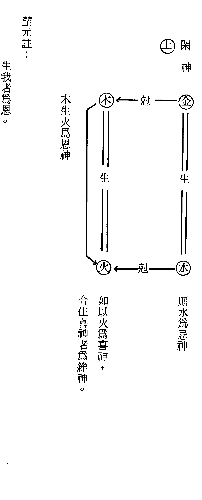
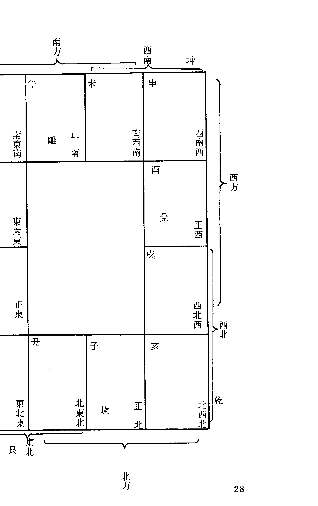
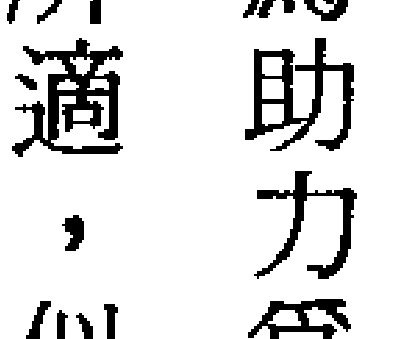

# 紫微堂奥

斗数發微論之命逢紫微，特壽且榮

# 第二卷

堃 元著

大孚書局印行

# 紫微斗數 詮註

# 紫微堂奥

# 第二卷

堃 元著

大孚書局

紫微堂奥系列【全拾卷】

- 第一卷 斗數總訣之希夷觀天星，斗數推命
- 第二卷 斗數發微論之命逢紫微，特壽且榮
- 第三卷 斗數太微賦之日月夾財，不權則富
- 第四卷 斗數骨髓賦之天門運限，扶身助命
- 第五卷 斗數骨髓賦之七殺朝斗，爵祿榮昌
- 第六卷 斗數骨髓賦之天祿天馬，驚人甲第
- 第七卷 斗數骨髓之左府同宮，尊居萬乘
- 第八卷 斗數骨髓之子午破軍，加官進祿
- 第九卷 斗數骨髓之丹墀桂墀，青雲之志
- 第十卷 女命骨髓賦之輔魁福壽，弼相福臨

ISBN 957-765-329-4 (293)

00350

F1563

9 789577 653291

東明文化圖書公司 $117.00 TEL:23425341

X 03 04

書店 $117.00

堃 元著

# 紫微斗數 賦文註 紫微堂奧 第二卷

大孚書局印行

# 自序

《紫微堂奥》以江西负子子潘希尹先生补辑之《新镌希夷陈先生紫微斗数全书》为蓝本而为紫微斗数赋文之精详诠注。卷一於一九八四年一月印行流通，笔者以当时已有之紫微斗数认知学涵，昼夜辛勤勤奋笔耕，作息失序，日以继夜，昼夜颠倒，不屈不挠，再接再厉的经历了二十八个月的殷勤刻苦笔耕，卷十终於一九八六年五月印行流通而竟诠注紫微斗数赋文之全功。大宇书局傅实泰先生有见於《紫微堂奥》为研读学习紫微斗数所不可或缺的最佳参考书，但因原著缺少作者序文而有美中不足之憾，情商拙愚为原著增补自序，以使读友不因原著无自序的小小缺失而抱憾，望元当仁不让於师，义无反顾的恭敬从所命嘱，浏览翻阅十卷而为此序。《紫微堂奥》共十卷；卷一精详诠注《合并十八飞星紫微斗数》一书之“紫微斗数总诀”，概说紫微斗数推命之使用星神与排布推命图的安星布斗。卷二呕心沥血的披沥诠注“斗数发微论”、“重补斗数殼率”、“斗数准绳”，附录“诸星问答论”（按：“诸星问答论”一称“星垣问答论”）。卷三为紫微斗数“太微赋”赋文诠注。卷四～卷九共六卷为...

# 目 錄

- 斗數發微論 .................. 一
- 略論斗數 .................... 四
- 四正吉星定為貴，三方殺拱少為奇 . 七
- 對照兮，詳凶詳吉，合照兮，觀賤觀榮 . 一三
- 斗數人生觀 ................. 一四
- 吉星入垣則為吉，凶星失地則為凶 . 二〇
- 命逢紫微非特壽而且榮 ....... 二六
- 身遇殺星不但貧而且賤 ....... 三二
- 左右會紫府極品之尊 ......... 四二
- 科權限於凶鄉功名蹭蹬 ....... 五三
- 行限逢乎弱地未必為災 ....... 六二
- 立命會在強宮必能降福 ....... 六四
- 羊陀七殺限運莫逢，逢之定有刑傷 . 六八

「斗數骨髓賦」賦文詮註，並於賦文文句列舉相當文句的命例以為習涉研究之參考。卷十詮註「女命骨髓賦」，附錄「補遺骨髓賦」、「形性賦」（按：「形性賦」與「諸星問答論」、「諸星入命限」互為參照融合，可以依據命圖星神而推想描繪此命圖本人之形性。）、「星垣論（按：星垣論附錄而未詮註。）、「紫微斗數漫談」。
今日增補為原著作自序，情不自禁的感慨：「老朽，老朽矣！任何盡得《紫微堂奧》，必然直窺盡斗數堂奧，更勝老朽被香港徒孫們抬舉謬譽為「斗數奇才，一代宗師」矣！」

林源田 墾元閒談論命館

二〇〇三年五月一日 墾元謹為序

住址：台中縣太平市新坪里育德路二四七號四樓
電話：（〇四）二三九一一三五一・二三九一八四二七

重補斗數毅率 ........................................ 一八三

篇楔 ........................................ 一八六

身命爲禍福之柄 ........................................ 一八七

紫微守命，輔弼同垣，其貴必矣 ........................................ 一八九

財印夾命，日月夾財，其富何疑 ........................................ 一九三

蔭福臨，不怕凶沖 ........................................ 二〇四

日月會，不如合照 ........................................ 二一七

貪狼居子，乃爲泛水桃花 ........................................ 二二九

天刑遭貪，必主風流刑杖 ........................................ 二三〇

紫微坐命庫，則日金舉捧櫥 ........................................ 二三三

輩臨官安文曜，號爲衣錦惹天香 ........................................ 二三五

太陰合文曲於妻宮，翰林清異 ........................................ 二三六

太陽會文昌於官祿，金殿傳臚 ........................................ 二三六

天哭喪門流年莫遇，遇之實防破害 ........................................ 七四

南斗主限必生男，北斗加臨必得女 ........................................ 七八

科星居於陷地，燈火辛勤 ........................................ 八五

昌曲在於空鄉，林泉冷淡 ........................................ 八九

奸謀頻設，紫微愧遇破軍 ........................................ 九四

淫奔大行，紅鸞羞逢貪狼 ........................................ 一〇六

命身相剋則心亂而不閑 ........................................ 一〇九

玄姤三宮則邪淫而耽酒，殺臨三位定然妻子不和 ........................................ 一一〇

巨到二宮，必是兄弟無義 ........................................ 一二七

刑殺守子宫，子難奉老 ........................................ 一三六

諸凶照財帛，聚散無常 ........................................ 一四三

羊陀疾厄，眼目昏盲 ........................................ 一四五

火鈴到遷移，長途寂寞 ........................................ 一四七

尊星列賤位，主人多勞 ........................................ 一五九

惡星應命宮，奴僕有助 ........................................ 一六五

官祿遇紫府，富而且貴 ........................................ 一六七

田宅遇破軍，先破後成 ........................................ 一六七

# 目錄

斗數準繩……二七七

斗數準繩序論……二八〇

附錄……二八五

諸星問答論……二八七

談星要論（摘錄紫微斗數全書）……三〇九

論男女命異同（摘錄紫微斗數全書）……三一二

論命先貧後富（摘錄紫微斗數全書）……三一三

論大限十年禍福如何（摘錄紫微斗數全書）……三一五

論行限分南北斗（摘錄紫微斗數全書）……三一六

跋……三一六

# 紫微堂奥

祿合守田財，為燴穀堆金……二三七

財蔭居遷移，為高商豪客……二四〇

耗居敗地，沿途乞求……二四六

貪會旺宮，終身鼠竊……二四七

殺居絕地，生成三十二顏回……二四九

日在旺宮，可學八百年之彭祖……二五三

巨暗同垣於身命疾厄，羸瘦其軀……二五四

凶星交會於相貌遷移，傷刑其面……二五八

大耗會廉貞於官祿，架枷囚徒……二六二

官符會刑殺於遷移，離鄉遠配……二六六

七殺臨於陷地，流年必見死亡……二六八

耗殺忌逢破軍，火鈴嫌逢太歲……二六九

奏書博士並流祿，以喪乎吉祥……二七〇

力士將軍與青龍，以顯其威福……二七二

童老限遇殺必驚……二七四

一世迍邅，命限逢乎駁雜……二七五

# 斗數發微論

白玉蟾先生曰：「觀天斗數與五星不同，按此星辰與諸術大異——」

四正吉星定為貴，三方殺拱少為奇。對照分，詳凶詳吉，合照分，觀賤觀榮，吉星入垣則為吉，凶星失地則為凶。

命逢紫微，非特壽而且榮，身遇殺星，不但貧而且賤，左右會紫府，極品之尊，科權限於凶鄉，功名蹭蹬。行限逢乎弱地，未必為災，立命會在強宮，必能降福。羊陀七殺，限運莫逢，逢之定有刑傷（劫空傷使在內合）

天哭喪門，流年莫遇，遇之實防破害。南斗主限必生男，北斗加臨必得女，科星居於陷地，燈火辛勤，昌曲在於空鄉，林泉冷淡，奸謀頻設，紫微愧遇破軍，淫奔大行，紅鑾羞逢貪宿。

殺臨三位，定然妻子不和，巨到二宮，必是兄弟無義，刑殺守子宮，子難奉老，諸凶照財帛，聚散無常，羊陀疾厄，眼目昏盲，火鈴到遷移，長途寂寞，尊星列賤位，主人多勞，惡星應命宮，奴僕有助，官祿遇紫府，富而且貴，田宅遇破軍，先破後成，福德遇空劫，奔走無力，相貌加刑殺，刑剋難免。

後學者執此推詳，萬無一失！

## 略論斗數

——觀天斗數與五星不同，按此星辰與諸術大異——

紫微斗數總訣曰：希夷仰觀天上星，作為斗數推人命，不依五星要過節，只論年月日時生。

此言紫微斗數大膽的突破一般以生辰推測宿命必須查定節氣的方法，既不同於子平，亦不同於星宗，更與鬼谷子算命術或其他推命術之不同，所以紫微斗數別樹一幟，有其獨特方法，研習斗數就應該以斗數的方法為根據。

### 一、斗數概義

——摘錄鄭稼學著紫微鏡銓——

斗，量也，斗宿也，乃宿也，乃用斗宿數尊卑量計吉凶也。
數，算術也，定命之如氣數、劫數，認定命可以用算術推算也。

據說唐開元中，改中書省為紫微省，以中書令掌佐天子執大政，有藩臣匡衛之義，取象於紫微。（據名義考，一說唐中書省，多植紫微，故號紫微省。）後宋呂本中撰書一卷，辯證經史疑義，論議醇實，時人以呂本中曾官拜中書，故稱其書為紫微雜說。可見唐宋古人甚愛取義於天官，所以紫微斗數出自唐宋，是一種以紫微、星宿推算運命的命學。

望元附按：讀諸星問答論，每見某星在斗司某，在數司某，始以不明所指，囫圇記憶至為困難，漸而得悟其文，在斗者，安星佈斗也，即星曜表現於當生命盤之意義；在數者，星曜運行軌跡也，即星曜表現於流年運限上吉凶的趨向，換句話說，星曜在命圖上雖然沒有變動，守纏與值限卻有不同的代表意義，在數者即指星曜值限所代表的吉凶意義。知此，讀諸星問答論則易讀，亦便捷運用於斗數論斷。

### 二、紫微概義

據說唐開元中，以中書省多植紫薇，改中書省為紫薇省。

紫薇，落葉亞喬木，高丈餘，樹皮滑澤，葉橢圓形，對生，花紅紫或白，花瓣多皺襞，夏日始開，秋季方罷，故又名百日紅。

一般言命數則以天文意識涵蓋，因此有不習斗數者錯覺學斗數即使不能通澈天地，最少也知天文星象，因此把紫微直覺為今日小熊星座中的北極星，並且亦無人疑義。

正視斗數諸星問答論云：「紫微屬土，迺中天之尊星。」、「觀乎紫微舍纏司一天儀之象，卒列宿而成垣。」，是亦指斗數紫微取義於星象之北極星。

紫微恆居於紫微垣，為漁船航海家星夜指北的明星，為航行辨認方向的指標，經取用於斗數而成爲人命人生旅途的指標，成為宿命吉凶的代表字記，所以研習斗數大多偏重吉凶禍福的表示意義，事實上已經離開了天文星象的範圍，實難想像紫微斗數與星象有直接密切的關聯。

### 三、斗數亦注重節氣

斗數推命術在表面上看來，好像不重視節氣，甚至於漠視於節氣的變化，其實斗數推命的依據也無法離開節氣的範疇，因此才有調適閏月的必要。更且歷代曆法的製訂，不但預測著節氣的更替，而且也間接觀察記載著時序，每遇有曆法與時序不符，即須更改曆法，亦由於曆法不斷的調適配合節氣，所以斗數雖然可以不必查閱節氣，事實上還是沒有離開節氣的影響左右範圍，其所異於其他諸術，只是表微方法的差異而已，實質上還是沒有脫離陰陽五行生剋制化的原理。假定曆法與節氣時序發生脫誤不符，今日不用推查節氣的飛星紫微斗數大概也只像透派紫微斗數一樣的翻開推算節氣，或者必須更改調適一番才能夠仍然準驗的推測人之宿命吧！

### 四正吉星定為貴，三方殺拱少為奇

斗數議論，俱以「主事」之三方四正論斷，不離陰陽五行三合沖剋之理，一般初習斗數對於陰陽五行認識淺薄或模糊，很難適應三方四正議論之方法，大多僅以本宮星曜吉凶論禍福而已。白玉蟾先生為使後學認識斗數，因此強調三方四正議論之方法，以要求斗數能夠達到精微準驗之程度，亦得符合五行刑沖剋害之理旨，所以講究斗數如果不能三方四正論斷，即困難體會斗數的精妙！斗數星曜分別依據生年月日時安定，星曜繁復，難免吉凶雜列並處，簡單的觀察原則就是四正宮俱見吉星，大抵可斷富貴，尤其是三方宮位中的凶惡煞星越少越難得，以免三方中出現的凶惡煞星拱沖破壞了本宮的吉利富貴。

### 一、宮位概念

斗數十二宮分別主事著不同的人際關係，不論男女俱從逆轉排定：

- 1. 命宮
- 2. 兄弟宮
- 3. 夫妻宮
- 4. 子女宮
- 5. 財帛宮
- 6. 疾厄宮
- 7. 遷移宮
- 8. 奴僕宮
- 9. 官祿宮
- 10. 田宅宮
- 11. 福德宮
- 12. 父母宮

十二宮各主一事，如命宮表示一個人的個性、容貌、才能，一生發展情況，以此宮星曜吉凶

配合三方觀察一生命運概況，而大限所臨之宮，亦為大限「命宮」，小限所臨宮，亦為小限「命宮」……。其餘諸宮亦復如此，請參考「斗數玄關」之論斷概念。

#### 本宮

凡主事之宮即為本宮，如論財帛，財帛宮主財帛，即為本宮。當生財帛宮星曜吉凶表示一個人錢財經濟及事業財運的概況，再詳細的由小限之財帛宮表示小限之財帛概況……。凡論本宮，其所主事之吉凶在其主事時效中表現吉凶。

#### 對宮

本宮六沖位之宮，即與本宮相對相沖之宮位，如命宮之對宮為遷移宮，夫妻宮之對宮為官祿宮……，對宮亦稱為對方，其星曜吉凶對於本宮為沖、為朝，或為沖照。

#### 合宮

與本宮形成三合之宮位，如本宮在子，辰子申三合，辰宮與申宮即為本子宮之合宮，在本宮前五位為左合，在本宮後五位為右合。如論官祿事業，對宮為夫妻宮，左合為財帛宮，右合為命宮，合宮星曜之吉凶對於本宮為拱照，吉為協，凶為替。

#### 三方

本宮之對宮合宮對於本宮共為三方，因三方星曜對於本宮有影響作用，所以發微論曰：「三方殺拱少為奇。」

#### 四正

本宮與對宮、合宮同時之總稱省略用詞為四正，斗數為求賦文工整對襯或於批斷用辭之習慣，有時也重複三方而稱三方四正，所指亦只四正而已。凡看終生、大限、流年、流月、流日俱要用四正論斷。

#### 鄰宮

本宮相鄰之兩宮同時稱為兩鄰，如只一宮稱為鄰宮或鄰方，其星曜吉凶對於本宮影響作用略次於三方影響作用，吉為輔，為扶持，凶為迫，為挾侮，兩鄰同時俱吉為扶持，俱凶為加夾。鄰宮星曜吉凶大多不見實際影響作用，所以亦有疏忽而不予考慮觀察，但臨脫限之時則不可疏忽。

#### 四面

凡本宮、對宮、合宮、鄰宮共六宮之同時稱為四面（亦有以四正為四面），為恐與四正混淆而別稱為八方。

#### 八座

談星要論曰：身、命、遷移、財、官、福德六宮，名曰八座。俱在成照，聚吉化吉，富貴高壽，六宮俱陷，聚宮化忌，天壽貧孤，若卯酉時生人者尤（按：卯酉時生人命身沖照故。

### 一、地支宮位概念

斗數十二宮有人際關係，如命、兄弟、夫妻……之區分，有主事宮位，如本宮、三方……之別，但於註釋解釋時最常用地支宮位，是亦略釋於下：

- 六陽宮
凡子、寅、辰、午、申、戌六宮同時，共稱為六陽宮。
- 六陰宮
凡丑、卯、巳、未、酉、亥六宮同時，共稱為六陰宮。
- 四正宮
凡子、卯、午、酉四宮同時，共稱為四正宮。子為木命之沐浴地，卯為火命之沐浴地，酉為水命之沐浴地，又稱為四桃花地或四敗地（按：沐浴亦稱敗氣

四隅宫 凡寅、巳、申、亥四宫同时，共称为四隅宫。寅为火命长生之地、金命绝地，巳为金命长生之地、水命绝地，申为水命长生之地、木命绝地，亥为木命长生之地、火命绝地，又称四生地，或称四绝地。亦有以天马只行寅申巳亥四宫，称之为四马之地。
四墓宫 凡丑、辰、未、戌四宫同时，共称为四墓宫。丑为金墓，辰为水土墓，未为木墓，戌为火墓，是称四墓宫，或称孤独地。

### 三、十喻歌

- 吉凶最要细分名，本对合邻有轻重，
- 四面楚歌终必败，千祥云集自然亨，
- 自强才是好人家，邻舍惟添锦上花，
- 若到逢源真境地，春风只可感相差。
- 两邻相侮岂为灾，自伐才教大可哀。
- 易躲当头一棍棒，难防左右袭兵来。

（按：星曜最要本方吉，如本宫凶，虽邻方吉，亦不能为助。）
（三方吉凶，以合方之吉胜于对冲之吉。）
（本宫得凶最凶，如本方吉，邻方虽凶，亦不能为侮。）
（本方吉，对方凶冲动力少，对方之凶不若合方之凶，如三方俱凶，本方吉亦无用。）

### 四、观方十喻

本方、对方、合方、邻方、诸方之为吉为凶各有重轻，未可一律等量而视，爰举十喻以揭其精蕴。

- （一）、本方吉，谓之由内自强。
- （二）、本方凶，谓之从根自伐。
- （三）、对方吉，谓之迎面春风。
- （四）、对方凶，谓之当头恶棒。
- （五）、合方吉，谓之左右逢源。
- （六）、合方凶，谓之左右受敌。

- （七）、鄰方吉，謂之兩鄰相扶。
- （八）、鄰方凶，謂之兩鄰相侮。
- （九）、方宮皆吉，謂之千祥雲集。
- （十）、方宮皆凶，謂之四面楚歌。

### 對照兮，詳凶詳吉，合照兮，觀賤觀榮

斗數論斷，大抵先觀察主事本宮星曜吉凶，次看三方星曜吉凶，如本宮星曜主吉，三方又無殺湊，正是四正吉曜必主富貴，但若三方吉凶雜駁，應該如何論議？！三方吉凶雜駁，大抵以合方之吉凶作用強於對宮之吉凶，雖然不能一概議論，但若實際加以深入探討，三方吉凶對於本宮的作用也有微妙的區別，對宮星曜吉凶對於本宮星曜之吉凶，猶如注水入於粉劑溶液之中，具有調適沖釋本宮星曜吉凶的作用；合方星曜吉凶對於本宮星曜之吉凶，猶如水火之滋養草木，具有滋養刺激本宮星曜吉凶作用。假令議論命宮吉凶而言，遷移宮之吉凶表示本命環境變遷之吉凶，左合為官祿宮，其星曜吉凶能表示其人官祿高低以增加區辨本人社會身分地位之貴賤評價，右合為財帛宮，其星曜吉凶能表示其人財帛貧富以增加區辨本人財帛衣食享用之榮枯評價。議論諸宮主事事項，大抵亦做此觀察論斷。

> 茲引鄭稼學之「斗數人生觀」於后，以增加學者對於斗數三方四正論議之觀念——## 斗數人生觀

人為萬物之靈，其異於禽獸者為智慧思想與分辨善惡之心，古之聖賢為激勵吾人向善求善，最著名的有孟子倡導性善說，主張人之初性本善，有荀卿倡導性惡說，主張人性本惡，所以凡人俱要誠正修身以求善，有董仲舒倡導性禾善米，主張性無善惡，善如米，性如禾，禾雖出米，而禾未可謂米也，性雖出善，而性未可謂善也，所以亦要誠正修身實可得善。斗數雖然沒有著說立論，但把現實的人生體認溶寓於命數之中，實已於命數之中表現斗數之人生觀也。今假令男生於歲次甲子年一月一日子時吉誕以為說明——祿存獨守命而無吉化，乃看財奴耳。意味人性潛在著自私自利的求生貪婪本能，但人命為天之福善所鍾，是以誕生為人。天馬同祿存守命，是為祿馬交馳，愈為辛奮努力愈得收穫，但截路空亡沖照，以表示人生奮鬥之辛苦耕耘亦難免有收損耗或無收成，所以天機太陰同守於遷移宮，表示人生環境上的阻礙必須運用智慧思想加以克服排除，象徵忙碌中能表現才能，而且急於表現克服困難的才能。一以表示人命脆弱，初生有賴父母呵護養育，缺乏自生自長的能力，所以凡人之能長大成人，實父母恩養之功，為人豈可不孝？此實寓「百行孝為先」之至意。一以表示人老年邁體衰，無法活一百歲而挑一百斤，人生辛勤一世，唯求晚年適意享福，所以亦寓勉人把握時光，莫把年青力壯的黃金年華虛擲淚拋的至意。一寓人生七十古來稀之人生平均壽限，如得長壽，已享五福之一，是亦可滿足也。因此說斗數人生觀為積極奮鬥的人生觀亦不為過！ 祿存守命雖不無自私自利之貪婪，及須要別人重視的意識，但因其人慈厚、信直、通文濟楚，而且性貌如春，與人和藹相處，是易得貴爵，並享遐齡。試觀人生在世，為人處世之要，豈不 己為祿存守命所表現無遺？ 又看福德宮有天同，主人樂觀開朗，有福有壽且快樂，則人生亦當樂觀達觀，則祿存之貪婪成爲節儉之美德，更有文曲左輔同守，豈不表示安分樂道，知足而常樂？豈不亦表示人生在世與 其無限制的追求慾望的滿足，反不如能夠剋制不應有的慾望乎！ 再看巨門守財，主白手成家，其賺錢機會多不屬經商收益，大多由學術、訴訟、音樂而賺錢 。常於競爭中勞苦得財，而於中晚年發財，常因自負驕傲而橫破。此豈不已道破財帛為動產，並寓吾人不可輕貧重富之仁乎？ 財帛宮更得文昌以表示富足，得右弼以象徵理財而富足，則吾人但得錢財富足，雖不巨富亦 足矣！ 又看太陽守於官祿宮，表示為人具有才能魄力，適合於各種職業，在競爭性、開創性的職業上能順利爬陞，甚至於因為對宮之天梁沖照，有承襲祖業而發展成功之可能，尤其是天梁具有敬 業樂業與守成之精神，所以只要能夠敬業樂業而勤奮不懈，任何人都能達到事業上的成就。 但是太陽在廟地化忌雖然不忌，但有哭虛二星同守，則表示官祿事業之阻撓虛耗，難免有人 事之競爭、同行之競爭，更見左合之巨門，則表示事業職位常於競爭中勞苦而獲得，此豈不亦寓 創業唯艱，守成不易之至理乎？ 再看田宅宮武破化吉坐守，三方並不全美，更武破實有破蕩家產田宅之惡根，雖然有紫相天 魁朝拱之吉，有科權祿逢會之美，當主有田宅而且有令人羨慕之聲名，實亦吉處藏凶，如不兢敬 守成，勤奮不懈，則恐有破敗、蕩然無存之慮，尤以此田宅宮與命身宮寅巳相害，更以寅刑巳， 身主火星有個性剛強易怒之傾向，如果意氣用事，荒嬉無度，恐亦有破敗之慮。此豈不誠人勤 奮有恆、和平處事之理。 繼看天梁守於夫妻宮，有家庭主權操持在女性手中，夫妻相敬如賓，感情和睦。而以太陽對 宮沖照，表示男主外女司內，雖然家庭主權操持在妻子手中，但對外看來，丈夫仍為一家之主， 表現相當的尊貴。 夫妻宮合方之星曜表現得特別生動細緻，太陰象徵情人眼中出西施，能得優美高雅之配偶， 天同表示能得聰明美貌之賢內助，大抵可稱為神仙眷屬，但天機表示妻子任性或倔強，文曲左輔 表示本命有拈花惹草的潛意識，恐有外遇而發生感情困擾糾紛，所以用太陽化忌及哭虛沖照，表 示夫妻生活雖然最為親密，如果以自己的立場尺度要求妻子十全十美，亦難免夫妻磨擦齟齬，是 見截路空亡阻礙婚姻生活。觀此實足為夫妻婚姻生活之寫實與儆惕！ 另看父母宮只得擎羊獨守，又紫府相朝拱，雖無礙於父母親情，但見空劫天刑，適足於表示 本命之受父母呵護養育，實為父母之「累贅」，所以有獨立離祖退祖之傾向。此亦表示斗數寓隱獨立奮鬥之人生觀也！

再看兄弟宮星曜駁雜，表示人生在世與兄弟朋友姊妹親戚之相處最為奧妙，既不能肯定同胞之多寡與情誼，如果心胸開放為人熱情，則以廉貞化祿，相生有兄弟，更得魁鉞守照而象徵在家靠父母，出外靠朋友而處處受朋友幫忙提攜，但以陀羅坐守，則表示結交朋友固然可以得到朋友之幫助，有時亦難免受到朋友之拖累麻煩。此實亦現實生活之寫照也。

又看天相守子女宮，表示為人子女一般多重體面而愛裝飾，更因空劫同守，以表示子女的思想行為在成人的標準衡量下變得虛空邪僻不行正道，甚至諸多浪費，但以天相而表示子女成龍鳳之心態，為人父母大多能注意及子女之自尊感，肯予裝扮子女並栽培子女，所以能有成器成功之子女。

子女宮之趨向，更以武曲沖動表示與子女相處之困難以及子女之不聽話，以破軍沖動表示子女個性特別剛強以及浪費，甚至於親緣薄弱，用天機表示子女腦力聰明而具特殊才能，用太陰表示子女精神發達，感受性強烈，又以擎羊表示父子代溝、親緣薄弱，如果不能教育並與子女相處，則不僅難望子女成為龍鳳，子女也有不長進之可能，甚至於親情薄弱，有子而若無也。此豈不亦強調子女親情教育之重要乎？

又看疾厄宮所表示的線索亦極為貼切，紫微貪狼俱主健康少有疾病，但以擎羊沖陀羅拱，則童幼年比較容易災病，或唇齒頭面有傷破、四肢傷殘，不然則由飲食不正常而導致脾胃毛病，或因工作操勞而發生肝病，或性隨便而得生殖病或性病，最少也因為紅鸞天姚之沖拱而表示「食色性也」竊窕淑女君子好逑」之心理傾向。是故，人俱好好色，亦當適可而止。

奴僕宮之吉凶也刻劃入木，天府一星表示奴僕得力，一呼百諾，與朋友部屬相處很好，而且能夠受到協助擁護，但是七殺與羊陀俱到，則表示要能知人善任，也要有領導統御之才能，否則難免部屬陽奉陰違，甚至於怨主背主不能得力，更且因其虧空盜財而蒙受其害。

綜觀上述諸端，斗數透過命數論斷，真切而逼真的刻劃描述人生哲學的至理，以及激勵吾人身體力行以行善向善的至意，實足以使人研習斗數而激發實踐奮鬥積極進取的人生觀，而不以斗數為推命數之預測宿命吉凶而忽略斗數人生觀的哲學內涵！

## 吉星入垣則為吉，凶星失地則為凶

重補斗數彀率曰：諸星吉多，逢凶也吉，諸星惡多，逢吉也凶，星更纏度，數分定局，重在看星得垣受制，方可論人禍福。
斗數準繩亦曰：辨生剋制化以定窮通，看好惡正偏以言禍福；官星居於福地，近貴榮財，福星居於官宮，卻成無用。
綜而觀之，凡習斗數，見解大致相同，最簡單的辦法是以研習斗數的直覺判斷：「四正吉星定為貴，三方殺拱少為奇。」，獲得吉凶概念之後，馬上就應該星曜守值宮纏入垣失陷，星曜職司是否怡當。

### 一、星曜分類概念

-   十四主曜：紫微、天機、太陽、武曲、天同、廉貞（上六星為紫微系六星），天府、太陰、貪狼、巨門、天相、天梁、七殺、破軍（上八星為天府系八星）。
- 十九正曜：十四主曜加祿存、左輔、右弼、文昌、文曲，共十九星為甲級正曜。十四主曜尋紫微安，祿存依年干安，輔弼依生月安，昌曲依生時安。
- 六偏曜：天魁、天鉞、擎羊、陀羅（上四星依生年干安），火星、鈴星（上二星依生年支安），六星為甲級偏曜。
- 四化星曜：簡稱化曜，依年干尋十九正曜變化為化祿、化權、化科、化忌，為甲級化曜。
- 雜曜：有稱為副曜，除上述正偏化曜之外，俱為雜曜，分列為乙丙丁戊級星，復多不及備載，從略。
- 北斗七星：貪狼、巨門、祿存、文曲、廉貞、武曲、破軍。
- 南斗六星：天府、天梁、天機、天同、天相、七殺。
- 中天星曜：紫微、太陽、太陰、天馬、天刑、天哭、天虛……。
- 四吉：祿、權、科、貴為四吉。祿者化祿、祿存，權者化權，科者化科，貴者天魁、天鉞。
- 四凶：擎羊、陀羅、火星、鈴星為四凶，亦稱四殺。
- 四輔：文昌、文曲、左輔、右弼。
- 六吉：天魁、天鉞、左輔、右弼、文曲、文昌。
- 六凶：擎羊、陀羅、火星、鈴星、天空、地劫為六凶神，亦稱為六煞星。羊陀火鈴為四殺，為甲級偏曜，空劫為乙級雜曜，為凶神。

### 神煞

博士、力士、青龙、小耗、将军、奏书、蜚廉、喜神、病符、大耗、伏兵、官府（上十二星寻禄存安，为十二宫太岁煞禄神。），岁建、晦气、丧门、贯索、官符、小耗、大耗、伏兵、官府（上十二星寻禄存安，为十二宫太岁煞禄神。），将星、攀鞍、岁驿、息神、华盖、劫煞、灾煞、天煞、指背、咸池、月煞、亡神（上十二星寻太岁安，为岁前诸星。），将星、攀鞍、岁驿、息神、华盖、劫煞、灾煞、天煞、指背、咸池、月煞、亡神（上十二星寻太岁安，为岁前诸星。），有将二星寻流年支所属地支五行合局之帝旺位安将星，为将前诸星，俱为偏曜。），有将流年四杀丧门、吊客、白虎、官符。飞天三杀奏书、将军、直符。五行生旺十二神亦列于神煞，从略。摘录斗数骨髓赋——

### 二、星曜缠度明暗概念

一般论星曜吉凶，大抵以星曜所表现吉凶或然率而定，尚要看星曜缠度以定庙旺利陷，以星曜过度十二宫宜忌以论吉凶，所以解释星曜缠度明暗于下：
- 庙：星曜入庙最明，得数最强，吉曜极吉，凶曜不凶。
- 旺：星曜旺地次明，得数次强，吉曜上吉，凶曜不凶。
- 得地：星曜得地光明，得数适度，吉曜吉，凶曜不凶。
- 利益：星曜利益尚明，得数渐弱，吉曜下吉，凶曜渐凶。
- 和平：星曜和平已弱，得数亦弱，吉曜力微，凶曜肆凶。
- 不得地：星曜不得地，星光已暗，得数最弱，吉曜无力，凶曜愈凶。
- 落陷：星曜落陷无光，无数可得，吉曜无用，凶曜最凶。
望元按：斗数衍出于果老星宗，星宗每言星曜入庙升殿，入垣喜乐，今之斗数学者俱未考定星曜庙旺利陷之实质，忖胆子平衡术之变通星比肩、劫财、食神……等似乎有可相通，而却缺乏门路可寻，所以欲明星曜庙旺利陷，仍以旁考果老星宗为佳。

### 三、星曜落闲概念

果老星宗有闲神、极闲宫，意义亦晦涩，子平亦有闲神，意五行属神暂时不与用神发生直接关系之干支，斗数亦有星曜落闲，凡星辰落闲之宫缠对于落闲星辰来说即为闲宫。
慧心斋主曰：星曜的优缺点及力量是中性的，必须要依其所会照的其他星曜，来决定它的性质或力量。

鄭稼學曰：「星曜的優缺點被限制，必須要依據會照星曜來決定它的性質和力量。比喩星曜如龍馬被養於馬房，「古來真龍駒，未必置天閒。」（見陸遊詩），臆或爲後人所增益。

定十二宮星辰落闕：
紫微在子辰亥爲闕宮
天機在巳爲闕宮
武曲在申爲闕宮
貪狼在寅申爲闕宮
天相在辰戌爲闕宮
天梁在巳酉爲闕宮
七殺在辰亥爲闕宮
破軍在巳申爲闕宮

望元按：竊考廉貞入男命吉凶訣曰：「廉貞落陷入闘宮，吉曜相逢也有凶，腰足災殘難脫厄，更加惡殺命該終。」又天同入男命吉凶訣曰：「天同守命落闘宮，火陀殺合更爲凶，天機梁月來相會，只好空門度歲中。」則天同、廉貞亦有闘宮，更與貪狼、天梁、七殺等論訣比較，凡星曜落闊，優點太多被限制不能發揮，其缺點則表現得強烈無遺。

茲引子平喜忌恩怨闕紆六神示意圖於后，以爲研究斗數星辰落闕之參考：



## 命逢紫微非特壽而且榮

### 一、南人北人概念

紫微為官祿官主星，希夷先生曰：紫微為帝座，在諸宮能降福消災，解諸星之惡虛，能制火鈴為善，能降七殺為權，若得府相左右昌曲吉集，無有不貴，不然亦主巨富，縱有四殺沖破，亦作中局。是故知紫微代表尊貴、氣質，命逢紫微當主富貴，但紫微亦主長命之星，則知者不多。

> 補遺骨髓賦論壽天詩曰：『貪狼入廟最高強，南極星同壽命長，北斗帝星無惡煞，綿綿毫釐衍禎祥。』

本此而言，貪狼、天同、紫微俱為主壽之星則無疑義，更看「定富貴貧賤十等論」，首以「福壽論」為揭，曰：如南人天同天梁坐命廟旺，主福壽雙全；如北人紫微武曲破軍貪狼坐命旺宮主福壽。

又及重補斗數骰率有曰：『日在旺宮可學八百年之彭祖。』，天機為益算之善星，希夷先生曰其為益壽之星，天府乃南斗廷壽解厄之星，祿存主人貴壽掌人壽基，是亦太陽、天機、天府、祿存也為主壽之星。

望元初習斗數，不明南人北人、東南生人之義，初以為所指為地理方位，如台北之對於台中為北，台南之對於屏東為北，高雄之對於彰化為南，台東之對於花蓮為南，河北山東之對於福建臺灣為北，菲律賓之對於日本韓國為南，那座如何確定地理方位的中央據點呢？是以斗數發源之河洛？是以觀察星象之北京京畿？或以推測斗數宿命的處所為依據？

今每見術士強調於斗數命盤上記載出生地或居住地，私忖其已明確確定斗數宿命的地理方位，後經鑽研探討，斗數之言南人北人，固以安命於命圖上之宮纏方位而決定，不以地理方位為劃分，此理正與「八宅明鏡」東四命西四命之理相通，則強調出生地、居住地之流腦其或如以前之望元，對於南人北人之詮註惚有所得而為之難免為之困惑吧？

斗數命盤方位之理，不能離開易理八卦，不能離開星宿分野之方法，是以子坎為正北，卯震為正東，午離為正南，酉兌為正西，加夾子午卯酉四正者從其方位，亥子丑為北方，寅卯辰為東方，巳午未為南方，申酉戌為西方。細而分之，丑寅艮為東北，辰巳巽為東南，未申坤為西南，戌亥乾為西北。亦有人更詳分丑為北東北、寅為東北東……不贅。茲附圖以明方位之印象：

### 二、壽星概念

紫微等為壽星，星曜性質各有不同，但如紫微入男命吉凶訣曰：「紫微守命最為良，二殺逢之壽不長，羊陀火鈴來相會，只好空門禮梵王。」，雖得壽星守命亦未必長壽，猶要三方四正無惡殺，所以觀察斗數星曜最要三方四正論議，大抵以「四正吉星定為貴，三方殺拱少為奇。」 觀察斗數星曜，不止可以瞭解斗數，恍惚也可以從瞭解壽星性質約略體會吾人養生長壽之道 ，茲就望元一己之愚見列述於下：

紫微司掌「尊貴」、「氣質」，以養尊處優而長壽。大抵有紫微守命無惡殺，即可以天同坐守疾厄宮而健康有壽。

天機司掌「智慧」、「精神」，以心性好善、孝義六親、勤於禮佛，無不仁不義之為為。

太陽司掌「光明」、「博愛」，以聰明慈愛，量寬大福而享遐齡。（按：太陽守命，必廉貞守疾厄宮，雖然襁褓災瘡，恐有腰足之疾，但以量寬，胸襟開豁而健康長壽。）

武曲司掌「財富」、「武勇」，與天府同守命於子，以天府之「才能」、「慈悲」而有壽。

天府司掌「才能」、「慈悲」，乃南斗延壽解厄之星，具有強健的體魄、堅毅的生命意志，更且胸懷坦蕩，在一般狀況下有強韌的生命力，臨災有救，所以生活生存的意志亦



### 三、命運紫微非特壽而且榮

命逢紫微，由前述「壽星概念」可知主壽，更因希夷先生之詮釋，有未能盡體其意者斷章取義，形成普遍的「無有不貴，不然亦主巨富。」的錯覺，但觀人生紫微守命不乏坎坷貧窮之人，此豈希夷先生解釋之真諦？

-   **天同**：司掌「溫順」、「融和」，亦以和平為處世之本，心胸平和而又得適當休息，亦為長壽的要件之一。
- **貪狼**：司掌「慾望」、「物質」，以旺盛的生命精力從事名利事業物慾的追求，自然培養勤勞不懈的良好習慣，尤以遇會天相破軍而延壽。
- **天梁**：司掌「恆常」、「統率」，以性情磊落，厚重溫謙，循直無私，臨事果決，是以生活正常、心無掛慮而長壽。此亦以天府坐守疾厄宮，主災少、臨災有救。
- **破軍**：司掌「破損」、「消耗」，以其破損消耗性為開創性、突破性之可以評價的事物而言，其所表現的旺盛生命力亦不下貪狼，何況又得天梁坐守疾厄宮，身體健康，一生少疾病。所以一個人無災少病亦得長壽。
- **祿存**：心慈耿直，天之福善所鐘，當得勢而享祿爵，有欲人敬重而自重之確實，以生活確實而心安理得而享長壽。

心慈耿直，天之福善所鐘，當得勢而享祿爵，有欲人敬重而自重之確實，以生活確實而心安理得而享長壽。

### 四、紫微星特徵

斗數將紫微比喻成天子，就如帝王一般領袖眾星，具有至上威權，喜歡發號施令，但天子帝王有堯舜湯武之賢，有夏桀商紂之暴，或如周平王東遷後之春秋戰國時代的周室皇帝，力量薄弱，徒具天子之尊，需要依靠諸侯的力量來維持天下秩序的安定。

紫微很恰當的被比喻為帝王，具備帝王莊嚴恢宏之氣勢與威嚴——尊貴、氣質——，但以其唯我獨尊，其內心也有帝王的孤獨寂寞，所以斗數得紫微守命之人，大多表現下列之特徵：

-   **(一)、** 形貌厚重，腰背肥滿，面清白者出身於養尊處優之富貴世家，面紫色者（血氣紅潤而被曬黑）大多出身於中低下家系，即為世家子弟必也勞動人家。個性謙恭耿直，為人忠厚老成，態度從容穩重，但有內心自負的傾向。
-   **(二)、** 男性得紫微守命，主聰明而且很有才能，將來的身分一定會比原來出身的家庭高，並且有令人想像不到的大成功大發展。但是紫微容易受外界影響，在有些成就之後，很容易發生依賴別人的心理，或難免感情用事而不能有突破超越既有的成就，僅只比原來家庭稍有成就而已。
-   **(三)、** 女性溫和而聰明嫻淑，美豔中透露著尊貴而趨於冷豔，是一般男性所喜愛的具備內涵氣質的女性，所以紫微守命之女性大多能嫁給有身分地位的男人，常有因婚姻而提高身分的趨向，或嫁給自己心許的男性。
-   **(四)、** 不論男女，在其生活環境中有突出的表現，或以形貌、氣質、才華、才能受人注目，在其生活環境中無形中成為小環境中的領袖。有隱藏感情、不願求助於人的孤獨傾向。
-   **(五)、** 紫微守命之人大都有順遂的生命歷程，但有因為幼年被長輩寵愛而難免養成任性、獨斷專行的性向缺點，因此容易被人誤會為驕傲自負而敬遠。但以武曲財居財位，廉貞官祿主居官祿，所以在經濟與事業上能有超越出身環境之成就。此正是「英雄不論出身低」之寫照呀！

## 身遇殺星不但貧而且賤

研習斗數雖知其精要溶寓於諸星問答及諸篇賦文，每因賦文文簡義約，稍有疑義窒礙，甚難旁考求證，舉以「身遇殺星」而言，即有三種可能之解釋——

（一）、七殺守照身宮
諸星問答曰：「七殺主於身，定歷艱辛。」

（二）、身宮逢會殺煞星
斗數殺星不止七殺一星，羊陀火鈴為四殺，四殺空劫為六煞，更見許多神煞皆具有殺煞破壞命運格局之作用，所以斗數骨髓賦曰：「命衰、身衰、限衰，終身乞丐。」、「夾空夾劫主貧賤，夾羊夾陀為乞丐。」，則此義近於「身遇殺星不但貧而且賤。」

（三）、命身遇殺煞星俱從論之
斗數用辭文簡義約，有時為求求字句對仗工整變化，常有命身含混使用現象，旁考果老星宗命身互為守照，如不深入星宗甚難區分命身，反觀斗數，身宮只與命、福德、官祿、遷移、財帛、夫妻六強宮相併同併，不論身宮居於何宮，對於命運格局亦有實際影響，所以七殺守命，身宮又逢會殺煞星之各種情形亦有研究考慮之必要。

### 一、身宫概念

慧心斋主曰：命宫为先天运势，身宫为后天，研究命盘时，以命宫为主，身宫为辅，配合迁移宫，事业宫，财帛宫，福德宫，可瞭解终身命运。若代表先天的命宫较差，身宫吉，则后天的努力，可以改造命运。若先天运势较好，后天较弱，则虽遇困难，亦能努力克服。（附按：此强调奋斗进取，不向命运屈服低头之人生观。）

郑稼学曰：身宫为补命宫之不足，如命宫偏向于内在个性，身宫偏向于外表形貌，如命宫表示为先天命运之趋向，身宫则表示后天命运之倾向。身宫只与命、夫妻、财帛、迁移、官禄、福德相并同宫，以命身同宫者命运趋向最明朗。与官禄同宫则表示事业心重，有热衷名利之倾向。与夫妻同宫则表示有家庭责任，有受配偶影响之倾向。与财帛同宫则表示偏重金钱物质价值，有受经济影响左右命运之倾向。与迁移同宫则表示适应环境，易受环境变迁而左右影响之倾向。与福德宫同宫者，表示承袭父祖余荫之生活方式，一生受本人人生观影响主宰之倾向。身宫吉凶配合疾厄宫吉凶，甚能作为推测一个人身体健康、疾病状况之线索。

### 二、殺煞星概念

增補太微賦對於斗數星曜吉凶的概念描述最為貼切，曰：「凶不皆凶，吉無純吉，主強賓弱，可保無虞，主弱賓強，凶危立見。」

一語道破斗數之觀察論議，不能固執於可以言語的星曜代表吉凶而斷禍福，必依星曜之主賓遇會情況而決定，所以雖見吉星守命亦不可為喜，即見凶星守照亦不必為憂。

曾坤章先生著「中國命相哲理學術講義」之「中國占星術數推命術篇」說得甚為得體，曰：「不容置疑的中國占星術受佛學的思想影響頗深，尤其是唯心思想，原典云：『陰騭（行善事）延年增百福，至於陷地不遭傷』及『心好命微亦主壽，心毒命固亦夭亡』，可知中國占星術的哲學基礎在於『唯心』，此唯心思想通過『術』的運用而與『命』相结合成完整的占星術。」

……此德性生命是每一個人與生俱來都有的，都可以做得到的，儒家言人皆可成為堯舜，大大影響後來的佛學，所謂人皆可成佛的觀念，此實乃佛學受中國人思想的緣故。因此人們應該朝著德性生命的道路走才是唯一真正的道路。為了使人們知天知命，因此才發明了中國占星術使世人瞭解自己的命運，而能在任何的環境之中，皆不怨天尤人。」

望元研習斗數亦恍若有此感受，人之有成敗原非命運、命數之有成敗，實因人之「江山易改，本性難移」，凡人大多放縱率性而行，鮮少能夠三反吾身、自我檢束，大多因其人本性剛強、思想行為乖僻之不能合群、不能適應時空環境而破敗也！

### 註：形貌特徵

魁梧英俊，眉髮黑濃，手掌巨大；個性剛強，有依賴妻子主張幫忙之傾向，發生過錯則有歸罪別人之心態。

今举诸杀煞星守命之主人秉性，即知斗数亦寓勉人修身警惕之至意，一以使斗数学者知天（秉性）、知命（环境）而独善己身，并藉推命术以帮助别人瞭解天命而兼善天下：

#### 武曲

性刚果断，有喜有怒，可福可灾，如辰戌时生人财帛身同宫，廉贞守值，则武曲守命本已性情中人，更以廉贞主人心狠性狂，不习礼义，以其主观强烈，不能适应环境，故武曲虽主财，亦为寡宿，不可全论吉，主于夫妻，背剋宜迟娶，主于子息，主一子或成至少生者多。

#### 廉贞

主人狂心狠，不习礼义，性硬浮荡好忿争。换句话说，为人狂傲任性，不拘小节，心直口快，完全不粉饰自己，看起来横暴狂放而具有野性美。此亦自我主观强烈，往往疏忽他人的存在而使人讨厌。

#### 贪狼

性格不常，心多计较，凡事喜以合理主义认定，爱憎难定，喜欢吹噓夸大，浮荡不切实际，喜欢并且容易接近异性，作事急速不耐静，常有不良的消遣嗜好。贪狼不稳定的性格变化及计较多的心态，也是人际公共关系的致命缺点。

#### 巨门

心性面是背非，主于暗昧，疑是多非，欺騙天地，杞人忧天进退两难，六亲寡合，交人初善终恶，是亦奔波劳碌。此以心计暗昧，心口不一，喜欢说谎话与发牢骚，是亦难与六亲朋友相处。

#### 七杀

形貌暴躁，目大性急，性格不定，喜怒无常，与贪狼爱憎难定之性格相近，处事缺乏原则疑恐进退，但个性顽强，好胜不认输，平常不喜欢多话，而且落落寡欢。七杀乃数中恶曜，实非善星，如不遇紫微化权降福，皆作杀星杀曜而论，七杀守命居陷地，主人沈吟福不生，身命二宫逢之，定历艰辛，二限逢之，遭殃破败。

#### 破军

放肆任性，行坐腰斜，性刚寡合，好搏禽捕兽，动辄损人，不成人之善，善助人之恶，虞视六亲如寇仇，处骨肉无仁义，好行惊险不顾后果，具有浓厚的个人主义。

#### 擎羊

刚强果决，性情粗暴，与人不易相处，视亲为疏，翻恩为怨，机谋好勇，狡诈矫饰，横立功名，能夺君子之权。此星亦争勇斗狠，顽强好胜之性格不下于七杀，更以粗暴而难与人相处。

#### 陀罗

性刚气高，近似破军放肆任性之骄傲，心行不正，作事进退，性情亦似破军之如火冲锋一般威猛情慄，横破横成，不守祖业，为人就如个性一般不稳定，作事退悔有始无终，飘荡不作本处居民。大抵人之相处，需有稳定之个性，亦要有固定之职业与住所，以免别人疑惧而敬远。

#### 火星

性气沈毒，个性刚强，性喜冒险，有勇无谋，记恨报復之心持恒。此亦有失仁恕，故亦难于适应环境，甚易遭遇挫折失败。

#### 铃星

性格阴沈，性烈嫉妒，胆大出衆，亦如火星一样有勇无谋，记恨报復之心亦持恒不忘。

#### 天空

作事虚空，不行正道，成败多端，不能聚财，处事但求迅速，不尚实际，不计后果，而且缺乏耐性毅力。

#### 地劫

自负自豪，做事草率疏狂，动静憎恶，不行正道，好为邪僻之事，性格亦如贪狼七杀之不稳定，亦如天空之不尚实际，缺乏耐性毅力。

天刑
虽见识超群，学有独到专长，但以个性刚强，处事有近乎顽固，所以亦主孤刑天贫。

天姚
心性阴毒多疑惑，个性风流喜爱姿色，甚易流于放荡淫佚，如不影响破坏夫妻或他人的情感婚姻生活，尚可称之为风雅，否则即应诫惕。

天伤
命身不遇，但行限必遇，乃虚耗之神，亦称天耗。

天使
命身不遇，但行限必遇，乃传使之星，如遇杀凑，即见官非、丧亡，横事破家。

数而知之适足于反省检束以修身，己立而立人！
望元附按：上述诸杀煞星俱揭守命所主之秉性缺陷，盖如镜鉴之照人而知人性之缺点，习斗

### 三、贫贱概说

贫者，狭义言之，富之反，穷之也，俗以经济钱财之贫困而曰穷。贫与穷相通，俗有谓五穷鬼，谓智穷、学穷、文穷、命穷、交穷，共为人之五患，是以广义凡不足皆曰贫。于斗数则指被命穷，狭义的贫穷而言。

贱者，贵之反，凡居于卑下之地位皆曰贱。贱，又有轻视，看不起之义。于斗数则指被轻视，看不起的成分居多，地位职位卑下的成分少。

但以久贫之人，或以学鄙识陋、或以不谋生计而为人诟病贱视。而常有违德行之人，如女淫为古代男性中心社会所忌贱，是亦犯贱而终贫。斗数于此勉人勿因一时的贫贱而自暴自弃，当知自轻始为人所轻，如果人穷志不穷，即不飞黄腾达，亦可温饱自在，岂有被人轻视之理。

# # 左右會紫府極品之尊

### 一、左輔概念

左輔星是六吉星中最實具力量，缺點也最少的一顆星曜。
此星踏實、忠厚善良而有包容力，最能盡其輔佐職責，發揮真正能力。此星在命宮中獨坐時較弱，獨坐時只能對三方所會照之星曜有所幫助，所表現的力量較小，喜與主星同宮，能加強其聲勢與表現。
左輔星獨坐命宮的人，無論三方遇煞星與否，皆主容貌端正、秉性寬厚、隨和大方、個性積極進取，在遭遇困難時，能以樂觀的心情去面對，是諸星中最有福氣的一顆星曜。
左輔星因有包容力，所以辛苦，操勞不免，也因有包容力，除紫微星外，任何星也均可得其幫助，但單獨對付擎羊、火星及落陷的廉貞星，則嫌力量薄弱。
左輔星的優點甚多，唯一缺點是不喜坐夫妻宮（附按：紫微精解曰：夫妻宮有左輔星的人，您對感情之事有超脫現實的想法，為追求自己的理想而不惜拋開一切顧忌，和這一類型的人做夫妻，無疑在自己的幸福道上埋下一顆炸彈，也許永遠不會爆發，但隨時都有發生危險的可能。）
子女宮（紫微斗數全書曰：見破殺羊陀火鈴空劫，止二人，有也不成器。此以凶殺而忌，非左

進一步增加幾種「條件」的遇會變化的觀察判斷，只要下定決心，肯用心專心，則很容易就能融會貫通，研習斗數亦不難矣！

——摘錄紫微斗數新註——

前例呂某人命例為紫府守命之貴格，財帛宮亦有文昌、右弼之美，但武曲鈴星同垣，武曲雖財居財位，可主富奢，但因財被劫（鈴星火剋武曲金），則其經濟財運難免瑕疵。又看官祿宮廉貞天相坐守，主敬業而能表現事業才能與競爭殺力，但又擎羊力士同垣，則事業地位成就有限，不可野心太大而無限制擴張，似呂某人鑽聚借貸購置房產而導致事業失敗之實例不勝枚舉，可為借貸置產者戒。又看其命七殺居遷移，當主在外日多，在家日少，應當向外開創開展，但其自認事業已有成就而鬆弛懈怠，見貪破火陀沖破，則又常為事業操心不寧或有流蕩天涯之象，如眼前與其妻協議離婚之事不能適當處理，則房產以其妻名譽登記，尋見貪賤逼臨。何況命居病地大耗，火星入命，更水命人居艮宮，當主蹇滯。
大抵紫府同垣有終身福厚之美，而呂某人之命局吉凶駁雜，命宮吉凶相當卅二歲至四十一歲之大限財帛宮之吉凶，如其預知此十年大限有影響其後半生之命運靈動，則其自我檢束，小心謹慎於修身、齊家、治事，或可避免經濟之破敗以及目前蹇滯之命運也。
舉此例之說明斗數星曜遇會變化多端，不能只顧命局有吻合諸星問答論及諸篇賦文之「條件」線索而守成論議，當明發微論所曰：「四正吉星定為貴，三方殺拱少為奇。」之理旨，在於說明研習斗數大抵先學習賦文問答之「條件」諸例線索，先明瞭星曜相互遇會之簡單變化，然後再

### 二、右弼概念

摘錄紫微斗數新註——右弼星也是吉星，與左輔星同為帝王星身邊最佳的輔佐人材，性質、意義與左輔星大致相同但不如左輔星福厚。

右弼是有力的輔佐星曜、踏實、忠厚善良並且有包容力。在命宮中，不喜獨坐，喜與諸甲級主星同宮，發揮輔佐力量，使英雄有用武之地。

此星獨坐命宮的人，無論三方遇煞星與否主相貌端正清秀，個性積極進取，秉性寬厚，大方隨和。在遭遇困難時，能以樂觀的心情去面對。

右弼星與左輔星皆能以溫和的態度，輔佐帝王星，而產生積極實在的效用，因有包容力及積極的處世態度，故主辛勞。但單獨對付擎羊，火星及落陷的廉貞星，則嫌力量薄弱。

> > 望元附按：斗數議論散漫於賦文問答之中，整理不易，稍有疏忽，即有遺漏或斷章取義之弊，今見諸書不敢論輔弼守坐夫妻宮，主其人有婚姻感情之困擾或主二婚，至為困惑不解。望元嘗以諸星問答論歌訣實驗，觀有輔弼在夫妻位者，二婚之準驗率甚高，尤以女性為然，特再強調研判斗數必細及問答賦文，今特重複摘記於下：左輔原屬土，右弼水為根，失君為無用，三合宜見君，若在紫微位，爵祿不須論，若在夫妻位，主人定二婚，若與廉貞併，惡賤遭鉗髡。

> > 附註：廉貞與輔弼同守命，尤其是與左輔同垣，原來廉貞心狠性狂不習禮義之秉性，以及賭博迷花之不良嗜好，因為左輔的敦厚端莊務實的特性而受到約束限制（鉗髮，自髡而鉗，去髮而以鐵環束頸。髡，音坤。）

因為此星帶有桃花，於感情不利，所以坐夫妻宮，夫妻間感情會增加困擾，而有婚姻不諧甚或再婚的現象。若坐夫妻宮時有煞星同宮或與有力主星同宮，反能在不協調中產生和諧。

展。

至再婚的現象。若坐在夫妻宮遇吉星，同時命宮及福德宮的星曜，如果都是好星，可主婚姻和諧，若坐夫妻宮又有煞星同宮，命宮及福德宮的星曜又不吉，則有婚姻波折。若坐子女宮有煞星同宮，主子女少，或得子較遲。

紫微鏡銓曰：又詳古代官制，漢之右丞與僕射，皆掌授廩假錢穀，有偏重於財政之經理，所以右弼於人命應為財帛田宅的助力，左一右助力各有不同，左拾遺以維紀綱，右補闕以假錢穀

### 三、會之概說

斗數之間答賦文甚常使用「會」字，一般大多以星曜集合於三方四正相見，即稱之為會，一般也稱為相會、或會照、會遇、會逢，很少去追究其真正的涵義，也不用心追究，但凡星曜於三方四正集合相會，即稱為會。 望元旁考辭源有「會同」註曰：古者諸侯以事來朝天子曰會，眾見曰同。參考紫微斗數新註「會照、逢、遇、加遇」曰：以上四名詞意相同，只是就星曜相互關係表現的意義敘述上作詞藻的運用，皆指以本宮為主，與三方星曜的關係。二者之意義皆已明顯的表示星曜主賓條件的線索，賦文等即以「會」、「同」等簡約字句表示星曜相互間的條件關係。 舉以「左右會紫府」而言，望元竊臆應當以紫府守命，輔弼出現於三方成為助力為當。如果反以輔弼守命，紫府於三方會照，或以左右遇會紫府之個別情形論議，則漫無所適，似是而非矣！



# # 左右會紫府極品之尊

紫府同守命只寅申宮安命而已，武曲守財帛宮，七殺居遷移，廉貞天相同守官祿，甲生人廉貞化祿，武曲化科，庚生人武曲化權，丁生人（？），己生人武曲化祿，貪狼於福德宮化權，有財官格之傾向，唯日月反背，破軍居夫妻宮，於婚姻六親之親緣有嫌忌而已。 如欲得左右同時出現於三方為助，則所要研究的範圍明顯的縮小—— 寅安命，三月生人，右弼入遷移，左輔入官祿，是知為三月寅時生，身宮併於午官祿宮，表 事業心重、有熱衷名利之傾向，而其事業地位當主顯貴。 寅安命，五月生人，左輔入遷移，右弼入官祿，是知為五月辰時生，身宮併於戌財帛宮，表 示偏重金錢物質價值，有受經濟影響左右命運之傾向，以身宮武曲武勇之奮鬥精神，當主於財經 事業上成就輝煌。 申安命，九月生人，右弼入遷移，左輔入官祿，是知為九月寅時生，身宮併於子官祿宮，亦 如三月寅時生安命於寅之人，當主事業地位崢嶸貴顯。 申安命，十一月生人，左輔入遷移，右弼入官祿，是知為十一月辰時生，身宮併於辰財帛宮 ，亦如五月辰時生安命於寅之人，當主於財經事業上成就輝煌。 由於觀察範圍之縮小，而星曜遇會的條件趨於明朗而增多，學者不難從後列四圖推敲研究，當知垄元言語無虛。

| 巳 | 午 | 未 | 申 |
|---|---|---|---|
| 巨门<br>田宅( ) | 文曲 左辅 天相 廉贞<br>官禄( ) | 天梁<br>天伤<br>奴仆( ) | 文曲 右弼 七杀<br>迁移( ) |
| 贪狼<br>福德( ) | | | 天同<br>天使 天空<br>疾厄( ) |
| 太阴<br>天姚<br>父母( ) | | | 武曲<br>财帛( ) |
| 天府 紫微<br>命宫( ) | 天机<br>地劫<br>兄弟( ) | 破军<br>夫妻( ) | 太阳<br>天刑<br>子女( ) |

> 附註：命中有輔弼，須以生日安三台八座，以定職位地位高低。命中有昌曲，須以生日安恩光天貴，以表學以致用。（參考紫微鏡鉦）太微賦曰：紫微天府全依輔弼之功。骨髓賦曰：紫府同宮，終身福厚。

| 巳 | 午 | 未 | 申 |
| :--- | :--- | :--- | :--- |
| 天刑<br>太阳 | 文曲<br>破军 | 天机 | 文昌<br>天府<br>紫微 |
| 子女 ( ) | 夫妻 ( ) | 兄弟 ( ) | 命宫 ( ) |
| 辰 | 武曲 | 酉 | 太阴 |
| 财帛 ( ) |  | 九月寅时生 | 天空<br>天姚 |
|  |  |  | 父母 ( ) |
| 卯 | 天同 | 戌 | 贪狼 |
| 天使 |  |  |  |
| 疾厄 ( ) |  |  | 福德 ( ) |
| 寅 | 右弼<br>七杀 | 丑 | 天梁 | 子 | 左辅<br>天相<br>廉贞 | 亥 | 巨门 |
| 迁移 ( ) |  | 天伤<br>地劫 | 奴仆 ( ) |  | 官禄 ( ) |  | 田宅 ( ) |

| 巳 | 巨门 | 午 | 文昌<br>右弼<br>天相<br>廉贞 | 未 | 天梁 | 申 | 文曲<br>左辅<br>七杀 |
| :--- | :--- | :--- | :--- | :--- | :--- | :--- | :--- |
| 天姚 |  |  |  | 天空<br>天伤 |  |  |
| 田宅 ( ) |  | 官禄 ( ) |  | 奴仆 ( ) |  | 迁移 ( ) |
| 辰 | 贪狼 |  |  | 酉 | 天同 |
| 福德 ( ) |  |  | 五月辰时生 |  | 天使 |
|  |  |  |  |  | 疾厄 ( ) |
| 卯 | 太阴 |  |  | 戌 | 武曲 |
| 地劫 |  |  |  |  |  |  |
| 父母 ( ) |  |  |  |  |  | 财帛 ( ) |
| 寅 | 天府<br>紫微 | 丑 | 天机 | 子 | 破军 | 亥 | 太阳 |
| 命宫 ( ) |  | 天刑 | 兄弟 ( ) |  | 夫妻 ( ) |  | 子女 ( ) |

### 一、功名概念

科举时代，普遍以得第为得功名。

汉时课士，有甲乙丙等科，后因通称科举曰科甲。

唐武后天授元年二月，策贡士于洛阳殿，然不过偶一举行。（设紫微斗数首创于五代异人，

### 科权限于凶乡功名蹬蹬

四化在斗数中扮演著极为重要的分量，与易卦动爻有著极为相类之意义，所以研究斗数学者甚为注目，每多精辟独到之创见，散见于斗数新著丛书之中，苟能搜考融会，不难活潑运用变化。

发微论以紫微斗数总诀曰：「科名科甲看魁钺，文昌文曲主功名，紫府日月诸星聚，富贵皆从天上生。」，犹不足深入斗数细微，认为化科化权星对于「功名」有极大影响灵动，尤其是流年化科、化权为紧，所以曰：「科权」限「于凶乡，功名蹬蹬。

望元曾经用心推敲化科、化权于考试中所表示的性质，大抵以权星表示已有充足考前准备，科星表示比较具备文运，而得二星聚会，不难金榜题名，但是科权星不得地或有凶杀凑会，则必破坏科试及第的可能。

| 巳 | 午 | 未 | 申 |
|---|---|---|---|
| 太阳 | 文破昌軍 | 天機 | 文天紫曲府微 |
| 子女 ( ) | 夫妻 ( ) | 兄弟 ( ) | 命宫 ( ) |
| 辰 | 武曲 | | 酉 | 太阴 |
| 财帛 ( ) | | 十一月 | 父母 ( ) |
| 卯 | 天同 | 辰时生 | 戌 | 贪狼 |
| 天使地劫 | | | 福德 ( ) |
| 疾厄 ( ) | | | |
| 寅 | 左七辅杀 | 丑 | 天梁 | 子 | 右天廉弼相貞 | 亥 | 巨门 |
| 迁移 ( ) | 奴仆 ( ) | 官禄 ( ) | 田宅 ( ) |殿試之制只不過偶一舉行，或不應特別重視科甲功名，斗數之重視科舉功名當為有宋殿試成為常式。至宋開寶六年，御講武殿，覆試進士宋準等，於是殿試遂為常式。宋史曰：「太平興國八年，進士始分三甲，自是賜宴就瓊林苑。」（辭源按：科舉時代，進士廷試後，分一甲二甲三甲始此第以進士為上，學究為下。唐制取士之科，有秀才、明經、進士、俊士、明法、明守、明算等，見於史著五十餘科，科宋時有春秋貢試之制，秋間鄉試，稱秋試，春間會試，會試及第始得參加廷試，迄于清代，尚沿其例。清制，會試發榜後，策新進士於保和殿，欽定甲第，一甲三名賜進士及第，二甲若干名賜進士出身，三甲若干名賜同進士出身。

### 二、凶鄉概念

斗數把五行生克之變化溶化於星曜神煞之中，一般都區分成當生與流年兩大屬類，十九正曜固定不變，即用在「斗」以表示當生而終及一生之作用，以在「數」而表示星曜運限時間中之吉凶，所以廉破巨貪殺及六煞星所居之地，可以視為「凶鄉」。斗數有五行生旺，大抵亦視沐浴、衰、病、死、墓、絕為「凶鄉」，但以五行生旺之影響不大，亦不明顯，所以必須要流年將前諸星來配合表示，而二者單獨論之者眾，二者配合論議吉凶者則未見發表，尚有待於鑽研探討！又用十二宮太歲煞祿神表示不適宜本命之「凶鄉」，大抵以小耗、蜚廉、病符、伏兵、官府象徵不利，更用流年前諸星來配合應用，偶或見論及二者重逢之凶忌，但未齊配，亦亟待探討鑽研中。又用天傷以表示「上天」對於「祿命」之損傷消耗，所以亦稱天耗。用天使以傳達「上天」對於「祿命」之破害災禍，尤以子未、丑午六害見凶，或卯戌、辰酉六合殺湊為甚。（附按：六合者，見吉增其吉，會凶愈肆凶故。）

但限運雖逢科權，大抵可有中舉之吉，猶要詳審科權得地不得地，如不得地又有殺湊，本科

### 三、科權限於凶鄉功名蹭蹬

科舉功名（猶今之升學考試、檢定考試）為流年運限吉凶事，是以切要注意流年四化，大抵十二支人所忌訣二者，使斗數論命之於流年能夠迅速發現不利於本命之「凶鄉」。但僅此猶難完全表達刑沖克害之變化，所以更設「立命行限宮歌」訣，及論大小二限星辰過得逢科權，可主高中無疑，有諸星問答科權入限斷訣可證。「科星二限遇文昌，士子逢之姓名香。」「權星主限喜非常，官祿高陞佐帝王。」

### 四、四化得地便覽表

功名難期，唯有待來科而已。例如權星遇羊陀耗使空劫，科星陷於空亡亦然。

| 亥 | 戌 | 酉 | 申 | 未 | 午 | 巳 |
| :--- | :--- | :--- | :--- | :--- | :--- | :--- |
| 得地 | 福 | 不得地 | 得地 | 福慢 | 得地 | 福慢 |
| 不得地 | 福 | 不得地 | 不得地 | 福慢 | 得地 | 旺地緊 |
| 不得地 | 祿厚重 | 不得地 | 得地 | 得地 | 不得地 | 福慢 |
| 不宜 | 重 | 不得地 | 不得地 | 無用 | 凶 | 凶 |

| 辰 | 卯 | 寅 | 丑 | 子 |  |
| :--- | :--- | :--- | :--- | :--- | :--- |
| 福重 | 喜 | 福 | 得地 | 得地 | 化科 |
| 福慢 | 喜 | 福 | 得地 | 不得地 | 化權 |
| 福重 | 不得地 | 慢怕殺 | 廟，緊 | 不得地 | 化祿 |
| 無用 | 得地 | 不吉 | 不忌 | 不凶 | 化忌 |

| 癸巳<br>破武曲权<br>天截天<br>使空哭<br>疾(43-52) | 甲子<br>财(33-42)<br>天魁文曲科<br>太阳权<br>小耗丧 | 乙未<br>子女(23-32)<br>天刑<br>天府<br>青龙旺 | 丙申<br>夫妻(13-22)<br>陀罗文昌忌<br>天机忌<br>力士官 |
| :--- | :--- | :--- | :--- |
| 壬辰<br>迁(53-62)<br>天同科<br>奏书死 | 庚日武同阴(庚申年20岁)<br>辛丑田(83-92)<br>七杀贞<br>地劫 | 辛巨阳曲昌(辛酉年21岁)<br>阴男<br>林长欣<br>木三局 | 民国五十一年<br>十一月二十六日<br>寅时生<br>命宫 |
| 辛卯<br>奴(63-72)<br>火星<br>天伤<br>蜚廉墓 | 庚寅<br>官(73-82)<br>天左钺辅<br>红鸾<br>喜神绝 | 己亥<br>父母<br>天相<br>天姚马<br>伏兵生 | 庚子<br>福德<br>右弼梁<br>大耗养 |

### 五、参考命例

有学生林长欣者，廿岁高中毕业，投考大学联招，名落孙山，廿一岁再考大学联招亦落第，而於同年考中军事专科班，现服役中。其於庚申年廿岁虽限逢当生科权，又逢化忌重逢，故不第，是观功名以流年科权昌曲为重，亦要不陷於凶乡为要。此为参考命例，学者可以用心搜集，当能发现更多斗数论断之资料与线索。

### 六、科星陷於凶鄉命例

前舉學子林長欣參考命例，不能清楚而明朗的判斷，今再舉一例，並舉命例特徵，以資讀者揣摩，當必能有所得：

郭某人生於民國三十五年十月十三日酉時（歲次丙戌年九月十九日酉時），文昌於丑雎入廟化科，因一與火星同守，一以命居「病符」、「喪」地，從望元引述「凶鄉」概念，是做科星陷於功名，當主功名蹭蹬。

郭某命例特徵：

-   (一)、童幼家庭环境困苦，五歲喪母，九歲始入小學，小學六年間，六次遷移。五、六歲時常有皮膚病、頭癬、瘡膿，及長身體健朗。
-   (二)、辛丑年十六歲初二（國中二年）失學輟學，多學多能，今英文具高中程度。
-   (三)、十六歲至廿四歲間至難固定於一行業，廿四歲入佳境而有成敗。

| 宫位 (年龄范围) | 天干 | 主星/辅星 | 备注 |
| :--- | :--- | :--- | :--- |
| 官祿 (35-44) | 癸巳 | 祿存 天梁、天刑 紅鸞 | |
| 奴僕 (45-54) | 甲午 | 七殺 擎羊、天傷 | |
| 遷移 (55-64) | 乙未 | | |
| 疾厄 (65-74) | 丙申 | 廉貞(忌)、天虛 天使、地劫 | |
| 田宅 (25-34) | 壬辰 | 紫微 天相、陀羅、天哭 | |
| 財帛 | 丁酉 | 天鉞、天姚 | |
| 福德 (15-24) | 辛卯 | 天機 巨門、鈴星(權) | |
| 子女 | 戊戌 | 破軍 | |
| 父母 (5-14) | 庚寅 | 貪狼 右弼、天空 | |
| 兄弟 | 庚子 | 武曲 天府、左輔 | |
| 夫妻 | 己亥 | 天同 天魁(祿)、天喜 | |
| 命宫 | 辛丑 | 太陽 太陰、文曲 文昌(科)、火星 | 病符 衰 |
| 备注 | | 陽男 郭某人 土五局 | 民國卅五年 十月 十三日 酉時 生<br/>註：己酉年廿四歲結婚。庚戌年舉一女。辛亥年廿六歲又舉一女。 |

## 行限逢乎弱地未必为灾

斗数运用大小二限太岁来表现行限吉凶的趋向曲线，是一种准验或然率极高的『统计学』，将人命、形性、限运透过观察经验累积，而成为『论断』的依据，所以依据斗数预测宿命吉凶，当然无法达到百分之百的神验，更何况斗数观察行限吉凶不止一端，不能因为科权限于凶乡，可断人功名蹭蹬，则行限逢乎弱地（义与凶乡相通），亦断人凶灾。

其实限逢于弱地未必为灾，其之或有可能不遂而灾固为一种『凶兆』，但斗数所强调的心命合一的命理哲学，后来赞成『命由心生』、『人志胜天』的观点，苟能预见『凶兆』，事前小心谨慎亦能趋避，更且斗数的观察论断包含著多重的标准，正如斗数准绳所曰：『身命得星为要，限度遇吉为荣。』，首以身命吉凶为根据，再看行限宫缠吉凶为论断基本，还要观察行限两邻之吉凶为参考，使限运线索成为连续性可以理解的吉凶论断。

诸篇赋文亦用不同角度来表示行限逢乎弱地未必为灾之见解，如太微赋曰：『若逢败地，专看扶持之曜，大有奇功。』，骨髓赋曰：『如有同年同月同日同时而生，则有富贵贫贱寿夭之异，或在恶限积百福之金银，或在旺乡遭连年之困苦，祸福不一途，而惟吉凶不可一例而断。』『阴骘延年增百福，至于陷地不遭伤运衰限衰，喜紫微之解凶恶，孤贫多有寿，富贵即夭亡。』『心好命微亦主寿。』……，是亦可见一斑。

斗数学者面对命理哲学之研究，深知『穷问命，富烧香。』之众生心态，是以传授斗数时大多附带叮咛：『看命的人，大多运限蹇滞，或有心理挫伤疑感，所以除了倾听看命者的积郁牢骚之外，还要给予鼓励安慰，更且抒解他的心病癥结困难，所以一般论命应该隐恶扬善，把吉兆描述得美好些而使看命者信心增加而奋发进取！』

有自习斗数如望元者，大多依据赋文『学理』而『铁口直断』，此固忠實于学问而有敬业精神，但一以学或有不精，难免误断而缺乏转圆的余地，一以善意的谎言而有助益别人之心，当无虧德行，所以研究命理学问之外，更要探讨研究人生心理学。

因此如果暂时抛开斗数学问，把『行限逢乎弱地未必为灾』，立命会在强宫必能降福。『一起解说，岂不与斗数授受隐恶扬善的心态相通，唯只其中论议之轻重技巧，端赖学者自行揣摸体会而已。』

## 立命在強宮必能降福

> > 斗數骨髓賦曰：「要知一世之榮定看五行之宮位，立命便知貴賤，安身即曉根基。」

一語道破立命強弱由五行生旺表示，如研習斗數學者未能注意及此，由「論立命行限宮歌」亦能略知一、二。

大抵安命於長生、冠帶、臨官、帝旺、胎、養之宮纏，主生星吉，不見殺湊，因為立命在強宮而象徵有一個良好的生長環境，象徵生命力與發展機會，並因為生主星吉，依前「四正吉星定為貴」而斷福厚，主有富貴之傾向。

### 一、五行生旺十二神

長生：主生發、創新，喜天機，最宜幼少早年運逢之，限逢者吉，主發福，創新。

冠帶：主喜慶，喜其有成，喜居命身財官宮，限逢者主成就。

臨官：主喜慶，主貴，諸宮俱吉，亦名臨祿，喜會祿存，限逢有陞遷、進財、生子之喜。

帝旺：主旺盛，主吉，諸宮俱吉，限逢不勝其吉，謀為順意遂心。

衰：主頹敗，缺乏進取活力，為人消極，忌入命身、官祿、福德、遷移，限逢主不務實業，懶惰廢事。

病：主疾病，不利身體健康，最忌入疾厄宮，忌入命身財官宮，主蹇滯。限逢多招事，災病破財。

死：主喪亡、缺乏生氣，忌入命身官祿宮。限逢不宜見喪門弔客，主骨肉離散死喪、身經禍

沐浴：主桃花，喜入夫妻宮，主閨房和諧。忌入酉卯宮，忌會貪狼天姚，主敗氣，限逢者主享受。

望元附按：論立命行限宮歌訣雖只曰：「水遇艮宮應蹇滯。」，固水命行限至艮（丑衰寅病），有如水之遇山而轉迴（水山蹇），水之遇土而淤塞，有取卦象之意，亦表示衰病地之不吉，研習斗數應該活用頭腦，舉一反三，庶能論斷活潑矣！

> 星元附按：論立命行限宮歌訣曰：「土到東南逢震巽。」，言行限死墓絕地之不美也，土土同長生於申，卯死，辰墓，巳絕，卯爲震，辰巳爲巽，雖不能一概議論，但大抵具備破壞吉曜之作用而爲凶兆，故曰：「土到東南逢震巽，須防膿血及驚慌，縱然吉曜相逢照，未免官災鬧一場。」

> 星元附按：論立命行限宮歌訣曰：「金人遇坎命須傷，木命洛離有禍殃（有作「福殃」。），火來兌上禍難藏。」，俱言限行死地之不美也，蓋金長生於巳，死於子（坎），木長生於亥，死於午（離），火長生於寅，死於酉（兌）。

-   墓：庫也，主欽藏、隱藏、蘊藏，埋藏，喜財帛、官祿宮居之，爲財庫、官庫，忌七殺破軍。
-   限逢者拘束化科權之力，如化科化權入墓，其福應減論之，或作福慢論。
-   養：主受氣，希望，充實，諸宮福吉，限逢者安康平易，謀事充滿希望且充實。
-   胎：主孕育、成形，主喜，忌逢空亡，限逢者安康平易，謀為事項籌備可成。
-   絕：主絕滅、孤獨、隔絕，忌入命身宮，限逢者身經禍患敗絕。但命居絕地得吉，反主超群

六宮者吉，反此（陽時生，安命在陰宮，陰時生，安命在陽宮之謂。）則少遂。

### 二、論人生時安命吉凶

凡男女生在寅午戌申子辰六陽時，安命在此六宮者吉，生在巳酉丑亥卯未六陰時，安命在此六宮者吉，反此（陽時生，安命在陰宮，陰時生，安命在陽宮之謂。）則少遂。

### 三、論人命人格

論命入格，廟旺聚吉，科權祿守，上上之命；不入廟加吉，化吉科權祿，上次之命；不入廟不加吉，平常命；入廟不加吉，平等；若居陷地又加殺化忌，爲下格之命，不以入格而論也；又入格不化吉而化凶，只以本命吉凶多寡而斷之。

## 羊陀七殺限運莫逢，逢之定有刑傷

發微論基於「君子問凶不問吉」之古代論命意識，特別提供一些速見「凶兆」的線索，使斗數學者產生簡明的印象，以便學者從這些經驗線索找出命圖中的特徵，譬如說在流年運限之觀察，如見七殺守限（或守命），又逢會羊陀，往往有疾厄災病意外發生，所以羊陀七殺於限運相逢，又稱為災難的線索，逢之定有刑傷。

### 一、七殺之特點

諸星問答論曰：七殺，南斗第六星也，屬火金，乃斗中之上將，在斗司斗柄，主於風憲，其威作金之靈，其性若清涼之狀。

（望元附註：斗柄亦曰斗杓，謂北斗七星之第五星衡、第六星開陽，第七星搖光。星象之占，用昏建者杓，以此三星延長直線所指方位而定辰次分野，比喻「七殺」於斗數命圖中就如斗杓一樣的成為人生歷程的指標。風憲，風化法度也，風化，風教也，比喻「七殺」守命，其個性頑固剛強，不容易受外人事物所影響。望元初習斗數不能分辨七殺屬火金，後瞻七殺守命屬金，臨限屬火。）

（一）、形性賦曰：「七殺如子路暴虎憑河。」，故七殺守命目大而有精神，脾氣暴躁，遇事容易衝動，有勇無謀，事後容易後悔。

（二）、有理智謀略、獨立之個性及能力，敢於面對現實而且好勝，木訥寡言，行動勝於言語，所以能有發展成就，但是性急衝動，喜怒不一，有些偏激極端的傾向，尤其是就事論事的個性，使平時與暴躁時截然成為兩種不同的性向，可以說是「口恶心善」的類型。

（三）、七殺與天府恆為沖照，因天府沖照，平時表現著聰明溫和而有謀略機變，所以大多能有很好的就業機會，並且能有表現才能之陞遷機會。

（四）、七殺破軍貪狼恆為三合，因貪狼於財帛宮拱照，喜怒不一之個性即此貪狼之影響。如貪狼入廟，身材高大魁梧，貪狼落陷則有頑固愚笨而偏激之傾向。一般而言，因貪狼守財，難免予人心多計較、性格情緒不穩定之感覺。在中年前大多經歷坎坷艱辛之歷程，而在三十歲出大多能有經濟金錢之建樹。

（五）、因破軍在官祿（事業）宮拱照，大多具有強烈的事業開創心。如果寅申時生人，身宮與官祿同宮，破軍之形性即甚明顯，眉寬背厚，行坐腰斜，個性剛強，爭強鬥勝，動輒損人而減損了天府星的溫良慈悲，與人寡合，又富心計而具冒險賭注性，最具事業之奮鬥進取與開創心之人。

綜諸上述七殺守命之特徵，早年大半充滿追求錢財事業的強烈工作慾望，為了突破環境職位，很難固守某一職位，甚至有一年換廿四個老闆的職業變動現象。如果從軍或從事警政、司法工作、運動員、技術員，卻能力爭上游而有良好表現。

# # 二、七殺臨限概念

### 七殺入限吉凶訣：

二限雖然逢七殺，從容和緩家道發，對宮天府正來朝，仕官逢之名顯達。

七殺之星主啾唧，作事艱難俱有失，更加惡曜在限中，主有官災多病疾。

### 論七殺重逢：

如命中三合原有七殺守照，而流年又遇流羊流陀沖照，七殺重逢，二者為禍最毒，入廟災晦減輕，如陷地逢忌，及卯酉遇擎羊，為閨宮（註：將帥所居曰鈐閣，不宜犯。），午生人不利也。然七殺逢吉曜眾，亦轉凶化吉，不可一概論凶。擎羊陀羅七殺，逢紫微天相祿存三合拱照，可

解。 詩曰：

羊陀迭併命難逃，七殺重逢禍必遭，太歲二限臨此地，十生九死不堅牢。

東洋占星術曰：七殺主限之年，無論做什麼事情都不會成功，只有失敗一途。長年臥病的人，大部份會在這一年死亡。七殺廟旺得吉，名聲高揚，地位上升。

望元附按：觀察斗數災難的線索大多僅預見凶兆而已，欲知災難之根底，當用主限宮纏之地支刑沖剋害探討，並用十二太歲煞祿神配合歲前諸星論議，大抵不難捉住更為明確的災難預兆。

# # 三、諸君問答七殺災難之線索

主於身，定歷艱辛。

在命宮，若限不扶，夭折。

在官祿，得地，化禍為祥。

在子息，而子息孤單。

居夫妻，而鴛衾半冷。

會刑（擎羊）囚（廉貞）於田宅父母，刑傷父母，產業難留。

逢刑（擎羊）忌（陀羅、化忌）殺（六煞星）於遷移疾厄，終身殘疾，縱使一身孤獨，也應

壽年不長。

與囚（廉貞）於身命，折股傷股，又主癆傷。

會囚（廉貞）耗（破軍、天傷）於遷移，死于道路。

若臨陷弱之宮，為殘較減；若值正陰之宮，作禍憂深。

流年殺曜莫教逢身，殺星迭併身——殺逢惡曜於要地，命逢殺曜於三方，流殺又迭併，

二限之中又逢，主陣亡掠死。

合太陽巨門，會帝旺之鄉則吉。

處空亡、犯刑殺，遭禍不輕。

大小二限合身命殺，雖帝制也無功；三合對沖，雖祿亦無力。蓋世英雄為殺制，此時一夢入

### 四、論羊陀迭併

南柯。 如庚生人，命在卯宮，遷移在酉宮，如遇羊陀，流年亦庚，祿居申，流羊在酉，流陀在未是 命在卯原有酉未羊陀冲合，流年又遇流羊流陀，謂之羊陀迭併。 今舉有林亮水者命例，生於歲次丁丑年七月十一日戌時，於癸亥年四十七歲五月廿七日寅時 車禍死亡。 癸亥年四十七歲，大小二限俱到巳宮，原有陀羅守限，太歲到亥，祿在子，流羊在丑，流陀 在亥，是為二限俱見流羊流陀冲合，正是流年又遇流羊流陀，謂之羊陀迭併。 茲附其命例於后，學者可從其中探尋其災難死亡之線索，不贅註。

| 己巳 | 陀天羅相 | 丙午 | 祿天存梁 | 丁未 | 擎七廉羊殺貞 | 戊申 |
| :--- | :--- | :--- | :--- | :--- | :--- | :--- |
| 大小限限 | 天天使哭 | 財帛 | 博士養 | 子女 | 官符胎 | 夫妻 |
| 47 (44-53) | 力士生 | (34-43) | | 1.13.25.37.49 (24-33) | | (14-23) |
| 疾厄 | 長生 | | | | | 伏兵絕 |
| 甲辰 | 右巨弼門 | 癸年四化：破巨陰貪 | 丁年四化：月同機巨 | 陰男 林亮水 | 丁丑年七月十一日戌時生 | 己酉 | 天鉞 |
| | 忌 | | | | 癸亥年四十七歲五月廿七日寅時死亡 | 地劫 | 丁卯廿七日 |
| 遷移 | 權 | | | | | 兄弟 | (4-13) |
| | 青龍沐浴 | | | | | | 大耗基 |
| 癸卯 | 貪紫狼微 | | | | | 庚戌 | 左輔 天同 |
| 斗君 | 忌 | | | | | | 權 |
| | 天天截傷刑空 | | | | | | |
| 奴僕 | 小冠耗帶 | | 金四局 | | | 命宮 | 病符死 |
| 壬寅 | 文太天曲陰機 | 癸丑 | 天府 | 壬子 | 文昌太陽 | 辛亥 | 天破武魁軍曲 |
| | 祿科 | 流羊 | | 流祿 | | 太歲 | 流陀 祿 |
| | 科 | 天流空截 | | | | | 甲寅時 |
| 官祿 | 將臨軍官 | 田宅 | 奏書旺 | 福德 | 蜿廉衰 | 父母 | 喜神病 |

## 天哭丧门流年莫过，遇之实防破害

斗数星曜神煞有着甚为明显的区别，可惜却很困难一一以言语解释清楚，套句俗谚说：“只可意会，不可言传。”，因此反而有些佚散湮没的趋向。

譬如天哭为凶曜，在斗在数之代表意义各有不同，丧门为神煞，有静守与冲动遇会变化之差别，与子平术喜忌恩怨关绊六神之意相类，与易卦动爻变化之理亦类，真正要用言语文字注释，又难刻划入神，困难描述详尽，大抵而言，天哭等凶曜，丧门等凶神，如于流年逢遇，大多为忧伤哭泣、疾厄破害之线索。

### 一、哭虚概念

希夷先生曰：哭虚为恶曜，临命最非常，加临父母内，破荡卖田庄，若教身命陷，穷独带刑伤，六亲多不足，烦恼过时光，东谋西不就，心事惚忙忙，丑卯申宫吉，遇禄名显扬，二限若逢之，哀哀哭断肠。

慧心斋主曰：一哭一虚，主有伤心落泪事，最不喜同宫（按：子生人哭虚在午同宫，午生人哭虚在子同宫。），即使与六吉星及有力的主星同宫，也会在流年行运时，显其力量。天哭星主刑克，天虚主空虚。若二星同宫又与六煞星之一，或与巨门、破军星同宫，命宫逢之，幼年坎坷。

> 郑稼学曰：斗数哭虚二星，主烦恼忧伤。天哭主忧伤哭泣，天虚主虚耗烦恼（史记正义：危为宗庙祀事，主天府天市架屋，占动则有土功，火守天下兵，水守下谋上。），二星遇火铃灾厄重重，遇羊陀金灾厄次之，遇化忌水多咎，遇病符水病疾，遇天伤水虚耗，遇天使水灾祸，所以哭虚不见为宜。

望元附按：哭虚二星性质相近，如守身命，最忌身命陷弱，主贫穷孤独而且容易有刑伤，六亲亲情不足，或有折损，有思想虚幻，好高骛远的倾向，更因为思想不切实际，见异思迁，所以东谋西不就，常常自寻烦恼。

天哭守命：性格内向，敏感善愁，甚至有自卑、自闭的倾向，好高骛远，见异思迁，思想不切实际，甚至有自卑的倾向，为了掩饰自己的缺陷、自卑，言行难免虚伪、奸狡，甚至于时常说谎。

### 二、丧门概念

哭虚入限：主烦恼忧伤，二限逢之，或天哭丧门遇会，恐有忧伤丧亡哭泣之事。

流年太岁前二位是丧门，其与选择家“满”神同位，亦是福德、天巫、天狗之位，其中亦包含“福德”、“天巫”之善，但以人忌“天狗”之恶，故选择家用天狗代表，斗数用丧门代表，其义类通。

旁考协纪辨方书卷四建除十二神，摘录满神记载如下——

总要历曰：福德者，月中福德之神也，其日宜祀神祇、求福愿、修宫室、献封章。

历例曰：福德常居月建前二辰。

曹震圭曰：建前二辰者，是月所生之子，以其当相气，在前为引，与我能为福为德之神也。故易卦以子孙爻为福德，其义一也。大抵子能制乎鬼，使不害己，故为福德。假令正月寅以火生，辰土为子，其土能制水鬼也。二月卯木生巳火为子，火能制金鬼也。三月辰之衰木能生午火为子，亦当取此义。

考原曰：十二地支各有所藏，若以前二辰为月建所生者，亦无不合，则生气之在月建前二辰，亦当取此义。

总要历曰：天巫者，月中善神也，所值之日，宜合药请医，祀鬼神、求福愿。

历例曰：天巫常居月建前二辰。

曹震圭曰：天巫者，月中善神，能克除鬼煞也，义与福德同。

枢要历曰：天狗者，月中凶神也，其日忌祷祀鬼神，祈求福愿。

历例曰：天狗者，常居月建前二辰。

曹震圭曰：天狗者，月中御卫之犬也，祛除私邪之神，无使敢侵，故居建前二辰，是御于门首也。自子建之月起于寅，寅者艮之阳辰也。易曰：艮为犬是也。祈福愿、祠鬼神，皆为正道，故并忌之。

旁考与丧门同位之神煞，其义虽然类通，终究不能注释丧门之义，十二太岁宫神煞择要说明亦只有宜忌，不见诠注，其曰：丧门入宫，勿探病、送丧，免发生意外事端灾祸。宜制凶杀星，保平安，防平地起风波，凶多吉少之虑。

郑稼学曰：丧门主丧失，主原属自己所有而丧失，甚至丧失自己生命，一般以遭遇不幸论。

望元旁考史记天官书，正义曰：按角星为天关，其间天门，其内天庭，黄道所经，七曜所行，左角为理，主刑，其南为太阳道，右角为将，主兵，其北为太阴道也。盖天之三门，故其星明大，则天下太平，贤人在位，不然反是。

望元阅读至此，忖臆丧门虽为神煞，或指角宿之天门二星，左主刑，右主兵，其南为太阳道，其北为太阴道，以天门而区分之，若是，则丧门主刑杀，区分阴阳，久病重伤而遇丧门，必主死亡。参考前林亮水命例。

## 南斗主限火生男，北斗加临火得女

### 一、子女宫观察概念

古人家族观念极为浓厚，除了克绍箕裘的守成意识而外，并且还有光耀门楣，传宗接代的意义，因此普遍的具有“有子万事足”的观念，把子息讳为“福禄财子寿”（按：书曰：九五福，一曰寿，二曰富，三曰康宁，四曰攸好德，五曰考终命。），更因“不孝有三，无后为大”，是以命数亦如之重视子息之预测。今日时代不同古昔，已经普遍受到生产节育之教育与意识，不复往昔之自然产育，生育多者，借助医术而得以节制、限制继续生育，如果轻微生殖障碍，亦可借助医疗而恢复生育机能，所以子女多寡之判断已失却其价值，紫微斗数全书论断子女多寡部份已成虚具，但是其论子息亲情部份，则仍甚具参考价值。又有许多生育多子而欲求女，或有生育多女而欲求子之人，即用今日之医学检验，也很困难预期其下一胎之生育男女，对于这一方面则有赖于命数之预测，如果“命中无子”，应该适可而止，以免造成本人对子女的养育教育之负担，所以有关于子息的论断仍然具有存在及研究价值。

### 二、紫微斗数全书子女宫论断

紫微庙旺，男三女二，加左右昌曲有五人，加羊陀火铃空劫只一双，不然偏室生者多，或招祀子居长，破军同三人，天府同加吉星四五人，加昌曲左右有贵子，若独守再加空劫为孤君。天机庙旺二人，或庶生多（注：父妾称谓庶母。），巨门同一人，天梁同在寅奴仆三合也。），在申宫女多男少，只可一子（按：天机在子守子女，同梁在申奴仆宫三合），太阴同，二三人，加羊陀火铃空劫全无子。太阳入庙，男三女二，晚子贵，巨门同三人，太阴同五人，陷地有三子不成盏，再加上羊陀火铃空劫，止留一子送终。

凡看子女，先看本宫星宿主有几子，若加羊陀火铃空劫杀忌，主生子女有刑克。次看对宫有冲刑否，如本宫无星曜，专看对宫有何星宿，主有几子。若善星贵星守子女宫，必主其人生子昌盛贵显，若恶星又同刑杀守子女宫，不是刑克，即主生强横破荡之子。又看三方四正，得南斗星多，主多生男，北斗星多，主多生女（附按：发微论曰：“南斗主限必生男，北斗加临必得女。”与此论类通。）。若太阳落在阳宫，主先生男，太阴落在阴宫，主先生女，专看刑杀守本宫，无制化相生，必然绝祀，日生最怕太阴临，夜生最怕太阳照，此星若在儿女宫方，恐到老无儿叫。

### 三、命例之线索

武曲主一子，或成至少、生者多，破军同，主刑，止有一人，加羊陀火铃空劫，绝嗣，贪狼晚招二子，天相同，先招外子，后亲生一子。七杀同，主孤或伤残之子。天同庙旺五子，有贵，巨门同三人，太阴同五人，在午宫陷地减半。天梁同，先女后男，有二子，守在申宫只留一子送终，在寅加吉星有三子，加羊陀火铃空劫，见刑克，子少送终。廉贞一人，天府同主贵子三人，若贪狼破军七杀同，主孤，再加上羊陀火铃空劫，全无，天相同有二子。天府五人，武曲同，二人，紫微同，四五人，廉贞同三人，加羊陀火铃，止三人。太阴女三男二，先女后男，庙旺有贵子，陷地减半，招软弱之子或虚花不成器，太阳同五人，天机同二人，天同同五人，庙地无克，陷宫有克，加羊陀火铃空劫子少。贪狼庙旺二人，早有刑克，紫微同二人，廉贞同子少，加吉星二人，武曲同三人，先难后易，巨门入庙二人，先难后易，太阳同，头一二子易养，加羊陀火铃，子少，天机同一人，有吉星同二人，加空劫全无。天相无羊陀火铃同，有二子成器，有杀，先招祀子居长，亲生一二子，紫微同，加昌曲左右有三四人，武曲同，有三人，见羊陀火铃空劫，必克，宜偏室生。天梁庙旺二人，加羊陀火铃空劫，早克，天同同，加昌曲左右吉星，有三人，天机同，有二人，加羊陀火铃空劫全无。七杀主孤，一人之分，紫微同再加上吉星有三人，见羊陀火铃空劫，全无，纵有不成器，必强横败家之子。破军入庙，三人，刚强之子，紫微同三人，武曲同，加昌曲左右，有三人，廉贞同，一人，见羊陀相生有制，无刑，见空劫火陀，少子。左辅单居，男三女一，见紫微天府，诸吉星，主贵子，见破杀羊陀火铃空劫，止二人，有也。文昌三人，加吉星更多，有羊陀空劫，只一子之分。文曲庙旺有四人，陷地有二三人，加羊陀火铃，子少。禄存主孤，宜庶出，一螟蛉子，加吉星有一人，加火星诸杀孤刑。羊陀陷宫，孤单，加吉星庙旺有一人，如对宫有吉星多，无杀冲，亦有三四人，见耗杀忌在本宫绝嗣。火星逢吉同，不孤，陷宫加杀，刑伤。铃星独守孤单，加吉星入庙，可许庶出，看对宫吉多，二三人。魁钺单守，主有贵子。

注：子女宫无正曜，以田宅宫星借论，主先女后男，有一子，恐只一子送终。卅二岁限在巳，贪廉北斗星守限，果生女。卅八岁小限禄存亦北斗星，生男。

| 宫位 | 天干 | 星曜 | 备注 | 宫干 | 星曜 | 备注 | 宫干 | 星曜 | 备注 |
|---|---|---|---|---|---|---|---|---|---|
| 迁移宫 | 癸巳 | 禄存 | 38岁小限 | 甲午 | 擎羊 |  | 乙未 | 天机（权） |  |
| 疾厄宫 |  |  |  |  |  |  |  |  |  |
| 财帛宫 |  |  |  |  |  |  |  |  |  |
| 子女宫 | 丙申 | 紫微 破军 |  |  |  |  |  |  |  |
| 夫妻宫 | 丁酉 | 天府 天钺 地劫 |  |  |  |  |  |  |  |
| 兄弟宫 | 戊戌 | 太阴 |  |  |  |  |  |  |  |
| 命宫 | 己亥 | 廉贞（忌） 贪狼 天魁 左辅 | 32岁小限 |  |  |  |  |  |  |
| 父母宫 | 庚子 | 巨门 文昌（科） | (3-12) |  |  |  |  |  |  |
| 福德宫 | 辛丑 | 天相 火星 天空 | (13-22) |  |  |  |  |  |  |
| 田宅宫 | 庚寅 | 天同 天梁 文曲（禄） | (23-32) |  |  |  |  |  |  |
| 官禄宫 | 辛卯 | 武曲 七杀 右弼 铃星 | (33-42) |  |  |  |  |  |  |
| 奴仆宫 | 壬辰 | 太阳 陀罗 |  |  |  |  |  |  |  |

**中央信息：**
- **阳男 林炳煌**
- **木三局**
- **生时：** 丁巳年卅二岁九月十二日戌时生女；癸亥年卅八岁八月九日辰时生男
- **生时：** 民国卅五年九月十五日戌时生

今举林炳煌命例作为观察生男育女之线索：

林炳煌者，生于民国卅五年九月十五日戌时，妻生于民国卅八年一月廿四日巳时，结婚后于丁巳年举一女，至癸亥年再举一男，据发微论“南斗主限必生男，北斗加临必得女。”，男命不验，女命则应验，是以望元臆生育为女事，当以女命为推测之线索，学者可以就手边易得之资料加以揣摩推测，不赘。

## 科星居陷地，灯火辛勤

### 一、化科便览表

斗数对于功名科举甚为注重，所以以前虽已强调“科权限于凶乡，功名蹭蹬。”，于此又不厌其烦的重复“科星居于陷地，灯火辛勤。”

二者似一而二，“凶乡”与“陷地”到底犹有区别，陷地单纯指化主星之庙旺陷失而言，如主星庙旺化吉，其吉动亦强，如陷失化吉，其吉亦弱，甚至无法发挥其化吉作用，举以化科星而言，化科星虽为上界应试，主掌文墨之神，能有才学表现，但如科主星落陷，亦难表现才学。

化科者因年干而有不同，甲年武曲化科，乙年紫微化科，丙年文昌化科，丁年天机化科，戊年右弼化科，己年天梁化科，庚年天同化科，辛年文曲化科，壬年左辅化科（附按：紫微斗数全书以天府化科，天府与左辅藏干俱得戊，所以审辨至难，学者不妨两者参考应用，以准验或然率高者为是。），癸年太阴化科。

化科之影响作用虽然大抵以科主星为论断之根据，但科主星之庙旺失陷对于科主星之变化作用亦有强弱之区分，其他四化亦从此论断，不赘。

注：子女宫武曲加文昌、禄存，文二子之分。卅岁小限四星俱北斗，主生女，卅六岁小限天相为南斗。果生男。

| 庚申 | 己未 | 戊午 | 丁巳 | 丙辰 | 乙卯 | 甲寅 |
|---|---|---|---|---|---|---|
| 太阴 天机 (权忌) | 天天钺府 | 擎羊 太阳 | 文禄破武昌存军曲 | 陀罗 天同 | 左辅 |  |
| 命宫 ( ) | 兄弟 (3-12) | 夫妻 (13-22) | 子女 (23-32) | 财帛 (33-42) | 疾厄 ( ) | 迁移 ( ) |
| 紫微 贪狼 文曲 (禄) |  | 阳女 林 |  |  |  |  |
| 父母 ( ) |  | 太 |  |  |  |  |
|  |  | 太 |  |  |  |  |
| 巨门 |  | 木三局 |  |  |  |  |
| 福德 ( ) |  |  |  |  |  |  |
| 天相 右弼 (科) | 天梁 |  |  |  |  |  |
| 田宅 ( ) | 官禄 ( ) | 奴仆 ( ) |  |  |  |  |

### 二、化科概念

#### 化科星便览表

一、紫微斗数新诠曰：
注一：辅弼于十二宫俱降福，其力量常因同宫正曜或三方四正之星曜表现，最忌空亡或同宫星辰落闲。
注二：庚年四化见解纷岐，有以天同化科、太阴化忌，有以太阴化科、天同化忌，又有以天同化科、天相化忌。
注三：辛年化科见解不一，有左辅化科，有天府化科。

| 癸 | 壬 | 辛 | 庚 |
|---|---|---|---|
| 太阴 | 左辅 | 文曲 | 天同 |
| 庙 | 旺 | 庙 | 旺 |
| 庙 | 庙 | 庙 | 失 |
| 陷 | 旺 | 平 | 利 |
| 陷 | 旺 | 利 | 庙 |
| 陷 | 庙 | 地 | 平 |
| 陷 | 旺 | 庙 | 庙 |
| 失 | 旺 | 陷 | 陷 |
| 地 | 庙 | 旺 | 失 |
| 利 | 旺 | 地 | 旺 |
| 旺 | 旺 | 庙 | 平 |
| 旺 | 庙 | 陷 | 平 |
| 庙 | 旺 | 旺 | 庙 |

| 己 | 戊 | 丁 | 丙 | 乙 | 甲 |
|---|---|---|---|---|---|
| 天梁 | 右弼 | 天机 | 文曲 | 紫微 | 武曲 |
| 庙 | 旺 | 庙 | 地 | 平 | 旺 |
| 旺 | 庙 | 陷 | 庙 | 庙 | 庙 |
| 庙 | 旺 | 地 | 陷 | 庙 | 地 |
| 庙 | 旺 | 旺 | 旺 | 旺 | 利 |
| 庙 | 庙 | 利 | 地 | 地 | 庙 |
| 平 | 旺 | 平 | 庙 | 旺 | 平 |
| 庙 | 旺 | 庙 | 陷 | 庙 | 旺 |
| 旺 | 庙 | 陷 | 利 | 庙 | 庙 |
| 陷 | 旺 | 地 | 地 | 旺 | 地 |
| 地 | 旺 | 庙 | 庙 | 旺 | 利 |
| 庙 | 庙 | 利 | 陷 | 地 | 庙 |
| 陷 | 旺 | 平 | 利 | 旺 | 平 |

甲年武曲化科，武曲星是财星，化科可扬名，也有力量，但不如真正的文星化科有力，所以只是增添光辉。

武曲星在子、午二宫，有天府星同宫，化科能增加武曲的光彩，主有办事效率。

在丑、未二宫有贪狼星同宫，武曲化科因受贪狼影响，嫌无力量。因会照廉贞星化禄及破军化权，整个配置，是“科、禄、权”会合，可使武曲、贪狼的力量得以发挥，在中年以前，就能有表现。

在寅、申二宫有天相同宫，化科可以帮助事业表现，会照文昌、文曲，可享文名，亦能掌权。

在卯、酉二宫，有七杀星同宫，化科甚吉，会照廉贞化禄、破军化权，能使武曲、七杀星更有表现，具开创性，可任财经单位主管。

在辰、戌二宫，化科较无力，但亦能为武曲星增加光彩。

在巳、亥二宫，甚喜化科，会照破军化权、廉贞化禄，能使破军化权的力量与武曲化科的力量共同发挥，辛苦中有表现，且多为突发性。

乙年紫微化科，紫微化科可增加处理事情的力量，亦可增加文艺方面的表现。

在子、午二宫因是独坐，化科主在学问或专门研究上有独特表现，或为名学者，以午宫为佳。

在丑、未二宫，有破军星同宫，亦喜化科，大限、流年逢化科，主有令人满意的表现或变化。

丙年文昌化科，文昌星是科甲之星，甚喜化科，大限、流年主有令人满意的表现及变化。

在寅、午、戌宫化科，较嫌无力，如果同宫星曜力量强，尚有表现，若同宫星曜力量弱，多主虚而不实，或只是心情上的愉快。

丁年天机化科，天机星化科，加遇文昌、文曲、左辅、右弼、天魁、天钺等星可有文名，不遇文昌、文曲等星，会使人因工作而有出风头的机会，或因有办事能力，而为人称赞。

天机在子、午二宫化科甚吉，以在午宫较佳，子宫是非较多，但是皆有前述优点，且能任要职。

在丑、未二宫，若与文昌、文曲同宫，再有左辅、右弼相夹，化科亦能发挥力量，影响同宫的文昌、文曲星，能在大众传播界有所表现，若独坐化科，则嫌力量不足。

在寅、申二宫有太阴星同宫，太阴化禄，会遇天同化权，可使本无力量的宫位，增添力量。

在卯、酉二宫有巨门同宫，化科虽吉，事业亦有表现，但是非较多，辛劳特甚。在辰、戌二宫有天梁星同宫，无论男女命皆宜迟婚，利于大众传播事业，为知名之士。在巳、亥二宫化科，以巳宫甚吉，有名利双收之象，但收获较迟，在亥宫化科亦可增加力量。

戊年右弼化科，右弼是辅佐之星，化科可增加辅佐力量，独坐时化科能因为人服务而有所表现，使被辅佐的人有好的发展，自己也有收获。与有力的主星同宫时化科，则锦上添花，十分吉利，主个人有进步。

右弼星化科与紫微、天机、武曲、天府、天相、文昌、文曲等星同宫或会照，在文艺方面有表现。

若与武曲星化权及破军、七杀等星同宫，在事业上亦有表现。

右弼星化科与文星同宫，于文人有利；与利于武职之星曜同宫，于武人有利；与利于经商之星曜同宫，于商人有利。总之，化科可使该宫主星得右弼星的辅助而更有收获。

己年天梁，天梁化科，会增加其“贵”的力量。天梁星能解惊险，遇困难时虽不免烦扰，但化科能在化解之后，使之更有进步。

在子、午二宫甚喜化科，常有金榜题名、考试顺利的现象。若不会照文曲星化忌，亦能在工作上有所表现。

在丑、未二宫化科尚吉，亦能增加前途力量。

在寅、申二宫有天同星同宫，化科多主在文艺方面有表现，或有扬名的现象。在卯、酉二宫，有太阳星同宫，甚喜化科，可以天梁星化科的力量发挥尽致，亦能带动武曲星化禄，贪狼星化权的力量。

在辰、戌二宫有天机星同宫，亦喜天梁星化科，多在文艺界工作，有多对外接触的现象。在巳、亥二宫亦喜化科，可发挥前述力量。

庚年天同化科，一般而言，天同星化科，较少创造力量，因天同星有福，化科只是增加享福的程度与心情的愉快，女命较吉，多秀外慧中。

在子宫有太阴星同宫，喜化科，宜大众文化事业。女命貌美温和。

在午宫有太阴星同宫，尚喜化科，有表现但较不实际。女命貌美，性格稍强。

在丑、未二宫有巨门星同宫，尚喜化科，但不免是非困扰。

在寅、申二宫有天梁星同宫，较喜化科，女命除感情困扰外，亦可有表现，多有公开露面的机会。

在卯、酉二宫尚喜化科，女命貌美。

在辰、戌二宫亦喜化科，但烦恼亦多。

在巳、亥二宫尚喜化科，女命貌美，体型丰满，爱好文艺。

辛年文曲化科，文曲化科，能使文曲星更具条理及说服力，在庙旺宫位遇吉星可有文名，在落陷宫位化科较虚，无实际力量。

文曲星在子、丑、辰、巳、酉、亥、卯、未等宫化科甚吉，可充分配合文曲星，发挥它的优点，既有名，又有实。在寅、申、午、戌等宫位化科则虚而不实，若逢煞星则苗而不秀，难有真正表现。

壬年左辅化科，左辅化科，可增加办事效率及表现能力，因是辅佐之星，多能因帮助他人，使他人有所表现，本身也有间接收获。左辅星化科逢文昌、文曲、太阳、天梁、天机、巨门等星，于升迁、考试、接洽及文艺方面有表现。

逢武曲、天府、太阴等财星，于财禄进益有助。与破军、七杀等武职有利之星同宫，亦能使之更强、更有力。

与擎羊、陀罗、地空（即天空）、地劫等煞星同宫，可减少上述煞星的威力，而较有好的表现。

癸年太阴化科，太阴星喜化科，甚宜女命，可在做人处世及个人的风度上有所助益，亦利于读书及研究，以在庙旺宫位最吉，落陷宫位较少实际力量。

在子宫有天同星同宫，喜化科，女命貌美，男命亦增风采，在公职及民营企业工作，多有表现。

在午宫尚喜化科，但实际力量较小。

在丑、未二宫有太阳星同宫，尚喜化科，但稍有虚而不实之象。

在寅、申二宫有天机星同宫，可增加力量，减少感情波折。

在卯、酉二宫化科，其中卯宫太阴星落陷，虽化科而仍无力，酉宫太阴星为旺宫，化科可增加力量，男女命都可增加表现的优势。

在辰、戌二宫化科，与前述在卯、酉二宫情形相同，在辰宫无力，在戌宫吉。

在巳宫化科嫌虚而不实。

在亥宫最喜化科，能为入庙的太阴星增加力量，主有实际科名，利于文艺事业。

### （一）天地人紫微斗数玄空四化解曰：

甲年武曲化科，守命有财名，居财帛宫富足，入官禄宫发达、有名望，财经商界吉。陷弱虚有其名。

乙年紫微化科，守命主科名，声名远播，居财帛宫富足，入官禄宫事业显达有名望升迁。

丙年文昌化科，入命主聪明，才智发挥，居财帛宫收入增加，期票收入多，守官禄宫有声名，主科甲、升迁。

丁年天机化科，守命声名远扬，居财帛宫主善用金钱，增财，入官禄宫主科甲，升迁好的变动。

戊年右弼化科，守命主贵人相助而成名，居财帛宫主财吉增加。

己年天梁化科，守命清闲吉利有贵，居财帛宫清闲得财，入官禄宫主安逸清贵。陷弱吉少。

庚年天府化科（附按：原四化歌诀，庚日武阴同，以太阴化科，于秘解列表上忽然变成天府化科，未审为手民误植，或正玄山人邱老师亦如望元因诸家见解纷歧而有所迷惑？），守命主名望置产，居财帛宫主财旺，居官禄宫主事业发展，扩大有名声。陷弱无力最忌空亡。

辛年文曲化科，守命主文书之喜，文才之名，居财帛宫主增财票据收入签约，居官禄宫主科甲，名望增加。

壬年左辅化科，守命主贵人相助成名，居财帛宫主财吉有增，居官禄宫主因人成事、提拔、科甲、升迁。

癸年太阴化科，守命主名望置产喜事，居财帛宫财星吉，居官禄宫主事业顺利，有名声。陷弱加杀无力。

### 二、斗数玄关曰：

甲年武曲化科，表现进取向学与博学之优点。

乙年紫微化科，表现处事务与才华之优点。

丙年文昌化科，表现才学修养与文艺之优点。

丁年天机化科，表现机谋策划与财禄之优点。

戊年右弼化科，表现系统才学与清高之优点。

己年天梁化科，表现公共关系与融和之优点。

庚年天同化科，表现益算智慧与办事之优点。

辛年文曲化科，表现文艺才华与口才之优点。

壬年左辅化科，表现办事效率与财禄之优点。

### 三、科星居于陷地灯火辛勤

“荣誉”为人之第二生命，为别人对于本人的人格评定，斗数以化科星司主声名，其性质几乎与昌曲二星相近，而且比较偏向于文曲，善于表达自己的才学才华而受别人欣赏，所以说化科相当于“荣誉”，喜于运限命身之三方四正见之。

望元窃臆发微论所指“科星”，不仅狭义之“化科星”，应已广义的涵盖昌曲魁钺，文昌乃文魁星，象征其人的内涵性的才华，文曲乃文车之宿，象征其人的表达性才华，魁钺为天乙贵人，为和合之神，象征其人的待人处世的艺术与机会，是以俱喜见于运限命身之三方四正。

苟昌曲魁钺化科星俱不见，其人缺乏才学才华，更无机会时，当然要比别人更为奋斗努力才能够获得荣誉，如果此等科星更居陷地，或陷于凶杀，或有杀凑合冲破，则其想要获得荣誉，必须付出的辛勤当可推想而知，所以科星居于陷地之人，不仅须要更加检讨充实自己的学问，更且要检讨反省自己的个性与待人处世的艺术，否则很难有所成就。

化科在亥，能够逐渐发挥科主星之优点。
化科在戌，能够切实完全发挥科主星优点，怕杀冲破。
化科在酉，不得地，不能完全发挥科主星之优点。
化科在申，得地，能够发挥科主星之优点。
化科在未，不得地，不能完全发挥科主星之优点。
化科在午，不得地，不能完全发挥科主星之优点。
化科在巳，逐渐才能发挥科主星之优点。
化科在辰，能够完全发挥科主星之优点，冲杀为灾。
化科在卯，逐渐才能发挥科主星之优点，怕杀凑合。
化科在寅，逐渐才能发挥科主星之优点，有杀破财。
化科在丑，很快就能够完全发挥科主星优点，不怕杀。
化科在子，得地，能够完全发挥科主星之优点。
化科在亥，能够逐渐发挥科主星之优点。

### 四、参考命例

——摘录紫微斗数精解速成（吴情著）——
某阴男生于民国四十年七月三日子时（岁次辛卯年五月廿九日子时），其运限有下列八项特征：

(一)、戊戌年八岁跌破头，十岁又一次跌头，小学到高中身弱，时常头痛。
(二)、民国五十六年（岁次丁未）十七岁因病休学一年。
(三)、民国五十九、六十两年（岁次庚戌、辛亥）廿、廿一岁两年未考上大学，六十年入二年制专校。
(四)、六十三年五月（岁次甲寅）因十二指肠溃疡住院，后鼻病动手术，身体渐好。阳历七月入伍。
(五)、六十三年十一月一日（甲寅年九月十八日）二十四岁父逝。
(六)、六十五年五月役毕七月上班（岁次丙辰年二十六岁）。
(七)、六十六年（丁巳）工作时因他人事被殴，嘴部受伤。
(八)、六十六年八月离职后，至六十八年四月前，工作不稳定。

望元注曰：初限癸巳，疾厄宫贪狼化忌，故多灾病。

明清版本于此于显然脱漏一字，只作“昌曲在于乡”，望元每读及此处，总是阻困不得其解，后见梁湘润著“飞星紫微斗数”增补一“凶”字，成为“昌曲在于凶乡”而读之至为畅顺，又以书云：“文曲逢七杀刑忌囚及诸恶曜，诈伪莫逃。”、“只恐恶杀临，火铃羊陀激，若还陷地……”等之云云，赞叹望元国学根基之不及，梁先生增补此一“凶”字，有若羚羊挂角、天衣无缝。

但以望元浸淫于问答赋文摸索研读之再三反复，窃臆白玉蟾先生用文简约，不落虚赘，前文既见“科权限于凶乡”，则甚有推敲斟酌之地，下接“林泉冷淡”一文，更启望元疑惑，林泉者，林木泉石，退隐之所也，林泉冷淡者，应有影射出世退隐，谢绝尘俗交际应酬之义，当不可以“文曲逢……诸恶曜，诈伪莫逃。”而论其乏一丘之貉。

存疑阻滞甚久，后读及“补遗骨髓赋”之论出家僧道之命，诗曰：“命坐空乡定出家，文星相会实堪夸，若还文曲临身命，受荫清闲福可嘉。”，则以昌曲在于空乡为当，于是擅易“凶”字为“空”，读之固顺畅无阻滞，上下文义启承亦见贯通。

文昌为文魁，主学术性或典试性之才学，文曲为文车，主驳杂性或见识性之才华，昌曲代表

| 癸巳 截空 5.17. 兄弟 (4-13) | 天机 甲午 天右魁弼 紫微 乙未 命身 ( ) 小耗养 父母 ( ) | 丙申 陀左罗辅 破军 青龙胎 福德 ( ) 8.20. 力士绝 | 壬辰 文曲 七杀 科 夫妻 (14-23) 沐浴 奏书 | 阴男 注：当生科星陷于七杀，主学业不稳定，更文昌化忌陷于死地，更肆凶。 岁次丁未十七岁天机化科，陷于截空，更见巨门化忌拱照，凶之甚也 | 岁民 次国 辛四 卯十 年七 五月月 廿九 三日 子时 生 | 丁酉 火星 禄存 田宅 (9.21.) 博士墓 | 庚寅 天钺 天相 武曲 财帛 (34-43) 临官 喜神 | 辛丑 天同 巨门 禄 天使 疾厄 (44-53) 帝旺 病符 | 庚子 贪狼 迁移 (54-63) 衰 大耗 | 己亥 太阴 奴仆 (64-73) 病 伏兵 | 金四局 | 辛卯 天梁 太阳 权 子女 (24-33) 冠带 蜚廉 | 戊戌 铃星 擎羊 文昌 天府 忌 官禄 (74-83) 死 官府 | 天空 地劫 天伤 |
|---|---|---|---|---|---|---|---|---|---|---|---|---|---|---|

### ## 一、昌曲不逢空劫

昌曲与空劫俱依本生时论，天空紧靠着文昌之后逆行，地劫则遥随着文曲顺行，巧妙的配置得永远没有逢会的机会，表示有才学见识的人，思想大多正常而合乎逻辑，但是仍有下列的情形值得列入考虑：

1. （一）已亥时生人，文昌居巳亥，空劫加夹，是为两邻相侮，其思想有幼时受到环境及父兄不正常影响的倾向。
2. （二）寅申时生人，文曲居午子宫，地劫到丑未宫，是为六害相穿，恐有成年（第三大限）因疾厄灾难，事业打击而产生思想之改变，大多有逃避现实，崇尚宗教信仰之倾向。
3. （三）已亥时生人，文曲居酉卯，地劫在辰戌，是为文曲六合地劫，大多因幼年环境或身体病痛之关系，而养成不正常之思想。

前面所述昌曲不逢空劫，则昌曲在于空乡应专指与截路空亡（参考斗数玄关第二三八页）同宫而论，所以如丙年子时生人安命于辰，是为曲昌守照，但因截路空亡守命，其才学才华受到限制，恐有学习迟钝、大器晚成之现象，因为暗合奴仆宫之天伤，如不能自幼培养正确的人生观，或父母不能正常适当的教养，大多因天伤暗合而造成无形的并发现象，中晚年有崇尚宗教信仰的倾向。

### ## 二、昌曲在于空乡，林泉冷淡

综观上述二则注注，实际上并不贴切，也因为赋文问答之中，时常有此不切实际而为一部分斗数学者所诟病，认为研习斗数而研习斗数赋文，徒然浪费时间精神，事倍功半而已，孰不知美玉之瑕疵，固有损其值，而无损其形体，赋文虽有求文词工整对衬而虚谬（或有今人句逗错误或误诠之弊），苟能推其义而知其意，则能去燕存菁，则必研习赋文而知斗数矣！

4. （四）命身二主分别与昌曲、空劫同宫，是为命身逢会，大多有环境造成不正常思想之运势。
5. （五）大限与小限、小限与太岁……等之分别逢会昌曲空劫，表示有思想改变或突发思想的倾向。

望元附记：望元自习斗数犹如瞎子摸象，窃以为“昌曲在于空乡”，或应以辰戌年生人身主文昌，安命在卯酉宫人命主文曲，适座落于“旬中空亡”而论“林泉冷淡”，最为贴切补遗骨髓赋之义，亦能解释本文之义，但因未得确证，仅就手上同契而倾向宗教信仰命例二则提供学者参考，并请帮忙求证！

| 巳 | 天梁、文曲 | 午 | 七杀、天魁 | 未 | 陀螺 | 申 | 廉贞、禄存(命) |
| --- | --- | --- | --- | --- | --- | --- | --- |
| 子女 | ( ) 大耗绝 | 夫妻 | ( ) | 兄弟 | ( ) | 命 | ( ) 长生博士 |
| 辰 | 紫微、天相 | | 注：命身二主俱在旬空之乡。 | | 岁次庚辰年八月 | 酉 | 文昌、擎羊(身) |
| 财帛 | ( ) | 阳男 | 谢 | 同 | 契水二局 | 父母 | ( ) 沐浴力士 |
| 卯 | 天机、巨门、右弼、火星 | | | | 日丑时生 | 戌 | 天空 |
| 疾厄 | ( ) | | | | | 福德 | ( ) |
| 寅 | 贪狼、天钺 | 丑 | 太阳、太阴(忌)(禄) | 子 | 武曲、天府(权) | 亥 | 天同、左辅(科) |
| 迁移 | ( ) | 奴仆 | ( ) | 官禄 | ( ) | 田宅 | ( ) |

| 巳 | 武曲、破军、禄存 | 午 | 太阳、文昌、左辅、擎羊(科) | 未 | 天府 | 申 | 天机、太阴、文曲、右弼(权) |
| --- | --- | --- | --- | --- | --- | --- | --- |
| 奴仆 | ( ) | 迁移 | ( ) | 疾厄 | ( ) | 财帛 | ( ) 长生小耗 |
| 辰 | 天同、陀螺(禄) | | 注：命主贪狼及文曲陷于旬空。身主火星又合空劫。 | | 岁次丙子年三月十六日辰时生 | 酉 | 紫微、贪狼、天钺(命) |
| 官禄 | ( ) | 阳男 | 李 | 师 | 兄 | 士五局 | 子女 | ( ) 沐浴将军 |
| 卯 | 火星(身) | | | | | 戌 | 巨门、铃星 |
| 田宅 | ( ) 伏兵死 | | | | | 夫妻 | ( ) |
| 寅 | | 丑 | 廉贞、七杀(忌) | 子 | 天梁 | 亥 | 天相、天魁 |
| 福德 | ( ) | 父母 | ( ) | 命 | ( ) | 兄弟 | ( ) |

### # 奸谋频设，紫微愧遇破军

紫微星主人心性有自负而独断专行的倾向，虽然不愿求助于人，却又有依赖别人，容易受到外来影响的现象，因此诸星间答论之『破军』问答曰：『破军居，紫微则失威权，逢天府则作奸伪。』，又『紫微』问答曰：『紫微若遇破军在辰戌丑未，主为臣不忠，为子不孝。』，表示紫微甚忌逢破军。

### # 一、『遇』的概念

斗数的星曜的『遇』的概念最难澄清，一般直觉的认为星曜同宫为相遇，但以一般将『遇会』混为一谈，而不究其精义，因此必须先瞭解二星的遇会状况，并且能够进而瞭解诸星的遇会状况，始能说逐渐进入斗数的命理哲学的境界。

### # 二、破军对于紫微之影响

一般之言星曜相遇，首以同宫相逢，对宫守照论之，次以三合论之，最后始以『辅』位论之。

紫微子午守命，破军居寅申宫福德，影响其人之精神生活。

紫微破军在丑未守命，破军之形性表露无遗，其人的生命历程具有大幅度波折变动的倾向。

紫府在寅申宫守命，破军居子午夫妻宫坐守，影响其人之婚姻生活，轻者有外遇，夫妻生离，重者配偶丧亡、再婚。

紫相在辰戌守命，破军居迁移宫冲动，影响其人之职位事业及住所之变动性，更因七杀在福德宫之争强好胜，贪狼之在夫妻宫之影响婚姻，亦难论富贵全美。

### 三、破军在十二宫之意义

> 识：
诸星问答论之论『破军』问答，最能概括破军之特征，故特再摘录以加深学者对于破军之认识

破军属水（癸），北斗第七星也，司夫妻子息奴仆之神，居子午入庙，在天为杀气，在数为耗星，故化气曰耗。
主人暴凶狡诈，其性奸猾，与人寡合，动辄损人，不成人之善，善助人之恶，虐视六亲如寇仇，处骨肉无仁义，惟六癸（破军遇癸化禄，依化禄论）六甲（化权）生人合格，主富贵，陷地加杀冲破，巧艺、残疾、不守祖业，僧道宜之，女人冲破，淫荡无耻。
此星居，紫微则失威。

综观上述大要，紫微不论在何宫守命，俱受杀破狼遇合之影响，而表现人性脆弱的缺陷，尤其他是紫破在丑未同守命，贪廉同守官禄宫，在事业表现上最具心机，甚至有损人利己之心或事实，更以武杀同守财帛宫，更有为赚聚钱财而挖空心思、费尽心机之倾向，所以一般论『奸谋频设，紫微愧遇破军。』即指此而言。

紫杀在巳亥守命，廉破在酉卯官禄宫坐守，影响其人事业及婚姻生活至大。
紫贪在卯酉守命，武破必居亥巳财帛宫坐守，虽能得柔情体贴之配偶，但有风流风骚之倾向，更破军影响其人之钱财挥霍，在钱财之方面难免成败之趋向。

- 逢天府（府破不同宫，以命身相逢，以二限相逢论。）则作奸伪。
- 会天机则鼠窃狗盗（按：天机破军恒形六合状况，永无遇会机会，此以破军值大限，天机值小限论。）。
- 与廉贞火铃同度，则决起官方（廉破在卯酉守命之人，疏狂放肆而任性，是非多端，大多难免法律之处罚或制裁，二限逢之，亦本此而论，故宜收敛自制。）。
- 与巨门同度，则口舌争斗（巨门恒居破军前六位，永无遇会之情形，唯破军在辰戌，巨门在酉卯为暗合，破军在丑未，巨门在午子为六害相穿，互为影响，或二限相逢而已。）。
- 与刑（擎羊）忌（陀罗、化忌）同度，则终身残疾。
- 与武曲入财乡（武破于巳亥同垣，此以命限临卯酉，紫贪守命限论。），则东倾西败。
- 与文曲守命（七月申时生人，安命在子，破军文曲同守命，身宫在辰，贪狼守身，虽甚具事业心，但失之于鄙吝，小富小贵易盈而主前途有限。），一生贫士。
- 遇诸凶结党，破败，遇陷地，其祸不轻。
- 惟天梁可制其恶，天禄可解其狂。
- 若逢流杀交并，家业荡空。
- 与文曲入于水域，残疾离乡。
- 遇文昌于震宫，遇吉可贵。
- 若女命逢之，无媒自嫁、丧节飘流。

### # 淫奔大衍，红鸾羞逢贪狼

斗数极为重视人生的情欲心态，除了以夫妻宫表示一个人的婚姻生活，判断配偶之感情，精神生活之情绪外，还表示著一个人的结婚以及对于异性关系的心态，更把男女感情的情欲心态，注赋于星曜之中，譬如紫、贪、魁、钺、昌、曲、辅、弼……等星，主感情丰富，有喜欢接近、接触异性的趋向，红鸾，沐浴，天姚，咸池诸星，主热情洋溢，心扉开放，极易主动追求或容纳异性的情感，廉、贪、杀、破、空、劫、刑、忌等星，多主婚事或性生活趋于复杂困难现象，欲从这些情欲的代表星曜中探索其人的私隐，一样能够从星曜的遇会情形表示出来。

一般而言，星曜所代表的情欲欲望只是一种潜在的「食色性也」、「人好好色」的心理而已，没有绝对的风流、淫荡心态，但是由于其他情欲星曜的遇合激发感应，自然而然的表现性之走私、开放、随便……等等不正常的男女关系，这些不正常的男女关系最容易影响正常的婚姻生活，因此古人喜欢把「柳下惠坐怀不乱」视为美德，所以研习斗数发现有命身运限遇会风流情欲星曜时，切应克抑自己不正常的情欲心态，以免伤人伤己！

今举红鸾与贪狼为例，贪狼属水，化气为桃花（按：今日论斗数贪狼，偏用甲木，而忘其亦属壬水。），有才华而现实，即于感情性欲之事，亦主贪多计较之现象，对于异性或感情上则有喜新厌旧之现象，所以以喻为迎春喜新之桃花而不为过；红鸾虽为婚姻喜庆之吉曜，属癸水，主男女好合，心情欢悦之现象，在命遇贪狼，壬癸水相遇，水性荡漾，在运限遇贪狼，癸水生甲木，桃花愈生发而艳，所以红鸾虽吉，在运限命身却不宜逢遇贪狼，轻则心生邪念淫思，重则必败阴德私行，所以发微论曰：「淫奔大行，红鸾羞逢贪狼。」

### 一、红鸾概念

> ——摘录自福田先生提供的陆老师资料——

诸星问答论之论“贪狼”问答，在保留下来的问答中可以说得上比较完整详尽，并且一并保留着希夷先生的说法，今特再摘录以加深学者对于贪狼之认识：

(一)、红鸾与桃花星遇会，会增强桃花运的实现。如天姚与红鸾相逢，男性沈溺花都，大走桃花运，女性表现感情的强烈占有欲，嫉妒心较重，甚至容易因为不能独占感情而发生不正常的婚姻外私生活。
(二)、红鸾入本命宫，主婚姻来得早。入夫妻宫，夫俊妻美，夫妻燕欢好合，感情深厚。入财帛宫独守，主财旺，但多是投机生财，如买卖股票，抄地皮、赌博等。入迁移宫，主得外财，或副业生财，或离乡生财。入福德宫，主精神生活比较浪漫，比较有艳福。
(三)、红鸾忌与大耗或破军同坐本命宫，或大小限宫位，或财帛宫，主当年有钱财破耗之事，如轻者为追求异性浪费金钱，重则因两性感情困扰而破耗。如果主正曜庙旺，破耗程度轻微或减弱，主星陷弱，其年破耗多端。

### 二、贪狼概念

希夷先生曰：贪狼为北斗解厄之神，陟明之星，其气属木，体属水，故化气为桃花，乃主祸福之神。在数则乐为放荡之事。遇吉则主富贵，遇凶则主虚浮，主人矮小、性刚、猛威、机深、谋远，随波逐浪，爱憎难定。居庙旺，遇火星，武职权威，戊（化禄）己（化权）生人合局，遇军相延寿，会廉武巧艺，得禄存僧道宜之，破杀相冲飘蓬度日，女人主刑克不洁，遇太阴则主淫佚。

贪狼，北斗解厄之神，第一星也，属水，化气为桃花，为标准，乃主祸福之神，受善恶，定好诈，瞒人，授学神仙之术，又好高吟，浮荡，作巧成拙。

入庙乐之宫（辰未戌入庙，子午旺地），可为祥，可为祸。

会破军，迷花恋酒而丧命（贪狼守命，破军恒居财帛，此以癸年贪狼化忌，或三方四正见化忌而论，轻者迷花恋酒，重则酒色丧命。）。

同禄存可吉（贪狼之欲望虽似无穷无尽，遇禄存同宫，适能抑制自制而知足。）。

遇耗因以虚花（此论阴男阳女，大小限行破军或大耗之宫位，大多有浪费或破耗之倾向。）。

遇廉贞也不洁（廉贪互守身命，或大小二限相逢，或巳亥同宫守命，二星俱桃花星，男女之贞洁观念最最淡薄，所以比较容易发生桃色新闻与事实。）。

## 貪狼星綜論

見七殺或配以遭刑，遇羊陀主痔疾，逢刑忌有斑痕，二限為禍非輕。
與七殺同守身命，男有穿窬（音逾，又音穴。）之體，女有偷香之態，諸吉壓不能為福，
眾凶聚愈藏其奸，以事藏機，虛花無實，與人交厚者薄，而薄者又厚，故云：七殺守身終是天，
貪狼入廟必為娼。

若身命與破軍同居，更居三合之鄉生旺之地（如陽男陰女火六局命，貪狼在午旺守命，破軍
在寅長生守財者，或陰男陽女金四局命，貪狼廉貞在巳長生守命，紫微破軍在丑帝旺守財者，更
互為身命者為論，餘仿此論。），男好飲而賭博遊蕩，好女無媒而自嫁、淫奔私竊，輕則隨客奔
馳，重則遊於歌妓，喜見空亡，返主端正。

若與武曲同度（二星丑未同宮），為人諂佞奸貪，每存肥存之心，並無濟人之意。
與貞同公庭，必定遭刑（廉貞巳亥同宮，更遇丙年廉貞化忌，或遇癸年貪狼化忌始論之。）。
七殺同為，定為屠宰（此以貪狼在寅申落陷守命論，參考補遺骨髓賦曰：「閒宮貪狼何生業，
不是屠人須打鐵，諸般巧藝更能精，性好遊畋並捕獵。」）。
羊陀交並，必作風流之鬼。
昌曲同度，必多虛而少實。

與七殺日月同纏（貪狼七殺與日月永不同宮或遇會，此以大小二限相逢論之。），男女淫邪
虛花。
巨門交戰（貪狼巨門不相逢，但大小二限則見體用之相會。），口舌是非常有。

若犯帝座（紫貪於卯酉同垣論），無制，便為無益之人，得昌曲輔弼夾制，則無此論。
陷地（巳亥與廉貞同垣，俱落陷。）逢生（陷地逢生之義與絕處逢生大抵相類相通，可以比
較論之。），又生祥瑞，雖家顯也發一時之財。
惟會火鈴能富貴（慧心齋主曰：貪狼喜火鈴同宮，可有突破性的表現，能增加貪狼星的力量
，若化祿與火鈴同宮，更主有突發之財。鄭稼學曰：貪狼反愛火鈴，遇者得財近貴，為火貴，會
火鈴魁鉞為富貴，會輔弼則因交際得益得利。望元附記：貪狼會火鈴，主於競爭中有超越之表現
，尤其卯酉宮紫微同垣，乙辛己人宜之，主貴，財官格，及丑未宮武曲同垣，戊己庚生人，貴格
）。

美在財帛與武曲太陰同（武曲貪狼在丑未同守財，必紫微七殺在巳亥守命，限行丑未，或子
午見太陰，皆主財。），終非所自發，發則為淫佚。
在田宅則破蕩祖業，先富後貧。
奴僕居廟旺，必因奴僕所破。
夫妻宮，男女俱不得美。
疾厄與羊陀暗殺交併，酒色之病。
遷移若坐火鄉，破軍暗殺並，流年歲殺疊併，則主遭兵火賊盜相侵。

在兄弟子息俱為陷地。

總而言之，男女非得地之星，不見尤妙。

### 參考命例

今舉某陽女，姑名之楊花，生於民國四十一年四月十一日丑時（歲次壬辰年三月十七日丑時）生，癸丑年二十二歲嫁某，雖貧賤而恩愛相得，甲寅年二十三歲舉一男（限行戌宮，天同南斗星，鈴星南斗助星，故應「北斗加臨必得女」。），丙辰年二十五歲舉一男（限行子宫，擎羊北斗助星，故應「南斗主限必生男」。），夫妻恩愛辛勤而白手成家，其夫爲事業之擴充，要其回幫忙，更僱用一技師幫忙，楊女雖辛勤持家助夫，卻有越幫越忙之現象，更且因爲貞節觀念之淡薄，據說與該年輕技師有染，又兼壬戌年卅一歲，其夫週轉困難，癸亥年卅二歲五月經營破敗，至九月十四日決議離婚。觀此命限行卯宮，貪狼化忌，又逢太歲紅鸞，並當生武曲化忌，雖本命夫妻天府坐守，以結婚之廿二歲小限夫妻宮貪狼化忌，破壞了本命之美滿婚姻趨向，更因限行卯宮，紫微天魁俱主感情豐，貪狼化忌及天姚又主熱情洋溢，一遇太歲宮之紅鸞即成爲淫蕩之事實，所以說：「淫奔大行，紅鸞差逢貪狼。」。

| 乙巳 | 天鉞文曲天相 | 丙午 | 左輔天梁 | 丁未 | 七殺廉貞 | 戊申 |
| --- | --- | --- | --- | --- | --- | --- |
| 天喜 | （ ）蠆生長 | 田宅 | （ ）書養 | 官祿 | （ ）軍胎 | 奴僕 | （ ）耗絕 |
| 甲辰 | 巨門 | 註：甲寅年廿三歲生一女，丙辰年廿五歲<br>離家，撫養長女。 | 陽女<br>楊<br>花 | 歲次壬辰<br>三月十七日丑時<br>金四局 | 己酉 | 文昌 |
| （ ）喜神沐浴 | 父母 | | 癸丑丑 | | | 遷移 | （ ）青龍墓 |
| 癸卯 | 天貪紫微<br>魁狼微 | 權 | 壬庚子子 | | | 庚戌<br>戌戌<br>斗君<br>天天空<br>使虛空 | 疾厄<br>1.13.25.<br>（ 44—53 ）力士死 |
| 小限<br>天姚<br>32.<br>命宮 | （ ）病冠符帶 | | | | | | |
| 壬寅 | 火太天<br>星陰機 | 天截哭空 | 天府<br>科 | 大限<br>劫 | 子女<br>（ 24--33 ）府衰 | 辛亥<br>亥亥<br>祿破武<br>存軍曲<br>忌 | 博病 |

### 命身相剋則心亂而不開

命身二宮的作用一向未受重視，事實上也有它的分別存在價值，譬如說命宮的吉凶，表示著一個人的先天命運的趨向，身宮的吉凶，可以說是相輔相成的，一個人的先天命運的趨向，也可以說是互相抵消的，因此如果疏忽二者的關係，有時亦難免影響觀察與判斷。

- 一、命宮有主星，而且主星的吉凶很明顯時，幾乎可以不必太考慮身宮的作用。若命宮無主星時，就要用對宮（即遷移宮）的主星當做命宮來判斷，雖然仍可藉以推論命宮所主的各種情節，但力量總不如值守時所具有的絕對性，禍福之情大約也只有原來的七成左右。這時，身宮的影響力就大為增強了，可以與遷移宮的主星一起來判斷一個人的容貌、性格、才能、適合職業，以及其將來發展的情形。
- 二、身宮的星曜，可以和命宮做相當於三方四正的場合發生會合的作用。如命坐天魁，身坐天鉞，可以當作『天乙拱命格』來看。又如命坐天空、身命地劫，也等於劫空照命了。
- 三、命宮可代表先天，而身宮可代表後天。若是先天命宮星曜較差，但身宮的星曜很好，則表示他可以由後天的努力，而使自己的先天命運有所改變。換句話說，就是身宮的星曜可以用來彌補先天的不足。再者，因為命為無形，身為有形，所以依照身宮的星曜，又特別可以用來觀察一個人的形貌與體態。
- 四、身宮如果落在命宮以外的宮位時，則該宮位的吉凶力量，雖然還是比命宮為小，但較其餘的十個宮位都要來得大。如身宮落在財帛宮，而宮內吉星多時，則要比其他人來得富有。如身宮落在遷移宮，而宮內吉星多時，則出外機會較大，並且頗為發達，若凶星多則雖外出機會多，如寒梅厲冰霜，微賤孤貧不移心志，始能經煎熬而出人頭地，否則貧賤或夭亡。

雖然斗數骨髓賦有曰：『命好身好限好，到老榮昌；命衰身衰限衰，終身乞丐。』之說，但是今日研究斗數之學者猶未完全領會命身相互間的關係與作用，不是完全刪略二宮之相關，就是論述資料缺乏而有所不及。

斗數玄關曰：命宮司掌本命的『命運』，身宮司掌命造的『運勢』，命宮為主，為先天，身宮為輔，為後天。先天吉，後天凶，少年運較佳；主弱輔強，中晚年運強於少年運。

望元猶在戮力輯稿中的玄關論斷篇中的一、命身宮俱強，亦要運限強旺，可主富貴壽考，若運限陷弱，逢殺湊，雖富可貧，雖貴可賤。二、命身宮俱弱，不宜運限陷弱，若運限強旺遇化吉，雖貧可富，雖賤可貴，唯其命身俱弱，雖得一時富貴，如非浪得虛名，亦必不能耐久。三、命強身弱，多主早少年運較佳，成中年以後切要守成與刻苦奮發，以防運限陷弱而一蹶一振。四、命弱身強，多主中晚年運享福，唯早少年運限陷弱，難免坎坷顛沛，唯其能但較奔波。

- 五、身宮如果落在疾厄與奴僕兩宮時，為較差之宮位，不論星曜吉凶，皆主六親的緣份較薄，一生只有靠自己的辛勤努力而成功（塾元附按：身宮不落疾厄、奴僕、父母、兄弟、子女、田宅六宮，所以此點紙上談兵而未實際實驗的推理之辭不可採憑，若以當生身宮流度流限流年之疾厄、奴僕宮，或可本此而論，塾元未及試驗，謹此附按提醒學者注意，為學之道在於格致，庶可避免以訛傳訛。）。

> 「身宮與遷移同宮，則表示適應環境，易受環境變遷而左右影響之傾向。」

另看鄭稼學著紫微鏡鉸似已有感命身宮息息相關，又引而未發，若曰：

> 「命身相剋，則心亂而不閉。」

簡要明白。

大抵卯酉時生人，身宮與遷移同宮，而命身互為沖照，其人「命運」與「運勢」自我互相影響，一般多少有些智慧型的敏感傾向，對於環境週圍的事物等等的變遷往往具有比較敏銳的感觸，有些患得患失，甚至於難免有些杞人憂天的心態。

依據望元個人研習斗數的經驗，除了子午時生人命身同宮，可以不論身宮而外，其他時辰生人，俱可用身宮而判斷一個人的運勢，尤其是以卯酉時生人遷移身同宮最為明顯，一般遷移身同宮之人，最為明顯的徵兆有三：

- 一、居住處所的遷移。
- 二、職業事業的變換。
- 三、職位或信仰思想的變動性大。

這種人平時就喜歡想像思考一切與己無關的事物，所以稍微遇到切身的事物問題時，當然更會考慮思慮，因此發微論所說：

> 「命身相剋，則心亂而不閉。」

，當指此而言。

> 附按：紫微斗數全書『談星要論』曰：「身命遷移財官福德（夫妻）六宮，名曰八座，俱在成照（直間與間接之影響），聚吉化吉，富貴高壽，六宮俱陷，聚凶化忌，夭壽貧孤，若卯酉時生人者，尤。」

### 玄嬪三宮則邪淫而眈酒，殺臨三位定然妻子不和

### 天姚概念

斗數浸淫日久，一定會發現一些簡單的觀察原則，這些原則就像行政上的單行法規，或類似人為劃定的交通法規上的單行道，像前述的「命身相剋」，則心亂而不閉。」，像現在所要說的「玄嬪三宮則邪淫而眈酒」、「殺臨三位定然妻子不和」等等，很容易就可以判斷出來。

此句賦文簡單的說，天姚星入夫妻宮，大多會發生不正常的男女關係，譬如發生婚外的男女關係、同性戀、斷袖之癖、獸姦、性虐待或被虐待之傾向，輕則沈迷於酒色賭博等不良嗜好。如
果羊陀火鈴空劫入夫妻宮，大多有婚姻或夫妻情感上的訴病，就明顯的象徵就是夫妻感情不睦，輕則吵鬧口角不時而生，重則同床異夢、有名無實，甚至分房分居、生離死別。

諸星問答論曰：天姚守身命，心性陰毒多疑恐，善顏色風流多婢，主淫。入廟旺（卯酉入廟，戌亥旺地），主富貴多奴，居亥有學識，會惡星破家敗產，因色犯刑，六合重逢，少年夭折。若臨限不用媒妁招手成婚，或紫微吉星加，剛柔相濟主風騷，加紅鸞愈淫（參考前楊花命例），
加刑刃主夭。

潘子漁先生著紫微斗數精奧曰：大小限逢天姚，自己認識，一見鍾情，馬上結婚。天姚要入廟才好，則在寅卯酉戌四地則吉。此星亦怕四煞，大小限逢天姚加煞，必有色情之事發生，但結果欠佳，如戀愛失敗，甚至因色惹禍而生災。行限天姚，不可到海邊游泳（附按：宜慎防女禍。）。天姚坐命宮，此人不可賭博、玩女人、會破財。天姚坐福德宮的人，易與異性一見鍾情，而且身忙心亂。天姚與紅鸞同宮，性生活需求多（附按：二星會逢亦同此論。）。

更有曾先生提供之資料更為完整充實，特以摘錄以助認識天姚星之性質丨丨

> 天姚星屬陰水（癸），對於感情及桃花方面的事情比較有關，主風流刑杖，卯酉戌亥入廟，子寅辰、巳午申平和，丑未落陷，又稱玄嬪（見斗數發微論）。入廟為風雅艷福，陷地為淫佚。

> 天姚入命，面方圓，色紅黃，眉目生情，動作（舉止）輕浮，女性漂亮溫柔，男性風度文雅入廟有機謀，學術上有相當天份，談吐流利、遊戲風塵，玩世不恭，喜裝飾，好虛榮。陷地沈靜，深沉，摸不清他想些什麼，而且不輕易信任別人，應對流利，講話不實在。

> 天姚守命，多主性嗜飲酒，一生飄蕩。（原註：斗數屬水的星座，如太陰、破軍、紅鸞……等星，其性屬水，如水之不能安定於某定點，多隨環境、地勢而趨下流，所以說這類屬水星座具有水的特性，一生在外流浪，或早離家在外創業，因為這種人適應環境的能力很強，到處都能容身。）

### 天姚在十二宫概论

一摘述曾福田兄提供资料一

天姚星在庙地，主好学，在学术上（尤其是比较难以入门的术数、命理哲学之类的学问）会有所成就，有统御的能力，唯嗜酒好色。

天姚星在陷地，加会羊陀火铃等凶星，会发生感情或色情的困扰，而带来财务上的损失，甚或为桃色纠纷导致官讼案。

天姚与擎羊同渡，书云：『天折』，惟以经验观察，如逢杀、破、狼同宫的组合，会主幼年碰到肢体刑伤之事（如开刀、打架、意外受伤等），至于将来是否夭折或『短命』，那就有待考证。

> （望元附按：书云『六合重逢，少年夭折。』，命中四正原见天姚，限行六合天姚，见紫微铃第三三三三页小儿夭命例，命中申宫禄宫原有天姚，辛巳年三岁太岁到巳，有廉贞等恶星守岁，暗合申之天姚，天折于二月十九日。又三三四页小儿夭命例，命中原有七杀天姚守命，庚辰年九岁小限到午，太阴化忌已至凶，更象微生命力之天马暗合天姚，亦夭亡。古例线索甚足微信，唯暗合之条件较难预见，更要会恶星，又见天姚六合重逢为论，学者可以细自玩味审详之。）

天姚星与紫微同宫，主风骚，亦有『桃风犯主』的现象。依经验而论，凡属桃花星座，与紫微同宫者，均有这种现象（原注：古说紫贪在卯酉地，无左右昌曲夹制，叫做『桃花犯主』。）

不过我们认为，凡是桃花星座如贪狼、廉贞、天姚、文曲等与紫微同宫，均属桃花犯主之格局，惟以贪狼与紫微同宫，最易於感情纠纷而起纠葛，如再加一、二颗桃花星，情形会更厉害一点。

天姚、贪狼、廉贞与长生、沐浴之地逢遇，或三合，或对冲，再加煞星凑合冲破，不论男女都会有不利的现象，大多因为感情困扰而再引起其他不利现象（似可以四化深入观察更佳）。

天姚不宜在命、身、福等宫出现，再会有其他桃花星，均主相爱不利。

天姚在丑未落陷，与正曜庙旺同宫，（如天府入庙，天梁旺地），天姚的桃花意味，就没有原来那么浓厚，桃花性质表现於精神思想或学术的涉猎，虽然没有什么大文豪的突出表现，但可降低其桃花的凶性。如果天姚落陷，同宫正曜又落陷，就表示这种人一生飘荡，无法安享家庭生活。

- 天姚在兄弟宫：(一)同胞手足女多於男。(二)天姚与贪狼巨门同宫，可能会有同母异父，或同父异母的兄弟姊妹。
- 天姚在夫妻宫：(一)有重婚之可能，如果遇有化忌、破军、左辅、右弼等同守夫妻宫，更应验重婚之可能。(二)如加煞星冲破的破，一定离婚，再结婚。(三)天姚单守，别无煞星冲破或化忌、破军、左辅、右弼的情况下，如有离婚，多主配偶在某一时期会有外遇而起（望元附按：天姚如红鸾，嫉妒心较重，有强烈的感情完整占有欲，反之贞操观念淡薄，所以论断斗数必须配合其本人形性论之。）。
- 天姚在子女宫：(一)天姚在卯酉戌亥守子女宫，主子女俊秀。(二)天姚遇属水星曜同守子女宫，则生女子的可能性较大，或女多於男。
- 天姚星在財帛宮：會因賭、飲或異性的糾紛而遭破財，甚至破敗（這要看是否有煞星沖，或化忌沖，或火鈴夾、空劫夾，不能一概論為因色破財，但多有因異性媒介或錢財提供異性的現象。）
- 天姚在遷移宮：天姚主人緣，在卯酉戌亥廟旺主在外遇貴人提拔，落陷則否。
- 天姚在官祿宮：主職業缺乏長期固定性，易更換、變動。
- 天姚在田宅宮：男性主不能得父祖的庇蔭，女性主田宅進退（望元附按：女性以田宅宮與子女宮沖照，有性慾需求比較強烈的趨向。）
- 天姚在福德宮：多主思想夢幻，煩神忙碌，異性人緣頗佳。
- 天姚在父母宮：(一)父或母有二度以上之婚姻關係，以有其他桃花星同宮較應驗。(二)本人小孩時候由父母以外之人幫忙帶大。(三)父母宮係相貌宮，會因父母的遺傳因素而主相貌俊秀，聰明伶俐。
- 天姚入大小限：(一)表示本人所結交的異性都是邂逅認識，不需第三者介紹，更不需經媒婆拉紅線而論及終身大事。在這個限運中，與異性戀愛的進度，進展很快，如果三方嘉會結鸞、天喜或其他桃花星時，可判斷能結婚（望元附註：未婚者依此論，婚後而逢，可參考前述楊花命例癸亥卅二歲小限，比較而論發生婚外性關係，或論喝賭破財。）(二)大小限遇有天姚和破軍

### 殺臨三位概念

> 一一摘錄紫微斗數全書一一

- 紫微守夫妻宮，加羊陀火鈴，刑。
- 天機，加羊陀火鈴，刑。
- 太陽，加羊陀火鈴空劫，定剋，遇耗，非禮成婚。
- 武曲七殺，剋二三妻，加羊陀火鈴空劫，更剋。
- 天同，加羊陀火鈴，欠和，生離。
- 太陰，陷地加羊陀火鈴空劫耗忌，不剋，主生離。
- 廉貞，三度作新郎，貪狼同宮，愈剋，七殺同亦刑且欠和，加羊陀火鈴，主生離。
- 貪狼，男女不得美，三次作新郎，加羊陀火鈴空劫，定剋二妻或主生離。
- 巨門，定剋欠和，加羊陀火鈴，主生離。
- 天相，加羊陀火鈴空劫，刑剋。
- 七殺，早剋，加羊陀火鈴空劫，剋三妻。
- 破軍，男女俱剋，別娶或主生離。
- 文昌，陷地加羊陀火鈴空劫，深忌。
- 文曲，加羊陀火鈴空劫忌星，有剋。
- 祿存，加羊陀火鈴空劫，見截路空亡，孤單。
- 輔弼，加羊陀落陷，早剋，加日月巨機火鈴武殺，主生離。

綜觀上述，正曜雖有善惡吉凶，但忌見四殺空空殺，只要夫妻宮逢遇羊陀火鈴空劫，多主婚姻不美，

> > 故發微論曰：「殺臨三位，定然妻子不和。」

### 巨到二宮，必是兄弟無義

二宮者，兄弟宮，巨門守兄弟宮，必天相守命，天梁坐父母宮，大抵可論深得父母恩惠寵愛，爲人端正誠實，何以竟然兄弟無義？

諸星問答論雖亦有「巨門在兄弟，則骨肉參商。」「六親寡合、交人初善終惡：：：此乃孤獨之數，刻剝之神。」，更見書云：「巨門兄弟宮，廟旺二人，陷地各胞有，宜分居，太陽同加左昌曲有三人，天機同，有二人，更乖連不一心，天同二三人，加羊陀火鈴，孤剋。」，大抵亦只止於巨門掌執是非，主於暗昧，疑是多多非，欺瞞天地之人性醜惡的黑「暗」面而已，實難以互爲引註轉釋！

於是說明這個問題，就必須探討「天府系星曜」與「紫微系星曜」的組合配置問題（參考斗數玄關第一二二頁至一三〇頁「十四主曜」，在巨門的三方四正永遠不遇天府系星曜，甚至也不會逢遇紫微、武曲、破軍，而只能逢遇天機、太陽、天同而已，明白這種組合關係之後，自然也就比較容易明白在寅卯申酉入廟，子午亥旺地的狀況，然後也就比較容易解釋紫微斗數全書論斷巨門守值兄弟宮之不美，大抵發現巨門守值兄弟宮，多主手足同胞之親情薄弱。

> > 紫微鏡銓曰：兄弟少，有愛發牢騷之兄弟。見祿存者，兄弟或和睦、或多。會六吉者，兄弟相處不錯，且能獲得幫助。會六凶者，兄弟感情不佳，不知兄友弟恭，反而彼此傷害仇恨。

> >紫微精解曰：兄弟宮持巨門星的人，和兄弟姊妹相處得不太好，也無法由兄弟姊妹之處得到任何的助益。巨門星和天機星同坐兄弟宮時，兄弟多不成器，空有兄弟間的情誼卻缺乏實際幫助的力量。巨門星和太陽星同宮時，兄弟見面一如路人。如果巨門星和文昌星、文曲星同宮的話，或許能有較長的兄弟緣。

> >紫微斗數精義曰：兄弟宮有巨門的人，兄弟姊妹的性情比較孤高，內向而不喜歡往外發展，朋友較少。自小在相處的關係上不算融洽，但在思想上容易受到對方的影響，長大後會在事業上沒有什麼幫扶之緣，彼此的關係也比較平淡。外出工作時，人緣很好，且多強而有力的貴人，受到他們的幫助反而比較大。

> >又曰：天機與巨門同宮時，兄弟的智慧聰明，喜在家求學研究，不喜外出活動。太陽與巨門同宮時，兄弟的性情較孤高，相處之間稍有是非。

> >望元以斗數精義與鏡鉗對照，雖大同而小異，甚難從其差異之中選擇，是再摘錄紫微鏡鉗曰：機巨，兄弟自然相處，能得兄弟在物質上之援助。（天機會六凶者，有單向感情及支援之情形，如長兄代父職，長姊代母職是，反之者受照顧助益。）日巨，兄弟緣薄，且有愛發牢騷之兄弟。（太陽會六吉者，兄弟多者有不和，少者和睦。（天同會六吉者，兄弟感情好，而且能互相幫。（太陽會六凶者，兄弟感情差，而且大多分開生活。）

綜而觀之，諸書論斷各有所長，其中優劣唯賴學者自行實驗參考而加以選擇應用而已。

> >望元以私付發微論或以巨門於午巳亥獨守兄弟宮，會羊陀火鈴空劫，或丁年生人化忌如論「兄弟無義」，因缺實證，尚有待於考證，今舉纂漢王莽命例（摘自紫微斗數全書），其兄弟有單向感情及（物質）支援之情形，反之者受照顧助益。「幾近，此巨門入廟、天機旺地，天同天鉞在財官，是以得賢士助成「大」業，學者可以試為推之。

> >太微賦：帝遇凶徒，雖獲吉而無道。

> >骨髓賦：紫微辰戌遇破軍，富而不貴有虛名。

> >發微論：奸謀頻設，紫微愧遇破軍巨到二宮，必是兄弟無義。

## 刑杀守宫，子难奉老

潘子渔先生曰：子女宫有煞，晚年不得子女奉养。
望元窃忖如此直译发微论，必难得发微论的旨义，尤其是紫微斗数全书之中，只要凶杀星等见于子女宫，大多有减少子女数或破坏血亲情缘的倾向，大抵可以不必特别强调「晚年不得子女奉老」，何况子女宫原与奴仆宫父母宫三合，表示斗数之六亲关系有互为「奴仆」义务的意识，并且用奴仆宫的天伤表示六亲关系的相互虚耗，个体与个体之间的物资或感情的支付，不一定可以获得相对等的回馈，同时也很正确的表示个体的单独生长的接触环境有所不同，更因为年龄的差距而发生正比例的隔阂「代沟」，所以做子女的，往往将心事疑惑向年纪相当的兄弟姊妹或玩伴倾诉请问，而很少向年龄差距较大的师长父母求教吐露。
紫微镜铨曰：子女宫有武曲、破军者凶。有廉贞、贪狼、巨门、七杀、六凶者大凶。
今见紫微斗数全书子女宫论断章亦大抵如此，谨摘录子女特别薄弱的线索，或甚至无「儿子」奉老的状况于后，以利学者研习判断之参考。
一、天机太阴同（寅申得地，月寅陷申利益），二三人，加羊陀火铃空劫，全无子。（全无子者，指未有男子之份，即有则情缘薄弱，有名无实，参考后「相貌加刑杀，刑克难免。」，所论不及女子，下同此论，不赘。）

己巳 | 天梁 | 庚午 | 左七辅杀 | 辛未 | 天钺 | 壬申 | 右弼 | 廉贞
--- | --- | --- | --- | --- | --- | --- | --- | ---
父母 | 小耗病 | 福德 | 将军死 | 田宅 | 奏书墓 | 官禄 | (33-42) | 蜚廉绝
(3-12) |  | (13-22) |  | (23-32) |  |  |  |
戊辰 | 文天曲相微 |  | 註： | 阳男 | 癸未年 | 六月初九日 | 癸酉 |
命宫 | ( ) | 青龙丧 |  | 大限四化重逢当生四化 | 寿次甲申年三月九日子时生 |  |  | 天伤
  |  |  |  | 流年太岁小限四化 |  |  |  | 奴仆
  |  |  |  | 流月壬戌四化 |  |  |  | (43-52)
丁卯 | 擎巨天羊门机 |  |  | 葬 |  | 甲戌 | 铃文破星昌军 |
兄弟 | 天天姚贵 | 力士 | 帝旺 | 身主：天梁 | 命主：廉贞 | 迁移 | (53-62) | 病符养
丙寅 | 火禄贪星存狼 | 丁丑 | 天陀太太魁罗阴阳 | 丙子 | 天武府曲 | 乙亥 | 天同
夫妻 | 博士 | 子女 | ( ) | 官冠符带 | 财帛 | ( ) | 伏沐浴兵浴 | 疾厄
( ) |  | ( ) |  |  | ( ) |  |  | 长生

二、廉贞七杀同（丑未七杀入庙，廉贞利益），主孤，再加羊陀火铃空劫，全无。
三、巨门天机同（卯酉入庙，天机利益），有二人，加吉星同二人，加空劫全无。
四、天梁天机同（辰戌入庙，天机利益），有二人，加羊陀火铃空劫，全无。
五、七杀，主孤，一人之分。紫微同（巳亥平和，紫微旺地），有三人，见羊陀火铃空劫，全无，纵有不成器，必强横败家之子。
六、羊陀陷宫（子午酉），孤单，加吉星庙旺，有一人，如对宫有吉星多，无杀冲，亦有三四人，见耗（破军、大耗等）杀（火铃等）忌（化忌）在本宫，绝嗣。

望元发表于「星象集萃」第一辑之「李广不封擎羊逢于力士」（见第七十六页至第九十二页），其中就论及此一问题，今特摘录星象集萃拙作，并附李广命图以供参考。

当知李广生有三子，因何敢断其无子？

> ——摘录星象集萃第九十九页——

其子女宫无主星曜，仅得天空独守，三方梁机巨日月诸正曜，还有地劫天刑天伤三星，数家大抵紫微斗数流派甚多，多有本宫无主星曜，以对宫星曜冲照影响力于三方中最强烈，而借用对宫之机巨二星作为论断，如此则主有子二人，乖违不一心，因天空坐守，主孤克论。
参详子女宫之准验，大凡以人数论，今社会观念大改变，皆行家庭生育计划，并非顺乎自然产育，准验率自然全失，似乎以透派遗传观念之论断方法为佳：天机主生很会念书的孩子，巨门主有爱发脾气的孩子，太阳主有发展力强的孩子，太阴主有精神发达的孩子。

今再看史记列传记载，李广有子三人，长子当户，次子椒，三子敢，俱得为郎。

有一次，当户陪侍天子与韩嫣游戏，游戏中韩嫣对于天子不稍逊让，甚至得意忘形，当户看过眼，出而攻击韩嫣，使韩嫣退走。天子认为当户勇敢，又为将门虎子，想起要拜当户为代郡太守时，当户却早死，于是移拜椒为代郡太守，却比李广早死。

当李广于军中自刎时候，三子敢并未侍李敢身边，而正随从骠骑将军霍去病作战中。

李敢以校尉随从霍去病攻击匈奴左贤王，力战而夺左贤王鼓旗，斩杀匈奴人甚多，获得赐爵关内侯，食邑二百户，代李广为郎中令。

当李敢知道卫青偏待其父李广的事情，愤怒的击伤了卫青，卫青对于李敢暴行犯上的行为并不在意追究，并且代为隐匿不说。

但是霍去病与卫青有亲戚关系，不满卫青的处置方法，就将李敢击伤卫青的事情暗记心中，在李敢从上雍到甘泉宫狩猎时，将之射杀。

斗数断李广无子，实李广有三子，只是李广自刎不善终，而又无子送终，此或所以可解释李广无子的断论吧！做上之论述，学者对于子女宫的论断，必能有所心得！

| 干支 | 宫位 | 星曜 | 备注 |
|------|------|------|------|
| 丁巳 | 兄弟 | 天喜、三台 | 原註：此為紫相朝垣，曲昌加會，文名聲揚，但刑妻無子，終身享高爵厚祿，壽至七十八歲，大限將衰，太歲刑忌相併，小限入天空敗絕之地，故死。 |
| 戊午 | 命宫 | 擎羊、天府、武曲 | 凤阁、力士、帝旺 |
| 己未 | 父母 | 天鉞、太陰、太陽 | 地劫、青龙、衰 (6-15) |
| 庚申 | 福德 | 貪狼、龍池 | 小耗、病 (16-25) |
| 辛酉 | 田宅 | 巨門、天機 | 太歲、天刑、將軍、死 (26-35) |
| 壬戌 | 官祿 | 紫微、天相、右弼、鈴星 | 天虛、封誥、奏書、墓 (36-45) |
| 癸亥 | 奴僕 | 天梁、八座、紅鸞、天傷 | 蜚廉、絕 (46-55) |
| 甲子 | 遷移 | 七殺、文曲 | 喜神、胎 (56-65) |
| 乙丑 | 疾厄 | 天魁、天姚、天使 | 病符、養 (65-75) |
| 丙寅 | 財帛 | 廉貞、文昌、火星、天馬、天哭、台輔 | 大耗、生 (76-85) |
| 乙卯 | 子女 | 天空 | 伏兵、沐浴 (54,66,78) |
| 丙辰 | 夫妻 | 破軍、陀羅、左輔 | 冠帶、官府 |
| 丁巳 | 兄弟 | 天喜、三台 | 臨官、博士 |
| 戊午 | 命宫 | 鳳閣、力士、帝旺 | 命主：破軍，身主：文昌 |
| 己未 | 父母 | 青龙、衰 | 火六局 |
| 庚申 | 福德 | 小耗、病 | 歲次戊辰年正月廿六日申時出生，乙酉年七十八歲十月初二日故 |
| 辛酉 | 田宅 | 將軍、死 | 陽男 李廣 |
| 壬戌 | 官祿 | 奏書、墓 | 紫微斗數全書附錄命圖 |
| 癸亥 | 奴僕 | 蜚廉、絕 |
| 甲子 | 遷移 | 喜神、胎 |
| 乙丑 | 疾厄 | 病符、養 |
| 丙寅 | 財帛 | 大耗、生 |
| 乙卯 | 子女 | 伏兵、沐浴 |
| 丙辰 | 夫妻 | 冠帶、官府 |

> 歌曰：
天姚居戊卯酉遊，更入雙魚一併求，福厚生成耽酒色，無災無禍度春秋。
天姚星與敗星同，號曰人間掃氣帚，辛苦平生過一世，不曾安迹在客中。
人身偶爾值天姚，戀色貪花性最凶，此曜若居生旺地，位登極品亦風騷。

问：天伤天使所主若何？
希夷先生答曰：天伤乃上天虚耗之神。天使乃上天传使之神。太岁二限逢之，不问得地否，只要吉多为福，其祸稍轻，如无吉值，巨门羊陀火忌天机，其年必主官灾、丧亡、破败。

> 歌曰：
限至天耗号天伤，夫子在陈也绝粮，天使限临人共忌，石崇巨富破家亡。

## 诸凶照财帛，聚散无常

论命先富后贫曰：人生于富贵之家，一生快乐享福，财官显达，妻荣子贵，奴仆成行，声名昭著，其间有半途遭伤，人离财散，官非火盗，身丧家亡，此等之命，非命也，明是限步逢大小二限及太岁相冲照，又加凶杀守临，故此破败，不贫即损寿也，所谓先成后败，先大后小也。

在这里暗示着当生命宫之财帛宫吉凶，虽然表示着一个人的钱财经济及事业财运，看一个人是否善于赚钱，能否积蓄，表示着这个人的动产是否永远保持在恒定的水平尺度范围，所以更有「先富后贫」、「先贫后富」之论。

一个人的动产既然是「动」的状态，想要用恒定的准则来推论财帛宫，想要用恒定的准则来推论财帛宫，大抵已及凶煞星的破坏作用，但要以当生财帛宫为体，而以大限财帛宫为用，使财帛的聚散成为比较容易推测的曲线，更进而用大限财帛宫吉凶为体，小限财帛宫吉凶为用……，体用依次缩短到最短时限的观察推论程度，便于像照相机的快门与光圈的配合运用而摄猎极短瞬间的影像，体用二者如果不能像照相一样的，配合运用，财帛吉凶的推论当然也就像照相一样的成焦距不正确的模糊影像，当然其他宫的论断方法亦不例外（参考斗数玄关之论断概念）。

既然财帛宫的聚散现象，本来就是极富波动性的动态现象，本来就应该特别用心详审研判（人以财帛命故），如果又见诸凶煞星曜出现于财帛宫的三方四正，则更加增加动产的波动性。

甚至于发生虚耗破败之现象，所以更要用心观察。

> 潘子渔先生直释赋文白话解说曰：「财帛宫三方四正有凶星，财来财去，不易积聚。」

> 经云：紫府武曲、双禄主财，详考其他，如擎羊、文昌、左辅、七杀、天刑、陀罗、子午破军、红鸾、天喜等曜，皆为财星。

然擎羊之财，或十年、或一年、或一月、或一日、或一时。
七杀、擎羊、陀罗之财，来财必败，或横发之后散去，或非吾所享。
左辅、文昌之财，较久远而不绝。
破军之财，过则必败。
红鸾、天喜之财，财来则不存。
凡财宫财星，以单守为美，再加吉星相辅，三方吉宿照合为妙，若见凶星，得亦不聚，反出是非。
巨门、太阳、天梁之财，必由口舌竞争而得，两正星并列一宫者，皆如是。
孤寡之星入财宫，财来财去，余资何有。魁钺文曲之财为兼（间）接。火铃之财，到手成空。铃星又为偏财。咸池亦主财，见财而后桃花也。是以人生世间，以财养命，来去各有不同耳。
——摘录紫微斗数新註——

禄存星的财，与其他财星有所不同：天府、武曲、太阴皆为财星。天府星之财为继承祖业，或自己积蓄而来。武曲星之财，为辛苦工作获得，或经营有关钱财之事业而有所收获。太阴之财，为正常收入，固定之财。禄存之财，虽然可能不甚明显，但却总是财源不绝，即使遇煞星，也不会有中断之虞。

- 紫微，丰足仓箱，加羊陀火铃空劫，不旺。
- 紫微破军同（丑未），先难后易。
- 紫微天相同（辰戌），财帛蓄积。
- 紫微天府同（寅申），富足，终身保守，加左右为财富（赋）之官。
- 天机七杀同（巳亥），加吉财帛横发。
- 天机，劳心费力生财。
- 天机巨门同（卯酉），闹中求取。
- 天机天梁同（辰戌），机关巧计生外财（注：副业生财）。
- 天机太阴同（寅申），陷宫成败，加羊陀火铃空劫，一生有成有败。
- 太阴入庙，丰足，陷宫，劳禄不遂。
- 太阴禄存同，操心得财致大富。
- 太阴太阳同（丑未），加左右吉星，发财不小。
- 太阳巨门同（寅申），早年成败，中末充盈。
- 武曲，丰足，化吉（甲化科、己化禄、庚化权）巨万家资，无吉加，闹中进财。
- 武曲破军同（巳亥），东来西去，先无后有。
- 武曲天相同（寅申），财帛丰盈，遇贵（魁钺台座）生财成家。
- 武曲七杀同（卯酉），白手生财成家。
- 武曲贪狼同（丑未），三十年后方发财，加羊陀火铃不聚，极怕空亡。
- 天同，白手生财，晚发。
- 天同巨门同（丑未），财气进退。
- 天同天梁同（寅申），财大旺，加四杀空劫，或九流人生财成家。
- 廉贞在申寅宫，关中生财，陷宫（巳亥）先难后易。
- 廉贞贪狼同（巳亥）生位，横发横破，见羊火，极生横进之财。
- 廉贞七杀同（丑未），闹中取。
- 廉贞天相同（子午），富足仓箱，如耗劫天空常在官府中，破财。
- 天府，富足，见羊陀火铃空劫，有成败。
- 天府紫微同（寅申），巨积。（附注：此以见化吉始论。）
- 天府武曲同（子午），天府廉贞同（辰戌），加权禄，为富奢翁。
- 太阴，入庙（亥子丑）富足仓箱，陷宫（寅卯辰巳）成败不聚。
- 太阴太阳同（丑未），先少后多。
- 太阴天机同（寅申），白手生财成家。
- 太阴天同同（子午），财旺，生身禄存兼左右同，主大富。
- 巨门，白手生财成家，宜闹中取，气高之人横破。
- 巨门太阳同（寅申），入庙，守现成家计。
- 巨门天机同（卯酉），财气，生身所作不一。
- 巨门天同同（丑未），白手成家，九流入人吉，加羊陀火铃空劫，破财多端。
- 贪狼，庙（辰未戌）旺（子午）横发，陷地（巳亥）贫穷。
- 贪狼紫微同（卯酉），守现成家计，自后更丰盈。见火星三十年前成败，三十年后横发。
- 天梁，富足，入庙（子寅卯辰午戌）上等富贵，陷宫（申亥）辛勤求财度日。
- 天梁天同同（寅申），白手生财，胜祖。
- 天梁天机同（辰戌），劳心用力，发财不多，更改方见成家。加羊陀火铃空劫，先难后易，仅足度日。
- 天相，富足。
- 天相同紫微同（辰戌），财气横进。
- 天相同武曲同（寅申），加四杀，百工生财。
- 天相同廉贞同（子午），商贾生财，加羊陀火铃空劫耗忌，成败无积聚。
- 破军，在子午宫多有金银宝贝蓄积，辰戌旺宫亦财盛，陷宫（卯申酉）破祖不聚。
- 破军武曲同守巳亥宫（二星俱平和），东来西去。
- 破军紫微同（丑未紫府破旺），劳碌生财，先难后遂，加空劫极贫。
- 破军廉贞同（卯酉），劳碌生财，先难后遂，加空劫极贫。
- 文昌，富足仓箱，财气旺。
- 文昌巨门陷地（寅午戌），同羊陀火铃空劫，寒儒辈。
- 文曲入庙（子丑巳酉），富足，加吉星得贵人财，加羊陀火铃空劫耗忌，东来西去，成败不遂。
- 左辅右弼，诸宫富足，会诸吉星得贵人财，加羊陀火铃空劫耗忌，主成败不聚。

## 羊陀疾厄，眼目昏盲

> ——摘录紫微斗数全书——

擎羊，有头疯之症，或四肢欠力，头面破相延寿，加吉星灾少。
陀罗，幼年灾磨，唇齿头面有伤破方可延寿。

从上摘录观之，羊陀临于疾厄宫，并无眼目昏盲的现象，试再纵览紫微斗数全书疾厄论断篇，由于星曜的逢会遇合，倒有一些感染眼疾的微兆线索，今特摘录于下——

- 天机，襁褓多灾，陷地（丑未），头面破相。巨门同（卯酉），血气疾。天梁同（辰戌），下部疾。
- 天机太阴同（寅申），疮灾，加羊火陷宫（寅），有目疾，四肢无力。
- 太阳，头疯，太阴同（丑未）加化忌羊陀，主眼目有伤。
- 太阳陷宫（亥子），亦主目疾，欠光明。
- 武曲贪狼同（丑未），庙旺无疾，陷地加四杀，眼、手足疾，痔疾，疯疮。
- 太阴太阳同（丑未），加吉美，一生灾少，加羊陀火铃眼目疾，加空劫有疯疾。
- 巨门天同同（丑未），下部主有疯症，加羊火，酒色之疾，加忌有耳目之忧。
- 七杀廉贞同（丑未），主目疾，加擎羊，四肢有伤残。
- 禄存，富足仓箱，堆金积玉，加吉美，不待劳而财自加，加羊陀火铃空劫耗忌，先无后有。
- 擎羊，辰戌丑未宫，闹中生财，陷地（子卯午酉）破祖不聚，终不能发达，只鱼盐污垢中生财。
- 陀罗，闹中生财，陷宫（寅申巳亥）辛勤求财度日，加空劫，东来西去。
- 火星，独守，横发横破，陷宫辛勤，加吉星，财多遂志。
- 铃星，入庙（寅卯午戌）独守，横发，陷地（子丑酉亥），孤寒，辛苦度日。
- 魁钺，主清高中财，一生遂意。
- 破军，幼年疮癞浓血赢黄。破军武曲同（巳亥），目视疾。

综观上述，以日月于疾厄宫而加羊陀化忌等较易有眼目疾，盖以日月司光明，如人之双目，

所以面相曰：「左太阳，右太阴。」，而斗数本此论太阳主左眼，太阴主右眼。
又观上述星曜之遇合，大抵以丑未宫遇合最容易生眼目、耳目之疾，旁考「难经脉诀」，丑

主府水，主足少阳、胆经，未主府土，主足阳明、胃经。又旁考经脉流注曰：丑流注肝，未流注

小肠。又经曰：府病者，彷彿贲响，上下流行，居处无常。是以知眼目之疾由肝、胆、胃、肠之

病而病者多，所以研习斗数，除于平时注意阅读之照明及姿势习惯而外，亦要注意营养均匀的采

摄，以及适当的休息，以免过度的疲劳损及肝胆及发生视力减退及各种眼目疾病（包括体力衰弱

，容易感染各种疾病等）。

望元窃胆古昔「五术」合一，斗数的疾厄宫甚有存在的价值，而今斗数疾厄宫所存仅只医术

「经脉」的糟粕而已，既不足确证本人的疾病，亦难与中医确实配合应用，所以时当中西医

术科学昌明之现代，遇有健康疑义或身体疾病，应当速求医师诊疗解决，不可乱服成药或欲强求

命理推断疾病，此亦研习斗识及认识紫微斗数的基本常识！

## 火铃到迁移，长途寂寞

紫微斗数全书曰：火星独守，出外不安，加吉星，闹中进财，加羊陀空劫，招是非，在外少

遂志。铃星有吉星同，出外吉，加羊陀空劫，不足，招是非。
紫微斗数精奥曰：迁移宫有火星铃星，一生中有一段时间是孤苦伶仃。

望元窃以直译赋文，往往不能采得赋文中的含义，是以旁考其他赋文，见太微赋曰：「七杀

临于身命，加恶杀，必定死亡。铃羊合于命宫遇白虎，须当刑戳。」，重补斗数散率曰：「官符

会刑杀于迁移，离乡远配。」，诸星问答论之巨门问答曰：「巨门值羊陀，男盗女娼，对宫遇火

铃白虎，无帝压、禄存解其厄，决配千里。」……等等，皆足为此「火铃到迁移，长途寂寞。」

之注释参考，尤以巨门问答之说更为入神传意。

更看火铃二星具有很强的激发力，同时也兼具着莫名的破坏力，除了入庙之紫微、天府、七

杀、贪狼之少数状况而外，对于任何星曜都具有增加困扰与折的现象，尤其是火铃到迁移宫时

，由于迁移宫三合福德宫、夫妻宫，而与本命宫冲照，除了表示对于本人命运之不良影响而外，

亦影响本人之精神及夫妻生活。

就现实的人生来说，一个人的精神生活及夫妻生活如果不能稳定而有所波折困扰，虽然在表

面上有坚强刚毅的一面，由于缺乏精神上寄托与鼓励，当然难免内心的寂寞与空虚，所以望元私

忖发微论真正的内涵或在于此？

再看诸星问答论为斗数说明星曜性质极为重要的一环，今日的新诠精解以及斗数赋文大体俱未脱离其范围，但因问答论犹言而未尽，所以诸篇赋文竞相为弥补其缺失而有感而发，每见重复或有所指笼统的弊病，只要能够悟解诸星问答论及诸篇赋文，大致也就可以知道紫微斗数了。
又看巨门问答曰：「巨门值羊陀，男盗女娼，对宫遇火铃白虎，无帝压、禄存解其厄，决配千里。」，以星曜的遇会组合而强调成为经验的特定线索，所以研习斗数除了需要瞭解前人遗留的经验线索而外，更要旁涉今日的斗数丛书或其他的命理术书，最重要的还是要经过自己的实验印证以及不断的修正，必定能够真正明白斗数的真正含义及其准验性！

## 尊星列贱位，主人多劳

### 一、紫微守于奴仆宫

诸星问答论（或称星垣问答论）之紫微问答曰：「紫微如落疾厄兄弟奴仆相貌四陷宫，主人劳碌，作事无成，虽得助，亦不为福，更宜详细宫度，应究星躔之论。」，故以紫微尊星列于疾厄、兄弟、奴仆、父母宫时，守命生主星大多不美，一般可论其人多劳碌，想要出人头地，大多需要比他人更为勤奋辛苦，今以表列说明大概，学者可以自行揣摩——

| 紫微摘要 | 子 | 丑 |
| :--- | :--- | :--- |
| 命宫 | 同、巨 | 同、梁 |
| 财帛宫 | （日、梁） | 太阴 |
| 迁移宫 | （同、巨） | （同、梁） |
| 官禄宫 | 天机 | 天机 |
| 备 | 依同巨在未守命论。 | 依同梁在申守命论。 |

紫微守奴仆宫便览表

注：## 二、紫微守於兄弟宮

### 紫微守兄弟宮便覽表

註：有（ ）者，表示本宮無主曜，後亦同此註。

| 丑 | 子 | 紫微/摘要 |
|---|---|---|
| (同、梁) | (同、巨) | 命宫 |
| 太阴 | 太阴、天梁 | 财帛宫 |
| 天同、天梁 | 天同、巨门 | 迁移宫 |
| 天机 | 太阴 | 官禄宫 |
| 依（同梁）在寅守命论 | 依（同巨）在丑守命论 | 备注 |
| 註 |  |  |

| 亥 | 戌 |
|---|---|
| 天同、太阴 | 天同 |
| （太阳、巨门） | （太阳、太阴） |
| （天同、太阴） | 天梁 |
| 天机、天梁 | 天机、巨门 |
| 做天同、太阴在子守命论 | 做天同在亥守命论 |

| 酉 | 申 | 未 | 午 | 巳 | 辰 | 卯 | 寅 |
|---|---|---|---|---|---|---|---|
| 天同 | 天同 | 天同、天梁 | 天同、巨门 | 天同、太阴 | 天同 | 天同 | 天同 |
| 天梁 | 巨门 | 太阴 | （太阳、天梁） | （太阳、巨门） | （太阳、太阴） | 天梁 | 巨门 |
| 巨门 | 太阴 | （天同、天梁） | （天同、巨门） | （天同、太阴） | 天梁 | 巨门 | 太阴 |
| 天机、太阴 | 天机 | 天机 | 天机 | 天机、天梁 | 天机、巨门 | 天机、太阴 | 天机 |
| 做天同在戌守命论 | 做天同在酉守命论 | 做天同、天梁在申守命论 | 做天同、巨门在未守命论 | 依天同、太阴在子守命论 | 依天同在亥守命论 | 依天同在戌守命论 | 依天同在酉守命论 |

## 三、紫微守於父母宫

### 紫微守父母宫便覽表

| 紫微摘要 | 子 | 丑 | 寅 |
|---|---|---|---|
| 命宫 | 天机 | 天机 | 天机 |
| 财帛宫 | 天同、巨门 | 天同、天梁 | 天同 |
| 迁移宫 | 太阴 | 巨门 | 天梁 |
| 官禄宫 | （太阳、天梁） | 太阴 | 巨门 |
| 备注 | 依天机在亥守命论。 | 依天机在子守命论。 | 依天机在丑守命论。 |

| 戌 | 亥 |
|---|---|
| 天梁 | （天同、太阴） |
| 太阳、太阴 | 太阳、巨门 |
| 天同 | 天同、太阴 |
| （天机、巨门） | （天机、天梁） |
| 做天梁在巳守命论。 | 做（天同、太阴）在午守命论。 |

| 寅 | 卯 | 辰 | 巳 | 午 | 未 | 申 | 酉 |
|---|---|---|---|---|---|---|---|
| 太阴 | 巨门 | 天梁 | （天同、太阴） | （天同、巨门） | （天同、天梁） | 太阴 | 巨门 |
| 太阳 | 太阳 | 太阳、太阴 | 太阳、巨门 | 太阳、天梁 | 太阴 | 太阳 | 太阳 |
| 天同 | 天同 | 天同 | 天同、太阴 | 天同、巨门 | 天同、天梁 | 天同 | 天同 |
| 天梁 | （天机、太阴） | （天机、巨门） | （天机、天梁） | 太阴 | 天机 | 天梁 | （天机、太阴） |
| 依太阴在卯守命论。 | 依巨门在辰守命论。 | 依天梁在巳守命论。 | 依（天同、太阴）在午守命论。 | 做（天同、巨门）在丑守命论。 | 做（天同、天梁）在寅守命论。 | 做太阴在卯守命论。 | 做巨门在辰守命论。 |

| 卯 | 寅 | 丑 | 子 | 紫微 摘要 |
|---|---|---|---|---|
| (天机、太阴) | 天梁 | 巨门 | 太阴 | 命宫 |
| 巨门 | 太阴 | (天同、天梁) | (天同、巨门) | 财帛宫 |
| 天机、太阴 | 天机 | 天机 | 天机 | 迁移宫 |
| 太阳 | 太阳 | 太阳 | 太阳、天梁 | 官禄宫 |
| 依（天机、太阴）在申守命论。 | 依天梁在未守命论。 | 依巨门在午守命论。 | 依太阴在巳守命论。 | 备注 |

## 四、紫微守於疾厄宫

### 紫微守疾厄宫便览表

| 亥 |
|---|
| 天机、天梁 |
| 天同、太阴 |
| （天机、天梁） |
| （太阳、巨门） |
| 做天机、天梁在辰守命论。 |

| 戌 | 酉 | 申 | 未 | 午 | 巳 | 辰 | 卯 |
|---|---|---|---|---|---|---|---|
| 天机、巨门 | 天机、太阴 | 天机 | 天机 | 天机 | 天机、天梁 | 天机、巨门 | 天机、太阴 |
| 天同 | 天同 | 天同 | 天同、天梁 | 天同、巨门 | 天同、太阴 | 天同 | 天同 |
| （天机、巨门） | （天机、太阴） | 天梁 | 巨门 | 太阴 | （天机、天梁） | （天机、巨门） | （天机、太阴） |
| （太阳、太阴） | 天梁 | 巨门 | 太阴 | （太阳、天梁） | （太阳、巨门） | （太阳、太阴） | 天梁 |
| 做天机、巨门在卯守命论。 | 做天机、太阴在寅守命论。 | 做天机在丑守命论。 | 做天机在子守命论。 | 做天机在亥守命论。 | 依天机、天梁在辰守命论。 | 依天机、巨门在卯守命论。 | 依天机、太阴在寅守命论。 |

| 亥 | 戌 | 酉 | 申 | 未 | 午 | 巳 | 辰 |
|---|---|---|---|---|---|---|---|
| （天机、天梁） | （天机、巨门） | （天机、太阴） | 天梁 | 巨门 | 太阴 | （天机、天梁） | （天机、巨门） |
| （太阳、巨门） | （太阳、太阴） | 巨门 | 太阴 | （天同、天梁） | （天同、巨门） | （太阳、巨门） | （太阳、太阴） |
| 天机、天梁 | 天机、巨门 | 天机、太阴 | 天机 | 天机 | 天机 | 天机、天梁 | 天机、巨门 |
| 太阳、巨门 | 太阳、太阴 | 太阳 | 太阳 | 太阳 | 太阳、天梁 | 太阳、巨门 | 太阳、太阴 |
| 做（天机、天梁）在戌守命论。 | 做（天机、巨门）在酉守命论。 | 做（天机、太阴）在申守命论。 | 做天梁在未守命论。 | 做巨门在午守命论。 | 做太阴在巳守命论。 | 依（天机、天梁）在戌守命论。 | 依（天机、巨门）在酉守命论。 |

綜觀上述尊星列賤位，甚爲容易組合成爲機月同梁之格局，江余合著紫微斗數精義已經稍涉及此，江先生著紫微斗數高級命理研究亦已涉獵及於宿命格局，再看曾坤章先生著「中國命相哲理學術講義中國占星紫微斗數推命術篇」等等斗數叢書，大多已經注意及於先生經驗的格局論斷，以利研判之迅捷。
反觀今人研習斗數，大多急於速成，倉倉促促的想要馬上論議宿命而忽略斗數格局的研究，有時候可以依格局迅速論議者，還要花上好大一番功夫才能夠觀察判斷出來，所以斗數亦如其他學術一樣，知道得越多，越能夠靈活應用。
像上述這樣需要考慮到星曜的組合情形，幾乎沒有人用心深入探討，但有「紫微斗數高級命理研究」之「星的系統」觸及此，茲摘錄於下，以供參考：

### 1. 殺破狼系統：
這種人膽大，愛投機冒險，極不安於現實，喜歡改革、創新，一生中多變動而少安寧。如果從事生產事業，以及技術性的工作都很合適。

### 2. 機月同梁系統：
這種人個性保守，做事小心謹慎，不喜歡投機冒險，或從事風險性較大的生意。安於現實，一生的發展平穩，而且生活安定。適合從事研究工作、中間代理商，以及門市生意。技術性的工作，則偏向於思考企劃方面的事情。很多公務員及薪水階級者，都是這種格局。

### 3. 紫府相系統：
中間星，偏「殺破狼」的性質。這種人個性介於保守與改革之間，從事的工作通常與貿易、推展、外務或企劃、領導有關。

### 陽巨系統：
中間星，偏「機月同梁」的性質。這種人個性較為固執，人際關係不壞，可以從事自產自銷的行業，或與國外、貿易、政治有關聯的。

## 補論

1.  殺破狼喜走殺破狼的運，不喜走機月同梁的運，因為殺破狼的本質喜歡變動，根本上就是一個好衝鋒陷陣，不耐靜守的星，如果要它過風平浪靜，沒有刺激性的日子，就是有很好的化祿、化權、化科來輔，也不能滿足其慾望及野心。
2.  機月同梁的格局通常比較平穩，是在安定中求進步的一種，如果走殺破狼運時，因為殺破狼運來得很強烈，可能在工作上會有變動，如改行、改業等，但到最後仍然是薪水階級，吃合營事業的飯。
3.  殺破狼就是代表一種變動之關鍵，故每逢殺破狼大限期，可以判斷此人情況會多變動。凡走殺破狼大限期，一入這個流年，情況就會有變動，而且來得很快，有時甚至在前一年的十一、二月就會見到。機月同梁則不然，可能要到最後一步大限快要結束的時候才遇到。這是兩者極大的差別。

現在暫時拋開宿命格局的星曜組合系統不論，再看紫微尊星列於疾厄、兄弟、奴僕、父母之宮時，依紫微斗數全書之意象，並沒有特別表示一個人的有所勞碌現象，今茲摘錄大略於下：

紫微在兄弟宮：有倚靠年長之兄現「
紫微在疾厄宮：一生少有災病。
紫微在奴僕宮：主人際關係良好，有很多良好的部屬和朋友的幫助，使事業成功賺錢。
紫微在父母宮：親情融洽，能受極大的恩惠。

回頭再看紫微列賤位的星曜組合，紫微守奴僕宮時，俱見天同守命，天機守官祿宮；紫微守兄弟宮時，俱見天同守遷移宮；紫微守疾厄宮時，俱見天機守遷移宮。
於是天同、天機之守值遷移宮，天同之守財帛宮，天機之守官祿宮，而反映出一個人的勞碌心態，茲簡述於下，以供參考：
天同守財帛宮：不依賴父祖經濟條件，自己依個人性向而奮鬥賺錢，大多中晚年發財。
天同守遷移宮：才能易受年紀較大之異性賞識照顧，出外受幫忙而發展才能。
天機守官祿宮：在企劃性、精神性職業有成，多學術性之成就。
天機守遷移宮：才能偏頗，如在家或出生地備受批評，難以發展，出外則受賞識而得發展。

## 惡星應命宮，奴僕有助

何為惡星？望元最先直覺的想到骨髓賦：

> 貪狼廉貞破軍惡，七殺擎羊陀羅凶，火星鈴星專作禍，劫空傷使禍重重，巨門忌星皆不吉，運身命限忌相逢，更兼太歲官符至，官非口舌決不空，吊客喪門又相遇，管教災病而相攻，七殺守身終是夭，貪狼入命必為娼。

惡星既多，如有二、三出現於命宮或三方（應者，當也，物相應也。），難免有破壞本人命運、運勢的現象，甚或為生活因素而屈於人下，本人既是「奴僕」，何能侈言「奴僕有助」？

紫微斗數精奧曰：

> 奴僕宮有惡星的人，部下不得力。

望元妄為推臆，潘先生深體斗數用之精要，是於論議奴僕宮，以奴僕主事本宮而假借為奴僕之命宮論，但若奴僕宮有惡星之人，大多奴僕不得力，甚至怨主、背主，與發微論之「奴僕有助」，顯然相互矛盾，則其或認賦文膽寫錯誤，或手民刊刻錯誤，「有」當為「有」之誤？

熟思再三，如果把惡星的範圍縮小，暫時剔除六凶星及神煞，則惡星所指，僅及十四主曜中之廉貞、貪狼、破軍、七殺、巨門而已，如見此五惡星守命，由於斗數星曜組合之關係，奴僕宮多見吉曜，所以研習斗數，即或惡星守命，只要針對自己內在人性的弱點加以反省檢束，善為合羣處羣，反而能夠利用奴僕宮星曜的優點，或因為奴僕宮三方的父母、兄弟、子女的良好的血緣親情關係而得到難以意料的幫助。此亦可旁證拙作斗數玄關所說：「斗數含蘊著確實、樂群、信執此，可見斗數之論議遍及於整體性，如僅十二宮分開論議之個體性，亦只不過是觀察判斷的起步而已，充其量也只不過是觀察研判的特定線索而已，必須漸及整體性的觀察研判，始得稱為瞭解斗數！

### 一、廉贞守命之奴仆宫概念

廉贞天府在辰戌同守命，必太陽天梁同守奴僕宮。主朋友部屬有才能且可大力幫助，因而發財有所成就。廉貞貪狼在巳亥守命，必太陽獨守奴僕宮。如安命在巳者，能注意員工部屬用人之待遇福利，則手下不生埋怨，當如安命在亥一樣，能得幫助而發財。廉貞天相在子午守命，亦太陽獨守奴僕宮。做前論之。廉貞七殺在丑未守命，亦太陽獨守奴僕宮。做前論之。廉貞在寅申獨守命，必日月同守奴僕宮。部屬員工必多，多而良莠不齊，能夠領導統御當可獲得助益。廉貞破軍在卯酉守命，必日巨同守奴僕宮。此為最不理想的組合，因廉破疏狂驕肆而忽視員工部屬的自尊人格，因此使用員工，有被員工牢騷埋怨的現象，苟能注意及此，豈有不得助力之理？

### 二、贪狼守命之奴仆宫概念

貪狼在子午守命，必天機獨守奴僕宮。主奴僕視待選及本人相處之感情而工作，但以貪狼守命之人比較傾向小氣計較，往往會於無意中苛薄而被怨恨。貪狼廉貞在巳亥守命，必太陽獨守奴僕宮。以貪狼之「合理主義」及廉貞的疏狂，只要員工部屬能夠合乎工作要求，甚能善待部屬員工。如前論之。貪狼獨守辰戌宮，必天同獨守奴僕宮。主部屬朋友極盡輔導幫助，如提出事業、營業、工作上的建議或實際上的盡心盡力，甚具助益之力。貪狼紫微在卯酉守命，奴僕宮無主曜，天機太陰居兄弟宮，是比較不理想的組合，因紫微的獨斷專行及貪狼的計較，往往埋沒人才，即使能有員工部屬，幫助不大。貪狼在寅申宮獨守命，奴僕宮無主曜，日月同守兄弟宮，部屬員工必多。做廉貞在寅申獨守命論。貪狼武曲在丑未守命，奴僕宮無主曜，天同太陰同守兄弟宮，主部屬員工朋友能有助益之幫助。

### 三、破军守命之奴仆宫概念

破軍在寅申獨守命，必天同巨門同守奴僕宮。以破軍之開創性或運限坎坷，大多先難後易，於創業之始甚或終其一生，難得部屬員工之幫助，此以部屬員工難以符合破軍開創性之要求也。破軍紫微在丑未同守命，必巨門獨守奴僕宮。此為不理想之組合，以紫破之才華機智，往往有忽略其他助力的好處，所以早年事業甚難得到朋友員工之幫助支持，用人常有是非，部屬員工不能久居（流動性大），宜注意員工技師之養成。
破軍在子丑獨守命，亦巨門獨守奴僕宮。此亦為不理想之組合，可做前述論之。
破軍武曲在巳亥守命，亦巨門獨守奴僕宮。此亦為不理想之組合，雖紫微貪狼在官祿，有事業成就之兆，但亦做前述論之。
破軍在辰戌同守命，必機巨同守奴僕宮。此為極不理想的組合，即有輝煌之成就，亦從骨髓賦所曰：「紫微辰戌遇破軍，富而不貴有虛名。」論，大抵難得助力甚至全無奴僕，必依會吉凶論之，會吉星者，有部屬員工，助力不大，必賴本人之策劃及用人而論，加六凶者，全沒，難有部屬。
破軍廉貞同守卯酉坐命，必日巨同守奴僕宮。此可做前述廉貞破軍在卯酉守命論之。

### 四、七殺守命之奴僕宮概念

七殺在辰戌守命，奴僕宮無主曜，太陽天梁同守兄弟宮。主朋友部屬有才能且可大力幫助，得幫助而發財。
七殺武曲在卯酉同守命，奴僕宮無主曜，天梁天同同守兄弟宮。主部屬員工盡職而能得幫助。
七殺在寅申獨守命，必天機守奴僕宮。天機居丑未未落陷，或遇空亡，皆主忽略相當工作待遇之酬勞，往往苛薄部屬員工而被怨恨。此為不理想之組合。
七殺廉貞在丑未守命，必太陽獨守奴僕宮。此可做前述廉貞七殺在丑未守命論之，但宜注意骨髓賦所曰：「武破貪狼沖合曲全固貴，羊陀七殺相雜互見則傷。」之論。
七殺在子午獨守命，必天同獨守奴僕宮。可做前述貪狼在辰戌同守命論之。主部屬朋友極盡輔導幫助，甚具助益之力。
七殺紫微在巳亥同守命，奴僕宮無主曜，天機天梁同守兄弟宮。主因為業務發展之需要而用人（見前命逢紫微非特壽而且榮，紫微有隱藏感情，不願求助於人的孤獨傾向。），晚年始得人和而成事。（堃元附按：此緣骨髓賦曰：「貧武墓中居，三十縫發福。」故。）

### 五、巨門守命之奴僕宮概念

巨門天同在丑未守命，必紫微獨守奴僕宮。主人際關係良好，有很多良好部屬和朋友的幫助，使事業成功賺錢。
巨門在子午宮獨守命，奴僕宮無主曜，廉貪貪狼守兄弟宮。本主員工部屬朋友缺乏助力，但其所表示者為部屬員工俱有強烈的勞資對等觀念，比較困難掌握指揮，反而可以成為成功的助力，所以骨髓賦曰：「子午巨門，石中藏玉。」（堃元附按：巨門守命，主人觀察敏銳仔細，記憶力強，善於言辭，研究心強，擅於處理公共關係之故。）
巨門在巳亥獨守命，必武曲獨守奴僕宮。主多部屬員工，而且能配合事業性質使用而獲得幫助。
巨門在辰戌同守命，奴僕宮無主曜，紫微貪狼守兄弟宮。主能視實際需要用人或培養員工，但如會六凶者，甚難培養員工，員工之流動性甚大。巨門天機在卯酉同守命，奴僕宮無主曜，貪狼獨守兄弟宮。不適合於直接用人，直接用人困難，即或勉強用人，也遭其災禍拖累，陷失者全無部屬。巨門太陽在寅申同守命，奴僕宮無主曜，貪狼武曲同守兄弟宮。多主部屬朋友現實不肯賣力，缺乏助益性的幫助之力。是比較不理想的組合，但因太陽的慷慨，巨門的擅於處理公共關係，則從事公務性質的職位，又能獲得部屬員工在工作上的助益與敬重。

## 官祿遇紫府，富而且貴

> 紫微斗數全書曰：紫微廟（丑寅午未）旺（卯巳申酉亥），遇左右昌曲魁鉞，軒勝，位至封侯伯，加羊陀火鈴，平常。天府同（寅申），權貴，名利兩全。天相加（附按：廉貞天相於午宮守命，紫府在寅同守官祿宮論。），內外權貴清正。破軍同（丑未），閹中安身。
> 又曰：天府入廟（丑寅未戌），文武皆吉，無羊陀火鈴空劫忌，全美。紫微同（丑未），文武聲名。廉貞、武曲同，權貴，見空劫平常。
> 旁考斗數準繩曰：「官星居於福地，近貴榮財，福星居於官宮，却成無用。」，今以紫微為官祿宮主星，天府雖為財帛之主宰，在斗却主司福權之宿，故紫府到官祿宮俱作吉論。
> 紫微斗數精奧曰：「官祿宮有紫微天府，富貴堪期。」，以此比較紫微斗數全書雖未有不當，但容易使人產生狹義之感，若試就斗數用三方四正論議之方法廣泛推之，則紫府即不守坐官祿宮，但見紫府出現於三方之命宮、夫妻宮、遷移宮，大抵亦可比照論議。
> 唯依紫微斗數全書，猶要不見凶星惡煞，最要有昌曲輔弼化吉幫襯，此實斗數發微論開宗明義：「四正吉星定為貴，三方殺拱少為奇。」之義，如明白此義以及斗數三方四正論議之方法，當然可以明白「官祿遇紫府，富而且貴。」之真正含義。

綜觀上述諸星，以巨門守命最能獲得奴僕的幫助，再更考斗數準繩曰：「巨門為惡曜，得垣尤美。」所以望元竊忖：「惡星應命宮，奴僕有助。」者，即指巨門守命，大抵皆由受到部屬員工助益而成成功言。
有關紫府之論述至多，在比較最為重要的賦文如太微賦曰：「紫微天府全依輔弼之功。」、「紫微輔弼同宮，一呼百諾。」「帝遇凶徒，雖獲吉而無道。」「帝坐命庫，則曰金輦扶御。「紫微居午無殺湊，位至公卿。」「天府臨戌有星扶，腰金衣紫。「紫府同宮，終身福厚。「天府天相乃為衣祿之神，為仕為官定主亨通之兆。「……等等不勝枚舉，學者可以執之參考研究，必能有所斬獲，今以其繁不勝舉，不贅。

## 田宅遇破军，先破后成

紫微斗数全书曰：破軍子午宮（入廟），守祖業榮昌，但見有進退，加羊陀火鈴，退祖，田少。紫微同（丑未紫破同宮，辰戌相沖），有，見成家業。廉貞同（卯酉陷地，廉貞平和。）
此文之義甚義明白，即不用特別詮釋亦能明白，但田宅宮既不在命宮之三方，亦不如夫妻、福德之在命宮之輔位，而其於男女命俱為「強宮」之理，則甚難明？
望元推臓官禄宫居命後十宫，相當於原果老星宗之官禄宮，居於「關鍵」位，含有「關鍵」的意義，大抵古昔以田宅為不動產，能夠直接表示本人的財富地位，而且更有落葉歸根的濃厚的鄉土意識，無形中成為人生評價與追求的目標「關鍵」，既然果老星宗重視關鍵之宮，定十宫為官禄宫，四宫為田宅宫（相當於今之紫微斗數子女宮），兩宫相對而以田宅襯托事業地位的大小高低，亦至為合乎事實現象，斗數既衍出於果老星宗，當然也一樣重視關鍵的重要性，所不同的也斗數的田宅宮三合兄弟宮、疾厄宮而與子女宮沖照，很切實而有趣的表示一個人的「間接」財產，一個人的不動產多，固然可以說他富有，但富有與富裕到底仍有差別，所以說不動產為一個人的「間接」錢財；如果一個人有眾多的兄弟朋友，即使自己未能具備相當的財力實力，多多少少也能夠從兄弟朋友之間獲得助力；當然子女的教養，本人的健康，也可以間接的表現本人的錢財經濟狀況。
於田宅之三方亦不美。
更就現實的人生而言，一個人的不動產並不一定全由自己的事業或淫蕩嫖賭而有所虛耗破敗，有時候也可能因為自己身體疾厄障礙的關係，或者因為不良的兄弟朋友的拖累等等關係，或者因為子女的萇萇（萇蕩）不肖等等關係而破敗田宅，所以有破軍坐守田宅宮固然不美，即破軍見

## 福德遇空劫，奔走無力。

發微論之論，雖亦為一些特定的經驗線索，但又述說了一些無關於主事本宮吉凶的其他論述資料，似乎有意強調地支的三合觀念，譬如有前之『爵星列賤位，主人多勞。』，『惡星應命宮，奴僕有助。』者是，今又言『福德遇空劫，奔走無力。』亦然。

> 試看福德宮與財帛宮沖照，三合夫妻宮、遷移宮，本宮遇空劫而論奔走無力，顯然指明福德宮之空劫甚能影響遷移宮之吉凶，似與補遺骨髓賦：『極居卯酉遇劫空，十人之命九人僧，道釋岩泉皆有分，清閑幽靜度平生。』相互呼應之感。

如有寅時生人安命於亥，則福德宮見地劫，夫妻宮見天空，空劫三合遷移而間接沖動本命，大抵以夫妻宮及福德宮之不美而使本人產生逃避責任的消極人生觀論。或有戌時生人安命於亥，福德宮有天空，夫妻宮有地劫，亦依此論。（空劫三合遷移宮）
如有已時生人安命於辰，命宮有地劫，福德宮有天空，或有未時生人安命於辰，命宮有天空，福德宮有地劫，實亦空劫拱照遷移宮，因此每於變遷、變動而發生違心忤意之逆事，當然積漸而生消極，所以奮鬥進取之心銳挫而難免消極。
又如八月子時生人安命於酉，福德宮居亥而同見空劫，以空劫沖動財帛宮而甚難聚財，更若紫貪守命，必武破守財帛，當主東傾西敗，又廉殺居官祿，只適合於軍旅出身，或比較刻板性、## 摘錄協紀辨方書

三合：申子辰，合水局。亥卯未，合木局。寅午戌，合火局。巳酉丑，合金局。

考原曰：三合者，取生旺墓三者以合局也。水生於申，旺於子，墓於辰，故申子辰合水局也。木生於亥，旺於卯，墓於未，故亥卯未合木局也。火生於寅，旺於午，墓於戌，故寅午戌合火局也。金生於巳，旺於酉，墓於丑，故巳酉丑合金局也。

今按淮南子云：木生亥，壯於卯，死於未，三辰皆木也。火生於寅，壯於午，死於戌，三辰皆火也。土生於午，壯於戌，死於寅，三辰皆土也（望元附按：此火土同長生之出處，唯火土生旺墓有不同，今子平用之，飛星紫微斗數不用。）。金生於巳，壯於酉，死於丑，三辰皆金也。

水生於申，壯於子，死於辰，三辰皆水也。故，五勝，生一，壯五，終九。五九四十五，故神四五十五日而一徙。以三應五，故八徙而歲終。由今考之，陰陽家言三合者，唯水火木金而已，不及於土也。然言陰陽之書，淮南子亦可為古矣，所為三合之說，未必不始於是書，而土之三合，則不傳於世者，何歟？且世所言土之長生等十二位，與火無異，而淮南子則謂生午壯戌死寅，亦他書所無有也，今附載於此，以備一義。

望元附按：協紀辨方書載五行生旺曰：「洪範家獨以土生於申，為五行之體，陰陽選擇家皆以土生於寅，為五行之故。」，斗數之用五行生旺，採水土同長生於申，蓋取五行之體，以符安身立命之為體，所以梁湘潤先生著「紫微斗數考證」第八頁曰：『A、五行局之「長生」位是「水、土」同長生。』，今觀斗數五行命局雖用水土同長生於申，入論流年時則用「將前諸星」取代「五行生旺」，採年支合局之帝旺位起將星，而不用年干論五行生旺，土之五行生旺遁而未見，是否深受堪輿地理」內秘五行，五土四備」之影響，或受隋朝蕭吉所著「五行大義」之影響則不得而知，唯有待後之學者考證罷了。

規律性的職業，則因為職業性的規律刻板可以減少錢財上的浪費破耗，同時也相對的減少職業上的競爭與變動性。竊臆此賦文之所指，或指此而言。

姑不論賦文有無所專指，由於其所影射的地支三合觀念若乎之欲出，拙作「斗數玄關」（見斗數玄關第五、六頁至第五八頁），卻有引而未發之嫌，特再摘錄協紀辨方書以增學者之印象。

## 相貌加刑杀，刑克难免

> 太微赋曰：凶星会于父母迁徙，刑伤产室。（堃元附註：父母迁徙与子女恒为三合，同居田宅宫之「辅」位，缘子女宫与田宅宫对照而论之。）

> 重补斗数率曰：凶星交會于相貌迁移，伤刑其面。（堃元附註：此以父母迁徙子女三合，而父母宫有影响本人形貌作用论。）

今再见发微论曰：「相貌加刑杀，刑克难免。」，窃臆直接以相貌（父母）宫星曜之吉凶而论父母与本人之亲情关系，大抵父母宫会遇凶杀星，俱可能破坏本人与父母之亲情，兹举紫微斗数全书论断父母宫章节以增学者对于父母宫加刑杀而难免刑克之印象——

紫微，无剋。紫府同（寅申宫），亦无刑。加羊陀火铃空劫，亦剋。

紫微天相同（辰戌宫），无刑。

紫微破军同（丑未宫），早剋。（鄭稼學曰：很早就增加父母之负担，或与父母不睦，或父母有生离死别。）

天机，庙（子、午、酉）旺（卯），无刑。陷地（丑未）逢羊陀火铃空劫，二姓寄居，重拜父母，或过房入赘。

天机太阴同（寅申得地），免刑。天机天梁同（辰戌利益），无刑。俱要无杀加，有杀加也同居生活。）。

天机巨门同（酉入庙，卯旺地），早刑。（鄭稼學曰：父母爱之切而唠叨，容易忽略父母之恩惠，甚至产生反感，或感情磨擦，或很早独立生活。不免刑伤。）

太阳入庙（卯午），无剋，陷地（亥子）剋父，加羊陀火铃空劫，剋父母早。

太阳太阴同（丑失，未得地），看无羊陀凑，父母全，迟刑。

太阳巨门同（寅旺地，申得地），加四杀空劫，早剋。

太阳天梁同（卯入庙，酉平和），无刑（即见杀稍有感情不睦，或因生活事业因素不能长久）。

武曲，剋，早退祖业，不刑。

武曲贪狼同（丑未入庙，贪狼利益），刑剋。

武曲七杀同（卯酉利益，七杀旺地），有刑。

武曲天相同（寅申得地，天相入庙），加羊陀火铃空劫，刑伤。

天同独守（卯辰巳、酉戌亥），庙（卯巳亥）旺（独守无旺，辰酉戌平和）无刑，加四杀，重拜父母。

天同巨门同（丑未不得地，巨门丑不得、未平和），欠和。

天同太阴同（子旺午陷，太阴子庙午失），父母双全。

天同天梁同（寅利益申旺，天梁寅入庙申陷），无刑，或退祖业，加羊陀火铃空劫，父母不周全。

廉贞，难为父母，弃祖重拜。（鄭稼學曰：亲缘薄弱，有很早出外独立之徵兆。）

廉贞贪狼同（二星巳亥俱落陷），早刑。

廉贞七杀同（丑未利益，七杀入庙），孤剋。

廉贞天府同（辰戌利益，天府入庙），免刑。

廉贞破军同（卯酉平和，破军落陷），早刑，加羊陀火铃空劫，父母不周全。

天府，父母双全，紫微同，亦无刑。

天府与廉贞武曲同（府廉辰戌同宫，天府入庙，廉贞利益；天府武曲子午同宫，子府庙武旺午府武旺地），在庙旺无刑，加羊陀火铃空劫，主伤。

太阴入庙（子丑亥），无剋，加羊陀火铃，剋母，不然过房弃祖。

太阴太阳同（丑未同，丑月庙日失，未日月得地），无四杀，父母双全。

太阴天机同（寅同宫，月陷机得地；申同宫，机得地月利益），无刑（加杀，不免刑伤）。

太阴天同同（子午同宫，见前），极美（父母双全）。

贪狼陷地（巳亥，廉贞同，见前），早弃祖，重拜过房入赘。廉贞同，早刑，主孤单。

贪狼紫微同（卯紫旺贪得地，酉紫旺贪利益），无杀加，双全。（见前。）

巨门陷地（无陷，丁生人化忌），伤剋，弃祖过房。

巨门太阳同（寅申入庙，日寅旺申得地），少和（加四杀空劫，早剋。）

巨门天同同（丑未，见前），或退祖无刑，加羊陀火铃空劫，父母不周全。

巨门庙（子丑寅申）旺（无旺，巳午未戌亥得地），无刑。紫微同（辰平和戌得地，紫微俱得地），无刑剋。

天相廉贞同（相子庙午得地，廉贞子午平和），亦刑，加羊陀火铃空劫，早刑。

天梁陷地（申亥），加羊陀火铃，孤剋、弃祖、入赘，更名、寄人保养，免刑。

天梁天同同（寅梁庙同利盆，申同旺梁落陷），无杀，无刑，加四杀，有刑。

天梁天机同（辰戌入庙，天机得地），无刑。

天梁太阳同（卯梁日入庙，酉梁得地日平和），剋迟，加四杀空劫，亦剋早。

七杀，剋，早离祖，六亲骨肉孤独。

七杀武曲同（卯酉旺地，武曲平和），亦刑。

七杀廉贞同（丑未入庙，廉贞利益，见前），刑早。

七杀紫微同（巳亥平和，紫微旺地），加吉星无刑，加羊陀火铃空劫，父母不周全。

破军，剋，早离祖，更名寄养免刑。

破军武曲同（巳亥俱平和），剋早。

破军廉贞同（卯酉落陷，廉贞平和），亦早剋。

破军紫微同（丑未旺地，紫微入庙），无刑。（望元附按：此与前论不符，但观天机守命，主人勤於礼乎，敬乎六亲，子孝必亲慈，所以无杀者，从此论，加杀者，即论早剋。）

文昌独守入庙（巳酉丑），无刑，加羊陀火铃空劫，父母俱不周全。

左辅独守，无刑。

左辅廉贞同，早刑，加文昌，相生无刑，加羊陀火铃刑伤，退祖，二姓延生。

右弼独守，无刑，加吉星得父母庇荫，见羊陀火铃凑，离祖，二姓安居。

禄存，无剋，加空劫火铃，早年有破父财，且刑伤中不成家计。

擎羊，刑剋早。会日月，重重退祖。加吉星，免刑。

陀罗，幼年刑伤。会日月，重重退祖，二姓安居。加吉星，入赘过房或重拜父母，二姓延生。

火星独守，孤剋，二姓延生，加吉星平和。

铃星，刑剋，孤单，二姓安居，重拜父母，入赘过房。

魁钺，主父母荣贵，同吉星，父母双全。

综观上断概念，有武曲者凶，有廉贞、贪狼、巨门、七杀、破军、化忌、六凶者大凶，大抵加羊陀火铃空劫者，即使吉星坐守父母宫，亦难免有所刑剋害。

一般古书论父母，节约用文而以「刑」、「剋」论之，逐渐形成一种模糊而不正确的意识，以「刑」为损害，为增加父母负担，含有破坏父母经济或健康之观念；以「剋」为破坏，为水火不能交融相处，含有破坏父母财产、健康，甚至危及於生命的观念。其实「刑」字除了包含「罚」的损害意义而外，还有「常法」、「成」的意义在内，「剋」（同克字）字的本义「得胜也」，又含有限制的意义在内，简单的「刑」、「剋」二字表示本人秉承父母遗传的意义，大抵以父母未能尽到照顾扶养、教养的义务而论，并且表示生命的个体，在一般伦常的法则下接受父母的养育、教育下，其个性及独立思想有胜过父母的趋向，可是因为自然因素的限制或原因，为子女的本人将会无法与父母常久相聚，甚至於无法反哺报恩，尽到为人子女应该奉养父母的孝道而已。

## 父母子女间的相剋

题甚能表示父母抚养子女的不正常预期心态，是以摘录於下，以供参考。

> 慧心斋主谈命

但是由於积习成习的模糊意识已经根深蒂固，很难用伦理哲学或教育心理学来解释这个命理学上的刑剋问题，顷见联合报的慧心斋主谈命栏亦论及「父母子女间的相剋」一文，对於这个问题甚能表示父母抚养子女的不正常预期心态，是以摘录於下，以供参考。

但是，为人父母者，是不是真会因为这个命理上的「相剋」而舍弃自己亲生的骨肉，也舍不得交由他人抚养，是不是真会为这个家庭带来什么不幸？我国所有占卜命运之术皆出自古代，其中所谓的「相剋」也是依当时社会的习俗说的。除死别外，其他如出生时父亲不在家，或是难产、早产，或幼年多病灾，或是因为环境不能与父母同住（例如父或母在远地工作，或父母从事军、警、医护等职务），或父母离异，或父母事业失败、健康状况不佳、有代沟，或是为子女在外地求学、工作等等，都算是「相剋」。依此标准，现代的人多多少少都有些和父母「相剋」，尤其是都市中夫妻皆有工作的小家庭，没有办法亲自照顾子女，无论把子女送到托儿所或是请亲长代为照顾，不管下班之后是否把子女接回家共享天伦，都是一种「相剋」。也有一种说法，认为「剋」子女，表示没有子女，或没有儿子，或是只有一个儿子。其实，目前有些家庭并不打算生育子女，因此没有子女完全出自父母的意愿，而非什么命运中的不幸。也有许多人对没有儿子不以为意。至於只有一个儿子，并表示没有女儿。古人论命，多重男轻女，女儿终要嫁人，所以不把女儿列为子女的论点。由此可见，父母与子女相剋大半只是两代之间有实质上的距离（不能承欢膝下），或精神上的距离（代沟）。两者都是今日社会的普遍现象，前者且将更趋严重，因为社会的变迁越来越大，也越快，已经少有人能不离家在外，所以不应再算是「剋」。至於两代时起争执的「相剋」，可以避免，也应该避免。笔者拙见以为一般人习用的拜义父母的补运法是可行的。当然，是否一定见效，因还有其他因素，不可定论，但至少子女多一对父母的补运法是可行的。当然，是否一定见效，因还有其他因素，不可定论，但至少子女多一对一旦子女拜认了义父母，必须要有反哺之心，终生把义父母当做自己亲生父母一样孝顺、尊敬，既相信命运，在拜认义父母之前，最好看看双方的命运是否相剋，只要不相剋，相信彼此能有很深厚的感情，很可能胜过亲生父母与子女！

## 后学者执此推详，万无一失

凡是研习斗数，刚学习时只要依据安星诀要，依诀布局安星，很容易就能够完成命图，以为依据命图索查论断章篇，大抵即可论议预测宿命，事实上才举足要跨越斗数的门槛，也不过只站在敞开的大门，能够大略窥探斗数的内容而已。

望元刚学会绘制命图的时候，急着想要进入观察论断，试就十二宫分别求索查阅星曜论断时，好像也很简单而没有困难，可是用心观察的时候，心头不由自主得盘旋着似是而非的感觉，十二宫虽然可以单独分开来判断研究，到底要把十二宫星曜吉凶组织成一个人的宿命，就像镜里摘花、水中捞月一样的可望不可及。

像这样无师自习的阻滞情形一直持久了漫长的岁月，逐渐逐渐的积聚了诸星问答论及各篇赋文的论断线索，渐渐也就能够判断命图中的特定线索，好像就要解开紫微斗数的奥秘，心中好像有着无比充实的赞叹感触：「啊！多么宏伟富丽的构架呀！」

望元收敛一向疏狂的骄矜，衷欣赏的仔细观察并且探求星曜、卦气、神煞的摆饰组合，流连俳徊而狂嗜痴迷，满怀有所收获的喜悦，不敢妄称登堂入室，只想把一己的心得分享给后我的斗数学者，俾免后学不知斗数殿堂的富丽堂皇而冷落寂寞了斗数。

望元将心而比先贤之白玉蟾先生，其必比望元千百倍於清楚紫微斗数，深得斗数之精髓真谛。

> 白玉蟾先生说：「（君子问凶不问吉），后学者研习斗数而欲预测宿命，大抵只要能够依据述斗数发微论（或称为玉蟾发微论），以助后学容易瞭解斗数。」

## 重补斗数彀率

诸星吉多，逢凶也吉，诸星恶多，逢吉也凶。星更躔度，数分定局，重在看星得垣受制，方可论人祸福穷通。大概以身命为祸福之柄，以根源为穷通之机：紫微在命，辅弼同垣，其贵必矣！财印夹命，日月夹财福穷通。

为衣锦惹天香，太阴合文曲於妻宫，翰林清异，太阳会文昌为紫微生命库，则曰金櫱捧櫓，辈（或作福）临官安文曜，号贪狼居子，乃为泛水桃花，天刑遭贪，必主风流刑杖，其富何疑！荫福临，不怕凶冲，日月会，不如合照。

於官禄，金殿传胪，禄合守田财，为烂谷堆金，财阴居迁移，为高商豪客，耗居败地，沿途丐求，贪会旺宫，终身鼠窃移，杀居绝地，生成三十二之颜回，日在旺宫，可学八百年之彭祖，巨暗同垣於身命疾厄，赢瘦其躯，凶星交会於相貌迁移，伤刑其面，大耗会廉贞於官禄，架杻囚徒，官符会刑杀，於迁移，离乡远配，七杀临於陷地，流年必见死亡，耗杀忌逢破军，火铃嫌逢太岁，奏书博士并流禄，以丧乎吉祥，力士将军与青龙，以显其威福。童子限弱，水上浮泡，老人限衰，风中燃烛，遇杀必惊，流年最紧，人生发达，限元最怕浮沉，一世迍邅，命限逢乎驳杂。论而至此，允矣玄微！

## 篇楔

重补斗数彀率，彀字甚罕见而更鲜用，音「遘」，义张也，张弓弩也，又通作「句」。含有执此赋文而具有准验命中率之谓。

望元观此赋文恍如太微赋之浓缩，虽已不可考证先於太微赋，或后人画蛇添足之作，许多斗数丛书皆删除不录，但以其篇章较太微赋短略，为求存真而先译於太微赋，俾利学者由简入繁，积点滴而汇洪流，非此赋文重要过於太微赋而先译也！

更且诸篇赋文之中，每多雷同重复，苟若句句引注必失之唠叨琐碎，读之难免咀蜡乏味，所以本篇赋文诠註稍有变动，唯犹本望元披肝沥胆而呕心沥血为之，除吐露一己研习斗数之心得我见而外，更尽量旁考搜证，如有荒谬僻诞之见论，至盼诸先进、达者，贤士棒我迂顽，不吝明指教正，望元除虚心虔诚接纳外，必铭感五内，紧记於心，没齿难忘！

## 身命为祸福之柄

斗数命图观察研判的要领，俱以三方四正论议，所以斗数发微论曰：「四正吉星定为贵，三方杀拱少为奇。」

一般刚开始进入「斗数玄关」的学者，比较心浮气躁的学者，对於三方寓隐着地支三合六冲的基本原理，已经迫不及待的还未拖下鞋子摆放整齐就急着一览「斗数堂奥」的究竟，这种贪得冲动的行为，最容易被「斗数」所厌恶，甚至於只是虚情礼貌的表面款待，稍遇有疑难阻滞，必一定自动的败兴的退出斗数的学问。

其实，斗数比一般想像的困难更为容易，即使没有阴阳五行生克制化的基础，只要能够完成命图，依据丛书的论断资料，大约也能够知道个大概，只要多做一些已知的命例的实验，也可以积聚许多宝贵的论断经验。

学者或许还不相信斗数容易学习，甚至於要诧异没有阴阳五行基础的人，如何能够很简单的学习斗数？但凡知道斗数是来就将阴阳五行的道理寄藏於命盘与星曜神煞之中，当然也就明白单独直接研习斗数，一样也能够学好斗数。

刚开始观察研判三方四正的星曜组合遇会的时候，最简单的直觉判断方法，就是判断组合里星曜的吉凶性质，大抵以吉星多的时候就判断为良好的一面，即使遇到一颗或少数的凶星，也不

## 紫微守命·辅弼同垣·其贵矣！

这种简单的观察研判方法，只适合完全不懂得斗数的人使用而已，真正的斗数必须要知道星曜坐落於命盘上的庙旺陷失，尤其是观察一个人的命数运限时，即使星曜的组合布置完全相同，但是因为星曜的庙旺陷失不同，因为人命五行命局之不同，依旧不能够完全相同论断。

换句话说，斗数的重点在於明白星曜的庙旺陷失，由於庙旺陷失的线索而表示星曜的性质特徵能不能发挥表现出来，这其中事实上已经包藏着阴阳五行生克制化的奥秘，所以研习斗数，最少也必须明白星曜庙旺陷失的差别，才可以用斗数的命理哲学替别人推论预测宿命。

简单的说，推论预测宿命，大概就用当生命图的身命吉凶做为推论宿命的依据，并且依据做为推论预测的依据，所以本赋文所要列举的线索，也大多为经验的论断线索，极具论断的依据参考价值！

潘子渔先生註：彀率，指古人拉开弓箭时应有之度数，度数太小，射之无力，度数过大，弓被拉断，故斗数彀率，意指紫微斗数之准则或范围来解说。

希夷先生曰：紫微为帝座，在诸宫能降消灾，解诸星之恶虚，能制火铃为善，能降七杀为权，若得府相左右昌曲集，无有不贵，不然亦主巨富，纵有四杀冲破，亦作中局。

歌曰：「……有相为有用，无相为孤君，……三方有吉拱，方作贵人评，若还无辅弼，诸恶共饮凄，帝为无道主，考究要知因。」

玉蟾先生曰：「……以左辅右弼为相，以天相昌曲为从，以魁钺为传令……。

综而观之，凡得紫微守命，大抵可以福吉论之，但紫微甚易受环境外界所影响，所以必须左右昌曲天相来规谏约束，更且要三方有吉（化吉）相拱，方主贵，即不主贵亦主财富。

一般诠释赋文大抵直接翻译，对於斗数研习稍有程度的人来说或有帮助，但对於初习斗数的人来说恐怕帮助益不大，试看潘子渔先生曰：「紫微星坐命宫，又有左辅右弼同宫，必定富贵。」

今从紫微守命，辅弼同垣之线索而推论，辅弼同垣入命宫之机会仅十月戌时生人安命丑，四月戌时生人安命於丑者合格，二者格局虽然大同，但是因为生时星曜与生月星曜之组合不同，所以以格局小异而有所不同。

试就安命於丑未，紫微破军同守命，则「紫微遇破军辰戌丑未，主为臣不忠，为主不孝。」，成为应该考虑的观察研判的重要线索，兹引紫微斗数全书论断篇章所曰：「丑未入庙，与破军（旺

| 巳 | 午 | 未 | 申 |
| :--- | :--- | :--- | :--- |
| 贪狼<br>廉贞<br>官禄（） | 巨门<br>天刑<br>天伤<br>奴仆（） | 天相<br>迁移（） | 天梁<br>天同<br>天使<br>疾厄（） |
| 辰<br>太阴<br>田宅（） | **（一）、十月戌时生<br>（命主巨门）<br>其贵必矣！<br>紫微守命，<br>辅弼同垣** | 酉<br>七杀<br>武曲<br>地劫<br>财帛（） |  |
| 卯<br>天府<br>福德（） |  | 戌<br>太阳<br>天姚<br>子女（） |  |
| 寅<br>文曲<br>父母（） | 丑<br>右弼<br>左辅<br>破军<br>紫微<br>天空<br>命宫（） | 子<br>文昌<br>天机<br>兄弟（） | 亥<br>夫妻（） |

| 巳 | 午 | 未 | 申 |
| :--- | :--- | :--- | :--- |
| 夫妻（） | 天机<br>兄弟（） | 左辅右弼<br>破军紫微<br>命宫（） | 父母（） |
| 辰<br>太阳<br>天姚<br>子女（） | **（二）、四月戌时生<br>（命主武曲）<br>其贵必矣！<br>紫微守命，<br>辅弼同垣** | 酉<br>天府<br>地劫<br>福德（） |  |
| 卯<br>七杀<br>武曲<br>财帛（） |  | 戌<br>太阴<br>田宅（） |  |
| 寅<br>文曲<br>天梁<br>天同<br>天使<br>疾厄（） | 丑<br>天相<br>天空<br>迁移（） | 子<br>文昌<br>巨门<br>天刑<br>天伤<br>奴仆（） | 亥<br>官禄（） |## 財印夾命，日月夾財，其富何疑

財者，武曲，印者，天相，有武曲天相夾命者，或有日月夾財者，必主富裕！
此文亦失之於簡約，因財印夾命者有二，一以天同天梁守命，武曲七殺在父母宮，天相在兄弟宮，一以太陽巨門守命，天相守父母宮，武曲貪狼同守兄弟宮，二者雖俱言寅申守命，而格局各有不同。
假定財印夾命，日月夾財，所指為一者，當指日巨寅申守命，適武曲天相夾命，而日月又加夾武曲，但如日月夾財另有所指，則論議又有二，一者安命丑未，有日月加夾是，二者安命巳亥，財帛宮在丑未，適亦可稱日月夾『財』，此中差異頗值探討，故分別略述於下：

- 一、安命寅申，太陽巨門守命，適天相武曲夾命，日月夾武曲，三方無主曜，財帛宮假借福德宮天機天梁沖動而論，官祿宮假借夫妻宮天同太陰沖動而論，可說是『機月同梁』暗拱之格，又有斗數骨髓賦所稱『巨日同宮，官封三代』之美，如無羊陀火鈴空劫相湊，當主富貴無疑。
十二宮諸星得地合格訣曰：『寅宮巨日足豐隆，七殺天梁百事通，申巳庚人皆為吉，男子為官女受封。』，依此訣，並看寅申二宮巨門俱入廟，太陽在寅旺地，在申得地，所以安命在寅者吉，安命在申者次之。
紫微斗數全書命宮論斷曰：『太陽寅宮旺，申得地，巨門同，丁己甲庚人，財官格。』『巨門寅申宮入廟，太陽同，庚癸辛生人，財官格。』，學者可以自行實驗之。

- 二、從『三方有吉拱』，方作貴人評。』論，『甲廉破武陽為伴』，『乙機梁紫月交侵』，『丁月同機巨門尋』，『己武貪梁曲最平』，『庚日武同陰為首』，『壬梁紫府武宿是』，大抵以命遷財官有化吉論之，僅丁生人以兄弟疾厄田宅三合化吉論之。

- 三、旁考諸星十二宮得地合格訣曰：『未宮紫武廉貞同，日月巨門喜相逢，女人值此全福壽，男子逢之位三公。』，則知安命於丑者因『日月反背』，基礎遜於安命在未，所以論安命在未較有成就。

- 四、審之前列命局，俱戌時生人財帛身同宮，旁考江宗明先生著『紫微斗數高級命理研究』曰：『這種人具有商業頭腦，精打細算，是個能幹的生意，對錢比較看重，保守而不亂花用。』，亦見鄭稼學先生著『紫微鏡鑑』曰：『身宮與財帛同宮，則表示偏重金錢物質價值，有受經濟影響左右命運之傾向。』，所以諸星間答論以『……無有不貴，不然亦主巨富。』論之。

望元竊以研讀賦文，大抵以賦文為直接觀察研判之資料，更就賦文所牽涉之間接資料加以鑽研，如能融會貫通，當不難窺得斗數堂奧！

一、安命丑未，甲己生人魁鉞丑未，是為坐貴向貴之命格。

```
巳 天府
子女（ ）

午 太阴天同
夫妻（ ）

未 贪狼武曲
兄弟（ ）

申 巨门太阳
命宫（ ）

辰
財印夾命，其富何疑！（一）
酉 天相
父母（ ）

卯 破军廉贞
天使
疾厄（ ）
戌 天梁天机
福德（ ）

寅
迁移（ ）

丑 天伤
奴仆（ ）

子
官禄（ ）

亥 紫微七杀
田宅（ ）
```

```
巳 七杀紫微
田宅（ ）

午 官禄（ ）

未 天伤
奴仆（ ）

申 迁移（ ）

辰 天梁天机
福德（ ）

財印夾命，其富何疑！（一）
酉 破军廉贞
天使
疾厄（ ）

卯 天相
父母（ ）

戌 财帛（ ）

寅 巨门太阳
命宫（ ）

丑 贪狼武曲
兄弟（ ）

子 太阴天同
夫妻（ ）

亥 天府
子女（ ）
```

二、假如賦文所指者，是二非一，則寅申安命者，天同天梁同守命亦爲財印夾命，遷移宮無主曜，天機守官祿，太陰守財帛，正是「財居財位」之「機月同梁」格，不見六凶，當然富裕無疑，即見六凶，亦爲中局論之。詳見後註「福蔭臨，不怕凶冲。」。

三、如將賦文一分爲二解讀，則「日月夾財」被註解爲「武曲財星守命或守財帛宮，有日月加夾，主富。」，依此則又分武曲貪狼同坐丑未宮守命或守財帛宮而論。

望元常見許多學理派先進，或只依據學理而申論，或只爲求著書立論之方便而隨便舉例說明，其所舉之例往往不能舉實際的命圖的星曜組合符合，實與「紙上談兵」無異，對於初習斗數之學者，有百害而無一益，望元有感於此，故以敬謹慎之態度而抒發一己的研習心得，雖不敢吹噓絕對正確，但對於存疑或不敢肯定之賦文命例，大多公開自己的研習心得，並盡可能存真，俾利後學有所研究探討以及求證之餘地，譬如望元認爲「財印夾命」，日月夾財，其富何疑！」應以巨日寅宮守命者爲是，但並不排除其他之可能，幸學理之解釋論述常有比實際觀察更爲困難的弊病，所以明知斗數殘缺不全，必慎選書籍而研習之，有時則更應慎選明師以求解惑，以免只爲一些無謂的阻滯而放棄研究學問以求格物致知的興趣。

如武曲於丑未守命，必貪狼同守命，童幼年大多經濟情況不得理想，很早就體會金錢物資的價值，大多爲節儉吝嗇之人，其遷移宮無正曜，廉貞破軍坐守財帛宮，對於錢財極富追求獲得的慾望與開源的開創性思想，事實上對於錢財的獲得並沒有很大的助益，但是由於紫微七殺同守官祿宮，對於事業的執著與果決，往往能夠因爲事業上的成就而獲得財富，所以斗數骨髓賦曰：「貪武墓中居，三十纔發福。」

如武曲與貪狼同守丑未財帛宮，或亦可以日月夾財論之，必紫微七殺同守命，天府居遷移，廉貞破軍守官祿，與前述武貪守命之星曜組合之星曜廟旺陷失雖然完全相同，但因守命與守財之不同而命局頓然改觀，以紫府之吉帶動整個命局而爲吉論，只要不見羊陀火鈴空劫忌耗，大抵可以期許中年後富裕。

> 望元附按：此命局最忌貪狼武曲化忌，但忌未至至深，可參考補遺斗數骨髓賦曰：「論人命有無藝術者，寅申巳亥安命，或辰戌丑未遇有貪狼武曲在命化忌，加殺必作細巧藝術之人。詩曰：天機天相命身中，帝令財星入墓宮，天府若居遷動位，平生定是作奇工。」。

## 财印夹命，其富何疑！（四）

| 地支 | 宫位 | 星曜 |
|------|------|------|
| 巳 | 子女 | 贪狼、廉贞 |
| 午 | 夫妻 | 巨门 |
| 未 | 兄弟 | 天相 |
| 申 | 命宫 | 天同、天梁 |
| 辰 | 财帛 | 太阴 |
| 酉 | 父母 | 七杀、武曲 |
| 卯 | 疾厄 | 天府、天使 |
| 戌 | 福德 | 太阳 |
| 寅 | 迁移 | |
| 丑 | 奴仆 | 破军、紫微、天伤 |
| 子 | 官禄 | 天机 |
| 亥 | 田宅 | |

## 财印夹命，其富何疑！（三）

| 地支 | 宫位 | 星曜 |
|------|------|------|
| 巳 | 田宅 | |
| 午 | 官禄 | 天机 |
| 未 | 奴仆 | 天伤、破军、紫微 |
| 申 | 迁移 | |
| 辰 | 福德 | 太阳 |
| 酉 | 疾厄 | 天府、天使 |
| 卯 | 父母 | 七杀、武曲 |
| 戌 | 财帛 | 太阴 |
| 寅 | 命宫 | 天同、天梁 |
| 丑 | 兄弟 | 天相 |
| 子 | 夫妻 | 巨门 |
| 亥 | 子女 | 贪狼、廉贞 |

| 巳 天府 | 午 太天陰同 | 未 貪武狼曲 | 申 巨太門陽 |
|----------|--------------|--------------|--------------|
| 夫妻 ( ) | 兄弟 ( )     | 命宫 ( )     | 父母 ( )     |
| 辰       |              |              | 酉 天相      |
| 卯 破廉軍貞 |              |              | 戌 天天梁機  |
| 財帛 ( ) |              |              | 田宅 ( )     |
| 寅 天使  | 丑           | 子 天傷      | 亥 七紫殺微  |

> > 日月夾財，其富何疑！(二)

| 巳 七紫殺微 | 午            | 未            | 申 天使      |
|-------------|---------------|---------------|--------------|
| 官祿 ( )    | 奴僕 ( )      | 遷移 ( )      | 疾厄 ( )     |
| 辰 天天梁機 |               |               | 酉 破廉軍貞  |
| 卯 天相     |               |               | 戌           |
| 福德 ( )    |               |               | 財帛 ( )     |
| 寅 巨太門陽 | 丑 貪武狼曲   | 子 太天陰同   | 亥 天府      |

> > 日月夾財，其富何疑！(一)

| 巳 天府<br>迁移 ( ) | 午 太阴 天同<br>天使<br>疾厄 ( ) | 未 贪狼 武曲<br>财帛 ( ) | 申 巨门 太阳<br>子女 ( ) |
|---------------------|--------------------------------|--------------------------|--------------------------|
| 辰 天伤<br>奴仆 ( ) | 日月夹财，其富何疑！<br>(四) | 酉 天相<br>夫妻 ( ) |  |
| 卯 破军 廉贞<br>官禄 ( ) |  | 戌 天梁 天机<br>兄弟 ( ) |  |
| 寅 田宅 ( ) | 丑 福德 ( ) | 子 父母 ( ) | 亥 七杀 紫微<br>命宫 ( ) |

| 巳 七杀 紫微<br>命宫 ( ) | 午<br>父母 ( ) | 未<br>福德 ( ) | 申<br>田宅 ( ) |
|---------------------------|---------------|---------------|---------------|
| 辰 天梁 天机<br>兄弟 ( ) | 日月夹财，其富何疑！<br>(二) | 酉 破军 廉贞<br>官禄 ( ) |  |
| 卯 天相<br>夫妻 ( ) |  | 戌<br>天伤<br>奴仆 ( ) |  |
| 寅 巨门 太阳<br>子女 ( ) | 丑 贪狼 武曲<br>财帛 ( ) | 子 太阴 天同<br>天使<br>疾厄 ( ) | 亥 天府<br>迁移 ( ) |

## 荫福临，不怕凶冲

荫者，天梁，希夷先生曰：与贪巨同度，则败伦乱俗，廉贞刑忌（羊陀）见之，必无克敌之虞，火铃刑暗遇之，亦无征战之扰，太岁冲而为福，白虎会而无灾，奏书会，则有意外之荣，青龙动，则有文书之喜，小耗大耗交遇，所干无成，病符官符相侵，不为灾论。由是而知天梁为诸曜中最具逢凶化吉、遇难呈祥力量之星曜，更由于其为人耿直不善隐藏自己的感情，更因为其喜欢清闲安逸，所以岁限逢遇贪狼，反有乱礼乱家之倾向，或遇大小耗，多呈好吃懒做，做事谋为仅止于白日做梦的「纸上谈兵」而不肯去实行，所以诸事无成。

福者，天同，希夷先生曰：文墨精通，有奇志，无亢激，不忌七杀相侵，不畏诸凶同度，十二宫中皆为福。由于其为人谦逊温和可亲，待人接物和平圆满，不喜欢得罪别人，更且情绪稳定，不易受刺激或激动，所以虽然本身没有逢凶化吉、遇难成祥的力量，但是对于人为或环境因素而造成的困扰，不必刻意去谋求解决或抵抗，能够自然而然的化解，是诸正曜中的唯一福星。

天梁，虽然可能予人不能吃苦的怠惰感觉，为人处事虽然有些慢条斯理，但因其聪明稳重，具适应能力与理智，有统率能力而且临事果决，所以与天同和平处世的调和人事公共关系的才能搭配成为得天独厚的组合，即使遇会凶煞星，也无法造成极大的破败或无可挽救的错误，反而能激发本来懒散的天同向崇高理想迈进的毅力。

天梁天同二星，一属天府系，一属紫微系，由于紫府二星的左上右下的填斜作对的运行组合，亦与紫府二星一样的成为左上右下的填斜作对的运行组合，当紫微在丑宫时，同梁二星在申同宫，紫微顺行，天同亦顺行，天梁则逆行，紫微到未时，同梁二星则在寅同宫……，由是而知二星在寅申同宫，在巳亥相冲互照，并且甚易搭配成为「机月同梁」之格局。

前述财印夹命之(三)四格局，可以说是标准的「机月同梁」格，亦是十足的「福荫同临」格，即本赋文所说的「荫福临，不怕凶冲。」，只要四正不见六凶星，由于太阴为田宅主，为富，亦为财星之一，因太阴之财居财位，大多做事公教等有固定薪俸收入之职业，并且逐渐陞迁、积蓄而致富。

天梁天同在寅申守命者，以在寅守命为合格，在申守命者次之，若四正遇会六吉星或有化吉，缘天同最喜遇吉曜，助福添祥，从事公教职业，大多能爬陞到主管级的地位。即或遇会六凶星，大多倍增辛劳忙碌，甚至怀才不遇，诸事无成。

假如天机太阴在寅申守命宫，天梁在午子守官禄宫，此为「福荫拱命」之格，亦「机月同梁」格，但因天机守命，巨门守福德宫，难免有些神经过敏感、杞人忧天，每有求好心切而努力心忙不安之倾向，所以虽亦「机月同梁」格，但格局则不如前述之美。

又或天同在巳亥守命，天梁居迁移，巨机守官禄，财帛无主曜，福德宫日月冲照暗拱，亦成爲不明显的「机月同梁」暗格，更以巨机同守卯酉官禄宫，因天机之智慧益算，与巨门之善于言词，擅于处理公共关系，在司法界、外交（或外务）、学术界甚能有所成功成就，即或不然，从

| 巳 | 天梁 | 午 | 七杀 | 未 | 申 | 廉贞 |
|---|---|---|---|---|---|---|
| 迁移 | ( ) | 疾厄 | ( ) | 财帛 | ( ) | 子女 | ( ) |
| 辰 | 紫微 天相 | | (一) 荫福临，不怕凶冲。 | 酉 | | |
| 卯 | 天机 巨门 | 奴仆 | ( ) | 夫妻 | ( ) | |
| | | 官禄 | ( ) | 戌 | 破军 | 兄弟 | ( ) |
| 寅 | 贪狼 | 丑 | 太阳 太阴 | 子 | 武曲 天府 | 父母 | ( ) |
| 田宅 | ( ) | 福德 | ( ) | | 亥 | 天同 | 命宫 | ( ) |

事工商業亦腦筋靈活，善於鑽營營生。此以天同在亥守命較吉，若天同在巳守命，則因勉強牽就職業，成就有限，或無始終論。（見後略圖(一)(二)）

或如天梁在巳亥守命，天同居遷移，日月同守財帛宮，官祿宮無主曜，夫妻宮巨機沖照暗拱，亦「機月同梁」暗格，大抵可以做前述天同守命參考論議，但以天梁在巳守命者比在亥守命為吉。（見後略圖(三)(四)）

綜觀上述，命局之星曜組合甚易構成「機月同梁」之組合，無法一一列舉，這裡有「蔭福臨命」之人，大多因為天梁之喜歡清閒安逸，天同之懶散與隨遇而安，不喜歡計較的個性，所以安於現實，生活安定，一生的發展成就狀況成為穩定成就的趨向，大多按部就班而在安定中求進步，很少有橫進橫破或暴富暴敗之現象。

| 巳（天梁） | 午（七杀） | 未 | 申（廉贞） |
|------------|------------|----|------------|
| 命宫（）   | 父母（）   |    | 田宅（）   |
| 辰（天相紫微） | 酉 | (三)天梁在巳守命。<br>荫福临，不怕凶冲。 | |
| 兄弟（） | | | |
| 卵（天机巨门） | 戌（破军） | 天伤 | |
| 夫妻（） | | 奴仆（） | |
| 寅（贪狼） | 丑（太阳太阴） | 子（天府武曲） | 亥（天同） |
| 子女（） | 财帛（） | 疾厄（） | 迁移（） |

(三)天梁在巳守命。
荫福临，不怕凶冲。

| 巳（天同） | 午（天府武曲） | 未（太阳太阴） | 申（贪狼） |
|------------|----------------|----------------|------------|
| 命宫（）   | 父母（）       | 福德（）       | 田宅（）   |
| 辰（破军） | 酉（天机巨门） | (二)天同在巳守命。<br>荫福临，不怕凶冲。 | |
| 兄弟（） | 官禄（） | | |
| 卵（空） | 戌（天相紫微） | 天伤 | |
| | | 奴仆（） | |
| 寅（廉贞） | 丑（空） | 子（七杀） | 亥（天梁） |
| 子女（） | | 疾厄（） | 迁移（） |

(二)天同在巳守命。
荫福临，不怕凶冲。

## 日月會，不如合照

太微賦曰：「日月守，不如照合。」，依此而知「日月會」者，以日月在丑未宮同守命而論，其星曜之組合與前述「蔭福臨，不怕凶冲。」所附之命局略圖完全相同，僅只十二宮之位置不同而已。
設使日月在丑未守命，遷移無主曜，天梁守官祿宮，財帛宮無主曜，福德宮巨機沖照暗拱，雖形似「機月同梁」之格局，但四星不全，缺少天同，所以不能以「機月同梁」格論，但若單就官祿宮主事而論，則又成為「機月同梁」格，所以斗數準繩曰：「大抵在人之機變，更加作意之推詳。」，所以凡觀察研判命圖不能因為格局之雷同而一概同論。
日月在丑守命，日不得地月入廟，比較適合於女性或夜生人，有逐漸因為地位的陞遷、事業的成就以及財富的積聚而生活舒適，更由於官祿宮之天梁而表示，為人保守、謹慎，宜公務、教師或學術性、清高性之職業，因為有樂業精神，善於守成，缺乏創業敬業精神，所以不宜經商，如果從事工商業，大多難免先勤後惰之人性弊病，甚至歷盛衰浮沈之激烈人生，在成就輝煌與無限拓展的情景下突然失敗，尤以會六凶者為忌，終趨於困窮。女性得之，不只具有女性的柔美與理性，而且兼有男性的志氣與堅毅，能夠兼顧家庭與事業。
日月在未守命，日月俱得地，比較適合於男性或夜生人，雖然比安命在丑之人更具行動力與

| 巳 | 天同 | 午 | 天府武曲 | 未 | 太陰太陽 | 申 | 貪狼 |
|---|---|---|---|---|---|---|---|
| 遷移 | ( ) | 疾厄 | ( ) | 財帛 | ( ) | 子女 | ( ) |
| 辰 | 破軍 | | | | 蔭福臨，不怕凶冲。 | 酉 | 巨門天機 |
| 奴僕 | ( ) | 天傷 | | 亥 | 天梁在亥守命。 | 夫妻 | ( ) |
| 卯 | | | | | | 戌 | 天相紫微 |
| 官祿 | ( ) | | | | | 兄弟 | ( ) |
| 寅 | 廉貞 | 丑 | | 子 | 七殺 | 亥 | 天梁 |
| 田宅 | ( ) | 福德 | ( ) | 父母 | ( ) | 命宮 | ( ) |

幹勁精力，但因為天梁在亥守官祿宮落陷，所以事業的過程、職位的陞遷比較辛苦勞碌，必須辛勤賣力的工作，才能受到別人的賞識與重視，雖然亦如安命在丑一樣的為人保守、謹慎，亦宜公、教職，或有制度的民營企業，但如命宮或官祿宮之三方四正嘉會魁鉞輔弼，却能適合於各種行業，且有成就发展。

假如安命丑未、命无正曜，日月在未丑宫守迁移冲照，必机巨守财帛宫，天同守官禄宫，三方适见机月同梁，亦『机月同梁』格，但因天同守官禄宫，主人有广泛才能及适应力，但缺乏创业敬业精神，虽能适应各种行业，但每有怀才不遇，高不成低不就之苦恼，较适合律师、代书、术数等自由业，更依斗数准绳『福星居於官宫，却成无用』引申，则此虽亦『机月同梁』格，则格局不如前述天同、天梁等格局之吉美，恐有终身为支薪阶级，而职位又陞迁困难之虑。

前迹一日月守命，一日月照命，以守命吉而照命次之，望元窃忖本赋文或即指安命在丑未，日月照命而言，因此特再举日月拱照之例於后，俾便学者研习自行判断之参考——

又如安命於丑未，命宫无正曜，天同巨门守未丑迁移宫，则太阳天梁守酉卯财帛宫，太阴在亥官禄宫，就命宫论亦不能构成『机月同梁』格，但就官禄宫言，亦为『机月同梁』暗格。

安命在丑者，因官禄宫太阴落陷，由於过分追求完美，职业多不如意，更因为破军居父母宫，有早年离开父母独立生活之现象，更以同巨守迁移，有常为职业选择而苦恼，虽忠实於自己职位，亦极劳心的现象，何况财帛宫之天梁，对於金钱价值不甚重视，更且同宫之太阳有毫無目的的意义的浪费现象，所以此一命局亦如『同巨』守命而论：『幼年坎坷，中年成就，却恐感情困扰而失却地位名声。』。安命在未者，虽亦大抵与在丑安命相同，但由於星曜庙旺陷失之不同而顿然改观，财帛宫日梁俱入庙，太阴在亥守官禄宫，成为『明珠出海，日月并明』之格，虽亦难免有早年离开父母独立生活及为选择职业而苦恼之现象，但具经商理财之才能，或在清贵中（如医、药、学术、社会服务等特殊工作。）获得丰富收入，财源亨通，而且交際大方，所以社会地位更胜於财富，可以说是极美好的格局，尤其是会吉、化吉更佳。

又如安命在午，命无正曜，天同太阴在子守迁移，则财帛宫在寅太阳巨门同守，官禄宫无正曜，夫妻宫机梁冲照暗拱，亦『机月同梁』暗格，亦『日月拱命，日月并明』之格，可以说是『机月同梁』中极佳的格局，如安命在子，则格局虽然组合相同，但因星曜庙旺陷失之变化不同而不如，学者可以自行推演即知。

又如安命在申，命无正曜，太阳巨门在寅守迁移，则辰财帛宫机梁同守，子宫禄宫天同太阴同守，财官二宫机月同梁四星会全，是『机月同梁』格，亦『日月拱命，日月并明』之格，格局甚佳，学者自行推演即知，但如安命在寅，亦因星曜庙旺陷失之变化而逊色。

综观上述诸例，日月守命、照命、拱命，或为『机月同梁』格，或为『暗格』，或在官禄宫主事成格，其间小异而大别，对于初习斗数之学者，难免有些眼花撩乱、头晕目眩之感，对于有所心得的学者来说，则又未免有些失之於肤浅，但为了比较日月守命、照命、拱命之格局的好坏所以望元特冒唠赘之嫌而略述之。

依上迹举例而论结，大抵以日月在丑宫守迁移之格局最差，以在午申安命而得日月拱命合照## 贪狼居子，乃为泛水桃花

太微赋曰：「贪居亥子，名为泛水桃花。」，二篇赋文仅一「亥」字之差，到底应以「贪狼居子」或以「贪居亥子」，乃为「泛水桃花」？何谓「泛水桃花」？
紫微斗数全书之太微赋注曰：「假如身命坐于亥子，遇贪狼逢吉曜，遇刑忌，男浪荡，女淫媚。」
依注推臆泛水桃花当取「落花有意，流水无情」之会意，暗示男女感情浪漫随便，不论对方是否情投意合，有如落花之逐水漂流，主有情感上的困扰或随便浪漫。
望元旁考汉书沟洫志曰：「来春桃花水盛，必美溢，有填淤反坏之害。」，所言本指二三月间（桃花开时）冰泮雨积，黄河等处潮流盛涨，谓之桃花汎，简称桃汎，又称桃花水，其期自清明节起闰后二十日，又称春汎，最为防河决堤泛滥之时，此或为泛水桃花之出处。
桃花娇艳，每为诗文以桃花比喻女子，燕脂有称之「桃花粉」，妇人面上胭脂浓妆者，有称之「桃花粧」，「粧台记」载：「隋文宫中红粧，谓之桃花面。」，「丽情集」更有崔护题诗：「去年今日此门中，人面桃花相映红，人面祇今何处去，桃花依旧笑春风。」，却不知曾几何时为世俗所曲解，果老星宗已引用「桃花」，别称「咸池」为「桃花星」（或桃花煞），依此世俗曲解「桃花」之意义而解释「泛水桃花」，当指男女感情浪漫随便，有如盛涨的黄河春汎，甚易决堤泛滥成灾，虽然可以获得短暂的情欲上的舒洩，却可能因而伤人伤己，造成情感上的困扰，甚至心身精神上的损害以及精神上的破耗。

更查贪狼其体原属水（壬），其气属木（甲），贪狼到亥子，亥子为泉（水）乡，逢遇红鸾（癸），天姚（癸）、咸池（癸），或遇化忌（壬），则如冰泮雨积之黄河容易造成决堤泛滥之祸害，所以有「泛水桃花」之积。

又见贪狼甚易受环境外界之诱惑影响，而且极具波动变化之性质，亥子二宫虽然俱属水乡，但亥为天门，子为海门（星垣论曰：「亥水，属文曲破军之要地……，破军水于子旺之乡，如巨海之浪渊汹涌，可远观而不可近倚，破军是以居焉！」，贪狼入子，更遇属水之星曜，实有「水多木漂」之虑，所以本赋文称「贪狼居子，乃为泛水桃花」，大概取子之比亥更不稳定也！

望元附按：太微赋与此重补斗数壳率微异，望元尝欲依诸星问答论之贪狼问答所曰：「与七杀同守身命，男有穿窬之体，女有偷香之态……，故云：七杀守身终是天，贪狼入庙必为娼。若身命与破军同居，更居三合之乡，生旺之地，男好饮而赌博游荡，好女无媒而自嫁，淫奔私窃，轻则随客奔驰，重则游于歌妓。」而引申诠释，但以举例困难，无法确定贪狼到子或到亥子守命、守身或守夫妻宫，或以临限论议，更见赋文如此理论性而缺明确实据者甚多，所以至盼学者能从实验中自行体认，不因理论与事实之不能谋合而忽视诸赋文的存在价值！

## 天刑遭贪，火主风流刑杖

紫微斗数全书原注：「假如贪狼羊双（擎羊）同垣，身命于寅宫，为人聪明，更主风流，若遇闲宫（贪狼在申为闲宫），则平矣！余（或指潘希尹先生）详之非也，寅宫无擎羊到位，只有陀罗所值，后学要明此论。」

太微赋曰：「刑遇贪狼，号曰风流邪（煞）杖。」

望元推敲本赋文或太微赋，本文俱承「贪狼居（亥）子，名为泛水桃花。」，若身命在寅，贪狼居子者适守夫妻宫，贪狼独守夫妻宫必主夫妻不美，更会天姚沐浴等星曜，即主为人感情随便浪漫，是为「泛水桃花」。

若有壬年生人安命身在寅，贪狼适与擎羊同垣在子，更在「八座」成照之内，必主其人感情风流浪漫成性，且易因不正常之男女感情而发生困扰，甚至肇生破耗官非。

唯太微赋以「贪狼擎羊同垣」论，本文则以逢遇「天刑」论之，二者之差异亦应从实例研判，不赘。

> 望元附按：诸星问答论之贪狼问答曰：「贪狼会破军，迷花恋酒而丧命。」遇耗（指破军、大耗）因以虚花，遇廉贞也不洁……与贞同公廷（官府）必定遭刑，七杀同定为屠宰，羊陀交并必作风流之鬼。」大抵可为文之参考，如只据文句译注，必讥赋文失实，必能「死书活读」始能渐得斗数之精微！

## 紫微生命库，则日金擎捧檄

> > 太微赋曰：「帝坐金车，则日金擎捧檄。」（紫微斗数全书原注曰：「假如紫微守命宫，前有吉曜者来呼号是也，必当掌大权之职。」）

> > 按：本文作「捧檄」，赋注文作「扶御」。）

> > 潘子渔先生古人白话解说曰：「紫微坐命称为「金擎捧檄」（等于今日出门必坐高级轿车）

窃以紫微守命，犹有紫微守命之吉，但权禄则宜减论之，又安命于此三宫者，以辰宫较吉，子次之，亥又次之，似此未能兼顾「紫微坐命库」（或「帝坐金车」）之义，当非赋文之本义也。命理向以辰戌丑未为四墓宫，或称四墓库，或简称为墓、为库，望元于拙作「斗数玄关」第一四十四页「论墓库」论之大抵详尽，如安命于墓位，是为命库，大多生具稳固安定之命运，但是命宫星曜之活泼影响力常受影响，有缺乏进取奋斗、生命活力之象征，所以紫微守命之人，大多稳固安定中逐渐超越自己环境限制而爬升的现象。旁考子平三命通会卷三「论金擎」，金擎者别有所指，今特摘录于后，俾免学者辗转换寻之麻烦也。

> > 摘录「三命通会「论金擎」」擎者，直也；金者，贵之义。譬之君子，居官得禄，须坐车以载之，故金擎常居禄前二辰。如甲子人，禄在寅，辰为「金擎」是也。此煞乃禄命之旌旗，三才之节钺，主人性柔貌愿，举之温克。妇人逢之，不富即贵；男子得之多妻妾，阴福相扶持。生日生时遇之为佳，骨肉平生安泰，得贤妻妾，子孙茂盛。如皇族多带此煞，常格得之，身在无气中生，主作赘。紫虚局云：「禄前二辰号金擎，遇此之人福最殊，偏主聪明多富贵，一身清泰亦无虞。」八字金书云：「驿马前辰居二位，此名金擎在其中，生于此处并行运，到老为官转自通。」是又以马前二辰为金擎，若人命官贵夹拥，金擎引从，主大贵。若金擎见福贵并将星者妙。望元审详良久，怔愕停笔出神，命数之理大抵相通，尤以神煞相通而共同，今斗数不见「金擎」之注，竟于子平寻得，依此则可以安命在禄前或马前二位者，得紫微守命库者，即可称之为

## 金辇捧轿，或「金辇扶御」，当主聪明富贵，一身清泰无忧。 今分别禄前金辇与马前金辇之合格者于后，以利学者自行研习求证——

### 一、禄前金辇合格例：
- （一）、甲生人，禄在寅，安命在辰，紫微守命合格。
- （二）、丙戊生人，禄在巳，紫微在未守命者合格。
- （三）、庚生人，禄在申，紫微在戌守命者合格。
- （四）、壬生人，禄在亥，紫微在丑守命者合格。

### 二、马前金辇合格例：
- （一）、辰子申年生人，马在寅，紫微在辰守命者合格。
- （二）、亥卯未年生人，马在巳，紫微在未守命者合格。
- （三）、寅午戌年生人，马在申，紫微在戌守命者合格。
- （四）、巳酉丑年生人，马在亥，紫微在丑守命者合格。

## 轿临官安文曜，号为衣锦惹天香

> 太微赋曰：「福安文曜，谓之玉袖天香。」

紫微斗数全书太微赋注之赋文亦作：「轿临官同文曜，号为衣锦惹天香。」此句亦承上文，原注曰：「假如紫微守命宫，前有吉曜来呼号是也，必当大权之职。临官同昌曲主福德宫，亦然。」

轿者，天子之车曰轿，犹言帝车，在斗数或可以紫微称之，或必以紫微在金辇位守命始称之，因赋文本缺句逗，只要句逗标点之不同，即有不同的注释，譬如潘子渔先生注曰：「官禄宫有文昌文曲，称为「玉袖天香」（意为官高，安闲。）」，脱译一「轿」（音 ㄐㄧㄠˋ）字，其义与太微赋原注相去至远。

如从太微赋原注而诠释，则必紫微坐命库在「金辇」位守命，福德宫适在临官之位，更得昌曲、化科等文曜守之为合格。

但似亦可诠释为：安命在金辇位者，又福德宫在临官之位有紫微与文曜同守者合格。

望元自习浸淫于斗数，知临官之位只在四隅之寅申巳亥，设欲命库得「金辇」，又要福德宫居「临官」位者，完全不能成立，是知上述之注释，必为理论性之解说而已，依望元研习斗数之愚见，此赋文虽承「紫微坐命库……」，却不能相混为注，如单独诠释则又可能有下列的不同：

## 太阴合文曲于妻宫，翰林清贵

- 一、「福安文曜」：
承上句赋文，紫微在金匮位守命库，福德宫有昌曲、化科等文曜者合格。
- 二、「辇临宫同文曜」：
紫微在寅申巳亥之临官位守命，有昌曲、化科等文曜同守命者合格。
- 三、「辇，临官文曜」：
辇，帝车，犹金匮也。此言紫微在冠带金匮位守命库，适父母宫居临官之位，有昌曲等文曜来扶持者合格，此言邻宫有吉扶持之美也。
- 四、「辇临宫安文曜」：
紫微到官禄宫，有昌曲等文曜同守者合格。
- 五、「福安文曜」：
对衬上句赋文，言夫妻宫有禄存之美，则不论紫微是否在金匮位守命库，只要紫微守命，前福德宫有昌曲等文曜来呼号辅佐者合格，此言福德宫有文曜之美。
综观上述不同之推敲，仅从简约之赋文，实难判断何者为是？苟不强求注释之正确，可以不理会上述之是非，但用命局实际观察研判，必可因学者的习得程度而获得相对的准验，苟欲勉强确定，依堃元之愚见，则当以五之言命后辅位夫妻宫之美而对衬命前辅位福德宫之美者为当。
但继观后述之下列二句赋文，一言夫妻宫之美，一言官禄宫之美，则又当以四之注解为当。

太微赋曰：「太阴同文曲于妻宫，蟾宫折桂，文章令盛。」
此文与下句「太阳会文昌……」对衬相承，与太微赋虽上下句倒置而无损于原文之意义，紫微斗数全书太微赋原注曰：「假如太阴文曲同于妻宫，又兼吉曜来扶，限步又逢至此，男子蟾宫折桂，女子招贵受封。」
详考太阴合妻宫者实有多般，而以「太阴同文曲于妻宫」者较易研判。
试看太阴文曲之星曜庙旺陷失，太阴不宜寅到午，又文曲于子丑酉入庙，未亥旺地，申得地，戌落陷，故太阴会文曲于妻宫，当以夫妻宫在子丑酉得之为吉美，以未亥次之，以申又次之。
其中尤以夫妻宫到子最美，因必安命于寅，必太阳巨门在寅同守命，正是斗数骨髓赋所曰「巨日同宫公卿之位」命格，只要四正月拱照「官禄宫之吉格，亦「日月并明」之格也，何况夫妻宫之美冲照对宫之官禄宫，成为「日月拱照「官禄宫」之命格，所以言有经由检定升等之考试而获得翰林（犹今之中央研究院或国立性质的学术机构）的清高性的重要职位。
假如在卯西安命，巨门天机同守命，夫妻宫于丑未未必得日月同守，文曲到丑未者，文昌亦到夫妻宫，组合成为「机月同梁」暗格，亦斗数骨髓赋所曰「巨机同宫公卿之位」命格，只要四正无杀凑，亦以「翰林清异」论之。余者星曜组合甚多，学者可以模拟实验，不赘。

## 太阳会文昌于官禄，金殿传胪

太微赋曰：「太阳会文昌于官禄，皇殿朝班，富贵全美。」
紫微斗数全书原注曰：「假如太阳会文昌于官禄者亦多，但依前例之同守而论，太阳最宜居从寅到午之位，未申为偏垣，文昌到巳为入庙，卯旺辰申得地，未利益，寅午落陷，所以仅举太阳同文昌到巳守官禄宫例，余不赘。
假如天梁在丑寅命，太阳同文昌在巳守命，必五月巳时生人，夫妻身同宫在亥，巨门旺地独守夫妻宫与文昌相对呼应，未迁移得天机（落陷）独守，而两邻有辅弼扶持，酉之财帛宫更见太阴之财居财位，更有文曲同守，财官俱美，若得壬乙年生者，因天梁之化权禄，可作财官格论，但乙生人太阴化忌守财帛，壬生人武曲化忌守田宅，虽可论其事业有成就，但亦不全美。若得六丙生人得之，福德宫天同化禄，迁移宫天机化权，官禄宫文昌化科，更得禄存临守，实有斗数骨髓赋所曰「科权对拱曜三汲于禹门」或「科权禄拱名誉昭彰」之格局，更何况日月拱照嘉会昌曲，故此格局以六丙生人最吉，当主大贵。
潘子渔先生曰：「官禄宫有太阳文昌，为状元命，而且将来入阁拜相（等于今日行政院长）。」

## 禄合守田财，为毁縠堆金

> 太微赋曰：「禄存守于田财，堆金积玉。」
紫微斗数全书原注曰：「假如禄星守于田宅二宫，主大富。」

> 潘子渔先生曰：「田宅宫或财帛宫有禄存，必发大财。」

假如从上而论，只可言田财得禄存或化禄之美而已，对于「合」之一字无所交代，望文窃臆当以田宅宫与财帛宫成为「六合」的情形下，而又得禄存或化禄入守田财二宫为当，尤以财帛宫得禄存，田宅宫得化禄来暗合者，是为明禄暗禄拱命者主大富为是。
本田宅六合而论，则必安命于丑未者，财帛宫在酉卯，田宅宫在辰戌，于是成为可以想像的格局大略：
假如辛年生人安命在丑，天府独守命，财帛宫禄存独守，暗合田宅宫巨门化禄，更得官禄宫天相拱命，大抵可以田财宫之「明禄暗禄锦上添花」而论大富。
假如乙年生人安命在未，武曲贪狼同守命，则财帛宫廉破禄存同守，田宅宫天机化禄，官禄宫紫微化科七杀同守，可比照「科禄拱命」论之，亦以田财宫之「明禄暗禄锦上添花」而论大富。更此格局甚近补遗骨髓赋商贾致富之命，诗曰：「经商紫府遇擎羊，武曲迁移利市场」而论大富。按：前述二命格俱不忌火铃，前以天府制羊陀为从，化火铃为福，后以贪狼居庙旺，遇火铃武职权贵。

假如辛年生人安命在丑，天府独守命，财帛宫禄存独守，暗合田宅宫巨门化禄，更得官禄宫天相拱命，大抵可以田财宫之「明禄暗禄锦上添花」而论大富。
假如乙年生人安命在未，武曲贪狼同守命，则财帛宫廉破禄存同守，田宅宫天机化禄，官禄宫紫微化科七杀同守，可比照「科禄拱命」论之，亦以田财宫之「明禄暗禄锦上添花」而论大富。更此格局甚近补遗骨髓赋商贾致富之命，诗曰：「经商紫府遇擎羊，武曲迁移利市场」而论大富。按：前述二命格俱不忌火铃，前以天府制羊陀为从，化火铃为福，后以贪狼居庙旺，遇火铃武职权贵。

| 巳 | 天梁 | 午 | 七杀 | 未 | | 申 | 廉贞 |
| :--- | :--- | :--- | :--- | :--- | :--- | :--- | :--- |
| 官禄 | ( ) | 奴仆 | ( ) | 迁移 | ( ) | 疾厄 | ( ) |
| 辰 | 天相紫微 | | 日月守命 | | | 酉 | |
| 田宅 | ( ) | | | | | 财帛 | ( ) |
| 卯 | 巨门天机 | | 命 | | | 戌 | 破军 |
| 福德 | ( ) | | | | | 子女 | ( ) |
| 寅 | 贪狼 | 丑 | 太阴太阳 | 子 | 天府武曲 | 亥 | 天同 |
| 父母 | ( ) | 命宫 | ( ) | 兄弟 | ( ) | 夫妻 | ( ) |

> 者最吉，其中格局组合虽然两两相同，但因星曜庙旺陷失之变化不同而顿然改观，所以此「斗数发微论」于开宗明义时说：「对照兮，详凶详吉，合照兮，观贱观荣，吉星入垣则为吉，凶星失地则为凶。」

| 巳 天同 官禄（ ） | 午 天府武曲 天伤 奴仆（ ） | 未 太阴太阳 迁移（ ） | 申 贪狼 天使 疾厄（ ） |
| :--- | :--- | :--- | :--- |
| 辰 破军 田宅（ ） | 日月照命（一） | | 酉 巨门天机 财帛（ ） |
| 卯 福德（ ） | | | 戌 紫微天相 子女（ ） |
| 寅 廉贞 父母（ ） | 丑 命宫（ ） | 子 七杀 兄弟（ ） | 亥 天梁 夫妻（ ） |

| 巳 天同 夫妻（ ） | 午 天府武曲 兄弟（ ） | 未 太阴太阳 命宫（ ） | 申 贪狼 父母（ ） |
| :--- | :--- | :--- | :--- |
| 辰 破军 子女（ ） | 日月守命（二） | | 酉 巨门天机 福德（ ） |
| 卯 财帛（ ） | | | 戌 紫微天相 田宅（ ） |
| 寅 廉贞 天使 疾厄（ ） | 丑 迁移（ ） | 子 七杀 天伤 奴仆（ ） | 亥 天梁 官禄（ ） |

| 巳 太阴<br>官禄 ( ) | 午 贪狼<br>天伤<br>奴仆 ( ) | 未 巨门天同<br>迁移 ( ) | 申 天相武曲<br>天使<br>疾厄 ( ) |
| :--- | :--- | :--- | :--- |
| 辰 天府廉贞<br>田宅 ( ) | 中心<br>日<br>月<br>拱<br>命<br>(一) | 酉 天梁太阳<br>财帛 ( ) | |
| 卯 <br>福德 ( ) | | 戌 七杀<br>子女 ( ) | |
| 寅 破军<br>父母 ( ) | 丑 <br>命宫 ( ) | 子 紫微<br>兄弟 ( ) | 亥 天机<br>夫妻 ( ) |

| 巳 天梁<br>夫妻 ( ) | 午 七杀<br>兄弟 ( ) | 未 <br>命宫 ( ) | 申 廉贞<br>父母 ( ) |
| :--- | :--- | :--- | :--- |
| 辰 天相紫微<br>子女 ( ) | 中心<br>日<br>月<br>照<br>命<br>(二) | 酉 <br>福德 ( ) | |
| 卯 巨门天机<br>财帛 ( ) | | 戌 破军<br>田宅 ( ) | |
| 寅 贪狼<br>天使<br>疾厄 ( ) | 丑 太阴太阳<br>迁移 ( ) | 子 天府武曲<br>天伤<br>奴仆 ( ) | 亥 天同<br>官禄 ( ) |

| 地支 | 主星 | 辅星 | 宫位 | 地支 | 主星 | 辅星 | 宫位 |
| :--- | :--- | :--- | :--- | :--- | :--- | :--- | :--- |
| 巳 | 太阳 | | 官禄 ( ) | 午 | 破军 | 天伤 | 奴仆 ( ) |
| 未 | 天机 | | 迁移 ( ) | 申 | 紫微天府 | 天使 | 疾厄 ( ) |
| 辰 | 武曲 | | 田宅 ( ) | 酉 | 太阴 | | 财帛 ( ) |
| 卯 | 天同 | | 福德 ( ) | 戌 | 贪狼 | | 子女 ( ) |
| 寅 | 七杀 | | 父母 ( ) | 丑 | 天梁 | | 命宫 ( ) |
| 子 | 廉贞天相 | | 兄弟 ( ) | 亥 | 巨门 | | 夫妻 ( ) |

| 地支 | 主星 | 辅星 | 宫位 | 地支 | 主星 | 辅星 | 宫位 |
| :--- | :--- | :--- | :--- | :--- | :--- | :--- | :--- |
| 巳 | 天机 | | 夫妻 ( ) | 午 | 紫微 | | 兄弟 ( ) |
| 未 | | | 命宫 ( ) | 申 | 破军 | | 父母 ( ) |
| 辰 | 七杀 | | 子女 ( ) | 酉 | | | 福德 ( ) |
| 卯 | 太阳天梁 | | 财帛 ( ) | 戌 | 廉贞天府 | | 田宅 ( ) |
| 寅 | 武曲天相 | 天使 | 疾厄 ( ) | 丑 | 天同巨门 | | 迁移 ( ) |
| 子 | 贪狼 | 天伤 | 奴仆 ( ) | 亥 | 太阴 | | 官禄 ( ) |

| 巳 天府 | 午 太阴 天同 | 未 贪狼 武曲 | 申 巨门 太阳 |
| :--- | :--- | :--- | :--- |
| 天伤 奴仆 ( ) | 迁移 ( ) | 天使 疾厄 ( ) | 财帛 ( ) |
| 辰 | | | 酉 天相 |
| 官禄 ( ) | 日 | | 子女 ( ) |
| 卯 破军 廉贞 | 月 | | 戌 天梁 天机 |
| 田宅 ( ) | 拱 | | 夫妻 ( ) |
| 寅 | 照 | | | |
| 福德 ( ) | (一) | | | |
| 丑 | | | | |
| 父母 ( ) | | | | |
| 子 | | | | |
| 命宫 ( ) | | | | |
| 亥 七杀 紫微 | | | | |
| 兄弟 ( ) | | | | |

日月拱照(一)

| 巳 巨门 | 午 天相 廉贞 | 未 天梁 | 申 七杀 |
| :--- | :--- | :--- | :--- |
| 夫妻 ( ) | 兄弟 ( ) | 命宫 ( ) | 父母 ( ) |
| 辰 贪狼 | | | 酉 天同 |
| 子女 ( ) | 日 | | 福德 ( ) |
| 卯 太阴 | 月 | | 戌 武曲 |
| 财帛 ( ) | 拱 | | 田宅 ( ) |
| 寅 天府 紫微 | 命 | | | |
| 天使 疾厄 ( ) | (四) | | | |
| 丑 天机 | | | | |
| 迁移 ( ) | | | | |
| 子 破军 | | | | |
| 天伤 奴仆 ( ) | | | | |
| 亥 太阳 | | | | |
| 官禄 ( ) | | | | |

日月拱命(四)

| 巳 天府 | 午 太阴 天同 | 未 贪狼 武曲 | 申 巨门 太阳 |
| :--- | :--- | :--- | :--- |
| 辰 福德 ( ) | 日 月 拱 照 | | 酉 天相 |
| 卯 破军 廉贞 | | | 戌 天梁 天机 |
| 寅 命宫 ( ) | 丑 兄弟 ( ) | 子 夫妻 ( ) | 亥 七杀 紫微 |

| 巳 七杀 紫微 | 午 | 未 | 申 |
| :--- | :--- | :--- | :--- |
| 辰 天梁 天机 | 日 月 拱 照 | | 酉 破军 廉贞 |
| 卯 天相 | | | 戌 |
| 寅 巨门 太阳 | 丑 贪狼 武曲 | 子 太阴 天同 | 亥 天府 |

| 巳（七杀、紫微） | 午 | 未 | 申 |
| :--- | :--- | :--- | :--- |
| 子女（） | 夫妻（） | 兄弟（） | 命宫（） |
| 辰（天梁、天机） | 日 月 拱 照 | | 酉（破军、廉贞） |
| 卯（天相） | 天 使（） | | 酉（？） |
| 寅（巨门、太阳） | 丑（贪狼、武曲） | 子（太阴、天同） | 亥（天府） |
| 迁移（） | 奴仆（） | 官禄（） | 田宅（） |## 財蔭居遷移，為高商豪客

太微賦曰：「財蔭坐於遷移，巨商高賈。」

紫微斗數全書原註曰：「財即武曲，蔭即天梁，此二星或一，化權祿與吉星坐遷移宮，必作巨商高賈，若加刑忌殺湊平常。」

望元浸淫斗數，每以賦文範例含糊難明為苦，例註繁多而且註解角度變化各有不同，有數例同為一解，有一例而為數解，駁雜重複，甚易導引初習學者誤入歧途之弊病，是以再摘錄補遺斗數骨髓賦另一詩曰：「貪月同殺會機梁，因財計利作經商，須知暮夜無眠睡，潮海營營自走忙。」，俾便與前文共為參考。

今先舉財蔭同居遷移宮為例，必命財無正曜，官祿宮巨日同守，福德宮同月同守沖照財帛宮，組合成為「機月同梁」拱命之暗格，當主從事公私營機關之小職員進身，但如乙年生人天機化祿、天梁化權（參考前祿合守田財口圖），或丙年生人天機化權、壬年生人天梁化祿，則格局頓然改觀，俱得陀羅金入命，是為金通不凝（見星垣論），加以對宮之天梁土、財宮之天同金（附註：星垣論以天同屬金，一般俱以天同藏于壬論。）以生之，是為金趁土肥，順其德以生成，所以即從小職員進身，終必成為商賈而能聚財論。

又假如貪狼在辰戌獨守命，則天梁在未丑守田宅宮，主有祖業，七殺獨守官祿宮，更得紫府沖照，主武職崢嶸、權貴非小，財帛宮雖破軍獨守，以其在子午宮入廟，偏主多有金銀寶貝蓄積，武曲獨守戌辰之遷移宮，主鬧忙中進財，不宜靜守，即不論四化，亦因為遷移武曲之浮遊好動性及勇武的實踐配合了貪狼守命之現實個性及無窮貪婪的慾望，最適合經營工商企業，從事商賈無不得心應手，當主終成巨富之命格也。

餘例組合至多，無法一一贅舉，大抵欲解註賦文範例俱可引用諸星問答論及諸賦文相互輾轉解釋，苟能體會其中精微，即不得斗數精奧亦不遠矣！

## 耗居敗地，沿途乞求

太微賦曰：「耗居祿位，沿途乞食。」

紫微斗數全書原註曰：「假如耗星守官祿宮，又逢刑忌，及寅午戌生人，命坐午宮，巳酉丑生人，命坐酉宮，亥卯未生人，命坐卯宮，申子辰生人命坐子宫是。」

耗者有二，一曰破軍，一曰大耗，一般俱以破軍論之，但煞祿神之大耗對於錢財田宅之不利亦宜列為考慮推敲之範圍。

敗地之義亦有二，有單就破軍在卯酉落陷或逢化忌而論，有以五行生旺之沐浴地為敗氣之地，或將喪、病、死、絕等凶地總稱為敗地。

又沿途乞求之義，亦不狹義指人貧寒至流浪乞求之流，而應廣泛的包含低收入之輩，以及利不及費時常調借頭寸週轉借貸之人。

此句賦文涵義較為廣泛，甚難明指，大抵以破軍或大耗居於落陷、敗位之地，更守田財宮者必不利於田財論。苟或破軍武曲二星同居巳亥財帛宮，二星雖平和不落陷，亦當以不利錢財，財到手而成空論。

破軍雖為惡曜，前文以破軍到子午入廟為美，此文則以破軍在卯酉落陷為凶，所以學者不能僅以星曜之性質直論，更要明「吉星入垣則為吉，凶星失地則為凶」之星曜廟旺陷失之理也。

## 貧會旺宮，終身鼠竊

太微賦文與此相同無異，紫微斗數全書原註曰：「假如耗星會貪狼，守身命官祿之位，主為人貧窮，終身為竊盜之人。」

斗數諸賦文一如如今之斗數叢書，無一能臻至善完美，有以因循抄襲，以訛傳訛之弊病，鮮少獨特引申發揮之見解，是以諸說難免雷同而小異，學者苟能大膽假設、小心求證，必能有所心得寸進。

1. 破軍問答稱：
「破軍居，紫微則失威權，逢天府則作奸偽，會天府則鼠竊狗盜……。」

此以殺破狼恆為三合之局，破軍守命，則貪狼守官祿，若貪狼守命，則破軍守財帛，但與天機永無相會同宮之機會，唯破軍天機二星一主大限、一臨小限者，則以大小二限相逢論之。此以破軍會天機論鼠竊狗盜者，言儉竊固非人之宿命本性，蓋因人之一時之一念之貪婪而誤觸或有意犯竊盜罪而已，竊盜之心既由貪婪而生，知之而能自我抑制，即有破軍會天機之情形亦不犯也。

2. 貪狼問答稱：
「貪狼與七殺同身命，男有穿窬之體，女有偷香之態……。」

此亦以殺破狼恆為三合局論，貪狼守命，必七殺守官祿宮，若七殺守命必貪狼守財帛宮，二星如互相守身命，以財官命俱為命之強宮，是又稱之為「貪殺會旺宮」，亦有必二星之一守「帝旺」位始論者，學者可以自求印證。

## 三、巨門問答稱：
「巨門值羊陀，男盜女娼。」

## 四、羊陀二星總論稱：
「羊陀貪耗流年聚，面上刺痕新。」，此說固以限遇羊陀為凶殺，但必以正曜之惡凶而感應符應，適足以補前三說之不足，學者可自求而知。

綜觀上述，大抵闡述「人性本善」，竊盜只是運限的一種貪婪趨向，唯「貪殺會旺宮」者，其「性本惡」，則恐有竊盜之劣根性，一般慣窃累犯大抵有此格局者多。

## 殺居絕地，生成三十二顏回

太微賦曰：「殺居絕地，天年似顏回。」，紫微斗數全書先註斗數骨髓賦，是以此句不贅註。

斗數骨髓賦曰：「顏回夭折，文昌陷於夭殤。」

紫微斗數全書原註曰：「如丑生人安命於寅宮，其文昌陷於未宮夭殤，流年又遇七殺及羊陀迭併之限，依此斷準。」

此賦從太微賦而與斗數骨髓賦有不同，於是推演紫微斗數全書附錄命圖，原圖起紫微有誤，從其誤而推之，適得殺居長生，命居絕地，唯昌曲陷於夭殤，骨髓賦或有見於此而更正於賦文，但如從其紫微七殺陷居亥絕地論，或因誤「木三局」為「水二局」，則只五行命局誤而適得「殺居絕地」。

比較七殺問答曰：「大小二限合身命，殺雖帝制也無功，三合對沖雖祿亦無力，大小二限七殺重逢合身命，此乃倒限之地所主也。」，世俗有以己丑年顏回廿九歲頭髮盡白而訛傳其死於此年，則限行至亥，適得大小二限七殺重逢，六合命宮，故死。

命圖原註：「命坐魁鉞，身逢權祿，昌曲陷於天傷，不能發達，大限七殺重逢，壬辰年太歲流羊流陀迭併，故死。」

附按：己丑年廿九歲，文曲化忌。

| 宮位 | 地支 | 星曜 | 備註 |
| :--- | :--- | :--- | :--- |
| 命宮 | 寅 | 天鉞 | 地劫 |
| 兄弟 | 丑 |  |  |
| 夫妻 | 子 |  |  |
| 子女 | 亥 | 七殺紫微 | 天馬 |
| 財帛 | 戌 | 擎羊天梁天機 |  |
| 疾厄 | 酉 | 祿存天相 |  |
| 遷移 | 申 | 陀羅巨門太陽 | 祿權 |
| 奴僕 | 未 | 右弼左輔文曲文昌貪狼武曲 | 科忌 |
| 官祿 | 午 | 太陰天魁天同 |  |
| 田宅 | 巳 | 天府 | 截空 |
| 福德 | 辰 |  |  |
| 父母 | 卯 | 破軍廉貞 |  |

陰男 顏 亞 聖 木三局 壬辰年卅二歲六月二十日卯時生 註：此命圖起紫微錯誤，俾利研習，從誤記存。

斗數發微論云：科星居於陷地，燈火辛勤。正與同宮文昌當生化忌重逢，三合廉破七殺，故主極凶，但此圖有誤，古人生辰難以考證，何況顏回之死於何年，漢史記即已成謎，故此例可以用研治學問的方法作為推敲的參考。

嘗見鄭稼學著『紫微鏡鉉』，後亦附錄命圖五十二例，第二百九十頁顏回命例從誤以存，第二百九十一頁則為依據原生辰而為更正，望元為註云：「機月同梁格，雖生逢權祿，奈命居絕地，文昌陷於天傷，大限截空冲破，小限入於流截與劫絕地故。」

更考命合廉貞遇文昌好禮樂，與文曲共處必作公吏，但廉貞問答歌曰：「廉貞巳亥宮，遇吉福盈豐，應過三旬後，須防不善終。」，適大限到亥，三合七殺與當生文昌化忌，故大限十年不美，小限又行寅命絕地，見當生羊陀拱照亦凶，太歲斗君同到辰福德宮死地，見大限巨門化忌（參考即將推出之斗數玄關論斷篇『大限概論』），當生羊陀拱照，是為羊陀迭併，四者不得一已，是以論凶。

望元推臆上述「先知後卜」之附會論斷，猶嫌牽強附會，深感史記猜忖顏回生死之謎有理有據，或真享年四十有餘，所以顏回或死於廿九歲、或死於卅二歲之「死亡線索」不甚清晰，研習斗數遇此情形必多，所以論人生死，應特別謹慎，不可遽然武斷定論！

## 日在旺宫，可学八百年之彭祖

太微赋曰：「贪坐生乡，寿考永如彭祖。」，无注。

彭祖，传说为上古陆终氏第三子，篯铿也，尧臣，封于彭城，历虞夏至商，年八百岁，见论语疏之世本云：「在商为守藏史，在周为柱下史，年八百岁。」

堃元据史学家推计，夏朝建国四百二十二年，商朝建国六百六十一年，不及时他而计已千余岁，则彭祖岂止八百岁而已？窃臆彭祖成为「彭族」之人，其父子名字相承如西欧之世系，在商有彭族之人为守藏史，在周有彭族人柱下史，则商之守藏史与周之柱下史当非同一人，因其同为彭祖人或同名「彭祖」，传说不识其俗，以讹传讹而曰彭祖年八百。苟世有八百千岁之人，实已超越命数可以理解的范畴，而命数偏爱用彭祖以喻长寿，显有附会传说而徒增后学困惑之感。

堃元尝与李澈君推计流年循环周期，子平与斗数有异曲同工之妙，由于大运与流年的配合应用，正与斗数之大小限配合运用相同，其理论大约以逻辑性的平均统计数字而成为可以理解，一般平均寿命大抵有「人生七十古来稀」的趋向，所以斗数以伤使而加迁移宫，更有「百年年老」之享尽天年的意识与长寿的事实，所以大限十年遍历十二宫位成为一个循环周期，大约至一百一十二岁至一百二十六岁之际，以二甲子为循环而其命图又与初生命图完全相同，因此本文无法验证，欲知人之长寿与否，可参考前「斗数发微论」之「寿星概念」及其他而实际研判之。

堃元註云：颜回之贫财宫十恶大败。不见富贵，迁移陀罗逢力士。功名蹭蹬，缘由科权限于凶乡。

| 宫位 | 地支 | 星曜 | 杂曜 | 状态 | 岁限 |
| :--- | :--- | :--- | :--- | :--- | :--- |
| 命宫 | 寅 | 天钺 | 地劫 | 绝 | 小限 |
| 兄弟 | 丑 | 天相 |  | 胎 | (3-12) |
| 夫妻 | 子 | 巨门 | 禄 | 养 | (13-22) |
| 子女 | 亥 | 贪狼、廉贞 |  | 长生 | 大限 (23-32) |
| 财帛 | 戌 | 铃星、擎羊、太阴 |  | 沐浴 |  |
| 疾厄 | 酉 | 禄存、天府 | 天使 | 冠带 |  |
| 迁移 | 申 | 陀罗 | 天空 | 临官 |  |
| 奴仆 | 未 | 右弼、文曲、文昌、破军、紫微 | 科忌、天伤 | 帝旺 |  |
| 官禄 | 午 | 天魁、天机 |  | 衰 |  |
| 田宅 | 巳 | 截空 |  | 病 |  |
| 福德 | 辰 | 太阳、权、太岁、斗君 |  | 死 |  |
| 父母 | 卯 | 火星、七杀、武曲 |  | 墓 |  |

阴男 颜 回 木三局<br>壬辰年卅二岁六月四日<br>岁次辛酉年四月二十日卯时生

## 巨暗同垣於身命疾厄，羸瘦其軀

紫微賦曰：「忌暗同居身命，疾厄沈困羸。」

紫微斗數全書原註曰：「假如身命宮凶，疾厄又逢巨門擎羊陀羅，為人貧困執弱殘疾，祖業波蕩，奔波勞碌之人也。」

巨暗者，俱指巨門而言，若有安命於亥宮之人，適命主巨門，更有丑未時生人，福德身同宮在丑，適福德宮與午之疾厄宮六害相穿，更得巨門守疾厄宮，似即可論之。

依此，則如安命在丑之人，亦命主巨門，若有二月寅時、八月申時生人，官祿身同宮在巳，適六合申之疾厄宮而又犯三刑，則見太陽巨門同守疾厄宮亦不美，今佈略圖以利學者自行推敲，餘或有類似之格局，亦當比照參考論之。

希夷先生曰：「巨門逢七殺，則主殺傷。」，更見巨門問答曰：「巨門在疾厄遇刑忌，眼目之災，殺臨主殘疾。」，擎羊問答曰：「擎羊居卯酉，作禍與殃，刑剋極甚。」...加火忌劫空沖破，殘疾、離祖、刑剋六親。」，陀羅問答曰：「陀羅居疾厄，暗疾纏綿。」，羊陀二星總論曰：「刑與暗同行，招暗疾而壞目，忌與殺暗同度，招凌辱而生暗疾，……權刑囚合殺，疾病官厄不免。」

學者但從上所摘錄諸問答中之論議線索探尋，再與所列命例比較配合推研，必能有所心得，不贅。

### 例(一)巨暗同垣於身命疾厄

十一月丑時生，空劫夾命。

| 宫位 | 地支 | 星曜 | 备注 |
| :--- | :--- | :--- | :--- |
| 命宮 | 亥 |  |  |
| 父母 | 子 | 天機 |  |
| 福德 | 丑 | 紫微、破軍 |  |
| 田宅 | 寅 |  |  |
| 官祿 | 卯 | 天府 |  |
| 奴僕 | 辰 | 太陰 |  |
| 遷移 | 巳 | 貪狼、廉貞 |  |
| 疾厄 | 午 | 巨門 | 天使 |
| 財帛 | 未 | 天相 |  |
| 子女 | 申 | 天同、天梁 |  |
| 夫妻 | 酉 | 武曲 |  |
| 兄弟 | 戌 | 太陽 |  |

### 例(二)巨暗同垣於身命疾厄

二月寅時生人。

| 巳 | 午 | 未 | 申 |
| :--- | :--- | :--- | :--- |
| 左辅天府<br>官禄（ ） | 文曲太阴天同<br>天伤<br>奴仆（ ） | 贪狼武曲<br>迁移（ ） | 文昌巨门太阳<br>天使<br>疾厄（ ） |
| 辰<br>田宅（ ） | 二月寅时生人<br>巨暗同垣於身命疾厄例（二） | 酉<br>右弼天相<br>天空<br>财帛（ ） |
| 卯<br>破军廉贞<br>福德（ ） | 戌<br>天梁天机<br>天刑<br>子女（ ） |
| 寅<br>天姚<br>父母（ ） | 丑<br>地劫<br>命宫（ ） | 子<br>兄弟（ ） | 亥<br>七杀紫微<br>夫妻（ ） |

### 例(三)巨暗同垣於身命疾厄

八月申時生人。

| 巳 | 午 | 未 | 申 |
| :--- | :--- | :--- | :--- |
| 天府<br>天刑<br>官禄（ ） | 太阴天同<br>天伤<br>奴仆（ ） | 贪狼武曲<br>地劫<br>迁移（ ） | 巨门太阳<br>天使天姚<br>疾厄（ ） |
| 辰<br>田宅（ ） | 八月申时生人。<br>例（三）巨暗同垣於身命疾厄 | 酉<br>天相<br>财帛（ ） |
| 卯<br>文昌破军廉贞<br>天空<br>福德（ ） | 戌<br>天梁天机<br>夫妻（ ） |
| 寅<br>父母（ ） | 丑<br>命宫（ ） | 子<br>兄弟（ ） | 亥<br>文曲七杀紫微<br>子女（ ） |## 凶星交会于相貌迁移，刑伤其面

太微赋曰：「凶星交会于父母迁移，刑伤产室。」，佚注。
潘子渔先生曰：「坏星坐父母宫或迁移宫，面部有破相。」
望元推臆斗数衍出于果老星宗，其十二宫为相貌宫，适斗数之父母宫，若必以父母迁移俱见凶星而论破相，实有承袭果老星宗意识之感觉，而其原迁移宫适为今之斗数官禄宫，所以甚难回溯至果老星宗或忖臆白玉蟾先生论述重补斗数率时的心态意识，故不见有人解注。（按：或非白玉蟾论述，或为后人伪讬论述，因未具知而难知。）
太微赋与本文之不同在于刑伤产室与伤刑相貌而异，此实理论解说尺度标准的不同而生论议角度之差异，概斗数之凶星起例不一，有从年干起之羊陀、年支起之火铃、月起之天刑天姚，时起之天空地劫……，是以望元之愚见而据本文为注。
窃臆今之飞星紫微斗数，自迁移宫而至父母宫，其中相间奴仆、官禄、田宅、福德四宫，凶星能有恒间四宫者，仅月起之天刑天姚及巳酉丑年火铃星而已，又以火铃二星最具破相之现象，所以推臆本文所指之凶星，应指火铃二星而言。
火星问答曰：「毛发多异类，唇齿有伤痕，更与羊陀会，襁褓必灾迍。」
铃星问答曰：「陷地主孤贫，羊陀若凑合，其刑大不清，孤单并弃祖，残伤带疾人。」
羊陀火铃四星总论曰：「君子失其权，小人犯刑法，孤独剋六亲，灾祸常不歇，腰足唇齿伤，劳碌多蹇剥，破相又劳心，乞丐填沟壑，武曲并贪狼，一世招凶恶，疾厄若逢之，四时不离著。」
其次所考虑的就是「交会」二字的含义，如单就三方四正论议的情形而言，迁移宫与父母宫之三方四正永无会逢机会，但因迁移宫垣与命宫冲照，父母宫恒与疾厄宫冲照，命宫父母与迁移疾厄成为交叉相邻的冲照情形，所以执此而特以「交会」论，但必同时见火铃而合格论之。
依此而论，巳酉丑年生人安命于酉，适卯之迁移宫有火星，父母宫在戌有铃星，见后附示意图(一)可知。
假如亥卯未年生人，火铃在酉戌，安命于卯酉，虽非迁移父母各得火铃，但得其一而另一冲照，亦作「凶星交会于相貌迁移」论，今只举安命在卯，迁移宫有火星，疾厄宫有铃星，而附示意图(二)于后，赘不详注，学者当可本此而举一反三。

已 午 未 申
福德 ( ) 田宅 ( ) 官禄 ( ) 天伤 奴仆 ( )
辰 (二) 移迁貌相于会交星凶 酉 火星
父母 ( ) 遷移 ( )
卯 戌 铃星
命宮 ( ) 疾厄 ( )
寅 丑 子 亥
兄弟 ( ) 夫妻 ( ) 子女 ( ) 财帛 ( )

已 午 未 申
财帛 ( ) 子女 ( ) 夫妻 ( ) 兄弟 ( )
辰 (一) 移迁貌相于会交星凶 酉
天使 疾厄 ( ) 命宮 ( )
卯 火星 戌 铃星
迁移 ( ) 父母 ( )
寅 丑 子 亥
天伤 奴仆 ( ) 官禄 ( ) 田宅 ( ) 福德 ( )

## 大耗会廉贞于官禄，架枢囚徒

> 太微赋曰：「刑杀会廉贞于官禄，架枢难逃。」

> 紫微斗数全书原注曰：「假如刑杀廉贞守官禄之宫，流年二限到此，不为祸患定遭刑。」

考查斗数大耗有二，一为流年大耗，恒居岁破之位，即太岁之对宫，一为当生大耗，恒依人之生年干论，有阳男阴女与阴男阳女之分，兹再单独列表以利简索。

| 大耗位置 | 性别 | 生年干 |
|----------|------|--------|
| 亥 | 男 | 甲 |
| 巳 | 女 | 乙 |
| 午 | 男 | 丙 |
| 子 | 女 | 戊 |
| 寅 | 男 | 己 |
| 申 | 女 | 庚 |
| 酉 | 男 | 辛 |
| 卯 | 女 | 壬 |
| 巳 | 男 | 癸 |

> 又查廉贞问答曰：「在身命为次桃花，若居旺宫，则赌博迷花而致讼，与巨门交会于陷地，则是非起于官司。……遇白虎则刑杖难逃。」

> 巨门问答曰：「贪耗同行，因好色徒配。……值羊陀，男盗女娼，对宫遇火铃白虎，无帝压、禄存解，决配千里。」

寻见廉贞到巳亥落陷，适巨门到午子相邻，很可能如前述「凶星交会于相貌迁移」一般构成「交会」现象，更见当生大耗，甲男庚女到亥，甲女庚男到巳，使廉贞同大耗于巳亥官禄宫，则巨门独守午子奴仆宫，则其三方适父母、兄弟、子女三宫，是因巨门「在兄弟则骨肉参商，在子女则息损后方招，虽有而无，在父母则遭弃掷」，很有发生离开六亲之现象。

更看官禄宫廉狠三方所居之三方为命宫、夫妻、财帛三宫，实为本人禄命之寄托，由于大耗之破耗而不美，所以本赋文所指当以此而言。

但大耗不专指当生大耗，犹有流年大耗亦当列入考虑，设使当生大耗与巨门同宫，流年大耗又临巳亥宫，亦作「交会」论，又或大耗行至田宅宫，大耗加夹官禄宫亦因两邻相悔而不美。

其他还有火铃白虎冲照等等情形，至难一一赘举说明，而今本文以「大耗会廉贞于官禄」以补赋文问答未及之论，大抵有上述情形，最容易发生被法律制裁判刑的事端。

紫微斗数命盘（庚男例）(二)
巳: 贪狼 廉贞 | 官禄 ( ) 大耗
午: 天魁 巨门 | 奴仆 ( ) 天伤 伏兵
未: 陀罗 天相 | 迁移 ( ) 官府
申: 禄存 天梁 天同 (科) | 疾厄 ( ) 天使 博士
辰: 太阴 (忌) | 田宅 ( ) 病符
酉: 擎羊 七杀 武曲 (权) | 财帛 ( ) 力士
卯: 天府 | 福德 ( ) 喜神
戌: 太阳 (禄) | 子女 ( ) 青龙
寅: 天钺 | 父母 ( ) 蜚廉
丑: 破军 紫微 | 命宮 ( ) 奏书
子: 天机 | 兄弟 ( ) 将军
亥: | 夫妻 ( ) 小耗
中间竖排文字: 大耗会廉贞于官禄（庚男例）(二)

紫微斗数命盘（甲男例）(一)
巳: | 夫妻 ( ) 小耗
午: 天机 | 兄弟 ( ) 将军
未: 天钺 破军 紫微 (权) | 命宮 ( ) 奏书
申: | 父母 ( ) 蜚廉
辰: 太阳 (忌) | 子女 ( ) 青龙
酉: 天府 | 福德 ( ) 喜神
卯: 擎羊 七杀 武曲 (科) | 财帛 ( ) 力士
戌: 太阴 | 田宅 ( ) 病符
寅: 禄存 天梁 天同 | 疾厄 ( ) 天使 博士
丑: 陀罗 天魁 天相 | 迁移 ( ) 官府
子: 巨门 | 奴仆 ( ) 天伤 伏兵
亥: 贪狼 廉贞 (禄) | 官禄 ( ) 大耗
中间竖排文字: 大耗会廉贞于官禄（甲男例）(一)

## 官符会刑杀于迁移，离乡远配

> 太微赋曰：『官符加刑杀于迁移，离乡遭配。』

> 紫微斗数全书原注曰：『假如流年官府与当生官府夹刑杀于迁移之宫，太岁小限若到此，必遭刑贬配离祖之论。』

前人用官符、官府者，从未刻意划分过，只以当生与流年而区分，一如前述之大耗，流年官符从流年支论，官符恒居岁前五位，与太岁白虎共成三合之局，熟知五行生旺者，必能瞭然。

当生官符则依生年干论，阳男阴女者逆行而与陀罗同位，阴男阳女者逆行而与擎羊同位，一般斗数丛书大多分开解说，所以像本文这样使用不同星曜神煞同宫而论断的方法，就又要费心加以理解体认，今特将二官符表列于后，俾便学者查阅简索：

流年官符便览表
| 官府 | 神煞 | 流年支 |
|------|------|--------|
| 辰   | 子   | 丑     |
| 巳   | 丑   | 卯     |
| 午   | 寅   | 辰     |
| 未   | 卯   | 午     |
| 申   | 辰   | 未     |
| 酉   | 巳   | 巳     |
| 戌   | 午   | 辰     |
| 亥   | 未   | 午     |
| 子   | 申   | 未     |
| 丑   | 酉   | 巳     |
| 寅   | 戌   | 酉     |
| 卯   | 亥   | 戌     |

当生官符便览表
| 神煞 | 生年干 | 男 | 女 |
|------|--------|----|----|
|      | 甲     |    |    |
|      | 乙     |    |    |
|      | 丙     |    |    |
|      | 丁     |    |    |
|      | 戊     |    |    |
|      | 己     |    |    |
|      | 庚     |    |    |
|      | 辛     |    |    |
|      | 壬     |    |    |
|      | 癸     |    |    |

其次就是「刑」杀的意义如果不予推敲，则斗数的凶星恶煞多矣！若以「刑」杀出现于迁移宫之三方命宫、福德、夫妻三宫，则其机会漫无节制而不能解说。

望元妄臆「刑」杀当指「擎羊」而言，其所以加杀者，一为求赋文辞藻之工整变化，一以表示击羊为杀星而已，其所以用会者，大概以同宫而论，如擎羊与官府同垣于迁移宫，则陀罗必见于官禄宫，是为羊陀拱命，更因本文上承「大耗会廉贞于官禄」，所以可以参考前附命例，大抵能够明白有官府击羊在迁移宫冲命之人，比较容易触犯刑法而受到法律制裁，有被移送他乡服刑或被送到外岛管训的可能。

## 七杀临于陷地，流年火见死亡

> > 太微赋曰：『七杀临于身命，加恶杀必定死亡。』

> > 潘子渔先生曰：『七杀在陷地，流年有凶亡之兆。』

详考七杀之星曜庙旺陷失者，诸宫无陷失，在寅申丑未辰戌入庙，子午卯酉旺地，仅巳亥平和而已，但七杀在巳亥则与紫微同宫，所以『七杀临于陷地』比较难于理解。

但从本杀率前之『耗居败地沿途乞』、『杀居绝地生成三十二之颜回』推臆，此处所言『陷地』，或指五行生旺之败位绝地而言。

还有奴仆与疾厄两宫，在星命的范畴中恒为『陷』位，所以有些星曜神煞虽无陷失，但居临疾厄、奴仆两宫时，即以『昌曲陷于妖殤』、『七杀临于陷地』……等说。

> > 假如七杀本来已陷于败绝伤使之地，而大小运限又逢，是为『七杀重逢』，紫微斗数全书论七杀重逢曰：『如命中三合原有七杀守照，而流年又遇流羊流陀冲照，又七杀重逢，二者为祸最毒，入庙灾晦减轻，如陷地逢忌及卯酉遇擎羊，午生人不利也。然七杀逢吉曜众，亦转凶化吉，不可一概论凶。擎羊陀罗七杀逢紫微天相禄存三合拱照可解。诗曰：羊陀迭併命难逃，七杀重逢祸必遭，太岁二限临此地，十生九死不坚牢。』

学者执此可知『羊陀迭併』、『七杀重逢』之凶。

## 耗杀忌逢破军，火铃嫌逢太岁

> > 破军问答曰：『破军司夫妻子女奴仆之神，在天为杀气，在数为耗星。』

本已极具破坏损耗之性质，当然不宜再逢会哭虚、空劫、大耗……等虚耗性质之星曜神煞，以免更增加其破坏损耗的特性，所以简言之『耗杀忌逢破军』。

另外诸星问答称『天伤』为上天虚耗之神，有『天耗』之称，或简称为『耗』星，因此破军陷居奴仆宫，对于其三方父母、兄弟、子女三宫之破坏损害也影响很大，因为破军的影响。

> > 更见太微赋曰：『流杀怕逢破军，羊铃忌太岁以引行。』

明白的指出命图的所用星曜神煞的论断依据，可借的是在斗数的书籍资料之中已经缺失「体」、「相」、「用」的资料，即或犹有许多遗骸残存于赋文问答之中，亦已很难臆测其全貌，所以斗数的理旨虽然玄微易明，实际上简单的说『七杀破军专依羊铃之虐，羊铃忌太岁以引行。』除了直接的文义之外，更间接的表示命图的『活盘』运转观念与意识。

## 奏书博士并流禄，以丧乎吉祥

潘子渔先生曰：『奏书博士在官禄宫，这是吉祥现象。』

紫微斗数全书安星诀曰：『博士聪明』、『奏书福』。

一般命中见有奏书、博士者，原应论福、论聪明，但如果有流禄入宫到位，即要特别注意观察研判，因为流禄与禄存一样具有『逢吉逞其权，遇恶败其迹，最嫌落于陷空，不能为福。』之特性，何况奏书与博士相间力士、青龙、小耗、将军四位，如其一与流禄同宫，另一即与羊陀冲照，譬如奏书与流禄同宫，则博士与羊陀冲照而同样破坏奏书司福之吉祥力量，何况流禄若遇恶败其迹，也一样会产生破坏同宫之博士、奏书原来吉祥之影响，此理正与前述『凶星交会于相貌迁移』之理相通，但因辩藻的变换使用，反而增加学者研习上的困惑。

| 生年干 | 神煞 |
| :---: | :--- |
| 甲 | 男 女 |
| 乙 | 男 女 |
| 丙 | 男 女 |
| 丁 | 男 女 |
| 戊 | 男 女 |
| 己 | 男 女 |
| 庚 | 男 女 |
| 辛 | 男 女 |
| 壬 | 男 女 |
| 癸 | 男 女 |

| 博 | 奏 |
| :---: | :--- |
| 士 | 书 |
| 寅 | 未 |
| 寅 | 酉 |
| 卯 | 戌 |
| 卯 | 申 |
| 巳 | 戌 |
| 巳 | 子 |
| 午 | 丑 |
| 午 | 亥 |
| 巳 | 戌 |
| 巳 | 子 |
| 午 | 丑 |
| 午 | 亥 |
| 申 | 丑 |
| 申 | 卯 |
| 酉 | 辰 |
| 酉 | 寅 |
| 亥 | 辰 |
| 亥 | 午 |
| 子 | 未 |
| 子 | 巳 |

注：博士属水，主聪明，喜坐命宫，喜会昌曲辅弼魁钺天机。（请参考斗数玄关第二四一页）

奏书属金主福禄，多主有文书之喜，

如撰著书论，写稿受采录，或得情报的回报，订定契约等等。

## 力士将军与青龙，以显其威福

潘子渔先生曰：「行限逢力士、将军、青龙，可显威权。」望元自习斗数之初，亦如此单独认定，但浸淫斗数日久，更因为接触不同的层面面日广，一再重读本文而若有所悟，此或当解释如下：星曜如平和而与力士、将军、青龙同宫，可以表现出星曜原来应有的优点，如果星曜庙旺的时候，更特别能够表现出其优点来。假使临于运限的时候，虽然星曜的表现甚为平凡，但限行至力士，顺行将军、小耗、青龙的这段时候，大多能有辉煌成就的表现，即使限行至青龙而逆行小耗、将军、力士，亦同样能有极佳的成就表现，但以顺行为佳，逆行次之。学者可以实际试为验证。

力士将军青龙便览表

| 神煞 | 生年干 |
|------|--------|
| 男   | 甲     |
| 女   | 甲     |
| 男   | 乙     |
| 女   | 乙     |
| 男   | 丙     |
| 女   | 丙     |
| 男   | 丁     |
| 女   | 丁     |
| 男   | 戊     |
| 女   | 戊     |
| 男   | 己     |
| 女   | 己     |
| 男   | 庚     |
| 女   | 庚     |
| 男   | 辛     |
| 女   | 辛     |
| 男   | 壬     |
| 女   | 壬     |
| 男   | 癸     |
| 女   | 癸     |

| 力士 | 将军 | 青龙 |
|------|------|------|
| 午   | 辰   | 卯   |
| 戌   | 子   | 丑   |
| 亥   | 丑   | 寅   |
| 未   | 巳   | 辰   |
| 酉   | 未   | 午   |
| 丑   | 卯   | 辰   |
| 寅   | 辰   | 巳   |
| 戌   | 申   | 未   |
| 酉   | 未   | 午   |
| 丑   | 卯   | 辰   |
| 寅   | 辰   | 巳   |
| 戌   | 申   | 未   |
| 子   | 戌   | 酉   |
| 辰   | 午   | 未   |
| 巳   | 未   | 申   |
| 丑   | 亥   | 戌   |
| 卯   | 丑   | 子   |
| 未   | 酉   | 戌   |
| 申   | 戌   | 亥   |
| 辰   | 卯   | 寅   |

## 童老限遇杀火惊

> 太微赋曰：「童子限如水上泡沤，老人限似风中燃烛，遇杀无制，乃流年最忌。」

古人积经验而成命数哲理，并非凭空而发，正确的观察出童年襁褓时候的抗病免疫力较弱，晚老年时候的生理机能逐渐衰退，同样对于疾病及意外灾祸缺乏抵抗力和应变灾害的能力，所以观察命图研判的时候，必须更为用心注意审详，虽然有些星曜神煞在一般状况下没有多大的影响作用，但对于童老限或命中有疾厄灾病感应灵敏的人来说，很可能就会发生疾厄灾病。因此观察议论宿命，不仅不可固执于赋文问答等论断资料，最主要能够依据其人的健康程度以及对于灾厄疾病的感应灵敏度而参考变化应用，所以今日斗数学者术士为人推测宿命的时候，往往运用命图上所表示的其人过去来印证命图之线索与其本人是否符应，这也就是斗数活泼机变的原则之一。所以重补斗数殻率曰：「童子限弱，水上浮泡，老人限衰，风中燃烛，遇杀必惊，流年最紧。」

## 一世迍邅，命限逢乎驳杂

有些人的命运乖迍，一世迍邅，这种人生浮沈的怀才不遇现象，大致也可以从命图中表示出来，有些是因为命宫或运限之星曜驳杂，有些则因命宫本具流荡波动的倾向，更遇运限成为时好时坏的浮沈现象的情形，有些男性则因为成为「太岁小限相冲」的格局，而运限又不见吉曜佳运……，凡此等等线索，大多隐藏在命图之中，只要能够正确的把握住命图所表示的线索，大概也能够正确准确的推断宿命了。所以，重补斗数殻率曰：「人生发达，限元最怕浮沈，一世迍邅（迍邅，义失势貌），命限逢乎驳杂。论而至此，允矣玄微！」

## 斗数准绳

命居生旺定富贵，各有所宜，身坐空亡论荣枯，专求其要。

紫微帝座在南极不能施功，天府令星在南地专能为福。

天机七杀同宫，也善三分，太阴火铃同位，反成十恶。

贪狼为善宿，入庙不凶，巨门为恶曜，得垣尤美。

诸凶在紧要之乡，最宜制剋，若在身命之位，却受孤单。

若见杀星，倒限最凶，福荫临之，庶几可解。

大抵在人之机变，更加作意之推详，辨生剋制化，以定穷通，看好恶正偏，以言祸福！

官星居于福地，近贵荣财，福星居于官宫，却成无用。

身命得星为要，限度遇吉为荣，若言子媳有无，专在擎羊耗杀，逢之则害，妻妾亦然，相貌逢凶，必带破相，疾厄逢忌，定有厄赢，须言定数以求玄，更在同年之相合，总为纲领，用作准绳。

## 斗数准绳序论

急于速成，人之常情，前人为了满足达到学习斗数能够速成的心理，所以特别提出一些比较容易观察研判的线索，论述作为论议宿命的大概研判原则。
命图中虽然有用五行生旺来表现人命的富贵贫贱，但是由于星曜的宜忌并非完全相同，所以必须要知道星曜的宜忌才能确实运用。
譬如空亡有截路空亡、旬中空亡、天中空亡……等等之分，大抵可以观察身宫是否陷坐空亡而论人之荣枯，即使发现身坐空亡，亦有「金空则鸣」、「火空则发」之吉，不可一概论人迍邅无成，一定要探求命图星曜组合的精要，就好像子平推命术一样要确实把握住八字用神，才有办法准验的推测宿命。
一般来说，诸凶在命中之命、迁、财、福、官等紧要的强宫出现，多具破坏命运之现象，这时候就需要能有强有力的吉曜来克制其凶谶，或化解其凶威。
如果凶星在身命之位，无吉克制化解，大抵可断其六亲薄缘，难免孤单之现象。因此在命身运限之三方四正就不宜遇会六煞星，如果有之，运限又重逢六煞星，大抵可断凶上加凶，尤其禄马限俱逢空亡时最凶。不过一样不能卤莽武断，如果发现有天同天梁同临的时候，或者有刚好可以制化凶杀星的吉曜到位时，大概可以大事化小、小事化无。

像上面所说的情形，大抵在于学者观察研判命图时候的灵机感触，以及学者对于斗数习得的程度能否活泼运用而论，尤其重要的就是要能够用心深入的谨慎推详，辨别星曜遇会组合的生克制化才可以判断人命的富贵贫贱，要确定星曜的好坏、庙旺陷失以及同宫星曜的正副影响作用才可以论断人命的流年吉凶祸福！
简单的说，身命能够得到吉曜的组合最能表现良好的命运，而运限能够遇会优良的星曜组合，大概也就能表示其人运限发达荣耀。
本准绳所要说的只是一些最简单的原则，目的仅在于增加学者观察研判命图的印象而已，真正要推测宿命的时候，一定不可以固执不变，必须确实掌握星曜遇会组合的玄机精要，更要能够明白星曜的组合是否与流年所表现的吉良祸福相合。

这其中所说的大概，就可以说是最简单明确的原则了，学者可以根据这些简单的原则而研习斗数，或用以推测宿命！

### 一、紫微帝座在南极不能施功

> 准绳曰：「紫微帝座在南极不能施功，天府令星在南地专能为福。」

古之观星，俱以北极为观测星象方位的依据，但是由于地球运转的关系，或由于古人「倒「拿星圖比對星象的關係，星象之南極，所指的卻是斗數命圖的子位，所以簡單的說，紫微在子宮守命比較不能表現紫微的尊貴，天府在午宮不入廟，卻因為天府藏于戊到午，反得午丁火之生助，所以專能為福。大抵其他星曜守命亦如此。」

### 二、天機七殺同宮也善三分

準繩曰：「天機七殺同宮，也善三分，太陰火鈴同位，反成十惡。」

斗數只有一星獨守之機會不多，大多有二星同守命，這時候就要分辨賓主生剋制化以及賓主關係，譬喻說天機木能生七殺火（此以春夏論），或秋冬七殺金能剋天機木，因為生剋得宜，也能夠表現吉善的命運（事實上七殺天機不同宮，這只是比喻而已。），又譬如太陰水與火鈴火不能相合調濟，是為火水未濟，除了火水互為制剋仇難而外，更有毀滅或分離的現象。

如果能夠明白斗數星曜組合的生剋制化的契機，研習斗數或推測宿命又何難之有？

### 三、貪狼為善宿入廟不凶

準繩曰：「貪狼為善宿，入廟不凶，巨門為惡曜，得垣尤美。」

此亦強調星曜廟旺陷失之重要，加強「紫微帝座在南極不能施功，天府令星在南地專能為福。」舉例的語氣與印象，希望學者不要固執星曜吉善凶惡性質而論吉凶善惡，必須要配合星曜的廟旺陷失才可以決斷。

### 四、官星居於福地近貴榮財

今摘錄貪狼問答曰：「貪狼，北斗解厄之神，屬水，化氣為桃花，為標準，乃主禍福之神，入廟樂之宮可為祥可為禍。」，希夷先生曰：「貪狼在數樂為放蕩之事，遇吉則主富貴，遇凶則主虛浮。」參考，可知星曜廟旺陷失以及遇會之生剋制化之重要也。

準繩曰：「官星居於福地，近貴榮財，福星居於官位，卻成無用。」

星曜之觀察除了廟旺陷失、生剋制化而外，對於星曜性質之觀察亦甚為重要，譬如紫廉陽祿等主人官祿之官星，除了在命宮、官祿宮能夠表示主人官貴而外，即使到了福德宮、財帛宮亦一樣的能夠表現主人貴爵的性質，但是有些星曜在這個宮位是一種性質，到了別的宮位又是另一種性質，譬如同福星在福德宮是最理想的宮位，但是到了官祿宮的時候，卻不能表現官星一樣的貴顯作用。

因此研習斗數除了知道廟旺陷失、生剋制化而化，還必須知道星曜之性質以及十二宮之宜忌。

### 五、擎羊耗殺逢之則害

準繩曰：「若言子媳有無，專在擎羊耗殺，逢之則害，妻妾亦然，相貌逢凶，必帶破相，疾厄逢忌，定有尪羸。」

斗數之中還有一些討厭的星曜，這些星曜幾乎是絕對凶惡的星曜無論到了什麼宮位，都很難有好的表現，一般來說，像羊陀破軍七殺這樣破耗性質的星曜也要用心研究，譬如說子女宮或夫妻宮遇見擎羊破軍七殺都不理想，如果到了父母宮就表示親緣薄弱而又頭面損傷破相，陀羅化忌到了疾厄宮的時候，大多不利身體健康。
這些凶星惡曜大多可以作為預測災難的線索，所以必須對於這些星曜有確實性的認識才行。

## 附录：

## 撮要六問斷（摘錄南北山人編註紫微斗數全書）

玉蟾子問於先生曰：斗數多矣，何爲撮要？
答曰：凡人立身安命之後，最宜看命、身及祿馬不落空亡，截路最緊，旬空次之。命主星爲緊，身主次之。先要帝相得何地，方可論貴賤。須看貪武得曜如何，然後則看星辰好惡。如帝拱相，君拱臣，日月反背，財耗同居，以駁雜論之，若身命歹背逢煞，則以貧賤斷之。
玉蟾子又問先生曰：有合何星纔定禍福？
答曰：更以身合之，若身數吉爲上局，凶爲下局。一吉一凶受制，爲駁雜論，禍福決然。
又曰：太陰，文昌受制，反不爲福，若居廟旺則富貴。
玉蟾子再問先生曰：富貴既定，又何以知生死？
答曰：先看大限，次看小限；大限衰則十年之艱苦難支，小限旺不過一年之榮而已。若論生死，先看命宮有無煞耗忌星，若然者再看身宮之吉凶，及三合之情乃至疾厄宮如何，尙若衆惡畢現，則主壽元不長之象，再審流年太歲及流煞交合對沖之情，是否七殺重逢或羊陀重疊，及二限所值何星，行運如何，若均凶多而失陷，又遇喪弔及白虎沖合五凶神，則其年當有性命之危，宜事事緊加防範。

## 诸星问答论

玉蟾子又问：男命如何取用？女命如何取用？请先以女命论之！

答曰：男女命不同，星辰与命亦别。如女以官禄、迁移宫为陷，以田、夫为强宫，以子息、福德为正强宫，凡居生旺者（南北山人註：此指次要宫而言，如财、官及迁移，盖女以夫贵也。）反不为佳，若值空亡反吉。其身、命又要看桃花、七杀及刑星，取此三星之外，与看田财子息夫婦福德論之始無誤失矣。（南北山人又註：女人命、身及福德、夫妻宫，均忌刑星、七殺與桃花煞守值）若是七杀单居福德宫，则以娼妓贱婢论之，再若身命值贪狠，亦以上例断之，盖贪宿入女命，每多淫乱。

玉蟾子又问先生曰：格局既定，性格如何？

答曰：以性格推详，可据主星而定，如命身一星紧一星缓，则断其人禀性无常，善恶不定，随风逐浪。若吉星守命无驳杂，则主赋性仁慈而敦厚，上好之格。若是恶煞守身命，则禀性凶恶横暴而寡合，此外又有一诀，则看五行生剋，详推尤妙。

玉蟾子又问先生曰：五行如何取用？

答曰：先看生克制化之机，次看落於何宫，如七杀火也，在寅乃木乡，木能生火；金为武曲之类，皆作得地之论。

## 绪言

太微賦曰：「斗數至玄至微，理旨易明，雖設問於百篇之中，猶有言而未盡。……。」

斗數之設問於百篇之中，即「諸星問答論」，有稱之為「星垣問答論」，今幾存於紫微斗數全書之中已不足百篇，讀習每有殘缺佚失之感，其於問答之中，闡釋斗數星曜之性質，正為解讀諸星性質之藍本，望元臆其部份散佚於命宮論斷之中，部份散佚於子平衡中，而又部份湮滅不可求考，若欲精熟紫微斗數，當先求解讀諸星問答論，是以不厭筆墨而摘附成篇！

問：紫微所主若何？

答曰：紫微屬土，迺中天之尊星，為帝座主，掌造化極機人生主宰，仗五行育萬物，以人命為之立定數，安星曜各根所司，處年數內常掌爵祿，諸宮降福能消百惡。須看三台，蓋紫微守命是中台，前一位是上台，後一位是下台。俱看在廟旺之鄉否？有何吉凶之守照？如廟旺化吉甚妙，陷又化凶甚凶，吉限不為美，凶限則凶也。人之身命若值祿存同宮，日月三合相照，貴不可言。無輔弼同行，則為孤君，雖美玉不足，更與諸殺同宮，或諸吉合照，君子在野，小人在位，主人奸詐假善、平生惡積。與囚同居，無左右相佐定為胥吏。如落疾厄兄弟奴僕相貌四陷宮，主人劳碌，作事无成，虽得助亦不为福。更宜详细宫度，应究星躔之论，若居官禄身命三宫，最要左右守卫天相，禄马交驰不落空亡，更坐生乡，可为贵论。如魁钺三台星会吉星，则三台八座矣！

希夷先生曰：紫微为帝座，在诸宫能降福消灾，解诸星之恶虚，能制火铃为善，能降七杀为权。若得府相左右昌曲吉集，无有不贵，不然亦主巨富，纵有四杀冲破，亦作中局，若遇破军在辰戌丑未，主为臣不忠，为子不孝之论。女命逢之作贵妇断，加杀冲破，亦作平常，不为下贱。

歌曰：紫微原属土，官禄宫主星，有相为有用，无相为孤君，诸宫皆降福，逢凶福自中，文昌发科甲，文曲受皇恩，僧道有师号，快乐度春秋，众星皆拱照，为吏协公平，女人会帝座，遇吉事贵人，若与桃花会，飘荡落风尘，擎羊火铃聚，鼠窃狗偷群，三方有吉拱，方作贵人评，若在命，为入厚紫，面紫色，专作吉断。

玉蟾先生曰：紫微乃中天星主，为众星之枢扭，为造化也。大抵为人命之主宰，掌五行育万物，各有所司，以左辅右弼为相，以天相昌曲为从，以魁钺为传令，以日月为分司，以禄马为掌爵之司，以天府为帑藏之主，身命逢之，不胜其吉，如遇四杀、劫空、机梁冲破，定是僧道。

问：天机所主如何？
答曰：天机属木，南斗第三益算之善星也，后化气曰善。得地合之行事，解诸星之顺逆。定数于人命，逢诸吉咸集，则万事皆善，勤于礼佛，敬乎六亲，利于林泉，宜于僧道，无恶虐不仁之心，有灵机应变之志，渊鱼察见，作事有方。女命遇之为福，逢吉为吉，遇凶为凶，或守于身，更逢天梁，必有高艺随身。习者宜详玩之。

希夷先生曰：天机为寿之星，若守身命，主人异常，与天梁左右昌曲交会，文为清显，武为忠良。若居陷地，四杀冲破，是为下局。若见七杀天梁，当为僧道之清闲。凡入二限逢之，兴家创业更改。女人吉星拱照，主旺夫益子，有权禄则为贵妇。落局，羊陀火忌冲破，主下贱残疾病刑。

歌曰：天机兄弟主，南斗正曜星，作事有操略，禀性最高明，所为最好尚，亦可作羣英，会吉主享福，入格居翰林，巨门同一位，武职压边庭，亦要权逢杀，方可立功名，天梁星同位，定作道与僧。女人若逢此，性巧必淫奔。天同与昌曲，聚拱主华荣，辰戌子午地，入庙有功名，若在寅卯辰，七杀并破军，血光灾不测，羊陀及火铃，若与诸杀会，灾患有虚惊，武暗廉破会，两。

## 問：太陽所主若何？

答曰：太陽星屬火，日之精也，乃造化之表儀。在數主人有貴氣，能爲文爲武，諸吉集則降禎祥，處黑星則勞心費力。若隨身命之中，居於廟樂之地，爲數中之至曜，乃官祿之樞機，後化貴化祿，最宜在官祿宮。男作父星，女爲夫主，命逢諸吉守照，更得太陰同照，富貴全美。若身居之，逢吉聚，則可在貴人門下客，否則公卿走卒。夫妻亦爲弱宮，男爲諸吉聚，可因妻得貴，陷地加殺傷，妻不吉。男女宮得八座，加吉星在廟旺地，主生貴子、權柄不小。若財帛宮於旺地，會吉相助，不怕巨門纏，其富貴綿遠矣！若旺相無空劫，一生主富。居田宅得祖父蔭澤。若左右諸吉星皆至，大小二限俱到，必有驟興之喜。若限不扶，不可以三合論議，恐應小差。女命逢之，限旺亦可共享，與鈴刑忌集限，目下有憂，或生剋父母。刑殺聚限，有傷官之憂，常人有官之撓，與羊陀聚，則有疾病，與火鈴合，其苦楚不少。推而至此，禍福瞭然。遷移宮，其福與身命不同，難招祖業，移根換葉，出祖爲家，限步逢之，決要動移。女命逢之不及，若福德宮有相佐夫，招賢明之夫。父母宮，男子單作父星，有輝則吉，無輝剋父。

希夷先生曰：太陽星周天曆度，輪轉無窮，喜輔弼而佐君象，以祿存而助福，所忌者巨暗遭逢，所樂者太陰相旺，諸宮會吉則吉，黑道遇之則勞。守人身命，主人忠鯁，不較是非。若居廟旺，化祿化權，允爲貴論。若得左右昌曲魁鉞三合拱照財官二宮，富貴極品，加四殺，亦主飽暖，僧道有師號。女人廟旺，主旺夫益子，加權祿封贈，加殺主平常。目少光明，二限臨此宿，事必有變更。天，主大富貴，在未申爲偏垣，作事先勤後慚，在酉爲西沒，貴而不顯，秀而不實，在戊亥子爲失輝，更逢巨暗破軍，一生勞碌貧忙，更主眼目有傷，與人寡合招非。女命逢之，夫星不美，遇耗則非禮成婚，若與祿存同宮，雖主財帛亦辛苦不閉，若與帝星左右同宮，則爲貴論。又嫌火鈴刑忌，未免先剋其父。此星男得之爲父星，女得之爲夫星。

歌曰：太陽原屬火，正主官祿星，若居身命位，禀性最聰明，慈愛量寬大，福壽享遐齡，若與大陰會，驟發貴無倫，有輝照身命，平步入金門，巨門不相犯，升殿承君恩，偏垣逢階段，貧賤不可言，男人必剋父，女命夫不全，火鈴逢若定，羊陀眼目昏，二限若值此，必定賣田園。

## 問：武曲星所主若何？

答曰：武曲北斗第六星，屬金，乃財帛宮主，主財，與天府同宮有壽。其施權於十二宮分，其臨地有廟旺陷宮，主於人：性剛果決，有喜有怒，可福可災（塋元註：守命未巳宮，命主武曲，乃性情中人也。）。若陷，囚會於震宮，必爲破主淹留之舉。與祿馬交馳，發財於遠郡。若貪狼同度，慳吝之人。破軍同財鄉，財到手而空。諸凶聚而作禍，吉集以成祥。

希夷先生曰：武曲屬金，在天司壽，在數司財，怕受制入陷，喜祿存而同政，與太陰以互權，天府天梁爲佐貳之星，財帛田宅爲專司之所。惡殺耗囚會於震宮，必見木壓雷震，破軍貪狼會於坎宮，必主投河溺水。會祿馬則發財遠郡，貪狼會則少年不利，所謂武曲守命福非輕，貪狼不遇少年是也。廟樂桃花同月，利己損人。七殺火星同宮，因財被劫。遇羊陀則孤剋，遇破軍難顯貴。單居二限可也，若與破軍同位，更臨二限之中，定主是非之撓。蓋武曲守命，主人剛強果斷。甲己生人福厚，出將入相，更得貪火沖破，定為貴格，喜西北生人，東南生人平常，不守祖業，四殺沖破，孤貧不一，破相延年。女人吉多為貴婦，加殺沖破孤剋。

問：天同星所主若何？

答曰：天同星屬水，乃南方第四星也，為福德宮之主宰，後云化福。最喜遇吉曜助福添祥。為人謙遜，稟性溫和，心慈鯁直，文墨精通，有奇志，無凶激，不怕七殺相侵，不怕諸殺同躔。限若逢之，一生得地，十二宮中皆曰福，無破定為祥。

希夷先生曰：天同，南方第四星也，為福德宮之主宰，後云化福。最喜遇吉曜助福添祥。為人謙遜，稟性溫和，心慈鯁直，文墨精通，有奇志，無凶激，不怕七殺相侵，不怕諸殺同躔。限若逢之，一生得地，十二宮中皆曰福，無破定為祥。

問：廉貞所主若何？

答曰：廉貞屬木，北斗第五星也，在斗司品秩，在數司權令。不臨廟旺，更犯官符，故曰化囚，為殺，觸之不可解其禍，逢之不可測其祥，主人心狼性狂，不習禮義。逢帝座執威權，遇祿存主富貴，遇文昌好禮樂，遇殺曜顯武職。在官祿有威權，在身命為次桃花，若居旺宮，則賭博迷花而致訟，與巨門交會於陷地，則是非起於官司，逢財星耗合，祖業必破，遇刑忌則膿血不免，遇白虎則刑杖難逃，遇武曲於受制之鄉，恐木壓蛇傷，同火曜於陷空之地，主投河自縊，破軍亥為陷，殘疾孤剋。女人逢殺沖破，刑夫剋子，梁月沖破，合作偏房。僧道宜之，主享福。

問：天府所主若何？

答曰：天府屬土，南斗主命第一星也，為財帛之主宰，在斗司福權之宿，會吉皆為富貴之基，定作文昌之論。

歌曰：廉貪巳亥宮，遇吉福盈豐，應過三旬後，須防不善終。

若在他宮，福禍宜詳！

與日月以齊行，目疾而不限，限逢至此，災不可禳。只宜官祿身命之位，遇吉福映，逢凶則不慈。

秘云：天府乃南斗延壽解厄之星，又曰司命上相、鎮國之星，在斗司權，在數則職掌財帛田宅衣祿之神，為帝之佐貳，能制羊陀為從，能化火鈴為福。主人相貌清奇，禀性溫良端雅，與太陽昌曲會，必登首選，逢祿存武曲，必有巨萬之富。

希夷先生曰：天府乃南斗延壽解厄之星，又曰司命上相、鎮國之星，在斗司權，在數則職掌財帛田宅衣祿之神，為帝之佐貳，能制羊陀為從，能化火鈴為福。主人相貌清奇，禀性溫良端雅，以奴僕相貌為陷弱，以兄弟為平常。命逢之，得相佐，主夫妻子女不缺，若值空亡，是為孤立，不可一例而推斷。大抵此星多主吉，又曰此星不論諸宮皆吉。女命得之，清正機巧，旺夫益子，雖見沖破，亦以善論。僧道宜之，有師號。

歌曰：天府為祿庫，入命終是富，萬頃置田庄，家資無論數，女命坐香閨，男人食天祿，此是福吉星，四外無不足。

問：太陰星所主若何？

答曰：太陰乃水之精，為田宅主，化富，與日為配，一天儀表。有上弦下弦之用，黃到黑到。

## 问：贪狼所主若何？

答曰：贪狼北斗解厄之神，第一星也，属水，化气为桃花，为标准，乃主祸福之神，受善恶定奸诈瞒人，授学神仙之术，又好高吟，浮荡，作巧成拙。入庙乐之宫，可为祥，可为祸，会破军迷花恋酒而丧命。同禄存可吉，遇耗囚以虚花，遇廉贞也不洁，见七杀或配以遭刑，遇羊陀主痔疾，逢刑忌有斑痕。二限为祸非轻，与七杀同守身命，男有穿窬之体，女有偷香之态，诸吉压不能为福，众凶聚愈藏其奸，以事藏机虚花无实，与人交厚者薄而薄者又厚，故云：七杀守身终不能福，逢流年白虎丧门吊客，妻亦慎之。

## 希夷先生曰：

太阴化禄，与日为配，以卯辰巳午未为陷地，以丙戊亥子丑为得垣，酉为西山之门，寅为东潜之所，嫌巨曜以来缠，怕羊陀以同度、廉囚相犯、七杀相冲，恐非得意之垣，定作伤残之论。此星属水，为田宅宫主，有辉为福，失陷必凶。男女得之，皆为母星、又作妻宿。若在身命庙乐吉集，主富贵。在疾厄遇陀暗为目疾，遇火铃为灾，值贪杀损目。在父母如陷地失辉，遇流年白虎太岁，主母有灾。此虽纯和之星，但失辉受制则不吉，若逢白虎丧门吊客，妻亦慎之。

## 问：巨门所主若何？

答曰：巨门属水金，北斗第二星也，为阴精之星，化气为暗。在身命一生招口舌非，在兄弟则骨肉参商。在夫妻主于隔角，生离死别，纵夫妻有对，不免污名失节。在子息，损后方招，虽有而无。在财帛有争竞之意。在疾厄遇刑忌，眼目之灾，杀临主残疾。在迁移则是非。在奴仆则多怨逆。在官祿主招刑杖。在田宅则破荡祖业。在福德，其祸稍轻。在父母则遭弃掷。两难，其性则面是背非，六亲寡合，交人初善终恶。

希夷先生曰：巨门在天司品万物，在数则掌执是非，主于暗昧，疑是多非，欺瞒天地，进退劳碌，至亥子丑寅巳申，虽富贵亦不耐久。会太阳则吉凶相半，逢七杀则主杀伤。贪耗同行，因奸徒配。遇帝座则制其强。逢禄存则解其厄，值羊陀男盗女娼，对宫遇火铃白虎无帝压禄存，决配千里。三合杀凑必遭火厄。此乃孤独之数，刻剥之神，除为僧道九流，方免劳神偃蹇，限逢凶曜灾难不轻。

问：天相星所主若何？

答曰：天相属水，南斗第五星也，为司爵之宿，为福善，化气曰印，是为官禄交星，佐帝之位。若人命逢之，言语诚实，事不虚为，见人难有恻隐之心，见人恶抱不平之气。官禄得之则显荣，帝座合之则争权，虽佐日月之光，兼化廉贞之恶，身命得之而荣耀，子息得之而嗣续昌。十二宫中皆为福，不随恶而变志，不因杀而改移，限步逢之富不可量。此星若临生旺之乡，虽不逢帝座，若得左右则职掌威权，或居闲弱之地也作吉利，二限逢之主富贵。

希夷先生曰：天相南斗司爵之星，化气为印。主人衣食丰足，昌曲左右相会，位至公卿，陷地贪廉武破羊陀杀凑，巧艺安身，火铃冲破残疾。女人主聪明端庄，志过丈夫三方吉拱封赠论，若昌曲冲破侍妾。在僧道主清高。

歌曰：天相原属水，化印主官禄，身命二宫逢，定主多财福，形体又肥满，语言不轻渎，出仕主飞腾，居家主财谷，二限若逢之，百事看充足。

问：天梁星所主若何？

答曰：天梁属土，南斗第二星也，司寿，化气为荫，为福寿，乃父母之主命，宰杀帝之权。于人命则性情磊落，于相貌则厚重温谦、循直无临，临事果决。荫于身，福及子孙。遇昌曲于财宫，逢太阳于福德三合，乃万全声名，显于王室，临于风宪。若逢耗曜，更逢天机及杀，宜僧道，亦受王家制诰。逢贪狼同度而乱礼乱家。居奴仆疾厄，相貌作丰余之论。见廉贞刑忌，必无灾厄克激之虞，遇火铃刑暗，亦无征战之扰，太岁冲而为福，白虎临而无殃。论而至此，数决穷通之论也。命或对宫有天梁，主有寿，乃极吉之星。

希夷先生又曰：天梁南斗司寿之星，化气为荫，为上帝威权，为父母宫主。生人清秀温和、形神稳重、性情磊落、善识兵法。得昌曲左右加会，位至台省。在父母宫，则厚重威严。会太阳于福德，极品之贵，戊己生人合局，若四杀冲破则苗而不秀，逢天机耗曜，僧道清闲。与贪臣同度，则败伦乱俗。廉贞刑忌见之必无克敌之虞，火铃刑暗遇之，亦无征战之扰。太岁冲而为福，白虎会而无灾，奏书会则有意外之荣，青龙动则有文书之喜，小耗大耗交遇所干无成，病符官符相侵不为灾论。女人吉星入庙，旺夫益子。昌曲左右扶持，命妇封赠。羊陀火忌冲刑破克，招非不洁。僧道宜之。

歌曰：天梁原属土，南斗最吉星，化荫名延寿，父母宫主星，田宅兄弟内，得之福自生，形神自持重，心性更和平，生来无灾患，文章有声名，六亲更和睦，仕宦居王庭，巨门若相会，劳。

## 祿歷艱辛，若逢天機照，僧道享山林，二星在辰戌，福壽不須論。

## 問：七殺星所主若何？

答曰：七殺，南斗第六是也，屬火金，乃斗中之上將，實成敗之孤辰。在斗司斗柄，主於風憲其威作金之精，其性若清涼之狀。主於數，則宜僧道，主於身定歷艱辛。在命宮若限不扶，天折。在官祿得地，化禍爲祥。在子息而子息孤單。居夫婦而鴛衾半冷。會刑囚於田宅父母，刑傷父母，產業難留。逢刑忌殺於遷移疾厄，終身殘疾，縱使一身孤獨，也應壽年不長。與囚於身命，作禍憂深。流年殺曜莫教逢身，殺星辰休疊併身，命逢殺曜於三方，流殺又逢併，二限之中又逢，主陣亡掠死。合太陽巨門會帝旺之鄉則吉，處空亡犯刑殺，遭禍不輕。大小二限合身命殺，雖帝制也無功。三合對冲，雖祿亦無力。蓋世英雄爲殺制比時一夢南柯。此乃倒限之地，所主務要仔細推詳，七殺乃數中之惡曜，實非善星也。

希夷先生曰：七殺斗中上將，遇紫微則化權降福，遇火鈴則爲殺長其威，遇凶曜於生鄉，定爲屠宰，會昌曲於要地，情性頑嚚。秘經云：七殺居陷地，沈吟福不生是也。二宮逢之定歷艱辛，二限逢之遭殃破敗，遇帝祿而可解，遭流殺而逢凶守身命，作事進退喜怒不常，左右昌曲入廟拱照，掌生殺之權，富貴出眾。若四殺忌星冲破，巧藝平常之人，陷地残疾。女命旺地財權服衆，志過丈夫，四殺冲破，刑剋不潔，僧道宜之，若殺湊飄蕩，流移還俗。

歌曰：
七殺寅申子午宮，四夷拱手服英雄，魁鉞左右文昌會，權祿名高食萬鍾。

## 問：破軍所主若何？

答曰：破軍屬水，北斗第七星也，司夫妻子息奴僕之神，居子午入廟，在天為殺氣，在數為耗星，故化氣曰耗。主人暴凶狡詐，其性奸猾，與人寡合，動輒損人，不成人之善，虐視六親如寇仇，處骨肉無仁義，惟六癸六甲生人合格主富貴。陷地加殺冲破，巧藝殘疾，不守祖業，僧道宜之，女人冲破淫蕩無恥。此星居，紫微則失威權。逢天府則作奸偽，會天機則鼠竊狗盜，與廉貞火鈴同度，則决起官方。與巨門同度，則口舌爭鬥。與刑忌同度，則終身残疾。與武曲入財，則東傾西敗。與文星守命，一生貧士。遇諸凶結黨破敗。遇陷地其禍不輕，惟天梁可制其惡，天祿可解其狂。若逢流殺交併，家業蕩空。與文曲入于水域，残疾、離鄉。遇文昌於震宮，遇吉可貴。若女命逢之，無媒自嫁、喪節、飄流。凡坐人身命，居子午，貪狼七殺相拱，到老亦不全美也。在身命陷地，棄祖離宗，在兄弟骨肉參商，在夫妻不正，主婚姻進退，在子息先損後成在財帛如湯澆雪，在疾厄致挺贏之疾，在遷移奔走無力，在奴僕謗怨逃走，在官祿主清貧，在田宅陷度祖基破蕩，在福德多災，在父母破相刑剋。

## 問：祿存星所主若何？

希夷先生答曰：祿存北斗第三星，真人之宿，主人貴爵，掌人壽基。帝相扶之施權，日月得之增輝，天府武曲為職，天梁天同共其祥。十二宮中惟身命田宅財帛為緊，主富，居遷移則佳，與帝星守官祿，宜子孫爵祿。若獨守命而無吉化，乃看財奴耳。逢吉逞其權，遇惡敗其迹，最嫌落於陷空，不能為福，更湊火鈴空劫，巧藝安身。蓋祿爵當得勢而享之。守身命，主人慈厚信直，通文濟楚，女人清淑機巧，能幹能為有男子之志。紫府廉同會合，作祿存上局。大抵此星，諸宮降福消災，然祿存陷居四墓之地者（附按：祿存不入四墓，但以十干化祿而化祿能入於四墓，化祿亦相當於祿存也。）蓋以辰戌為魁罡，丑未為貴人之門，故祿存遇之良有以也。

歌曰：
斗北祿存星，數中為上局，守值身命內，不貴多金玉，
此為迪吉星，亦可登仕路，文人有聲名，武人有厚祿，
常庶發橫財，僧道亦主福，官吏若逢之，斷然食天祿。
夾祿拱貴並化祿，金裡重逢金滿屋，不惟方丈比諸侯，一食萬鐘猶未足。
祿存對向守遷移，三合逢之利祿宜，得逢遐邇人欽敬，的然白手起家基。

## 問：擎羊星所主若何？

希夷先生答曰：擎羊，北斗之助星。守身命性龜行暴，孤單則視親為疎，翻恩為怨。入廟性剛果決，權謀好勇，主權貴，北方生人為福，四墓生人不忌。居卯酉作禍興殃，刑剋極甚。六甲六戊生人，必有凶禍，縱富貴不久，亦不善終。若九流工藝人辛勤，加火忌劫空沖破，殘疾離祖，刑剋六親。女人入廟加吉上局，耗殺沖破，多主刑剋下局。

擎羊，火金，北斗浮星，化刑入廟權貴，身旺形龜破相、勇鬥狠、機謀矯詐、橫立功名，能奪君子之權。喜西北生人為福，宜命在四墓宮廟地，亦喜四墓生人。會昌曲左右有暗痣斑痕。若卯酉陷宮，作禍傷殘帶目渺。六甲六戊寅申生人守命，其人孤單不守祖業，二姓延生，巧藝為活，廉貞火巨忌星同陷地，則帶暗疾，或頭面手足有傷殘，且不善終，一生多招刑禍，否則為僧道。女命入廟權貴，陷地傷夫剋子，孤刑破相下淫。

## 問：陀羅星所主若何？

希夷先生答曰：陀羅，北斗之助星。守身命心行不正，暗淚長流，性剛威猛，作事進退，橫成橫破，飄蕩不定。與貪狠同度，因酒色以成癆。與火鈴同，處疥疫之不死。居疾厄，暗疾纏綿。辰戌丑未生人為福，在廟，財官論，文人不耐久，武人橫發高遷。若陷地加殺，刑剋招凶，二姓延生。女人刑剋下賤。

## 羊陀二星總論

玉蟾先生曰：擎羊陀羅二星，屬火金，乃北斗浮星，在斗司奏，在數凶厄。羊化氣曰刑，陀化氣曰忌。怕臨兄弟田宅父母三宮，忌三合臨身命。合昌曲左右有暗痣眼痣，見日月，女剋夫而夫剋婦，為諸宮之凶神。忌同日月，則傷親損目。刑併桃花，則風流惹禍，忌貪狠合，因花酒以忘身。刑與暗同行，招暗疾而懷目。忌與殺暗同度，招凌辱而生暗疾。與火鈴為凶伴，只宜僧道。權刑合殺，疾病官厄不免。貪耗流年，面上刺痕。二限更遇此，災害不時而生也。

歌曰：刑與暗同行，暗疾刑六親，火鈴遇凶伴，只宜道與僧，權刑囚合殺，疾病災厄侵，貪耗流年聚，面上刺痕新，限運若逢此，橫禍血刃生。歌曰：羊陀夭壽殺，人遇為掃星，君子防恐懼，小人遭凌刑，遇耗決乞求，只宜林十人，二限倘來犯，不時災禍侵。

## 問：火星所主若何？

答：火星乃南斗助星也。

希夷先生歌曰：「火星大殺將，南斗號殺神，若主身命位，諸官不可臨，性氣亦沈毒，剛強出眾人，毛髮多異類，唇齒有傷痕，更與羊陀會，襁褓必災迍，過房出外養，二姓可延生。此星東南利，不利西北生（附按：貪狼在辰未戌入廟，子午旺地，卯酉得地，丑利寅平，巳亥落陷，唯寅午戌年生人在丑，子申辰年生人在寅，巳酉丑年生人在卯，亥卯未年生人在酉，貪火同守而已，餘為拱照。），旺地貴無倫，封侯居上將，勳業著邊庭，三方無殺破，中年後始興，僧道多飄蕩，不守規戒心，女人旺地潔，陷地主邪淫，刑夫又剋子，下賤勞碌人。

## 問：鈴星所主若何？

答：鈴星乃南斗助星也。

希夷先生歌曰：大殺鈴星將，南斗為從神，值人身命者，性格亦沈吟，形貌多異類，威勢有聲名，若與貪狼會，指日立邊庭，廟地財官貴，陷地主孤貧，羊陀若湊合，其刑大不清，孤單並棄祖，殘傷帶疾人，僧道多飄蕩，還俗定無倫。女人無吉曜，刑剋少六親，終身不貞潔，壽夭仍困貧，此星大殺將，其惡不可禁，一生有兇禍，聚實為虛情，七殺主陣亡，破軍財屋傾，廉宿羊刑會，劫宜主刀兵，或遇貪狼宿，官祿亦不寧，若逢居旺地，富貴不可倫。

## 四殺總論

玉蟾先生曰：火鈴陀羅金，擎羊刑忌訣，一名馬掃星，又名短壽殺。君子失其權，小人犯刑法，孤獨剋六親，災禍常不歇，腰足唇齒傷，勞碌多蹇剝，破相又勞心，乞丐填溝壑，武曲並貪狼，一世招兇惡，疾厄若逢之，四時不離著，只宜山寺僧，金穀常安樂。

## 問：文昌星所主若何？

答：文昌主科甲，守身命主人幽閒儒雅，清秀魁梧，博文廣記，機變異常，一舉成名，披排衣紫，福壽雙全，縱四殺沖破不為下賤。女人加吉得地，衣祿充足，四殺沖破，偏房下賤。僧道宜之，加權祿，厚重有師號。

歌曰：文昌主科甲，辰巳是旺地，利午嫌卯酉，火生人不利，眉目定分明，相貌極俊麗，喜於金生人，富貴雙全美。先難而後易，中晚有聲名，太陽蔭福集，傳臚第一名。

## 問：文曲星所主若何？

答曰：文曲屬水，北斗第四星也，主科甲，文車之宿，其象屬水，與文昌同協，吉數最為祥，臨身命中作科第之客，桃花浪煖，入仕無疑。於官祿面君顏而執政，單居身命吏，逢凶曜亦作無名舌辯之徒，與廉貞共處，必作公吏，官身與太陰同行，定係九流術士，怕逢破軍，恐臨水以生災，嫌遇貪狼茲政事而顛倒，逢七殺刑囚及諸惡曜，詐偽莫逃，逢巨門共其度，和而喪志。女命不宜逢，水性楊花，忌入土宮，限臨蹭蹬，若祿存化祿來纏，不可以凶論。

## 問：左輔所主若何？

答曰：左輔帝極主宰之星，守身命諸宮降福，主人形貌敦厚，慷慨風流，府祿權若得三合沖照，主文武大貴，火忌沖破，雖富貴不久，僧道、清閒，所以溫重賢曉，旺地封贈，大忌沖破，以中局斷之。

歌曰：
左輔原屬土，右弼水為根，
失君為無用，三合宜見君，
若在紫微位，爵祿不須論，
若在夫妻位，主人定二婚，
若與廉貞併，惡賤遭鉗髡。

## 問：右弼所主若何？

希夷先生答曰：右弼帝極主之星，守身命文墨精通，紫府吉星同垣，財官雙美，文武雙全，羊陀火忌沖破下局斷之。女人賢良有志，縱四殺沖破不為下賤。僧道清閒。

歌曰：
輔弼為上相，輔佐紫微星，
喜居日月側，文人遇禹門，
倘居閒位上，無爵更無名，
妻宮遇此宿，決定兩妻成，
若與刑囚處，遭傷作盜賊。

## 問：天魁天鉞星所主若何？

希夷先生答曰：魁鉞斗中科之星，入命坐貴向貴，或得左右吉聚，無不富貴，況二星又為上界和合之神，若魁臨命，鉞守身，更迭相守，更遇紫府日月昌曲左右權祿相湊，少年必聚美妻，功名有成，生女則容貌端莊，出眾超羣，若四十以後逢墓庫不依此斷，有凶不以為災，居官者賢而威武，聲名遠播，僧道享福不為下賤。女人吉多，宰輔之妻，命婦之論，若加惡殺，亦為富貴，但不免私情淫佚。

## 問：天馬星所主若何？

希夷先生答曰：諸宮各有制化，如身命臨之謂之驛馬，喜祿存紫府昌曲守照為吉，如大小二限臨之，更遇祿存紫府流昌必利，如與祿存同宮謂之祿馬交馳，又曰折鞭馬，紫府同宮謂之雌雄馬。逢空亡謂之死馬、亡馬（或空亡馬），居絕死謂之死馬，遇陀羅謂之折足馬，以上犯此數者，俱主災病，流年值之依此斷。

## 問：化禄星所主若何？

希夷先生曰：禄为福德之神，守身命官禄之位，科权相逢，必作大臣之职。小限逢之，主进财入仕之喜。大限十年，吉庆无疑。恶曜来临，并羊陀火忌冲照，亦不为害。女人吉凑作命妇，二限逢之，内外威严，杀凑平常。

## 問：化权星所主若何？

希夷先生曰：权星掌判生杀之神，守身命科禄相逢，出将入相。科权相逢，必定文章盖世，人皆钦仰。小限相逢，无有不吉。大限十年，必然遂志。如逢羊陀耗使劫空，听谗贻累，官灾贬谪。女人得之，内外称志，可作命妇。僧道掌山林有师号。

## 問：化科星所主若何？

希夷先生曰：科星上界应试，主掌文墨之星。守身命权禄相逢，宰臣之贵。如逢恶曜，亦为文章秀士，可作羣英师范。女命吉拱主贵，封赠。虽四杀冲破，亦为富贵，与科星（昌曲）拱照冲合同论。

## 問：化忌星所主若何？

希夷先生曰：忌为多管之神。守身命一生不顺。小限逢之不足，大限逢之十年悔吝。二限太岁交临，断然蹭蹬，文人不耐久，武人纵有官灾口舌不妨，虽商贾技艺人皆不宜利。如会紫府昌曲左右科权禄与忌同宫，又兼四杀共处，即发财亦不佳，功名亦不成就。如单逢四杀耗使劫空，主奔波带疾，僧道流移还俗，女人一生贫夭。

## 問：天空地劫所主若何？

希夷先生曰：二星守身命，遇吉则吉，遇凶则凶。如四杀冲照，轻者下贱，重者六畜之命，僧道不正，女子婢妾刑克孤独。

大抵二星俱不宜见，定之破财，二限逢之必凶。

## 問：天刑星所主若何？

希夷先生曰：天刑守命身，不为僧道定主孤刑，不夭则贫，父母兄弟不得全。二限逢之主出家，官事牢狱失财，入庙则吉。

天刑未必是凶星，入庙名为天喜神，昌曲吉星来凑合，定然献策到王庭。刑居寅上并酉戌，更临卯位自光明，必遇文星成大业，掌握边疆百万兵。三不子兮号天刑，为僧为道是孤身，天哭二星皆同到，终是难逃有疾人。

## 問：天哭天虚二星所主若何？

希夷先生曰：哭虚为恶曜，临命最非常，加临父母内，破荡卖田庄，若教身命陷，穷独带刑伤，六亲多不足，烦恼过时光，东谋西不就，心事惚忙忙，丑卯申宫吉，遇禄名显扬，二限若逢之，哀哀哭断肠。

## 問：天姚星所主若何？

希夷先生答曰：天姚守身命，心性陰毒多疑恐，善顏色風流多婢，主淫，入廟旺主富貴多奴，居亥有學識，會惡星破家敗產，因色犯刑，六合重逢少年夭折，若臨限不用媒妁，招手成婚，或紫微吉星加，剛柔相濟主風騷，加紅鸞愈淫，加刑刃主夭。

## 談星要論（摘錄紫微斗數全書）

看身命祿馬不落空亡，天空、截空最緊，旬空次之。

- 第一看：命主吉凶、廟旺、化吉、化忌、生剋。
- 次看：身主吉凶生剋。
- 三看：遷移財帛官祿三方星辰刑沖剋破。
- 四看：福德宮權祿劫空廟陷，以福德對財帛宮也。

身命遷移財帛福德六宮，名曰「八座」，俱在成照，聚吉化吉，富貴高壽，六宮俱陷，聚凶化忌，天壽貧孤，若卯酉時生人者，尤（望元附按：蓋卯酉時生人必遷移身同宮，命身相互沖照，故天壽貧孤之表現尤其明顯。）。

外有田宅、疾厄，已錄於后。又看父母、妻、子三宮，俱有劫空殺忌，僧道之命，否則孤獨貧窮。若命宮無正曜者，財官二宮有吉星拱照，富貴全美，或偏房庶母所生；三方有惡星沖照，或二姓可延生，離祖可保成家。如命宮有正曜吉星、廟旺化吉，三方又有吉星會合，上上之命。如無正曜吉星，三方有吉，上次之命。

## 論男女命異同（摘錄紫微斗數全書）

命宮星辰無吉無凶，或吉凶相半者，如三方亦有中等星辰為中格。及命宮星辰入廟旺，三方有惡星守照，破格，及命星陷背，加羊陀化忌，却得十干祿元來相守化吉，亦為中等之命。
若命無吉星，返有凶殺化忌，無祿落陷，為下格之命。三方有吉星，亦可為中等，先小後大，不能久遠，終為成敗夭折論。
若安命星墜陷地，又加凶殺化忌，三方又會羊陀火鈴空劫，為下格，貧賤，二姓延生，奴僕之命，否則夭折，六畜之命！

男女命不同，星辰各別，男命先看身命；次看財帛官祿遷移，俱要廟旺為吉，敗陷聚凶為凶；三看福德、劫空、廟陷、吉忌；外看田宅、奴僕、疾厄宮吉凶；又看父母、妻、子三宮，俱有劫空殺忌，則僧道之命，否則貧窮孤獨。須要仔細參詳，方可斷人禍福榮辱。
女命先看身命吉凶，如貪狼、七殺、擎羊則不美；次看福德宮吉凶，若七殺單居福德，必為娼婢；三看夫君；四看子媳、財帛、田宅，若桃花刑殺要敗絕空亡為吉。若諸吉，廟旺不佳，雖是艱辛貧困，亦不為下賤夭折論。
女因夫貴，女命貴格，反為無用，以子媳夫君福德為正強，田宅財帛為次強，官祿遷移七殺為陷。

訣竅矣！
望元附按：觀此談星要論與前之撮要六問斷有異曲同工之妙，學者據此當能領悟談星論斷之

## 論命先貧後富（摘錄紫微斗數全書）

人生於富貴之家，一生快樂享福，財官顯達，妻榮子貴，奴僕成行，聲名昭著，其間有半途遭傷，人離財散，官非火盜，身喪家亡，此等之命，非命也，明是限步逢大小二限及太歲相沖照，又加凶殺守臨，故此破敗，不貧即損壽也，所謂先成後敗、先大後小也。
又有人命，出身微賤，營活生理，百工巧藝，九流醫術，又為農圃等輩，初歷艱辛度日，却乃中末，平地升騰發財，驚駭鄉邦。因生在中庸之局，後因限步相扶，星辰逢吉曜兼廟旺，以此突然發達進祿，所謂先貧後富，先小後大是也。

## 論大限十年禍福如何（摘錄紫微斗數全書）

分星躡全吉，廟旺得地，無擎羊陀羅火鈴空劫者，主十年安靜，人財全美。若限內有擎羊陀羅火鈴空劫忌星為伴，成敗不一。
如宮分星躡陷地，值擎羊陀羅火鈴空劫忌星，又加流年惡殺湊合，及小限巡逢凶殺，則官災死亡立見。

大限將出，有吉眾者無災悔，少者災多，損人破財不利。

凡行至寅申巳亥子午宮，遇紫微天府天同太陽太陰昌曲祿存祿主吉星，主人財興旺、添丁進口之慶。

行至辰戌丑未卯酉，遇惡殺廉貞天使羊陀火鈴空劫忌星，主人酒色荒迷、貧乏死生；遇左右昌曲，仕宦遷官加職，士民生子發財，婦人喜事，僧道亦利，商賈得益。

凡大小二限及太歲，怕行天傷天使夾地，怕行天空地劫之地，怕行擎羊陀羅之地及羊陀沖照，怕脫凶限，怕逢凶限，又怕傷使劫空羊陀併夾歲限。

如天傷在子，天使在寅，歲限在丑宮，乃併夾也，羊陀命尚且無用，何況夾限乎？若逃得過，須看壽星紫微天同天梁貪狼坐命可解，更須看月值惡殺，日值惡殺加湊，大小歲月日時五者，參詳吉凶推斷。
太歲行至奏書將軍直符、天使天傷、羊陀火鈴空劫忌星，逢一二位主人離財散、疾病哭泣之兆。若歲限犯重（塋元註：迭併重逢之謂）月日一二位，又逢忌星合者，官吏遭謫，常人招橫事，婦人損胎，病者死亡。
若惡殺在不得地，如風雨暴過，若歲限臨，無吉星，命中無救（塋元註：諸凶在緊要之鄉，最宜制剋，命中無救者，指凶煞無制言。），其年難過，必死。

## 論行限分南北斗（摘錄紫微斗數全書）

- 陽男陰女，南斗為福。
- 陰男陽女，北斗為福。
- 北斗諸星吉凶，大限斷上五年，小限斷上半年應。
- 南斗諸星吉凶，大限斷下五年，小限斷下半年應。

## 國家圖書館出版品預行編目資料

紫微堂奧[第二卷] / 塾 元著. --初版. --台南市 : 大孚, 2003 [民92]
面 ; 公分
ISBN 957-765-329-4 (平裝)
1. 命書
293.1  92012463

## 紫微堂奧 [第二卷] (編號F1563)

- 著 者: 塾 元
- 發 行 人: 傅寶泰
- 出 版 者: 大孚書局有限公司
- 地 址: 台南市 701東區德光街 65 號
- 電 話: (06) 268-2865
- 傳 真: (06) 268-2489
- E - m a i l : tafubook@giga.net.tw
- 劃撥帳戶: 00354754
- 登 記 證: 局版台業字第 01543 號
- 印 刷 者: 大孚書局有限公司
- 版 次: 2003 年 8 月初版
- 國際書號: ISBN 957-765-329-4
- 定 價: 新台幣 350 元
- 法律顧問: 北辰著作權事務所 蕭雄淋律師
- 版權所有・請勿翻印
- 本書如有缺頁、破損、倒裝，請寄回更換。

## 跋

本集紫微堂奧雖然勉強纂輯成稿，心中無端激盪著遺憾的感覺，為什麼無法把自己心胸中習得盡情與綴淋漓的抒發描述呢？為什麼這一集中好像還保留著許多可以發揮申論的餘地呢？
子夜孤燈熒熒，回憶這段集稿的時日，心中感覺有無限的疑惑與感觸，原來著作論述竟然如此困難而需要無比毅力的把零碎的思想與時間串綴在一起，原來引徵補充旁考資料更比將心中習知傾訴更為困難苦惱，原來以為已經很理想完全的理念要用筆墨形容描寫又有才學枯澀、見識淺薄的矛盾……。
總之，塾元極盡追求完美理想的慾念，盡可能用初習斗數學者所可能理解的筆觸而詮註這些不受注意的賦文，這其中難免挾帶著比較個人色彩的主觀見解，不過基於幫助後我研習斗數學者認識斗數的意識，鞭策著狂傲的自信：「紫微堂奧將有助於學者認識紫微斗數而登堂入室。」，
至於學者能否對於斗數登堂入室，則完全要看學者與斗數的關係是陌生或熟絡而論矣！
塾元至盼能夠夠拋磚引玉，誠懇的盼望先進賢達不吝教正或公開心傳秘笈，俾使斗數廣為流傳！