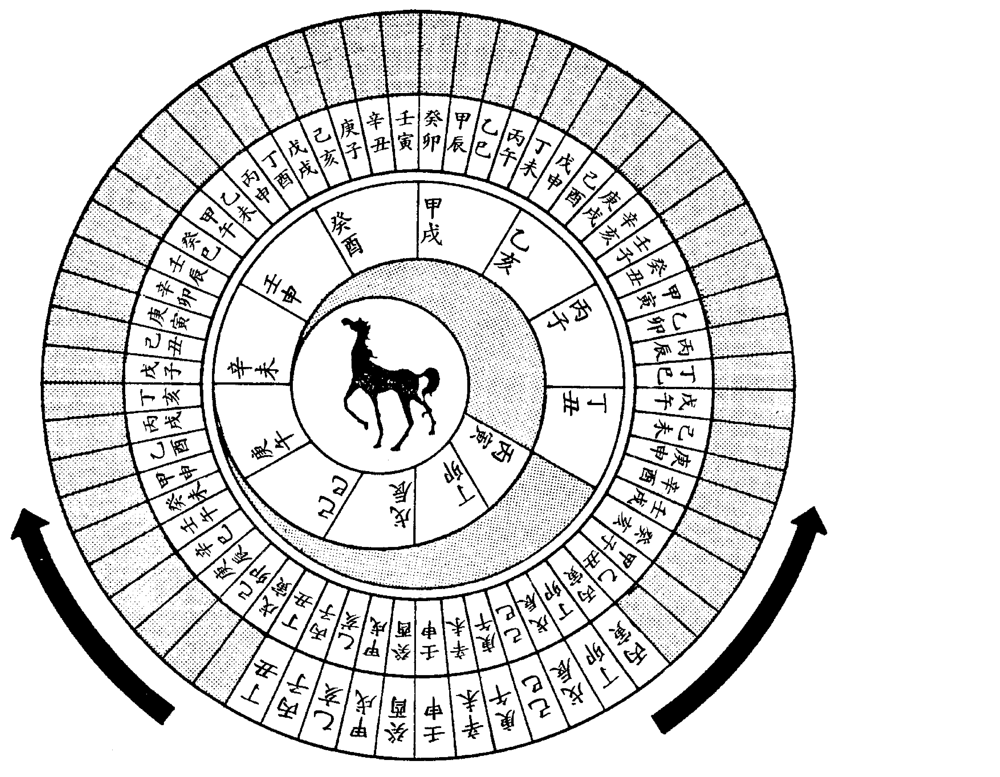
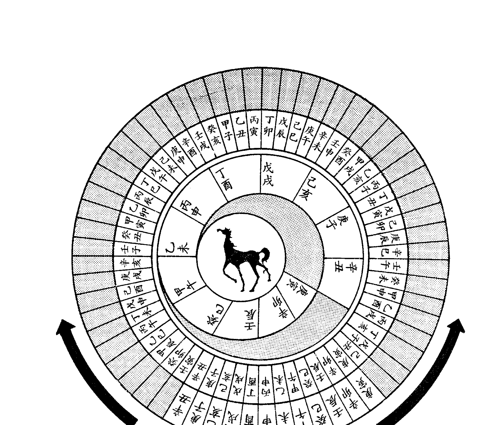
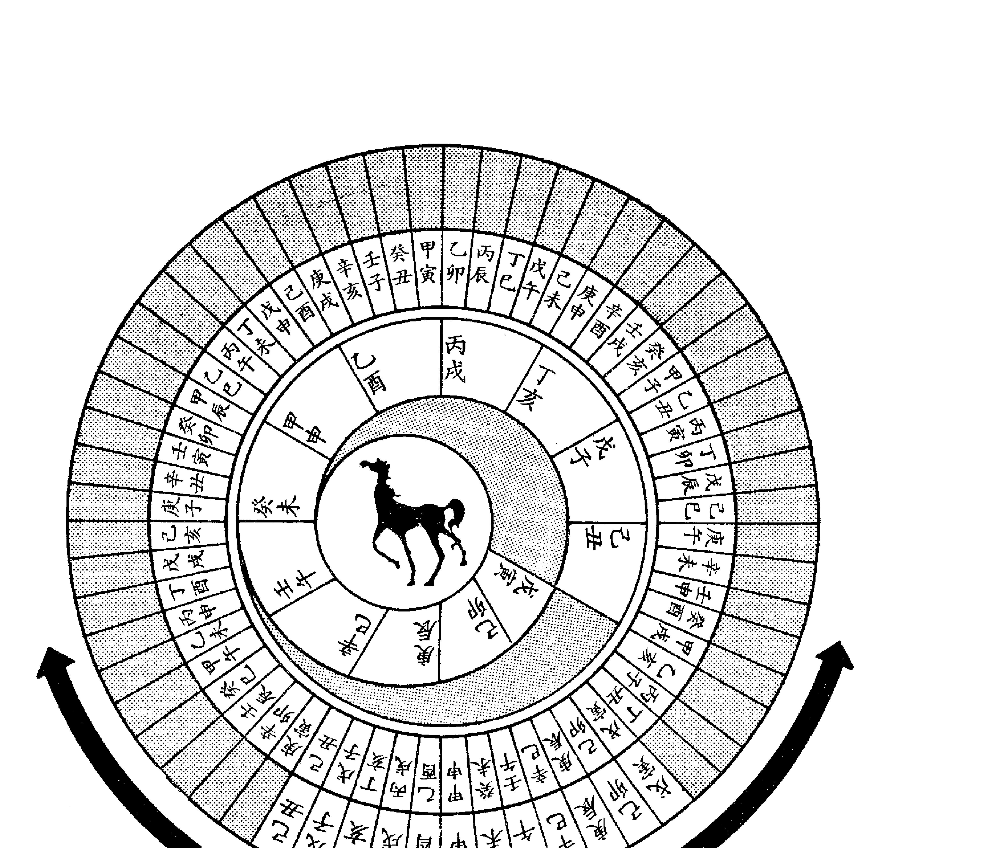
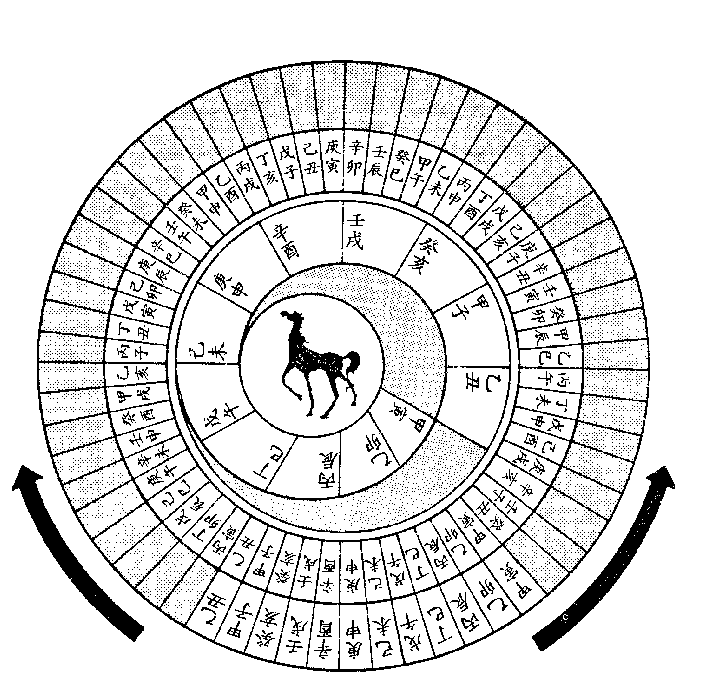
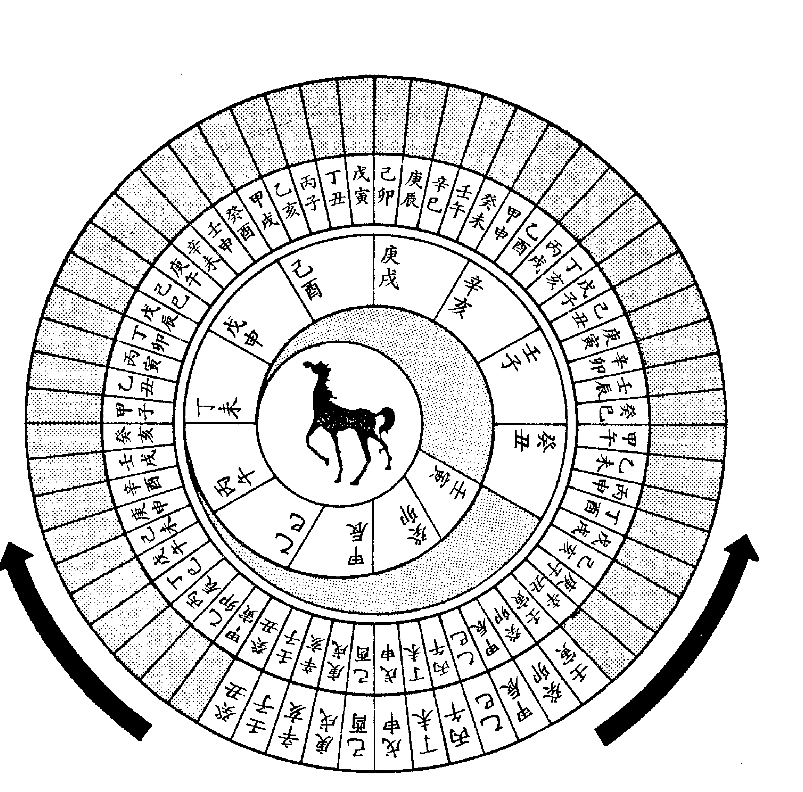
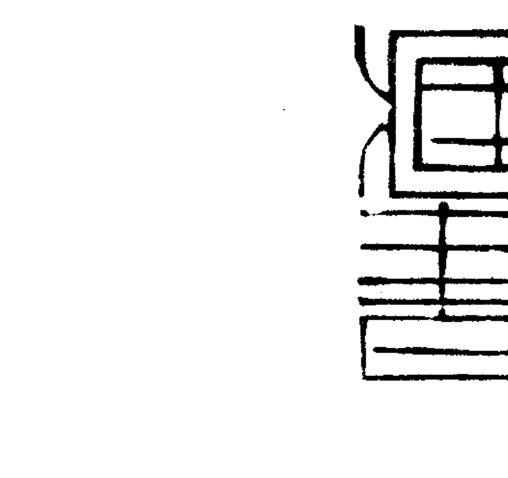
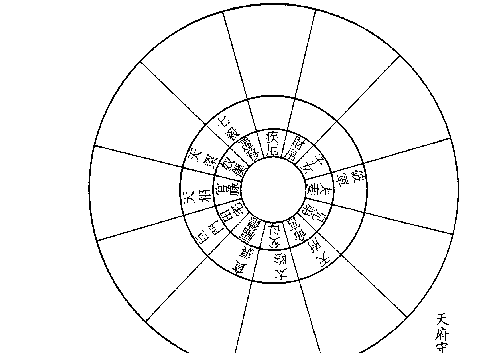
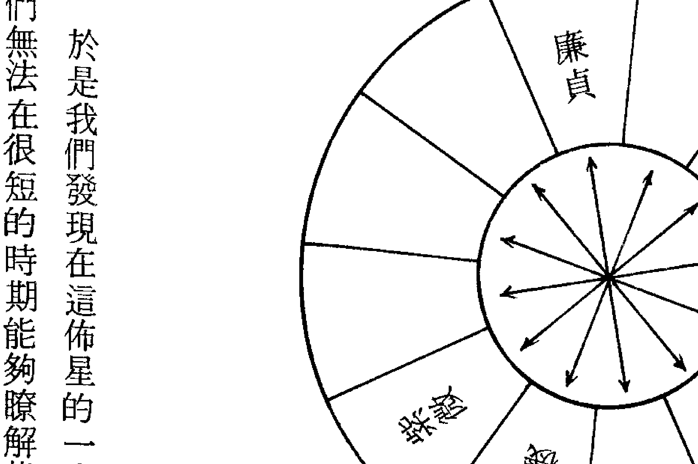
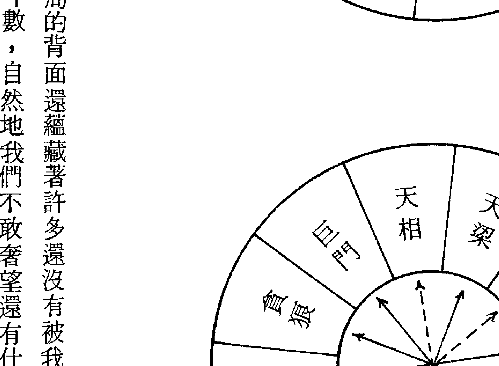
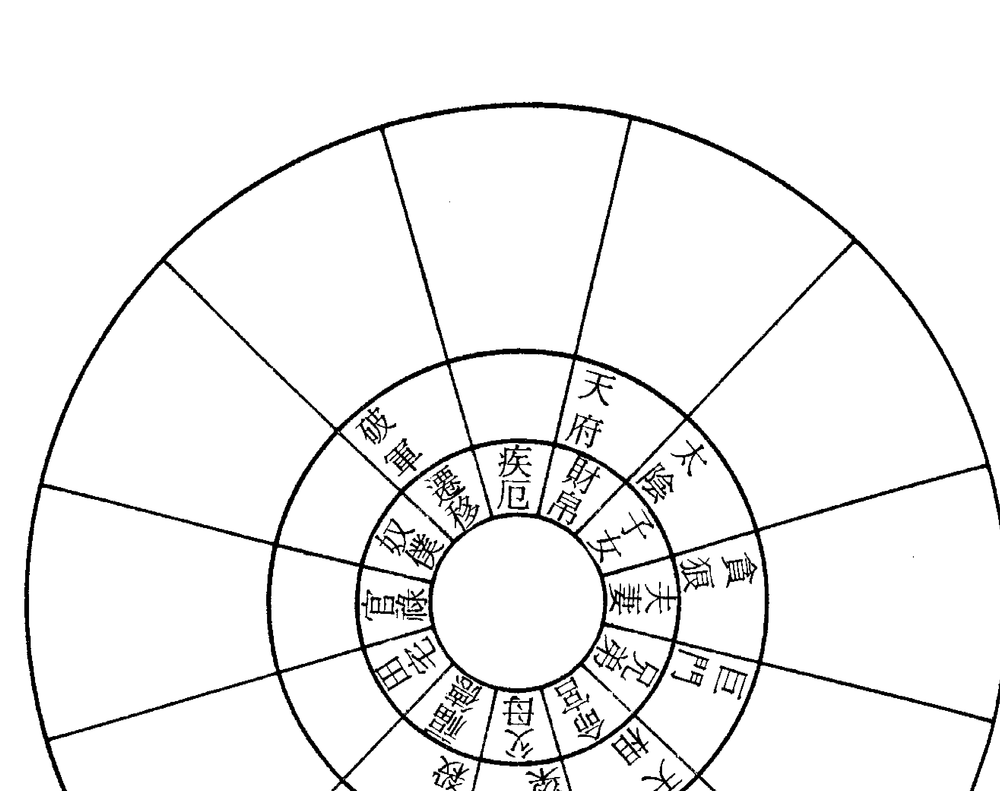

# 紫微堂奥

## 第五卷

堃元著

大孚书局印行

### 紫微斗数赋文诠注

## 紫微堂奥

## 第五卷

堃元著

大孚书局

### 紫微堂奥系列【全拾卷】

- 第一卷 斗数总诀之希夷观天星，斗数推命特寿且荣
- 第二卷 斗数发微论之命逢紫微，不权则富
- 第三卷 斗数太微赋之日月夹财，不权则富
- 第四卷 斗数天门运限，扶身助命
- 第五卷 斗数骨髓赋之七杀朝斗，爵禄荣昌
- 第六卷 斗数骨髓赋之天禄天马，惊人甲第
- 第七卷 斗数骨髓赋之左府同宫，尊居万乘
- 第八卷 斗数骨髓赋之子午破军，加官进禄
- 第九卷 斗数骨髓赋之丹墀桂墀，青云之志
- 第十卷 斗数骨髓赋之辅魁福寿，弼相福临

星光书店 $117.00

东明文化图书公司 $117.00 TEL: 23425341

# 紫微堂奥

第五卷

# 紫微斗数

赋文註

堃元著

大孚書局印行

### 自序

《紫微堂奥》以江西負子子潘希尹先生補輯之《新鐫希夷陳先生紫微斗數全書》為藍本而為紫微斗數賦文之精詳註解。

卷一於一九八四年一月印行流通，筆者以當時已有之紫微斗數認知學涵，晝夜辛勤勤奮筆耕，作息失序，日以繼夜，晝夜顛倒，不屈不撓，再接再厲的經歷了二十八個月的殷勤刻苦筆耕，卷十終於一九八六年五月印行流通而竟詮註紫微斗數賦文之全功。

大學書局傅實泰先生有見於《紫微堂奥》為研讀學習紫微斗數所不可或缺的最佳參考書，但因原著缺少作者序文而有美中不足之憾，情商拙愚為原著增補自序，以使讀友不因原著無自序的小小缺失而抱憾，勉元當仁不讓於師，義無反顧的恭敬從所命囑，流覽翻閱十卷而為此序。

《紫微堂奥》共十卷；卷一精詳詮註《合併十八飛星紫微斗數》一書之「紫微斗數總訣」，概說紫微斗數推命之使用星神與排佈推命圖的安星佈斗。卷二嘔心瀝血的披瀝詮註「斗數發微論」、「重補斗數殼率」、「諸星問答論」（按：「諸星問答論」一稱「星垣問答論」）。卷三為紫微斗數「太微賦」、「賦文詮註」。卷四～卷九共六卷為

### 目 錄

- 第十三章 先貧後富，武貪同身命之宮
  - 第 一 節 樂毅之命
  - 第 二 節 司馬弼之命
- 第十四章 以統計及邏輯解讀賦文
- 第十五章 出世榮華，權祿守財官之位
- 第十六章 生來貧賤，劫空臨財福之鄉
  - 第 一 節 「范丹」貧命
  - 第 二 節 「車明」貧命
  - 第三節 以聯想與理解解讀賦文
- 第十七章 文曲武曲爲人多學多能左輔右弼秉性克寬克厚
  - 第 一 節 文曲武曲爲人多學多能
  - 第 二 節 左輔右弼秉性克寬克厚
  - 第三節 學習諸星組合逢會之研判

「斗數骨髓賦」賦文詮註，並於賦文文句列舉相當其文句的命例以爲習涉研究之參考。卷十詮註「女命骨髓賦」，附錄「補遺骨髓賦」、「形性賦」、「諸星問答論」、「諸星入命限」互爲參照融合，可以依據命圖星神而推想描繪此命圖本人之形性。）、「星垣論」、「紫微斗數漫談」。
（按：星垣論附錄而未詮註。）
今日增補為原著自序，情不自禁的感慨：「老朽，老朽老矣！任何 人盡得《紫微堂奧》，必然直覽盡窺斗數堂奧，更勝老朽被香港徒孫們擡 舉謬譽爲『斗數奇才，一代宗師』矣！」

- 第十八章 天府天相乃爲衣祿之神，爲仕爲官定主亨通之兆………………五九
  - 第一節 天府天相恆爲半三合狀況………………六〇
  - 第二節 天府守命的特性………………六四
  - 第三節 天相守命的特性………………六七
- 第十九章 苗而不秀，科名陷於凶神………………七四
  - 第一節 果老與斗數之化祿比較………………八二
  - 第二節 不要輕視賦文重點提示的功效………………八五
  - 第三節 附錄四化摘纂………………八八
  - 第四節 要注意四化時效之截用………………九〇
- 第二十一章 七殺朝斗，爵祿榮昌………………八三
- 第二十二章 紫府同宮，終身福厚………………八四
- 第二十三章 紫府在寅守命——張子房例………………八六
- 第二十四章 紫府在申守命——林御史例………………八八
  - 第三節 論命比較略說………………九七
- 第二十四章 紫微居午無殺湊，位至公卿………………一〇五
- 第二十五章 科權祿拱，名譽昭彰………………一一八
- 第二十六章 武曲廟垣，威名赫奕………………一二六
- 第二十七章 科明祿暗，位列三台………………一三八
- 第二十八章 日月同臨，官居侯伯………………一五九
- 第二十九章 巨機同宮，公卿之位………………一七〇
- 第三十章 貪鈴並守，將相之名………………一九一
- 第三十一章 天魁天鉞，蓋世文章………………一九九

### 第十三章 先貧後富，武貪同身命之宮

> > 原註：假如命立丑未，二星同宮，蓋武曲之金剋貪狼之木，則木逢制化為有用，故先貧而後方富貴。又或得三方有昌曲左右等星拱照，主貴，限逢科權祿則貴顯至矣！

堃元詮註賦文而述紫微堂奧，以紫微斗數全書為經緯，故大抵取全書附錄命例以為解說，但附錄命例之可信度頗值吾人懷疑探討，拙作「紫微鏡鈐」第二八五頁，第二八八頁，第二九○頁之孔子、項羽、顏回命例已作暗示性之表達，更見了無居士黃老師著「現代紫微第1集第三一頁至第四○頁「一筆爛帳」批判白居易、李太白、楊貴妃、呂蒙正之錯誤，善意而尖銳的提醒學者不要盲目採信全書。

假使斗數諸書不足於憑信，觀今師道不古，師德淪喪不振，師之所以傳道授業解惑亦未必為真，故為學之道必「遵師重道」而「格物致知」，必有所「層次」與「界說」，假設全書附錄之命例為命圖星象解說之範帖，則於研習斗數之過程，必如兒童啟蒙之臨帖習字，迨已能自我書寫而後始能更進一層次的追求黏、頓、勾、撇、捺……，或者再臨習名家字帖字體，所以我們如果把附錄命例範圍於研判命圖星象的界說以內，則以不同的讀習角度與心態而讀書，則清者自清，濁者自濁，當亦無拘於其幫助觀察研判星象的功益，故本書仍舉附錄命例以爲研習參考——

#### 第一節 樂毅之命

註云：「貪武同行，左右同宮，權祿生逢，俱吉，奈遇三方四正俱見羊陀空劫，進退聲名，大限遊於太歲之地，破哭劫耗，流羊流陀迭併，太歲入命亦忌沖照，是以死也。」

樂毅，戰國燕昭王之卿，率趙楚韓魏燕五國兵伐齊，下齊七十餘城，封昌國君。昭王死，惠王使騎劫代之。毅降趙，趙封之於觀津，號望諸君。趙尊寵樂毅，以驚動於燕齊，齊田單破騎劫於即墨，盡復得齊城。燕惠王後悔使騎劫代樂毅，後以樂毅子樂間爲昌國君，而樂毅往來復通燕，燕趙以爲客卿，樂毅卒於趙。

堃元簡評：賦文所提，大抵爲觀察研判之特定線索，在於幫助吾人以爲速見而已，故必審合不合格爲論。

- 一、諸星問答論曰：「武曲若與貪狼同度，惺吝之人。」又曰：「武曲貪狼會，則少年不利，所謂武曲守命福非輕，貪狼不發少年人是也。」
- 二、吉凶大抵以四化及六吉六煞表示，故本命生逢權祿，輔弼守命，昌曲加命，故論吉，但
- 三、武貪守命，忌壬癸丙宮歲限，如本命行癸酉大限，又忌行己辛運限之類，積習後可知，不贅。
  以天空守命，思想見解有異人之處，羊陀地劫拱命，又是吉處藏凶之兆。

#### 第二節 司馬弼之命

註云：「權祿會合，左右同宮，少年貴顯，命逢化忌，大限地網，小限巳亥，寅生人有忌，喪門白虎為殃，其死必矣，故亡於廿六歲。」

#### 堃元簡評：

全書附錄甚多援用史記名人，而不能考據者亦多，苟或不知其出，則與自習讀書無異，故學者於讀習斗數之初，不妨用已知命例以應星象解釋，則積漸而有心得小成矣！

- 一、武貪守命，大多三十以後發福，如早年顯達，中年易有成敗，尤其如本命原有化忌守命者，更忌之。
- 二、本命武曲在未化忌，雖不能表現財富孤獨之徵兆，但於運限則畏重見凶殺惡煞。
- 三、貪狠遇火鈴，則有增強好勝誇耀的自我表現的傾向，更且權祿同守官祿宮，主於官祿（事業）上具有理想抱負，且有尊貴與權威之傾向，故其於命宮雖見化忌，亦主富貴，唯其為吉處藏凶之兆。
- 四、斗數之當生格局，如見羊陀火鈴空劫忌者，大抵不美，唯其凶劣發應必於運限中觀察研究判之，很難即於命圖中立即發現，必多作實驗而後熟生巧。
- 五、安命於丑未之格局雖然大致相同，但由於命主之不同，在丑有巨門之潛性性向，在未則有武曲之顯性性向，故命主武曲化忌之後，甚忌行卯宮、歲、限之運，本命死於丁卯年實亦一徵驗矣！

| 己巳 | 陀羅
七殺
紫微 | 庚午 | 祿存 | 辛未 | 擊羊 | 壬申 | 天鉞 |
| :--- | :--- | :--- | :--- | :--- | :--- | :--- | :--- |
| | | 天刑
天傷 | | | | 天使 | |
| 官祿 | 力士
臨官 | 奴僕 | 博士
冠帶 | 遷移 | 沐浴
官府 | 疾厄 | 長生
伏兵 |
| 戊辰 | 天機
天梁
科 | 歲次己丑年四十一歲八月初七日故 | | 陰男 | 樂毅 | 歲次己酉年十月初八日戊時生 | 癸酉 | 破軍
廉貞 |
| 田宅 | 帝旺
青龍 | | | | | 截空
地劫 | 大耗
養 |
| 丁卯 | 火星 | 天相 | | | | | 財帛(32-41) |
| | | | | | | | 甲戌 | 鈴星 |
| 福德 | 小耗
衰 | | | 水二局 | | 天姚 | 子女(22-31) |
| 丙寅 | 巨門
太陽
忌 | 丁丑 | 武曲
貪狼
權祿 | 左輔
右弼 | 丙子 | 天同
太陰
文昌
天魁 | 乙亥 | 天府 |
| 父母 | 將軍
病 | 命宮 | 奏書
死 | | 兄弟(2-11) | 蜚廉
墓 | 夫妻(12-21) | 天馬 |
| | | 天空 | | | | | 41 | 喜神
絕 |

| 乙巳 天天鉞府 (科) 夫妻 26 甲辰 天姚 子女 癸卯 鈴星 破軍 廉貞 財帛 壬寅 文曲 疾厄 天使 截空 小耗 | 丙午 太陰 天同 兄弟 喜神 胎 歲次丁卯年二十六歲二月十二日故 癸丑 火星 遷移 天空 青龍 衰 | 丁未 右弼 左輔 貪狼 武曲 (忌) 命宮 病符 養 司馬 弼 水二局 壬子 擎羊 文昌 奴僕 天刑 天傷 帝旺 | 戊申 太陽 巨門 父母 天馬 (2-11) 大耗 長生 歲次壬寅年四月二十日戌時生 己酉 天相 田宅 官府 冠帶 辛亥 祿存 七殺 紫微 (權) 官祿 博士 臨官 | 天相 地劫 福德 (12-21) 伏兵 沐浴 陀羅 天梁 天機 (祿) |

#### 第三節 以統計及邏輯解讀賦文

斗數賦文的詮註逐漸地增加其闡解的程度困難，並且形成了紫微自我的隱形負荷及責任感，尤其是一些國學基礎比較欠缺的人，很難依據自習，另外一部分睿智而又具國學程度的人，對於未附註的賦文，倒也還能依據個人的習學去認知、解釋，但是對於附註的賦文，則受拘於人類貪逸惡勞的惰性所影響，大抵只就附註讀習而不再自我認知審辨，以致使斗數更形駁雜而紛歧了。

譬如武曲原註以武貪同垣於丑未以為假如舉例，而後世學者未審「武貪同身命之宮」所含蘊之義，受拘於原註而只認知武貪同守丑未居命身，以致疏忽賦文之原義，不再考慮到武曲守命而貪狼守身，或者貪狼守命而武曲守身之情形，當然一些可貴的學術也就自然的逐漸狹隘而佚失了。

相信學者都與紫微相當的程度，所以我們不妨在解讀賦文的時候，把思考與解釋的範圍擴充到自己個人認知斗數的臨界極限，不再考慮到武曲守命而貪狼守身，或者貪狼守命而武曲守身之情形，當然一些可貴的學術也就自然的逐漸狹隘而佚失了。

假使我們能夠在現實的生活中，聚集一些斗數同好，把成千繫萬的已知實例作一精密的分類統計，大概就能把統計之表徵列為論斷之結論，不過這一工作暫時仍有一些困難，所以我們只好退而求其次，依據我們目前對於斗數認知的程度，僅只能暫時作紙上談兵的邏輯思考，暫時各據本身的思考能力自我讀習認知，或者約聚同好共同研究而已！

現在我們且先不要把思考範圍放得太散漫，但也不必一定遵循原註的狹義假如有去解釋，我們不妨大膽的依據賦文原義解釋：『先貧後富，武貪同身命之宮。』，則武貪在丑未同守命是，同守身是，而且武貪二星更迭守身命亦然。

在這麼廣泛的設例中，紫微實在不知應該以何為舉例說明，不過紫微大抵可以提示武貪之組配格局以為學者搜集資料的分類參考：譬如天府武曲在子同守命，如為六月未時生人，十二月丑時生人，貪狼在寅守福德身宮；或如六月巳時生人，十二月亥時生人，貪狼在寅守命，天府武曲在子守福德身宮之類，餘做此以為類推之。

只要我們能夠瞭解掌握紫微斗數的六種基本格局，注意，斗數只要六種基本格局，自子至巳為陽性基本六局，自午至亥為陰性基本六局，陰陽格局相同，但由於星曜廟陷及命主之不同而可以明朗分辨其不同，在弄清楚陽六局、陰六局之後，只要能再靈活運用諸星情性的原則，大概不必再讀習任何賦文，也能夠像子平一樣在極為短暫的時間完成論斷吧！

### 第十四章 先富後貧，只為運逢劫殺

原註：如身命宮或有一二正曜，出門亦遇吉，限至中年，因限行絕地，兼遇劫空耗等凶星，則身命無力，故後貧。

堃元自著述「紫微鏡銓」以迄，一直提醒學者注意「命宮無大限」，並編撰「紫鏡大限」以爲釋疑解惑，唯其習學各有取用不同，但將本人命例或已知親友命例作爲實驗比較檢討，大概就不難獲得可以自信的結果，可惜的是一般學者缺乏比較試驗的精神與耐心，大抵只沿循個人的習學取用，自然不免傍徨迷惑。
子曰：「三十而立，四十不惑，五十而知天命。」，堃元行年四十有四，雖已不惑而尚不足，以知天命，故勉竭習學以詮註賦文，届此文又不得不略釋「命宮無大限」之義，否則於論運限，每相差幾乎十年矣！
「命宮無大限」者，表示命宮所主宰者爲不完整之「大限」，以其不完整而謂之「無」，其次之大限，每宮俱分主完整之十年，拙作「紫鏡大限」詳述至明，不妨自尋購閱參考之。
今取堃元之失敗經歷幾乎就是本文「先富後貧，只為運逢劫殺」的寫照，恰巧可以並供爲「命宮起大限」或「命宮無大限」之比較試驗，故詳舉事實以供學者研習之參考——

堃元 歲次壬午年十二月初一日酉時生

#### 堃元經歷便覽表

| 歲次 | 年齡 | 大限 | 摘要 |
| :--- | :--- | :--- | :--- |
| 壬午 | 1 |  | 初生黃疸，學步較常兒為遲。 |
| 癸未 | 2 |  |  |
| 甲申 | 3 |  | 右股外側瘡疔開刀手術。 |
| 乙酉 | 4 |  |  |
| 丙戌 | 5 |  | 左肩胛生瘤開刀手術。 |

| 丁亥 | 戊子 | 己丑 | 庚寅 | 辛卯 | 壬辰 | 癸巳 |
| :--- | :--- | :--- | :--- | :--- | :--- | :--- |
| 6 | 7 | 8 | 9 | 10 | 11 | 12 |
|  |  | 出痘疹。 | 入小學。 | 右足踝內側微血管割斷。 | 下課坐單槓水泥柱上，翻下唇齒傷。 | 暑假從樹上跌落，右手小臂骨折。 |

| 甲午 | 乙未 | 丙申 | 丁酉 | 戊戌 | 己亥 | 庚子 |
| :--- | :--- | :--- | :--- | :--- | :--- | :--- |
| 13 | 14 | 15 | 16 | 17 | 18 | 19 |
| 挖防空壕溝，左股遭同學鋤傷。 | 升初中。 |  |  | 夏初畢，游泳池畔跌傷割裂左腳膝。玩碟仙，自律神經失控，疑仙附體。 | 後腦遭毆傷。 | 寒假燬書欲罷學，父購書而繼成學業。 |

| 辛丑 | 壬寅 | 癸卯 | 甲辰 | 乙巳 | 丙午 | 丁未 |
| :--- | :--- | :--- | :--- | :--- | :--- | :--- |
| 20 | 21 | 22 | 23 | 24 | 25 | 26 |
| 非禮成婚，冬得長子。 | 耽於花酒、賭博。 | 妻自殺未遂，生長女，父業失敗。 | 入伍服役。 | 單兵攻擊測試，躍進時摔傷右肩胛。 |  | 退伍後為謀職煩惱，從事布匹攤販。 |

| 戊申 | 己酉 | 庚戌 | 辛亥 | 壬子 | 癸丑 | 甲寅 | 乙卯 |
| :--- | :--- | :--- | :--- | :--- | :--- | :--- | :--- |
| 27 | 28 | 29 | 30 | 31 | 32 | 33 | 34 |
| 追逐金錢，勉欲代父償債。 | 分期購彩視。 | 分期買冰箱。 | 分期買裕隆一・二五貨車。 | 訂購分期付款住宅，車輛布匹失竊。 | 生次女。 | 付清房款，辦理貸款生息。 | 生次子，體弱多病，被倒會。 |

| 丙辰 | 丁巳 | 戊午 | 己未 | 庚申 | 辛酉 | 壬戌 |
| :--- | :--- | :--- | :--- | :--- | :--- | :--- |
| 35 | 36 | 37 | 38 | 39 | 40 | 41 |
| 被倒會，倒債，週轉困難。 | 倒閉。九月初三日申時撞死人。 | 亡父，賣厝，遷居。 | 為繼承事纏訟二三年，貧困交加。 | 春節午後車禍，左眼顴唇縫合十五針。達成協議，急性肝炎，病倒半月。 | 次子玩火，燒燬布匹若干，幸未成災。 | 為工地管理，有名無權，反生是非。 |

| 癸亥 | 甲子 | 乙丑 |
| :--- | :--- | :--- |
| 42 | 43 | 44 |
| 打零工渡日，王李倒债九萬元。 | 分期付款買公寓，埋首命理著述。十一月初旬積勞成疾，口腔破腫，逾週不藥而癒。 | 名成利不就，嫁女娶媳。 |

為參考研判之——如早年顯達，中年易有成敗之說，且本命不以大小二限逢劫殺而破財，卻以流年太歲行入天空寅鄉而逢太陽化忌論之，故似此之複式觀察研究線索，亦頗值以為參考，學者不妨就後附命圖自貼家計及分期償債，至今已見經濟好轉。十七歲，乙卯三十八歲時，舉債與人合夥而血本無歸，拖欠一屁股爛債，經其妻到工廠工作，補茲再舉一張姓公務員為例，生於戊寅年九月十九日酉時，娶妻娟淑，旺夫益子，惜於甲寅三便覽，將之分別以命宮起大限與命宮無大限作一比較檢討，大概不喻而可知矣！學者如果對於運限仍有疑義，不妨將自己本人的經歷，儘可能就記憶所及，詳列一記事摘要追求慾望生活之傾向。雙忌加夾小限遷移之兆，終於表現了化忌主限之十年悔吝，有不滿足於既成之事實，精神空虛而旦交入丁巳年三十六歲，巨門在當生遷移，大限福德，小限疾厄化忌，象徵有遷移之苦惱，正是運才是，但以命宮無大限論，則即交入機月大限，大限天機化忌，主十年有精神之阻礙災咎，一卅六歲小限到天空截空的轉捩關鍵，假使命宮起大限而言，天府才要主大限，似乎要轉入吉祥之從上述之經歷便覽比對命圖之後，依據堃元習學認知當以『命宮無大限』為是，且如丙辰年

| 乙巳 天钺 破武 军曲 (忌) | 丙午 | 太陽 | 丁未 | 天府 (科) | 戊申 | 太天 阴机 |
| :--- | :--- | :--- | :--- | :--- | :--- | :--- |
| 2.14.26.38. 50.62. 父母 (6-15) 臨官 | 3.15. 27.39. 51.63. 福德 (16-25) 神旺 | 4.16. 28.40. 52.64. 田宅 (26-35) 符衰 | 5.17. 29.41. 53.65. 官祿 (36-45) 耗病 |
| 甲辰 天同 | 陽男 | 望 元 | 己酉 貪狼 紫微 (權) | 天紅 傷鸞 |
| 1.13.25.37. 命宫 49.61. 奏書 帶 73.85. | 歲次壬午年十二月一日酉時生 | 6.18. 30.42. 54.66. 奴僕 (46-55) 兵死 |
| 癸卯 鈴星 左輔 | 庚戌 陀羅 巨門 |
| 天喜 12.24. 36.48. 兄弟 60.72. 將星 沐浴 84.96. | 身命 鈴星 廉貞 火六局命 | 7.19. 31.43. 55.67. 遷移 (56-65) 府墓 |
| 壬寅 | 癸丑 文昌 文曲 火星 七殺 廉貞 | 壬子 擊天 羊梁 (祿) | 辛亥 右弼 祿存 天相 |
| 截空 空空 11.23. 35.47. 夫妻 59.71. 小耗 長生 83.95. | 10.22. 34.46. 子女 58.70. 青龍 養 | 天天 姚哭 虛 9.21. 33.45. 57.69. 財帛 (76-85) 力士 胎 | 天使 8.20. 32.44. 56.68. 疾厄 (66-75) 博士 絕 || 宫位 | 干支 | 星曜与注解 |
| :--- | :--- | :--- |
| 官祿 (34-43) | 己巳 | 文曲在丑化忌（此大限十年） |
| 奴僕 (39) | 庚午 | 天傷 |
| 遷移 | 辛未 | |
| 疾厄 | 壬申 | 天使、地劫、天馬 |
| 財帛 | 癸酉 | 廉貞丙寅大限化忌 |
| 子女 | 甲子 | 太陰當生化權、戊辰大限亦化權 |
| 夫妻 | 乙丑 | 文曲丁巳大限化忌 |
| 父母 (4-13) | 丙寅 | 巨門丁卯大限化忌、太陽甲寅年化忌 |
| 田宅 (24-33) | 丁卯 | 巨門在寅化忌（此大限十年） |
| 福德 (14-23) | 戊辰 | 天機當生化忌（此大限十年） |
| 命宮 | 己巳 | 己巳大限財帛宮文曲化忌，甲寅年三十七歲小限至辰，為天機生化忌，太歲入寅，天空、大耗，又為太陽化忌、天空、大耗，又為絕地，竟至破財負債，亦巧合乎？ |

望元提示：初起大限，大限于即要調通，故丁巳大限改為己巳，大限財帛宮文曲化忌故也。

陽男 張先生

身主：天梁
命主：巨門

金四局

歲次戊寅年九月十九日酉時生

| 宫位 | 干支 | 星曜与注解 |
| :--- | :--- | :--- |
| 官祿 (34-43) | 丁巳 | 祿存、七殺、紫微 |
| 奴僕 (44-53) | 戊午 | 擎羊 |
| 遷移 (54-63) | 己未 | 天鉞 |
| 疾厄 (64-73) | 庚申 | 天使、地劫、天馬 |
| 財帛 | 辛酉 | 破軍、廉貞 |
| 子女 | 壬戌 | 天姚、將軍、帝旺 |
| 夫妻 | 癸亥 | 天府 |
| 父母 (4-13) | 甲寅 | 右弼、巨門、太陽(科) |
| 田宅 (24-33) | 乙卯 | 天相 |
| 福德 (14-23) | 丙辰 | 陀羅、天梁、天機(忌) |
| 命宮 | 丁巳 | 天刑、博生、長生 |
| 兄弟 | 戊午 | 文曲(科)、文昌、貪狼(祿)、武曲、火星 |
| | 己未 | 天魁 |
| | 庚申 | 左輔、太陰、天同(權) |
| | 辛酉 | 天姚 |
| | 壬戌 | 天府 |
| | 癸亥 | 天府 |

或許學者至今對於命宮年大限之說一直抱持著疑信不定與觀望迷惑之心，但是假設大限之設立包有當生月令之意義，那麼在丑寅之連續性就必須依賴觀察論命者預作適當的調適，才能表示大限宮位干支循環的時間連續特性，庶幾可以貼切的表現本命的星象意義，否則只依死板設定的宮干，豈不是硬生生扭曲了時空的連續循環意義，在丑寅之間突然跳躍到與本命毫不相關的時空區段，而在虛空捕捉一個不是本命的運限嗎？

為了解釋此一大限干調適的連續意義，望元絞盡了腦汁，終於好不容易才想出一個圖解示意的方法，希望學者能夠從圖說中有所領會，並堅定「命宮無大限」之信念！

+ 甲己之歲起丙寅
1. 甲年丙寅月接癸年己丑月。
2. 己年丙寅月接戊年丁丑月。
3. 甲己年丙寅月與丁丑月不相銜接。
。 丁丑月不相銜接

望元謹識

##### 丙辛之歲起庚寅

+ 1. 丙年庚寅月接乙年己丑月。
2. 辛年庚寅月接庚年己丑月。
3. 丙辛年庚寅月与辛丑月不相銜接。

堃元謹識

##### 乙庚之歲起戊寅

+ 1. 乙年戊寅月接甲年丁丑月。
2. 庚年戊寅月接己年丁丑月。
3. 乙庚年戊寅月与己丑月不相銜接。

堃元謹識

> 戊癸之歲起甲寅
1. 戊年甲寅月接丁年癸丑月。
2. 癸年甲寅月接壬年癸丑月。
3. 戊癸年甲寅月與乙丑月不相銜接。

望元謹識

> 丁壬之歲起壬寅
1. 丁年壬寅月接丙年辛丑月。
2. 壬年壬寅月接辛年辛丑月。
3. 丁壬年壬寅月與癸丑月不相銜接。

望元謹識

### 第十五章 出世榮華，權祿守財官之位

原註：權祿守財帛福德，入廟吉多，定主榮華，身命值之亦然。

研究命數最常遇見的莫過於下列幾個似是而非的問題；

『一個人的宿命會不會改變？』

『假使一個人預知未來的宿命，生命豈不是要變得毫無意義？』

『假使命理是宿命發生或然率的統計學，那麼同一時辰誕生的人口，難道都發生必然的宿命現象嗎？』

……類似這樣的問題，大概在探討人生，生命真諦的過程之中，我們曾經自問過，互相疑問，互相討論過，甚至還是華視的新聞追擊的『信不信由您』節目聽見張俐敏小姐『相信』命運，丹扉女士『不相信』命運，可惜的是其結果仍然『信不信由您』？

並且抱持著『限度』的相信，正如丹扉女士所提出的反韻一樣：『假如妳相信命運，妳也不會不斷的找人相命了！』

反過來說，丹扉女士在回答現場觀眾的時候說：『我相信命運，但不排斥宗教信仰，我還不敢像國父孫中山先生那樣大膽的敢將關公神像的手臂折斷……。』，其結果亦然保留著『有限度』的不相信。

不過，我們不想作更深入的分析與探討，就好像慧心齋主就享盛名的時候，有人打著慧心齋主的名號為人相命，而這一些人卻並不足夠代表慧心齋主本人，但是慧心齋主也不能干涉別人是否相信他被冒名的這一回事，換句話說，客觀的把命術士當作心理醫師或者是精神分析醫師是可以的，但是我們又要如何去辨別一些破壞命數清高形象的詐財騙色之徒呢？

所以要解答這一類精神、思想，信仰的人生觀問題，我們必須要設定一些範圍『界說』，我們不宜把命理與宗教信仰混合在一起討論，那麼我們就能夠把討論的範圍規納在一定的『界說』裏面，於是可以肯定的回答：

『命理所探討研究的是一個人的情性，依據其情性而演繹成爲命運的或然趨勢，所以一個人的情性如果不能改變，那麼其結果就發生其情性所必然發生的命運，假使任何一個人都能夠反省、檢討、控制自我的情性，那麼要奢談命理是毫無意義的！』

『由於人類惰性慣性的作用，江山易改，秉性難移，所以命理能夠預測未來的宿命，但是其預知是或然而非必然發生，一旦心理惰性與命理徵象發生變化，自然相對的改變未來的宿命，所以以未來的宿命永遠是個未知數，而且是個可變、可塑的未知數，生命永遠充滿著無限的希望與永恆的意義。

「望元個人相信同一時辰誕生的人口都具著相同模式的命運，但由於其本命感應環境及生長環境的不同，由於父母寵愛關心的不同，教育過程及環境的不同、兄弟朋友相處交遊的不同，結婚配偶的不同，家庭責任的不同，無形中改變了其相同情性氣質，所以世界上絕對不會有兩個完全相同的宿命，其所相同者，只是或然率之相同，以著不同的形態模式表現著相同的或然命運而已。因為我們目前的命理哲學還不能精緻的考慮到其不同影響的或然改變，所以我們只能暫時把他們當作命運的或然趨勢而已。極得物質之生活享受及教育之栽培機會，所以研究斗數賦文，不必依書演繹，最主要能掌握其內涵為原則。」

> 註雲：「處事榮華，權祿守財福之命，文昌武曲俱拱命垣為巨富之命，大限四十三歲入於天傷之地，四十四歲小限入於天使夾耗之地，又兼太歲逢劫，故死。丨

石崇，晉南皮人，守季倫，累官荊州刺史，使客航海致富，置金谷別墅在河陽，後遷衛尉，與王愷羊琇之徒以奢靡相尚，孫秀譖於趙王倫，棄市。

拙作「紫微鏡鈐」第二八九頁嘗附錄此一命例，並附註：「有香港子平術之悟微居士作石崇生於蜀漢後主延熙十二年七月九日辰時，八字為己巳、辛未、甲午、戊辰。」，雖未如了無居士之批判為「一筆爛帳」，卻已暗示古人命例生辰死亡之可信度，但如剔除此可信度之正確性，我們又無妨把此一命圖作為正確來作為星情研判之參考，我們可以站在學術性的研究角度來接受它，但是我們並不承認它的生死的正確性。

所以當學者發現註雲「處世榮華」與本文「出世榮華」有一字之差的時候，我們不妨考慮把先前的假設解釋略作比較性質的修訂，不妨把「出世榮華」考慮有無可能是「處世榮華」的錯誤，或者是仍以「出世榮華」為正確？

> 假使我們大膽的把此文義引伸發揮，我們不妨說：「一個人的命圖成照六宮有權祿守值，表示其人出世於榮華世家，享受物質生活及接受教育栽培機會，其未來有較大的成功成就機會，如假羊陀火鈴空劫忌星，則其所享受及接受機會受到影響，於未來之成功成就亦相對受到影響。

茲舉望元之命例而言，當生財帛宮天梁化祿，若有本文所謂「出世榮華，權祿守財官之位」之徵兆，但以擎羊同守而破格，但自思出身寒微，幼年甚受父母疼溺鍾愛，在父母的經濟能力亦為原則。所以我們只能暫時把他們當作命運的或然趨勢而已。因為我們目前的命理哲學還不能精緻的考慮到其不同影響的或然改變，

本此假設，我們不妨大膽的試驗個人手邊的資料，譬如卷四所舉第二四頁王嘉慶先生科權祿拱命，第四五頁安祿山財帛有雙祿，第六一頁蘇秦權祿拱命而空劫守拱，……第八一頁先總統拱命，

今只取全書附錄之「石崇」富命以為參考丨

驗檢討，必定能夠積漸而更勝於望元矣！

裕程度如何，我們還有深入性的困難存在，所以不妨再各就學者所能搜獲的命例自為持續性的試

蔣公生逢科權祿等等之類，大概可以旁證此一說法的正確性，但是對於人命之幼年家庭的經濟富

空天傷之地，四十四歲小限入於天使夾耗之地，又兼太歲逢劫，故死。丨

### 第十六章 生來貧賤，劫空臨財福之鄉

凡觀察研判命例星圖，每一命例幾已包括了紫微斗數全書，但是為了註解解釋上的方便起見，我們大多以摘要的方式解說，大抵只取重點星情研判提示而已，譬如下述「出世榮華，權祿守財官之位」之星象，但又見官祿宮有地劫，夫妻宮有天空，恍惚又可以比照本文「生來貧賤，劫空臨財福之鄉」議論，所以斗數之觀察研判在於掌握原則性之綜合研判，否則要死記星情星象線索，恐怕終有限之一生亦難完全記憶運用。

試看斗數全書附錄「范丹」貧命及「車明」貧命二造，正是完全符合本文之文義，故舉以為參考——

> 原註：劫空在財帛福德二宮，多主人貧賤，如身命値之亦然。

| 巳 | 巨門 | 庚午 右弼 文曲 天相 | 廉貞 辛未 天鉞 天梁 | 壬申 左輔 文昌 七殺 |
| :--- | :--- | :--- | :--- | :--- |
| 父母 (3-12) | 小耗 病 | 福德 (13-22) | 將軍 死 | 田宅 (23-32) |
| 戊辰 | 貪狼 | 歲次丁丑年四十四歲十一月初五故 | 陽男 石 崇 | 奏書 墓 官祿 (33-42) |
| 命宮 丁鈴星 擎羊 太陰 卯 | 青龍 衰 | 命主：廉貞 身主：鈴星 木三局 | 奴僕 (43-52) | 喜神 胎 |
| 兄弟 丙寅 | 力士 帝旺 祿存 天府 紫微 丁丑 火星 天魁 陀羅 | 天機 丙子 破軍 | 遷移 乙亥 小限 | 病符 養 太陽 (忌) |
| 夫妻 | 博士 臨官 子女 | 官府 冠帶 財帛 | 伏兵 沐浴 疾厄 44 | 大耗 長生 |

#### 第一節「范丹」貧命

范丹，一作范冉，東漢高士，字史雲，外黃人。

桓帝時爲萊蕪長，遭母憂不到官，後辟太尉府，議者欲以爲侍御史，遂遁去，賣卜於梁沛之間，居徒四壁，處之豁然，有時絕粒，閭里歌曰：「甑中生塵范史雲，釜中生魚范萊蕪。」

> > 全書註云：「生來貧賤，劫空臨財福之鄉，祿馬落於空地，中年限入美景，方得發達名揚，七十五歲大限入於天空，小限七十七歲同入此地，祿倒馬倒，忌太歲相沖，故亡。」

堃元附按：此一命例錯誤得一場糊塗，大約有下列數點有待推敲：

+ 1. 甲生人安命在子，應爲水二局命，原作土五局命。
2. 水土同長生，原作土五局命，祿存在巳，紫微在卯，魁鉞在亥酉，若爲丙午年生人爲是。
3. 丙午年生人至甲子年死亡，宜享年七十九歲爲是，如享年七十七歲則爲戊申年生人爲是。

凡此訛謬難以推考者，俱不要費時推考，但據原註線索研判其重黏註釋，或於學習斗數過程，遇有不能觀察研判出徵兆線索的命例，亦要暫時擱置，不要死鑽牛角尖，容他日再另為觀察研判，以免浪費精神時間。

#### 第二節 「車明」貧命

> > 註云：「生來貧賤，劫空臨財福之鄉，戊生人逢巨門在子宮，多主苦困，五十四入於午限，沈馬之鄉，小限又到午宮，身命惡殺交併，故命難逃。」

堃元附按：此命例如生辰正確，則又爲一大敗筆，二月酉時生人必安命於午，爲火六局命，紫微在巳為是。

#### 第三節 以聯想與理解解讀賦文

特依原誤附圖備考者，意使學者明白所謂「生來貧賤，劫空臨財福之鄉」者，僅卯酉時生人安命子午宮者始見「劫空臨財福之鄉」，但並非以此可以概全，必先審主星吉凶如何，方可評議，此二節命例雖然俱誤，但其俱表現「羊陀拱命」「哭虛守命」之不吉，大抵亦可作爲參考性之線索，假使必欲奉爲圭臬而墨守不變，望元則期期以爲不可，且如吳明修先生編著「紫微斗數全書命例考釋」雖有「一○○餘條命例依起例斷法重新考釋」之說，卻釋而未考，誤而從誤，如此美玉難免一二瑕疵，或如望元追逐衣食而爬格子，更見魯魚亥豕，諸如此類容易發現之毛病，當然後可以自爲修正，或有所疑義，則當互為切磋推考，則斗數可以預見盛行而不衰矣！

今假設「車明」生辰正確，新佈命圖附於后，裨益學者觀摩比較之——

在我們人類習學認知的過程，不外是以已經理解認知的知識去解釋未知的事象或學術，對於完全陌生未知的事象與學術就很困難找出恰到好處而可以理解的詞彙來解釋表達，就像我們現在迫切的希望瞭解紫微斗數的心情是一樣的，一些先進賢達確實已經領悟了一些紫微斗數的心得與精奧，一旦撇開了斗數術語，幾乎就無從解釋紫微斗數了。

由於購閱「紫微堂奧」的親愛的眾多學者讀友都已具備了相當程度的紫微斗數之專門知識，所以閱讀的時候，恍惚有種說不出親切的共鳴，您我不是一樣的有過相似的想法嗎？您我不是一樣的發生過一些難以形容學習求知的微妙心情嗎？

為什麼有一些想要知道的，在讀看的時候已經很明白了，一旦擱下了書本，又好像沒有知道什麼呢？

為什麼有一些本來已經知道得很確實清楚的，一旦發現了其他不同的見解說法的時候，反而有些動搖而迷惘疑惑呢？

為什麼讀看過了以後，總是無法記憶呢？

……這些心情，我們不必刻意的去探究他，只要能夠保持研究學術的興趣與熱忱，我們確信我們終究能夠求知到我們想要知道的。

假使學者讀友對於卷一至卷四的賦文解釋猶有印象的話，不妨試為聯想前述有關於空劫殺星之資料，用已經理解的印象來咀嚼本文的解釋，大概多少能夠幫助研究或自習紫微斗數吧！

茲摘要整理空劫二星之意義於後，並假定只有本文之原註為唯一「生來貧賤」之合格以為聯想

+ 一、地劫主劫失，其劫煞破失大抵自內而生：
其守命，個性獨特，比較自負驕傲，甚至有些固執成見，處事但求迅速，每多草率馬虎，性情不穩定，喜怒無常，自負自豪，喜歡表現得比別人特別突出，使人感覺有些異常或變態。

這種自負任性，求新好奇的偏激疏狂的星性，如果守於財帛宮應該如何解釋才恰當呢？如果守於福德宮又該如何解釋呢？

二、天空主災厄，其災厄阻滯大抵自外而來：
其守命，個性倔強特殊，富於憧憬幻想，思想不切實際，對於事物的處理相對的虛浮而不切實際，缺乏恆毅耐性，有草率、浪費之傾向。

這種好高騖遠，不切實際的異常思想的星性，如果守於財帛宮應該如何解釋？如果守於福德宮又應該如何解釋呢？

三、生來貧賤，劫空臨財福之鄉：

斗數十二宮，財帛與福德恆為守照相沖，假如本原註劫空各據一鄉，則二月卯時、八月酉時安命在子，二月酉時、八月卯時安命在午為合格，恰見劫空臨財福之鄉，更迭相守，而且又具斗數發微論所謂「命身相剋則心亂而不閒」「福德遇空亡劫奔走無力」（參考卷二第一二〇頁、第一六九頁）之兆。

所以賦文之為單一線索之重點提示，其提示之背後卻又暗示了其他不同的線索意義，我們讀習賦文之際，每只依文直譯，忽略而其他的線索聯想研判，自然有讀後忘前，事倍功半之憾！

假如天空守財，主其人理財觀念異於常人，不審本人「無才能賺大錢，小錢不願賺」的缺點，有草率、浪費之傾向，則其財帛積聚困難矣！

假如地劫守財，主其人自負驕傲而誇張錢財，對於錢財出納馬虎而缺乏原則，則其有時常變換賺錢的方法而不能達到賺錢的目的，甚至於功敗垂成或坐失賺錢之良機，則其要生聚錢財亦難矣！

假如天空守福德，主其人精神生活及享受觀念不切實際而異於常人，永遠也無法達到本人的追求理想，反而容易產生逃避現實責任的消極人生觀，則其精神生活趨於委靡頹喪可知矣！

假如地劫守福德，主其人物質生活及享受觀念喜歡誇張表現而異於常人，永遠也無法滿足本人的表現慾望，反而容易遭遇違心忤意的失敗與挫折，則其物質生活趨於奢靡放縱而喪志可知矣！

那麼我們不妨拿這些假設去試驗一些已知的命例事實是否吻符，如果這些假設不能與事實吻符的話，一定是我們的習知假設有所錯誤，我們就要修改這些假設，再試驗，再修改……持續不斷的驗證以後，我們就可以把這驗證當作論斷了。

假如空劫獨守財福之論斷正確，那麼我們可以更進一步的探討二星之逢會組合變化：

假如空守財，劫守福，主其人理財觀念異常而喜歡誇張物質生活享受，這樣不知「量入為出」而且不事生聚的人，我們實在不敢許以富貴呀！

假如空守福，劫守財，主其人時常挖空心思而不斷變換職業賺錢的過程，只願追求虛幻的理想與享受，我們當然也不敢許以富貴呀！……其他，猶有空劫同守一垣，空劫拱照，空劫同齊之類，則唯賴學者讀友自為推敲了，不贅！

##### 四、從已知實例驗證而習知斗數：

陳師兄習學斗數後於塈元，忘年而不恥下問於塈元：『欲得論斷之訣要？』塈元囑其以本人命圖為習學之依據，陳師兄莫知如何觀察研判，囑其據諸書實例以為習知，陳師兄猶傍徨而莫名，諸書洋洋灑灑，各具擅長而相對不同，塈元誠懇告之：『吾之習學所知，但出於全書而散佈於拙作之中，可以參考而不可盡信，兼採諸書，相同者信之，不同者用心之，循諸書之脈絡而閱讀其書，不可以個人之習學去強讀諸書，必生排斥而無所得矣！』陳師兄試為兼採諸書，每疑問，塈元必詳為解說，約略已能自行觀察研判命圖，假以時日，以其專心用心，當必更勝於塈元矣！

塈元竊臆如陳師兄者必不寡，至盼能自從已知之實例以為探討驗證而習知斗數，尤其是以自己本人的經歷為最佳之習學認知實例。且如塈元十二月生酉時，寅空中申劫，雖非「生來貧賤，劫空臨財福之鄉」之兆，但丙午大限65十年，妻劫官空，則相類此兆，豈不可以自為觀察驗證呢？

又如小限廿七歲戊申年、卅九歲庚申年之類丙午大限，廿一歲壬寅年、卅三歲甲寅年、四五歲丙寅年之如壬子大限，十九歲庚子年、卅一歲壬子年、四十三歲甲子年相類於庚戌大限：……，凡此本人之經歷事實，唯本人知之至詳，但本拙作「斗數玄關論斷篇」第二四九頁「運限論斷概論篇」方法實驗之，以學者讀友現在所具備之斗數程度，不待看完本書，當可期祝更勝於塈元矣！

## 第十七章

## 左輔右弼秉性克寬克厚

## 文曲武曲爲人多學多能

> 原註：假如辰戌巳亥卯西安命，遇吉限，二星是也。有昌曲坐命，未宮見羊陀等殺者，災殃。故看法要活變，如左右二星坐命，不拘星辰多少，亦寬厚。

在詮註賦文的歷程，曾經不只一次想像全書附錄命局好像是為了幫助我們瞭解賦文而設例，但是又充滿無數使我們後學詬病與懷疑的錯誤，所以堃元一再的建議當取自己本人或已知親友的命例做爲習學認知的藍本，不過在能靈活觀察研判以前，則又不妨有限度的相信附錄命例與諸書提供的實例都是正確的。

並且在解讀賦文以前，不要忽略了諸星星性，因爲賦文的提示線索在於增加我們對於諸星組合逢會的各種認識，同時我們還要盡量聯想注意到相關的其他賦文——

#### 第一節 文曲武曲爲人多學多能

我們雖然曾經不只一次的注意到「紫微斗數全書」，但以文約義晦，真正用心下功夫鑽研的就沒有幾個人，當然就只要更少的人注意到「補遺骨髓賦」了，恰巧其論兼文武格，即爲本文之補遺，詩曰：

「格名文武少人知，遇此須教百事通，更值命宮無殺破，滔滔榮顯是英雄。」

於是我們不妨聯想一下文武二曲的個別星性，再把二星揉摻在一起想像——

武曲，北斗第六星，屬金，乃財帛宮主，在天司壽，在數司財，性剛果決有喜有怒，可福可災。

論命訣曰：「（武曲）入廟（辰戌丑未）與昌曲同行，則出將入相，武職最旺，文人多學多能。」

文曲，北斗第四星、屬水，主科甲，文車之宿，於官祿，面君而執政。

希夷先生曰：「文曲守身命，居巳酉丑宮居侯伯，武貪三合同垣，將相之格，文昌遇合亦然。」

論命訣曰：「若與同梁武曲會旺宮，聰明果決，加羊陀火鈴沖破，只宜空門。」

假使我們只會就字義解釋，大概終此一生也無法精通斗數，如果我們用我們可以理解的認識

| 己巳 | 太陰 | 庚午 | 文貪曲狼 | 辛未 | 天巨天鉞門同 | 壬申 | 文天武昌相曲 |
|---|---|---|---|---|---|---|---|
| 天刑 | 小長耗生 | 夫妻 | 將沐軍浴 | 兄弟 | 奏冠書帶 | 命宮 | 蜇臨康官 |
| 子女 | 天府貞 | 歲次戊午年七十五歲五月十二故 | 陽男 | 歲次甲辰年九月初五日寅時生 | 癸酉 | 天太梁陽 | 截空 |
| 戊辰 | 天府貞 | 廉祿 | 大限 | 金四局 | 天空姚 | 喜帝神旺 |
| 財帛 (74-83) | 青龍養 | 青龍養 | 孫臏 | 父母 (4-13) | 鈴七星殺 |
| 丁卯 | 摩羊 | 力士胎 | 福德 (14-23) | 病符衰 |
| 疾厄 (64-73) | 力士胎 | 左輔 | 紫微 | 乙亥 | 天機 |
| 丙寅 | 火祿右破星存弼軍 | 天地傷劫 | 小限 | 伏兵死 | 田宅 (24-33) | 大耗病 |
| 遷移 (54-63) | 博士絕 | 奴僕 (44-53) | 官府墓 | 官祿 (34-43) | 伏兵死 |

來假設，或許可以更簡單的促成我們聯想引伸的能力，譬如：
武曲，司壽，有恆毅的意義，司財，有主觀意識或價值判斷的觀念，財與壽都含有本能、持續、爭取、實踐的意義，那麼我們不妨把武曲星想像成一顆性格剛強，敢恨敢愛，主觀意識強烈、奮鬥進取，勇於實踐的星曜。

文曲，主學識廣博，見聞豐富，性情磊落，口舌伶俐，是一顆才華洋溢的星曜，我們不妨把它想像成爲一顆追求與表現才華與華麗的星曜，所以它也含有應變的機智與口才。

那麽，武曲是金，文曲是水，武曲金而生文曲水，豈不是暗示其人不斷的追求而不斷的表現個人的才華嗎？那麽一個追求而能表現才華的人，大概也只有用論命訣所謂「武曲在辰戌丑未入廟與昌曲同行，則出將入相，武職最旺，文人多學多能。」來解釋最爲恰當了。

不過，在我們習知的過程，文曲武曲同守於身命，故可依此斷，其他猶有三方四正逢會之情形，或者是武曲文昌同守身命，是否亦宜依此論呢？

今舉全書附錄之「孫臏」命例以爲參考丨丨
註云：此爲紫府朝垣格，左右拱照，科權祿三方會合，文昌武曲守命，兼資文武，終身富貴之論，七十五歲大限入天羅，小限在子，與流年戊午相沖，故凶。

> 按：孫臏，戰國時齊人，孫武（孫子兵法十三篇作者）之後，與龐涓俱學兵法於鬼谷子。
龐涓既事魏，得爲惠王將軍，而自以爲能不及孫臏，乃陰使召孫臏，刖斷兩足而黥之。

#### 第二節 左輔右弼秉性克寬克厚

> 諸星問答論曰：「左輔帝極主宰之星，主人形貌敦厚，慷慨風流。」

> 形性賦曰：「左輔右弼，溫良規模，端莊高士。」

> 重補斗數散率曰：「輔弼同垣，其貴必矣！」

> 論命訣曰：「左輔，土，南北斗善星，佐帝令尤佳。」「右弼，土，諸星問答有『右弼水為根』之說〉，南北斗善星，厚重、清秀、耿直，心懷寬恕，好施計，有機謀。」

……綜以觀之，我們好像可以得到好像拙作『斗數玄關』第一八〇頁相恍惚的印象：左輔，主人形貌敦厚端莊，秉性寬厚，舉止端正規矩，處事忠誠確實，能包容不同的見解而有判斷仲裁判能力，個性慷慨風流，而且學識淵博，所以在事業及財帛上皆能有成就。

右弼主人形貌厚重清秀，秉性耿直而心懷寬恕，心思精細而文墨精通，處事有機謀而負責盡職，凡事謀定而後動，不易發生錯誤失敗，當然在事業上及錢財上皆能有所成就。

再透過我們已有的斗數基礎以為聯想理解，輔弼二星與紫府祿梁一類『土星』類星星曜一樣，好像生長萬物的土地一樣，有穩重，寬容、滋養（慷慨）、承載（踏實與盡職）的優點，只是我們把左輔歸納於明辨與慷慨，右弼則含蘊著智慧與寬恕，於是輔弼二星揉合了「明辨的慷慨」與「智慧的寬恕」的優點，像這樣的美德特性，豈不得人尊欽而樂於服從協助的呢？

所以 在習學認知斗數的過程，我們不妨把斗數諸星賦予一些容易理解聯想的特性，將之大膽的試驗，那麼在剛開始的時候雖然比較辛苦費力，到了我們從驗證中掌握了諸星的特性以後，我們反而不必為記憶星性而煩惱了！

今以「藺相如」為例，其輔弼雖不同守於身命，僅只合照命垣，竟以國事大體而不與廉頗計較，留下了膾炙人口的「將相和」平劇故事，學者讀友不妨從附錄命圖自為觀摩之——藺相如者，戰國趙人也，為趙宦者令繆賢舍人，秦昭襄王願以十五城請易趙之「和氏之璧」，相如懷璧獻秦，秦無意予趙城，相如計完璧歸趙。後相趙王，會秦王於澠池，秦王欲辱趙王，為相如所阻，既罷歸國，以相如功大，拜為上卿，位在廉頗之右（按：漢以前用右為上，左次之，漢以後左丞為上，右丞次之。）廉頗有攻城野戰之大功，嫉相如欲羞辱之，相如常稱病不與廉頗爭列，或引車避匿廉頗。

| 丁巳 祿左存輔 | 戊午 攀文羊曲 | 天機 | 己未 天破紫鉞軍微 | 庚申 | 文昌 |
|---|---|---|---|---|---|
| 官祿 (34-43) 博士 | 長生 奴僕 (44-53) | 力士 沐浴 | 遷移 (54-63) 青龍 | 冠帶 疾厄 (64-73) | 臨官 小耗 |
| 丙辰 陀羅 太陽 | 歲次丙申年六十九歲五月初二故 | 陽男 藺相如 | 歲次戊子年二月十四日寅時生 | 辛酉 右弼天府 | 天空 |
| 田宅 (24-33) 官府 養 |  |  | 財帛 | 將軍 帝旺 |  |
| 乙卯 七武殺曲 |  |  | 壬戌 鈴太星陰 | 天刑 |  |
| 福德 (14-23) 伏兵 胎 | 金四局 |  | 子女 | 奏書 義 |  |
| 甲寅 火天星梁同 | 乙丑 天天魁相 | 甲子 巨門 | 癸亥 貪康狼貞 |  |  |
| 父母 (4-13) 大耗 絕 | 命宮 病符 墓 | 兄弟 喜神 死 | 夫妻 蜚廉 病 |  |  |

廉頗後聞相如「以國家之急，而後私讎」之寬厚，肉袒負荊以謝罪，卒相與歡，爲刎頸之交。

> 註云：「左右加會終爲吉，科祿紫府最爲良。且兼限行美地，一生名利得安康，大限申宮，子生人不宜，寅申限六十九歲，丙申歲限是以命亡。」

#### 第三節 學習諸星組合逢會之研討

曾有某同契問堃元，有人紫貪守夫妻而夫妻和睦，答以夫妻年齡相當或出入作息一起者可以避免發生感情困擾，有吉星逢會者亦然，但宜知其結婚年齡以爲審詳。又問有巨到二宮而不驗「兄弟無義」，其兄弟感情融洽也，堃元答以未見命圖，不可執一而武斷，斗數發微論固有「巨到二宮必是兄弟無義」之說，但宜以巨門居辰戌丑未，更加羊陀火鈴空劫忌耗者爲驗，何況「情」與「義」應有所區分，無義者，爲指「反臉無情」，急難而不爲援助者是，如兄弟順遂和睦，必巨門有吉無殺，或命丑亥，巨到子戌二宮之類，切要從實際命圖觀察研判爲是。手足，語言猶在耳中，今見藺相如命例，亦巨到二宮之類，更有羊陀忌星拱照，其或孤獨而無同胞手足，但以忍恕而解廉頗之嫉辱，是命主自爲巨門，或巨門與命垣六合（或稱暗合）之故？又見藺相如命，天空守財，地劫坐命，猶主一生名利安康，亦未能考證其是否「生來貧賤」

### 第十八章 天府天相乃為衣祿之神 為仕為官定主亨通之兆

，故曾於拙作「馬前諸星考義」序文曰：

「斗數論命使用星曜與神煞二類符號，亦如子平星命之以不同的符號與方法，蘊藏著天文星象左右影響人類宿命的意識，發揮陰陽五行可以人類智慧認知的印象解釋，大抵以星象靈動感應之星曜吉凶為主，以抽象暗動之神煞禍福為輔，神煞與星象二者相輔相成，恍惚編織出古代多神的宿命人生哲學。「觀察研判命圖星象固以星曜吉凶為主，雖認神煞禍福次於星曜吉凶，但如神煞引用不當，亦必影響論斷。

執此以為引伸聯想，拙作「紫微堂奧」竭力於註解斗數賦文，斗數賦文偏執於單一線索之速見，很容易導演造成後學以一概全之錯誤認識，所以特此重申命圖觀察之「主」「賓」概念：

一、本宮星曜為主，三方星曜為賓。

二、本宮星曜以廟旺正曜為主，陷失正曜次之，以副曜雜曜為賓。

三、論命又以身命為主，福德為副，歲限為賓。

凡於觀察研判必要具主賓層次之分，那麼我們於習學練習試驗時，大概就能把握「主強賓弱，可保無虞」、「主弱賓強，凶危立見」之原則以為驗證，那麼不論堃元詮註斗數賦文的立論是否正確，學者亦當能就實例的諸星組合逢會的情形自為觀察研判了。

閱讀著賦文，總免不了一些文義與原著格格不入的地方，曾有一時轟動斗數界前輩吳情先生嘗有感賦文之方便斗數觀察研判，有心著述詮註而未付之實行，勉見前輩潘子漁老師著述「紫微精奧」新註賦文最為簡易清楚，南北山人童老師編註「正宗占星術紫微斗數」標點略註而外，唯南映典老師於星象集萃第一輯第六十頁發表「星垣論註釋」（按：方無忌老師於講授斗數亦精解「星垣論」等賦文，惜堃元未之有也。），就數堃元鑽研最為勤苦而已。

> 原註：假如丑安命，巳酉府相來朝；未安命，亥卯府相來朝是也。甲生人無殺依此斷，如加殺不是。

的可能性也被列入了著述的考慮範圍。

譬如本文被原註拘束而成爲「府相朝垣」之格局（參考後之第三十九章「府相同來會命宮，全家食祿」），而依堃元的認知，本文所述仍只是在敍述諸星的星性特徵，把天府天相的組合星性襯托出來，可以是命身更迭互見府相，也可以是運限逢會府相而言其吉，假使依原註而走上了單行道，恐怕就與賦文的原義有所不符了。

#### 第一節　天府天相恒為半三合狀況

天府天相二星同爲天府系統之甲級正曜，二星恒爲半三合狀況，天府前合爲天相，天相後合爲天府，如天府守命，則天相守官祿，如天相守命，則天府守財帛，我們不妨整理成爲便覽表——

| 宮曜 | 宮名 |
|---|---|
| 武曲天府 | 子 |
| 天府 | 丑 |
| 紫微天府 | 寅 |
| 天府 | 卯 |
| 廉貞天府 | 辰 |
| 天府 | 巳 |
| 武曲天府 | 午 |
| 天府 | 未 |
| 紫微天府 | 申 |
| 天府 | 酉 |
| 廉貞天府 | 戌 |
| 天府 | 亥 |

府相守值便覽表(一) 宮曜只表示天府座落

| 官祿宮 | 奴僕宮 | 遷移宮 | 疾厄宮 | 財帛宮 | 子女宮 | 夫妻宮 | 兄弟宮 |
|---|---|---|---|---|---|---|---|
| 紫微天相 | 天梁 | 七殺 | | 廉貞 | | 破軍 | 天同 |
| 天相 | 天梁 | 廉貞七殺 | | | 天同 | 武曲破軍 | 太陽 |
| 廉貞天相 | 天梁 | 七殺 | 天同 | 武曲 | 太陽 | 破軍 | 天機 |
| 天相 | 天同天梁 | 武曲七殺 | 太陽 | | 天機 | 紫微破軍 | |
| 武曲天相 | 太陽天梁 | 七殺 | 天機 | 紫微 | | 破軍 | |
| 天相 | 天機天梁 | 紫微七殺 | | | | 廉貞破軍 | |
| 紫微天相 | 天梁 | 七殺 | | 廉貞 | | 破軍 | 天同 |
| 天相 | 天梁 | 廉貞七殺 | | | 天同 | 武曲破軍 | 太陽 |
| 廉貞天相 | 天梁 | 七殺 | 天同 | 武曲 | 太陽 | 破軍 | 天機 |
| 天相 | 天同天梁 | 武曲七殺 | 太陽 | | 天機 | 紫微破軍 | |
| 武曲天相 | 太陽天梁 | 七殺 | 天機 | 紫微 | | 破軍 | |
| 天相 | 天機天梁 | 紫微七殺 | | | | 廉貞破軍 | |

| 福德宫 | 田宅宫 | 官禄宫 | 奴仆宫 | 迁移宫 | 疾厄宫 | 财帛宫 | 子女宫 |
|---|---|---|---|---|---|---|---|
| 七杀 | 天同 | 武曲 | 太阳 | 破军 | 天机 | 紫微天府 | 太阴 |
| 武曲七杀 | 太阳 | | 天机 | 紫微破军 | | 天府 | 太阴 |
| 七杀 | 天机 | 紫微 | | 破军 | | 廉贞天府 | 太阴 |
| 紫微七杀 | | | | 廉贞破军 | | 天府 | 天同太阴 |
| 七杀 | | 廉贞 | | 破军 | 天同 | 武曲天府 | 太阳太阴 |
| 廉贞七杀 | | | 天同 | 武曲破军 | 太阳 | 天府 | 天机太阴 |
| 七杀 | 天同 | 武曲 | 太阳 | 破军 | 天机 | 紫微天府 | 太阴 |
| 武曲七杀 | 太阳 | | 天机 | 紫微破军 | | 天府 | 太阴 |
| 七杀 | 天机 | 紫微 | | 破军 | | 廉贞天府 | 太阴 |
| 紫微七杀 | | | | 廉贞破军 | | 天府 | 天同太阴 |
| 七杀 | | 廉贞 | | 破军 | 天同 | 武曲天府 | 太阳太阴 |
| 廉贞七杀 | | | 天同 | 武曲破军 | 太阳 | 天府 | 天机太阴 |

| 夫妻宫 | 兄弟宫 | 命宫 | 宫名\宫躔 |
|---|---|---|---|
| 贪狼 | 巨门 | 廉贞天相 | 子 |
| 廉贞贪狼 | 巨门 | 天相 | 丑 |
| 贪狼 | 天同巨门 | 武曲天相 | 寅 |
| 武曲贪狼 | 太阳巨门 | 天相 | 卯 |
| 贪狼 | 天机巨门 | 紫微天相 | 辰 |
| 紫微贪狼 | 巨门 | 天相 | 巳 |
| 贪狼 | 巨门 | 廉贞天相 | 午 |
| 廉贞贪狼 | 巨门 | 天相 | 未 |
| 贪狼 | 天同巨门 | 武曲天相 | 申 |
| 武曲贪狼 | 太阳巨门 | 天相 | 酉 |
| 贪狼 | 天机巨门 | 紫微天相 | 戌 |
| 紫微贪狼 | 巨门 | 天相 | 亥 |

| 父母宫 | 福德宫 | 田宅宫 |
|---|---|---|
| 太阳太阴 | 贪狼 | 天机巨门 |
| 天机太阴 | 紫微贪狼 | 巨门 |
| 太阴 | 贪狼 | 巨门 |
| 太阴 | 廉贞贪狼 | 巨门 |
| 太阴 | 贪狼 | 天同巨门 |
| 天同太阴 | 武曲贪狼 | 太阳巨门 |
| 太阳太阴 | 贪狼 | 天机巨门 |
| 天机太阴 | 紫微贪狼 | 巨门 |
| 太阴 | 贪狼 | 巨门 |
| 太阴 | 廉贞贪狼 | 巨门 |
| 太阴 | 贪狼 | 天同巨门 |
| 天同太阴 | 武曲贪狼 | 太阳巨门 |

父母宮
天梁
天同梁
太陽梁
天機梁
天梁
天梁
天梁
天梁
天同梁
太陽梁
天機梁
天梁
天梁

#### 第二節 天府守命的特性

諸星問答論曰：「天府、屬土，南斗主令第一星也，為財帛之主宰，在斗司福權之宿，會吉皆為富貴之基，定作文昌之論。」

希夷先生曰：「天府乃南斗延壽解厄之星，又曰司命上相，鎮國之星，在斗司權，在數則職掌財帛、田宅、衣祿之神。為帝之佐貳，能制羊陀為從，能化火鈴為福，主人相貌清奇，稟性溫良端雅，與太陽昌曲會，必登首選，逢祿存武曲，必有巨萬之富。」

歌曰：「天府為祿庫，入命終是富，萬頃置田庄，家資無論數，女命坐香閨，男人食天祿，此是福吉星，四外無不足。」

論命訣曰：「天府，土，南斗化令星，為財帛主，為人面方圓，容紅齒白，心性溫和，聰明清秀，學多機變，能解一切厄。喜紫微昌曲左右祿存魁鉞權祿居廟旺，必中高第，羊陀火鈴會合，好詐。命坐寅午戊亥卯未，六己生人貴，若己酉丑，乙丙戊辛人，文武財官格，如亥卯未辰酉上安命者，甲庚人不貴，先大後小，有始無終，女命清白機巧，旺夫益子，遇紫微左右同垣極美，作命婦。」

紫元嘗於拙作「斗數玄關論斷篇」第九十一頁整理成為「天府守命」之概念，雖已溶入天相守官祿，太陰守父母，破軍守夫妻宮之特性，但對於天府與七殺恒為相沖之意義則有所疏忽，很困難表達七殺守遷移及貪狼守福德宮之意義。所以以前諸書所為的分解觀察研判方法已經面臨綜合的觀察研判的探討了，且讓我們以圖說來表達此一觀念——

雖然在圖說中，我們仍然未能完全表現天府守命之特性，最少我們可以得到一個結論，紫微斗數極力的以星曜符號來表達一個人的情形，其所表達說明的星性幾乎已很貼切的實際，但是對於一個初學者來說，其間未免有些矛盾而難以理解，譬如天府既然代表感情與理智的協調，給人一種安分守己而具有節操的感覺，為什麼對宮七殺卻表示本人多因求學或職業因素而難得居住家中生活，甚至時常變換職業住所而到處旅遊飄蕩呢？

學者讀友不妨用心的觀察研判，一個具有追求物慾生活享受的人，必定也追求高薪厚利的職業工作，且由於敬業而勤奮工作的結果，自然能夠在穩定狀況下陞遷發展，則七殺所暗示的不穩定現象，正代表本人名利的增加與衣食之豐盈。

如果從不同的角度觀察解釋，一個人的理智與感覺並不是絕對的正確與不變，那麼對於物慾生活享受的追求以及職業工作的理想追求就不一定能夠調和與正確，那麼其因追求理想而時常更變職業，自然也就破壞了天府在穩定狀況下陞遷發展的好處。

所以，星曜的符號含有正負兩面的不同意義，我們必須於星曜的組織逢會情形觀察研判其為正面或負面之意，那麼我們不難以很通俗的諺語來說明：

「有恆為成功之本，天下無難事，只怕有心人！」

「好高騖遠猶如臨淵羡魚，莫如退而結網，有一分耕耘，必有一分收穫！」

## 第三节 天相守命的特性

堃元於著述「紫微堂奧」之際，一直假想諸君的斗數程度與堃元相當，甚至於遠遠超越於堃元及其他人士以上，所以在詮註賦文的時候總是懷持著兢兢戰戰的心情，並且為自己不斷的鼓舞作氣：「這只是堃元自習斗數的心境歷程，這只是留給後學斗數的自習參考。」，於是心中拋釋了「輕視學者讀友」的負擔，堃元只是坦率樸實的抒發個人的讀習認知感覺而已！

- 天府守命：
- 一、天府守命，才智聰明，大多在穩定狀況下陞遷發展。
- 二、太陰守父母，比較受母親呵護，有戀母情懷之傾向。
- 三、貪狼守福德，有追求物慾生活享受之傾向。
- 四、巨門守田宅，置產觀念薄弱，有餘力始肯置產。
- 五、天相守官祿，敬業樂業，誠信而較為固執保守。
- 六、天梁守奴僕，寬德懷下，能受部屬朋友鼎力相助。
- 七、七殺守遷移，有居住所以及職業變換不穩定之兆。
- 八、破軍守夫妻，婚姻生活較難和諧，有生離死別之兆。

剛一初習斗數的時候，堃元一直沒有注意到斗數十四主曜的組合型態，一直在很久以後才發現：

- 一、紫微系統六星曜之對宮，恒無本系統之星曜。
- 二、天府系統八星曜之對宮，除了天府與七殺相對沖，天相與破軍相對沖而外，其餘四星之對宮亦恒無本系統之星曜。

##### 紫微系星曜示意圖：

##### 天府系星曜示意圖：

於是我們發現在這佈星的一定格局的背面還蘊藏著許多還沒有被我們解讀出來的秘密，只是我們無法在很短的時期能夠瞭解紫微斗數，自然地我們不敢奢望還有什麼精奧未被我們發掘，不過藉著這些我們已知的賦文假想，如果我們讀開了賦文，是不是能夠瞭解紫微斗數呢？

堃元自問的結果，答案是否定的，賦文的作用只是在幫助我們瞭解紫微斗數，幫助我們從星曜的組織格局中迅速的發現研判的線索，至於要完全瞭解紫微斗數，仍然必須依賴我們持續不懈的去尋覓、探討、試驗、統計、分析、驗證，就像拙作「紫微看婚姻」之對於婚姻事象之統計，分析，將之以為公開，就是希望能夠憑藉更廣泛層次的學者共同加以驗證研究，此亦今日之竭力詮註賦文之用心！

> 諸星問答論曰：「天相，屬水，南斗第五星也，為司爵之宿，為福善，化氣曰印，是為官祿文星，佐帝之位，若人命逢之，言語誠實，事不虛偽，見人難有惻隱之心，見人惡抱不平之氣，官祿得之則顯榮，帝座合之則爭權，雖佐日月之光，兼化廉貞之惡，身命得之而榮耀，子息得之而嗣續昌，十二宮皆為祥福，不隨惡而變志，不因殺而改移，限步逢之，富不可量，此星若臨生旺之鄉，雖不逢帝座，若得左右則掌威權，或居閑弱之地，也作吉利，二限逢之主富貴。」

希夷先生曰：「天相，南斗司爵之星，化氣為印，主人衣食豐足，昌曲左右相會，位至公卿，陷地貪廉武破羊陀殺湊，巧藝安身，火鈴沖破殘疾。女人主聰明端莊，志過丈夫，三方吉拱封贈論，若昌曲沖破侍妾，在僧道主清高。」

> 論命訣曰：「為人相貌敦厚，持重清白，好酒食，衣祿豐足，紫府左右昌曲日月嘉會，財官雙美，位至三公，與武破羊陀同行，則為巧藝，更加火鈴巨機，則傷刑不善終。天相又能化廉貞之惡。」

綜之上述，堃元將之演繹成為「斗數玄關論斷篇」第九七頁之星性，雖已解釋詳細，但對於其他同系七星之議論終有不及，欣聞潘子漁老師極致畢生精力奉獻於紫微斗數，抱著最大的信心要在最短的時間推出完全「命譜一翻」，則可釋後學讀習斗數之勤苦也，但以「一翻」未出，故堃元猶不敢懈怠，孜孜不倦而鑽研愈勤也！

觀之天相守命，更勝於天府，而天府穩定之性及才能若更勝於天相，二星雖恆為半合狀況，而其守值狀況若可分辨：

- 一、天府守命，則府相朝財帛，容易組配成為「廉貞七殺反為積富之人」之格局，故有致富之傾向。
- 二、天相守命，亦有府守相拱財帛之美，但遷移破軍，福德七殺，則其強烈之事業慾望，反面比較有得貴之現象。
- 三、天相守命，破軍居遷移，雖主人有開創之創意，冒險奮鬥之精神，但卻又形成居住所或職業之波動性，有心、身，或心身之不安寧傾向。

強欲區辨二星之守值猶有困難，故亦以圖說表示之——

##### 天相守命：

- 一、天相守命，有信譽及服務精神，易得地位，威權富貴。
- 二、天梁守父母，親情融洽且得父母恩惠。
- 三、七殺守福德，精神享受及物慾生活缺乏原則。
- 四、破軍守遷移，居住所或職業甚具波動性。
- 五、天府守財帛，家境經濟富裕，衣食富足。
- 六、太陰守子女，子女內向文靜，精神思想發達。
- 七、貪狼守夫妻，較宜事業有基礎才結婚。
- 八、巨門守兄弟，兄弟少，即有兄弟亦缺乏助力。

於是從圖說中給我們一個啟示，假使我們在初習斗數的時候，儘量的練習整體性的觀察研判，我們雖然要花費較大的精力及時間，但是由於練習的正確，在將來實際觀察研判命圖的時候，反而有駕輕就熟的感覺，所以學者讀友若還不習慣三方四正之觀察研判者，應該趕快培養三方四正，正或如此假設之整體性之觀察研判方法了！論議。總之上述三節，我們不難發現，天府為財帛、田宅、衣祿之神，其易致富，天相為官祿文星，其易由文職公務獲得地位成就，故二星互守身命，則既富且貴，或於運限臨之，亦可擬仿守命。

但入限與守命終有些微不同，故紫微斗數全書另具入限吉凶訣，今特摘錄以為參考：

##### 一、天府入限吉凶訣：

- 限臨天府能司祿 士庶逢之多發福
- 添財進喜永無財 且也潤身並潤屋
- 南斗尊星入限來 所為謀事稱心懷
- 若還又化科權祿 指日欣然展大材

##### 二、天相入限吉凶訣：

- 天相之星敢主財 照臨二限悉無災
- 動作謀為皆遂意 優遊享福自然來
- 天相之星有幾般 三方不喜惡星纏
- 羊陀空劫重相會 口舌官災禍亦連
- 限臨天相遇擎羊 作禍與殃不可當
- 更有火鈴諸殺湊 須教一命入泉鄉

### 第十九章 苗而不秀，科名陷于凶神

> 原注：假如科星陷于空劫羊陀之中，又或太阳在戊化科，太阴在卯虽为化吉科权禄亦不为美也。

假使学者已具相当以上之斗数程度，或者对于「紫微堂奥」犹有认识的话，此文不用在注释亦当耳熟能详，如果还有些不很清楚的话，那么就请再翻阅卷一第三六○页「科名科甲看魁钺，文昌文曲主功名，紫府日月诸星聚，富贵皆从天上生。」，卷二第五三页「科权限于凶乡，功名蹭蹬。」，第八五页「科星居于陷地，灯火辛勤。」，第九九页「昌曲在于空乡，林泉冷淡。」，大概再将这一些资料再温习一两遍，那么对于本文之解释，实已无必要了。

不过，斗数之范畴实在太过广阔，科名之星曜并不拘限于魁钺、昌曲、化科星，其他如紫微为官禄主，天府同权，太阳为官禄星，太阴化禄星，辅弼主贵星，天相为官禄文星，亦宜一并列为考虑之列。

尤其是今日我们把升学考试，检定考试，资格考试，就业考试相混为一谈，根本还没有很细致的办法来用斗数星曜加以说明，所以想要仔细的从星曜发现正确的线索，往往要推演到考试的其年流月上，否则一年分别参加了几个不同的考试，我们又要如何去分别呢？

譬如说，堃元于民国四十四年乙未十四岁国小毕业的时候，那时候初中还要考试，而且各校分别举办考试，堃元以班级成绩第二十四名而很幸运意外的在竞考中获得了金榜发表的第十二名，仅次于同校某同学之第七名，使国小刘级任甚感诧异，应该强胜于堃元者，反而后于堃元，甚至于有一二名落孙山者，假使有人不相信考试须要几分运气的话，那么以堃元时常没写课题而且不爱读书的情形推测，这岂不是有些像神话了吗？

在考试还没有放榜的时候，老师又带着我们报考新民高职初级部，这一年的算术考题出了一条很奇怪的划船问答题，逆水行舟而流速大于划速，考后回校，刘老师又把同样的考题临堂考了一遍，结果只有堃元的脑灵光，以「不进则退」独得了满分，放榜亦见有名。

堃元两试俱中，家父经商，本拟再考中商初级部，结果刘老师认为我是个可以培植造就之材，应该把眼光放于将来，力劝家父不要埋没人材，再考再中，何不把机会让给别人呢？

在二榜之中，堃元很自然的就进了读书风气鼎盛的明星学校，可惜的是刘老师看走了眼，堃元不知自爱，小时了了，大未必佳，三年初中成绩每况愈下，以英、理、数三科不及格，又以相同题目补考而获得勉强及格毕业。

现在回忆考初中的情形，难免有些「少小不努力，老大徒伤悲」的凄怆，但是对于研习斗数的另一种不同角度来说，未免也不是无从解释，只要从其年考试的月限分别加以观察研判，未始不难看出一个端倪，可惜事隔三十年，到底已难知忆，故也只能从命图回忆一个大概而已——

觀之命圖，大小二限值巳，有武曲化忌，但得紫相昌曲祿存等吉拱限，故主吉處藏凶。天鉞坐限，是得科名之一，紫微化科於官祿，是得科星之二，昌曲由於財帛拱限，是得科甲之三，太歲入未，天府當生化科，亦為科星之一，綜之研判，財帛昌曲表示其年堃元應有充足之考試準備，遷移祿存天相表示其年堃元利於文試，官祿紫微化科表示堃元之學業應有聲名，但本宮之武曲化忌，卻已暗藏凶兆。勉就記憶推考萬年曆，其年恍惚於七月十日（農曆五月）考明星學校，七月底（農曆六月）考新商，八月中下旬擬考中商而未果，再就命圖觀察之，宿命之說豈又是無稽之談？試再依循著命圖推演到民國四十七年，歲次戊申年十七歲，此年堃元以補考畢業，恰巧高中考試改為聯合招生考試，理所當然的名落孫山，本擬棄學就商，但受不了父親的關愛與催逼，數衍了事的應付新民商職高級部考試，想不到竟能以很差很差的成績上榜，勉勉強強的獲得了混學歷的機會。像這種考試或中，或不中的情形，在我們今日考試制度的社會裏，往往有一年參加幾次不同考試的情形，假使我們把觀察的時間截用一年，則未免失之於籠統，不過這一年的運限多少還是具有代表性意義，在獲得了流年運限的意義概念之後，我們才能夠再進入詳細研判月限所主吉凶，所以讀者不妨也試就自己的經歷作一試驗！由命圖觀之，大限文昌化科陷於大限疾厄宮，小限右弼化科不入小限之三方四正，魁鉞二星亦自退避不逢，太歲有羊陀迭併之兆，小限有空劫守照之凶，本年六月（農曆戊午五月）於游泳池畔滑跌，陷入一個失修的坑洞，左腳鼻樑撞傷猶如割切傷，深可見骨，水泥腐屑污染傷口，經簡單醫護後，回家在母親的陪同下到仁愛醫院醫治，被護士小姐清洗傷口，不亦痛乎？又縫了五針才肯干休。

七月中旬，大概是農曆五月底抱傷參加聯招考試，果然毫不例外的落榜，到了七月底或者八月中上旬時候，大概是農曆六月左右，月限到丑，有大限文昌化科坐守，有當生天府化科沖照，但亦見月限文曲化忌坐值，竟亦能勉強考上不理想的學校，此豈可以巧合解釋？

像這樣說不完的巧合，如果不是堃元本人所經歷，堃元簡直就會懷疑是寫書的作者在憑空杜撰，更有趣的是在高職三年，大概由於學生素質較差的關係，堃元很輕鬆的成為考試作弊的發報台，三年成績都保持在班級三名以內，侯錫光導師充滿希望的鼓勵我投考大學或師專，可惜地是，我被愛情沖昏了頭，並沒有升學的打算，第二年我以一個月的準備時間，倉促的報考師專，我根本已失去了進修或將來為人師範的興致，我只預祝他能金榜題名而已。

許同學果然金榜題名了，特別從麥寮跑來看我，告訴我這一年報考的人較少，考題較容易，假使我也報考師專，一定能以比他更好的成績題名金榜。

很奇怪的是那時候的我，卻了無一些得失之心，也無所謂的抱負與希望，心中只存著逃避現實，趕快去服兵役的心理。

這些故事雖已經在往事的記憶中褪色，但是藉着斗數的命圖回憶起來，倒也別有一番不同的滋味。親愛的學者讀友們，如果您是研習斗數自娛的話，不妨將自己的經驗也藉着自己的命圖作一回憶性的觀察研判，假使您有閒情暇趣的話，不妨試替堃元研判一下壬寅年投考師專而名落孫山？

#### 【堃元命例事實】

- 一、辛丑年二十歲，想當電影明星，妻子不讓我。夏到台北藝昇出版社學漫畫，不到一星期父親就寫了兩張限時信催促回家，有一夜看到流氓追殺打架，第二天就捲起了鋪蓋回家，這一年一事無成。
- 二、壬寅年廿一歲前半年仍然夢想成爲漫畫小說家，突然興起了投考師專的心意，以將到一個月的時間借來了物理，化學猛啃，可惜的卻功敗垂成，枉然浪費了時間精神。考後交友不慎，反而習染了上酒家及賭博之不良習慣。
- 三、癸卯年廿二歲，父親沈溺於賭博之中，家業終於破業而不可收拾。

依據上述，學者讀友不妨作參考性之觀察研判，壬寅年歲限之科名科甲之星有何現象呢？

### 第二十章 發不主財，祿主纏於弱地

> 原註：假如化祿陷於劫空是也。又或子午申酉宮，雖化祿無用，亦主孤貧。

斗數沿承著古代重視生年干支論命之意識，所以生年干系之星曜，如祿存羊陀、魁鉞、四化、十二宮太歲煞祿等神，幾乎是最多而且是最重要的星曜，尤其是祿存與化祿幾乎具備相同的性質而作複式之表現。
觀之十干四化之重要性，就目前的斗數而言，幾乎已是不爭之事實，雖然有所謂「庚壬化科」、「庚干化忌」之紛歧，但是對於化祿、化權幾乎是完全相同而沒有其他意見，所以我們必須先假定我們現在所知的化祿是正確的。

#### 十干化祿便覽表

| 年干 | 甲 | 乙 | 丙 | 丁 | 戊 | 己 | 庚 | 辛 | 壬 | 癸 |
| :--- | :---: | :---: | :---: | :---: | :---: | :---: | :---: | :---: | :---: | :---: |
| 化曜 | 廉貞 | 天機 | 天同 | 太陰 | 貪狼 | 武曲 | 太陽 | 巨門 | 天梁 | 破軍 |
| 子 | 平 | 陷 | 旺 | 廟 | 旺 | 旺 | 陷 | 旺 | 廟 | 旺 |
| 丑 | 利 | 地 | 失 | 廟 | 廟 | 廟 | 失 | 失 | 旺 | 旺 |
| 寅 | 廟 | 地 | 利 | 旺 | 平 | 地 | 旺 | 廟 | 廟 | 地 |
| 卯 | 平 | 旺 | 平 | 陷 | 利 | 利 | 廟 | 廟 | 廟 | 陷 |
| 辰 | 利 | 平 | 廟 | 陷 | 利 | 廟 | 旺 | 陷 | 廟 | 旺 |
| 巳 | 陷 | 利 | 陷 | 陷 | 陷 | 平 | 旺 | 旺 | 陷 | 平 |
| 午 | 平 | 廟 | 陷 | 廟 | 平 | 旺 | 廟 | 廟 | 廟 | 廟 |
| 未 | 利 | 陷 | 旺 | 旺 | 利 | 旺 | 失 | 失 | 旺 | 旺 |
| 申 | 廟 | 旺 | 旺 | 平 | 旺 | 廟 | 廟 | 廟 | 地 | 地 |
| 酉 | 失 | 失 | 平 | 利 | 平 | 利 | 地 | 廟 | 地 | 平 |
| 戌 | 利 | 廟 | 平 | 旺 | 利 | 廟 | 失 | 陷 | 旺 | 利 |
| 亥 | 陷 | 平 | 廟 | 廟 | 廟 | 旺 | 陷 | 旺 | 平 | 陷 |

#### 第一節 果老與斗數之化祿比較

十干化禄依於今日斗數之認知，大多以當生化祿為祿主論議，其之作用及及一生，大抵藉著全書四化得失圖（參考拙作「斗數玄關」第二一一六頁，「紫微堂奧」卷一第三五九頁，卷二第五六頁）以為相輔相行，堃元有感於其重要性，嘗不只一次的暗示，可惜的是由原得失圖失之於簡約，堃元於諸書中又拘於篇幅內容而未有發揮，以致招惹楊雲翔老師笑責：「林老師，您對於四化好像特別吝嗇，為什麼不將您的獨到見惠予發表呢？」

堃元蓋報而虛心的回答：「堃元向不秘藝自珍也，尚在孜力研求中，欣聞潘子漁老師精著「紫微斗數參悟」，廣搜博採，其中包含部份水漬之古本『飛燕瓊林』，專言飛盤四化，正期待其出書以為比對驗證，所以在未得確證以前，堃元所有任何著述，俱只代表著述其時之一己愚見，其時或是，他時或非，至盼同道學者共為驗證以告我，故不以拙作諸書暢銷為喜，而深以同道學者各於教正關訛為憂，故依書以闡學理，亦要學術以證實例，何況鼯鼠五技，黔驢三嘶，吾猶才盡江郎而技窮，個人之習學認知俱於揮灑於拙作諸書之中，又何必贅言文墨？」

楊老師好性格，垂涎著嘻皮笑臉，好不神秘的懶懶激將：「不要緊，留一手也好，等到下次再喝酒的時候，您就只告訴我，只有您知我知，豈不悅乎？」

堃元苦笑而無以對，有頃而答：「當於相關篇幅次第發表，唯其猶在推考鑽研中，或將改變今日已知斗數之星曜藏干之觀念也！」

##### 果老星宗十干化曜便覽表

| 年干星曜 | 甲 | 乙 | 丙 | 丁 | 戊 | 己 | 庚 | 辛 | 壬 | 癸 |
| :--- | :---: | :---: | :---: | :---: | :---: | :---: | :---: | :---: | :---: | :---: |
| 火星 | 祿 | 權 | 囚 | 印 | 刑 | 貴 | 蔭 | 耗 | 福 | 暗 |
| 月孛 | 暗 | 祿 | 權 | 囚 | 印 | 刑 | 貴 | 蔭 | 耗 | 福 |
| 木星 | 福 | 暗 | 祿 | 權 | 囚 | 印 | 刑 | 貴 | 蔭 | 耗 |
| 金星 | 耗 | 福 | 暗 | 祿 | 權 | 囚 | 印 | 刑 | 貴 | 蔭 |
| 土星 | 蔭 | 耗 | 福 | 暗 | 祿 | 權 | 囚 | 印 | 刑 | 貴 |
| 太陰 | 貴 | 蔭 | 耗 | 福 | 暗 | 祿 | 權 | 囚 | 印 | 刑 |
| 水星 | 刑 | 貴 | 蔭 | 耗 | 福 | 暗 | 祿 | 權 | 囚 | 印 |
| 紫氣 | 印 | 刑 | 貴 | 蔭 | 耗 | 福 | 暗 | 祿 | 權 | 囚 |
| 計都 | 囚 | 印 | 刑 | 貴 | 蔭 | 耗 | 福 | 暗 | 祿 | 權 |
| 羅喉 | 權 | 囚 | 印 | 刑 | 貴 | 蔭 | 耗 | 福 | 暗 | 祿 |## 化禄比较表

| 年干 | 甲 | 乙 | 丙 | 丁 | 戊 | 己 | 化禄 | 化曜 | 果老星宗 |
| :--- | :--- | :--- | :--- | :--- | :--- | :--- | :--- | :--- | :--- |
| | 火星 | 月孛 | 木星 | 金星 | 土星 | 太阴 | | 化曜 | 果老星宗 |
| 藏干 | 甲 | 乙 | 丙 | 丁 | 戊 | 己 | | 藏干 | |
| 禄主 | 廉贞 | 天机 | 天同 | 太阴 | 贪狼 | 武曲 | | 禄主 | 紫微斗数 |
| 藏干 | 丁 | 乙 | 壬 | 癸 | 甲 | 辛 | | 藏干 | |

| 丁 | 戊 | 己 | 庚 | 辛 | 壬 | 癸 |
| :--- | :--- | :--- | :--- | :--- | :--- | :--- |
| 印 | 刑 | 贵 | 荫 | 耗 | 福 | 暗 |
| 囚 | 印 | 刑 | 贵 | 荫 | 耗 | 福 |
| 权 | 囚 | 印 | 刑 | 贵 | 荫 | 耗 |
| 禄 | 权 | 囚 | 印 | 刑 | 贵 | 荫 |
| 暗 | 禄 | 权 | 囚 | 印 | 刑 | 贵 |
| 福 | 暗 | 禄 | 权 | 囚 | 印 | 刑 |
| 耗 | 福 | 暗 | 禄 | 权 | 囚 | 印 |
| 荫 | 耗 | 福 | 暗 | 禄 | 权 | 囚 |
| 贵 | 荫 | 耗 | 福 | 暗 | 禄 | 权 |
| 刑 | 贵 | 荫 | 耗 | 福 | 暗 | 禄 |

## 第二节 不要轻视赋文重点提示的功效

望元于拙作《斗数玄关》中把四化赋予一个原则性的解释，到底没有几个人注意到它的内涵意义，以至于白费了望元公开自习心得的苦心。

| 庚 | 辛 | 壬 | 癸 |
|---|---|---|---|
| 水星 | 紫气 | 计都 | 罗喉 |
| 庚 | 辛 | 壬 | 癸 |
| 太阳 | 巨门 | 天梁 | 破军 |
| 丙 | 癸 | 戊 | 癸 |

从上述比较表中，我们不难看出一点蛛丝马迹，但真正想要从果老星宗获得线索还必须经过非常大的苦心，譬如果老星宗以太阳最尊而不参加十干变化，而比较表中仅见乙癸之藏干相同，其余甲己辛，斗数藏干泄果老之藏干，丙丁戊庚壬，则斗数藏干克果老之藏干，故必得兼精此二术之学者始有以寻定之。

试望元壬年生人，天梁在子化禄，天梁化禄偏向精神理想之收获多于财禄之喜，因化禄在子不能完全发挥化禄之优点（见玄关第二三〇页）。本来天梁在子入庙，有财富权贵之基础条件，不注重钱财物质价值，不喜钻营求利，却能在清贵中发财（见玄关论断篇一七四页），但以擎羊同垣，则常面临生活需要，故不得不迫切的赚钱，多为辛勤求财度日之人，尤其天梁一经化禄，则望元之不注重金钱物质价值的性格更趋明朗，大抵可以解释成辛勤工作赚钱，名成而后渐可得利，证之目前之生活状况，岂不亦很贴切！所以上面大作文章，而事实上读者所希望的则是倾向慧心斋主式的《紫微斗数玄空四化秘解》之条理分明，如何推算命运的清晰明，或者是如正玄山人邱老师式的《天地人紫微斗数精奥》的平易近人，……这种喜新好奇的人类通性心理，自然也就忽略了望元原则性的观念以及赋文的重点提示了。试看本文原註很简扼的标示出四化得失图化禄之不得地宫位“申酉子午”（按：得失图以申宫为水土长生位，化禄属土而能完全表现禄主星之优点。），或陷于劫空之类，则从本文“发不主财”论议。

观之望元禄主天梁适居子宫，又擎羊力士同垣，三合地劫，故望元虽曾于丁未廿六岁至丙辰卅五岁之短短十年间，不仅偿清了千石米的父债，并且自购楼房汽车，可以说是发财而风光一时，但运交戊申大限，竟一败涂地而潦倒穷困，岂不足征验“发不主财，禄主缠于弱地”之应验乎？

古人留传下来许多赋文之重点提示线索，我们虽然发现有许多困难解读，或者一二不切实际之瑕疵，但是它仍然保留着许多可贵的古人经验，留传给我们难以估量的重点提示功力，我们实在不能完全否定其价值呀！

## 第三节 附录四化摘纂

望元耳濡目染，凡是一个爱好斗数的任何学者，几乎同时具备了几种、十几种或数十本不相干系的斗数丛书，任何一书俱有其独到的优点，但是如果我们的习学认知程度与作者相异或程度差距太差的话，我们并不一定能够发现该书的优点，有时候甚至为了翻寻诸书比对比较而不无厌烦之感，所以望元特将比较容易找到的有关四化的资料摘纂于后，以为参考——

##### 四化概论

- 一、潘子渔老师著《紫微斗数心得》：
化禄为吉，以双禄会合为最佳，若逢三禄会，则禄太重，反主无用，逢煞破主凶，若四化禄会，则主乐极生悲，大破败。
化权主威权，若双权入限，武职不妨，平民或文官有是非争斗，三权会，则官灾及家宅不安宁，四权会，多凶险，破耗不利。
化科主名声，如双科来合，为最显扬，三科会，反是平平而已，无大名声，四科会合，多丧名败誉，加煞大凶。
化忌是主是非多管，以双忌为最凶，加煞主是非官灾，三忌会合，苦闷异常，或伤或病，无煞不妨，四忌会合，主否极泰来，豁然开朗。
本命年之四化星，不论于大限流年月份，均随时发生作用，太岁之四化，管一年之否泰，故月份日主均发生作用。
平时看命，不必斤斤注意于四禄四忌，必逢本命之化忌逢太岁及月令之化忌，方找大运之化星是否来合，亦有日主逢五忌更吉，若本命，太岁，月令，日主逢四忌，与大限之忌会合，吉凶不定，有时大吉，有时大凶，当考其行限流年如何？上月如何？下月如何？方可断其吉凶。

####### 化科

- 化科阳水，在数乃上界掌文墨之宿，主名声。
科星最喜会合魁钺，主文学可夸，兼有名声之显扬，多少年得意，主为人聪明而开通，目秀眉清，人材雅俊，贵而有名声，命星所化之星庙旺，三合权禄，无煞忌冲破，主显贵，陷弱逢破，
化禄阴土，在数为福德之神，主吉。
凡化吉（禄、权、科）之宿，第一先考其所化之正星（即禄之基），是否庙旺，庙旺则大吉，陷弱则发也虚花。故化禄之星入于身命三方有科权相合，或有禄存乘旺来朝拱，甚吉，若有煞冲破，不吉，恐吉中有凶，终归破败。行限逢之，旺地富贵，陷或冲破，有成有败，虚花不实。
此星入命，必看其正星之性质，以定其相貌性情，女命得之旺地，助夫益子，能干，多享受，陷地逢之，反作虚荣论之。
化禄不宜入疾病宫，因其太旺，反主多病，至于何病，当参考所化之星以定之。
至于入于其他各宫，亦必先看化星之强弱，及其性质，方可定吉凶。
此星最喜会禄存（同宫或对照）。
火去克武曲之金，当减分。
此星亦需考其年支之喜忌以定分数。如甲生人，武曲化科，喜甲申生人金旺，若甲午生人，亦可为文章之秀士，能为人之师，最嫌空亡，主虚名而贫寒。女命得之，化星庙旺无破，便为贵妇，庙而逢破，美中不足，即富贵不免因性生活需求高而有桃花。
其他之宫，化禄虽佳，仍需看其所化之星之性质，方可论断。
再如庚生人，太阳火化禄，在午宫更吉，但需再考其年支，若庚午生人为福厚，因午为火，有助于太阳，子为水，不利于太阳。其他之化禄，亦需先论年支与所化之星，喜或忌，方可定其富贵。

##### 化权

- 化权阳木，在数掌生杀之宿，主吉。
人命若逢正星庙旺化权，主为人极为古怪，到处受人尊敬，有权威富贵不小，君子嫌之，小人畏之，若加科禄巡逢，极品之尊。陷地则性格乖张，不通情理，言语乏味，面目可憎。
二限逢之，无有不利，但易有家务纷争，若逢刑忌劫空，则为官失职，受行政处分，如记过、调职，甚至被迫辞职，平民破财，官灾口舌。
女命得之，入庙刚烈，有男子之志，内外如意，但多夺夫权，入限多因锋芒过露而遭人嫉妒陷而再逢煞冲，孤寡贫贱。
数中以巨门武曲二星，最喜化权。
化权之人之性情，亦必考其何星化权以定之，如天梁本是理论之宿，且为人有绅士风度，再化权，则自视甚高，孤芳自赏，与人寡合，有专门之理论，不信他人之言，并需参考年支之五行，以定化星之强弱。

##### 化忌

- 化忌阳水，为上界多管之宿，主是非口舌。又名计都星，未必能破格，谨主多是非纠缠而已，必先考正星是否庙旺？若庙旺则有“旺地化忌不忌”之说。陷地主凶，再有金水之星庙旺化忌，更是不忌，仍是兼有富贵，如太阴在亥化忌，及武曲化忌在巳宫长生之地等。如火木之星庙旺化忌，旺宫，若太阳居午，及天机化忌在卯等，多富而不贵，或贵而不富。属土之星不化忌，但化忌怕入四墓，主增凶。再如属火之星，于亥子水乡化忌加煞，凶恶异常，多是伤残，夭亡。

- 一、科权禄合，富贵双全
三奇化合本吉，但必本命之正星庙旺无破方论，若在陷地，或逢煞冲破，主发不耐久，或虚名虚利，甚或出身富贵，及长而后败。再如三奇化合而加化忌亦来合，则必看化忌之星，是否庙旺？庙旺则仍吉，陷地主破格。
此星在十二宫中，先看化星得地与否，及正星之性质，方定其吉凶。

- 二、活禄子午迁移位，夫子文章盖世
化禄于子午迁移宫者，无煞冲破，有文章之美，兼是名声极佳，若禄存于子午迁移，亦谓之活禄，多主富足，化禄则必考其化星之性质而定，未必文章之美也，如武曲财星，化禄主富，太阳午宫化禄主贵，亦主声誉。

- 三、科名陷地逢凶神，庙而不秀，且有凶
若正星陷地而化科者，虽有声名，总是虚花不实，加煞冲，反因而生祸，例如太阴在卯化科，财星陷地，有财富之名，而实际不多，若再加羊刃冲破，主凶，则断因有虚财之声名，而遭人之计算，结果遭凶破财。

- 四、禄缠弱地，命不主财
化禄主财，喜所化之星居于庙旺之地，财殷实富厚，如居陷弱之地，则财则华而不实，终久必败，再如旺地逢劫空，或煞来冲破，因财而起纷争是非，且是到手成空，于本命及财宫均作此断。

- 五、权禄守财福之乡，处世荣华
财帛及福德宫正星庙旺，而逢化禄化权坐守，一生财源旺而不绝，再加上本命吉多，则荣华富贵矣。

- 六、权禄重逢煞凑，虚声之隆
权利于威，及事业，禄则主财，人命逢之大吉，而若逢煞冲破，均是有官之名而无实权，于财则华而不实。

- 七、科权禄夹命为贵格
三奇夹命，不富即贵，命垣正星旺而无破更吉，弱而无破，亦是衣食遂心之人，若三奇夹命，而正星陷地加煞，多是其人社会上关系极佳，亲友亦多得意，但其本人处于上流社会中之穷人也。再加双禄夹命，亦富贵，如陷而加煞，则与上述同。

- 八、科明禄暗，位至特任官（古称三台）
科主名声，喜响亮，故欲明，即入命或对照（三方次之），禄主财，喜藏而不露，本命逢明科而有暗禄来合，暗地富贵双全，此格因明科必喜魁钺会合方实，不然，仅是商界闻人，不贵也。

- 九、权禄吉星交友宫，纵然官贵也奔波
交友宫逢权禄坐守，太旺，友人皆贵，未免为人势利，好迎逢，故主奔驰劳碌，如化吉之星庙旺，尚可得友人之助，若陷弱，虽势利，好高骛权势，但劳而无功，平白劳苦，一无所得，再加煞，则因迎逢不合人意，而受人白眼，俗称：“马屁拍在马腿上”。

##### 十干四化

##### 十干化禄

- 廉贞：于命身，主有权威，于财帛宫，庙则财旺，弱地，多收入期票，于事业，庙加吉，有权贵，不然虚花，与贪狼同宫，主有疾厄，或吃喝嫖赌，在身命宫，大小限逢之，主有艳遇。
贪狼：于命身，多艳遇，多酒色，应酬等，于财，旺地，多有暴利，或贪污之财，陷地，小财；不能如理想（仍有，但嫌不足），于事业，主晚成，宜理财，陷地，职位多变。
武曲：于命身，主财旺，亦守财，于财帛宫，旺地大富，陷地小财，于事业，宜理财，担任金融财务会计出纳等工作，或武职，陷地，宜任职公司会计。
太阳：于命身，主声望，威严，弱地，一度风光，于财帛宫，庙则极旺陷则不理想，于事业，有大权，陷地辛劳奔波，寡合召非，事倍功半，成功机会不多。
巨门：于命身，庙有名利，亦主口福，弱者是非口舌纠纷。于财，庙则富足，因口舌而得，陷地，极少，且多是非欺瞒。于事业，宜教职，军职，或外交，陷地，无所成就。
天梁：于命身，庙地，有超然之地位，但易有惊险，陷地，反凶。于财，庙则因心机而得，（如别出心裁，设计等），陷则极少。于事业，陷地，劳碌，事倍功半，成功机会不多。
破军：于命身，突然变动环境，庙吉，陷凶。于财，主暴发暴破，陷地，典当卖物所得。于事业，旺则升迁，陷地，多操贱业，或有风波。

##### 十干化权

- 天同：于命身，主安享，不劳而获，于财帛宫旺，为先知之财，且旺；弱地，小财而已；于事业，坐享其成，有大发展，陷地，平平。
太阴：于命身，主心境愉快，及享受丰富，亦有面子，有声誉，于财帛，庙则大旺，称心；陷地，源源不断而来，弱地，财到手即交他人，于事业，主调动，旺升，陷降。
天机：于命身，庙地，宜迁动或变动，动则有利，陷地，则华而不实，于财帛，旺而无煞，主财源，弱地，宜变动或变动，动则有利，陷地，主财源。
破军：于命身，主主动改变，旺吉，陷凶，于财，庙则先去后来，结果旺，陷地，一去不回。于事业，为主动改变，吉，陷则失职，或有纠纷。
天梁：于本身，主学绅士风度而不像，陷地，遭人白眼。于财，辛劳而得，陷地极少。于事业，多反复，结果，庙则成，陷则败，此星于财宫化禄，或化科，化权，庙地，则赌运极佳，十赌九赢，而且，大胜大赢。
天同：于命身，主乱中安宁，视庙陷以定吉凶，于财，主本欲破而不放手，陷则仍破。于事业，本有调动，而本身不愿动。
太阴：于命身，主能找人生乐趣，陷地，结果不佳，于财，则富而留，陷则不留。于事业，有暗权，幕后操纵，工作轻松，陷地，易遭人嫉妒不利。
贪狼：于命身，主好挥霍，请客，亦喜找女色。于财，庙则旺，陷则不多。喜请客，送礼，及花于女色。于事业，有升官之机会，陷则低下。
武曲：无往不利，多主武职，或掌管财经，出纳等权。
太阳：于命身，主八面威仪，受人钦仰，陷地，因自卑感重，而装出尊严，于财主富，化用遂意，来而不全留。于事业，指挥一切，称心遂意，无左右，易发脾气。
紫微：于命身，会左右，无往不利，无左右，主在小范围内，自鸣得意。于财，主大旺，弱地，多是非。

##### 十干化科

- 巨门：无往不利，此星化权，主凡开口，下达命令，面谕，均有效。办外交能圆满达成任务。
紫微：于命身，主声誉极佳，弱地，虚名，于财帛，主富，弱地，多有机会得奖金，酬劳等，不旺。于事业，主事业做的很大而且有名，弱地，宜经营广告，传播界，介绍业等。
武曲：于命身，有财名，陷则，空名。于财帛，主富足。陷地，财来终不留。于事业，宜财经界或武职，有名声，陷地，空有名位而无实权。
文昌：于命身，聪明而受人赏识，名声甚佳；陷地，极少，于事业，主有声誉，陷地，劳碌，华而不实。
天机：于命身，多调度变更，声名上扬，陷地，虚而不实。于财帛，多流动资金，陷地，多经手之财，财来财去。于事业，常变动商号，有名声；陷地，反复不实。
右弼：在贵人相助而成名，不实际不得力，时机不巧。于财，主因人而得之财，可富足，陷地，主借贷而得。于事业，因人成事，吉，陷则辅助他人或成全他人。
天梁：无往不利，尤宜哲学，医学，炼丹，长寿术等。
天同：于命身，主有财福，无须操劳，自然得享受，于财帛，不劳而获，庙多陷少。于事业，主安逸工作，多逸少劳，事先预知，有名声，陷地欠佳。
文曲：于命身，有文艺天赋，多才多艺，能干，有名声，亦有风流，艳遇，酒色等，陷则不实际。于财，主文书支票之财；陷地，财少。于事业，商号名声响亮，陷地，虚名（虚设行号欺诈）。
左辅：可增加办事及表现能力，宜多助人，而自己也得加吉，加吉星如文昌、文曲、太阳、天梁、天机、巨门、紫微等星，利于考试，升迁。遇财星，如太阴、武曲、天府等，升官，加薪，发财，生意人利市进益。
太阴：喜化科，宜女命，在做人处事及个人风度修养均有助益，亦利于读书研究，以庙旺则吉，落陷无效。

##### 十干化忌

- 太阳：于命身，主劳碌奔波之后方有成就，陷地，多口舌争纷。于财旺地，须经争而后得，陷地，破耗。于事业，多享受，于财，先破后成，陷地，破财。于事业，有成，亦无声名，陷地，主杂乱而低下。
廉贞：主有官司，桃花，烦恼，车祸，无大发展，陷地，大凶，于财主破败，于事业，主杂乱而低下。
巨门：主有口角，刑丧，先败后成，陷地，多欺诈，破耗。于财，主因争财而生是非，陷地，凶险事。于事业，易与人吵架，官司，且不务正业，陷地，官司败诉，开店倒闭。
天机：多家务纠纷，事多反复不顺，陷地，逢变必不利。于财，旺地，小破，陷地，大破。于事业，因改行调职而生不利，陷地，有进退皆凶之象。
武曲：主因财而多是非，陷地，破大财，又惹生气。于财帛，主辛劳而得，且有争纷；陷地，没有钱财收入。于事业，先败晚成，多反复，陷地，不利。
文昌：于命身，切勿轻易为人作保而惹是非，甚至破败，亦主幼时不喜读书，或在求学中途因故辍学，大小限逢之，有损名声。
太阴：有二次化忌，乙，庚年均同。请参阅前述。
在旺地（寅申酉戌）化忌，主离乡背井，到他乡去发展，经过辛苦劳碌，一番奋斗之后，可有成就。惟在陷地（卯辰巳午未）化忌，不论男女，对女性近亲不利，凡事倍加辛劳，奔波，劳而无功。
文曲：多言必失而惹祸，文书错误，不宜深造，名声欠佳，陷地，喜欢吹牛，不受欢迎。于财，会被冻结，不易到手；陷地，得空头支票，于事业，辛劳而小有成就，陷地，虽努力用功，深阅读，惜依然名落孙山。
此星在身命宫或夫妻宫，男主三婚，女主三嫁，陷宫尤多。

##### 二、潘子渔老师著《紫微斗数精奥》：

##### 十干四化之更正：

本人只得将早年所抄笔记（早已破烂不堪），找出核对发现确有错误，正确十干四化如下：

| 年干 | 星宿 | 化别 |
|------|------|------|
| 甲 | 廉贞 | 化禄 |
| 乙 | 天机 | 化权 |
| 丙 | 天同 | 化科 |
| 丁 | 太阴 | 化忌 |

##### 怎么看四化？

四化有生年四化，有大限四化，有小限四化，有流年太岁四化，有流月四化。看四化有两点，首先看四化在什么宫，如在夫妻宫、或财帛宫……，再看四化在什么地，如子地、丑地……这样才能看出四化吉凶。

| 癸 | 壬 | 辛 | 庚 | 己 | 戊 |
|----|----|----|----|----|----|
| 破军 | 天梁 | 巨门 | 太阳 | 武曲 | 贪狼 |
| 巨门 | 紫微 | 太阳 | 武曲 | 贪狼 | 太阴 |
| 太阴 | 左辅 | 文曲 | 天府 | 天梁 | 右弼 |
| 贪狼 | 武曲 | 文昌 | 天相 | 文曲 | 天机 |# 化禄在诸宫之现象

例如甲年四化，廉破武阳：
- 先看廉贞、破军、武曲、太阳在什么宫。
- 再看廉贞、破军、武曲、太阳在何地。

廉贞若在命宫身宫化禄，主升主官，在财帛宫化禄，主发财，（但要庙旺、陷地则无现金收入，多是支票或欠账）。
再看廉贞在何地？也就是看化禄在何地？若在寅申两地，其功效倍增，若在巳亥，也会有其显著效果，至于其他八地，即辰、戌、丑、未、子、午、卯、酉，即使化禄亦无用。
太阳化忌，也要看太阳在何宫？又在何地，太阳最怕在子地或亥地，若化忌，犹如火上加油。

| 宫位 | 现象 |
| :--- | :--- |
| 身命宫 | 一生可吃国家俸禄，一生不愁金钱，陷地则作爱慕虚荣。 |
| 兄弟宫 | 感情好，彼此能互助。 |
| 夫妻宫 | 在旺宫吉，在陷地凶。 |
| 子女宫 | 同右 |

化禄在子、午、卯、酉，不发财。
化禄亦怕与劫空同宫，亦主不聚财。
化禄在四墓之地，无效，无力。
根据上述，化禄在十二地之中，只有在申寅巳亥为最吉，可是，若又逢劫空，亦无力，由此可见，很少人能得到有力的化禄，故这世界上，有钱的人少，穷人多。

##### 化禄在诸地之吉凶

| 吉 | 凶 | 不得力 | 吉 |
| :--- | :--- | :--- | :--- |
| 不得力 |  | 凶 |  |
| 凶 |  | 不得力 |  |
| 吉 | 不得力 | 凶 | 吉 |

| 父母宫 | 福德宫 | 田宅宫 | 官禄宫 | 奴仆宫 | 迁移宫 | 疾病宫 | 财帛宫 |
| :--- | :--- | :--- | :--- | :--- | :--- | :--- | :--- |
| 可得父母财物、遗产。 | 享福、享受、快乐。 | 会买不动产。 | 有小费。 | 须看所化之星之性质而定，不能一概而论。 | 宜早离乡背井到外地去发展，会发财。 | 多病。 | 会发财，大富之命。 |

##### 化权概说

化权阳木，主权威，守于身命，三奇拱照（即命宫有化权，三方四正有化禄化科）必有一番得意与成就，古书说：“会出将入相”（但仍须参考其他因素，不能一概而论），惟化权在身命，有化科拱照，（虽缺少化禄）称“科权巡逢”，必定文章冠世，得人钦仰。紫微斗数中，以巨门武曲两星最喜化权，文官必掌大权，武官必掌兵符。小限逢化权，一年吉利，大限逢化权，十年得意。化权最忌与羊刃、陀罗、地空地劫、大耗、天使同宫，主因被小人说坏话，致受行政处分，如记过、降级、甚至丢官罢职。（本人小限五十二岁，化权逢陀罗、天使、又因贪狼文昌文曲同宫，故丢官罢职，可见古人所言，信之有征，令本人对紫微斗数五体投地，佩服得哑口无言）。女命化权在身命宫，个性刚烈，有男子志气，凡事称心如意，喜夺夫权，大小限逢之，会因锋芒过露，而遭人嫉妒，陷地逢煞冲破，恐有孤寡之虞受贫贱之苦。化权并不是好星，它必须看所化之星在庙旺之地，抑或陷弱之地，如某星在陷地，已不吉，再加化权或化禄，亦无济于事，例如太阴在辰、卯、巳、午，即使化禄化权，反凶，其化解之法，宜早离乡背井，到他乡去发展，即外出命，且又属劳碌命。

##### 化科概说

化科属水，属阳水，主名声，最喜与禄存、天魁、天钺这三个星同宫，最怕与空亡同宫，主虚名而贫寒。命坐亥宫，有化科、寅宫有禄存，此禄“科名禄暗”，必当大官。古书说，化科最宜在身命宫，三方四正有化权化禄，可当大官。如逢恶曜，虽不能当大官，也会当老师，文章写得很好。化科与天魁或天钺同宫大小限逢之，有桃花。

##### 化忌概说

化忌属阳水，主是非多，为嫉妒之星。怎样看化忌？必须先看其所化之主星在庙旺之地，抑或在陷弱之地，若庙旺之地，古书说：“旺地化忌不忌”陷地化忌则凶，惟金水之星不怕化忌，故下列星宿对化忌较有抵抗力：武曲、太阴、巨门、天相、文昌、文曲。化忌在何“地”？甚有关系，如太阴在亥化忌，反而能使太阴因化忌而知有所奋发作为，经一番韬光养晦，他日更能放出异彩，且含“因祸得福”之意。武曲在卯化忌，或在“长生”之地，亦不怕化忌。天机在卯化忌，太阳在午化忌，与上述太阴在亥化忌，有同工异曲之妙。只是富贵不能双全，或富而不贵，或贵而不富。

| 巳 | 午 | 未 | 申 |
| :--- | :--- | :--- | :--- |
| × 巳 | × 午 | √ 未 | × 申 |
| √ 辰 |  | × 酉 |  |
| ○ 卯 |  | × 戌 |  |
| × 寅 | ◎ 丑 | ◎ 子 | × 亥 |

##### 化忌吉凶之地

化忌怕入四墓之地（辰戌丑未）主加倍凶恶。太阳、廉贞如在亥地或子地化忌，再加煞，多有伤残或夭亡之虞。小限化忌——一年不顺，流月化忌——一月不遂，流日化忌——一日倒霉。水局人不怕化忌。

辛年生人，巨门在辰化忌，反佳。化忌在身宫或命宫，事多不能称心遂意，正如俗语所云：“人生不如意事，常十之八九”。女命尤忌化忌在身命宫，古书称为“三姑六婆”，长舌利口，晚年多病，六亲不和，口舌是非特多，一生贫苦。

实例说明：本人今年四月，三化忌会合，不但支票被人骗去而遭退票记录，而且，爱情方面受到伤心断肠之痛。古书说，“三忌会合，苦闷异常”，如又加煞，是非官司不免。

| 田宅宫 | 官禄宫 | 奴仆宫 | 迁移宫 | 疾病宫 | 财帛宫 | 子女宫 | 夫妻宫 |
| :--- | :--- | :--- | :--- | :--- | :--- | :--- | :--- |
| 不守祖业。 | 时而升官，时而降级。 | 下人不得力。 | 在外不顺，凡事不利。 | 暗病缠绵。 | 不聚财，财多暗耗，破财。 | 子女有克。 | 夫妻感情不稳，彼此猜忌。 |

| 兄弟宫 | 命身宫 |
| :--- | :--- |
| 兄弟有克。 | 凡事不顺。 |

##### 化忌在诸宫之现象

试问夫妻既彼此不能信任，岂有幸福可言？化忌最忌在夫妻宫，表示夫妻不能坦诚相见，夫妻是非多，同床异梦，疑惑瞎猜，盘问诘询。天相、廉贞，在陷地化忌，更不好。太阳或太阴在庙旺之地化忌，称“变景”，不作不吉利论。（但太阳不论在庙旺或陷地化忌，均作眼目有伤论。）巨门在辰化忌，辛年生人亦吉。天同是否化忌，现在尚未确定。水局之人，对化忌较有抵抗力。化忌坐命之人，一生多不能遂意称心。化忌之星，本身在庙旺之地，不怕化忌。化忌之星，本身已在陷地，再加化忌，最凶。

##### 太阳化忌在诸宫现象

| 父母宫 | 福德宫 | 田宅宫 | 官禄宫 | 奴仆宫 | 迁移宫 | 疾厄宫 |
| :--- | :--- | :--- | :--- | :--- | :--- | :--- |
| 父母不全。 | 心烦，心忧愁。 | 卖祖业。 | 官场不稳。 | 下人不得力。 | 在外不顺。 | 多病，病情恶化。 |

##### 天机化忌在诸宫现象

| 命身宫 | 兄弟宫 | 夫妻宫 | 子女宫 | 财帛宫 | 父母宫 | 福德宫 |
| :--- | :--- | :--- | :--- | :--- | :--- | :--- |
| 凡事不顺。 | 兄弟有克。 | 夫妻有克。 | 有克。 | 借钱不还、呆账、被欠、破财。 | 父母不双全。 | 心多忧闷。 |

| 子 | 丑 | 寅 |
| :--- | :--- | :--- |
| 若加煞、有眼病、女命对夫不利。 | 与父母无缘，眼目有伤，女命不利夫君。 | 口舌是非多。 |

| 命身宫 | 兄弟宫 | 夫妻宫 | 子女宫 | 财帛宫 | 疾病宫 | 迁移宫 | 奴仆宫 |
| :--- | :--- | :--- | :--- | :--- | :--- | :--- | :--- |
| 必须经过一段努力奋斗、辛劳，方有成就。 | 兄弟不和。 | 夫妻不和。 | 子女忤逆。 | 须经一番口舌竞争才能得到，陷地破财。 | 眼目有病痛，或生翳。 | 在外不顺。 | 下人背主。 |

##### 武曲化忌在诸宫现象

| 疾厄宫 | 财帛宫 | 子女宫 | 夫妻宫 | 兄弟宫 | 命身宫 |
| :--- | :--- | :--- | :--- | :--- | :--- |
| 有血光之灾。 | 财多纠纷，破财，惹气。 | 子女有夭折。 | 夫妻感情因财务而闹得不愉快。 | 兄弟感情因财务而反目。 | 凡事不顺，财运不佳。 |

| 亥 |
| :--- |
| 与父无缘、眼目有伤、女命妨夫。 |

| 戌 | 酉 | 申 | 未 | 午 | 巳 | 辰 | 卯 |
| :--- | :--- | :--- | :--- | :--- | :--- | :--- | :--- |
| 眼目有伤。 | 与父无缘，女命宜晚婚。 | 作事先勤后惰事多不成，且有竞争。 | 作事先勤后惰，事多不成。 | 与父母无缘，女命不利夫君或公公。 | 眼目有伤。 | 与父无缘女命不利夫君或公公。 | 与父无缘，女命不利夫君或公公。 |

首先分别四化在何宫，例如：文曲化忌在财帛宫，再会合天相化忌，必有退票或伪造文书或感情波折等，若化忌在疾病宫和病符同宫，主诊断证明书，若与死符同宫，主死亡证明书，若在六亲宫，可断六亲所有，若在本人疾厄宫，则指本人所有。

有关四化，必须懂得星宿之性质，再配合诸煞来论断。

| 迁移宫 | 奴仆宫 | 官禄宫 | 田宅宫 | 福德宫 | 父母宫 |
| :--- | :--- | :--- | :--- | :--- | :--- |
| 在外不顺利。 | 下人怨主。 | 先败后成。 | 不动产有变卖。 | 劳心、操心。 | 与父母无缘。 |

又如文曲或文昌化忌，必有官非之事，若再加丧门、吊客、白虎等凶煞同宫，在迁移宫或交友宫者，乃有外来之讣闻，若化忌在田宅宫，主家有丧事。

化忌在六亲宫乃是六亲某一人之事，如昌曲化忌和贯索同宫，主有被通缉或被拘捕，若断何人之事，再看化忌在何宫，若化忌在财帛宫或事业宫，再逢天相化忌，乃是因支票退票被法院通知或通缉。

倘化忌和贯索同宫、逢大耗，主其人有被盗之事，化忌在田宅宫，主家中被小偷光顾，化忌在迁移宫，则主在外面逢扒手或强盗。

四化很玄奥，也很有趣，但光谈四化就可以写一本书，古书“飞燕琼林”上下册就是讨论四化，待将来本人有时间准备写一本“紫微斗数之四化”以飨读者。

如果能参考子平法与真传奇门遁甲来论断，则更加高级、更加精彩。例如：一般人断斗数，只知四化之重要，却不知配合神煞、子平、奇门、九层演卦及九遁变化，所以未能看出更重要更深入之事，例如化科主消息，但有变化多端之不同，化忌、化禄、化权亦同，如会合奇门遁甲之丁奇、丙奇、乙奇、朱雀、景门等，可知道此消息是好消息或坏消息。例如景门主文书，作战则用火攻，若再加深研究能更为精彩，若景门在震，为噬嗑卦，多主请帖，宴会之消息，在巽，有紧急事，演卦为鼎，有革故鼎新之事，在离，为伏吟，该动未动，多主因故延误，若犯天盘玉女守门者，主妻离人散，或开离婚，在坤，主当官有高升之消息，若系作家，主文笔进步，出书畅销，工商人士，主事业有进展，或出国考查。景门到兑，演卦为睽，凡事不顺，多与愿违，二人不同心，拆伙、分散，若属夫妻宫，则夫妻离婚，景门到乾宫，逢吉神，大有收获，工商人士获利百倍，凡事皆吉，钞票滚滚而来，遇凶煞，谓之火烧天门，有火灾，若在子女宫，遇凶煞，子女不孝，并打老父，到坎宫，凡事不济，或失落文件等，逢凶煞，一事无成，在疾厄宫，必得心肾不交之症、健忘、失眠等，要速找中医师服药。在艮宫，有旅游、出国之兆，或奔波，加煞、有车祸。

| 星曜 | 宫位 | 描述 |
| :--- | :--- | :--- |
| 天机 | 官 | 事业威权、知名度提高。发达。 |
| 天机 | 命 | 才智的发挥。贵人显现得力。 |
| 天机 | 财 | 财运佳。 |
| 天同 | 官 | 升迁、好的变动。 |
| 天同 | 命 | 享福快乐。不劳而获。 |
| 天同 | 财 | 先知之财投资进财。 |
| 太阴 | 官 | 坐享其成、发达。 |
| 太阴 | 命 | 享受丰富、不动产结缘。 |
| 太阴 | 财 |  |
| 附加 | 加杀减吉 | 对应太阴列下方 |
| 附加 | 陷加杀华而不实 | 对应天同列下方 |

| 四化别 | 星曜 | 宫别 | 描述 |
| :--- | :--- | :--- | :--- |
| 化禄 | 廉贞 | 命 | 否极泰来财禄好的转变。 |
| 化禄 | 廉贞 | 财 | 财运亨通。收入增加。机关国外之财。 |
|  |  | 庙旺的灵动力 |  |
|  |  | 陷地的灵动力 | 陷弱华而不实 |

##### 四化飞入命与财帛宫禄秘解

##### 三、邱丰森老师著「玄空四化秘解」：

总之，学哲学的人，一则要有慧眼，再则，要领悟力强，三则要有耐心，哲学总有一点深奥，但不是“故弄玄虚”。

| 天梁 | 巨门 | 太阳 |
| :--- | :--- | :--- |
| 命：超然地位。 | 命：多食禄减是非。 | 命：有威望地位。 |
| 官：竞争升迁。医、司法、界政界吉 | 官：掌权、显贵。 | 官：财旺富裕。 |
| 财：财旺、正路之财。心机而得之财有之。 | 财：竞争、口舌之财旺而言。 | 财：财旺富裕。 |
| [有惊险易遭怨] | [加杀口舌是非不吉] | [陷奔波劳碌] |

| 武曲 | 贪狼 | （空） | （空） |
| :--- | :--- | :--- | :--- |
| 命：中后发达。 | 命：意外收获。异姓资助、艳遇。 |  |  |
| 官：军、武、职贵显财经界发达。 | 官：奇迹出现。异姓资助提拔。升迁、好的变动。 |  |  |
| 财：暴利、财富。 | 财：有爆发之财。 |  |  |
| [陷弱减吉] | [陷因色生非] | [陷污失节] | [陷劳心努力] |

| 天同 |  |  | 天机 |  |  |  |  |
| :--- | :--- | :--- | :--- | :--- | :--- | :--- | :--- |
| 官 | 财 | 命 | 官 | 财 | 命 | 官 | 财 |
| 事业顺利。 | 坐享其成、财旺。 | 安享快乐。福厚。 | 主动变迁职业、升迁吉。 | 财增加收入。 | 远行发达（动变好）。 | 有权贵。 | 忙碌得财。 |
|  |  | 陷加杀计划错误 | 陷加杀财不旺 | 陷加杀出外不安 | 赌博 | 太爱掌权遭嫉妒 |  |

| 化权 |  |  |  |  |  |  |  |
| :--- | :--- | :--- | :--- | :--- | :--- | :--- | :--- |
| 天梁 |  | 破军 |  | 破军 |  |  |  |
| 命 | 官 | 财 | 命 | 官 | 财 | 命 | 官 |
| 风度好。际遇好。有权柄。 | 环境变动。开创好的局面 | 先破后成。 | 主动好的变动。有冲劲。 | 陞迁好的变动。 | 意外之财。 | 环境突变（好）。 | 显贵清闲。 |
|  |  | 陷则难成 |  | 陷加杀贱业努力 | 陷加杀破财 | 陷变动反不吉 |  |

| 巨门 | 紫微 | 太阳 |
| :--- | :--- | :--- |
| 命：竞争中成长。 | 命：权柄、地位吉现。 | 命：掌权、受人尊敬。 |
| 官：领导力发挥升迁吉利。 | 官：掌权升迁贵显。 | 官：陞迁有贵显。 |
| 财：旺发 | 财：财旺动用遂心。 | 财：财旺动用遂心。 |
|  | 小人是非逢 | 陷弱失志 |
|  | 财弱 |  |

| 武曲 | 贪狼 | 太阴 |
| :--- | :--- | :--- |
| 财：财经财权。增加收入。 | 财：善交际出手大方。宴客多。 | 财：善用金钱。 |
| 命：武职。贵掌权。 | 命：享受、名望。意外收获。 | 命：自得其乐。家运吉利 |
| 官：有意外机会横发。 | 官：清闲有权柄。 |  |
|  |  | 陷加杀则无吉 |

| 命 | 财 |
| :--- | :--- |
| 贵人相助而成名。 | 财吉增加。 |

| 命 | 官 | 财 |
| :--- | :--- | :--- |
| 声名远扬。 | 有声名、科甲、升迁。 | 善用金钱、增财。 |

| 命 | 官 | 财 |
| :--- | :--- | :--- |
| 聪明、才智发挥。 | 收入增加、期票收入多。 |  |

####### 化科

| 命 | 官 | 财 |
| :--- | :--- | :--- |
| 声名远播。科名。 | 发达、有名望。财经商界吉。 | 富足。 |
| 陷弱虚有其名。 |  |  |

| 命 | 官 | 财 |
| :--- | :--- | :--- |
| 有财名。 | 处理是非方面吉现、司法、医界。 | 口舌之财。渐进有成长。 |
|  | 多是非 | 陷两加杀不遂心 |

| 太阴 | 左辅 |
| :--- | :--- |
| **官**：事业顺利、有名聲。 | **官**：名望增加、科甲。 |
| **财**：财星吉。 | **财**：增财票据收入签约。 |
| **命**：名望置产喜事。 | **命**：贵人相助而成名。 |
|  | **官**：因人成事。提拔。科甲。升迁。 |
|  | **财**：财吉有增。 |
|  | **命**：贵人相助而成名。 |
| [陷弱加杀无力] |  |

| 文曲 | 天府 | 天梁 |
| :--- | :--- | :--- |
| **命**：文书之喜、文才之名。 | **命**：名望置产。 | **命**：清闲吉利有贵。 |
| **官**：事业发展。扩大有名聲。 | **官**：安逸清贵。 | **官**：因人成事。贵人提拔。科甲升迁。 |
| **财**：财旺。 | **财**：清闲得财。 |  |
|  | [陷弱无力最忌空亡] | [陷弱吉少] |

| 文曲 |  |  | 天机 |  |  | 巨门 |  |
| :--- | :--- | :--- | :--- | :--- | :--- | :--- | :--- |
| 命 | 官 | 财 | 命 | 官 | 财 | 命 | 官 |
| 声名不佳 | 计画失误、变动不吉。 | 劳碌辛苦、易失。 | 家庭不安多反复。 | 用口舌方面之事业、事业不安定。 | 竞争得财、是非。 | 口舌、是非、刑伤。 | 杂而低贱。 |
|  |  |  | 【宜修口德】 |  |  |  |  |

|  |  |  |  |  |  |  | 化忌 |
| :--- | :--- | :--- | :--- | :--- | :--- | :--- | :--- |
| 廉贞 |  |  | 太阴 |  |  | 太阳 |  |
| 财 | 命 | 官 | 财 | 命 | 官 | 财 | 命 |
| 破财。 | 官非酒色、疾厄隐疾。 | 宜间接事业。 | 先破后成。 | 多隐忧、心情不安。 | 事业不顺。 | 竞争而得。 | 辛劳。 |
| 【凶破不吉】 |  |  | 【防宵小】 |  |  | 【事业慎重】 |  |

##### 四化飞星配置与补助说明

*   ◎禄权科会照命宫以不会化忌为全吉。大限逢之必有进展。
*   ◎科禄权遇杀破狼、紫府、武机、巨同月等星有开创力、会有明显的发展。

| 贪狼 |  |  | 天同 |  |  |
| :--- | :--- | :--- | :--- | :--- | :--- |
| 官 | 财 | 命 | 官 | 财 | 命 |
| 事业不顺多变不贵。 | 多破败。 | 酒色、刑灾、疾厄。 | 合伙不利。 | 少成起伏。 | 懒散消极。 |

| 武曲 |  |  | 文昌 |  |  |  |  |
| :--- | :--- | :--- | :--- | :--- | :--- | :--- | :--- |
| 官 | 财 | 命 | 官 | 财 | 命 | 官 | 财 |
| 晚发。 | 有破败损失甚大。 | 因财生非。 | 辛劳少成。 | 难求。 | 声名不佳。 | 辛劳少成。 | 难求。 |

###### 十二宮四化訣要

- 祿權科同坐命宮比會的力量弱。（但幼少年運較佳）。因中年運不能直接遇見。會合的力量較強。
- 祿權科不會化忌、空劫。雖辛苦必也有成。但須明其真假。
- 祿權夾命人生中有不明顯的力量支助您發展。
- 祿祿夾命也是一樣。但其靈動力較三合為弱。
- 明祿暗祿、科明祿暗亦吉。
- ※化忌坐命。對人生有不好的靈動力。比四煞空劫還凶。
- 化忌坐命幼年不吉、容貌欠佳。健康欠佳。煞星多甚至殘缺。
- 化忌非終身都不順。遇吉限亦有所成、唯不長久。
- 研究事業、宗教、加工業、命理、醫生、傳播業者，比較不怕化忌此則主財而言、唯正心最要緊、從邪者多災。
- 雙忌夾命。指大小限皆化忌、而夾流年宮位亦主不吉。情緒困擾欲振乏力、要慎守為安。
- 四化科祿權忌同會入命宮。須視四化星主星命宮之位置、廟陷如何、及諸星吉惡會聚如何。分辨其強弱、相互抵消制化之後才能斷言吉凶。
- 科祿權雙化的力量很大靈動力大吉。
- 有三化則顯現忙碌。有雜亂無章之感。
- 化忌一個不好、兩個最凶。三個也不吉、四個則較輕。否極泰來。（指平面而言）
- 最怕化忌的是武曲、巨門天機、廉貞、文昌。
- 五個化忌同宮或在遷移對沖容易有隱疾。及碰上無法解決的難題。
- 化祿星較弱。對化忌無抵抗或制化作用。因為化祿是天和星與化忌之天列星是鄰星。且化忌專破財製造是非，化祿乃財祿之神遇化忌不宜、主星弱甚至無祿可言。
- 化科亦與化忌鄰宮，他是貴星若有吉輔之星見化忌可以化之，若無吉星也是徒勞無功。
- 化權是與化忌對角的宮位、且兩者有制衡作用，故而化權本質上不怕化忌，不過若見化忌則也必須付出心血制化化忌，然後才有成就。

###### 化祿星

###### 廉貞

| 宮位 | 符號 | 說明 |
| :---: | :---: | --- |
| 子午 | ◎ | 財官皆美。吉利。 |
| 丑未 | ◎ | 擅守財。財經界、商界貴顯。 |
| 卯酉 | △ | 不利經商。財經界、企業界任職佳。 |

###### 太陰

| 宮位 | 符號 | 說明 |
| :---: | :---: | --- |
| 子午 | ◎ | 吉利。 |
| 巳辰 | × | 感情困擾欠開創力。漂蕩。 |
| 辰戌 | × | 化祿反而享受不積極。 |
| 卯酉 | ◎ | 吉利。 |
| 寅申 | ◎ | 女命因感情困擾。可吉化解。男命吉有成。 |
| 丑未 | ◎ | 有作為。女命吉。男命較差、不夠積極。 |
| 子午 | ◎ | 對宮有化忌謂變景反吉利有作為。有煞則弱。 |
| 巳亥 | ◎ |  |

####### 天同

| 宮位 | 符號 | 說明 |
| :---: | :---: | --- |
| 子午 | ◎ | 吉利。 |
| 巳辰 | × | 感情困擾欠開創力。漂蕩。 |
| 辰戌 | × | 化祿反而享受不積極。 |
| 卯酉 | ◎ | 吉利。 |
| 寅申 | ◎ | 女命因感情困擾。可吉化解。男命吉有成。 |
| 丑未 | ◎ | 有作為。女命吉。男命較差、不夠積極。 |
| 子午 | ◎ | 對宮有化忌謂變景反吉利有作為。有煞則弱。 |
| 巳亥 | ◎ |  |

####### 天機

| 宮位 | 符號 | 說明 |
| :---: | :---: | --- |
| 辰戌 | × | 財來財去。煩惱多、因財帛太陰化忌之故。 |
| 卯酉 | ◎ | 口舌競爭、辛苦進財。 |
| 寅申 | ◎ | 先破後成。有借貸創業的迹兆。 |
| 丑未 | △ | 見煞破耗、財來財去、吉多則吉。 |
| 子午 | ◎ | 增輝節餘、財源廣進。 |
| 巳亥 | × | 感情困擾。喜左右會合。或見空亡來化。 |
| 辰戌 | ◎ | 少年不利。中年漸發晚年成就。 |

####### 武曲

| 宮位 | 符號 | 說明 |
| :---: | :---: | --- |
| 巳亥 | ○ | 有吉。武職顯貴。 |
| 辰戌 | △ | 天羅地網增加辛苦。有左右擎羊反吉。 |
| 卯酉 | ○ | 有吉。財經單位有表現。 |
| 寅申 | ○ | 有吉。若見文曲化忌就有影響。 |
| 丑未 | ○ | 減少辛苦增財祿。 |
| 子午 | ○ | 財官雖吉婚多不美。 |
| 卯酉 | ○ | 宜財經機構發展有成。但防感情是非。 |

####### 貪狼

| 宮位 | 符號 | 說明 |
| :---: | :---: | --- |
| 丑未 | ○ | 雖吉。因日月同宮父母較無緣。有感情困擾。 |
| 卯寅酉申 | ○ | 吉利。 |
| 辰戌 | ○ | 雖吉。但要注意口舌是非之困。 |
| 巳亥 | ○ | 亥佳巳次之不如化忌之變景。有感情之困擾。 |
| 子午 | ○ | 財吉。見火鈴暴發。午吉子次之。 |
| 丑未 | ○ | 利經商。少年辛苦中後成。 |
| 寅申 | ○ | 見火鈴暴發遇天馬外發。 |

####### 破軍

| 宮位 | 符號 | 說明 |
| :---: | :---: | --- |
| 子午 | ◎ | 子宮最佳。午亦吉坐帝向帝。國之良材。 |
| 巳亥申 | × | 感情困擾多欠吉。 |
| 丑未酉 | △ | 平平。 |

####### 天梁

| 宮位 | 符號 | 說明 |
| :---: | :---: | --- |
| 子午 | ◎ | 辰戌、寅卯亦吉。 |
| 巳亥 | ◎ | 亦吉。巳強。亥次之。事業有成。 |
| 辰戌 | ◎ | 陷地化祿尤美。 |
| 卯酉 | ◎ | 辛苦中有成財旺。忌見文昌化忌。 |

###### 巨門

| 宮位 | 符號 | 說明 |
| :---: | :---: | --- |
| 寅申 | ◎ | 忌昌曲化忌同。無忌廣播界有成。 |
| 丑未 | ◎ | 增財祿有權貴。 |
| 子午 | ◎ | 石中隱玉。名利雙收。 |
| 巳辰亥戌 | ◎ | 吉利減辛勞。 |
| 卯酉 | × | 天梁同反不吉。有困擾事情。 |

####### 太陽

| 宮位 | 符號 | 說明 |
| :---: | :---: | --- |
| 寅申 | ◎ | 吉利顯貴。減少辛勞。太陽居命多與父無緣。 |
| 丑子未午 | ◎ | 吉利顯貴。減少辛勞。太陽居命多與父無緣。 |

####### 天機

| 宮位 | 符號 | 說明 |
| :---: | :---: | --- |
| 寅申 | ◎ | 卯酉、辰戌、巳亥皆吉。卯酉巨機梁同增輝。 |
| 丑子未午 | ◎ | 吉利有成但也主辛忙。 |
| 卯酉 | ◎ | 公職醫界法界皆佳。 |
| 寅申 | ◎ | 雖吉多感情困擾。寅吉。申欠佳。 |
| 丑子未午 | ◎ | 吉。有領導能力。 |
| 巳亥 | ◎ | 利軍警武職權貴。財經亦可。 |
| 辰戌 | ◎ | 辛苦有成。 |

####### 天梁 / 化權 破軍

| 宮位 | 符號 | 說明 |
| :---: | :---: | --- |
| 丑未 | × | 不利經商。財經企界薪水宜。 |
| 子午丑寅申 | ◎ | 有領導能力表現佳。子午最佳。 |
| 巳亥 | ◎ | 軍警武職佳。財經界亦吉。 |
| 辰戌 | ◎ | 利財經企業界。 |
| 卯酉 | ◎ | 財經單位有表現。 |
| 寅申 | ◎ | 佳。申強。寅次之。 |
| 丑未 | ◎ | 佳。未強。丑次之。 |

####### 貪狼

| 宮位 | 符號 | 說明 |
| :---: | :---: | --- |
| 丑未 | ◎ | 提早發達減辛勞。 |
| 子午 | ◎ | 吉利。仍有酒色加煞有失脫。 |
| 巳亥 | ◎ | 亥較吉。巳次之。 |
| 辰戌 | ◎ | 吉利。財不穩定。 |
| 卯酉 | ◎ | 尚吉。但婚宜遲。 |
| 寅申 | △ | 有天機化忌非全吉。多變學不精、有感情困擾。 |
| 丑未 | × | 日月有爭權之象、事業有困擾、心神多不安。 |

###### 太陰

| 宮位 | 符號 | 說明 |
| :---: | :---: | --- |
| 子午 | ◎ | 吉利。 |
| 巳亥 | ◎ | 事業有表現。但也多變化。感情要注意。 |
| 辰戌 | ◎ | 甚佳。學術及研究有成。 |
| 卯酉 | ◎ | 吉利。事業有發展。也應注意感情問題。 |
| 寅申 | ◎ | 吉利。事業有表現。也應注意感情問題。 |
| 丑未 | △ | 辛苦。難發揮。感情有困。 |
| 子午 | ◎ | 大吉。女命尤吉。男命遜色。 |

####### 天同

| 宮位 | 符號 | 說明 |
| :---: | :---: | --- |
| 子午 | ◎ | 吉利。 |
| 巳亥 | ◎ | 事業有表現。但也多變化。感情要注意。 |
| 辰戌 | ◎ | 甚佳。學術及研究有成。 |
| 卯酉 | ◎ | 吉利。事業有發展。也應注意感情問題。 |
| 寅申 | ◎ | 吉利。事業有表現。也應注意感情問題。 |
| 丑未 | △ | 辛苦。難發揮。感情有困。 |
| 子午 | ◎ | 大吉。女命尤吉。男命遜色。 |

####### 紫微

| 宮位 | 符號 | 說明 |
| :---: | :---: | --- |
| 寅申卯酉巳亥 | ◎ | 皆有表現吉利。 |
| 子丑寅卯酉 | ◎ | 頗佳。子強。午稍嫌孤立。 |
| 子丑寅午未戌亥 | ◎ | 有領導能力多方面之表現。 |
| 辰巳午 | ◎ | 吉利。 |
| 巳亥 | △ | 太旺一些。反主執拗。 |
|  | ◎ | 皆吉。 |
|  | ◎ | 增加力量。有破軍、辛苦而成。 |

####### 太陽

| 宮位 | 符號 | 說明 |
| :---: | :---: | --- |
| 寅申卯酉巳亥 | ◎ | 皆有表現吉利。 |
| 子丑寅卯酉 | ◎ | 頗佳。子強。午稍嫌孤立。 |
| 子丑寅午未戌亥 | ◎ | 有領導能力多方面之表現。 |
| 辰巳午 | ◎ | 吉利。 |
| 巳亥 | △ | 太旺一些。反主執拗。 |
|  | ◎ | 皆吉。 |
|  | ◎ | 增加力量。有破軍、辛苦而成。 |

####### 武曲

| 宮位 | 符號 | 說明 |
| :---: | :---: | --- |
| 卯酉 | ◎ | 吉利。變動進益。 |
| 辰戌 | ◎ | 可破天羅地網。增加表現。 |
| 子午丑寅申未 | ◎ | 吉利。 |
| 巳亥 | ◎ | 吉利。有由公門入商界之迹象。 |
| 辰戌 | ◎ | 可破天羅地網。甚佳。 |
| 卯酉 | ◎ | 見火鈴橫發。 |
| 寅申 | ◎ | 宜晚婚（女）。男主妻賢。吉利。 |

####### 天機

| 宮位 | 符號 | 說明 |
| :---: | :---: | --- |
| 丑未 | ⊙ | 會吉則佳。獨守力弱。 |
| 寅子申午 |  |  |
| 巳酉丑辰 |  |  |

####### 文昌

| 宮位 | 符號 | 說明 |
| :---: | :---: | --- |
| 寅午戌 | △ | 虛而不實。但比不化強。心情快樂有之。 |
| 亥卯未 |  |  |
| 申卯酉 |  |  |

####### 紫微

| 宮位 | 符號 | 說明 |
| :---: | :---: | --- |
| 申子辰 | ⊙ | 吉利。有文名科考、表演、比賽皆吉。 |
| 丑未寅 |  |  |
| 子午 |  |  |
| 辰戌巳亥 |  | 十二宮皆吉。增加名望。 |
|  |  | 學問及特殊性之研究有成。 |

###### 巨門

| 宮位 | 符號 | 說明 |
| :---: | :---: | --- |
| 子平 | ⊙ | 十二宮中皆吉。可減少巨門星之劣點。 |
| 巳亥 |  |  |

####### 武曲

| 宮位 | 符號 | 說明 |
| :---: | :---: | --- |
| 丑未 | ⊙ | 辦事能力增強。 |
| 辰戌 |  |  |
|  |  | 有權柄。見昌曲有文名。 |
|  |  | 有吉略輕。 |

####### 化科

| 宮位 | 符號 | 說明 |
| :---: | :---: | --- |
| 寅申 | ⊙ | 提早成就。 |
| 卯酉 |  |  |
|  |  | 有開創之能力。 |
|  |  | 辛苦中有突出的表現。 |

###### 太陰

| 宮位 | 符號 | 說明 |
| :---: | :---: | --- |
|  | ◎ | 有虛而不實之象。 |

####### 左輔

| 宮位 | 符號 | 說明 |
| :---: | :---: | --- |
|  | ◎ | 增加辦事能力。有間接性收穫。見財星財祿增見文星、文名科甲。見殺破狼武貴。見羊陀空劫減力。十二宮中皆佳。辰戌尤吉。 |

####### 文曲

| 宮位 | 符號 | 說明 |
| :---: | :---: | --- |
|  | ◎ | 文名。口才有發揮力。廟旺力大。陷則減之。十二宮皆佳。 |

####### 天府

| 宮位 | 符號 | 說明 |
| :---: | :---: | --- |
|  | ◎ | 十二宮中皆吉。忌見空亡。地劫最凶、天空、截空次之。 |

####### 已辰亥戌

| 宮位 | 符號 | 說明 |
| :---: | :---: | --- |
|  | ◎ | 廣播界有奇特之發揮力。 |

####### 天梁

| 宮位 | 符號 | 說明 |
| :---: | :---: | --- |
|  | ◎ | 科甲吉、怕見文曲化忌。增加貴氣。事業有表現。 |

####### 右弼

| 宮位 | 符號 | 說明 |
| :---: | :---: | --- |
|  | ◎ | 十二宮皆吉。增加表現力。見文星文貴。見商星則商界吉利。見武星武貴。科甲有名。三會左輔力量較大、忌見空劫羊陀。減力。辰戌尤佳。 |

####### 巳亥

| 宮位 | 符號 | 說明 |
| :---: | :---: | --- |
|  | ◎ | 名利雙收。成功慢些。 |

####### 辰戌

| 宮位 | 符號 | 說明 |
| :---: | :---: | --- |
|  | ◎ | 傳播界可成名、婚不宜早。 |

####### 卯酉

| 宮位 | 符號 | 說明 |
| :---: | :---: | --- |
|  | ◎ | 忙碌些也有好的一面。但因巨門有是非。 |

###### 太陰

| 宮位 | 符號 | 說明 |
| :---: | :---: | --- |
| 卯辰 |  | 六親緣淡見煞多災。 |
| 寅 |  | 忌投資事業。先破後成。 |
| 丑 | ◎ | 忌力不強。 |
| 子 | ◎ | 不凶。事業有表現。 |
| 酉戌亥 |  | 皆不吉。申宮巨日。女命不宜早婚。 |
| 午未 |  | 有成敗。見煞不吉。 |
| 辰巳 |  | 為害不大。與父母無緣。 |

###### 化忌 太陽

| 宮位 | 符號 | 說明 |
| :---: | :---: | --- |
| 卯 | ◎ | 月煞雷門為變景不凶。 |
| 丑寅 |  | 父母無緣是非多。 |
| 子 |  | 見煞眼目不利。 |
| 酉戌亥 | ◎ | 化忌大都有不好的轉變。女命父、丈夫、兒子。男命妻、母 |
| 卯辰巳 | △ | 頗佳。科甲、文才。名望。 |
| 寅申 | ◎ | 力弱。 減少感情之困擾。 |

###### 巨門

| 宮位 | 符號 | 說明 |
| :---: | :---: | --- |
| 卯酉 |  | 較輕、因有天機化科。 |
| 寅申 |  | 口舌是非。與上司不合。長輩有代溝。 |
| 午丑未 |  | 凶。 |
| 子 |  | 石中隱玉不忌其凶。 |
| （空） |  | 主是非、感情困擾、婚不美宜晚。廣播、教職、推銷、醫人、命卜、神事。道人反吉。 |
| 巳亥 |  | 人生波起伏凶。 |
| 辰戌 |  | 兔受天羅地網之限制。不凶。 |
| 卯酉 |  | 感情不順。多計有是非。 |

###### 廉貞

| 宮位 | 符號 | 說明 |
| :---: | :---: | --- |
| 寅申 |  | 心情多困擾多計有是非。 |
| 丑未 |  | 波折麻煩。丑較輕。 |
| 子午 |  | 不凶。天相稍減其威。 |
| 亥 |  | 六親緣分不好。事業方面不忌。 |
| 酉戌 |  | 注意感情困擾。 |
| 午 |  | 辛勞外離之象。 |
| 巳 |  | 無煞尚可。有煞則凶。 |

| 宮位 | 說明 |
| :---: | --- |
| 申子辰 | 凶性較弱。 |
| 巳酉丑 | 不凶。因有祿科會入。戌宮化科會較佳。辰見太陽化祿次之 |
| 辰戌 | 凶。 |
| 卯酉 | 凶性較弱。 |
| 子丑午未 | 甚凶。 |
| 已寅亥申 | 廟地、旺宮凶性稍弱。陷弱之地則甚凶。見左右、魁鉞、紫微其凶稍減。 |

| 宮位 | 說明 |
| :---: | --- |
| 巳辰亥戌 | 不安寧。 |
| 卵酉 | 懷才不遇。加昌曲、咸池、紅鸞。娛樂界反吉。 |
| 寅申丑未 | 辛苦、困擾。喜六吉來化。 |
| 子午 | 子輕、午凶。 |
|  | 諸宮皆不吉。有虛驚不安之事。意外、車禍、計劃失策等。 |
| 巳亥 | 凶。感情、是非、酒色、賭之困。 |
| 辰戌 | ◎化忌反吉。不受天羅地網之限制。因巨門帶土性。 |

| 宮位 | 符號 | 說明 |
| :---: | :---: | --- |
| 已亥 |  | 感情之困。 |
| 辰戌 | ○ | 化忌反不凶。 |
| 卯酉 |  | 辛苦拖延成功時間。 |
| 寅申 |  | 藝人不忌。體有傷或暗病。 |
| 子午 |  | 午有困擾、子稍輕。 |
|  |  | 貪狼是桃花星見化忌有抗拒抵銷之作用。唯對身體、疾病、破財方面仍有之。 |
| 已亥 |  | 見祿存則減其凶。 |

| 宮位 | 說明 |
| :---: | --- |
| 酉辰戌 | 不喜化忌。 |
| 寅申卯 | 有貪狼同減其凶。 |
| 丑未 | 天府同稍弱。午宮較怕。 |
| 子午 | 羊陀火鈴可稍減忌星之力量。但並無法完全抵制。 |
|  | 昌曲、化忌在命宮有時會有奇特之表現。山人算過兩位是天 |
| 戌未 | 凶 |
| 寅午 |  |
| 亥卯 | 凶性較弱。 |

以上所列乃四化在十二宮中之平面判斷方法。並非「定律」。大家都如此。須分明四化及吉凶星會聚的現象來研判。切不可執泥，以一而推，況且四化尚有真假之分不可不知。

##### 四、拙作「斗數玄關」：

##### 祿權科忌

祿權科忌者，即化祿、化權、化科、化忌，生年干中無此四星，俱尋已佈置之甲級正曜變化而用，以命圖諸星因人而佈置各异，又依生年干變化，正如增補太微賦所說：「祿存劫空，親戚無常，權祿行藏靡定。」

四化星雖尋十九正曜變化而成，但天府、天相、七殺、祿存四星不入四化，其中除天機、太陰最生變化而外，其餘十三星有只化科之輔弼，化科忌之昌曲，破軍化權祿，紫微化科權之不完全變化。

| 星曜 | 天干 | 化星 |
| :---: | :---: | :---: |
| 紫微 | 乙年 | 化科 |
| 紫微 | 壬年 | 化權 |
| 天機 | 乙年 | 化祿 |
| 天機 | 丙年 | 化權 |
| 天機 | 丁年 | 化科 |
| 天機 | 戊年 | 化忌 |
| 太陽 | 甲年 | 化忌 |
| 太陽 | 庚年 | 化祿 |
| 太陽 | 辛年 | 化權 |
| 武曲 | 甲年 | 化科 |
| 武曲 | 己年 | 化祿 |
| 武曲 | 庚年 | 化權 |
| 武曲 | 壬年 | 化忌 |
| 天同 | 丙年 | 化祿 |
| 天同 | 丁年 | 化權 |
| 天同 | 庚年 | 化科 |
| 廉貞 | 甲年 | 化祿 |
| 廉貞 | 丙年 | 化忌 |
- 太陰乙年庚年化忌，丁年化祿，戊年化權，癸年化科。
- 貪狼戊年化祿，己年化權，癸年化忌。
- 巨門丁年化忌，辛年化祿，癸年化權。
- 天梁乙年化權，己年化科，壬年化祿。
- 破軍甲年化權，癸年化忌。
- 文昌丙年化科，辛年化忌。
- 文曲己年化忌，辛年化科。
- 左輔壬年化科。
- 右弼戊年化科。

模糊的一環，雖古傳四星變化論生年干「挾火而化」，但因斗數之論五行陰陽者皆付之闕如，所以一般皆相承沿襲，僅知其當然，而不知所以然。
化祿，屬土，為福德之神，主財祿，其性質幾可比較祿存判斷，喜會祿存，喜與科權相逢，如守命官祿之位，必作大臣之職，小限逢之，主進財、入仕之喜，大限逢之，十年吉慶無疑，惡曜來臨，並羊陀火忌沖照，亦不為害，女人命有化祿加吉作命婦，二限逢之，內外威嚴，有殺湊平常。

- 甲年廉貞化祿，偏向精神享受之收穫多於進財之喜。
- 乙年天機化祿，偏向心性修養之收穫多於晉祿進財。
- 丙年天同化祿，偏向福緣悠閒之收穫多於財祿之喜。
- 丁年太陰化祿，偏向立業置產之收穫多於人仕晉祿。
- 戊年貪狼化祿，偏向物質享受之收穫多於入財之喜。
- 己年武曲化祿，偏向錢財增益之收穫多於進財之喜。
- 庚年太陽化祿，偏向官貴晉祿之收穫多於進財之喜。
- 辛年巨門化祿，偏向食祿口福之收穫多於財祿之喜。
- 壬年天梁化祿，偏向精神理想之收穫多於進財之喜。
- 癸年破軍化祿，偏向建設開創之收穫多於財祿之喜。
- 化祿在子，不得地，不能完全發揮化祿之優點。
- 化祿在丑，最能發揮祿主星之長處，不怕羊陀火忌。
- 化祿在寅，主財祿之現象較慢，同時表現祿主星缺點。
- 化祿在卯，福慢，怕羊陀火忌沖照，有災破。
- 化祿在辰，無凶殺福重，有沖殺則同時表現祿主缺點。
- 化祿在巳，祿主星之優點能夠逐漸發揮。
- 化祿在午，不得地，不能完全發揮祿主星之優點。
- 化祿在未，很快而且最能發揮祿主星優點，凶殺不凶。
- 化祿在申，得地，能夠完全表現祿主星之優點。
- 化祿在酉，不得地，同時表現祿主星之缺點。
- 化祿在戌，能夠發揮祿主星優點，但怕沖殺如在辰。
- 化祿在亥，祿主星能夠逐漸發揮優點，福慢。

##### 『化祿入命吉凶訣』

十干化祿最為榮，男命逢之福自申，武職題名邊塞上，文人名譽滿朝廷。

##### 『化祿入限吉凶訣』

限中若遇祿來臨，爵位高遷佐聖明，常庶相逢當大貴，自然蓄積廣金銀。

化權，屬木，掌判生殺之神，主權勢，其性質幾可比擬遇會紫微而掌權之七殺，喜會巨門武曲，如守身命，嘉會科祿，則出將入相，必專大事、掌握兵符，但亦因此，為人極為古怪，到處喜歡別人奉承尊敬，小限逢之，無有不吉，大限十年相逢，必然遂志，如逢羊陀耗使劫空，聽讒貽果，官災貶謫，女人得之，內外稱志，可作命婦，僧道則掌山林有師號。

化權與化祿比較，一主財祿，一主權勢，如二星相逢，主財祿權勢，作大臣之職，化權星比...化禄星缺少抵制凶杀恶星之力量。如化权与化科相逢，必定文章冠世，世人皆钦仰。

- 甲年破军化权，表现开创与进展的优点。
- 乙年天梁化权，表现统御与恒常的优点。
- 丙年天机化权，表现办事与智慧的优点。
- 丁年天同化权，表现融和与协调的优点。
- 戊年太阴化权，表现洁净与限制的优点。
- 己年贪狼化权，表现占有与标准的优点。
- 庚年武曲化权，表现武勇与财富的优点。
- 辛年太阳化权，表现权威与博爱的优点。
- 壬年紫微化权，表现尊贵与权威的優点。
- 癸年巨门化权，表现立言与情理的优点。

- 化权在子，不得地，权主星不能完全发挥优点。
- 化权在丑，权主星最能完全发挥优点，不怕杀。
- 化权在寅，权主星甚能发挥优点，而且有权势。
- 化权在卯，权主星甚能发挥优点，但怕杀凑合。
- 化权在辰，权主星能够完全发挥优点，而且有权势。
- 化权在巳，权主星很快而且能够完全发挥优点。
- 化权在午，权主星很快而且能够完全发挥优点。
- 化权在未，权主星虽能逐渐发挥优点，但怕杀为祸。
- 化权在申，不得地，权主星不能完全发挥优点。
- 化权在酉，不得地，权主星不能完全发挥优点，而且有权势。
- 化权在戌，权主星能够完全发挥优点，而且有权势。
- 化权在亥，权主星很快就能发挥优点，但不切実。

“化权入男命吉凶诀”
权星最喜吉星扶，事业轩昂胆气粗，更值巨门兼武曜，三边镇守掌兵符。

“化权入女命吉凶诀”
权星此遇武贪临，作事谋谋尽得成，士子名高添福禄，庶人得此积金银。

化科，属水，主掌文墨之神，主声名，其性质几乎与昌曲二星相近，而且比较偏向于文曲，如守身命，权禄相逢，即作“科权禄逢”，名誉昭彰，宰臣之贵，如科权相逢，主文章盖世，如科禄相逢，主入仕晋禄，如逢恶曜，亦如一般星曜，减论才智聪明之福禄，亦为文章秀士，可作群英师范，女命有吉拱，主贵受封赠，虽四杀冲破，亦为富贵。

化科与化禄相同，比较权星有抵制凶星之力，即四杀拱照冲破亦不为凶，但化科之力稍减。喜会魁钺，畏忌截路空亡、旬中空亡、天空。

甲年武曲化科，表现进取向学与博学之优点。
乙年紫微化科，表现处事务与才华之优点。
丙年文昌化科，表现才学修养与文艺之优点。
丁年天机化科，表现益算智慧与办事之优点。
戊年右弼化科，表现机谋策划与财禄之优点。
己年天梁化科，表现系统才学与清高之优点。
庚年天同化科，表现公共关系与融和之优点。
辛年文曲化科，表现文艺才华与口才之优点。
壬年左辅化科，表现办事效率与财禄之优点。
癸年太阴化科，表现研究深造与整理之优点。

化科在子，得地，能够完全发挥科主星之优点。
化科在丑，很快就能完全发挥科主星优点，不怕杀。
化科在寅，逐渐才能发挥科主星之优点，有杀破财。
化科在卯，逐渐才能发挥科主星之优点，怕杀凑合。
化科在辰，能够完全发挥科主星之优点，冲杀为灾。
化科在巳，逐渐才能发挥科主星之优点。
化科在午，不得地，不能完全发挥科主星之优点。
化科在未，很快就能够发挥科主星之优点。
化科在申，得地，能够发挥科主星之优点。
化科在酉，不得地，不能完全发挥科主星之优点。
化科在戌，能够切实完全发挥科主星之优点，怕杀冲破。
化科在亥，能够逐渐发挥科主星之优点。

“化科入男命吉凶诀”
科星文宿最为奇，包藏锦绣美文章，一跃禹门龙变化，管教声誉达朝堂。
科星入命岂寻常，锦秀才华展庙廊，更遇曲昌魁钺宿，龙门一跃姓名扬。

“化科入女命吉凶诀”
化科女命是良星，四德兼全性格清，更遇吉星权禄凑，夫荣子贵作夫人。

“化科入限吉凶诀”
科星二限遇文昌，士子逢之姓名香，僧道庶人多富贵，百谋百遂事英扬。

化忌，属水，为多管之神，主灾咎，其性质相当于陀罗，如守身命，主一生不顺，小限逢之，一年不足，大限十年悔吝，二限太岁交临，断然蹭蹬，文人不耐久，武人纵有官灾口舌不妨，商贾技艺人，皆不宜利。
化忌如会紫府昌曲左右科权禄，又兼四杀共处，即发财亦不佳，功名（事业）亦不成，如单会四杀耗使劫空，主奔波带疾，僧道流移还俗，女人一生贫夭。
如太阳在寅卯辰巳午，庙旺化忌，太阴在酉戌亥子，庙旺化忌，一以太阴得水火既济，不忌为福，一以太阴和静得化忌激荡而增加光辉，亦不忌为福，如太阳在子丑戌亥，陷失化忌，是火水未济，太阴寅卯辰巳午，陷失化忌，是波澜荡漾，俱主大凶。
如廉贞火在亥化忌，本已火入泉乡受制，灾咎之力减轻，如为水命人遇之，则廉贞化忌无力，不为害，可以不论忌，凡如此生克制化，俱宜详考，科权禄化吉亦然。

甲年太阳化忌，主多方面阻障灾咎。
乙年太阴化忌，主杂乱纠缠的阻障灾咎。
丙年廉贞化忌，主歪曲邪恶的阻障灾咎。如诉讼狱灾。
丁年巨门化忌，主是非疑惑的阻障灾咎。
戊年天机化忌，主精神智慧的阻障灾咎。
己年文曲化忌，主粉饰虚伪的阻障灾咎。
庚年太阴化忌，主杂乱纠缠的阻障灾咎。
辛年文昌化忌，主粉饰实际的阻障灾咎。
壬年武曲化忌，主财富孤独的阻障灾咎。
癸年贪狼化忌，主物质欲望的阻障灾咎。

化忌在子，得地，忌星缺点不能明显作用。
化忌在丑，得地，忌星缺点不发生作用。
化忌在寅，不得地，忌星缺点发生作用。
化忌在卯，得地，忌星发挥缺点，有吉则佳。
化忌在辰，得地，忌星发挥缺点。
化忌在巳，忌星发挥缺点，凶。
化忌在午，忌星发挥缺点，凶。
化忌在未，忌星受制失去作用。
化忌在申，不得地，忌星发生缺点，怕杀为灾。
化忌在酉，不得地，忌星发生缺点，怕杀为祸。
化忌在戌，忌星肆凶，发挥忌星最大缺点力量。
化忌在亥，不得地，忌星发挥缺点，不宜。

“化忌入男命吉凶诀”
诸星化忌不宜逢，更会凶星愈肆凶，若得吉星来救，纵然富贵不丰隆。
贪狼破军居陷地，遇吉化忌终不利，男为奸盗女淫娼，加杀照命难眠睡。

“化忌入女命吉凶诀”
女人化忌本非奇，更遇凶星是祸基，衣食艰辛贫贱甚，吉星凑合减灾危。

“化忌入限吉凶诀”
忌星入庙反为佳，纵有官灾亦不伤，一进一退名不遂，更兼遇吉保安康。
二限空中见忌星，致灾为祸必家倾，为官退职遭赃滥，胥吏须防禁杖刑。
忌星落陷在闲宫，恶杀加临作祸凶，财散人离多疾苦，伤官退职孝重逢。

按：禄会禄存，富贵，权会巨武，英扬，科会魁钺，贵显，忌会身命，招是非。
出生命图，用本生年干做“本命四化”的依据，大限十年，用十二宫之宫限干为依据，小限一年及太岁之年用流年干为依据，斗君及月限，用流月干为依据，日限则用流日干，时限则用流时干，一般皆用至流年干，斗君亦有用流年干定四化者，月限以下大多删略不用。

“斗数骨髓赋论四化最多：“出世荣华，权禄守财官之位。”、“科权禄拱，名誉昭彰。”、“科明禄暗，位列三台。”、“科权对拱，三汲於禹门。”、“科禄巡逢，周勃欣然入相。”

## 第四节 要注意四化时效之截用

“合禄拱禄，定为巨擘之臣。”、“巨梁相会廉贞併，合禄鸳鸯一世荣。”、“化禄还为好，休向墓中藏。”、“明禄暗禄，锦上添花。”

望元曾於拙作“斗数玄关”粗枝大叶的发表“论断概念”，并於“斗数玄关论断篇”有进一步的在书中“运限论断概论篇”增加说明，提醒学者注意四化时效之截用，可惜的是“名微言轻”，一般斗数学者大多直间接受到吴情先生（杨浩然老师）繁复式四化的影响，很少有人注意到四化时效的截用。

如果学者已经注意到四化时效之截用，自然就不需要望元唠叨，如果学者对於四化的取用是使用“禄忌转化”或“飞宫四化”之类方法，亦可迳依所学取用，要是学者好奇的想要知道望元对於四化的方法，就请再翻到前面有望元命图的任何一页，再看下列的说明，就不难获得一个完整的轮廓概念，今只取化禄一曜说明——

##### 一、当生化禄

天梁当生化禄在子帛宫，其所表示为望元此生的财富状况以及本人对於钱财的价值观念。此一当生化禄永远有效，且因其运限不同而有不同的守值意义，且乙巳大限，即变成大限疾厄宫化禄，丙午大限，即变成大限迁移宫化禄……，其化禄之意义及作用永远存在。

但乙巳大限又以天机化禄，於乙巳大限十年内，不论大限化禄庙旺吉凶如何，其作用较当生化禄为有作用。

##### 二、大限化禄

大限化禄作用於大限十年，其作用较当生明显而强烈，但脱限之后，本大限化禄即自然消灭，由接替之大限化禄主事。

且如望元乙巳大限天机化禄，适与大限太阴化忌於大限之田宅宫，亦可从“禄主缠於弱地”论，故此大限亦主贫困，除租赁人家外，并於乙未年十四岁搬租别处。

限至丙午大限，天机即不作化禄论，改以天同化禄论议，此十年有福缘悠闲之收获多於财禄之喜，但以见当生羊陀，仍宜减论之。

限至丁未大限，太阴化禄，偏向立业置产之收获多於入仕之喜，望元於此十年不仅未服务於公私机构，竟以布匹摊贩而自置房屋，岂不异哉？

限至戊申大限，贪狼化禄，偏向物质享受之收获多於财禄之喜，此大限本宫天机自化忌，贪狼化禄陷於天伤，何况三合当生武曲化忌，实无财禄之喜可言，但於戊午年卅七岁破败潦倒后，由於本性不尚物欲享受，故於物质享受感觉上犹未至灰心没落之境，大约亦可从“发不主财，禄主缠於弱地”论矣！（按：破败后，负债累累，卖尽房子汽车犹不足偿债，亟欲继承先父遗留共业土地，又缠讼至庚申年年底才获部分土地价款，仍无法完全清偿债务，至辛酉年春夏完成土地买卖手续，始得偿清债务，但以利不及费，不两三年，几乎坐吃山空，岂不亦巧合赋文所论矣！）

凡此所举，只在说明交入大限，其大限四化有用，脱出大限，则原大限之四化应予消减，知此时效之截用，庶不至於满盘四化而不知取舍矣！

##### 三、小限化禄

小限化禄亦如大限化禄之有时效作用，交入小限时输入作用，脱出小限时，自然消灭。

小限四化之作用比大限四化之作用明显而强烈，但由於其作用时间仅只一年，连续十个小限四化的结果，很奥妙神异的自然组织成大限的意义，学者不妨自为试验之，不赘。

##### 四、月限以下

能够灵活使用者较少，但其截用时效俱如大小限四化之作用，学者亦请自为试验之，不赘。

### 第二十一章 七杀朝斗，爵禄荣昌

原注：假如寅申子午四宫安身命，七杀值之是也。 亦要左右魁钺昌曲坐照相合，一生富贵荣华，或遇吉限，尤美，若加杀不是。

大抵可以以下列联想解释：

- 一、水二局命，金星守命（按：七杀于守命作金，于流年作杀为火。），生主星生命，水命多智波荡之徵兆更强，最忌限行火乡，午为南离火乡，有本命剋限之兆，故立名“沈马”。
- 二、金四局命，水星守命，水性之徵验亦呈彰显，本已忌行坎乡，庶免“水多金埋”，限行午地，金既先被水所泄，遇火自易销熔，故亦以“沈马”名之。
- 三、或有木三局命人，火星守命，易得富贵，依立命行限宫歌“木命洛离有福殃”，原有早发之兆，至午火炽而易为炉，故名以“沈马”。
- 四、本例午生限午外，如“子产”丑生，大限到午，“耿弇”丑生，太岁入午，“车明”午生，二限到午，等只以岁限临午而名“沈马”。
- 五、古以“沈马”“伏牛”并称，其义丑生人忌丑午岁限，午生人亦忌丑午岁限，仅就经验以论，但实已含易理“伏吟”之义，犹如子平“岁运并临”之义，故窃以午生人行午宫岁限，特名之“沈马”，丑生人行丑宫岁限特名之“伏牛”（参考廉颇命例）为当，古人诡名混用，学者幸勿迷惑也！

### 第二十二章 紫府同宫，终身福厚

原注：如寅申二宫安命，值紫微天府同宫，三方有左右魁钺拱照，必主富贵，终身福厚，甲生人化吉极美。

紫微堂奥卷二第三三页吕某人命例，虽为紫府守命身例垒元却引用为“身遇杀星，不但贫而贱”，在其命例擱用合宜赋文解释之以为释注，观察研判若有一定之脉络准绳，但却必全赖论命者之自由心证而已，所以斗数准绳很简扼的指出原则性的研判方法：“大抵在人之机变，更加作意之推详。”

但一般学习斗数时日有限的朋友，对於命图之观察研判每有不稳定之现象，有时候很容易就看出了星曜符号的意义，有时候却发生视若无睹，不知所措之迷茫情形，说穿了只是习知的斗数有限，甚至於缺少试验而陌生的缘故。

书中垒元虽然只以相当於赋文有关的命例选用为解释说明，而事实上任何一个命例，还有其他的赋文提示线索，知道得越多、越详尽、越熟练，自然也能够潇洒自如的灵活的观察研判了！

| 命宫 | 兄弟 | 夫妻 | 子女 | 财帛 | 疾厄 | 迁移 | 交友 | 官禄 | 田宅 | 福德 | 父母 |
| :--- | :--- | :--- | :--- | :--- | :--- | :--- | :--- | :--- | :--- | :--- | :--- |
| **甲寅** 七杀 大耗病符 | **乙丑** 火星天魁天梁 地劫病符 | **甲子** 天相廉贞 截空 | **癸亥** 巨门 天刑喜神帝旺 | **壬戌** 贪狼禄存 太岁 | **辛酉** 太阴天权 天空天使 将军沐浴 | **庚申** 紫微天府文曲右弼科 小限天马 青龙养 | **己未** 天机天钺忌 天伤奴仆 力士胎 | **戊午** 破军文曲左辅擎羊 岁次戊戌年四十一岁三月初八故 官禄(32-41) 力士胎 | **丁巳** 太阳禄存 田宅(22-31) 博士绝 | **丙辰** 武曲陀罗 福德(12-21) 官府墓 | **乙卯** 天同铃星 父母(2-11) 伏兵死 |

#### 第一节 紫府在寅守命——张子房例

张良，字子房，家五世相韩，秦灭六国，谋为韩报仇，於博浪沙伏击秦始皇，误中副车。后世史家张良与萧何、韩信并称为汉初三杰，据紫微斗数全书命例，岁次甲午年五月初六日辰时生，己酉年七十六岁三月初七故。功名终。

注云：“此是双禄朝垣，左右昌曲加会，又兼紫府同宫，作极富贵之命。直须限落夹地，故以命亡。七十六岁，大小二限在天伤、天空、天使、衰、死之地，是以难逃。”

玺元附按：伯昱居士尝告其学生，据许多斗数学者非正式考证，南北山人（童彭年老师）编註“正宗占星术紫微斗数全书”所本为“明刻版”，望元所依据大方出版社印行之潘希尹补辑“紫微斗数全书”为“清刻版”，早期传入日本再传回台湾，故每多讹舛，望元自习紫微斗数以潘希尹版为蓝本，虽每为其误讹所苦，但旁徵博考，渐能知其正讹是非，故习学之道，固在於慎始，亦必学者本人能够细心、专心、用心，则循其正而闢其谬，学术科学俱如此而已，夫复争执於习学依据之书本。且如本命例，大限入地网而佈於酉，必命垣起大限者是，但寻其他命例俱用命宫无大限例，

| 己巳 | 巨门 | 庚午 | 右弼文昌相 | 廉贞 | 辛未 | 天钺梁 | 壬申 | 左辅曲杀 |
|------|------|------|------------|------|------|--------|------|----------|
| 天姚 | 田宅(26-35) | 小耗 | 官禄(36-45) | 将军 旺 帝旺 | 奴仆(46-55) | 奏书 衰 | 迁移(56-65) | 病符 庚病 |
| 戊辰 | 贪狼 | 岁次己酉年七十六岁三月初七故 | 阳男 | 张子房 | 岁次甲午年五月初六日辰时生 | 癸酉 | 太岁 | 天使 | 疾厄(66-75) | 喜神 死 |
| 福德(16-25) | 龙德 | 丁卯 | 擎羊 铃星 太阴 | 甲戌 | 武曲 科 | 大限 |
| 地劫 | 父母(6-15) | 沐浴 力士 | 丙寅 | 禄存 天府 紫微 | 丁丑 | 天魁 陀罗 火星 天机 | 丙子 | 破军 权 | 乙亥 | 太阳 忌 |
| 命宫 | 博士 长生 | 兄弟 | 官府 养 | 夫妻 | 伏兵 胎 | 子女 | 大耗 绝 |

#### 第二节 紫府在申守命——林御史例

则以一概全或有不当，可以参考拙作新书“紫镜大限”（希代印行，暂名），并自为试验之。
紫微斗数全书附录一四命例，其中不乏误讹，颇见吴明修老师编著“紫微斗数全书命例考释”，脱一端木赐命及一佚名阴男命，依断法起例重新考证一二例，很巧妙的将古人生辰更改以符命图星象，如颜亚圣命，原书生於辛酉年四月二十卯时，考释而改生辰为二十二日生之例者多，凡学者各据所本读习，但知各书之优缺点而为根据，千万不可以为附录命例必为古人之真正生辰，则各书之一二瑕玷，亦无碍于其书著述之精神矣！
顷搜全书附录一四命例，仅得林御史命例，唯不审林御史为何许人，尝自讳曰：“研习未确知之命例，净不如记忆斗数赋文，应以自己本人及确知亲友之经历以为练习观察研判之依据为是，但於研判实例之先，却又必以命例为模拟研判。，则虽对于一个陌生的命例而言，又无妨假想是论命者的陌生实例一样的进行模拟研判，不要被拘束在注文的范围观察，才能够在最短的时间有所精进啊！
注云：“紫府同宫，科禄加会，兼昌曲俱拱，为合格格局。”
又云：“左辅文昌，尊居八座。”“太岁到寅，小限五十一在子，且子生人忌行寅年，大限又在天空天伤之地，故死。”

| 己巳 | 太阳(忌) 天姚 子女 | 庚午 | 右弼 破军 夫妻 | 辛未 | 天钺 天机 兄弟 | 壬申 | 左辅 天府 紫微 命宫 | 癸酉 | 太阴 父母 (4-13) | 甲戌 | 铃星 贪狼 福德 (14-23) | 乙亥 | 巨门 田宅 (24-33) |
|---|---|---|---|---|---|---|---|---|---|---|---|---|---|
| 戊辰 | 武曲(科) 青龙 养 财帛 | 岁次甲寅年五十一岁三月初五故 | 阳男 林 御 史 | 岁次甲子年五月二十八日戌时生 | 丁丑 | 天魁 天梁 天刑 大限 天天 伤空 奴仆 (44-53) | 丙子 | 文昌 天相 廉贞(禄) 小限 伏兵 死 官禄 (33-43) |

#### 第三节 论命比较略说

斗数论命大多依据论命诀各为自由心证，诸书亦多以相对之两宫格局完全相同而坐相同之论议，几乎无有例外，譬如“紫微论命诀”曰：“寅入庙，申宫得地，紫微同，丁己生人财官格。“，”天府论命诀“曰：“寅申宫旺地，与天府同，甲庚丁己生人财官格。“，二者即见小异，又何况斗数丛书如汗牛充栋之相对不同？

且观紫府同守身命，其财帛宫武曲守值，有“财居财位“之美，官禄宫廉相守值，有“峥嵘权贵，衣锦富贵“之吉，迁移宫七杀守值，有“在外遂志“之兆，综之以论，格局甚佳，很容易获得成就富贵，但此只取大概，亦要注意斗数发微论所谓“命逢紫微，非特寿而且荣；身遇杀星，不但贫而且贱。“，则观察研判仍须就实例论议，大抵以重补斗数杀率所谓：“诸星吉多，逢凶也吉，诸星恶多，逢吉也凶。“为原则研判即可。

或问安命寅申有无分别？堃元窃以为必有所分别，一以诸星庙陷有不同，一以命主有不同，在寅有抱负而为人随和，在申骄傲自负而任性，大抵以安命在寅者吉，安命在申者次之，但於行运而言则在申者顺遂，学者不妨存之於心，於观察研判时更加作意推详即可。

今只举佈甲庚丁己生人示意图於后，学者自为用心模考之，不赞！

| 巳 | 午 | 未 | 申 |
|---|---|---|---|
| 禄巨存门平 | 擎天廉羊相贞地平 | 天天钺梁旺 | 七杀庙 |
| | (禄) | | |
| 田宅 | 官禄 | 奴仆 | 迁移 |
| 辰 | | 酉 | 天同平 |
| 贪狼庙陀罗 | 注：官禄有贬谛。 | 甲生人安命在寅示意： | 疾厄 |
| 福德 | 卯 | 太阴陷 | 戌 |
| | | | 武曲庙(科) |
| 父母 | 寅 | 紫微庙天府庙 | 火六局 | 财帛 |
| | 丑 | 天魁 | 天机陷 | 亥 |
| 命宫 | 兄弟 | 夫妻 | 子女 | 太阳陷(忌) |## 第二十三章 紫微居午无杀凑，位至公卿

原注：假如甲丁己生人安命午宫，值之入格，主大贵，其余宫亦主富足或小贵。

斗数常将相对之两宫格局相提并论，唯论命诀特别将紫微守子午分开：
「紫微子宫喜丁己庚生人贵格，壬癸人不耐久。」
由于本文所论为守午无杀凑议，试布星图即见甲生人有「府相朝垣」、「双禄朝垣」之美，且命主破军更于福德宫化权，于大体上而言，是为极其理想之格局，丁己生人则得禄存入命，府相朝垣，己生人更见权禄拱命，坐禄向富，富贵次之，丁生人则次之。
若以丙戊生人论之，则擎羊入命，丙生人更见廉贞于官禄宫化忌，故依后文「马头带箭，非天折则主刑伤。」论为「成败带疾」。
又观斗数亦重四化，紫微乙年化科，壬年化权，何竟未见讨论，譬如乙生人陀罗入寅宫，壬生人羊陀拱命，更见财帛武曲化忌，与本文立义不符，故舍略未为讨论，学者于读习试验赋文之际，不妨自为扩大读习试验的范围。

| 宫位 | 天干地支 | 星曜与状态 | 附加星曜 |
|------|----------|------------|----------|
| 田宅 | 乙巳 | 巨门平 | 陀罗(忌) |
| 官禄 | 丙午 | 廉贞平 | 天相， 禄存地 |
| 奴仆 | 丁未 | 天梁旺 | 擎羊 |
| 迁移 | 戊申 | 七杀庙 | |
| 福德 | 甲辰 | 贪狼庙 | |
| 疾厄 | 己酉 | 天同平 | 天钺(权) |
| 父母 | 癸卯 | 太阴陷 | 禄 |
| 财帛 | 庚戌 | 武曲庙 | |
| 命宫 | 壬寅 | 紫微庙， 天府庙 | |
| 兄弟 | 癸丑 | 天机陷 | 科 |
| 夫妻 | 壬子 | 破军庙 | |
| 子女 | 辛亥 | 太阳陷 | 天魁 |

丁生人安命在寅示意：

金四局

| 宫位 | 天干地支 | 星曜与状态 | 附加星曜 |
|------|----------|------------|----------|
| 子女 | 己巳 | 太阳旺 | 禄存(忌) |
| 夫妻 | 庚午 | 破军庙 | 擎羊(权) |
| 兄弟 | 辛未 | 天钺 | |
| 命宫 | 壬申 | 天机陷 | 天府地旺， 紫微庙 |
| 父母 | 癸酉 | 太阴旺 | |
| 财帛 | 甲戌 | 贪狼庙 | |
| 疾厄 | 丁卯 | 天同庙 | |
| 迁移 | 丙寅 | 七杀庙 | |
| 奴仆 | 丁丑 | 天梁旺 | 天魁 |
| 官禄 | 丙子 | 天相庙 | 廉贞平(禄) |
| 田宅 | 乙亥 | 巨门旺 | |
| 福德 | 甲戌 | 贪狼庙 | |

注：贵而不富。

甲生人安命在申示意：

金四局

| 宫位 | 天干地支 | 星曜与状态 | 附加星曜 |
|------|----------|------------|----------|
| 田宅 | 己巳 | 陀罗平 巨门 | |
| 官禄 | 庚午 | 禄存 天相 地平 廉贞平 | |
| 奴仆 | 辛未 | 擎羊 天梁 旺 科 | |
| 迁移 | 壬申 | 天钺 七杀 庙 | |
| 福德 | 戊辰 | 贪狼 庙 权 | 注：文曲化忌。 |
| 疾厄 | 癸酉 | 天同 平 | |
| 父母 | 丁卯 | 太阴 陷 | |
| 财帛 | 甲戌 | 武曲 庙 禄 | 己生人安命在寅示意： |
| 命宫 | 丙寅 | 紫微 府 庙 | 火六局 |
| 兄弟 | 丁丑 | 天机 陷 | |
| 夫妻 | 丙子 | 破军 庙 天魁 | |
| 子女 | 乙亥 | 太阳 陷 | |

| 宫位 | 天干地支 | 星曜与状态 | 附加星曜 |
|------|----------|------------|----------|
| 子女 | 乙巳 | 陀罗 太阳 旺 | |
| 夫妻 | 丙午 | 禄存 破军 庙 | |
| 兄弟 | 丁未 | 擎羊 天机 陷 科 | |
| 命宫 | 戊申 | 紫微 天府 地旺 | |
| 财帛 | 甲辰 | 武曲 庙 | 注：发不主财，禄主躔于弱地。 |
| 父母 | 己酉 | 太阴 天钺 旺 禄 | |
| 疾厄 | 癸卯 | 天同 庙 权 | |
| 迁移 | 壬寅 | 七杀 庙 | 土五局 |
| 奴仆 | 癸丑 | 天梁 旺 | |
| 官禄 | 壬子 | 天相 康贞 平 庙 | |
| 田宅 | 辛亥 | 巨门 天魁 旺 忌 | |
| 福德 | 庚戌 | 贪狼 庙 | |

| 宫位 | 天干地支 | 星曜与状态 | 附加星曜 |
|------|----------|------------|----------|
| 田宅 | 辛巳 | 巨门平 | |
| 福德 | 庚辰 | 贪狼庙 | |
| 父母 | 己卯 | 太阴陷 | (忌) |
| 命宫 | 戊寅 | 天府庙 紫微庙 | |
| 官禄 | 壬午 | 天相地平 廉贞平 | |
| 兄弟 | 己丑 | 天魁 | |
| 奴仆 | 癸未 | 天梁旺 天钺 陀罗 | |
| 夫妻 | 戊子 | 天机陷 | 庚生人安命在寅示意： |
| 迁移 | 甲申 | 七杀庙 禄存 | 土五局 |
| 疾厄 | 乙酉 | 天同平 擎羊 | (科) |
| 财帛 | 丙戌 | 武曲庙 | (权) |
| 子女 | 丁亥 | 太阳陷 | (禄) |

| 宫位 | 天干地支 | 星曜与状态 | 附加星曜 |
|------|----------|------------|----------|
| 子女 | 己巳 | 陀罗 太阳旺 | |
| 夫妻 | 庚午 | 破军庙 禄存 | |
| 兄弟 | 辛未 | 擎羊 | |
| 命宫 | 壬申 | 天机陷 天钺 天府 紫微地旺 | |
| 财帛 | 戊辰 | 武曲庙 | (禄) |
| 疾厄 | 丁卯 | 天同庙 | 己生人安命在申示意： |
| 父母 | 甲戌 | 贪狼庙 | (权) 金四局 |
| 迁移 | 丙寅 | 七杀庙 | 注：文曲化忌。 |
| 奴仆 | 丁丑 | 天梁旺 | (科) |
| 官禄 | 丙子 | 天相庙 廉贞平 天魁 | |
| 田宅 | 乙亥 | 巨门旺 | |
| 福德 | 甲戌 | 贪狼庙 | |

| 己巳 陀罗平 巨门 田宅 | 庚午 禄存 天相 地平 廉贞平 官禄 | 辛未 擎羊 天梁 旺 科 奴仆 | 壬申 天钺 七杀 庙 迁移 |
| 戊辰 贪狼 庙 权 福德 | 注：文曲化忌。 | 己生人安命在寅示意： | 癸酉 天同 平 疾厄 |
| 丁卯 太阴 陷 父母 | 火六局 | 甲戌 武曲 庙 禄 财帛 |  |
| 丙寅 紫微 府 庙 命宫 | 丁丑 天机 陷 兄弟 | 丙子 破军 庙 天魁 夫妻 | 乙亥 太阳 陷 子女 |

| 乙巳 陀罗 太阳 旺 子女 | 丙午 禄存 破军 庙 夫妻 | 丁未 擎羊 天机 陷 科 兄弟 | 戊申 紫微 天府 地旺 命宫 |
| 甲辰 武曲 庙 财帛 | 注：发不主财，禄主躔于弱地。 | 己酉 太阴 天钺 旺 禄 父母 |  |
| 癸卯 天同 庙 权 疾厄 | 土五局 | 庚戌 贪狼 庙 福德 |  |
| 壬寅 七杀 庙 迁移 | 癸丑 天梁 旺 奴仆 | 壬子 天相 康贞 平 庙 官禄 | 辛亥 巨门 天魁 旺 忌 田宅 |

| 辛巳 |
| :--- |
| 巨门平 |
| 田宅 |
| 庚辰 |
| 贪狼庙 |
| 福德 |
| 己卯 |
| 太阴陷 |
(忌)
| 父母 |
| 戊寅 |
| 天府庙 |
| 紫微庙 |
| 命宫 |
| --- |
| 壬午 |
| 天相地平 |
| 廉贞平 |
| 官禄 |
| 己丑 |
| 天魁 |
| 兄弟 |
| --- |
| 癸未 |
| 天梁旺 |
| 天钺 |
| 陀罗 |
| 奴仆 |
| 庚生人安命在寅示意： |
| 土五局 |
| 戊子 |
| 天机陷 |
| 夫妻 |
| --- |
| 甲申 |
| 七杀庙 |
| 禄存 |
| 迁移 |
| 乙酉 |
| 天同平 |
(科)
| 擎羊 |
| 疾厄 |
| 丙戌 |
| 武曲庙 |
(权)
| 财帛 |
| 丁亥 |
| 太阳陷 |
(禄)
| 子女 |

| 己巳 |
| 陀罗 |
| 太阳旺 |
| 子女 |
| --- |
| 庚午 |
| 破军庙 |
| 禄存 |
| 夫妻 |
| --- |
| 辛未 |
| 擎羊 |
| 兄弟 |
| --- |
| 壬申 |
| 天机陷 |
| 命宫 |
| 天钺 |
| 天府 |
| 紫微地旺 |
| --- |
| 戊辰 |
| 武曲庙 |
(禄)
| 财帛 |
| 己生人安命在申示意： |
| 金四局 |
| 注：文曲化忌。 |
| --- |
| 丁卯 |
| 天同庙 |
| 疾厄 |
| --- |
| 甲戌 |
| 贪狼庙 |
(权)
| 父母 |
| 福德 |
| --- |
| 丙寅 |
| 七杀庙 |
| 迁移 |
| --- |
| 丁丑 |
| 天梁旺 |
(科)
| 奴仆 |
| --- |
| 丙子 |
| 天相庙 |
| 廉贞平 |
| 天魁 |
| 官禄 |
| --- |
| 乙亥 |
| 巨门旺 |
| 田宅 |

### 第二十四章 天府临戊有星扶，腰金衣紫

解者，自然就忽略了赋文的精蕴。 窃考一般学者于解读赋文之际，大抵只就原注文义流览而过，很少有人依文布星以求深入瞭 至于己生人亦得紫相朝垣，双禄拱命之美，其他丁生人亦得禄存守财之类，大抵于依据赋文之后，可以从简单的示意图中看出一个大概，所以学者于解读赋文时，不妨也自为布星观察研判，试一试除了原注及望元的简单提示以外，是不是还能够看出更多的线索来？

> 原注：假如甲己生人安命戊宫值之，依此断，加杀不是，要有魁钺左右禄权，主大富贵，如无此吉星，亦平常。

| 天干地支/星曜 | 紫微旺禄 | 天府地 | 禄存 | 甲申 | 天机陷 | 陀罗天钺 | 癸未 | 破军庙 | 壬午 | 太阳旺禄 | 辛巳 |
| :--- | :--- | :--- | :--- | :--- | :--- | :--- | :--- | :--- | :--- | :--- | :--- |
| 宫位 | 命宫 | | | | | 兄弟 | | 夫妻 | | 子女 | |
| 庚辰 | 武曲庙权 | | | | | | | | | | |
| 财帛 | | | | | | | | | | | |
| 己卯 | 天同庙科 | | | | | | | | | | |
| 疾厄 | | | | | | | | | | | |
| 戊寅 | 七杀庙 | | | | | | | | | | |
| 迁移 | | | | | | | | | | | |
| 天干地支/星曜 | 巨门旺 | 丁亥 | 廉贞平 | 天相庙 | 戊子 | 天梁旺 | 天魁 | 己丑 | | 乙酉 | 太阴旺忌 | 擎羊 |
| 宫位 | 田宅 | | 官禄 | | | 奴仆 | | | 父母 | | |
| | | | | | | | | | 庚生人安命在申示意： | | |
| | | | | | | | | | | 水二局 | |

| 己巳 | 陀罗 | 天机 | 庚午 | 禄存 | 紫微 | 辛未 | 擎羊 | 壬申 | 破军 |
|------|------|------|------|------|------|------|------|------|------|
| 兄弟(5-14) | 力士、临官 | 命宫 | 博冠士带 | 父母 | 阴男 | 曹参 | 丁丑 | 巨天门同 | 大限 |
| 戊辰 | 文七、昌杀 |  | 岁次辛亥年六十三岁七月初九故 |  |  |  |  |  |  |
| 夫妻(15-24) | 青龙、帝旺 |  |  |  |  |  |  |  |  |
| 丁卯 | 火天、星梁阳（科） |  |  |  |  |  |  |  |  |
| 子女(25-34) | 小耗、丧 |  |  |  |  |  |  |  |  |
| 丙寅 | 左天、辅相曲（禄） |  |  |  |  |  |  |  |  |
| 财帛(35-44) | 将军、病 |  |  |  |  |  |  |  |  |
|  |  | 丁丑 |  | 巨天门同 |  | 大限 |  | 丙子 | 右贪弼狼（权） |
|  |  | 迁移(55-64) |  | 飞廉、墓 |  |  |  |  |  |
|  |  |  |  | 岁次己酉年十一月二十五日午时生 |  |  |  |  |  |
|  |  |  |  | 田宅 |  | 63 |  | 大耗、养 |  |
|  |  |  |  | 甲戌 |  | 铃文天曲府（忌） |  | 官禄 |  |
|  |  |  |  | 病符、胎 |  | 乙亥 |  | 太阴 |  |
|  |  |  |  | 太岁 |  | 天姚、伤 |  | 奴仆 |  |
|  |  |  |  | 喜神、绝 |  |  |  |  |  |
|  |  |  |  |  |  |  |  |  | 土五局 |

顷寻附录「曹参」命例，铃星，文曲化忌拱命，实亦为杀凑，但却被引为「紫微居午无杀凑」之例，则当生原守之火铃化忌至难理解矣，学者不妨多作试验，以为发现化忌之作用及影响。

曹参，沛人也，秦时为沛狱掾，而萧何为主吏，居县为豪吏。高祖为沛公而初起也，参以中涓从，破秦，项羽以沛王为汉王，汉王封参为建成侯。高祖定天下，封平阳侯，初为齐相。孝惠帝二年，萧何卒，入为汉相国，一遵萧何约束，参为汉相国，出入三年卒，百姓歌之曰：

> 「萧何为法，顓若画一，曹参代之，守而勿失，载其清净，民以宁一。」注云：「紫微居午无杀凑，左右权禄子寅二宫加会，官资清显至三公。六十三岁太岁到天伤夹地，又流年羊刃照命，西人忌之为凶。」

#### 戊生人示意图：

| 巳 | 午 | 未 | 申 |
| --- | --- | --- | --- |
| 禄存 天机 (忌) | 攀羊 紫微 | | 破军 |
| 兄弟 | 命宫 | 父母 | 福德 |
| 辰 陀罗 七杀 | 注：成败带疾。右弼化科。 | | 酉 |
| 夫妻 | | | 田宅 |
| 卯 太阳 天梁 | | | 戌 廉贞 天府 |
| 子女 | | 火六局 | 官禄 |
| 寅 天武 相曲 | 丑 天门 同 | 子 贪狼 (禄) | 亥 太阴 (权) |
| 财帛 | 疾厄 | 迁移 | 奴仆 |

#### 己生人示意图：

| 宫位 | 天干地支 | 主星 | 辅星 | 备注 |
|------|----------|------|------|------|
| 疾厄 | 己巳 | 天机 | 陀罗 | |
| 财帛 | 庚午 | 紫微 | 禄存 | |
| 子女 | 辛未 | | 擎羊 | |
| 夫妻 | 壬申 | 破军 | 天铖 | |
| 迁移 | 戊辰 | 七杀 | | |
| 兄弟 | 癸酉 | | | |
| 命宫 | 甲戌 | 天府、廉贞 | | |
| 奴仆 | 丁卯 | 天梁、太阳 | 科 | |
| 官禄 | 丙寅 | 天相、武曲 | 禄 | |
| 田宅 | 丁丑 | 巨门、天同 | | |
| 福德 | 丙子 | 天魁、贪狼 | 权 | |
| 父母 | 乙亥 | 太阴 | | |
| 注 | | | | 文曲化忌 |
| 局 | | | | 火六局 |

#### 甲生人示意图：

| 宫位 | 天干地支 | 主星 | 辅星 | 备注 |
|------|----------|------|------|------|
| 疾厄 | 己巳 | 天机 | | |
| 财帛 | 庚午 | | | |
| 子女 | 辛未 | 天铖 | | |
| 夫妻 | 壬申 | 破军 | 权 | |
| 迁移 | 戊辰 | 七杀 | | |
| 兄弟 | 癸酉 | | | |
| 命宫 | 甲戌 | 天府、廉贞 | 禄 | |
| 奴仆 | 丁卯 | 擎羊、天梁、太阳 | 忌 | |
| 官禄 | 丙寅 | 禄存、天相、武曲 | 科 | |
| 田宅 | 丁丑 | 天魁、巨门、天同 | | |
| 福德 | 丙子 | 贪狼 | | |
| 父母 | 乙亥 | 太阴 | | |
| 局 | | | | 火六局 |

| 位置 | 天干 | 星曜 | 宫位 | 特殊标记 |
|---|---|---|---|---|
| 左上 | 己巳 | 陀罗 天机 | 兄弟 | 科 |
| 上中 | 庚午 | 禄存 紫微 | 命宫 | |
| 上右 | 辛未 | 擎羊 | 父母 | |
| 右上 | 壬申 | 破军 | 福德 | |
| 中左 | 戊辰 | 七杀 | 夫妻 | |
| 中右 | 癸酉 | 天钺 | 田宅 | |
| 中间 | | | | 丁生人示意图： |
| 下中左 | 丁卯 | 天梁 太阳 | 子女 | |
| 下中右 | 甲戌 | 天府 廉贞 | 官禄 | 禄 |
| 左下 | 丙寅 | 天相 武曲 | 财帛 | |
| 中下左 | 丁丑 | 巨门 天同 | 疾厄 | 忌 权 |
| 中下 | | | | 水二局 |
| 中下中 | 丙子 | 贪狼 | 迁移 | |
| 中下右 | 乙亥 | 太阴 | 奴仆 | 禄 |
| 左下角 | | 天使 | | |
| 右下角 | | 天伤 | | |

| 位置 | 天干 | 星曜 | 宫位 | 特殊标记 |
|---|---|---|---|---|
| 左上 | 己巳 | 天机 | 兄弟 | |
| 上中 | 庚午 | | 命宫 | |
| 上中右 | | 紫微 | | |
| 右上 | 辛未 | 天钺 | 父母 | |
| 右上角 | 壬申 | 破军 | 福德 | 权 |
| 中左 | 戊辰 | 七杀 | 夫妻 | |
| 中右 | 癸酉 | | 田宅 | |
| 中间 | | | | 甲生人示意图： |
| 下中左 | 丁卯 | 擎羊 天梁 太阳 | 子女 | 忌 |
| 下中右 | 甲戌 | 天府 廉贞 | 官禄 | 禄 |
| 左下 | 丙寅 | 禄存 天相 武曲 | 财帛 | 科 |
| 中下左 | 丁丑 | 天魁 巨门 天同 | 疾厄 | |
| 中下 | | | | 土五局 |
| 中下中 | 丙子 | 贪狼 | 迁移 | |
| 中下右 | 乙亥 | 太阴 | 奴仆 | |
| 左下角 | | 天使 | | |
| 右下角 | | 天伤 | | |

| 癸巳 禄存 天机 (权) | 甲午 擎羊 紫微 | 乙未 | 丙申 破军 |
| 兄弟 | 命宫 | 父母 | 福德 |
| 壬辰 陀罗 七杀 |  | 注：文昌化科。成败带疾。 | 丁酉 |
| 夫妻 |  |  | 田宅 |
| 辛卯 天梁 太阳 |  |  | 戊戌 天府 廉贞 (忌) |
| 子女 |  | 金四局 | 官禄 |
| 庚寅 天相 武曲 | 辛丑 巨门 天同 (禄) | 庚子 贪狼 | 己亥 太阴 |
| 财帛 | 疾厄 | 迁移 | 奴仆 |

丙生人示意图：

| 己巳 陀罗 天机 | 庚午 禄存 紫微 | 辛未 击羊 | 壬申 天钺 破军 |
| 兄弟 | 命宫 | 父母 | 福德 |
| 戊辰 七杀 |  | 注：文曲化忌。 | 癸酉 |
| 夫妻 |  |  | 田宅 |
| 丁卯 天梁 太阳 (科) |  |  | 甲戌 天府 廉贞 |
| 子女 |  | 土五局 | 官禄 |
| 丙寅 天相 武曲 (禄) | 丁丑 巨门 天同 | 丙子 天魁 贪狼 (权) | 乙亥 太阴 |
| 财帛 | 疾厄 | 迁移 | 奴仆 |

己生人示意图：

### 第二十五章 科权禄拱，名誉昭彰

原注：此为三化吉星，如身命坐守一化，财帛官禄宫二化来合，是三合守照，谓之科权禄拱是也，加左右位至三公。

不同，我们还是没有完全瞭解四化的比较作用，目前我们所能掌握的，大概只如前述第二十章第三节『附录四化摘纂』的印象而已。本赋后文提到科权禄者甚多，甚至特别提出『科禄巡逢，周勃欣然入相。』，参考卷三第一五页『水澄桂萼，清要之职。』，正是权禄守命，科禄拱命之格，其余附录命例，亦多见科权禄拱之富贵显名，如要一一整理统计，恐怕罄竹亦难尽书！ 试看卷四第八一页、第一二七页之先总统蒋公命例，原有太阴化禄坐守，更见科权拱命，又寻卷一第三五八页王仲义命例，化禄守命，科权拱命，虽于中年前曾经风光一时，限行壬申，癸酉却见成败，则赋文之精蕴亦难解矣！

| 壬申（天梁同） | 辛未（天钺相） | 庚午（巨门） | 己巳（贪廉狼贞 化禄） |
|----------------|----------------|--------------|-----------------------|
| 癸酉（七武杀曲 化科） | 壬申（天刑）   | 辛未（红鸾） | 己巳（小病耗）         |
| 甲戌（太阳 化忌）   | 癸酉（官禄 36） | 壬申（奏书墓） | 己巳（命宫 32）       |
| 乙亥（天机）   | 甲戌（天伤）   | 癸酉（奴仆 36） | 己巳（兄弟 43）       |
| 丙子（天机）   | 乙亥（伏兵）   | 甲戌（疾厄 38） | 己巳（夫妻 42）       |
| 丁丑（陀罗曲昌军微 化权） | 丙子（天使）   | 乙亥（迁移 38） | 己巳（子女 41）       |
| 戊辰（太左辅阴） | 丁丑（天喜）   | 丙子（财帛 40） | 己巳（父母 21）       |

#### 今特取此命例以为简评！——

#### 【命例】王仲义先生

观之王仲义先生，生于富商世家，早年极享财富与物欲生活，至乙卯年卅二岁，其父经商失败后，家庭经济曾一度陷于困难，己未年卅六岁曾一度好转，但至癸亥年四十岁又陷困境，甲子年四十一岁破败，勉为布匹贩糊口而已。
设只取科权禄拱，本命当富而且贵，但依望元愚见，其生主星廉贞守命，本已有追逐金钱财富之兆，虽见廉贞化禄，亦只表现于精神享受之优点而已，据说其于甲子年破败时，仍拥有录音机，可见本命倾向精神享受之一斑矣！
又观本命财帛宫有陀罗，事业宫之武曲化科不能完全发展优点，则本人之财官不为全美可知。更观本人禄马逢空亡，身主天梁逢地劫，无形中又自破坏科权禄之格局，故如只取赋文之一二重点以论命，实仍有所不及，必就实际命图仔细审详，才能确实发现命例之吉凶休咎。

| 己巳 | 廉贞禄 (禄福慢，点逐渐发挥优。) | 庚午 | 辛未 | 壬申 | 二主逢劫空，衣食不足。增补太微赋曰： |
| 命宫 | 父母 | 福德 | 田宅 |  |  |
| 戊辰 | 阳男 | 王仲义 | 岁次甲申年一月二日酉时生 | 癸酉 | 武曲科 (科不得地，不能完全发挥优点。) |
| 兄弟 |  | 命主：武曲 | 身主：天梁 | 官禄 | 太阳化忌 (太阳化忌，灾晦重重。) |
| 丁卯 |  | 木三局 |  | 奴仆 |  |
| 夫妻 |  |  |  |  |  |
| 丙寅 |  |  |  | 迁移 |  |
| 子女 |  |  |  |  |  |## 第二十六章 武曲庙垣，威名赫亦大

> 原註：假如辰戌二宮安命值之上格，丑未安命次之，宜見權祿左右昌曲吉星，則依此斷。

武曲金星在辰戌丑未四墓之地得土相生為入廟。
凡武曲守命，必見廉貞守財，紫微守官，再看其與天府八星之配合而可以議論，如武曲在丑未，必武貪同守命，廉破守財，紫殺守官，如武曲在辰戌，必武曲獨守命，廉相守財，貪狼守遷，紫府守官，故就基本格局而言，以武曲在辰戌獨守命勝於武貪在丑未同守命可知。
紫微斗數全書，武曲論命訣曰：「辰戌宮入廟，己甲生人財官格。」「丑未宮入廟，貪狼同，戊辛生人大貴財官格。」，雖見貪狼論命訣稍異，曰：「丑未宮入廟，武曲同，見火星，戊己庚生人貴格。」，只要我們分別將其佈星以為觀察，則可知其所論之是非訛矣！
故今分別將其佈為示意圖，則學者讀友可以詳為觀察研判之！

戊生人圖說：

-   一、祿存在巳，安命在丑者守官，安命在未者守妻宮。
-   二、安命在丑者，為金四局，安命在未者，為火六局。
-   三、魁在丑，鉞在未，是為「坐貴向貴」。
-   四、右弼化科。

##### 庚生人圖說：

-   一、祿存在申，安命在丑者，財遷有羊陀，命有羊陀。
-   二、安命在丑者，為火六局。安命在未者，為木三局。
-   三、天魁在丑，天鉞在未，是為「坐貴向貴」。
-   四、化權坐命，科祿夾命，唯見羊陀，福不全美。

##### 己生人圖說：

-   一、祿存在午，安命在丑者，官宮有陀羅，安命在未者，妻宮有陀羅。
-   二、安命在丑者，為水二局，安命在未者，為土五局。
-   三、天魁在子，天鉞在申。
-   四、文曲化忌。
-   五、此得祿權守命之吉。

##### 辛生人圖說：

1.  一、祿存在酉，安命在丑者守財官，安命在未者守福德。
2.  二、安命在丑者，為土五局，安命在未者，為金四局。
3.  三、天魁在午，天鉞在寅。
4.  四、文曲化科，文昌化忌。
5.  五、此格無殺，亦得「武破貪沖合曲全」之貴。

遍查全書附錄一一四命例，樂毅己酉年生，武貪化權祿與輔弼在丑同守命，雖天空坐命，地劫守財，羊陀拱命，亦為富貴中人（見第十三章），末年為燕趙兩國客卿，則化吉與殺星之較量輕重，實為目前斗數亟待迫切研討之一環矣！

又有司馬弼壬寅年生人，亦貪武輔弼在未同守命之格，但只緣生主星武曲化忌，竟早殞於丁卯二十六歲之英年，今且佈命圖以為參考——

還有值得一提的就是武曲在辰戌守命，遷移宮貪狼獨守，亦作「貪武同行」，往往比照「先貧後富，武貪同身命之宮。」，或仿「貪武墓中居，三十纔發福。」論議，今取附錄「鄴王」命例以為參考——

> 註云：「貪武同行，左右對守，本為吉命，一生坐享富貴，六十七歲太歲到寅，火是凶矣，小限天羅，猴人作鬼，是凶。」

塋元簡評：此為紫府相朝垣，科祿守拱之格。凡武曲守命之人，以紫微守官祿，故喜見輔弼。本命申生人，依十二支人忌限訣「申人鈴火災殃重」，本己忌行火星之地，太歲沖申更為不美，大限廉貞化忌三合小限，故凶。

更观紫微斗数之所以引人入胜者，除了它本身具备命理学术性的神异准验性而外，它的复杂性与变幻性的程度，可能也是吸引现代知识青年不断投入的地方，譬如前面我们所引用的都是一些命有正曜的情形，又有一「马援」命例，贪狼在戌守命之情形，虽未为武曲守命，但由于武曲居迁移照命，亦然几乎具备武曲守命之运势，故我们今日研习紫微斗数，切忌一成不变，尤其是古之职业习尚已有变迁，我们除了活变活看而外，更要能够加以引伸发挥，庶能体会紫微斗数的精髓。故亦举马援命例以爲参考——马援，东汉茂陵人，字文渊。初依隗嚣，后归光武。隗嚣据陇西，援于帝前聚米爲山谷，指画形势（犹今军队作战参谋作业之「沙盘推演」），因以破嚣。建武中，拜伏波将军，征交趾，平之，立铜柱以表功。武陵五溪蛮反，援复将兵讨之，时年已八十余，尝谓宾客曰：「丈夫立志，穷当益坚，老当益壮。」，又言：「男儿要当死于边野，以马革裹尸还。」，后果卒于军，封新息侯。註云：「科权禄拱，富贵声扬，昌曲加会，文武双全，贪狼遇铃，武曲同行，威振边夷，六大限到于天罗，小限巡於夹地，其数难逃。」

### 第二十七章 科明祿暗，位列三合

> 原註：假如甲生人安命亥宮，值科星守在命宮，又天祿居寅，則寅與亥合，故曰科明祿暗。

譬如本註例舉甲生人安命亥宮，化科守命，以甲生人必武曲守命，則可以佈一武破同守在亥之示意圖以為推蔽，則見武破化科權守命，廉貞化祿守財，已具『廉貞七殺反為積富之人』之兆，更祿存暗合命，是為錦上添花。

緣此，我們可以想像命宮有化吉者為明，與命宮六合宮位有祿存化吉者為暗合，以命宮守值者易見為明，以六合之宮位常不在三方四正之位而易被疏忽為暗，本此明暗之義可以引伸至廣，今只取科明祿暗以為便覽參考——

前述第十六章第三節「以聯想與理解解讀賦文」在於勉勵學友於解讀賦文時能夠多用腦筋思考，一般可以循著原註之解釋思考，然後再比較已經習知的相關意義，大概也能夠明瞭本文的含義了。

但遍查附錄一四命例，其明暗之分，又不以宮躔地支六合論議，就不要害怕麻煩而偷懶！
天梁二星恆不互居於六合之宮位，所以我們有心研習解讀賦文，就不要害怕麻煩而偷懶！
最值得我們花費精神用心研討的，應該是己生人武曲化祿，天梁化科之類的情形，如果不作星圖試驗，很可能也被想像有自成「科明祿暗」之格局，可是 一旦排佈星圖以後，我們發覺武曲安命在卯，巨門化權，破軍在戊化祿，謂之「權明祿暗」之類，不勝引伸枚舉，罄竹難書。
除此之外，亦有科權祿化吉明暗之明，如乙生人安命在子，天機化祿守命，紫微在丑化科，則名之「祿明科暗」，戊生人安命在丑，貪狼化祿，太陰在子化權，是為「祿明科暗」，癸生人明，三方照命有之者為暗，故雖有「王欽若」命例極合本文之義，卻不以「明祿暗祿」提註，今舉以為參考丨丨

王欽若命例註云：「科權祿拱，文學聲揚，左輔右弼尊居八座，富貴雙全之命。大小二限入地網，又遇擎羊，酉人遇之必凶，損壽。」

又有孔允夫命例，其生丁丑安命在午，祿存入命，太陰在未化祿暗合，亦不註釋暗合之功，且見未宮天同化權，左右加會之美，似此者如郭子儀命例亦丁酉生人安命在午，且見未宮天同化權，巨門化忌，見卷四第一四四頁，亦無暗合之註釋，顯然補輯全書之潘希尹先生不尚地支暗合矣！

審詳附錄一四命例，有「端木賜」命例註「官逢暗祿會合」，「賈誼」命例註「文星暗拱」，「馬直節」命例註「明祿暗祿」等等之例，只強調三方四正之主賓關係，本宮為明，三方為暗，則本文之義形同虛具。

#### 「馬直節命例」

但為使學者得窺全書附錄命例之大要，除賈誼命例已見卷四第一五三頁不贅重複外，聊列馬直節及端木賜命例於後，學者不妨自為模擬參考之丨丨

假想賦文之提示各有指事影射，則本文或當如本文原註所釋為是，學者不妨存之於心，並為搜求實例驗證之。

#### 端木賜命例

註云：「巨日拱照，明祿暗祿允為富貴。四十七歲大限到於天傷，小限冲命垣，太歲天羅，病符作恙，故死於是年也。」

端木賜，衞人，字子貢，少孔子三十一歲。

子貢利口巧辭，孔子譬猶瑚璉之宗廟貴器。

齊伐魯，子貢說田常，內憂攻彊以立威，不如伐吳。

田常許之，唯恐師移無名，子貢請往使吳王，令之救魯而伐齊。

子貢說吳王救魯以顯名，吳王耽心越王苦心養士有報復之心，欲先伐越而後救魯。

子貢說越王，曉以舉事之大患：「無報人之志，而令人疑，拙也，有報人之意，使人知之，殆也，事未發而先聞，危也。」，勾踐問策於子貢，子貢曰：「誠發士卒佐之，以徼其志，重寶以說（悅）其心，卑辭以尊其禮，其伐齊必也。」，詳說吳救魯伐齊之利弊，俱利於越而弊於吳

越王大說許諾，送禮子貢，子貢不受。

子貢歸報吳王，後五日，越使致越王請率士卒三千以從，吳王大說，以告子貢，子貢阻之：

「許其許而辭其君，義也。」

吳遂發九郡兵伐齊，子貢因之去晉，晉脩兵休卒以待之，子貢去而之魯。

科明祿暗便覽表

| 生年干 | 甲 | 乙 | 丙 | 丁 | 戊 | 己 |
| :--- | :--- | :--- | :--- | :--- | :--- | :--- |
| 祿存 | 寅 | 卯 | 巳 | 午 | 巳 | 午 |
| 化科 | 武曲 | 紫微 | 文昌 | 天機 | 右弼 | 天梁 |
| 命垣 | 亥 | 戌 | 申 | 未 | 申 | 未 |
| 摘 | 科福緊。 | 科福。 | 科得地。 | 科慢，怕殺為禍。 | 科得地。 | 科慢，怕殺為禍。 |

| 巳 | 午 | 未 | 申 | 酉 | 戌 | 亥 | 子 | 丑 | 寅 | 卯 | 辰 |
|----|----|----|----|----|----|----|----|----|----|----|----|
| 文曲、太陽、小限、41、福德、擎羊、父母、卯、命宫、天姚、寅、兄弟(5-14) | 太陽、午、田宅、臨官、伏兵、武曲、帝旺、官府、天同、博士、衰 | 左輔、破軍、冠帶、大耗、官祿、陰男、端、木、賜、土五局 | 天機、祿、沐浴、病符、奴僕、天傷 | 紫微、天府、右弼、科、長生、喜神、太陰、文昌、火星、忌、蜚廉、養 | 貪狼、鈴星 | 巨門、絕、將軍、大限、天刑、財帛(35-44) | 廉貞、天相、天魁、大耗、墓、子女(25-34) | 天梁、權、青龍、死、夫妻(15-24) | 七殺、陀羅、力士、病、兄弟(5-14) | 祿存、天同、博士、衰 | 武曲、擎羊、父母、官府、帝旺 |

吳王大破齊師，乘勝以兵臨晉，吳晉爭疆，晉以逸大敗吳師之勞，越王聞之而涉江襲吳，吳王去晉而歸與越戰，三戰不勝，城門不守，越遂圍王宮，殺夫差而戮其相，破吳三年，東向而霸。

始，孔子聞齊伐魯，欲救魯，子路請之，孔子止之，子張子石請行，孔子弗許，子貢請行，孔子許之，故子貢一出，存魯亂齊破吳疆晉而霸越，子貢一使，使勢相破，十年之中，五國各有變，變俱如子貢預料中。

子貢好廢舉，與時轉貨資，喜揚人之美，不能匿人之過，常相魯衛，家累千金，卒終於齊。

辭源釋註：子貢，孔子弟子，列於言語之科，料事多中，善貨殖，七十子之徒，子貢最富，史稱子貢結駟連騎，束帛之幣，以聘享諸侯，所至國君，無不分庭與之抗禮，夫使孔子名布揚於天下者，子貢先後之也。

註云：「祿存坐命，官逢暗祿會合，爲富貴之論。卯生人防於巳亥限，三十五歲大限入亥，四十一歲小限入巳，兔埋蛇地更爲凶，太歲相沖，喪門忌會，是以凶也，故死。」

（附按：附錄命例孔子數弟子與史記有出入，故列比較便覽於子貢命圖之後，以爲參考！）

附記：吳明修先生勤力著述而益惠於後學，大作「紫微斗數全書命例考釋」脫失「端木賜」命例，以子貢之賢而被除名，堃元實爲子貢不平，顏亞聖（顏回，參考「紫微鏡銓第二九○頁。）命例有訛託，可以更其生日，何子貞命例不敢之改？

觀子貢命圖，乙生三月丑時應無疑義，圖上既乏定生日之三台，八座、恩光、天貴四星，據紫微在申以推，土五局命人必十一、廿三日生而已，如惠更訂十一日生者，豈不如羚羊掛角，無跡可尋乎？
陳思先師兄與堃元切磋斗數，欲以附錄命例推考壽限生死線索，堃元屢告誡不可，古人辰不能考信，只可參考圖註而已。
竊考如陳師兄者多，不知附錄命例被術士憑空撰造，穿鑿附會而標榜者亦多，勉就竊讀史記「孔子弟子」與全書附錄之年齡多所出入，故整理以為比較便覽表於后：

孔子弟子生年比較便覽表

| 孔子 | 顏亞聖 |
|---|---|
| 庚戌 | 辛酉 |
| （魯襄公二十二年生） | 少孔子三十歲 |
| 周靈王廿一年庚戌 | 庚辰年生？ |

| 子路 | 端木賜 | 子羔 | 冉求 |
|---|---|---|---|
| 癸丑 | 乙卯 | 壬子 | 乙卯 |
| 少孔子九歲 | 少孔子三十一歲 | 少孔子三十歲 | 少孔子二十九歲 |
| 己未年生？ | 辛巳年生？ | 庚辰年生？ | 己卯年生？ |

### 第二十八章 日月同临，官居侯伯

原注：假如命安丑宫，日月在未，命安未宫，日月在丑，谓之同临是也。缺云：日月同临，论对宫，丙辛人遇，福兴隆。

拙作卷二第二二一页「日月会，不如合照」，大抵已揭日月在丑未同守命与照命，以守吉於照，适与本文原注不切，再参考卷三一六九页「日月守不如照合，荫福聚不怕凶危。」已表示卷二除日月同守命，日月同照命之外，尚於考虑「日月拱命」、「日月拱照」之格局，虽已提醒学者读者扩大研习斗数的联想思考范围，所以我们甚至可以日月更迭互守身命的情形是否可以成立？
回溯卷四第八一页先总统 蒋公命例太阴守身命而太阳冲照，大贵天下之例，我们却又不妨又设想有日月之一守命，三方四正又见其一之情形俱仿本文以推考，则斗数之浩瀚亦不稍逊於子平之丰博矣！
日月同临推想便览表

| 命垣 | 子 | 寅 | 丑 | 未 | 子 | 寅 |
| :--- | :--- | :--- | :--- | :--- | :--- | :--- |
| 生时 | 丑未时生 | 已亥时生 | | | 丑未时生 | 已亥时生 |
| 摘要 | 日月同临命身。 | 日月同临命身。 | 日月同守命。 | 日月同照命。 | 日月同临命身。 | 日月同临命身。 |

| 日月同未 | 日月同未 | 日午月申 | 日午月申 | 日巳月酉 | 日巳月酉 | 日巳月酉 |
| :---: | :---: | :---: | :---: | :---: | :---: | :---: |
| 丑 | 未 | 申 | 午 | 丑 | 酉 | 巳 |
|  |  | 已亥時生 | 丑未時生 |  |  |  |
| 日月同照命。 | 日月同守命。 | 日月同臨身命。 | 日月同臨身命。 | 日月拱命。 | 日月守拱。 | 日月守拱。 |

| 日辰月戌 | 日辰月戌 | 日寅月亥 | 日寅月亥 | 日寅月亥 | 日月子寅 | 日月子寅 |
| :---: | :---: | :---: | :---: | :---: | :---: | :---: |
| 戌 | 辰 | 未 | 亥 | 寅 | 申 | 午 |
|  |  |  |  |  |  |  |
| 日月守照。 | 日月守照。 | 日月拱命。 | 日月守拱。 | 日月守拱。 | 日月拱照。 | 日月拱照。 |

| 日酉月巳 | 日酉月巳 | 日酉月巳 | 日申月午 | 日申月午 | 日月午申 | 日月午申 |
|----------|----------|----------|----------|----------|----------|----------|
| 丑       | 酉       | 巳       | 申       | 午       | 寅       | 子       |
|          |          |          | 已亥時生 | 丑未時生 |          |          |
| 日月拱命。| 日月守拱。| 日月守拱。| 日月同臨命身。| 日月同臨命身。| 日月拱照。| 日月拱照。|

| 日亥月卯 | 日亥月卯 | 日亥月卯 | 日戌月辰 | 日戌月辰 |
|----------|----------|----------|----------|----------|
| 未       | 卯       | 亥       | 戌       | 辰       |
|          |          |          |          |          |
| 日月拱命。| 日月守拱。| 日月守拱。| 日月守照。| 日月守照。|

上舉便覽表，除日月於子寅、午申相間，日月二星不於命垣三方四正逢會之情形，特別設定生時，以使命身更迭互見日月外，其餘表列情形俱自同垣逢會，故不設定生時，以期學者能夠自由發輝自由聯想。但人之聯想能力有厚薄，習學精神有強弱，故摘錄附錄命例以為參考——

#### 「顏亞聖命例」

癸巳 天府 甲午 天魁陰同 乙未 右弼輔昌曲 文曲 貪狼 武曲 丙申 陀羅門 巨門 太陽
田宅 病符 官祿 大耗 奴僕 伏兵 帝旺 遷移 天空 臨官 官府
壬辰 岁次壬辰年三十二歲六月初四故 陰男 顏 岁次辛酉年四月二十二日卯時生 丁酉 祿存 天相
太歲 回 天使 疾厄 博士 冠帶
福德 喜神 死 破軍 火星 戊戌 鈴星 羊 天梁 天機
辛卯 父母 華蓋 墓 木三局 財帛 力士 沐浴
庚寅 天鉞 辛丑 庚子 己亥 七殺 紫微
小限 地劫 命宮32 奏書 絕 兄弟(3-12) 將軍 胎 夫妻(13-22) 小耗 養 子女(23-32) 青龍 長生

> （參考卷四第二二頁）

- 1. 歲次辛酉年四月二十日卯時生，符後文「顏回天折，文星陷於夭殤。」例，但日月不同臨，不贅。
- 2. 如吳明修先生更訂歲次辛酉年四月二十二日卯時生，則命圖如附錄，是為從誤備考，今以此圖為例說。
- 3. 註云：「命坐魁鉞，身逢權祿，昌曲陷於天傷，不能發達，大限七殺重逢，壬辰年太歲流羊流陀迭併，故死。」
- 4. 參考卷二第二四九頁。
- 5. 命主祿存陷於天使，身主天同陷於截空大耗衰地，財宮不美，空劫守命，又見羊陀拱命，幾可擬「二主逢劫空，衣食不足。」論議。
- 6. 大限于調適為丁，巨門化忌，小限沖之不美，太歲合之亦凶。

塾元提按：附錄命例故入古代名人命例，意欲以廣微信，多舉史記世家、列傳名人，唯考漢初無蘇丞相，若影射六國丞相蘇秦，故臆其附會蘇秦，簡記其略以為參考。

蘇秦，戰國時之縱橫家，東周洛陽人，東事師於齊，而習之於鬼谷先生，出遊數歲，大困而歸，兄弟嫂妹妻妾皆竊笑，乃閉室徧觀諸書，優讀周書陰符，期年而出，求說周顯王弗信。

西至秦，说秦惠王不用。东之赵而弗说，游说燕，燕文侯请说齐赵，欲合纵以安燕，于是游说赵、韩、魏、齐、楚，合六国之纵同盟拒秦，於是秦为纵约长，并相六国。苏秦於燕私通燕易王母文侯夫人，恐诛而亡走齐，齐宣王以为客卿，齐大夫多与苏秦争宠者，而使人刺苏秦，苏秦死於齐，其弟苏代，苏厉亦皆学苏秦，倡合纵拒秦而名显诸侯，皆以寿死。註云：『雖曰：『日月權祿丑未宮，定是方伯公。』，左右加會，名譽聲揚，只嫌劫空沖守福不全美，故主三十四歲而亡。大限入地網，小限又入地網，太歲在天羅，故凶。』

#### 『晏平仲命例』

史記載：晏平仲嬰者，萊之夷維人也，事齊靈公、莊公、景公，以節儉力行重於齊，既相齊，食不重肉，妾不衣帛。其在朝，君語及之，即危言，語不及之，即危行，國有道即順命，無道即衡命，以此三世顯名於諸侯。越石父賢，在繆絏中，晏子出，遭之塗，解左驂贖之，載歸，弗謝，入閨，久之，越石父請絕，晏子懼然，攝衣冠謝曰：『嬰雖不仁，免子於厄，何子求絕之速也？』石父曰：『不然，吾聞君子詘於不知己，而信於知己者，方吾在繆絏中，彼不知我也，夫子既以感寤而贖我，是知己，知己而無禮，固不如在繆絏之中。』

| 辛巳 | 壬午 | 天機 | 癸未 | 陀天破紫羅鉞軍微 | 甲申 | 祿存 |
|------|------|------|------|------------------|------|------|
| 天地劫空刑 | 福德(14-23)兵浴 | 伏沐 | 田宅(24-33)府帶 | 官冠帶 | 官祿(34-43)士官 | 博臨 |
| 父母(4-13)耗生 | ... | ... | ... | ... | ... | ... |

晏子於是延入爲上客。晏子爲齊相，出，其御之妻從門間而闚其夫，其夫爲相御，擁大蓋，策駟馬，意氣揚揚，甚自得也，既而歸，其妻請去，夫問其妻，妻曰：「晏子長不滿六尺，身相齊國，名顯諸侯，今者妾觀其出，志念深矣！常有以自下者，今子長八尺，乃爲人僕御，然子之意，自以爲足，妾是以求去也。」其後其夫自抑損，晏子怪而問之，御以實對，晏子薦以爲大夫。

> 註云：「此爲丹墀貴格，秋月生者是眞格，且太陽守命垣，日月爭耀，科權祿合，文武雙全。四十三歲，太歲行寅火忌，申生人有忌，小限喪門病符，天哭中照，故命亡。」

塋元提示：

- 1. 附錄命例原作天同化科，天相化忌，不備權祿，今以全書「安祿權科忌四星變化訣」安佈。
- 2. 本命日守命，月守身照命，亦值爲本文之參考。
- 3. 日守卯辰巳曰丹墀，月守酉戌亥曰桂墀，反之不是。
- 4. 日月入廟化忌有不忌之說，四化之化忌最難，尤以化吉逢會化忌之「吉處藏凶」最難，學者不妨自爲用心，不贅。

#### 【削文通命例】

塋元提按：附錄「削文通命」，或爲「削通之命」之誤植。削，音快，營類草名。辯證云：

| 干支/星曜/宫位 | 内容 | 内容 | 内容 | 干支/星曜/宫位 |
|----------------|------|------|------|----------------|
| 癸巳           | 太歲 | 福德 |      | 壬辰           |
| 父母           | 辛卯 | 命宫 |      | 庚寅           |
| 兄弟(3-12)     | 天同 | 甲午 | 天魁 |
| 文曲           | 天府 | 武曲 |      | 乙未           |
| 右弼           | 太輔 | 太陰 | 太陽 |
| 丙申           | 陀羅 | 文昌 | 貪狼 |
| 天傷           | 力士 | 臨官 |      | 丁酉           |
| 祿存           | 巨門 | 天機 |      | 天空           |
| 博士           | 冠帶 |      |      | 遷移           |
| 鈴星           | 擎羊 | 天相 | 紫微 |
| 天使           |      |      |      | 戊戌           |
| 官府           | 沐浴 |      |      | 疾厄           |
| 天梁           |      |      |      | 己亥           |
| 大限           | 天刑 |      |      | 子女(23-32)    |
| 大耗           | 養   |      |      | 財帛           |
| 伏兵           | 長生 |      |      |                |

「蒯，盖以食邑爲氏，河南縣西南蒯鄉是也。漢有蒯徹，三國吳有蒯越。」竊疑蒯文通命或言蒯徹，故旁摘辭源是註，或爲二人，小記人事略，亦可聊資飯後茶餘講古矣！

- 1. 蛇龍切忌本身臨，己生忌巳宮歲限，例以行巳宮歲限，特名「埋蛇」。
- 2. 太歲星應指太歲巳宮之「天同」化忌而言，但考命圖實小限入未，逢太陰化忌。註文隱晦，猶前晏平仲命例庚生天相化忌之曖昧，在未得天同乙年化忌之切證以前，幸勿取此而謂乙年「天同化忌」，如有此疑，存之於心而考證之！
- 3. 太歲暗合當生文昌化忌，三合大限天機化忌，頗值玩味之。

堃元附按：註云：「雙祿朝垣，又兼巨機對宮相會，最善談兵，日月左右未宮加會最爲奇也。但命垣火宿，爲人膽大，乙巳年二十五歲，太歲埋蛇，乙年太歲星化忌，故主凶亡。」通是楚漢時說士，有權變，武信君用其策，降燕趙三十餘城。韓信用其計，遂定齊地。自序其說，號曰雋永，凡八十一首。蒯通，漢涿郡人，本名蒯徹，以避武帝諱，故史漢作通（按：徹者，通也，達也，名義或出此。）此。古矣！

#### 【李斯命例】（參考卷四第一〇一頁）

李斯生歲次丙申年十月十一日戊時，安命在丑，天梁輔弼同守命，為「機月陽梁」格，相類於「機月同梁」格，是為日月拱命之格，以日月俱居廟旺，術名「日月並明」，如日月反背者，不是。

竊以「機月同梁」格之命，除天梁守命稍佳而外，餘三者又遜，如為工商負責人，主管，坦順不逾二十年，大多三五七載即見成敗。此以缺乏果斷、進取心、責任心所致，大抵以因人成事為佳，故後文提示曰：「機月同梁作吏人。」。

反觀本命「機月陽梁」格，知足保守而容易因循怠惰的天同星退避於隨遇而安的福德宮，替以做事積極而性格開放明朗的太陽星，表示本人不甘屈居人下，力爭上游，終究出人頭地而成功成就。

此為望元之大膽假設，學者不妨自為考證之！

> 註云：「科祿相逢，遇太陽天梁同位最高強，運限順行俱為吉，後因大限遇陀星，小限地網，丙年廉貞化忌凶，又兼申人忌鈴星，故主難過卻此歲。」

> 堃元附按：此例又植為「天相」化忌，且太陽化祿誤植於同垣之天梁，天同化科誤植於同垣

| 宫位/星宿 | 辛巳 | 文昌 | 天機 | 壬午 | 紫微 | 癸未 | 天陀鉞羅 | 甲申 | 祿破存軍 |
|----------|------|------|------|------|------|------|----------|------|----------|
| 福德     |      |      |      |      |      |      |          |      |          |
| 田宅     |      |      |      |      |      |      |          |      |          |
| 官祿     |      |      |      |      |      |      |          |      |          |
| 奴僕     |      |      |      |      |      |      |          |      |          |
| 其他宫位 | 庚辰 | 右弼 | 七殺 | 陽男 | 魏豹 | 歲次庚申年七月二十五日巳時生 | 乙酉 | 擎羊 | 文曲 |
| 遷移     |      |      |      |      |      |      |          |      |          |
| 疾厄     |      |      |      |      |      |      |          |      |          |
| 財帛     |      |      |      |      |      |      |          |      |          |
| 子女     |      |      |      |      |      |      |          |      |          |
| 夫妻     |      |      |      |      |      |      |          |      |          |
| 兄弟     |      |      |      |      |      |      |          |      |          |
| 父母     |      |      |      |      |      |      |          |      |          |
| 命宮     |      |      |      |      |      |      |          |      |          |

### 第二十九章 巨机同宫，公卿之位

> 原注：假如辛乙生人，安命卯宫，二星守命，更遇昌曲左右，上格。如丙生人次之，丁生人亦主平常，其余宫分不在此论。

巨机同宫者，必卯酉二宫而已，前举「剿文通命例」，虽火星在卯独守命，以火星为偏曜而非正曜，仍宜借用对宫正曜巨机拟论，故学者无妨先为参研判，无妨把其守命推及于身迁财官试之。原注仅假如同安命于卯为注说，其不及于酉者，是否受到后文「机梁酉上化吉者，纵遇财官也，不荣」所影响，我们实无以推忖原注之机，但我们无法自仿前一章之法广益试验之！大抵学术贵于举一而反类二三，望元深惧拙作之流于俗滥，自限于篇幅，故本章亦只取巨机在卯同守命，辛乙丙丁年生四例以为示意简说，学者读友无妨加强用心于丁生人本宫巨门化忌之研究探讨，然后再参考后列「马周命例」、「项济川命例」、「乙和尚命例」，多少对于赋文之解读及斗数命图之观察研判不无小补，幸勿以赋文晦涩，注文抽象而怠惰也！在还没有摘录附录命例以前，趁便提醒诸君一件容易被误会的聊事，望元的斗数习学虽然出

于「紫微斗数全书」，但从未表示此书绝对正确，可以完全信赖，只要学者读友看过望元更多的著述时，一定不难发现望元有意无意的在揭掀此书的疮疤，有心无心的在指出此书的瑕疵，因为曾经在早期时候，吃足了此书「起五行寅例」误植的苦头，由于其时未知他术，但以「丙辛之岁起「甲」、「寅」，「戊癸之岁起「戊」寅」而偏误了七八年之久，甚至于发现了异常的时候，还以为别书「错误」，后来发现了此书误植的严重错误时，仍然存着此书「或许故示变局」的奇怪想法，好容易才改变及接受真正的「五虎遁月法」，所以现在的望元已能接受及容纳许多斗数不同的见解。

同样的，在望元起稿的时候也难免不发生鲁鱼亥豕之误，除无足轻重者，敬请学者读友海涵自为更正外，如遇有严重错误者，至盼不吝随时来电函指正教正，俾免望元无心遗害后学。至如立论之或有不同，因各本习学认知之不同，可以视为乡愚笑谭，不必据以为经典律令，亦无妨以为善意之批评！

譬如全书论命诀之论天机、巨门二星在卯酉本同垣，自应论议相同，而全书分别论议有不同，则不可据天机之论巨门不是，或据巨门论天机不是，故学者无妨试就其不同分别试验，则不难自明矣！

> 天机论命诀曰：「卯酉宫旺地，巨门同，乙辛戊癸生人财官格。」
巨门论命诀曰：「卯酉宫入庙，乙辛生人财官格，丁戊生人有生成。」

此二论又自与本文原注有小异，故除自为区辨是非而外，最好的办法就是从实例命图以为增加经验之研判，所以必须要多方面的了解记忆星曜断断的最多线索，才能最灵活、最贴切、最准确的断断人命呀！

+   开话少说，且举马周、项济川、乙和尚三命例以为参考——

#### 命例一

马周，唐人，字宾王。
马周舍新丰逆旅，主人不之顾，命酒一斗八升，悠然独酌，众异之。至长安，舍中郎将常何家。
贞观五年，诏百官言得失，常何为武人，不涉学，马周为条二十余事，常何以言太宗，太宗怪问何，何曰：「此家客马周教臣言之。」，太宗即诏周与语，大悦，拜监察御史。

> 注云：「巨机居卯，位至公卿。限步逆行以为美兆。未宫见有擎羊，故主寿难长久。大限入于天使，小限擎羊冲会，故作倒限伤寿。」

望元附按：前述魏豹命例，日梁在卯守命，取运限顺行为吉，此马周命例，巨机在卯守命，喜限步逆行为美，拙于卷三第二四三页已揭此意，唯以天星繁灿，难以一一屈指，必仰赖学者共襄发掘以遗益后学也。

#### 命例二

项济川。

注云：「科权禄会合，昌曲居于巳酉，但巨机居卯，虽逢火忌，亦不为辱，富贵全美。大限天伤，小限败地，太岁天哭杀临，主六十一岁而亡。」

堃元开记：陈思先师兄以堃元自习于紫微斗数全书，趣涉于全书，间以附录命例消遣，谨曰：「古人多脆命，伤使主死，哭丧主亡，岂斗数人命易夭？」堃元答之：「书以穿凿附会，寻可见星象以舞父而已，死亡之征验犹未确得，大约可以参考而已，最要统计以为发现！」

#### 命例三

乙和尚。

注云：「巨机酉上化一者，便有财官也不终。俗人发达终天，空门享福丰隆，五十一岁大限遇击羊，小限到命垣，太岁在空劫并夹之地。」堃元附按：注所云「巨机自上化一者」暧昧，缘后文「机梁酉上化吉者，纵遇财官也不荣」略言，概酉为金乡帝旺之地，金性最难变化，故四化临酉俱不得地，甚难产生化星之作用，四化之星大抵仍依化主星原星性论议故也。

##### 乙生人示意图

| 辛巳 | 壬午 | 癸未 | 甲申 |
| :--- | :--- | :--- | :--- |
| 天梁 (权) | 七杀 | (空白) | 天鉞 廉贞 |
| 福德 | 田宅 | 官禄 | 奴仆 |
| 庚辰 | (空白) | 乙酉 | 乙生人示意图： |
| 擎羊 天相 紫微 (科) | 注：此拟「明禄暗禄，锦上添花」议论。 | (空白) | 迁移 |
| 父母 | 己卯 | 丙戌 | (空白) |
| 禄存 巨门 天机 (禄) | (空白) | 破军 | |
| 命宫 | 土五局 | 疾厄 | |
| 戊寅 | 己丑 | 戊子 | 丁亥 |
| 陀罗 贪狼 | 太阴 太阳 (忌) | 天魁 天府 武曲 | 天同 |
| 兄弟 | 夫妻 | 子女 | 财帛 |

##### 辛生人示意图

| 癸巳 | 甲午 | 乙未 | 丙申 |
| :--- | :--- | :--- | :--- |
| 天梁 | 天魁 七杀 | (空白) | 陀罗 廉贞 |
| 福德 | 田宅 | 官禄 | 奴仆 |
| 壬辰 | (空白) | 辛生人示意图： | 丁酉 |
| 天相 紫微 | 注：文曲化科，文昌化忌。 卯时生人，化忌在未无用。 丑时生人酉忌次之，亥时生人不宜。 | (空白) | 禄存 |
| 父母 | 辛卯 | 戊戌 | (空白) |
| 巨门 天机 (禄) | (空白) | 擎羊 破军 | |
| 命宫 | 木三局 | 疾厄 | |
| 庚寅 | 辛丑 | 庚子 | 己亥 |
| 天鉞 贪狼 | 太阴 太阳 (权) | 天府 武曲 | 天同 |
| 兄弟 | 夫妻 | 子女 | 财帛 |

##### 丁生人示意图

| 福德 | 田宅 | 官禄 | 奴仆 |
|------|------|------|------|
| 乙巳 陀罗天梁 | 丙午 禄存七杀 | 丁未 擎羊 | 戊申 廉贞 |
| 父母 | 迁移 | 命宫 | 疾厄 |
| 甲辰 天相紫微 | 己酉 天鉞 | 癸卯 巨门(忌) 天机(科) | 庚戌 破军 |
| 兄弟 | 夫妻 | 子女 | 财帛 |
| 壬寅 贪狼 | 癸丑 太阴(禄) 太阳 | 壬子 天府 武曲 | 辛亥 天魁 天同(权) |

注：科权相逢，应主文章盖世，奈以巨门化忌，吉处藏凶。
金四局

##### 丙生人示意图

| 福德 | 田宅 | 官禄 | 奴仆 |
|------|------|------|------|
| 癸巳 禄存天梁 | 甲午 擎羊七杀 | 乙未 | 丙申 廉贞(忌) |
| 父母 | 迁移 | 命宫 | 疾厄 |
| 壬辰 陀罗天相紫微 | 丁酉 天鉞 | 辛卯 巨门(权) 天机 | 戊戌 破军 |
| 兄弟 | 夫妻 | 子女 | 财帛 |
| 庚寅 贪狼 | 辛丑 太阴 太阳 | 庚子 天府 武曲 | 己亥 天魁 天同(禄) |

注：文昌化科。权禄相逢，魁钺拱命，此格应不逊于乙生人。
木三局

### 第三十章 贪铃并守，将相之名

原注：假如辰戌丑未子宫安命值之，是为入庙，依此断。如加吉，惟子辰二宫坐守尤佳，戊己生人合格局。

火铃二星相提并论，故诸星问答论之贪狼问答有「惟会火铃能富贵。」，及「迁移若坐火乡，破军暗杀并流年岁杀叠并，则主遭兵火贼盗相侵。」。希夷先生则曰：「贪狼居庙旺遇火星，武职权贵，戊己生人合局。」，论命诀大抵与此相同而更为详细，故摘录以为参考——

> 论贪狼曰：「入庙多居武艺之中，遇火铃，喜戊己生人合局垣，不喜六癸生人，不耐久长。」

+   - 子午宫旺地，丁己生人福厚，丙戊庚生寅申人下局。
- 卯酉宫利益，紫微同，见火星贵，乙辛己人宜之，财官格。
- 寅申宫和平，庚生人财官格。
- 丑未宫入庙，武曲同，见火星，戊己庚生人贵格。
- 辰戌宫入庙，戊己生人财官格。
- 巳亥宫陷地，廉贞同，丙戊壬生人为福不耐久。

> 论火星诀曰：「诸宫不美，惟贪狼庙旺，指日立边功，为财官格，利东南生人，不利西北，及喜寅卯巳午生人，祸轻。」

+   - 寅午戌人，宜。
- 申子辰人，陷灾吝困。
- 巳酉丑人，吉。
- 亥卯未人利益，吉多发福。

> 论铃星诀曰：「宜寅午戌生人，权贵，亦利东南生人及限行，福厚，西北人限行，成败，虽富贵不久，入庙遇贪狼武曲镇边夷，更会紫府左右，不贵即富。」

> 秘云：「贪狼遇铃火四墓宫，豪富家资侯伯贵。」「火铃相遇，名振诸邦。」「火铃旺宫，亦为福论。」

综之上述若可知而不可解，尤其全书安火铃二星诀暧昧，未详以生年支或以生时支论，惟以

> 附录命例以生年支安火铃二星，其余斗数诸书则必以生年支加生时论议，故望元于卷一第一八六页已揭「安火铃二星之困惑」，并于拙以迂顽堃农笔名著述之「认知紫微斗数」第二四八页再及「火铃之疑义」，猜想火星之影射熒惑，铃星之影射大火，故一直只取依生年支安布而已。

尝有比堃元更狂嗜斗数之年轻同契黄彦霖君，其习涉更广泛于堃元，其钻研制力于堃元，其赠堃元「紫微斗数秘仪」之黄国华版影印本等等资料于堃元，含已发表于了无居士之现代紫微第①集第一五九页及即发表于第②集之「燮居资料」等，其周旋于伯昱居士、潘子漁老师，楚皇邱志诚老师之间，所知不谓不多，所能不谓不精，对于「火铃」、「天马」、「命宫有无大限」等却仍存疑莫释，并引用陈岳琦老师所著「正统飞星紫微斗数」之①命宫起大限，②「火铃」依「年支配生时」，③「天马」以「生月」安之以为比较，凡此斗数之纷歧，惟各循习学以为取用而已。

#### 命例一

楚皇先生著「紫微斗数不传心法」第一六二页「实例卅一」：坤命庚寅十月廿九日酉时吉生

未见何是非之辩也。但为学之道，贵于无疑而能择善固执，故欲解本文则必先知火铃，欲知火铃则必以实验为可靠而值得信赖，所以信手拈来诸书命例以为参考——

命造事实。

##### 望元提示比较之参考：

+   - ①其父官属将官。
- ②同胞四女一男。
- ③22岁后留美得硕士回国。
- ④回国后在高专教书。
- ⑤28岁丁巳年离婚，结婚4年未生子女。

+   - ①原书以天同化忌，火铃二星依生年支加生时安。
- ②依命造事实，本命夫妻子女二宫应不美，推臆于甲寅年廿五岁（或癸丑年二十四岁）结婚。
- ③只改火铃二星依生年支不加生时安，附图一，不注。
- ④又改庚年太阴化忌论议，附图二，不注。
- ⑤兹为提起学者自为比较研判，故不作文字说明！

#### 命例二

案例说明：

正玄山人著「紫微斗数玄空四化疾难死亡阐微」第一三五页「命例十五」（痲痺症实例）：

##### 附图一

| 宫位 | 星宿与信息 |
|------|------------|
| 田宅 | 辛巳、天机、小耗官禄 |
| 官禄 | 壬午、天刑、冠带青龙 |
| 奴仆 | 紫微、癸未、天伤 |
| 迁移 | 陀罗、甲申、地劫、禄存破军、博长士生 |
| 福德 | 庚辰、七杀、将帝旺 |
| 疾厄 | 阳女、坤、命、乙酉、擎羊、岁次庚寅年十月廿九日酉时生 |
| 父母 | 己卯、铃星、天梁、太阳、禄 |
| 财帛 | 丙戌、天府、廉贞、天姚、伏兵胎 |
| 子女 | 丁亥、太阴、科 |
| 夫妻 | 戊子、贪狼、病墓 |
| 兄弟 | 己丑、右弼、左辅、文曲、文昌、巨门、天同、忌、火星 |
| 命宫 | 戊寅、天相、武曲、权、天空、蜚廉病、命宫(5-14) |
| 兄弟宫(15-24) | 喜神死 |
| 夫妻宫(25-34) | 符墓 |
| 子女宫(35-44) | 大耗绝 |

##### 附图二

| 宫位 | 星宿与信息 |
|------|------------|
| 田宅 | 辛巳、天机 |
| 官禄 | 壬午、紫微 |
| 奴仆 | 癸未、陀罗 |
| 迁移 | 甲申、地劫、禄存破军 |
| 福德 | 庚辰、七杀 |
| 疾厄 | 阳女、坤、命、乙酉、擎羊、岁次庚寅年十月廿九日酉时生 |
| 父母 | 己卯、天梁、太阳 |
| 财帛 | 丙戌、火天、廉贞、府星 |
| 子女 | 丁亥、太阴 |
| 夫妻 | 戊子、铃星、贪狼 |
| 兄弟 | 己丑、右弼、左辅、文曲、文昌、巨门、天同 |
| 命宫 | 戊寅、相武、曲天、空 |
| 兄弟宫 | |
| 夫妻宫 | |
| 子女宫 | |

##### 马周命例

己巳 | 庚午 | 辛未 | 壬申
---|---|---|---
陀罗天梁（科） | 禄存七杀 | 擎羊 | 天鉞廉贞
天刑 福德 | 地劫 力士 绝 田宅 | 博士 墓 官禄 | 天伤 官府 死 奴仆
戊辰 天相紫微 天空 父母 | 岁次丁卯年四月初九故 阴男 马 周 | 岁次己卯年九月十八日未时生 癸酉 天姚 迁移 | 伏兵 病 大耗 衰
丁卯 天机巨门文昌 太岁 命宫 | | 火六局 | 甲戌 破军 大限 天使 疾厄 (46-55) 病符 帝旺
丙寅 贪狼右弼（权） 兄弟 (6-15) 将军 生 | 丁丑 小限 夫妻 (16-25) 书奏 沐浴 | 丙子 天府左辅天魁 太阳太阴（禄） 女 (26-35) 冠带 华盖 | 乙亥 武曲 文曲（忌） 天同 帛 (36-45) 喜神 临官

火六局

##### 项济川命例

癸巳 文曲天梁 科 甲午 天魁七杀 乙未 丙申 陀罗 廉贞
天刑天马 将军绝 子女(26-35) 小耗墓 夫妻(16-25) 青龙死 兄弟(6-15) 力士病
壬辰 天相紫微 岁次辛卯年六十一岁九月初七故 阴男 项 岁次辛卯年九月二十三日丑时生 丁酉 禄存火星文昌 忌 命宫 博士衰
天使 疾厄(46-55) 奏书胎 辛卯 巨门天机 科 天空 父母 官府帝旺
迁移(56-65) 斐廉养 火六局 庚寅 天钺贪狼 辛丑 小限 庚子 天府武曲 己亥 天同
天伤 奴仆 喜神长生 官禄 61 病符沐浴 田宅 大耗冠带 福德 伏兵临官

##### 乙和尚命例

辛巳 文曲 天同 壬午 天府武曲 癸未 太阴太阳 甲申 贪狼
天刑 截空寡宿
财帛(32-41) 伏兵临官 子女(22-31) 大耗冠带 夫妻(12-21) 病符沐浴 兄弟(2-11) 喜神长生
庚辰 擎羊破军 岁次乙亥年五十一岁四月初十故 阴男 乙 岁次乙酉年九月十八日丑时生 乙酉 文昌巨门天机 小限 命宫 51 斐廉养
大限 天使 疾厄(42-51) 官府帝旺 己卯 火星禄存 铃星天相紫微 科 丙戌 天空 父母 斐书胎
迁移 博士衰 水二局 戊子 左辅七杀 丁亥 天梁 权 太岁 天马孤辰 将军绝
戊寅 陀罗右弼 廉贞 己丑 田宅 官禄
天伤 奴仆 力士病 青龙死 小耗墓 福德

*注：此表为紫微斗数命盘的部分摘录，实际为12宫位布局。*

> 之巨门，我们可以据此大言『庚梁武巨相为首』而不惭乎？

特据附录原命例实录于（二五三图），存误备考！

#### 「陆贾命例」

陆贾者，楚人也，以客从高祖定天下，名为有口辩士，居左右，常使诸侯（按：汉高祖常派陆贾出使诸侯）。

高祖初定天下，使陆贾赐尉他印为南越王，陆生不辱使命，拜为太中大夫。

陆贾时时摅古议今（按：史记原交『前说称诗书』），高祖是命著述秦汉失得天下及古成败之国，陆生迺粗述存亡之征，凡著十二篇，书名『新语』。

孝惠帝时，吕太后用事，陆贾病免家居，心崇王道，说丞相陈平，使与太尉绛侯周勃交欢，

吕氏谋衰，陈平遗陆生以奴婢百人，车马五十乘，钱五百万，陆贾以此游汉廷公卿间，名声

籍盛，竟以寿终。

注云：『双禄朝垣，左右巨日拱照，只嫌禄主缠于弱地，因此发不主财，兼且火星劫空在命

，半天折翅之论。限岁俱到陷地，小限又且重并，故四十四岁难全命也。』

茔元附按：前第二十章『发不主财，禄主缠于弱地』者，非主一生不聚财，是发财破败后始

能再聚也！且如陆贾使尉他，尉他赐陆贾橐中装（直千金），又送千金，可拟发财，吕太后用事

，吕氏谋衰，陈平遗陆生以奴婢百人，车马五十乘，钱五百万，陆贾以此游汉廷公卿间，名声

籍盛，竟以寿终。

荀学者读友适为「禄主踌于陷地」之格，谨慎勿坠，幸勿自煅败，或不幸而成败，万要敬在于诚，穷而志不可穷，则后富可期也，幸勿杞人自忧也。

#### 「汉光武命例」

刘秀，高祖九世孙，东汉中兴之主。

> 注云：「马头带箭，镇御边疆」

| 癸巳禄存右弼文昌 | 甲午 | 攀太天羊阴同 (禄) | 乙未 | 贪武狼曲 | 丙申 | 巨太门阳 |
|---|---|---|---|---|---|---|
| 兄弟 | 博长命士生宫 | 力沐士浴 | 父母 (4-13) | 青冠带龙 | 福德 (14-23) | 小临耗官 |
| 壬辰 | 陀罗 | 岁次丁巳年六十二岁二月初十故 | 阳男汉光武 | 岁次丙辰年六月初一日丑时生 | 丁酉天鉞辅 | 文昌科 天相 |
| 夫妻 | 官府养 | | | | 田宅 60 (24-33) | 将军帝旺 | |

| 辛卯 | 破军廉贞 (忌) | | 金四局 | 戊戌 | 铃星天梁天机 (权) | 天空 |
| 子女 | 伏兵胎 | | | | 官禄 61 (34-43) | 奏书衰 | |

| 庚寅 | 火星 | 辛丑 | 庚子 | 己亥 | 天魁七杀紫微 | 天伤 |
| 财帛 | 天天马刑 大耗绝 | 天使疾厄 | 病墓符 大限地劫 迁移 (54-63) 喜神死 | 奴仆 62 (44-53) | 蜚廉病 |

1.  此举例以说明日月同临身命例。
2.  此「马头带箭，镇御边疆」例，强调擎羊逢化吉之美，但擎羊为阳刚之星，宜有阴柔之星调济，本命有之，李广（李宗师）命例则非，且宜喜逢禄权，科星文职则逊，故如取

「擎羊逢土力」而「李广不封」涵概，论本命必不验，且要能与「马头带剑（箭），非夭折则主刑伤。」区辨，则斗数庶能积有得而小成，积小成而精通矣！
3.  其余可以引为日月同临之命例罄竹难书，学者不妨自为搜求，不赘。

赖小弟是苗栗人，长得聪明秀气，智商颇佳，其父与正玄乃同乡，相交甚稳。
赖小弟九岁因发烧过度而变为小儿麻痹，现在只能靠轮椅行动，除麻痹之外，右上腿有个疮疤溃烂。九岁至今十六岁（按：问卜时间为辛酉年民国七十年），七年都没有好过，医药无效，除了他自己难过外，累坏了他的父母亲，真是孽障。

由于赖父从商之外颇喜赌博，而且也兼开赌场，从事的行业影响社会风气，教坏他人孩子。一般正派的乡亲父老都在咒骂，认为赖小弟之疾病痛苦是父亲造的孽，所以由此案例为证，奉劝大家追逐财利时，切莫做违法，伤天害理的勾当，否则遭人话柄以外，还会积下孽障。

#### ◎先天命格之追踪：

- （一）、天机守命位子垣为吉，但铃星陷地引火焚木。
- （二）、迁移宫化忌冲命。
- （三）、命宫、福德皆化忌入子女宫。
- （四）、子女宫，疾厄宫皆化忌在迁移冲命。

#### ◎大限追踪：

- （一）、九岁乙卯地盘化忌入父母宫。
- 流年的追踪：因赖小弟灾病出在初限，所以大限与本命格相同。

##### 附图二

| 辛巳 | 天机 | 壬午 | 紫微 | 癸未 | 陀罗 | 甲申 | 禄破 | 存军 |
| :--- | :--- | :--- | :--- | :--- | :--- | :--- | :--- | :--- |
| 田宅24 | 小临官 | 耗官 | 青冠带 | 龙奴仆 | 力沐浴 | 士移 | 博士 | 长生 |
| 庚辰 | 七杀 |  |  |  |  | 乙酉 | 擎羊 |  |
|  |  |  | 坤 |  |  |  |  |  |
| 福德25 | 将帝 | 军旺 |  |  |  | 丙戌 | 天使 | 官府 |
| 己卯 | 铃星 | 天梁 | 太阳 | 禄 |  |  |  |  |
|  |  |  | 命 |  |  |  |  |  |
| 父母26 | 奏书 | 衰 |  |  |  | 丁亥 | 天姚 | 财帛 |
| 戊寅 | 天相 | 武曲 |  |  |  |  |  |  |
|  |  |  | 土五局 |  |  |  |  |  |
| 命宫27 | 天空 | 病符 | 廉贞 |  |  |  |  |  |
| 兄弟28 | 喜神 | 死 |  |  |  |  |  |  |
| 夫妻(15-24) | 符 | 墓 |  |  |  |  |  |  |
| 子女(25-34) | 大耗 | 绝 |  |  |  |  |  |  |

- （一）、流年子女宫甲化忌入疾厄宫。
- （二）、流年疾厄宫化忌入迁移冲命宫。
- （三）、流年疾厄宫大限陀罗聚，若论病因，要推出在大限子女宫，疾厄宫与迁移宫冲命。铃星与巨门化忌之冲对皮肤是致命之伤，本年他这部大限应该是要死的，如果一死千了百了，也免受痛苦的焦熬。可是由于前世之业力，不死反而是福，留下祸根，使其父母也跟著受苦，徒增医药负担。其父母百年后这个包袱又丢给谁呢？呜呼！造化弄人！可悲！可悲！
- （四）、流年子女宫大限擎羊，流年疾厄大限陀罗聚，若论病因，要推出在大限子女宫，疾厄宫与迁移宫冲命。铃星与巨门化忌之冲对皮肤是致命之伤，本年他这部大限应该是要死的，如果一死千了百了，也免受痛苦的焦熬。可是由于前世之业力，不死反而是福，留下祸根，使其父母也跟著受苦，徒增医药负担。其父母百年后这个包袱又丢给谁呢？呜呼！造化弄人！可悲！可悲！

望元提示比较之参考：
(一)、只改火铃二星，仍以命宫起大限，附图一。
(二)、已改火铃，又改命宫无大限，则大限文昌化忌，乙卯年九岁，小限到酉，小限之疾厄宫太阴化忌，正为太岁之父母宫，且见午宫巨门化忌一变而为大限之疾厄宫。附图二。
(三)、未为提示者，自为参考研判！

#### 命例三

- 1、此人命坐申地，火星坐命，会有破相（唇有伤）。
- 2、天刑在申坐命，主孤克。

潘子渔老师著「紫微斗数实例分析」第二四七页「因恋妓女，自戮一刀」某先生命例：

| 宫位（干支） | 星曜 | 特殊标注 |
| :--- | :--- | :--- |
| 奴仆宫（乙巳） | 廉贞、贪狼、陀罗 | 天伤 |
| 迁移宫（丙午） | 巨门、文曲、禄存 | 忌 |
| 疾厄宫（丁未） | 天相、擎羊 | 天使 |
| 财帛宫（戊申） | 天同、天梁 | 权 |
| 官禄宫（甲辰） | 太阴、左辅 | 禄 |
| 夫妻宫（己酉） | 武曲、七杀、天钺 |  |
| 子女宫（庚戌） | 天刑、天空 | 9 |
| 田宅宫（癸卯） | 天府 |  |
| 福德宫（壬寅） | 紫微、破军、天姚、地劫 | 父母宫 |
| 父母宫（癸丑） | 紫微、破军、天姚、地劫 |  |
| 命宫（壬子） | 天机、铃星 | 科，(3-12) |
| 兄弟宫（辛亥） | 天魁、火星 |  |
| 命主资讯 |  | 男 赖小弟 木三局 岁次丁未年一月二十八日寅时生 写稿时间辛酉年十五岁 问卜时间壬戌年则十六岁矣 |

##### 附图二

|  | 乙巳 | 丙午 | 丁未 | 戊申 |
| :--- | :--- | :--- | :--- | :--- |
| 天干 | 乙巳 | 丙午 | 丁未 | 戊申 |
| 主星 | 陀罗、贪狼、廉贞 | 禄存、文曲、巨门 | 擎羊、天相 | 文昌、天梁、天同 |
| 辅星/杂曜 | 天伤 | 力士、病符 | 迁移、博士、丧门 | 天使、疾厄 |
|  |  |  |  | 官府、帝旺 |
|  |  |  |  | 财帛、伏兵、临官 |
| 十干四化 | （忌） | （忌） | （权） |  |
| 甲辰 | 左辅、太阴 | 阴男 | 岁次丁未年一月二十八日寅时生 |  |
| 辅星/杂曜 | 禄存、忌 | 青龙、死 | 天空、刑9 | 大耗、冠带 |
| 癸卯 | 天府 | 赖小弟 | 铃星、右弼、太阳 |  |
| 注：问卜时间辛酉年十五岁。写稿时间壬戌年则十六岁矣。 | 木三局 | 病符、沐浴 |  |  |
| 壬寅 | 癸丑、破军、紫微 | 壬子 | 天机、科 | 辛亥 | 天魁 |
| 福德 | 将军、绝 | 父母 | 地劫、天姚 | 奏书、胎 | 命宫 | 蜚廉、养 | 兄弟 | (3-12)、喜神、长生 |

注：问卜时间辛酉年十五岁。写稿时间壬戌年则十六岁矣。

##### 附图一

|  | 乙巳 | 丙午 | 丁未 | 戊申 |
| :--- | :--- | :--- | :--- | :--- |
| 天干 | 乙巳 | 丙午 | 丁未 | 戊申 |
| 主星 | 陀罗、贪狼、廉贞 | 禄存、文曲、巨门 | 擎羊、天相 | 文昌、天梁、天同 |
| 辅星/杂曜 | 天伤 | 力士、病符 | 迁移、博士、丧门 | 天使、疾厄 |
|  |  |  |  | 官府、帝旺 |
|  |  |  |  | 财帛、伏兵、临官 |
| 十干四化 | （忌） | （忌） | （权） |  |
| 甲辰 | 左辅、太阴 | 阴男 | 岁次丁未年一月二十八日寅时生 |  |
| 辅星/杂曜 | 禄存、忌 | 青龙、死 | 天空、刑9 | 大耗、冠带 |
| 癸卯 | 天府 | 赖小弟 | 铃星、右弼、太阳 |  |
| 注：问卜时间辛酉年十五岁。写稿时间壬戌年则十六岁矣。 | 木三局 | 病符、沐浴 |  |  |
| 壬寅 | 癸丑、破军、紫微 | 壬子 | 天机、科 | 辛亥 | 天魁 |
| 福德 | 将军、绝 | 父母 | 地劫、天姚 | 奏书、胎 | 命宫 | (3-12) | 蜚廉、养 | 兄弟 | 喜神、长生 |

注：问卜时间辛酉年十五岁。写稿时间壬戌年则十六岁矣。

| 巳 | 午 | 未 | 申 | 酉 | 戌 | 亥 | 子 | 丑 | 寅 | 卯 | 辰 |
| :--- | :--- | :--- | :--- | :--- | :--- | :--- | :--- | :--- | :--- | :--- | :--- |
| 文昌 天钺 喜神 病 | 夫妻 天空 | 天机 蜚廉 衰 | 兄弟 | 破军 紫微 奏书 帝旺 | 命宫 天刑 | 火星 临官 将军 | 天府 文曲 冠带 小耗 | 父母 | 太阴 科 红鸾 沐浴 青龙 | 廉贞 贪狼 忌 力士 长生 | 天马 田宅 博士 绝 |
| 巨门 权 禄存 | 官禄 | 天相 擎羊 | 天姚 天伤 奴仆 7.19.31 43府 胎 | 天同 天梁 伏兵 绝 | 天使 疾厄 大耗 墓 | 武曲 七杀 左辅 天魁 铃星 乙卯 | 地劫 天喜 病符 死 | 太阳 丙辰 | 阴男 某 先生 生 | 木三局 | 天刑 命宫 辛酉 文曲 天府 |
|  | 红鸾 科 太阴 壬戌 | 禄存 巨门 权 癸亥 | 陀罗 右弼 贪狼 廉贞 忌 | 天马 田宅 博士 绝 | 力士 长生 | 廉贞 贪狼 忌 力士 长生 |  |  |  |  |  |
| 子女 | 喜神 | 夫妻 | 天空 | 兄弟 | 奏书 | 命宫 | 将军 | 父母 | 冠带 | 福德 | 沐浴 |
| 丁巳 | 戊午 | 己未 | 庚申 | 辛酉 | 壬戌 | 癸亥 | 甲子 | 乙丑 | 甲寅 | 乙卯 | 丙辰 |
| 丁巳 | 戊午 | 己未 | 庚申 | 辛酉 | 壬戌 | 癸亥 | 甲子 | 乙丑 | 甲寅 | 乙卯 | 丙辰 |
| 丁巳 | 戊午 | 己未 | 庚申 | 辛酉 | 壬戌 | 癸亥 | 甲子 | 乙丑 | 甲寅 | 乙卯 | 丙辰 |
| 丁巳 | 戊午 | 己未 | 庚申 | 辛酉 | 壬戌 | 癸亥 | 甲子 | 乙丑 | 甲寅 | 乙卯 | 丙辰 |
| 丁巳 | 戊午 | 己未 | 庚申 | 辛酉 | 壬戌 | 癸亥 | 甲子 | 乙丑 | 甲寅 | 乙卯 | 丙辰 |
| 丁巳 | 戊午 | 己未 | 庚申 | 辛酉 | 壬戌 | 癸亥 | 甲子 | 乙丑 | 甲寅 | 乙卯 | 丙辰 |
| 丁巳 | 戊午 | 己未 | 庚申 | 辛酉 | 壬戌 | 癸亥 | 甲子 | 乙丑 | 甲寅 | 乙卯 | 丙辰 |
| 丁巳 | 戊午 | 己未 | 庚申 | 辛酉 | 壬戌 | 癸亥 | 甲子 | 乙丑 | 甲寅 | 乙卯 | 丙辰 |
| 丁巳 | 戊午 | 己未 | 庚申 | 辛酉 | 壬戌 | 癸亥 | 甲子 | 乙丑 | 甲寅 | 乙卯 | 丙辰 |
| 丁巳 | 戊午 | 己未 | 庚申 | 辛酉 | 壬戌 | 癸亥 | 甲子 | 乙丑 | 甲寅 | 乙卯 | 丙辰 |
| 丁巳 | 戊午 | 己未 | 庚申 | 辛酉 | 壬戌 | 癸亥 | 甲子 | 乙丑 | 甲寅 | 乙卯 | 丙辰 |
| 丁巳 | 戊午 | 己未 | 庚申 | 辛酉 | 壬戌 | 癸亥 | 甲子 | 乙丑 | 甲寅 | 乙卯 | 丙辰 |
| 丁巳 | 戊午 | 己未 | 庚申 | 辛酉 | 壬戌 | 癸亥 | 甲子 | 乙丑 | 甲寅 | 乙卯 | 丙辰 |

3、命坐申地，有时充满自信，有时自我矛盾。
4、财帛宫太阳在旺地坐守，原是有财，惜有地劫，不知节俭，有钱便花。
5、奴仆宫天相逢羊刃，多是酒肉朋友（曾恋一妓，欲娶为妻，被父母反对，竟在腹部自杀一刀）。
6、疾厄宫武曲七杀加铃星，鼻不好（曾开刀）肠胃也不好（肠因自杀一刀而受伤）。
7、福德宫太阴旺地加红鸾，主一生不愁吃不愁穿。
8、子女宫文昌天钺，主子女聪明有出息。
9、最糟糕者乃田宅宫廉贞贪狼右弼陀罗，不但会败尽家业，而且酒色过度。
10、紫微破军同宫，为子不孝。
11、父母宫天府文曲，深得父母疼爱及祖产。
12、夫妻宫天机地空，主夫妻不能白头偕老。
13、35、47、59及41、53运不好宜自爱。

望元提示比较之参考：
1、只改火铃二星，仍以命宫起大限，附图一。
2、并改为命宫无大限，附图二。
3、不赘文字说明，以免影响学者之观察研判比较！

##### 附图二

| 丁巳 戊午 天空 夫妻(13-22) 己未 奏書 兄弟(3-12) 庚申 帝旺 命宮(3-12) |
| :--- | :--- | :--- | :--- | :--- |
| 天文 鈹昌 | 衰 蠱 | 兄 弟 | 紫微 破軍 祿 | 天刑 臨官 將軍 |
| 喜神 女 (35.47.59) (23-32) 病符 | 夫妻 | 丙辰 太陽 | 辛酉 文曲 天府 | 辛酉 小耗 冠帶 |
| 地天 劫喜 財帛(33-42) 病符 死 | 乙卯 火星 天魁 左輔 七殺 武曲 | 壬戌 鈴星 太陰 科 | 辛酉 父母 | 小耗 冠帶 |
| 天使 疾厄(43-52) 大耗 墓 | 乙丑 擎羊 天相 | 甲子 祿存 巨門 權 | 癸亥 陀羅 右弼 貪狼 廉貞 忌 | 癸亥 天馬 |
| 甲寅 天梁 天同 遷移(53-62) 伏兵 絕 | 乙丑 天傷 姚 奴僕(63-72) 宮胎 | 甲子 官祿(73-82) 博士 絕 | 癸亥 田宅 | 力士 生 |
| 丙辰 陰男 某 先生 木三局 | 紅鸞 福德 | 青龍 沐浴 | 歲次癸巳年十二月十八日巳時生 | 天馬 |
| 丙辰 太陽 | 陰男 某 先生 木三局 | 紅鸞 福德 | 青龍 沐浴 | 歲次癸巳年十二月十八日巳時生 |
| 天刑 將軍 | 紫微 破軍 祿 | 天空 | 丁巳 文昌 天鉞 | 戊午 天機 己未 |
| 奏書 兄弟(13-22) 帝旺 命宮(3-12) | 蠱 衰 | 夫妻(13-22) 病符 喜神 子女(23-32) | 庚申 | 天刑 臨官 將軍 |

##### 附图一

| 丁巳 戊午 天空 夫妻(23-32) 己未 奏書 兄弟(13-22) 庚申 帝旺 命宮(3-12) |
| :--- | :--- | :--- | :--- | :--- |
| 天文 鈹昌 | 衰 蠷 | 兄 弟 | 紫微 破軍 祿 | 天刑 臨官 將軍 |
| 喜神 女 (35.47.59) (33-42) 病符 | 夫妻 | 丙辰 太陽 | 辛酉 文曲 天府 | 辛酉 小耗 冠帶 |
| 地天 劫喜 財帛(43-52) 病符 死 | 乙卯 火星 天魁 左輔 七殺 武曲 | 壬戌 鈴星 太陰 科 | 辛酉 父母 | 小耗 冠帶 |
| 天使 疾厄(53-62) 大耗 墓 | 乙丑 擎羊 天相 | 甲子 祿存 巨門 權 | 癸亥 陀羅 右弼 貪狼 廉貞 忌 | 癸亥 天馬 |
| 甲寅 天梁 天同 遷移(63-72) 伏兵 絕 | 乙丑 天傷 姚 奴僕(73-82) 宮胎 | 甲子 官祿 博士 絕 | 癸亥 田宅 | 力士 生 |
| 丙辰 陰男 某 先生 木三局 | 紅鸞 福德 | 青龍 沐浴 | 歲次癸巳年十二月十八日巳時生 | 天馬 |
| 丙辰 太陽 | 陰男 某 先生 木三局 | 紅鸞 福德 | 青龍 沐浴 | 歲次癸巳年十二月十八日巳時生 |
| 天刑 將軍 | 紫微 破軍 祿 | 天空 | 丁巳 文昌 天鉞 | 戊午 天機 己未 |
| 奏書 兄弟(13-22) 帝旺 命宮(3-12) | 蠷 衰 | 夫妻(23-32) 病符 喜神 子女(33-42) | 庚申 | 天刑 臨官 將軍 |

| 巳 | 午 | 未 | 申 |
| :--- | :--- | :--- | :--- |
| 丙生人廉贞化忌 戊生人武曲化禄 壬生人武曲化忌， 为福不耐久。 | | | 胡总制之命， 壬申生人命在申， 贪火居迁移。 |
| 辰 | | | 酉 |
| 郑王之命， 甲申生人命在辰 贪铃并守迁移。 | | | 申子辰人示意图： |
| 卯 | | | 戌 |
| | | | 铃星 马援之命， 甲辰生人命在戌 贪铃并守命。 |
| 寅 | 丑 | 子 | 亥 |
| 火星 庚生人贪火并守， 有禄存照命之吉。 | 戊生人贪狼化禄。 | | 丙生人廉贞化忌 戊生人武曲化禄 壬生人武曲化忌 为福不耐久。 |

现在虽然已经列举了三个命例之比较参考，也许学者正好像迷惘的望元一样，由于缺乏观察研判的经验以及认知记忆斗数论诀之贫瘠，就像站在三叉路口一样，好像可以走左边这一条路，也好像可以走右边这一条路，又好像可以走中间这一条路，好不容易才等了一个路人向他问路，他却客气回答你：「对不起！我才搬来不久，我也搞不清楚怎么走法，你还是请教别人吧！」当你很泄气的时候，刚好就等到了一个诚朴善良而热心的告诉你，为开店的一定知道明路，他却也客气回答你：「对不起！我不是这里的人，请你问别人吧！」三条路都可以到台北，从左边向西走，到了纵贯路向北拐就不会迷路了，中间这一条过树林、板桥，马上就到了台北，从右边这一条，不要弯向大溪，过了三峡，也就是台北了，于是你我还是选择一条走向台北目的地的路呀！
望元就是有天同坐命的懒散，与命主廉贞的放逸任性，只要一遇上了问题，随便往脑后一搁，好像什么事情也没有，根本就不会放在心上，然而巨门偏偏又坐于迁移宫，又有着强烈的研究精神，却又往往为了一些小题目弄得焦头烂额，最后也只好以不同的假设与相对的实验来寻找问题的答案了。
现在我们暂时假定火铃二星只依生年支安布，那么我们就只需要试验下列四种火铃格局就够了，虽然我们不确知是否能够得到答案，也不知道须要花费好多时间，就请自请下列四示意图加以揣摩吧！

| 巳 | 午 | 未 | 申 |
| :--- | :--- | :--- | :--- |
|  |  | 戊生人贪狼化禄，见火星贵格。 |  |
| 己生人贪狼化权 财官格。 |  |  |  |
| 铃星紫贪同守命，亦作贪铃并守。 |  |  | 己生人贪狼化权 财官格。 |
|  | 火星戊生人贪狼化禄，见火星贵格。 |  |  |

| 巳 | 午 | 未 | 申 |
| :--- | :--- | :--- | :--- |
|  | 有禄存守照之福。守命，丁己生人贪狼独 | 武曲化禄，贵格。己生人贪狼化权 | 癸生人命在申，贪火守迁移。 |
| 己生人贪狼化权 财官格。 |  |  |  |
| 火星制文通之命，辛生人，独火 |  |  | 铃星己生人贪狼化权 财官格。（贪铃并守） |
|  | 武曲化禄，贵格。己生人贪狼化权 | 明辅之命，贪铃守夫妻。生人，癸丑 | 子产之命，癸丑 |

### 第三十一章 天魁天钺，盖世文章

拙作「斗数玄关」对于斗数取用之方法表示存著疑义，继于「紫微堂奥」卷三第一一二页旁考协纪辨方书后而释怀，适黄彦霖同契对于斗数之任何一滴一点之疑惑，皆设法尽力以求，尝以书信坦告翌元：「依吾师及本师门之安法，系『甲戊兼牛羊』，『庚辛逢虎马』，吾师伯昱居士在风水地理之造诣更甚于斗数，他说在风水地理中，即系如此安法，理由如下：

- 阳水 壬癸 兔 蛇 藏 左下 右上
- 阴水 壬癸 兔 蛇 藏 左下 右上
- 阳木 甲戊 兼牛羊 左下 右上
- 阴木 乙己 鼠猴乡 左下 右上
- 阳火 丙丁 猪鸡位 左下 右上
- 阴火 丙丁 猪鸡位 左下 右上
- 阳金 庚辛 逢虎马 右上
- 阴金 庚辛 逢虎马 右上

> > 原注：如身命坐魁，对宫天钺，身命坐钺，对宫天魁，是谓坐贵向贵，更会吉化，其贵必然矣！

| 巳 | 午 | 未 | 申 |
| :--- | :--- | :--- | :--- |
| 辰 | 己生人，武贪守照，财官格。 | 亥卯未人示意图： | 酉 火星 紫贪守命，乙辛己人专之。 |
| 卯 |  |  | 戌 铃星 己生人，武曲化禄，贪狼化权，财官格。 |
| 寅 | 丑 己生人，贪武同守命，贵格。 | 子 | 亥 |

| 巳 | 午 | 未 | 申 |
| :--- | :--- | :--- | :--- |
| （壬阴贵） | 丙合辛（辛阴贵） | 乙合庚（庚阴贵） | 甲合己（己阴贵） |
| 天罗。辰为天罡，贵人不居。 | 阴贵示意图：通书云：郭景纯以十干贵人为吉神之首，至尊而能镇飞浮，是以上阴贵出于后天之坤而逆。 | 酉 壬合丁（丁阴贵） |  |
| 卯 戊合癸（癸阴贵） |  | 戌 地网。戌为河魁，贵人不居。 |  |
| 寅 天空贵人，有独无对，贵人不居。 | 丑 己合甲（甲阴贵） | 子 庚合乙（乙阴贵） | 亥 辛合丙（丙阴贵） |

| 巳 | 午 | 未 | 申 |
| :--- | :--- | :--- | :--- |
| （癸阳贵） | 戊合癸， | 天空贵人，有独无对，贵人不居。 | 己合甲，（甲阳贵） |
| 天罗。辰为天罡，贵人不居。 | 阳贵示意图：通书云：郭景纯以十干贵人为吉神之首，至尊而能制群动，是以上阳贵出于先天之坤而顺。 | 酉 辛合丙，（丙阳贵） |  |
| 卯 丁合壬，（壬阳贵） |  | 戌 地网。戌为河魁，贵人不居。 |  |
| 寅 丙合辛，（辛阳贵） | 丑 乙合庚，（庚阳贵） | 子 甲合己，（己阳贵） | 亥 壬合丁，（丁阳贵） |對於黃同契的熱心提供，望元除了表示謝納參考以外，適手上猶餘卷三一書，是即慨贈以為參考，為恐如黃同契之未注意及該摘錄，故特演附為示意圖（二九二、二九三），以為參考——觀之上述示意，陽貴起子，出丑而入於丑，陰貴起申，出未而入於未，於是丑未為貴人出入之門，昭然若揭，但術用相沿承每不自誤訛，故望元並不刻意以為關謬辨正，假如學者讀友俱如黃同契之「打破沙鍋問到底」，而且有心將相提並論的魁鉞加以區辨取用，那麼將二示意圖整理的結果，應該是最具可信度魁鉞安星訣了。

#### 魁鉞安星便覽表

| 年干 | 天魁 | 天鉞 |
| :--- | :--- | :--- |
| 甲 | 未 | 丑 |
| 乙 | 申 | 子 |
| 丙 | 酉 | 亥 |
| 丁 | 亥 | 酉 |
| 戊 | 丑 | 未 |
| 己 | 子 | 申 |
| 庚 | 丑 | 未 |
| 辛 | 寅 | 午 |
| 壬 | 卯 | 巳 |
| 癸 | 巳 | 卯 |

執此，魁鉞不必再存疑推臆，可以用心於魁鉞之區辨，並用心進入更高層次的鑽研了。

於是原註之取坐貴向貴，所舉僅拘於甲戊庚生人而不能使人滿足，我們又必須運用我們聰明活潑的聯想能力，自為想像「天魁天鉞，蓋世文章」的真正含意了，因此望元在個人的認知下以為解釋——

望元嘗為台中西區民眾服務處主辦之紫微斗數講習班的旁聽生，主講的謝易甫老師對於六吉星有獨到之卓見，其曰：「昌曲有男女感情的成分，文曲較易有感情煩惱。魁鉞也有男女感情的成分，為和合之神，夫妻宮見之，不怕凶沖，但天鉞較易有桃花發生。左右多主平輩之交情，左右多主長輩之愛護之情。」

雖然斗數諸書很少直接提到魁鉞為長輩愛護之情，但如慧心齋主著「紫微斗數新詮」第一〇七頁說：「天魁坐命的人：：：在學校受師長喜愛，在社會上得上司賞識，求職無往不利：：：。」

「紫微斗數總訣」曰：「科名科甲看魁鉞。」，表示一個有聰明才智的孩子，容易因為讀書教育而在學業上有所成就。

一個人何以容易得到父母師長上司的喜悅呢？

父母之喜悅子女聰明、乖巧、聽話等等，於是於親子遊戲中更能激啟子女的聰明才智，所以師長之喜悅其學生，惟其品學兼優而在課業上有所表現而已。一個品學兼優的學生，除了獲得師長之喜愛而外，由於本人之與同學和睦相處，同時也能獲得同學的友愛與敬愛，故其功課當作同班中上以上。

上司之喜愛賞識部屬，必本人本分盡職，有籌謀策劃之聰明與辦事之能力，譬如望元午生，身主鈴星與天魁同垣於卯，一生與兄弟朋友大抵皆能和睦相處，尤其是乙巳廿四歲服役於軍中之年，不僅得輔導長李琇滋上尉的眷愛器重，並獲連長董治才少校、王孝淦少校之賞識，以一等兵（後升上等兵退伍，其時高中學歷應有士官、軍官之機會，望元自棄士校、軍校之機會而已。）而助理文書，政戰業務，甚至一度代管軍械，此豈非魁鉞之影響乎？但是魁鉞之作用，如何表現於人命之聰明才智則是一個謎，它是否表示一個能夠獲得正常的生長環境而身心能夠平衡發達的孩子，其思想即能自然成熟發達呢？回憶望元出身寒微，父僅讀私塾半載，識字能夠計數而已，但向未指導望元課業，母不識字，而不能督導望元學業，上無兄姊，鄰居亦乏可以指導功課之人，但以命主廉貞同昌曲而見科星，小學、初中、高職之國文程度倒也頗值自驕，不為學藝股長，也是編辦壁報，參加作文、演講比賽的成員之一，尤其是庚子年十九歲高專時候，參加台中市私立中等學校第八次學業競試，也很幸運的榮獲了高三年級國文科一等獎。觀之十九歲之年，當生魁鉞夾小限遷移（當生命宮），如有大限魁鉞，則大限魁鉞夾小限，流年魁鉞居丑未而不相干，僅得天同化科而主科名，此能不歸乎魁鉞加夾之力乎？所以引用望元本人庚子年十九歲國文競試獲獎之比擬「文章蓋世」實例，一以表示賦文之提示僅只一端，最要能夠引伸聯想，一以表示一命一全書，任何無心的錯誤俱可能影響觀察研判。

| 宮位 | 主要星曜 | 說明 |
|------|----------|------|
| 父母 | 天破武曲 | 乙巳 |
| 命宮 | 天同科 | 甲辰 |
| 兄弟 | 天鈴左輔 | 癸卯 |
| 夫妻 | 天空截空 | 壬寅 |
| 子女 | 廉貞七殺 | 癸丑 |
| 財帛 | 天梁祿 | 壬子 |
| 疾厄 | 天使 | 辛亥 |
| 遷移 | 巨門陀羅 | 庚戌 |
| 交友 | 天傷 | 己酉 |
| 事業 | 紫微權 | 戊申 |
| 田宅 | 太陽祿 | 丁未 |
| 福德 | 天府科 | 丙午 |

#### 間跋

假如庚年必以「太陰化科，天同化忌」，則望元此年應無獲獎之福，庚戌年廿九歲應無逐漸成就財富聲名之美，庚申年卅九歲於訟纏之際，亦無「望元好說話，其妻難纏」之流言，故庚年天同化忌之說，望元只存記於心，以為參考而已。

總之上述，只要我們能夠確實的瞭解而掌握諸星情性，才能夠用以觀察研判試驗，假使有不能確定瞭解的，我們就需要試作不同的假設而以為驗證，這樣一來，我們於解讀賦文的時候，只能取原註作爲解讀參考，對於賦文之相關也要一併列於考慮，所以本文「天魁天鉞，蓋世文章」者，我們不只要搜求甲戊庚之「坐貴向貴」，同時也要試乙己辛之「魁鉞守拱」「魁鉞合照」，丙丁壬癸之「夾貴」「魁鉞拱照」呀！

任何一門科學學術，我們都迫切希望能夠獲得直截了當而簡潔平易的認知，望元也懷抱以數據或電腦來表現紫微斗數的幻想，可是一旦接觸了紫微斗數，知道得越多，相對的也產生更多更深層次的疑問，好像很難在難時間裏發現簡易而能準驗的論斷原則。

尋觀慧心齋主以「紫微斗數新註」而如麗日之中天，但以「紫微斗數看婚姻」、「如何推算命運」二書而使人有種日移未申爲偏垣之感；吳情先生之著「紫微斗數精解速成」、「七段論命」二書有如殞石經天之急驟；正玄山人穩定持續的推出了天地人九集，亦有設譽參半之感；潘子漁老師豪邁率直而遭嫉，受困於既成之聲名，而繼出之「紫微斗數印證」、「紫微斗數看病」二書，雖仍頗具可讀性，而予人不及「紫微斗數心得」、「紫微斗數精奧」之感，……梁湘潤先生著述五術最爲廣泛，吳明修老師竟能夠予最短時日推出最多術書，但亦非諸書俱爲精品。

望元專精於紫微斗數，推出斗數叢書已勉可列於多產名譜，雖兢兢戰戰欲建「立言」之業，並且於諸書之中表現各書的特點，而放眼先進賢達，或以多產而流濫，或以後繼乏力而見衰，則望元攀爬格子以謀生之人，又豈能書書俱見精彩而無失手跌墜之時？

回首詮註賦文已及大半，未及詮註之賦文猶多，望元深體「物以稀爲貴」之心理，「物賤傷農」之說，故於本書多舉斗數目前紛歧之愚見，裨使塾元心智交瘁而無以盡全功之際，學者讀友不以一書之衰疲而棄塾元諸書如敝履，則塾元窮殫心智於著述亦無憾矣！

#### 國家圖書館出版品預行編目資料

紫微堂奥 [第五卷] /墊 元著. --初版. --台南市：大孚，2003 [民92]；面；公分 ISBN 957-765-332-4 (平裝) 1. 命書 293.1 92012463

#### 紫微堂奥 [第五卷] （編號F1566）

著 者:墊 元
發行 人:傅寶泰
出版者:大孚書局有限公司
地 址:台南市701東區德光街65號
電 話:(06) 268-2865
傳 真:(06) 268-2489
E-mail:tafubook@giga.net.tw
劃撥帳戶:00354754
登 記 證:局版台業字第01543號
印 刷 者:大孚書局有限公司
版 次:2003年8月初版
國際書號:ISBN 957-765-332-4
定 價:新台幣350元
法律顧問:北辰著作權事務所 蕭雄淋律師

300

版權所有·請勿翻印

本書如有缺頁、破損、倒裝，請寄回更換。