# 紫微堂奥

## 斗數骨髓賦之子午破軍，加官進祿

## 第八卷

墺元 著

大孚書局印行

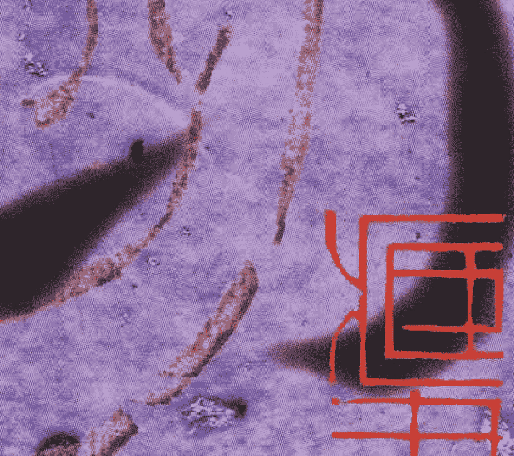

# 紫微堂奥

## 第八卷

墺元 著

大孚書局

## 紫微堂奥系列【全拾卷】

- 1. 第一卷 斗數總訣之希夷觀天星，斗數推命
- 2. 第二卷 斗數發微論之命逢紫微，特壽且榮
- 3. 第三卷 斗數太微賦之日月夾財，不權則富
- 4. 第四卷 斗數天門運限，扶身助命
- 5. 第五卷 斗數七殺朝斗，爵祿榮昌
- 6. 第六卷 斗數天祿天馬，驚人甲第
- 7. 第七卷 斗數左府同宮，尊居萬乘
- 8. 第八卷 斗數子午破軍，加官進祿
- 9. 第九卷 斗數丹墀桂擢，青雲之志
- 10. 第十卷 女命骨髓賦之輔魁福壽，弼相福臨

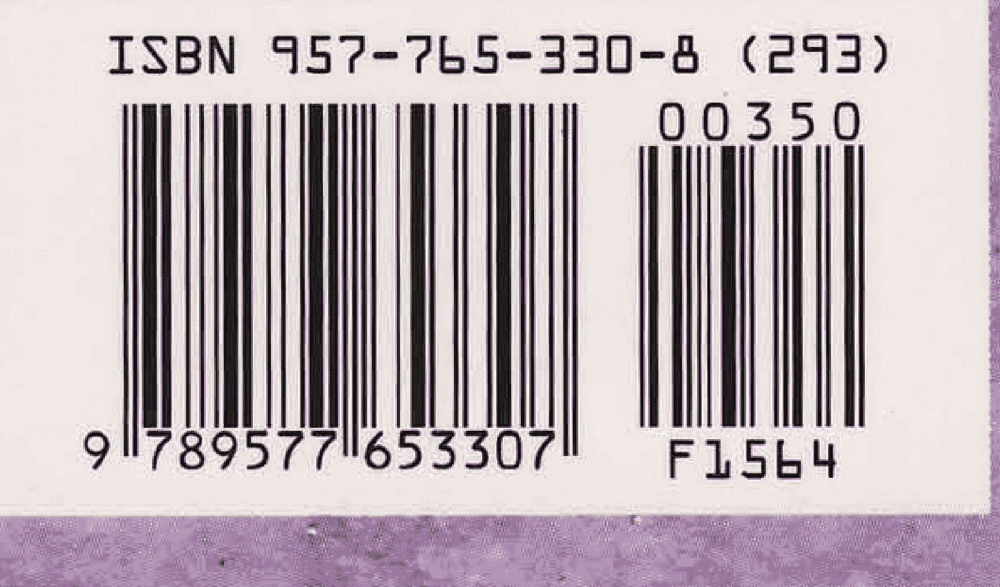

X 03 04 星光書店 $117.00

東明文化圖書公司 $117.00 TEL: 23425341

紫微斗数赋文诠註

## 紫微堂奥 第八卷

墺元 著

大孚書局印行

## 自 序

《紫微堂奥》以江西負子子潘希尹先生補輯之《新鐫希夷陳先生紫微斗數全書》爲藍本而爲紫微斗數賦文之精詳詮註。

卷一於一九八四年一月印行流通，筆者以當時已有之紫微斗數認知學涵，晝夜辛勤勤奮筆耕，作息失序，日以繼夜，晝夜顛倒，不屈不撓，再接再厲的經歷了二十八個月的殷勤刻苦筆耕，卷十終於一九八六年五月印行流通而竟詮註紫微斗數賦文之全功。

大孚書局傅寶泰先生有見於《紫微堂奥》爲研讀學習紫微斗數所不可或缺的最佳參考書，但因原著缺少作者序文而有美中不足之憾，情商拙愚爲原著增補自序，以使讀友不因原著無自序的小小缺失而抱憾，望元當仁不讓於師，義無反顧的恭敬從所命囑，流覽翻閱十卷而爲此序。

## 目錄

- 自序 ……………… 一
- 第八十二章 廉貞七殺流蕩天涯 ……………… 六
- 第八十三章 鄧通餓死，運逢大耗之鄉 ……………… 一六
- 第八十四章 夫子絕糧，限到天殤之內 ……………… 二六
- 第八十五章 鈴昌羅武，限至投河 ……………… 七一
- 第八十六章 巨火擎羊，終身縊死 ……………… 八四
- 第八十七章 命裏逢空，不飄流則主疾苦 ……………… 九二
- 第八十八章 馬頭帶劍，非天折則主刑傷 ……………… 五三
- 第八十九章 子午破軍，加官進祿 ……………… 七八
- 第九十章 昌貪居命，粉骨碎屍 ……………… 九○
- 第九十一章 朝斗仰斗，爵祿榮昌 ……………… 九六
- 第九十二章 文桂文華，九重貴顯 ……………… 一七一
- 跋 ……………… 二七一

「斗數骨髓賦」賦文註，並於賦文文句列舉相當其文句的命例以為習涉研究之參考。卷十詮註「女命骨髓賦」，附錄「補遺骨髓賦」、「形性賦」（按：「形性賦」與「諸星問答論」、「諸星入命限」互為參照融合，可以依據命圖星神而推想描繪此命圖本人之形性。）、「星垣論」（按：星垣論附錄而未註。）、「紫微斗數漫談」。今日增補為原著作自序，情不自禁的感慨：「老朽，老矣！任何人盡得《紫微堂奧》，必然直覺盡窺斗數堂奧，更勝老朽被香港徒孫們抬舉謬譽為「斗數奇才，一代宗師」矣！

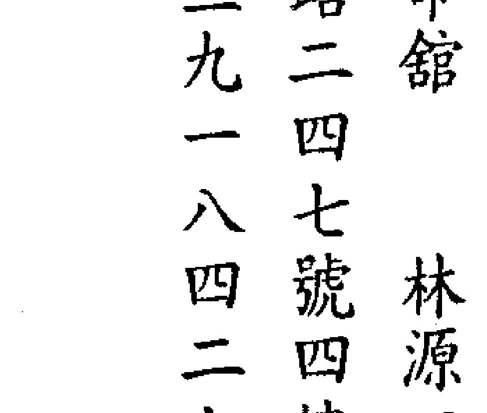

住址：台中縣太平市新坪里育德路二四七號四樓 電話：（〇四）二三九一三五一．二三九一八四二七 墺元閒談論命館 林源田 二〇〇三年五月一日 墺元謹為序

# 紫微堂奥

## 第八卷

## 第八十二章 廉貞七殺流蕩天涯

原註：巳亥二宮安命，值此二星，更加殺化忌逢空劫，流蕩天涯，不得守家，軍商在外艱辛。

墺元觀「紫微斗數全書」之附錄命例，立意用心至善而良苦，學者讀友玩習命例而配合賦文研習，即或無師授業解惑，大抵亦能揣摩出一個輪廓大概，如全書附錄之「郭恪」命例，即為此文之參考命例，因此附錄於後——

命例原註：「廉貞七殺午申宮，主人流蕩天涯。左右昌曲雖然加會拱照，只嫌命垣貪狼化忌，因為商賈在外，太歲沈馬，五十四歲小限在子沖之，喪門白虎合命，故凶。」

| 戊午 左輔 文曲 七殺 官祿 冠帶 蜚廉 | 乙未 天虛 天傷 奴僕 沐浴 奏書 | 庚申 右弼 文昌 廉貞 遷移 (52-61) 長生 將軍 | 天喜 |  |  |
|---|---|---|---|---|---|
| 丁巳 天鉞 天梁 天哭 田宅 喜神 臨官 | 丙辰 紫微 天相 福德 旺符 病帝 | 陰男 郭恪 水二局 歲次丙午年五十四歲初三故 | 歲次癸丑年三月初七日寅時生 |  |  |
| 乙卯 天機 巨門 天魁 火鈴 天姚 父母 衰 大耗 天姚 | 甲寅 貪狼 忌 紅鸞 命宮 官病府 | 乙丑 太陽 太陰 科 擎羊 地劫 兄弟 (2-11) 伏兵 死 | 甲子 武曲 天府 祿存 夫妻 (12-21) 博士 墓 | 癸亥 天同 陀羅 子女 (22-31) 力士 絕 | 壬戌 破軍 鈴星 祿 財帛 (32-41) 青龍 胎 |

墺元白費了好大一番功夫，就是沒有找到郭恪先生的生平事略，因此僅能就命例原著找到一個已知的線索——郭恪為商賈，大抵為經商而流蕩天涯。

假使學者讀友的記憶不比墺元稍差的話，一定還記得墺元曾經談論過殺破狼三合互守之概說，如果一時沒有找到在卷五或卷六也沒有關係，因為附錄命例已經說明得很清楚，假使墺元再多所贅筆的話，簡直就要蒙上囉嗦蒙稿費的罵名了，而事實上墺元以賣稿糊口，如果不聞話兩句，到底還是無法多拿幾個蹦仔兒，到底還是需要囉哩囉嗦多說幾句閒話。

觀之本命例或宜為卷四第二六五頁「廉貞七殺，反為積富之人」，故再引其原註：「廉貞屬火，是火能判金為權，如貞居未，殺居午，身命遇之，奇格也，反為積富。或陷地化忌，下格賤命。」比較參考，甚至可以再觀察所舉全書附錄「麓涓命例」、「石崇命例」（按：正玄山人或自為考證，或更有所本，其於「玄空四化先天命格局闡微」第三十八頁所舉「石崇的命格研究——之石崇生辰，正與享名子平術之袁樹珊前輩大作「命譜」第五九頁考證之石崇生辰相同為「己巳年七月初九日辰時」，演繹為斗數命圖亦與斗數全書附錄命圖非常近似。），則不難鉤起我們的聯想能力——廉貞七殺之組合，或為積富，或為流蕩天涯，我們應該如何去分辨呢？

龐涓以軍，石崇以商，因其富貴而不言及有無「流蕩天涯」之徵兆（參考卷七「石崇豪富，限行劫地以亡家」），而此郭恪命例雖亦具「廉貞七殺反為積富之人」之格局，但以癸生，生主星貪狼化忌，反被強調為「流蕩天涯」之格局，那麼二者之間的區辨最極具玩賞研習的價值了。

假使學者讀友有敏銳聯想能力的話，大概已經想到任何一個人的命盤上，即使不見於當生命局，由於歲月之遞遷，或於大限上遇之，或於歲限遇之，更有甚者，十二宮又為一年，一年必有數見廉殺之機會，十二宮又為一月，一月之中又必數見廉殺，十二宮又為一日，一日之中亦必數見廉殺，假使迷信於斗數祿命之中，不能大而化之，必欲鉅細無遺，則一命例一全書而不能止億萬言，所以研習斗數在於「勤敏審辨」而已。

今有先嚴林公諱中來命例，生歲次乙卯年七月四日酉時生者，安命於亥，雖格局未明見「廉殺」，但以遷移宮廉貪同守，就身宮以言，則亦為廉貞三合七殺之兆，其一生中遷徙幾二十次之頻繁，且以行商而流動攤販以終，即以「流蕩天涯」為寫照亦不為過（參考迂頊塋農著「認知紫微斗數」第二六頁），又其限臨乙酉大限，十五歲至廿四歲之七殺武曲十年，三合廉貪者亦然。

為激發啟迪學者讀友共同磋研星神與宮位之關係象意，特附命圖於後，學者讀友不妨試為揣摩推敲之——

| 辛巳 | 壬午 | 癸未 | 甲申 |
| :--- | :--- | :--- | :--- |
| 貪狼 廉貞 | 巨門 | 天相 | 天同 天梁 天鉞 |
| 天馬 | 天喜 天使 | 天姚 天空 | 地劫 |
| 遷移 | 疾厄 | 大耗 冠帶 | 財帛 |
| 伏兵 臨官 | 沐浴 病符 | 子女 |
| 庚辰 | 己卯 | 戊寅 | 辛酉 |
| 擎羊 太陰 右弼 | 天府 祿存 | 陀羅 | 火星 七殺 武曲 |
| 天傷 | 天刑 | 天空 | 紅鸞 |
| 奴僕 | 官祿 | 田宅 | 夫妻 |
| 帝旺 | 衰 博士 | 力士 病 | 養 (15-24) |
| 丙戌 | 丁亥 | 戊子 | 己丑 |
| 鈴星 左輔 | 紫微 破軍 文昌 文曲 | 天機 | 天魁 |
| 太陽 | 奏書 胎 | 墓 小耗 | 青龍 死 |
| 兄弟 | 命宮 | 父母 | 福德 |
| | 絕 將軍 | | |
| 陰 男 林 中 來 土五局 身主：天同 命主：巨門 | 咸次戊午年六月 四歲正月十三日 丑時故 | 咸次乙卯年七月初四日 酉時生 | 丁亥 |

像這樣的「活盤活看」（一般稱爲「運限之宮位假借」），一方面可以提起我們觀察研判的興趣，一方面也使我們困惑煩惱，在各種不同層次的時間觀念裏又將如何分辨其所代表的時間意義呢？
且舉墺元本人之半生經歷以爲說明如下：
一、乙巳大限，六歲至十五歲，此十年間並無居住所之遷移，僅先父於丁亥年六歲離家經商，本人比較貪玩野放而已，則廉貞七殺居大限之財帛宮所表示者不爲「流蕩天涯」，或爲「財富雖值得驕傲自負，但有不穩定現象」吧！
二、丁未大限，廿六歲至卅五歲，此十年間墺元從事布匹攤販，從自行車載幾包裹布匹擺地攤，而三輪車流動攤販，而汽車流動攤販，足跡幾遍及全省，並有四次居住所之徙事實，則廉殺居於大限之遷移宮，是否可本此賦文「廉貞七殺，流蕩天涯」以論？那麼賦文之引郭恪命例爲說，則廉貞，七殺有一星居於遷移位，即可本此而論嗎？
三、欲推考歲限經歷廉殺三方四正之宮位，是否比其餘歲限更具旅遊、遷移、變動之徵兆，不很困難，但是我們幾乎沒有寫日記的習慣，所以比較困難查考，如果我們把其星象針對已知，或欲爲追蹤考證之年，則又比較簡單得多——
1、墺元今年四十四歲，廉殺居小限之福德宮，表示墺元今年充滿旅遊之希望，但大多不能實現。

| 乙巳 | 丙午 | 丁未 | 戊申 |
|------|------|------|------|
| 天破武鉞軍曲 (忌) 父母(6-15) 父母 臨官 | 太陽 福德(16-25) 福德 喜神旺 | 天府 (科) 田宅(26-35) 田宅 病衰符 | 天機太陰 地天天劫刑馬 官祿(36-45) 官祿 大病耗 |
| 甲辰 | 陽男 墺元 | 己酉 |
| 天同 命宮 奏冠帶書 | 命宮 廉貞 火六局命 身鈴星 | 貪狼紫微 (權) 紅鸞 奴僕(46-55) 奴僕 死伏兵 |
| 癸卯 | 庚戌 |
| 鈴星左輔 天喜 兄弟 將軍沐浴 | 陀羅巨門 天傷 遷移(56-65) 遷移 官墓府 |
| 壬寅 | 癸丑 | 壬子 | 辛亥 |
| 天空截空 夫妻 小長耗生 | 火星文昌文曲七殺廉貞 子女 青龍養 | 擊羊天梁 天天哭虛 財帛(76-85) 力胎士 | 祿存右弼天相 天使 疾厄(66-75) 博絕士 |

- 2、今年六月廿一日（民國七十四年八月七日），墺元南下專訪鍾直霖老師，晉謁了悟學士鄭景峰老師，唐山逸士劉哲聞老師，雖然流日到子，暗合丑宮之廉殺，其難加以穿鑿附會也。
如果加上時辰，辰時從台中出發，巳時拜訪見到鍾老師，申時訪宜易園陳啟鉦老師、了無居士黃忠霖老師未遇，酉時巧值鄭老師，並前往拜會劉老師而言，巳時到巳，酉時到酉，巳酉三合丑之廉殺，這其中豈不又極耐人尋味呢？

- 3、廉貞七殺居丑宮，於墺元命盤為三月限宮位，為七月限之財帛宮位，已知今年三月廿四日送『紫鏡大限』書稿給希代書版公司，並專誠蒞謁斗數名家潘子漁老師，七月廿二日有事新竹，趁道拜訪吳萬全老師。此等短期時日之旅遊拜訪行為，是否亦可以附會於『流蕩天涯』呢？若可以如是說，則九月令時候，墺元又將作一百公里以上路程之旅遊矣！

| 丁巳 | 天左文 | 太陽 | 戊午 | 破軍 | 己未 | 天機 | 庚申 | 紫微 |
|------|--------|------|------|------|------|------|------|------|
| 天天使馬 | | | 祿 | | | | | |
| 疾厄 | 喜神 | 財帛 | (32-41) | 子女 | (22-31) | 奏書 | 夫妻 | (12-21) |
| 丙辰 | 武曲 | 病符 | 帝旺 | 陰男 | 岳武穆 | 壬戌 | 貪狼 | 鈴星 |
| 遷移 | | 岁次辛酉年三十九歲十二月廿九日卒 | 命主祿存 | 身主天相 | 水二局 | 岁次癸未年二月十五日巳時生 | 兄弟 (2-11) | 小耗 |
| 乙卯 | 天魁 | 天同 | | | | 辛酉 | 火星 | 右弼 |
| 天傷 | | | | | | 文曲 | 太陰 | 科 |
| 奴僕 | 大耗 | 大耗 | | | | 命宮 | 青龍 | 胎 |
| 甲寅 | 七殺 | 乙丑 | 擎羊 | 甲子 | 祿存天相 | 癸亥 | 陀羅 | 巨門 |
| 官祿 | 伏兵 | 田宅 | 官府 | 福德 | 博士 | 父母 | 力士 | 絕土 |

總之，賦文作如此說，不論我們從何種層次角度加以解釋，未必能夠非常完善的貼切賦文之解釋，譬如如今日工商業動態之社會已異於古昔農業社會之靜態社會組織結構，已經鮮有老死不相往來之特例，任何一個貪圖安靜的人也難免有旅遊遷徙之事業，任何一個流浪飄蕩的人也會有穩定息止的時候，所以解讀賦文的目的，就是要求知道廉殺二星遇合、沖照、三合的星象意義。

聰明而可以敬愛的學者讀友們，屬於你自己的經歷，屬於您自己的命盤，您一定可以比任何一個第二者知道得更清楚，那麼我們何不試以本人的命圖作為研習的作業，不斷的記錄，不斷的參酌附會於諸篇賦文的占斷，在我們有所小成心得之後，再蒐集一些具有詳盡事略的命例，逐一加一分析分類之推敲研判，那麼又有那一位學者讀友不會紫微斗數呢？

今巧得袁樹珊老師所著「命譜」第二三五頁有岳飛生辰「癸未年二月十五日巳時」生，演繹成爲斗數命圖，於命宮雖不俱見廉殺二星，於身宮而言，則適又見廉貞七殺，以其盡忠報國之歷史故事人俱皆知，故不贅述，但其自二十歲從軍後之輾轉沙場，又若符本賦文之原註，且與附錄郭格命例有幾成相似之處，故亦引錄爲本賦文之註解參考——

## 第八十三章 鄧通餓死，運逢大耗之鄉

> 原註：通安命在子宮，二限行至夾限之地，大耗逢之更會惡曜是也。

趣習於斗數，未必無所得，且如陳思先同契師事飛雲子魏老師，以魏老師常以天虛逢大耗為凶，陳師兄訒而問魏老師：「以何論大耗？」，魏老師對以當生歲破為之，陳師兄疑之而後問於墺元：「當生歲破之大耗恒與天虛同宮，魏老師用之，屢不應，宜乎！」墺元薄酒而揚言以告：「墺元未注意及此，此大耗果恒與天虛同宮，大半用於流年，當生以煞祿神論而已，如魏老師用之不驗，或宜改用煞祿神之大耗試之，但天虛大耗之作用次於諸主曜，如主曜吉則不論之，主曜見殺忌，始可以虛耗論議矣！」今見「鄧通餓死，運逢大耗之鄉。」，附錄未具命例，對於斗數之研習，未免不無遺憾，但如以大耗為煞祿神大耗論，則大耗適與二限同在午。本此以推，則或為乙生之陰男，則其安命於子，或為火六局之命，如此推測未離背原註之意，大抵可以佈成一個不完整的命圖以為參考丨丨

| 天鉞 | 病符 | 病死 | 大墓 | 伏絕 |
|---|---|---|---|---|
| 喜神 | 財帛 (36-45) | 疾厄 (46-55) | 遷移 (56-65) | 奴僕 |
| 甲申 | 乙酉 | 丙戌 | 丁亥 | 己丑 |
| 奏書旺 | 蜚廉 | 帝旺 | 將軍 | 青龍 |
| 夫妻 (16-25) | 子女 (26-35) | 兄弟 (6-15) | 父母 | 命宮 |
| 天魁 | 小耗帶 | 冠帶 | 沐浴 | 力士生 |
| 戊子 | 己丑 | 庚辰 | 辛巳 | 壬午 |
| 擎羊 | 祿存 | 博士 | 官府 | 天刑 |
| 官祿 | 田宅 | 福德 | 帝旺 |
| 己卯 | 戊寅 | 丁丑 | 丙子 |
| 長生 | 病 | 死 | 絕 |
| 兄弟 | 夫妻 | 子女 | 財帛 |
| 乙亥 | 丙戌 | 丁酉 | 戊申 |
| 田宅 | 福德 | 父母 | 命宮 |
| 博士 | 力士 | 青龍 | 小耗 |
| 壬午 | 辛巳 | 庚辰 | 己卯 |
| 官府 | 天刑 | 帝旺 | 沐浴 |
| 疾厄 | 遷移 | 奴僕 | 官祿 |
| 庚辰 | 辛巳 | 壬午 | 癸未 |
| 力士 | 青龍 | 小耗 | 冠帶 |
| 命宮 | 父母 | 兄弟 | 夫妻 |
| 己卯 | 戊寅 | 丁丑 | 丙子 |
| 沐浴 | 病 | 死 | 絕 |

附註：
假設為巳酉丑年生，午宮小限為六十歲。
假設為亥卯未年生，則午宮小限為六十歲，則二限不重逢於午宮。
依此，可以推想巳酉丑年生人。

但如鄧通生於乙年而餓死景帝之甲年為六十歲以論，則旁考華成書局發行萬年曆附錄，景帝在位十六年僅有中元三元之甲午年，則鄧通或必生於漢高祖元年之乙未年而已，如此則與題意不符，莫怪研習祿命者大多非議古人生辰，且又本例未見附錄命例矣！

雖然我們困難考證古人之生死，而且也無必要考證古人之生死，如果我們帶著消遣的心情來看此書，則除了專門探討賦文的詮註以外，遊涉一些與命相人物有關的歷史故事，當亦無傷大雅，因此相術有「許負相周亞夫、鄧通有縱理入口（即所謂騰蛇入口）主餓死」之傳說，今又見本賦文以論鄧通餓死，故節錄史記佞幸列傳之鄧通傳以為消遣——

鄧通，蜀郡南安人也。以濯船

> 按：辭源註為持楫行船。又按：濯，音濁，樴也，洗滌也，又音樴，浣衣也，又同權，所以進船也。以韻會註：「短曰檄，長曰權。」則辭源之註甚當，猶擺渡之人也。

為黃頭郎

> 按：古代以衣飾代表身份地位，鄧通原為四川以擺渡生活之人也。

孝文帝夢，欲上天，不能，有一黃頭郎從後推之上天，顧見其衣裻（音篤，衫襦之橫者。），帶後穿，覺而之漸臺。以夢中陰自求推者郎，即見鄧通，其衣後穿，夢中所見也。召問其名姓，姓鄧氏名通，文帝說（悅也）焉

> 按：漢書云上曰鄧通登也。悦之。

尊幸之日異，通亦愿謹，不好外交，雖賜洗沐，不欲出，於是文帝賞賜通巨萬，以十數，官至上大夫。

帝時時如鄧通家遊戲，然鄧通無他能，不能有所薦士，獨自謹其身以媚上而已。上使善相者相通，曰：「當貧餓死。」

> 帝曰：「能富通者在我也，何謂貧乎？」

於是賜鄧通蜀嚴道銅山，得自鑄錢。鄧氏錢布天下，其富如此。

文帝嘗病癰，鄧通常為帝唶癰，唶癰而色難之，已而聞鄧通常為帝唶癰，心慚，由此怨通矣！太子入問病，文帝使唶癰，唶癰而色難之，已而聞鄧通常為帝唶癰，心慚，由此怨通矣！及文帝崩，景帝立，鄧通家居，居無何，人有告鄧通盜出徼外鑄錢，下吏驗問，頗有之，遂竟案，盡沒入，鄧通家尚負債數巨萬，長公主賜鄧通，吏輒隨沒入之，於是長公主乃令假衣食，竟不得名一錢，寄死人家。

觀之鄧通事略，由擺渡撐船之黃頭郎而富甲天下，後竟一語招喑怨而貧餓死，若能得其真確生死推演，豈不亦頗耐人尋味矣！

> 嘗趣涉「麻衣相術秘訣」（荒山居士編著，王家出版社印行），麻衣先生石室神異賦曰：「法令綳纏，七七之數焉可過。」，其註云：「蘭台之傍曰法令，又曰金縷，又名壽帶，宜顯順，若綳急而不顯，纏曲而不順，若兼螣蛇鎖唇下，入口，皆不壽之相。」

則周亞夫有縱理入口，# 鄧通坐貧餓死，豈不可以相術相之，不必非以生辰推排祿命。

試使鄧通亦具周亞夫縱理入口之相徵，則依流年運氣部位圖解，左蘭台主四十九歲，右廷尉主五十歲，左法令主五十六歲，右法令主五十七歲，正口主六十歲，其應四十九至六十歲之十二年間，鄧通或餓死於六十歲之年亦未必不可。

但以鄧通生死無從考據，或以術士存仁，不欲使類似鄧通命例之庸人自擾，故以隱飾而不詳說於筆墨。

但以望元忖臆，盡信書則不如無書，盡信祿命則不如不言祿命，所以言祿命者，如子之曰：「不知命無以為君子。」，知命而有自知之明，不貪僥己之所不應不能得，不規避己之所應責任應作為，知逆來以順受，知橫逆以圖強，則知命可以解釋為「安分」矣！惟縱觀天下嗷嗷眾士，安分者多，守分者罕見，能守分盡職於職位者固亦多，能兼守盡「夫妻之分」、「父子之分」、「兄弟之分」、「朋友之分」之完人則未得一見，那麼在人生十九不如意的逆旅之中，豈不可以守盡於自己所專長之本分呢？

望元痴迷於斗數，雖人生歷練未必豐富，思想信仰未必純正，但每感斗數之迷人若有潛移默化之薰陶，恍惚習涉斗數之人俱能逐漸向善而惡惡，故任何學者讀友能夠研習斗數都是一件非常可喜可賀的善事，只是像望元一樣癡迷狂嗜的過程，往往會發生疏忽「本分」、荒廢「正業」的通病，那麼研習斗數的興趣，很可能就會破壞您的正業與前途，所以依望元研習斗數的經驗而言，千萬不可以炫耀自負斗數的成就，那麼在有足夠的富裕與充分的時間下，一定可以專心於斗數而為第一人矣！

望元自從甲子設硯開館服務以來，向不刻意追求不當之報酬，因此亦一直不願意宣傳廣告，這並不是望元自許清高而欲沽名釣譽，實以望元自習斗數以來，每感斗數充滿著無法突破之死角，每於觀察研判之際總有遺漏與疏忽之病，適如吳萬全老師之評語：「唐山逸士劉老師辭令長於文章，方外人曾老師為講授課程之材料，了悟學士鄭老師則木訥於言語而擅長文章，林老師亦如鄭老師木訥而言辭不能達意，觀之著作論述之多產，是五術界之大作家也。」

正如吳老師之評語，望元舞文弄墨之為糊口，亦欲一吐梗塞心臆的見解，因此本賦文雖未明言當生煞祿神之大耗的影響作用如何，但本此假設以觀，望元戊申大限運行大耗之鄉，亦幾有瀕臨餓死之虞，先父運行壬午大限之大耗十年，亦啟晚年之厄夢，那麼再增加蒐集一些類似的命例以為分析研判，大概也能夠比較正確的掌握斗數星象的意義了。

偶見正玄山人邱老師傑作「紫微斗數玄空四化事業財官專論」第二一○頁有洪某人破財實例，以其煞祿神之大耗守命，且有前章賦文所述之徵，雖然未必可以全依前本二章句賦文死看占斷，但在我們研習斗數的過程，亦足資引為參考，故特引錄於后：

格例說明：
（原命圖略，讀下文宜以原命圖為藍本。）

（一）、洪君是某食品加工厂的负责人，幼年家境清贫。三十四岁前家运欠佳，东谋西不就。
（二）、辛亥运三十五岁至三十九岁，开始经营加工厂，事业顺利。三、四年之间，已拥有数间厂房。
（三）、但因天空、地劫、每年都有少部分之呆帐。
（四）、辛酉年，财运转坏，且被倒帐廿多万元。

#### 命格研判：

（一）、是杀破狼之格，有干劲。七杀朝斗，马落空亡，故也劳碌奔驰。
（二）、财帛宫贪狼火星格、火贪格，中年故有爆发之机。
（三）、化权居身，故能自创业，遇地劫而辛苦。

#### 大限研判：

（一）、现行辛亥运。化权化禄皆入限中，化忌亦入财帛宫。
（二）、迁移宫化权、化禄、化科、化忌也同入大限之强宫。
（三）、财、官两宫之科禄权忌也皆同入限中。
（四）、因此本限好面居多，故而置产。
（五）、但因有化忌，所以必然有其灵动力，致有失财。

#### 小限追踪：

（一）、小限乙禄，权星有入，化忌亦入福德。
（二）、财帛宫、科禄权忌皆入。
（三）、官禄宫、科禄权忌皆入，而官禄宫自化忌。
（四）、迁移宫自化忌。

#### 综合检讨：

（一）、虽然大运很强，但流年失调，仍有损失。唯大运旺强，虽有忌煞，仅损失而不会导致破败。
（二）、迁移宫有化忌者，外销或外务之事业生意则须要小心，主在外有失。本宫化忌在迁移宫者亦然。唯其科禄权忌之会合碰撞，尚须加以分析，方能明瞭其灵动力之大小与动向。

望元引用正玄山人邱老师发表之命例，仅欲为前本二句赋文之探讨参考而已，恕不详为分析研判，大抵可以据左附之命图以为参考研判——

一、遷移身宮，大抵已有經常變換職業或生活環境之暗示，三合廉貞七殺二星，或可表示本人一身之遭遇有「廉貞七殺，流蕩天涯」之象意，只要鑽研於斗數星性之把握，大概可以推測洪某人之一生必有三種現象。

- (一)、居住所不變動，但經常變換職業。
- (二)、居住所與職業，經常發生變換與遷移之現象。
- (三)、居住所與職業已經穩定，但為職業性之因素而需時常作職業性之旅行。

二、小耗錢，大耗退祖。洪某人有大耗居命、小耗守身之兆，一生大抵難免有所虛耗，若承祖業，必為事業而退祖再自創置，若未承祖業而中年後自創置者，宜防事業衰敗而必變賣產業週轉或償債。

三、壬子大限，卅五歲至四十四歲十年，三合財帛宮之當生大耗，所幸其格局勉有後文第八十九章「子午破軍、加官晉祿」之象意，但又有前文第五十六章「李廣不封，擎羊逢於力士」之兆，如不能善為經營，恐於癸亥年四十二歲或甲子年四十三歲易有破敗之虞，甚至影響而發生次一癸丑大限之田宅宮之貪狼化忌之應也。

總之，運逢大耗之鄉，更會惡曜，並加二鄰加悔之情形，或可如賦文之論「鄧通餓死」，但在一般常見命例之運逢大耗之鄉者（含三合、沖照），大多僅止於變賣田宅，輕者亦不免有金錢之大量虛耗現象，學者讀友不妨自為試驗之！

| 乙巳 | 天鉞巨門 | 丙午 | 天廉相貞 | 丁未 | 文文天曲昌梁 | 戊申 | 七殺 |
|------|----------|------|----------|------|--------------|------|------|
| 子女 | 蜚廉 | 夫妻 | 喜神 | 兄弟 | 病符 | 命宮 | 大耗生 |
| 甲辰 | 貪狼 | 註：壬干化科，又有用左輔者。 | 陽男 | 洪某人 | 土五局 | 己酉四〇歲太歲父母 | 天同 |
| 財帛 | 奏書 | | | | | | |
| 癸卯 | 天鈴太魁星 | 天使 | | | | | |
| 疾厄 | (65-74) 將軍 | | | | | | |
| 壬寅 | 天府紫微 | 地截劫空 | 小病耗 | | | | |
| 遷移 | (55-64) 病耗 | | | | | | |

## 第八十四章 夫子絕糧，限到夭殤之內

原註與上同斷（限行至夾限之地，大耗逢之更會惡曜是也。）

凡我等讀古聖賢書者，莫不尊師重道而尊崇大成至聖先師孔子者，舉如五術之前輩名人袁樹珊老師，其精子平命理、六壬、選吉、卜筮諸術，於精心傑作「命譜」一書中，適同紫微斗數全書之附錄古人命例，首舉至聖先師孔子命例爲說，特別摘錄以爲參考——

> ——摘錄「袁氏命譜」第一頁至第五頁——

### 至聖先師孔子

周、姓孔氏，名丘，字仲尼，魯之陬人（陬音鄹，論語作鄒，即今山東省曲阜縣。）。父叔梁紇，娶魯之施氏，生九女，無子，其妾生孟皮，有足疾，乃求婚於顏氏，顏氏有三女，季曰徵在，妻之。禱於尼丘得孔子，生而首上圩頂，故名曰丘，字仲尼。

三歲父喪，及長，雖貧賤而恭慎逾常。景王己巳（年二十），始爲委吏，繼爲乘田。

敬王庚子（年五十一）爲中都宰，進爲司空司寇。唐開元二十七年己卯，諡文宣王，贈弟子各公侯伯。宋大中祥符元年戊申，加諡至聖文宣王。元太德十年丙午，加號大成至聖文宣王。明嘉靖九年庚寅，改稱至聖先師，從祀諸賢，故所封爵皆罷去。清順治二年乙酉，定文廟，諡號爲大成至聖文宣先師孔子，十四年丁酉，改稱至聖先師孔子。

周靈王廿一年（魯襄公廿二年），即庚戌之歲，孔廣牧生卒考云：「周正冬十月庚子。」，即夏曆八月廿八日（薛方山四書人物考云。）甲申時生。周敬王四十一年（魯哀公十六年），即壬戌，周正四月十一日己丑，即夏曆二月十一日，（生卒考云，或謂）午時卒。庚戌 命 六歲 丙戌 十六 丁亥

| 乙酉 宫 | 庚子 戊 | 甲申 子 |
| --- | --- | --- |
| 二六 戊子 | 三六 己丑 | 四六 庚寅 |
| 五六 辛卯 | 六六 壬辰 | 七六 癸巳 |

> 春秋繁露云：‘凡物必有合，合必有上，必有下，必有左，必有右，必有前，必有后，必有表，必有里。有美必有恶，有顺必有逆。’

谨按：至圣先师之造，日主之庚为阳，在正五行本属金，月干之乙为阴，在正五行本属木，今庚乙并列，相近相亲，左右联合，水乳交融，不独庚字变为化气五行之阳金，即乙字亦变化为化气五行之阴金矣！时枝申，月支酉，年支戌，会合一气，联为西方金局，虽曰地枝居下，实与天干在上之庚乙化化金同气相求，同声相应，格局纯真，毫无疑义。（此名西方一气格局，又名庚乙化金格。）气之金，甲能引己，又变为化气之土，此其表也。年干值庚，在正五行本属金，此其表也；庚能引乙，又变为化日枝之子居前，暗中藏癸，命宫戊子居后，暗中化火，亦不妨事，盖诞生之际，节过白露，化金得令，化火无权，小人道消，君子道长，有美无恶，有顺无逆，此诚明日月，量合乾坤之造也。惜连蹇蹇滞，叠经坎坷，当三岁之际，岁逢壬子，竟遭圣父叔梁公之丧，二十四岁，岁逢癸酉，圣母颜氏又复弃养，此无他，乃子癸引戊化火肆虐也。十九岁，迎娶夫人元官氏（元官，一作上官，元读若箕）。二十岁生子伯鱼，及初仕为委吏，继为乘田，此无他，乃丁运引壬化木，见功也。至于五十一岁为中都宰，五十三岁为司空，进位司寇，摄行相事，与闻国政三月，鲁国大治，此皆庚寅二运同为化金喜神有以致之也。及至五十七岁至六十六岁，忽而主卫适晋，忽而之宋反鲁，忽而遇桓魋之难，忽而困陈蔡之间，此皆辛卯二运，同为化金之忌神，有以致之也。及至六十七岁，夫人元官氏卒。六十九岁，子伯鱼卒，更觉岁逢丙辰，与生年庚戌抵触。岁逢戊午，与生日庚子抵触，有以致之也。七十三岁大运逢辰，既落空亡（附按：依生日庚子为甲午旬，旬中空亡辰巳论之。），又与太岁壬戌互相冲击，是以寝疾七日而终。鲁哀公诛之曰：‘天不遗耆老，莫相予位焉。呜呼哀哉！尼父！’（按：此据孔子编年，与史记稍异。）降及前清，圣祖仁皇帝，犹御制赞言，其序有云：‘粤稽往绪，仰溯前徽，尧’

舜禹湯文武，達而在上，兼君師之寄，行道之聖人也。孔子不得位，窮而在下，秉刪述之權，明道之聖人也。行道者，勳業炳於一朝，明道者，教思周於百世。堯舜文武之後，不有孔子，則學術渾淆，仁義湮塞，斯道之失傳也久矣！後之人而欲探二帝三王之心法，以為治國平天下之準，其奚所取衷焉！然則孔子之為萬古一人也審矣！——觀於此，孔子之壽，直億萬斯年也，豈尋常之寢疾而終者哉！

觀之孔子生死考證甚詳，雖未直指夫子因陳絕糧之事略，但已頗可為孔子生平事略之參考，因以依演繹成為斗數命圖，庶可方便斗數之觀察研判——

| 干支/分类 | 辛巳 | 壬午 | 癸未 | 甲申 | 乙酉 | 丙戌 | 丁亥 | 戊子 | 己丑 | 庚寅 | 辛卯 | 壬辰 |
| ---- | ---- | ---- | ---- | ---- | ---- | ---- | ---- | ---- | ---- | ---- | ---- | ---- |
| **主星/杂曜** | 太阳(禄) 天截空伤 | 破军 | 天机 地劫 | 紫微(天府、天姚、天马) | 太阴(擎羊、忌) | 贪狼 | 巨门(左辅) | 廉贞(天相、文曲) | 天梁(天魁、火星) | 七杀(文昌) | 天同(右弼、铃星、科) | 武曲(天刑、权) |
| **十二宫位** | 官禄 | 奴仆 | 迁移 | 疾厄 | 财帛 | 子女 | 夫妻 | 兄弟 | 命宫 | 父母 | 福德 | 田宅 |
| **长生十二神** | 大耗临官 | 伏兵帝旺 | 官府衰 | 博士病 | 力士死 | 青龙墓 | 小耗绝 | 将军胎 | 奏书养 | 盖廉长生 | 沐浴喜神 | 病符冠带 |
| **个人信息** | | | | | | | | 命主：巨门 身主：文昌 火六局 | 阳男 孔子 岁次壬戌年七月廿一日午时卒 岁次庚戌年八月廿八日申时生 | | | |

望元偶亦流覽史記，愛其傳記較袁氏命譜為詳，因此特別以一己膚淺的國學程度據以翻譯成語體文，以為五等後學以為勸學之目標及榜樣。

> （左列據史記孔子世家翻譯成語體文。）

孔子生於春秋時代魯國昌平鄉陬邑

> （按：周末，因孔子著「春秋」一書，後世因取為名。）

> （按：据史学家考证为今之山东省曲阜县。）

孔父嘉之後代即又從孔父嘉計算「親等」關係。

孔子誕生的這一年，公羊傳載為魯襄公廿一年十一月，史記世家載其生於魯襄公二十二年，

孔子年十七歲時，已甚著博學之名，魯大夫孟釐子生病得就快要死了，他告訴他的孩子懿子

說：「孔子年少好禮，他的六世祖先弗父何是個聖人，雖然是宋愍公（有作宋襄公）的嫡長子，不愛富貴而讓位給其弟宋厲公，弗父何的曾孫正考父也是個聖人，忠心輔佐攜戴武宣公，雖居高位卻又為人謙恭而有賢名。我聽說聖人之後，即使不擔當相當地位的權貴，也會有賢達的子孫，我看孔子是個賢達的人，我就快要死了，我希望你能夠拜孔子為老師而研求學問啊！」

孟懿子終於死了，懿子遵遺訓，與魯國人南宮敬叔一起向孔子為老師而研求學問啊！

孔子少年的環境甚為貧賤，在貧賤中長大，曾經替季氏管理倉庫，管理牧場（職司乘田），都以他異常的身高而驚訝。孔子長得甚是高大，身長九尺六寸（古尺與今制不同，合約身高二百三十公分左右），常人

貴人家以財物贈人，仁德的人以銘言勉勵人，我不是富貴人家，卻薄得仁德的名號，所以我有幾句話勉勵你：有些聰明深察世故的人較常人容易死，是因為他好議論別人的是非，有些博學而愛辯論的人較容易危害自身，是因為辯論難免揭發別人的缺點所致。一個做為子女的人，以孝順父母為主，不可以違逆父母，一個做為君子的人，以忠事君主為先，不可以背叛君主，這就是做人

孔子曾經過訪間周國老聃，向老聃求學問禮，臨別時老聃（按：聃，同聃，耳漫無輪也。此指

魯昭公二十年，孔子年三十歲，齊景公帶晏嬰來訪問魯國，景公問孔子：「以前秦穆公國小而偏僻，為什麼能夠稱霸呢？」

孔子回答說：「秦國雖小而偏僻，秦穆公卻志大而能用百里奚，雖然稱王而小有霸業，還不足以稱霸也。」

並且還說明了一些為政之道，兩人很投機的談論了三天，使景公感覺的興奮喜悅而不虛魯國之行。孔子年三十五歲時，季平子因為與郈昭伯鬥雞而得罪魯昭公，魯昭公率師攻擊季氏，季平子聯合孟氏叔孫氏三家攻擊魯昭公，魯昭公兵敗投奔於齊，齊將魯昭公安置在乾侯地方，魯國三家大夫爭權而生內亂。

精通韶音，向其學習韶音，孔子專心好學得幾至三個月不知肉味的佳美，於是齊國人都傳說稱讚孔子的好學與專心求學的精神。

魯國內亂，孔子投靠齊國高昭子，本來想要通報齊景公，因與齊太師萇弘談論音樂，以萇弘

孔子就告訴齊景公一些秦穆公不以百里奚為罪犯而能夠重用其為相國的道理，而且還說明了一些為政之道，兩人很投機的談論了三天，使景公感覺的興奮喜悅而不虛魯國之行。

魯昭公二十年，孔子年三十歲，齊景公帶晏嬰來訪問魯國，景公問孔子：「以前秦穆公國小而偏僻，為什麼能夠稱霸呢？」

孔子問禮後回到魯國，聞名而來求學的弟子稍微多了一些。這時候的國際情勢很亂，晉平公淫亂，六卿擅權，東伐諸侯，楚靈王兵強，陵轢中國，齊國強大而靠近魯國，魯國卻弱小，假使附楚國，則恐晉國憤怒，如附於晉，又怕楚國來攻，假使不防備齊國，也恐怕齊國的侵略。

的道理呀！

齊景公又向孔子請教政治之道，孔子說：「君君，臣臣，父父子子！」齊景公稱讚的說：「對呀！假使君不君，臣不臣，父不父，子不子的沒有倫常，國家就要紊亂，我又沒有什麼好當君王的！」他日，景公又問政於孔子，孔子回答說：「為政在於節財！」景公認為孔子很有政治的學問眼光，想要將尼谿田封賜孔子，晏嬰却反對，景公認為晏嬰反對得有道理，所以也不向孔子問禮。有一天，齊景公向孔子說：「我不能以相當於魯國上卿大夫季氏的地位對待你，也不能與季氏與孟氏間的中卿地位用你，我已經老了，我實在無法用你呀！」就在這個時候，孔子聽說有一些大夫要排斥他，又聽齊景公不能用他，於是就離開齊國而返回魯國。

孔子四十二歲之年，魯昭公死於乾侯，定公繼承即位。魯定公五年之夏，季平子死，桓子承襲上卿大夫爵位，季桓子穿井得一土缶，缶中有一好像羊形的動物，問孔子是否能夠知道牠的名稱，孔子回答說：「以我所知道的，木名之怪夔罔罔，水之怪龍罔象，土之怪墳羊，此物即為土怪墳羊也。」由此可見孔子之博物也。（魯哀公元年）吳伐越國，攻破越國都城會稽，得到一巨大骨節，其大長要一專車才能容納比擬，因此特別派使者到魯國問孔子：「什麼骨節最大？」

孔子回答使者說：「聽說古時候夏禹召集各地方的領袖到會稽山集會，有防風氏違命遲到，於是夏禹就將防風氏殺死而使陳屍於會稽山。聽說防風氏為巨人，其骨節大約有專車之長，他的骨節大約就是天下最大的了！」

吳國特使又問：「那麼防風氏到底是什麼職守的領袖呢？」孔子說：「防風氏為汪罔氏之君，守封禺之山，為釐姓，在虞、夏、商為汪罔氏，在周為長翟氏，今都稱為巨人也。」

又問：「人有多高大？」孔子回答說：「僬僥氏三尺（合約七十公分）左右，是最矮的人，最長的人有僬僥氏的十倍高（合約七公尺）。」

吳國使者見孔子博學廣聞，由衷的讚佩：「善哉！聖人！」（吳使問孔子應為後人附會之故事也，見後。）

這時候，季桓子有一嬖臣仲梁懷與陽虎有間隙，陽虎想要放逐仲梁懷而被公山不狃阻止。秋，仲梁懷因季桓子的寵信而益形驕傲，陽虎看不過去而捉仲梁懷，而惱怒季桓子，陽虎也把季桓子捉來囚禁，直到季桓子答應條件才把他放了，陽虎從此輕視季桓子，季桓子再也無法像以前一樣的執行政事，國致都操持在陪臣的手中，魯國的政事離背正道而混亂，所以孔子不願仕，退隱而修詩書禮樂，弟子越來越多，有自遠方慕名而來受業的。

定公八年，陽虎為亂，欲廢三桓之嫡系而更立他所喜歡的人，於是又將季桓子囚禁起來，卻被季桓子想辦法脫逃了。

定公九年，孔子年五十歲，陽虎不勝犇于齊，公山不狃才得陪伴季桓子於費，並且派人召用孔子，孔子想要就任，因為子路不高興的反對阻止而沒有就任。

不久，魯定公用孔子為中都宰，只一年，四方皆有法則而井然有秩序。於是由中都宰而昇為司空，由司空而昇為大司寇。

定公十年春，魯國與齊國修好，夏，齊大夫犁鉏告訴景公：「魯國用孔子，魯國必定強盛起來，將來一定會成為我齊國的威脅。」

齊國為測知魯國實力，派使者告訴魯國，為兩國敦睦邦交而約會於夾谷地方，魯定公與齊景公相會於夾谷，雖有晏嬰作陪，孔子以禮義折服齊景公，齊景公回國後而恐慌，告訴群臣說：「魯國有孔子以君子禮義之道輔佐定公，你們卻教我夷狄野蠻的霸道，反而使我得罪於魯國，現在應該怎麼辦？」

> 「君子有過則謝以質，小人有過則謝以文，假如君王對於這件事不安，就要以實在的形式謝過。」

於是，齊景公就將以前侵略魯國所得之鄆、汶陽、龜陰之田歸還魯國，於是，魯國就在齊國歸還的地界築城，命名為謝城，以紀念孔子這次獲得外交上的勝利。

定公十三年夏，孔子告訴定公說：「為臣忠心的不會私藏甲兵，為大夫忠心的不會私築高的城牆，這是君臣應該有的制度呀！」

孔子於是派仲由（如仲由少孔子九歲，這時候應該四十五歲，不死於卅二歲甚明）為季氏宰，有心要墮毀三卿大夫的私家城牆，首先除去叔孫氏的郈城，又要廢除季氏的費城，公孫不狃叔孫輒反對墮城而率費城人攻擊魯公，魯公率三子進入季氏的宮殿，並登武子之臺，費人雖也有攻擊進入武子臺側的，孔子命申句，須樂頎下臺攻伐費人，費城的人戰敗，被驅逐又戰敗於姑蔑，於是二子犇于齊終於毀墮了費城，又要毀墮成城，成城的宰相告訴孟孫說：「即使毀除成城，齊人必從北門侵略，成城實為孟氏之保障，假使沒有成城，也就沒有季氏了，我反對毀墮成城。」

十二月，魯昭公圍困成城，卻不能攻克成城。

魯定公十四年，孔子年五十六歲，由大司寇而處理相國的事務，面有喜色，門人覺得奇怪的問：「聽說君子有禍害也不會害怕，有福祿也不覺得特別喜悅，為什麼夫子相國而有喜色？」

> 「話雖然這麼說，我能夠相國而發揮政治理想，造福民衆，我怎麼能夠不喜悅呢？」

孔子行攝相事，很少動用刑罰，僅僅三個月就很見成功，有司在孔子的領導統御下都很盡忠職守，百姓也養成善良的風氣習慣，男女老幼在街上行走有秩序有禮讓而不會雜亂，做到了路不拾遺，買賣誠實無欺，而使四方來客貿易買賣都沒有發生爭執，而且就像在自己的家鄉一樣的富有人情味。

齊國人聽見這個情形而感覺害怕，說：「孔子為政必可使魯國稱霸，魯國稱霸之後，因為齊國最靠近魯國，我齊國必定最先被魯國兼併呀！」

大夫黎鉏向齊景公說：「我們可以先破壞沮喪他們的民心風氣，假使不能沮喪他們的民心風氣，我們也只好看著魯國強盛起來！」

齊國於是選美女八十人，駿馬三十駟，說是要送給魯君的，令美女衣文衣而在魯國城南高門外歌舞表演，季桓子聽說，曾經微服出城看了好幾次，有心接受齊國的贈送，於是邀請魯定公一同前往觀看美女文馬的遊行表演，有時候觀看終日而忽略於政事。

仲由看見這個情形，提醒孔子說：「君臣怠於政事，魯國只有你一個人，又能夠有什麼作為？夫子可以走了吧！」

孔子說：「再看一些時候吧！魯國馬上就是祭典校閱的時候了，假使一國的君臣連校閱祭典都忘了，我又有什麼好留戀的！」

季桓子接受了齊國的美女文馬，魯定公有三日不聽理政事，連校閱祭典都忘了，更沒有將祭肉分別犒賞大夫，孔子也就認為自己在魯國無所做為而離開魯國。

孔子由於衛國顏讎鄉是仲由的妻兄，所以就先到他的家裏。

衛靈公想用孔子，問孔子在魯國俸祿多少，孔子說：「俸粟六萬。」

衛靈公就給孔子六萬俸粟，却又派公孫余假以兵仗迎送孔子的出入，表現得非常非常的尊敬，雖然尊重孔子，但是也好像不能完全信任孔子的人格，也使孔子感覺到受拘束與受警備提防的感覺，因此孔子擔心在這樣的情形下容易被懷疑而被加上不需有的罪名，這樣居住了十個月也就離開了衛國。

孔子離開衛國，想要到陳國的途中經匡城地方的時候，顏回正替孔子趕著車子，以馬鞭指著匡城破缺的地方告訴孔子說：「以前我曾經與陽虎就是從這個破缺地方進入匡城的，想不到過了這麼久還沒有修築好！」

匡城人並沒有聽真切，因為從前曾經遭受陽虎的搶劫而受災害，以為魯國的陽虎又來搶劫，因此匡人為了一行圍困得很緊，急欲摸索到孔子，弟子們非常擔心，但是孔子却非常鎮定的說：「自從周文王死後，沒有人能夠繼承儒家的道統，我有心繼承儒家的道統，如果天道要使儒家思想由我發揚光大，我又怎麼會被困而死于此呢？」

孔子取出了琴而彈奏出文王被拘美里的心情琴操（按·家語云·子路彈劍而歌，孔子和之曲，三終，匡人解圍而去。），幽怨的琴操感動了天地，忽起暴風吹擊包圍的軍士，軍士認為孔子是天生的聖人，絕對不會是陽虎，所以也就散去了包圍。

（又有一說，孔子被匡人包圍，於是派遣相從的學生突圍向衛國求援，等到寧武子統屬衛國的軍隊開到匡城，才使孔子等人脫出包圍。按·史記與家語相異，索隱臆孔子再厄匡人，或設辭以解，或彈劍而釋難，大概所說的都是同一件事，只是傳說不同而已。）

在被匡人包圍的時候，顏淵（即顏回）被沖散了，直到匡人包圍退散以後才再相聚，孔子一見到顏回就打諢說：『被包圍的時候，沒有看到你，我還以為你已經被匡人殺死了呢！』，顏回很幽默的回答：『夫子您還活得好好的，弟子顏回怎麼敢比先生先死呢！』

匡人的包圍一退去，孔子一行即經過蒲鄉，月餘才回到衛國，仍然居住在蘧伯玉的家中。靈公有一個寵愛的夫人名叫南子者，平常就非常仰慕孔子，聽說孔子來到衛國，於是派人召見孔子，孔子雖然再三辭謝，但是不得仍然往見南子。

孔子見南子的時候，南子夫人在縐帷之中，孔子點頭為見面禮，南子在帷中回禮，只能聽到環佩玉飾的動作聲響，卻不見南子的形貌，孔子就說：『我想這樣隔著縐帷，不是見面的禮節啊！』，南子才從帷中出來相見，於是孔子也以相見之禮答之！（附按：古有男女授受不親之說，但無男女不可相見之設，所以從這一件事可以推測孔子講究注重禮節之一斑。）

子路對於孔子與南子相見這一件事非常不高興，因此孔子向子路解釋說：『我不願意者，別人也一樣的會討厭，雖然我平常常說『勿強人之難』，但是這一件事所要求的只是一般相見的禮節而已！』

孔子在衛國居住了月餘，有一次靈公與夫人同車出遊，特別安排孔子為次乘，靈公之從屬宦臣都擁擠著爭取參加同遊的參乘以次的行列，一行浩浩蕩蕩的招搖過市，孔子很感慨的說：『愛慕虛榮是人性的缺陷，我看來還沒有看見有愛好修德如追逐名色一樣熱衷的人啊！像這樣虛榮浮奢的國家，相去我所追求的理想太遠了！』

於是孔子就離開衛國而到曹國，這一年曹定公死了，孔子認為曹國無法發展他的理想抱負，於是又離開曹國而到宋國。

到了宋國，孔子沒有找到講學的地方，於是就在大樹下與弟子習禮。宋國司馬桓魋不准孔子聚眾講學而拔除了講學地方的大樹，甚至於想像殺孔子，孔子只好離開宋國。

有孔子的弟子說：『像宋國這樣不相親禮義的國家，又有什麼值得我們留戀的，我們還是趕快離開宋國吧！』

孔子說：『天授聖德要我傳揚道德，桓魋雖然不准我在宋國講學，他又怎能禁止我到別的地方講學呢？』

於是孔子逃離宋國而到鄭國，途中與弟子失散了，於是孔子獨立郭東門，希望諸弟子能夠找到他而重新聚集在一起。

子貢與孔子失散了，向鄭國人打聽孔子的形蹤，有鄭國人看見他的模樣向子貢形容說：『東門有一人，有像堯一樣和藹的面目，有像皋陶一樣的頸項，有像子產一樣的肩膀，不過從腰的下身看來，雖然長的很高大，卻好像比夏禹還矮了三寸，不得志的模樣就像喪家之犬。』

子贡根据形容很容易就找到了孔子，并将郑人的形容告诉孔子。

- 子贡说：“东门有一人，其头似尧，其颈似皋陶，其肩似子产，然自腰以下不及禹三寸，累累若丧家之狗。”

> 孔子欣然得笑著说：“形容虽然不够贴切恰当，把我形容比瑜成丧家之犬，真是最恰当传神了。”

孔子师生又聚集在一起，但是并没有在郑国停留，一起到了陈国，居住在司城贞子家中。

孔子在陈国一年多的时间，吴王夫差攻占了陈国三个城邑，趁鞅攻伐朝歌，楚国围困蔡国，蔡国迁都投靠吴国，吴国打败越王勾践而攻破会稽（附按：前述吴使问孔子骨节事，若为此时为是，则不为鲁哀公元年，而应为鲁哀公四年矣！），有隼（骛鸟）被很长的枯矢贯穿而坠死于陈国的宫廷，矢镞以石为之，陈潜公派使者问孔子。

> 孔子回答说：“这种枯木石砮的长矢是肃慎国所特有的，可以想象这只骛鸟在肃慎国被射中未死，带著长矢飞到这才死亡坠落。听说以前周武王推翻了商纣，获得诸侯的拥戴，通道九夷百蛮，使各方诸侯朝贡，那时候远方的肃慎国朝贡了像这样的枯矢石砮，武王就将它送给女儿作陪嫁虞胡公的礼物，而封诸於陈，我想在贵国的府库里应该可以找到像这样的东西。”

陈潜公果然在旧府库中找到了一样枯矢石砮，可见孔子博物博识而通晓历史故事啊！孔子在陈国居住了三年中，刚好是晋楚争强的时候，因此陈国也时常受到两国的攻伐，而且吴王夫差有心争霸，也时常侵略陈国，孔子认为陈国时常被强国侵扰而决心离开陈国。

孔子离开陈国经过蒲城的时候，又被蒲城人围困住，这时候在随从孔子的弟子有一个叫公良耐的，长贤而有勇力，很感慨的说：

> 我以前追随夫子在匡城遇难没死，现在又在这蒲城地方遇难，这大概就是命运作弄人吧！假使命运注定我要死在这里，我又有什么好怕死的！

公良耐激昂的挺剑与蒲城人奋战，甚为勇猛敢死，蒲城人害怕而不愿有太多的伤亡，于是向孔子说：

> 假使夫子你们不到卫国去，我们就让你们离开蒲城。

> 子贡觉得奇怪而问：“君子最注重信义，何以违背与蒲人的约盟吗？”

> 孔子坦然的回答：“君子固然最要注重信义，信守言诺，但是像蒲城人这种威胁性的要求，我们不妨从权答应，假使冥冥之中有神明司察，神明也不会因为我的从权答应蒲人的威胁而背信，就处罚降罪於我啊！”

孔子虽然答应蒲城人的要求，但是出了蒲城东门却又到卫国。卫灵公听说孔子又到了卫国，很高兴的出城郊外迎接孔子。

> 卫灵公问孔子：“我很想攻占蒲城，我有的大夫都认为蒲城的存在，可以首当晋楚之来攻伐我国，有的则赞成我攻取蒲城，依你的看法如何？”

> 孔子说：“蒲城虽然在公叔氏的统治下，他的人民都有强烈的地方意识，不愿意被别人统治，假使你想要攻伐蒲城，大不了也只是公叔氏为首的四五个人而已，这样对于你又有什么好处？”

卫灵公听说，也就不再想攻伐蒲城了。

这时候的卫灵公已不再是以前雄心蓬勃的卫灵公，虽然很欢迎孔子，但是对于政治有懈怠因循的样子，因此不用孔子，孔子很感慨的说：

> 假使卫灵公肯重用我，只要能够让我推行政教三年，我就可以看见我行政的成就。

於是孔子又離開了衛國，本想接受中牟宰佛肸的召請，但是由於仲由的反對阻止而作罷。孔子得知師襄子精於琴，於是向師襄子學鼓琴。孔子才學鼓琴十日，師襄子就稱讚說：『有這樣熟練的技巧，已經可以了。』孔子說：『我雖然已經學會琴曲，但是還不知道琴曲的樂理！』過了一些時候，師襄子又告訴孔子說：『你已經知道琴曲樂理了，已經可以了。』孔子說：『我雖然已經學到了樂理，但是我還不能像你一樣的用琴曲表達作曲者的心志呀！』又過了一些時候，師襄子又告訴孔子說：『你已經能夠用琴曲表達作曲者的心志了，已經可以了。』孔子說：『我雖然已能表達作曲作者的心志，但是我還不知道作曲者的為人呀！』又過了一些時候，孔子終於領悟了師襄子傳授的就是『文王操』，師襄子甚為敬重孔子的格物致知的好學精神，而將文王操等最高深的琴藝完全教導傳授給孔子。孔子沒能受到衛國的重用，有心投奔趙簡子，但是到了黃河的時候，聽說趙簡子誅殺了寶鳴犢、舜華兩大夫，臨河而興嘆說：『唉！我孔丘的命運太不濟了，這大概就是命運吧！』子貢好奇的問：『夫子這句話怎麼說？』

孔子說：『寶鳴犢、舜華兩人為晉國的賢大夫，趙簡子在未得志時，須要這兩個人輔佐擁戴才能從政稱霸，今天趙簡子從政而有成就，却將這兩個人殺了，像趙簡子這樣的人，我怎能投靠他呢？這不是我的時運不濟嗎？』孔子於是不西見趙簡子，息隱於陬鄉（按：此陬鄉非魯國陬邑，名同而地異。），作『陬操』以哀悼寶鳴犢與舜華。孔子又回到衛國，還是居住在蘧伯玉的家裏。有一天，衛靈公問孔子行軍佈陣的方法，孔子推辭的說：『我只知道禮義禮節禮儀而已，我沒有學過軍旅兵法呀！』第二天，衛靈公與孔子說話的時候，衛靈公不看說話的孔子而仰視飛過的雁鳥，很有輕視孔子的態度，於是孔子又離開衛國而到陳國。這一年夏（索隱註為魯哀公二十年），衛靈公死了，其孫輒繼位為衛出公（按：靈公太子贖因與靈公夫人南子有私情，被靈公知道而出奔，見卷七第五十八章『仲由猛烈，廉貞入廟遇將軍。』因為贖不在國而立輒。）。六月，趙鞅接納衛太子蒯贖（即衛出公父贖）於戚城，陽虎幫助贖藉服喪之名而回衛國，是為衛莊公。魯哀公三年，這一年孔子六十歲，齊國幫助衛國圍攻戚城，只是因為衛太子蒯贖在戚城而已。

#### 附注：而已！

又有一日，葉公向仲由打聽孔子是一個怎樣的一個人，仲由回答不知道應該如何形容孔子的偉大，孔子知道了就向仲由說：「仲由你為什麼不能這樣的告訴他：他的為人，學道不倦，誨人不厭，發奮忘食，樂以忘憂，不知老之將至云爾！」

孔子從葉國又回到蔡國，三年，（按：或指魯哀公三年。）吳攻伐陳國，楚國興兵救陳國，楚軍駐于城父，聽說孔子在陳蔡之間，楚國於是派人禮聘孔子，孔子也有意接受楚國的禮聘。

這個消息被陳蔡兩國的大夫知道了，相互計議說：「孔子是個賢達的人，他所譏諷的都能說中諸侯的弊病，假使孔子受聘楚國而被重用，楚國馬上就能強盛得吞滅陳蔡兩國，我們絕對不能讓孔子到楚國去！」

於是陳蔡兩國相互發兵阻擾孔子的行程，有一次在陳國的野地更將孔子及弟子圍困得不能前進，甚至於絕糧，隨從的弟子也有人因而病倒不起。

子貢在旁也聽得臉上變色，孔子又說：「賜（子貢）！你是我所有弟子中博學的一個，你方能夠安貧而固守志向操守，小人窮困的時候就會濫濫為非作歹！」

- 子贡说：“这个道理我是知道的，但是人必衣食足而后知廉耻，一旦穷困而不走极端，恐怕很难吧！”

- 孔子说：“君子与小人的区别也就在穷困的时候，我只是一本君子之择善固执而已。”

孔子虽然已经向弟子解释了不辍讲诵弦歌的道理，但是却没有提到目前绝粮的解决办法，弟子们的表情都显得生气不满，于是孔子分别向弟子作个别谈话——

孔子召见仲由而问：“诗云：‘匪兕匪虎，率彼旷野。’（按：兕，音祀，状如野牛而青象形，一角青色，重千金，其皮坚厚可制甲。古取其善抵触而制罚爵以为酒戒，取其形象而为兕觥，即角爵也。望元飏其指令之犀牛言，含「抵触」之义。）匪虎（按：虎指百兽之王老虎也，大戴礼曰：「三九二十七，主星，星主虎，故虎七月而生。」，依易卦言，风从虎，依星经言，星七星如钩柳下生，虽今以为星宿缠午位，昔或缠已位，巳为巽，巽为风，故于此含「风行」、「回顾」之义。），率彼旷野。’，我等率循君子的道理，不也就象犀牛与老虎一样的活动在旷野吗？我们的言行如果违背抵触了道德，我们就应该反省检讨而改正过来，我所追求的理想抱负不也如此吗？不然怎么会受困于此？”

- 仲由说：“别人不能相信于我们，大概我们的仁德还不够让别人知道相信。别人不要我们通行，而我们又要通行，这大概就是我们不夠理智才会被穷困在这里。”

- 孔子说：“仲由，你说对了！不过仁者并不一定要别人知道相信，如果这样，就不会有伯夷叔齐了；如果智者一定要知道可以行才行，也不会有比干了。”

仲由明白了仁德与理智有所冲突时，君子仍然奉行仁德的道理，于是换了子贡进来与孔子谈话。

- 孔子说：“诗云：‘匪兕匪虎，率彼旷野。’，我追求的理想目标不也只是这样吗？为什么还会受困于此？”

- 子贡说：“夫子的道理实在太远大了，狭小的天下实在无法容纳夫子的大道理呀！”

- 孔子说：“赐！你说对了！一个优秀的农夫能够选种选时而辛勤耕种播种灌溉，但是也要靠人的心意与限制，也无法表现出其本身的创意技巧啊！所以君子之道也是相同的道理，他能修其道，纲而纪之，统而理之，可是这个理想抱负不一定能够让所有的人接受容纳啊！现在如果我们为了穷困绝粮的挫折而放弃我们的理想，只想求适应时代而被接受容纳，那么你我的志向不就不过远大了吗？”

子贡明白了争取理想奋斗而不屈于环境的道理，于是又换颜回进来谈话。

- 孔子又用同样的话向颜回说：“诗云：‘匪兕匪虎，率彼旷野。’，我追求的理想目标不也还是这样吗？为什么还会受困于此呢？”

> 子貢出，顏回入見，孔子又用同樣的話回顏回，顏回說：「夫子的道理實在太偉大了，所以天下很難容納推行夫子的道理，即使如此，又有什麼關係呢？大道之不被推行才能夠看出夫子目標的遠大。假使不修道而被容納，才是君子應該自覺慚愧的，道既已大修而不被接納推行又有什麼關係，這不更見夫子道理的宏大嗎？」

> 孔子聽說，欣然的笑著說：「顏回，你說得對呀！假使讓你成為天下最財富的人，你的理思想向和我一樣的遠大，我一定替你掌理財政！」

孔子讓弟子知道了人生追求理想目標的重要後，於是派遣子貢到楚國求援，楚昭王於是出動軍隊迎接孔子，孔子等終於脫困而沒有餓死。

> 楚昭王有心重用孔子，想以七百里的食邑封賜給孔子為書社地，楚令尹子西阻止反對說：「大王請再慎重的考慮想一想，在你的臣屬諸侯中，有沒有像子貢一樣擅長政治外交的人材？有沒有像顏回一樣仁德而具影響力的輔相人材？有沒有像子路（仲由）一樣勇猛擅戰的將帥？有沒有像宰予一樣和口善辯的諫史官尹？」

> 楚昭王說：「沒有！」

> 楚令尹子西建議說：「我楚國才受封於周朝子男的時候，才只有五十里的封地，終於有了今日數千里土地的國家，大王的臣屬之中沒有像孔子弟子中這些賢能的輔佐人材，都能夠開拓擁有今日世世堂堂的國家，又看周文王在豐，武王在鎬的時候，不也只有一個百里地方的諸侯嗎？不也終於擁有天下嗎？現在孔子的德望就像文武王一樣，又有這麼多賢能的弟子隨從輔佐，假使大王再封賜七百里書社地，很快就會比楚國強盛起來，所以我才堅決的反對阻止啊！」

楚昭王終於打消而沒有封賜書社地給孔子。

這一年秋，楚昭王死於城父，於是孔子又離開楚國而回到衛國，這一年孔子已經六十三歲了，即魯哀公六年。

魯哀公七年，吳國想圖霸業，與魯國會約，吳國藉著強勢要向魯國徵收縻食，吳太宰嚭召季康子，季康子派子貢代表，終於說服了吳國。

這時候，衛出公之父輒流亡在外，雖然沒有當權，但是諸侯對於輒也都表現得很禮讓。孔子大半生周遊列國，一直認為周公與康叔為親睦之兄弟，其後代所建設的魯衛兩國亦為兄弟之邦，有許多時間都住在衛國，而且像子路等弟子也都在衛國當官，衛出公輒很想知道孔子的政治主張，於是請子路問孔子。

> 子路說：「衛國君王想要知道夫子的政治主張，夫子認為最先應該做些什麼呢？」

> 孔子以輒父在外未當位，所以回答說：「必先正名！」

> 子路說：「夫子的說法是不是太迂腐古板了一些，衛出公現在的政治不也辦得很好嗎？什麼才算是正名呢？」

- 孔子说：「名不正，言不順，言不順，則事不成，事不成則禮樂不興，禮樂不興則刑罰不中，國家如果沒有適當的刑罰準繩，則人民生活無從規範適從，所以君子的行爲必須能夠名正言順，政令的行爲必須說得出而做得出，不可以苟且言行而已。」

魯哀公八年，冉求爲季氏將領軍隊與齊國交戰於郎的地方，戰勝齊國，季康子稱讚他的才能而問：「你的軍隊戰略很好，是你自己研究出來的，還是學習得來的。」

- 冉求说：「學之於孔子的。」（前衛靈公曾經向孔子問軍旅之學，孔子非不學而有意推辭也！）

季康子又問：「孔子是怎麼樣的一個人呢？我想要召用他可以嗎？」

- 冉求回答说：「孔子這個人胸懷浩瀚，有遠大的政治理想，正名而用他的政治主張，使他教化百姓，就是任何人能夠容納他都不會覺得遺憾，假使以千社的土地人民來和孔子相比，也比不上孔子呀，所以你想要召用他，一定要能信任他而不可拘束他！

在另一方面，衛國孔文子將攻太叔疾，向孔子問策，孔子推辭不知，很感慨的說：「鳥能擇木而棲，樹木則無法使鳥棲不棲的意志！又生離去之意，卻被孔文子挽留。

剛好這時候，季康子派公華公賓公林以物幣迎聘孔子，孔子很樂意的接受而回歸魯國，算起來離開魯國已有十四年了。

魯哀公向孔子問政，孔子很簡扼的回答：「政治之道在於選擇負責的人！

季康也向孔子問政，孔子回答說：「舉用正直的人材，廢置那些邪枉的人，則邪枉的人也會正直，國家可以減少許多錯枉的官訟，上下各得其政而已。

季康子又問竊盜之患如何防治，孔子回答說：「人民之情慾各有所好，並非以法令來拘束限制人民的情慾，而是使人民崇尚禮義仁德，依據情理制定法令，那麼風俗民氣善良，能夠將心比心：「己所不欲，勿施於人。」，那麼就自然的沒有盜患了！

但是，魯國仍然沒有採用孔子，孔子也灰心的不想再求仕官以發展個人的政治理想抱負了。

孔子生活的這個時代，周朝王室衰微，禮樂廢，詩書缺，於是孔子退而修書，著禮、作樂：：：禮樂自此而述，以備王道，終於完成六藝的規模。

孔子晚年才喜歡研究易理，雖已年齒老大，仍然好學不倦，很感慨的說：「假使能夠讓我再多活幾年，那麼我在易學上一定文采彬彬而有成就呀！

孔子以詩書禮樂教弟子，大約有三千人之衆，其中精通六藝的有七十二人，如顏淵、鄒之徒雖未被後世列爲七十二賢之名列，卻也受到孔子很好的傳授影響者很多。

孔子以四教：「文行忠信」，絕四：「毋意、毋必、毋固、毋我」，所慎：「齊、戰、疾」，其一生甚少言「利」、「命」、「仁」，其教學以啓迪弟子識思爲主，以激發弟子的聯想力爲方法，舉一端以詔之，弟子如不思其類則不重教也，其對於鄉黨以情，溫恭而有些木訥，其對於宗廟朝迂以禮，敬謹而雄辯，與上大夫相處以中正，與下大夫相處以和樂，對於公事甚爲盡職負責，如果君王有賓客而召孔子作陪，孔子會顯得拘束，如果君王命召的時候，也會顯得緊張慎重，如果魚肉餒敗，或有不端正的宴會，孔子不食，如果席位排錯或席位不端正，一定要端正席位才坐下，如果在有喪事人家之附近，孔子總是心生惻隱而吃不下，如果見到了老衰替盲或殘障者，雖然是童子，也都能憐恤禮讓。

孔子認為「三人行必得我師」，人與人相處本無賢愚之分，擇善而從之，不善而改之，因為他能這樣的修德好學，所以孔子不必刻意的修德與講究學問的方法，自然而然的表現了他崇高的道德與浩瀚的學問，只要是合於理義的，決不會改變志氣節操，因此他時常警惕的也就只是這四件事情：「德之不脩，學之不講，聞義不能徙，不善不能改，這就是我所擔憂警惕的呀！」

> 子貢從學孔子而感慨的說：「夫子的文章，可以讓人家明白，但是夫子一說到了天道與性命，我又無法完全瞭解明白了！」

> 顏淵（回）也很感慨的說：「孔子崇高的人格，仰望之比山還高，鑽探之比地還堅，簡直無法以言語形象來比擬他的人格啊！夫子教育弟子循循善誘，傳授我們博學廣識，並且以禮義約束勉勵我們，使我們能夠主動向學，並且都以夫子為榜樣，可惜的是我雖然已經盡力學習，也好像無法趕得上夫子啊！」

孔子不提倡「怪異」「暴力」「亂倫」「鬼神」之事（按：「怪力亂神」四字，因句逗不同而有王肅、李充註事之不同，今從王肅解釋之。），或無益於教化，或不願意說，所以孔子不說這些怪力亂神的事情。

魯哀公十四年，春，狩獵於大野，叔孫氏之車子有叫鉏商的狩獵到一不知名的野獸，以為不祥，孔子看了以後說：「這是麒麟，以前河出圖，洛出書，我沒有親眼目睹，今天有幸而親眼看見畢生難見的麒麟！」

顏回死了，孔子哀傷的說：「顏回是我有力的輔佐人材，現在他死了，前些日子又見麒麟被狩獵，難道說天將亡我的預兆嗎？」

（按：前拙作卷第七第五十七章「顏回夭折，文昌陷於妖殤」，已揭史學家之疑顏回不死於卅二歲，如史記之可憑，顏回少孔子卅歲而死此年，孔子年七十一歲，則顏回享年四十一、二歲矣！）

魯哀公十五年，子路死于衛國孔悝之難。（按：參考卷七第五十八章「仲由猛烈，廉貞入廟遇將軍」。依史記仲尼弟子列傳，子路少孔子九歲，則死此年應享壽六十二歲左右。）
魯哀公十六年，孔子病了，很想念其弟子，剛好子貢來見孔子，孔子告訴子貢做了一個惡夢，恐怕壽限已盡，過了七天，果然就死了。
孔子享年七十三歲，逝世於魯哀公十六年四月己丑（按：前述袁樹珊前輩之考史記異者，或即指此。）
孔子葬魯城北泗上，弟子皆服三年，三年心喪畢，相訣而去，則哭各復盡哀，或復留。唯有子貢築廬守冢，凡六年，然後才離去。
孔子弟子及魯國人，也有百餘人懷念孔崇孔子的偉大而把家室遷徙到孔子冢側者，儼然形成一個聚落而命名『孔里』。
孔子生前雖不能完成政治理想，但是其為政治家、教育家、音樂家、藝術家則被後世所推崇，世人尊崇他的偉大人格，所以孔子冢造得很大，孔子的故居收藏著孔子的衣冠、琴、車、書，以供後世瞻仰憑弔！

聖元心懷著無比虔敬的心情，好不容易才翻譯成一個孔子的生平輪廓大概，不夠由於未能旁考史記家語等書，或有斷章取義、魯魚亥豕之弊，則只好請學者讀友自為考據訂正，並敬請包涵聖元之囉嗦唠叨而已！
現在我們想要知道的，本來只有孔子在陳絕糧的歲限，大概就已足夠推考本賦文的斗數命圖星象線索，但是如果像這樣一文一詮註的解釋，恐怕比較困難學會斗數，所以聖元不憚費時的再依史記年表考查孔子生平事略，以資提供學者讀友更多之參考研判資料：

-   一、孔子生於周靈王廿一年，即魯襄公廿二年，歲次庚戌。
-   二、壬子年，孔子三歲喪父。
-   三、丙寅年，孔子十七歲，孟釐子死，季武子卒，日蝕。
-   四、己卯年、孔子卅歲，齊景公與晏子符入魯國，問禮。
-   五、甲申年，孔子卅五歲，魯國內亂，孔子投奔齊國高昭子。
-   六、丙申年，魯定公五年，孔子四七歲，陽虎執季桓子，與盟釋之，日蝕。

月初一日者（參考拙作「紫微鏡銓」第二八五頁。）
1、孔廣牧生卒考云：「周正冬十月庚子」，今史學家有依此作「孔子傳」，作孔子生於十初一日子時生」，附錄命圖雖誤「火六局」為「土五局」，以其起紫微又符火六局，故後述詮註本此說，前二者可自試驗之。
2、袁氏命譜考據以夏正周正不同，其相當於夏曆庚戌年八月廿八日申時。
3、紫微斗數全書附錄命例或從公羊傳所載：「魯襄公廿一年十一月」而作「庚戌年十一月」

#### 聖元之囉嗦唠叨而已！

七、戊戌年，魯定公八年，孔子四九歲，陽虎欲伐三桓，三桓攻陽虎，陽虎奔陽關。
八、己亥年，魯定公九年，孔子五十歲，魯伐陽虎，陽虎奔齊。魯定公用孔子為中都宰。（按：孔子為中都宰只一年而昇司空，由司空而昇大司寇。）
九、辛丑年，魯定公十年，孔子五十二歲，魯定公會齊景公於夾谷，孔子相，齊歸魯地。（按：世家謂孔子五十六歲由大司寇而處理相國的事務，與年表相異，從年表誌之。）
十、癸卯年，魯定公十二年，孔子五十四歲，齊來歸女樂，季桓子受之，孔子離開魯國。
十一、甲辰年，定公十三年，孔子五十五歲，適衛，俸祿如魯。
十二、乙巳年，定公十四年，孔子五十六歲，去衛之陳，困匡反衛。
十三、丙午年，定公十五年，孔子五十七歲，定公薨。孔子去衛之曹。
十四、己酉年，魯哀公三年，地震，孔子六十歲，去曹過宋，桓魋惡孔子。此年為衛出公輒之元年。
十五、孔子離宋過鄭而之陳，年表未載，世家敘述錯綜，謂齊景公薨之年（即魯哀公五年，孔子六十二歲，歲次辛亥年），孔子自陳之蔡。第二年去蔡之葉，又回蔡國。
十六、依世家載，孔子困陳絕糧，或為魯哀公三、四年間，據楚昭王興師迎孔子，秋救陳而死於城父以考年表，或宜推為魯哀公六年，楚昭王廿七年，孔子六十三歲，歲次壬子年，與全書附錄之孔子年六十一歲困陳絕糧不符。
此年孔子困於陳而絕糧，之楚反衛。
十七、丙辰年，魯哀公十年，孔子六十七歲，自陳之衛。（按：世家載，孔子或困於匡，再困於浦，語焉不詳，初困於匡，若為五十五歲甲辰之年，又困於浦，會晉楚爭疆，衛靈公在，亦當與匡同歲事，故或以六十三歲困陳絕糧為當，但因以斗數而言斗數，後述命例原註有遺脫，請參考望元簡評之見。）
十八、丁巳年，魯哀公十一年，齊伐魯國，冉有言，故迎孔子，孔子自衛歸魯。（按：世家以為魯哀公八年，不確，若依孔子癸卯年五十四歲離魯計之，前後數合十四年。）
十九、庚申年，魯哀公十四年，西狩獲麟，孔子七十一歲，刪瓚入衛為衛莊公，衛出公出亡奔魯。顏回死。
二十、辛酉年，魯哀公十五年，孔子七十二歲，子路死於衛。
廿一、壬戌年，魯哀公十六年，孔子七十三歲，病卒。斗數附錄命例忌辰同史記世家所載。

綜之上述孔子生平事略以五十歲為中都宰至五十四歲離魯，是其官祿（事業）之巔峰年齡，以後流蕩天涯二十四年等等線索，學者讀友不妨重温以前諸卷賦文自為觀察研之，今依紫微斗數附錄命例以為研判本賦文——

註云：「文章冠世○○，

註云：「文章冠世○○，

| 辛巳 | 破武 军曲 (权) | 壬午 | 太陽 (祿) | 癸未 | 天陀天 鉞羅府 天天使刑 | 甲申 | 祿太天 存陰機 (忌) |
| :--- | :--- | :--- | :--- | :--- | :--- | :--- | :--- |
| 天傷 | 截空 | | | 天馬 | | | |
| 奴僕 (46-55) | 大臨 耗官 | 遷移 (56-65) | 伏帝 兵旺 | 疾厄 (66-75) | 官衰 府 | 財帛 | 博病 士 |
| 庚辰 | 文昌 天同 (科) | | 歲次壬戌年七十三歲四月初二故 | | 乙酉 | 攀貪紫 羊狠微 | |
| 官祿 (36-45) | 病冠 符帶 | | | | 子女 | 力死 士 |
| 己卯 | 鈴星 | | 命主：貪狼 身主：文昌 | | 丙戌 | 文巨 曲門 | |
| 田宅 (26-35) | 喜沐 神浴 | | 火六局 | | 夫妻 | 青墓 龍 |
| 戊寅 | 左輔 | 己丑 | 天火七 魁星殺貞 | 戊子 | 右天 弼梁 | 丁亥 | 天相 |
| 福德 (16-25) | 蜚長 廉生 | 父母 (6-15) | 奏養 書 | 命宮 | 將胎 軍 | 兄弟 | 小絕 耗 |
| | | | | | 天天 空劫 |
| | | | | | 天姚 | | |

#### 紫元簡評：

一、命例原註很明顯的有所遺脫的地方，很容易使人產生孔子於六十一歲庚戌年因陳絕糧，但以其有脫漏，是否有因「一」字模糊，或為「二」或「三」歲之誤！

二、賦文原註有與「鄧通餓死，運逢大耗之鄉」同斷之意，若有二限行至當生遷移宮之謂，則依斗數星圖宜為歲次壬子年六十三歲為是，此與紫元旁考史記世家的推測相符。

三、依命例註云所示，庚戌年，孔子六十一歲，小限至辰，太歲入地網，於星圖雖無故，但以其未入天傷之位，故此年太歲亦不逢劫空。
假設斗數全書附錄命例認為孔子在辛亥年六十二歲困陳絕糧，才會吻合「太歲有劫空，小限逢天傷。」之星象，莫怪斗數專家學者不取為用。

#### 附录：

假定有此一命例以為推敲，則雖藉名為孔子，附會如孔子之命，其六十歲去宋之數年間亦不為理想，故以斗數的研習心理看之，亦無不可——
凡命主星為貪狼星之人，以貪狼星為主禍福之神，為一可為祥可為禍之善惡之星，所以在形貌特徵

七、斗數為複式之觀察研判方法，亦寓古代祿命注重生年干支之方法，故有不同格局而只有同年生人，其生年干支星曜神煞都仍在相同的宮位上，往往同年生人會發生一些幾乎類似的吉凶巧合，因此也可以把孔子在陳絕糧假想為六十一歲之年，做為消遣性之探討如附錄。

六、由於望元未能瞻仰先師之音容，且以諸星情性還未達到能夠確實掌握之程度，因此不敢認為此星圖之可信度如何，學者不妨依據前考孔子生平事略以為推敲之。

五、假設此為「正確」可靠，則與前鄧通餓死之賦文比較，鄧通大小二限行煞祿神大耗之鄉為凶重，孔子僅只小限行煞祿神大耗之地為災輕。故不論附錄命例孔子生卒可信與否，附錄命例顯有輔助我們認知斗數的功能，所以學者如果能集思廣智的蒐集群多的實例分析研究，豈不更勝望元閉門造車多矣！

四、依諸星問答論有歌曰：『限至天耗號天傷，夫子在陳也絕糧，天使限臨人共忌，石崇巨富破家亡。』，足證斗數若有認孔子六十二歲在陳絕糧之傾向。

上之表現，可以是長聳肥胖，也可以是形小矮瘦之人，其中差別全看貪狼星所在宮纏廟陷，並其同宮星曜之影響而論，譬如貪狼在子女宮為落陷，在酉宮為利益，論命主星應視為利益論，所以孔子體型屬長聳肥胖，更同宮紫微主腰背肥滿，擎羊主形龜（粗），所以孔子身長九尺六寸而異於常人。

在觀察人之命主星同時，不僅觀察人之體形外貌，應以形性一併觀察，所以孔子有紫微之忠厚老成，謙恭耿直，甚至為子路譏笑為『迂』，有擎羊之剛強果剛，所以有不改志之節操，有貪狼性格不常，心多計較，作事急速不耐靜，此所以孔子在魯攝行相事原應有一番更偉大作為，竟以魯定公和季桓子當政者沉迷色樂，以及季桓子的疏忽得罪而辭職離開魯國。

如僅以命主星與同宮星曜論斷本人的形性必定有所偏頗，所以更要看命宮三方四正星曜若何

孔子命宮有天梁星，主厚重清秀聰明耿直，無私曲好施濟，有壽，此所以有教無類，享年七十三歲之古稀也，有右弼而主厚重清秀耿直，心懷寬恕，好施計有機謀，此所以飽懷軍旅之學而不授齊景公和衛靈公軍旅之學也。

對宮有太陽，形貌堂堂雄壯面方圓，以夜生而斷膚色白皙。辰宮有天同而主肥滿，清明仁慈耿直，有文曲而主儒雅。申宮祿存而主持重心慈，耿直有機變，多學多能，此所以孔子博通古今也，有天機而主身長耐胖，性急心慈，機謀多變，與命宮天梁會合而善談論，有太陰者心性溫和

清秀耿直聰明，花酒文章博學，橫立功名也。

綜合上述諸易，已可竊見孔子形性十之八九，再看身主星文昌，主眉目清秀儒雅，有巨門同宮而主肥胖敦厚清秀，所以孔子雖然槐梧高大却又儒雅可親。（今之孔子塑像，只把孔子塑為一般人平均高度左右而已，如史記無誤，孔子身高應有籃球國手級平均高度以上的身高。）

##### 已知孔子的形性，先看孔子之命格若何——

孔子命宮三方四正有機月同梁，有吏人之命格，所以孔子少年貧賤，曾在魯國上卿大夫季氏處當委吏、職吏的小官。有雙重科祿拱照（祿存會太陽化祿，文曲科星同天同化科），所以主富貴聲名。但以太陰化忌，天哭天虛會照，為吉處藏凶，所以孔子一生中過著不甚穩定的生活。更以申宮之祿存天馬同宮，正是祿馬交馳之命格，所以孔子在一生中為追求政治抱負理想的推行而終身奔馳。有五行命局之「病」與十二宮煞祿神之「病符」會照，所以孔子雖然一生身體健朗，但有歲次庚戌年六十一歲在陳絕糧受餓之厄，並歲次壬戌年七十三歲纏病七天而病歿。

再看孔子福德宮三方四正星曜，本宮左輔獨守，主晚年安寧，這已應驗於孔子晚年著禮作樂，修詩讀易，並完成春秋一書的寫作生活上。對宮有祿存，主終身福厚，安靜處世，有天機主先勞後逸，以天機同太陰而主為人樂觀，這已表現於在陳絕糧，孔子講誦弦歌不衰。午宮有太陽，

已知命格之後，本應先看命宮三方四正星曜各別所主若何，逢會遇合所主若何，始可論斷孔子之宿命，但以此手續有各種斗數詮釋資料可查，所以從略。

看福德宮星曜之後，因為斗數流派中有強調命宮星曜主本人先天命運，身宮主後天命運之說，所以在已知孔子命宮的先天命運，福德宮的終身副運（副運一說出於姓名字劃學，意指人生生命運看不見的影響靈力），忍不住要以身宮星曜吉凶觀察是否有影響本人後天能力的作用！

孔子身宮與命宮同垣，以天梁化陰有右弼吉星相和，更天梁在身子宫為入廟，所以「貴極一品輔山河」，由此孔子以魯國大司寇而攝行相事可以證驗，但以命身同垣，即為精關澈底的觀察，亦只為命宮先天命運論斷的複誦而已，所以三方星曜自可不必詳斷，身宮之是否主宰本人後天命運之說，也唯有留待將來命身未同纏的先知後卜集例再作求證。

今以身宮及疾厄宮觀察孔子的健康狀況，必須也把身宮星曜也當成疾厄宮之星曜觀察，所以觀察本人的身體狀況時，如有身宮不在疾厄宮三方四正的範圍內，幾乎就要遍及主星曜的三分之二的星曜，這也是初習斗數最為困惑厭煩的地方，但是為了追求論斷精微準確，並避免掛一漏萬的缺失，我們又不得不詳為觀察。

孔子命身宮天梁右弼於疾厄主健康而逢災有救，此在受困於匡及在陳絕糧而得應驗，三方主太陽而至頭風或頭腦思想有異於常人，以祿存主少年災多（孔子少年貧且賤），以天機主損褓多

灾（大凡人之襁褓皆难灾病），以太陰主无灾，以天同主健康吉美，以文曲而主一世无灾。
疾厄宫有天府主灾少，有陀羅而主幼年灾磨，唇齒頭面有伤破方可延壽（人之幼年难有头面唇齒未伤破者，只是有否伤破記痕之差别而已）。
對宫有七殺，主幼年多灾，火星主一生灾少。身體健旺伶俐，以廉貞而主襁褓灾瘡，腰足之疾。三方之另兩宫，以鈴星主身體健侐，一生灾少，以天相而灾少。
綜合而論之後，必須切記孔子之命身宫有「病」及「病」會照，此即孔子病死之線索也。
假定孔子年六十一歲困陳絕糧並死於七十三歲之年，分別以為穿鑿附會說明一一
孔子年六十一歲歲次庚戌年，大限行到午宫，是為傷使加灰地，有戌宫之太歲逢寅宫之官府會照，正是「太歲官府至官非口舌决不空」，所以陳蔡兩國相互發兵阻擾孔子向楚的行程，在絶糧窮困时，弟子面有慍色，更有對宫喪門沖照大限，所以也有「弔客喪門又相遇管教災病而相攻」之灾病預兆，但以本宫太陽雙化禄，三方天梁左右皆作吉星，巨門雖凶，入於土鄉墓地，凶威稍減，所以終得出困。
小限行到辰宫，是為天羅，有當生病符坐守，有申宫之病遇合，有太歲沖照，有太陰雙化忌並弔客喪門會照，實為極凶之數，幸小限本宫天同雙化科，太陰禄存天機天同天梁皆作吉星論，所以太陰化忌之凶稍感，更暗含「否極泰來」之預兆，所以至楚幾乎受封書社地七百里，但以本

命太陰化忌有「吉處藏凶」之影響，所以有令尹子西的反對，就像在魯以大司寇攝行相事而辭職離開魯國一樣，至楚未為楚用而促成了孔子歸魯安享晚年的結果。
太歲行到戌地網，有白虎、大耗、官府並當生病符會照，巨門太陽作凶，天同左輔作吉，雖凶而有吉，所以絕糧近於病而已。
斗君行至命身子宫，所以此年有實際作用命身之影響，本宫天梁右弼是吉星，三方雙重科禄忌拱照，吉多凶少，但以喪門弔客白虎大耗之會合，實有暗藏死亡之凶危存在，孔子之未死於此年，只以大小二限，太歲斗君未見羊陀火鈴空劫而已，讀者與前訴諸章對照比較就能明瞭。
再看孔子年七十三歲歲次壬戊流年若何一一
大限行到未疾厄宫，坐於喪地，有陀羅、天使、天刑、截路、空亡坐守，更有卯宫流年截路空亡，正是截路空亡重逢之象，更以卯宫鈴星，丑宫火星拱殺，所以此年有勞碌之兆。更有天空地劫拱沖。所以極凶。
小限行到天羅辰宫，雖然與六十一歲之小限與本年同宫，但三方星曜，除了六十一歲時「弔客喪門又相遇」之現象外，更有戌宫流陀沖照，子宫流羊遇會，又會申宫太陰化忌與流年武曲化忌暗合，可以很明顯的看出「災病相攻」之徵兆。
太歲又行到戌地網之墓地，有流陀入纏，已是極為刁難命之流年，更以三方有白虎大耗官府會照，實有官非大耗諸凶之預兆，何況當生病符沖照，所以此年可斷為孔子身體衰弱之一年。

## 第八十五章 鈴昌羅武，限至投河

斗君行到子命身宮，有流羊入垣，有天哭天虛二星會照，主本年有憂傷虛耗之事情發生，有病及病符合照，主容易感染疾病或以疾病死亡，孔子果於本年病而纏病七天而死。

綜觀孔子年七十三歲，大限有截路空亡重逢，更見天空地劫與火鈴四殺會殺，已極兇惡，小限坐病符而遇病星，又兼喪門弔客會照，流年刑忌拱殺，再加上太歲為病符沖破，斗君為病符及病星拱殺，觀察流年四項之中有三項俱見病符病星入犯，即不先知孔子病死於此年，似亦可大胆斷論孔子應病死於此年矣！

> > 原註：此四星交會辰戌二宮，辛壬己生人二限行至辰戌，定遭水厄，又加惡殺，必死外道，如四星在辰戌坐命亦然。

習涉祿命雖已很接近人生哲學之探討，但是由習涉本人的認知程度與人生觀之不同而有很大的差異心態，有些樂觀學者只把研習祿命當作消遣自娱，有些比較敏感的讀友卻把祿命當作宿命的鏡鑑，喜歡顧影自憐，一旦發現八字不佳，或因斗數格局惡劣，幾乎不敢繼續探討，甚至於盡量往好處著想，一味排斥一切有關本人的負面意義，完全表現了人類自衛掩飾本人缺陷的通病。

因此望元在註註紫微斗數賦文的過程，除了一再表示本人仍然在不斷追研斗數的歷程上，而且對於賦文引用為解釋的實例，大多比較偏向賦文條件的穿鑿附會，雖然望元已經一再的表示祿命為統計性之或然率，但是仍然有小部份學者往往會因為格局的惡劣巧合而產生不必要的杞人憂天，甚至於問望元會不會怎麼樣怎麼樣的，所以現在又面臨這一惡劣的賦文，望元簡直有些不敢下筆的感覺。

假使學者讀友不健忘的話，在卷三的增補太微賦有這麼一句話：『君子命中亦有羊陀火鈴，小人命內豈無科祿權星。』，很簡約的襯托宿命的吉凶大抵相同，但是因為君子的人生觀傾向於奮鬥心態，比較困難發生羊陀火鈴耗忌的感應，反觀小人的人生觀傾向於頹喪心態，比較困難得到科祿權貴吉之好處，所以研習斗數的意義，就在於能否建立積極奮鬥的人生觀，藉著斗數星象的解釋而能在橫逆的時候能夠堅忍自強，而在順遂的時候避免得意氣傲而已，何況斗數星象的解釋因人而異，如有與下述舉例巧合者，只要心存臨深履薄之警惕，大可不必相信惡運凶限之必然發生！

#### 『命例一』

——引用了無居士黃老師『現代紫微』第一集第一二二頁『限至投河』命例——

##### 事实：

有歲次六十八（己未）年五月廿八日丑時生男孩，在民國七十一年年中，跟鄰居小朋友玩球，球掉進水裏，他跑去撿，不知雨後不久，水漫溝渠，他一失足全身沒頂，等被人救起，已回天乏術了。

##### 兹元簡評：

一、命中原有陀羅、文曲（按：與文昌相提並論。），三合官祿宮武曲、文昌、火星（按：與鈴星並論。），是為鈴昌羅武四星會全，更文曲化忌不美。

-   二、大小二限行至辰宮為天羅之位，太歲入戌宮為地網之地，且有「未遇豬雞「墓」患殷」之虞，壬戌年四歲，羊子陀戌，雖以陀羅入墓，亦如擎羊入墓之論，比較容易有「灾」
-   三、大限天機化忌，空劫拱限，大抵可依諸星問答天機歌曰：「辰戌子午地，入廟有功名，若在寅卯辰，七殺並破軍，血光災不測，羊陀及火鈴，若與諸殺會，災患有虛驚，武暗廉破會，兩日少光明，二限臨此宿，事必有變更。」以為聯想，辛酉年三歲或已有虛驚之事發生，四歲小限又至辰宮，雖未見殺破狼之星，但斗君至於，每於本年奇數之月，亦見合殺破狼，比較容易發生不測之災。
-   四、本命命主武曲原居大耗之位，又於壬戌流年化忌，不為理想，斗君亦主一年吉凶，見天相同攀羊，為未年生人之所忌，足徵「不測之災」之應，但其會不會發生，則是望元及大多數學者讀友目前極想知道而還無法確定者。
-   五、太陰陷背主二限，怕羊陀同度，適見羊陀空劫拱限，亦為一忌，命主武曲化忌，又為一凶，但是應該如何解釋成為「限至投河」，實在還有待商榷。
-   六、又查生主星有文曲化忌，適見諸星問答論希夷先生所曰：「文曲守身命......，若陷宮之地，巨門羊陀沖破，喪命夭折，水大驚險，……。」，雖亦有喪命夭折之徵，其是否會

發生，仍然是一個研究課題。

七、交會之觀察最難，小限太陰逢鈴星及流年羊陀，原有「太陰火鈴同位，反成十惡」之徵，太歲日鈴三合巨門，此若亦為交會之型式之一，則有後一章賦文「巨火擎羊，終身縊死」之兆，故斷論本命本年死亡亦當。

| 己巳 陀羅 文曲 (忌) | 庚午 祿存 右弼 巨門 | 辛未 斗君 | 壬申 天鉞 左輔 天梁 天同 (科) |
| :--- | :--- | :--- | :--- |
| 命宫 天天姚馬 力病 士 | 父母 博士 | 福德 官府 | 田宅 伏兵 |
| 戊辰 二限 兄弟 (3-12) 青龍 | 太陰 死 | 陰男 命主: 武曲 身主: 天相 木三局 歲次壬戌年四歲溺水死亡 歲次己未年五月廿八日丑時生 | 癸酉 火 星 文 昌 七 殺 武 曲 (祿) 截空 官祿 |
| 丁卯 夫妻 小耗 | 天府 | 丁丑 天刑 | 甲戌 |
| 丙寅 | 丁丑 | 丙子 天魁 天機 地劫 | 乙亥 |## 第八十六章 巨火擎羊，終身縊死

有歲次丙戌年正月十五日子時生魏姓女命，於壬戌年卅七歲遭遇精神上打击而突於四月廿日仰藥自殺死亡。

> 望元提示：
本命當生格局並未會「鈴昌羅武」四星，但以當生三合廉貞化忌，幾亦可以與火鈴之殺相提並論，故附錄以爲參考。

望元簡評：
- 一、命中主星武相，三合文昌，擎羊，缺火鈴，不爲「昌武鈴羅」之格，但身主文昌與廉貞化忌同垣，亦爲不美之論。
- 二、本命逆行運，由寅過丑，其行大限各宫干宜爲調適，故原戊戌大限宜改爲丙戊，則此大限有廉貞雙化忌之兆，主十年不遂。
- 三、壬戌卅七歲，主星武曲化忌，小限入天羅，有文曲陀羅，且流年羊陀拱照，太歲到地網，有文昌忌星，且有當生羊陀冲照，以大小二限冲照論之，可擬爲「羊陀迭併命難逃，七殺重逢禍必遭，太歲二限臨此地，十生九死不堅牢。」斷之。
- 四、原命局缺火鈴之星而不爲「昌武鈴羅」之格局，限行四月而有「火星」填實，月干乙巳，太陰於月限夫妻宫化忌，大抵亦徵賦文之應。但此格局運限原無之星而填補合格者，

| 癸巳 祿存 天機 (權) 田宅 | 甲午 擎羊 紫微 官祿 | 乙未 天傷 奴僕 | 丙申 天馬 遷移 | 破軍 大耗 臨官 |
|---|---|---|---|---|
| 壬辰 陀羅 左輔 文昌 七殺 小限 截空 福德 (37) | 死 力士 | 陽女 魏女命 身主：文昌 命主：祿存 木三局 | 歲次丙戌年正月十五日子時生 | 丁酉 天鉞 疾厄 |
| 辛卯 鈴星 天梁 太陽 父母 | 墓 青龍 | 戊戌 右弼 文昌 天府 廉貞 (科)(忌) 大限 太歲 財帛 (33-42) | 沐浴 喜神 |
| 庚寅 天相 武曲 命宮 | 小耗 絕 | 辛丑 四月 天姚 兄弟 (3-12) | 將星 胎 | 庚子 貪狼 夫妻 (13-22) | 奏書 養 | 己亥 天魁 太陰 子女 (23-32) | 長生 蜚廉 |

比較困難觀察研判，學者讀友不妨廣爲蒐實例試驗之。

| 天干地支 | 星曜1 | 星曜2 | 星曜3 | 星曜4 | 天干月份 | 星曜組合 |
|---|---|---|---|---|---|---|
| 乙巳 4/28 未時 | 太陽 | 太陰 | 破軍 | 天機 | 戊申 五月 | 紫微 天府（科權） |
| 甲辰 | 文昌 武曲（忌） | 左輔 | 天刑 | 己酉 | 太陰 | 父母（5-14）沐浴 |
| 癸卯 | 天同 天魁 | 天使 | 疾厄 | 庚戌 陀羅右弼文昌貪狼 | 鈴星太歲 | 福德（15-24）官府 帶 |
| 壬寅 | 七殺 火星 | 截空 天馬 | 遷移 | 辛亥 祿存巨門 | 大限 田宅（25-34）博士 士官 |

#### 命例三

有歲次壬辰年正月廿三日午時生張某某，於壬戌年卅一歲四月廿八日未時遭受嚴重火燒灼傷，雖已經送醫療療，但延至五月四日逝世。

紫元簡評：
- 一、本命格未形成「鈴昌羅武」格，但就身主星文昌以論，可以爲標準之「鈴昌羅武」格，依諸星問答論言之，限行午戌之宮歲限，比較容易有「喪門天折、水大驚險」之災，依本賦文原注「此四星交會辰戌二宮」云云，可論爲徵驗，惟本命未以水厄喪生，反遭火厄死亡，則此中頗爲耐人尋味。
- 二、大限辛亥，身主星文昌化忌，就格局而論，若不爲至凶，而庚戌大限反有「鈴昌羅武」之兆，惟庚限之當生武曲化忌而變化爲權星，此等四化之變化作用亦如前命例星神填實作用一般巧妙，故難怪斗數之迷人而難學矣！
- 三、小限行至天羅，正是「蛇龍切忌本身臨」之徵驗，而且又爲當生化忌，大限化忌，小限化忌之地，亦呈羊陀迭併之兆，故此爲甚爲兇惡。
- 四、斗數全書論水厄多而鮮言火厄，免見諸星答論有「巨門對宮遇火鈴白虎，無帝壓祿存，決配千里，三合殺湊，必遭火厄。」，但依此命大限遇巨門祿存而已，實甚難推敲附會，必依太歲「貪狼……遷移若坐火鄉，破軍暗殺併流年歲殺疊併，則主遭兵火賊盜相侵。」穿鑿，或勉強可以影射而已。

#### 命例四

有歲次乙巳年三月廿二日戊時生彭某人男命，於歲次癸亥年五月廿日申時車禍死亡。

歲次提示：
本命雖爲機月同梁作吏人之格，但當生原有「鈴昌羅」三星，每逢六癸流年，又行亥卯未宮歲限者，適以「火武流陀」三星填實成格，尤其遇武曲填實者爲忌，故亦引錄爲觸類引申之參考。

望元簡評：
- 一、太陰化忌守命，主一生不順，若見惡殺交沖，必作傷殘之論，遇火鈴爲災，故若迷信於斗數占驗，則本命有傷殘而或可延生。
- 二、就本命身宮之格局言之，亦如本命之格局，已經會全「鈴曲羅」三星，癸丑年九歲，太歲至丑，小限至卯，應如十九歲之年，有武曲填實會全四星之義，但以大限格局甚佳，此年爲不喜讀書之年而已，迨庚辰大限實驗徵驗兇兆。
- 三、小限有貪狼化忌，太歲有流陀，且三合火武二星，獨缺昌曲填實合格，假使有「流年昌曲」之用法，則癸年流昌至卯，亦作四星會全之論，如此一來則斗數更難矣！
- 四、死亡之線索至多而不備及，望元假使能夠蒐夠分類而有系統時，當撰成專輯以饗學者讀友，且如本例固爲車禍而不爲水厄死亡，假如古人以「車水馬龍」形容交通頻繁言，則車禍亦可視爲水厄矣！

| 宮位 | 內容 |
|---|---|
| 命宮 | 壬年 廿日 大耗 衰命宮（忌） 身主：天機 命主：破軍 彭某人 木三局 歲次癸亥年一九歲五月廿日申時車禍死亡 |
| 兄弟 | 辛巳 天府 伏兵 病 兄弟 (3-12) |
| 夫妻 | 庚辰 擎羊 大限 官府 死 夫妻 (13-22) |
| 子女 | 己卯 火星 祿存 破軍 廉貞 天姚 博士 墓 子女 |
| 財帛 | 戊寅 陀羅 文曲 乙丑小限 天使 天空 力士 絕 疾厄 財帛 |
| 疾厄 | 青胎 龍 |
| 遷移 | 戊子 天魁 文昌 遷移 |
| 交友 | 丁亥 七殺 紫微（科） 太歲 五月 天刑 天馬 天傷 將軍 長生 奴僕 |
| 官祿 | 丙戌 鈴星 天梁 天機（祿） 奏書 沐浴 官祿 |
| 田宅 | 乙酉 天相 地劫 冠帶 蜚廉 田宅 |
| 福德 | 甲申 天鉞 巨門 太陽 臨官 喜神 福德 |
| 父母 | 癸未 斗君 截空 父母 帝旺 病符 |
| 太歲 | 歲次乙巳年三月廿二日戊時生 |

綜之上述四例，或爲「鈴昌羅武」命格，或爲四星填實，或爲交會之類，幾乎對於任何先知的事項，都可以在事後以斗數星象附會解釋，莫怪普遍的聽見斗數難學的嘆息！事實上所有的學術亦復如此，各有其臨界之範疇，各有其層次程度之深淺不同，初學者但求能夠安星步斗已滿足，其次求能依書判斷論議，其次要求能預測先知，於是各層次追求超越其所認識理解的程度，即使真的達到學術的臨界，仍有聖賢突破而爲創新，一旦被新創出來的學術，雖然還保留一些原來的學術的遺跡，終究已非原來的學術，甚至於更勝原來的學術也說不定啊！因此學者讀友只要永遠保持好奇求知的精神以爲研習斗數，那麼一個做學問的人，自然也就能自得其樂了！

## 第八十六章 巨火擎羊，終身縊死

原註：此三星坐守身命，大小二限又逢惡煞則不美，依此斷。

觀之前述諸章，詮註賦文或宜以相關賦文一起解釋爲當，譬如「鄧通餓死，運逢大耗之鄉；夫子絕糧，限到天殤之內。」併爲一起解釋，「鈴昌羅武，限至投河；巨火擎羊，終身縊死。」

不過在研習斗數的過程，一下子就要很快的熟悉斗數賦文或者想要靈活論斷，並不是很容易就可以辦到，因此我們似乎仍以逐句推敲而比較能夠有所心得收穫。

甲子年有張同契問望元一溺水死亡命例，望元警告以若有「巨火擎羊，終身縊死。」之兆，望元打趣解釋「終身縊死」未必單指上吊自殺，或以任何方法自殺死亡而已，其可以引伸爲「自尋死路」聯想推敲之，可惜已失其命例而無法引錄說明，今勉舉其他數例於後以爲研習參考——

命例一』賈誼，歲次癸卯年三月初十日卯時生，庚午年二十八歲四月初八故。（參考卷七）

| 丁巳 | 天鉞 | 天機 | 戊午 | 左輔 | 紫微 | 乙未 | 文曲文昌 | 庚申 | 右弼破軍 |
|---|---|---|---|---|---|---|---|---|---|
| 天馬 | | 太歲 | 天傷 | | | | | 天使 | 祿 |
| 官祿 | | 長生 | 奴僕 | | 養 | 遷移 | 胎 | 疾厄 | 絕 |
| 丙辰 | 七殺 | | 歲次庚午年二十八歲四月初八故 | 陰男 | 賈誼 | 歲次癸卯年三月初十日卯時生 | 辛酉 | 火星 | |
| 小限 | | | | | 諡 | | | 財帛 | 墓 |
| 田宅 28 | 沐浴 | | | 命主·巨門 | | | 大限 | |
| 乙卯 | 天魁天梁 | 太陽 | | 身主·天同 | | 壬戌 | 鈴星 | 天府廉貞 |
| 天姚 | | | | 金四局 | | | 子女 (24-33) | 死 |
| 福德 | 冠帶 | | | | | | | |
| 甲寅 | 天相武曲 | 乙丑 | 擎羊巨門天同 | 甲子 | 祿存 | 貪狼 | 癸亥 | 陀羅 | 太陰 |
| 地劫 | | 截空 | 權 | | 忌 | | 天刑 | 科 |
| 父母 | 臨官 | 命宮 | 帝旺 | 兄弟 (4-13) | 衰 | 夫妻 (14-23) | 病 |

> 註云：文星暗拱，年少登科，天機天鉞正曜，以爲吉兆。小限到天羅，大限到地網，太歲天傷夾地，流羊流陀三方合命垣，且命原犯擎羊，故夭亡於二十八歲。

堃元簡評：
- 一、本命當生命格即具「巨火擎羊」之象意，惟以巨門化權會昌曲魁鉞稍吉。
- 二、壬戌大限如會昌曲即爲前述「鈴昌羅武」之格，假如「策天十八飛星」以文昌爲左輔之論，則此大限「鈴輔羅武」可擬「鈴昌羅武」論議。
- 三、像這樣想要盡量以賦文來解釋星象，往往會產生像現在好像可以依據賦文占斷，但卻又無法完全依據合格的賦文解釋的情形，甚至於有模稜兩可的困難，所以學者專家們試圖以各種方法來解決這些難題。
- 四、拙作「馬前諸星考義」曾經旁考「三命通會」之論驛馬，雖原只論年月日時發應（按：堃元名之「天馬發應」。），試之於斗數亦若可徵驗，且如本命爲卯生人，天馬在巳，其吉凶發應於巳寅午戌宮歲限，適巧合本命大限行「戊」宮，流年太歲爲庚「午」年死亡，學者讀友不妨共爲試驗統計之。
- 五、斗數有斗數觀察壽限的方法，如「祿倒馬倒」、「七殺重逢」、「羊陀迭併」……等等線索而不勝枚舉，但是最簡扼的方法，大都命身宮原有羊陀火鈴耗忌之星，而運限又見者爲發應之年月日時也。

且如本命原有擎羊守命，大限又見鈴星三合武曲化忌，太歲有貪狼化凶，武曲化忌沖照之類者是。

#### 命例二

有歲次壬寅年十一月初六日未時生某男命，於歲次甲子年廿三歲服役中死亡，其父諱言死亡原因，托言病死。

望元提示：
本命雖未符合「巨火擎羊」之格，但以原有「巨火」二星，故太歲行至擎羊之地，亦如堃元目前所欲表達的「填實合格」星象，學者讀友不妨共爲試驗統計之。

堃元簡評：
- 一、生身二主俱見火星，命主與陀羅同垣，以三主論議，恍惚可以想像成爲「巨火擎羊」命格，即使不合格，僅空劫夾命，身主陷於病符，命主武曲化忌而主，此命大抵難享祿貴之好處。
- 二、丁未大限，生主星巨門化忌不美，小限至寅爲相穿互破之地，太歲至當生擎羊之位，適填實合格成爲「巨火擎羊」自尋死路，又見空劫拱太歲，當然不美。
- 三、天馬發應試於此命例有模稜兩可之嫌，蓋天馬在申，以「申巳酉丑宮歲限發應」，丁未大限爲丑之沖，二十三歲小限爲申之沖，斗君巧合於「酉」，所以現在之斗數任何單一之

觀察方法的準確性仍在或然比例之下，往往需要同時運用幾種不同的方法配合觀察，一般最普遍常見的就是子平、斗數合參。

| 乙巳 天巨 鉞門 命宮 爵臨 臨官 | 丙午 天廉 相貞 地劫 父母(6-15) 喜神 帝旺 | 丁未 天梁 祿 大限 天刑 福德(16-25) 病符 衰 | 戊申 七殺 天馬 田宅 大耗 病 |
|---|---|---|---|
| 甲辰 貪狼 天空 兄弟 奏書 冠帶 | 歲次甲子年二十三歲死亡 | 陽男 某 男 命主：武曲 身主：天梁 火六局 | 歲次壬寅年十一月初六日未時生 |
| 癸卯 鈴星 天文 魁昌 陰 夫妻 將軍 沐浴 | | | 己酉 天同 斗君 官祿 伏兵 死 |
| 壬寅 左輔 天府 紫微 科權 小限 子女 小耗 長生 | 癸丑 火星 天機 財帛 青龍 養 | 壬子 擎羊 右弼 破軍 太歲 天使 疾厄 力士 胎 | 辛亥 祿存 文曲 太陽 天姚 遷移 博士 絕 |

#### 命例三

邱先生是正玄山人的叔父，一向喜愛杯中物，辛酉年六月初九日與一些朋友一齊喝了些酒，開始就肚子痛，經送苗栗致和醫院檢查是有胃出血之跡象，其子女三人都在台北做事，爲了方便照顧起見，只好把老父帶往台北仁愛醫院治療，公家醫院不比私人，其程度都按進度推進，難免會增加病人之痛苦，有時也會延誤了疾病。邱先生住進醫院七天才把病情檢查出來，分明就慢了幾拍。

提元提示：
依此火鈴安訣，則本命從命主巨門議論，則有『巨火擊羊』自尋死路之徵兆，但以高齡死卒。

> 凡斗數各以其本人之認知而爲自由心證之不同尺度之詮釋，堃元咸認火鈴二星與羊陀二星相提並論，羊陀僅由年干起例，不特加月日時，泛見市坊諸書之火鈴起例，每必取生年支加生時起例而不再加生時，此見於紫微斗數全書卷二安火鈴二星訣，學者讀友不妨試驗比較之。
>
> （原追蹤探討與命圖從略，敬請讀友自爲參考原著。）

- 一、福蔭互守命身，應爲『蔭福聚不怕凶危』之命格，惟福蔭之影響作用如何，卻未有人闡述，故僅得籠統之概念而已。
- 二、此爲『機梁同巨』格局，一般比較保守而喜歡穩定之生活，故似此無權祿遇會者，大多事業成就與社會地位有限。
- 三、命主巨門與鈴星同垣，羊陀拱命主，適爲『巨火擊羊，終身縊死』之論，由此我們可以假定有此四星會全者，有『一意孤行』之現象，更托出命局之保守而趨向於頑固。
- 四、天同守命雖以謙遜溫和，但此又如『天之兒童』，又如『文王』之星，有逃避責任，不願或不負責任之傾向，堃元嘗戲稱之爲『玩樂仙』，是個通材而難爲專材，可以說是『樣樣通樣樣鬆』的人材，尤其三合財宮之陀羅天姚二星，是一些玩樂性的不良嗜好也隨之表現於本命身上，中早年必喜歡玩樂，有風流、賭博、嗜酒等嗜好，到中年遭受其刺激或打擊以後才能戒除色、賭，但一般雖知『飲酒傷肝，不飲酒傷心』，而很難戒除飲酒的嗜好，故邱先生中晚年仍然嗜酒，亦足徵斗數準驗而迷人矣！
- 五、甲午大限太陽化忌，爲大限之疾厄宮，爲當生之福德宮，很容易使我們聯想到其由於不能排遣晚年之孤獨寂寞而有精神上的苦惱，甚至於因此而影響到身體健康。

| 辛巳 天梁 | 壬午 七殺 | 癸未 陀羅 | 甲申 祿存 廉貞 |
|---|---|---|---|
| 六月 大限 天使截空 | 天姚 | 天馬地劫 | 博士長生 |
| 遷移(55-64) 大絕耗 | 疾厄(65-74) 伏胎兵 | 財帛 | 官府 養 |
| 庚辰 天傷 奴僕(45-54) 病墓符 | 歲次辛酉年七十二歲六月廿五日寅時病故 | 陽男 邱先生 命主：巨門 身主：文昌 | 歲次庚戌年七月廿七日酉時 |
| 己卯小限 天刑 官祿(35-44) 喜死神 | | | 乙酉 太歲 夫妻 力士 沐浴 |
| 戊寅 天空 田宅(25-34) 蜚病廉 | 己丑 火星文曲 文昌 太陽 忌祿 | 戊子 斗君 天府 武曲 權 | 丁亥 天同 科 |

- 六、流年辛酉，文昌化忌，六月九日通臨丑宮，其病發腹痛於此日，不能不讚美斗數之神奇，但欲推詳至此而能未卜先知者大概還是無法辦到。
- 七、太歲小限相沖，正是「巨火擎羊，終身縊死」之徵兆，因此我們可以肯定地武斷邱先生之嗜酒當已戚友皆知而時常規勸不聽，此等一意孤行而紫微斗數賦文之驗，豈不異哉。

綜之上述，大抵已可解釋「巨火擎羊」賦文之參考，其餘之病故於醫院等等星象，病症及手術開刀等等，實仍有待我們統計整理出來啊！

## 第八十七章 命裏逢空，不漂流即主疾苦

> 原註：如命宮不見正星，單值天空坐守，更三合加煞化忌，依此斷。加吉星，此亦不至甚也。

賦文之註越來越多，而其中大部份多偏向凶惡的星象，好像一般人對於祿命的譏評：「相命嘴舖溜溜，相吉的未準，相凶的馬上到！」，這大概是因爲「君子問凶不問吉」之古代君子所造成的後遺症吧！

望元大半生排斥宗教信仰而接近於無神論者，回顧中早年來根本不相信命運，但是由於人生歷程的諸般巧合，也由於自己研習斗數而可以斗數星象附會解釋，竟使我不能不改變以往的固執與偏見，甚至於在人性與理性的界說範圍推崇宗教信仰與祿命，此非如呂蒙正勸世文之所謂「時也、運也、命也！——！」

適見聯合報74、10、7第三版報導——

功利性及靈驗性宗教 略有異常發展趨勢

算命收驚乩童治病相當流行

隱現科技仍難解決所有問題

中央研究院民族學研究所研究員瞿海源昨天指出，近年來「功利性」及「靈驗性」宗教，在民間可能略有異常發展的趨勢，除了大社會的世俗化造成的功利傾向有關外，民眾的宗教態度和行爲具有重大的影響。

瞿海源昨天在文復會與文建會舉辦的「現代生活態度研討會」中，以「現代人的宗教行爲與態度」爲題發表論文。他表示，現代教育的影響有時而窮，再加上教育、經濟及醫療資源的分配不均，及社會經濟發展下所造成的社會和心理壓力等等，使一些較不「理性」但具有「實際」效用的宗教現象得以流行。

瞿海源表示，根據中央研究院民族學研究所最近所做的「台灣地區社會變遷基本調查」資料分析，台灣地區民眾自認爲有宗教信仰的佔百分之九十一，其中民間信仰者約有七成（含道教），佛教徒約有一成，基督徒佔百分之五，其餘爲天主教、回教及無神論者。

他指出，民眾在宗教態度上大致尚稱理性，例如比較相信人本身的努力而較不依賴神的幫助，不過人們對宗教依舊是有期望的，例如有近百分之卅的民衆相當贊成信神的人愈多社會就愈平安。

在宗教行爲方面，即使在現代社會影響下，許多宗教行爲（長期吃齋、擇日吃齋、唸佛經、參加佛寺法會、拜無生老母、拜眾神）及擬似宗教行爲（算命、抽籤、看風水、找乩童醫病、收驚）仍相當盛行。

驚、刈香進香、安胎神、牽亡、安太歲、改運）仍舊相當頻繁。固然隱隱指出現代科學與理性的精神並不能爲人們解決所有的問題，也顯露出現代人在態度和行爲上的不理性成份。台大心理研究所所長楊國樞，昨天也發表「現代社會的新孝道」指出，現代工商社會所需要的新孝道應具有下列五項特徵：

- ① 新孝道只涉及家庭內親子（女）間的人際關係─孝道的局限性；
- ② 新孝道以親子（女）間的了解與感情爲基礎─新孝道的感情性；
- ③ 新孝道特別強調自律性的道德原則─新孝道的自律性；
- ④ 新孝道強調親子（女）間應以良好方式互相善待對方─新孝道的互益性；
- ⑤ 新孝道的態度內涵與表達方式具有多樣性─新孝道的多樣性。

望元心靈深底不禁又昇起無限的感慨，爲什麼科學文明越昌盛，我們的心靈反而更空虛傍徨呢？爲什麼我們不能完全以理性的態度來認知祿命呢？那麼著述闡釋祿命者的良心也相對的傾向於人性與理性的探討了！

> 隱約還記得某地理師與其緣客的談話，甚爲值得迷信「仙仔」能夠改造地理或改運者警惕參考，庶免一旦被詐財騙色之後，才以偏見來非議所有的「仙仔」！
> 緣客問：「仙仔，我聽你的方法鎮宅，爲什麼家裏仍然不能平安呢？」
> 仙仔答：「你想想看，是不是家裏二五八月份比較不平安，這一定是風水的問題！」
> 緣客說：「上次也鎮宅了，風水也改造了呀！」
> 仙仔說：「哦！辛苦我用法寶替你鎮宅改運，不然還更不止此而已，還有你某某人的風水坐某向某，我上一次就想告訴你卻忘了，只要再這樣這樣就可以了。」
> 緣客猶豫的問：「我不知道什麼坐向不坐向的，再這樣這樣的是不是要花費很多錢！……」
> 望元旁聽者而不關心，所以在兩人的談話裏聽出了一些弦外之音，地理師有與衆不同的法寶與方法，但是試驗的結果卻無效，無效的結果並不是他的方法與法寶不靈，毛病還是出在緣客的「錢財」破的不過多，那麼破財消災也就無所謂，問題就出在「破財並不能消災」之上，簡直很像金光黨之詐騙與被騙者的貪慾而已？這怪得了誰？
> 望元曾經把這段閒話當作笑話，某同契也不甘寂寞發表高論：「地理有沒有，沒有人知道，假使我們爲緣客鑑定曆場，處理風水的時候，最好先看看主事人的祿命，是順運吉命者才做，既可得名，又可獲利！」
> ……望元雖然不否定堪輿學術的價值，同樣不敢估評五術業者的學術與品德，但是對於自己的斗數程度而言，大概也只是依書猜測的程度，並未能預言吉凶，甚至於很害怕服務論命，甚至還在不斷的追求探討祿命的準驗程度之中，又怎能奢言預知吉凶而處理風水之地理問題呢？
> 我們一般研習學術都不能無「書」自通，研習斗數亦不外依書猜測論斷，但依古書深奧艱澀，今著主觀偏頗，使我們甚難找到可以依賴的好書，所以望元拼命的從事整理與試驗，並且盼望學者讀友共爲試驗、分析、統計，尤其是像本賦文之缺乏命例參考之理論性質者，更須要加以留心試驗之。

| 巳 | 午 | 未 | 申 |
| :---: | :---: | :---: | :---: |
| 迁移 | 天刑 疾厄 | 财帛 | 子女 |
| 辰 | 文曲 | 十月子时生人： 甲己生人火六命 乙庚生人土五命 丙辛生人木三命 丁壬生人金四命 戊癸生人水二命 | 酉 |
| 奴仆 |  |  | 夫妻 |
| 卯 |  |  | 戌 文昌 |
| 官禄 |  |  | 兄弟 天姚 |
| 寅 | 丑 左辅 右弼 福德 | 子 父母 | 亥 天空 地劫 命宫 |

> 「命里逢空」者，由于非只天空一星为空亡之星，犹有截空、旬空之类，并不一定必以「天空」专论，或有命坐旬空、截空者，我们亦应并为研究之参考，不过由于前文有「运逢地劫天空，阮籍有贫穷之苦」、「命空限空无吉凑，功名蹭蹬」、「生逢天空，犹如半天折翅」……之论，故不妨依赋文原注以为研习之依据，今附图示意于后——

| 宫位 | 地支 | 星曜 |
|------|------|------|
| 财帛 | 巳   |      |
| 子女 | 午   | 文曲、天刑 |
| 夫妻 | 未   |      |
| 兄弟 | 申   | 文昌 |
| 疾厄 | 辰   |      |
| 命宫 | 酉   | 天空 |
| 迁移 | 卯   |      |
| 父母 | 戌   | 天姚 |
| 奴仆 | 寅   |      |
| 官禄 | 丑   | 左辅、右弼、地劫 |
| 田宅 | 子   |      |
| 福德 | 亥   |      |

- 十月寅时生人：
- 甲己生人金四命
- 乙庚生人水二命
- 丙辛生人火六命
- 丁壬生人土五命
- 戊癸生人木三命

| 宫位 | 地支 | 星曜 |
|------|------|------|
| 疾厄 | 巳   | 文曲 |
| 财帛 | 午   | 天刑 |
| 子女 | 未   |      |
| 夫妻 | 申   |      |
| 迁移 | 辰   |      |
| 兄弟 | 酉   | 文昌 |
| 奴仆 | 卯   |      |
| 命宫 | 戌   | 天空、天姚 |
| 官禄 | 寅   |      |
| 田宅 | 丑   | 右弼、左辅 |
| 福德 | 子   | 地劫 |
| 父母 | 亥   |      |

- 十月丑时生人：
- 甲己生人火六命
- 乙庚生人土五命
- 丙辛生人木三命
- 丁壬生人金四命
- 戊癸生人水二命

| 巳 | 午 | 未 | 申 |
|---|---|---|---|
| 夫妻 | 兄弟 | 命宫 | 父母 |
| 辰 | | | 酉 |
| 子女 | 十月辰时生人： 甲己生人土五命 乙庚生人木三命 丙辛生人金四命 丁壬生人水二命 戊癸生人火六命 | | 福德 |
| 卯 | | | 戌 |
| 财帛 | | | 田宅 |
| 寅 | 丑 | 子 | 亥 |
| 疾厄 | 迁移 | 奴仆 | 官禄 |

| 巳 | 午 | 未 | 申 |
|---|---|---|---|
| 子女 | 夫妻 | 兄弟 | 命宫 |
| 辰 | | | 酉 |
| 财帛 | 十月卯时生人： 甲己生人金四命 乙庚生人水二命 丙辛生人火六命 丁壬生人土五命 戊癸生人木三命 | | 父母 |
| 卯 | | | 戌 |
| 疾厄 | | | 福德 |
| 寅 | 丑 | 子 | 亥 |
| 迁移 | 奴仆 | 官禄 | 田宅 |

| 巳 天地劫空 命宫 | 午 天刑 父母 | 未 福德 | 申 田宅 |
| 辰 文昌 兄弟 | 十月午时生人： 甲己生人木三命 乙庚生人金四命 丙辛生人水二命 丁壬生人火六命 戊癸生人土五命 | 酉 官禄 |
| 卯 夫妻 | | 戌 文曲 天姚 奴仆 |
| 寅 子女 | 丑 右弼左辅 财帛 | 子 疾厄 | 亥 迁移 |

| 巳 文昌 兄弟 | 午 天刑 天空 命宫 | 未 父母 | 申 福德 |
| 辰 夫妻 | 十月巳时生人： 甲己生人土五命 乙庚生人木三命 丙辛生人金四命 丁壬生人水二命 戊癸生人火六命 | 酉 文曲 田宅 |
| 卯 子女 | | 戌 天姚 官禄 |
| 寅 财帛 | 丑 右弼左辅 疾厄 | 子 迁移 | 亥 奴仆 |

- 十月午时生人：
- 甲己生人木三命
- 乙庚生人金四命
- 丙辛生人水二命
- 丁壬生人火六命
- 戊癸生人土五命

- 十月巳时生人：
- 甲己生人土五命
- 乙庚生人木三命
- 丙辛生人金四命
- 丁壬生人水二命
- 戊癸生人火六命

巳 午 未 申
福德 天刑 田宅 地劫 官禄 奴仆
辰 十月申时生人：甲己生人火六命 乙庚生人木三命 丙辛生人水二命 丁壬生人金四命 戊癸生人水二命 酉 迁移
父母 戌 天姚 疾厄
卯 天空 命宫
寅 文昌 丑 右弼 左辅 子 文曲 亥 财帛

巳 午 未 申
父母 福德 天刑 地劫 田宅 官禄
辰 天空 命宫 十月未时生人：甲己生人木三命 乙庚生人金四命 丙辛生人水二命 丁壬生人火六命 戊癸生人土五命 奴仆
卯 文昌 兄弟 戌 天姚 迁移
寅 丑 右弼 左辅 子 亥 文曲
夫妻 子女 财帛 疾厄

| 巳 (官禄) | 午 (天刑、奴仆) | 未 (迁移) | 申 (疾厄) |
| 辰 (田宅) | 十月戌时生人： 甲己生人水二命 乙庚生人火六命 丙辛生人土五命 丁壬生人木三命 戊癸生人金四命 | | 酉 (地劫、财帛) |
| 卯 (福德) | | | 戌 (天姚、子女) |
| 寅 (父母) | 丑 (右弼左辅、天空、命宫) | 子 (文昌、兄弟) | 亥 (夫妻) |

| 巳 (田宅) | 午 (天刑、官禄) | 未 (奴仆) | 申 (地劫、迁移) |
| 辰 (福德) | 十月酉时生人： 甲己生人火六命 乙庚生人土五命 丙辛生人木三命 丁壬生人金四命 戊癸生人水二命 | | 酉 (疾厄) |
| 卯 (父母) | | | 戌 (天姚、财帛) |
| 寅 (天空、命宫) | 丑 (右弼左辅、文曲、兄弟) | 子 (夫妻) | 亥 (子女) |

综之示意图，我们马上发现，凡十月生人，必天空坐命，地劫守身，文昌守兄弟宫，于是我们可以本此以为一定性的试验统计而做出结论，可惜的是我们人类的弱点太多有贪逸恶劳，推塞依赖的心理，一直在等待像万育吾先贤整理「三命通会」一样的等待别人替我们整理出一个头绪来，为什么我们不能改变等待的心理而自我勉励：「就让我来做吧！」
因为我们已经发现本赋文所寓隐的意义或专指十月生人必见空劫守命身而言，当然就立即想起「生逢天空，犹如半天折翅；命中遇劫，恰如浪里行船。」的赋文，那么十月生人是否生命力比较脆弱呢？或者是其命运比较充满波荡变化性呢？很可惜的是我们的斗数资料里缺乏这一份资料。如果学者读友有兴趣的话，不妨模仿「三命通会」之「论十二月支得日干吉凶」之例，亦可将逐月之安命做一有系列之整理以为公开发表，则助益后学多矣！

林士众，岁次乙卯年十月八日酉时生，

#### 【事实】
- 襁褓多灾病，由祖父母带养。
1.  丙辰年二岁夏，生病打针或伤及神经，几近瘫痪，经祖父母改送省立台中医院急救医治，幸未造成伤害，并于翌日康复出院，但却体弱多病。

望元本来想找一两个命例以为本赋文之参考，但是找了很久也没找到一个适当的命例，刚好次子士众生于岁次乙卯年十月八日酉时，勉勉强强凑合着以为充数之！

| 巳 | 午 | 未 | 申 |
|---|---|---|---|
| 天刑迁移 | 疾厄 | 财帛 |
| 辰 | 十月亥时生人： 甲己生人水二命 乙庚生人火六命 丙辛生人土五命 丁壬生人木三命 戊癸生人金四命 | 酉子女 |
| 卯文曲 | 戌天姚地劫夫妻 |
| 田宅 | 寅 | 丑左辅右弼 | 子天空命宫 | 亥文昌兄弟 |
| 福德 | 父母 |

2.  丙辰年二岁秋，长期胃肠病造成营养不良，甚至不能停留饮食物，随吃随泻，瘦弱几死，幸经其母亲悉心照料三、四个月后，逐渐恢复健康。
3.  丁巳年三岁，蚊咬创伤，皮肤容易生脓溃烂，并因过去多病常服退烧药剂影响肾脏功能，仍时有夜尿现象。初夏，至头城海水浴场嬉水，不敢下水，甚至夜宿罗东要洗澡时，一见到水就害怕，幸发现得早，未造成后遗症。
4.  戊午年四岁春，祖父病故，夏迁徙，此年仍偶有夜尿之情形。
5.  辛酉年七岁，幼稚园大班，三月十三日午时，与小朋友收集树叶垃圾，想学大人将垃圾焚化，迅速引燃旁边堆积布匹，火舌直冲屋檐，幸邻居做拜拜，又值清洁车来收垃圾，立即被扑灭而未酿成灾。

望元闻讯马上赶回，本命手足无措而一脸惊悸，浴室仍然放着自来水，水杓盛了大半杓水，听说火起的时候不知往外『逃』而竟向屋子里『躲』，一看已经大约猜知了一个大概，等他稍微镇定下来才问他：『刚才失火的时候，你为什么躲回屋子呢？』

> 士众回答：『我想要拿水救火！』

望元问明了经过情形，因为邻巷小孩唆使并由该小孩玩火柴所致，只觉得又好气又好笑，刚好火首的母亲闻讯带着她的小孩来请罪，并愿意负责赔偿损失，望元虽然狂傲，但亦非贫穷志短不明事理之人，尽量以最平淡而不在乎的样子回答：『算了！以后大家还是注意不要让自己的小孩玩火也就是了！』

这一年三月廿三日，士众的外祖父病故了。八月十五日又搬家了。
6.  壬戌年八岁，小学一年级，喜欢养小鸟、鸡、鸭，喜欢捉养昆虫、蝌蚪，他的母亲偶而也买小金鱼回来让他饲养，可惜的是不得要领，总是在饲养不久就死掉，只有小蝌蚪曾经被饲养得变成青蛙而跳得满屋子都是。
7.  癸亥年九岁元宵，躲在棉被里玩蜡烛，不小心把棉被烧了一个小洞，望元知道了，也找他来训话，并且约定以后要玩蜡烛鞭炮，一定要在空旷无燃烧物的地方才行，在家中及附近绝对禁止。

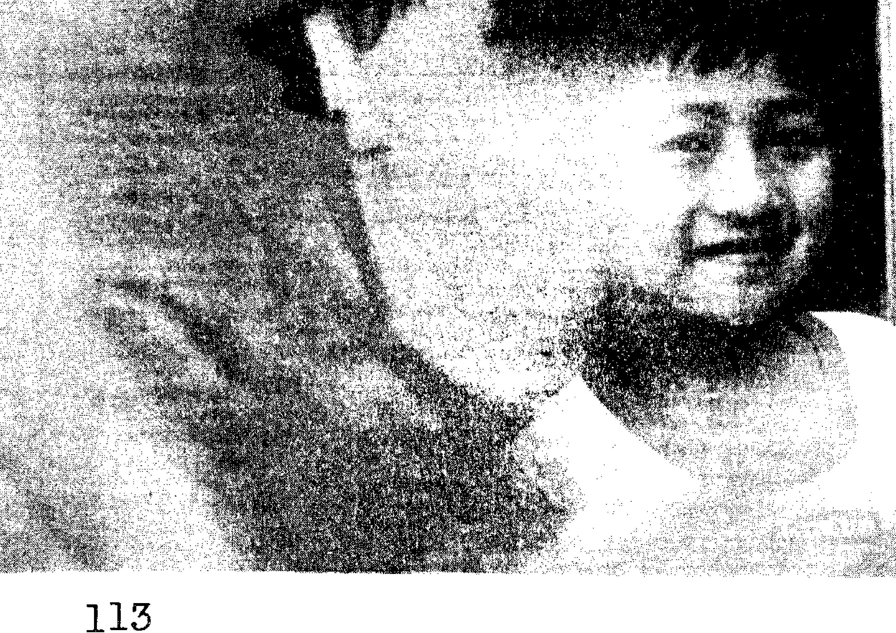

| 辛巳 | 壬午 | 癸未 | 甲申 |
|------|------|------|------|
| 七杀 微科 天马 田宅5 伏兵 | 天刑 官禄6(75-84) 大耗 冠带 | 天截空 伤官 病沐浴 符 | 地劫 迁移8(55-64) 喜神 长生 |
| 庚辰 擎羊 天梁 天机 权禄 福德4 官府 帝旺 | 阴男 林 众 身主：天同 命主：禄存 土五局 | 岁次乙卯年十月八日酉时生 乙酉 破军 火贪 天使 疾厄9(45-54) 养 | 丙戌 铃星 天姚 财帛10(35-44) 奏书 胎 |
| 己卯 禄存 天相 父母3 博士 | 丁亥 天府 子女11(25-34) 将军 绝 | 戊子 天魁 太阴 天同忌 夫妻12(15-24) 小耗 墓 | 戊寅 陀罗 巨门 阳 天空 命宫2 力士 |
| 己丑 左辅 右弼 文昌 文曲 贪狼 武曲 兄弟1(5-14) 青龙 死 | 太阴 天魁 忌 | 天府 子女11(25-34) 将军 绝 | 丁亥 天府 子女11(25-34) 将军 绝 |

大半年来果然未再犯科，中秋节夜，堃元特别买了几百元鞭炮，陪着这两个小孩玩了大半夜的鞭炮。
8.  甲子年十岁，二月又搬家了，由于父母督导松懈，功课很明显地退步。

#### 望元简评：

##### 一、
凡十月生人，必天空守命，地劫守身，大抵皆有赋文「命里逢空，不飘流即主疾苦」，如命身二主不旺，命身二宫凶多，更疾厄宫星凶，正是「生逢天空，犹如半天折翅」之格，大多襁褓童幼灾病难养，甚至丧命夭折。

##### 二、
每有学者读友问望元：「空劫凶乎？」，望元答曰：「空劫不凶，必主曜凶恶始肆凶！」，又问望元：「有吉，空劫凶乎？」，望元对曰：「空劫为害最愁人，即有吉亦生空亡劫杀之恶，但以主曜之吉有力而多，空劫之力稍减而少，吉多凶少亦以为吉。」

##### 三、
凡斗数星神，在命局诸宫有其不同之意象，在运限有其另外之意义，必须以为分辨，否则甚难进入斗数之观察研判与论断，学者读友不妨自就斗数丛书参考认知。

##### 四、
本命原有巨门陀罗守命，且见三合铃星，可拟前述「巨火擎羊」议，盖铃陀适与火羊相提并论，故空劫守照，适徵「一意孤行」的假设，因此辛酉年七岁玩火，癸亥年九岁又躲在被窝里玩蜡烛，岂不是足证他自己也知道不能玩火而玩蜡烛吗？那么现在我们不妨回过来，看一看我们自己的命中运限有无空劫二星，如有，就应该培养训练使自己变得客观踏实一些，否则的话，我们只好希望自己的生辰不正确，或者紫微斗数胡说八道，再不然就是干脆不相信紫微斗数也就是了。假使像望元有十月生的这么一个孩子，往往使我们感觉教育的困难与烦恼，我们除了尽

##### 五、
本命限一岁入命宫，二岁小限又入命宫，俱为空劫守照之象，证之一、二岁灾病连连，几度濒于死亡，岂不可证「主疾苦」之说呢？

##### 六、
斗数论议「飘流」之赋文不少，如「天梁太阴却做飘蓬之客」、「七杀破军宜出外」、「天梁天马陷飘荡无疑」、「廉贞七杀流荡天涯」等等皆是，因此命中有空劫之人是否易造成飘蓬流荡之兆呢？试看本命初行丁丑大限，五岁至十四岁，本仍在父母呵护养育之下，但以大限三合廉贞七杀，其父母竟有三迁之事实，此岂非斗数有所征验之迷人呢？那么命无主曜之人是否比较容易结合成为上述之飘流星象呢？

望元谨列举「命无主曜」之格局于后，以利学者读友方便参考，恕不赘注！

| 巳 官禄 太阴 | 午 奴仆 贪狼 天刑 天伤 | 未 迁移 巨门 天同 | 申 疾厄 天相 武曲 天使 |
| 辰 田宅 天府 廉贞 | **十月戌时生人三之一：** 甲己年 22日 23日生人 乙庚年 9日 19日生人 丙辛年 7日 生人 丁壬年 25日 生人 戊癸年 5日 生人 | | 酉 财帛 天梁 太阳 地劫 |
| 卯 福德 | | 戌 子女 七杀 天姚 |
| 寅 父母 文曲 破军 | 丑 命宫 左辅 右弼 天空 | 子 兄弟 文昌 紫微 | 亥 夫妻 天机 |

| 巳 奴仆 天府 天伤 | 午 迁移 天刑 太阴 天同 | 未 疾厄 天使 贪狼 武曲 | 申 财帛 巨门 太阳 |
| 辰 官禄 | **十月亥时生人一之一：** 甲己年 20日 21日生人 乙庚年 3日 13日生人 丙辛年 2日 26日生人 丁壬年 22日 30日生人 戊癸年 1日 30日生人 | | 酉 子女 天相 |
| 卯 田宅 文昌 破军 廉贞 | | 戌 夫妻 天机 天梁 地劫 天姚 |
| 寅 福德 | 丑 父母 左辅 右弼 | 子 命宫 天空 | 亥 兄弟 文曲 七杀 紫微 |

| 巳 官禄 | 天府 奴仆 | 午 | 太阴天同 | 未 | 贪狼武曲 | 申 | 巨门太阳 |
| 辰 田宅 |  |  | 十月戌时生人三之三： 戊癸年1.30日生人 丁壬年22.30日生人 丙辛年2.26日生人 乙庚年3.13日生人 甲己年20.21日生人 | 酉 | 天相 地劫 财帛 |  |  |
| 卯 破军廉贞 福德 |  |  |  | 戌 | 天机天梁 天姚 子女 |  |  |
| 寅 文曲 父母 | 丑 左右辅弼 天空 命宫 | 子 | 文昌 兄弟 | 亥 | 七杀紫微 夫妻 |  |  |

| 巳 官禄 | 天同 奴仆 | 午 | 天府武曲 | 未 | 太阴太阳 | 申 | 贪狼 |
| 辰 破军 田宅 |  |  | 十月戌时生人三之二： 甲己年18.19日生人 乙庚年7.26日生人 丙辛年21.日生人 丁壬年19.27.29.日生人 戊癸年26.日生人 | 酉 | 巨门天机 地劫 财帛 |  |  |
| 卯 |  |  |  | 戌 | 紫微天相 天姚 子女 |  |  |
| 寅 文曲 廉贞 父母 | 丑 左右辅弼 天空 命宫 | 子 | 文昌 七杀 兄弟 | 亥 | 天梁 夫妻 |  |  |

| 宫位 | 星曜与说明 |
|---|---|
| 巳（田宅宫） | 破军、武曲 |
| 午（官禄宫） | 天刑 |
| 未（奴仆宫） | 太阳、天伤 |
| 申（迁移宫） | 天府、地劫 |
| 辰（福德宫） | 天同 |
| 中央（生年信息） | 十月酉时生人三之一： 甲己年1.20日生人 乙庚年16.28日生人 丙辛年16.26日生人 丁壬年22.日生人 戊癸年16.17.日生人 |
| 酉（疾厄宫） | 贪狼、紫微、天使 |
| 戌（财帛宫） | 巨门、天姚 |
| 卯（父母宫） | （空） |
| 寅（命宫） | 天空 |
| 丑（兄弟宫） | 左辅、右弼、文曲、文昌、七杀、廉贞 |
| 子（夫妻宫） | 天梁 |
| 亥（子女宫） | 天相 |

| 宫位 | 星曜与说明 |
|---|---|
| 巳（田宅宫） | 贪狼、廉贞 |
| 午（官禄宫） | 巨门、天刑、天伤 |
| 未（奴仆宫） | 天相、天伤 |
| 申（迁移宫） | 天同、天梁、地劫 |
| 辰（福德宫） | 太阴 |
| 中央（生年信息） | 十月酉时生人三之一： 甲己年5.15.25.日生人 乙庚年4.12.日生人 丙辛年2.28.日生人 丁壬年3.9.日生人 戊癸年1.24.25.日生人 |
| 酉（疾厄宫） | 七杀、武曲、天使 |
| 戌（财帛宫） | 太阳、天姚 |
| 卯（父母宫） | 天府 |
| 寅（命宫） | 天空 |
| 丑（兄弟宫） | 左辅、右弼、文曲、文昌、破军、紫微 |
| 子（夫妻宫） | （空） |
| 亥（子女宫） | 天机 |

| 巳 太阴 福德 | 午 贪狼 田宅 | 未 天同巨门 官禄 | 申 武曲天相 奴仆 |
| 辰 廉贞天府 父母 | 十月申时生人三之一： 甲己年9.19日生人 乙庚年7.日生人 丙辛年25.日生人 丁壬年5.日生人 戊癸年22.23日生人 | | 酉 太阳天梁 迁移 |
| 卯 天空 命宫 | | | 戌 七杀 疾厄 |
| 寅 破军文昌 兄弟 | 丑 左右辅弼 夫妻 | 子 紫微文曲 子女 | 亥 天机 财帛 |

| 巳 天府 田宅 | 午 太阴天同 官禄 | 未 贪狼武曲 奴仆 | 申 巨门太阳 迁移 |
| 辰 福德 | 十月酉时生人三之三： 甲己年3.13日生人 乙庚年2.26日生人 丙辛年22.30日生人 丁壬年1.30日生人 戊癸年20.21日生人 | | 酉 天相 疾厄 |
| 卯 廉贞破军 父母 | | | 戌 天梁天机 财帛 |
| 寅 命宫 | 丑 左右文曲文昌 兄弟 | 子 夫妻 | 亥 七杀紫微 子女 |## 第八十八章 馬頭帶劍，非夭折則主刑傷

原註：擎羊在午守命，卯次之，酉又次之，爲羊刃落陷，是也。

寅申巳亥四宮陀羅守命亦然，如辰戌丑未不是。

凡命宮原有擎羊者，大多形態傾向於高大粗壯，個性剛強，甚至剛愎自用，我行我素，脾氣容易激動而暴燥，爲人機謀，處事果斷，內心有強烈的反抗性與競爭精神，因此與人相處，有些翻臉無情，六親不認之傾向，同時還有自我表現的慾望，凡事喜歡居功、搶功，是一顆不受歡迎的星曜。

依據紫微斗數全書附錄命例查考，擎羊入午守命者，有卷七第五六章之「李廣不封，擎羊逢於力士。」，第五十五章之「擎羊火星，威權出眾；同行貪武，威壓邊夷。」，以及卷三第二十章之「馬頭帶箭，鎮衛邊疆。」之例，於本賦文則亦附「慶忌」命例爲參考，故摘錄以爲簡評之——

> 「慶忌命例」
>
> 慶忌，吳王僚之子，吳越春秋載：「吳王曰：「慶忌之勇，世所聞也，筋骨果勁，萬人莫當，走追奔獸，手接飛鳥，骨騰肉飛，拊膝數百里。」，爲要離所刺死。
>
> 註云：「馬前帶箭，非夭折而刑傷。」，早年限行吉地，作事崢嶸，手能捉飛鳥，二十三歲大限到申值天空，小限到寅遇地劫，太歲天羅，流羊流陀迭併，以至遭凶而亡。

### 擎羊守命吉凶比较表

| 吉凶 | 命例 | 格局星象 |
| :--- | :--- | :--- |
| 吉 | 李廣不封 | 擎羊、武曲天府、天相、七殺、文昌廉貞 |
| 凶 | 鎮禦邊疆 | 化祿天同、化權天機、地劫、火星 |
| 命例 | 漢光武帝 | 命宮、官祿、遷移、財帛 |

堃元提示：當我們研習斗數時，雖然亟欲探知相似命例的吉凶分辨，但是我們除了分別觀察研判之外，大概還沒有一個勤學的人將類似的命例蒐集在一起比較研判，因此將此數命例列表以為比較之參考，或可助於今後斗數之統計分析吧！

| 宮位 | 干支 | 星曜 | 年齡階段 | 備註 |
| :--- | :--- | :--- | :--- | :--- |
| 兄弟 | 癸巳 | 祿存、貪狼、廉貞 | - | 博長士生 |
| 命宮 | 甲午 | 擎羊、巨門 | - | 力士、沐俗 |
| 父母 | 乙未 | 文曲、文昌、天相 | 4-13 | 青龍、冠帶 |
| 福德 | 丙申 | 天同、天梁 | 14-23 | 小耗、臨官 |
| 田宅 | 丁酉 | 武曲、七殺、天魁 | - | 帝旺、將軍 |
| 官祿 | 戊戌 | 太陽 | - | 衰、奏書 |
| 奴僕 | 己亥 | 天鉞、左輔 | - | 天傷、蜚廉 |
| 遷移 | 庚子 | 天機、權 | - | 喜神、死 |
| 疾厄 | 辛丑 | 紫微、破軍、火星星 | - | 病符、墓 |
| 財帛 | 庚寅 | 地劫、23 | - | 大耗、絕 |
| 子女 | 辛卯 | 鈴星、右弼、天府 | - | 伏兵、胎 |
| 夫妻 | 壬辰 | 陀羅、太歲 | - | 官府、養 |
| 其他 | - | 身主：鈴星，命主：破軍，陽男，慶，忌，出生時間：歲次戊辰年三月初五故，歲次丙午年八月初三日卯時生，金四局，斗君 | - | - |

陽男
漢光武帝
歲次丁巳年六十二歲二月初十故
金四局
命主：破軍
身主：文昌
歲次丙辰年六月初一日丑時生
「馬頭帶箭，鎮禦邊疆」

| 威權出眾 | 刑傷夭折 |
| :--- | :--- |
| 白起 | 慶忌 |
| 紫微 | 巨門 |
| 破軍 | 擎羊 |
| 貪狼 | 化權 |
| 天相 | 天機 |
| 輔弼 | 化權 |
| 武曲 | 地劫 |
| 化祿 | 紫破天虛之上格 |

这是一个紫微斗数命盘表格。

| 宫位/内容 | 己巳 | 庚午 (禄存/文昌) | 辛未 (破军/擎羊) | 壬申 (天钺/文曲) |
| :--- | :--- | :--- | :--- | :--- |
| **星曜/神煞** | 陀罗 天哭 | 天机 | 紫微 破军 擎羊 | 天钺 文曲 （忌） |
| **宫位与大限** | 夫妻 (15-24) 力士官 | 兄弟 (5-14) 博士带 | 命宫 天虚 天空 | 父母 官府 沐浴 |
| **星曜/神煞** | 太阳 | (中央信息区) | 天府 | (空) |
| **宫位与大限** | 子女 (25-34) 青龙旺 | 陰男 白 起 命主：武曲 身主：天相 土五局 岁次癸巳年正月十四日故 | 小限 福德 截空 75 大耗 | (空) |
| **星曜/神煞** | 七杀 武曲 （禄） | (空) | 太阴 铃星 | (空) |
| **宫位与大限** | 财帛 (35-44) 小耗 地劫 太岁 | (空) | 田宅 病符 胎 | (空) |
| **星曜/神煞** | 天梁 天同 （科） | 左辅 右弼 天相 | 巨门 天魁 | 贪狼 廉贞 （权） |
| **宫位与大限** | 疾厄 (45-54) 将军 天使 | 迁移 (55-64) 奏书 死 | 奴仆 (65-74) 蜚廉 墓 天伤 | 官禄 75 喜神 绝 大限 天马 |
| **中央文字** | 岁次己丑年十月三十日辰时生 （擎羊火星，威权出来） | | | |

这是一个紫微斗数命盘表格。

| 宫位/内容 | 丁巳 (禄存/天同) | 戊午 (擎羊/天府/武曲) | 己未 (天钺/太阴/太阳) | 庚申 (贪狼) |
| :--- | :--- | :--- | :--- | :--- |
| **星曜/神煞** | 禄存 天同 | 擎羊 天府 武曲 | 天钺 太阴 太阳 （权） | 贪狼 （禄） |
| **宫位与大限** | 兄弟 博士 临官 | 命宫 力士 帝旺 | 父母 (6-15) 青龙 衰 地劫 | 福德 (16-25) 小耗 病 |
| **星曜/神煞** | 陀罗 左辅 破军 | (中央信息区) | (空) | 巨门 天机 （忌） |
| **宫位与大限** | 夫妻 冠带 官府 | 陽男 李 宗 師 命主：破军 身主：文昌 火六局 岁次乙酉年七月初二故 | (空) | 田宅 (26-35) 将军 死 太岁 天刑 |
| **星曜/神煞** | (空) | (空) | (空) | 紫微 天相 右弼 铃星 （科） |
| **宫位与大限** | 子女 78 伏兵 沐浴 天空 | (空) | (空) | 官禄 (36-45) 奏书 墓 |
| **星曜/神煞** | 火星 文昌 廉贞 | 天魁 | 七杀 文曲 | 天梁 |
| **宫位与大限** | 财帛 (76-85) 大耗 长生 天马 | 疾厄 (66-75) 病符 养 天姚 天使 | 迁移 (56-65) 喜神 胎 截空 | 奴仆 (46-55) 蜚廉 绝 天伤 |
| **中央文字** | 岁次戊辰年正月廿六日申时生 （李广不封，擎羊逢力士） | | | |

十月申时生人三之三：甲己年7.26.日生人 乙庚年21.日生人 丙辛年19.29.日生人 丁壬年26.日生人 戊癸年18.19.日生人

| 巳 天同 福德 | 午 天府武曲 天刑 田宅 | 未 太阴太阳 地劫 官禄 | 申 贪狼 天伤 奴仆 |
| :--- | :--- | :--- | :--- |
| 辰 破军 父母 | | | 酉 巨门天机 迁移 |
| 卯 天空 命宫 | 戌 天紫相微 疾厄 | 亥 天梁 财帛 | |
| 寅 文昌廉贞 兄弟 | 丑 左右辅弼 夫妻 | 子 文曲七杀 子女 | |

十月申时生人三之二：甲己年1.20.日生人 乙庚年16.28.日生人 丙辛年16.26.日生人 丁壬年22.日生人 戊癸年16.17.日生人

| 巳 破军武曲 福德 | 午 天阳 天刑 田宅 | 未 天府 地劫 官禄 | 申 太阴天机 天伤 奴仆 |
| :--- | :--- | :--- | :--- |
| 辰 天同 父母 | | | 酉 贪狼紫微 迁移 |
| 卯 天空 命宫 | | 戌 巨门 疾厄 | |
| 寅 文昌 兄弟 | 丑 左右辅弼 七杀廉贞 夫妻 | 子 文曲天梁 子女 | 亥 天相 财帛 |

十月午時生人之一：
甲己年 1. 18. 20.日生人
乙庚年 14. 24. 27.日生人
丙辛年 12. 13.日生人
丁壬年 8. 22.日生人
戊癸年 6. 18. 30.日生人

| 巳 命宫 天空劫 | 午 父母 天刑 | 未 福德 天机 破军微 | 申 田宅 |
| :--- | :--- | :--- | :--- |
| 辰 兄弟 文昌 太阳 | | | 酉 官禄 天府 |
| 卯 夫妻 七杀武曲 | | | 戌 奴仆 文曲太阴 |
| 寅 子女 天梁天同 | 丑 财帛 左右辅弼天相 | 子 疾厄 巨门 | 亥 迁移 贪狼廉贞 |

十月未時生人之一：
甲己年 22. 30.日生人
乙庚年 1. 30.日生人
丙辛年 20. 21.日生人
丁壬年 3. 13.日生人
戊癸年 2. 26.日生人

| 巳 天府 | 午 太阴天同 | 未 贪狼武曲 | 申 巨门太阳 |
| :--- | :--- | :--- | :--- |
| 父母 地劫天刑 | 福德 | 田宅 | 官禄 |
| 辰 命宫 天空 | | | 酉 天相 天伤 奴仆 |
| 卯 兄弟 文昌破军廉贞 | | | 戌 迁移 天梁天机 天姚 |
| 寅 夫妻 | 丑 子女 左右辅弼 | 子 财帛 | 亥 疾厄 文曲七杀紫微 天使 |

十月辰时生人三之一：
戊癸年4.18.23日生人
丁壬年6.7.30日生人
丙辛年2.12.15.21日生人
乙庚年1.9.11日生人
甲己年3.15.19.27日生人

| 巳 天梁 夫妻 | 午 天刑 兄弟 | 未 天空 命宫 | 申 文曲 廉贞 父母 |
| :--- | :--- | :--- | :--- |
| 辰 天相 紫微 子女 | | | 酉 福德 |
| 卯 巨门 天机 | | 戌 破军 | 亥 天同 |
| 丑 左辅 右弼 太阴 太阳 | 子 天府 武曲 奴仆 | 寅 贪狼 天使 疾厄 | 戊 天姚 田宅 迁移 |
| | | | 官禄 |
| | | | 地劫 财帛 |

十月巳时生人一之一：
戊癸年10.24.29日生人
丁壬年8.9日生人
丙辛年6.16.18.25日生人
乙庚年4.12.14日生人
甲己年8.20.24日生人

| 巳 文曲 紫微 兄弟 | 午 天空 天刑 命宫 | 未 父母 | 申 福德 |
| :--- | :--- | :--- | :--- |
| 辰 天梁 天机 | | | 酉 文曲 破军 廉贞 田宅 |
| 卯 天相 | | 戌 天姚 | 亥 天府 |
| 丑 左辅 右弼 贪狼 武曲 | 子 太阴 天同 迁移 | 寅 巨门 太阳 财帛 | 戊 官禄 |
| | | | 地劫 夫妻 |
| | | | 亥 天伤 奴仆 |
| 寅 巨门 太阳 | 丑 左辅 右弼 贪狼 武曲 | 子 太阴 天同 | 亥 天府 |
| 卯 天相 | 辰 天梁 天机 | 巳 文曲 紫微 | 午 天空 天刑 |
| 未 父母 | 申 福德 | | |
| 子女 | 卯 地劫 夫妻 | 寅 巨门 太阳 财帛 | |
| 子女 | 戌 官禄 | | |
| 丑 天使 疾厄 | 寅 巨门 太阳 财帛 | | |
| 戌 官禄 | 酉 文曲 破军 廉贞 田宅 | | |
| 子 太阴 天同 迁移 | 丑 天使 疾厄 | | |
| 亥 天伤 奴仆 | 子 太阴 天同 迁移 | | |
| 亥 天伤 奴仆 | 丑 天使 疾厄 | | |

十月卯时生人三之一：
甲己年6.16.19.25.日生人
乙庚年8.9.日生人
丙辛年10.24.29.日生人
丁壬年8.20.24.日生人
戊癸年4.12.14.日生人

| 巳 七杀、紫微 子女 | 午 天刑 夫妻 | 未 文曲、文昌 兄弟 | 申 天空 命宫 |
| :--- | :--- | :--- | :--- |
| 辰 天梁、天机 财帛 | | | 酉 破军、廉贞 父母 |
| 卯 天相 疾厄 | | | 戌 天姚 福德 |
| 寅 巨门、太阳 迁移 | 丑 左右、辅弼、贪狼、武曲 天伤 奴仆 | 子 太阴、天同 官禄 | 亥 天府 田宅 |

十月卯时生人三之二：
甲己年8.17.11.日生人
乙庚年4.5.28.29.日生人
丙辛年12.17.22.日生人
丁壬年10.14.22.日生人
戊癸年6.8.日生人

| 巳 天相 子女 | 午 天梁 夫妻 | 未 文曲、文昌、七杀、廉贞 兄弟 | 申 天空 命宫 |
| :--- | :--- | :--- | :--- |
| 辰 巨门 财帛 | | | 酉 父母 |
| 卯 贪狼、紫微 疾厄 | | | 戌 天同 天姚 福德 |
| 寅 太阴、天机 迁移 | 丑 左右、辅弼 天府 天伤 奴仆 | 子 太阳 官禄 | 亥 破军、武曲 田宅 |

十月寅時生人三之二：
出生日期：戊癸年7.15.17.日生人，丁壬年1.13.25.29.日生人，丙辛年2.10.30.日生人，乙庚年10.11.日生人，甲己年10.20.23.29.日生人。

| 地支 | 内容 |
| :--- | :--- |
| 巳 | 天机 (财帛) |
| 午 | 文曲 紫微 (子女, 天刑) |
| 未 | (夫妻) |
| 申 | 文昌 破军 (兄弟) |
| 辰 | 七杀 (疾厄, 天使) |
| 酉 | (天空, 命宫) |
| 卯 | 天梁 太阳 (迁移) |
| 戌 | 天府 廉贞 天姚 (父母) |
| 寅 | 天相 武曲 (奴仆, 天伤) |
| 丑 | 左辅 右弼 巨门 天同 (官禄, 地劫) |
| 子 | 贪狼 (田宅) |
| 亥 | 太阴 (福德) |

十月寅時生人三之三：
出生日期：戊癸年1.9.11.日生人，丁壬年3.15.19.27.日生人，丙辛年4.18.23.日生人，乙庚年6.7.30.日生人，甲己年2.12.15.21.日生人。

| 地支 | 内容 |
| :--- | :--- |
| 巳 | 天梁 (财帛) |
| 午 | 七杀 文曲 (子女, 天刑) |
| 未 | (夫妻) |
| 申 | 文昌 廉贞 (兄弟) |
| 辰 | 天相 紫微 (疾厄, 天使) |
| 酉 | (天空, 命宫) |
| 卯 | 巨门 天机 (迁移) |
| 戌 | 破军 (父母, 天姚) |
| 寅 | 贪狼 (奴仆, 天伤) |
| 丑 | 左辅 右弼 太阴 太阳 (官禄, 地劫) |
| 子 | 天府 武曲 (田宅) |
| 亥 | 天同 (福德) |

十月寅時生人三之二：
甲己年8.17.11.日生人
乙庚年4.5.28.29.日生人
丙辛年12.17.22.日生人
丁壬年10.14.22.日生人
戊癸年6.8.日生人

| 巳 天相 | 午 文曲天梁 | 未 七杀廉贞 | 申 文昌 |
| :--- | :--- | :--- | :--- |
| 财帛 | 天刑子女 | 夫妻 | 兄弟 |
| 辰 巨门 | | 酉 天空命宫 | |
| 疾厄 | | | |
| 天使 | | | |
| 卯 贪狼紫微 | | | 戌 天同 |
| 迁移 | | | 天姚 |
| | | | 父母 |
| 寅 太阴天机 | 丑左右辅弼天府 | 子 太阳 | 亥 破军武曲 |
| 奴仆 | 地劫 官禄 | 田宅 | 福德 |

十月卯時生人三之三：
甲己年14.24.27.日生人
乙庚年12.13.日生人
丙辛年8.22.日生人
丁壬年6.18.30.日生人
戊癸年10.18.20.日生人

| 巳 子女 | 午 天机 天刑夫妻 | 未 文曲文昌破军紫微 兄弟 | 申 天空命宫 |
| :--- | :--- | :--- | :--- |
| 辰 太阳 | | 酉 天府 | 父母 |
| 财帛 | | | |
| 卯 七杀武曲 | | | 戌 太阴 |
| | | | 天姚 |
| 疾厄 | 天使 | | 福德 |
| 寅 天梁天同 | 丑左右辅弼天相 | 子 巨门 | 亥 贪狼廉贞 |
| 迁移 | 地劫 | 奴仆 | 官禄 田宅 |

十月子時生人之一：
甲己年 5.15.25日生人
乙庚年 4.12日生人
丙辛年 2.28日生人
丁壬年 3.9日生人
戊癸年 1.24.25日生人

巳 贪狼廉贞
午 巨门
未 天相
申 天梁天同

巳 迁移
午 疾厄（天刑天使）
未 财帛
申 子女

辰 文曲太阴
天伤
奴仆

卯 天府
官禄

寅 田宅
福德

丑 左右辅弼 破军紫微
子 父母
亥 命宫
天地空劫

十月丑時生人之一：
甲己年 10.24.29日生人
乙庚年 8.20.24日生人
丙辛年 4.12.14日生人
丁壬年 6.16.19.25日生人
戊癸年 8.9日生人

巳 文曲紫微
午
未
申

巳 天使
疾厄
午 天刑
财帛
未 子女
申 夫妻

辰 天梁天机
天伤
奴仆

卯 天相

寅 巨门太阳
田宅
丑 左右辅弼 贪狼武曲
子 太阴天同
亥 天府所舉雖然只是很少的四命例比較，但凡順行命有擎羊值命者，必擎羊逢力士，唯逆行命者，始爲擎羊逢官府之論，其間吉凶之比較，大抵須由四化及行運參詳，故斗數須要我們探討的課題，多矣！

笠元簡評：

一、慶忌有擎羊逢力士之兆，亦爲第一〇三章「子午巨門，石中隱玉」之象，則遷身有化權，福德宮有化祿，若可以卷五第三四頁第十五章「出世榮華，權祿守財官之位」擬議，其生爲吳王僚之子，亦可徵出世榮華矣！

二、大限丙申，雖爲當生化祿之宮位，但爲天空小耗之地，暗合廉貞雙化忌，幾可仿「鄧通餓死，運逢大耗之鄉」擬議，唯本宮星象吉多，雖空劫守照，於本限內暫時不論空劫之惡。

三、次一大限丁酉，生主巨門化忌，適廿三歲小限之年，天機化忌沖破命宮，小限大限相沖，且合巨門擎羊，同梁之吉不能再制空劫之凶，適符全書「論大限十年禍福如何」所謂：

+   1、若限內有羊陀火鈴空劫忌星爲伴，成敗不一，如宮分星纏陷地，值羊陀火鈴空劫忌，又加流年惡殺湊合，及小限巡逢凶殺，則官災死亡立見。
    2、大限將出……，行至辰戌丑未卯酉，遇惡殺、廉貞、天使、羊陀火鈴空劫忌星，主人酒色荒迷，貧乏死生，………。此若可爲太歲有陀羅重逢，三合天空及天機流年化忌之寫照矣！
+   3、凡大小二限及太歲，怕行天傷天使夾地，怕行天空地劫之地，怕行擎羊陀羅之地，及羊陀沖照，怕脫凶限，怕逢凶限，又怕傷使劫空羊陀併夾歲限，……官吏遭譴，常人招橫事，婦人損胎，病者死亡，若惡殺在不得地，如風雨暴過，若歲限臨無吉星，命中無救，其年難過，必死。

簡評論之，擎羊值命未必爲凶，運限逢之實爲凶惡，因此有擎羊守命之人，比較容易產生「羊陀迭併」，逢會火鈴空劫忌耗，故曰：「非夭折則主刑傷。」

至於擎羊不入寅申巳亥，何以認在午守命最凶，在卯次之，在酉又次之之論，則又必待探討，始可窺其究竟矣！

若如賦文必以陀羅值命，亦可相提並論，則望元期期以爲不可，因爲現在距離斗數創始的農業社會之「差不多」論命方法已經不能滿足研習祿命者以及被相命者的「精細」要求，因此探討擎羊值命之吉凶，仍宜演進成爲年干星曜之整體探討，則斗數或可不必輔以其他方法觀察研判矣！

譬如擎羊值命，必祿存守兄弟宮，陀羅守夫妻宮，大抵婚事有阻礙拖延之趨向，此人雖然個性剛強偏傲，但平時對待兄弟朋友部屬又有隨和之傾向，故必以年干四化以爲區辨吉凶。
譬如陀羅值命，則祿存守父母宮，擎羊守福德宮，大抵婚事發生精神困擾之後才結合，甚能得父母之庇庇恩惠，一樣向擎羊值命之需要用年干四化區辨吉凶。
因此羊陀二星值命，原有非常微妙的區分，但是由於其比較容易逢會火鈴空劫忌耗的機會則是相當相等，所以賦文原註使用簡扼的原則性說明，以爲使吾等容易認知紫微斗數的觀察研判，實在亦爲最佳之參考。
如果學者對於羊陀值命之吉凶，必欲精求其微細之區分，恐怕必要曠費長久時日與精神才能完成，因此請恕望元目前之斗數研判之能力尚不及此，敬請各自深入鑽研而已！

## 第八十九章　子午破軍，加官進祿

原註：子午二宮逢破軍守命，加吉星必然位至三公。

望元不知把紫微斗數全書翻讀了幾遍，但是每一次總是無法專心的探討其究竟，幾乎每次都是走馬看花的流覽而過，隱約覺得書中包藏了無窮的命理哲學與人生的奧義，一旦認真的想要把它們找出來，可是卻無法發覺它們的蹤影。

據梁湘潤先生著述「紫微斗數考證」第二二五頁「命宮論」載之：
「『命宮』與『身宮』能有機會併聚一宮之條件，只有出生在『子』『午』二個時辰，這一個重視『子午』二支之概念，乃受唐代李虛中概念直接秉承南、北爲『坎、離』之地，水、火既濟之家，至明代萬育吾氏仍重視此說。三命通會，亦以『子爲帝座，午爲端門』。斗數命宮重視『子、午』安立身命同宮於『子、午』，這是受八卦正南、正北之影響。

雖然梁湘潤先生所考證者取子、午時生人命身同宮之義，但所揭者若已及斗數重視子、午爲先天乾坤之位，或重視子、午爲後天坎離方位之意義；雖然我們還缺乏斗數強調子、午爲南北指針之意義，但從『紫微居午無殺湊，位至公卿。』、「梁居午位，官資清顯。」、「子午破軍，加官進祿。」、「子午巨門，石中隱玉。」、「太陽寅到午，遇吉終是福。」、「太陽居午，謂之日麗中天，有專權之位，敵國之富。」、「太陰居子，號曰水澄桂萼，得清要之職，忠謀之材。」等等賦文以觀之，斗數若甚重「子、午」之觀念，不為舉證，亦可以想象矣！
觀之斗數視破軍為夫妻、子息、奴僕之神，隱寓奪取本人財富之象意，且被視為極富破耗波蕩變化之「惡」星，但於全卷二論命宮訣之論破軍守命則曰：「六癸甲生人坐子午宮者，位至三公，若丙戊申生人坐子午，則孤單殘疾，雖富貴不久。天折。」，則子午破軍亦非純吉，猶必依賴四化及其格局以為研判矣！

望元為了稍知子午破軍之吉，遍查附錄一四命例，適得「耿弇」之命為此句賦文之參考，故舉例於後——

#### 「耿弇命例」

耿弇，東漢茂陵人。
漢光武帝徇（巡也，行示也。）河北，收上谷兵，定彭寵，取張豐，平張步，皆弇之策，以功封好畤侯。

> 光武日：「將軍前在南陽建此大策，常以為落落難合，有志者事竟成也。」

註云：「破軍若在子午宮，官資清顯至三公，又兼左右昌曲加會，文武雙全，富貴之命。大限到於天傷，有嫌巨門，太歲到午，謂之沈馬，流羊當頭，小限沖太歲，凶，故死。」

#### 堃元简評：

一、本命官祿宮雖有貪狼化忌，但以三方四正吉多，故仍以吉論之，但以貪狼武曲守照官祿，故主其官祿事業之成就，在中年三十歲後建樹為宜，如中年前成就，則宜謹慎，庶免中年後浮沈破敗。
依斗數全書命例推考，耿弇大漢光武帝四歲，漢光武帝起義討王莽、平盜賊，則耿弇廿八、九歲矣，故其官祿成就於中年以後亦當。（請自為考據史實，此僅為參考。）

二、大限辛酉，三合當生化權，更巨門化科，太陽化權於大限福德宮相引，文曲化科於大限兄弟宮相從，當生化忌，大限化忌避未逢會，故此大限開始好轉，惟本命必至庚辰廿八歲、辛巳廿九歲始得真正好轉，則又頗耐人尋味也。

> （按：諸星間等論曰：『化權……，小限相逢，無有不吉，大限十年必然得志。……。』始好轉，今天差一點就被考倒。……，楊雲翔老師嘗戲曰：『如果不是堃元你『教』我，凡逢化權星之年限，已不記得是否說過此話，故不敢居功，但以逢會化權星有順遂得志之意，故不論楊老師是看潘子漁老師大作而調侃堃元，即會出之堃元酒語，亦當屬楊老師觀察敏銳之更勝於堃元矣！依此，則耿弇於歲次辛巳年廿九歲，小限至亥遇太陽大限化權，可斷自本年好轉無疑矣！）

三、當生化忌之效應及於一生，但以居於辰宮，忌星受制失去作用，必再有其他凶殺引觸才

四、丁巳大限，巨門於本宮化忌，雖有天同化權，天機化科之美，但值天傷之地，又見當生羊陀拱限，故此大限十年為『吉處藏凶』之運也。

五、戊午年六十六歲小限適入當生命宮，其原已三合當生化忌，又見流羊陀沖照，不僅引發當生貪狠化忌之凶，且使『祿存遇惡敗其迹』，則當生羊限夾限加侮肆凶，故此年至凶矣！

綜之上述觀察研判嘮叨一大堆，真正斷論也不過簡單幾句話而已，凡觀星論命之要點全在於能否掌握四化星之變化契機，很可惜的是目前斗數對於四化仍然有所歧異，我們甚難確定擇從，因此在於論命亦未克十分準驗了！

今且將破軍在子午守命之十干變化示意圖附列於後，學者讀友不妨自為試驗印證之，尤其是遇上庚午化科忌及壬干化科之紛歧，更要分別留心試驗之，不贅。

##### 一、甲廉破武陽爲伴：

+   1、祿權守照，主有權位富貴。
    2、武曲化科守夫妻，遲婚吉，因配偶得財。
    3、安命午宮者，廣置田宅。

| 奴僕 | 官祿 | 田宅 | 福德 | 父母 | 命宮 | 兄弟 | 夫妻 | 子女 | 財帛 | 疾厄 | 遷移 |
| :---: | :---: | :---: | :---: | :---: | :---: | :---: | :---: | :---: | :---: | :---: | :---: |
| 巨門 | 貪狼 | 太陰 擎羊 | 紫微 天府 祿存 | 天機 陀羅 天鉞 | 破軍 | 太陽 | 武曲 | 天同 | 七殺 | 天梁 天魁 | 廉貞 天相 |

| 兄弟 | 命宮 | 父母 | 福德 | 田宅 | 官祿 | 奴僕 | 遷移 | 疾厄 | 財帛 | 子女 | 夫妻 |
| :---: | :---: | :---: | :---: | :---: | :---: | :---: | :---: | :---: | :---: | :---: | :---: |
| 太陽 | 破軍 | 天機 天魁 | 紫微 天府 | 太陰 | 貪狼 | 巨門 | 廉貞 天相 | 天梁 陀羅 天鉞 | 七殺 祿存 | 天同 擎羊 | 武曲 |

##### 二、乙機梁紫月交侵：

+   1. 事業與婚姻恐難兩美，在子主富貴，午則遜之。
    2. 太陰在田宅化忌，祿存無用，是日月照璧之破格。
    3. 擎羊守照官祿，事業恐有成敗。

| 宮位 | 主星 | 辅星 |
| :--- | :--- | :--- |
| 財帛 | 天七 | 魁殺 |
| 疾厄 | 天梁 | |
| 遷移 | 天相 | 天廉、相貞 |
| 奴僕 | 巨門 | |
| 子女 | 天同 | |
| 夫妻 | 武曲 | |
| 兄弟 | 太陽 | |
| 父母 | 紫府、天機 | |
| 命宮 | 天破 | 鉞軍 |
| 官祿 | 貪狼 | 擎羊 |
| 田宅 | 太陰 | 祿存 |
| 福德 | 紫府、天機 | 陀羅 |

| 宮位 | 主星 | 辅星 |
| :--- | :--- | :--- |
| 福德 | 紫府 | 天魁 |
| 田宅 | 太陰 | |
| 官祿 | 貪狼 | |
| 奴僕 | 巨門 | |
| 疾厄 | 天梁 | |
| 遷移 | 天相、天廉、天鉞 | |
| 財帛 | 七殺 | 陀羅 |
| 子女 | 天同 | 祿存 |
| 夫妻 | 武曲 | 擎羊 |
| 兄弟 | 太陽 | |
| 父母 | | |
| 命宮 | 破軍 | |

##### 三、丙同机昌廉贞位：

+   1、迁移宫廉贞化忌不美，易合『半路押尸』之格。
    2、此为『廉贞七杀，流荡天涯』之格。
    3、此命宜行六阴宫运，六阳宫波荡变化甚大。

| | 巨门禄存 | 廉贞天相擎羊 | | 天梁 | 七杀 |
| :--- | :--- | :--- | :--- | :--- | :--- |
| 奴仆 | 迁移 | 疾厄 | 财帛 | |
| 官禄 | 贪狼陀罗 | | 天同天魁 | 子女 |
| 田宅 | 太阴 | | | 武曲 |
| 福德 | 紫微天府 | 天机 | 破军 | 夫妻 |
| | 父母 | 命宫 | 天钺太阳 | 兄弟 |

| 太阳禄存 | 破军擎羊 | | 天机 | 紫微天府 |
| :--- | :--- | :--- | :--- | :--- |
| 兄弟 | 命宫 | 父母 | 福德 |
| 武曲陀罗 | | 天太阴魁 | 福德 |
| 夫妻 | | | |
| 天同 | | | 贪狼 |
| 子女 | | | 官禄 |
| 七杀 | 天梁 | 廉贞天相 | 天巨门钺 |
| 财帛 | 疾厄 | 迁移 | 奴仆 |

##### 四、丁月同机巨门寻：

+   1. 此為「廉貞七殺反為積富之人」命格。
    2. 在子得富，在午富而後貴。
    3. 任何格局，俱宜從運限區辨審詳之。

| 巨門陀羅 (奴僕) | 天機祿存 (遷移) | 天相廉貞 (疾厄) | 天梁擎羊 (財帛) | 七殺 (財帛) |
| 貪狼 (官祿) |  | 天鉞天同 (子女) | 武曲 (夫妻) |  |
| 太陰 (田宅) |  | 太陽天魁 (兄弟) | 天機 (父母) | 破軍 (命宮) |
| 天府紫微 (福德) | 父母 |  |  |  |

| 陀羅太陽 (兄弟) | 祿破存軍 (命宮) | 擎羊天機 (父母) | 天府紫微 (福德) |
| 武曲 (夫妻) |  | 天鉞太陰 (田宅) | 貪狼 (官祿) |
| 天同 (子女) |  |  |  |
| 七殺 (財帛) | 天梁 (疾厄) | 天相廉貞 (遷移) | 天巨魁門 (奴僕) |

##### 五、戊贪月弼机为主：

1、擎羊守照，易成‘威权出家’、‘镇御边疆’命格。

2、此具‘七杀破军宜出外’之象意。

3、此宜军、商、僧、道之命格。寅申人有孤单，残疾，富贵不久之倾向，丙年生人亦同此论。

| 禄存巨门 | 天廉相贞 羊 | 天天钺梁 | 七杀 |
| :--- | :--- | :--- | :--- |
| 奴仆 | 迁移 | 疾厄 | 财帛 |
| 贪狼 |  |  | 天同 |
| 官禄 |  |  | 子女 |
| 陀罗太阴 |  |  | 武曲 |
| 田宅 |  |  | 夫妻 |
| 天府紫微 | 天天机魁 | 破军 | 太阳 |
| 福德 | 父母 | 命宫 | 兄弟 |

| 禄存 太阳 | 擎羊破军 | 天钺 天机 | 天府紫微 |
| :--- | :--- | :--- | :--- |
| 兄弟 | 命宫 | 父母 | 福德 |
| 陀罗 武曲 |  |  | 太阴 |
| 夫妻 |  |  | 田宅 |
| 天同 |  |  | 贪狼 |
| 子女 |  |  | 官禄 |
| 七杀 | 天天梁魁 | 廉贞 天相 | 巨门 |
| 财帛 | 疾厄 | 迁移 | 奴仆 |

##### 六、己武贪梁曲最平：

+   1、文曲化忌，故申子辰時生不美。
    2、逢會文曲者，忌水鄉歲限，殘疾，雖富不久。
    3、不會文曲者，忌行文曲所值之宮歲限。

| 陀巨羅門 | 祿天廉存相貞 | 擎天羊梁 | 天七鉞殺 |
| :--- | :--- | :--- | :--- |
| 奴僕 | 遷移 | 疾厄 | 財帛 |
| 貪狼 | | | 天同 |
| 官祿 | | | 子女 |
| 太陰 | | | 武曲 |
| 田宅 | | | 夫妻 |
| 天紫府微 | 父母 | 天機 | 太陽 |
| 福德 | | 命宮 | 兄弟 |

| 陀太陽羅 | 祿破存軍 | 擎羊 | 天機 | 天天紫鉞府微 |
| :--- | :--- | :--- | :--- | :--- |
| 兄弟 | 命宮 | 父母 | | 福德 |
| 武曲 | | | | 太陰 |
| 夫妻 | | | | 田宅 |
| 天同 | | | | 貪狼 |
| 子女 | | | | 官祿 |
| 七殺 | 天梁 | 天天魁相貞 | | 巨門 |
| 財帛 | 疾厄 | | | 奴僕 |

##### 七、庚日武同阴为首：

+   1. 以太阴化忌，为『日月照壁』破格。
    2. 以天同化忌，田宅子嗣两难。
    3. 以天相化忌，亦为『半路押屍』之格。

| 宮位 | 星曜 | 星曜 | 星曜 |
| :--- | :--- | :--- | :--- |
| 奴僕 | 巨门 | | |
| 遷移 | 天相貞 | | |
| 疾厄 | 天鉞陀羅天梁 | | |
| 財帛 | 祿存七殺 | | |
| 官祿 | 貪狼 | | |
| 田宅 | 太阴 | | |
| 福德 | 天府紫微 | 天魁 | 天機 |
| 父母 | | | |
| 命宫 | 破軍 | | |
| 兄弟 | 太陽 | | |

| 宮位 | 星曜 | 星曜 | 星曜 |
| :--- | :--- | :--- | :--- |
| 兄弟 | 太陽 | | |
| 命宫 | 破軍 | | |
| 父母 | 天陀鉞羅天機 | | |
| 福德 | 祿存天府紫微 | | |
| 夫妻 | 武曲 | | |
| 子女 | 天同 | | |
| 財帛 | 七殺 | | |
| 疾厄 | 天天魁梁 | | |
| 遷移 | 天廉相貞 | | |
| 奴僕 | 巨門 | | |

##### 八、辛巨陽曲昌至臨：

+   1. 文昌化忌，凡六陽時生不美，六陰時生為佳。
    2. 在六陽時生者，職業職位之變換性大。
    3. 在子傾向於精神生活，在午追逐錢財且能致富。

| 宮位 | 星宿 |
| :--- | :--- |
| 奴僕 | 巨門 |
| 官祿 | 貪狼 |
| 田宅 | 太陰 |
| 福德 | 天魁、天府、紫微 |
| 父母 | 天機 |
| 命宮 | 破軍 |
| 兄弟 | 太陽 |
| 夫妻 | 武曲、擎羊 |
| 子女 | 天同、祿存 |
| 財帛 | 七殺、陀羅 |
| 疾厄 | 天梁 |
| 遷移 | 廉貞、天相、天鉞 |

| 宮位 | 星宿 |
| :--- | :--- |
| 兄弟 | 太陽 |
| 命宮 | 破軍、天鉞 |
| 父母 | 天機 |
| 福德 | 紫微、天府、陀羅 |
| 田宅 | 太陰、祿存 |
| 官祿 | 貪狼、擎羊 |
| 奴僕 | 巨門 |
| 遷移 | 廉貞、天相 |
| 疾厄 | 天梁 |
| 財帛 | 七殺、天魁 |
| 子女 | 天同 |
| 夫妻 | 武曲 |## 九、壬梁紫府武宿是：

| 巨門天鉞 奴僕 | 天相廉貞 遷移 | 天梁 疾厄 | 七殺 財帛 |
|-----------------|-----------------|------------|------------|
| 貪狼 官祿    | 天同 子女    | 陀羅 武曲 夫妻 | 太陽 祿存 兄弟 |
| 天魁 太陰 田宅 | 紫微 天府 福德 | 天機 父母 | 破軍 擎羊 命宫 |
| 天鉞 太陽 兄弟 | 破軍 命宫    | 天機 父母 | 紫微 天府 福德 |
| 武曲 夫妻    | 紫微 天府 福德 | 天機 父母 | 破軍 命宫 |
| 天魁 天同 子女 | 太陰 田宅    | 陀羅 貪狼 官祿 | 巨門 奴僕 |
| 七殺 財帛    | 天梁 疾厄    | 廉貞 天相 遷移 | 祿存 奴僕 |

- 武曲化忌，婚事不美，甚至影响事业。
- 如能转移婚姻困扰，在事业财富上能有成就。
- 凡破军守命者，比较容易发生感情上的困扰。

##### 十、癸破巨陰貪狼停：

| 奴僕 | 天巨魁門 貪狼 官祿 | 天太鉞陰 田宅 | 天紫府微 福德 |
| 遷移 | 父母 | 天機 祿破存軍 命宮 | 疾厄 |
| 天梁 | 七殺 財帛 | 天同 子女 | 武曲 夫妻 |
| 陀羅 太陽 兄弟 | 天魁 太陽 兄弟 | 武曲 夫妻 | 天鉞 天同 子女 |
| 七殺 財帛 | 破軍 命宮 | 天機 父母 | 祿存 天廉相貞 遷移 |
| 疾厄 | 天梁 擎羊 | 紫微 天府 福德 | 太陰 田宅 |
| 貪狼 官祿 | 陀羅 巨門 奴僕 |  |  |

- 參考耿弇命例之簡評。
- 在午安命者，每有事業職業之困擾，寅午戌生人稍吉。
- 在子安命者富貴，在午者較宜經商。

## 第九十章　昌贪居命，粉骨碎尸

原注：如巳亥二宫安命，值此二星坐守，加杀化忌，天亡，或官禄宫遇之亦是。

贪狼之星原为才华扬溢之星，但如单独遇见昌曲，主人华而不实，多虚少实，处事有不分轻重缓急，本末倒置之虑，必以辅弼相佐夹制，则又生祯祥，不以凶论，故斗数如仅只个别观察研判诸星，不审逢会遇合之变化，则每有失之毫厘，差之千里之弊病矣！

一般而言，贪狼守命，反宜逢会辅弼，或得辅弼昌曲，故贪狼居四墓则佳，如前章所述“子午破军加官进禄”者，适见贪狼于辰戌守官禄即为一例，且以贪武丑未守命而论之，易有“墓逢左右，尊居八座。”或“贪狼墓中居，三十纔发福。”之诸等吉祥，则贪狼居四墓，又不忌与昌曲同垣，则斗数之论断适如奕棋之至易而难矣！

假使不依贪狼立论，改从昌曲以论，则昌曲不宜单居身命，更逢凶曜，亦作无名舌辩之徒，与廉贞共处，必作公吏，官身与太阴同行，定係九流术士，怕逢破军，恐临水以生灾，嫌遇贪狼，莅政事而颠倒，逢七杀刑忌囚及诸恶曜，诈伪莫逃，逢巨门共其度，和而丧志，女命不宜，于逢，水性杨花，忌入土宫，限临蹉蹬，若禄存化禄来缠，不可以为凶论。

观此诸星问答论亦令人费解莫名，文曲既忌入土宫，反喜禄存等土星之同缠，更观希夷先生所曰：“文曲守身命，居巳酉丑，官居侯伯，武贪三合同垣，将相之格，文昌遇合亦然，若陷宫午戌之地，巨门羊陀冲破，丧命夭折，水大惊险，若亥卯未旺地，与天梁相会，主聪明博学，有杀冲破，只宜僧道，若女命值之，清秀聪明，主贵，若陷地冲破，淫而且贱。”此之所论仅以昌曲午戌陷地为凶，又不能与本赋文原注吻合，由此可见斗数之自由心证可以有很大差距之不同。

> 望元拙作“斗数玄关”第一五五页载：
文昌守命已亥二宫，如贪狼廉贞同守命，必文曲武曲七杀守官禄，紫微破军守财帛，有在事业上急迫表现才学，忽略事情的轻重缓急，以致处事急功好利，反生做事颠倒之现象，所以有“昌贪同宫，政事颠倒”之说（文曲贪狼同宫亦然），如加化忌六凶，有天亡或意外死亡之现象，所以骨髓赋云：“昌贪居命，粉骨碎尸。”

为了解释本赋文之星象，望元穷搜全书命例，勉得“孤夭之命”，虽未完全贴切，倒也勉强可以当作参考——

> 「孤夭命例」
註云：“此命贪狼廉贞二星俱陷，又逢化忌，虽有天魁贵人坐长生亦无用也。三方四正俱见羊铃会合，廿九岁小限入于绝地，太岁又在地网，故得狂邪之疾亡。”

#### 楚元簡評：

- 一、本命宮廉貞化忌，更空劫夾命，逢會文曲鈴星不以美論，且命主陷於地劫，羊陀拱照，較易有疾病纏綿或災死現象。
- 二、大限壬寅，武曲化忌相引，火鈴夾限，且三合天空天使，雖限有雙化祿，但又為「運逢大耗之鄉」，不以吉論。
- 按：命限逢雙祿者，每有特殊之財祿現象，女命見凶殺者，非落風塵，即為病纏殘疾，男命見凶殺者，多主殘疾不能行動，需賴他人服侍論議。
- 三、小限入於絕地，正是大限之加夾地，太歲陷於天空地網，歲限俱見流年太陽化忌，更見當生羊陀，故以凶論之。
- 四、斗數目前對於壽限及死亡原因之推敲猶不及子平，如為有心人，不妨自為鑽研之。

望元曾經忖臆，在學者讀友的手上分別擁有各種不同的與賦文合格之實例，可惜的是因為分別擁有一般都缺乏互相切磋，共同研討的習慣，因此在達到個人認知斗數的臨界程度時，其後即再難有所寸進，甚至如望元一樣反而有退步的現象，所以在達到個人認知斗數的臨界程度時，其後即再難有所寸進，甚至如望元一樣反而有退步的現象，所以望元認為實例的搜集與分析研判，應該是研習斗數保持進步的最好方法，譬如本賦文有「官祿宮遇之亦是」之說，我們又不妨拿附錄命例的「超奢之命」來作研討探討——

| 癸巳 祿文存曲 | 甲午 擎羊天機 ② | 乙未 破軍紫微 | 丙申 小限 天馬 29 小絕耗 |
| 壬辰 陀羅 太陽 | 壬辰 陀羅 太陽 | 丁酉 天府文昌天魁 ② | 夫妻 胎將軍 |
| 辛卯 鈴星七殺曲 | 辛卯 鈴星七殺曲 | 戊戌 太陰 | 兄弟 奏書養 |
| 庚寅 左輔梁天天同 ② | 庚寅 左輔梁天天同 ② | 己亥 貪狼廉貞天鉞 ④ | 父母 喜神沐浴 |
| 田宅(23-32)大耗臨官 | 田宅(23-32)大耗臨官 | 福德(13-22)病符帶 | 命宮 蜚長廉生 |

#### 【趙奢命例】

趙奢者，（戰國時代）趙之田部吏也。收租稅，而平原君家不肯出，趙奢以法治之，殺平原君用事者九人，平原君怒，將殺奢。

> > 奢因說曰：「君於趙為貴公子，今縱君家而不奉公，則法削，法削則國弱，國弱則諸侯加兵，諸侯加兵是無趙也，君安得有此富乎？以君之貴，奉公如法，則上下平，上下平則國彊，國彊則趙固。而君為貴戚，豈輕於天下邪？」

平原君以為賢，言之於王，王用之治國賦，國賦太平，民富而府庫實。

秦伐韓，軍於閼與，王召廉頗而問曰：「可救？不？」

> > 對曰：「道遠險狹，難救！」

召樂乘而問焉，樂乘對如廉頗言，又召問趙奢。

> > 奢對曰：「其道遠險狹，譬之猶兩鼠鬥於穴中，將勇者勝。」

王乃令趙奢將救之，兵去邯鄲三十里，而令軍中曰：「有以軍事諫者，死！」

秦軍軍武安西，秦軍鼓譟勒兵，武安屋瓦盡振，軍中候有一人言急救武安，趙奢立斬之。

堅壁留二十八日不行，復益增壘，秦間來入，趙奢善食而遣之。

間以報秦將，秦將大喜曰：「夫去國三十里而軍不行，乃增壘，閼與非趙地也。」

趙奢既已遣秦間，乃卷甲而趨之，二日一夜至，令善射者去閼與五十里而軍。

軍壘成，秦人聞之，悉甲而至，軍士許歷請以軍事諫。

> > 趙奢曰：「內之！」

> > 許歷曰：「秦人不意趙師至此，其來氣盛，將軍必厚集其陣以待之，不然，必敗！」

> > 趙奢曰：「請受令！」

> > 許歷曰：「請就鈇質之誅。」

> > 趙奢曰：「胥後令邯鄲！」

> > 許歷復請諫曰：「先據北山上者勝，後至者敗。」

趙奢許諾，即發兵萬人趨之，秦兵後至，爭山不得上，趙奢縱兵擊之，大破秦軍，秦軍解而走，遂解閼與之圍而歸。

（附按：趙奢兵去邯鄲三十里，嘗斬諫軍事者，今許歷冒死以諫軍事，忠也，諫軍事而請就鈇質之誅，守法也，今短兵相接，須得謀策，且許之諫，故不擬誅之而更待後令也。）

趙惠王賜奢號為馬服君，以許歷為國尉。趙奢於是與廉頗、藺相如同位。

後四年，趙惠王卒，子孝成王立，七年，秦與趙兵相距長平。

時，趙奢已死，而藺相如病篤，趙使廉頗將攻秦，秦數敗趙軍，趙軍固壁不戰，秦數挑戰，廉頗不肯。

趙王信秦之間，秦之間言曰：「秦之所惡，獨畏馬服君趙奢之子趙括為將耳。」趙王因以括...

王曰：「何以？」
對曰：「始，妾事其父時，爲將，身所奉飯飲而進食者以十數，所友者以百數，大王及宗室所賞賜者，盡以予軍吏士大夫，受命之日，不問家事，今括一旦爲將，東向而朝軍吏，無敢仰視之者，王所賜金帛，歸藏於家，而日視便利田宅可買者買之，王以爲何如其父，父子異心，願王勿遣。」
王許諾。
括母因曰：「王終遣之，即有如不稱，妾得無隨坐乎？」
王曰：「母置之，吾已決矣！」
趙括即代廉頗，悉更約束，易置軍吏，秦將白起聞之，縱奇兵佯敗走，而絕其糧道，分斷其軍爲二，士卒離心，四十餘日，軍餓，趙括出銳卒自搏戰，秦軍射殺趙括，括軍敗，數十萬之眾遂降秦，秦悉阬之，趙前後所亡凡四十五萬人。

明年，秦軍遂圍邯鄲，歲餘，幾不得脫，賴楚魏諸侯來救，乃得解邯鄲之解，趙王亦以括母失言，竟不誅也。

附按：塋元考史記列傳，趙奢、趙括俱先死廉頗，藺相如，今斗數全書附錄命例，以趙奢卒於庚子年四十三歲，廉頗卒於辛丑年七十三歲，與史記所載：「……秦軍射殺趙括，……明年，秦兵遂圍邯鄲，……自邯鄲圍解五年……，居六年……，廉頗卒死於壽卒。」

以考之，趙奢先括死，廉頗後括死久。

又考戰國年表，趙惠文王元年，以公子勝爲相，封平原君，相當於周赧王十七年；趙與秦會澠池爲趙惠文王二十年；趙惠文王二十九年，趙奢賜號馬服君：・惠文王三十三年卒，趙孝成王立，孝成王五年，使廉頗距秦於長平，六年使趙括代廉頗，相當周赧王五十四年，依徐廣考曰：・周赧王五十九年乙巳卒，則趙括死於辛丑年。

故，塋元像了無居士黃老師一様以理性的心態研習斗數全書附錄命例，不以古人的生卒爲可信，而取命圖星象以爲解讀賦文之参考而已！
註云：「科祿拱照，富貴聲揚，左右拱朝，終身福厚。三十四歲大限入已宮，四十三歲庚子年太歲逢忌，三方陀忌沖照，又流羊流陀沖命，小限入地網，日月陷地，故凶。」

#### 茲元簡評：

- 一、此例雖有貪狼廉貞守官祿宮之兆，但未三合昌曲，故僅以相類引爲參考而已。

- 二、「武破貪貞」會全，「坐貴向貴」，故以論富貴，但以火星值命，未必不無瑕疵。

按：紫破同垣，或辰戌相沖，是爲紫微愧遇破軍而失威，沿於諸星問答論之紫微問答曰：『（紫微）若遇破軍在辰戌丑未，主爲臣不忠，爲子不孝之論。』，有學者讀友不審此義必有化忌凶殺逢會始論，向只依書直斷而多生錯誤，望元認定宜以『具開創之思想及強烈之反抗，叛逆心理』爲宜，故此命吉多，即以開創論之。

- 三、運行巳巳大限，暗合文曲化忌，若可以依『昌貪居命（限）』，粉骨碎屍。』擬議，但暗合之占斷，在今日斗數之所知仍然曖昧晦澀，其影響作用往往巳顯性者爲輕，學者讀友可自試驗之。

- 四、小限入地網，庚干如以太陰化忌論，不僅有當生羊陀拱朝，更見化忌沖照，是以爲凶。

- 五、太歲入當生天機化忌之地，又見當生羊陀拱沖，三合大限文曲化忌，流年太陰化忌，故以凶論之。

> 昔陳思先師兄嘗問望元，如何可精斗數，望元對曰：『詳熟記頌賦文及諸星問答論，猶讀唐詩三百首，不會作詩也能吟。』，故今取相類賦文命例以爲參考，亦如此而已。

| 丁巳 大限 官祿(34-43) 祿存 貪狼 廉貞 權 | 戊午 擎羊 文昌 巨門 天傷 | 己未 天鉞 左輔 右弼 天相 科 天空 遷移 | 庚申 文曲 天梁 天同 天馬 天使 疾厄 |
| 丙辰 陀羅 太陰 權 天姚 田宅 (24-33) 官養 府 | 歲次庚子年四三歲二月初七故 命主：巨門 身主：鈴星 金四局 | 辛酉 財帛 七武 殺曲 帝旺 將軍 | 壬戌 小限 太陽 子女 43 奏衰 書 |
| 乙卯 鈴星 天府 地劫 福德 (14-23) 伏兵 墓 | 乙丑 火星 天魁 破軍 紫微 命宮 病墓 符 | 甲子 太歲 天刑 截空 兄弟 喜死 神 天機 忌 | 癸亥 夫妻 |

#### 〔墜死命例〕

事實：有歲次庚子年六月四日申時生某男命，家貧，為水泥拌車（按：營造業者戲稱「南亞損」）隨車工，於歲次己未年二十歲正月十一日隨車，一時童心未泯，不安於駕駛旁座，竟貪圖涼快而坐車頂，車輛行駛中顛跛而墜地當場死亡。

## 第九十一章 朝斗仰斗，爵禄荣昌

原注：七殺守命旺宮是也。如子午寅申為朝斗，三方為仰斗，入格者富貴，若遷移官祿二宮，不在此論也。

大概是因為斗數賦文的簡約，或者是埶元的腦筋不夠靈光，雖然把賦文讀了好幾次，一直沒有摸清楚這一句賦文的含義，為什麼七殺於三方為仰斗，原註又否定了遷移官祿二宮不為仰斗呢？

推推敲敲想了好久好久，無端又興起了「知斗數者易，讀斗數者難，識斗數者更難！」的感概，為什麼好像已經把這一句賦文理出了一個頭緒，為什麼又困難以筆墨形容呢？為什麼又把斗數聯想到天體的運行呢？好像又關係到果老星宗的「引」「從」觀念，這又應該如何表達才不會把話題扯得太遠呢？

數聯想到天體的運行呢？好像又關係到果老星宗的「引」「從」觀念，這又應該如何表達才不會

為合格？七殺「仰斗」，又若七殺在申守命，紫府在寅居遷移者為合格呀！為什麼依於果老星宗

留傳下來的星躔度數所在宮位的觀念，斗宿界於丑寅二宮，為什麼七殺在丑未守照，不被一視為

假使依據字面解釋，七殺「朝斗」，恍惚是取七殺居遷移宮在申，而安命在寅，紫府守命者

「朝斗」「仰斗」？

假使透過斗數諸星問答論以為聯想，諸星在天或在斗司某之謂守命星性，在數職掌或所司之

謂運限星性，那麼「斗」即本命宮或本限宮主限時（按：主限時，視本限宮為本限之命宮。）之

謂，則「七殺朝斗」泛指「天府守命」而言，「七殺仰斗」泛指「七殺坐命」而言了！

雖然此一想像，已經幾乎賦文的原義，但以原註之說明不無影響而產生困惑，譬如紫微又為

北斗又為帝座，子又為帝座，設使七殺臨子午，紫微並居戌辰，則七殺若欲朝紫微，但若依原註

，僅七殺居財帛宮者為仰斗合格，則此說顯有不當，若想像天府為南斗，為斗宿者，則天府七殺

垣為沖向，則「七殺朝斗」者必以「七殺坐命」論之，「七殺仰斗」者，或以「破軍值命」論之

，此豈不把埶元弄得滿頭迷霧而莫名其妙嗎？

依七殺居財帛宮為「仰斗」以為聯想，天體運行，太陽東升西降，地體則自西向東運行，那

麼財帛宮原居命宮之右之西，於星命觀念為「後從」，唯逆行運者而能「追」及命宮，順行運者

，則從而不可及於運限，那麼「仰斗」之意義則必一分而二；七殺守財帛宮者，必以陰男陽女逆

行運者為吉；七殺守官祿宮者，必以陽男陰女順行命者為吉。

埶元反覆推敲了好久好久，都只是一些空泛的理論，終不及於純粹依據真實的命例探討鑽研

，因此又舉全書附錄之「明輔命例」、「廉頗命例」、「韓通命例」、「李嗣源命例」以為「七殺朝斗

」格之參考，惟以附錄命例未能尋見「七殺仰斗」之命格，只好付之闕如，敬請學者讀友自為用

| 天干地支 | 星曜       | 宫位       | 年龄段   | 备注                     |
|----------|------------|------------|----------|--------------------------|
| 己巳     | 陀羅天梁(科)| 兄弟(5-14) | 力臨土官 |                          |
| 庚午     | 祿存左輔七殺| 命宮       | 博冠士帶 |                          |
| 辛未     | 攀羊       | 父母(73)   | 小限     |                          |
| 壬申     | 天右鉞弼   | 福德       | 伏長兵生 |                          |
| 戊辰     | 天相紫微   | 夫妻(15-24)| 青帝龍旺 | 歲次辛丑年七十三歲七月初八故 |
| 丁卯     | 火星巨門天機 | 子女(25-34)| 天姚小耗 |                          |
| 丙寅     | 文曲貪狼(忌)(權) | 財帛(35-44)| 將病軍 |                          |
| 丁丑     | 太陰太陽   | 疾厄(45-45)| 奏死書 |                          |
| 丙子     | 天府天機天曲(祿) | 遷移(55-64)| 墓庫   |                          |
| 乙亥     | 天同       | 奴僕(65-74)| 喜神   |                          |

七殺朝斗，富貴榮華，祿合權會，文武才能。七十三歲大限在天傷之地，太歲伏牛，又在天空天使之地，小限相沖，流羊在戊沖照命垣，是以凶也。

| 天干地支 | 星曜       | 宫位       | 年龄段   | 备注                     |
|----------|------------|------------|----------|--------------------------|
| 己巳     | 陀羅天同(科)| 奴僕(62-71)| 大小限天傷 |                          |
| 庚午     | 祿存左輔昌府武曲(祿)| 遷移(52-61)| 力臨土官 |                          |
| 辛未     | 攀羊陰陽   | 疾厄(42-51)| 太歲天天空 |                          |
| 壬申     | 天右鉞弼文曲貪狼(忌)(權)| 財帛(32-41)| 伏長兵生 |                          |
| 戊辰     | 破軍       | 官祿       | 青帝龍旺 | 歲次己未年七十一歲九月十三故 |
| 丁卯     | 火星地劫天姚| 田宅       | 小耗     |                          |
| 丙寅     | 廉貞       | 福德       | 將病軍 |                          |
| 丁丑     |            | 父母       | 奏死書 |                          |
| 丙子     | 天機天魁   | 命宮       | 墓庫   |                          |
| 乙亥     | 天梁(科)   | 兄弟(2-11)| 喜神   |                          |

權祿生逢，左右昌曲加會，七殺守命，壯年崢嶸，為戰國明輔。廿五歲犯擎羊天空，直到卅六歲後遂志。六十二歲大限入巳，天傷陀羅，酉人忌，小限重逢，故死。

心留意而已！

### 第九十二章 文桂文華，九重貴顯

原註：文昌為文桂，文曲為文華，如丑未安命值之，更化吉，及祿合，吉星拱夾是也，或無吉化，雖昌曲無用耳。

望元習玩斗數骨髓賦有年，惟以不敏而不能究竟，每感其重複而一再嘵架，但以其每發諸星間答論之不備，可以助益速見格局吉凶線索，則又愛不忍釋手！

諸星間答論取昌曲同協，為數最祥，原註逕取昌曲同值丑未守命，九重貴顯，如學者讀友能夠審詳拙作「斗數玄關」第一五一頁至第一五九頁者，熟知昌曲二星，則已更勝於望元，當不必望元復為贅言。

但依我們一般研判星象的經驗而言，以及紫微斗數全書卷二之昌曲論命訣及卷三「論諸星同位垣各同所宜，分別富貴貧夭壽」探討，則本文所謂「文桂文華」者，並不拘限於丑未宫而已，所及有二星同守、守照、同協、拱朝諸等型態，亦宜就實際之格局組合而觀察研判，故下列僅以昌曲守命者示意以為舉一反三而已——

一、子時生人：

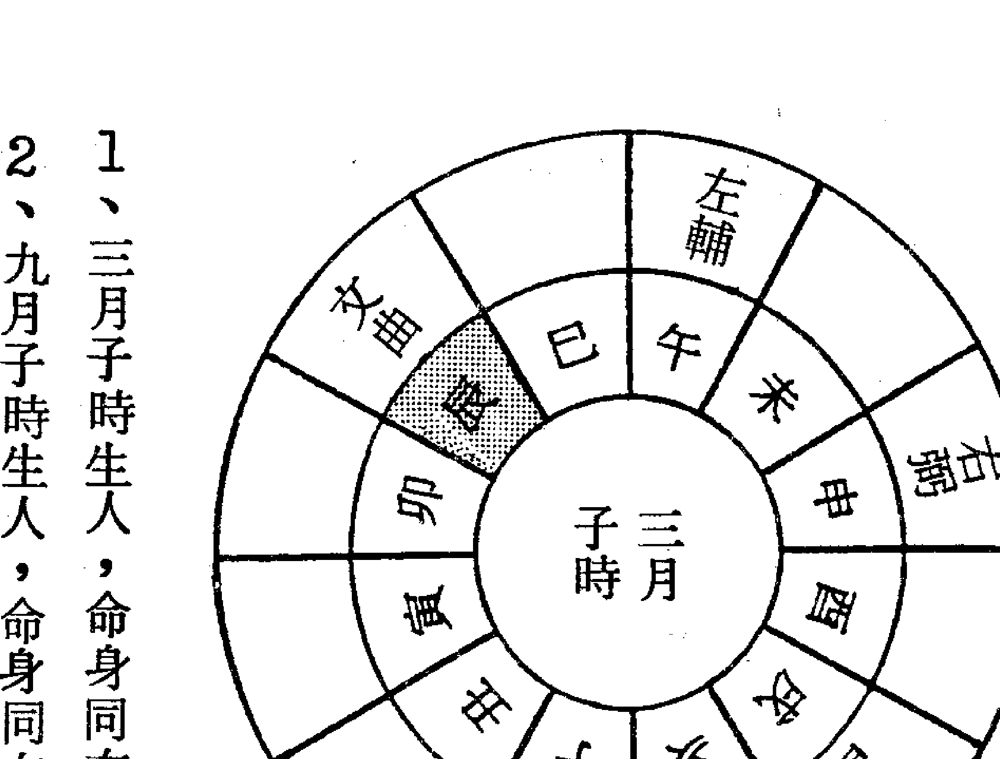

- 1、三月子時生人，命身同在辰，文曲守命，得地，癸庚甲生人貴格。右弼守官拱命為吉。
- 2、九月子時生人，命身同在戌，文昌守命，陷地，甲庚生人財官格。右弼守官拱命為吉。
- 3、全書附錄命例有「孟軻」「葉英」「王莽」為三月子時生人之參考。附錄於後，學者讀友不妨自為揣摩玩味之。

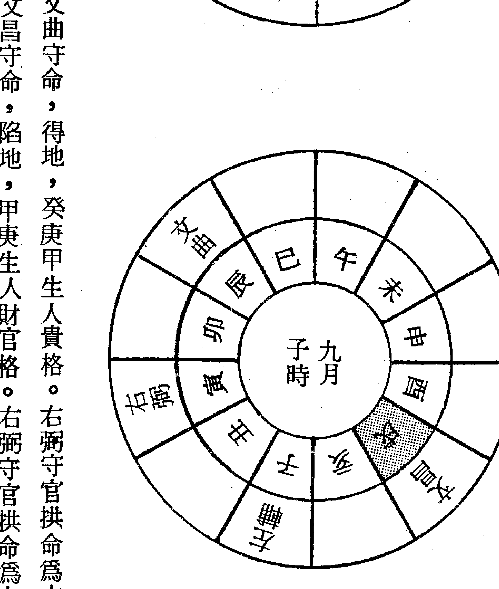

乙巳太歲子女(25-34)陀羅巨門(忌)天馬天刑力士臨官丙午夫妻(15-24)祿存文曲天相天梁博士冠帶丁未兄弟(5-14)擎羊天梁官祿沐浴戊申命宮文昌七殺伏兵長生

七殺朝斗，一生爵祿榮昌，紫府朝垣，左右拱照終身富貴。六十七歲大限到夾地遇流羊，太歲逢陀羅，亥生人有忌，故凶。

丁己田宅(22-31)祿存太陽博士戊擎羊左輔破軍大限官祿(32-41)己未奴僕天鉞天機(忌)青龍庚申遷移41右弼文昌紫府(科)小耗長生

七殺朝斗，富貴榮華，紫府朝垣，終身福厚，左右昌曲加會，尊居八座。大限到午，謂之沈馬，太歲地網，戊戌流羊壬午，流陀在辰，命垣七殺重逢，羊陀迭併，故死。

癸巳祿存太陰甲午擎羊左輔貪狼乙未巨門天同丙申武曲天相右弼父母(2-11)博士絕福德(12-21)力士胎田宅22小限青龍養官祿小耗長生壬辰陀羅文曲天府廉貞歲次丁丑年二十二歲五月初五故命宮截空官府墓辛卯天姚兄弟伏兵死庚寅火星破軍天馬夫妻大耗病庚子紫微財帛喜神帝旺辛丑太歲子女病符衰丁酉天梁太陽天鉞奴僕將軍沐浴天傷戊戌鈴星文昌七殺遷移奏書冠帶己亥天機天魁天空地劫天刑天權疾厄蜚廉臨官

紫相昌曲相逢加會，本作美論，奈嫌曲昌不宜見廉貞化忌。
秘云：文昌文曲逢廉貞，喪命夭壽之人。故死於二十二歲。

辛巳天府壬午左輔太陰天同癸未天鉞陀羅貪狼武曲甲申祿存右弼巨門太陽父母(4-13)長生大耗福德(14-23)伏兵沐浴田宅(24-34)官府冠帶官祿(34-43)博士臨官庚辰文曲小限命宮55病符養己卯破軍廉貞兄弟喜神胎戊寅火星太歲夫妻蜚廉絕己丑天魁子女奏書墓戊子財帛將軍死丁亥紫微七殺天使疾厄小耗病乙酉擎羊天相奴僕力士帝旺天傷丙戌大限鈴星文昌天梁天機遷移青龍衰

雙祿拱照，昌曲重逢，戊有機梁，文章冠世。
文曲單坐身命，主人口能舌辯。
大限地網逢鈴星，小限天羅，太歲又在絕地，故凶。

| 己巳大限 | 太阳 (忌) | 庚午 | 破军 (权) | 辛未 | 天魁 天机 | 壬申 | 紫微 天府 |
| :--- | :--- | :--- | :--- | :--- | :--- | :--- | :--- |
| 疾厄(66-75) | 天刑 天使 小耗 临官 | 财帛 | 将军 帝旺 | 子女 | 奏书 衰 | 夫妻 | 蜚廉 病 |
| 戊辰 | 文曲 武曲 (科) | 岁次己酉年六十六岁正月初八故 | | | | 岁次甲辰年九月十四日子时生 | 太阴 |
| 迁移(56-65) | 冠带 青龙 | | 阳男 马 援 火六局 | | | 癸酉太岁 兄弟 | 喜神 死 |
| 丁卯 小限 | 擎羊 天同 天伤 | | | | | 甲戌 | 贪狼 文昌 铃星 |
| 奴仆(46-55) | 沐浴 力士 | | | | | 命宫 | 病符 墓 |
| 丙寅 | 禄存 右弼 七杀 天马 | 丁丑 | 天梁 陀罗 钺 | 丙子 | 廉贞 相 左辅 (禄) | 乙亥 | 巨门 |
| 官禄(36-45) | 长生 博士 | 田宅(26-35) | 养 官府 | 福德(16-25) | 胎 伏兵 | 父母(6-15) | 绝 大耗 |
| 科权禄拱，富贵声扬，昌曲加会，文武双全，贪狼遇铃武同行，威振边夷。 | | | | | | | |
| 六十六岁大限到于天罗，小限巡于夹地，其数难逃。 | | | | | | | |

科权禄拱，富贵声扬，昌曲加会，文武双全，贪狼遇铃武同行，威振边夷。

六十六岁大限到于天罗，小限巡于夹地，其数难逃。

| 己巳 | 天梁 | 庚午 | 七杀 左辅 | 辛未 | 天魁 | 壬申 | 廉贞 右弼 |
| :--- | :--- | :--- | :--- | :--- | :--- | :--- | :--- |
| 父母(3-12) | 小耗 病 | 福德(13-22) | 将军 死 | 田宅(23-32) | 奏书 墓 | 官禄(33-42) | 蜚廉 绝 |
| 戊辰 | 紫微 天相 文曲 | 岁次癸未年六十岁九月十二故 | | | | 岁次甲申年三月初九日子时生 | 癸酉小限 |
| 命宫 | 丧门 青龙 | | 阳男 王 莽 木三局 | | | | 天伤 奴仆(43-52) 喜神 胎 |
| 丁卯 | 天机 巨门 擎羊 | | | | | 甲戌大限 | 破军 文昌 铃星 (权) |
| 兄弟 | 帝旺 力士 | | | | | 迁移(63-62) | 养 病符 |
| 丙寅 | 禄存 贪狼 | 丁丑 | 太阳 太阴 陀罗 钺 (忌) | 丙子 | 武曲 天府 (科) | 乙亥 | 天同 |
| 夫妻 | 临官 博士 | 子女 | 冠带 官府 | 财帛 | 沐浴 伏兵 | 疾厄 | 长生 大耗 |
| 科权禄拱，名誉声扬，紫破辰戌，为臣不忠，篡汉之位，是也。 | | | | | | | |
| 且申人忌见火铃。 | | | | | | | |
| 五十三岁大限入戍遇火铃，地网重併，小限天伤遭刑伤而亡。 | | | | | | | |

科权禄拱，名誉声扬，紫破辰戌，为臣不忠，篡汉之位，是也。

且申人忌见火铃。

五十三岁大限入戍遇火铃，地网重併，小限天伤遭刑伤而亡。

### 二、丑时生人：

- 1. 五月丑时生人，安命在巳，文曲守命，福德身在未，曲昌同协，入庙，辛生人遇紫杀守命大富贵。
- 2. 九月丑时生人，安命在酉，文昌守命，福德身在亥，昌曲同协，陷地，丁己庚生人财官格。

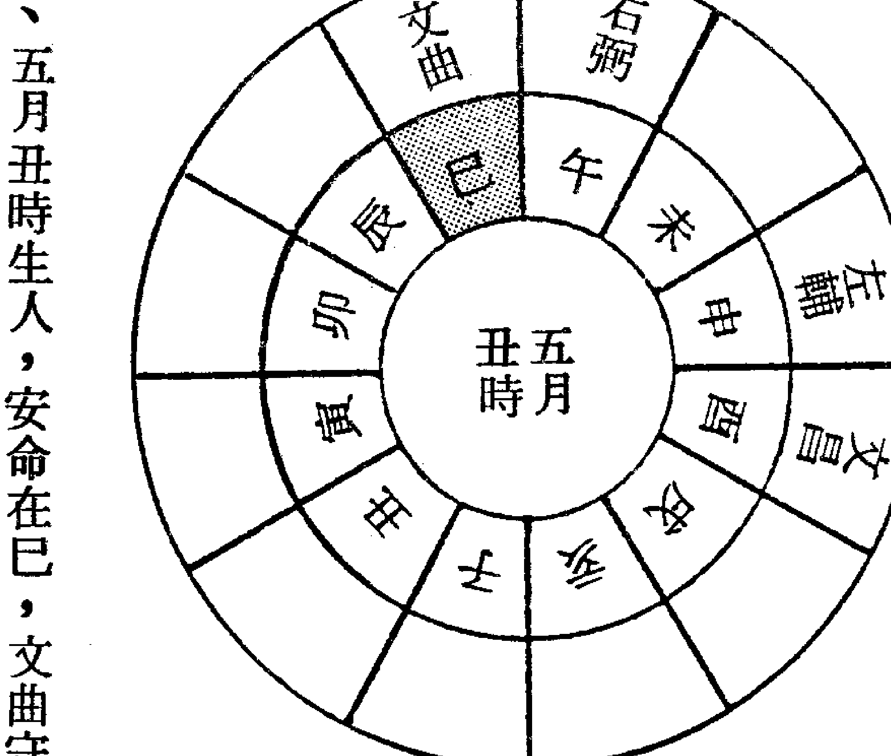

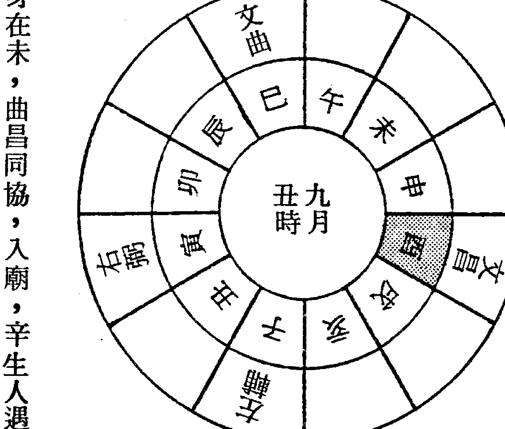

| 癸巳 | 甲午 | 天机 | 乙未 | 破军 | 丙申 | 陀罗 |
| :--- | :--- | :--- | :--- | :--- | :--- | :--- |
| 疾厄 | 财帛 | 小耗 | 子女 | 青龙 | 大限夫妻 (13-22) | |
| 壬辰 | 文曲太阴 | 火星七杀武曲 | 辛卯 | 庚寅 | 天钺右弼天机 | ... |
| 疾厄 | 将军 | 衰耗 | 帝旺 | 力士 | ... | ... |
| 遷移 | 奏書 | 死 | 淫 | 殃女 | 木三局 | ... |
| 奴僕 | 蜚廉 | 墓 | ... | ... | ... | ... |
| 官祿 | 喜神 | 絕 | 田宅 | 病符 | 福德 | 大耗 |
| 父母 | ... | ... | ... | ... | ... | ... |

> > 太阴虽在庙廊，但女命嫌文昌同度，况羊铃忌星并集，虽三方吉拱何益。

> > 文昌诀云：文昌擎羊火铃忌，若不为娼终夭折。验如此矣！

| 癸巳 | 甲午 | 乙未 | 丙申 |
| :--- | :--- | :--- | :--- |
| 天府文曲祿存 | 天同太陰擎羊 | 武曲貪狼 | 太陽巨門 |
| 天刑 | (祿) | | |
| 財帛 | 子女 | 夫妻 | 兄弟 |
| 博士 | 臨官 | 帝旺 | 衰 |
| | 力士 | 青龍 | 病耗 |
| 壬辰 | 歲次戊子年五十三歲三月十八故 | 陽男殷倫 (註：原紫微佈於卯宮，今訂正) | 歲次丙申年九月十三日丑時生 |
| 陀羅 | 火六局 | | 丁酉 |
| 天截使空 | | | 天文天魁昌相 |
| 疾厄 | | | 天姚(科) |
| 冠帶 | | | 命宮 |
| 官府 | | | 將軍 |
| 辛卯 | | | 戊戌 |
| 廉貞破軍 | | | 天機天梁鈴星(權) |
| (忌) | | | 天空 |
| 遷移 | | | 父母 |
| 沐浴 | | | 奏書 |
| 伏兵 | | | 墓 |
| 庚寅 | 辛丑 | 庚子 | 己亥 |
| 火星右弼 | | 左輔 | 紫微七殺天鉞 |
| 天天奴僕傷馬(46-56) | 官祿(36-45) | 地劫田宅(26-35) | 福德(16-25) |
| 大耗 | 病符 | 喜神 | 絕 |
| 長生 | 養 | 胎 | 衰 |
| 府相朝垣，左右昌曲加會，財官雙美，富貴之命，大限行於火鈴天傷之地，小限五十三歲亦重逢在彼，太歲地劫為殃，其死無疑。 | | | |

- 3、全書附錄命例有「殷倫」、「項濟川」、「和尚之命」為九月丑時生人之參考。
- 4、全書附錄一一四命例未得四月丑時生人命例，但有十一月丑時生之「孤夭男命」(見第九十章「昌貪居命，粉骨碎屍」、「小兒天命」)為文曲照命之參考命例，學者讀友不妨自為玩習推敲之。

| 天干 | 星曜 | 宫位 | 年龄范围 | 神煞 | 备注 |
| :--- | :--- | :--- | :--- | :--- | :--- |
| 辛巳 | 文曲、天同 | 财帛 | (32-41) | 天刑、伏兵、官符 | |
| 壬午 | 天府、武曲 | 子女 | (22-31) | 大耗、冠带 | |
| 癸未 | 太阴、太阳(忌) | 夫妻 | (12-21) | 病符、沐浴 | |
| 甲申 | 天魁、天钺 | 兄弟 | (2-11) | 喜神、长生 | |
| 庚辰(大限) | 破军、擎羊 | 疾厄 | (42-51) | 天使、官府、帝旺 | 岁次乙亥年五十一岁四月初十故（阴男，和尚，水二局）
| 己卯 | 火星、禄存 | 迁移 | | 博士、衰病 | |
| 戊寅 | 廉贞、右弼、陀罗 | 奴仆 | | 天伤、力士、病符 | |
| 己丑 | | 官禄 | | 青龙、死气 | |
| 戊子 | 七杀、左辅、天钺 | 田宅 | | 地劫、小耗、墓库 | |
| 丁亥(太岁) | 天梁(权) | 福德 | | 将星、绝煞 | |
| 乙酉(小限) | 天机、巨门、文昌(禄) | 命宫 | | 天姚(51)、蜚廉、养息 | 岁次乙酉年九月十八日丑时生
| 丙戌 | 紫微、天相、铃星(科) | 父母 | | 天空、奏书、胎养 | |

巨机自上化一者，便有财官也不终，俗人发达终天，空门享福丰隆。
五十一岁大限遇擎羊，小限到命垣，太岁在空劫并夹之地。

| 天干 | 星曜 | 宫位 | 年龄范围 | 神煞 | 备注 |
| :--- | :--- | :--- | :--- | :--- | :--- |
| 癸巳 | 天梁、文曲(科) | 财帛 | (36-45) | 天刑、截空、将星、将军 | |
| 甲午 | 七杀、天钺 | 子女 | (26-35) | 小耗、墓库 | |
| 乙未 | | 夫妻 | (16-25) | 青龙、死气 | |
| 丙申 | 廉贞、陀罗 | 兄弟 | (6-15) | 力士、病符 | |
| 壬辰 | 紫微、天相 | 疾厄 | (46-55) | 天使、奏书、胎养 | 岁次辛卯年六十一岁九月初七故（阴男，项济川，火六局）
| 辛卯(大限) | 天机、巨门(禄) | 迁移 | (56-65) | 蜚廉、养息 | |
| 庚寅 | 贪狼、天魁、右弼 | 奴仆 | | 天伤、喜神、长生 | |
| 辛丑 | 太阳、太阴(权) | 官禄 | | 小限官禄(61)、病符、沐浴 | |
| 庚子 | 武曲、天府、左辅 | 田宅 | | 地劫、大耗、冠带 | |
| 己亥 | 天同 | 福德 | | 伏兵、官符 | |
| 丁酉 | 文昌、禄存、火星(忌) | 命宫 | | 天姚、博士、衰病 | 岁次辛卯年九月二十三日丑时生
| 戊戌 | 破军、擎羊、铃星 | 父母 | | 天空、官府、帝旺 | |

科权禄会合，昌曲居于巳酉，但巨机居卯，虽逢火忌亦不为辱，富贵全美。
大限天伤，小限败地，太岁天哭杀临，主六十一岁而亡。

### 三、寅時生人：

- 1、七月寅時生人，安命在午，文曲守命，官祿身在戌，左輔守官祿拱命，陷地，甲庚生人財官格。
- 2、九月寅時生人，安命在申，文昌守命，官祿身在子，左輔守官祿拱命，得地，癸庚甲生人貴格。

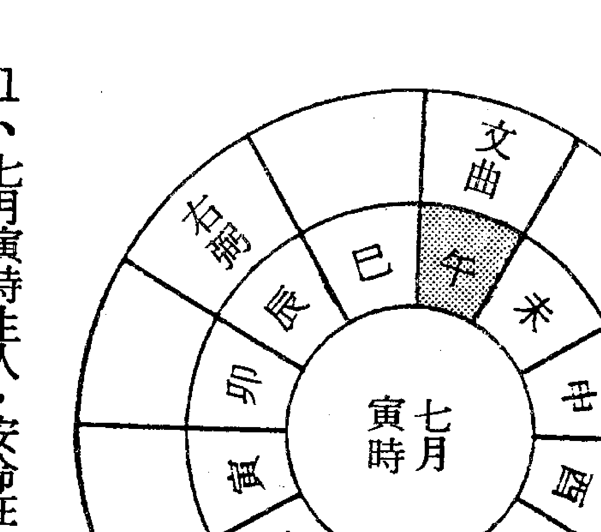

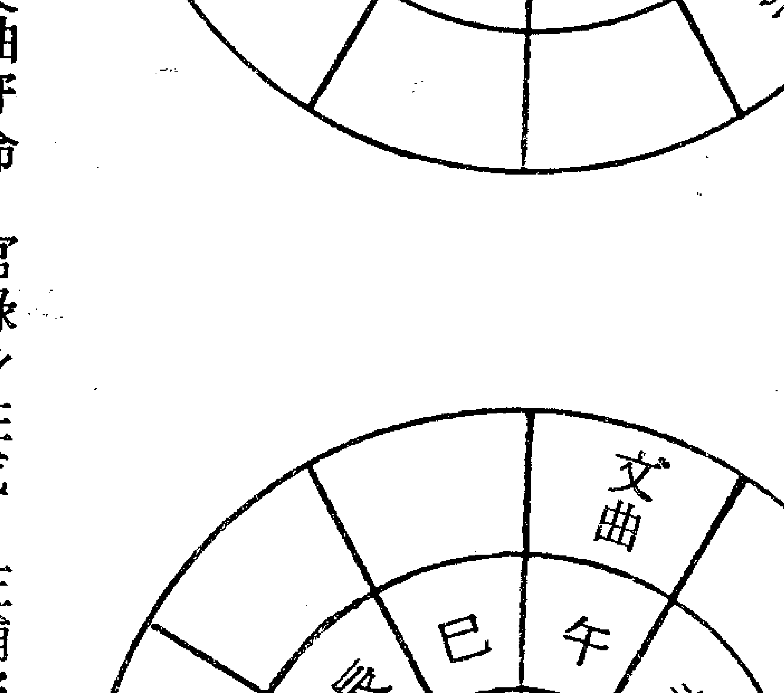

| 乙巳 | 天文天钺曲府(科) | 丙午小限 | 太天陰同 | 丁未 | 貪武曲狼(忌) | 戊申 | 巨太門陽 |
| :--- | :--- | :--- | :--- | :--- | :--- | :--- | :--- |
| 遷移 | 蜚廉 | 長生 | 疾厄 | 天使9 | 喜神 | 沐浴 | 財帛 | 病符 | 冠帶 | 子女 | 大耗 | 臨官 |
| 甲辰太歲 | 天傷 | 奏書 | 養 | 歲次庚辰年九歲死亡 | 註：此例或可為天相不化忌之參考。 | 陽男 | 小兒 | 天命 | 金四局 | 歲次壬申年十一月初一日丑時生 | 己酉 | 文昌相 | 夫妻 | 伏兵 | 帝旺 |
| 癸卯 | 天魁 | 破軍 | 官祿 | 將軍 | 胎 | 丙戌 | 鈴星 | 陀羅 | 天梁 | 天機(祿) | 天空 | 兄弟 | 官府 | 衰 |
| 壬寅 | 火星 | 左輔 | 癸丑 | 壬子大限 | 右弼 | 擎羊 | 辛亥 | 祿存 | 七殺 | 紫微(權) | 命宮 | 博士 | 病 |
| 田宅 | 小耗 | 絕 | 福德 | 青龍 | 墓 | 父母(4-13) | 力士 | 死 | 命宮 | 博士 | 病 |

此看本宮守命垣星，本宜易養，但夾羊夾陀，夾空夾劫，若非夭即主卑賤，雖紫祿何力，故夭於九歲而亡。
堃元附按：命身二主並為觀察研判可得一二線索。

| 癸巳 | 太阴 | 甲午 | 天文贪 钺曲狼 | 己未 | 巨天 门同 | 丙申 | 陀文天 武曲 罗昌相 |
| :--- | :--- | :--- | :--- | :--- | :--- | :--- | :--- |
| 截空 | | | | 天姚 | | | |
| 兄弟(4-13) | 将长 命宫 军生 | | 小养 耗 | 父母 | 青胎 龙 | 福德 | 力绝 士 |
| 壬辰 | 右天廉 弼府贞 | 岁次壬子年五十二岁正月十一故 | 注：原作水二局，今订正命图。 | 阴男 王钦若 金四局 | 岁次辛酉年七月初五日寅时生 | 丁酉 | 禄天太 存梁阳 |
| 夫妻(14-23) | 奏沐 书浴 | | | | | 天空 | 博墓 士 |
| 辛卯 | 火星 | | | | | 戊戌 | 铃擎左 七 星羊辅杀 |
| 子女(24-33) | 蜚冠 廉带 | | | | 小限 官禄 | 52 | 官死 府 |
| 庚寅 | 天破 魁军 | 辛丑大限 | | 庚子太岁 | 紫微 | 己亥 | 天机 |
| 财帛(34-43) | 喜临 神官 | 天地 疾使劫 厄(44-53) 符旺 | | 迁移 | 大衰 耗 | 奴仆 | 天天 伤马 伏病 兵 |

原注：科权禄拱，文学声扬，左辅右弼，尊居八位，富贵双全之命。

大小二限入地网，又遇擎羊，酉人遇之必凶，损寿。

- 3、骨髓赋曰：「左辅文昌会吉星，尊居八座。」
- 4、全书附录命例有「王钦若」「王珪」为七月寅时生人之参考，有「子路」「孙膑」「佚名」「燕哲」「甯萃」「李嗣源」（见第九十一章「七杀朝斗」格）「都督」「胡总制」「秀才」等为九月寅时生人之参考。

| 丁巳大限 子女(23-32) 天刑 喜神 病符 | 天钺 | 戊午 夫妻(13-22) 蜚廉 衰 | 文曲 | 己未 兄弟(3-12) 奏书 帝旺 | 庚申 太岁 将军 临官 | 文昌 廉贞 |
| :--- | :--- | :--- | :--- | :--- | :--- | :--- |
| 丙辰 财帛 病符 死符 | 天相 紫微 | 岁次甲申年三十二岁三月初三故 | 阴男 子 路 木三局 | 辛酉 父母 小耗 冠带 | 天空 天姚 | 岁次癸丑年九月初九日寅时生 |
| 乙卯 疾厄 天使 大耗 墓 | 天魁 巨门 天机 权 | | | 壬戌 福德 青龙 沐浴 | 破军 禄 | |
| 甲寅小限 迁移 32 伏兵 绝 | 右弼 贪狼 忌 | 乙丑 奴仆 官府 胎 | 擎羊 太阴 太阳 科 天地截 空伤劫 | 甲子 官禄 博士 养 | 禄存 左辅 天府 武曲 | 癸亥 田宅 力士 长生 陀罗 天同 天马 |

此为府相朝元格，且紫微诸吉星拱合，所以为贤士，但命宫廉贞将军，故主勇猛，更对垣遇贪狼忌星拱命，故主凶亡，果死孔悝之难。

| 乙巳 兄弟(2-11) 力士 临官 | 陀罗 天相 | 丙午 命宫 博士 冠带 | 禄存 文曲 天梁 | 丁未 父母 官府 沐浴 | 擎羊 七杀 廉贞 | 戊申 福德 伏兵 长生 | 文昌 |
| :--- | :--- | :--- | :--- | :--- | :--- | :--- | :--- |
| 甲辰 夫妻(12-21) 青龙 帝旺 | 右弼 巨门 忌 | 岁次庚子年四十四岁三月初八故 | 阴男 王 珏 水二局 | 己酉 田宅 大耗 养 | 天空 天钺 | 岁次丁巳年七月初四日寅时生 | |
| 癸卯 子女(22-31) 小耗 衰 | 火星 贪狼 紫微 | | | 庚戌 官禄 病符 胎 | 铃星 左辅 天同 权 | | |
| 壬寅小限 财帛 44 (32-41) 将军 | 太阴 天机 禄 科 | 癸丑大限 疾厄(42-51) 奏书 死 | 天府 天地 劫使 | 壬子 迁移 墓 | 太阳 | 辛亥 奴仆 喜神 绝 | 天伤 天魁 破军 武曲 |

梁居午位，官资清显。
朝堂，命垣文曲，位至公卿。
四十四岁丧门吊客太岁冲凶，三杀又照，故损寿。
凡天梁对照，文曲夹命者，合此格。

### 四、卯时生人：

- 1、九月卯时生人，安命在未，昌曲守命，辅弼夹迁移宫。
- 2、三月卯时生人，安命在丑，迁移宫在未逢昌曲，辅弼夹身。
- 3、文昌利地，文曲旺地，乙壬丙戊生人财官格。
- 4、己生人文曲化忌，辛生人文昌化忌，以化忌在未受制，不能肆凶，如不再逢会凶杀，得贵容易，在税赋财经上能有建树成就，并因之得贵，今之大企业家、董事长、总经理等辈为辰戌时生者多。

| 己巳 | 陀罗武曲 | 庚午 | 禄存文昌太阳 | 辛未 | 擎羊天府 | 壬申 | 天钺太阴权忌 |
| :--- | :--- | :--- | :--- | :--- | :--- | :--- | :--- |
| | 禄 | | | | | | |
| 兄弟(5-14) | 力士官 | 命宫 | 博士冠带 | 父母 | 官禄沐浴 | 福德 | 伏兵长生 |
| 戊辰 | 天同 | | 岁次辛亥年七十三岁五月初八故 | | | 癸酉 | 火贪紫微权 |
| 夫妻(15-24) | 青龙旺 | | 阴男 | | | 田宅 | 大耗 |
| 丁卯 | | 小耗 | | 严子陵 | | 甲戌 | 巨门 |
| 子女(25-34) | | | | 土五局 | | 官禄 | 病符 |
| 丙寅 | | 右弼 | | | | 丁丑小限 | 天使疾厄(45-54) |
| 财帛(35-44) | | 将军 | | | | | 奏书 |
| 乙亥 | | 天相 | | | | 丙子 | 天魁左辅天梁科 |
| 奴仆(65-74) | | 喜神 | | | | 迁移(55-64) | 墓 |

太阳居午无杀凑，左右扶持福不轻，因有文昌同科禄，富贵双全寿至终。

七十三岁大限天伤，小限天使，不吉，损寿。

| 辛巳 | 天府 | 壬子 | 文昌太阴忌科 | 癸未 | 天钺陀罗贪狼武曲权 | 甲申 | 禄存文曲巨门太阳禄 |
| :--- | :--- | :--- | :--- | :--- | :--- | :--- | :--- |
| 子女 | 大耗 | 夫妻 | 伏兵 | 兄弟 | 官府 | 命宫 | 博士长生 |
| 庚辰 | | | | | | 乙酉 | 擎羊天相 |
| 财帛 | 病墓符 | | | | | 父母(2-11) | 力士沐浴 |
| 己卯 | | 疾厄 | 天地劫使 | 喜神 | | 丙戌 | 天梁天机铃星 |
| | | | | | | 福德(12-21) | 青龙冠带 |
| 戊寅二限 | 天马迁移(52-61) | | 蜚廉 | | | 乙丑 | 天魁 |
| | | | | | | 奴仆(42-51) | 奏书 |
| | | | | | | 丁亥 | 七杀紫微 |
| | | | | | | 田宅(22-31) | 小耗官 |

巨日同宫，双禄守垣，左右拱照，为富贵宜矣！

奈申人大小二限行于火星之位见凶也，即死于五十三岁。

贵容易，在税赋财经上能有建树成就，并因之得贵，今之大企业家、董事长、总经理等辈为辰戌时生者多。

- 4、全书附录命例有「吴秉直」「顾孟锡」为十一月辰时生人之参考，有「严子陵」「孔允夫」为九月辰时生人之参考。
- 5、附录命例又有「萧何」「陈平」三月辰时生者、「百里奚」五月辰时生者，为昌曲拱照命格，学者读友不妨并为参考玩味之。

### 五、辰时生人：

- 1、十一月辰时生人，安命在申，文曲得地守命，辅弼朝拱，财帛身在辰，丁癸辛庚生人福厚。
- 2、九月辰时生人，安命在午，文昌陷地守命，辅弼朝拱，丁己甲庚生人财官格。
- 3、依「左辅文昌会吉星，尊居八座。」引伸，凡财帛身同宫者（即辰戌生人），得财较得贵容易，在税赋财经上能有建树成就，并因之得贵，今之大企业家、董事长、总经理等辈为辰戌时生者多。

| 干支 | 星曜 | 干支 | 星曜 | 干支 | 星曜 | 干支 | 星曜 |
| :--- | :--- | :--- | :--- | :--- | :--- | :--- | :--- |
| 乙巳 | 陀罗 天梁 | 丙午 | 禄存 七杀 | 丁未 | 擎羊 文昌 文曲 | 戊申 | 廉贞 |
| | 天马 迁移(54-63) 力士长生 | | 天使 疾厄(44-53) 博士养 | | 财帛(34-43) 官府胎 | | 子女(24-33) 伏兵绝 |
| 甲辰 | 左辅 天相 紫微 | | 阴男 进 | | 岁次丁亥年正月二十一日卯时生 | 己酉 | 火星 天钺 |
| | 天伤 奴仆 青龙 沐浴 | | 金四局 | | | | 天刑 夫妻(14-23) 大耗 |
| 癸卯 | 巨门 天机 | | 土 | | | 庚戌 | 铃星 右弼 破军 |
| | 截空 官禄 冠带 小耗 | | | | | | 兄弟(4-13) 病符死 |
| 壬寅 | 贪狼 地劫 田宅 | 癸丑 | 太阴 太阳 天姚 福德 帝旺 | 壬子 | 天府 武曲 父母 | 辛亥 | 天魁 天同 权 命宫 喜神病 |
| | 将军 临官 | | | | 蜚廉 衰 | | |

科权守照，昌曲暗拱，天魁坐命，当为科甲之士。
但中年以上，限行绝地，未得遂志，至五十四后方利达。

| 辛巳 | 壬午 | 文昌 天机 | 癸未 | 天钺陀罗破军紫微 | 甲申 | 禄存文曲 |
| :--- | :--- | :--- | :--- | :--- | :--- | :--- |
| 子女 | 大绝耗 | 夫妻 | 伏胎兵 | 兄弟 | 官养府 |
| 庚辰 | 太阳 (禄) | | 岁次乙未年四十六岁七月初九故 | 阴男 吴秉直 水二局 | 岁次庚戌年十一月十二日辰时生 | 乙酉 擎羊天府 |
| 财帛 | 病墓符 | | | | | 父母 (2-11) 力士沐浴 |
| 己卯 | 铃星七杀武曲 (权) | | | | | 丙戌 太阴 (忌) |
| 天使 疾厄 | 喜死神 | | | | | 福德 (12-21) 青龙冠带 |
| 戊寅 | 左辅天梁天同 (科) | 己丑大限 天伤奴仆 (42-51)奏书 | 戊子 右弼巨门 | 丁亥 贪狼廉贞 | | 田宅 (22-31) 小耗临官 |
| 巨日拱照，日辰月戊并争荣耀，禄科俱会，左右拱照，终身富贵。 | | | | | | |
| 大小二限入天伤忌凶之地，太岁逢陀罗天刑，俱主凶兆，其年命终。 | | | | | | |

| 己巳 陀罗武曲军 禄 兄弟(5-14)力士官 | 庚午 禄存文昌太阳 命宫 博士冠带 | 辛未 擎羊天府 父母 官禄沐浴 | 壬申 天钺太阴权忌 福德 伏兵长生 |
| :--- | :--- | :--- | :--- |
| 戊辰 天同 夫妻(15-24)青龙旺 | | 岁次辛亥年七十三岁五月初八故 阴男 严子陵 土五局 | 癸酉 火星贪狼紫微权 田宅 大耗 | 甲戌 巨门 官禄 病符 |
| 丁卯 小耗 子女(25-34) | 丙寅 右弼 财帛(35-44)将军 | 丁丑小限 天疾使厄(45-54)奏书 | 丙子 天魁左辅天梁科 迁移(55-64)墓 |
| 乙亥 天相 奴仆(65-74)喜神 | | | |

太阳居午无杀凑，左右扶持福不轻，因有文昌同科禄，富贵双全寿至终。

七十三岁大限天伤，小限天使，不吉，损寿。

| 辛巳 天府 子女 大耗 | 壬子 文昌太阴忌科 夫妻 伏兵 | 癸未 天钺陀罗贪狼武曲权 兄弟 官府 | 甲申 禄存文曲巨门太阳禄 命宫 博士长生 |
| :--- | :--- | :--- | :--- |
| 庚辰 财帛 病墓符 | | 岁次壬子年五十三岁九月初三故 阳男 顾孟锡 水二局 | 乙酉 擎羊天相 父母(2-11)力士沐浴 | 丙戌 天梁天机铃星 福德(12-21)青龙冠带 |
| 己卯 疾厄 天地劫使喜神 | 戊寅二限 天马迁移(52-61)蜚廉 | 乙丑 天魁 奴仆(42-51)奏书 | 丁亥 七杀紫微 田宅(22-31)小耗官 |

巨日同宫，双禄守垣，左右拱照，为富贵宜矣！

奈申人大小二限行于火星之位见凶也，即死于五十三岁。

| 己巳 天伤 奴仆 陀罗 太阴 力士 临官 | 庚午 大小限 迁移(52-61) 禄存 左辅 文昌 贪狼 (权) 博士 冠带 | 辛未 大限 疾厄(42-51) 天钺 擎羊 巨门 天同 天使 官府 沐浴 | 壬申 太岁 财帛(32-41) 右弼 文曲 天相 武曲 (忌)(禄) 伏兵 长生 |
| :--- | :--- | :--- | :--- |
| 戊辰 官禄 天府 廉贞 青龙 帝旺 | | 岁次戊申年六十岁十月初七故 注：原作木三局，今更订之。 阴男 萧 何 水二局 | 岁次己酉年三月二十二日辰时生 | 癸酉 子女(22-31) 天梁 太阳 (科) 养 大耗 | 甲戌 夫妻(12-21) 铃星 七杀 病胎 符 |
| 丁卯 田宅 火星 小耗 衰 | 丙寅 破军 将病 军 | 丁丑 天魁 父母 奏书 死 | 丙子 命宫 紫微 蜚廉 墓 | 乙亥 兄弟(2-11) 天机 喜神 绝 |

府相朝垣格，紫府左右权禄嘉会，又兼昌曲六合，乃坐贵向贵双贵双全，入相之命。
限到擎羊，酉人忌之，小限流羊与命垣相冲，故六十岁而终。

| 乙巳 天刑 兄弟(2-11) 陀罗 天同 力士 临官 | 丙午 命宫 禄存 文昌 天府 武曲 博士 冠带 | 丁未 父母 擎羊 太阴 太阳 (禄) 官府 沐浴 | 戊申 太岁 福德 文曲 贪狼 伏兵 长生 |
| :--- | :--- | :--- | :--- |
| 甲辰 夫妻(12-21) 破军 青龙 帝旺 | | 岁次戊申年三十二岁五月初五故 阴男 孔 允 夫 水二局 | 岁次丁丑年九月十八日辰时生 | 己酉 田宅 天钺 巨门 天机 天姚 (忌)(科) 养 大耗 | 庚戌 官禄 铃星 天相 紫微 病胎 符 |
| 癸卯 子女(22-31) 火星 地劫 截空 小耗 衰 | 壬寅二限 财帛(32-41) 右弼 廉贞 将病 军 | 癸丑 疾厄 天使 奏书 死 | 壬子 迁移 左辅 七杀 蜚廉 墓 | 辛亥 奴仆 天马 天伤 喜神 绝 |

权禄夹命之格，左右加会，财官双美，无不富贵。
三十二岁小限大限在寅，太岁在申冲照，飞廉同并，流羊又加，以七杀重逢，是为凶也。

### 六、巳时生人：

1.  正月巳时生人，安命在酉，文曲入庙守命，昌曲同协，辛生人遇紫贪守命大富贵，夫妻身宫在未。
2.  九月巳时生人，安命在巳，文昌入庙守命，昌曲同协，夫妻身宫在卯，乙戊辛生人财官格，丙生人亦财官格，但以廉贞化忌，较易有灾破（参考「文昌文曲会廉贞，丧命天年」）。

| 宫位/大限 | 星曜与备注 | 宫位/大限 | 星曜与备注 | 宫位/大限 | 星曜与备注 | 宫位/大限 | 星曜与备注 |
| :--- | :--- | :--- | :--- | :--- | :--- | :--- | :--- |
| 辛巳 (46-55) | 天梁，天伤，奴仆宫，耗官 | 壬午 (56-65) | 左辅，文曲，七杀，文昌，辅弼，截空，迁移宫，兵旺 | 癸未 大限 (65-75) | 天钺，陀罗，天官，疾厄宫 | 甲申 大限 | 禄存，右弼，文曲，廉贞，天马，财帛宫，博士，病 |
| 庚辰 (36-45) | 天相，紫微，官禄宫，符带 | | | 岁次乙丑年七十二岁五月初三故 注：原作木三局，今订正之。 | | 阳男 陈平，火六局 | 岁次庚戌年三月十八日辰时生 |
| 己卯 小限 (26-35) | 铃星，巨门，天机，天姚，地劫，田宅宫，喜神，沐浴 | | | | | 乙酉 | 擎羊，子女宫，力士，死土 |
| 戊寅 (16-25) | 贪狼，福德宫，辈长，廉生 | 己丑 | 火星，天魁，太阴，太阳，忌，禄 | 戊子 | 天府，武曲，权，命宫 | 丁亥 | 天同，天刑，科，兄弟宫，小耗，绝 |

权禄科逢，天府武曲守命垣，左右昌曲加会，勃然入相之命。大限七十三入申，身临地，小限到天空天使夹地，又陀罗为戊人所忌，是为大凶，故终寿。

3.  全书附录命例有「邝生」为九月巳时生人之参考，无三月巳时生人之命例，从缺不具。
4.  别有「魏豹」七月巳时生命例，文曲守迁移照命，文昌守福德冲财帛宫，亦为昌曲格局之一例，并附以为参考。

| 宫位/大限 | 星曜与备注 | 宫位/大限 | 星曜与备注 | 宫位/大限 | 星曜与备注 | 宫位/大限 | 星曜与备注 |
| :--- | :--- | :--- | :--- | :--- | :--- | :--- | :--- |
| 丁巳 (命宫) | 天钺，文昌，贪狼，廉贞，天刑 | 戊午 小限 (父母36) | 天空，巨门，蜚廉，冠带 | 己未 | 天相，奏书，沐浴 | 庚申 | 天梁，天同，将军，长生 |
| 丙辰 太岁 (兄弟5-14) | 地劫，太阴，病符，帝旺 | | | 岁次戊辰年三十六岁正月十一故 注：原作戊戌年死，今注而更订之。 | | 阴男 邝生，土五局 | 岁次癸巳年九月初四日巳时生 |
| 乙卯 (夫妻15-24) | 火星，天魁，天府，大耗，衰 | | | | | 辛酉 | 天姚，官禄宫 |
| 甲寅 | 右弼 | 乙丑 大限 (财帛35-44) | 擎羊，破军，紫微，官禄宫，死，府 | 甲子 | 禄存，左辅，天使，疾厄宫，博士，墓 | 癸亥 | 天马，迁移宫，陀罗，力士，绝 |
| | | | | | | 壬戌 | 天伤，奴仆宫，铃星，太阳，青龙，胎 |

科权夹贵之格，本为美命，只嫌空劫加夹命垣，且文昌不宜与贪狼廉贞同立，一生奔波劳碌。三十六太岁天伤，小限天空，戊禄化吉，小船不堪重载，是以凶也。

### 七、午时生人：

1.  三月午时生人，安命身在戌，文曲陷地守命，昌曲守照，左辅守财拱命，甲庚生人财官格。
2.  九月午时生人，安命身在辰，文昌得地守命，昌曲守照，左辅守财拱命，癸庚甲生人贵格。但癸生人贪狼化忌，易遭浮沈灾破（参考「巨贪居命，粉骨碎尸」）。

科禄相逢，遇太阳天梁同位最高强，运行限俱为吉，后因大限遇陀罗，小限地网，丙年廉贞化忌凶，又兼申人忌铃星，故主难过却此岁。

| 宫位/大限 | 星曜与备注 | 宫位/大限 | 星曜与备注 | 宫位/大限 | 星曜与备注 | 宫位/大限 | 星曜与备注 |
| :--- | :--- | :--- | :--- | :--- | :--- | :--- | :--- |
| 辛巳 | | 壬午 | 天机 | 癸未 | 天陀罗，破军，紫微 | 甲申 | 禄存 |
| 天地空劫 | 天刑，父母(4-13) | 耗生 | 伏兵，沐浴 | 福德(14-23) | 兵浴 | 官冠带 | 田宅(24-33) |
| 庚辰 小限 | 文昌，太阳，禄 | 病养 | 符 | 命宫 | | | |
| 己卯 | 七杀，武曲，权 | 喜胎 | 神 | 兄弟 | | | |
| 戊寅 太岁 | 天右弼，天同，天梁，科 | 天虚 | 夫妻 | | | | |
| 己丑 | 天相，天魁 | 奏书 | 墓 | 子女 | | | |
| 戊子 | 左辅，巨门 | 将军 | 死 | 财帛 | | | |
| 丁亥 | 天使 | 疾厄 | | | | | |

此为丹墀贵格，秋月生者是真格，且太阳守命垣，日月争耀，科权禄会合，文武相全。四十三岁太岁行寅火忌，申生人有忌，小限丧门病符，天哭冲照，故命亡。

3.  参考子时生人命例，其格局相当，唯子时生人以右弼守官为吉，此时生人以左辅守财为吉，两者有财官禄吉之区分而已。
4.  全书卷三诸星所宜论诀曰：『昌曲己辛壬生人，限逢辰戌虑投河。』，原注曰：『如入庙，吉，大小二限俱到者是，命坐辰戌者，一星灾轻。』
5.  骨髓赋曰：『铃昌罗武，限至投河。』，如构此格，己辛壬生人最忌，丙戊生人次之。
6.  全书附录命例缺三月午时命例，有『晏平』命例为九月午时生之参考。
7.  附录命例有十一月午时生『韩信』『李太白』『曹参』命例，文昌守官禄宫，文曲守夫妻宫，俱为昌曲辅拱命例（按：夫妻、福德二宫为辅位，有吉者谓之『扶』，或谓『辅』。），并附录以供学者读友玩味推敲之。

| 宫位/大限 | 星曜与备注 | 宫位/大限 | 星曜与备注 | 宫位/大限 | 星曜与备注 | 宫位/大限 | 星曜与备注 |
| :--- | :--- | :--- | :--- | :--- | :--- | :--- | :--- |
| 己巳 | 陀罗，天机 | 庚午 | 禄存，紫微 | 辛未 | 擎羊 | 壬申 | 天钺，破军 |
| 天地空劫 | 兄弟(5-14)，力士，官 | 命宫 | 博士，冠带 | 父母 | 天刑，官府，沐浴 | 福德 | 伏兵，长生 |
| 戊辰 | 文昌，七杀 | | | 岁次辛亥年六十三岁七月初九故 阴男 曹参，土五局 | | 岁次己酉年十一月二十五日午时生 | 癸酉 |
| 夫妻(15-24) | 青龙，帝旺 | | | | | | 截空，田宅，大耗，养 |
| 丁卯 | 火星，天梁，太阳 | | | | | 甲戌 | 铃星，文曲，天府，廉贞 |
| 子女(25-34) | 小耗，衰 | | | | | 小限 | 官禄64，病胎，符 |
| 丙寅 | 左辅，天相，武曲 | 丁丑 | 巨门，天同 | 丙子 | 天魁，右弼，贪狼 | 乙亥 | 太阴 |
| 财帛(35-44) | 将军，病 | | 天使 | 疾厄(45-54)，奏书，死 | 大限 | 迁移(55-64)，蜚廉，墓 | 天姚，天马，奴仆，喜神，绝 |

紫微居午无杀，左右权禄子寅二宫加会，官资清显至三公。六十三岁大限到天伤夹地，又流年羊刃照命，酉人忌之为凶也。

| 宫位/大限 | 星曜与备注 | 宫位/大限 | 星曜与备注 | 宫位/大限 | 星曜与备注 | 宫位/大限 | 星曜与备注 |
| :--- | :--- | :--- | :--- | :--- | :--- | :--- | :--- |
| 己巳 | 巨门 | 庚午 | 天相，廉贞 | 辛未 | 天魁，天梁 | 壬申 | 七杀 |
| 太岁 | 天地空劫，兄弟，小耗，绝 | 命宫 | 将军，胎 | 父母(5-14) | 天刑，奏书，养 | 福德(15-24) | 天马，空，蜚廉，长生 |
| 戊辰 | 文昌，贪狼 | | | 岁次乙巳年三十二岁二月初四故 阳男 韩信，土五局 | | 岁次甲戌年十一月初五日午时生 | 癸酉 |
| 夫妻 | 青龙，墓 | | | | | 大限 | 田宅(25-34)，喜神，沐浴 |
| 丁卯 | 铃星，擎羊，太阴 | | | | | 甲戌 | 文曲，武曲 |
| 子女 | 力士，死 | | | | | 科 | 官禄，病符，冠带 |
| 丙寅 | 禄存，左辅，天府，紫微 | 丁丑 | 火星，天钺，陀罗，天机 | 丙子 | 右弼，破军 | 乙亥 | 太阳 |
| 财帛 | 博士，病 | | 天使 | 疾厄，官府，衰 | 权 | 迁移，伏兵，帝旺 | 小限 | 忌，奴仆32，大耗，临官 |

紫府拱照，左右加会，禄合科权，出将入相之命。三十二岁小限在亥值伤忌，太岁空劫在巳冲之，又大限羊陀冲照，故遭毒死。

| 天干地支 | 星曜/官位 | 大限/年龄 | 星曜/备注 | 天干地支 | 星曜/备注 | 天干地支 | 星曜/备注 |
| :--- | :--- | :--- | :--- | :--- | :--- | :--- | :--- |
| 丁巳 | 禄存，巨门 | 44-53 | 天伤，空劫，天姚，奴仆(44-53)，士 | 戊午 大限 | 擎羊，右弼，天相，廉贞，迁移(54-63)，士，沐浴 | 己未 | 天钺，天梁，疾厄宫，青龙，冠带 |
| 丙辰 | 陀罗，文昌，贪狼 | 34-43 | 官禄(34-33)，官，养，府 | | | 辛酉 | 天同，将军，帝旺，子女宫，奏书 |
| 乙卯 | 铃星，太阴 | 24-33 | 田宅(24-33)，伏兵，胎，权 | 岁次乙卯年五十八岁八月初七故 阳男 武安王，金四局 | 文曲，武曲 | 壬戌 | 奏书，夫妻宫 |
| 甲寅 | 天府，紫微 | 14-23 | 福德(14-23)，大耗，绝 | 乙丑 小限 | 天刑(4-13)，符，父母(4-13)，火星，天魁，忌，截空，喜神，死，命宫 | 甲子 | 破军 癸亥 | 太阳，病符，廉贞 |

杀破廉贞俱作恶，庙而不陷宜掌三军，科权左右加会为武职峥嵘，终嫌贪狼羊刃加临，又大限到午，午生人有忌，小限遇刑忌，卒至死亡。

| 天干地支 | 星曜/备注 | 天干地支 | 星曜/备注 | 大限/年龄 | 备注 | 天干地支 | 星曜/备注 | 天干地支 | 星曜/备注 |
| :--- | :--- | :--- | :--- | :--- | :--- | :--- | :--- | :--- | :--- |
| 癸巳 | 禄存，陀罗 | 天地空劫，兄弟 | 天机，权，博士，长生 | 甲午 | 擎羊，命宫，力士，沐浴 | 紫微，父母(4-13)，龙，冠带 | 乙未 | 福德(14-23)，小耗，临官 |
| 壬辰 小限 | 文昌，七杀，夫妻(43)，官，养，府 | | | 岁次戊戌年四十三岁四月初七故 注：原图为十月午时生例，今订以十一月布图。 | | 李太白，金四局 | 岁次丙辰年十一月初十日午时生 | 丁酉 | 天魁，田宅(24-33)，将军，旺 |
| 辛卯 | 天梁，太阳 | | | | | 戊戌 大限 | 铃星，文曲，天府，廉贞，权，官禄(34-43)，奏书 | | |
| 庚寅 | 火星，左辅，天相，武曲 | 辛丑 | 天使，疾厄宫 | 巨门，天同，病墓，符 | 庚子 | 右弼，贪狼，喜神，死 | 己亥 | 天钺，太阴，奴仆宫，病符，廉贞 |

原注：天魁天钺，世称李白文华，权禄生逢，欣然入相，左右加会，富贵终身，只奈空劫在命垣，寿不长久。大小二限天罗地网，是以凶也。

### 八、未时生人：

1.  五月未时生人，安命在亥，文曲旺地守命，昌曲同协，福德身同宫在丑，辛丙壬戊生人财官格，惟辛生人文昌化忌在官禄宫，于事业奋斗历程较为辛勤艰难。
2.  九月未时生人，安命在卯，文昌利益守命，昌曲同协，乙戊生人财官格，或丙辛壬生人亦财官格论议，但丙辛壬人有美中不足之兆。
3.  全书卷三诸星所宜论诀曰：「昌曲破军临虎兔，杀羊冲破主奔波。」又曰：「文昌武曲，为人多学多能。」，「二曲旺宫，威名赫奕（文曲子宫第一，卯酉宫次之；武曲辰宫第一，丑未宫次之。）。」。
4.  全书附录命例有「马周」「刘都衙」为九月未时生人之参考，无五月未时生命例，从缺。

| 宫位/大限 | 星曜与备注 | 宫位/大限 | 星曜与备注 | 宫位/大限 | 星曜与备注 | 宫位/大限 | 星曜与备注 |
| :--- | :--- | :--- | :--- | :--- | :--- | :--- | :--- |
| 己巳 | 天府 | 庚午 | 太阴，天同 | 辛未 | 天魁，贪狼，武曲 | 壬申 | 巨门，太阳 |
| 天刑 | | 地劫 | | 科 | 天伤，天马，截空，奴仆宫 | 忌 | |
| 福德(16-25) | 小耗，临官 | 田宅(26-35) | 将军，帝旺 | 官禄(36-45) | 衰，奏书 | 奴仆(46-55) | 廉贞 |
| 戊辰 | 天空 | | | 岁次戊子年五十五岁十月十三故 阳男 刘都衙，火六局 | | 岁次甲午年九月初三日未时生 | 癸酉 |
| 丁卯 | 铃星，擎羊，文昌，破军，廉贞 | | | | | 甲戌 | 天梁，天机，小限，疾厄55，病符 |
| 丙寅 | 禄存，右弼 | 丁丑 | 天钺，火星，陀罗 | 丙子 | 左辅 | 乙亥 | 文曲，七杀，紫微 |
| 兄弟 | 博士，长生 | 夫妻 | 官禄府 | 子女 | 伏兵，胎 | 财帛 | 大耗，绝 |

| 宫位/大限 | 星曜与备注 | 宫位/大限 | 星曜与备注 | 宫位/大限 | 星曜与备注 | 宫位/大限 | 星曜与备注 |
| :--- | :--- | :--- | :--- | :--- | :--- | :--- | :--- |
| 己巳 | 陀罗，天梁 | 庚午 | 禄存，七杀 | 辛未 | 擎羊 | 壬申 | 天钺，廉贞 |
| 天刑，马 | 科，力士 | 地劫 | 博士，墓 | 官禄宫 | 官禄府，死 | 奴仆宫 | 天伤，伏兵，病 |
| 福德宫 | | 田宅宫 | | | | | |
| 戊辰 | 天相，紫微 | | | 岁次丁卯年四十九岁四月初九故 阴男 马周，火六局 | | 岁次己卯年九月十八日未时生 | 癸酉 |
| 丁卯 太岁 | 文昌，巨门，天机 | | | | | 甲戌 | 铃星，破军，天使，疾厄宫，病符，旺 |
| 丙寅 | 右弼，贪狼 | 丁丑 小限 | 太阴，太阳 | 丙子 | 天魁，左辅，天府，武曲 | 乙亥 大限 | 文曲，天同 |
| 兄弟(6-15) | 将军，长生 | 权 | 夫妻(16-25) | 奏书，沐浴 | | 女(26-35) | 廉贞，冠带 | 财帛(36-45) | 神，官 |

贞破卯酉作公卿，权禄虽生逢，落于陷地，不能发达，不过公门中轩昂而已。二限到来地，不免凶祸，且文昌不宜见贪破，又见羊铃，故主凶亡。巨机居卯位至公卿，限步逆行以为美兆，未宫见有擎羊，故主寿短长久。大限入于天使，小限擎羊冲会，故作倒限伤寿。

### 九、申时生人：

1.  七月申时生人，安命在子，文曲得地守命，左辅守财拱命，丁癸辛庚生人福厚。
2.  九月申时生人，安命在寅，文昌陷地与右弼同守命，左辅文曲辅从，官禄身同宫在午，丁己甲庚生人财官格。
3.  全书卷三诸星所宜论诀曰：“昌曲陷宫凶杀破，虚誉之隆。”原注曰：“凶杀即羊陀空劫。”
4.  全书附录命例未得七、九月生命例，有三月申时生「马直节」命例，文曲守官禄身宫，文昌守迁移宫者，可以为昌曲拱朝之范例，录以参考。
5.  又有八月申时生「状元」命例者，为昌曲夹命范例，依骨髓赋曰：“夹昌夹曲主贵兮”议之，但依格局论命仅得大概而已，实必深究于运限，且如十信与国塑风波之「蔡辰洲」命例，以丙生人廉贞化忌辅从，虽有昌曲夹命之贵，“运逢大耗之乡”，竟有缧线之灾，故亦附录于后，以为玩习推蔽之。

| 宫位/大限 | 星曜与备注 | 宫位/大限 | 星曜与备注 | 宫位/大限 | 星曜与备注 | 宫位/大限 | 星曜与备注 |
| :--- | :--- | :--- | :--- | :--- | :--- | :--- | :--- |
| 己巳 | 陀罗，太阴 | 庚午 | 禄存，贪狼 | 辛未 | 擎羊，巨门 | 壬申 | 天钺，天相，文曲，武曲 |
| 官禄宫 | 力士 | 天伤 | 奴仆宫 | 天同 | 迁移宫，官府，沐浴 | 天使 | 疾厄宫，伏兵，长生 |
| 戊辰 | 天府，廉贞 | | | | | 癸酉 | 天梁，太阳 |
| 田宅宫 | 青龙，旺 | | | | | 科 | 财帛宫，大耗 |
| 丁卯 | 右弼 | | | | | 甲戌 | 七杀 |
| 福德宫 | 小耗 | | | | | 子女宫 | 病胎，符 |
| 丙寅 | 文昌，破军 | 丁丑 | 奏书 | 丙子 | 天魁，文曲，紫微 | 乙亥 | 左辅，天机 |
| 父母宫 | 将军 | 命宫 | | 忌 | 兄弟宫，蜚廉 | 夫妻宫 | 喜神 |

日月照命，昌曲夹命，且前後三方吉集，允为大贵，其对宫羊刃入庙不妙。

| 宫位/大限 | 星曜与备注 | 宫位/大限 | 星曜与备注 | 宫位/大限 | 星曜与备注 | 宫位/大限 | 星曜与备注 |
| :--- | :--- | :--- | :--- | :--- | :--- | :--- | :--- |
| 辛巳 | 天相 | 壬午 | 左辅，天梁 | 癸未 | 天钺，陀罗，七杀，廉贞 | 甲申 | 禄存，右弼 |
| 子女宫 | 大耗 | 截空 | 夫妻宫，伏兵，胎 | 地劫 | 兄弟宫，官府 | 天马 | 命宫，博士 |
| 庚辰 | 巨门 | | | | | 乙酉 | 擎羊 |
| 财帛宫 | 病符 | | | | | 父母(2-11) | 力士，沐浴 |
| 己卯 | 铃星，贪狼，紫微 | | | | | 丙戌 | 天同 |
| 疾厄宫 | 喜神 | | | | | 科 | 福德(12-21)，青龙，冠带 |
| 戊寅 | 文昌，太阴，天机 | 己丑 | 火星，天魁，天府 | 戊子 | 文曲，太阳 | 丁亥 | 破军，武曲 |
| 小限 | 蜚廉 | 大限 | 天伤，奴仆(42-51)，奏书 | 禄 | 官禄(32-41)，将军，旺 | 权 | 田宅(22-31)，小耗，官 |

巨日拱照，明禄暗禄，允为富贵。四十七岁大限到天伤，小限冲命垣，太岁天罗，病符作恙，故死于是年也。

#### 附录：
## 「蔡辰洲命例」
——摘录「紫微天地」第三期母亲节特刊第四八页—— 限逢空劫，蔡辰洲坐牢

一、此人命坐丑地，根据潘子渔理论（详情请参阅「紫微斗数印证」第九页——「命坐十二地之特殊现象」）。

##### 二、天相在丑地坐命：
- （一）好以高傲态度对人。
- （二）喜别人对其信任、赞美、尊敬。
- （三）对别人反对其意见时，则易生气发怒。
- （四）锋芒过露。
- （五）个性孤独、外表沉着、六亲无靠。
- （六）喜立功，志高蓬勃。
- （七）不计本身利害，愿身负重大责任。
- （八）劳碌、带疾延寿。
- （九）易遭人忌怨成仇，且易受人陷害。

##### 三、父母宫天同天梁文昌同值，主：
- （一）出生在有钱人家。
- （二）自幼深受父母之关怀与溺爱。
- （三）父母长寿。
- （四）除蒙受双亲疼爱之外，可得父母宠大之财富。
- （五）此人出生后，其母更受其父之宠爱（天同化禄）。
- （六）父母宫又称相貌宫，故此人稍胖，鼻头大，眉欠佳。
- （七）因太阳逢煞（陀罗），故目力欠佳，亦主眼形欠佳（眼尾下垂，带三角形。）

##### 四、福德宫武曲七杀，为人性急，凡事求快速，一生身心不宁。

##### 五、财帛宫天府，拥财无数，惜有火星，故财运不稳定。

##### 六、此命最忌者有三：
- （一）此命福德宫武曲化忌、七杀、右弼、咸池、加地空，故一生必会发生一次大破产。
- （二）此命廉贞贪狼加铃星，根据潘子渔理论，犯白虎，故有官司与牢狱之灾。
- （三）紫微破军，古书云：「为臣不忠，为子不孝」。十信与国塑一案，危及社会治安，谓之不忠；又累及老父、兄弟，谓之不孝。

##### 七、交友宫，即奴仆宫天机庙旺，主下人得力，惜有羊刃，主下人不忠，阳奉阴违。

##### 八、子女宫太阴庙旺，子女聪明，有贵子，女儿尤佳，有才华。

##### 九、夫妻宫廉贞贪狼天喜天魁左辅铃星，太混杂：
- （一）太太很漂亮。
- （二）夫妻有克。
- （三）婚姻二度或有姘妇。

##### 十、此命晚年宜学紫微斗数，或人生哲学、道学。（巨门文曲同宫）。

##### 十一、大限壬辰、武曲化忌，福德宫双化忌，三方四正均不吉，小限四十岁走地劫，三方逢地空，加廉贞铃星（此称犯白虎）。

根据「斗数骨髓赋」：「石崇富豪，限行劫地以亡家」。（石崇，晋，南皮人，累官荆州刺史，迁卫尉，使客航海致富，置金谷别墅于河阳，与王恺、羊琇之徒，以奢靡相尚，谄事贾谧，及谧诛，崇以党与免官，家有美姬曰绿珠，孙秀欲得之，求于崇，绿珠坠楼自尽，秀怒，谗于赵王伦，矫诏杀崇，一门皆死。）

##### 十二、去年，小限卅九岁，走天机羊刃、己不吉，假使蔡辰洲能事先向政府自首，请求政府协助，相信政府必定拉他一把，一则不致使蔡家蒙羞，二则可免社会经济危机，此乃明智之举，惜此人死要面子，须知大厦将倾，独木难支，终至如黄河泛滥，一泻千里，殃及无数。必列为七十四年全国十大新闻之第一条。

#### 堃元简评：
- 一、本书依于紫微斗数全书而为赋文注解，此为「紫府朝垣，食禄万钟」之格，大多能领享丰富之薪俸。
- 二、此为「府相同来会命宫，全家食禄」之格，大多能己立立人，已达达人，尤其是天府守财帛宫，暗示本人富足，且能把有余之财富分享给家人、兄弟、朋友、部属。
- 三、禄存守官禄身，大多于中年后表现蓬勃之事业雄心，且把事业传承子孙（宜子孙爵秩）之暗示，但依太微赋所谓「禄逢冲破，吉处藏凶。」诸星问答论所谓「禄存逢吉逞其权，遇恶败其迹。」等论之，其运限临乙巳大限，即征此兆，故断其交入庚申年卅五岁后，其事业已渐呈恶败之象，大抵要至癸亥年卅八岁而产生不能控制收拾之原因，因其年太岁贪狼又化忌故也。
- 四、斗数发微论曰：「福德遇空亡劫，奔走无力。」，谓理想抱负超越现实，往往不能达到理想抱负，甚至因为无限至追求理想抱负，忽略了环境及本人能力的现实拘限性而遭遇破败，即得一时之富贵声名，到头来仍然不免落空，故谓「奔走无力」。
- 五、癸亥年卅八岁，二限重逢于巳宫，已征「吉处藏凶」之验，但一时尚未爆发而已，甲子年卅九岁，太阳在当生田宅化忌，其为太岁之官禄宫，故本年事业上多方面之阻障困难，且以其为小限之夫妻宫，故有关系企业土地，人头贷款之是非，但此等岁限互为关系之联想形塑最难，如果不是先知后卜，我们很容易猜想其于本年将妻子名下的不动产贷款以为事业的周转啊！
- 六、乙丑年四十岁，限逢地劫，是征「运遇地劫天空，阮籍有贫穷之苦。」、「石崇豪富，限行劫地以亡家。」，故整个十信、国塑风波犹如纸不能包住火的爆发而「身败名裂」。
- 七、本命以昌曲夹命主贵，其意义若有父母兄弟之才学才华拱托本身之兆，但乙丑年四十岁小限三合廉贞当生化忌于小限之官禄宫，火铃朝拱，劫空守拱，正如太微赋所谓：「刑杀同廉贞于官禄，架扭难逃。」（参考紫微堂奥卷三第二六八页，卷二第一四五页）火铃到迁移，长途寂寞。）

### 十、酉时生人：
1. 九月酉时生人，安命在丑，昌曲入庙同守命，辅弼夹命，乙戊辛生人大贵。
2. 三月酉时生人，安命在未，昌曲入庙同居迁移宫照命，亦得辅弼夹命，丙辛生人主贵，遇紫破守命者大富贵。
3. 昌曲同守命者虽为文桂文华，但以昌曲为科名才华之曜，易有「言多必失」「文多招灾」。

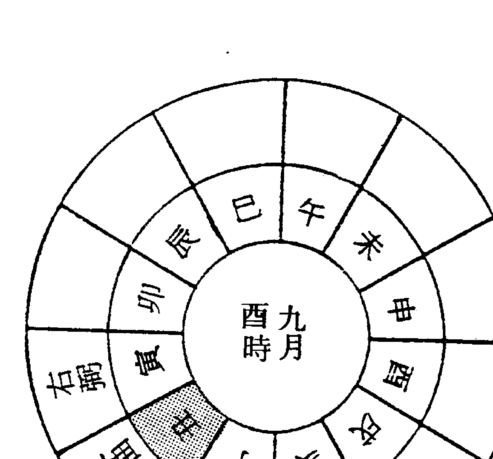

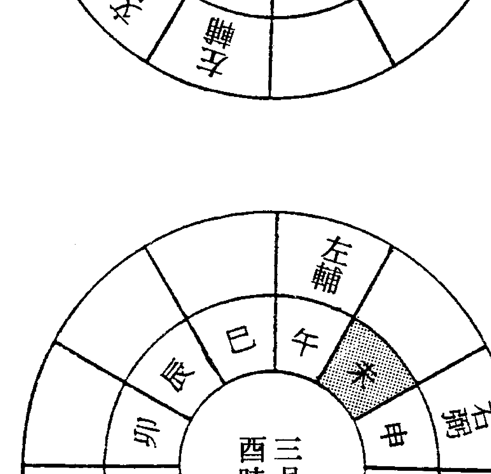

| 巳（官禄 35-44） | 午（奴仆 45-54） | 未（迁移 55-64） | 申（疾厄 65-74） |
| :--- | :--- | :--- | :--- |
| 癸巳 禄存 大限 博绝士 | 甲午 擎羊 天机(权) 天伤 力胎士 | 乙未 紫微 破军 小限 地迁劫移 青养龙 | 丙申 天马 天姚 天使 小长耗生 |
| 壬辰（田宅 25-34） |  |  | 丁酉（财帛 75-84） |
| 陀罗 太阳 天刑 截空 官墓府 | 正中为命主信息：阳男 蔡辰洲，命主：巨门，身主：文昌，土五局。 生辰：岁次乙丑年四O岁正月初十日被收押 生辰：岁次丙戊年八月十八日申时生 |  | 天府 天魁 将沐浴 |
| 辛卯（福德 15-24） |  |  | 戊戌（子女） |
| 铃星 右弼 七杀 武曲 天空 伏兵 死 |  |  | 太阴 奏书冠带 |
| 庚寅（父母 5-14） | 辛丑（命宫） | 庚子（兄弟） | 己亥（夫妻） |
| 文昌 天梁 天同(科)(禄) 斗君 大病耗 | 火星 天相 太岁 病衰符 | 文曲 巨门 喜神帝旺 | 天钺 左辅 贪狼 廉贞(忌) 蜚廉临官 |

### 己巳大限 破武 军曲 (权)(科) 天刑 小绝 禄耗(32-41)
### 庚午 天伤 奴仆 太阳 (忌) 将胎 军
### 辛未 天天 魁府 奏养 书
### 壬申 天地截 使劫空 蜚长 廉生
### 戊辰太岁 天同 墓青 龙
岁次庚辰年三十七岁九月十三故
### 丁卯 擎羊 力死 士
### 福德(12-21)
### 丙寅禄存火星右弼 天天 空马 博病 士
### 父母(2-11) 丁丑陀罗文曲文昌七杀廉贞 禄
### 命宫 官府
### 丙子左辅天梁 伏帝 兵旺
### 兄弟
### 乙亥 天相 大临 耗官
### 夫妻
### 癸酉 天姚 财帛 贪紫 狼微
### 喜神 沐浴
### 甲戌小限 铃巨 星门
### 子女37. 病冠 符带

紫府科权禄昌曲魁钺坐守身命，左右夹垣为富贵之论，廉贞七杀又为积富之人。命犯陀罗，庚辰太岁入天罗，小限在地网，身命逢流年流陀会并，故凶。

之虑，且以炫耀浮华之虚夸，退逢廉巨杀破贪易招是非祸殃，故未必为喜。4、全书附录命例有「庞涓」命例为九月酉时生之参考，有「白居易」命例为三月酉时生之参考。5、全书卷三诸星所宜论诀曰：「昌己辛壬生人，限逢辰戌应投河」。参考。

### 十一、戌时生人：
1. 十一月戌时生人，安命在寅，文曲平和与左辅同守命，财帛身宫同宫在戌，依「左辅文昌会吉星，尊居八座」拟议，丁癸辛庚生人福厚。
2. 九月戌时生人，安命在子，文昌得地与左辅同守命，是「左辅文昌会吉星，尊居八座」命格，文曲右弼冲照财帛身宫申宫，癸庚甲生人福厚。

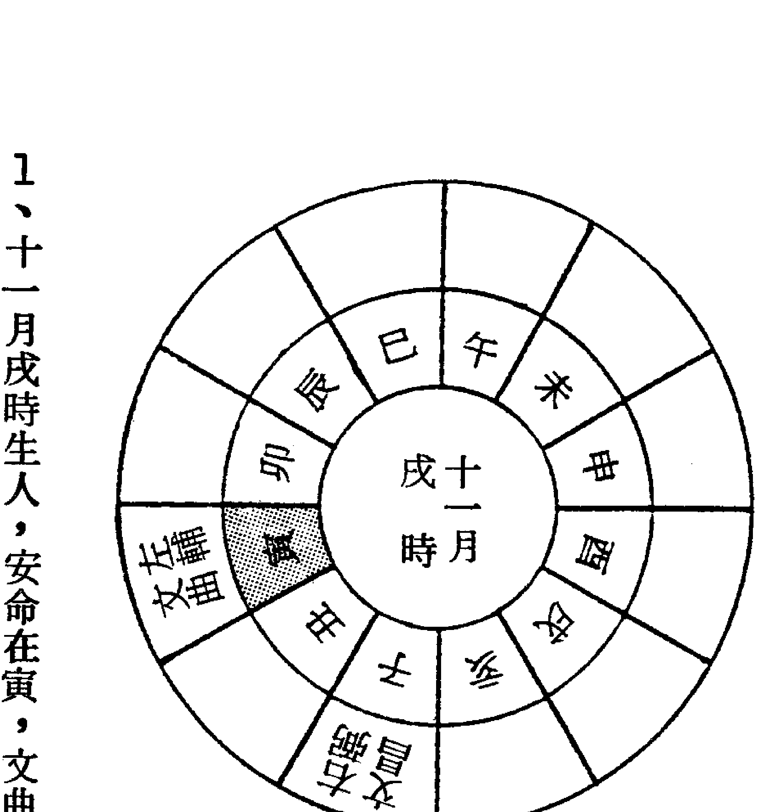

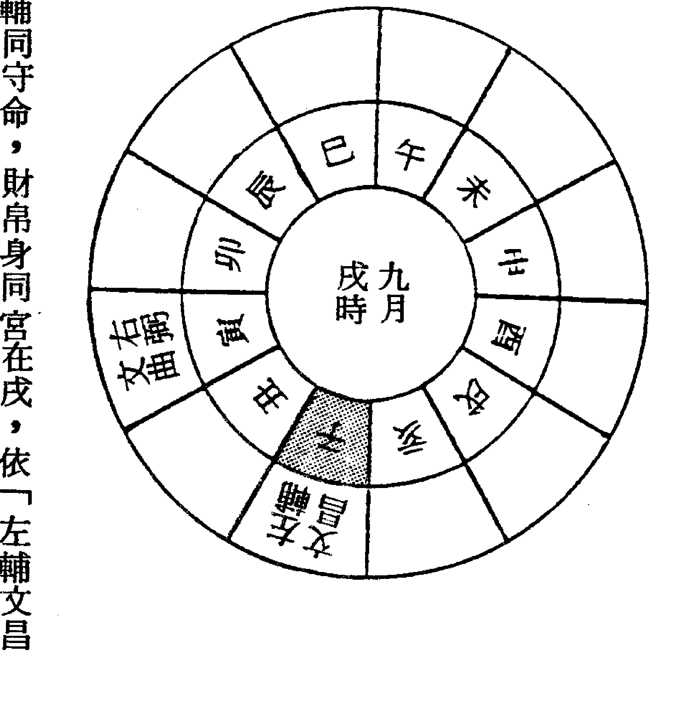

| 辛巳 夫妻(13-22) | 壬午 兄弟(3-12) | 癸未 命宫 | 甲申 父母 |
| :--- | :--- | :--- | :--- |
| 天马 伏兵 病符 | 天同 左辅 武府 大耗 衰 | 截空 病符 帝旺 | 太阴太阳忌 地劫 喜神 |
| 庚辰小限 子女(23-32) | 死 官府 | | 岁次丙寅年五十二岁二月初五故 | 男白易木三局 | 岁次乙亥年三月二十七日酉时生 | 乙酉 福德 |
| 攀羊破军 | | 阴 | | 乙酉 福德 |
| 己卯 财帛(33-42) | 博士 墓 | 天姚 | | 火巨天机禄 蛰冠带 |
| 禄存 | | | | 丙戌 田宅 |
| 戊寅大限 疾厄(43-52) | 力士 绝 | 己丑 迁移 | 戊子 奴仆 | 丁亥 官禄 |
| 陀罗廉贞 | 天天空 | 文昌文曲 | 天伤 | 七杀 天钺 | 天梁权 将星 |
| 青龙 | 小耗 养 | | 天刑 | 长生 |

权禄拱照，左右夹垣，日月同宫，昌曲守身，富贵之命，命带忌星，寿难长永。
大限到陀罗，天空之乡，小限行擎羊，亥生人有忌，故死于五十二岁。

| 丁巳大限 | 天钺 | 太阳 | 戊午 | 破军(禄) | 己未 | 天机 | 庚申 | 天府紫微 |
| :--- | :--- | :--- | :--- | :--- | :--- | :--- | :--- | :--- |
| 奴仆64 | 喜神 | 长生 | 迁移(54-63) | 蜃廉 | 疾厄(44-53) | 奏书 | 财帛(34-43) | 将军绝 |
| 丙辰太岁 | 武曲 | | 岁次丙辰年六十四岁三月初五日故 | 阴男 | 子 | | 岁次癸丑年九月二十八日戌时生 | 金四局 |
| 官禄 | 病符 | 沐浴 | | | 产 | | | |
| 乙卯 | 火星 | 天魁 | 天同 | | | 壬戌小限 | 铃星 | 贪狼(忌) |
| 田宅 | 大耗 | 冠带 | | | | 夫妻(14-23) | 青龙 | 死 |
| 甲寅 | 右弼 | 文曲 | 七杀 | 乙丑 | 擎羊 | 天梁 | 甲子 | 禄存 | 左辅 | 文昌 | 天相 | 廉贞 | 癸亥 | 陀罗 | 巨门(权) |
| 福德 | 伏兵 | 临官 | 父母 | | 官府 | 帝旺 | 命宫 | | 博士 | 衰 | 兄弟(4-13) | 力士 | 病 |

**紫府朝垣，左辅文昌加会，一生富贵，声名显扬。大限沉马，小限六十四入地网逢忌，故凶而死。**

3. 全书卷三诸星所宜论诀曰：「昌曲吉星居福德，谓之玉轴（袖）天香。」，原注曰：「更得紫微居午更妙。」
4. 全书附录命例有「子产」命例为九月戌时生之参考，未得十一月戌时生命例，从缺。

### 十二、亥时生人：

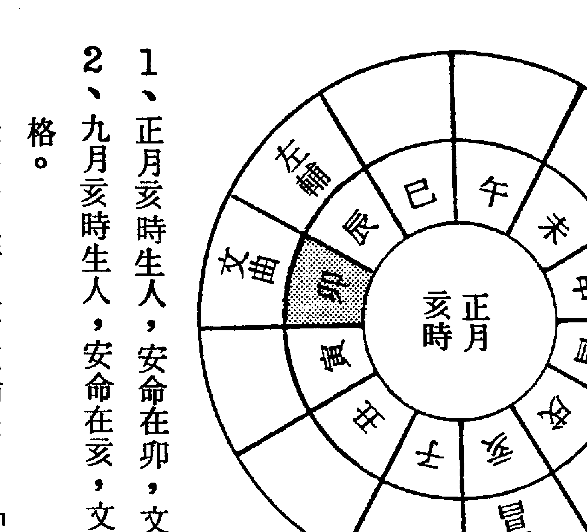

1. 正月亥时生人，安命在卯，文曲旺地守命，昌曲同协，辛丙壬戊生人财官格。
2. 九月亥时生人，安命在亥，文曲利盆守命，昌曲同协，夫妻身同宫在酉，乙戊生人财官格。

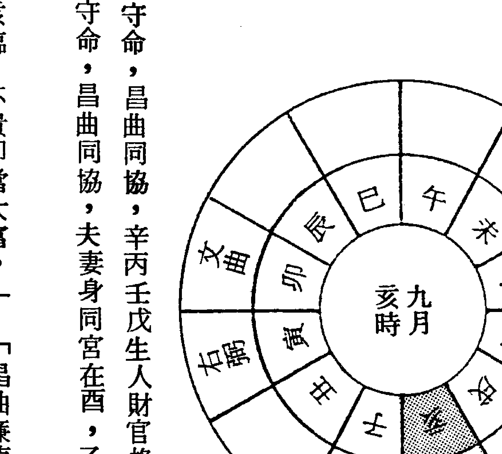

3. 全书卷三诸星所宜论诀曰：「昌曲巳亥临，不贵即当大富。」，「昌曲廉贞于巳亥，遭刑不善且虚夸（原注：贪多作事颠倒，子申二宫贵，吉多，美。）」
4. 全书附录命例有「杨道人」「暨太监」命例，为正月亥时生人之参考，未得九月亥时生人命例，从缺。

| 癸巳 禄存天相 福德 博士 | 甲午 擎天羊梁 田宅 力士 | 乙未 七廉杀贞 官禄 青龙 | 丙申 天伤 奴仆 小耗 |
| :--- | :--- | :--- | :--- |
| 壬辰 陀罗左辅巨门 父母 官府 | 阳男 暨 太监 木三局 | 岁次丙子年正月初六日亥时生 | 丁酉 天魁 迁移 将星 |
| 辛卯 文曲贪狼紫微 命宫 伏兵旺 | | | 戊戌 铃星右弼天同 疾厄 奏书 |
| 庚寅 火星天机太阴 兄弟 大耗官 | 辛丑 天府 夫妻 病符 | 庚子 太阳 子女 喜神 | 己亥 天钺文昌破武曲 财帛 长生 |

命坐紫微，武曲朝垣，文昌文曲加会，天魁天钺二宫相会，紫微得文曲扶佐，主掌兵权之职。
但地劫疾厄忌星，卯垣有忌，故有净身去势之象。

| 乙巳 天钺相 | 丙午 天梁 禄 | 丁未 七廉杀贞 | 戊申 大限 天伤 奴仆 大耗官 |
| :--- | :--- | :--- | :--- |
| 福德(14-23) 蜚廉生 | 田宅(24-33) 喜神浴 | 官禄(34-43) 病符带 | (44-53) |
| 甲辰 左巨辅门 | 岁次壬寅年五十一岁十一月初五故 | 阳男 杨道人 金四局 | 岁次壬子年正月初八日亥时生 |
| 父母(4-13) 奏书 | | | 己酉 天刑 迁移 伏兵旺 |
| 癸卯 天文贪紫 魁曲狼微 权 | | | 庚戌 铃星陀罗右弼 天同 地劫 疾厄 官府 |
| 命宫 将星 | | | |
| 壬寅 火星天机 太岁 兄弟 截空 | 癸丑 天府 科 夫妻 青龙 | 壬子 小限 天姚 子女 天空51 | 辛亥 禄存文昌破武曲 忌 财帛 博士 |

极居卯地，虽有权禄加会，被刑忌会合，不过虚名而已。
子生人不宜寅申限，小限又入天空擎羊之地，太岁又忌，的主丧命。

## 间跋

综之以上述「昌曲守命示意」，我们不难发现九月生人必得文昌守命，并可见昌曲之关系位置——凡子午时生人，昌曲对冲；丑未时生人，昌曲三合；寅申时生人，昌曲相间；卯酉时生人，昌曲同垣。

假使有心人不妨集合一批志同道合之人士，共为整理赋文各种资料，并搜觅一些可以分类统计之实例而加以分析研判，那么所得到的结果，必然更胜于望元之纸上谈兵，闭门造车矣！

现在又到了本卷落幕的时候，望元只能挥挥笔，敬祝各位学者读友能在短暂的时日超越您我现在的斗数程度，能够灵活研判论议，并且不要忽略了昌曲二星在整个斗数研判过程并不逊于科权禄忌四星变化之重要性啊！

当还没开始写本卷的时候，很荣幸的瞻仰观摩了高雄市汉王饭店对街国际商场巷中的唐山逸士刘哲闻老师（高雄市盐埕区莒光街一〇五号，上午电话〇七一五一三一六九四九，下午电话五二一〇六六九）的论断风采，一直留着深刻而无法拂拭的影像，心底恍惚一直响着诱惑的声音：「一定要再一次拜访刘老师！
现在还是这么地想着：「一定要再拜访刘老师！
为什么刘老师的影像这么深刻而吸引着望元呢？难道说是望元怀念过去服役林家村时候对于南部地方的亲切感？难道说高雄市还有望元所仰慕的了无居士黄老师、宣易园的陈老师还未能一睹庐山真面目的诱惑吗？
曾经听说新竹吴万全老师也曾经过一段艰苦的求师访友过程，难道说望元也才要经验这一段艰辛的习学历程吗？前不久新竹的方外人曾国雄老师来台中举办教授斗数试听会，果然有许多望元未曾认知的斗数方法被介绍出来，并且荣幸的获得曾老师传授一些方法及赠送斗数资料，现在我又需慕着刘老师的才华与论断风采，难道说望元已经狂嗜斗数到了不能自己的疯狂程度了吗？
还在写本卷的时候，有工程工程师林先生来看我，当他谈到统计数据与回归指数的时候，曾经假设一个命例需要三十个实例以为统计分析，那时十二宫位，十二星曜组合……，以矩阵集合而计就有「一四四！」，这一个接近天文数字的组合变化，几乎使望元抛弃斗数而不敢钻研，但是一想到斗数神异准验的迷人魅力，仍然无法摒弃对于斗数热爱的痴迷！

望元想像着闹市僻远皆有各种不同层次的斗数奇人异士，并且有意遍访奇人异士而不可得，当林工程师知道我这一个心愿的时候，希望望元能够善自珍摄，望元除了感激以外，只能报以惨淡的苦笑告诉他：「让我续完紫微堂奥再说吧！最少我已经毫无保留的把个人的习学认知斗数的心得贡献给亲爱的学者读友，即使现在休息下来，学者读友也可以从拙作里找到一些望元的浅见才对啊！」

心情有些不能平衡，而且也动了游兴，那么先原谅望元休息一两天再说吧！

——岁次乙丑年菊月丁亥日丑时脱稿——

## 国家图书馆出版品预行编目资料

| 项目 | 内容 |
| :--- | :--- |
| 书名 | 紫微堂奥 [第八卷] |
| 作者 | 坚 元著 |
| 出版资讯 | 初版 -- 台南市：大孚，2003 [民92] |
| 面数 | 公分 |
| ISBN | 957-765-335-9（平装） |
| 主题 | 1. 命书 |
| 分类号 | 293.1 |
| 识别号 | 92012463 |

## 紫微堂奥 [第八卷] （编号F1569）
- 著者：坚 元
- 发行人：傅宝泰
- 出版者：大孚书局有限公司
- 地址：台南市701东区德光街65号
- 电话：(06) 268-2865
- 传真：(06) 268-2489
- E-mail：tafubook@giga.net.tw
- 划拨帐户：00354754
- 登记证：局版台业字第01543号
- 印刷者：大孚书局有限公司
- 版次：2003年8月初版
- 国际书号：ISBN 957-765-335-9
- 定价：新台币350元
- 法律顾问：北辰著作权事务所 萧雄淋律师

版权所有・请勿翻印
本书如有缺页、破损、倒装，请寄回更换。