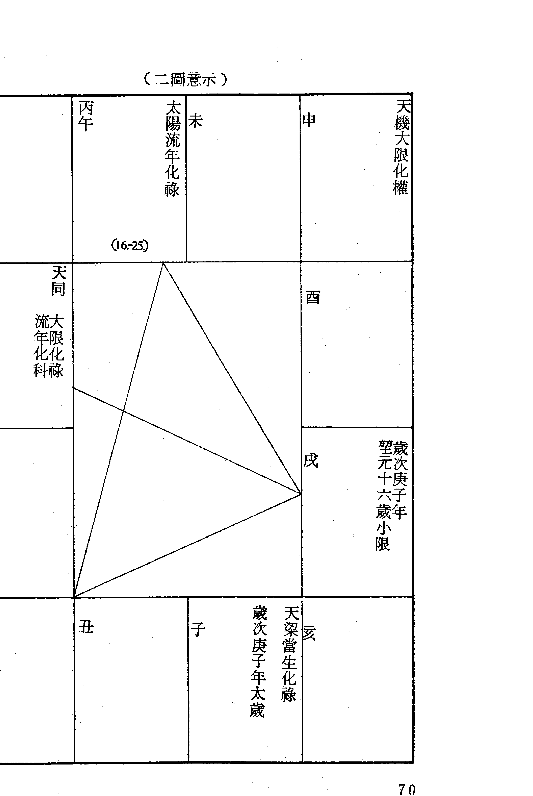
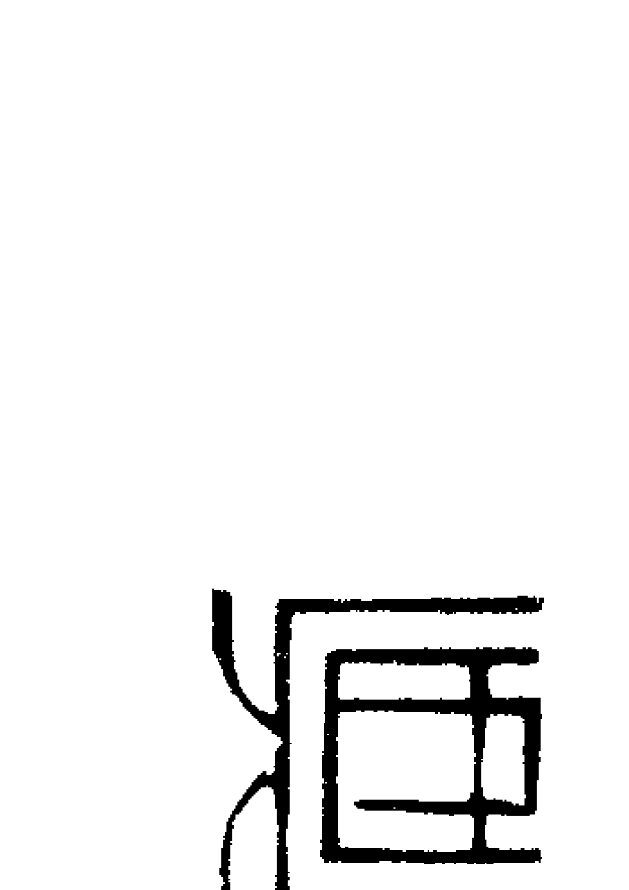
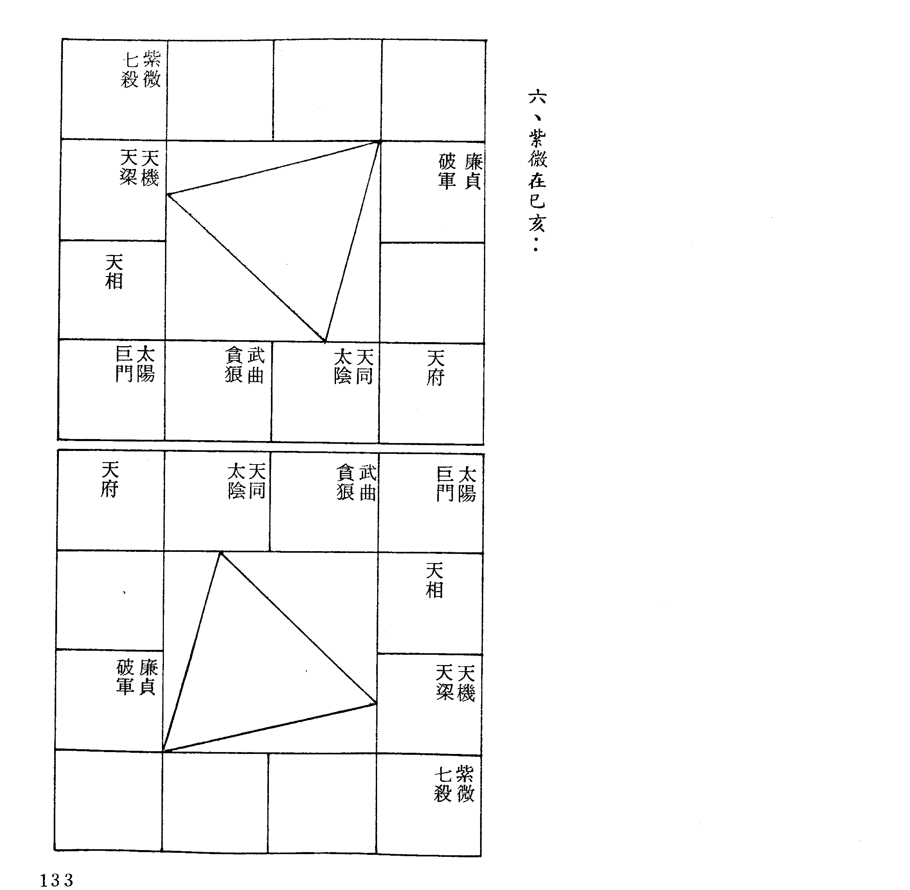
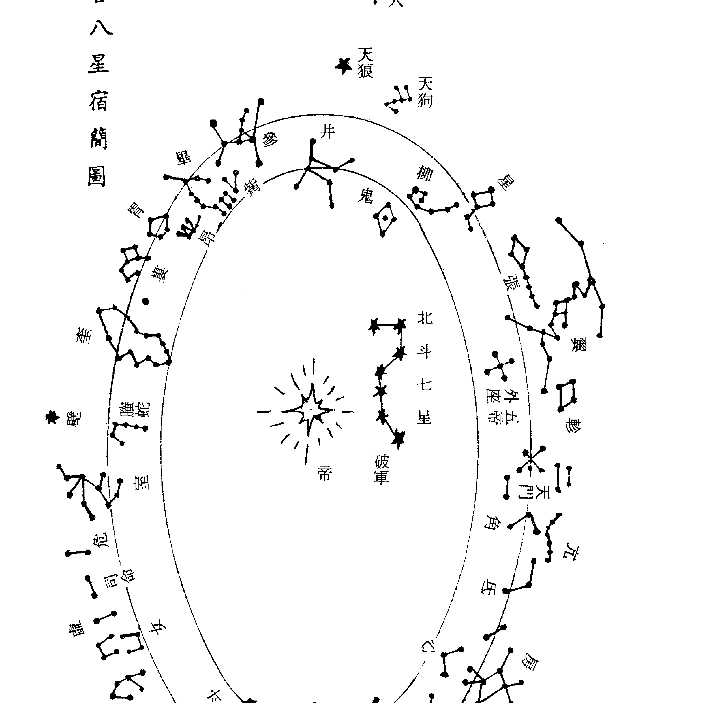
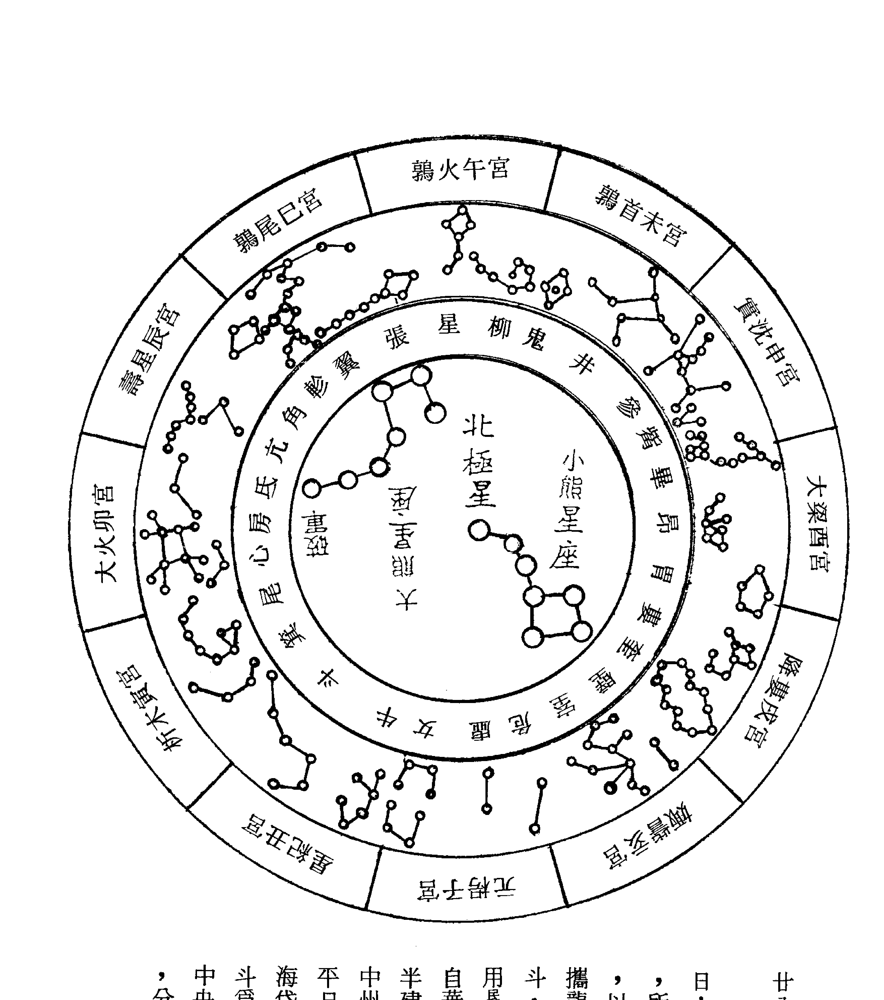

# 紫微堂奥

斗數骨髓賦之天祿天馬，驚人甲第

堃元著

大孚書局印行

紫微斗數 賦文詮註

# 紫微堂奥 第六卷

堃元著

大孚書局

# 紫微堂奥系列【全十卷】

- 第一卷 斗數總訣之希夷觀天星，斗數推命 特壽且榮
- 第二卷 斗數發微論之命逢紫微，不權則富
- 第三卷 斗數太微賦之日月夾財，扶身助命
- 第四卷 斗數七殺朝斗限，爵祿榮昌
- 第五卷 斗數天門運，驚人甲第
- 第六卷 斗數天祿天馬，尊居萬乘
- 第七卷 斗數左府同宮，加官進祿
- 第八卷 斗數子午破軍，青雲之志
- 第九卷 斗數丹墀桂，彌相福臨
- 第十卷 女命骨髓賦之輔魁福壽

東明文化圖書公司 $117.00 TEL:23425341

X 03 04 星光書店 $117.00

# 紫微斗數賦文詮註

# 紫微堂奧 第六卷

# 堃元著

# 大孚書局印行

# 自序

《紫微堂奥》以江西負子子潘希尹先生補輯之《新編希夷陳先生紫微斗數全書》為藍本而為紫微斗數賦文之精詳詮註。

卷一於一九八四年一月印行流通，筆者以當時已有之紫微斗數認知學涵，晝夜辛勤勤奮筆耕，作息失序，日以繼夜，晝夜顛倒，不屈不撓，再接再厲的經歷了二十八個月的辛勤筆耕，卷十終於一九八六年五月印行流通而竟詮註紫微斗數賦文之全功。

大孚書局傅實泰先生有見於《紫微堂奧》為研讀學習紫微斗數所不可或缺的最佳參考書，但因原著缺少作者序文而有美中不足之憾，情商拙愚為原著增補自序，以使讀友不因原著無自序的小小缺失而抱憾，望元當仁不讓於師，義無反顧的恭敬從命囑，流覽翻閱十卷而為此序。

《紫微堂奧》共十卷，卷一精詳詮註《合併十八飛星紫微斗數》一書之「紫微斗數總訣」，概說紫微斗數推命之使用星神與排佈推命圖的安星佈斗。卷二嘔心瀝血的披瀝詮註「斗數發微論」、「重補斗數彀率」、「斗數準繩」，附錄「諸星問答論」（按：「諸星問答論」一稱「星垣問答論」）。卷三為紫微斗數「太微賦」賦文詮註。卷四～卷九共六卷為「斗數骨髓賦」賦文詮註，並於賦文文句列舉相當其文句的命例以為習涉研究之參考。卷十詮註「女命骨髓賦」，附錄「補遺骨髓賦」、「形性賦」（按：「形性賦」與「諸星問答論」、「諸星入命限」互為參照融溶，可以依據命圖星神而推想描繪此命圖本人之形性。）、「星垣論」（按：星垣論附錄而未詮註。）、「紫微斗數漫談」。

今日增補為原著作者自序，情不自禁的感慨：「老朽，老朽矣！任何人盡得《紫微堂奧》，必然直覽盡窺斗數堂奧，更勝老朽被香港徒孫們抬舉謬譽為「斗數奇才，一代宗師」矣！」

二〇〇三年五月一日 堃元謹為序
堃元閒談論命館 林源田

住址：台中縣太平市新坪里育德路二四七號四樓

電話：（〇四）二三九一三五一・二三九一八四二七

# 第四十五章 天梁天馬陷，飄蕩無疑
# 第四十六章 廉貞殺不加，聲名遠播
## 第四十七章 日照雷門，富貴榮華
# 第四十八章 日朗天明，進爵封侯
## 第四十九章 寅逢府相，位登一品之榮
## 第五十章 墓逢左右，尊居八座之貴
# 第五十一章 梁居午位，官資清顯
# 第五十二章 曲遇梁星，位至台綱

# 第三十二章 天祿天馬，驚人甲第

> 原註：如寅申巳亥四宮安命，值天祿天馬坐守，命宮更三合吉守照，依此斷，加殺不是。

一、諸書安天馬之紛歧：

黃彥霖同契嘗來信提論及天馬之紛歧，曰：「紫微斗數全書以年支安之，但南北山人之明刻版則以生月安之，文源書局版之飛星紫微斗數則以生月安之，流馬始用流年支。當然，您（指望元言）大作中天馬之不同安法亦有詳論，吾師門及楚皇先生之天運派，均再配生時，而天馬則以生月安之，流馬才用流年支，天乙上人之占驗派、潘子漁老師……等亦同。」

天祿者，本星命或子平之用語，斗數以「祿存」表示，具有天之福善所在之義，代理一個人的名位慾望與理想抱負之含義，故有祿存守命者，於仁慈隨和之中又具有濃厚的自尊心及自尊感。

天馬者，代表一個人的實踐行爲及奮鬥精神，同時又含有旅遊、遷動、變動之意義，但由於斗數對於天馬之使用仍不明朗，幾乎有所紛歧而各爲取用，故於解釋賦文之前，必對於天馬應有認識。

## (一)、南北山人編註紫微斗數全書：

據此以觀，天馬之用亦紛歧難明，故摘錄諸書以為便覽：

### 天馬為生月星曜便覽表

| 星名/生月 | 天馬 |
|----------|------|
| 正月     | 申   |
| 二月     | 巳   |
| 三月     | 寅   |
| 四月     | 亥   |
| 五月     | 申   |
| 六月     | 巳   |
| 七月     | 寅   |
| 八月     | 亥   |
| 九月     | 申   |
| 十月     | 巳   |
| 十一月   | 寅   |
| 十二月   | 亥   |

## (二)、潘希尹先哲補輯紫微斗數全書：

註：文源版「飛星紫微斗數」、楚皇先生著「紫微斗數不傳心法」等同此。

### 天馬為生年星曜便覽表

| 星名/生年 | 天馬 |
|----------|------|
| 子       | 寅   |
| 丑       | 亥   |
| 寅       | 申   |
| 卯       | 巳   |
| 辰       | 寅   |
| 巳       | 亥   |
| 午       | 申   |
| 未       | 巳   |
| 申       | 寅   |
| 酉       | 亥   |
| 戌       | 申   |
| 亥       | 巳   |

## (三)、潘子漁老師著紫微斗數心得：

是書第六頁曰：「天馬安法，迄今尚無定論，茲憶先師當年所述，天馬共有二種，一稱「生馬」，一稱「流馬」，其歌訣是一樣，而安法不一樣，這就是造成今日紊亂的主因。

### 按：生馬係以生月安法，流馬則以流年支安法，如下表。

### 流年天馬表

| 支建宮驛 | 流年天馬 |
|----------|----------|
| 子       | 十一月, 寅 |
| 丑       | 十二月, 亥 |
| 寅       | 正月, 申   |
| 卯       | 二月, 巳   |
| 辰       | 三月, 寅   |
| 巳       | 四月, 亥   |
| 午       | 五月, 申   |
| 未       | 六月, 巳   |
| 申       | 七月, 寅   |
| 酉       | 八月, 亥   |
| 戌       | 九月, 申   |
| 亥       | 十月, 巳   |

天馬為乙級星曜便覽表

綜之上述，天馬之用亦紛歧紊亂矣，望元處女作「紫微鏡鑑」亦取生年支為用，於第一百頁有謂：「但他書有認天馬為生月星曜，以隋唐時代認識天馬為天之驛騎，寅月起午，順行六陽辰，已難考證因何變成辰子申月天馬在申，已丑酉月天馬在亥……之情形，若追溯隋唐，則天馬應寅月天馬在午、卯月在申、辰月在戌：：所以命理分歧，各有所本，研習命理應各根其本，以免駁雜混淆。」

> > 曹九錫輯「易隱」：
> 茲附錄二則他術之不同取用以為參考——

# 自序

堃元極力罄盡所知以為詮註斗數諸賦文，幸蒙親愛的學者讀友擁護愛讀，幾乎已與堃元之狂嗜癡迷於斗數，有欲罷不能之趨勢，真是喜憂參半而無以自名！

拙作自「斗數玄關」行市以來，斷斷續續接獲學者讀友之鼓勵與垂詢，或問及四化，或問及大限，或問及魁鉞天馬，堃元實難以一一詳盡答覆！

且如命宮有無大限之概論，早已見諸拙作「紫微鏡鉗」、「斗數玄關論斷篇」之中，而垂詢疑問之學者讀友，或未及注意，或已注意而未能親自試驗，堃元又以漫談筆觸而著述「紫鏡大限」以為釋疑。

又如四化紛歧之我見亦已見於「紫微堂奧」卷一第一七九頁，有關於魁鉞之安佈亦已揭於卷三第一〇九頁文字之中，且於拙作之中零零散散每有提及，學者讀友不妨自為搜購研讀可知！

嘗有王文華同契續誌閱拙作平易，猶堃元之發表學者讀友之讀習心聲，唯美中不足的有失於零碎散漫，勉堃元能為集中重點之闡微，堃元是知詮註賦文必依據於賦文，比較困難自由引伸發揮，且以未能盡詮賦文之全功，實未有餘力以為整理重點集輯，故堃元反勉勵王同契不妨利用閒暇以為整理，既惠於堃元之未竟，又裨益於後學矣！

奈以著述匪易，必有完整之時間，或能集結零碎之時間，如王同契之日理冗機，繁忙瑣碎，亦至難盼其於短期內有所著述，甚至如堃元之聞王豪老師有心著手編撰「果老星宗」、「七政四餘」，一恍已經一兩年而未見片紙隻字，則夢想著述以為立言者，必具絕大之恆毅而可期有成矣！

堃元嘗於民國七十四年五月二十二日南遊，擬專誠晉謁高雄了無居士黃老師、鳳山了無學士鄭老師，途次台南先至王家出版社，嘉慶賢弟語告鄭老師編撰「中國五術名人錄」已經打字排版中，聽說有唐山逸士亦欲詮斗數賦文，堃元聞之欣然，斗數讀習者眾，著述發抒習學者多，則斗數之光揚盛行可期矣！

反觀子平一術，曾經輝煌千年而不衰，今之著述僅見吳俊民（若萍）老師著述「命理新論」燴炙人口而外，其他著作大抵冷飯新炒，鮮有創見，則習子平衡術者，如一本秘藝自珍、固步自封之成見，三五年後或當遜褪而之後繼之人矣！

堃元狂嗜紫微斗數，旁涉五術糟粕，數訪江湖名人異士，每有專精之人，如卜筮之以戊戌而知坎，一日可卜數十數百卦，如合作新村有米卦老叟而不知名者，只取米粒而可誦斷如流，如復興旅社之洩天童老輩，命相之專精而不知其高深，如堃元初習斗數佈星費時一兩小時，觀察研判必一週旬日，漸至精熟而能於短暫時間佈星，並為觀察研判矣！

故學術在於專精，在於致用，堃元嘗晉謁潘子漁老師，適有客問命，潘老師手執命圖而侃侃論斷，流利而無所滯窒，是知潘老師浸淫斗數久矣！

之餘地矣！

## (一)、生年驛馬便覽：

> 訣曰：「申子辰年用火木，寅午戌人是水金，亥卯未生看木火，巳酉丑年計水真。」

| 巳 | 午 | 未 | 申 |
|----|----|----|----|
| 亥卯未生人馬在巳， 馬元水垣， 天馬木星， 地驛火星。 |   |   | 寅午戌人馬在申， 馬元水垣， 天馬水星， 地驛金星。 |
| 辰 |  |  | 酉 |
| 卯 |  |  | 戌 |
| 寅 | 丑 | 子 | 亥 |
| 申子辰人馬在寅， 馬元木垣， 天馬火星， 地驛木星。 |   |   | 巳酉丑人馬在亥， 馬元木垣， 天馬計都， 地驛水星。 |

生年驛馬便覽示意圖：（流年驛馬同此看）

## (二)、官祿驛馬便覽：

假如斗數可以依此官祿驛馬而論人命之官祿陞遷，則天馬之意義已至迫切需要認定之必要了，否則在閒暇之際自為推考試驗，亦有益而無一害，故不吝筆墨而略述於後——

且如有丁壬年生人，安命在未，官祿宮在戌為庚戌，官干之庚祿在申，申之五行屬金，則天馬為金星，宮支之戌為寅午戌火局，馬在申，則地驛亦為金星。

訣曰：「天馬須將五虎遁，遁過命宮官祿論，論干得祿歸何所，所屬支神天馬定；官祿類垣推地驛，只在巳亥寅申局，不論宮神只在支，即是支神天馬屬。」

| 乙巳 | 丙午 | 丁未 | 戊申 |
|------|------|------|------|
| 兄弟 | 財帛 | 命宮 | 相貌 |
| 甲辰 | 己酉 |      |      |
| 田宅 | 福德 |      |      |
| 癸卯 | 庚戌 |      |      |
| 男女 | 官祿 |      |      |
| 壬寅 | 癸丑 | 壬子 | 辛亥 |
| 奴僕 | 妻妾 | 疾厄 | 遷移 |

丁壬生人官祿驛馬示意圖（流年官祿驛馬做此論之）。

官祿宮干庚，庚祿在申，以金星為天馬。

官祿宮支戌，午戌合局，馬在申，以金星為地驛。

| 辛巳 | 壬午 | 癸未 | 甲申 |
|------|------|------|------|
| 子女 | 夫妻 | 兄弟 | 命宮 |
| 大耗絕 | 截空 | 伏兵胎 | 太歲天空刑 |
|      |      |      | 官府養 |
|      |      |      | 天馬 |
|      |      |      | 博士長生 |
| 庚辰 |      |      | 乙酉 |
| 財帛 |      |      | 父母(2-11) |
| 病符墓 |      |      | 力士沐浴 |
|      |      |      |      |
| 己卯 |      |      | 丙戌 |
| 疾厄 |      |      | 福德(12-21) |
| 喜神死 |      |      | 青龍冠帶 |
|      |      |      |      |
| 戊寅 |      |      | 丁亥 |
| 遷移 |      |      | 田宅(22-31) |
| 蟲廉病 |      |      | 小耗官 |
|      |      |      |      |
| 戊子 |      |      |      |
|      |      |      |      |

吳秉直命盤示意圖

三、賦文舉例：

本賦文為強調祿馬交馳之吉，除於本文表示一個人具有理想抱負及奮鬥精神而能上進實踐力行者，必定能夠成就個人之經濟財富，並於產業有所建樹，更於本賦後文「呂后專權，兩重天祿天馬」（見第七十五章），表示其人不但成就財富產業，而且容易爭取獲得社會地位及職業威權。

茲就全書附錄一四命局，有與此相仿者，盡舉例於後，學者不妨自為模擬推考之——

（一）、祿馬同守命者：

【吳秉直命例】

> 註云：「巨日拱照，日辰月戊並爭榮耀，祿科俱會，左右拱照，終身富貴。大小二限入天傷忌凶之地，太歲逢陀羅天刑，俱主凶兆，其年命終。」

堃元附按：此命局以天相化忌論議，假使改用太陰或天同化忌，甚難發現其死亡之線索，甚至於要追隨著陳岳琦老師搖旗吶喊「庚干天相化忌」，但考之全書天相入限吉凶訣曰：「限臨天相遇擎羊，作禍與殃不可當，更有火鈴諸殺湊，須教一命入泉鄉。」，此以天相恆與破軍對沖故也，學者必以廣聞博記而後知其詳矣！

此為祿馬守命之格，但以未知其生平，而不知其是否廣置田宅，但考之其田宅宮廉貞守值，顯有「有祖業不耐久」之兆，則僅依一端而論全局，必有偏頗，宜細較量審詳而後可議矣！

| 辛巳 | 壬午 | 癸未 | 甲申 |
|------|------|------|------|
| 子女 | 夫妻 | 兄弟 | 命宮 |
| 天相（忌） | 天梁左辅 | 廉贞七杀陀罗天钺 | 禄存右弼 |
|      |      |      |      |
| 庚辰 |      |      |      |
| 财帛 |      |      |      |
| 巨门太岁 |      |      |      |
|      |      |      |      |
| 己卯 |      |      |      |
| 疾厄 |      |      |      |
| 紫微贪狼铃星天使天空天姚 |      |      |      |
|      |      |      |      |
| 戊寅 |      |      |      |
| 迁移 |      |      |      |
| 天机太阴文昌小限 |      |      |      |
|      |      |      |      |
| 丁亥 |      |      |      |
| 田宅（22-31） |      |      |      |
| 武曲破军天刑 |      |      |      |
|      |      |      |      |
| 丙戌 |      |      |      |
| 福德（12-21） |      |      |      |
| 天同科 |      |      |      |
|      |      |      |      |
| 乙酉 |      |      |      |
| 父母（2-11） |      |      |      |
| 擎羊 |      |      |      |

吳秉直命盤簡表

【馬直節命例】

註云：「巨日拱照，明祿暗祿，允為富貴，四十七歲大限到於天傷，小限沖命垣，太歲天羅病符作恙，故死於是年也。」

堃元附按：此例雖亦作庚生天相化忌，但我們卻不能深切瞭解天相化忌之意義，也不知道鐵板道人為何強調天相化忌之根據，甚至受其影響所及，潘子漁老師及鍾直霖老師等俱附合此一說法，至於我們相不相信天相化忌則是一回事，堃元只能很誠懇的向學者讀友建議：「命一全書法，任何一個人的一生中總會有幾個庚年，請把自己本人的庚年經歷好好的回憶一下，那豈不是可以自行推考區辨庚干應以何者化忌了！」

【甯萃命例】

註云：「機月同梁之格，一生吏業崢嶸。五十二歲大限夾地，辛巳年太歲埋蛇，小限喪門忌星為害，主死。」

堃元附按：今之斗數固見庚干化忌之紛歧紊亂，堃元所讀習之清刻版本潘希尹先哲補輯之紫微斗數全書附錄之命例亦自參差，則我們不難推想此一問題由來已久，唯以前各循習學，較少旁涉其他門派之取用，師云亦云，師訛徒錯而已，今日或從師，或自習，由於出版業之鼎盛發達，即或從師習術，亦必兼涉他書，對於學術之求真求知也相對的更苛刻要求，如此一命例，四化僅具「天同化忌」，則如此例為是，竹林書局版紫微斗數全書，文源書局版飛星紫微斗數，正玄山人著「玄空四化秘解」等書皆作「日武陰同」者為可信矣！
陳思先同契對於堃元不斷摘揭「紫微斗數全書」之瘡疤至感驚訝，堃元既不信書，何又據是書以為研習，堃元執於習學而不迷信習學，故每存溫故知新，切磋砥礪之志，既批判諸書之出入而不作人體名譽之攻擊，既循所讀習而為讀習關謬辨正，庶免後學重履謬訛而已，故堃元頗能採納善意之批評與建議，勉為挑剔全書之出入，僅在提醒學者讀友不可盡信書，亦不必完全採信堃元之一已讀習斗數之愚見而已！
且如本例以天同化忌，科（太陰）祿（祿）相逢，亦必得中有失，吉處藏凶，且行戊子大限應生災禍，甚至喪命為驗，但本例天年並不盡於此限，則天同化忌之說亦不無可議矣！

| 甲申 | 乙酉 | 丙戌 | 丁亥 | 戊子 | 己丑 | 庚寅 | 辛卯 |
| :--- | :--- | :--- | :--- | :--- | :--- | :--- | :--- |
| 祿存 天梁 天同 (忌) | 武曲 七殺 擎羊 天姚 天空 | 太陰 | 天機 左輔 | 紫微 破軍 天魁 火星 | 奏書 天傷 地劫 | 帝旺 將軍 | 臨官 小耗 |
| 天馬 | | | | | | | |
| 命宮 博士 長生 | 父母 沐浴 力士 (2-11) | 福德 冠帶 青龍 (12-21) | 田宅 臨官 小耗 (22-31) | 官祿 帝旺 將軍 (32-41) | 奴僕 衰 奏書 (42-51) | 遷移 病 蜚廉 (52-61) | |
| 癸未 | 壬午 | 辛巳 | 庚辰 | 己卯 | 戊寅 | | |
| 天相 陀羅 天鉞 小限 | 巨門 文曲 截空 | 貪狼 廉貞 天刑 太歲 | 天府 鈴星 天使 | 右弼 | | | |
| 兄弟 養 官府 | 夫妻 胎 伏兵 | 子女 絕 大耗 | 財帛 墓 病符 | 疾厄 死 喜神 | | | |

甯萃命盤簡表

## （二）、祿馬守照者：

### 【呂后命例】

註云：『雙祿守垣，兼之左右昌曲加會。經云：『呂后專權，二重天祿。』七殺夫宮剋夫，火鈴羊陀併夾命垣，亦主淫慾，大限夾地，小限羊陀湊合是凶，故壽終。』

望元附按：呂后事略詳於後之第七十五章『呂后專權，兩重天祿天馬。』。望元嘗謂化祿相對於祿存，此原註所云之謂祿存化祿同垣為雙重天祿而可證明，故祿馬同垣，固可依此論議，得化祿天馬同垣者，亦當依此論議也。

（化祿天馬同垣者多矣，學者可自為留意用心，不贅。）

| 宫位 | 己巳 (田宅) | 庚午 (官禄) | 辛未 (奴仆) | 壬申 (迁移) | 癸酉 (疾厄) | 甲戌 (财帛) | 乙亥 (子女) | 丙子 (夫妻) | 丁丑 (兄弟) | 丙寅 (命宫) | 丁卯 (父母) | 戊辰 (福德) |
|---|---|---|---|---|---|---|---|---|---|---|---|---|
| 天干地支 | 己巳 | 庚午 | 辛未 | 壬申 | 癸酉 | 甲戌 | 乙亥 | 丙子 | 丁丑 | 丙寅 | 丁卯 | 戊辰 |
| 主星/辅星 | 天同 | 武曲 天府 文曲 左辅 | 太阳 太阴 天魁 | 贪狼 文昌 右弼 | 天机 巨门 | 紫微 天相 | 天梁 | 七杀 | 天钺 陀罗 火星 | 廉贞 禄存 | 擎羊 铃星 | 破军 |
| 四化/杂曜 | | (科) | (忌) | 天马 截空 | 天使 天空 | | 天刑 | | 地劫 | (禄) | 天姚 | (权) |
| 长生十二神 | 大耗 | 病符 | 帝旺 喜神 | 临官 蚩廉 | 冠带 奏书 | 沐浴 将军 | 长生 小耗 | 青龙 养 | 力士 胎 | 博士 绝 | 墓 官府 | 伏兵 死 |
| 大限/小限 | | | (66-75) | (56-65) | (46-55) | (36-45) | (26-35) | (16-25) | (6-15) | | | |
| 其他信息 | | 岁次辛酉年六十八岁九月初一故 | 吕后 | 火六局 | 岁次甲寅年三月初七寅时生 | 阳女 | | | | | | |

### 【張子房命例】

註云：「此是雙祿朝垣，左右昌曲加會，又兼紫府同宮，作極富貴之命，直須限落夾地，故以命亡。七十六大小二限在天傷天空天使喪死之地，是以難逃。」

望元附按：望元於癸亥年請托曾福田兄幫忙搜集死亡實例，擬為鑽研斗數壽限之謎，曾兄以望元喪吊之凶，望元率直以告：「人命之小限與太歲僅三，一以歲限相沖，喪吊拱限，一以限居歲前，喪門入垣，一以限居歲後，吊客入垣，小限垣見喪吊，不專以喪吊看也，其餘原註大抵亦只圖註釋便捷俐落，每有附會穿鑿之嫌，且附錄古人命例之生死頗值商榷，以之參考則可，要以之鑽研則事倍功半而難免失真，最好廣搜死亡實例，分別疾厄災難及壽終正寢，則統計研判其星象徵兆，可以做為預見壽限之線索，但以學者各自為政，勉得一二死亡實例，不能詳為記述研判推敲，故欲臻斗數之大成，非一己之棉薄可躡，必能集羣思衆智而可以一一突破目前斗數之瓶頸也！」

陳師兄始以疑信，猶楊雲翔老師對於命宮無大限之疑信參半，望元於是告以史記孔子弟子列傳之諸弟子與孔子年齡之比較（見卷五），足證了無居士黃老師之批判全書附錄為「一筆爛帳」，全書不足以盡信也！

陳師兄恍然而悟，嘆曰：「不知一者，不知問一，不會一者，不會問一，雖說應以實例為據，却不知從何著手觀察研判啊！」

望元又告之：「除了生辰正確以外，最好亦能忌辰完全，最重要的是其意外死亡者，要確其立死，或死於醫院，病死者，宜知其初發或復發，死於家中或醫院，或於住院中死亡等等，大抵以越詳盡者為佳，如能再得其關係之未亡人，遺族之命例更佳。」

望元自習斗數而不遺遺力，對於星象之觀察研判不外假定與試驗而已，譬如前呂太后命例及此張子房命例，以四正吉星而為貴，假如偏執於太微賦所謂「馬遇空亡，終身奔走。」以論，則呂太后與張子房之一生，奔波勞碌而無所建樹，或勞心費力而徒勞無功才是，但二命例俱大貴，故斗數所遺留下來的問題多矣，必有端有心之學者以為闡釋引伸發揮矣！

### 【燕哲命例】

註云：「祿權加會，左右拱照，終身福厚之論，主人性暴，大限到於陀羅之星，戊生人有忌（按：戊亥羊陀須避忌。），且地劫火星同併，小限逢忌相沖（按：當生太陽化忌，小限太陰化忌，同垣小限之謂。），故死於五十二歲。」

望元附按：上智者，不參考全書附錄命圖而知斗數，智慧者如望元，必參考命例以為自習，但附錄命例頗多誤訛，不可不察，如原例死於「乙亥年三十二歲」，年歲俱誤，乙亥年本命二歲而已，三十二歲則為乙巳年，必至乙丑年實為五十二歲，旁考吳明修老師編著「紫微斗數全書考釋」第三二三頁，亦只依樣葫蘆，存誤備考而未能重新考釋，故學者讀友如循本此二書參考研習者，切盼能自為發覺其中錯誤，信其可信而信之，知其錯誤則只可勉為參考而已，但由於命例之生平事略一無可以徵驗對照，最好棄之不為採信可也。

| 列1 | 列2 | 列3 | 列4 | 列5 |
| --- | --- | --- | --- | --- |
| 己巳 | 巨門 | 庚午 右弼 文昌 天相 廉貞(祿) | 辛未 天魁 天梁 | 壬申 左輔 文曲 七殺 |
| 田宅(26-35) | 小耗病 | 官祿(36-45) 將軍死 | 奴僕(46-55) 奏書墓 | 遷移(56-65) 蜇廉絕 |
| 戊辰 貪狼 | 歲次己酉年七十六歲三月初七故 | (註：原註大限届酉，命宮起大限。) | 陽男 張子房 火六局 | 歲次甲午年五月初六日辰時生 |
| 福德(16-25) | 青龍衰 | 丁卯 鈴星 羊陰 | 甲戌 武曲(科) | 大限 財帛(76-85) 病符養 |
| 父母(6-15) 帝旺力士 | 丙寅 祿存 天府 紫微 | 丁丑 火星 陀羅 天鉞 天機 | 丙子 破軍(權) | 乙亥 太陽(忌) |
| 命宮 博士 官府 | 兄弟 冠帶 | 夫妻 伏兵沐浴 | 子女 大耗長生 | |

### 【譚二華命例】

註云：「此為紫府朝垣，文曲武曲會合，祿權加會，三台八座吉星俱拱照，宜為大貴之命，且廉貞守命垣，庚生人合之為貴，終生福厚，位登二品，後因太歲返入鄉，故壽終。」

望元附按：「此例亦原作『天相』化忌，旁考『紫微斗數全書命例考釋』則已逕更訂為『太陰化忌』，則斗數學者之庚干化忌，認太陰化忌者最多，認天同化忌者次之，認天相化忌者又次之，但此多寡之比，並不能表示其正確性，譬如望元獨倡恢復『命宮無大限』而眾書『命宮起大限』，勉見『紫微斗數命例考釋』響應，亦不表示吳老師與望元之見地偏差，故諸書之相對不同，智者不惑而已！」

| 己巳 | 天同庚午 | 文曲天府武曲 | 辛未 | 天魁太陰太陽 | 壬申 | 文曲貪狼 |
|---|---|---|---|---|---|---|
| 天刑 | 小耗長生 | 科 | 小限 | 忌 | 天馬截空 | 天臨 |
| 子女 | 夫妻 | 將沐浴 | 兄弟 | 奏書帶 | 命宮 | 宮廉 |
| 戊辰 | 破軍 | 從原 | 陽男 | 歲次 | 癸酉 | 巨天 |
| 財帛 | 青龍養 | 權作乙亥年三十二歲七月十二故 | 燕 | 甲戌年九月二十六日寅時生 | 天天姚 | 神門機 |
| 丁卯 | 鈴星擎羊 | 乙丑年五十二歲七月十二故 | 哲 | 金四局 | 天相紫微 | 病符衰 |
| 疾厄 | 力士胎 | 大限 | 奴僕 | 官府墓 | 官祿 | 田宅 |
| 丙寅 | 祿右弼 | 廉貞 | 丁丑 | 火天陀羅 | 丙子 | 左七輔殺 |
| 遷移 | 博士絕 | 祿存弼 | 傷劫 | 星鉞 | 伏兵死 | 乙亥 | 天梁 |

## （二）、祿馬照命者：

### 【孫臏命例】

註云：「此爲紫府朝垣格，左右拱照，科權祿三方會合，文昌武曲守命，兼資文武，終身富貴之論，七十五歲大限入天羅，小限在子與流年戊午相沖，故凶。」

望元附按：孫臏事略已見卷五，不贅，唯其才勝龐涓而遭嫉，竟遭刖足黥面，雖殘而不廢，各顯諸侯而富貴，故太微賦所謂「祿馬最喜交馳，倘居空亡，得失最爲要緊。」之說，頗值我們玩味推敲而無窮矣！

望元竊以據已知之事實而卜星象易，卜星象而欲順測事象則難，學者讀友不妨試推其被刖足黥面應發生於甲戌之七殺大運或乙亥之天機大運？

| 宫位/干支 | 内容 |
|---|---|
| 辛巳 | 天同（科） |
| 壬午 | 天府武曲（權） |
| 癸未 | 陀羅太陰太陽（祿） |
| 甲申 | 祿存貪狼 |
| 乙酉 | 擎羊巨門 |
| 丙戌 | 鈴星左輔文曲相紫微（忌） |
| 丁亥 | 天梁 |
| 戊子 | 七殺 |
| 己丑 | |
| 庚辰 | 右弼文曲破軍 |
| 田宅（25-34） | 大耗絕 |
| 官祿（35-44） | 兵胎 |
| 奴僕（45-54） | 府養 |
| 遷移（55-64） | 博長生 |
| 太歲 | |
| 歲次甲申年六十五歲十月十五故 | |
| 歲次庚辰年七月二十一日午時生 | |
| 陽男 譚 二 華 土五局 | |
| 病符墓 | |
| 喜神死 | |
| 小限 命宮 蟲廉病 | |
| 兄弟 奏書衰 | |
| 夫妻 將軍旺 | |
| 子女 小耗官 | |

### 【顧孟錫命例】

註云：「巨日同宮，雙祿守垣，左右拱照，為富貴宜矣！奈申人大小二限行於火星之位見凶也（按：申人鈴火災殃重。），即死於五十三歲。」

望元附按：此例原失注權忌，且化祿介於太陰巨門之間，化科介於太陰天同之間，依太陽化祿而推為天同化科，則化權為武曲，化忌當在太陰與天相尋定，旁考『紫微斗數全書命例考釋』，吳老師巡命為『日武同陰』，學者讀友不妨自為推敲試驗之矣！

本命二限行寅，雖有祿存等吉，奈左輔值限不宜殺湊，又忌火鈴空劫來相湊，此二限重逢，三合太陰當生大限雙化忌，且見火鈴迭併，三合流陀，故凶矣！

| 己巳 | 太陰 | 庚午 | 文貪曲狼 | 辛未 | 天巨門魁 | 壬申 | 文天武昌相曲 |
|---|---|---|---|---|---|---|---|
| 天刑 | 小長耗生 | 夫妻 | 將軍沐浴 | 兄弟 | 奏書帶 | 命宮 | 臨官 |
| 子女 | | | | | | | |
| 戊辰 | 天廉府貞 | 歲次戊午年七十五歲五月十二故 | | 陽男 | 歲次甲辰年九月初五日寅時生 | 癸酉 | 天太陽梁 |
| 大限 | | | | 孫 | | 父母(4-13) | 喜神旺 |
| 財帛(74-83) | 青龍養 | | | | | | |
| 丁卯 | 摯羊 | | | | | 甲戌 | 鈐七星殺 |
| 天使 | | | | 望 | | | |
| 疾厄(64-73) | 力士胎 | | | 金四局 | | 福德(14-23) | 符衰 |
| 丙寅 | 火祿右破星存弼軍 | 丁丑 | 陀天羅鉞 | 丙子 | 左輔紫微 | 乙亥 | 天機 |
| 天馬 | | 天地傷劫 | | 小限 | | | |
| 遷移(54-63) | 博士絕 | 奴僕(44-53) | 官府墓 | 官祿(34-43) | 伏兵死 | 田宅(24-33) | 大耗病 |

### 【林徵史命例】

註云：「紫府同宮，科祿加會，兼昌曲俱拱為合格局，又云：『左輔文昌，尊居八座。』。太歲到寅，小限五十一在子，且子生人忌行寅年大限，又在天宮天傷之地，故死。」

望元附按：祿馬最喜交馳，而於附錄諸命例不取，必觀格局有吉者始以論吉，故學者讀友至此亦應加強格局之觀察研判矣，切不可見巨門貪狼廉貞破軍而逕論為惡，否則本命於子宮過渡之3、15、27、39、51歲諸小限俱凶也，必先看命局，次看大限，再及於小限，並與太歲合參，則斗數之觀察研判不外如此而已，其餘諸等線索之積聚，尤賴學者自為記憶消化活用而已！

| 辛巳 | 天府 | 壬午 | 文昌 太阴 天同 (忌)(科) | 癸未 | 陀罗 贪狼 武曲 (权) | 甲申 | 禄存 文曲 巨门 太阳 (禄) |
| :---: | :---: | :---: | :---: | :---: | :---: | :---: | :---: |
| 子女 | 大耗 绝 | 夫妻 | 伏兵 胎 | 兄弟 | 官府 养 | 命宫 | 博士 长生 |
| 庚辰 | | 岁次壬子年五十三岁九月初三故 | 阳男 | 岁次庚申年十一月二十日辰时生 | 乙酉 | 擎羊 天相 | |
| 财帛 | 病符 墓 | | | 顾 | | 父母 (2-11) | 力士 沐浴 |
| 己卯 | 破军 廉贞 | | | | | 丙戌 | 铃星 天梁 天机 |
| | 天地 使劫 | | | 孟 | | | |
| 戊寅 | 火星 左辅 | 己丑 | 天魁 | 戊子 | 右弼 | 丁亥 | 七杀 紫微 |
| 二限 天马 (52-61) 遷移 | 薜 廉病 | 奴仆 (42-51) | | 奏书 衰 | 官禄 (32-41) | 将军 帝旺 | 田宅 (22-31) | 小耗 官 |

### 【百里奚命例】

註云：「日巨同宮，祿合守照，左右昌曲加會，少年不順，因限步行羊鈴地劫虛劫之地，三十五方得遂志，大限入酉，擊羊敗地，小限在命垣與太歲相沖，祿馬倒，不吉。」

望元附按：原註論命之簡速，故為吾輩之所求，但不以己卯限地劫，庚辰限天虛，辛巳限絕地而可論矣，當加大限四化而始可論議，試看己卯限見當生羊陀而三化吉不入四正，庚辰限雖得祿馬拱限，而化權祿不入限，更三合「太陰化忌，辛巳限雖見當生化權，却見官祿擎羊逢力士，且限值大耗絕地，迨交壬午限，當生科祿拱限，甲申年卅五歲，歲限俱美而論吉也。」

| 地支（宫位） | 星曜 | 长生/大限信息 | 其他 |
|---|---|---|---|
| 己巳（子女宫） | 太阳忌、天姚 | 小耗生、长生 | |
| 庚午（夫妻宫） | 破军权 | 沐浴、将军 | |
| 辛未（兄弟宫） | 天钺 | 冠带、奏书 | |
| 壬申（命宫） | 天机 | 临官、蜚廉 | |
| 癸酉（父母宫） | 太阴、地劫 | 喜神、帝旺 | |
| 甲戌（福德宫） | 铃星、贪狼 | 病符、衰 | |
| 乙亥（田宅宫） | 巨门 | 大耗、病 | |
| 丙子（官禄宫） | 文昌、天相、廉贞禄 | 伏兵、死 | |
| 丁丑（奴仆宫） | 陀罗、天魁、天梁 | 天空、刑、官府、墓 | |
| 戊辰（财帛宫） | 武曲科 | 青龙、养 | |
| 己巳（疾厄宫） | 天使 | 力士、胎 | |
| 丙寅（迁移宫） | 火星、禄存、文曲、七杀、太岁、天马 | 博士、绝 | |
| 中间信息 | 阳男、金四局、林御史 | 岁次甲子年五月二十八日戊时生、岁次甲寅年五十一岁三月初五故 | |

綜之上述舉例，學者難免不無繁贅之流蜚，或以望元賣稿而舞文弄墨，而於望元私心自捫，則上舉命例猶有未備，舉如身宮逢祿馬如何，祿馬守拱如何，祿馬合拱如何，甚難俱舉而巨細無遺。更觀上述舉例俱見四正吉多，故以富貴論議，假如格局不美，僅見祿馬交馳又當如何，若更見羊陀火鈴空劫忌耗又當如何，凡此未備者眾矣，望元每憾同志之難求，欲求羣策羣力而發斗數之精微亦難矣！偶憶民國七十四年五月十三日北上晉謁潘子漁老師，瞻仰其坦蕩豪爽之風範，尤其欲以獨力而完成「命譜」之堅定信心，則自慚形愧而有高攀之嫌，席次潘老師對於望元多所期勉，並告之：「當為紫微斗數接棒人矣！」望元諾諾而不敢應，竊忖諸者宿先進賢達俱勝於望元，青年才俊英銳亦勝望元多矣，不以望元懦懦駑駘而自薄，直擬謫仙李白壽限又能幾何，望元之略知斗數非天縱英明而博知，蓋只在於勤學與恆毅而已，故望元之習學盡散諸於拙作之中，唯恐天不假壽，一己之習知竟隨望元殞逝而已矣！

| 辛巳 | 七紫殺微 | 壬午 | 右文弼昌 | 癸未 | 陀天羅鉞 | 甲申 | 祿左存輔曲 |
|---|---|---|---|---|---|---|---|
| 田宅 (25-34) | 絕 | 官祿 (35-44) | 胎 | 奴僕 (45-54) | 養 | 遷移 (55-64) | 博士長生 |
| 庚辰 | 天天梁機 | 歲次庚申年七十一歲五月初二故 | 陽男 | 百 | 歲次戊年五月二十日辰時生 | 乙酉 | 擊破羊軍廉 |
| 天虛 | | 大限天使 | 疾厄 (65-74) | 力士沐浴 | | | |
| 己卯 | 鈴星天相（忌） | | | 丙戌 | | | |
| 地劫 | | | | 青龍冠帶 | | | |
| 父母 (5-14) | 死 | | | 財帛 | | | |
| 戊寅 | 太陽（祿） | 己丑 | 火星天魁貪狼武曲（權） | 戊子 | 太陰天同（科） | 丁亥 | 天府 |
| 小限 | | 兄弟 | 衰 | 夫妻 | 將帝軍旺 | 子女 | 小臨耗官 |
| 命宮 35. 71. | 病 | | | | | | |

## 第三十三章 左辅文昌会吉星，尊居八座

原註：假如如此二星坐守身命，更三方吉拱，依此斷，加殺、劫空不合此格。

前舉「林御史命例」，紫府同守命而更得左輔同垣，且見昌曲拱命，而擬此賦文為論，則卷五之路，前述之孫臏等，得文昌守命，左輔守官祿，亦當可仿此以類推了。

假如學者也像望元一樣狂嗜紫微斗數，大概也會發生與望元相近的想法——輔弼昌曲為相提並論之甲級星曜，是否「右弼文曲會吉星」、「左輔文曲會吉星」、「右弼文昌會吉星」等等亦可同論為「尊居八座」呢？

聰明的學者讀友大概比望元更早發現答案是肯定的，假使學者不敢相信的話，試看卷四第七三頁「武安王命例」、第八五頁「張溫命例」、第一一九頁「楊孔目命例」等等，大概不用望元贅筆亦可以自明矣！

但斗數之困難及引人入勝者，適如增補太微賦之謂「凶不皆凶，吉無純吉。」，有合格者，即有不合格者，對於合不合格之觀察研判往往弄得頭量腦脹而一無所得呀！

### 【郭格命例】

今且取全書附錄命例二則以為不合格之參考——

註云：「廉貞七殺午申宮，主人流蕩天涯，右右昌曲雖然加會拱照，只嫌命垣貪狼化忌，因為商賈在外。太歲沈馬，五十四歲小限在子沖之，喪門白虎合命，故凶。」

望元附按：凡辰戌丑未四季年生者，必年年歲限相沖，據此以論則不足以使人信服也，又如以白虎入命（按：喪門白虎二神煞恆為對照。），則本命每逢午年一渡也，豈6、18、30、42、54之年俱凶，故疑問不信為理所當然也。

望元嘗被酒誚戲曰：「神煞論命，凶多吉少，正猶林俊宏老師（電話〇六一二三〇四五六三，專精堪輿、易斷。）嘲諷為時師術之紅包禮也。」

且看本命當生貪狼化忌，小限三合廉貞化忌，太歲值流羊，則凶不應專以神煞論也。

## 【淫蕩女命例】

> 註云：「太陰雖在廟鄉，但女命嫌文昌同度，況羊鈴忌星併集，雖三方吉拱何益。文昌訣云：『文昌擎羊火鈴忌，若不為娼終夭折。』，驗如此也！——」

塾元提示：凡斗數之星曜組合及輕重較量，而且其觀察研判若有一定之程序。

+   1. 本命科權昌曲魁鉞俱拱，本是吉處藏凶，得中有失之格局，但如從生主星之組合以觀，又不理想。
    2. 斗數準繩謂「太陰火鈴同位，反成十惡。」，若僅得太陰守命，應有潔癖而能潔身自愛，奈鈴星同位，即見破壞太陰之吉。
    3. 參考卷四第二九五頁「太陰主一世之快樂」，凡太陰守命身者，大多喜歡追求偏執性的理想生活方式，講究生活情趣及飲食物慾享受，且與文昌化忌同處，則其追求並粉飾個人的享受則更為明朗化，不無貪逸惡勞愛慕虛榮之傾向。
    4. 太陰守命，恒見天梁守官祿，大抵有為事業操勞之現象，因本命太陰同凶，故可仿卷四第二七○頁「天梁太陰却作飄蓬之客」論，不主孤寒，亦當飄蕩他鄉。
    5. 當生四化宜先看得失，化祿在子為不得地，參考卷五第二十章「發不主財，祿主纏於弱地。」論，化科權在辰福德重，但以沖殺為災，化忌入戌災咎重重。

……觀之本命司主感情之星曜甚多，不及一一備述，學者不妨試就個人認知以為觀察研判，不贊。

陀羅

紫微
破軍

丙申

大限
夫妻 (13-22) 臨官
力士

乙未

天機
天鉞

甲午

紅鸞

癸巳

太歲
天刑
天使
疾厄
將軍
病

乙未

截空
寡宿

子女
青龍
帝旺

甲午

財帛
小耗
衰

丙申

祿存
天府
丁酉

天姚
天虛

兄弟 (3-12) 博士
冠帶

乙未

陰女

甲午

歲次辛巳年二十一歲九月初二故

丙申

歲次辛酉年九月初十日子時生

命主：祿存
身主：天同

女
未三局

癸巳

壬辰

文曲
科
太陽
權

遷移
奏書
死

甲午

丙申

太陰
文昌
文曲
擎羊
忌
鈴星

戊戌

命宮
沐浴
官府

癸巳

辛卯

火星
七殺
武曲

天哭
天傷

奴僕
蜚廉
墓

甲午

乙未

丙申

己亥

廉貞
貪狼

小限
父母
伏兵
長生
天空
地劫
孤辰

庚子

左輔
巨門
祿

大耗
養
福德
天喜

辛丑

天相

病符
胎
田宅

庚寅

天同
天梁
右弼
天魁

喜神
絕
官祿
天馬

甲午

乙未

丙申

己亥

小限
父母
伏兵
長生
天空
地劫
孤辰

| 陀羅 | 紫微 破軍 | 丙申 | 乙未 | 天機 天鉞 | 甲午 | 癸巳 | | |
|---|---|---|---|---|---|---|---|---|
| | 大限 夫妻 (13-22) 力士 | | 截空 寡宿 | | 紅鸞 | 太歲 天刑 天使 | | |
| | | | 子女 青龍 | | 財帛 小耗 | 疾厄 將軍 | | |
| | | | | | | | | |
| 祿存 天府 丁酉 | | | 陰女 | | | | | |
| 天姚 天虛 | | | | | | | | |
| 兄弟 (3-12) 博士 | | | | | | | | |
| | | | 女 | | | | | |
| | | | 未三局 | | | | | |
| | | | | | | | | |
| | 太陽 權 文曲 科 | 壬辰 | 遷移 奏書 | | | | | |
| | | | | | | | | |
| | 火星 七殺 武曲 | 辛卯 | 奴僕 蜚廉 | 天哭 天傷 | | | | |
| | | | | | | | | |
| | 天同 天梁 右弼 天魁 | 庚寅 | 官祿 喜神 | 天馬 | | | | |
| | | | | | | | | |
| | 天相 | 辛丑 | 田宅 病符 | | | | | |
| | | | | | | | | |
| 廉貞 貪狼 | 己亥 | 小限 父母 伏兵 長生 | 天空 地劫 孤辰 | | | | | |
| | | | | | | | | |
| 左輔 巨門 祿 | 庚子 | 福德 大耗 天喜 | | | | | | |
| | | | | | | | | |

## 第三十四章 貪狼火星居廟旺，名鎮諸邦

原註：如辰戌丑未四宮安命，值此上格，三方吉化拱照尤美，如卯宮安命無殺次之，加羊陀劫空不是。

前於卷五第三十章「貪鈐並守，將相之名」，大抵已經有所說明，今本文之義亦具相當意義，甚至在將來詮註「補遺骨髓賦」的時候，又會遇到「論貪狼遇火，名為火貴格，三合照身命是也。」，因為賦文變換著詞藻在解釋幾乎相同相似的事象線索，所以在讀習的時候，或者在詮註的時候，當然的發生繁贅與厭煩的感覺。

雖然諸賦文所指若為相同，但因為辭彙的應用不同，恍惚又於人一種若有小異的感覺，觀之書中雖已搔及癢處，但終究失之於大略籠統，欲求知而反不能真知也。

望元嘗於拙作「斗數玄關論斷篇」第九五頁曰：「貪狼極具變化之性質，但人生波動性在殺破狼三星中，次於破殺，而且是唯一喜愛火鈴之星，如得火鈴可得水火既濟之美（按：貪狼本屬水，藏于壬甲），更能增強好勝誇耀的優點，可有突破性的表現，更臨或同祿存、化祿，則有橫發暴發之吉。」，旁考慧心齋主「紫微斗數新詮」曰：「貪狼喜火鈴同宮，可有突破性的表現，能增加貪狼星的力量，若化祿與火鈴同宮，更主有突發之財。」，堃元則於卷二第一一三頁附記曰：「貪狼會火鈴，主於競爭中有超越之表現，尤其卯酉宮同垣，乙辛己人宜之，主貴，財官格，及丑未宮武曲同垣，戊己庚生人，貴格。」……之類，大抵在於強調「貪鈴並守，將相之名。」或本文「貪狼火星居廟旺，名鎮諸邦。」之意義而之。

總之，其所給我們或同垣，或逢會的感覺，我們還未能確實掌握，不過換一句平易的白話說，貪狼象徵慾望、享受與才華，火鈴則象徵激發、破壞性、好勝，二星遇會的結果就是「喜歡自我表現」，一個喜歡自我表現的人，一定具備足以誇耀表現的才華或財富，所以像這樣喜歡自我表現的愛出風頭的人，很快就能給予別人深刻的印象，所以堃元竊臆「名鎮諸邦」之義，當亦含此一意義。

不過賦文之敘述仍嫌模糊，故原註暗示格局組合的理想性為「貪火」自我表現的趨向，表示其人的事業成就與名聲建樹，如果有羊陀劫空加湊即為破格。

茲列舉全書附錄命例有關者示意圖，裨益研習之參考：

### 一、貪鈴並守：

| | | | |
|---|---|---|---|
| | 馬 | | |
| | | 鈴貪 星狼 |
| 援 | | 命宮 |
| 火星 | | |
| 官祿 | | | |

### 二、貪火照命：

| | | | |
|---|---|---|---|
| | | 火星 |
| | 冉 | 遷移 |
| 七武 殺曲 | | 鈴星 |
| 命宮 | | |
| | 求 | | 貪廉 狼貞 |
| | | 財帛 |

### 三、貪鈴照命：

| | | | 貪狼 |
|---|---|---|------|
| 左輔 | 趙 | 高 | 火星 |
| | | 文昌 | 鈴星 |
| | 財帛 | 遷移 | |

### 四、貪鈴照命：

| | | | | |
|---|---|---|---|---|
| | 命宮 | | | |
| 火星 | 曹 | 參 | 鈴星 | |
| | | 貪狼 | 官祿 | |
| | | 遷移 | | |

### 五、貪鈴拱命：

| | | | 命宮 |
|---|---|---|------|
| | 廉 | | |
| 火星 | 頗 | 鈴星 | 官祿 |
| 貪狼 | | 遷移 | |

### 六、貪鈴守拱：

| | | 武曲 | 貪狼 |
|---|---|------|------|
| | | 官祿 | |
| 鈴星 | 劉都衙 | 甲午年九月初三日未時生 | 遷移 |
| 火星 | | | 財帛 |

### 七、貪火守拱：

| 官祿 貪廉貞狼 | 空 | 遷移 | 空 |
|---------------|----|------|----|
| 空 | 趙 | 奢 | 財帛 |
| 鈴星 | 空 | 空 | 空 |
| 空 | 火星 命宮 | 空 | 空 |

### 八、貪火照命：

| 命宮 祿存 | 空 | 空 | 空 |
|------------|----|----|----|
| 空 | 楊國忠 | 戊戌年四月初六子時生 | 官祿 |
| 鈴星 | 空 | 空 | 空 |
| 空 | 火星 財帛 | 空 | 遷移 貪廉貞狼 |

### 九、貪鈴守拱：

| 空 | 命宮 貪狼 | 空 | 空 |
|----|-----------|----|----|
| 空 | 郭子儀 | 空 | 空 |
| 火星 | 空 | 官祿 鈴星 | 空 |
| 財帛 | 遷移 | 空 | 空 |

### 十、貪火拱命：

| 空 | 空 | 命宮 | 空 |
|----|----|------|----|
| 空 | 空 | 空 | 空 |
| 地火劫星 財帛 | 空 | 空 | 鈴星 |
| 空 | 遷移 | 空 | 官祿 貪廉貞狼 |

### 十一、火鈴拱貪：

| 武曲貪狼 | | |
|---|---|---|
| 命宮 | | |
| | 司馬弼 | |
| | 弼 | |
| 鈴星 | | |
| 財帛 | | |
| | | 火星 |
| | 遷移 | |
| | | 官祿 |

### 十二、貪鈴拱火：

| | | 貪狼 |
|---|---|---|
| | 官祿 | 遷移 |
| | | |
| | 譚 |
| | 二 | 鈴星 |
| | 華 | 財帛 |
| 火星 | | |
| 命宮 | | |

### 十三、貪火照命：

| | | 命宮 |
|---|---|---|
| 財帛 | 胡 |
| | 總 | 鈴星 |
| | 制 |
| | | |
| 火貪 | | 官祿 |
| 星狼 | 遷移 | |

### 十四、貪火照命：

| 命宮 | | |
|---|---|---|
| | | |
| | 康 |
| | | 官祿 |
| 鈴星 | | |
| | 生 | 甲午年四月二十日子時 |
| | 生 | |
| | 陀火 | |
| | 羅星 | 貪廉 |
| | 財帛 | 地天 |
| | 劫空 |
| | 遷移 |

### 十五、貪火拱命：

| | | | 文昌 命宮 |
|---|---|---|---|
| 財帛 | 秀 | 庚申年九月初十日寅時 | 鈴星 |
| 火星 遷移 | 才 | 左輔 貪狼 官祿 | |
| | 官祿 | | 遷移 |
| | 郭 | 火星 | |
| | | 鈴星 財帛 | |
| 貪狼 命宮 忌 | | | |

### 十六、貪鈴破格：

### 十七、貪火破格：

| 地天劫空 陀羅 財帛 | | | |
|---|---|---|---|
| | 和 | 己巳年二月二十一日午時 | 貪狼 紫微 截空 命宮 |
| 火星 遷移 | | | 鈴星 |
| | 官祿 | | |
| 遷移 | | 財帛 | |
| | 孤殀命 | 丙午年十一月十八日丑時 | 天空 |
| 鈴星 官祿 | | | |
| | 火星 | 地劫 | 貪狼 廉貞 忌 命宮 |

### 十八、貪鈴破格：

| 遷移 | | 財帛 | |
|---|---|---|---|
| | | | 官祿 |
| | 郭 | 火星 | |
| | | | 鈴星 財帛 |
| 貪狼 命宮 忌 | | | |

綜之上述示意圖，對於羊陀忌耗空劫之破壞貪火貴格仍有不備之嫌，學者不妨自為摩擬研習之！

## 第三十五章 巨日同宮，官封三代

> 原註：寅宮安命值此，無劫空四殺上格，申宮次之，巳亥不為美，如巳宮有日守命垣，亥有巨者上格，巳有巨守命，亥有日者不美下格，申有日守，巨來同垣，無殺加，平常人。

巨日同宮之機會仍寅申二宮而已，且其三方俱不見「十四主曜」，往往有假借對宮觀察研判者，於是財帛宮借用機梁，表示本命暗有濃厚的賺錢蓄財慾望，往往有副業兼職之傾向，而官祿宮借用同陰，表示本命暗有盡職而任勞任怨之本分，大多有職位逐漸爬陞之吉，可以比擬為「機月同梁」之暗格，很適合於公私立機構循次高陞，而且由於命宮之巨日具有守成而不斷進取，以工作為享受的勤奮現象，所以亦自成為一種理想的格局，而且此格有當主管或自為老闆之現象，比之「機月同梁」正格更勝一籌。

但議論斗數之難，格局是一個輪廓大概，必由其他條件以為配合觀察研判，譬如太陽之性喜日畫，夜生則次之，居寅為初昇，有愈昇高愈見勤奮光熱之現象，在申則為偏垣，有日暮西墜先勤後惰之現象，學者或只謂太陽守曜依此論議，而望元自習試之，太陽守命固依此論，於運限遇之！

綜之上述示意圖，對於羊陀忌耗空劫之破壞貪火貴格仍有不備之嫌，學者不妨自為摩擬研習之！

會太陽亦當依此論，最值得推敲的是，凡日月守命行限之時，猶要配合本命之生辰以論議，雖書云斗數理旨易明，而鑽研浸淫其中，則如身陷泥沼，彌鑽而自陷愈深，拙內營誚望元曰：「鐵齒而為斗數沒頂矣！異哉！」，故望元勤苦自習於斗數，以個人的身體體驗奉勸有正常職業或尚在求學之讀友：「斗數易學難精，以之自娛可也，當以學業正業為重，要如望元專業以斗數論命必論餓孚，只宜效法了無居士黃老師等為業餘論命可也！」

又循原註以為推敲，日巨互守命遷者，亦擬為巨日同宮論議，並且強調太陽廟旺之吉，故只許寅巳而薄申亥，因此而知，太陽與巨門遇會時，太陽居廟旺則為主，太陽落陷則巨門為強，並且亦讓我們想像巨日三合時，大概亦應比照此議，甚至不可忽略巨日變化之意義呀！

假如學者讀友問望元：「巨日同宮，官封三代，是否表示此人的官祿事業有傳承子孫襲繼的意義？！」，望元只能勉勉強強的回答：「這一說法可能是由於父子兩宮的星象所引伸的誇張言詞而已，一個人的生命終究很有限，難以五六十年的時間追蹤考證任何一個命例及其後代，而且由於社會生活及組織型態已經大異於古代，父子孫之官祿事業實已很難保證傳承三代，但對於某些技藝特性之專業，如大溪豆干、萬巒豬腳、五洲園布袋戲之類，卻又不乏傳承數代而不衰者，只是我們並不一定可以找到他們的命例，所以寫書著述很難盡為經驗之談，大部分仍有紙上談兵，空口白話，憑空杜造之嫌！」

假使學者諸君對於「紫微斗數全書」不陌生的話，不妨再看一看諸星問答論，其論太陽有謂：

望元遍查全書附錄命例，巧得第三十二章已舉用「祿馬照命」之百里奚命例適為本文之格局，旁考辭源而知其為春秋時秦穆公之賢。希夷先生亦曰：「所忌者，巨暗遭逢。」白玉蟾先生亦曰：「在戊亥子為失輝，更逢巨暗破軍，一生勞碌貧忙，更主眼目有傷，與人寡合招非。」凡此俱如謂語主暗示巨門有欺蔽太陽之力，而且父母宮之天相，子女宮之天府俱為天府系之同系星曜，則凡見巨門守命吉多者，或即可擬用「官封三代」議論也！曰：「初事虞公，七年而無所遇，自費五羖（音古，同牯，黑色羊也）。羊之皮，為人養牛，其後穆公用之為相，七年而霸，人號五羖大夫。」則據此百里奚命例以推，「巨日同宮，官封三代」之義並不表示官祿事業傳承於子孫，而只暗示本命能夠在困苦中憑藉個人的才能及努力而出人頭地呀！

> 「所忌者，巨暗遭逢。」

> 「在戊亥子為失輝，更逢巨暗破軍，一生勞碌貧忙，更主眼目有傷，與人寡合招非。」

> 「初事虞公，七年而無所遇，自費五羖（音古，同牯，黑色羊也）。」

> 「巨日同宮，官封三代」之義並不表示官祿事業傳承於子孫，而只暗示本命能夠在困苦中憑藉個人的才能及努力而出人頭地呀！

## 第三十六章 紫府朝垣，食祿萬鐘

原註：如寅宮安命，午戌宮紫府來朝，申宮安命，子辰二宮有紫府來朝，是為人君訪臣之象，吉格也，更遇流祿巡逢，必然位至公卿，如七殺在寅申坐者，亦為上格，加四殺，加化忌為平常人也。

全書對於紫府之論甚多，如卷四已述「紫府同宮，終身福厚。」、「紫微居午無殺湊，位至公卿。」、「天府臨戌有星扶，腰金衣紫。」等等，不能一一盡述其詳，假如循原註之義，再與上文「巨日同宮，官封三代。」連貫並讀，則所言在於強調寅申宮安命之吉格而已，如果單就本文以讀，則陽序（奇序）星守命而三方同時有紫府二者，大抵表示其人容易獲得事業地位之建立成就。

### 一、諸星序列：

諸星序列只取十四主曜，其餘不列序。大抵奇序之星含有主動及陽性之意義，偶序之星含有被動及陰性之意義，雖然奇序多主外向，偶序多主內向，但其中也有如偶序星太陽之外向的例外，學者不可不察，今列表以為便覽。

**諸星序列便覽表**

| 紫微系星 | 序 | 星名 | 摘要 |
|----------|----|------|------|
| | 1 | 紫微 | 易受天府系星影響。 |
| | 2 | 天機 | 偶序之外向星。 |
| | 3 | 太陽 | 偶序之外向星。 |
| | 4 | 武曲 | 奇序之內向星。 |
| | 5 | 天同 | 易受天府系星影響。 |
| | 6 | 廉貞 | 奇序之內向星。 |
| 天府系星 | 序 | 星名 | 摘要 |
|----------|----|------|------|
| | 1 | 天府 | 易受天府系星影響。 |
| | 2 | 太陰 | 偶序之外向星。 |
| | 3 | 貪狼 | 偶序之外向星。 |
| | 4 | 巨門 | 偶序之外向星。 |
| | 5 | 天相 | 陽序之內向星。 |
| | 6 | 天梁 | 偶序之內向星。 |
| | 7 | 七殺 | 陽序之內向星。 |
| | 8 | 破軍 | 陽序之內向星。 |

星的作用几乎很少人注意到，即使曾经在心胸中有过刹那的闪亮，也是很困难确实的捕捉掌握，即使已经很用心的注意到这个问题，却也非常困难的表达个人心中的见解。

也许有部分敏感的学者已经发现这个事实，譬如望元生主星天同为偶序星而守于阳宫，大多有内外不协调，或为怀才不遇，或为无所专长的情形吧！而且于一生命运的转变或转捩点，往往是偶序星守命而在阳序星限发生，或阳序星守命而在偶序星限发生吧！

此一意念并不十分明朗，仅见江宗明老师所著「紫微斗数高级命理研究」第五八页至第六十页若具此一意念，而其分列方法稍有不同而已，今节录于后，裨益学者能够自为扩充研习斗数的尺度与范围：

## 星系统：

- 1. 杀破狼（外向系统）。
- 2. 机月同梁（内向系统）。
- 3. 紫府相（中间系统，偏杀破狼的性质）。
- 4. 阳巨（中间系统，偏机月同梁的性质）。
- 5. 廉武（？）。

## 补论：

- 1. 杀破狼喜走杀破狼的运，不喜走机月同梁的运，因为杀破狼的本质喜欢变动，根本上就是一个好冲锋陷阵，不耐静的星，如果要它过风平浪静，没有刺激性的日子，就是有很好的化禄、化权、化科来辅，也不能满足其欲望及野心。
- 2. 机月同梁的格局通常比较平稳，是在安定中求进步的一种。如果走杀破狼运时，因为杀破狼运来得很强烈，可能在工作上会有变动，如改行、改业等，但到最后仍然是薪水阶级，吃合营业的饭。
- 3. 杀破狼就是代表一种变动之关键，故每逢杀破狼大限时，可判断此人情况会多变动。凡走杀破狼大限时，一入这个流年，情况就会有变动，而且来得很快，有时甚至在前一年的十一、二月就会见到。机月同梁则不然，可能要到最后才来，也就是要到这一步大限快要结束的时候才遇到。这是两者极大的差别。

## 二、紫府朝垣示意：

上述「诸星序列」说得很模糊，连著述的塾元都有些莫名其妙自己是在表达什么意念，不过由于斗数格局的星曜组合有一定的搭配，成照六宫之星曜必定同奇序或同偶序星曜守值，其相间六宫则必为异序星列，换句话说，紫府二星俱奇序列星，则守命之星必为奇序星，奇序星而守命于阳宫，正所谓星得其所，故一旦会吉无杀凑，则运命自然顺遂可喜矣！

今举紫府朝垣示意图于后，学者可以自为揣摩——

### （一）、紫府同宫朝垣：

| 宫位 | 星曜组合 |
| :--- | :--- |
| 命宫 | 武曲 ① |
| 兄弟宫 | |
| 夫妻宫 | 廉贞 天相 ③ |
| 子女宫 | 七杀 ② |
| 财帛宫 | 廉贞 天相 ③ |
| 疾厄宫 | 七杀 ② |
| 迁移宫 | 紫微 天府 |
| 官禄宫 | 武曲 ① |

注：图示可能为圆形排列的简化表示。根据文字描述，其格局为：
- 1. 武曲在辰戌守命，紫府则守官禄宫。
- 2. 七杀在寅申守命，紫府则守迁移宫。
- 3. 廉贞天相在子午守命，紫府则守财帛宫。

### （一） （续）

- 1. 安命在卯酉无主曜，紫微守迁，天府守官。
- 2. 廉贞七杀在丑未守命，紫微守财，天府守迁。

| 宫位 | 星曜组合 |
| :--- | :--- |
| 命宫 | |
| 兄弟宫 | |
| 夫妻宫 | 廉贞 七杀 ② |
| 子女宫 | |
| 财帛宫 | 紫微 |
| 疾厄宫 | 武曲 破军 |
| 迁移宫 | 天府 |
| 官禄宫 | 紫微 |
| | 武曲 破军 |
| | 天府 |
| | 廉贞 七杀 ② |

注：原OCR表格结构不清晰，已根据上下文和常见命盘表示法进行推测性整理。

### （二）紫府照拱朝垣：

- 1. 武曲七杀在卯酉守命，紫破守宫，天府守迁。
- 2. 天相在丑未守命，紫破守迁，天府守财。

| 宫位 | 星曜组合 |
| :--- | :--- |
| 命宫 | 武曲 七杀 ① |
| 兄弟宫 | |
| 夫妻宫 | 天相 ② |
| 子女宫 | |
| 财帛宫 | 天府 |
| 疾厄宫 | |
| 迁移宫 | 紫微 破军 |
| 官禄宫 | |
| | 紫微 破军 |
| | 天府 |
| | 武曲 七杀 ① |
| | 天相 ② |

注：原OCR表格结构不清晰，已根据上下文和常见命盘表示法进行推测性整理。

## （二）、紫府合拱朝垣：

综之上达示意图以「紫府合拱朝垣」为符合原注简扼说明之立意，正是诸星问答论所论「君子在野，小人在位，主人奸诈假善，平生恶积，与囚同居，无左右相佐，定为胥吏。」之说，此

| 宫位 | 星曜 | 宫位 | 星曜 | 宫位 | 星曜 |
| :--- | :--- | :--- | :--- | :--- | :--- |
| 田宅宫 | | 官禄宫 | | 奴仆宫 | 迁移宫 |
| 福德宫 | | | | 疾厄宫 | |
| 父母宫 | | | | 天相紫微 | |
| | 命宫 | 廉贞 | 兄弟宫 | 夫妻宫 | 子女宫 |
| 财帛宫 | | 天相紫微 | | 父母宫 | |
| 疾厄宫 | | | | 福德宫 | |
| 迁移宫 | 奴仆宫 | 官禄宫 | 天府武曲 | 田宅宫 | |

| 宫位 | 星曜 | 宫位 | 星曜 | 宫位 | 星曜 |
| :--- | :--- | :--- | :--- | :--- | :--- |
| 子女宫 | 夫妻宫 | 兄弟宫 | 命宫 | 天相武曲 |
| 财帛宫 | | | 父母宫 | |
| 疾厄宫 | | | 福德宫 | |
| 迁移宫 | 奴仆宫 | 官禄宫 | 紫微 | 田宅宫 |
| 田宅宫 | 奴仆宫 | 紫微 | 奴仆宫 | 迁移宫 |
| 福德宫 | | | | 疾厄宫 |
| 父母宫 | | | | 天府廉贞 |
| 命宫 | 天相武曲 | 兄弟宫 | 夫妻宫 | 子女宫 |

丁巳 太阳 戊午 破军 己未 天机 庚申 天府 紫微
天伤 天使 奴仆 (64-73.) 疾厄 (44-53.) 财帛 (34-43.) 临官
丙辰 武曲 岁次丙辰年六十四岁三月初五故 阴男 子 产 金四局
太岁 官禄 养 辛酉 太阴 科 地劫 子女 (24-33.) 帝旺
乙卯 火星 天同 胎 壬戌 铃星 贪狼 忌 小限 夫妻 64. (14-23.) 衰
甲寅 右弼 文曲 七杀 绝 乙丑 擎羊 天梁 截空 父母 墓 甲子 禄存 左辅 文昌 天相 廉贞 命宫 死 癸亥 陀罗 巨门 权 天马 兄弟 (4.-13.) 病

等格局一以廉贞守命，贪狼居迁移，主人聪明才能，虚荣而爱投机冒险，几乎一致性的表示人性自作聪明的弱点，像这样的格局，最要注意的就是吉凶星之逢会以及科权禄忌之变化，如果逢会羊陀火铃空劫忌耗者，即要注意约束自己，切勿玩弄聪明，把天下人当傻瓜，否则「聪明反被聪明误」则悔之晚矣！

又如原注也及「紫府同垣朝垣」之2，七杀守命之所谓「七杀朝斗格」亦为上格，寻此联想原注之始或以其繁复而不及一一具述，故上述之意所及，学者应该自为留心注意矣！

## 兹举附录命例之子产命例以为参考——

子产者，郑之大夫也，郑昭君之时，以所爱徐赘为相，国乱，上下不亲，父子不和，大宫子期言之君，以子产为相。为相一年，竖子不戏狎，班白不提挈，僮子不犁畔。二年，市不豫贾。三年，门不夜关，道不拾遗，四年，田器不归，五年，士无尺籍，丧期不令而治，治郑二十六年而死，丁壮号哭，老人儿啼，曰：「子产去我死乎，民将安归。」。其为政宽以济猛，猛以济宽，晋楚皆严惮之，孔子称其为惠人，有君子之道四：「其行己也恭，事上也敬，养民也惠，使民也义。

> 注云：「紫府朝垣，左辅文昌加会，一生富贵，声名显扬。大限沈马，小限六十四入地网逢忌，故凶而死。」

> 黎元提示：如此「紫府同宫朝垣」示意之3。

## 第三十七章 科权对拱，跃三汲于禹门

原注：科权二星在迁移、财帛、官禄三方对拱是也。或命宫有化科权禄，三方守照，无杀亦然。

科权二星相逢者，本主文章盖世，于今读之，则主有「专家」、「学术权威」之声名，如果强以依文释义，则科权二星，一居迁移，另一居财帛或官禄之谓。

如依本文直译，人命如有科权二星于三方对拱者，其人聪明才智，有学术上之专才，并容易因此获得学术上之成功成就。则甲生人破军化权、武曲化科，壬生人紫微化权、天府化科，丁生人天同化权、天机化科，癸生人巨门化权、太阴化科者，以化科权之星同为阳序或阴序，比较容易于生命图上合格而外，乙己庚生人不同序而不能立见，丙生人要配合生时之文昌化科，戊生人要配合生右之右弼化科。

但斗数之当生命图固具有当生之遗传天赋之意义，至于行运又有科权禄忌四星变化，表示一个人的聪明才智亦可以经由教育栽培而灌输知识学识，所以我们也应该考虑到当生化吉与运限化吉相逢之意义。

回忆望元于民国四十四年岁次乙未年十四岁投考台中有名的明星学府初中部时，那时候还没有联合招生，更不用说是九年国民义务教育，几千人竞争投考，才只录取六、七百人，而望元于六、七百名的金榜之上竟能名列第十二名，虽说不上「文章盖世」，却以小限之官禄宫紫微化权，而于二限化科，暗合二限天机化权，实亦可拟为「科权对拱」论议，但以小限武曲当生化忌，暗合二限太阴化忌，虽太岁坐守未宫有天府化科，亦主吉处藏凶、得中有失，其时年少荒嬉，荒废学业，不能把握求学的良机，反而留下遗憾懊悔的记忆，实可引为青少年学子不知勤学之儆戒，故附示意图一于后以为参考。

又回忆望元于民国四十九岁次庚子年十九岁参加台中市私立中等学校第八次学业竞试高三国文科一等 奖，其时各校挑选国文绩优学生参加竞试，独获导师侯锡光老师垂青，嘱以并读普通中学高三国文读本，幸不辱所望，竞试结果获得一等 奖第二名，成绩仅次于同校一女生而已（按：一等 奖取三名，以次为二、三等 奖。），虽不能夸为「文章盖世」或「鱼跃龙门」，但如夸张一点，倒也有几分值得骄傲的味道。

且看望元十九岁小限到戊，太岁到子，各值羊陀并不为喜，但丙午大限，天同化禄照小限，天机化权三合太岁，庚子年太阳化禄三合小限，天同化科对照小限，三合太岁。如果对于小限而言，是为「科禄对拱」，如果对于太岁而言，则是大限天机化权相合，流年太阳化禄、天同化科对拱。（附示意图二）若不及于「科禄对拱」应当比照「科权对拱」论议，我们是否可以把大限化权与小限化科混列为「同时」以为论议呢？依望元个人自习的心得而言，好像是可以视为同时发生作用，那么全书上许多被斥辩为荒谬而星曜不能逢会的情形，竟然从一无「是」处而变成有价值，那么我们现在所能看到的斗数丛书仍然不能满足我们无穷的求知欲望，这些在书上不能找到的解答，亦唯只赖学者自为解答，或者从不断的试验中获取经验而已。

所以望元呕心沥血以为注注赋文，一则在使学者了解赋文可能以不同的角度读解，一则在使我们本人自己命图上获得答案，可惜的是我们大部分人都没有写日记的良好习惯，过去的记忆已经模糊，而且自己的斗数习得仍不算完全，当然就很困难自习而有所得了！

### （一图示意）

| 宫位 | 星曜与注解 |
| :--- | :--- |
| 乙巳 (6-15) | 岁次乙未年 十四岁小限 武曲当生化忌 |
| 辰 | 紫微 当生化权 二限化科 |
| 卯 | 左辅 |
| 丑 | 文曲文昌 |
| 午 | |
| 未 | |
| 申 | 天府当生化科 岁次乙未年太岁 天机二限化禄 太阴二限化忌 |
| 酉 | |
| 戌 | |
| 亥 | 右弼 |
| 子 | |

从上述举例示意，或难免有穿凿附会之讥，但对于望元个人而言，倒也是在小环境中扬名吐气而名噪一时而记忆深刻的二件事，并且在研习斗数而深深的体会，一个人的性格、气质、意志、才能，大多由于遗传之天赋以及生长环境所影响，正如邹谦先生著「教育心理学」所说：「本来人类所有的性质，均含蓄于遗传中，不过，使之发展、表现，及潜伏，则为教育及环境之力。惟无论如何优良之环境与有力的教育，对于遗传的潜势，不能增加新的成分，苟最初不存在的能力，就无法使其发展。」，由于此「秉性难移」的事实成就了命理的准验，同时也好像斗数全书之注重人命当生格局，如果当生格局不具备功名富贵，即或能够泯得一时荣华虚名，到头来却也只归诸于宿命而已，就好像望元当生不见科权，禄主缠于弱地，虽于青少年了了若堪大任，大半生却追逐衣食而默默无闻，一直到了癸亥年四十二岁从事斗数著述以后才稍微改善而已。 因此又让望元想起卷四曾经著意于夹贵之注，并于第七章「夹贵夹禄少人知」之第一九七页曰：「科权禄夹命之象意几近于化吉相逢，但目前并未得确证，仅敢推推测其作用或次于三方四正相逢而已。」，此一意念盘桓于心而挥之不去，假使有人命为科权夹命限是否亦可比拟本文论议呢？假如可以，学者无妨再找出卷四来，翻到第九十页邹生命例，用心推敲其为「科权夹贵」之格以为滥故知新吧！

## 第三十八章 日月并明，佐九重于尧殿

> 原注：如安命丑宫，日在巳，月在酉来朝照，为并明，辛乙生人合格，如丙生人，主贵，丁生人主富，加四杀空劫忌，平常。

日月二曜分司昼夜而最引观星谈天者注目，斗数论议亦见相当分量，几乎不下于论议紫府二星之多而若有胜之，除了后文将还会提及的以外，卷二于注释「重补斗数毅率」第一九三页有「财印夹命，日月夹财，其富何疑。」，第二一二页有「日月会，不如合照。」，第二三五页有「太阴合文曲于妻宫，翰林清异。」，第二三六页有「太阳会文昌于官禄，金殿传胪。」，第二五三页有「日在旺宫，可学八百年彭祖。」，又见卷三「太微赋」之第四〇页有「日月最嫌反背」，第一二三页有「日月夹财，不权则富。」，第一四九页有「日丽中天，专权之贵。」，第一五五页有「水澄桂萼，清要之职。」，第一六九页有「日月守不如照合，荫福聚不怕凶危。」，第二七页有「太阳会文昌于官禄，皇殿朝班。」，第二二一页有「太阴同文曲于妻宫，蟾宫折桂。」，又见本文之前文，于卷四第一九九页有「夹月夹日谁能遇，夹昌夹曲主贵兮。」，第二七〇页有「天梁太阴却作飘蓬之客。」，第二九〇页有「廉贞主下贱之孤寒，太阴主一世之快乐。」

虽有台北邓贞治先生与望元开谈论命时，直率的将其对于望元的观察感想告诉我：「观先生之书浩瀚渊博，用之于论命，恐难免有所遗忘而不及吧！」，望元一向待人以诚，被其敏锐中肯的评语直指个人心中的隐忧，忙即诚敬回答：「正如先生所说，写书是一回事，论命是一回事，如果望元能够记忆活用所有的拙作，则敢自诩斗数第一而不作第二人想矣！」

望元一向最懒于记忆，虽然心存郑先生之忠言，闲暇偶亦翻习自己的著述，可惜的是望元亦只常人而已，对于曾经阅读过的书籍，本来就只是粗略的看过一遍而已，第二遍想要再阅读的时候，根本就缺乏再读的兴趣，何况斗数之命理学术已经够冷僻的了，所以忙录于著述，反而一直未能温习拙作，因此将心比心，假设学者也像望元一样的粗心大意，看过拙作之后，虽然多少有一些印象，但是擱下了书本，同时把所知道的一些心得也随着书本闭擱起来，那么学者不妨先将前述再温习一遍，再参考本文原注，大概不用望元再有所解释，应该也比望元知道得更多，而且斗数程度也比望元更为精彩了。

虽然望元有天同懒散的一面，却又有廉贞倜傥疏狂的矛盾，想一想学者才智秉赋不一，如有颜回闻一知十之智者，有触类举三之能者，有子贡（端木赐）闻一知二之才者，其本已胜于望元，自不用拿拙作以为消遣，但以世间大多只如望元之后知后觉，勉步于先进贤达之后尘而已，故

| 地支 | 宫位/星曜 | 地支 | 宫位/星曜 | 地支 | 宫位/星曜 | 地支 | 宫位/星曜 | 地支 | 宫位/星曜 | 地支 | 宫位/星曜 |
| :--- | :--- | :--- | :--- | :--- | :--- | :--- | :--- | :--- | :--- | :--- | :--- |
| 巳 | 官禄 太阳 辛生化权 | 午 | 奴仆 破军 | 未 | 迁移 天机 乙生化禄 丙生化权 丁生化科 | 申 | 疾厄 紫微 天府 乙生化科 | 酉 | 财帛 太阴 乙生化忌 丁生化禄 | 戌 | 子女 贪狼 |
| 辰 | 田宅 武曲 | | | | | | | | | | |
| 卯 | 福德 天同 丙生化禄 丁生化权 | | | | | | | | | | |
| 寅 | 父母 七杀 | 丑 | 命宫 天梁 乙生化权 | 子 | 兄弟 天相 廉贞 丙生化忌 | 亥 | 夫妻 巨门 丁生化忌 辛生化禄 | | | | |

为相当于望元者及后学着想，复又不能不依自己的认知强为本文加注——

依原注而言，如有安命于丑之人，天梁守命，太阴居酉守财，太阳居巳守宫，本已具「财居财位」、「官星居福地，近贵荣财」。（按：太阴为田宅主，化富，亦作财星，于钱财大多由于安命之职业收入渐蓄积而致富；太阳正主官禄星，化贵，司权贵为文，遇天刑为武，于官禄有将职业、工作当作享受与娱乐之趋向，做事积极而主动，勤奋而有魄力，所以职业地位能够成功成就而得贵。）之美，只要不逢凶杀加凑，大多已能于稳定中发展成就，则辛生太阳化权，乙生天梁化权，丙生天机（守迁移）化权，主贵，丁生科禄对拱，主富，加羊陀火铃空劫忌减论之。

## 一、日月对拱：

观之全书之原注大多简扼而有所未备，其举一而要学者触类引伸，设如诸星如例，安命于巳，或安命于酉者，俱得日月守拱，亦为日月并明之格，则其相类格局如下：

| 兄弟 | 命宫 | 父母 | 福德 |
|------|------|------|------|
| 夫妻 | 天机天梁 | 天相 | 田宅 |
| 子女 | 天梁 |  | 官禄 |
| 财帛 | 巨门天阳 | 贪狼武曲 | 天府 |

## 二、日照雷门：

按：参考第四十七章「日照雷门」，富贵荣幸。又名「日出扶桑」。

| 福德 | 田宅 | 官禄 | 奴仆 |
|------|------|------|------|
| 父母 | 七杀 | 迁移 | 疾厄 |
| 命宫 | 天梁太阳 | 天府廉贞 | 太阴 |
| 兄弟 | 天相武曲 | 巨门天同 | 贪狼 |

## 三、明珠出海：

按：参考第四十章「三合明珠生旺地，稳步蟾宫。」。

| 夫妻 | 兄弟 | 命宫 | 父母 |
|------|------|------|------|
| 子女 | 七杀 | 福德 | 天府廉贞 |
| 财帛 | 天梁太阳 | 田宅 | 太阴 |
| 疾厄 | 天相武曲 | 巨门天同 | 贪狼 |

## 六、风和日丽：

按：参考前第三十五章『巨日同宫，官封三代。』。

| 宫位 | 星曜 | 宫位 | 星曜 | 宫位 | 星曜 | 宫位 | 星曜 | 宫位 | 星曜 |
| :--- | :--- | :--- | :--- | :--- | :--- | :--- | :--- | :--- | :--- |
| 命宫 | 太阳 | 父母 | 破军 | 福德 | | 田宅 | 天机 | 官禄 | 紫微 |
| | | | | | | | | | 天府 |
| | 武曲 | | | | | | | | 太阴 |
| | | | | | | | | | 官禄 |
| | 天同 | | | | | | | | 贪狼 |
| | | | | | | | | | 奴仆 |
| | 七杀 | | | 天梁 | | 廉贞 | | 巨门 | |
| | | | | | | 天相 | | | |

## 四、月朗天门：

按：又名『月落亥宫』，参考第四十八章『月朗天门，进爵封侯。』。

| 迁移 | 疾厄 | 财帛 | 子女 | 夫妻 |
|------|------|------|------|------|
| | 天机 | 紫微 | 紫微 | 破军 |
| 七杀 | | | | |
| 奴仆 | | | | 夫妻 |
| 天梁 | 太阳 | | | 廉贞 |
| 官禄 | | | | 天府 |
| 武曲 | | 巨门 | 天同 | |
| 田宅 | 天相文曲 | | | 父母 |
| | 福德 | | | 命宫 |
| | | | | 太阴 |

## 五、日月争辉：

| 父母 | 福德 | 田宅 | 官禄 | |
|------|------|------|------|------|
| | | 天机 | 紫微 | 破军 |
| | | | | 官禄 |
| 太阳 | | | | 天府 |
| 命宫 | | | | 奴仆 |
| 武曲 | | | | 太阴 |
| 七杀 | | | | 迁移 |
| 天同 | 天梁 | | 巨门 | 贪狼 |
| 夫妻 | | 子女 | | 廉贞 |
| | | | | 疾厄 |七、月朗天门：

| 紫微天府 | 天机 | 破军 | 太阳 |
| :--- | :--- | :--- | :--- |
| 兄弟 | 夫妻 | 子女 | 财帛 |
| 太阴 | | 武曲 | 疾厄 |
| 命宫 | | | 天同 |
| 贪狼 | | | 迁移 |
| 父母 | 廉贞天相 | 天梁 | 七杀 |
| 巨门 | 福德 | 田宅 | 官禄 |

综观上述八格，大抵已举日月并明之义，唯其所揭诸著虽以当生命格论议，不及运限，且如人。

八、日月并明：

| 紫微天府 | 天机 | 破军 | 太阳 |
| :--- | :--- | :--- | :--- |
| 疾厄 | 迁移 | 奴仆 | 官禄 |
| 太阴 | | 武曲 | 田宅 |
| 财帛 | | | 天同 |
| 贪狼 | | | 福德 |
| 子女 | 廉贞天相 | 天梁 | 七杀 |
| 巨门 | 夫妻 | 兄弟 | 命宫 |

命星局布置如格，而安命不同于此，但于大小二限必有如上述格局相同之机会，则大限遇之，所司主十年亦比照此义，小限遇之，所司主一年亦仿此义论之，如此则斗数无难矣！

## 第三十九章 府相同来会命宫，全家食禄

> > 原注：三合照临，更遇本宫吉多，身命无败，是为府相朝垣之格，富贵必矣。诀云：『府相庙垣格最良，出仕为官大吉昌。』

天府天相二星为同系三合之星曜，恒为半合之状况，得一星守命，则其另一星恒于财帛或官禄拱命，则欲举例必不胜枚举矣！

观之人命之中必见二星值限，则行天府或天相之限，只要不会凶杀，大抵俱以吉论，如果更有吉星逢，化吉来会，则其吉必矣！

陈恩先师兄尝问望元：「全书论命诀有『入命』与『入限』之分别，今日斗数活盘概念既有将值限之宫当作值限之命宫看待之说法，入命与入限又要如何分别？」

望元熟思良久，才沈吟而不很肯定的回答：「入命之论比较偏向于情性之判断并断宿命，入限之论则比较偏向吉凶休咎之论，含有穷通灾厄之意义，入命主一生，入限主其限，大抵只在司掌期间久暂不同而已。」

望元虽已答陈师兄之所问，却亦反复以此问题自问：「入限既可依入命论议，全书何必区分命限呢？」久久不得自解，遍查诸书亦皆语焉不详，迫于三餐温饱，又无时间可以从头细读，虽陈师兄未再追根究底，但亦烦恼自苦，几至于废寝忘食，偶而若有感触，入命之吉凶必验于一生，其效果终生而无大变，入限之吉凶必验于其限，其作用其限而有历变，且要依其命身宫主星配合观察研判，入限吉凶只举原则，其因人命之不同，虽入相同星曜之限，又不能相同论议矣！

-   一、天府入命限之分别：
    (一)、天府入男命吉凶诀：
    天府之星守命宫，加以权禄喜相逢，魁昌左右来相会，附凤攀龙上九重。
    火铃羊陀三方会，为人奸许多劳碌，空劫同垣不为佳，只在空门也享福。
    (二)、天府入女命吉凶诀：
    女人天府命身宫，性格聪明花样容，更得紫微三合照，金冠霞佩受皇封。
    火铃击陀来冲会，性格庸常多晦滞，六亲相背子难招，只好空门为尼计。
    (三)、天府入限吉凶诀：
    限临天府能司禄，士庶逢之多发福，添财进喜永无灾，且也润身与润屋。
    南斗尊星入限来，所为谋事称心怀，若还又化科权禄，指日欣然展大材。
-   二、天相入命限之分别：
    (一)、天相入男命吉凶诀：
    天相星辰迈等伦，照守身命喜无垠，为官必主居元宰，三合相逢福不轻。天相吉星为命主，必定斯人多克己，财官禄主旺家资，权压当时谁不美。天相之星破武同，羊陀火铃更为凶，或作技术经商辈，若在空门享福隆。
    (二)、天相入女命吉凶诀：
    女人之命天相星，性格聪明百事宁，衣禄丰盈财帛足，旺夫贵子显门庭。破军七杀来相会，羊陀火铃最所忌，孤刑克害六亲无，只可偏房与侍婢。
    (三)、天相入限吉凶诀：
    天相之星敢主财，照临二限悉无灾，动作谋为皆遂意，优游享福自然来。天相之星有几般，三方不喜恶星缠，羊陀空劫重相会，口舌官灾祸亦连。限临天相遇擎羊，作祸兴殃不可当，更有火铃诸杀凑，须教一命入泉乡。
-   三、府相朝垣格举例：
    府相入命必见守拱，其与府相拱命者俱一并论为『府相朝垣』格，则府相相同来会命宫之说不必拘于府相同宫，今望六据全书以为注赋文，则不妨假定附录命例可以作为参考采信，兹据命例注云及于『府相朝垣』者，为免学者读友再翻寻他卷之麻烦，特不惮笔墨，举例于后以利学者参考。

### 【子路命例】

> 注云：『此为府相朝垣六格，且紫微诸吉星拱合，所以为贤士，但命宫廉贞将军，故主勇猛，更对垣遇贪狼，忌星拱命，故主凶亡，果死孔悝之难。』

（此处应有图片，原文为：）

### 【子盖命例】

注云：「此为府相朝垣格，食禄千钟，富贵双全，一生顺美。四十四岁入大限在申宫，子生人有忌（按：申人铃火灾殃重。），申限天伤天刑夹地（按：「夹」宜改为「陷」或「耗」较为贴切。）小限四十五岁逢天哭天虚沐浴败地，故命亡。」按：参考「紫微堂奥」卷四第一六五页。

| 庚申 | 文昌 | 廉贞 |
| :--- | :--- | :--- |
| 命宫 | 奏书旺 | 临官 |
| 将军 | | |
| 辛酉 | 天空 | 天姚 |
| 父母 | 小耗 | 冠带 |
| 壬戌 | 铃星 | 破军 |
| 福德 | 青龙 | 沐浴 |
| 财帛 | 青龙 | 沐浴 |
| 癸亥 | 陀罗 | 天同 |
| 田宅 | 力士 | 长生 |
| 甲子 | 禄存 | 左辅 | 天府 | 武曲 |
| 官禄 | 博士 | 养 |
| 乙丑 | 擎羊 | 阴煞 | 太阳 |
| 奴仆 | 官符 | 胎 |
| 丙寅 | 右弼 | 贪狼 |
| 迁移 | 伏兵 | 绝 |
| 丁卯 | 天机 | 巨门 | 火星 | 天魁 |
| 疾厄 | 大耗 | 墓 |
| 戊辰 | 紫微 | 天相 |
| 财帛 | 病符 | 死 |
| 己巳 | 天刑 | 天哭 |
| 大限 子女 (23-32.) | 喜神 | 病 |
| 庚午 | 七杀 | 文曲 |
| 夫妻 (13-22.) | 蜚廉 | 衰 |
| 辛未 | 天虚 |
| 兄弟 (3-12.) | 帝旺 |

命。限制到擎羊，酉人忌之（按：酉人陀刃亦非亲。）」小限流羊与命垣相冲，故六十岁而终。

> > 注云：「府相朝垣格，紫府左右权禄嘉会，又兼昌曲六合，乃坐贵向贵，富贵双全，入相入命。」

### 【萧何命例】

按：详本卷第三十四章第三十九页，为天相守命，天府守财之格，不赘。

### 【子产命例】

按：详本卷第三十四章第三十九页，为天相守命，天府守财之格，不赘。

| 乙巳 | 天破武 | 丙午 | 太阳 | 丁未 | 天府 | 戊申 | 天机 |
| :--- | :--- | :--- | :--- | :--- | :--- | :--- | :--- |
| 福德 (14-23) | 蜚廉 生 | 田宅 (24-33) | 喜神 沐浴 | 官禄 (34-43) | 冠带 | 奴仆 (44-53) | 大耗 官 |
| 甲辰 | 天同 | 岁次丙申年四十五岁三月初七故 | 阳男 | 子 | 岁次壬子年十一月二十二日戌时生 | 己酉 | 贪狼紫微 权 |
| 父母 (4-13) | 奏书 养 | 地劫 | 迁移 | 伏兵 旺 | | | |
| 癸卯 | 天左辅 | | | 庚戌 | 铃星陀罗巨门 | | |
| 命宫 | 将军 胎 | | | 天使 | 疾厄 | 官府 衰 | |
| 壬寅 | 火文曲 | 癸丑 | 七杀廉贞 | 壬子 | 擎羊文昌天梁 | 辛亥 | 禄存右弼天相 |
| 天截马空 | 天空 | | | 天姚 | 力士 死 | 财帛 | 博士 病 |
| 兄弟 | 小耗 绝 | 夫妻 | 青龙 墓 | 子女 | | | |

### 【宋璟命例】

注云：『府相左右科禄朝垣，禄合格局明白，贵人受命垣，因论富贵终身。只要劫空在命，故寿不长。小限七杀，流年羊陀，太岁冲命甚凶，其年伤寿。』按：宋璟，唐南和人，耿介有节，风度凝远，仕武后为御史中丞，玄宗时为相，守法持正，刑赏无私，与姚崇并称，封广平公。

| 己巳 太阴 陀罗 天伤 奴仆 | 庚午 禄存 左辅 文昌 贪狼 权 | 辛未 擎羊 巨门 天同 天使 天空 | 壬申 天钺 右弼 文曲 武曲 禄忌 |
| :--- | :--- | :--- | :--- |
| 戊辰 天府 帝旺 官禄 | 岁次戊申年六十岁十月初七故 | 阴男 萧 荷 水二局 | 岁次己酉年三月二十二日辰时生 癸酉 天梁 太阳 科 |
| 丁卯 火星 地劫 天姚 衰 田宅 | | | 甲戌 铃星 七杀 夫妻 (12-21) 胎 |
| 丙寅 破军 福德 病 | 丁丑 父母 | 丙子 天魁 紫微 命宫 死 | 亥 天机 天刑 兄弟 (2-11) 绝 |

### 【杨国忠命例】

剑南节度使，相国李林甫死后，继为相国而专权，传说死于玄宗避蜀途中。

> 注云：「真正府相朝垣格，食禄千钟，虽然作得禄合格局，又忌廉贞二星空劫冲破，不得富贵绵远。大限落于廉贪陷地，小限在寅对冲太岁，为禄倒马之论。」
按：参考第七十六章「杨妃好色，三合文曲文昌。」

杨钊，名国忠，为杨贵妃之从兄，唐玄宗时本在四川从军，因杨贵妃推荐，初任御史大夫、

| 丁巳 | 禄存左辅天府 | 戊午 | 擎文太天 羊曲阴同 (权) | 己未 | 天贪武 铎狼曲 (禄) | 庚申 | 文巨太 昌门阳 |
| :--- | :--- | :--- | :--- | :--- | :--- | :--- | :--- |
| 官禄 (34-43.) | 博士 | 长生 | 奴仆 (44-53.) | 天伤 | 沐浴 | 力士 | 迁移 |
| | | 冠带 | 青龙 | 疾厄 | 小耗 | 临官 | 天使 |
| 丙辰 | 陀罗 | 岁次丁巳年五十岁十月初八故 | 阳男 | 宋璟 | 岁次戊辰年二月初一寅时生 | 辛酉 | 右弼天相 (科) |
| 田宅 (24-33.) | 官府 | 养 | | | | 财帛 | 将军 |
| | 帝旺 | 天空 | | | | | |
| 乙卯 | 破军 | 廉贞 | | 璟 | | 壬戌 | 铃星天梁天机 (忌) |
| 福德 (14-23.) | 伏兵 | 胎 | | 金四局 | | 子女 | 奏书 |
| | 天刑 | 衰 | | | | | |
| 甲寅 | 火星 | 乙丑 | 天魁 | 甲子 | | 癸亥 | 七杀紫微 |
| 父母 (4.-13.) | 大耗 | 绝 | 命宫 | 病符 | 兄弟 | 喜神 | 夫妻 |
| | 天马 | 地劫 | | | | 小限 | 蜚廉 |
| | 50 | 病 | | | | | |

### 【殷伦命例】

注云：「府相朝垣，左右昌曲加会，财官双美，富贵之命。大限行于火铃天伤之地，小限五十三岁亦重逢在彼，太岁地劫为殃，其死无疑。」按：参考「紫微堂奥」卷四第一六七页。

| 丁巳 | 禄存 | 戊午 | 擎羊 | 天机(忌) | 己未 | 天钺 | 右弼 | 左辅 | 破军 | 紫微(科) | 庚申 |
| :--- | :--- | :--- | :--- | :--- | :--- | :--- | :--- | :--- | :--- | :--- | :--- |
| 命宫 | 博士 绝 | 父母 (5.-14.) | 力士 胎 | 福德 (15.-24.) | 青龙 养 | 田宅 (25.-34.) | 小耗 生 | 长生 | | | |
| 丙辰 | 陀罗 | 文曲 | 太阳 | 岁次丙申年五十九岁二月初五故 | 阳男 | 杨国忠 | 岁次戊戌年四月初六日子时生 | 辛酉 | 天府 | | |
| 天姚 | 官府 墓 | 兄弟 | | | | | 将 沐浴 | 官禄 (35.-44.) | 军 | | |
| 乙卯 | 铃星 | 七杀 | 武曲 | | | | | | 壬戌 | 文昌 | 太阴(权) | 天伤 |
| 夫妻 | 伏兵 死 | | | | | | | | 奴仆 (45.-54.) | 奏书 带 | 冠带 | |
| 甲寅 | 天梁 | 天同 | 乙丑 | 火星 | 天魁 | 天相 | 甲子 | 巨门 | 癸亥 | 贪狼 | 廉贞(禄) |
| 小限 天马 | 子女 | 大耗 病 | 财帛 | | 病符 衰 | 疾厄 | 天使 | 天刑 | 喜神 旺 | 帝旺 | 迁移 (55.-64.) | 蜇廉 官 |

### 【吕蒙正命例】
注云：「府相朝垣，科权夹禄，左右拱照，富贵全美，限步未济，早年困苦，三十后方及第入相。命劫空，享福不久，大限到于火星天伤之地，小限行于陷地，故寿终矣！」
按：吕蒙正，宋河南人，字圣功，擢进士，累官正太子太师。淳化咸平，凡两入相，夹袋中有册子，各分门类，疏四方之才，朝廷求贤，辄求之囊中。封许国公，谥文穆。
此一命局存误备考，「紫微斗数全书命例考释」虽依命宫考订为十月生，但命局壬生必土五局为是，但以辅弼昌曲考之，则十月寅时生，依误佈之禄存则庚申生为水二局，故以存误。

| 序 | 主星/辅星 | 宫位 | 限运/备注 |
| :--- | :--- | :--- | :--- |
| 癸巳 | 天相、文昌、禄存 | 财帛 | 天刑、博士、临官 |
| 甲午 | 天梁、擎羊 | 子女 | 力士、帝旺 |
| 乙未 | 廉贞(忌)、擎羊 | 夫妻 | 青龙、衰 |
| 丙申 | 兄弟 | 兄弟 | 小耗、病 |
| 丁酉 | 文昌、科、天钺 | 命宫 | 天姚、将军、死 |
| 戊戌 | 天同、禄、铃星 | 父母 | 天空、奏书、墓 (6-15) |
| 己亥 | 武曲、破军、天魁 | 福德 | 蜚廉、绝 (16-25) |
| 庚子 | 太阳、左辅 | 田宅 | 喜神、胎 (26-35) |
| 辛丑 | 天府 | 官禄 | 病符、养 (36-45) |
| 壬寅 | 天机、太阴、右弼、火星、权 | 奴仆 | 大耗、长生 (46-55) |
| 癸卯 | 紫微、贪狼 | 迁移 | 伏兵、沐浴 |
| 甲辰 | 巨门、陀罗 | 疾厄 | 冠带、官府 |
| 备注 | 岁次丙申年九月初三日丑时生 (阳男) | | 殷 伦 火六局 |
| 备注 | 岁次戊子年五十三岁三月十八日故 | | 注：紫微以十二日生为是。 |

### 【谭二华命例】

按：参考第三十二章「天禄天马，惊人甲第。」，廉贞守命，武府守官，紫相守财，亦名「紫府朝垣」格，不赘。

### 【李宗师命例】

注云：「此为紫相朝垣，曲昌加会，文名声扬，但刑妻无子，终身享高爵厚禄，寿至七十八岁，大限将衰，太岁刑忌相并，小限入天空败绝之地，故死。」

按：参考「星象集萃」第①辑第七七页，或第五十五章「李广不封，擎羊逢于力士。」

| 乙巳 | 贪狼 廉贞 | 丙午 | 文曲 巨门 | 丁未 | 天钺 天相 陀罗 | 戊申 | 禄存 文昌 天梁 天同 |
| :--- | :--- | :--- | :--- | :--- | :--- | :--- | :--- |
| 财帛 | 大耗 绝 | 子女 | 伏兵 胎 | 夫妻 | 官府 养 | 兄弟 | 博士 长生 |
| 科 | | | | | | | |
| 甲辰 | 太阴 | | | | | | |
| 忌 | | | | | | | |
| 小限 天使 疾厄 | 病符 墓 | | | | | | |
| 岁次甲寅年四十三岁十一月初六故 | | | | | | | |
| 注：原图误佈甚多，勉为附会存误。 | | | | | | | |
| 阳男 | | | | | | | |
| 吕 | | | | | | | |
| 蒙 | | | | | | | |
| 正 | | | | | | | |
| 水二局 | | | | | | | |
| 岁次壬申年五月二十四日寅时生 | | | | | | | |
| 己酉 | 擎羊 七杀 武曲 | | | | | | |
| 权 | | | | | | | |
| 天空 | | | | | | | |
| 命宫 | 力士 沐浴 | | | | | | |
| 癸卯 | 天府 | | | | | | |
| 迁移 | 喜神 死 | | | | | | |
| 庚戌 | 铃星 太阳 | | | | | | |
| 禄 | | | | | | | |
| 父母 (2-11) | 青龙 冠带 | | | | | | |
| 壬寅 | 火星 | | | | | | |
| 大限 天伤 天马 奴仆 (42-51) | 蜚廉 病 | | | | | | |
| 癸丑 | 天钺 右弼 左辅 破军 紫微 | | | | | | |
| 地劫 | | | | | | | |
| 官禄 (32-41) | 奏书 衰 | | | | | | |
| 壬子 | 天机 | | | | | | |
| 田宅 (22-31) | 将军 帝旺 | | | | | | |
| 辛亥 | | | | | | | |
| 福德 (12-21) | 小耗 临官 | | | | | | |

像这样大胆的以星象假设，陈师只尝戏呼为「学理派」，望元则不置可否，但以紫微斗数末学，兢兢研求斗数堂奥，尚犹恐不能精得，又何敢翼望开创新派，徒然造成斗数命理学术上之纷扰呢？！

闲暇偶见「紫微天地」月刊第三期第四八页刊载曾轰动新闻之十信案的蔡辰洲命例（按：据说天乙上人于美华报导亦有详尽之批判，学者不妨自搜为参考。）巧见其为天相守命的「紫府朝垣」格，学者不妨自新闻报导，或自蔡辰洲先生之亲友打听其过去之经历，将之比较前述之假设，那么我们可以在不断试验中修订假设，裨使修订后之假设，可以成为统计性之论断矣！

（蔡辰洲先生岁次丙戌年八月十八日申时生。）

四、时代变迁对于赋文的讽刺：

假使没有考虑到时代变迁的影响与结果，在古代男性中心的社会型态之中，一个男人可以有三妻四妾而不足为奇，但是一个女人则不能一马双鞍而污名败节，尤其是除了娼婢以外，一个大家闺秀往往二门不迈，大门不出，但以夫妻功名封诰为荣，一个有功名地位的男人很容易就可以随随便便的提携内举亲友，而且由于家丑不可外扬的美德，但得衣食丰盈即为表面幸福的象征，所以本文「府相同来会命宫，全家食禄。」，如依文直译，则表示有些星象者，全家食禄富足，恍惚暗示本人具有浓厚的强盛感。

但如比较前述三项假设，其夫妻宫必见杀破狼星象而不美，而且由于时代的变迁，女权伸张，反而有依赖其配偶拼命参与协助事业的倾向，且有因为职业上的因素而在外奔忙之倾向。

这样的人，如果娶到贤内助，往往因妻得财，但是比较容易影响配偶之健康，如果配偶不能在事业上投入参与的话，反而容易发生感情上之困扰，甚至有生离死别之忧。

学者不妨寻此大胆假设以为想象，一个亟须配偶助手的人，会不会对于配偶存着几分的敬畏呢？假使其配偶也能把其事业当作推动达成家庭幸福的原动力而列第一的话，则夫妻必能亲密融洽，假使其配偶不能重视其事业心，反而高唱夫妻生活第一的话，不是时生勃豀，必见生离死别呀！

三、天府守财，天相守命，二星守拱命，亦为府相朝垣之格局，由于破军由迁移，七杀守福德，贪狼守夫妻之关，大多承继家业，有优厚的经济条件，反而养成了不断追求虚荣的缺陷，虽然其一生中常有意外的幸运，生活于享福幸运之中，但以没有一定的人生观及理想目标，为了满足个人的虚荣感，往往表现于社交或社会服务工作，但也因此而冷落了闺里人。

假使这样一个诚信而有才能的人，能够稍稍收敛本人的虚荣欲望的话，那么本人就不会时常变动居所或职业了，那么这个人也就不会不断从事多职业性的投资了，自然也能够分出多余的时间与精神来招呼照顾家庭了。

也因为这样虚荣心强烈的人，自然的比较重视社交及事业，其冷淡配偶的情形甚至比杀破守夫妻宫者更甚，所以大多自毁夫妻婚姻之生活幸福而不自知。

而已经男女平等的一夫一妻制的今天，夫妻生活已经不再以男人为中心的型态，甚至于有些倾向于以女性为中心的情形，一个在事业有所成就的男人，并不一定能够同时维系家庭生活的幸福与美满，女性又平等的具备隐私权与社交之自由，于是从来未被暴露的夫妻生活不能再以衣食为表面性之衡量，同时还有精神享受及消闲娱乐的一部份，所以如果误会本文「全家食禄」为有强烈家庭责任感者，对于解释赋文来说，未免是一种反面的讽刺。

假如能够稍微联想时代的背景，则可将本文解释成为：「府相同来会命宫，其人有事业之理想与野心，比较容易成就事业及地位，因此其家人也就衣食富足了。」

话虽然是这样说的，不过于人命的过程中，几乎同时具备着所有的人类心理行为，星象所表示的意义只是一个人比较彰显的表现情性与行为而已，所以在行运的历程，我们又很困难恰到好处的说明此一星象，甚难将入命与入限的相同星象区分的分明婉转，尤其是一个事业心强烈的男性，在其心理也有相对程度的家庭责任心，但是由表现行为的趋向，反而比较困难发现其家庭责任感，必须在瞭解其人是由于「虚荣」、「物欲」而转移于追求事业财富的行为之后，我们才比较容易体会这样的人也有家庭观念及责任呀！

所以我们今日研习紫微斗数，不但要想办法去了解前人的哲理与学术，甚至于需要把它转变成为我们可以接受理解的解释，那么我们就必须迫切的把所有的斗数星曜符号转变成为人类心理、言语、行为的崭新解释了！

五、府相入限举例：

全书附录唐玄宗时代有名的杨贵妃命例，其生主星虽非府相，但透过白居易「长恨歌」所谓：「…：后宫佳丽三千人，三千宠爱在一身，…：姊妹弟兄皆列士，可怜光彩生门户，遂令天下父母心，不重生男重生女。」以为联想，是否可以想像其行限至第三大限戊辰运之天府限而推荐杨国忠兄弟呢？是不是也在廿五岁至卅四岁的这一时期使其姊妹受封为夫人呢？（参考拙作「紫微看婚姻」第二九页。）

虽然我们不得而知其或有可能，但终究有些牵强附会，但如果把望元个人的经历与命图比对一下，则要使望元放弃研读斗数恐怕已经很困难了，现在就且让望元将天府限十年的事略列为便览表，学者读友试举望元以为推敲研判，望元是否会放弃自己对于斗数的嗜好？！

望元丁未大限事略便览表

| 岁次 | 年龄 | 流年四化 | 事略摘要 |
| :--- | :--- | :--- | :--- |
| 丁未 | 26 | 月同机巨 | 服完兵役后，追随父亲从事布匹摊贩生意。 |
| 戊申 | 27 | 贪月弼机 | 逐渐习惯摊贩生涯，一度拟自独立生活而搬出，又被叫回。 |
| 己酉 | 28 | 武曲曲 | 毅然承担千石米父债，脱离父母独立经营小家庭生活。 |
| 庚戌 | 29 | 阳武同月 | 拙内向其三姊借钱，分期付款购买彩色电视机。 |
| 辛亥 | 30 | 巨阳曲昌 | 分期付款购买电冰箱。 |
| 壬子 | 31 | 梁紫府武 | 分期付款购买裕隆小货车。 |

## 第四十章 三合明珠生旺地，稳步蟾宫

> 原註：如在未宮安命，日在卯宮，月在亥宮來朝照，為明珠出海，定主財官雙美。如辰宮日守命，戌宮月對照，辰宮日守命，戌宮月對照，必主極貴。

於第三十八章『日月並明，佐九重於堯殿。』已述日月為化富貴之曜，最喜居廟旺為有用，並已列舉示意可能形成之格局，如循本文原註，安命在未者，格名『明珠出海』，安命在辰戌者，格名『日月爭雄』，俱為『日月並明』吉格之一類。

望元嘗勸學者讀友諸君於讀習賦文時，最好能聯想引伸，觸類旁通，但是臨本文，又忍不住先自打幾巴掌嘴巴才敢開口說話。

為什麼呢？因為許多賦文原註都失之於簡扼，而本文原註又患之於畫蛇添足之嫌，想要解釋本文之意義必須把此一賦文『三合明珠』當作解讀的要件，那麼這裏所說的『明珠』就只有太陽在卯，太陰在亥之唯一機會而已，要能『三合明珠』者，亦自然只剩下安命在未為唯一機會，所以以望元依循著賦文句解，既想像求好亦非易事矣！

不過話又說回來，假使把賦文的解釋限制得太呆板，很可能阻滯了學者研習斗數的聯想能力，所以在這裏我們仍然不可放棄『日照雷門』及『月朗天門』之成為半三合之狀況，以免忽略了賦文所可能含蓄的任何一解釋！

假使我們有心推敲賦文原義的話，我們不妨把本文視為與第三十八章『日月並明，佐九重於堯殿。』一文視為相提並論的對親文句，只是因為賦文把此兩句作變化性的描敘，反而增加了詮註解釋的麻煩。

若是，安命在丑以『日月並明』為最吉，安命在未以『明珠出海』為最吉；『日月並明』者專言太陽守官祿、太陰守財帛之美，已見前述，不贅；而『明珠出海』者則專言太陽守財帛、太陰守官祿之美，略述於後——

凡安命在未為『明珠出海』合格者，必命福無主曜，財帛宮日梁同守，在經濟財富上有聲名及良好的信用，適合於從事清貴性之職業上生財發財，大多同時為幾家工廠、公司的董事、監事之流；官祿宮有太陰，其不能自發光芒而受日光曜，大多有地位更勝於財富之現象，如醫師、建築師、教師、公務員等職業，且能操持重權而獨當一面；像這樣地位更勝於財富者，雖然具有多方面的發展才能，如果獨當一面，必定盡忠職守而操心，甚至於有因公忘私的傾向，所以一個盡忠職守的人，其才能不會被埋沒，並且能夠獲得主管上司的賞識器重，甚至於代理主管上司而更勝之。

望元回憶此一大限十年謀爲順遂，在拙內拚命參與幫忙販賣事業的短短數年間，不僅償清了承擔的千石米父債，而且掙賺了一棟二樓房屋而有餘，可惜其時望元不精斗數，根本無法預測未來吉凶休咎，到了乙卯丙辰臨脫大限之際，已經呈現衰敗現象而不自知，交入次一大限之歲次丁巳、戊午年竟至破敗而一貧如洗，學者不妨代望元試驗觀察之呀！

| 癸丑 | 甲寅 | 乙卯 | 丙辰 |
| --- | --- | --- | --- |
| 32 | 33 | 34 | 35 |
| 破巨月貪 | 廉破武陽 | 機梁紫月 | 同機昌廉 |
| 訂購分期付款房屋，仲夏車輛布匹失竊，歲尾遷入新居。 | 償清房屋分期付款，辦理房屋抵押貸款而轉借同業，以增加利息收入。 | 借款有部份困難收回之現象，購買財神二樓一小攤位。生次子而病纏。 | 換購裕隆鳥旅行車。本年數被倒會、倒債。賣財神攤位以利週轉。 |

## 第四十一章 七殺破軍宜出外

> 原註：此二星會身命於陷地，主諸般手藝能精，出外可也，殺寅申，軍已亥論。

七殺破軍為兩顆極不穩定的變動星曜，必定與貪狼恒為三合之狀態，最值得探討的是七殺恒與天府沖照，破軍永遠對照天相，只有貪狼之對宮無天府系之主曜而已，只要任得三星之一守命，我們大多以「殺破貪」格局視之！假使以最簡單的說明來解釋此三星的意義，那麽貪狼代表「才華」與「慾望」，破軍代表「破損」與「開創」，七殺代表「好勝」與「激烈」（或衝動），我們不妨以此簡單的代表意義來說明其格局的概義——

### 一、貪狼守命：

- 1. 有才華而追求物慾享受，性格情緒不穩定，但以個人愛情為待人處事之依據，心多計較，為人小氣又貪小便宜，每有因貪小而失大之嫌。
- 2. 做事好勝而不怕困難，但以心多計較，反有時常改變職業之情形。
- 3. 為了滿足個人的物慾享受，大多具有獨特性、開創性、策劃性的賺錢觀念，所以比較有冒險投機的傾向，甚至容易習染賭博之不良習慣，並且在交際應酬或尋歡作樂的時候，比較會一擲千金而無吝嗇的浪費習慣。
- 4. 子午時生人命身同宮，比較自私小氣。
- 5. 寅申時生人官祿身同宮，事業心及權利慾望很高，做起事來好勝而不服輸，甚至爲達到目的而有不擇手段之傾向，說他老奸巨猾也不爲過。
- 6. 辰戌時生人財帛身同宮，特別看重金錢之價值，花錢也要衡量其回收價值，比較喜歡冒險投機性的投資事業，有橫發橫破之傾向。

### 二、七殺守命：

- 1. 爲人好勝而易走極端，做事性急衝動，脾氣暴躁而性格不穩定，遇事每有固持成見而直覺處理，容易造成事後懊悔的傾向，並且常常有突破環境限制之衝動。
- 2. 充滿追求錢財事業的工作欲望，精打細算而擅長盤計工作報酬，所以什麼賺錢的工作都肯作，且認爲有工作報酬更高的工作，立即使換職業，很少作長遠的投資計劃。
- 3. 具有事業之奮鬥進取精神與開創野心，有冒險投機而不擇手段圖利之現象，所以大多大成大敗。
- 4. 子午時生命身同宮，獨立性及好勝心特別強烈，固執成見而潛在著強烈的叛逆反抗性。
- 5. 寅申時生官祿身同宮，事業心特別蓬勃，富於心計而擅長利用別人以達到圖利的目的，可以說是奸商中的奸商。
- 6. 辰戌時生財帛身同宮，特別小氣而精打細算，並且不惜運用任何手段以達到賺錢之目的。

### 三、破軍守命：

- 1. 個人本位主義特別濃厚，隨心所欲而目無餘子，言行放肆任性，缺乏親情友愛之觀念，為人聰明驕傲，言行坦率而傾向於橫蠻，動輒喜歡玩弄權詐聰明。
- 2. 理財觀念偏激而極端，即使沒有資本也會想辦法籌募資本，即使才能不堪其任也不肯服輸，所以大多沒有固定的金錢收入，並且金錢得失的變動幅度很大。
- 3. 充滿事業野心及成就感，如果不是時常變換工作以求達到高薪之目的者，往往不能滿足於既成事實，大多有同時經營投資幾種不同性質事業之現象。
- 4. 子午時生生命身同宮，有挺而走險，不顧後果之現象，會吉者雄心奮發，會凶者比較容易觸刑犯法，戒之！
- 5. 寅申時生官祿身同宮，野心蓬勃，聰明機變而傾向於奸猾狡詐，有不擇手段以達目的之趨向。
- 6. 辰戌時生財帛身同宮，理財觀念及方法更形偏激而易走極端，有誇張本人財富及利用別人財富及利用別人財富之傾向。

綜而觀之，凡殺破狼格局的人，由於三星恆為三合之組配，只要是一星守命，大多或多或少表現此三星之優缺點，所以一般斗數論命，應該從論命來人之形貌以取捨此三星之特徵而分別其優缺點比重，但望元營數開精通斗數時，頗多自詡命理通玄之人，每只通訊函批而紙上談兵，則可以旁證斗數神異可學矣！

如觀本文原註，只取七殺居寅（入廟）中（入廟），則破軍必居子午（俱入廟），破軍居巳亥（俱平和），則七殺居丑未（俱入廟），顯與原註所云：「此二星會身陷於陷地，主諸般手藝能精，出外可也，殺寅申，軍已亥論。」之立意不符，故望元詮註賦文，幾乎已把「盡信書不如無書」當作口頭禪，時常鼓勵學者從事實驗性之考證研判，則試驗之初或有斗數根基較差而無從研判之感，但是積漸成習，積小得而有成，則學者對於斗數星象之觀察研判能力，不日即可更勝望元多矣！

且觀七殺於諸宮無陷，所陷者或爲喪敗死絕之地，或爲辰亥閉宮，或逢羊陀火鈴空劫忌耗，或癸生人三合貪狼化忌而已，但觀破軍則於卯酉二宮落陷，却又得紫相朝垣之美，故如循原註解讀賦文必有「以文害義」之嫌，所以望元妄臆，賦文或原謂七殺破軍爲不耐靜守之星曜，在波動或競爭中比較能夠表達此二星之優點，大抵不外勉人奮發進取，向外開創發展之意義，或非原註似是而非之見，特列破軍居卯西之星象示意於後，裨益學者自爲實驗之。

### 一、破軍在卯守命：

| 福德 | 田宅 | 官祿 天空 | 奴僕 |
|------|------|-----------|------|
| 父母 | 破軍 廉貞 命宮 | 地劫 | 遷移 辰時生示意： |
| 兄弟 | 夫妻 | 子女 | 財帛 七殺 紫微 |

| 福德 | 田宅 | 官祿 | 奴僕 |
|------|------|------|------|
| 父母 | 破軍 廉貞 命宮 | 地劫 | 遷移 戌時生示意： |
| 兄弟 | 天空 夫妻 | 子女 | 財帛 七殺 紫微 |

- 1. 破軍在卯守命，辰戌時生人財帛身同宫。
- 2. 破軍忌逢空劫，辰戌時生人地劫坐命，戌時生人地劫守遷移，失之於自大草率。

### 二、破軍在酉守命：

- 1. 破軍在酉守命，辰戌時生人財帛身同宮。
- 2. 破軍忌逢空劫，辰時生人地劫守遷移，戌時生人地劫守命，失之於任性浪費。

#### 辰時生示意：
| 宫位 | 星曜 |
|------|------|
| 命宫 | 廉貞破軍 |
| 兄弟 | |
| 夫妻 | 天空 |
| 子女 | |
| 财帛 | 紫微七殺 |
| 疾厄 | |
| 迁移 | 地劫 |
| 奴仆 | |
| 官禄 | |
| 田宅 | |
| 福德 | |
| 父母 | |

#### 戌時生示意：
| 宫位 | 星曜 |
|------|------|
| 命宫 | 廉貞破軍 |
| 兄弟 | |
| 夫妻 | |
| 子女 | |
| 财帛 | 紫微七殺 |
| 疾厄 | |
| 迁移 | |
| 奴仆 | |
| 官禄 | 天空 |
| 田宅 | |
| 福德 | |
| 父母 | |

### 三、七殺在亥守命：

- 1. 七殺在亥守命，寅申時生人官祿身同宮。
- 2. 破軍忌逢空劫，寅時生者，空劫拱遷移，申時生者，空劫拱命，失之於無限制拓展投資。

#### 寅時生示意：
| 宫位 | 星曜 |
|------|------|
| 命宫 | 紫微七殺 |
| 兄弟 | |
| 夫妻 | |
| 子女 | |
| 财帛 | |
| 疾厄 | |
| 迁移 | |
| 奴仆 | |
| 官禄 | 破軍廉貞 |
| 田宅 | |
| 福德 | 地劫 |
| 父母 | |

#### 申時生示意：
| 宫位 | 星曜 |
|------|------|
| 命宫 | 紫微七殺 |
| 兄弟 | |
| 夫妻 | |
| 子女 | |
| 财帛 | 地劫 |
| 疾厄 | |
| 迁移 | 天空 |
| 奴仆 | |
| 官禄 | 破軍廉貞 |
| 田宅 | |
| 福德 | |
| 父母 | |

### 四、七殺在辰守命：

| 破軍 | 官祿 | 田宅 | 福德 | 父母 |
|---|---|---|---|---|
| | 已時生示意：
奴僕
遷移 | 疾厄 | 財帛 | 七殺
地劫
命宮 |
| | | | 子女 | 兄弟 |
| | | | | 夫妻 |

- 1. 七殺在辰為閒宮，獨立性及理智謀略的優點被限制而不能發揮。
- 2. 斗數發微論曰：「福德遇空亡劫，奔走無力。」

| 破軍 | 官祿 | 田宅 | 福德 | 父母 |
|---|---|---|---|---|
| | 未時生示意：
奴僕
遷移 | 疾厄 | 財帛 | 七殺
天空
命宮 |
| | | | 子女 | 兄弟 |
| | | | | 夫妻 |

綜之上述示意，雖然沒有很正確的指明二星原守身命或限逢之意義，但除了暗示「殺破狼」格局之變動變化性而外，又恍惚已暗示出空劫二星之破壞性，表示一個人的思想如果脫離了現實，往往有逃避生活環境而離家離鄉之現象，所以亦論「七殺破軍宜出外」也！

## 第四十二章 機月同梁作吏人

> 原註：此四星必身命三合曲全，方准刀筆功名可就，加殺化忌下格。缺云：「寅申會同梁機月，必定作吏人。」，若無四星，三者難成。

雖然還沒有一個傻瓜會經真正的統計過斗數命圖星象到底有多種組合變化，到底望元也會經愚笨的想要嘗試這件吃力不討好的愚行，直到望元確定無法以一己棉薄之力以完成此一斗數界空前的壯舉的時候，終於作了最明智的決定：「等著吧！所有的事情總會有個第一，總有一天會有那一個最聰明的傻瓜為我們統計出來吧！」

雖然沒有任何一個人會經用心統計過斗數的全部命圖，不過在一般學者的心目中，一直把「機月同梁」四顆星曜當作比較平穩安定性的內向星曜（參考第三十六章「紫府朝垣，食祿萬鍾。」），但是由於很少學者注意到「諸星序列」的問題，所以也只能「人云亦云」，暫時把「機月同梁」當作內向星曜看待而已。

依據望元個人的愚見，諸星序列為陽序星曜之紫府武相者，思想言行傾向於主動，偶序星曜之機月同梁者，思想言行傾向於被動，所以以內向、外向或者積極、消極的概念來區辨格局，比較容易幫助我們瞭解諸星之組配而已，而且最有趣的是同序的二星隨著紫府二星的分合情形，也像紫府二星僅在寅申二宮，譬如天機太陰同序，太陽巨門同序，武曲天相同序，天同天梁同序，許多不同的線索都在讓我們從不同的情形瞭解諸星的惰性。

天機與天同，或太陰與天梁之為半三合狀態之情形，正巧與第三十九章所說的府相二星之關係一樣，唯一不同的情形，與府相對襯同序的紫武不是半三合，而是紫武廉之三合狀況，所以機月同梁之兩兩對襯組合的情形，確實有特別提出來研究討論的必要。

### 第一節 機月同梁四星曲全之機會

「曲全」二字，原出「老子」：「曲則全」，謂能曲而後能全（望元按：猶弧之能曲而全圓。），後「莊子」說：「人皆求福，已獨曲全。」，猶今謂之曲意保全，委曲求全。

斗數引伸「曲全」為三方四正之「迥折」相逢，故在此四宮位內能完全包含此四星，即謂之「四星曲全」。

為了明白機月同梁曲全之機會，我們不妨把基本格局再為示意圖，以為揣摩——

### 一、紫微在子午：

- 1. 安命巳亥，太阴守命，财宫无主曜，借福德宫星而曲全。
- 2. 安命巳亥，天机守命，官宫无主曜，借夫妻宫星曲全。
- 3. 凡有一宫无主曜而借星者，谓之「暗格」。

| 天武相曲 | 巨天门同 | 贪狼 | 太阴 |
|---------|---------|-----|-----|
| 天太梁阳 |         |     | 天康府贞 |
| 七杀    |         |     |     |
| 天机    | 紫微    | 破军 |     |

| 破军    |         | 紫微 | 天机 |
|---------|---------|-----|-----|
|         |         |     | 七杀 |
| 天太梁阳 |         |     | 天康府贞 |
| 天武相曲 | 巨天门同 | 贪狼 | 太阴 |

### 二、紫微在丑未：

| 天同 天梁 | 天相 | 巨门 | 贪狼 廉贞 |
|----------|------|------|------------|
| 太阳 |      |      | 太阴       |
| 武曲 七杀 |      |      | 天府       |
|          | 天机 | 紫微 破军 |            |

|          | 紫微 破军 | 天机 |          |
|----------|----------|------|----------|
| 天府     |          |      | 太阳     |
| 太阴     |          |      | 武曲 七杀 |
| 贪狼 廉贞 | 巨门     | 天相 | 天同 天梁 |

- 1. 同梁在寅申同垣，则辰子申三合曲全，寅午戌亦同。
- 2. 紫丑，同梁在申同垣，安命辰子申之人俱合格。
- 3. 紫未，同梁在寅同垣，安命寅午戌之人俱合格。

### 三、紫微在寅申：

- 1. 無機月同梁曲全之格局，以在丑天梁守命，日月並明為最吉。
- 2. 「日月機梁」、「機巨同梁」、「日月同梁」、「機月同巨」各成一格。

| 巨門 | 天相
廉貞 | 天梁 | 七殺 |
| 貪狼 |  | 天同 |
| 太陰 |  | 武曲 |
| 天府
紫微 | 天機 | 破軍 | 太陽 |
| 太陽 | 破軍 | 天機 | 天府
紫微 |
| 武曲 |  | 太陰 |
| 天同 |  | 貪狼 |
| 七殺 | 天梁 | 天相
廉貞 | 巨門 |

### 四、紫微在卯酉：

| 天相 | 天梁 | 七殺
廉貞 |
| 巨門 |  |  |
| 貪狼
紫微 |  | 天同 |
| 天機
太陰 | 天府 | 太陽 | 武曲
破軍 |
| 武曲
破軍 | 太陽 | 天府 | 天機
太陰 |
| 天同 |  | 貪狼
紫微 |
|  |  | 巨門 |
|  | 七殺
廉貞 | 天梁 | 天相 |## 六、紫微在巳亥：

1.  無機月同梁曲全之格局，但亦如三之自成不同格局。
2.  丑未安命為「日月同守」，卯西安命為「巨機同宮」，巳亥安命為「福蔭守照」之各成一不同格局。

1.  四星互序同垣，於三合之宮位安命者俱為合格。
2.  紫巳，機梁同辰，同月同子，安命辰子申為合格。
3.  紫亥，機梁同戌，同月同午，安命寅午戌為合格。

綜之上述六類十二圖示意，除三、五兩類四圖不能組配四星曲全的格局外，第一類兩示意圖所形成的「機月同梁」暗格比較困難馬上瞭解之外，我們很意外的發現要有機月同梁四星曲全的機會者，必要有二星同垣而成三合，或四星兩兩同垣而成為半合之情形始有合格者。

明白了機月同梁的格局機會，我們本可以很輕易的分別逐一探討，可惜的是我們一般都缺乏格物致知的精神，大抵依賦文「機月同梁作吏人」以為議論而已。

那麼「吏人」應該如何解釋呢？

吏，本有「治」、「理」之義，凡使之理事治人者，曰吏，故官員又稱「官吏」，書辦又稱「書吏」，於是後世以大官為「官」，小官為「吏」，今日則將一般上下班辦公之「公務員」目為「吏人」。

如循原註之稱「刀筆功名」，則有影射專掌案牘者之書吏、刀筆吏而言，但刀筆不專指幕僚人才之「師爺」人物而言，後引伸代人包攬打理訟狀之訟師為刀筆，為官用者為刀筆功名，則其為公務員之性質比較狹隘，大抵只限於今日之文書、書記、律師、代書之類而已。

不過由於時代之變遷，國家體制已由君權改變成為民權之時代，所以今日公務員固可以視為「吏人」，而一般職業工作時間性質相類公務人員之上下班者，即使是在民營性質之公司機構服務亦相等視之。

那麼，幾乎所有的人都是「吏人」了，「機月同梁」格又有什麼可以討論的呢？

機月同梁之成為格局，可以討論的話題也像任何格局一樣多得困難一一細備，譬如天機獨守命如何？機月同守命如何？機梁同守命如何？……望元依據個人的經驗歸納成為一個格局概念——

-   一、機月同梁格之人，比較富於智慧而有些神經過敏的傾向，一般比較內向。
-   二、太陰守命之人比較容易陞遷，甚至當上首長主管，易得富貴，但亦最多飄蓬之客（參考卷四第二七○頁。）
-   三、機月同梁格之人，比較缺乏主動進取之精神，而有因人成事之傾向，一般之依賴心較重。
-   四、天梁守命之人比較容易獲得財富事業之成就，甚至成為工商企業家。
-   五、機月同梁格之人，大多有自负與不受拘束的缺點，所以往往產生懷才不遇的錯覺，如非公務員者，往往自負而獨立創業，但以比較缺乏果斷之意志，往往於十年內即見成敗。
-   六、天同守命之人比較隨和外向一些，常因朋友之幫助而成功，卻又容易感情用事而失敗。
-   七、機月同梁格之人比較善良而有悲憫惻隱之心，有些自作多情、自找麻煩、好管閒事的傾向。
-   八、天機守命之人比較聰明機變，但性急而耳朵太軟，缺乏金錢價值觀念，往往輕易相信別人而吃虧上當。

| 甲子 | 癸亥 | 壬戌 | 辛酉 | 庚申 | 己未 | 戊午 | 丁巳 |
|------|------|------|------|------|------|------|------|
| 43   | 42   | 41   | 40   | 39   | 38   | 37   | 36   |
| 廉破武陽 | 破巨陰貪 | 梁紫府武 | 巨陽曲昌 | 日武同陰 | 武貪梁曲 | 貪月弼機 | 月同機巨 |
| 二月初八日分期付款買公寓，一文不名。 | 秋為烘月餅工。本年交友初善終惡，口舌是非。 | 秋為烘月餅工。冬立志著述斗數。 | 春為土木工管，有名無權，反生是非。 | 三月十三日午時，次子玩火，損失七、八萬。 | 十月廿六日訴訟協議獲得分價款，尚無法償債。 | 正月初一日未時，欲遊員林百果山途中車禍，左臉頰縫十五針。 | 共業土地被占用，舉債進入纏訟。 |
|          |          |          |          |          | 正月二十日票據法通緝被逮，繳罰款後即釋回。 | 四月賣厝，六月賣車，尚不足償債。 | 九月初九日父親舌病住臺大手術。 |
|          |          |          |          |          | 正月十三日丑時父逝，伯父出錢治喪。 |          | 九月初三於內車道撞死穿越安全島之小孩。 |

## 第二節 事在人爲，活到老，學到老！

| 歲次 | 年齡 | 流年四化 | 事略摘要 |
|------|------|----------|----------|
|      |      |          | 季夏破敗，六月十二日清理會議。 |

學者不妨就個人身邊任取一個最熟悉的實例，假使其格局是機月同梁格者最好，不然就把它推演到「機月同梁」格的大限上作爲比較性的觀察研判，看一看有没有上述之現象，那麼再稍作輕重加減的修正以後，堃元相信不要多久的試驗以後，每一個學者的推斷程度多超越堃元而無不及矣！

堃元命例剛好爲「機月同梁」格之一，就像任何學者一樣迫切的想要瞭解自己的宿命與未來的命運而特別用心注意，一看到原註下：「加殺化忌下格。」一直不能明白真正的寓意，以爲只是不會當公務人員罷了，想不到一交入了戊申大限以後，一切跡象就整個明朗化了。

| 乙巳 | 天破武 (忌) | 丙午 | 太陽 丁未 | 天府 (科) | 戊申 太陰 (權) 天機 (忌) |
| 父母 (38.) 蜚廉 官 | 福德 (39.) 喜神 旺 | 田宅 (40.) 病符 衰 | 官祿 (41.) 大耗 病 | | 奴僕 (42.) 伏兵 死 |
| 甲辰 天同 | 陽男 望 | 岁次壬午年十二月初一日酉時生 | 己酉 貪狼 (祿) 紫微 (權) 天傷 | 庚戌 陀羅 巨門 寡宿 | 遷移 (43.) 官府 墓 |
| 癸卯 天魁 鈴星 左輔 | 身主：鈴星 命主：廉貞 元火六局 | | 辛亥 祿存 天相 右弼 (科) 天使 | 疾厄 (44.) 博士 絕 | |
| 壬寅 | 癸丑 火星 文曲 文昌 七殺 廉貞 | 壬子 擎羊 天梁 (祿) | | | |
| 天空 截空 孤辰 | 夫妻 小耗 長生 | 子女 青龍 養 | 財帛 (45.) 力士 胎 | | |

| 丙寅 | 45 | 同機昌廉 |
|------|----|----------|
| 乙丑 | 44 | 機梁紫月 |
| 心身疲憊，健康日差，淚得虛名而已。 |
| 四月十五日左腿外側腫癰開刀手術。纏病經旬。 |
| 此年為成名得利之轉機，最要注意健康。 |

堃元持久性的注意自己的命格，當生為「機月同梁」格，但以羊陀拱命而破壞了格局，青少年曾經有幾次自誤了服務公私機構的機會，甚至於想要否定此一說法的簡扼性，因為唯有最精詳的評斷才是我們今日所迫切需要的，所以我們不妨大膽的想像——

機月同梁格之人，聰明智慧有餘，判斷果敢不足，這種人往往坐失良機，比較適合於謀策性之勞神職業，一旦從事領導性、決策性之人際關係複雜性的職業，反而容易失卻自己的主張立場，所以一定要培養擇善固執與直覺果斷的習慣，否則很難有所成功成就。

那麽，將來的斗數星曜符號也就被解釋得平易中肯，不需要再穿鑿附會而胡說八道了。同樣的任何事物也像我們今日面對紫微斗數一樣，不斷的學習、試驗、改正、假設、驗證，才能夠成立肯定真確而千古不易的定理，所以說：「人生到老，學到老！」就是這個道理呀！

> 因此望元從「機月同梁」命格而行限「機月同梁」的情形，發現許多書云書說的只是幫助我們獲得知識，知識的正確性與適用性很可能就有可議之處，譬如——

-   一、論行限行南北斗之說，在望元此一運格及事實上不能適用，天機為南斗星，化忌之凶應以應驗於後五年，但竟前五年更凶。若換其他命例又如何呢？
-   二、運格有當生化祿與大限化權相逢之美，雖見天機大限大忌，亦應作吉處藏凶，得中有失才是，依書云：「權祿相逢，宰臣之貴，如逢惡曜，亦為文章秀士，可作羣英師範。」言，望元十年非運，勉強舞文弄墨以為糊口謀生，雖亦可擬為文章秀士，強欲以傳授斗數存活，恐怕尚非

## 第二節 命由心生，自強不息

當一個人順遂時，永遠不必關心，而且也不會關心到自己的命運，雖然說一個人逆忤時，比較容易迷信命運，但是許多不相信宿命論者，或者根本不知道命數者，想要與他們談論命理，應該是一件最鬱悶枯燥的事了。

比這最鬱悶枯燥而更令人感到矛盾可憐的是有一些本來不信神鬼的，遇上了邪事時，竟專門求神拜佛，找神棍解禳；有些本來是不信命理的，一旦被包套了一兩件曾經發生的事實，竟聽信危言而自願破財預為消災；還有一些故意與命理抬槓的，口中不信命理，偏偏又不敢把八字說出來讓術士試驗，最奇怪的是有一些自命夠程度的「時師」，專門替人看相算命，自己反而不敢讓別人知道生辰……。

中古有命理哲學以來，先哲一直強調「命由心生」，「陰騭延年增百福」，今日從事命數書籍著述者，亦一致遵奉此一明訓，大抵俱能於筆墨間自然流露勸化的至意，所以我們依舊不能排斤此一意念！

我們談論任何一命例，天下與此一命例完全相同的並非絕對沒有，而與此一命例類似的更多的是多的不勝統計，而事實上世界上絕對不會有兩個人的命運是完全相同的，所以對於命理的發生與感應，也應該是我們研究斗數命理所應該注意到的課題，換句話說，命理的發生與感應各有不同，相同或相似的命例所發生的吉凶也不盡完全相同，學者大可不必因為書中的舉例與本人巧合，而誤以為也會像舉例一樣的發生吉凶，剛好望元手上有一個與望元幾乎完全相同的命例，學者不妨自為揣摩研判。

三、小星曜的取捨困難，四化的配合運用，有許多我們迫切想知道的，雖然說一定要知道的其時吧?!所以要如何改變古代奧拗的論議成爲通俗平易的斷訣，則是我們今日斗數每一學者的切身課題呀！

【事實】
耶密先生  歲次丙子年3月16日子時生
-   一、幼年父母離異，從父，父再娶，前母生，後母養。
-   二、為公司器重之職員，信仰基督教。（約乙未大限）
-   三、自創經營，金屋藏嬌，甲寅年39歲經商失敗，改變信仰密宗。
-   四、丙辰年41歲從事代工業，私情暴露，夫妻幾至反目成仇。戊午年43歲再次破敗。
-   五、甲子年49歲淪為九流術士，名利雙收。

## 第四節 機月同梁怕殺忌加湊

觀察敏銳的聰明學者啊！您們有沒有拿耶密先生的命例與堃元的命例互相比较过吗？您又有什么发现呢？

耶密先生命例科权禄逢，許為國家棟樑之材，爭奈其命主化忌，陀鈴守照，其亦為「下格」，半生經歷與堃元頗多相似之處，最大不同大概在婚姻上吧！

哦！堃元忘了提供其结婚概况：「歲次己亥年24歲結婚，先生二女，又生二男，一存一死，又生二女。」

雖然，在任何一本書上所提供的線索都很有限，但是或多或少也能給我們一些觀察研判的參考價值，如果您已經比較過二命例，那麼本文原註的可信度自然也就增加了几分。

> 【事實】

游義先生 岁次壬辰年8月13日卯時生

-   一、乙卯年廿四歲結婚，嫁粧豐厚，以之經營商店。
-   二、花天酒地，戊午年廿七歲經營破敗。
-   三、庚申年廿九歲，開舊計程車。

| 癸巳 祿破武 存軍曲 父母 (2-11) | 甲午 擊左輔 羊輔 天哭天虛 福德 (12-21) | 乙未 太陽   田宅 (23-31) | 丙申 天府   青龍養 官祿 (32-41) |
| 壬辰 陀文曲 羅曲 命宮 官府墓 | 辛卯 紅天 鸞姚 兄弟 伏兵死 | 丁酉 貪紫微 狠微 奴僕 (42-51) 將沐浴軍浴 | 戊戌 鈴文昌 星昌門 1. 13. 25. 遷37.49 移 (52-61) 奏冠書帶 |
| 庚寅 火星 辛丑 夫妻 41. 大耗病 | 子女 病符衰 | 庚子 天梁 財帛 (72-81.) 喜神旺 | 己亥 天相 天 地 天使 空 劫 刑 疾厄 (62-71.) 螽廉官 |

| | | |
|---|---|---|
| 乙巳 兄弟 天鉞 蜚廉絕 | 丙午 命宮 太陽 奏書墓 | 丁未 父母 (2-11) 天機、文曲、文昌、破軍、紫微 病符養 喜神胎 權 |
| 甲辰 夫妻 天刑 | 陽男 游 身主：文昌 命主：破軍 義 水二局 | 戊申 福德 (12-21) 天姚、天空 大耗生 |
| 癸卯 子女 30. 武曲、七殺、右弼、天魁 忌 將軍死 | 歲次壬辰年八月十三日卯時生 | 己酉 田宅 (22-31) 天府 科 伏兵沐浴 |
| 壬寅 財帛 29. 天同、天梁、火星 祿 截空、地劫 小耗病 | 癸丑 疾厄 天相 天使 青龍衰 | 壬子 遷移 27. 巨門、擎羊 力士旺 |
| 辛亥 奴僕 廉貞、貪狼、祿存、左輔 天傷 博士官 | 庚戌 官祿 太陰、陀羅、鈴星 冠帶 官府 | 庚戌 官祿 太陰、陀羅、鈴星 冠帶 官府 |

-   四、辛酉年三十歲，賣車失業，七月因搶劫案入獄。
-   五、原判有期徒刑十二年，改判十一年，褫奪公權七年。

身主：文昌
命主：破軍
義
水二局

## 第四十三章 紫府日月居旺地，断定公侯器

> 原註：紫午宮，府戌宮，日卯辰宮，月酉戌亥，又化祿科權坐守身命是也，加殺劫空忌不是此格，美玉瑕玷。

像這樣分章句註，本來已經使人有些不耐煩的感覺，像上一章才誇耀原註恰當，到了這裏又恍惚有些什麼不對勁，難道說，本文有總結前文「紫微居午無殺湊位至公卿」、「天府臨戌有星扶腰金衣紫」、「日月同臨官居侯伯」……等文之意義嗎？

雖然望元不能立即指出原註有什麼不對的地方，但是如把本文與下文連結起來一齊讀解的時候，是不是比較容易可以猜想解釋？

本文並沒有指定任何一宮位，容易使人產生一種「凡得紫府日月守命之人」，但星居廟旺無殺湊，將可能成為棟樑之材的感覺，若與下文專指「日月在未同守命，天府在午旺地，紫微在戌得地」之情形而言呢？！或者指「紫破在未守命，日辰月戌」，或者並指「天府在未守命，日午月申」呢？！

> 旁考「紫微斗數精奧」第一八八頁新釋曰：「命盤中凡紫微星、天府星、太陽、太陰都在最亮地方，可當縣長、市長或省主席。」。

旁考「正宗占星術紫微斗數全書」第二〇九頁解曰：「紫（午）宮，府（戌）宮，日（寅）（卯）（辰）（巳），月（戌）（亥）（子）宮，又有化科、權、祿坐守身、命（或上例眾吉廟旺拱照身命），定主大富大貴，極美之格。惟亦須三方四正無煞忌空劫沖破為準，加諸惡則美玉瑕玷。」

大抵表現了後學把星曜分別吉凶的觀念，猶如斗數發微論之所謂：「四正吉星定為貴，三方殺拱少為奇！」，只要是紫府日月之類之星曜守命，有吉無殺，大抵可斷其人聰明，而且有成為國家棟樑之可能。

雖然本文有些朦朧，不過當我們將之與下文連結讀解，則有可能合格者，僅上述「日月在未」、「紫破在未」、「天府在未」守命三種格局而已，茲附示意圖於後，以為參考。

| 巳 | 破军 武曲 | 午 | 太阳 | 未 | 天府 | 申 | 太阴 天机 |
|---|---|---|---|---|---|---|---|
| 夫妻 | | 兄弟 | | 命宫 | | 父母 | |
| 辰 | 天同 | | | | | 酉 | 贪狼 紫微 |
| 子女 | | | | | | 福德 | |
| 卯 | | | | | | 戌 | 巨门 |
| 财帛 | | | | | | 田宅 | |
| 寅 | | 丑 | 七杀 廉贞 | 子 | 天梁 | 亥 | 天相 |
| 疾厄 | | 迁移 | | 奴仆 | | 官禄 | |
| | | | | | | | 注云：「日月夹命」为贵局。不坐空亡，遇逢本宫有吉星是也。 |

| 巳 | | 午 | | 天机 | 未 | | 破军 紫微 | 申 | |
|---|---|---|---|---|---|---|---|---|---|
| 夫妻 | | 兄弟 | | | 命宫 | | | 父母 | |
| 辰 | | | | | | | | 酉 | |
| 子女 | | | | | | | | 福德 | |
| 卯 | | 七杀 武曲 | | | | | | 戌 | 太阴 |
| 财帛 | | | | | | | | 田宅 | |
| 寅 | | 天梁 天同 | 丑 | | 天相 | 子 | | 巨门 | 亥 | 贪狼 廉贞 |
| 疾厄 | | 迁移 | | | | 奴仆 | | 官禄 | |
| | | | | | | | | | 注云：「日月照壁」为富局，日月临田宅宫是也，喜居墓库。 |

日月同临于丑，月庙日失，同临于未，日月俱得地，故一般以在丑安命，得日月照命为上格，日月在丑守命则次之，或在未安命，得日月守命为上格，日月在丑照命则次之。

但日月又象父母夫妻之星，同守命则有夺父母夫妻权柄之嫌，故古今学者比较排斥同守命之格局，如日月于迁移宫照命，则视同永远沐浴于父母之慈祥，夫妻之恩爱光辉之中，故真正「日月同临」格局者，只有在丑安命，日月在未照命为合格，其馀只是比照格局论议而已！

但「日月同临」格局，命无主曜，廉贞独守父母宫，一般有「难为父母，弃祖重拜」，或者青少年即很早离开父母独立生活之倾向，虽然由于时代的变迁，已经很少有父母把自己送人爲子女的现象，但是由星象解释，这种人比较缺乏父母爱，除了长大以后有幻想憧憪父母爱的倾向而外，一般于童幼时期，大都曾在父母以外之祖父母、或姑、姨等亲友家中生活过一段时期，所以

## 第四十四章 日月科禄丑宫中，定是方伯公

> 原注：丑未安命，日月化科禄坐守是也，如无吉化，虽日月同宫不为美也。诀云：「日月丑未命中逢，三方无吉福无生，若还吉化方为美，方面威权福禄增。」

| 巳 天同 夫妻 | 午 天府武曲 兄弟 | 未 太阴太阳 命宫 | 申 贪狼 父母 |
|-------------------|---------------------|---------------------|-------------------|
| 辰 破军 子女 | 酉  福德      | 卯  财帛      | 戌 紫微天相 田宅 |
| 寅 廉贞 疾厄 | 丑 七杀 迁移   | 子  奴仆      | 亥 天梁 官禄   |在人格成熟的過程中，比較容易幻想出崇拜父母的偶像心理，反而比一般同年齡的童幼小孩更具獨立性。
對於任何一個具有獨立性格的人來說，大多有比較強烈的學習模仿能力，並且具有比較堅強的進取及奮鬥精神，所以在大多有敏銳的觀察力及研究心，但是在另一個角度來看，一個童幼年齡的小孩並無實際獨立生活的能力，對於事物的分辨力及事情的判斷力終究有所不及，反而容易造成多疑、猶疑不決的毛病，甚至由於其所「寄養」的環境而比較容易造成自卑、逃避責任、說謊、自利等毛病。
所以斗數對於星象的解釋，大多只表示其或然結果，並不深入的去分析星象所代表的思想言行，也不說明「日月同臨」的童幼年的不利情形，只是留下訣云：「日月丑未命中逢，三方無吉福無生，若還吉化方為美，方面威權福祿增。」而已，以讓我們後學自為揣摩探討而已。
換一句話說，一個人的童幼年的情感感受，往往為奠定及養成其未來完美人格的最重要時期，這一段時期最迫切的是父愛與母愛，如果人人在這一段時期俱能得父母之愛護與教育，幾乎可以斷定未來為善良有用之人，一旦失去了父母愛，很可能成為不良少男少女以及未來的匪類，所以我們為人父母者，雖為上下班之小家庭，亦宜多作親子相處及遊戲，更不宜輕言「離婚」、「分居」，以免影響我們子女的幼小心靈的健康。
根據斗數星曜化吉之個別意義，大多有增加星曜個別優點的好處，甚至於表示此人能夠獲得較好的生活環境，所以研究斗數的背後，實在含有自我人格再教育以及參考教育子女的好處，學者除了體會星象的意義以外，亦要聯想星曜於人的情性心理行為呀！

因之，丙生人，祿存入官祿宮，天同化祿，財帛天機化權，妻財有貴，是為財官格。
戊生人，雖亦祿存到官祿宮，遷移太陰化權，財帛天機化忌，難免為財操心，是謂「貴可求，富難求。」之格，格局遜於丙生之人。

庚生人，雖遷移太陽化祿，官祿天同化科，但以遷移太陰化忌，羊陀拱命，並不以美吉論之。
丁生人，三方俱見四化，官祿宮天同化權，遷移宮太陰化祿，財帛天機化科、巨門化忌，且以羊陀拱命，是為「吉處藏凶，美玉瑕疵。」，順行命者，尚吉，逆行命者，中晚年有成敗。

辛生人如丙生人為財官格，祿存入財宮，且巨門化祿，遷移太陽化權，求富易而求貴稍難。
癸生人，雖亦財帛巨門化權，遷移太陰化科，但以擎羊入命，比擬「馬頭帶劍（箭）」，難免離鄉奔忙，亦不全美。

綜之一格局之組配，除了主要格局而外，每必及於四化祿馬之論，賦文所揭者，是盼吾等聞一知十，或舉一隅而反三，故學者讀友於解讀賦文之餘，不妨做此以為模擬，則可知「日月科祿丑宮中，定是方伯公」所指者為丙辛生人為合格，並宜於平常實例試驗時，自為留心，往往可以將一實例同時歸納於不同之分類之中！

尋見全書附錄之「蘇丞相命例」，適為辛生人而與本文之設例相恍，學者讀友不妨假定其為橫家「蘇秦」之命略，參考拙作「紫微堂奧」卷五之蘇秦事略，或自為旁考史記史書之記載，假想此等命局之人可能發生與蘇秦相似之命運，那麼對於我們學習斗數的心境歷程，亦不無增加聯想與理解之小益矣！

| 巳（官祿） | 午（奴僕） | 未（遷移） | 申（疾厄） |
| :--- | :--- | :--- | :--- |
| 天同入廟，文武皆宜。 | 武曲天府一呼百諾，多奴多婢。 | 太陰太陽出外發福，忙中得吉。 | 貪狼健康少疾病，較易患膽肝病。 |
| 辰（田宅） | | | 酉（財帛） |
| 破軍有見成家業，加殺退祖業。 | | | 天機巨門勞心費力，鬧中求取。 |
| 卯（福德） | | | 戌（子女） |
| 努力欠安，先勞後逸。 | | | 紫微天相子女聰明誠實能成器有數學邏輯之天賦 |
| 寅（父母） | 丑（命宮） | 子（兄弟） | 亥（夫妻） |
| 廉貞難為父母棄祖重拜。 | 命無正曜者，偏房庶母所生，二姓離祖宜之。 | 七殺主兄弟孤剋。 | 天梁配偶美容年大。 |

## 第四十五章 天梁天馬陷，飄蕩無疑

> > 原註：巳亥申宮安命值天梁失陷，而天馬同宮，又或陷於火羅空劫，依此而斷。

假使學者讀友不像望元錯亂健忘的話，對於拙作卷四第二七○頁之「斗數骨髓賦」第十一章句「天梁太陰却作飄蓬之客」應該還有多或少的印象才對，因此我們對於斗數星曜的組合變化，不免產生一種「無從捉摸」的飄忽感覺。

天梁在我們所能夠知道的範圍內，應該是一顆穩定吉祥的星曜才是，而事實上我們對於斗數星曜又無法瞭解透徹，它除了我們一般所知道的「恆常、統率」的象徵意義外，依諸星問答論所謂：「乃父母之主宰，宰殺帝之權。」，則天梁為父母宮主，天相守命之人能言語誠實，事不虛偽者，蓋因父母宮得天梁庇蔭所致，又者命理視人命自為主宰，猶亦一命之自主自尊，但人孰無父母，父母猶古之太上或皇親國戚，受皇命而能監察杖責皇帝，猶今之國民代表大會，具有監督政府，創制複決等職權，像這樣暗示我們後學，天梁具有「父母宮主」之意義，影響本人幼年環境與父母家庭經濟狀況的意義，又有誰能細心的注意到這些微小的細節呢？！

不過，在我們目前所認知的斗數程度上，我們只像是大而化之的印象派畫家，大抵只要稍微捉摸一些星星的尾巴，即能大書特書的穿鑿附會一番，於是印象派的繪畫作品在觀賞者的心目中又自形成一種印象，這一觀賞印象與繪畫意念印象能有幾分契合呢？所以望元時常提議於學習斗數過程，不妨廣微博引，互相砥礪切磋，時常作思考與聯想，則庶可稍體斗數命理的奧義矣！

現在且讓我們先看一下紫微斗數全書論父母宮見地如何？！

> > 父母宮訣曰：「天梁陷地，加羊陀火鈴，孤剋棄祖，入贅更名，寄人保養免刑。天同同，加四殺有刑，無殺無刑。太陽同，剋遲。加四殺空劫，亦剋早。」

於是我們約略的看到，諸星之組配固為斗數論斷重要的一環，星曜之廟旺陷失對於星曜之作亦具強弱之意義，只要星曜居陷失，即表現該星曜之負性之缺點作用，所以一個人的父母宮如逢凶殺者，表示其人早年環境不如理想，或隨父母搬徙，或失怙恃而浪跡江湖。

因此我們好像又從賦文上感覺到一個人的早年心身健全的重要性，可惜的是我們對於斗數的知識實在比想像的更為貧瘠，在賦文所提示我們的，大多是以守命議論，所以我們不能不再注意論命訣的說法了。

> > 論命吉凶訣之一曰：「天梁遇火落閑宮，陀殺重逢更是凶，孤刑帶疾破家財，空門技藝可營工。」

於是我們發現原註以著不同論命訣的解釋在說明本文之同一問題，到底這裏面包括多少還沒有完全表達出來的意義，我們就只好逐一的討論實驗了！

### 第一節 天梁與天馬同宮之機會

#### 一、梁馬同寅：

| | 天機 | 紫微 破軍 | 遷移 |
|---|---|---|---|
| 田宅 | 官祿 | 奴僕 | 天府 |
| 太陽 | 申子辰人示意： | 疾厄 | 太陰 |
| 福德 | 武曲 七殺 | 財帛 | |
| 父母 | 天同 天梁 天馬 | 天相 | 巨門 |
| 命宮 | 兄弟 | 夫妻 | 子女 |
| | | 廉貪 狼貞 | |

1. 天梁在寅入廟。
2. 申子辰人馬在寅。

#### 二、梁馬同巳：

| 天梁 天馬 | 七殺 | 廉貞 | |
|---|---|---|---|
| 命宮 | 父母 | 福德 | 田宅 |
| 紫微 天相 | 亥卯未人示意： | 官祿 | 破軍 |
| 兄弟 | | 奴僕 | |
| 天機 巨門 | | | 天武 府曲 |
| 夫妻 | | | 遷移 |
| 貪狼 | 太陰 太陽 | 疾厄 | 天同 |
| 子女 | 財帛 | | |

1. 天梁在巳平和為閒宮。
2. 亥卯未人馬在巳。

#### 三、梁馬同申：

1. 天梁在申落陷。
2. 寅午戌人馬在申。

| | 貪狼 廉貞 | 巨門 | 天相 | 天同 天梁 天馬 |
|---|---|---|---|---|
| 子女 | | | | 命宮 |
| 太陰 | | | | 七殺 武曲 |
| 財帛 | | | | 父母 |
| 天府 | | | | 太陽 |
| 疾厄 | | | | 福德 |
| | | 紫微 破軍 | 天機 | 田宅 |
| 遷移 | 奴僕 | 官祿 | | |

#### 四、梁馬同亥：

1. 天梁在亥落陷。
2. 巳酉丑人馬在亥。

| 天同 | 武曲 天府 | 太陰 太陽 | 貪狼 |
|---|---|---|---|
| 遷移 | 疾厄 | 財帛 | 子女 |
| 破軍 | | | 巨門 天機 |
| 奴僕 | | | 夫妻 |
| 官祿 | | | 天相 紫微 |
| | 廉貞 | 七殺 | 兄弟 |
| 田宅 | 福德 | 父母 | 天梁 天馬 命宮 |

依原註之表示，天梁在寅入廟，雖與天馬同垣，亦不必依本文斷，甚至因天同同守命而主一生福厚，但梁馬同在申之格局與此相似，又何以議論飄蕩呢？！
又看天梁除了不愛與天馬同宮而外，又懼會羊陀火鈴空劫六凶，此又與諸星問答論所謂：「見廉貞刑忌（羊陀），必無災厄克激（敵）之虞，遇火鈴刑暗，亦無征戰之擾，太歲沖而為福，白虎臨而無殃論。」有極大的出入不同。
在我們已經形成的斗數印象中，天梁是唯一最不怕羊陀火鈴空劫的吉星，在逢會六凶星時，我們一般只認為其人比較傾向於怠惰偷懶，喜歡清閒，空談理論的缺點而已，為什麼我們在原註上所看到的，都出乎我們的意料之外？！

### 第二節 天梁遇火落閑宮的推敲

+   一、天梁在巳守命示意圖：

二、天梁在酉守命示意圖：

+   1. 天梁在巳平和落閑宮。
2. 天馬入命，刻苦耐勞。

| 命宮 | 父母 | 福德 | 田宅 | 兄弟 | 官祿 | 夫妻 | 奴僕 | 子女 | 財帛 | 疾厄 | 遷移 |
|---|---|---|---|---|---|---|---|---|---|---|---|
| 天馬、天梁 | 七殺 | | 廉貞 | 天相、紫微 | 火星 | 巨門、天機 | 鈴星、破軍 | 貪狼 | | 太陰、太陽 | 天府、武曲 |

+   1. 天梁在酉得地落閑宮。
2. 天馬入財，為財奔忙。

| 命宮 | 父母 | 福德 | 田宅 | 兄弟 | 官祿 | 夫妻 | 奴僕 | 子女 | 財帛 | 疾厄 | 遷移 |
|---|---|---|---|---|---|---|---|---|---|---|---|
| 天梁 | 天同 | 七殺 | 廉貞 | 破軍 | 天機 | 巨門、文曲 | 武曲、天府 | 太陰、太陽 | 天馬 | | 貪狼 |

#### 三、天文星象的命理概念：

+   堃元註：
1. 最外層為五星五行，成為地支六合之觀念。
2. 中層為廿八星宿，為觀星之背景恆星，各宿自成一殿，各佔恆中之一部分度數。
3. 辰次分野於地盤別用地支五行。

天梁落閑宮或任何一星落閑宮都是一件傷腦筋的事情，因為我們對於閑宮的認識幾乎是一無所知，我們只是想像星曜落閑就好比一個賦閑的皇帝、官要，其優點受到限制而不能行其權勢而已。
在這種「猜想」與「假想」的任何狀況下，任何一種「標新」、「立異」的說法都很容易被接受，可惜的是我們幾乎只能憑直覺接受或排斥而已。
不過當我們假想斗數從星命蛻變而出的時候，我們好像又可以憑藉古人星命附會於天文星象的觀念去捕捉推敲，甚至於不妨把它當成一種命理常識，把它吸收引據為研習斗數的根基。
古代的命理星象知識在我們後學的心目中一直是一團紊亂的謎團，古人假想五星（金木水火土）六曜（日月孛氣羅計）於此黃道帶上之廿八星宿週天運行，如水星行到軫水蚓度為入垣入垣，如行翼火蛇度為入垣失纏，或如金星運行於辰酉為入垣，如行角木蛟宿度為「星纏剋戰」，行亢金龍宿度為入殿之類，假使我們能將此一紊亂的謎團理出一些頭緒來，或者有助於幫助我們澄清斗數星曜廟旺陷失的意念，可惜的我們又無法捕捉到明朗的影像。
譬如天梁為土星，土星至酉有「胃土雉」纏度，於是以斗數認為天梁到酉為「得地」，但其在天為金垣，在地為金鄉，天地俱泄胃土雉之土氣，故以此而視天梁入酉為開宮吧？！又如天梁到巳，星剋垣與輟水蚓纏度，但於翼火蛇纏度又有受生之好處，是以斗數視為「平和」，其中尤有疑義者，巳又為金之長生，天梁土臨巳，仍有泄氣之嫌。

但此中疑義多而紊亂，天梁土臨申大抵與臨已相仿，竟因申為水垣金鄉，水土同長生之地而視為「落陷」。所以說歸說，想歸想，對於一些我們無法分析的理念，我們還是一籌莫展，大不了也只能書云書說罷了！

#### 四、假使火鈴為生年支星曜：

望元依據清刻版本「潘希尹補輯」紫微斗數全書為研習斗數之藍本，書中安火鈴星為生年支星曜，不同於南北山人編註的明刻版本，安火鈴必依生年支而加生時論議。假使火鈴星為單純之生年支星曜，或者我們可以從論命訣的歌訣中找到本文「天梁天馬陷，飄蕩無疑」的真正解釋，何況天梁與太陰恆形為半三合之狀況，自從卷四第二七○頁第十一章「天梁太陰卻作飄蓬之客」發表以後，望元一直不斷的在思考，一個人飄蓬浪跡而不能安定，大抵要分主動性之旅遊奔忙，被動性的勞碌奔波，但於星象中我們仍很難分辨，這一句「天梁天馬陷」是否能給予我們相當的暗示呢？

那麼依據論命訣所給予我們的線索，即很清楚的專指亥卯未年生人而言，亥卯未年生人有慈善隨和而做事缺乏原則的傾向，而且由於天馬逢會的關係，竟然一變而為「隨遇而安」？

許多學術的理論大多是從假設的驗證中得到證實而成爲定理，學者不妨試就本節之兩示意圖作一檢討性的觀察研判，在這樣的情形下，是否可以表示此人是被動性的為財為命而飄蕩？！

### 第二節 命例參考

#### 一、風塵女命：

風塵女 歲次己卯年二月廿六日辰時生

+   1. 命坐絕地，天梁落陷，羊陀空劫拱命無吉化，雖天梁化科，亦祇醜名而已。
+   2. 諸星問答論女命曰：「羊陀火忌沖刑破剋，招非不潔。」
+   3. 天馬照命，落風塵而飄蕩。

#### 二、夢萍 歲次癸未年正月初五日丑時生

+   1. 小學畢業後，營為紡織廠，草繩廠女工，俱不能久。
+   2. 歲次丁丑年十五歲離鄉謀職，在外日多，在家日少，自賺自花，不能積蓄。
+   3. 十五歲以後，很少回家，並且時常轉換職業，雖離鄉不遠，亦與飄蕩天涯無異。
+   4. 歲次己亥年十七歲遠至臺北謀職，但亦只幾個月而已。
+   5. 歲次庚子年十八歲戀愛，翌年非禮成婚。
+   6. 結婚後只過三四年安定生活，自甲辰年二十二歲其夫入營服役，又為塑膠工廠女工，幫人洗衣，以為賺取母子零用錢。
+   7. 歲次乙巳年二十三歲，間或幫忙照顧家翁之攤販生意。
+   8. 歲次丁未年二十五歲後，其夫退伍，幫忙丈夫營生，內外兼顧，甚至遊販南北，於十幾年間鮮有在家之日。
+   9. 二十五歲後，居住所時常遷徙，幾乎有一半以上時間居住在外，時常不能在家招呼子女。
+   10. 歷次戊午年三十六歲又搬家，辛酉年三十九歲又搬家，甲子四十二歲又搬家，才算穩定下來。

茲元提示：此命於第二大限時，日梁照限後，一直飄蕩不定，類此限行而發生者多，故舉以為參考。

| 干支 | 主星 | 辅星 | 宫位 | 备注 |
| :--- | :--- | :--- | :--- | :--- |
| 丁巳 | 太阴, 文曲, 天钺 | 天马 | 官禄 (34-43) | 奏书生 |
| 戊午 | 贪狼 | 天伤 | 奴仆 (44-53) | 沐浴 |
| 己未 | 天同, 巨门 | 空 | 迁移 (54-63) | 冠带 |
| 庚申 | 武曲, 天相 | 天使 | 疾厄 (18,30,42) | 临官 |
| 丙辰 | 廉贞, 天府, 左辅 | | 田宅 (24-33) | 将军养 |
| 乙卯 | 天魁 | | 福德 (14-23) | 小耗胎 |
| 甲寅 | 破军 | 禄存 | 父母 (4-13) | 青龙绝 |
| 甲子 | 紫微, 禄存 | 地劫 | 兄弟 | 博士死 |
| 癸亥 | 天机, 陀罗 | | 夫妻 | 官府病 |

| 干支 | 主星 | 辅星 | 宫位 | 备注 |
| :--- | :--- | :--- | :--- | :--- |
| 辛巳 | 陀罗 | 天马 | 迁移 (56-65) | 官府 |
| 壬午 | 武曲, 文昌, 禄存 | 天使 | 疾厄 | 博士旺 |
| 癸未 | 太阳, 太阴, 擎羊 | 天空 | 财帛 | 力士衰 |
| 甲申 | 贪狼, 文曲, 天钺 | | 子女 | 青龙病 |
| 庚辰 | 破军, 左辅 | 天伤 | 奴仆 (46-55) | 伏兵带 |
| 辛酉 | 天梁, 文昌, 火星 | 天刑 | 财帛 | 大耗旺 |
| 乙酉 | 巨门, 右弼, 火星 | 截空 | 夫妻 | 小耗死 |
| 丙戌 | 紫微, 天相, 铃星 | | 兄弟 | 将军墓 |
| 丁亥 | 天梁 | 天刑 | 命宫 | 奏书绝 |

## 三、貂蟬命例：

尋觀全書附錄有貂蟬命例，與前述「夢萍」命例幾乎有雷同之處，故假設附錄命例為可信，特引為學者參考之。

貂蟬 歲次壬戌年八月二十三日寅時生 歲次己丑年二十八歲八月初五故
貂蟬，史傳不載，世傳為三國時代呂布之妻，後世有三國誌、三國演義章回小說，有「貂蟬弄董卓」之說，謂董卓專權，王允獻貂蟬，使貂蟬以美色離間董卓與呂布義父子感情，使呂布與王允共殺董卓，後呂布為曹操所繯殺，貂蟬亦落於曹軍之中。

註云：「雖有左右加會，巨門天同俱不得地，火鈴二星沖照，亦主淫慾，火星背陷，配三夫而心不為足。天刑子息全無，又兼陀殺沖刑，小限太歲臨於丑宮，主遭刑死。」
塗元提示：女命之小限與太歲關係，最初雖如男命祇三，但因太歲順行，小限逆行而形成分合關係，變化更比男命複雜，應宜用心審詳之。此命亦類夢萍命例相似，進入第二大限，太陰三合天梁而發生飄蕩不定之未來生涯，是亦足為吾人參考鑽研也！

| 第一列 | 第二列 | 第三列 | 第四列 |
| :--- | :--- | :--- | :--- |
| 乙巳 天太銭陰 夫妻12.24. 蜚臨廉官 甲辰 天府廉貞(科) 子女1.13.25. 喜神旺 癸卯 天鈴右魁星弼 財帛26. 病符衰 壬寅 破軍 天使截空 疾厄27. 大耗病 | 丙午 文貪曲狠 兄弟(2.-11.) 奏書帶 歲次己丑年二十八歲八月初五故 癸丑 火星 地劫 遷移28. 伏兵死 | 丁未 巨天門同 命宮 將軍浴 陽女 貂 蟬 水二局 壬子 擎羊 天傷 奴僕 紫微(權) 官府墓 | 戊申 文天武曲昌相(忌) 天馬天姚 父母 小耗生 己酉 天梁太陽(祿) 天空 青龍養 庚戌 陀羅七殺 力士胎 田宅 辛亥 祿存左輔 天機 博士絕 |

## 第四十六章 廉貞殺不加，聲名遠播

> 原註：殺謂四殺也，如卯宮安命值之，主貴，亦宜三合吉照是也，加殺平常，或在未申二宮坐命，無殺亦吉。

斗數星象之難，在於星曜之組合微妙變化，譬如拙作卷四第十章「廉貞七殺反為積富之人」，大抵強調其主財富之現象，反本文若有主權名威勢之義，後文第八十二章「廉貞七殺，流蕩天涯」，則又與拙作卷三第三二章「七殺廉貞同位，路上埋屍。」分別表示此一組合的凶兆，其吉凶之區辨切要而難矣！

本文則只取廉貞一曜單論，強調紫微、武曲、廉貞三曜為一強有力的三合組合狀況，凡廉貞守命，必得紫微守財，武曲守官祿，只要不見忌殺，就是三方四正未有吉化，在一般的情形下仍以美論。

不過，在習認斗數星曜的過程，我們一般大多只作單一星曜之認知，要到很久很久已有一些相當的斗數星象研判程度以後，我們才會注意到星曜的系統、序列，更進一步的詳細注意到星曜組合變化，可惜的是，這一方面一直沒有見到使我們能夠滿意的參考資料。

> 諸星問答論曰：「廉貞屬木，北斗第五星也，在斗司品秩，在數司權令，不臨廟旺，更犯官符，故曰化囚，為殺，觸之不可解其禍，逢之不可測其祥，主人心狠性狂，不習禮義，逢帝座執威權，遇祿存主富貴，遇文昌好禮樂，遇殺曜顯武職，在官祿有威權，在身命為次桃花，居旺宮則賭博迷花而致訟，與巨門交會於陷地則是非起於官司，逢財星耗合，祖業必破，遇刑忌則膿血不免，遇白虎則刑杖難逃，遇武曲於受制之鄉，恐木壓蛇傷，同火曜於陷空之地，主投河自縊，破軍與日月以濟行，目疾而免，限逢至此，災不可攘，只宜官祿身命之位遇吉福映，逢凶則不慈，若在他宮，禍福宜詳。」

除了上述而外，就是「入命吉凶訣」、「入限吉凶訣」，以及今日新銳斗數作家各作部分的

> 論命訣曰：「廉貞屬火，北斗化次桃花，殺囚星，為官祿主，為人身長體壯，眼露神光，眉毛中大吹，骨亦露，性硬浮蕩，好忽爭。入廟武職貴，遇府相左右有可權，祿存同富貴，昌曲七殺立武功，與擎羊同，是非日有，破軍火鈴同，狗侔狠心，巳亥陷宮，棄祖孤單，巧藝僧道軍旅之流。六甲生人命坐寅申者上格，丁己人次之，六丙人坐子午卯酉宮，橫發橫破不耐久，六甲生人坐四墓宮財官格，若丙戊生人招非有成敗，富貴必矣！若與昌曲忌星同在巳亥宮，六丙生人有禍，六甲人亦不宜也，甲申生人在未申宮化祿逢吉，富貴必矣！若在諸宮逢羊陀火忌沖破，主殘疾。」僧道有吉拱，有師號。此星最喜天相同，能化其惡。

## 第四十七章 日照雷門，富貴榮華

| 宫位 | 星曜 | 宫位 | 星曜 |
|------|------|------|------|
| 奴僕 | 太陽 | 遷移 | 破軍 |
| 官祿 | 武曲 | 疾厄 | 天機 |
| 田宅 | 天同 | 財帛 | 天府紫微 |
| 福德 | 七殺 | 子女 | 太陰 |
| 父母 | 天梁 | 夫妻 | 貪狼 |
| 命宮 | 廉貞天相 | 兄弟 | 巨門 |

| 宫位 | 星曜 | 宫位 | 星曜 |
|------|------|------|------|
| 兄弟 | 巨門 | 命宮 | 廉貞天相 |
| 夫妻 | 貪狼 | 父母 | 天梁 |
| 子女 | 太陰 | 福德 | 七殺 |
| 財帛 | 天府紫微 | 田宅 | 天同 |
| 疾厄 | 天機 | 官祿 | 武曲 |
| 遷移 | 破軍 | 奴僕 | 太陽 |

一、廉貞在子午守命：
書云：「子午宮和平，天相同，丁己甲生人財官格。」
解讀著述而已，實際上仍未有人能夠逐一的細加檢討，所以對於一個廉貞的自負任性的人來說，不是讓別人受到其任性的干擾，就是立即感覺到其自負驕傲，當然產生一個深刻的印象。

| 宫位 | 星曜 |
|------|------|
| 命宫 | 廉贞、七杀 |
| 兄弟 | 天梁 |
| 夫妻 | 天相 |
| 子女 | 巨门 |
| 财帛 | 贪狼、紫微 |
| 疾厄 | 天机、太阴 |
| 迁移 | 天府 |
| 奴仆 | 太阳 |
| 官禄 | 武曲、破军 |
| 田宅 | 天同 |
| 福德 |  |
| 父母 |  |

- 1. 天相同守命，言语诚实而事不虚伪，则廉贞之自负责任性减少而不使人感觉反感。（天相在子入庙，在午得地，廉贞在子午和平，故宜用天相为主研判。）
- 2. 紫府守财，经济基础雄厚，终生富足，最适合金融、财经、企业，易有地位财富，如果勉强从事政治、学问、文化、其成就则有限而已。
- 3. 丁己生人，禄存照命，尤以己生人武曲化禄，贪狼化权为吉。
- 4. 甲生人廉贞化禄，破军化权，武曲化科，是有「科权禄拱」，名誉昭彰」之吉。
- 5. 丙生人廉贞化忌，羊陀拱命，有残疾官非之虞，不然横发横破，富贵不能耐久。戊生人次之。
- 6. 壬生人武曲化忌，于事业上有推展困难或资金周转困难之现象，更以擎羊入子，是非日有。
- 7. 丙辰、戊辰、壬辰生人，生逢白虎、凡遇辰、申年最要谦忍安分，俾免官非犯刑，甲辰、庚辰生人亦宜小心在意。
- 8. 壬生女命安命在子，丙戌生女命安命在午，生逢官府，尤其申生人又逢官府，最易惹官非犯刑，亦宜谦忍安分。
- 9. 丑未巳亥时生人，会遇空劫者，常有意外破财之虞，故于理财及投资上应要小心谨慎，最好不要合伙、作保、对会仔，庶可免意外破财。

二、廉贞在丑未守命：
書云：「丑未宮利盆，七殺同，加吉星財官格。」

例之搜集、統計、研判以後才能靈巧分辨之。

### 三、廉貞在寅申守命：

> 書云：「寅宮和平，甲庚己生人為貴格。」

> 書云：「申宮入廟，甲庚戊生人為貴格，丙生人次之。」

- 1. 廉貞在丑未利益，七殺同垣俱入廟，故仍宜用七殺為主研判，最宜武職，因守鄉井難有成就發展，在外地甚能大展長才，尤以卯酉時生人，昌曲同垣者，於軍警情治之服勤中能立功名。
- 2. 甲戊庚生人坐貴向貴，甚利武職，但以會遇羊陀，終不為全美，如為寅午戌生人，甚易因傷殘疾。
- 3. 六丙生人廉貞化忌，六癸生人貪狼化忌，一生容易招非有成敗，六戊生人次之。
- 4. 紫貪守財，有為追求財富而勞心費力之傾向，雖然多有守現成家業，却屢有虧損破耗，中末年始見富足豐盈。六癸生人虛名有成敗，奔波勞碌，一生辛勤。
- 5. 破武守官，敢作敢為，勇於實踐，適合開創性、開拓性之企業，因能擔當盡職，亦適合於嚴肅性及同時有破壞性及建設性之職業，如軍警、營業、運動家等職業。
- 6. 六辛生人文昌化忌，安命在丑者，武破陷於截空，行至火鈴宮歲限，更逢丙、戊、丁、己年，容易因為事業挫折而自殺。如子午時生人亦仿此論。
- 7. 壬癸生人，子午時生者，容易因為破敗或事業挫折而想不開，亦宜小心為要。
- 8. 天府居遷移，才能為其職業圈外之人賞識提拔，並且肯予實際之提拔助益，所以為業務員、商販皆能有成就，丁己癸生人有擎羊與天府同垣者，可以說是天生之商賈之命，甚宜從事商貿企業。
- 9. 七殺廉貞同守命，有「積富」之吉，有「流蕩天涯」之惡，有「半路埋屍」之凶，多作實

- 1. 廉貞僅在寅申為獨守，在寅和平，在申入廟，以在申守命者，最能顯現廉貞星之特性。
- 2. 紫相守財，有經濟數學之頭腦，有固定持續之豐盈收入，大多能「節流開源」「量入為出」
- 3. 武府守官，具有廣泛性的才能，有創業敬業之幹勁毅力，很快就能發展成就而顯貴。如會羊陀火鈴，事業比較阻滯困難，如見空劫耗忌，則只平常而難有成就。
- 4. 貪狼守遷，適宜短暫性之服務工作，很難長期從事固定之工作，有在外勞碌之傾向，多因不能滿足工作報酬而轉變工作職位環境之現象。
- 5. 甲生人得祿存守照，廉貞化祿，武曲化科，主貴。
- 6. 庚生人得祿存守照，武曲化權，主貴。
- 7. 己生人安命在寅，祿存入官祿，武曲化祿，貴人入遷移，貪狼化權，主貴。丁生人，無吉化，次之。
- 8. 戊生人安命在申，遷移宮貪狼化祿，亦主富貴。丙生人廉貞化忌，即或富貴，亦必得中有失，不為美論。
- 9. 凡廉貞守命之人，成照六宮必見紫府武相殺破狼諸星，故丙生人廉貞化忌，壬生人武曲化忌，癸生人貪狼化忌，較易有是非官非，或見成敗，吉處藏凶，得中有失。
- 10. 卯酉時生人，空劫守照，人生觀及處事原則異於常人，宜防自負任性而意外破財。
- 11. 乙辛生人，陀羅入命遷，易有意外膿血之災。
- 12. 寅申辰戌時生人，遇昌曲，為人有學識而好禮樂。

| 天同 | 武曲 | 太阴 | 太阳 | 贪狼 |
| 田宅 | 官禄 | 奴仆 | 迁移 | 疾厄 |
| 破军 | 廉贞 | 七杀 | 天梁 | 天相 |
| 福德 | 兄弟 | 夫妻 | 子女 | 财帛 |
| 父母 |      |      |      |      |
| 命宫 |      |      |      |      |

### 四、廉貞在卯酉守命：

書云：「卯酉宮和平，破軍同，乙辛生人，癸生人，吉。」

- 1. 廉破卯酉同守命，廉貞和平，破軍落陷，難以廉貞為主研判，但因廉貞之自負任性，破軍之冒險蠻幹，大多能有開創之成就，卻也因此而每有破祖、傷殘、短壽之傾向。
- 2. 紫殺守財，理財之觀念好勝而不穩定，大多喜歡經營投資從事投機性之工商企業，無法預期固定的盈餘利益，但甚有暴發致富之可能。
- 3. 天相守遷，表示本人有職業性之才能及創見，能夠忠實於職業，所以一旦投入於職業，即能用心去瞭解其職業性質及狀況，並且能夠籌謀出開拓發展之方法，所以大多能夠適當的發展才能及有所成就。
- 4. 武貪守官，講究職業之實踐方法及工作效益，往往親臨其事，不願假乎他人處理，所以顯得特別忙碌。如果責成別人處理事務，往往希望付出最少的代價而收到最大的成效，在別人的眼中是一個節儉慳吝成性的人，在其本人的思想上則有自負才能而不肯輕易相信別人的傾向。
- 5. 有羊陀者，容易受到挫折，發生意外。會同火鈴星則唯利是圖，寡情薄義，做事只求達到目的而不擇手段。
- 6. 寅午戌生人安命在卯者，鈴星同宮，狗倖狠心，容易成為婚姻感情上的叛徒，說他負心人也不為過。
- 7. 亥卯未生人安命在酉者，火星同宮，有以婚姻為手段而達到其追求財富目的的傾向，其心術不正及忘恩負義的情形與安命在卯者同。

| 天府 | 天同太陰 | 武曲貪狼 | 太陽巨門 |
| :--- | :--- | :--- | :--- |
| 福德 | 田宅 | 官祿 | 奴僕 |
| 父母 |  |  | 天相 |
|  |  |  | 遷移 |
| 破軍廉貞 |  |  | 天機天梁 |
| 命宮 |  |  | 疾厄 |
| 兄弟 | 夫妻 | 子女 | 財帛 |
|  | 紫微七殺 |  |  |
| 財帛 | 子女 | 夫妻 | 兄弟 |
| 天機天梁 |  |  | 破軍廉貞 |
| 疾厄 |  |  | 命宮 |
| 天相 |  |  | 父母 |
| 遷移 |  |  |  |
| 巨門太陽 | 武曲貪狼 | 天同太陰 | 天府 |
| 奴僕 | 官祿 | 田宅 | 福德 |

### 五、廉贞在辰戌守命：

> 书云：『辰戌宫利盆，天府同，甲庚生人财官格。』

- 8. 甲年生女命安命在卯者，亥卯未年较易发生是非、横事、官非。
- 9. 庚年生女命安命在酉者，巳酉丑年较易发生是非、横事、官非。
- 10. 六甲生人，科权禄逢，奴宫太阳化忌，安命在卯者擎羊入命，安命在酉者，羊陀入命，富贵不全美。
- 11. 六丙生人，廉贞化忌，安命在卯者羊陀入官福，安命在酉者，羊陀入妻财，即得一时横发富贵，亦必不耐久，大多气高横破。
- 12. 六癸生人，破军化禄守命，贪狼化忌守官，虽以忌星在丑未，其忌星之缺点有不发生作用之说法，但以安命在卯者，羊陀守妻财而拱官禄，安命在酉者，羊陀守官福而拱夫妻，则其人事業野心蓬勃，雄心万丈的无限发展发拓，有要钱不要命的倾向，难免在事业巅峯状况遗留大笔遗产，或者突然破败而一跌不起，一败涂地，说它富贵不耐久也不为过。
- 13. 凡破军守命者，甚忌空劫，故寅申辰戌时生人，比较容易发意外破财或突然破败。

| 宫位 | 星曜 | 宫位 | 星曜 | 宫位 | 星曜 | 宫位 | 星曜 |
|---|---|---|---|---|---|---|---|
| 父母 | 太阴 | 福德 | 贪狼 | 田宅 | 天同巨门 | 官禄 | 武曲天相 |
| 命宫 | 廉贞天府 | | | | | 奴仆 | 太阳天梁 |
| 兄弟 | | | | | | 迁移 | 七杀 |
| 夫妻 | 破军 | 子女 | | 财帛 | | 疾厄 | 天机紫微 |

| 宫位 | 星曜 | 宫位 | 星曜 | 宫位 | 星曜 | 宫位 | 星曜 |
|---|---|---|---|---|---|---|---|
| 疾厄 | 天机 | 财帛 | 紫微 | 子女 | | 夫妻 | 破军 |
| 迁移 | 七杀 | | | | | 兄弟 | |
| 奴仆 | 太阳天梁 | | | | | 命宫 | 廉贞天府 |
| 官禄 | 武曲天相 | 田宅 | 天同巨门 | 福德 | 贪狼 | 父母 | 太阴 |

### 六、廉贞在巳亥守命：

書云：「巳亥宮陷地，甲己丙戊人福不耐久。」

歌曰：「廉貞化忌，遇吉福盈豐，應過三旬後，須防不善終。」

缺曰：「若與昌曲忌星同在巳亥宮，六丙生人有禍，六甲生人亦不宜也。」

> 「希望越高，失望越大」之謂也。

- 1. 廉府守命，廉贞利益，天府入廟，以天府為主觀察研判，因有「紫府朝垣」之吉，幾乎可
- 2. 安命在辰者，命主廉貞，廉貞星性趨於強烈，容易因人因事而表現其自負任性的傲氣。 安
- 3. 紫微守財，有優越的經濟條件或極佳的週轉財運，大多有定期固定的收益，且收入頗豐。
- 4. 武相守官，對於事業有敬業及誠信的態度，並且能夠盡職負責，大多有事業專才，或者能
- 5. 六甲生人，廉貞化祿，武曲化科，是為「科祿相逢」，出將入相。」，有以智慧謀獲富貴之
- 6. 六庚生人，武曲守官祿化權，祿存入申，尤其安命在辰者為吉，安命在戌者稍次。參考後
- 7. 六丙生人，廉貞化忌，且羊陀到午辰，安命在辰者為「馬頭帶箭」，安命在戌者為羊陀拱
- 8. 六戊生人，貪狼福德宮化祿，羊陀亦如六丙生人，亦易招是非有成敗。
- 9. 六己生人，武曲在官祿化祿，貪狼在福德化權，且見祿存入午，亦為富貴之人。
- 10. 除寅午戌生人外，每見鈴星守命遷，如為丑未巳亥時生人，與空劫同宮者，比較容易因

> 「若與昌曲忌星同在巳亥宮，六丙生人有禍，六甲生人亦不宜也。」

> 「廉貞化忌，遇吉福盈豐，應過三旬後，須防不善終。」

- 1. 廉貪在巳亥同守命，二星俱陷，假如依據貪狼為北斗第一星，廉貞為北斗第五星的星等觀察，應以貪狼為主研判，何況貪狼為桃花，廉貞為次桃花並論，亦當以貪狼為主觀察研判。
- 2. 此格局為廉貞守命之最劣格局，安命在巳之人，尚具武曲之形性，比較安命在亥之人為吉。
- 3. 廉貞守命，有才華而追求物慾享受，多有縱情聲色犬馬或吃喝嫖賭之不良習慣，性格情緒不穩定而有自負任性，誇張浮蕩之缺點，為追逐金錢財富之輩，富者要錢不要命，窮者三餐不繼，有一頓而缺一頓，僅足度日而已。所以一個人如果太過分的追求物慾享受，到底不是一件值得誇耀，說廉貞守命之人為追求虛榮之輩亦不為過。
- 4. 紫破守財，不肯安分守己的理財賺錢，常存暴富橫發之僥倖心理，所以容易有賭博或犯法賺錢之傾向。早年經商，大多因投機或孤擲一注而有財運不濟之現象，因為每見虧損破耗而累積失敗之經驗，於中晚年以後始見好轉，所以說其賺錢有先難後易之傾向。
- 5. 遷移宮無正曜，借用命宮廉貞為觀察研判，其才能偏向於熱門競爭之行業，於競爭中能發揮才能，尤其是其性趨於桃花風流，頗能在交際應酬中借題發揮，所以一些高商巨賈亦多見此命格，說它善於利用機會，老奸巨猾也不為過。
- 6. 武殺守官，在事業上好勝而勇於身體力行，有刻苦患難之不屈不撓精神，多易得權勢地位，或在他鄉外地突然有所建樹。
- 7. 六甲生人雖有「科權祿拱，名譽昭彰。」之吉，但以擎羊入卯，陀羅到丑，易招是非，為

| | 貪狼 廉貞 命宮 | 巨門 父母 | 天相 福德 | | 天同 天梁 田宅 |
|---|---|---|---|---|---|
| | 太陰 兄弟 | | | | 七殺 武曲 官祿 |
| | 天府 夫妻 | | | | 太陽 奴僕 |
| | 子女 | 財帛 | 疾厄 | 遷移 |
| 遷移 | | 天機 | 破軍 紫微 財帛 | 子女 |
| 奴僕 | 太陽 | | | 天府 夫妻 |
| 官祿 | 七殺 武曲 | | | 太陰 兄弟 |
| 田宅 | 天同 天梁 福德 | 天相 | 巨門 父母 | | 貪狼 廉貞 命宮 |

福不耐久也。

- 8. 六丙生人，廉貞化忌，羊陀夾命遷，亦易招是非，為福不耐久，如更丑未巳亥時生人，空劫同夾命遷者，其人亦受父母兄弟之不良影響，而有貧賤、夭折之傾向。
- 9. 六戊生人雖較六丙生人為吉，但因羊陀夾命遷之故，運限非地，亦易肇是非而破敗。
- 10. 六己生人，羊陀入福命或遷官之宮位，雖見武曲守官祿化祿，貪狼守命化權，仍以吉處藏凶論議，不為全美，亦易招是非成敗，為福不耐久。
- 11. 寅午戌生人安命在亥者，官祿宮見火星，在中年後有貪火貴格之吉。
- 12. 寅午戌生人安命在巳者，財帛宮見鈴星，在中年後可許為商賈富命。亥卯未生人者，官祿宮見火星，亦於事業倍嘗艱辛之中年後貴顯。
- 13. 丑巳時生人安命在巳者，昌曲與廉貞同守命，空劫加夾命遷，六丙生人廉貞化忌，更見羊陀夾命，易犯官非肇禍，如不貪賤，亦恐殘疾夭折。六戊生人次之。
- 14. 未亥時生人安命在亥者，昌曲與廉貞同守命，空劫又加命遷，六丙生人廉貞化忌，更見羊陀夾遷，易犯官非肇禍，主貧賤夭折。六戊生人次之。
- 15. 昌曲同廉貞守命者，蓋以空劫加夾為凶，故六丙生人最忌，己辛生人昌曲化忌亦不美，甚易生意外，有夭亡或意外死亡之虞。參考後文第六十九章「文昌文曲會廉貞，喪命夭年。」，第九章「昌貪居命，粉骨碎屍。」
- 16. 昌曲同廉貞守命者，於運限流年上最容易發生上項之凶兆，所以六甲生人雖有「科權祿拱之美，但安命在巳者，妻財宮有羊陀，安命在亥者，官福宮有羊陀，易於流年上發生橫事官非，故亦有為福不耐久之不宜說法。

## 第九章「昌貪居命，粉骨碎屍。」

總之上之上述之廉貞守命概說，因為恒見紫微守財帛宮，武曲守官祿宮，只要羊陀火鈴空劫耗忌不加添的話，廉貞星亦為一才華洋溢之星曜，其之處事能夠擔當而講求做事實際效益的狂傲任性，反而給予別人深刻的印象，而且在事業上能有建樹成就，故曰：「聲名遠播」也。

## 第四十七章 日照雷門，富貴榮華

原註：卯宮安命，太陽坐守，更三方左右昌曲魁鉞守照，富貴不小，甲乙庚辛生人合格，加刑忌四殺，亦主溫飽。

楚農偶得開綴，漫覽山海經以爲消遣，經曰：「東海之外，大荒之中，所出……。大荒之中有山，名曰合虛，日月所出……。大荒之中有山，名曰明星，日月所出……。大荒之中有山，名曰鞠陵于天，東極離瞀，日月所出，名曰折丹，東方曰折，來風曰後，處東極以出入風……。大荒之中有山，名曰孽搖頵羝，上有扶木，柱三百里，其葉如芥，有谷曰溫源谷，湯谷上有扶木，一日方至，一日方出，皆戴（或作載）于烏……。大荒之中有山，名曰猗天蘇門，日月所出……。東荒之中有山，名曰壑明俊疾，日月所出……。」又曰：「壑邱……一曰壑邱，……大人國在其北，……奢北之尸在其北，……青丘國在其北，……君子國在其北，……帝命竪亥步，自東極至于西極五億十選九千八百步。竪亥右手把算，左手指青丘北，一曰禹令竪亥，一曰五億十萬九千八百步。黑齒國在其北，……一日在竪亥北，爲人黑首、食稻、使蛇，其……」一蛇赤，下有湯谷，湯谷上有扶桑，十日所浴，在黑齒北，居水中，有大木，九日居下枝，一日居上枝。雨師妾在其北，……一日在十日北，……」
因之又想起模糊記憶中的「后羿射日」的神話傳說，恍惚曾在淮南子某篇見過：「堯時十日並出，草木焦枯，堯命羿仰射十日，其九烏皆死，墮羽翼。」之文，心中對於古文之紊亂則生莫名感嘆，但以古人著述又多引載古文，譬如鰲頭通書亦節錄淮南子鴻烈傳曰：「日出於暘谷，浴於咸池，拂於扶桑，是謂晨明，登於扶桑之上，東方之野，爰始將行，是謂朏明，至於曲阿，是謂朝陰，臨於魯泉，是謂早食，次扶桑野，是謂晏食，臻於衡陽，是謂禺中，對於昆吾，是謂正中，靡於烏次西南方，是謂小遷，至於悲谷，是謂晡時，迴於女紀（或作女丑），是謂大遷，經於泉禺，是謂高春，頓于連名，是謂下春。欲明爰止，羲和爰息六螭，是謂懸車。日驚六螭，諭放家谷，至虞泉（即山海經所稱『禺谷』），亦作『禺淵』），迨六螭，溥牧虞泉，是謂黃昏。論於蒙谷，至虞泉之池，曆於蒙谷之浦，行九州上舍，有五億萬七千三百九里。」，一個想要從古文中攫取古代文明學術的學者，卻又不能盡量的去涉獵，這就好像望元狂嗜斗數，爲了使後學得窺斗數堂奧，又必須逼迫自己盡量充實本文的內容一樣。
根據上述的旁考，使我們獲得一個明朗的印象，日出於扶桑，次於東方之野，則引申爲日出卯時，其辰次分野屬東，分配甲卯乙為震卦，震為雷，故前述第三十八章「日月並明，佐九重於堯殿」即已示意，「日照雷門」，又名「日出扶桑」，其所示意之格局，即專指本文而言。

### 第一節 日出扶桑格局提示

- 1. 命主文曲不表現於格局之中，所以命主文曲會吉者依此論，若命主文曲會凶化忌者，宜減論之。

概論，然後才看原註所提示的「甲乙庚辛生人合格」之富貴榮華之星象—— 現在先不討論四化及運限變化，望元只就個人的認知，試為此一「日照雷門」先作一簡單的

各呀！

但賦文之提示，每只偏於有限之要件線索，其目的只在幫助我們後學節省逐一觀察研判的過程，對於整個命局的研判論議仍然還有一段很大的差距，大多只偏重在命局的官祿財帛之評議而已，其他之人際關係以及吉凶變化，却又必須依賴我們時常演練，才能駕輕就熟的斷論運限休

在事業上能夠很快出人頭地而居於領導地位，更何況有「財居財位，遇者富奢。」（參考卷三第一四五頁）呢？！

試觀本格局，日梁同守俱入廟，命主文曲，則為人兼有文曲之博學及磊落，太陽之慷慨好友及工作熱忼，天梁之穩重明智及統率才能，像這樣的一個人，大抵可以說是一個領導統御人才，

分別借用妻命二宮主曜觀察研判，又自形成「日月同梁」之暗格，大抵無殺加臨，亦自成為「富格」，即不因富得貴，亦可為小富。

大凡安命在卯，日梁同守命者，其財帛宮必有太陰，是為「財居財位」，官遷二宮無主曜，

- 2. 太陽為官祿主，凡有太陽守命或守官祿者，多具充沛之精力及高昂之工作熱忱，往往有把工作當作唯一消遣之傾向，所以說他是一個「工作狂」或「勞碌命」亦不為過，像這樣的人最怕無工作可操勞，一旦賦閒下來，反而會產生一種幾乎要生病的難過感。
- 3. 凡太陽守命，晝生人，天賦聰明而有節操，做事主動積極，為人坦率慷慨而外，大多傾向於規律性的起居作息生活，夜生人則次之。
- 4. 天梁守命之人，穩重而明智，為人耿直，有統率之領導能力及服務助人之精神，處事公正而固守原則，但有喜歡清閒之傾向。
- 5. 日梁在卯同守命之人，工作休息傾向於規律化，但因做事主動積極，故易得榮華富貴。
- 6. 七殺獨守父母宮，親緣薄弱，即使相處共同生活，不能感受到父母的照顧，內心傾向孤獨，所以在在家的時候，反而有些沉默，喜歡獨享清閒的傾向。一般則有早年離開父母獨立生活之現象，尤其是父母宮會殺者為應驗。
- 7. 武相守兄弟宮，兄弟能夠和睦相處，甚至有在物質上援助兄弟的現象，如果會殺者，兄弟於分居後則只如平常朋友，雖和睦而缺乏互相聲援幫助之熱忱。
- 8. 同巨守夫妻宮，配偶聰慧而體貼關懷，但於太過體貼關懷，則易多疑或發牢騷，容易有生死別之現象，但化吉者吉祥，會凶者則有不睦，甚至尅害配偶。
- 9. 貪狼守子女宮，親緣有些傾向於現實化，子女多精力充沛而少年老成，但子女不知體諒父## 第二節 原註日照雷門合格提示

望元讀習賦文之初，對於賦文不求甚解，走馬看花，幾乎瀏覽而不入目，更不用說想去理解或分辨其正確性，但於浸淫斗數日久之後，漸覺賦文之效益及重要性，於是嘗試著逐文逐句以為解讀，於是逐一根據原註佈圖試驗觀察，則賦文頗多可取而稍有瑕疵而已，所以學者亦不妨根據個人認知斗數的程度試為觀察研判。

1.  原註以為甲生人合格，但經佈圖以後，我們立即發覺甲生人之命格並不理想。
2.  太陽化忌，雖古人有「若太陽在寅卯辰巳午化忌，太陰在酉戌亥子化忌為福論。」之說，
3.  擎羊入命，若從後文第八十八章「馬頭帶箭」，非夭折則主刑傷。」原註，入卯守命，亦作「馬頭帶箭」格，僅次於在午之正格之凶，三方無吉化，顯已為薄福之人，又何能致榮華富貴呢？
4.  夫妻宮有陀羅，則有剋配偶之傾向，依今日以言，若非婚事阻窒遲延，則必有婚變，甚至有生離死別之兆。
5.  妻命二宮星象不美，由於其相對的官遷二宮無主曜，當然亦受到相當嚴重的不良影響。

一個人婚姻若有非議之處，往往影響其人之心態平衡，則何敢寄望一個心理不正常的人是個標準的工作狂呢？這樣的人是主動的尋找工作消遣？或者是個迫於生活而辛勤被動工作之人？

如果一個人之此四強宮不美，又如何敢以論福？所以此議或如望元不眠不休之賣命著述時之錯誤，我們不可遙為探信，只可視為破格論之，必有實例讓我們取信，否則不可盡信書。

### 二、乙生人合格：

| 己巳       | 庚午 | 辛未 | 壬申        |
| :--------- | :--- | :--- | :---------- |
| 天機       | 紫微 | 天鉞 | 破軍(權)    |
| 福德       | 田宅 | 官祿 | 奴僕        |
| 戊辰       | 癸酉 |      |             |
| 七殺       | 遷移 |      |             |
| 父母       | 甲生人 | 火六局 |             |
| 丁卯       | 甲戌 |      |             |
| 擎羊 天梁 太陽(忌) | 廉貞 天府(祿) |      |             |
| 命宮       | 疾厄 |      |             |
| 丙寅       | 丁丑 | 丙子 | 乙亥        |
| 祿存 天相 武曲(科) | 天魁 陀羅 巨門 天同 | 貪狼 | 太陰        |
| 兄弟       | 夫妻 | 子女 | 財帛        |

1.  太陰在亥入廟化忌，以三方無凶殺，且三合祿存權祿，故不以凶論，但於運限重逢，或更會凶殺，仍有非議之處，必主得中有失。
2.  太陰居財位，其財大多由於逐漸蓄積而致富，因為化忌的緣故，大多在積蓄到一個相當數目時，有投資其他事業，或借人週轉生息之現象，如果更會凶星，恐有因此破財之現象。
3.  田宅宮紫微化科，有自置產業而得聲名之徵兆，因此太陰化忌所表示的意義就變成購置產業的慾望，往往在積聚一筆相當的財富以後，立即購置房產或創業投資之傾向。
4.  福德宮天機化祿，表示本人精神愉悅，在個人性情操修養上有所愉悅的滿足收穫感。
5.  天梁化權與祿存同守命，亦作祿權相逢，書云：「宰臣之責。」，主有權位富貴。
6.  凡化權星入命者，有掌權得位而驕傲自負之傾向，比較適宜武職，其性格比較傾向喜歡別人的逢迎諂媚，到處希望別人尊敬注目。以武職為福，文職則次之。
7.  除上述而與第一節綜合觀察研判，乙生人合格可矣！

### 三、庚生人合格

| 辛巳       | 天機(祿) | 壬午   | 紫微(科) | 癸未 | 截空 | 甲申 | 天傷 | 天破軍 鉞 |
| :--------- | :------- | :----- | :------- | :--- | :--- | :--- | :--- | :--------- |
| 福德       |          | 田宅   |          | 官祿 |      | 奴僕 |      | 長生       |
| 庚辰       | 擎七 羊殺 |        |          |      | 「日照雷門」示意圖(二)： | 乙酉 | 遷移 |
| 父母       |          |        |          | 乙   |      |      |      |            |
| 己卯       | 祿天 太陽 梁(權) |        |          | 生   |      | 丙戌 | 廉天 天府 真 |
| 命宮       | 博士     |        |          | 人   |      | 疾厄 | 天使 |
| 戊寅       | 陀天 武曲 羅相 | 己丑   | 巨天 同門 | 戊子 | 天貪 狼魁 | 丁亥 | 太陰(忌) |
| 兄弟       |          | 夫妻   |          | 子女 |      | 財帛 |      |            |

### 四、辛生人合格：

1.  庚生人，太陽化祿，比較容易獲得官階職位的進陞並因昇官而增加薪俸。
2.  官祿宮有坐貴向貴之吉，容易獲得陞遷之機會，但以陀羅同垣，比較容易發生申誡記過之處分，甚至還有遭貶謫之慮，切要安分盡職。
3.  天同雖於夫妻宮化科，由於直接沖照影響官祿宮，表示本人於官祿事業上能夠表現公共關係融和的才能與優點，減少發生申誡記過等情事。
4.  擎羊獨守遷移宮，更借命宮日梁以為觀察研判，表示本人在外或在陞遷的過程，容易獲得賞識及器重，但於成就名位時候，產生人手不足，凡事須要自己親自參與而感覺比較忙碌。
5.  太陰化忌之情形如乙生人論，但因命宮太陽化祿，則有為了擴大發展事業而再增资，不斷增資之傾向。
6.  本命甚宜商賈，如為商賈，則在事業上雖稍有進退，却因具有商譽信用，故能成為高商富賈。
7.  武曲在兄弟宮化權，同天相，三方更見紫府祿存，甚能獲得兄弟朋友的幫助敬重，並且在有相當事業財富地位以後，有競選民意代表之傾向。
8.  乙生人亦得貴，庚生人亦得富，故庚生人富而求貴易，欲貴而且富難，所以以商賈命為合「日照雷門」格。

| 辛巳   | 天機 | 壬午 | 紫微 | 癸未 | 天羅 | 天鉞 | 甲申   | 祿存 | 破軍 |
| :----- | :--- | :--- | :--- | :--- | :--- | :--- | :----- | :--- | :--- |
| 福德   | 截空 | 田宅 | 官祿 | 奴僕 | 博士 | 長生 |        |      |      |
| 庚辰   | 七殺 |      |      |      |      |      |        | 乙酉 | 擎羊 |
| 父母   |      |      |      |      |      |      |        | 遷移 |      |
| 己卯   | 太陽 | 天梁 | 祿   |      |      |      |        | 丙戌 | 天府 | 廉貞 |
| 命宮   |      |      |      |      |      |      |        | 天使 | 疾厄 |
| 戊寅   | 武曲 | 天相 | 權   | 己丑 | 天同 | 巨門 | 天魁 | 科   | 戊子 | 貪狼 | 丁亥 | 太陰 | 忌   |
| 兄弟   |      |      |      | 夫妻 |      |      |      | 子女 |      | 財帛 |      |      |      |

1.  太陽化祿，本已表示本人極具事業職業上之理想抱負，並且能夠奮鬥進取，今更見祿存對面朝斗，則更為錦上添花，容易獲得事業財富地位之成就。
2.  巨門在夫妻宮化權，直接沖照影響官祿宮，表示其人於事業上獲得配偶之鼓勵與幫助，在司法、律師、學術、演藝、著作等職業上獲得成就而受人尊敬。
3.  格局示意圖上沒有標示出昌曲之宮躔，所以對於此一格局較難以概論，大抵只能說文曲化科，有表現其所在宮位之星曜增加文藝才華與口才之優點，而文昌化忌，亦依其所在宮位之星曜增加粉飾實際之虛偽行為，甚至有因此而損害犯法之傾向。
4.  由於昌曲為相提並論之吉曜，一化吉一化凶，則因二星必成「成照六宮」之分合關係位置即不特別列入，每易形成有凶有吉，吉凶參伴之狀況，命逢者則得中有失，不逢者則不論可也。
5.  太陰獨守財位，兩輔位得祿存化權扶持，更增財居財位之美，更三合太陽化祿，其富奢不言可知，且若更勝於庚生人之富矣！

綜之上述根據原註佈圖試驗觀察，則乙庚辛生人之為「日照雷門」之合格者應無疑義，但觀甲生人之意圖為破格甚明，因其若有取用官祿宮坐貴向貴之義，則其或為「戊乙庚辛人合格」之筆誤，學者不妨試取「戊生人」佈圖以試之！

### 「日照雷門」示意圖(四)：

| 辛生人木三局 | 壬辰 | 癸巳 | 甲午       | 乙未 | 丙申 | 丁酉 | 戊戌 | 己亥 | 庚子 | 辛丑 | 壬寅 | 癸卯       |
| :----------- | :--- | :--- | :--------- | :--- | :--- | :--- | :--- | :--- | :--- | :--- | :--- | :--------- |
| 命宮         |      |      |            |      |      |      |      |      |      |      |      | 太陽 天梁 祿 |
| 兄弟宮       |      |      |            |      |      |      |      |      |      |      | 武曲 天相 天魁 |
| 夫妻宮       |      |      |            |      |      |      |      |      | 巨門 天同 權 |      |      |            |
| 子女宮       |      |      |            |      |      |      |      | 貪狼 |      |      |      |            |
| 財帛宮       |      |      |            |      |      |      | 太陰 |      |      |      |      |            |
| 疾厄宮       |      |      |            |      |      | 天使 |      |      |      |      |      |            |
| 遷移宮       |      |      |            |      | 博士 |      |      |      |      |      |      |            |
| 交友宮       |      |      |            |      | 天傷 |      |      |      |      |      |      |            |
| 官祿宮       |      |      | 紫微 天鉞 |      |      |      |      |      |      |      |      |            |
| 田宅宮       |      |      | 天機       |      |      |      |      |      |      |      |      |            |
| 福德宮       |      | 七殺 |            |      |      |      |      |      |      |      |      |            |
| 父母宮       |      |      |            |      |      |      |      |      |      | 文昌 化忌 |      |            |

## 第四十八章 日朗天門，進爵封侯

> 原註：亥宮安命，太陰坐守，更三方吉拱，主大富貴，無吉，亦主雜職功名，丙丁生人主貴，壬癸生人主富。

讀山海經之難，更難於諸子百家，所述若為山海地理之事，其言物產生物則頗多荒誕，又若雜及史前傳說，若多遷強附會之筆，甚難竟讀，其曰：『西北海之外，大荒之隅有山而不合，名曰不周，……橫道而處，有人名曰石夸，來風曰韋，處西北隅以司日司之長短……。西海之外，……大荒之中有山，名曰月所出入也。……大荒之中有山，名曰豐沮玉門，日月所入……，大荒之中有山，名鏖釐，日月所入者，……大荒之中有山，名日常陽之山，日月所入……，大荒之中有山，名曰大荒之山，日月所入……。』

望元讀之以為消遣，根本無從以求知解，亦不敢企求以知解，只是因此而聯想到天文星象被解釋成為易經、卜筮、命理、醫理、地理，而我們後世學者又無能從所學習的卜筮、命理、醫理、地理去探討古人天文星象的觀念，所以我們現在也只能引書而云：『亥為天門。』

天門者，晉書天文誌曰：『二十八舍東方角二星為天關，其間天門也，其內天庭也。』，宋史因之曰：『東方角宿二星為天關，其間則天門也。』，旁考協紀辨方書步天歌曰：『（角）兩星南北正直著，中有平道上天田，總是黑星兩相連，別有一烏名進賢，平道右畔獨淵然，最上三星周鼎形，角下天門左平星，雙雙橫於庫樓上，庫樓十星屈曲明，樓中五柱十五星，三三相似如鼎形，其中四星別名衡，南門樓外兩星橫。』，則天門恆界於辰宮辰次，自北極星經破軍（搖光）而向天門延指於分野，正月建寅而月將於亥，二月建卯則月將於戌……，天門亦因地球之自轉而隨天星移轉，並不恒居於亥或辰之分野矣！

望元嘗以此自問，書何以言亥為天門，竊臆斗數星象之學，自陳希夷先生傳授種放而後，已完全脫離天文星象，所餘者僅天星符號方法及殘缺不全之論斷方法，故欲推考星象已極困難，依個人推臆，或因紫微垣臨亥，正月之日沒星象天門亦臨於亥，因以影射亥為星移斗轉之出入辰次分野，故云亥為天門吧！對於想要瞭解斗數背後之星象意義，望元雖已不遺餘力的盡心推考，但以無師指導，又乏天文學識，根本無法理解古代星經之星象，所以凡有關於天文星象之解說，都顯得特別費力而朦朧不討好，更有花壇陳同契直告望元，其為拙作『紫微堂奧』之忠實愛讀者，但對於望元旁考星象之篇頁總是跳略而過，因此有好幾次決定不再旁考星象，但又不忍使殘缺之斗數完全脫離星象而一無所知，故又勉為強記一二，裨益後學體會斗數與星象之關係，而使殘缺之斗數能得補益而發揚光大，所以仍附示意圖以為參考——

## 廿八星宿简图

> 廿八星宿示意图

史记天官书曰：『北斗七星，所谓旋玑玉衡，以齐七政，杓携龙角，衡殷南斗，魁枕参首。用昏建者杓，杓自华以西南，夜半建者衡，衡殷中州河济之间，平日建者魁，魁海岱以东北也。斗为帝车，运于中央，临制四乡，分阴阳，建四时，均五行，移节度，定诸纪，皆系于斗。』

北斗七星，第一天樞，第二天璇，第三天璣，第四天權，第五天衡，第六開陽，第七搖光（破軍），第一至第四為魁，第五至第七為杓。

不論學者讀友是否在心中嘟囔暗罵萬無故意以星象炫耀知識而污染損害認知斗數的篇章，墾元還是明智的放棄星象的推考，在未來的續卷中即不再嘮叨，所以敬請學者讀友包涵諒恕此番一回吧！

現在就讓我們又翻回「日月並明」之第三十八章，我們很快就能找到「月朗天門」，又名「月落亥宮」的星圖，不然亦可自佈一個安命亥宮而太陰守命之星圖，那麼要觀察研判其十二宮的星象也就容易得多了。

### 第一節 月朗天門格局提示

拱命之情形，我們一樣要考慮到巨門星性之增加作用。
1.  對於命主之觀察研判，一般比較生疏，所以本命命主落於福德宮，被財帛宮借用而「暗」。
2.  太陰為田宅主，化富，亦視為財星，與太陽化貴，共有富貴之吉曜，太陽能幹事而主貴，太陰能蓄積而主富。凡有太陰守命或守田宅宮者，多有喜歡追求理想化的自我限制的生活方式之傾向，能夠任勞任怨，心性溫和而能容忍刻苦，博學聰明而有潔癖，有為達到享福而勤奮工作之現象。
3.  凡太陰守命，夜生人，膚色比較白皙，心性溫和，秉性端雅純祥，謹慎交友，性情坦白，喜歡講究飲食、衣飾及起居之整潔，較具蓄積財富及置產之慾望，大多沒有不良嗜好。晝生人次之。
4.  太陰守命，意味著本命急於繼承母命或母權，換句話說，就是有奪母之權現象，大多有缺乏母愛之傾向，如得母愛者反有被寵溺而不被管教之傾向。
5.  貪狼守父母宮為旺地，親情淡薄而傾向於物慾享受之現實化，如果親情融洽者，親子之相處機會則聚少離多。
6.  廉府守兄弟宮，兄弟有三人，手足感情不錯，但遇事時不願請求或接受兄弟的幫助。
7.  夫妻宮無主曜，借用日梁觀察研判，表示配偶賢明，願為家庭生活而辛勤操勞，婚姻多幸福美滿。
8.  破軍守子女宮，子女不過三人，即女，親緣薄弱，子女個性特別剛強，有浪費金錢，耗損玩具器物之傾向，比較困難教育。
9.  財帛宮無主曜，借用福德宮同巨觀察研判，表示本命有早年為追逐金錢而辛勤勞碌，但財氣有進退，時而賺錢，時而虧損，到了中晚年才見財運穩定，逐漸蓄積而致富。
10. 因為財帛借用同巨觀察研判，於是成為「機月同梁」暗格，因太陰有借日之光而光輝之現象，並不自放光明，所以為最佳之幕僚或事業助手，亦適合於衛星工廠、下游工業、經銷商、次。

### 第二節 原註月朗天門合格提示

11. 紫微守疾厄，一生健康，少有災病，若巳未時生人加空劫者，較易有疾疾、心氣疾，一般較易患得脾胃疾病，或思想、腦、神經系統疾病。
12. 天機守遷移宮，其才能有所偏頗，甚至於有好管閒事之傾向，如在家或出生地難免被輕視，為「吳下阿蒙」，備受批評指背而難於盡展長才，出外大多受賞識而得發展，並且能夠很快陞遷。
13. 七殺守奴僕宮，因七殺在辰為閒宮，本來一個太陰守命之人，性格比較文靜內向，容易受到部屬用人的盛氣狡難欺凌，但因七殺落閒，一片體諒尊重部屬用人的善良苦心，能夠逐漸獲得回報與被尊重。如加羊陀火鈴空劫忌者，則被奴欺，多盜家財，或欠力，或難招矣！
14. 日梁在卯守官祿，二星俱入廟，書亦云為「日出扶桑」或「日照雷門」之命格，參考前述可知。本此義，如安命在卯，日梁守命為「日照雷門」，其必得太陰在亥守財，我們是否可以考慮其亦可稱為「月朗天門」呢？望元遊踪於斗數同道之間，曾有某同契遙取命宮三方四正遇之。
15. 日梁守官祿宮，多幼年坎坷或自卑感較重，對於職業事業堪稱盡職負責，而且有把工作當作消遣，甚至將未完的公事帶回家處理之傾向。多因聰明勤快而受年長異性的賞識提拔或幫助創業。
16. 武相守田宅宮者，對於房地產的認識較為遲鈍，並且比較缺乏置產保值之觀念慾望，常在賣盡產業以後，或在面臨遷移之厭煩之後，始重新自置。
17. 同巨守福德宮，其人生觀固有樂觀開朗的一面，在同一時間亦有自卑自閉的另一方面，尤其其巨門為命主，比較杞人憂天，勞心不安之傾向，說他「面笑心愁」亦不為過。換句話說，雖能於苦中自尋其樂，但多憂少喜，要到生活安定，有財富蓄積之後，才能安心盡情的享福。

總之上述，我們雖然已經把十二宮星象逐一觀察研判，幾乎就能感覺或發覺十二宮星象雖然可以分論得頭頭是道，但是想要把它們揉合成一個命的性情宿命，又怎料想他會離鄉去獨立奮鬥呢？又假守命之人有自卑自閉而文靜內向的性格，像這樣的人，本來已大多沒有產業可以繼承，在奮鬥的過程中本來已具有強烈的蓄積置產慾望，又怎肯在賣盡產業以後才始重新購置呢？

觀之十二宮之星象符號，在於觀察研判而有不同，由於十二宮之星象之相互因果影響關係，往往由於任何一宮的微妙變化而牽扯整個宿命的吉凶變化，所以在論命之際，除了要形性，親大抵相符而外，最好也要驗證一、二件特殊實例星象，那麼我們大概可以稍加修飾變動分宮研判的線索而組織成一個幾近事實的宿命了！

## 第四十九章 寅逢府相，位登一品之榮

> 原註：寅宮安命，府午宮，相戌宮來朝，甲生人遇之是也，如加殺不是，如酉宮安命，丑府巳相來朝，亦貴。

賦文無註，則各依習學以為認知解讀，甚至有許多異想不到之突出解釋，就如望元曾經一度認為府相為最佳之伴合搭擋，只要得其一在寅守命，不必逕依原註必得廉貞在寅守命為合格，故賦文所能提供我們的僅只是合於賦文要件之參考，最重要的還必須要由我們認知最多的觀察研判星象的斷訣，才能夠駕輕就熟的最準驗論斷人命。試觀天府在寅守命者，則紫府同守命，已有前卷五第二十二章『紫府同宮，終生福厚』之美，且廉相同守於官祿，廉貞因紫微而執威權、司權令，幾擬為官祿主，天相又為官祿文星，為佐帝位之掌印官，在官祿得地甚能顯榮帝座，即如三合帝座，亦有與紫微帝座分庭抗禮而爭權行令之威風，故二星甚利官祿，且又有武曲財星居財位之美，此等格局豈不亦富貴非凡乎?!又觀天相在寅守命者，則武曲天相同守命，紫微在午守官祿，天府廉貞在戌守財帛，可以擬為『紫微朝垣』之格，亦有擬為『府相朝垣』之格，豈不亦為富貴格局呢?!

辛生人示意圖：

| 遷移 | 疾厄 | 財帛 | 子女 |
|------|------|------|------|
| 七殺 | 天機、文昌化忌 | 紫微、天鉞、文曲化科 | 破軍、陀羅、祿存 |
| 奴僕 | 天梁、太陽（權） | 木三局 | 夫妻 |
| 官祿 | 武曲、天相、天魁 | 巨門、天同（祿） | 貪狼 |
| 田宅 | 福德 | 父母 | 命宮、太陰 |

### 第一節 廉貞在寅守命

廉貞在寅守命，紫府武相朝垣，其吉不可言，學者不妨參考前述第三十六章『紫府朝垣，食祿萬鍾』，第三十九章『府相同來會命宮，全家食祿』，第四十六章『廉貞殺不加，聲名遠播』等文，則本文即不註釋，亦當不無輪廓概念，尤其於第四十六章已經論述極詳，故於此僅為補述而已。

- 在寅守命，祿存為命主，為人磊落耿直，敦厚穩重，聰明機變，多學多能，有強烈之自尊心及遠大之理想抱負，尤以甲生人祿存入命，丁己生人祿存守官祿，庚生人祿存守遷移者為然。
- 論命訣只取甲庚己生人而不備丁生人，緣以丁生人不見化吉故，但若丁生人不加殺者，亦當減論之，不可一概而論。
- 廉貞在寅守命，故以武府守官，紫相守財為吉，但亦如一般之重祿存四化魁鈸，故除甲庚己生人合貴格外，亦不妨將乙丁生人列為合格之考慮。今附乙丁生人示意以為參考。

學盡量聯想發揮，不必完全侷促於賦文而竟致無法解讀賦文矣！

契之雅愛以及諸讀友學者之厚愛矣！

與賦文相同者難求，但私心中則時存此一妄想，以後讀卷之中，必極力循此方向發展，以報林同

離鄉遭配』了，因此林同契問於望元，能否提出真人命例證明，望元雖於覆函中未嘗明言實例要

架構難逃』所舉林先生命例可讀性甚高，竟以第二七二頁『官府夾刑殺於遷移離鄉遭配』之便覽

嘗有新店林同契亦精斗數而愛讀『紫微堂奧』，因拙作卷三第二六八頁『刑殺會廉貞於官祿

詮釋偏失，唯其落於學者心目中之中，易生望元著述十全十美，萬能全知之錯覺，故望元一本讀習之形態以為著述，所有賦文註

好比望元不遺遺力，毫無保留的全心精心註釋斗數賦文，依書詮釋而成書，雖已極力求真，求實，但以原書不盡至善至美，詮釋不無魯魚亥豕，有所

卷二第三十三『身遇殺星不但貧而且賤』註解例舉呂某人命例，其亦紫府在寅同守命之格，何竟

有失學及事業艱難破敗之憂呢？！

唯其賦文歸賦文，解讀歸解讀，斗數論命在於星象組合之微妙變化而有吉凶變化，望元嘗於

開話少說，言歸正傳，原註既以府相三合朝垣為合格註釋，首舉廉貞在寅守命，甲生人遇之

科祿相逢為貴格，次舉酉宮安命，丑府已相來朝，亦為貴格，則古人註賦文已暗寓勉勵我們後

### 第一節 丑府已相朝酉命

凡安命無主曜者，雖有假借遷移宮觀察研判之說法，但以假借之用如何，終少見詳說，在望元之認知中，可以說是比較陌生困難的一環。

尋考吳明修老師編註『紫微斗數全書命例考釋』第一九二頁曰：『凡命宮本方，不見甲級星，而無主星者，則以命主為主，仍以命宮之對、合、鄰諸方之星為賓。』

本此，命主文曲，必丑時生入命，巳、未、酉時生人見於三方，餘時生者不入三方四正，是亦可取命主文曲為主呢？斗數像這一類的疑問比比皆是，甚難一一盡能完滿解釋，學者讀友如遇此類疑問阻窒時，不妨暫存於心，是如俗諺所謂『船到橋頭自然直』，只要時日機緣一到，所有的疑問阻窒自然迎刃而解。

- 丑時生人，文曲入命，是為昌曲同協，已時生人亦然。
- 未時生人，命主文曲照命。
- 酉時生人，昌曲俱到丑宮，是為昌曲合命。

凡命無正曜者，在我們一般假借遷移宮觀察研判的方法來說，幾乎已經變成一種變相的個案處理方法，大抵各依本人之學習方法觀察研判，所以並不一定要執意於馬上獲得一致統一的原則，只要依據個人愛好習慣而增加實驗即可。

乙生人示意圖：

| 田宅 | 官祿 | 奴僕 | 遷移 |
|------|------|------|------|
| 擎羊軍 |  |  | 巨門天機 |
| 祿存 |  | 乙生人示意圖： | 天機巨門 |
| 父母 |  | 土五局 | 財帛 |
| 陀羅廉貞 | 兄弟 | 夫妻 | 子女 |

丁生人示意圖：

| 田宅 | 官祿 | 奴僕 | 遷移 |
|------|------|------|------|
| 陀羅天同 |  | 擎羊太陰太陽 | 貪狼 |
| 祿存天府武曲 |  |  |  |
| 破軍 |  | 丁生人示意圖： | 天鉞巨門天機 |
| 福德 |  |  | 疾厄 |
|  |  | 金四局 | 天相紫微 |
| 父母 |  |  | 財帛 |
| 廉貞 |  | 七殺 | 天天魁梁 |
| 命宮 | 兄弟 | 夫妻 | 子女 |

- 甲生人，羊陀拱命，四化不入命，大抵不以吉論，但以廉貞在夫妻宮化祿，有坐貴向貴之吉，更紫府科權拱夫妻宮，亦有因妻得貴之兆，並非一無是處，且又官祿宮相對於夫妻宮，亦為坐貴向貴，財宮科權沖照亦美，大抵仍可許中晚富貴。
- 乙生人，紫微化科，祿存朝垣，亦可為吉論，但奴僕宮太陰化忌同陀羅，欲許權貴或較為困難。但貴命者，必多奴僕而有羊陀，故仍不可不考慮為合貴格論議之。
- 丙生人，命福得貴，祿存守財，可許富格，惟廉貞在夫妻宮化忌，當主婚姻不美。放眼高商巨賈，每多縱情聲色犬馬之舉，則此為商賈命矣！
- 丁生人，雖亦命福兩宮得貴，但羊陀犯妻財，四化不入，則乏善可陳矣！
- 戊生人，祿存入財，貪狼居遷移化祿，雙祿魁鉞拱命，應是富局吉命矣！
- 己生人，類丁生人羊陀犯妻財，命主文曲化忌，雖貪狼化權，武曲化祿，有紫府相朝垣之美，亦美玉瑕玷，吉處藏凶也。
- 庚生人，擎羊入命，亦作「馬頭帶箭」之論，雖官妻有坐貴向貴，福德有武曲化權之美，但三方無吉，恐主貴而有後文第八十八章「馬頭帶劍」，非天折則主刑傷。」之慮。
- 辛生人，祿存入命，命主文曲化科，應亦可許貴矣！
- 壬生人，紫微化權，天府化科，是為科權拱命，更得魁鉞入財遷拱命，富貴必矣！
- 癸生人，貪狼化忌照命，不無可慮，又見羊陀犯官福二宮，則此格局雖亦得魁鉞拱命，亦

| 天相 | 天梁 | 廉貞七殺 | 兄弟 |  |
| --- | --- | --- | --- | --- |
| 財帛 | 子女 | 夫妻 | 命宮 |  |
| 疾厄 | 巨門 |  |  |  |
| 遷移 | 貪狼紫微 | 命主·文曲 |  | 天同 |
| 奴僕 | 天機太陰 | 天府 | 太陽 | 武曲破軍 |

不以為吉也！

綜之上述十干變化之組合，已具影響命局之作用，倘如有實例而佈全命圖，其變化豈不更倍於賦文所舉例者微妙繁複嗎？

不過依於原註，好像為我們後學有所提示，好像是在說：『府相二星原為半三合狀況，如得一星填實三合成局，應主富貴。』，那麼這一賦文所強調仍在說明府相半合之吉，幾近於第三十九章所謂『府相同來會命宮，全家食祿。』而有不同，但取天府守官祿，天相守財帛之吉，學者不妨再試驗安命於他宮得之者又應作何觀察研判！

### 第二節 不登一品之榮實例之一

想要找到一個完全與賦文示意相同的實例難，如果想要找出一個類似賦文所舉的案例或比較容易一些，然而在我們所能夠方便找到的實例，恐怕又要令我們大失所望，譬如卷一第二〇二頁所錄林龍郎先生之命例雖亦得紫府相朝垣，但以安命在戌而不在寅，則其命三起三仆，不登一命之榮矣！

### 【事實略記】

今特舉以為觀察研判——林龍郎 歲次庚辰年九月九日子時生

- 早年喪父，賴母只養育成人。
- 初中畢業，為店員，後為業務員。
- 性嗜賭，癸丑年34歲第一次破敗。
- 己未年38歲結識一風塵女郎，進而同居，因「妻」得財，東山再起，若有作為。
- 賭性不改，戊午年39歲再次破敗，同居人絕裾而「棄」。
- 壬戌年43歲辛勤賺聚，癸亥44歲稍有所成，再婚。
- 甲子年45歲，景氣蕭條，又沈溺方城之戲，立見破敗。

綜之林先生三起三仆，更俱因「妻」起家，因賭破敗，實亦足為嗜賭者戒，又足以為吾人研習斗數而觀察研判之矣！

### 【堃元提示】

- 紫府相魁鉞朝垣，生主星武曲化權，應主權貴。
- 祿存入妻宮，得妻財，七殺主剋三妻而孤單。
- 火鈴哭虛守照，其成敗亦自成其趣矣！
- 三次破敗分別於三個不同之大限內，此亦足推敲玩味也。

## 第五十章 墓逢左右，尊居八座之貴

墓者，乏指辰戌丑未之宮位，因五行長生之「生旺庫」，亦稱為「庫」，或「墓庫」。 望元於卷五第十七章已揭「左輔右弼，秉性克寬克厚。」，又於本卷前述第三十三章「左輔文昌會吉星，尊居八座。」，大抵對於輔弼二星已作不同角度的觀察研判。

假使我們只一味依據原註解讀，在將來的斗數程度恐怕很難有突破性的成就，如果我們敢於大膽想像的話，在賦文的表面雖只敘述左右二星適宜在穩定安定中發展，在其背後，卻又暗示著生日時的重要性，並且已經暗示了月時的配合性，可惜的是還沒有一個熱愛斗數的學者願意花費精神時間以為統計分析的工作，所以在這裏我們不妨試就原註的精神，以輔弼試命為統計分析─「生月」、「生時」的關係─

辛巳 巨門 壬午 天相 廉貞 癸未 天鉞 陀羅 天梁 甲申 祿存 七殺
天天使刑 截空 疾厄 大耗絕 財45.帛 伏兵胎 子34.女 官府養 夫妻 博長士生
庚辰 文貪昌狼 陽男 齊：桃花沖拱，驚姚夾命，三婚三起，嗜賭三敗。 歲次庚辰年九月九日子時生 乙酉 擎羊 天同科 天姚 兄弟 力士沐浴
己卯 太陰忌 天傷 郎 奴僕 (45-54.) 喜神死 土五局 丙戌 鈴星 文曲 武曲權 天虛 命身 青龍冠帶
戊寅 火星右弼 天府 紫微 己丑 天魁 天機 戊子 左輔 破軍 丁亥 太陽祿 天空 地劫
天哭 官祿 (35-44.) 蜚廉病 田宅 (25-34.) 奏書衰 福39.德 (15-24.) 將軍旺 父母 (5-14.) 小耗官## 二、辅弼在卯守命：

注：八月午时生人，只得生月辅弼同协之吉，未得生时昌曲之助。

| 福德 | 田宅 | 官禄 | 奴仆 |
| :--- | :--- | :--- | :--- |
| 父母 | 文昌 | 右弼 | 命宫 |
| | | | 八月午时生： |
| 兄弟 | 夫妻 | 子女 | 财帛 |
| 迁移 | 疾厄 | 文曲 | 左辅 |

注：辅弼昌曲拱照官禄宫。

### 一、辅弼在寅守命：

| 田宅 | 官禄 | 奴仆 | 迁移 |
| :--- | :--- | :--- | :--- |
| 福德 | | | 疾厄 |
| | | | 九月申时生： |
| 父母 | | | 财帛 |
| 命宫 | 文昌 右弼 | 兄弟 | 夫妻 |
| | | | 文曲 左辅 |

| 福德 | 田宅 | 官禄 | 奴仆 |
| :--- | :--- | :--- | :--- |
| 父母 | | | 十二月戌时生： |
| 命宫 | 文曲 左辅 | | 迁移 |
| | | | 疾厄 |
| 兄弟 | 夫妻 | 子女 | 财帛 |
| | | | 文昌 右弼 |

| 田宅 | 官禄 | 奴仆 | 迁移 |
| :--- | :--- | :--- | :--- |
| 福德 | | | 十一月戌时生： |
| | | | 疾厄 |
| 父母 | | | 财帛 |
| 命宫 | 文曲 左辅 | 兄弟 | 夫妻 |
| | | | 文昌 右弼 |

注：辅弼同协，左辅守命者，昌曲夹财，右弼守命者，昌曲夹福。

| 命宫 左辅 | 父母 | 福德 | 田宅 |
|----------|------|------|------|
| 兄弟     |      | 二月戌时： | 官禄 右弼 |
| 夫妻     | 文曲 | 疾厄 文昌 | 奴仆 |
| 子女     | 财帛 |      | 迁移 |

### 四、辅弼在巳守命：

注：辅弼守照，左辅守命者，昌曲拱官福，右弼守命者，昌曲拱妻财。

| 父母 | 福德 | 田宅 | 官禄 |
|------|------|------|------|
| 命宫 左辅 | 正月戌时生： | 奴仆 |      |
| 兄弟 |      | 迁移 右弼 |      |
| 夫妻 文曲 | 子女 | 财帛 | 疾厄 文昌 |

### 三、辅弼在辰守命：

### 五、辅弼在午守命：

| 兄弟 | 命宫 | 父母 | 福德 | 右弼 |
|---|---|---|---|---|
| | | 左辅 | | |
| 夫妻 | | | 三月戌时生： | 田宅 |
| 子女 | | | | 官禄 |
| 财帛 | 文曲 | 疾厄 | 迁移 | 文昌 | 奴仆 |

注：左辅守命者，昌曲拱命。左辅会文曲，右弼会文昌。

| 兄弟 | 命宫 | 父母 | 福德 | 左辅 |
|---|---|---|---|---|
| | | 右弼 | | |
| 夫妻 | 文曲 | | 五月子时生： | 田宅 |
| 子女 | | | | 官禄 |
| 财帛 | 疾厄 | 迁移 | 奴仆 | 文昌 |

### 六、辅弼在未守命：

| 夫妻 | 兄弟 | 命宫 | 父母 |
|---|---|---|---|
| | | 右弼 | 左辅 |
| 子女 | | 四月戌时生 | 福德 |
| 财帛 | | | 田宅 |
| 疾厄 | 文曲 | 迁移 | 奴仆 | 官禄 | 文昌 |

注：辅弼同守命，昌曲夹迁移。

### 八、辅弼在酉守命：

| 兄弟 | 夫妻 | 子女 | 财帛 |
|---|---|---|---|
| 左辅 | | | 文昌 |
| 疾厄 | | | |
| | | | 迁移 |
| 官禄 | 田宅 | 福德 | 奴仆 |

注：辅弼同协，六月生人，昌曲夹官禄身宫。

| 二月午时生： | 右弼 |
|---|---|
| 命宫 | 文曲 |
| 父母 | 福德 |

| 兄弟 | 夫妻 | 子女 | 财帛 |
|---|---|---|---|
| 右弼 | | | |
| 疾厄 | | | |
| | | | 迁移 |
| 官禄 | 田宅 | 福德 | 奴仆 |

| 六月戌时生： | 左辅 |
|---|---|
| 命宫 | 文曲 |
| 父母 | 福德 |

| 文昌 | 文曲 |
|---|---|
| 官禄 | 田宅 |

### 七、辅弼在申守命：

注：辅弼守命，昌曲拱妻命，亦具左辅会文昌，右弼会文曲之兆。

| 夫妻 | 左辅 | 兄弟 | 命宫 | 右弼 |
|---|---|---|---|---|
| 子女 | | | | |
| 财帛 | | | | 父母 |
| 疾厄 | | | | 福德 |
| 迁移 | 奴仆 | 官禄 | 田宅 | 文曲 |
| | | | 文昌 |

| 三月申时生： |
|---|
| 文昌 |
| 文曲 |

| 夫妻 | 右弼 | 兄弟 | 命宫 | 左辅 |
|---|---|---|---|---|
| 子女 | | | | |
| 财帛 | | | | 父母 |
| 疾厄 | | | | 福德 |
| 迁移 | 奴仆 | 官禄 | 田宅 | 文昌 |
| | | | 文曲 |

| 五月戌时生： |
|---|
| 文昌 |
| 文曲 |

注：辅弼同协，左辅守命者，昌曲夹福，右弼守命者，昌曲夹财。

### 十、辅弼在亥守命：

| | 迁移 | 疾厄 | 财帛 | 子女 |
| :--- | :--- | :--- | :--- | :--- |
| | 奴仆 | | 八月戌时生： | 夫妻 |
| | 右弼 | | | 兄弟 |
| 官禄 | 文曲 | 福德 | 文昌 | 左辅 |
| 田宅 | | 父母 | 命宫 | |

| | 迁移 | 疾厄 | 财帛 | 子女 |
| :--- | :--- | :--- | :--- | :--- |
| | 奴仆 | | 十二月寅时生： | 夫妻 |
| | 左辅 | | | 兄弟 |
| 官禄 | | 福德 | 文昌 | 右弼 |
| 田宅 | | 父母 | 命宫 | |

注：辅弼守照，左辅守命者，昌曲拱妻财，右弼守命者，昌曲拱官福。

### 九、辅弼在戌守命：

| | 疾厄 | 财帛 | 子女 | 夫妻 |
| :--- | :--- | :--- | :--- | :--- |
| 左辅 | 迁移 | | 正月辰时生： | 兄弟 |
| | 奴仆 | | | 命宫 |
| 官禄 | 田宅 | 福德 | 父母 | |

| | 疾厄 | 财帛 | 子女 | 夫妻 |
| :--- | :--- | :--- | :--- | :--- |
| 右弼 | 迁移 | | 七月戌时生： | 兄弟 |
| | 奴仆 | | | 左辅 |
| 文曲 | 田宅 | 福德 | 文昌 | 父母 |

注：辅弼同守命，昌曲夹命。

## 十二、辅弼在丑守命：

| 宫位 | 星曜 |
|------|------|
| 命宫 | 左辅、右弼 |
| 兄弟 |  |
| 夫妻 | 文昌 |
| 子女 |  |
| 财帛 | 十月戌时 |
| 疾厄 |  |
| 迁移 |  |
| 奴仆 |  |
| 官禄 |  |
| 田宅 |  |
| 福德 | 文曲 |
| 父母 |  |

注：辅弼拱财迁，左辅守命者，命昌福曲，右弼守命者，妻昌官曲。

## 十一、辅弼在子守命：

| 宫位 | 星曜 |
|------|------|
| 命宫 | 左辅、右弼 |
| 兄弟 |  |
| 夫妻 |  |
| 子女 | 九月戌时 |
| 财帛 |  |
| 疾厄 |  |
| 迁移 |  |
| 奴仆 |  |
| 官禄 |  |
| 田宅 |  |
| 福德 | 文曲 |
| 父母 |  |

综观上述辅弼守命之生月生时配合示意图，我们很快就发现在丑未安命者必辅弼同守命，丑命有昌曲加夹之美，未命有昌曲加夹迁移之美，如安命在辰戌者，必辅弼守照，且昌曲分守妻财或官福，大抵俱以得四辅星之扶持为吉，最有趣的是在六图示意中，俱为辰戌生人财帛身同宫之格局，很容易就让我们产生一些有趣的联想——

1.  财帛身同宫之人，其人偏重金钱物质价值，其命运有受经济影响左右命运的倾向。望元窃臆，人以财养命，一个重视金钱物质价值的人，除了有节俭的美德而外，其人必亦为
2.  左辅虽为辅星之一，其性质几近于紫微，具有确实、踏实、忠诚（遵行）、忠厚、包容与判断才能。望元窃臆任何一个人知道金钱物质价值的人，只要其秉性如左辅之宽厚随和大和，当能『和气生财』；如左辅之举止端正确实，则无不良嗜好，当不致有奢侈浪费之行；如左辅之处事确实踏实，当能循次渐进，不致有好高骛远之非份行为。
3.  右弼亦为辅星之一，其性质几近于天府，具有确实、精细、审计、安分、尽职与宽容的度量。望元窃臆任何一个人重视金钱物质的人，只要其秉性如右弼之心怀宽恕，当不致于斤斤计较，不会做出恶性竞争或伤害报复之行为；如右弼处事有机谋原则而讲究策略（计划）方法，则凡事
4.  凡四墓宫遇辅弼守命之人，虽必财帛身同宫，但恒得左辅之理事明断，右弼之理财益算，可以说已经备了奋斗进取成功的天赋优良条件，像这样的人当然必能达到其理想抱负了。
5.  假如墓逢左右不偶促于守命，则三方遇之有更广泛的意义，昌曲也更由于命宫不同而发生更微妙的变化，学者不妨自为试验可也！
6.  假使墓逢左右之意义，原已具有配合五行长生之墓库的意思，那么由于阳男阴女长生顺行之关系，则如前述以左右在辰戌丑未四墓宫守命者为是，唯其合格的条件就大大的减少；但是由于阴阳男阴女长生逆行之关系，则水土逆命之墓库在子，木逆命之墓在卯，火逆命之墓在午，金逆命之墓在酉，其合格者又必只以安命在子午卯酉者论议。

总之以上述联想噜哩噜嗦一大堆，似乎并没有诠注出本文的意义，其实已经大体性的说明了人生月与生时之配合观察研判的重要性，就好像子平术除了观察生月有无透干之情形以为配合本命之强弱外，犹要看日元坐时支的情形以为配合是一个道理，所以赋文所能提供给我们的只是让我们获得更多的观察研判方法，至于实际之论命，仍然必须要我们在经常的试验练习之中去攫取实际的经验啊！

今特摘录全书附录之「王钦若命例」以为参考：
注云：「科权禄拱，文学声扬，左辅右弼，尊居八座，富贵双全之命。大小二限入地网，又遇擎羊，酉人遇之必凶，损寿。」
堃元附按：王钦若命例原书误植为寅时生人，但依图之命宫座落及昌曲空却，推考为辰时生人，参考本章示意图之三「辅弼在辰守命」可知，故迳改为辰时生附图。
王钦若，宋新喻人，字定国，举进士，真宗时官至同平章数，智数过人，常委曲迁就以中帝意，项有附疣，时人号为瘿相，后仁宗谓辅臣曰：「钦若所为，真奸邪也。」

| 癸巳 | 天相 | 甲午 | 天钺文昌天梁 | 乙未 | 七杀廉贞 | 丙申 | 文曲 |
|------|------|------|--------------|------|----------|------|------|
| 截空 父母 | 将军官 | 福德 | 小冠耗带 | 田宅 | 青龙沐浴 | 官禄 | 力士生 |
| 壬辰 命宫 | 右弼巨门 禄 | 岁次壬子年五十三岁正月十一故 | 阴男 王 钦 若 水二局 | 岁次辛酉年七月初五日辰时生 | 丁酉 天伤哭 奴仆 | 天同 | 禄存 博士养 |
| 辛卯 兄弟(2-11) | 火星贪狼紫微 | 地天劫刑虚 | 蚩廉衰 | 水二局 | 戊戌 铃星左羊辅 | 迁移(52-61) | 官府胎 |
| 庚寅 夫妻(12-21) | 天魁天机太阴 | 辛丑 | 天府 | 庚子 | 太阳 权 | 己亥 天马天使 | 破军武曲 伏兵绝 |
| 夫妻(12-21) | 喜神病 | 子女(22-31) | 病符死 | 财帛(32-41) | 大耗墓 | 疾厄(53-42-51) | 伏兵绝 |

## 第五十一章 梁居午位，官资清显

原注：午宫安命，天梁坐守是也，丁生人上格，己生人次之，癸生人主富，亦次之。

斗数安命之宫位亦具生月配合生时之意义，虽然赋文中没有明白的表示此一意念，但是在一些零零碎碎的点点滴滴的线索之中，几乎不断的在暗示此一观念。
循着本文原注而解读本文，几乎不用再作任何说明就能很明白的确定，只有天梁在午守命者为合格，刚好全书附录之一一四命例中有「王珪命例」巧合本文，故特引录以为参考——

### 【王珪命例】

注云：「梁居午位，官资清显朝堂，命垣文曲，位至公卿。四十四岁，丧门吊客太岁冲，凶，三杀又照，故损寿。凡天梁对照文曲夹命者，合此格。」

| 宫位 | 星曜与状态 | 年龄段 | 干支与神煞 |
| :--- | :--- | :--- | :--- |
| 命宫 | 天梁、冠带 | - | 丙午 |
| 父母 | 天姚、沐浴 | - | 丁未 |
| 福德 | 七杀、擎羊 | - | 戊申 |
| 田宅 | 天空 | - | 己酉 |
| 官禄 | 左辅、铃星、天同(权) | - | 庚戌 |
| 奴仆 | 武曲、破军、天魁 | - | 辛亥 |
| 迁移 | 太阳 | - | 壬子 |
| 疾厄 | 天府、地劫、天使、天哭 | (42-51) | 癸丑 |
| 财帛 | 天机(科)、太阴(禄)、将军病 | (32-41) | 壬寅 |
| 子女 | 贪狼、火星、天空、天刑、小耗衰 | (22-31) | 癸卯 |
| 夫妻 | 巨门(忌)、右弼、青龙旺 | (12-21) | 甲辰 |
| 兄弟 | 天相、陀罗、力士官 | (2-11) | 乙巳 |

有一参考命图之后，虽然我们并没有查到王珪之生平事略，最少我们可以发现任何一赋文之格局合格要件皆非单一线索而已，此命亦得科权禄拱，禄存入命之美，又若有前述第三十三章「左辅文昌会吉星，尊居八座」之星象，总之，论命必须依据实际命图以为观察研判。我们在研习斗数的过程，并不是三两下就能从一满天星曜的命图上发现论断星象，所以对于急欲速成的学者来说，恐怕要感到灰心失望，如果想要找到一些简捷利落的观察研判方法，恐怕还很难找到一本令人满意的书籍作为参考，因此我们只好暂时脚踏实地的先充实本人对于斗数星象的了解与认识。

### 第一节 安命在午的四辅关系位置

一、正七月生人：

正月申时生：
| 宫位 | 左辅 | 命宫 | 父母 | 福德 |
|---|---|---|---|---|
| 兄弟 | | 左辅 | | |
| 夫妻 | | | | 田宅 |
| 子女 | | | | |
| 财帛 | 文昌 | | 疾厄 | 迁移 |
| 官禄 | | | | 文曲 |
| 奴仆 | | | | |

七月寅时生：
| 宫位 | 右弼 | 命宫 | 父母 | 福德 |
|---|---|---|---|---|
| 兄弟 | | 文曲 | | 文昌 |
| 夫妻 | | | | 田宅 |
| 子女 | | | | |
| 财帛 | | | 疾厄 | 迁移 |
| 官禄 | | | | 左辅 |
| 奴仆 | | | | |

注：正月生人，昌曲右弼拱命，辅弼守照官禄身宫。七月生人，文曲坐命，昌曲拱迁，辅弼守照官禄身宫。

注：三月生人，左辅守命，昌曲拱命。九月生人，文昌守命，辅弼拱命。

| 兄弟 | 命宫: 左辅 | 父母: 右弼 | 福德: 三月戌时生： |
| 夫妻 |           | 田宅       | 官禄               |
| 子女 |           | 奴仆: 文昌 |                    |
| 财帛 | 疾厄: 文曲 | 迁移       |                    |

| 兄弟 | 命宫: 文昌 | 父母 | 福德: 文曲 |
| 夫妻 |           | 田宅: 九月辰时生： | 官禄 |
| 子女 |           | 奴仆 |      |
| 财帛 | 疾厄 | 迁移: 左辅 |      |

注：二八月生人，四辅不入戌照六宫，未得四辅之功，即有吉化亦次之。

| 兄弟 | 命宫: 左辅 | 父母 | 福德: 右弼 |
| 夫妻 |           | 田宅: 二月酉时生： | 官禄 |
| 子女 |           | 奴仆 |      |
| 财帛 | 疾厄: 文曲 | 迁移: 文昌 |      |

| 兄弟 | 命宫 | 父母: 文昌, 文曲 | 福德: 八月卯时生： |
| 夫妻 |      |                 | 官禄               |
| 子女: 右弼 |      | 奴仆 |      |
| 财帛 | 疾厄 | 迁移: 左辅 |      |

注：五月生人，右弼守命，辅弼文曲拱迁移。
十一月生人，辅弼文曲拱命身，昌曲守照官禄。

五、五十一月生人：
五月子时生：

| 兄弟 | 命宫 | 父母 | 福德 |
| :---: | :---: | :---: | :---: |
| | 文曲 | | 田宅 |
| 夫妻 | | | 官禄 |
| 子女 | | | 文昌 |
| 财帛 | 疾厄 | 迁移 | 奴仆 |

十一月午时生：

| 兄弟 | 命宫 | 父母 | 福德 |
| :---: | :---: | :---: | :---: |
| | | | 田宅 |
| 夫妻 | | | 文曲 |
| 子女 | | | 官禄 |
| 财帛 | 左辅 | 右弼 | 奴仆 |

注：四十月生人，四辅不成照六宫，未得四辅之功，即有吉化亦次之。

四、四十月生人：
四月亥时生：

| 兄弟 | 命宫 | 父母 | 福德 |
| :---: | :---: | :---: | :---: |
| | 文曲 | | 田宅 |
| 夫妻 | | | 官禄 |
| 子女 | | | 文昌 |
| 财帛 | 疾厄 | 迁移 | 奴仆 |

十月巳时生：

| 兄弟 | 命宫 | 父母 | 福德 |
| :---: | :---: | :---: | :---: |
| 文昌 | | | 田宅 |
| 夫妻 | | | 文曲 |
| 子女 | | | 官禄 |
| 财帛 | 右弼 | 左辅 | 奴仆 |

### 六、六十二月生人：

| 福德 | 田宅       | 官禄 | 奴仆 | 迁移 | 疾厄 | 财帛 | 子女 | 夫妻 | 兄弟       |
| ---- | ---------- | ---- | ---- | ---- | ---- | ---- | ---- | ---- | ---------- |
|      | 左辅文昌   |      |      |      |      |      |      |      | 右弼文曲   |
|      |            |      |      |      |      |      |      |      |            |
|      |            |      |      |      |      |      |      |      |            |
|      |            |      |      |      |      |      |      |      |            |

注：六十二月生人，四辅不入成照六宫，未得四辅之功，即有吉化亦次之。

| 福德 | 田宅 | 官禄 | 奴仆       | 迁移 | 疾厄 | 财帛 | 子女       | 夫妻 | 兄弟 |
| ---- | ---- | ---- | ---------- | ---- | ---- | ---- | ---------- | ---- | ---- |
|      |      |      | 右弼文曲   |      |      |      |            |      |      |
|      |      |      |            |      |      |      |            |      |      |
|      |      |      |            |      |      |      |            |      |      |
|      |      |      |            |      |      |      | 左辅文昌   |      |      |

### 第一节 富贵穷通看年干

综观上述安命在午之四辅关系位置，阳时生者安命于阳宫，辅弼昌曲必居成照六宫，阴时生者安命于阴宫，则四辅弼成照六宫而不入，因之而知阳时生安命六阳宫，阴时生安命六阴宫，阴时生安命六阳宫则次之矣！

试观古代论命，大抵取年干以看富贵穷通，取年支以论福祸休咎，今人不明其理，但于迷雾中摸索，只谓古代命理甚重年干，斗数因之，故赋文之论富贵合格不合格，只论年干而不及年支。

望元亦于暗中自习摸索，侥幸若有所得，定知斗数欲论禄贵四化，必先以月时为基，其未备月时而迳议年干禄贵四化，致使我们后学茫然，若学者亦如望元自习于斗数，亦当如望元不惮试验，则积渐而更胜望元矣！

今欲知本文之所注，循全书论命诀曰：「子午宫入庙，丁己癸生人福厚财格。」比较，原注「丁生人上格，己生人次之，癸生人主富亦次之。」之说显已更胜于全书，但如学者如仍不满足，则必再自布十干变化星图以为观察推敲之，今于此则只附丁己癸生人星图以为探讨而已——

### 一、丁生人合格：

1. 禄存入命，魁钺夹官禄宫。

### 丁生人示意图

| 地支 | 巳 | 午 | 未 | 申 |
| :--- | :--- | :--- | :--- | :--- |
| 地支 | 酉 | 戌 | 亥 |  |
| 星曜 | 陀罗、天相 | 禄存、天梁 | 擎羊、七杀、廉贞 | 天钺 |
| 星曜 | 天同 | 權 |  |  |
| 宫位 | 兄弟 | 命宫 | 父母 | 福德 |
| 宫位 | 田宅 | 官禄 | 奴仆 |  |
| 地支 | 辰 | 戌 |  |  |
| 星曜 | 巨門 | 忌 |  |  |
| 星曜 | 天同 | 權 |  |  |
| 宫位 | 夫妻 | 田宅 | 官禄 | 奴仆 |
| 地支 | 卯 | 戌 |  |  |
| 星曜 | 贪狼、紫微 |  |  |  |
| 星曜 | 天同 | 權 |  |  |
| 宫位 | 子女 | 田宅 | 官禄 | 奴仆 |
| 地支 | 寅 | 丑 | 子 | 亥 |
| 星曜 | 天机、科、太阴、禄 | 天府 | 天使 | 天伤、武曲、破军、天魁 |
| 宫位 | 财帛 | 疾厄 | 迁移 | 奴仆 |
| 中间文字 | 水二局 |  |  |  |

2.  太阴居财位更化禄，又得天机化科同守。
3.  斗数准绳虽有「福星居官位却成无用」之说，但福星天同化权，则亦为有用。
4.  财官科权禄，庶为「科权禄拱，名誉昭彰。」
5.  天梁守命，天同守官，本有敷衍苟且，不受拘束之倾向，但禄存入命，增加理想抱负及进取心，天同化权，反想在事业上自我表现，故论财官双美为上格。
6.  巨门守夫妻本已主欠和，更见化忌，本应增加婚姻不美，甚至影响事业，但化忌在辰无用，故不强调夫妻宫之不美。
7.  凡如此格，虽内向星曜守命之「机月同梁」格，遇有禄存入命者，亦当作奋斗进取看。

### 二、己生人合格

| 巳 (兄弟) | 陀罗、天相 | 午 (命宫) | 禄存、天梁、科 | 未 (父母) | 擎羊、七杀、廉贞 | 申 (福德) | 天钺 |
| 辰 (夫妻) | 巨門 | 酉 (田宅) |  | 卯 (子女) | 贪狼、紫微、權 | 戌 (官禄) | 天同 |
|  | 注：文曲化忌。 | 己生人示意图： |  | 寅 (财帛) | 太阴、天机 | 丑 (疾厄) | 天府 |
|  |  | 子 (迁移) | 天魁、太阳 | 亥 (奴仆) | 破军、武曲、禄 |  |  |

1.  己生人亦如丁生人禄存入命，且得天魁照命之吉。
2.  天梁守命本已主有统率才能与服务助人精神，更得化科则益显公正清高，且能表现理论与学术之才华。
3.  三方虽无吉化，太阴守财亦具「财居财位」之美，但太阴落陷与天机同守，则常有意外之开支，不能达到预期的节约储蓄目标，并有因收支不平衡而费心烦恼之虑，尤其是流年戊年为验。
4.  阳时生人，文曲必居六阳宫，其化忌应多少影响命格，但以未显于星图，故不为置论。
5.  望元窃以己生人逊于丁生人多矣！

### 紫微斗数命盘示意图

| 宫位 | 主星 | 辅星 | 化曜 |
| :--- | :--- | :--- | :--- |
| 巳 (兄弟) | 天相 | 天钺 |  |
| 午 (命宫) | 天梁 |  |  |
| 未 (父母) | 七杀、廉贞 |  |  |
| 申 (福德) |  |  |  |
| 辰 (夫妻) | 巨門 |  | 權 |
| 酉 (田宅) |  |  |  |
| 卯 (子女) | 贪狼、紫微 | 天魁 | 忌 |
| 戌 (官禄) | 天同 |  |  |
| 寅 (财帛) | 太阴、天机 |  | 科 |
| 丑 (疾厄) | 天府 | 擎羊、天使 |  |
| 子 (迁移) | 太阳 | 禄存 |  |
| 亥 (奴仆) | 破军、武曲 | 陀罗、天伤 | 禄 |

注：癸生人示意图，火六局。

### 三、癸生人合格

1.  禄存对面朝斗，更见太阴化科，是亦「科禄拱命」。
2.  官禄虽无吉化，却得巨门化权对照，其吉仅次于丁生人。
3.  魁钺夹夫妻宫，更得巨门化权，使原来不美之夫妻关系趋于理想，有重视社交礼仪，并有浓郁深沉之家庭责任倾向，故得配偶鼓励或协助而成功。
4.  太阴居财位化科而论富格，虽或有不至当，但如为商贾之命则几乎是。

## 第五十二章 曲遇梁星，位至台网

原注：午宫安命，二星同宫坐守上格，寅宫次之，或梁在午，曲在子拱冲者，官至二三品贵。

观之上述若有重禄存而轻四化之嫌，但如细观十干四化，早生人虽禄存入财位，却太阳居迁移化忌；乙生人羊陀拱命，更有太阴财宫化忌；丙生人虽擎羊入命，有马头带箭之嫌，以天同化禄，天机化权，又若得「马头带剑，镇御边疆」之吉；戊生人如丙生人有「马头带箭」之兆，缘财位太阴化权，天机化忌，自又逊于丙生人；庚生人亦不全美，得太阳化禄，而失去于太阴化忌，假如庚生人不以天同太阴化忌，则庚生人应拟为富贵之局矣；辛生人有魁钺守拱，更得巨门化禄，太阳化权之美，为美中不足，擎羊入官禄，文昌化忌，难免格局稍逊，应可拟己生人才是，但原注不备，可臆古人「重禄轻贵」矣；壬生人独得天梁化禄，却见羊陀拱命，故不取为格局。

大抵诸干之中以丁生人最吉，适附录「王珪命例」亦为丁生人，甚至又具下文「曲遇梁星，位至台纲」之星象，所以在我们研习斗数的过程，如有闲余緻，则又不妨试为探讨赋文之背后还隐寓着什么意思未被我们所发掘？！

### 一、天梁在午守命

1.  七月寅时生人，文曲落陷同宫。
2.  九月辰时生人，文昌落陷同宫。
3.  正月中时、三月戊时生人，昌曲财迁拱命。

### 二、天梁在寅守命

| 命宫 | 兄弟 | 夫妻 | 子女 | 财帛 | 疾厄 | 迁移 | 奴仆 | 官禄 | 田宅 | 福德 | 父母 |
| :--- | :--- | :--- | :--- | :--- | :--- | :--- | :--- | :--- | :--- | :--- | :--- |
| 天同(利) 天梁(庙) | 天相 | 巨门 | 廉贞 贪狼 | 太阴(旺) | 天府 | 天机(庙) | 紫微 破军 | 太阳 | 七杀 武曲 | 天机(庙) | 紫微 破军 |

书云：『寅宫入庙，天同同，丁己甲庚生人财官格。』

4.  五月子时生，文昌居官禄，十一月午时生，文曲居官禄。
书云：『子午宫入庙，丁己癸生人福厚财格。』

| 命宫 | 兄弟 | 夫妻 | 子女 | 财帛 | 疾厄 | 迁移 | 奴仆 | 官禄 | 田宅 | 福德 | 父母 |
| :--- | :--- | :--- | :--- | :--- | :--- | :--- | :--- | :--- | :--- | :--- | :--- |
| 天梁(庙) | 天相 | 巨门 | 紫微 贪狼 | 天机(地) 太阴(地) | 天府 | 太阳(陷) | 武曲 破军 | 天同(平) | 梁曲同垣为上格： | 七杀 廉贞 | 天相 |

### 三、天梁在戌守命

| 天府 | 太阴、天同 :: 失陷 | 贪狼、武曲 | 太阳、巨门 庙地 |
| :--- | :--- | :--- | :--- |
| 疾厄 | 财帛 | 子女 | 夫妻 |
| 迁移 |  | 善福于空位，天竺生涯： | 天相 |
| 破军、廉贞 | 田宅 | 福德 | 兄弟 |
| 奴仆 |  |  | 天梁、天机 庙利 |
| 官禄 |  |  | 命宫 |
|  |  |  | 七杀、紫微 |
|  |  |  | 父母 |

1.  三月戌时生人，文曲落陷同坐。
2.  正月申时生人，文昌落陷同垣。
3.  七月寅时生人、九月辰时生人，昌曲财迁拱命。
4.  五月子时生人，文昌守财帛，十一月午时生人，文曲守财帛。
书云：『辰戌宫入庙，天机同，丁己壬庚生人财官格。』

### 四、天梁在辰守命

| 宫位 | 星曜 |
| :--- | :--- |
| 父母 | 紫微七杀 |
| 命宫 | 天梁、天机、庙利、天相 |
| 夫妻 | 巨门、太阳 |
| 子女 | 武曲、贪狼 |
| 财帛 | 天同、太阴、庙旺 |
| 疾厄 | 天府 |
| 福德 |  |
| 田宅 |  |
| 官禄 |  |
| 奴仆 |  |
| 迁移 |  |

善荫同行，居翰苑善谈兵。

生人财官格。

1.  十一月午时生，文曲落陷同垣。
2.  五月子时生，文曲落陷同垣。
3.  正月申时生、三月戌时生，昌曲守官禄宫。
4.  七月寅时生、九月辰时生，昌曲守财帛。
书云：「辰戌宫入庙，天机同，丁己壬庚」

| 宫位 | 星曜配置 | 状态 |
| :--- | :--- | :--- |
| 奴仆 | 武曲、破军 |  |
| 迁移 | 太阳 | 庙 |
| 疾厄 | 天府 |  |
| 财帛 | 天机、太阴 | 地利 |
| 命宫 | 天梁 | 庙 |
| 兄弟 | 天相 |  |
| 夫妻 | 巨门 |  |
| 子女 | 紫微、贪狼 |  |
| 官禄 | 天同 | 平 |
| 田宅 |  |  |
| 福德 |  |  |
| 父母 | 廉贞、七杀 |  |
| 命迁有天梁，有寿无灾患： |  |  |

### 五、天梁在子守命

1.  五月子时生人，文曲入庙同垣。
2.  十一月午时生，文昌得地同宫。
3.  正月申时生、三月戌时生，昌曲守财帛。
4.  七月寅时生、九月戌时生，昌曲守官禄。
书云：「子午宫入庙，丁己癸生人福厚财格。」

### 六、天梁在申守命

| 子女 (贪狼、廉贞) | 夫妻 (巨门) | 兄弟 (天相) | 命宫 (天同旺、天梁陷) |
| :--- | :--- | :--- | :--- |
| 财帛 (太阴陷) | 太阳居福德，财宫遇昌曲，万全声名，显于王室。 | 父母 (武曲、七杀) | 福德 (太阳) |
| 疾厄 (天府) |  |  | 田宅 (天机庙) |
| 迁移 | 奴仆 (紫微、破军) | 官禄 |  |

1.  正月申时生人，文曲入庙同垣。
2.  三月戌时生人，文昌得地同宫。
3.  七月寅时、九月辰时生，昌曲守财迁拱命。
4.  五月子时生、十一月午时生，昌曲守官禄。
书云：「申宫陷地，天同同，丁己甲庚生人财官格。」

### 七、天梁在卯守命

| 天机 福德 | 紫微 田宅 | 官禄 | 破军 奴仆 |
| :--- | :--- | :--- | :--- |
| 七杀 父母 |  | 日照雷门，富贵荣华： 迁移 | 天府 廉贞 疾厄 |
| 天梁 太阳 庙庙 命宫 |  |  |  |
| 武曲 天相 兄弟 | 天同 巨门 夫妻 | 贪狼 子女 | 太阴 庙 财帛 |

1.  九月辰时生人，文昌得地同垣。
2.  七月寅时生人，文昌得地同宫。
3.  正月戌时生人，三月戌时生人，昌曲守官迁拱命。
4.  五月子时生人，十一月午时生人，昌曲守官禄。
书云：『卯宫入庙，太阳同，乙壬辛生人财官格。』

| 宫位 | 星曜及状态 |
| :--- | :--- |
| 命宫 | 天梁 旺 |
| 兄弟 | 天相、廉贞 |
| 夫妻 | 巨門 |
| 子女 | 贪狼 |
| 财帛 | 太阴 陷 |
| 疾厄 | 紫微、天府 |
| 迁移 | 天机 陷 |
| 奴仆 | 破军 |
| 官禄 | 太阳 陷 |
| 田宅 | 武曲 |
| 福德 | 天同 |
| 父母 | 七杀 |

### 八、天梁在未守命

1.  四月亥时生人，文曲利益同垣。
2.  十二月未时生人，文昌旺地同宫。
3.  八月卯时生人，昌曲同守官禄。
书云：「丑未宫入庙，壬乙生人财官格，六戊生人大贵。」

### 九、天梁在亥守命

| 命宫 | 父母 | 福德 | 田宅 | 官禄 | 奴仆 | 迁移 | 疾厄 | 财帛 | 子女 | 夫妻 | 兄弟 |
| :--- | :--- | :--- | :--- | :--- | :--- | :--- | :--- | :--- | :--- | :--- | :--- |
| 天梁陷 | 七杀 | 廉贞 |  | 破军 |  | 天同庙 | 天府、武曲 | 太阴、太阳、地地 | 贪狼 | 天机、巨门 | 紫微、天相 |

书云：「六壬生人，亥卯未上安命，富贵双全。」

1.  八月卯时生人，昌曲同守命。
2.  二月酉时生人，昌曲同照命。
3.  四月亥时生、十二月未时生，三合昌曲拱命。

| 官禄 | 奴仆 | 迁移 | 疾厄 |
| :--- | :--- | :--- | :--- |
| 太阳旺 | 破军 | 天机陷 | 紫微、天府 |
| 田宅 |  | 日月并明 佐九重于尧殿 | 太阴旺 |
| 武曲 |  |  | 财帛 |
| 福德 |  |  | 贪狼 |
| 天同 |  |  | 子女 |
| 父母 | 天梁旺 | 廉贞、天相 | 巨门 |
| 七杀 | 命宫 | 兄弟 | 夫妻 |

### 十、天梁在丑守命

1.  十二月未时生，文曲旺地同垣。
2.  四月亥时生，文昌利益同宫。
3.  八月卯时生，昌曲同守财帛。
书云：『丑未宫入庙，壬乙生人财官格，六戊生人大贵。』

### 十一、天梁在酉守命

| 宫位 | 星曜 |
| :--- | :--- |
| 兄弟 | 天相、武曲 |
| 夫妻 | 巨门、天同 |
| 子女 | 贪狼 |
| 财帛 | 太阴陷 |
| 疾厄 | 廉贞、天府 |
| 迁移 | 破军 |
| 奴仆 | (空) |
| 官禄 | (空) |
| 田宅 | 紫微 |
| 福德 | 天机 |
| 父母 | 七杀 |
| 命宫 | 太阳平、天梁闲地 |

**说明**：财荫坐于迁移，必巨商高贾（天梁太阴却作飘蓬之客）：

1.  二月酉时生人，昌曲同守命。
2.  八月卯时生人，昌曲同照命。
3.  六月丑时、十月巳时生人，三合昌曲拱命。
书云：「酉宫得地，太阳同，乙壬辛生人财官格。」

| 命宫 | 父母 | 福德 | 田宅 |
| :--- | :--- | :--- | :--- |
| 天梁 (闲平) | 七杀 |  | 廉贞 |
| 兄弟 | 天相 (紫微) |  | 官禄 |
| 夫妻 | 天机 (巨门) |  | 破军 |
| 子女 | 贪狼 |  | 奴仆 |
| 财帛 | 太阴 (庙) | 太阳 (失) | 疾厄 | 天府 (武曲) | 迁移 | 天同 (庙) |
|  |  | 日月照壁，富足田庄： |  |  |  |  |

### 十二、天梁在巳守命

1.  十月巳时生人，文曲入庙同垣。
2.  六月丑时生人，文昌入庙同宫。
3.  二月酉时生人，昌曲同守官禄。

国家图书馆出版品预行编目资料
紫微堂奥[第六卷] / 堃 元著. --初版. --台南市: 大孚, 2003 [民 92]
面 ; 公分
ISBN 957-765-333-2 (平装)
1. 命书
293.1 92012463

紫微堂奥 [第六卷] （编号F1567）

著 者: 堃 元
发行人: 傅宝泰
出 版 者: 大孚书局有限公司
地 址: 台南市701东区德光街65号
电 话: (06) 268-2865
传 真: (06) 268-2489
E-mail: tafubook@giga.net.tw
划拨帐户: 00354754
登记证: 局版台业字第01543号
印刷者: 大孚书局有限公司
版 次: 2003年8月初版
国际书号: ISBN 957-765-333-2
定 价: 新台币350元
法律顾问: 北辰著作权事务所 萧雄淋律师
版权所有・请勿翻印

书云：“天梁守照吉，相逢平生福寿。”又云：“梁同已亥，男多浪荡女多淫。”

1.  六月丑时生人，文曲入庙同垣。
2.  十月巳时生人，文昌入庙同宫。
3.  二月酉时生人，昌曲同守财帛。

综上之迹，凡得天梁守命，必得太阴守财之美，如为寅申生人财帛身同宫者，则有卷四第二七〇页所谓“天梁太阴却作飘蓬之客”之兆，尤其是安命酉宫日梁同守者尤；又看前述第四十五章“天梁天马陷，飘荡无疑”，安命在巳亥申宫同天马者依此论，如加刑忌杀凑，男多浪荡女多淫，未加杀者，亦主飘荡风流；或守寅申之位，荫福聚不怕凶危，三合机月，一生利业聪明；或守子午卯酉，组成“日梁昌禄”格局，亦主金殿传胪，文章令盛。更将前一章“梁居午位，官资清显”再温习一遍，参考书云：“梁居午位，官资清显朝堂；天梁文昌居庙旺，位至台纲。”恍惚以天梁在午守命为最吉啊！