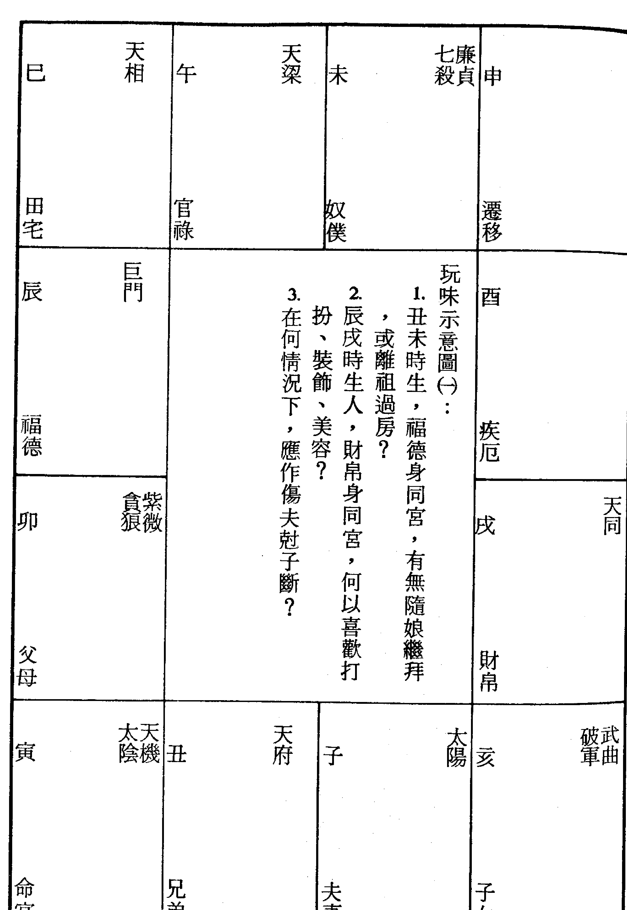
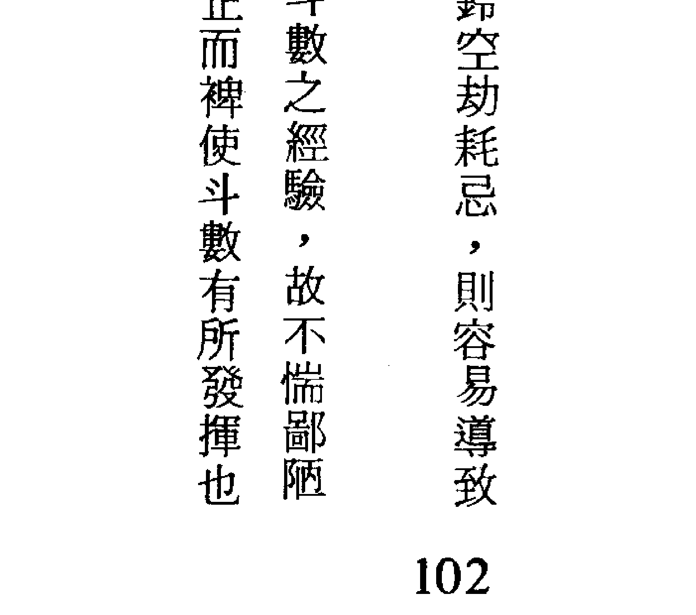
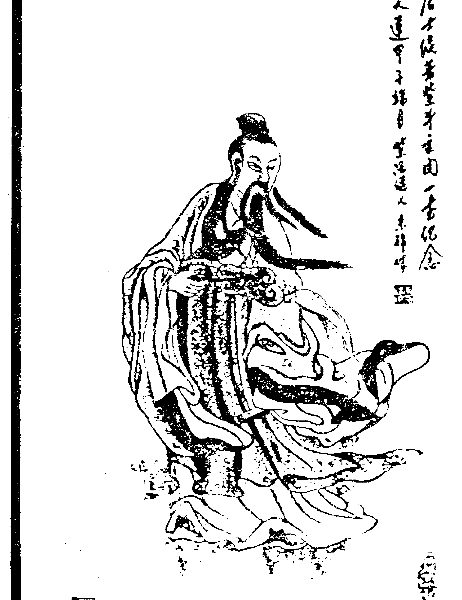
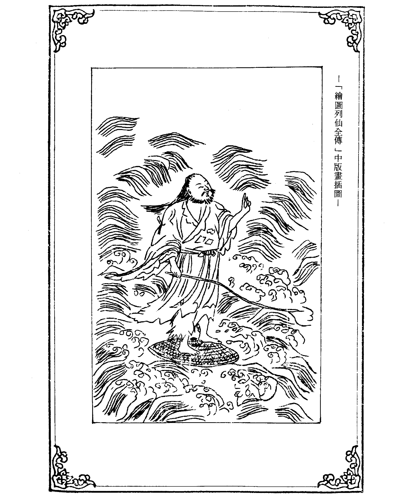
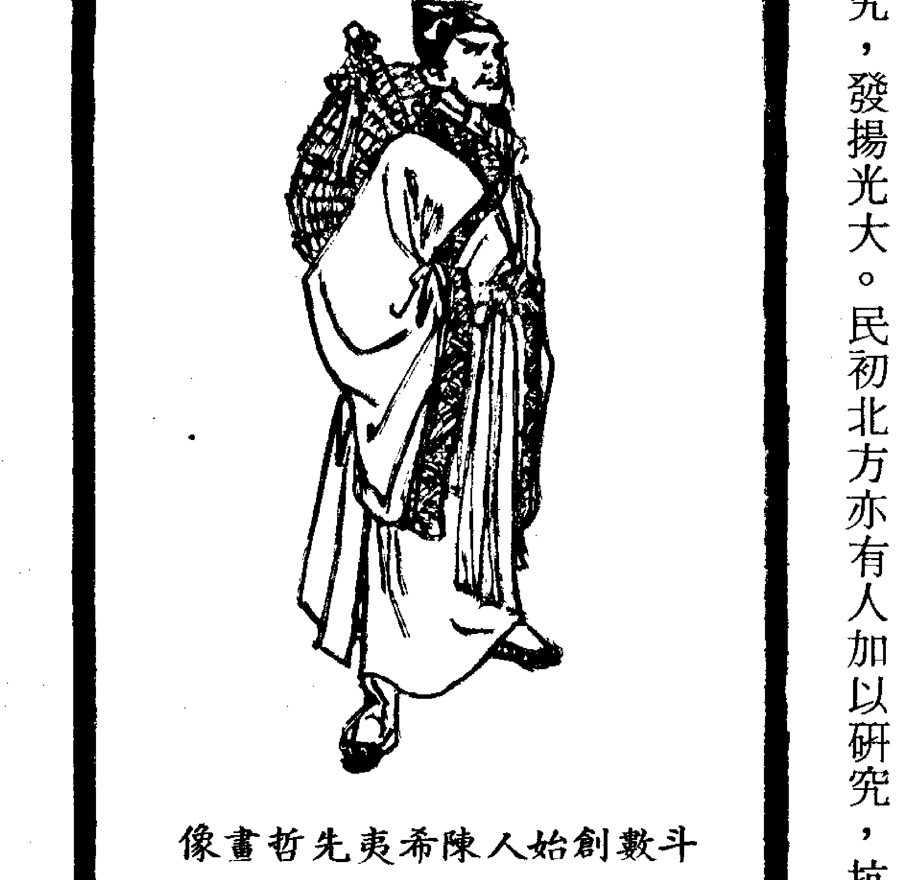
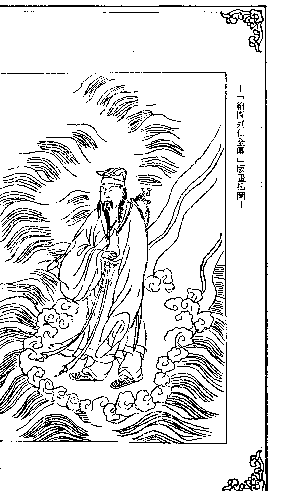
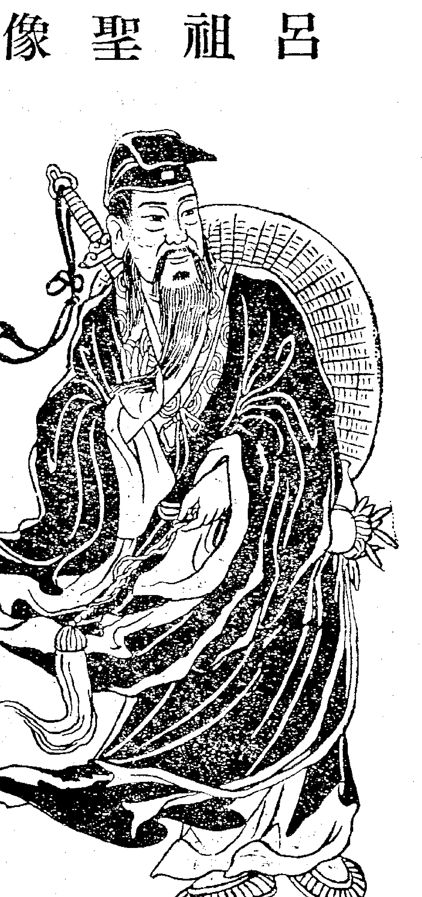

紫微堂奥

女命骨髓赋之辅魁福寿，弼相福临

第十卷

堃元著

大孚书局印行

紫微斗数赋文诠注

紫微堂奥

第十卷

堃元著

大孚书局

紫微堂奥系列【全拾卷】

- 第一卷 斗数总诀之希夷观天星
- 第二卷 斗数发微论之命逢紫微
- 第三卷 斗数太微赋之日月夹财
- 第四卷 斗数骨髓赋之天门运限
- 第五卷 斗数骨髓赋之七杀朝斗
- 第六卷 斗数骨髓赋之天禄天马
- 第七卷 斗数骨髓赋之左府同宫
- 第八卷 斗数骨髓赋之子午破军
- 第九卷 斗数骨髓赋之丹墀桂墀
- 第十卷 女命骨髓赋之辅魁福寿

斗数推命，特寿且荣，不权则富，扶身助命，爵禄荣昌，惊人居万乘，加官进禄，青云之志，弼相福临

| ISBN 957-765-330-8 (293) | 9 789577 653307 |
| :--- | :--- |
| 00350 | F1564 |
| X 03 04 | 星光书店 |
| $ 117.00 | 东明文化图书公司 |
| $ 117.00 | TEL: 23425341 |

紫微斗数赋文诠注
紫微堂奥
第十卷

堃元著

大学书局印行

自序

自序 《紫微堂奥》以江西负子子潘希尹先生补辑之《新编希夷陈先生紫微斗数全书》为蓝本而为紫微斗数赋文之精详诠注。卷一于一九八四年一月印行流通，笔者以当时已有之紫微斗数认知学涵，书夜辛勤奋笔耕，作息失序，日以继夜，书夜颠倒，不屈不挠，再接再厉的经历了二十八个月的般勤刻苦笔耕，卷十终于一九八六年五月印行流通而竟诠注紫微斗数赋文之全功。大孚书局传实泰先生有见于《紫微堂奥》为研读学习紫微斗数认知学所不可或缺的最佳参考书，但因原著缺少作者序文而有美中不足之憾，情商拙愚为原著增补自序，以使读友不因原著无自序的小小缺失而抱憾，望元当仁不让于师，义无反顾的恭敬从所命嘱，流览翻阅十卷而为此序。《紫微堂奥》共十卷；卷一精详诠注《合并十八飞星紫微斗数》一书之「紫微斗数总诀」，概说紫微斗数推命之使用星神与排布推命图的安星布斗。卷二呕心沥血的披沥诠注「斗数发微论」、「重补斗数彀率」、「斗数准绳」，附录「诸星问答论」（按：「诸星问答论」一称「星垣问答论」）。卷三为紫微斗数「太微赋」赋文诠注。卷四～卷九共六卷为「斗数骨髓赋」赋文诠注，并于赋文文句列举相当其文句的命例以为习涉研究之参考。卷十诠注「女命骨髓赋」，附录「补遗骨髓赋」、「形性赋」（按：「形性赋」与「诸星问答论」、「诸星入命限」互为参照融合溶，可以依命图星神而推想描绘此命图本人之形性。）、「星垣论」（按：星垣论附录而未註。）、「紫微斗数漫谈」。今日增补为原著作自序，情不自禁的感慨：「老朽，老朽矣！任何人尽得《紫微堂奥》，必然直览尽窥斗数堂奥，更胜老朽被香港徒孙们抬举谬誉为『斗数奇才，一代宗师』矣！」
二〇〇三年五月一日 塾元谨为序
塾元闲谈论命馆 林源田
住址：台中县太平市新坪里育德路二四七号四楼
电话：（04）二三九一一三五一・二三九一八四二七

前言

古代社会习尚制度与今日社会形态最大的不同，就是昔时妇女不如今日女性之提创女权，男女平等，缺乏婚姻自主权及社会地位，因此形成「女子菜籽命」、「女以夫为贵」之观念，根本没有职业妇女及「休夫」的情形发生，因此古代论女命异于男命。
往昔论女命一如男命，先看身命吉凶如何，次看福德宫如何，盖昔时妇女主中馈，福德宫与财帛宫互为冲照，只以衣禄财帛丰盈，即为福论，又以福德宫恒为财帛宫之迁移位，若有财库盈亏之意义，以为能够操持管理财帛出纳为福吉也，所以福德为强宫，对于今日女性婚后而为家事管理，仍然可以互相相比拟论议。
古代论女命在妇女不从事社会事业的前提之下，因此不以官禄为重，故认为「女因夫贵，女命贵格反成无用」。只重夫妻、子女、财帛、田宅之吉凶，甚至彼时女子不操田宅、财帛之实权，只为形式名义之管理而已，于是又产生财帛、田宅为次强之观念，其余则又为次末了。
但观之今日女性之才能与地位，一如男人，甚至于更胜于男人，所以在理论上而言，对于未婚女性及职业妇女者，我们不必再受拘于古代观念而忽略女命的官禄星象吉凶，大抵可以相当于论男命一般看待研判，不必再特别区分男女。不过命理的玄奥仍然还有许多使人无法理解的地方，就斗数而言，有某些星曜如杀破狼等利于男性，又有某些星曜如太阴天同之利于女性者，我们仍然无法轻忽，所以在我们读习以前的赋文以后，如果省略了「女命骨髓赋」，则未免有些「为山九仞，功亏一篑」的感觉，基于此一观念下，堃元只好硬着头皮，厚着脸皮，拖着备怠的身心，无论如何也要把此一赋文诠注完成。无奈提取笔来，不免又有落笔艰难的感觉，堃元所听到的对于《紫微堂奥》数卷的评许极佳，反而又有不敢敷衍塞责的感觉与心理负担，眼看着卷七、卷八陆续的印行，内心充满了「逃名」与「责任」的矛盾挣扎，到底还是不敢辜负学者的雅意厚爱，以着敬慎恭谨的心态公开个人的习学认真，广求学者读友共为切磋印证之！

女命斗数骨髓赋

- 第一章 府相之星女命躔，必当子贵与夫贤，廉贞清白能相守，更有天同理亦然……一
- 第二章 端正紫微太阳星，早遇贤夫性可凭，太阳寅到午，遇吉终是福……二
- 第三章 左辅天魁为福寿，右弼天相福相临……三
- 第四章 禄存厚重多衣食，府相朝垣命必荣……七
- 第五章 紫府巳亥为互辅，左右扶持福必生……三
- 第六章 巨门天机为破荡，天梁月曜女命贫……五
- 第七章 擎羊火星为下贱，文昌文曲福不全……九
- 第八章 武曲之宿为寡宿，破军一曜性难明……一〇三

女命斗数骨髓赋

- 第九章 贪狼内狠多淫佚，七杀沈吟福不荣 ………………… 一八
- 第十章 十干化禄最荣昌，女命逢之大吉昌，更得禄存相凑合，旺夫益子受恩光 ………………… 一八
- 第十一章 火铃羊陀及巨门，天空地劫又相临，贪狼七杀廉贞宿，武曲加临剋害侵 ………………… 一二
- 第十二章 三方四正嫌逢杀，更在夫宫祸患深，若值本宫无正曜，必主生离剋害真 ………………… 二四
- 第十三章 结语 ………………… 三七
- 第十四章 「三命通会」论女命 ……………… 三九
- 第十五章 易有太极 ……………… 八九
- 补遗骨髓赋 ……………… 二一
- 形性赋 ……………… 二一
- 星垣论 ……………… 二一
- 跋章 ……………… 二一
- 附录：紫微斗数漫谈 ……………… 三三

巨门天机为破荡，天梁月曜女命贫。
擎羊火星为下贱，文昌文曲福不全。
武曲之宿为寡宿，破军一曜性难明。
贪狼内狠多淫佚，七杀沈吟福不荣。
十干化禄最荣昌，女命逢之大吉昌。
更得禄存相凑合，旺夫益子受恩光。
火铃羊陀及巨门，天空地劫又相临。
贪狼七杀廉贞宿，武曲加临剋害侵。
三方四正嫌逢杀，更在夫宫祸患深。
若值本宫无正曜，必主生离剋害真。
已前论赋俱系看命要诀，学者宜熟玩之，乃得原委也。

女命骨髓赋

府相之星女命躔，必当子贵与夫贤。
廉贞清白能相守，更有天同理亦然。
端正紫微太阳星，早遇贤夫性可凭，
太阳寅到午，遇吉终是福。
左辅天魁为福寿，右弼天相福相临。
禄存厚重多衣食，府相朝垣命必荣。
紫府巳亥为互辅，左右扶持福必生。

「註解女命骨髓赋」

—摘录「紫微女命精论」

在众多先贤所遗留的斗数赋文中，祇有这一篇女命骨髓赋是有关讨论女命的，鉴于这篇古赋字义晦暗而不明显，特加以註解并译成白话文，供读者研究参考。其全文如左：

府相之星女命躔，必当子贵与夫贤。

> 【语译】女性命宫坐有天府星或天相星者，必定丈夫贤能温良，子女孝顺而有出息。

> 【註解】天府星与天相星永远居于三合位，女性命宫若坐天府星，必有天相星于三方来合，反之命坐天相星，则天府星必坐三合位。因此女命只要不会照煞星，可以「府相朝垣」格论，主富贵命之妇。

廉贞清白能相守，更有天同理亦然。

> 【语译】女性命宫有廉贞星的人，家世清白，能守妇道。同样的命坐天同星者，也依此论。

> 【註解】女命廉贞或天同坐守命宫，若无煞星冲破者，多主贞洁之妇。其中以甲年生而命坐廉贞者，因廉贞化禄以吉论；而丙年生命坐廉贞者，因廉贞化忌，反主不利。又丙年生命坐天同者，因天同化禄，也以吉论；而庚年生命坐天同者，则因天同化忌，亦主不利。

端正紫微太阳星，早遇贤夫信可凭。

> 【语译】女性命宫坐紫微星或太阳星者，必是端庄贤淑的女子，而且婚姻早发，丈夫贤良而有成就，这是可以凭信的。

> 【註解】紫微星坐命宫，若得左、右、昌曲辅助，多能攀龙附凤，因夫而贵。但若坐于辰、戌、丑、未四墓位，纵遇吉星多，总是不美。而太阳星坐命宫，以居寅、卯、辰、巳、午宫为佳，其福份较大，多以富贵论。不过太阳星守命垣，女性有夺夫权的现象，牝鸡司晨总是不好。

太阳寅到午，遇吉终是福。

> 【语译】太阳星居寅、卯、辰、巳、午宫，女性命宫得之，加遇吉星，终是福的人。

左辅天魁为福寿，右弼天相福相临。

【註解】同前。
【语译】女性命宫有左辅星、右弼星、天魁星、天钺星的人，为福寿双全，到老荣昌。

禄存厚重多衣食，府相朝垣命必荣。

【註解】女命逢四吉星者，多主福寿荣昌，能旺夫益子。
【语译】命宫坐禄存星的女性，多衣食丰厚，为人厚道稳重，命宫得天府星与天相星三合朝拱，必定荣华富贵，一生安宁。

紫府巳亥相互辅，左右扶持福必生。

【註解】紫微星居子或午宫，廉贞星居寅或申宫，武曲星居辰或戌宫，必有府相朝垣，不富即贵之命。
【语译】巳或亥宫安命的女性，有紫微星及天府星互相拱照，或戊宫，必有府相朝垣，不富即贵之命。己或亥宫安命，若有左辅星与右弼星扶持，必多福禄。

巨门天机为破荡。

【语译】巨门与天机二星坐命宫于卯或酉宫，女命得之，即或富贵，在某些地方仍然有所缺失，加遇煞星，更为浪
【註解】巳或亥位安命宫，且宫内坐紫微星者，其对宫必有天府星来照，若能得左右二星加会，则富贵必矣。

天梁月曜女淫贫。

【语译】女性命坐天梁于巳或亥宫，或太阴安命于卯或辰宫，多主仅足温饱，加遇煞星，难为贞洁妇。
【註解】女命天梁星坐巳或亥宫，食禄难遂，尤忌有天马星同宫，多私生活不检点。女命太阴星居卯或辰宫，对宫为太阳星，乃「日月反背」格，一生不如意十常八九，再会合煞星，则难保贞洁。

擎羊火星为下贱。

【语译】女性不喜羊刃、火星二曜守命旺宫犹可，但刑剋不免。如居陷地加遇其他煞星，主不贫则夭之命。
【註解】羊刃、火星二曜守命旺宫犹可，但刑剋不免。如居陷地加遇其他煞星，主不贫则夭之命。

文昌文曲福不全。

【语译】女命坐文昌或文曲，婚姻多难得美满幸福，于人生不免有所欠缺。
【註解】昌曲二星，主聪明而有才华，女命则对感情不利，多

武曲之星为寡宿

【语译】武曲星又名寡宿星，女命多主孤独。

【注解】武曲星宜男不宜女，虽有才干，然性孤独，多感情上的困扰，乃孤寡之命。

破军一曜性难明

【语译】女命坐破军星，性格多变且阴晴不定。

【注解】破军乃变异之星，女命逢之多不利。若居夫妻宫，必主感情多困扰，婚姻生活多波折是非。

贪狼嫉妒多淫佚

【语译】女命逢贪狼星，多主嫉妒心重，且欲望很大，永难满足。

【注解】贪狼星乃桃花星，女性对于物质欲望强烈，也重视两性之间的关系。

七杀沉吟福不荣

【语译】女性命宫有七杀星的人，因性格不稳定，一生成败起伏较大，多难于享福、荣显。

【注解】七杀星其性孤寂而有威严，女命逢之虽主事业有所成就，但婚姻生活不尽如意，且劳碌奔波，难享清福。

十干化禄最荣昌，
女命逢之大吉祥，
更得禄存相凑合，
旺夫益子受恩光。

【语译】女性命宫主星化禄，女命逢之大吉祥，一生富贵荣昌。

【注解】化禄星为掌财禄及福德之星，女命遇之无不吉祥，加遇吉星，为贵夫人之命。

火铃羊陀及巨门，
天空地劫又相临，
贪狼七杀廉贞宿，
武曲加临剋害侵。

【语译】女命最怕有巨门星、贪狼星、七杀星、廉贞星及武曲星等对女性有妨害的星宿坐命宫，尤忌见羊刃、陀罗、火星、铃星、天空、地劫等六煞星同宫，或三方会合，逢之多贫贱，且连累亲人受精神上或物质上的痛苦。

【注解】巨门星主是非，贪狼星、廉贞星为桃花星，七杀星、

第一章 府相之星女命躔，必当子贵与夫贤
廉贞清白能相守，更有天同理亦然

斗数诸星有一定的排列序列，凡府相守命之人，其夫妻宫必见破军或贪狼守值，如果不组合紫微、武曲、廉贞而为单独研判，除了会吉、化吉以外，我们都一般都以为婚姻不美论议，但是女命之生理与心态稍异于男性，尤其府相恒为三合，本已具有斗数骨髓赋所谓『府相同来会命宫，全家食禄。』之义，大抵可以论其具有浓厚强烈的家庭责任感，那么在这大前提下，我们是否仍然依据『夫妻宫论诀』论议婚姻不美呢？

假使只依据增补太微赋之谓：『凡观女人之命，先观夫子二宫，若值杀星，定三嫁而心不足，或逢羊孛，虽啼哭而泪不干。』，固然必以为婚姻不美研判，但又谓：『廉禄临身，女得纯阴贞洁之德。』，于是我们又必须考虑到廉贞、禄存、禄主进入女命命身之不同论议，古人于是作女命骨髓赋以为再次提醒，凡府相守命者，夫妻宫之成照六宫必见廉贞，子女

这篇赋文专论女命，条条俱是经验的法则，若能细加玩味，得之于心，则推断女命之富贵贫贱，皆了然于胸矣。

若值本宫无正曜，必主生离剋害真。

三方四正嫌逢煞，更在夫宫祸患深。

武曲星为孤寡之星，女命遇之终不美。更得六煞星聚会，必见刑凶剋害之事。

【註解】女性命宫无主星，多表示与家人无缘，有离乡出外谋生，或过继于他人的现象。若夫妻宫没有主星，则代表夫妻缘分淡薄，或同床异梦，或貌合神离的情形，严重的会有离异的可能。

【语译】假若女性命宫或夫妻宫没有主星，必定代表与亲人无缘，有分开、离异的情形发生。

【註解】女命夫妻宫以吉星多为良，见煞星主感情、婚姻有波折，多不能从一而终。

【语译】上述诸星在三合方及对宫，不宜逢遇煞星，如果落在夫妻宫，婚姻生活多不利，易有生离死别的现象。

宫之成照必见天同，因此贪破虽恒守于夫妻宫，我们仍然必须审详，不可遽以为婚姻不美判断。

观之女人安命在寅戌者，必以禄存为命主，有禄存化禄明见者固吉，即使旁落不见者，于成照六宫必见廉贞，以廉贞火能生禄存土，使禄存之清淑机巧，能幹为的好处增加，所以在这种状况下，我们必须仔细审详了。

如果安命在辰申，必以廉贞为命主，安命在辰者，似如安命在戌者之为廉府同守命，二者星象虽同，意义亦相近，唯廉贞居天罗地网，先生天府土，不待逢会禄存、化禄，已自表现天府之清正机巧，旺夫益子之优点，故迳以为祯祥论议。

若如紫府在申守命者，廉相同守官禄宫，廉贞在子平和乏力，不以为次桃花论议，却以为有幹劲毅力，具敬业精神及创业魄力，能得衣锦富贵，何况破军临午为水火既济，虽守夫妻宫，亦不可迳依「男女俱剋，别娶，主生离。」论断，凡此区辨最难，稍有疏忽必致误判，故诸如此等未及明言详说者，最要学者读友细心揣摩体会，庶能举一反三而登堂入室矣！

或如女命在子午，必廉相同守命，贪狼独守夫妻宫，破军独守迁移宫，一以命主入夫妻，一以命主迁移，或以重视夫妻感情及共同生活，或以注重家庭生活环境之改善，必定相夫旺夫之论，对于「贪狠，男女不得美，三次作新郎（娘）。」之说法，当然不能套用，学者读友容易疏忽这些变化，只以为紫微斗数星象甚多不能符应，有待重新建立，其实这只是我们后学还没有把老古人遗留的宝贵经验吸收而已，所以我们在感觉自己的命数根基还不够扎实的时候，不妨重新再从卷一温习一遍，不然兼习子平，参考果老星宗，或者旁习阴阳五行生剋制化的学理，应该都能够助长我们观察研判斗数实例的能力啊！

又如天相在丑未独守命，廉贪在亥巳同守夫妻宫，或如天府在巳亥独守命，廉破在卯酉同守夫妻宫，乙丙戊辛人有禄存入命或夫妻之吉，甲生人廉破化禄权，癸生人破军化权，几乎也可以为祯吉。

除了上述而外，卯酉年生人以天同为身主，因天同最能适应环境，体贴丈夫，即使婚姻未克理想，大多能够逆来顺受，何况天同恒出现在子女宫之成照宫位，甚为关怀子女，教育子女，所以仍宜审详为要。

综之以上「府相之星女命缠」，虽然以破贪守值夫妻宫，由于女命大多具母性爱，一旦有浓厚的家庭责任感，自然能够相夫教子，一个女性能够相夫教子，必然使丈夫不必为家庭而分心操心，当然可以专心投注于官禄事业，所以特别提醒学者读友注意，观察研判星象的时候，千万不可只注意单独宫位的表现星象意义，必须同时注意到十二宫位的星象组合变通意义，才能够算得上懂得紫微斗数啊！

意义，才能够算得上懂得紫微斗数啊！
的时候，千万不可只注意单独宫位的表现星象意义，必须同时注意到十二宫位的星象组合变通
意义，才能够算得上懂得紫微斗数啊！

第二章 端正紫微太阳星，早遇贤夫性可凭

太阳寅到午，遇吉终是福

凡论女命，大抵与男命相同，但以古代社会型态以男性为中心，「男主外，女主内。」故男命宜刚强外向，女命则喜柔顺内向，如果反此者，即宜减论其福。
且如紫微为帝星，女命逢之，作贵妇断论，不过此中又有诸多区辨，紫微既为尊星，女命亦征才华尊贵之名，窈窕淑女，君子好逑，故有早受提婚出嫁之现象，即以今日言之，此一线索仍很明显，女命紫微之人，不论于何宫，多主聪明才学，感情丰富，有尊贵气质而倾向于冷艳，为人做事自负任性，但又比较缺乏主张而容易受到别人之影响，因此，她可能受父母、环境、朋友之影响而早婚。
最值得我们玩味探讨的就是斗数论命有「星象锁合」的观念（子平禄命法亦有喜忌之观念），这种观念刚好吻合「物以类聚」的人生哲学，什么样的人就与什么样的人交游往来，

不过上述只为一般「管家事」之女命辨别大要，如果是职业妇女者，我们又不能一概论议，必须要考虑到其所从事的职业性质及环境，否则还是无法掌握观察研判的要领，所以女命虽然稍微有些变通上的不同，在基础的观察研判方法与原理仍然是一样的，必须确实注意组合及科权禄忌之变化，庶能积渐而有所心得。

什么样的性质就和什么样的人合得来，所以一个冷艳尊贵，感情丰富而聪明有才华的女性，她所喜欢的男性也差不到那里去，甚至于有过之而无不及，当然有一个美满理想的夫婿与家庭才对。

不过有一些斗数论命观念仍还局限于理论，未为吾人逐一钻研印证，于是一直以着艰涩的赋文传承下来，不免有所膾误、音误，甚至于篡改、臆补、增补、脱漏、缺失等等弊病，幸运一些的后学刚好就遇上了错误最少的传承，不幸的是遇上了讹误的口诀心法而不能自知，因此望元诠注赋文的时候，一再的重复；「自为试验！」，那么我们所习学的方法虽然不同，但是在同一事象的表现，就应该有相同的解释丨丨譬如前一章之提到「府相之星女命缠，必当子贵与夫贤。」就是一个例子，我们如果只凭单独之一宫主事星象单独分开议论，难免有所失误，现在紫微守命之女性亦然如此，其夫妻宫之星象，成照六宫必逢杀破狼之格局，甚至于在丑未紫破同守命者，其夫妻宫无正曜，往往有生离剋害之情形发生，观之事实却又相近于府相女命一样给我们一个意外。

像赋文中以不同的蕴寓表达着不同的层次深度，它不仅具有赋文文义所表示的星象意义，其中又隐藏掩饰着被认为已经缺失的斗数观察要领诀窍，如果我们只能看到表面文义而无法深得其中的『精蕴』，那么很可能就像某先生之惋惜慧心斋主的才华，推出了『紫微斗数新诠』『紫微斗数看婚姻』『如何推算命运』三书之后，立即出现习学与表现的临界极限，虽然我们每一个人都会遭遇遇到每一层次的临界，但是层次临界的界说因人而有不同，所以学者读友如果也像望元一样固执恒毅，应该不会埋没个人天赋的学习与模仿的才能。

现在我们就必须面对紫微守命之十二种女命星象，这十二种女命星象依然只有六种基本型态的阴阳组合格局而已，到现在为止，几乎还没有一个人确实的推敲过其所衍生的五十一万八千格局星象意义，因此想要以电脑程式或演化成为数据，不免遭遇『不完全』、『未知数』……等困难，以前以及以后之望元拙作愚见，虽或有出人意表的创作，但是可以将它视为学理性之探讨，最重要的仍然必须依赖学者读友之印证与经验。

大体议论紫微女命，当以紫杀在巳亥同守命，天相守夫妻宫者最吉，由于十二宫星象之组合而言，古代虽有女主内之浅见，又有相夫旺夫之希望，所以此格局表现此种女性性刚果决，处事有谋略及魄力，有节俭理财之美德，有家丑不可外扬之品行，于是乎她的言行思想很容易激励帮助其丈夫之一生作为，尤其是今日，这种星象的女性固然是最佳的贤内助，对于一个职业妇女来说，其事业有所成就，并且又能兼顾及家庭，岂不是男性所梦寐以求之最佳伴侣乎！

其次就是紫贪在卯酉同守命之女性，其夫妻宫为天府独守，夫妻相生宠爱，比前一格局稍微浪費而比較虛榮以外，應該是比較餘宮紫微守命之婚姻，是最理想完美了。
（堃元按：古代重名利，妻以夫貴，故在名利心態下，格局以紫殺守命最貴，以紫貪守命次之，紫破守命則乏善可陳，假使基於羅曼蒂克的愛情心態而言，則當以本紫貪守命者為最理想配偶，紫殺次之，紫破又不宜也，這其中蘊藏者雙星同垣之意義，可惜堃元仍未及於此。）
再看紫微在子午獨守命，夫妻宮七殺，辰戌獨守命，貪狼主夫妻，寅申天府同守命，破軍主夫妻，甚至破軍在丑未同守命者，夫妻宮無正曜，則或有因為夫妻婚姻之不美滿而影響至婚後生活之幸福，所以堃元以為古賦文之詮釋應能幫助我們發掘缺失的論訣，特別依據各人讀習愚見而勉強詮註賦文也！
綜之上述之略論，女性為陰，喜陰柔，紫微為尊星，不能柔順，故以七殺金星洩其紫微土，以貪狼木星剋其紫微土，故斗數亦如子平之講究星象五行中和，唯其未如子平之明顯表示，先把星象意義告訴我們，再讓我們回過頭來推敲其原理訣竅，這就好像電視機一樣，我們只要在看電視以前，先懂得開關、選台、調整頻率，在電視播放的時段裏，我們就可以收看到喜歡的電視節目，一旦要錄放影，我們就必須增加錄放影的機器，要修理、製造電視機，我們又必須去追求電視機之結構與原理，大抵天下的事物都可以我們所能理解的事象假設聯想是相同的道理。

於是我們發現男命與福德之星象意義混同，女命與夫妻宮之星象混同，所以男命當以福德宮為強宮，女命當以夫妻宮強宮研議。
像這樣表現上的區分，很容易讓我們感覺到疑惑困難，但是學者讀友都已具備了相當程度以上的斗數專門認識，所以我們不難發現一個道理——男為陽，女為陰，陽順陰逆——，於是男命之福德宮與女命之夫妻宮又幾乎有著一些鑲合程度的相同，只是我們尚未發掘體會而已。
茲以圖示略說於後：

女命圖說：
(一)女為陰，主內，主靜，故本命為靜之中心為吉。
(二)夫妻宮為遷移宮之官祿宮，表示本命適應環境之本能與適應行為。
(三)動極而能生靜，能夠逆來順受為吉。

男命圖說：
(一)男為陽，主外，主動，故本命為動之中心為吉。
(二)福德宮為遷移宮之財帛宮，表示本命適應環境之心態與人生觀。
(三)動之中心若不動，人生觀不動變為吉。

觀之圖示，十二宮各與其他宮息息相關，夫妻宮之表示本命適應環境之本能與其所表現的適應行為，那麼在恆動的人生中，唯有樂天知命者能夠逆來順受而外，唯有家庭與夫妻關係生活，能夠給予我們穩定與安靜的感受，所以男命宜其有主觀，女性宜其能客觀，換句話說，不論男女，在對外之言行宜其有主觀，在家庭生活中又要客觀，適可得動中有靜，靜中有動的禎祥。

這個比喻或者不盡恰當，但奉古代邏輯之最上名言「易有太極」而言，不論這個假設正確與否，只要把斗數星象聯想成為古代人生哲學的一部份，那麼豈不也很接近於現代或者任何時代的人生哲學嗎？

既然我們強調女性以夫妻宮星象為重，暗示一個人的婚後物質與精神生活的重要，暗示一個人適應婚後共同生活以及社會處世的重要，於是我们不免又要討論到命身二主了，尤其是身主附了表示本命的形貌以外，並且含有適應環境能力與表現行為的意義，其意義有些接近於遷移宮之星象意義，因此把紫微與太陽相提並論就有一些搞頭了。

紫微主尊貴，太陽主官貴，二星恆處於同系，紫微如守命者，太陽必守於子女宮，好像暗示著一個能夠自重的人才能受到別人的尊重，一個尊貴有氣質的人，然而因為表現而得到官貴，因此我們只好像任何人一樣的把賦文分開來解釋了。

不過把賦文分開來解釋，好像這裹面又包括了命身二主遇太陽的意義，很可惜的是命身二主守十二宮之意義如何，我們並未確實的瞭解，何況太陽守女命，多主感情開放，其早婚固或有之，却未必匹配賢夫，尤其是太陽女命，難免有奪父夫權柄之嫌，未免福祿不及或不全之嫌，豈可以為紫微或太陽守女命必早遇賢夫呢！

或許我們在研習斗數的過程多忽略了諸篇賦文與諸星問答，否則依諸星之太陽問答有如此說：

> 「（太陽），女為夫主，命逢諸吉守照，更得太陰同照，富貴全美。若身居之，逢吉聚，則可在貴人門下客，否。則公卿走卒。……」

此一語固以身宮有太陽之論，但如我們如命附會命身二主若與身宮之意義時，大概就可以猜想至本賦文可能要當作後面之詮註解釋了。

凡紫微守命之女性，由於具才華而感情豐富，除了安命在卯酉寅申四宮者，因為府相之星守夫妻宮而婚姻理想美滿而外，其宮之命大抵難免有所垢弊。

不過斗數星象之組合變化實在使人嘆為觀止，看一看命身二主是不是落值子女宮與太陽同垣，假使有這種情形，我們不可遽斷本命婚姻不美，因為命身二主與太陽同值子女宮時，我們不難想像本女性具有相夫教子之觀念，尤其特別注重其子女之教育，所以我們在星象的解釋上，才可看到本命有出貴子之可能。
這種說法依然只是原則性的觀察研判方法，我們很困難將之一一解釋得精關透徹，我們大抵仍然要考慮到太陽廟旺陷失之作用，譬如紫府在寅申同守命者，在寅命太陽落陷，其福即不及在申安命之貴吉了。
如果在實例論命的過程之中，我們剛好就遇見了這麼一個命例，當然就不能以為殺破狼守夫妻宮而論婚姻不美，我們不妨依據本賦文之原則判斷，本命有早婚之傾向，即使在於夫妻關係的時候像一個淫蕩的妖姬，與其平常的冷豔有截然迥異的表現，或者是因為丈夫之關係而表現得比平常浪漫一些，但是這些容易使丈夫猜忌的行為，實在就是做一個賢妻所因應丈夫的自然行為，所以假設學者讀友就是本命的配偶時，千萬不可疑心生暗鬼，本命摯愛您之秉性端正而純潔，不可以褻瀆這麼一個賢淑端正的女性，否則的話，我們實在不敢預料您們的婚姻未來狀況啊！
謹附紫微女命之示意圖於後，學者不妨自為推敲玩味，那麼對於賦文的再認知研習的時候，就可以逐漸找到賦文句逗與分句的關鍵了。

| 巳 | 太陰 | 午 | 貪狼 | 未 | 巨門天同 | 申 | 武曲天相 |
| :--- | :--- | :--- | :--- | :--- | :--- | :--- | :--- |
| 奴僕 | | 遷移 | | 疾厄 | | 財帛 | |
| 辰 | 廉貞天府 | | | | | 酉 | 天梁太陽 |
| 官祿 | | | | 紫微女命示意圖(一)： 1. 七殺主夫妻，較宜遲娶，早婚多主剋害不美。 2. 寅申年陽女，身主天梁與太陽同垣，早婚不宜。 3. 稍遜於在午安命。 | | 子女 | |
| 卯 | | | | | | 戌 | 七殺 |
| 田宅 | | | | | | 夫妻 | |
| 寅 | 破軍 | 丑 | | 子 | 紫微 | 亥 | 天機 |
| 福德 | | 父母 | | 命宮 | | 兄弟 | |

| 巳（田宅） | 午（官禄） | 未（奴仆） | 申（迁移） |
| :--- | :--- | :--- | :--- |
| **巨门** | **天相** **廉贞** | **天梁** | **七杀** |
| **辰（福德）** | | | **酉（疾厄）** |
| **贪狼** | | **紫微女命示意图（二）：** 1. 命主禄存，壬生女命早婚亦贵吉。 2. 破军主夫妻，男女俱剋别娶，主生离。 3. 稍逊于在申安命。 | **天同** |
| **卯（父母）** | | | **戌（财帛）** |
| **太阴** | | | **武曲** |
| **寅（命宫）** | **丑（兄弟）** | **子（夫妻）** | **亥（子女）** |
| **天府** **紫微** | **天机** | **破军** | **太阳** |

| 巳（官禄） | 午（奴仆） | 未（迁移） | 申（疾厄） |
| :--- | :--- | :--- | :--- |
| **贪狼** **廉贞** | **巨门** | **天相** | **天同** **天梁** |
| **辰（田宅）** | | | **酉（财帛）** |
| **太阴** | | **紫微女命示意图（三）：** 1. 命主巨门虽三合太阳，却不可同论。 2. 辰戌年女命生子时，身主文昌与太阳同垣，依赋文论。 3. 稍逊于在未安命。 | **七杀** **武曲** |
| **卯（福德）** | | | **戌（子女）** |
| **天府** | | | **太阳** |
| **寅（父母）** | **丑（命宫）** | **子（兄弟）** | **亥（夫妻）** |
| | | **破军** **紫微** | **天机** |

紫微女命示意图(五)：
1. 贪狼主夫妻宫，多主婚姻不美。
2. 辰戌年女命生酉时，身主文昌与太阳同垣，依赋文断。

| 宫位/星曜 | 巳 | 午 | 未 | 申 |
| :--- | :--- | :--- | :--- | :--- |
| | 天梁 | 七杀 | | 廉贞 |
| 父母 | 福德 | 田宅 | 官禄 |
| **辰** | 天相紫微 | **酉** | 奴仆 |
| 命宫 | | | |
| **卯** | 巨门天机 | **戌** | 破军 |
| 兄弟 | | 迁移 | |
| **寅** | 贪狼 | **亥** | 天同 |
| 夫妻 | **丑** | 太阴太阳 | **子** | 天府武曲 |
| | 子女 | 财帛 | 疾厄 |

紫微女命示意图(四)：
1. 天府守夫妻宫，相生寵愛，夫主貴。
2. 命主文曲，申時生女命與太陽同垣，依賦文斷。
3. 稍遜於安命在酉。

| 宫位/星曜 | 巳 | 午 | 未 | 申 |
| :--- | :--- | :--- | :--- | :--- |
| | 天相 | 天梁 | 七杀廉贞 | |
| 福德 | 田宅 | 官禄 | 奴仆 |
| **辰** | 巨门 | **酉** | 迁移 |
| 父母 | | | |
| **卯** | 贪狼紫微 | **戌** | 天同 |
| 命宫 | | 疾厄 | |
| **寅** | 太阴天机 | **亥** | 破军武曲 |
| 兄弟 | **丑** | 天府 | **子** | 太阳 |
| | 夫妻 | 子女 | 财帛 |

| 巳 | 午 天機 | 未 紫微 | 申 |
|---|---|---|---|
| 兄弟 | 命宮 | 父母 | 福德 |
| 辰 七殺 | | | 酉 |
| 夫妻 | | | 田宅 |
| 卯 天梁太陽 | | | 戌 天府廉貞 |
| 子女 | | | 官祿 |
| 寅 天相武曲 | 丑 巨門天同 | 子 貪狼 | 亥 太陰 |
| 財帛 | 疾厄 | 遷移 | 奴僕 |

紫微女命示意图 (五)：
1. 七殺主夫妻，早婚多主剋害不美。
2. 寅申年陽女，身主天梁與太陽同垣，不忌早婚。
3. 辰戌年陽女生未時亦然。

| 巳 | 午 七殺紫微 | 未 | 申 |
|---|---|---|---|
| 命宮 | 父母 | 福德 | 田宅 |
| 辰 天梁天機 | | | 酉 廉貞破軍 |
| 兄弟 | | | 官祿 |
| 卯 天相 | | | 戌 |
| 夫妻 | | | 奴僕 |
| 寅 巨門太陽 | 丑 貪狼武曲 | 子 太陰天同 | 亥 天府 |
| 子女 | 財帛 | 疾厄 | 遷移 |

紫微女命示意图 (六)：
1. 天相守夫妻，宜年長，親上成親。
2. 辰戌年女命生申時，與太陽同垣，更吉。

### 紫微女命示意图(九)：

1. 夫妻破军，主剋害生离。
2. 辰戌年陽女生巳時，身主文昌與太陽同垣，依賦文斷。

| 地支 | 巳 | 午 | 未 | 申 | 酉 | 戌 | 亥 | 子 | 丑 | 寅 | 卯 | 辰 |
|------|----|----|----|----|----|----|----|----|----|----|----|----|
| 宫位 | 子女 | 夫妻 | 兄弟 | 命宫 | 父母 | 财帛 | 疾厄 | 迁移 | 奴仆 | 官禄 | 田宅 | 财帛 |
| 星曜 | 太阳 | 破军 | 天机 | 紫府 | 太阴 | 贪狼 | 巨门 | 天相 | 天梁 | 七杀 | 武曲 | 天同 |

### 紫微女命示意图(八)：

1. 夫妻宫無正曜，多主剋害生離。
2. 辰戌年陽女生午時，身主文昌與太陽同垣，依賦文論。

| 地支 | 巳 | 午 | 未 | 申 | 酉 | 戌 | 亥 | 子 | 丑 | 寅 | 卯 | 辰 |
|------|----|----|----|----|----|----|----|----|----|----|----|----|
| 宫位 | 夫妻 | 兄弟 | 命宫 | 父母 | 福德 | 田宅 | 巨门 | 天相 | 天梁同 | 七武曲 | 太阳 | |
| 星曜 |  |  |  |  |  |  |  |  |  |  |  |  |

紫微女命示意图(四)：
1. 贪狼主夫妻宫，多主婚姻不美。
2. 辰戌年阳女生卯时，身主文昌同太阳。
3. 命主禄存，丁庚子女宫化禄者，依赋文断。

紫微女命示意图(五)：
1. 天府守夫妻宫，多主夫贵，相生宠爱。
2. 命主文曲，女生辰时，与太阳同垣，依赋文论。
3. 辰戌年阳女生寅时，身主文昌同太阳，依赋文断。

# 第三章 左辅天魁为福寿 右弼天相福相临

辅弼二星相提并论，魁钺又是相提并论之星，但考潘希尹补辑版却作「右弼天『相』福相临」，赋文经石宛玉老师这么一更易一字，在文法显然通顺合理，但是赋文有没有错误呢？石老师的更订不也能表现其观察之敏锐，首先发举别人所未曾注意到的细微，但是天钺固与余三星并称，而天相值命亦主衣食丰足，且以读音不相近，也有原文无误之可能！考之「十八飞星策天紫微斗数全集」之「女命赋」亦作「天相」而不为「天钺」，「全书」与「全集」被珍惜为研习斗数的圭臬，二书俱取「天相」立论，难道说在明清时候，就这么留传下来而未被怀疑、考虑、推敲过吗？也许私下已经有不少人已经更易「天钺」为用，或者并曾考虑到「天相」之吉而不特更改吧！

| 巳 | 午 | 未 | 申 |
| --- | --- | --- | --- |
| 迁移 | 疾厄 | 财帛 | 子女 |
| 辰 | 天府 | 太阴同 | 贪武曲 |
| 奴仆 | 天府 | 太阴同 | 贪武曲 |
| 卯 | 破军 | 巨门 | 天相 |
| 官禄 | 破军 | 巨门 | 天相 |
| 寅 | 丑 | 子 | 亥 |
| 田宅 | 福德 | 父母 | 命宫 |
| 天机 | 紫微 | 天同 | 天梁 |

紫微女命示意图(四)：
1. 天相司夫妻，宜配年长，或亲上成亲。
2. 命主巨门与太阳同垣，迳依赋文断。
3. 辰戌年阳女生寅时，文昌入子女宫者，更吉。

之並存於心，甚至於複習此五星之性質，不妨試為推敲此文應以「天相」或「天鉞」為當。

## 一、魁鉞概論：

1. 魁鉞為天乙貴人（或以天魁為天乙貴人，為陽貴，天鉞為玉堂貴人，為陰貴，晝生人喜陽貴，夜生人喜陰貴，反之稍遜。），意為長輩之賞識器重，意對於本命之精神物質有所助益，或在危難困苦加以援手解圍之人。
2. 魁鉞為司科之星，主聰明智慧，或謂天魁主文運，天鉞主文選，與台輔（直接得貴）、封誥（間接得貴）二星互相呼應，如入坐、坐貴向貴，或得左右吉聚，無不富況。
3. 魁鉞為上界和之神，若魁鉞更迭相守身命，更遇紫府日月昌曲左右權祿相湊，少年必娶美妻（少女亦然），若遇大難，必得貴人成就扶助，小人不一，亦不為凶。
4. 限步巡逢，男主科名，女主添喜，生男則俊雅，入學功名有成，生女則容貌端莊，出眾超群。
若四十以後逢墓庫，不依此斷。有凶不以為災，與人和睦，居官者，賢而威武，聲名遠播，僧道享福，不為下賤。

## 二、輔弼概論：

1. 左右為輔弼帝極之星，二星俱北斗善星，為斗中上相，亦視為「尊星」擬議，引伸而為輔佐命運之輔吉星。
2. 輔弼二星有輔佐與傳達執行羽令之義，左輔若為「次紫微」、右弼若為「次天府」，又作平輩同儕之友愛、推愛、敬愛，於是同時具有副次、多數、地位之高低意義。
3. 輔弼二星依於生主星表示地位之高低，其又依三台、八座二星表示地位正、次之性質，今日我們的官階編制大異古代官制，所以所能暗示之地位高低意義仍很模糊，尤其是在論命的時候，我們必須特別聯想引伸，否則很難掌握住星性作用。
4.左輔屬土，佐輔帝極總綱紀之星，在諸宮守身命皆降福，主人形貌敦厚端莊，秉性寬厚，隨和大方，舉止端正規矩，處事確實踏實，個性慷慨風流，學識淵博，所以在事業及財帛上皆能有所成就。最喜逢會紫微，若與府相機昌貪武會，更得右弼同垣，則富貴不小。
5.右弼亦屬土，因其司掌俸祿出納，所以又以水為根，為天機上宰星，右弼帝極掌授廉、假錢穀之星，在諸宮守命皆降福，在辰戌丑未尤佳，主人形貌厚重清秀，秉性耿直而心懷寬恕，文墨精通，處事有機謀，原則，策略，所以凡事謀定而後動，不易發生錯誤失敗，當然在事業及錢財上皆能有所成就。亦最喜逢紫微帝座，會府相昌則終身福壽。
6.若單就才學才華而言，左輔博通今古，比較傾向於消遣興趣方面；右弼文墨精通，比較傾向於行文實用方面。
7.命宮無正曜，輔弼單守命宮，離宗庶出。
8.左輔女命，溫重賢曉，會吉星旺夫益子，旺地封贈，大忌沖沖破，以中局論斷。

## 三、天相概論：

1.天相屬水，司爵之宿，為福善，化氣曰印，是為官祿文星，主人衣食豐足，昌曲左右相會，位至公卿。陷地（卯酉），貪廉武破羊陀殺湊，巧藝安身，火鈴沖破，殘疾。
按：天相喜會輔弼，又若不必更訂原賦文矣！
2.天相女命，主聰明端莊，志過丈夫，三方吉拱，封贈論，入廟（子丑寅申）溫和，衣祿遂心。
按： 後文有「文昌文曲福不全」之謂，意文昌曲宜男，女命不宜。設能知斗數諸星之男女性，則論命之誤差庶可減少。
3. 天相主於夫妻宮，一般男性年齡大於女性，往往有媒妁朋友介紹，匹配親戚、世交、朋友之朋友為配偶之現象，可以說是抉擇性之明智婚姻，一般皆幸福圓滿，即或不睦亦能保持婚姻關係而偕老。
4. 天相恆與破軍守照，故諸宮俱不宜再會凶，若夫妻宮加羊陀火鈴空劫，仍主刑剋。
5. 其餘論議天相者甚多，學者讀友不妨自為複習，並能自為參考拙作「斗數玄關論斷篇」最佳，不贅。

貪狠，因以古代社會結構，女性向不參與社交或從事職業，故天鉞對於女性反而不會產生很大之影響作用，大不了只是表示在家得母姊寵愛，嫁後得家婆妯娌之賞識器重與幫助而已，何況古代女性既以夫為貴，則本賦文若有從人之秉賦個性品行以查夫妻婚姻之暗示，意味天相守命之女性，雖然必見貪狠值守夫妻宮，千萬不可逕斷婚姻不美，假如有右弼入命，又成旺夫益子之格，故原賦文應無誤，不必更訂為「天鉞」，反而徒生紛歧與疑惑矣！

循此以為引伸，則可知本文之本意深寓古代「女子無才便是德」的觀念，一個聰明的女性，即使聰明智慧才能更超勝於丈夫，與丈夫共同生活的時候仍然不可輕視丈夫的聰智才能，否則雖有絕頂之聰明，卻因志勝丈夫，無心輕視丈夫，阻窒了丈夫的奮發圖強的心志，反而無所表現作為，輕則配偶無能，重則容易造成婚姻之裂痕隔閡，我們不應該記取「聰明反被聰明誤」的教訓嗎？

雖然時代變遷，堃元僥倖娶了一個不算聰明的黃臉婆，甚至被摯友南虹譏為「大男人沙文主義」的大男人，但以堃元為男性的男性自私心理而論，堃元所欣賞的仍然是希望娶到一個具有我國古代婦女傳統美德之女性為配偶，很幸運的是替我洗衣煮飯的黃臉婆剛好就有這麼一點好處，以致於使許多算命先生忽略了「壬午、癸丑、甲子、癸酉」之桃花，不一定只代表「異性情感」，有時候也要考慮到「酒」「賭」「才華」之不同意義，大多誤以為堃元| 巳 | 太阳 | 午 | 破军 | 未 | 天机 | 申 | 天府紫微 |
| :--- | :--- | :--- | :--- | :--- | :--- | :--- | :--- |
| 奴仆 | | 迁移 | | 疾厄 | | 财帛 | |
| 辰 | 武曲 | 酉 | 太阴 | | | | |
| 官禄 | | 子女 | | | | | |
| 卯 | 天同 | 戌 | 贪狼 | | | | |
| 田宅 | | 夫妻 | | | | | |
| 寅 | 七杀 | 丑 | 天梁 | 子 | 天相 | 亥 | 巨门 |
| 福德 | | 父母 | | 命宫 | | 兄弟 | |

天相女命示意图(一)：
1. 贪狼守夫妻，大多婚姻不美。
2. 贪狼为命主，妒性甚强，容易发生婚变。
3. 癸生人禄存入命，戊生人贪狼化禄，本命清白端正。
4. 乙己年阴女，命逢辅弼者，以福寿良缘论断。

其若到感情浪漫而寻花问柳……。女命骨髓赋所要提醒我们后学的大概也只是如此而已，所以在文义上固然有其表面之表示，在赋文的骨髓里又流滥着论议女命的最高诀窍心法，学者读友如果也是一个狂嗜斗数的同好，何妨放开思考的笼络，以为自由驰骋联想。兹附天相女命图示以为参考：

| 巳 | 午 | 未 | 申 |
| :--- | :--- | :--- | :--- |
| 田宅 | 官禄 | 奴仆 | 迁移 |
| 辰 | 七杀 | 天相女命示意图(二)： 1. 贪狼守夫妻，大多婚姻不美。（以后同此提示，唯各就三方四正详加区别。） 2. 甲癸年生女命，禄存入一、三宫，本身清白端正。 3. 六辛阴女，更逢辅弼，旺夫益子，以为良缘福寿断。 | 酉 |
| 福德 | | | 疾厄 |
| 卯 | 天梁太阳 | | 戌 |
| 父母 | | | 财帛 |
| 寅 | 天相同宫 | 巨门同宫 | 贪狼亥 |
| 命宫 | 兄弟 | 夫妻 | 子女 |

| 巳 | 午 | 未 | 申 |
| :--- | :--- | :--- | :--- |
| 官禄 | 奴仆 | 迁移 | 疾厄 |
| 辰 | 太阳 | 天相女命示意图(一)： 1. 廉贞守夫妻宫，婚姻剋害不美。 2. 戊生人贪狼化禄，本身清白端正。（以后同此提示，不赘。） 3. 甲戊庚阳女，有辅弼入命者，亦以为良缘，旺夫益子，福寿论之。 | 酉 |
| 田宅 | | | 财帛 |
| 卯 | 七杀武曲 | | 戌 |
| 福德 | | | 子女 |
| 寅 | 天梁同宫 | 天相子 | 巨门亥 |
| 父母 | 命宫 | 兄弟 | 夫妻 |

| 巳 | 天梁 | 午 | 七杀 | 未 | | 申 | 廉贞 |
| :--- | :--- | :--- | :--- | :--- | :--- | :--- | :--- |
| 父母 | | 福德 | | 田宅 | | 官禄 | |
| 辰 | 天相紫微 | | | | | 酉 | 奴仆 |
| 命宫 | | | 天相女命示意图(三)： 1. 紫相不化禄，唯甲年生主廉贞化禄，更 禄存入夫妻宫，本身端正清白。 2. 乙己生阴女，更命逢左右，亦作良缘贵 妇。乙生吉，己生次之。 | | | 戌 | 破军 |
| 卯 | 巨门天机 | | | | | | 迁移 |
| 兄弟 | | | | | | | |
| 寅 | 贪狼 | 丑 | 太阴太阳 | 子 | 天府武曲 | 亥 | 天同 |
| 夫妻 | | 子女 | | 财帛 | | 疾厄 | |

| 巳 | 七杀紫微 | 午 | | 未 | | 申 | |
| :--- | :--- | :--- | :--- | :--- | :--- | :--- | :--- |
| 福德 | | 田宅 | | 官禄 | | 奴仆 | |
| 辰 | 天梁天机 | | | | | 酉 | 破军廉贞 |
| 父母 | | | 天相女命示意图(四)： 1. 武贪守夫妻，主背剋，宜迟婚。 2. 乙生人禄存入命，本身清白端正。 3. 壬癸年生女命，更逢左右，主为良缘， 亦主福寿。 | | | 戌 | 迁移 |
| 卯 | 天相 | | | | | | 疾厄 |
| 命宫 | | | | | | | |
| 寅 | 巨门太阳 | 丑 | 贪狼武曲 | 子 | 太阴天同 | 亥 | 天府 |
| 兄弟 | | 夫妻 | | 子女 | | 财帛 | |

| 巳 兄弟 巨门 | 午 命宫 天相廉贞 | 未 父母 天梁 | 申 福德 七杀 |
| :--- | :--- | :--- | :--- |
| 辰 夫妻 贪狼 | | | 酉 田宅 天同 |
| 卯 子女 太阴 | | | 戌 官禄 武曲 |
| 寅 财帛 天府紫微 | 丑 疾厄 天机 | 子 迁移 破军 | 亥 奴仆 太阳 |

### 天相女命示意图 (五)：
1. 丁己阴女，禄存入命，主清白端正，甲辛癸会禄存者亦然。
2. 六辛阴女，更逢辅弼，主旺夫益子，作良缘断。

| 巳 命宫 天相 | 午 父母 天梁 | 未 福德 七杀廉贞 | 申 田宅 |
| :--- | :--- | :--- | :--- |
| 辰 兄弟 巨门 | | | 酉 官禄 |
| 卯 夫妻 紫微贪狼 | | | 戌 奴仆 天同 |
| 寅 子女 天机太阴 | 丑 财帛 天府 | 子 疾厄 太阳 | 亥 迁移 武曲破军 |

### 天相女命示意图 (六)：
1. 紫贪守夫妻宫，会凶有刑，宜年长可匹。
2. 丙戊壬阳女，会禄存，本身清白端正。
3. 壬癸年生女命，更逢辅弼，以为良缘，作旺夫益子论。

| 巳 | 午 | 未 | 申 |
| :--- | :--- | :--- | :--- |
| 太阴 | 贪狼 | 巨门天同 | 天相武曲 |
| 子女 | 夫妻 | 兄弟 | 命宫 |
| 辰 | | | 酉 |
| 廉贞天府 | | | 天梁太阳 |
| 财帛 | | | 父母 |
| 卯 | | | 戌 |
| | | | 七杀 |
| 疾厄 | | | 福德 |
| 寅 | 丑 | 子 | 亥 |
| 破军 | | 紫微 | 天机 |
| 迁移 | 奴仆 | 官禄 | 田宅 |

天相女命示意图(九)：
1. 甲庚阳女逢禄存，本身清白端正，己生阴女武曲化禄亦然。
2. 乙己生阴女，更会辅弼入命，主旺夫益子，主为良缘。

| 巳 | 午 | 未 | 申 |
| :--- | :--- | :--- | :--- |
| 贪狼廉贞 | 巨门 | 天相 | 天梁天同 |
| 夫妻 | 兄弟 | 命宫 | 父母 |
| 辰 | | | 酉 |
| 太阴 | | | 武曲七杀 |
| 子女 | | | 福德 |
| 卯 | | | 戌 |
| 天府 | | | 太阳 |
| 财帛 | | | 田宅 |
| 寅 | 丑 | 子 | 亥 |
| | 紫微破军 | | 天机 |
| 疾厄 | 迁移 | 奴仆 | 官禄 |

天相女命示意图(八)：
1. 甲戊阳女，夫妻宫化禄，本身清白端正，癸生阴女，破军化禄次之。
2. 甲戊庚阳女，更逢辅弼入命，主旺夫益子，作良缘断。

| 巳（疾厄） 天同 | 午（财帛） 武曲天府 | 未（子女） 太阴太阳 | 申（夫妻） 贪狼 |
| :--- | :--- | :--- | :--- |
| 辰（迁移） 破军 | | | 酉（兄弟） 天机巨门 |
| 卯（奴仆） | | | 戌（命宫） 紫微天相 |
| 寅（官禄） 廉贞 | 丑（田宅） | 子（福德） 七杀 | 亥（父母） 天梁 |

天相女命示意图(十)：
1. 甲己癸女命，廉破武化禄，亦主清白端正。
2. 六辛阴女，魁钺拱命，更见辅弼入命，主旺夫益子，作良缘断。

| 巳（财帛） 天府 | 午（子女） 太阴天同 | 未（夫妻） 武曲贪狼 | 申（兄弟） 太阳巨门 |
| :--- | :--- | :--- | :--- |
| 辰（疾厄） | | | 酉（命宫） 天相 |
| 卯（迁移） 廉贞破军 | | | 戌（父母） 天机天梁 |
| 寅（奴仆） | 丑（官禄） | 子（田宅） | 亥（福德） 紫微七杀 |

天相女命示意图(十一)：
1. 乙辛阴女禄存守照，本身清白端正，甲生阳女稍逊。
2. 丙丁生女命，更逢辅弼入命，主旺夫益子，作良缘断。

# 第四章 禄存厚重多衣食
## 府相朝垣命必荣

禄存之星属土，北斗第三星，真人之宿，主人贵爵，掌人寿基，可拟议为主宰“理想抱负、名位欲望”之星（参考卷三第20、31页），又主“健康”，并依于卷九第九十四章之谓“合禄拱禄，定为巨擘之臣”。以论，又主追求理想抱负而有杰出成就。

有关于禄存或其他斗数诸星，大多不必区分男女，可以一概同论，故女命逢禄存亦作吉断，唯以女主中馈，未克注重官禄事业之成就建树，所以于论断之时必须稍作适切的衡量调整，这时候更要酌量其所求宫位，大抵如太微赋之谓“禄存守于田财，则堆金积玉。”或因于骨髓赋之“合禄拱禄定为巨擘之臣。”注谓：“诀云：‘合禄拱禄堆金玉，爵位高迁衣紫袍。’”以为联想，女命得禄存，不妨即依本文“禄存厚重多衣食”论议之。

唯禄存之守女命故主清白秀丽，有男子之志，其多清淑机巧，能幹能为，亦宜紫府相同梁日月武曲同宫为妙，若只禄存独守命，亦如男子作看财奴论，若更会空劫火铃忌耗，亦主 夫妇分离，轻则不能和谐，重则亦然生离死别。 大抵禄存守值十二宫，可依下列以为印证：

- **守命** 男人性格刚强百事成，女性清淑机巧男子志。（参考拙作“斗数玄关论断篇”，不详赘形性。）
- **兄弟** 相生有兄弟，见杀，剋害招怨。
- **夫妻** 相生无剋，妻宜年少，迟娶者并头偕老。加火铃空劫，见截路空亡，孤单。
- **子女** 主孤。宜庶出，一螟蛉之子。 加吉星，有一人，加火星诸杀，孤刑。
- **财帛** 富足仓箱，堆金积玉。主富，福系。 加吉，美，不待劳而财自加。 加火铃空劫忌，先无后有。
- **疾厄** 少年多灾。 加吉星灾少。 见羊陀（当生不遇，运限遇之。）火铃，四肢必伤残，加空劫，致暗疾延生。
- **迁移** 出外衣禄遂心，利禄宜之，主商贾致富。 会羊陀火铃空劫，与人多不足意。 加吉星，卫主起家。
- **奴仆** 奴仆多。 见羊陀火铃忌，欠力。 会吉，文武皆良，财官双美，子孙爵秩（子袭父爵，犹子之克绍其裘，子传父业也。），诸宫皆美。
- **官禄** 田园多，旺，自置。主富。 会吉星承祖业，荣昌。
- **田宅** 加羊陀火铃空劫，田宅少。 加吉星有喜有福。 终身福厚，安静处世。
- **福德** 见羊陀火铃空劫，心身不得宁静。 无剋。
- **父母** 加空劫羊陀火铃，早年有破父财，且刑伤中不自成家计。

| 巳 | 破军武曲 | 午 | 太阳 | 未 | 天府 | 申 | 天机太阴 |
| :--- | :--- | :--- | :--- | :--- | :--- | :--- | :--- |
| 迁移 | | 疾厄 | | 财帛 | | 子女 | |
| 辰 | 天同 | | | | | 夫妻 | |
| 奴仆 | | | | | | | |
| 卯 | | | | | | 戌 | 巨门 |
| 官禄 | | | | | | 兄弟 | |
| 寅 | 丑 | 七杀廉贞 | 子 | 天梁 | 亥 | 天相 |
| 田宅 | 福德 | | 父母 | | 命宫 | |

天相女命示意图：
1. 壬禄入命，丙戊禄照，辛禄入夫妻，俱主清白端正。
2. 丙丁年生女命，魁钺守命，更逢辅弼入命，主旺夫益子，作良缘断。

禄存之守值大抵如上研议，其于女命偏向衣禄研判，而不作官禄论断，但以今日社会习惯改变，从事家事管理之妇女故依此论，对于职业妇女则又必与男命同论矣！
禄存之于女命，恍惚与骨髓赋所谓“天府天相乃为衣禄之神，为仕为官定主亨通之兆。”相当，故本文以前文已专论“府相之星女命缠”，所以增列“府相朝荣命必荣”以补充其义者，大多可以引用赋文观察研判，剩下来的问题就是必须我们重新印证经验统计分析了。
兹附女命府相朝禄格以为参考：

- **女命府相朝禄格示意(一)：**
1. 夫妻宫七杀，主早剋配偶，宜迟婚。（午命妨此，不赘。）
2. 癸生阴女，禄存入命合格，主命荣衣禄富足，亦作良缘论断。

### 女命府相朝禄格示意(三)：
1. 甲阳女双重天禄，最吉。
2. 廉禄临身，女得纯阴贞洁之德，作良缘论。
3. 庚阳女，禄存照命次之。

### 女命府相朝禄格示意(四)：
1. 紫杀夫妻宫，因贪曲照命，常为经济金钱吵闹，会凶主生离死别。（未命仿此，不赘。）
2. 禄存不入命，唯戊女贪狼化禄，己女武曲化禄照命，可以拟议。唯己女羊陀拱命破格。

| 巳 | 太阳午 | 破军未 | 天机申 | 紫府 |
| :--- | :--- | :--- | :--- | :--- |
| 父母 | 福德 | 田宅 | 官禄 | |
| 辰 武曲 | | | | 太阴 |
| 命宫 | | | | 酉 |
| 卯 天同 | | | | |
| 兄弟 | | | | 戌 贪狼 |
| 寅 七杀 | 丑 天梁 | 子 天相 | 亥 巨门 |
| 夫妻 | 子女 | 财帛 | 疾厄 | |
| | | | 女命府相朝禄格示意(五)： 1. 己阴女武曲化禄为合格。 2. 戊阳女贪狼化禄为次格。 3. 甲阳女廉贞化禄，或庚癸生女，三合禄存者，又次之。 | |

| 巳 | 破军武曲午 | 太阳未 | 天府申 | 天机太阴天魁(忌)(禄) |
| :--- | :--- | :--- | :--- | :--- |
| 福德 | 田宅 | 官禄 | 奴仆 | |
| 辰 擎羊 天同 | | | | 贪狼紫微(科) |
| 父母 | | | | 酉 |
| 卯 禄存 | | | | 戌 巨门 |
| 命宫 | | | | |
| 寅 陀罗 | 丑 廉杀 | 子 天梁天钺(权) | 亥 天相 |
| 兄弟 | 夫妻 | 子女 | 财帛 | |
| | | | 女命府相朝禄格示意(四)： 1. 命无正曜，因为幼年心态之影响，婚姻心态相对不稳定。 2. 乙阴女禄存入命，主旺夫益子论。 3. 禄存独守命，节俭小气。 | |

### 女命府相朝禄格示意(一)：
1. 丁己阴女，禄存入命合格。
2. 父母宫无正曜，擎羊独守，大多有刑克父母之兆，夜生刑父，昼生剋母。
3. 早年不美，婚后因夫得贵。

| 已 | 午 | 未 | 申 |
| :--- | :--- | :--- | :--- |
| 陀罗 天机 | 禄存 紫微 | 擎羊 | 破军 |
| 辰 七杀 | | | 酉 |
| 卯 天梁 太阳 | | | 戌 天府 廉贞 |
| 寅 天相 武曲 | 丑 巨门 天同 | 子 贪狼 | 亥 太阴 |

### 女命府相朝禄格示意(二)：
1. 武杀守夫妻宫，主剋二、三配偶。
2. 丙戊阳女入命者，主衣禄荣贵，因女再醮者不贵，故作良缘变通论断。

| 巳 | 午 | 未 | 申 |
| :--- | :--- | :--- | :--- |
| 禄存 | 擎羊 天机 | 破军 紫微 | |
| 辰 陀罗 太阳 | | | 酉 天府 |
| 卯 七杀 武曲 | | | 戌 太阴 |
| 寅 天同 天梁 | 丑 天相 | 子 巨门 | 亥 贪狼 廉贞 |

| 巳 子女 | 午 夫妻 | 未 兄弟 | 申 命宫 |
| :--- | :--- | :--- | :--- |
| 天梁 | 七杀 | 廉贞 | 酉 父母 |
| 辰 财帛 | 天相紫微 | | 父母 |
| | | 女命府相朝禄格示意(九)： 1. 庚阳女禄存入命为合格。 2. 甲阳女合禄拱禄，更吉。 3. 乙己女命逢辅弼亦吉，唯己阴女合格， 乙女破格。 | 戌 福德 破军 |
| 卯 疾厄 | 巨门天机 | | 亥 田宅 |
| 寅 迁移 | 丑 奴仆 | 子 官禄 | 天府武曲 |
| 贪狼 | 太阴太阳 | | 天同 |

| 巳 夫妻 | 午 兄弟 | 未 命宫 | 申 父母 |
| :--- | :--- | :--- | :--- |
| 七杀紫微 | | | 父母 |
| 辰 子女 | 天梁天机 | 酉 福德 | 破军廉贞 |
| | | 女命府相朝禄格示意(八)： 1. 禄存不入命，唯戊己女命，迁移宫有化 禄照命，可拟合格研议。 2. 甲戊庚女命，逢辅弼者亦吉，只戊阳女 合格，戊庚女命为破格。 | |
| 卯 财帛 | 天相 | 戌 田宅 | 田宅 |
| 寅 疾厄 | 丑 迁移 | 子 奴仆 | 亥 官禄 |
| 巨门太阳 | 贪狼武曲 | 太阴天同 | 天府 |## 第五章 紫府已亥为互辅 左右扶持福夹生

我们非常诧异，女命骨髓赋从第一章至本章，一直就在紫府相之命格盘旋，尽可能使我们瞭解杀破狼守夫妻不可一概以为婚姻不美，而且在这些赋文的字行间，又尽可能的暗示左右辅弼紫微的影响作用，恍惚暗示命逢辅弼之吉，又必须依据命宫生主星之吉凶以为分辨命数格局的高低，但是这些隐晦的暗示，一直未为吾人所发觉，一般仅只就赋文的表面文义直接诠释而已。

### 女命府相朝禄格示意（一）：
- 禄存不入命垣，唯甲丁己生人，三合禄存，可拟合格之论。
- 戊己生女命，见化禄者，己女命合格，戊女命为破格。

### 女命府相朝禄格示意（二）：
- 六辛阴女，禄存入命合格。
- 禄存独守命，亦作节俭吝啬，守财之人论。
- 丙戊阳女禄存入财，命逢辅弼，亦以为吉论。

### 女命府相朝禄格示意（三）：
- 壬阳女禄存入命为合格，惜贪狼化忌，为福不全，或为吉处藏凶论之。
- 其余可循女命骨髓赋前述诸章拟议，不赘。

垒元无数次推敲本文，无数次想要放弃自习的心志，可是一想到「名师可遇」「明师难求」，终于又回到了自我推敲摸索的老样子，一直经过了无数次的推敲之后，终于勉勉强强略有心得而已。

(一) 诸篇赋文很少提到守照的宫位关系，除了四墓比和而外，命宫与迁移宫之宫位五行恒为仇剋关系，如子水剋午火，午火仇子水，寅申仇剋，卯酉仇剋，本文所强调的『紫府巳亥互辅」，是隐藏着什么讯息！
（一）『左右扶持福必生』之所谓『扶持』，是指『同垣』、『守照』、『守拱』、『合照……！
由于时师未得斗数精髓，一般所能够告诉我们的都已经见诸于丛书字行间，而其论命研判之经验则无法形诸笔墨，于是我们除了消遣玩味而后，最重要的就是如何触类旁通了，否则就必须拜师习艺了！
曾经有过学者读友电问望元：「学习斗数应该从那一本书入手，想要投拜老师应以那一个人最好？」，当然，望元的回答往往使人失望，因为望元很少介绍自己，而所推荐的老师与书籍，刚好就被失望过，套一句蔡明宏老师的处世铭言曰：「如意！如意？人有人意，我有我意，合得你意，恐非我意。你意我意，合得我意，恐非你意。你意我意，合得天意，自然如意！」

开话少说，言归正传，女命在巳亥而得紫府守命者，成照六宫必亦紫府阳系之星曜守值，或为破同守夫妻宫，或为天相独守夫妻宫，未免婚姻有所瑕疵，尤其是自诸星问答之辅弼歌之谓：「（辅弼）若在夫妻位，主人定二婚。」之后，很容易误导我们于研判之歧途，因为辅弼入夫妻宫，在好的方面附会解释，则夫妻和睦偕老，且以关怀配偶，不仅主中馈而益子，同时亦辅佐丈夫事业而旺夫，像这样过着双重标准的婚姻生活，其是只在敬爱的纯粹心态下的单一行为，但是一旦星象会凶杀，我们又不能不往坏的方面想像了，她可能经历两种不同的婚姻生活，从优裕而没落，从娇生而劳碌，或者从寒微而暴富……，也许从一而生活着两种不同的婚姻生活，也许生离死别而再醮，像这些相近性质的意义，我们大抵俱以为「二婚」之现象。

话又说回来，望元广搜流通市面之斗数丛书，几乎没有找到一本专门谈论星象组合变化的参考书，自然无法奢求以一书而精通紫微斗数的好处，因此我们只能依据赋文以为研习印证，总之，我们必须先假设赋文是正确为前提，如果此一假设被我们发现错误，那么赋文的提示价值就有待我们重新评估了。

现在望元勉强依据个人习学以为分章句诠注赋文，直觉的认为，女命之夫妻宫虽然有辅弼，但于命、福、官、迁、财、夫等六宫有紫微时，辅弼即向于紫微而辅佐紫微，故女命逢会紫微者，夫妻宫即有辅弼，亦不可迳以为有二婚之倾向，必待审详后而可以论断。
（按：古女命崇从一以为贞贵，婚姻有瑕疵者，俱不以为福，故循本文，恍惚认为紫微以辅弼为相，女命即辅弼守夫妻，亦当以为婚姻美满论之，存此以为印证，庶能窥紫微之堂奥而入斗数之内室也。）

兹附紫府巳亥为互辅之逢会辅弼扶持示意图，裨益学者读友自为揣摩玩味。

### 紫杀女命示意图(一)：
- 二月戌时生人合格。
- 十二月申时生次之。
- 八月辰时生亦然。
- 十月午时，四月子时生人，亦主福。

### 紫杀女命示意图(二)：
- 十二月寅时生人合格。
- 四月申时生次之。
- 十月子时生亦然。
- 二月辰时，六月申时生人，亦主福。

### 紫杀女命示意图(三)：
- 六月寅时生合格。
- 十二月申时生次之。
- 八月辰时生亦然。
- 十月午时，四月子时生人，亦主福。

### 天府女命示意图(一)：
- 十二月寅时生人合格。
- 四月申时生人次之。
- 十月子时生人亦然。
- 二月辰时，六月申时生人，亦主福。

| 宫位 | 星曜 | 宫位 | 星曜 |
| :--- | :--- | :--- | :--- |
| 巳 | 七紫杀微，迁移宫 | 午 | 文曲，疾厄宫 |
| 未 | 财帛宫 | 申 | 文昌，子女宫 |
| 辰 | 天天梁机，奴仆宫 | 酉 | 破廉军贞，夫妻宫 |
| 卯 | 天相，官禄宫 | 戌 | 兄弟宫 |
| 寅 | 巨太门阳，田宅宫 | 丑 | 左贪武辅狼曲，福德宫 |
| 子 | 太天阴同，父母宫 | 亥 | 右天弼府，命宫 |

### 天府女命示意图(二)：
- 六月寅时生合格。
- 十二月申时生次之。
- 八月辰时生亦然。
- 十月午时，四月子时生人，亦主福。

| 宫位 | 星曜 | 宫位 | 星曜 |
| :--- | :--- | :--- | :--- |
| 巳 | 右天弼府，命宫 | 午 | 文太天曲阴同，父母宫 |
| 未 | 福德宫 | 申 | 文巨太阳，田宅宫 |
| 辰 | 兄弟宫 | 酉 | 左天辅相，官禄宫 |
| 卯 | 破廉军贞，夫妻宫 | 戌 | 天天梁机，奴仆宫 |
| 寅 | 子女星宫 | 丑 | 财帛宫 |
| 子 | 疾厄宫 | 亥 | 七紫杀微，迁移宫 |

# 第六章 巨门天机为破荡
天梁月曜女命贫

女命有紫府天相守命者，大抵以为福吉论之，其余大抵皆有所垢病之处，于是我们随着女命骨髓赋作原则性之探讨。

## 第一节 巨门天机为破荡

巨门天机于卯酉同垣，在卯，巨门入庙，天机旺地，在酉，二星俱入庙，一般星曜庙旺，俱以为吉为原则，但巨机之组合，却又不能尽依原则为判。
试就二星之星性探讨之，巨门性刚顽固而优柔寡断，大多杞人忧天而为己操心烦神，甚至连六亲也缺乏信赖，不是发牢骚，就是面是背非，这种个性之处世，由于极想得到朋友，所以与人相交，最初还能掏心挖肝的与人相处，但是一旦过从亲密，相交久了，总是没有得到想像中的回报而发牢骚，到最后还是决裂交恶。

天机则心慈性急，急人之难而好助人，但亦因太能为别人设身处地之立场设想，甚为容易失去本身的立场，尤其是天机性善而无恶虐不仁之心，言行一致而重信诺，凡事先公后私，先人后己，总是喜欢替别人操心，往往为了实践信诺而浪费精神、时间与精神，何况又有些神经过敏，往往性急而失却了自己的处事原则与立场，以致使人产生「好管闲事」之厌恶。

此二星之个性，与人相处，几乎只宜平淡疏远而不宜亲密，但以人生之处世，相处日久总是逐渐于亲密，这种神经过敏的个性，难免使人厌恶，因此骨髓赋所谓「机梁酉上化吉者，纵遇财官也不荣。」，大概就是针对此二星之秉性而言吧！

不过在斗数星曜之特性中，并没纯吉纯凶的明显界限，这种神经敏锐的个性，如果表现得恰到好处，却又有所谓的「巨机同宫公卿之位」的福气，所以我们在研习斗数的过程，切要从经验中去记取吉凶的分辨。

于是我又回到女命与男命之判断有一些变通之调适，古代的女性社交范围几近于零社交，天机之为操心及好管闲事的特性就表现在丈夫、伯叔、奴仆，或者与丈夫相交从频繁的朋友的事物上，于是不论其有无不端之行为，看在丈夫的眼中当然就不是味道，因此诸星问答论歌曰：「女人若逢此（天机），性巧必淫奔。」

注意，天机虽为化善之星，但于古代零社交的妇女身上，又忌女子聪明性巧了。所谓「性巧」，黠慧也，意思就是太过聪明，聪明的女人比较容易玩弄感情。

依塑元经验而谈，天机女命之性巧所指，若专指戊生阳女之谓，以其太过聪明而倾向于巨门星性，更以巨门为暗曜，为刻刹之神，所以二星同垣，即不为丁戊生人，但会羊陀空劫耗忌，亦不免为感情困扰，甚至发生淫乱破荡之事实也。

假如我们又要仿照前述诸章之同守、独守、合照以为解释，恐怕又像老太婆的缠脚布——又长又臭，所以二星之分别独守如何，合照如何，只好敬请学者读友自为玩味推敲，现在我们只单就巨机在卯酉同垣守命以为简单之提示：

## 「堃元提示」
- 命主文曲，不论入命与否，主有隐藏性之聪明才华，口舌伶俐而能办，入命者容易成为噪舌之长舌妇。若寅午时生命，命主落陷，易有水性杨花之倾向。（文曲宜男，不宣女。）
- 丑未时生人，福德身同宫，是为机梁互守身命，女必有高艺随身之谓。
- 按：古代尚女红，可以女红论之，今则可以裁缝、理发、美容……等印证之。

### 第一节 天梁月曜女命贫

斗数之星曜组合变化颇耐寻味，天梁太阴二星恒为三合，天梁守命则太阴守财，太阴守命则天梁守官禄。
- 日月同守夫妻宫，虽主夫妻恩爱融洽，能够同享乐共患难，但忌会羊陀火铃空劫，不凶夺夫权柄，剋害夫郎。
- 丁生女命，夫妻有主于『隔角』之嫌，大多婚姻不美，戊生稍吉，唯于子女、田宅，又若有『刑伤产室』之嫌。
- 女命重夫子二宫，略判如左，余可自为揣摩推敲！
可以拟议之。天梁守命者，大多为追求事业之安定或发展，一般多为生活因素而追求事业官禄，大多为被动之迁移，故骨髓赋曰：『天梁天马陷，飘荡无疑。』『天梁太阴却作飘蓬之客。』，男命如此，女命亦寻观原注以天梁在巳亥安命，或太阴在寅卯辰巳安命（尤其寅巳）为合格，岂不亦若吻

## 为印证研习之参考：
- 机月在寅申同守命，如丑未时生人，福德身巨门居之，是否有幼年丧失，随母再拜之情形？或者必巨门守命而已亥时生人验之？
- 天梁在巳亥独守命，必天同照命，若有重补斗数穀率「荫福临，不怕凶冲」之兆，尤

望元不想把简明的赋文注得很头痛，简单的说，古代妇女零社交，以夫为贵，因夫得贵，不必为生活而飘荡，一旦必须为生活而抛头露面，唯只婢娟之流，故此文于古代甚为贴切，但于今日女性之从事社交、职业范围之拟如男性，则又有商榷及追踪印证的必要了，千万不可拘泥不化呀！

本此以为发挥引伸，太阴守命者，夫妻宫未必不美，但以福德宫恒见巨门，对于女命而言，又有深入推敲本命何以劳心不安之趣味了，因此赋文说得很简单，想要很快读通了其意义也很困难啊！

学者读友若肯更深入推敲，则必见梁月守命之夫妻宫，必见机日同三星，尤其天梁守命者，恒必巨门守夫妻宫，则于婚姻上夫妻刑剋欠和矣！

## 合骨髓赋文乎！

| | 巳 | 午 | 未 | 申 |
| :--- | :--- | :--- | :--- | :--- |
| | 禄存天同 | 擎天武羊府曲 | 天太太钺阴阳(权) | 贪狼(禄) |
| **宫位** | 财帛 | 福德 | 田宅 | 官禄 |
| | 博士 | 病符 | 力士 | 喜神 |
| **辰** | 陀罗破军 | | 阳女戊生阳女示意图 | |
| **宫位** | 疾厄 | | 命宫 | 巨天机门(忌) |
| | 官府 | | | 将军冠带 |
| **卯** | | | | 戌 |
| **宫位** | 迁移 | | 命主：文曲木三局 | 父母 |
| | 伏兵 | | | 紫微天相 |
| **寅** | 廉贞 | 丑 | 天魁 | 子 | 七杀 | 亥 | 天梁 |
| **宫位** | 奴仆 | 兄弟 | 夫妻 | 子女 | 田宅 | 福德 | 父母 |
| | 大耗 | 临官 | 小耗 | 青龙 | 奏书 | 病符 | 喜神 | 蜇廉长生 |其二星在寅申同守命更征验，何以仍有飘荡贫穷之虑？
3. 敬请注意天同与太阴天梁的组合变化，其于女命若不喜居巳亥！
4. 太阴陷地守命，在何种情况下才会发生伤夫克子，妾妓之情形？
5. 天同太阴在子午同守命，何以不美？天机太阴在寅申同守命又如何？
总之，赋文藏寓着许多玄虚而流传下来，大抵不愿所传非人，挟之以为“诈财骗色”，必待师考徒之品性端正而授之心法口诀，或留以徒恒毅聪明之有缘人以为解推巧得，能巧得之有缘人必恒毅而能面对现实之人，其必不以此学术为恶也！

（按：此文分句固然有其意义，但堃元臆以为应该合并为一句以为解读，特附示意图以为玩味之！）

| 巳（迁移） | 午（疾厄） 天同 | 未（财帛） 天府 武曲 | 申（子女） 太阴 太阳 |
| ---- | ---- | ---- | ---- |
| 辰（奴仆） 破军 | 
 | 玩味示意图(三)： 1. 已亥生时人，夫妻身同宫，有何高艺随身？ 2. 何知本命有为偏房继室之倾向？ 3. 在已安命者，仿此玩味？ | 酉（夫妻） 巨门 天机 |
| 卯（官禄） | 
 | 
 | 戌（兄弟） 紫微 天相 |
| 寅（田宅） | 丑（福德） 廉贞 | 子（父母） 七杀 | 亥（命宫） 天梁 |

| 巳（子女） | 午（夫妻） 破军 武曲 | 未（兄弟） 太阳 | 申（命宫） 天府 |
| ---- | ---- | ---- | ---- |
| 辰（财帛） 天同 | 
 | 玩味示意图(二)： 1. 丑未时生人，福德身同宫，有无随娘继拜，或离祖过房？ 2. 辰戌时生人，财帛身同宫，何以喜欢打扮、装饰、美容？ 3. 在何情况下，应作伤夫克子断？ | 酉（父母） 紫微 贪狼 |
| 卯（疾厄） | 
 | 
 | 戌（福德） 巨门 |
| 寅（迁移） | 丑（奴仆） 七杀 廉贞 | 子（官禄） 天梁 | 亥（田宅） 天相 |

我们等待着，预期赋文能够留下一些预期的解答线索，果然本文立即承接上文而给予适切的解答：

> 「巨门天机为破荡，天梁月曜女命贫；擎羊火星为下贱，文昌文曲福不全。」

# 第七章 擎羊火星为下贱 文昌文曲福不全

垒元一直以为学习紫微斗数几乎是不可能的事情，但是偶然发现诸篇赋文与诸星问答论

互相牵扯引注，如果能够把其相关相属弄通了，大概也就勉强在人前夸耀紫微斗数了，试看

> 「节录『诸星问答论』（见卷二第二八七页）」

> 天机 女命或守于身，更逢天梁，必有高艺随身。

> 希夷曰：「……女命吉星拱照，主旺夫益子，有权禄则为贵妇。落局，羊陀火忌冲破，主下贱、残疾、刑剋。」

| 巳 | 午 | 天机未 | 破军紫微申 |
|---|---|---|---|
| 田宅 | 官禄 | 奴仆 | 迁移 |
| 辰 | 太阳 |  | 酉 | 天府 |
| 福德 |  |  | 疾厄 |
| 卯 | 七杀武曲 |  | 戌 | 太阴 |
| 父母 |  |  | 财帛 |
| 寅 | 天同天梁 | 丑 | 天相 | 子 | 巨门 | 亥 | 廉贞贪狼 |
| 命宫 | 兄弟 | 夫妻 | 子女 |

+   玩味示意图四：
1. 寅申时生人，官禄身同宫，是否有随身 高艺谋生？
2. 夫子二宫是否理想？
3. 本命不忌凶冲吗？
4. 在申安命者，仿此玩味。

## 太阴

歌曰：『……女人若逢此，性巧必淫奔。』
……若居陷地，则落弱之名，若上弦下弦仍可，不逢巨门为佳，身若居之，则有随娘继拜，或离祖过房。身命若见恶杀交冲，必作伤残之论。

## 巨门

：在身命，一生招口舌之非，……在夫妻主于隔角，生离死别，纵夫妻有对，不免污名丧节。

## 天梁

：……贪狼同度而乱礼乱家。
希夷先生曰：『……值羊陀、男盗女娼。』

## 擎羊

希夷先生曰：『女人吉星入庙，旺夫益子，昌曲左右扶持，命妇封赠，羊陀火忌冲刑破剋。』
女人入庙加吉，上局，耗杀冲破，多主刑剋，下局。
女命入庙权贵，陷地伤夫克子、孤刑破相，下淫（或为贱之误）。
（按：陀罗与擎羊为相提并论之助星，宜一并作为研习之参考，不赘录。）

## 火星

女人旺地洁，陷地主邪淫，刑夫又克子，下贱劳碌人。
（按：铃星相提并论之，不赘录。）

## 文昌

女人加吉得地，衣禄充足，四杀冲破，偏房下贱。

## 文曲

女命不宜逢，水性杨花。
若女命值之，清秀聪明，主贵，若陷地冲破，淫而且贱。

综判节录与前文，我们不妨分开来解释，也可以连承为完整的字句解释——在许久以前，望元从未想过本文承接上文而使上文有所要件，于是本文的真正含意就变成：『星象格局的吉凶，往往以化吉化凶与六吉六凶等星曜神煞以为解释，有吉为吉，会凶为凶，一旦吉凶驳杂遇会时，原来的吉星虽然也能表现其作用，但是其吉星原来的好处就大打折扣了，甚至于有吉处藏凶，得中有失之倾向。』
（按：拙作『斗数玄关』的时候，曾经很用心的区辨文昌与文曲的差异，但是对于『文昌文曲福不全』之意义，一直抱持着怀疑，直到现在才稍微知道，文昌与文曲对于女命也一样主『文艺素质涵养』，『社交应酬礼节』，但是会遇擎羊火星的时候，就暴露了情感丰富而容易发生感情困扰的缺憾了，尤其是文曲更甚！）
既知道本文承接上文而使上文文义完整，那么我们就能明白：『巨机在卯酉同守女命，不尽以为破荡，遇会羊火即可以为破荡；如果巨机独守会，亦仿此拟议，夫妻宫遇之，亦可作相似之解释。天梁或太阴之女命，并非俱为寒微贫贱，一旦所处宫位不得地，更逢擎羊火星，则可以认为其迫于生活因素而有贫穷飘荡之虞。对于女命而言，昌曲亦为吉星，但因古'

代妇女零社交，即有才学才华也无从表现其好处，如果更遇羊陀火铃空劫耗忌，则容易导致感情上之困扰。

> （按：望元以为上述之解释，即或偏离赋文原注，但以为浸淫斗数之经验，故不惮鄙陋，依个人读习之想象而为注注，谨请先进贤达、学友读者不吝教正而裨使斗数有所发挥也！）

# 第八章 武曲之宿为寡宿
## 破军一曜性难明

武曲之性质虽与昌曲不同，但其宜男而不宜女的性质又恍惚相同。

武曲属金，乃财帛宫主，在天司寿，在数司财，怕受制入陷，故不喜与七杀、破军同垣，甚忌火铃同宫而受克，不喜逢会羊陀而孤克，所以武曲女命吉多为贵妇，加杀冲破孤剋。

武曲会贪遇火为贵格，但喜西北生人（安命戌为西北，亥亦西北，身旺可以，弱则不宜，在酉西子北次之。），东南生人（安命巳宫之谓，卯东亦不得地。）平常，不守祖业，四杀冲破，孤贫不一，破相延年。

> 武曲论命诀曰：“女命入庙（丑未辰戌）权贵，陷地值杀，孤单，刑夫克子且不正。”

> 女人武曲命中逢，天府加加的志气雄，左右禄来相逢聚，双全富贵美无穷。

> 「将星一宿最刚强，女命逢之性异常，衣禄滔滔终有破，不然寿夭主凶亡。」

「武曲论夫妻诀曰：「武曲背克，宜迟娶，同年夫妇也相当。加吉星，因妻得财，凶娶（加凶星），因妻去产。贪狠同，招迟无刑。七杀同，克二、三妻。加羊陀火铃空劫，更克。」

> （按：全集论夫妻诀曰：「男主妻性急，女主夫贵，加四煞，生离剋会。」，议论又依学习而不同，能够贴切事实之论断才重要，故印证与经验为唯一精通斗数的最好方法。）

> 望元以前用心著述“斗数玄关论断篇”第八七页尝曰：「（武曲守命）待人处世较率直拙劣而不讲究技巧，很不容易交到朋友，所以对于社交接触面比较狭窄的女生来说，象征着孤独，一般都认为武曲宜男不宜女，女性得之，即视为“寡宿”凶星。所以有武曲守命之人，最适合于从事实业企业之活动。」

于是在女性之命宫或夫妻宫有武曲者，我们不妨视其秉性或夫妻相处的状态有“心性果决，至刚至毅之操守。”，换句话说，言行有顽固之倾向，刚好就表现了夫妻宫之成照六宫必见杀破狼的理想格局了。

在这里我们特别要注意到赋文原注的观星概念，其曰：「此星宜男不宜女，如值太阴得命，三方吉拱，可为女将，如陷地遇昌曲加杀，则主孤贫。」（前考第六、七章），全书或

者已考虑到日月庙陷之吉凶，大凡太阳为父星、为夫星，又为阳星，故男命又可藉为观察本命，太阴为母星，为妻星，又为阴星，故女命又可藉为研判本命，此一观念是否正确，则有待印证也。

现在我们不妨试依「破军一曜性难明」之原注所谓：「此孤独淫佚之星，女人不宜，加四杀，必因奸谋夫，因妒害子，不然则为下婢娼尼，可也。」以为探讨。

破军属水，司夫妻、子息、奴仆之神，在天为杀气，在数为耗星，主人暴凶狡诈，其性奸猾，与人寡合，动辄损人，不成人之善，善助人之恶，视六亲如寇仇，处骨肉无仁义，惟

女命遇武曲守命或值夫妻宫，其成照六宫必为杀破狠，一旦遇有二星同守或分守命宫与夫妻宫的情形，由于破军恒与天相冲照而居天府之右辅之位，就要特别有无府相守命、朝垣等好处，譬如天府在丑未守命，武破在巳亥同守夫妻宫，或者天府武曲在子午同守命，破军在辰戌独守夫妻宫……等状况，如果不注意到前述第一章所谓「府相之星女命缠，必当子贵与夫贤。」的现象，迳取武曲或武破守夫妻宫之星象观察研判，难免就要发生不符事实之差误，因此不论男女命，观察研判星象的要领，必须要注意到命盘全部星象的组合变化才行。

话虽如此，如果我们依循赋文原注将本章分成上下二文分别诠注，依旧有其各别的独立解释，这就是了无居士黄忠霖老师所谓的「自由心证」，虽然学者读友的习学及程度各有不同，但是对于任何星象的诠释，还是能够以相当于个人的习学程度而为表达解释。

武曲之组合变化，却又有祸吉的一面，故紫元臆宜将此二文并成一章以为完整文义解释，则赋文所蕴寓的观星研判方法，岂不跃然于解读之中矣！

# 第九章 贪狼内狠多淫佚 七杀沈吟福不荣

研习女命星象，如果勉强要把诸星划分一个简单的吉凶观察原则，大概就以「贪狼」「七杀」最不理想了，而事实上女命即得此二星，亦当如其他星曜之有吉凶分判，只是在原则上我们不妨依赋文研议印证，然后探讨其星象组合之变化，那么学者读友虽后学于望元，一旦通悟堂奥已经注注之观星诀窍，自然超胜望元多矣！

## 第一节 贪狼内狠多淫佚

> 原注曰：「此名为桃花，乃好色之星，不容妄婢，心有妒忌，因奸谋夫害子，纵不至此之甚，淫佚最验！」

尝有女性学者读友向望元表示，古书论女命之贬轻女性，每以「淫」「贱」「媚」「婢」等不雅驯之文字论断，看起来总觉得不服气而刺眼，望元和气的解释，这或者文字运用技巧的不当所造成，古代女性多文盲而少九流术士，其时代之著述如果已经考虑到教育之普及及与「女男平等」，可能就会委婉的运用文字技巧而使我们摸不着边际，因此望元在全部著述论作之中，很少考虑到女性学者读友的女性尊严，总是坦率的照抄古籍而恐有所讹误，故雅爱望元的女性学者读友，既如男性之习涉命理五术，则敬请能如一般男性学者读友一样，千万不要咬文嚼字的批判望元的误、漏等文字语病，不然「紫微堂奥」想要激启后学明白紫微斗数的一点心意就付诸流水了。

刚好本文提到了贪狼女性，假使妳刚好安命在子，有贪狼之潜在性向，或者妳刚好就是贪狼星女性，敬请妳能以看小说的消遣心情，或者以研究学术的平静心态来观看下列的抄录，不然就请跳略本章，以免把望元恨得交代子孙，但凡望元之拙作皆列为「禁书」，一笑！

贪狼属水，化气为桃花，为标准，乃主祸福之神。受善恶，定奸诈瞒人，授学神仙之术，又好高吟，浮荡，弄巧成拙。……。

与七杀同守身命，男有穿窬之体，女有偷香之态。诸吉压，不能为福，众凶聚，愈藏其奸，以事藏机，虚花无实，与人交，厚者薄，而薄者又厚，故云：「七杀守身终是天，贪狼入庙必为娼。」

若身命与破军同居，更居三合之乡，生旺之地，男好饮酒而赌博、游荡，好女无媒而自嫁，淫奔私窃，轻则随客奔驰，重则游于歌妓，喜见空亡，返主端正。……。

希夷先生曰：「破杀相冲，飘蓬度日，女人逢刑剋，不洁，遇太阴则主淫佚。」

（荧元附按：子午生人身主火铃，辰戌生人身主文昌，巳亥生人身主天机，卯酉生人身主天同，或安命卯酉宫，命主文曲之人，安命寅戌宫，命主禄存之人，则有命身主与太阴同垣之机会，或如行太阴宫岁限之年，则桃花性向愈征，试为印证之！）

论命诀曰：「……性格不常，心多计较，作事急速不耐静，弄巧成拙，好赌博花酒（逢遇天姚愈验，逢遇红鸾则淫奔大行。）……。女命平常，若陷地（巳亥），伤夫克子，且不正，大多为娼婢。」

### 贪狼入女命吉凶诀曰：

> 「四墓宫中多吉利，更逢左右方为贵，禄财丰富旺夫君，性格刚强多志气。」

> 「贪狼陷地女非祥，衣食虽丰也不良，克害良人并男女，又教奸妾枕守孤孀。」

### 论夫妻诀曰：

> 「贪狼，男女不得美，三次作新郎（娘），入庙宜迟娶。廉贞同，主克。加羊陀火铃，主生离。紫微同，年长方可对。」（全集曰：「男主妻迟，早婚有克，加四杀，生离。女主夫长，迟。」）

循之以观，贪狼星女性，性格不常，心多计较，其嫉妒性与记恨心理比较其他星曜为重，在古代认为比较挑剔选择夫婿，比较容易有婚姻迟缓现象，又以其喜欢以本人之喜怒爱憎之主观标准认定处事待人之标准，因此我们比较困难以一般客观的统计数据来衡量贪狼星女性的心态。

大抵而言，人类之为独立个体的思想感性动物，但又无法独立生活生存，必须合群处群，许多时候不免要抑制个人的主观主张，如果像贪狼星之本于自私主观而任性，除了其生身父母或可容忍其任性而外，其配偶是否能够忍受其言行，则有待追踪考证矣！

| 乙巳 | 陀罗文曲贪廉 | 丙午 | 禄右巨存弼门(忌) | 丁未 | 擎天相羊 | 戊申 | 左天同辅梁(权) |
| 天姚 | 红鸾 | 官临父母府官 | 博帝福德士旺 | 力衰士 | 田宅 | 青龙病 | |
| 命宫 | | 父母 | 福德 | 田宅 | | | |
| 甲辰 | 太阴(禄) | 岁次癸亥年廿七岁结婚 | 阴女 | 岁次丁酉年五月五日丑时生 | 己酉 | 天文七武钺昌杀曲 | |
| 寡宿 | 伏兵带 | | 某某 | | 官禄 | 小死耗 | |
| 兄弟 | | | 某某 | | | | |
| 癸卯 | 火星天府 | | 女 | | 庚戌 | 铃星太阳 | |
| 截空 | 大沐浴耗浴 | 身主：天同 | 命主：武曲 | 火六局 | 天天伤空 | 将墓军 | |
| 夫妻 | | | | 奴仆 | | | |
| 壬寅 | 癸丑 | 破军紫微 | 壬子 | 天机(科) | 辛亥 | 天魁 | |
| | 天刑 | 喜养神 | 疾厄 | 蜇胎廉 | 天马 | 奏书 | |
| 子女 | 病长符生 | 财帛 | | 天使劫喜 | 迁移 | 绝书 | |

事实上议论婚姻与女命之判断，往往有出乎术书及术士之论断经验之外之情形发生，陈思先老师尝谓堃元，浸淫斗数全书当以你为最，相命经验最少者或亦以你为最，堃元笑答以吉，堃元是知而不能行，彼辈是行而不能知，如使知行合一，术士皆精神分析专家而为心理医师矣！并告之，论婚姻最要夫妻合参，要知结婚年龄，否则恐有大差之错！ 刚好堃元手上就有一个生岁次丁酉年五月五日丑时生之某某女，其于乙丑年十九岁初识现在之丈夫，认识一、二年而分手，直到己未年23岁再重逢，继续交往，至癸亥年27岁结婚，婚姻尚称美满，但其丈夫在外拈花惹草而感染性疾病，治愈，在甲子年28岁举一女，其夫仍有恋花之疾，至乙丑年腊月沉湎于赌博而疏远女色，这期间小吵大闹不可胜数，某某女虽廉贪值命，竟亦未如书之所断也！ 今佈某某女命图并其夫生辰于后，学者读友不妨试就前述诸章赋文以为玩味推敲之，恕堃元不赞评论说明一一 某某女丈夫 岁次甲午年正月廿五日申时生

观之原注不能切合文义，恍惚有意重复「天梁月曜女命贫」之韵味，否则就很容易使人怀疑「机月」二字，可能是「七杀」之字误了。
先且让我们假定原注以「七杀」在寅申守命为说，必廉贞天相同守夫妻宫，虽然可以将天相之能制廉贞之恶引伸成为「注重体面，爱好装饰打扮。」论议，但此仅为夫妻相处之表面行为，却未及于感情及婚姻现象，所以我们仍然不可以为字错，简直就应该想像一篇没有句逗分章的女命骨髓赋，在被「江西贫子潘希尹」补辑时被硬生生拆开来的后遗症，甚至于此一为求排版编辑的工整而误导后学，以致力于反而失去了女命骨髓赋的原义。
今日不为考据赋文断章分句之是否正确，望元谨再抄袭古籍所著七杀于女命之判断，一

## 第二节 七杀沈吟福不荣

原注：此将相之星，若居庙旺，主为女将。诀云：「机月寅申女命逢，恶杀加之淫巧容，便有吉化终不美，偏房侍奉主人翁。」

己巳 孤辰 兄弟 天机 博士 庚午 绝命宫 紫微 力士 辛未 胎父母 天魁 地劫 壬申 青龙 福德 破军 权 小耗 长生 戊辰 左辅 七杀 官墓 府 阳男 某 某 女 身主：铃星 命主：破军 夫土五局 岁次甲午年正月廿五日申时生 癸酉 天刑 红鸾 田宅 将军 沐浴 丁卯 铃星 擎羊 天梁 太阳 忌 甲戌 右弼 天府 廉贞 禄 官禄 奏书 冠带 丙寅 禄存 文昌 天相 武曲 科 丁丑 火星 天钺 陀罗 巨门 天同 丙子 文曲 贪狼 乙亥 太阴 财帛 疾厄 天空 天喜 伏兵 病符 天使 天姚 寡宿 奴仆 喜神 帝旺 天伤 迁移 蜚廉 临官

命主：破军
身主：铃星

以为复习，而一以为学者读友自行研判之参考。

> 诸星问答论曰：『七杀属火金，乃斗中之上将，实成败之孤辰。……主于身，定历艰辛，在命宫，若限不扶，夭折。……居夫妇而鸳衾半冷。……』

> 希夷先生曰：『女命旺地，财权服众，志过丈夫，四杀冲破，刑剋不洁。』

> 论命诀曰：『目大，性急不常，喜怒不一，进事进退沈吟，庙旺有谋略，……庙加权禄，旺夫益子，陷地遇羊火则伤剋下贱。』

### 七杀入女命吉凶诀曰：

> 「女命愁逢七杀星，平生作事果聪明，气高志大无男女，不免刑夫历苦辛。」

> 「七杀之星主啾唧，作事艰难俱有失，更加恶曜在限中，主有官灾多病疾。」

### 论夫妻诀曰：「七杀，早剋。武曲同，亦剋。或迟娶免刑。廉贞，主生离。加羊陀火铃空劫，剋三妻。」

综之以为研判，七杀女命并不全为凶，但我们习涉斗数未深，无能逐一针对任何一习涉书籍之论诀而加以逐一研判，即使勉就一、二已知实例穿凿印证，所知亦仍然有限，因此望元在著述之余，仍然不忘呼吁后学，不要像我们这一代以前之老祖宗，大多自秘学术而固步自封，无法群策群力而发扬光大矣！

### 现在望元试将本章赋文合为一整句而为新诠如左：-

+   凡贪狼守命，必天府守值夫妻宫，多主夫妻相生宠爱。
凡七杀守命，必天相守值夫妻宫，多主夫妻相敬和睦。

但如贪狼七杀互守身命，譬如贪狼守命而寅申时生人，官禄身宫七杀守值者，或如七杀守命而辰戌时生人，财帛身宫贪狼守值，在此贪杀互守身命的状况下，这种情形我们又不应不考虑到其婚姻上之变化，这就和紫府相守命，其婚姻虽为杀破狼组合而未必为凶的道理相同。

大体上来说，可以从守命之星性而想像其婚姻观与对待配偶的心态，贪狼守命者，大多嫉妒而浪漫，七杀守命者，大多好胜而犹疑进退，有时候却由于命身的互相感应影响，往往就应验了诸星问答论所谓「男有穿窬之体，女有偷香之态。」，不然其人生历程定极艰辛，不贪即夭，不娟则盗矣！

上述依据古籍而以为新诠，虽然能有几成的命中率，但以禄命瀚浩难知，品行秉性又因遗传教育而迥异，行运速度限又不完全相同，学者读友之命如巧合上述格局要件，亦不必引以为忧，但将之引以为镜鉴，自反有无上述性质，无之，所感应之星或为紫府相之吉，又何必耿耿于怀，有之，则宜修心养性，行善积德，则气质潜移默化而不感应贪杀之恶，是为“阴骘延年增百福，至于陷地不遭伤。”之理也！

# 第十章 十干化祿最榮昌

十干化祿最榮昌，女命逢之大吉昌。更得祿存相湊合，旺夫益子受恩光。

> 原註：如命坐化祿，又得祿存沖合，或巡逢，或同宮，皆主命婦之貴，不然亦主大富，必生貴子。

女命之重祿而不要化科權者，蓋因古代女性零社交之社會結構型態所使然，若於今日女男平等之社會型態中的職業婦女而言，大可以不必區分男女而作相同論斷，然而今日社會科技雖已極度文明，但在我們比較保守的觀念中，一般女性仍以管理家事為多，則對於這些可敬佩的賢淑女性而言，我們只好也保存著古代的傳統論命觀念，對於男女命仍然應該有所區辨！

古代女性零社交而不喜化科，但化科於夫子二宮又為吉祥，並且因為女性地位不如男性，故又不喜化權，但於田宅子女二宮又為所喜，本此而可以想像我國男性的傳統觀念中，一直不希望一個女人出鋒頭而有權柄地位，所以女命最喜逢會祿存化祿。

觀之本文又一次表現女命骨髓賦的最大特點，既可以單獨成立解釋，又可以作為歸納前文總結的註腳，大體上來說，女命只要是無凶殺而逢會祿存、化祿，我們大抵就可以依本章賦文論斷了。

# 第十一章 火鈴羊陀及巨門，天空地劫又相臨

## 火鈴羊陀及巨門，天空地劫又相臨

貪狼七殺廉貞宿，武曲加臨剋害侵。

斗數論議男女命，在表面上雖有不同，在本質基本上卻又完全相同，唯於聯想與解釋上有所不同而已，譬如天機女命遇昌曲，本亦如男性之為吉，但以運限容易逢會羊陀火鈴空劫，很容易發生感情上之困擾，有些只是窩藏在心裏，有些則發生不可告人的情形，由於其時代背景，男性三妻四妾為富貴，女性出牆或人盡可夫則為淫賤，故前文謂之「文昌文曲福不全」。

現在我們明白男女命在觀察研判的基本性質完全相同的事實，那麼在斗數骨髓賦所提到的各種星象組合變化線索，一樣可以適當引伸而論斷女命。

上文我們認為女命以享祿為最吉，得權得科次之，當然化忌與遇會凶殺星的結果，一樣也像男命一樣有所剋害侵擾。

譬如骨髓賦曰：「巨火擎羊，終身縊死。」，男命遇之如此，女命遇之也一樣的有「心靈脆弱，思想自閉而鑽牛角尖。」的傾向，一旦又逢空劫的時候，大多容易自尋死路以求解脫心靈思想上桎梏的現象。

又如骨髓賦所謂：「貪狼廉貞破軍惡，七殺擎羊陀羅凶；火星鈴星專作禍，劫空傷使禍重重。」，男命固然不喜有此等現象之組合，女命當然也是一樣的不希望碰上這些不理想的星象格局。

簡單的說，女性以純陰柔順為主，最宜偶序之同梁機陰等星曜守命，如果是奇序之殺破狠武廉格局，其則表現陽剛，未免為福稍遜。

這其中又有陰中之陽，陽中之陰等變化，我們雖然無法馬上把握其組合變化的契機，只要明白斗數星象的組合變化是藉著四化、六吉、六凶以為動變作用，那麼格局中遇會羊陀火鈴空劫六凶星者，我們即可偏向於剋害災疾的方面用心審詳，尤其是生主星原為巨門、貪狼、七殺、廉貞、武曲……等不宜女性星曜時，我們自然可以為破局、下局論議，不可因為某宮有好處而爲好處，否則必有小差大誤之失。

> 原註：大抵此數星，女命不宜逢，如內逢一二，亦主淫賤，若併見之，其下賤貧妖必矣！

望元讀習於紫微斗數全書，總覺得賦文的背後仍然蘊藏著文義以外的玄機，譬如本文就好像是在提醒我們後學，論命當先論格局，格局原有而能久享，命中原無者，縱有而不耐久——這個道理很明顯的說明，「遺傳」「教育」「環境」爲人類秉性言行的三大因素，遺傳無有其秉賦者，即有其環境及教育，亦無法寄望其能發揮其遺傳性原無之秉賦，同樣的有其遺傳上的優異秉賦，如果沒有其適當之環境與教育，仍然無法表現其優異的秉賦啊！

觀之斗數命圖星象也是如此，其所表現只是「遺傳」「教育」「環境」的或然曲率，我們必須要確知本命吻合於此或然曲率範圍而能論議準驗。

> 因此我們假定古人留下來的諸篇賦文論訣，皆爲經過統計分析的正確的寶貴經驗，于是我们可以相信——重補斗數殼率所謂：「諸星吉多，逢凶也吉，諸星惡多，逢吉也凶。」

> 不論男命或女命，格局之吉凶與否，大抵以祿貴化吉六吉以表示禎吉，以六凶化忌以表示休咎，如果原有骨髓賦所謂「貪狼廉貞破軍惡，七殺擎羊陀羅凶；火星鈴星專作禍，劫空傷使禍重重；巨門忌星皆不吉，運身命限忌相逢；更兼太歲官符至，官非口舌決不空；弔客喪門又相遇，管教災病而相攻。」之情形，則運限至忌行至空劫或凶殺星之地，這時候不是本命有所災疾，即見其夫子六親有所災疾損傷，故以命運之互相感應影響作用而謂之剋害相侵。

簡單的說，大抵女命原見賦文所提諸星守命，有化忌會凶時，有一、二已不美，多者，行限亦必多凶象，因以古代女命零社交，故大抵只以飄蕩、淫佚、六親損折以爲論議，而今女性從事職業與社交，大抵已經幾可如男命一般擬議，如果像少數主張而確實采取夫妻財產分開制者，當然更可以如男命一般論議了。

總之，吉無純吉，凶無純凶，大抵在人機變，更加作意之推詳，辨生剋制化，以定窮通，看好惡正偏，以言禍福，博通賦文論訣，孰能生巧，巧而能機變而已矣！

# 第十二章 三方四正嫌逢殺，更在夫宮禍患深

> 原註：此論前數星之中，惟七殺三方四正，身命夫宮俱不宜見，見之者，要依此斷，方可驗也。

我們在研判女命的時候，大抵不希望女命格局低下，如果前述等凶惡殺星守命，固然不在斗數論命的過程，男女命除了先看命宮之三方四正格局而外，其次就看福德宮的組合星象了，再來由於男女命所適合的本分不同，男主外而重財官，女主內而看夫子，這其中的道理微妙，只有聰明的學者讀友或已明白而外，望元卻不明白官祿宮為什麼與夫妻宮恆成衝照對待的宮位狀態，聰明的您可願意告訴我嗎？ 時間，所以女命格局低下的影響時間稍短，如果再見夫妻宮的三方四正逢凶殺者，那麼其受苦難禍患的命運，恐怕就是終生不能更改的事實了。

俗語說得說：「天無絕人之路」，斗數星曜的排列組合剛好就蘊寓著「天無絕人之路」的至意，吉無純吉，凶無純凶，命格低下者，其官祿、夫妻宮很少再會凶殺者，此二者俱凶者，亦有運限貞吉的時候，所以古人又以「陰隲延年增百福」以為勉勵吾等後學，庶得「福至心靈」而掌握創造一縱即逝的命運機會啊！

既然我們習涉斗數，那麼我們就必須針對一些不理想的格局以為探討，譬如骨髓賦所謂的「馬頭帶箭，非天折則主刑傷。」，剛好就是擎羊守命，陀羅守值夫妻宮的不理想組合，在這種不理想的組合之中，仍然有太微賦所謂「馬頭帝（帶）劍，鎮禦邊疆。」及骨髓賦所的「擎羊火星，威權出眾；同行貪武，威壓邊夷。」的好處，在另一方面，這種格局甚忌再逢會其他凶殺忌耗星，那麼我們大概既可以為下局論斷了。

一般論斷女命婚姻的時候，我們大多認為婚姻共同生活認識的心態最為重要，不過在天底下往往有些不可思議而無法解釋的神奇存在，譬如有「三方四正嫌逢殺，更在夫宮禍患深禍患深。」的情形出現，而在本女命之夫妻宮無正曜的時候，即使命格良好，而其婚姻終為不美，必主生離剋害，學者讀友不妨本此以為研習印證，相信就能夠逐漸掌握論議女命之訣竅要領了！

為了使學者讀友增加觀察研判星象之印象，望元不揣愚鄙，特勉舉擎羊守命而夫妻宮無正曜之下格為示意，至盼學者讀友共為印證類似之女命格局，是否其婚姻事象必有生離剋害之兆。

生離剋害女命示意(一)：

| 己巳 | 天府 | 庚午 | 太天陰同 | 辛未 | 天貪武魁狼曲 | 壬申 | 巨太門陽 |
| :--- | :--- | :--- | :--- | :--- | :--- | :--- | :--- |
| 福德 | 大絕耗 | 田宅 | 病墓符 | 官祿 | 喜死神 | 奴僕 | 蜚病廉 |
| 戊辰 | | | 陽女 | | 癸酉 | 天相 | |
| 父母 | 伏胎兵 | | 甲 | | 遷移 | 奏書 | |
| 丁卯 | 擎破羊軍貞 | | 生 | | 甲戌 | 天梁機 | |
| 命宫 | 官養府 | | 女 | | 疾厄 | 將軍旺 | |
| 丙寅 | 祿存 | 丁丑 | 天陀鉞羅 | 丙子 | | 乙亥 | 七殺微 |
| 兄弟 | 博士生 | 夫妻 | 力沐士浴 | 子女 | 青冠龍帶 | 財帛 | 小臨耗官 |

生離剋害女命示意(二)：

| 癸巳 | 祿巨存門 | 甲午 | 擎天廉羊相貞 (忌) | 乙未 | 天梁 | 丙申 | 七殺 |
| :--- | :--- | :--- | :--- | :--- | :--- | :--- | :--- |
| 兄弟 | 博長士生 | 命宮 | 官養府 | 父母 | 伏胎兵 | 福德 | 大絕耗 |
| 壬辰 | 陀貪羅狼 | | (陰女 丙生 女 命主：破軍 金四局) | | 丁酉 | 天魁 天同祿 | 田宅 | 病墓符 |
| 夫妻 | 力沐土浴 | | | | 戊戌 | 武曲 | 官祿 | 喜死神 |
| 辛卯 | 太陰 | | | | 庚子 | 天機權 (破軍) | 遷移 | |
| 子女 | 青冠龍帶 | | | | 己亥 | 天鉞 太陽 | 奴僕 | |
| 庚寅 | 天紫府微 | 辛丑 | | | | | 奏衰書 | |
| 財帛 | 小臨耗官 | 疾厄 | 將帝軍旺 | | | | 蜚病廉 | |

生離剋害女命示意(三)：

| 辛巳 | 破武軍曲 | 壬午 | 太陽 | 癸未 | 天府 | 甲申 | 天太天魁陰機 (忌)(祿) |
| :--- | :--- | :--- | :--- | :--- | :--- | :--- | :--- |
| 父母 | 青龍生 | 福德 | 小沐耗浴 | 田宅 | 將冠軍帶 | 官祿 | 奏書官 |
| 庚辰 | 擎羊 天同 | | (陰女 乙生 女 命主：廉貞 金四局) | | 乙酉 | 貪紫狼微 (科) | 奴僕 | 蜚帝廉旺 |
| 命宮 | 力養士 | | | | 丙戌 | 巨門 | 遷移 | |
| 己卯 | 祿存 | | | | 戊子 | 天天鉞梁 (權) | | 喜喪神 |
| 兄弟 | 博胎士 | | | | 丁亥 | 天相 | 疾厄 | |
| 戊寅 | 陀羅 | 己丑 | 七廉殺貞 | | | | 病病符 | |
| 夫妻 | 官絕府 | 子女 | 伏墓兵 | 財帛 | 大死耗 | 疾厄 | |

生離剋害女命示意(四)：

| 丁巳 | 祿天府 | 戊午 | 擎太天羊陰同(權) | 己未 | 天貪武鉞狼曲(祿) | 庚申 | 巨太門陽 |
| :--- | :--- | :--- | :--- | :--- | :--- | :--- | :--- |
| 兄弟 | 博士 | 命宮 | 官墓府 | 父母 | 伏兵 | 福德 | 大耗 |
| 丙辰 | 陀羅 | | 陽女 | | 辛酉 | 天相 | |
| 夫妻 | 力士 | | 戊 | | 田宅 | 病符 | |
| 乙卯 | 破軍貞 | | 生 | | 壬戌 | 天天梁機(忌) | |
| 子女 | 養龍 | | 女 | | 官祿 | 帝旺 | |
| 甲寅 | | 乙丑 | 天魁 | 甲子 | 癸亥 | 七紫殺微 | |
| 財帛 | 長生 | 疾厄 | 將軍 | 遷移 | 冠帶 | 奴僕 | 臨官 |
| | 小耗 | | 沐浴 | | 奏書 | | 翠廉 |

## 戊生女

命主：破軍

火六局

生離剋害女命示意(三)：

| 乙巳 | 陀羅 | 丙午 | 祿存 天機(科) | 丁未 | 擎破紫羊軍微 | 戊申 | |
| :--- | :--- | :--- | :--- | :--- | :--- | :--- | :--- |
| 夫妻 | 力士 | 兄弟 | 博士 | 命宮 | 官府 | 父母 | 伏兵 | 長生 |
| 甲辰 | 太陽 | | 陰女 | | 己酉 | 天府 | |
| 子女 | 墓龍 | | 丁 | | 福德 | 沐浴 | |
| 癸卯 | 七武殺曲 | | 生 | | 庚戌 | 太陰(祿) | |
| 財帛 | 死耗 | | 女 | | 田宅 | 冠帶 | |
| 壬寅 | 天天梁同(權) | 癸丑 | 天相 | 壬子 | 巨門(忌) | 辛亥 | 天貪廉魁狼貞 |
| 疾厄 | 將軍 | 遷移 | 奏書 | 奴僕 | 帝旺 | 官祿 | 臨官 |
| | 病符 | | 衰病 | | 翠廉 | | 喜神 |

## 丁生女

命主：武曲

水二局

生離剋害女命示意(四)：

天干星曜宮位神煞說明表(一)：

| 天干 | 星曜 | 宫位 | 神煞 | 说明 |
| :--- | :--- | :--- | :--- | :--- |
| 辛巳 | 天梁 | 財帛 | 小耗 | 陽女 |
| 壬午 | 七殺 | 子女 | 青冠 | |
| 癸未 | 天陀鉞羅 | 夫妻 | 力士 | |
| 甲申 | 祿存廉貞 | 兄弟 | 博士 | |
| 庚辰 | 天相紫微 | 疾厄 | 將軍 | 庚生女 |
| 己卯 | 巨天門機 | 遷移 | 奏書 | 水二局 |
| 戊寅 | 貪狼 | 奴僕 | 病符 | 命主：文曲 |
| 己丑 | 天太魁陰陽 | 官祿 | 喜神 | |
| 戊子 | 天武曲 | 田宅 | 病符 | |
| 丁亥 | 天同科 | 福德 | 絕耗 | |
| 乙酉 | 擎羊 | 命宮 | 官府 | |
| 丙戌 | 破軍 | 父母 | 伏兵 | |

天干星曜宮位神煞說明表(二)：

| 天干 | 星曜 | 宫位 | 神煞 | 说明 |
| :--- | :--- | :--- | :--- | :--- |
| 己巳 | 陀羅巨門 | 夫妻 | 力士 | 陰女 |
| 庚午 | 祿存天相 | 兄弟 | 博士 | |
| 辛未 | 擎天羊梁科 | 命宮 | 官府 | 己生女 |
| 壬申 | 天七鉞殺 | 父母 | 伏兵 | 土五局 |
| 戊辰 | 貪狼權 | 子女 | 青龍 | 命主：武曲 |
| 丁卯 | 太陰 | 財帛 | 小耗 | |
| 丙寅 | 天府紫微 | 疾厄 | 將軍 | |
| 丁丑 | 天機 | 遷移 | 奏書 | |
| 丙子 | 天破魁軍 | 奴僕 | 帝旺 | |
| 乙亥 | 太陽 | 官祿 | 喜神 | |
| 甲戌 | 武曲祿 | 田宅 | 病符 | |
| 癸酉 | 天同 | 福德 | 大耗 | |

生離剋害女命示意(五)：

| 乙巳 | 天七紫 鐵殺微 (權) | 丙午 | 丁未 | 戊申 |
| :--- | :--- | :--- | :--- | :--- |
| 奴僕 | 蜚病 廉 | 遷移 | 奏書 衰 | 疾厄 | 將軍 帝旺 | 財帛 | 小耗 臨官 |
| 甲辰 | 天天 梁機 (祿) | 陽女 | 己酉 | 破軍 廉貞 |
| 官祿 | 喜神 死 | 壬 | 子女 | 青龍 冠帶 |
| 癸卯 | 天天 魁相 | 生女 | 庚戌 | 陀羅 |
| 田宅 | 病符 墓 | 命主：貪狼 木三局 | 夫妻 | 沐浴 力士 |
| 壬寅 | 巨太 門陽 | 癸丑 | 貪武 狼曲 (忌) | 壬子 | 擎太 羊陰同 | 辛亥 | 祿天 存府 (科) |
| 福德 | 大耗 絕 | 父母 | 伏胎 兵 | 命宮 | 官養 府 | 兄弟 | 博士 長生 |

生離剋害女命示意(六)：

| 癸巳 | 七紫 殺微 | 甲午 | 天鉞 | 乙未 | 丙申 | 陀羅 |
| :--- | :--- | :--- | :--- | :--- | :--- | :--- |
| 疾厄 | 病符 病 | 財帛 | 大耗 死 | 子女 | 伏兵 墓 | 夫妻 | 絕府 官 |
| 壬辰 | 天天 梁機 | 陰女 | 丁酉 | 祿存 破軍 廉貞 |
| 遷移 | 喜神 喪 | 辛 | 兄弟 | 博士 胎 |
| 辛卯 | 天相 | 生女 | 戊戌 | 擎羊 |
| 奴僕 | 蜚廉 帝旺 | 命主：祿存 木三局 | 命宮 | 力士 養 |
| 庚寅 | 天巨 魁門 陽陽 (祿)(權) | 辛丑 | 貪武 狼曲 | 庚子 | 太天 陰同 | 己亥 | 天府 |
| 官祿 | 奏書 臨官 | 田宅 | 將軍 冠帶 | 福德 | 小耗 沐浴 | 父母 | 青龍 長生 |

生離剋害女命示意(七)：

| 丁巳 | 天魁贪狼廉贞忌 | 戊午 | 巨门权 | 己未 | 天相 | 庚申 | 天同天梁 |
| :--- | :--- | :--- | :--- | :--- | :--- | :--- | :--- |
| 官禄 | 长生 | 奴仆 | 沐浴 | 迁移 | 冠带 | 疾厄 | 临官 |
| 丙辰 | 太阴科 | | 阴女 | 生离剋害女命示意(七)： | 辛酉 | 七杀武曲 |
| 田宅 | 养 | | | 癸 | 财帛 | 帝旺 |
| 乙卯 | 天府天钺 | | 生 | 女 | 壬戌 | 太阳 |
| 福德 | 胎 | | 命主：巨门 | 金四局 | 子女 | 衰 |
| 甲寅 | | 乙丑 | 破军紫微擎羊禄 | 甲子 | 禄存天机 | 癸亥 | 陀罗 |
| 父母 | 绝 | 命宫 | 墓 | 兄弟 | 死 | 夫妻 | 病 |

# 第十三章 结语

> 书曰：『已前论赋俱係看命要诀，学者宜熟玩之，乃得原委也。』

从拙作『紫微斗数全书』卷四开始谈论『斗数骨髓赋』，一直到前文『女命骨髓赋』为止，所有的髓文所讲究的俱为看命要诀，学者读者如果能掌握这些看命诀窍，大抵就可以算是懂得紫微斗数的方法了。

记得曾有陈思先老师问堃元，斗数赋文好像在某一些地方在徘徊盘旋，堃元好像记得西洋有一个好像叫做『梵谷』的潦倒画家，其生前穷困得买不起苹果，买了一个苹果来写生作画，也舍不得吃，一直反覆的用心描绘苹果色泽光彩的变化，从鲜艳到萎败，在其身死之后，终于留下了『拾穗』等等不朽名画，斗数或者任何学术，大概也如此，只在于用心专精，自然而然而后熟能生巧而已，赋文之所以徘徊盘旋于某些星象组合变化，其用意大抵也只是如此而已。

换句话说，我国的传统五术俱出于「八卦易理」，甚为注重「易有太极」的逻辑代换的假设道理，我们对于所谓「太极」的基本假设前提正确的话，我们可以把这一定理联想引伸而移易到相关的事务学术之上，所以骨髓赋文虽然只是偏重于论命要诀，吾等后学则又不防将此看命要诀移易成为十二宫人事之论断矣！

话虽如此，我们想要但凭一己的聪明才智恐怕很困难弄清楚「命理」的玄奥，因此有些人再研究「八字命理」之后而改习「紫微斗数」，而像望元从「紫微斗数」而从事研究命理者，在遭遇了习学瓶颈而无法突破的时候，却又亟欲兼习「八字命理」以为充实自己了！

望元虽然勉竭全力以为诠注诸篇赋文，但以力有未殆，心歇力拙，未克以深入浅出的文字技巧著述论作，难免有挂一漏万，鲁鱼亥豕之弊病，幸祈学者自为更订改正，并恕望元草率之亵渎学者读友数年来的雅爱厚忱也！

望元有感女命骨髓赋虽已寓意含蓄无穷玄机实藏，但以个人禀赋聪智所限，未必能够完全精熟，学者读友之聪智或在望元之上，或只相当，应该发现女命骨髓赋引而未发者犹多，是故特为摘录「三命通会」之「论女命」，以备将来兼习或为女命合参之参考也。

# 第十四章 「三命通会」论女命

## 论女命

或问妇人何利？

利在夫星。夫利，其妇必利，夫困，其妇必困。

妇人从夫，先观夫星，以定出身贵贱，再看子星，以察晚年之荣辱。

官煞财得地，夫利也。

食神得地，子利也。

子利，则出身富贵，一生享福。

夫利，亦有旺夫者，以食神生财，财生官，故耳。反是，则否。

女命以克我者为夫，我生者为子，皆要得时乘生旺之气。

若旺气只聚于时，亦可用官为夫，不要见煞。用煞为夫，不要见官。

一位为好。

有兩位官星，無煞以雜之；四柱純煞，無官以混之；俱為良婦。
更得本身自旺尤佳，但旺不可太過。
食為子息，引歸時逢旺，再得二德（天月德）扶身，乃夫貴子榮之命。
不宜身旺重疊，暗藏夫神及傷官、七煞、魁罡相刑，羊刃太重，合多有情，皆主不美。
歲運亦然。
看有八法八格，須細詳之。

### 純

純者，一也。如純一官星，或純一煞星，有財、有印，不值刑衝，不相混雜，是也。

如「癸巳、戊午、辛酉、丙申」，本身專祿，旺不從化，辛用丙官為夫星，五月火旺，夫健，丙用癸為官，坐貴，見戊為食，同歸祿於巳，辛金生壬水為子，引入申時長生之地，天干癸戊辛丙，水火既濟，地支巳午申酉拱夾財庫，所以嫁夫為官而食天祿，夫榮子貴之命。
又「癸亥、甲寅、丙戌、甲午」，丙用癸為夫，臨官在亥，甲為印，坐寅建祿，自身坐庫，己土為子，歸祿於午，居時子息之位，甲木為己土之官，四柱純一不雜，故主貴。
餘做此推。

### 和

和者，恬靜也。如身柔弱，獨有一位夫星，柱無衝破攻擊之神，禀其中和之氣，則為和也。

如「壬辰，辛亥，己卯，己巳」，己用甲為夫，亥乃長生之地，得天時地利，甲以辛為官，金生於巳，己以金為子，亦生於巳，謂之夫得官星，子得長生，故主益夫旺子，雖自坐卯支為煞，有巳中庚制，為去煞留官之論，女命之貴也。
又「丁丑、壬寅、丁酉、己酉」，用壬為夫，甲為印，乃夫之食祿，丁酉日貴，生己酉之子，壬水得己土為官，主夫貴，己土得甲為官，主子貴，酉中財旺，榮夫膺子之造。
餘做此推。

### 清

清者，潔淨之稱。女命或一官一煞，不相混雜，謂之清。

要夫星得時，柱有財生官，有印助身，無一點混濁之氣，方為清貴。
如「己未、壬申、乙未、甲申」，乙以庚為夫，庚祿到申，以丁為子，丁旺於未，以壬為印，壬生於申，又坐下支神為乙木之財，財旺則能生官，四柱無刑衝破敗。經云：『財官印綬三般物，女命逢之必旺夫。』，故有兩國之封，夫人之命。

又「甲寅、癸酉、丙寅、戊子。」，丙用癸為夫，坐酉自生，癸得戊為官，癸祿居子，夫得祿者，貴，丙火得戊土為子，登龍池鳳閣，主子貴。

餘做此推。

## 龍池鳳閣安神煞便覽（以生年支論）

| 神煞/生年支 | 龍池 | 鳳閣 |
|------------|------|------|
| 子         | 午   | 酉   |
| 丑         | 卯   | 子   |
| 寅         | 子   | 卯   |
| 卯         | 酉   | 午   |
| 辰         | 午   | 酉   |
| 巳         | 卯   | 子   |
| 午         | 子   | 卯   |
| 未         | 酉   | 午   |
| 申         | 午   | 酉   |
| 酉         | 卯   | 子   |
| 戌         | 子   | 卯   |
| 亥         | 酉   | 午   |

### 貴

貴者，尊榮之號。命中有官星，得財氣以相資，三奇得其宗，四柱不值鬼病，乃女命堯舜也。

> 經云：『無煞女人之命，一貴可作良人。』

> 又云：『女命無煞逢，二德可兩國之封。』

二德者，非獨天月二德，即財為一德，官為一德，加之印食愈為貴也。

如「甲午、丙寅、丁未、壬寅。」，丁以壬為官，壬食甲為印，壬用丙為財，壬以亥為祿，得二寅暗合，雖夫星失時，喜行西北夫旺之運，故主大貴。

又「乙亥、丙戌、辛卯、癸巳。」，辛用乙為財，旺於亥，丙為夫星，坐庫歸祿，巳上癸水為夫之官，辛金生癸為子，坐巳上與夫祿同位，又是貴神，又為財官雙美，乃得夫子俱貴，封兩國夫人。

### 濁

濁者，混也，乃五行失位。水土互傷，其身太旺，正夫不顯，偏夫叢雜，柱多分別，無財官印食，為下賤村濁，或娟妓婢妾，淫巧之人。

如「己亥、乙亥、癸丑、己未。」，癸水生十月太泛，癸以戊為夫，不顯，時引己未為偏夫，嫌丑未皆有土混雜，柱中無財，乙木爲食神，干旺，己土受尅，鬼敗臨身，五行失位，主先清後濁，不能享福。

又「癸未、甲寅、辛酉、乙未。」，辛酉八專自旺，用丙火爲夫，長生於寅，夫旺本好，但辛貪乙未庫中財，惹起未中丁火爲暗夫，兩庫暗夫重過明夫，明暗交集，雖有正夫，未免暗中儉夫得財，乃濁亂之象。

餘倣此推。

### 濫

濫者，婪也。謂柱中明有夫多，暗中財旺，干支又多帶煞，必因酒色私暗得財，此等之命或爲婢妾，或尅夫再嫁。

如「庚寅、丙戊、庚申、丁亥。」，庚申八專自旺，丙火爲夫，寅戊會局，時干又丁，爰重火情，庚申金暗尅寅亥木爲財，亥中壬水爲食生財，其人雖美貌有福，不免濫而得財。

又「戊子，甲寅，己未，丁卯。」，正月甲木旺，卯未會局，偏正夫多，子上又有旺財，己合甲官，陰陽匹偶，故雖聰明秀麗，不免失之於濫，況倒插桃花，上坐姊妹，不是官星，豈爲良婦？

又「己酉、丁丑、癸丑、壬戌。」，柱中明有己夫，二丑一戌，三夫暗藏，丁爲財，歸庫於戌，與丑相刑，二陽得令，火亦進氣，是夫多財旺，丁壬太過。

又「甲辰、癸酉、丙子、辛卯。」，丙子日犯陰陽煞，主男子挑誘，丙以癸爲夫，辰子會水夫多，日時丙辛合，子卯刑，支刑干合，犯荒淫滾浪，酒色昏迷，酉中財旺，癸夫專坐。

二命俱妓，賣姦得財。

餘倣此推。

### 娼

娼者，妓也。乃身旺夫絕，官衰食盛，或柱中不見官煞，或有而傷官傷盡，或官煞混雜而食神盛旺，此必娼妓之命，否則爲師尼婢妾，尅夫淫奔。

如「丁亥、庚戌、戊辰、庚申。」，戊以甲爲夫，九月失時無氣，又被庚尅絕，時引入申，以庚爲食，建祿在申，戊辰魁罡，生申太旺，亥中壬財亦旺，謂之身旺逢生，貪食貪財，夫絕而爲秀麗，娼也。

又「乙亥、丙戊、甲子、丙寅。」，甲以庚辛爲夫，九月金衰氣退，時引食神長生，木地會局，甲木歸祿身旺，庚金引至寅地，絕而無氣，二丙食神太旺，傷其金夫，謂之自旺食盛，衣食雖好，不免風塵娼妓。

又「癸丑、庚申、戊辰、庚申。」，用乙夫，絶在申，戊日得庚申爲食神，月時重見，谓之食旺夫絶，故主爲娼。

凡陽干女命，食神多者爲娟，陰干女命，食神多者爲妓。（堃元附按：娟與妓混同而不分，昔古娟妓無字，假借倡伎而成字。娟者，倡優女樂也。史記天官書曰：「翼爲羽翮，主遠客。」，翼二十二星爲天樂府，又主夷狄，亦主遠客。康熙字典釋「倡」字，史記樂書：「倡者，俳優雜戲，倡優俳笑，是優俳一物而二名也，猶今之女演藝人员之谓。又以倡同唱，循史記樂書曰：「倡和清濁，代相爲經。」，後世以俳優雜戲之聲以淫，溺而不止，及優侏儒，優雜子女，不知子女，樂終不可語。」，後世以俳優雜戲之通天地而不通人曰伎。」，古未有妓，漢武帝始置營妓以待軍士之無妻室者。後世取營妓之待軍士猶倫敦大禮之天地好合，唯以非正名夫妻如「揚子法言」所謂「伎」，復造「妓」字。妓者，本作伎，亦女樂也。揚子法言曰：「」字。旁考本草綱目，有「萱草」别名「妓女」，辭源釋曰：「多年生草，一名忘憂，又稱宜男，葉似菖蒲而柔狹，花稍類百合，有紅黄等色，及單瓣重瓣之別，花茎及單瓣之花，曝乾爲蔬，俗稱金針菜。」。堃元試就所考以爲推臆，娟者，猶今舞女、酒家女之流，如自甘墮落之女演藝人员者流屬之，妓者，則當指賣淫之妓女爲是。唯今以其所行相近，恒以娟妓之混稱妓女而不爲區別矣！）餘做此推。

### 淫

淫者，汏也。（汏，音逸，溢也，淫放也，放恣無藝也。）乃本身得地，夫星明暗交集，謂曰干自旺，柱中皆官煞，是也。在干者爲明，支者爲暗。四柱太過。

如「丁見三壬及辰子多之例，謂之交集，於人無所不納也。

如「戊辰、壬辰、癸亥、壬戌。」，壬戌、癸亥本自得地，明有戊土爲正夫，暗有辰戌爲偏夫。

又「庚戌、戊子、乙酉、甲申。」，乙以庚爲明夫，而身坐酉支，時又引申爲暗夫，運行西方金旺之地。

二命俱夫星明暗交集，淫不可言。

又「癸亥、壬子、丁丑、壬寅。」，丁火純於衆水之中，明暗夫多，淫亂無耻。

經曰：「丁遇壬太過，必犯淫訛之亂。」，是也。

又「癸卯、甲子、己卯、乙亥。」，己用甲為夫，甲敗在子，卯為暗夫坐於支下，又亥卯多，明暗交集，正夫不能主張禁制，暗夫得勢而入，正夫反迴避也。

### 旺夫傷子

有旺子傷夫者，何？

夫，女人有旺夫傷子者，何？此法皆時上推之，時為歸宿之地，夫子二星，引歸於時，夫星生旺，子星衰敗，是也。且如「丙戊、丙申、丁巳、辛亥。」，丁坐巳自旺，以壬水為夫，時上乃是夫星臨官之地，月支申金乃夫星長生之地，以辛金為財，七月金旺，兩丙相比，皆坐夫之財印，故主聰秀富貴，丁以戊為子息之垣，引至時上見亥，亥中甲木能剋戊土，乃子星被剋而難得也，故主旺夫傷子。餘做此推。

此法專以月時推之，謂謂我者為官、為夫，有氣得時則夫發福，若支干失位，不得月氣，柱中又逢衝剋，時上又無旺氣，而己生之子，引至時上逢長生、臨官、帝旺之地，又無刑剋，是旺子傷夫也。且如「己卯、甲戌、乙卯、戊寅。」，乙用庚為夫，九月庚金無氣，乙用丙為子，丙火長生於寅，與戌會局，皆屬火，月令既無金氣，時引絕地，又被火剋，是傷其夫星，旺其子息，故曰旺子傷夫。餘做此推。

### 旺子傷夫

有旺子傷夫者，何？

傷夫剋子者，乃夫星干支失位，生月失時，柱中又逢衝剋，時支亦不生扶，兼且印綬重逢，盜夫之氣，剋子之甚，夫子不能旺，反絕於時，是也。

### 傷夫剋子

且如「丙子、庚子、乙亥、丙子。」，乙木以庚金為夫星，十一月金寒水冷，又金死子地，地支亥子水盜金氣盡，柱無土生助，傷官太多，故傷其夫，乙木以丙火為子，引至子時，乃水旺火滅之地，唯年時干二火被羣水相剋，夫子皆亡，故曰傷夫剋子。

### 安靜守分

安靜守分者，乃夫星有氣，日干自旺，相停無剋，不值刑衝，財食得所者，是也。且如「癸巳、庚申、乙卯、丁亥」，乙坐卯，專祿自旺，又得時支亥字合局，是本身旺也，以庚金爲夫，七月庚祿到申，又得年支巳火，爲金長生之地，是夫星旺也，亥中壬水，夫之食神天廚，故主夫食天祿，此乃自己夫星兩不相傷，各乘旺氣，無混雜相侵，夫婦和諧，安靜守分格也。

### 横天少年

夫，橫天少年者，造化之窮絕，格局之變異也，有懸梁、溺水、血產、少亡、被人殺死、或無官見傷，運復臨官之類，或帶刃無制，運行合刃之地，及亡神劫煞等類，此皆橫天類也。
乃身弱而遇煞重，煞多剋身，又帶刑衝破敗之類，或命中元有官星受傷，運復遇官鄉，
或此者何？
且如「丁卯、癸丑、庚辰、丙子」，庚用丁爲官，被癸水子辰，傷官疊遇，剋之太重，不獨女命有之，男命亦同。

### 福壽兩備

夫，福壽兩備者，造化之中和，格局之純粹也，有享用一生，永錫難老，若此者何？
乃身坐旺鄉，通於月氣，支干相輔，更帶財官印綬，各得其位，不行脫財壞印傷官之局，
尤喜金神天廚，若身旺而運行財食之鄉，此皆福壽兩備之命也。

且如「丙午、庚子、辛酉、癸巳」，辛坐酉支專祿自旺，時癸歸祿於子，爲食神壽星，子星得地，辛用丙火爲官，丙祿歸於巳，爲夫星得地，又十一月生人，乃金白水清之象，
兼支干上下相輔，俱無傷損，身不從化，故主爲人美貌端正，夫子相停，福壽兩備。
餘倣此推。

### 正偏自處

夫，正偏自處者，何也？乃夫婦相合復遇比肩分爭，如一位夫星有兩位妻星相合，謂之爭合，若本身自旺，彼身值衰，四柱不衝，則我正而彼為偏，若彼旺我衰，四柱衝我，則彼為正而我為偏矣！蓋我身旺有氣，則夫從我為正，我身衰而別位旺，則夫從別位，我反為偏，謂之彼旺爭去我夫，我只得為偏。或自旺太過，柱無夫星者，亦為偏，或官煞混雜，或傷官太重，亦為偏，更淫濫。且如「壬子、丙午、辛酉、辛卯。」，辛用丙為夫星，身坐酉支，專祿自旺，雖時引辛卯之金，彼却無力，故我為正，而彼為偏，此為二女爭夫，正偏自處。又「癸未、壬戌、癸巳、壬子。」，癸用土為夫，癸巳水弱，壬子水旺，弱不能勝旺，被壬水爭去戊土正夫，乃彼勝我衰，我只得為偏，但壬水重而太泛，又帶桃花，不能自處。餘做此推。

### 招嫁不定

夫，招嫁不定者，何也？乃月令中有夫星透干，與己相合，己身從伏，其夫星却無氣，時引夫星或煞星却乘旺地來剋，己己又從伏，偏夫，故謂之招嫁不定。若夫星不旺，或受剋制，必嫁夫遲，或嫁夫不明，或夫不濟事，或有外情。且如「癸酉、甲子、己未、乙亥。」，己用甲為夫，生於十一月失時不旺，時逢亥字，乃甲木長生，是夫旺也，却不合，又被乙木制己未，未為乙木庫地，甲生子月，夫坐敗地不顯，時逢乙亥，亥中又有長生之甲，欲甲而又招乙也，此為招嫁不定。餘做此推。

## 八法八格總論

論曰：凡觀陰命，先推夫子興衰，欲究榮枯，次辨日時，輕重。官為夫，財為父，財旺夫榮。食為子，印為母，印盛子衰。日干不宜太旺、月氣務稟中和，日主旺相，奪夫權而孤苦。月令休囚，安本分而持家。

官星得地，夫主榮華。傷官無剋，子當貴顯。
有官而不可見煞，有煞而不可逢官。設使官煞混雜，爲人安得禎祥。
官星無剋值二德，可兩國之封。七煞有制遇三奇，爲一品之貴。
喜食神而制煞生財，惡傷官而剋夫盜氣，貪財壞印豈是良人！用煞逢官，非爲節婦。
孤貧下賤，蓋因子死休囚。富貴崢嶸，只爲夫興子旺。
官大旺，公壽難延，財重疊，婆年早喪。
身居旺地，雖富足，夫子刑傷；日值衰鄉，縱貧寒，夫子完聚。
日旺而巧於婦業，日衰而拙於女工。
貴神一位，不富即榮；合神數重，非尼即妓。
貴人乘驛馬，決主風塵之美妓；官星帶桃花，定爲深院之良人。
食神獨者，安和而有子有壽；合貴重者，嬌媚而多賤多情。
桃花不宜倒插，沐浴最忌裸形，犯之者多爲侍婢，值之者定作師尼。
四仲全，乃酒色荒淫之女；四孟備，乃聰明生發之人；未丑刑而不忌，辰戌衝處非良人。
四仲全，乃酒色荒淫之女；四孟備，乃聰明生發之人；未丑刑而不忌，辰戌衝處非良人。
四仲全，乃酒色荒淫之女；四孟備，乃聰明生發之人；未丑刑而不忌，辰戌衝處非良人。
四仲全，乃酒色荒淫之女；四孟備，乃聰明生發之人；未丑刑而不忌，辰戌衝處非良人。
大抵夫星要值健旺，己身須稟中和，食神不可刑傷，子星要臨生地，印綬生身，一位則可。財神發福，多見無傷，財強身弱不能發福，身強財弱安得爲良。
傷官疊遇，剋夫星而再嫁之人。
印綬重逢，不死別即生離之婦。
刑衝羊刃，惡狠無知。破害金神，血光產難。
四柱無夫，不偏房，定爲續室。八字空亡，非寡鵠，決是孤鸞。
大概，貴賤觀其夫位，榮枯究其財官，此爲天依乎地，地附乎天，故貴者隨夫而貴，貧者隨夫而貧。

前八法以泄其元機，後八格仍明其奧旨，倘有缺誤，俟知者擇焉！
又云：
乾道成男，坤道成女，陰陽剛柔，各有其體，故女命以柔爲本，以剛爲刑，以清爲奇，以濁爲賤，故三奇得位，良人萬里封侯，二德歸垣，貴子九秋步月。
一官一貴，烏雲兩鬢擁金冠。四煞四空，皓月滿懷啼玉筋。
官行官運，鏡破釵分；財入財鄉，夫榮子喪。
衣錦藏珍，官星有氣；堆金積玉，財庫無傷。
大抵，官多不榮，財多不富。
用正印而逢梟，蘭階夜冷；用梟神而遇印，玉樹春榮。

前八法以泄其元機，後八格仍明其奧旨，倘有缺誤，俟知者擇焉！

又云：
乾道成男，坤道成女，陰陽剛柔，各有其體，故女命以柔爲本，以剛爲刑，以清爲奇，以濁爲賤，故三奇得位，良人萬里封侯，二德歸垣，貴子九秋步月。
一官一貴，烏雲兩鬢擁金冠。四煞四空，皓月滿懷啼玉筋。
官行官運，鏡破釵分；財入財鄉，夫榮子喪。
衣錦藏珍，官星有氣；堆金積玉，財庫無傷。
大抵，官多不榮，財多不富。
用正印而逢梟，蘭階夜冷；用梟神而遇印，玉樹春榮。

大概，貴賤觀其夫位，榮枯究其財官，此爲天依乎地，地附乎天，故貴者隨夫而貴，貧者隨夫而貧。

傷官疊遇，剋夫星而再嫁之人。
印綬重逢，不死別即生離之婦。
刑衝羊刃，惡狠無知。破害金神，血光產難。
四柱無夫，不偏房，定爲續室。八字空亡，非寡鵠，決是孤鸞。

金清水冷，日銷鸞臺，土燥火炎，夜寒鴛帳。翠陰翠陽，清燈自守，重官重印，綠鬢孤眠。田園廣置，食神得位不逢官，粟帛盈餘，印綬失時還遇煞。傷官不見官星，猶為貞潔；無食多逢印綬，反作刑傷。窮梟見食，坐產花枯；惡煞混官，臨春葉落。遠合勾情，背夫尋主；衝官破食，棄子從人。財衰印絕，幼出娘門；身旺印強，早刑夫子。五煞簪花，日夜迎賓送客；三刑帶鬼，始終剋子傷夫。謝女才高，身秉詞館。楊妃貌美，祿傍桃花。華蓋臨官，情通僧道；孤神坐印，身受尼姑。胞胎常墮，食旺身衰；鸞鵠頻分，官輕比重。姊妹剛強，乃作填房之婦；財官死絕，當招過繼之兒。官臨財地必榮夫，身入財鄉須剋子。煞梟破祿連根，墮冰肌於水火，比刃遭刑喪局，掩玉骨於塵沙。

交馳逢驛馬，母氏荒涼；差錯對孤神，夫家零落。五馬六財，窮敗比肩之地；八官七煞，分離刑害之鄉。刑空官煞，幾臨嫁而罷濃妝；衝剋印財，縱得家難成厚福。不若藏財不露，明煞無傷，重印逢財，多財遇印。四敗非佳人之有幸，四衝豈良婦而無嫌？水聚旺鄉，花街之女；金成秀麗，桃洞之仙。四生馳四馬，背井離鄉；三合帶三刑，傷夫敗業。暗煞逢刑，藁砧不善；明官跨馬，夫主增榮。黃金滿匱，一財得所；紅顏失配，兩貴無家。先比後財，自貧至富；衝官合食，靠子刑夫。死絕胎胎，花枯寂寂；長生根本，瓜瓞綿綿。合貴合財，珠盈金屋；破財破印，衾冷蘭房。呂后名馳天下，只緣陰併剛陽。綠珠身墮樓前，蓋是梟衝煞位。秋水通源，剔眸立節；冬金坐局，斷臂流芳。

姊妹同宫，未適而先抱恨，命財有氣，配夫到老無憂。

### 通明賦云：

女人之命，一貴為良，食重孤孀，貴多淫賤。（貴指官煞，言食傷官煞；孤剋之星也，

官煞疊見，淫亂之象。

二德真貴，封贈可知；三奇真良，國號自至。金木有堅心之淑德，水火生亂性之虛花，

五行偏喜休囚，四柱不宜生旺，富貴貧寒，全憑夫子。

二德，即天月德也。女命得之，更有財官，純粹不雜，必受封贈。三奇，甲戊庚之類

，財官印食，亦為三奇。女命中有此，必受國號。德者，純一不雜之謂。金木性純，本為女

人之所守，水流主淫，火炎主暴，水火多則亂性，為人虚花，不純而暴惡矣！陰主柔，陽主

剛，女陰也，與男相反，故喜休囚而忌生旺。

### 繼善篇云：

女人無煞，一貴可作良人，貴衆合多，必是師尼娼婢。

傷官剋，則食絕孤苦。

### 玉振賦云：

女犯傷官須剋配，運入財旺亦佳。（傷生財，財生官，所謂能使無情更有情。

官貴太多，非偏房即為舞妓，會合過盛，不媒妁則是尼姑。（女命雖不嫌官貴，多則不

吉，天干地支三合六合帶得多者，必為此等之人。蓋，媒妁聯二姓以成親，尼姑受萬人之施

皆主富貴，益夫旺子。

夫健旺，則子秀身榮。

### 賦云：

庚寅戊寅，縱遇破敗猶得；己卯癸未，休教紅豔相侵。（此四日俱自坐長生臨官之夫，

雜，其女必有傾國傾城之色矣！（言此二日專用煞，苟無混

如庚得寅，戊得寅，乃上人之妻，己得乙，癸得己，亦不失为佳婦。但五阴日不宜红艳桃花二煞，五阳遇之，纵为不堪，亦可养神。

官临墓绝之地，老困娇娘；夫居杂气之中，最宜佳妇。（如庚用丁为夫，十一月生。辛用丙为夫，八月生。虽名为夫，实则不时，纵有貌，必然受困，所谓红颜多薄命，是也。如癸日生于未月，杂气之中有丁乙己，夫星子息财帛全，虽居祼，见之不忌。

官得令而逢伤，反作奴婢；煞当权而有制，当为正室。（日刃逢煞，如壬子日戊申时之例；月伤叠刃，如丁卯月甲辰日之例。）

伤官夺夫之柄，化煞助夫之资；桃花喜共官星，红艳休同煞伴。

寒衾少怨，命值孤鸾，独枕早孀，日临寡鹄。（柱中绝无官煞，值此日为忌。如有官煞等项倚靠，虽犯孤鸾、阴阳差错等日，反吉。寡鹄即孤鸾。）

一片比肩，官地争夫拟定；浑身泄气，印星望嗣堪求。

旺夫伤子，乃官令而枭强；旺子伤夫，因食时而官绝。

印重盈盘，遇富夫而多得子；食清值令，得壮妹必许夫荣。（富夫，乃官星带财之论。）

印重官轻夺夫权，凤舞鸾飞坑婢命。（孤鸾日乃旺毒之辰。）

天月二德无他乱，衣锦冠金；羊刃七煞无善降，身尘发垢；一逢阴煞，非守志必也无儿。

两透阳伤，且娇身而不剋婚。（五阴日见五阴煞为凶，阳伤官得印重，反荣身而不剋婚。日刃同刃，是逢冲也。如「丙午、庚寅、壬子、癸卯」，是年刃与日刃相冲。食神犯破，是逢枭也，如「丙申、庚子、戊戌、丙辰」，月干庚食，被时丙剋之。）

官临死绝知夫丧，枭遇驱除断子来。

何知夫得贵？孰察子得官？

食附官而可知，官即食而可见。（如「己未日辛亥时」，甲与己合，辛附甲官，食神健旺，子贵，逢破则子不肖。）

先后兴衰，倚夫星之好恶，始终盛替，察子运之荣枯。（如一命戊日生春甲寅，时偏官乃戊之夫，虽壮，不见财星，行至东方，又无金制其木，其夫无名无利，交到午运，夫星正值食，得所，却是甲木死地，故剋夫再嫁，未申二运，财帛驰至，大发，运至酉下五年，甲胎为寿，戊上丙火至此俱死，七煞见伤官，甲无倚而亡。）

壶中子云：
登明足艳，太乙多淫。（亥为入夜之时，巳为迎夜之候，女命而得亥多者，有姿，巳多者，好色。）

木盛则妖妍，水澄则清洁，金多夭折，火致刚强，土则富厚，负天月二德则霞帔金冠，得禄命身三财，则夫荣子贵。（岁干所克者禄财，岁支所克者身财，纳音所克者身财，其三财所属之五行，在命中一财不乏，而得之全者，夫必荣，子必贵。）
切嫌者阴刃，妨害尊亲，最忌者纯阴，不宜子息。（禄后一辰曰阴刃，男得之妨妻族亲，女得之妨夫族亲。又命年月日时干支俱属阴，或生五月之后，或生十一月之前，乃阴极而阳不生，是为纯阴，多无子息，盖独阴不生，独阳不成，故也。）
骨髓破，殃罹内外；荐枕星，招涉是非。（骨髓破，即白衣煞，得之者，刑及内外二族。荐枕星，乃冠带位，得之者，一生多涉是非。凡三支三干，凤凰、麒麟、凤沼三格，在女命则变为鸾鸳煞，主淫秽，命中又见水多，主风尘，多艳质。）
鸳鸯惮于见水，倾国倾城。（凡三支三干，凤凰、麒麟、凤沼三格，在女命则变为鸾鸳煞，主淫秽，命中又见水多，主风尘，多艳质。）
官鬼旺于贵垣，凤冠霞帔；花钗与桃花相犯，暮雨朝云；贵人与天喜争窠，穿垣鸾阈。

女人无煞，一贵何妨，喜逢天月德神，忌见煞官混杂，贵众则舞裙歌扇，合多则暗约偷期。
五行健旺，不遵礼法而行，冠带互逢，定是风声之丑。
迴眸倒插，泛水桃花，沐浴裸形，螟蛉重见，多为婢妾娼尼，少有三贞九烈。
官星七煞日夫主，忌见重逢。
寅申互见性荒唐，巳亥相逢心不已。
或有伤官之位，不远嫁定见剋夫；重临枭印之神，非生离终须死别。
四柱有官鬼入墓，使夫星已入黄泉；岁运临夫绝之宫，俾鸳配分飞异路。

又云：
- 傷官太重必妨夫，且是為人性格重。
- 倒食重逢須減福，那堪更犯孤神。
- 煞重須從貴室，合多定損貞名。
- 坐祿乘輿而穩重，逢衝遇馬以輕浮。
- 桃花浪滾，淫奔之恥不堪言；
- 日祿歸時，貴重人欽尤堪羨。
- 天月二德以為本命，如逢印綬，貴當兩國之封；
- 時日羊刃本是剛神，不利夫宮，損壞平生之性。
- 時犯金神健旺，要觀八字之，專食子榮，切忌偏印。
- 守閨門而正靜，必由陰日得中和；
- 代夫婿以經營，此乃陽干支旺甚。
- 欣逢正祿，怕犯咸池。
- 清秀，得長生之輔；濁雜，值暴敗之歸。
- 四柱敗多，大忌衝身而逢合；

又云：
若觀女命則異乎男——
富貴者，一生官旺；純粹者，四柱休囚；濁濫者，五行衝旺；娼淫者，官煞交差。
無官多合，此為不良，滿柱煞多，不為剋制。
印綬多而老無子，傷官旺而幼傷夫。
四柱不見夫星，未為貞潔；五行多遇子曜，難免荒淫。
食神一位逢生旺，招子須當拜聖明；
官煞不雜遇印扶，嫁夫定知登雲路。
守寒房而清潔，金豬木虎相逢。（此「辛亥」「甲寅」二日雖剋夫而守正。）
對空帳而孤眠，土猴火蛇相遇。（此「戊申」「丁巳」二日，剋夫不正。）

口訣云：凡論女命，只用月支中財、官、印三件為奇。
歲運同論休咎，忌財喜官。

## 第一論印：
無財損印，如得天月二德在日干上者，決主此婦得父母家資財，福德廣盛，為人溫厚，逢凶不凶，招名望之夫，生賢貴之子，受封之命。

## 第二論官：
亦看何支中所藏，一位為奇。 一忌官多。二忌傷重。三忌帶合。四忌殺混。五忌日主柔弱。 除此之外五忌外，略要些小微財，決主此婦生於富貴之家，夫富之賢，並無剋剝之患，為人精明伶俐，尊貴有福。

## 第三論財：
取月支中為要。財不要多，只宜一位，略得歲中一位官星。 此命招父母力氣，得見成金寶之福，益夫益子，善於持家。 除此外三格外，以下十五格皆非婦命所宜，蓋十五格莫非傷官、七煞、羊刃、建祿、衝動、適合，多無官星，有傷財印，所以不取。
婦人用官星為夫，見傷官為傷夫，用生出為子。 如甲日生人，屬木，用丙丁午寅戌為子，火得時令，便作多子之命言之；火臨墓絕之地，或臨水局壬癸相剋，方斷無子；若火居墓絕之地，四柱有衝，晚年得嗣，終不為孤。 又六壬日壬寅時，三命云：「陽干產陽為子，產陰為女。陰干產陰為子，產陽為女。」
寅乃木之分野，甲木臨官之地，當生榮貴福壽之兒。若木在午未申酉之時，火土分野，木墓死絕之地，主子息寡少，縱有，亦多貪疾，不然僧道、過房、蜈蚣之類。又乙木生人，用庚為夫，庚用丁為官星，丁却為乙食神，即子星也，丁生旺得時，即夫之名分，是取食旺相、官明朗，不但夫榮，亦且子貴。餘倣此推。

又云：女人之命見七煞，即為偏夫，因會正官，偏正交集，所以不喜。若偏官只一位，柱有制伏，無淫亂之說，但主欺夫奪權，會持家，性剛。若日主健旺，或背祿，或月時無所倚，或夫星死絕，或孤神六害，多出家師姑之命，不然寒房守望，獨守哭夫之命。如夫墓絕並鬼傷之鄉，主重婚再嫁。夫若命強，可配，却一生不和，當生離死別。官星顯於生旺之地，煞星隱於衰弱死絕，亦作清正財祿之命，不作混雜論。若煞星多則忌，更帶合神，官衰食旺財黨煞，非娼妓之流，則淫濫之婦。

又云：女命多有產厄，乃食神帶梟，而梟神太重，又生年干頭上帶傷官，時犯羊刃衝刑剋害，更加流年及運衝合梟刃，決主產厄無疑。若八字安穩無剋戰刑衝之患，日干健祿，煞星受降，更逢天月二德，一生不犯產厄，及血光之阻，逢凶有救。

又云：凡婦人日主弱，比肩旺，主婢妾奪權。如「甲寅、己巳、己卯、辛未」，此命日主己，坐卯上柔弱無力，己巳比肩同類，生四月，火土印旺，天時比肩得地，年上甲為夫星，月上己巳合去，日主衰弱無用，此婦平生被妾奪權，不得丈夫和氣。餘倣此推。

又云：
凡看女命，須五行清淡，不要生旺，不居暴敗，不犯臨官，得四柱和氣為佳，休囚死絕為上，不帶貴人驛馬旺祿合神為良。若犯生旺臨官，兼有貴人、驛馬、旺祿、合神，皆為不美，犯亡神、劫煞、三刑、六害、羊刃、飛刃，皆為不善。

神白經云：「驛馬遇貴神，終竟落風塵；合絕莫合貴，此法人難會；但以日為年，此訣聖人傳；帶祿入生旺，產死遭人謗；帶祿入衰鄉，雖禍未為殃。」
司馬季主云：「凡推女命，貴人一者為良。若叢雜合多，不妮即妓。」
沈芝云：「桃花又帶雙鴛合，冗雜貴人真妓才。」
桃花者，臨官上見馬，謂之桃花馬，臨官上見劫煞，謂之桃花煞。
又有二般煞，乃巳酉丑生人見干之例，謂之「遍野桃花煞」，女命最忌之。
雙鴛合，如一己見兩甲，一乙見二庚，一辛見二丙，一丁見兩壬，一癸見兩戊之類，或是四柱原有甲己，又有乙庚、子丑、寅亥，兩兩對合，謂之雙鴛合。
女命有之皆不為良，若犯桃花煞，更雙鴛煞，尤為不美。

理愚歌云：「貴人或落空亡裏，祿馬背違如不值，假令性識甚聰明，男即伶倫女娼妓。」
亦有生來貴族中，淫聲浪迹頗相同，須知斯命重所使，桃花三月惹春風。
源髓歌云：「滾滾桃花逐水飄，月籠華髮色偏饒，多情只為空傷合，惆悵佳人魂易消。」
以上皆論桃花煞，犯者皆為不艮，若犯三刑、六害、亡神、劫煞、孤辰、寡宿、皆主喪夫剋子。
源髓歌云：「臨官帝旺未為好，再嫁重婚傷亦早，若逢相敵作夫妻，頭男頭女當見夭，」
凡女命怕臨官帝旺全，主夫妻相傷。
源髓歌云：「或時藏刃入於胎，日刃或朝時上來，更若支干相剋剝，妻身當產妊憂災。」
此言夫命犯之，當主妻有產厄，婦人之命若如此，敢斷定憂生產厄，更加卯酉二時生，若免墮胎應主剋主。

又云：「凡女命以年為翁父，胎為婆母，月為妯娌，日為夫、己身，時為子孫。」
女命是子午卯酉日生，合嫁子午卯酉命夫，四孟四季日亦同，若嫁日干合支神，三合六合者，俱不偕老。
四柱宜納音上剋下，主有殊福，不宜下剋上，主欺詐僭越。若年之納音剋時之納音，不宜子，若剋戰刑破，主少子多女。若絕中有生，旺中有死，空亡中有破，五行無情，乃吉。刑衝無情無上，只無情次之。日坐年祿榮神者，郡國之封；日帶夫祿，仍有實庫，次之。榮神，春甲乙、夏丙丁之例。若生中有絕，死中有旺，空亡有合，更犯孤寡元辰者，賤。
凡女命，印若虛庫要實。五行恬靜無情，不相帶惹，為上等清廉之格。若貴人天月德，日上有官，主賢淑。大忌祿喪身旺，日在冠帶臨官帝旺為不吉。
「庫要虛，貴要不落空，印要有氣，則奪夫權。庫有氣，則蓄夫財。不戰爭無情，理則無妨忌。奴婢宮有浮沈煞，主打死奴婢。」
凡女命，生日在官鬼死墓絕上，主剋夫。若官鬼落空亡，或日落空亡，又生日無氣者，主無夫，縱有如無。帶旺氣刑煞者，剋夫下賤。
古歌云：「五行夫位落空亡，更值身低豈有郎，不是風塵須婢妾，縱有卑夫身亦娼。」
尺璧云：「納音金命火為夫，重重臨寡又臨孤，戊亥二宮夫死絕，徒然出嫁是場虛。」
凡女命，生年生日同一位者，剋夫。嫁同音同年者，庶幾。
生年生日帶六甲者，名曰「帶甲」，主剋夫。月共日俱帶者，亦然。如甲午年生，再遇甲午日，十有九剋夫，謂之「金神帶甲」，此例尤緊。
若生日帶旺氣，如丙子、庚子、戊午、癸酉、辛卯等日，名曰「承旺夫」，不下賤，多剋夫。
若帶十分福德，則是內人；五六分，則是貴官左右；三五分則近貴，上游娼，次則尼妾，甚者剋夫淫蕩。
或曰戊午多貴，癸酉辛卯次子，丙子庚子下賤。
又云戊午癸酉辛卯，大美小疵。
若壬癸生人，見丙子，癸亥，申子辰人重重見壬癸，名曰「流水煞」，主下賤不貞潔。
多水而無土，主淫；多火而無水，主淫；犯八專胎月日時，主淫亂及虛勞之疾；犯九醜多者，主淫蕩及產厄惡死；犯沐浴咸池，乃酒色神，主淫亂；犯十惡大敗，主淫惡破家；犯桃花劫者，主少入娼門，老為貧丐。
寅午戌生人在冬三月亥時，巳酉丑生人在春三月寅時，申子辰生人在夏三月巳時，亥卯未生人在秋三月申時，古詩云：「桃花與劫兩相侵，不為盜賊犯姦淫，忽然女子遭逢著，少入娟門老至貧。」
凡女命，合多更帶貴人，是上游官妓，不然貴人左右。
若生日無氣，劫坐貴人，四柱有天月德，或日祿歸時，主賤中生貴子，或有因而受封者，福在日時，故也。
其始終下賤，多是咸池自敗，大耗天中凌剋，刑衝氣散，自刑帶煞，為性塵賤淫蕩，縱有貴格，亦有風聲。
魁罡交衝，多狠戾不順，或飄蕩；生旺太過，中見劫煞往來相衝，為性多烈，不睦六親，卻清貞不淫，動招患禍。
若咸池與大耗同宮，則淫媚讒毒；天中與暴敗相承，則情性多訛，招淫私玷辱。更有刑衝，必主淫私，官事發覺。
日時上死絕帶煞，主貧困下賤，或自營於街市風塵，庸劣之婦。見無禮刑或天中，印或合墓中大耗者，多是媒巫術藥之輩中。有建祿貴人者，市塵牙販，猥籍婦人也。
若生日帶大耗咸池，夫妻外心相撓；見官符，多適兇暴俗惡之夫棄逐淩辱，或即妨剋於夫，一生因夫煩惱。
生時帶劫煞大耗空亡者，生子少成，憂煎為撓，或生悖逆之子。見咸池多損孕，日時犯勾絞，有繁絆，意多難產，或子掛絞生。
歲運見大耗為凶，夫子不詳之撓，更或剋身，往往死矣！
八數者，陰之終，所以大凶，若日時帶華蓋正印，主無夫無子，亦有臨終年剋盡。
犯刑害、空亡、衝破、飛刃、陽刃、劫亡、破碎、大敗等煞，主剋夫害子，更以五行加減輕重言之。
有一生不產兒女，或多損胎，亦有不嫁者，縱有兒女多不和孝。
犯空亡、元辰、咸池、華蓋、攀鞍，乃惡婦人也，主剋夫少子，多病妒忌。
凡女命帶六個自刃日時，主無夫無子，便是十分好命，也須有剋。
犯羊刃及朝元羊刃，多主產厄，月經過多之疾，中年後主冷病。
犯卯酉，多主墮胎、尅子、瞽疼、血刺。
四柱俱陽，不生男，俱陰，不生女。
時是陽干，頭胎多生男，是陰干，頭胎多生女，是仲，主生仲子，孟季同。
帶寅申巳亥多者，主雙生。亥字多者，雙生男，巳字多者，雙生女。
有三年一胎，二年一胎，一年一胎者，皆以時之納音取，水一、火二、木三、金四、土五之數，驗仍以日時納音定夫子之數。
犯火氣多者，主一世不生長。五行燥氣同犯返伏吟時，不利子，中年縱有，晚年必退。
伏吟日，主克夫，惟同歲者，方可免。
月是伏吟，不宜姊妹。
胎是伏吟，不利骨肉。
返吟同此論。
凡女命，欲得恬和，中有貴格，更帶祿馬貴人、自生自旺六合者，主性巧賢德，姿貌殊麗，不可傷於太盛，恐乏柔順，不可過於死絕，則淫媚而性卑。
苟得五行恬和，又緊要福氣聚集於日時上，須因夫子而貴，女人之福在夫與子，當重封貴號，早適賢夫。若日時二位，福力不緊，乃常命也。
如福聚月胎下上，只是生於富貴之家，終不為夫之福。
凡女命，最喜金舉六合自旺，則福厚而利骨肉。
見印綬祿鬼，或水火既濟，或金水相生，姿質美麗。
自生自旺帶官符，或五行支干不相往來，無情，內政清白，嚴毅有守。
不喜混雜，若祿死絕，則儉素不華。印綬帶煞，則權能任重。六合相生，則骨肉茂盛，周全和美。
時上見貴人驛馬，多主賢孝之子，孕產無慮。
日上見之，得賢美聰明之夫，一生快樂。
夫，負陰抱陽者為男，負陽抱陰者為女，是以男命生則利旺不利衰，女命生則利衰不利旺，男旺則福，衰則否，女衰則福，旺則否。

古歌曰：「財官印綬三般物，女命逢之必旺夫，不犯煞多無混雜，身強制伏有稱呼。」
又曰：「有夫帶合還須正，有合無夫定是偏，官煞犯重成下格，傷官重合不須言。」
又曰：「女命傷官福不真，無財無印守孤貧，局中若見傷官透，必作堂前使喚人。」
又曰：「官帶桃花福壽長，桃花帶煞少禎祥，合多最忌桃花犯，比劫桃花大不良。」
又曰：「女命傷官格內嫌，帶財帶印福方堅，傷官旺處傷夫主，破了傷官損壽元。」
又曰：「飛天祿馬井欄叉，女命逢之最不佳，只好為偏並作妓，有財方可享榮華。」
又曰：「眉施翠柳臉如花，祿馬長生貴氣赊，紫木太陽臨四正，益夫蔭子會持家。」
又曰：「一重亡劫及逢羊，天乙同生祿馬鄉，色絕過人貞且潔，榮夫益子熾又昌。」
又曰：「驛馬多逢無禮刑，臨官帝旺更惱人，柱中再有咸池遇，此等佳人不要尋。」
又曰：「亡劫孤刑寡隔雙，平頭華蓋一般詳，寶香薰被成孤宿，忍對珠簾月半牀。」
祿馬會於長生，或帶墓庫，及一重貴，所謂「長生祿馬貴人時，子貴夫榮貌必奇。」，是也。
亡神劫煞孤辰寡宿隔角平頭雙辰華蓋六害三刑，所謂切忌五行神煞重，是也。
又曰：「羊刃劫亡休合动，合动高堂雲雨夢，合贵合马合咸池，必定其人假尊重。」
又曰：「庚申、己丑、丁亥、壬寅。」是也。
又曰：「生月那堪合上宫，更兼时合衆凶同，内亂尤防不善終。」
又曰：「乙亥、甲申、己巳、乙亥。」
又曰：「命值咸池洗日星，為人性巧更多能，男子得此多相識，女子逢之犯衆僧。」
又曰：「上宫切忌帶廉貞，己不淫兮妻必淫，設使夫妻皆正大，官事因妻及女人。」
上宫，日干所坐是。
又曰：「女子咸池日上加，聰明守義不奸邪，却愁夫婿多顛倒，赌博呼遊也破家。」
又曰：「甲戌、乙亥、乙卯、丁亥。」有丁亥之旺土制乙卯之敗水，却生大族，自己不淫，其夫遊蕩破家。
又曰：「咸池一煞最乖戾，剋我生我皆不制，比和也是賤星名，好色貪財難致貴。」
又甲戌、癸卯日者，夫多學無成，淫蕩。
如「癸酉、己未、丙午、庚寅。」自貪色，妻亦淫。
又曰：「咸池盡道主邪淫，須看其中有淺深，有制剋他方作福，惺惺不得衆人情。」
如「甲子、丙寅、己巳、丁卯。」再醮。
又曰：「上宫亡劫更刑衝，男女逢之一例凶，寶月修真非一度，朱紘再續必重逢。」
又曰：「亥子重逢不可當，公姑妯娌致參商，男子丈母應重拜，方免妻家敗一場。」
又曰：「李與桃花四正臨，那堪驛馬更同音，巧言令色難和衆，小智奸邪枉用心。」
又曰：「羊刃亡劫落上宫，剋妻生病最為凶，進神若也同來到，死別生離疾似風。」
又曰：「孤寡雙辰並隔宿，時日逢之刑骨肉，假子招郎何足言，仍忌男女遭耻辱。」
又曰：「女人羊刃不宜多，合剋羅紋帶倒戈，禍起蕭墻流粉黛，華容難避馬嵬坡。」
如「丙戌、壬辰、戊午、壬子。」其男為盗、其女淫奔。
又曰：「一重羊刃為權柄，三兩重來凶最甚，荒淫奸妒多為娼，凶暴惡亡仍短命。」
又曰：「婦人亡劫最非祥，時日逢之性必剛，死絕常多兼剋主，合起相生亦禍殃，妯娌公姑皆寡合，官司內起醜聲揚。」
又曰：「年月日時分戰降，命宮全帶喜風光，男如雀子尋花柳，女似楊妃睡海棠。」
子午卯酉全帶，准上文。
又曰：「女人天乙兩三重，多貴番成吉作凶，絃管叢中為活計，死絕休囚又不同。」
又曰：「一坐貴人為好命，兩座貴人心不定，三座貴人定作娼，晚年或作豪家正。」
又曰：「丙子、己亥、己亥、乙亥。」，娟也。又「丁酉、辛亥、己亥、乙亥。」，年過不嫁，老而無子。
又曰：「色因傾國是登明，期我桑中太乙星，驛馬更兼逢六合，一生不免有淫聲。」
又曰：「紫木羅陽四正排，貴人兼印煞衝開，夫榮子貴人端厚，兩國誥封天上來。」
又曰：「祿馬咸池夾貴來，太陽紫木併三台，聰明性巧人和順，卷耳情懷柳絮才。」
又曰：「牡丹自古號花王，占斷風流豔一方，堪笑好花難結子，年年虛度好時光。」
又曰：「貴人祿馬定分豪，時上逢之產鳳毛，卓舉英豪皆異眾，惟岐惟擬福堅牢。」
又曰：「貴人祿馬在生時，定主多男有白眉，或有乾生來湊足，增光宗祖好男兒。」
又曰：「五行恬澹福星臨，重厚溫恭必至誠，天使嘍囉無半點，却交頑福重千斤。」
又曰：「滿盤印綬得夫星，運向夫行子息生，造化夫星無劫奪，與夫旺子兩宜情。」
印綬多，主無子。運行財官，子息反多。陰干梟印重，亦莫言無子，行洩耗之運，亦主子多而秀。如「癸未、癸亥、乙酉、癸未。」，此命行南方火土運，財食之地，以財制梟，食神無損，生七子，顯達，夫妻偕老。一命壬午時，亦生五子，刑夫失節。
雜氣格中祿最佳，干頭便混也堪誇，運行財地無傷劫，嫁得才郎享福遐。（甲乙月之例，俱藏夫星，干頭不忌混雜，此以月言也。）
壬辰壬戌坐中夫，庚戌庚寅亦自殊，壬午甲申戊寅日，婦人得此福偏俱。（此數日坐下夫星，只宜一位為福，此以日言也。一命「庚申、己丑、庚寅、庚辰。」，大富，八子，壽五十餘。）
丙庚子午各分推，己土偏於卯未宜，乙日更堪巳酉丑，癸臨己未亦當時。（此數日，亦煞星獨印格中清，身主清高富貴成，不有官星來混格，號封恭淑重呼名。（女命煞印最吉，如己卯、己未、癸丑、乙酉、癸未、辛未、甲申、庚寅、戊寅、壬戌、壬辰、丙寅等日，不宜再混夫星為貴。）
五陰婦女要身衰，若遇剛強災病來，歲運再行身旺地，花前風雨恨相摧。（五陰日宜弱，強多生災，行建祿會旺地，柱無官煞，傷夫害子。）
孤鸞日犯本無兒，一見官星得子奇，運遇旺鄉多姊妹，臨風惆悵綠樓時。（孤鸞日，柱中若見官星，反得其子，陰日更好，不可混以無兒斷之，運行身旺及比肩爭奪，真孤鸞。）
夫星得地子多餘，姊妹交加反是虚，財旺更逢兒位吉，傷官相見又如初。（婦人以夫爲主，夫星得時必多子息，若見比肩分奪，反孤無子，故又喜財生之，再見傷官又作初論。）
一位夫星姊妹多，傷官歲運便難過，縱遇有夫也傷尅，寒衾獨枕奈如何。（官星只一位，是怕比肩分奪，況歲運又逢傷官，其害夫也必矣！若原是傷官格，柱中不見官，無害，怕行運見官戰鬪讐仇，尅夫無疑。）
格用傷官亦兩猜，若逢食旺益夫財，財星旺處生官旺，無食無財印喜來。（傷官得時者無害，但怕旺印破用，食神爲用，得時尤奇，却宜見印，但不宜印多，惟中則吉。一命「癸未、乙卯、庚子、庚辰」，傷官用財，嫁貴夫受封，一子。）
婦人格局要清和，夫氣休囚困苦多，運逢財官重旺相，著羅衣錦笑呵呵。（假如辛日生子酉月，干頭虛見丙火，雖官無用，主巧而貧，再辛壬互見，尅夫，若得行煞官及財運，生起火木則吉。餘照此。）
傷官性重有權輿，比劫重逢禮不疎，印綬日尋清慎獨，丁壬化合曉詩書。（此言傷官，多美貌，若壬尅丙，甲見金，一煞獨清，其貌亦美，性情亦靜，混雜者，淫賤，貌亦醜。）
金水相涵秀麗佳，比肩也作金水誇，丙逢壬制顏如玉，甲逢金尅貌如花。（金水涵秀故性情乖覺，女中丈夫也。）
傷官生財，皆爲上格，若行財煞死絕陽刃比肩，及傷官入墓之地，傷夫尅子。（煞印相生，印綬生身遇煞良，傷官財旺坐高堂，如行死絕陽肩墓，獨守空閨哭子喪。）
桃花與煞怕同途，官見桃花却旺夫，金水相逢雖貌美，無官貴室亦多污。（官星桃花，不害於良人，煞星桃花，則多為娼婦。桃花之煞雖一，而逢官遇煞，迥異金水傷官，無官煞，其志不定。）
桃花紅豔兩交差，頻向妝臺理鬢斜，若有官星藏與透，却歸良室福無涯。（二煞不吉，婦人最忌，如見官星，則有依賴，反主有福。）
陰陽自旺日平常，身健無依未是良，運向夫鄉爭競起，改容再醮補填房。

# 第十五章 易有太极

乙庚夏月正金疲，運向西方夫得時，丙子不來金水好，東方遇乙貴分之。（乙以庚為夫，夏月金失時，行西扶起為吉，見丙傷庚，見乙爭合，故皆不喜。）

辛官金水月夫輕，再遇辛壬兩度新，運行木火難勝福，不傷自己也傷人。（辛以丙為官，辛生秋冬，遇丙則輕，時又見辛壬分剋，則丙愈輕，運行火木，夫雖得時，恐不勝其福，未免傷人害己。）

己夫秋甲暗傷支，乙見干頭兩度期，除是東方逢木旺，擊傷金木又交持。（己，秋月遇甲夫，支有傷官為害，再見乙未，去彼從此，乃甲與己合，被乙戰剋，不能就官而從煞，主兩度成婚，行東方木旺之地，有火雖好，亦不免傷夫再嫁，或多寡居。「辛未、甲戌。」，王妃，「丙午、辛丑、己未、甲子。」，進士女，王妃。）

庚夫金水月逢丁，壬丙干頭兩見爭，富貴春風衾枕冷，傷官支上怕分情。（庚以丁為官，秋冬遇壬，金水得時，乃前夫被剋，又從丙火。若丙戌時，其夫入墓，子時，其夫被傷，雖居富貴，終是寡居，子亦少。）

甲夫巳午及寅宮，遇丙合辛被火鎔，身旺食神家富足，獨眠孤枕怨春風。（甲日以辛為官，辛生春夏失時，又遇丙火，難以吉論。蓋，婦人以夫為主，官既受害，雖財食贏餘，不免傷夫，若柱無辛見丙丁，運行見辛亦吉。）

丙夫夏癸月藏傷，若遇庚辛西地祥，木火透干能泄水，夫財雖旺發難長。（丙干以癸為夫，夏月癸水休囚，內藏土為傷官，如不透戊己，得辛金佐之，運行西吉。柱有木火泄竊，癸氣終是不久。不見癸，用食神更吉，傷見則非。）

癸水生於寅卯月，合戊經行南地宜，只怨干中明見甲，自憐衾枕與誰依。（癸日生春，遇戊為夫，行南方及印地不為利害，若甲透，及癸分奪，便傷夫。不見戊，但見甲，行至戊運，亦如之。若原無戊，用食神傷官，行火地，皆吉。）

壬癸如生季月中，夏間土旺亦論同，不宜寅甲連相見，重犯作傷反無功。（壬癸生辰戌丑未月，及夏中伏，夫星得時最吉，但不宜太過，若寅甲並見，食神重犯，作傷官論。單見甲或寅則吉。一命「庚辰、癸未、癸酉、戊午。」，嫁富貴俊雅之夫，生四子受封。）

甲乙秋生夫正時，煞官若混細分之，舒配去留成格吉，丁丙引強困又離。（甲乙用金為夫星，庚辛秋令得時，若官煞重見，分配去留，不相混雜，聰明富貴，見丁丙重，時引強地，則又傷金為富。）

戊己春生木正青，煞官多處便為情，支干遇合方成吉，會水重金又一評。（戊己春生有二論，己日雖官煞混雜，有甲合為貴，戊日宜清乃貴，都利煞為用，皆怕金水多，水滲其土金多害木，南運不忌。）

庚辛夏月丙丁藏，不透干頭便是良，只恐煞官交互見，非惟不吉也争強。（庚辛，己未月或寅卯戌月，俱有財官，不宜丙丁多透，煞官混雜相傷，二丙一辛爭合，俱為不吉。蓋金生春夏，己失之柔，再透則太過，故也。）

丙丁冬月與秋同，獨遇為奇亂則空，煞正官清居富貴，不堪混雜日臨凶。（水冬旺秋相，清者貴，濁者淫。）

財旺生官格最稀，財官相遇十分奇，夫榮子貴因財旺，貞潔賢良五福宜。（一命「丁丑、癸丑、己未、甲子。」，嫁貴夫，三子受封而壽不永。一命「丁酉、癸丑、己巳、甲子。」，受封生子，與上同。）

## 總歌：

正氣官星第一格，財官兩旺亦同說，官星帶合兼坐祿，女命逢之真有福。
官星桃花是良人，帶合兼煞便不同，印綬天德惟最妙，日貴財官亦相肖。
獨煞有制羊刃同，傷官生財亦不凶，歸祿逢財准此斷，食神生旺尤堪羡。
煞化印綬格局純，二德扶身貴無倫，三奇合局真造化，拱祿拱貴也不怕。

又曰：

擇婦須沈靜，細說與君聽，夫星要強健，日干當柔順；
二德坐正財，富貴自然來，四柱帶休囚，增名又增壽。
貴人一位正，兩三作寵嬪，金水若相逢，必招美麗容；
四貴一位煞，權家富貴說，財官若藏庫，衝開無不富。
寅申巳亥全，孤淫腹便便，子午並卯酉，定是隨人走；
辰戌兼丑未，婦道必大忌，有辰怕見戌，有戌怕見辰；
辰戌若相見，多是淫破人。有煞不怕合，無煞却怕合，合神若是多，非妓亦謳歌；
羊刃帶傷官，駁雜事多端，滿盤卻是印，損子必須定。

煞官混雜兼此制，此等女人不堪娶，傷官太重又見官，貪財破印俱不堪。
比肩重犯多爭姤，財官遇劫決不富，財多身弱亦如然，羊刃衝刑尸不全。
金神帶刃凶惡斷，桃花帶合淫亂看，無官見合多官合，倒插桃花亂閨閣。
身旺無依夫子傷，此等婦人大不祥，倒食重犯須減福，更犯寡宿主獨宿。
孤鸞紅艷陰陽差，此等神煞俱不佳，若是貴命合官印，小小神煞不為病。

天干一字連，孤破禍綿綿，地支連一字，兩度成婚事。此是婦命訣，千金莫輕視。

### 定婦人孕生男女

訣曰：「父母歲頭兩頭安，受胎之月中心取，乾坎艮震為男兒，巽離坤兌總屬女。」

假，父母年隻為拆，受胎月隻為單，成坎封，定男。父母年隻為拆，受胎月隻為單，成離封，定女。父母年上，母年下，胎月中。餘准此。

又一法，以大衍之數推之。訣曰：「七七四十九，問娘何月有，除却母生年，單奇雙是偶，奇偶若不常，壽命不長久。」

假，先下四十九數於算盤，乃加上其母受胎月數，總得若干數，若值正月胎，是五十數，其母三十一，除去止一十九數，九則為單，單則男。

若單生女，雙生男，主夭折。

- 一云：加除法以天一、地二、人三除之，看剩數。
- 又云：除一、除二、除三、除盡看零數。

望元小時候喜歡聽李大姐說故事，她也像老生常談，總是從「很久，很久，很久以前……。」說起，這個開始的時間觀念，對一個喜歡聽故事的稚童來說，並不很重要，豎著耳朵的是「有一個……」、「有一對……」、「在○○地方……」等等說故事的開始。

任何學術或者吾等所已知的事物，非常於類似說故事與聽故事，譬如我們學習紫微斗數來說，我們幾乎已經忘記了斗數的源流歷史，我們也幾乎忘記如何開始接觸與認識紫微斗數，就好像我們曾經有過一段無知的童蒙年齡，突然就有了智慧與知識思考一樣，我們突然接觸認識紫微斗數，而突然就想要用紫微斗數的方法來預測宿命，於是急切的想要找到觀察研判的最簡捷可靠的方法，偏偏任何已知的方法，也像任何斗數叢書所留給我們的印象，必須我們已經相信它，而且經過實驗印證而得到準確的經驗，依據習學的經驗而用之於預測宿命。

所以了無居士黃忠霖老師與望元同樣的主張實驗為研習斗數而致用的重要過程，如果不曾經歷實驗的過程，或者所研判的實例超出經驗以外，一旦面對命圖的研判，就只有像望元一樣「趕著鴨子上架」，吉凶休咎之準驗與否，根本上就缺乏自信了！

紫微斗数以着星象、气候、神煞为符号，以着专门的术语为界说，于是我们弄清楚了这些专门术语与界说，又要把它转变为一般平常可以理解的知识、事项、物象而表达解释出来，这就是我国所有传统学术《易经》的最高境界，也就是就简单的原则——易有太极（参）考拙作「五术之楔」——。

「易有太极」，用一句最浅易的白话来说，所有的有无形物质事物应该有一个起源开始，所谓的起源开始就是「太极」，然而从起源开始到我们认知，我们往往有一段像童蒙年龄一样的「不知」与「无知」，于是根据我们所能理解认知以为联想推测其「太极」，那麽太极就不具备一定绝对的起源开始的意义，认知为思考上之「太极」，物理根本又是物理的「太极」，以认知而联想的思考行为，就是「易」，以「太极」而「易」「太极」，就是所谓的「易有太极」了。

现在我们研习紫微斗数，应该有一个研习的开始，马上或者已经运用我们所学习的紫微斗数推断宿命，那麽所有学习的斗数加在一起，就是我们论命的太极了。这个道理很容易懂，却不不容易以文字语言表达，就好像我们研究「易卦」，任何一「成卦」皆有宫属，其宫属就是此一「成卦」的太极，此一成卦或任一成卦又包括六爻，每一爻又是一个「太极」，于是我们学习学术事物之以为致用，竟被如此简单的「易有太极」所涵盖，因此而知我国传统的易经哲学思想，其实就与西洋所谓的逻辑哲学思想相同相通，一切可能的可能，又有正确中的正确，正确的错误，错误中的正确，错误中的错误：……等等或然率都归宿于最初的假设前提，这一个假设前提可能是对的，也可能是错的，而在这正负两方面的可能，紫微斗数没有告诉我们这些大道理，子平禄命却约言之为「阳中之阳，阴中之阴，阴中包阳，阴中包阳……」，系辞传之曰：「易有太极，是生两仪，两仪生四象，四象生八卦。」

虽然如此，莫怪望元对于斗数之研习，一向主张——应该从研习者本命开始研习研判，因为本人可以根据既知之各种事象经验以为印证也。但又有一生顺坦，或者由于习涉程度的限制，根本还没有达到能以所习学印证紫微斗数之传授，或者集聚同好共同研习，相信一定很快就有相当程度的。如果由于个人狂嗜紫微斗数，但由于时间、人事、经济等各种因素而只能像望元一样暗中摸索自习者，那么不妨像拙作「紫微看婚姻」一样，搜集一些具有事实的斗数叢书，或者像李慕道老师之「八字实例探讨」，李居璋老师之「现代八字实录」、「现代八字粹言」……一類具有祿命事實的書籍自爲根據該生辰八字而移易成爲紫微斗數而自習之！

记得邂逅居住丰原市中正路2之1号之紫微斗数高手名家温懿崇老师的时候，其习学固与望元大相径庭，但每于论命之际则大同小异而更胜于望元，望元惊讶之请教如何可臻如此，温老师坦告望元，本习八字，改习紫微斗数，易八字命例为斗数，以果推因而通达也。望元自叹不如，是未知斗数之所由致也，徒然开览「三命通会」、「穷通宝鑑评註」……等不乏八字实例之术书，一窍不通而无法像温老师一样通达精关，更以其中大多不具阴历月日而不能移易为紫微斗数，徒然兴叹而已！

假使学者读友欲据八字命例以为研习紫微斗数，最好是选择生辰详备者为佳，不然则可将八字干支，翻寻「万年历」之相同八字干支之年月日以为参考，唯以八字干支相同，其阴历月日未必完全相同，所以要以此研习消遣者，应尽可能采取不同之试验之。

望元有感于前章摘录之「三命通会」论女命极其详备而有利于研习，如兼知子平，但以子平精专而更胜于斗数，大可不必移易成为斗数，如只浅涉子平，或如望元之粗知子平者，或根本不知子平者，不妨模仿下列之移易范例以为研习。

## 〔范例一〕

如「丁未、戊申、戊申、丙辰。」，其男为盗，其女淫奔。查万年历，有民国前五年（光绪卅三年）七月十九日，民国五十六年七月初七日，民国一百十六年六月二十六日，以民国一百十六年者未交戊申月节气为不合格，故只用前二者以为试验！（后者，可以仿此试验消遣！）

乙巳
天马
父母
官临
府官 | 丙午
禄存
文曲
武曲
福德 | 丁未
擎羊
太阴(禄)
太阳
田宅 | 戊申
文曲
贪狼
官禄 | 己酉
火天巨天
星钺门机
(忌)(科) | 庚戌
铃左天紫
星辅相微
迁移
将军

乙巳
陀罗
天同(权)
父母
官临
府官 | 丙午
禄存
文曲
武曲
福德 | 丁未
擎羊
太阴(禄)
太阳
田宅 | 戊申
文曲
贪狼
官禄 | 己酉
火天巨天
星钺门机
(忌)(科) | 庚戌
铃左天紫
星辅相微
迁移
将军

### 塾元提示：

- 1. 二命例若有大同小异之处，尤其是子女宫俱无正曜，且组合成为羊陀朝拱，逢会禄权忌之兆。
- 2. 「一之一命」就夫妻宫言，有「淫奔大行，贪狠羞逢红鸾。」及「贪狠破军同居三合生旺之地，男好饮而赌博游荡，好女无媒而自嫁，淫奔私窃：...」之星象，若可以为前论。
- 3. 「一之二命」就本命言，有「七杀守身终是天，贪狠入庙必为娼。」（附按：贪狠本属水，于申得地。）、「淫奔大行，贪狠羞逢红鸾。」之兆，亦若可以附会「贪破互居三合生旺之地」星象，亦若可以拟为前议。

简单研判，容易有所差失，并且所作为统计研判之资料越少，其失误之曲率就越大，而我们先知后卜，以果推因，比较容易产生穿凿附会之心理，一旦我们搜罗了更多的相同事类的统计命例，那么我们就可以逐渐累积此一类之观察研判经验，再遇类似之命例，大概就能驾轻就熟了。

以下之范围同此，不及之各种星象线索，唯盼学者读友自为推敲玩味，恕不赘详说。

## 【范例二】

如「丙戌、壬辰、戊午、壬子。」，因讼奔出，流落风尘。查万年历，有民国前廿六年（光绪十二年）三月廿五日，民国卅五年三月十三日，民国九十五年三月初三日，三者前二例合格，后者以三月初八始交清明，故认不合格而不举例，学者读友可以自行玩味试验之！

癸巳：禄存
甲午：擎羊(权)、左辅、天机
乙未：破军、紫微
丙申：右弼

壬辰：陀罗、文曲、太阳、命宫
癸卯：铃星、七杀、武曲
庚寅：天梁、天同(禄)、夫妻宫

庚子：巨门
辛丑：火星、天相

己亥：天钺、贪狼、廉贞(忌)、疾厄宫
戊戌：文昌、太阴(科)、迁移宫
丁酉：天魁、天府、奴仆官
丙申：大耗、长生、官禄宫

天马、伏兵、沐浴
官冠府带、田宅
博临士官、福德
孤辰、父母

天伤、天喜
病符、养神

天姚、红鸾、兄弟
青龙、丧门

天使、地劫、天刑、蜚廉、绝
奏书、墓库、财帛
将军、死将、子女
寡宿、小耗、病符

癸巳：禄存、天相
甲午：擎羊、左辅、天梁
乙未：七杀、廉贞(忌)
丙申：右弼

壬辰：陀罗、文曲、巨门、命宫
辛卯：铃星、贪狼、紫微
庚寅：太阴、天机(权)、夫妻宫

庚子：太阳
辛丑：火星、天府

己亥：天钺、破军、武曲、疾厄宫
戊戌：文昌、天同(禄)、迁移宫
丁酉：天魁、奴仆官
丙申：大耗、长生、官禄宫

天马、伏兵、沐浴
官冠府带、田宅
博临士官、福德
孤辰、父母

天伤、天喜
病符、养神

天姚、红鸾、兄弟
青龙、丧门

天刑、地劫、天使、蜚廉、绝
奏书、墓库、财帛
将军、死将、子女
寡宿、小耗、病符

### 紫元提示：

- 1. 此二命例较易发觉之相似，在于年月时星曜之相同，命主廉贞化忌，羊陀破命福，若为「马头带剑（箭）」，非夭折则主刑伤。「之兆。
- 2. 「二之一命」之夫命二宫为「巨门天机为破荡」之拟态论之。
- 3. 「二之二命」则太阳夫星守命，三合巨门不美，有「女命逢之不及」之兆。
- 4. 「二例就夫妻宫言之，俱见辅弼朝拱而未遇帝星，是依辅弼「若在夫妻位，主人定二婚」。研议。
- 5. 「本二例命宜有因讼奔出之象，是宜观判「官符」，就夫妻宫而言，有当之「岁前官符」守值，三合福德宫之「煞禄神官符」，若可以为因婚姻事致讼奔出，犹今日之夫妻有第三者介入而遭法院判决离婚之类，学者读友不妨试为搜集中一些法院离婚之实例以为印证之。
- 6. 此二例命俱合「文昌文曲福不全」之星象，昌曲守照逢陀罗，且巨门或守或合，是以断为人消极，水性杨花，命运顺坦或不致此，一旦遭遇因讼奔出之类挫折打击而自甘堕落，是以徵全书论命诀所谓「文昌陷地遇火羊巨机杀忌，则下贱淫娼使婢。」之论，或依文曲逢凶杀而断「下贱，孤寒，淫欲。」，若可以想像其不贞以致讼，奔出而流落风尘矣！

## 【范例三】

如「癸未、癸亥、乙酉、癸未。」此命行南方火土运，财食之地，以财制枭，食神无损，生七子，显达，夫妻偕老。

查万年历，有民国卅二年十月廿六日，民国九十一年十月十五日，二者八字干支与三命通命论女命举例相同，是为研习范例参考！

| 丁巳 天魁、天梁 天马 父母 | 戊午 七杀 地劫、天刑 奏书、绝 福德 | 己未 蜚廉、胎神 田宅 | 庚申 廉贞 红鸾 喜神、养神、病符、长生 官禄 |
| --- | --- | --- | --- |
| 丙辰 天相、紫微 天空 命宫 将军、墓库 | 阴女 范例三之二命 民国九二年十月十五日未时生 命主：廉贞 身主：天相 土五局 | 辛酉 火星 天伤 奴仆 大耗、沐浴 |
| 乙卯 天钺、文昌 巨门、天机(权) | 壬戌 铃星 破军(禄) | 癸亥 陀罗 文曲 |
| 甲寅 贪狼(忌) 天喜、孤辰 夫妻 | 乙丑 擎羊 左辅、右弼 太阴(科) 截空、天虚 子女 | 甲子 禄存 天府 武曲 财帛 | 癸亥 陀罗 文曲 天同 疾厄 官临、府官 |

| 丁巳 天魁、天府 天马 父母 | 戊午 太阴、天同 (科) 地劫、天刑 奏书、绝 福德 | 己未 蜚廉、胎神 田宅 | 庚申 贪狼、武曲 (忌) 红鸾 喜神、养神、病符、长生 官禄 | 辛酉 太阳、巨门 (权) 大耗、沐浴 |
| --- | --- | --- | --- | --- |
| 丙辰 天空 命宫 将军、墓库 | 阴女 范例三之一命 民国卅二年十月廿六日未时生 命主：廉贞 身主：天相 土五局 | 壬戌 天梁、天机 铃星 迁移 伏兵、冠带 | 癸亥 陀罗 文曲 七杀、紫微 天使、天哭 官临、府官 |
| 乙卯 天钺、文昌 破军、廉贞 (禄) | 甲子 禄存 | 癸亥 陀罗 文曲 七杀、紫微 天使、天哭 官临、府官 | 甲寅 天喜、孤辰 夫妻 |
| 甲寅 天喜、孤辰 夫妻 | 乙丑 擎羊 左辅、右弼 截空、天虚 子女 | 甲子 禄存 财帛 | 癸亥 陀罗 文曲 七杀、紫微 天使、天哭 疾厄 |

### 堃元提示：

- 1. 此二命例之组合迥异，竟以命福空劫而享显达偕老，何以不徵斗数发微论所谓「福德遇空亡劫，奔走无力」之说？堃元臆此即论男女命之不同也，盖男为官在外喜奔驰得力，女主中馈在内则忌之，故女命依于男命，最喜夫子二宫吉美，不必奔走反为吉也。
- 2. 「三之一命」就夫妻宫而言，无主曜而犯孤寡，得科权朝拱，命福空劫而竟得与莺娇抵制，此组合变化，实斗数已见之论诀资料所未达也。又就子女宫言，亦必有所犹疑，几几乎不敢以断多子显达，且幸命墓，擎羊入庙，贪狼在未化忌无用，三方吉多，依全书论诀当有三四人。（按：以堃元追踪之论法，宫干支纳音乙丑金，当生四九之数，古不尚节育，用多议九，以见凶曜而有损，唯所损二数，则尚待研也。）就本命格局而言，有禄权拱照之吉，就身宫星象言，本命有禄存朝垣之美，恍惚可以勉强穿凿附会也。定为巨擘之臣。」之兆，可以论吉矣！
- 3. 「三之二命」较易研判，有紫府相之庆，且有「明禄暗禄，锦上添花。」『合禄拱禄，就夫子二宫星象推敲，又生困惑，子女宫大抵如前议，而夫宫贪狼化忌不吉，竟因孤寡刑劫之合，若可本「贪狼喜见空亡，返端正。」活看，此岂不趣而奇哉？

## 【范例四】

（参考范例三）一命「癸未、癸亥、乙酉、壬午。」，亦生五子，刑夫失节。查万年历，有民国卅二年十月廿六日，民国九十二年十月十五日，二者符合范例年月日题义，且继范例三之因生时辰不同而有大同小异之大差，特引以为研习之区辨参考！

范例四之二命
阴女
民国九二年十月十五日午时生
命主：武曲
身主：天相
土五局

宫位分布：
丁巳(命宫)：天魁、天梁、天空、地劫、天马、奏书、绝
戊午(父母)：天刑、玺廉
己未(福德)：喜神
庚申(田宅)：红鸾、病符、长生
丙辰(兄弟)：文昌、天相、紫微、将军、墓
乙卯(夫妻)：天钺、巨门、天机、小耗、死
甲寅(子女)：贪狼、天喜、孤辰、青龙、病
乙丑(财帛)：擎羊、左辅、右弼、太阴、太阳、截空、天虚、力士
甲子(疾厄)：禄存、天同、武曲、天府、天使、博士、旺
辛酉(官禄)：火星、大耗、沐浴
壬戌(奴仆)：铃星、文曲、破军、伏兵、冠带
癸亥(迁移)：陀罗、天同、天哭、官府、临

范例四之一命
阴女
民国卅二年十月廿六日午时生
命主：武曲
身主：天相
土五局

宫位分布：
丁巳(命宫)：天魁、天府、天空、地劫、天马、奏书、绝
戊午(父母)：天刑、玺廉
己未(福德)：太阴、天同、科、喜神
庚申(田宅)：贪狼、武曲、忌、红鸾、病符、长生
丙辰(兄弟)：文昌、将军、墓
乙卯(夫妻)：天钺、破军、廉贞、禄、小耗、死
甲寅(子女)：天喜、孤辰、青龙、病
乙丑(财帛)：擎羊、左辅、右弼、截空、天虚、力士
甲子(疾厄)：禄存、天使、博士、旺
辛酉(官禄)：火星、天相、大耗、沐浴
壬戌(奴仆)：铃星、文曲、天梁、机、伏兵、冠带
癸亥(迁移)：陀罗、七杀、紫微、天哭、官府、临## 堃元提示：

- 1. 范例四之二命与范例三之二命之星曜神煞的安佈组合完全相同，但由于命宫之不同而出现很大的迥异，如果不是已经知道刑夫失节的“假定事实”，堃元简直不敢相信自己有能力以为区分。不过有一点很明显的不同，就是本范例二命出现了范例三二命所没有的“羊陀拱朝”“贵人天马同值”之星象。

- 2. 本命之“空劫”入命，几应与前二命之“天空”守命有相同“返主端正”之意义才对，但就夫妻宫之比较区分，则本二例夫妻宫之三方四正却会空劫，更会陀火天哭，于是使我们而知：
  (1) 小星曜（神煞）有帮助观察研判之作用与意义。
  (2) 论议女命或婚姻事项，当以夫妻宫星象为主论议研判，女命有“贪狼遇空亡，返主端正。”之说，若应本于夫妻宫立论，命宫遇会见之者，力微无用。
  (3) 增补太微赋虽有谓“廉禄临身，女得纯阴贞洁之德。”，但就“四之一命”之夫妻宫有此星象，亦然发生“刑夫失节”之假定事实，于是我们若可以想像，此论仅适合于命身宫见之合格，如非巳亥时生人夫妻身同宫者，则夫妻宫虽有“廉禄”同临

- 3. “四之一命”虽得天府值命，又得天魁三合左右，理宜拟如“府相之星女命缠，必当子贵与夫贤。”等赋文研判为是，争奈本命三方四正俱见凶杀，竟以“贵人骑马”而征验诸星问答论之论魁钺所谓“女人吉多，宰辅之妻，命妇之论，若加恶杀，亦为富贵，但不免私情淫佚。”，则斗数之变化亦相当子平之繁复矣！

- 4. “四之二命”大抵可仿前议，尤其天梁在巳值命，星等庙陷虽属平和，却以命居绝位值空劫，又若可以落陷拟议，又若可以骨髓赋所谓“天梁天马陷，飘荡无疑。”之论，则女命喜恬静而忌飘荡，飘荡则非贫贱即淫佚矣！

总之以上范例，虽然未必贴合于事实，但以其透过三命通会既知事实之举例，站在学理性的研习斗数来说，又不失为一方便法门，学者读友若为有心人，当可取子平之优长而补斗数之短矣！

如此将子平命例移易为研习斗数之方法，就是本章所谓“易有太极”的发挥，其原始所假定为子平命例之事实皆有其正确之事实，那么我们易为斗数之研习才有其移易价值，一旦其原始为伪托虚造，那么用之为斗数研习也就毫无意义了！

“易有太极”，紫微堂奥卷一是为堂奥之起源开始的太极，堃元在这二年多以来呕心沥

# 补遗骨髓赋

智已经于本卷十，备承海内外学者读友之雅爱，差幸完成赋文大部份之诠註，虽然犹有未竟者，学者读友爱读紫微堂奥至此，大抵已窥斗数之门户堂奥，可以自由引伸发挥，甚至于登堂入室而倘佯优哉自得，望元因以全力著述紫微堂奥而心殚智竭，故不赘其余赋文之补註，敬摘录其余于后，留待学者读友自为玩味推敲之！

禄有对面在迁移，子午逢之利禄宜，德合吉壤人敬重，双全富贵福稀奇。
（论对面朝斗格，子午宫逢禄存是也。）

禄权周勃命中逢，入相王朝赞圣功，迎合权星兼吉曜，巍巍富贵列三公。
（论科权禄主格。）

天星左右最高明，若在三方禄位兴，武职高登应显佐，文人名誉列公卿。
（论左右朝垣格。）

格名文武少人知，遇此须教百事通，更值命宫无杀破，滔滔荣显是英雄。
（论兼文武格，文曲武曲在身命是也。）

文昌文曲最荣华，值此须生富贵家，更得三方祥曜拱，却如锦上又添花。
（论文星朝命格。）

巨门子午二宫逢，身命逢之必贵荣，更得三方科禄拱，石中隐玉是丰隆。
（论石中隐玉格，命在子午逢巨门是也。）

火遇贪狼照命宫，封侯食禄是英雄，三方倘若无凶杀，到老应知福寿隆。
（论贪狼遇火，名为火贵格，三合照身命是也。）
贪月同杀会机梁，因财计利作经商，须知暮夜无眠睡，潮海营营自走忙。
经商紫府遇擎羊，武曲迁移利市场，杀破廉贞同左右，羊铃火宿远传扬。
（右二诗论人有无商贾之命，如人命有巨日紫府守照，为人安分有仁德，恥直之心，作事无私，不行邪僻，不肯妄求，为仕为官主有廉洁。如值月贪同杀忌，心多机关，贪财无厌，暮夜求利之辈。）

闲宫贪狼何生业，不是屠人须打铁，诸般巧艺更能精，性好游畋并捕猎。
破武未宫多巧艺，巳亥安命正相宜，破军廉贞居卯酉，细巧之人定艺奇。
天机天相命身中，帝令财星入墓宫，天府若居迁动位，平生定是作奇工。
（右三诗论人命有无术艺者，寅申巳亥安命，或辰戌丑未遇有贪狼武曲化忌加杀，必作细巧艺术之人也。）

极居卯酉遇劫空，十人之命九人僧，道释岩泉皆有分，清闲幽静度平生。
命坐空乡定出家，文星相会实堪夸，若还文曲临身命，受荫清闲福可嘉。
天机七杀破梁同，羽客僧流命所逢，更若太阳兼帝座，伶仃孤剋命方终。

一看父母在庙旺地有无吉凶星辰，如在陷加杀化忌，必鳏寡孤独论断。
（右三诗论出家僧道之命，紫微居卯酉遇劫空者，看命无正星，又兼羊火劫空化忌者，更看父母妻子三宫有杀者方可断，及寅年申月巳日亥时四正杀凑化忌，男僧道、女尼姑。
（论人命内犯孤剋者，如剋妻、剋子、剋父母，内犯一二不为僧道，亦作贫贱之人。第一又看妻妾宫，三看子女
宫庙陷之地，有无吉凶星辰，如在陷加杀化忌，必鳏寡孤独论断。）

七杀临身终是天，贪狼入庙定为娼，前示三合相临照，也学韩君去窃香。
贪狼入庙最高强，南极星同寿命长，北斗帝星无恶杀，绵绵老耄衍祯祥。
（右三诗论寿夭淫荡。）

命中羊陀杀守身，火铃坐照福非轻，平生若不常年卧，也作陀腰曲背人。
相貌之中逢杀曜，更加三合又逢刑，疾厄擎羊逢耗使，折伤肢体不和平。
（右二诗论定人残疾，先看命宫星落陷，加羊陀火铃劫空忌宿，又看疾厄宫星庙陷吉凶
而可断也。左一诗论定人破相。）

文曲天相破军星，计策偏多性更灵，更若三方昌曲会，一生巧艺有声名。
（论定人聪明。）

# 形性赋

太阴入庙有光辉，财入财乡分外奇，破耗凶星皆不犯，堆金积玉富豪儿。
（论定人富足。）
命中吉曜不来临，火忌羊陀四正侵，武曲廉贞巨破会，一生暴怒又身贫。
（论定人贫贱。）
命逢破耗与贪贞，七杀三方照及身，武曲更居迁动位，一生面背刺痕新。
（论定人作盗贼。）
吉曜相扶凶曜临，百般巧艺不通亨，若逢身命遇恶曜，只做屠牛宰马人。
（论定人一身驳杂。）

原夫：
紫微帝座，生为厚重之容。
天府尊星，当主纯和之体。
金乌圆满。
玉兔清奇。
天机为不长不短之资，情怀好善。
武曲乃至刚至毅之操，心性果决。
天同肥满，目秀清奇。
廉贞眉宽，口阔面横，为人性暴，好忿好争。
贪狼为善恶之星，入庙必应长耸，出垣必定顽嚚。
巨门是非之曜，在庙敦厚温良。
天相精神，相貌持重。

天梁稳重，心事玉洁冰清。
七杀如子路，暴虎冯河。
火铃似豫让，吞炭装哑。
暴虎冯河兮，目太凶狠；
吞炭装哑兮，暗狠声沈。
俊雅文昌，眉清目秀；
磊落文曲，口舌便佞；
在庙定生异痣，失陷必有斑痕。
左辅右弼，温良规模，端庄高士。
天魁天钺，具足威仪，重合三台，则十全模范。
擎羊陀罗，形貌寝（粗），有娇诈体态。
破军不仁，背重眉宽，行坐腰斜，奸诈好行惊险。
性貌如春，和蔼乃是禄存之情德。
情怀似火，锋衝，此诚破耗之威权。
星论庙旺，最怕空亡，杀落空亡意无威力。

权禄乃九窍之奇，耗积散平生之福。
禄逢梁荫，抱私财益与他人。
耗遇贪狼，湼淫情于井底。
贪星入于马垣，易善易恶。
恶曜扶同善曜，禀性不常。
财居空亡，巴三览四。
文曲旺宫，闻一知十。
暗合廉贞，为贪滥之曹吏，身命司数，实奸盗之技儿，猪屠之流。
善禄定是奇高之艺，细巧伶俐之人。
男居生旺，最要得地，女居死绝，专看福德。
命最嫌立于败位，财源却怕逢空亡。
机刑杀荫孤星论，嗣续之宫加恶星，忌耗不为奇特。
陀耗囚之星，守父母之缠，决然破祖刑伤。
兼之童格宜相，根基要察。
紫微肥满。

# 星垣论

紫微帝座以辅弼为佐贰，作数中之主星，乃有用之源流，是以南北二斗集而成数，为万物之灵。

盖以水淘溶，则阴阳既济，水盛阳伤，火盛阴灭，二者不可偏废，故得其中者斯为美矣！

寅乃木之垣，乃三阳交泰之时，草木萌芽之所，主于卯位，其木愈旺矣！

贪狼、天机是庙乐，故得天相水到寅，为之旺相，巨门水得卯，为之疏通。

木乃土栽培，加以水之浇灌，三方更得文曲水、破军水相会尤妙，又加禄存土，极美矣！

巨门水到丑、天梁土到未，陀罗金到于四墓之所，苟或得擎羊金相会，以土为金墓，则金通不凝，加以天府土、天同金以生之，是为金趋土肥，顺其德以生成。

夫，巳午乃火位，巳为水土所绝之地，更午垣之火余气流于巳，水则倒流，火气逆焰必归于巳。

天府精神。
禄存禄主也应厚。

日月曲相同梁机昌，皆为美俊之姿，乃是清奇之格，上长下短，目秀眉清。

贪狼同武曲，形小声高而量大。

天同如陀忌，肥满而目渺。

擎羊，身体遭伤。

若遇火铃巨暗，必生异痣，又值耗杀，定主形丑貌龟。

若居死绝之限，童子乳哺徒劳费力，老者亦然寿终。

此数中之纲领，乃为星纬之机关，玩味专精，以忝玄妙。

限有高低，喜寻喜怒。

假如运限驳杂，终有浮沈。

如逢杀地，更要推详。

倘遇空亡，必须细察。

精研于此，不患不神。

# 跋章

## 一、曾经：

曾经鄙视九流术士，昔孔子以次之历代名儒，虽不倡言，犹自以为玩味消遣，尤其有宋之兴理学以降，术书泛滥，术法端生讹讹，而今依旧，欲习学而不知所执循依！

午属火德，能生于已绝之土，所以廉贞木居焉！

游戏，犹兢兢以为追寻斗数命理而不敢懈怠，意外拙作斗数丛书之能投合学者读友雅兴而爱读，并蒙海内外学者读友之纷纷垂询，欲知塾元已付梓及未来可能之著述论作，塾元无能预知未来而不敢预期，唯只能以十二万诚敬衷心而抱咎以告：“易知过去，未来难卜！”强附日本之雅爱塾元之读友“星野一彦”殿样来覆函影印本之以为参考，幸祈雅爱塾元拙作之诸位敬爱的学者读友莫再以此疑问于塾元，塾元当于封笔罢书之日以告敬爱学者读友敝人一生所著述拙作之全部书目也。

手写日文信件上框，内容涉及斗数命理，日期1974.10.26，包含收件人地址和签名。

手写日文信件下框，包含航空邮件标签、邮票和收件地址，地址为中华民国台湾省。

## 二、价值观：

堃元于岁次乙丑年腊月，二度晋谒紫微斗数“同步断诀”“河洛紫微斗数断诀”之斗数教授方外人曾国雄老师（新竹市胜利路店仔巷一之一号，电话○三五─二三一八八二─），飞觥纵谈斗数之未来，则将被“阳宅”之取代，堃元清醒之若得天同之谦逊无亢激，被酒而又若廉贞之心狠性狂而不习礼义，以超分贝之嗓音以告：“时势造英雄，英雄创时势也。彼习阳宅之不甘寂寞，欲追步斗数之猖獗，虽已藉报章披露以为触角，惜缺阳宅之慧心斋主、及堃元流，必如三槐术士之编著「彩色图解家相风水详批」之能够以新颖立论而能鼓动造成风潮也。”堃元敬曾老师以乾杯，继曰：“预悖阳宅之取代紫微斗术，是『长他人志气，灭自己威风。』也，习斗数之上通天文星象，下达风水地理，专精于人事处世，本已隐寓天文地理时空之选择利用，苟预悖阳宅之兴，斗数之有所不及，当兼习阳宅以体会于斗数，则斗数李老头亦为斗数阳宅学之栽树人，又可益后学以乘荫矣！”曾老师海量而不及醉，酒雄所见相同，共浮一大白，堃元沉湎留连而忘归也……。曾老师不尚闻达名利，见识丰博而精辟独到，若不肖宗教之与五术混淆，却有融会五术

> 敬祝
富贵全美
逐心如意
中华民国
七十四年
十月
廿七日
迂顽楚农
堃元启具

> “余固有志立言以为不朽，唯身后之不可知，勉求心安理得，浮云富贵又怎及醉时快酒乎！”

望元敬酒以谢，忘年而几又忘归，醉酒而乱语：“可知，勉求心安理得，浮云富贵又怎及醉时快酒乎！”拜别曾老师后，忘也忘不了价值观之因人不同，望元唯埋首笔墨，曾老师昂立讲坛，为仅有难得之一代讲师也！大凡天下学术事物之价值，各有层次心态之不同，望元浅涉子平之浩瀚而不敢习，多有已习子平未得而易辙斗数，此岂斗数之胜子平？望元深知斗数之不胜子平，各有优劣长短而已，唯趣于斗数，以知斗数所不及者，或可以子平相辅，以道德、风俗、法律、人情、人事、相法：……之相乘，故亦若报载『探寻最小东西，需要最大最大设备。”之感啊！

## 三、易有太极：

人类从什么时候开始有数据时空观念并不重要，重要的是在我们人生哲学理念是不是已有时空数据观念——坐卧下来休息，正为了准备站起来行动；小学毕业而中学、大学：……，此一事象的终极，却是彼一事象的始极；数据自虚无而至无限，人生有限生命只好像数据中的X至X加n……。

人之生命只占人类全体生命的极少数据，但以我思故我在，不妨以我思为1，我在而至n之无思，又以有我思不知何起目，移易而为任意数据之X至X加n，更以我在始之有我思，我思依存于我在，不妨反视我在为数据之极始，我思为数据之极终，移易而知我思与我在之生死——繋辞传所谓『一阴一阳之谓道。继之者，善也。成之者，性也。仁者见之，谓之仁。知者见之，谓之知。』也，学者研习紫微斗数不必拘乎仁智之见，但秉斗数准绳所谓『大抵在人之机变，更加作意之推详。』以为自由心证而已！

玩易之读“生生之谓易，成象之谓乾，效法之谓坤，极数知来之谓占，通变之谓事，阴阳不测之谓神。”，若为天运之运行，四时之交替，人事之循环，思谋之权变，物理之造化……。阳为动，动极而静；阴为静，静极而动。恍惚命理十干之生死，阳死而阴生，阴死而阳生，阳阴相对而有情，拟如我思我在有别而有合。故望元勉竟诠註赋文之终结，却为学者读友玩味之始极。

诚谢学者读友雅兴之爱读拙作，反徵望元用心著述之以回馈，望元惭愧无以报学者读友之热忱，来春或有崭新之论述更迭推出，幸祈学者读友不吝教正，共为切磋，则望元铭感没齿矣！

# 附录

## 紫微斗数漫谈

市坊书肆可以搜求蒐购之紫微斗数丛书不下百数十册本，虽难大同小异，对于最初习涉 者而言，则必缺乏辨识挑选之能耐，选一本容易阅读的现代版本，不一定是好书，挑一本艰 涩古文来消遣，不一定看得懂其中奥妙，多买几本，则泰半抄来抄去，大同小异而莫衷一是 ，越买越看越生气，少买几本，则很难看出滋味来，直到达到习学的临界度无法突破时，又 难免“书到用时方恨少”，干脆再多买几本回来生生气！ 在这里要告诉您的： 实验重于理论，想要实验就必须依赖书本或师承的理论，一旦失去了理论，我们就无以 试验了！ 现在您买到这本书做为根据研习，首先您就必须假定这本书为完全正确性，然后加以逐 一取验印证，遇有失误或听读到不同的理论时，则进而比较试验以后，再做是否应该从善如 流的决定，否则摇摆不定，终无学成紫微斗数之日矣！

时值岁寒，即居除夕，望元欲敬祝学者吉祥如意，而出书又当夏炎之际，谨敬祝 竹报平安 节节高陞
望元 谨识于乙丑年腊月廿八日寅时

现在，我们就来漫谈“可能是紫微斗数创始人”陈希夷先生、吕纯阳仙祖、孙思邈天医神话传说性的略传，以及“十八飞星策天紫微斗数全集”及“紫微斗数全书”这两本圭臬权威性的近古本参考书，或者可以引为茶余饭后的闲谈资料吧！

## 陈希夷先生

〔按：民国十七年戊辰岁三月，有大兴白钝僧编纂“飞星紫微斗数”袖珍本，录载“紫微斗数总诀”，首曰：“希夷仰观天上星，作为斗数推人命。”，后有文源书局印行“飞星紫微斗数”亦本此说，因以推崇紫微斗数为陈希夷先生发明创始，晚近文源又于民国七十四年五月印行顾祥弘先生著“气数命理宝鉴”，卷八陈希夷传及其道法，颇具可读性，今特摘录“皇极经世书附录”陈图南先生传，以为传略。〕

陈图南，名搏，字图南，亳州真源人也。
始，四岁，戏涡水岸侧，有媪召置怀中乳之，自是聪明日益。
少举进士不第，遂不乐仕。
有大志，负经纶之才，历五季乱离，游行四方，志不遂，入武当山，后隐君华阴山。
周世宗召至京师，赐号白云先生。

赵太宗召赐号“希夷先生”，请还华阴山，雍熙元年也，后再召，辞曰：“九重仙诏休教丹凤衔来，一片野心已被白云留住。”——东都事略

华阴山隐士陈搏，唐长兴中进士，游四方，有大志，常乘白驴，从恶年少数百辈欲入汴中，途闻赵太祖登基，大笑坠驴曰：“天下自此定矣！”

搏隐居华阴山，自晋以后，每闻一朝革命，辄蛮蹙数日，人有问者，瞪目不答，一日乘驴游华阴市，闻太祖登基，大笑，问其故曰：“天下自此定矣！”——邵伯温易学辨惑

搏隐居华阴山，太祖召不至，太宗以羽服见于延英殿，顾问甚久，送中书见宰辅，丞相宋琪问曰：“先生得玄默修养之道，可以教人乎？”，搏曰：“不知吐纳修养之术，假令白日冲天，亦何益于圣，世上博通今古，深究治乱，真有道仁明之主，正是君臣同德致理之时，勤心修炼，无出于此。”，琪等以其语奏，帝益重之。——闻见录

搏隐武当山，后居华阴山云台观，多闭户独卧，或累月不起，周世宗召入禁中，扃户试之，月余始开，搏熟寐如故，尝对御歌曰：“臣爱睡，不卧毡，不盖被，片石枕头，蓑衣铺地，风雷掣电鬼神惊。臣当其时正齁，睡思张良，梦想范蠡，说甚孟德，休言刘备，这二三君子都是争些闲气，争如臣向千峯顶头白云堆里展放眉头，打开肚皮取一觉睡，管他玉兔东生，红轮西坠。”——谈薮

周世宗问陈搏以飞升黄白之术，对曰：“陛下为天子，当以治天下为务，安用心于此。”

诏州县长吏，常存问之。

昔有衣冠子金励问希夷先生曰：“励向游华山，欲见先生，睡未觉，亦有道乎？”，先生笑而答之诗云：“十年踪迹走红尘，闷听笙歌聒醉人，携取旧书归逸隐，野花啼鸟一般春。”，末句是悟道得真之语，如其他诗皆假托不足采，故不敢录。

张咏少时谒华山陈搏，图南曰：“公有官爵，未可议此，天子望君如失火家待人救火，岂可不赴？”，后，咏镇杭，益有善政，咏内在金陵日，有殿直范延贵押兵过境，咏问曰：“天使沿路来，曾见好官员否？”，延贵曰：“昨过袁州萍乡县，张希颜者虽不识之，其好官员。”，咏曰：“何以知之？”，延贵曰：“入自萍乡县境，驿、传、桥皆全，茸田菜开辟野，无惰农泊，自邑则尘肆无赌博，市易不敢喧争，夜宿邸中，更鼓分明。”，咏以即日开。后，希颜为发运使，延贵为閤门。咏可谓忠于朝，希夷亦知人矣！——

宋史

“符离道士最兴登，华岳先生尸解余。”，此东坡诗也。註者曰：“华山云台观，预知死日，端拱二年七月二十九日卒于莲花峯下，好事者以为尸解，虽学到地行仙，终有死日，

谓不过三百六十年。夫，生能变死，岂能变此，无知者之识人尔。”

上述皇极经世附录参差，故特本明朝王世贞辑次之“绘图列仙全传”之“陈搏”传以为

参考 ——

陈搏，字图南，号扶摇子，亳州真源人。

初生不能言，至四五岁，戏涡水，水滨有青衣媪，引置怀中乳之，即能言，敏悟过人，

及长，经史无遗。

十五，诗礼书数，以至方药之书，莫不通究。

亲丧，先生曰：“向所学，但足以记姓名而已，吾将游泰山与安期、黄石辈论出世法、

合不死药，安能与世脂韦汨没入生死轮回间哉！”，乃尽散家业，惟携一石炉而去。

梁唐士大夫挹其清风，得识其面如覩景星庆云，然先生皆莫与交。

唐明宗闻先生名，亲为手诏召之，先生至，长揖不拜，明宗待之愈谨，以宫女三人赐先

生，先生赋一诗谢之曰：“雪为肌体玉为腮，多谢君王送得来，处士不与巫峡梦，空烦云雨

下阳台。”，以诗及书奏付宫使遯去，隐武当山九室岩服气辟谷。

凡二十余年，复移居华山，时年已七十余矣，常闭门卧累月不起，周世宗显德中，有樵

于山麓见遗骸生尘，迫而视之，乃先生也。良久，起曰：“睡酣！笑为扰我？”

後，世宗召見，賜號「白雲先生」。一日，乘驢遊華陰，聞宋太祖登極，拍掌大笑，曰：「天下自此定矣！」太祖召下，不至，再召，辭曰：「九重仙詔休教丹鳳卿來，一片野心，已被白雲留住。」太宗初年始赴召，惟求一靜室，乃賜居於建隆觀，扃戶熟寐月餘方起，辭去，賜號「希夷先生」。（水銀附按：老子曰：「視之不見，名曰希，聽之不聞，名曰夷。」，陳摶受賜號「希夷先生」。應本此。）端拱元年。一日，語門人曰：「吾來歲中元後，當遊峨嵋。」，明年，遣門人鑿石室於張超谷，既成，先生往造之，曰：「吾其歸於此乎！」，先生初欲示化，使盡夜燃燭，至期以左手支頤而終，逮七日，容色不變，肢體尚溫，有五色雲封谷口，彌月不散，年一百一十八歲。先生尤精易學，鑒人察物，辨别聖凡。初，兵紛時，太祖之母挑太祖、太宗於籃以避亂，先生過之，即吟曰：「莫道當今無天子，却將天子上擔挑。」又遇太祖太宗與趙普遊長安市，先生因同入酒肆，普坐太祖太宗之右，先生曰：「汝紫微垣一小星爾，輒處上次，可乎？」周世宗、宋太祖同行，先生則云：「城外有一天子氣。」吟曰：「華山高處是吾宮，出即凌空跨曉風，臺榭不將金鎖開，來時自有白雲封。一日，有一客過訪先生，適值其睡，見傍有一異人，聽其息聲，以黑筆記之，滿紙糊塗莫辨，客怪而问之，其人曰：「此先生华胥调混沌谱也。」

先生尝遇毛女，毛女赠之诗，诗云：「药苗不满筍，又更上危巅，回指归去路，相将入翠烟。」

太宗闻先生善相人，遣诣南衙见真宗，及门亟还，问其故，曰：「厮役皆将相也，何必见王。」

「于是建储之议遂定。」

先生为种放卜上世葬地于豹林谷下，未为定穴，既葬，先生言，地固佳，但安穴稍后，世世正出名将。

种放不娶无子嗣，其姪世衡，世为将帅有声。

> 「至今糟粕犹存也。」

先生以易数授穆伯长，穆授李挺之，李授邵康节。以象学授种放，放授庐江许坚，坚授范谔，至今糟粕犹存也。

纵眼今日市坊紫微斗数业书百余册本，大多不录陈抟传略，勉见「飞星紫微斗数」、「紫微镜铨」所述大同小异而已，更见陈岳琦先生著「正统飞星紫微斗数」书中有赵恆忽述陈希夷先生搏墨迹曰：「开张天岸马，奇异人中龙。」墨迹，为宋陈希夷先生搏所书，按是联略有三奇，相传宋太祖赵匡胤微时，在华山与希夷对奕，希夷询以何为注，太祖戏曰：「即以华山为注何如？」太祖棋败，后即帝位，为希夷令免华山征捐，世所谓「赢得华山」一局棋，即此。

## 希夷祖師聖像

局棋」是也，是人奇。宋詩家石曼卿延年謂是聯書法『俯視羲獻皆庸工』，清書家曾農髯，世伯熙更謂是聯『直使古今書家一齊俯首』，是書奇。是聯造語豪邁，破石驚天，是語奇。抑有進者，凡盛朝開國，恆有高人奇士點綴其間，為江山生色，如嚴子陵之於漢光武，虬髯客之於唐太宗皆是，是聯存吾簽數十年，無人言及，近張岳軍先生屢促影印，小兒佛重邁即印就，吾國當茲反攻前夕，而此聯適出，英光逸氣，儼如嚴子陵、虬髯客之重履人間，由此以恢復國土而開太平，不具懿歟！」

## 白玉蟾略傳

（按：紫微斗數設問百篇，留存全書之中已經殘缺不全，名之「星垣問答論」，或名「諸星問答論」，問答數及「希夷先生」、「玉蟾先生」，始以為玉蟾直承希夷之學，若為師生授受之問答，後考道藏而知白玉蟾師翠虛陳楠泥丸先生，則問答所見玉蟾先生語曰，或讀問答有感而補述也。）

## 道藏白玉蟾集之序載曰：

## 海瓊玉蟾先生事實——

先生姓葛，諱長庚，字白叟，先世福之閩清人。母氏梦食一物如蟾蜍，觉而分娩，时大人有异重教琼琯，是生于琼，盖绍熙甲寅三月之十五也。

七岁能诗赋，背诵九经。
父亡，母氏改适，先生师翠虚陈泥丸先生而学道焉。

弃家，从师游海上，号「海琼子」，至雷州，继白氏后，改姓白，名玉蟾，字以阅，众甫号「海南翁」，一号「琼山道人」，一号「蠙庵」，一号「武夷散人」，一号「神霄散人」，一号「紫清真人」。

自谓同紫元、紫华，先生乃紫清也。

考白玉蟾先生生于宋绍熙五年，岁次甲寅，为民前七一八年（西元一一九四年），距宋太祖登基之建隆元年，岁次庚申，为民前九五二年（西元九六〇年），大约相去两百年，必希夷先生能享长寿，始能为师生，否则必为后人依托附会罢了！

适见明王世贞辑次「绘图列仙全传」蒐辑陈楠、白玉蟾传，故特摘录以为参考——

## 陈泥丸先生

陈楠，字南木，号翠虚，博罗人，以盘栊箍桶为生，后得太乙、刀圭、金丹法，于昆陵

禅师得景霄大雷琅书，于黎姥山神人，能以符水捻土愈病，时人呼之为陈泥丸。

时，披髪日行四五百里，鹑衣百结，尘垢满身，善食犬肉，终日烂醉。

尝之苍梧遇郡祷旱，翠虚执铁鞭下潭驱龙，须臾雷雨交作。

过三山大义渡，洪流舟不敢行，翠虚浮笠而济行。

饮管道中遇群盗拉杀之，瘗三日，盗散复甦。

游长沙，冲帅节，执拘送邕州狱，数夕，又回长沙矣！

中夜坐或仓，水银越宿成白金。

常自言阅世四十五，然人传有四世见之者，以丹法授白玉蟾。

宁宗嘉定间，于漳入水而解去，当日有葛县尉在潭州宁乡见之，翠虚与尉父相能，因寄

书潮州达其父，计之即水解日，已复与其父相见。

有翠虚妙悟全集行于世。

附按：陈泥丸于宋宁宗嘉定间水解，考嘉定元年，岁次戊辰，九年，岁次丙子，时白玉蟾先生当十五岁至廿三岁，故白玉蟾师翠虚者是陈楠而非陈希夷先生。

### 白玉蟾先生

葛長庚，宋瓊州人，母以白玉蟾名之，應夢也。
年十二，應童子科後，隱居於武夷山，號海瓊子，事陳翠虛，九年始得其道。
蓬頭跣足，一衲弊甚，喜飲酒，未見其醉，博洽儒書，出言成章，文不加點，大字草書，若龍蛇飛動，兼善篆隸，尤妙梅竹，嘗自讚云：「千古蓬頭跣足，一生服氣餐霞，笑指武夷山下，白雲深處吾家。」
雷印常佩肘間，祈禳則有異應，時言休咎，警省聾俗，曾在京都遊西湖，至暮墮水，舟人驚尋不見，達旦，則玉蟾在水上猶醺然也。
一日，有持刀追脅者，玉蟾叱之，其人刀自墮而走，玉蟾招之曰：「汝來，勿驚！」，以刀還之。
時稱玉蟾入水不濡，逢兵不害。
宋嘉定中，詔徵赴闕，對御稱旨，命館太一宮，一日不知所往。
後，每往來名山，神異莫測，詔封紫清明道真人。
所著有上清武夷二集行于世。

## 呂純陽先生

> （按：慧心齋主著「紫微斗數新詮」一書考「紫微斗數的淵源」載曰：「紫微斗數出於道家，始於呂純陽，載於道藏經，至宋朝有陳希夷，明朝有羅洪先，清朝有青城道士，繼續研究，發揚光大。民初北方亦有人加以研究，抗戰期間，有人曾到河南洛陽安樂村的宋朝易理學家邵康節故居，發現藏有許多有關紫微斗數的書籍，和手抄割記的秘本，而加以研究。據悉當時不及抄錄，只能記憶要點，也傳留下許多珍貴資料，為後學之參考。」，我們現在已難考據紫微斗數是不是始於呂純陽先生，不過在南北山人童彭年先生編註之「卜筮寶典正宗占星術紫微斗數全書」中，未載斗數創始人陳希夷先生略傳，而特敦請當代名漫畫家「海虹」先生增補畫像，該像雖註為陳希夷先哲畫像，而其昂傲神態，則又肖酷民間信奉的八仙中的呂純陽先生模樣，是特附錄之。）

## 呂純陽先生

——摘录「绘图列仙全传」——

呂巖，字洞賓，唐蒲州永樂縣人。
祖渭，禮部侍郎，父讜，海州刺史。

貞元十四年（按：民前一一一四年，歲次戊寅。呂祖生後一百六十二年而宋太祖登基。
）四月十四日巳時生，因號純陽子。
初，母就蓐時，異香滿室，天樂浮空，一白鶴自天而下，飛入帳中不見，生而金形木質，道骨仙豐，鶴頂象背，虎體龍腮，鳳眼朝天，雙眉入鬢，頸修顴露，額闊身圓，鼻樑聳直，面色白黃，左眉角一黑子，足下紋起如龜。

少，聰明，日記萬言，矢口成文，身長八尺二寸，喜頂華陽巾，衣黃襴衫，繫太皂縧，狀類張子房，二十不娶。

始在襁褓，馬祖見之曰：「此兒骨相不凡，自是風塵外物，他時遇廬則居，見鐘則扣，留心記取。」，後遊廬山遇火龍真人，傳天遁劍法。

唐会昌中（按：会昌元年，吕祖年四十四岁，会昌六年则四十九岁。）两举进士不第，时年六十四岁（按：吕祖如生贞元十四年，则咸通辛巳二年为六十四岁。），游长安酒肆，见一羽士，青巾白袍，偶书三绝句于壁，其一曰：「坐卧常携酒一壶，不教双眼识皇都，乾坤许大无名姓，疏散人间一丈夫。」，其二曰：「得道真仙不易逢，几时归去愿相从，自言住处连沧海，别是蓬莱第一峰。」，其三曰：「莫厌追欢笑语频，寻思离乱可伤神，闲来屈指从头数，得到清平有几人。」

> “坐卧常携酒一壶，不教双眼识皇都，乾坤许大无名姓，疏散人间一丈夫。”

> “得道真仙不易逢，几时归去愿相从，自言住处连沧海，别是蓬莱第一峰。”

> “莫厌追欢笑语频，寻思离乱可伤神，闲来屈指从头数，得到清平有几人。”

洞宾讶其状貌奇古，诗意飘逸，因指问姓氏，再拜延坐，羽士曰：「可吟一绝，予欲观子之志」，洞宾援笔书曰：「生在儒家遇太平，悬缨重滞布衣轻，谁能世上争名利，欲事天皇上玉清。」，羽士见诗曰：「吾云房先生也，居在终南鹤岭，子能从游乎？」

> “吾云房先生也，居在终南鹤岭，子能从游乎？”

洞宾未应，云房因与同憩肆中，云房自为执炊，洞宾忽就枕昏睡，梦以举子赴京，状元及第，始自郎署擢台谏，翰苑秘阁及诸清要，无不备历，两娶富贵家女，生子婚嫁早毕，孙甥振振，簪笏满门，如此几四十年，又独相十年，权势薰炙，偶被重罪，籍没家资，分散妻孥，流于岭表，一身子然，穷苦憔悴，立马风雪中，方兴浩叹，恍然梦觉，炊尚未熟，云房笑吟曰：「黄粱犹未熟，一梦到华胥。」

> “黄粱犹未熟，一梦到华胥。”

洞宾惊曰：「先生知我梦耶？」

> “先生知我梦耶？”

雲房曰：「子適來之夢，升沈萬態，榮悴千端，五十年間一瞬耳，得不足喜，喪何足悲也。」，翻然別去。

洞賓感悟，遂拜雲房求度世術，雲房試之曰：「子骨節尚未成，欲求度世，須更數世可」

洞賓即棄儒歸隱，雲房自是十試洞賓，皆過。

- 第一試，洞賓自外遠歸，忽見家人皆病死，洞賓心無悔恨，但備葬具而已，須臾，死者皆起無恙。
- 第二試，洞賓騖貨於市，議定其價，市者翻然，止酬其值之半，洞賓無所爭，委貨而去。
- 第三試，洞賓元日出門，遇乞者倚門求施，洞賓即與錢物，而乞者索不厭，且加碎詈，洞賓惟再三笑謝。
- 第四試，洞賓牧羊山中，遇一餓虎奔逐群羊，洞賓蔽羊下阪，獨以身當之，虎迺釋去。
- 第五試，洞賓居山中草舍讀書，一女年可十七八，容華絕世，光艷照人，自言歸寧母家迷路，日暮足弱，借此少憩，既而調弄百端，夜逼同寢，洞賓竟不為動，如是三日始去。
- 第六試，洞賓一日郊出，及歸則家貲為盜劫盡，殆無以供朝夕，洞賓了無慍色，躬耕自給，忽鋤下見金數十片，速掩之，一無所取。
- 第七試，洞賓遇賣銅器者，市之以歸，皆金也，即訪賣主還之。
- 第八試，有風狂道士陌上市藥，自言服者立死，再世得道，旬日不售，洞賓買之，道士曰：「子速備後事可也。」，輒服無恙。
- 第九試，春潦泛溢，洞賓與衆共涉，至中流風濤掀湧，衆皆危懼，洞賓端坐不動。
- 第十試，洞賓獨坐一室，忽見奇形怪狀鬼魅無數，有欲擊者，有欲殺者，洞賓絕無所懼，復有夜叉數十，械一死囚，血肉淋漓，號泣言汝宿世殺我，今當償我命，洞賓曰：「殺命償命，宜也。」，起索刀欲自盡償之，忽聞空中一叱聲，鬼神皆不復見。

未完，吾今授子黃白之術濟世利物，使三千功滿，八百行圓，方來度子。” 洞賓曰：“所作庚辛有變異乎？” 曰：“三千年後還本質耳！” 洞賓愀然曰：“試三千年後人，不願為也。” 雲房笑曰：“子推心如此，三千八百悉在是矣！”，乃攜洞賓至鶴嶺，悉傳以上真秘訣

俄，清溪鄭思遠，太華施真人，由東南凌虛而來，相揖共坐，施真人曰：「侍者何人？」

雲房曰：「呂海州讓之子。」
思遠曰：「形清神在，目秀精藏，可與學道者也。」
去後，雲房謂曰：「吾朝元有期，當奏汝功行於仙籍，汝亦不久居此，後十年洞庭湖相見。」，復以靈寶畢法，及靈丹數粒示洞賓，授受間有二仙捧金簡寶符語雲房曰：「上帝詔汝為九天金闕選仙，當即行。」
雲房謂洞賓曰：「吾赴帝召，汝好住人間，修功立德，他時亦當如我。」
洞賓再拜曰：「巖之志，思於先生，必須度盡天下眾生，方願上昇也。」
於是雲房乘雲冉冉而去。
洞賓既得雲房之道，兼火龍真人天遁劍法，始遊江淮，試靈劍，遂除蛟害，隱顯變化四百餘年，常遊湘潭岳鄂及兩浙汴謙間，人莫識之，自稱回道人。
宋政和中，宮中有祟，白晝見形，盜金寶妃嬪，林靈素、王文卿諸人治之，息而復作，上精齋虔禱奏詞，凡六十日，晝寢見東華門外有一道士，碧蓮冠紫鶴氅，手持水晶如意，揖上曰：「臣奉上帝命來治此祟！」，即召一金甲丈夫捉祟，劈而噹之且盡。
上問：「丈丈何人？」
道士曰：「此乃陛下所封崇寧真君關羽也。」

> ——摘錄「臺灣民間信仰諸神傳」——

屬山西蒲州府蒲州縣。
帝君姓呂，名崑，字洞賓，道號純陽，別號純陽子，又號回道人，亦稱麻衣道者；仙籍
俗傳列為八仙之一；道教純陽派開山祖，道家尊稱純陽帝君。
孚佑帝君：鸞門三恩主之一，坐鎮南宮兼玉清內相，世稱呂仙祖（宋以前呼為呂翁），
附按：呂祖之師雲房者，相傳為八仙中之漢鍾離，鍾離權，字雲房，號正陽，漢陝西西安咸陽人，漢時為將軍，因失機，入終南山隱，得東華帝君秘訣仙去。前述陳堯咨謁搏，有髯髯道人先在座者，即鍾離雲房也。
後，岳武穆父，果夢張飛託世，故以飛命名云。
夢覺，錄之，知其為洞賓也，自是宮禁帖然，遂詔天下有洞賓香火處，皆正妙通真人之號，其神通妙用不能盡述，仍有詩詞歌訣碑文存行于世。
上問道士姓名，道士曰：「臣姓陽，四月十四日生。」
羽曰：「張飛為臣累劫，世世作男子身，今已為陛下生於相州岳家矣！」
上勉勞再四，因問張飛何在。

## 有关吕祖之记载见诸史册，分述如下：

- 1. ① 续文献通考：「吕岳字洞宾，蒲州永乐县人，贞元十四年（唐德宗年代，公元七九八）四月十四日已时生，异香满室，天乐浮空，有白鹤飞入帐中忽不见。」
- 2. ② 史纂：「神仙，姓吕名岩，字洞宾。曾祖父延之乃浙东节度使，祖渭礼部侍郎，父护海州刺史；唐贞元十四年四月十四日已时生，举进士不第，遇正阳真人钟离子（钟离帝君）得道，施肩吾（华阳真人）有钟吕传道记。」
- 3. ③ 辞海：「吕洞宾，唐京兆人。名巖，一作岩；字洞宾，号纯阳子。会昌中（唐武宗年代，公元八四一年—八四六年），两举进士不第，年已六十四岁。因浪游江湖，遇钟离权，受延命之术。初居终南山，后权又携之鹤岭，悉传以上真秘诀。洞宾既得道，兼明天遁剑法，乃历江淮湘潭岳鄂两浙间，人莫能识，自称回道人。世以为八仙之一，亦称吕祖，元封纯阳演正警化孚佑帝君。」
- 4. ④ 鹤林玉露：「世传吕洞宾，唐进士也，诣京师应举，遇钟离翁于岳阳，授以仙诀，遂不复之京师。今岳阳飞吟亭，是其处也。」，近时有题绝句于亭上云：「觅官千里赴神京，钟老相传盖便倾，未必无心唐事业，金丹一粒误先生。」（宋罗大经撰）
- 5. ⑤ 吕祖集：「唐会昌中两举进士不第，因游长安，遇正阳祖师（钟离帝君），同憩酒肆中，仙师亲自执爨，炊黄粱饭，岳困倦，仙师授以如意枕，遂就之熟睡；梦中升沈万态，荣瘁多端，恍然梦觉，炊尚未熟，不禁俯仰长叹！仙师笑吟：『黄粱犹未熟，一梦到华胥。』，岳惊问，仙师曰：『子适来之梦，五十年间直同一瞬，得不足喜，丧何足忧，必须大觉，而后知此为一梦也。』，岳乃感悟，遂拜仙师，求授度世之术。」（此即所谓吕翁梦也，吕翁祠在邯郸县北二十里黄粱店）

宋朝南渡后，道教分为南北二宗（南宗先修性，北宗先修命），皆始于吕祖。
吕祖得道于钟离帝君后，传道于刘海蟾操，操授张紫阳伯端，然后石翠玄泰──薛紫贤道光──陈泥丸丸楠──白海琼玉蟾──彭鹤林耜等一脉相承，是谓南宗。又自吕祖传道于王重阳哲──马丹阳钰（及其妻孙不二）──谭长真处端──刘长生处玄──丘长春处机等一脉相承，是谓北宗。

吕祖著有：「心易仙统、三成法书，敲爻歌，八品仙经，及诸口诀传世。」

至于吕祖显灵诸仙蹟甚多，兹不赘述。

旁考袁树珊先生编著「袁氏命谱」，录载大抵相恍，今并录之——
唐，姓吕氏，名岳（与岩通，山岩也。俗作岩。一作岩客），字洞宾，别号纯阳子，又号回道人，称麻衣道者。

## 呂祖聖像

> 一劍橫秋，清風兩袖，道在函三，丹成九轉。

> 蒼梧北海，白雲帝鄉，甘河一滴，源遠流長。

世爲河中府永樂縣人（永樂城，在陝西省，米脂縣西。），曾祖延之，仕唐，終於浙東節度使；祖渭，舉進士，終禮部侍郎，父讓，官至太子右庶子，頗有美才。自長慶以後，李德裕黨盛，呂氏諸子，無至達官者。
呂品生有異表，鶴頂龜背，鳳目疏眉，樞褓時，馬祖見之曰：「此兒骨相不凡，自是風塵外物，他日遇盧則居，見鍾則扣。」
及少長，敦重少語，不好嬉戲，稟性純厚，仁孝聰明，日記萬言，矢口成文，喜戴華陽巾，衣黃白楹衫，繫大邑條，狀類張子房，年二十不娶，唐會昌中，兩舉進士不第（仙史云：「懿宗咸通中舉進士第，時年六十四。」，恐誤，證以萬曆御製序言可知。），因游長安遇正陽仙師（姓鍾離，名權，字雲房。珊按：所謂遇鍾則扣也。），同憩酒肆中，仙師親自執爨，炊黃粱飯，品困倦，仙師授以如意枕，遂就之熟睡，夢中升沈萬態，榮悴多端，恍然夢覺，炊尚未熟，不禁俯仰長嘆！仙師笑吟曰：「黃粱猶未熟，一夢到華胥。」品驚問，仙師曰：「子適來之夢，五十年間直同一瞬，得不足喜，喪何足憂，必須大覺，而後知此爲一大夢也。」

岳乃感悟，遂拜仙师，求授度世之术，仙师试之至再，乃携往鹤岭洞天，授以阴阳天地，日月交合之理，水火龙虎铅汞，抽天坐忘之法，继又云游庐山（在江西星子县西北，九江县南，古名南障山，周时匡俗隐此，定王征之不见，使使者访之，则空庐存焉，故名庐山，一名匡山，总名匡庐。），遇火龙真人，授以天遁剑法，于是密隐华峰羽谷，晦迹四十余年。

呂祖彙集卷一載呂祖，貞元十四年四月十四日巳時生，其八字當為戊寅、丁巳、甲子、己巳。

| 戊寅 | 丁巳 | 甲子 | 己巳 |    |    |    |    |
|------|------|------|------|----|----|----|----|
| 命   | 宫   | 己   | 未   |    |    |    |    |
| 十岁 | 二十 | 三十 | 四十 | 五十 | 六十 | 七十 | 八十 |
| 戊午 | 己未 | 庚申 | 辛酉 | 壬戌 | 癸亥 | 甲子 | 乙丑 |

谨按日元甲子，生时己巳，幹透甲己，会合化土，枝藏癸戌，暗合化火，土得火生，正气固充。

盖岳王之造，生年癸未，生月乙卯，贵人阳人会合有情。吕祖之造，年枝带禄元，月枝带禄元，月枝带禄元，月丁巳，则与岳鄂王迴异矣！气氛固充。日为进神，时值文昌，秀气尤足，凡此数者，皆与岳鄂王之造相同，至其生年戊寅，生## 丁巳 祿文 存昌    戊午 擎 羊    己未 天機(忌)    庚申 紫微(科) 右弼 破軍
天傷 奴僕 (44-53)博長 遷移 (54-63)力沐 疾厄 (64-73)青冠 財帛 (74-83)小臨
丙辰 陀羅 太陽    辛酉 文曲 天府
地天寡天 劫姚宿哭 官祿 (34-49)府    壬戌 太陰(權)
乙卯 鈴七武 星殺曲    癸亥 貪狼 廉貞(祿)
田宅 (24-33)兵    夫妻
甲寅 天梁 天同 乙丑 火星 天魁 天相 甲子 巨門
福德 (14-23)耗 父母 (4-13)符 命宮 喜神 兄弟

带文昌，似亦不差，然寅为驿马，已值孤虚，心地虽光明，仕途多偃蹇，所妙者命宫已未，阳贵当权，合甲助势，虽月干丁字，暗中化木，得年干戊字，暗中化火以调剂之，究无损于甲己化土之正格（此为进神化土格，因交拱孤虚，是以超然物外。）。是以运行辛字，化水润土，虽两赴春闱下第，竟遇钟离学仙，他不具论。观于宋史隐逸陈抟传有云：「关西逸人吕洞宾，有剑术，百馀岁而童颜，步履轻疾，顷刻数百里，世以为神仙，数来搏齐中，人咸异之。」于此，足证洞宾为贞元戊寅生，毫无疑义，盖此时洞宾，才百四十五岁耳。至万历御制吕真仙文集序言有曰：「吕公，唐咸通中（珊按：咸通乃会昌之误。）举乡进士未第，后遇云房翁，授以真诀，制炼冲举，为仙宗之领袖，以清净心，发大愿，度尽羣迷，推道德之玄旨，演得一之真传，莫不言言而明心见性，字字而入圣超凡，故其诗曰：「伏羲传道至于今，穷理尽性至于命，都来一味药，刚到数千般，三清圣位我亦有，本来只夺乾坤精。」，充之一集，皆是义也。」，云云，更可谓推崇备至矣！综观以上，姑信吕祖生辰可以信凭，适可以演化成为紫微斗数命图推论之，学者读友不妨自为安星布斗以为试验研判也。

> 「关西逸人吕洞宾，有剑术，百馀岁而童颜，步履轻疾，顷刻数百里，世以为神仙，数来搏齐中，人咸异之。」

> 「吕公，唐咸通中（珊按：咸通乃会昌之误。）举乡进士未第，后遇云房翁，授以真诀，制炼冲举，为仙宗之领袖，以清净心，发大愿，度尽羣迷，推道德之玄旨，演得一之真传，莫不言言而明心见性，字字而入圣超凡，故其诗曰：「伏羲传道至于今，穷理尽性至于命，都来一味药，刚到数千般，三清圣位我亦有，本来只夺乾坤精。」，充之一集，皆是义也。」

> 「伏羲传道至于今，穷理尽性至于命，都来一味药，刚到数千般，三清圣位我亦有，本来只夺乾坤精。」

## 孫思邈先生

（按：目前紫微斗數百十來本冊籍，未嘗見有紫微斗數為孫思邈先生創始之說，唯今日之臺灣地區之斗數界能人異士輩出，間有詭密門派，推溯至孫思邈先生留傳相承者，若此說的確，則更早於呂純陽，甚至隋朝已有紫微斗數秘密流傳吧！）

> ——摘錄「臺灣民間信仰諸神傳」——

### 孫天醫真人：

天醫真人，姓孫名思邈，唐京兆府（今陝西省長安縣）華原人，隱居太白山。
隋文帝時（公元五八九年——六一六年）授予國子博士，但思邈慕道心切，不拜。至唐太宗（公元六二七年——六四九年）初，曾到京師（唐朝國都長安），彼時思邈雖是老態龍鍾，但視覺聽覺仍甚明聰；太宗授予諫議大夫，亦固辭之，終身不仕。爾後隱居太白山，勤修博學，通徹百家之說，尤善言老莊之道，精於陰陽推步之術及醫藥之學。

孫真人隱太白山時，曾救治一隻青蛙，此青蛙乃龍子所變化，龍王為感謝真人，乃召請至龍宮，頗受禮遇；而得水府藥方三十首。又隱終南山時，亦曾救治一虎，取出喉中金釵。
真人著有千金要方三十卷，福祿論，攝生眞錄，枕中素書，銀海精微等書傳世，享年百餘歲。

> ——摘錄「繪圖列仙全傳」——

孫思邈，華原人。
七歲，日誦千言，獨孤信見之曰：「聖童也，顧器大難為用，耳及長，好談老莊。」
周宣帝時，以王室多事，隱於太白山學道，鍊氣養神，求度世之術，洞曉天文推步，精究醫藥，務行陰德。

偶見牧童傷小蛇，血出，思邈脫衣贖而救之，以藥封裹放於草內，旬餘出遊，見一白衣少年下馬拜謝曰：「吾弟蒙道者所救。」，思邈未即省。
少年復邀思邈至家，易以己馬，偕行如飛，至一城郭，花木盛開，金碧耀儼，若王者之居，少年延思邈入，見一人給帽絳衣，侍從甚眾，忻喜迎接，謝思邈曰：「深蒙道者厚恩，故遣兒子相迎。」因指一青衣小兒，云：「前者，此兒獨出，為牧豎所傷，賴道者脫衣贖救，得有今日。」，乃令青衣小兒拜謝。思邈始省昔日脫衣救青蛇之事，潛問左右，此為何所，對曰：「此涇陽水府也。」

瓊林曰：「孫思邈得龍口方，能醫虎口龍鱗。」

绛衣王者命设酒馔妓乐宴思邈，思邈辞以辟谷服气，惟饮酒耳。留连三日，乃以轻绡金珠相赠，思邈坚辞不受，乃命其子取龙宫奇方三十首，与思邈曰：“此可以助道者济世救人，复以仆马送思邈归。”
思邈以是方历试皆効，乃编入千金方中。
隋文帝徵为国子博士，不就，尝密谓人曰：“过此五十年当有圣人出，吾方助之，以济生民。”
至唐太宗召，始诣京师，上讶其容，少，曰：“故知有道者诚可尊重，羡门之徒，岂虚言哉！”
永徽三年，年已百馀岁，一日沐浴，衣冠端坐，谓子孙曰：“吾今将游无何有之乡矣！”俄而气绝，月馀颜色不变，及入棺，唯空衣焉。
後，明皇幸蜀，梦思邈乞武都雄黄，即命中使赍十斤送於峨眉顶上，中使上山未半，见一人幅巾被褐，鬓眉皓白，二青衣童丸髻夹持，指大盘石曰：“可置药於此石上，有表，录谢皇帝。”使视石上，大书百馀字，遂录之，随写随灭，写毕，石上无复字矣，须臾，白气漫起，因忽不见。
成都有一僧诵法华经甚专，虽兵乱卒不能害。忽一日有僕人至云：“先生请师诵经。”

經過煙嵐中，入一山居，僕云：「先生老疾起遲，請誦經至寶塔品，欲一聽之。」，僧誦至此，先生出，野服杖藜，兩耳垂肩，焚香聽經，罷，遂供僧以藤盤竹箸，蔬飯一盂，杞菊數瓯，僧食之，絕無鹽酪，味美若甘露，復贈錢一縉，僕送出路口，僧因問曰：「先生何姓？」，僕於掌中手書思邈二字，僧大駭，視僕遺失不見。

宋真宗時，僧已二百餘歲，後莫知所之。

## 江西員子潘希尹補輯紫微斗數全書

紫微斗數必為陳希夷先生所發明創始，最少已可從標題看出這本書的方法可能就是陳希夷先生所留下來的方法，由於未有紫微斗數源流序跋之文，我們甚至可以想像為後世術士所偽託。

這一本書有一最大的特色，就是「命宮無大限」，並且於編輯上費了一番精神苦心，恐怕後學難以研習明白紫微斗數，卷一首述諸篇賦文及星垣問答論，並於卷四附錄一百一十四圖「古今富貴貧賤天壽命圖」以為比對參考。

江西員子潘希尹先生，生平未詳，其補輯而新編希夷先生紫微斗數全書，雖未明言

這一番補輯的苦心，是不是不識大體的把所有的紫微斗數的錯誤完全照抄留下來，恐怕除了不明白「在人之機變，更加作意之推詳。」之「自由心證」者，大概不會再有人來「雞蛋裏挑骨頭」來指斥「潘希尹偽造命例」吧！

潘希尹先生偽造命例沒有，大概只有吹毛求疵者才會浪費開空夫來蒐證「查無實據」「證據不充分」之辯證吧！

事實上，潘希尹先生補輯很用了精神，有空元如潘希尹先生之用心良苦而編著「紫微堂奧」卷集，大約自卷四至卷八大為採用全書附錄命例以為解釋賦文之參考命例，每於書中提醒，全書附錄命例不可信憑，古人卒考證考難，只可參考命圖星象以為研習，觀諸空元用心，有如道路土木工程之實工中，為了警戒明眼人進入工程危險地區而特別標示，

然而也不乏明眼人故意侵入，或瞎盲者無心誤入，因此我們不妨想像潘希尹先生的補輯用心大概也和今日的望元相類，希望我們後學都能學會紫微斗數吧！

我們甚至於可以想像潘希尹先生補輯紫微斗數的時候，應該還沒有「出版法」之明文規定，因此他也像古人抄書一樣的照抄而不必注明出處，不過從「補輯」兩字文義，已經可以明白他只是「增補」「編輯」而已，何況如果用心細讀其卷一之「斗數骨髓賦註解」之「陰陽延年增百福，至於陷地不遭傷。」條下註解曰：「身命雖弱，及行弱限，反得福德，此必

心好，陰隬所負。余家內之舍親李逢春隨兄任湖廣……云云。」，大概可以想像「余」者必非潘希尹先生之自稱，因為依據我國古代咬文嚼字之習慣而言，「舍親」之「舍」字，應稱己身本人親屬之卑輩份者，如舍弟舍姪之類，因此舍親應以同姓氏之卑輩份親屬是，則註解賦文者或為李某人，或以廣義引伸之，舍親亦不能排斥他姓之可能性，則「余」亦仍可能為潘希尹先生之自稱，但以其補輯而非創造，我們仍然不敢大膽想像他能偽造出一百一十四全書附錄命例來。

因為我國文字用法之習慣，假使因「舍親」之「舍」字必為同姓氏之人，則在潘希尹先生之前，應已有「李」氏註解紫微斗數賦文，甚至與潘希尹先生補輯之書並行於世，或者由於接觸所藏的緣故，潘本就留傳了下來，而且因此被「誣陷」了「偽造」命例的罵名。

假如潘希尹先生所補輯之根據為「李版」，則李氏一族或李氏本人特別尊仰「李廣」而以「宗師」名之，或者當代別有「學政」、「博士之官」亦未可知，唯其命圖巧合於「李廣」而不封，擊羊逢於力士。「」，不無可以「自由心證」而聯想，假使必因此而扼殺學術思想之自由，恐怕不是一個研習命理學術者所應該有的正常心態吧！

凡此類者，不勝枚舉，唯有習「十八飛星策天紫微斗數全集」者，心存先入之見，逕據

## 南州草坪徐良弼校正十八飛星策天紫微斗數全集

本書內容與現代紫微斗數宿陳岳琦先生著作「正統飛星紫微斗數」相恍，劃分為「飛星」及「紫微」二種不同的方法，又與現代南北山人編註「紫微斗數全書」之同為「金陵盆軒唐謙梓」，唯童本如上，徐良弼先生校正版則作「金陵盆軒唐兼繡梓」，梓或繡梓應

筆者仍然認為是一本研習紫微斗數的極佳參考，假使學者讀友不相信這一本書，大不了不買不看罷了！

因此，潘希尹先生用心補輯了陳希夷先生紫微斗數全書，雖然內容不免有所出入錯誤，

指印刷而言，印刷者应不致于把本人名字弄错才对。
南州草坪徐良弼先生，生平未详。
全集之卷一、卷二为‘十八飞星’，据说无法单独使用，必须合参四柱八字，因此很少有人使用，甚至钻研有年者，亦大多知而不用，形同虚设。
全集之卷三至卷六为‘紫微斗数’，内容大抵如文源版‘飞星紫微斗数’相类，古意盎然，印刷拙劣，并于卷三之卷首作不同之标注，今特影印示之——

### 紫微斗数全集卷之一
大宋扶摇子白云先生陈抟著
南州草坪徐良弼校正
金陵益轩 唐秉钧梓

### 紫微斗数全集卷之三
大宋华山希夷陈图南著
隐逸王蟾白先生增
十八代孙子然陈道校
金陵益轩 唐秉钧校

似此全集之自相差异，我们虽然不能‘辨’证此为‘盗印版’或‘伪造假’，不过这种缮梓之差异，除了对于这本书特别热衷或特别偏好而外，心中一定生疑问：‘这是一本伪造的吗？’，想得好一点，这大概是我国自古以来的‘差不多’毛病吧！
这一本书大概又是文源书局印行‘飞星紫微斗数’之版本依据吧！
据说文源版‘飞星紫微斗数’初版至民国六十六年八月再版时候仍无作者姓名，即使著作者同意而冠用其姓名，因为该书甚为畅销，有顾祥弘先生出来与书局争议商洽，于是复以‘顾祥弘’名誉于民国七十四年三月再版时为著作者。
本书与‘紫微斗数全书’大同小异，却因小异而造成今日紫微斗数之纷歧，其特点大抵如左：

-   一、神煞引用较多，小儿关煞繁多，几乎接近子平衡术擅用神煞者。
二、庚干太阴化科，天同化忌，全书则反此，庚干天同化科，太阴化忌。（按：余书又有天相或文曲化忌者。）
三、壬干左辅化科，全书则作天府化科。

四、安火鈴星取生年支加生時，不能與羊陀只用生年干相提並論。五、定大限自命宮起數，與全書發生一宮位之差異。以上爲全集與全書之最大差異，凡習學所本不同者，必因此而有上述之差異，至於習學之細節則更因爲書本師承之不同而更見紛歧，未爲定論。徐良弼先生校正全集卷末亦附錄二十命例，佚名少姓，亦具研習參考之用，如第一例「（念庵羅氏）狀元之命」是爲重補斗數彀率「太陰會文曲於妻宮，翰林清異。」之參考，第二例「（介溪嚴氏）宰相之命」是爲骨髓賦「武破貞貪沖合曲全固貴，羊陀七殺相雜互見則傷。」之參考……。假使此書早於潘氏補輯全書，命例應該更爲豐富，才能期收與賦文相比對而利後學研習之益，唯詳加與全書比對，第二例「宰相之命」與全書第八十七例「嚴介溪」命例雷同，第四例「異，第三例「（雨溪萬氏）司馬之命」與全書第八十八例「萬兩溪」命例雷同，第五例「（唐氏汝楫）狀元之命」又爲全書之第九十三例「○狀元命」翻版，第六例「（常氏）國公之命」又與全書元之命」又爲全書之第九十四例「唐狀元命」翻版，第七例「（宜公）太監之命」與全書之第九十六例「第九十五例「（常氏）國公之命」小差，第七例「（宜公）太監之命」與全書之第九十六例「暨太監命」幾是，第十例「（·南」唐劉氏）都督之命」與全書之第九十七例「○都督命「相恍，第十一例「（胡公祚材）總制之命」與全書之第九十八例「胡總制命」相當，……。餘如第十二例「進士之命」，第十三例「舉人之命」，第十四例「上舍之命」，復與全書之第九十九例、第一百例，第一百零二例「納粟之命」恍惚，……。因以全集命例旁註小字如眉批，似乎爲徐良弼先生或提供原始資料者之筆註眉批，則其所本或與潘希尹先生爲同一根據，不然則有竊全書附錄命例之嫌矣！自古天下文章一大抄，是以影印以爲比較玩味參考丨丨

### 萬兩溪命

| 斗君七殺 | 伽破文曲 | 三台天哭八座 | 天文紫微同科 |
| :--- | :--- | :--- | :--- |
| 病妻伏兵 | 羨兄弟耗 | 旺命垣符 | 臨父母神 |
| 武曲刑小限 | 庚寅年七月初四故 | 陰男 | 乙亥年八月二十一日寅時生 |
| 死子女府 | 祿天右弼存府 | 木三局 | |
| 基財帛軍 | 陀羅殺太歲 | 天梁地劫 | 天廉貞相天傷 |
| 絕疾厄力士 | 胎遷移青龍 | 養奴僕耗 | 長生身宮祿將軍 |

此為祿權坐守，昌曲夾命，加會富貴雙全，福壽有終七十，六歲小限到天羅擎羊之地，太歲又過陀羅地，是以命亡。

### 嚴介溪命

| 武破曲軍權 | 天天太虛哭陽祿 | 陀天羅鉞府 | 天太殺馬陰存地劫 |
| :--- | :--- | :--- | :--- |
| 長命生垣耗 | 沐父母兵 | 冠福德府 | 臨田宅士 |
| 伽天左輔科 | 癸亥年八月初九故 | 陽男 | 庚子年正月二十二日酉時生 |
| 養兄弟符 | |
| 天馬星大限 | 天文文廉七天鉞曲昌貞殺魁 | 天梁天使 | 天相太忌 |
| 絕子女廉 | 墓財帛書 | 死疾厄軍 | 病身宮祿將軍 |

武曲守垣，昌曲朝照科權祿夾，宜主大貴，三方擎羊天刑，廉貞七殺守垣故壽，雖高而子息宮天空飛廉，火星天虛，故害因子破敗，而臨終不得全美也。

### 命之相

#### 命盤

| 巳長生 | 午沐浴 | 未冠帶 | 申臨官 |
| :--- | :--- | :--- | :--- |
| 天府天相 | 天陽天祿 | 天魁天鉞 | 天刑天傷 |
| 兄弟 | 父母 | 福德 | 田宅 |
| 辰 | 卯 | 寅 | 丑 |
| 壓 | 養 | 胎 | 絕 |
| 天梁天機 | 天機天梁 | 天同天梁 | 天同天梁 |
| 夫妻 | 子女 | 財帛 | 疾厄 |
| 戌 | 亥 | 子 | 丑 |
| 墓 | 絕 | 胎 | 養 |
| 紫微天府 | 天府天相 | 天相天梁 | 天梁天同 |
| 遷移 | 交友 | 官祿 | 田宅 |
| 庚子正月二十二酉時生 |

煞守照身，主但羊陀火鈴七殺，命福德壽，雖高而歸終不得全，美也惜哉。

### 命之魁元

紫微斗数命盘，包含12宫位及星曜分布。例如：太陰(身官)、天機、天同、天相、天梁、紫微、武曲、破軍、太陽、巨門、天相、廉貞、天府、貪狼等。中心有'水二局'和'陰男'等信息。

### 命之馬司

紫微斗数命盘，包含12宫位及星曜分布。例如：太陽、天機、破軍、天同、紫微、天相、太陰、貪狼、天梁、巨門、天相、廉貞等。中心有'木三局'和'陰男'等信息。

### 命之元状

| 宫位 | 星曜/内容 |
| :--- | :--- |
| 命宫 | 紫微、天府、左辅、右弼、文昌、文曲 |
| 财帛 | 武曲、天相、禄存 |
| 官禄 | 廉贞、贪狼 |
| 田宅 | 天机、巨门 |
| 福德 | 太阳、太阴 |
| 父母 | 天同、天梁 |
| 兄弟 | 七杀、破军 |
| 夫妻 | 天府、天机 |
| 子女 | 太阳、太阴 |
| 交友 | 巨门、天相 |
| 疾厄 | 武曲、七杀 |
| 迁移 | 贪狼、廉贞 |

### 命元狀唐

| 官禄 | 奴仆 | 死 | 病厄 | 财帛 | 子女 |
| :--- | :--- | :--- | :--- | :--- | :--- |
| 廉贞 | 巨门 | 右弼/天相 | 天同/天梁 | 天府/天机 | 太阳/武曲 |
| 天刑 | 阴煞 | 天空 | 天使 | 天伤 | 天哭 |
| 乙酉年四月初五日辰时生 | 阴男 | 火六局 | 太阳 | 天府 | 文曲 |
| 田宅 | 力士 | 八座 | 禄存 | 地劫 | 福德 |
| 父母 | 兄弟 | 妻妾 | 疾厄 | 迁移 | 奴仆 |

### 命元狀

| 临官 | 力士 | 沐浴 | 官府 | 长生 | 病符 |
| :--- | :--- | :--- | :--- | :--- | :--- |
| 八座/禄存 | 天厨/武曲 | 天马/天机 | 太阳/太阴 | 天机/巨门 | 七杀/破军 |
| 天刑 | 阴煞 | 天空 | 天使 | 天伤 | 天哭 |
| 己巳年八月二十三日申时生 | 阴男 | 水二局 | 天府 | 天机 | 文曲 |
| 田宅 | 禄存 | 八座 | 地劫 | 福德 | 父母 |
| 兄弟 | 妻妾 | 疾厄 | 迁移 | 奴仆 | 官禄 |

### 命 太 監 命

| 斗 君 無 天 梁 祿 廉 貞 天 府 |
| :--- |
| 病 博 士 死 田 力 墓 官 祿 絕 小 耗 |
| 天 相 |
| 衰 父 官 母 府 紫 微 狼 |
| 陽 男 |
| 丙子年正月初六日亥時生 |
| 三 天 台 鈞 |
| 遷 移 |
| 右 天 弼 同 天 使 |
| 水 三 局 |
| 火 天 太 馬 機 陰 封 天 諸 府 太 陽 天 空 |
| 旺 伏 兵 |
| 破 武 文 軍 曲 昌 |
| 疾 厄 |
| 臨 兄 大 弟 耗 冠 妻 妾 符 沐 子 女 長 財 生 帛 |
| 故 有 淨 身 去 勢 忌 星 卯 垣 有 忌 職 但 地 劫 疾 厄 佐 主 掌 兵 權 之 紫 微 得 文 曲 扶 酉 亥 二 宮 相 會 加 會 天 魁 天 鉞 朝 垣 文 昌 文 曲 命 坐 紫 微 武 曲 |

### 命 公 國 常

| 天 天 左 馬 相 輔 天 天 深 魁 地 劫 廉 七 貞 殺 陀 羅 |
| :--- |
| 絕 子 女 墓 妻 小 妾 耗 死 兄 弟 養 命 力 垣 士 |
| 巨 門 天 空 |
| 胎 財 帛 |
| 文 昌 貪 狼 天 使 |
| 陰 男 |
| 辛卯年二月十二日未時生 |
| 火 右 弼 存 |
| 父 博 母 士 天 同 |
| 火 六 局 |
| 天 天 太 鉞 機 陰 天 府 天 傷 太 陽 文 武 曲 曲 |
| 旺 官 府 |
| 天 天 太 鉞 機 陰 |
| 長 喜 神 沐 身 病 符 冠 官 大 祿 耗 臨 田 宅 兵 |
| 因 人 而 論 看 命 數 者 又 當 星 扶 持 是 矣 故 必 合 格 但 得 吉 如 帝 冑 之 命 不 侯 承 隆 祖 宗 即 富 貴 必 矣 況 公 但 得 三 方 吉 拱 命 宮 雖 無 正 廟 |

### 常氏 國 公 之 命

| 天 相 左 輔 地 天 天 刑 梁 廉 貞 七 殺 天 命 宮 封 詔 陀 羅 |
| :--- |
| 子 息 (巳) 絕 妻 (午) 墓 兄 弟 (未) 死 (申) 病 |
| 地 巨 天 空 門 福 夫妻 |
| 辛 卯 二 月 十 二 日 未 時 |
| 火 六 局 陰 男 |
| 天 貴 存 有 遊 祿 存 |
| 父 子 (酉) 衰 |
| 文 昌 (辰) 胎 |
| 財 帛 |
| 文 昌 (辰) 胎 |
| 疾 厄 |
| 天 天 太 天 機 陰 戌 遷 移 |
| 長 奴 僕 (丑) 沐 浴 官 祿 (子) 冠 帶 田 宅 (亥) 臨 官 |
| 天 天 府 (酉) |
| 忌 太 光 陽 (申) 獲 |
| 文 武 破 曲 曲 軍 (未) |
| 宮 貴 必 矣 |
| 兄 弟 鳴 祖 |
| 宗 即 如 帝 |
| 買 不 必 入 |
| 格 此 分 亦 |
| 為 祿 權 合 |
| 併 足 矣 |
| 命 宮 雖 無 |
| 正 廟 但 得 |
| 三 方 吉 拱 |
| 封 詔 在 份 |
| 身 居 廟 德 |
| 高 貴 必 矣 |

## 都督之命

| 宫位 | 地支 | 星曜 | 杂曜 |
| :--- | :--- | :--- | :--- |
| 子息 |  | 天同、天马 |  |
| 夫妻 |  | 武曲、天府、文曲 |  |
| 兄弟 | 丑 | 太阴、太阳 |  |
| 福德 | 酉 | 天机、巨门 |  |
| 命宫 |  | 贪狼、文昌、天宫 | 地空 |
|  | 酉 | 巨门、天机 |  |
|  |  | 紫微、天相 | 天贯 |
|  |  | 七杀、廉贞 | 天康 |
| 田宅 | 午 | 天梁 |  |
|  |  | 天府、天相 | 天行、禄荫 |
| 奴仆 | 申 | 紫微 |  |
|  |  | 武曲、破军 | 天钺 |
| 官禄 | 辰 | 廉贞 |  |
|  |  | 天机、太阴 | 天马 |
| 迁移 |  | 天机、太阴 | 天马 |
|  |  | 七杀 | 天刑 |
|  |  | 太阳、天梁 | 天魁 |
|  |  | 天同、天梁 | 天姚 |
|  |  | 廉贞、贪狼 | 天刑 |
|  |  | 武曲、天相 | 天马 |
|  |  | 紫微、破军 | 天官 |
|  |  | 天府、天相 | 天马 |
|  |  | 天机、巨门 | 天马 |
|  |  | 太阳、天梁 | 天马 |
|  |  | 七杀 | 天马 |
|  |  | 紫微、天相 | 天马 |
|  |  | 武曲、破军 | 天马 |
|  |  | 廉贞、贪狼 | 天马 |
|  |  | 天机、太阴 | 天马 |
|  |  | 天府、天相 | 天马 |
|  |  | 紫微、天相 | 天马 |
|  |  | 七杀 | 天马 |
|  | 午 | 天梁 |  |
| 奴仆 | 丑 | 地劫、天伤 |  |
| 身宫 | 子 |  |  |
| 官禄 |  |  |  |
| 夫妻 | 丑 | 天机、太阴 |  |
| 田宅 |  | 天机、巨门 | 天马 |
|  |  | 天同、天梁 | 天马 |
|  |  | 廉贞、贪狼 | 天马 |
|  |  | 武曲、天相 | 天马 |
|  |  | 天府、天相 | 天马 |
|  |  | 天机、巨门 | 天马 |
|  |  | 太阳、天梁 | 天马 |
|  |  | 七杀 | 天马 |
|  |  | 紫微、天相 | 天马 |
|  |  | 武曲、破军 | 天马 |
|  |  | 廉贞、贪狼 | 天马 |
|  |  | 天机、太阴 | 天马 |
|  |  | 天府、天相 | 天马 |
|  |  | 紫微、天相 | 天马 |
|  |  | 七杀 | 天马 |

此命得之紫微垣三台...（文字较模糊）

## 太监之命

| 宫位 | 地支 | 星曜 | 杂曜 |
| :--- | :--- | :--- | :--- |
| 田宅 | 午 | 天梁 |  |
|  |  | 天府、天相 | 天行、禄荫 |
| 奴仆 | 申 | 紫微 |  |
|  |  | 武曲、破军 | 天钺 |
| 官禄 | 辰 | 廉贞 |  |
|  |  | 天机、太阴 | 天马 |
| 迁移 |  | 天机、太阴 | 天马 |
|  |  | 七杀 | 天刑 |
|  |  | 太阳、天梁 | 天魁 |
|  |  | 天同、天梁 | 天姚 |
|  |  | 廉贞、贪狼 | 天刑 |
|  |  | 武曲、天相 | 天马 |
|  |  | 紫微、破军 | 天官 |
|  |  | 天府、天相 | 天马 |
|  |  | 天机、巨门 | 天马 |
|  |  | 太阳、天梁 | 天马 |
|  |  | 七杀 | 天马 |
|  |  | 紫微、天相 | 天马 |
|  |  | 武曲、破军 | 天马 |
|  |  | 廉贞、贪狼 | 天马 |
|  |  | 天机、太阴 | 天马 |
|  |  | 天府、天相 | 天马 |
|  |  | 紫微、天相 | 天马 |
|  |  | 七杀 | 天马 |
|  |  | 紫微、天相 | 天马 |
|  |  | 武曲、破军 | 天马 |
|  |  | 廉贞、贪狼 | 天马 |
|  |  | 天机、太阴 | 天马 |
|  |  | 天府、天相 | 天马 |
|  |  | 紫微、天相 | 天马 |
|  |  | 七杀 | 天马 |
| 迁移 | 丑 | 天机、太阴 |  |
| 田宅 |  | 天机、巨门 | 天马 |
|  |  | 天同、天梁 | 天马 |
|  |  | 廉贞、贪狼 | 天马 |
|  |  | 武曲、天相 | 天马 |
|  |  | 天府、天相 | 天马 |
|  |  | 天机、巨门 | 天马 |
|  |  | 太阳、天梁 | 天马 |
|  |  | 七杀 | 天马 |
|  |  | 紫微、天相 | 天马 |
|  |  | 武曲、破军 | 天马 |
|  |  | 廉贞、贪狼 | 天马 |
|  |  | 天机、太阴 | 天马 |
|  |  | 天府、天相 | 天马 |
|  |  | 紫微、天相 | 天马 |
|  |  | 七杀 | 天马 |

此命生来煞气...（文字较模糊）

## 总制之命

| 宫位 | 星曜 | 神煞 | 状态 |
| :--- | :--- | :--- | :--- |
| 命宫 | 天府 |  | 长生 |
| 兄弟 | 天机 |  | 绝 |
| 子女 | 天梁 |  | 胎 |
| 夫妻 | 紫微 | 天刑 | 养 |
| 财帛 | 太阳、太阴 | 羊刃 | 墓 |
| 疾厄 | 武曲 |  | 死 |
| 奴仆 | 贪狼 |  | 病 |
| 迁移 | 右弼 | 地劫 |  |
| 官禄 | 太阴 | 羊刃 |  |
| 田宅 |  |  |  |
| 福德 |  |  | 死 |
| 父母 |  |  | 胎 |

## 胡总制命

| 项目 | 内容 | 项目 | 内容 |
| :--- | :--- | :--- | :--- |
| 命宫 | 胡总制命 | 星曜 | 天梁、七杀、天机、文曲 |
| 子女 | 飞 | 夫妻 | 胎 |
| 兄弟 | 病 | 父母 | 长 |
| 财帛 |  | 父母 | 伏 |
| 天马 |  | 天马 |  |
| 天使 |  | 天使 |  |
| 太岁 |  | 太岁 |  |
| 天刑 |  | 天刑 |  |
| 太阴 |  | 太阴 |  |
| 疾厄 | 死 | 官府 | 冠 |
| 小耗 | 病 | 青龙 |  |
| 田宅 |  |  |  |
| 备注 | 得其死 | 羊火更 | 得此四 |
|  | 朝坛 |  |  |
|  | 威武之 | 命遇贪 | 左右加 |
|  | 禄拱命 |  |  |

## 都督命

| 项目 | 内容 | 项目 | 内容 |
| :--- | :--- | :--- | :--- |
| 命宫 | 都督命 | 星曜 | 天枢、文曲、太阴、天贪 |
| 子女 | 伏 | 夫妻 | 冠 |
| 兄弟 | 病 | 父母 | 长 |
| 财帛 |  | 父母 | 伏 |
| 天马 |  | 天马 |  |
| 天使 |  | 天使 |  |
| 太岁 |  | 太岁 |  |
| 天刑 |  | 天刑 |  |
| 太阴 |  | 太阴 |  |
| 疾厄 | 死 | 官府 | 冠 |
| 小耗 | 病 | 青龙 |  |
| 田宅 |  |  |  |
| 备注 | 得其死 | 羊火更 | 得此四 |
|  | 朝坛 |  |  |
|  | 威武之 | 命遇贪 | 左右加 |
|  | 禄拱命 |  |  |

### 举人之命

| 宫位 | 地支 | 天干 | 主星 | 辅星 | 杂曜 | 长生十二神 | 博士十二神 | 将前十二神 | 岁前十二神 | 备注 |
| :--- | :--- | :--- | :--- | :--- | :--- | :--- | :--- | :--- | :--- | :--- |
| 命宫 | 丑 | 癸 | 破军 | 文曲、地空、天钺 | 三台、恩光、天贵 | 冠带 | 力士、青龙、小耗 | 将星、攀鞍、岁驿 | 将军、晦气、丧门 | 命宫地空、三方四正会照 |
| 兄弟 | 子 | 甲 | 天机、天梁 | 文昌、封诰 | 天寿、天官 | 沐浴 | 奏书、将军 | 岁建、指背 | 贯索、官符 | |
| 夫妻 | 亥 | 乙 | 紫微、天府 | 左辅、右弼 | 天哭、天虚 | 长生 | 小耗、贯索 | 咸池、月煞 | 小耗、大耗 | |
| 子女 | 戌 | 丙 | 太阳、太阴 | 天魁、天钺 | 天刑、天姚 | 养 | 将军、奏书 | 攀鞍、岁驿 | 将军、晦气 | |
| 财帛 | 酉 | 丁 | 武曲、贪狼 | 天马、天刑 | 天福、天寿 | 墓 | 喜神、病符 | 华盖、劫煞 | 丧门、吊客 | |
| 疾厄 | 申 | 戊 | 天同、天梁 | 天空、天使 | 天巫、天伤 | 绝 | 贯索、小耗 | 指背、咸池 | 贯索、官符 | |
| 迁移 | 未 | 己 | 天相 | 天马、天刑 | 天刑、天姚 | 帝旺 | 岁建、晦气 | 月煞、晦气 | 将军、晦气 | |
| 交友 | 午 | 庚 | 天府 | 天钺、天厨 | 天厨、天解 | 衰 | 岁驿、华盖 | 丧门、吊客 | 丧门、吊客 | |
| 官禄 | 巳 | 辛 | 廉贞、七杀 | 天哭、天虚 | 天哭、天虚 | 病 | 丧门、吊客 | 贯索、官符 | 贯索、官符 | |
| 田宅 | 辰 | 壬 | 天机、巨门 | 天刑、天姚 | 天刑、天姚 | 死 | 吊客、贯索 | 官符、小耗 | 官符、小耗 | |
| 福德 | 卯 | 癸 | 太阴、天同 | 天魁、天钺 | 天魁、天钺 | 墓 | 病符、吊客 | 小耗、大耗 | 小耗、大耗 | |
| 父母 | 寅 | 甲 | 武曲、破军 | 天刑、天姚 | 天刑、天姚 | 绝 | 官符、病符 | 大耗、将军 | 大耗、将军 | |
| 备注 | | | | | | | | | | 此命局为“金四局”，大限行走，限行死绝，甲年甲年，命坐福德，拱天马坐，卯交宫暗，此利功名，四十后方利 |

### 进士之命

| 宫位 | 地支 | 天干 | 主星 | 辅星 | 杂曜 | 长生十二神 | 博士十二神 | 将前十二神 | 岁前十二神 | 备注 |
| :--- | :--- | :--- | :--- | :--- | :--- | :--- | :--- | :--- | :--- | :--- |
| 命宫 | 丑 | 癸 | 破军 | 文曲、地空、天钺 | 三台、恩光、天贵 | 冠带 | 力士、青龙、小耗 | 将星、攀鞍、岁驿 | 将军、晦气、丧门 | 命宫地空、三方四正会照 |
| 兄弟 | 子 | 甲 | 天机、天梁 | 文昌、封诰 | 天寿、天官 | 沐浴 | 奏书、将军 | 岁建、指背 | 贯索、官符 | |
| 夫妻 | 亥 | 乙 | 紫微、天府 | 左辅、右弼 | 天哭、天虚 | 长生 | 小耗、贯索 | 咸池、月煞 | 小耗、大耗 | |
| 子女 | 戌 | 丙 | 太阳、太阴 | 天魁、天钺 | 天刑、天姚 | 养 | 将军、奏书 | 攀鞍、岁驿 | 将军、晦气 | |
| 财帛 | 酉 | 丁 | 武曲、贪狼 | 天马、天刑 | 天福、天寿 | 墓 | 喜神、病符 | 华盖、劫煞 | 丧门、吊客 | |
| 疾厄 | 申 | 戊 | 天同、天梁 | 天空、天使 | 天巫、天伤 | 绝 | 贯索、小耗 | 指背、咸池 | 贯索、官符 | |
| 迁移 | 未 | 己 | 天相 | 天马、天刑 | 天刑、天姚 | 帝旺 | 岁建、晦气 | 月煞、晦气 | 将军、晦气 | |
| 交友 | 午 | 庚 | 天府 | 天钺、天厨 | 天厨、天解 | 衰 | 岁驿、华盖 | 丧门、吊客 | 丧门、吊客 | |
| 官禄 | 巳 | 辛 | 廉贞、七杀 | 天哭、天虚 | 天哭、天虚 | 病 | 丧门、吊客 | 贯索、官符 | 贯索、官符 | |
| 田宅 | 辰 | 壬 | 天机、巨门 | 天刑、天姚 | 天刑、天姚 | 死 | 吊客、贯索 | 官符、小耗 | 官符、小耗 | |
| 福德 | 卯 | 癸 | 太阴、天同 | 天魁、天钺 | 天魁、天钺 | 墓 | 病符、吊客 | 小耗、大耗 | 小耗、大耗 | |
| 父母 | 寅 | 甲 | 武曲、破军 | 天刑、天姚 | 天刑、天姚 | 绝 | 官符、病符 | 大耗、将军 | 大耗、将军 | |
| 备注 | | | | | | | | | | 此命局为“金四局”，大限行走，限行死绝，甲年甲年，命坐福德，拱天马坐，卯交宫暗，此利功名，四十后方利 |

### 举人之命

| 项目 | 内容 |
| :--- | :--- |
| 星曜 | 三台、贪狼、廉贞、天相、天机、天梁、天同、太阴、天府、天相、禄存、天马、天刑、天姚、天哭、天虚、天喜、红鸾、天厨、天福、天德、月德、天空、地劫、天刑、天姚、天哭、天虚、天喜、红鸾、天厨、天福、天德、月德、天空、地劫 |
| 宫位 | 官禄、大耗、奴仆、伏兵、迁移、衰、官府、疾厄、博士、长生、力士、养、博士、胎、官府、绝、子女、伏兵 |
| 生时 | 庚寅年十月初五日戊时生 火六局 |
| 批注 | 君臣庆会左右夹辅之格当为大贵。但与火星同垣，空劫逢守，故限至三十二中不得交科禄。辛酉年遂登，至癸未年方能发达。 |

| 项目 | 内容 |
| :--- | :--- |
| 星曜 | 病符、铃星、天府、福德、神、天哭、天梁、天同、天马、身宫、子息、天相、天魁、天才、龙池、巨门、天才、天府、天相、天刑、天姚、咸池、大耗、小耗、天刑、天姚、咸池、大耗、小耗 |
| 宫位 | 病、铃星、天府、福德、神、天哭、天梁、天同、天马、身宫、子息、天相、天魁、天才、龙池、巨门、天才、天府、天相、天刑、天姚、咸池、大耗、小耗、天刑、天姚、咸池、大耗、小耗 |
| 生时 | 庚寅年十月初五日戊时生 火六局 |
| 批注 | 君臣庆会左右夹辅之格当为大贵。但与火星同垣，空劫逢守，故限至三十二中不得交科禄。辛酉年遂登，至癸未年方能发达。 |

### 进士之命

| 项目 | 内容 |
| :--- | :--- |
| 星曜 | 紫微、天相、天机、天梁、天同、太阴、天府、天相、禄存、天马、天刑、天姚、天哭、天虚、天喜、红鸾、天厨、天福、天德、月德、天空、地劫、天刑、天姚、天哭、天虚、天喜、红鸾、天厨、天福、天德、月德、天空、地劫 |
| 宫位 | 长生、力士、养、博士、胎、官府、绝、子女、伏兵、官禄、大耗、奴仆、伏兵、迁移、衰、官府、疾厄、博士 |
| 生时 | 丁亥年正月二十一日卯时生 金四局 |
| 批注 | 明拱天魁，照昌曲。但中年以上限，当为科甲之士。行绝地未得，遂方利达。志至五十四后。 |

| 项目 | 内容 |
| :--- | :--- |
| 星曜 | 病符、天机、巨门、科忌、命垣、奏书、父母、病符、兄弟、天机、巨门、科忌、命垣、奏书、父母、病符、兄弟、天机、巨门、科忌、命垣、奈书、父母、病符、兄弟 |
| 宫位 | 冠带、官禄、小耗、田宅、将军、旺、福德、奏书、父母、飞廉、衰、命垣、喜神、病、天机、巨门、科忌、命垣、奏书、父母、病符、兄弟、天机、巨门、科忌、命垣、奏书、父母、病符、兄弟 |
| 生时 | 丁亥年正月二十一日卯时生 金四局 |
| 批注 | 明拱天魁，照昌曲。但中年以上限，当为科甲之士。行绝地未得，遂方利达。志至五十四后。 |

## 士舍之命

文昌、地空、天机、凤阁、火星、紫微、破军、禄存、八座、天威、八座、天威。

父母 巳) 病德 (午) 死 田宅 未) 墓 福宫 (申) 绝

地(巳) 命宫 太阳 三台 癸 木三局 阳男 田宅 官禄 (酉) 胎

天刑、天福、天府、天相、曲光

天马、天机、巨门、科忌、奴仆 (酉) 胎

室) 右弼、武曲、七杀、羊刃

兄弟 寅) 卯) 命宫

禄存、天梁、身宫、转、天同、天马

夫妻 (寅) 印 佐贰而已 大富止于 纳粟功名

官府、天相、天贵、天魁、龙池、巨门、天才

冠带、财帛 (丑) 子息 (卯) 沐浴、疾厄 (亥) 长生

美故不能 庙终不为 逢劫虽入 但干化忌 大贵双全 大阴拱照 太阳坐命

# 本局出版书目著作介绍

| 书名与定价 | 内容简介 |
| :--- | :--- |
| **紫微堂奥【全拾卷】** 每卷定价 350 元 | 作者专研紫微斗数。本套书计10卷，详论斗数总诀、发微论、太微赋、骨髓赋、女命骨髓赋，集紫微之大成，为研习斗数之最佳教科书。 |
| **紫微斗数速成** 定价 400 元 | 本书着重于斗数之安星布斗、研判命图、论断等方面，配合大量图解，并附有144局命盘解说，实为研习斗数之最佳工具书。 |
| **紫微斗数婚姻观** 定价 200 元 | 本书以斗数专论爱情与婚姻，全部真实案例，记录事实经过，男女主角命盘大公开，真实比对，情字路上坎坷的你，不可错过。 |
| **紫微斗数诸星论婚姻** 定价 200 元 | 本书以斗数专论爱情与婚姻，全部真实案例，并附有斗数诸星对爱情运的影响分析，读者可藉此检视自己与另一半的速配与否。 |
| **紫微斗数玄关** 定价 250 元 | 本书细说紫微，由斗数之基础筑基，次论12宫与各星曜之诀要，再论斗数赋文。全书辅以大量图表，深入浅出，值得一读。 |
| **紫微斗数玄关论断篇** 定价 250 元 | 本书由命盘安星论起，详解各宫与其诸星之相互代表意义，最后论及斗数运限论断，全书附有详细图表，为研习斗数者必备参考书。 |
| **自学紫微斗数** 定价 200 元 | 本书为研习斗数之入门书籍，作者以浅显笔法由专门术语说明，配合大量图解，可使读者由图像快速学习，使您轻松学会紫微斗数。 |
| **初习卜筮入门** 定价 250 元 | 本书为研习卜筮之基本入门书籍，作者以浅显笔法说明专门术语，配合大量图解，可使读者由图像快速学习，并辅以真实案例实证。 |
| **指掌玄微集** 定价 500 元 | 中国自古相术诸书多神验，独缺手相专书，每藏于面相书中且艰涩难懂。本书为专论指掌相书，更发明手纹流年判断方法，值得一读。 |
| **标准万年历** 定价 250 元 | 本书举凡阴阳历、干支节气支互相对照，简便易查。增列岁次、月建紫白阴遁九星，利于研习奇门遁甲、姓名学。双色印刷，醒目清晰。 |

## 命之粟纳

| 宫位 | 星曜 | 杂曜 | 备注 |
| :--- | :--- | :--- | :--- |
| 命宫 | 文昌、义命青垣龙、龙池巨门、县佐之位于纳已 |  |  |
| 父母 | 天姚、病符武曲七杀、禄存天府七杀、大富止于纳得 |  |  |
| 福德 | 封诰、天煞、破碎、科、凤阁天马天刑、不能大贵在垣 |  |  |
| 田宅 | 八座、水三局、天哭天相、逢地劫在合又 |  |  |
| 事业 | 病父小母耗、旺兄弟力士、天刑天伤、人正旺庙在时 |  |  |
| 奴仆 | 死福德将军、养迁移病符、天姚天喜、垣入忌已 |  |  |
| 配偶 | 墓田宅奏书、合左辅廉贞破军、天哭天虚、于化忌在美 |  |  |
| 子女 | 绝官禄飞廉、长生疾厄大耗、天刑天马、耀富贵全月 |  |  |
| 财帛 | 太三阳台忌、临妻身博士、天伤天虚、拱照命太阴 |  |  |
| 疾厄 | 阳男、子女官府、天哭天马、长生疾厄大耗 |  |  |
| 迁移 | 甲申年八月十八日巳时生、沐浴财帛伏兵、天刑天姚、沐浴财帛伏兵 |  |  |
| 兄弟 | 文天曲府、太阴坐命太阴、天虚天喜、太阴坐命太阴 |  |  |

紫微堂奥[第十卷] / 望 元著. --初版. --台南市：大孚，2003 [民92]

面； 公分

ISBN 957-765-337-5 (平装)

1. 命书

293.1

92012463

紫微堂奥 [第十卷] (编号F1571)

著 者: 望 元
发 行 人: 傅宝泰
出 版 者: 大孚书局有限公司
地 址: 台南市 701 东区德光街 65 号
电 话: (06) 268-2865
传 真: (06) 268-2489
E - m a i l : tafubook@giga.net.tw
划拨帐户: 00354754
登 记 证: 局版台业字第 01543 号
印 刷 者: 大孚书局有限公司
版 次: 2003 年 8 月初版
国际书号: ISBN 957-765-337-5
定 价: 新台币 350 元
法律顾问: 北辰著作权事务所 萧雄淋律师

版权所有·请勿翻印

本书如有缺页、破损、倒装，请寄回更换。

# 本局出版姓名学系列

| 作者/书名 | 定价 | 简介 |
| :--- | :--- | :--- |
| 黄有德编著 姓名汇典 | 定价 180 元 | 人之姓名，第一要配合生辰八字所欠之五行，第二要配合本人生肖，第三要配合字画数之灵动，第四则配合阴阳之顺序。 |
| 阮茂森编著 中华姓名学 | 定价 200 元 | 本书前半部以图例详解说明如何利用先天八字取佳名的方法，后半部详录字的笔划与五行，使您轻松取用良名，实为姓名学必备参考书。 |
| 杨仁祺编著 最新命名宝鉴 | 改版中 | 人有姓名，表现其仁。身终尘土，而名永存。本书详解姓名学五大条件，读完本书即可自行依说明为自己取佳名，拥吉命。 |
| 杨仁祺编著 婴儿命名秘诀 | 定价 200 元 | 姓名学的功能在于指引人们趋吉避凶，招祥纳福。阅读本书可以自行判断姓名之吉凶与运势之配合，实为您不可欠缺的姓名学工具书。 |
| 王圣文编著 命名福音 | 定价 150 元 | 作者自幼生长于堪舆命理世家，耳濡目染浸淫于正统命理学，更倾心研究道家秘箓。冀望天下读者均能得吉名，招祥福。 |
| 郑景峰编著 成功者姓名学 | 定价 180 元 | 姓名学术是预测姓名文字结合，可能产生之吉凶祸福、成败得失之学术研究。本书以浅显易懂的笔法详细说明如何自己取佳名，拥吉命。 |
| 郑景峰编著 成功者公司行号命名学 | 定价 200 元 | 本书针对公司行号命名所设计，书中列举 200 种公司行号取名格式，读者按格式套用即可轻松取用吉祥公司商号良名。 |
| 卢清和编著 妙智慧姓名学 | 定价 200 元 | 姓名是一个人内外在，有行无形总本质显现，事业有成而得盛名，行恶伪奸而得臭名，姓名随人一生顺逆而起伏，不可不慎。 |
| 望元编著 不求人千禧姓名学 | 定价 200 元 | 本书以通俗浅显平易的笔法叙述，娓娓道出姓名学的缘由，配合大量图表，益于读友一目了然，俾使读友命名不求于人。 |
| 王威棠编著 中国姓名学 | 定价 200 元 | 本书配合大量图解，可使读者藉由图像快速学习。作者特公开秘诀，由出生所属命卦，判断您是属于东四命或西四命，让您趋吉避凶。 |