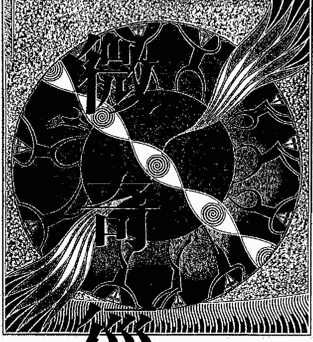
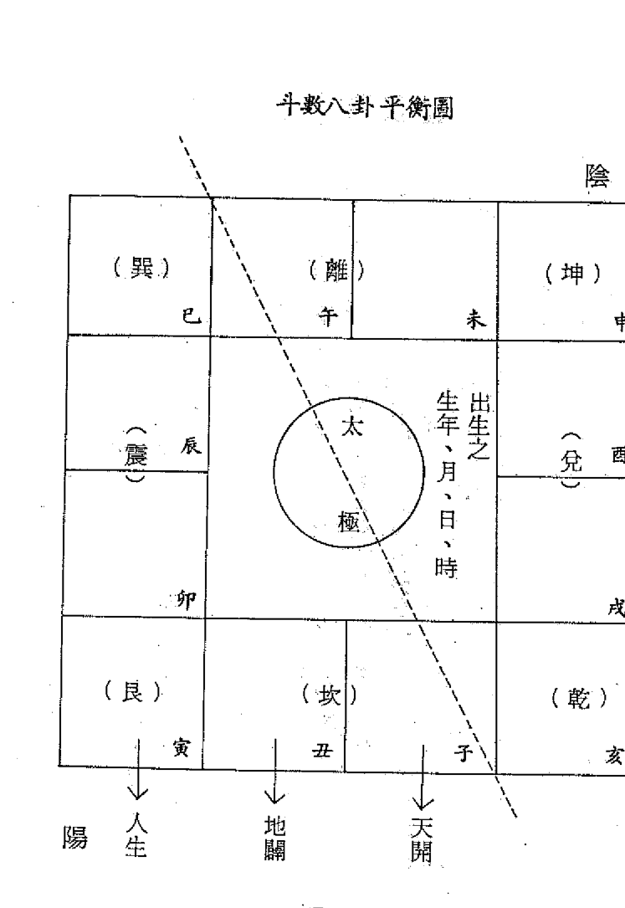

## 紫微斗数

增订本

研究紫微斗数的必备参考书籍！

陆飞帆著

生活红外智慧系列丛书 12

## 紫微奇径

## 先知的智慧 12

陆飞帆著

龙吟文化事业

## 前言

曾几何时，紫微斗数卷起一股风潮，报章杂志竞有专栏作专门性的介绍。这其中，知识份子的参与，更是屡见不穷，或有「术道之士」日日笔伐，却都抵挡不了「命」与「运」密织而成的网。「命」「运」自來就是人汲汲论道的问题，老聃作五千言出关而去，仲尼五十知天命以赞周易，邦雍击壤之余力成皇极经世，不管是言个人、言国家，甚或言整个人类，「命」「运」显然是既存人心的问题，既然存在，正视才是解决问题的最有力方法。说命理迷信，无非没有深刻去思考所谓运命人生的层面，说命理大大裨益人生，无非也忽略人性潜在的一面——因为不可能人人知天命，人人为其所应为，与其半解而颓然，何如懵懂而奋发？然而，命理术数这一学门，虽不是传统所谓的经常典范，但其中时有「真理之见」，也时有「针砭之言」，这些真理之见、针砭之言，都是不可偏废的，如果您以知识份子自居，不可否认，命理确实可以锻炼您另一种思考的方法，提供您人生的某些指针。鉴于斯，本书在步入正式主题之前，特开「问答篇」将一般人对命理存在的疑惑，提前予以解说，其中或有「十分尖锐」的问题，或者解说不足圆通，这并非著者不力，而是紫微斗数所能涵括、解决的范畴，并非天南地北无所不包。「问答篇」里多的是教人废寝忘食以思之的问题。

## 国立中央图书馆出版品预行编目资料

紫微奇径／陆飞帆著．——第1版．
——台北市：龙吟文化，民81
面；公分．——（先知的智慧
；12）
ISBN 957-689-016-0(平装)
1. 命书
293.1 81005457

## 紫微奇径

- 作者：陆飞帆
- 发行人：朱宝龙
- 行政总编辑：徐肖男
- 出版：龙吟文化事业股份有限公司
- 社 址：台北市民生东路3段113巷25弄29号1F
- 联络地址：台北市内湖区新明路174巷15号10F
- 电 话：7911197·7918621
- 电 传：出版部/编辑部 7955824
  营业部/发行部 7955825
- 邮 拨：0017944-1
- 排 版：阳明电脑排版股份有限公司
  电话/(02)5363181 传真/(02)5357810
- 中华民国81年11月第1版第1刷
- 行政院新闻局局版台业字第5283号
- 本公司法律顾问：萧雄淋律师
  李永然律师
- 本书曾于75年1月由希代书版公司出版
- 版权所有·翻印必究
- ISBN 957-689-016-0
- 本书禁止出租，否则进行法律诉讼
- Printed in Taiwan

## 目录

## 前言

# 问答篇

- 第一章 紫微斗数的由来
- 第二章 紫微斗数历法考证及实例
- 第三章 紫微斗数准确主星起用法
- 第四章 各星的判断法则
- 第五章 三方四正飞星法介绍
- 第六章 紫微斗数中各宫八卦及十二支含义
- 第七章 六十甲子入局评断秘法
- 第八章 星的介绍
- 第九章 恋爱、婚姻的判断方法
- 第十章 彼此间相处的方法

# 答问篇

（一）、问：无论任何一种算命方法，都必须看推算人的修养程度而决定算命的准确度。但是有人认为能综合各种方法来参照推断，则准确率势必增高。今假设只用紫微斗数来推算，也假设此人斗数修为已臻最高境地，请问准确率能达多少？

答：命理之学，浩瀚无穷，能综合多方面参照，自然准确率提高。然而，若研究得不透彻，则恐多方参照不透，造成矛盾、困扰，若以一斗数名家批命，其断命之准自不待言。惟因果循环，命中之吉凶，因人而异，大致上而言，紫微斗数之准确度，若为一入臻最高境地之人，当可断至百分之八十无误，平常人论断只有五、六十而已。

- 第十一章 十二宫流年、流月、流日、流时及小限
- 第十二章 婚姻断法详述
- 第十三章 恋爱、婚姻判断秘法
- 第十四章 女命看法
- 第十五章 学业考试的看法
- 第十六章 出国旅行的看法
- 第十七章 车祸、意外凶祸的看法
- 第十八章 疾病的看法
- 第十九章 住宅看法
- 第二十章 历法补述
- 第二十一章 紫微斗数一定准
- 第二十二章 大批断命范例
- 增——紫微斗数占卜法

（二）、问：算命方法，都无存在价值。但是又有命理学者认为命、运可以改，或者认为命不能改，运可以改，若是如此，算命还能准确吗？有少命命方士，打的招牌一是「不准免费」，一是「改运来此」，这岂非「矛盾故事」的重演，请问「以子之矛攻子之盾，何如？」请问命或运到底能不能改？若能，为什么能改？怎么改？

答：所谓改运，乃指重造一个八字，这是江湖术士胡说，绝不可信。而通常算命，最主在于了解吉凶祸福，如何使吉更吉，凶化解，才是真正的关键，否则，算命等于白算。真正的改运之说，乃指当命盘排出为凶的流年或大运之时，运用方法化解，而并非改变命运全部。而破除凶祸之法，如奇门遁甲、太乙神数、六壬神法、密宗手印，瑜珈心法，都能化消凶祸。然而，最重要的是广积阴德，必有后福。因果循环，是不能忽略的。

（三）、问：紫微斗数取命宫，纯用太阴历而不用节气，然否？若纯用太阴历，则闰月将如何处置？

答：太阴历法及闰月排法，本书特辟一章详加解说，在此不详述。

（四）、问：紫微斗数若纯用太阴历取命宫，则生年干支将以阴历正月初一为起点？或以立春或冬至为起点？若以正月初一为起点，则合乎纯用太阴历原则，若不是，请说明理由。

答：是以正月初一为起点没错，这会一并在太阴历法中讨论，且列有实例，读者诸君可以仔细参酌之。

（五）、问：若将子平取用神喜忌配合斗数论断，则是否会发生年干支不一致，月干支不一致的情形？或者斗数和子平各行其是，然后重叠起来，凶加凶则断凶，吉加吉当然吉，吉凶参半则又以斗数为主或子平为主？或无以为断？

答：斗数以太阴历，子平以太阳历节气为主，因此在论断时，年干支及月干支有些出入。而将其各行其是，再重叠起来，为笔者常用断法，而凶加凶论凶，吉加吉当然吉，但当吉凶参半时，则一般平常运推断，惟以斗数为主或以子平为主，就有待往后研究验证。

（六）、问：斗数中，命宫或任何一宫若无主星，则挪用对宫主星为断。此说不无疑义：一、宫中无主星是否已具有某种特别意义？二、引用对宫之星，对宫乃互冲之宫，其作用是否有正作用或负作用之区分？

（七）、问：利用星辰判断各宫吉凶时，除本宫外，对宫和三合宫都必须参看。本宫星辰最重要自不待言，而对宫和三合宫究竟是对宫影响力大，还是三合宫影响力大？为什么？

答：关于三合及对宫之力，应以三合宫影响力大，因为紫微斗数注重在星辰之关联性，各星有其相辅相连之星，如杀、破、狼必三合方，紫微喜见左辅、右弼在三合方等，故以三合方影响力大于对宫。

（八）、问：据说除了本命盘外，大限、小限、流年、流月、流日、流时俱必须转动各宫，即转到某大限，即以该大限所在宫为命宫，其余兄弟、夫妻……俱随命而转；而且，也都必须看它的拱照，此说法确否？或又说流年只看命宫，不看拱照？究竟何者需看拱照？何者不需论拱照？

答：紫微斗数为以星为主，利用星的飞动来判断吉凶，天体配合宇宙而动，故

（九）、问：小限和流年在判断上，何者为重？或只取其一？或平均各取一半？

答：小限的力量，不如流年之强，在判断时须以流年占六十至七十分比，小限只有三十到四十分的百分比。惟近代日本人研究斗数，均看小限，不用流年，这些书再翻译成中文销入国内，造成国人的疑问；其实这是无谓的，斗数始创于中国，当然是以本国正统资料（以流年为强）为主。

（十）、问：何谓流年斗君？在判断上，和流年、小限何者为重？或斗君只为流月而设，自己本身不具影响力？

答：斗君是专用于流年，以定流年各月的命宫在何宫位上，再依序定出流月之兄弟、夫妻、子女……等诸宫，以定一月之吉凶祸福。

斗君之求法，为依流年之地支起正月，逆数至出生月数，再顺数出生时辰所在之宫位，即流年斗君正月命宫所在之处。顺移宫位，依次则可求出二月、三月……十二月之命宫所在宫位，再安余宫以定吉凶，这就是流月的求法。斗君为专为流月而设，自己本身不具影响力，在判断上不如流年、小限之重要。

（注）问：宫干一经设定之后，是否永远不改变？例如在大限、小限、流月、流日、流时，是否俱以原命盘的宫干来论四化？

答：宫干一经设定，就不能改变，并且在大限、小限、流月、流日、流时，俱以原命盘的宫干来论四化星。

（注）问：又说流年就用流年年干，流月就用流月月干，流日就用流日日干，流时就用流时时干来论四化？其说是否？

答：此说不能成立，因为若如此，则每个人的命盘宫干支，不用设定了，失去了斗数以命盘为基准的判断法则。

（注）问：有说流时占断，即以该时辰宫位（即子时以子宫论，丑时以丑宫论），又有说以流日所在宫起子时，顺数至欲占时辰，视该时辰所在宫而论。何者为是？

答：流年在命盘中的影响力十分细微，又有此两派之说，可谓钻牛角尖了，若读者有兴趣，可以自己排出命盘后，加以验证。依笔者之见，应以流日所在宫起子时，顺数至欲占时辰，较有道理。

（注）问：若流时皆视该时辰宫位（即子时以子宫论）以占断，则以宫干论四化，或以时干论四化？若以流日所在宫起子时，则宫干论四化自属当然，而时干四化究竟需不需论？

答：以时干论四化之说，不能成立，盖时干为外来之因素，若如此，何需设定宫干，宫干之设定，即将命盘成一自定循环系统。先人遗下的方法，自有其道理，切勿自创，若欲自创，可以自己发明一套算命法，不要在此新创，破坏原有之循环系统。

（注）问：流月也有四化问题，论宫干抑或论月干？或者两者皆论？

答：此题亦是习者常感困惑的，其实并不难，也是以宫干为主。

（注）问：有所谓「流羊、流陀」的用法否？如何应用？重要否？除流羊、流陀之外，似乎还有流马，其余还有流什么没有？能否个别加以解释用法？

答：流羊、流陀系指流年天干所求出之擎羊、陀罗宫位，此用法不能成立，因为，一旦成立，则倘有其余星的流年，徒增烦恼，造成排命盘矛盾。此皆是后人自己标新立异的方法。

## 七、问：科权禄忌即四化，科权吉力有多少？大家都怕化忌，化忌凶力有多少？一忌一科能否相抵？或一忌一权、一忌一禄是否势均力敌？或互相抵消？

答：科权吉力，视所在宫的主星而定，一般吉力远胜于各类吉星。化忌则最凶，一科尚未能抵一忌，一权、一禄亦不能，化忌无法抵消，只能因科权禄而减少其凶祸，但不可能完全化消，除非运用太乙、遁甲……等化凶方法。

## 八、问：大家都怕化忌重叠，但却有一说，说化忌多则反吉，有此一说乎？此说若正确，则何谓化忌多？多到什么程度才会吉？

答：化忌多反吉，正所谓否极泰来，但系四化忌同到才能论吉。

## 九、问：若前说正确，则连本命宫算在内，加上小限、流年、流月、流日、流时，很可能在一个宫位，或同一个星辰，堆集了五、六个化忌，此说究竟凶或吉？总而言之，几个化忌重叠最凶？若非重叠而是数个不同星辰的化忌同时（如同宫内，或大小限、流年、流月、流日、流时均同时出现化忌）出现，又以几个最凶？或越多越凶？请将同星化忌重叠一同宫化忌多见、同限化忌多见的吉凶变化？详细说明。

答：听此一说，化忌何其多，吓死人也！江湖术士往往以此唬人。请记住，只要掌握住大限、本命、流年、流月、小限这五个化忌即可，其余无大影响。而且，双化忌重叠为最凶，三化忌反不如双化忌凶，四化忌反而为吉。另外，同限化忌多见，其吉凶大于同宫化忌多见，而同宫化忌多见，又大于同星化忌多见的凶性。

## 十、问：财帛宫和田宅宫同样是断财产的宫位，是否财帛专断可花用的钱财？而田宅宫完全专断房产、田地？

答：吾人判断财帛宫及田宅宫，须随时代而定。财帛宫可视为动产，可随时运用之物品、金钱、财产。田宅宫则视为不动产，不能随时运用转手之财物。

## 十一、问：古人把读书、科考、当官视为一个系统，因此，可能即以官禄来断有关读书、科考、做官或社会地位，可是，现代读书并不一定要做官，考试可能只为毕业以取得资格、取得文凭或大众承认。所以看公务员的考试可能是以官禄宫为断，可是单纯的学业、学问考试又以何宫为断？为什么？

答：考试看法，并非以宫为主，而以禄、权、科为主，公务员以禄、权为主，单纯学术以科为主。因为公务员为官，有禄位、权力，单纯学术则无官、禄位，故以科为主。详细可看书后论断考试之章节。

问：从命盘如何判断该人的教育程度？以何宫为主？

答：判断教育程度以命宫为主，视化科星及昌曲、辅弼在宫或夹命、或三方对照，可以了解其教育程度。但须再配合第二个大限，若第二个大限诸星不吉，纵本命星吉，亦不能有太高程度。若各方吉星化科会照在本命及第二个大限，则教育程度必定很高。

问：从流年如何判断该人可以考上大学或高中、或留学者、或硕士、或博士？

答：要看这些，很简单，先看年龄，如在考高中年龄，视此流年考试的星吉否，即可判断，其余大学、硕士、博士同理，都以昌曲、辅弼、台座……等考试吉星会照为原则，配合年龄来论断即可。惟越高考试越不好考，故考试吉星须有越多来会照，方能考上。

问：从流年或流月如何判断该人会辍学？重修？退学？休学？被开除？请尽可能分别详述之。

答：紫微斗数乃判断一生吉凶祸福，其余命学也同样，若如此细分则难断矣，只能说流年不好，文星无化忌，但已超出命理学的范围，不可能得到肯定答案的。

问：从命盘如何断定此人为小儿麻痹患者？或为残废者、或高度近视者？或为聋哑？

答：本书看疾病法中有提到诸星所主疾病可为参考。至于高度近视，视同疾病一种，尚无法以斗数来看出肯定情况，尚待研究。

问：从命盘如何断定此人为乞丐？为流氓？（大流氓或小流氓？）为贫农？为贫商？为无业游民？试分别言之。

答：目前为止，紫微斗数尚不能论断至这般细微；此有待更仔细更深入的归纳分析。

问：从命盘如何断定此人为总统？为总司令？为将军？为连长？（连长、营长、团长、师长、同为武职，可是高低大不相同，应有所分。）

答：武职高低有不同，但连长可升为营长、团长……，无一定准则，而高级将官其本命必定是禄、权、科三方会照，或辅弼夹命，坐贵向贵，杀、破、狼庙旺等均为高官。若要如此细分，不只斗数，连子平、占星、太乙……亦无法回答，但可由文王神卦占出。

问：从命盘如何断定此人为明星？为歌星？（红牌或籍籍无名的歌星）或为酒家女？或为娼妓？或为应召女郎？或发妲？或尼姑、修女？或老处女？或光棍？

答：断明星及歌星以杀、破、狼、文曲、咸池、辅弼等艺术星庙旺为主，惟巨门星再加入为歌星，否则为明星，再看行运吉凶可断能不能成名。而酒家女、娼妓、应召女郎只能归同一类，却无法细分，看法仍以前提到的文艺桃花等星，入陷地化忌，再加上大运不利，则论为此流。尼姑、修女、老处女、光棍，通常夫妻宫不利，尼姑及修女更兼本命坐孤辰、寡宿或会照，这题亦如同上一题难人，不只斗数，连子平、占星、太乙亦无法准确看出。

问：从命盘如何断定此人为董事长？为总经理？为店铺老板？

答：可看其事业宫诸星如何，以及本命主星，是否有统治大公司的能力而定。但笔者在此补述，自问题廿五到此，都是紫微斗数、子平推命、太乙神数

问：恋爱、婚姻应如何区别判断？

答：也是以行运，配合此类星座为主，这在本书恋爱、婚姻看法中会有详述，不再赘述。

问：红鸾、天喜、天姚、廉贞等星辰对婚姻和恋爱的各别影响如何？在何宫位才有影响？还有何星辰对婚姻和恋爱具有影响力？

答：红鸾、天喜必在对照之宫位，此二星对婚姻有绝对影响力，天姚、廉贞则恋爱成伤大。在任何宫位都有影响，惟在夫妻宫及福德宫影响力特别大。其余尚有文昌、文曲、咸池……等星，能影响恋爱和婚姻，这都会在本书中提到。

问：在恋爱和婚姻中的流年、流月、流日、流时，如何断定何时甜蜜？何时吵架？何时失恋？何时结婚？何时离婚？

答：恋爱及婚姻，不过是人生行运上的一个小插曲，紫微斗数及其余命理学，均非专为而设，故只能说由行运、流年看吉凶配合而论断，这必须靠经验，而无法以文字详述，因为，唯有自己多方排命，才能掌握判断方法。

当然，有机会时，笔者会专书举此类例子，供读者诸君参考。

问：看婚姻状况，同居和结婚如何判断？

答：流年化忌星及空、劫所在宫正好为红鸾、天喜所在之宫，则同居可能性大，若夫妻宫主星又陷地，加凶星，则必为同居。反之，红鸾、天喜流年逢之，又得文昌、文曲、天姚…诸吉星入限或会照，无化忌、空、劫来夹命，必主结婚。

问：从流年大限上，如何判断灾祸的类别？例如如何是车祸？如何是刀伤？如何是被杀死？如何是被杀不死？如何只是吵架？如何是跌伤？

答：车祸看天马星是否被凶星所会照；刀伤看擎羊星；被杀死及杀不死者，看杀、破、狼入限及武曲有无化忌；吵架看巨门星；跌伤看地空星，但须配合整个命盘来论断，这必须多练习排命，才能掌握重点。

问：从命盘流年上看，出国旅行和国内短旅行如何区别判断？且搬家如何区别判断？

答：出国旅行以流年天马星逢之，或三方会照吉星，再加天马星。而国内短旅行以流月或流日逢之为主。搬家则流年走入田宅宫，或对照田宅宫，均是主搬家。另外把握原则，迁移宫、天马星主旅行。田宅宫、擎羊、陀罗星主搬家。

# 第一章 紫微斗数的由来

中国的玄学中，紫微斗数是一个热门占卜术。它的渊源可以上溯到古老深奥的易经，是以易经为基础的一门基础的占星术。在研究紫微斗数之前，我们首先要了解紫微斗数的由来。笔者在此以客观的立场，对紫微斗数的由来，及其历代的发展，做一个详细的介绍。

## 宗教的渊源

紫微斗数的宗教基础，首见道教中道藏经，此经提到紫微斗数的推算，为吕纯阳所开创，吕纯阳即八仙中的吕洞宾，对命卜有独到的研究。吕纯阳以八卦的太极为中心，分列十二宫位，以人的农历生年、月、日、时为基本因子，带入诸星，分列十二宫位，用以推研人生造化和际遇等等诸事。至宋代陈希夷，又名陈抟，为道教修练者。据说曾诏受太祖赵匡胤尊从，官钦天监，钦天监相当于现代天文台长，专门研究天上诸星的循环，以定吉凶。陈希夷于观察天象时，对诸星的出现循环，产生的吉凶祸福，做了详细的记录。本来，观察诸星的现象，自尧舜即有，乃以天上诸星的固定出现循环，来推算国家的政策。但在陈希夷时，则进一步的运用在紫微斗数中，这是紫微斗数的一大革新，同时也奠定了紫微斗数的流传基础。陈希夷并著有紫微斗数全书，为紫微斗数日后在玄学中立下了不朽的根基。

陈希夷所著之紫微斗数全书，至明代嘉靖年间，经罗洪先收撰，咸有四卷。然以斗数乃是以天象诸星为主，近似于四柱推命中中的吉凶神煞，似乎跟原先生斗数无关。因此，流传下来的一些紫微斗数中提到的吉凶神煞，如金蛇铁锁关、长生、沐浴……白虎、青龙之类星，可以说是后代伪陈希夷之名加入。尤以明代之子平四柱推命，正值巅峰之期，因此这些与诸星无关之吉凶神煞，可能系明代罗洪先在收录陈希夷著作时加入的。

罗洪先本身的信仰，未得考证，但这些吉凶神煞，如白虎、青龙、奏书等，确为道家所用之神煞。因此，能以证明紫微斗数到明代时，仍旧充满了宗教的色彩。

流传到清朝时，有青城居士，为斗数中之泰斗。后至现今，诸多斗数专家，多为出世修炼居士。因此，自有宋开创紫微斗数以来，历明、清到民国，斗数与宗教的关系，一直是非常密切的。

## 神话色彩的渊源

明朝时，透派兴起，透派又名明澄派，创始者为一名女子名为梅素香，定五术合一之始，以山、医、命、卜、相合称五术。著有十五册大法，其中紫微大法即其对紫微斗数的研究，使紫微斗数有了一层新的发展。

透派是首先将紫微斗数带入神话色彩，以商周之战为背景，将封神榜人物带入紫微斗数中的各星。各主星皆有一个人物，如天机星为姜子牙，为军师，所以有智慧、聪明之意，且军师为大军精神所在，所以也主精神、判断力。又如武曲星为周武王，有武勇、富足、机智，此乃武王商成功，必须武勇，且具备国富民足及机智的能力，方能充此大任。

以神话色彩，使紫微斗数破除死硬方法，能很快的了解吉凶，是透派的一大贡献。也使紫微斗数在宗教边缘中，有了一层新的突破学习方法。

## 結論

無論斗數有何淵源，我們只要持一個態度，那就是吾國的文化，博大精深，歷數千年而不衰，先民遺傳下來的，必有其價值。因此，應以破除斗數以何為宗的門派觀念，而互相研究、論證、破除迷信之說，取最實用、價值之地方，光大我先民遺傳下來的一個占卜瑰寶。

# 第二章 紫微斗數曆法考證及實例

紫微斗數，是由八卦而成，以太極為中心，分出十二宮，以應一年有十二個月。

## 一 太陰曆的意義

研究命理，首重曆法，命盤的正確與否，在於曆法的推算是否正確。因此，正確曆法的運用，實為整個推命的核心，尤以中國曆法的複雜，演變至今，一般分為太陽曆及太陰曆，再配以廿四節氣來計算年月日時。這中間演變層出不窮，而紫微斗數應以何種為準，實為研究斗數者最為關心的。在此解釋紫微斗數所需要的曆法，應該是以太陰曆法為準，所謂太陰曆，就是一般民間的陰曆，不論二十四節氣，而純粹以每月初一為月的起點，而非以節氣為月的交換，並且，年柱的更換也是以每年的正月建寅，即春節正月初一當日為準，並非以冬至為交換。為何會如此，現分析如下：

## 二 為何要以寅月為正月

既已分辨了太陰曆與太陽曆的不同，那麼，一年有十二個月份，為何要以寅月為正月、換年柱呢？這又是一個很大的問題，在此筆者向讀者諸君保證，紫微斗數以寅月為正月，更換年柱，是完全沒有錯的，千萬不要受了子平數八字推命的以冬至更換年柱之說，而動搖了自己的信心。子平數八字推命的冬至更換年柱之說，是陰陽平衡，產生高度的造化玄機。既以易經太極為中心，則曆法也須合於易經。太陰曆就是以月亮為主的曆法，跟子平數二十四節氣的農民曆，完全不同。因為二十四節氣的農民曆，是以太陽為主的曆法。以六十甲子為主，配合在冬至換年柱，節氣換月柱，詳細情形，因屬子平範圍，筆者在此不多述，可參閱吳懷雲先生的命理點睛一書。至於太陰曆，則是以月亮為主，冬月有大小之分，大月三十日，小月二十九日，視日月合朔之日時以定月之大小。月月合朔，乃指太陽與月亮跟地球合成一直線時謂之。所以當在地球看月時不能見光，即月亮全暗時，就是我們一般稱的「朔」，此時即為每月之初一日，而當月滿時則為十五。因此，不以節氣交接為月的取法，而以月亮的全暗及滿月之日月合朔來推算曆法，是為太陰曆的特色。

紫微斗數以寅月為正月，更換年柱是完全沒有錯的，但子平數是以太陽曆為基礎，所以須在冬至更換年柱；而紫微斗數卻是太陰曆，跟太陽曆完全不同，所以不須受子平數的影響。由於筆者本身對子平數及紫微斗數，均有很深的研究，所以，我希望研究此二種占卜術的同好，切勿互相比較，而徒增自己的煩惱，這是筆者的經驗之談。

現在我們來解釋何以要以寅月為正月，換年柱。根據邵康節皇極經世之推演，論到十二月卦氣，首重平衡，斗數也以平衡為主，見圖一。邵康節在其皇極經世中提到：『陽始於子而終於巳，陰始於午而終於亥；論四時之氣則陽始於寅而終於未，陰始於申而終於丑；蓋地中之氣難見，而地上之氣易識，故周人以建子為正，雖得天統，而孔子之論為邦，乃以夏時為正，蓋取陰陽始終之著明也？』此段話的意思，明白顯示出，若以子為正月，則因剛為陽始，陰氣尚餘，不能真正純陽，而曆法以四時為主，故因始於寅，因為在寅乃先經過子、丑兩個階段，消耗了陰的餘氣，而為純陽，再觀一日之始，雖以子為起點，但非得等到寅時雞鳴天破，才見陽光，也是這個道理。

> 『陽始於子而終於巳，陰始於午而終於亥；論四時之氣則陽始於寅而終於未，陰始於申而終於丑；蓋地中之氣難見，而地上之氣易識，故周人以建子為正，雖得天統，而孔子之論為邦，乃以夏時為正，蓋取陰陽始終之著明也？』

另外，在邵康節的皇極經世中又推算，以元統十二會為一元，一萬八百年為一會。初聞一萬八百年而天始開，又一萬八百年而地始成，又一萬八百年而人生始。

邵康節於寅上方始注一開物字。蓋初間未有物，氣塞之焉，及天開於子後，便有一塊渣滓在其中，漸漸凝結而成地，初則溶軟，後漸堅實，今山形自高而下，便如水漾沙之勢。以此知必是先有天，方有地，有天地交感，方始生出物來。所以天開於子，地關於丑，人生於寅，四時得氣，萬物交感，因此以寅月為正月，這在太陰曆來講，是完全正確的。

再觀我國的月建制度——
一、黃帝 以子為正月，丑為二月……。
二、夏代 以寅為正月，卯為二月……。
三、商代 以丑為正月，寅為二月……。
四、周代 以子為正月，丑為二月……。
五、秦代 以亥為正月，子為二月……。
六、漢代 以寅為正月，卯為二月……。

目前我國的曆法，是漢武帝於太初元年（西元前一〇四年）改為夏正，以正月建寅為歲首。在此值得研究的，就是黃帝也者，究竟有無其人，可能只是儒家之附會，而三代建正月各有不同，然孔子之論為邦，以夏時為正，夏時即為寅月，又漢武帝恢復以夏時寅月為歲首，可見得以太陰曆中以寅月為歲首，更換年柱，是沒有錯的，且自漢武帝後歷二千多年，太陰曆的以寅月為歲首，一直沒有改變，想必是歷代考證後沒有錯，才會繼續使用。並且紫微斗數的創始者，必也是按照當時太陰曆法為主，一切推算均以太陰曆建寅為正月，才能方便民間，否則只有徒增困擾而已。因此，紫微斗數的太陰曆以正月建寅，換年柱，是千真萬確，和子平數的太陽曆，冬至換年柱，節氣換月柱，是完全不同的。為了使讀者明瞭起見，現舉例如下：

例：民國四十九年十一月廿五日戌時男命：

此造我們可以排出三種命盤，即太陰曆一種，太陽曆節氣法一種，過冬至更換年柱法一種。各見圖二、三、四。現解說如下：

第一種冬至不換年柱，仍舊以寅月為正月，但以節氣法推月，所以民國四十九年十一月廿五日戌時，依節氣應為十二月之節氣，故月柱以十二月為主，即民國四十九年歲次庚子，十二月建，廿五日戌時，排出命盤如圖二。

圖二的命盤，可以知道，命宮坐太陽得廟（以◎表示）天梁及左輔，且太陰在財帛，又得右弼星，主富貴有加，大限五至十四歲應為富貴得宜，十五至廿四歲行父母宮借運，應主父母健全，七殺得旺，且行殺破狼旺地，應是「少年得志」。所謂平步青雲，『楚翱王十八歲立功，二十五歲拜諸侯上將軍』之謂也。但此造主人，幼運不濟，祖業全無，聰明有加，但財富貧微，一家人孤苦度日，與事實不合，這是用二十四節氣為月柱更換法，但排出命盤卻不准，目前透派五術中的紫微斗數，就是用此法。

若以冬至換年柱，則排法即如圖三，即年柱用辛丑，月柱用十二月己丑。此時命宮僅得左輔星，且獨坐，三會四正方之主星又無力，除父母宮得廟旺（以◎，○代表）之外，其餘均不得地，行大運又逆行，不走父母宮之轉借，故可斷必為下等命造，但此人除幼年稍為貧困，卻聰明有加，惟父母感情不和，生活樂多苦少，這又與排出的父母宮情況不合。因此以冬至換年柱的排法，這種太陽曆的排法，用於紫微斗數仍舊行不通，只能用在子平八字排法，此中緣由，來日筆者若介紹子平八字法時，再詳加解說。

真正的排法，應該是完全以太陰曆為主的排法，即以寅月為歲首，每月初一為月交接，就是一般我們所用的陰曆，見圖四。

圖四為正確排法，命坐武曲，本性重義、英勇、行事有魄力，天相得助，左輔同宮，化解武曲凶性，又得天廚，重食物享受、挑食，又文曲在命，文學、藝術細胞深厚，三方四正又有紫微、廉貞、天廚同會，富貴均可斷，惟紫微遇截路，可斷貴大於富，對宮四正位之遷移宮，為破軍鈴星等凶星，可斷幼運不濟，無定居之所，十五歲後大運轉入父母宮吉位，得父母福蔭，家中財發數百萬，並購屋一棟，惟父母感情不能算好，可能係太陽星遇對宮擎羊破吉之故，家中父親權力受制於母親，但尚稱穩定。預料二十五歲後大運入福德殺、破、狠旺地，財源高照，威名得勢，只要避免遷移，在本鄉發展，當是平步青雲；惟兄弟無助，感情時好時差，可能係天同陷地，巨門又旺相之緣故。評斷結果，與原命符合，因此，以太陰曆法來推斷紫微斗數是完全正確的。

## 三、月神文化的科學

太陰曆既是紫微斗數的曆法，那麼，為何紫微斗數要用太陰曆才能準確，這是切要問題。我們知道，紫微斗數是起源於易經的一門占術，而易經的文化來自何處？只要了解易經文化的來源，自然就可了解太陰曆為何準確。太陰曆以月亮為中心，而我國古老的易經，也是一個以月亮為中心的月神文化，所以紫微斗數既根源於易經，自然就要以太陰曆來推算了。

易經是月亮的文化，也就是月神的文化，這是近代最新的發現。在筆者所著的「易經科學方法論」一書中，將對此月神文化，做一詳細解釋，現在只解釋其重點。
首先我們要了解「周易」名稱由來，並非「周」人所發明之「易」，而是繫辭中提到：「易之為書也不可遠，為道也屢遷，「變」動不居，「周」流六虛，上下無常，剛柔相易「由是言，可證得「周易」書名的意義。若把「周易」命名再向別處解說，是自尋「歧途」。
月亮周流六虛，形狀時常變遷，且「易」字有變化不定之象，正如月亮有陰陽缺滿。再參閱圖五，就可明確了解易經是月神文化，以科學代號表達，太陰曆以月亮為中心，應用到紫微斗數，是天經地義的事。

更多的月神文化思想，由於與斗數無關，故不再贅述，最後讀者諸君只要了解圖六紫微斗數與太陰曆的關係即可。

# 第三章 紫微斗數準確主星起用法

紫微斗數完全以虛星為用，然而，星座何其多，加上歷代的增加、創造，有很多是沒什麼大用的，本書只就實際考證後，有百分之百準確率的四十九顆析論，只要能掌握這四十九顆星，那可比原有之一百多顆星為判斷要準確得多了，所謂「用兵之道，在精不在多」也就是這個道理嘛！而且，排個命盤，要排出一百多顆星，還要加入吉凶神煞，很多又無可考證，既浪費時間，又自相矛盾，難以斷其準否，因此，本書僅將筆者所排過的千位命盤中，經驗證準確率百分之百的四十九顆星以嶄新面貌介紹出來。

## 一 商周之戰的神話

要介紹這四十九顆星，首先要將這些星分級，即主星、輔星、吉星、凶星，並以商周之戰，封神演義的神話，來增加印象，這是筆者理出的一套活用推命法。首先簡略的介绍一下商周大戰中跟紫微斗數有關的部份。神話傳說，雖不可信，但因爲有有益於活用推命，所以，筆者仍舊將其介紹出來，現在介紹二十顆主星如下：

- (一) 紫微星——簡稱「微」，代表人物為周文王長子伯邑考。據封神榜記載，伯邑考請求商紂王放出其父親文王，紂王不答應。半夜時妲己入其房勾引之，為其所拒，一怒反稱伯邑強暴自己。紂王怒而殺之，將其肉做成餅給文王吃，文王裝不知而食下，紂王因此放其回國，半途文王心嘔，吐出一物為白兔，乃伯邑考化身，飛上天宮，封為紫微星。因此此星有美男子，臨危不亂氣質，尊貴之屬性。
- (二) 天機星——簡稱「機」，代表人物為姜子牙，天機有「智慧如天之神機」意思。姜子牙為文王軍師，後佐武王伐紂成功，全仗其領軍智慧，及深謀遠算、不屈不撓之精神。因此，天機星即代表「聰明、精神、領袖」之意。
- (三) 太陽星——代表人是紂王丞相比干，此人剖心死諫紂王，心地坦誠，有「光明、博愛」之意但遭橫死，因此也有「刑剋」之意味，對男性影響較大。簡稱「日」。
- (四) 武曲星——文王次子武王，簡稱「武」。能聽軍師姜子牙之言，長年生聚，最後於牧野一戰，大勝紂王，是「武勇、財富」之象徵，因國富方能戰，武勇才能勝，能聽諫才不能敗，武曲星即具備了這些性質。
- (五) 天同星——即周文王，文王精通神卦、易理，心性溫厚，能忍常人不能忍（明知其子做成肉餅，忍心食下），但也相對的心情憂愁，可能係被囚過久之故。因此，天同星有「融和、溫順、藝術、天才、憂愁、忍耐」等等代表，簡稱「同」。
- (六) 廉貞星——簡稱「貞」，即費仲，此人為紂王面前第一大奸臣。不知廉恥，陽奉陰違。行劣而心地邪惡、陰毒，都是廉貞星特性，但也是善交際、圓滑的象徵。
- (七) 天廚星——簡稱「廚」，是紂王皇后，此人心地慈善，又富同情心，才藝多。 因此天廚星有「才藝、同情、慈悲」之意。
- (八) 太陰星——簡稱「月」，即賈夫人，賈夫人為紂王手下大將黃飛虎之妻，紂王欲污辱之，賈夫人跳樓自殺，因此太陰星有「貞潔、潔白」意，又因住宅須清潔才是好住宅，因此也代表「住宅」。
- (九) 貪狼星——即妲己，為紂王之妾，傳說是狐狸精所變以惑紂王，好淫色，貪享受。
- (十) 巨門星——為姜子牙之妻，子牙娶此女后，一败涂地，此女多疑，又“大嘴巴”，好生是非，其星性不言可知，简称“巨”。
- (十一) 天相星——简称“相”，是闻太师的化星，闻太师为纣王手下第一大臣，文武兼备，忠心耿耿，慈爱军士，为国事尽心尽力，最后战死西城，此星有“慈爱、服务”之意。
- (十二) 天梁星——亦即李天王（哪吒之父），此人心性固执，父子之情不顾，然其行事有恒，富统帅力，倒是很可取，简称“梁”。
- (十三) 七杀星——亦即黄飞虎，为纣王手下一员大将，因妻受辱自杀，而反投武王。此人武功卓勇，直如三国时关云长之威，行事激烈，令人望而生畏，后战死。此人杀气过旺，因此此星有“肃杀、威严、激烈”之意，简称“杀”。
- (十四) 火星、铃星——这两颗星为纣王之二子，心地虽好，可惜行事暴躁，性烈如火，如炸药一般，相对的也容易惊慌。因此此二星有“破坏、火焰、燃烧、危险”之意，简称“火”、“铃”。
- (十五) 破军星——为纣王本身，顾名思义，此星有破败、耗损、失败、倒楣之意，纣王失去了江山，自然是有这些罪名了，简称“破”。
- (十六) 文曲星、文昌星——二星为姜子牙手下二员女将龙吉和婵玉，此二女文采风雅，气质高贵、六艺精通。因此，此二星有“高贵、优雅、文学”之意，简称“曲”、“昌”。
- (十七) 陀罗、羊刃星——此二星一为哪吒、一为杨戬，二人皆有正义感，但破坏力特强，出手残忍，然出军入阵，勇敢且如三国时之赵子龙，特具英姿，因此此二星有“残暴、正义、勇敢、杀伐”之意，简称“罗”、“羊”。
- (十八) 上面介绍了二十颗主星，并带入神话色彩，就是要加强以后排命盘的方便，其余未提到神话色彩的星另有二十九颗，只因为这些星是副星，是影响主星的星，我们先介绍这全部四十九颗星的排法，再详细的解释测命的活用法则。

## 十二紫微斗数命盘排法

排命盘以前，应先了解什么是十天干与十二地支。

所谓十天干，指的是：甲、乙、丙、丁、戊、己、庚、辛、壬、癸。
天干分有陰陽，其中甲、丙、戊、庚、壬年生人，屬陽，男命為陽男，女命為陽女。
乙、丁、己、辛、癸年生人，屬陰，男命為陰男，女命為陰女。
陽男、陰男、陽女、陰女，一般說來，陽男具有陽剛個性，而陰男較溫和；陽女有男子之志，陰女則溫柔嫺淑，是標準的女性。但上述現象不足以斷定一個人完全的個性，只可在研究命盤時參考。
陽男、陰男、陽女、陰女的區分，最大的功用是在於各大限的順行與逆行。陽男與陰女，在命盤中行大限時，皆是由命宮開始，順時鐘方向行運。陰男與陽女正好相反，都是由命宮起，逆時鐘方向行運。列表如下：
（關於順行與逆行，在排盤時只限行運的區分，其餘皆順行。）

| 陰陽別 | 陽男/陽女 | 陰男/陰女 | 备注 |
|---|---|---|---|
| 生年干 | 甲、丙、戊、庚、壬 | 乙、丁、己、辛、癸 | 陽男順行、陽女順行、陰男逆行、陰女逆行 |

| 生肖 | 阴阳 | 属所 |
|---|---|---|
| 鼠 | 陽 | 子 |
| 牛 | 陰 | 丑 |
| 虎 | 陽 | 寅 |
| 兔 | 陰 | 卯 |
| 龍 | 陽 | 辰 |
| 蛇 | 陰 | 巳 |
| 馬 | 陽 | 午 |
| 羊 | 陰 | 未 |
| 猴 | 陽 | 申 |
| 雞 | 陰 | 酉 |
| 狗 | 陽 | 戌 |
| 豬 | 陰 | 亥 |

## 排命盤必備的資料與工具

(一) 資料：

1. 性別

2. 農曆的出生年、月、日、時。（如不記得農曆日期可由國曆換算）

(二) 必備的工具

1. 空白命盤
2. 萬年曆
3. 時辰換算表（附表一）
4. 日光節約時間歷年起迄日期（附表二）

### 時辰換算表（附表一）

| 前日子時 | 時辰 |
|----------|------|
| 12:00 - 1:00 | 前日子時 |
| 1:00 - 3:00 | 丑 |
| 3:00 - 5:00 | 寅 |
| 5:00 - 7:00 | 卯 |
| 7:00 - 9:00 | 辰 |
| 9:00 - 11:00 | 巳 |
| 11:00 - 13:00 | 午 |
| 13:00 - 15:00 | 未 |
| 15:00 - 17:00 | 申 |
| 17:00 - 19:00 | 酉 |
| 19:00 - 21:00 | 戌 |
| 21:00 - 23:00 | 亥 |
| 23:00 - 24:00 | 當日子時 |

### 我國應用『日光節約時間』歷年起迄日期（附表二）

| 年 | 代名 | 起迄日期 |
|----|------|----------|
| 民國三十四年至四十年 | 夏令時間 | 五月一日至九月三十日 |
| 民國四十一年 | 日光節約時間 | 三月一日至十月三十一日 |
| 民國四十二年至四十三年 | 日光節約時間 | 四月一日至九月三十日 |
| 民國四十四年至四十五年 | 日光節約時間 | 四月一日至九月三十日 |
| 民國四十六年至四十八年 | 日光節約時間 | 四月一日至九月三十日 |
| 民國四十九年至五十年 | 夏令時間 | 六月一日至九月三十日 |
| 民國五十一年至六十二年 | 停止夏令時間 |  |
| 民國六十三年至六十四年 | 日光節約時間 | 四月一日至九月三十日 |
| 民國六十五年至六十七年 | 停止夏令時間 |  |
| 民國六十八年 | 日光節約時間 | 七月一日至九月三十日 |
| 民國六十九年 | 停止夏令時間 |  |
| 民國七十年 | 停止夏令時間 |  |

## 附录：命盘图示

### 图二：庚子年十一月廿五日戌时（取十二月月柱）

| 宫位/星曜 | ... | ... | ... | ... |
| :---: | :---: | :---: | :---: | :---: |
| 机 | 解截福紫 | 空钺陀 | 铃刑禄军 | |
| △ | ◎ | | × | |
| 25.—34. 辛 福 巳 | 35.—44. 壬 田 午 | 45.—54. 癸 事 未 | 55.—64. 甲 交 申 | |
| 杀 ○ | | | 羊 | |
| 15.—24. 庚 父 辰 | | | 65.—74. 乙 迁 酉 | |
| 辅梁阳 ◎◎ | 土 五 局 | 庚子年十一月廿五日戌时 (取十二月月柱) | 府贞 ◎◎ | |
| 5.—14. 己 命 卯 | | | 丙 戌 疾 | |
| 文厨相武 ◎× | 魁巨同 ○× | 炎昌姚狼 ○ | 粥官阴 ◎ | |
| 兄 戊 寅 | 夫 己 丑 | 子 戊 子 | 身财 丁 亥 | |

### 图三：庚子年十一月二十五日戌时（过冬至换年柱及取十二月月柱）

| 宫位/星曜 | ... | ... | ... | ... |
| :---: | :---: | :---: | :---: | :---: |
| 空福月 | 解厨狼 | 巨同 | 铃刑罗相武 | |
| × 癸巳 福 巳 | ○ 甲午 田 午 | ×× 乙未 事 未 | ◎△ 交 审 审 | |
| 截贞府 ○◎ 壬辰 父 辰 | 辅 | 木三局 (取辛丑为年柱) | | |
| 曲月破 × 兄 寅 | 火 23.-32. 辛丑 夫 丑 | 昌姚微 △ 33.-42. 庚子 子 子 | 巫弼机 △ 43.-52. 己亥 身财 亥 | |

### 图四：（正确排法）

（图四文字描述见前文，具体星曜排布图示略）

### 图五：庚子年十一月二十五日戌时（不换年柱、月柱）

| 宫位/星曜 | ... | ... | ... | ... |
| :---: | :---: | :---: | :---: | :---: |
| 空白 | 机 △ | 微 ◎ | 钺刑空罗 | 铃禄破 × |
| 35.—44. 田 巳 | | | | |
| | | | | |
| 杀 ○ | | | | 劫羊 |
| 25.—34. 庚 辰 | | 取庚子年柱 十一月柱 | | 75.—84. 乙 酉 |
| 梁日 ◎◎ | | 土 五 局 | | 府贞 ◎◎ |
| 15.—24. 己 卯 | | | | 丙 戌 |
| 马曲辅厨相武 ◎ △ | 空魁巨同 ○ × | 火昌弼狠 ○ | 姚官月 ◎ | |
| 5.—14. 戊 寅 | 兄 丑 | 夫 子 | 子 亥 | |

### 图六：（紫微斗数与太阴历关系图示略）

## 排盤的方法

- （一）資料的整理。

首先必須將生年、月、日、時，改變為紫微斗數排盤時所需的形式。

如某甲為民國十年國曆五月二十日下午三時三十分生，性別男。

排命盤時，須將年、月、日，換算成農曆，查萬年曆得知應為：

- 辛酉年四月十三日。

查時辰換算表，下午三時三十分為申時。

再依『辛酉』一年查年干表，得知某甲為陰男，則完整的排盤資料為：

- 1. 性別：陰男
- 2. 農曆生年、月、日、時：辛酉年四月十三日申時。

### （二）工具的認識：

- 1. 空白命盤：準備好一張空白命盤，讀者可自由變換大小，在命盤十二空格右下角分別填有十二地支，每人相同，不可變動。每宮的名稱也固定為子宫、丑宫、寅宫、卯宫……亥宫。
- 2. 萬年曆：作為查換國曆與農曆之用。
- 3. 夏令時間換算表：自民國三十四年起，即實施夏令時間，讀者若是在國曆三月至十月出生者，都應注意是否為夏令時間，請對照萬年曆後，再行調整好正確時間。
- 4. 時辰換算表：作為換算時辰用。

## 排命盤的方法

### （一）定寅首

某乙為己亥年五月十五日巳時生，性別男，在排命盤前，先查天干表，得知為陰男，並將上述二項資料，填列於命盤內。

然後，依『五行寅首表』，查出某乙的寅首。

寅首表中天干一欄，分別有甲己、乙庚、丙辛、丁壬、戊癸年生人等字樣，某乙是己亥年生人，天干為『己』，所以應查有『己』的部份，對照寅首欄中的天干，可得知甲或己年生人，應是以丙天干起寅首。所謂的寅首，指的是命盤左下角的空格，其中右下角寫有「寅」字者。任何人排列命盤時，都須由寅宮為首，所以稱寅首。「寅」只是地支，必須有天干配合，所以要由生年查出應得天干，配合寅宮的地支，填列命盤內。某乙應由「丙」天干配合「寅」地支，再將丙字填在命盤中寅宮上方，依順時鐘方向，以丙開始，順序填完年干，填至癸後，再由甲開始，填至丑宮結束。

| 天干 | 寅首 |
| :--- | :--- |
| 甲年生或己年生 | 丙寅 |
| 乙年生或庚年生 | 戊寅 |
| 丙年生或辛年生 | 庚寅 |
| 丁年生或壬年生 | 壬寅 |
| 戊年生或癸年生 | 甲寅 |

| 己巳 | 庚午 | 辛未 | 壬申 |
| :--- | :--- | :--- | :--- |
| 戊辰 | | 癸酉 | |
| 丁卯 | | 甲戌 | |
| 丙寅 | 丁丑 | 丙子 | 乙亥 |

某乙 己亥年五月十五日巳時 陰男

- 一、性别：阳女
- 二、农历出生年、月、日、时：庚戌年九月初一申時

應在命盤寅宮上填入戊，順時鐘方向，由戊開始，至己、庚、辛、壬、癸，而再接甲、乙、丙、丁、戊至己，填完十二宮位。

- 一、起命身宫

起命、身宮是以生月及生時配合，在命盤中定出命、身宮，又以前列陰男某乙為例，某乙生月為五月，生時為巳時。則由寅宮起，由正月順時鐘方向數至五月，在庚午宮停下。再以庚午宮為起點，逆時鐘方向，由子時起，數至巳時，在丁丑宮停下。丁丑宮就是某乙的命宮。在庚午宮順時鐘方向，由子時數至某乙生時巳時，至乙亥宮，乙亥宮就是某乙的身宮。

以某丙為例，某丙生月為九月，生時為申時，由戊寅宮順時鐘方向，由正月起數至生月，在丙戌宮停下。

如某丙為農曆民前二年九月初一下午四時生，性別女，則其資料經換算後為：

| 辛巳 | 壬午 | 癸未 | 甲申 |
| :--- | :--- | :--- | :--- |
| 庚辰 | | 乙酉 | |
| 己卯 | | 丙戌 | |
| 戊寅 | 己丑 | 戊子 | 丁亥 |

| 辛巳 | 壬午（身） | 癸未 | 甲申 |
| :--- | :--- | :--- | :--- |
| 庚辰 | 庚戌年九月初一申時 | 乙酉 | 某丙 陽女 |
| 己卯 | | 丙戌 | |
| 戊寅（命） | 己丑 | 戊子 | 丁亥 |

由丙戌宮逆時針方向，由子時起，數至生時申時，得命宮在戊寅宮，再以丙戌宮為起點，順時針方向，由子時起數至申時，得身宮在壬午宮。

| 己巳 | 庚午 | 辛未 | 壬申 |
| :--- | :--- | :--- | :--- |
| 戊辰 | 己亥年五月十五日巳時 | 癸酉 | 某乙 陰男 |
| 丁卯 | | 甲戌 | |
| 丙寅 | 丁丑（命） | 丙子 | 乙亥（身） |

### （二）排列十二宮

找出命、身宮後，就可依下列順序，把十二宮分別寫出，無論男女，皆向逆時鐘方向填寫。

- 一、命宮。
- 二、兄弟姊妹宮。
- 三、夫妻宮。
- 四、子女宮。
- 五、財帛宮。
- 六、疾厄宮。
- 七、遷移宮。
- 八、交友宮。
- 九、事業宮。
- 十、田宅宮。
- 十一、福德宮。
- 十二、父母宮。

附起命身宮表，可以直接由表內查出命身宮的位置。

| 生月 \ 生時 | 子 | 丑 | 寅 | 卯 | 辰 | 巳 | 午 | 未 | 申 | 酉 | 戌 | 亥 |
| :--- | :---: | :---: | :---: | :---: | :---: | :---: | :---: | :---: | :---: | :---: | :---: | :---: |
| 正 | 丑 | 子 | 亥 | 戌 | 酉 | 申 | 未 | 午 | 巳 | 辰 | 卯 | 寅 |
| 二 | 寅 | 丑 | 子 | 亥 | 戌 | 酉 | 申 | 未 | 午 | 巳 | 辰 | 卯 |
| 三 | 卯 | 寅 | 丑 | 子 | 亥 | 戌 | 酉 | 申 | 未 | 午 | 巳 | 辰 |
| 四 | 辰 | 卯 | 寅 | 丑 | 子 | 亥 | 戌 | 酉 | 申 | 未 | 午 | 巳 |
| 五 | 巳 | 辰 | 卯 | 寅 | 丑 | 子 | 亥 | 戌 | 酉 | 申 | 未 | 午 |
| 六 | 午 | 巳 | 辰 | 卯 | 寅 | 丑 | 子 | 亥 | 戌 | 酉 | 申 | 未 |
| 七 | 未 | 午 | 巳 | 辰 | 卯 | 寅 | 丑 | 子 | 亥 | 戌 | 酉 | 申 |
| 八 | 申 | 未 | 午 | 巳 | 辰 | 卯 | 寅 | 丑 | 子 | 亥 | 戌 | 酉 |
| 九 | 酉 | 申 | 未 | 午 | 巳 | 辰 | 卯 | 寅 | 丑 | 子 | 亥 | 戌 |
| 十 | 戌 | 酉 | 申 | 未 | 午 | 巳 | 辰 | 卯 | 寅 | 丑 | 子 | 亥 |
| 十一 | 亥 | 戌 | 酉 | 申 | 未 | 午 | 巳 | 辰 | 卯 | 寅 | 丑 | 子 |
| 十二 | 子 | 亥 | 戌 | 酉 | 申 | 未 | 午 | 巳 | 辰 | 卯 | 寅 | 丑 |

父母宫 | 福德宫 | 田宅宫 | 事业宫 | 交友宫 | 迁移宫 | 疾厄宫 | 财帛宫 | 子女宫 | 夫妻宫 | 兄弟姊妹宫 | 命宫 | 大限宫位 | 阴阳男女 | 五行局
:--- | :--- | :--- | :--- | :--- | :--- | :--- | :--- | :--- | :--- | :--- | :--- | :--- | :--- | :---
12 21 | 22 31 | 32 41 | 42 51 | 52 61 | 62 71 | 72 81 | 82 91 | 92 101 | 102 111 | 112 121 | 2 11 | 陰陽女男 | 水二局
112 121 | 102 111 | 92 101 | 82 91 | 72 81 | 62 71 | 52 61 | 42 51 | 32 41 | 22 31 | 12 21 | 2 11 | 陰陽女男 | 水二局
13 22 | 23 32 | 33 42 | 43 52 | 53 62 | 63 72 | 73 82 | 83 92 | 93 102 | 103 112 | 113 122 | 3 12 | 陰陽女男 | 木三局
113 122 | 103 112 | 93 102 | 83 92 | 73 82 | 63 72 | 53 62 | 43 52 | 33 42 | 23 32 | 13 22 | 3 12 | 陰陽女男 | 木三局
14 23 | 24 33 | 34 43 | 44 53 | 54 63 | 64 73 | 74 83 | 84 93 | 94 103 | 104 113 | 114 123 | 4 13 | 陰陽女男 | 金四局
114 123 | 104 113 | 94 103 | 84 93 | 74 83 | 64 73 | 54 63 | 44 53 | 34 43 | 24 33 | 14 23 | 4 13 | 陰陽女男 | 金四局
15 24 | 25 34 | 35 44 | 45 54 | 55 64 | 65 74 | 75 84 | 85 94 | 95 104 | 105 114 | 115 124 | 5 14 | 陰陽女男 | 土五局
115 124 | 105 114 | 95 104 | 85 94 | 75 84 | 65 74 | 55 64 | 45 54 | 35 44 | 25 34 | 15 24 | 5 14 | 陰陽女男 | 土五局
16 25 | 26 35 | 36 45 | 46 55 | 56 65 | 66 75 | 76 85 | 86 95 | 96 105 | 106 115 | 116 125 | 6 15 | 陰陽女男 | 火六局
116 125 | 106 115 | 96 105 | 86 95 | 76 85 | 66 75 | 56 65 | 46 55 | 36 45 | 26 35 | 16 25 | 6 15 | 陰陽女男 | 火六局

#### 某丙十二宫位排列

田宅 辛巳 | 身、事業 壬午 | 交友 癸未 | 遷移 甲申
福德 庚辰 | 陽女 庚戌年九月初一申時 某丙 | 疾厄 乙酉
父母 己卯 | | 財帛 丙戌
命宮 戊寅 | 兄弟 己丑 | 夫妻 戊子 | 子女 丁亥

### （三）定五行局

五行局是水二局、木三局、金四局、土五局、火六局。定五行局是以命盤內的命宮干支，配合生年年干，依照下表查出，再填入命盤內。

| 生年干 \ 命宮地支 | 子丑 | 寅卯 | 辰巳 | 午未 | 申酉 | 戌亥 |
| :--- | :---: | :---: | :---: | :---: | :---: | :---: |
| 甲或己 | 水二局 | 火六局 | 木三局 | 土五局 | 金四局 | 水二局 |
| 乙或庚 | 火六局 | 金四局 | 水二局 | 木三局 | 土五局 | 金四局 |
| 丙或辛 | 木三局 | 水二局 | 金四局 | 火六局 | 土五局 | 木三局 |
| 丁或壬 | 土五局 | 木三局 | 火六局 | 水二局 | 金四局 | 土五局 |
| 戊或癸 | 金四局 | 土五局 | 火六局 | 木三局 | 水二局 | 火六局 |

某乙為『己』亥年生，命盤內的命宮地支為丑，在五行局表中，『生年干』欄內查得『甲己』，配合『命宮地支』欄內的『子丑』，得知某乙為水二局。
某丙為『庚戌』生年，命盤內的命宮地支為寅，以同樣方法在五行局表生年幹部分查到『乙庚』，再對照命盤內的命宮地支『寅卯』，查得為土五局。將水二局及土五局分別填入某乙及某丙命盤。

### （四）起大限

有了五行局，就要起大限，起大限的方法是以命宮起，陽男、陰女順行，陰男、陽女逆行。

- 某乙為水二局，則由二歲行運，逆時鐘方向每十年一大限，每逢二為始，每一宮位一大限。某乙的大限為：
  - 丁丑宮：二～十一
  - 丙子宫：十二～二十一
  - 乙亥宫：二十二～三十一
  - 甲戌宫：三十二～四十一
  - 癸酉宫：四十二～五十一
  - 壬申宫：五十二～六十一
  - 辛未宫：六十二～七十一
  - 庚午宫：七十二～八十一
  - 己巳宫：八十二～九十一
  - 戊辰宫：九十二～一百零一

| 95. — 104. 辛 巳 | 85. — 94. 壬 午 | 75. — 84. 癸 未 | 65. — 74. 甲 申 |
| :--- | :--- | :--- | :--- |
| 福 庚辰 | | | 55. — 64. 乙 酉 |
| 父 己卯 | | | 45. — 54. 丙戌 |
| 5. — 14. 戊 寅 | 15. — 24. 己 丑 | 25. — 34. 戊 子 | 35. — 44. 丁 亥 |

| 82. — 91. 己 巳 | 72. — 81. 庚 午 | 62. — 71. 辛 未 | 52. — 61. 壬 申 |
| :--- | :--- | :--- | :--- |
| 92. — 101. 戊辰 | | | 42. — 51. 癸 酉 |
| 福 丁卯 | | | 32. — 41. 甲 戌 |
| 父 丙寅 | 2. — 11. 丁 丑 | 12. — 21. 丙 子 | 22. — 31. 乙 亥 |

以某丙為例，則由命宮起，由五歲行運，十年一大限，逆時鐘方向行運。

陰男 己亥年 五月十五日 巳時 某乙

水二局

### （五）起紫微星

起紫微星時，所需的資料是五行局及出生日期，依下表，找出紫微星的宮位。

某乙為水二局，十五日生，由下表查得，紫微星在申宮。
某丙為土五局，初一生，由下表查得紫微星應在午宮。

| 局別 \ 生日 | 1, 11, 21 | 2, 12, 22 | 3, 13, 23 | 4, 14, 24 | 5, 15, 25 | 6, 16, 26 | 7, 17, 27 | 8, 18, 28 | 9, 19, 29 | 10, 20, 30 |
| :--- | :---: | :---: | :---: | :---: | :---: | :---: | :---: | :---: | :---: | :---: |
| 水二局 | 丑午亥 | 寅未子 | 寅未子 | 卯申丑 | 卯申丑 | 辰酉寅 | 辰酉寅 | 巳戌卯 | 巳戌卯 | 午亥辰 |
| 木三局 | 辰辰申 | 丑巳亥 | 寅申申 | 巳巳酉 | 卯酉酉 | 午午戌 | 卯未丑 | 辰戌戌 | 未未亥 | 未未亥 |
| 金四局 | 亥卯辰 | 辰辰酉 | 丑寅午 | 子辰巳 | 巳巳戌 | 寅卯未 | 卯申申 | 丑巳午 | 午午亥 | 午午亥 |
| 土五局 | 午申戌 | 亥丑卯 | 丑卯巳 | 寅辰午 | 未酉亥 | 子寅辰 | 巳未酉 | 寅辰午 | 卯巳未 | 卯巳未 |
| 火六局 | 酉寅寅 | 午卯未 | 亥亥辰 | 丑丑丑 | 寅午戌 | 戌卯卯 | 未辰申 | 子子巳 | 巳酉午 | 巳酉午 |

### （六）安甲級十四顆星

所謂甲級十四顆正星是指紫微、天機、太陽、武曲、天同、廉貞、天府、太陰、貪狼、巨門、天相、天梁、七殺、破軍等星，在命盤中可歸納成十二種固定的配合，故只要能找出紫微星所在的宮位，照附表中的各星位置，抄入自己的命盤中即可排安十四顆正星，以某乙為例，找到紫微星在申宮的格式，將諸星抄入命盤，即排安某乙命盤中十四顆甲級星。

| 宮位（大限年齡） | 紫微在申宮 |
| :--- | :--- |
| 命宮 (2-11) | 天梁（旺）丁丑 |
| 兄弟宮 (12-21) | 巨門（旺）丙子 |
| 夫妻宮 (22-31) | （身宮）天相（廟）乙亥 |
| 子女宮 (32-41) | 貪狼（廟）甲戌 |
| 財帛宮 (42-51) | 太陰（旺）癸酉 |
| 疾厄宮 (52-61) | 紫微（旺）壬申 |
| 遷移宮 (62-71) | 天機（陷）辛未 |
| 交友宮 (72-81) | 破軍（廟）庚午 |
| 事業宮 (82-91) | 太陽（旺）己巳 |
| 田宅宮 (92-101) | 武曲（廟）戊辰 |
| 福德宮 (102-111) | （命宮）廉貞（平）丁卯 |
| 父母宮 (112-121) | 七殺（廟）丙寅 |
| （註：此表為根據原文描述整理，非標準格式） | |

#### 表一

| 太陰（陷）巳 | 貪狼（旺）午 | 巨門（同）陷陷 未 | 天相、武曲 廟平 申 |
| :--- | :--- | :--- | :--- |
| 廉貞、天府 旺廟 辰 | **紫微在子宮** | 天梁、太陽 利開 酉 | |
| 卯 | | 七殺（廟）戌 | |
| 破軍（陷）寅 | 丑 | 紫微（平）子 | 天機（平）亥 |

兹将各主星在十二宫的情况，分别为十二个表：

#### 某丙命盤排列

| 天機（平） 95.-104. 辛巳 田宅 | 紫微（廟） 85.-94. 壬午 身、事業 | 75.-84. 癸未 交友 | 破軍（陷） 65.-74. 甲申 遷移 |
| :--- | :--- | :--- | :--- |
| 七殺（旺） 55.-64. 乙酉 疾厄 | | **陽女 庚戌年九月初一申時 某丙** | |
| 天梁、太陽 廟廟 45.-54. 丙戌 財帛 | **土五局** | | 廉貞、天府 旺廟 |
| 天相、武曲 廟開 5.-14. 戊寅 命宮 | 巨門（同）旺陷 15.-24. 己丑 兄弟 | 貪狼（旺） 25.-34. 戊子 夫妻 | 太陰（廟） 35.-44. 丁亥 子女 |

找出紫微星在午宫的格式，将诸星抄入命盘，即排妥某丙命盘中十四颗甲级星。

#### 表 三

|             |                 |       |             |
|-------------|-----------------|-------|-------------|
| 巨門 平 巳 | 天廉相貞 旺平 午 | 天梁 旺 未 | 七殺 廟 申 |
| 貪狼 廟 辰 | 紫微在寅宮      |       | 天同 平 酉 |
| 太陰 陷 卯  |                 |       | 武曲 廟 戌 |
| 天府紫微 廟廟 寅 | 天機 陷 丑      | 破軍 廟 子 | 太陽 陷 亥 |

#### 表 二

|             |             |       |                 |
|-------------|-------------|-------|-----------------|
| 貪廉狼貞 陷陷 巳 | 巨門 旺 午 | 天相 廟 未 | 天同天梁 陷旺 申 |
| 太陰 陷 辰  | 紫微在丑宮  |       | 七殺武曲 廟旺 酉 |
| 天府 平 卯  |             |       | 太陽 陷 戌      |
|             | 破紫軍微 旺廟 丑 | 天機 廟 子 |                 |

#### 表 五

| 巳            | 午            | 未          | 申          |
|---------------|---------------|-------------|-------------|
| 天梁 陷 巳    | 七杀 旺 午    | 未          | 廉贞 庙 申  |
| 天相紫微 旺陷 辰 | 紫微在辰宫    |             | 酉          |
| 巨门天机 庙旺 卯 |               | 破军 旺 戊  |             |
| 贪狼 平 寅    | 太阴太阳 庙陷 丑 | 天府武曲 庙旺 子 | 天同 庙 亥  |

#### 表 四

| 巳          | 午          | 未              | 申          |
|-------------|-------------|-----------------|-------------|
| 天相 平 巳  | 天梁 庙 午  | 七杀廉贞 旺庙 未 | 申          |
| 巨门 平 辰  | 紫微在卯宫  |                 | 酉          |
| 贪狼紫微 利旺 卯 |             | 天同 平 戊      |             |
| 太阴天机 闲旺 寅 | 天府 庙 丑  | 太阳 陷 子      | 破军武曲 平平 亥 |

#### 表 七

| 天機 平 巳  | 紫微 廟 午  |       | 破軍 陷 申  |
|-------------|-------------|-------|-------------|
| 七殺 旺 辰  | 紫微在午宫  |       |             |
| 天太 梁陽 廟廟 卯 |             |       | 天康 府貞 旺廟 戌 |
| 天武 相曲 廟開 寅 | 巨天 門同 旺陷 丑 | 貪狼 旺 子 | 太陰 廟 亥  |

#### 表 六

| 七紫 微殺 平旺 巳 |     |     |                 |
|-------------------|-----|-----|-----------------|
| 天天 梁機 旺廟 辰 | 紫微在巳宮 |     | 破廉 軍貞 陷平 酉 |
| 天相 陷 卯        |     |     |                 |
| 巨太 門陽 廟旺 寅 | 貪武 狼曲 廟廟 丑 | 太天 陰同 廟旺 子 | 天府 旺 亥      |

#### 表 九

| 巳 太阳 旺     | 午 破军 庙     | 未 天机 陷     | 申 天府紫微 平旺 |
|-------------------|-------------------|-------------------|-------------------|
| 辰 武曲 庙     | 紫微在申宫        |                   | 酉 太阴 旺     |
| 卯 天同 庙     |                   |                   | 戌 贪狼 庙     |
| 寅 七杀 庙     | 丑 天梁 旺     | 子 天相贞 庙平 | 亥 巨门 旺     |

#### 表 八

| 巳                | 午 天机 庙     | 未 破军紫微 庙庙 | 申                |
|-------------------|-------------------|---------------------|-------------------|
| 辰 太阳 旺     | 紫微在未宫        |                     | 酉 天府 陷     |
| 卯 七杀武曲 陷陷 |                   |                     | 戌 太阴 旺     |
| 寅 天梁天同 庙闲 | 丑 天相 庙     | 子 巨门 旺       | 亥 贪狼贞 陷陷 |

#### 表十一

| 巳          | 午              | 未                | 申          |
| :---------: | :-------------: | :---------------: | :---------: |
| 天同 廟     | 武曲天府 平旺   | 太陰太陽 平平     | 貪狼 平     |
| 破軍 旺     | 紫微在戌宮      | 巨門天機 廟旺     |             |
| 卯          | 戌              |                   |             |
| 廉貞 廟     | 丑              | 七殺 旺           | 天梁 陷     |
| 寅          | 子              | 亥                |             |

#### 表十

| 巳              | 午          | 未          | 申              |
| :-------------: | :---------: | :---------: | :-------------: |
| 破軍武曲 閑平   | 太陽 廟     | 天府 廟     | 太陰天機 平平   |
| 天同 平         | 辰          | 紫微在酉宮  | 貪狼紫微 平     |
| 卯              | 酉          |             |                 |
| 卯              | 戌          |             |                 |
|                 | 丑          | 七殺廉貞 廟利 | 天梁 廟         |
| 寅              | 子          | 亥          |                 |

#### 表 十二

| 年支 | 祿存 | 擎羊 | 陀羅 | 天魁 | 天鉞 | 天廚 |
|------|------|------|------|------|------|------|
| 甲   | 寅   | 卯   | 丑   | 丑   | 未   | 巳   |
| 乙   | 卯   | 辰   | 寅   | 子   | 申   | 午   |
| 丙   | 巳   | 午   | 辰   | 亥   | 酉   | 子   |
| 丁   | 午   | 未   | 巳   | 亥   | 酉   | 午   |
| 戊   | 巳   | 午   | 辰   | 亥   | 酉   | 巳   |
| 己   | 午   | 未   | 巳   | 子   | 申   | 午   |
| 庚   | 申   | 酉   | 未   | 未   | 丑   | 申   |
| 辛   | 酉   | 戌   | 申   | 午   | 寅   | 酉   |
| 壬   | 亥   | 子   | 戌   | 卯   | 巳   | 亥   |
| 癸   | 子   | 丑   | 亥   | 卯   | 巳   | 子   |

### 安干系諸星
干系諸星是依年干將諸星排入命宮，如某乙為「己」亥年生，則查表中「己」欄，得祿存星在午宮，擎羊星在未宮，陀羅星在巳宮……天廚星在申宮。

#### 表 十二
紫微在亥宮

| 宮位 | 星曜及狀態      |
|------|----------------|
| 已   | 天府 平        |
| 午   | 太天陰同 陷陷  |
| 未   | 貪武狼曲 廟廟  |
| 申   | 巨太門陽 廟廟  |
| 酉   | 天相 陷        |
| 戌   | 天天機 梁旺 廟 |
| 亥   | 七紫 殺微 平旺 |
| 卯   | 破軍 旺平      |
| 寅   | 空             |
| 丑   | 空             |
| 子   | 空             |

#### 某乙安干系諸星命盤範例
陀羅太陽旺 82–91.己 事巳
祿存破軍廟 72–81.庚 交午
擎羊天機陷 62–71.辛 遷未
天廚鉞 天紫微府平旺 52–61.壬 疾申

武曲廟 92–101.戊 田辰
水二局 己亥年五月十五日巳時 某乙陰男
文曲太陰 42–51.癸 財酉
貪狼廟 32–41.甲 子戌

天同廟 丁卯 福
巨門旺 22–31.乙 身夫亥

七殺廟 丙寅 父
天梁旺 2–11.丁 命丑
天魁相廟 康貞平 12–21.丙 兄子

> > 以某丙為例，某丙為「庚」年生人，在表中「庚」欄內，得祿存星在申宮：

#### 某丙安干系諸星命盤範例：
天機平 95–104.辛 田巳
紫微廟 85–94.壬 午身事
天陀鉞羅 75–84.癸 未交
祿存軍祿 65–74.甲 申遷

七殺旺 庚辰 福
陽女庚戌年九月一日申時 某丙
擎羊 55–64.乙 酉疾

太陰廟 太陽廟 己卯 父
土五局
廉貞府旺廟 45–54.丙 戌財

天廚 戊寅 命
天相曲廟闊 天魁門同旺陷 15–24.己 丑兄
貪狼旺 25–34.戊 子夫
太陰廟 35–44.丁 亥子

#### 某丙命盤安月系諸星範例：
| 天刑 95. — 104. 辛巳 福 庚辰 父 己卯 5. — 14. 戊寅 | 天機平 85. — 94. 壬午 七殺旺 土五局 15. — 24. 己丑 | 紫微廟 75. — 84. 癸未 陽女 庚戌年九月一日申時 某丙 25. — 34. 戊子 | 天陀鉞羅 65. — 74. 甲申 攀羊 乙酉 廉貞旺 天府廟 丙戌 35. — 44. 丁亥 | 祿破軍存陷 遷 疾 財 子 |

### (四)安月系諸星
月系諸星是以生月排入命宮，例如某乙為五月生人，在安月系諸星表中「本生月」五月一欄，查知左輔星在申宮，右弼星在午宮，天刑星在丑宮，天姚星在巳宮。

#### 安月系諸星表

| 乙 | 甲 | 級星 | 諸星 | 本生月 |
|----|----|------|------|--------|
| 丑 | 酉 | 戌   | 辰   | 正月   |
| 寅 | 戌 | 酉   | 巳   | 二月   |
| 卯 | 亥 | 申   | 午   | 三月   |
| 庚 | 子 | 未   | 未   | 四月   |
| 巳 | 丑 | 午   | 申   | 五月   |
| 午 | 寅 | 巳   | 酉   | 六月   |
| 未 | 卯 | 辰   | 戌   | 七月   |
| 申 | 辰 | 卯   | 亥   | 八月   |
| 酉 | 巳 | 寅   | 子   | 九月   |
| 戌 | 午 | 丑   | 丑   | 十月   |
| 亥 | 未 | 子   | 寅   | 十一月 |
| 子 | 申 | 亥   | 卯   | 十二月 |

某丙為九月生人，則查「本生月」九月一欄，知左輔星在子宮，右弼星在寅宮，天刑星在巳宮，天姚星在酉宮。

#### 安時系諸星表

| 行標籤 | 地空 | 地劫 | 鈴星(未卯亥) | 火星(未卯亥) | 鈴星(丑酉巳) | 火星(丑酉巳) | 鈴星(辰子申) | 火星(辰子申) | 鈴星(戌午寅) | 火星(戌午寅) | 文曲 | 文昌 | 本生時 |
|--------|------|------|--------------|--------------|--------------|--------------|--------------|--------------|--------------|--------------|------|------|--------|
| 亥     | 亥   | 亥   | 戊            | 酉            | 戊            | 卯            | 戊            | 寅            | 戊            | 丑            | 辰   | 戌   | 子     |
| 戌     | 戌   | 子   | 亥            | 戌            | 亥            | 辰            | 亥            | 卯            | 亥            | 寅            | 巳   | 酉   | 丑     |
| 酉     | 酉   | 丑   | 子            | 亥            | 子            | 巳            | 子            | 辰            | 子            | 卯            | 午   | 申   | 寅     |
| 申     | 申   | 寅   | 丑            | 子            | 丑            | 午            | 丑            | 巳            | 丑            | 辰            | 未   | 未   | 卯     |
| 未     | 未   | 卯   | 寅            | 丑            | 寅            | 未            | 寅            | 午            | 寅            | 巳            | 申   | 午   | 辰     |
| 午     | 午   | 辰   | 卯            | 寅            | 卯            | 申            | 卯            | 未            | 卯            | 午            | 酉   | 巳   | 巳     |
| 巳     | 巳   | 巳   | 辰            | 卯            | 辰            | 酉            | 辰            | 申            | 辰            | 未            | 戌   | 辰   | 午     |
| 辰     | 辰   | 午   | 巳            | 辰            | 巳            | 戌            | 巳            | 酉            | 巳            | 申            | 亥   | 卯   | 未     |
| 卯     | 卯   | 未   | 午            | 巳            | 午            | 亥            | 午            | 戌            | 午            | 酉            | 子   | 寅   | 申     |
| 寅     | 寅   | 申   | 未            | 午            | 未            | 子            | 未            | 亥            | 未            | 戌            | 丑   | 丑   | 酉     |
| 丑     | 丑   | 酉   | 申            | 未            | 申            | 丑            | 申            | 子            | 申            | 亥            | 寅   | 子   | 戌     |
| 子     | 子   | 戌   | 酉            | 申            | 酉            | 寅            | 酉            | 丑            | 酉            | 子            | 卯   | 亥   | 亥     |

### 安時系諸星
時系諸星係以生時排入命盤，例如某乙為巳時生人，在表中本生時「巳」欄內查知文昌星在巳宮，文曲星在酉宮：：，依此類推。某丙是申時生人，在表中「申」欄內查出文昌星在寅宮，文曲星在子宮：：，依此類推。較為不同的是火星（一稱災星）、鈴星，必須以生年支與時辰配合，排入命盤。某乙為己「亥」年生，在表中本生年支「亥卯未」一欄與本生時「巳」時配合，查知火星在寅宮，鈴星在卯宮。而某丙為庚「戌」年生，則查「寅午戌」一欄與本生時配合，查知火星在酉宮，鈴星在亥宮。

#### 某丙命盤安時系諸星範例：
天刑 天機平 紫微廟 地天陀劫鉞羅 祿破存軍陷
95.—104. 辛 已 85.—94. 壬 午 75.—84. 癸 未 65.—74. 甲 申
田 己 身事 午 交 未 遷 申

七殺 陽 女 庚戌年九月一日申時 天姚 火擎星羊
庚 辰 福 55.—64. 乙 酉 疾 酉

地天太空梁陽廟廟 土 五 局 廉天貞府旺廟
己 卯 父 45.—54. 丙 戌 財 戌

天廚 文曲 天右弼 相天武曲廟闇 天巨門同 魁旺陷 文左曲輔 貪狼旺 鈴星 太陰廟
5.—14. 戊 寅 命 寅 15.—24. 己 丑 兄 丑 25.—34. 戊 子 夫 子 35.—44. 丁 亥 子 亥

#### 某乙命盤安時系諸星範例：
天姚 文昌 陀羅 太陽旺 地右祿破空弼存軍廟 攀天羊機 天廚 左天輔鉞府 紫微平旺
82.—91. 己 已 事 已 72.—81. 庚 午 交 午 62.—71. 辛 未 遷 未 52.—61. 壬 申 疾 申

地武劫曲廟 陰 男 己亥年五月十五日巳時 文太曲陰旺
92.—101. 戊 辰 田 辰 42.—51. 癸 酉 財 酉

鈴星 天同廟 水 二 局 貪狼廟
丁 卯 福 32.—41. 甲 戌 子 戌

火星 七殺廟 天梁旺 天天魁相 真廟平 巨門旺
丙 寅 父 2.—11. 丁 丑 命 丑 12.—21. 丙 子 兄 子 22.—31. 乙 亥 身夫 亥

#### 安支系諸星表

| 星名 | 子 | 丑 | 寅 | 卯 | 辰 | 巳 | 午 | 未 | 申 | 酉 | 戌 | 亥 |
|------|----|----|----|----|----|----|----|----|----|----|----|----|
| 天壽 | 酉 | 午 | 卯 | 子 | 酉 | 午 | 卯 | 子 | 酉 | 午 | 卯 | 子 |
| 天才 | 午 | 卯 | 子 | 酉 | 午 | 卯 | 子 | 酉 | 午 | 卯 | 子 | 酉 |
| 咸池 | 卯 | 子 | 酉 | 午 | 卯 | 子 | 酉 | 午 | 卯 | 子 | 酉 | 午 |
| 華蓋 | 辰 | 丑 | 戌 | 未 | 辰 | 丑 | 戌 | 未 | 辰 | 丑 | 戌 | 未 |
| 寡宿 | 戌 | 辰 | 丑 | 戌 | 辰 | 丑 | 戌 | 辰 | 丑 | 戌 | 辰 | 丑 |
| 孤辰 | 寅 | 寅 | 巳 | 巳 | 申 | 申 | 亥 | 亥 | 寅 | 寅 | 巳 | 巳 |
| 天喜 | 酉 | 申 | 未 | 午 | 巳 | 辰 | 卯 | 寅 | 丑 | 子 | 亥 | 戌 |
| 紅鸞 | 卯 | 寅 | 丑 | 子 | 亥 | 戌 | 酉 | 申 | 未 | 午 | 巳 | 辰 |
| 鳳閣 | 戌 | 酉 | 申 | 未 | 午 | 巳 | 辰 | 卯 | 寅 | 丑 | 子 | 亥 |
| 龍池 | 辰 | 巳 | 午 | 未 | 申 | 酉 | 戌 | 亥 | 子 | 丑 | 寅 | 卯 |
| 天馬 | 寅 | 亥 | 申 | 巳 | 寅 | 亥 | 申 | 巳 | 寅 | 亥 | 申 | 巳 |

### 由安支系諸星
支系諸星，係依年支排入命盤，某乙為己「亥」年生人，在支系諸星表中查知天馬星在巳宮，龍池星在卯宮，以此類推。
某丙為庚「戌」生人，在表中「戌」欄，查知天馬星在申宮，龍池星在寅宮...，以此類推。
在此筆者特別提出，支系諸星原有十八顆，但經試驗結果，有些星未能達百分之百準確，故筆者刪除不列入篇幅，以免星過多，反而複雜，變成模稜兩可的命造了。
- 天德、月德、天空、天哭、天虛、蜚廉、破碎等星。

#### 某丙安支系諸星命盤範例：

| 95.—104. 辛巳 田 | 85.—94. 壬午 身事 | 75.—84. 癸未 交 | 65.—74. 甲申 迁 |
| :--- | :--- | :--- | :--- |
| 天红 刑鸾 天机 平 | 紫微 庙 寡宿 | 地天陀 劫钺罗 | 天禄破 马存军 陷 |
| 天寿 七杀 庚辰 福 | 阳女 庚戌年九月一日申时 土五局 | 天姚 火攀 星羊 55.—64. 乙酉 疾 | 廉天 贞府 华盖 旺庙 45.—54. 丙戌 财 |
| 威池 地天太 空梁阳 父 己卯 庙庙 | | 天厨龙池文昌弼相曲右武 5.—14. 戊命 寅 庙庙 | 天巨天 魁门同 旺陷 15.—24. 己丑 兄 | 凤天阁才 文左曲辅狼 贪旺 25.—34. 戊子 夫 | 天孤辰 铃星 太阴 庙 35.—44. 丁亥 子 |

#### 某乙安支系诸星命盘范例：

| 82.—91. 己巳 事 | 72.—81. 庚午 交 | 62.—71. 辛未 迁 | 52.—61. 壬申 疾 |
| :--- | :--- | :--- | :--- |
| 天姚 文天陀太 马昌罗阳 旺 | 地右禄破 空弼存军 庙 | 华盖 擎天 羊机 陷 | 天厨 左辅天钺府紫微 平旺 |
| 红鸾 地武 劫曲 庙 92.—101. 戊辰 田 | 阴男 己亥年五月十五日巳时 水二局 | 铃星同 天庙 福 丁卯 | 文曲 太阴 旺 42.—51. 癸酉 财 |
| 龙池 天寡天贪 喜宿寿狼 庙 32.—41. 甲戌 子 | 孤辰 火七 星杀 庙 父 丙寅 | 天刑 天梁 旺 2.—11. 丁丑 命 | 咸天池才 天天魁相贞 庙平 12.—21. 丙子 兄 | 凤阁 巨门 旺 22.—31. 乙亥 身夫 |

#### 某乙安日系諸星命盤範例：

| 天姚 | 天馬文昌陀羅太陽旺 | 恩光 | 地空右弼祿存破軍廟 | 華蓋 | 擎羊天機陷 | 天廚 | 左輔天鉞天府紫微平旺 |
|------|-------------------|------|-------------------|------|-----------|------|-------------------|
| 82-91 事 己 | 72-81 交 庚 | 62-71 遷 辛 | 52-61 疾 壬 | 51-60 戌 亥 | 41-50 酉 戌 | 31-40 申 酉 | 21-30 未 申 |
| 紅鸞八座 | 地武曲劫廟 | 己亥年五月十五日巳時 | 陰男 某乙 | 文太陰旺 | 42-51 財 酉 | 天寡天壽三台天貴貪狼廟 | 32-41 甲戌 |
| 92-101 田 辰 | 41-50 丁 卯 | 水二局 | 21-30 丙 寅 | 11-20 乙 丑 | 1-10 甲 子 | 61-70 壬 戌 | 71-80 辛 酉 |
| 龍池 | 鈴星天同廟 | 丁卯 | 福 | 32-41 甲戌 | 子 | 天府天相廟 | 紫微平旺 |
| 孤辰 | 火星七殺廟 | 天刑 | 天梁旺 | 咸池天才 | 天魁天相廟平 | 鳳閣 | 巨門旺 |
| 丙寅 | 2-11 命 丁丑 | 12-21 兄 丙子 | 22-31 身夫 乙亥 | 32-31 甲戌 | 42-51 癸酉 | 52-61 壬申 | 62-71 辛未 |

### 安日系諸星表
日系諸星是以生日排入命盤，某乙為十五日生，由左輔所坐的申宮起，順數十五至戊宮，填入三台星，再由右弼所坐的午宮逆數十五至辰宮，填入八座星。再由文昌星所坐的巳宮，順數十五至未宮，再退回一宮至午宮，填入恩光星，由文曲星所坐的酉宮，順數十五至戊宮，填入天貴星。

| 乙 乙 | 星級 | 諸星 | 安星 | 方法 |
|-------|------|------|------|------|
| 天貴 | 由文曲所坐的宮位起初一，順行，數到本生日再退後一步。 | | | |
| 恩光 | 由文昌所坐的宮位起初一，順行，數到本生日再退後一步。 | | | |
| 八座 | 由右弼所坐的宮位起初一，逆行，數到本生日。 | | | |
| 三台 | 由左輔所坐的宮位起初一，順行，數到本生日。 | | | |

四化星

四化星是由生年干演化而来，某乙为己亥年生，在四化星表“己”栏内，得武曲化禄，贪狼星化权，天梁星化科，文曲星化忌。可将化禄、化权、化科、化忌，分别写在某乙命盘武曲、贪狼、天梁、文曲四星的右下角。某丙为庚戌年生人，由表中“庚”栏得知，庚年生人，太阳化禄，武曲化权，天同化科，太阴化忌，可在命盘中上述四星右下角，分别写下化禄、化权、化科、化忌。排命盘的工作至此完全告成。

某丙安日系诸星范例：

| 宫位 | 星宿 |
| :--- | :--- |
| 95.-104. 田 巳 | 天刑、天机平 |
| 85.-94. 身事 午 | 紫微庙、寡宿 |
| 75.-84. 交 未 | 地劫、天钺、陀罗 |
| 65.-74. 迁 申 | 天马、禄存、破军陷 |
| 55.-64. 疾 酉 | 天寿、七杀旺 |
| 45.-54. 财 戌 | 咸池、地空、天梁庙、太阳庙 |
| 35.-44. 子 亥 | 天刑、天机、紫微、寡宿等 |
| 其他宫位 | 其他星宿组合 |

某丙安四化星范例

| 天刑 天机 平 | 紫微 庙 | 地劫 天钺 陀罗 | 天马 禄存 破军 陷 |
| :--- | :--- | :--- | :--- |
| 95.—104. 辛 巳 | 85.—94. 壬 午 | 75.—84. 癸 未 | 65.—74. 甲 申 |
| 天机 七杀 旺 | 阳女 庚戌年九月一日申时 某丙 | 天姚 火星 擎羊 | 55.—64. 乙 酉 |
| 咸池 地空 天梁 太阳 庙 (禄) 己 卯 | 土 五 局 | 华盖 | 廉贞 天府 庙旺 |
| 父 | | 45.—54. 丙 戌 | |
| 天厨 龙池 八座 文昌 文曲 武曲 权 戊 寅 | 恩光 | 天魁 天同 庙 (科) 己 巳 | 凤阁 三台 左辅 贪狼 旺 |
| 5.—14. 命 | 15.—24. 兄 巳 | 25.—34. 夫 子 | 35.—44. 子 丁 亥 |

某乙安四化星范例

| 天姚 天马 文昌 陀罗 太阳 旺 | 恩光 | 地空 右弼 禄存 破军 庙 | 华盖 | 擎羊 天机 陷 | 天厨 左辅 天钺 紫微 平旺 |
| :--- | :--- | :--- | :--- | :--- | :--- |
| 82.—91. 己 巳 事 | 72.—81. 庚 午 交 | 62.—71. 辛 未 迁 | 52.—61. 壬 申 疾 |
| 红鸾 八座 | 地劫 武曲 庙 (禄) 戊 辰 | 水 二 局 | 阴男 乙亥年五月十五日巳时 某乙 | 文曲 太阴 旺 (忌) 癸 酉 |
| 92.—101. 戊 辰 田 | | 42.—51. 财 |
| 龙池 | 铃星 天同 庙 | 丁 卯 福 | 天喜 寡宿 天寿 三台 天贵 贪狼 庙 (权) 甲 戌 |
| 32.—41. 子 |
| 孤辰 | 火星 七杀 庙 | 天刑 | 天梁 旺 (科) 丁 丑 | 咸池 天才 | 天魁 天相 庙 平 | 凤阁 | 巨门 旺 |
| 丙 寅 父 | 2.—11. 命 | 12.—21. 丙 子 兄 | 22.—31. 乙 亥 身 夫 |

第四章 各星的判断法则

本书的宗旨乃在求真，因此将斗数中原有的一百多颗星，削减至四十九颗星，这四十九颗星是最准确的星了。有人说斗数跟天上北斗七星有关，那么，四十九颗星正合于七七四十九的斗星变化，因此，只要能掌握这四十九颗星的运用法则，笔者保证，可以断出最准确的命造。若用原来的一百多颗星评断，则甲、乙、丙、丁、戊级星，及所谓神煞、小星、大星、吉星、凶星，混杂不清，好坏、吉凶自相矛盾，断出的命盘往往也变成模棱两可，无有定旨。因此，笔者在此将搜集所得资料，作个最详细的统计，列出了这四十九颗星，就是希望读者诸君，能断出自己最真实的命盘，而不再有矛盾的情况发生。

主客须分明

宾主分明，这是评断斗数时最重要的基本概念，如果不明白这个道理，往往是评断了半天，还是沾不到边。因此，分清楚主客道理，是很重要的。

主客的关系如左：

主星十八颗：十八颗主星尚分为一级主星及二级，其中一级主星又分为吉祥主星及暴乱主星。

吉祥主星：

- 紫微星
- 天机星
- 太阳星
- 天同星
- 天府星
- 太阴星
- 天相星
- 天梁星
- 武曲星

暴乱主星：

- 七杀星
- 破军星
- 贪狼星
- 廉贞星
- 巨门星

二级主星：

- 文昌星
- 文曲星
- 左辅星
- 右弼星

主星之所以分为一级及二级，乃是因为在判断命盘时，若宫内没有主星时，须以对宫星用之，但如果宫内有一、二级主星同存时，则二级主星将会加强或减弱一级主星的力量，但本身却无能力吸收一级主星的力量。例如命宫有天机星及文昌星...，则看法以天机星为主，天机星主聪明、慈善、好学好动，文昌星主美貌或文学气质，则可断此人乃本性聪明，心地慈善，好学好动，有魄力，并且略带文学气质，喜爱文学，或美貌，但并非本性带有浓厚文学气质，而是仅仅带有一些些文学气质罢了。然而要注意的，若宫内没有一级主星，而只有二级主星，例如命宫内有文昌星及其他乙级星座，而没有任何一级主星，则须以此二级主星为主，也就是此人有浓厚文学气质，且眉目清扬。再参合其它乙级星（即客星）的吉凶，来评断此文昌星的力量。惟需要注意的就是一、二级主星都没有时，不可以乙级星或其它甲级星来评断，须借对宫的星来评断，这在本篇后面会详细解说。

客星三十一颗：三十一颗客星中，其中甲级星有十六颗，乙级星有十五颗。

一、当宫内没有主星存在——则客星无论甲乙级都不能在此宫发生力量，反而须借对宫的主星，而与对宫的主星发生力量。例如命宫坐子，只有天魁星及龙池星，则此宫没有主星，只有客星，须借对宫即午宫之天同及太阴星（子宫没有主星时，为紫微在亥，因此午宫为天同、太阴，参前面排星介绍），因此此二星...能直接影响天同、太阴星。

二、当宫内有主星存在——此时甲级星对主星的影响力，大于乙级星对主星的影响力。并且甲级星若为吉，而乙级星为凶时，则甲级星能化消乙级星的凶祸。反之，若甲级星为凶，乙级星为吉，则乙级星并不能化消甲级星的凶祸，只能有一丝丝影响力。但如果有一颗乙级星时，则能抵住一颗甲级星的力量。

由上述两种情形，得到一个结论，如左：

也可以假设主星为一百分，则甲级星为五十分，乙级星为二十五分。现介绍三十一颗客星如下：

- 甲级星：甲级星共十四颗，其中分为吉星及凶星，吉星计有七颗，凶星共有七颗，为了方便起见，在此先将半吉半凶星列入吉星。
  - 吉星——吉星分别为禄存星、天魁星、天钺星、天马星、化禄、化权、化科。
  - 凶星——凶星分别为擎羊星、陀罗星、火星、铃星、地劫星、地空星、化忌。
- 乙级星：乙级星共有十七颗，其中分为吉星及凶星，吉星计有十四颗、凶星计有三颗（半吉凶以吉论）。
  - 吉星——吉星分别为天厨星、天姚星、龙池星、凤阁星、红鸾星、天喜星、华盖星、咸池星、天才星、天寿星、三台星、八座星、恩光星、天贵星。
  - 凶星——分别为孤辰星、寡宿星、天刑星。

判断须客观

按照前面的分法，读者诸君也许会奇怪，似乎吉星比凶星多；那么，排出来的命盘是不是将会都是好命盘？这是不可能的，因为，吉星往往因为流年因素，变成无效。而凶星则遇到吉星时，不过力量减弱，而不会失其效力。尤其是在评断命造时，主星的庙、旺、闲、陷都是十分关系，如主星为庙、旺，则凶星只能减其力量，但若是闲、陷，则遇凶星都是凶上加凶。尤其在评断命造时，最怕化忌星，这在后面会提到。读者务必明了，就是因为凶星少，遇之才可怕。本书的重点在于吉凶易于区别吉凶，掌握吉凶，最重要的，要能够活用；因此，只要读者诸君耐心的研究本书各章节，将会有意想不到的收获。
现在举例以供读者诸君参考，在此只大略谈到，目的是使读者诸君能对星的判断法则，有详细的认识，至于全盘推法，当在后面提到。

例：大唐诗仙李太白命造：

李白命造经考应为丙辰年十月初十日午时生，而并非一般斗数全书中的丙辰年十一月初十日午时，现评断如下：

#### 诗仙李太白命造

| 宫位 | 大限 | 干支 | 星曜 | 备注 |
| :--- | :--- | :--- | :--- | :--- |
| 命宫 | 2.-11. | 癸巳 | 天机平(权)、禄存、地劫、地空、天孤、天喜 | |
| 父母宫 | 12.-21. | 甲午 | 紫微庙、天府、天刑、天贵 | |
| 福德宫 | 22.-31. | 乙未 | 破军陷、龙池 | |
| 田宅宫 | 32.-41. | 丙申 | | |
| 官禄宫 | 42.-51. | 丁酉 | 天钺、天寿、天才、咸池 | |
| 奴仆宫 | | 戊戌 | 廉贞庙(忌)、天刑、天姚、三台、文曲 | |
| 迁移宫 | | 己亥 | 太阴庙、天魁、红鸾、贪狼旺 | |
| 疾厄宫 | | 庚子 | 天恩、天厨 | |
| 财帛宫 | | 辛丑 | 天同陷(禄)、左辅、右弼、寡宿、天门旺 | |
| 子女宫 | | 庚寅 | 武曲闲、天相庙、火星、天马 | |
| 夫妻宫 | | 辛卯 | 太阳庙、天梁庙 | |
| 兄弟宫 | | 壬辰 | 七杀旺、文昌(科)、陀罗、八座、华盖 | |

“命坐天机平位，但得禄存星大吉，又天喜，嫌孤辰星在，终是一生多有孤愁。三方四正位得天钺星、天寿、天才、咸池吉星在官禄宫，但此宫无主星，借对宫卯宫内星，得太阳、天梁庙旺，故知官运可通；财帛宫中又得左辅右弼吉星，权、禄化星守三方位，官贵可知。但最无奈乃命宫中有地劫、地空二凶星，加寡宿星在财帛宫三会之方，到头来是两手空空，孤寡而终。但得天钺星、天魁星、天才等星在三方四正位，终是文才盖世，永垂青史。迁移宫中有主星太阴得庙，又加天魁吉星、红鸾喜星，当得志他乡，周游四方，无住不利。雅号‘诗仙’，如仙之飘然，良有以矣。父母宫中紫微得庙，嫌擎羊凶星，化消福份，虽得天贵、凤阁，但亦有天刑凶星，故父母宫不能论吉。福德宫中无星，借对宫即财帛宫诸星，看法同财帛宫，田宅宫中得破军陷地，破军星乃纣王，有破败、耗损之意，虽有龙池星，但为乙级星，无力，故李白一生最后是两袖清风。官禄宫评法在前面提过，奴仆宫在现代称交友宫，此宫虽得廉贞、天府庙旺，但嫌廉贞星化忌，又有铃星大凶，但文曲、三台、天姚等星论吉，故凶中有吉，但凶大于吉。迁移宫已在前面提过，疾厄宫中得贪狼旺、恩光、天厨等好星，天厨有口福，一生健康可称，吃遍四方，无疾而终（李白乃不慎落水淹溺而亡）。财帛宫已提过，子女宫中武曲闲地，又得火星凶，但天相庙地，吉凶各有，然而凶论，因火星乃一大煞星。夫妻宫中太阳、天梁得庙，称吉，惟太阳星乃阳刚之星，又值卯位阳盛，故晚婚才能论吉。兄弟宫中七杀旺，文昌化科大吉，嫌陀罗凶星，乃是吉中有凶。此上乃大略论断诗仙李太白的命盘各宫星的判断，至于三方四正及各星多方影响，在后面会提到。再举一例如下：袁世凯命造：己未年八月二十八日未时生。袁世凯命造：己未年八月二十八日未时生。现评断如下：“命坐寅宫，七杀得庙，三会四正方为杀、破、狼庙地，又紫微旺地，贪狼化权，势大，富贵可知。但嫌官禄宫中地劫凶星，化消官运，加以福德宫中火星、地空星，破消武曲化禄，再加寡宿、天刑星，福份全消，因此虽权禄拱扶，名利显达，但却无福消受，祸国殃民，暴毙而终。父母宫中天同旺庙，加文昌、右弼、凤阁吉星，出生世家，父母庇荫，田宅宫中太阳旺地，可惜铃星、陀罗大凶，虽得恩光，但已无力除凶，因此无法守住江山，为民谋福。奴仆宫中天机陷地，加擎羊凶星，华盖无力，乃至小人环绕，疾厄宫中太阴旺地，天才守宫，无大疾，暴毙而终，算是无疾而终，子女宫中巨门旺地，加左辅、天寿、龙池吉星，嫌文昌化忌，终究不能成材。夫妻宫中廉贞平，但有天相庙地，加天魁八座等吉星，称吉，得咸池星为桃花星，三妻四妾可知。兄弟宫中天梁旺地，得天贵助力，得兄弟之助不少。总论此造凶在福德及官禄宫，乃至造成名利显达，却是祸国而终。”举了上述两个例子，相信读者诸君至此对斗数应有概略的认识，往后章节将详细的推论命盘整体批断法，使读者诸君读完本书后，将成一个业余的斗数批命高手。

#### 袁世凯命造范例

| 恩光 | 天马 陀罗 铃星 太阳 旺 | 职地 破军 禄存 地劫 | 华盖 | 擎羊 天机 陷 | 天姚 天厨 孤辰 天钺 紫微 平旺 |
| :--- | :--- | :--- | :--- | :--- | :--- |
| 田 | 乙巳 | 官 午 | 奴 | 未 辛 | 迁 申 壬 |
| 天刑 寡宿 地空 火星 | 武曲庙(禄) 戊辰 | 身 福 | 阴男 | 乙未年八月二十八日未时 | 天才 |
| 凤阁 | 右弼 文昌 天同庙 | 丁卯 | 父 | 火六局 | 56-65 疾 癸酉 |
| 天喜 | 七杀庙 | 天贵 | 天梁旺(科) 丁丑 | 八座 咸池 天魁 天相庙 平 | 龙池 天寿 左辅 文曲(忌) 巨门旺(忌) 乙亥 36-45 子 |

第五章 三方四正飞星法介绍

在评断斗数命造时，一定得依照三方四正的道理，才能断出准确的命盘。熟悉了三方四正的道理，方能进入中级的斗数阶层。

对于三方四正的道理，有些读者也许已经懂了，但为了方便更多读者，在此，笔者特别再提出，并且以最简单的方法解释出来。

由下页三方四正图，可以很快的了解，所谓的三方，就是十二地支中的三合局，这三合局分别为：

- 亥卯未
- 巳酉丑
- 寅午戌
- 子申辰

而四正则就是加上命宫对宫而成的，对宫是以地支的六冲为主，分别为：

- 子午
- 丑未
- 寅申
- 卯酉
- 辰戌
- 巳亥

而三方四正就是以命宫所在地支为主，排列成的整体推命观念。例如命宫在子，则三方为子申辰，加上子的对宫午，成为四正。有一个最简单的记法，就是三方即命宫、财帛宫、事业宫（一称官禄宫），加上命宫对宫，即迁移宫，此即三方四正的基本形态。
至于所谓飞星法，就是三方四正的移动，例如以杨国忠命造为例，本宫乃坐巳位，三方即巳、酉、丑位，再加上亥为四正。此为本命及五至十四岁时命运。一交十五至二十四岁大运时，则命宫顺进一位，父母宫也进一位，此时命宫变成坐午位，三方变成寅、午、戌，四正即加上子，此即飞星法。再转至二十五至三十四岁大运时，命宫变成进至未位，三方即亥、卯、未，加上丑为四正，其余类推。
由此可知，推断斗数时，须用三方四正飞星法，才能断出本命及各个大运时的际遇。本篇因为只解释三方四正的飞星法则，所以不详断杨国忠命造，详细推断将在流年、月、日大运时介绍。

#### 杨国忠命造范例

| 宫位 | 内容 | 宫位 | 内容 | 宫位 | 内容 | 宫位 | 内容 |
| :--- | :--- | :--- | :--- | :--- | :--- | :--- | :--- |
| 5.-14. 命 巳 | 禄存 | 15.-24. 父 午 | 擎羊 天机(忌) | 25.-34. 福 未 | 右弼 左辅 紫微 破军 天钺(科) | 35.-44. 田 申 | 天马 |
| 兄 辰 | 天姚 陀罗 太阳 | 阳男 | 土五局 | 戊戌年四月初六日子时生 | 官 酉 | 45.-54. 官 酉 | 天府 |
| 夫 卯 | 铃星 武曲 七杀 | | | | 55.-64. 奴 戌 | 太阴 |
| 子 寅 | 龙池 八座 天梁 天同 | 财 丑 | 天魁 火星 天相 | 疾 子 | 天刑 三台 巨门 凤阁 | 65.-74. 迁 亥 | 廉贞 贪狼 |

第六章 紫微斗数中各宫八卦及十二支含义

判断斗数中的命盘，首重活用，对斗数中八卦及十二支应有充分的认识，首先了解八卦及十二支的关系，见左图，由此图可以很明白的了解斗数中十二支及八卦，以及方位的关系，此图由来，渊源于易，这将于易经科学方法论中专书介绍，在此不赘述，只叙述其活用方法。
下页图是个很明显的阴阳十二宫平衡表，由于子午正线及卯酉平衡线，可以很清楚的了解各宫的方位。另外再介绍十二支的意义。
子：属阳性，但因为刚由阴支入阳，故阳气不强。
丑：阳气已增加，将入纯阳之阶段。
寅：一日中入阳最盛时刻，故此位有振奋向上之意。
卯：正阳位，太阳而出，一片欣欣向荣之气。
辰：最旺时刻，但也即将转弱。
已：已入阳末，阳气渐衰，阴气渐入。
午：交阴气，与“子”情况正好相反。
未：和丑情况相反。
申：和寅相反。
酉：和卯相反。
戌：和辰相反。
亥：和巳相反。

上述十二支可以归纳即由子到巳为阳，午到亥为阴，分别为由子的弱阳，转为辰的盛阳，而至巳的阳衰，到午交阴，到亥为阴之极，却也潜藏阳性。如下页图所示。

#### 项羽命造

| 12.－21. 兄 巳 | 2.－11. 命 午 | 父 未 | 福 申 |
| :--- | :--- | :--- | :--- |
| 日旺 22.－31. 夫 辰 | 丁卯年八月十二日卯时 阴男 水二局 | 紫微 虚火 天府 田 酉 | 铃星 太阴 旺 禄 三台 |
| 武曲 七杀 陷陷 32.－41. 子 卯 | 宫事 戌 | 巨门 天机 贪狼 廉贞 伤 天魁 陷陷 | 天同 天梁 闲庙 权 财 寅 |
| 天相 使 庙 | 巨门 旺 忌 迁 子 | 交 亥 | 疾 丑 |

#### 孔明命造

| 天机 天姚 平 24.—33. 夫 巳 | 紫微 天魁 庙 南 14.—23. 兄 午 | 左弼 右辅 4.—13. 命 未 | 陀罗 破军 父 申 |
| :--- | :--- | :--- | :--- |
| 天钺 三台 七杀 旺(科) 34.—43. 子 辰 | 阴男 辛酉年四月初十日戌时生 | | 地劫 天哭 禄存 福 酉 |
| 火星 虚日 天梁 庙庙(权) 44.—53. 身财 卯 | 金四局 | | 擎羊 铃星 廉贞 天府 庙旺 田 戌 |
| 武曲 天相 文曲 使 庙庙 54.—63. 疾 寅 | 地空 凤阁 龙池 天同 巨门 陷旺(禄) 迁 丑 | 天伤 天刑 贪狼 昌旺(忌) 奴 子 | 太阴 庙 官 亥 |

了解了十二支及八卦的含义，下面即将介绍活用方法。要活用此法，必须先代入前面第三篇所提到的神话色彩。现举例如下：上页为盖世英雄—楚霸王项羽命造，现依八卦十二支活用法评断如下（在此只为略评，在后面章节将会详细介绍斗数的全盘批法）。评：命坐天机得庙，于午位，午位为阴阳交接之地，故刚柔可济，天机为姜子牙，主聪明过人，加龙池凤阁星，必俊美男子。又得禄存星，本命富贵可知。三合方中财帛宫得天梁星化庙，天梁星为李天王，此人性格刚侃。又天同虽主和顺，为周文王，可惜平常，而寅位有阳旺、向上之意，故恐在处理所有事物（财帛应解释为我所能役使之外物）财产时，难免过于强硬，暗伏危机。另官禄宫（现代称事业宫）中得太阴旺地（太阴星简称月），大阴星为黄飞虎之妻，不堪受辱而自尽，故有洁白、自制之意，能得官福，但铃星在位，削夺太阴旺气，坐戌宫，阴旺之位，太阴属月，月过阴而得最适当之位，加之星、禄、科三星合会，权贵至极，惜命宫对子位得巨门化忌，虽旺无助。巨门为姜子牙之妻马氏，主败亡，虽得旺，但化忌，暗伏危机，又值子位，子位为刚交阳气，未得全阳，无法生助巨门的强楊貴妃命造

| 月 | 劫 | 虛 | 鉞 | 武 |
|----|----|----|----|----|
| 25.—34. 夫 巳 | 15.—24. 兄 午 | 5.—14. 命 未 | 父 申 | （續） |
| 空 貞府輔 旺廟 （祿） | （空） | 陽女 甲子年正月初七日未時生 | 刑 日闕利（忌） 西方 | 身福 酉 |
| 羊昌 | 土 五 局 | （空） | 鈴弼殺 廟 | 田 戌 |
| 使馬祿火破 府（權） 疾 寅 | 姚 魏羅 遷 丑 | 傷 微午 奴 子 | 機曲 平 官 亥 | （空） |

烈個性，故此宮為項羽暗伏危機之地，又子位屬坎卦，北方，屬水，此為楚霸王忌地，後於烏江自刎，正是遇水而亡。

評：命坐左輔右弼，如上頁。

再如孔明之命，如上頁。方中太陽正卯位，為左右同垣，但輔弼星非為正主星，故為幕僚大將，三會至五十三歲佐後主興蜀，為全盛之時，可惜命宮對宮，雖得巨門旺地，但天同陷地，天同為周文王，主醫卜星相之事，文王性溫，屬陰，與丑亥陽氣不合，又孔明乃太乙衛奇門遁甲奇才，但主此方面之星天同陷地，故危機可知。大運交五十四歲後，武曲開地，武功自不盛，興兵六出祁山伐魏，魏於四川東北方，為天同武曲陷地闘之宮，凶險可知，此與七擒孟獲征南而大勝不同，因南方為紫微廟旺，得天魁大吉，故能大勝，而征魏則不得時地，因運入東北凶運，又往東北征戰，終至「星落秋風五丈原」。一代宗師，雖精奇門神機，也難逆天命。

再舉古代四大美女中楊貴妃命造如下頁。

評：楊貴妃命造，照理說應該是命宮的西南方及福德宮之西方為凶方。除文昌文曲在三會方，女命得之不宜，好色召禍。但三十五歲至四十四歲大運得左輔廉貞天府化廟旺之地，又值辰位，陽氣大旺，得勢，何以四十一歲馬嵬坡自縊？雖說流年小限之凶，但大運得吉，應不致凶亡，但細觀命造，西方酉宮中，太陽開地化忌，值陰氣正旺之地，大凶，西方為凶地，而安史之亂，隨玄宗西行入蜀，自犯西方煞星，故凶亡難免。一代美人，終以三尺綾羅，自縊而亡。

運用八卦及十二支的方位陰陽合用，是筆者將易經帶入斗數的新方法，除了舉上述例子外，並希望讀者諸君能融會貫通，詳細的綜合以靈活運用。

## 第七章 六十甲子入局评断秘法

六十甲子入局秘法，近代首見法廣居士提出，筆者經整理，將其以最簡單實用方法介紹出來。這是運用斗數中各宮的天地支，帶入六十甲子納音而斷出命造十二宮的個性。例如命宮干支是戊寅的人，經查六十甲子納音知道，戊寅為城頭土，城頭土有起伏綿亙，源遠流長，城頭土一旦成，則能固若金湯，高傲天下，若不成，則雖高峙，終會被打破，只能變成表面坦誠，外貌可觀而已；以此即可以城頭之土來斷此人個性。又如干支為戊子，為霹靂火，若坐命宮，則本性必如霹靂之火般暴躁、衝動，但也相對的如烈火般的坦率、直性。現在即可介紹六十甲子入局的詳細斷法。

首先要了解六十甲子納音的關係（見下頁表） 六十甲子納音，是依各天干地支的音律，配合五行而形成三十組的納音。每兩組干支管一納音，各五行局各有六個納音。自甲子乙丑海中金，至壬戌癸亥大海水，

## 六十甲子纳音歌诀

| 甲子乙丑海中金 | 丙寅丁卯炉中火 | 戊辰己巳大林木 | 庚午辛未路旁土 | 壬申癸酉剑锋金 |
| :--- | :--- | :--- | :--- | :--- |
| 甲戌乙亥山头火 | 丙子丁丑涧下水 | 戊寅己卯城头土 | 庚辰辛巳白镴金 | 壬午癸未杨柳木 |
| 甲申乙酉泉中水 | 丙戌丁亥屋上土 | 戊子己丑霹雳火 | 庚寅辛卯松柏木 | 壬辰癸巳长流水 |
| 甲午乙未沙中金 | 丙申丁酉山下火 | 戊戌己亥平地木 | 庚子辛丑壁上土 | 壬寅癸卯金泊金 |
| 甲辰乙巳覆灯火 | 丙午丁未天河水 | 戊申己酉大驿土 | 庚戌辛亥钗钏金 | 壬子癸丑桑柘木 |
| 甲寅乙卯大溪水 | 丙辰丁巳沙中土 | 戊午己未天上火 | 庚申辛酉石榴木 | 壬戌癸亥大海水 |

## 论纳音取象之义

「博物彙編藝術典第五百九十四卷星命部彙考三十之一」記載：
「昔者皇帝將甲子，分輕重而配成六十，號曰花甲子。其花字訣誠爲奧妙，聖人借意而喻之，不可著意執泥。夫自子至亥，十二宫各有一陽，終於亥爲六陰。其五行所屬金、木、水、火、土，在天爲五星，於地爲五嶽，於德爲五常，於人爲五臟，其於命也爲五行。是故甲子之屬乃應之於命，命則一世之事。故甲子納音象，聖人喻之亦如人一世之事也。何言乎？子丑二位陰陽，始孕人在胞胎，物藏萎根，未有涯際。寅卯二位陰陽，漸開人漸生長，物以拆申，群葩漸剖如人，將有立身也。辰巳二位陰陽，氣盛，物當華秀，如人三十、四十而有立身之地，始有進取之象。午未二位陰陽，彰露，物已成，齊人至五六十富貴貧賤可知，凡百興衰可見。申酉二位陰陽，肅殺，物已收，成人已輻縮，各得其靜矣。戊亥二位陰陽，閉塞，物氣歸根，人當休息，各有歸。」

以上是《博物匯編藝術典》中對六十甲子納音取象的記載。現在將各納音的五行局介紹出來，以便做為讀者諸君推命造時的參考。在此是依五行次序而排列，讀者諸君可先查前面納音表，看命宮為何干支，納音為何，再看這裡的六十甲子納音五行解釋。在此的解釋是以《博物匯編藝術典》第五百九十四卷星命部彙考為主。

## 一、金局

金局有六，分別為海中金、金泊金、白鑥金、砂中金、劍鋒金、釵釧金，於斗數中為四局。

### 海中金

> 「甲子乙丑，子屬水，又為湖，故為水旺之地。兼金死於子，墓於丑，水旺而金死墓，故曰海中金。

「博物彙編藝術典」中記載：

「海中之金，蓋氣在包藏，有名無形，猶人之在母腹也。此金名有實無，藏於大海之中，母腹之胎兒。」由此可以知道，海中金之性格，乃知其心機，不知其心想何事，亦為心中想的事情，不敢或無法去實行。又說：「海中金者，寶藏龍宮，珠孕蛟室出現。雖假於空衝成器，無藉乎火力。故東方朔以蛤蚌名之，良有理也。」

由此可以知道，海中之金如珍珠藏於蚌之腹中，須有人挖出，猶如管仲之才，須有叔牙之提拔。因此，海中金之性格，多為害羞、缺乏衝勁、內向，須有人在後提攜，一般來講，對長輩，父母都很孝順。

海中金者，甲子比乙丑強，甲子者，一般命強硬，對凶運的抵抗力強硬；乙丑者，大致上精神虛弱，極易疲勞，缺元氣，尤其到了中年，對凶運的抵抗力較弱。

### 金泊金

> 「博物彙編藝術典」中記載：
「壬寅癸卯，寅卯為木旺之地，木旺者金羸，又金絕於寅，胎於卯，金既無力，故曰金泊金。」

「木旺則金贏」之「贏」字者，瘦弱也。「金泊金」之「泊」字有淡薄，稀薄之意。在古時，金箔是將金打成很薄很薄的金紙，貼在佛像或器物之上，使其有金光閃閃之輝煌感覺，但實質上金不多。因此，壬寅癸卯之金泊金，其特色是外表光鮮亮麗，內裡卻無實質內涵。

之意。「壬寅癸卯，絕地存金，氣尚柔弱，薄若繒緯，故曰金泊金。「繪」乃絲織品之總稱，「繪」乃細白的生絹。因此，此金薄亦柔，可雕、可塑，可為器皿、裝飾。所謂：「金泊金者，潤色歪盤，增光宮室。打薄須藉乎別金，描彩必假乎人力，此金甚微。」因此，此金若加修飾，當可增其效用。但可惜的是，需要磨練，更要假乎人力，才能成器。而既然可雕、可塑，必失之沒有自我，個性「柔順」，然而並非軟弱、圓滑。只要有人督導、磨練，必有成就，適應力甚強。

壬寅之金泊金者，寅木被金剋，勢弱。此人精神雖旺盛，但卻如強弩之末，對凶運的抵抗力較弱。癸卯之金泊金者，同樣如壬寅，因為卯木被剋，但自我主見較強，因卯木屬陰性，受剋有限。

### 白鑷金

「博物彙編藝術典」中記載：

>「庚辰辛巳金，養於辰，生於巳，形質初成，未能堅利，故曰白鑷金。」

白鑷金之「鑷」字，是鉛、錫的合金，可謂金，亦可製器。所謂「庚辰辛巳，以金居火土之地，氣已發生，金尚在鑷。寄形生養之鄉，受西方之正色，乃曰白鑷金」。金「形質初成，未能堅利」，等於是此金粗糙、不精緻。「白鑷金者，崑山片玉，洛浦遺珍。交棲日月之光，凝聚陰陽之氣。形明體潔，乃金之正色也。」可知白鑷金是未經琢磨之粗糙玉石。個性直爽、思想純真，不會用心機，但若加以磨練，可為寶玉、寶物。因此，只要學有專長，習有專精，有一技之長，必可成大器。

白鑷金乃庚辰辛巳，庚辰之辰支為「土」，能生白鑷金，較辛巳之已「火」熔銷白鑷金，還要更具效力。故辛巳之白鑷金對凶運的剋制較庚辰之白鑷金弱，尤其到了中年以後，更明顯的表現出來。

### 砂中金

「博物彙編藝術典」中記載：

>「甲午乙未，午為火旺之地，火旺則金敗。未為火衰之地，火衰則金冠帶，敗而方冠帶，未能斫伐。故曰沙（砂）中金。」

砂中之金，不夠堅硬，不能斫伐。所以此性之人，行事往往有「虎頭蛇尾」之情況。「甲午乙未，則氣已成，物質自堅實。混於沙，而別於沙；居於火，而煉於火，乃曰沙中金也」。

### 釵鋒金

「博物彙編藝術典」中記載：
「壬申癸酉，申酉金之正位，兼臨官申，帝旺酉，金既生旺，則銳剛矣。剛則
金四局中的金，以劍鋒金，最為剛銳鋒利，所謂：「壬申癸酉，氣盛物極，當
施收斂之功，穎脫鋒銳之刃」。蓋申酉金之正位，干值壬癸，金水淬礪，故取象劍鋒
。「在此的「穎脫鋒銳之刃」，乃脫穎而出之意，故此性之人能夠自顯才能，鋒芒
銳利之刃。「金水淬礪」，是已受磨練而為有用之物。「劍鋒金者，白帝司權，剛
由百煉。紅光射於斗牛，白刃凝於霜雪。」故可知此劍為白煉之器，意志堅強。
「紅光射於斗牛」，有高大之志向。「白刃凝於霜雪」，乃冷酷、貞潔。故此個性

### 釵釧金

「博物彙編藝術典」中記載：
「庚戌辛亥金，至戊而衰，至亥而病。金既衰病，則銳柔矣，故曰釵釧金。」
「釵」為婦人插在頭上的一種飾物，「釧」為帶在手臂上的環。既為婦人所用
之物，自然失去硬性。所謂：「戊亥則金氣藏伏，形體已殘，煆煉首飾，已成其狀
。藏之闇闇，無所施為，而金之功用畢，故曰釵釧金。」既然功用已畢，等於沒有
才智，即使有，也是埋藏於心的底處，而且，此金既已打成「釵」及「釧」，則永
遠是釵、釧，難以有變化。然而不論是釵、是釧，外型絕不難看。所以，命宮干支
為釵釧金的人，長相好看。另外「釵釧金者，美容首飾，增光膩肌。狠紅倚翠之珍
，枕玉眠香之寶。此金藏之闇闇，惟宜靜。「既為裝飾，是死物，缺乏靈性，「增
光膩肌，猥紅倚翠之珍」就好比有錢人增添飾物，容易有虛榮之心。思想、個性較文靜，但又非斯文型。庚戌辛亥為釵釧金，庚戌中戊屬「土」，土要生金，削弱本身力量，對凶運抵抗力弱。辛亥則亥屬「水」，金生水，宮旺，對凶運抵抗力強，命硬。

## 二 水局

水局有六，分別為潤下水、大溪水、長流水、天河水、井泉水、大海水，於斗數中通稱水二局。

### 潤下水

> > 「博物彙編藝術典」中記載：「丙子丁丑水，旺於子，衰於丑，旺而反衰則不能為江河，故曰潤下水。」

潤下水乃山中深溝或溪流，沒有源頭及一定流向。所謂：「潤下水者，山環細浪，雪湧飛湍，相連南北，之流對峙。坎離之泯，此水清澄。」「坎」指低窪之地；「離」指分散、雜亂、殘破。而且，潤下之水，終不能成江為河，故又恐如俗云：「欲進欲退山溪水，欲反欲覆小人心」這可說明潤下水的人，心性較易反覆無常，重現實，深沉，陰柔，無孔不入，心地狹窄，私欲過重，「長相略帶陰沉」。筆者奉勸命宮坐此水的人，宜在「修身養性」方面多下功夫，凡事看開一些，自得多福。

丙子丁丑為潤下水，原則上丙子的子屬「水」，正位，命硬，對凶運的抵抗力強；丁丑之丑屬「土」，剋水，命弱，對凶運的抵抗力弱。

### 大溪水

> > 「博物彙編藝術典」中記載：「甲寅乙卯，寅為東北維，卯為正東。水流正東則其性順，而川潤池沼俱合而歸，故曰大溪水。」

溪水，也是山間的流水，它和潤下水不同的，乃是此水較大，心較大；但相對的變化角度也較大，反反覆覆比潤下水驚人，不陰沉，但心機卻極深，重現實，所謂：「大溪水者，驚濤拍岸駭浪浮，天光涵萬里之寬，碧倒千山之影。最喜有歸，遇坎則為有歸。「坎」為低窪之地，所以，此水雖大，也不能以江河論之，故心

地還是有點狹窄、私心。
甲寅乙卯為大溪水，寅、卯皆屬「木」，大溪水生木，故命硬硬，對凶運抵抗力強，但乙卯者較甲寅有心機，因乙卯為陰支，屬陰之故。

### 長流水

> 「博物彙編藝術典」中記載：
「壬辰癸巳，辰為水庫，巳為金長生之地。金生之水旺，已存以庫，水而逢生金則源源不竭，故曰長流水。」
「「長」者，乃永久、長遠。「流」乃轉動、不停、飄離。所謂：「長流水者，混混無窮，滔滔不竭，就不必納於東南，順流乃歸於辰巳。「細水長流」，為此水最大特徵，順流而走，私慾極重，私心不大，但嫌遇事過度計較。眼光雖看得遠，仍需處事謹慎，放大心懷為宜。」
壬辰癸巳為長流水，辰屬「土」，剋水，但巳屬「火」，水剋之，故壬辰較癸巳能抵抗兇運。」

### 天河水

> 「博物彙編藝術典」中記載：
「丙午丁未，丙丁屬火，午為火旺之地，而納音乃水，水自火出，非銀漢不能有，故曰天河水。」

丙午丁未為火土旺地，但生成水，乃水自火出，自出於「銀漢」天河也。所謂：「天河水者，亂灑六野，密佈千郊，淋淋瀉下銀河，細細飛來碧落，此乃天上雨露，發生萬物，無不賴之銀漢之水。」所以，既從天河、銀漢瀉下之水，必為雨水。雨乃甘露，萬物無不賴之，乃「愛心」之意。但雨有大雨、小雨、春雨、梅雨、西北雨、颱風雨……等。每種雨不一定都所有助益，有時反弄巧成拙，要小雨來鹹風，要大雨來霧霖，於事無補。因此，天河水的人，「愛心」是有，仍要以智慧以配合主星吉凶來論斷。
丙午丁未為天河水，丙午地支午為「火」，受水剋，不如丁未的未屬「土」來剋水。因此丁未的抵抗兇運較丙午有力。）

### 井泉水

> 『甲申乙酉金，臨官申帝旺酉，金既生旺，則水由是以生，力量未洪，故曰井泉水。』

井泉水者，寒泉清冽，取養不窮，八家鑿之以同飲，萬民資之以生活。『清』乃潔淨，『冽』乃寒冷。雖為清冽之寒泉，缺乏熱心，但也不能以自私論，因為『井』泉水資萬民以生活。然而，必須自己去取，不會流到你面前，因此，可以論缺乏自動、自發的精神。甲申乙酉皆為井泉水，申、酉皆為『金』，金生水，本身失元氣，中年以後對凶運抵抗力更弱，原則上乙酉對凶運的抵抗較甲申弱。

### 大海水

> 『博物彙編藝術典』中記載：『壬戌癸亥水，冠帶戊臨官亥，則力厚。兼亥為江非他水比，故曰大海水。』

大海水之水，面積廣闊，體象無窮，故高度衝擊力，為善或為惡更積極，結果更明顯。常為一代奸雄，或蓋世英雄。所謂：『大海水者，總納百川，汪洋無際。包括乾坤之大升沉，日月之光。此水原有清濁，以兩般分論。壬戌有土氣，為濁。癸亥干支純水，而納音又為水，故清。『乾』為天，『坤』為地，故此水包含天地，若命宮主星為主，則能包容萬惡，行百善。反之，則以怨報德，只因此水原有清濁，故有兩般分論。壬戌癸亥同為大海水。『戊』位屬『土』，大海之水遇土而流向有規律。因土能築溝、圍牆而堵，其心性易捉摸，善、惡分野清明，此為壬戌之象。癸亥則『亥』屬『水』，正位，水旺之極，汪洋無際。大洋之水，變化多端，令人防不勝防，故善惡難測，好壞分別，常在一念之間，常在『心不願』下行事。故須好好培養定力。原則上癸亥水對凶運的抵抗比壬戌水強。

## 三木局

本局共有六，分別為桑柘木、松柏木、大林木、楊柳木、石榴木、平地木；斗數中通稱木三局。

### 桑柘木

「博物彙編藝術典」中記載：「壬子癸丑，子屬水，丑屬金，水方生木，金則伐之。猶桑柘方生，便以偃蠶，故曰桑柘木。」

桑柘之葉可養蠶，木可為器具，所謂：「桑柘木者，繒絲磁基，綺羅根本，士民飄飄之袂，聖賢楚楚之衣。此木供蠶，為弧，其用甚大。」「繒絲」為有顏色的絲織品，「磁基」為耕田的器具。「弧」為木做的弓，其作用雖大，卻可惜失之被動，難免缺乏自主而行為木訥。正因為桑柘之葉可以養蠶，木為器具、弧，因此其心性應具備愛心，只是此愛心被動，因木須經修飾方能成器具，但不會氾濫，乃因器具成弧有一定形狀。又「水方生木，金則伐之」這也就是說，剛一成長，有錢、有成就，則你的親朋好友，就立刻來求你幫助。因此木乃「水」生，伐之為「金」，等於需要此木者，非生之木之水，是他人。金則伐之，亦即此木在無法或不願抵抗之下，失去自我、自主。然而，此木用處極大，等於是助力強，無所保留。

壬子癸丑為桑柘木，壬子之子屬「水」，能生木，失元氣，但比癸丑能抵抗凶運，因為癸丑之丑屬「土」，木能剋土，削弱本身元氣甚重。

### 松柏木

「博物彙編藝術典」中記載：「庚寅辛卯木。臨官寅，帝旺卯。木既生旺，則非柔弱之比，故曰松柏木。」

松柏之木，顧名思義，「淩霜雪而彌勁」，松柏常青，與梅、竹為歲寒三友。其堅忍超拔凜冷之毅力，常為有志者無形之象徵、表範。所謂：「松柏木者，潑雪參天覆地，風撼笙篁之奏，雨餘旌旆之張。此木藏居金下，位列正東，乃為極旺。」又此木「參天覆地：：位列正東，乃為極旺」，因此，常有欲求自身之出人頭地，而反而造成對自己要求過於嚴苛之現象。

### 大林木

> 「博物彙編藝術典」中記載
「戊辰己巳，辰為原野，巳為六陽。木至此則枝梁葉茂。以茂盛之木，而居原野之陰，故曰大林木。」
大林者，乃眾多之意，枝榮葉茂，可謂生長極佳。長於此中，可稱是芸芸眾生，只求平凡，不喜突出、表現。所謂：「大林木者，枝幹撼風，柯條撐月。聳壑昂霄之德，凌雲蔽日之功。此木生居東南，春夏之交，長養成林。」大林之木，自然可以「蔽日」，可以稱之有愛心，屬本能。是故，命居此木，不求突出，喜隨俗。雖具備凌雲蔽日的愛心，但卻是人云亦云，無自己特有的性格，形象。
戊辰己巳為大林木，其中戊辰之辰屬「土」，木剋土，削弱戊辰氣勢，故戊辰之大林木，命弱，對凶運的抵抗力弱。己巳之巳屬「火」，木生火，火旺，命硬，庚寅辛卯為松柏木，寅、卯皆屬「木」，木旺，命硬，對凶運的抵抗力特強，惟「卯」木為正東之地支，其強硬較寅有力，因此，對凶運的抵抗力超強，惟相對的也對於本身的要求太過苛刻，造成不必要的精神困擾。

### 楊柳木

> 「博物彙編藝術典」中記載
「壬午癸未木，死於午，墓於未。木既死墓，雖得天干壬癸水生，終是柔弱，故曰楊柳木。」
「楊柳木」者，隋堤畏娜，漢苑輕盈。萬繵不蠶之絲，千條不針之帶。」是故，此木乃為狹長的圓形，輕盈繁機宛轉，為蠶之絲，為針之帶，密細柔軟如絲帶之物。
因此，此木之個性本無骨氣，太柔弱，但心思卻極細密，情懷多端似絲般既細且長，複雜多端。加上楊柳木本屬陰性，因之，此木之人也屬陰沉人物，然而心機密卻缺之心機。加上楊柳之木，隨風而倒，韌性極強，無骨氣，容易見風轉舵，可以說是非常現實的個性。心偏不正，行事往往偏袒、庇護一方。
壬午癸未為楊柳木，其中壬午之午屬「火」，楊柳木生火，故命旺且硬，對凶運的抵抗力較強。癸未之未屬「土」，木剋土，命弱，對凶運的抵抗力，倒不如壬

午的強。

### 石榴木

> > 「博物彙編藝術典」中記載：「庚申辛酉，申為七月，酉為八月，此時木絕，惟石榴之木反結實，故曰石榴木。」「金」可剋「木」，「金」如刀斧，而石榴之木卻能抵擋刀斧的砍伐，可見其結實、堅硬的程度。「庚申辛酉五行屬金，而納音屬木，以相剋取之。蓋木性辛者，唯石榴木。中酉氣歸靜，萬物漸成，實木居金，其葉味成辛，故曰石榴木。」「石榴木者，性辛如薑花，紅似火，數顆枝頭，纍纍多子，房內瑩瑩。干支純金，而納音屬木，乃木之變者也，可以移盆內，而栽做山。」「辛」為五行「金」氣，五味為辣，「性辛如薑花，紅似火。」可見此木個性刁鑽，如小辣椒型的人物。「石榴」為落葉灌木，枝枝相交，雜亂無章，可謂潑辣已極。「乃木之變者也，可以移盆內，而栽做山。」則乃實木非木，木能結石成山，可見其性心硬如鐵，木人石心。

### 平地木

> > 「博物彙編藝術典」中記載：「戊戌己亥，氣歸藏伏，陰陽閉塞，木氣歸根，伏乎土中，故曰平地木。」「木氣藏根，伏乎土中，故曰平地木。」此乃地上之茂材，人間之屋木，戊戌為棟，己亥為梁。「此木之性可為國家棟樑、中堅，但卻常常時運不佳，懷才不遇。「初生萌葉，始發枝條」者，其處理事物應是頭頭是道，條理分明，前後有序。「惟資雨露之功」，乃需有人提拔或栽培方能成就。

## 四 火局

火局有六，分別為霹靂火、爐中火、覆燈火、天上火、山下火、山頭火，於斗數中通稱火六局。

### 霹靂火

> 『博物彙編藝術典』中記載：『戊子己丑，丑屬土，子屬水。水居正位，而納音乃火，非神龍則無，故曰霹靂火。』

> 『霹靂』，乃急而響之猛烈雷聲；神龍者，閃電也。所謂：『霹靂火者，一數毫光，九天號令。電掣金蛇之勢，雲驅鐵馬之奔，此火須資風水雷，方為變化。』

神龍乃見首不見尾，擊電閃光，威震九霄，一鳴驚人，高高在上。

霹靂火的人，行事重場面、聲勢、孤注一擲，對小生意、小買賣沒有興趣，常常是後繼無力。但往往一擲之威，非常驚人；尤其在紛亂之時，更具威力，更得其利。一般說來，霹靂火的人，喜號令他人，老闆味十足，不重心機、城府，也不狡詐。然而，此人行事，卻常在他人意料之外，可以說是不著痕跡。所以，此人行事非常的果斷。

戊子己丑為霹靂火，戊子之子屬『水』，水剋火，命弱。反之己丑之丑屬『土』，火生土，旺命，命硬，對凶運的抵抗力特強。

### 爐中火

> 『博物彙編藝術典』中記載：『丙寅丁卯，寅為三陽，卯為四陽。火既得地，又得寅卯之木以生，此時天地開爐，萬物始生，故曰爐中火。』

『丙寅丁卯，氣漸發輝，因薪而顯。陰陽為治，天地為爐，乃曰爐中火。』既是以因薪而輝，因薪而火災，自然因薪而炎威。「治」者，乃將金屬熔化鑄成器物。陰陽為治者，因薪而炎威，能熔化任何東西，包括一切陰陽、明暗、正負、天地、宇宙間萬物。因此，此火一旦得勢，能熔冶萬物，改造萬物。因此火以「天地為爐」，以「天地」為體，可謂無限、無涯。所謂「爐中火者，天地為爐，陰陽為炭。騰光輝於宇宙，成陶冶於乾坤。」以天地為爐，乃心大；以陰陽為炭，乃量大。因因、因運為薪，可顯示才華、可造就他人、可聞名於世。此火之性，可謂耀眼、輝煌、光彩奔騰於無邊、無涯、無限的大宇宙之間，可以造就人材於天地之中。因勢、因運為薪，可顯示才華、可造就他人、可聞名於世。界。度量大，欲望高，可容納萬物。欲望也難填，成者，可能趾高氣揚，因此火炎威，可陶冶他物，也可威脅他人；可謂之得意忘形、自傲自大也；脾氣也大，易受人煽動，這些都是缺點。丙寅丁卯為爐中火，二者地支皆屬「木」，木生火，氣弱，對凶運抵抗力差。尤其丁卯更差，因為卯為東方正位之支。

### 覆燈火

> 「博物彙編藝術典」中記載：「甲辰乙巳。辰為食時，巳為禺中。日之將終，麗陽之勢，光於天下，故曰覆燈火。」

「巳為禺中」者，即日落之處，「辰為食時」者，日食也。覆燈之火，可說是太陽西落，燈光復來，故曰日之將終，艷陽之火焰，光照天下。「甲辰乙巳，氣形盛地，勢定高岡，傳明繼晦，子母相承，乃曰覆燈火也。」所謂：「覆燈火者，金蓋銜光，玉臺吐艷。照日月不照之處，明天地未明之時，此火乃人間夜明之火。」此火名覆燈火，「夜明之火」自然是白天不見其光輝。因此，此火之人，不喜出風頭，默默無聞，到需要時，才顯示其才華。有愛心，但不喜表現，然而，一旦需要他時，會毫無保留的奉獻自己。不得勢時，默默無聞；一交好運，如黑暗中的燈光照耀天下，顯露才華，光芒四射，澤被蒼生。
甲辰乙巳為覆燈火，甲辰之辰屬「土」，覆燈火生土，命旺，對凶運抵抗力特強。乙巳之巳屬「火」，同氣，命也很旺，對凶運抵抗力仍以強論。但較甲辰的氣勢弱了一些。

### 天上火

> 「戊午己未，午為旺火之地，未中之未又復生之。火性炎上，及逢生地，故曰天上火。」

「戊午己未，氣過陽宮，重離相會，炳靈交光，發輝炎上，乃曰天上火也。」氣過陽宮，即指太陽。所謂：「天上火者，溫暖山洞，輝光宇宙。陽德麗天之照，陰精離海之明。戊午為太陽，則剛；己未為太陰，則柔。」所以，戊午、己未同為天上之火，尚需兩般論之。因為，太陽之光，普照大地，無遠弗屆，無孔不入。不分善惡，公正、公平的將其愛心普照大地。因此，天上火是公正、明朗、豪爽、充滿愛心的個性，心性開懷，不計得失。但是，陽光的照耀，各有不同，六月仲暑、正午、早晨、晚霞，及冬日的陽光，令人感受到各個不同的心境。尤其，若宮內星曜之不同，亦有可能變成另一種天上火，這就是月亮，月亮的光也是無遠弗屆、無孔不入，但所呈現的卻又是另一種境界。沒有溫暖，只有冷清、黑暗。有背後、冷酷、斯文、柔和、清雅的另一面。就如月圓、月缺、明亮、暗淡的變化。一般說來，此火是愛出風頭的。
戊午己未為天上火，午屬「火」，正位，故戊午為火旺，命硬。己未的未屬「土」，天上火生土，更旺，命強硬。二者對凶運的抵抗力均特強，尤其以己未為更強，更有力量對抗凶運。

### 山下火

> > 「博物彙編藝術典」中記載：「丙申丁酉，申為地戶，酉為日入之門，日至此而藏光，故曰山下火。」

「丙申丁酉，氣息形藏，勢力韜光，龜縮兌位，力微體弱，明不及遠，乃曰山下火也。」勢力韜光，即隱藏光芒，藏才不露也。所謂：「山下火者，草間熠耀，花裏熒煌。寒林綈葉之光，隔幔點衣之彩。方朔以螢火名之。」可見「螢火」之光，加上「龜縮」，火光既弱，照不遠，又要縮聚一處，自然是淺見、自私、心胸狹窄、自我主義，懷才不遇，謀略不足，外強中乾。只重視理論，而忽略了理論的最大致命傷——「空洞」。

丙申丁酉為山下火，二者地支皆屬「金」，山下火剋金，故精神易衰弱，對凶運的抵抗力弱，尤其是丁酉地支居西方正位，也就是「兌」位，對凶運的抵抗力更弱。

### 山頭火

> > 「博物彙編藝術典」中記載：「甲戌乙亥，戌亥為天門，火照天門其光至高，故曰山頭火。」

甲戌乙亥，謂之山頭火者，山乃藏形，頭乃投光，內明外暗，隱而不顯，飛光投乾，歸於休息之中，故曰山頭火也。「山頭之火者，只見其光，不見其火，可謂心機、城府之深，無人能比。內明外暗，隱而不顯，深藏若虛、深沉不露、喜怒不形於色。「飛光投乾」，乾即天，好出風頭。所謂：「山頭火者，野焚燒原，延燒極目。依稀天際斜輝，彷彿山頭落日，此乃九月燒荒，衰草盡燹之火也。「火燒原野，乃峰火燎原，故行好運時，如原野之火，極目無盡，可謂天際斜輝，燦爛至盡。「彷彿山頭落日」，雲霞奪目，光彩耀眼。因此，此火所呈現的都是非常美好的面。一觸即不可收拾，故性烈，傲作，懶惰，不任意浪費精力。甲戌乙亥為山頭火，甲戌中戌屬「土」，山頭火生土，命強硬，對凶運的抵抗力特強。乙亥則亥屬「水」，水剋山頭火，削弱自身元氣，命弱，對凶運的抵抗力也較弱。

## 五 土局

土局有六，

- 壁上土
- 城頭土
- 砂中土
- 路旁土
- 大驛土
- 屋上土

，於斗數中通稱土五局。

### 壁上土

> > 「博物彙編藝術典」中記載：「庚子辛丑，丑雖土家正位，而子則水旺之地，土見水則為泥，故曰壁上土。」

壁上之土，黏性本佳，混水為泥，泥性本軟，黏性又增強。「氣居閉塞，物尙包藏，掩形遮體，內外不交，故曰壁上土。」「內外不交」，等於是內外不通，心裡的事不願顯露出來，外人也猜不著。所謂：「壁上土者，恃棟依樑，興門立戶。」卻暑禦寒之德，遮霜護雪之功，此乃人間壁土，非平地何以為靠。」「恃棟依樑」，等於是依賴性重。因此，此土功用雖大，但卻是因人成事，否則，無棟無樑，此土沒有依靠，如何能成壁上之土。然則，少數黏性性質特別強之土，只要經過切塊、曬乾，則不需依靠，仍舊可以為牆，亦即不必因人成事。然而，無論因人成事也好，自立自強也好，其「卻暑禦寒，遮霜護雪」，功用之大，愛心之強，不在話下。但此愛心比較不同，因為，必須在屋子裡，才能享受到溫暖。因此，自己人、外人，分別很大。

庚子辛丑為壁上土，庚子之子屬「水」，壁上土剋水，氣勢弱，對凶運的抵抗力弱。辛丑之丑屬「土」，正位，命硬，對凶運的抵抗力強。

### 城頭土

『博物彙編藝術典』中記載：「戊寅己卯，天干戊己屬土，寅為艮山，土積而為山，故曰城頭土。」「艮」，易經中解釋為「山」，如說話坦率、個性粗魯、耿直。「戊寅己卯」，為「少男」。形容詞解釋為「艮直」，如說話坦率、個性粗魯、耿直。壯乎萼蕊，壯乎萼蕊，乃曰城頭土也。」此城頭之土可謂山土，能孕育萬物，有助人之心。發乎根荄，壯乎萼蕊，乃出自內心，助其成長、壯健也。所謂：「城頭土者，天京玉壘，帝里金城，龍盤千里之形，虎踞四維之勢。此土有成，有未成，做兩般論。」「龍盤虎踞，山勢綿亙、起伏，源遠流長、地勢險要、綿延千里也。因此，此土個性乃雄心勃勃，志在千里，量容萬物。成者，則心高氣傲，永不自足；不成者，性情爽直。然成與不成，慾望都很高，外表坦率，略帶熱忱。戊寅己卯為城頭土，戊寅之寅屬「木」，剋城頭土，自身元氣削弱，對凶運抵抗力弱；己卯之卯亦屬「木」，同戊寅，但「卯」為東方正位，較戊寅更不能抵抗凶運。

### 砂中土

『博物彙編藝術典』中記載：「丙辰丁巳土，庫辰，絕巳，而天干丙丁之火，至辰冠帶，已臨官。土既庫絕，旺火復與生之，故曰砂中土。」「丙辰丁巳，氣以承陽。發生已過，成齊未來，乃曰砂中土也。」「氣以承陽」，乃承接前面的餘慶。而「發生已過，成齊未來者」，可說是已經不是本來面目、形狀。而倒是有些和未來相似。所謂：「砂中土者，浪回所積，波渚而成。龍蛇盤隱之宮，陵谷變遷之地，此土清秀。「波渚所積」指海浪沖積的成果。「波渚而成」乃波浪所帶動的沙石，匯聚而成的水中陵地。「龍蛇盤隱之宮，陵谷變遷之地」，可謂世事變遷，高低易位也。此土個性可說是長相清秀，極會利用時勢成事。心性好惡都有，各走極端，因為「龍」象徵吉祥，好的一面。「蛇」象徵罪惡，壞的一面。守成不易，成敗之間沒有定局。運好時，常見時勢造英雄；運背時，一無所成。原則上可以得到祖上的福蔭。但也非不及祖上榮耀，只是另有成就，另創新局面而已。丙辰丁巳為砂中土，丙辰的辰屬「土」，正位，命硬，對凶運的抵抗力強。丁巳的巳屬「火」，火生砂中土，減弱自身元氣，命弱，對凶運的抵抗力也弱。

### 路傍土

> 『博物彙編藝術典』中記載：「庚午辛未，未中之木而生午位之旺火，火旺則土於斯而受形，土之始生未能育物，猶路傍若也，故曰路傍土。」

「火旺則土於斯而受形」可以說經過火的冶煉而已經成形，亦即有了一技之長。至於「土之始生未能育物」，可以說缺乏愛心。「庚午辛未，氣當成形，物以路彰，有形可質，有物可彰，乃曰路傍土也。」「彰」者，顯明也，既成形，又顯明，可說是心性光明、直爽。但是，卻因為定形，無法改變，也不會改變，缺乏突破能力；直性子，不懂歪曲，爽直、心性正直，所謂：「路傍土者，大地連途，平田萬頃，禾稼賴以資生，草木由之暢茂，此乃火暖土溫，長養萬物之土也。」既為「長養萬物之土」，則此土助益大矣。只是既灌漑禾稼，也暢茂了雜草，因此，雖有幫助，卻不見得全是助喜。「火暖土溫」者，失之過躁，脾氣有點暴躁、倔強、容易發火，失之中庸也。但能長養萬物，故此土後勁十足，行事有頭有尾，耐性也強。但分別善、惡之念則稍差。
庚午辛未為路傍土，庚午的午屬「火」，火生路傍土，削弱自身元氣，故命弱，對凶運的抵抗力也弱，辛未則未屬「土」，正位，命硬，對凶運的抵抗力也強。

### 大驛土

> 『博物彙編藝術典』中記載：「戊申己酉，申屬坤為地，酉屬兌為澤。戊己之土，加於坤澤之上，非他浮薄之土比，故曰大驛土。」

「坤」為地，「澤」為池沼川澤有水之處。「非他浮薄之土比」等於此土特別厚重。「戊申己酉，氣以歸息，物當收斂，龜縮退閉，美而無事，乃曰大驛土也。」
「氣以歸息」，則任務已畢，孕育萬物的責任已經完成，自當龜縮、自當退閉、自當收斂、自當美而無事，故曰大驛土。大驛土為收斂之土，性厚重、性收斂，因此，此土有德、有功而不自居，功成身退，懂得收斂、懂得退藏，因此，不會招惹嫉恨、不會招惹禍端，美而無事。故大驛土命者，懂得以退為進、懂得知足常樂，因此，後福無窮。只是此土厚重，亦有固執、不知變通、不知進取之嫌。但因其知足，故能常樂，美而無事。自當無事、自當現實、自當無惰。所謂：「大驛土者，堂堂大道，坦坦平途，九州無所不通，萬國無行不至。此乃位屬坤方，德乃厚載，輪天轉日，負海乘山之土也。」因此，這個土很大，個性很坦率、坦白、坦然。九州無所不通，萬國無行不至。此乃「位屬坤方，德乃厚載」之故。因「坤」在易經中也解釋女德，有慈心，只是「負海乘山之土」，乃指此土包容東、西半球，上山、下海，人雖大方，卻尚未達道德深厚之地。只因女德為陰，有限也。戊申己酉為大驛土，二者地支皆屬「金」，大驛土生金，命硬，對凶運的抵抗均很強。

### 屋上土

> > 「博物彙編藝術典」中記載：「丙戊丁亥，丙丁屬火，戊亥為天門。火既炎上，則土非在下而生，故曰屋上土。」「丙戊丁亥，氣成物府，事以美圓。陰陽曆遍，勢得其間，乃曰屋上土也。」「既是『氣成物府』，是已經成為一個物品。『事以美圓，陰陽曆遍』可以說是突破生死塵俗大關。所謂『屋上土者，誕埴為林，水火既濟，蓋蔽雪霜之積，震凌風雨之功，此土瓦也。』「土至此而成瓦，則已經是土非土。「瓦」雖然有蓋蔽雪霜之積，震凌風雨之功，但卻須有木為撐、支持。「誕」為荒遠的地方，「埴」為黏土，水火既濟，亦即合水成形，火煉成體。是故，此土尚需水合火煉，待磨煉，需脫胎換骨，始能專精，方有專長，方得功用。然則，此瓦脆弱，心存依賴，但存有愛心，此因瓦能為人擋風雨、遮雪霜之故。」

丙戊丁亥為屋上土，丙戊之戊屬「土」，正位，命硬，對凶運的抵抗力強。丁亥之亥屬「水」，屋上土剋水，命弱，對凶運的抵抗力也弱。

## 五行局後論

六十甲子，三十個納音五行局，到此解釋完畢，但這三十個納音，實在包含了太多的甲子玄機，無論在占卜、預言、節氣、曆法、八字、斗數上，都有其不可或缺的地方。本書專論紫微斗數，因此，對其餘的用法，恕不介紹，當在以後專書介紹。

在將五行局用到紫微斗數時，要注意的，就是宮內無星時，借對宮的星，但不能借局。另外，看法是以命宫之局为先天本性，及第一个大限本性。另外身宫的後天本性，以及往後各个大限的五行局，都不能忽略。如此，方能断出真正详细、准确的命盘。读者诸君可将後文列出的实例，好好研究，自能体会其中妙法。

### 庞涓命造范例（一）

| 宫位 | 主星 | 辅星 | 年龄范围 | 地支 | 备注 |
|---|---|---|---|---|---|
| 命 | 天马 禄存 | 右弼 | 天魁 文曲 文昌 七杀 廉贞（利）破军（利） | 2－11. 丁 | |
| 兄 | 天梁（庙） | 左辅 | 八座 | | 丙子 |
| 夫 | 天相（平） | 火星 | | | 乙亥 |
| 父 | | | 12－21. 寅 | | |
| 福 | 三台 | | 22－31. 卯 | | |
| 田 | 天刑 | | 32－41. 辰 | | |
| 官 | | | | 壬申 | |
| 奴 | 太阳（庙忌） | | | 庚午 | |
| 迁 | 铃星 天府（庙） | 龙池 | 地劫 天机（平）太阴（平） | | 辛未 |
| 疾 | | | | | |
| 财 | 紫微（平）贪狼（平） | | | 癸酉 | |
| 子 | 巨门（旺） | | | 甲戌 | |
| | 天厨 | 破军（平科）武曲（平权） | 凤阁 | 42－51. 巳 | |
| | 擎羊 | | | | |
| | 天同（平） | | | | |
| | | 天姚 | | | |
| | 三台 | | | | |
| | 水二局 | | | | |
| | 甲辰年九月十六日酉时生 | 阳男 | | | |
| | 庚辰年三十七岁九月十三殁 | | | | |

评：本命三方四正乃杀、破、狼格局，得化禄、权、科，再加紫微、昌、曲在命及三方，又得左辅、右弼夹命宫，富贵无疑。其本性乃命宫干支为丁丑，丁丑在六十甲子局中为润下水二局。查前面六十甲子中润下水二局，可知润下水者，心性反覆无常、现实、阴沈、私欲过重、心地狭窄。此为本命原性，再观身宫与福德同宫，此宫有铃星之凶，但得天钺化解，且天府庙地，然细观之，宫内干支辛未於六十甲子局中纳音为路傍土，查前面路傍土，知有脾气暴躁、分别善恶之念稍差，但行事不会虎头蛇尾，加上杀、破、狼格局，大将风范，不在话下。只是命宫及身宫的个性，知其人自私、心胸狭窄、不分善恶，背誓出卖结义大哥孙膑以求名利，也是时运也。

> 例：庞涓之命，甲辰年九月十六日酉时生。

再观其三十七岁马陵败亡之流年；观范例（二），可知三十七岁大限在辰宫，此时以飞星法（前面已介绍过）知命宫在辰宫，其馀十二宫顺推，此时

### 庞涓命造范例（二）

(大限、流年变化忌)

| | 天刑 | 太阴陷 | 凤阁 | 文曲贪狼旺 | 天钺 | 巨门天梁陷偕 | 龙池 | 文曲天相显平科 | 武曲平 |
|---|---|---|---|---|---|---|---|---|---|
| 子 | 己巳 | | 夫 | 庚午 | 兄 | 辛未 | | 4.－13. 壬申命 | |
| 三台 | 廉贞天府庙旺禄 | 财 | 戊辰 | | | | 阳男 | 甲辰年九月初五日寅时生 | 天姚 | 天梁利荫 |
| | 擎羊 | 疾 | 丁卯 | | | 金四局 | | 八座 | 铃星七杀庙 |
| | | | | | | | | 24.－33. 甲戌福 |
| 天马 | 右弼禄存 | 火星 | 破军陷权 | 地劫 | 陀罗旺 | 左辅紫微平 | | 天机平 |
| | 64.－73. 丙寅迁 | | 54.－63. 丁丑奴 | | 44.－53. 丙子身 | | 34.－43. 乙亥田 |

庞涓之命已如上所述，通常论庞涓，就离不开孙膑，二人同年同月生，又结义为兄弟，到最后却演变成马陵道上决生死，一个是出卖自己的大哥，一个是受害者，双足被断，现再论孙膑命造以供读者参考。

例：孙膑命造，甲辰年九月初五日寅时生。

个性须以原来命宫所在丑宫为主，再加上辰宫干支纳音相辅，以及身宫纳音为评断。经查知三十二至四十一岁时为命宫飞入辰宫，干支为戊辰，在六十甲子纳音为大林木，大林木乃平凡，不求突出，没有独特形象，其个性已由原本之智高一等，而变为平俗。加上此宫天同星无力，虽得流年化科，但官禄宫中大限、流年双化忌，于官不利，带兵大将，个性自当突出，而今走入大林木的平凡个性，自然不利。加上小限对冲流年、大限同宫辰、戌又为天罗地网，个性与本命不能配合，带兵征战，自然大凶，终至马陵一战，败死于孙膑计下，遭『万箭穿心』而亡。正应了其师鬼谷子的预判：『遇羊而荣（魏王生肖属羊），遇马而亡。（败死于马陵道）』

### 孙膑命造范例

| | 天刑 | 太阴陷 | 凤阁 | 文曲贪狼旺 | 天钺 | 巨门天梁陷偕 | 龙池 | 文曲天相显平科 | 武曲平 |
|---|---|---|---|---|---|---|---|---|---|
| 子 | 己巳 | | 夫 | 庚午 | 兄 | 辛未 | | 4.－13. 壬申命 | |
| 三台 | 廉贞天府庙旺禄 | 财 | 戊辰 | | | | 阳男 | 甲辰年九月初五日寅时生 | 天姚 | 天梁利荫 |
| | 擎羊 | 疾 | 丁卯 | | | 金四局 | | 八座 | 铃星七杀庙 |
| | | | | | | | | 24.－33. 甲戌福 |
| 天马 | 右弼禄存 | 火星 | 破军陷权 | 地劫 | 陀罗旺 | 左辅紫微平 | | 天机平 |
| | 64.－73. 丙寅迁 | | 54.－63. 丁丑奴 | | 44.－53. 丙子身 | | 34.－43. 乙亥田 |

评：紫微天府三方，左辅右弼、化禄、权、科在本命及三方四正位，真正富贵之造，可惜疾厄宫中擎羊破身，福德宫中铃星破七杀，暗伏凶机，幸得七杀化庙，又有八座削减铃星凶祸。观其个性，命宫干支为壬申，六十甲子纳音乃剑锋金，剑锋金乃刚杀精锐，脱颖而出，有用之人才，凌云壮志，不在话下，但也相对的锋芒外露，不知收敛，致遭庞涓暗算，削去双足，幸好剑锋金本宫干支，申为金位，命硬，对凶运的抵抗力强。再观身宫干支丙子，六十甲子局为润下水，润下水有阴沉、私欲重之象，只是深深地潜藏在内，不似庞涓一般外露出来。再看大运二十四至三十三岁，此十年遭庞涓暗害，削去双足，但观此时宫内干支为甲戌，甲戌为山头火，山头火者，只见其光，不见其火，心机变深、城府也深，个性变成内明外暗、隐而不显；因此，虽遭暗算，却能装疯以掩人耳目，逃出魏国。再交大运三十四至四十三岁，此时干支为乙亥，仍为山头火，受齐国重用，拜大将伐魏；大将带兵，须有高深城府、心机，正合山头火个性，而反观庞涓，个性走入流俗之地，自然二人胜负可定。终于能坐在轮车之上，用计诱杀庞涓于马陵道上，「万箭穿心」，射死庞涓，报削足之仇，同时也名留青史，永垂不朽，而成一代大将。

## 第八章 星的介绍

六十甲子的入局秘法，就是使读者诸君能掌握命造中个性的断法，盖人有本性，所谓江山易改，本性难移，就如本命宫的干支入局一般。但另外后天环境，也会多少改变其个性，因此，掌握个性，是非常重要的一节。命宫干支为本性，身宫及大限为后天个性，十年一变，于评断命盘时，不得不详细辨察。至于罗涓命造中的大运四化星及流年四化星推算，将在后面章节中详细的介绍，务期使每位读者都能用最科学的方法，断出最准确的命盘。

## 甲级星

在第三章及第四章中，已经介绍过星的判断法，为了加深读者诸君的「功力」，在此特别再将各星做一总整理，以便利读者在判断往后各章节中介绍的婚姻、事业、出国、不动产等事中，能断到最高的层面。

### 紫微星

此星既如帝王之星，自然有其最高威力，因此，此星有制化解厄的功能，并有包容、涵盖的力量。其对六煞星：火星、铃星、擎羊、陀罗、地劫、地空，及化忌星，有制伏力。大限或流年逢紫微星，则有解凶能力，能增加吉利，减少凶险。

### 天机星

天机星为南斗第三星，此星优点为聪明机警、好为、心地慈善、好勤、冷静、有魄力；往往有博而不精的现象。此星富交涉、联络能力。此星最利于服务业、专门技术业，如设计、策划、剖析及大众传播等事业，但自己经商或创业，则不利。

因此星主「动」，易有变化，除不喜与六煞星同宫外，更怕化忌，诸事不顺。

紫微星遇到不如意事时，多会表面快乐、内心痛苦，外人无法察觉。此星不喜独坐，喜得左辅、右弼夹位，亦喜与左辅、右弼、文昌、文曲、天魁、天钺等星同宫或会照，以发挥君王统治力量。此星独坐，则如帝王无贤臣，变成脾气暴躁、孤独。更不喜落辰、戌天罗地网宫，容易有壮志难伸之情况。

### 太阳星

太阳星主贵，富较次之，简称「日」，在诸星中仅次于紫微星。此星为中天南北斗星，光芒四射，普照大地万物，为阳刚之星。太阳星可看出父亲的吉凶，无论庙旺或陷地，若居命宫必主幼年刑克父亲，大运逢之同。若父已亡故，则男命于自己不利，女命则刑克丈夫，晚年刑克儿子。

### 武曲星

武曲星为财星，此星宜男不宜女，主孤克。此星化禄经商可发，化权利于武职，化科利于文职，化忌则诸多不顺，对四化星的感应特强。

太阳星最喜坐午宫，若又为事业宫，则领袖群伦，成就非凡，此星不怕六煞星，但怕化忌，然在「卯」宫不怕化忌。也不喜化禄，若落陷宫位，则于眼睛不利。富慈心，大方，度量宽宏，女命则性刚倔，但也贞节贤淑。

武曲星坐命宫，性刚直，有决断力，在事业上有很大表现；但不利婚姻，晚婚命。女性多不利婚姻。女性命坐武曲，或夫妻宫有武曲，有「夺夫权」之情况，若职业妇女则不忌。喜与七杀、破军、贪狼等星同宫。

### 天同星

天同为一颗福星，有制凶解厄之功用，不怕六煞星及陷地，本身也无化忌。诸星若与天同星同宫，则不怕煞星或凶星加临。天同星坐命宫，此人多是面型方圆，眼睛适中，个性温和，心地善良，口硬心软，有懒惰习气，喜享受，能随遇而安，但亦有其奋斗目标，虽遇煞星亦仅使其劳碌而已。

两颊丰满，性情温文，谦逊有礼。通文墨，理想远大，但不著边标，实现的机会少。

此星为文艺星，重生活情趣及享受，心情稳定，女性逢之，婚后不宜工作，应保持安定的平静生活为宜。

### 廉贞星

廉贞星为一颗桃花星，利于公职、政治，大运逢之，自有一番表现。此星之桃花皆与事业有关，女性宜从事柜台、空中小姐、秘书、艺品店、服饰店、模特儿等。廉贞星最喜在事业宫，喜与文昌、文曲同宫，独坐也佳，不喜与左辅、右弼、天魁、天钺四星同宫。也忌与煞星同宫。独坐可为高级公职人员，或工程界名人。

### 太阴星

太阴星为「月亮」，主财富，与太阳星为相对之星，柔性，阴性，代表母亲，判断法则同太阳星。只是主性相反，为母亲、妻子、女儿。在亥宫不怕化忌，反为吉利。男命遇太阴星，则个性格外温柔，与异性接触机会多；女性则端庄秀丽，感情丰富，善理家。无论男女命逢太阴星，皆个性温和内向，稳重正直，夜间生人最能发挥效力，忌逢煞星，太阴星在「亥」宫称之「月朗天门」，为最吉之位，往文艺发展，成效彰显。

### 贪狼星

贪狼星是一颗多才多艺之星，除好文艺外，亦主能言善道。男性逢之，往往因环境需要，而时有涉及声色场所之地。七杀、破军、贪狼，三星永远在三合方，称为杀、破、狼，或「竹箩三限」，为命中变化枢纽，命中成败也在大运逢此三星为准。三星皆主变化、波动。以七杀星最具波动，其次为破军，最后为贪狼星，惟贪狼星较偏重于酒、色、财、气各方面。

此星最喜逢煞星，与吉星同宫会合，固然欣喜，但遇煞星更能有超拔突破表现。

惟与陀罗、擎羊同宫，较为辛劳。在个性上享受大，多为自然福荫。嗜好多，如擅饮、好赌，或耽于琴、棋、诗、画，女命则于家事、女红别具心得。

### 巨门星

巨门星之代表人物姜子牙之妻马氏，此女口舌是非多；因此，巨门星与「口」是分不开的。主人人才佳，适合以「口」为职业的行业。如授课、外交、歌唱：：然而，言多必失，长于口才，也会因口舌而得罪人，女性若巨门星化忌，陷地、多有口舌是非，坐命宫，则为「长舌妇」，此星不适宜女性。

巨门星的口才，适宜纯以「口」为主事业，而天机星则适宜接洽、公共关系等，这是二者不同处。

巨门化权，又得庙旺，多为外交人才；若坐陷地，逢化权，可为人师表，桃李满天下，加化禄或红鸾、天喜、文昌、文曲、咸池、华盖等星，则可在演艺界出名。

巨门不喜煞星，逢之多主口舌是非，命运坎坷。

### 天相星

天相星在斗数星中称为掌印官，主谨言慎行，处事公正，思考周密，有正义感，公正不阿，乐于助人。

稳重，一生多只从事一种职业，有舍已为人的正义感。命坐此星，适合秘书、幕僚人才之工作。此星主勤劳，为吉星，劳有所获，喜左辅、右弼、文昌、文曲等星，得龙池、凤阁夹命，更见功效。遇煞星虽能显才艺，但易造成过度谨慎，而引致不必要的麻烦。

### 天梁星

天梁星为荫星，主贵、主寿，清高之星。忌化禄、禄存星。因此星清高，不喜财富，也不喜在财帛宫。

此星有逢凶化吉、遇难呈祥之力量。大运或命宫逢之，多主贵人四方，再大凶事也能化解。

### 七杀星

紫微星若为君主，则七杀星为大将中主帅，运筹帷幄，常有「将在外君命有所不受」的独断专行特性。七杀星甚理智、独立，喜独坐，任何吉星对其均为多余；也不畏煞星。命坐此星，多主孤独落寞，在感情上多有波折，大运、流年逢之相同。加破军、贪狠为「竹篱三限」，不宜经商，从事公职大吉。

### 破军星

破军星为战将星，若要比喻，紫微星为君主，七杀星为主帅，破军星则为手下战将。此星在前线冲锋陷阵，变化最大，为杀、破、狼中的一大主角，往往其变动足以影响一生，女命逢之对感情较有影响。
原则上此星不利钱财，但若得紫微、禄存同宫，则反得大利。忌煞星，易见小人，命宫有破军星，有主见，性急而果断，多有一技之长，且肯努力，是「开不住的人。」

### 禄存星

此星为一大吉星，又名天禄星，主衣食富足，有制化解厄之功，使好的格局更好，对煞星及不好的命格能抵制及化解。此星之财有祖产、自己积蓄之财。与武曲之辛劳事业以得财，有所不同。太阴之财为正常、固定收入之财。虽不甚明显，却是财源不绝，无中断之虞。此星若与化禄星同宫，称为「禄马交驰」，名利双收。与文昌星同宫，加会文昌星，称为「禄文拱命」格，在文艺工作进财，大有所获。与文昌、太阳、天梁同宫，称为「阳梁昌禄」格，主因参加国家考试而有所获。
此星独坐而三方有化忌来冲，则为「羊陀夹忌」，不吉，独坐时容易变成「守财奴。

### 天马星

天马星为一颗最具生命力及机动性之星，此星之动，对于名、利有格外帮助。
最喜与禄存同宫，称「禄马交驰」。并喜与武曲、天府、太阴等财星同宫，主人气质凝重，通权达变，迎合时宜，财旺且声望大。
此星主动，命宫或大运逢之，一生多奔波而发达。喜见于夫妻宫，男得妻助，女得夫助。

### 天府星

天府星为天上财库南斗诸星之首，具领导能力，独坐时不似紫微有独立之思想及行为。
天府星为依天相星而动之星，天相星庙旺，天府星平、陷无伤。若天相陷地，则天府虽入庙，却嫌无力。此星坐命之人，多爱惜钱财，保守厚重，适应环境力强。安定有余，冲力不足，女命坐天府星较吉。

## 六吉星

此星不喜独坐，主孤立及觊觎之心，遇煞星主有遇事取巧现象。
六吉星指的是左辅、右弼、文昌、文曲、天魁、天钺六颗星曜。此六颗星可以分为三组，即左辅右弼一组，文昌文曲一组，天魁天钺一组。
六吉星对六煞星有抵抗能力，遇主星落陷时，有如雪中送炭，遇主星庙旺或成好格局时，则如锦上添花。
六吉星以愈接近命宫愈好，或会照也很好，大限遇之，对命运也有很大帮助。

### 左辅、右弼

此二星一称「左右」，一称「辅弼」。最喜夹命，或夹宫。所谓夹，如命宫在丑，则辅弼在子、寅，称为「夹命」。左右夹命，或大运逢左右夹之，皆主大吉大利，左右逢源。
二星在夫妻宫、子女宫较无效力，其余若命宫坐之，多得时运，贵人提拔，终至成功。二星若夹宫时，此时受夹之宫若有凶星，则会反凶为吉，得到意外突出表现。

### 文昌、文曲

文昌、文曲合称「曲吕」，皆主科甲，文艺，命坐此二星之人，外貌清秀、潇洒儒雅、风流才子、东坡之质、口才过人。二星以在同宫最吉，尤其在丑、未二宫，最能发挥其才华。若得左、右夹之，更妙，在丑宫之力大于未宫。
文昌之才为文学、艺术等较正统学术。文曲则为玄学、医、卜、星、相、宗教之流，居命宫时，多有上述才干，且为文人骚客。若夹命效力较次，若一在命宫、一在夫妻宫，则有夫唱妇随之情况。
二星不喜化忌，化忌时须注意作品，或出版、文艺类之麻烦。女命命宫化忌，则面貌上易有斑点、疤痕；尤以文曲星落陷化忌，再逢咸池、红鸾、天姚及六煞星，于感情不利。

### 天魁、天钺

天魁、天钺合称「魁钺」，前者称为天乙贵人，后者称为玉堂贵人。命宫坐此二星之人，气度宽宏，举止大方，有一股自然的威严。
原则上，此二星皆为贵人星，是十分自然帮助自己的贵人星。无论在精神、物质方面都有助益。男性天魁为阳性、刚性之贵人，天钺则为阴性、柔性和性之贵人，且具有桃花性质；女性则相反。若二星对照，坐命宫或大运逢之，称为「坐贵向贵」格，大为吉利，如前述杨贵妃命宫即是。若二星遇六煞星，则在五十岁后反而有反吉为凶之情况，精神、物质多有烦恼，因此中年后行此二星运，应小心为是。

## 六煞星

六煞星指火星、铃星、擎羊、陀罗、地劫、地空等六颗星曜。其在命中对吉星有侵袭力，并且破坏力大，因此称为煞星。
煞星并非不吉，女命命宫逢之，多为容貌艳丽。福煞诸星须配合命盘诸星而论。原则上煞星使人脾气较暴躁、个性刚强。

### 火星、铃星

火星为破坏力最强之星，铃星次之，但若得擎羊、陀罗同宫，反有中和现象。此二星若独坐命宫，主性格刚烈，女性多为贞节烈妇。二星坐命时，或夹命，皆不利，主二十年大凶。尤以火星坐命宫，再加凶星，多是幼年过继，命运坎坷，或遭伤残，大运逢之亦同。在夫妻宫时，婚姻易有变化，或刑克。但若宫中有紫微、七杀、贪狼、擎羊等星，则能化解凶祸。若得辅弼夹此二星，则反凶为吉，大有表现。但女命逢之，一般以凶论。

### 擎羊、陀罗

擎羊、陀罗二星只能相提，不能并论，跟昌、曲、辅弼等不同。擎羊为化「刑」之星，陀罗为化「忌」之星。一般来讲，政治界人物不喜此二星。擎羊性较冲击，陀罗性蹉跎。因此，擎羊守命之人，宜从武职、外科医生及技艺之工作，可免凶祸。大运或命宫逢擎羊，又化忌，无吉星辅佐，易有杀人、打斗等凶事。

### 地空、地劫

地空、地劫，合称「空劫」，二星皆不利钱财。若细分，则地劫星尚有感情上波动。二星在命宫，不利经商。利于政界服务，或专门技术人才。女命坐此二星任一，多有感情波折，迟婚为宜。原则上，二星坐命，或命宫三方、或福德宫有此二星，经商必有波折，不利。二星同宫时威力会减弱，在亥宫时最弱。夹命或大运逢夹影响最大，种为「空劫夹命」，凶祸多。原则上，判断此二星时，一主动，一主静，吉凶成败，自可掌握。如商人逢擎羊大运或流年，再得庙旺吉星，可大大发展。若逢陀罗，则保守为宜。

## 四化星

四化星是化禄、化权、化科、化忌四星，为甲级星，在紫微斗数中占极重要地位。四化星有本命四化、另有大限四化、流年四化、流月四化、流日、流时四化等。

为命盘中最活的四颗星。其中以大限、流年四化最重要，大限四化以大限所在宫之天干取之，流年四化以流年天干取之，这在后面论流年时会详细介绍。一般而言化禄主财物或享受；化权主有权力或有表现；化科主有声名，化忌主大凶、不顺。四化星每依十个天干而有不同，在前面星的起用已介绍排法，现列其歌诀如左

- 甲廉破武阳。
- 乙机梁紫阴。
- 丙同机昌廉。
- 丁阴同机巨。
- 戊贪阴右机。
- 己武贪梁曲。
- 庚阳武同阴。
- 辛巨阳曲昌。
- 壬梁紫左武。
- 癸破巨阴贪。

## 乙级星

- 一、化禄、化权、化科会照命宫。
- 二、化禄、化权、化科同坐命宫。
- 三、化权、化禄夹命宫。
- 四、化禄、化科夹命宫。
- 五、化忌坐命宫。
- 六、双忌夹命宫。
- 七、四化会照命宫。
- 八、大限、流年的四化影响。

在判断四化星时，须活用，方能掌握命运的吉凶时机，在后面流年排法中，会详细提到。原则上以化忌为凶，化忌能破一切吉星，令人徒劳无功，有时大运、流年又逢忌来夹命宫则可能出现二忌夹命，三忌同宫、夹命、夹运等，皆主大凶。

本书所提到的乙级星，计有天刑、天姚、三台、八座、恩光、天贵、龙池、凤阁、红鸾、天喜、孤辰、寡宿、华盖、咸池、天才、天寿、天厨等十七颗星。因为经过详细验证后，这些星座的准确率最高，也不会有矛盾情况出现，因此，其余的星，以及丙、丁、戊级的神煞星，也就删除不讨论，以免在批断命盘时，变成似是而非的情况。

乙级星有吉及煞星，在第四篇已讨论过，现在介绍如下：

### 天刑星

此星若入庙宫位则称『天喜神』，与紫微、贪狼二星同宫于酉，则大吉；与太阳庙旺同宫，利于武职；与巨门、太阳同宫，则利法界人士。若与擎羊、煞星同宫，再得化忌，则有灾祸。此星在寅、卯、酉、戌为入庙，在其余宫位主凶多吉少。

### 天姚星

此星为一颗桃花星，坐命宫、福德宫，再遇咸池、红鸾、天喜等星，一生易与异性接触。在寅、卯、酉、戌为入庙，称『墙内桃花』，不会乱性；居陷宫及与右弼同宫，易有感情挫折，命宫或夫妻宫有此星，易有一见钟情的情况。

### 三台、八座星

三台与八座合称『台座』，为两颗主功名及官贵之星，现在可解释为国家公职、高、普考等。本身并无力量，须得吉星及甲级星辅助才能显出力量。与紫微、太阳、太阴星同宫为吉位，可帮助这些星座，成就功名。分开则力量削减，要同宫、会照或夹命才有效力。忌出现在夫妻宫，有破坏婚姻的凶祸，但较左辅、右弼的破坏力弱。

### 恩光星

此星坐命或事业宫，则大有助力，在丑、卯、辰、午、戌宫入庙，再得太阳星同宫或会照，则主有元首或高官贵人召见，而得名与利双收。若得昌、曲同宫最吉，再有辅弼二星夹之或三方四正得会照，则利于考试。与太阳同宫时忌见于丑、戍宫，因太阳陷地，不吉反凶。

### 孤辰、寡宿星

孤辰、寡宿合称「孤寡」，一孤一寡，坐命宫主孤独。大运或流年逢之，再见煞星，则为大凶。不喜居命宫、夫妻宫、福德宫，主有迟婚现象。居父母宫时，刑克父母，孤辰克父，寡宿克母，流年逢之，避免参加丧事为宜。

### 天才星

此星主才艺，喜居命宫、事业宫，加六吉主星吉。若逢煞星，则有怀才不遇或不得志之「英雄无用」情况。此星与天机同宫入庙，主高智商，反应敏捷，为极佳幕僚人才。

### 天贵星

此星也是一颗利考试的星。但须与恩光星同宫或会照，才能显示出大力量。大运或流年逢之，再见恩光、太阳入庙，则考试必高中。若有煞星存在，只要主星与吉星会照庙旺，亦主高中，只是成绩较差。此星可与恩光、文昌、文曲四星合看。

### 龙池、凤阁星

龙池、凤阁星合称「龙凤」，若分别独坐，较难发挥力量。同宫时称「龙凤呈祥」，对照时称「龙凤交驰」，夹命宫或事业宫称「龙凤护格」，另外，夹天府、天相星也大吉，能充分表现文艺方面才华。夫妻宫若得龙池、凤阁同宫，则称「龙凤配」，主得门当户对婚姻，二星同带有小部份桃花性质。

### 红鸾、天喜星

此二星主婚姻喜庆之事，在命盘中永远对照。任一星入命宫时，必主男命俊美英挺，女命容颜美丽，幼年即讨人喜欢，本命有吸引人韵味。若煞星同宫，也有可取之处。原则上红鸾主婚姻，大运及流年会主星吉宫，则成家有望。天喜则主喜事或生育子女，增添人口。二星带有桃花性质，若同宫主星不稳或陷地化忌，则结交的异性朋友有分离之征兆。无论男女，四十五岁以后忌逢此二星，于配偶或感情不利。

### 天寿星

此星喜坐命宫及与天梁同宫，大限或流年逢之，遇吉星主身体强健，遇六煞星有病危甚至夭折之忧。

### 天厨星

主俸禄、口福，居命宫、事业宫则利于从事公职。与贪狼同宫，擅烹调。得禄存、天府、化禄，则可从事以「吃」为主之行业。流年或流月流日逢之，主有口福之事。

### 华盖星

此星为一颗才艺星，主聪明及才艺。但较偏重于研理或宗教方面。居命宫思想独特，有出世思想。得紫微、破军同宫，能够成为宗教领袖。得煞星或主星陷地、化忌，则易沦为僧、尼之道。

### 咸池星

咸池星为一颗缺点多于天姚星的桃花星。无论居任何宫位，大运或流星逢之，均不利感情。但遇地空星时，则能减其凶祸。

## 应用法则

四十九颗星，各有其特点，本书所介绍的，是笔者的经验之谈，至于如何掌握，还要再于一个「活」字，也就是惟有从经验中去取得，方可得真。现在举几个例子，以供读者诸君参考。

- 例：陈诚将军命造，丁酉年十二月十二日辰时生。陈诚将军贵至副总统，为抗日名将，其生年月日排法，若依子平四柱法，则应该是换年柱推算，因为已过冬至，但在紫微斗数中是以太阴历为主，故不用换年柱。评：命坐武曲七杀，三方会照为杀破狼格局，官禄以及迁移二宫得紫微、天府，称为「紫府朝垣」，官禄宫中又得龙池、凤阁二星同宫，为「龙凤呈祥」格，加紫微、破军入庙旺，贵极之命。奈何行运多值凶星陷地之宫，一生多劳。四十五岁至五十四岁，大限入巳宫，此时飞星法为命入巳宫，此宫廉贞、贪狼陷地，又得陀罗煞星，凶恶已极，以致战争失利，幸喜福德宫中得天魁、右弼、天马吉星，利于出外，故至台湾后，为国为民，贡献良多，实施多项土地改革政策，造福百姓，加以三会方仍为杀、破、狼，对宫有天魁、天马，贵至副总统，良有以矣。五十五至六十四岁，大运入疾厄宫，地支为辰，天罗地网，加以太阴陷地，对宫太阳也为陷地，称为「日月反背」，「日月反背」，再入「天罗地网」，以至寿终正寝在此大限之内。

此造可看出「杀、破、狼」、「紫府朝垣」、「龙凤呈祥」、「日月反背」、「天罗地网」等格局。

评：吴佩孚是民国初年的大军阀，此人头脑冷静，由文人一跃而为风云人物，不无因由。观其命坐天相陷地，又得擎羊、铃星，未能称吉。故初为文人，不得志，因擎羊星利武职，对宫又为权禄加身，又得天刑之威，应宜政界、武职发展。财帛宫中空，劫同宫，不凶，且居「亥」宫，反为吉利。

### 陈诚命造范例

| 宫位 | 年份区间 | 地支 | 星曜（含吉凶） |
|------|----------|------|----------------|
| 天府 | 45-54 | 乙巳 | 陀罗、贪狼、廉贞（禄） |
| （天机等） | 35-44 | 丙午 | 天机、天同、文曲、文昌、天禄存、天贵、咸池、红鸾（忌） |
| （地空等） | 25-34 | 丁未 | 地空、火星、擎羊、天刑 |
| （天刑） | 15-24 | 戊申 | 天刑 |
| （太阴等） | 55-64 | 甲辰 | 太阴（禄）、天钺、武曲、七杀 |
| （天钺等） | 5-14 | 乙酉 | 天钺、武曲、七杀 |
| （地劫等） | 65-74 | 癸卯 | 地劫、左辅、天府、天寿、天马 |
| 丁酉年十二月十二日辰时生 | 土五局 |  |  |

### 吴佩孚命造范例

| 宫位/年龄 | 子 | 丑 | 寅 | 卯 | 辰 | 巳 | 午 | 未 | 申 | 酉 | 戌 | 亥 |
| :--- | :--- | :--- | :--- | :--- | :--- | :--- | :--- | :--- | :--- | :--- | :--- | :--- |
| **年龄** | 4.-13. 命 | 14.-21. 父 | 24.-33. 福 | 34.-43. 田 | 44.-53. 事 | 54.-63. 交 | 64.-73. 迁 | - | - | - | - | - |
| **宫干** | 丁卯 | 戊辰 | 己巳 | 庚午 | 辛未 | 壬申 | 癸酉 | - | - | - | - | - |
| **主星** | 天相 擎羊 铃星 | 天机 天梁 左辅 文曲 | 七杀 紫微 平旺 | - | 天钺 | 天贵 | 天马 | 破军 廉贞 平（禄） | 贪狼 武曲 （科） 丁丑 | 太阴 庙旺 丙子 | 天府 庙旺 乙亥 |
| **辅星/杂曜** | 咸池 | - | 天厨 红鸾 八座 | 箕宿 | - | 天刑 三台 | 华盖 | 右弼 文昌 | 廉贞 （科） 陀罗 火星 天姚 天才 天寿 | 天哭 | 地空 地劫 天喜 天孤 天刑 | 龙池 恩光 禄存 巨门 庙（忌） 丙寅 |

大运十四至二十三岁时，入天罗地网，但得天机、天梁入庙旺，左辅、右弼对照，加文昌、文曲对照诸星因主大吉，三方又有太阴、天同、凤阁、天马、天贵会照，自能崭露头角。后弃文从武，一交二十四至三十三岁大运，大运入杀、破、狼格局，再加对宫天府与巳宫紫微，为「紫府朝垣」，三方又得三台、八座会照，自是少年得志，战无不胜，攻无不克，三十岁至四十三岁大运入午宫，无星，借对宫天同、太阴、凤阁诸星，仍为吉论。四十四岁后大运无主星，借对宫诸星，有陀罗、火星，中年之不利，未能掌握时机，投诚国民政府，反而割据称王，以致一败于杨村，再溃于汀泗桥，为先总统蒋公仁义之师所败。幸得天钺、天魁对照，为「坐贵向贵」，方能不死。以后运入交友或疾厄之宫，为凶灾之限，这在后面会详述。本命造另外须注意就是夫妻宫变化大，因有陀罗、火星等煞星之故，又值武曲、贪狼之位，虽入庙不能论吉。再举一女士命造，因其本人不愿透露姓名，故不公布其本名。

评：此造文曲禄存坐命，天机太阴左辅朝垣，巨门太阳右弼三合相会，且太阳化禄，为日月光辉得禄相照之局势，左辅右弼相助，复以文曲加身，故此造必然丽质天生，聪明智高，能言善道，才学过人。奈何阴阳反背，太阳陷地，太阴化忌，暗伏危机。

### 某女士命造范例

| 宫位 | 命宫 | 兄弟宫 | 夫妻宫 | 子女宫 | 财帛宫 | 疾厄宫 | 迁移宫 | 交友宫 | 事业宫 | 田宅宫 | 福德宫 | 父母宫 |
| :--- | :--- | :--- | :--- | :--- | :--- | :--- | :--- | :--- | :--- | :--- | :--- | :--- |
| **主星/辅星** | 七杀廉贞旺庙 陀罗 地空天钺 天刑 文昌庙 三台 凤阁 天相平 天孤辰 文禄曲存 八座天驿 龙池 | | | 天府 天马左辅太阴 天机庙 （忌） 戊寅 | | | | 天府庙 天才 火星弼（禄） 太阳陷 | 天姚天贵 红鸾 破军平（权） 武曲平 | 丁亥 | | |
| **年龄** | 2－11. 甲 命 申 | | 12－21. 癸 兄 未 | | | | 22－31. 壬 夫 午 | | | 32－41. 辛 子 巳 | | 42－51. 庚 辰 财 | | 52－61. 己 卯 疾 |
| **其他** | | | | | | | | | | 地劫贪狼 | 紫微旺 | |

大运初尚平稳，生活安定，十二至二十一岁，七杀、陀罗加身，幸得昌、曲夹宫，三台八座护住，尚称安定，二十二至三十一岁，结婚生子，生活安定，三十二岁后大运逢孤辰，三方会照寡宿，凶论。四十二至五十一岁，巨门华盖仍不得吉论，五十二岁后运入疾厄宫，地劫凶星，对照擎羊，格成杀、破、狼，虽有紫微守护，恐仍凶多吉少。

自述：本人谓其父为越南侨民，开设医院，家境不错。学校毕业后，协助其父医疗工作，二十一岁时交一男友，然此男友出国未返。二十六岁再交一男友，三十岁始结婚。婚后生活美满，生二子，但好景不常，未几共祸蔓延，其夫携贵重之物而另结新欢出国去。来台后幼儿寡母，无人照料，自己又无工作，劳苦成疾，令人闻之鼻酸。

※杀、破、狼有好有坏，此造为「杀、破、狼」坏的格局，称为「竹箩三限」

# 第九章 恋爱、婚姻的判断方法

恋爱、婚姻的判断法则，是青年男女所最关心的，同时，也是本书的重点所在。判别恋爱、婚姻的原则，在于掌握安定的星，加上喜庆的星。一般有下面几种情况：

- 一、当宫内主星为安定之星，如天相、天府、太阴、文昌、文曲等星。大运逢之，再加上流年为红鸾、天喜星会照，则结婚之期可测。
- 二、当宫内主星不够稳定，如天机、七杀、破军、武曲等，而流年逢红鸾、天喜、天姚、咸池等星，则只结交异性朋友，难望结婚。
- 三、夫妻宫坐孤辰、寡宿，以及六煞星、杀、破、狼、武曲、天机、巨门等星，若再陷地，则主迟婚，严重者夫妻有生离死别，或聚多合少之情况。
- 四、大限转移时，命宫也移转，此时须注意夫妻入何宫支，有何星曜，藉以判断夫妻之婚姻生活。
- 五、已结婚之男女，可参照本篇所言合婚法，了解彼此婚姻情况，以趋凶转吉，勿以为个性不合，而存离异之想法。

## 一、了解对方个性方法

恋爱中的男女，常常为了摸不清楚对方个性，而搅得昏头转向，此时若懂紫微，必能使你的爱情生活有转机。因为，了解对方的个性，是感情发展的第一步。至于已结婚的人，则可以以此法判断配偶的个性，而减少夫妻间的争吵，增进彼此的婚姻生活。

这个方法首先要排出对方的命盘，也就是要先知道对方的生辰时刻。通常知道对方的生日较容易，知道时辰较难。对方肯告诉你最好了，否则就要「动脑筋」了。有一个最笨的方法，就是把一天十二个时辰都排出来，看那一个命盘的行运最相合，就八九不离十了。在此再以胎数推算来供读者诸君参考，就是不分男女，看其在家中排行为第几胎，而推算时辰。这个推算法包括夭折的胎数。例如某君家中有一个大哥，然后第二个夭折，第三胎生女，再下来是他，则其本人为第四胎。

敷推算时辰口诀如下：
子、午、卯、酉 男为一四七，女为二五八。
辰、戌、丑、未 男为二五八，女为三六九。
寅、申、巳、亥 男为三六九，女为一四七。

例如前述某君为第四胎，男性，则生时有可能在子、午、卯、酉四个时辰内。有此作为参考，在推算时辰时，就更方便了。

当然，要找出异性的生时，尤其当对方是女孩子时，较难查到，这就要看读者诸君的「功力」了。笔者在此不鼓励用不正当方法，但在恋爱中男女，脑筋动得特别快，只要有恒心，应该是可以查到的。若真的没办法，则不妨与笔者联络，自当你「设法」。

在判断个性时，要以命宫为主，看命宫是何主星，在庙、旺时，则能显示主星好的一面多，凶的一方少。反之，若入陷、地时，则缺点多于优点。另外，尚须配合命宫的干支以六十甲子纳音来判断个性，在此判断是以主星及甲级星为主。

> 紫微星坐命宫者——是天之骄子，气质高贵

紫微在命宫时，是典型的绅士或淑女。皮肤白皙，身材适中，举止高雅，处事合乎情理，一般来讲，都是得天独厚。但若落入陷地，则恐有美中不足之感。女性——具高贵、正直，给人有一种仪态端庄大方之好感。男性——财运大，俊美。但若宫内有贪狼、破军落陷地，则人格方面有时不大完美，较缺乏诚意。

### 天机星在命宫者——聪明、智慧、倔强孤僻者

「天机星」为姜子牙化身，主聪明。性格温和，但有时自傲、心高气昂。容易有突破性脾气。此星之人，体态丰满，须防过胖，遇巨门星大凶。女性——其他人不及能力，刚毅、坚定。善理财，亦会夺夫权，职业上出名妇女，常在命宫见到此星。男性——常因太重视金钱或地位，而忽略了妻子及本身健康。

### 太阳星在命宫者——勤劳、具备超乎常人的爱心

命宫有太阳星的人，具有超乎常人的爱心及同情心。身体健康良好，肌肤光泽美艳。但其勤奋之个性，却往往令人受不了。女性——是位十全十美的清秀佳人，处事谨慎、自尊心强，和蔼可亲，易嫁给年龄较大的男性。男性——大男人主义者，财富、健康均有，但若此星落陷，则须防酒色之灾。

### 武曲星在命宫者——有魄力、权力欲望高的野心家

命坐武曲星的人，个子略小，但充满活力，声音宏亮，性格直爽；但也相对的脾气暴躁，决断力虽强，却往往因一时冲动，而影响冷静的头脑。有时态度不良，却事后即忘，从不记恨。女性——精明能干，具相当权力感，有活跃的政坛或企业界能力，但也容易因此而造成夫妻感情的冲突。男性——具强烈权力及欲望的野心家：能居领导地位，无论任何方面，均有称「霸」之情况。古代之教主、帝主、帝王之类，现代之董事长、高阶层领导人物，均属这类人物居多。

### 天同星在命宫者——财旺、易生感情烦扰

天同星为一颗财星，命宫有此星的人，给人一种清新好感，性格谦卑、温和。相对的也较圆滑。喜好文艺、兴趣广泛，一生很少为钱烦恼，但有时也有轻浮、桃色事件发生。

男性——处事谨慎、聪明，但婚后不宜继续工作，宜在家相夫教子，否则，易有桃色事件，破坏夫妇间生活。

女性——贞洁、坚强、有帮夫运，能得丈夫喜爱，惟一生多劳，闲不住。

### 廉贞星在命宫者——不拘小节、笑口常开

身材魁伟，身体结实，为廉贞星特点。惟肩骨稍高，眼睛微凸，俗语说：『凸眼无情』，是此星的缺点。脾气暴躁、好打架、固执，人际关系较差。性格明朗快活，再大的事情也看得开。

### 天府星在命宫者——具领导能力，安定，财旺之星

此星坐命宫者，其特性为安定，追求稳定生活缺乏冲劲。脸孔圆圆，牙齿洁白如玉，脸色红润，处事能力特强，应付大场面往往能得心应手。

女性——是聪明、善良的美人儿。待人有礼，人格清高，乃爱情、事业的双方收获人物。

男性——心地公正、可靠，在学问、艺术上均能有所成就。

### 太阴星在命宫者——温柔、富罗曼蒂克

「阴」性，为太阴星的特性。内向，脸呈圆型较多，给人有高雅的感觉，美男子或美女型。富创造力，艺术细胞丰富，具魅力。沉着、冷静，无论男女，与异性接触机会很多。

女性——感情丰富，可嫁给相当有地位人物，在家相夫教子比做个职业妇女好。

### 贪狼星在命宫者——重享受的安逸人物

此星为安逸之星，容易有不劳而获心理。嗜好多，擅饮、好赌，或喜琴、棋、诗、画，但又不如文昌、文曲的精。因此，必须坚定意志，去掉安逸之心，方能成功。

男性——能得妻子、上司、长辈之助，才能出众，但有时会有感情波折，应多追求宗教信仰，可免此劫。

女性——在家事、女红方面能得心应手，是位个性坚强的女性，以晚婚为吉。

入庙旺，则可成为技艺专家，出类拔萃。

### 巨门星在命宫者——口才佳、头脑冷静、行动浮躁

身材高大，个性宽广，但“嘴巴大”，是巨门星的特性，头脑清醒，但外表容易浮躁，往往因“嘴”快而生事。

女性——丽质天生，须专注感情，方能免祸，并须注意勿成为“长舌妇”。

男性——逞强好斗、意志薄弱型，容易养成游手好闲情况，以致虚度一生。若陷地，则是非多。

### 天相星在命宫者——稳重、天生的幕僚人才

“重场面”，是天相星的特性。风度翩翩，喜好美丽的东西，行事稳重，为智慧型人物。

女性——擅长外交，时尚髦，宜秘书、公共关系等职业。

男性——重权势、品性端正，对自己的要求也很严，家庭关系良好。

### 天梁星在命宫者——秉性忠厚、心机深沉

天梁星的人，身材适中，肌肉结实，具领导能力，“常胜人于千里之外”。平易近人，心机、城府极深。却不会流于阴险。有“人溺己溺”的救世热忱，朋友多身心健康。

女性——具男子气概，不好事，个性爽快，有话直说，不爱背后批评人。

男性——长得不如天机星、紫微星俊美，但稳重，具男子气概，智慧高超，是典型男子汉。

### 七杀星在命宫者——手腕高明的外交家

七杀星者，为紫微星手下主帅，运筹于帷幄之中，处事能力重于交涉方面，能八面玲珑，才貌出众，外交大使多为此类人物。

女性——头脑虽敏捷，但容易有「曹操中计夺容道」，即聪明反被聪明误的情况。

男性——手腕高明，能握大权，但须注意性情激烈以致引起的祸事。

### 破军星在命宫者——天性好斗、赌，破坏力特强

破军星为一颗具破坏力特强之星。浓眉、矮小、胸宽、肌肉结实，女性具魅力，好赌、好斗。此星一现，能使场面变为具爆炸气氛，特别喜爱武术运动，尤其「动」的运动。

女性——性格严厉，身体健康，在艺术上下功夫能得大成就，切忌乱交异性，以免玩火自焚。

男性——勇猛十足，胆识过人，不畏困难，但须防交到不良朋友，而在酒色财气中断送一生。

### 火星或铃星在命宫者——性格孤僻，无理的人

无论是男是女，命宫坐有此二星者，性格较孤僻，不易相处，多为鬃毛或红发型。若陷地，则易有缺陷，手、足会发意外，一般说来，性格暴躁，观点乖僻，个性沉默。女性有此二星在命宫，凶祸多于男性，晚婚为妙。

### 文曲星或文昌星在命宫者——风流潇洒，处处留情

此二星为正、富艺术、才艺星。文昌为文学、正统艺术，文曲为医、卜、星、相等。命中有此二星之人，风流潇洒，女性完美高贵，运气十足。无论男女，能在艺术、文艺方面有好的收获。但此二星带桃花性质，因此，相对的感情风波多，男若不能定心，则恐用情泛滥，无所适从。

以上介绍的个性判断法，只是一个整体解说，要想完全掌握个性判断方法，尚须配合各星的庙旺平陷，以及命宫内纳音干支，及前面星的介绍来综合判断，方能完全掌握个性，现举例如下：

如图男命（一）中，命宫中有擎羊、右弼星，不在本篇介绍范围，但此二星特性在前面星的介绍中已提过，一为煞星，一为吉星，主性格猛烈；再借对宫卯宫之星，卯宫之星为紫微旺及贪狼陷地，再观六十甲子纳音知乙酉为井泉水，因此可以得到

## 男命 (一)

| 借卯宫主星 |
| :--- |
| 喜咸才 羊 (狠、微) 陷旺 命 乙酉 纳音 |
乙级星不看

此人个性判断如下：
「身材适中，俊美，有气度（紫微星旺）；但有时好安逸，缺乏积极（贪狼星陷）；性格较烈（擎羊）；但能警惕（右弼）。聪明、城府深，然心不大，却常有小 vanity，较缺乏热心，善与人合作，手艺不差。」

## 男命 (二)

| 辅助星 |
| :--- |
| 咸 魁 梁厢 科 命 丙子 纳音 |
乙级星不看

以上只是就综合观点论断，虽说有些文词较呆板，但因为综合诸星，以笔者的能力，也只能在此向读者诸君致歉了，因为，判断尚须综合整体的环境。但一般说来，也是八九不离十了。

再看男命(一)，只取主星，辅助星及乙级星可以不看。因为这些星只是在帮助行运好坏，在个性上较不重要。

## 男命(二)

为天梁庙，再化科，纳音丙子为涧下水。本宫有主星，故不再借对宫之星。个性判断如下：

「身材中等、结实，深谋远虑，具领导之才华（天梁星庙）；可为领导人才，登一流社会地位（天梁化科）；然心性易反复无常，心胸狭窄，私欲过重，宜多修身养性（涧下水）。」

## 再举两个女性个性例子：

## 女命 (一)

| 杀旺 庚辰 命 纳音 |
| :--- |

## 女命 (二)

| 贪文文武 狠曲昌曲 庙 己丑 命 纳音 |
| :--- |

女命(一): 七杀独坐，个性刚强。主见、自我观点高。富有理想，交涉手段高明、脑筋灵活，可谓良好的外交人才（七杀星旺）；心地光明、直爽、单纯，经历练，能成大事。（庚辰为白锁金）

女命(二): 女中豪杰，心地善良，声音宏亮，事业心重，易夺夫权（武曲星刚）；貌美，有文艺气质，（文昌星）；好习玄学，以及文艺、医、卜、星、相，兴趣广泛（文曲星）；个性也较懒（贪狼星）；行事较猛烈，常在他人意料之外，重场面，好面子。（己丑纳音霹雳火）

男女无论恋爱结婚与否，以命宫可以判断另一方的个性，深入地了解对方之后，彼此间即可改正缺点，创造更美好更和谐的生活。

## 二、适婚年龄的看法

看婚姻之法，原则上是看夫妻间婚姻生活。有些人婚姻很美满，有些人易有争吵，有些人则早婚不吉，在此笔者都将一一解说。

首先我们要对结婚年龄做...通常结婚年龄大致上以第三个大限为适婚期，在此大限结婚为正常。将此大限分为三等分，在前五年结婚可称早婚，后五年...左右为正常，超过第三个大限才结婚缘为晚婚，然往往在此大限的后几年结婚，也称晚婚。

- 一、当命宫或夫妻宫有紫微星、太阳星、武曲星、天同星、廉贞星、七杀星、破军星、火星、铃星、羊刃、陀罗、左辅、右弼等星，以晚婚为宜，因容易有感情波折。
- 二、女性当命宫或夫妻宫有天机星者、太阳星者，易嫁给年龄比你大很多的人。
- 三、当命宫或夫妻宫有太阴星、天相星、文昌星、文曲星者，原则上结婚运很好，不忌早晚。

## 三、你会嫁(娶)什么样的人

你会嫁给什么样的男性，你会娶什么样的女性，这是每位男女所最关心的问题。常常，不少女性论命的目的，就是要了解将会嫁给什么样的男性。要了解这个问题，就要看夫妻宫了，由夫妻宫的主星，用前面性格判断法，就可以大略知道了。在配偶情况，可以说是比较笼统的。尤其当夫妻宫中有杀、破、狼诸星陷地，又得六煞星，主多次重婚，要看其配偶个性，就更难了。因此，当你的夫妻宫有凶星时，通常配偶的个性较难相处，必须多加谨慎，以免婚姻破裂。然而，在夫妻宫中看配偶，仍是有其价值，只是必须活用，以免产生无谓烦恼，今举一例如下：

### 例：美国故总统甘迺迪夫人贾桂琳命造：

生于西元一九二九年七月二十八日卯时，合中国农历己巳年六月二十二日卯时生。在此仅做重点解释，只评断其夫妻宫关系，其余恕不评断。

### 贾桂琳女士命造范例

| 右弼天机 | 火星太阴 | 文曲文昌 | 地空 |
| :--- | :--- | :--- | :--- |
| 13－22 巳 | 23－32 午 | 33－42 未 | 43－52 申 |
| 父 | 夫 | 田 | 事 |
| 3.－12 辰 | 己巳年 | | |
| 35 流岁年 | 兄 | 丁卯 | |
| 天刑 | 地劫 | 铃星 | |
| 夫 丙寅 | 子 丁丑 | 财 丙子 | 疾 乙亥 |## 四、你的异性朋友是否跟你很合得来

当你结交异性朋友时，常常会有一个情况，就是你们能够很合得来吗？夫妻间对照，不利婚姻，太阳主晚婚，但其与甘洒迪总统结婚时，年龄，故有刑克。故在三十五岁流年小限对冲天相星，主分离，配偶甘洒迪遭刺杀。此时大运在杀、破、狼格局，追求人仍很多，但不长久，因天府主婚，但有擎羊煞星，此时夫妻宫入巳宫，为天府陀曜右弼，能嫁有钱人多次婚姻，皆因命也、运也。最近又宣布要嫁给影界名导演，此係今年五十五岁，大限夫妻宫在巳，此宫有曲、昌同宫，因此会嫁给艺术界人物。但观其本命夫妻宫为『空、劫会照』，婚姻不能顺利。而近十年夫妻宫大限又有擎羊煞星，预料其婚姻仍不能长久也。

举例子，就是希望读者诸君在判断曾嫁或娶什么配偶时，能够活用判断，以便发挥紫微斗数最准确的功效。

首先掌握自己命宫及对方命宫的星。当此宫有两颗星时，须综合判断，依彼此命宫的星来断吉凶。惟须注意，并非凶就是不好，而只是不易判断而已。在此以◎代表大吉，以○代表吉，以△代表平，以×代表凶。

| | 太阳星 | 天机星 | 紫微星 |
|---|---|---|---|
| 紫微星 | ◎ | ○ | × |
| 天机星 | ○ | × | ○ |
| 太阳星 | × | ○ | ◎ |
| 武曲星 | ○ | ○ | △ |
| 天同星 | ◎ | ○ | ◎ |
| 廉贞星 | △ | △ | △ |
| 天府星 | ○ | ○ | ○ |
| 太阴星 | ○ | △ | ○ |
| 贪狼星 | △ | × | × |
| 巨门星 | × | × | △ |
| 天相星 | ○ | △ | ○ |
| 天梁星 | ○ | ◎ | ○ |
| 七杀星 | △ | △ | ○ |
| 破军星 | △ | × | × |
| 铃星 | △ | × | × |
| 火星 | △ | × | × |
| 文昌星 | ○ | ○ | ◎ |
| 文曲星 | ○ | ○ | ◎ |
| 羊刃星 | △ | × | × |
| 陀罗星 | △ | × | × |

也是一样。本节就是让你有个概念，知道彼此的隔阂在哪里，自能解决胶着的问题了。

知道了彼此命宫主星后，再以下图为参考，即可以了解了。

由此表，可以明显的看出命宫主星，配诸星吉凶。在此特别要提出的，所谓吉，是指能够生活美满，无大事故，感情和谐，白头偕老；而所谓凶，并非都是不美满，而是在人生旅程上，变化较大，如争吵、意外、阻碍较多。因此，当你与对方命宫主星配置是╳的时候，并非表示非分离不可，也并非一定会有凶祸。无论男女，了解了彼此相处是否吉利，可以依此原则，而寻求调适的方法，这在后面会介绍到。

| 羊陀星 | 文曲星 | 文昌星 | 火星 | 铃星 |
|---|---|---|---|---|
| ╳ | ◎ | ◎ | ╳ | ╳ |
| ╳ | ○ | ○ | ╳ | ╳ |
| △ | ○ | ○ | △ | △ |
| ╳ | △ | △ | △ | △ |
| △ | ○ | ○ | ╳ | ╳ |
| ╳ | △ | △ | ╳ | ╳ |
| △ | ○ | ○ | △ | △ |
| △ | ○ | ○ | ╳ | ╳ |
| ╳ | ○ | ○ | ╳ | ╳ |
| ╳ | △ | △ | ╳ | ╳ |
| △ | ◎ | ◎ | △ | △ |
| ╳ | ○ | ○ | ╳ | ╳ |
| ╳ | ○ | ○ | ╳ | ╳ |
| ╳ | △ | △ | ╳ | ╳ |
| ╳ | △ | △ | ╳ | ╳ |
| ╳ | △ | △ | ╳ | ╳ |
| △ | ╳ | ╳ | △ | △ |
| △ | ╳ | ╳ | △ | △ |
| ╳ | △ | △ | ╳ | ╳ |
| ╳ | △ | △ | ╳ | ╳ |

| 七杀星 | 天梁星 | 天相星 | 巨门星 | 贪狼星 | 太阴星 | 天府星 | 廉贞星 | 天同星 | 武曲星 |
|---|---|---|---|---|---|---|---|---|---|
| ○ | ○ | ◎ | △ | ╳ | ○ | ◎ | △ | ◎ | △ |
| △ | ◎ | △ | ╳ | ╳ | △ | ○ | △ | ○ | ○ |
| △ | ○ | ○ | ╳ | △ | ○ | ○ | △ | ◎ | ○ |
| ○ | ◎ | ○ | △ | ◎ | △ | ◎ | △ | ○ | ╳ |
| △ | △ | ○ | ╳ | ╳ | △ | ○ | △ | ╳ | ○ |
| ◎ | ○ | ╳ | ╳ | ╳ | ╳ | ◎ | ╳ | △ | △ |
| △ | ○ | ○ | △ | ○ | ○ | ╳ | ◎ | ○ | ◎ |
| △ | ○ | ○ | △ | ╳ | ╳ | ○ | ╳ | △ | △ |
| ╳ | △ | △ | ╳ | ╳ | ╳ | ○ | ╳ | ╳ | ◎ |
| ╳ | △ | △ | ╳ | ╳ | △ | △ | ╳ | ╳ | △ |
| △ | ○ | ╳ | △ | △ | ○ | ○ | ╳ | ○ | ○ |
| △ | ╳ | ○ | △ | △ | ○ | ○ | ○ | △ | ◎ |
| ╳ | △ | △ | ╳ | ╳ | △ | △ | ◎ | △ | ○ |
| ╳ | △ | △ | ╳ | ╳ | △ | △ | ╳ | △ | ╳ |
| ╳ | ╳ | △ | ╳ | ╳ | ╳ | △ | ╳ | ╳ | △ |
| ╳ | ╳ | △ | ╳ | ╳ | ╳ | △ | ╳ | ╳ | △ |
| △ | ○ | ○ | ◎ | △ | ○ | ○ | △ | ○ | △ |
| △ | ○ | ○ | ◎ | △ | ○ | ○ | ○ | △ | △ |
| ╳ | ╳ | △ | ╳ | ╳ | △ | △ | ╳ | △ | ╳ |
| ╳ | ╳ | △ | ╳ | ╳ | △ | △ | ╳ | △ | ╳ |

# 第十章 彼此間相處的方法

當你的命宮主星，跟對方命宮主星配置不能算吉的時候，通常是較有波折，本篇即介紹調適之道。

例：第一組男女命宮，這是一對夫婦的命宮主星，因其本人不願公開，只能列出命宮為參考，現論斷如下：

評：這對夫婦，男性命坐太陽陷地，主與父親較有刑剋，但本性善良，有愛心，然陷地，又加火星相尅，命主多劫。且太陽坐命，以晚婚為宜。觀女命命坐天梁旺地，又有文昌吉星。由前文知太陽星配天梁及文昌星皆主吉利，乃因天梁星之高貴氣質，再得文昌星之文藝才華，深為太陽星所喜愛。應為美滿婚姻，但宜晚婚。又細觀之，火星屬男性，破壞力大，而且，火星跟主星的配置，不能論吉，因此，婚姻生活美滿，卻恐仍有不如意之事，而且不如意之事來自男方較多。

# 第十二章 十二宫、流年、流月、流日、流时及小限

为文昌星的女性，较重文艺文学气。遇到七杀星这种重权力、重事业的人，自然是较不能适应。此时若七杀星的男性，要追到这个文昌星的女性，则应该多培养一些文艺气质，去掉暴躁脾气，少在她的面前谈钱耍势力，多说些较有气质、风度的话题，即使对方画了一幅很丑的画，你也要套些艺术的话进去，如此一来，对方即使知道你在骗她，但却有助彼此间的情感。而相对的，文昌星的女性，有时也该谈一些现实的生活情况，能够彼此调适，一个多培养文艺气质，一个多正视实际，自然可以相处和谐，不会有波折。

至于若夫妇、恋人，彼此的感情坚贞不移，而遇到外来的意外，应如何化解，这在下篇会详细介绍。

## 一 十二宫介绍

紫微斗数的命盘，称为本盘，或地盘，大限十年逢之称为人盘，而流年及小限、流月、流日、流时，可以称为天盘，在批断斗数时，欲预知吉凶，必得由流年、小限及大限着手，而流月、流日、流时为流年细分，因此，在批断斗数，应多方配合，尤其在以下各章介绍婚姻、学业、出国、旅行、财运、恋爱、疾病...：都是要依此来判断，故不可不了解此法。至于十二宫为斗数基准，在现代跟古代大有不同，因此特关此章诠释。了解了这些原则，在往后章节，就可以得心应手了。

- 十二宫为命（身）宫、兄弟、夫妻、子女、财帛、疾厄、迁移、交友、事业、田宅、福德等宫，其代表意义如下：
  - 命（身）宫：命宫为先天运势，身宫为后天，在排命盘时，须以命宫为主，身宫为辅，配合迁移宫、事业宫、财帛宫、福德宫，可了解终身命运。若命宫的运势差，而身宫的星吉，则后天努力可补先天不足。惟近代有人提议去掉身宫，而以大运为后天看法，依笔者经验，应将身宫配合大运来批断后天运势，较为准确。
  - 兄弟姊妹宫：简称兄弟宫，此宫可看出你的兄弟姊妹发展情形，能否对你有帮助，或有所刑剋，同时也可以看出你的表兄、堂兄、表妹、堂妹等近亲平辈和你的相处情况。
  - 夫妻宫：早婚或晚婚，配偶是什么类型人物，其发展如何，皆可由本宫看出来。
  - 子女宫：子女发展如何，是否孝顺，可由此宫看出。
  - 财帛宫：财运如何，有无偏财运，适合何种职业。
  - 疾厄宫：健康情况如何，须注意何种疾病，均可由本宫看出。
  - 迁移宫：外出、旅行、搬家、是否离乡背井等，均可由此宫看出。
  - 交友宫：以前称奴仆宫，此宫可以看出你的属下，或朋友、人际、外交等关系。
  - 事业宫：古称官禄宫，此宫可看出有无官运，或适合做何种事业，创业或不宜创业，皆可由此宫看出。
  - 田宅宫：祖产丰富否，能否继承之，住宅如何？办公处环境如何？你的不动产运如何？皆可由此宫看出。
  - 福德宫：你的寿命长短，有无福气享受所得到的一切，都可以很清楚的看出来。
  - 父母宫：幼年运势如何，父母情况如何，有无刑剋，配合福德宫、命宫，

## 二 流年排法
流年指一年运气，如今年为癸亥年，则看命盘中亥宫之吉凶，以此宫为「小命宫」来研究。
研究流年命宫，配合流年的四化星，再配合三方及福德宫，且参考大限及本命、小限等，方能论断。

## 三 流月排法
流月指農曆流年中的十二個月，以太陰曆之月為主，非以節氣，由命盤流年所在之宮逆數至本生月，再順數到本生時，則為該流年正月運勢，二月、三月……則順推。例如流年在亥宮，則有位庚子年五月六日巳時生人，欲求其流月，則由亥宮逆數至五為未宮，再由子時順數至巳時為「子」宮，則子宮為此人今年癸亥年正月運勢，而二月為丑，三月為寅……類推至十二月為亥。

## 四 流日推法
流日推法，以所在之月為初一，無論陽男、陽女，陰男、陰女皆順推，例如流月正月在子宮，則子宮為一日運勢，二日運勢為丑……順推。又可得到三月一日在寅宮，二日在卯宮……

## 五 流時推法
流時推法，以時辰所在之宮，代入各宮即可，例如子時在子宮，丑時在丑宮。但另有一說，謂應由每日所在之宮起子時，順推，例如三月一日在卯宮，則此日流時子時為卯，丑時為辰宮，寅時為巳宮……何者為是，尚待驗證。但原則上以前述之法較合理，後者尚無實際驗證。

## 六 小限排法
小限起法，乃依生年支來決定，起法如下：

- 出生年的十二支為：寅、午、戌時，以辰宮為1歲。
- 為：申、子、辰時，以戌宮為1歲。
- 為：亥、卯、未時，以戌宮為1歲。
- 為：巳、酉、丑時，以未宮為1歲。

記法，以六沖，即對照為原則，如寅午戌生人，辰為歲首，辰、戌六沖，所以巳、酉、丑生人，以未為歲首，因丑未六沖之故。

決定宮位後，男性順行，即按子、丑、寅、卯……的順序為二歲、三歲、四歲……；女性逆行，依亥、戌、酉、申……逆序為二歲、三歲、四歲……每十二年循環一次。但因大限、流年，四化星不同，故運勢也不同。

最後將這些排法做一比較，如圖。在流年、小限不好時，往往會有大凶，不得不小心。另外就是大限到了交友宫或疾厄宫时，就必须注意寿夭的年龄了，这在最后会解释。

## 第三章 婚姻断法详述

本篇是依實際例子，對夫妻的婚姻，及行運配合，做一個詳細介紹，以便利讀者諸君已結婚者，做個彼此相處的腹案。正準備結婚者，依此原則，做一個未來相處之道，以及婚後的相處底子，逢凶化吉，得到真正幸福美滿的家庭生活。

例：「巽」氏夫婦命造：
男：辛巳年三月十九日卯時。
女：甲申年七月十日巳時。

評：此二造均為晚婚，男命命坐太陽、太陰，為日月同宮，加鈴星，夫妻宮中天同星、天刑星，皆為晚婚之星曜，且天馬星夫妻宮，夫婦可能日後常出外旅行。男命為日月同拱，太陽化權不喜，因太陽本旺星，再加鈴星，太陰勢弱，故脾氣較易暴躁。女命則命坐天相星，再有擎羊、鈴星、天刑、夫妻宮中武曲廟，加殺、破、狠格，陀羅星又現，強悍已極，必奪夫權。

### 吴太太命造(一)

| 宫位/区域 | 内容详情 |
|---|---|
| 第一行左一 | 天天厨寅 文七柴昌杀微平旺 己 福 巳 |
| 第一行左二 | 地空 田 午 |
| 第一行左三 | 天红鸾宿三台 火天钱 事 未 |
| 第一行左四 | 八座 76.—85. 壬申 交 |
| 第二行左一 | 华盖 地右天劫弼梁机旺庙 父 辰 |
| 第二行左二 | 炉中火六局 |
| 第二行左三 | 阳女 甲申年七月十日巳时 |
| 第二行左四 | 咸池天涛 文破廉曲军贞格平（权）（禄） 66.—75. 癸酉 遷 |
| 第三行左一 | 天刑 铃星擎羊相格 6.—15. 丁卯 命 卯 |
| 第三行左二 | 炉中火六局（重复区域） |
| 第三行左三 | 左辅 |
| 第三行左四 | 56.—65. 甲戌 疾 |
| 第四行左一 | 凤阁 天禄巨门太阳庙旺（忌） 16.—25. 丙寅 兄 寅 |
| 第四行左二 | 天恩喜光 天陀魁罗狼庙科（科） 26.—35. 丁丑 身夫 |
| 第四行左三 | 龙池 太天阴同庙旺 36.—45. 丙子 子 |
| 第四行左四 | 孤天才 天府庙旺 46.—55. 乙亥 财 |

### 吴先生命造(一)

| 宫位/区域 | 内容详情 |
|---|---|
| 第一行左一 | 凤阁 事 巳 |
| 第一行左二 | 天梁陷 75.—84. 甲午 交 |
| 第一行左三 | 天厨天火左天七 池才华辅魁杀旺 65.—74. 乙未 遷 |
| 第一行左四 | 文曲昌（科忌） 孤辰 地右陀廉空弼罗贞庙 55.—64. 丙申 亥 中 |
| 第二行左一 | 天寡喜宿 田 辰 |
| 第二行左二 | 天紫相微旺陷 壁上土五局 |
| 第二行左三 | 阴男 辛巳年三月十九日卯时 |
| 第二行左四 | 龙池 禄存 45.—54. 丁酉 财 西 |
| 第三行左一 | 天姚 福 卯 |
| 第三行左二 | 巨天机门庙旺（禄） 壁上土五局（重复区域） |
| 第三行左三 | 红鸾 擎破军羊庙旺 35.—44. 戊子 子 戌 |
| 第四行左一 | 八座 地天贪劫钺狼平 父 寅 |
| 第四行左二 | 华盖 铃星太阴阴阳庙陷（权） 5.—14. 辛丑 命 丑 |
| 第四行左三 | 天兰台恩光贵府武曲庙旺 15.—24. 庚子 兄 子 |
| 第四行左四 | 天刑 天马天同庙 25.—34. 己亥 夫 亥 |

幸好像武曲化科，且殺、破、狼為廟旺，又有天喜、恩光、天魁吉星，尤其天魁星與對宮天鉞對照，為「坐貴向貴」。雖奪夫權，但卻不致有大意外，只是彼此較易爭吵。論其相處情形，則男命雖嫌脾氣暴躁，但太陽星具備愛心，又命宮納音為壁上土，壁上之土為依賴心較重，也有愛心，且愛心限於裡面，即親人，故有時脾氣雖不好，但見到妻子的鈴星、鈴星個性，也就「沒轍」了。且女命擎羊、鈴星命宮，天相主星，兇悍之造，貌美、勤勞，善理家。命宮干支納音為爐中火，爐中之火，包容萬物，慾望特大，故常不能滿足。二人在男命二十二歲時即認識，卻因為女方的個性太強，一直不能溝通，到吳先生三十歲時才結婚。婚後從事文化事業，吳太太是位新潮女性，從事服裝設計，且大展風頭，無論在事業上、家事上、教養子女上，都堪稱一流，使吳先生在社會、家庭上地位都不如吳太太。但吳先生卻能維持婚姻美滿，不因妻子之超越自己，而有不滿之情緒。從事其文化工作，平穩過日。凡事能容忍其太太，此乃太陽星及壁上土的特性。另外係吳先生三十五歲到四十四歲大運不如吳太太三十六歲到四十五歲大運之故。二人有一個共同問題，就是常爭吵，打冷戰。

## 危機暗伏：
「看此二命造，一旦運交第五個大運時，即吳先生四十五歲至五十四歲大運丁酉，吳太太為四十六歲至五十五歲。此時吳先生為祿存財星，且吳先生福德宮中有天機、巨門廟旺，再加天姚星，天姚星為桃花星，對照大運，則飛星命宮入此，很可能在此時，財運高照，因事業上而有外遇。走老運時最怕命逢天姚星，而吳太太命造此時大限在四十六歲至五十五歲乙亥，飛星法令入此宮，則對宮紫微，本宮天府，為「紫府朝垣」，財旺可知，但卻嫌孤辰星在此限內，主婚姻不利。因此，此二人若不小心，則老年危機可見。且吳太容貌美，大限此時對照又有文昌星，也有桃花性質，易因事業上，而生情感風波。此對夫婦危險隱伏在第五個大運裡，很可能外遇桃花而至不可收捨。

## 解決方法：
通常在論斷婚姻，若發覺有「問題」時，總是勸人多忍耐、互愛、互敬，但這般吵過即好；每每想離婚，又因子孫問題，以致未成。

此係吳太太親自造訪且詢問，何以近來常因小事鬧得不可開交。不像往日一

### 吴太太命造 (二)

| ○ 科 辶 己巳 | × 疾 庚午 | △ 财 辛未 | ◎ 子 壬申 |
|---|---|---|---|
| ○ 权 禄 戊辰 交 | 飞星盘 大运乙亥 46. ~ 55. |  | ◎ 夫 癸酉 |
| △ 事 丁卯 |  |  | ○ 兄 甲戌 |
| ◎ 田 丙寅 | ◎ 福 丁丑 | ○ 忌 父 丙子 | ○ 命 乙亥 46. — 55. |

### 吴先生命造 (二)

| △ 财 癸巳 | ◎ 子 甲午 | ◎ 夫 乙未 | △ 兄 丙申 |
|---|---|---|---|
| △ 疾 壬辰 | 飞星盘 大运丁酉 45. ~ 54. |  | ◎ 命 丁酉 45.—54. |
| ○ 科 辶 辛卯 |  |  | △ 父 戊戌 |
| △ 交 庚寅 | ○ 禄 事 辛丑 | ◎ 田 庚子 | ○ 权 福 己亥 |二、

要细分诸星在宫的吉凶，而先找出二人的吉凶之宫，再配合运用。例如此二造，用前面星的判断法则，大致上可以将十二宫的好坏定出，如(二)之情况，即将二人第五个大运列出飞星盘，再将此大运的四化星取出，然后将原盘各宫星的力量，吉凶做一比较，而填入大运飞星盘中。然而将二人命造综合，得到第三个盘(三)，由此盘可以知道二人命造成一个盘，以◎为大吉，○为吉，△为平，×为凶，而忌为大凶。依此盘可知子宫及卯宫为二人忌宫。最好之宫为酉宫、丑宫、亥宫，其余为小吉庚午。有了此盘，要解决夫妇间的问题，就容易多。

大限合造 (三)

| 巳 | 午 | 未 | 申 |
|---|---|---|---|
| 科 △ ○ | ◎ × △ | △ ◎ ○ | ◎ △ ○ |
| 权 禄 ◎ 辰 | 合 夫妇大限 造 | ◎ ◎ ◎ ◎ 酉 | |
| △ 科忌 × 卯 | ○ △ ○ 戌 | |
| ◎ △ ○ 寅 | ◎ 禄 ◎ 丑 | ◎ 忌 × 子 | ○ 权 ○ 亥 |

用法：当小限或流年人吉宫时，则夫妇俩同心合力在事业上，可得大利。一人因宫小心为要，比如此盘在流年卯年二人同在凶宫，因此要注意卯年会有大变，或争吵情况。解决方法，即夫妇俩人的流月日不一定在同宫，但只要在好宫位，大致上会相安无事。例如吴先生辰年的正月流月在巳宫，而吴太太辰年的正月流月在卯宫。此时吴先生在吉宫，吴太太在凶宫；则凡事吴先生较顺利，吴太太较不顺，则应体谅吴太太的情况而到五月时，吴先生流月在酉宫，大吉，吴太太在未宫，为吉，则此二人皆为吉宫位，则可利用此月份，出外旅行，或共同决定家庭、事业上的事情，自然不会有问题发生，情感也更深一层。要出外旅行时，可以选流日在二人吉利日子而进行；惟必须要小心留意的，就是流年不好时，流月好的效果不大；必须要流年好，流月好时，吉的效果才大。因此，在流年不好时，应该取流月好的日子，多去旅行、游历，化消彼此间的闷气，才是夫妇美满生活之道。掌握了此项法则，可以预先知道吉凶的日子，自然可以将彼此摩擦化解，而得到最幸福美满的婚姻了。

## 第十三章 恋爱、婚姻判断秘法

在前面已经提到了不少恋爱、婚姻的看法，在本篇即为读者做一个总结。一般来讲，红鸾、天喜之星，大限逢之，必在此限内结婚。再者，流年逢之，且三方四正的星为稳定的星，如太阴、天同、紫微、文昌、文曲等，则在此年结婚的希望很大。若要再看何月结婚，则以流年逢此类星为主，但要注意的，就是虽然流年逢到天喜、红鸾等星，但若本宫或三方四正的星有凶星，或不稳定的星，如杀、破、狼、陀罗、擎羊等星；则只主有恋爱、桃花运，却不会结婚，若勉强结婚，日后或有离异或不能美满。因此，当女孩子逢此类流年或流月时，就要小心，勿为男友所乘，而因此失身，终生遗憾。若是大限逢此，则婚姻多为不能顺利，如要避免此类凶事，则应该多培养兴趣，并且找出自己最吉利的流年来结婚，如排出二十八岁流年有红鸾、天喜、三方四正又有安定吉星照会，则无论如何，在此年方能结婚，超前或延后均不适合。

另外，就是当夫妻宫的主星为天机、紫微、武曲、天梁等星，且有化科星，则此类人物，往往会以学业为重，而忽视爱情、婚姻，若是迁移宫再为外出之星，则多为负笈海外，一去不回，无论男女，都会有出国留学，而抛下恋人，造成悲剧；因此，若要跟此类人物交往，就必须要有觉悟。但若是迁移宫的星为吉星，则日后仍会回来，再续旧情。然而，笔者在此奉劝这类人物，在学业方面求进固然不错，但也要有个判断，勿因此而造成爱情、家庭的悲剧。

最后再补述一点，学业与爱情，是相对的。因此，若要得到爱情，必须相对的放弃学业一部份，这是永不变的事实，因此，要学业或爱情，就由读者诸君自己做理智的判断了。

## 第十四章 女命看法

本篇是专为女子而设，尤其未婚女性；有很多女性往往为了知道自己的婚姻祸福，而听信江湖术士之言，浪费金钱，又耗损精神。自己可以算的命，何必浪费那磨多心血，本篇保证教妳断出自己最准确命盘。

斗数全书中提到：

「女命先看身命吉凶，如贪狼七杀擎羊则不美。次看福德宫吉凶，若七杀单居福德，必为娼婢，三看夫君，四看子媳财帛田宅。若桃花刑杀要败绝空，吉为吉，若诸星庙旺不佳，虽是艰辛贫困，亦不为下贱夭折。论女因夫贵，女命贵格反为无用；以子媳夫君福德为正强，田宅财帛为次强，官禄迁移七杀为陷。」

此篇文章，将女命的看法介绍得很详细，因此，看女命三方四正反不如福德宫佳。要知女命因夫而贵，否则反夺夫权，徒增困扰，看女命顺序如下：

## 身命宫→福德宫→夫妻宫→子女财帛田宅宫→官禄迁移宫

兹举例如下：例一：坤造民国五十八年己酉年六月十一日亥时生。评：命坐天钺贵星，对宫天机、太阴，有火星、天刑不为美，美丽，但命运中等。福德宫中地劫凶星，对宫天机、太阴，有火星、天刑不为美，美丽，但命运中等。加禄存吉星，红鸾天姚守宫，又为身宫之处，后天运不错，可断因夫而贵等。子女宫中陀罗、右弼，星性强悍，且天相平，日后为子女多操心。田宅宫中武曲化禄，婚后夫家财产丰富，惟天马、破军在宫，恐易因贪玩虚花而不能长久。事业宫中太阳陷地，地空凶星，天魁无力，与其为职业妇女，不如在家做个贤妻良母。此造综论之，幼运较差，乃系左辅铃星在父母宫之故，父母之情况只能称平常，对她却很疼爱。晚婚命，早婚较差，福德宫无力，婚后须注意和公婆相处之道，并须勤俭为要，否则恐所得之财物无法守住，但夫妻生活却是十分美满。

| 天才 | 右弼天相平 | 天红姚鵷 | 禄存天梁庙（科）庚午 | 寡宿咸池三台八座擎羊七杀廉贞庙旺 | 天厨光 | 天钺 | 子己巳 夫 兄辛未 4.一13 命壬申 |
|------|------------|----------|----------------------|----------------------------------|--------|------|-------------------------------|
|      | 巨门平 戊辰 | 财       |                      |                                  |        |      | 14.一23 父 癸酉               |
| 天寿 | 文贪紫微曲狼利（忌）旺（权） | 74.一83 疾 丁卯 |                      |                                  |        |      | 24.一33 福 甲戌               |
| 天刑 | 火太天星阴机庙旺 | 64.一73 迁 丙寅 | 天府庙               | 天天空魁贵阳络                   | 地天   | 孤辰 | 天文破武马昌曲军平平（禄）乙亥 34.一43 田 |

## 风尘女郎命例二

例二：民国二十八年己卯年二月二十六辰时生。评：此造命坐天梁陷地，对宫陀罗凶照，天梁化科，貌美，福德宫中火星、寡宿，无主星，借对宫太阳、太阴，日月同宫却反不美。且身宫在未，击羊、地空凶星，龙凤无力可知。先、后天之命皆不美，福份又薄，夫妻宫中天机、巨门庙旺，右弼星不论吉，晚婚命。流年二十二岁结婚，早婚不利，三十一岁大限在福德宫，此宫火星大凶。小限在未，冲大限，流年在夫宫，克夫，夫死。沦入风尘，为钱卖笑！设若此照能三十岁后方结婚，应可免去失死之祸。举此二例，就是希望能给读者诸君在看女命时，有个准则。在排自己命盘时，了解吉凶，而有腹案，自己能解决很多不利于人生的问题。

| 孤辰 | 天左陀罗同庙 | 天三恩文昌禄存府 (禄) 庚午 | 龙凤阁盖 | 地空羊阴平平 | 天天厨贵 | 文曲平(忌) | 食狼平(权) 壬申 |
| 66. - 75. 运 己巳 | 疾 | 身 | 辛未 | 子 | | | |
| 56. - 65. 交 戊辰 | 破军旺 | 阴女 己卯年二月二十六日辰时生 | 夫 | 癸酉 | | | |
| 46. - 55. 事 丁卯 | 地劫 | 山头火六局 | 兄 | 甲戌 | | | |
| 36. - 45. 田 丙寅 | 箕宿 | 火星 红鸾池 | 天七杀旺 | 天梁(科) 乙亥 | | | |

## 第十五章 学业考试的看法

看学业的方法，跟着考试方法相同，惟须注意流年及小限。看时要以文昌星及四化星中的化科为主。当此类星在命宫或大运十年逢之，则学业有成。反之，若大运行忌运，则学业中有挫折，又如流年及小限若逢有利于学业及考试之星，则此时学业有成，或能考试高中。

+   利于学业之星如下：
- 文昌
- 文武
- 三台
- 八座
- 左辅
- 右弼
- 恩光
- 天贵
- 龙池
- 凤阁
- 化科
- 天姚
- 天魁
- 紫微
- 天相等星

通常在看学业能否成否，以命宫及大限为主，而看考试，则以流年、小限为主。

现举例解说。

例(一)：己亥年十月十七日亥时生，现为某私立大学国贸系学生。

评：此造命坐天梁入庙且化科，聪明、好学可断，又得天魁吉星，三方四正天

姚天贵相会，学业有成，惟不喜地空坐命，有小波折，但终于学业有所成就。大限十二岁至二十一岁，三方四正得文昌、文曲、龙池、凤阁、三台、八座等吉星会照，学业当可成，惟文曲化忌，对宫陀罗有凶，恐有波折。二十岁流年在午宫，小限在申宫，午宫三方四正吉星少，对宫又有地空，且流年化忌在天机，为小限所值之宫，小限之宫又得火星凶祸，三方四正无吉利科名星，主大学联考不中，次年卷土重来。二十一岁流年在未，虽有擎羊凶星，且三方四正得文曲本化忌，但对宫为左辅、右弼吉星护照，又小限在酉宫，会照左辅、右弼，且为杀、破、狼旺势，不忌化忌，对宫为文曲星，可知文昌、文曲、龙池、凤阁、左辅、右弼等吉星，均在流年及小限的三方四正会照中，故必高中，惟不能考上公立大学，乃系擎羊及化忌暗中作怪。因为各星旺势，才小有影响，设若诸星三方四正无力，则必定再遭滑铁卢。观其二十二岁后大运得巨门、地劫、寡宿、天姚、天喜，乃脱离文科之星，则有桃花，故断其入大学后必忙于“课外活动”，学业至此告一个阶段。今年流年在酉宫，小限在亥宫，三方四正仍得诸科吉星会照，因此，预官必能考上。此造很利于考试，只要在流年、小限...

例

| 三八座 | 天陀武 | 天刑平 | 禄存 | 华盖 | 天厨 | 火星 | 太天 |
|--------|--------|--------|------|------|------|------|------|
| 交 己  | 迁 庚  | 疾 辛  | 42-51 壬 |      |      |      |      |
| 红鸾   | 天同平 | 事 戊辰 | 阴男 | 己亥年十月十七日亥 | 天寿 | 铃贪紫星狼平平 |      |
| 龙池   | 文曲   | 忌 丁卯 | 田   |      |      |      |      |
| 辰光   | 右弼   | 七杀   | 咸池 |      |      |      |      |

## 例 二

再如例二：民国五十年辛丑年五月二日寅时生。

评：本命坐贪狼入庙居辰宫，为天罗地网，杀破狼格局，命硬，因杀、破、狼势强入庙而能冲出天罗地网，故有抵抗凶运能力。事业宫中有文昌、左辅、恩光等吉星，惟文昌化忌学业方面有些阻碍，但本命杀、破、狼三方会照皆入庙，命硬不忌凶，故断其在学业方面虽文昌化忌，但将有成。福德宫中得天魁、右弼、文曲化科，加天贵吉星，可谓利于学业、考试，即使流年不利，福德宫气旺极，福德宫为福气，此宫既有利学业、考试，可知高三时必功课努力，仍是有可为，只要三会方煞星不凶即可。其流年十八岁入福德宫，小限在子宫，三方会照为旺势，再加流年福德宫气旺，可知高三大限流年未宫，天梁旺星，无凶星，小限入丑宫，三方四正有龙池、凤阁、三台、八座等星，虽有地劫、地空，但因前一年的吉利，加上本命福德宫文科星旺，故此年考大学仍得考上，只是成绩不高。由此造可知，福德宫中若得好星，利于文学等星，则大致上学业、考试运称佳。尤其他本造福德宫为文曲化科，又得右弼、天魁、天贵各方利于考试吉星。

| 壬辰 2-11 命 | 癸巳 父 | 甲午 福 | 乙未 田 | 丙申 身事 |
| :--- | :--- | :--- | :--- | :--- |
| 贪狼 庙 | 天厨 威池 | 文曲 (科) 右弼 天魁 天相 庙 | 天梁 旺 | 天喜 天光 文昌 (忌) 左辅 陀罗 七杀 庙 |
| 12-21 兄 | 辛卯 | 长流水二局 | 辛丑年五月二日寅时生 | 丁酉 交 |
| 太阴 陷 | | 阴男 | 凤阁 三台 地空 天存 闲平 | 戊戌 迁 |
| 庚寅 22-31 夫 | 红鸾 孤辰 | 天府 庙 天相 庙 紫微 庙 | 辛丑 32-41 子 | 庚子 42-51 财 | 疾 己亥 |
| 铃星 庙 破军 庙 | 天马 太阴 陷 (权) | 天机 陷 地劫 | 华盖 天刑 | 天府 庙 紫微 庙 | 天相 庙 |

加以命宫杀、破、狼格局旺，故不怕逢煞星，只要流年、小限三方四正有利于考试之星，都能考上。

### 各类考试会“当”掉与否之看法

无论高中生或大学生，最怕被“当”掉，要判断会不会被“当”掉，只要看期终考当月流月，若当月流月为地劫、地空在宫，再加三方四正有擎羊、陀罗，则必“当”无疑，即使用流年考运再好，也是无效。若遇到这种情形，只有以“奇门遁甲”来解救，可参考笔者所著“科学奇门遁甲”一书。

至于平常的小考则只要看流日的情形，是否为利于考试之星即可，而随堂测验能否过关，则看当时的流时即可明了。

### 高普考及就职考试看法

要占断高普考能否通过，除了前面判断法外，尚须看化禄、化权、及禄存星是否有利。而投考军校者，则须看擎羊、陀罗、武曲、太阳是否会照，有无吉星。

至于其余如邮政、电信、铁路等特考，则看化禄、文昌、禄存是否有吉星会照，即可测知吉凶。若无吉星会照，奉劝读者诸君，省省报名费，免得浪费时间、钱财。

## 第十六章 出国、旅行的看法

看出国旅行，须以迁移宫为主。当迁移宫的星为吉时，原则上无论出外，或在本地发展均可，但尚须客观判断。

当迁移宫中有天机星、太阳星、天同星、廉贞星、天府星、太阴星、贪狼星、天相星、天梁星、七杀星、破军星、文曲星、文昌星、羊刃星、陀罗星等星时，原则上在外发展，可能比在本地发展更顺利。尤其当此宫的星陷地时，则离乡背井，在外闯荡，大有成效。多数往海外求学而一去不返的人，也多为此种情况，但当此宫上述诸星为入庙旺，则不一定会出外发展，但很可能会扩展事业到他乡或海外，甚至因为工作关系，而常往外地或海外旅行。女性若此宫的星入庙旺时，更常有出国旅行机会，当然，要配合流年小限来推断。

一般来讲，当此宫的星不是上述诸星时，则较不喜欢四处奔走，或旅行，但只要大运迁移宫飞入诸星辰，或流年、小限逢之，则仍有旅行之运。

### 范例二第三大限飞星盘

孤辰 | 天陀天 马罗机 平 | 天喜 | 禄紫 存微 庙 | 天龙凤华文昌文擎 姚池阁盖昌羊 | 天天才 | 地天破 空钺军 格
田 己 | 事 午 | 交 未 | 迁 申
三台 | 右七 弼杀 旺 | 33.-42岁命盘 黄×定先生 大林木三局 | 戊辰 | 辛 | 疾 酉
天刑 | 天太 梁阳 庙庙 |  | 八座 | 左天廉 辅府贞 旺庙
父 卯 |  | 财 戌
天寿 | 地天武 劫相曲 庙开 | 寡宿 | 铃巨天 星门同 旺陷 | 红咸恩天火天贪 驾池光实星魁狼 旺 | 太阴 庙
31-42 丙 命 寅 | 兄 丑 | 夫 子 | 子 亥

### 范例一（本造）

孤辰 | 天陀天 马罗机 平 | 天喜 | 禄紫 存微 庙 | 天龙凤 华盖 | 文曲 (忌) | 文昌 羊 | 天天才 | 地天破 空钺军 格
3.-12 己 命 己 | 父 午 | 福 未 | 田 申
三台 | 右七 弼杀 旺 | 姓名: 黄×定先生 | 大林木三局 | 阴男 | 民国二十八年己卯年七月七日卯时生
13.-22 戊 兄 辰 |  |  | 事 酉
天刑 | 天太 梁阳 庙庙 (科) |  |  | 八座 | 左天廉 辅府贞 旺庙
23-32 丁 夫 卯 |  |  | 73-82 甲 交 戌
天寿 | 地天武 劫相曲 庙开 (禄) | 寡宿 | 铃巨天 星门同 旺陷 | 红咸恩天火天贪 驾池光实星魁狼 旺 (权) | 太阴 庙
33-42 丙 子 寅 | 43-52 丁 财 丑 | 51-62 丙 疾 子 | 63-72 乙 身迁 亥

### 範例三

| 文昌 天钺 天机平 | 16.—25. 父 巳 | 地空 紫微庙（权） | 26.—35. 福 午 | 恩光 | 36.—45. 田 未 | 火星 | 天姚 | 46.—55. 事 申 | 破军陷 |
|---|---|---|---|---|---|---|---|---|---|---|
| 天刑 龙池 华盖 天才 七杀旺 | 6.—15. 命 辰 |  |  | 阳男 | 民国元年壬子年八月十六日巳时生 | 天厨 天喜 | 文曲 | 56.—65. 交 酉 |
| 铃星 红鸾 右弼 天梁庙 太阳庙（禄） | 兄 卯 |  | 覆 灯 火 六 局 |  |  | 寡宿 凤阁 | 陀罗 天马 天机旺 | 66.—75. 迁 戌 |
| 孤辰 天寿 三台 八座 天马 武曲庙（忌） | 身夫 寅 |  | 巨门 天同旺 | 子 丑 |  | 贪狼 擎羊旺 | 天贵 | 左辅 太阴庙（科） | 76.—85. 辛 亥 |

在看出国、旅行运时，更不要忘了天马星，这是一颗很重要的星，若推断出有旅行运，但天马星无力，或主星逢凶，则不要去为吉，以免乐极生悲。尤其是遇火星、地劫、地空、化忌等星时，凶灾难免。另外，逢天姚星也主有旅行或出外之运。

例：黄×定先生，民国二十八年己卯年七月七日卯时生。

评：此造命坐天机平地，加陀罗、天马，主出外为宜。迁移宫中太阴庙地，能在外面得到发展，出外方有机会。而且，太阴独坐迁移宫，对照命宫天马星，已伏有出外情况。再看夫妻宫中太阳入庙，晚婚命，天梁化科，此大限内在学业上有进展。二十六岁流年在辰宫，三方会照成杀、破、狼，此大限八座对照，本命又有出外运，流年又逢出外之星，故此年出国求学，可惜小限在寅，有地劫、地空对照，加以三十岁后大运交转，迁移宫入申宫，与命宫对照为地劫地空，见例(二)，故出国求学后，恐一去不返，在外长居，若有回来，也是华侨身份，观光而已。

事实：此造于二十六岁那年出国留学，三十五岁方结婚，现为美国佛罗里达州针灸权威医师，在外长居，前几年回国观光，自述业已打算长居国外，

※由此造可以知道，本命若是出外命，则一出外，就有就此定居他乡可能，遇流年或小限逢出外星时，就是背井离乡的时候了。反之，若本命出外运不佳，则流年，小限逢之，只是主出外一两年而已，若是吉星会照，则为出国或出外旅行运。

例：民国元年壬子年八月十六日巳时生。

> 评：此造命坐七杀旺地，为杀、破、狼格局，居辰宫，为天罗地网，本宫地劫凶星，迁移宫有廉贞、陀罗诸星，宜出外发展，跳出“天罗地网”，自有福份。若读者诸君仔细观之，此造各宫大致配置不错，晚婚，因妻而发达，寿长，好旅行，系迁移宫廉贞庙旺，又有陀罗，故旅行运强，一生好游历。夫妻宫中天马星旺，又三台八座吉星，虽晚婚，但是美满，且夫妇都好旅行。

事实：本造自十三岁出外发展，二十九岁入赘，妻多助之，事业发达，三十六岁后将事业交给子女经营，与妻终日游山玩水，近年政府开放观光，国内外飞来飞去，更是热和。

## 第十七章 车祸、意外凶祸的看法

看车祸、意外凶祸，须以天马星为主，当天马星入大限，或对照、三合大限、流年、小限等，此时若流年、小限逢杀、破、狼三星入陷地，主有车祸、意外事件再者，本命盘中迁移宫中若有六煞星，则一生中容易有车祸、意外之危险。

例：民国十四年乙丑年九月十日酉时生阴女。

> “此造本命为杀、破、狼格局，再加霹雳火生助，命硬，对凶运的抵抗力强。但迁移宫中只有铃星，不利。天马星在夫妻宫，五十一岁时大限在巳，对冲天马星，流年在卯，天相陷地，小限在酉，为破军陷地，流月在亥宫，亥宫为天马星，流日十月三日在寅宫，空、劫对照，车祸断残右腿，得以不死，乃系本命杀、破、狼格局，对凶运抵抗力强。又此造何以独在此大限内遭此大意外，乃系此时大限为迁移宫入亥，乃天马星所在。若非大限迁移宫入天马星，则仅有小意外，不致大凶。因此，在判断车祸、意外时，须以天马星为主，配合”本命及六煞星、迁移宫判断。
我们最后做一个结论，无论车祸、官司、撞伤等日常意外事件，在判断时均要以六煞星为主。再依所欲判断事情来取用神，取法如下：
- 车祸、意外撞伤：以天马星为主。
- 官司、交通事件：以天刑、七杀为主。
- 打架、争吵：以擎羊、火星、七杀、破军为主。
- 桃色事件：以贪狼、文曲、天姚为主。
其余琐事，不胜枚举，总之在判断时，需了解各星的属性，多加研究，自然能够融会贯通。最好的方法，就是排出自己的命盘，及亲友命盘，先加以分析、统计，如此就可以完全掌握住各星的属性。否则，光会排出吉凶，却不知凶在哪里，吉在哪里，反不如不排命盘来得好。

| 天八龙 刑池座 | 七杀紫 微旺平 科 | 天厨威 池 | | 铃星 | 天天喜寿 | 天破劫 疾 |
|---|---|---|---|---|---|---|
| 46-55 事 己 | 56-65 壬 交 午 | | 66-75 癸 身迁 未 | 76-85 甲 疾 申 | |
| 擎天机羊 羊梁旺 庚 权禄 田 辰 | | 霹雳 火 六 局 | 阴女 | 民国 十年 九月 十日 酉时 | 天姚阁 光 三台 财 乙 酉 |
| 26-35 己 福 卯 | | 寡宿 | 子 丙 戌 |
| 天才孤红 空空驷 右弼巨 太阳 旺 戊 父 寅 | 华盖 | 文文昌曲 贪狼武 朝庙 己 命 丑 | 火星左 天魁 阴同 朝旺 戊 兄 子 | 天马天 府旺 丁 夫 亥 |

## 第十八章 疾病、住宅看法

## 一 疾病看法

紫微斗数看疾病的方法，是先看命宫星曜如何、再看疾厄宫星曜。本命疾厄宫星曜为终生易患之疾，而大限流年的疾厄宫星曜，为当时易患之疾病，但一过此大限或流年，就会消失或减轻。

斗数全书中记载疾厄宫看法如下：
- 「紫微灾少，天府同亦少，天相同皮胎劳，如加破军血气不和，同羊铃主有暗疾，加空劫主疾疾心气疾。」
- 「天机禄多灾，陷地头面破相，巨门同血气疾，天梁同下部疾，太阴同疮灾，加羊火陷宫有目疾，四肢无力。」
- 「太阳头风，太阴同加化忌羊陀主眼目有伤，陷宫亦主目疾欠光明。」
- 「武曲禄存灾少，手足头面有伤，羊陀同招暗疾，七杀同血泪，贪狼同庙旺无疾，陷地加四杀眼手足，疾痔疾瘫痪。」
- 「天同入庙灾少，巨门同心气疾，太阴同加羊火血气疾。」
- 「廉贞禄存灾少，腰足之疾，入庙加吉和年，遇贪狼同陷地眼疾灾多，七杀破军天府同灾少。」
- 「天府灾少阳灾有救，紫微同灾少，加羊陀火铃空劫有疯疾，廉贞同加劫杀空亡半途伤残。」
- 「太阴庙旺无灾，陷地灾多，主劳伤之症女人有伤残，若太阳同加美，一生灾少，羊陀火铃眼目疾，加空劫有疯疾，天同同加羊陀陷宫主加症，同火铃多灾。」
- 「巨门少年脓血之厄，太阳同有头疯症，天同同下部主有疯症，加羊火酒色之疾，加忌有耳目之忧。」
- 「天相灾少而皮黄肿血气之疾，紫微同灾少，武曲同加四杀破相，廉贞同加空劫手足伤。」
- 「七杀幼年多灾，长主痔疾，武曲同加四煞手足伤残，廉贞同主目疾，加擎羊四肢有伤残。」
- 「破军幼年疮癞浓血赢黄，武曲同目视疾，紫微同灾少，廉贞同加羊火四肢有伤残。」
- 「文昌独守灾少，加羊陀火铃空劫灾多，同诸吉星一生无灾。」
- 「文曲灾少，加吉星一世无灾，加羊陀火铃空劫坐陷有灾。」
- 「左辅独守平和，加吉星灾少，见羊陀火铃空劫常有灾。」
- 「右弼独守逢灾有救，见羊陀火铃空劫多。」
- 「禄存少年多灾，加吉星灾少，见羊陀火铃四肢必伤残，加空劫致暗疾延生。」
- 「擎羊有头疯之症，或四肢欠力，头面破相延寿，加吉星灾少。」
- 「陀罗幼年灾磨，唇齿头面有伤破，方可延寿。」
- 「羊陀主一生灾少，身体健壮伶俐。」
- 「斗君遇吉身心安宁，其年无灾，遇凶杀本生人有畏忌，其年多灾。」
- 「另外，五行之说，配医家道理，以「星座」取代干支，论断如下：」
- 「一、紫微——阴土，主脾胃之疾，脾胃寒弱湿热膨胀或呕吐泻痢之症，忌廉贞，主有色劳之疾。」
- 「二、天机——阴木，主肝旺，性躁。」
- 「三、太阳 — 阳火，主大肠及阳明之疾，目赤风寒等。」
- 「四、武曲 — 阴金，主肺，呼吸器官之疾。」
- 「五、天同 — 阳水，主肺，膀胱之疾。」
- 「六、廉贞 — 阴火，主心，失眠。」
- 「七、天府 — 阳土，主胃，浮肿，湿热。」
- 「八、太阴 — 阴水，主肾亏，上下寒热，关节炎等。」
- 「九、贪狼 — 阳木，主肝，胆之疾，目昏气闭。」
- 「十、巨门 — 阴土，主脾胃不合，忧郁、湿热之疾。」
- 「十一、天相 — 阴水，主膀胱水道先天不足等。」
- 「十二、天梁 — 阳土，主胃、肺、肝、胃之疾。」
- 「十三、七杀 — 阴金，主肺，暴怒、肠肋之疾。」
- 「十四、破军 — 阴水，主寒症，水泻之疾。」
- 「十五、左辅 — 阳土，主脾胃之疾。」
- 「十六、右弼 — 阴土，寒热不调，经期不顺等症。」
- 「十七、文曲 — 阴金，主胆水，斑痣、青春痘。」
- 「十八、文昌 — 阳金，主大肠、肺、肝胆、湿热等症。」
- 「十九、天魁 — 阳火，主肝胆之气。」
- 「二十、天钺 — 阴火，主暗疾，脾湿等症。」
- 「二十一、地劫 — 主气寒，腿脚之疾。」
- 「二十二、火星 — 阳火，火症，温毒、目疾。」
- 「二十三、铃星 — 主虚火头部之疾。」
- 「二十四、化禄 — 阴土，主脾胃之疾。」
- 「二十五、化权 — 同化禄。」
- 「二十六、化科 — 主肾亏。」
- 「二十七、文昌 — 同化科。」
- 「二十八、文曲 — 同化科。」
- 「二十九、化忌 — 肾虚，漏经。」
- 「三十、擎羊 — 阳金，主大肠、疗口、中风之疾。」
- 「三十一、陀罗 — 阴金，主肺疾，吐血等症。」
- 「三十二、天马 — 赤、白带、下寒之疾。」
- 「册三、红鸾——感冒、虚寒之症。」
- 「册四、天喜——湿热、精神疲劳、头痛。」
- 「册五、天姚——膀胱、湿热等症。」
- 「册六、天刑——心急、脾胃之疾。」
- 「册七、三台——阳明湿热之症。」
- 「册八、八座——皮肤、脾湿等症。」
- 「册九、华盖——肝气之疾。」
以上乃比照医家及五行之说，在清末民初很盛行。这是运用五行原理而设的。
即将金、水、木、火、土五行分为阳金、阳水、阳木、阳火、阳土及阴金、阴水、阴木、阴火、阴土十种情形。再将诸星属性带入，而照黄帝内经中五行病症来论断疾病。因人体分内脏及外腑，其各脏或各腑均有一个五行代号，如下：
- 阴金——主肺。
- 阴水——主肾。
- 阴木——主肝。
- 阴火——主心、心包。
- 阳土——主胃。
- 阳金——主大肠。
- 阳水——主膀胱。
- 阳木——主胆。
- 阳火——主小肠、三焦。
例如紫微星属阴土，故主脾胃之病，因虽属阴土，但土性也相对影响阳，故主脾胃之疾。又如武曲星属阴金，主肺、呼吸器之疾，其来自有自。至于判断疾病之法，依笔者经验，应该配合斗数全书记载来论断，并兼看疾厄宫所到之大限及流年来评断，详细在后面全盘断法示范会提到。

## 二、住宅看法

住宅看法，什么样的住宅才适合你！依星的法则即可看出，看法以命宫及身宫为主。至于搬家适合否，则看田宅宫。各星所主如下：
- 紫微 —— 宜高地、面临大路、高楼。
- 天机 —— 宜种林木，附近有电杆、乔木、堆积物、仓库。
- 太阳 —— 宜平坦大地。
- 武曲 —— 可居庙宇、道观、高烟囱、山脉附近。
- 天同 —— 宜近水、井、泉、湖、山涧之地。
- 廉贞 —— 宜林木、土块、草篱、竹等地。
- 天府 —— 宜土冈、高地附近。
- 太阴 —— 宜水坑、水池微凹之处在附近，但不宜在大门前。
- 贪狼 —— 宜近公共场地之处。
- 巨门 —— 宜小路、巷中，水道近处。
- 天相 —— 二水会合之处最妙，或二条道路交接之地，近木器之地亦可。
- 天梁 —— 有独院之屋。
- 七杀 —— 公共场所，或者有小破损之房屋。
- 破军 —— 地面稍不平整之林、街道附近。
- 右弼 —— 水塔、水道附近。
- 左辅 —— 同右弼。
- 文曲 —— 市政府、学校、文化中心附近。
- 文昌 —— 文武庙、学校、图书馆附近。
- 天钺 —— 公寓式房屋。
- 天魁 —— 宜山冈、凉亭附近。
- 禄存 —— 对面为山冈或高楼。
- 擎羊 —— 海边，十字路口。
- 陀罗 —— 郊区或弯道处。
- 火星 —— 近宗教性之建筑。
- 铃星 —— 背后有山或高楼之地。
- 天马 —— 不宜饲养动物。
- 天刑 —— 地下暗沟不宜露出。
- 天姚 —— 不宜近金属之商号，如五金、珠宝店。
- 三台 —— 宜居中间住宅。
- 八座 —— 宜在凉亭、假山、社区附近。

当你或购新屋时，可依命宫及身宫的吉星来选择合适你的住宅，再找一个流月或流日为田宅宫飞星法中吉利的星，搬家即可得到最好吉利事项。若欲更进一步了解，可参考『科学奇门遁甲』一书。

## 第十九章 历法补述——夜子时、早子时 闰月看法

斗数所用的太阴历法，最大缺点，就是正确时辰难掌握，又有个闰月问题。而在子平法太阳历法中以二十四节气为月标准，自然没有闰月。因此，碰到闰月及子时，就很伤脑筋。

即以太阳时论之，其一天也非正好二十四小时，而太阴历法，以月亮为中心，其时辰更为详细。往往太阳时的时辰，却不是太阴历时辰。如果时辰不能掌握住，排出来的命盘就不准了。

「太阴历」各月之月大为三十日，月小为二十九日，视日月合朔之日时以定月大月小。日月合朔者，日即太阳月即月亮，与地球形成一直线时谓之（见283页图）。此时在地球望月时不能见光，因为月全暗，日月合朔必为每月初一日。故月大小并无一定之顺序。日月合朔后至第二次日月合朔是为一个月，前后两次日月合朔之间之平均日时是二十九日十二时四十四分，积十二次日月合朔（即十二个月）得三百五十四日八时四十八分为一年，称为平年，故平年为三百五十四日或三百五十五日。先不论其为平年或闰年，首先要看日月合朔间的日时，如果是月小，这个月的初一起至下个月的初一，此间日时少于二十九日十二时四十四分；反之，如果是月大，多于二十九日十二时四十四分。由此可见，太阴历并不是一个固定的月制，只是每月初一有固定，这种月制不固定，就会多少会影响时制。因此，在推断命盘时，时辰往往是切要问题。要掌握正确的太阴历时辰，就不能死脑筋。太阴历以月亮为中心，对地球来说，是十分接近。故由下页上图可以看出，地球上每一个角落，所看到的月亮在天空方位，一定不同。比如一个住在台北的人，跟一个住在高雄的人，同一个时间所看到的月亮在天空方位，一定不同。因为角A不等于角B，而且小于角B，因此，虽然是太阳时相同，但月亮所在天空方面却不同，所以假设台北N时看到的月亮仰角为角A，而同一时辰在高雄看到的月亮却是大于角A的角B，必须等到经过N时后，在高雄所看到的月亮才会相同于在台北所见，因太阴历以月亮为主，故应以月亮为基准。因此，今假设N为子时，在台北、高雄同样有婴儿诞生，二者的命造就不一定以相同时辰排出。可能在台北生的以子时排出，而在高雄生的人，却要以丑时排出，甚至寅时。只因子时为所看到月亮成角A之位置，故在高雄也许就要排丑时。由上述道理，可以知道，只要了解此一道理，则当你在排命盘时，若有不符合事实情况，则要顺延一个时辰，甚至两个到三个时辰，才是真正命盘。曾见一斗数专家，在批一命造，共延了三个时辰，才排出准确命盘。然而，大致上台湾地区小，南北不过四百公里弱，所差时辰有限，不会跟本生时差太远。

至于太阳历的太阳时，以太阳基度，因太阳体积太大，故无论在地球任何方面看它，都不会有太大差别，所以子平法的八字推命，就很少有改换时辰情形。一般人不了解斗数的太阴历法原理，而一排命盘不准，就妄断斗数不准，这是不对的。
- 一、夜子时生人，排当日子时时辰。
- 二、早子时生人，排次日子时时辰。
但由于时辰误差关系，因此当你排了夜子时不准时，就应改排早子时。另外在斗数全书中提到，夜子时生人以亥时排命，也可参考。总在这个时段里，一定可以找到真正的生时。

斗数全书中向有一些定时辰方法，可以参考：
> > 「子午卯酉单顶门
> 或偏左边二三分
> 寅申巳亥亦单顶
> 偏居右边始为真
> 辰戌丑未是双顶
> 胞胎受定正时辰」
> 又
> 「子午卯酉面向天
> 寅申巳亥侧身眠
> 辰戌丑未脸伏地
> 临盆管试用心坚」

最后谈到闰月的排法，商代以前历法为将闰月安在年的最后一个月，但到商代则置闰月于该闰之月，置于该置之月，是指如五月闰月，即在五月完成再来个闰五月，既置于该闰之月，自然指此闰月中月亮在天空的呈现角度情况，跟其所闰之月相同。如五月闰月，则五月完后，再来个闰五月，这个时候月亮在天空运行的轨道一定和五月相同，若不相同，则不能置闰于此月了。既然轨道相同，自然在地球上所看到月亮的角度也相同，所以闰月生的人，就排所闰之月份，即闰五月生人，排原五月月柱。有一说为前半个月排所闰之月，后半个月排下个月份，这是错误的，如果后半个月排下个月份，那就等于下半個月的轨道跟下月轨道相同，如此如闰五月的轨道就有五月及六月两种，这是不对的，要知两种轨道，就应该取两个闰月，何必只取一个闰月，而自相矛盾？这是子平之辈研究斗数提出来的论点，将月份分为两大段，变成了节气性质，是太阳时的用法，在斗数中是不能成立的。因为，太阴历法是以月亮为中心的，绝不可与太阳历同论。

## 第三章 紫微斗数一定准

不少人跟笔者提过，认为紫微斗数不准，笔者在以前未深入查证时，也有此感。尤其，在未了解太阴历法时，对时辰无法正确掌握，以致时常排出似是而非的命盘。现今不少研究子平八字推命之人，一口否认紫微斗数的准确性，这是不对的。在此，笔者以最严谨的态度向读者诸君保证，那就是——紫微斗数一定准。笔者本身精研五术，紫微斗数隶属五术一门，而子平大法也是。笔者在子平八字推命学门，曾下过很大功夫，子平法是很准，紫微斗数也是，切勿互相攻击，而损吾国文化美誉。有机会笔者将专书介绍紫微斗数与子平大法的综合运用。在此更奉劝那些对紫微斗数研究不弱的人，勿妄下断语。如何才能排出准确命盘，是最重要一点，除了前述历法时辰的考证外。另外就是要掌握诸星，如不能了解诸星情况，对其特性不做深入了解，自然断不出准确的命造了。今举一例以证明：

乾造：民国五十年庚子年二月十八日申时生。

此造之人，本身也研究子平八字推命法，而自排其命盘以证明紫微斗数之不准，其自断斗数错误如下：
一：十八岁戊午大限在午宫、破军铃星皆值庙，应不为忌，反而喜，且天魁在大限，天魁文星也，必佳。
二：小限在子宫，化科、文曲皆吉，天相亦值庙，廉贞平，又以文曲旺而有力，以吉论。
三：斗君，午年在丑宫，天梁值旺，光明万丈，大吉论。
但其本人戊午年大凶。（辍学，工作无成，与教官吵架，自己吃亏了。）基于上述，论断斗数不准，其实，错矣！现笔者解说如下：
- 一、本造排法，太过草率，不仅各宫的干支不全，纳音又不用，星曜太少，只有主星，且仍存古代之思想，如妻妾宫、仆役宫、官禄宫，现今应以夫妻、交友、事业等名之。因此，光看此造排法，跟日本人所排的斗数盘相同，可谓只是斗数的初级班。
- 二、并非庙、旺即指吉利。要知大限破军，格成杀、破、狼，铃星入庙，强悍。

| 宫位 | 年龄 | 星曜 |
|---|---|---|
| 妻 | 24. - 33. | 天马、太阳平（权） |
| 兄 | 14. - 23. | 铃星庙、天魁庙、破军庙 |
| 命 | 4. - 13. | 天地劫、天机陷 |
| 父 | | 陀罗利、天府、紫微旺 |
| 子 | 34. - 43. | 武曲庙 |
| （中宫） | | 阴男、庚子年二月十八日申时 |
| 福 | | 右弼庙、禄存、太阴旺 |
| 财 | 44. - 53. | 天空、天同平 |
| （中宫） | | 金四局 |
| 田 | | 紫微庙、羊刃、贪狼庙 |
| 疾 | 54. - 63. | 天使、天钺 |
| 迁 | 64. - 71. | 文昌陷（忌）、七杀庙 |
| 仆 | 74. - 83. | 天梁旺、文曲、天相利、廉贞（科） |
| 官 | | 火星利、巨门旺（禄） |

## 第三章 大批断命范例

黄先生：民国二十八年己卯年七月七日卯时生。今以此为例，断其一生，以为读者诸君参考。

## 本命

命坐天机主本性聪明，天马在宫，好动、旅行，但陀罗、孤辰同宫，难免有时候个性孤僻，脾气怪异，不易相处。事业宫本身没有主要星，借对宫太阳、天梁入庙，自可创业。身宫居迁移宫中，又为太阴入庙，主后天之运能发达，而且成功在他乡。天马也主出外，对照迁移宫，故为出外命。大林木个性，凡事不大计较小。

### 福德宫

福德宫中擎羊大凶，文曲再化忌，虽有龙池凤阁同宫，恐怕也是福份削减，正所谓「看得到用不到」。此宫不吉，可能与祖上缘薄。

### 黄先生本命：民国二十八年己卯年七月七日卯时

| 孤 | 马罗机平 | 喜 | 禄微庙 | 姚龙凤曲昌羊(忌) | 砺才 | 空钹破格 |
|----|----------|----|--------|------------------|------|----------|
| △ | 3.-12 己 巳 | ◎ | 父 庚 午 | △ | × | 壬 申 田 |
| 台 | 13.-22 戊 辰 | | | | | 癸 酉 事 |
| 刑 | 23.-32 丁 卯 | | | | | 座 |
| 爵 | 33.-42 丙 寅 | | | | | |
| | 43.-52 丁 丑 | | | | | |
| | 53.-62 丙 子 | | | | | |
| | 63.-72 乙 亥 | | | | | |

### 父母宫

父母宫中紫微入庙，又有禄存、天喜，可主父母高寿，尤其母亲更长寿。因紫微星较利女性，而禄存星力量强，过强则有伤父亲。

#### 兄弟宫

兄弟宫中七杀旺，加右弼，可谓动荡又不安，兄弟虽多，但变化、波动也大。与兄弟缘份也只能算平常，不能常在一起，因杀、破、狠有变动、波动情况，其变化之大，往往出人意料之外。黄先生的兄弟八人三人身陷大陆，其余在台，每人成败的差距颇大，而且，贫富的差距也大。

### 夫妻宫

夫妻宫中太阳入庙，太阳星本强，居此宫主晚婚，天梁星入庙化科，为清贵、高雅、文学之星，因此，会因为求学或学业关系，而造成晚婚，又有天刑星，感情生活不能算顺利。黄先生最后出国留学，三十五岁后方成家。

### 子女宫
子女宫中武曲化禄，天相入庙，但不喜地劫星及对宫破军、地空，称「空劫会照」，得子较晚，而且子女颇具叛逆性，尤其儿子；子女都很聪明，不过跟子女缘份不深，较疼爱儿子，因武曲星化禄之故。

### 财帛宫
财帛宫中天同陷，又有铃星、寡宿煞星，为标准的「有福不能享」的「劳碌命」，巨门旺，欲望大，不知足，赚百万想千万，财多却永不满足。

### 疾厄宫
疾厄宫中贪狼旺化权，对宫紫微入庙，加禄存，主有脾胃不好之情况，但有天魁吉星，并且紫微星可制贪狼星，不会纵欲，身体强健，惟中年后胃较差，系火星作怪之故。黄先生本人烟酒不沾，中年后因长住海外，生活紧张，饮食不正常，因此胃较差。

### 迁移宫
迁移宫又为身宫，出外运很旺盛，又太阴入庙，故能在外地大展前途。黄先生本人目前为美国佛罗里达州针灸权威医师，并设有九家诊所，且兼营房地产生意。

### 交友宫
交友宫中廉贞天厨入庙旺，左辅吉星，三台八座对照，其与朋友相处，必是「赴汤蹈火」毫无心机，以最纯洁之心与人交往，人际关系不错，但左辅星另有刚强、烈性，一旦朋友太过份得罪了他，也会令其发火，从此绝交。

### 事业宫
事业宫中无星，借对宫主星，对宫太阳天梁入庙且化科。因此，其经商不吉，因太阳、天梁为贵星，富次之；且化科，应由文学、艺术、宗教、中医师等较高贵事业去发展。惟此宫对照有天刑，三方有孤辰、寡宿、陀罗、铃星，因此，自行创业，将非常操劳，事必躬亲。

### 田宅宫
田宅宫中破军陷地，地空煞星，虽有天钺，但对宫地劫，因此，祖业不多，不然就是看得到，用不到，虽有才、寿会照，但空、劫对照，空欢喜一场。黄先生本人祖上留下一幢房屋，登记他及第一位兄长名下，但他长年在外，且此幢房屋目前由其大哥居住，黄先生因长居海外，对其名下之祖产也不计较，本人在海外兼营房地产生意，想必是地空星之故，故田宅方面乃较特殊。

## 大限
看大限之法，须以本命盘为辅，大限盘为主，如大限进入兄弟宫时，命宫飞入此宫，其行运会显现兄弟姊妹间的问题。如大限入疾厄宫或交友宫，则身体方面较差，也可能在此「飞升」。如大限在事业宫或财帛宫，则往往是事业或财运最显著状况。研究大限时，尚须配合四化星，并且以各大限做为命宫，再配合本命盘，才能掌握整个命运，今以黄先生为例，将其大限排出阐述如下：

### 己巳大限
己巳宫内星曜，即为本星，自三岁到十二岁，刚好和本命盘相同，然后再以「己」为干，求出四化星，分别为武曲化禄在寅宫，贪狼化权在子宫天梁化科在卯宫，文曲化忌在未宫，跟本命盘相同。从三岁入运，此时大运可以说是幼年运，乃以本命来推断。

#### 命宫及三方四正关系
天性好动、聪明、好玩，此为天机、天马星特性。三方四正无文星来会照，故其学业平平。陀罗星及孤辰星，主性格较孤僻，个性思想较特殊。有自己的见解，其心中想的事，不易向人透露。

#### 兄弟姊妹宫
此宫为杀、破、狼会照，右弼三台，强盛之极，主兄弟姊妹五人以上，且男多于女，变动也大，杀、破、狼逢天罗地网，冲出则成，冲不出则败，故兄弟中有人幼年夭折，其余与其相处有好有差，可谓兄弟间波动很大。

### 夫妻宫
幼年没有结婚运，可解释为其幼年玩伴。此宫太阳、天梁入庙化科，幼年常接触异性及受长辈照顾，都在此宫看出。天刑在宫，稍有不美。

### 子女宫
幼年没有子女，以对宫田宅宫观看，田宅宫不利，破军陷地及地空，本宫地劫，故幼年住处不佳。

### 财帛宫
财帛宫中天同陷地，又有铃星，对宫擎羊煞星，故幼年零用钱不佳，但其本身善理财，因巨门旺地之故。

### 疾厄宫
疾厄宫中诸星旺地，对宫紫微入庙，幼年身体强健可知。

### 迁移宫
此宫星曜太阴独坐入庙，幼年生活因家庭迁居而渐入佳境。

### 交友宫
交友宫中廉贞天府庙旺，左辅八座三台会照，大吉之位，幼年玩伴都能相处融洽。

### 事业宫
无星借对宫星，幼年无事业可言，但太阳天梁入庙，能帮忙处理家事，且为得力助手。

### 田宅宫
破军地空等煞星，幼年住处不佳，参考子女宫。

### 福德宫
此宫擎羊煞星，文曲化忌，但文昌得地，主其幼年虽学业平平，福份不高，但龙、凤同宫，文昌星有力，必主对未来有充分信心，不向环境屈服。

### 父母宫
父母宫紫微、禄存、天喜吉星，幼年父母运势可谓甚佳，对宫又含天魁，父亲在此大限必能发达，惟火星对照，父亲健康运较差。

### 戊辰大限
权，右弼化科，天机化忌，各在子、亥、辰、巳诸宫，飞星盘如(一)。此时配合本命盘合看，以飞星盘为主，本命盘为辅。

#### 命宫及三方四正
此时命宫入戊辰，七杀居旺地，杀破狼、右弼、三台、八座，在此时可谓一生转折点，幼年的不良之处，在此大为变化，奋发激励，此十年将定下日后成功基础。又化科在此宫，必主学业有成。

#### 兄弟宫
丁卯在此大限为兄弟宫，故此十年大限，兄弟间造就可观，飞星盘中兄弟在卯宫，诸星吉论，兄弟在此十年大限，必有大成。

### 夫妻宫
其本命为晚婚命，此大限飞星盘夫妻宫在寅，诸星平平，且空、劫对照，在此大限交异性朋友必无成，徒留感伤。

### 子女宫
诸星平平，对照田宅宫，由原先凶位，飞入平位，此时住处之环境应有改善，且大胜十年之前己巳大运。

### 财帛宫
飞星盘入子宫，化禄吉星，本身虽尚未赚钱，但家中财运必有好转情况。

### 疾厄宫
飞星盘入亥宫，本命盘亥宫为太阴入庙，大吉，又飞星盘化权，身体健康。

### 迁移宫
飞星盘中迁移入甲戌宫，本命盘诸星大吉，又为本命交友宫，故此朋友间往来、旅行必很频繁。

### 交友宫
飞星飞入本命酉宫，诸星吉利，人际关系，无论长幼，必很圆满。

### 事业宫
飞星盘入本命田宅凶位，此时谋事不利，若欲在学业上兼做事业，必定会大有损失。

### 田宅宫
参考子女宫。

### 福德宫
飞星盘入午宫吉位，主福份增添，本命盘为父母宫，父母必有发达之迹，惟须参考父母宫。

### 父母宫
飞星入巳宫，诸星平平，但凶在化忌大限，故父亲必在此大限重病或去世，母亲无伤。因为本命中母亲高寿，而此时本命盘为命宫，有孤辰、陀罗，不利父亲。

### 丁卯大限
看此大限，方法同前，只是飞星盘不同。

由丁卯大限飞星盘，可知十二宫中的吉凶又进一格，再配合四化星论断，各宫情形，即可评断，只要依前面法则，即可了解。其余丙寅、丁丑、丙子……等大限推法，都是相同道理。惟须注意配合流年、小限来看，方可明瞭详细情况。

## 流年断法
流年断法，须配合大限、小限、本命来看，流年、小限取法已在前面介绍过，现以今年流年论断。

今年流年为民国七十二年癸亥年，大限在丁丑，小限在酉宫，流年在亥宫，断法须以流年四化星、盘，及小限所在宫、大限命盘，再配合本命盘看。流年四化星取法同大限，以「癸」为天干取四化星，知化禄为破军星在申宫，化权为巨门星在丑宫，化科为太阴星在亥宫，化忌为贪狼星在子宫。再以流年所在为命宫，顺排十二宫，依各星情况，再配合大限、本命盘。如今年流年可断其飞星在亥宫安命，流年化科，同时为小限化科，「小限四化星求法以小限所在宫的天干求之，如同大限一般」吉利可知。且大限此时在丁丑宫，虽化忌，但有化权，故仍以流年吉论。本命盘为迁移宫，今年可能有出外旅行或因事出远门，惟嫌父母宫中双化忌，大限为兄弟宫，本命盘为疾厄宫，为有生病、凶事。本命流年吉，本身无凶，故知凶事危及父母兄弟，尤以流年在父母宫，难免有奔丧可能。流月五月在子宫，五月不利可知。至于流年会有何事，可看流年盘中命宫为何星，再参考下章诸星入小限意义，即可了解。如此，今年流年在亥宫，双化科，此宫为太阴入庙独坐，可投资不动产的经营，若好好从事房地产，必有斩获。

## 流日、流时
追踪到流日流时，是为重要一环，排法已在前面介绍过，流日流时为自己的择日方法，当自己流日好时，可以从事各种活动，不好时，诸事忍耐，忌冲动。好坏以本命盘的⊙、○、△、×、× 为代表。
- ⊙为庙
- ○为旺
- △为平
- ×为凶

这种择日学，若能配合「奇门遁甲」运用，则功效非凡，可参考笔者所著「科学奇门遁甲」一书。

## 第三章 诸星入小限、流年各宫吉凶

## 紫微星入限
诸事吉利，变动大，易得朋友或长辈提拔，有高升之兆。尤其紫微星入庙旺者，必是喜事临头，为改变你一生的一个重要时机，此时无论从事任何事业都很顺利。

## 天机星入限
头脑灵活，有好的构想及计划，可以实现理想，事业有所成就，易得到亲朋好友的相助。若天机星入庙旺者，无论是参加校际或求职各项考试，往往能一帆风顺，不过天机星若和化忌星同宫，易发生纠纷，对税务政策须特别留意。总之，凡事皆能平安的度过，而且具有创造能力，若能善加运用，必能成功。

## 太阳星入限
诸事皆圆满顺利而行，无论是投资之事业，或者调职、迁移、海外旅行及结婚，都能顺利进行，而且行动力充沛，人际关系顺利，若太阳星入庙旺者，更是锦上添花，朝气蓬勃，总之，凡事皆能随心所欲。

## 武曲星入限
经商能获利，是金钱上最有利的时期，能强化成事的效率，无论求职或升等考试，都能顺利过关，若遇武曲星化忌时，当公务员必须小心处理事情，否则若落人把柄，必遭告发。

## 天同星入限
喜事连连，无论是职位上的升级，或经商的获利，都可望在此时期完成，能得到朋友或同事的帮忙和协助，是创业的好时机。若天同落在陷宫时，务必留意和亲朋好友要保持良好关系，可能事成之前稍有波折，但仍有可为，且若能谨慎处之，

## 廉贞星入限
诸事不甚如意，一动不如一静，避免迁移、转业等事项，务必留意和上司及同事间感情摩擦，人际关系务必小心留意。

## 天府星入限
诸事顺心如意，尤以中年之后运势更佳，可能有不劳而获之横财将至，有购屋之行为，无论婚姻、考试、或事业都进行得尤其好，尤其是职业妇女，在工作方面愈形精练，可望博取晋升的机会。

## 太阴星入限
精神方面十分充实，但物质并不十分顺畅，避免从事新兴的行业，或一次购入大宗货品，预防和他人有金钱债务的往来。对年轻人而言，有多次及各方亲事洽谈，是相当重要的一年。

## 贪狼星入限
对外交际应酬的机会多，和异性接触机会频繁，容易坠入意外的情网，若处理不当，可能招致生活破产的命运，凡事以静待动，新的事业必小心谨慎。

## 巨门星入限
诸事勿粗心大意，否则会遭口舌之灾，须放松精神，保持情绪之稳定，小心处理周遭之事情，若巨门星入庙旺则是一个运转的时期，失业已久的人会找到工作，考试屡败的人会金榜题名，卧病的人病情会好转。若巨门星入陷又和化忌星同宫时，须特别小心，否则官司难免，且有破财的迹象。

## 天相星入限
诸事称心如意，声名权势有长足之发展，不但社会地位高升，且收入为之日渐增加，兼职或者荣任名誉之职的机会增加，若在晚年可安享清福，在艺术及思想信仰是收获丰盛的时期，必须把握良机，埋头苦干，必有意想不到的收获。

## 天梁星入限
是求职的好时机，能受上司的重视，凡事以你为主脑人物，在工作岗位上会呈现出坦途大道，在亲朋好友中将不负众望，运气佳，无论是事业或生意皆可大展鸿图。

## 七杀星入限
多动有益，不要固守一处，事故重重，做事困难，在健康上务必要多加留意，但若七杀星入庙旺者，公务人员在职位上可望晋升，生意人在生意上也十分顺利，财源滚滚而来，但须防人恶意中伤。

## 破军星入限
有福临门，是神采飞扬的一年，充满着蓬勃朝气，然须戒慎勿往投机或赌博方面发展，在事业上有好的成就，是个人的转变时期，在各方面都会有些许的改变，切勿和别人纠纷再起，否则有意外受伤、事故的凶兆发生。

## 禄存星入限
好运当头，尤以金钱最为亨通，各方面如婚嫁、谋职、升迁都可望成功，在钱财上更为强烈，但须防一时得到的一切亦可能即时丧失。

## 天马星入限
外出有利，在事业上可能有机会出国，或到别处去交涉，旅行顺利而有进财的机会。和紫微同宫，运势特强，有升迁之喜，若和空劫、地劫同宫，则须防外出而发生意外事故。

## 左辅星入限
工作可能身兼两业，有双倍的收入，事业有高升的机会，但若落陷则诸事不利。

## 右弼星入限

## 文昌、文曲星入限
男女和异性接触的机会增多，学生考场得意，学者扬名于世，且能得到好友之相助，对所研究之学术有所成就，但不幸若和地空、地劫星同宫的话，则有破财之机会，且投资之资本，恐不能收回。

## 天魁、天钺星入限
欢乐连连，不但考试如意、金榜题名，学习任何技艺也能够事半功倍，且会拥有至亲好友的相助，甚至非亲非故之旁人也乐意协助你，是人生如意，公私两方面皆得意之年。

财运到来，职位高升，且能得到长辈以及友人的相助，在事业上以及学业上都会因受到协助而大有发展，若配合得当，可一举奠下一生的基业。

## 铃星、火星入限
诸事不甚如意，运气欠佳，须防好友的见利忘义，造成个人精神上的困扰，而致终日消沈，神志不明，同时情人亦有另结新欢的可能，在生意上务必留意，金钱须妥为保管，勿任意听信旁人之言，须防意外事故的发生。

## 陀罗、羊刃星入限
恶运当头，诸事不顺，且精神苦闷，家庭纷争时起，恋爱不顺畅，易与人发生争端，宜多加忍耐，对于日常生活，务必留意，尤其是事业的新兴及扩充，不宜匆促，否则必遭钱财损失。

## 地空星入限
有破财之兆，对于财物不妥善保管，或处理不当，会造成财物上的损失，且事情往往在将要成功之时，功亏一篑。

## 地劫星入限
诸事不甚如意，无论是精神、钱财都可能遭到困难，必须寻求宗教上的信仰，方不至于不知所措，造成不利之后果。

## 化禄星入限
财源广进，且若能与禄存星同宫的话，财运方面更佳，无论从事财物各方面的事，都可望成功。

## 化权星入限
有升迁之兆，在职位上有高升的可能，也可能因升迁而掌握大部分的权势，尤其是武曲星化权或贪狼星化权时，则更具有力量，无论是谋职，或者创业都能有所成就，更能有更大的权势于掌握之中。

## 化科星入限
对于各种考试都能够很顺利过关，若能和文昌星同宫的话，则有如虎添双翼，必能纵横考场，名声传扬四海，其成就自属非凡。

诸事不吉，无论是身体病况、考场皆不顺利，但若入庙旺者，则稍能逢凶化吉，否则事事不顺，谋事不成，须谨慎处之，凡事三思而行。

# 增——紫微斗数占卜法
以斗数为占卜方法，是笔者的新发现。目前流传的占卜法计有奇门遁甲（已在笔者所著科学奇门遁甲一书中提到）、梅花易数、文王神卦。其中梅花易数较易学，而文王神卦则为最高深之卦理。一般难以领悟，而在此笔者介绍的紫微斗数占卜法，是一种最简单、实用的占卜法。只要是有会排紫微斗数的人，都能够运用自如，兼具简单、易懂、实用之功能。

以紫微斗数来占卜，可分为以下几个阶段：
- 一、定用神。
- 二、找原神、仇神。
- 三、判断。

最主要的，以紫微斗数来占卜，可以了解很多周围环境的情况、心态，不必像奇门遁甲、梅花易数、拆字、文王神卦一般，要用较高的智慧去判断。

## 一 定用神
占卜之法，最主要的在于定用神，而在文王神卦、奇门遁甲等占卜法中，定用神往往是一个难题。在紫微斗数占卜法中，定用神却是最简单的。只要按照十二宫的意义取用神即可。现分述如下：
- 命（身）宫：凡占卜自己的事情，以命宫为主，身宫为辅。再看对方为何人，如自己的师长、父母等，则看父母宫如何，加以判断。换句话说，这就和文王神卦里的世、应一般。世宫就好比世爻，身宫好比身爻，而应爻则在十二宫中不定。今以文王神卦中的火风鼎卦为例。火风鼎卦中世爻在三爻，即紫微斗数占卜中的命宫。身爻在上爻，即紫微斗数占卜中的身宫。而应爻在五爻，但在紫微斗数中的应爻，则是不定的，视对方而定出在何宫。例如占卜与人合伙做生意，则命宫即世爻，而应爻为交友宫。
- 兄弟姊妹宫：凡占卜兄弟姊妹、姊妹爻、夫或妻之兄弟、结义兄弟、表兄弟、表姊妹，以及知心朋友。皆以兄弟姊妹宫为用神。

### 父母宫
凡占问祖父母、父母、师长、家主、伯叔姑姨、与父母同辈之长辈，或与父母年若之亲友、考试、呈请文章、求雨等，均以父母宫为用神。

### 福德宫
凡占问寿命、享福份等，均以本宫为用神。

### 田宅宫
凡占问祖业能继承否、能买土地否、居处或办公室的环境、新居的情况，均以本宫为用神。

### 事业宫
凡占事业、工作、宜从事何种事业、工作等、或事业上、工作上的问题，均以本宫为用神。

### 交友宫
凡占问朋友、人际关系、所用的属下、职员，均以本宫为用神。

### 迁移宫
凡有关远行、旅行、出国、搬家、外出等，均以迁移宫为用神。

### 疾厄宫
凡占身体健康情形如何，身体上哪一部份器官较弱，需要注意，均可以本宫为用神。

### 财帛宫
凡占物价价钱财珠宝金银钱粮，什物器皿、财运、事业等，均以本宫为用神。

### 子女宫
凡占子孙儿女、姪女婚、六畜禽鸟、子女发展如何、子女行运吉凶等，均以子女宫为用神。

### 夫妻宫
凡占恋爱、婚姻、嫂与弟妇、友人妻子，夫妻生活情形，配偶发展如何，有无危险，均以夫妻宫为用神。

## 星宿解釋

- 天府星 —— 姜后（纣王之后）主才能、慈悲。
- 太阴星 —— 贾夫人（纣王之臣黄飞虎之妻）主洁白、住宅。
- 贪狼星 —— 妲己（纣王妃，九天玄女手下狐狸精转世）主物质、欲望。
- 巨门星 —— 马氏（姜尚之妻）主疑惑、是非。
- 天相星 —— 闻太师（纣王之忠臣）主慈爱、牺牲。
- 天梁星 —— 李天王（哪吒之父）主恒常、统率。
- 七杀星 —— 黄飞虎（纣王之忠臣，后被逼反从武王）主威严、激烈。
- 火星 —— 殷郊（纣王之子）主乱暴、火燥。
- 铃星 —— 殷洪（纣王之子）主乱暴、噪音。
- 破军星 —— 纣王，主破损、消耗。
- 文曲星 —— 龙吉公主（佐姜尚之女将）主高雅、娴淑、美貌。
- 文昌星 —— 邓婵玉（佐武王之女将）主高雅、娴淑、美貌。
- 羊刃星 —— 杨戬（周军大将）主残忍、粗暴。
- 陀罗星 —— 黄天化（黄飞虎之长子，骁勇善战。）主勇敢、残忍。

## 三 判断

占卜法，无论何种占卜术，最重要在于判断，否则，即使列出公式，也无从下手。紫微斗数的占卜法，须注意下面几个法则：

- 一、以商周大战为主。
- 二、所占问的用神之宫，和宫中之星是否配合。
- 三、看原神、仇神如何，定出吉凶。

为了使读者能够明了，在此举出例子，供读者练习、参考。

某君占出国旅游可否？

### （一）占出行

为便利起见，起星的法则，不再赘述。

此君占出国旅游，先看命宫为紫微、天府得庙，主吉。迁移宫为用神，七杀得庙，七杀星主激烈、威严，得庙无凶，加上三方会方无凶星，可行。唯因七杀星当权，故出行快速，可能不久即返国。

### （一）占婚姻

某君来占与目前女友能结婚否？

占婚姻以夫妻宫为用神，本命宫虽有紫微，但遇擎羊凶星，三方又有铃星，夫妻宫中七杀当权，激烈争斗，可知必定好事多磨，不能称吉。

| 宫位 | 星宿 |
|------|------|
| 田宅 (巳) | 巨门△ |
| 福德 (辰) | 贪狼○ |
| 父母 (卯) | 太阴 |
| 命 (寅) | 紫微⊙ 天府⊙ |
| 事业 (午) | 廉贞○ 天相 文曲 |
| 交友 (未) | 天梁○ |
| 迁移 (申) | 七杀⊙ (用神) |
| 疾厄 (酉) | 天同 |
| 财帛 (戌) | 武曲⊙ |
| 兄弟 (丑) | 天机× |
| 夫妻 (子) | 破军⊙ |
| 子女 (亥) | 太阳× |

### 贰、（占婚姻）

### （三）占疾病

某女士来占其父亲心脏病开刀有危险否？ 这是比较复杂的占法，为其父亲占卜，故以父母宫为用神，以疾厄宫为原神。 此时父母宫中有武曲、天相星。武曲星为周武王，主武勇、战争，对疾病而言不利， 但天相星为庙，且为温和之星，加上武曲为平，无力，故大致上其父亲的病无碍， 但疾厄宫中为破军陷地当权，大凶之兆，若开刀必有危险。

**命盘表格（占婚姻）**

| 宫位 | 地支 | 星曜 | 符号 | 备注 |
|------|------|------|------|------|
| 兄弟 | 巳 | 陀罗天机 | △ |  |
| 身命 | 午 | 攀羊紫微 | ⊙ |  |
| 父母 | 未 |  |  |  |
| 福德 | 申 | 破军 | × |  |
| 夫妻 | 辰 | 文昌七杀 | ○ | 用神 |
| 子女 | 卯 | 太阳天梁 | ⊙⊙ |  |
| 财帛 | 寅 | 天相武曲 | ⊙△ |  |
| 疾厄 | 丑 | 天同巨门 | ○× |  |
| 迁移 | 子 | 贪狼 | ○ |  |
| 交友 | 亥 | 太阴 | ⊙ |  |
| 事业 | 戌 | 文曲铃星天府廉贞 | ○⊙⊙ |  |
| 田宅 | 酉 |  |  |  |

### （四）结论

以紫微斗数来占卜，是笔者的一项新发现，在本书的再版中增加出来。本来，占卜之学，自古即为中国独特之学问，也是中国的文化，国粹之一，只是往往因为现代人的所谓「科学」，而为西洋之学说蒙蔽。认为这些都是无稽之谈，却不知道「科学」本身亦是一种「假设」，而「假设」乃是好听的名词，其实，「假设」就是一种「迷信」。刚开始科学家假设人能在空中飞，这是否就是迷信，但现在有飞机了，人能在空中飞了，那么，是迷信或是科学呢？一个科学家，当他无法研究出他所谓的「假设」的时候，他在苦无良策时，最后也是要大叫「天呀！助我一臂之力」，或是「主呀！救我，助我解脱。」这个时候，他不就是在迷信天，迷信主吗？因此，奉劝读者诸君，好好的研究中国文化，国粹，去求真、求知、假设、创造，证明，一定更能有更进一步的发现。研究紫微斗数如此，研究别的东西也是如此。对于本篇的紫微斗数占卜法，若有不清楚处，可以与笔者联络，共同研究。

### 叁、（占疾病）

| 宫位 | 地支 | 星曜 |
|------|------|------|
| 夫妻 | 已 | 太阴× |
| 兄弟 | 午 | 文曲○ 贪狼○ |
| 命 | 未 | 巨门×× 天同×× |
| 父母 | 申 | 文昌⊙ 天相△ 武曲△ (用神) |
| 子女 | 辰 | 廉贞○ 天府⊙ |
| 福德 | 酉 | 天梁× 太阳△ |
| 财帛 | 卯 | 铃星 |
| 田宅 | 戌 | 陀罗⊙ 七杀 |
| 疾厄 | 寅 | 破军× |
| 迁移 | 丑 | 火星 |
| 交友 | 子 | 擎羊△ 紫微 |
| 事业 | 亥 | 天机 |

# 紫微斗数的命运观点论

常看到研究占卜之学的人，尤其智慧份子，一定要求证到百分之百，否则，绝不罢止，这固然是一种求知欲。然而，相对的，也是一种「迷」，须知，命运之学，浩瀚无穷，每一种占卜术，均有其可靠性，却无法达到百分之百。紫微斗数如此，其余的子平、奇门等也是如此。因此，当我们在研究某一种占卜术时，须凭借理智，方不会入迷。会占卜，跟懂得占卜、了解占卜的原理，又有不同。在修习五术过程中，笔者也经验了不少波折、困难。想突破，也不想突破，说矛盾，也不矛盾。说迷信，也不迷信。紫微斗数也和其它的占卜术一般，有很多值得研究的地方。也是最易入门的占卜术。

她最易令人接受的，就是透派的用封神演义为背景来介绍紫微斗数。而据笔者考证的结果，封神演义乃是明朝陆西星所著，封神演义乃是神话故事，其中的神祇，多数为虚构，但也有实在人物。只是，古代的神话世界，民智未开，迷信、宗教、神话的色彩，一直是充满在人们心中。透派的紫微斗数占卜法，就是捉住人们这种心理，加以修饰，于是将创始于宋代的紫微斗数推命法，以崭新的方式，介绍给大家，这种运用神话色彩，以神话人物来配合虚星，充满了浪漫的色彩，无怪乎一般社会男女，喜欢研究紫微斗数。尤其，近代日本人的性开放，对紫微斗数的占卜法，不在全盘推算，而注重在男性爱的占卜上，这是一种投机、好淫，污辱中国传统文化的可耻行为。须知，紫微斗数的占卜法，是中国人的心血结晶，乃是易经、阴阳五行、天地时空的结合，而却被日本人用来占卜淫欲，真是可耻无比。因此，笔者在此呼吁大家，身为中国人，应该致力于研究本国的文化，不可轻视它，而让外人来污蔑、摧残。

曾经有人这样问我，到底我们是在占卜「命运」，或是「运命」。想解释这个问题，又要牵涉到宗教、哲学、禅道方面，这在笔者新书「十六观禅剑」中会提到。

在此我大略的将自己的感受提出来：

不知道你们有没有注意到蜘蛛在结网，蜘蛛一生，不断的在吐丝、结网，风吹、雨打，网坏了，它就再结一层新的，再怎么结网，所结出来的网都是一样的。

当它把网结成的时候，就将自己网在里面。一生就住在网里，永不脱离，这个网，我们就叫它「命运」，不是「运命」，是命中注定走何运，而不是运中注定走何命。读者诸君，是否有注意过，将紫微斗数的命盘改个方式，它像不像蜘蛛网呢？只是，每只蜘蛛所结的网，都跟别人的不同，就如同每个人的命盘，都和别人不同，但是却同样是网，这个网，将我们网住了，不知道，你想不想脱离这个网呢？你不知道，连我自己也不知道，天地茫茫，宇宙浩瀚，从亘古就有的运转，有时候，真不知道自己是站在什么地方。就如同我师父讲的：

> 如果没有一个地方是你的家，那么整个宇宙就是你的家。不要将自己固定在一处，要试着去接受整个属于你的世界

接受命运，了解命运，看破命运，然后再去接受命运。这就是笔者研究紫微斗数的心得。