## 紫微手相學

法雲居士◎著

金星出版

## 序

這本書是結合手相學和紫微命理來探討人生命運的一本書。也許你會好奇，手相學和紫微命理之間會有什麼關係？實際上，關係是非常深的！在紫微命格中，每個命格的人都會有自己特殊的面貌和性格，因此我曾寫過『紫微面相學』一書。不同命格的人，有不同面貌和體形，這是命理的歸納法所歸納出的結果。每個命格中有自己專屬的面貌和體形。例如太陽坐命的人會臉大，圓臉，居旺時身材高大、受刑剋時，臉也不大，身材也矮小了。身材高大的太陽坐命者，自然有一雙大手，因爲太陽是官星是事業之星，故太陽坐命的人會重視事業，自然會擁有一雙做事的手。這雙手肯定是略方型、手背較厚型的，以及擁有一雙男性陽剛氣質的手。如果太陽坐命的人，有高大的身材，但卻擁有一雙小手的話，肯定此人的事業會做不大或不順暢，而命格有瑕疵了。

## 國家圖書館出版品預行編目資料

- 紫微手相學／法雲居士著．．第1版．．臺北市：金星出版：紅螞蟻總經銷，2006[民95]
- 冊； 公分-- (命理生活新智慧叢書：76)
- ISBN-13: 978-957 8270-68-8 (平裝)
- ISBN-10: 957-8270-68-2 (平裝)
- 1. 手相 2.命書
- 293.23 95016314

法雲居士網站 http://www.fayin.tw
E-mail: fatevenus@yahoo.com.tw

- 作者：法雲居士
- 發行人：袁先明
- 社長：袁靜石
- 編輯：王琢琪
- 總經理：袁玉成
- 出版者：金星出版社
- 社址：台北市中山北路二段115巷43號3樓之3
- 電話：886-2-25630620
- 傳真：886-2-25630489
- 郵政劃撥：18912942金星出版社帳戶
- 總經銷：紅螞蟻圖書有限公司
- 地址：台北市內湖區舊宗路二段121巷28・32號4樓
- 電話：(02)27953656(代表號)
- 網址：www.venusco.com.tw
金星出版社.com
- E-mail：venusco@pchome.com.tw
venus@venusco.com.tw
- 版次：2006年11月第1版
- 登記證：行政院新聞局版北市業字第653號
- 法律顧問：郭政延律師
- 定價：400元

行政院新聞局版北市業字第653號
(本普遇有缺頁、破損倒裝請寄回更換)
版權所有・翻印必究
ISBN-13: 978-957 8270-68-8 (平裝)
ISBN-10: 957-8270-68-2 (平裝)
*本著作物經著作人授權發行，包括繁體字、簡體字。
凡本著作物任何圖片、文字及其他內容，均不得擅自重製、仿製或以其他方法加以侵害，否則一經查獲，必定追究到底，絕不寬貸。
(因掛號郵資漲價，凡郵購五冊以上，九折優惠。本社負擔掛號寄書郵資。單冊及二、三、四冊郵購，恕無折扣，敬請諒察！)
投稿者請自留底稿
本社恕不退稿

## 紫微手相學

又例如太陰坐命的人，無論男女，其人外型長相會有斯文及女性化的特徵，並且也會擁有嬌嫩的手。但太陰坐命者的手可不會是小手，很多此命格的人都手大。尤其某些人感情豐富的，會擁有纖細修長、具有藝術氣息的手。同陰坐命的女人和太陰坐命有天同相照命宮的女人，會有嬌嫩、白皙、楚楚動人、不做家事，狀似富貴的奶油桂花手。

什麼樣命格的人會具有何種形狀的手相，大致是一定的。亦會根據命格上的缺陷，或後天的運勢有所改變或消長。例如：有些人是小指完整的，青年或中年突遇得傷災、病災而失去手指，失去那一隻手指都是有特別的命理意義，有些人失去手掌上的某一部份，使手掌殘缺不整齊，或手掌變形，這些都在命理上具有特別的意義。

再則，手掌上的掌紋、指相、丘原、帶狀位置的狀況，常會顯現出你的身體狀況，或運氣上的變化。這和你的命格中身體上容易生什麼樣的病，是有相同的含意的。例如說子宮不好的女人，小指會較柔弱，或曲折有傷。小指下的水星丘也會較薄弱扁扁的，其人在內在感情上也會較冷漠或愛計較、多是非。

由此可知，紫微命理是每個人一生命運的一本書，而手相是常顯現出來，隨時提醒我們在各方面運氣上要注意的事。

例如：健康、戀愛、感情的抒發、婚姻幸福、財運、事業運、體力的變化等等。

因此，你可根據這本紫微手相學找到你人生中命運的不順和痛點，好好加以改善及修補，人的手紋與手相也是會變化的，當你修正了自己的命運的時候，同時你的手相也已變化到吉祥順運的手相形式了。所以這本『紫微手相學』會成為你檢驗自己人生命運的朋友！

法雲居士 謹識

## 目錄

- 前言 11
- 第一章 紫微命格和手相有密切關係 17
- 第一節 以命格歸類的基本手相 21
- 第二節 手掌的大小論定 26
- 第二章 手之基本形狀和紫微命格相屬之手形 29
- 第一節 手的基本形狀及意義 29
- 第二節 兼形手與雜形手的形狀與代表意義 41
- 第三章 中國手相八卦名稱與西洋手相對應關係 53
- 第一節 手相八卦部位名稱 53
- 第二節 手相氣色斷定 72
- 第四章 手指相法 77
- 第一節 手掌相較看法 77
- 第二節 指掌甲之吉凶 82
- 第三節 手指相理吉凶及意義 96
- 第四節 指紋代表的意義 114
- 第五節 指節紋、指背紋、指背毛所代表之意義 121
- 第五章 論掌上八門氣色吉凶及五指之年月令圖 135
- 第六章 三才紋（天地人紋）與面相和命格的相互關係 143
- 第七章 手掌上紋線所代表之意義 147
- 第八章 天紋（感情線）的相理看法 159
- 第九章 人紋（智慧線）的相理看法 177
- 第十章 地紋（生命線）的相理看法 209
- 第十一章 玉柱紋（命運線）的相理看法 239
- 第十二章 六秀紋（成功線）的相理看法 267
- 第十三章 影響線（沖卦紋及沖天紋）的相理看法 277
- 第十四章 理財紋、月量紋、貴人紋的相理看法 289
- 第十五章 家風紋（婚姻線）、子女紋的相理看法 303
- 第十六章 考證紋（健康線）、手腕線、旅行線的相理看法 315
- 第十七章 橫串紋、破心紋、迷心紋的相理看法 327
- 第十八章 斷掌的相理看法 337
- 第十九章 特殊掌紋相理看法

## 前言

在很多人多的場合，只要聊到算命，便立即有人會伸出手來，要求幫忙看一下命不好？運氣好不好？許多不認識又要求看運氣的人，常不願意說出他的生辰八字（年月日時），但卻不禁諱給你看你的手及掌相。這常讓我內心好笑，『豈不盡洩天機矣！』人之手相和人體各部位、頭、臉面、身體、四肢有密切的關係。人之手指也和人腦的結構組織、思想組織及五臟六腑有經脈相連之關係。中醫能根據手相上之變化來為人診病。例如掌心通紅的人，易有心臟病及高血壓等疾病。指甲或手掌中各部位也會代表內臟器官的生長健康之變化。手形和命格有關，也和先天資質、思想，以及父母家族遺傳有

## 紫微命理學苑

法雲居士 親自教授

- 紫微命理專業班
  - 初期班：12周小班制
  - 中級班：12周小班制
  - 高級班：12周小班制
- 紫微命理職業班
- 紫微命理函授班

台北市中山北路2段115巷43號3F-3
電話：(02)25630620-25418635
傳真：(02)25630489
(報名簡章待索)

## 法雲居士

- 紫微論命
- 八字喜忌
- 代尋偏財運時間

服務處：台北市中山北路2段115巷43號3F-3
電話：(02)2563-0620
傳真：(02)2563-0489

## 紫微手相學

人的『命』與『運』，由『時間』組成。也由人腦組成。在什麼樣的時間下就會生出什麼樣命格的人。再由這種命格人的想法主導、決定，而產生一些結果，這就是走什麼樣的『運』了。所以，由出生的時間，能排列組織命格，再由類似的命格而有相近的人的形體，再由相近的形體而會有相類似的手形。我曾寫過一本書叫『紫微面相學』。就是闡明在紫微命理學中，所有的命格都有某種類似的性格和外貌、形體特徵。既然外貌和形體都相近了，自然手形也會有相同的特徵。所不同的是可能會受後天環境的影響，或生年天干的吉凶伏筆、人命帶財的多寡，而掌紋不同，或手指的形狀有變化。例如很多生產過後的女性都發覺要穿大一號的鞋子，因腳長大了一號，相對的，其人的手也會長大一些，只是不明顯，為很多人忽略了。很多人都知道面相會改變，手紋也會有變化，而希望能擁有多一點能主富貴的手紋，而來問我，希望我能給他們一些建議。其實上每固人手紋的基本形態不會變化，而手掌上有許多好的紋路出現，必是你用了很久的智慧與頭腦、思考，又加上雙手不斷的操作、勞動，才形成的特殊的紋路。許多吉紋或凶紋很少會在年幼時出現，除非是幼時與父母刑剋無緣、無父無母，或做人養子、孤苦無依長大，才一開始就有凶紋。很多吉紋的出現，是經過長久的經營打拚之後才慢慢在手中浮現的。例如！我自己掌上無名指下有一條六秀紋（太陽線）是呈大的星紋狀態呈現的，我認為這是我長期握筆寫作而形成的。還有，在以前玉柱紋（運命線）較淺淡，現在則十分清晰連貫了。這也是長期執筆所形成的。因此我覺得與其每天望著手掌上的掌紋，希望它開出吉祥的花朵，倒不如起而行，或多想想如何為自己創造人生高峰。其實，你會發現等你經過努力成功了，你手上的富貴吉紋也會出現了！人在運氣不好的時候，手上只會顯現凶象、凶紋或暗青（黑色）斑點，很難有吉紋會出現的。

因此，給大家一個建議！一、是多運動，讓血液循環好，直達手指的末稍神經，身體變強壯了，你手上的吉紋也會變多。二、是多讀書。

讀書能幫人增長智慧及思考能力，如果是正面的，對人類有益的智慧和服務成就，有愛心、有能力、自我品德的提升，多積慈善之德行，其人掌上的智慧線、感情線，甚至生命線都會特別優秀、主吉。就像有漂亮的『陽梁昌祿』格的人，通常智慧線又長又漂亮。但如果有此格局而並沒有讀高一點學歷的人，你也會發現他的掌紋中智慧線上有些阻礙或瑕疵。所以讀書在改善掌紋、改善人生命運中很重要，自古至今都是難以捨棄、改變的。

第三是堅持奮鬥的打拼力。很多人常嘴上說要努力打拼，但總是心有餘而力不足。這當然是天生命格，性格及運程的影響。人只要多做事、有意志力，要完成目標，堅強的性格與實做、腳踏實地，也會在手上留下美麗符號，產生吉紋的。因此在此與讀者共勉之！

## 如何掌握你的桃花運

## 第一章 紫微命格和手相有密切關係

很多有關於手相的書上，都會向你強調遺傳的關係，表示遺傳會影響你手形及手相紋路方面的發展。但世界上少有一模一樣的掌紋及指紋。甚至於你的左手和右手的紋路也不一樣。父母和子女的手大小也不一樣，遺傳是DNA的複製，應該有一模一樣的手的大小與掌紋及指紋才對，卻是不然！但是我們在命理歸納方面發現：類似的命格會有類似的手形，手上紋路方面會因大腦的活動頻繁與否而複雜或簡約。例如：我曾看過廉貞坐命申宮者的手都是略帶方形的手形，但有一個人是手稍薄、掌紋線條較多，另一個手背厚、掌紋只有三條主要的粗線，完全看不見其他的副線，這也代表了其中一個掌紋多的，較愛思慮、想得多，大腦頻繁作用而另一個人掌紋單純化的，性格較直，為人也較現實，只追尋適合自己利益的事，其他的一概不想瞭解，也不想管。所以說這和父母及生辰有關。也就是說，這和遺傳及出生時間有關連了。在中國的命理方面，向來以面相學為重。中國的面相學即已包括了臉面的長相、頭顱的形狀、骨相格局，以及人的高矮胖瘦，以及四肢的特徵。而中國手相學的書較少。西洋的手相學，結合了西洋星座的特質，和流行的話題，而廣為人知，這是中西方手相在發展上不一樣的地方。

我也曾看過同樣是紫微坐命午宮，手卻有手大、手小之分。也就是說同樣是紫微坐命午宮，但人的身高卻有高矮之分，手也有大小之分。有大小之分，以及掌紋的不同。掌紋亦會和該人的八字有關。

手形或手相。不過，也會因命格中所含星曜的變化或刑剋，而手形仍略相貌、外型、氣質上的特質。而且更發現相類似命格的人，有相類似的

當我在研究紫微命理的同時，發現了每一種紫微命格的人，有其在紋產生好奇心而開始的，我也不例外。

其實，每個人在對命運產生好奇之初期，也多半會從研究自己的掌方面的書，大家一定會覺得有些奇怪和突兀。

我長期寫紫微論命方面的書，這一次，寫這本結合紫微命理與手相

### 手相到底能否論斷人的災禍福祉

大家都一定很想知道，看手相到底準不准？也想知道我自己這種命格到底有什麼樣的手相與掌紋才是人生就高、命好的人。更知道自己手指及掌中的某些短紋、短線會代表什麼意義？

「相由心生」

也知道內心繁雜的情緒，久而久之會替面貌帶來許多皺紋。當人長期的思慮與生活方面改變時，長期累積的效果，自然會給自己的身體造成某些壓力。人的手是人四肢末節的地方。當你身體的壓力訊號已傳達至手上，在手上形成某些紋路或外貌變化時，實際上已離災禍不遠了。這些災禍多半是病痛健康及生活順利與否方面的災禍。所以你說準不準呢？

許多年青的男女，喜歡研究感情線、婚姻線、子女線。人感情上的情緒波動會直接傳達給大腦及中樞神經，再傳達給四肢。因此情緒穩定的人，其人的感情線上不會有羽狀的分支，也不會有島紋、叉紋、十字紋，更不會有凹陷的頓點。在婚姻線方面，也不是有好幾條婚姻線就會結幾次婚，而是以婚姻線的形狀再做論定。子女紋所代表之意義也常與現今社會狀況不符。像某些夫妻宮有七殺星之命格的人，其人子女數皆不多，至多二人而已。但若綜合小指之指相，看其人的生殖能力，子女數大致也能斷定。

看手相，有時並不是端那一條線而能知全部的。而是要綜合好幾個部份紋路或主導該事的手掌宮位是否豐厚隆起。例如要算結婚年齡，不但要看婚姻線、感情線、命運線、子女線，更要看小指的形狀。有些人的婚姻線看似美好，但感情線短或小指形狀不佳，這可能會因人本身身價值觀太現實，一直找不到好的人結婚，或是因本身生殖系統不佳，而對結婚沒興趣而晚婚、不婚，應改善體質，婚期便快了。

### 第一節 以命格歸類的基本手相

當人與人第一次見面時，會握手，手是觸覺、感官系統的肢體之一。經由握手接觸，其實你已開始在為對方算命了！倘若你懂得一些命理，你會一面直視對方的面相，猜他是什麼樣性格的人或是那一種命格的人？一方面用握手的力道與感覺來探知對方手的大小、厚度、寒暖、粗細，以及骨骼結構等問題。當所有的問題有了大致的答案傳回大腦中樞之後，你便對眼前這個人在內心中有了定見。雖然人初次見面寒暄只有數分鐘的時間，但你的腦子的活動，卻像電子計算機、數位電腦一樣已做無數次的比對工作。其工作的複雜度彷彿每秒鐘跑上百萬次的數位電腦或電子計算機一般。倘若你不會算命，你也會看看對方的臉龐，藉由握手的感覺來探知對方是否對自己有好感？是否是可站在同一陣線的人？

### 命格和手形的大小有關

從命理上嚴格的來講，所有人的命格可分為兩大類。是從性格、思想、外貌、感情模式、決策及行動能力來談斷定的。

一類是屬於『殺、破、狼』命理格局的人，這包括了七殺、破軍、貪狼坐命的人，以及紫、廉、武坐命的人（紫微、廉貞、武曲坐命），另一類是屬於『機月同梁』格命理格局的人，這包括了天機、太陰、天同、天梁、太陽、巨門等命格的人。

一般來說，命格是『殺破狼』格局一組的人，是有決斷力及行動力強、做事乾脆、敢愛敢恨、行事大膽，多半是手小的人。但其中貪狼居旺位坐命的人，會是大手。
相較之下，命格是『機月同梁』格的一組的人，會多半是大手，但命格居陷位的人，或命格有瑕疵的人，也會是小手之人。

次之。手形包括了手外觀形狀和手指的形狀，以及手皮膚的粗細等等，如果掌紋有吉紋，但手形不佳，或手指怪異彎曲，或掌粗如鵝掌雞爪，皆是不良之手形。此因手形為先天之命理結構之故。掌粗手乾皆為貧薄之相，對金錢的觀念不好，想賺錢而未必能賺到錢，行車會莽撞、不周詳，亦較難升官、前途亦難有發展。手必須溫暖柔潤秀氣，並和其人面相相稱，才為好的手形。

### 手和身體比例要勻稱

看人手相必要先看人整體之相、有大才之用。身材高大之人，手要長，也要手大掌大。這樣才會做事有定見、穩重。身材高而胳膊短的人，易少志向而貧賤。身矮的人，也不宜手短，易煩惱、操勞不斷。五短身材者，不在此論。身矮但手長之人，多富貴。古書記載劉備兩手過膝很長，畫家張大千先生本名張爰，也是因為有長手之故，為異相，而成為時代風雲人物的。

身體長得矮小之人，掌要小，但要厚實始為佳。如果手掌單薄又小，主貧寒，也會心機重。掌大手大者主善於做事心細，較勞碌、掌小財。疏者，主勞碌、困苦。一般而論，大手是靠勤儉起家的手相，小手是行事大膽，善於圓滑、應變，也易好賭一下，偶而打中某個機會，而發大財。不好的手相中，手大而貧薄，是勞苦的手。粗人有粗相，手亦粗，主其人粗魯、不善理財，亦主窮困。人的外形若粗魯，但手卻細膩秀氣，其人定會漸漸主富。外表秀氣的人，手一定要秀氣，但手乾手粗，是做事糊塗、不喜理財的人，也易窮，如果再加上手掌很薄，是一定會破產，又勞心勞力，無好日子過的人。肥腫的人掌厚指密為佳，能掌管財富。掌薄指疏者，會無財、漏財。清瘦的人手掌厚指密多吝嗇，但勤儉有補、能積蓄有財。若再掌薄指疏者，主勞碌、困苦。一般而論，大手是靠勤儉起家的手相，小手是行事大膽，善於圓滑、應變，也易好賭一下，偶而打中某個機會，而發大財。

## 第二節 手掌的大小論定

手掌之大小從中指指尖到手腕橫紋線，大致以18公分為正常，是普通之手掌大小。以中指手指部份為8公分，以手掌中心線為10公分，為正常。如果超過這個尺寸，則為大手，如果小於此尺寸者為小手，如果剛好是此尺寸者，亦歸為大手之列。

- 為人手大，手掌大，手指又長，超過圖示之尺寸者，則其人可做技藝方面之事務維生，不適合管人、管帳務，且易錯失良機而失富貴。
- 手大，但手指細長，手掌單薄、露骨者，其人較自私、保守，只重視自己之利益，不會為他人謀福利，更不會照顧他人。
- 手小、手指短肥秀氣白嫩者，其人性格大膽積極，易暴發，主富，有大富貴。但如果手小又指肥粗黑者，主其人吝嗇、粗鄙，易賺不義之財，大膽妄為。
- 手小手指亦短小、瘦弱的人，其人為懦弱無為，靠人生活之人。
- 手掌或手指很柔軟，能向後彎曲的人，主其人思想觀念極富彈性，在古代稱為『反握』，為異相，但仍要配合其他方面的手相與掌紋，才能稱之有大成就或富貴。

## 第二章 手之基本形狀和紫微命格相屬之手形

### 第一節 手的基本形狀及意義

### 手的基本形狀

手相五行之分類與代表意義

中國手相以金、木、水、土五行來分類成五種手形，但亦有混合形手形的。故亦應稱為六種手形之手相才是。

◎第二章 手之基本形狀和紫微命格相屬之手形

- ◎紫微手相學
手指、手掌較硬，主其人固執、少思慮，易粗魯，缺乏同情心與愛心，做事糊塗，不分粗細。
- 手指修長的人，多幻想、不實際。手指過短的人（手指長度只及手掌一半）粗鄙無頭腦，重利輕義。

用顏色改變運氣

## 金形手相（方型手）

型手。此形的手掌為方形，手指亦方。指甲也很方。其手掌肉厚有弹性，具有此型之手，對金錢方面很謹慎，個性固执、有忍耐力、節儉刻苦耐勞，重義務、性格剛直，喜歡以科學、數據來論事、做事認真、邏輯觀好，較不易迷信，有領導力。這種人他從不存有想一夕暴發的奢望，而會喜歡一步一步的工作、一點一點的增加財富。自然擁有這種手相的人是少有偏財運的，而是有正財的。而就算此人有偏財運而得財，他也會用處理正財的方式來儲蓄起來，而不再有貪念。

金形手在西洋手相學中稱為方型手。

是勤奮工作又會儲蓄之手

◎ 紫微手相學

在這種手形中，以紫微坐命、廉貞坐命、武曲坐命的人為較多，但其人如果有偏財運，則其手形就會變得沒那麼厚實，而會有某些瑕疵或較薄了。如果手相太貧薄或有其他問題，或手形不是金形手形的人則另論之。

金形手的特徵是從手指根部到指尖，差不多是相同的粗細，像根棍子一樣，手指的尖端也很方。手掌皮膚很粗硬，是一雙硬繃繃的手。這種人缺乏感受性、對文學、音樂、美術感性的訴求之藝術不感興趣。在感情思想上較保守，做什麼事情都重視時間觀念，在特定或約好的時間中行事，這種手形的人，較不易拈花惹草，可以讓人放心。但有些廉貞坐命、紫微坐命的人，桃花多，就不會是這樣的手形了。

◎ 第二章 手之基本形狀和紫微命格相屬之手形

不會迎合周圍人的意見、性格消極，凡事都看得很灰色。他跟錢財也沒什麼緣份。所以要跟這種人生活，須不怕貧窮才行。

具有這種典型手相的人，會不重現實，但也最具仁慈與同情心，非常博愛，適合照顧別人，很適合在文教業、公教、教職、醫療、福利、慈善事業中工作，也適合做護士褓姆之類的人。有時候做新聞記者、批評家也不錯，但這種人在感情問題上太博愛很複雜。因此巨門坐命、太陰坐命、天機坐命、天同坐命的人容易有此手形，其中以巨門坐命者有此手形者最多。因此巨門坐命者有外遇者也最多。這是博

## 木形手相（思索型）

### ——是重視精神領域、不怕窮困的手

木形手在西洋手相中稱為思索的手，或是學者手、哲學手、做實務的手。這種手的特徵是：手雖大，但卻沒什麼肉，指較粗大、手指間有隙縫，手掌、手指全是長型的，手掌很平、瘦而露骨，指端看起來有點方、又有點尖，大拇指很大又硬，手紋清晰，還算秀氣。手背會有筋骨突起，這種手形的人性格孤高，有偉大理想，對物質欲望很低、喜歡深思、想事情，思想獨立、智慧高、忍耐力強、有審美觀、善計較小節，

水形手的人，手形似圓錐形，指尖圓銳，以手小者為佳，較能開拓大事業。如果是大手而有圓錐形的形狀的人，則為從事藝術方面工作的常犯錯。易為旁人影響、懶惰、情感及情緒變化大，易放棄或灰心，也易衝動，其人大拇指短而小者，其人會懦弱、意志不堅、乏信心、恆心，水形手的外型看起來還十分美麗，指甲長圓形，其人掌的厚度和手指的柔軟度決定人際關係的深厚。其人的大拇指也是關鍵，大拇指必須要長一點，感覺強壯一點，則表示其人的信心十足，對人感情豐沛、做事有毅力，可為有才華而致富的人。如從事藝術類、外交類或演戲、唱歌，皆會成就非凡，且主富。

愛情人的典型的手。

### ◎紫微手相學

## 水形手相（藝術型）

> ——是重視氣氛、感受藝術性強的手

這種手形的人，最適合做作家、記者、演員、歌手、設計家，或是美容師。某些政治人物、外交官也具有此圓錐形手。又有些學生考試考不好，但情愛一把罩的人也會有此種手形。

中，是屬於鑑賞類的手，而不適合工作的。凡有此類火形手的人，通常女性多於男性，其人表面性格溫和、聰明，也會態度文雅嫻靜。但你與他熟一點之後，就會知道其人是內心急躁、為人衝動的人、幻想多、不實際、喜歡依賴人、喜歡撿便宜、事做，任性、思想不受拘束、有神經質、情緒波動大，凡事敏感度強，也會孤僻不合群，但其人藝術性靈感特強，審美觀也超出常人。可從事藝術類行業。男性有此火形手時，多好吃懶做，不務正業，或靠人吃飯。

### ◎ 紫微手相學

## 火形手相（神經質型）

> ——是聰明、好看，但不適合工作的手

火形手相在西洋手相學中稱為神經質的手，或心靈之手。此種手形的手指與手掌都修長纖細，而且手背、手心都皮膚細白、很薄，有時微血管或青筋會暴露出來。手指尖削，指甲也尖削，指節也秀氣纖細，這雙手看起來很纖弱、動人。這種手常出現在鑽戒、珠寶、手錶等廣告之中，是屬於鑑賞類的手，而不適合工作的。

人了。其中以紫廉武一組命格的人最容易擁有此種手形，而武曲坐命的人，擁有此種手形的人更多，而擁有此種手形的人多半會從商，正和其人命格應對了。

如果『機月同梁』格的命格中之人，也有此小形的水形手，也能做生意，但要小心投資失利，而錢財不存。尤其是小指短及手指骨節較大，指間有隙縫的人，更易有金錢問題。

土形手的特徵是：手掌及手指都很厚實，指紋、掌紋及手掌皮膚很粗，手掌寬、掌肉厚硬。這種人表面看起來，為人真誠、做事獨立，而且衝動易怒，但自信心強、敢愛敢...手、敏捷手。

### ◎ 紫微手相學

火形手相之人，通常會對宗教或鬼神等神秘事物感興趣。此種手相之人也易見鬼、被陰煞所衝撞。其人的外貌也較陰柔、沒主見，但實際上是內心多想、多思慮，而且是意志不堅定的人，其人也會在工作上實踐力不足，但在享受生活及愛情方面很用心。其人易放蕩不羈、沒人能管得住他。許多受包養的女子也有這種手形。但要小心終有窮困的一天。

## 土形手相（扁平手）

是進步、冒險能靠理想賺錢的人

土形手相在西洋手相學中稱為扁平的手，亦稱為創業之手或冒險手、敏捷手。

在紫微命格中，太陰坐命者、同陰坐命者、天機居平坐命已、亥宮的人，容易有此火形手的手形，自然如巨門陷落生命或空宮坐命對宮星曜又不旺的人，也容易有此手形的了。

土形手（扁平手）的人在性格上和前面金形手（方型手）的人是恰恰相反的。土形手的人喜歡冒險、喜歡變化大的事物，不喜歡墨守成規，有獨立心和創造力，喜歡不停的活動，討厭受到管制和束縛。常常不知道疲倦為何物，據說，前美國總統甘迺迪就有此種手形，有些發明家或探險者，也會有這種手形。

恨、不知疲倦，能刻苦耐勞、精力旺盛，做事敏捷大膽，凡事闖一闖再說，能開拓事務，或也極富創造力，能創造新機。

具有土形手的人，適合做運動員、政治家、新聞記者、攝影記者，或是情治人員、適合做業務起家的大老闆。具有這種手形的人，不喜歡被既有的觀念所困，也很會賺錢，要是再有進取心，在手紋上具有多種財運的手紋的話，能成為極富之人。這種人是能靠構想賺錢的人。

在紫微命格中，仍是以殺、破、狼命格的人和紫、廉、武命格的人有土形手的人較多。其中又以廉貞、紫微，或七殺、破軍坐命的人為多。其實你可以看到命格是『殺破狼』格局的人是比較具有行動力的。

此外，太陽居旺坐命，或某些巨門坐命的人，也會在賺錢或事業方面有衝動力而具有此種手形，但人數是極少的。

土形手的人因精力旺盛，再加上手指扁平，或指甲更扁平的話，其人在愛情方面也是喜歡冒險和新鮮感的，因此極易沾花惹草，或染指周圍的異性，有這種手形的人，跟他結婚，就十分痛苦了，除非你另有所圖，貪圖物質享受而甘願受苦。

> ◎ 第二章 手之基本形狀和紫微命格相屬之手形

> ◎ 紫微手相學

### 第二節 兼形手與雜形手的形狀與代表意義

在中國手相學中分為『兼形手』和『雜形手』。在西洋手相中統稱為混合型手。『兼形手』其實就是手相中之手指、手掌明顯的包括了兩種五行局相。而『雜形手』是整隻手上具有全部的五行形局特徵，包括

是具有複雜意含的手

### 兼形手相 雜形手相 （混合型手）

了金形、木形、火形、土形、水形都有，這樣狀況更形複雜而稱為雜形手。因五行局在同一雙手上，會相互刑剋，故此人心思雜亂，反覆善變，好高騖遠，個性不佳，品行也不正派，易行邪佞，一生自相矛盾，或懦弱怕事而無成就。許多命格為空宮的人，其夫、遷、福等宮又形成『機月同梁』格的人，或是有羊、陀、火、鈴、空、劫在命宮的人，易有此雜形手之手相。

### 兼形手的手相有好有壞

兼形手的手相有好有壞，例如『金形兼水形』的手，就是手相能金水相生，必有財。有金形的手指（方手指）或掌（方掌），有水形的手掌（圓形掌）或圓錐形手指都是美好的，也就是說方指圓形掌，或圓錐指方掌，皆是最佳組合。另外像『木形兼火形』或『火形兼木形』的手亦是算好的手相，能在

文藝及藝術界發光。例如手掌為木形（手掌長而平），手指為火形（十指纖長，尖銳細秀）。以及手掌皮肉白皙，皮膚極薄，手指有指節露突出，但仍細秀者。這兩種手形皆是重視感觀、感覺，愛好藝術及美感的手相，在藝術文學方面發展，會有好的成績。

倘若一位破軍坐命的人，有一雙金形手或水形手，則是對其人有利的。因為破軍五行屬水，手相同是金水系列，其人必會打拼，善於經營、開拓，能賺大財。倘若一個破軍坐命的人，有一雙土形手（扁形手），木形手或火形手，則勢必工作上多波折，其人努力的方向不對，或懶惰而會貧窮了。

『木形兼火形』或『火形兼木形』的手，如果本命有『陽梁昌祿』格的人，就會以讀書為晉身之路，在文學和藝術的路途上會順利了。我有一位老師是留學法國的博士畫家，他是巨門坐命子宫的人，就具備一

## 第二章 手之基本形狀和紫微命格相屬之手形

### 土木相剋的手形

如果手指是土形手指，手掌是木形手掌稱之。也就是手指扁而粗短，手掌長而扁平，瘦而露筋骨又硬的手相。此種手形因土木相剋的問題，易做事不精細、思想反覆、粗俗、進退不一，做做停停，易無成就可言。

### ◎ 紫微手相學

雙『木形兼火形』的手，並且具有『陽梁昌祿』格。他們一家四口人的手，其實手相都很類似，應該都屬於此種『木形兼火形』的手，一家四口都是博士，目前也都在大學任教。

巨門五行屬水，巨門坐命的人，有『木形兼火形』的手，會較勞碌，需要多打拚。因此他以前賣畫也多有積蓄，其子女，一個是廉貪坐命的人，一個是紫貪坐命的人。

廉貪坐命的人有『木形兼火形』的手，其實也是不錯的，但會不重錢財，理想甚高，工作不長久，常變換。也會常對現實不滿。廉貞五行屬火、貪狼屬木，是很適合有此『木形兼火形』的手的，但如果再加上他本身喜用神急需水的條件，這『木形兼火形』的手，會更在他一生中

雖具有高學歷但仍帶給他不實際、起伏多端的人生了，最後仍可能因孤僻與人不合而甘願停滯在家中而不外出工作了。

紫貪坐命的人有『木形兼火形』的手，如果八字木火旺的話，亦是不錯的。其人命格中紫微五行屬土，貪狼屬木，本命已是土木相剋，再加上有一雙『木形兼火形』的手，也會勞碌一些，但也能在藝術、文藝工作上面有成就。

### 木土相剋的手形

如果手指是木形，手指指節粗大，手指長，指端略尖圓、指間有縫，而手掌為土形，手掌厚實，皮粗掌寬，肌肉硬，掌形為橫的長方形的手形稱之。這是『木土相剋』的手形，主其人孤高自賞，又現實，好高騖遠一生成敗不定，且易打拚不對目標，守不住財。

### 水土相剋的手形

如果手指是水形手指（圓錐形手），而手掌是土形手，則稱為『水土相剋』的手形。通常此種手形是手指還漂亮，但手掌粗糙、厚硬，且掌橫寬，又不夠秀氣，且粗魯。倘若又是小手的話，其人極易大膽粗魯，又常遇事想不周全，偶而能做一點細細的工作，但不長久，易衝動而前功盡棄。在人緣關係上較自私，這是先前拉攏別人，極會做人際關係，但後段卻爭奪利益損人來利己的人。有此手形的人要特別小心他與你交往的企圖，我曾看到一位廉貞坐命申宮的人有此手形。

### 土水相剋的手形

如果手指的土形手、粗短扁平成扁方形，手指指端或指甲又粗硬乾裂，手指不美而手掌是水形，手掌圓而闊，而且較柔軟，這是土水相剋的手形。通常這種手形的手，是具有富貴手的手，易生皮膚病，脾氣不好，耐力不足，累了就會生氣發脾氣。其人在身體上易有呼吸系統及腸道、脾胃的毛病。某些廉貞坐命的人及武曲坐命的人，以及太陰坐命的人，疾厄宮有巨門、七殺、火星、鈴星、攀羊、陀羅時，其人就會有此種手形。

## 水火相剋的手形

如果手指是水形手，指尖圓、指根粗、指甲細長，手指美麗、豐腴、不露指結，秀氣圓潤，並不太細，而手掌是火形手，手掌修長、白晢、掌肉又露出紅點，手掌瘦，但也秀氣美麗。這是一雙美麗的手，是思想自由、不受拘束，會做事，能化腐朽為神奇的手。但其人只做與美感或藝術有關的事，不做家事，或與髒亂、粗重、整理有關的事一概不做。其人神經也會敏感，但有某些部份也挺現實的。其人可為上班族或公務員可平順。做大事的機會不多，此手形因手掌較貧薄，因此幻想多、實踐力仍有限，易猶豫不決，無法膽大心細而經商致富，其人不喜歡談錢財。最好別人賺了給他花是最好的。有一些本命窮的人，如命宮有破軍或天相星，而有文昌、文曲在命、還二宮入宮或相照的人，或主星為財星陷落的命格的人，如武殺羊坐命、廉殺羊坐命的人會有此手形。

> ◎ 紫微手相學

### 火水相剋的手形

如果手指是火形手，而手掌是水形掌，手指尖削細長、很纖細，無指節露出，指甲也細長，彷彿手指很容易斷了似的，而手掌為圓形較寬闊，手軟肉細。其人性格樂觀，愛好藝術，會唸書，但缺乏恆心，會讀書或做事斷斷續續。尤其其大拇指又軟又彎者，更是意志不堅之人，容易心情起伏、冷熱不定，喜怒無常，愛管錢，但管不好。易浪費，少主見，此手形以太陰坐命、天同坐命的人最多，尤其是太陰陷落坐命，或日月坐命的人，再命中有刑剋財少的人為多。

### 金木相剋的手形

如果手指是金形手，手指與指甲都成方形，但感覺指肉厚實有彈性，而手掌為木形手，手掌長而平，瘦而露骨，或露青筋。這表示這雙...

> ◎ 第二章 手之基本形狀和紫微命格相屬之手形

手的主人，思想很獨立，很勞碌、很愛做事，忍耐力強，能節儉刻苦，能從事在學術界打拼的工作，會過一種早年刻苦向學、辛苦一生，最後而有所成的生活。但如果掌紋及手指的形相不佳的話，也會辛苦一生無所得。其人在性格上會耿介執著，欠圓通。其人本身的性格是其缺陷，『機月同梁』格命格中的人，也會出現此種『金木相剋』手形的手，但如果有貴人，或大運、流年好，也能轉敗為勝。

### 木金相剋的手形

如果手指是木形手，細長有指節，手指硬瘦、拼攏手指時指間有漏洞，而手掌為金形，掌形為方形，掌肉厚實有彈性。其人會善待自己，苛待別人。對別人很吝嗇，錢多花在自己身上。其人會計較小節，凡事多想，表面看起來智慧高，但內在性格品行不佳。如果其人大拇指較硬，不易彎曲者，是頑固不化之人，也容易有宿命之論。

紫、廉、武命格或殺、破、狼命格中有刑剋者，易有此種手形。巨門坐命、太陰坐命、天機坐命的人，或某些天梁坐命的人幼年生活舒適，成長後家境轉壞者也會有此手形。

### 樂透密碼

法雲居士◎著

```
偏財運的暴發能量 = 人的質量 × 時間² (本命帶財)
```

本書是討論會中樂透彩的人必有其特質，其中包括了『生命財數』與『生命數字』。能中樂透彩的人必有暴發運，世界上有三分之一的人有暴發運。因此能中樂透彩之人必有其數字金鑰和生命密碼。如何運用這個密碼和金鑰匙打開生命中的最高旺運機會，又將在何時能掌握到這個生命的最高峰，這本『樂透密碼』將會為您解開通往幸運之門的答案！

### 紫微手相學

## 三分鐘會算命

法雲居士◎著

### 簡單·輕鬆·好上手

《三分鐘會算命》！
讓你簡簡單單、輕輕鬆鬆，一手掌握自己的命運！
誰說紫微斗數要精準，就一定要複雜難學？即問、即翻、即查的瞬間功能，
一本在手，助你隨時掌握幸運人生，
趨吉避凶，一翻搞定。
算命批命自己來，命運急救不打烊，
隨時有問題隨時查。
《三分鐘會算命》就是你的命理經紀，
專門為了您的打拚人生全程護航！

## 第三章 中國手相八卦名稱與西洋手相對應關係

### 第一節 手相八卦部位名稱

中國手相學以八卦乾、坎、艮、震、巽、離、坤、兌等八個卦位來
將手掌中八個部位命名。此八個部位又稱八宮。手掌心低凹的部位，稱
為「明堂」。

### ◎第三章 中國手相八卦名稱與西洋手相對應關係

### 用顏色改變運氣

法雲居士◎著

顏色中含有運氣，運氣中也帶有顏
色！中國有自己一套富有哲理系統的
用色方法和色彩學。
更可以利用顏色來改變磁場的能量，
使之變化來達成改變運氣的方法。
這套方法就是五行之色的運用法。
現今我們對這一套學問感到高深莫
測，但實則已存在我們人類四周有數
千年歷史了。
法雲居士以歷來論命的經驗和實例，
為你介紹用顏色改變運氣的方法和效力，
讓你輕輕鬆鬆的為自己增加運氣和改運！

## ◎ 紫微手相學

## ◎ 中國的手相學和中醫有連帶關係。

中國的手相學和中醫有連帶關係。手相中之八卦方位和人體內之五臟六腑相通。因此可由手掌中之卦相好壞而斷人病灶之所在。

西洋手相學是以占星術為基礎發展而成的，因此用七大行星的名稱來命名手掌中的部位。如太陽丘、水星丘、土星丘、木星丘、金星丘、太陰丘（月丘），第一火星丘、第二火星丘、火星平原等處。但其位置和中國手相學中的部位大同小異。而中國的手相學因和中醫學有嚴密之關係，用來推論人之智慧、健康、先天資源及後天影響，以及未來事業或運勢都會準確度高。西洋手相學雖許多名稱廣為一般人熟悉，但多半帶有神秘色彩，並以七大行星來歸納人之個性，就像以十二星座來歸納人之個性一樣，同屬以偏概全、太籠統的說法，實不如中國手相學有醫學為底的有系統、有根據了。況且，太空科學變化多端，木星已被排除在七大行星之外，以後可能改變更多，因此會給西洋手相學在名稱上帶來更多的困擾。

## ◎ 第三章 中國手相八卦名稱與西洋手相對應關係

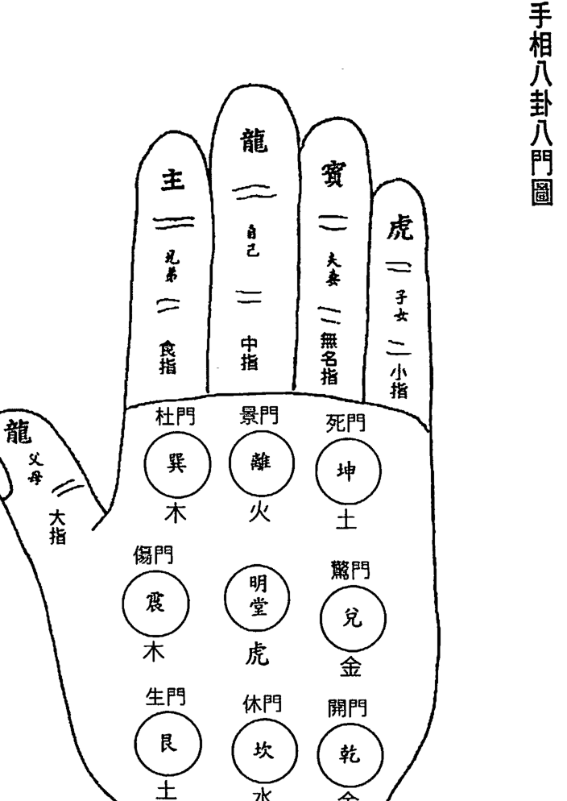

## 第三章 中國手相八卦八宮名稱與西洋手相對應關係

## 中國手相八卦八宮所代表之意義

## 乾宮

乾宮一向代表和男性關係之宮位。
如家中男性長輩、父親、或丈夫或兒子，尤以代表長子。

乾宮豐滿隆起且秀麗的人，主其人會與男性長輩緣深。
與父親、丈夫、長子的關係好、感情深長。
在外易得男性長輩貴人相助。
工作時有老闆提攜。
老年時有長子可依靠享老福，其人能受父蔭，有家業可繼承，父親亦可長壽。

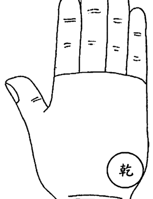

## 西洋手相圖

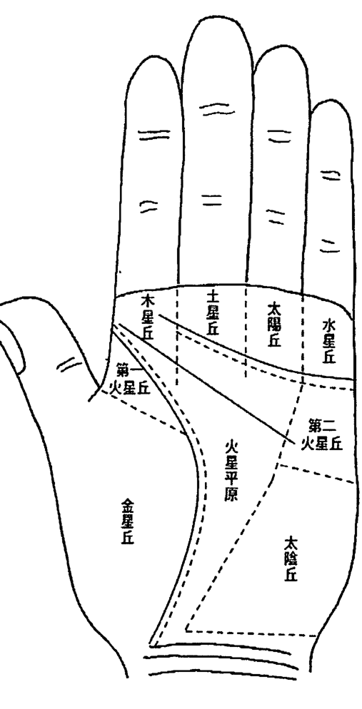

## ◎ 紫微手相學

乾宮優者主人之希望與理想高及優。八卦以乾為首，以乾為天、為父。卦象又屬老陽，故此宮高而秀美者，虛位權力亦佳。乾宮五行屬金，在健康上代表肺、腸、傷風、中風、痰傷。

乾宮有人紋（智慧線）穿破，易父早亡或相剋，不養父親，父親易風癱中痰而亡。
乾宮有橫紋至艮宮，有車禍血光、交通意外。
乾宮有直線紋向上，接到天紋（感情線），能得妻家或朋友之助而成功發達，名聲亦佳。
乾宮有橫紋則不佳，會酒色亂性。
乾宮乾癟的人，較沒感情，注重現實，會刻薄自私。
乾宮如果太高隆起，又主幻想多、不實際、頭腦不清。
有痣或橫紋，或受傷疤痕，則主剋父，及少小離鄉背井，在外奔波無恆產，與子女關係也不好。

乾宮在紫微命理上對應父母宮及子女宮，如甲年生有太陽化忌又在父母宮的人，此手掌部位之乾宮，肯定低陷或不美，或有橫紋、雜紋穿過。

## 坎宮

坎宮在手掌之根基之部位，又稱『海門』，為掌首之意。坎屬水，故坎宮管人體之泌尿系統及生殖系統和內分泌系統。有關血液、耳朵、睪丸、卵巢等。坎宮對應紫微命理中疾厄宮及田宅宮。

坎宮隆起秀美者，主其人先天發育良好，能生育健康子女，且多生男子。其本人也會聰明有智慧，獨立自主的力道強，又能受父母祖上之蔭庇，家有祖業，田宅必多。

坎宮低陷的人，會猶豫不決、精力差，做事拖拉，意志薄弱，又一生勞碌，不知所以。再有亂紋、不吉之紋出現，或有醜痣、傷疤出現，都易有車禍傷災或水厄、火厄之災禍。其人健康也有問題，子息少或無，也易破產、敗家，家產不

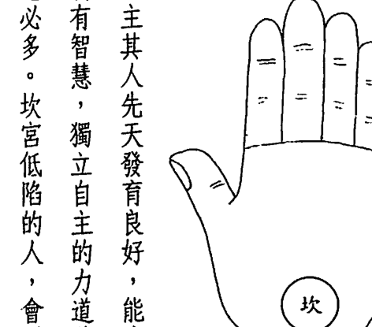

坎宮有骨突起的人，主貧窮。
坎宮低陷成坑洞的人，主無祖業。
坎宮有橫紋，則為海門不通，其人會沉迷酒色。
坎宮有斜紋為吉。
坎宮有分枝的小紋，易遷移改籍，離鄉或移民。

女子田宅宮不佳，或子宮有病或失去子宮者，其人掌相上之坎宮必陷落，男子疾厄宮，田宅宮不佳者，也會掌上之坎宮低陷及有雜紋或傷剋。

## 艮宮

艮宮五行屬土，艮為山。掌相上之艮宮在大拇指的下端位置。艮宮高厚豐潤，主其人身體強壯、精力好，

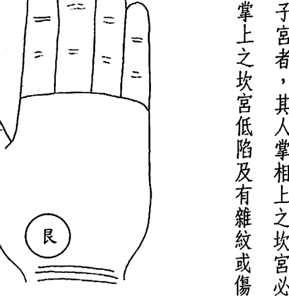

其田地產業也會豐厚，其人更會對人熱情、好學、有意志力與決心。代表其人祖德佳、子女會優秀。亦代表其人的年青時代的運氣會特佳。

如果果艮宮低平，主身體弱及無財。再有氣色發青、發暗黑的狀況，其人體弱多病，對人感情淡薄、自私，凡事提不起勁來，怕吵好靜，也無慾念。女子有不良之艮宮者，身體不佳，易不孕，也一生易窮。

艮宮太高，皮肉較硬者，為剛愎自用之人，粗暴，無責任感、貪財好色。
女子有不良之艮宮者，身體不佳，易不孕，也一生易窮。
果艮宮低平，主身體弱及無財。再有氣色發青、發暗黑的狀況，其人體弱多病，對人感情淡薄、自私，凡事提不起勁來，怕吵好靜，也無慾念。

◎ 紫微手相學

部位發達，手掌中其他的部位的筋肉也會跟著發達，因此在生殖力上會有很強的能力。往往手掌中此處貧弱的人，其人腰部的肉也少，或有冷感症，也不會為人著想。艮宮太紅或有紅斑集結，是肝硬化的特有現象。如現出青色，則要注意脾臟、腸胃、下焦、舌、鼻等問題。亦會有腎水少的問題。

## 艮宮對應紫微命理中之田宅宮。

因此田宅宮星曜在旺位以上無剋破的人，會手掌艮宮美滿厚實。而田宅宮星曜居陷位的人，或有羊陀火鈴、殺破、空劫化忌沖破的人，其手掌艮宮較貧薄，或有雜紋、不美。

## 震宮

震宮在西洋手相學上屬於第一火星丘的位置。象徵積極果敢、具有行動力和勇氣的能力。震宮五行屬木，應膽力，主兄弟之位。易經八卦中，震為長男，應屬兄弟宮，震宮高者，主人有進取心，塌陷主兄弟不和、無助力。如震宮多橫紋，兄弟易反目成仇。人紋（智慧線）從震宮內出者，表示人紋低，較貼近大拇指的根部，這種手相表示其人多橫暴，少修養，為粗鄙亂性好色之人，少有向上之心。

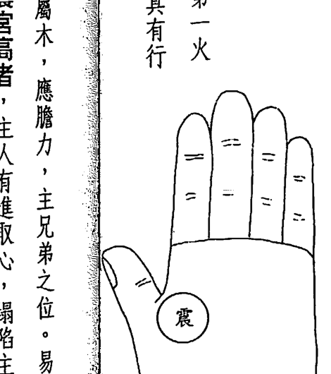

震宮隆起又僵硬者，易稱強鬥狠，固執愚頑。
女性掌相震宮高隆者，主妻奪夫權，或太強勢而無法找到可匹配之配偶。
震宮屬木，在生理上代表膽、肝、中焦、毛髮、大腸、聲音、喉嚨方面的問題。

震宮在紫微命理上對應兄弟宮，如果掌上有手紋，從震宮至艮宮的，此為貴人紋，此乃祖上有德及本身心術正念所致，能在危急時平禍擋災。

## ◎ 第三章 中國手相八卦名稱與西洋手相對應關係

## ◎第三章 中國手相八卦名稱與西洋手相對應關係

## 離宫

離宫五行屬火，主祿位及警戒力。離宫在西洋手相中為包含太陽丘和土星丘的部位。離宫中國手相學中代表官祿。離宫在健康上代表與肝臟、氣管、肺、腎、元氣有關的病
症。有從地紋（生命線）起亂紋向上至巽宫位置的手相時，表示其人有
神經質，而且火氣大、多夢，以防有病災。巽宫在紫微命理中對應遷移宮。因此巽宫太平太低落的人，容易被
別人管，會一生懦弱，無法上進。巽宫豐滿隆起強大之人，會獨立自
主，又能管理他人，主導別人，能升官，也能學業有成。

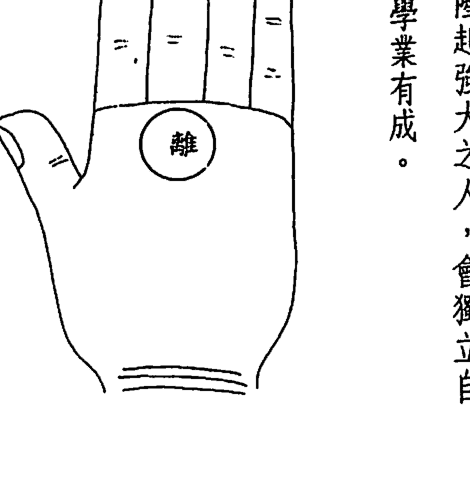

## 巽宫

巽宫五行也屬木，主有實權。巽宫在食指之下部位位置。西洋手相
稱此位置為木星丘。也代表權力、
獨立性、活動力、熱情以及積極的
向上之心。手掌上巽宫位置高隆者，具有支配他人的實力。也具有地位
和向上之心，學識及能力也高。此位平陷的人，會少實權，青年運不
佳，無大志。有斜紋、橫紋主破財。有小的十字紋，代表婚姻幸福，或
願望能達成。（十字紋在其他位置皆不好，唯獨在巽宫（木星丘）上是
好的吉相）。巽宫有星紋※，會增強權利與地位或向上心的力量。巽宫
有三角紋，也會增加上述力量，同時並具有社交手腕。巽宫太高者，主其人野心大，功利主義強，自命不凡，易有血光之

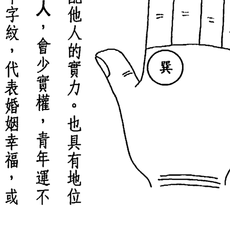

## ◎ 紫微手相學

離宮高隆者，有高職和名譽，財官兩旺，功名可成，其人會深思熟慮，做人做事都謹慎，智慧高，中年能大展鴻圖。

離宮居陷時，主孤獨，且無官職、事業及財祿，並缺乏進取心，或喜隱居、厭世。

離宮代表其人的才能、藝術和人緣機會、思慮是否周詳，是否認真或講義氣，頭腦是否清楚的位置。如果離宮有星紋，再伴隨六秀紋（太陽線）的話，則表示易成功和有好的財運，主富。

離宮在紫微命理中對應『官祿宮』。如果其人本身官祿宮不佳，則其人手相中之離宮勢必不美。例如同巨坐命的人，官祿宮是天機居平。天機陷落坐命的人，官祿宮再有巨門、陀羅，或是官祿宮為空宮，不強，再有羊、陀、火、鈴、劫空的話，或是官祿宮有天空、地劫並坐入宮，在巳、亥宮的人，都會有不良的離宮手相。

離宮在生理上代表心臟與小腸方面的疾病，離宮屬火，故也要小心眼睛、上焦，血液循環方面的病變。尤其是手掌上離宮太紅或發青、發暗、時，要小心！離宮太紅，要小心腦溢血、中風。離宮發青、發暗、心血不足、血壓低、血液循環不良。

## 坤宮

坤宮五行屬土，主福德，亦主夫妻、主子女。坤宮卦象為老陰，為地、為母。

坤宮豐滿秀美者，主其人有賢妻孝子，晚景美好，有名有利、福壽全，家庭美滿。
坤宮低陷的人，會刑剋母親，娶妻不易，婚姻不美，也生子不易，難享子女兒孫的福氣。

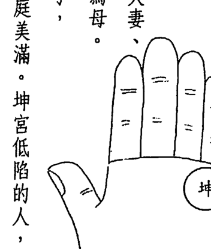

坤宮在西洋手相中代表水星丘。是表示理想與經濟的位置，此處高隆時，並表示有機智或巧思能打開財路。所以坤宮豐滿的人，其實會是有理想、有目標、樂觀、進取、感情思路發達，同時具有藝術及邏輯雙

## ◎ 第三章 中国手相八卦名称与西洋手相对应关系

◎ 紫微手相學
方面的頭腦，能有異途發達之機會。但如果坤宮不高，就會言過其實，易欺騙、有虛榮心、個性急燥、不容於人了。

坤宮上有十字紋的話，表示有偷盜之癖，也善於欺人自欺。
坤宮有星紋的話，表示有科學和實業方面的成就或成功，但要小心其人亦有偷盜之癖好，或有不誠實的性格。

坤宮在無名指下有直紋，稱『六秀紋』，又名『高扶』。西洋手相稱為『太陽線』或『成功線』，此手相有異路功名。
坤宮，手掌邊有小橫紋，稱為『家風紋』，為婚姻線，此位有亂紋，則夫妻感情不佳。

坤宮在紫微命理上對應夫妻宮。坤宮平陷瘦弱者，婚姻不美，夫妻感情不佳，如有痣紋醜陋者，必夫妻宮有傷剋。如本身夫妻宮有七殺星者，其手相中坤位並不見得不美滿。很多人也是極豐隆的。只是其人有決斷力、感情不佳，如本身夫妻宮有七殺星者，其手相中坤位並不見得不美滿。很多人也是極豐隆的。只是其人有決斷力、

## ◎ 第三章 中國手相八卦名稱與西洋手相對應關係

## 兑宫

兌宮五行屬金，主奴僕婢妾之位。
在紫微命理中對應『僕役宮』。在西洋手相中為第二火星丘之位置，象徵冷靜、自制、忍耐、沈著、不畏誘惑。其實中國手相之意義也相同，兌宮在掌上對應為色情的消極之位，有斜紋為色情反抗之意。兌宮有橫紋多的人，易受寵幸，尤其女子最驗。有人紋（智慧線）從震宮來到兌宮者，為有修養之人，也好反抗。兌宮豐滿易衝動、愛恨分明罷了。宜自己多經營感情，婚姻自然美滿。

坤宮屬土，在生理上，要注意腎臟、下陰部、生殖系統、肝、膽、下腹部、卵巢、輸卵管、膀胱等部位。

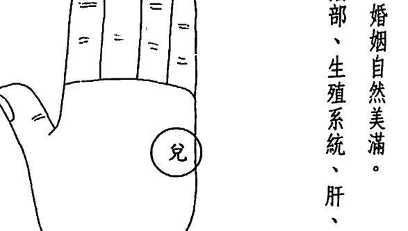

## ◎ 第三章 中國手相八卦名稱與西洋手相對應關係

明堂在紫微命理中代表命宮。如果其人命宮星曜居陷，或命宮為財星落陷者，其人手掌心之明堂則不美。多雜紋或平板無窩，或僵硬粗糙不秀麗。如果紫微命格的命宮主星居陷，但手相明堂還清麗少雜紋的話，其人仍能享福，命中財也仍多，命格也不致太差。

## 明堂

明堂又稱「中宮」，在掌心凹陷的部位，必須清明、乾淨、少雜紋、斜紋、剋破，否則會心緒煩亂。有直立紋為吉。明堂稍深有窩為吉，顏色淡紅秀麗，

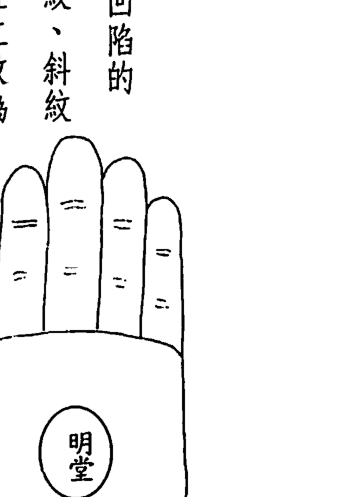

隆起之手相，代表其人自制力與抵抗力、反抗力都強，有冒險犯難之精神，且能忍辱負重，能受朋友幫助，亦可得妻財。

兌宮平陷者，或兌宮乾癟、粗硬的人，會是非多、婚姻不佳，多遇小人、性急、畏縮、凡事不成。也易結交亂七八糟的酒肉朋友，害人害己。
兌宮在生理結構上代表呼吸系統、大腸、肺部、腎、子宮、陰囊、膀胱等部位。

### 第二節 手相氣色斷定

## 手相氣色斷定法

## 手掌厚的人，其有超強的精力

手掌越厚，還要軟硬適中，壓了以後有彈性，才是最好的手。且要手掌常年紅潤有溫暖的感覺，主其人一生運氣好，心地溫暖多情重義，負責任，事業易成功。其中以掌心粉紅色為最佳。

如果掌心非常紅、有紅點、顏色類似硃砂色，是心臟病、心血管疾病、高血壓、糖尿病的象徵，有暴斃的可能，為不吉。

手掌一直都是淡黃色但溫潤的，也是吉象之手相，亦會身體健康、人生順利。
但如果太黄、手又乾枯，則有肝病或黃膽病，或是消化系統不良症。

手掌明堂中如果能看到中指的筋時，觸摸時卻十分柔細，這種手掌十分薄弱，因此精力也不足，在工作及家庭方面都會力不從心，無論做什麼事他都會力不從心！這屬於懶人的手。其人易疑神疑鬼，運氣不佳。手掌雖厚，但不結實，而皮肉顯得浮動時，也是精力不夠充沛的，或者是手掌厚，但有青筋在手背上的，都不是好的手相。

## 蒼白的手，個性冷漠，可能有貧血的問題

手掌為蒼白的手，觸摸時還會有冰涼的感覺的手，其人可能身體中有隱疾，而且性格會對人冷漠、不關心，人際關係不好。內向、孤僻或自閉，也容易刑剋家人，與家人不合，家裡一定有問題。

有這種手的人，多半膽小怕事，容易緊張，易受到驚嚇，也易碰小人或見鬼，一生運氣不佳，某些空宮坐命的人或命格不佳的『機月同梁』格的人，容易

## ◎ 紫微手相学

## 冰冷的手是易失眠或不满足的手

女人常會有手腳冰冷的狀況。大多是由於血液循環不良所致。其實可以把兩手的溫度相互比較，看看兩手的溫差是否差異大，倘若是一手熱，一手冷的話，冷手的那一側身體在血液循環上就有了問題，是需要改善的。同時表示你的運動量有顯著的不足。手部血紅素的濃淡及手部的溫度，會在性生活方面受影響，也會顯示其人的精神狀態。

一些會歇斯底里、神經質有憂鬱症傾向的人，會有冰冷的手，和失眠現象。
另外在性方面不滿足的人，也會有冰冷的手，如果你要和別人做生意，而握手時感覺到對方的手居然是這麼一雙濕冷的手，你千萬別只是以為對方身體欠佳而已，要小心對方有貪得無厭的習性，因為那是一雙不滿足的手，無論賺多少都不會滿足。這種需求是不論在性慾或金錢方面皆然的。性慾其實和賺錢的慾望是相通的。

在紫微命格中，機月同梁等命格的人，較易有冰冷和不滿足的手。因為機月同梁命格的人，性格和體質都較陰柔之故。但這也要以八字組合來看才會較準確。八字四柱全陰的人，容易見鬼。是更容易有此冰冷的手的。紫微武曲坐命的人或殺破狼坐命的人，如果有此冰冷潮濕的手的話，其人的病是很重的了，而且打拚力不強，又顯然命中財少、幻想多、不實際，生命的財（健康）也是薄弱不太足夠的，因此要以運動和營養雙管齊下才能改善。

## ◎ 第三章 中國手相八卦名稱與西洋手相對應關係

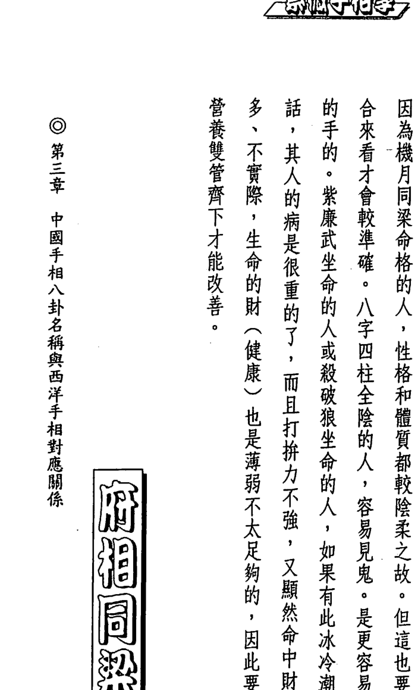

## 第四章 手指相法

### 第一節 指掌相較看法

> 中國手相在《相理衡真》一書中闡明：『指為龍，掌為虎。』又『大指為龍，小指為虎。』及『大指為龍，四指為虎。』只宜龍吞虎，不宜虎吞龍。』又講：『龍大虎小者貴，虎大龍小者賤。』

中國手相在手指與手掌的比例上，一開始就要求很嚴了，其實手指和手掌的比例關係和人的進化有關。掌大指短的人像猴子，是進化不足

## 如何幫子女找一個好生辰

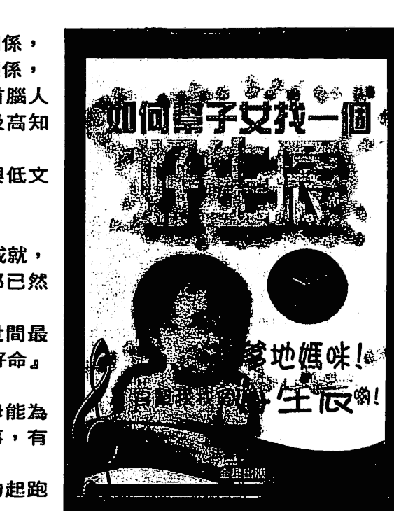

歷史的經驗裡，告訴我們
命格的好壞和生辰的時間有密切關係，
命格的高低又和誕生環境有密切關係，
就是自古至今，做官的、政界首腦人物、精明富有的老闆，永享富貴及高知識文化。
平民百姓永遠在清苦的生活中與低文化的水平裡輪迴的原因。
生辰的時間，決定命格的形成。
命格又決定人一生的成敗、運途與成就，
一個人在受孕及出生的那一剎那已然決定了一生！
很多父母疼愛子女，想給他一切世間最美好的東西，但是為什麼不給他「好命」？
「幫子女找一個好生辰」就是父母能為子女所做，而很多人卻沒有做的事，有智慧的父母們！驚醒吧！
不要讓子女一開始就輸在命運的起跑线上！

## # ◎第四章 手指相法

## ## 手指的长相和大脑有关

据科学研究，手指长的人，是脑顶部较发达的人。手指较粗大之人，是后脑发达的人，手指呈尖状指头的人，是侧脑发达的人。例如很多作家就会指头尖尖的。手掌宽大或厚实的人，是小脑发达的人。手掌上横

## ## 龙吞虎手相为主贵

手指长、手掌短为『龙吞虎』。此种以木形手为最佳，其人定有学术方面或特殊技艺方面之才华而大放异彩而有名声，主贵。火形手的人次之，为好看的手，宜做广告。水形手有此贵相也不错，能有智慧而发富。金形手与土形手的人，有此龙吞虎的手形，会有技艺，有小成就而已，会想得多、思虑多，影响行动力反而不吉。

文化不开的象徵，故虎大龙小者为贱命。指长掌小的人是进化前卫的人，文化水准与智慧、智力也较高，故主贵。 在手相上，手指与手掌及五指手指间不相配，有怪异现象的，称为『龙虎相争』，为不吉。

## ## 虎吞龙手相为不吉

手掌大、手指短小为『虎吞龙』，以金形手、土形手，手掌厚实，成方形，通常手指不会太长，故此二类手形有类似『虎吞龙』的状况，其不吉减半，并且适合打拼，脑筋会直。而木形手之手指有结节，火形手之手指尖细，水形手有圆锥形手，再有『虎吞龙』之现象的话，掌长指短，则易出身贫家，六亲稀疏，劳碌而工作不力，健康不佳，为贫贱之人了。

## 第四章 手指相法

◎ 手指头圆润，主其人聪明。手指纤细，主其人细心，有巧艺，经济智慧高，也易学手艺、思想较活泼，对人也热诚，人缘关系较好，其人理想高，能进能退。

◎ 手指代表人的思想和智慧，包括感情问题在内的范围。而手掌是展现人先天的本能资源及后天的变化及活动力、物质生活的状态。手掌上以智慧线（人纹）来划分先天与后天的界线。

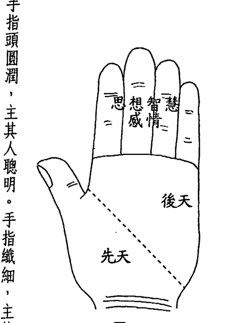

◎ 手指和手掌柔软易弯曲的人，其人较圆融，反应快、应变能力高、智慧高，也易学手艺、思想较活泼，对人也热诚，人缘关系较好，其人理想高，能进能退。

◎ 手相中四指皆过长者，其人会重虚荣、头脑不清、无自信、易空想，凡事无法做决定，投机性强，易和亲人朋友反复无情。

◎ 手不小、手掌削薄、手指细长、看不到指节的人，其人较自私自利，平常会懦弱，而且凡事不关心，只对自己的吃穿较关心。手相中四指皆过长者，其人会重虚荣、头脑不清、无自信、易空想，凡事无法做决定，投机性强，易和亲人朋友反复无情。

◎ 小手又手指瘦小短弱可怜的，其人头脑不佳、懦弱无主见，智能与健康皆不佳，易靠人过日子。

◎ 小手、掌小、手指短而圆圆胖胖的，且皮肤细白圆润的手，其人会做事大胆，敢于冒险，能有异途富贵而享福。

◎ 大手、掌大、手指亦长的人，为具有手艺之手，可做精密之事，如雕刻、精细绘画、制图、裁缝、钟表修理等等。

纹太多不好，直纹多才好。

## 第四章 手指相法

在五個手指中，大拇指代表父母、祖上。食指代表兄弟、中指代表自己，無名指代表配偶或情人。小指代表子女。

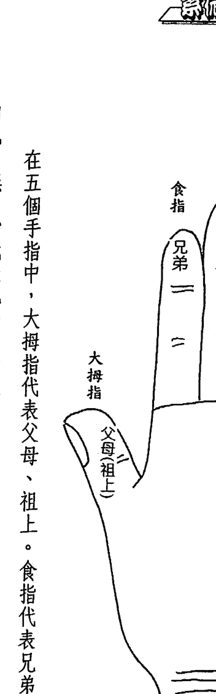

### 第二節 指掌甲之吉凶

### 手指彎曲的意含

在人出生時大多有一雙漂亮的手，除了有先天性殘缺之外。但經過生長期間，很多人因為各種原因如運動受傷、工作受傷，而手指彎曲或破損，或有富貴手，皮膚破破爛爛的一直好不了，這其實也代表了你先天性在命格中會具有這種命理現象。

- ◎ 紫微手相學
    - 不富裕者仍有小康之資。
    - 手指頭為扁形者，其人操勞不停，手指禿的人，多災。指節突出者，會較懶惰而無財。
    - 手指長秀挺直、堅厚的人，其人易掌權，手指短小則難以自主。
    - 指掌之間有寬鬆的皮，如蹼一般的手相，稱之為『鵝足皮連』。主其人可享高壽及富貴，並富同情心，正直。皮少緊實的人，則吝嗇、自私。

### 中指代表自己
中指在手指中是最长的，也是五根手指的中心，故它象征命运的感应。中指极长，较并列的其他四指长很多，表示会孤独、爱郁，不太和人来往。中指太短，会性格冲动、粗鲁，智慧也会有问题。如果受伤无中指，其人会没有自我，亦会克母，而一生命运不佳。

### 中指弯曲的意含

将手指併攏來看，如果中指是彎曲的，這種人的意志薄弱，常為悲觀主義的人，很喜歡貪便宜，撿便宜的事做，尤其喜歡依靠別人。凡事容易感到疲倦和厭倦，很會花錢，但做事不易成功。其人也易為一個宿命論的人。如果將手指併攏伸直，而中指依然會彎曲到左方或右方，則有其依賴性重的意含。

### 中指弯向食指

中指向食指彎曲的人，會依賴兄弟或依賴周圍朋友中如兄弟姐妹的好朋友而生活，是靠人生活的人。

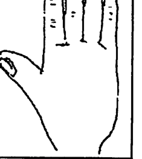

### 中指弯向无名指

中指彎向無名指那邊的話，代表其人會對配偶、情人很依賴。有此手相的人，如果是男子，會找年紀大的女性，吃軟飯，依賴女性生活。如果是女性，也易做妾、做小。如果能正式結婚，則是她的造化了。

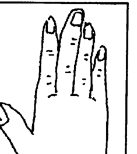

### 食指彎曲的含意

倘苦你的中指還算秀美，只是有點彎向無名指或食指，表示你能輕易的享受到配偶、情人或兄弟姐妹的福氣，能依賴他們。如果手指受傷腫大、很醜的彎向無名指或食指。表示你想依賴配偶、情人或兄弟，但他們的態度會不好，而且你也會有性格上的缺陷或陰狠性格，別人會避之唯恐不及。

併攏手指時，食指會向中指彎曲的手相，代表兄弟或朋友會依賴你，因此你很勞碌，常忙一些別人的事。

### 食指彎向中指

如果食指受傷很醜的彎向中指，表示兄弟或朋友雖依賴你，但不會知恩圖報，反而會心存貪婪。你易得不償失，而常對兄弟、朋友灰心。

### 食指向外彎

如果食指向外彎，表示你的兄弟和朋友是和你離心離德的，要小心受朋友或兄弟的連累遭災。同時你也是和你的兄弟或朋友不親密，有嫌隙，多是非，或常躲著他們的。這也有人緣不佳，及孤獨、或少人幫助的命運，一生也難遇貴人。

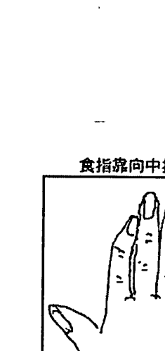

如果食指仍秀美的彎向中指，表示你很喜歡兄弟或朋友依靠你，並且很積極的照顧他們，而感到快樂。

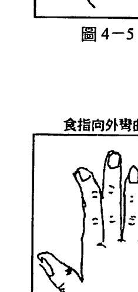

### 無名指彎曲的意含

### 無名指彎向中指

併攏手指時，無名指會彎向中指，表示配偶或情人會依賴你。在這種手相中，中指要很直，你就會是強人及能幹的人，而讓配偶或情人依靠。如果女性有此手相，你會幫忙負擔家計養家，如果再富裕一點，你也會養小男人。你很喜歡照顧別人，尤其是看到比你弱的人或比你弱的異性，就會發展出母性的光輝出來了。如果是男性有此手相，也容易多養情人，很容易有同情心而落入戀愛或感情的漩渦之中了。

如果中指也彎曲，有點醜，或指節腫大，指縫大而無名指又向中指彎曲的話，則你會在性格上有古怪不佳之怪癖，容易欺騙異性。自己生活上都有問題了，仍會欺騙情人或配偶要給他富裕生活，結果把別人的錢拐跑了。

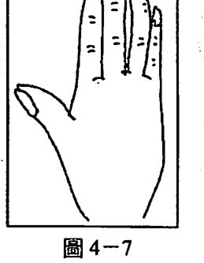

### 無名指向小指彎曲

無名指向小指彎曲的人，表示會依賴子女生活。這必須要小指長得美麗圓滑、強健，才會生出好的子女來讓你依靠。但如果小指很短小、萎縮，表示你的生殖力不佳，無名指若再彎向小指，表示婚姻無著，易不婚，或晚年有病痛及貧窮的日子。

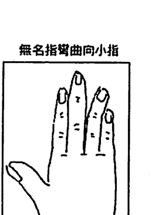

倘若無名指和小指都長相秀美，而無名指稍稍彎向小指，則表示其人在才華方面的理想高，會不太實際仍可活在夢幻生活中很快樂，所以是重視精神生活的人。

### 小指彎曲的意含

小指彎向無名指的人，表示你非常好命，子女會非常依賴你的配偶，你也可少照顧一點子女了。同時也表示在你個人才華中，有一部份是同配偶或情人一起而發展出來的。

### 小指彎向無名指

你可能是位作曲家，或因為戀愛或失戀而有好的作品，一炮而紅。亦可能因配偶或情人而發明新物品而得獎。但首要關鍵，必要小指秀美、無名指也要秀美才行，如果這兩指都粗糙，形狀崎嶇，便不在此吉相之中了。

### 五指損傷的看法

五個手指各有其代表意含，如果手指有損傷，失去手指，或手指皮膚潰爛皆屬之，要小心！

- 大拇指破皮或損傷、失去者，會損害祖上和祖先有刑剋，無法有蔭庇或有貴人，也無祖產。
- 食指破皮或損傷、失去者，會剋父、剋兄弟、朋友。會和父輩、上司或兄弟、同僚、朋友關係不佳，有礙運途。
- 無名指破皮或損傷、失去者，主剋妻、剋夫，易不婚，或婚姻多波折，無法享受愛情的快樂，桃花少，也易失去配偶，或有家暴問題。
- 小指破皮或損傷、失去者，主損子，或子女難生出來，不孕，或子女易受傷。尤其應在兒子身上，女兒較不忌。

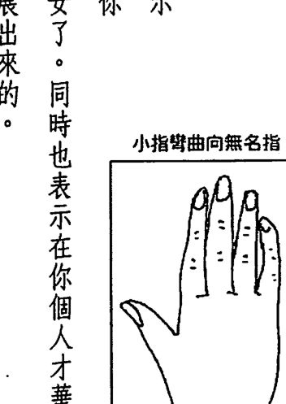

© 紫微手相學

### 指甲狀態之吉凶

◎ 指甲為圓形的人，其人好藝術，但易好高騖遠。指甲呈橢圓形者亦然。

◎ 指甲短又呈橫的長方形者，其人會十分健康，體力充沛，重視效率，做事積極，但易緊張、衝動，易有腸胃病。指甲愈短、愈呈橫的扁方形者，其衝動力愈強、好爭強鬥狠、愛鬧、愛管閒事。

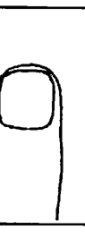

◎ 指甲軟而薄者，健康狀態不算太好，其人會膽小，多幻想和迷信，是精神不濟、元氣不足的人。尤其是某些指甲狹長形成橢圓形而又薄又軟的指甲，更是如此。

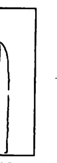

◎ 指甲長硬而彎曲，主其性孤獨，又心肺功能不佳。且陰毒，品性不佳。


◎ 相法上說：人的指甲須滋潤為淡紅色（自然色），其人會財帛豐盈、財運好。特忌皮乾肉枯包圍著指甲，則指甲也會乾枯，或指甲碎裂，如此是一事無成，又會成為命中孤獨而早亡的人。

◎ 人的指甲要堅實而厚，才會長壽。指甲硬的人，性格剛強。

◎ 指甲呈黃色（稍帶黃色），主其人有清貴之榮。指甲不能太黃，否則有黃膽病或吸煙過多，不是健康的指甲。

◎ 指甲潔白的人是一生輕鬆優閒享福的人，不會勞碌於工作。

◎ 指甲粗硬不秀美的人，其人也會好衝動、粗魯。

◎ 指甲厚大如屋瓦般，色澤紅潤的人，主其人有智慧和天生巧藝，性格純厚。

指甲歪斜變形的人，其人健康有問題，也易心術不正，人生不順遂。

指甲根基處為較窄，而指尖之處指甲較寬的人，是容易不滿現況，好發高見批評，對別人苛責，但本身自私，不多付出心力的人。

如果指甲根部為有紫色狀況，表示循環系統不佳，已有病，須儘快治療了。如果指甲已為青色或黑色，要小心受徽菌感染，或內臟有病情已嚴重的狀況。

指甲根處有月牙（有白色半圓形）的人，主氣血虛弱，指甲上無月牙的人，健康較好。有月牙的人易有末梢神經和血液循環系統不佳的狀況，並有精神上衰弱，易緊張的狀態。但月牙太寬太大，則要小心高血壓的病癥。

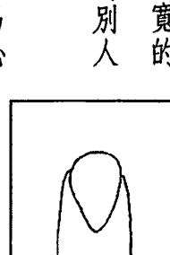

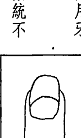

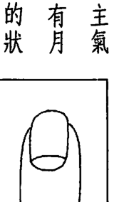

指甲短小，又易脫落，或破爛不全的人，都易得心臟病。

指甲上有直紋的人，主其人腦力透支過多，精神緊張，小心內臟會出問題。

指甲上有橫紋的人，主其人營養不足。或橫紋配合著指甲高低不平，有一輪一輪的橫紋，應注意營養的均衡，要補充才行。

指甲上有白點或白色花狀的紋點出現，或指甲部份呈凹凸不平的狀況時，會有心臟病，肺部或肝腎、消化系統之毛病，應早看醫生。

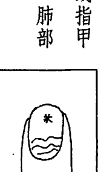

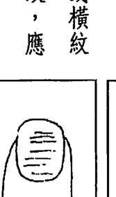

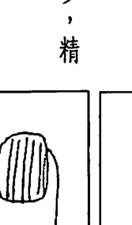

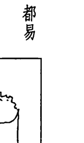

### 第三節 手指相理吉凶及意義

### 各個手指所表之意義與吉凶看法

### A 大拇指的長相為人類進化和智能的程度高低

人類之所以為靈長類動物之長，為萬物之長，就是人類有了發達的大拇指，而能支配地球上的各個生物與事物，像猴子、猩猩的大拇指位置比人類高很多，智能比人類低很多，而且其他四指也不靈活、四指無法做獨立動作。自然進化過程比人類差，在智慧開發上也落後人類很多了。

- ◎指甲上翹的人，心肺功能不佳。
- ◎大拇指的長度為大拇指尖端到達食指第二節中間一半的地方為標準正常。如果到達食指第二節指節紋時，則其大拇指不是過高，就是過長了。超過食指第二節指節紋時，就過長了，有衝動和原始性個性的問題。如果大拇指之長度不到食指的第三節中間一半的位置時，則屬較短。如再更短，則過短了。

大拇指具有標準長度的人，會在行動力及想法方面發揮自己的個性，能控制自己情緒，是理性與感情並重的人，為達成目的，能自制而且有計劃，並能在社會上有名望而成功。

大拇指很長的人，一直到食指第一指節的地方的人，表示其理性能夠完全控制感性和感情，是一個冷漠和頑固派的人，任何人都很難說服他。

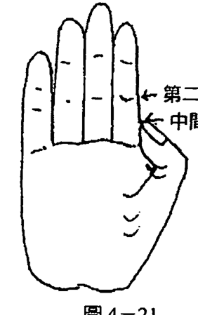

### 大拇指離得很開的，是浪費的人

手掌手指伸開，來檢驗你的大拇指和手掌的角度問題，可知道你是吝嗇或浪費的人。如果大拇指和手掌之間的角度較小，你是較吝嗇的人，如果你的大拇指和手掌之間伸開後，會角度大，通常此角度有45度以上的，則為角度大，而你為名符其實的浪費家。

如果大拇指很柔軟，大拇指第一節又很容易彎或成弓形。此人會在金錢或思想上都會鬆懈，不喜歡被管或束縛，做事懶洋洋、不積極、做人的寬容度大，理財能力也不佳，容易寅吃卯糧，必有困苦日子及腸胃不足的孩童或病人身上發現此種大拇指。

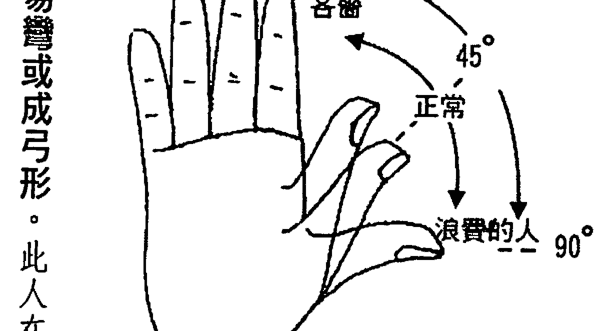

◎ 大拇指較短的話，易意志力軟弱，優柔寡斷，無行動力和企劃能力，其情緒易波動，無法安定。其感情易成行動上的原動力。重視氣份，靠感覺發展而變化。其為人在性格上易走極端，因此工作不易成功。如果是女人的大拇指如此，則易為娼妓或靠男人情慾生活的人。

### 大拇指根部越低、越有理智、修養

大拇指的根部愈低，越是有理智的人，而且有精神上之修養，對自己的目標、目的很能把握，也不易受人影響動搖。反之，大拇指根部愈高，其人愈衝動、智能會有障礙，感情上反能為出發點，情緒是難以控制的。往往我們會在智能發展遲緩，或智能

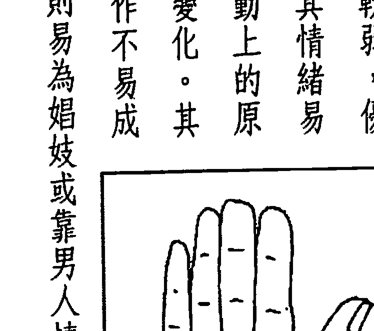

### 大拇指的各節長度表示『知、情、意』的狀態

大拇指一般分為三個部份。第一指節、第二指節、指根算是第三指節，大拇指第一節代表意志力。第二節可以用來看知性、理性的強弱變化。第三節為指根部份，其實也是代表其人的精力部份，包括愛情的強弱，以及對物慾的追求。

如果第一節超大，是危險的大拇指。若大拇指根部細，但指頭圓而腫大，指尖肥厚，此種大拇指被稱為『殺人者之手指』。其人性情粗暴，會一時氣憤而六親不認而殺人，就是至親而不存一點親情。其固執的意念會很深。

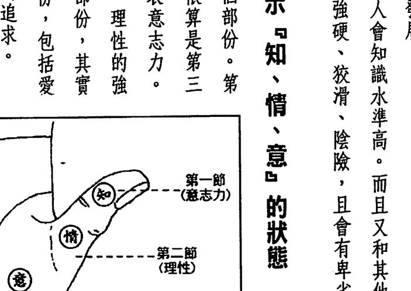

- ◎ 普通厚實的大拇指，表示此人不拘小節，不重穿著，沒有美感。但其內心誠實而正直。
- ◎ 扁平而薄的大拇指，具有神經質個性。大拇指若很短，會是優柔寡斷的人。如果扁平又長，則其人體力不佳，怕勞累，而性格卑劣，喜貪小便宜。
- ◎ 細小的大拇指，或細而長的大拇指，表示此人有藝術天份，或對藝術有興趣。但實行力、行動力未必會好，其人幻想多，易好高騖遠，但會創意十足，其創意也未必有用。

殺人者之手指

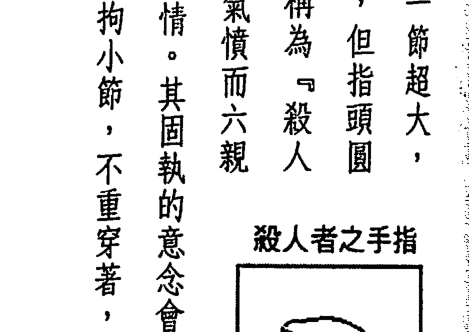

- ◎ 大拇指第一節特別長的人，具有專制的暴君性格，會指使別人，而不願被人管或支配。而且自私自利，以為自己是宇宙的中心，會不聽人勸。
- ◎ 大拇指第一節指頭為圓形的，而且第一節與第二節上下為直向狀的人，其人很固執頑固、容易閉鎖，自以為是，會固執於自己的想法，是擇善固執一類的人。但有行動力。
- ◎ 大拇指手指頭為扁平寬大形狀的人，也會頑固。其指頭尖大而指節處以下如女人纖腰內縮的形狀的人，表示其人腦力發達，又有寬容的包容力，但缺乏行動力。
- ◎ 很多人在握拳時，喜歡將大拇指握在掌中藏起來。此種類似新生嬰兒的動作，其實有特別意義。表示其人內向、膽小、喜自我保護，而且不敢發表自己的主張。具有慢性的自我喪失的症狀，有學者認為此種現象與性器短小，或與性方面有缺陷有關的下意識動作。因此相親時如遇對象有此種動作，應小心考慮。
- ◎ 大拇指第一節手指短的人，是意志力不堅定，容易懦弱屈服，害怕辛苦，貪圖舒適生活的人。
- ◎ 大拇指第二節比第一節長的人，其人天生冷靜、沈著，好於辯論，善於分析事物，但行動力不足。
- ◎ 大拇指第二節比第一節短的人，其人強悍、有行動力，但較粗魯，智慧和理性卻較差。
- ◎ 大拇指第一節和第二節同樣長度的人，其人的行動力和理性、意志力、智慧均佳。

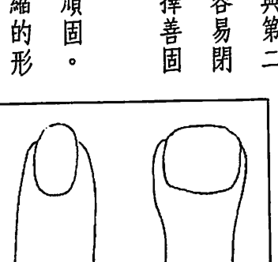

- ◎ 大拇指短小又指頭尖、又薄的人，恆心和行動力，以及毅力皆不足，易受人管束支配。會懦弱無用，以及體弱有病，為遺傳不良。
- ◎ 大拇指粗大的人，食量會很大、有暴力傾向、性慾強、頭腦笨、粗魯，為文化不開之人。
- ◎ 手上有六指的人（指大拇指旁多一小手指），是遺傳不佳的人，其人會刑剋父母、父母也刑剋他，容易一生較為無用之人，無成就。
- ◎ 大拇指根部稱第三節，亦為手掌艮宮位置的地方，特別豐滿隆起的人，是性格衝動、行動力強、粗魯及性慾強的人。如果此處低平，或略凹陷的人，其人會缺乏熱情，對人冷淡，身體衰弱，性慾低。如果此處有中等隆起之狀況的人，其人之理性感情與情慾會有中庸之道，不會太超過。

### B 食指長的人，是野心勃勃的人

食指代表的是支配的慾望、權力導向、霸氣，以及向上心等等的內含。

手上四根手指皆有其基底線。食指根部的線較高，食指會長，其人就會自主性特強，其權力慾望就會比別人大和強勢了。會喜出風頭和支配別人。女性有此食指，需找忠厚、軟弱的男性結婚才行，否則會婚姻不美。

◎ 包括食指在內，四個指頭若關節都很柔軟，能一起向後彎曲的人，是性格爽朗，很容易受到氣氛的感染一會兒喜一會兒憂，情緒變化大的人，他會不喜自我反省，喜歡講話，喋喋不休，又會喜怒無常，但又遇到不好的事又會很看得開。其人喜歡投機取巧，又很有靈感，心裡存不住一點話、一點秘密。

指節很硬無法後彎的人，其人會較現實，有功利主義、理性勝於感情，是能控制自己感情的人。

◎ 食指的長度應至中指第一節手指的一半高度為標準。如果食指超過此長度則為太長，如果短於此長度為較短。

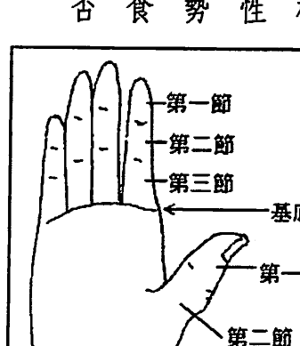

◎ 食指之長度超過中指第一節手指的一半以上時，為太長。其人喜耍弄權術，是一位野心家，喜歡過爭鬥不停的生活。其人會在青年時代，事業有起伏上下的狀態。過了中年會較好，但也要選對行業，如進入政治界或軍警業，或競爭力強的商行、保險業、房屋仲介業等，會較有發展。

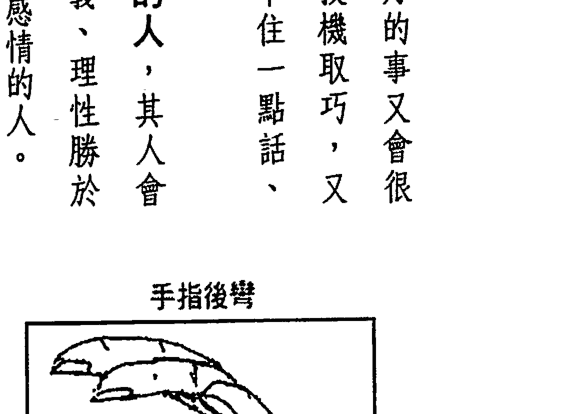

◎ 食指手指第三節特別長的人，其人也會特別具有權力欲望和支配，時代會順利，較能出頭。
◎ 食指指尖為尖形的人，缺乏支配力及霸氣，亦會有宗教信仰，食指較粗或食指指尖或方形的人，會有支配力及霸氣，較理性，青年。
◎ 食指第一節的部份過於長的人，其人易迷信，無魄力。食指第一節過短的人，會無責任心，且意志力不堅定，會消沉、不振作。
◎ 食指比無名指短的人，其人無主見、懦弱、好淫、多是非、青少年時期愛東跑西跑，或早婚早離，未來也一生多漂浮，無人生目標。
◎ 食指過於瘦小或其長度不及中指第一節指節紋的地方的人。其人會無責任感、懦弱怕事、害怕配偶又刑剋配偶。亦會拖累家庭，亦會受迫害。

### C 中指象徵命運的幅度

中指代表的是自己本身，它在手指中是最長的，同時也是手指的中心。中指象徵命運的幅度和內心的意念。這兩者息息相關。

- - 中指特別長的話，比旁邊其他三指長很多出來的人，表示其人是略有精神疾病、憂鬱症，有孤獨、自閉傾向，以及會厭世、易自殺的人，其人會脫離現實，不愛做俗事。
- - 中指極短的話，表示缺乏耐心，性格衝動，思想簡單。有球根形大拇指的人，常具有這種短的中指，會因犯案坐牢或衝動殺人。凡是看到這種手的人，應離他遠一點。

中指指尖為尖形或圓形的人，處事較圓滑或投機，做事有成有敗。

- - 中指之指尖為方型的人，會做事嚴謹、性格穩重，自律強，對人較誠實無欺。
- - 中指第一節比下面兩節長的人，有疑心病、疑神疑鬼，有悲觀想法及憂鬱症。中指第一節比下面兩節短的人，為人善變，缺乏道德觀及中心思想很薄弱。
- - 中指彎曲、不直的人，是意志力薄弱之人，屬於悲觀主義，也不想創造自己的命運，凡事極易厭倦、不想動，因此少有成就。多半會宿命替自己找藉口，其人中年不利，易貧窮孤獨，身體有疾，不健康，易有腿疾，行動不良。
- - 中指若粗壯長大，其人會心機細密、又耐力好，為人有智謀。中指若短又小，瘦弱，其人無耐力、又眼光短小，無中心思想，易為牆頭草之人，沒主見善變之人。

# D 无名指长的人具有赌徒之指

◎ 紫微手相学

-   无名指在意涵上代表艺术、人缘及富有。更代表配偶及四十岁后至五十岁之间的后期中老年运程。
-   无名指的标准长度是达到中指第一节手指的一半为标准，它会比食指略长为佳。
-   无名指若与中指等长，其人的支配欲和权势欲望极强，主观意识重，自视高，好赌，凡事喜欢赌一下，一生在冒险竞争中渡过。四十岁以后贪财好色而失败。这在命格上也是刑克一种。
-   无名指较长或指尖成尖形的人，喜欢艺术方面之事务，如美术、音乐、雕刻，并具有艺术天份和赌运。在艺术界有很多艺术家会大起大落，皆具有如此的无名指。
-   无名指第三节粗大又较长的人，也具有赌性和艺术天份。

# ◎第四章 手指相法

-   无名指弯曲、歪斜的人，会有不良配偶，婚姻运不佳，会惧怕配偶。相互刑克。
-   无名指长相不佳的人，易老年五十五岁左右有病痛。
-   无名指圆润秀美、长直、粗细适中的人，其人会重名誉、有人缘，并有艺术方面的爱好，配偶也会长相美丽，其人中晚年之身体健康，富贵皆有。
-   无名指之第一节手指略长于中指第一节手指的人，其人艺术天份高，并能以此而富贵，名誉及人缘皆佳，成就大。
-   手自然伸出，无名指与中指距离较远时，表示其人与家庭距离较远，女性有此手相者，较不喜待在家中做纯粹的家庭主妇，而喜欢外出上班，或喜创业。

# ◎ 紫微手相学

# E 小指的根部低矮，生殖机能也不强

小指是看人生结果及人的表现力、科学方面的才华，也可看出生殖机能的状态以及遇小人多寡的。

◎ 小指的标准长度，以到达无名指第一节指节纹的纹线为标准。不到此标准的称短的小指，小指的根部很低，指根下垂，小指的长度就不长而短了。

◎ 小指过于长又较粗大的人，善于说谎及使用权谋之术。在商场上易与人结仇。其人也会喋喋不休爱讲话，好雄辩。其人的语言能力特强，适合做演员或雄辩家、演讲者。过长的小指为“欺诈的小指”。如果小指的第三指节又较长，其欺诈的方式又是随时随地、无所不用其极的欺诈方式了，因此是毫无信用感的人。其人会应付环境变化的能力强、性格善变，但他本身很难相信别人。

# ◎ 第四章 手指相法

◎ 小指的长度能到达无名指第一节节纹的人，能白手起家，发达较早，或能继承家业，继续发扬光大。

◎ 小指第一节较长（与整只小指比较）的人，口才佳，善于表达意念，容易凭口才之利而成功。

◎ 小指贫弱短小的人，生殖器也较弱。但如果小指根部下垂，若是女子，阴部也会下垂，不易生男。若是男子，则相反，会多生女，子女，就是到了六十岁、七十岁仍能生育子女，就算儿孙满堂，也容易有外遇生子的家庭纠纷。

◎ 小指较短的人对环境适应力也较快，也善于转变，做事有效率，但易为人利用而吃亏。其人子女缘薄，不易生男，多或生女，子女易有病，或离开发展。

## 一般人具有的指纹

大多数人的指纹只有螺纹（君纹）和箕形纹（臣纹）两种。但在中国手相学上，把指纹分成君纹、臣纹、民纹、艺纹、奴纹、异纹、阴阳纹等八种。而阴阳纹又分为『君纹的阴阳纹』和『臣纹的阴阳纹』等类型。

人的手指有指纹，在脚上也有脚纹，脚指也有指纹。这些都一生不会改变的。指纹是人的脑细胞排列程式的纪录。通常脑细胞成长后数量大致就固定了，不会代谢或坏死，也不会排出。因此脑细胞只有老化的现象。是故手指的皮肤会增长或变化、代谢。但指纹仍不变。

## 第四节 指纹代表的意义

-   紫微手相学
-   小指的指头为尖形或圆形又长的人，其人易向科学方向发展。小指较短的人，即使是尖形也不喜科学。
-   小指指尖是方形又长的人，会在科学或科技方面有成就。
-   小指天生只有二节的人，为先天性遗传不佳，有隐疾，晚年孤独贫穷。
-   小指秀美，有标准长度者，主晚年福寿富贵，子女成就佳。

# ◎紫微手相学

中国手相学上其他的指纹图（这些指纹较易在大拇指上出现）

图4-32

◎十个手指全有螺纹（君纹）的人，为性格孤僻、怪异，精神紧张，一生多小人克害，人缘不佳的人。特以眼大又有双眼皮之人特别应验。除非其人命格好，能主富贵，否则易倔强、自以为是而难有发展。有此手相之男子至中年事业失败，一生不顺，女子则不利婚姻，有病痛和生产血光。

◎十个手指中有九个或八个手指有螺纹（君纹）的人也亦然，为孤僻、不合群之人。手指中有超过五个手指有螺纹者，皆有上述状况。但分别带有不同之意义。

# ◎ 第四章 手指相法

◎十个手指中有超过五个手指以上有箕形纹的人，皆较乐观、有人缘，对人、事、物较宽宏，但都易少年辛苦，须自己打拼，难靠祖产。

◎十个手指全为箕形纹（臣纹）的人，在格上较温和随性、待人处世较圆融，生活较轻松愉快。但要小心容易有健康方面之问题。例如心脏病、血液循环不良，和肠胃病、消化系统的毛病、大肠癌、痔疮等，要注意其人少年艰辛，无祖荫，须自己打拼，老年运好。

# ◎紫微手相学

◎大拇指为螺纹（君纹）的人，主遗传好，能享祖荫，身体强健、智、德、育健全发展，未来有成功机会。

◎大拇指为箕形纹（臣纹）的人，主遗传较前者略差，且难享祖荫或父荫，其性格或智能，健康上都会比前者稍差，未来成就也会没前者好。

※男子以左手属阳属先天，以右手属阴属后天，则左手大拇指有螺纹者佳，以右手大拇指有螺纹者次之。如果双手大拇指皆有螺纹（君纹）为佳。大拇指之指纹中，较会出现其他较特异的指纹，如『君纹阴阳纹』、『臣纹阴阳纹』、『民纹』、『艺纹』、『奴纹』、『异纹』等等。

◎食指为螺纹（君纹）的人，主其人聪明，有智慧，且会运用关系，青少年时代顺利，性格温和圆融，做事积极，能掌权、事业易成，且兄弟有助，朋友亲和。

◎食指为箕形纹（臣纹）的人，要看大拇指的纹路为何而定。大拇指亦为箕形纹（臣纹）者，会自力更生，自创事业，但艰辛难成。

※两手中，只要有一只手上有拇指为螺纹，食指为箕形纹，即为吉相。

◎中指为螺纹（君纹）的人，其人会过于主观，对人刻薄、顽固，易有偏执狂，多小人，事业艰困，但有异途发达之机会。

◎中指为箕形纹（臣纹）的人，其人性情反而随和，中年顺利，有贵人相助，事业易成，一生较顺利。

◎无名指为螺纹（君纹）的人，其人性格固执偏狂，常有小人危害。

◎无名指为箕形纹（臣纹）的人，其人在四十岁至五十五岁之间较不顺。

# ◎第四章 手指相法

## 第四章 手指相法

◎大拇指第一节与第二节之间的纹只有一条线的，会年幼家穷、生活不富裕，如线中断，则其人易有病痛、灾祸及刑克父母，易早亡或背井离家或改姓为他人养大。

◎大拇指第一节与第二节之间的纹，形成『眼睛状』的人，称之『凤眼』，此为吉相，主其人一生有贵人扶持，聪明干练，出身好，家道富裕，能早有成就，婚姻幸福，事业顺利，其人人缘好，对人

◎紫微手相学

※如果一手是无名指为螺纹，另一手之无名指为箕形纹，可以男女或年纪来分。男子以左手先天，右手为后天，如你年龄已超过四十岁，则不妨害。如果你是女子，以右手为先天，左手为后天，则以在左手有螺纹，又在四十岁以较辛苦不顺。

◎小指之指纹为螺纹（君纹）的人，会老年运不佳，其人在五十五岁以后，仍然固执，人缘不佳。如果面相不佳，下巴短，或小指弯曲瘦弱，则易无子女孝养，或老年有困苦之相。

◎小指指纹为箕形纹（臣纹）人，其人老年运极佳，并且在五十五岁后之运程顺利，较享福而收获多。如其人面相和小指秀美又坚挺者，有优良子女，能得孝养，且富足，生活惬意之相。

※如单手小指有螺纹者，皆不佳。

## 第五章 指节纹、指背纹、指背毛所代表之意义

## 指节纹之形状与看法

## 第四章 手指相法

◎ 大拇指侧面第二节处有椭圆形的纹样的人，古称“龙眼”。主其人学问高，文采精深，主大富贵。如果纹样图形为三角形、四方形或菱形者，亦佳，主其人能异途显达或有偏财运。

◎ 大拇指之第一节与第二节之间无纹者，大拇指只有一节手指之人。其人一生无用，事业无着，生计艰苦，会靠他人过活。

◎ 大拇指侧面第二节上有横纹的人，称其之“文约纹”。主其人一生劳碌，凡事自己做，自己研究，能自修而成功。

◎ 大拇指的第二节与第二节之间之节纹，如形成三条线的，称之为“夫子眼”，主其人会读书、注重工作，事业心重，并家世好，为名门或道德之家，一生生活富裕美满、能因读书致仕，而名声远播。

◎ 紫微手相学：热情，对事务的敏感性强，会有第六感。女性之大拇指有凤眼者更佳，主聪明、能干、有利家庭。如果凤眼的尾端未闭合的人，即凤眼形成一半，其吉相也只有一半之吉相。

◎ 紫微手相学

◎ 大拇指第二节侧面有网状的纹样或数条交错杂乱纹样的人，其人天生聪敏灵巧、有鬼才，能有偏财运或异途显达。网状纹向上靠近第一节手指的人，会早发。靠近大拇指根的人会晚发。

※在紫微命理上，有很多有偏财运格的人，皆有奇怪胖大的大拇指。而且也多会有主偏财的纹路出现。

## 食指之指节纹

◎ 食指第一节之节纹为一条者，不吉，主其人无成就，为平凡之人。

◎ 食指第一节与第二节之间之节纹为二条的人，主其人能干，但劳碌，能因自己之努力而发达早。其人一生有固定之财富，生活平顺。如果二条节纹能形成凤眼的，其人会有专业知识，或有偏财。

# ◎ 第四章 手指相法

◎ 食指第一节有直纹的人，主当前之事业有滞碍现象，要小心发展。如果有几条横纹的人，为健康不佳之现象，若数指之第一节都有横纹现象，则健康亮起红灯。

◎ 食指第一节与第二节之间的节纹为三条的，称之为『三约纹』，主其人有大成就，能生意大成或事业有成。第二节与第三节之间的节纹有三条的人，其吉相减半可论。

◎ 食指第一节与第二节之间的节纹为两条的，或为凤眼的，也能劳碌生财，但不主偏财，也未必有专业知识，其吉相较普通。

◎ 食指第二节与第三节之间的节纹，为两条的，或为凤眼的，也能劳碌生财，但不主偏财，也未必有专业知识，其吉相较普通。

# ◎ 第四章 手指相法

## 中指之指节纹

◎中指第一节与第二节中间之节纹为二者，普通，无特殊意义。如形成凤眼，亦为佳相，能有成就。若为三条的人，称之为『姐妹约』，为兄弟姐妹感情好，有手足相助。你也会助自己的兄弟姐妹。如果中指再挺直、秀美者，表示其人心地正直、有主见、重道德，讲人伦，一生运好、有福禄。

◎食指第一节有十字纹时，主其人善于运用权力、能指使人做事，有良好之部属与家室。

◎食指第一节与第二节之间的节纹有四条，或四条以上时，为『孤克纹』，会六亲无靠、相互刑克，且一生不顺利。

图4-42、43

图4-45

图4-44

◎中指第二节与第三节中间之指节有『姐妹约』时，其吉相减半来论。亦可有兄弟姐妹相助，但力道较弱。

◎如果在中指的第二节手指中间有横纹的，称为『孤约纹』。其人会人际关系不好、六亲无助，尤其是兄弟姐妹不相挺、不相助。其人中年有灾厄，要小心一生虚度。

◎中指手指第三节的中间或靠下部有一条横线时，称为『漏约纹』。小心其中年漏财或投资失利。

◎在中指的第一节手指上出现十字纹时，为吉相，主成名、成功，或发财。

# ◎第四章 手指相法

◎无名指的第一节与第三节之间之指节纹有两条或眼状，皆属普通平凡，无特殊意义。如果有三条线，称为『三约纹』者，无名指又代表五十五岁前，故主此时生活顺利，有福禄，且婚姻美满、有贤妻，如果三约纹在无名指上第二节第三节手指之间时，则吉相减半，但仍有衣食无忧之生活。

◎无名指之指节纹有断纹或太多条，超过三条，或杂乱不清楚时，主其人老年运差，婚姻配偶不佳，如果无名指再弯曲不正时，有受异性之灾，或配偶品行不佳之灾祸，婚姻不美。

◎无名指的第一节或第三节上有横纹时，无论是一条、二条或三、四条，皆称之为『病约纹』，其人会健康不佳、有暗疾、有碍婚姻，或易不婚或因病离婚。

## 无名指病约纹

◎无名指之第二节或第三节手指有直纹者，主其人四十岁至五十五岁会大有成就，光荣。有多条直纹者，为『册纹』，为劳碌之相。

## 无名指册纹

## 小指之指节纹

◎小指之第一节与第二节中间之节纹有两条者或眼状者，普通、无特殊意义。有三条时，亦为『三约纹』，主其人老年生活舒畅富足。

若小指再长得秀美者，其人必有孝子贤孙来奉养他。小指如丑陋或无小指者，仍无完美之老年，会孤苦无依。

◎小指上有直纹通过整只手指，由第三节到达第一节的人，称为『运约纹』。主其人有老年运，能大有成就或成功。直纹有二条以上为『册纹』，主聪明成就，但劳碌不停。

## 小指册纹

## 指背纹及指背有毛

◎手背及手指不宜青筋暴露、皮肤枯干、粗硬。手背这一面指节纹粗皱、不细腻的人，为终身劳碌、易穷的人。如果手背皮肤再粗黑，有斑点多或痣，为凶相，一生难富裕享福。

◎手背皮肤有胎记或大痣的，其人易有大肠或消化系统的毛病。

◎手背及手指背面指节纹以纹节细致为佳。手背皮肤也以白嫩为佳，

## 第四章 手指相法

# # 紫微手相学

主其人富贵多福，财运佳，且主贵运。

-   手指背上，或手背上长毛，以皮肤白皙，而毛黑但不密为佳，为富贵相，且体健力壮。
-   手指及手背黑而长毛，汗毛粗黑不多者，其人性格好强、精力旺盛，积极、暴躁，做事粗鲁无文，易为粗人，会做粗重的工作谋生。如果毛多，又为黄枯之状，其人粗鲁，易穷、不善理财，思想混浊、顽固、赚钱能力差。
-   手指和手背白皙、肉细、有汗毛，且稀疏幼细的，其人会温和、有品味、好享受。
-   手指上长毛，长在食指和中指、无名指皆佳。其人性格温和稳定，易和人相处。

手指上不宜十指皆长有汗毛，如果毛色又黑的话，其人为性急、粗鲁、冲动，做事虎头蛇尾马虎之人，有神经质之人。

> > 在紫微命格中，廉贞居庙坐命的人最易手部、腿部有黑的汗毛，廉贞居平或居陷的人，手毛少或无。太阴居陷坐的男子，手毛、脚毛较少，较枯黄或无。太阳居旺坐命的人，也易长手毛、脚毛。太阳居陷坐命的人，手毛、脚毛趋黄，或无手毛。

# # 第四章 手指相法

-   人之手背黑、手掌白，手背与手掌之肤色不可色差太大，否则不吉。人之手掌黑、手背白为下贱之命格，且运势倒逆，一生运气不佳。
-   女性手上无毛，须手指手背皮肤细白为佳，主智慧超高、多计谋、多思虑，做事谨慎小心，但仍会被激而冲动。

女人手背、手指，或手臂、腿上有汗毛多的人，为性格强硬不肯低头的人，易粗暴残忍，也喜和人争强斗狠、好胜心强。再有粗黑的毛色的人，易粗暴残忍，婚姻欠佳，人缘亦差，一生多是非灾祸。

-   男性手上无毛，须手指手背皮肤细白为佳，主智慧超高、多计谋、多思虑，做事谨慎小心，但仍会被激而冲动。

# 第五章 论掌上八门气色吉凶及五指之年月令图

中国手相学上有掌上八门（如后图），即开门、生门、休门、伤门、杜门、景门、死门、惊门。分别代表不同的意义。
开门：此处红润者，外出吉，求富贵、工作及经商，为官皆顺利。青暗者，凡事不顺，找工作也不利。
生门：此处红润者，外出吉，精力充沛、活动力强，持久。耐力佳，凡事可成。青暗者，耐力及活动力不佳，易疲劳、厌世。
休门：此处红润者，精力佳、欲望强、聪明果断、祖产丰厚，财利

# 考试你最强

法云居士◎著

让老天爷站在你这边帮忙你考试

-   老天爷给你一天中的好时间、给你主贵的『阳梁昌禄』格、给你暴发运的好运、给你许许多多零碎的、小的旺运来帮忙你K书、考试。但你仍需有智慧会选边站，老天爷才会站在你这边！

如何运用运气来考试

-   运气是由许多小的时间点移动的过程所形成的，运用及抓住好的时间点，就能驾驭运气、读书、K书就不难了，也更能呼风唤雨，任何考试都手到擒来，考试强强滚！

考试你最强！

# 对你有影响的 身宫、命主、身主

法云居士◎著

在紫微命理的学理中，命盘上每一个宫位、星曜、星主、宫主都是十分重要的。其中，身宫、命主和身主，代表人的元神、精神，是人灵魂方面的内涵。
一般我们算命，多半算太阳宫位，是最起码的算命方式。像身宫是太阴所管辖的宫位，我们要看人的内在灵魂，想看此人的前世今生，就不能忽略这些代表人内在灵魂的『身宫、命主和身主』了！

这是一部套书，其余是『权禄科』、『羊陀火铃』、『十干化忌』、『天空、地劫』、『杀破狼』上下册、『昌曲、左右』、『紫廉武』、『府相同梁』上下册、『日月机巨』上中下册、『身宫和命主、身主』等书。

# ◎ 第五章 論掌上八門氣色吉凶及五指之年月令圖

## 掌上八門位置圖

開門：此處紅潤者，主其人開朗、有活力、有開創力。凡事易突破而成功。此處青暗者，易窮困，無祖業，奮鬥力不強。

傷門：此處紅潤者，能心平氣和，凡事講道理可成，不讓人心煩。此處青暗者，主要煩、刑剋、脾胃不佳、性急、肝腎刑表，妻不賢。

杜門：此處紅潤者，做事積極、財官雙美，有野心和奮鬥力。此處青暗時，會破財或投資失敗，不宜拓展外交，以防有小人暗害損失。要小心肺臟、氣管之毛病。

景門：此處紅潤時，其人會智慧高、行動沈著，能財官雙美，凡事可成。此處青暗時，要小心心臟病及防盜賊，出門防扒手、車禍。

死門：此處紅潤時，主其人因藝術頭腦而出名或有財利，亦可能有偏財（但要小心是車禍賠償金）。此處青暗時，要小心車禍、傷災、死亡，及一切危險之事，諸事不利。

驚門：此處青暗時，有驚恐之事，或遭連累，有官非、打官司之事。此處紅潤時，其人能進取，敢冒險，有偏財運或意外成功之機會。

## 地紋（生命線）的流年法

由地紋（生命線）來看健康或人生順利與否時，要推算發生年齡，方法很多。此種較為簡單而準確。

先由食指根的中線點為圓心，以小指根的中線點為半徑，畫一個圓弧通過生命線，此交叉點定為30歲。再將由生命線的起端至此30歲的點中間三等分，分別為10歲和20歲。其次再將30歲的點至手腕線中間的距離分為六等份，分別標上40、50、60、70、80等數字。

觀看時，請看生命線的狀態是那一部份較弱，或有不好的雜紋、島紋，則在該處所屬的年歲要小心健康及災厄。

## 中國手相學掌指行年、月令氣色位置圖

## 玉柱紋（命運線）的流年法

倘著你有這條會貫穿天紋（感情線）、人紋（智慧線）的玉柱紋（命運線）的話，你就可以用此線和人紋（智慧線）交叉的點，設為30歲。此線和天紋（感情線）交叉的點設為50歲。天紋和人紋中間的一點為40歲。手腕線至人紋的距離三等分，分別是10歲和20歲。由天紋至中指根部線的距離五等分，分別是60歲、70歲、80歲、90歲，根部是100歲，這樣你可觀察。此命運線到那個部份會細弱或斷缺，或有X紋、島紋為不吉，相關所屬的年歲，能讓你及早警惕。

其實這兩種掌紋流年法你還可配合紫微命盤上的大運、流年來觀這樣會更準。以我本身為例，我在三十多歲時走天機陷落運，運氣非常不好，因身體不佳，經營的一家貿易公司也結束營業了。當時我手上的紋路幾乎太淡了看不到，至今雖已回復，但命運線在天紋和人紋之間所代

# ◎ 第六章 三才紋（天地人紋）與面相和命格的相互關係

中國手相中，將一般所稱之感情線稱為「天紋」，將智慧線稱為「人紋」，將生命線稱做「地紋」。天、地、人合起來稱「三才紋」。天紋為感情線，又代表父親，在面相學上，會和額頭之日角相互應。地紋為生命線，為人生生命之根基，主人之壽命。也代表母親和健康。在面相上為額頭上之月角。其人感情線美好者，其額頭上日角必佳。其人之生命線圓彎又線深，秀麗至手腕線，中間無有斷開或雜線沖剋的，其人會高壽，而且其人之母也會高壽。面相上之日月角，代表其人天生的祖蔭和父母蔭。通常也都是父母宮極好的人，其人的面相上才會有完美的日月角出現。其人手相上，也必然有完美的感情線和生命線。

例如有一位朋友是巨門坐命子宮的人，其人和父母很親近，他的額頭之日月角都長得圓潤美麗，父母也有高壽。有一天我看到他的手很大，而且手上的紋路又深又長，尤其地紋（生命線）已伸展到手腕線了，還曾笑他說，他可活一百二十歲如彭祖之壽呢！

人紋（智慧線），牽涉人的聰明才智和人緣關係，以及處事方式，和做事的方法好不等等的問題。人紋和面相中之五官口鼻、眼、眉毛、耳朵等方面的長相有非常大的關係。智慧線完美的人，自然面貌清秀，長得好看，有貴人相助，也能有俊俏配偶，有利事業的開創。

通常在人的命格中有文昌居旺、居廟的人，本命八字中木火旺的人，會很有、很俊美的長相，而且善於讀書、學習，具有文昌旺、木火旺的人，命格中也很容易形成『陽梁昌祿』格，能讀書有高學歷、有大成就，也能得貴人扶助了。自己本身長得不錯，再與相貌齊鼓相當的人結成配偶，自然是順理成章的事了。因此當你去看看這些人的手相時，同時也會發現他們的智慧線也是非常發達而秀美的。

# ◎ 紫微手相學

# ◎ 第七章 手掌上紋線所代表之意義

## 紋線所代表之意義

一般人大致手掌上面都有三條主要的紋線，即是天紋（感情線）、人紋（智慧線）、地紋（生命線）。除此之外，還有一些其他的長短紋線或線型圖形會出現。這些紋路出現在手掌上各部位又各自帶有不同的意義，有些接觸到或壓到天紋、人紋、地紋時也會產生不同的意義。現在先分別介紹這些紋線的吉凶，以便你在看手相時運用順利。

天紋（感情線）——從小指下的掌邊延伸到食指下的線條，是手掌上面三條線中最上面的一條。表示愛情及性格和人緣關係。

人紋（智慧、頭腦線）——從食指下的掌邊橫過手掌的一條線條。表示智力高低和精明度，以及理財能力。

地紋（生命線）——從食指下沿著拇指根，有弧度的彎曲蔓延至手腕線的線條。代表生命力與健康強弱的。

玉柱紋（命運線、事業線）——從手腕線起延伸到中指的直線。暗示人一生的命運與事業運，工作能力的一條線。

沖天紋（影響線）——此線為玉柱紋的變型，不是每個人都有的，是有少數的人有。其人會有俠義之風，大多數此線會從手掌上之乾宮（月丘）向中指下面延伸，形成弧度有此線者，有異途顯貴，有奇特才能，更有貴之助而成功。

六秀紋（太陽、成功線）——在無名指下的直紋。此線有很多名稱，又有人稱它為人緣線，或『水星線』，表示會有人緣，能在別人的支援，支持下而獲得成功。

財運線 — 在天紋之上，小指下的短豎直線，代表商業才能及財運。

理財線 — 出現在天紋之上，中指和無名指下方，與天紋平行的短橫線為理財紋，此紋佳者，會理財致富。

貴人紋（火星線） — 此紋線出現在地紋（生命線）內側並與之平行的短紋。此紋線亦有很多名字。中國手相中又稱為陰騭紋、祖蔭紋。西洋手相稱為內生命線或火星線或保險線。有此吉線者，可於生命危險時，有奇蹟出現，或貴人相救，能化險為夷。此線也與家中祖上有陰德有關。若此線以前沒出現，後來才出現，也要小心近來有須要冒險犯難之事發生。

考證紋（健康線） — 從掌上坎宮或乾宮（月丘）向兌宮或小指延伸的線條。表示疾病與事故。帶疾有病或有車禍事故的人，手掌上一定有此健康線。此線出現是警惕。

家風紋（婚姻、結婚線） — 在小指下和天紋之間的短小的橫紋線。表示結婚運與異性緣份，代表桃花。

子女紋（兒女線） — 在家風紋（結婚線）上的小直線，代表子女是否優秀或多寡。其現今此線已不合常情，一般人皆少生子女，況且子女優秀與多寡，要兼看面相及命格而能定。

月暈紋（金星帶） — 從食指及中指之間，向小指和無名指之間所形成的弧狀線條，稱之月暈紋。西洋手相稱之『金星帶』。有月暈紋的人不多。此紋主其人有敏感銳利的感覺及對性的渴求和關心。有此紋者會精力充沛、積極、才華洋溢，有父祖蔭庇，少年得利，主早婚和青中年順利。

旅行紋（出國線） — 在地紋末端、出現向乾宮（月丘）延伸之紋路。有此紋者易對新鮮事務好奇，並喜愛旅行，也會離鄉背井去發展，或者在各國跑來跑去的，四海為家。

神秘紋 — 在手掌乾宮到兌宮延伸的一條紋。主聰明、第六感強。

動脈紋——在手腕首上有兩、三條紋線。線條秀麗者，主健康、長壽、子女多。女性主其人生產平安，紋亂或斷紋者主身體不佳，女性主有產厄，或中年剋子。

阻礙線（橫串線）——由掌上震宮或艮宮起穿過地紋（生命線）或玉柱線（命運線）的橫紋。有此紋出現者，一生之運氣，包括名譽、地位、事業、錢財、婚姻和人際關係皆受阻礙。某些命格上官祿宮不好，事業運不佳的命格的人常手上帶有此阻礙線。

破心紋——此紋線屬於影響線的一種，在地紋（生命線）末端，呈弧形半月形，橫穿過地紋（生命線）。中國手相學稱為破心線。西洋手相稱為影響線。有破心線出現時，破壞力極強，但要觀其長短及走向而定其意義。要小心急躁不安而有災禍，或好色貪杯而疾病，或家庭不和，或有是非災禍，或孤獨貧困。

訴訟線（反抗線）——此線又稱強辯線，在小指下之天紋（感情線）下，所出現的一條小橫紋。此紋與天紋平行，此出現時，代表其人性格強悍、好辯、會爭論不休，也好打官司訴訟和人易對應，易反抗，常凡事不滿。有人認為有此線者可做律師。但實際上，有此線者多批評、有高論而一事無成。

懸針紋——在手掌上艮部底處（大拇指根部）有很多條橫紋，稱之。紋美者主其人好交遊廣闊，紋深粗醜者，主兄弟刑剋。

沖卦紋（影響線）——在手掌底邊，由乾宮開始，紋路會到達兌宮、坤宮、巽宮、震宮、艮宮、坎宮的線條紋路，稱之『沖卦紋』。在西洋手相上稱之為影響線。此紋在手掌上出現多不吉之微兆。紋路到達各宮位，各有其獨特之意義，此皆因其人腦中意念蘊釀，再經由內臟到達皮膚所形成之紋路。

斷掌紋 亦稱貫通手，自古相書上即有『左斷剋父』、『右斷剋母』之說法。而女性則以『右斷剋父』、『左斷剋母』論。男子手中有斷掌在左手，代表父母有心臟、血流及消化系統之病症。右手斷掌代表母親有這些病症會遺傳。

天醫紋 一在掌上靠手腕處之地紋（生命線）與玉柱線（命運線）的尾端，兩線之間有X狀小紋路，此為『天醫紋』。有此紋者，其人可學醫藥，從事醫生或醫藥工作。

不測線和自殺線 一有紋路自中指下穿過天紋、人紋、地紋，經大拇指下部而去，大多會開始粗、漸細，此線稱之不測線，主其人容易遭意外傷災頭部受傷而亡。

自殺線為大拇指、第二指節紋開始穿過地紋（生命線）的紋路。主其人有憂鬱傾向和自殺念頭，要小心。此紋不是天生的，是後天長出來的。

十字紋 — 在手掌上有兩條小細紋交叉形成十字紋，凡是在掌上主要線條（例天紋、人紋、地紋、玉柱紋等）出現，皆多災禍。尤其在玉柱紋之前端出現，更凶。唯一的例外是在食指下巽宮（木星丘）上的十字紋，代表願望能達成或婚姻幸福。

星紋 — 就是三、四條短線所形成的外形如*狀的紋路。大致說算是吉兆，但在中指下的離宮（土星丘）上出現，為凶兆，主凶死。星紋在不同的地方出現，各有吉凶。

島紋 — 表示線條的一部份或整條線呈鏈狀，中間呈島形成空蛋形的紋路。此線多半為凶兆，不吉。

三角紋 — 指三條線形成三角形的紋路。大部分算是吉兆。

四角紋 — 形成四角形之紋路，又稱『保護紋』，可除去凶兆。例如生命線太細或不顯，有四角紋將之連起來，亦可病痛有救。此又稱『玉新紋』。

環紋 — 在大拇指上的指甲附近，或食指第二指節、第三指節，或無名指的指頭上有環紋，主有意外之財。

井紋 — 為吉紋。出現在掌上各宮皆吉。

叉紋 — 又稱失神紋，在各指下皆不吉。在掌上各宮出現也不吉。

網羅紋 — 主其人個性不佳、急躁，難成大事，多是非，好高騖遠，在掌上各宮均不吉。亦可能有惡質性格或意外災害。

夜叉紋 — 在食指、中指、無名指、小指下的部位，也就是掌上巽宮、離宮、坤宮上有Y字形的小紋路，稱之夜叉紋。易受傷或遭災。

字紋 — 手掌上出現字紋，要清晰可辨認的為吉，其字以出現之部位而各代表其意義。（在第十九章有述及）

君紋 — 掌上部位出現螺紋者，又稱君紋。以男女不同，和出現之位置不同，而有吉凶之分。有此紋出現，大多其人性格較剛、較強悍、主觀、人際關係不佳。（在第十九章有述及）

臣紋——掌上出現箕形紋者，又稱臣紋。也會以出現部位有吉凶之別。但大致還主吉。（在第十九章有述及）

冊紋——手指上出現冊紋為吉。（在第十九章有述及）

指端紋——手指頭上部有小直紋或小橫紋皆不吉，有健康弱及精神衰弱的問題。

亂紋——手掌上盡是亂紋、無頭緒，主其人思想雜亂，無中心思想，有精神疾病或憂鬱病，或智能低落。（在第十九章有述及）

# ◎ 第八章 天紋（感情線）的相理看法

天紋是手掌最上部的一條線，又稱感情線。此線由手掌邊朝向中指或食指的方向而去。
天紋的粗細、長短、秀美或雜亂，代表若其人感情上的冷熱程度，性格之急躁緩慢，以及品性的好壞，內在情緒之穩定性，以及人緣關係之好壞、桃花有多少，以及其人本身對外在感情的接受度和本身釋放、付出感情多寡的程度，和男女戀愛、嫉妒，更影響婚姻幸福的指數。所以其含意內容是十分複雜的。
在紫微命理中，天紋（感情線）也對應到紫微命理的夫妻宮之吉凶。自然也會主掌人的EQ值數的高低了。

◎天紋過長的人，由手掌邊到食指下很接近另一掌邊，主其人嫉妒心重，容易和身旁的人引起紛爭或爭吵。其人對人用情多，也愛管別人，往往因愛生恨而感情不順。

◎天紋很短的人，到達中指下方或更短至無名指下部的人，其人為人自私自利、注重現實，感情冷感，也不易結婚，婚姻不美，道德欠佳，疑心病重，六親無靠。

◎天紋斷斷續續、或紋濁不顯的人，其人易事業不順，與家人有刑剋會生離死別，其人也會冷酷無情，不重婚姻，生活隨便，為無家無室之人。

◎天紋上有島紋或圈形者，也就是俗稱鎖鏈形的感情線，無論男女皆較多情，且能細膩的表達出自己的感情。他也會做事負責，但情緒不穩定，感情多波折。

◎如果天紋偶而出現一、兩個島紋，表示心肺功能不好，視力也不好，因生理的關係，常情緒不穩定，言詞閃爍，口是心非，感情不順。也易有不順利的婚姻。例如遭父母親友反對的婚姻，或受到壓迫而結婚的婚姻。其人一生會在感情上受到壓迫。

◎天紋在中途中斷、中斷的距離又很大的話，即為離婚之兆了。如果在中指下面中斷，是屬於外在的原因。例如與夫家的人，或妻家的人有糾紛是非，不合等狀況。如果在小指的下方中斷，則是由於夫妻雙方過分追求奢華的物欲而有錢財問題，最後以離婚收場。如果中斷的距離很短，又上下重疊的話（如B圖），雖婚姻或感情有問題，但不一定會離婚，不過也要兼看玉柱紋（命運線）和家風紋（結婚線）才能下判斷是否會離婚。

◎雙重天紋（感情線）的人喜歡更換配偶與情人

有雙重天紋的人，有超人的毅力，些微的打擊和悲傷的際遇都無法打擊他。其人的性本能旺盛，同時也是貪婪而野心很大的人。其人感情豐富更會講求性生活的多采多姿，自然容易時常更換配偶或情人了。如果是女命具有此種手相的話，其人是無法過平淡清苦的生活的，也容易進入風塵或做名妓維生。

◎天紋在食指下方下垂彎曲，或又有支紋而下垂的手相，為性格溫和、寬宏、大而化之，不易有之。

◎天紋如呈梯狀，其人是容易受感動，而感情脆弱的人，性格懦弱，易受煽動或被人支配一生，容易上當受騙。命格中有『刑印』格局的人，易有之。

◎在天紋上出現十字紋，或與十字紋接觸的話，意味著你所愛的人將因疾病而離開你。有星紋或島紋，或四角紋在中指下的天紋上的話，都表示配偶或情人將遇到災難或疾病，在紫微命格中，夫妻宮有天空、地劫的人，容易有此手相。

這種『刑印』格局在命盤中出現的人，手上就容易有這種手紋出現。

在紫微命格中，無論男女，有『天相、擎羊』成煞的可能，男性也有被欺侮的可能。

而線上又有島紋的話，表示你會陷入不倫不類的戀愛，而且會引起是非糾葛，女性有被強迫的可能。

◎天紋的支線有一條長長的支線延伸到大拇指根部的震宮（西洋手相稱之為金星丘）的地方，亦表示夫婦感情有危機。未婚者則主姻緣不順利，亦要小心理人和配偶或你自己拈花惹草而有離別之相。

◎天紋上有島紋在中指下方出現，而和玉柱紋（命運線）交差的話，亦表示夫婦感情有危機。未婚者則主姻緣不順利，亦要小心理人和配偶或你自己拈花惹草而有離別之相。

法雲居士◎著

每一個人的命盤中都有七殺、破軍、貪狼三顆星，在每一個人的命盤格中也都有『殺、破、狼』格局，『殺、破、狼』是人生打拼奮鬥的力量，同時也是人生運氣循環起伏的一種規律性的波動。在你命格中『殺、破、狼』格局的好壞，會決定你人生的成就，也會決定你人生的順利度。

這是一套九本書的套書，其餘是『權科祿法雲居士利用紫微命理的方式向你解釋為什麼有些人會在移民或向外投資上發展成功，為什麼某些人會失敗、困頓，怎麼樣才能找對自己的正確方向，使你在移民、對外投資上，才不會去走冤枉路、花冤枉錢。

法雲居士◎著

每個人一出世，便擁有了自己的磁場。好的磁場就是孕育成功人士、領導人、有能力的人能造福人群的人的孕育搖籃。同時也是享福、享富貴的天然樂園。壞的磁場就是多遇傷災、破耗、人生困境、貧窮、死亡以及災難無法躲過的磁場環境。人為什麼有災難、不順利、貧窮、或遭遇惡徒侵害不能善終的死亡？這完全都是磁場的問題。

法雲居士用紫微命理的方式，讓你認清自己周圍的磁場環境，也幫你找到能協助你、輔助你脫離困境、及通往成功之路的磁場相合的人。讓你建立一個能享受福財與安樂的快樂天堂。

## 第八章 天纹（感情线）的相理看法

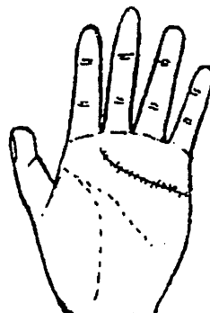

- ◎天纹上出现许多小纹会横切天纹的状况，表示失恋或暗恋的爱情问题常折磨你。你会喜欢的得不到，不在意的又常留身边，你是要求过高，常不自我量力而为的人。亦会辛苦工作，注重细节、顽固、坚持于某些事情，易得心脏病与精神耗弱症，宜放开心胸轻松的看待事情。

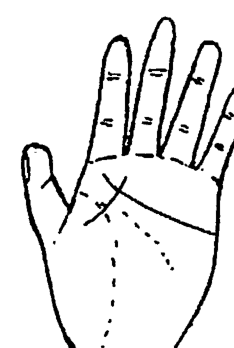

- ◎如果有纹路从震宫穿越地纹、人纹接触或穿过天纹的话，表示会由于亲人长辈的反对，而把你和情人的交往断绝。亦或是由于离婚，而与配偶家族断绝往来，上图和此图都是在紫微命理上，会在夫妻宫有擎羊、陀罗、化忌等星出现的人会具有之手相。

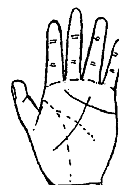

- ◎天纹被一条障碍线，或称影响线穿过，也直接穿过人纹、地纹。表示在爱情问题或婚姻问题上会有纠葛，有人会阻扰你的爱情或婚姻，易有三角关系而鸡犬不宁。
与人计较之人。
通常对人付出的多，但自己感觉收获得少。
事业上也易多遇困难。有这种手相的人，也多半是命、迁二宫有天空或地劫相互在寅、申宫对照的状况，宜早点结婚，有配偶管，能早通世事。

- ◎天纹位置比一般人高的人，或是进入震宫、艮宫的人，容易受到感情的支配，如图①或图②，天纹本身朝下成孤状的人，是善良而悲观的人，也多半口才不佳，无法做服务业、售货员或保险业这种须要人际关系的话，他会内向、自命清高，或胆怯，一生事运也不佳，婚姻运也不佳，亦可能不婚或晚婚又离婚，桃花少，也不知如何表达感情。

- ◎感情线，用情不专或有博爱思想，亦会到处留情，处处桃花，随遇而安了。有这样手相的人，夫、遷、福等宫多桃花星，亦可能是命、遷二宫有天梁居旺的人会有的手相了。

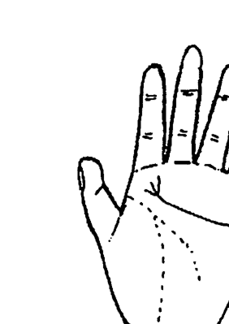

- ◎天纹很长，会达到食指下，纹线很清楚的人，表示其人骄傲、眼光高、吝啬、注重维护自我利益。
- ◎感情也是一种生命的财，既然感情线到达食指下很长，就表示生命的财还不少。这种手相下很容易出现在命中财多又小气吝啬的人的手上。如果武贪或武府坐命的人有此手相，再有很直很长的玉柱纹（命运线）的话，你就真的八字财多，而能大富了。
- ◎如果天纹虽长至食指下而分叉，则其人会感情较好，你会是命宫或迁移宫中有禄存或有羊陀的人会有此手相。

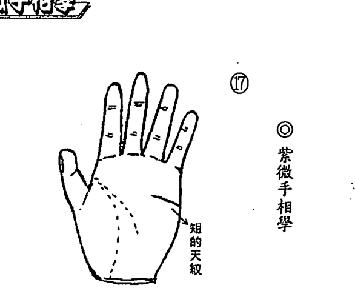

- ◎天纹笔直的人，是一种很会打算盘、不执著于任何事物的人，如果天纹再靠手掌下面一点，又短得不到中指的人，天生好实利。计较、算计是他这一生的功课和天性。他会非常现实，其人会晚婚或不婚，早年无恋爱机会，或恋爱不成功，也事业难成、蹉跎、多遇小人。有此手相者，主父母无产业，或父母有恶习导致无产，自己也会六亲无靠，一生起不定了。

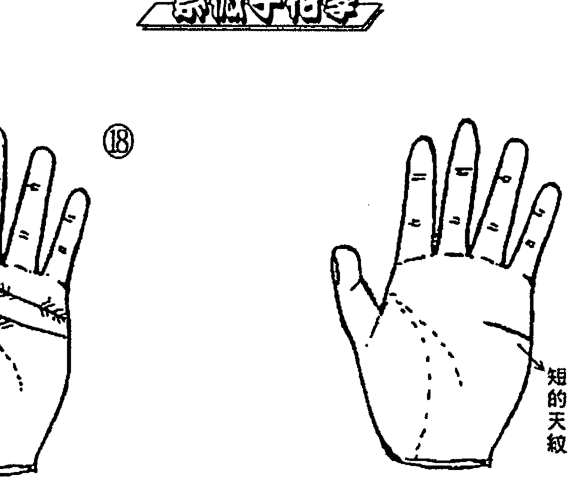

- ◎天纹的起端有羽状纹的人，主其人感情丰富对人热诚可靠。但天纹上的羽状纹不可太多，否则有交损友及溺爱子女而受连累的问题。如果天纹上只有下垂的支纹，则主好色贪欲，易有灾祸。命理格局上有『廉贪陀』之『风流彩格』的最易有此手相了。
- 如果再有岛纹在短的天纹的起端，在小指下一带，表示其人易见风转舵，重利忘义，但能在经商或外交方面成功。某些经营酒店的人或在酒店上班的女性会有此手相。凡有此手相的人易在夫妻宫或夫、迁、福等宫有羊陀火铃或化忌和桃花星相会。
- ◎天纹短，到达中指，并会与中指根之基线碰到的，其人能有手段达到目的，且易成功，但凡事占有慾强、自私，有竞争之心，多嫉、好色，且性急、顽固及主观，其人也会有生理上的毛病或多慾肾亏。女性也依然，易为色情行业之人。

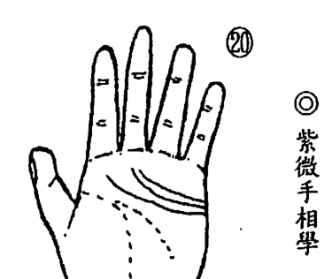

- 天纹有三条的，主其人有福寿康宁之异相。男子能娶双妻，且为一对姐妹。女子有此手相，易孤寡，婚姻难偕白首。在紫微命格中，通常贪狼坐命的人桃花多，较容易出现如此的手相。

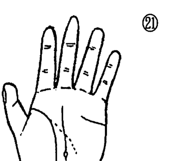

- 天纹（感情线）短，地纹（生命线）也不长，且有不明显或中途断了，（命运线）的尾端有岛纹，其人本命也不会长，亦会父母早亡，或遭遗弃，亦有为私生的可能，如果面相上额头短，日月角狭窄的人应验。
在紫微命格中，父母宫有凶星相剋严重的人，会有此手相。父母宫与疾厄宫相对照，因此父母宫所在位的星曜也代表了你遗传到的疾病。

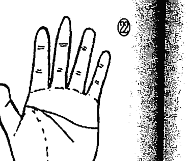

- 天纹（感情线）和人纹（智慧线）在中指与食指之间相遇合，如果面相与命格都不错的人，主其人生活幸福，好掌权力，爱赚钱和善于交际应酬，对政治具有野心。但如果命格与面相上有刑剋时，则主中年运不佳，此为大起大落之手相。

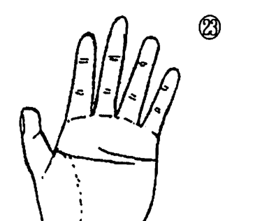

- 天纹和人纹相互平行或有部份重叠时，中国手相中称为『三和运』掌纹。命格为属金的人，如武曲坐命的人、七杀坐命的人，主聪明、果敢，任军职能至将军，有领导统御之才能。命格为属水或属火的人，则不吉。如太阴坐命、太阳坐命者不吉，一生多坎坷。

## ◎紫微手相學

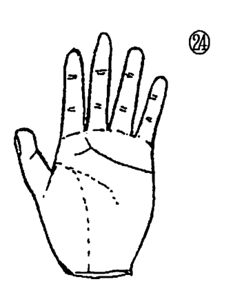


- ◎天纹还算长，会到达中指之下而分叉的人，主其人性格强，自信心强，好大喜功，但事业做不大，只有小成就而已。如果有分叉的纹路进入食指与中指间的指缝中去了，则主其人没有金钱概念，存不住钱，性格开朗豪爽，容易寅吃卯粮，易欠债。如果紫微命格中有文昌陷落在命盘上的人，或财帛宫不佳的人较易有此手相。
- ◎天纹的起端很淡细，几乎会看不见，较清楚的地方很短，靠近中指和食指下弯曲，主其人凡事不积极，一切不在乎。有自己的想法，亦会不婚、淡薄名利。其心肺功能会略有缺陷。
在紫微命格上，夫妻宫有天空、地劫俱全的人，有此征兆。

## ◎第八章 天纹（感情线）的相理看法


- ◎天纹长得如凤尾的形状，人的面相秀气、额头高，则主此人有能享祖产之福禄。如果人纹像长了毛，并不像凤尾的形状，其人又耳朵软而下垂的人，为胆小多疑，忧愁之人。如果地纹（生命线）之形状再生毛的人，其人易血虚贫血，寿命活不长。
- ◎天纹初端位置较靠下部，然后尾延伸，又下弯与人纹（智慧线）的初端相触碰时，有此手相又面相秀气者，主少年得志，能掌权主财力、心地善良，但婚姻不美，或有波折，或嫁娶贫苦配偶，一切须靠自己打拼，例如其人八字日主再为己卯、己酉、己未的人会应验。

# 紫微手相學

## 第九章 人纹（智慧线）的相理看法

◎ 第九章 人纹（智慧线）的相理看法

人纹在西洋手相學中，亦稱為智慧線或頭腦線。由名稱可知人紋在主導智慧方面，必有其特質和特性要表達，人在母胎中雙掌握拳掩耳成胎，手上的掌紋是與胚胎時期形成腦組織的狀況相連而形成的。每個人以人紋（智慧線或頭腦線）來把手掌分為上、下兩部份的話。在靠近手掌上方指的部份，稱為精神面，下面為物質面，因此人紋線越是靠近手掌上方，則此人較現實、重視物質享受。反之，人紋在手掌中之位置越低，則精神面較重視，其人也易超脫現實，好高騖遠，或不重錢財，活在幻想之中。
人紋（智慧線），代表人先天腦力的聰明和遺傳優良與否，也代表

# 如何用偏財運來理財致富

法雲居士◎著

偏財運會創造人生的奇蹟，偏財運也會為人生帶來財富，但「暴起暴落」始終是人生中的夢魘。
如何讓暴發的財富永遠留在你的身邊，如何用一次接一次的偏財運增高你的人生格局。
這本『如何用偏財運來理財致富』就明確的提供了發財的方法和用偏財運來理財致富的訣竅，讓你永不後悔，痛快的過你的人生！


# 紫微屋相學

法雲居士◎著

人有面相，房屋就有『屋相』。人有命運，房屋也有命運。具有好命運的房子，也必然具有好風水與好『屋相』。
房子、住屋是人外在環境的一部份，人必須先要住得好、住得舒適，為自己建造好的磁場環境，才會為你帶來好運和財運。
因此你住了什麼樣的房子，和為自己塑造了什麼樣的環境，很重要！
這本『紫微屋相學』不但告訴你如何選擇吉屋風水的事，更告訴你如何運用屋相的運氣來為自己增運、補運！


## 第九章 人纹（智慧线）的相理看法


- ◎天纹离开地纹的位置愈是靠下面，其人愈要依赖父母。依赖心很强，性格懦弱。凡事都要人陪著，要年岁相当大才能独当一面。此种手相的人即使结婚后仍会离不开母亲。
- ◎人纹和地纹的开端重叠在一起的地方不足一公分的，而且人纹的长短不够长、纹型不够秀丽，或纹浅或过细的人，表示其人会是情绪不稳定、太敏感，或有躁郁症或忧郁症的人，有时刻神经兮兮、太紧张小心。有时并不在乎，或恍惚渡日，其人一生也成就不大，有不婚或迟婚的状况。

## ◎紫微手相学

人中年事业之好坏，以及婚姻和爱情的成果。
人纹在大多数人的掌上都与地纹（生命线）的起点在一起，只有少数的人纹与地纹的起端分开。有更少的人纹起端会在地纹的内侧。现在一一举例之：


- ◎人纹（智慧线）如果和地纹（生命线）的起源开端相同。而且重叠处有两公分的距离才分开各自延伸。人纹又能秀气分叉少、长度又能到小指之下的话，这是非常好的手相。其人能性格温和稳定、做事有板有眼、有毅力、不会好高骛远，也不会犹豫不决，能得长辈及贵人相助、夫妻和谐。此种手相之人，适合做高科技行业，或做追根究底的工作，例如考古学、哲学等工作，善于分析考据。凡是有此人纹...

## 第九章 人纹（智慧线）的相理看法


- ◎人纹的起端和地纹的起端不在一起，而离开地纹约一公分左右，独自延伸。这种手相的人，性格会冲动又随意，做事常不加思考、性欲强，易冷易热，性格冲动时，会与刚认识几小时的人上宾馆，事后翻脸不认人。如图①
- ◎人纹与地纹的起端相隔有半公分距离的人，亦是欠思考。做事不慎重的人，但不像前者那样严重。但是他会为细小之事生气。易怒、暴躁、不耐烦、不讲理是他的本事。如图②
- ◎人纹和地纹的距离相远，这种人善于交际富有社交手腕，人缘好，跟谁都谈得来，言词圆滑不得罪人。自信心很强，不会被他人左右，是一个圆滑世故的人。如③
- ◎人纹的起端和地纹同在一起而出，但人纹断断续续，有中间不太连贯的状况。这种手相，主其人头脑不清，也不够灵活、笨拙，无社交能力，也无工作能力，易惹是非、受欺负、多委屈，也讲不明白。此种手相也多半出自本命有『刑印』格局及文昌居陷命格的人手上。
- ◎人纹上有岛纹或蛋形纹，而且其人面部气色不佳，眼光为三白眼（眼睛眼白的部份多，黑眼球的部份少）。有此手相者，主其人容易悲观，没有做事能力，智能有问题。也不愿负责任，智能有问题。也易常有头痛问题、呼吸系统不良症。看岛纹出现的位置，可算出大约年


◎人纹上的岛纹，如果形成非常大的如蛋形的岛纹，直径有半公分之大时，其人必身患恶疾，要做健康检查了，否则也易有伤灾车祸要小心。且要注意会有贫苦重病的生活。


- ◎人纹上有三角形的纹路，表示是吉兆。其人可自此纹出现时间始智慧太开，在事业上有表现。如果三角纹出现在人纹的起端，表示幼年时代即智慧大开，学业能突飞猛进。如果在中指下有三角纹，则表示中年能因智慧增加而事业上有成就。如果在无名指下有三角纹（也就是在人纹的尾声），则表示在老年时代因智慧增高而生活顺利。


- ◎人纹上出现四方形的纹样时，又称玉新纹。有类似桥的护拱一般。有此手相的人，要小心伤灾，但有此纹时，亦可保护其人在伤灾中，有护住重要部位及头部不受伤害，因此这是个亦喜亦爱的记号。
- ◎当人纹上有星纹时，不吉。表示其人易在思想上有冲突，易钻牛角尖，也易有精神疾病或忧郁症。亦可能会自杀。


- 纪。如岛纹在起端，主其人幼年运不佳，智力不好，一定读不好书。岛纹在中指下，为中年较笨，无事业，或会失业也易离婚，在无名指下时，为老年运，会笨或痴呆。

# ◎ 紫微手相學


## ◎ 第九章 人纹（智慧线）的相理看法

- 人纹和地纹起端稍微接触，就很直的往掌上兑宫或乾宫上部延伸，具有这种手相的人，其性格兴趣偏向理科方面，其工作可选于适合他的化学、设计、机械、医药、电脑等专业技术或科技、机械方面的工作职业。具有这种较理性处理智慧、理解能力方面问题的人，也多半是处事干脆、不拖泥带水的，也会计算能力好，做事有方法。因此其人命格中的文昌也必是居旺的，或是具有『阳梁昌禄』格的人。

# ◎ 紫微手相學


- 人纹和地纹起端相连，同处起源出发。而人纹以曲线的状况到达掌上乾宫（西洋手相称月丘），此种手相的人，为人想象力及幻想都很丰富，常用感觉或灵感来感觉身边周遭的事。这种人偏向艺术类、文学类的科目。其人的职业适合做艺术家、小说家、摄影家。其人的手指若细长或呈尖形手的人更验。其人在命格上多半为『机月同梁』格的人。
- 人纹如果从地纹（生命线）的内侧为起端而延伸出来。此种手相表示其人会神经兮兮，过于敏感、内向、人缘关系不佳，无法开拓人际关系，因此最好做安静朴实的工作，如文职编辑、校对、作曲或会计人员或内勤人员，不适应抛头露面的工作。

# ◎ 第九章 人纹（智慧线）的相理看法


- ◎ 有双重人纹（头脑线）的人，其中一条人纹与地纹同源而出，另一条人纹则较短在较长纹之上。有此手相的人，其人为多才多艺的人，文艺、理工皆通，文武全才、智慧超高、知识超水准，求知欲强。适合做活学活用、有发挥其才能职业，否则会抑郁、有志难伸。有此手相的人，常是命宫中有天才星同坐的人。

# ◎ 紫微手相學


- ◎ 人纹和地纹起端分开，人纹很笔直的延伸到达手掌边际。其人会独立果敢，做事干脆，为人现实、决断能力很迅速，不喜受管束、喜合跑外务，此人也要小心婚姻问题，易晚婚或不婚。其人幼年即胆小怕事，有此种手相者其夫妻宫易有恶星或为空宫。
- ◎ 人纹的起点出自巽宫（西洋手相称木星丘），而延伸至乾宫上部（月丘上部）的人，表示其人具有支配及领导人的能力，可以做大事业，领导众人。自然做企业集团的总裁或学院院长，或政府官员都是指日可待的。

# ◎ 第九章 人纹（智慧线）的相理看法

- 人纹从食指下为起端，穿过天纹，而延伸至乾宫上部。此种手相者，有大才智、大魄力，人纹上再有分叉时，也代表双重人纹。例如分歧之支线，如①到达兑宫的话，主其精明、有怀疑人的心和调查事情的能力。很适合做与法律、法官、侦查、调查员有关的职业。如果分歧的支线往乾宫方向，如②，表示其人具有文学、艺术方面之才能，做作家、记者、艺术、创作者皆会有成就。


- 人纹有朝向上的支线、纹路皆属吉相。人纹上有支线向上到达无名指下部时，主其人智慧高、聪敏努力，亦会有优良的配偶，如贵人般出现来帮助你。如果你是男性就会有贤妻辅助成就大事业。如果你是女性，就会得贤夫相助人生或一同创业。
- 人纹之支线到小指下部时，主其人头脑智慧特佳，老谋深算，亦能有学术上之成就。晚年运佳。


- 人纹和地纹的起端在一起，但人纹上多上凹点或斑点的人，其人的身体多不佳，易有病，且脑神经易受损。其人会情绪不稳、多烦恼、自闭，一生无用，亦无工作，也易有精神疾病，婚姻有问题，更容易自杀，要小心。


# # 第九章 人纹（智慧线）的相理看法


- ◎人纹与地纹起端在一起，而人纹短，在较短的地方被杂纹阻断。此种手相，主其人易用小奸小诈的手腕计俩来对付别人。青少年时代易学业受阻，一生也工作不长久，或不工作。


- ◎人纹与地纹的起端和中端皆相连在一起。有此手相者，会做事保守小心谨慎。如果手纹清楚秀丽的人，能衣食无忧、勤奋工作。如果手纹有杂乱现象，手相又粗浊难看的人，则会是爱偷懒、喜占小便宜，没上进心，工作成绩不佳，婚姻也欠佳的人，也会懦弱而无用。


- ◎人纹与地纹的起端在一起，但人纹杂乱，其尾端再翘起来与天纹接触时，其人会有精神疾病，情绪不稳，心神不宁，一生也无事业，并且婚姻不美。


- ◎人纹和地纹起端在一起，而人纹多曲折，或是呈曲线的人，其人情绪不稳定，疑心病重，多阴险狡诈。一生也波折多，事业不顺，婚姻也不好。其人常思想古怪，会过和常人不一样的生活，亦与家人不和，相互刑克。

## 第九章 人纹（智慧线）的相理看法

-   人纹与地纹的起端在一起，但人纹延伸后有分叉状况，以双条人纹论，并都能到达掌上兑宫位置而不下垂，必须纹线清楚而秀气，其人智慧超高，反应能力特佳，能做精细、繁杂、繁重的工作，而且持续力强，不易劳累。在待人处世上谨慎小心，又处处不得罪人。并能立功，亦会娶名门富家女成为自己的贵人。在其人紫微命格中必是夫妻宫有禄星，及八字中有妻财的人，会有此手相。

[图片: 5166ca8d0838a7e3cf63d2e9e01f8929_96_0.png]

[图片: 5166ca8d0838a7e3cf63d2e9e01f8929_96_1.png]

-   人纹与地纹的起端在一起，但人纹短，在中指下位置上弯，其人易懒惰、没恒心、优柔寡断，工作能力不佳，做事也不想用脑筋，易半途而废，一生工作不长久。

[图片: 5166ca8d0838a7e3cf63d2e9e01f8929_96_2.png]

-   人纹与地纹的起端在一起的部份长，有两公分，人纹再曲折延伸，尾端垂下至乾宫。此手相的人，容易在事业上多波折，有头无尾，或成败起伏不定，更易心情闷、意志力减弱，一生不顺利。女性更要小心婚姻不美。如有专业技术较好。

[图片: 5166ca8d0838a7e3cf63d2e9e01f8929_96_3.png]

-   人纹和地纹的起端同在一起，但人纹延伸到无名指下时，突然下垂又分叉。此种手相是多幻想、心地不善、语言不实、口是心非的人。如果其人的大拇指瘦小，或无名指有弯曲，其人爱说谎、工作能力不佳、婚姻也不美，易离婚或结不了婚。

[图片: 5166ca8d0838a7e3cf63d2e9e01f8929_97_0.png]

[图片: 5166ca8d0838a7e3cf63d2e9e01f8929_97_1.png]

-   人纹看起来有双条，和地纹起端同在一起，上面一条的长度过了中指，下面一条人纹却只到食指下面，而且纹细纹浅。此种手相，其人为性格软弱、多烦恼、多忧虑之人，会一生无成就可言。如果上面一条人纹能到无名指下，又能清晰纹深的人，就会是能做大事业，又能享齐人之福之人，且性格上也会该谨慎的时候谨慎。

-   人纹和地纹的起点同在一起，人纹延伸至兑宫附近，在末端分成小叉形。此种手相者，不论男女，主其人热爱家庭，喜照顾家庭，但精神易紧张，虽有策划能力，但难成大事。做上班族，勿担大任还好，也要小心婚姻出问题。

[图片: 5166ca8d0838a7e3cf63d2e9e01f8929_97_2.png]

-   人纹和地纹起端在一起，人纹上面及天纹中间又有一条纹线，在中指和无名指下的位置，此线称为『天河纹』。有此手相者，其人智慧超高，有事业才华，更能得异性之助而成就大事业，富贵一等。女性有婚姻关系不佳或不婚的问题，男性则有齐人之福际遇。

[图片: 5166ca8d0838a7e3cf63d2e9e01f8929_97_3.png]

## ◎ 紫微手相学

[图片: 5166ca8d0838a7e3cf63d2e9e01f8929_98_0.png]

## 第九章 人纹（智慧线）的相理看法

-   人纹和地纹的起端同在一起，但人纹延伸后，在中指下的部位，突然生出下垂的支纹，或又出现六秀纹（太阳线）。有此手相者，则表示从下垂之支纹出现之日起，会转行、改行，并能成功。男性有此纹出现时，表示有外遇或娶妾的心态。女性则易婚姻失败。

[图片: 5166ca8d0838a7e3cf63d2e9e01f8929_98_1.png]

-   人纹与地纹（生命线）的起端同在一起，而且其起端和地纹黏在一起重叠的部分很长，分开后人纹向上翘起延伸，尾端会接触到天纹（感情线）。有此手相的人，此人会聪明有智慧也勤劳，自幼家境好、富裕又有父母长辈的庇荫，家产丰厚，亦能有幸福家庭和婚姻，事业上会有大成就，能扬名声、显富贵。

[图片: 5166ca8d0838a7e3cf63d2e9e01f8929_98_2.png]

-   在紫微命格中，只有命宫有化权的人，或杀破狼格局的人，容易有这种开创格局人生的手相。

-   人纹和地纹的起端同在一起，人纹延伸后在中指与无名指下分成两支枝纹，一支朝向兑宫上端方向而去，一支向乾宫垂下，或接近乾宫。有此种手相的人，是活泼开朗的人，才艺多、计算能力、善理财，敏感性强，既实际又有理想，既积极又能守成，故能成就大事业或累积财富，能成为富翁或富婆。

### ◎第九章 人纹（智慧线）的相理看法

[图片: 5166ca8d0838a7e3cf63d2e9e01f8929_99_0.png]

-   人纹与地纹的起端在一起，人纹随着地纹并行而垂下。有此手相的人是心胸狭窄，想法悲观、身体不佳，凡事不想动，常推诿不想做，没有做事能力的人，也会婚姻难成或有问题。如果人纹在尾端又再度和地纹相合相接触，或

[图片: 5166ca8d0838a7e3cf63d2e9e01f8929_99_1.png]

-   人纹与地纹的起端相连在一起有很长一段距离，有相连三分之一，或相连一半以上的长度才分开延伸的，凡是相连三公分以上的距离者，代表其人是保守胆小型的人，如果纹条秀丽又深，杂线少，其人仍会在事业上有成。如果大拇指细小不佳，人纹又杂乱无章的手相，其人胆小懦弱，无上进心，婚姻有问题，一切都可悲了。

[图片: 5166ca8d0838a7e3cf63d2e9e01f8929_99_2.png]

-   人纹和地纹的起端同在一起，但只有一公分左右相连，就各自延伸，人纹尾端渐朝上翘起，会在小指下接触天纹，或到达小指根之基部的手相。有此手相的人，主其人超拜金，超现实，在婚姻上会有奇特缘份，且能有妻财或嫁入豪门为贵妇。其人也有极高的智慧、大胆，能积极经营一切事情，终必大富，此人有偏财运，要注意暴起暴落的问题。

## ◎ 紫微手相学

### ◎ 第九章 人纹（智慧线）的相理看法

[图片: 5166ca8d0838a7e3cf63d2e9e01f8929_100_0.png]

[图片: 5166ca8d0838a7e3cf63d2e9e01f8929_100_1.png]

-   人纹和地纹的起端相连在一起，人纹向乾宫延伸下垂，中间被杂纹、横纹冲断。此手相者，易因小事激怒、头脑混乱、糊涂，走路低着头，常恍惚且患得患失，为无用之人。
-   人纹和地纹的起端是分开的，人纹的尾端上翘与天纹接触，并与天纹的起端相接触。有此手相的人，再加上头额广阔、鼻头圆准，眼睛黑白分明，则是聪明过人，中年可发达致富，名与利皆可双收的人。其计算能力好，经营有道。女子有此手相者，可帮夫运，亦能自己创造大事业。

[图片: 5166ca8d0838a7e3cf63d2e9e01f8929_100_2.png]

-   ◎ 紫微手相学
-   人纹和地纹一起到达并接触腕颈之纹线的人，易为情自杀或上吊而亡。
-   人纹和地纹的起端同在一起，但人纹会在中指下中断，如果中断的部分不长，只有一、两毫米，又再继续延伸者，如②，则其人易有伤灾，且易伤及头部，但能化险为夷。如果在中指下中断，而不再延伸者，两手都是这种手相的人，主其人易意外伤灾而亡。
-   如果人纹在中指下有重叠之纹而延续延伸的人，如①，主其人思想常被打断，做事也常常中断后再做，其人工作也易做做停停，并且婚姻也会中途离异，凡事半途而废。

### ◎第九章 人纹（智慧线）的相理看法

[图片: 5166ca8d0838a7e3cf63d2e9e01f8929_101_0.png]

-   人纹和地纹的起端在一起，而人纹在食指或中指下部位有向上的支纹。有此手相者，主其人有希望可达成，并有上进心，工作顺利，做公职或管理阶层为佳。人纹在中指下有向上纹时，则表示在其人中年时代有上进及成功机会，向上纹一定要清晰、纹深，且要穿过天纹，要长一点才有效果。向上纹出现时，也就是要发了的时候。通常人在走好的大运时，会出现向上纹。

## ◎紫微手相学

[图片: 5166ca8d0838a7e3cf63d2e9e01f8929_101_1.png]

[图片: 5166ca8d0838a7e3cf63d2e9e01f8929_101_2.png]

-   人纹和地纹的起端在一起，延伸后，直落乾宫，人纹的尾端过长，直至乾宫手腕边侧。有此手相的人，其人外交能力差，自卑感重，较保守、自私，说话噜嗦、重复、唠叨不停，一生成就不大。在紫微命格中，命宫或迁移宫有禄存星的人，易有此手相。
-   如果天纹、人纹、地纹的起端连在一起，人纹一定要过中指才行。有此手相者，极有自信及坚忍卓决的精神，好掌权，尤其好管钱，能在事业上有大作为。女性有此手相时，主再嫁或女强人。

## 紫微手相學

## 第九章 人紋（智慧線）的相理看法

[图片: 5166ca8d0838a7e3cf63d2e9e01f8929_102_0.png]

-   人纹上出现十字纹和人纹形成X状，为失神纹。有此纹均不吉。此纹如果在食指下位置的人纹上出现，表示其人会因性急出错有血光伤灾。此纹若出现在中指之下部位的人纹上，主其人易有头伤，破相或脑震荡。此纹若出现在无名指下部位的人纹上，要小心车祸及一切交通工具的血光伤亡之灾。如果出现在小指下部位的人纹上，要防口舌是非而遭灾，或误食有毒物质而遭灾。

## 紫微手相學

## 紫微手相學

[图片: 5166ca8d0838a7e3cf63d2e9e01f8929_102_1.png]

-   人纹与地纹的起端在一起，人纹延伸后，尾端下垂到乾宫，而乾宫多杂纹混乱。有此手相者，其人多家中无主，无男性长辈当家主事，其人易主孤，且多幻想、软弱，更容易有精神病，或头痛、中风等症。只要乾宫杂纹少的，反而可成为思想家，或文学家、哲学家之流。人纹长至乾宫、秀丽纤长者，主智慧一等。

[图片: 5166ca8d0838a7e3cf63d2e9e01f8929_102_2.png]

-   人纹上有小的直纹或Y字纹（亦称夜叉纹）出现时，要小心会有小人暗害的烦恼，亦会有头部或头部受到外来的撞击或伤害。如果人纹上有Y字形纹，亦是俗称的夜叉纹，则头部及颈部更要小心，以防有性命之灾。

[图片: 5166ca8d0838a7e3cf63d2e9e01f8929_103_0.png]

-   人纹的起端不和地纹在一起，直接由食指下起纹向兑宫延伸。凡有此手相者，智慧高野心大，性格倾向理智冷静方面，较不重视感情，凡事一板一眼，公事公办，较自私，会为达成自己目的，而牺牲别人。此人也易六亲不靠，自己奋斗而成。

[图片: 5166ca8d0838a7e3cf63d2e9e01f8929_103_1.png]

-   人纹不够秀丽，纹粗又复杂，或纹上有凹点、斑点。有此手相者，其人易有脑部疾病脑神经方面之疾病，也容易有忧郁症易自杀。更主配偶有灾，要小心为宜。

## 第九章 人纹（智慧线）的相理看法

[图片: 5166ca8d0838a7e3cf63d2e9e01f8929_103_2.png]

-   人纹和地纹的起端在一起，而人纹延伸至小指或无名指下部位时，又再分成三叉支纹，而这三叉纹又不会下垂时。有此手相的人，主其人适应力强、智慧高、善变、兴趣多种。须手相、手形不粗俗的人，才能实现自己的幻想，否则容易好高骛远，有此种手相者，多贪念，也易婚姻运不佳。女子有此手相者多次再婚，仍子女少或无。

[图片: 5166ca8d0838a7e3cf63d2e9e01f8929_103_3.png]

-   人纹和地纹的起端不在一起，中间有空间，此种手相，代表有独立性，凡事不愿和别人一样，有怀疑心，但也大胆，易反传统，也易感情用事，做事马虎、敢做敢当，又不计后果，亦主克母，与母不和。

-   如果只有一手有此人纹、地纹分开的状况，则其人常性格矛盾、犹豫，有时喜、有时忧，有时静，有时冲动，凡事一会急、一会慢，容易成事少、败事多，一事无成。
-   如果两手都是人纹和地纹的起端不在一起，又两条的起端相隔一公分之遥，表示其人不合群，喜孤独，环境不佳，又易换工作，或工作不长久，一生烦恼以终。

## 第十章 地纹（生命线）的相理看法

地纹在西洋手相学中称为生命线或健康线，这是与我们先天身体在接受母亲的遗传有密切相关。同时母系遗传因子上的影响。在身体健康方面，亦代表除了心脏与肾脏系统之外的脾、胃、肠等系统（人纹主管心脏系统、天纹主管肾脏、膀胱、生殖系统）。

地纹（生命线）主人之根基，其好坏，直接和我们的寿命及健康与母亲之寿命岁数有关系。而且有有时候它也会随着你的健康情形而变化、意义。最健康美好的地纹，就是粗深、秀丽、无杂纹、支纹，弯曲度要大，直达手腕际之颈纹的地纹。但更重要的先决条件也是要有强健的大拇指，及其根部发达，也就是震、艮宫，要美好隆起（金星丘发达）的人，自然会遗传优良，长寿、身体壮壮，智慧也高了。现在让我们来看有关地纹的各式状况所代表的相理看法！

## ◎ 第十章 地纹（生命线）的相理看法

[图片: 5166ca8d0838a7e3cf63d2e9e01f8929_105_0.png]

[图片: 5166ca8d0838a7e3cf63d2e9e01f8929_105_1.png]

-   地纹起点在食指与大拇指之间的中心点上，而且末端延伸到手腕线中间点（手腕线二分之一处）时，须清晰秀丽，其人可一生少病，身体健康，而且会到外地发展事业，有远大志向，但好色。要小心因色而事业失败。女性有此手相，可靠夫妇享福，或自己创造事业。如果地纹延伸之末端到达手腕线之接触，并超过手腕线三分之一的位置。有此手相者，表示其人性格爽朗、宽宏、气量大、不计较别人是非、一生健康、快乐、性欲强。背井离乡有发展，可衣锦荣归。其人母亲长寿，有美妻。在紫微命理中，此种手相多半出现在本命财帛宫，有荫庇的太阳居旺坐命的人手上。

[图片: 5166ca8d0838a7e3cf63d2e9e01f8929_105_2.png]

-   地纹的起点在食指与大拇指之间中点的上方。此种手相的人，主其人好争斗、有正义感、易冲动，身体强健、急躁、粗俗、重物欲，做事常后悔。
-   地纹的起点在中点的下方时，主其人体力不好、不想动、做事不积极，提不起劲，也不会自动自发，难有作为。

### ◎ 第十章 地纹（生命线）的相理看法

[图片: 5166ca8d0838a7e3cf63d2e9e01f8929_106_0.png]

-   **粗而深的地纹（生命线）** 表示身体健康，很少有疾病，精力充沛，做事勤快。其人也健谈，人缘极佳。通常，粗深又长的地纹在尾端，自然慢慢变细，触到手腕动脉线，或慢慢消失，是表示寿命是老到自然而然的结束的。如果地纹一直很粗深，在尾端都突然消失，则表示平常很少生病，但会突然猝死或暴毙。浅而细的地纹，其人容易精力不足，常感疲劳，做事不持久。会未及五十岁，亦易不婚或婚姻运不佳。
-   **地纹的起点在食指与大拇指之间中点上**，但地纹延伸出来的走势却贴着大拇指第二节的根部，使艮宫狭小（金星丘狭小），此种人有先天性疾病，性格保守拘谨、胆小怕事、相貌也矮小不佳，性格冷淡，精力不足，要小心寿命。有元气、少病。如果地纹粗浊，以及手形粗浊，其人为较粗俗，没大脑之人，事业也不佳。有此手相者，须纹线秀丽，主其人腕线接触。
-   **如果地纹起点在食指与大拇指之间的中点**，但延伸后尾端只在手腕线的三分之一处，并与手腕线接触。

[图片: 5166ca8d0838a7e3cf63d2e9e01f8929_106_1.png]

[图片: 5166ca8d0838a7e3cf63d2e9e01f8929_106_2.png]

-   紫微手相学
-   纹不美，较粗多杂纹的人，能有高寿，但事业未必佳。

### ◎ 第十章 地纹（生命线）的相理看法

[图片: 5166ca8d0838a7e3cf63d2e9e01f8929_107_0.png]

-   在地纹起端有斑纹，表示孩童时代会因为扁桃性病变，表示肺炎，容易在发生过了才出现。青色斑点，表示急性病炎或出血，表示热病。有红色斑点出现时，要小心内脏发炎或出血，表示热病。运气衰，斑点凹点有零点一公分的人，要小心有大病、重病。
-   地纹上有凹点或深色斑点时，都主健康不佳，运气衰，斑点凹点有零点一公分的人，要小心有大病、重病。
-   在手掌中央部位，易是肺癌、乳癌、喉头癌。在地纹近尾端，易是前列腺癌或膀胱癌，女子为子宫癌、卵巢癌等等。
-   如果从起端算起三分之一长度的地纹上有岛纹，则表示脊椎骨有毛病。

## ◎ 紫微手相学

[图片: 5166ca8d0838a7e3cf63d2e9e01f8929_107_1.png]

-   地纹全部都由岛纹（锁状线）形的人，表示其人体质衰弱，一生都会有慢性病的折磨。
-   在地纹起端有岛纹时成锁链状，表示幼儿时期的身体很差，很虚弱，曾有大病纪录。如果后来手掌的地纹又成为一条时，表示病也被克服了。在地纹起端有岛纹的孩童，也容易有发育迟缓，智能不足的问题。
-   地纹的中段有岛纹，表示中年身体不佳，有大病灾，也容易忧郁、工作不顺，或有自杀倾向。
-   岛纹出现在地纹尾端，表示老年有疾病缠身及心理障碍。
-   如果左手地纹有岛纹，表示有遗传性疾病。
-   如果两手地纹皆有岛纹，表示已有慢性病了，很难痊愈。

## 第十章 地纹（生命线）的相理看法

[图片: 5166ca8d0838a7e3cf63d2e9e01f8929_108_0.png]

-   如果地纹上有四方形的玉新纹压在上面，形成如中形，代表其人会克母，且会有大灾祸，但能死里逃生，如图中③。
-   如果四方形的方块有一边的线条，是以地纹做边，也就是四方形紧贴地纹，有此手相者，刑克六亲，婚姻和事业皆有问题。还会有古怪而凶厄的灾祸和病灾。如得禽流感症等等。
-   地纹有三角形，形成△状况时，如①，表示主吉，身体健康运气和精力增旺，事业发达，财富能增多。如果三角形的一边是由地纹所组成的，则表示其有腹部疾病，内脏有动手术的迹象，要小心。仍可用流年法算出发病时间。如图②。
-   地纹上如果有叉纹，则主其人刑克配偶及母亲，婚姻和事业皆有问题。
-   地纹上如果有星纹，则要小心会有难医的恶疾。
-   算发生时间，仍是要用『掌纹流年计算法』换算时间。要看失神纹所在的部位用流年法来推算发生时间。

[图片: 5166ca8d0838a7e3cf63d2e9e01f8929_108_1.png]

-   地纹上有小横线横切，或穿过，主其人会有不佳的嗜好而影响身体。如吸烟、喝酒等等。
-   短的地纹又以斑点收尾，会因感冒，肺炎暴毙死亡。

## ◎ 紫微手相學# 紫微手相學

- ◎地紋尾端有短細的毛狀線朝下為下降線，代表體力減退、精力喪失，此時是衰退期，如果在地紋中段就出現，更要小心，要多保養身體，注意養生，切勿太過度浪費體力，以防有病。
- ◎地紋尾端出現箭頭紋，或稱流蘇狀之紋路，表示體力衰退的很厲害，太過勞累，健康差、運氣也差，是死亡標誌。也要小心酒色傷身所導致者，主被困住，易出家修行，或在醫院中住很久，或有牢獄之災被關起來。

# 第十章 地紋（生命線）的相理看法

- ◎地紋從中間開始為分歧點，地紋上端有毛狀細向上伸出，地紋下端亦有毛狀細向下伸出。這個分歧點表示上昇線已經告終，下降的線已經出現。這個分歧點就是人精力的巔峰點。用流年法可算出這一點在幾歲時，同時這一點也是人生生命力的巔峰點，其人能事業上大發、有成就。
如果有支線或下降線在地紋上深刻清晰的出現的話，表示具有虎虎生風的生命力，可大有所為。

## 第十章 地纹（生命线）的相理看法

如果地纹本身很粗深，中断以下的纹路也仍然很粗深，这代表发生事故的可能性很高，但能逢凶化吉，转危为安。可依流年法来算出事故时间。而且两手之地纹都在同一处有中断或裂缝，则铁定会有事故发生了。
如果地纹中断处很小，又很快的恢复到原来线状，则患疾病会轻微，或只是生活方式会有大改变，实际上并不会发生危险。
如果地纹中断以后，逐渐变细，下部线再变成锁状（岛形）的线时，要小心自中断以后的年纪开始，其人生可能被慢性病所残害，最后很可能因病退休或收入减少，生活困苦。如果玉柱纹（命运线）上再有裂缝或中或有斑点、凶。

- ◎地纹上有十字纹，或十字纹与地纹接触到了，这表示会有意外的事故或灾难，如车祸、伤灾、血光等，会徘徊在生死边缘。
如果十字纹在地纹的起端之侧，并不与地纹接触，这表示在孩童时期，由于灾害或破产而家人离散。
如果地纹短，而末端有十字纹收尾，则定会以事故伤灾而猝死暴毙的。
- ◎地纹在中间部位有中断或裂缝，表示在该处所代表的年纪有一场疾病或事故发生，或是有生活环境上的变化。这并不代表死亡或寿命短，而是要看地纹中断或裂缝时，上下两条间之距离有多宽、多远而定。

- ◎ 如果地纹中断，中断以前和中断以后所划出的半径，常会不相同。例如下段的地纹会突出在外面，起端和上段地纹，有些重复的地方，这表示其人的生活方式将会有大改变，会破祖离乡发展，或迁居移民发展。
如果上、下段纹线衔接部份超过二公分的人，主在中断及衔接处，有灾祸或重病但会转危为安，有惊无险！之后有大发展及富贵。如果下段衔接之起端，在上端地纹之内侧，表示会为孤儿或养子、养女，也会在衔接之时所代表之年纪有生命之忧。

## 第十章 地纹（生命线）的相理看法

- ◎ 地纹虽然中断，但线条有了重叠，或在重叠之处有短线链接，如上图（地纹内侧的线为贵人线）即使生病会很轻，不会有生命危险。甚至只是暗示你会在生活方式上会改变。

## 第十章 地纹（生命线）的相理看法

有双条地纹，其起端都处于食指与大拇指间距离的中心点。有此手相者，主其人精力旺盛，身体健康，可白手成家，有贵人运可相助事业，一生能逢凶化吉呈祥，并能娶嫁贤明配偶，婚姻幸福。其人幼年多半有两个母亲，一为亲生母亲，一为养母或义母。女性有此手相者，可拥有较多房地产和嫁富有、能力强之夫婿。
在地纹内侧出现短短的向上或向下的杂纹，会与地纹相接。此种手相之人，会在出现此纹线的时间发生恋爱而结婚如①。如果杂纹穿过地纹，代表恋爱失败分手，如②。如果杂纹由地纹出生，向下延伸出来，则表示此杂纹出现时，会和配偶离婚。如③。
地纹中断，上段的尾端向震宫延伸过去，而下段又细微的话，这代表死亡征兆，要小心因病或车祸、伤灾突然亡故。
如果地纹中断处不止一处，有很多处，或地纹根本就是断断续续的话，表示其人体质虚弱，通常都带有慢性疾病，中断处就表示病情恶化的时候。如果地纹又逐渐变细微，表示在生命危弱、生死之间搏斗了。

## 第十章 地纹（生命线）的相理看法

- ◎ 地纹杂乱、顿点、中断或如乱线头集中在一起的手相，主其人身體有病，有腸胃毛病，無法吸收營養，消化系統有病。如果地紋彎曲延伸，主其人心臟及循環系統不佳，也會婚姻和事業有問題，容易缺氧易怒。
如果地纹由细纹组成，亦可有另外亲戚来相助事业有成就。但组成之细纹不够秀丽，或者断裂中止时，会刑克母亲，自己也很难成功，更能因亲戚之故而惹灾。
- ◎ 地纹如果为复杂的细纹所组成，样子还深细秀丽的话，主其人一生易由母亲或乾妈或姨妈，或父亲的小老婆、妾室之助而成功，但成功不常，仍会有变化。其人身体还算健康，受到母亲方面的遗传较多。
有此手相者，其人为继室所生，或为小老婆所生，有此手相者，其母必得婚姻之助而享福，母系亲属也得救享福，因此此人会受到母家亲戚的重视。
- ◎ 地纹有两条，上、下两条，衔接重叠处超过三公分以上，不以地纹中断或断裂来论处。有此手相者。

## 第十章 地纹（生命线）的相理看法

- ◎地纹靠近掌上艮宫位置，有向上纹延伸至中指下，这是玉柱纹中的一种形状，代表其人可在母亲或家族支持下而事业成功，或利用家族产业来发达。手上有六秀纹（太阳线）的人，富贵可达成。女性有此手相的人，可自营事业，为女老板，但劳碌不停。
如果地纹上的向上线不到二公分的话，则意志虽坚强，但仍无成就。
如果是女性有上述的向上线及星纹的话，其人能因结婚而富贵，嫁入豪门或选中金龟婿，能使自己的地位增高。
在食指下离宫处有星纹出现，更是吉兆，主增加权力地位，事业大有成就，可掌权。
- ◎地纹的起端在拇指与食指间距离的中心点开始延伸，在地纹起端靠食指下的位置有向上的直纹由地纹向上延伸时，西洋手相称之『进步线』或『希望线』。有此手相者，会在幼年时期就自动自发的努力上进、有恒心，未来也会有成就。
如果大拇指或食指第一节皆有夫子眼或凤眼者，也能助其有上进和成功之力量。
但有小横纹穿过此进步线成为十字纹时，则不吉，就会以十字纹论了。
- ◎地纹上出现向上线，在靠近中指下或食指与中指之间的下方。此条向上线要超过二公分长度较佳，代表事业上有成就。如果向上线的尾端。

## 第十章 地纹（生命线）的相理看法

地纹上有短的障碍线横切而过，而兑宫和乾宫之间有井纹，或格子纹或十字纹时，会有患肾脏病及妇女病的问题。
地纹上有障碍线横切而过，如果短促的话，只表示有小小的疾病，或是有精神方面的负担。如果障碍线的长度超过一公分，在无名指下中断，或延伸到感情线，而以岛纹或斑点收尾的话，就会有心脏病发生，要小心。
如果地纹的起点高，在食指之下，地纹的尾端又到达动脉纹的左侧。有此手相的人，主其人贪心多欲，但顽固脾气坏，多惹是非、有勇无谋，一生无成就。如果手形粗、地纹为红色，其人易怒、暴躁，易死于非命。如果人纹如曲折状，则不一定会死于非命了，可能因智慧不佳的问题，有发育或行动迟缓的状况。
向上线是穿过地纹时，则其人为刑克事业，贪情欲，婚姻失败，一生落魄以终了。
地纹中间段有向上线，此线亦称『副笔』向上延伸至中指，甚至超过基线，有此手相者，其人中年有贵人相助，有暴发之机会在事业上突起。再有六秀纹相助，成就事业更大。但如果事业，为女老板，但劳碌不停。

## 第十章 地纹（生命线）的相理看法

地纹短浅，长度只到手腕处的三分之二，并且人纹、天纹也短浅而细，天纹只到无名指下而已，有此手相的人，其人先天不佳，遗传不好，健康有问题，性格保守、懦弱，五脏皆衰弱不强，一生无事业和婚姻可谈。如果大拇指长相还算正常强健的，主四十岁寿命，四十岁前正常健康，四十岁后发病易亡。
地纹起端在中指之下，尾端到动脉纹边侧艮宫处，人纹短粗杂乱。有此手相的人，在青少年时期很辛苦，头脑不清、混乱度日，学习也不佳。中年略好，其人性格多变，狡猾善骗，婚姻也有问题，晚年仍穷困失败。
地纹的起端在食指根基之下，与天纹和人纹之间，延伸后其尾端到动脉纹中段位置，如果纹线细深而秀丽的人，主其人做事有规则，性格稳重有计谋、野心大，能在事业上用心有成就。
在手掌上，天纹与人纹极端靠近，这两条线所相夹的部份（称为方庭）会变得很狭窄，如果横切过地纹的障碍延伸在此处方庭停下来，则表示其人易罹患哮喘病。

## 第十章 地纹（生命线）的相理看法

- ◎地纹自中间开始弯曲，不绕艮宫而行，反而斜向乾宫方向，有此手相时，此人有先天疾病，在生理上有缺陷，不能生育。宜主动治疗，否则一生有事难成，工作不力，无精打采，且忧郁度日。
- ◎地纹之中段或后段出现向上纹（又称副笔），此线向上延伸到达无名指下方时。有此手相的人，会有创造力、幻想强，中年可创造不同于一般人之事业而大发，其人具有强烈之意志力，并会有艺术、美术、文学、音乐、医学，以及哲学或玄学上的学识与爱好。老年运好，能主富贵及声望。
- ◎地纹上有三条向上纹（副笔）向上延伸，分别到达掌上之巽宫、离宫、坤宫等位置时，有此手相的人，智慧超优。但会幼年贫困下贱，老时才有富贵、地位，一生辛苦而成。如有杂纹横切向上纹时，会为小人所害，事业有波折。
- ◎地纹上有向上的小纹线，其长度不到一公分，为吉兆。代表其人运气正佳，有向上冲的冲劲，企图心旺盛，健康状况也不错。如果不到一公分的横纹，横切地纹，在此纹出现的时候，即代表其人有精神衰弱或有耗弱现象，运气也不佳，将有疾病发生或灾祸降临，要小心！如果横纹超过一公分以上时，有重大疾病或祸灾将发生，更要小心了。

## 第十章 地纹（生命线）的相理看法

地纹的起端和前段极细若有若无，到中间以后再清楚显现。有此手相者，其人幼年穷困、或父母早亡，或离家流浪，生活不定，中年以后稍有衣食。如果有玉柱纹出现的人，又穿过明堂。
- ◎ 地纹上有曲折的线缠绕，仿佛藤蔓缠绕一般的手相，中国手相学上称之为『困身纹』。有此手相者，多有暗疾，有疾病缠身，而心理状态不佳，多疑、易欺瞒，且一生无法发展，亦会有婚姻问题或不能结婚。
如果掌上之掌纹只有天纹、人纹、地纹等三条纹路，掌上无其他纹路，而此三条纹路都非常粗宽、深又气色红润，手掌肉厚骨硬很结实。主其人思想单纯、智慧不算高，做事马虎粗率，不能做精密工作，同时性格较爽直粗犷，做劳动能力强的工作较合适。此人多半教育程度也会不太高的。如果教育程度亦高，也多半从事运动员的行业。
- ◎ 如果地纹（生命线）和人纹（智慧线）及天纹（感情线）三条线的起端同在一起为『三线同源』而出。有此种手相者，为性格恶质、任性暴躁、冲动、顽固又好强耍狠、品行不佳的人。常连累别人，损人不利己，一生无事业及工作能力，易打光棍、不婚。如果人纹（智慧线）再下垂到乾宫时，为智慧型犯罪之人，也会凶死。

## 第十一章 玉柱纹（命运线）的相理看法

玉柱纹在西洋手相学中又称为命运线或运命线，又称为事业线，它是掌中一柱擎天的直线，故名『玉柱纹』。此线据医学上解释由脑前叶组织和脑顶之组织所影响而成的。
玉柱纹代表人一生的运气好坏，一生事业成就变化，或婚姻感情在人生中对命运产生的变化，以及所遇灾祸在人生中所引起之变化等等。
玉柱纹是手掌上由动脉线向上、朝中指根部离宫延伸及上升的线。

- ◎ 第十一章 玉柱纹（命运线）的相理看法
中指根部下离宫的位置，在西洋手相上称为土星丘。土星（SATURN）
- ◎地纹的尾端如分叉，又两支纹路都能到达手腕线动脉纹的话。有此手相者，主其人能承受家族中其他叔伯的产业，或是有义父、岳父让其承受产业。主其人有两处根基及两地的产业。
- ◎如果地纹在前端，位置在震宫的位置而形成较大的四方纹紧贴着地纹时，此称『棺材纹』，会在青年时期有牢狱之灾。大约在二十六岁至二十八岁之间易发生。如果有重大疾病或耗大财，可退此灾。

- ◎紫微手相学中，玉柱纹是希腊神话中的神。在希腊神话中也有相同的神，叫『柯罗诺斯』，意味著『时间』。所以此线就是主宰人生生涯及命运和死亡的命运之神了。在中国手相学中，玉柱纹又名『文笔纹』、『高扶纹』、『天喜纹』，皆为趋吉、吉兆的名称。
- ◎玉柱纹直挺，纹深细秀，自掌上坎宫向上延伸至中指下之离宫，再有六秀纹出现也秀丽的人，其人从幼年时代无波折，一生节节高升，无烦恼。其人从幼年时代受父母的薰陶，也能自己努力去发展事业，只是较不耐逆境的折磨，如果失去父母的帮助，或落入逆境中就很容易丧失奋斗力了。
无六秀纹相助的人，成就会略差，但也能工作顺利，按部就班做事和生活无虑，女性有长而直的玉柱纹，主劳碌，易婚姻有问题。
- ◎玉柱纹很接近地纹（生命线），有此手相的人，表示其人多半是出生于富裕之家庭，有近亲为你开运，并继承双亲的事业或财产，虽不会在亲人的影响下过一生，但也只是衣食无缺，并不会有太大成功与成就。
- ◎玉柱纹从生命线上升起，有时这一条又称为『努力线』。表示其人会孤立无援，无他人相助，只能靠自己的努力开拓命运。此人常幼年便离家打拼、胼手胝足的开创自己的人生与事业。此条玉柱纹是到达中指下之离宫时会变细，然后结尾。

## 第十一章 玉柱纹（命运线）的相理看法

- ●玉柱纹的起端在手腕处的动脉纹上，由此上升冲过中指基线，直到中指第三节处，称为「顶天立地」。有此手相者，为性格顽固、孤独、自我主观意识强、劳碌、婚姻不美，主凶之手相。
- ●玉柱纹从乾宫上升，直达中指下之离宫时，有此手相者，表示人缘桃花强，容易在众人簇拥下成为偶像。要看线的状况来推算其人人缘红的时间长短。有此手相者，能成为红的影视演员或歌星，或政治人物。此种玉柱纹也容易变化，可依变化判断盛衰期。在婚姻上也容易受到异性缘盛衰期的影响而易有多次婚姻。
- ●玉柱纹从地纹内侧靠艮宫的位置上伸至中指下的离宫。在西洋手相中是指命运线从金星丘内上升。这表示家人亲人及配偶在精神及金钱上帮助他，而可开创其人的事业，改造命运。此人多半继承了父母或亲人的遗产、事业、地位而发达。有此手相者，也能受配偶或姻亲的帮助而发达，有妻财。有此手相者，亦要小心受配偶或异性的强烈影响而改变自己的一生。
另有一种障碍线，亦称灾害线，却是在离宫很粗、下垂接触到生命线时很细，此灾害线出现时，将会遇灾病、事故要小心。此线与玉柱纹不同。

## 紫微手相學

### 第十一章　玉柱紋（命運線）的相理看法

粗深或細微來判斷，但也必須靠發奮努力才會有成就。

◎玉柱紋的起端有兩個，一支是從生命線延伸出來，一支從掌心明堂出現。有此手相者，表示其人自己是努力發奮型的人，自己會努力開拓自己命運。並且能由於不斷努力使自己的命運好轉，會合點就是好轉時期。

◎玉柱紋的起點有兩個，一個支線起自地紋內側，一支線起自明堂（手心中央）。有此種手相者，則表示其人與父母緣份薄，很可能幼年父母雙亡或父母離異、家破，或被送人做養子，年幼時多災多難，中年以後變好，或以後會合點為改運之期。

◎玉柱紋自坎宮或動脈紋上達無名指下位置，西洋手相稱『太陽丘』的位置時，表示其人中年以前都因固執或偏見而運氣不好，事業無成，婚姻也不順。但五十歲以後能有發展，亦可有偏財運。

如果玉柱紋在無名指與中指之間的下方而分叉時，表示其人在老年能有偏財、偏運而大發。

◎玉柱紋有兩個起點，在手掌中央的凹處，也就是在『明堂』處，西洋手相上稱為火星平原的地方，有玉柱紋的兩個起點，又在人紋（智慧線）下會合成一條，再上升至中指下。有此手相者，表示在會合點附近，會受到第三者強烈影響。至於影響是吉、是凶，要根據上升的是

### ◎ 第十一章 玉柱紋（命運線）的相理看法

◎ 玉柱紋不長，起點在坎宮，而上升後至人紋（智慧線）中止，為沖斷人紋。有此手相者，表示三十歲起中年運不好，事業失敗，婚姻也不順，其人性格上有缺陷，會自私、不聽勸。

◎ 玉柱紋有兩條平行的狀況。一條長、一條短，表示有做第二種事業或工作的機會。也會兼職，或同時努力另一種專長。亦表示有貴人相助，能成功。如果再有六秀紋同時出現，就能更肯定會成功了。

◎ 玉柱紋有三條而長度一樣，分別延伸到中指、無名指或小指下方位置。有此手相者，其人有強烈的事業心，以及有科學計算及商業會計頭腦，做事有方法，能自己創業成功，做公職也能有高位。

◎ 玉柱紋有兩個起點，分別來自穿地紋的艮宮，一支為乾宮上升會合的線，兩支線在明堂會合上升至中指下之離宮。有此種手相者，幻想多，生活怠惰，喜歡做夢，缺乏實行力，因此事業難成功，是一個光說不做的人。

### ◎ 第十一章 玉柱紋（命運線）的相理看法

◎玉柱紋有坎宮為起點上升，未至人紋即中斷，但在天紋上又出現到中指底部。有此手相者，表示三十歲至五十歲之間事業有瓶頸，或遇挫折。五十歲以後再轉行而發運。

◎玉柱紋短，只出現在天紋和人紋之間，表示其人只有四十歲至五十歲會努力工作，青年和老年時期皆無工作。有六秀紋出現時，表示其人有名無利，但老境尚好。

◎玉柱紋短，起點在掌心明堂處，上升至中指下之離宮時，表示其人三十歲以前恍惚過日子，沒有中心目標。三十歲以後才開運，慢慢有收穫。但必須有六秀紋出現，才真的能在事業上有成就。

◎玉柱紋起於坎宮，向上延伸至天紋（感情線）而停止。有此手相者，表示其人生因談戀愛或婚姻問題而導致事業失敗，讓人生有困頓時刻。如有六秀紋在，則能有反敗為勝，運再轉好的一天。

### ◎ 第十一章 玉柱紋（命運線）的相理看法

◎ 玉柱紋直直一條，上升後尾端入於中指和食指間之縫隙中去了。此種手相，主其人易失掉權力，或遭降職處份，或事業受阻、漏財，晚年運不佳，易孤獨貧窮。

◎ 玉柱紋的起點在坎宮。上升後朝向食指下方延伸，最後和天紋會合在食指下方之掌上巽宮位置。有此手相者，為吉相，主其人幼年運好，有貴人相助，是婚姻事業兩得意之人。在相理上稱為『人財兩旺』或『天成財富』。如再有六秀紋出現，更加吉兆，一生富貴。女性有此手相，主出身富家，或自己創業有富貴。

◎ 玉柱紋有多條在天紋上為起點，西洋手相稱『萬能線』。主其人聰明伶俐、手巧，事情樣樣精通，又樣樣稀鬆，愛表現，但最終無法成大事。有六秀紋一同出現者，能有異途顯達之偏運。

◎ 玉柱紋超短，只在天紋上向上延伸至中指下方，表示其人在五十歲以後改行而有發達之日，其人亦會有優秀之子女，且不信命。有六秀紋出現的人，有偏財，也老年較易成功。

### ◎ 紫微手相學

◎玉柱紋的起點在手腕線上之動脈紋，而上升後到達食指第三節上。有此手相者，主其人性格鬼譎、不正派，有口舌是非及官非，一生多災，事業不成。如再有夜叉紋或叉紋，會凶死。

◎玉柱紋上出現許多向上的小支紋時，表示其人工作或事業上常有貴人相助，亦會有較多之變動機會，但皆屬吉兆。

◎玉柱紋很短，起點在坎宮，有羽狀支紋。向上延伸後未及人紋即停止，又有支紋向上到達無名指下方之坤宮。有此手相者，幼年或少年家庭不和或有變故，易與父母分離，或父母離婚。後經貴人相助，中晚年有成功機會。此上升之支線又稱副筆，為另一造命運的開始。

◎玉柱紋的尾端（靠中指的一端）有分叉為三叉形。有此手相者，主其人幼年運、青年運、中年運及老年運皆佳，事業順利，一生平靜。如有六秀紋協助，則事業大發、有成就。如果玉柱紋的起端（靠近手腕處），也有叉形紋，主其人有親人相助，而能成功。

### ◎第十一章 玉柱紋（命運線）的相理看法

## 紫微手相學

◎玉柱紋的起點在坎宮，向上延伸至離宮，另有一條支線至無名指之下，而支線下又長，支線再分出到達小指之下。如果再有星紋在無名指下出現時，此為吉兆。代表其人有大富大貴之命格，其人之才華與努力皆能開枝散葉，必將有成功的一天，而名利雙收，其人亦有貴人運，在玉柱紋上每個分支點都是有貴人相助有機運的時刻。

◎玉柱紋從坎宮起向上延伸至中指下之離宮，又有兩條支線在坎宮附近向上延伸，分別上升至無名指下及小指下。再有金星紋在無名指下出現，及壓在支線上，有此手相者，表示其人才華多、理想遠大，並有藝術或文藝方面之才華，能以此種才華結合科學頭腦而將理想實現，成就大事業。如果玉柱紋在中指下之尾端再分叉時，亦為吉兆，有另一支的才華或專長可同時發展。此為財富成功功能兼得的三奇紋。

◎玉柱紋中途斷時，有短紋相接，或在旁邊輔助時，均主其人事業會受挫或失敗，而有貴人相助，再繼續努力而趨吉。如果玉柱紋斷裂，又有四方形紋（玉新紋）出現，亦是有貴人相助而事業繼續。女命則主其人離婚又復合。

◎玉柱紋短，上升至人紋時，由地紋內側出現之障礙紋橫切出來，阻擋玉柱紋，使其中斷停止。有此手相者，皆做事半途而廢，無持續力，亦無誠信，易說謊誇大，做事難成，常虎頭蛇尾。

### ◎第十一章 玉柱紋（命運線）的相理看法

## 紫微手相學

### ◎ 第十一章 玉柱纹（命运线）的相理看法

◎ 玉柱纹和天纹之交叉点有岛纹时，有此手相要小心在中老年时期易孤独，夫妻失和或离婚，或事业失败，耗败钱财。玉柱纹的尾端在中指下有岛纹时，会老年失败，失去一切，或疾病缠身，贫苦无依。

◎ 玉柱纹起端在坎宫位置有岛纹出现。有此手相者，其人易为私生之子，或外面所生之子女。其人额头窄更应验。如果玉柱纹和人纹相交之交叉点有岛纹，主其人性格和智慧皆有问题，而使其人一生不顺利，事业不成或好高骛远，贪大利损失钱财。亦主其人因外遇而致事业失败。女性易遭遗弃或离婚。

◎ 玉柱纹整条成链形状，或整条有岛纹的玉柱纹。有此手相者，主其人一生事业难成，其人性格悭吝粗鄙，多是非灾厄、多疑、多烦忧，一生心境不清静，亦刑剋配偶子女。

◎ 玉柱纹如果遇到阻碍线（横串纹），从艮宫或震宫横切冲断。有此手相者，会事业受阻，金钱和名誉失利，健康有问题，婚姻也出状况。如果此阻碍线亦冲到六秀纹，则有离婚的可能。头蛇尾，处处受阻碍，一生事业做做停停。也会因误算而毁了一生。

## 第十一章 玉柱纹（命运线）的相理看法

玉柱纹如亂線頭延伸的狀態者，其人必是性格憂鬱悲觀，又貪財好色之人。中年必有災禍發生，無事業及工作能力，一生也辛苦無所獲。

玉柱纹彎曲不直，或成曲線狀。有此手相的人，一生工作起伏不順，運氣多變，體弱多病，心性也不良，貪婪多疑，易走冤枉迂迴之路，而一事無成。其人婚姻也失敗不順。

玉柱纹上有四方形纹（玉新纹），或三角形纹皆为吉兆。四方形纹代表贵人相助而化厄呈祥。三角形纹，主有富贵吉庆之事发生，会升官或得利赚大钱。但必须是正三角形才会应验。

玉柱纹上出现十字纹（失神纹）在明堂（手掌心）部位，主事业和钱财有损失。在天纹与人纹之间（感情线与智慧线之间）有十字纹，主其人有官非、牢狱之灾，或判刑较重。十字纹在玉柱纹靠中指下的尾端，表示老年会凶死。星纹出现在玉柱纹上，皆不吉，有灾祸或离婚事件发生。

### ◎ 紫微手相學

◎ 玉柱纹成短线相接断续状的手相者，其人会工作不稳定，做做停停，或变换不停，没钱时才去找工作，一生为吃饭打拼，但始终无好的收获。也会有婚姻问题。

◎ 玉柱纹上有从震宫出来的障碍线横切地纹与玉柱纹，并与天纹相互交叉。有此手相时，表示其人是因为配偶或家人而招至失败或损失钱财的。亦或是因爱情而引起纠纷。要小心他人因嫉妒而影响你的工作。

### ◎ 第十一章 玉柱纹（命运线）的相理看法

玉柱纹尾端在靠近中指根部下面位置，有结或毛状成稻穗状之路。有此手相者，会阴险谄媚、势利眼，对下属傲慢冷酷，对上司或有钱人巴结，一生也是事业起伏成败不一。

◎ 玉柱纹靠手腕处之起端有细纹如毛状，有此手相者，为幼年贫困，父母双亡，或在孤儿院中养大，或送人做养子，仍生活不佳。有六秀纹者，生活可略改善。

◎ 如果玉柱纹很正常，但有一条障碍线是以震宫上的星纹为起点，穿越过人纹及玉柱纹的交接点，有此种手相要小心！在近期中，有双亲中的一位可能会亡故，有失去亲人的危险。

## 紫微手相學

## 第十一章 玉柱纹（命运线）的相理看法

◎玉柱纹的起点在坎宫，向上延伸至离宫，有支线自玉柱纹本线上三分之一处起纹，直到兑宫。有此手相者，主其人有妻财，可得异性或配偶之助而成功。但此支线不可至掌边，否则主其人易因用人不当而失败，有小人暗害。其人本身有隐疾多，如痛风等病症。

◎玉柱纹的起点在地纹尾端的位置，并且相接触。有此手相者，能有亲人、家人之助而有创业机会。家人即是你的贵人。

玉柱纹起点在艮宫之地纹内侧，主其人有家族事业可继承。

◎玉柱纹之起点在震宫，在生命线之内侧端。有此手相的人，会头脑简单、冲动易怒、急躁不安，做事急冲冲，但三分钟热度不耐久，也没智谋，事业做不起来，工作不长久。婚姻也不利。

玉柱纹起点在兑宫，在小指下部时，有此手相者，幼年贫困、努力，中年有成就，性格仍急躁，不适合做精细工作，做粗工或少用头脑之专业技术工作，能有成就。

◎玉柱纹的起点在坎宫，而延伸后至艮宫，线短。有此手相者，其人幼年健康不佳，与父母、兄弟不和，一生难有作为。

玉柱纹的起点在坎宫，延伸后到达兑宫去的状

### ◎ 第十一章 玉柱纹（命运线）的相理看法

玉柱纹有支线到无名指下者，其人能得贤者帮忙守财，大志晚成，且有横财可发富。

◎玉柱纹有支线到震宫，称冲破震卦。有此手相者，主妻多病，其人好胜心强，有得有失。

况。有此手相者，要小心心中年与妻子不合，亦会因朋友或部属有问题而导致事业失败、钱财耗光。

- ◎玉柱纹有支线（又称副笔），到坤宫，称冲破坤卦，有此手相者，主其人晚运佳，有贵子贵显。
- ◎玉柱纹有支线到乾宫，称冲破乾卦。有此手相者，其人聪明，但剋父，破祖离乡、奔波，长子顽劣。
- ◎玉柱纹有支线到兑宫，称冲破兑卦。有此手相者，多病，有暗疾缠身。
- ◎玉柱纹有支线到巽宫，称冲破巽卦，有此手相者，主掌权力，有大富贵。

## 第十二章 六秀紋（成功線）的相理看法

六秀紋在西洋手相又稱「成功線」、「太陽線」。中國手相學中稱為「偏才紋」、「六合紋」、「異路紋」。此紋主要為出現在無名指下之掌上直紋。小指下之直紋亦稱六秀紋，而西洋手相稱之為「水星線」。一般所談的，仍是以無名指下之六秀紋為主。此線代表意義良多，如貴人運、智慧強、有偏財運、異性桃花、第六感之靈感強、有名聲、事業上之幸運，還有健康運等，更屬於老年運佳，給人生有完滿的結局。六秀紋的出現均代表吉兆，如果無名指下之六秀紋很長又清晰，明顯、秀...

### 如何創造事業運

人生中有千百條的道路，但只有一條，是最最適合你的，也無風浪，也無坎坷，可以順暢行走的道路那就是事業運！有些人一開始就找對了門徑，因此很早、很年輕的便達到了目的地，成為事業成功的菁英份子。有些人卻一直在茫然中摸索，進進退退，虛度了光陰。屬於每個人的人生道路不一樣，屬於每個人的事業運也不一樣要如何判斷自己是否走對了路？一生的志業是否可以達成？地位和財富能否得到？在何時可得到？每個人一生的成就，在紫微命盤中都有顯示，法雲居士以紫微命理的方式，幫助你檢驗人生，找出順暢的路途，完成創造事業運的偉大工程！

### 紫微成功交友術

成功的人都有成功的好朋友！失敗的人也都有運程晦暗的朋友！好朋友能幫助你在人生中「大躍進」！壞朋友只能為你「扯後腿」！如何交到好朋友？好提升自己人生的層次，進入成功者的行列！「交友成功術」教你掌握「每一個交到益友的企機」！讓你此生不虛此行！

### ◎ 紫微手相學

使玉柱紋不算太好，也能一生平順享福。

◎ 好的六秀紋在無名指之下，紋深秀麗無雜紋，無中斷、島紋，自此紋出現日起，可漸至成功，金錢運好，也會有名聲及地位。六秀紋常出沒無常，到了中年以後，再不消失的話，表示可擁有地位和財產了。

◎ 六秀紋上有星紋出現，或是六秀紋本身由幾條形成很大的星紋，這表示金運、財運會大增的徵兆，而且會有巨大的名聲和地位。如果再配合玉柱紋（運命線）、天紋、人紋、地紋等相互的形態與關係，亦可以流年法算出金運和佳運到來的時間。

◎ 六秀紋在無名指下及與小指間隙縫下有短短的兩條紋線，西洋手相稱此為『財運線』、『創作線』，表示能因藝術創作而帶來財運。但要在五十歲或六十歲之後才能成名大發，也會有暴發運或偏財運大發，亦主子女佳、長壽之相。

◎ 六秀紋由幾條短線形成，如花朵綻放，紋短在天紋之上。有此手相者，主其人在藝術界或其人資質好，其成就就能流芳後世。六秀紋形成之花朵自出現日起，此人運氣轉好，但會在晚年才努力有收穫，時間應在五十歲以後了。此人也會有暴發運及偏財運，十分應驗。

### ◎ 第十二章 六秀紋（成功線）的相理看法

## 第十二章 六秀纹（成功线）的相理看法

◎ 六秀纹出现如铁链状，此人一生事业多困难，多爱虑多幻想，贪淫好欲，终将一事无成。

◎ 六秀纹上有岛纹出现，表示有小人事业，工作会受阻不顺，也会有名誉和地位之损失。

◎ 如果岛纹在天纹与六秀纹的交叉点上出现，必有风流淫欲之事、伤风败俗自毁前程，女子主再嫁或出轨。

◎ 六秀纹断断续续、不连续，或中断者，主其人事业中途破败、损失钱财。

其人是意志力不坚的人，容易骄傲自满，遇事又有驼鸟心态，一生事业易破。

◎ 六秀纹弯曲不直，如蛇状的人，其人眼光又含波带泪水汪汪，无论男女，皆主其人多淫欲、聪明机诈、狡滑、多幻想，亦会事业多起伏不顺，用尽心机功亏一篑。

◎ 六秀纹在无名指下出现，如果特别深又细长，有的长度几乎要到达坎宫或乾宫了，或尾端在掌中，看起来有点像玉柱纹一般。

此种六秀纹，亦称『禄马纹』。

主贵气，其人若再有面相高贵、鼻有伏犀骨，会做事果断，有王者之风。

女子有此手相及面相，亦能为一品夫人或后妃。

## 第十二章 六秀紋（成功線）的相理看法

◎ 六秀紋為自無名指下，到明堂（手掌心），有此手相者，其人的工作為先苦後甜，初時辛苦，要經歷一段很長的時間才能有收穫。例如做公務員，辛苦一生，而有一筆退休金等。

◎ 六秀紋很長又成弧狀，由無名指下垂到乾宮時，一定要大拇指也強壯挺拔，有此手相者，其人會有多方面藝術才華，亦會有暴發緣、桃花強，能從事藝術及表演或文藝寫作工作，會有很大成就。而且年紀愈大愈有地位、財富。

### 紫微手相學

◎ 六秀紋成十字紋的形狀的人，再加上下巴豐潤，主其人晚年大發，能得偏財運、暴發致富，並有賢妻與孝順子女。但六秀紋上不可多見小橫紋，如果有很多條小橫紋，則主事業和財產遭減少損失。橫紋若愈粗深，則損失愈大。十字紋為翹吉之紋，和小橫紋不一樣，要分辨清楚才行。十字紋一定要清晰，橫紋只有一條，小橫紋有數條橫紋。

◎ 六秀紋中途折斷，但有四方形紋（玉紋），將其連貫起來，表示其人事業中途有災難，或被困，或名譽損失，但有機會受到貴人幫助及保護，能東山再起而成功。女性有此紋時，主婚姻失敗再復和。

## 第十二章 六秀紋（成功線）的相理看法

◎ 六秀紋的上端有支紋，形成叉形狀的手相，表示其人在事業上有多種選擇和發展，老年時會向不同之事业发展。要以叉紋中支紋較深的發展較佳，如支紋太細淺，表示有曾經想過要發展，但並沒有去做。如果叉紋中支紋延伸到指縫處去了，表示有破敗，最後仍是失敗不成功的。

◎ 六秀紋上有支紋朝向中指延伸，有此手相的人，能有機會建立大事業或創建奇功，或暴發財富。

但如果支紋是朝向中指與無名指兩指之間的指縫處，表示有機會暴發財富或建大業，但會損財漏財，以致失敗，老年孤苦。

◎ 六秀紋自無名指下到達艮宮位置，橫穿過天紋、人紋、地紋的手相，此人幼年、少年、青運皆不佳，中年以後至老年運程好，有妻財及妻助、內親之助（女性為配偶相助），能成就事業，可做在藝術方面（如繪畫、音樂、表演、戲劇等）的工作上有成就。此人亦有暴發運，能成功大發。

◎ 六秀紋由無名指下而彎到兌宮。有此手相者，其人有打拼精神，肯吃苦耐勞，能誠實過日子，但一生辛苦，至老年才能享福，如有玉柱紋挺直且長，則打拼會容易一些。

## 第十三章 影響線（沖卦紋及沖天紋）的相理看法

沖卦紋是以乾宮開始為起端的紋路，分別會到達兌宮、坤宮、巽宮、震宮、艮宮等宮位。而沖天紋是指由乾宮為起端，向上延伸至離宮的掌紋。此種紋路大致算是玉柱紋的同種另類的紋型。這兩種紋型在古書『相理衡真』中之『掌法元機』章節中稱之為『八卦穿宮紋』。這兩種紋型又是西洋手相學上稱之為『影響線』。沖卦紋大多主凶，而沖天紋主吉，因此掌中以出現沖天紋為佳，其人可白手起家，有異性貴人之助而成功，而且父親也會有成就。表示父系遺傳良好，其人個性也會剛直、積極，有大丈夫之風，對人寬容、坦誠、光明磊落。沖卦紋會依紋路到達的宮位，主刑剋家中某位或一生中某段時間不順，亦可能一生不順，大多會刑剋妻子、配偶，因此不吉。

### 紫微手相學

◎ 六秀紋在無名指下與天紋之間，而有很多條複雜的小直線。表示其人多幻想、有創意，且有科學頭腦，對人生處處充滿希望，但要五十歲以後才會發。如果六秀紋上再有叉紋、失神紋、夜叉紋（y紋）代表其人將有災禍，或心神恍惚而耗損錢財。

◎ 六秀紋如果再在兩旁同時出現小直紋相護隨，表示其人晚年會有貴人相助而大發，亦會因暴發運大發。在人生中可晚景有盛況出現。

◎ 沖天紋從乾宮延伸向上斜至離宮，但紋上有雜紋橫斷，或有夜叉紋，或者在起端於乾宮的這一端有雜紋混亂的狀況時，代表年少時及與父母刑剋，會破祖離鄉，經過窮病災險，到中年以後再有暴發運而白手起家。女子有此手相，也會與父親與丈夫無緣，一生辛苦，到中年以後漸好。如果此沖天紋到天紋處停止，或本身斷斷續續，或太細不連貫，則中年以後也未必好。

## 第十三章 影响线（冲卦纹及冲天纹）的相理看法

冲天纹的起端在乾宫，呈弧度向上延伸至离宫（中指下），无名指下有六秀纹，另有玉柱纹只到明堂（掌心），此手相，古来称做『冲天压玉柱』。有此手相者，父母对其人有助力，但中年以后命运坎坷，百事不顺，婚姻有问题，会再婚。有六秀纹秀美者，晚运尚可转好一些。
本身也眼光卓越，不但自己的事业好，婚姻也幸福。而且有此手相者皆有暴发运、偏财运，所得财富更多。

有冲天纹的起端在乾宫，呈弧度向上延伸至离宫（中指下），无名指下有六秀纹，而又有地纹支纹在食指下方向上延伸。
有此手相者，自古以来称『三奇纹』。其人会有财官双美的格局人生，一生智慧高，成就大。也能为企业领导者，女子有此手相的人，旷古奇女子。

冲天纹起端在乾宫，呈弧度向上延伸至离宫，同时掌上又有艮宫呈弧度向上延伸的一条纹线，在掌上形成『八』字形的纹。有此种手相者，古时称为『天喜纹』。其人一生定有暴发运及奇特机遇而成成就大事业，但父早亡，或幼离家、离宗。有此手相之女命也必为女英雄或旷古奇女子。

## 沖卦紋的類別

冲天纹的起端在乾宫，呈弧度向上延伸至离宫，又有支纹从中段向上延伸至坤宫（小指与无名指中间）之处。有此手相者，其人必为刚直、果断之人，在中年之后大发，能从科技或艺术界得贵人之助而大发，此人有暴发运，名利皆有。一生能享福，女性有此手相也极佳，亦为财福名利皆有之人。

冲天纹起端在乾宫，呈弧度倾斜向上延伸到食指下巽宫位置，再和天纹相遇。有此手相者，其人会幼年与父母无缘刑剋，或无父母，或做他人养子，中年以后有暴发运大发，有贵人相助。此种手相者必离家独闯才有新天地，其人极有交际手腕，会看脸色，能屈能伸，能相中贵人而成就自己。

有两条冲天纹起于乾宫，形成弧度向上延伸至离宫。有此手相者，有贵人相助，桃花运强，亦有暴发运、偏财运，能有大成就。宜从事演艺或政治界人物。此人祖德好，能靠祖上之阴德而成大事。

冲卦纹的起端在掌上乾宫，笔直向巽宫延伸，称做冲向巽宫。乾宫代表上天、父、兄、祖先、高高在上有权力的人。巽宫代表风，代表长女。这两个加起来形成『风天小畜卦』，是密云密布下不下雨来，是十分郁闷的一个卦相。因此，有此手相者，幼年即穷困，父祖无相。

## 第十三章 影响线（冲卦纹及冲天纹）的相理看法

- 冲卦纹在乾宫为起端，有向坎宫延伸的纹路，有此手相的人，早年及离祖、离乡，和祖辈、父辈无亲情关系，一生也无祖先之观念。在其人身体上，有肾脏、膀胱及水道系统、淋巴腺体等病。亦要小心水厄、溺水之灾。

- 冲卦纹的起端在掌上乾宫，笔直向艮宫延伸，亦称冲向艮宫。此纹很像迷心纹、破心纹。有此手相者，亦是幼年父母易亡故或多灾，幼年穷困，兄弟相互拖累，是非刑剋或疏离不往来。其人一生皆有好酒色及带隐疾的问题。

- 冲卦纹的起端在掌上乾宫，笔直向震宫延伸，亦称冲向震宫。有此手相者，幼年穷困，命运不济，父母亡故或有病灾，或家运逢突变，易离家，做养子，一生运不好。有六秀纹者，老年运尚可温饱。女子有此手相者，与父母无缘，婚姻也不顺遂，有离婚、再婚现象，晚年更凶。

- 冲卦纹的起端在掌上乾宫，笔直向坤宫延伸，称做冲向坤宫。有此手相的人，其人会刑剋母亲及配偶，母早亡，或与母不和，或有继母，但聪明伶俐，一生多桃花邪淫之事，有艺术爱好，至晚年可靠异性的助力而发达，但年轻至中年时期皆无事可成。如果此冲卦纹有中断或断断续续的状况的人，则成家晚，或婚姻不美，有离婚再婚的问题。中年多灾，晚年也起伏不定。女子有此手相者，为性格强势、爱掌权做主，会独力创业，一生多起伏、婚姻不顺。

冲卦纹的起端在乾宫，有纹路向上延伸至兑宫，称做冲向兑宫。有此手相的人，是孤剋一生、六亲无靠，年青时即远走他乡，和父母兄弟无缘，不来往，婚姻有障碍或不合，中年以后无工作，一生贫困，有病痛之人。女性有此手相者，亦会有子宫方面疾病，无生育能力，或生出多病或智障子女，一生也穷困艰苦。

## 第十四章 理财纹、月晕纹、贵人纹 的相理看法

在中指和无名指下，与天纹之间的掌上有短的横纹出现，此纹称为『理财纹』。西洋手相称做『理财线』。凡有此纹者，又深秀清晰、无杂纹相扰的，其人就会具备理财观念，会存钱、理财、善于计算数字。如果面相再好的话，其人就能主大富，至少也能精于算计、生财而生活无虞的。有此纹线出现者，即使不能成大富，也能创造大财富。手掌中有此线的话，定能创造大财富。

## 如何观命·解命

法云居士◎著

古时候的人用「批命」是决断、批判一个人一生的成就、功过和悔吝。现代人用「观命」、「解命」是要从一个人的命理格局中找出可发挥的潜能，来帮助他走更长远的路及更顺利的路。从观命到解命的过程中需要运用很多的人生智慧，但是我们可以用不断的学习就能豁然开朗的瞭解命运。

法云居士从紫微命理的观点来帮助你找出命中的财和运，也帮你找出人生的症结所在。这本「如何观命·解命」也彻底让你弄清楚算命的正确方向。

## 十干化忌

法云居士◎著

「权禄科忌」是一种对人生的规格与制约，十种年干形成十种不同的、对人命的规格化，以出生年份所形成的四化，其实就已规格化了人生富贵与成就高低的格局。「权禄科」是决定人生加分的重要关键，『化忌』是决定人生减分的重要关键，加分与减分相互消长，形成了人世间各个不同的人生格局。『化忌』也会是你人生命运的痛脚及力犹未逮之处。这是一部套书，其余是『羊陀火铃』、『权禄科』、『天空、地劫』、『昌曲左右』、『杀破狼』、『府相同梁』。这套书是法云居士对学习紫微斗数者常忽略或弄不清星曜特质，常对自己的命格有过高的期望或过于看轻的解释，这两种现象都是不好的算命方式。因此，以这套书来提供大家参考与印证。

## ◎ 第十四章 理財紋、月暈紋、貴人紋的相理看法

### 理財紋相理看法

◎ 理財紋橫跨在中指和無名指間，在天紋之上的短線，如果深秀清晰者，主其人計算能力好，善於理財做金融方面的投資，其人命格中的文昌定是居旺的，如果居陷的話，你是在別的方面精打細算的人，財富也就不會那麼多了，很可能只是終日為借貸、還債在精打細算了。女子有此手相時，最好無名指要長得漂亮，才能精打細算嫁到好老公，否則會為家業辛苦忙碌操勞。

### 紫微手相學

◎ 月暈紋是橫跨離宮的圓弧形紋。在西洋手相中稱做此為『金星帶』。手上具有此種紋路又秀美者，其人一生美滿快樂，少年運即佳，又得父祖輩照顧一生，功名可期。學業和事業順利，聰明智慧高，婚姻也幸福。這是命格中有完美『陽梁昌祿』格的人，會有之手相。自然有此手相者不多見。

### 貴人紋

◎ 貴人紋是在地紋內側出現和地紋平行的短紋，西洋手相稱為『火星線』，而中國手相較重視此紋，因此又會稱其為『祖蔭紋』、『陰騭紋』。表示其人有祖蔭、祖德護佑，有貴人相助，一生可歷經艱險而無損傷。貴人紋之長短深秀淺顯，表示祖德所累積的多寡深厚。不過過於粗深或太長也不是好事，也主其人性情急躁、主觀，在生活上也會多遇困難。

## 第十四章 理財紋、月暈紋、貴人紋的相理看法

◎ 理財紋在天紋之上，中指與無名指之下，但尾端或起端進入食指與中指的指縫之間，表示會漏財，其人有好高騖遠之想法，即使得財也會耗光。中年以後即有耗財之事。如果是有另一端進入中指與無名指的指縫之間，表示五十歲左右有耗光錢財之可能。理財紋有斷裂或斷斷續續之狀況時，表示其人一生常有小偏財運，偶而有財，但財不大，也用不久。其人無正當工作，中年以後靠幻想過日子，起起伏伏。其人也會婚姻也不長久。

理財線呈島狀或鏈形時，表示其人多得不義之偏財，也會終有暴落或凶災之變。女性有此手相，要小心因生產血光而亡。

◎ 有兩條或三條理財紋同時平行出現，長短也略同，如果線條很深很秀麗的人，表示人緣桃花強，又有偏財來相助正財，在婚姻上也易多妻，或有婚外情。異性貴人也能助其富貴。

如果再有月暈紋同時出現，表示桃花太過強盛已至邪淫之地，因此會貪財好色而自毀前程。

◎ 如果理財粗拙或有斷線相互重疊駁雜，有此手相者，其人會計算能力不佳，而有金錢損失及債務。因此沒有此理財紋還好，其人也會因色慾問題失婚或不美滿。如果理財紋為曲線蜿蜒狀，其人會因奇怪想法及奇怪的計算方式來處理錢財，因此耗損多，或有意想不到的失財，耗財而痛苦。其人一生也與配偶不合。

### 紫微手相學

### 月暈紋（金星帶）的相理看法

理財紋太低，會與天紋接觸或交叉而過的，有此手相者，必計算能力差，數學概念不好，理財能力差，一生多耗財，無法守財，也會因感情問題而耗財，或因愛情問題而失財。中年易婚姻有問題及事業不順，等老年時才能略好一些。

◎ 月暈紋粗深秀美者，其人會品德高尚，如果其人額頭高，明亮秀麗，更能得祖輩疼愛，享受祖產，一生順利，知識智慧都高，能有財官雙美之格局，而且婚姻幸福美滿。

## 第十四章 理財紋、月暈紋、貴人紋的相理看法

◎ 月暈紋有許多短紋線雜亂形成或斷續，彎曲、形狀不美，有此手相的人，主其人會感情用事，放縱情慾，易受異性控制、又懦弱、無主見，易憂愁悲觀，一生無事可做，並有不良習慣、品行亦不佳，婚姻亦失敗。

◎ 月暈紋小小的，單獨出現在食指下，如①，西洋手相稱為『木星環』，主其人有智慧，有事業成就，且婚姻幸福。

月暈為小短紋弧度單獨在中指下出的，如②，西洋手相稱其為『土星環』。主其人性格古怪，有才華，但人緣不佳，人生不容易成功。
月暈短小呈弧度單獨在無名指下出現的，如③。主其人因自私、保守、頑固、六親無靠而...## 第十四章 理财纹、月晕纹、贵人纹的相理看法


- 月晕纹有两条，成叉形相互呈弧度交错。有此手相者，性格还不错，对人也热心、温和，婚姻和事业正常发展。但必须没有杂纹相扰才行。其人一生也无大灾难。
- 月晕纹上有岛纹（蛋形），或小直纹切断，或有星纹出现时皆不吉。凡有此现象的人，容易有躁郁症，或难治病症，对人无情无义，性情冷淡、没人情味，男女皆有伤风败俗之德行，一事无成，且婚姻不利。如果有斑点在月晕纹上出现，表示其人已有性病，需要治疗了。


- 月晕纹的一端和天纹的尾端同时进入食指和中指间的指缝时，有此手相的人，其人会年青时运不好，本身亦有性格上之缺失，好交损友、不习正道、事业难成、耗损钱财，败坏家业。如果月晕纹的尾端长一点到达小指之下，未入指缝时，可老年长寿，生活亦能富足安乐。唯独年青时习性不佳而已。
- 一生贫困，也婚姻有问题，和家人不和。月晕短小呈弧度单独在小指下出现的人，如④。其人性格保守孤僻，一生有衣食吃穿，但不富裕，有寿长，但无富贵。

## 第十四章 理财纹、月晕纹、贵人纹的相理看法


- 贵人纹非常长，上自震宫下达艮宫，有五公分那么长，或是有一条和二条贵人纹一起平行。 有这种手相的人，都主有祖上或贵人相助，一生多顺利，能逢凶化吉，亦会异性贵人多，恋爱运旺盛，能平安到老。

### 贵人纹的相理看法


- 月晕纹有三条以上的弧形呈平行状态，有此手相者，主其人好奇心强、性刚直，但好欲，爱情多浮澜。如果纹型还秀丽整齐的，其人中年仍能有大事业，但外遇不断，配偶会容忍。 如果月晕纹多条，形状不佳，丑陋者，中年事业破败，因贪恋女色或花酒而失去一切。女命亦会有婚姻问题而失婚，家庭破裂。
- 贵人纹就是在地纹（生命线）内侧和地纹平行的短纹，有些有两、三公分长。西洋手相亦称其为火星线或内生命线。 贵人纹如果很紧贴地纹，又纹型粗深，甚至比地纹（生命线）还粗深的，有此手相的，是性格暴躁，喜靠父母或祖上之资产过日子，争强斗狠，多惹是非，频招凶险的人，要等父母、祖上之护佑渐消失之后（父母亡故）其人才会渐正常。

## 第十四章 理财纹、月晕纹、贵人纹的相理看法


- 贵人纹像火车轨道一样很长，有三公分以上，称做『劳碌纹』。凡有此手相者，其人有侠义精神，喜多管别人家闲事，对人对心，古道热肠，急公好义，性急，常做事吃力不讨好，一生喜欢帮人，但又多遇小人，或帮忙之后，遭人过河拆桥，有此手相之人，多半子女多、配偶强悍，自己一生劳碌，但无人领情。
- 贵人纹上有星纹时，表示其人有冒险精神，大胆敢犯难，如做军警业能建功业成就。
- 贵人纹上有斑点、小横切纹、断裂，或岛纹，都主其人婚姻有问题，感情不佳，相互仇视或相克害。配偶也易生病，会离婚，再婚仍不美。父母家人也会和配偶不合。男性主妻子有病。


- 贵人纹如果和地纹（生命线）的距离超过一公分以上之距离时，表示与配偶感情不佳，易有离婚可能。如①。
- 如果贵人纹在艮宫附近，又紧贴地纹的手相，表示婚姻运佳，与配偶感情紧密，而且能因配偶相助，成就事业。贵人纹愈长，配偶和贵人相助的时间也愈长。如②。
- 贵人纹的下端如果分叉，则不吉，主其人之贵人会离开或祖德不济，没有助力。贵人纹有两条如果成大的交叉状，古时称做『玉带马』。此为吉兆。有此手相者，一生事业顺利，能成就大事业，而且一生精力充沛、子孙多，愈老愈富贵强壮。

## 第十五章 家风纹（婚姻线）、子女纹的相理看法

家风纹在中国手相中，就是看婚姻幸福程度的手纹。在西洋手相中直接称其为『婚姻线』。子女纹是看子女生产数目及子女优秀程度的纹线。在西洋手相中称为女儿线，因现今人生育子女，大多已计划生育，故子女人数较少，与子女纹所代表之状况不符。再加上子女纹细小幼浅，很多人手上之子女纹也不容易观察，因此论及此纹只是参考而已，并不特别重要，还是参考本人命格较应验。


- 贵人纹如果上端离地纹很贴近，而下端离地纹愈来愈宽、愈远的人。主其人和配偶感情愈来愈冷淡，也可能会离婚。亦可能贵人初时相助，而帮了一半而疏离不帮助了。贵人纹如果有支纹延伸出来，向下斜向乾宫的，有此手相的人，性格粗暴、不稳定，而且贪酒色误正业，一生婚姻也不正，有问题虽也稍能逢凶化吉，但对事业仍无帮助。

### 家风纹相理看法

①


- 家纹是在天纹上面与小指下之间的短小的横纹。西洋手相称其为婚姻线。一般未婚男女喜欢观察此线来算姻缘机会及何时结婚。其实看紫微命理或八字会更准，此线仅供参考。
- 家风纹只有一条又粗深又长，有此手相者，会早婚又离婚。如①。尤其天纹（感情线）短的人，更应验。
- 有家风纹像蝌蚪一般头大尾小的人，是感情最初很热情，但很快便冷却无情，很快就离婚的人。如②
- 家风纹有两条短线平行，长度不到一公分，距离很密或纹线不甚清楚或纹较淡，如图③，主其人会桃花少，异性缘不佳，没有恋爱机会，易迟婚或不婚，如果两条家风纹又和天纹离的远或天纹短、丑陋，其人也是缺少桃花机会，难于结婚。
- 家风纹有三条时，以最长的一条，或距离与天纹最接近的一条为其人结婚之年龄。
- 结婚年龄预测算法：以天纹至小指根基线之间的距离做七等分，代表七十岁。看最接近天纹的家风纹在第几等分上，便知几岁会有姻缘了。

②


## 第十五章 家风纹（婚姻线）、子女纹的相理看法


- 家风纹尾端呈弯勾状时，亦会感情不顺，遭骗或受欺负而一生不快乐。
- 家风纹双条弯曲如蛇状，主其人和情人或配偶不同心，各自有私情，彼此隐瞒，或其人容易有私奔或苟合之情。
- 家风纹的尾端为直角形向上弯的，主其人自视太高而不婚，孤独子然一身。
- 家风纹的尾端为直角下垂和天纹接触时，配偶会意外死亡或离婚。
- 家风纹尾端下垂碰触天纹，或家风纹有断裂现象再下垂碰触到天纹的状况。有此手相者，会婚姻突逢灾难、配偶病故，或突然灾亡，或离婚。夫妻感情也会突然恶劣、失败。


- 家风纹很多条，有四、五条时，表示其人经常恋爱，但结不了婚，会晚婚或失婚。好不容易结婚之后，又无法幸福过日子。如果家风纹更多，更复杂时，表示恋爱及性生活经验过多，而婚姻也不顺利。
- 家风纹很细长延伸并紧贴天纹平行而行。有此种手相者，其人会为童养媳或养子。如果家风纹的长度已超过小指到无名指下，会因理想高而迟婚、不婚。即使结婚后也夫妻感情欠佳，或因钱财问题反目。

## 第十五章 家风纹（婚姻线）、子女纹的相理看法


- 家风纹有岛纹或如铁链状时，主其人本身没有感情，婚姻也不顺利，如①。家风纹不明显或不清楚的人，易不婚、迟婚。如②。


- 家风纹如扇形的人，如③，要小心为恋爱不满而自杀。


- 家风纹尾端有星纹出现，需星纹和家风纹皆秀丽清楚，会与具有艺术涵养或专业认识幸福结婚。


- 家风纹之中段出现星纹时，表示有好运能遇到好配偶成就幸福婚姻。


- 家风纹之起端有岛纹（蛋形）状况时，主其人容易被强暴，成婚后又离婚。
- 家风纹中段位置有岛纹（蛋形）时，主其人有伤残配偶或因突发事件为鳏夫或守寡。家风纹在尾端有岛纹时，代表其人会因生活穷困或家庭不顺的状况而离婚。家风纹在尾端有岛纹，又尾巴形成分叉的手相，表示与配偶相克不合，会打架、吵架、相互伤害，甚至相互砍杀。

## 家风纹的相理看法


- 家风纹尾端有岛纹，且与六秀纹相接触。主人婚姻不合，因结婚而损失财富、名誉、地位。彼此不甘心。
- 家风纹如果穿过六秀纹，也主对婚姻不利，夫妻间彼此不和，为利益相冲突计。


- 家风纹在起端就分叉，有支纹下垂穿过天纹，称为冲断天纹，主婚姻不顺，易仳离。如①
- 家风纹很长又垂下穿过天纹和玉柱纹，有此手相者，会与自己身份悬殊之人结婚，婚姻难长久。

## 第十五章 家风纹（婚姻线）、子女纹的相理看法


- 家风纹很长，下垂延伸过天纹，再与人纹碰，有此手相者，对配偶不利，配偶会有重大疾病或事业失败之灾。如①
- 家风纹很长，下垂延伸至震宫时，如②，有此手相者，要小心与配偶相互成仇，彼此痛恨，相互伤害，最后才离婚。


- 家风纹很长，延伸下垂至掌中明堂，有此手相者，夫妻会生离死别，刑克配偶，无论男女一生必结婚三、四次。
- 另有家风纹很短小一条，但被很长又呈弧度的破心纹，从艮宫延伸而来冲断。有此手相者，其人婚姻容易受干涉或破坏，而即使能结得成婚，也会婚姻不顺，或家庭遭灾。再婚时会婚姻状态变好一点。

## 第十五章 家风纹（婚姻线）、子女纹的相理看法


- 家风纹上排子女纹小直纹多又很清楚秀丽，代表所生子女较多又乖巧、优秀。
- 无论家风纹上排或下排的子女纹有折断或曲折的，皆代表子女难养活，有损伤。
- 子女纹上有岛纹、蛋形纹的人，其子女易生重病，会为子女辛劳。
- 子女纹很粗又丑陋的，代表其人易生子女粗俗、成就不佳。
- 子女纹的起端开叉的，代表易生双胞胎。

### 子女纹的相理看法


- 子女纹是在家风纹之上或之下的小直纹。如果家风纹的条数多，则以靠近天纹的那条家风纹上的子女纹小直纹为主要看法。家风纹上方之子女纹小直纹为看生男孩的胎数。下方的子女纹小直纹为看生女孩的胎数。如果有直纹较长，直接从上到下穿过家风纹的直纹，则不算子女纹，为杂纹或六秀纹。

## 第十六章 考证纹（健康线）、手腕线、旅行线的相理看法

考证纹在西洋手相上称为「健康线」，主要是看人有无病症的纹线。是在地纹下端附近，向上延伸至天纹起端附近的位置，但不会和地纹相交接的一条斜过手掌上的纹线。人在身体好、十分健康时，掌上不会出现考证纹。但身体不佳有病时，却一定会出现考证纹。如果考证纹没有杂纹冲破，位置长度得宜，又秀丽清晰，也主其人精神好、精明干练、有异性相助，中年以后有意外显达之机会，唯独好色会伤害婚姻。

### 你的财要怎么赚

这是一本教你如何看到自己财路的书。人活在世界上就是来求财的！财能养命，也会支配所有人的人生起伏和经历。心里穷困的人，是看不到财路的。你的财要怎么赚？人生的路要怎么走？完全在于自己的人生架构和领会之中，法云居士利用紫微命理为你解开了这个人类命运的方程式，劈荆斩棘，为您显现出你面前的财路，你的财要怎么赚？尽在其中！


### 紫微命格论健康

法云居士◎著

在中国医药史上，以五行「金、木、水、火、土」便能辨人病症，在紫微斗数中更有疾厄宫是显示人类健康问题的主要窗口，健康在每个人的人生中是主导奋发力量和生命的资源，每一种命格都有专属于自己的生命资源，所以要看人的健康就不是单单以疾厄宫的内容为凭据了，而是以整个命格的生命迹象、运程迹象为导向，来做一个整体的生命资源的架构。没生病并不代表身体真正的健康强壮、生命资源丰富。身体有隐性病灶、残缺的，在命格中一定有迹象显现，健康关系着人生命的气数和运程的旺弱气数，如何调养自身的健康，不但关系着寿命的长短，也关系着运气的好坏，想赚钱致富的人，想奋发成功的人，必须先巩固好自己的优势、资源，「紫微命格论健康」就是一本最能帮助你检验出健康数据的书。


### 考证纹之相理看法


- 考证纹的起端在小指下，穿过人纹，斜下至地纹，与之接触。有此手相者，有心脏病或血液循环不佳的问题。如果考证纹穿过地纹（生命线），要小心有死亡之虞。如果再有贵人纹止住此考证纹的尾端，表示有良医贵人来救而不死了。
- 考证纹形成整条链形或整条为岛纹连续状时，有此手相者，其人会有肺部疾病，支气管炎或哮喘病，病灶在胸腔部份，宜用心医治才行。
- 如果考证纹上有一、两颗岛纹（蛋形纹），有此手相者，会有精神疾病，精神衰弱，失忆、易失眠，睡不好。

## 第十六章 考证纹（健康线）、手腕线、旅行线的相理看法

手腕线又称动脉纹，也有人称为『生殖线』。此纹代表先天遗传上，和父母、家族有关之生殖系统的问题。如果纹直秀美，主其人生育能力好，家族繁衍昌盛。

旅行线又可称为『出国线』或『游历线』。有此纹出现时，表示其人对新鲜事物有好奇心，喜欢向外发展，容易开拓新视野，也容易出国读书、或移居海外，四海一家。此线是以地纹（生命线）中段或尾端出现向掌边或乾宫延伸之支线。旅行线出现时，即表示会有远行出国的机会了。


## 第十六章 考证纹（健康线）、手腕线、旅行线的相理看法


- 考证纹如果杂乱粗深又线宽的话，表示其人常有心悸现象，心脏不好。若掌上乾宫再有许多杂纹交错横斜在一起，其人是用脑过度之人，终将会有大病发生，宜小心保养为佳。
- 要小心有严重疾病会暴发。如果是断断续续的考证纹，代表其人有糖尿病、肾脏病，或消化系统之疾病。
- 有平行的两条考证纹在掌上，而无其他杂纹相扰的，有此手相的人，会身体健壮、体力好、精明有创造力，事业能成功，但会与配偶不合，或好色而伤害配偶。


- 考证纹在天纹与地纹之间，代表其人有脑部疾病。常头痛、肠胃也不好。其人其狡滑阴险，多计谋、如曹操者。
- 考证纹在人纹和地纹之间而短促者，会有呼吸道、肺部之疾病。
- 考证纹弯曲多波折状，其人肝脏、胆部不佳，
- 考证纹上有三角纹，主其人有心理疾病，或有躁郁病、情绪不稳，需治疗。
- 考证纹上有小横纹或夜叉纹，主其人有凶灾、伤灾要小心。
- 考证纹上如果有深色斑点出现，代表将要生病，有凶兆。


## 第十六章 考证纹（健康线）、手腕线、旅行线的相理看法

- 手腕线上有夜叉纹（y字纹）的人，代表其人少年及年青时辛劳困苦，一生无法成名或改。
- 手腕线上有星纹出现的人，主其人有偏财运，可得意外之财。
- 如果手腕成练状、岛纹，皆要注意肠胃疾病，以及肺部、肾脏方面的问题。如果单独只有一条练状或岛纹的手腕线，而第二条、第三条看不见，女子要小心有妇女病或生产血光，有性命之灾。
- 如果手腕线上有斑点、凹陷的点，皆主其人身身体有病，问题多半延伸至生殖系统，其人也会精神衰弱，有气无力。


### 手腕线的相理看法

- 手腕线如果有数条皆为双弧形（类似弓形），有此手相的人，主其人生育机能不佳，或有生殖系统之疾病。
- 如果只有第一条接近手掌之手腕线纹为双弧形，也代表其人生殖系统不佳，有隐疾，会婚姻不幸福或不婚。
- 手腕线会断断续续，或有曲折形、波浪形状的情形，代表其人身身体不佳，有腹内疾病，五脏器官有病，治不好，生育机能很差，会不婚或婚姻有问题。工作也不长久，无事业基础。

## 第十六章 考证纹（健康线）、手腕线、旅行线的相理看法

手腕线出现正三角形的手相，称为“奇富纹”。主其人才智高，能运用才智得大富贵。必须三角形为正三角形，而且手腕线底线能绕手腕整圈才行。此为五福三多之吉相。如果再有六秀纹和冲天纹，主偏财运强，得大富贵更容易。

### 旅行线的相理看法

旅行线又称“出国线”或“游历线”。是从地纹（生命线）中段或尾段向下横向延伸的支纹。旅行线从地纹中段延伸出来时，代表其人在青年或壮年时代就会出国，有接受新鲜事物的机会。

如果旅行线在地纹尾端才延伸出来，表示其人到老年时期才能到外国旅行。

如果旅行线的尾端有分叉的状况，表示其人会经常奔波在国外，可能是做贸易的人才，亦可能做外交工作，或做船员，或在国际间讲学，或是国际组织之人员。有些晚年退休靠国外子女养活，常又奔波在美台之间或移民地与本国之间的年老父母，手上也会有这种尾端分叉的旅行线出现。

旅行纹从手腕线上升，而纹上有叉纹（失神纹）、四方纹（玉新纹）、岛纹（蛋形纹），都代表其人出国或至远地有灾难不吉，会达不成愿望，此行失败，或无法到达目的地。有玉新纹者，更要小心在旅途中有被困及牢狱之灾或意外灾害，但有此纹保护、有惊无险，大难不死。

旅行纹尾端有岛纹（蛋形纹），以及掌上坎宫有横向短纹及短直纹，皆表示其人一生有水厄，要防舟车勿近水边，此人命格、命盘上定有“破军、文昌”、“破军、文曲”这两种带水厄之格局。

旅行纹的起端在地纹的中后段，延伸后至乾宫的位置，代表其人在中老年时期远离家乡至外地移民，可能不会再回家乡了。

如果旅行线很长，尾端又出现星纹，则代表你可能会成为哥伦布或马可波罗等旅行探险家。

但是星纹在旅行纹上，或旅行纹末端都代表在旅行之中，有突发事件，或耗财损伤，要小心！

旅行纹上或中段有岛纹，或失神纹（叉纹），代表其人旅行受阻，或中途遇灾祸、麻烦，或家中事起回，或中途生病折回，或遇战乱灾险不能前行而折返。

旅行纹上有四方纹（五新纹），表示旅行时有住医院之烦恼。有岛纹的人，要小心身体、生命有不祥之兆。

## 第十七章 横串纹、破心纹、迷心纹的相理看法

横串纹

指的是从掌上震宫或艮宫为纹线的起端，横过手掌掌心，会穿过地纹（生命线）及玉柱纹（命运线）的纹路。在西洋手相中称此为影响线，表示会影响人生。

横串纹多半主凶，尤其穿过地纹及玉柱纹，会对其人之事业、金钱、婚姻、亲属等关系带来灾害不吉。凡有此纹出现的人，也多半是其人本身命格及人生运程走到该处状况时，手中的纹相就会产生出来了。

## 破心纹

是在地纹（生命线）的下端有弧形纹，如上弦月一般横切地纹。此纹多半主凶，破坏力强。此纹出现，而且代表许多共同的灾厄，例如脾气坏、暴躁、好胜心强，幼年运很差，六亲刑克，母亲早亡或离开，本身有疾病，孤独、多小人，婚姻不佳或不婚，恋爱不成，无事业成就，或贫穷困苦。

迷心纹　指的是位于手掌边，自手腕线至天纹之间，掌边的一些横纹或杂纹，有些靠近地纹的短横纹，也会为旅行纹。一般的分别法是：在掌中间的短横纹为“开刀纹”。在掌边的短横线为“变动纹”，主其人之变动、迁移、改变环境。会穿过地纹（生命线）的短横纹，为“自杀纹”。会钻牛角尖或被鬼迷而自杀。

## 紫微手相学

此书为法云居士重要著作之一，主要论述紫微斗数中的科学观点，在大宇宙中，天文科学中的星和紫微斗数中的星曜实则只是中西名称不一样，全数皆为真实存在的事实。

在紫微命理中的星曜，各自代表不同的意义，在不同的宫位也有不同的意义，旺弱不同也有不同的意义。在此书中读者可从法云居士清晰的规划与解释中对每一颗紫微斗数中的星曜有清楚确切的了解，因此而能对命理有更深一层的认识和判断。

此书为法云居士教授紫微斗数之讲义资料，更可为誓愿学习紫微命理者之最佳教科书。

◎ 紫微手相学

横串纹起端在震宫，向上斜延伸至穿过地纹，表示家中多是非，家人或亲戚会引发灾祸，自己会有耗财损失或名誉地位之损失。亦代表其人年青或少年时代运不佳，受家人拖累、辛苦。如①，

横串纹的起端在艮宫，延伸穿过地纹，如②，表示其人中年不佳，会因异性或配偶引发灾祸而损及金钱、地位、名声。中年事业也会遇灾而停顿。

## 紫微手相学

破心纹出现穿过地纹（生命线）皆不吉，要小心老年健康不佳，及祖荫差，身体有隐疾，带病延年，夫妻刑克不睦，有小人遭灾，一生事业遭破坏，无工作能力等状况。

横串纹起端在艮宫，向上延伸至坤宫（小指下），有此手相者，易离婚，老年运差，易孤独，子女也不佳。如③。

横串纹的起端在掌上艮宫，而斜上延伸至兑宫，其尾端并分叉，有此手相者，其人事业会中途失败或倒闭，婚姻会结束或再婚，可依流年法算出发生年岁。

横串纹如果有多条平行并皆冲破了天纹、人纹、地纹，这三条主要纹路的人，表示其人的天生智慧有问题，身体也不好，多幻想、不实际，又无工作能力，与家庭关系恶劣，婚姻也不顺，一生多灾厄。

横串纹的起端在震宫，向上延伸至无名指下，有此手相者，代表有配偶可协助创业，老年能主富，婚姻幸福。如②

横串纹起端在艮宫，向上延伸到达中指下离宫，有此手相者，其人个性刚强、固执、急躁，但毅力不足，事业易成易败，一生多变动。如④。

破心纹在地纹（生命线）的下端有弧形纹，如上弦月一般横切地纹。此纹多半主凶，破坏力强。此纹出现，而且代表许多共同的灾厄，例如脾气坏、暴躁、好胜心强，幼年运很差，六亲刑克，母亲早亡或离开，本身有疾病，孤独、多小人，婚姻不佳或不婚，恋爱不成，无事业成就，或贫穷困苦。

破心纹上有神纹（X纹），皆主其人心地不正，而影响事业和婚姻。破心纹上有岛纹者，代表易被诱奸控制。

破心纹在艮宫，又横切玉柱纹时，其人年青时不顺，婚姻、事业皆受阻碍。

破心纹很长，其起端在艮宫，纹地很粗深，向上延伸穿过地纹、人纹，又与天纹相接触，有此手相的人，婚姻常失败受阻，会有人破坏。

破心纹的起端在艮宫，延伸至小指下冲断婚姻线（家风纹），有此手相时，代表其人在结婚时，有外人介入破坏婚事，或遭遇抢亲，或破坏婚礼进行。婚后亦再再遭难，宜再娶或填房，可度此危难。如②。

## 迷心纹之相理看法

◎迷心纹在掌边，上至天纹，下至手腕线间之短横纹或杂纹，为迷心纹。迷心纹一露出掌外，几乎到手背上来的人，代表其人会少年离家或离乡，与家人缘薄。

◎迷心纹为弧形的人，其心好酒色，为邪淫之事耗费体力与精神，也多半为无用之人。

◎迷心纹为曲线状时，会有迁移、或变动或旅行发生。迷心纹尾端向上延伸，主变动顺利。迷心纹尾端向下，则变动不顺利。

◎迷心纹自掌边之乾宫向上延伸至人纹。而人纹上又有断裂、岛纹或斑点时，表示其人在旅行中会有伤灾，易引起头部受伤。
◎迷心纹的起端在乾宫，并有岛纹出现，再与玉柱纹接触时，有此手相者，主配偶会有不名誉之事会伤害你。如果岛纹在靠近玉柱纹这一头，代表自己好色而弄垮事业。

## 紫微手相学

◎迷心纹很粗深，穿过地纹，在艮宫停下，此为纵欲线，会有色魔、乱伦、变态之行为，也会迷酒色，为害别人。
迷心纹靠掌心为“开刀纹”时，要小心此纹不可穿过地纹（生命线），否则会因开刀而死。
迷心纹为链状或岛纹下垂接触手腕线时，其人有恶习而身体积弱，如吸毒等，亦会为无用之人。
◎迷心纹有岛纹（蛋形）或断裂的状态时，皆主酒色伤身，事业婚姻，出外移动皆有灾、不顺。

## 第十八章 断掌的相理看法

手相上有断掌，实际是掌纹之天纹与人纹合并为一横纹者称之。此种手相亦称“贯通手”。自古以来，就有“左断克父”，“右断克母”的说法。表示左手有断掌的手相，则会有与父亲缘份浅、父早亡，或早离家的状况。右手有断掌手相的人，则会与母亲缘份低，母亲早亡，或母亲易有病。其实现今科学时代，经印证，男子左手有断掌、女子右手有断掌的人，会有父系遗传心脏及血液问题或消化及循环系统之问题。而男子右手有断掌、女子左手有断掌，会有母系遗传之心脏或血液及消化系统之问题，其本人会因这种遗传深受其苦。

我的妹妹左手有断掌，年青时因故离家，此后就较少与家中联系。

母亲因大肠癌过世，癌细胞漫延至心脏而亡，妹妹也多半遗传到母亲生前的一些健康问题，如皮肤病、消化系统毛病及血液的毛病等等，而且其人八字上土木相克，定有腹中疾病。但她固执、很坚持的要用自己相信的土法、乡里传统的草药或民俗疗法来医，不肯听我们的劝去大医院好好做检查，真应合了这种女子单手断掌的相理了。

有断掌纹时，最好的是双手断掌，象征其人有坚强的意志力，做事独断独决，从武职、有大成就，但性格过刚、易怒、暴躁、冲动、不合群、有偏执狂。发脾气时易打死人。双手断掌之人，不适合做文职，会做事马马虎虎、粗糙、成就不好。单手断掌之人，如果择善固执对方向，也能有一些成就。但要小心耳朵软，听了某些话就有了先入为主的观念，而顽固的不想再去求证，会影响自己的一生。

手掌中断掌纹出现的位置不宜靠近太上面。太靠近手指根为不吉。如②。断掌纹横向分割手掌。如果断掌纹至手指根部距离为掌上不到三分之一的距离时，其人易更自私、更粗暴、更顽固化，有动物性的想法，容易用粗暴的蛮力来侵犯别人，得到自己想得到之物。因此易成为强暴犯或冲动杀人犯。

手掌有断掌纹时，如果断掌纹有向上的支纹，会加重其人的固执、顽固，便是非更多，其人会口才好，喜辩论，凡事以自己为主，尤其其支纹在食指或中指下时，其人还好管他人、指责他人而引起是非、婚姻也会不美。

若断纹是向下的支纹，其人虽顽固、急躁、不耐烦，但会毅力和坚持力不足，吵架吵了一半就不想再管，抽腿跑人，会不负责任，但其人很节俭，早起早睡，好像很勤劳。其人做武职仍会职位高、有成就。

如果断掌纹上有向下的支纹为乱纹一丛，或如树枝朝下延伸，称做“漏气纹”。此为刑克极重的掌纹，要小心自己和父母一样，会因肠胃疾病，心脏及血液疾病而亡。并会不婚或婚姻不美，夫妻不合。

“漏气纹”以所在位置，而有年纪上的凶象。

如果此纹在食指下则代表青年时，则会遇到父母和自己生相同的肠胃、血液、心脏方面的毛病，或父母之一会亡故。会与兄弟、父母少助。

如果断掌纹的上面又有一条横的纹线在中指和无名指下方和断掌纹平行的。如果这两条线都清晰秀丽的话，其人能单打独斗，白手起家而有成就。这条助纹，会对该断掌纹的意志力有加分作用。双手皆有此种手相者更吉，能创造大事业。但多劳碌，有主观。也会有贵人帮助。

此纹在中指下时，为壮年不吉，与配偶不合或不婚、离婚，也会生和父母相同之病，父母之一也会亡故。

如果在无名指或小指下，则代表五十五岁以后之老年会有上述刑克的情形。

## 第十九章 特殊掌纹相理看法

天医纹为在地纹（生命线）的尾端和玉柱纹的尾端之间，有X纹。中国手相学，称之为“天医纹”。代表其人喜欢研究医药学，可以做救世济人的医生。很会医病，心地慈善，若读医或做生化科技之研究，能有大成就。亦能有机会做史怀哲，帮助贫困病弱之人。

断掌纹和玉柱纹（命运线）交叉而成十字形状在掌中时，称为“加理纹”。此为主有大富贵之手。如果玉柱纹又能冲破中指根、直上中指第三节指节时，其人意志力更强，奋斗力更强，能掌握极高的权力、地位、从事政治，能兼并天下。因此有此种手相掌纹，更应该配合金形手之手相，才能总揽天下。如果是其他手形之手相，易刑克及无法达到目的。

大拇指根，手掌艮宫底下出现悬针纹时，此位置为中医称为“鱼际区”的位置。有此手相时，悬针纹需极细多条而秀丽，则有兄弟姐妹之支助。在命格中兄弟宫特佳的人，较会有此种悬针纹。

如果悬针纹只有一条粗深又直又长的纹线，则主刑克兄弟姐妹，会兄弟姐妹不和睦、分离、无帮助。

在天纹和人纹中间出现X纹，西洋手相称为神秘T字线。有此手相者，其人喜欢研究命理占星，也喜欢信宗教或怪教。如果人纹很短，主智慧低落，其人会更迷信。也会一生无事业或做与宗教有关之职业工作，婚姻也不顺。

天纹与人纹中间有斜纹时，中国手相学称为强性纹。主其人争强好胜，破祖离乡，无事业。

有纹路从大拇指第二节的指节纹开始为起端，斜向下、冲向地纹。有此手相者，易有自杀心态，会钻牛角尖和心理精神耗弱等问题。

由天纹、人纹、地纹，以及玉柱纹在手上形成“M”字型的纹路，一般俗称“麦当劳线”。此为主金钱、财富、地位、事业有成就之特征，如果手上在中年以后有此线出现，即中年、老年皆富有。如果在年青时出现，表示打拼能力不错，中年事业可成，财富能累积。

## 祖基纹

在手掌上坎宫有细纹一团并向上成山状时，称为祖基纹。有此手相者，代表祖先多富有、有家产，一生富贵。如果纹杂乱粗丑的，则会破败家业而享不到祖产。

## 幻想纹和梦游纹

小指下有一堆细直纹，很细很浅，不能当做六秀纹，而以幻想纹称之。有此纹者，其人多幻想，做事好高骛远，做不成，一生多成败起伏。地纹的起端有多条小直纹，称为梦游纹。西洋手相称之为“所罗门线”。有此纹者，其人精神衰弱、意志力差、幻想多做梦，体质不佳，一生不顺利。

## 井字纹

井字纹出现在人手掌中皆吉，井字纹和网罗纹要分清楚，井字纹为吉纹，而网罗纹为凶纹。有井字纹在离宫或明堂（掌心）出现时，其人有吉运、事业运，可有大富贵。有井字纹在巽宫（食指下）、坤宫（小指下）或兑宫（掌边）出现时，均有富贵，要配合人之命格来看，可知富贵大小。如井字纹同时为双井字纹或三井字纹时，更吉。

## 十字纹

掌中心有大十字纹及大拇指下根基、震宫、艮宫之间有十字纹，皆主吉，如再配合命格主贵，能至王侯将相等地位。食指下有十字纹，主其人婚姻幸福美满，并有配偶和部属相助，成就大事业。中指下有十字纹，主其人事业发达，有大富贵、受人尊敬。无名指下有十字纹，主其人热心、有爱心、有偏财运，且有异性缘，老年有后福。小指下有十字纹，主其人无多大出息，好酒色，但子孙贵显。

## 金星纹

金星纹在食指之下，其人会有领导能力，能服众，能有成就。

金星纹在天纹与人纹之间，代表其人有奋斗精神，能有成就。

金星纹出现在震宫时，主其人可主贵，主武贵，从军警业能至高位。金星纹出现在艮宫时，表示桃花运强，而且有异性贵人照顾，或配偶即是贵人。金星纹在乾宫，其人有意志力及策划能力。做事不努力，想坐享其成，但运又不好，因此起伏不定。

## 网罗纹

网罗纹出现于艮宫时，表示其人有神经质及性机能较强。出现于震宫时，将会有凶灾，有性急之灾。网罗纹在天纹与人纹之间时，代表其人性凶暴残忍。出现于兑宫时，有短命之忧，且意志力不强。

网罗纹在乾宫出现时，常不顺利有凶灾。网罗纹在食指下，为性急、多是非灾祸之人，与人不和。网罗纹在中指下时，其人心情灰色，一生不顺意，懒洋洋，工作不长久。网罗纹在无名指下与小指下时，主凡事悲观。

## ◎第十九章 特殊掌纹相理看法

### ◎三角形纹


◎三角形纹需正三角形为吉。出现在震宫，有军师才能，有武贵，能当大官，有地位。出现在艮宫，主风流多桃花。在兑宫，主其人稳重正派、宜武职。在坎宫，主其人行为不正，有顺手牵羊之习性。在乾宫主其人思想感情丰富，可为艺术家或作家。

三角形在食指下，武职主贵，必有大成就，在中指下，中年运吉，事业有成就。在无名指下，主有艺术修养、才华多。在小指下，有偏财运，能致富。在掌心明堂，主大富贵。

### ◎紫微手相学

众及带领部属，成为领导阶级。金星纹在中指之下，代表其人有精明头脑，但太会计较，以致众叛亲离。金星纹在无名指下，代表其人爱好艺术、多幻想，兼具创造力，事业会有成就。金星纹在小指下，主其人有科技、数学概念，又有口才，事业能发达。小指第一节有金星纹时，代表有说服力和强辩能力。

### ⑭ 字形紋


◎手掌上有字形紋，紋型清楚，可認出字來，皆以吉兆論。掌心有田字，為子孫昌盛，先富後貴，務農或畜牧可致富。巽宮有王字，其人能為領導型人物，必為時代領袖人物。女字在坤宮，主配偶賢良，能輔助自己創大業。無名指下有『品』字，主富，能累積錢財。

### ⑬ 失神紋


◎失神紋出現在震宮，主戰爭兵災而亡，及口舌是非爭鬥。在艮宮，主感情出問題，或與愛人生離死別。在兌宮，有小人暗害。在乾宮，其人多幻想、精神恍惚。在坎宮，有水厄，小心舟車遇災。失神紋在食指下，主有壞姻緣、婚姻有問題。在中指下，易死亡或事業耗敗。在無名指下，主頭腦不清，遭受陷害而聲譽受損。在小指下，主人好說謊。失神紋在中指第一節手指上，主其人孤獨或無子。

### ◎第十九章 特殊掌紋相理看法


◎掌中在巽宮有臣紋時，表示其人年青時運好，有成就。臣紋在離宮時，表示中年有成就。在坤宮時，表示晚年會有成就。如果巽宮、


◎掌中在震宮、兌宮、乾宮、坤宮有君紋（螺紋）的人，其人意志力強，又有交際手腕及領導力，從事政治或軍事爭鬥方面能出頭。如果君紋出現在巽宮、離宮、艮宮、坎宮皆不吉，表示其人太主觀，不能接受他人意見，一意孤行，事業有成敗。

### ◎紫微手相学


◎掌上有玉階紋，主其人性情溫和，步步高陞，富貴雙全，主文貴，凡事化厄呈祥，自然吉祥。


◎在掌中明堂位置有天旗紋，主武貴，能為邊關守將，命格中，有「馬頭帶箭」格的人更佳。定能揚威疆，為國出力。

### ◎第十九章 特殊掌纹相理看法


◎ 手掌中有黑痣，皆主劳心、心臟不好。手心明堂有黑痣，主其人体內有暗伤、心臟有病。乾宫有黑痣，旅行有凶险。坤宫有黑痣，代表妻子有刑剋，身体欠佳。黑痣在艮宫，主气血虚弱。在巽宫，主破财、耗財。在离宫，主事业或考试不顺。在坎宫，有水厄、小心溺水而亡。在震宫，主人际关系不佳，有是非災祸。在兑宫，主有小人或部属、朋友反叛。如果掌上有红痣主吉。在明堂最好，在手背出现，为大气晚成。

### ◎ 紫微手相学


◎ 手指上有册纹主吉。食指上有册纹，年青时可出头，有才华，为俊彦之士。中指上有册纹，中年可成功，從事建筑業极佳。无名指上有册纹，主其人有偏财运、暴发运，名利双收。小指上有册纹，能在商场得意，亦有偏財运。

臣纹在震宫、坎宫者，青少年穷困不吉。离宫、坤宫三宫都有臣纹出现，表示一生運好，有富貴可享。