## 紫微探源

易經象數剖析紫微斗數原理！
王文華 著

一次解讀易經象數邏輯，貫穿紫微斗數原理設計及架構！

你知道「甲子年、甲子月、甲子日、甲子時」的開始嗎？後天八卦是如何推演而來？河圖、洛書要如何應用？第一本以天文系統觀念，一步一步推導，說明整個體系運作，帶你領略紫微與易經其堂奧！

## 福利公告：

凡在【天使神秘学院】购买任何电子资料赠送实体书，详情请咨询店铺客服！

备注：如客服不知道这活动你可能进了盗版店铺！赠书活动仅在以下正版店铺购买有效哦！

## 【天使神秘学院】淘宝店

手机淘宝扫以下二维码


- 1. 打开手机淘宝：搜索“天使神秘学院”
- 2. 点击“店铺”按钮就是

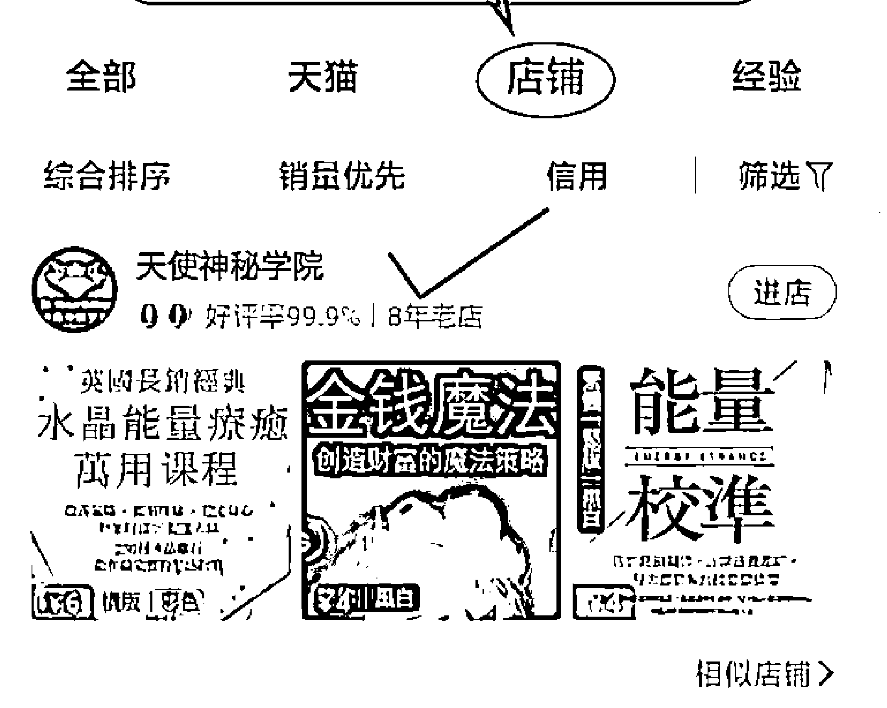

## 【天使神秘学院】微店

手机微信扫以下二维码

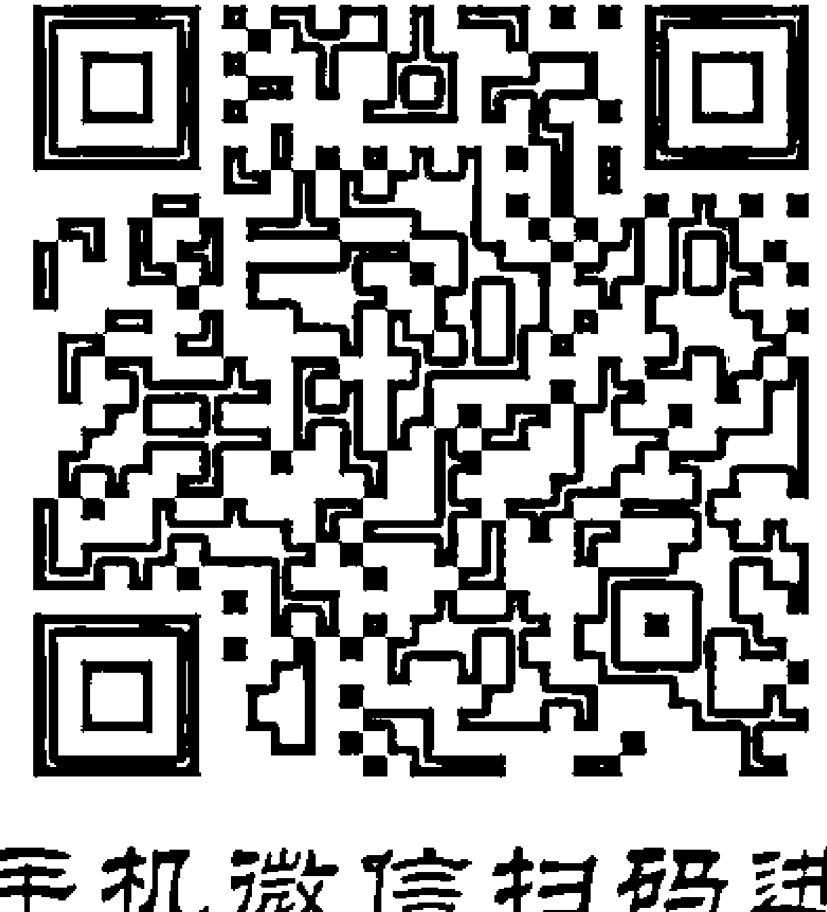

用手机微信扫码进店

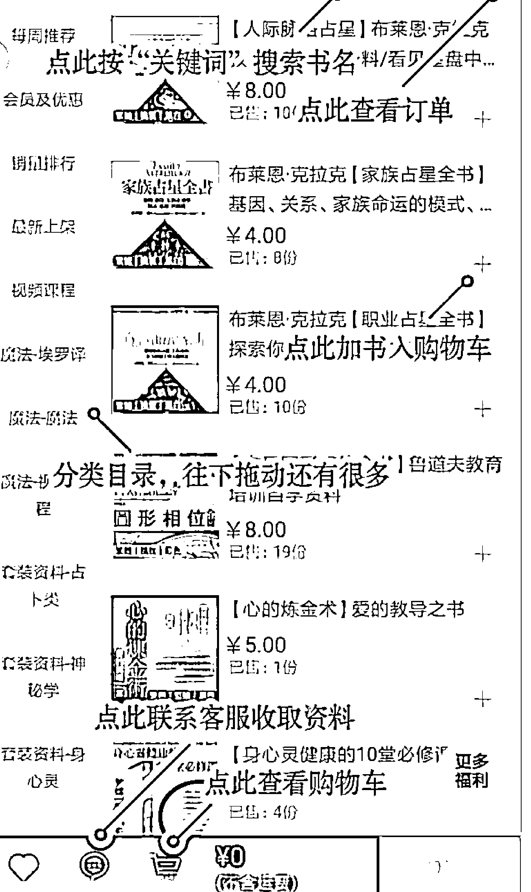

## The Royal College
天使神秘学院

- ※ 神秘学资料库
- ※ 神秘学培训机构
- ※ 水晶能量研究中心
- ※ 专业占卜预测机构
- ※ 官方微信：strcdts
- ※ 微信公众平台：strc2011
- ※ 官方店铺网址：http://strc.cr.cx
- ※ 读书交流QQ群：
    占星塔罗占卜师交流群：814594478（加入密码：PDF）
    神秘学其他综合群：659338717（加入密码：PDF）


微信号：strcdts
天使神秘学院

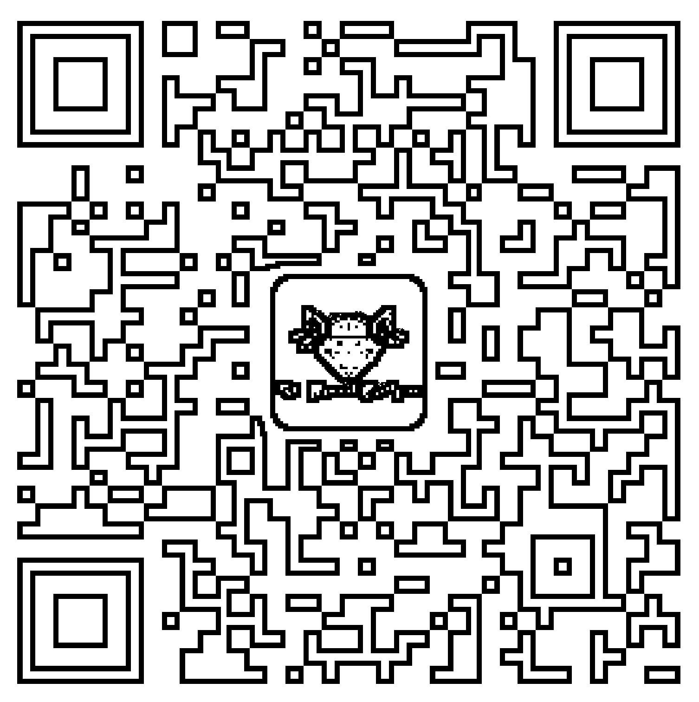

微信公众平台：strc2011

## 制作说明：

本书由《天使神秘学院》出重金从台湾购入的原版书籍扫描制作完成。为达到最好阅读效果，特地把书全部切开后，再经由专业扫描设备高精度扫描完成，并经过一张张的PS后期处理最终成书，其间花费大量的人力、物力以及时间，只为能给大家提供经济并优质的神秘学学习资料而努力。

本学院强力谴责某些机构和个人，把本学院花心血制作完成的电子书籍，包装后直接放在自家淘宝网上低价倾销的行为，以谋取不劳而获的经济利益。如果长此以往最终将无人愿意再为大家花心思制作电子书，那以后可能大家再无新书可读。

为让大家以后能够读到更多的好书，也为了本学院的良性发展。本学院恳请大家尽量做到如下几点：

- 一、 尽量在天使神秘学院的官方网站购买电子书籍。

官网电脑访问地址：http://strc.cr.cx

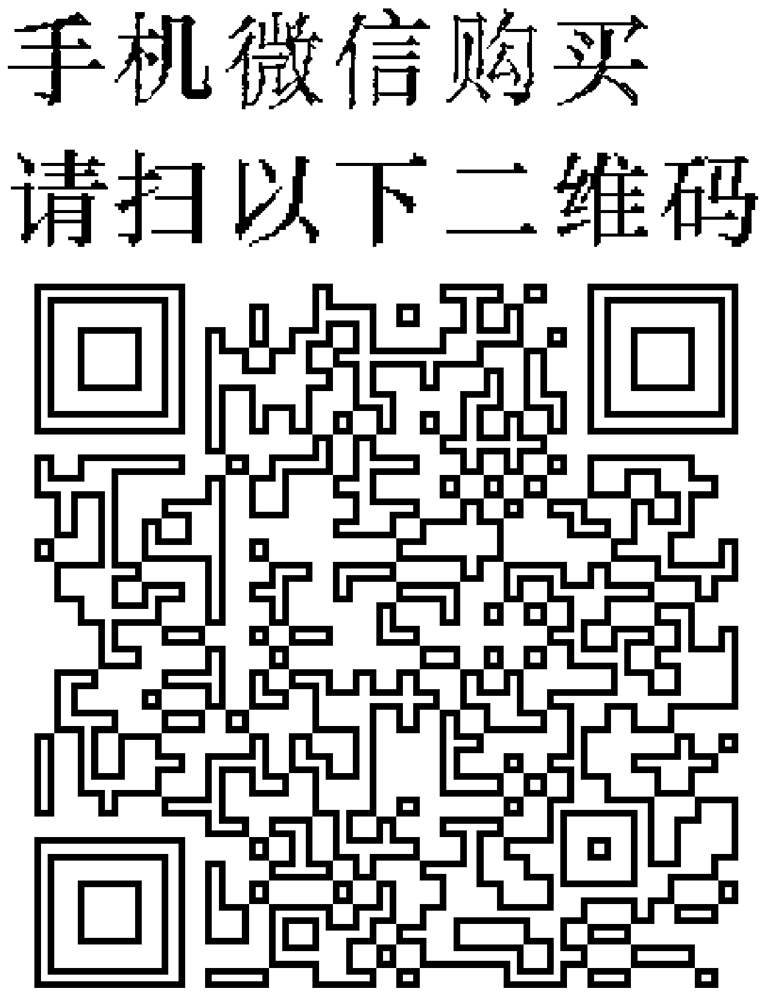

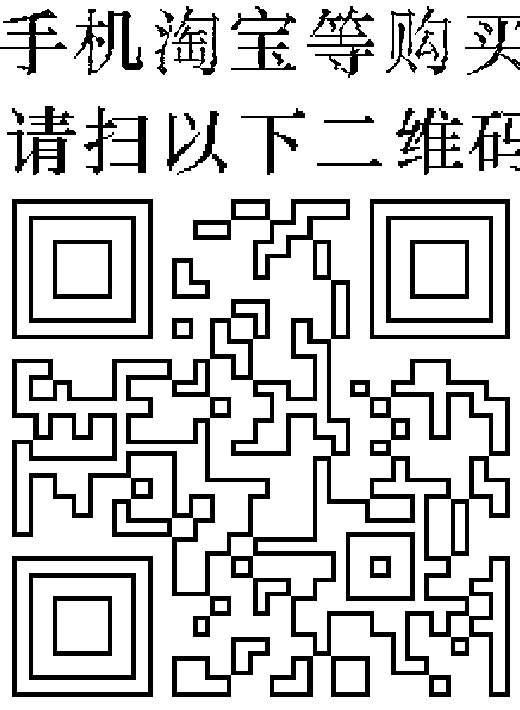


- 二、 在收到电子书后小范围传阅即可，千万不要公开传播，更别挂到淘宝网上低价销售。

同时为答谢广大支持者，学院电子书将做如下调整：

- 一、 学院会把一些早已收回制作成本的电子书折价销售。
- 二、 最新制作的电子书籍会开放打印功能，大家购买后有条件的可自行打印成书。

天使神秘学院
2020年5月

## 微观探源


## 推荐序一

> 《系辞传》曰：「易有圣人之道四焉：以言者尚其辞，以动者尚其变，以制器者尚其象，以卜筮者尚其占。」

《易》有「辞」、「变」、「象」、「占」四者，都是圣人应用的方法。讨论吉凶之理，在于卦辞所系的文辞；决定行动时，则可以观乎奇偶阴阳的变化；一卦一爻，各取其象，可以用以占，以断吉凶。

研《易》，以六十四卦，三百八十四爻为「体」；历代圣哲运用各种方法，将卦、爻之间的变化和结论，应用于生活上的「堪舆」、「医理」、「算命」、「占筮」、「面相、体相」。此山、医、命、卜、相合称「五术」，可以为人解惑，趋吉避凶，转凶为吉，转吉为利，终究利往攸往，利涉大川。（「术」者，方法也）

中华海峡两岸周易科学交流协会创办人 黄来镒

「易理」與「五術」互相理解，交互運用，「體」「用」兼備，利益眾生。

吾之摯友，紫微泰斗王文華大德以長庚大學企管碩士的高學歷為背景，鑽研「紫微斗數」三十五年，著作相關書籍多本，為研究紫微的前賢大德提供寶貴的參考資料，樹立了紫微斗數的權威地位。

旋以王文華大德新著《紫微探源：易經象數剖析紫微斗數原理》涵蓋層面，較諸以往之著述更深且廣。除了系統探索，復就「河圖洛書」加以深論，六十四卦的父母卦「乾、坤」詳細推演，同時探究「六十甲子納音法則」、「五行局」、「四化原理」，如此詳盡的論述，實為讀《易》、研《易》、悟《易》者一大佳音。

旋以王文華大德謙謙君子，慈悲為懷，大作完成，即將付梓，敝人感其德、尊其心，敬其義，願為之「序」，以示尊崇。

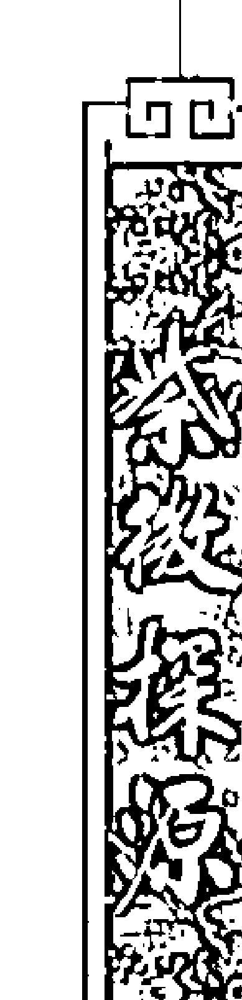

## 推薦序二

《易》之為書也，廣大悉備，有天道焉，有地道焉，自太極分而陰陽立，四象成而八卦定，古聖人探賾索隱，以前民用，仰則觀象於天，俯則觀察於地，引介觸類，參伍錯綜，河洛源流，悉見斯圖則天文與地理，相為表裏者也，考《禮》則有辨圭測土之文，《詩》則有相其陰陽之語也。自宋太祖趙匡胤於公元九六〇年歲次庚申得天下後，希夷亦奉紫虛天命旨意，獨創「紫微斗數」新傳，精其學術，厥後廣流，各分門戶，別為一端，深文奧義，言者各殊，依類以述，真法秘竅，迄今年世遠年湮，學者淺陋，於其精妙處，茫然不知，竊其皮毛，以為道在是矣！以致愈傳而愈失其真，愈傳愈流於偽，為可慨已，怅然若失，誠感可嘆耳！

星元五術大學校長
吳慕亮

子變化，萬象包羅，溯歐淵源，無他謬巧，斯言陰陽交互而已！華弟之言，真以一人而通三才之秘，而又博覽群書，折衷一是，研究三十載年，論斷服務已越百萬次，神而明之，竟得圖南真傳，華弟亦人傑哉！天運丁酉初冬，再重逢於二〇一七年「第七屆海峽兩岸暨亞太地區周易高峰論壇」，膡繼舊緣，懽忭無極！欣喜先能拜讀《紫微探源：易經象數剖析紫微斗數原理》之初稿，復以囑弃於余，老朽年邁親其誠憨弗敢辭焉！從康城別後歸斬邑，即夜下挑燈，悉心披閱，書凡七卷，並附錄《說卦傳》臆解及宋版六經圖之《大易象數钩深圖》，可謂至寶耶！探索總論則窮源竟委，條分縷析，自成一家言，如暗室燈，頓開覺路；似寶筏渡，出迷津，其嘉惠於後學者，豈淺鮮哉！余年已將屆古稀，忽忽不知老之至，及見此書，若有心領神會，頓開茅塞哉，文華賢弟其先攖我心者歟！靜思，自別芝宇，倏以三年，久欲馳書左右，而公私魚鹿，兼以稟生性懶，遲遲至今；然「君子之交淡如水」，疏於跡者，乃親於神也。辱荷先施，備感注存；知文華賢弟懸懸於我，當亦知我之拳拳於華弟也。忽驚聞君有交通事故，髖骨撞擊成碎，知悉悵然，幸今已癒安然無恙，乃吉人自有天相，欣慰之至。晨曦時刻，精神抖擻，擬撰七律拙詩，上平聲二冬韻，聊作讚賀，寸楮如後，元亨利貞（三稱）！

旋以，此次「周易高峰論壇」，渥蒙李桂欽所長之引薦，伏承當代書法方家葉泉力老師允諾，特為文華賢弟新書封面題字，誠然雙喜臨門也。一喜，論壇佳評如潮，掌聲如雷；二喜，巧遇書法良師，貺以墨寶。吾觀泉力公之書法詣境，融合諸家，貫通於〈楷〉、〈行〉、〈草〉、〈隸〉、〈篆〉各體，自闢蹊徑，獨具風格，注重內涵及神韻，以臻運筆有力，鳳翥鸞迴有勢。其結構穩妥，融合新意，展現氣魄，借以墨色，增益作品之效，如淡墨揮灑，則含灝疏透逸。堪稱：「書藝高妙，仙露明珠。」彷彿文華賢弟之名，「文」光射斗，「華」耀八荒，不亦樂乎！

# 讚曰：

> 「萬國咸寧御六龍，乾坤妙諦總歸胸，三墳洞徹天時究，八卦知情地利從；祿忌星辰能靜悟，科權軌道弗迷蹤，文華見地全台冠，河洛尋源百代宗。」天運丁酉年小雪候節穀旦良辰 隆中吳慕亮敬書於風城璇璣小閣之牖前

## 推薦者簡介：

吳慕亮教授，乃當代五術方家，香港上海哲理學院哲學博士。現任星元五術大學校長及財團法人軒轅教二宗伯暨台中潭邑《觀顯堂年刊》顧問，以傳道、授業、解惑，著書立說，執經問難，弘揚儒宗，繼承文化為不朽之盛業！

- 別號：孔子門生、延陵布衣、玄魁居士、鍼灸山人、隆中逸叟（耳順之前，以狂客而稱）、方外處士、野鶴老朽、閒雲簑翁、臥龍散人。
- 室號：河洛居、愛吾廬、半仙居、瑩拂園、滌塵軒、臥龍軒、璇璣小閣、隆中小築、拂塵掃葉樓、如聞心齋、笑傲山房、市隱草堂。

設硯處：延陵堂五術文化會館。新竹市民富里少年街100號

電話：03-5214041 手機：0936-996563

E-mail：wcw969696@yahoo.com.tw

## 推薦序三

夫「紫微斗數」源遠流長，祖述自夏、商、周至秦、漢，出於道家，始於呂純陽，載於《道藏經》，初稱：「術天機。」至宋朝陳希夷（字圖南，號扶搖子）集其大成，後世則尊「紫微斗數」祖師，歷經迄今一〇五七年，卻歷久而彌新；「紫微斗數」細分《天文學》、《氣象學》、《數學》、《堪輿學》、《醫學》、《生化學》，統稱自然科學；綜合《統計學》、《心理學》、《邏輯學》之理論，以科學方法推理。

「紫微斗數」，其理則乃根源於《易經》、《河圖》、《洛書》，以之預測人生命運之窮、通、禍、福、吉、凶、榮、枯及亭、泰、否、蹇，鮮有不中者，尤有甚者，吾人日常生活中微細之事亦能窺知，洞徹玄微。「紫微斗數」概分南北二派，南派以占驗為主，稱「占驗」派；北派偏向修身養性為主，然論命咸能「百發百中」；故「紫微斗數」號稱「天下第一神數，名列中國「五大神術」之首。夫《易》者，象也；象也，者像也。像者，乃事理之彷彿近似，可以想像者也，非真有實事也，非真有實理也。是以：〈象〉中有數，〈數〉中有〈象〉，來瞿唐先生曰：「對待者數，主宰者理，流行者氣。」故象、數、理、氣，乃《易》之真諦也，亦是〈河圖〉、〈洛書〉之精隨；〈河圖〉↓象也、空間也；〈洛書〉↓數也、時間也。由於時空之交會，而產生萬物之變化，以至於生生不息，吉凶悔吝由是而生，文華賢弟大作卷中有詳細之論述，讀者自究，故在此不贅耳！

夫「紫微斗數」之三要素：象、星、宮，象於《斗數》而言，即四化↓化祿、化權、化科、化忌，四化分一、生年四化；二、飛宮四化（或稱飛星四化）；三、自化。此三者錯綜交會而千變萬化，命運之軌跡由是一一呈現。星者，星辰、星斗也；《斗數》星辰有十八顆主星，應用上有用三十六顆星（《華山玄秘》，以三十六宮皆是春取用）與一〇八顆星者。論命以十八顆星配合四化為主，一〇八顆星為輔，星辰乃貫穿命盤之體用，《斗數》是以四化論斷吉凶，星辰論所發生何人、事、物？

宮位，亦稱：「宮職。」係「紫微斗數」之根基，所有象數、星辰所落於宮位，亦必因宮職始可論斷象數之理氣；宮職分本命盤宮職、大運宮職、流年宮職、流月、流日、流時、流分等，由是產生宮職重疊，宮職重疊，以及各宮立太極推演，乃「紫微斗數」之甚深微妙法，此法通《斗數》即通。《斗數》宮星象必配〈河圖〉、〈洛書〉之理，運用之妙存乎一心，子曰：「吾道一以貫之。」

欣聞文華賢弟新著《紫微探源：易經象數剖析紫微斗數原理》乙書，即將付梓，華弟仁慈敏惠，秉性敦厚，博學多聞，坊間「紫微斗數」之書汗牛充棟，惟文華賢弟如出汙泥之蓮花，一枝獨秀，獨能重《易經》象數應用，發前人所未發，書前人所未書，對於〈河圖〉、〈洛書〉之應用，闡述深入淺出，讓初學者亦能，一目了然。吾奉慕亮師兄口諭，謹遵囑咐，疾筆案前，略述拙見，聊表賀意，或代弁焉！

# 讚曰：

> 「著書立說任辭勞，河洛精研萬頃濤；解惑傳薪經歲月，紫微付梓探原高。」

歲次丁酉年小雪候節癸丑吉晨曦

彭城劉英雄敬書於彰邑祥居燈下之處

## 推薦者簡介：

劉英雄，係風城吳慕亮教授之《華山玄秘》紫微斗數一脈同門手足。

現任：救國團南投終身學習中心《易經》及《華山玄秘》紫微斗數老師、中華易學教育研究院協會終身院士、中國五術教育協會命理學院院長、中華易學地理學會第五屆理事長、臺中潭邑《觀頤堂年刊雜誌》專欄主筆。

- 地址：彰化市中山路1段556巷21弄24號10樓
- 電話：(04) 7114619 FAX：(04) 7112699 手機：0919-013895
- Email：hero0919013895@mail.com

## 推薦四

溯源《易》書：乃伏羲、文王、周公、孔子，四聖集智而作。伏羲氏，觀天法地與人身之自然外形，首揭八卦，以象天、地、雷、風、水、火、山、澤，為形象文字之始祖。周文王（姬昌）將八卦重之為六十四卦，並繫之以〈卦辭〉。周公（旦）則作〈爻辭〉，實用卜筮之術；爾後，孔子作〈十翼〉，以贊《周易》之學。至此，吾國文化天人合一之儒、釋、道，三教心傳，密弗可分之哉！班固之《漢書・藝文志》，稱《易》為諸經之源，群經之首，或經中之經也。後之儒、道、墨、法、名、兵、農、陰、陽、醫、卜、星、相等，諸子百家，莫弗好引其文字，以為論據而旁徵博引也。吾國《易經》聖策，非僅學術思惟之本源，抑且屬舉世最古之哲學、天學、地學、人學、科學、神學，乃至現代尖端量子力學、遺傳工程學、資訊科學等，亦莫不範圍天地之化而不過，曲成萬物而不遺。」

旋以，歲次丁酉十一月十八日，孟冬既至，仍高照豔陽，風暖和煦，一路唱和，相迎若庭偕學生共計四人（劉元瑞、王宥期、曾愷昀）南下遠赴，參加台南二〇一七年「第七屆海峽兩岸暨亞太地區周易高峰論壇」之欣喜情懷。此《周易》學術論壇，人才薈萃，參加專家學者弗僅限台灣，甚而擴及亞太、美國、加拿大、日本等地，吾翹首盼望許久，尤以午時論文發表早已備足紙筆，始能受薰己之弗足！然而，所有論文報告人，僅有二位以「紫微斗數」作專題報告，一者，鳳山王文華老師；二者，潭邑末學若庭排序在後。仰首佇候，深索片刻，稍又遺珠之憾，此乃短視也。當王文華老師台前講述「紫微斗數」系統源流，以《易經》象、數，邏輯深入淺出，剖析「紫微斗數」祿命術原理，續以理論架構為基，活用《易經》之邏輯思惟一以貫之，涵蓋生活面無所不包，且合乎天地運行之理也。審視文華老師台風穩健，侃侃而談，條達舒暢，句句攝人心弦，扣入內心，以理說《易》，若非才華橫溢，成竹在胸，焉有此般見地，令人感佩。以 致排序於後之吾，頭皮發麻，不由得莫名地緊張，遜色必然矣！嗣後，二日，文華老師弗棄，熱切學術交流，並贈《紫微星鑰》、《紫微四化》二書，拜讀有感，其文循序漸進，井然有序，採擷眾長，屏除門戶之見，不藏私心，實為吾輩之楷模也。

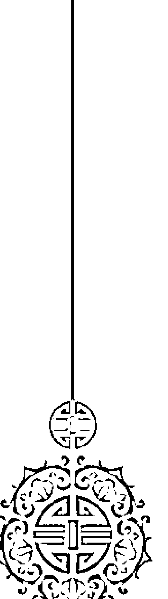

爾後，接獲新書文稿，伏承文華老師之不棄索弁，甚感誠恐也。然，新書付梓，豈敢延誤，先睹為快，如文華老師所言，貼近生活，輕鬆白話深入淺出，辭約理清，故其分門別類，章節有序，內容絮實，便於讀者於疑竇時，得以迅速解惑，使能貫通天體運行與環境變化，以及人之行走坐臥中，蘊籍天、地、人，三才之吉凶禍福，當有裨於探索捷徑。於此，忤懼之餘，讀後有感藏名七律以賀焉！

> 讚曰：
文章聚頂筆刀評，華氣韜光斗指明，易理乾坤為體用，紫微祿忌莫能爭；言功得失三才定，富貴別離五德情，學術相傳攜手護，激揚化俗醒民聲。

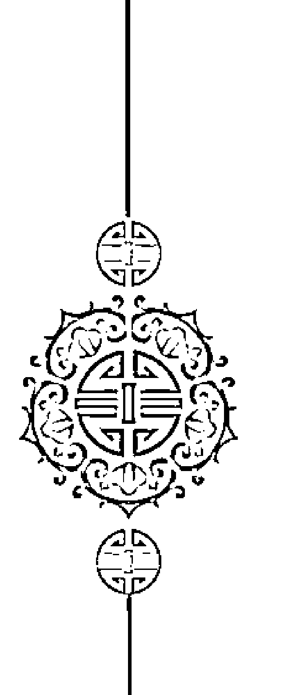

歲次丁酉年小雪候節癸丑午時吉日
太原王若庭敬書於潭邑觀顯書軒牖前

## 推薦者簡介:

王若庭，祖籍太原，台中人氏。觀顯堂命理哲學服務處執行長、觀顯堂五術詩學研究社社長、台中潭邑《觀顯堂年刊雜誌》總編輯、當代易學方家黃來鑑教授之學生、竹壟五術作家吳慕亮教授之門生。

設硯處：台中市潭子區興華一路273號

電話：04-25339928

手機：0927-894928

E-mail: mandy0523@hotmail.com

## 推薦五

夫《易》古聖人作也，傳於庖犧，紹述神農、軒轅，繼堯舜及夏后，周文因而變化之，以成今傳經。庖犧及夏禹，因《河圖》、《洛書》之見，而明察天地之象，概論人物之情。上以窮生化之初，下以辨變《易》之軌；幽以探於神鬼，明以合於日月；遠以徵於四極，近以求於一心，而後知天地生成，物類化育矣！

蓋《河圖》、《洛書》，乃中國曆數之源始，陰陽、五行之老祖宗，《易經》、八卦、占卜之根本。《洛書》九星圖表，據「北斗七星」斗柄所指，從天體中尋出於九處方位上最明亮之星為標誌，爰由斗柄於天上辨方定位。《河圖》由觀五大行星（木星、火星、土星、金星、水星）之運行而畫，乃天行健之天體矣！

係數千年前人類老祖宗，與天地合而為一。觀天象以定四時，節氣，方位，旋有《洛書》及《河圖》，聞說乾坤之奧妙。《易經・繫辭》：「河出圖，洛出書，聖人則之。」大禹治水時，神龜載文於背，而出洛水，因成九疇，謂之《洛書》。其中所含深藏奧秘，易理、宇宙玄機，以須彌筆，大海墨，書不盡意也。

吾從太原王若庭老師習《華山玄秘》，始知斗數星相家，僅知「星斗」而弗知「天數」，然亦可論命，惟難臻詣境，斯乃有粗、細、微、玄、妙之別也。故吾曹必究以《易》理說命，深入探賾，俾使紫微妙理，正本清源，撥亂反正。讓後來者設硯，層層功夫，由淺入深，萬法隨心，化妙五內胸中，愛於能滔滔善語，暮鼓晨鐘，振聲發聵，警醒迷頑而暢乎世間，願吾之同道，皆能知曉先機！

旋以，二〇一七年「第七屆海峽兩岸暨亞太地區周易高峰論壇」時，初見文華君，握手言歡，即為所展現「君子義以為質，禮以行之，遜以出之，信以成之」之氣質所感染。加之與家姐王翠薇熟識，更巧合現居鳳山乃我故居，頗有他鄉遇故知之慨。古云：「人間巧事真不少，只是可遇不可求。」惟文華君，卻以深入淺出之法配合時間空間之因素來推演紫微本源。其構思，想法與資料之精確讓人嘖嘖稱奇。更讓吾曹讚佩，將其研究無私，彙集成冊，造福後學，實我輩之楷模也。

復次，有期與文華君暢懷，人生宦海浮沉及趨吉避凶之事，其曰：「潛居儘可以為善，何必顯宦？躬行孝悌志在聖賢，纂輯先哲格言刊刻廣佈，行見化行一時澤流後世，事業之不朽蔑以加焉！貧賤儘可以積德，何必富貴？存平等心行方便事，效法前人懿行訓俗型方，自然誼敦宗族德被鄉里，利濟之無窮熟大於是！」傾聽妙語，豁然開朗，如飲醇醪，欽佩曷勝！吾雖棲隱於潭邑「御香坊」任掌門，然心繫聖學，亦讀書勤奮不輟，謹撰上平聲四支韻，七言絕句，聊以祝賀！

> 讚曰：

深耕易道志難移，好學深思忘記時。
聖德傳揚籌幄運，驊騮嘯傲世人知。

太原 王宥期敬書於潭邑御香坊之牖前
天運丁酉年冬至候節穀旦良辰

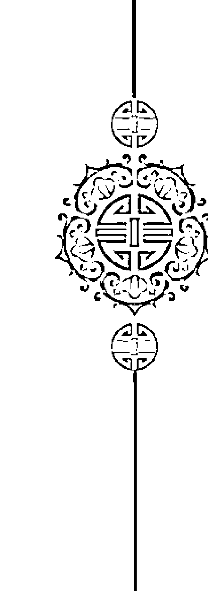## 推薦者簡介：

王宥期，祖籍太原台中人氏，觀顯堂命理哲學服務處行政主任，觀顯堂五術詩學研究社吟唱組主任及《觀顯堂年刊》採訪記者。

服務處：台中潭子區興華一路73號
電話：0425339928  手機：0912369114
E-mail：mandy0523@hotmail.com

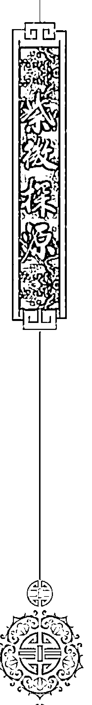

## 推荐序

推荐六

观显堂五术诗学研究社投影片制作主任
张翔纶

夫以照见天成，俯论日月，五星星宿，君臣合德，四时合序，鬼神合其吉凶，并蕴四方隅时干支，假于自然法成，备构始于《易》也。是故天垂象，见吉凶，旋复神无方而《易》无体，实相乃无相无不相也，物类化育矣！妙哉大《易》，天心见谛。东汉经学家之郑玄《易注·引春秋纬》，载曰：“河以通乾出天苞，洛以流坤吐地符，河龙图发，洛龟书感，河图有九篇，洛书有六篇。”“圣学洁净精微，颇非一蹴可即，必微潜心参礼，方可探究门窥妙境。然！”“紫微斗数”源于《河图》、《洛书》始就而序，立意太极，纵横方寸，万变弗离其中，体用相交，天数相应，所以成变化而行鬼神。子曰：“知变化之道者，其知神之所为乎！”

蒙受执行主席黄来镒理事长恳邀，参与二〇一七年“海峡两岸暨亚太地区高峰论坛”雅臺前上，王師文華妙論斗數高理，精研《河洛》數理象學，後學耳頻於讚譽盛傳，俾使吾僣慚赧而效尤！愛以拜讀大作《紫微探源：易經象數剖析紫微斗數原理》，文始載述靡遺，細索探賾天文時學假說，源因溯本，推移蒼穹，道應數理。家師慕亮囑命翔綸卉言以賀，讚仰大哉聖學之彌功。論壇午後場，吾亦暢論詩學偶賦感言，憶起吾詩學祖師黃宏介，憨誠授以慕亮家師，旌勉：「學詩不學《易》，難見天心；學《易》不學詩，難見聖心。一家師慕亮亦遵奉教誨，拳拳服膺，故於紫微斗數設硯批命時，無論吉、凶、悔、吝，則必絕句詩賦，以表嗣後引證。愛以，五術之山、醫、命、卜、相，環扣續密，醫者，均以相而察理，中醫斷以望、聞、問，切診論，病徵亦能知性情緣由，甚同之理；「紫微斗數」一六共宗位，乃命疾二宮，斷以身性之海。若病理根究，源《河圖》之序，自北而東，左旋而相生，然對待之位，則北方一六水，尅南方巳午火；西方四九金，尅東方三八木，而相尅者，寓乎相生之中。蓋造化之理，生而不尅，則生者無從而裁制，故《易經》者，涵蘊陰陽，靜觀《河圖》，審察《洛書》，方能臻意境。自古讀書人每逢談《易》好之者，愛其玄妙默測，造化靈機，真理無窮；抑之者，恨其陰陽不測。蓋《易》典經論，莫測高深，亦探無常，啟迪智慧，始匡以迷濛。

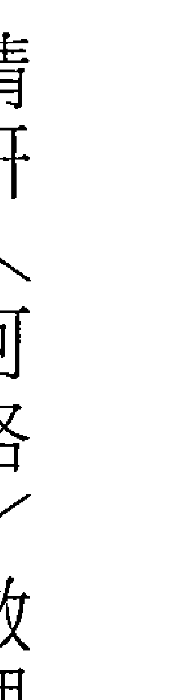

環顧「海峽兩岸暨亞太地區周易高層論壇」，去歲因政治變動所致，僅於竹北舉行，規模略小；爾今復燃薪火於康城，繼成盛典，論壇之精闢更勝往屆，獨以王文華老師「紫微斗數」發表，解析分明，令翔綸戰戰兢兢，頓然豁達。旋而數象理精，藉由剖析「文華」二字雅名，「文」字，上頭一點，下一爻，即精研《易》理相互與名合應；「華」字，草首內十字，若花開中滿合實；二字相併，學富五車，廣佈盛讚，草木豐密。古云：「胸藏文墨懷若谷，腹有詩書氣自華。」復次，《紫微探源：易經象數剖析紫微斗數原理》大作付梓在即，吾儕等輩，欣喜奮待，賢良繼典，繢聖先德，後學翔綸齋戒撰弁，聊以七言絕句十一尤韻拙詩，聊表賀忱！

贊曰：

「鳳嶺高儒縷象謀，河龍數理悟真流；洛龜斗柄尋分究，繼續新傳復始舟。」

清河張翔綸沐手敬撰風城拓樸書軒擱前

天運丁酉年小雪候節穀旦良辰

## 推薦者簡介：

張翔綸，祖籍清河，彰化人氏。啓碁科技股份有限公司主任工程師、觀顯堂五術詩學研究社投影片製作主任、台中潭邑《觀顯堂年刊雜誌》首席記者、風城五術作家吳慕亮教授之門生、當代易學方家黃來鎰教授之私淑弟子。

- 地址：新竹市中山路640巷196號3樓之一
- 手機：0952-351688
- E-mail：shing5211@gmail.com

## 自序

從《易經》象、數剖析紫微斗數原理，早在二〇〇三年就想要出版，中間很多起伏轉折，最後放棄出版。總是在人生發生重大事故後，休息很長一段時間，猶豫許久，經由好友鼓勵，決定出書，要以生活周遭熟概念說明，不用艱澀文字表達，淺顯易懂真是難題，皇天不負苦心人，終於完成付梓出版。

本書是非常值得珍藏的好書，《紫微探源：易經象數剖析紫微斗數原理》內容真的不好寫，尤其是純粹探討理論的書，要交代的東西太多，取捨也是考驗。接觸紫微斗數也有三十多年了，紫微教學也有十多年，實際開始研究理論原理二十多年。理論研究是一條很枯燥無味的路，找論述原理的資料少之又少，不知從何著手進行。光是研究坤卦動爻論，花的時間更長，中間一度停擺，當了解四化原理後，四化應用更上一層樓。

本書是筆者將過去研究的心得分享讀者，針對在教學上學生常問之問題以及相關部份都有詳細說明。參閱此書在短時間內能快速了解整體架構，對於發揚紫微斗數有很大幫助，也期盼能應用在各產業上。本書特別收錄宋版六經圖《大易象數鉤深圖》與《易經》相關資料，也是得來不易，研究《易經》大多是文字解說，沒有圖可以參考，理解上會有很大落差，會走很多冤枉路。

平常所了解之《易經》象、數理論，大多不會用，例如《說卦傳》：「數往者順，知來者逆；是故，易逆數也。」《繫辭》：「是故，剛柔相摩，八卦相盪」要如何做，本書裡面有詳實介紹，再內化成自己的知識，一生受益無窮。

本書分為二大部分，第一篇系統探索，分為四章，第一章地球文明毀滅假說，說明地球時間的起始點及空間形成的假設，在何情形下會文明毀滅，重新開始；第二章河圖洛書介紹，要如何運用河圖及洛書；第三章乾坤二卦卦爻推演探索，以象數剖析動爻之變化，探討邏輯變化，如何應用在紫微斗數原理架構；第四章六十甲子納音法則，介紹六十甲子納音是如何推論出五行，對於五行之變化運用。

## 第二篇紫微原理探索

主要是以紫微斗數原理探討為主，第一章時間探討，紫微斗數為何以時間做依據；第二章星曜探討，星曜是如何從八卦推演出來，如何起紫微、天府等星曜，宮氣與星曜關係，五行局如何推論出來；第三章四化原理，祿、權、科、忌是如何推演出來，主要以第一篇所提及相關知識應用，四化星推演出來，是有哪些邏輯理論之運用。

最要感謝的是中華海峽兩岸周易科學交流協會理事長黃來鑑理事長，及慕亮老師為文化傳承不遺餘力推廣，令人感佩；泉力老師是當代書法名家，惠賜墨寶；若庭老師、育期老師、翔綸老師、一建，時報文化趙董事長、蘇總監、謝編輯等，在寫作期間給予很多寶貴的意見及協助，由衷感激，銘感五內。

筆者對於紫微斗數的熱愛，分享研究心得，提供另一個思惟方式，提升紫微斗數進階研究，倉促付梓，若有謬誤之處，或是理解不周全，盼祈先進、高明之士不吝賜教！

王文華
二〇一七年十一月高雄鳳山寓所
E_Mail: sw5353@gmail.com
電話：+886-966-683267

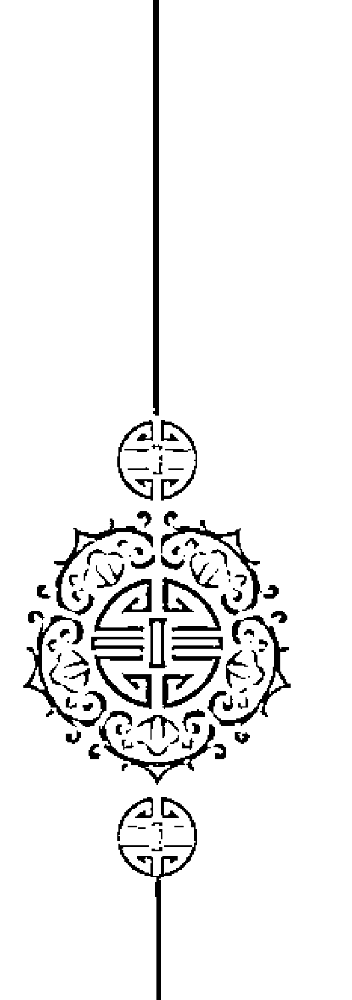

## 作者簡介

## 王文華

◎學歷
長庚大學企研所
中國生產力中心，第二屆高級經營管理顧問師班

◎現任
郁宏數位服務　總經理
星鑰排盤 https://meen.tw
星鑰命理 https://www.profate.com.tw
公司網 https://www.pro58.com.tw
台塑易經社團紫微斗數　講師


十萬字以上，論斷服務超過一百萬次以上

- 經歷
  - 廣良億科技（股）公司（南港軟體園區）總經理
  - 弘一科技（股）公司（新竹科學園區）總經理特別助理
  - 盛泓企業（股）公司（樹林、大陸）經營管理師

- 著作
  - 紫微星鑰（時報出版）
  - 紫微四化（時報出版）
  - 專業版新編萬年曆三冊（筆名：王郁宏）
  - 星論命理網及線上神算作者（https://www.profate.com.tw/，紫微斗數論斷，資料庫五）
  - 中華民國占驗紫微學會 首席顧問
  - 中華易經哲學研究發展協會 顧問
  - 高雄市薩迦大慈佛學會（第六屆）理事

## 專利

- 干支陰陽萬年曆（發明第200910號）
- 安干系諸星排列結構（新型第M278019號）
- 記憶體裝置改良結構（新型第M287493號）
- 以易經命理方式分之人力分析管理裝置（新型第M291566號）

## 研究（命理基礎研究）

紫微斗數研究三十年，基礎研究十五年以上。

- 文明毀滅假說
- 時間假設（甲子年甲子月甲子日甲子時的開始）探討
- 後天八卦推論研究
- 地理風水之九運卦推論研究
- 乾坤二卦象數推論
- 紫微斗數的星宿與易經八卦關係研究及應用
- 紫微斗數四化星原理推論

## 易理結合產業預測研究

## 易理應用產業核心價值研究

## 以紫微斗數數值預測匯率走勢

## 命理雲端工具軟體系統發展研究

## 人力資源應用紫微斗數分析及預測研究

## 目錄

- 推薦序 .......... 3
- 自序 .......... 25
- 作者簡介 .......... 28
- 第一篇 系統探索
  - 第一章 地球文明毀滅假說
    - 第一節 時間形成假說 .......... 42
    - 第二節 空間形成假說 .......... 52
    - 第三節 預測應用 .......... 68
  - 第二章 河圖洛書
    - 第一節 河圖基本觀念 .......... 76
    - 第二節 洛書基本觀念 .......... 84
    - 第三節 河圖洛書總說 .......... 94

## 第一篇 系統探索

在閱讀本書之前，筆者建議先把對紫微斗數或其他的祿命術觀念先放一邊，基本上很多人都認為祿命術是一種算命或是一種迷信，主要是整體的理論架構不完整，或是沒有一個完整的體系說明清楚，使人產生似是而非無所依循的狀況，光是紫微斗數出於何年代都交代不清楚，而在這科技發達的時代，要有基礎理論才是科學，所以筆者試著將所研究的心得提出一套較為完整的理論架構，供大家參考。

從現代考古來看數千年出土文物，有許多是現代科技無法重製的，例如從秦朝兵馬俑的兵器、銅馬車、中國紫等顏料，到漢以後各朝代之絲織品，尤其是皇家用，都有很嚴格管制不可以外流，所以古代之絲織品現在無法做出來，同樣的紫微斗數在古代都是皇家在用的，是不准流傳到民間，但在各朝更迭時，才會流傳出來。紫微斗數算命也有數千年傳承，假設這個學問不好，古聖先賢會讓這個學問留下來嗎？當然早就丟掉了。

本書以《易經》象、數邏輯剖析紫微斗數祿命術原理，其主要的理論架構是如何運用《易經》的邏輯思惟一以貫之，說明紫微斗數是一個非常嚴謹的理論所支撐，並非是零散、拼湊出來的理論體系，其應用涵蓋面之廣，放諸四海皆準，且合乎天地運行之理。本書雖以紫微斗數原理架構做為本書主軸，其系統邏輯性很強，對我們邏輯思惟、理則方面是有很大幫益，無論對人、事、物之間的互動更為成熟。不止於此，更何況是一門預測學問，若能將環境為你所用，以有限資源發揮最大效益，這是筆者所要傳達的概念，古人云：「一理通，百理同。」運用存乎一心，內化應用就要看個人之修為。

本書分二部份探討，第一篇是系統面與《易經》邏輯探討，第二篇是以紫微斗數祿命原理設計探討。

第一篇是以系統探索為切入點，在第一章討論「地球文明毀滅假說」，為何用「假說」來說明，是筆者無法用實際證明其事實，是推論的結果，或許在未來可以證明其真或偽。

本章節是主要說明地球在上個文明毀滅時，接下來立即產生一個新的文明開始，新文明開始要有「時間」與「空間」同時成立，新的「時間」產生，即是祿命術之基準點「甲子年、甲子月、甲子日、甲子時」的開始。新的「空間」形成，要定義新的「空間」名稱，以地球區分八個卦象，根據《易經》八卦「乾、兌、離、震、巽、坎、艮、坤」基本定義將地球區分八個區域，與先天八卦排列是不同的，所以後天八卦與先天八卦的位置是不同的，其原因是以地球新文明的環境而定義，故與先天八卦是有所不同。筆者以後天八卦與環境變化，提出個人預測方法，讓讀者參考或運用，請參閱本章第二節預測應用。

## 第二章 河圖洛書介紹

本章節說明河圖數與洛書的應用，河圖與洛書是相互應用的，最重要的是平衡與不平衡關係的運用，文中除了介紹在《易經》上的應用外，在我們生活上也可以應用，了解其邏輯變化過程中，運用在我們生活週遭，或是人際互動都有實際的幫助。

## 第三章 乾坤二卦卦爻推演探索

本章筆者認為是很重要的觀念，在推論紫微斗數原理中，是一個很重要的過程，本書的邏輯才能全部串起來，有用到河圖、洛書的觀念，再進一步推論乾、坤二卦的變化。河圖、洛書是說明二個物體相互變化達到最適的平衡，而乾、坤二卦是除了上述之平衡外，還有自變的功能，也必須達到動態或靜態平衡，是以象、數方面說明爻卦變化關係。

## 第四章 六十甲子納音法則及五行生剋

是介紹六十甲子納音五行是如何推論出來，五行相生相剋在我們生活之中應用為何，一般在祿命術中談的最多，筆者認為五行生剋是一個可轉換衡量的標準，可以在生活上實際運用出來提供舉例說明參考。

第二篇是紫微斗數原理探索，本章節主要是以紫微斗數原理介紹為主，原理之運用，由第一篇中相關之理論帶入紫微斗數原理架構，從開始為何要用出生之年、月、日、時做為推論依據；星曜由來的探索主要介紹八卦是如何轉換到紫微斗數星曜，星曜與八卦之關係，介紹安紫微諸星、安天府諸星訣由來，五行局之推論，介紹宮氣的運用等。

在第二篇裡最重要是四化原理的推論，如何應用「先天八卦」、「後天八卦」如何推論出化祿、化忌二組星曜，而化權、化科是如何利用八卦相盪而推演出來，再以「八卦納甲」配合十天干之變化，四化變化成為紫微斗數祿命推論中最特殊的運用。

附錄一是《易經·說卦傳》臆解，主要是提供本書可應用的相關參考資料，在八卦之「乾、兌、離、震、巽、坎、艮、坤」各卦都有明確的說明，以補強原有紫微斗數之星曜特徵不足，讓整理論理及衍生推演上，不會受限在原有特徵上之解說，也希望能將萬事萬物都能納入各星曜中，相對也能從星曜的推論，應用到環境或生活，達到運籌帷幄，掌握機先。

附錄二是宋版六經圖《大易象數鉤深圖》，是有關《易經》圖的介紹，一般大多《易經》版本所附之相關圖，提供筆者所收藏的宋版有關《易經》之圖，供大家研究。

## 第一章

## 地球文明毀滅假說

## 第一節 時間形成假說

「時間」是一個很平凡的事，經常感覺不到時間的存在，若要約某人在某個日子見面，想一想沒有時間的定義，要如何表達「時間」呢？還是說經過五天看見太陽的日子再見面，沒有特別明確依循會說不清楚，也不明瞭，若「時間」再長一點，就開始下雪的時候的五個太陽日見面，如此一來，變的不精準的「時間」，那問題可大了。

有想過「時間」是從何時開始起算的嗎？這個問題真是令人頭疼的問題，找了所有文獻或是書籍，沒有此相關的討論，好像橫空出世突然就有了，真是神奇。現在所使用曆法都是根據天文來編曆法，在中國曆法常用的有三種，一是太陽曆（節氣曆）、太陰曆、干支曆，這三種曆法合成一種曆法使用，可稱為「甲子陰陽三合曆」，這是在全世界很少有這樣子用的。

太陽曆（節氣曆）是以太陽為主的，太陰曆是月球為主的，干支曆又是從何而來？一連串的疑問出現，筆者只能大膽假設，無法求證，以「假說」為立論基礎，故用「地球文明毀滅假說」來說明之；筆者對《易經》的體會而言，陰陽即為一體二面，在「陽」的部份，可以直接影響、感受或是看到，而「陰」的部份，是潛藏在內心裡，這是相互呼應的，環境變化而引動出來，環境依天體變化，地球環境一定要呼應到天體星球，我們生活紫微斗數祿命術主要以個人出生之年、月、日、時做為推論依據，但是翻遍古籍找不到「時間」的起始點，那麼「甲子年、甲子月、甲子日、甲子時」起始點又在哪裡呢？這個「時間」又如何定義呢？「空間」的又如何形成呢？又是從何而定義出來？

討論「時間」與「空間」是要同時討論，本章節主要討論「時間」問題，而「空間」問題會在下一節詳細討論，討論時也很難分開說明，儘量切開來說明。

「時間」與「空間」要從〈河圖〉與〈洛書〉做為基本假設談起，我們先定義《河圖》（如圖1-1-1 河圖所示）代表「時間」，《洛書》（如圖1-1-2 洛書所示）則代表「空間」的位置。《繫辭上傳》第九章：“河出圖，洛出書，聖人則之。”《繫辭上傳》第十一章：“天一、地二、天三、地四、天五、地六、天七、地八、天九、地十。天數五，地數五，五位相得而各有合。天數二十有五，地數三十，凡天地之數五十有五，此所以成變化而行鬼神也。”此說明《河圖》，以及《洛書》變化之數。（河圖及洛書圖•《周易本義》宋朱熹註第二三頁），是天地變化基本原則（此處以地球觀點而言）。 將《河圖》如圖1-1-1 所示，轉置《河圖》之數字，如圖1-1-3 所示。圖1-1-3 及圖1-1-4，係由圖1-1-1 及圖1-1-2 以1-1-2 所示，轉置《洛書》之數字，如圖1-1-4 所示。各點圖形轉置數字，以數字顯示易於分辨。

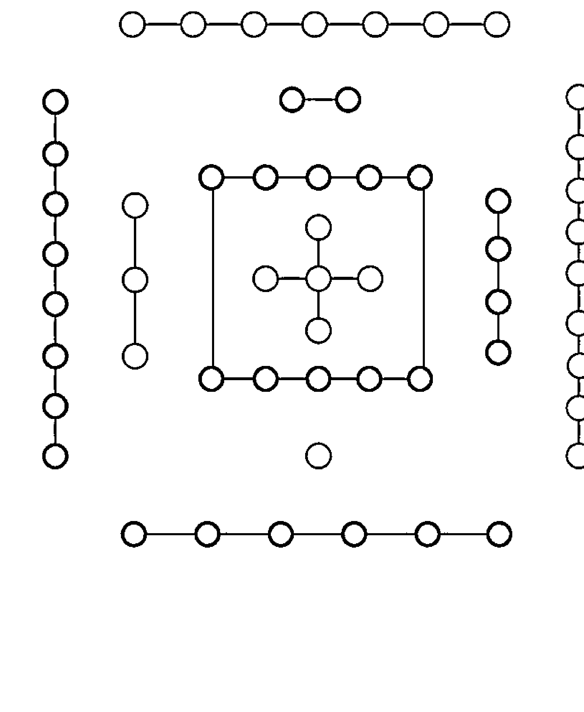

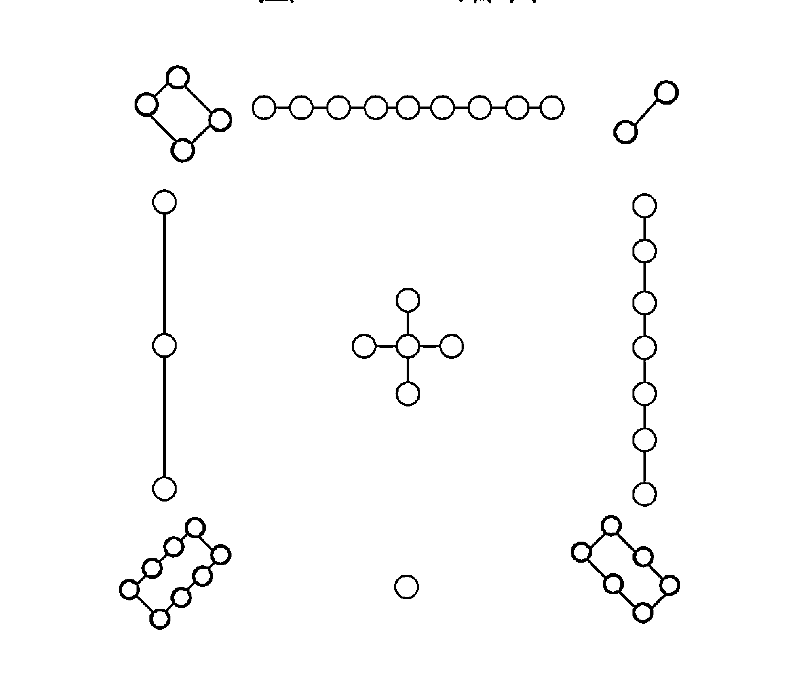

## 圖1-1-3 河圖數

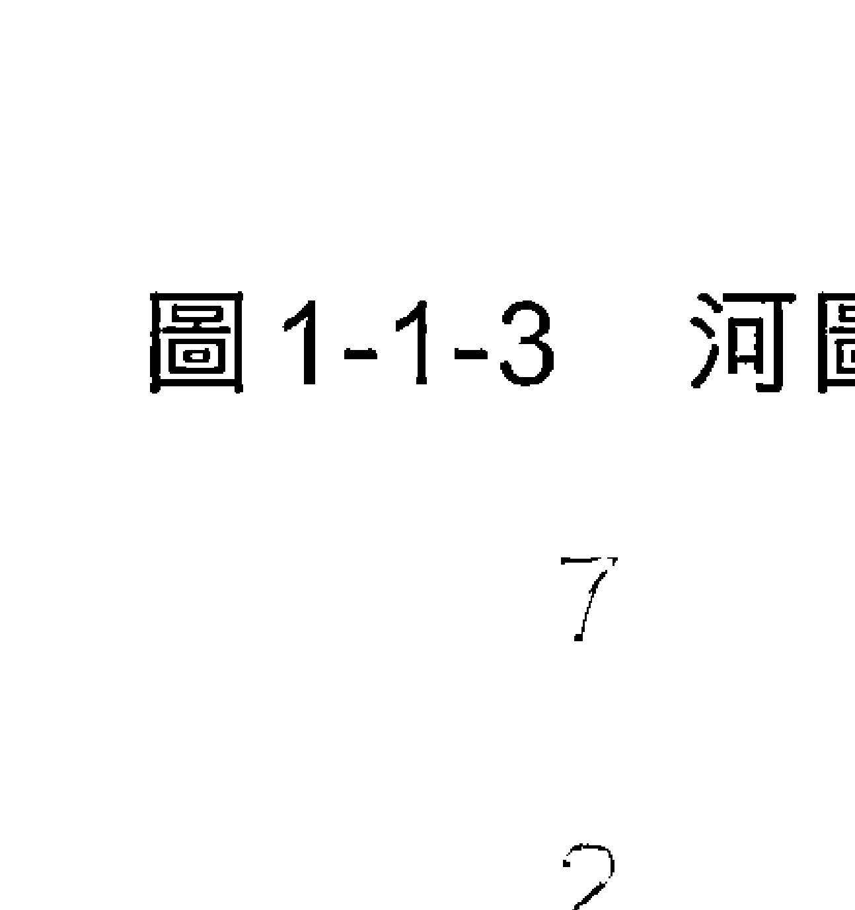

## 圖1-1-4 洛書數

| 4 | 9 | 2 |
| --- | --- | --- |
| 3 | 5 | 7 |
| 8 | 1 | 6 |

從《易經》象、數理命術觀點而言，現代天文學以太陽為中心，所有行星繞著太陽運轉；而《易經》象、數哲學理論是「人」為中心，所有星球繞著地球有人星球是繞著「人」而動，例如「人」站在地球某一個地點（空間），所有星球繞地球。字5的位置，將圖1-1-4之「洛書數」代入圖1-1-3之5的位置，這張圖是以平面表示，要用立體概念來看，〈河圖〉代表天體運行「時間」，〈洛書〉代表地的理境是「空間」，表示天與地是互動的，相互引導，圖1-1-3表示「時間」與「空間」運行的位置。

轉，形成各行星與地球之相對位置關係，各星球之間與地球之引力或某種頻率交互影響，產生外在環境變化，而直接或間接引動，環境變化影響人類的行為模式。

紫微斗數祿命術，預測基本推論是在未來「時間」與「空間」組合點上，各星球與地球相對的位置，對地球所在之環境產生變化，當人進入這個環境之中所產生可能行為模式。舉個例子，把環境參數簡化容易理解預測基本觀念，當然真正的預測或是運用，是有非常多的參數，較為複雜的。

例如在某一個時間及地點（空間）預測衣服的穿著大衣或是涼快的衣服？以現在時間是二〇一七年三月，問在國曆二〇一八年八月一日上午十點整，空間（地點）在台北市一〇一大樓外面廣場，若你在這個地方，請問你會穿大衣或是涼爽的衣服呢？答案是穿涼爽的衣服，請問你對此預測準確度可以達到多少？最少有九〇％以上的準確度吧！聽到這個數字真是很嚇人，有人會說這是基本常識，由時間及地點可知，八月份是在北半球是夏天，台北平均氣溫高達攝氏三十多度，所以衣服要穿著涼快衣服。如果時間不變，地點改為澳洲雪梨歌劇院前面廣場，在同樣的時間不同的地點，南半球是冬天，衣服穿著不會涼快，自然會穿多一點。

上述例子，我們以簡化地球與太陽關係，來說明預測的概念，實際預測並非如此單純的推論，各星球之關係，能量增減與地球之間的某種頻率、能量或引力都有複雜之變化，當時時間與空間的組合點上，找出當時環境之情境因素，則可預測人、事、物之行為變化，進而推論未來環境變化，作為決策參考，準確性雖無法達到百分之百，可以提供未來環境變化預測及因應之策略，或降低損害。各行星或星球在不同時間接近地球，及各行星之間相互影響，直接影響地球皆會產生對人、動物及植物不同的影響，例如當月球在農曆十五日時，對地球引力很大，易造成大漲潮或是大退潮，從犯罪學來看，犯罪機率大增，因為容易讓人心情亢奮所導致，這是因為外部環境而引影響，引發內部情緒而不自知。所以在《易經》預測學中有很多複雜且交錯邏輯思惟，往往在推論過程中不易掌握重點，容易差之毫釐失之千里而失去焦距，是預測最難的部份。本章一開始所要討論「甲子年、甲子月、甲子日、甲子時」之時間基準點，是從何開始，假設「時間」與「空間」重新組合，可稱為「地球文明毀滅」或「世代交替」。基本假設是太陽系之各行星，以地球為中心，將其他行星或星球排列成大十字形，如圖 1-1-3 河圖數所示，中心之數值 5 變成地球，數字 1、6 及 2、7 及 3、8 及 4、9 各帶入太陽系之行星，包含地球衛星月球，以地球為中心，形成大十字，可分二種情形討論：

## 第一種情況

以地球為中心，在未形成之大十字排列時，各星球的能量是逐漸累積，各星球變化的能量（或某種頻率）是等量增加，由於是慢慢累積起來，而形成大十字排列，如圖1-1-3河圖數，將地球入中心5的位置上，以地球為中心成大字，如圖1-3-5所示（示意圖）。

## 狀況一

地球內部本身無法承受各行星引力或某種頻率的拉力或壓擠，則直接分解或分裂，地球從此消失在太陽系中，顯然是這種狀況到目前尚未發生，所以本狀況不成立。

## 狀況二

原來都是平衡狀態或是達到動態平衡，如狀況一所述，原來保持平衡運行的狀態，總體而言是各星球能量是平衡的，或是未超過各星球或地球之負荷，所以各星球是保持正常的運行，地球維持現在情形運作，不做任何改變。

## 第二種情況

仍以地球為中心，各行星或星球形成大十字的排列，初期地球承受各行星引力拉，或壓擠的力量時仍保持平衡，此狀況同上述情況之狀況二，此時大型彗星（除太陽系行星或星球外，而進入太陽系內的行星，例如：百武彗星是屬大型彗星或是行星……等）進入太陽系之運行軌道時，進入某個切入點，如圖1-3-5所示，引起各星球的引力或某種頻率失序的現象，造成各行星、各星球要釋放大量能量，地球對於各行星之平衡產生重大改變，地球為要調整本身能量與各星球新的平衡，地球本身也會調整因應新平衡，否則運轉就會產生問題。

由外太空之行星進入太陽系軌道內，由此可知不只有大型彗星會進入，由圖1-1-6所示，是由美國太空總署（NASA）在二〇一七年十月二十五日公布，行星代號為「A/2017 U1」之飛行軌道示意圖，在二〇一七年九月二日太陽系外的小行星，由上方飛入太陽系之內，從水星進入，繞到地球下方，由地球與火星之間出去，雖時間不長，但進入了太陽系，就會引動太陽系各行星平衡狀態，愈靠近則不穩定愈大，離開後需要一段時間恢復平衡。一般而言，由外部之星球或彗星進入太陽系內，都會引動不平衡，會引起地震、火山爆發、火災、氣候不穩定等，環境變動也造成動物、植物的異常現象。

此時為了抗衡或符合新的引力作用（或某種頻率）之平衡，內部必須調整現行運轉方式，當大型彗星或行星進入而造成各星球引力失序造成能量釋放的現象，引力或某種頻率結構發生巨大改變，此時地球要繼續運行，又要符合新的平衡，就會改變現有運行條件，瞬間改變原來地軸旋轉方向，假設地軸旋轉九十度，原來南北極變成赤道，原來赤道變成新的南北極，此時造成地球山崩地裂，瞬間會形成新的地球新的地形地貌，此時原來南北極之冰，快速融掉，就會造成大洪水，引起重大災難，地球上的生物無一倖免，大量死亡，最少有六五%以上會滅亡，此時可稱為「地球文明毀滅」或「世代交替」的開始，瞬間地軸旋轉時則是新的「時間」計算開始，可稱為「甲子年、甲子月、甲子日、甲子時」起始點，同時新的「空間」隨之重新組合，「空間」形成假設定義稍後第二節內詳細說明。地球在瞬間改變新的地軸的時間，形成新的地形地貌，就是「甲子年、甲子月、甲子日、甲子時」之起始點，如圖1-1-3河圖數所示（帶入圖1-1-5內），數字1、6及2、7及3、8及4、9及中間5、10各帶十天干，十天干為「甲、乙、丙、丁、戊、己、庚、辛、壬、癸」即為太陽系之十大行星之代號，或是某些能量代號（目前僅推測，無直接證據證明），而十天干代表時間之變化，「空間」定義在空間起始假說中說明。這裡要說明一下，地球能量釋放大量能量，可以用物理實驗做說明，以一杯常溫的水，放進微波爐加熱二十分鐘或更久，讓其溫度從常溫達到一○○℃，水是沒有沸騰，其原因是所有的水分子平均加熱，所有水分子的能量是平衡提升，當有一個外來物質的東西進入，例如加一點點咖啡粉到水中，只要有一個水分子失衡，則引動所有的水分子失衡，而引起其他水分子的能量同時釋放，水則立即滾沸起來。

> > (讀者可以到YouTube或優酷查詢「王文華老師紫微斗數學理——時間起始」，或網址「https://youtu.be/_cFGlxddisk」觀看影片介紹。)

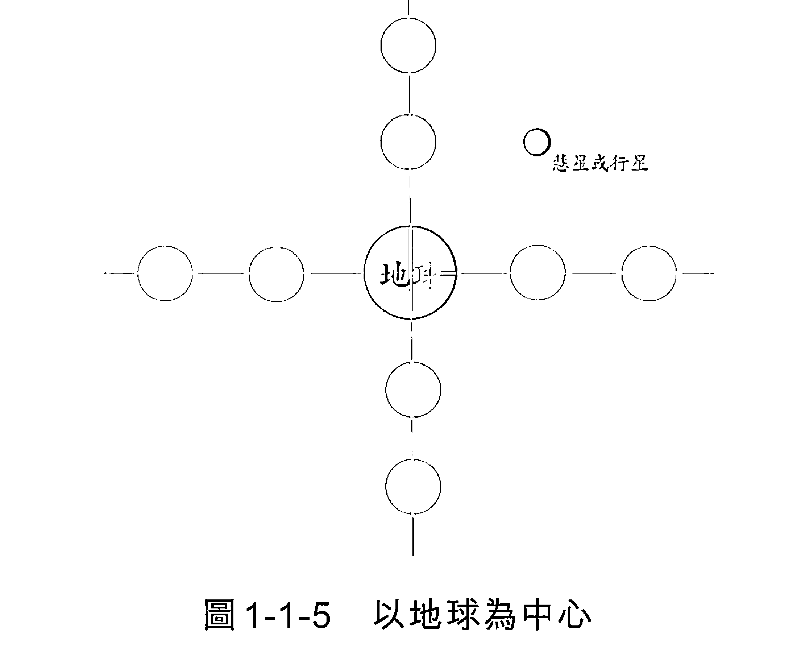

## 圖1-1-5 以地球為中心

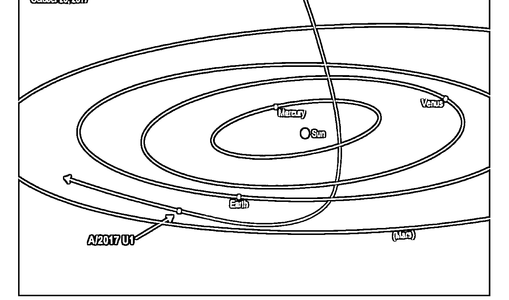

## 圖1-1-6 A2017 U1 飛行軌道示意圖

（資料來源：NASA，https://www.nasa.gov/feature/jpl/small-asteroid-or-comet-visits-from-beyond-the-solar-system）

## 第一篇·第一章 地球文明毀滅假說

## 第二節 空間形成假說

第一節前面探討「時間」起始之假設及基準點，新的「時間」形成或開始，必要條件是「空間」必須與「時間」同時成立，就是說新的基準點開始，新形成之「空間」配合地球新地形地貌，以實際時間及地理位置，給予明確定義，做為新「時間」及新「空間」運行變化依據。

「時間」可視為「天」，「空間」可以視為「地」，二者可稱：「天地定位。」只要定位清楚，一切從這裡開始。

第一節所述「時間」重新起始計算時，地球之本身引力或地磁瞬間改變，地球的新地貌同時隨之改變，各星球對地球位置或引力或某種的頻率對地球產生新的重大影響，此時的地殼大變動，外部行星或是星球對地球產生最大影響。例如引力或是某種頻率很大的星球，可以將海底的土地拉起來，引力小的星，所對應位置的土地可能會沉入海底，地球巨大能量釋放，而造成火山爆發、大地震、海水溫度的變化，最後形成現在地球的樣子。接下來討論新的「空間」形成，根據圖1-1-2〈洛書〉及圖1-1-4「洛書數」為「空間」平衡做為推論基礎，圖1-1-4「洛書數」是一個三方階陣列（方陣），直、橫、斜均為十五，從各方向看這個方陣是平衡，第一節所討論「時間」起始，對應到「空間」的平衡，重新定義「空間」位置，新的地形、地貌、地物，乃根據八卦原則定義，形成後天八卦之位置且符合地球運轉規則。地形、地貌的形成其特徵要分類，是依八卦意象來分類，而「先天八卦」（如圖1-1-7先天八卦所示）可能主要說明最原始的宇宙形成或是基本的位置，「後天八卦」（如圖1-1-8後天八卦所示）是根據新的「時間」、「空間」重新定義，必須與地球實際地形、地貌環境相吻合，「地」也代表承接「天」一體的能量，互為影響，所以一般祿命術、風水、命理預測大部份使用「後天八卦」，這是我們生活的環境，我們生活在地球上無不受其影響之大。《繫辭上傳》，第一章：「天尊地卑，乾坤定矣；卑高以陳，貴賤位矣；動靜有常，剛柔斷矣；方以類聚，物以群分，吉凶生矣；在天成象，在地成形，變化見矣！」復云：「天地定位，而易行乎其中矣！」「天地定位」要何定義「後天八卦」的基準位置？過去在研究定位的問題，有很多的理論大部份說明以中國為中心，向外區分為八個區域，將八卦納入其中，實際在「紫微斗數」基本原理推論時，邏輯上產生頗大衝突，邏輯不一致，其原因是在於基準點之定義必有錯誤之處。現代科學昌明衛星發達的時代，地球是圓形的，要定義一個地方來分析地球之地形地貌，而南北極為地球旋轉為中心地軸，以北極為基準點，根據八卦之內涵來定義新八卦位置，以符合地球實際情形，如圖1-1-9 後天八卦位置圖，為後天八卦圖完成結果圖。「先天八卦」是宇宙運行之通則或是基本的法則，但我們是居住在地球，地球之環境非「先天八卦」的環境，故依地球之地形、地貌及地物做一個新定義，才符合地球現在實際之「後天八卦」定義乃從北極中心點，看地球地形、地貌及地物之分佈，在將八卦與地球之地形、地貌及地物結合，成為地球上運用之八卦，一般在風水地理實務運用很多，以「後天八卦」為主。「後天八卦」在定義之前，先瞭解八卦各卦含意，依據《說卦傳》對八卦定義與地形、地貌及地物之說明，每個卦的明確定義及區分，實際地球的地形、地物，會有很多地方重疊一起，不是現在地界這麼明確，過那一條線就是別的地區，所以無法用一條線就可以分開清楚；分析後天八卦，是以北極為中心點，從外空向地球方向看，概分八個區域說明，如圖1-1-9所示。

## 圖1-1-7 先天八卦圖

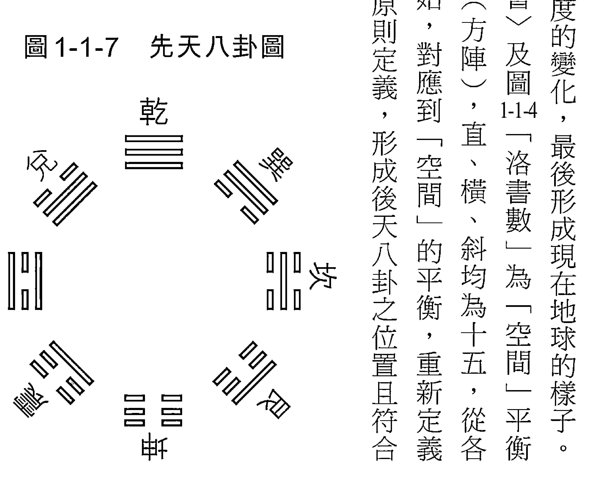

## 圖1-1-9 後天八卦位置圖

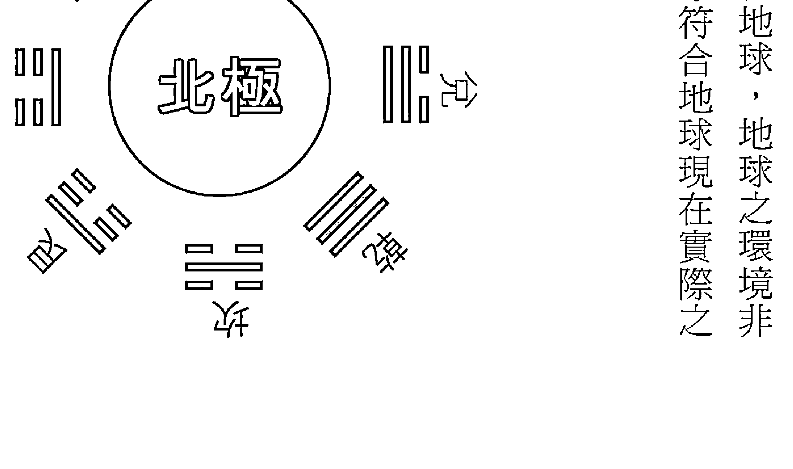

## 要如何定『後天八卦』位置？

## 第一個卦是『坎卦』

> > 依據《說卦傳》對「坎卦」說明：「坎為水，為溝瀆，為隱伏，為矯輮，為弓輪，其於人也加憂；為心病，為耳痛，為血卦，為赤，其於馬也為美脊，為亟心，為下首，為薄蹄，為曳，其於輿也；為多眚，為通，為月，為盜，其於木也為堅多心。」

「坎卦」，主要是指水之意，全世界最多水的位置，是在太平洋，太平洋是全世界最大的海洋，太平洋南起南極地區，北到北極，西至亞洲和澳洲，東到南、北美洲，約佔地球面積的三分之一。在地球成為新「時間」開始時，此區域所對應到星球的引力或某種頻率最小，引力無法把地殼拉起來，反而陷下去，形成全世界最大低窪地區而形成地球之最大海洋——太平洋。

到目前為止人類對海洋是相對陌生，海洋有很多我們所不知的世界，及未知的知識，「坎」卦是一個險卦，也代表城府深之意，不知葫蘆裡賣什麼，有時到最後未必完全知道，這幾年科技發達才開始探知海洋，未來對海洋會更多知識被發現出來。

## 第二個卦是「艮卦」

在《說卦傳》中對「艮卦」說明：「艮為山，為徑路，為小石，為門闕，為果蓏，為閽寺，為指，為狗，為鼠，為黔喙之屬，其木也為多堅節。」所以「艮卦」指山之意，實體上是指全世界最高之山峰「珠穆朗瑪峰」（聖母峰），係「喜瑪拉雅山」主峰，海拔為八八四八・一三公尺，青藏高原是世界上最高的高原，有「世界屋脊」之稱，全世界的山由此而延伸出去。以前面所假設新的「時間」開始時，是該星球對地球最大的引力或某種頻率可能是最大，將地球表面吸引出來，成為全世界最高的山。

「艮」為山，代表聚的概念，比較有裙帶關係，在人際上是代表了人際關係，常聽到「沒關係」，就有關係；有關係，就沒有關係」，運用上自己多領會「艮」卦的含意。

## 第三卦是「震卦」

《說卦傳》中對「震卦」說明：「震為雷，為龍，為玄黃，為敷，為大塗，為長子，為決躁；為蒼筤竹，為萑葦，其於馬也，為善鳴，為異足，為作足，為的顙；其於稼也，為善生。」

「震卦」是指某一種能量累積釋放，以地球而言只有火山或地震，才能符合此定義，綜觀地球最多的火山或地震最多、最頻繁的地震帶是在現在的「阿富汗」到「伊朗」這一帶為主，是地震危害最高的地區，或是地震加速度的最大值（風險強度），在此區域定義為「震卦」，向西延伸至歐洲的義大利，而日本、台灣地區北美、南美是屬於太平洋火環帶，最多地震及火山運動地區。在此「艮卦」與「震卦」有此重疊在一起，可以區分在主要分部地區。讀者可以上網查詢關鍵字「Global seismic hazard map」或是網址http://www.gfz-potsdam.de/gshap/是主要計算全球地震災害圖。

「震卦」是指快速的，在此區域之大多是爆發力很強，氣候變化快速，常會讓人措手不及，以動物而言例如孟加拉虎瞬間爆發力強且兇猛，或是蛇攻擊速度都很快，相較其他地區來的快。

## 第四個卦為「巽卦」

> 《說卦傳》中對「巽卦」說明：「巽為木，為風，為長女，為繩直，為工，為白，為高，為進退，為不果，為臭，其於人也，為寡髮，為廣顙，為多白眼，為近市三倍其究，為躁卦。」

「巽卦」為長之意，以全世界最長的河流是「尼羅河」，全長約有六六五〇公里，是世界最長的河流，要有這麼大的陸地才形成這麼長的河流。「巽卦」之地球地理位置可定義在南非地區。

「巽卦」代表長之意，此區域泛指非洲地區，以人種而言，非洲原住民男生高度都比較其他地方人種高，約二○○公分之高，女生約有一八○公分左右，對於長跑是比較專長，動物方面也大多是屬於比較長型，在非洲大草原上有很多動物有遷徙習性。

## 第五個卦是「離卦」

《說卦傳》中對「離卦」說明：「離為火，為電，為中女，為甲胄，為戈兵；其於人也大腹，為乾卦，為鰲，為蟹，為蠃，為蚌，為龜，其於木也為科上稿。」

「離卦」為火之意，意指全世界最熱的地方，其在北非之「撒哈拉大沙漠」，全世界平均溫度最高的地方，雖在北非地區，而在北邊相鄰為歐洲，「離卦」以地理位置而言，是泛指北非及歐洲地區。

「離卦」代表火，也是代表美麗之意，也是有曇花一現的特徵，歐洲是一個時尚流行的發源地，流行是一種時間性，過了就要換別的，時尚也是一種品味，也會造就階級的明確，如貴族與平民，在埃及金字塔時代都是階級觀念都很強；「離卦」也是戈兵，指戰爭較頻繁地區，從歷史上來看相較是多的。

## 第六個卦是「坤卦」

> 《說卦傳》中對「坤卦」說明：「坤為地，為母，為布，為釜，為吝嗇，為均，為子母牛，為大興，為文，為眾，為柄，其於地也，為黑。」

「坤卦」乃母之意，有孕育萬物及滋生萬物，而南美洲之「亞馬遜河」流域，是有一個很大的平原，「亞馬遜河」支流分佈很廣汎，是世界最大的平原，且供給全世界最多氧氣的地區，稱為地球的「肺」，地理位置而言，是以南美洲為主。

「坤卦」代表母及地之意，在南美洲無論是人類或動物界，很多是母系社會居多，物種的多樣性；在南美洲國家厄瓜多境內，有一座山「欽博拉索山」（Chimborazo）海拔六二六八公尺，若從地中心點起算，有六三八四・一〇公里，而「珠穆朗瑪峰」距地心的距離為六三八一・九五公里，比欽博拉索山少二・二五公里，從宇宙或是外太空來到地球會是先看到「欽博拉索山」，因地球是有一點橢圓形，會比較突出。

## 第一篇·第一章 地球文明毀滅假說

## 第七卦為「兌卦」

《說卦傳》中對「兌卦」說明：「兌為澤，為少女，為巫，為口舌，為毀折，為附決；其於地也，為剛鹵，為妾，為羊。」

「兌卦」有湖泊之意，全世界最大的淡水湖泊在北美，最大湖是「蘇必利爾湖」，總面積有二四・五萬平方公里，亦是世界最大的淡水湖，北美世界最大之五大淡水湖，另外有不計其數之小淡水湖泊，集中在北美地區，以「兌卦」地理位置指北美地區，以美國及加拿大為主要地區。「兌卦」代表了表達、領頭之意，在北美地區比較會表達，例如行銷包裝、創意等，說的很完美，很有說服力；領頭是指英雄主義，比較崇拜英雄，從電影工業而言，北美地區發展很好。

## 第八卦是「乾卦」

《說卦傳》中對「乾卦」說明：「乾為天，為圜，為君，為父，為玉，為金，為寒，為冰，為大赤，為馬，為老馬，為瘠馬，為駁馬，為木果。」

「乾卦」為寒、為冰之意，除南北極全年是冰天雪地外，在陸地上有全年冰雪只有「阿拉斯加」不在北極圈內土地，夏天平均氣溫為四度左右，冬天則更冷，終年冰雪。「乾卦」在地理位置，則指在「阿拉斯加」。「乾卦」，「象曰」：「天行健，君子以自強不息」，代表不會因時間空間的改變而有變化，一直維持原來方式，不易改變。

圖1-1-10地球納後天八卦位置圖，是將上述是將地球的地形地貌，重新定義八卦位置，最後整理成如圖1-1-8後天八卦位置圖所示，真正符合地球之環境變化，再將新的八卦帶入如圖1-14洛書數，是新的平衡，稱為「後天八卦」，由此開始所有祿命術、風水相關理論，發展出一套預測學，所有祿命理論基礎由此發展及應用。在太陽系之行星運行，由於軌道因素，有些行星距離地球很遠，有距離很近，各行星之引力或某種頻率，對地球有不同的影響，地球本身能量必須平行，隨時轉換或調整，來因應外在環境的變化，以達到動態平衡，在《易經》裡最重要是「變」是「不變」的道理。目前只有非常少的行星，對地球產生直接影響，例如太陽對地球影響最大，其他星球對地球直接、間接影響關係，更遠論運用，科技再進步總有一天會知道的。「空間」位置已確定，要與「時間」上配合，才能變成有效運用，太陽與月球是最直接影響地球的環境變化，地球繞太陽一圈約為三六五・二四二二日，月球則繞地球約為十二圈，實際月球繞著地球轉，以本次的立冬點，至下一個立冬點，「月球」繞行地球約十二圈多一點，「月球」自轉一圈約為二八・四五天左右，找出最小公倍數為十二，在時辰上也要配合成為十二個時辰，配合地球自轉所產生之北迴歸線、南迴歸線，定義二十四節氣，十二個節與十二氣成為一年的循環，原來以八卦之八個方位（八個空間）區分，「時間」與「空間」運作下不敷使用，搭配產生問題，為配合地球的月份以十二個月運用，辰上也要以十二個時辰來運行，相互搭配，也便於使用，由八個位置增加十二個位置，如圖1-1-9 後天八卦方圖增加四個位置，變成十二個方位，如圖1-1-11 十二地支圖（以方圖表示），中間以北極中心點，發展出十二地支「子、丑、寅、卯、辰、巳、午、未、申、酉、戌、亥」，配合地球與月球運行，將圖1-1-9 後天八卦方圖增加四個位置，變成十二個方位，如圖1-1-11 十二地支圖（以方圖表示），中間以北極中心點，發展出十二地支「子、丑、寅、卯、辰、巳、午、未、申、酉、戌、亥」。

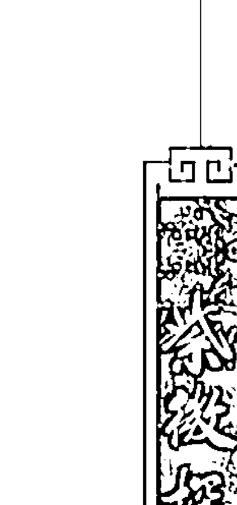

## 圖1-1-10 地球納後天八卦位置圖

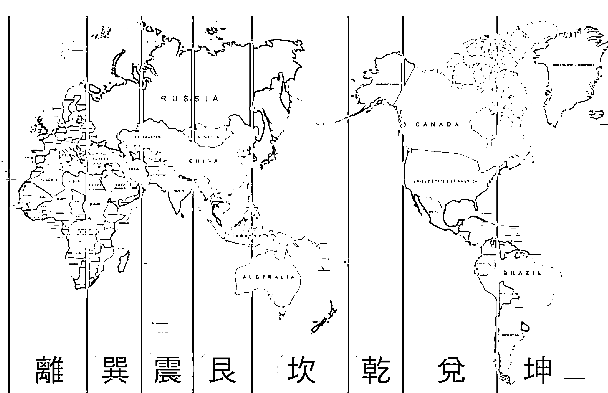

## 圖1-1-11 十二地支圖（以方圖表示）

## 第一篇·第一章 地球文明毀滅假說

天干「甲、乙、丙、丁、戊、己、庚、辛、壬、癸」，地支「子、丑、寅、卯、辰、巳、午、未、申、酉、戌、亥」，「午」時，照不到地方為「子」時。太陽照到時間為「午」時，照不到地方為「子」時。

位以「天干」與「地支」組合表示，演化出六十花甲做為「時間」、「空間」的記錄，有關六十花甲之運用請參考後面章節說明。

由於「時間」、「空間」的觀念，


| 寅 | 卯 | 辰 | 巳 |
|---|---|---|---|
| 丑 |   |   | 午 |
| 子 |   |   | 未 |
| 亥 | 戌 | 酉 | 申 |

有人說地球的文明經過交替又再生，已經有好幾次文明的變化，文明是如何交替，其原因眾說紛紜，有傳說是彗星或流星撞擊地球，地球產生重大的變動，而造成所有生物的滅亡。
另外一種的傳說，地球有好幾個文明時期，在每個科技文明非常的發達時期，因為某種因素，而引爆炸性的武器，將地球文明或動物會有六七十％以上同時消失，這是一種的揣測性或科學家假設性的問題，是否真是如此，我們無法證實。
恐龍或地球上生物大量滅亡的說法有很多，在一九八○年由阿爾巴列斯（Benny Pieser）提出「隕石撞擊說」，隕石撞擊地球，而產生塵埃瀰漫大氣層，使地球氣候改變而造成滅亡。也有其他的學說如「氣溫下降說」、「海平面下降說」、「火山活動說」等。

## 空間形成與後天八卦

基本定義完成，發展出一套「甲子陰陽三合曆」的曆法，在很多祿命中，都是用出生「年、月、日、時」做為人的基準點，再以現在時間做為比較，找出個人未來行為模式預測，這是很科學的方法。

如，恐龍在地球生存有二億年的時間，以地質年代區分為寒武紀、奧陶紀、志留紀、泥盆紀、石炭紀、二疊紀、三疊紀、侏羅紀、白堊紀、第三紀、第四紀等，這些恐龍，魚龍或大型的動物等，以上學說是真會造成恐龍或地球上生物大量滅亡？如果用人類力量毀滅地球的文明，以目前科技能力是不可能的，筆者認為未來科技進步，困難度仍然非常高，並非是用人的力量可以毀滅地球所有的文明，若以局部性或區域性的文明毀滅而言，是非常有可能的，若以地球全面性的災難，只有靠大自然的力量才有可能。筆者以〈河圖〉、〈洛書〉做為發想，做為地球文明交替假說的基礎，試做一個假設性的說法，從古代的河圖中我們可以瞭解，一、六在下，二、七在上，三、八在左，四、九在右，中間是五及十，從平面看來只有上、下、左、右、中五個區域，河圖表示動態運作的平衡，是動態的起始點。太陽系中主要的星球以太陽為中心共有九大行星，在內圍有水星、金星、地球、火星、木星、土星共六顆，太陽與月球對地球有直接的影響；在外圍的太陽行星有天王星、海王星、冥王星三顆星，距離地球太遠影響不大，目前應是不列入運用，但在古代星占或七政四餘有使用這三顆星，都有代表之意義，讀者若有興趣，可自行研究，筆者對天文相關資訊研究不深，提出心得分享，盼祈專家指教。

《易經》或是祿命術其含射力很強，說一句比較通俗一點就是「包山包海」，萬事萬物、環境、人、事、物都包容進去，歷經數千年的考驗，都離不開其應用範疇，以「人」為中心的哲學思惟，發展出不同的術數，這也深深影響中國數千年的「人本」思想，以「人」為出發點，崇尚「天」、「人」、「地」觀念，「人」無法與大自然力量抗衡，順應自然，或是藉大自然力量為我搭順風車。

另外一個課題，就是如何運用大自然的力量，與大自然共存，是中國人很重要的思想中心，所以發展出許多套學問，例如，太乙神數、大六壬、奇門遁甲、卜卦、風水、八字、紫微斗數、中醫體系……等。

（讀者可以到YouTube或優酷查詢「王文華老師紫微斗數學理——空間形成與後天八卦」，或網址「https://youtu.be/T6Dk02HP_0O」觀看影片介紹。）


## 第三節 預測應用

本節預測應用是筆者在二〇〇四年十一月二十四日所撰寫，登載在工商時報，標題「掌握趨勢，決定勝負」副標「以易學觀點剖析未來，再創造企業高峰」，是十三年前所寫，截錄下來，主要是以第二節之後天八卦對應地球之變化而推論出現象，當運之地區及所發展的重點，做為產業或是個人在規劃未來方向。將預測時間部份分享讀者，提供研究方向。以下截錄文章：先從大運勢分析討論，以地運卦每一運轉二十年，一個循環（九運）為一八〇年。每一個大運都有其變化重點，我們只要掌握此重點，可以幫助企業制定未來目標，再創企業的高峰。以七運、八運、九運做為分析重點如下：以下分析，以筆者所認知之產業或環境做一分析，以企業為主來看運勢變化，讀者可以將說明之重點轉換所認知環境，加以運用。

「七運」《易經》中的代表卦為「兌」卦，時間由西元一九八四至二〇〇三年，空間（地區）為北美洲如美國、加拿大等地區為主，不含「阿拉斯加」地區。

「七運」分析說明，主要發運地是美國及加拿大地區，天時及地利眷顧此地區。接下來看「人」的問題，此地區發達的速度會比其他區域快。綜合「兌」卦現象是有自我膨脹、擴張、人際關係發展、娛樂產業、族群關係、衝突、溝通、英雄主義、共生的產業……等。

在過去二十年中（一九八四～二〇〇三年）企業的不斷擴張，電腦功能快速進步，電影、娛樂工業發達，重視個人的績效管理，以馬斯洛（Maslow）之需求階層理論而言，可以定位在「自我實現」階層。

在這二十年快結束時，就容易產生泡沫化（原因是過度膨脹、擴張），要提醒讀者，在時間交接時是有重疊時間（過渡期），有如白天要進入晚上時會有昏暗時段，但不會很久。過去發生過的事，不在此贅述，留給讀者自己體會這些原則。

「八運」《易經》中的代表卦為「艮」卦，時間由西元二〇〇四至二〇二三年，空間（地區）為中國、蘇聯、東南亞（包含泰國、印度……等）地區。

到「艮」卦，與上個行運「兌」卦，會有很大的差異，在「兌」卦時是一種擴張及口號為主的現象。

惟至「艮」卦是一種務實、整合、控制、安全、專業、大者恆大、小者恆小的現象，以馬斯洛之需求階層理論而言，可以定位在「生存需求」及「安全需求」階層，讀者應注意這裏所說的現象是一種結果，是一種需求，而非正在醞釀期的產品，進入「艮卦」運時的需求或是一種趨勢，在這個時間是需要的。

## 「八運」當運時的趨勢分析

## 一、安全需求（有關安全議題等）

-   有形部份：對安全有實質的影響，包含人或物，如居家安全、監控系統、保全、警衛、門鎖、專利、軟體發展、武術、資訊安全、密碼、生化科技、醫藥安全、食品安全、工作安全、企業內部管控機制：……等。
-   無形部份：由抽象轉成具象之產品或工作，如心理因素的影響，超心理學、心理治療、養生、修練、宗教、玄學命理：……等。

## 二、整合與專業

產業整合及合縱連橫更緊密，形成大者恆大，小者或微型企業，在專業領域市場耕耘，創造生存利基點，而中間產業，被迫轉型，否則不易經營。公司經營講求專業與實力，做專業的事，不屬於本身專業事項，交由專業公司處理，要懂得產業的交流，運用彼此的優點等。比較明顯例子如醫院大者愈大，小者為診所或專業醫院……等。連鎖企業的發展，以專業區分市場，或以獨特利基市場之產品，產業往更物質或更細緻發展，如奈米科技、生化科技、傳統產業……等等。

## 三、控制

企業營運計畫以務實且可行性高，內部作業流程要落實，藉由網路資訊提昇效率，決勝關鍵在管控是否嚴謹，且有效率，品質是一個非常基本的要求。若企業尚未做好各項管控事項，應馬上要做，一個疏漏造成全軍覆沒，不可不慎。管控是指在一件事情上，直接掌握核心的控制點。例如：要控制一個人的行動，只要在主要的關節點控制，就可限制其活動，一般所說的就是擒拿術之概念，用最少資源可以完全掌控行動。若不了解企業核心技術或核心思想，那就無法找出你的核心控制點，落實執行，建立公司運行軌道。在這個「艮卦」運有一個特別的地方，以人而言要有跨領域專業，最少要二種不同專業，完全不相干的領域，可以整合新產品或新領域產品。

## 四、生存需求

農畜牧產業技術更進步，以豢養技術最為突破。原物料是發展的重點。農產品有新的耕種方式或以室內培養技術等。

## 五、其他

考古、研發、更細微科技、古代文物出土、復古風、東方風、心靈成長……等。「艮卦」運之重點，是以筆者所認知之環境或情境做推論，並不侷限於此，希望讀者能夠運用在產業上，建立明確的目標及核心控制點，過去「本夢比」時代已經過了，華而不實的企業較難生存，務實的企業或人才將會出頭。找出企業核心競爭力，不屬於自己專業製造範圍時，則委外製作（核心技術必需掌控）向下展開，結合部門核心競爭力，完成公司核心目標，橫向與縱向必需要管制之重點且落實執行。在產品設計以實用、簡單、專業為主，不要太花俏，可以東方文化或復古概念做為思考方向，但特別注意產品對人或對物的安全性。「九運」《易經》中的代表卦為「離」卦，時間由西元二〇二四至二〇四三年，空間（地區）為北非地區及歐洲地區。九運時間距今還有漫長歲月，現在說是過於早也。筆者簡單說明發展趨勢，就企業未來資源分配，做長期規劃參考。「離」運，主要發展地區為歐洲及北非等地，指在此區域新氣象。產業發展重點是新能源運用已經趨於實用，國防軍工業有新突破的技術，太空科技更發達，軍事競爭或戰爭之衝突，時裝領導流行，追求美感及新潮設計。生活上開始有階級之分，講究階級服從生活，美麗之事物，以炫耀品為流行主流，以馬斯洛（Maslow）之需求階層理論而言，可以定位在「社會需求」階層。以上是對於預測應用，是運用了後天八卦變化推論而成，若讀者要對各八卦之易理內容，可參考筆者在附錄一《說卦傳》臆解對八卦之說明，對各卦有深層的認識，推論上愈精確，運用價值更好。

## 第二章

## 河圖洛書

## 第一節 河圖基本觀念

什麼是「河圖、洛書」？相傳在五、六千年以前，黃河流域附近，發現烏龜背上有刻特殊的圖案，這個图案就是——《河圖》，以往古書中，發現數十種或是上百種樣式的河圖，以不同的圖形顯示，基本的意義是相同的，如圖1-2-1河圖所示；另外一個圖案就是——《洛書》，如圖1-2-2洛書所示。《河圖》與《洛書》，從伏羲氏時代開始流傳下來至今。《易經》開宗明義介紹「河圖、洛書」，這二張圖看似簡單，無任何特殊的地方，若是很平凡的圖，為何又要放在《易經》中討論，若要討論到底是在說什麼？傳達什麼概念？怎麼運用？孔子在《繫辭傳》中曰：「天一、地二，天三、地四，天五、地六，天七、地八，天九、地十。天數五，地數五，五位相得而各有合。天數

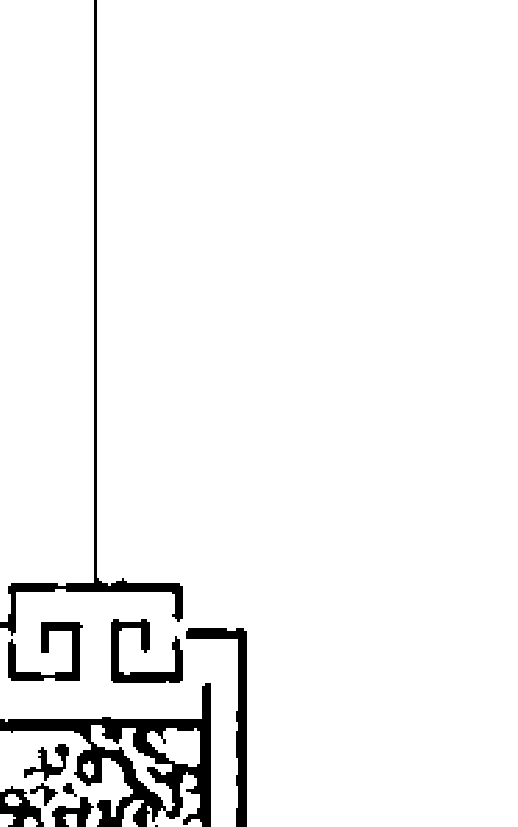

> 孔子在《繫辭傳》中曰：「天一、地二，天三、地四，天五、地六，天七、地八，天九、地十。天數五，地數五，五位相得而各有合。天數

二十有五，地數三十，凡天地之數，五十有五，此所以成變化而行鬼神也。」此說明〈河圖〉與〈洛書〉，是天地變化基本原則，這原則可能是涵蓋整個宇宙觀，無論是有形物質或無形物質，皆遵守此原則。

〈河圖〉與〈洛書〉可以分開單獨研究或討論，運用上可以分開運用，也可以一起混合運用。〈河圖〉與〈洛書〉說明天地之間的運行變化道理，宇宙的秘密盡在其中。

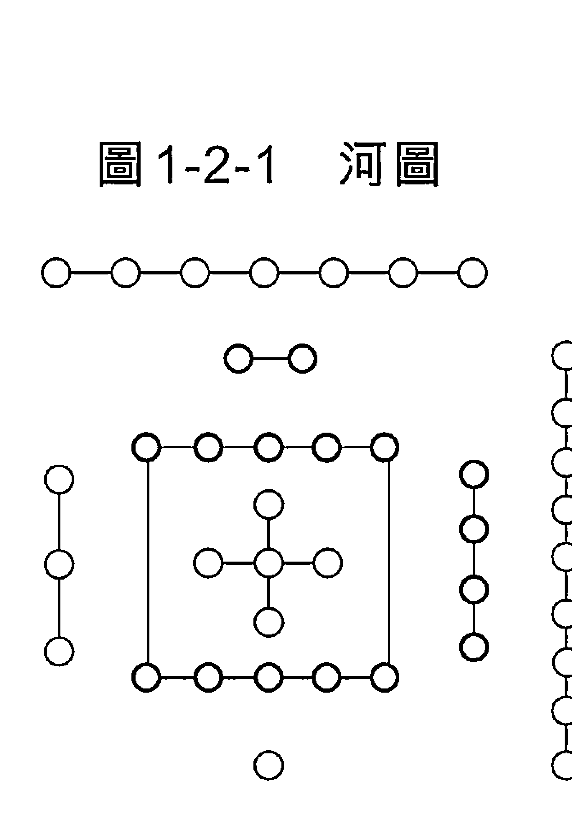

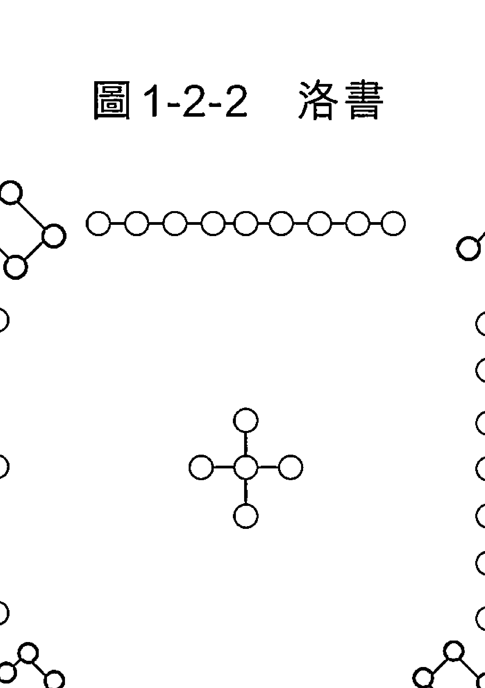

看《河圖》如圖1-2-1及《洛書》如圖1-2-2，這一張圖都是以平面展示，不妨可以從另一個角度來思考，在數千年前，要把宇宙運行道理要用最簡單的圖形表示，又要表示立體概念，要如何來表示？其中白色點即表示在明處，黑點部份是在暗處，如太極圖一樣（圖1-2-7太極圖），陽中有陰，陰中有陽，是相互呼應的，一上一下，成為立體圖，可以想像是太極的上下左右。

另一個觀念是《河圖》、《洛書》其實是同一個物件，只是分開來說明，《洛書》圖帶入《河圖》中間之五、十，全部以立體概念來看，就會比較清楚了。

《河圖》與《洛書》前面說明了立體觀念，進一步了解，在圖形中都有白點及黑點表示，白點表示陽，可見看到的，就以我們眼睛或是觀測儀器可以看見的；黑點示陰，看不到的，眼睛或是觀測儀器無法看到的，看不到並不代表沒有，但是用另一種方式影響我們，看不到可以稱為「異空間」，以「紫微斗數」次級星或是流年星曜（長生十二星、博士十二星、將前十二星、歲前十二星）等，筆者認為有很多星曜是來自「異空間」，例如將前十二星之一「月煞星」除了在星性基定義外，還另有一個作用，就是很容易有「空間迷向」的問題，簡單說在山裡迷路了，走出來，這時會是與「異空間」重疊，對於平衡、空間感知產生問題。（詳細說明請參考拙著《紫微星鑰》第三○一頁「月煞星」說明。）若能運用相溢之理由由現有空間相溢到「異空間」，是到宇宙任何一個地方最快速之方法。

## 古人對〈河圖〉所做的註解

> 朱子曰：《繫辭傳》：「天一、地二，天三、地四，天五、地六，天七、地八，天九、地十；天數五，地數五，五位相得而各有合。天數二十有五，地數三十，凡天地之數，五十有五，此所以成變化而行鬼神也。」此夫子發明〈河圖〉之義也。

〈河圖〉：「以相生為序，故左行自北而東，而南、而中、而西、而復始於北。」

〈河圖〉：「太陽居一，太陰數六，在太陽一位外，少陰居二，少陽數七，在少陰二位外，少陽居三，少陰數八，在少陽三位外，太陰居四，太陽數九，在太陰四位外，中五衍母，次十衍子。」

朱子曰：「河圖四面，太陽居一連九，少陰居二連八，少陽居三連七，太陰居四連六，數與位合為十也。」又曰：「河圖七、八連於左，九、六連於右，皆為十五，生數一、三、五連於左為九，二、四連於右為六，九、六之合，亦為十五，五於十相守於中，亦為十五。」又曰：「天地生數到五便住，那一、二、三、四，遇著那五，便成六、七、八、九，五卻自對五成十。」又曰：「一、六其宗，一為老陽之數，此故二老之合，然陽居陰位，陰居陽位，亦二老互藏其宅也，二、七為朋，二為少陰之位，七位少陽之數，三、八同道，三為少陽之位，八為少陰之數，此則二少之合，然亦陽居陰位，陰居陽位，亦二少互藏其宅也。」

> 「以四象觀之，太陽位居一，而數則九，乾得其數，而兌得其位，故乾為九而兌為一，少陰位居二，而數則八，離得其數，而震得其位，故離為八而震為二，少陽位居三，而數則七，坎得其數，而巽得其位，故坎為七而巽為三，太陰位居四，而數則六，坤得其數，而艮得其位，故坤為六而艮為四，今析六、七、八、九之合，以為乾坤離坎而在四正之位，依一、二、三、四之次為震兌巽艮，而補四隅之空也。」

> 「圖之一、三、五、七、九，皆奇數，陽也，而一、三、五之位不易，七、九之位易者，亦以天地之間，陽動主變故也，然陽於東北則不動，於西南則互遷者，蓋東北陽始生於方，西南陽極盡之方，陽主進，數又必進於極，而後變也。」

> 「自一至十，特言奇偶之多寡爾，初非以次序而言，天得奇而為水，故曰一生水，一之極而為三，故曰三生木，地得偶而為火，故月二生火，二之極而為四，四生金，何也，一極為三，以一運之，圓而成三，故一而三也，二極為四，四以二周之，方而成四，故二為四也，六之成水，猶坎之為卦也，一陽居中，天一生水也，地六包於外，陽少陰多，而水始盛，七之成火，猶離之為卦也，一陰居中，地二生火也，天七包於外，陰少陽多，而火始盛，坎屬陽而離屬陰，以其內者為主，而在外者成之也。

> 刘雲莊曰：「水陰也，生於天一，火，陽也，生於地二，是方生之始，陰陽互根，故其運行，水居子位極陰之方，而陽已生於子，火居午位極陽之方，而陰已生於午，若木生於天三，專屬陽，故其行於春，亦屬陽，金生於地四，專屬陰，故其行於秋，亦屬陰，不可以陰陽互言矣，翁思齋曰，水火金木，不得土不能合成一器，如天一生水，一得五便成水之成，地二生火，二得五便成火之成，三生木，三得五變為木之成，地四生金，四得五便成金之成。」

> 胡雙峯曰：「五行質具於地，氣行於天，以質言，則曰水火木金土，取天地生成之序，以氣言，則曰木火土金水，取春夏秋冬運行之序也。」

> 吴曰慎曰：「陽始北而終四，一、三陽尚微，故居內，七、九陽盛，而著於外也，比實其中，而後能著乎外，故五居中，陰始南而終，二、四陰尚微，故居內，六、八陰盛而凝於外也，必堅乎外而後能實其內，故十居，自中而外，陰之生長，自外而中，陰之收藏」


從古籍中對〈河圖〉的介紹，都是以平面空間來看，〈河圖〉基本上的運用，應以立體空間來看待，要在一個平面上做出立體圖是有困難度，其主要是一種動態的平衡觀念，兩種能量（陰、陽）相互平衡的運行，達到動態平衡之理，有自己能量運行的路線或是軌道，代表一個群體運行，各有各的依歸，各有各的任務，各司其職的運行，當要運用時，再由〈河圖〉轉為〈洛書〉應用，所以〈洛書〉的圖是在動態中產生平衡，從一個剖面中討論，其本質是不會停止的，一直在動，有如「乾」卦的概念。

《繫辭傳》或古人對於〈河圖〉的作用說明，「一、六」共宗屬水在北居下，五行屬「水」，「二、七」為同道火在南居上，五行屬「火」，「三、八」為朋木在東居左，五行屬「木」，「四、九」為友屬金在西居右，五行屬「金」，「五、十」相守屬土居中，五行屬「土」，此說明河圖如何配上「五行」，做為基本的定義。為何要有「五行」呢？五行是一個共同的轉換物質，有如我們在生活中若是以物易物，現在一斗的米或可以換多少斤的菜，有時是認知問題，若是轉換到「錢」就比較簡單，就定義了一斤菜是多少錢，一斗米是多錢，這是在陰陽學上是很重要的事情。

這裡所說的東、西、南、北，與地磁（以現行地圖所標示方位）所說的東、西、南、北不同，正好相反，地磁上所指的西方在〈河圖〉上指的是東方，東方則為〈河圖〉的西方，南方在〈河圖〉的北方，北方在〈河圖〉的南方，讀者不要搞混。

在《繫辭傳》中：「五位相得而各有合」，指五行（金、木、水、火、土）陰陽搭配的關係。其意為天以一生水，而地以六成之，地以二生火，而天以七成之，天以三生木，而地以八成之，地以四生金，而天以九成之。「五位相得而各有合」主要說明「五行」生剋之理，在後面的章節中介紹六十甲子納音五行之木、火、土、金、水是如何推論出來的原理介紹。

所謂天地之數，奇數為陽數有一、三、五、七、九，天數以奇數相加則二十五（所有的陽數相加）；偶數為陰數有二、四、六、八、十，地數以偶數相加則三十（所有的陰數相加），天數地數相加五十有五。天地之數說明陰陽有別，運行上是指陽配陽、陰配陰，而無陽配陰或陰配陽，不可亂配，這是最少的組合，沒有重覆的組合，這個觀念與西方數學中的排列組合觀念相通。

## 第二節

## 洛書基本觀念

## 古人對洛書所做的註解

> 《洛書》：載九履一，左三右七，二四為肩，六八為足，蓋取諸歸象也。
《洛書》：以相剋為序，故右轉自北而西，而南而東，而中，而復始於北。

> 朱子曰：「洛書之位，一對九，二對八，三對七，四對六，亦與河圖不異。」又曰：「洛書縱橫數之皆十五，互為七、八、九、六。」

胡玉齋曰：「洛書雖縱橫有十五之數，實皆七、八、九、六迭為消長，一得五為六，而與東北之八，迭為消長，三得五為八，而與南方之九，迭為消長，四得五為九，而與西北之六，迭為消長，二得五為七，而與西方之七，迭為消長，數之進者為長過者為消，長者退則又消，消者進則又長，六進為九，則九長而六消，九退為六，則九反消而六又長矣，七、八倣此，虛五分十者，虛其中五之外，則縱橫皆十，以其十者分之，則九者，十分一之餘，八者，十分二之餘，七者，十分三之餘，六者，十分四之餘也，參伍錯綜，無適而不遇七八九六之三之餘合焉。

又曰：「洛書之五，又自含五而得十者，下一點，含天一之象上一點，含地二之象，左一點，含天三之象，右一點，含地四之象，中一點，含天五之象，所謂五自含五而得十，通在外四十，為大衍之數，積五與十而得十五者，以其所含之五積之，則又含五與十而為十五，通在外四十，而為河圖之五十有五也。」

胡雙峯曰：「書之中視河圖，惟有五而無十，然一、九、二、八、三、七、四、六之合，環而向之，未嘗無十焉，合圖書之數計之，為數者百。」

鮑雲龍曰：「以洛書邊數推之陽，陽以三左行，天圓徑一圍三，三天數也，一在北，一而三之，三在東，三其三為九而居南，九而三之，三九二十七而居西，三其二十七為八十一，而一復居於北，北而東，東而南，南而西，西而復北，循環不窮，有以符天道左旋之義；地方徑一圍四，兩其二也，蓋以地上之數起於二，而陰資以為始位在南而右行，二而二之為四，而居東南，二而四之為八，而居東北，二其八為十六，而居西北，二其十六為三十二，而二復居西南本位，西南而東南，東南而東北，東北而西北，西北而復西南，亦循環不窮，有以協地道右行之說，一、三、九、七，陽居四正，二、四、六、八，陰居四隅左右旋轉，相為經緯，造化之妙如此。

> >《吴曰慎》曰：「洛書上三數象天，中三數象人，下三數象地，人能參天地，贊化育，建中和，故歸重於五皇極焉。」

《洛書》主要承接《河圖》概念，《河圖》是主要說明動態的平衡，而《洛書》主要說明靜態的平衡，如圖1-2-2洛書所示，現在轉換到圖1-2-3洛書數，無論是直、橫或斜所有的數都是十五，這一種的平衡是非常穩定的，這裡是指一開始的平衡做為論述基礎，其動態平衡故洛書數也會隨之變化，以應因《河圖》的運行，所產生動態的平衡。《洛書》的方位與《河圖》的方位是一樣的，以洛書數如圖1-2-3所示，數值代表的方位說明，如3是東方但在現在地圖上是指西方、4為東南方現在地圖的西北方、9為南方現在地圖的東南方、2為西南方現在地圖的東北方、7為西方現在地圖的東方、6為西北方現在地圖的南方、8為東北方現在地圖的西南方，這裡與地磁的東、西、南、北不同，使用上不要弄混了。

## 第一篇·第二章 河圖洛書

所謂的四正位亦為陽位，在「洛書數」圖 1-2-3 中指的是 1、3、9、7 之位，四隅之地亦為陰位，在「洛書數」中指的是 2、4、6、8 之位，這裡所說是從《洛書》之平衡開始，基本運用的條件，再配合「八卦」則應用上變的比較複雜，這裡配上「後天八卦」，卦雖然是一樣，用的地方不同或用錯，其結果會相差十萬八千里的答案，但在推論上是非常不容易找出錯誤地方。
孔子在《文言傳》中：「承天而時行，積善之家必有餘慶，積不善之家必有餘殃」，筆者認為這一句話，「承天而時行」，這一句話是說明宇宙或天體運行成為一種規律，「時」是以解釋為一種習慣或是固定的行為，不按照規則，必定造成很大的錯誤；若是以人生而言，說人平時要積德行善，才會有好報，若不積德行善，必有惡報。
從另一深層意義說明，以象、數觀點來看，是根據天體運行之理，配合「八卦」的演算或推論，說明了「積」是指推論卦象的過程是正確的，就可得你的預期結果，所調「善」就是推演過程是對；「不善」...

## 圖 1-2-3 洛書數

| 4 | 9 | 2 |
|---|---|---|
| 3 | 5 | 7 |
| 8 | 1 | 6 |

則在推演過程中產生錯誤，這個錯誤會禍及他人。筆者希望學會「易經」象、數、理之
人，依自己的能力服務大眾，利益眾生，更不可用此工具獲得不當之利益。

《易經》的象、數、理的運用，要特別的小心，有如刀刃兩邊利，用的好則是可達到你
的預期效用，反之則會傷到自己，要非常的謹慎使用。讀者若有玩過撲克牌中有一種玩法叫
「拱豬」，你的手中原有「羊」得正分一百分，「豬」則為負分一百，但是在「豬」、「羊」
變色時，拿「羊」立即變成負分一百，反而拿「豬」變成正分一百。

在古人有提及「天道左旋、地道右行」，何謂「天道左旋、地道右行」，其意說明天地
之間是一種「動」、「靜」、「剛」、「柔」相互交錯的運行，達到動態或靜態的「平衡」，這一種
「平衡」觀念正是儒家所說的不偏不倚即「中庸之道」，凡事過與不及都不好。

在〈洛書〉中是如何的展現呢？首先以先定義「四正」之地即為1、3、7、9之
數為「陽」，「四隅」之地即為2、4、6、8之數為「陰」。所謂「天道左旋、地道右
行」以四隅之數向左旋轉，順時鐘方向旋轉；「天道左旋、地道右
行」以四正之數向左旋轉，順時鐘方向旋轉；「天道左旋、地道右
所示，3的對應位置是「先天八卦」的「震」卦位置，「震」卦為起始之意，方位則為東
方，所以在這裡以3的位做為起點。要說明是「先天八卦」是基本的推論基礎，而「後天八卦」是應用部份，這裡不要搞混了。

3為「陽」數的起始點，陽數的動能為3，為何動能為3，在說卦傳中有一段：「參天兩地而倚數」，3與2的數相互依靠變化之數，以3做為「陽」運算的倍數，2做為「陰」的運算倍數。以3為起始點，順時鐘向到9的位置則3×3=9；9的位置要到7的位置則是9×3=27，易經在變化時大部份是取餘數，在此取7；7的位置到1位置，則是27×3=81，取餘數1，第二次循環則用81×3=243，3取餘數3，這個3是往外擴張的而非原來的3。

2為「陰」數的起始點，陰數的動能為2，為何動能為2，上述已說明，不在此重述。以一後天八卦說明2的位置是「坤」卦所在，在此要說明為何陽數為何用先天卦，而在陰數時卻要用「後天八卦」，陽的變化是有跡可尋，而陰的變化是有很很多方式，答案不只一個，會有很多「解」，孔子云：「小人、女子難養也。」這裡指小人與女子的性情多變，不容易讓人掌握或理解之意，後面有四方階的說明，幫助了解。

2的數開始變化，陰數的變化方是以逆時鐘方向，陽數順陰數逆，如此才能平衡。4的位置則是2×2=4，8的位置則是4×2=8，6的位置則是8×2=16，取餘數
為6，下個位數則是16×2＝32取餘數為2，數的變化一直向外推演，無限向外的變化，變化愈大愈複雜，陰數之變化有一個特徵是不會固定一種變化，方式有很多種。

「參天兩地而倚數」另一個解釋是，「參天」則是3＋3＋3＝9為陽之數，在卦爻上稱「初九」，則初卦為陽卦之意；「兩地」則是二為地所以2＋2＋2＝6為陰之數，在卦爻上稱「初六」，則初卦為陰卦之意，可參考附錄一《說卦傳》臆解說。

「洛書數」的對角線、橫、縱的和各為十五，這是完美的平衡數，而數字是跳躍卻不是依順序而行，必需依照洛書排列的順序，如此才能達到平衡。〈河圖〉的平衡是一種擴大的平衡，而〈洛書〉是在一個區域或是範圍內的平衡，「河圖數」的變化則「洛書數」也會跟著變化，互為因果關係。

平衡數的變化，其變動知未來變法之軌跡，能達到預測環境變化之關係，我們將事情馭繁為簡，簡化處理，假設「洛書數」如圖1-2-3所示，以1為起點，則下個變化點為2，但在我們現代大多以實性推估，以統計、分析而言，要蒐集過去所發生的事情或資料，推測
未來可能發生的機率，是找不出 2 的位置，因為沒有關聯，相差很遠，以 2 的週邊來看，實際是為 8 、 3 、 5 、 7 、 6 的數值，結果都不是推測結果；只有時間走到 4 時，可以推到 5 ，在由 5 推到 6 ，5 與 6 可以很精確推論，以本體所在位置不計算，其他共有 8 個位，只有一個是百分之百預測中，整個比例來看只占 2 / 8 的機率，約二五% 的比率。
在預測學中要百分之百預測正確，是非常困難的，筆者認為達到六〇%就非常的精準，若以二八理論來看，另外二〇%是取決於「人」的問題，而「人」確實決定八〇% 的準確度。

## 方階介紹

以圖 1-2-3 洛書數可以做一擴大運用在數值運用，也可以當作一個趣味數學的遊戲，前面所提「洛書數」是三方階，各平衡是 15 ，三方階是為單數階，其解法只有一種模式，其四個面都可以為切入點，變化只有一種。

四方階是以十六空隔所組成，把 1 ~ 16 的數值填入，所有的直、橫、斜的數值加起來總和為 34 ，舉例來說如圖 1-2-4 及圖 1-2-5 是二種不同的排列方式，都符合總和為 34 ，以四方階而
言，主要解法多達6〜8種，變化型的可能達到百種以上，四方階是陰數，所以是多變的，讀者有興趣可以自行研究。再一個例子是五方階，以25個方格所組成的，由1〜25數值填滿，各平衡數為65，其變化情形與三方階變化順序差不多，有一定規律的變化，也是象徵是乾卦（陽卦）的變化，如圖1-2-6五方階圖平衡數所示。

## 圖1-2-4 四方階一

| 1 | 15 | 14 | 4 |
|---|----|----|---|
| 12 | 6 | 7 | 9 |
| 8 | 10 | 11 | 5 |
| 13 | 3 | 2 | 16 |

## 圖1-2-5 四方階二

| 6 | 3 | 13 | 12 |
|---|----|----|---|
| 15 | 10 | 8 | 1 |
| 4 | 5 | 11 | 14 |
| 9 | 16 | 2 | 7 |

## 圖 1-2-6 五方階

| 11 | 18 | 25 | 2 | 9 |
| 10 | 12 | 19 | 21 | 3 |
| 4 | 6 | 13 | 20 | 22 |
| 23 | 5 | 7 | 14 | 16 |
| 17 | 24 | 1 | 8 | 15 |

## 第三节 河图洛书总说

## 古人诸儒对河图、洛数总说

張子曰：「通於天者河，龍馬出圖，天降其祥，中於地者洛，神龜載書，地效其靈。」
蔡覺軒曰：「河圖位與數常相錯，然五居中，一得五為六，二得五而為七，三得五而為八，四得五而為九，各居其方，雖相錯而未嘗不相對也，洛書位與數常相對，然五居中，一得五而為六，二得五而為七，三得五而為八，四得五而為九，縱橫交綜，雖相對而未嘗不相錯也。」

胡雙峰曰：「圖書之數，三同二異，其居中者不可易矣，獨西南二方之數相易者，則金乘火位，火入金鄉，有相克制之義焉，此造化所以必易二方之數者，正以成其相克之象
也，自二方既易之後，圖則左旋相生，書則右旋相克，造化不可无生，亦不可无，克，不克則无以為之成就也。」

> 胡玉齊曰：「三向者，圖書之一、六皆在外，三、八皆在東，五皆在中，三皆之位數皆同也，二異者，圖之二、七在南，而書則在二、七在西，圖之四、九在西，而書則四、九在南，二者之位數皆異也，陽不可易，專指一三五，陰可易，統指二、七、四、九，二、四以生數言，雖屬陽，然以偶數言則屬陰，不得謂之陽矣，故可易，七、九以奇數言，雖屬陽，然以成數言，只可謂之陰矣，故亦可易。」

> 董盤潤日：「河圖之數，不過一奇一偶相錯而已，故太陽之位，即太陰之數，太陰之位，即太陽之數，少陰之位，即少陽之數，少陽之位，即少陰之數，見其迭陰迭陽，陰陽相錯，所以為生成也，天五地十居中者，地十亦天五之成數，蓋一、二、三、四已含六、七、八、九乘之故也，蓋數不過五也。洛書之數因一、二、三、四以對九、八、七、六，其數亦不過十。蓋太陽占第一位，已含太陰之數，少陰占第二位，已含少陰之數，少陽占第三位，已含少陽之數，太陰占第四位，已含太陽之數，然五數居中，太陽居一，得五而成六，少陰居二，得五而成七，少陽居三，得五而成八，太陰居四，得五而成九。則與河圖一陰一陽，相錯而為生成之數者亦无以異也。」

胡玉斋曰：「河图偶赢而奇乏者地三十，天二十五也，洛书奇赢而偶乏者，天二十五

翁思齋曰：「河图运行之序，自北而东，左旋相生固也，然对待之位，则北方一六水克南方二、七火，西方四、九金克东方三、八木，而相克者已寓于相生之中，洛书运行之序，自北而西右转相克也，然对待之位，则东南方四、九金，生西北方一、六水，东北方三、八木，生西南方二、七火，其相生者，已寓于相克之中，盖造化之运，生而不克，则

陈濬室曰：「河图以生数统成数，洛书以奇数通偶数，若不相似也然一必配六，二必配七，三必配八，四必配九，五必居中而配十，图书未尝不相似也，河图之生成同方，洛书之奇偶异位，若不相似也，然同方者有内外之分，是河图犹洛书也，异位者有此肩之议

蔡节斋曰：「河图数偶，偶者静，静以动为用，故河图之位合皆奇，一合六，二合七，云云是故易之吉凶生乎动，盖静者，必动而后生也。

「洛书数奇，奇者动，动以静为用，故洛书之位合皆偶，一合九、二合八，云云是故范
之吉凶生乎动，盖动者，必静而后成也。」

> 胡雙峯曰：「河圖洛書，皆木數居東方，伏羲畫卦，自下而上，即木之自根而幹，幹而枝也，其畫三，木之生數也，其卦八，木之成數也重卦亦兩其三，八耳，三八木數大備而後六十四卦大成，一六水，二七火，四九金，五十土，皆在包羅中矣，此春所以貫四時，仁所以包四端，元所以統四德，大哉易也，斯其至矣。」

古人對《河圖》、《洛書》的說明強調動、靜觀念，五行上的搭配，筆者以天文切入討論，從另一個思惟來看《河圖》、《洛書》的應用，讀者會更大的想像空間。在《繫辭上傳》：「在天成象，在地成形，變化見矣。」一是指地球表面地形或地物的形狀，如山川河水，都對應到天上各星球對地球所產生對應的關係；換言之，各星球與地球之間有一種微妙或是相對應的關係，未必是引力或是某種頻率，這些無論是直接或間接都會影響地球環境、生態、氣候的變化，這些變化是因各星球之間的引力，或是目前科技所知的關係與地球的互動關係，各星球運行會與地球產生複雜關聯。舉例來說，光是一顆隕石要進入地球，若是超過某種體積，對地球本身為害很大，直接傷害的是地球上的生物。
各行星的運行是很複雜且有規律，這種星球的運行我們可以簡稱為「天體運行」，而這種的「天體運行」當作是外部系統的統稱；而地球本身系統的變化，是要因應外部系統的變化，而演化出一套自我保護系統，「天」、」地「的感應我們可以稱為「天人感應」。地球的「自轉」與「公轉」是自我系統的演化；「自轉」與「公轉」是地球本身系統與外部系統的相互關係。
的變化而變化，或是地球本身也對其他星球的影響，這些變化只為一件事情，就是維持「平衡」，就一般常說「天」與「地」的觀念，有時候會讓人弄不清楚到底是在說什麼？「天」可以泛指宇宙的星球運行的規則或道理，研究各大行星與各星球相對應的「時間」與「空間」之關係，可歸類於「天」的疇。我們將這一「範疇」縮小來研究，就以我們所居住地「地球」做為討論的中心，以各星球對地球相對應關係，從外部環境變化而影響內部環境的變化，針對這些變化所產生影響問題之研究。筆者在拙著《紫微星鑰》文中提及天文，而天文強的國家必為強盛的國家，這是其中一種簡單判斷一個國家強盛與否的簡單方法。在中國古代《易學》或是天文裡經常探討各星球或行星對地球相互影響的關係，例如「天狗食月」或是「天狗食日」，會是一個不祥的預兆，對「人」所產生的各種變化情形及影響，其原因在原因是在星球重疊或在一條上，引力是非常不穩定的，環境是會立即反應，人的反應有時候是很遲鈍的、沒有知覺的。「地」可以泛指地球山、川、河、水、氣候的變化，地球的一切變化都會受到各星球的影響，現在太陽及月亮已經被科學家證明，是對地球有直接的影響，例如太陽對氣候變化有直接關係，以太陽為主的曆法，即時節氣曆，十二節、十二氣稱為二十四節氣，月球則對潮汐有直接的影響，這是被證實了，月球繞行地球發展出太陰曆。其他的星球對地球就
無影響嗎？可能是現代的科學尚無找出量測方法，但不能證明沒有影響。大自然的力量是有多大呢？例如月球是對地球潮汐或浪產生影響，這是大自然的現象，並無特別，如果我們以人工製造泳或浪，要花費多少能量才能達到；現在有很多是室內種植蔬菜，模擬環境變化，太陽光的色溫、熱等，所花費的資源不貲，且範圍亦受限制，雖能達到某一個程度「人定勝天」效果，人類所做的資源很多，終是抵不過大自然的力量。《河圖》、《洛書》是要怎麼運用，其實在第一章的「地球文明毀滅假說」就明了，就是運用《河圖》、《洛書》概念，是花了一個章節介紹，《河圖》與《洛書》是可以分開使用，也可以合起使用，運作上由讀者決定。

## 第四节 运用探讨

在《河图》、《洛书》里很重要的一个观念就是「平衡」，是指一切事或物，达到一种完整的对称性，其对称性可分为二种，一种是「动态平衡」，另一种是「静态平衡」。「动态平衡—每个物质都在动，形成一种平衡，例如星球的运行，个人的运动中，如何与环境产生最佳平衡状态等；「静态平衡」则所有物质达到最适的对称，例如地球上很多物质都有一定的比例，对称性或是相对性的平衡，自然界中「碳」元素的结构面是非常的稳固，尤其是钻石的坚硬度非常硬，其理即为「平衡」之理。
《河图》狭义来说是一种「动态平衡」，而《洛书》则是一种「静态平衡」，简单的说，两者是相互对应的，互为影响，内外互动达到平衡，《河图》与《洛书》是一种关系维系者，由动态影响静态的变化。举一个例子，环境与人的关系，夏天时天气非常的热，这
是外部的環境因素，身體為了要降低溫度，一直排汗及喝水，才能維持氣候與身體平衡的變化；到了冬天，天氣變冷，身體內部產生變化，以符合環境的變化，如果無法調節，就會生病，生病用許多方法治療，使身體的器官或機能，恢復原有的功能繼續工作。

以太極圖而言如圖1-2-7太極圖，在太極圖中陰中有陽，陽中有陰，即為「平衡」，這一種的「平衡」是屬於靜態平衡，在使用上則是在太極圖上，二個小點互為對調，使太極圖產生極陽、極陰，而造成「不平衡」，形成另一種的「動態平衡」，在易經上運用，請參閱《易經》之《繫辭》及《說卦傳》內說明。

五子棋或其他棋為例，五子棋的玩法是用圍棋子，在棋盤上誰能夠先能夠連續排列成五個棋子在一起，無論是直、橫、斜，就為勝利的一方。
五子棋在攻防時，有不同的做法，在守的一時，其原則要保持棋子的對稱性排列，即為「平衡」，每個棋子都可相互支援，結構面比較穩固，攻擊者不易攻擊，因為此時無機可趁。攻擊者在攻擊時要造成防守者，在佈局時產生缺口，攻擊者則單點突破，席捲兩側，方有勝算。

《河圖》、《洛書》是強調「平衡」，在我們生活之中的和諧，有時候我們也需要「不平衡」，達到某些需求，所以在「平衡」之間找出缺口，形成高低位差，產生活能時，是非常不穩定，若是不能控制則會崩盤；例如在五子棋或其他棋藝裡，攻擊者要集中能量，集中的力愈大，其動能愈大，以大能量攻擊防守的缺口，則勝券在握，相對的當集中時即是最危險的，則速度及統合是決戰成功因素。

經上述筆者說明，讀者應有領悟其中道理，讀者心中定有疑慮，如果這攻擊與防守，都是高手時，如何決勝負呢？這是一個很好的問題，筆者引用孫子故事向讀者說明。

「孫子兵法」開始流行時，有位君主問孫武，每個將領都學會「孫子兵法」時，當兩軍對仗時，那一方會贏，孫武曰：「誰犯錯愈少，誰就是贏家。」話雖簡單，整個過程之中思慮要慎密，每個環節起、承、轉、合的點，要如何巧妙銜接，而巧妙運用關乎個人修養、知識、智慧與經驗。例如在一九四四年六月六日諾曼第登陸時，艾森豪將軍要下達攻擊命令時，是人生很大的考驗，錯了可能全軍覆沒，死傷慘重，歷史改寫。

「動」與「靜」只是一種相對的概念，而非只有字意上意義，在這裡東方與西方就有很大的差異，東方是含義或意義是向外延伸，無論是從微小事物及人生道理，大到宇宙變化的法則，是一種無限延伸、循環、實質的概念；西方科學定義是有很大差別，定義某一件事件要定義非常的清楚，是在什麼範圍、流程、作法要有非常的清楚說明，可重覆驗證。

東方哲學是一種系統觀、西方科學是驗證為主，我們應取東方的哲學系統為「體」，西方實證科學為「用」，應用上則以系統分割成無數的小的次系統、分割到單一功能，用西方的定性、定量方法完成，再將每一個系統或單一功能的起、承、轉、合的銜接完成，即成為完整的運作系統。

「平衡」與「不平衡」、「動」與「靜」只是一種非常簡單的思考分析模式，加上「時間」及「人」的變化，所衍生的變化無窮大，讀者可將生活周遭事物簡化，加以分析運用。例如在人際溝通時，有時別人會丟出負能量，若你接了，你必需調整自己，會做回應，所以會接收這個負能，如《易經·繫辭傳上傳》：「方以類聚，物以群分，吉凶生矣。」就會被吸過去，不易脫離，最好解決方法是，將負能量不接收、不回應，幾次就不會有負能量。若是積極的人，發出正能量，會化解負能量，常有父母要與孩子溝通，會挑小孩子過去痛點，小孩子會反嗆，這是負能量互動，小孩子若不回應負面說詞，反而說以前與父母快樂相處的時光，這樣溝通起來會較為正面能量。

工作非常努力，某一天有個算命師告訴他，你的命格為大富大貴之人，你在某個時間點開始變成非常富有的人，起初聽了半信半疑，又去求神問卜，多請各方大師來看，所得到的結果是一致的，從「信度、效度」來看，是沒有問題的，現在的問題是等待這一刻的來臨，就會變成富有的人。

這一刻終於來臨，年輕人決定辭職，在家等候佳音，等待數月後，坐吃山空，最後餓死在家中，死後心中乃有一個很大的「結」，就是我在生前應為大富大貴之人，為何不得到應有的財富，最後竟然是餓死。

這位年輕人死後，心有不甘，決定控告財神爺瀆職，到了閻王殿，向閻王投訴控告財神爺瀆職，閻王受理此案，閻王調閱相關的資料，果然正如這位年輕人所言，命中是一個大富大貴之人，為何會餓死？其中必有隱情，此案秉公處理，查個水落石出，勿枉勿縱。

閻王傳喚被告財神爺，閻王問財神爺：「你是掌管人間的財富，此年輕人命中註定大富之人，為何未將財富依規定時間送達？」財神爺答曰：「我是掌管人間的財富之事，我也受命要將財富送給此年輕人，我帶領許多的財富要給他，但是我找遍三百六十五行，找不到這一位年輕人是從事何種行業，我不知如何給起，我只好繳回，豈能怪我乎？

由上面一個小故事，可以得知，機會來臨時，你是不是準備好了，如果你沒有準備好，這個機會亦不屬於你的，環境或機會都給你了，主要是謀事在人，若是你對天地之間道理有所瞭解，人類應該是積極開創新未來的人生，而非坐以待斃。如果每一個人都對社會貢獻一點心力，我們的社會變得更好。

「錢乃養生之源」，雖然錢非萬能，但沒有錢則是萬萬不能，在現實生活中是非常重要，常以金錢多寡，衡量一個人在社會上的地位重要指標。古云：「小富由儉，大富由天」，每個人都珍惜現在所擁有的，每件事情都不浪費且賦予愛心，雖未大富，小富已近。若能「樂天知命，故不憂；安土敦乎仁，故能愛」，藉由上述之故事可以瞭解，「人」是決定機會的關鍵點，機會稍縱即逝，把握當下機會，機會是成功的一個過程，努力加上機會是成功相當重要的因素。

## 第三章

## 乾坤二卦卦爻推演探索

本章節為何把「乾、坤」二卦放進來討論，因為「紫微斗數」的基礎理論來自《易經》邏輯運用，「乾、坤」二卦觀念影響四化的推論，對於紫微星曜也是以八卦推演運用，用數學來說，《易經》比方說加、減、乘、除，「紫微斗數」建構上去的數學應用，所以需要交代過程，故把「乾、坤」二卦專章討論。

> >《易經·繫辭傳上傳》第一章：「乾知大始，坤作成物。乾以易知，坤以簡能。易則易知，簡則易從。易知則有親，易從則有功。有親則可久，有功則可大，可久則賢人之德，可大則賢人之業。易簡，而天下矣之理矣；天下之理得，而成位乎其中矣。」

「乾卦」、「坤卦」二卦是所有卦的開始，「乾卦」是所有卦的變化開始，而「坤卦」繼「乾卦」之變化而成，「乾卦」變化是簡單而容易了解，「坤卦」變化是以「乾卦」為基礎再延伸變化，《易經》的道理是天下最基本的道理，無論在做人處事、事務的思考、多複雜、多長遠、多大、或是多少，萬變不離其中。

> >《易經·繫辭傳上傳》第四章：「易與天地準，故能彌綸天地之道。仰以觀於天文，俯以察於地理，是故知幽明之故。原始反終，故知死生之說。精氣為物，游魂為變，是故知鬼神之情狀。」

《易經》這裡是說明了天地運行的道理，換言之天地運作規則都在《易經》裡說明清楚，只要觀察天體運行及地面與天體呼應之理，說明死生之道也（死而後生，生生不息），其變化了然於心。

「原始反終，故知死生之說。精氣為物，游魂為變，是故知鬼神之情狀。」讀者可以參考《漢宋易學解》《清·王希尹著》註解：「聖人於易理知之矣，推原始之所以來，反究終之所以歸，始即始其所之生，陰變陽也，即終其所死，陽化陰也，死生之說，聖人於易理知之矣。陰精附於陽氣以凝聚而成物之形，陰變陽也，陽魂離於陰魄，以游散而變物之質，陽化陰也，氣至而伸為神，魂反而歸為鬼；鬼神之情狀，聖人又於易理知之矣。張子，謂精氣者，自无而有，游魂者，自有而无。」這裡所說明「乾、坤」二卦的變化開始，自己必須先變化，「原始反終」是指在推演卦時，反著推，才能得到結果，了解整個變化過程，其義涵自變過程後而還原成原始卦，即完成階段性任務，再自變時又是另一個階段開始。「精氣為物，游魂為變」是說明陰卦要陽卦推演，陽卦要化為陰卦推演，陰陽互相相輔相成，從無到有，又從有到無的變化，了解變化之理，連鬼神的變化都知道，若能掌握變化原則，必能了解天體運行之理及環境變化，所以《易經》也是一部預測之學。

在本章節中有使用卦的名稱是有區分，例如「乾卦」與「乾」卦之表示是不同，「乾卦」：是代表八卦裡「乾卦」只有三個爻；「乾」卦：是代表六十四卦裡的「乾」卦只有六個爻，有上卦下卦之組合，在閱讀上會較容易區分是說哪部份的卦，不至於產生混淆。

「乾卦」與「坤卦」放一個章節討論，其原因是在紫微斗數四化推論中需要「乾卦」、「坤卦」推論，尤其是在化權、化科時需要用到，這二個卦為「父母卦」，對於《易經》哲學思想及邏輯推論產生很重要的影響，在《易經》之《十翼》著作裡的《文言傳》專章討論「乾卦」、「坤卦」一卦，可見是多麼重要，對其邏輯規則要詳加研究。

本章節推演「乾卦」、「坤卦」一卦，是以象數進行推論，所用到的理論是前二章所提過的理論，主要有《河圖》、《洛書》為基礎，在「乾卦」、「坤卦」一卦是如何整合在一起推論出符合地球現有的條件，不從生活中人生體驗作為討論範圍，以邏輯體系原理說明為主，所以對其「乾、坤」二卦之經文無法做單一文字或單一字義或解說。

「乾卦」的卦爻變化，是比較單純的，在第二章裡有《河圖》、《洛書》的介紹，單數變化較為有一致性，原則較為固定，變化性少，以三五階、五方階之平衡數為例，其數字跳動變化位置都有固定模式，不論是單方階有多大，遵此要領，都可以完成。

「坤卦」的變化是比較複雜，不像是「乾卦」推論過程方向明確，其變化邏輯可以依循，在第二節中會有詳細的介紹，筆者在找出變化原則過程中，尤其是在「坤卦」動四、五、六爻推衍變化過程，研究時間超過六年之久，試了很多方法，找出「坤卦」變化之理，以偶數方階說明，各排不符合其《象》辭、《象》辭裡條件，還好沒有放棄找出其邏輯。

列組合會有很多解，沒有一解，但會有一個基本變化規則，而非是毫無章法的變化，只要掌握原則，就不會亂演繹，產生似是而非觀念，最後還是沒有搞懂。

接下來開始介紹「乾」卦、「坤」卦二卦的推演，說到這裡，本「乾」卦、「坤」卦二卦是以象術邏輯觀念做為探討，若推論之中有不完備，敬請賢德、先進賜教精進。

## 第一節 乾卦卦爻推演探索

《易經》六十四卦相傳是《伏羲氏》所傳，真正的年代也不可考，確是對中國文化及哲學思想，產生很深且流遠的影響，對天地尊敬，包容的哲學、禮教等；《易經》古代列為五經之首，是一部很重要的經典，闡述了天體運行的道理，天與地協調運作，成為做人處事學習的對象及道理，也是判別是非的基本原則。

本節介紹『乾』卦卦爻變化推論之過程，前面已說過，推演方式是以象、數應用為主，探討邏輯變化的過程及應用，不以人生生活體驗為主。以『乾』卦推論而言，是恆動的、有規律的變化，所以在各爻推演過程沒有太多枝節變化，依序推論，就會得到結果。

『乾』卦如圖1-3-1所示，六個陽爻所組成的，代表『乾』卦，『乾』卦是六十四卦第一個討論的，是動能開始，萬物變化之始，推演『乾』卦第一步就是『乾』卦變成『坤』卦開始推演，「孤陰則不生，獨陽則不長，故天地配以陰陽。」單獨「乾」卦是無法變動，故必須先轉變成「坤」卦開始，陽中有陰，陰中有陽，才能產生動能，生生不息。六十四卦也區分陰陽二種，請參考附錄二宋版六經圖《大易象數鉤深圖》裡「一陰一陽圖」。我們從「乾」卦先作介紹。

《易經》對「乾」卦如圖1-3-1所示，「乾」卦本卦說明如下：

乾：乾為天，乾上，乾下
乾：元，亨，利，貞。

> > 《象曰》：「天行健，君子以自疆（強）不息。」

> > 《彖曰》：「大哉乾元，萬物資始，乃統天。云行雨施，品物流形。大明終始，六位時成，時乘六龍以御天。乾道變化，各正性命，保合大和，乃利貞。首出庶物，萬國咸寧。」

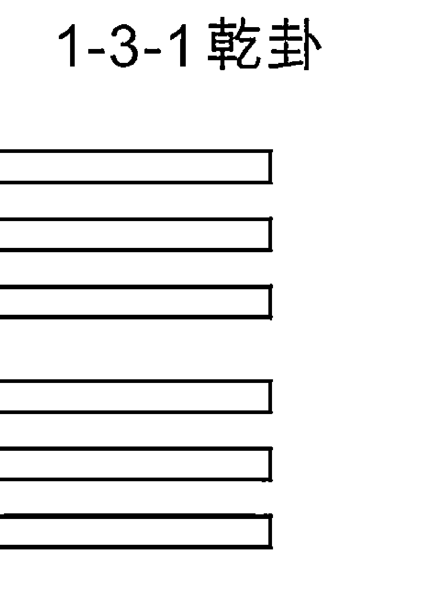

《文言曰》：「元者，善之長也，亨者，嘉之會也，利者，義之和也，貞者，事之幹也。君子體仁，足以長人；嘉會，足以合禮；利物，足以和義；貞固，足以幹事。君子行此四者，故曰：乾，元亨利貞。」

《漢宋易學解》對「元、亨、利、貞」註解：「元，大也；亨，通也；利，宜也；貞，正而固也，乾始萬物，故曰元，乾遂萬物，故曰亨，乾益萬物，故曰利，不私萬物，故曰貞。」

《象曰》是主要說明「乾」卦是所有的卦開始，不論是環境如何變化，「乾」卦變化始終如一，恆常不變，當六爻再變回六陽爻時，即是變化完成，表示本階段完成，再進入下個階段之變化，「乾」卦變必須要按部就班完成，萬事萬物各司其位，各司其職，按其規則變化，為人處事、萬物運行也是依此理。

《象曰》及《文言曰》內容主要說明了「乾」卦是恆常的動，有如太陽系的太陽星，一直放射陽光，不斷的動，保持動能；有如我們人心臟一樣，要不斷的動，停止了，人也就停止了，該階段任務完成。

為何「乾」卦一開始就提「元、亨、利、貞」，是說明在六個爻之中只有四爻才能用，其中二個爻是不能使用，有如經度及緯度一樣，為什麼不能使用，有如現在GPS定位，一定要用地面上一個點來做基準點，這個基準點是不可以亂移動，不可以被佔用，若被佔用所有定位系統就會全部大亂。在「乾」卦初九，潛龍勿用；上九，亢龍有悔，表示這二個爻是不可以用，以現代科技而言就是定位用，即「天地定位」之意，故不能用。

對於上述之一元、亨、利、貞」將《漢宋易學解》之解說提出參考，從另外的觀點思考，也有其他版本之《易經》都有很清楚詳述，請自行參考。

祿命學上應用有「六爻卦」，是《易經》六十四卦方式做為占卜之用，其中「世」、「應」就是在卦的定位用，再用其他四爻與基準互動，所產生之吉凶，做為行事參考；而紫微斗數四化也是應用之一，在本書第二篇之中會詳細介紹四化原理。

其實在我們生活上也是一樣，對每件事情都有一些標準，在當確定準備做時，事情都很好處理，最怕基準點（標準）常常變，沒有依循標準。

「乾」卦在前面已說過，是一個恆常「動」的觀念，這個「動」要如何動起來？用「坤」卦做為變爻推論開始，其理必須「自變」，由「乾」卦變為「坤」卦，這時才能產生動能變化。例如你肚子餓了，身體需要補充東西，會告訴大腦，大腦會產生肢體行為去找食物，是由內部先變動，才會產生行動，完成目標。當人產生「動機」時，才會由自己內部身體產生變化，逐步擴及，慢慢與外界才能產生呼應，這些觀念又會到前面所提之《河圖》、《洛書》之應用。所以說人若產生正能量，心情就愉快，自己就感到沒有病，整個身體就健康起來，不要小看累積之正能量，人的潛能是無限。

## 「乾」卦動一爻

> 初九：潛龍勿用。

> 象曰：潛龍勿用，陽在下也。

> 《文言》初九曰：「潛龍勿用。」何謂也？子曰：「龍德而隱者也。不易乎世，不成乎名；遯世而無悶，不見是而無悶；樂則行之，憂則違之；確乎其不可拔，乾龍也。」

「乾」卦動一爻如圖1-3-2所示，而不是用「乾」卦第一爻變成陰爻，《象曰》也就說明「潛龍勿用，陽在下」，明白說明第一爻是陽爻，在《文言》裡也說明「龍德而隱者也，不易乎世，不成乎名。」龍德為陽爻，在推論「乾」卦必要陰爻推論，才乎合「乾」卦的「恆動」觀念，以「復」卦顯示其動一爻。

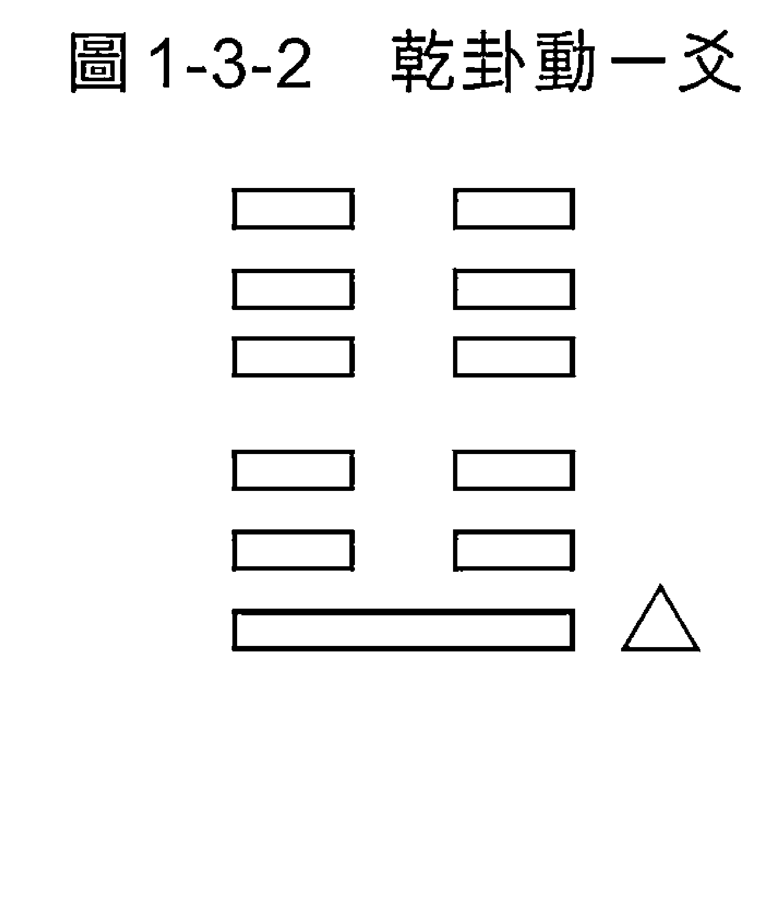

## 「乾」卦動二爻

> 九二：見龍再田，利見大人。
> 象曰：見龍再田，德施普也。

> 《文言》九二曰：「見龍在田，利見大人。」何謂也？子曰：「龍德而正中者也。庸言之信，庸行之謹，閑邪存其誠，善世而不伐，德博而化。易曰：「見龍在田，利見大人。」君德也。」

「乾」卦動二爻如圖1-3-3所示，「龍德而正中者也。」第二爻由陰爻變成陽爻，變成坤在上兌在下「臨」卦表示，「見龍在田」二爻變化是在下卦，直接由一爻向上變化，第一爻變化後，則固定不會變動，再到了二爻變化為「臨卦」，換言之動二爻之變化，就二個陽爻了，也就是「德施普也」，另一個說法就是第二爻延續第一爻之變化，那就是正確的。

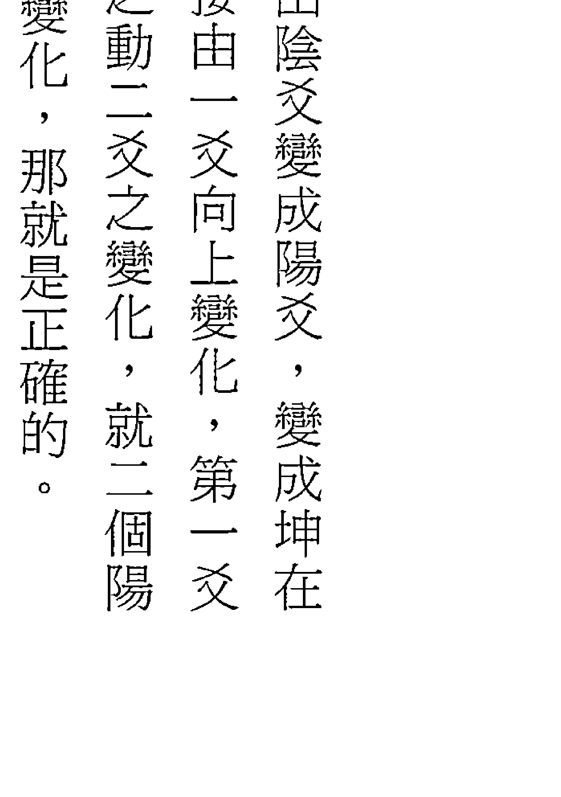

## 「乾」卦動三爻

> 九三：君子終日乾乾，夕惕若，厲無咎。
> 象曰：終日乾乾，反復道也。

> 《文言》九三曰：「君子終日乾乾，夕惕若，厲無咎。」何謂也？子曰：「君子進德修業，忠信，所以進德也。修辭立其誠，所以居業也。知至至之，可與幾也。知終終之，可與存義也。是故，居上位而不驕，在下位而不憂。故乾乾，因其時而惕，雖危而無咎矣。」

「乾」卦動三爻如圖1-3-4所示，以九三日「君子終日乾乾」，「乾」卦本卦之《象曰》：「天行健，君子以自疆（強）不息。」對動爻變化不用想的太複雜，陽爻推到三爻時，下卦全部都是陽爻即是正確。故動三爻為坤上乾下「地天泰」卦。

九三之《文言》說明人生進德修業要持之恆，知其道理，早晚要省身，有錯能改，雖不好但也遠離災禍。

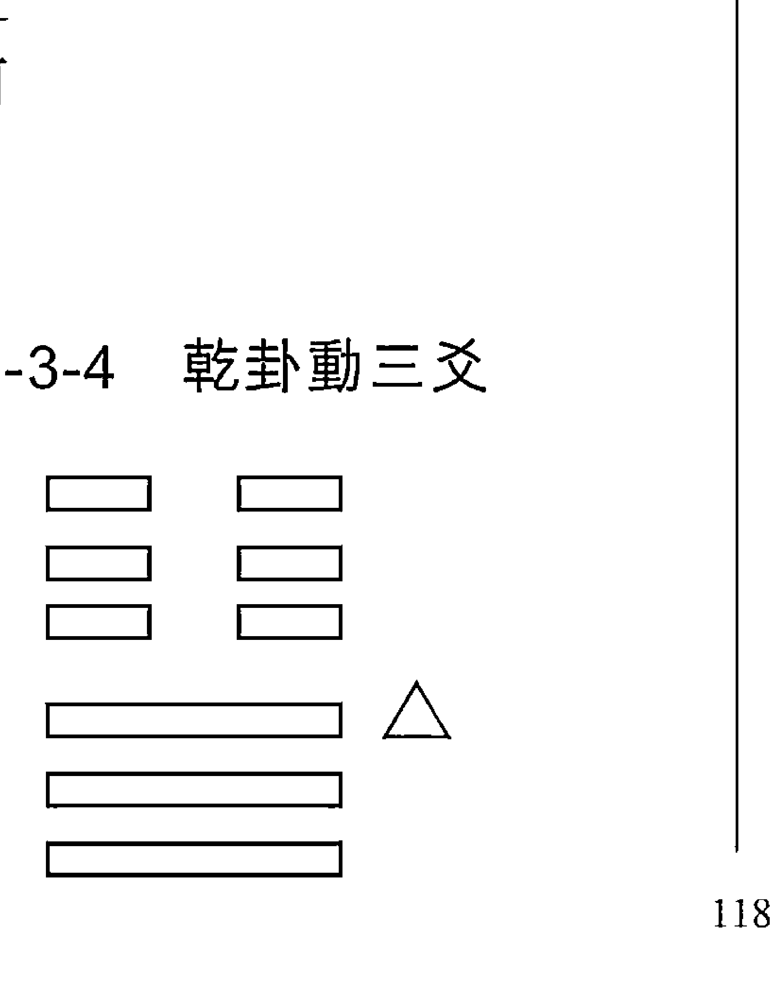

## 『乾』卦動四爻

> 九四：或躍在淵，無咎。
> 象曰：或躍在淵，進無咎也。

> 《文言》九四：『或躍在淵，無咎。』何謂也？子曰：『上下無常，非為邪也。進退無恆，非離群也。君子進德修業，欲及時也，故無咎。』
「乾」卦動四爻如圖1-3-5所示，在九三爻卦完成時，再進入九四爻時，『上下無常，非為邪也』及《象曰》：『進無咎也。』是指下卦完成要進入上卦第一爻（動四爻），直接變成陽爻，第四爻是指從第一爻到第四爻都是陽爻，所以動四爻卦為震上乾下為『大壯』卦。

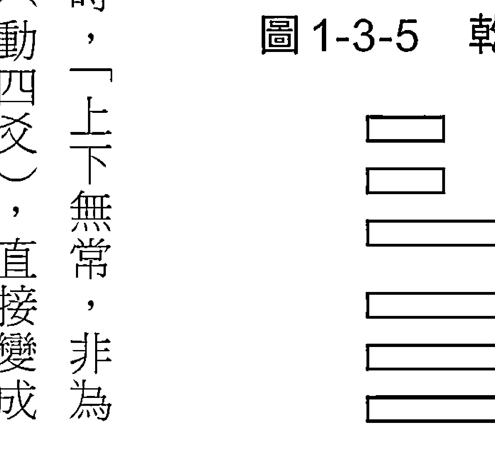

## 「乾」卦動五爻

> 九五：飛龍在天，利見大人。

> 象曰：飛龍在天，大人造也。

> 《文言》九五曰：「飛龍在天，利見大人。」何謂也？子曰：「同聲相應，同氣相求；水流濕，火就燥；云從龍，風從虎。聖人作，而萬物睹，本乎天者親上，本乎地者親下，則各從其類也。」

「乾」卦動五爻如圖1-3-6所示，推論到第五爻是陽爻，龍在天的位置是指陽爻，故兌上乾下為「夬」卦，在六爻裡有五個爻是陽，一個是陰爻，有如太極中之一點，陽中有陰，還是充滿動能。

在中國古代一般稱皇帝為「九五之尊」，在卦裡又有細分天、地、人三個討論，以一、二爻為地，三、四爻為人，五、六爻為天，由人往上升即是人之龍，在現代廣義的而言，則是各行各業之領導人物，都可以稱為最高頂級的人物，或是在某個群體是頭臉人物，在動物界也是如此。

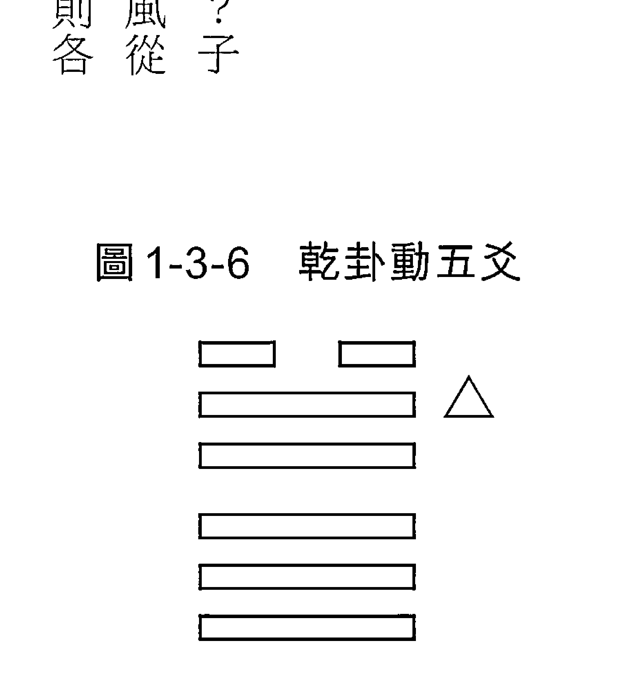

## 「乾」卦動六爻

> 上九：亢龍有悔。
> 用九：見群龍無首，吉。
> 象曰：亢龍有悔，盈不可久也。用九，天德不可為首也。

> 《文言》上九曰：「亢龍有悔。」何謂也？子曰：「貴而無位，高而無民，賢人在下而無輔，是以動而有悔也。」

「乾」卦動六爻如圖1-3-7所示，在用九：「見群龍無首」龍為陽爻，所以推演到了第六爻為陽爻，若是推到這裡全部是陰爻，那是錯的，全部為陽爻才對，故動六爻乾上乾下為「乾」卦。為何在動六爻會是「亢龍有悔」呢？從象數來看，六爻是「天」之意思，這個「天」是指「定位」用，不可以用，若有用到其基準會不見了，在動一爻時則為「潛龍勿用」。這二爻是指定位用，一個如「經」，一個如「緯」是基準，是不可以使用。

（相關「乾」卦的影片介紹，請到 https://youtu.be/0vab-sXpbIQ 觀看，或是查詢關鍵字「王文華老師紫微斗數學理」。）

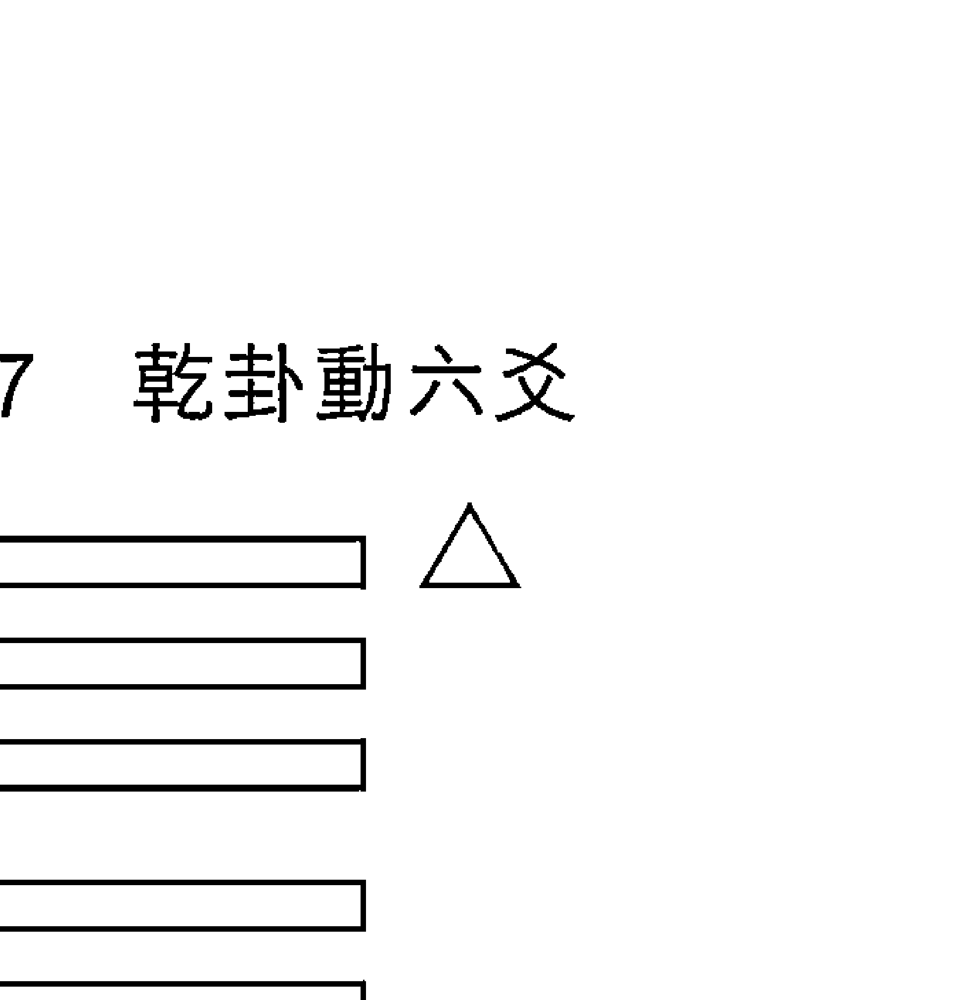

## 第二節 坤卦爻推演探索

「坤」卦的卦爻推演比「乾」卦複雜很多，不能以「乾」卦推演方式直接完成變爻，陰卦多變，無論是如何變，總是會有一個原則，其原則是以「天地定位」，卦爻變化要平衡，這個道理是說起來容易，做起來複雜，古代孔老夫子看待事物都保持「中庸」之道，這個「中庸」即是平衡，中醫醫理也是以平衡調理身體。
在第一節中介紹「乾」卦的變化，先要自己轉變，才能動起來。「坤」卦也是如此，也是要自己先變，才能動起來，但是這個自變就有一些技巧性，因為「坤」卦本身要兼顧天地呼應平衡，不能只顧自變化，也顧及整個平衡，考慮比較多，有如母親持家觀念一樣，總是如何滿足大家的需求。
從「坤」卦分為上下二卦，在自變時由「坤」卦轉變成「乾」卦，在這裡要很小心，只有上卦才能變成「乾」卦，上卦、下卦在變爻時，是依據洛書數，配合「先天八卦」依序變化，如圖1-3-8所示，將洛書數配合方位，這裡的方向不是以磁北方為方向，不要搞錯了，正好相反。
當「坤」卦下卦三個爻變化完成時，要進入第四爻變化時，此時下卦會變成「坤卦」，已完成了變化，會變成「坤」卦，基本上是「乾卦」在上，「坤卦」在下，在整個推演時會有先後次序，而上卦、下卦變化會依洛書數順序進行。在「坤」卦變化時，其內部包含了「天地定位」，如圖1-3-9所示，「乾」卦為天，「坤」卦為地，分別在數位一、九位置上，最後都要回歸其位置，所以「坤」卦之上下卦之變化，是與「乾」卦變化是不一樣的，考慮因素多，要很小心。在「坤」卦本卦之中就說明「君子有攸往，先迷後得主」，整個走完一遍就知道其中之理。

圖1-3-8 洛數配方位

| 東南 | 南 | 西南 |
|------|----|------|
| 4    | 9  | 2    |
| 3    | 5  | 7    |
| 8    | 1  | 6    |

圖1-3-9 洛書配卦及方位

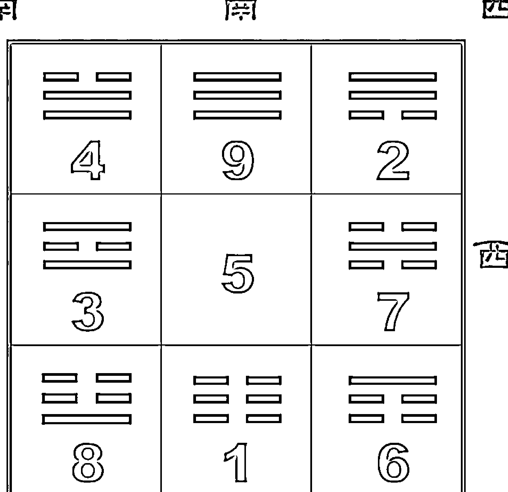

## 「坤」卦本卦

坤：坤為地，坤上，坤下

坤：『元，亨，利牝馬之貞。君子有攸往，先迷後得主，利西南得朋，東北喪朋。安貞，吉。』
象曰：『至哉坤元，萬物資生，乃順承天。坤厚載物，德合無疆。含弘光大，品物咸亨。牝馬地類，行地無疆，柔順利貞。君子攸行，先迷失道，後順得常。西南得朋，乃與類行；東北喪朋，乃終有慶。安貞之吉，應地無疆。』

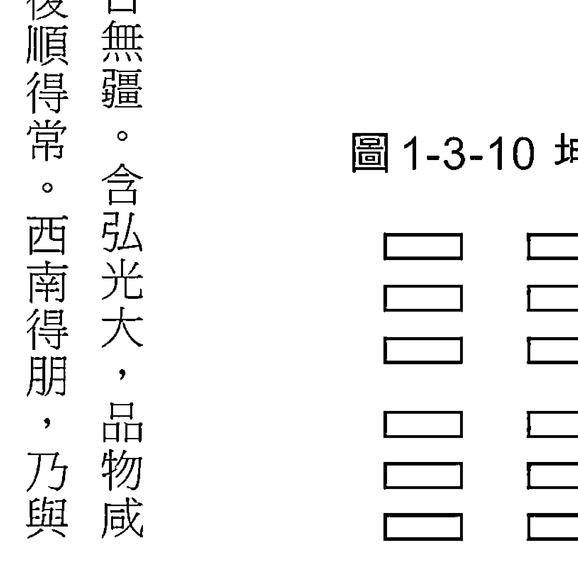

象曰：「地勢坤，君子以厚德載物。」

《文言》曰：「坤至柔，而動也剛，至靜而德方，後得主而有常，含萬物而化光。坤其道順乎？承天而時行。」

「坤」卦如圖1-3-10所示，其變化是一個很複雜的卦，在推論時很容易弄錯，通常弄錯機會很大，有這樣的經歷才能找出正確的推演程序，「坤」卦的分析以象數邏輯為主，不以人體會來說明其變化，「君子有攸往，先迷後得主，利西南得朋，東北喪朋。」推演「坤」卦時不全然用「乾」卦概念推演，推演出不來，要經過不斷的推論反覆求證，最後才能得到正確方式，其重是有分上卦、下卦之分，在「坤」卦動一、二、三爻時，上卦是「乾卦」，動爻來到了四、五、六爻時，下卦才是「坤卦」，動爻推演方式要從西南方開始才是正確，若是從西北方開始不正確，西南方又是什麼呢？這個秘密在圖1-3-9裡面，後面會詳述。
在《文言》說明「坤」卦變化是要合乎天地變化，要如何合乎天地變化呢？前面介紹「書數」一如圖1-3-9所示，會在「坤」卦動爻中運用，接下來介紹「坤」卦動爻變化。

## 『坤』卦動一爻

初六：履霜，堅冰至。
象曰：履霜堅冰，陰始凝也。馴致其道，至堅冰也。

《文言》曰：『積善之家，必有餘慶；積不善之家，必有餘殃。臣弒其君，子弒其父，非一朝一夕之故，其所由來者漸矣，由辯之不早辯也。易曰：『履霜堅冰至。』蓋言順也。』

「坤」卦動一爻（下卦）在直覺上應以「震卦」為動一爻，因為在「履霜堅冰至」，「乾」卦其意為冰、為寒，所以在第一爻上為陽爻，直接以「坤」卦推演，下卦得「震卦」則是錯的，圖1-3-12所示，「震卦」在洛書數位置是八，方向為「東北」，在「坤」卦本卦中說明「東北喪朋」是指若是推到「震卦」是錯的，而「利西南得朋」要推論到位置「西南」方向才是對的，「洛書數」為二的位置，應是「巽卦」才對；故「坤」卦動一爻為乾上巽下「姤」卦如圖1-3-11「坤」卦動一爻所示。

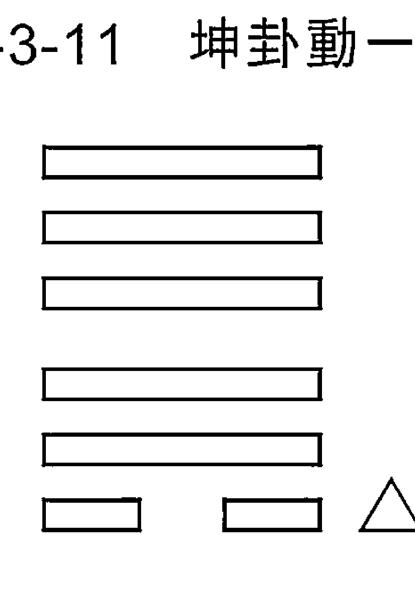

《文言》曰：「積善之家，必有餘慶；積不善之家，必有餘殃。」從象數方面解釋，「積」是過程或推論，「善」是指變化，也有正確之意，意指在推演過程中，正確的推演，就能發揮預期的效果，如虎添翼，若推演錯誤反受其害，所以在推論「坤」卦時要非常小心。也可以從人生偶語解說，平時多行善、廣積福田必有善報，行惡必有惡報，古人傳達意思包含多方面涵意，讀者可以自己細細品味。以上之說明，在本卦「利西南得朋，東北喪朋」裡「朋」字不知是否在古代鐫刻印刷時，或是再版時，有可能是刻錯，以筆者之所見，應為「明」，應為「利西南得明，東北喪明」，「明」可指正確之意，會比較恰當，提供讀者自行判斷。

圖1-3-12 配洛數二

| ☴ 4 | ☲ 9 | ☷ 2 |
|-----|-----|-----|
| ☳ 3 | 5   | ☱ 7 |
| ☶ 8 | ☵ 1 | ☰ 6 |

## 「坤」卦動二爻

六二：直，方，大，不習無不利。
象曰：六二之動，直以方也。不習無不利，地道光也。

《文言》曰：「直其正也，方其義也。君子敬以直內，義以方外，敬義立，而德不孤。直方大，不習無不利，則不疑其所行也。」

「坤」卦動二爻推論為「坎」卦，若推論是「坎」卦，則是錯的，「不習無不利」沒有「習」才是正確，「習」又是什麼？在六十四卦之「坎」卦曰：「習坎有孚，維心亨，行有尚」，象曰：「習坎，重險也，水流而不盈，行險而不失其信……。」、「習」為「坎」，故在動二爻卦是沒有「習」也就下卦不是「坎」一卦才是正確，

不是「坎」卦又是什麼？「直方大」是指四正位置，「坎」在「洛書數」第七個的位置，以順序而言也不是七，只有「洛書數」第三的位置是「離」卦如圖1-3-14所示，才是正確的；象曰：「不習无无利，地道光也。」而「地道光」是指下卦是「離」卦之意。故「坤」卦動二爻應是乾上離下「同人」卦，如圖1-3-13圖所示，動二爻之卦象。

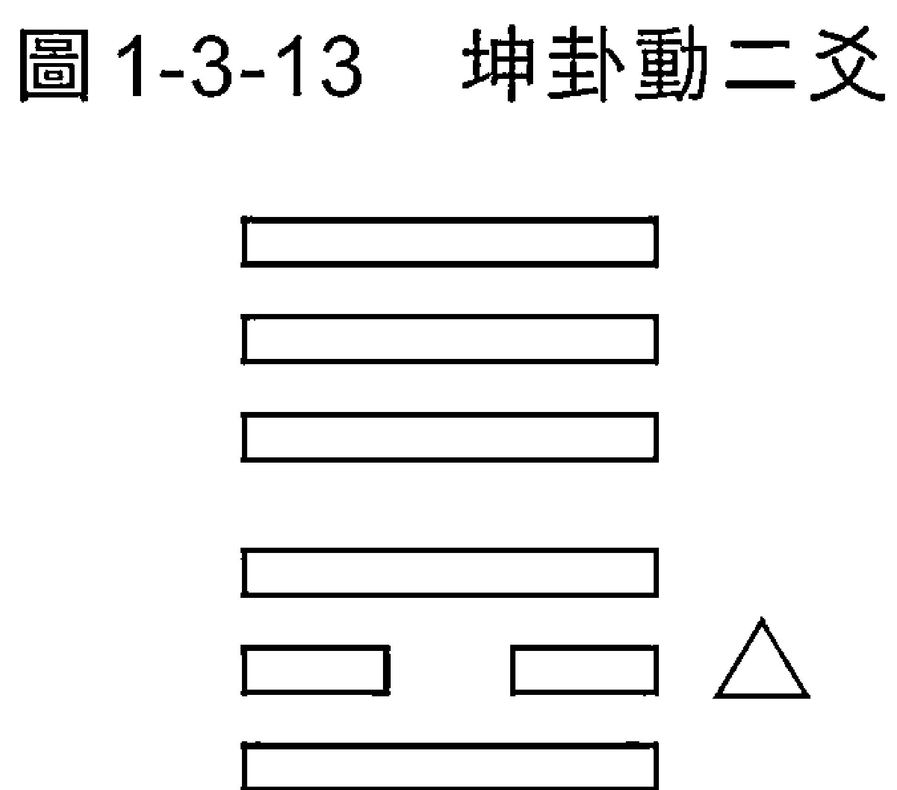

一般容易錯的地方是以為動一爻完成，動二爻時，一爻原來以「坤」卦變化，一爻為陽卦（「履霜，堅冰至」），到了二爻，只有二爻為陽卦成為「坎卦」，或是以順時間往下推一個卦為「坎卦」，推論錯的機會很高，所以「先迷失道，後順得常」沒有深層意義內容，以字面上推卦過程很容易錯；相反的，若是這樣就是很單純的變化，沒有顧及天地平衡的運作，就會失去變化的意義。

## 「坤」卦動三爻

六三：含章可貞。或從王事，無成有終。
象曰：含章可貞；以時發也。或從王事，知光大也。

圖1-3-14 配洛數三

| ☴4 | ☲9 | ☷2 |
|---|---|---|
| ☳3 | 5 | ☱7 |
| ☶8 | ☵1 | ☰6 |

圖1-3-15 坤卦動三爻

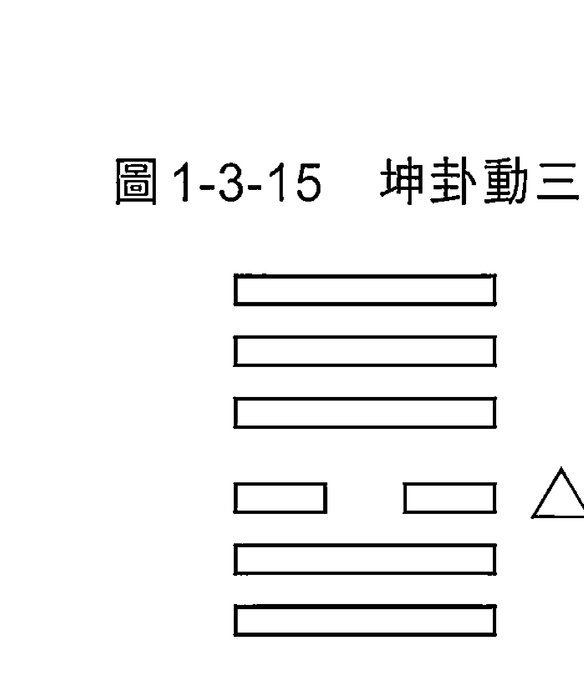

《文言》曰：「陰雖有美，含之；以從王事，弗敢成也。地道也，妻道也，臣道也。地道無成，而代有終也。」

從前面一、二爻之變化，是要依據「洛書數」配「先天八卦」平衡之理，所以「坤」卦動三爻推論為下為「兌卦」，乾上兌下「履」卦，如圖1-3-15「坤」卦動三爻圖。

「含章可貞，或從王事」含章之意為「兌卦」為澤為口，「可從王事」是指在「乾」卦旁邊卦，也就「洛書數」第四的位置，天體運行的道理（邏輯），也就平衡軌跡運行，如圖1-3-16洛書數，由三轉變到四之變化，詳細「兌卦」解說請參考附錄一《說卦傳》卦的解說。

《文言》「地道也」的解釋是指下卦變化還是依運行規則，不可以逾越，「坤」卦動三爻是下卦完成最後變化，但是上卦不可以轉變。

圖1-3-16 配洛數四

| 4<br>⚋⚋⚊ | 9<br>⚊⚊⚊ | 2<br>⚋⚊⚋ |
|---|---|---|
| 3<br>⚊⚋⚊ | 5 | 7<br>⚋⚋⚋ |
| 8<br>⚊⚊⚋ | 1<br>⚋⚋⚋ | 6<br>⚊⚋⚊ |

「坤」卦動四爻是何卦之變化，是要配圖1-3-18所地要變成「坤」卦，上卦開始才能變化。
《文言》：『天地變化，草木蕃；天地閉，賢人隱。』完成了變化，恢復原來的卦象，再等待上卦完成來下卦動三爻為「兌卦」在轉為「坤」卦，下卦是指上卦、下卦之變化，例如下卦完成變化，原來上卦的變化，而這裡變化有二個主要重點，其一「坤」卦動四爻是由下卦變化完成，接下來要

「坤」卦動四爻：
六四：括囊，无咎，无譽。
象曰：括囊无咎，慎不害也。

圖1-3-18 配洛數六

| 二 | 三 | 二 |
|---|---|---|
| 4 | 9 | 2 |
| 三 | 五 | 三 |
| 3 | 5 | 7 |
| 二 | 二 | 二 |
| 8 | 1 | 6 |

示，配「洛書數」第六之「艮卦」，由四轉到六，中間五為空跳過，象曰：「括囊无咎，慎不害也。」一囊是袋子，括是把口綁起來，「艮卦」也表示在一個區域或是範圍內之意，這卦象看來像一個口袋，故「坤」卦動四爻艮上坤下為「剝」卦，如圖1-3-17「坤」卦動四爻圖所示。

「坤」卦動五爻
六五：黃裳，元吉。
象曰：黃裳元吉，文在中也。

《文言》曰：「君子黃中通理，正位居體，美在其中，而暢於四支，發於事業，美之至也。」

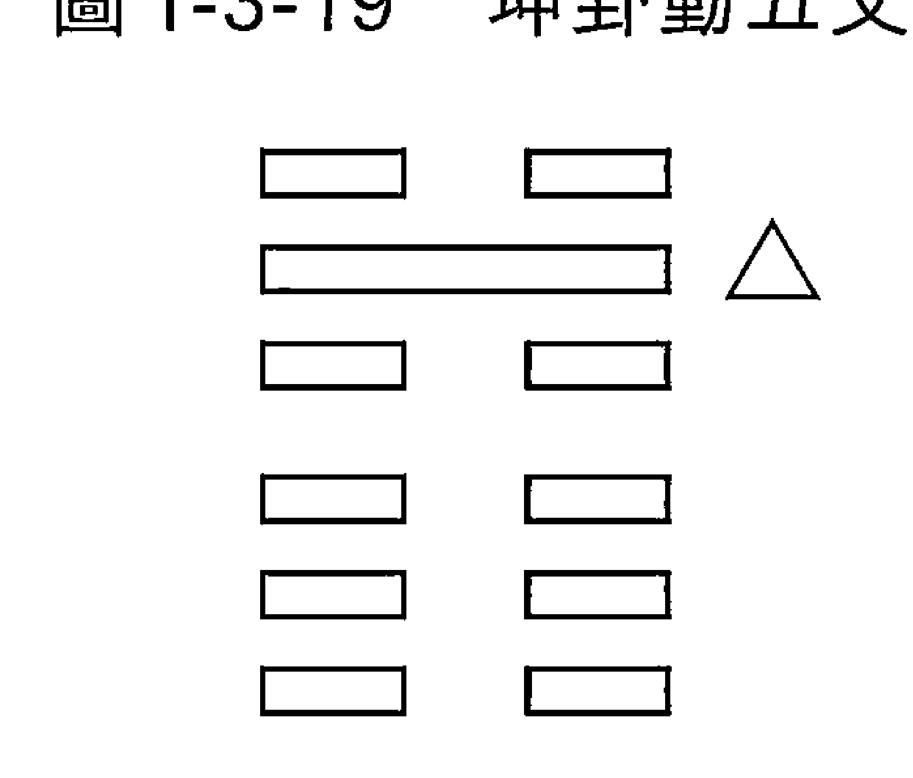

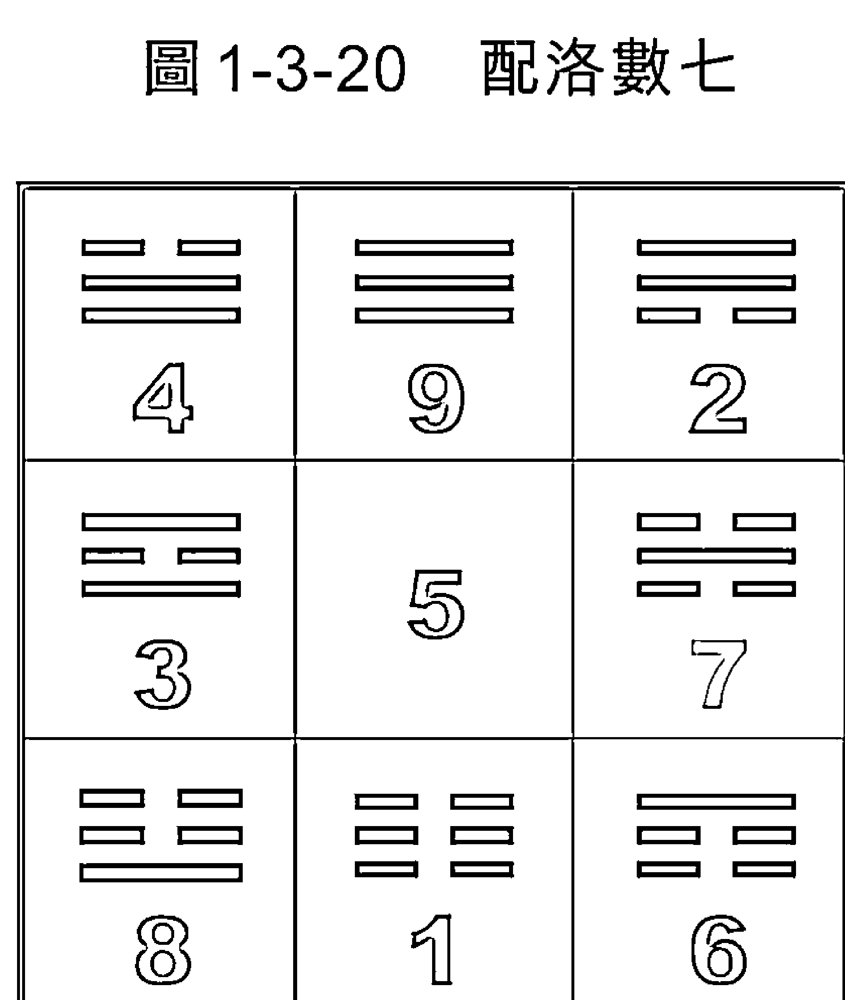

「坤」卦動五爻之變化，用直覺判斷是五爻為陽爻，其爻為陰爻，從動一爻開始到動五爻，只有這個動爻可以用直觀方式，與推論方式的結論是相同的，動五爻如圖1-3-19所示。以洛書數配八卦，在「坤」卦動五爻配「洛書數」為七為「坎卦」如圖1-3-20所示。象曰：「黃裳元吉，文在中也。」—「黃」為中間之意，第五爻時上卦中間爻，人中之龍，「裳」是衣或褲裙，古代皇帝為天子，以黃色為代表皇家的氣勢，以卦來看，五爻為陽爻，其餘為陰爻，《文言》：「正位居體，美在其中。」—陽爻又是在九五位，「坤」卦動五爻坎上坤下為「比」卦，如圖1-3-19。

## 「坤」卦動六爻

上六：戰龍於野，其血玄黃。
象曰：戰龍於野，其道窮也。
用六：利永貞。
象曰：用六永貞，以大終也。

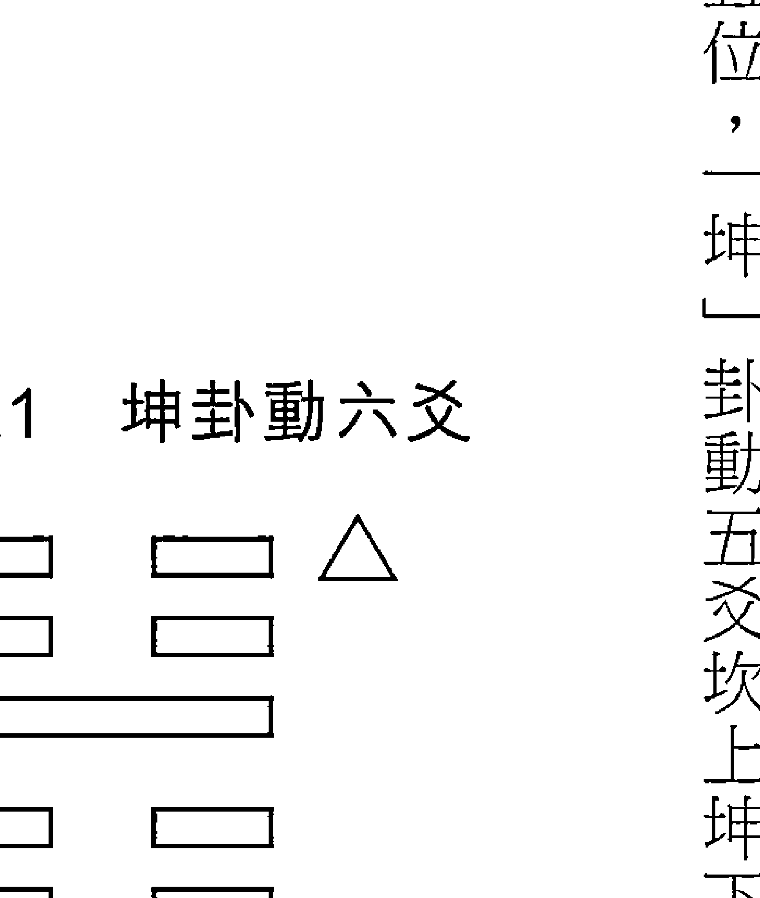

《文言》曰：「陰疑於陽，必戰。為其嫌於無陽也，故稱龍焉。猶未離其類也，故稱血焉。夫玄黃者，天地之雜也，天玄而地黃。」

「坤」卦動六爻是最後一個動爻變化，這個動爻之上卦是何卦呢？上六：「戰龍於野，其血玄黃。」以爻變化而言是最後的爻變，其在最後完成的卦，也意味著下個階段準備開始了，為了轉下一個變動的來臨，是需要做變化，開始產生了混亂，「其血為玄黃」，「玄黃」是指的「震卦」，《說卦傳》：「震為雷，為龍，為玄黃……」所以「坤」卦動六爻之上卦為「震卦」如圖1-3-21所示，容易推論錯誤是會推到動四爻，艮上坤下為「剝」卦，這裡是要注意的。一般而言在最後變化時，正處交接處，會是震盪較大，通常是要轉換下一組循環，另一個轉變開始。

以「洛書數」配八卦之推論，動六爻則配「洛書數」第八個位置，先天卦為「震卦」如圖1-3-22圖所示，「坤」卦動六爻，震上坤下為「豫」卦。

圖1-3-22 配洛數八

| ☴ (☴) | ☲ (☲) | ☷ (☷) |
| :---: | :---: | :---: |
| 4 | 9 | 2 |
| ☳ (☳) | | ☱ (☱) |
| 3 | 5 | 7 |
| ☶ (☶) | ☵ (☵) | ☰ (☰) |
| 8 | 1 | 6 |

（相關「坤」卦的影片介紹，請到https://youtu.be/srxCVWLAXuw觀看，或是查詢關鍵字「王文華老師紫微斗數學理」。）


## 第三節 應用探討

剛接觸《易經》時，一翻內容就有〈河圖〉、〈洛書〉、〈伏羲八卦〉（先天八卦）、〈文王八卦〉（後天八卦）、〈伏羲六十四卦方位〉等圖，在未看《易經》本文時，必須先看《繫辭上下傳》、《說卦傳》、《雜卦傳》、《文言》等內容後，再看《易經》本文，會比較容易進入狀況。

一開始看「乾、坤」二卦，看到「坤」卦動二爻時，六二：「直方大，不習无利。」

這時一般解釋是，推到動二爻時，就是要好好學習，學習是好的、正確的，此時我產生很大的問題，為什麼是動二爻時才是學習的卦嗎？於是開始找《易經》核心邏輯是什麼，當發現在六十四卦裡「坎」卦，象曰：「習坎，重險也」中「習」即是「坎」，回頭才發現「不習无利」真實的含意是，如上述之下卦「坤卦」動二爻說明，解一個謎，又發現一個謎，不是「坎」卦又是什麼呢？當時孔老夫子怕我們不懂，象曰：「不習无利，地道光也。」說明「地」為下卦「光」，「光」是指為「離卦」，又一個問題出現，「離卦」又是怎麼推演出來呢？初期線索只有圖與文字，也找了很多《易經》古本，最後找到了《宋版六經圖》——大易象數鉤深圖》其中一部是《易經》相關圖表，說明部份加上看到圖的分析，會更加了解，全部收藏在附錄二內，可以圖表中發現《易經》文字所說的，幫助理解，或許會激起不同的想法。

附錄一是筆者對《說卦傳》臆解，以現代生活應用做為解釋，對《易經》會更進一步的了解，後面章節裡以八卦衍生「紫微斗數」各星曜過程，除了各星曜之主要特徵外，也隱藏了各卦的特性，對各卦有深層的瞭解在解說上更貼切，個人領悟不同，只能拋磚引玉，也期許學習後對於生活、工作、事業是有幫助，人生更豁達，有時也能扭轉乾坤，時勢造英雄。

「乾、坤」二卦是《易經》六十四裡很重要的卦，「乾、坤」二卦也代表著天與地，說明天地運行變化之理，從天體運行道理，運用到我們工作上、生活上，要如何來運用呢？

首先我們對〈河圖〉、〈洛書〉、「八卦」整合運用，〈河圖〉可以當作外界環境，〈洛書〉內部變化的順序，「八卦」把事、物或是人分成八種情形，有外部、內部、有順序，哪裡有缺少或過多，就可以分出輕重緩急，以現有資源找出解決方案。
《河圖》是外在變化，不會是單一影響之因素，是有多層次的影響，但是《洛書》必須要與《河圖》相對應之變化，當《河圖》在某時段裡變化時，則《洛書》必須跟著變化，以保持內部平衡，當外界變化，內部隨之調整，內部調整則是《洛書》的數就跟著變化，也就是事情順序也不同，事物處理是有順序，順序錯誤可能導致結果失敗，「八卦」是將相關之事物分為八大類，再將八大類賦予順序。
例如以農業而言，基本上農產品是要靠天吃飯，天氣是很重要因素，天氣變化影響農產品收成，這裡不談預測問題，就以天氣變化做分析的重點，前面所說的是以「八卦」來分類天氣，「八卦」為「乾、兌、離、震、巽、坎、艮、坤」，可以把「八卦」先定義天氣之現象，「乾卦」為晴天、或是寒冷的天氣，「兌卦」為澤、池塘、蓄水池等，「離卦」為火、天氣熱等，「震卦」為雷、天氣快速變化，「巽卦」為風，「坎卦」為水，「艮卦」為霧，「坤卦」為雲，每個卦裡又可以再區分三種狀態「強、中、弱」過強或太弱都可以視為災害，每一種變化都要有應變措施，準備愈完善（應變措施），遇到損壞就降到最低。
以「先天八卦」為例，如圖1-3-23所示，「洛書數」一、九是為定位，一為「坤卦」，九為「乾卦」代表在這一段時間內為雲與晴天為主要變化，其變化之順序為「巽卦」、「離卦」、「兌卦」、「艮卦」、「坎卦」、「震卦」，當開始播種，開始成長幼苗時，是否怕風，過一段時間，是否怕天氣太熱，若遇積水是否有問題，當起霧時間長時，是否會影響農作物，水過多時是否會影響收成，或是在採收時遇到氣候變化很大時，是否會影響品質，或是市場價。《易經》的核心思想就「變」，而「變」不是亂變，是有規則的變，上述之例子若轉變下一個階段之變化，接著以「後天八卦」為例，如圖1-3-24所示，「洛書數」之九與一為定位，九為「離卦」，一為「坎卦」，若是正常狀況之天氣該熱就熱，該有水有水，就是水，若是極端之年（假設所有不好狀況發生），天氣變更極端，太熱則變成乾旱，水太多則為水災，天氣變化順序「坤卦」為這個階段播種順利，「震卦」表氣候變化極端，農作物不易成長，「巽卦」代表有風災，「乾卦」天氣氣溫易比同時期更低

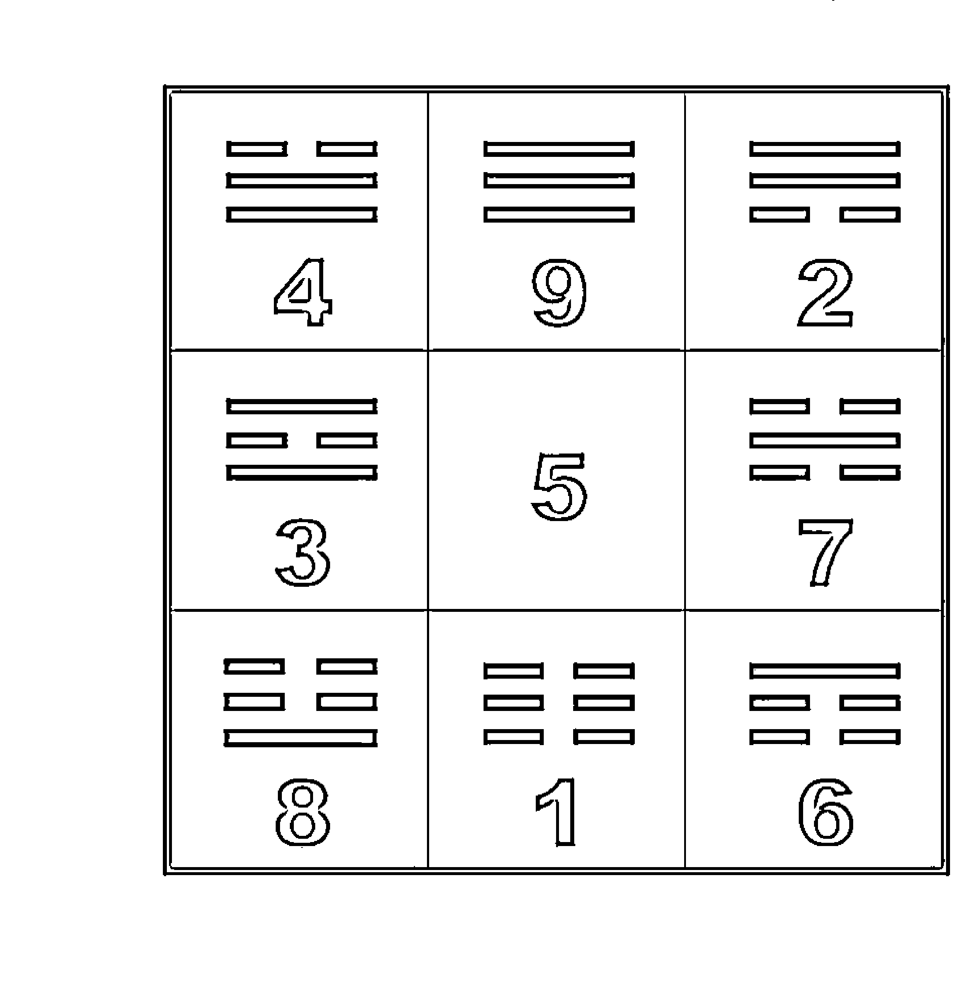

或是寒害等，「兌卦」表示蓄水量不足，缺水狀態，「艮卦」代表氣候悶濕，也快轉變下個階段，這個階段即將結束。前面所討論以簡化方式討論，主要是表達如何運用《易經》邏輯思維框架，八卦是要明確分類及事物歸屬，若對八卦不是很了解，請參閱附錄一《說卦傳》臆解解說，古人將萬物萬事區分成八大類，同樣的可以簡單各類衍生萬物萬事，但需要一些時間學習，吸收古人智慧，轉化成自己的智慧，是學習最好的方法。當遇到事情時，無論人際問題、工作、感情、事情等，可以用資源有多少，找出問題（缺少的資源），這是有陰陽觀念運用，或是補不足之處（資源的運用，以有限資源發揮最大效益），最主要是使用時機是否恰當，同樣的一句話，在不同的場合，所發生的效果不一樣，後面章節「紫微斗數」所要討論與時間變化的問題。

圖1-3-24 後天八卦配洛數

| ☴ 4 | ☲ 9 | ☷ 2 |
| ☳ 3 | 5 | ☱ 7 |
| ☶ 8 | ☵ 1 | ☰ 6 |

## 第四章 六十甲子纳音法则

## 第一節 六十甲子之五行推論


《繫辭上傳》曰：「大衍之數五十，其用四十有九。」一般應用在卜卦上，先製作五十 攤，代表天地循環的數，再五十支筮中抽一支筮，先定位本體的基準點，所謂定陰陽，剩 下四十九筮分成兩堆，經過十八次的過程才成卦，這是大衍之數運用在卜卦方面的作法。

「大衍之數五十，其用四十有九。」是天地變化循環的法則，知道法則後，要如何運 用才是問題的開始，我們探討「六十甲子納音法則」推論到五行（五行即是金、木、水、 火、土）的變化，而五行在祿命學中是一個很重要轉換工具，也是轉換的共同單位，代表 邏輯的運用。生剋制化之邏輯是一種「等量」的觀念，透過五行的運作，結合〈河圖〉、〈洛書〉、 「八卦」、「六十四卦」、「天干」、「地支」、「六十甲子」等，時間單位等互換，使得能量## 一、河图之数与五行关系定义

摘录《五行大义》（萧吉撰）中对河图及五行应用数之定义，主要是依据天地变化的过程，而运用在数的观念上之关系。

> 《五行大义》曰：“天以一生水于北方，君子之位，阳气微动于黄泉之下，始动无二天数与阳合而为一。水虽阴物，阳在于内，从阳之始，故水数一也。极阳生阴，阴始于午，始亦无二，阴阳二气各有其始，正应言一而云二者以阳尊，故尊既括始阴卑赞和配，故能生而阳数，偶阴在火中虽阳物义从阴，配合阴始，故从始立义，故火数二也。老子云：天得一以清，地得一以宁，是知皆有一义唱和同始。是以云木配阳动，而左长于东方，长则滋繁，滋繁则数增，故木数三也。阴佐阳，消阴道右转而居于西，在阳之后理无等义，故金数四也。阴阳之数始乎一周，然后阳达于中，总括四行，苞则弥多，故土数五也。”

首先我们了解天干与地支组合而成六十组的干支组合，是如何组合而成，会在定义上的说明，是用哪些方法、理论及过程完成，说明之中引用古文，主要让读者了解古人对此看法，做一参照比对，或许能激发你的想法，创造新的概念。

例并生，数皆云据，始未成数，数既未成亦未能为用。颖容春秋释例云：五行生数未能变化，各成其事。水凝而未能流行、火有形而未生炎光、木精破而体刚、金强斫、土卤而斥。于是天以五临民君化之传曰：配以五所以用五者，天之中数也。于是水得于五其数六用能润下火，得于五其数七用能炎上木，得于五其数八用能曲直金，得于五其数九用能从革土，得于五其数十用能稼穑。

> 《五行大义》曰：“天以一始生水于北方，地以其六而成之，使其流润也。地以二生火于南方，天以七而成之，使其光曜也。天以三生木于东方，地以其八而成之，使其舒长盛大也。地以四生金于西方，天以九而成之，使其刚利有文章也。天以五合气于中央生土，地以十而成之。”

综合上述之重点如下：

- “一、六”共宗水，大衍之数为1或6之数为属“水”。
- “二、七”同道火，大衍之数为2或7之数为属“火”。
- “三、八”为朋木，大衍之数为3或8之数为属“木”。
- “四、九”为友金，大衍之数为4或9之数为属“金”。
- “五、十”同途土，大衍之数为5或10之数为属“土”。

## 二、十天干之阴阳属性定义

- 十天干为：甲、乙、丙、丁、戊、己、庚、辛、壬、癸。
- 属阳之天干为：甲、丙、戊、庚、壬。
- 属阴之天干为：乙、丁、己、辛、癸。

## 三、十二地支之阴阳属性定义

- 十二地支为：子、丑、寅、卯、辰、巳、午、未、申、酉、戌、亥。
- 属阳之地支为：子、寅、辰、午、申、戌。
- 属阴之地支为：丑、卯、巳、未、酉、亥。

## 四、天干地支组合成六十甲子循环

十天干（十个时间的组合）分为阴与阳二组（见十天干之阴阳属性定义），十二地支（十二个空间的组合）分为阴与阳二组（见十二地支之阴阳属性定义），天干与地支组合只有六十组，其规则为阳配阳、阴配阴，没有阳配阴或阴配阳，是依据天体运转道理来设计六十甲子的循环，以一个时间及空间所对应出的，一个正转另一个是逆转，以天干（时间）与地支（空间）组合达到动态的最适平衡，所组合出六十组的变化，称为“六十甲子”。

天干与地支组合成“六十甲子”，做为时间与空间变化记录，“六十甲子”分为“阳”部份区分为三十个天干地支组合，“阴”部份亦区分为三十个天干地支组合，一个“阴”干支与一个“阳”干支合为一组，共有三十组，每一小小组有一组阴干支及一组阳干支，阴阳才能平衡，以一小小组为分析单位，才能计算出五行属性，分组如下：

- “甲子、乙丑”
- “丙寅、丁卯”
- “戊辰、己巳”
- “庚午、辛未”
- “壬申、癸酉”
- “甲戌、乙亥”
- “丙子、丁丑”
- “戊寅、己卯”
- “庚辰、辛巳”
- “壬午、癸未”
- “甲申、乙酉”
- “丙戌、丁亥”
- “戊子、己丑”
- “庚寅、辛卯”
- “壬辰、癸巳”
- “甲午、乙未”
- “丙申、丁酉”
- “戊戌、己亥”
- “庚子、辛丑”
- “壬寅、癸卯”
- “甲辰、乙巳”
- “丙午、丁未”
- “戊申、己酉”
- “庚戌、辛亥”
- “壬子、癸丑”
- “甲寅、乙卯”
- “丙辰、丁巳”
- “戊午、己未”
- “庚申、辛酉”
- “壬戌、癸亥”

## 五、“六十甲子”纳音规则定义

天干与地支搭配成“六十甲子”，这六十组均是独立的组合，每组都有其五行属性（五行即为以木、火、土、金、水），属于五行生克定义，在本章第二节五行生克定义中说明，本段是要探讨说明“六十甲子”天干、地支属性是如何推论得到五行。

> 摘录《五行大义》（萧吉撰）对于天干及地支数的定义如下：
> “支干数者凡有二种：一通数、二别数；今先辩通数，后论别数。通数者十干十二支也，干有十者应天地之大数也。”《易经·系辞》曰：“天数五、地数五，天地之数不过于十，故以干极于十。”；“十主日，十日为一句也，之十二者礼稽命徵言，布政十二，尊卑有序。”
> 《援神契》言：“三三参行四四相扶，天有四时之气，以三月成一时，故言三三参行四四相扶。天地人谓之三才，是为三者物，生之常数，因而各生三本三而未九，所以十二元命苞言数成于三，故合于三。三月阳极于九，故一时九十日也，支象于月，十二月为一岁也。此辩通数、别数者，支数则子数九、丑八、寅七、卯六、辰五、巳四、午九、未八、申七、酉六、戌五、亥四。

> 《太玄经》云：“子午九者，阳起于子讫于午，阴起于午讫于子，故子午对冲。而阴阳二气之所起也，寅为阳始，申为阴始，从所起而左数至所始而定数。”；“故自子数至申数九，自午数至寅亦九，所以子午九也。丑未为对冲，自丑数至申数八，自未数至寅亦八，所以丑未八也。寅申为对冲，自寅数至申数七，自申数至寅亦七，所以寅申七也。卯酉为对冲，自卯数至申数六，自酉数至寅亦六，所以卯酉六也。辰戌为对冲，自辰数至申数五，自戌数至寅亦五，所以辰戌五也。巳亥为对冲，自巳数至申数四，自亥数至寅亦四，所以巳亥四也。”

> 又云：“阳数极于九，子午为天地之经，故取阳之极数，自丑未巳下各减一，从八至四理自可知干数者。”

> 《太玄经》云：“甲起甲子，从子故九己为甲配，故与甲俱九。乙起乙丑，从丑故八丙起丙寅，从寅故七辛配于丙，与丙俱七。丁起丁卯，从卯故六丁配于庚，与庚俱八。戊起戊辰，从辰故五癸配于戊，与戊俱五。支有十二以对冲同数；故自九至四，干唯有十以配合同数；故自九至五。”

> 又云：“支从地故数毕于阴以四偶也干，从天故数毕于阳以五奇也。五则止于五气，四则极于四时，上不过九者，阳之极数也。五行及支干之数，相则倍之，王则十而倍之，休则如本囚死半之，以此四而孽，数乃无极，此并从气增减，气盛则多，气衰则少也。”

《尚书·洪范》曰：“五行：一曰水，二曰火，三曰木，四曰金，五曰土。水曰润下，火曰炎上，木曰曲直，金曰从革，土爰稼穑。润下作咸，炎上作苦，曲直作酸，从革作辛，稼穑作甘。”

综合上述对天干及地支说明，整理天干数值表（表1-4-1天干数值表），地支数值表（如表1-4-2地支数值表）：

**表1-4-1 天干数值表**

| 天干 | 甲 | 乙 | 丙 | 丁 | 戊 | 己 | 庚 | 辛 | 壬 | 癸 |
| :--- | :-: | :-: | :-: | :-: | :-: | :-: | :-: | :-: | :-: | :-: |
| 数值 | 9 | 8 | 7 | 6 | 5 | 9 | 8 | 7 | 6 | 5 |

**表1-4-2 地支数值表**

| 地支 | 子 | 丑 | 寅 | 卯 | 辰 | 巳 | 午 | 未 | 申 | 酉 | 戌 | 亥 |
| :--- | :-: | :-: | :-: | :-: | :-: | :-: | :-: | :-: | :-: | :-: | :-: | :-: |
| 数值 | 9 | 8 | 7 | 6 | 5 | 4 | 9 | 8 | 7 | 6 | 5 | 4 |

## 干支纳音五行推演说明

天干与地支组合成六十个循环，运用方式则是阴阳为一组，即为甲子及乙丑为一组，共区分成三十组。例如：“甲子、乙丑”为一组，“丙寅、丁卯”为一组……，依此类推，共有三十组。

> 根据《系辞》曰：“大衍之数五十，其用四十有九”

大衍之数为五十，取一则是定基准点，可以用的数只有四十九，用四十九减天干、地支数之总和，得余数，取余数之尾数，此余数对应到《河图》数，再以《河图》数找出五行属性，此五行数非真正的应用上的五行，再经过程五行相生的道理，才能产生纳音五行数。例如：以河图数找出五行属性为“金”，此五行之“金”非真正可以使用的纳音五行，要再变化一次，“金”生“水”，“水”才是纳音五行（五行生克请参考第四节之五行生克定义），即为该组之真正的五行。

依据前面中“河图之数与五行关系定义”如下说明：

- 大衍之数为“1”或“6”之数为属“水”
- 大衍之数为“2”或“7”之数为属“火”
- 大衍之数为“3”或“8”之数为属“木”
- 大衍之数为“4”或“9”之数为属“金”
- 大衍之数为“5”或“10”之数为属“土”

“六十甲子”先找出大衍数，看其是五行属性是属于哪一个五行，以这个五行再进行一次变化，以“相生”做为正式运用推论之五行，“六十甲子”五行推论如下：

## 甲子、乙丑

其数甲为9、子为9、乙为8、丑为8，所有的数加起来为34。所得34之数字，不能马上使用，需有一个手续转换才可使用。

大衍之数50是不能用，只能用49，则49－34＝15，以个位数为5（取尾数，十位数不取），5代入河图5为“土”，“土”则生“金”，此五行为“金”。

甲子、乙丑、海中金者。子属水。又名湖。又为水旺之地。兼金死于子。墓于丑。水旺而金死墓。故曰“海中金”也。

## 丙寅、丁卯

其数丙为7、寅为7、丁为6、卯为6，合计数为26。则49－26＝23，取尾数3为“木”，所以“木”生“火”，此五行为“火”。

丙寅、丁卯、炉中火者。寅为三阳。卯为四阳。火既得地。又得寅卯之木以生之。此时天地开炉。万物始生。故曰“炉中火”也。

## 戊辰、己巳

其数戊为5、辰为5、己为9、巳为4，合计数为23。则49－23＝26，取尾数6为“水”，所以“水”生“木”，此五行为“木”。

戊辰、己巳、大林木者。辰为原野。巳为六阳。木至六阳。则枝荣叶茂。以茂盛之木。而在原野之间。故曰“大林木”也。

## 庚午、辛未

其数庚为8、午为9、辛为7、未为8，合计数为32。则49－32＝17，取尾数7为“火”，所以“火”生“土”，此五行为“土”。

庚午、辛未、路傍土者。未中之木。而生午位之旺火。火旺则土于斯而受刑。土之始生。未能育物。犹路旁土若也。故曰“路旁土”也。

## 壬申、癸酉

其数壬为6、申为7、癸为5、酉为6，合计数为24。则49－24＝25，取尾数5为“土”，所以“土”生“金”，此五行为“金”。

壬申、癸酉，剑锋金者。申酉金之正位。兼临官申。帝旺酉。金既生旺。则成刚矣。刚则无逾于剑锋。故曰“剑锋金”也。

## 甲戌、乙亥

其数甲为9、戌为5、乙为8、亥为4，合计数为26。则49－26＝23，取尾数3为“木”，所以“木”生“火”，此五行为“火”。

甲戌、乙亥，山头火者。戌亥为天门。火照天门。其光至高。故曰“山头火”也。

## 丙子、丁丑

其数丙为7、子为9、丁为6、丑为8，合计数为30。则49－30＝19，取尾数9为“金”，所以“金”生“水”，此五行为“水”。

丙子、丁丑，涧下水者。水旺于子。衰于丑。旺而反衰。则不能为江河。故曰“涧下水”也。

## 戊寅、己卯

其数戊为5、寅为7、己为9、卯为6，合计数为27。则49－27＝22，取尾数2为“火”，所以“火”生“土”，此五行为“土”。

戊寅、己卯、城头土者。天干戊己属土。寅为艮山。土积而为山。故曰“城头土”也。

## 庚辰、辛巳

其数庚为8、辰为5、辛为7、巳为4，合计数为24。则49－24＝15，取尾数5为“土”，所以“土”生“金”，此五行为“金”。

庚辰、辛巳、白蜡金者。金养于辰。生于巳。形质初成。未能坚利。故曰“白蜡金”也。

## 壬午、癸未

其数壬为6、午为9、癸为5、未为8，合计数为28。则49－28＝21，取尾数1为“水”，所以“水”生“木”，此五行为“木”。

壬午、癸未、杨柳木者。死于午。墓于未。木既死墓。虽得天干壬癸之水以生之。终是柔弱。故曰“杨柳木”也。

## 甲申、乙酉

其数甲为9、申为7、乙为8、酉为6，合计数为30。则49－30＝19，取尾数9为“金”，所以“金”生“水”，此五行为“水”。

甲申、乙酉、井泉水者。金临官申。帝旺酉。金既生旺。则水由以生。然方生之际力量未洪。故曰“井泉水”也。

## 丙戌、丁亥

其数丙为7、戌为5、丁为6、亥为4，合计数为22。则49－22＝27，取尾数7为“火”，所以“火”生“土”，此五行为“土”。

丙戌、丁亥、屋上土者。丙丁属火。戌亥为天门。火既炎上。则土非在下而生。故曰“屋上土”也。

## 戊子、己丑

其数戊为5、子为9、己为9、丑为8，合计数为31。则49－31＝18，取尾数8为“木”，所以“木”生“火”，此五行为“火”。

戊子、己丑、霹雳火者。丑属土。子属水。水居正位。而纳音乃火。水中之火。非龙神则无。故曰“霹雳火”也。

## 庚寅、辛卯

其数庚为8、寅为7、辛为7、卯为6，合计数为28。则49－28＝11，取尾数1为“水”，所以“水”生“木”，此五行为“木”。

庚寅、辛卯、松柏木者。木临官寅。帝旺卯。木既生旺。则非柔弱之比。故曰“松柏木”也。

## 壬辰、癸巳

其数壬为6、辰为5、癸为5、巳为4，合计数为24。则49－24＝25，取尾数5为“土”，所以“土”生“金”，此五行为“金”。

壬辰、癸巳、长流水者。辰为水库。巳为金长生之地。金生则水性已存。以库水而逢生金。则泉源终不竭。故曰“长流水”也。

## 甲午、乙未

其数甲为9、午为9、乙为8、未为8，合计数为34。则49－34＝15，取尾数5为“土”，所以“土”生“金”，此五行为“金”。

甲午、乙未、沙中金者。午为火旺之地。火旺则金败。未为火衰之地。火衰则金冠带。败而方冠带。未能听伐。故曰“沙中金”也。

## 丙申、丁酉

其数丙为7、申为7、丁为6、酉为6，合计数为26。则49－26＝23，取尾数3为“木”，所以“木”生“火”，此五行为“火”。

丙申、丁酉、山下火者。申为地户。酉为日入之门。日至此时而藏光。故曰“山下火”也。

## 戊戌、己亥

其数戊为5、戌为5、己为9、亥为4，合计数为23。则49－23＝26，取尾数6为“水”，所以“水”生“木”，此五行为“木”。

戊戌、己亥、平地木者。戊为原野。亥为木生之地。夫木生于原野。则非一根一株之比。故曰“平地木”也。

## 庚子、辛丑

其数庚为8、子为9、辛为7、丑为8，合计数为33。则49－33＝16，取尾数6为“水”，所以“水”生“木”，此五行为“木”。

庚子、辛丑、壁上土者。丑虽土家正位。而子则水旺之地。土见水多则为泥也。故曰“壁上土”也。

## 壬寅、癸卯

其数壬为6、寅为7、癸为5、卯为6，合计数为24。则49－24＝25，取尾数5为“土”，所以“土”生“金”，此五行为“金”。

壬寅、癸卯、金箔金也。寅卯为木旺之地。木旺则金羸。又金绝于寅，胎于卯。金既无力。故曰“金箔金”也。

## 甲辰、乙巳

其数甲为9、辰为5、乙为8、巳为4，合计数为26。则49－26＝23，取尾数3为“木”，所以“木”生“火”，此五行为“火”。

甲辰、乙巳、覆灯火者。辰为食时。巳为禺中。日之将中。艳阳之势。光于天下。故曰“覆灯火”也。

## 丙午、丁未

其数丙为7、午为9、丁为6、未为8，合计数为30。则49－30＝19，取尾数9为“金”，所以“金”生“水”，此五行为“水”。

丙午、丁未、天河水者。丙丁属火。午为火旺之地。而纳音乃水。水自火出。非银汉不能有也。故曰“天河水”也。

## 戊申、己酉

其数戊为5、申为7、己为9、酉为6，合计数为27。则49－27＝22，取尾数2为“火”，所以“火”生“土”，此五行为“土”。

戊申、己酉、大驿土者。申为坤。坤为地。酉为兑。兑为泽。戊己之土。加于地泽之上。非其他浮薄之土也。故曰“大驿土”也。

## 庚戌、辛亥

其数庚为8、戌为5、辛为7、亥为4，合计数为24。则49－24＝25，取尾数5为“土”，所以“土”生“金”，此五行为“金”。

庚戌、辛亥、钗钏金者。金至戌而衰。至亥而病。金既衰病。则诚柔矣。故曰“钗钏金”也。

## 壬子、癸丑

其数壬为6、子为9、癸为5、丑为8，合计数为28。则49－28＝21，取尾数1为“水”，所以“水”生“木”，此五行为“木”。

壬子、癸丑、桑柘木也。子属水。丑属金。水方生木。金则伐之。犹桑柘方生。人便以喂蚕。故曰“桑柘木”也。

## 甲寅、乙卯

其数甲为9、寅为7、乙为8、卯为6，合计数为30。则49－30＝19，取尾数9为“金”，所以“金”生“水”，此五行为“水”。

甲寅、乙卯、大溪水者。寅为东北维。卯为正东。水流正东。则其性顺。而川润池沼。俱合而归。故曰“大溪水”也。

## 丙辰、丁巳

其数丙为7、辰为5、丁为6、巳为4，合计数为22。则49－22＝27，取尾数7为“火”，所以“火”生“土”，此五行为“土”。

丙辰、丁巳、沙中土者。土库辰绝巳。而天干丙火之火。至辰冠带。巳临官。土既库绝。旺火复与生之。故曰“沙中土”也。

## 戊午、己未

其数戊为5、午为9、己为9、未为8，合计数为31。则49－31＝18，取尾数8为“木”，所以“木”生“火”，此五行为“火”。

戊午、己未、天上火者、午为火旺之地。未中之木。又复生之。火性炎上。又逢生地。故曰“天上火”也。

## 庚申、辛酉

其数庚为8、申为7、辛为7、酉为6，合计数为28。则49－28＝11，取尾数1为“水”，所以“水”生“木”，此五行为“木”。

庚申、辛酉、石榴木者。申为七月。酉为八月。此时木则绝矣。惟石榴之木反结实。故曰“石榴木”也。

## 壬戌、癸亥

其数壬为6、戌为5、癸为5、亥为4，合计数为24。则49－24＝25，取尾数5为“土”，所以“土”生“金”，此五行为“金”。

壬戌、癸亥、大海水者。水冠带戌。临官亥。水临临官冠带。则力厚矣。兼亥为江。

## 六十甲子纳音五行

由上述之推论，计算出一组五行出来，经由计算出一组五行出来，得到一个结果，再由这个数值得到原始之五行，再以原始之五行相生得到最后之五行，为运用之五行，这里有天干与地支组合成六十纳音，五行（木、火、土、金、水）平均分配在六十组里，经过归纳，六十甲子纳音五行如下：

- 甲子乙丑海中金、丙寅丁卯炉中火、戊辰己巳大林木、庚午辛未路旁土、壬申癸酉剑锋金、甲戌乙亥山头火、丙子丁丑涧下水、戊寅己卯城头土、庚辰辛巳白蜡金、壬午癸未杨柳木、甲申乙酉井泉水、丙戌丁亥屋上土、戊子己丑霹雳火、庚寅辛卯松柏木、壬辰癸巳长流水、甲午乙未沙中金、丙申丁酉山下火、戊戌己亥平地木、庚子辛丑壁上土、壬寅癸卯金箔金、甲辰乙巳覆灯火、丙午丁未天河水、戊申己酉大驿土、庚戌辛亥钗钏金、壬子癸丑桑柘木、甲寅乙卯大溪水、丙辰丁巳沙中土、戊午己未天上火、庚申辛酉石榴木、壬戌癸亥大海水。

「生」数、「成」数讨论，前面之《五行大义》曰：「天以一始生水于北方，地以其六而成之……。」在应用上则是「生」数是无法使用，必须由「成」数来引动才有作用，有如在盖房子，在建置时花了很多时间、金钱、物力、人力去完成，在未完成阶段时可称为「生」数，最后就启用，就是「成」数，「成」数即是可以使用，发挥其功效。在人生阶段也可以用其解释，小时候要努力认真学习，充实自己，在充实阶段可以称为「生」数，在职场工作，提将所学拿出来应用，创造更大的价值，称为「成」数，当充实愈多，未来所输出的效益愈大，观念的运用都是一样的，运用在不同的场合，会有不同的效益。（读者可以到YouTube或优酷查询「王文华老师紫微斗数学理——六十纳音之五行推论」，观看影片介绍。）


## 第二节 五行生剋

木、火、土、金、水称之为「五行」，五行在《易经》或禄命术中站非常重要的角色，在逻辑上的强弱判定标准，在《河图》、《八卦》、《六十四卦》、《天干》、《地支》……等，及禄命术之「山」、「医」、「命」、「卜」、「相」都可以转换成各五行属性，本书主要介绍「紫微斗数」也是不例外，由此可见五行是共通的关系因素，互为转换。以现代经济而言，共同可以交换的物品，几乎所有东西都可以转换钱做为价值判断，农产品而言，一公斤的米可以换多少苹果，都转成钱，就可以清楚比较，五行观念也是如此。六十纳甲及五行都是一种循环式的逻辑，而非直线式或是单一性，循环式逻辑是周而复始，而非直线。在五行逻辑判断上分为二大部份，相生及相剋，基本定义是以五行在等量条件下做比较。

## 相生概念

是指木、火、土、金、水「五行」相生，如金生水、水生木、木生火、火生土、土生金。（外围箭号为相生）如图1-4-3五行生剋图所示，是一种生生不息循环观念。再细分下去相生又有二种，我生或生我，我生即是我帮助之意，生我即是帮助我之意。

## 相剋概念

指木、火、土、金、水「五行」相剋，如金剋木、木剋土、土剋水、水剋火、火剋金。（内部箭号为相剋）如图1-4-3五行生剋图所示，是一种压抑、控制之意。再细分下去相剋又有二种，我剋或剋我，我剋即是我要限制之意，剋我即是我被限制之意。

在「五行」运中，其规则是「体」与「用」的互动观念，以何为「体」为主要的本体

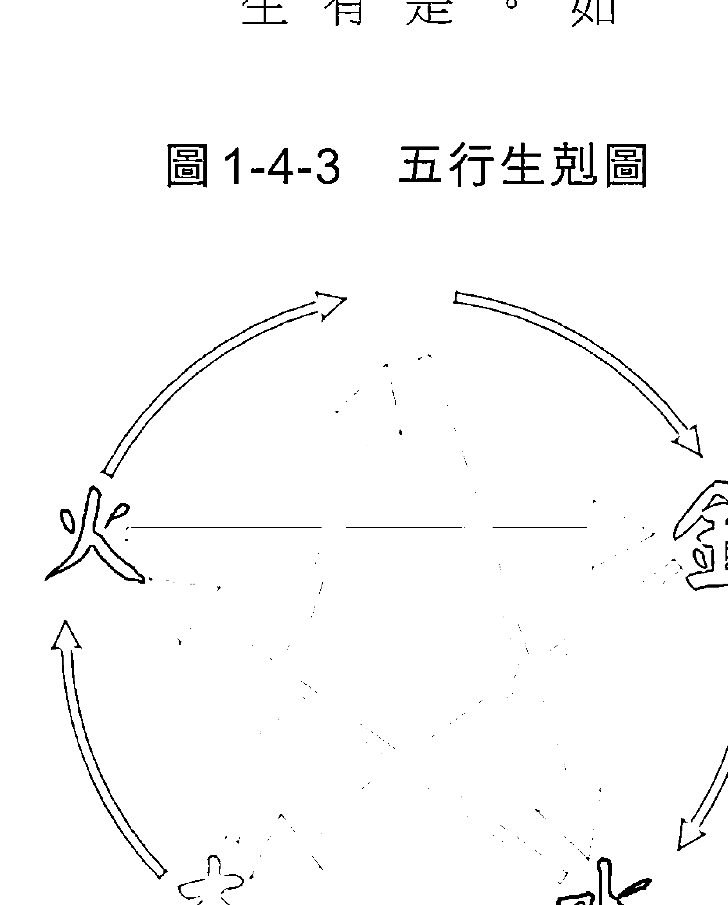

图1-4-3 五行生剋图

或是主要目标，只能有一个明确的主题，即是基准点之意，而「用」则可比喻成环境之意，或是与主体会产生关系，「体」与「用」的关系，只有「体」「用」或「体」多「用」，配合五行运作观念，主体与环境之变化关系做较明确定义。
「体」与「用」的变化可以分五种方式讨论（以「体」与「用」能量相等讨论）：

- 一、「用」来生「体」表示增加本体能量；
- 二、「体」来生「用」表示本体必需消耗能量，减少本体的能量；
- 三、「用」来剋「体」表示限制本体能量产生冲突的能量，使其本体不易完全发挥出来；
- 四、「体」来剋「用」表示本体要发挥很大的能量限制或冲突环境的能量；
- 五、「体」与「用」是同一种属性，维持原有的能量。

「体」与「用」、「相生」与「相剋」之运用，主要探讨本身的基准点与环境变化强弱的判定标准，易学概念是把万事万物可以归类为这五行属性，再进行比较。例如，以「五行」之火为本体为例，木生火，火来生土，水剋火，火来剋金，以等量关系时会成立，但在不等量时会产生「自刑」，而对本体造成重大的损伤，以相生时会产生「华而不实」现象，木来生火等量时候是好的，木的量是很少的，则实无帮助，实物上火很大，若没有等量木材升火，火是不会旺的；相剋时会产生「自不量力」现象，火能剋金，在实体上火的温度不够高，是无法融金的，而这个火是没有用的。
五行生剋在现代西方科学很少用这种方式讨论，除了在禄命学中应用外，在中医方面运用很多，《系辞上传》曰：「大衍之数五十，其用四十有九。」先要定位个人是属于一类体质，有如「大衍之数五十」先抽出一支签，来定基准点，先确认个人体质情形一样。
「其用四十有九」有如中医把人体五脏配合五行定义，例如肝、胆属木，心、小肠属火，脾、胃属土，肺、大肠属金，肾、膀胱属水。

中医五行木生火而言，木为肝，火为心，在西医角度来，二个不相关的器官，怎么会有关系，这是中西方在医学上基础不同，中医主要是以五行平衡为主，例如五行火太强，是要降木之能量，还是要泄火，或是水来剋火，有很多方法，评估个人体质决定用何种方法，达到平衡之目的，人只要平衡就没有疾病。西方医学就以心脏方面直接找问题，例如有三高问题（高血压、高血脂、高血糖），是否过于肥胖等，或是用一些计算指数，是否有问题等，处理方式与中医处理是不一样的。

除了五行在中医上运用，是否还有其他用法，当然个人要有观察力再分析里面的变化，或许你有很多别的想法，不妨可以运用这几章所说的观念，套在生活上，会有不同的领悟。之前笔者在学习五行生剋之理，用很直观观念去解读，例如看到火，水可以剋火，有水可以灭火，又产一个问题，多少的火，需要多少的水才能剋住，水能生木，要有多少的水才能让木生长起来，古人没有说很清楚，这个要换成数值化也是一个很困难的工程。

有时为了研究五行变化及应用，一直在思索，生活中是否可以有互通得到的地方，思索不出来时，不妨出去走走，或许会得到不同的灵感。有一次来到台北瑞芳金瓜石地区走一走，走到一个地区看到山区全部没有大树，都是一些矮小的芒草，最高大约与一个人高度差不多，记忆里好像只有一棵在路边，这里景象与我从其他地方上来不一样，在其他地方都有很多高大树木，进来这里完全不一样，天气变的阴天，下午不久就起很浓的雾，很湿，又不像毛毛雨。

上述情形是否有一些联想呢？山上没有大树，又有很重的水气，其实中间有与五行产生关联了，为何没有大树，因为这区域地下含有大量金属，以五行来看，金剋木，所以金气很重，限制了树木生长，所以没有大树生长出来，但是这样不能断定这里有金属矿，还要有金属矿，还要有水气，这样才能生生不息，一般所谓的「气」，此区域才有富丰的金属矿产，而金瓜石是产黄金

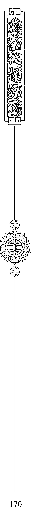

的地方。

在一九九五年笔者到加州圣荷西（San José），拜会一位高分子专家张博士，带我到旧金山湾区（San Francisco Bay Area）看看，也是发现上述情形，笔者问张博士，这里是否产金矿？回答这里是旧金山，早期是有很多人在挖，现在已经没落了，问笔者为何知道，告知其原理。

## 第一篇 紫微原理探索

## 第一章 时间探讨

## 第一节 历法介绍

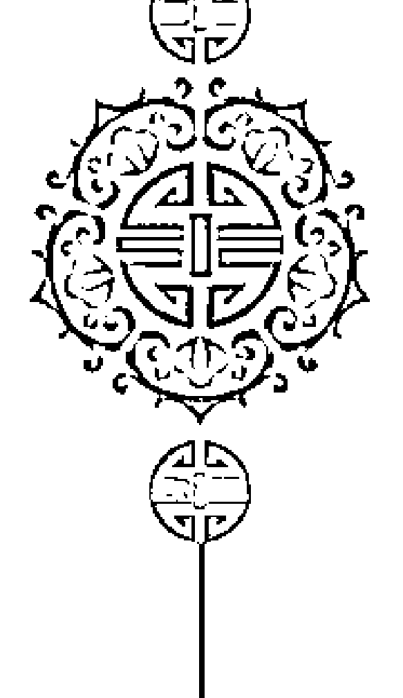

历法是将时间有效规划，符合人们生活之应用，时间在每个区域都有不同的定义与用法，以符合当地的生活习惯而制订，中国民间现行历法采用「干支阴阳三合历」或「甲子阴阳三合历」或「黄历」，官方大多以太阳历为主，以地球绕太阳一周及月亮绕行地球一年的时间有十二次，配合地球实际气候变化（二十四节气），又将天干、地支的循环方式，分别以年、月、日、时都有干支组合，形成混合形的历法。回教国家则以月球绕行做为历法，一般称为「阴历」又称为「回历」，以「月球」绕行地球十二次为「一年」，太阴月「大月」为三十天，「小月」为二十九天，月球平均每年绕十二次约三百五十四天又八小时四十八分，会有闰月的产生。欧美国家大多使用「太阳历」又称为「罗马历」，地球绕行太阳一周为365.2422天，一年平分为十二个月，置闰方式以二月份做为置闰的月份，闰年多加一天。

## 常用的时间及名称

## 一、恒星时

以「春分点」两次过中天（子午线）所经历的时间为一个「恒星日」（或称地球自转一周所需的时间），再将一日细分成二十四小时，一小时六十分，一分钟六十秒，称为「恒星时」。

## 二、真太阳时

真实太阳时以「子时」为基准，本次「子时」到下次「子时」时间为一「日」，再将一日切割成二十四小时，一小时有六十分钟，一分钟有六十秒，称为「真太阳时」。实际「真太阳时」也并不平均，「真太阳时」一日与平均一日之时间差，最大可达半分钟左右，其积差最大时可达十六分钟以上。一般在中国的禄命术大多是采用真太阳时为时间计算标准。

## 第二篇·第一章 时间探讨

## 三、平太阳时

由于地球轨道为椭圆形，依克卜勒定理其自转速度并非固定值，欲避免地球绕行太阳，造成时间的长短变动，近代天文学家乃创始一种「平太阳时」。主要是以地球绕行太阳周年的时间而取其平均值，「平太阳」时间作为时间的标准，固定为一年周而复始。

## 四、天文时

古人没有现代的卫星量测仪器，系以日圭做定时工具，定义每日圭影子最短做为正午，做为当日的起点，但这样上午与下午不同一日，对人民生活极为不便，故于一九二五年起各国天文历书已都改民用时为准。

## 五、民用时

为便于起居活动，日间定成同一天，换日点改在一般人休息的夜半为起点，这种命时法就是在正午间加上十二小时。其正确的定义应该是「平太阳时等于平太阳的时角加十二小时」。因为时角是从过中天向西算的，故以夜半起须加十二小时。


## 六、地方时

不同经度的地方，过中天的时间不同，例如：台北（约于东经一二一度）与伦敦（约于东经○度）的子午圈不同，因此两地的正午时分，必不相同，这就是所谓「地方时」。 在台湾所谓的中原标准时间就是以（北京）为准。例如在台北听到中原标准时间十二点整，实际太阳时已过了十二点。

## 七、世界时

以英国格林威治天文台作为全球经度的基准，格林威治天文台的平太阳时作为推算的标准。从一九二五年起，格林威治子正算起的平太阳时定名为「格林威治时」，其略号为（G·M·T）；若依古法午正算起则名为「格林威治天文时」，其略号为（G·M·A·T）。又称「世界时」者，其略号为（U·T）。

## 八、时区时

既然公认「格林威治子午线」为世界时的标准，乃依经线分全地球为二十四个时区，每区宽十五度（360度／24小时）即等于一小时。以格林威治所在为中区，东西距首经线各七度半。自此向东为东一区至东十二区，向西为西一区至西十二区，东十二区与西十二区实际相同，在中区的正对面。这样倘若向东越一区拨早时钟一小时，向西越一区拨迟时钟一小时，则各时钟的差数都为整数，而与本区地方又所差不及半小时。

## 九、标准时

天文时区时的原则非常明瞭合理，但因世界上有国界的区分，有地理上或政治上的方便，各国区分不能尽如原则，只能略作调整以因地制宜。例如台湾则属于「中原时区」，即时区的东八区，较世界时区早八小时。

## 十、夏令时

主要是以节省灯火，减少能源的浪费，提出时间调整，于夏令期间将时钟拨早一小时，称为「夏令时」，或称「日光节约时」，或称「经济时」，现在大多数国家不采用。

## 第二节 禄命时间探讨

「紫微斗数」为何需要出生之「年、月、日、时」，做为禄命基础？简单说，前面都是谈到「天」与「地」之关系，所谓「天」也是指的「时间」，「地」指的是「空间」，论命时必须有「天」、「地」、「人」，「人」即指是个人，而人必须在「天」与「地」的「时间」与「空间」之中，才有办法推论其吉凶。

出生时辰是标记你在宇宙之位置，即是生命的基准点，时间是不断往前走，「时间」与「空间」不断的变化；出生之时辰是生命基准点，在不同的「时间」与「空间」就会产生不同行为，为何会产生不同行为，就是要调整「天」与「地」之间不断调整平衡，环境变化人会以不同行为应变。

「紫微斗数」禄命术时间采用「干支阴阳三合历」一般称为「农历」，在排命盘时用「年」、「月」、「日」、「时」之参数，以「年」、「月」、「日」、「时」分别说明。

## 「年」、「月」、「日」、「时」

「年」，是以地球绕太阳一圈时间，可以知道太阳与银河系中心之相对位置，如图 2-1-1 所示。当地球绕太阳一圈时，实际上太阳已经走了六亿公里如图 2-1-2 所示，太阳并不是一个静止恒星。在上篇中讨论在禄命学的哲学思想是循环的观念，循环并不是回到原点，完成了一个循环，会再进入下一个阶段循环，进入到另一个环境，主体因素会变。例如一组数学公式，正弦 sine (sin) 函数求出直角三角形三条边之间的比例，假设 sine 等于三十度所计算出一个数值，当 sine 等于四十五度时，会与前面的答案不一样，在禄命术中只能在某一个阶段都是不一样。

「月」，是计算月球与太阳的相对位置。「月」的计算有二种方式，一是以月球绕行做为计算为「太阴月」如图 2-1-3 所示，月球绕行地球无法刚好十二个月完成，「太阴月」会有闰月问题；另一种是地球与太阳相对位置之变化称为「节气月」如图 2-1-4 所示，变成十二节十二气，是属平均时间，在节气时间内调整完成如表 2-1-5 所示节气对应月令及地支月。

图2-1-1 太阳在银河系位置示意

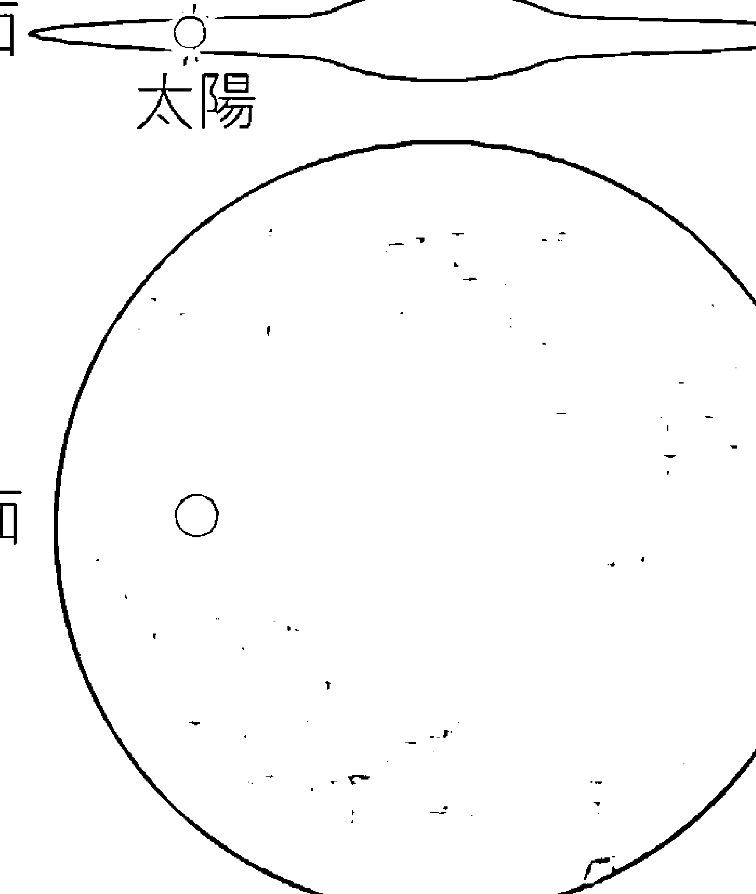

图2-1-2 太阳移动位置示意图

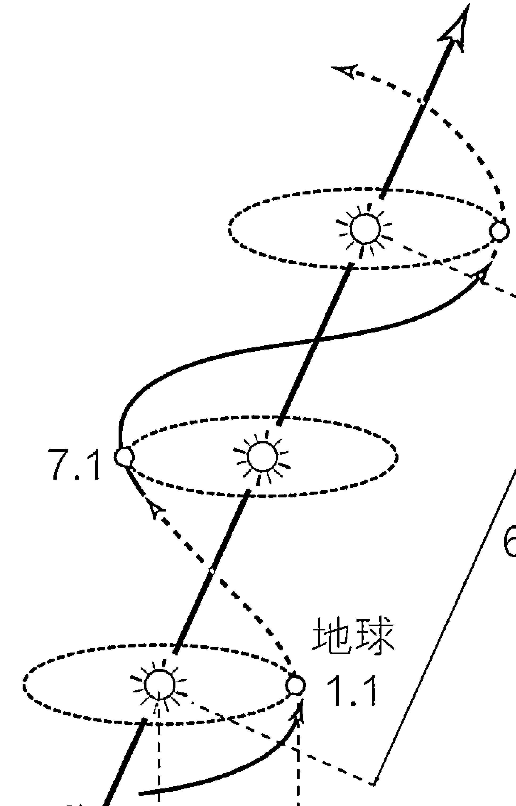

图2-1-3 月球绕地球位置示意图

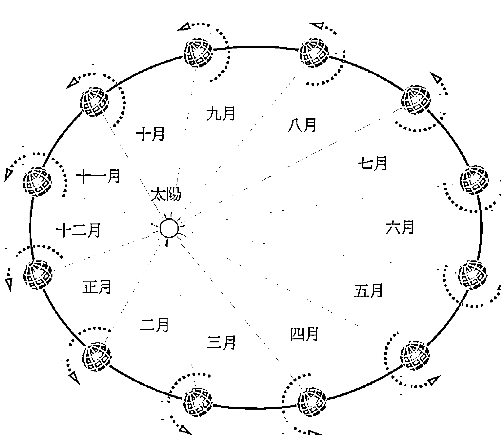

图2-1-4 地球与太阳相对位置示意图

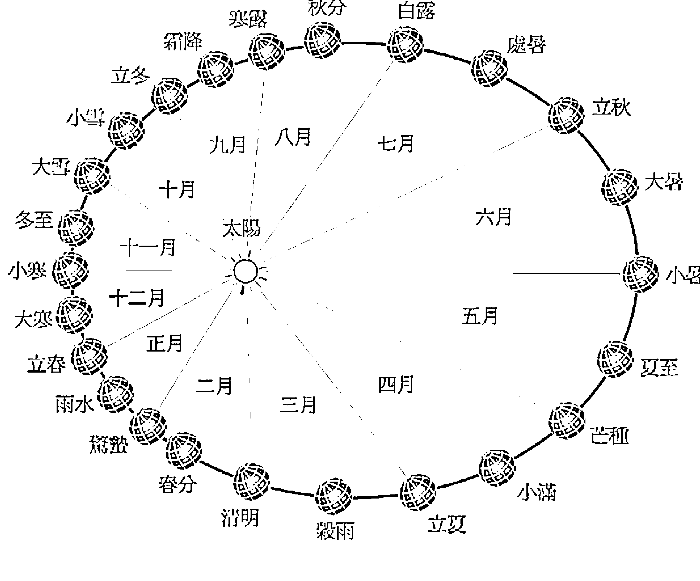

表 2-1-5 北半球节气表

| 季节 | 月份段 | 节气名称 | 月令 | 地支月 |
|------|--------|----------|------|--------|
| 春 | 孟 | 节：立春 | 一月 | 寅月 |
| 春 | 孟 | 气：雨水 | 一月 | 寅月 |
| 春 | 仲 | 节：惊蛰 | 二月 | 卯月 |
| 春 | 仲 | 气：春分 | 二月 | 卯月 |
| 春 | 季 | 节：清明 | 三月 | 辰月 |
| 春 | 季 | 气：谷雨 | 三月 | 辰月 |
| 夏 | 孟 | 节：立夏 | 四月 | 巳月 |
| 夏 | 孟 | 气：小满 | 四月 | 巳月 |
| 夏 | 仲 | 节：芒种 | 五月 | 午月 |
| 夏 | 仲 | 气：夏至 | 五月 | 午月 |
| 夏 | 季 | 节：小暑 | 六月 | 未月 |
| 夏 | 季 | 气：大暑 | 六月 | 未月 |
| 秋 | 孟 | 节：立秋 | 七月 | 申月 |
| 秋 | 孟 | 气：处暑 | 七月 | 申月 |
| 秋 | 仲 | 节：白露 | 八月 | 酉月 |
| 秋 | 仲 | 气：秋分 | 八月 | 酉月 |
| 秋 | 季 | 节：寒露 | 九月 | 戌月 |
| 秋 | 季 | 气：霜降 | 九月 | 戌月 |
| 冬 | 孟 | 节：立冬 | 十月 | 亥月 |
| 冬 | 孟 | 气：小雪 | 十月 | 亥月 |
| 冬 | 仲 | 节：大雪 | 十一月 | 子月 |
| 冬 | 仲 | 气：冬至 | 十一月 | 子月 |
| 冬 | 季 | 节：小寒 | 十二月 | 丑月 |
| 冬 | 季 | 气：大寒 | 十二月 | 丑月 |

「日」，是计算出地球与太阳相对位置，「日」的计算是以地球自转一周为一日，以午夜到隔日午夜为一日的表度，「日」可以「干支」来做为纪事，或是用月日来纪事。图2-1-6所示，地球绕太阳有近日点与远日点（近日点与远日点未按比例，旨在说明远近），因为地球自转会有快慢，而形成每日不是很平均二十四小时，图 2-1-6 显示春分、夏至、秋分、冬至四个时间参考其相对位置。
「时」，是计算出生时的位置，也代表出生时间的空间位置，以十二地支表示，定义上子时则是地球的位置与太阳是一直线，如图 2-1-7 所示，午时是直接对到太阳，所以出生时确认出生的地点。
以上将「年」、「月」、「日」、「时」说明，在「紫微斗数」起命宫只有用到二个参数「月」、「时」二个，知道「月」会知道「年」的天干，知道「时」会知道「日」的天干，由这二个参数知到命宫位置，后面有说明请参阅，详细排法请参考《紫微星钥》一书（「安命宫及身宫诀」）。

图2-1-6 地球自转与太阳相对位置示意图

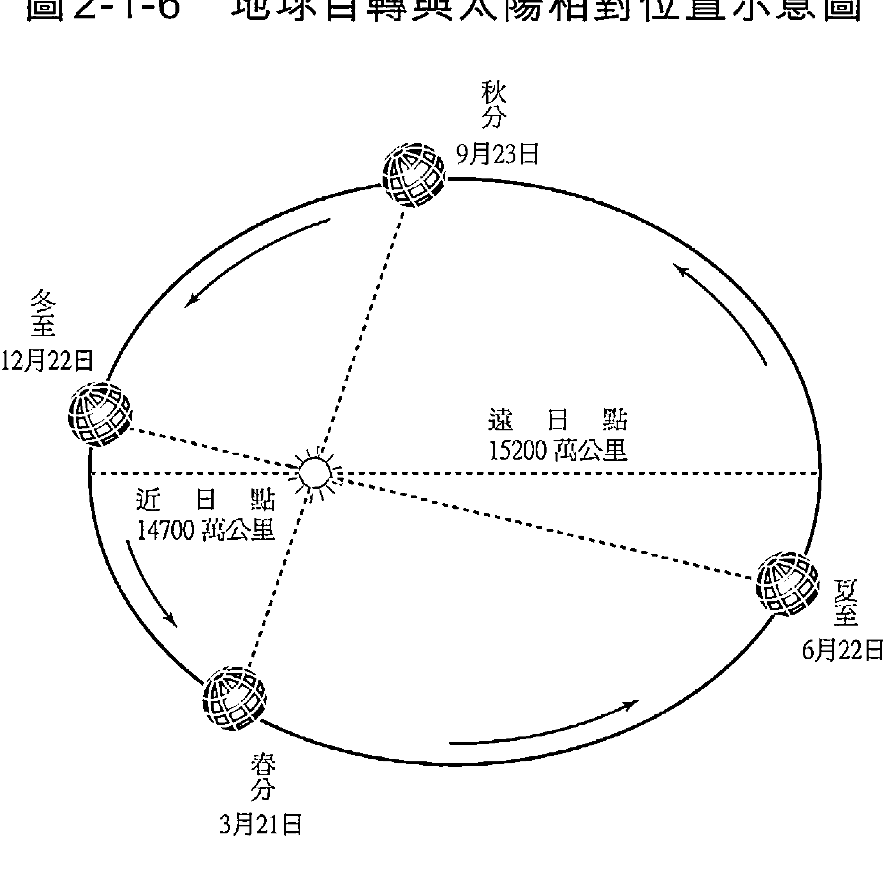

## 时间问题探讨

一、假如在美国出生之时，是否要转换到中国的时间呢？时辰是以「地支」代表，假如在某一个时间，静态平衡的剖面图，如图2-1-7图所示，地支时辰亦表示空间位置，例如在中国中午十二点出生，即是「午」时出生，正好太阳日正当中，则出生时为「午」时；若以时间剖面图来，在美国晚上十二点出生「子」时，若将美国「子」时，则是看不到太阳，转换到中国的「午」时计算，则可以看到太阳，月球的位置也不一样，这不是差异太大了，是违反真太阳时规则。故紫微斗数之出生时间，就以当地时间为主（真太阳时）。

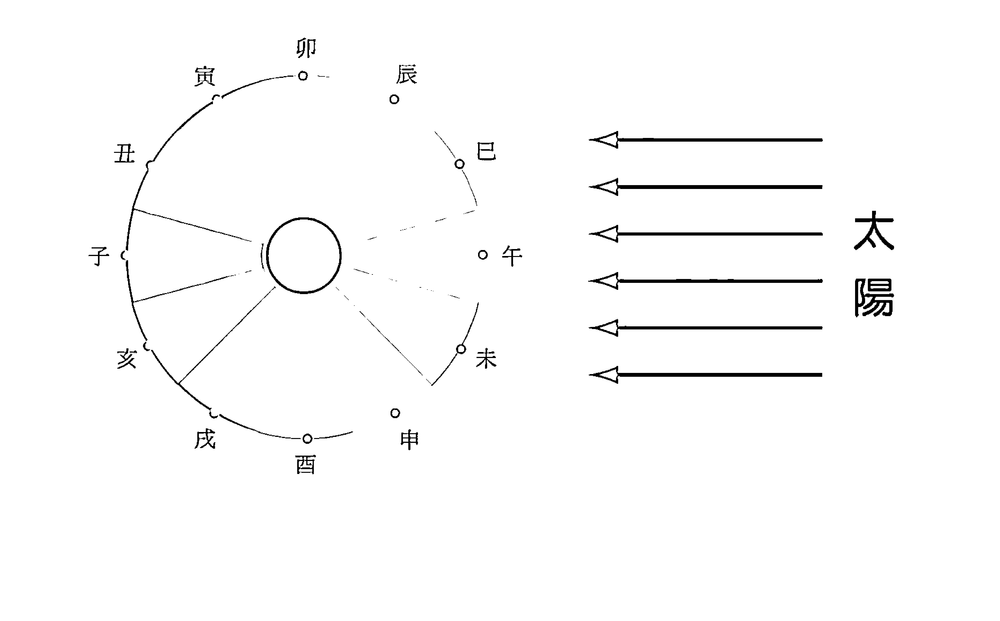

如图 2-1-8 所示，以 A 点位置出生，及 B 点位置出生，各星球与 A、B 点距是有差异的，出生地点是记录出生时各星球对个体基本因素成立，换言之，把人比矿产时，某个地区都其特别的矿产，就是在地球形成时就确定，人也是如此，当人形成生命时就已经确定个人的特质，因万年历是记录未来星球组合的变化，既然知道未来环境变化，基本的特质到未来环境的行为模式就可以模出来，做为预测之参考。

二、紫微斗数时辰是有分早子时或晚子时之分？

图2-1-8 出生位置


紫微斗数是以出生之年、月、日、时及性别做为排盘依据，目前是时间以二十四小时（平均时）为计算，而紫微斗数时间区分为十二时辰，在时间计算以二小时为一时辰，子时时间为二十四小时制，23：00～01：00跨过一天。有些派别主张23：00～00：00归为早子时（称为子初），起盘方式以当天子时起命盘，例如国历在二〇一七年五月五日23：15分出生，以早子时计算，当日农历为二〇一七（丁酉年）四月十日子时出生，为火六局，命宫在巳宫，紫微星在巳宫，若是以一般子时排法（称为子正），23：15为隔日子时，其农历为二〇一七（丁酉年）四月十一日子时出生，为火六局，命宫在巳宫，紫微星在寅宫，差异很大，主星排的位完全不同，四化之变化也不一，有时候会天差地远。时间是连续性，时间上不是归在上个时辰，就是归在下一个时辰为合理，时间走到亥时，再下一个小时又回到今日子时，再过一小时，又到隔日的子时，逻辑上是不通的，再者紫微斗数命盘也不是连续性，变化性很大。故笔者认为，以23：00以后为隔日子时，即是隔日的时间，以上述时间为六月十日子时排盘，而不是以六月九日子时。笔者想到一个趣事，亲戚小孩，刚好是同年也同一个月生，一个是农历八月十日出生。生，另一個是農曆閏八月五日出生，二個人見面，就開玩笑說，我是八月初五生，比較早五天出生，覺得是正確嗎？

## 三、紫微斗數閏月排法問題

-   第一種方法：則是以閏月的月份，做為起盤的月份，例如閏六月，不論是哪一日出生，皆以閏六月之月份起盤，數學用語就是無條件捨去法。
-   第二種方法：則是以閏月的月份，不論其出生日期為何日，一律以下個月計算，例如閏六月十六日出生，則以七月十六日做為起盤的時間，數學用語就是無條件進位法。
-   第三種方法：則是以閏月的月份區分為兩部份，以出生日為分割月份，出生日在十五日（含）以前，以閏月的月份計算，在十六日（含）以後下個月計算。例如：閏六月十四日出生者，則以六月十四日做為起盤規則；若是閏六月十六日出生者，以下個月計算，則以七月十六日為起盤規則，數學用語就是五捨六入法。
-   第四種方法：則是以閏月的月份，查看出生日是落在節氣月的那一天，就以那一天之時辰，做為月份切割點，若是節氣之前則是該閏月月份，若過了節氣時間，以下個月計算。例如出生日期為國曆二〇一七年八月七日早上06：00出生（農曆二〇一七年閏六月十六日寅時出生），查萬年曆立秋八月七日15：41分（農曆六月十六日申時）交節氣，該出生時間尚未過節氣，以紫微斗數排盤時間就會以農曆二〇一七（丁酉）年閏六月十六日申時起盤；若是出生時間為國曆二〇一七年八月七日下午4點（16：00）出生，查萬年曆立秋八月七日15：41分（農曆六月十六日申時）交節氣，該出生時間已過節氣，以紫微斗數排盤時間就會以農曆二〇一七（丁酉）年七月十六日酉時起盤，二者是相差一個月，命盤當然不一樣。以第四種方法是比較精準，若以第三種方法看起來會有一點誤差，比較起來，第三種方式在農曆閏月十五、十六為轉換點，有時候會有正負二、三天左右，若沒有萬年曆查詢時，以第三種方式為方便。紫微斗數在起盤遇到閏月問題，是紫微斗數最大問題，是以太陰月做為月份基礎，不依節氣來換月，沒有南半球或是北半球的問題，每一種祿命術都其優點、缺點，當在運用時，要知道哪些是會遇到的問題，盡量避免。

## 四、紫微斗數為何用出生「月」、「時」定命宮

前面討論了「年」、「月」、「日」、「時」的問題，這四組是說明一個人出生時在地球位置，這個位置是說明對應到太陽系的相關位置，知道這個位置，也就知道各星球與出生地相對位置，這些因素會影響個人想法、行為模式，可預測在未來時空環境中行為模式或決策。

「時間」與「空間」的位置參數不需要全部的資料來定位，所以「紫微斗數」一起命宮時，是採用了「月」及「時」，為何要這一個參數即可，其原因「月」就會知道哪一個天干，「時」可以知道哪一個天干，「日」是哪一個天干，可從「五虎遁」：甲己之年起丙寅，乙庚之年起戊寅，丙辛之年起庚寅，丁壬之年起壬寅，戊癸之年起甲寅，知道「年」的天干；「時」可以知道「日」是哪一個天干，可從「五鼠遁」：甲己還加甲，乙庚丙作初。丙辛從戊起，丁壬庚子居。戊癸何方發。壬子是真途。「紫微斗數」是將很複雜的問題簡化運用，得到想要的參數。

起紫微斗數之命宮與身宮訣：「寅正順數月逢，生月起子兩頭，逆至生時為命宮順到生時即安身。」為何從寅宮開始呢？因為「天」、「地」起點為在寅宮，而「人」基準點的假設也是在寅宮起始，故「天」、「地」、「人」變化都由寅宮開始，命宮是主要定義出生時的環境位置。

另外是起紫微星，在後面章節會提到，簡單說明，紫微星系、天府星系是另一種起法，不與命宮相同，紫微星系是決定行星相關位置，這個位置確定，也代表天體與命宮的基本關係，當未來環境變化，每個人都不同行為模式，例如天氣冷或熱，都有不同的反應。

古人也把人的一生之變化都脫離不了，妻、財、子、祿、壽及窮、通、禍、福等，人生的特徵及曾遇到事情的反應，都有很好的歸納，再進一步配合十二月、十二時辰的變化區間，定義十二種一生之常遇到的問題，以「人」、「事」、「物」、「健康」分別配合十二地支運行，「人」部份：命宮、福德、父母、兄弟、夫妻、子女、僕役（朋友），「事」部份：遷移、官祿（事業）。「物」部份：財帛、田宅。「健康」部份：疾厄。再將「人」、「事」、「物」、「健康」分別安插在十二宮之順序，以命宮起逆排「兄弟、夫妻、子女、財帛、疾厄、遷移、僕役、官祿、田宅、福德、父母」，在設計角度來看其各宮位的關係依存度很高，可以說是完美設計。

對於十二宮職的定義，請參考《紫微四化》（時報文化出版）一書第三章第七十二頁內容說明。

## 第二章

## 第一節 起紫微天府各星曜

「紫微斗數」主要星曜是從哪裡來，是真的天上星曜所轉變來的嗎？以「紫微斗數」所定義的紫微星系及天府星系而言，主要以八卦所衍生應用的，南斗星及北斗星都有所應用，在某些程度是有相關的，而主要仍以八卦轉成符合現況的應用。早期學校教授科系如電機系，因為時代進步又分大電力、微電力，一直細分下去，不斷有新的產業出來，醫學科別也是愈分愈細，「紫微斗數」的發展也是如此，本章節裡主要是找出「紫微斗數」最源頭的開始，其理論架構是什麼？基礎理論是什麼？當我們知道原理架構，對於「紫微斗數」發展是有極大的好處，尤其在預測精準度一定會大幅提升。

八卦是《易經》基本元素，八卦指「乾、兌、離、震、巽、坎、艮、坤」，是把萬物萬象歸類為八大類，每一個卦都有明確的區分，說明地球及人世間之萬物萬事歸類，若對八卦區分或是內容不是很了解，可參考附錄一筆者對《說卦傳》的臆解，不止是對卦的了解，對「紫微斗數」主星曜運也有幫助。

八卦是把萬事萬物歸類出來，若要以八卦推演地球之萬事萬物變化，困難度很高，除非對八卦運用已經是爐火純青的地步，否則一般人只能達到某個程度。因為生活所遇到的事物太多了，為要應付萬事萬象的變化，只好發展出更細膩方法或工具，解釋這一切。基本上還是運用八卦「乾、兌、離、震、巽、坎、艮、坤」的基礎理論，發展出「紫微斗數」星曜的應用。主要以星曜做為祿命依據，再依八卦納紫微星曜，再細分八卦變化之理，分別演繹紫微星曜之搭配運用。

八卦是「乾、兌、離、震、巽、坎、艮、坤」八組，是要以「先天八卦」或是「後天八卦」為主？大部分以「後天八卦」為主，應用會相互搭配使用，其原因我們所在的地球是以「後天八卦」為主，請參考前面「空間假設定義」說明，有了「後天八卦」也要與「洛書數」配合，「洛書數」以九宮圖顯示（九宮為九個空格，斜、橫、縱三格相加各為十五），再將八卦放入「洛書數」如圖2-2-1所示，「後天八卦」與「洛書數」配合運用，分析地球變化的過程。

## 圖2-2-1 後天八卦配洛書數

| 巽 4 | 離 9 | 坤 2 |
|---|---|---|
| 震 3 | 5 | 兌 7 |
| 艮 8 | 坎 1 | 乾 6 |

接下來介紹八卦是如何演繹出「紫微斗數」主星曜，首先以八卦為推演基礎，以八卦定義「紫微斗數」主要星曜，但「乾卦」與「坤卦」有二顆星曜代表，其定義如下：

-   乾卦配 -> 太陽、武曲。
-   坤卦配 -> 太陰、貪狼。
-   艮卦配 -> 廉貞。
-   兌卦配 -> 巨門。
-   震卦配 -> 天同。
-   巽卦配 -> 天梁。
-   坎卦配 -> 天機。
-   離卦配 -> 破軍。

讀者會問，為何「乾卦」一定要配太陽星、武曲星，不可以配其他的名稱嗎？當然可以，這只是定義名稱，在運用過程方便使用，古人對名稱不會亂取名稱，儘量符合實際相近意思。例如數學其中有一個基本定義，一加一等於二（1+1=2），若不成立，數學基本運算是無法推算。

八卦所定義之星曜，怎麼沒有看到紫微星與天府星？紫微星與天府星是帶頭的星曜，中宮（5）以帶頭之星系紫微星系與天府星系暫時放入中宮。紫微星系「洛書數」有3、8及1、6共有六顆星曜，天府星系「洛書數」有2、7及4、9共有六顆星曜，結果如圖2-2-2所示，分為二組，紫微星系由紫微帶頭有天機、太陽、武曲、天同、廉貞；天府星系由天府星帶頭有太陰、貪狼、巨門、天梁、破軍。

紫微星系與天府星系之順序，是如何決定？是根據河圖與洛書決定其順序，洛書：「戴九履一，左三右七，二四為肩，六八為足，中間為五。」朱子曰：

## 圖2-2-2 八卦與星曜搭配圖

| | | |
|---|---|---|
| 天梁<br>巽<br>4 | 破軍<br>離<br>9 | 太陰、貪狼<br>坤<br>2 |
| 天同<br>震<br>3 | 紫微、天府<br><br> | 巨門<br>兌<br>7 |
| 廉貞<br>艮<br>8 | 天機<br>坎<br>1 | 太陽、武曲<br>乾<br>6 |

「洛書之位，一對九、二對八、三對七、四對六，亦與河圖不異。」又曰：「洛書縱橫數之皆十五，互為七八九六。」是依據河圖之數排列，河圖：「一、六共宗屬水在北居下，二、七為朋屬火在南居上，三、八同道屬木在東居左，四、九為友屬金在西居右，五、十相守屬土居中。」

紫微星系為開始，以「一、六共宗水，河圖數在一為「天機星」、洛書數六有二組星曜「太陽星、武曲星」，接下來是以「三、八同道木，三為「天同星」，八為「廉貞星」，成為紫微星系之組員。

天府星系開始由「二、七為朋火開始，有一組星以「太陰星、貪狼星」，七為「巨門星」，接下為「四、九為友金，四為「天梁星」，九為「破軍星」，成為天府星系之組員。

八卦九宮方式不足以應付地球所衍生之萬事萬物變化，由八個方位增加到十二個方位，配合地球一年有十二月，一日有十二個時辰之運行，配合天體運行與地球環境變化，故配合十二地支「子、丑、寅、卯、辰、巳、午、未、申、酉、戌、亥」，代表地之環境及空間，十天干「甲、乙、丙、丁、戊、己、庚、辛、壬、癸」，代表天體運行的時間，與地支相配成「六十花甲納音」，天干與地支皆有其五行屬性，天干與地支相合化成另一組五行，其納音五行推論原理，請參考第一篇第四章「六十甲子納音法則」說明。紫微星及天府星是基準星，將紫微星系與天府星系由八卦九宮之位置展開成十二地支位置，如何將這二大星系佈在十二地支，基本原則這一組星系可以分為「天」與「地」。

「《說卦傳·第五章》：『帝出乎震，齊乎巽，相見乎離，致役乎坤，說言乎兌，戰乎乾，勞乎坎，成言乎艮。』」如圖 2-2-3 先天八卦圖所示。紫微星系與天府星要佈十二支時，是要從哪裡開始？從「帝出乎震」開始，這裡的「震卦」是以先天卦為主，為何不以後天卦的「震卦」開始？先天八卦是最原始的基本，而後天八卦是後期所形成，需由先天之「震卦」開始，由後天卦成形，在十二地支之「震卦」位在哪裡？是在十二地支「寅」位，即是「震卦」位置，紫微相關之起始位置大多是在「寅」宮開始。確定了起始位置，要決定紫微星系及天府星之順逆排法，有順逆才能剛柔相摩，達到平衡，

## 圖2-2-3 先天八卦圖

宋版六經圖《大易象數鉤深圖》之《剛柔相摩圖》：「乾陽居上，坤陰居下，乾自震而左行，坤自巽而右行，天左地右故曰剛柔相摩。」（請參考附錄二），紫微星系代表「天」，也代表「乾」，故為左行，現代用法即是逆行（逆時鐘方向）；天府星系代表「地」，也代表「坤」，故為右行，現代用法即是順行（順時鐘方向）。決定了起始點及紫微星系及天府星系之順逆排法，先介紹紫微星系各星曜排列，由紫微星帶頭有天機、太陽、武曲、天同、廉貞，《說卦傳》：「帝出乎震。」紫微星為帝王星，帝王星之起始點在十二地支之「寅」宮開始，在「寅」宮起紫微星開始逆行，第二顆星為天機星在「丑」宮，接著在「亥」、「戌」、「酉」宮分別將太陽、武曲、天同放入，廉貞星為何要放在「午」宮呢？其原因因為紫微星系最後一顆為廉貞星，必須頭尾要兼顧，正好是三合地方，是最穩固。

## 圖2-2-4 紫微星系排列

| | | | |
|---|---|---|---|
| | 廉貞 | | |
| | | 天同 | |
| | 三合120度 | 武曲 | |
| 紫微 | 天機 | | 太陽 |

紫微星系排列如圖2-2-4所示。讀者有興趣可以看「拉格朗日點」（Lagrangian）物理動力的狀態，平穩作用量原理，證明最穩固的角度，也是衛星繞地球最穩定飛行角度，直線是最不穩定，最穩定在祿命學裡所謂「三合」，最不穩定稱為「沖」。在「子」宮位為何要空出來，先確定了廉貞星位置後，是要對應天府星系最後一顆星曜，要符合頭對頭（紫微星對天府星），尾對尾（廉貞星對破軍星）平衡狀態。天府星系由天府星帶頭有太陰、貪狼、巨門、天梁、破軍等，前面說明起紫微星系是由「寅」宮開始佈星曜，天府星系也不例外，天府星從「寅」宮順行將其他星曜排入，第二顆星太陰在「卯」宮，第三顆星貪狼在「辰」宮，第四顆星巨門在「巳」宮，第五顆星天梁在「午」宮，第六顆星破軍在「子」宮，基本上天府星系之天府星，是從寅宮開始與紫微星同宮。

## 圖2-2-5 天府星系排列

前面有提到紫微星與廉貞星是三合關係，天府星加上天相星亦是在三合關係，主要確定在「天」、「地」在佈局時的穩定性，降低其對應之誤差度。

為何在「申」宮有七殺星呢？這與天府星系在管制點的關係，前面提及天相星是第一個管制點，七殺星則是第二個管制點，正好是在天府星對面為一八○度正沖（衝），衝有對抗之意，第二義含是執行工作考核點，過了一半要第一期驗收，有公權力執行，有「殺」之一意，以天府星位置起算第七個位置，稱為「七殺」星。以月份而言，秋天開始，樹葉開始落葉，給人感覺是肅殺之氣，所以在天府星系中，在對宮加一顆星曜「七殺星」，《紫微斗數全書》〈諸星問答論〉：「南斗第六星也，屬火、金，乃斗中之上將，實成敗之孤辰，在斗司斗柄，主於風憲，其威作金之靈，其性若清涼之狀。」

| 巨門 | 天相 | 天梁 | 七殺 |
|------|------|------|------|
| 貪狼 | 天府星系 | 紫微星系 |      |
| 太陰 |      |      |      |
| 天府 |      | 破軍 |      |

紫微星系與天府星系都安排好了，接下是要安排這二星系的對應關係，前說過紫微星系是逆行排星曜，天府星系是順行排星曜，有了基準點在「寅」位為出發點，紫微星系逆行一個宮位，天府星系順行一個宮位，到了「申」宮會重逢，再繼續走，最後會在「寅」會合，符合剛柔相摩，天左地右，一順一逆達到平衡，如圖2-2-7所示。

## 安天府諸星訣：

天府順行有太陰，貪狼而後巨門臨，隨來天相天梁繼，七殺空三是破軍。

## 安紫微諸星訣：

紫微逆去天機星，隔一太陽武曲辰，連接天同空二宮，廉貞居處方是真。

另一個意義是在對宮也剛好過一半，好像在企業有上半年度及下半年度的查核點。

「《說卦傳》：『帝出乎震，齊乎巽。』」以曆法而言，每年正月為「寅」月，農曆正月以「寅」月開始，節氣正月以立春開始，即「寅」月為一年之始，七月為「申」月是立秋，天氣要轉涼。以一天而言，白天由「寅」時太陽升起，到下午「申」時為太陽下山，而月亮升起之時正好相反，「寅」「申」二位是轉換之位，而「申」月為立秋。紫微星系是逆行，而天府星系為順行，如圖2-2-6所示，紫微諸星排法可以整理出來。

## 圖2-2-7 紫微星與天府星對應圖

> （讀者可以到YouTube或優酷查詢「王文華老師紫微斗數學理—起紫微天府星原理」，觀看影片介紹。）
YouTube 或網址「https://youtu.be/JR8r9NrYxcM」

## 第二節 八卦與星曜應用

「《繫辭》：『古者包犧氏之王天下也，仰則觀象於天，俯則觀法於地，觀鳥獸之文與地之宜，近取諸身，遠取諸物，於是始作八卦，以通神明之德，以類萬物之情。』」有很重要的觀念是觀察能力及組織能力，對事情要豐富的想像力，各星曜除了本身都有明確的定義，但是對卦的延伸是不足的，本章節是介紹八卦所推演出來的星曜，卦與星曜是有互通的，應用上不易被局限。

學習「紫微斗數」主星曜排法及命宮如何安排，都有明確的規則，依據天體運行將天、地、人整合，再由天體運行推測未來。《易經・繫辭上傳》第一章：「天尊地卑，乾坤定矣；卑高以陳，貴賤位矣；動靜有常，剛柔斷矣；方以類聚，物以群分，吉凶生矣；在天成象，在地成形，變化見矣！」當你知道天地運行之理，以現有的資源配合環境變化，達到預期目的，可謂遊戲人間。個人紫微命盤確定後，人生的劇本就寫好，每個人拿劇本演出，要如何完美的表演，端看客倌們要如何演出精彩的人生，而學習態度是要積極的，如何懂得善加利用個人優缺點，會達到最理想狀態。前面已經說過八卦已分成八大類，以現代環境中是不夠用，再細分成十二區域，將天地之間的變化納入紫微命盤，其變化是有跡可尋，就可以預測未來發生的事情，運用這個道理知天地變化分析趨勢，推敲人生禍福，人的一生運行軌跡，可從其延伸的變化得到說明，以八卦相關說明及定義，演繹紫微星曜意義，以下是對於八卦納紫微星曜以人性部份做為詮釋，可以從各角度說明或推論。

紫微星曜特徵引用《說卦傳》之八卦特質加以說明，主要針對「人」的個性敘述為主，可依不同情境「事」與「物」交互變化，其特性也會改變，例如祿存星有「聚」的觀念，在財帛裡則以聚財論之，在疾厄宮裡從負面來看則是有腫瘤現象，是好或不好，要參考其宮內星曜判斷同一個星曜在不同的地方。

## 八卦納紫微星曜說明

「乾卦」 納紫微星曜為「太陽星」及「武曲星」，配合八卦納甲，卦納天干之「甲、壬」二個干支，故將「乾卦」以二個星曜分別應用，《說卦傳》對於「乾」卦之描述：「乾為天，為圜，為君，為父，為玉，為金，為寒，為冰，為大赤，為馬，為老馬，為瘠馬，為駁馬，為木果。」象辭：「天行健，君子以自強不息」，是一種持續、永恆及陽剛之意，說明天體的運轉是一種持之以恆，不會因任何的時間及空間的問題而停止。以「太陽星」之表現較為明顯；「武曲星」較偏向於「為玉、為金」，與錢財有關事項，在格性上比較剛毅果斷與「太陽星」是有一些差異，主要特性除了有「太陽星」之持續力外，另外有一特性就是轉換、變換之意。以發電機為例，一台發電機連續發電時間很長，要轉換另一部發電機代替發電，接續發電的服務，這一種的轉換是必要的，否則會影響全盤功能；另外一個特性是以田產、財富為主。

「坤卦」的「納甲」為「乙」與「癸」其星曜為「太陰星」及「貪狼星」，《說卦傳》對於「坤」卦之描述：「坤為地，為母，為布，為釜，為吝嗇，為均，為子母牛，為大輿，為文，為眾，為柄，其於地也，為黑。」是孕育萬物，有溫柔、內斂及承載之意，衍。

## 太陰星

生其義，「太陰星」有很大的承載或承受的能力，太陰星代表母親，少女成為母親時就會不一樣，女性在少女時，是很軟弱的，需要別人的呵護，成為母親時，其個性變成非常的堅強，任勞任怨等基本的概念。「坤」卦以「太陰星」代表。「為布，為吝嗇，為文，為眾等」衍生其義，貪狼星在人際互動方面較佳，注重穿著品味，慾望多，喜好學習，多才藝，此特徵以「貪狼星」代表。

## 廉貞星

『艮卦』納紫微星曜為「廉貞星」，《說卦傳》對於「艮」卦之描述：「艮為山，為徑路，為小石，為門闕，為果蓏，為閽寺，為指，為狗，為鼠，為黔喙之屬，其木也為多節。」在卦意中有「止、靜、不動」之象，所以紫微星系排列中，由紫微星為首開始佈星，最後一顆星為廉貞星做為結束，廉貞星衍生「艮」卦之義，有「止」之意；廉貞星有另一種意義的表徵，即是很不穩定的現象，與本質會有很大的變化，端看廉貞星與其他星的組合而定，在運用上應特別的注意。以意象則是代表整合、專業的、安全的、固執的，不易改變，在某個區域或範圍內則以「廉貞星」代表。

## 巨門星

『兌卦』納紫微星曜為「巨門星」，《說卦傳》對於「兌」卦之描述：「兌為澤、為少女、為巫、為口舌、為毀折、為附決。其於地也，剛鹵。為妾、為羊。」可從「兌」卦的衍生其義著手瞭解，「兌」卦是一個善於用口才表達，表達得體則會事半功倍，喜慶的、群眾的、慶祝的；反之則適得其反，易造成誤會，其意有口舌是非，損壞、毀譽參半之，可以用「巧言令色」來說明巨門星毀譽參半的特性，以「巨門星」代表。

## 天同星

『震卦』納紫微星曜為「天同星」，《說卦傳》對於「震」卦之描述：「震為雷，為龍，為玄黃，為敷，為大塗，為長子，為決躁；為蒼筤竹，為萑葦，其於馬也，為善鳴，為鼻足，為作足，為的顙；其於稼也，為反生其究，為健，為蕃鮮。」「震卦」是八卦的起源，結合天地之間的能量而變，萬物才能在大地生長，能使大地動起來，這是需要很大的能量，能量蓄積到某個臨界點，爆發時將所有的能量全部釋放出來，變成後續無力的現象，有「不鳴則已、一鳴驚人」現象。應用意涵上表示有蘊藏很大的能量、有爆發力、快速之意、包容性很大，另一個涵意是指有福報，以「天同星」代表。

## 天梁星

『巽卦』納紫微星曜為「天梁星」，《說卦傳》對於「巽」卦之描述：「巽為木，為風，為長女，為繩直，為工，為白，為高，為進退，為不果，為臭；其於人也，為寡髮，為廣顎，為多白眼，為近市三倍其究，為躁卦。」給人有一種距離感，像一種細水長流、仙風道骨般，又很慪心。衍生「巽」卦的意義，「天梁星」特性代表做事有原則、成熟穩重，在思想上會長思熟慮。在運用上多體會古文的意涵，「天梁星」特性代表理，代表清高，有品味的，回顧、記憶、記錄，有歷練之意，以「天梁星」表示。

## 天機星

「坎卦」納紫微星曜為「天機星」，《說卦傳》對於「坎」卦之描述：

> 坎為水，為溝瀆，為隱伏，為矯輮，為弓輪，其於人也加憂；為心病，為耳痛，為血卦，為赤，其於馬也為美脊；為亟心，為下首，為薄蹄，為曳，其於輿也；為多眚，為通，為月，為盜，其於木也為堅多心。

內心的流動外表看不出來，有隱藏內心世界、有煩惱的，有智慧的，想法多變之意，以「天機星」表示。可以從紫微斗數設計原理討論，「天機星」在地支「丑」位，也可以比喻成地軸旋轉的中心點，不停的運轉，但軸心看似沒有運轉，其實已運轉之中，代表「變動」，變動之中又看不出其變動，故天機星為「動」之星，亦蘊藏天地之間變化的哲理，「天機星」代表有智慧、內涵而內斂，不輕易的展現於外，正面的講法「運籌帷幄」，負面說法則是「城府較深」。

## 破軍星

「離卦」納紫微星曜為「破軍星」，《說卦傳》對於「離」卦之描述：「離為火，為電，為中女，為甲胄，為戈兵；其於人也大腹，為乾卦，為鰲，為蟹，為蠃，為蚌，為龜，其於木也為科上稿。「離卦」為多變，變化極大的特質，外表美麗、亮麗，外部則有強而有力的防護物質，外有盾牌般的堅硬，保護內部的安全，所以內部較為脆弱或是柔弱的，不易穩定的（情緒變化大），容易有衝突的，外強內弱之意，指內在的層面想法，應用上則是求變化、求新、流行的、快速的，也有破耗現象，以「破軍星」表示。

以上是以八卦對應紫微星曜相關說明，紫微星、天府星、天相星、七殺星沒有說明，請參閱拙著《紫微星鑰》及《紫微四化》相關說明；或請參考古籍《紫微斗數全書》（竹林書局印行）卷一有：〈太微賦〉、〈形性賦〉、〈星垣論〉、〈斗數準繩〉、〈諸星問答論〉、〈斗數骨髓賦〉、〈女命骨髓賦〉……等等；或是現代學有專精大師之註解大作，更深入了解古今差異，現代生活環境較古代複雜，星曜需更深入了解其中意義，才能運用在現在生活中。

（讀者可以到 YouTube 或優酷查詢「王文華老師紫微斗數學理—八卦與紫微星曜」，或網址「https://youtu.be/ardXMG1ndQ」，觀看影片介紹。）


## 八卦納紫微星曜探討

> 《紫微斗數全書》書中，有些筆者認為有疑點之處提出看法，《太微賦》：「其星分佈十二垣，數定乎三十六位，入廟為奇，失度為虛，大抵以身命為福德之本，加以根源為窮通之資。星有同躔，數有分定，須明其生剋之要，必詳乎得垣失度之分。」

在「數定乎三十六位」，為何要定乎三十六位，有很多解釋是因為分佈一十二垣，分有天、地、人三盤，故為三十六位。筆者認為是應是「數定乎六十之位」，才能乎應「須明其生剋之要，必詳乎得垣失度之分」，而六十之位是指「六十花甲納音」，簡稱：「六十納音」是以「天干」、「地支」組合成六十組，配合紫微在十二宮位，與星曜之五行產生相生相剋，就可以說明星曜在該宮之強弱現象。

一般運用上只取五行，很少取甲子、乙丑「海中金」及分陰五行或陽五行，取其納音五行，六十甲子納音如下：

- 甲子、乙丑「金」
- 丙寅、丁卯「火」
- 戊辰、己巳「木」
- 庚午、辛未「土」
- 壬申、癸酉「金」
- 甲戌、乙亥「火」
- 丙子、丁丑「水」
- 戊寅、己卯「土」
- 庚辰、辛巳「金」
- 壬午、癸未「木」
- 甲申、乙酉「水」
- 丙戌、丁亥「土」
- 戊子、己丑「火」
- 庚寅、辛卯「木」
- 壬辰、癸巳「水」
- 甲午、乙未「金」
- 丙申、丁酉「火」
- 戊戌、己亥「木」
- 庚子、辛丑「土」
- 壬寅、癸卯「金」
- 甲辰、乙巳「火」
- 丙午、丁未「水」
- 戊申、己酉「土」
- 庚戌、辛亥「金」
- 壬子、癸丑「木」
- 甲寅、乙卯「水」
- 丙辰、丁巳「土」
- 戊午、己未「火」
- 庚申、辛酉「木」
- 壬戌、癸亥「水」

十二宫之五行表都有一定规律，以年来说可以用五虎遁算出寅月的天干，大约是区分五组，可以查《紫微星钥》、《紫微四化》二本书的附录「六十甲子纳音五行表」及「紫微星配置图」的速查表，以不同的天干、地支所产生之五行，与星曜五行产生相生相剋关系，方便使用。

## 第三節 宮氣

各宮都有宮天干及宮地支，合化成五行屬性，可稱為「宮氣」，而「宮氣」對星曜產生「得垣失度之分」，星曜之五行屬性請參考〈星垣論〉或〈論諸星分屬南北斗化吉凶并分屬五行〉之各星曜之五行，宮氣與星曜是如何運作呢？

以星曜為「體」以宮氣為「用」，宮氣對星曜產生五行生剋，若宮氣五行生星曜五行，稱為「得垣」或「廟」，若宮氣五行剋星曜五行，稱為「失度」或「陷」。大部份星曜是可以按此原則做為判斷依據，也有例外之星曜，學習要能分辨。

宮氣之判斷，以巨門星為例，可從〈論諸星分屬南北斗化吉凶并分屬五行〉查出巨門星五行為「水」，在辰宮時，宮干為庚，宮干支為「庚辰」納音五行為「金」（可由六十納音查出五行屬性），此時宮氣來生星曜五行。

五行生剋「金」生「水」，則是強化了巨門星之優點表現；若宮干支為「丙辰」納音五行為「土」，宮氣為以「土」剋巨門星「水」，此時巨門星之缺點會表現很強烈，詳細解說請參考拙著《紫微四化》第二章內容說明。

> 《太微賦》中提到「七殺廉貞同位路上埋屍」，古文註解：「巳亥二宮安命值此二星，更加殺化忌逢，空劫流蕩天涯不得守家軍，商在外艱辛。呢？」

> 《斗數骨髓賦》中也提到「廉貞七殺反為積富之人」。古文註解：「廉貞屬火，七殺屬金是火能制金為權，如貞居未殺居午，身命遇之奇格也，反為積富或陷地化忌，下格賤命。」

要如何判斷是「積富之人」或是「路上埋屍」，可以從宮氣論點切入討論，即可以了解古人沒有說的秘密，從〈論諸星分屬南北斗化吉凶并分屬五行〉查出「廉貞屬火化北斗殺囚在官祿為宮祿主」、「七殺屬火金南斗將星遇帝為權」，廉貞星與七殺星雙星組，依紫微星系排列，在卯宮起紫微星時，廉貞星及七殺星會在丑宮會合；或是在酉宮起紫微星時，廉貞星及七殺星會在未宮會合；以廉貞星及七殺星在未宮而言，廉貞星屬火、七殺星屬火，若以乙年或庚年出生者，未宫之宫干为癸干，「癸未」纳音五行为「木」，宫气为「木」，宫气生星曜廉贞、七杀之五行「火」，其优点产生，故为「积富之人」；反之若为丁、千年出生者，未宫之天干必为丁天干，其宫干支为「丁未」纳音五行为「水」，宫气为「水」，宫气克星曜，星曜发挥其缺点，故为「路上埋尸」。

《诸星问答论》中「武贪不发少年人（郎）」，解释是要过中年后才能发迹，为何武曲及贪狼星同宫时，要中年才发迹呢？这个解释可以从八卦纳星曜这个观点切入解释，本文开头就定义了八卦纳星曜之原则，「乾」卦纳太阳星及武曲星，「坤」卦纳太阴星及贪狼星，而「乾」「坤」二卦是父母卦，武曲星代表「乾」卦，而贪狼星代表「坤」卦，所以武曲星与贪狼星也代表父母卦，而父母卦会在中年以后才会发迹，故「武贪不发少年人（郎）」。

《紫微斗数全书》《形性赋》各星曜与个人之特征说明，有单星形态也有双星同宫之形态，提供星曜与「人」的长相或形态要搭配，搭配程度愈高则应验度愈高。例如：武贪双星时之形性特征如赋文「贪狼同武曲，形小声高而量大」，谈到贪狼星与武曲星同宫时，其特征为个子矮小，声音频率高，音量大，身材为虎背雄腰，有达到这些现象，才可以称为「武贪格」。

賦文中單星曜如「武曲及至剛至毅之操，心性果決」是武曲星曜在個性上的特徵，「貪狼為善惡之星，入廟必應長聲，落陷必定頑囂」是貪狼星曜的特徵，賦文中對雙星曜之解說有另一種說法，而不用單星曜解說。以武曲星與貪狼星同宮時，「形小聲高而量大」，就時雙星組合之特徵與單星曜不同；若身材長的比較高大，則「武貪格」性子小的差異大，此時比較偏像貪狼星，人生起伏變沒有像真正的「武貪格」的暴起暴落。

天同星在《形性賦》中「天同肥滿，目秀清奇」，《諸星問答論》中「為人廉潔貌稟清奇，有機樞，無亢激，不怕七殺相侵，不怕諸殺同」，說明天同星之特徵，其長相豐腴，看起來是有福氣之相，以星曜而論，要符合天同星則要有福態才是，若天同星為瘦者之體態，與天同星基本的福態相反，則顯示天同缺點，必為勞碌命。

《紫微斗數全書》《太微賦》開頭所言：「斗數至玄至微，理旨難明，雖設問於各篇之中，猶有言而未盡，至如星之分野，各有所屬，禍福深淺，壽夭賢愚，貪淫正直，各有所司，不可一概論議。」「紫微斗數」是一門深奧的學問，雖然有許多賦文都無法說的透徹，同一張命盤不可以一概而論，正如同文中說明星曜個性、體態等，都不一樣，即是同一張命盤其結果會不一樣，這是紫微斗數奧妙之處。


各宮位內之星曜組合吉星及凶星，判斷其吉凶，《易經．繫辭上》第二章：「吉凶者，失得之象也。悔吝者，憂虞之象也。變化者，進退之象也。剛柔者，晝夜之象也。」論斷吉凶，是依據當時之情境認定「得」或「失」才是吉呢？

事情決定了，是否因事情決定太匆促後悔而產生煩惱呢？一件事產生變化或是要執行時，決定進或退呢？其結果會是不一樣的；事情執行或做法是要強硬或柔順呢？人生不斷落入這四個循環之中，若能凡事都能考慮這四個項目，對我們人生也是相當的助益。

（讀者可以到 YouTube 或優酷查詢「王文華老師紫微斗數教學—宮氣介紹」，或網址「https://youtu.be/N8An-UhIt3Y」，觀看影片介紹。）


## 第四節 五行局探索

《易經·繫辭上傳》第一章：「天尊地卑，乾坤定矣；卑高以陳，貴賤位矣；在天成象，在地成形，變化見矣！是故：剛柔相摩，八卦相盪。鼓之以雷霆，潤之以風雨，日月運行，一寒一暑。」《說卦傳》第二章：「天地定位，山澤通氣，雷風相薄，水火不相射，八卦相錯，數往者順，知來者逆；是故，易逆數也。」說明相盪之理運用，在紫微斗數排盤建構原理中，星曜排列及組合是精心安排與設計，符合天地運行之理。開始要排紫微斗數命盤時，地支十二宮都排好，接下來要安排天干位置，天干位置也是從「寅」宮開始，前面已經提起「寅」宮是紫微星系、天府星系起始點，安天干也不例外的也是從「寅」宮開始，運用五處虎遁（五行冠蓋訣）來安排，「五行冠蓋訣」：「甲己之年起丙寅，乙庚之年起戊寅，丙辛之年起庚寅，丁壬之年起壬寅，戊癸之年起甲寅。」

詳細排法請參考《紫微星鑰》第四章內容。

十天干佈好之後，就是定命宮位置，〈安命宮及身宮訣〉：「寅正順數月逢，生月起子兩頭，逆至生時為命宮，順到生時即安身。」定命宮則也是依天地規則，必須一順一逆，保持平衡。

接下來是要定位紫微星，起紫微星是「紫微斗數」最難的部份，首先找出命宮所在位置的宮五行，即為宮干、宮支合化五行屬性，五行屬性決定起大運時間及「紫微星」的變化週期。以寅宮為基準點，偶數為逆行，倚數為順行，起紫微星系及天府星系則要以「紫微星」為基準，有了基準才可以把紫微星系及天府星系排好。

## 水二局

命宮完成才能定局數，定局數與起「紫微星」有很大的關係，前面章節說明紫微星系都是從「寅」宮開始，這裡也不例外，安紫微諸星訣：「紫微逆去天機星，隔一太陽武曲辰，連接天同空二宮，廉貞居處方是真。」定「紫微星」的起始，要先確認命宮之干支五行，假設命宮干支五行為「水」，以「寅」宮起算一，第二位則是在「丑」位，而「丑」位是「亥、子」為水位，故以水起局，水也是萬物生命之源，故為「水二局」，大運起運歲為二歲開始。
「水二局」初一紫微星在丑宮，初二在寅宮，起「水二局」之訣如圖 2-4-1 水二局起紫微所示。〈水二局起紫微星〉：「坎水宮中二歲行，初一起丑初二寅，順行一步安一日，陰陽雖異行則同。」

## 圖2-4-1 水二局起紫微星

| 巳 | 午 | 未 | 申 |
|----|----|----|----|
| 初九<br>初八 | 十一<br>初十 | 十三<br>十二 | 十五<br>十四 |
| 辰 | 坎水宫中二岁行<br>初一起丑初二寅<br>顺行一步安一日<br>阴阳虽异行则同 | 酉 |
| 卯 | | 戌 |
| 寅 | 丑<br>廿五、廿四<br>初一 | 子<br>廿三<br>廿二 | 亥<br>廿一<br>二十 |
| 水局纳音：丙子、丁丑涧下水，丙午、丁未天河水，甲申、乙酉泉中水，甲寅、乙卯大溪水，壬辰、癸巳长流水，壬戌、癸亥大海水。 |
| 附注：亦自寅宫顺整至命宫遇此纳音，即为水二局。 |

## 木三局

依一逆一順之理，水二局為逆 2 順序，現要順行 3，以十二地支位置「寅」宮開始為 1 算到 3 至「辰」宮，「辰」宮是木局宮，「寅」、「卯」是屬最後再轉換到下個位置，「寅」、「卯」是屬木（辰雖屬土，在此帶有木氣），故為「木三局」，大運起運時間為 3 歲，則逆 2 在丑宮，起為初二，相互震盪，起為初二

## 圖2-4-2 木三局起紫微星

| 十四、十二 初四 巳 | 十七、十五 初七 午 | 二十、十八 初十 未 | 廿三、廿一 十三 申 |
| 十一、初九 初一 辰 | 生過木宮三歲遊 初一騎龍初二牛 逆退三宮安二日 順回四步一辰求 順二回宮牛頭地 逆進二步二辰傳 | | 廿六、廿四 十六 酉 |
| 初八 初六 卯 | | | 廿九、廿七 十九 戌 |
| 初五 初三 寅 | 廿八 初二 丑 | 廿五 子 | 三十 廿二 亥 |

木局納音：戊辰、己巳大林木，戊戌、己亥平地木，壬午、癸未楊柳木，壬子、癸丑桑柘木，庚寅、辛卯松柏木，庚申、辛酉石榴木。

附註：自寅宮順數，如前定局宮中所載日期，看命即在各局，尋本人生日安紫微。

## 金四局

個位置為「亥」宮，初一起紫微星在「亥」宮，所在的「亥」宮無法起算五行，因為在水二局時「亥、子、丑」這一組已經被使用過了，不可以再使用，因是逆轉，故再逆一位，在「戌」宮，而「戌」宮是與「申、酉」為一組，其屬性為「金」，故此定義為「金四局」大運起歲時間為4歲開始，「金四局」紫微星排法如圖243所示。其「金四局」起紫微星口訣：「紫微金宮四歲行，初一尋豬二歲龍，順進三步逆退一，先陰後陽是其宮，惟有初一辰上起，進三退四逆行蹉。」

## 圖2-4-3 金四局起紫微星

| 巳 |
|---|
| 廿五、十九 十六、初六 |
| 辰 |
| 廿一、十五 十二、初二 |
| 卯 |
| 十七、十一 初八 |
| 寅 |
| 十三、初七 初四 |

| 午 |
|---|
| 廿九、廿三 二十、初十 |
| 紫微金宮四歲行 初二尋豬二歲龍 順進三步逆退一 先陰後陽是其宮 惟有初二辰上起 進三退四逆行蹤 |
| 丑 |
| 初九 初三 |

| 未 |
|---|
| 廿七、廿四 十四 |
| 子 |
| 初五 |

| 申 |
|---|
| 廿八 十八 |
| 酉 |
| 廿二 |
| 戌 |
| 廿六 |
| 亥 |
| 三十 初一 |

金局納音:甲子、乙丑海中金，甲午、乙未沙中金，壬寅、癸卯金箔金，壬申、癸酉劍鋒金，庚辰、辛巳白蠟金，庚戌、辛亥釵釧金。

附註:寅宮納音屬金，數至命宮遇此六金，即為金四局。

## 土五局

金四局是逆行第4位置，逆行後接下順行第5個位置在「午」宮，而「午」位置是「巳、午」屬火位置，應以「未」宮為主，但5是一個很特別的置，5是有一個特殊用法，就是屬「土」在中間，原來土局為6數，要維持原始設定，不可以亂更改，故土局變成「土五局」為主，大運起運時間為五歲，「土五局」請參考如圖244所示。其「土五局」起紫微星口訣：「戊土五歲居其中，初一午上二亥宮，逆行三宮安一日，惟有九日不能同，二宮一日順二次，退二三次又逆從，惟有六日無正位，逢四對宮去」


## 圖2-4-4 土五局起紫微星

| 巳 | 午 | 未 | 申 |
| :---: | :---: | :---: | :---: |
| 廿四、二十<br>初八 | 廿九、廿五<br>十三、初一 | 三十、十八<br>初六 | 廿三<br>十一 |
| 辰 | 戊土五歲居其中<br>初一午上二亥宮<br>逆行三宮安一日<br>惟有九日不能同<br>二宮一日順二次<br>退二三次又逆從<br>惟有六日無正位<br>逢四對宮去尋跡 | 酉 |
| 廿七、十九<br>十五、初三 |  | 廿八<br>十六 |
| 卯 |  | 戌 |
| 廿二、十四<br>初十 |  | 廿一 |
| 寅 | 丑 | 子 | 亥 |
| 十七、初九<br>初五 | 十二<br>初四 | 初七 | 廿六<br>初二 |
| 土局納音：庚午、辛未路傍土，庚子、辛丑壁上土，戊寅、己卯城頭土，戊申、己酉大驛土，丙戌、丁亥屋上土，戊辰、己巳沙中土。|
| 附註：其法如前，但局內口訣如學者不省，不必用他，只據五行局所載日期尋本人生日在何宮，則於該宮安紫微星便是。 |

## 火六局

前面「土五局」順行第5位，火局要逆行第6個位置，在「酉」宮位，這個宮位「申、酉、戌」已被「金四局」使用過了，再移到「巳、午、未」為火地，才將五行之火配成「火局」為「火六局」。

在设计局数时，开始以“水二局”起，以“火六局”结束，合乎后天八卦的“水火不相射”之理。“火六局”各日期的位置请参考图2-4-5所示。

## 图2-4-5 火六局起紫微星

| 廿九、廿四 初十 巳 | 三十、十六 初二 午 | 廿二 初八 未 | 廿八 十四 申 |
|-------------------|-------------------|-------------|-------------|
| 廿三、十八 初四 辰 | 离火宫中六岁知 初二骑马初一鸡 进二退二各一日 逆回三步寻生期 另有初二各其位 先阳顺行逆退之 退二安一退二一 顺进五宫是其基 | 二十 初一 酉 | 廿六 初七 戌 |
| 廿一、十一 初六 寅 | 廿五、十五 初五 丑 | 十九 初九 子 | 十三 初三 亥 |

火局纳音：丙寅、丁卯炉中火，丙申、丁酉山下火，甲戌、乙亥山头火，甲辰、乙巳覆灯火，戊子、己丑霹雳火，戊午、己未天上火。

附注：其定局之法如前注，见之极详，明者审而察之，自然贯通其理也。

逆回三步寻生期，另有初二各其位，先阳顺行逆退之，退二安一退二一，顺进五宫是其基。

因起“紫微星”是一个很麻烦的事情，要背口诀，诀曰：“六五四三二一，酉午亥辰丑，局数除日数，商数宫前走，若见数无余，便要起虎口，日数小于局，还直宫中守。”

我们现代所学计算方式，不是中国古代的算法，大多西方数学为主，将起紫微星之口诀转换成现在数学方程式，比较容易明了，起紫微星之数学方程式参考如下：

```
《五行印证》 + X = 商
```

商数为整数，X即为调整之数。

若 X 为奇数，则商数 — X = 紫微的位置。

若 X 为偶数，则商数 + X = 紫微的位置。

方程式整除时，所得之商数必为整数（负数亦同），不可有小数产生，所得之商，再与X相加或减之总和即为紫微所在的位置，所得总和，以寅宫起算（寅宫为1）顺数所得之总和数，若为负数（值）则加上12为紫微星的位置。可参考《紫微星钥》一书（第四章第一二七页说明）。


## 第三章

## 四化原理

“紫微斗数”以各星曜进入各宫职（命宫、兄弟宫……）即可论断，紫微星在十二地支位置，再配合十二宫职的组合，最少有一四四种组合，学习上是一种甜蜜的负担，这么多的组合是否有效的学习，如何化繁为简学习，最快方法是了解其原理及架构，前述的星曜与宫职组合，在第二篇第二章里星曜探索中有一系列分析，万变不离其中，抓住核心重点，了然于胸。

“紫微斗数”本身还有一个很特殊的功能——“四化”，“四化”又是什么呢？代表了四种能量，以禄、权、科、忌来表示四种不同的能量，各有代表意义，详细说明请参考拙著《紫微四化》。其运作方式是依附在星曜之变化，四化变化来自天干变化，星曜平时是有自己特质、特性，当赋予任务时会有特殊之功能，有时特性会翻转。有一部电影情节里述说美国总统专用飞机好几架，只搭上这一架飞机，这一架飞机就空军一号，搭上另一架，那一架就是空机一号，所担的责任就是不一样。

经常被问到，化禄一定都是好的，化忌一定是不好吗？这不一定哪一个是好，哪一个是坏，只是现象，好坏吉凶取决于当时要得到或要失去而决定。有一句成语“匹夫无罪，怀璧其罪”，捡到一个值钱的东西，反而惹来杀身之罪，以时间来看，捡到当时非常高興，过一段时间，发现有很多人在找这一样东西，反而拿到的人会因此丧命，要从哪一个时间来看，前段时间是“吉”，但在后段时间代表“凶”。在《系辞》：“吉凶者，失得之象也；悔吝者，忧虞之象也；变化者，进退之象也；刚柔者，昼夜之象也。”说明人生不断重覆这四句话，得到才是吉，失去才是吉，还是失去才是吉，做事情是否后悔了，决定是要前进还是要后退，会有不同变化，执行是采取强硬还是柔和的做法。

四化星是将主要星赋予化禄、化权、化科、化忌四个部份，与四化、星曜做联结是天干，天干与八卦有关系，八卦又可以衍生星曜，透过互换可得到四化星曜的安排，是如何形成的，本章节详细说明。

在推论四化时，基本观念是以宇宙天文观切入讨论，化禄基本上是寻找宇宙可用之能量，且标定可以使用的能量，这些就化禄基本的特征，使用上可称为机会。化权是将化禄找到的能量由化权实质转化，转化的过程是相荡的方式，萃取可以成为可以用之物质，化权特征上会有执行、扩张的特征。化科是要接受化权所转换之能量，做筛选，有一观念要清楚，化禄、化权泛指宇宙能量（天的能量），而化科、化忌泛指地的能量，由天转到地，天体能量会大于地，必需由化科做筛选，地才能承接，承接方式与化权方式相同，必须以相荡方式才能转化完成。化忌概念就由上而下的能量，剩下多少，就接多少，在过程中若损失很多，化忌就承接不多。

禄、权、科、忌可以用四季来比喻，化禄有如是春天，生命力充满机会的成长，化权有如夏天，是实质的成长，由幼苗开始长到成熟，化科有如秋天，开花结果，收成，将不好的果实要筛选，留下好的果实，化忌有如冬天，要收藏，若是秋天丰收，冬天就不愁，收成不好，就不好过。其实四化观念与我们天体运行是一样的。以下开始介绍四化原理推论，读者若对《易经》有所了解，会比较容易进入状况，若不了解可以看第一篇章节内容，再看本章节会比较容易上手。四化先从化忌开始介绍，再其次介绍化禄、化权、化科，四化推衍以化科之过程较为麻烦，是有天与地转换变化，与先后天卦运用有关。从另一方面来看，从《易经》的逻辑思维，如何将“紫微斗数”预测系统建构出来，对人生所有事、物的预测，都包含其中，目前没有一套预测科学是具有如此能力，若是能运用此逻辑应用到其他领域，发展不可限量。

## 第一节 化忌原理

“紫微斗数”四化星组成是由化禄、化权、化科、化忌，四化变化是由十天干带动四化星之变化，在“紫微斗数”四化原理，并没有把四化星单独成立一支体系讨论，而是加原星曜内，当使用时再做任务上的改变，有如在乡为良民，在营为驿兵。四化推论过程会运用到《易经》的相关逻辑观念，若有不明白地方可以回到前面再阅读。

本章节先从化忌开始讨论起，按道理应由化禄先来讨论，怎么会是由化忌先来讨论呢？其四化原理是由先天八卦（如图2-3-1）转换到后天八卦（如图2-3-2），先天八卦是代表天体、宇宙原始基本形态或能量，后天八卦代表地球现在地形、地貌的环境，代表承接宇宙天体的能量落在地球的结果，先从结果部分讨论，故化忌原理是以后天八卦为主架构，至于后天八卦如何形成，请参考第一篇第一章“地球文明毁灭假说”。

《易经·系辞上传》第一章：『天尊地卑，乾坤定矣。卑高以陈，贵贱位矣。动静有常，刚柔断矣。方以类聚，物以群分，吉凶生矣。在天成象，在地成形，变化见矣。仰以观于天文，俯以察于地理，是故知幽明之故。故“易与天地准，故能弥纶天地之道。仰以观于天文，俯以察于地理，是故知幽明之故。”是说明天地之间的变化是呼应的、相通的，运行有纲常，物物皆归位，动静行


“紫微斗数”基本理论架构是以“天”与“地”为运行推导环境变化，“天”的能量变化是会在“地”的环境形成，“人”受到环境影响，反应在思想上、行为上，故在禄命术中所谈之“天”、“地”、“人”之理。

以先天八卦的各种能量或是某种频率，转移到地球之地形、地貌，转移是必需以地球所能接受范围之内，不能接受为虚，接受者为实，“天”与“地”是相互应的，呼应先天八卦为因，后天八卦为果的结论。

八卦是指“乾、兑、离、震、巽、坎、艮、坤”，基本上是把万事万物所有的“象”、“数”归类为八大类，但我们生活在地球上，所衍生出来的人、事、物之变化，再配合地球时序纪事，以时间区分为十二个月为一年、十二时辰为一天，显然八卦是无法满足地球应用上的需求，使用上很不方便，又要转换十二制的运算，若不转换反而造成生活的困扰，所以八卦主要分类，必需配合地球时空环境运行，而衍生运用十二制的运用。

紫微星曜是如何布十二宫，详细内容请参考第二篇第二章“星曜探索”，从“紫微斗数”基本星曜定义开始，一以贯之，除很少数例外，其他都是相同的，八卦配紫微星曜及纳天干重点说明如下。

## 八卦纳化忌星之星曜，其定义如下：

- 乾卦配 → 太阳星、武曲星。
- 坤卦配 → 太阴星、贪狼星。
- 艮卦配 → 廉贞星。
- 兑卦配 → 巨门星。
- 震卦配 → 天同星。
- 巽卦配 → 天梁星（文昌星代天梁星化忌）。
- 坎卦配 → 天机星。
- 离卦配 → 破军星（文曲星代破军星化忌）。

八卦纳甲（天干），其定义如下：

- 乾卦配 → 甲、壬。
- 坤卦配 → 乙、癸。
- 艮卦配 → 丙。
- 兑卦配 → 丁。
- 震卦配 → 庚。
- 巽卦配 → 辛。
- 坎卦配 → 戊。
- 离卦配 → 己。

## 后天八卦配纳甲及紫微星曜：

先将九宫格把八卦（乾、兑、离、震、巽、坎、艮、坤）依后天八卦位置，各卦放好，其次再以各卦名称将星曜带入，最后再将天干带入各卦，其整理完成图，如图2-3-3所示。

## 图2-3-3 八卦与纳甲、星曜搭配图

| 天梁<br>巽（辛） | 破军<br>离（己） | 太阴、贪狼<br>坤（乙、癸） |
|-----------------|-----------------|---------------------------|
| 天同<br>震（庚） | 天府<br>紫微 | 巨门<br>兑（丁） |
| 廉贞<br>艮（丙） | 天机<br>坎（戊） | 太阳、武曲<br>乾（甲、壬） |

原来八卦所显示之九宫格，除中间没有用，只有八个运用，前面已经说过了，八个方位是不足使用的，必须要配合转换到十二制使用，展开成十二地支，由图2-3-4所示，再将星曜及天干带入，会发现在“子”、“午”二宫是空的，其代表地轴运转，因为化忌是地球所承接最后地方，各天干化忌与星曜搭配即是化忌星如图2-3-5所示。

化忌星其中有二颗主星由文曲星、文昌星代主星，因此二星曜是以时辰为排列依据，前面在第一章“时间探讨”中介绍，时辰是代表实际空间位置，故在化忌星原理以“子”、“午”定位，确认位置之正确性。

由图2-3-4所示，其破军星不能化忌；天梁星不能化忌，故由文曲星代破军星化忌，文昌星代天梁星化忌。

由图2-3-5所示，将八卦、纳甲、四化星曜整理如下：

| 八卦纳甲配星曜 | ↓ | 对应关系 |
| :--- | :---: | :--- |
| 乾卦纳甲配星曜 | ↓ | 太阳配甲干化忌、武曲配壬干化忌。 |
| 坤卦纳甲配星曜 | ↓ | 太阴配乙干化忌、贪狼配癸干化忌。 |
| 艮卦纳甲配星曜 | ↓ | 廉贞配丙干化忌。 |
| 兑卦纳甲配星曜 | ↓ | 巨门配丁干化忌。 |
| 离卦纳甲配星曜 | ↓ | 文曲代破军配己干化忌。 |
| 坎卦纳甲配星曜 | ↓ | 天机配戊干化忌。 |
| 巽卦纳甲配星曜 | ↓ | 文昌代天梁配辛干化忌。 |
| 震卦纳甲配星曜 | ↓ | 天同配庚干化忌。 |

## 图2-3-4 星曜纳化忌天干

| 破军 己 | 午 | 太阴 乙 | 贪狼 癸 |
| :--- | :--- | :--- | :--- |
| 天梁 辛 |  |  | 巨门 丁 |
| 天同 庚 |  |  | 武曲 壬 |
| 廉贞 丙 | 天机 戊 | 子 | 太阳 甲 |

## 图2-3-5 星曜天干化忌

| 文曲 己 |  | 太阴 乙 | 贪狼 癸 |
| :--- | :--- | :--- | :--- |
| 文昌 辛 |  |  | 巨门 丁 |
| 天同 庚 |  |  | 武曲 壬 |
| 廉贞 丙 | 天机 戊 |  | 太阳 甲 |

由上整理得到各天干化忌星整理如下：

- 甲天干太阳星化忌
- 乙天干太阴星化忌
- 丙天干廉贞星化忌
- 丁天干巨门星化忌
- 戊天干天机星化忌
- 己天干文曲星化忌
- 庚天干天同星化忌
- 辛天干文昌星化忌
- 壬天干武曲星化忌
- 癸天干贪狼星化忌

## 问题探讨

为何用文曲、文昌为化忌，而不是破军、天梁呢？先天卦之“乾”、“坤”二卦为表，而“地”运行是由天府星系运行，后最是由破军星结束，而地的运行是十二时辰为一日，为了能落实“天”的能量是否到“地”来，必须要由“地”的实际运行星曜配合才可以，破军星本身具有“耗”特性，不适合化忌，故由文曲星代为化忌。
天梁星在卦理上代表“巽卦”，《说卦传》；“帝出震，齐乎巽”，“巽”为中间点，也是一个检验点，而天梁星功能设计上化气为“荫”，有违反其“荫”的特性，不宜化忌，另一个原因也要找一个相对应之星曜，对应文曲星，才会平衡，故由文昌代天梁星化忌。
文曲、文昌在排盘设计就以时辰起文曲星、文昌星，起法是以辰、戌位开始，设计上要兼顾平衡。
为何廉贞星化忌会在寅宫？在紫微星系代表“天”的运行，天府星系代表“地”的运行，四化是由化禄、化权、化科、化忌代表起、承、转、合，所以化忌也代表结果。紫微星是“天”运行开始的基准星，化忌是最后的结束，而紫微星系里的廉贞星最后要对应天府星系之破军星，需要相互呼应，故紫微星不化忌，由廉贞星来化忌，以对应破军星达到平衡。

廉贞星是在午宫（紫微排盘基本盘以紫微星在寅宫做为推论，请参考第二章第一节“起紫微天府各星曜”说明，八卦纳甲与布紫微星系图，图2-24紫微星系排列所示），为何会跑到寅宫，原来寅宫有紫微、天府星，这二颗星不能化忌，其一原因是基准星，其二是廉贞星最后对应到破军，这也代表“天”的运行最后结束，紫微星是带头不能化忌，紫微星（头）与廉贞星（尾）永远为三合关系，所以知道廉贞星位，一样可以找到紫微星位置，循环结束最后结果是化忌星，这个能量在寅宫，必须找一颗星来代表紫微星化忌，最后以廉贞星化忌结束做为结尾，完成循环。

（读者可以到YouTube或优酷查询“王文华老师紫微斗数原理—化忌原理探索”，或网址“https://youtu.be/TXMVmDs3s_O”，观看影片介绍。）


244

## 第二节 化禄原理

化禄原理与化忌原理不一样，化忌是简单说是由上而下最后的结果论，以果来看，一定必有因，但是有因未必有果，因与果必须有一定对应方式，这个方式是由先天八卦变化而来，《易经》《说卦传》第三章：“天地定位，山泽通气，雷风相薄，水火不相射，八卦相错，数往者顺，知来者逆；是故，易逆数也。”这一段说明是先天八卦推论，不是后天八卦推论，天地定位是指乾坤二卦是上下关系，山泽通气是指兑与艮卦相对，雷风相簿是震与巽卦对称关系，水火不相射是离与坎卦是水平关系，要用先天八卦是做为预知未来推论的基本条件，所以先天八卦是预测未来变化推论基础。天地定位扩大解释，以先天八卦做为“天”，后天八卦做为“地”，故“在天成象，在地成形，变化见矣。”“仰以观于天文，俯以察于地理，是故知幽明之故。”要相互对应，

若这个观念不是很清楚请看第一篇第二章“河图洛书”介绍，先天八卦与后天八卦纳入《河图》、《洛书》中运用。
要知道未来变化，『数往者顺，知来者逆』要知道未来的环境变化，要逆推回去，
要如何逆推回去呢？以先天八卦为开始，如图2-3-6所示，先天八卦以九宫图表示八卦之位置，
“乾卦”及“坤卦”是定位用，不可以变动，首先转动四偶位之卦巽、兑、震、艮，同时逆

## 图2-3-6 先天八卦九宫图

| 兑 | 乾 | 巽 |
|----|----|----|
| 离 |    | 坎 |
| 震 | 坤 | 艮 |

## 图2-3-7 先天八卦四偶位左旋


## 图2-3-8 坎离对调

| 巽 |   | 艮 |
| --- | --- | --- |
|   | 对调 |   |
| 兑 |   | 震 |

## 图2-3-9 左旋完成图

| 巽 |   | 艮 |
| --- | --- | --- |
| 坎 |   | 离 |
| 兑 |   | 震 |

转九十度（左旋），巽卦进入原来的兑卦位置，兑卦进入原来的震卦位置，震卦进入原来的艮卦位置，艮卦进入原来的巽卦位置，完成图如图2-3-7所示。
再将坎、离二卦对调（如图2-3-8坎离对调），坎卦进入原来的离卦位置，离卦进入原来的坎卦位置，最后完成新的八卦位置图，如图2-3-9所示。
先天八卦经左旋（如图2-3-9所示）完成后，接下来是把八卦之九宫转置到十二地支宫位，以配合地球的运行，八卦位置配在十二地支宫位，再将八卦纳甲放入，如图2-3-10所示， 这里在地支“寅”、“申”位是空的，“寅”到“申”代表是白天，也表示是上半年，而 “申”到“寅”代表是晚上，也表示是下半年，保持乾坤定位，“乾卦”在上，“坤卦”在 下，但是其他各卦已经有互换了，是要准备下个“化权”相边做准备。 由图2-3-9 八卦转化十二地支图如图2-3-10所示，配合八卦纳甲。要如何转换成星曜呢？在第二章第一节“起紫微天府各星曜”之图 2-2-6 星曜完整排列套入，星曜配合天干整合完成如图 2-3-11 所示，在“午”宫本有天相星，在第二章说明天相星是不安排四化星变化，在此没有把天相星列入。由星曜化禄与天干关系，整理出其结论如下：

- 甲天干 廉贞化禄
- 乙天干 天机化禄
- 丙天干 天同化禄
- 丁天干 太阴化禄
- 戊天干 贪狼化禄
- 己天干 武曲化禄
- 庚天干 太阳化禄
- 辛天干 巨门化禄
- 壬天干 天梁化禄
- 癸天干 破军化禄

> >（读者可以到 YouTube 或优酷查询“王文华老师紫微斗数原理—化禄原理探索”，或网址“https://youtu.be/S01FMGllgO”，观看影片介绍。）


## 第三节 化权原理

能量，再交由化权将可用能量转换实际的能量，而能量转换需要激荡方式才能萃取出来，行，一寒一暑，乾道成男，坤道成女。乾知大始，坤作成物。”相荡的开始是从刚柔相摩开始，从乾卦开始，必需自己开始动起来，如何动起来请看第一篇第三章第一节“乾卦卦爻推演探索”，“乾”卦自己要动起来，先由刚转到柔开始动，各卦才能相荡，由乾坤二卦完成接下来是“震卦”，最后由“坤卦”收尾。原理得知甲天干为廉贞化禄，要先滥到壬天干，为何由甲天干先滥壬天干？代表由“乾卦”自变开始，才能“天行健君子以自强不息”，换言之廉贞星原来是在甲天干位置，自己滥到壬天干位置，所以廉貞星在壬天干位置，原來壬天干天梁化祿，就會被擠出去，天梁星要盪到「坤卦」乙天干位置，如圖2-3-12所示。原來乙天干天機化祿要被盪出去，要盪到哪裡去？《繫辭》《第一章》：「鼓之以雷霆，潤之以風雨，日月運行，一寒一暑，乾道成男，坤道成女。」「鼓之以雷霆」由「乾」、「坤」二卦父母卦下來要接續到「震卦」，「震卦」是運行之起源，所以原來在乙天干之天機星要盪到「震」卦，「震」卦之丙天干又同星化祿要被盪出去。天同星化祿被交換到「巽卦」丁天干的位置，天同星在新位置由化祿轉變成化權，太陰星化祿由「巽」卦盪到「坎」卦，太陰星則轉換成戊天干化權，原來貪狼星化祿要相盪到「離卦」，變成己天干化權為貪狼星，原來己天干武曲星化祿在「離卦」，因為貪狼星盪入，武曲星要盪出化祿，進入化權，則

> 鼓之以雷霆，潤之以風雨，日月運行，一寒一暑，乾道成男，坤道成女。

## 圖2-3-12 化權相盪圖


要溢入「艮卦」天干為庚，所以武曲星溢入由化祿轉入化權，庚天干化權為武曲星，太陽星由「艮卦」溢出進入「兌卦」，所以辛天干化權為太陽星代表，「兌卦」原來巨門星化祿，所以辛天干化權為太陽星代表，「兌卦」原來巨門星化祿，到「乾卦」，所以巨門星必須溢入「乾卦」，必須由「坤卦」完成，最後才可以再回到「坤卦」之癸天干，故巨門星為癸天干化權，在「坤卦」一開始由「乾卦」開始，先自己動起來，再經由「坤卦」轉出，經過各卦之相溢最後要先回到「坤卦」收尾，最後完成再回到「乾卦」，這一個循環階段才完成，這個觀念在第一篇第三章第一節內容，由動一爻開始，一直到動六爻結束，完成一個階段任務。化權相溢完成，如圖2-3-13所示。重新整理一下相溢結束，如圖2-3-13所示。

## 圖2-3-13 化權完成圖


果，如圖 2-3-13 化權完成圖所示，各天干化權結論如下：

- 甲天干破軍星化權
- 乙天干天梁星化權
- 丙天干天機星化權
- 丁天干天同星化權
- 戊天干太陰星化權
- 己天干貪狼星化權
- 庚天干武曲星化權
- 辛天干太陽星化權
- 壬天干紫微星化權
- 癸天干巨門星化權

為何時是紫微化權而不是廉貞化權，理論設計上是由「天」的能量（化權）轉化「地」的承接（化科），其原因是紫微星與天府星相對，在「天」、「地」的能量對接開始，在化祿時本應紫微星化祿，其因是基準星，由廉貞星暫代紫微星化祿，化權時廉貞星本是化權要還給紫微星，第二個原因紫微星與廉貞星為三合關係，有頭有尾的關係。
在四化理論設計上廉貞星在化祿開始，結束於化忌，說明「天」的運行能量轉化到「地」的能量時，從開始到結束是完整，沒有落差的，紫微星在化權開始，在化科結束，故化權、化科時由紫微星代表，而化祿與化忌由廉貞星代表。

## 廉貞星三合紫微

廉貞星在運用定義上是官祿宮宮主，其意是對工作、事業是非常忠誠的，對「人」而言是有愚忠之概念，設計上廉貞星是對紫微星是愚忠的，紫微是帝王星，只有表現權力與名望，權力以四化的化權代表，名望則以四化之化科代表，所以化祿與化忌紫微星是不可能有，換言之，若帝王是一個貪財之人是很怪的，所以由廉貞星代勞；不好的事情也不能由帝王出面處理，要找一個信任的人來處理，只有廉貞星可以代勞，廉貞星基本上是有一些特權，在星曜安排上，廉貞星在「午」宮時，有一顆天相星在旁邊，可以限制廉貞之惡。
（讀者可以到YouTube 或優酷查詢「王文華老師紫微斗數學理—化權原理探索」，或網址「https://youtu.be/dKuOWWIPqe4」，觀看影片介紹。）

> 回 回 回 回
（二维码及说明文字）

## 第四節 化科原理

紫微斗數四化原理以化科原理最難，邏輯複雜，考慮到四化之祿、權、科、忌整體運作及銜接，配合天地體運行，是一個非常完整系統性邏輯，可說是『無懈可擊』，非常完美。
四化可以概分為『天』、『地』二部份討論，『天』的部份是以化祿及化權為主，化祿是將機會轉為化權，而化權是代表實際擁有，『地』的部份是以化科、化忌為主，『天』的能量必需轉換到『地』，要如何才能轉換到『地』，要用化權相盪到化科，在化科必需安插二組星曜銜接，這一組星曜要找月系星及時系星為主，以『左輔』、『右弼』是月系星，再搭配時系星『文昌』、『文曲』取代部份之星曜，為何要用月系星及時系星，原因是月與時是可以定位出所在時間及空間位置，所以化科在運用上有篩選之特徵，代表考試、評選之意。
化科原理中是利用化權星曜相盪找出化科星曜組合，其相盪部份為二組進行，都由乾卦導入開始至結束，不同的地方是由甲天干出發及壬天干出發，最後都回來維持循環，達到生生不息。

化科原理主要以後天八卦為主如圖2-3-14所示，「離卦」、「坎卦」一組，是後天八卦之四正卦，四正卦是代表穩定，故不用四偶卦位，相盪切入點有二個地方，一個是以「震卦」也與先天八卦之「帝出乎震」，有一些相似地方，這裡主要是以四正方式進入，另一個是以「離卦」進入點，這二個點有如一個「經」，一個「緯」確定時間與空間位置。所以一組是相盪進入點是「震卦」，另一個進入點是「離卦」，這一組運行須達到平衡。

化科由化權相盪下來，開始由「乾卦」甲天干化權為破軍星開始盪出，進入「坤卦」之癸天干，原來癸干化權之巨門星要盪出，此時「坤卦」有權盪到任何個卦象內，為配合地球環境，不可以亂切入，前面說過，要盪入後天卦之「震卦」進入，巨門星會在「震卦」之丙天干化權天機星要盪出，為何要盪入「巽卦」，「巽卦」是陰卦也是長女，必需有一組交換，若沒有交換會有缺陷變成不平衡，「震卦」是長男，是屬於平衡的，所以天機盪入「巽卦」為丁天干化科，原來「巽卦」天同星丁天干化權要盪出，為何要盪入「坎卦」，因為「坎卦」是四正卦，對應到「離卦」，是相互呼應的，天同星盪入「坎卦」，戊天干太陰化權，要被盪出，盪入「艮卦」內，「艮卦」納天干為庚天干太陰星由化權轉成化科，「艮卦」之武曲星化權星要被盪出，盪入「乾卦」，故「乾卦」納甲天干化科為武曲星，第一組相盪圖如2-3-15所示。後天八卦四正卦「坎卦」與「離卦」是對應的，「震卦」與「兌卦」是對應的，化科第二組相盪，是由「離卦」進入，這樣才能達到平衡。

## 圖2-3-14 後天八卦九宫圖

| ☷ | ☵ | ☶ |
| --- | --- | --- |
| ☳ |   | ☲ |
| ☱ | ☰ | ☷ |

## 圖2-3-15 化科相盪圖一


由「乾卦」壬天干發動，原來之壬天干化權之紫微星，要被盪出，先盪到「坤卦」乙天干，故紫微星在乙天干由化權轉成化科，「坤卦」之乙天干天梁星被盪出，此處是由「坤卦」決定要盪入何處，不能亂了規矩，要從「離卦」進入，所以天梁星由化權進入「離卦」轉換成化科，故乙天干天梁星化科，「離卦」之貪狼星被盪出，被盪入「兌卦」，因「兌卦」與「震卦」是呼應的，所以貪狼星盪入「兌卦」，而「兌卦」之太陽星被盪出，被盪入「乾卦」之壬天干為太陽星。

第一組化科相盪圖如圖2-3-16所示。

化科為何沒有太陽、天同、巨門、貪狼這四顆星曜，但在推論上是有出現這四顆星曜，化科是必須由天體能量轉換到地的能量，由化權能量下來，在化科這個階段將不適合化科的星曜，由其他星曜來代替，符合實際運行。

從圖2-3-15所示，化科相盪圖開始由「乾卦」甲天干之破軍相盪到癸天干時，為何沒有破軍化科（如圖2-3-17所示），而是太陰化科？

破軍星設計其星性特徵是「耗星」，與化科基本定義不合，必需找一顆代替化科之星曜，而破軍星是天府星系最後一顆星曜，須回歸到天府星本身，但天府星是一「地」的基準星，是應對紫微星，故不能變成四化星，只好找第二順位太陰星化科星，故代破軍星化科，太陰星在星曜特質上也符合天府星之相關特質類似。

## 圖2-3-16 化科相盪圖二

| 乙 | 癸 | 辛 | 己 | 丁 |
| --- | --- | --- | --- | --- |
| 天梁 | 巨門 | 太陽 | 貪狼 | 天同 |
| 坤 |   | 兌 | 離 | 巽 |

| 破軍 | 王 | 庚 | 戊 | 丙 |
| --- | --- | --- | --- | --- |
| 乾 | 紫微 | 武曲 | 太陰 | 天機 |
|   |   | 艮 | 坎 | 震 |

## 圖2-3-17 化科原始星曜圖

| 乙 | 癸 | 辛 | 己 | 丁 |
| --- | --- | --- | --- | --- |
| 紫微 | 破軍(太陰) | 貪狼(文曲) | 天梁 | 天機 |
| 坤 |   | 兌 | 離 | 巽 |

| 甲 | 王 | 庚 | 戊 | 丙 |
| --- | --- | --- | --- | --- |
| 武曲 | 太陽(左輔) | 太陰 | 天同(右弼) | 巨門(文昌) |
| 乾 |   | 艮 | 坎 | 震 |

陽星為代表，「震」卦為天同星為代表，由「天」的能量轉換到「地」的能量時，基本上太陽星基本特是化氣為「權貴」，不適合化特性，天同則是化氣為「福」的特質，也不符合化科特性，必須由其他星曜來取代，太陽星與天同星不化科需由左輔星取代太陽星右弼星取代天同星，太陽星與天同星內含能量太強，左輔星及右弼星，基本特質是多的意，承接能量轉化成化科能量，有跨「天」與「地」的連接，而左輔星、右弼星為月系星曜，左輔由辰宮起正月，右弼由戌宮氣正月，符合地球的運行條件。巨門星在功能設定化氣為「暗」，若是用在化科，化「暗」是有走後門、不光明正大之意，故不適合；貪狼星在功能設計上是化氣「桃花」、「慾望」，衍生含為找關係，巨門星與貪狼星是天府星系內之星曜，天府星系是代表「地」的運行，找時系星來取代巨門星與貪狼星二顆星，巨門星故由文昌星取代，貪狼星故由文曲星取代，經由上述整理後，如圖2-3-18圖所示，括號表示為原來化科之星曜。化科基本概念是要把時間、空間位置精確的配置，以化權星做為基礎，當要進入化科時，部份星曜原有化權特質的星曜，必須由其他星曜取代之，而化權主要功能是要把天體能

## 圖2-3-18 化科圖整理

| 天干 | 星曜 | 卦象 | 天干 | 星曜 | 卦象 |
| --- | --- | --- | --- | --- | --- |
| 乙 | 紫微 | 坤 | 甲 | 武曲 | 乾 |
| 癸 | 太陰 (破軍) | | 壬 | 左輔 (太陽) | |
| 辛 | 文曲 (貪狼) | 兌 | 庚 | 太陰 | 艮 |
| 己 | 天梁 | 離 | 戊 | 右弼 (天同) | 坎 |
| 丁 | 天機 | 巽 | 丙 | 文昌 (巨門) | 震 |

量實質轉換到地球環境，但化權星要進入化科時，將不適用的星曜，由月系星之左輔及右弼取代。時系星以文昌與文曲取代，故只能接受適當之能量篩選轉換成化科，所以化科有「去蕪存菁」、「篩選」、「學習」之意。由圖 2-3-18 所示，化科整理完成，各天干化科如下：

- 甲天干武曲星化科
- 乙天干紫微星化科
- 丙天干文昌星化科
- 丁天干天機星化科
- 戊天干右弼星化科
- 己天干天梁星化科
- 庚天干太陰星化科
- 辛天干文曲星化科
- 壬天干左輔星化科
- 癸天干太陰星化科

各天干對於化祿、化權、化科、化忌之星曜，整理如下：

- 甲天干 廉貞化祿、破軍化權、武曲化科、太陽化忌
- 乙天干 天機化祿、天梁化權、紫微化科、太陰化忌
- 丙天干 天同化祿、天機化權、文昌化科、廉貞化忌
- 丁天干 太陰化祿、天同化權、天機化科、巨門化忌
- 戊天干 貪狼化祿、太陰化權、右弼化科、天機化忌
- 己天干 武曲化祿、貪狼化權、天梁化科、文曲化忌
- 庚天干 太陽化祿、武曲化權、太陰化科、天同化忌
- 辛天干 巨門化祿、太陽化權、文曲化科、文昌化忌
- 壬天干 天梁化祿、紫微化權、左輔化科、武曲化忌
- 癸天干 破軍化祿、巨門化權、太陰化科、貪狼化忌

(讀者可以到YouTube或優酷查詢「王文華老師紫微斗數數學理－化科原理探索」，或網站「https://youtu.be/B76WUQq3w44」，觀看影片介紹。)


## 後語

四化星原理是依據《易經》邏輯推演出來，很容易搞混的是何時要用先天八卦，何時要用後天八卦，在《繫辭》、《說卦傳》、《文言》都有說明，但是沒有圖可以參考，本書將宋版六經圖《大易象數鉤深圖》收錄在附件，提供研究時的參考，或許有不同的想法或看法。

四化星在庚天干有很多不同的說法，例如庚天干，太陽化祿、武曲化權、天府化科、天同化忌，或是太陽化祿、武曲化權、天府化科、天同化忌，還有其天干之四化是有不同的，各派別雖有不同的四化結果，都有其立論基礎，筆者就以《易經》的象數推論所得結果，或許有不同的四化呈現，是研究上的一個題材，找出不同思惟探究其原理，發現更多。

四化星在一般學習者，感到困惑，不知如何運用，例如要預測大環境變化，可以用四化星之化祿、化權、化科、化忌分析年度的環境變化，筆者以二〇一七年紫微斗數分析流年提供读者参考，读者可以参考拙著《紫微星钥》、《紫微四化》内容之星曜解说及有关四化之相关定义及说明。

## 二〇一七年流年分析

以下是以紫微斗数以四化星推测流年环境变化分析预测，以二〇一七年及二〇一八年流年分析」，或网址「https://youtu.be/r2X2Ld9oYk」观看影片介绍，发布时间二〇一六年十月二十六日。

（二〇一七年分析内容在YouTube 或优酷查询「王文華老师紫微斗数杂谈」

二〇一七年是丁酉年，紫微斗数四化为丁天干，化禄为太阴星、化权是天同星、化科星是天机星、化忌星是巨门星。

- 化禄特性：逢凶化吉、喜气、机会。
- 化禄星—太阴星特性：贞洁、洁癖、花酒、财富、田财。

二〇一七年太阴星是属于负面居多，国际金融、衍生性金融易出问题，财务调度易出问题，房产投资不佳，民生物资变化大。

化权特性：升迁、说话有份量、有冲突、不易受教、扩大。

化权星—天同星特性：有福气、懒惰、喜劳心、灵感的、软弱。

二〇一七年天同星是属于负面居多，以环境而言天灾、火山爆发、地震多，突发事件多，劳心劳力多吃力不讨好，福利减少等。

化科特性：头脑清醒、学习能力强、创作能力佳、保守。

化科星—天机星特性：智慧、清高、与宗教有缘、居家是非多、晚发、不易经商、第三匹天马。

二〇一七年天机星是属于正面能量，有研发、创新成果，长期计划或规划，宗教、玄学事务多，长途车辆或运输新做法。

化忌特性：负面能量、有破坏性、反作用的。

化忌星—巨门星特性：猜忌、口舌是非、食禄、纷扰。

二〇一七年巨门星是属于负面能量，丑闻、谎言、口舌对立，不实广告，产业链重大改变，食品添加物，爆炸事件多，人为疏失。

## 總體經濟

国际金融、衍生商品投资要特别小心，对于农产品、民生用品，要注意市场快速变化；有资金调度需求，要提早准备。

全球易有地震或海啸问题，雷击频率高，国际难民议题是引发各国不信任，福利政策减缩也是争论问题。

国际政治充满谎言，说一套做一套，表里不一。全球爆炸事件多。

国际上易有新的研发、创新成果发表，或是对创新、发明有长期政策规划或做法。

国际间的宗教活动交流会比以往互动多。

国际上下合作模式，今年会有重大改变。

长途运输机具或车辆是发展的亮点。但要注意连接之车辆易有重大意外事件发生，要防范。

## 產業方面

产业方面今年要注意资金调度问题，不宜操作杠杆比太高，易出问题，保有现金为宜。

产业要注意意外事件发生，造成营运困难，例如雷击、工安意外、大型车辆防意外，工厂内传动系统等易出问题等，多防爆炸，食品安全是今年重点。企业与企业间今年在信任方面易出问题，易有同业攻讦、黑函，转换合作等。今年社会福利机构易出状况，负面事件频传，主要是在人事或是照顾上出问题。宗教交流机会多，对于宗教、玄学、五术（山医命卜相），学习的人增加。今年会在研发资源或合作比较多，企业可拟中长期研发计划，提升产业竞争力。

## 個人方面

个人在资金运用上，应以量入为出，不宜操作上超过能力，今年环境是多变的一年。家庭生活易为小事情而引起口舌是非，或是易遇别人恶意中伤。或是在饮食上要注意饮食安全。今年地震天灾引起灾害，要注意自身安全，易引起爆炸物品，要妥善保管为宜。今年适合学习、研发、创新，找出自己有兴趣事物去学习，规划未来。今年易有绯闻、丑闻、互揭缺点，唇枪舌战、黑函等负面事件多。自己要有能力判断，不要受其影响。

建议今年多家庭或人与人，多互动，多沟通，多关心，相互理解，降低不信任感，不要偏听别人说，凡事要实事求是。

## 二〇一八年流年分析

(二〇一八年分析內容在YouTube查詢「王文華老師紫微斗數雜談——二〇一八年流年分析」，或網址「https://youtu.be/Jv3HqZQTobA」觀看影片介紹，發布時間二〇一七年十月十八日。)

二〇一八年是戊戌年，紫微斗數以戊天干四化為推論基礎，化祿為貪狼星、化權是太陰星、化科是右弼星、化忌是天機星。

- 化祿特性：逢凶化吉、喜氣、機會。
- 化祿星—貪狼星特性：慾望、物質、官非、應酬。

(參考《紫微四化》一書第一九〇頁)(參考《紫微星鑰》一書第一九九頁)

二〇一八年貪狼星是屬於正面居多，主要是在人際互動EQ高，有效的溝通，競爭激烈。

化權特性：升遷、說話有份量、有衝突、不易受教、擴大。（參考《紫微四化》一書一八九頁）

化權星—太陰星特性：貞潔、潔癖、花酒、財富、田財。（參考《紫微星論》一書一九四頁）

二〇一八年太陰星是屬於正面居多，國際金融、衍生性金融有新發展，財務調度靈活，房產投資，民生物資逐漸平穩。

化科特性：頭腦清醒、學習能力強、創作能力佳、保守。（參考《紫微四化》一書一八九頁）

化科星—右弼星特性：精神上的幫助、忙碌、加強的。（參考《紫微星論》一書二二九頁）

二〇一八年右弼星是屬於正面居多，適合學習，多角化經營，忙碌的，身兼數職，感情方面困擾多。

化忌特性：負面能量、有破壞性、反作用的。（參考《紫微四化》一書一八五頁）

化忌星—天機星特性：智慧、清高、與宗教有緣、居家是非多、晚發、不易經商、第三匹天馬。

二〇一八年天機星是屬於正面居多，有研發、創新成果，長期計畫或規劃，宗教、玄學方面事務多，對於未知的領域有新發現或是突破，看似棘手事情有解決方法。

## 總體經濟

國際事務方面尋求合縱連橫，技術合作或分工合作緊密結合。對於泡沫經濟產業或金融管控嚴格，實質產業易獲得資金運用多，經濟景氣好轉。新商業模式、新技術應用更加成熟，運用層面擴大，開始取代傳統技術等，在下半年會明確。資金運用要求效率，對於過去營運不佳會被檢討或是取消。農業方面會是比較穩定的一年，氣候對於農業上是有幫助，相對去年穩定很多。

## 產業方面

今年以民生方面產業是發展的重點，民生必需品食衣住行方面穩定發展。產業以人際互動、人機介面發展方面利基多，例如公關公司、娛樂、觀光產業、第二專長學習課程、加工產業、整合、媒介方面佳，網路平台是重點。

企業資金調度壓力大，周轉、投資要謹慎，要防止意外事件發生而損失大筆金錢。例如抽銀根、調升利率等，重大事件衝擊而損失等。

過去以往無法突破之技術今年會是突破年，產業的瓶頸也有許多創新技術運用出現。

產業今年會有跨產業聯盟或合作機會多，或是品牌延伸價值，或是創造第二商機。

今年是企業升級訓練員工的最好的機會，改變過去傳統方式，結合新科技營運，企業才能永續。

## 個人方面

二〇一八年以整個大環境而言，相對比去年穩定，財務方面仍是壓力很大，個人投資要精打細算，風險損益點要掌握好。

今年算是交際應酬年，人際互動愈多，對個人發展愈好，若是遠方的交際應酬效果不如預期好。也要注意感情上的困擾。

今年適合學習新科技、新觀念、第二專長等都是很好機會，創自己新價值，尤其是人際方面互動、溝通。

二〇一八年也是思考、創新年，靜下心來對自己好好規劃未來。若是研發者技術突破機會很高，身兼數職機會多如工作、家庭、感情等。

以上分析是以紫微斗数之四化星曜做为推论，笔者连续做了二十多年的分析，准确度相当高，做为行事或资源有效运用参考，笔者在分析主要是没有以特定之产业做分析，以通则性分析，分析之前要先了解各产业特性，再把四化带入分析，就可以知道年度要注意事项，未来环境对企业、产业影响之优势（Strengths）、劣势（Weaknesses）、机会（Opportunities）和威胁（Threats），成为企业年度策略，将资源有效的配置，提升竞争力。

除了企业可以运用四化特性分析大环境，也可以使用到企业人力资源分析，找出每个人潜能专长，将人放在对的位置上，再分析个人在职场年度产能预测分析，未来一年有高产值，放到第一线，若未来一年产值不佳，再做人力运用提升（教育训练），从环境、企业到个人，良性循环，创造双赢，也是学习这门学问的重点，也是老祖宗的智慧。

## 附录

## 附录一

## 《说卦传》臆解

《說卦傳》內容主要是敘述《易經》主要八個卦的演變及其變化的道理，將每個卦爻基本道理闡述。學習《易經》六十四卦之前，要學習一些基本天文知識及當時孔子生活背景，都必須了解。

## 第一章

昔者，聖人之作易也，幽贊神明而生著，参天兩地而倚數，觀變於陰陽而立卦，發揮於剛柔而生爻。和順於道德而理於義，窮理盡性以至於命。以前聖人所以能作易，讚賞天地之間的奧秘，其奧秘均在八卦之中，藉著著草卜吉凶。贊：音ㄓ，同「讚」，讚美之意；著：音ㄕ（師）。

## 附录一《说卦传》臆解

## 参天两地而倚数

朱熹注：参、七南反，是指先天卦及后天卦变化的关系，由先天卦如何变成后天卦参为天。七为南如图二后天卦。天圆地方是指后天为象，即是太空中之星球，先天指地球的方位方向，所以易经是一部以人为主体的人文哲学观念，换言之，在哲学观地球是不动的，而其他星球则绕著地球转。现代天文科学，则以太阳为中心，其他行星绕著太阳转。参天指阳，两地是阴，乾卦3+3+3=9，故阳为九，坤卦2+2+2=6，故阴为六。所有的数字均由1、2、3三个数字所变化而来。

5为中，则不用，为隐。4为2的倍数，以2为主。

2 + 4 = 6
1 + 3 + 5 = 9

参天两地而倚数。简言之，即是数字与八卦的数相配。相互交换运用，数字变化开始。倚：有依靠之意。

洛书数中可以瞭解参天是指阳数，以3为运算起始值，阳卦的变化是以3做为计算的依据，详细的说明请参阅第一篇第二章「洛书基本观念」的说明；两地是阴数，阴卦的变化是以2做为演算的基础。

## 第二章

昔者聖人之作易也，將以順性命之理。是以立天之道，曰陰與陽；立地之道，曰柔與剛；立人之道，曰仁與義。兼三才而兩之，故易六畫而成卦。分陰分陽，迭用柔剛，故易六位而成章。

古聖先賢所以作易，都是依據天地之間的變化道理，可以轉變人與人之間互動之理，

觀變於陰陽而立卦，發揮於剛柔，而生爻；和順於道德，而理於義；窮理盡性，以至於命。

觀變於陰陽而立卦，陰陽由太極二儀開始，生四象，有四象衍八卦，以先天八卦，乾、坤、離、坎，四卦是不動的，稱為四正之卦，亦代表為陽之意，四正之卦變化上都有一定的程序。而兌、巽、震、艮為四隅之卦，亦代表陰之意，變化之卦，變化較為複雜，不像陽卦變化有規則。

太極生兩儀，兩儀即為陰陽，陰陽為一體之兩面，互為關係，互為因果，所以卦與卦之間相互變化，萬物成長開始，其變化合乎天、地之間的道理，其理可了解天命，做為做人處事之理。

这个道理就天、地、人，三才，天是指阴与阳，地是指柔与刚，人是指仁与义。所以每个卦都有六爻。初爻、二爻是地，三爻、四爻为人，五爻、上爻为天，天、地、人而六爻成卦，（如第一章所言，观变于阴阳发挥于刚柔而生爻，是指八卦）各卦分阴与阳，柔刚相运用，故六爻而成卦，再衍为六十四卦，了解之间变化的道理。

## 第三章

> 天地定位，山泽通气，雷风相薄，水火不相射，八卦相错，数往者顺，知来者逆；是故，易逆数也。

天地定位是指先天八卦的相对位置（如图2-3-1所示），乾为天在上，坤为地在下，天与地先定位，则大地的运作开始，天、地相对，山泽相对，雷风相对，水火相对。《易经》也是一部知未来科学的书。『数往者顺，知来者逆』，数往者顺，指过去的事情是顺者，时间一直往前走，以现在的时间点区分过去与未来，在过去则是顺看未来则以逆向未来的时间。详细之运用请参考第二篇第三章第二节「化禄原理」，说明先天八卦是如何预知未来，是在化禄原理上运用很完整。

## 第四章

雷以動之，風以散之，雨以潤之，日以晅之，艮以止之，兌以說之，乾以君之，坤以藏之。

這段話是指先八卦各卦特徵，與地球的氣候的結合說明，『震卦』為雷是代表一種行動，有很大的能量。『巽卦』為風是代表一種擴散、散發、有長途之意；『坎卦』為水、為雨代表水對萬物滋潤；『離卦』為日、為火，代表光明的直接的，烘乾之意；『艮卦』為山，艮代表靜止，像山一樣，停在那兒；『兌卦』為澤，代表喜悅、談話的現象；『乾卦』為天，代表一種至高無上的，一種永恆的狀態；『坎卦』為地，代表了包容、承載之意。

## 第五章

帝出乎震，齊乎巽，相見乎離，致役乎坤，說言乎兌，戰乎乾，勞乎坎，成言乎艮。萬物出乎震，震東方也。齊乎巽，巽東南也，齊也者，言萬物之潔齊也。離也者，明也，萬物皆相見，南方之卦也，聖人南面而聽天下，向明而治，蓋取諸此也。坤也者，地也，萬物皆致養焉，故曰致役乎坤。兌正秋也，萬物之所說也，故曰說言乎兌。戰乎乾，乾西北之卦也，言陰陽相薄也。坎者水也，正北方之卦也，勞卦也，萬物之所歸也，故曰勞乎坎。艮東北之卦也，萬物之所成，終而所成始也，故曰成言乎艮。這裡是指八卦與節氣的配合，帝出乎震是指萬物都是由春雷一響而起，這種至高無尚的力量，有如一國之君發號司令。齊乎巽指萬物的運作均由此開始即是動力的來源。相見乎離，指在離卦時，一切都在光明之下，都可明白看出。至役乎坤，指萬物都在大地上活動及運作。這裡說震、巽、離、坤，這四卦是較有積極性的活動，出於本身的動力。而兌、乾、坎、艮四卦比較被動。齊言乎兌，指在秋季節，高興的豐收，充滿喜悅之意。戰乎乾，指冬天要來臨。要持續不斷，戰戰兢兢不可以鬆懈。勞乎坎，勞同牢，指冬天要收藏好東西，保存好物品。齊言乎艮，指所有的事物都完成，告一個段落，其艮為山為靜止停止的意，萬物出乎震，指萬物的活動開始，都由此開始，天地循環又從這裡開始。齊乎巽、巽為東南方也，齊也者，言萬物之潔齊也。指萬物由震開始進行活動，巽代表西南方。離也者明也，萬物皆相見南方之卦也，聖人南面而聽天下，嚮明而治，蓋取諸此也。離卦代表光明，在此時萬物都是明鏡見性，無所遁形，指南方的位置，而聖人要學習明辨是非，不可盲從，光明磊落的氣度，這樣才能治理天下，長治久安，效法此卦的象。坤者地也，萬物致養焉，故曰致役乎坤。

戰乎乾，乾，西北之卦也，這裡是指後天八卦方位，此方位過去以中國為中心分析，以下會以古代觀點分析，言陰陽相薄也。是指在後天卦乾為西北，中國西北地方生活比較不易，那裡的人或生物，為了求生存，不斷的持續奔波勞苦，西北北方的民族久而久之變得的很慓悍。言陰陽木薄也指先天卦乾的位置向右下去就是屬陰的範圍，乾卦也是在陰陽交介之地。由陽轉變成陰的位置。
坎者水也，正北方之卦也，勞卦也，萬物之所歸也，故曰勞乎坎。坎是水，方向是指北方之卦，勞卦也，以水的特性而論，水是一直循環，不曾停過，一直在奔波，所以取其象奔波，勞累這是萬物生存的現象。
艮、東北之卦也，萬物之所成終而所成始也，故曰成言乎艮。艮為山，後天卦指東北方之卦象方位，成言乎艮，成言即是完成之意，經過一次循環最後所得到的結果，有了結果。好像一座山，停止活動，以節氣來看小寒、大寒、收藏儲存之意，在中國東北山區藏著豐富的天然資源。
同時形成，以地球之北極為中心分析後天八卦的位置。

## 第六章

此章主要叙述六个卦在自然界的变化情形。神也者，妙万物而为言者也。神是指天地间的变化莫测，所以万物变化是一件很有趣的道理，在此叙述自然界的变
化道理。

动万物者，莫疾乎雷。万物在休息要使万物甦醒，这个能量是非常大的，只有打雷才能叫醒沉睡的大地，所以以万物动的开始就是雷，说明「震卦」的特征。

挠万物者，莫疾乎风；万物要动起来，开始活动，靠这个力量就是风，说明「巽卦」的特征。挠：弯曲的意思。

燥万物者，莫熯乎火；万物经过强烈的变化的力量就是火，说明「离卦」的特征。燥：干燥。熯：食物烹调
的方法。

说万物者，莫说乎泽；由内向外散发的力量（包括喜悦、活动、交流、互动……）就是泽，说明「兑卦」的特征。

润万物者，莫润乎水；维持万物生长、湿润的力量就是水，说明「坎卦」的特征。

终万物始万物者，莫盛乎艮。万物的运行都会有一个阶段都是丰盛的，过了这一个阶段，另一个阶段又开始。以后天卦而言，艮是一个节气的转折点，过小雪、大雪，则是阳的开始，在转换之前是一个停止养息的状态，过了停止养息的状态后，又是新的开始，说明「艮卦」的特征。故水火相逮，雷风不相悖，山泽通气，然后能变化，既成万物也。从水、火、雷、风、山、泽的特性来看，水、火是分散独立的各体，雷、风是相辅相成的组合体，而山、泽是混合的一体。自然界是由这三种方式而组成变化而成的。

乾，健也；坤，顺也；震，动也；巽，入也；坎，陷也；离，丽也；艮，止也；兑，说也。乾卦代表永恒、持久、不停的现象。坤卦代表柔顺、谦卑、承受的现象。雷卦代表启动、大能量、动力的现象。巽卦代表变化、进入、移动的现象。坎卦代表低陷、低洼、
聚集、危险的现象。离卦代表美丽、炫目、光明的现象。艮卦代表停止、静止、内敛的现象。

## 第七章

乾为马，坤为牛，震为龙，巽为鸡，坎为豕，离为雉，艮为狗，兑为羊。用动物比喻其八卦各卦的表征，其意引申所见的动物。乾卦为马指马是一种有持续永恒的动物，坤卦为牛指牛的性情温和，不受外界的刺激而改变。雷卦为龙，在地球上无任何动物可以表现震卦的意义，震是一种很大的能量。只好用龙来比喻有很大的能量，属有爆发力的动物。巽卦为鸡，是指双脚的动物，有活动轻盈的现象。坎卦为一豕（音ㄕˇ），指猪，其现象有蓄积的意思，有多少吃多少，不会有剩。离卦为雉，指美丽、鲜艳的现象，雉是山鸡颜色很多。艮卦为狗、艮为止，狗代表可以止人，现代的职业如警卫均属艮卦的象。兑卦为羊、羊是一种群体的动物，也是属合群的现象。

## 第八章

> 《繫辭》曰：「近取諸身，遠取諸物。」這一段說明，將卦是如何運用在身體上，運用乾為首，坤為腹，震為足，巽為股，坎為耳，離為目，艮為手，兌為口。

身体各部份结合八卦各部份分析。「乾」卦为何主头部，第六章说明「乾为健」，人体在休息时，只有头部仍在思考，不断指挥身体各器官运作，头部在身体的最上方，是一种尊贵，在身体的部位头符合「乾」卦的象。「坤」卦主身体的腹部，《繫辭》曰：「坤也者，地也，萬物皆致養焉。」五腑六臟集中在腹部，我们所吃任何食物，都要经过五腑六臟的消化，将其所有的养分再传送到全身，所以坤为腹。「震」为足，震是一种爆发力，可以很快聚集能量，代表可以在短时间达到某一种程度，以现代代表车辆而言，加速〇～一〇〇要在秒内完成，是一种爆发力。「巽」为股，是一种温和的轻盈的，在第三章中雷风相薄，这两个是相辅相成，如在跑步，则足是最容易用力，而大腿和臀部是保持平衡的关系。「坎」其象为两耳是软，而耳中是硬如坎卦。「离」其象为眼睛，眼睛是唯一可以看到影像的器官，也是最脆弱的地方。「艮」为手，艮为山为止，多关节的部位，以走路而言，手的摆动是保持上身之平衡。「兑」为口，其含义是指气，如中医所论之「中气」，兑和艮是要一起论，在身体而
言，手要用力则一定要憋气，才能使上力气。

《易经》所阐述的道理，不外乎阴阳，指的大自然的平衡。在这平衡之下，有三种的变化，是明确独立的个体，相互没有关联性，其二、是相辅相成的，由两个或两个物质，才能有作用，其三、是其物质特性是一体两面，缺一不可，缺一则另一个作用发挥不大。

孔老夫子，将其八卦的道理及其含义，用各种不同的比喻来说明「卦」的意义，所有
卦的解释不可以一个方式来解释，根据「卦」的特性及分类方式来看。

## 第九章

乾天也，故称父，坤地也，故称母；震一索而得男，故谓之长男；巽一索而得女，故谓之长女；坎再索而得男，故谓之中男；离再索而得女，故谓之中女；艮三索而得男，故谓之少男；兑三索而得女，故谓之少女。

此将八个卦比喻一个家庭，成立家庭先有父母才有子女，如第三章，天地定位，山泽通气，雷风相薄，水火不相射。乾为天为父，坤为地为母，一个家庭开始，男大当婚，女大当嫁，家庭大致定位，父母生育子女，有如得六个卦（震、坎、艮、巽、离、兑），乾、坤二卦各初爻为巽、震二卦，动二爻为离坎，动三爻得兑、艮，依象来看震为长男其
个性像乾，震卦，本身有爆发力的现象，可担负起一家的未来的生计。
巽为长女，则家庭观念较深，为家作打算。坎为中男，离为中女，两者均被家庭照顾指未婚少男、少女。可以参考图 2-3-13 所示，紫微星曜及天干部份暂不要看，以卦的部份参考。

## 第十章

- 乾为天
- 为圜
- 为君
- 为父
- 为玉
- 为金
- 为寒
- 为冰
- 为大赤
- 为马
- 为老马
- 为瘠马
- 为驳马
- 为木果

乾为天，为君、父是指在人的社会中君王或高官显赫之政要人物，在家庭中指父亲；为圜、玉、金指圆形或质地坚硬之物品，其物质特性是一种很稳的。为马、老马、瘠马、驳马，这里举出各类型的马，不是指乾卦是符合各类型不同的马，而是指各类型的马，有一个共通特征，就是持续力强，有持续往前，相对其他动物，马的耐力比较足，例如太阳早上生起，中午的太阳非常热，夕阳西下的太阳无限好，但是太阳都没有改变，而感觉上是不一样的。乾卦是一种持续永恒的意义。为寒、冰，是后天卦的位置在西北方向，在中国的西藏、新疆、蒙古等地区寒冷地带，地球整体环境是指在阿拉斯加地区。大赤其颜色
是金黄色，以植物而言则是树上所结的圆形果实。

坤为地，为母，为布，为釜，为吝啬，为均，为子母牛，为大舆，为文，为众，为柄，其于地也，为黑。

坤为地，为母。指坤是大地孕育万物不求回报，有如母亲对待孩子般。为布，为釜，为吝啬，为均，是指均匀平衡不多不少，恰到好处，布是经纬相织而成，若有缺经或纬就失去其平衡。为子母牛，为大舆是指母牛怀有小年的样子，大舆是指大型运输车辆，其意是承载很大物品的象。为文，为众，为柄指教育万物使其长大，为其所用，正如孔子所言「有教无类」。其于地也，为黑。在先天卦所指是北方，其颜色为黑色，后天卦指的是在西南方，地球整体环境是指在中南美洲地区。

震卦与乾卦有许多相类似地方，主要不同的地方是乾是一种永恒持续的状态，而震是一种爆发现象，短暂且有快速的变化。震为雷，为龙，以一年循环开始的时候在节气为惊蛰时，在二十八星宿所指的位置是角宿，春雷响大地回春所有的生物都开始活动，

震为雷，为龙，为玄黄，为敷，为大涂，为长子，为决躁，为蒼筤竹，为萑苇，其于马也，为善鸣，为馵足，为作足，为的颡，其于稼也，为反生其究，为健，为蕃鲜。

这是要一种很大的力量，地球上没一个动物可比喻的只有龙是有这一种无比的力量。为玄黄，大多的解释是玄为天之颜色黑色，地之颜色为黄色，又有解释有病的样子，以动物而言，有黑黄相间之颜色动物是老虎，因老虎、蜜蜂等的爆发力是很大，震卦的象就是瞬间爆发力很强。其于马也，为善鸣，为鼻足，这里所指的马不是乾卦所指的马，马在开始跑其冲力很大，包含奔驰中的马。为大涂指宽广的道路。为长子，震为长男参阅第十章，为作足，参阅第九章。为决躁，指快速的决策。为敷，为苍筤竹，为萑苇，为蕃鲜，指植物的特性春天开始很快的生长，其生命力很强且茂盛。为的颡，额头开始长白头发及开始秃头的现象。其于稼也，指农作物结穗可以收割。为反生其究为健，反生是指向下生的植物，如花生、地瓜（蕃薯），其震卦与乾卦大部份是很类似的。地球整体环境是指在中现
在阿富汗、中东地区。

巽为木，为风，为长女，为绳直，为工，为白，为高，为进退，为不果，为臭，其于人也，为寡发，为广颡，为多白眼，为近市三倍其究，为躁卦。

巽为木，为高，为不果，指一般较高大的树木，其果实是只有三分之二圆的果实。为风，为臭指肉眼看不见的物质或味道。为工古字为红，其意指抽象的、感觉是美丽、漂亮的人或物品。为绳直，为进退，绳直指做的准绳或标准，进退是有准则的依循。其于人也为白，为长女，为寡发，为广额，头发稀少，眼睛多白眼（眼球白色比较多）。其究为躁卦，是属急躁，干燥之卦象。为近市三倍，巽卦的特征是长之意，要到达可以运用的时间必须要有三倍力量（请参考本书第一篇第二章洛书介绍，以三为倍数计算起点），以企业经营而言，平均产品是售价的三分之一，换言之之进货成本假设是三十元，售价要卖一百元，这样才有利润，因为还有人事成本、店租、水电、税金等开销，结算后才有一些利润，不然会亏钱经营。地球整体环境是指在南非洲及靠东边地区尼罗河流域。

坎为水，为沟渎，为隐伏，为矫輮，为弓轮，其于人也为加忧，为心病，为耳痛，为血卦，为赤，其于马也为美脊，为亟心，为下首，为薄蹄，为曳，其于舆也为多眚，为通，为月，为盗，其于木也为坚多心。坎为水，为沟渎，为隐伏，为矫輮，坎卦为水其特性是低洼、隐藏不易被发现的，有如盗匪般平时躲藏起来。为矫輮，为弓轮，指輮软有弹性，有如弓箭般或车辆的轴心。其于人也加忧，为心病，为耳痛，为血卦，就坎卦来看，坎卦中爻是阳爻其他都是阴爻，以人方面来看，是比较忧心属于内心深处的问题，所引申为忧心、心病、耳病，下首是指膀胱部位的器官，血病是以坎卦的象指实物流动的物质。为赤，其颜色为黑色。其於馬也為美脊，以馬而言其背部是美麗的象徵。為急心指專心。其於輿也，為曳，為薄蹄，以運輸方面而言，指車子或有軸心轉動之車輛，包括拖曳之車輛，為薄蹄指奔波勞碌之象，有如車子般奔波往來。為多眚（音：省）指多災。為通指由甲地至乙地的連絡、通暢之意。為月指月亮，有半圓之意。為其於木也為堅多心，在植物方面指木材堅硬且多心的樹木（年輪很多的樹木）。地球整體環境是指在太平洋地區。

離為火，為電，指能量有巨大的實質的轉變，如化學變化無法復原，以象來看由於物質產生變化，發出光、熱等變化。其於人也大腹，離卦之卦象來看中的爻是陰爻陰為柔，在人體上而言指腹部是可以收縮，以女性來看就是大腹便便。為中女指生育期的女性。為戈兵指練兵或是戰爭。為甲胄，為鰲，為蟹，為蚌，為龜，其於木也為科上槁。

蠃，為蚌，為龜，其於木也為科上槁。

是陰爻陰為柔，前後為陽爻為堅硬，其意指外層保護內部柔軟的部份，有如盜甲、烏龜、蚌等均是外殼都堅硬，保護內部的安全，或是指腰很細的動物。其於木也為科上槁，為乾卦，指乾枯的樹木或樹枝，這裡所指的乾卦應不是指腰細的動物。地球整體環境是指在北非洲及歐洲地區。

艮为山，为径路，为小石，为门阙，为果蓏，为阍寺，为指，为狗，为鼠，为黔喙之属，其木也为多坚节。艮为山，为径路，为小石艮为山、为小路、小石子等。为指，为门阙，为阍寺，门阙是可以防止外人直接进入，在现代的门轴之门，阍（音hūn）寺如现代的警卫，为指同古字“止”有停止、方向之意，有阻隥之意。为果蓏（音luǒ）指蔓藤类之果实，如丝瓜、苦瓜等。为狗，为鼠，为黔喙之属，指有黑嘴唇之动物。其木也为多坚节，其木材大多坚硬多枝节。地球整体环境是指在珠穆朗玛峰为喜马拉雅山脉地区。

兑为泽，为少女，为巫，为口舌，为毁折，为附决，其于地也为刚卤，为妾，为羊。兑为泽，为巫，为口舌，为毁折，巫为庆祝、跳舞高兴之意，子曰：“巧言令色，鲜矣仁。”可代表其意，有如古代的说客一般说好说坏全凭一张口。为妾，为少女是指较喜欢听好听的语言，爱恨分明，少女指未婚之年龄。为附决，为羊，羊是群体或共同生活的动物，附决是附生在其他的动植物上，有共生的群带关系，是比较合群的。其于地也为刚卤，可比喻为“水能载舟、亦能覆舟”。地球整体环境是指在美洲地区。

## 六經圖序

陳大夫爲撫之暮年樂民之安於其政思所以富之教之。叙既已創闢試院以奉
聖天子三年取士之制又取六經圖命泮宮職講釐著編類
爲書刊之於學以教諸生謂曽嘗掌教於是邦積十餘年
序友生相與愛敬之不衰俾參訂焉既逾月諸經諭各以
其圖就議於余且曰六蓺之文浩博若欲别加編摩非積以
歲月有不能是圖集諸家所長願因其舊庶得以亟稱賢大
夫善教之意余懲其說無去取惟傳寫銓次有舛誤者是
正之而已凡得易七十書五十有五詩四十有七周禮六十
有五禮記四十有三春秋二十有九合爲圖三百有九蓋嘗
論之自漢儒章句傳註之學行而士之道學益不明逮
本朝以经術取士大儒繼出講解一新而後天下之士皆知淵源之歸今是圖之作凡六籍之制度名數粲然可一二數使學者因是求其全書而讀之則造微詣遠兹實其指南也若因以得於瞻觀之間遂以為聖人之經畫在於是則破碎分裂不尤甚於爲之華藻聲愰者邪其不見斥於覃思幽眇者寡矣然則陳大夫之易圖爲書不無意也觀者宜深思之乾道元年正月甲子左承議郎新除行將作監丞苗昌言序

- 州學經諭吳聳飛黃松年崔崇之唐次雲季自修趙元輔編
- 學正徐世開 學錄危幾安 龔迪吉
- 左文林郎撫州州學教授毛 邦翰
- 左朝散郎通判撫州軍州主管學事兼管內勸農營田事劉 濤
- 右朝散大夫知撫州軍州主管學事兼管內勸農營田事陳 淼

| 大易象數鈎深圖目錄 | 易有太極圖二 | 坤作成物 | 參天兩地圖 | 河圖數圖 | 天地之數 | 六子圖 | 伏羲先天圖 | 仰觀天文圖 | 伏羲八卦圖 |
|-------------------|---------------|----------|------------|----------|----------|--------|------------|------------|------------|
| 乾知太始 | 天尊地卑 | 日月為易 | 洛書數圖 | 乾坤之策 | 六位圖 | 方圓相生圖 | 俯察地理圖 | 文王八卦圖 |

| 八卦取象圖 | 四卦合律圖 | 剛柔相摩圖 | 六爻三極 | 帝出震圖 | 序上下經圖 | 重易六爻圖 | 六十四卦萬物數圖 | 運會曆數圖 | 復姤小父母圖 |
|---|---|---|---|---|---|---|---|---|---|
| 八卦象數圖 | 八卦納甲圖 | 八卦相盪圖 | 五位相合 | 蓍卦之德 | 三變大成圖 | 六十四卦天地數圖 | 卦爻律呂圖 | 乾坤大父母圖 | 八生六十四卦圖 |

| 河圖百六數 | 大衍之數圖 | 二儀得十變化 | 陰陽君民 | 一陰一陽圖 | 參伍以變圖 | 十三卦取象圖 | 六十四卦反對變圖 | 陰卦逆生 | 八卦變六十四卦圖 |
|---|---|---|---|---|---|---|---|---|---|
| 八卦司化圖 | 撰著之法圖 | 十日五行相生 | 陰陽奇耦 | 先甲後甲圖 | 十有八變圖 | 三陳九卦之圖 | 六十四卦卦氣圖 | 復姤臨遯泰否六卦生六十四卦圖 | 陽卦順生 |

## 大易象数钩深图目录终

## 類聚羣分圖

## 陽中陰

## 序卦圖

## 太玄準易卦名圖

## 皇極經世全數圖

## 溫公潛虛擬玄圖

## 通乎晝夜圖

## 陰中陽

## 雜卦圖

## 太玄準易卦氣圖

## 邵氏皇極經世圖

## 古今易學傳授圖

右太极图周敦颐实茂叔传二程先生茂叔曰无极而太极太极动而生阳动极而静静极复动一动一静互为其根分阴分阳两仪立焉阳变阴合而生水火木金土五气顺布四时行焉五行一阴阳也阴阳一太极也太极本无极也五行之生也各一其性无极之真二五之精妙合而凝乾道成男坤道成女二气交感化生万物万物生生而变化无穷焉

## 附錄二 宋版六經圖《大易象數鉤深圖》

舊有此圖。太極未有象數，惟一氣耳。一氣既分，輕清者上為天，重濁者下為地。太極既生兩儀也，兩儀既生四象，則金木水火分列四方之位，列兩儀生四象也。水數六居坎而生乾，金數九居兌而生坤，火數七居離而生巽，木數八居震而生艮，四象生八卦也。

## 坤作成物

一陰生於午二陰在未三陰在申四陰在酉五陰在戌六陰在亥而坤位在西南蓋西南方申也物成於正秋酉也坤作於申成於酉故曰作成物

## 天地定位

- 一○天
- 二○ ○地
- 三○ ○ ○天
- 四● ● ● ○地
- 五○ ○ ○ ○ ○天
- 六● ● ● ● ○ ●地
- 七○ ○ ○ ○ ○ ○ ○天
- 八● ● ● ● ● ○ ● ● ○地
- 九○ ○ ○ ○ ○ ○ ○ ○ ○天
- 十● ● ● ● ● ○ ● ● ● ● ●地

自一至十天尊於上，地卑於下尊者乾之位故乾為君為父為夫，卑者坤之位故坤為臣為母為婦皆出於天尊地卑之義也。故曰天尊地卑乾坤定矣。

## 参天兩地

一 天

三 地

天 五

四 地

天 三

生數也 六者止用 而倚數九 參天兩地 地也故曰 元用六兩 參天也坤 乾元用九

## 日月為易

取日月二字交配而成如篆文日下從月

## 日

- 火
- 木
- 水
- 金
- 黄
- 白
- 黑
- 青
- 紫

是日往月來之義故日陰陽之義配日月

## 月

黑白赤青戊己木火金水

戴九履一 三右七二四 肩肩六八为 足五为腹心 总四十五纵 横数之皆十 五也天五居 中央圣人观 之遂定八卦 之象

## 附録二 宋版六經圖《大易象數鈎深圖》

二與七同道

三與八成友

五與五相守 范望曰 重言五者 十可知也

四與九同道

一與六共宗

河圖之數四十五蓋聖人損去天一地二天三地四凡十數獨天五居中而主乎土至洛書則有土十之成數故水火金木成形矣

## 河圖洛書

## 乾坤之策

|   | 乾策三十六 |   |
|---|---|---|
| □ □ | | □ □ |
| 四十三 | | 六十三 |
| □ □ | | □ □ |
| 四十三 | | 六十三 |
| □ □ | | □ □ |
| 四十二 | | 六十三 |
| □ □ | | □ □ |
| 四十二 | | 六十三 |
| □ □ | | □ □ |
| 四十二 | | 六十三 |
| □ □ | | □ □ |
| 四十二 | | 六十三 |

## 文王八卦圖

| 乾下交坤 | 坤上交乾 |
| :--- | :--- |
| 成震長男<br>○ ○ ○<br>一索<br>○ ○○ | 成巽長女<br>○ ○ ○<br>一索<br>○○○ |
| 成坎中男<br>○ ○ ○<br>再索<br>○ ○○ | 成離中女<br>○ ○ ○<br>再索<br>○○○ |
| 成艮少男<br>○ ○ ○<br>三索<br>○ ○○ | 成兌少女<br>○ ○ ○<br>三索<br>○○○ |

## 附录二 宋版六经图《大易象数钩深图》

| 八卦 | 五行配属（左列） | 卦象符号 | 天干地支（右列） | 五行配属（右列） |
|------|------------------|----------|------------------|------------------|
| **乾** | 水金木火水金火土木金土水火土木火土水 | ☰（六阳爻） | 壬壬壬甲甲甲甲 庚庚庚庚庚庚庚子 戊戊戊戊戊戊辰 丙丙丙丙丙丙午 | 金木水火水金 金木土金木土火 火土火木水土火水土 |
| **坤** | 金水木水火金木金土木金土水火土木火土 | ☷（六阴爻） | 癸癸癸乙乙乙乙 辛辛辛辛辛辛丑 巳巳巳巳巳巳卯 丁丁丁丁丁丁未 | 水金木火水金 金木土金木土火 火土火木水土火水土 |
| **震** | 金木水火水金火土木金土水火土木火土水 | ☳（一阳五阴） | 庚庚庚庚庚庚子 戊戊戊戊戊戊辰 丙丙丙丙丙丙午 壬壬壬甲甲甲甲 | 金木土金木土火 火土火木水土火水土 水金木火水金 |
| **巽** | 金木土金木土火 火土火木水土火水土 | ☴（一阴五阳） | 辛辛辛辛辛辛丑 巳巳巳巳巳巳卯 丁丁丁丁丁丁未 癸癸癸乙乙乙乙 | 水金木火水金 金木水火水金火土 |
| **坎** | 火土火木水土火水土 | ☵（一阳居中） | 戊戊戊戊戊戊辰 丙丙丙丙丙丙午 壬壬壬甲甲甲甲 庚庚庚庚庚庚子 | 金木土金木土火 火土火木水土火水土 |
| **离** | 火土火木水土火水土 | ☲（一阴居中） | 巳巳巳巳巳巳卯 丁丁丁丁丁丁未 癸癸癸乙乙乙乙 辛辛辛辛辛辛丑 | 水金木火水金 金木水火水金火土 |
| **艮** | 火水土火水土 | ☶（一阳二阴） | 丙丙丙丙丙丙午 壬壬壬甲甲甲甲 庚庚庚庚庚庚子 戊戊戊戊戊戊辰 | 金木土金木土火 火土火木水土火水土 |
| **兑** | 水火土水火土 | ☱（一阴二阳） | 丁丁丁丁丁丁未 癸癸癸乙乙乙乙 辛辛辛辛辛辛丑 巳巳巳巳巳巳卯 | 水金木火水金 金木水火水金火土 |

## 伏羲六十四卦方位图

右伏羲八卦图 王豫傳於邵雍 節而鄭火得之 歸藏初經者伏 義初畫八卦因 而重之者也其 經初乾初坤 初艮初兌初舉 坎初離初釐震 此八卦也八卦 既重爻在其中

## 方圆相生图

鄭氏云古先天圖楊雄太元經 關子明洞極經魏伯陽參同契邵 堯夫皇極經世而已惜乎雄之 太元子明之洞極做易爲書泥 於文字後世忽之以爲屋上架 屋頭上安頭也伯陽之參同契 意在於鍛鍊而入於術於聖人 之道又爲異端也堯夫擺去文 字小術而著書天下又不顧之 但以爲律歷之用難矣哉四家 之學皆先於古先天圖 其易之源乎復無文字解注而 世亦以爲無用之物也今予作 方圓圖注脚比之四家爲最奮 易而四家之意不出於吾圖之 中於易之學爲最要

## 伏羲八卦天文图

伏羲仰觀天文以畫八卦故曰日月星辰之行度運數十日四時之屬凡麗於天之文者八卦无統之

## 伏羲八卦图

伏羲俯察
地理以画
八卦故四
方九州岛
兽草木十
二支之属
凡丽于地
之理者八
卦无统
之

## 伏羲八卦方位图

- 一乾：☰
- 二兑：☱
- 三离：☲
- 四震：☳
- 五巽：☴
- 六坎：☵
- 七艮：☶
- 八坤：☷

## 文王八卦方位图

- 乾（天）：健、马首、物首有（？）
- 兑（泽）：悦、羊口、物口舌
- 离（火）：丽、雉目、物目明
- 震（雷）：动、龙足、物足走
- 巽（风）：入、鸡股、物股随
- 坎（水）：陷、豕耳、物耳陷
- 艮（山）：止、狗手、物手止
- 坤（地）：顺、牛腹、物身

## 附录二 宋版六经图《大易象数钩深图》

下图文字对应八卦方位图的注解，内容为：
乾一，太阳二十五下
兑二，少阳二十六下
离三，少阴二十七下
震四，少阴二十八下
巽五，少阴二十九下
坎六，少阳三十下
坤七，太阳三十一下
艮八，太阳三十二下

## 生之合樂

| 左列 | 右列 |
|------|------|
| 呂仲 | 射無 |
| 鍾應 | 則夷 |
| 吕大 | 宾縫 |
| 鍾夾 | 洗姑 |
| 吕南 | 族太 |
| 鍾林 | 鍾黃 |

鍾應 坎之將 升陽中 巳之雜 降陰中 射無

## 附錄二 宋版六經圖《大易象數鉤深圖》

## 河圖洛書之圖


- 乾陽居上
- 坤陰居下
- 乾自震而左行
- 坤自巽而右行
- 天左地右
- 故曰剛柔相摩

| 陽入陰 | 陰入陽盪 | 京房曰盪 | 迭相推盪 | 八卦往來 | 巽坎盪乾 | 震坤離盪 | 震盪艮兌 |
| :--- | :--- | :--- | :--- | :--- | :--- | :--- | :--- |
| | | | | | | | |

## 天人三极

## 道天
- 上：太虚 陰 應三
- 五：天 陽 應二

## 道人
- 四：賢人 仁 應初
- 三：下民 義 應上

## 道地
- 二：田 柔 應五
- 初：黃泉 剛 應四

## 合分位图


## 帝居中央

主造化之尊稱即天五也

坤致役乎
離相見乎
巽齊乎
兌說言乎
震出乎
乾戰乎
坎勞乎
艮成言乎

## 附録二 宋版六經圖《大易象數鉤深圖》


蓍之數七也七而七之，其用四十九故其德圓。
卦之數八也八而八之，為別六十四故其德方。

圓者運而不窮可以逆知來物，方者其體有定可以識乎既從。故圓象神，方象知。


本乾九二爻變成同人，次變无妄，次變益而止。本坤六二爻變而成師，次變升，次變恒，次變大過，終其變至坎而止。故上經始於乾坤，終於坎離焉。

## 周易十五


| 本咸六二爻變成大 | 過次變困次變坎次 | 變師次變蒙而終於 | 未濟本恆初六爻變 | 成大壯次變豐次變 | 震次變復次變屯而 | 入既濟故下經始於 | 咸恒終於既濟焉 |
| :--- | :--- | :--- | :--- | :--- | :--- | :--- | :--- |
| | | | | | | | |

## 六十四卦天地数图

| 八八 | 七八 | 六八 | 五八 | 四八 | 三八 | 二八 | 一八 |
| :--- | :--- | :--- | :--- | :--- | :--- | :--- | :--- |
| 八七 | 七七 | 六七 | 五七 | 四七 | 三七 | 二七 | 一七 |
| 八六 | 七六 | 六六 | 五六 | 四六 | 三六 | 二六 | 一六 |
| 八五 | 七五 | 六五 | 五五 | 四五 | 三五 | 二五 | 一五 |
| 八四 | 七四 | 六四 | 五四 | 四四 | 三四 | 二四 | 一四 |
| 八三 | 七三 | 六三 | 五三 | 四三 | 三三 | 二三 | 一三 |
| 八二 | 七二 | 六二 | 五二 | 四二 | 三二 | 二二 | 一二 |
| 八一 | 七一 | 六一 | 五一 | 四一 | 三一 | 二一 | 一一 |

环形区域包含中文数字序列，如外圈“五五四五五五”等，围绕中心方形表格，表示天地数理。

## 文王八卦大成图

附錄二 宋版六經圖《大易象數鈎深圖》


## 周易八卦图


## 六十四卦氣分物數圖


## 文公稽古圖


十一月複一陽生，黃鐘氣應。至四月六陽爲乾，故闢戶謂之乾。五月姤一陰生，蕤賓氣應。至十月六陰爲坤，故闢戶謂之坤。

## 通合象數圖

附録二 宋版六經圖《大易象數鉤深圖》


| 復十二世 | 臨二十四世 | 泰三十六世 | 大壯四十八世 | 夬六十世 | 乾七十二世 | 姤八十四世 | 遯九十六世 | 否一百八世 | 觀一百二十世 | 剝一百三十二世 | 坤一百四十四世 |
| :--- | :--- | :--- | :--- | :--- | :--- | :--- | :--- | :--- | :--- | :--- | :--- |
| | | | | | | | | | | | |

## **乾坤大父母图**


> 乾一变姤，二变遁，三变否，至五变剥而止。物不可以上反下，故受之以复。
> 坤一变复，二变临，三变泰，至五变夬而止。夬必有遇，故受之以姤。

## 附録二 宋版六經圖《大易象數鈎深圖》


| 一陽來復變臨爲二陽，變至泰爲四陽，變至大壯爲八陽，變至夬爲十四陽，終其變於歸妹成十六陽。 | 一陰始姤變遁爲二陰，變至否爲四陰，變至觀爲八陰，變至剝爲十四陰，終其變於隨成十六陰。 |
| :--- | :--- |

## 伏羲六十四卦方位圖


## 大成之图六十四卦图


（左半部分：包含多个卦象符号及说明文字）
- 上方：卦象符号，其下文字为「合十降六」
- 左中：卦象符号，其下文字为「九歸五」
- 左中：卦象符号，其下文字为「八左偏不用」
- 左中：卦象符号，其下文字为「上歸二」
- 左中：卦象符号，其下文字为「七右偏不用」
- 左下：卦象符号，其下文字为「五君」
- 左下：卦象符号，其下文字为「四左備用」
- 左下：卦象符号，其下文字为「二臣」
- 左下：卦象符号，其下文字为「三右備用」
- 底部：卦象符号，其下文字为「合九升一」


一升而合九歸，十降而合六歸。五為君，二為臣，此之謂陽卦順生也。

## 河圖


一降而合九歸五為君，十升而合六歸二為臣，此之謂陰卦逆生也。

## 周易卦變圖

☰
乾
五陽一陰卦皆自姤來
乾一爻而為姤


☷
坤
四陽二陰卦皆自遯來
乾再爻而為遯


☷
坤
三陽三陰卦皆自否來
乾三爻而為否


## 三十二幅圖


一陽五陰反對變六卦
二陽四陰反對變十二卦

一陰五陽反對變六卦
二陰四陽反對變十二卦


## 反对

## 反对

## 三阴三阳反对

## 一体

未济
否

## 变八卦

## 变二十四卦


## 周易

冬至日在坎
春分日在震
夏至日在离
秋分日在兑
四正之卦
每爻主一气也

| 上九 | 上六 | 上九 | 上六 | 上九 | 上六 | 上九 | 上六 |
| :--- | :--- | :--- | :--- | :--- | :--- | :--- | :--- |
| 豫 | 蛊 | 贲 | 剥 | 复 | 妄 | 无妄 | 升 |
| 水始冰 | 地始冻 | 虹藏不见 | 天气上腾 | 地气下降 | 雉入大水为蜃 | 水始冰 | 地始冻 |
| 坤初六 | 坤六二 | 坤六三 | 坤六四 | 坤六五 | 坤上六 | 坤初六 | 坤六二 |

夬
大壮
兑
春分
惊蛰
清明
谷雨
立夏
小满
芒种
公归妹
卿随
大夫萃
卿大畜
公贲
卿睽
侯旅
卿明夷
卿困
卿剥
剥
剥
剥
剥
剥
剥
剥
初六
初六
初六
初六
初六
初六
初六
初六

凉风至
白露降
寒蝉鸣
鹰乃祭鸟
天地始肃
鸿雁来
玄鸟归
群鸟养羞
雷乃收声
蛰坯户
水始涸
鸿雁来宾
雀入大水为蛤
菊有黄华
豺乃祭兽
草木黄落
蛰虫咸俯

剥
剥
观
观
观
观
观
剥
剥
初六
初六
初六
初六
初六
初六
初六
初六

否
否
否
否
否
否
否
否
初六
初六
初六
初六
初六
初六
初六
初六

立秋
处暑
白露
秋分
寒露
霜降

## 周易卷二

## 附录二 宋版六经图《大易象数钩深图》


## 离

离自女目而巽于前，断木为耜也；动于后，揉木为耒也。坤之闲吝也。离鸡目也，兑巽为笛汤也。

## 益

益之闲吝也。离鸡目也，兑巽为笛汤也。

## 噬嗑

噬嗑之闲吝也。离鸡目也，兑巽为笛汤也。

## 乾

乾金刓巽木也，四之上成坎，坎为栋之初成震，栋木。

## 坤

坤在下为裳，裳。

## 涣

涣牛而震足驛之，服牛也。震作足马而取服马之，乘马也。坤遇震。

## 随

豫上六引之，引重也。内卦近，外卦远，上六在外卦之外，致远也。

## 豫

豫谦之反也。谦艮为门，九二之四又为门，重门也。艮为户而坎为盗，通之暴客也。

## 小过

小过自遇一变中孚，艮为居穴之象，穴居也。再变大畜，乾在上，天际也，野之象。异入爻艮。

## 睽

睽家人之反也。家人巽为木，巽为离为丝，坎为弓，张木为弓。

## 大壮

大壮自遇一变中孚，艮为居穴之象，穴居也。再变大畜，乾在上，天际也，野之象。异入爻艮。

## 大过

大过自遇一变中孚，艮为居穴之象，穴居也。再变大畜，乾在上，天际也，野之象。异入爻艮。

## 夬

夬自姤四变大有，始与离结绳也。异为咸离，坤离为文，乾为金，刻木决巽也。


## 九德之图

| 第一列 | 第二列 | 第三列 |
| :--- | :--- | :--- |
| 履德之基 | 恒德之固 | 困德之辨 |
| 履和而至 | 恒杂而不厌 | 困穷而通 |
| 谦德之柄 | 损德之修 | 井德之地 |
| 谦尊而光 | 损先难而后易 | 井居其所而迁 |
| 复小而辨于物 | 益长裕而不设 | 巽称而隐 |
| 复德之本 | 益德之裕 | 巽德之制 |
| 复以自知 | 益以兴利 | 巽以行权 |

上经三十三卦而九，下经卦六二三叙而十八。履十，谦十，而十一益，十二困，十七井，十八巽，二十七。九卦之数总一百三十有六，凡三求之三百六十成数也。余四十八，阴阳所以进退也。阳进于乾六月各四十八，乾至阴退于坤六月亦四十八，复至坤也。此九卦数之用也。

## 河图洛书之图


参合也，配偶也。天地之数各相参配，错综往来而相生成之，故生成之数大备而天地之文生焉。《系辞》曰：“参伍以变，错综其数，通其变，遂成天地之文”，此之谓也。

## 大易象数钩深图


| 男女合者上 | 下經惟十二 | 位正位乾坤 | 坎離咸恒損 | 益八卦分為 | 十八位乾坤 |
| :--- | :--- | :--- | :--- | :--- | :--- |
| 變頤大過頤 | 大過變坎離 | 坎離變中孚 | 小過中孚小 | 過變咸恒成 | 人倫也 |

## 陰 一 陽


六十四卦一陰一陽，始乾終坤。先自乾坤一陰一陽排六十四，次自乾二陽二陰，次四陽四陰，次十六陽十六陰，次三十二陽三十二陰，即成六十四卦也。故曰一陰一陽之謂道。

## 附錄二 宋版六經圖《大易象數鉤深圖》

## 先甲後甲圖


| 时序类型 | 起止干支 | 时长 | 暈象 | 时序区间 |
| :--- | :--- | :--- | :--- | :--- |
| 先甲 | 自甲午至癸亥 | 三十日 | 黑暈 | 起申至巳 |
| 後甲 | 自甲子至癸巳 | 三十日 | 白暈 | 起寅至亥 |

## 合陽序民


陽卦以奇為君，故一陽而二陰，陽為君，陰為民也。陰卦以偶為君，故二陽而一陰，陰為君，陽為民也。陽一畫為君，二畫為民，其理順，故曰君子之道。陰二畫為君，一畫為民，其理逆，故曰小人之道。

## 附録二 宋版六經圖《大易象數鈎深圖》

陰陽奇偶

☴ 巽

☳ 震

☲ 離

☵ 坎

☱ 兌

☶ 艮

| 震坎艮陽卦也，曷爲而多陰？自坤而索也。其卦皆一陽二陰，凡五也。故曰陽卦奇。 | 巽離兌陰卦也，曷爲而多陽？自乾而來也。其卦皆一陰二陽，凡四也。故曰陰卦偶。 |
| :--- | :--- |

## 化精上寿秘图三


五配二成七
故二七為火


為土 合十五
土者十字也五


五配一成六
故一六為水


故三配五成八
三八為木


故五配四成九
四九為金


## 揲著之圖

| 第一揲 | 第二揲 | 第三揲 | 说明 |
| :--- | :--- | :--- | :--- |
| 五 | 四 | 八 | 第一揲于小指间，不九；第二揲于中指间；第三揲于食指间，皆不四则为。 |
| 五 | 八 | 四 | 此係三少，计三策，四十九策中除十三，餘二十四，即四六之數，是为老阴。 |
| 九 | 四 | 四 | 少阳 |
| 九 | 八 | 四 | 少阴 |
| 九 | 四 | 八 | 并係兩少一多，各計二十一策，四十九中除二十八，即四七之數也，为少阳。 |
| 五 | 八 | 八 | 少阳 |
| 九 | 八 | 八 | 少阴 |
| 五 | 四 | 四 | 并係兩少一多，各計二十一策，四十九中除二十八，即四七之數也，为少阴。 |


## 附录二 宋版六经图《大易象数钩深图》

| 乾 | 坎 | 艮 | 震 | 巽 | 离 | 坤 | 兑 |
|----|----|----|----|----|----|----|----|
| 职生覆 | 司寒化 | 司湿化 | 司动化 | 司风化 | 司暑化 | 职形载 | 司燥化 |

## 类聚序分图

坎北震东乾西北艮东北四卦皆阳也离南兑西巽东南坤西南四卦皆阴也故曰方以类聚一聚于六而分乾坎四聚于九而分坤兊二聚于七而分离巽三聚于八而分震艮故曰物以羣分得朋则吉乖类则凶此吉凶所以生也

## 通乎昼夜

| 子者乾之始而终于巳 | 午者坤之始而终于亥 | 阳爻二百九十二晝数也 | 其数一千七百二十八 | 阴爻一百九十二夜数也 | 其数一千一百五十二 | 总而言之二千八百八十九 | 四求之合万有一千五百二十 | 故曰通乎晝夜之道而知 |

## 附录二 宋版六经图《大易象数钩深图》

数 成

坎

## 上经三十

## 下经三十四

| 上经三十 | 下经三十四（中列） | 下经三十四（左列） |
| --- | --- | --- |
| ☰ 乾 | ☷ 泰<br>☰ 否 | ☱ 咸<br>☳ 渐<br>☲ 旅 |
| ☷ 坤 | ☲ 大有<br>☲ 同人 | ☲ 困<br>☴ 升<br>☲ 蛊 |
| ☵ 屯 | ☳ 随<br>☳ 豫 | ☲ 鼎<br>☴ 井<br>☲ 革 |
| ☶ 蒙 | ☶ 蛊<br>☷ 临 | ☵ 节<br>☱ 小过<br>☴ 中孚 |
| ☵ 需 | ☲ 噬嗑<br>☴ 观 | ☲ 睽<br>☲ 家人<br>☵ 解 |
| ☵ 讼 | ☶ 剥<br>☷ 复 | ☱ 夬<br>☴ 益<br>☱ 损 |
| ☷ 师 | ☴ 无妄<br>☶ 大畜 | ☴ 升<br>☴ 萃<br>☴ 姤 |
| ☵ 比 | ☶ 颐<br>☴ 大过 | ☲ 鼎<br>☴ 井<br>☵ 困 |
| ☴ 小畜 | ☵ 坎<br>☲ 离 | ☶ 艮<br>☳ 震<br>☲ 革 |
| ☱ 履 |  | ☲ 丰<br>☳ 归妹<br>☳ 渐 |

## 杂卦

| 乾 | 震 | 谦 | 剥 | 渔 | 大壮 | 丰 | 大过 |
| :---: | :---: | :---: | :---: | :---: | :---: | :---: | :---: |
| 坤 | 艮 | 豫 | 复 | 节 | 遯 | 旅 | 姤 |
| 比 | 损 | 噬嗑 | 晋 | 解 | 大有 | 离 | 渐 |
| 师 | 益 | 贲 | 明夷 | 蹇 | 同人 | 坎 | 颐 |
| 临 | 大畜 | 兑 | 井 | 睽 | 革 | 小畜 | 既济 |
| 观 | 无妄 | 巽 | 困 | 家人 | 鼎 | 履 | 归妹 |
| 屯 | 萃 | 随 | 咸 | 否 | 小过 | 需 | 未济 |
| 蒙 | 升 | 蛊 | 恒 | 泰 | 中孚 | 讼 | 夫 |

杂卦者杂揉众卦错综其义以畅无穷之用故其义专以刚柔升降反复取义与序卦不同故韩康伯云或以同相类或以异相明杂六十四卦以为义是也

## 天玄地黄图

## 附录二 宋版六经图《大易象数钩深图》

右律历之元始于冬至卦气起于中孚等

## 自极经世

## 元与运的对应及数值
1. 一元之元：日之日，乾之乾，数值：一
2. 一元之会：日之月，乾之兑，数值：二
3. 一元之运：日之星，乾之离，数值：三百六十
4. 一元之世：日之辰，乾之震，数值：四千三百二十
5. 一元之岁：日之石，乾之巽，数值：一十二万九千六百
6. 一元之月：日之土，乾之坎，数值：一百五十五万五千二百
7. 一元之日：日之火，乾之艮，数值：一千八百六十六万五千二百
8. 一元之星：日之水，乾之坤，数值：一万五千五百五十二万

## 运的次级对应及数值
9. 二运之元：辰之日，震之乾，数值：四千三百二十
10. 二运之会：辰之月，震之兑，数值：八万六千四百
11. 二运之运：辰之星，震之离，数值：一千五百五十五万二千
12. 二运之世：辰之辰，震之震，数值：一万八千六百六十二万四千
13. 二运之岁：辰之石，震之巽，数值：二十二万三千九百四十八万八千
14. 二运之月：辰之土，震之坎，数值：二百六十八万七千三百八十五万六千
15. 二运之日：辰之火，震之艮，数值：三千二百二十四万八千六百二十七万二千
16. 二运之辰：辰之水，震之坤，数值：三万八千六百九十八万三千五百二十六万四千

## 会与世的对应及数值
1. 一会之元：月之日，兑之乾，数值：一
2. 一会之会：月之月，兑之兑，数值：二
3. 一会之运：月之星，兑之离，数值：三百六十
4. 一会之世：月之辰，兑之震，数值：四千三百二十
5. 一会之岁：月之石，兑之巽，数值：一十二万九千六百
6. 一会之月：月之土，兑之坎，数值：一百五十五万五千二百
7. 一会之日：月之火，兑之艮，数值：一千八百六十六万五千二百
8. 一会之辰：月之水，兑之坤，数值：一万五千五百五十二万

## 世的次级对应及数值
9. 二世之元：辰之日，震之乾，数值：四千三百二十
10. 二世之会：辰之月，震之兑，数值：八万六千四百
11. 二世之运：辰之星，震之离，数值：一千五百五十五万二千
12. 二世之世：辰之辰，震之震，数值：一万八千六百六十二万四千
13. 二世之岁：辰之石，震之巽，数值：二十二万三千九百四十八万八千
14. 二世之月：辰之土，震之坎，数值：二百六十八万七千三百八十五万六千
15. 二世之日：辰之火，震之艮，数值：三千二百二十四万八千六百二十七万二千
16. 二世之辰：辰之水，震之坤，数值：三万八千六百九十八万三千五百二十六万四千

## 全图数

| 一五岁之元石之日乾之乾 | 二五岁之会石之月乾之兑 | 三五岁之运石之星乾之离 | 四五岁之世石之辰乾之震 | 五五岁之岁石之石乾之巽 | 六五岁之月石之土乾之坎 | 七五岁之日石之火乾之艮 | 八五岁之辰石之水乾之坤 |
|------------------------|------------------------|------------------------|------------------------|------------------------|------------------------|------------------------|------------------------|
| 一千二百五十五         | 六千四百三十二         | 一百五十六             | 五万六千九百           | 一千六百二十           | 千三百九十二           | 一百六十二             | 七千六百五十           |
| 六月之元土之日坎之乾   | 六月之会土之月坎之兑   | 六月之运土之星坎之离   | 六月之世土之辰坎之震   | 六月之岁土之石坎之巽   | 六月之月土之土坎之坎   | 六月之日土之火坎之艮   | 六月之辰土之水坎之坤   |
| 六万一千四百八十二     | 五百四十七万六千九百   | 一百八十五万三千二百   | 九千六百七十二万四千   | 一千四百五十六万三千   | 三万二千四百五十七     | 八千七百六十五万二千   | 四万九千八百七十六     |

## 邵子皇极经世

|  | 日甲月 | 子一星 | 丑二星 | 寅三星 | 卯四星 | 辰五星 | 巳六星 | 午七星 | 未八星 | 申九星 | 酉十星 | 戌十一星 | 亥十二星 |
| --- | --- | --- | --- | --- | --- | --- | --- | --- | --- | --- | --- | --- | --- |
| 一声 | 多可化介吉 | 回勾牛火可 | 光广巨况向 | 兄井巨况向 | 元大典牛旦 | 臣引良早旦 | 君臣早旦 | 牛毛斗早旦 | 妻子斗四旦 | 龟水○○帅 | 宫角孔泉贵 | 鱼龙角孔泉 | 鸟心禁鬼去 |
| 二声 | ○ ○ ○ ○ | ○ ○ ○ ○ | ○ ○ ○ ○ | ○ ○ ○ ○ | ○ ○ ○ ○ | ○ ○ ○ ○ | ○ ○ ○ ○ | ○ ○ ○ ○ | ○ ○ ○ ○ | ○ ○ ○ ○ | ○ ○ ○ ○ | ○ ○ ○ ○ | ○ ○ ○ ○ |
| 三声 | ○ ○ ○ ○ | ○ ○ ○ ○ | ○ ○ ○ ○ | ○ ○ ○ ○ | ○ ○ ○ ○ | ○ ○ ○ ○ | ○ ○ ○ ○ | ○ ○ ○ ○ | ○ ○ ○ ○ | ○ ○ ○ ○ | ○ ○ ○ ○ | ○ ○ ○ ○ | ○ ○ ○ ○ |
| ... | ... | ... | ... | ... | ... | ... | ... | ... | ... | ... | ... | ... | ... |
| 十声 | ○ ○ ○ ○ | ○ ○ ○ ○ | ○ ○ ○ ○ | ○ ○ ○ ○ | ○ ○ ○ ○ | ○ ○ ○ ○ | ○ ○ ○ ○ | ○ ○ ○ ○ | ○ ○ ○ ○ | ○ ○ ○ ○ | ○ ○ ○ ○ | ○ ○ ○ ○ | ○ ○ ○ ○ |
| 一音 | 古甲九近 | 口巧口花 | 口黑花香 | 口五黄花 | 安五黄花 | 日母安五 | 夫父兄法 | 武父兄法 | 女武父兄 | 普百步品 | 步州品备 | 司空大丹 | 司土炎大 |
| 二音 | 口坤口香 | 口巧口花 | 口黑花香 | 口五黄花 | 安五黄花 | 日母安五 | 夫父兄法 | 武父兄法 | 女武父兄 | 普百步品 | 步州品备 | 司空大丹 | 司土炎大 |
| ... | ... | ... | ... | ... | ... | ... | ... | ... | ... | ... | ... | ... | ... |
| 十二音 | 呈五置中 | 辰赤口震 | 二耳石手 | 0 0 象屋 | 全七匠定 | 离品年女 | 年女田天 | 平品备两 | 杂匹卑必 | 未尾尖飞 | 民米寅一 | 说口贤血 | 鬯真冬癸 |

右正声

右正音

## 周易乾凿度图名图气

## 易分门

- 汉
- 施雠 → 张禹
- 梁丘贺 → 田王孙 → 高相 → 毋将永、彭宣、戴崇、毛宣如
- 彭宣 → 戴崇、毋将永
- 毋将永 → 康、毛宣如、戴崇、彭宣
- 康 → 景鸾、戴宾、刘昆、鲋
- 戴宾 → 刘昆、鲋
- 刘昆 → 鲋
- 鲋 → 戴宾、刘昆
- 主父偃 → 吕羌、梁恭、范升、卫咸、郝彭祖、孙张、五鹿充宗、王骏
- 范升 → 杨政
- 王骏 → 周丑、孙虞、田何
- 司马谈 → 京房
- 京房 → 梁丘贺 → 临
- 项生 → 服生 → 周王孙 → 丁宽 → 丁宽 → 蔡公
- 丁宽 → 蔡公

## 紫微星钥

在紫微斗数命盘中，洞悉人生大道理！

所有星曜一次解读，紫微斗数最佳基础入门书，在“紫微斗数”命盘中，预知牵动生命事件！

- 以现代的环境探讨星曜特征，
- 点出108颗星曜核心关键，
- 用生活所熟知的事物来诠释，
- 将所见的人事物归纳到各星曜，
- 掌握推衍应用方法游戏自如！

作者 ◎ 王文华

## 紫微四化

藉由紫微斗数预测能力，掌握未来趋势变化！

一次解读星曜与宫气、面相关系，及四化叠宫运作及思考模式！

禄、权、科、忌紫微四化，表达一个事件、事情的来龙去脉，从起、承、转、合一个过程上的关系。本书将紫微斗数星曜与各宫变化的强弱，四化飞入各宫解释，四化叠宫解说，最后命盘的星曜与四化做完整论述，是非常好的学习四化入门书籍，按部就班的学习，就能达到预期效果！让你按图索骥，深入浅出一窥堂奥，轻松上手，读出命盘的秘密！

作者 ◎ 王文华

## 教学单元讲义目录

- 第01辑 紫微斗数观念及基本术语
- 第02辑 排盘介绍(一)
- 第03辑 排盘介绍(二)
- 第04辑 十二宫职、紫微星、天机星、太阳星介绍
- 第05辑 武曲星、天同星、廉贞星、天府星介绍
- 第06辑 太阴星、贪狼星、巨门星、天相星介绍
- 第07辑 天梁星、七杀星、破军星、禄存星介绍
- 第08辑 文昌星、文曲星、左辅星、右弼星、天魁星、天钺星介绍
- 第09辑 擎羊星、陀罗星、火星、铃星、天空星、地劫星介绍
- 第10辑 宫气介绍及论盘
- 第11辑 双星介绍
- 第12辑 丙级介绍
- 第13辑 博士、岁前、长生、将前诸星介绍
- 第14辑 四化星介绍
- 第15辑 四化星飞宫介绍
- 第16辑 四化叠宫---命宫介绍
- 第17辑 四化叠宫---财帛宫介绍
- 第18辑 四化叠宫---官禄宫介绍
- 第19辑 四化叠宫---夫妻宫介绍
- 第20辑 四化星组合及自化介绍
- 第21辑 十年流运论断及论盘
- 第22辑 四化运用及预测方法
- 第23辑 面相对应十二宫(一)
- 第24辑 面相对应十二宫(二)
- 第25辑 疾厄宫介绍
- 第26辑 四化垂象法则介绍 官禄宫运用
- 第27辑 四化垂象法则介绍 财帛宫运用
- 第28辑 四化垂象法则介绍 夫妻宫运用
- 第29辑 阴煞星应用介绍
- 第30辑 意外论断介绍
- 第31辑 流年论断介绍
- 第32辑 紫微斗数触机法则介绍
- 命盘范例集(20张盘)

📖讲义一册、光碟片32片，另外有四小时面授时间。

➡️ 王文华老师 电话：0989-471-968 EMail: sw5353@gmail.com

## 紫微斗数 教学影片

## 打开学习盲点

1. “关系”指“星曜”、“四化”与“宫职”之相互关系。
2. “应期”区分天干、地支、小限年应期及垂象法则(四化叠宫应期)。
3. “同位”同位层阶关系之观念。
4. “继承”上下关系之影响。
5. “触机”更高一层次实用方法。

教学课程 NT68,000元

本函授教材是累积十余年之教学经验而成，由入门基础到高阶运用都在本函授教材内，课程内容精彩可期。过去所教授之学生中，已有数位学员，论断及运用能力有独到一面，所以没有学不会的学生，只有懒惰加上不努力才学不会。

## 八字流日盘

免安装、资料同步、适用各种装置，缩短看盘时间。免费注册立即享有永久会员，紫微、八字盘相互切换。紫微斗数动盘、八字动盘，万年历时间对应方便查询。紫微论断分析星曜、四化解说，吉凶分析应期时间点。视觉化操作，找四化位置或刑冲迫害之相关位置显示。依个人喜好设定排盘显示方式，符合个人看盘习惯。强大客户资料查询、统计功能，依条件找出客户命盘。

## 万年历

## 紫微斗數流年四化疊盤

| 項目 | 月租 | 年租 |
|------|------|------|
| 紫微、八字、萬年曆基本盤 | 0 | 0 |
| 紫微動盤功能 | 250 | 2,200 |
| 紫微論斷分析 | 350 | 3,500 |
| 紫微吉凶分析 | 750 | 7,500 |
| 紫微堂號功能 | 150 | 1,200 |
| 八字動盤功能 | 250 | 2,200 |
| 八字堂號功能 | 150 | 1,200 |
| 萬年曆功能 | 0 | 250 |
| 以上實際費用請參考網站為（新台幣/元） |  |  |

## 紫微斗數流時盤

## 星鑰命理

## 彈指間掌握未來！

線上及時命理，以圖表及文字詳細分析，告知哪個時間點是吉或凶，要注意哪一點，趨吉避凶。

- 農民曆每日吉凶時分析、八字秤骨
- 紫微斗數每日財運分析、工作運分析、感情運分析…等。
- 找出自己最佳時間，掌握主動出擊。

- 紫微斗數運勢分析，圖表及詳細說明，預測時間點
- 六爻卦、剖腹擇日……等。

請到FB（臉書）查詢「王文華老師紫微斗數」或是網址：https://www.facebook.com/wenhua ziwei/ 進入後點擊「發送訊息」，與FB互動，就可以免費即時得到流日分析。

星鑰命理 https://www.profate.com.tw

## Facebook 粉絲專頁

## 營業時間和資訊：

台北市大安區和平東路2段359號1F

(+886) 988-519-843 dahyau@me.com 預約制：11am-6pm

## 你對紫微斗數無法突破瓶頸嗎？

與王文華老師的緣分，起於2005年。

我自6歲命理啟蒙，從19歲開始開班教授風水學與紫微斗數，已經記不得、算不清寫了多少份命盤，看盡多少人的一生在我的手裡來來去去、又聽了多少大起大落感人至深的人生故事。

在我感恩得到這麼多的支持時，隨著時代的變遷，我也在思考是不是有更快更便捷的方式能為顧客排盤？坊間其實有很多電腦排盤程式，但追求完美主義的我都覺得不夠好；很幸運的，後來我遇到了王文華老師。看了王老師的命盤程式，我馬上就認定這正是我需要的！不僅解救了我十幾年來手寫命盤造成的肩頸痠痛，更讓我節省了一大半寫命盤的時間而有更多時間為客戶詳細解說；在我使用近四年來已累積近兩千筆客戶資料，省下的時間心力更是無法計算。對於每天都要耗費大量腦力的命理師而言，真的很感謝王老師！

紫微斗數是一條寂寞的路，在大部分的人都不了解此道的情況下，對於王老師與我這樣致力研究斗數並期望發揚光大的人來說，路上總是充滿荊棘。但是懷抱著對紫微斗數的熱情與喜愛，冀望著能讓更多人參透斗數之奧妙、並讓人生的路途上能得到指引。祝賀王文華老師的新書出版，一定會讓對斗數有興趣的讀者們從中獲益良多！

《斗數春秋》作者 施大堯 2017.10

## 紫微探源

## 時報悅讀17

- 作者 王文華
- 主編 王瑤君
- 責編 曾睦鈺
- 行銷企劃 謝翠鈺
- 美術編輯 楊珮琪
- 封面設計 李宜芝
- 製作總監 蘇清霖
- 出版者 時報文化出版企業股份有限公司
- 發行人 趙政岷
- 讀者服務專線 (02) 23047103
- 讀者服務傳真 (02) 23047103
- 發行專線 (02) 23066842
- 郵撥 一九三四四七二四時報文化出版公司
- 信箱 台北郵政七九～九九信箱
- 法律顧問 — 理律法律事務所 陳長文律師、李念祖律師
- 印刷 — 勁達印刷有限公司
- 初版 二〇一八年一月十九日
- 定價 — 新台幣一三〇〇元
- 行政院新聞局局版臺北市業字第八〇號
- （缺頁或破損的書，請寄回更換）
- 時報文化出版公司成立於一九七五年，……為信念。

紫微探源 / 王文華作. -- 初版. -- 臺北市：時報文化，2018.01
面；公分. -- (時報悅讀;17)
ISBN 978-957-13-7259-4(平裝)
1. 紫微斗數
293.11 106023358

ISBN 978-957-13-7259-4

Printed in Taiwan

## 第一本以天文系統觀念一步一步推導，說明整個體系運作紫微斗數原理書籍！

以《易經》象、數邏輯剖析紫微斗數祿命術原理，其主要的理論架構是如何運用《易經》的邏輯思維一以貫之，說明紫微斗數是一個非常嚴謹的理論所支撐，並非是零散、拼湊出來的理論體系，其應用涵蓋面之廣，放諸四海皆準，且合乎天地運行之理。

以紫微斗數原理介紹為主，原理之運用，以相關之理論帶入紫微斗數原理架構，從開始為何要用出生之年、月、日、時做為推論依據；星曜探索主要介紹八卦是如何轉換到紫微斗數星曜與八卦之關係，介紹安紫微諸星、安天府諸星訣由來，五行局之推論，介紹宮氣的運用等。

以四化原理的推論，及如何應用「先天八卦」、「後天八卦」推論出化祿、化忌二組星曜，而化權、化科是如何利八卦相盪而推演出來，再以「八卦納甲」配合十天干之變化，四化變化成為紫微斗數祿命推論中最特殊的運用。

以紫微斗數原理架構做為本書主軸，對邏輯思維、理則方面有很大幫益，無論對人、事、物之間的互動更為成熟，是一門預測學問，並能將環境為你所用，以有限資源發揮最大效益。

## 紫微探源，揭開易經乾坤二卦象數之應用！