# 紫微探真

# 預知學叢書 M 104

徐曾生著

# 序文

本書名為「紫微探真」，主旨乃在探討飛星紫微斗數的真義，從科學的角度，闡釋斯術的組織架構與推理程序，是專為知識份子而寫的命理書籍。
近年來，紫微斗數已成為最受人注目的命理學，有許多人巧立名目，假借「靈通」、「玄異」之名以迷惑民眾，更加深社會大眾對命理學的惡感，已故中和周清河先生的門徒秉持「追根究底」的態度，發掘斗數精義，以匡正飛星紫微斗數莫偏入「怪力亂神」之境界。
據余所知世面有許多斯術書籍，或借靈通之名、或借「批判」之名、或借秘笈之名，紛陳諸位作者之見解，引人目不暇給，但是未見有人深入探析斗數的根源，大部在賦文中打轉，故無法澄清社會大眾對飛星紫微斗數的觀感，更甭談建立積極的人生觀了。
書中第二章徐曾生君的「飛星紫微斗數的科學理念」一文，以深入淺出的語調，探討斗數創作過程中牽涉的科學觀念及其組織架構，雖筆者謙稱粗淺的解析，但是相信已為研習斗數樹立新的里程碑。
本書闡釋之命理觀念，完全基於「科學」、「積極」的觀點，大異於其它宿命論點的著作，

> 故樂以為敘！

徐秀青

# 作者序

最近幾年來，紫微斗數廣受歡迎，市面上斯術書籍，汗牛充棟，使大家更了解紫微斗數，惜因斯術旨深義奧，常有真偽莫辨、魚目混珠的著作混雜其中，更有甚者假藉「靈異」之名，陷紫微斗數於「怪力亂神」之流，致有識之士為文撻伐，斥為旁門左道，良有以也！

其實，我們靜下心來思考一下，便知「命運」是由：

- 時間
- 空間
- 事件

等三要素組成，相信始創斯術之陳希夷祖師亦早已明瞭此一事實，所以紫微斗數的基礎架構亦必建立在此三要素之上，但是，至今為止未見市面上相關書籍探討此一問題，真令人為未來預知術的研究、發揚而擔心。

研究學術必先探討其根源或形成的背景，才能掌握其本旨、領略其中精華，很可惜！斗數創成過程中，先賢們的思慮角度，未見有人探討，所有的斯術書籍，都從排命盤說起，次論宮內坐星吉凶，致使學者有了錯誤的觀念——以為紫微斗數的吉凶現象，皆由「星名」揣義即知。

筆者有鑑於此，乃將追隨先師周清河先生研究斯術心得，以科學的角度，用時間、空間、事件三要素的觀點，來剖析飛星紫微斗數推理過程所使用的符號：天干、地支、四化、星辰、宮位等的相互關係，使大家瞭解飛星紫微斗數的科學本質，以破除「靈異」、「玄秘」的不當稱呼。

所以，本書雖非第一本紫微斗數書籍，但以：時間、空間、事件——的觀點來探討斯術創成理念者，可說是第一本。

飛星紫微斗數是一門既龐大且複雜的學術，本書只能算是入門的引導書籍，希望建立大家研究飛星紫微斗數的正確科學觀念，以匡正世人對斯術的鄙夷之見。

最後介紹幾本較有價值的命理書籍：

一、華山欽天四化紫微斗數飛星秘儀(一)，蔡明宏著。
二、紫微斗數全書，竹林書局出版。
三、十八飛星策天紫微斗數。
四、正統飛星紫微斗數，陳岳琦著。

並向書中摘錄出處的作者致最高謝意。

# 飛星紫微斗數結緣記

敝人為機械工程師，素對命理學抱持不屑一顧之態度，民國六十九年拗不過同事的邀請，到中和已故周清河老師處算命，報上八字，排好命盤，周老師不言不語在命盤上寫下數字句，然後問一些往事，據實以答，原來先前所寫者為答案，分毫不差，心中頗為震驚，推理未來亦有符合之處，周師見我尚堪造就，亦諄諄引導，因此漸受上斯術。
後進中國生產力中心服務，派赴日本、瑞士、西德等地受訓，或擔任技能檢定委員，因工作忙碌而中斷，在此期間中，周老師不幸於民國七十一年底，因腦溢血而逝，實乃學習中的一大憾事。
由於周老師全憑實際推命經驗而領悟斗數精奧，故非常注重命例推理與口訣傳授，惜對斗數的組織架構未能理解，閱讀古本秘笈亦因用字玄奧、艱澀，難解其義，頗有挫折之感。
某日研讀「鬼谷子全書」，對其中「揣摩」篇頗為欣賞，心想何不揣摩先賢研創新術的心路歷程？結果頓悟出隱藏在文字魔術背後的斗數精義，原來飛星紫微斗數的組織架構，是非常合乎科學原則的，它所揭癢的時間、空間、事件的觀念是構成斗數推命的三基本要素，和其它的命理學完全不同，如手相、面相只是一個統計分類而已，根本不瞭解「運」是由時空、事件所構成的事實，怪不得一般人提到「算命」便想到「八字定終生，富貴由天定」，造成大家以為命理學就是宿命論。
其實紫微斗數的構成三要素中已很明白地指出「改運」之道在於「掌握時間、改變空間」比較宿命論的觀點更積極、更符合人性，值此宿命觀瀰漫之際，筆者將自己對未來預知學的研究淺見公佈，使大家真正了解紫微斗數命理的積極意義，進而將「改變空間、掌握時間以改變命運」的理念深植人心，以改善暮氣沉沉的宿命論。
舉凡研究課題牽涉到「人心」者，皆無絕對的定論，如：心理學、社會學、經濟學等皆因時、因地而變，命理學的研究課題亦是有關「人心」，故其論點亦是因時空而變。但其基本組織架構是不變的，故請大家莫以迷信之詞強加在飛星紫微斗數之上，讓我們用「時間、空間、事件」的觀念來探討隱藏在斯術背後的秘密，以使吾國成為「未來預知學」的發源地。

# 論學習紫微斗數的態度

幾乎研究人類思考作用、社會經濟現象……的學問至今都未有一個共同的論點，如：經濟學的理論就有許多不同的學派，宗教思想亦分成許多教派，為什麼這些學術無法像九九乘法表一般，不管中國人、美國人、非洲人、基督徒、佛教徒……都適用呢？原因無他，因為這些學術所探討的現象牽涉到個人或心理問題，又因人心是一項變化莫測不可掌握的變數，當然不能如九九乘法般有固定的答案，也因此衍生各種學術理論，以解釋某一區域或某一時段的現象，所以在研究這些學術理論時，必須對其創成過程的背景有所了解，再配合本身實際狀況適當修正才能配合實際。

相同的，命理學探討的對象是個人，也牽涉到個人心理因素與其所處環境的變素，故研究命理並不是研究死硬的基礎數學，而是要與實際狀況配合，例如：在針對高級知識份子時與面對賣檳榔的小姐之心態便完全不同，此種心理調整作用叫做「匹配」，若用工程名稱叫「抗衡」（Counter Balance）作用，否則「以小人之腹何以度君子之心」呢？（圖一）此種（圖一）「心理匹配」作用，不知電腦如何調整？故筆者很懷疑為何有這麼多的「活人相信死硬的「電腦算命」呢？！

我們從小便接受很多教育，如公民與道德、民族歷史教育，使大家對社會道德、民族感情的思考趨向一致化，此叫做「線性思考」。
相反的，則叫「非線性思考」，它包含兩種思考組織，一是類推性思考；二是參考性思考，（圖二）是非線性思考與各種能力間的關係，這些能力之間相互擺盪作用而產生創造力，若研究心理，人文社會科學的話，勢必綜合運用圖二中各項能力，否則學到的亦是「死」的知識，相同的，飛星紫微斗數是一門很靈活的術數（參考第二章），希望大家也能以非線性思考能力來研究，不要用「線性思考能力」來衡量，以致淪入迷信境界。
故本書的主要目的在給大家一把鎖鑰，以引導大家走入飛星紫微斗數的科學世界，相信本書的入門論，再配合大家創造性思考能力，便會發現飛星紫微斗數的真義何在！
筆者亦反對將靈活的知識製成表格而曰「訣」，這種作法抹煞入之思考能力，不足以提倡，欲提倡、發揚光大斯術還望斯界先輩，以探討斗數理論架構或推理組織的方式，使大家從「根本」之處，發現飛星紫微斗數的科學理義。

# 陳希夷傳

紫微斗數推崇陳希夷先生，故列出其簡略小傳。
陳摶字圖南，號扶搖子，亳州真源人，初生之時不能言。至四五歲戲渦水，水濱有一青衣老嫗引置懷中而乳之，其後即能言。敏悟過人，及長，經史一覽無遺，先生曰：所學只足記姓名而已，吾將之遊泰山與安期、黃石等輩論出世之法。吾豈能與世脂韋，汨沒出入生死輪迴人間哉。已，吾將散其家業，惟攜一石鑑而去。梁唐士大夫，挹其清風得識其面，如覩景星雲慶然先生皆莫與交。明宗親為手詔，召之先生至長揖而不拜，明宗待之愈謹，以官女三人賜先生，先生賦詩曰：雲為肌體玉為腮。多謝唐王送得來，處士不興巫峽夢。空煩雲雨下陽台。遂遯去，隱武當山石巖，服氣辟穀，凡二十餘年，復移居華山，時年已七十餘矣。常閉門臥數月不起，周世宗顯德中，有樵於山麓見遺骸生塵，迫而視之，乃先生也。良久起曰：睡酣奚為擾我，後「世宗」召見賜號曰雲先生。一日乘驢遊華陰，聞宋太祖登極，拍掌大笑，曰：天下自此定矣。太祖召不至，再召辭曰：九重仙詔休教丹鳳銜來，一片野心，已被白雲留住。太宗初年始赴召，惟求一靜室，乃賜居於建隆觀為戶。熟睡月餘方起，辭出，賜號希夷先生。一日遣門人鑿石，處於張超谷既成，先生往造而曰吾其死於此乎，遂以左手支頤而終。數日容色不變，支體尚溫，有五色雲封谷口，彌月不散。年一百一十八歲。初兵紛亂太祖之時，挑太祖太宗於藍以避亂，先生遇之即吟曰：莫道當今無天子，卻將天子上挑擔。又遇太祖太宗與趙青，遊長安市，入酒肆晉坐，太祖太宗左右，先生曰：汝紫微垣一小星爾，輒處上次可乎。乃放初從先生。先生曰：汝當逢明主馳名海內，但惜天地間無宗及子名將起必有物敗。決可戒也。放晚年意衰，皆如其言，有郭沆者，少居華陰，嘗宿觀下，中夜先生呼令速掃地，且與之俱往一二里有人號呼報其母卒。先生遣以藥，遂甦，華陰王睦謂先生曰：先生居溪巖寢於何室。先生且笑且吟曰：「華山高處是吾宮，出即凌空跨曉風，台榭不將金鎖閉，來時自有白雲封。」一日有一客過訪先生，適值其睡，見傍有一異人聽其息聲以黑毫記之莫辯，客怪而問之，其人曰此先生華胥調混沌池也。先生嘗遇山女，山女贈之詩，詩曰：藥苗不滿，又更上危巔面壁，去路將相不能入，太宗聞先生善相人，遣詣南山，見真宗及問亟，還問其故。曰：廝役皆將相也。何必見王乎於是建儲之議遂定。先生以易數授穆伯長穆授李挺之，李授邵康節，以象學授種放，放授盧江許堅，堅授范諤，至今糟粕猶存也。

# 目錄

- 編輯概要
- 序文
- 作者序
- 飛星紫微斗數結緣記
- 論學習紫微斗數的態度
- 陳希夷傳

1. 第一章 紫微斗數的根源｜河圖與洛書 …………………… 二一
2. 第二章 飛星紫微斗數的科學理念 …………………… 二九
3. 第三章 認識命盤和十二人事宮 …………………… 四七
4. 第四章 如何排命盤 …………………… 五二

# 第五章 星性証義與賦文………………七一

# 第六章 格局精解………………一五

# 第七章 四化星入門………………一三

# 第八章 忌星棋譜………………一七

# 第九章 忌星真詮………………一九

# 第十章 運勢流轉………………一五

# 第十一章 出與入之別………………九五

# 第十二章 四化飛星活用例解………………二一一

# 第十三章 感情、婚姻專論………………二五二

## 一、從紫微、天星看婚姻………………一二

## 二、太陽、武曲、廉貞、天同對婚姻的影響………………一三六

## 三、飛星紫微斗數推流年………………一五八

## 四、你的另一半會是什麼樣子？………………一六二

## 五、由四化星推算婚姻的波動………………一六八

——請由夫妻宮的星性來推算………………一六八

## 六、由紫微斗數陰陽五行的關係推結婚年………………一八〇

## 七、由「忌出」與「忌入」看婚姻波動………………一九四

## 八、外遇如何推理？………………二一〇

# 第十四章 斗數風水學淺析………………三二一

# 第十五章 結語………………三二五

# 命理服務………………三三〇

## 第一章 紫微斗數的根源——河圖與洛書

中國五術共推河圖、洛書為源頭，學習一門學問不從源頭說起必如飄萍，莫衷一是，而且無法領略五術之精奧，更別談旁通其他四術，所以，首章即和各位談談河圖與洛書。

相傳聖人伏羲氏時代，有龍馬負圖出於孟河，所謂「龍馬」者，乃天地之精也，馬身龍鱗，高八尺五寸長，頭絡上有翼，蹈水不沒。真神奇！能夠蹈水不沒，比現飛船還高級，所以，很懷疑怪獸的來源？

因龍馬負圖出於孟河，故稱河圖（圖一一），只有幾個空心實心的小點而已，旁邊又未加註解，真是令人搞不懂其含意，還好，遠古社會是一個充滿高度想像力的時代，只要能夠和某種事或物連貫起來，你就可以解釋此圖了，經過許多聖人的解釋和陰陽家的延用，漸漸引用在五術中，而有下列的解釋：

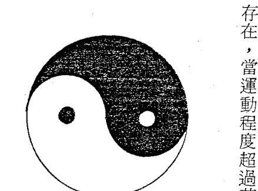

### 圖二～一

現代科學證明一切物質都是由帶正、負兩電荷的粒子所構成，分子與分子之間有一定的相對運動存在，當運動程度超過某種限制後，物質便崩潰，散發能量，能量的大小可由愛因斯坦的著名公式：E = M C² 求知，E 為能量、M 為物質的質量，C 為光速，由這個公式我們證明了一件事：能量與物質是一體的兩面，兩者可以互相轉換，好像盪鞦韆一般，盪到最高點時，會往回盪，反盪至最高點時，又會往回盪，能量與物質的關係也是這樣，根據這個想法來看太極圖（圖一一二），中間的 S 形曲線將圓分成黑白兩半，一陰一陽，陰陽之間的消長即呈 S 線的關係，至此，我們才了解古人的智慧何在！是筆者的話，一直線即可劃分陰陽了，何必拐彎抹角的，原來他含有擺動的觀念。

由於河圖的出現，給當朝的伏羲氏很多新觀念，而且古代的治國大計較簡單，所以他便到處走走，仰觀俯察，覺得天地間，林林總總形象萬千，觀天有晝夜之分；看月有陰晴圓缺；經年有春夏秋冬；看日有向背陰陽；人類有男女；鳥獸有雌雄……，大體上可歸納為陰陽兩類，於是他以一為陽，以二為陰，表示天地間萬事萬物皆可分為兩類，後來就稱為兩儀。這個陰陽的觀念歷經四千多年，經過現代科技的考驗，仍無法推翻陰陽的觀念，可說是伏羲先生的得意創見。

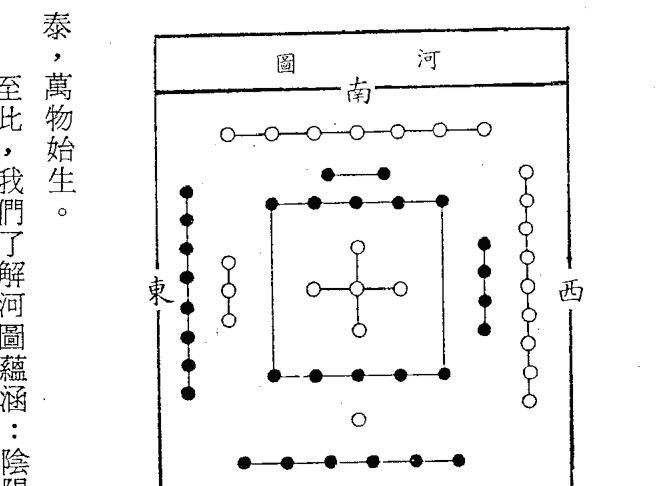

### 圖一～一

泰，萬物始生。
至此，我們了解河圖蘊涵：陰陽、五行、方向等的意義在內。
至於為何說中央土、西方金……呢？古代中國人以為地是平的，中國人住的是在中央的土地上，故說中央土，由中土望過去東方，一片草木扶疏，森林密佈，所以定義東方為木，望西方則是一片荒漠，風吹草低，充滿肅殺之氣，故說西方金，向南方走去，越來越熱，像是火烤一般，故以南方火表示，北方一片嚴寒，故用北方水來稱，而得到四方之五行屬性。

- 一六共宗，居北方水；
- 二七同道，居南方火；
- 三八為朋，居東方木；
- 四九作友，居西方金；
- 五十同途，居中央土；

這樣就將河圖賦予五行屬性與方位，各位可以看到每一組都是由一奇數和偶數組，單數為陽，偶數為陰，所以陰陽同組，代表陰陽合而數生的意思。
河圖以一至十的數字分佈四正位與中宮，聖人以十為基本數，以陽數為天數，陰數為地數，天生地成，陰陽交泰，萬物始生。

### 表一為八卦的屬性：

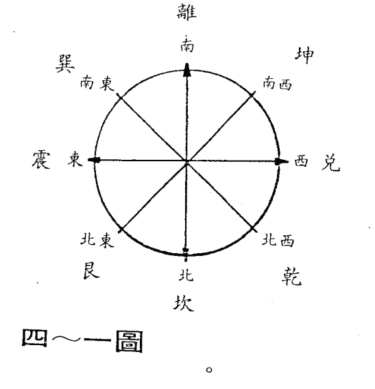

八卦的方位關係如（圖一～四）：若各位有學過二進位記數法，則可理解八卦的衍生方式

太极衍生图：一个树状图，展示了从‘太极’到‘兩儀’（陰、陽），再到‘四象’（太陰、少陰、少陽、太陽），最后到‘八卦’（坤、艮、坎、巽、震、離、兌、乾）的衍生过程。图的标题是‘三～一圖’。

著拐杖在地上塗塗劃劃的，他將兩根、三根陰陽的符號，層層疊疊，又發明了八卦，所以說：「太極生兩儀，兩儀生四象，四象生八卦」。在伏羲氏眼中，宇宙間共有八種自然現象，即：天地火水雷風山澤，他將八卦配合八種自然現象，而成了我們今日所知八卦在自然界的意義了。周文王時代，將八卦分別賦予名稱：乾為天，坤為地，震為雷，巽為風，坎為水，離為火，艮為山，兌為澤。用（圖一—三）表示八卦的衍生過程：

方位、五行等因素在内，以象征宇宙间的变化现象，有河图洛书的配合才有动态运的变化，所以河图洛书是命理学的源头。（图一～六）
曾风行一阵的魔术方块，灵感便来自洛书，其实洛书的纵横之和皆为十五，若您愿意也可自制一个洛书而纵横之和为另一个常数，但最小之和一定是十五，因此有很多事物都和十五这个数字有关。
有了河图、洛书的导引，与八卦的关系，便将这些要素纳入斗数命盘中，于是斗数命盘已包含八卦、方位、五行的关系在其中了。

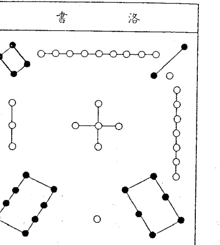

### 一 表

| 卦符 | 卦名 | 刚柔 | 事 | 人物 | 生物 | 身 | 性 | 行 | 时 |
|------|------|------|----|------|------|----|----|----|----|
| ☰ | 乾 | 刚 | 天 | 父 | 马 | 首 | 健 | 金 | 日 |
| ☷ | 坤 | 柔 | 地 | 母 | 牛 | 腹 | 顺 | 土 | 夜 |
| ☳ | 震 | 刚 | 雷 | 长男 | 龙 | 足 | 动 | 木 | 晨 |
| ☴ | 巽 | 柔 | 风 | 长女 | 鸡 | 股 | 入 | 木 | 上午 |
| ☵ | 坎 | 柔 | 水 | 中男 | 豕 | 耳 | 陷 | 水 | 夜午 |
| ☲ | 离 | 刚 | 火 | 中女 | 雉 | 目 | 丽 | 火 | 中午 |
| ☶ | 艮 | 柔 | 山 | 少男 | 狗 | 手 | 止 | 土 | 微曦 |
| ☱ | 兑 | 刚 | 泽 | 少女 | 羊 | 口 | 悦 | 金 | 黄昏 |

> 「戴九履一，左三右七，二四为肩，六八为足，五居中宫」

再来看看洛书，洛书的出现也是颇具神话色彩，相传大禹治水时，有一隻大乌龟于洛水负文呈瑞而于背九数，故曰：「戴九履一，左三右七，二四为肩，六八为足，五居中宫」（图一～五）是谓洛书九数。以单数居四正位，偶数居四隅位，纵横之和皆为十五，乃万世不变的数，配后天八卦：坎一坤二震三巽四乾六兑七艮八离九，缺一个五，中五也，然后分列在十二地支中，子坎，午离，卯震，酉兑为四正位，丑寅配艮，辰巳配巽，未申配坤，戌亥配乾，为四隅，隅角落之意。

## 第二章　飛星紫微斗數的科學理念

自有人類以來，莫不以探索自然、開發自然、利用自然等方式來改善人類生活，在此過程中而逐漸衍生各種學問，如：天文學、動力學、流體力學……等，但是預測人類未知的未來的技術始終不能衍生成為一門真正的學術，而停留在「巫術」的觀感中畸形發展，這是非常可惜的事，假如大家能夠以善意的正面對待未來預知術，相信能夠闡揚原創者的深意。

當然，造成今日未來預知術的地位低落的原因很多，但是，最主要的原因在於大家不了解其中的真正涵義，而有宿命的想法；在社會學家眼中，這是要不得的想法，將造成沉暮老化的社會，故以「巫術」、「怪力亂神」之詞相加，以為破除宿命觀的手段；再加上命理中人或獨家珍，或誤解命運之意，難以提出正確、健康而積極的詮釋。故在欠缺溝通的狀況下，更加深雙方認知之差距，使正宗命理學與迷信同歸一流，而使信的人愈信，反對的人愈反對，始終不能縮短兩者之認知差距，本文將

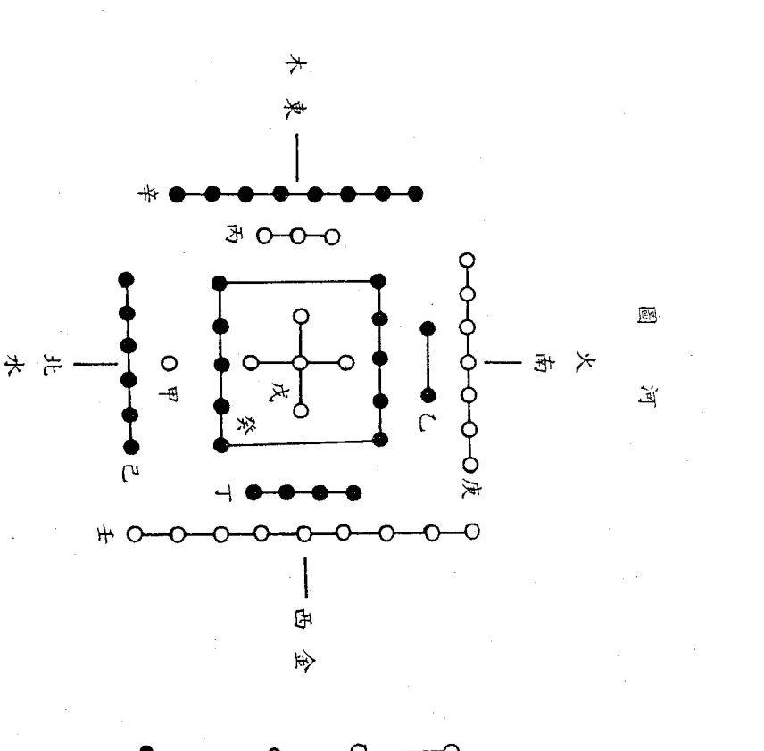

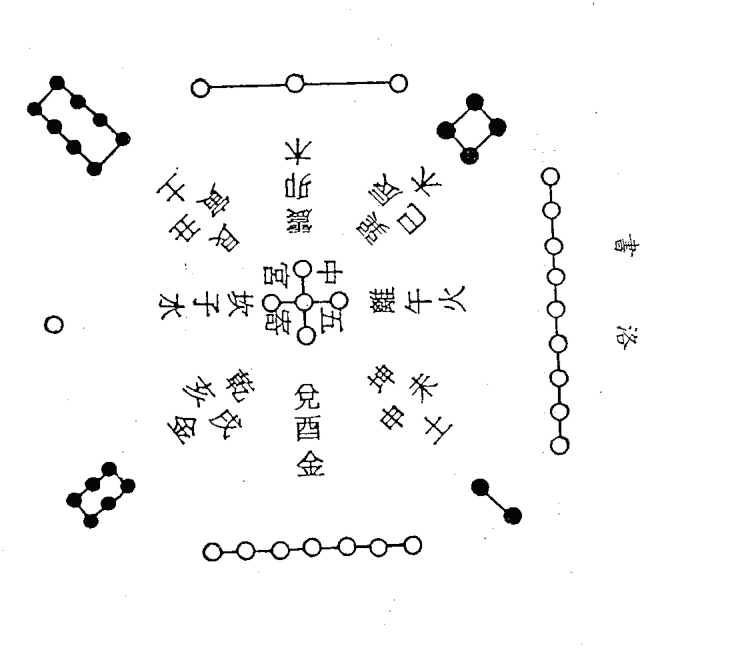以與「八字定終生，富貴由天定」相反的觀點來探討隱藏在中國命理學奇葩——飛星紫微斗數背後的科學理念，以建立大家正確認知態度。

曾從事過：市場行銷、色彩設計、領導統御、產品設計等工作的人便能理解他所面對是一個複雜而不可捉摸的對象——人心，要達到百分之百成功的機會不太可能，此時就會運用「揣摩」的技巧來分析對象之心理反應，相同的，我們在欣賞一首詩或研讀一篇文章時，也會揣摩作者的心態或其思考的角度，方能心領神會其中之深意，要研究飛星紫微斗數時，何不讓我們來揣摩揣摩創造斯術先賢的思慮？

現在假設我們要發展一套能正確預知未來的技術時，有那些前提條件必須知道？

1.  人生是由時間、空間、事件等三要素所組成的「一個」連續過程。如：今日此時，在家中，你在翻閱本書。
2.  時間無法人為控制，而空間可依個人意志隨時變換。
3.  人生中遭遇的事件可分成兩類：一是毫無前兆的突發事件。二是須積年累月之功夫產生的長效性事件，如：十載寒窗苦讀才成名。
4.  每個人都是在某種社會規範下，以自由狀態履行人生過程。
5.  事件之形成與出現之形態，會隨時間、空間而改變。
6.  事件有不同的嚴重性。

那麼在這些前提之下，要依據什麼「基準」去發展出一套能在「無因無果」的狀態下準確預測未來的技術？用身體特徵？用生辰八字？或其他的基準？

各位不知曾看別人弈棋嗎？假如你中途插入看棋，能否推知他上一步走那著棋？下步將走那著棋？相信沒幾人有這份把握。相同的觀點來看人生，就要知道要在前述的條件下發展出一套未來預知術是多麼地龐大複雜，西歐雖有完整的醫療制度以建立由生至死的記錄，但他們至今只能推測某個生時的人易患某種疾病，尚且欠缺其它事件的推理能力。

但是，中國人遠在一千餘年前的宋朝，在物質條件、輔助工具遠遜於今日的情況下，已發展出一套高精度的未來預知術，而且經過千餘年來時間、空間的更迭與考驗，至今仍保持原有精度，我們是該向古人高度創造力學習、致敬？還是視之為「巫術」棄之如敝履？

在飛星紫微斗數的開宗明義中，有句話：

> 斗數是賴「時」以立命，步地支，散十二宮之中立極，應「時間星辰」。
> 斗數是重「數」而立象，取天干，行四化之飛宮化曜，佈「空間垂象」。

又說：

> 四化是紫微斗數之用神，「用」者，乃體賴上為用，「神」者，生化變遷至無窮且莫測。而四化者，借「干」遁「星」，假「象」合「支」應「時」，玄化飛渡十二宮，以象明理，以星明物，休咎順理應數成局，以占人命。

俱已明明白白的指出人之命運是由：時間、空間、事件等三要素組成，用天干代表空間佈「空間垂象」，以地支代表時間，以星辰代表事件，應「時間星辰」，假如我們用一個三軸空間曲線來模擬人之運程（圖二——一），如圖中的A點代表此人在二十五歲（時間）時，在北部（空間）認識一位男（事件），

在這三個軸之中，時間因素是變化不可掌握的因素，而事件是固定的變動因素，只待時間、空間的關係配合得當便產生了，所以只有一個空間因素是可以人為掌握的，所以什麼叫「改運」呢？很簡單的一句話——改變環境。譬如：在某國投資由於當地民性懶惰，致使生產停頓，無法如期交貨，虧損累累，再做下去勢必難逃倒閉的命運，請問要如何「改運」呢？遷廠吧！這是改變環境以改運的淺顯事實，但是很令人納悶，為何還有人藉法術改運呢！到底對命運了解多少？

說到這裏有一件事須說明，前述之「空間」因素包含：物理的環境與內心的環境（心境），每一個人都有改變物理環境的生物本能，如：住宅附近太吵、太髒了，便會想換個清幽的住宅；有一部車朝你撞來便會跳閃躲開；前面有一疊鈔票便會前去拾起來。但是「心境」就不是如此的單純了，假設人生為一個充滿許多「決策點」的命運網（圖二——二），人們如同網中人一般，在其中努力邁進，每碰到一個決策點，他便考慮要走那個「方向」，學醫？學理工？買巧克力？還是買奶油的？創業？就職？嫁給他？嫁給我？……大大小小的決策太多了，但是，一定是以最有利於自己的條件下決定，每個人都自認為自己的決策「正確無誤」，但是，為什麼還是很多人犯錯？為什麼有些人才堪大任？……簡而言之，差別主要在心境，有的人素喜吸收新知、增廣見識；而有的人却玩物喪志，自滿於現狀，在心境上便有了差距，因此影響他對決策的品質，所以改運的第一要務在進修、深造，以變化心境，第二要務才是改變物理的環境，故真正的改運在「心物合一」而不是單純地「改變物理空間」，如孩子受劣友之影響而變壞要如何替他改運呢？替他換個交友的環境，若他還是維持以往的冶遊習性，亦必徒然無功，除非能由其內心徹底改變；相同的，推而廣之，要如何改變社會之風氣？用心理疏導，並配合物理方面引導而已，單用一項難奏功。

1.  天干：代表空間因素，如：工作場所、心境……等。
2.  地支：代表時間因素。
3.  星辰：代表事件或物體。
4.  四化：以天干使星辰變化，分成：化祿、化權、化科、化忌等，故稱四化，功能很特別。
5.  宮位：指命宮、兄弟宮、夫妻宮……等十二宮，亦主事件。三、四、五項無法截然劃分。

談到這裏已瞭解飛星紫微斗數的推理基礎是建立在：時間、空間、事件等三件要素之上，也已理解在斗數中所謂「改運」的意義了，接下來便要談談飛星紫微斗數創成過程中引用的科學理念。首先要了解飛星紫微斗數推理時所運用的符號：

綜合前述六種符號以表示「人、事、時、地、物」的關係，這是其它命理學所達不到的功能。

圖二—三是空白的紫微斗數命盤，已將十二地支印上了，為什麼只印地支而不印天干呢？因為地支是代表時間，為無法人為控制的變數，故先印上，再以「人命」配合時間而產生「運」。

（圖二—三）「空白命盤」。見前頁

前述的圖二—二是一個簡略的表達，在實際的人生現象上，並不能以單一的三軸座標代表，人事現象太複雜了，到底要如何分類呢？相信此問題曾困擾過先賢們，思考再三，決定以人事現象套合時間因素，亦即將人事現象分成十二類，即：命、兄弟、夫妻、子女、財帛、疾厄、遷移、交友、事業、田宅、福德、父母等十二宮位以配合十二地支，當然在安排次序亦費不少功夫（參考第三章），但是人事現象並不僅止於十二類而已，如何將更複雜的人事現象匯入十二宮之中？在此問題上，他們巧妙地運用「借宮」的觀念，如：事業的田宅宮（原疾厄宮）當做工廠或店面的宮位來看；因此可以涵蓋大部分的人生問題了。

到目前的階段，仍只是構築輪廓的工程而已，至於要如何掌握動態的「運」與靜態的「命」之間的關係？他們很聰明地採用以時間為區格的單位，亦即「命」底下再分成：大限（十年一格）、流年（一年一格）、流月（一月一格）等單位以推理動態的「運」（圖二—四），「運」累積起來即成「命」，類似數學「微分」「積分」的觀念。

### 圖二～三 飛星紫微斗數

| 火 東南 巽 | 火 南 離 | 土 南南西 | 金 西南 坤 |
| --- | --- | --- | --- |
| 巳（） | 午（） | 未（） | 申（） |
| 辰（） | 陰陽男女 年月日 時建生局 姓名： 歲 | 酉（） |  |
| 卯（） |  | 戌（） |  |
| 寅（） | 丑（） | 子（） | 亥（） |

> (圖二一四) 見前頁

每一個個人事現象都可自成立一個三軸的空間曲線，亦可如圖二一四般劃分成數段的「時段」來推演更精確的「運」(圖二一五)。

> (圖二一五) 見次頁

現在我們碰到幾個問題，請大家想想看要如何解決？

1.  人事現象中大部分並非獨立事件，例如：倒會事件一定和朋友、錢財有關，其間的關係要如何貫聯？其它的事件又當如何貫聯其間的側向關係？
2.  將十二人事現象區分不同時段的運，這些不同時段的運動勢之間的關係要如何縱向串聯？
3.  十二人事現象與不同時段的其它運動勢「相互」間的關係如何橫向貫聯？(參考圖二一五)

以今日統計學仍無法解決上述問題，相信這些問題一定使陳希夷祖師想白了頭髮，才頓悟出一套解決上述問題的方法——「天干四化」是也！

前已提及「天干」代表空間，此空間即指十二人事現象，如：交友宮干為甲，太陽化忌入我財帛宮，即指朋友與我錢財有了關係，再配合不同時段的「運」，便會產生吉凶現象(圖二一六)，亦即

天干四化的起飛與降落宮位會產生關係，如此便可解決前述的三個問題，有人冠以很神的名詞曰：「玄空四化」，若改成「懸空四化」會更傳神。

> (圖二一六) 見次二頁

### 圖二六 四化的運用一貫聯人事宮與運

### 圖二五 各别的運與人事現象

有些人純以星辰之名稱論吉凶，綜觀市面類似書籍有九成以上皆是此種論調，這些論點根本連飛星紫微斗數的入門檻在那兒皆未提及，但不可否認的，這些書籍的內容已深入民心，致使人人都不了解飛星紫微斗數的科學本質。

創造紫微斗數的人，思考、推理能力一定比你我都綿密、複雜，絕不會以「星名」來論吉凶，星辰的名稱對他們而言，只是符號而已，否則，時間、空間、事件等三要素構成的事實，純由宮內坐星的組合形態來論吉凶即可，如此的話，紫微斗數與其他相術有何優異之處？

若我們對道家的宇宙觀有所認識，便知道星性有更廣泛的定義，如以人身之小宇宙而言：四肢由何星代表？頭由何星代表？……亦有對應之星辰，各位可能會問：古代沒有汽車，怎知某星代表汽車？其寶，陳希夷等先賢早就了解因時間、空間的更迭對未來預知術的致命影響，所以在星性的定義上，他們採取「意象」式的定義，而不死硬地賦予星性對應事物，如：天機為軸，只有轉動的東西才有軸，故汽車可以用天機代表。同理，大樓的升降梯、工廠的輸送帶……皆可以天機代表，端視以何宮位來論事，所以雖然沿用了一千多年仍不失其原有之精度，因此請大家莫太執著於星辰的名稱。

再來我們看看「四化星」的「化」字意義，愛因斯坦著名公式E=MC²，表示「能量」與「質量」之間的關係，即能量（E）等於質量（M）乘以光速（C）的平方，各位若知道光速多快的話，就知道此能量（E）是多麼的巨大，所以廣島吃了一顆原子彈之後，便寂然無聲了；這個公式說明一件事——物質與能量是一體的兩面，兩者可以互相轉換，物質是個靜止狀態，不會對人產生吉凶的作用力，但轉變為能量時，便會放射出吉或凶的能量，產生巨大的影響力，陳希夷先生借用「質能互變」的觀念在他的「四化星」中。

但是，四化星到底要依那個變數而變呢？這也是問題，有的人乘船渡江，不幸船沉人溺；有的人上街閒逛，巧救調戲婦女、微服出遊的皇帝；有的人上茅房，誤踏朽木，嘆通！……太多的事件了，這些事件每個人都可能碰到，全賴時間、空間的配合，那麼要如何將事件與時間、空間的關係融匯在一起呢？時間因素是無法人為控制的，那麼就只有在空間因素中隱含事件的現象了，而用天干（因天干主空間）來控制四化星以使事件浮現，於是他便運用質能互變的觀念於四化星上，當星辰未被「化」到前，只是靜態的物質而已，無吉無凶，若被「化」到時，便放出吉或凶的能量，當大限、流年等層層能量加強至某種程度時，事件便顯象了。（圖二十七）

關於斗數四化取天干為由的說法，有另外一種的解釋：「地支之氣乃承天干之氣以造化參之，故天干者，乃象也。是斗數四化取天干之由，而不取地支之故。地支取三合法以應天地人三才而合而演占，以下人之命運隆替得失。唯支者由於干之氣，乃須加以四化見著其微，源於數象卦理，為斗數之始貌。」——摘錄自「欽天四化紫微斗數飛星秘儀」

### 圖二～七 化星與事件的關係

至此，我們了解四化星的兩層意義了，有了：時空觀念、四化星的觀念、星性的宇宙觀等基本認識，才能與陳希夷先生「靈電感應」，揣摩他心中的命理世界，進而一窺飛星紫微斗數的全豹。
至於其它，如：為什麼不「十二化」而用「四化」？……等等更深入的問題，留給有興趣的朋友去揣摩探討，筆者僅以探討飛星紫微數科學架構必須使用的觀念與符號，做一粗淺的解說而已，相信可澄清大家對斯術的誤解，並將研究斯術導入嶄新而正確的里程碑。

欲揣摩陳希夷祖師首創紫微斗數的心路歷程，不妨從當時的數理觀念、宇宙觀等著手，將會更了解飛星紫微斗數。

——作者——

## 第三章 認識命盤和十二人事宮

由第二章知道地支是代表時間因素，而時間是無法人為控制的，故第二章的圖二一三空白命盤中，已將地支印上了，代表地支是不可人為控制的因素，在方格的旁邊註有宮位五行，方位與卦位，這些東西都會對飛星柴微斗數的推演發生關係。

排命盤宜清晰，不可弄得污穢不堪，標記要明確，如此當你俯瞰命盤時才能將垂象的因果關係，清清晰晰地映入腦中，飛星紫微斗數注意全盤關係，而不是光靠某一宮的星性論吉凶，所以混雜不清的話，常會思維中斷，影響思維。

再來介紹十二人事宮，前章已提到十二宮是為了配合地支而硬予劃分，實際應用時，可採用借宮的方式來論斷，所以每一宮，並不單指人事名詞的現象而已。

-   一、命宮：代表一個人的個性、面貌、長相、本身命格高低等，側重在精神面。

| 數字 | 標籤 | 數字 | 標籤 |
|------|------|------|------|
| 9    | 業事 | 8    | 友交 |
| 7    | 移遷 | 6    | 厄疾 |
| 10   | 宅田 | 5    | 帛財 |
| 11   | 德福 | 4    | 女子 |
| 12   | 母父 | 1    | 命   |
| 2    | 弟兄 | 3    | 妻夫 |

### 一～三圖

一六共宗：命宮為1，疾厄為6，命宮代表人之精神、個性、命格等特性，而疾厄為一個人的形體軀殼，有了疾厄與精神才能構成一個完整的人。

二七同道：兄弟為2，遷移為7，家中兄弟多了，就會往外發展，當然就有遷移現象，到外地工作或搬家。

三八為朋：夫妻為3，交友為8，交的朋友中有男有女，女的就有可能成為太太，男的可能成為先生，有交友才有夫妻，符合現代人先友後婚的觀念。

四九作友：注意事業故四九作友。

財帛宮（5）看賺錢能力，賺錢了就要拿回家裏，供養大小，也說是拿回家裏去收藏，故田宅為

子女宮（4）事業為9，結婚了有家庭要養，就要做事業來供應妻女生活所需，有了子女大家會更

五十同途：子女為4，事業為9，結婚了有家庭要養，就要做事業來供應妻女生活所需，有了子女大家會更

-   二、兄弟宫：代表兄弟命格、手足之情，在社會上的人際關係與發展狀況。
-   三、夫妻宫：婚前看男女交友關係，婚後看夫妻感情生活，廣義的以感情宮看待，不應以狹義的夫妻宮看待。
-   四、子女宫：代表子女的命格、親子之情及本身之異性緣分或以外遇宮看待。
-   五、財帛宫：代表一個人的賺錢能力、賺錢的行業，亦為婚後的夫妻對待位。
-   六、疾厄宫：代表本身體質、健康、疾病部位，為災數位。
-   七、遷移宫：代表本身出外的際遇、對外關係、旅行運以及在社會中的發展情形。
-   八、交友宫：代表朋友、同事、部屬之間相處狀況。
-   九、官祿（事業）宮：代表運途狀態，如：求學運、事業運、官運等。
-   十、田宅宫：代表祖業、不動產、住宅環境、適合居住的環境或座向。
-   十一、福德宫：享受的位置或嗜好宮，看老年運又叫造化宮，可看一個人的安逸性，女性福德宮為婚姻善惡的重要宮位，不可忽略。
-   十二、父母宫：代表父母命格、與父母緣、上班者為上司緣、學生的老師緣等。

以上是基本的十二人事宮的含意，現在我們用第一章河圖的觀念來解釋十二宮的關係。首先我們假設有張命盤已填上十二人事宮（圖三一）以命宮填1，兄弟宮填2，夫妻宮填3：依此類推。

財帛的財庫位，田宅宮不美，守不住錢財，財帛宮為動態財運而田宅宮為收藏的靜態財。
十一與一同宗：即命宮和福德宮同等看待，要享福必須精神狀態允許才可安心享受。
十二與二同位：即父母宮和兄弟宮看做同位，有父母才有兄弟，且兄弟為父母的夫妻位，故是同位看待。
由此解說就了解陰陽和十二人事宮的關係了。例如：夫妻宮沖命宮，表示夫妻兩者之間精神上處不來，或看不慣對方的作風等現象，而非人說的沖「剋」，假如夫妻來沖身體（疾厄）表示兩者聚少離多，身體不常在一起之意，故要分清陰與陽的現象與宮位間的關係。

## 第四章 如何排命盤

命盤是紫微斗數推命的依據，一切推演的工作都在其上進行，因此，想藉紫微斗數探索未來的人，排命盤是必備的基本功夫。

排命盤時，必備的工具和資料：
1.  空白命盤(表四—一)。
2.  紅色、藍色原子筆各一支。
3.  性別及農曆出生年、月、日、時辰。（表四—二及表四—三）

然後依照下列九個步驟排命盤，以A小姐為例，她生於民國五十一（壬寅）年七月十二日午時。

-   一、定出命宮及其餘宮位

命盘共有十二格，以命宫为起黏，依顺时针方向，顺序将下列各宫填入：(一)命宫(二)父母宫(三)福德宫(四)田宅宫(五)事业宫(六)交友宫(七)迁移宫(八)疾厄宫(九)财帛宫(十)子女宫(十一)夫妻宫(十二)兄弟宫。命宫可查（表四－四）：A小姐为七月午时生，故命宫在「寅」。为使命宫易于辨认，请用红笔填写，其它各宫则用蓝笔。

### 二、定寅首

命盘中标记十二地支而已，必须将天干记入，填天干是以寅宫为起黏，根据出生年的天干决定寅宫的天干，故称为定「寅首」，如A小姐为「壬」寅年出生，故由（表四－五）中查出寅首为「壬」，其余各天干依顺时针方向填入。注意用红笔填写。由于十天干配十二地支，故子、丑、寅、卯四宫会重复，这是正确的。

### 三、求五行局

由命宫的干支查（表四－六）可得到五行局，如A小姐的命宫为「壬寅」，故为金四局。

### 四、求紫微星宫位

依五行局和生日找出紫微星所占的宫位（表四－七），A小姐生于十二日，金四局，故紫微星应在辰宫。

### 五、安紫微、天府系诸星

既知紫微星座宫，紫微、天府系诸星，皆可据此定出所占宫位（表四－八与表四－九），表中粗黑线框起部分，即为A小姐的紫府系星所占宫位。

### 六、安月系星

由出生月配合表（表四－十），查出月系星的宫位，A小姐的月系星所占宫位已如粗黑线框起部分所示。

### 七、安年干系星

年干系星是以出生年的天干决定其落入宫位（表四－十一），A小姐为「壬」寅年出生，故其年干系星所落宫位如黑框线圈起部分，其中化禄、化权、化科、化忌四化星，用红笔记入星宿的底下，如：天梁化禄、紫微化权、左辅化科、武曲化忌。

### 八、安时系诸星

### 九、安年支系星

依出生年地支決定其落入宮位，如「寅」年生，則紅鸞在丑，天喜在未，其它諸年支系星可依此定出其所佔的宮位。A小姐為王「寅」年午時出生，故她的時系星所佔宮位也如黑線圈起部分。（表四—十二）

### 十、填入大限

大限的順行、逆行，須先了解陽男、陰女、陰男、陽女的定義，區別陰陽完全依出生年的天干而定，A小姐為壬寅年出生，由（表四—十三）中知「壬」屬陽，故A小姐為陽女。大限記入的規則為：陽男陰女順行，陽女陰男逆行。由（表四—十四）中可求出大限的起止歲數和宮位。經過上述的手續，已可製作自己或親友的命盤，幫親友推演命運。A小姐的完成命盤如表四—十五。

### 命盤十二宮的意義

在命盤中共有十二空格，稱之為「宮」，分別標入「命宮」、「父母」、「福德」、……、「兄弟」等名稱，以表示人生中周遭的人、事、環境或關係，此十二宮的涵義如下：

-   一、命宮：代表自己的一切、命格高低、個性、長相、才能、職業適性等。
-   二、兄弟：代表兄弟姐妹間的情緣厚薄、手足的格局高低、運勢的好壞。
-   三、夫妻：可推斷配偶的長相、個性、夫妻感情好壞、事業良窳。
-   四、子女：代表子女的頑愚賢孝、親子間情分；又可表示自身的桃花運；若和人合夥的話，則以合夥人的宮位看待。
-   五、財帛：代表本身理財、賺錢能力、適合賺取何種行業的錢財；又可表示上班的地方。
-   六、疾厄：表示本身體質的強弱、健康狀態，與命宮配合判斷人之長相，又可代表上班的地方。
-   七、遷移：在外發展的際遇、外出運的吉凶都可在此宮顯示。
-   八、交友：代表本身人際關係及交友的好壞，部屬、朋友的助力強弱等。
-   九、事業：表示本身事業運的好壞、行業的適性、能不能創業等，學生可判斷學業的優劣。
-   十、田宅：表示不動產多寡、住宅環境、祖業、搬家等狀況，又叫家運宮。

### 常用名詞簡釋

- 十一、福德：代表精神狀態、享受能力、嗜好等，又稱造化宮。
- 十二、父母：與父母之關係，父母的吉凶或者代表師長、上司與我的相處情形。又名文書宮或相貌宮。
- 三合：命宮、財帛、事業等三個宮位謂之三合，如看父母則以父母宮為命宮，而與原命盤的子女、交友成三合的關係。
- 對宮：指本宮對面之宮，如本宮在子，則對宮在午。
- 本宮：指主事宮，若問夫妻，則以夫妻為本宮；若問交友，則以交友為本宮。
- 照與沖：凡吉星在對宮日照，而凶星曰沖。
- 鄰宮：指本宮前後之宮。如本宮在丑，則子寅為鄰宮。
- 坐：本宮內的星宿。如夫妻宮內有廉貞、七殺兩星，則說夫妻宮坐廉貞、七殺。
- 會：不管吉凶星，凡在三合宮位中皆與本宮有牽連，此種關係曰「會」。

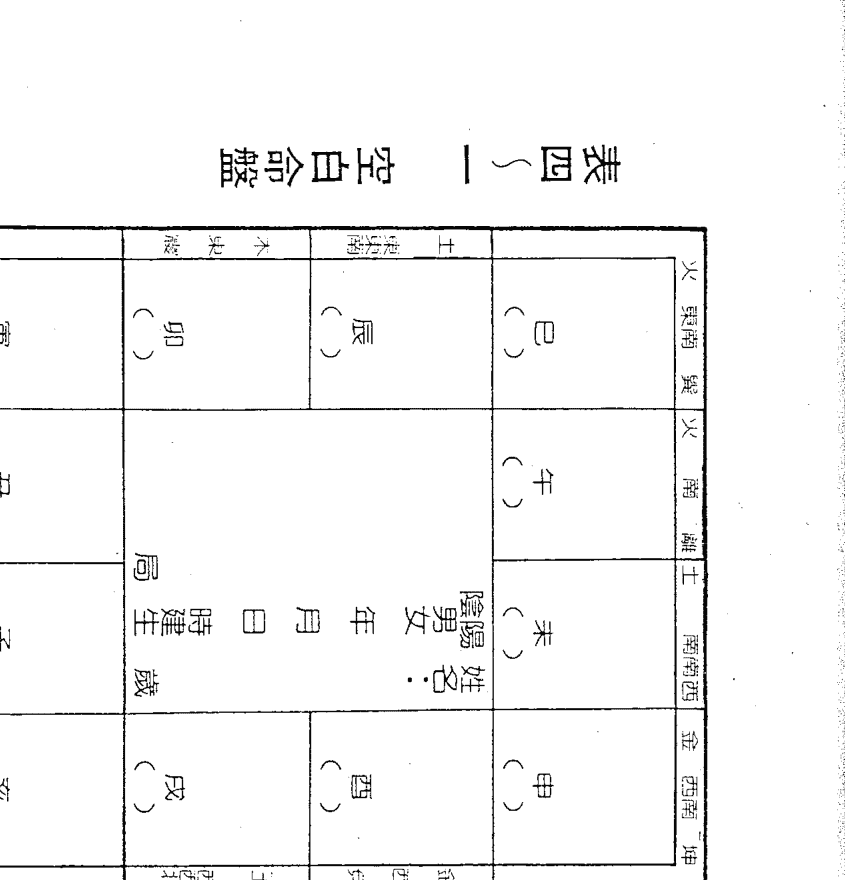

| 火 東南 巽 | 火 南 離 | 土 南南西 | 金 西南 坤 |
|------------|----------|-----------|------------|
| ( )        | ( )      | ( )       | ( )        |
| 巳 ( )     | 午 ( )   | 未 ( )    | 申 ( )     |
| ( )        | ( )      | ( )       | ( )        |
| 辰 ( )     | 卯 ( )   | 寅 ( )    | 丑 ( )     |
| 木 東北 艮 | 土 北北東 | 水 北 坎   | 水 西北 乾 |

| 民國 | 干支 | 年齡 | 干支 | 年齡 | 干支 | 年齡 | 干支 | 年齡 |
|------|------|------|------|------|------|------|------|------|
| 82   | 癸酉 | 81   | 壬申 | 80   | 辛未 | 79   | 庚午 | 78   |
| 77   | 己巳 | 76   | 戊辰 | 75   | 丁卯 | 74   | 丙寅 | 73   |
| 72   | 乙丑 | 71   | 甲子 | 70   | 癸亥 | 69   | 壬戌 | 68   |
| 67   | 辛酉 | 66   | 庚申 | 65   | 己未 | 64   | 戊午 | 63   |

### 首寅定 五-四表

| 戊 | 丁 | 丙 | 乙 | 甲 | 本生年干 |
| --- | --- | --- | --- | --- | --- |
| 癸 | 壬 | 辛 | 庚 | 己 | 十二宫 |
| 甲 | 壬 | 庚 | 戊 | 丙 | 寅 |
| 乙 | 癸 | 辛 | 己 | 丁 | 卯 |
| 丙 | 甲 | 壬 | 庚 | 戊 | 辰 |
| 丁 | 乙 | 癸 | 辛 | 己 | 巳 |
| 戊 | 丙 | 甲 | 壬 | 庚 | 午 |
| 己 | 丁 | 乙 | 癸 | 辛 | 未 |
| 庚 | 戊 | 丙 | 甲 | 壬 | 申 |
| 辛 | 己 | 丁 | 乙 | 癸 | 酉 |
| 壬 | 庚 | 戊 | 丙 | 甲 | 戌 |
| 癸 | 辛 | 己 | 丁 | 乙 | 亥 |
| 甲 | 壬 | 庚 | 戊 | 丙 | 子 |
| 乙 | 癸 | 辛 | 己 | 丁 | 丑 |

### 宫命安 四-四表

| 十 | 十 | 九 | 八 | 七 | 六 | 五 | 四 | 三 | 二 | 正 | 生月 命身 生时 |
| --- | --- | --- | --- | --- | --- | --- | --- | --- | --- | --- | --- |
| 丑 | 子 | 亥 | 戌 | 酉 | 申 | 未 | 午 | 巳 | 辰 | 卯 | 命 身 |
| 子 | 亥 | 戌 | 酉 | 申 | 未 | 午 | 巳 | 辰 | 卯 | 寅 | 命 身 |
| 丑 | 子 | 亥 | 戌 | 酉 | 申 | 未 | 午 | 巳 | 辰 | 卯 | 命 身 |
| 寅 | 丑 | 子 | 亥 | 戌 | 酉 | 申 | 未 | 午 | 巳 | 辰 | 命 身 |
| 亥 | 戌 | 酉 | 申 | 未 | 午 | 巳 | 辰 | 卯 | 寅 | 丑 | 命 身 |
| 戌 | 酉 | 申 | 未 | 午 | 巳 | 辰 | 卯 | 寅 | 丑 | 子 | 命 身 |
| 酉 | 申 | 未 | 午 | 巳 | 辰 | 卯 | 寅 | 丑 | 子 | 亥 | 命 身 |
| 申 | 未 | 午 | 巳 | 辰 | 卯 | 寅 | 丑 | 子 | 亥 | 戌 | 命 身 |
| 未 | 午 | 巳 | 辰 | 卯 | 寅 | 丑 | 子 | 亥 | 戌 | 酉 | 命 身 |
| 午 | 巳 | 辰 | 卯 | 寅 | 丑 | 子 | 亥 | 戌 | 酉 | 申 | 命 身 |
| 巳 | 辰 | 卯 | 寅 | 丑 | 子 | 亥 | 戌 | 酉 | 申 | 未 | 命 身 |
| 辰 | 卯 | 寅 | 丑 | 子 | 亥 | 戌 | 酉 | 申 | 未 | 午 | 命 身 |
| 卯 | 寅 | 丑 | 子 | 亥 | 戌 | 酉 | 申 | 未 | 午 | 巳 | 命 身 |
| 寅 | 丑 | 子 | 亥 | 戌 | 酉 | 申 | 未 | 午 | 巳 | 辰 | 命 身 |
| 丑 | 子 | 亥 | 戌 | 酉 | 申 | 未 | 午 | 巳 | 辰 | 卯 | 命 身 |
| 子 | 亥 | 戌 | 酉 | 申 | 未 | 午 | 巳 | 辰 | 卯 | 寅 | 命 身 |

### 表四～三 时辰换算表

| 时间 | 前日子时 |
| --- | --- |
| 12:00 - 1:00 | 前日子时 |
| 1:00 - 3:00 | 丑 |
| 3:00 - 5:00 | 寅 |
| 5:00 - 7:00 | 卯 |
| 7:00 - 9:00 | 辰 |
| 9:00 - 11:00 | 巳 |
| 11:00 - 13:00 | 午 |
| 13:00 - 15:00 | 未 |
| 15:00 - 17:00 | 申 |
| 17:00 - 19:00 | 酉 |
| 19:00 - 21:00 | 戌 |
| 21:00 - 23:00 | 亥 |
| 23:00 - 24:00 | 当日子时 |

### 表見速星微紫 七一四表

| 水 | 金 | 土 | 火 | 木 | 五行 |
|---|---|---|---|---|---|
| 丑 | 亥 | 午 | 酉 | 辰 | 1 |
| 寅 | 辰 | 亥 | 午 | 丑 | 2 |
| 寅 | 丑 | 辰 | 亥 | 寅 | 3 |
| 卯 | 寅 | 丑 | 辰 | 巳 | 4 |
| 卯 | 子 | 寅 | 丑 | 寅 | 5 |
| 辰 | 巳 | 未 | 寅 | 卯 | 6 |
| 辰 | 寅 | 子 | 戌 | 午 | 7 |
| 巳 | 卯 | 已 | 未 | 卯 | 8 |
| 巳 | 丑 | 寅 | 子 | 辰 | 9 |
| 午 | 午 | 卯 | 已 | 未 | 10 |
| 午 | 卯 | 申 | 寅 | 辰 | 11 |
| 未 | 辰 | 丑 | 卯 | 已 | 12 |
| 未 | 寅 | 午 | 亥 | 申 | 13 |
| 申 | 未 | 卵 | 申 | 已 | 14 |
| 申 | 辰 | 辰 | 丑 | 午 | 15 |
| 酉 | 已 | 酉 | 午 | 酉 | 16 |
| 酉 | 卯 | 寅 | 卯 | 午 | 17 |
| 戌 | 申 | 未 | 辰 | 未 | 18 |
| 戌 | 已 | 辰 | 子 | 戌 | 19 |
| 亥 | 午 | 已 | 酉 | 未 | 20 |
| 亥 | 辰 | 戌 | 寅 | 申 | 21 |
| 子 | 酉 | 卵 | 未 | 亥 | 22 |
| 子 | 午 | 申 | 辰 | 申 | 23 |
| 丑 | 未 | 已 | 已 | 酉 | 24 |
| 丑 | 已 | 午 | 丑 | 子 | 25 |
| 寅 | 戌 | 亥 | 戌 | 酉 | 26 |
| 寅 | 未 | 辰 | 卵 | 戌 | 27 |
| 卵 | 申 | 酉 | 申 | 丑 | 28 |
| 卵 | 午 | 午 | 已 | 戌 | 29 |
| 辰 | 亥 | 未 | 午 | 亥 | 30 |

### 表見速局行五 六一四表

| 壬 癸 | 庚 辛 | 戊 己 | 丙 丁 | 甲 乙 | 干命 支宫 |
|---|---|---|---|---|---|
| 木 三 | 土 五 | 火 六 | 水 二 | 金 四 | 子 丑 |
| 金 四 | 木 三 | 土 五 | 火 六 | 水 二 | 寅 卯 |
| 水 二 | 金 四 | 木 三 | 土 五 | 火 六 | 辰 巳 |
| 木 三 | 土 五 | 火 六 | 水 二 | 金 四 | 午 未 |
| 金 四 | 木 三 | 土 五 | 火 六 | 水 二 | 申 酉 |
| 水 二 | 金 四 | 木 三 | 土 五 | 火 六 | 戌 亥 |

### 表見速星系府天 九 - 四表

| 破軍 | 七殺 | 天梁 | 天相 | 巨門 | 貪狼 | 太陰 | 天府星 |
|------|------|------|------|------|------|------|--------|
| 戌   | 午   | 巳   | 辰   | 卯   | 寅   | 丑   | 子     |
| 亥   | 未   | 午   | 巳   | 辰   | 卯   | 寅   | 丑     |
| 子   | 申   | 未   | 午   | 巳   | 辰   | 卯   | 寅     |
| 丑   | 酉   | 申   | 未   | 午   | 巳   | 辰   | 卯     |
| 寅   | 戌   | 酉   | 申   | 未   | 午   | 巳   | 辰     |
| 卯   | 亥   | 戌   | 酉   | 申   | 未   | 午   | 巳     |
| 辰   | 子   | 亥   | 戌   | 酉   | 申   | 未   | 午     |
| 巳   | 丑   | 子   | 亥   | 戌   | 酉   | 申   | 未     |
| 午   | 寅   | 丑   | 子   | 亥   | 戌   | 酉   | 申     |
| 未   | 卯   | 寅   | 丑   | 子   | 亥   | 戌   | 酉     |
| 申   | 辰   | 卯   | 寅   | 丑   | 子   | 亥   | 戌     |
| 酉   | 巳   | 辰   | 卯   | 寅   | 丑   | 子   | 亥     |

### 表見速星系微紫 八 - 四表

| 天府 | 廉貞 | 天同 | 武曲 | 太陽 | 天機 | 紫微星 |
|------|------|------|------|------|------|--------|
| 辰   | 辰   | 未   | 申   | 酉   | 亥   | 子     |
| 卯   | 巳   | 申   | 酉   | 戌   | 子   | 丑     |
| 寅   | 午   | 酉   | 戌   | 亥   | 丑   | 寅     |
| 丑   | 未   | 戌   | 亥   | 子   | 寅   | 卯     |
| 子   | 申   | 亥   | 子   | 丑   | 卯   | 辰     |
| 亥   | 酉   | 子   | 丑   | 寅   | 辰   | 巳     |
| 戌   | 戌   | 丑   | 寅   | 卯   | 巳   | 午     |
| 酉   | 亥   | 寅   | 卯   | 辰   | 午   | 未     |
| 申   | 子   | 卯   | 辰   | 巳   | 未   | 申     |
| 未   | 丑   | 辰   | 巳   | 午   | 申   | 酉     |
| 午   | 寅   | 巳   | 午   | 未   | 酉   | 戌     |
| 巳   | 卯   | 午   | 未   | 申   | 戌   | 亥     |

### 表四～十一 年干系星速見表

| 化忌 | 化科 | 化權 | 化祿 | 天鉞 | 天魁 | 陀羅 | 擎羊 | 祿存 | 星級 諸星 年干 |
|---|---|---|---|---|---|---|---|---|---|
| 太陽 | 武曲 | 破軍 | 廉貞 | 未 | 丑 | 丑 | 卯 | 寅 | 甲 |
| 太陰 | 紫微 | 天梁 | 天機 | 申 | 子 | 寅 | 辰 | 卯 | 乙 |
| 廉貞 | 文昌 | 天機 | 天同 | 酉 | 亥 | 辰 | 午 | 巳 | 丙 |
| 巨門 | 天機 | 天同 | 太陰 | 酉 | 亥 | 巳 | 未 | 午 | 丁 |
| 天機 | 右弼 | 太陰 | 貪狼 | 未 | 丑 | 辰 | 午 | 巳 | 戊 |
| 文曲 | 天梁 | 貪狼 | 武曲 | 申 | 子 | 巳 | 未 | 午 | 己 |
| 天同 | 太陰 | 武曲 | 太陽 | 未 | 丑 | 未 | 酉 | 申 | 庚 |
| 文昌 | 文曲 | 太陽 | 巨門 | 寅 | 午 | 申 | 戌 | 酉 | 辛 |
| 武曲 | 左輔 | 紫微 | 天梁 | 巳 | 卯 | 戌 | 子 | 亥 | 壬 |
| 貪狼 | 太陰 | 巨門 | 破軍 | 巳 | 卯 | 亥 | 丑 | 子 | 癸 |

### 表見速星系月 十－四表

| 陰煞 | 右弼 | 左輔 | 天刑 | 天姚 | 星 月生 |
|---|---|---|---|---|---|
| 寅 | 戌 | 辰 | 酉 | 丑 | 一月 |
| 子 | 酉 | 巳 | 戌 | 寅 | 二月 |
| 戌 | 申 | 午 | 亥 | 卯 | 三月 |
| 申 | 未 | 未 | 子 | 辰 | 四月 |
| 午 | 午 | 申 | 丑 | 巳 | 五月 |
| 辰 | 巳 | 酉 | 寅 | 午 | 六月 |
| 寅 | 辰 | 戌 | 卯 | 未 | 七月 |
| 子 | 卯 | 亥 | 辰 | 申 | 八月 |
| 戌 | 寅 | 子 | 巳 | 酉 | 九月 |
| 申 | 丑 | 丑 | 午 | 戌 | 十月 |
| 午 | 子 | 寅 | 未 | 亥 | 十一月 |
| 辰 | 亥 | 卯 | 申 | 子 | 十二月 |

| 陰男、陰女 | 陽男、陽女 |
| :---: | :---: |
| 乙 | 甲 |
| 丁 | 丙 |
| 己 | 戊 |
| 辛 | 庚 |
| 癸 | 壬 |

### 表見速星系時安 二十一四表

| 寅午戌 | 申子辰 | 巳酉丑 | 亥卯未 | | 生年支 |
| :---: | :---: | :---: | :---: | :---: | :---: |
| 鈴火星星 | 鈴火星星 | 鈴火星星 | 鈴火星星 | 地天劫空 | 文文昌曲 |
| 卯丑辰寅 | 戊寅亥卯 | 戊卯亥辰 | 戊酉亥戌 | 亥亥子戌 | 戊辰酉巳 |
| 巳卯午辰 | 子辰丑巳 | 子巳丑午 | 子亥丑子 | 丑酉寅申 | 申午未未 |
| 未巳申午 | 寅午卯未 | 寅未卯申 | 寅丑卯寅 | 卯未辰午 | 午申巳酉 |
| **酉未戌申** | 辰申巳酉 | 辰酉巳戌 | 辰卯巳辰 | 已已午辰 | 辰戊卯亥 |
| 亥酉子戌 | 午戌未亥 | 午亥未子 | 午巳未午 | 未卯申寅 | 寅子丑丑 |
| 丑亥寅子 | 申子酉丑 | 申丑酉寅 | 申未酉申 | 酉丑戌子 | 子寅亥卯 |

### 盤命成完的姐小A 五十～四表

| 火 東南 巽 | 火 南 離 | 土 南南西 | 金 西南 坤 |
|---|---|---|---|
| 天地天 梁鉞劫空 （祿） | 七殺 | 天火 姚星 | 廉貞 |
| 已 乙（宅田） | 午 丙（業事） | 未 丁（友交） | 申 戊（移達） |
| 74-83 | 64-73 | | |
| 紫天右文 微相弼昌 （權） | 鈴星 | | |
| 土 東東南 辰 甲（德福） | 姓名： 壬寅年七月十二日午時建生 陰陽男女 金四局 24歲 | 54-63 酉 己（厄疾） | |
| 天巨天天 機門魁刑 | 陀左文 羅輔曲 （科） | | |
| 木 東震 卯 癸（母父） | 44-53 戌 庚（帛財） | | |
| 貪狼 | 太太 陽陰 | 武天擎 曲府羊 （忌） | 天祿 同存 |
| 4-13 寅 壬（命） | 14-23 丑 癸（弟兄） | 24-33 子 壬（妻夫） | 34-43 亥 辛（女子） |

姓名： 壬寅年七月十二日午時建生 陰陽男女 金四局 24歲

### 表見速限大 四十～四表

| 父 母 | 福 德 | 田 宅 | 官 祿 | 奴 僕 | 遷 移 | 疾 厄 | 財 帛 | 子 女 | 夫 妻 | 兄 弟 | 命 宮 | 大限 陰陽 女男 | 五行局 |
|---|---|---|---|---|---|---|---|---|---|---|---|---|---|
| 12-21 | 22-31 | 32-41 | 42-51 | 52-61 | 62-71 | 72-81 | 82-91 | 92-101 | 102-111 | 112-121 | 2-11 | 陰女 陽男 | 水二局 |
| 112-121 | 102-111 | 92-101 | 82-91 | 72-81 | 62-71 | 52-61 | 42-51 | 32-41 | 22-31 | 12-21 | 2-11 | 陽女 陰男 | 水二局 |
| 13-22 | 23-32 | 33-42 | 43-52 | 53-62 | 63-72 | 73-82 | 83-92 | 93-102 | 103-112 | 113-122 | 3-12 | 陰女 陽男 | 木三局 |
| 113-122 | 103-112 | 93-102 | 83-92 | 73-82 | 63-72 | 53-62 | 43-52 | 33-42 | 23-32 | 13-22 | 3-12 | 陽女 陰男 | 木三局 |
| 14-23 | 24-33 | 34-43 | 44-53 | 54-63 | 64-73 | 74-83 | 84-93 | 94-103 | 104-113 | 114-123 | 4-13 | 陰女 陽男 | 金四局 |
| 114-123 | 104-113 | 94-103 | 84-93 | 74-83 | 64-73 | 54-63 | 44-53 | 34-43 | 24-33 | 14-23 | 4-13 | 陽女 陰男 | 金四局 |
| 15-24 | 25-34 | 35-44 | 45-54 | 55-64 | 65-74 | 75-84 | 85-94 | 95-104 | 105-114 | 115-124 | 5-14 | 陰女 陽男 | 土五局 |
| 115-124 | 105-114 | 95-104 | 85-94 | 75-84 | 65-74 | 55-64 | 45-54 | 35-44 | 25-34 | 15-24 | 5-14 | 陽女 陰男 | 土五局 |
| 16-25 | 26-35 | 36-45 | 46-55 | 56-65 | 66-75 | 76-85 | 86-95 | 96-105 | 106-115 | 116-125 | 6-15 | 陰女 陽男 | 火六局 |
| 116-125 | 106-115 | 96-105 | 86-95 | 76-85 | 66-75 | 56-65 | 46-55 | 36-45 | 26-35 | 16-25 | 6-15 | 陽女 陰男 | 火六局 |

## 第五章 星性诠义与赋文

飞星紫微斗数中常用的星宿有三十二颗，各有不同的性质和五行属性，又由第二章知道星性与地球上万物皆有对应的关系，所以论星性是非常广泛的，但本书侧重人事现象分析，故仅以狭义的范围来讨论星性。

谈星性最透彻的当推「诸星问答」，陈希夷和白玉蟾两位老先生一唱一和，将人事现象的星义，解释得非常清楚，是入门者必读之文章，另外笔者亦加注其它的见解。

### 一、星性诠义

星性是学习紫微斗数过程中一项很重要的过程，读者宜熟悉之：

| 诸星 / 年支 | 子 | 丑 | 寅 | 卯 | 辰 | 巳 | 午 | 未 | 申 | 酉 | 戌 | 亥 |
| :---: | :---: | :---: | :---: | :---: | :---: | :---: | :---: | :---: | :---: | :---: | :---: | :---: |
| 天马 | 寅 | 亥 | 申 | 巳 | 寅 | 亥 | 申 | 巳 | 寅 | 亥 | 申 | 巳 |
| 龙池 | 辰 | 巳 | 午 | 未 | 申 | 酉 | 戌 | 亥 | 子 | 丑 | 寅 | 卯 |
| 凤阁 | 戌 | 酉 | 申 | 未 | 午 | 巳 | 辰 | 卯 | 寅 | 丑 | 子 | 亥 |
| 红鸾 | 卯 | 寅 | 丑 | 子 | 亥 | 戌 | 酉 | 申 | 未 | 午 | 巳 | 辰 |
| 天喜 | 酉 | 申 | 未 | 午 | 巳 | 辰 | 卯 | 寅 | 丑 | 子 | 亥 | 戌 |

#### 年支系星速见表 六十～四

#### 1. 紫微星：己土，属阴

问紫微所主如何。答曰：紫微属土，迺中天之尊星。为帝座，主掌造化之枢机，人生之主宰。仗五行育万物，以人命为立定数，安星躔各根所司。处年数内，常掌爵禄。诸宫降福，能消百恶，须看三台。盖紫微守命是中台，前一位是上台，后一位是下台。俱看在庙旺之乡否？有吉凶之守照，如庙旺化吉甚妙。陷又化凶甚凶。吉限不为美，凶限则凶也。人之身命若得禄存同宫，日月三合相照，贵不可言。无辅弼同行则为孤君，虽美玉不足。更与诸杀同宫，或诸吉合照，君子在野，小人在位。主人奸诈假善，平生恶积，与囚同居，无左右相佐，定为胥吏。如落疾厄，兄弟奴仆，四陷宫，主人劳碌作事无成，虽得助亦不为福。更宜详细宫度，应究星躔之论。若居官禄身命三宫，最要左右守卫。天相禄马交驰，不落空亡，更坐生乡，可谓贵论。如魁钺三台会吉星，则三台八座矣。帝会文昌拱照，又得美限扶，必文选之职。帝降七杀为权，有吉同位，则帝相有气，诸吉咸集，作武官之职。财帛田宅，有左右守卫，又与太阴武曲同度，不见恶星，必为财赋之官。更与武曲禄存同宫，身命中尤为奇特。男女宫得祥佐，吉星主生贵子。若独守无相佐，则子息孤单。妻宫会吉，男女得贵美，夫妇偕老。亦要无破杀。迁移虽是强宫，更要相佐，有吉星照命，则因人之贵。福德男为陷地，女为庙乐，逢吉则吉，逢凶则凶。希夷先生曰：紫微为帝座，在诸宫能降福消灾，解诸星之恶虐，能制火铃为善，能降七杀为权。若得府相，左右昌曲吉集，无有不贵。不然亦主巨富。纵有四杀冲破，亦作中局。若遇破军，在辰戌丑未，主为臣不忠，为子不孝之论。女命逢之作贵妇断，加杀冲破亦作平常，不为下贱。

> 【歌曰】
紫微原属土，官禄宫主星，有相为有用，无相为孤君。诸宫皆降福，逢凶福自申。文昌发科甲，文曲受皇恩。僧道有师号，快乐度春秋。众星皆拱照，为吏协公平。女人会帝座，遇吉事贵人。若与桃花会，飘荡落风尘。擎羊火铃聚，鼠窃狗偷群。三方有吉拱，方作贵人评。若还无辅弼，诸恶共欺凌。帝为无道主，考究要知因。二限若遇帝，喜气自然新。

玉蟾先生曰：紫微乃中天星主，为众星之枢纽。为造化也，大抵为人命之主宰，掌五行，育万物，各有所司。以禄马为掌爵之司，以天府为帑藏之主。身命逢之不胜其吉，如遇四杀（羊陀火铃），劫空机梁冲破，定是僧道。此星在命，为人厚道，面紫色，专作吉断。

追注：
(1) 入六亲宫不利，主人易空虚，缘薄；在父母宫为人势利眼，擅高攀；在交友宫，擅逢迎。
(2) 与天相、天梁、天同、贪狼同为五福寿星，福寿星坐命者，不发少年人，中年后兴盛。
(3) 于物而言，为精密或不实用的精美饰物，如：钟錶、古董、装饰品等。

#### 2. 天机星：乙木，属阴

问天机星，所主如何。答曰：天机属木，南斗第六监簿之善星也。化气曰善，得地合之行事，解诸星之顺逆，定数于人，命逢诸吉咸集，则万事皆善。勤于礼佛，敬乎六亲，利于林泉，宜于僧道。无恶虑不仁之心，有灵机应变之志。渊鱼察见，作事有方。女命遇之为福，遇凶为凶。或守于身，更逢天梁，必有高艺随身，习者宜详玩之。希夷先生曰：天机监簿之星，若守身命主人异常，与天梁左右昌曲交会，文为清显，武为忠良。若居陷地，四杀冲破，是为下局。若见七煞天梁，常为僧道之清闲。凡人二限逢之与家创业更改。女人吉星拱照，主旺夫益子。有权禄则为贵妇。落局羊陀火忌冲破，主下贱残疾刑克。

> 【歌曰】
天机南斗善星，故化气曰善。佐帝令以行事，解诸凶之逆节。定数于人命之中，若逢吉聚则富贵。若逢冲杀亦必好善，孝义六亲勤于礼佛。无不仁不义之为，有灵通变达之志。女命逢之多主福寿，其在庙旺有力陷地无力。
天机兄弟主，南斗正曜星。作事有操略，禀性最高明。所为最好尚，亦可作群英。会吉主享福，入格居翰林。巨门同一位，武职压边庭。亦要权逢杀，方可立功名。天梁星同位，定作道与僧。女人若逢此，性巧必淫奔。天同与昌曲，聚拱主华荣。辰戌子午地，入庙有功名。若在寅卯辰，七杀并破军。血光灾不测。羊陀及火铃，若与诸杀会，灾患有虚惊。武暗廉破会。两眼少光明。二限临此宿，事必有变更。

追注：
- (1) 易见异思迁，不易实践交代之工作。
- (2) 为驿马星，与太阴、天马同宫，具强烈变迁运，有远行的机会。
- (3) 适合：企划家、设计师。
- (4) 为转动之物，如：车辆、工厂之车床、小铁道。
- (5) 代表矮小的树丛、灌木类。

#### 3. 太阳星：丙火，属阳

问太阳星所主如何。答曰：太阳星属火，日之精也。乃造化之表仪。在数主人有贵气，能为文为武。诸吉集则降祯祥，处黑星则劳心费力。若随身命之中，居于庙乐之地，为数中之至曜，乃官禄之枢机。后化贵化禄，最宜在官禄宫，男作父星，女为夫主。命逢诸吉守照，更得太阴同照，富贵全美。若身居之逢吉聚，则可在贵人门下客，否则公卿走卒。夫妻亦为弱宫，男为诸吉聚，可因妻得贵。陷地加杀伤妻不吉。男女宫得八座，加吉星在庙旺地，主生贵子，权柄不少。若财帛宫于旺地，会吉...

> 【歌曰】
太阳原属火，正主官禄星。若居身命位，禀性最聪明。慈爱量宽大，福寿享遐龄。若与太阴会，骤发贵无伦。有辉照身命，平步入金门。巨门不相犯，升殿承君恩。偏垣逢暗度，贫贱不可言。男必克父，女命夫不全。火铃若逢，定羊陀眼目昏。二限若值此，必定卖田园。玉蟾先生曰：太阳司权贵为文，遇天刑为武。偏垣逢暗度，贫贱不可言。在午为日丽中天，主大富贵。在未申为偏坦，做事先勤后惰。在酉为西没，贵而不显、秀而不实。在戊亥子为失辉，更逢巨暗破军，一生劳碌贫忙，更主眼目有伤，与人寡合招非。女命逢之夫星不美，遇耗则非礼成婚。若四杀居已亥为陷，残疾孤剋。女人逢杀冲破，刑夫剋子。梁月冲破，宜作偏房。僧道宜之主享福。

追注：
(1) 为人个性温和、好享乐、无大抱负，宜女命，但子午宫另论。煞星同宫亦另论。
(2) 适合「师」级的服务业，或带有服务慈善性质的行业。
(3) 于物主水沟、装饰品、自来水系统。又为小吃店、服饰行、百货公司。
(4) 于人体为排泄系统。

#### 4. 廉贞星：丁火，属阴

问廉贞所主若何。答曰：廉贞属火，北斗第五星也。在斗司品秩，在数司权令。不临庙旺，更犯官府，故曰化囚，为杀触之不可解其祸，逢之不可测其祥。主人心狠性狂，不习礼仪。逢帝座执威权，遇禄存主富贵。遇文昌好礼乐，遇杀曜显武职，在官禄有威权。在身命为次桃花。若居旺宫，则睹博迷花而致讼。与巨门交会于陷地，则是非起于官司。逢财星耗合祖业必破，遇刑忌则脓血不免。遇白虎则刑杖难逃。遇武曲于受制之乡，恐木压蛇伤。同火曜于陷空之地，主投河自缢。破军与日月以济行，目疾不免。限逢至此，灾不可揆。只宜官禄身命之位，遇吉福映，逢凶则不慈，在他宫祸福宜凶同度。十二宫中皆为福论，遇左右昌梁贵显。喜壬乙生人已亥得地，不宜六庚生人，终身不守。会四杀居已亥为陷，残疾孤剋。女人逢杀冲破，刑夫剋子。梁月冲破，宜作偏房。僧道宜之主享福。

> 【歌曰】
廉贞已亥宫，遇吉福盈丰，应过三旬后，须逢不善终。

追注：
(1) 为人个性温和、好享乐、无大抱负，宜女命，但子午宫另论。煞星同宫亦另论。
(2) 适合「师」级的服务业，或带有服务慈善性质的行业。
(3) 于物主水沟、装饰品、自来水系统。又为小吃店、服饰行、百货公司。
(4) 于人体为排泄系统。

#### 5. 天同星：壬水，属阳

问天同星所主如何。答曰：天同星属水，南斗第四星也。为福德宫之主宰，后云化福。最喜遇吉曜，助福添祥。为人廉洁，貌禀清奇，有机枢无亢激，不怕七杀相侵，不怕诸杀同缠。限若逢之一，一生得地，十二宫中皆曰福，无破定为祥。希夷先生曰：天同南斗益保算生之星，化禄为善，逢吉为祥。身命值之，主为人谦逊，禀性温和。心慈鲠直，文墨精通。有奇志无凶激，不忌七杀相侵，不畏诸杀相助，不怕巨门缠，其富贵绵远矣。若旺相无空劫，一生主富，居田宅得祖父荫泽。若左右诸吉星皆至，大小二限俱到，必有骤兴之喜。若限不扶，不可以三合论议，恐应小差。女命逢之限旺亦可共享...与铃刑忌集限，目下有忧。或生克父母，刑杀聚限，有伤官之忧，常人有官非之搅。与羊陀聚，则有疾病，与火铃合，苦楚不少。推而至此，祸福瞭然。迁移宫其福，与身命不同，难招祖业，移根换叶，出祖为家。限步逢之，决要移动。女命若福德宫有相佐，招贤明之夫。父母宫男子单作父星，有辉则吉，无辉剋父。希夷先生曰：太阳星，周天历度，轮转无穷，辅弼而助君象，以禄存而助福，所忌者，巨暗遭逢，所乐者太阴相旺。诸宫会吉则吉，黑道遇之则劳。守人身命主人忠鲠，不较是非，若居庙旺，化禄化权，允为贵论。若得左右昌曲，魁钺三合拱照，财官二宫，富贵极品。加四杀亦主饱暖，僧道有师号。女命庙旺，主旺夫益子。加权禄封赠，加杀主平常。

追注：
(1) 为人个性温和、好享乐、无大抱负，宜女命，但子午宫另论。煞星同宫亦另论。
(2) 适合「师」级的服务业，或带有服务慈善性质的行业。
(3) 于物主水沟、装饰品、自来水系统。又为小吃店、服饰行、百货公司。
(4) 于人体为排泄系统。

#### 6. 武曲星：辛金，属阴

问武曲星所主若何？答曰：武曲北斗第六星属金。乃财帛宫主财，与天府同宫有寿。其施权于十二宫，分其庙旺得陷宫。于人性刚果决，有喜有怒，可福可灾。若陷囚会于震宫，必为破主淹留之举。与禄马交驰，发财于远郡。若于贪狠会，悭吝之人。破军同财乡，财到手而成空。诸凶聚而作祸，吉集以成祥。希夷先生曰：武曲属金，在天司寿，在数司财。伯受制，喜禄存而同政，与太阴以互权。天府天梁为佐贰之星，财帛田宅为专司之所。杀耗囚会于震宫，必见木压雷伤。破军贪狠于坎宫，必投河而溺水。会禄马则发财远郡。会贪狠则少年不利。所谓贪狠守命福非轻，贪狠不发少年人是也。与禄存同宫，虽主财帛亦辛苦。若与帝星左右同宫，则为贵论。又嫌火铃刑忌，未免先剋其父。此星男得之为父星，女得之为夫星。

追注：
(1) 为人性刚心直、果断速决、固执。喜掌权理财。
(2) 适合：生意人、金融界、军警。
(3) 于物主：工业五金、装饰用金饰或金块。
(4) 于地主：高塔、突起之土堆。
(5) 最忌与忌煞杀星同宫，于财帛主劫财，于六亲主孤。

#### 7. 天府星：戊土，属阳

问天府所主如何。答曰：天府属土，南斗主令，第一星也。为财帛之主宰，在斗司福权之宿，会吉皆为富贵之基，定作文昌之论。希夷先生曰：天府乃南斗延寿解厄之星，又曰司命上相镇国之星。在斗司权，在数则职掌财帛、田宅、衣禄之神，为帝之佐贰。能制羊陀为从，能化火铃为福。主人相貌清奇，禀性温良端雅，太阳昌曲会，必登首选，逢禄存武曲，必有巨万之富。秘云：天府为禄库，命逢终是富也。不喜四杀冲破，虽无官贵，亦主财田富足。以田宅财帛为庙乐，以奴仆相貌为陷弱，以兄弟为平常。命逢之得相佐，主夫妻子女不缺。若得空亡是为孤立，不可一例而推断。大抵此星多主吉，此星不论诸宫皆吉。女命得之，清正机巧，旺夫益子，虽见冲破，亦以善论，僧道宜之有师号四外无不足。

> 【歌曰】
天府南斗令，主遇上星曜。府相同来会，富贵必丰盈。

#### 8. 太阴星：癸水，属阴

问太阴星所主若何。答曰：太阴乃水之精，为田宅主。化富与日为配，天仪表有上弦下弦之用。黄到黑到，分势尚好，数亏定庙乐，其为人也，聪明俊秀。其禀性也，端雅纯祥。上弦要之机，下弦为减威之论。若相生坐于太阳，日在卯，月在酉，俱为旺地，为富贵之基。命坐银辉之宫，诸吉咸集，为享福之论。若居陷地，若上弦下弦，仍可不逢巨门为佳，身若居之，则有随娘继拜，或离祖过房。身命若见恶杀交冲，必作伤残之论。除非僧道，反获祯祥。决祸福最为要紧。不可参差。又或与文曲同居身命，定作九流术士。男为妻宿又作母星。希夷先生曰：太阴化禄与日为配，以卯辰巳午未为陷地，以酉戌亥子丑为得地。酉为西山之门，为东潜之所。嫌巨曜以来缠，怕羊陀以同度。廉囚相犯，七杀相冲，恐非得意之垣，定作伤残之论。此星属水，为田宅宫主，有辉为福，失陷必凶。男女得之，皆为母星，又作妻宿。若在身命庙乐，吉集主富贵。在疾厄遇陀暗为目疾。遇火铃为灾，值贪杀...

追注：
(1) 为人聪明清秀，心性温和、富爱心，男命不宜，性急有猜忌心、有感情困扰，宜夜生人。
(2) 宜从事：艺术、文教、装饰品业。
(3) 为装饰品、化妆品（偏向女性之用品）。
(4) 为田地或池塘，因太阴为田宅主，又为癸水之故。

#### 9. 贪狼：甲木，属阳

问贪狼星所主若何。答曰：贪狼北斗解厄之神，第一星也。属水化气为桃花，主祸福之神。受善恶定奸诈瞒人，授学，神仙之术，又好高吟浮荡，作巧成拙，入庙乐之宫，可为祥可为祸。会破军迷花恋酒而丧命。见禄存可吉，遇耗囚以虚花。遇廉贞也不洁。见七杀或配以遭刑。遇羊陀主痔疾。逢刑忌有疮痕。二限为祸非轻。与七杀同守身命，男有穿窬之体，女有偷香之态。诸吉压不能为福，众凶聚愈藏其奸，以事藏机虚花不实。与人交厚者薄，而薄者又厚。故云七杀守身终是天，贪狼入庙必为娼。若身命与破军同居，更三合之乡，生旺之地，男好饮而赌博游荡，女好无媒而自嫁。淫奔私窃，轻则随客奔驰，重则游于歌妓，喜见空亡反主端正。与武曲同度，为人谄佞奸贪。每存肥己之心，并无济人之意。与廉贞同，公庭必定遭刑。七杀同行为定为屠宰。羊陀交併，必作风流之鬼。昌曲同度，必多虚而少实。与七杀日月同缠，男女邪淫虚花。巨门交战，口舌是非常有。若犯帝座，无制便为无益之人。得辅弼昌曲夹制，则无此论。陷地逢生，又生祥瑞，虽家倾也发一时之财。惟会火铃，能富贵。美在财帛与武曲太阴同，终非所自发，则为奴仆居庙旺，必因奴仆所破。夫妻宫男女俱不得美。疾厄与羊陀暗杀交併，酒色之病。迁移若坐火乡，破军暗杀併流年岁杀叠併，则主遭兵火盗贼相侵。总而言之，男女非得地之星，不见尤妙。

> 【歌曰】
贪狼北斗解厄神，寅卯辰宫主祸淫。亥子丑时人庙好，巳午未位祸难任。玉蟾先生曰：贪狼为桃花之神，主嗜欲之事。会吉则主富贵，遇凶则主虚浮。主人性刚威猛，机深谋远，随波逐浪，爱惜难定，居庙旺，遇火星武职贵。戊己生人合局，遇军相延寿。会廉武巧艺，得禄存僧道宜之。破杀相冲，飘蓬度日。女人人生刑克不洁，遇太阴则主淫佚。希夷先生曰：贪狼为北斗解厄之神，阴明之星，其气属木，体属水，故化气为桃花，乃主祸福之神。在数则为放荡之事，遇吉则主富贵，遇凶则主虚浮，主人性刚威猛，机深谋远，随波逐浪，爱惜难定，居庙旺，遇火星武职贵。戊己生人合局，遇军相延寿。会廉武巧艺，得禄存僧道宜之。破杀相冲，飘蓬度日。女人人生刑克不洁，遇太阴则主淫佚。

追注：
(1) 为人好动、性刚毅、作事急速、欠缺耐心、喜研究神仙哲理之学。
(2) 宜：艺术、冷偏门生意等，三十五岁前宜为人作嫁。
(3) 为桃花星，与酒色财气有关，与空劫同宫反习正。
(4) 为与工业有关之原料，酒、乐器或棋子等。

#### 10. 巨门星：癸水，属阴

问巨门所主若何。答曰：巨门属水金，北斗第二星也。阴精之星化气为暗。在身命一生招口舌是非。在兄弟则骨肉参商。在夫妻主于隔角。生离死别。纵夫妻有对。不免污名失节。在子息损后方招。在财帛有争竞之意。在疾厄遇刑忌眼目之灾，杀临主残疾。迁移则招是非，在奴仆则多怨逆。在官非。在田宅则破荡祖业。在福德其祸稍轻。在父母则遭弃掷。希夷先生曰：在天司品万物，在数则掌执是非。主于暗昧，疑是多非。欺瞒天地，进退两难。其性则面是背非，六亲寡合，交人初善终恶，十二宫中若无庙乐照临，到处为灾，奔波劳碌，亥子丑寅巳申，虽富贵不耐久，会太阳则吉凶相半，逢七杀则主杀伤，贪耗同行，因好徒配，遇帝座则制其强，逢禄存则解其厄，值羊陀男盗女娟，对宫遇火铃白虎，无帝压禄存，决配千里，三合杀凑必遭火厄，此乃孤独之数，刻刹之神，除为僧道九流，方免劳神偃蹇，退逢凶曜，灾难不轻。

追注：
(1) 于人一生多是非，与六亲无缘，作事反覆不常，多学少精。
(2) 在寅申巳亥主驿马奔波，在辰戌丑未易遭窃盗，在子午卯酉不相信别人。
(3) 宜：教师、动口生财的职务；此项教师多属非正式的性质，如：技艺补习班讲师。
(4) 最喜与禄存同宫。
(5) 为密医、符咒、五谷、地下行业。

#### 11. 天相星：壬水，属阳

问天相星所主若何。答曰：天相属水，南斗第二星也。司爵之宿，为福善化气曰印，是为官禄文星，佐帝之位，若人命逢之，言语诚实，事不虚为，见人难有恻隐之心，见人恶抱不平之气，官禄得之则显荣，帝座合之则争权，虽佐日月之光，兼化廉贞之恶，身命得之而荣曜，子息得之而嗣续，十二宫中皆为祥福。不随恶而变志，不因杀而改移，限步逢之富不可量，此星若临生旺之乡，虽不逢帝座，若得左右则职掌威权，或居闲弱之地，亦作吉利，二限逢之主富贵。希夷先生曰：天相南斗司爵之星，化气为印。主人衣食丰足，昌曲左右相会，位至公卿，陷地贪廉武破，羊陀杀凑，巧艺安身，火铃冲破残疾，女人主聪明端庄，志过丈夫。三方吉拱封赠，论若昌曲冲破，作侍妾，在僧道主清高。

> 【歌曰】
天相原属水，化印主官禄，身命二宫逢，定主多财福，形体又肥满，语言不轻渎，出仕主飞腾，居家主财毂，二限若逢之，百事看充足。

追注：
(1) 为人好当和事佬，禀性聪明、富同情心、好助人，喜锦衣玉食，惜瘦者好色，胖者好锦衣玉食。
(2) 天相有桃花性质，忌与文昌、文曲、左辅、右弼同宫，女命命宫、夫妻宫有此星宿者，宜注意感情问题。
(3) 为自助餐厅、流动之小溪、喷水池。
(4) 为毒药。

#### 12. 天梁星：戊土，属阳

问天梁星所主若何。答曰：天梁属土，南斗第三星也。司寿化气为荫为福寿，乃父母之主宰，于人身命，则性情磊落，于相貌则厚重，温谦循直无私，临事果断，荫于身，福其子孙。遇昌曲于财宫，逢太阳于福德，三合乃万全，声名显于王室，职位临于风宪。若逢耗曜，更逢天机及杀，宜僧道亦受王家制诰。逢贪狼同道，而乱礼乱家。居奴仆疾厄相貌，作丰余之论。遇火铃刑暗，亦无征战之扰，太岁冲而为福，白虎临而无殃，论而至此，数决穷通也。命或对宫有天梁主有寿，乃极吉之星。希夷先生曰：天梁南斗司寿之星，化气为荫为寿，佐上帝威权，为父母宫，主生人清秀温和，形神稳重，性情磊落，善识兵法，得左右加会，位至台辅，在父母宫则厚重威严，会太阳于福德，极品之贵，戊己生人合局，若四杀冲破，则苗而不秀，逢天机耗曜，僧道清闲，贪巨同度则败伦乱俗，奏书会则意外之荣，青龙动则有文章之喜，小耗大耗交遇所干无成，病符官符相侵，不为灾论，女人吉星入庙，旺夫益子，昌曲左右扶持主有封赠，羊陀大忌，刑冲招非不洁，僧道宜之。

> 【歌曰】
天梁原属土，南斗最吉星，化荫名延寿，父母宫主星，田宅兄弟内，得之福自生，形神自持重。

#### 13. 七殺星・庚金，屬陽。

問七殺星所主若何。乃中天將星，屬火金，乃斗中之將，實成敗之孤辰，主風憲其威，作金之靈，其性若清涼之狀，主於數則宜僧道，主於身，定歷艱辛，在命宮若限不扶夭折，在官祿得地，化禍為祥，在子息而子息孤單，居夫婦而鴛衾半冷，會形囚於田宅父母刑傷，父母產業難留，逢刑忌殺於遷移，疾厄終身殘疾，縱使一生孤獨，也應壽年不長，與囚會於身命折股傷肢，又主勞傷，會囚耗於刑剋不潔，僧道宜之，若殺湊飄蕩，流年殺曜莫教逢，身殺星。為祥，星也。

希夷先生曰：七殺斗中上將則化權降福，遇火鈴則為殺長其威，遇凶曜於生鄉，定為屠宰，會昌曲於要地，性情頑囂，秘經云七殺居陷地沉吟福不生也，二宮逢之定歷艱辛，二限逢之，遭殃破敗，遇帝祿而可解，遭流殺而逢凶，守身命作事進退，喜怒無常，左右昌曲入廟拱照，掌生殺之權，富貴出眾，若逢四殺忌星冲破，巧藝平常之人，陷地殘疾，女命旺地，財權服眾，志過丈夫，四殺沖破，刑剋不潔，僧道宜之，若殺湊飄蕩，流移還俗。

辰休迭併，身殺逢惡曜於要地，命逢殺曜於三方，流殺又迭併，二限之中，又逢主陣亡掠死，合太陽巨門會帝旺之鄉，則吉處，空亡犯刑殺遭禍不輕，大小二限合身命，殺雖帝制也無功，三合對沖雖祿亦無力，蓋世英雄為殺制，此時一夢南柯，此乃倒限之地，所主務要仔細推詳，乃數中之惡曜，實非善星也。

-   追註：
    -   (1) 為父母星，故在命為人有老太意味，心性耿直、處事中庸平和、自律深、喜照顧他人。
    -   (2) 又為醫藥星，可往醫術界發展，偏向中醫界。
    -   (3) 因喜照顧他人，故宜：服務、慈善、社會公益、公職等行業。
    -   (4) 為正派之廟宇、藥用植物。
    -   (5) 因很有人緣，故與桃花有關。

心性更和平，生來無災患，文章有聲名，六親更和睦，仕宦居王庭，巨門若相會，勞碌歷艱辛，若逢天機照，僧道享山林，二星在辰戌，福壽不須論。

-   追註：
    -   (1) 為人個性強、堅毅、急躁、威嚴好勝，不多言、有正義感。少年坎坷，中年後漸入佳境，易晚婚。
    -   (2) 適合：軍警界、重工業、武職教官。

【歌曰】───

七殺寅申子午宮，四夷拱手服英雄，魁鉞左右文昌會，權祿名高食萬鍾。殺居陷地不堪言，凶禍猶如抱虎眠，若是殺強無制伏，少年惡死到黃泉。

#### 14. 破軍星：癸水，屬陰。

問破軍所主若何。答曰：破軍屬水，北斗第七星也。司夫妻、子息、奴僕之神，居子午入庙，在天為殺氣，在數為耗星，故化氣為耗，主人暴凶狡詐，與人寡合，動輒損人，不成人之善，善助人之惡，虐視六親，如寇仇，處骨肉，無仁義，惟六癸六甲生人合格，主富貴。陷地加殺沖破，巧藝殘疾，不守祖業，僧道宜之，女人沖破淫蕩無恥，此星居紫微則失威，權逢天府，則作奸偽，會天機鼠竊狗盜，與廉貞火鈴同度，則決起官方，與巨門同度，則口舌爭門與刑忌同度，則終身殘疾，與武曲入財，則狂，若逢流殺交併，家業蕩空，與文曲入於水域，殘疾離鄉，遇文昌於震宮遇吉可貴，若女命逢之，無媒自嫁，喪節飄流，凡身命居子午貪狼七殺相拱，則威震華夷，或與武曲同居巳宮貪狼拱，亦居台閣，但看惡星何如，庚年生人入格，到老亦不全美也。在身命陷地，棄祖離宗，在兄弟骨肉參商，在夫妻不正，主婚姻進退，在子息先損後成，在財帛如湯澆雪，在疾厄致尪羸之疾，在遷移奔走無力，在奴僕誹怨逃走，在官祿主清貧，在田宅陷地祖基破蕩，在福德多災，在父母破相刑剋。

-   追註：
    -   (3) 為恐怖之事物或爬蟲類，如：恐怖片、凶殺現場、壁虎、蛇等。
    -   (4) 在寅、申、巳、亥宮主驛馬。多出外發展。
    -   (5) 不宜再與擎羊、陀羅同宮坐命，多血光之災。

#### 15. 左輔星：戊土，屬陽。

問左輔所主若何。希夷先生答曰：左輔帝極主宰之星，守身命諸宮降福，主人形貌敦厚，慷慨風流，紫府祿權，若得三合沖照，主文武大貴，火忌沖破，雖富貴不久，僧道清閒，所以溫重賢曉，旺地封贈，大忌沖破，以中局斷之。

> 追註：
>   - (1) 為人聰明隨和，伶俐能幹、有雄心、重感情。

-   追註：
    -   (1) 為人聰明隨和，伶俐能幹、有雄心、重感情。
    -   (2) 宜：外交官、開創性質業務、運輸業、軍警職。
    -   (3) 為市場、雜貨店、貨櫃車船。
    -   (4) 最怕女命坐命，與忌煞星同宮，婚姻不佳，易入風塵。
    -   (5) 不利財帛，主先破後成，主早年辛勞，中年漸佳，對錢財控制能力薄弱。

#### 16. 右弼星：癸水，屬陰。

問右弼所主若何。希夷先生答曰：右弼帝極主之星，守身命，文墨精通，紫府吉星同垣，財官雙美，文武雙全，羊陀大忌，沖破下局斷之，女人賢良有志，縱四殺沖破，不為下賤，僧道清閒。

> 【歌曰】——

左輔原屬土，右弼水為根，失君為無用，三合宜見君，若在紫微位，爵祿不須論；若在夫妻位，主人定二婚，若與廉貞併，惡賤遭鉗髡。輔弼為上相，輔助紫微星，喜居日月側，文人遇禹門，倘居閑位上，無爵更無名，妻宮遇此宿，決定兩妻成，若無刑囚處，遭傷作盜賊。

-   追註：
    -   (1) 為人專制、機智能幹、有雄心、重感情。
    -   (2) 左輔或右弼與陀羅同宮，主拖延、猶豫不決。
    -   (3) 左右為紫微星之輔佐大臣，喜與紫微居同宮。
    -   (4) 左右兩星皆不利婚姻，尤其右弼星在夫妻宮者應多注意感情問題，大部分皆會晚婚。
    -   (5) 左右不喜與殺、破、狼等星共守，感情易有波折，有心性不堅、用情不專的現象。

#### 17. 文昌星：辛金，屬陰。

問文昌星所主若何。答曰：文昌南斗第五天樞度厄之星，主科甲、守身命主人幽閒儒雅，清秀魁梧，博文廣記，機變異常，一舉成名，披緋衣紫，福壽雙全，縱四殺沖破，不為下賤，女人加吉得地，衣祿充足，四殺沖破，應作偏房，僧道宜之，加權祿重厚有師號。

> 【歌曰】——

文昌主科甲，辰巳是旺地，利午嫌卯酉，火生人不利，眉目定分明，相貌極俊麗，喜於金生人，富貴雙全美，先難而後易，中晚有聲名，太陽蔭福集，傳臚第一名。

-   追註：
    -   (1) 昌曲夾命比照命更佳，為貴格，多學多能。
    -   (2) 為文書、契約、證件、支票等，化忌注意。

#### 18. 文曲星：癸水，屬陰。

問文曲星所主若何。答曰：文曲屬水，北斗第四星也。主科甲文車之宿，與文昌同協吉數，最為祥，臨身命宮中作科第之客，桃花浪媛入仕無疑，於官祿而君顏執政，單居身命，更逢凶曜，亦作無名舌辯之徒，與廉貞共處，作公吏官身，與太陰同行，定係九流術士，怕逢破軍，恐臨水以生災，嫌水性楊花，忌入土宮限臨躊蹬，若祿存化祿來纏，不可以為凶論。希夷先生曰：文曲守身命，居巳酉丑宮，居侯伯，武貪同垣將相之格，文昌遇合亦然，若陷午戌宮之地，巨門羊陀沖破，喪命夭折，遇水驕險，若亥卯未旺地，與天梁天相會。主聰明博學，逢殺沖破，只宜僧道，若女命值之，清秀聰明主貴，若陷地沖破，淫而且賤。

追註：
-   (1) 昌、曲入命或疾厄，思慮多變，心情不穩定。
-   (2) 亦為文書、契約、證件、支票等事物，化忌注意。

#### 19. 天刑星：陽火

問天刑星所主若何。希夷先生答曰：天刑守命身，不為僧道定主孤刑，不夭則貧，父母兄弟不得全，二限逢之主出家，官事牢獄失財，入廟則吉。

> 【歌曰】——

天刑未必是凶星，入廟名為天喜神，昌曲吉星來湊合，定然獻策到王庭。刑居寅上并酉戌，更臨卯位自光明，必遇文星成大業，掌握邊疆百萬兵。三不子兮號天刑，為僧為道是孤身，天哭二星皆同到，終是難逃有疾人。

追註：
-   (1) 為人性剛心直無毒，對法律、命理、醫術、宗教有偏好。
-   (2) 主掌官非與火災。
-   (3) 為小型之四腳動物，如：狗、貓等。

#### 20. 天姚星：陰水

問天姚星所主若何。希夷先生答曰：天姚守身命，心性陰毒，多疑恐，善顏色，風流多婢，入廟旺，主掌貴多奴，居亥有學識，會惡星破家敗產，因色犯刑，六合重逢，少年夭折，若臨限，不用媒妁，招手成婚，或紫微吉星加，剛柔相濟主風騷，加紅鸞愈淫，加刑刃主夭。

> 【歌曰】——

天姚居戌卯酉遊，更入雙魚一併求，福厚生成耽酒色，無災無禍度春秋。天姚星與敗星同，號曰人間掃氣星，辛苦平生過一世，不曾安跡在客中。人身偶爾值天姚，戀色貪花性籌凶，此曜若居生旺處，祥，臨身命宮中作科第之客，桃花浪媛入仕無疑，於官祿而君顏執政，單居身命，更逢凶曜，亦作無名舌辯之徒，與廉貞共處，作公吏官身，與太陰同行，定係九流術士，怕逢破軍，恐臨水以生災，嫌水性楊花，忌入土宮限臨躊蹬，若祿存化祿來纏，不可以為凶論。希夷先生曰：文曲守身命，居巳酉丑宮，居侯伯，武貪同垣將相之格，文昌遇合亦然，若陷午戌宮之地，巨門羊陀沖破，喪命夭折，遇水驕險，若亥卯未旺地，與天梁天相會。主聰明博學，逢殺沖破，只宜僧道，若女命值之，清秀聰明主貴，若陷地沖破，淫而且賤。

追註：
-   (1) 昌、曲入命或疾厄，思慮多變，心情不穩定。
-   (2) 亦為文書、契約、證件、支票等事物，化忌注意。

#### 21. 祿存星：己土，屬陰。

問祿存星所主若何。希夷先生答曰：祿存北斗第三真人之宿，主人貴爵，掌人壽基，帝相扶之施權，日月得之揚輝，天府武曲為厥職，天梁天同共其祥，十二宮中，惟身命田宅，財帛為緊主富，居遷移則佳，與帝星守官祿，宜子孫爵秩，若獨守命而無吉化，乃看財奴耳，逢吉逞其權，遇惡敗其跡，最嫌落於陷空，不能為福，更湊火鈴空劫，巧藝安身，蓋祿爵當得勢而享之，守身命主人慈厚信直，通文濟楚，女人清淑機巧能幹，能為有君子之志，紫府廉同會合祿存上局，大抵此星，諸宮降福消災，然祿存陷居四墓之地者，蓋以辰戌為魁罡，丑未為貴人之門，故祿存遇之良有以也。

-   追註：
    -   (1) 為人風趣幽默、好抬槓，有藝術天分。
    -   (2) 入田宅，為家禽。
    -   (3) 女命無煞湊合，宜演藝事業。
    -   (4) 入疾厄宮不利女性六親，防水厄或腎功能不佳。
    -   (5) 為毒藥、毒品。

北斗祿存星，數中為上局，守值身命內，不貴多金玉，此為迪吉星，亦可登仕路，文人有聲名，武人有厚祿，常庶發橫財，僧道亦主福，官吏若逢之，斷然食天祿。

-   追註：
    -   (1) 不宜入六親宮，主無緣，易生爭執，獨坐尤甚。
    -   (2) 入疾厄宮，主少年體弱多災。

> 【歌曰】——

又曰：夾祿拱貴并化祿，金裏重逢金滿屋，不惟方丈比諸侯，一食萬鐘猶未足。祿存對向守遷移，三合逢之利祿宜，得逢遐邇人欽敬，的然白手起家基。

#### 22. 擎羊星：庚金，屬陽。

問擎羊星所主若何。希夷先生答曰：擎羊北斗之助星守身命性粗行暴，孤單則視為疏，翻恩為怨。入廟性剛果決，機謀好勇，主權貴。北方生人為福。四墓生人，不忌居卯酉，作禍與殃，刑剋極甚。六甲六戊生人，必有兇禍，縱富貴不久，亦不善終。若九流工藝人辛勤。加火忌劫空沖破殘疾。離祖刑剋六親。女人入廟加吉上局。殺耗沖破，多主刑剋下局。

#### 23. 陀羅星：辛金，屬陰。

問陀羅星所主若何。希夷先生答曰：陀羅北斗之助星，守身命心行不正，暗淚長流。性剛威猛，作事進退，橫成橫破，飄蕩不定。與貪狼同度，因酒色以成癆。與火鈴同處，痙疫不死，居疾厄暗疾纏綿。辰戌丑未生人為福。入廟在官論，文人不耐久，武人橫發高遷。若陷地加殺刑剋招凶，二姓延生。女人刑剋下賤。

#### 【羊陀二星總論】——

> 玉蟾先生曰：擎羊陀羅二星屬火金乃北斗浮星。在斗司奏，在數凶厄。羊化氣曰刑，陀化氣曰忌。怕臨兄弟田宅父母三宮。忌三合臨身命。合昌曲左右有暗痣眼疾。見日月女剋夫，夫剋婦，為諸宮之凶神。忌同日月則傷親損目。刑併桃花，則風流惹禍。忌貪狼合，因花酒以忘身。刑於暗同行，招凌辱而生暗疾。與火鈴為凶伴，只宜僧道。權行合殺，疾病官厄不免。貪耗流年面上刺痕。二限更遇此，災害不時而生也。

> 【歌曰】——

> 刑與暗同行，暗疾刑六親，火鈴遇凶伴，只宜道與僧，權刑囚合殺，疾病災厄侵，貪耗流年聚，面上刺痕新，限運若逢此，橫禍血刃生。羊陀天壽殺，人遇為掃星，君子防恐懼，小人遭凌刑，遇耗決求乞，只宜林十人，二限倘來犯，不時災禍侵。

-   追註：
    -   1. 為人頑固、不認輸，易犯小人，多是非。
    -   2. 擊羊與陀羅夾命或疾厄時，或一在命一在福德時，易流於偏激，宜注意。

#### 24. 天魁、天鉞星：天魁丙火，屬陽；天鉞丁火，屬陰。

問天魁天鉞星所主若何。希夷先生答曰：魁鉞斗中科之星，入命坐貴向貴，或得左右吉聚，無不富貴，況二星又為上界和合之神，若魁臨命，鉞守身，更迭相守，更遇紫府日月昌曲，左右權祿相湊，少年必娶美妻，若遇大難，必得貴人成就扶助，小人不一亦不為凶，限步巡逢，必主女子添喜，生男則俊雅，入學功名有成，生女則容貌端莊，出眾超群，若四十以後，逢墓庫不依此斷，有凶不以為災，居官者賢而威武，聲名遠播，僧道享福與人和睦，不為下賤，女人吉多，宰輔之妻，命婦之論，若加惡殺，亦為富貴，但不免私情淫佚。

> 【歌曰】——

> 天乙貴人眾所欽，命逢金帶福彌深，飛騰名譽人爭慕，博雅皆通古與今。魁鉞二星限中強，人人

#### 25. 天空、地劫星：

問天空地劫所主若何。希夷先生曰：二星守身命，遇吉則吉，遇凶則凶，如四殺沖照，輕者下賤，重者六畜之命，僧道不正，女子婢妾，刑剋孤獨，大抵二星，俱不宜見，定主破財，二限逢之必凶

> 【歌曰】劫空為害最愁人，才智英雄誤一身，只好為僧併學術，堆金積玉也須貧。

-   追註：
    -   1. 在財帛上多破耗，開銷大，並非自己不節省，而是意外開支大。
    -   2. 入命或福德，主為人思想獨特。
    -   3. 與主星同宮可改變主星之特性，貪狼遇空、劫反習正。

#### 26. 火星：

問火星所主若何，火星大殺將，南斗號殺神，若主身命位，諸宮不可臨，性氣亦沉毒，剛強出眾人，毛髮多異類，唇齒有傷痕，更與羊陀會，福祿必災迍，過房出外養，二姓可延生，此星東南利，不利西北生，若得貪狼會，旺地貴無論，封侯居上將，勳業著邊庭，三方無殺破，中年後始興，僧道多飄蕩，不守規戒心，女人旺地潔，陷地主邪淫，刑夫又剋子，下賤勞碌人。

-   追註：
    -   1. 主人毛髮有異，如：捲曲或毛質較粗。
    -   2. 性暴好爭，不耐靜坐。

#### 27. 铃星：

問鈴星所主若何。答曰：鈴星乃南斗助星也。大殺鈴星將，南斗為從神，值人身命者，性格亦沉吟，形貌多異類，威勢有聲名，若與貪狠會，指日立邊庭，廟地財官貴，陷地主孤貧，羊陀若湊合，其刑大不滿，孤單井棄祖，殘傷帶疾人，僧道多飄蕩，還俗定無倫，女人無吉曜，刑剋少六親，終身不貞潔，壽夭仍困貧，此星大殺將，其惡不可禁，一生有凶禍，聚實為虛情，七殺主陣亡，破軍財屋傾，廉宿羊刑會，劫空生刀兵，或遇貪狼宿，官祿亦不寧，若逢居旺地，富貴不可倫。

玉蟾先生曰：火鈴陀羅金，擎羊刑忌訣，一名馬掃星，又名短壽殺，君子失其權，小人犯刑法，孤獨剋六親，災禍常不歇，腰足唇齒傷，勞碌多蹇剝，破相又勞心，乞丐填溝壑，武曲併貪狼，一世招凶惡，疾厄若逢之，四時不離著，只宜山寺僧，金殺常安樂。

#### 【羊陀火鈴四星總論】——

#### 28. 天馬星：

問天馬星所主若何。希夷先生答曰：諸宮各有制化，如身命臨之謂之驛馬。喜祿存紫府昌曲，守照為吉。如大小二限臨之，更遇祿存，紫府流昌必利，如與祿存同宮，謂之祿馬交馳。又曰折輻馬，刑殺同宮謂之負尸馬。火星同宮謂之戰馬。日月同宮謂之雌雄馬，逢空亡謂之死馬、亡馬。居絕死謂之死馬。遇陀羅謂之折足馬。以上犯此數者，俱主災病，流年值之依此斷。

#### 29. 紅鸞與天喜星：

紅鸞之性格浮蕩、虛榮，直爽易與人接近。天喜之性喜熱鬧，有衝動性，為人隨遇而安，與人有緣。二星一定分居相對宮位，主掌兒女私情，但老年後不宜見，主妻子不利。與擎羊同，易有血光之災；與貪狼同未見空、劫來制化多主淫慾。

## # 1. 太微賦

斗數至玄至微，理旨難明。雖設問於各篇之中，猶有言而未盡，至如星之分野各有所屬，壽夭賢愚，富貴貧賤，不可一概論議。其星分佈一十二垣，數定乎三十六位，入廟為奇，失度為虛。大抵以身命為福德之本，加以根源為窮通之資。星有同纏，數有分定，須明其生剋之要，必詳乎得垣失度之分。觀乎紫微舍纏，司一天儀之象，率列宿而成垣。土星苟居其垣，若可動移，金星專司財庫，最怕空亡。帝居動則列宿奔馳，貪守空而財源不聚。各司其職，不可參差。苟或不察其機，更忘其變，則數之造化遠矣。例曰：祿逢沖破，吉處藏凶。馬遇空亡，終身奔走。生逢敗地，發也虛花。絕處逢生，生花而不敗。星臨廟旺，再觀生剋之機。命坐強宮，細察制化之理。日月最嫌反背。祿馬最喜交馳之虧。諸星吉，逢凶也吉。諸星凶，逢吉也凶。輔弼夾帝為上品，桃花犯主為至淫。君臣慶會，才擅經邦。魁鉞同行，位至台輔。祿文拱命，富而且貴。日月夾財，不權則富。馬頭帶箭，威鎮邊疆。刑四夾印，刑杖惟司。善蔭朝綱，仁慈之長。貴人貴鄉，逢之富貴。財居財位，遇者富奢。太陽居午，謂之日麗中天，有專權之貴，敵國之富。太陰居丑，號曰水澄桂萼，得清要之職，忠諫之才。紫微輔弼同宫，一呼百諾居上品。文耗居寅卯，謂之眾水朝東。日月守，不如照合。蔭福聚，不怕凶危。貪

## # 2. 增補太微賦

前後兩凶神為兩鄰，加侮尚可撐持。同室與謀，最難提防。片火焚天馬，重羊逐祿存，劫空親戚無常，權祿行藏靡定。君子哉魁鉞，小人哉羊鈴，凶不該凶，吉無純吉。主強賓弱，可保無虞，主弱賓強，凶危立見，主實得失兩相宜。運限命身當互見，身命最嫌羊陀七殺，遇之未免為凶。二限甚忌

短之資，情懷好善。武曲乃至剛至毅之操，心性果決。天同肥滿，目秀清奇。廉貞眉寬口闊面橫，為人住暴，好急好爭。貪狼為善惡之星，入廟必應長發。巨門乃是非之曜，在廟敦厚溫良。天梁穩重心事，玉潔冰清。七殺目大凶狠，性急喜怒無常。破軍不仁，眉寬背厚，行坐腰斜奸詐好行驚險。文昌俊雅，眉清目秀。文曲磊落，口舌便佞，在廟定生異痣，失陷必有斑痕。左輔右弼溫良，規模端莊高士。天魁天鉞具見威儀，重合三台則十全模範。性貌如春和，乃祿存之盛德情懷。擎羊陀羅形貌醜陋，有嬌詐體態。火星剛強出眾，毛髮多異，唇齒四傷。鈴星性毒破相，膽大出眾。星論廟旺，最怕空亡。殺落空亡，竟無威力。權祿乃九煞之奇，耗劫散生平之福。祿逢梁蔭，抱私財益與他人。耗遇貪狼，逞淫情於井底。貪狼入於馬垣，易善易惡。惡曜扶同善曜，秉性不常。財居空亡，巴三覽四。文曲旺宮，聞一知十。男居生旺，最要得地。女居死絕，專看福德。命最嫌立於敗位，財源却怕逢空亡。機刑殺蔭孤星。童格宜相，根基要察。紫微肥滿，天府精神，祿存祿主，也應厚重。日月曲相同梁機昌忌，皆為俊美之姿。乃清奇之格，上長下短，眉清目秀。擎羊身體遭傷，若遇火鈴巨暗，必生異痣，又值耗殺。定主形醜貌陋，若居死絕之限，童子乳哺，徒勞其力。老者臨於死絕之地，亦然壽終。此數中之綱領，乃星緯之機關。玩味專精，以參玄妙。限有高低，星尋喜怒，假如運限駁雜，終有浮沉。如逢殺地，更要推詳，倘遇空亡，必須細察。精研於此，不患不神。

#### 3. 形性賦

原夫紫微帝座，生為厚重之容。天府尊星，當主純和之體。金烏圓滿，玉兔清奇。天機為不長不短之資，情懷好善。武曲乃至剛至毅之操，心性果決。天同肥滿，目秀清奇。廉貞眉寬口闊面橫，為人住暴，好急好爭。貪狼為善惡之星，入廟必應長發。巨門乃是非之曜，在廟敦厚溫良。天梁穩重心事，玉潔冰清。七殺目大凶狠，性急喜怒無常。破軍不仁，眉寬背厚，行坐腰斜奸詐好行驚險。文昌俊雅，眉清目秀。文曲磊落，口舌便佞，在廟定生異痣，失陷必有斑痕。左輔右弼溫良，規模端莊高士。天魁天鉞具見威儀，重合三台則十全模範。性貌如春和，乃祿存之盛德情懷。擎羊陀羅形貌醜陋，有嬌詐體態。火星剛強出眾，毛髮多異，唇齒四傷。鈴星性毒破相，膽大出眾。星論廟旺，最怕空亡。殺落空亡，竟無威力。權祿乃九煞之奇，耗劫散生平之福。祿逢梁蔭，抱私財益與他人。耗遇貪狼，逞淫情於井底。貪狼入於馬垣，易善易惡。惡曜扶同善曜，秉性不常。財居空亡，巴三覽四。文曲旺宮，聞一知十。男居生旺，最要得地。女居死絕，專看福德。命最嫌立於敗位，財源却怕逢空亡。機刑殺蔭孤星。童格宜相，根基要察。紫微肥滿，天府精神，祿存祿主，也應厚重。日月曲相同梁機昌忌，皆為俊美之姿。乃清奇之格，上長下短，眉清目秀。擎羊身體遭傷，若遇火鈴巨暗，必生異痣，又值耗殺。定主形醜貌陋，若居死絕之限，童子乳哺，徒勞其力。老者臨於死絕之地，亦然壽終。此數中之綱領，乃星緯之機關。玩味專精，以參玄妙。限有高低，星尋喜怒，假如運限駁雜，終有浮沉。如逢殺地，更要推詳，倘遇空亡，必須細察。精研於此，不患不神。

#### 4. 斗数骨髓赋

太极星缠，乃群宿众星之主。天门运限，即扶身助命之原。在天则运用无常，在人则命有格局。第一先看福德，再三细考迁移，分对宫之体用，定三合之源流。命无正曜，殃折孤贫。吉有凶杀，美玉瑕玷。既得根基坚固，须知合局相生。坚固则富贵延寿，相生则财官昭著。命好，身好，限好，到老荣昌。命衰，身衰，限衰，终身贫贱。夹贵夹禄少人知，夹权夹科世所宜。夹日夹月，谁能遇。夹昌夹曲，主贵兮。夹空夹劫，主贫贱。夹羊夹陀，为乞丐。廉贞七煞，反为积富之人。天梁太阴，却作飘蓬之客。廉贞主下贱之孤寒，太阴主一生之快乐。先贫后富，武贪同身命之宫。先富后贫，只为运限逢劫杀。出世荣华，权禄守财福之位。生来贫贱，劫空临财福之乡。文昌文曲，为人多学多能。左辅右弼，秉性克宽克厚。天府天相，乃为衣禄之神。为仕为官，定主亨通。七杀朝斗，爵禄荣昌。紫府同宫，终身福厚。紫微居午，无杀凑，位至公卿。天府临戌，有星扶，腰金衣紫。科权禄拱，名誉昭彰。武曲庙垣，威名赫奕。科名禄暗，位列三台。日月同临，官居侯伯，巨机同宫，公卿之位。贪狼火星居庙旺，之名。天魁天钺，盖世文章。天禄天马，惊人甲第。左辅文昌会吉星，尊居八座。贪狼火星居庙旺，

#### 5. 女命骨髓赋

府相之星女命缠，必当子贵与夫贤。廉贞清白能相守，更有天同理亦然。端正紫微太阳星，早遇贤夫信可凭。太阳寅到午，遇吉终是福。左辅天魁为福寿，右弼天钺福来临。禄存厚重多衣食，府相科权福益深。更得禄存相凑合，旺夫益子受恩光。火铃羊陀及巨门，天空地劫又相临。贪狼七杀廉贞宿，武曲加临赴害侵。三方四正嫌逢杀，更在夫宫祸患深。若值本宫无正曜，必主生离克害真。

#### 6. 斗数发微论

紫微斗数与五星不同，按此星辰与诸术大异。四正吉星定为贵，三方杀拱少为奇。对照兮，详凶吉。合照兮，观贱观荣。吉星入垣则为吉，凶星失地则为凶。命逢紫府，非特寿而且荣。立命会在强宫，必能降福。羊陀七杀运限莫逢，逢之定有刑伤（劫空伤使在内合断）。天哭丧门流年莫遇，遇之实防破害。南斗主限必生男，北斗加临先得女。科星居于陷地，灯下火辛勤。昌曲在於凶乡，林泉冷淡。奸谋频设，紫微愧遇破军，淫奔大行，红鸾羞逢贪宿。命身相剋，则心乱而不闲。玄姆三宫（即天姚星），则邪淫而耽酒。杀临三位定然妻子不和。巨门到二宫，必是兄弟无义。刑杀守子宫，子难奉老。诸凶照财帛，聚散无常。羊陀疾厄，眼目昏盲。火星到迁移，长途寂寞。尊星列贱位，主人多劳。官禄遇紫府，富而且贵。田宅遇破军，先破后成。福德遇劫空，奔走无力。相貌加刑杀，刑剋难免，学者执此推详，万无一失。

#### 7. 星垣论

紫微帝座以辅弼为佐贰，作数中之主星，乃有用之源流。是以南北斗集而成数，为万物之灵。盖以水海溶，则阴阳既济。水盛阳伤，火盛阴灭，二者不可偏废，故得其中者，斯为美矣。寅乃木之垣，乃三阳开泰之时，草木萌芽之所主，于卯位其木愈旺矣。贪狼天机是庙乐，故得天相水到寅为之旺相，巨门水到卯为之疏通。木乃土栽培，加以水之浇灌，三方更得文曲水，破军水相会，尤妙。又加禄存土极美矣。巨门水到丑，天梁土到未，陀罗金到四墓之所，苟或得擎羊金相会，以土为金墓，则金通不疑，加以天府土，天同水以生之。是为金趁土肥，顺其德以生成。夫巳午乃火位，巳为水土所绝之地，更午垣之火余气流于巳，水则倒流，火气逆焰必归于巳，午属火德，能生于巳绝之土，所以廉贞火居焉。至于午火旺照离明，洞彻表里。而文曲水入庙，若会紫府则魁星拱斗，加以天机木，贪狼木，谓之变景，愈加奇特。申酉属金，乃西方太白之气，武曲居申而好生，擎羊在酉而用杀，加以巨门、禄存、陀罗而助之愈急，须得逆行逢善化恶，是为妙用。亥水属文曲，破军之庙地，乃文明清明之高星，万里派源之急，如大川之泽，不为焦枯，居于亥位，将入天河，是故为妙。破军水于子旺之乡，如巨海之浪，澎湃汹涌，可远观而不可近倚，破军是以居焉。若四墓之魁，充其澜漫，亥子上文曲必得武曲之金，使其源流不绝，方为妙矣。其余诸星以身命推之，无施不可至玄至妙者矣。

#### 8. 斗数准绳

命居生旺定富贵，各有所宜。身坐空亡论荣枯，专求其要。紫微帝座在南极，不能施功。天府令星居南地，专能为福。天机四杀同宫，也善三分。太阴火铃同位，反成十恶。贪狼为恶宿，入庙不凶。巨门为恶曜，得垣尤美。诸凶在紧要之乡，最宜剋制。擎羊在身命之位，却受孤单。若见杀星到限最凶，福荫临之庶几可解。大抵在人之机变，更加作意之推详。辨生剋制化以定穷通，看好恶正偏以言祸福。官星居于福地，近贵荣财。福星居于官位，却成无用。身命得星为要，限度遇吉为荣。若言子媳有无，专在擎羊耗杀，逢之则害。妻妾亦然。相貌逢凶，必带破相。疾厄逢忌，定主尪羸。须言定数以求玄，更在同年之相合，总为纲领，用作准绳。

## 第六章 格局精解

格局代表一个形象而已，如「阳梁昌禄」格并非如斗数全书上说的「胪传第一名」，它只代表拥有此种格局的人有读书的天分，反应好，对于教学方面能掌握条理、深入浅出使听者易于接受而已，所以格局是一个参考指标而已，当我们排出命盘时就能了解对方的大概性格和特性。所以，格局是分析命盘时，必备的参考指标，特精解如下：

- 一、紫府同宫格：（图六一一）紫微、天府两星同宫坐命在寅、申宫为此格，由于紫微、天府两星分别为南、北斗之帝星，同宫过旺而有精神空虚、苦闷、孤寂的倾向，经常为了小事而伤感，不过此格之人个性保守、相貌敦厚，较安于现状，物质生活充足（以其安于现状的特性而言）。适合从事：财务工作、技术工作或幕僚人员，自创事业不宜。最喜有左、右来辅，禄存昌曲同宫则理财能力佳，能成富翁，只有禄存同宫则为人孤独，不吉。但有羊陀火铃来合，则奸诈。女命有吉星加会，可得富贵，旺夫益子，知足常乐。

- 二、府相朝垣格：（图六—二）

十二个基本命盘中的每一命盘，皆有一宫为府相朝垣格，如紫微在辰，天府在子，天相在辰，若命宫在申宫，则为府相朝垣格，此种格局之人与长辈、上司、师长的关系特别好，容易得到来自他们的精神或物质上的鼓励与帮助，遇急难时，也常有贵人相助，安然过关，此格之人常有人宴请，可说是最有食禄的格局了。为人个性强，自我要求高，五官较深，常以自我标准要求、衡量他人，故常有得罪同辈、部属的事情。不管男、女命，婚姻皆要注意，此格之人夫妻宫坐七杀，所以婚姻宜晚，早婚易生波折。有吉星来会则易有成就，忌煞星会入，则成败得失一瞬间，要特别注意。

合乎府相朝垣格的命盘有：

1. 紫微星在子，命宫在子；紫微星在午，命宫在午。
2. 紫微星在丑，命宫在丑；紫微星在未，命宫在未。
3. 紫微星在寅，命宫在寅；紫微星在申，命宫在申。
4. 紫微星在卯，命宫在卯；紫微星在酉，命宫在酉。

5. 紫微星在辰，命宫在申；紫微星在戌，命宫在寅。
6. 紫微星在巳，命宫在未；紫微星在亥，命宫在丑。

以上皆属府相朝垣格，个性以命宫坐星来论，吉星来会吉利，忌煞星不宜会入，会破坏格局的佳美。

- 三、紫府朝垣格：（图六—三）

合乎紫府朝垣格的命很多，此格之人一生常与政治、军警、商业界中有成就的人来往，并且都得到他们之助而成功，若忌煞星加会，则为平常人，但还是有攀附权贵的本性存在，往往予人逢迎巴结的观感，行运吉利亦可发达，但名声欠佳；吉星加会则能富贵绵延，有名声。

以下皆合乎此格：

1. 紫微在子，命宫在申；紫微在午，命宫在寅。
2. 紫微在辰，命宫在申；紫微在戌，命宫在寅。

以第一项较吉利，男命事业有成，掌财权，女命夫事业有成，旺夫益子，己年生人，富贵吉美。第二项之人大都婚姻大都不吉、有波折，因夫妻宫坐七杀主孤剋，虽晚婚亦常会在婚后有意不合，无话可说等情形存在，所以有先见之明的话，便可了然于心，不会耿耿于怀，增加婚姻的祥和。

- 四、明珠出海格...(图六一四)

「明」字为日月合而成字，故须日月在旺地来合才是，若太阴在亥，太阳在卯，日月分别在最亮或刚浮起海面之旭阳，为大地带来一片光明，故立命在未，日月由三合旺地来照，主人心地光明，充满爱心，兴趣广泛，才学出众，加会文昌、文曲更增加随机应变和艺术方面的才能，在社会上成名。

在事业上最宜从事公益福利、慈善等服务业，从事教学工作亦能表现才华，经商则能掌握业务大权。

女命不会昌、曲、忌煞星则财官、夫缘皆吉，婚后宜从事职业妇女或有自己的事业较吉，否则易有家庭风波。

庚、丁年生人较差，适宜出外发展，注意口角是非，凡事多让吉利，从事研究、学术性工作最好。

| 方位 | 五行 | 宫位 | 天干地支 | 宫位二 | 星曜 |
| :--- | :--- | :--- | :--- | :--- | :--- |
| 东南 | 火 | 巽 | 巳 | 天机 | |
| 南 | 火 | 离 | 午 | 紫微 | |
| 南南西 | 土 | 离 | 未（令） | |
| 金西南 | 坤 | 申 | 破军 | |
| 兑 | 西北 | 土 | 酉 | 天府贞 | |
| 乾 | 西北 | 水 | 戌 | 太阴 | |
| 坎 | 北 | 水 | 亥 | 贪狼 | |
| 东北 | 艮 | 丑 | 巨门天同 | |
| 艮 | 东北 | 不东 | 寅 | 天武相曲 | |
| 艮 | 东北 | 土 | 辰 | 天梁太阳 | |
| | | | 三角形内：紫微圆六一，午四宫 | | |

| 方位 | 五行 | 宫位 | 天干地支 | 宫位二 | 星曜 |
| :--- | :--- | :--- | :--- | :--- | :--- |
| 东南 | 火 | 巽 | 巳 | 太阴 | |
| 南 | 火 | 离 | 午 | 贪狼 | |
| 南南西 | 土 | 离 | 未 | 巨门天同 | |
| 金西南 | 坤 | 申 | 天武相曲 | |
| 兑 | 西北 | 土 | 酉 | 天梁太阳 | |
| 乾 | 西北 | 水 | 戌 | 七杀 | |
| 坎 | 北 | 水 | 亥 | 天机 | |
| 东北 | 艮 | 丑 | 紫微 | |
| 艮 | 东北 | 不东 | 寅 | 破军 | |
| 艮 | 东北 | 土 | 辰 | 天府 | |
| | | | 三角形内：紫微圆六一，子三宫 | | |

- 五、日月并明格：（图六—五）

太阳、太阴两星在庙旺之地，而命宫的三方四正皆会入日月两颗星，即合乎此格，如命在午，太阳在寅，太阴在子，即为此格，其作用与明珠出海格相同。

- 六、日照雷门格：（图六—六）

卯宫为雷门，所以太阳在卯宫守命时，叫做「日照雷门格」，由于卯为早上五至七时之间，旭阳驱走一夜之黑暗，又和天梁星同宫，主个性豪爽慷慨、随和、喜助人，好打抱不平，为人正直，做事负责，责任心强，具有领导才能，在社会上会成为有名望的人，有煞星冲破亦能在社区中薄有名气，是很好的格局。白天生人最佳。

适合从事：慈善公益事业、服务业、教职等，担任民意代表之类的公职人员也很恰当；有煞星冲破或忌星同宫的，不宜创业，有惊险且利润不大，必事倍功半。

女命甲年生人较不好，与夫、父较无缘，如聚少离多等情况。其它的亦应注意不可太随和，以免予他人轻浮的感觉，丈夫宜个性温和者较佳。

- 七、月朗天门格...（图六—十七）

亥宫为天门，太阴在亥时的光芒最亮，若太阴坐命在亥宫时，太阴之光芒照亮天门，故称月朗天门格。

合乎此格之人，男命相貌斯文，女命面貌身材均佳，两者个性都温和不激亢偏激，思虑深远，聪明异常，喜欢研究学问，文笔又好，为人谦恭有忍让之心，人缘佳，可因学术成名，适宜学者、专家，故合乎此格之人应往这方面研钻勿替。

一生平稳，善聚财，异性缘特佳，所以婚后要注意交际状况。

乙年生人多眼睛视力差，但不影响日后之发展。

最忌煞星、忌星冲破，人生多波折，易遭挫，成功较晚，宜往服务业发展或担任例行事务性工作。

- 八、巨机同临格：（图六一八）

巨门，天机两颗星只有在卯、酉两宫才会同宫，以在卯宫守命比酉宫好，此格之特征为富研究心，口才好，个性略为固执，适合高度智慧性工作，有特殊艺术才能，早年辛苦，奔波成败大，中年后勃然而兴，白手起家之人，完全靠自己努力，善出计谋，财运好而不聚，一生中起伏大，多是非争执之事。

女命不宜，如与生年忌同宫，婚姻多波折，身体较差，时常生病，否则财运即差。

适合：顾问，外交（业务），文化事业等工作。与煞星同宫纵遇财官亦不荣，适合：己、辛、癸年生人，财官双美，丁、戊年生人有成败，不稳定。

- 九、机月同梁格：（图六—九）

合乎本格的命盘很多，凡是命、财、事业、迁移等宫有以上四星会入时皆合此格，此格之特征为：具有企划之头脑与优秀之处事能力，做事有次序、思考有条理，为最佳之幕僚人员，不适宜掌权或当管理人员，会追随强有力的人做事，协助他们创业，不管是军、政、商，都是上司的得力助手。

会左右、曲昌，文为清显，武为忠良，但机阴同宫在申寅宫合昌曲，为人反覆易变，为求目的，不择手段，且会跋涉他乡，出外命，女命不利感情，感情多波折，甚或有为求名利，以身相许的情况，宜注意。

若会煞星，荡他乡事无成，吉星加会，多主富贵，衣锦荣归。

此格之人不宜创业，理想虽多，实践能力不足，但服务业可以，其它生产事业较不好，有则亦是投机性的行业，不易持久。

- 十、石中隐玉格：（图六—十）

凡巨门在子、午宫坐命，称为石中隐玉格，顾名思义，石中玉须待一番琢磨才会显露光彩，故此格之人的特性为理想高远，难为常人接受，必须经过一番努力奋斗后，才会证明他是正确的，所以早年辛劳，中年后才发达。

最喜科、权、禄会，名声显扬，财务稳实，适合国贸、代理、业务、文化、教育等工作，会煞星、忌星同宫则多是非口角，三合有杀凑，小心遭火厄。

兄弟、交友宫坐丁者，易遭盗窃，三合会火星，田宅宫又不吉者，小心祝融临宅。

此格之人，以辛、癸年生人最佳，丁年生人常因言语不当而得罪人，应注意口才磨练。

- 十一、日丽中天格...（图六-十一）

太阳守命垣在午，而午时之太阳最明亮，万物均分享其热量，故主人个性豪爽、随和，做事速战速决，喜助人，不喜与人计较，大而化之，交游广阔，具领导统率能力，所以终其一生的财运、事业运均很好。

个性强，择善固执，会吉星适合国际贸易、开工厂、政治界、文化事业等，是个非常优秀的命格，以辛、癸、庚年生人最佳，甲年生人固执、不合群、自视甚高，易受他人排挤，一生中助力少，独立自生命。

女命不利婚姻，若能以温和的态度来调谐婚姻，则能减少波折，否则，妻权夫权，难免婚姻过于差距悬殊而生风波。

以日间午时前生人最佳，申时前生人，易先勤后惰，夜间生人，吉力大失，宜早离祖旧门。壬年生人，可为富商高贾或为著名之「师」级人物。

- 十二、巨日同宫格：（图六一十二）

巨门、太阳在寅、申宫会同守，但申时，太阳已快下山了，光芒渐消，不足以驱走同宫巨门的阴晦，故寅宫比申宫吉利，此格特征为：个性强、口才好、操劳，因「巨日同宫，多竞争」所以事业上的对手很多，从事之行业也较热门，难免竞争激烈，不过都能持之以恒，卒获成功。

热心公益，喜欢做慈善事业，昔日对手，今日亦能为知己，一生中易受小人中伤，但不伤其事业上的发展力。

适合：律师、国际贸易、旅游、医师、外务等工作，例行性的工作不适合，教师的工作亦可。

此命之人与海外有缘，宜早早习外语，以备明日之需；甚至在中年之后会步入政治舞台，为民喉舌。

辛、癸、庚年，日间生人合格，有煞星冲破不吉，多受小人之害。

在申宫则吉力不彰，做事有头无尾，先勤后惰，好吹嘘，结局不好，宜改变个性，积极些。

假如立命申而巨日在寅宫来照，比在寅宫坐巨日更吉祥，发展性更强，为人能干、成名而得利，女命旺夫益子，是贵夫人格。立命寅，巨日由申宫来照，吉力不显，因夕阳无力。

- 十三、月生沧海格：（图六—十三）

天同、太阴守命在子，称为月生沧海格，又称「水桂澄萝，得清要之职」可见此格之人心性光明磊落、爽朗，一点心机都没有，毫无私心，所以适合担任监察、评论（议）等方面的清高职务。此格之人：长相斯文秀气，聪明反应好，具幽默感，人缘佳，多酒食应酬之事。在社交、娱乐、旅游等业都能大出名，以丙、丁年中秋前后生人最佳，其他以十五夜生人入格，其他不合此格。女命感情较少波折，外貌身材秀美，多异性追求，一生中多旅游之运，有艺术禀赋，感觉纤细敏锐。丁、戊、己、辛、癸年生人财官双美，与擎羊同，身体遭伤，女命较不利夫妻生活。

- 十四、日月照壁格：（图六—十四）

太阳、太阴两星在丑、未同宫，又恰为田宅宫，都叫日月照壁格，此种格局之人一生中多不动产，包括继承、添购、买卖、建筑等皆属之，并因拥有大批田宅而成为大富翁，是大地主的格局。庚、辛、丁、戊年生人合格，其他年生人较次。以丑宫优于未宫。

### 十五、贪武同行格：（图六－十五）

武曲、贪狼在丑、未守命宫时，称为贪武同行格，合此格之人：个性坚毅、不畏辛劳、精神旺盛，难继承祖业，为离乡背井，功成异域之命；武曲、贪狼同为财星，但同宫时，三十岁以前财来财去，辛劳奔波，虽有祖业亦难保有，但三十岁后会渐渐崭露头角，成为成功的生意人，若有火星或铃星同宫，则有横发运，但横财不易长留，不以吉论，不如踏实奋斗得来之财绵延长久。若贪武同行并有火星或铃星同宫，则适合军旅，必能冒险立功于边城，成为国家之栋梁而掌大权，不会火铃则较不宜，若再逢忌煞星，则富贵不长。女命武贪守命，神经质、吝啬，有目的大方，易流于斤斤计较之流，爱好自由，不向人低头，一定要做成功给你看；疼丈夫。最忌讳有羊、陀来冲，感情定不顺，亦为平常之技术人员或小公司、小商号的老板，成就较差点。有咸池、天姚同宫，则桃花性质重，容易有感情风波。

飞星紫微斗数 六十～六图

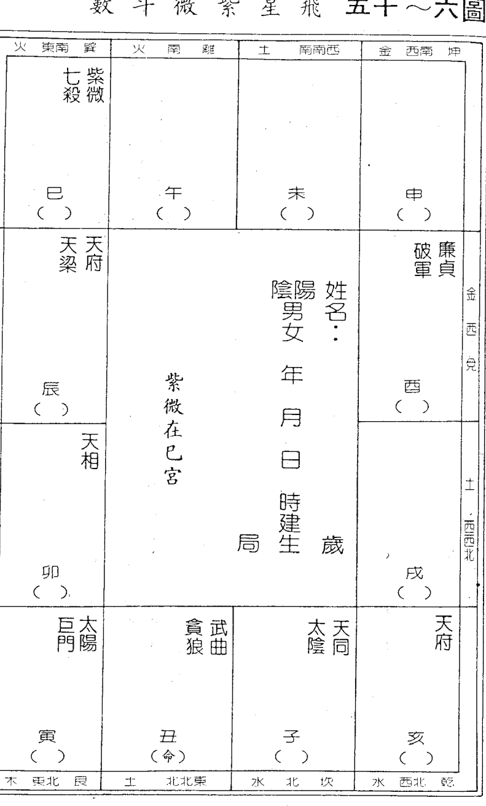

### 十六、日月夹命格：（图六—十六）

太阳为官禄主，太阴为财帛主，若两星在旺地来夹命，主富与贵，易有人提拔而成功，财官双美如图为一例。又若人立命丑宫，武贪守命，太阳在寅，太阴在子，两星皆在旺地夹命，亦为日月夹命格，主人一生财运丰足，成为雄踞一方的工商巨子。（与武贪同行格同论）。

**六十～六图**

| 破军 曲 | 太阳 | 天府 | 太阴 机 |
| :--- | :--- | :--- | :--- |
| 已 | 午 | 命 未 | 申 |
| 天同 | 紫微在酉宫 | 贪狼 紫微 |  |
| 辰 | 西 巨门 |  |  |
| 卯 | 七杀 廉贞 | 天梁 | 天相 |
| 寅 | 丑 | 子 | 亥 |

### 十七、英星入庙格：（图六—十七）

破军在子、午宫为庙旺之地，恰为人之命宫，且无煞星冲破，即合乎此格。此种命格之人：喜创新，喜新鲜事物，对任何事都抱著怀疑态度，胆大，好投机冒险，时常变化改革，故是一位改革家，成功与失败常在一瞬间，所以对于此种格局之人踩三轮车不必讶异，明天他开一部进口车时才令人刮目相看。此格之人宜外出发展，且与海外很有关系，如与海外有商业往来或时常出国等，故语文很重要。若加煞星，为人重心机、阴险、好赌、重私利，一生多官非，奔波劳碌。甲、丁、己、癸年生人福厚，丙、戊年生人不吉。此格之人可塑性大，宜文宜武。

### 十八、七杀朝斗格：（图六—十八）

七杀在子、午、寅、申宫坐命，再加会吉星，必非等闲之辈，时而喜欢独处，沉默寡言，有孤独感，重理智，早年必历尽艰辛，一生之中的工作环境与际遇变化很大，耐力过人，不怕辛劳，常在层层挫折之后成功立业，所做事业偏向生产事业，辛劳独创，成就辉煌。

有会昌、曲者，从政、就职必当主管，从商则为老板，名声好，为人直爽，做人做事有原则，智慧高、深谋远虑，适合从事技术性或重新组合的工作。

左、右、昌、曲俱会，则权名俱佳。

忌有擎羊或铃星两星同宫，一生中易有官非诉讼之事，运途起伏更大，若行运不吉，更有肢体伤残之事发生。

会入煞星多者，不宜自创事业，在大公司任职为宜，昌、曲、魁、钺与煞星俱会者，公职为宜。

女命此格不宜，主孤独、强悍，生产时较不顺利，若为职业妇女能独当一面，但在感情生活上不利，欠缺柔和的个性，可自我改进。

表格1：
| 木东北艮 | 土北东北 | 水北 | 坎水西北乾 | 土西南坤 | 金西北兑 | 火东南巽 | 火南离 |
| :--- | :--- | :--- | :--- | :--- | :--- | :--- | :--- |
| 寅 （ ） 紫微 天府 | 卯 （ ） 太阴 | 辰 （ ） 贪狼 | 巳 （ ） 巨门 | 午 （ ） 天相 廉贞 | 未 （ ） 天梁 | 申 （命） 七杀 | 酉 （ ） 天同 武曲 |
| 丑 （ ） 天机 | 子 （ ） 破军 | 亥 （ ） 太阳 |  |  |  |  |  |
|  |  |  | 戌 （ ） 武曲 天同 |  |  |  |  |

表格2：
| 木东北艮 | 土北东北 | 水北坎 | 水西北乾 | 土西南兑 | 金西北兑 | 火东南巽 | 火南离 |
| :--- | :--- | :--- | :--- | :--- | :--- | :--- | :--- |
| 寅 （ ） 紫微 天府 | 卯 （ ） 太阴 | 辰 （ ） 贪狼 | 巳 （ ） 巨门 | 午 （ ） 天相 廉贞 | 未 （ ） 天梁 | 申 （ ） 七杀 | 酉 （ ） 天同 武曲 |
| 丑 （ ） 天机 | 子 （命） 破军 | 亥 （ ） 太阳 |  |  |  |  |  |
|  |  |  | 戌 （ ） 武曲 天同 |  |  |  |  |

### 图六～十九 飞星紫微斗数

| 东南 巽 火 | 南 离 火 | 西南 坤 土 | 西南 坤 金 |
| :--- | :--- | :--- | :--- |
| 巳 （） 禄太 存阳 | 午 （命） 擎贪 羊狼 | 未 （） 巨天 门同 | 申 （） 天武 相曲 |
| 辰 （） 陀廉 罗贞 天府 | 姓名： 阴阳 男女 年月日 时建生 局 岁 | | 酉 （） 天梁 太阳 金 兑 |
| 卯 （） 破军 | | | 戌 （） 七杀 土 西北 |
| 寅 （） 破军 | 丑 （）  | 子 （） 紫微 | 亥 （） 天机 |
| 东北 艮 木 | 东北 艮 土 | 北 坎 水 | 西北 乾 水 |

### 十九、马头带箭格：（图六～十九）

凡七杀、破军、贪狼或天同与太阴在午宫坐命，再遇擎羊、铃星、火星者，即为此格，一生多在外工作或创业，有出国机会，幼年多凶险之事，长大后，时常遇肢体受伤之事件，事业亦是在惊险危难中开创，不过终能衣锦荣归。

此格之人，朋友多，经常外出，但会疏忽家庭，故在感情生活上较有缺憾，引起妻女的抗议，但本身并不在意。

有拆机械或其它设备研究的嗜好，而且能有始有终的重新组好，故亦适合从事技术性工作。其他如：外务、推销等工作亦适合。

女命不吉，感情易受打击，夫妻生活有欠缺，较孤独，若有自己的事业较佳。

此格以丙年生人最佳，丁年生人多是非，财较不顺。

### 二○、三奇加会格：（图六—二○）

三奇就是：生年干、化禄、化权、化科三星，如果三奇在命、迁、事、财等宫会照进来，即合此格，若只有两星较次，假如命宫坐一化吉星，其它会照进入，则佳美，坐宫不坐化吉星，运无配合的话，也是落魄；化禄主财，化权主掌权，化科主名声，故坐化禄而化权来会照较佳，较有实利，其它主名声好而已。
此格之人即使命宫不吉，亦有逢凶化吉之力，很容易成为名利兼收之人。

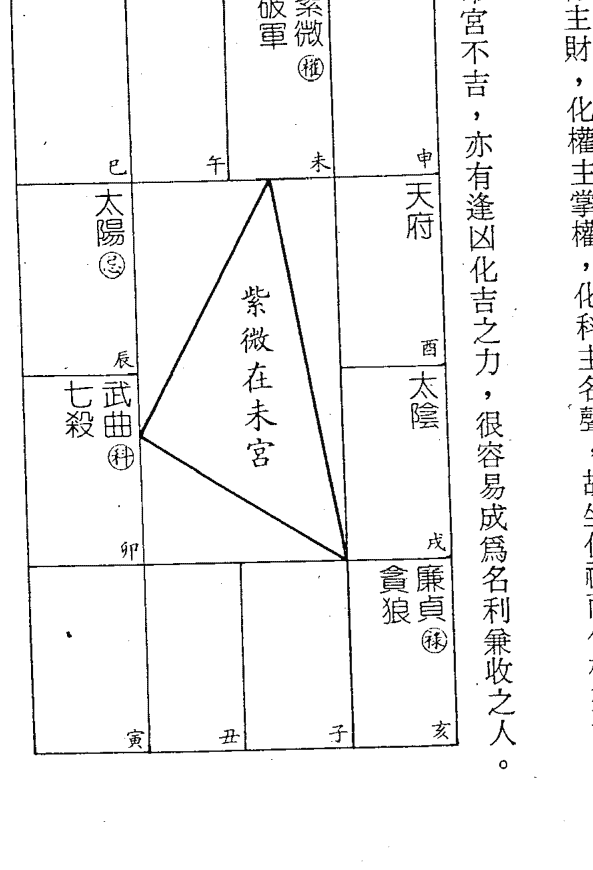

### 二十一、禄合鸳鸯格：

禄存与化禄同守命宫或财帛宫者合格，适宜向工商界发展，有成就，财富不小，但行运不吉亦会破败，故不可恃财而骄，宜多参与社会福利事业。

### 二十二、禄马交驰格：

禄存及化禄，一颗守命，另一颗守财帛宫，即为此格，财帛广入，富无疑，由三方会入者，吉力较次，但亦是有钱的格局，不过早年会省吃俭用的开创事业，中年后会逐渐奢侈化，运限不吉，易败得精光，故不宜参与投机性事业。

### 二十三、禄马交驰格：

禄存、化禄守命或财帛而天马在对宫会入，行运走到会因买卖事业而获利，为禄马交驰格，不但有钱，从事的事业多为国际贸易或跨国企业，而且常有出外旅游的机会，若天马由三方会入者亦合此格。但不宜逢忌煞星来冲。

### 二十四、左右同宫格：

左辅右弼同宫在丑、未宫守命者合此格，若在命宫两侧来夹，吉力远逊，此命格之人，早成名，有文名，常有特殊际遇而成功。

为人聪明，反应机灵，有煞星会照，亦小有名声。

### 二十五、坐贵向贵格：

天魁、天钺为贵人，若一在命，一在迁移即合此格，一生多得长辈之提拔与照顾，碰到危难时，亦常有贵人相助，事业上常有意外的助力，如：别人的赠予或颁授奖章等特殊的荣宠，但中年以后不利，变成我要去助他人了。

男命坐天钺，女命坐天魁，要注意有条件的异性助力，以免引起家庭纠纷，未婚者不忌。

### 二十六、文桂文华格：

昌、曲同宫在丑、未守命为此格，由三方或迁移会照而入者亦是，此格之人，聪明好学，爱修饰，从小就能展露才华，宜向文学、艺术方面发展，将有名声。

但是不可有忌星来会，恐有文书是非，故己、辛年生人不利，早年有失学之痛或求学多波折。

### 二十七、命无正曜格：

命宫没有主星时，要借迁移宫的星与父母宫的星来看，若有凶星坐守，大多主与六亲缘薄，从小就由别人带大或较早离家，长大后就不忌讳，尤其命宫与父母皆无主星时，非常灵验。

命无正曜并非坏命，只是幼年较多事而已，长大后多有异常成就者在。尤其其命在申，对宫巨日来照，煞星未会入者，甚为吉利。

### 二十八、雄宿朝垣格：（图六—二十一）

廉贞坐命在申宫合此格，为为人个性强、聪明伶俐、自我要求高、常以自我标准衡量他人，虽长上亦敢指正，是直肠子，遇文昌好礼乐，遇禄存有富贵，不加忌煞星，为富积善人家，以甲、戊、庚年生人最佳，丙、丁年生人次之。

女命甲、乙、庚、癸年生人清白，助夫益子，会吉星，感情平稳，会化忌的话有纠纷，廉贞化忌的话注意官非。

会陀罗、火星等多脓血之灾，易看不开，有寻短之念头，若能突破心理障碍，大有后望。

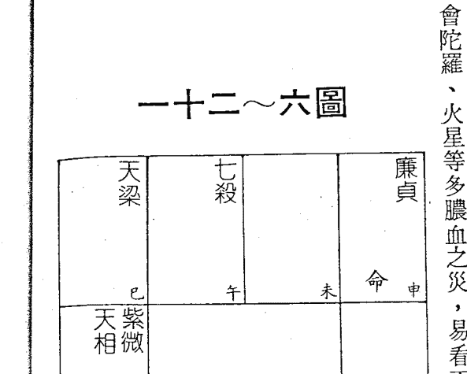

| 巳 | 午 | 未 | 申 |
|---|---|---|---|
| 天梁 | 七杀 | | 廉贞 |
| 紫微 天相 | | | 命 |
| 辰 | | | 酉 |
| 巨门 天机 | 紫微在辰宫 | | 破军 |
| 卯 | | | 戌 |
| 贪狼 | 太阴 太阳 | 武曲 天府 | 天同 |
| 寅 | 丑 | 子 | 亥 |

以上为各种常见的格局，它只代表命格的高低而已，并不能代表好命格即能财官双美，还要有运的配合才可以，所以看了命格好，不要太得意，若运限不扶还是不能发达，但命格可以让我们掌握一张命盘的特性，如一看是「马头带箭格」即知个性强、善拆修机器、在外发展、较孤僻等特性，然后再配合运之流转，推断运势的吉或凶等更详细的细节，否则，如大海行舟漫无头绪，何处是「定向」？所以命格可以帮我们「立向」。

至于要推断「运」，就要靠四化星了，四化是斗数变化的枢纽，不懂四化的用法，只能「算命」而已，不能「推运」，要了解命运，不可忽略四化。

下章介绍四化星入门。

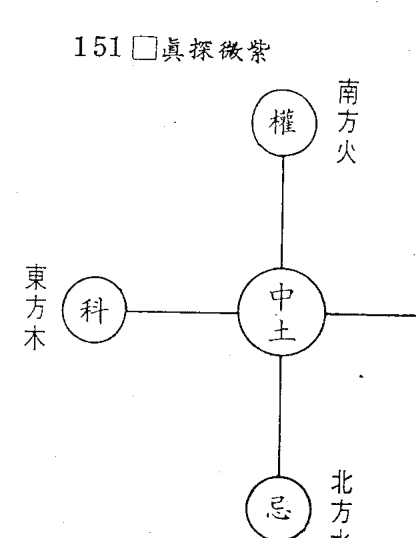

## 第七章 四化星入门

所谓四化星是指：化禄、化权、化科、化忌等四颗化星，依据紫微斗数全书的记载：化禄属土，化权属木，化科属水，化忌属水，坊间大部分的书籍都是如此定义其五行属性，对于其所对应的方位也未曾提及。现在来看看华山陈希夷先生对四化星的方位、五行如何定义： 东方属木，乃因东方草木扶疏，为生长教化的象征，而科主教化功名，故属东方木位；南方为火，火之热力辐射，火苗上窜，有向上焕发之象，故权属南方火位，代表成就，力争上游；西方为金位，有肃杀之象，万物结果后，便要采收而获益，故化禄属西方金，主收获得利也；忌在北方水位，北方乃天寒地冻之所，万物凋敝，鸟兽齐绝，为隐伏收藏之象，故忌在北方水位，主收藏、凋敝的意象。

一般来说，化禄、化权与化科属吉，化忌较不利，但是，有时候并非如此，如化禄在疾厄宫就易受伤，老年人易有血压高、长瘤等情形，所以，吉与凶的定义要看是以何宫来论事，再取其吉凶的定义，一般来说，四化星的通义为：

化禄：人缘好、财禄、情缘、才艺、享受。
化权：成就、管制、羁性、自负、掌权、原则。
化科：善缘、解厄、贵人、功名、珍惜、才艺。
化忌：亏欠、道义、凶祸、粘住、变动、情义。

各位或许很奇怪，化忌的通义中，似乎有些矛盾存在，是的，在字面上的意义确有冲突存在，但配合化忌的『出』与『入』之不同，就知道是要采用那一种意义来解释，所以『化入』、『化出』是四化飞星的入门观念，在第十章会有精辟的解析。

假如不能掌握『出』与『入』的观念，则真如有有些斗数专家所说：『飞来化去，满盘皆四化，搞得满头雾水而抓不出问题。』

另外还有一个『体』与『用』的观念也要建立，所谓『体』就是不变的本体，如依据生辰八字定下来的命盘，即是本体，而大限变换时，命宫亦转移，其它十一宫也跟着依序转动，产生另一个大限命盘，这个大限命盘是此十年大限间『借用』的，大限过后，又需跳入下一格，故本命盘为『体』，大限命盘即为『用』，体用的详细解说在第九章活盘转换。

飞星紫微斗数四化，本名象四化图，又称圆化四象，简称为四化，为斗数变化之枢纽，斗数之精斗数赖「时」以立命，步地支，散十二宫之中立极，应时间星辰；
斗数重「数」以立象，取天干，行四化之飞宫化曜，布空间垂象。

很明显地指出命运是由时间和空间所带动，而时间与空间的关系即由地支与天干来配合，因此不明四化之用，将无以推知时间和空间的关系，更无法了解在什么时间、什么空间下会发生某事件？只能含糊笼统地以星宿组合特性来解说，失却推命趋吉避凶的功能。

所谓「化」者，乃是星辰之本性，也是说物质转换为能量，星辰各有本性，分阴阳，有阴阳而生五行，乃星宿之本性，故名星性，以其五行之特性又有不同的运用，再佐以四化之变，则生生不息，变化万千，以其对应宇宙间之事物或物，以其对应宇宙间之事物才不致穷，所以要懂星性，更要会运用其气化，才能运用如神，方不至于在星性上打转而不敢言时间、空间，空乏无味，于

如断人车祸（车子撞进屋来不算），必与外出有关，与车子有关；而外出与「宫位」有关，车子与「星性」有关，凶祸与「气化」有关，所以三者在运用时是一体的，不可偏重某一项。

由第二章的说明知道四化不是玄秘之物，而是贯联作用，有四化之牵引才知道「因」与「果」的关系，当然推命要找出因果关系是上层功夫，并不是人人都能悟透此种关系的，但一切的推命基本功夫仍在四化、星性、宫位（立向）等三要素，而以四化为表征。

### 四化在命盘上可分：

- 生年四化
- 命宫干四化
- 大限宫干四化
- 流年宫干四化

……（若推流月、流日时，亦可再细分下去）
其中生年四化，只是垂象而已，无吉与凶，它是根据生年干而定，属于静态现象，但人自呱呱坠地后，即有动态运势更迭，在一静一动的流转中，相互作用，织成人生的命运网而有起伏、成败等现象。

所以：

生年四化落入十二宫之中主垂象，无吉无凶，属静。
生年四化与十二宫之四化相互作用，产生吉凶，属动。

现在让我们看看生年干四化落入十二宫中的意义：

### 一、生年干化禄入十二宫的意义：

以下为生年化星入十二宫的意义浅说，其它有双化星入宫的现象，其意义解释另有解释。较常见的双化星组合有：

- 甲干：廉贞、破军。
- 乙干：天机、天梁、太阴。
- 丁干：太阴、天同、天机、巨门。
- 戊干：太阴、天机。
- 己干：武曲、贪狼。
- 庚干：太阴、天同、太阳。
- 辛干：巨门、太阳。

双化星组合的意义可以简洁的解释如下：

- 禄权同宫：财利、发达、名利双收、有成就。
- 禄科同宫：成名后获利、财平稳、有才干。

#### 飞星紫微斗数

| 方位 | 地支 | 宫位 | 描述 |
|---|---|---|---|
| 东南 | 巳 | (友交) | 所交朋友比我能干、有成就。 |
| 南 | 午 | (移迁) | 在外表现才华，受人敬重，为人直爽。 |
| 西南 | 未 | (厄疾) | 外伤、碰伤。 |
| 西 | 申 | (帛财) | 喜理财，忙中得财，喜掌握财权。 |
| 东 | 辰 | (业事) | 事业有表现，掌权管理人，升迁运佳。 |
| 中央 | (中心) | 生年权 | 姓名： 阳男/阴女 年 月 日 时 建生 岁 局 |
| 西 | 酉 | (女子) | 顽皮、捣蛋、才能高、喜管人、有原则。 |
| 东 | 卯 | (宅田) | 房子大，有不动产。 |
| 西 | 戌 | (妻夫) | 配偶能干、刻苦耐劳、掌权。 |
| 东北 | 寅 | (德福) | 同命宫。 |
| 北 | 丑 | (母父) | 双亲能力强，亲子间多争执，注重沟通。 |
| 北 | 子 | (命) | 为人霸道，主观强，很有才干。 |
| 西北 | 亥 | (弟兄) | 兄弟较本人有才能，成就比本人好。 |

#### 飞星紫微斗数

| 方位 | 地支 | 宫位 | 描述 |
|---|---|---|---|
| 东南 | 巳 | (友交) | 拿财资助朋友，但与朋友浅缘；对朋友较啰嗦，因过度关心。 |
| 南 | 午 | (移迁) | 在外顺利，易得贵人提拔；做事不专心，只想往外跑。 |
| 西南 | 未 | (厄疾) | 幼年多灾、会发胖、性欲比较强。 |
| 西 | 申 | (帛财) | 自立谋生，自创事业；财禄不缺，善用钱财赚钱。 |
| 东 | 辰 | (业事) | 有事业心，但一天到晚想做这做那，而一无所成；机运佳，会有自己事业。 |
| 中央 | (中心) | 生年禄 | 姓名： 阳男/阴女 年 月 日 时 建生 岁 局 |
| 西 | 酉 | (女子) | 子女聪明，有才华，疼爱子女，子女女人缘佳。 |
| 东 | 卯 | (宅田) | 顺家，不一定有遗产，会自置田产，善守财。 |
| 西 | 戌 | (妻夫) | 姻缘早，但未必早婚；对太太好，感情丰富。 |
| 东北 | 寅 | (德福) | 喜享受，生活讲究，好排场。 |
| 北 | 丑 | (母父) | 与父母深缘，关心父母，父母也关心，但不一定有物质资助。 |
| 北 | 子 | (命) | 多情、聪明、人缘好、好享受、衣食不缺。 |
| 西北 | 亥 | (弟兄) | 手足情深。 |

#### 飞星紫微斗数

中心圆: 生年忌
左上角宫(巳/友交): 欠朋友债。
左中宫(午/移迁): 心在外,想往外跑,在外有发展。
右上角宫(未/厄疾): 身体某部份较弱,对自己较苛刻。
右中宫(申/财帛): 节俭,心在赚钱。
左中宫(辰/业事): 事业稳定,最有敬业精神,不宜创业。
中央左侧宫(卯/宅田): 关心家庭,但不常在家,常出外。
中央右侧宫(酉/女子): 疼子女,但不常在一起,早分离到别处唸书或就业。
左下宫(寅/德福): 心神不宁,一天到晚忧心忡忡,不能安心享受。
中下左宫(丑/父母): 人缘好,与父母深缘,但较没话讲。
中下右宫(子/命): 坦白无私,不欠人情。
右下宫(亥/弟兄): 有人缘(平华),与兄弟深缘,但较多意见不合。
中央下方: 局生岁
中央上方: 姓名: 阴阳男女 年月日 时建生

#### 飞星紫微斗数

中心圆: 生年科
左上角宫(巳/友交): 朋友有助力,对朋友有情,讲道理的朋友多。
左中宫(午/移迁): 出外有贵人助,多朋友提拔。
右上角宫(未/厄疾): 身材匀称、窈窕、好打扮。
右中宫(申/财帛): 财帛不多,但不缺钱财,钱财损失有惊无险;若缺钱用时,较有意外助力出现。
左中宫(辰/业事): 事业多贵人助或指点,事业适中,不会太冲劲。
中央左侧宫(卯/宅田): 家中清洁舒爽,住宅适中,注重家庭生活。
中央右侧宫(酉/女子): 子女聪明懂事,好读书。
左下宫(寅/德福): 会有特殊嗜好并有成就,精神开朗,看得开。
中下左宫(丑/父母): 关心父母,自己长相也很像父母。
中下右宫(子/命): 为人讲理、看得开,宜读书考试。
右下宫(亥/弟兄): 对兄弟的关心程度有限,非情非得已少助力,但精神上却契合融洽。
中央下方: 局生岁
中央上方: 姓名: 阴阳男女 年月日 时建生禄忌：双忌论。
权忌：辛苦地以技能赚钱，做人做事有虎头蛇尾之嫌。
科忌：技术生财、平稳受薪为佳，不宜太贪图财利。

现举一例说明生年四化入宫的意义：（见左图）

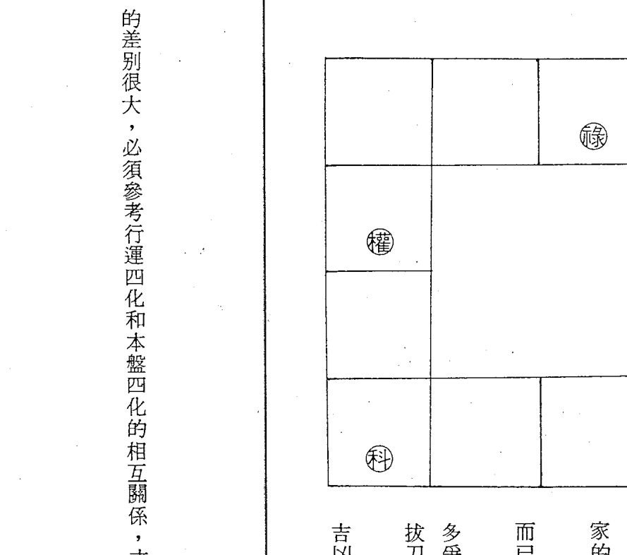

- 生年禄在子女：子女聪明、人缘佳，日后会有成就，本命也相当关心子女，将钱投资在子女的教养上。
- 生年权在迁移：出外有成就，也能得到大家的赞赏与肯定，适合出外发展。
- 生年科在事业：事业平稳，维持相当程度而已，急难时常有意外助力来助。
- 生年忌在兄弟：关心兄弟，虽兄弟之间较多争执，不过关心之情不减，兄弟有急难也会拔刀相助，兄弟较不常在一起。
- 需要注意的是：生年四化只是垂象而已，无吉凶现象，需要有行运配合，逆行运和顺行运的差别很大，必须参考行运四化和本盘四化的相互关系，才能推动态的『运』。

## 第八章 忌星真诠

大家一看到「化忌」，心中便发毛，齐指责为「多管、悔吝之神」，谁被冲到了谁就倒霉，几乎初习斗数的人，莫不为其凶煞之气所撼，久久不能释怀，为什么会这样？我们来看看几本著名的斗数入门书如何诠释「化忌」的意义即知原因何在？

> 「化忌为多管之神，守身命一生不顺，小限逢之，一年不足，大限逢之，十年悔吝，二限太岁交临，断然蹭蹬。文人不耐久，武人纵有官灾口舌不不妨。虽商贾技艺人，皆不宜利，如会紫府昌曲左右利权禄，与忌同宫兼四杀共处，发不住财禄。苗而不秀，科星陷于凶乡是也。如单逢四杀耗使劫空，主奔波带疾，僧道流移返俗，女人一生贫夭。」

或太阳在寅卯辰巳化忌，太阴在酉戌亥子化忌，反为福论，其余诸星化忌，各审五行不同，如廉贞在亥化忌，是为火入水乡，又逢水命人，忌不为害。

> ——摘录自十八飞星策天紫微斗数全集。

> 「化忌阳水，为上界多管之宿，主是非口舌，又名计都星。化忌之宿，未必能破格，仅主多是非纠缠而已，必先考正星是否庙旺，若庙旺则有「旺地化忌不忌之说」，陷地主凶，再有金水之星庙旺化忌，仍是兼有富贵，如太阴在亥化忌，及武曲化忌在巳宫长生之地等。如火木之星化忌，旺宫，若太阳居午，及天机化忌在卯等，多富而不贵，或贵而不富。属土之星不化忌，但化忌怕入四墓，主增凶。再如属火之星，于亥子水乡化忌加煞，凶恶异常，多是伤残，天亡。此星入命，主一生多是非多管，易遭人之嫉，性急躁，带疾病，多起伏成败。但武职反作吉论，行运亦是。女命得之，不论旺弱，易多口舌是非，旺地亦有富足，但不能贵，且晚年多病。陷宫加煞，六亲不和，多是非，亦贫贱。此星在十二宫之中，先看得地与否，及正星之性质，方定其吉凶。」——摘录自「正统飞星紫微斗数」。

但是，事实上是否如此？相信大家心里有数，忌星是一颗可爱又可怕的化星，想赚钱要靠忌星，要追女朋友也要忌星来粘，否则，免谈！懂得忌星之用的人，一定很勤劳，因为他知道忌星的本性；不知忌星之用者，就会以为算个命，财帛便会滚滚而来，而忽略自己的努力与条件的配合。

到底「化忌」的意义何在呢？
「忌」是自「己」的「心」的意思，即指忌星所掌之悔吝、不顺，完全是由自己的心境所造成的，假如存心为恶，则魔鬼居焉；心存善念，则神居焉，所以忌之为祸全在当事人之心境。
人都有一个本能——「闪避」灾祸的本能，若敌人一刀劈来，我们一定会闪避刀锋；一部车子冲来，我们也会跳闪开来；所以改变物理的空间，以躲避灾祸的本能大家都与生俱来了，是一种直觉作用。

但是心理上的空间——「心境」就不是如此轻易地可改变，或暴露于外，让他人有所准备；例：我一直觉得这位对象不错，想嫁给他，虽然大家反对，还是结婚了，结局如何不管。由此可见牵涉到「心境」问题并不是他人一句话可更改或自己一念间可完全扭转的，往往是在「自以为是」的状况下，做了错误的决定，由此可见自己的心境，是如何的难以掌握！所以说：「人的最大敌人在自己」。

每个人对未来，总是希望明天会更好，在此前提之下，每一位在做一项决定前，一定会以自己最有利的条件来考虑，但为何有贫富？职务有高低？事业有大小？一句话——「心境」造成的，有的人考虑得比较深入广泛，有的人浅薄，所以，会有高低之别；要使自己更成功——创造心境而已。

因此，物理上的空间，大家都有闪避不利环境的本能，而心理上的空间——「心境」，大家都自认为自己的见解正确、决策无误，因而犯错而不自知，要待成事实后，才会后悔，所以心境是命运变化枢杻，故主悔吝之化星——「忌星」以自己的心来暗示心境的重要。

在斗数中，化忌属水，水可载舟，亦可覆舟，平时柔顺，济养生物，但泛滥时，危害生物，冲走田园，所以在忌星的本意上，已暗示其可为善为恶，当然其善恶之分判乃在人心，故说：「相由心生、命由心造」，假如知「忌」之性，则能化「忌」为有用，否则为祸不轻，故知忌之用才能改运，再配合物理上空间的变换，以收趋吉避凶的效果。

## 第九章 忌星棋谱

四化是斗数的用神，化禄、化权、化科、化忌等分别职掌不同的机能，其中尤以「化忌」的用法最为灵活，它可以代表「冲克、不和」，又可以说是「抓住、得到」，此中之差别主要在「忌入」或「忌出」，因此欲了解四化星的运用，首应了解「化忌」的各种功用。
恩师珍藏的四化飞星棋谱中，将化忌分类为：(1)流出忌，(2)流水忌，(3)互冲忌，(4)禄来忌，(5)忌来忌，(6)回力忌，(7)四马忌，(8)墓库忌，(9)进马忌，(10)回马忌，(11)劫数忌，(12)回水忌等十二种，其定义分别如下：

引用此观点来看一些哲学思想上的大师论著，他们绝不会套用自己观点批评他人之论点，对于未定论的言论、思想等，大师们都以求知的精神来探讨而不会尖锐的批判，因为只有站在思想最前端、科技最尖端的人，才会理解探究未知的世界不能以自己「已知」的知识来衡量，更乐于以自己的论点来辅佐其成，是他们「化自己心」为有用的具体表现，若只知一味攻击批判，则可能会被「自己的私心」而蒙蔽，丧失自己的崇高地位，所以，中国人早就悟透此种观念，而有中庸的论点，不激不亢，不偏不激，化戾气为有用。
所以「化忌」并非全凶，亦非全吉，端视当事者的心境与知道如何掌握运用空间而定，智慧高、见识广的人，能直观内心的真如，反观宇宙万物；没有自我之心，以天为心，所以其思虑也深远，其思想豁达，超越时空，所以，什么叫「改运」？改造心境即是。
改运之例很多，但都是要靠自己，因为「心境」是别人无法捉摸的，塑造心境的书很多，不拟赘述，希望大家都能了解忌星真意。

### 一、流出忌：

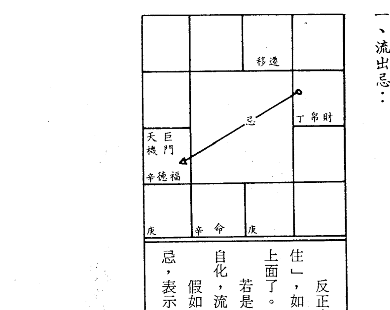

反正由本宫化出对宫之忌，一律叫做流出忌，表示『留不住』，如：财帛宫化忌入福德，表示钱财守不住，花费在逸乐上面了。若是夫妻宫化忌入事业，代表配偶留不住，若逢事业宫再自化，流出更速。假如由命宫、事业宫、财帛宫化忌入对宫者，又叫做水忌，表示此人不适合经营制造业，宜向服务业、买卖业发展。

### 二、流水忌：

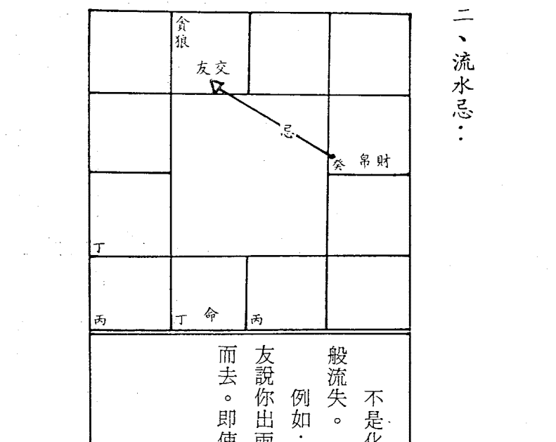

不是化入对宫的，而是由我宫化出到他宫之忌，像流水一般流失。例如：财帛化忌入交友，乃是财帛流入朋友口袋之意，朋友说你出两万元吧！就捐出两万元，毫不打折，财帛即如流水而去。即使交友宫坐生年忌星亦无阻挡的作用。

### 四、禄来忌：

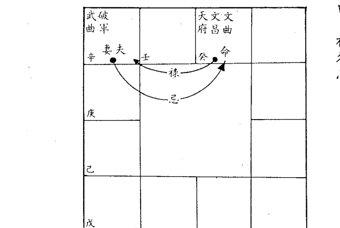

除对宫外的A、B两宫位间，A宫化禄入B宫，而B宫化忌回A宫，或者A宫化忌入B宫，而B宫化禄回A宫，这种禄来忌去，或忌来禄去的状态，即叫「禄来忌」。

如：命宫化禄入夫妻宫，但夫妻宫化忌回命宫，表示我疼爱配偶，但配偶却嫌我管太多、关心过度。

亦即某方一厢情愿地对他方好，而却得不到他方对等的回报。

### 三、互冲忌：

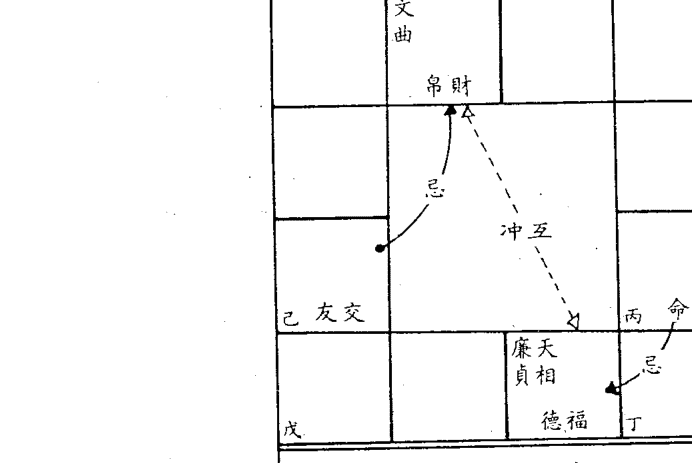

即两个不同的宫位化出之忌，成对宫互冲状态。

如：交友化忌入财帛，而命宫化忌入福德，在财福线成对宫互冲的状态，此叫互冲忌，乃朋友与我之争执，和财帛有关。

假如是与夫妻宫成对宫互冲忌时，也叫怨叹忌，主夫妻俩，活到老，吵到老。

### 六、回力忌：

| 武曲 天府 |   |   |
| --- | --- | --- |
| 忌 → |   |   |
| 壬 命 大 |   | 冲 |
|   |   | 命 |

大限步入本命三合时（即本命事业或财帛宫时），大限命宫化忌入本命的夫妻、迁移、福德等宫冲本命三合，此忌即叫做回力忌。
回力忌的力量强大，像澳洲土人的回力棒一般，甩出去飞回来时，若接不好会伤到自己，碰到此种状况时，保守点较佳，否则出力愈大，反震之力愈强，若不是由本命三合宫发出时，即为单忌，凶力较逊。

### 五、忌来忌：

| 太文 阴曲 |   | 天巨 同门 |   |
| --- | --- | --- | --- |
| 丁 妻 夫 | 戊 | 己 命 | 庚 |
| 丙 |   |   | 辛 |
| 乙 |   |   |   |
| 甲 |   |   |   |

在六亲宫位间，互相忌来忌去的状态。
六亲宫即：命、兄弟、夫妻、子女、交友、父母等六宫。
例如：夫妻宫化忌入命宫，而命宫又化忌入夫妻宫，即表示两者之对待关系，有情来则有义去，假如遗弃配偶，配偶亦必以相同方式还击，此即忌来忌之意。

### 七、四马忌：

| 巳 |   |   | (忌年生) |
| --- | --- | --- | --- |
|   |   |   | 申 友交 |
|   | 命 |   |   |
| (忌化自) |   |   |   |
| 寅 弟兄 |   |   | 亥 |

凡生年忌落在寅、申、巳、亥四宫，或在此四宫自化忌时，因寅、申、巳、亥叫四马地，故此忌叫四马忌，主奔波、劳碌，若六亲宫坐四马地，逢四马忌时，主与该六亲聚少离多，因其常奔波在外也。
如：兄弟宫在寅坐四马忌，主与兄弟少聚首，又交友宫坐生年忌在申，知心朋友多常不聚首。

### 八、墓库忌：

|   |   | 未 |   |
| --- | --- | --- | --- |
| 辰 |   |   |   |
|   |   | 戌 |   |
|   | 丑 |   |   |

辰、戌、丑、未四宫，谓之四墓库，凡是生年忌落入四墓库时，皆叫做墓库忌。
若墓库忌为：
六亲宫时，即主该六亲努力赚钱。
田宅宫时，家庭负担重，必须努力工作。
迁移宫时，必须常年奔波。
财帛宫时，表示守财牢靠，但逢自化忌时，即流失。

### 九、进马忌：

| 空格 | 空格 | 空格 | 空格 |
| --- | --- | --- | --- |
| 紫微贪狼 |  |  | 忌化自 |
| 癸卯 | 1 | 天府 | 2 |
| 壬寅 | 癸丑 | 壬子 |  |

如癸卯坐紫微、贪狼，而癸丑坐天府，癸丑化忌入癸卯，而癸卯贪狼自化忌，退回癸丑，丑与卯相差两宫为进马忌，主灾殃。

### 十、回马忌：

| 空格 | 空格 | 空格 | 空格 |
| --- | --- | --- | --- |
| 辛卯 | 文文昌曲 |  |  |
| 庚寅 | 辛丑 | 庚子 | 己亥 |
|  |  |  |  |

如辛丑坐文昌、文曲，辛卯文昌化忌入辛丑，而辛丑文昌自化忌，退两格入己亥，是为回马忌。回马忌亦主劫数。因此种忌发生在四马地，故有此称。

### 十二、回水忌：

凡由本命三合化出之忌到对宫，对宫（迁移、福德、夫妻）恰有生年忌坐守，此生年忌宛如一道墙，将此化出之忌挡回，表示此忌不会流失，因化忌像水一样被挡住会往往回倒灌，故叫回水忌，有此忌的人会发达，可从事制造业，财帛、事业绵延长久。但对宫绝不可再自化，有自化则流出更急速。此忌一定要由本命三合飞出，恰逢对宫坐生年忌挡回时，才合此格，其它不是。第十二章所举命例的事业宫，即是回水忌结构，不幸夫妻宫自化权，破格了，故败得一塌糊涂。

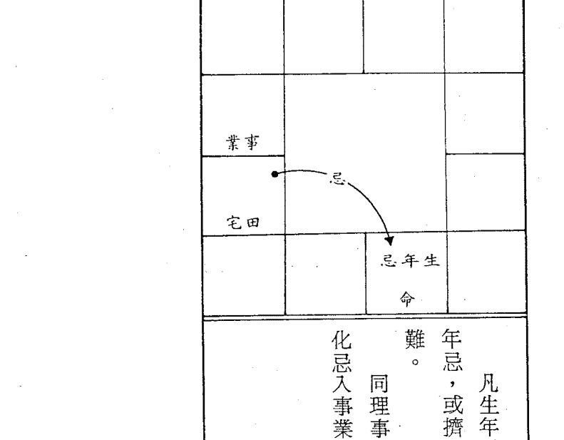

### 十一、劫数忌：又叫绝命忌（此名词太毒辣、武断）

凡生年忌星坐命宫时，田宅宫或事业宫化忌不可来冲破生年忌，或挤入同宫，有则有劫难，如意外灾害、手术之类的劫难。同理，事业宫坐生年忌时，迁移宫、田宅宫不可化忌来冲或化忌入事业宫，有则危险，但未必是「绝命」问题。

以上所谈的十二种忌星定义，非常重要，对于斗数研究有莫大的助益，希望娴熟其用法意义。其它化禄、化权、化科等亦有不同的结构，但算命的目的在趋吉避凶，知道忌星的吉凶现象，便可达到避凶的目的，至于如何趋吉？本书中已有提及，请详阅之。

## 第十章 运势流转

有些人看到夫妻宫尽是：天同、紫微、天府、太阴等吉星，便窃窃自喜，有一位好配偶了；也有的人看到财帛宫坐：紫微、太阴、武曲、天府等吉星，也在高兴！！有钱了。事实上，是不是如此呢？相信曾排过自己命盘的人，心中都会在怀疑！！为何不是如书上说的呢？这是有很大原因的，很多人忽略了时间和空间的变化因素，仅从命格的高低来推命，所以会发生远离现状的推断，命格好并不代表就有名声、地位或财富，而是由后天经年累月努力，配合空间的作用薰陶，才能造就成功的人才，故命好不如运好，运好不如毅力勤奋好。

若从命格的好坏来推命，则无法掌握动态运的变化，要掌握动态运的变化，便要了解活盘转换的意思。

第二章说到命运是一条三度空间曲线，假如我们以微观的观念来探讨，就了解它不是一条曲线。

例如以人每一天的行为来看，便是一种很复杂的过程，假如能将一天中发生的事情、时间和环境等因素，黏绘成线的话，一定是一条充满转折点、拐弯点的连续曲线，在如此复杂的情况下来分析一个人一生的命运也要将一生的命运分格为一段段的区间来分析，依现行的方式分成：

- 本命：一生的运。
- 大限：十年运。
- 流年：一年运。
- 流月：一个月的运。
- 流日：一天的运。
- 流时辰：一个时辰的运气。

等六种命盘，其中流时辰的应用还在印证的阶段，鲜有人能推断至流时辰之精度者，大部分都在流月的精度，假如了解命理学的人，就会知道达到流月精度的高难度。
其实常应用的只有本命，大限、流年、流月等四个盘而已，此四盘环环相扣，层层节制，若中间有一脱节，则最终的结果便不能成立，所以推命的困难在于如何将此连环扣节解开，以找出其间的关系。
大限是主十年运，若五行局是木三局的甲辰年生A小姐（属阳女），则第一大限为三～十二岁，超过十一岁命宫便跳入兄弟宫，此即第二木三局，主掌十二～二十一的十年运，其它的十一年亦依固定的顺序转动（图十一），而得到新的大限命盘，在实际应用时，并不将大限十二宫都填入盘内，以免紊乱，只注明重要的命、财、事业三宫而已。以后我们说明时，凡是大限命盘的宫均加一「大」字以示区别，如：大事代表大限事业，大财代表大限财帛等。

| 木 东北 艮 | 53—62 货大 寅（疾厄） | 43—52 卯（父母） | 23—32 巳（妻夫） | 申（母父） | 天府 |
| --- | --- | --- | --- | --- | --- |
| 土 北北东 | 63—72 丑（移迁） | 33—42 辰（子女） | 13—22 午（命宫） | 酉（福德） | 天同太阴 |
| 水 北 坎 | 73—82 子（交友） | | 3—12 未（命） | 戌（宅田） | 贪狼武曲 |
| 水 西北 乾 | | | | | 巨门太阴 |

| 木 东北 艮 | 53—62 货大 寅（疾厄） | 43—52 卯（父母） | 23—32 巳（妻夫） | 申（母父） | 天府 |
| --- | --- | --- | --- | --- | --- |
| 土 北北东 | 63—72 丑（移迁） | 33—42 辰（子女） | 13—22 午（命宫） | 酉（福德） | 天同太阴 |
| 水 北 坎 | 73—82 子（交友） | | 3—12 未（命） | 戌（宅田） | 贪狼武曲 |
| 水 西北 乾 | | | | | 巨门太阴 |
| | | | 甲辰年生A小姐 木三局 | | |

图十一～十

在推命时，一般都由该大限命宫看起，有些人问流年运，就用流年命宫来推算，这是不正确的观念，因为流年的吉凶会在流月应验，并不主流年的好坏，流年的吉凶要由大限来推算，否则每十二年就会重复一次，要区分其间之不同全靠大限，故大限是非常重要的一环。

本命、大限、流年、流月之间的关系如下：

由流年命宫起逆时针数至生月，再由生月宫起子时，顺数至生时，就是流月正月宫所在，其它十一个月顺时针依序填入即可。正月所在之宫称为斗君。（图十一二）斗君在应用上很奇妙，以后再谈。

至于流月的起法规则为：

大限之后再下分流年，流年和该大限的命盘息息相关，如A小姐今年为二十三岁，已进入第三个大限，所以二十三岁流年的运便和第三大限的各宫位产生关系，而和第二个大限脱离了（图十一二），二十三岁流年命宫在寅，其它十一宫亦是依序填入，但为了避免命盘紊乱，只在寅宫角落注明二十三而已，表示流年命宫驻跸在此。

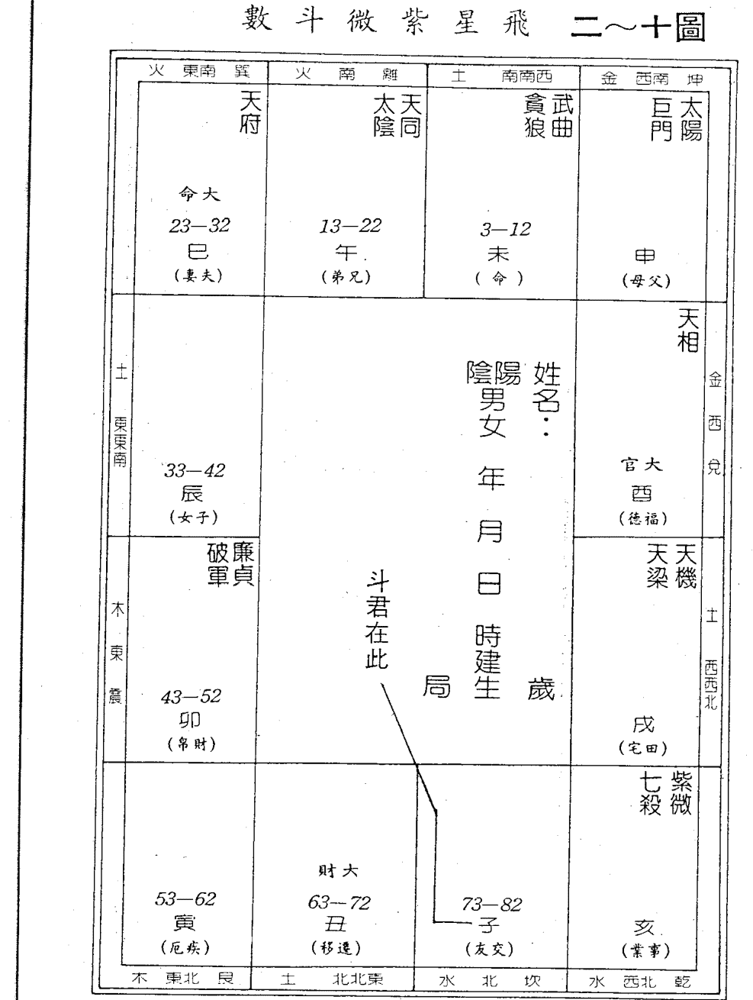

### 看流年时，大限为媒介，应验在流年

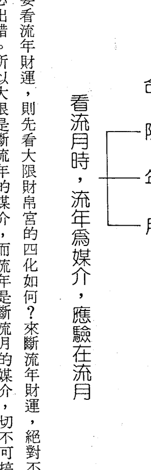

例如：要看流年财运，则先看大限财帛宫的四化如何？来断流年财运，绝对不可以用流年财帛断该年财运，必出错。所以大限是断流年的媒介，而流年是断流月的媒介，切不可搞错次序。
由此观念来看，断流年时，是「用」大限四化星，看其和本命盘（「体」）之间的关系，所以断流年时，以本命盘为「体」，大限盘为「用」；若断流月时，则大限盘为「体」，流年盘为「用」，「用」之化忌不可冲「体」，冲之必有凶象；当然，「用」之化吉星入「体」或照「体」都主吉象，此乃推命的基本观念，不可不知！
明瞭「体」与「用」的关系后，就能掌握四化飞星的基本规则了，不会有「飞来化去，不知所终」的困惑。

### 看流月时，流年为媒介，应验在流月

推算动态的运，最重要在流年，能掌握流年的吉或凶，便能承先启后，贯联时空的关系。
当然，还要考虑大命是在本命盘的什么宫位？若大命在本命夫妻宫，则男女都有结婚的倾向，若大财在本命交友宫，则财帛较和朋友有关，这是一种粗浅的看法，实际的作用，还是要有四化的牵连才知真正的关系。

第十一章 出與入之別

本章要和大家談談什麼叫「化出」？什麼叫「化入」？這是兩項飛星紫微斗數的入門觀念，不明「入出」之用法，別談斗數，因為連四化的運轉規則都無法掌握，那能推理。各位在別本書中可能也曾看過逢忌沖或坐忌之年小心損財、事業失利、身體遭傷等事情發生，但一年過後仍活得健健康康、平順得很，為什麼推理和實際會產生如此大的差異呢？化入、化出之別也！其實我們拿日常生活的現象來看，也有很多化入化出的現象。例如：A先生領了薪水（化「祿入」了），但領來之後又馬上花在分期付款上了（化「祿出」了）。

又 B 小姐因工作疏忽而被上司指責（化「忌入」了），但 B 小姐認為確實錯在自己，因此對於指責坦然認錯，也不怨怪主管（化「忌出」了）的苛責。所以，化入和化出是很重要的觀念，但是什麼叫「出」或「入」呢？

反正正化入我之宮位，即叫「化入」。化入他之宮位，即叫「化出」。飛星紫微斗數以：命、財、事業、田宅、福德、疾厄、父母、遷移等為他之宮位，稱為「他宮」。

### 一、由我宮飛出之四化：

- 1. **祿入我宮、忌入我宮：** 此即指事件之吉與凶，皆由自己所承擔，沒有透遇他人之媒介，如：財帛化祿入命，化忌入事業，即為財之吉凶，全為個人之因素，無關乎他人，自己努力與否，決定自己財運的好壞。

- 2. **祿入他宮、忌入我宮：** 依「祿隨忌走」的現象來解釋，化祿雖入我宮，但會被忌帶出去到他宮，例如：財帛化祿入命宮，但化忌入交友宮，若和友人有金錢往來關係，則會有損失，避免與友金錢往來即可少損，也能保住友情。

- 3. **祿入我宮，忌入他宮：** 叫做「祿出」，亦即祿流出去了，自己得不到，此即「祿隨忌走」的現象，將好處給別人，自己承擔損失，如：命宮化祿入交友，化忌入財帛。

- 4. **祿入他宮、忌入他宮：** 不管好與壞，統統給人了，最凶之現象，例如：財帛宮化祿入父母，化忌入交友，乃將自己的錢財都給了朋友，自己當個過路財神而已。有的甚至一生中皆是為人作嫁衣裳，而自己一無所有，最宜上班，莫貪圖不當利益，尚可安心度日。

### 二、由他宮飛出之四化：

- 1. **祿入我宮，忌入我宮：** 亦即由他宮飛四化，看其入我宮或他宮而論吉凶現象。為吉象，例如：父母化忌入事業，化祿入財帛，乃財帛未入朋友的財帛，而是朋友拿財帛來資助我...

- 2. **祿入我宮，忌沖我宮：** 凶象，主損失；此亦為「祿隨忌走」的現象，祿雖入我宮，但忌來沖我宮，此祿為虛祿，得到後，還要失去，甚至得不到。

- 3. **祿沖我宮，忌入我宮：** 依「祿隨忌走」之象解釋，為吉象，例如：交友化祿沖命宮，化忌入財帛，乃是朋友會拿財還我或資助我的現象，故我宮不可再忌出，定主損失，此種現象不可再借錢予朋友。

- 4. **祿與忌同入我宮：** 他宮之好與壞，全由我宮所承擔，遇我宮吉則吉，凶則呈凶。

- 5. **祿與忌同沖我宮：** 凶象，主大損失，他宮之好處我宮得不到，還要防他宮來沖我之財、事業。我們賺錢、做事業、交對象，一定會和他宮產生關係，如此象即主得不到好處，還要防被沖破的危險。

- 6. **祿入他宮，忌沖我宮：** 亦呈凶象，既然祿已入他宮，已對我不利了，忌又來沖破我宮，此損失更大，但財帛、福德線，則無忌沖之象，因忌入同屬我宮，不主損失。此象即好處給他人，有問題或難關時才來找我之意，對我而言，我付出而得不到他之好處，因他已被揩油揩光了，才來找我濟助。

以上之規則可套入大限來論大限吉凶，若論配偶之吉凶，可以夫妻為命宮，找出夫妻的我宮與他宮，並飛四化，即知好壞，此時飛四化應歸入我之命盤來論吉凶，原則同前途。

至於行運又會產生「化入」與「化出」的關係，參考感情專論。

第十二章 四化飛星活用例解

「四化飛星」是「四化」和「飛星」兩詞複合起來的，兩者意思不同，不可混淆：

星與星的碰撞，叫「飛星」。在斗數上，飛星非指星辰落入何宮就叫飛星，所以不可光靠某宮落入星辰來論吉凶。

吉或凶的現象，必以「四化」使之顯象現形。

兩者配合才能推斷運勢的吉凶，所以「四化飛星」不可偏廢，否則無法推運，故說：「四化是斗數的用神」，飛星以數理引導，四化貫聯，而有一定的規律，故有規則可循以之探索未知的未來，並不是靠鬼魂通風報信的法術。

用神者，依古人的解釋：

> 「用」者，乃以體類上為用，

### 一、四化到宮理則詮釋：

我們都已了解『星辰』在『宇宙』中皆有與其對應的事物，這些事物可分成：一、物理面：實體的物質或事；二、心理面：即心境上的問題；兩者相輔相成；例如：不是命宮坐何種星辰，就代表一生的心性，而是配合生長環境和大限運勢而變，若明星性之物理、心理面之應用，便可藉命理之用而進修，變化氣質、個性，質變影響機遇，改造運勢，所以紫微命理是『術德兼修』的命理學。因此，在進入四化飛星活用之前，必須先理解：天干四化、地支、星辰本性及意象的關係，才能解釋命盤中的顯象問題。

神者，神無方，氣無體，生化變遷，高深莫測，處乎於機，唯心一契。故四化者，借『干』適『星』，假『象』合『支』應『時』，氣化飛渡十二宮，以象明理，以星明物，休各順理，應數成局；司命占噬，富貴窮通，壽夭榮枯，均出氣化以為神也，數變以為用也。至此，我們明瞭四化的功用了，它是借天干演四化以飛星，以星性表示的意象和地支配合，來推算該意象應驗的時間，如此一來，時間、空間、事件之間的關係便串聯起來了，可以推算在某空間中的某個時間會發生何事，如此『人事時地物』五要素便有了，可以定義得更詳細，而不是含糊籠統的一句話：『一生中注意車禍』。

- 1. **命宮：** 代表一個人命格高低。
命盤起出共有十二宮，各宮有陰陽之別：
陽宮：命、夫妻、財帛、遷移、事業、福德。
陰宮：兄弟、子女、疾厄、交友、田宅、父母。
六陽宮主貴，六陰宮主富。

- 以命宮干飛四化，祿、權、科入本命三方，為貴格，主自力更生，若落入三方的對宮（夫妻、遷移、福德），為照命，也是貴格，能得到他人之助而成功。

- 2. **財帛宮：** 代表賺錢能力；或賺何種行業的錢。

- 凡財帛宮化祿、化權、化科入本命三方，表示須自立謀生，有經理能力，可以成功。
若照本命三合，也是自立格，不過照三方者善於運用助力成功，較入三合者為佳。

- 3. **事業宮：** 代表事業、運途，又名學業宮。

若化忌沖三合，則一生運較走下風，吉中帶凶，成敗不定，故沖三合者宜上班，領固定薪水為宜，若強出頭，自立創業，多半是過路財神，其成功也艱辛，其敗也迅速。

祿、權、科入本命三合，為獨立自主格，理想高遠，有成功的機遇。照三合的吉力優於入三合，主事業順利，並往多方面發展，成就大。

化忌宜入三合，表示關心事業、錢財、事業心強，若行運吉利有成功機會，但較辛勞。

若化忌沖三合，定不利於事業，事業多變動，上班者多變換工作，不易升遷，宜保守、忍耐。

化忌不可來沖，誰化忌來沖，就與該六親無緣，代溝深，意見、思想多不和，常生口角。

若化忌入命之三合，則兇力較遜。

凡六親宮化祿、化權、化科入或照本命之三合，即主有情義，相處融洽。

- 4. **六親宮：** 命、兄弟、夫妻、子女、交友、父母等謂之六親宮

- 5. **福德宮：** 代表享受能力，或叫老運宮，又可說是祖父母宮。平時推命當做自己的享受宮。

照三合亦是有福可享之人。

三化吉星入本命三合，主晚運佳，有福可享，本身亦能得到長上的庇蔭。

化忌入命三方，不凶，主因享福必須努力工作，賺錢供揮霍，勞碌之人。

若沖三方則為無福可享，無錢可享之人，晚景孤獨，須自己照料自己。

- 6. **田宅宮：** 主掌家運，又稱為不動產宮，賺錢回家存起來，故又稱財庫，若田宅宮破了，財庫便有漏洞，耗子便來偷財了，雖財帛宮好亦無法儲存下來，財神爺借錢予你看看而已，所以，田宅宮是非常重要的宮位。

田宅宮不能有化忌星來沖，沖則庫破，漏財不已。

田宅宮三化吉星入本命之三方，則家運吉祥，守得住錢財。

田宅宮化出之飛忌不可沖命之三合，有沖則身體遭殃，花錢醫病或事業荒廢，公司營運不振。

- 7. **疾厄宮：** 乃身體宮，又名相貌宮，主健康情形。

其四化星入本命之三方，較吉祥。

化忌星不可沖本命三方，有沖則身體遭殃，花錢醫病或事業荒廢，公司營運不振。

老年人忌諱疾厄宮之祿、忌沖本命疾厄宮、命宮，有沖則險，因化祿為『多』之意，易有生瘤、高血壓等症狀，故老年人之疾厄宮不喜見化祿或受化祿來照。

### 二、十干化星義理淺釋：

- 1. **甲干：**

廉貞化祿：職務升遷，電氣類生意好，在四馬地，外銷生意好，適合公務人員。

破軍化權：出外運強烈，有橫發現象，夫妻、朋友間多爭執，子女不聽話。

武曲化科：在銀行界工作平穩；常人財務過得去。

太陽化忌：不利男性六親，眼、頭易有病痛，失眠、焦躁，與天刑同宮易有官非、牢獄之災，未

- 2. **乙干：**

天機化祿：兄弟財、技術財、平穩財，較不屬橫財，多計劃易成功。以智慧生財者利。添購機器婚者易失戀，驛馬動，但出外不順。夜間生人尤不佳。

天梁化權：擇善固執，適合：法官、律師、調查人員、中醫師，公職人員為官清顯，有成就，得人緣。

紫微化科：重面子，有貴人栽培，不會吉星，四煞之一同宮，則易受挫，凡事拖延。

太陰化忌：不利女性六親，未婚者易失戀，家運有變，注意頭、目之傷，尤以月初、月末，白天生人最不利。

- 3. **丙干：**

天同化祿：服務業、餐飲業、服飾業佳，食祿好，多不勞而獲之事物，公務人員佳。

天機化權：有變動及升遷，主動、機智、事業多變化，實行力增強。

文昌化科：往文藝界發展能成名，文章馳名，利於學生之讀書考試。

廉貞化忌：官非，花柳病，膿血之災，桃花糾紛，與七殺、擎羊同宮由遷移來沖，有車禍。

- 4. **丁干：**

太陰化祿：女性財祿好，田宅運吉祥，利於房地產或女性用品業。

- 5. **戊干：**

天機化權：轉為積極，適合：服務、餐飲、服飾等業，合夥亦宜。

天機化科：來財平穩不多，朋友關係不錯，不易與朋友鬧財務糾紛。

貪狼化祿：有酒食；藝術財吉美；與武曲會合，橫發資財；人緣好，女性很嗲。

天機化忌：不利男性平輩、四肢遭傷，鑽牛角尖想不開，車禍或機械壓傷。

- 6. **己干：**

武曲化祿：武貪會，巨商高賈，主橫發，理財能力強，善關財源。

貪狼化權：同前。

天梁化科：利於考試、醫界、公職，平穩而升。

文曲化忌：文書是非，有賭必輸，不利事業，神經有恙，車禍。

- 7. **庚干：**

太陽化祿：奔波忙碌中得財，未必留得住，有異性緣，子女宮同論。

武曲化權：活用錢財，掌財權，與文曲同宮，文武全才，但孤獨。

- 8. **辛干：**

巨門化祿：以口生財，財多是非，口才好，反應強，有說服力，喜太陽旺地或祿存來制化其是非本質，主福厚，適合以口為主之行業。

太陽化權：官祿主化權，主辛勞，益增能幹，奔波、勞碌，驛馬星強，有出國旅行的機會，在午宮不利，易剛愎自用，主觀太強，有吉星扶助吉利。

文曲化科：適合向文藝界發展，但偏向於：五術、藝術等偏門左道，學生利於考試、學習專心。

文昌化忌：文書是非，簽約、背書、作保要小心，易收受空頭支票，學生學習不專心，課業低落，唸書中斷；於疾厄，筋絡有疾。

太陰化科：揚名藝術界，家運平穩和諧，注意刀傷，有開刀、見血光的跡象。

天同化忌：守財不牢，有暗痣，頭暈、心頭悶、抑鬱。

- 9. **壬干：**

天梁化祿：聰明、人緣好、受長輩之庇蔭，於財帛屬投機之財、不勞而獲之財，收受紅包易出事。

紫微化權：主觀、自以為是、剛愎自用，宜見吉星輔佐，主大富大貴，受人推崇，掌權勢，有威嚴。

左輔化科：主功名，名利雙收、有上進心，易有感情困擾。

- 10. **癸干：**

破軍化祿：典當之財、抵押之財、不是自己的錢，市場生意興旺，在夫妻宮主破鏡重圓。利於行船人、貨櫃運輸業。

巨門化權：口才犀利，語言能力強，說話有權威性，說服能力強，官位易升遷，但防口舌之爭，最利於：業務人員、行政官員、老師。

太陰化科：主桃花，因桃花惹禍，其他同庚干太陰化科。

貪狼化忌：因色惹禍而破財、或引起官非，注意：色慾、食慾等方面的慾望，以免身體受損或破財惹官非；適宜：偏門生意、現金生意。

武曲化忌：不利財帛、周轉困難，與天刑同宮，因財犯法；與擎羊同，因財持刀，若與七殺同宮更靈。

### 三、大限四化之用理則詮釋：

至於大限、流年的應用亦可仿此解釋。
以上是十干化星的意象淺解，必須再和宮內其它的忌煞星參酌解釋，但是以化星的力量較強，其它未化之星力量較不顯。

依照天地人之說法：天垂象，在地成形，在人成事。亦即推命分三段過程，天盤所能看到的只是一個朦朧的象而已，像剛受精的卵子，已有了生命的開始，經過母體之孕育逐漸成形（在地成形），越來越有獨立生存的能力了，通過懷孕期後，呱呱墜地，便是一個活生生的生命體了（在人成事）。

一個事件的形成，用紫微斗數來推算亦是採用此種三段推理法，若推算流年的「事件」，則本命盤為「天盤」，大限盤為「地盤」，流年盤為「人盤」。

亦即流年中的一個事件，會在本命盤中垂象，在大限盤中成形，於流年盤中顯現為事件，由此看來，推算流年，大限盤是非常重要之一環，它負責孕育天盤之象，然後降生在人盤上，因此，推算流年運，流年盤只是承受大限盤的「胎兒」而已，所以流年運應由大限盤的天干四化來推理，並配合本命盤之象，三環相扣才能垂象、成形、成事一脈相承，而無推理不準的流失。

所以斗數中說的「天地人」是一種推理程序的三步驟，以及與此推理過程中所牽涉到的因素，並不是談鬼說神，靈異現象的天地人；假如各位有讀過類似書籍，相信會理解古人的用詞暗藏很多玄機，不理解的人，別以「搬神弄鬼」來解釋，以騙人錢財。

前面已介紹過體用之關係：

- 「用」沖「體」，災害重大，大限十年不利。
- 「體」沖「用」，災害較輕，受沖之流年不利。

### 四、四化飛星活用舉例：（圖十二－一）

現在舉一例說明「體」與「用」之關係，本命、大限、流年等三盤的關係！

這位先生曾是叱咤一時的大富翁，在甲子年開始崩潰，一發不可收拾，結果於乙丑年因所開支票無法兌現，正月即違反票據法被捕入獄，轉眼間，往日榮華富貴已成過去，我們來看看命盤如何顯示和推理：

本命盤：

由格局上來看，可算是「紫府朝垣格」，依命格來解釋：

一生中常與政治、軍警、商業界中有成就的人士往來，並且得到他們之助而成功，交友宮坐化權星更加強這個傾向。

本命事業宮在癸巳，貪狼化忌被對宮（夫妻宮）之生年忌（廉貞化忌）彈回，是個標準的逆水忌結構，怪不得會成為大企業家。

幸此造的工廠宮丙申，廉貞化忌入夫妻宮沖事業宮；在本命盤上已有垂象顯示此人不可從事製造業，有則事業必敗。

大限盤：壬辰大限，大限事業在丙申，大限財帛在庚子。
大限事業丙申：天同化祿入對宮，對宮又是天同自化忌，雙忌忌出，財帛將大大地損失。廉貞化忌沖本命事業，大限事業沖本命事業，「用」沖「體」，災害必重。此大限事業必有大變動。
大限財帛庚子：太陽化祿入命（田宅宮），財有入庫，但太陽非財星，財不旺，來來去去，且大限財帛為兄弟宮，靠兄弟資助的多，而且又是是非之財。天同化忌又入寅宮，既已忌出之宮，最怕再逢忌入，而且忌入之後又沖大限事業，很明顯的，此大限做事業賺不到錢，因大限財帛沖大限事業也！
流年盤：我們知道「同類相沖」的禁忌、天地人盤的關係，知道人盤是承受「地盤成形」的事件，此事件會在同類相沖的流年呱呱墜地，亦即：
大限事業化出之忌沖流年事業，
大限財帛化出之忌沖流年財帛，
時事件便產生了。
本造大限財帛化出之忌在寅宮沖申宮，當申宮變為財帛宮時，財帛便如洪水般流失了，流年甲子時，申宮變成甲子年的財帛宮，故甲子年財務問題爆發。
另外大限事業化出之忌在亥宮沖巳宮，當巳宮變為事業宮時，事業便崩潰了，流年乙丑年，巳宮變為乙丑年的事業宮，當巳宮變為事業宮時，事業便崩潰了，流年乙丑年，巳宮變為乙丑年的事業宮。

變為流年事業宮，又合乎同類相沖的禁忌，故乙丑年被捕入獄。

假如大家知道此命例事件來龍去脈的話，再看看命盤的顯象，就會覺得太有意思了，有些更深入的問題恕筆者不能透露。

經過天地人盤的分析，使垂象、成形、成事等步驟一度過，終於成為真正的「事件」，也了解「時間」、「空間」、「事件」基本三要素之關係，於是真正推算運勢才算完成。

推算命運中，既然已了解它的「垂象」、「成形」、「成事」三步驟，若能在垂象中即躲避不利因素，也不會弄得身繫囹圄的下場，故算命的功用不在告訴你「那一年會發生何事」，而是告訴你避免做何事或避免往某個空間，以避免不利之後果，若在成形階段，勸他莫做某事，往往因如箭在弦而不得不發，故效果較低。

各位至此已知道如何由命盤上依天地人盤的次序去推理和推理過程中牽涉到的四化運用基本觀念。

這位先生已在獄中服刑，也有好幾本命理的書籍拿他的歷史用姓名學、紫微斗數、八字學等命理學來分析，每一位先生都分析得很有道理，很可惜的，只有一位敢分析他未來的運勢，但語意含糊，模棱兩可，但這種肯為歷史負責的態度，令人欽佩，現特摘錄如下：（為避免大家知道是何作者，筆者已改寫）：

「甲午限本造仍大有可為，可托同胞之福，重振往日聲威，而且娘家也會資助他，但此限事業不穩，會一再變換事業，另外田宅宮又破，做投資事業必敗，總之該大限事業運比財運漂亮，賺大錢免談！」

筆者的看法卻大不相同，各位讀者可以用「同類相沖」的觀念找找看，到底問題何在？請翻回命盤找找看。

若找到了問題點，請看下段分析：

我們曾讀過青年守則，其中有一條「健康為事業之本」，說明只有健康的身體，才能經營偉大的事業，不健康、有病的人和病魔搏鬥都已來不及了，甭談搞事業，如此一說，可能有很多讀者會去找疾厄宮了。

是的！問題出在癸巳大限的疾厄宮庚子，筆者不敢斷生死，但我們知道壬辰大限的財帛宮也是庚子，結果走到甲子年財帛像潮水般流失，就知道這個庚子飛出之忌是非常非常厲害的。

癸巳大限的疾厄宮飛出之忌（天同忌）沖本命疾厄宮，合乎「同類相沖」的禁忌條件，這種情形還有甲午大限的事業嗎？

那年病發？那年最嚴重？什麼病？

我只能說注意乙亥年（在壬申年已開始顯象了），若各位讀過中醫的話，該知道病因何在。

各位會問：「能不能預防呢？」恕筆者藏拙。

經過一張命例的分析後，大家已能掌握四化的運用，天地人盤的關係了吧！

## 第十三章 感情、婚姻專論

### 一、從紫微、天機看婚姻

每個人都希望找到好伴侶，共度幸福人生旅程，但四周充斥著婚姻不幸的事例，且有逐年增加的趨勢，如何避免不幸的感情，成為大家迫切想了解的問題。市面上有許多心理學方面的書籍，專門探討兩性心理的差異影響，本文則以命理學的推演，來探究感情生活的好壞與預防對策，希望能為降低不幸婚姻盡一分力量。

政治局勢、社會變遷、經濟政策、個人學歷、長相、健康狀況、財富……等因素，都會對個人的命運產生或多或少的影響，這些因素中：個人學歷、健康狀況、財富等可因個人努力而獲得，屬內在因素。而政治局勢、社會變遷、經濟政策、長相等不能依個人所願而改變，屬外在因素。在感情世界中的變化因素，大部分屬於內在因素，因此，雙方若能克己修身，就可降低感情的變化，所以「克己修身」是獲得美滿婚姻的第一要素。

當然，宇宙間的現象都有一個前提，有了這個前提，才會產生某種現象。例如：自由落體運動，一定要在有重力狀態的星球才會產生，假如在無重力狀態的太空，便無自由落體運動，所以，自由落體這個現象，是在有重力狀態的前提下才會發生。

人生的運途也是一樣，此章命例已顯示不可開工廠，若違反此前提，霸王硬上弓，便會得到如命盤中顯示的現象。

> 套句數學用語：「若P則Q」是也！

推理時，不可忽略此種前提關係，若對象走對行業，未必會敗得精光。同理推斷未來運勢時，亦須注意是否氣數將盡，一位重病患還能創什麼大業？所以在推演命理時，一定要先研究其格局，再審四化之氣所凝聚之處，便可了解輪廓，再分析運勢。

故分析命盤時，一定要有「天地人」的析理觀念，各位不要以為前述命例的分析中所用「天地人」盤即指此全部的觀念，它運用在每一層次的推理中，不僅指某一推理過程而已。（圖十二—二）

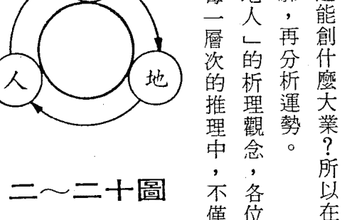

利用紫微斗數論婚姻的著眼點，在命宮、夫妻宮、福德宮與財帛宮，其中命宮和夫妻宮是看雙方的個性是否配合，財帛宮和福德宮看婚後的對待關係。完全沒有什麼差三、六、九歲的問題，坊間已有許多著作駁斥以年歲論定的謬誤，大家也可以自行調查依農民曆中大吉大利的婚配佳偶，是否真的如書上所說：「旺夫益子，到老榮昌」？

利用紫微斗數推論婚姻，有三道深淺不同的層次，由淺入深的順序為：

- 一、由本命夫妻宮的星宿看配偶特性。
- 二、參看夫妻宮干四化星，推論配偶終生大概運勢。
- 三、由行運夫妻宮星性及宮干四化，精確判斷配偶行運與夫妻相處情形。

這三道步驟是斗數推命的基本步驟，其他事業或財帛等問題，也必須通過此三道手續濾析，才能精確地判斷。不要因為只看到第一道手續的解釋，便心慌意亂不知如何是好。其實這只是「隱藏性因素」而已，會產生問題的，應在第三道手續的行運不吉，若行運逆向而行，便不會有所影響。

### 紫微斗數和婚姻

「命運」是「本命」與「行運」的縮寫，本命是不變的，而行運卻因時因地而變。因此，若本命命中註定有一位體貼的佳侶，但因行運不吉也會有波折產生。造成波折的原因有：車禍、外遇、生病、個性轉變、事業失利、意外災害、犯罪等。上述事件的形成，有些是突然發生，無法事先預防；有些是逐漸醞釀而成，大部分可因自我克制，提升高雅情趣而減輕。所以，「行運」可藉個人努力而改變，無法藉他人之手「改運」。

人生運途像一波波的浪，起伏不定，而人好像是衝浪選手一般，隨浪而動。有創意、鬥志的選手，會游至最佳位置，俟機攫取最壯闊的浪頭，創造輝煌的成績；而消極、保守的選手，往往靜待浪頭衝來，結果因為對浪潮的來處、行進特性、去處、風向等因素都不清楚，結果三兩尺內即已翻落谷底喝水去了。前者能「知機」主動地游到最佳位置，而後再俟機抓住最佳機會；後者不知機，只知靜待機會來臨，雖能暫時成功，但對前因後果都不明瞭，故其敗也速。

同理，若推知行運夫妻宮不吉，就必須主動預防，將可能造成婚姻波折的因素一一列出，逐項找出對策，如：定期健康檢查、不騎機車、開車守規則、遇衝突多忍讓、不貪贓枉法等都可防止波折，所以美滿婚姻的第二要素是「知機」早做預防。

「推命」主要在引導您知機而不是俟機，再配合個人努力奮鬥，使成就更輝煌。

### 由本命夫妻宮看配偶特性

紫微星在夫妻宮的意義：
由於紫微是諸星之首，地位如君主，因此最需賢臣輔佐，不然即成孤君。在婚姻生活中也易有孤獨的傾向，如：婚後分處兩地工作不在一起、配偶常出差、應酬多……等，若能晚一點結婚，心智較成熟且事業穩定後，就可以減少孤獨，配偶屬於穩重、深思熟慮的類型。早婚易有變化，但多讀書、進修、園藝等嗜好，也可排解早婚的不良影響。

三方若會煞星，感情較不和，配偶個性情緒化、衝動、做事三心二意，時有空虛感或喜歡獨來獨往。若化權同宮則配偶會因專注於事業而忽略家庭，宜多體諒，婉轉勸勉或共同為事業努力。

紫微星在卯、酉位置與貪狼同宮，為『桃花犯主』，也是一正一邪同宮，三方所會吉星多時，主配偶多才多藝，注重生活情調，對藝術有興趣或專長。

男命主妻子善交際、事業心強、個性強、好動、不耐靜守、不甘雌伏，因此會因事業忽略家庭，若化祿、化科同宮則能雙方兼顧。

但會煞星多或忌星同宮或忌星沖，都會破壞均勢而往酒色財氣方面發展，如：酗酒、好賭、好色等，迷失自我方向，置家庭於不顧，這種情況最好找配偶事業和下列有關的：化妝品業、藝廊、髮廊、染色業、美術工作、裝潢業、紡織、餐飲業、成衣等，可減少波折，且配偶也多有表現。

紫微星在辰、戌位置必和天相同宮，天相主衣節、食祿，表示配偶注重穿著、食物的精美，對於家事處理得有條不紊，不過脾氣大一些，做事只有三分鐘熱度，喜歡聊天接龍，在他生活圈子中是很活躍的人物，而且喜歡助人、當和事佬，故外界風評很好，夫妻可同心創造一份事業，壬年生的人吉。

紫微星在丑、未位置有破軍同宮，紫微與破軍分別代表正、邪，故同宮時，若雙方勢均力敵，則代表配偶是個非常細心的人，謹言慎行，個性強，待人處事均很得體。

若逢化祿、化權、化科在夫妻宮，那恭喜您有一位明理、穩重、細心體貼的佳偶與你共度一生。

但逢羊、陀、火、鈴沖或同宮的話，則邪方力量強，領導權由破軍掌握，帶領煞星作亂，如：個性衝動、好勇鬥狠、好賭獵、好漁色等，此時，和配偶的年歲差多些（七歲左右），就能減少煞星的衝擊力。

一般說來，此型配偶喜歡湊熱鬧、找刺激、有向傳統挑戰的勇氣。紫微星在寅、申位置與天府同宮，是一個強勢組合，和命宮的貪狠星無法匹配，因此易造成『孤獨』獨的傾向，如：聚少離多、抱獨身主義、晚婚等。若會吉星，如文昌、文曲、左輔、右弼、化科、化權等，則會減少孤獨的傾向，而轉為理智、成熟。

紫微在夫妻宮可以找到一位誠懇踏實、細心體貼、令人有信賴感的伴侶，男命主妻子年齡稍長，女命則主丈夫年長很多，而且家世很好，社會上的評價不錯，容易出人頭地，而且夫妻相處和諧。

若夫妻宮三合有天空、地劫來會，表示配偶花錢不知節制或守財不牢而發生經濟困擾，因此最好由自己掌握家庭經濟，控制支出。

紫微星在巳、亥位置有七殺同宮，表示配偶有個性而且性急，眼睛大、個子滿高的、口才很好、擅於交際、人緣好，但處事有原則、有主見、不喜奉承，不過處理事情略嫌武斷，容易陷入我行我素的窠臼而不自知。對於終年辛勞的配偶似嫌不夠體貼，常為此事爭吵，夫妻宮有紫微、七殺的朋友，應培養「自我調適」的修養，如時花種草、養魚……等嗜好，可避免責怪對方不知體恤引起口角。

女命加會昌、曲、魁、鉞，表示婚前多男友，婚後要知收斂，避免不必要的爭吵，就可互相尊重，白首偕老。

假如不幸和擎羊、火星、鈴星、陀羅同宮，表示配偶個性急躁、或身體上有傷疤、或有動大手術的機會，但只要調適得法，亦可和諧到老。

一般說來，紫微在夫妻宮可以找到一位誠懇踏實、細心體貼、令人有信賴感的伴侶，男命主妻子年齡稍長，女命則主丈夫年長很多，而且家世很好，社會上的評價不錯，容易出人頭地，而且夫妻相處和諧。

若會煞星多，性質轉變為爭強好勝，不喜待在家中，因此易誤入歧途，所以，雙方最好同有棋藝修養，偶而下盤棋，使爭強好勝的惡性在棋盤中發洩掉，或者球賽也不錯。

加會昌、曲，則配偶美麗、英俊，若化忌同宮，配偶較不利求學深造、或易與人發生文書糾紛、或容貌有損傷、或言語浮誇不實，若有化科與化忌同宮則不忌。

### 天機星在夫妻宮的意義：

天機星在子、午位置為獨坐，對宮有巨門，晚婚吉利，女命丈夫較年長，因天機星主波動，較年長的人，心性成熟、事業穩定，可以減少波動，有可能嫁給外族人士。

天機星在丑、未位置，屬墓庫，故主妻子體型嬌小。

最怕有忌星、煞星來沖，主有意外之災，尤其是手腳要特別注意，儘量少騎機車，辛、己年卯、酉時生人，尤需小心，因為對宮有文昌或文曲化忌來沖。

天機星在寅、申位置和太陰同宮，命宮為巨門，主「隱晦不明」，因此易有不正常的感情，如：同性戀、愛上已有家室者、單戀……等，且初戀不易成功，所以會稍晚些結婚，婚姻美滿，男命妻子美麗、有氣質、情緒多變化，不過處理事情來有條不紊，工作上也頗有建樹，若與化忌同宮易有鑽牛角尖、神經質的傾向。

男命可娶到橢圓臉、皮膚白、秀麗的女性為侶，性子急、反應迅速、思慮敏捷、足以擔當大任，為夫的應以欣賞的態度對待，不要妄自菲薄，若逢化忌，有神經質的傾向。

有吉星來會，則能夫唱婦隨到老，不過丁年生者，巨門化忌由對宮來沖，恐有波折，若本宮有科星來解或行運吉利，只是小口角而已，不會造成分離。

本宮有陀羅或天機星化忌，配偶做事往往三心兩意，猶豫不決，拿不定主意，此時另一半就必須負起決策的責任，或最多給對方一些建議。

天機星在丑、未位置也是獨坐，對宮有天梁，此種情況最宜晚婚，男命三十歲、女命二十七歲以後結婚較好，早婚往往會有波動，如配偶出國、出差、應酬多等而忽略家庭，因此比較會有衝突，最好各有自己的事業，多學消遣技藝，以打發獨處時間，若婚前有過感情波折，處理得當的話，也能和諧到老。

天機星在卯、酉位置機巨同宮，天機主波動，巨門主是非，引申在夫妻宮的解釋為「配偶常出外，相處時有口角是非」，如：先生常年在外，同床異夢、無子女、配偶事業失敗、嗜賭：…等，而使婚姻中斷或不美滿有缺憾，因此宜將心力轉向他處發展，如自營生意、進修、培養正當消遣技藝等，可避免波動。

配偶能幹、不善創造羅曼蒂克的氣氛，會吉星多人緣很好，容貌中庸。有煞星來會，那麼此人的配偶在家裡一定會抓權、專制、派頭不小且不易相處，若有化權、化祿、化科同宮則會轉好，互相尊重，也很理智，可以終生相守。

加會羊、陀、火、鈴四煞星，配偶的頭髮乾燥偏黃無光澤，表示內臟功能差，尤其是胃部，故其軀體也瘦小。

和文曲、天姚同宮，儘量帶小孩出門，可以減少不必要的豔遇，或者培養書畫、歌唱的共同嗜好也很好。

天機星在辰、戌位置機梁同守，有「機梁同宮善談兵」的說法，代表配偶智能高、善謀略、做事有計畫、按部就班地執行，是最佳的技術、幕僚人才，大部分有棋藝修養，所以本身宜培養相同興趣互相切磋，增進情感。

男命會有賢慧、能幹的好內助，外型雖不艷麗，但氣質好、風度佳、妯娌和，內外稱讚。在辰宮妻子善良內向，身材高瘦，若胖則矮，加會昌、曲、魁、鉞易得妻助成功。若在戌宮不會吉星且有煞星來沖，太太身體較弱，吉凶星同宮主分離、小別或經常出遠門。

天機星在巳、亥位置對宮為太陰，若天機在巳宮，太陰在亥為旺地，照夫妻宮，主配偶富愛心，對慈善事業有興趣，很機智，有特殊專長，善理財持家，會火、鈴星做事較衝動，所以偶爾有家務紛爭，但不妨夫妻感情，若對宮太陰化忌，則配偶皮膚較黑。

在亥宮時，太陰在巳，白天的月亮毫無光芒，故天機在亥宮守夫妻比巳宮略為遜色，不過依然擁有精明能幹、有專長、擅打算盤、擅講話的配偶，身材中等略胖，會煞星多時較饒舌，也有意外傷害的機會。

天機星主波動，但婚姻生活喜穩定，故天機在夫妻宮，或多或少都有波動的影響，這種波動多因事過境遷而風平浪止，只要行運吉利，能長相廝守。

若會煞星多時，只要趁早預防也可防止感情破裂，預防對策除文中提及者外，下列也可斟酌採用：

- 1. 雙方皆從事動腦性的工作，如：設計、寫作、企劃、計算、業務等工作。
- 2. 培養「動腦」、「活動身軀」的娛樂，如：戶外活動、棋藝、插花等等，夫妻共同參予。
- 3. 培養獨立能力，外出工作，共同負擔家計。

### 二、太陽、武曲、廉貞、天同星對婚姻的影響

#### 太陽星在夫妻宮的意義

在子或午的位置，為獨坐的型態，午位是一天中，太陽最烈的時刻，充滿熱力，光芒四射，普照眾生，帶來蓬勃的生機，而子位的太陽毫無光芒、熱力，所以在這兩個位置上也會產生兩種極端不同的特性。

在子的位置時，丈夫應該是身材略胖，圓臉，額角略窄，年輕時，精力充沛，充滿鬥志。有創業雄心，往往付出多而收穫少，終至草草收場。一步入中年，性格會轉變，對工作意興闌珊，轉而注重享受，甚至影響夫妻感情，最好選擇：軍、公、教職的對象較佳。

妻子應該是身材略胖，圓臉，富有同情心，但因此位太陽陰暗無光，故其行為也較含蓄，或有因同情而生愛的現象，故宜事先自我約束。性情較急躁，往往未明狀況而生爭吵，若能減少交際，常陪嬌妻，可以減少衝突。

太陽最忌與四煞同宮，不是多受傷就是變壞，在找對象時應注意雙方個性的配合。

太陽在夫妻宮有「妻奪夫權」的說法，若能以欣賞的態度來看，何嘗不是一種福氣，但也要適切的幫忙能幹的嬌妻，不要冷眼旁觀。

在丑或未的位置，太陽、太陰同宮，在斗數上，太陽主男，太陰主女，日月同宮，表示配偶有雙重性格，有男性的剛強、豪爽、勇敢，也有女性的溫柔、優雅、體貼，因此頗有異性緣，不過都能保持朋友的距離。

吉星同宮，夫唱婦隨，婚姻美滿，不過左、右同宮的婚緣會遲些。

夫妻宮坐日月，最忌對宮文昌或文曲化忌來沖，故丙辛年卯時生的人，要特別注意婚姻生活的調適與婚前的選擇。

在丑位早婚不好，較多波折，而未位早、晚婚都可，若有煞星同宮，則多變化，因日、月在天地。

在寅或申中的位置，太陽、巨門同宮，巨門乃陰晦之星，最喜有明亮的陽光驅走黑暗，故在寅宮的太陽可解除同宮巨門星的陰晦，而轉變為富有競爭心、上進心、口才絕佳、不畏困苦、能在競爭激烈的行業中脫穎而出，若巨門化權，則說起話來更是頭頭是道，旁徵博引，完整得無懈可擊，是非常理想的談判、貿易能手。

在申宮，雖然口才很好，辯才無礙，但因太陽無光驅逐巨門之陰暗，故專喜揭人隱私或為意氣之辯，所以給人的印象是『長舌、嘮叨、狹辩』，若能革除此項惡習，在事業上也頗有成就。

不管寅或申，皆主配偶外向，做事認真，喜歡出點子，但思慮欠周，與陀羅同宮注意分離。

若化吉或會吉星多，都可將巨日同宮的競爭性發揮在事業上，而不是夫妻間的口角之爭；故雙方最好各有自己的事業。

對象宜：業務、貿易、外交、節目主持、教師、娛樂業等，用「口」生財，或競爭性強的事業中人才，宜晚婚。

在卯或酉的位置，太陽、天梁同宮，在卯的位置，如剛冒出海面的晨曦，驅走一夜的黑暗，帶來光明，充滿蓬勃的朝氣，活力強，將活潑的訊息散播給周圍的人們，往往成為同伴中的帶頭人物，也很會照顧別人，能設身處地為他人設想，做事穩當不冒進。若沒有煞星同宮或忌星來沖，可以恩愛地白首偕老。

若煞星同宮或忌星來沖，則婚前易遭家長反對或婚後會有短暫的分居現象，晚婚可免。

在辰或戌的位置，是獨坐的型態，對宮為太陰，陰陽會合，代表配偶個性剛柔並濟，易和異性接近，感情較開放，可能會有感情的困擾，如三角戀愛、畸戀、或婚前同居等現象，因此命宮或夫妻宮有日月會合情況的朋友，宜對感情收斂些，避免感情糾紛，若有空、劫同宮，則會較好些。

辰宮妻子艷麗、豐滿，皮膚細白，戊宮有點胖。

對象做事有魄力、毅力、體格好，加四煞，工於計謀，投機取巧或身體較差、帶疾延年或與父無緣等。

加文昌、文曲、左輔、右弼、化祿等應注意婚後不可再交異性朋友，必要時需夫妻雙方共同與之交往，避免獨處，即可保有平靜的家庭生活。

在巳或亥的位置，是獨坐的型態，對宮為巨門。

太陽在巳為旺地，亥為陷地，故巳位較亥位吉利。

已位對象性子急，凡事都一鼓作氣的完成，不會推拖，且不假手他人，是富於責任心的人。旺地的太陽能驅走對宮巨門陰暗的影響，故引喻為明理、不會無理取鬧，但反過來說，在亥位的夫妻則較相處較和諧，而陷地的太陽，夫妻雙方較多爭執或較辛勞，在投資上亦宜保守。

結論：太陽在夫妻宮，因所落入宮位的旺、陷而產生不同的變化，一般說來，旺地的太陽，夫妻在巳位可早婚，亥位則宜晚婚，尤其是甲、丁年生的人，本宮太陽化忌或對宮巨門化忌來沖，皆應注意，一有婚姻失調即應速謀對策，不可無理取鬧。

對象宜：公教職、傳播事業、法律、旅遊業、慈善公益事業的工作人員，或在民營事業擔任服務性業務的人也很適合。

有莫名其妙的爭執，因此，如何導引配偶的猜疑往善意的解釋，成為維持和諧婚姻的首要課題，最好和配偶共同參加社交活動或共同經營事業，朝夕相處，消除可資疑慮的死角。

#### 武曲星在夫妻宮的意義

在子或午的位置，武曲、天府同宮，武曲為財星，天府也為財星，故配偶的理財能力很強，長得很好看，臉略呈方形，體格中等，個性柔中帶剛，非常顧家，多才多藝，是很優秀的配偶，雙方皆能互為輔佐，共創事業。

武曲剛強，天相富有正義感，故配偶有俠義心腸，好打抱不平，見不平立即會展現濟弱鋤強俠義本性，直到對方敗下陣為止，而命宮坐七殺星亦主性格剛強，故兩人一吵起來，非有一個人承認失敗不可，否則沒完沒了，因此若有此等夫妻宮結構的朋友，宜先學會寬容的心胸，婚姻生活才不會冷戰連連，還好此種爭執，偏重在爭『理』方面而非爭『情』，故雙方都能在事後和好如初。有陀羅、鈴星同宮其作用力同武曲化忌，但其力量更陰柔更綿延，且配偶的胸、肺機能較差，易患感冒、氣喘等病，與火星同宮有開刀的可能。

在卯或酉的位置，武曲、七殺同宮。對方的性情較古怪，行徑異於常人，時有反傳統的行為，是位大膽而敢於創新的人物，往往被人視為異端，因其創新皆在外形上求變化，若和擎羊同宮，可能是不良份子。由於行徑怪異，故在感情上亦復如此，如有橫刀奪愛、三角戀愛、未婚同居等為眾人所不齒的感情出現，尤其天姚、文曲同宮最為靈驗。與羊、火、鈴同宮，則配偶會有因重疾而開刀或刀傷的可能，若有科星來解，則可安然度過，或改過向善，消弱暴戾之氣，也可將外來之傷害降至最低，有此種夫妻宮結構的人，特別注意婚後生。

和左、右、昌、曲同宮則適於財經工作或在適當時機自創業，和左、右同宮的命會晚婚。若有火、鈴、羊、陀同宮，則配偶個性較剛烈，個性較衝動，若武曲再化忌，則花錢不智，不可從事財務工作或創業。最喜吉星來會或化吉，除主婚姻美滿外，也主事業有成。

在丑或未的位置，武曲、貪狼同宮。太太中等身材、個性強、具有獨立性、擅長女紅、處理家務有條不紊、交際能力好，常參加各種團體活動，物質慾較強，也有毅力、能力創造更多的財富。丈夫的特性同上段，但增加擅飲酒一項，故不要貪飲杯中物而誤了家庭，尤其是在丑位武貪格的丈夫。武貪格的人，物質慾望較強，有創業的雄心，但最好在三十歲以後再捲起袖子自己做比較好，三十歲以前雖有很多財富，恐會在一夜之間雲消煙散。武貪坐夫妻宮的人，配偶均有理財能力，視錢如命，對象最好為財經工作者，如會計、出納、郵局、農會員工、金融事業等人員等較適合，或者自營事業者也很好。有四煞之一同宮，配偶凶悍，如壬、癸年生的人有化忌同宮，較不易在一起生活，如配偶因工作需要常出差或個性不合而分居等，但心常懷念對方，男命須忍讓太太的潑辣。

在寅或申的位置，武曲、天相同宮，命宮為七殺。

活的嚴謹，及與鄰居的守望相助。婚前亦應注意選擇配偶，找個性中庸、穩重的對象較吉利。

在辰或戌的位置，武曲獨坐，對宮為貪狼。

對象身材較矮，聲音宏亮，體壯結實，性剛毅、能幹，為達目標能吃苦耐勞，直至達成為止。

妻子能夠將家中整理得有條不紊，在事業上也是極佳的秘書人才，對於資料的整理很有心得，但一熟悉例行性的工作，就易生倦意，故應時常在家庭生活上加一些變化，以點綴枯燥的公式化生活。

女命，己、戊年生的人，丈夫三十歲後事業有發展，且往往是暴發之財，己年生的人較佳（子、午時生的人例外）。

男命，己年生的人，婚後事業會較順利，妻子比較會撒嬌，其規勸、制止之辭，常藉撒嬌的方式表達，故應予重視，雙方都能相安無事，會昌、曲、化祿會因妻助而致富。

不管男女會四煞，定主多紛爭。

在巳或亥的位置，武曲、破軍同宮，命宮為天府。

男命較女命吉利，因男命命宮為天府，有忍讓的氣度，將瑣事交由能幹的嬌妻處理。而女命則會與丈夫聚少離多，或個性、人生目標不相同而不合，但能忍讓適應。

已位，太太善理家事，美麗端莊、理智、氣質佳，同時男命本命為天府，不怕火、陀，但甚怕火、鈴星，有的話，恐有波折。

亥位，個子不高略胖，長相清秀，會吉星多，夫妻和順，會祿存再加火、鈴，則感情上一定不如意。

武曲主財，破軍主耗，故兩個在一起就成了「耗財」，因此夫妻雙方宜對金錢的運用詳細規劃，以減少因金錢引起的口角。

#### 廉貞在夫妻宮的意義

在子或午的位置，廉貞、天相同宮，命宮為七殺。

廉貞最喜天相來制其劣根性，故會吉星愈吉，若有煞星同宮易破壞其均勢，引起婚姻生活的波動，要避免波折最好找誠懇、踏實的專技人員為侶較佳。

午宮可有美滿的婚姻，配偶性情剛直，易怒好爭，喜掌大權，自我要求高，能力強，凡事都不假手他人。身材中等，輪廓較深，適合晚婚，在子宮略遜。

有六煞（含空、劫）同宮，易有波折，若夫妻皆在外工作，可降低波折的發生率。

在丑或未的位置，廉貞、七殺同宮。

只要沒有六煞或化忌同宮，男命主妻子容貌美麗，多才多藝，個性豪爽，不拘小節，在未宮則較注重修飾，個性較為柔順，頗懂得享受。

女命則主丈夫頗懂得待人處世之道，也很節儉，注重修飾及生活情趣的培養，能自我督促上進，終能成功。

把吵嘴当逗趣，吵吵闹闹过一辈子。对象适合：公职、军职的人士，个性最好选温柔一点的。在辰或戌的位置，廉贞、天府同宫。廉贞、天府同宫的配偶，很有家庭观念，做事有计划、有主见，意见不被采纳也能尊重别人的意见，智慧高，做事细心，在学时是品学兼优的好学生，在职时是主管的得力助手，将来会自创事业，是一位待人随和、治事严谨的好对象。夫妻双方有许多共同的嗜好，如共同参加社交活动，共同经营事业，夫唱妇随，白首偕老。不幸有六煞、忌星同宫，可以短暂的分离，以化解之。对象宜：文化、设计、大众传播、美术、纺织、成衣、餐饮等方面之人士。在巳或亥的位置，廉贞、贪狼同宫。

> > 古书上说：「贪居亥子，曰泛水桃花」

可见在感情上必然多采多姿，到抉择的时刻，仍不知选那一位为终身伴侣？甚至婚后仍维持频繁的社交活动，而影响平静的家庭生活，这是双方必须要自我约束的，尤其是有陀罗同宫的人。若有空、劫同宫，则能转为良性的发展，妻子端庄、贤淑、擅长女红、酒量好。有昌、曲、左、右同宫，主配偶有多方面的才艺，尤其在歌唱、美术方面，在待人处世上也颇为圆滑老练，是理想的公关人才，可在大众传播界、娱乐界、饮食界崭露头角。

若左、右、六煞同宫则宜晚婚，羊、陀、化忌同宫则可能有离婚官司。三方没有会入空、劫、化忌，可从事「美艺」方面的事业，如画廊、发廊、美术教室、音乐教授等方面的事业。此婚姻宫的姻缘，常有比较特殊的情况出现。在寅或申的位置，廉贞为独坐，对宫为贪狼，命宫是破军。廉贞是颗桃花星，所以在做人处事、应对方面颇有心得，是公共关系的好手，因此，对于配偶的交际应宜予以善意的开导。妻子清秀端正、贤慧、风度好，具有多方面的才华，适合职业妇女，如从事：柜台、成衣设计、装潢、业务等，须与外界接触或与「美育」有关的行业都很适合。有文昌、文曲同宫，则对于美术、音乐等方面颇有心得，且能调剂生活，维持双方和谐的心灵。在卯或酉的位置，廉贞、破军同宫。配偶多才多艺，有责任感，肯努力，能吃苦，但个性强、主观，宜慢慢开导，卯宫比酉宫吉利，夫妻双方都能忍让，维持婚姻和谐。若有六煞或化忌同宫，会因吵架而分开，甚至法院相见。加文昌、文曲、左辅、右弼同宫，则能有陀罗、火星、铃星同宫，则要注意收敛感情，莫乱爱，最好在长辈的首肯下交往，较有保障。

#### 天同星在夫妻宫的意义

在子或午的位置，天同、太阴同宫。
无煞星同宫，配偶俊秀，异性缘良好，男命妻子性情温和，女命丈夫性子较急，仪态高贵，是金童玉女型的搭配。
午宫与擎羊同守，谓之「马头带箭」，丈夫将来会在异域开创一番事业，衣锦还乡，当然成功必先历尽艰辛，故其性格坚毅沉着。男命妻子在事业上颇有成就，定为主管的左右手。若夫妻双方能共同就职或创业，皆有成功的时候。
平时宜多注意运动，以控制中年体重的增加。
女命夫妻宫同、阴守，加煞星感情复杂，最宜晚婚。
在午宫若与禄存同宫反而不好，恐与公婆不合，因左右有羊、陀来夹。
在丑或未的位置，天同与巨门同宫。
同、巨同宫，口才定然不差，天南地北无所不谈，很有朋友缘。但在感情上却不如意，大多不能和初情人结成连理，经过多次失恋且步入三十岁左右结婚最好，早婚则为欢喜冤家，床头吵架，床尾和，严重可能有分手的可能。

配偶长相并不特出，但工作能力强，太太明理、贤慧，晚婚可保婚姻生活顺利，丈夫能干、性急、口齿伶俐。天同、巨门化忌同宫，则为三姑六婆之流，东家长西家短，巨门化忌亦主口才拙劣，前者宜适度规劝，后者要多鼓励、训练表达能力。
有羊、陀同宫则主配偶视力不良或子女不多。
有煞星同宫最易有离婚、再婚的可能，双方若在心性修养上多下苦心，培养仁厚的胸怀，可免波折。
在寅或申的位置，天同、天梁同宫。
利于男命，不利女命。天同为福星，天梁为荫星，凑在一起则表示配偶个性随和、宽厚，与谁都能相处得来。丈夫若能如此，在众人间的人缘定然不错。若男命，妻子个性如此，则会给人水性杨花之感觉，而使婚姻决裂。因此，男命妻宫坐此双星宿的人，最好与妻共同参加社交活动，或妻子在外人面前应收敛起随和不拘小节的谈话态度，才不会在感情生活中掀起阵阵涟漪。
有天姚、右弼、左辅、文曲同宫，则要注意感情横向发展。
男命主太太美丽，温和伶俐，鹅蛋形脸，感情纤细、敏锐，身材中、高。女命主丈夫温厚稳重，喜游山玩水，讲究精致的生活，具有不卑不亢、高尚的情怀，是标准的好丈夫。
有煞星同宫虽能引起波动，但同、梁的解厄制化功能，可将波折降至最低。

男命：太太身体健康，长得很清秀，皮肤白里透红，人缘很好，喜交游，兴趣广泛，但不精于一艺，晚婚吉，早婚会有一短暂的分离期，如本身或配偶出国留学等，若四煞或化忌同宫，则会破坏优雅的形象。

女命：丈夫厚道、正直、体型略胖，人很随和，是个好好先生，但事业上的发展并不大，最好从事服务业或担任教职人员为宜。

女命本命在巳，夫妻在卯的命，将有一段因事和丈夫分居的时期。

加昌、曲，对于艺术有兴趣，化权、化科同宫的话，定然因此成名。

六煞同宫，配偶除了具有火山脾气外，也较自私，凡事只为自己打算，欠缺令人能依靠的感觉，故最好自己也能培养独立的能力。

在辰或戌的位置，天同星独坐。

天同是福星，最不喜落入天罗地网宫（辰、戌）内，因天同有随遇而安的惰性，欠缺雄心斗志，贪求享受，难以脱离天罗地网的束缚，而予人「懒惰」的感觉，在婚姻生活上也比较墨守成规，很易令配偶厌倦，若能适时地制造情趣，更能使感情历久弥新。

若火、铃、羊、陀同宫，则有突破束缚的雄心，但只有三分钟热度，另一半应予以持续性的鼓励

另外在脾气上也较倔强，个性独特，喜欢独来独往。

加左、右同宫，配偶可为事业上的助手，为了对方，任劳任怨的付出，毫无怨言，但本身中年要防感情变化，因本命宫太阳坐命，在子位的人易有对不起配偶的事发生。

加文昌、文曲，则能培养出共同的嗜好，减少婚姻的波动。

在巳或亥的位置，天同为独坐，对宫是天梁。

若无忌、煞星来会，主配偶美丽、俊秀，但较懒，而且很有可能与外族人或出外人结婚，只要流年行运配合得好，皆能从一而终。

同、梁在巳、亥，属漂泊命，也就是说不会在出生地发展，或者从事的行业需四处漂泊的，如：

空服人员、船员、司机等，都符合漂泊的特性，故与上述行业的人结婚也很理想。

男命妻子美丽、温柔，但也较喜欢交游，且心性较不稳重，最好能共同参加社交活动，女命丈夫性情耿直、笃厚，很有同情心，可鼓励参与慈善事业，发挥博爱的胸怀。

有陀罗同宫，则小心肾脏方面的疾病，个性也较多疑、多心，对于婚姻生活也较不好，最好能坦白的将个人行踪、日程予以知悉，免得引起无谓的争吵。

### 三、飛星紫微斗數推流年

環顧以往，展望未來，是吉？是凶？實在令人難以預料，在此僅以飛星紫微斗數的演繹法則，推論今年的運勢。

並就：國運、交友運、事業運、財帛運、婚姻運等做一推測，同時將推演之規則予以簡要之說明，各位可自行依規則推論自己今年的行運，因為牽涉到年干四化星的變化，所以請各位將生年四化表找出來，和後面之說明，互相參照閱讀，才能收事半功倍之效。

#### 國運之推演：

為了讓大家了解天干四化和地支的關係，我們從七十三年開始說起。

七十三年，農曆為甲子年，甲年干——廉貞化祿、破軍化權、武曲化科、太陽化忌。在斗數星性論中，太陽主男子、能源、官祿主，而且在「子」位是其最陰暗無光的時刻，故化忌的惡性很強，結果甲子年礦災連連，其他的大事情各位可拿舊聞套套看。

七十四年（乙丑年），乙天干是：天機化祿、天梁化權、紫微化科、太陰化忌。太陰代表：女人、財帛、田宅、化粧品等，在「丑」位已由極盛轉衰，故化忌對金融、建築等業不吉，所以去年國信貸案、十信案對國內金融造成很大的傷害。

七十五年（丙寅年）：丙年干之四化星為：天同化祿、天機化權、文昌化科、廉貞化忌。
天同化祿配天機化權，則今年技術性的服務業會有更佳的成長市場，例如：自動化設計改善、電腦軟體、硬體銷售公司、室內設計等都是，若單以天機化權而言，化權主勞碌，天機為機械、汽車，故今年機械製造或汽車製造業會有好轉機。
廉貞是官祿主、電化設備、桃花星，而「寅」宮又為諸宮之首，故廉貞化忌對電化設備製造業、娛樂業（不好聽一點是色情業）會有不利的影響，業績會掉下來。
文昌化科的話，教育、出版等事業很平穩，雖競爭激烈，但餅還是夠分著吃。

#### 交友運：

在說明交友運的推算規則前，先說明在命盤中的顯象到底會在什麼時候應驗？在斗數學中有所謂「天、地、人」三才，「天」之現象會在「人」中應驗，而天、地、人和本命、大限、流年、流月的關係如下：

#### 四化星對交友的影響

對於適婚而未婚的朋友，最關心的問題，可能就是對象何時會出現的問題，斗數可以推算你今年會不會有新交的朋友或有沒有人追求，但成不成呢？則在你之抉擇。看會不會成為結婚對象有其他宮位顯示，因牽涉太廣，容後詳述。

如何推算今年交友運呢？請參照以下三步驟：

- 標出流年交友宮。
- 找出流年交友宮干之四化星各落入何宮位中。
- 此四顆化星有沒有進入命宮、夫妻宮、遷移宮、事業宮中？沒有的話，則與我無關，有進入上述宮位的話，則會發生與朋友有關的事件。

到底今年的交友宮在那裏呢？以下頁圖命例A為例，今年流年命宮在「寅」的位置，而交友宮在「未」的位置，其他的十宮可依本命盤的相同順序填入，即得流年命盤，而大限命盤則先問自己是幾歲，若為二十五歲土五局，則二十五至三十四的位置即為大限命宮所在地，如命例A「午」的位置即是她大限命宮，其他十一宮亦是依本命盤宮位順序填入即得大限命盤，如此大限、流年命盤即算製作完成。

要看流年會發生何事，須找本命盤的相關宮位，若配合之大限亦呈相同的現象，那麼本命盤中顯示的現象，便會在該大限的流月中應驗，流月的推算亦仿此。 圖中有所有「假借」，可比喻為踏腳石，由此岸到彼岸的踏腳石若很穩固，雖兩岸很崎嶇也能安然度過，若踏腳石不穩偏斜，則會產生不良的後果，因此行運的好壞須透過天地人的三道層次來推算。 交友運對今日的年輕人來說，有太多的交往機會了，所以看流年交友運，可以拿今年的交友宮來

看即可，免去天地人三道過濾手續。

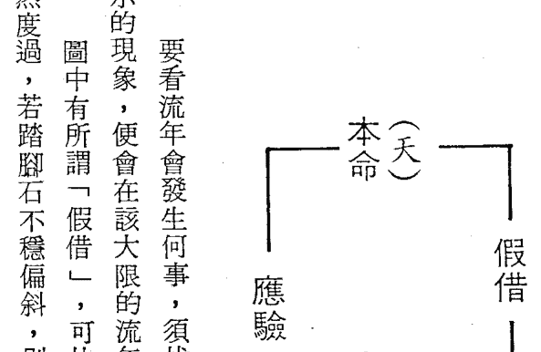

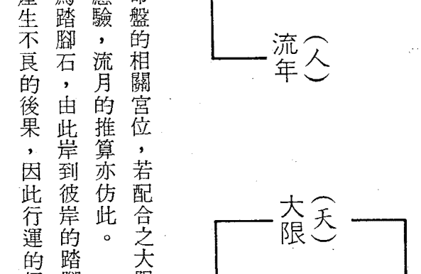

### 數斗微紫星飛

| 火 東南 巽 | 火 南 離 | 土 南南西 | 金 西南 坤 |
|------------|----------|-----------|------------|
| 天機      | 紫微(機) | 天姚      | 破軍      |
| 田流 兄大 | 事流 命大 | 友流 父大 | 遷流 福大 |
| 巳 乙 (女子) | 午 丙 (妻夫) | 未 丁 (弟兄) | 申 戊 (命) |
| 七殺 文曲右弼 |  | 命例A | 陰陽 姓名：男女壬寅 年X月X日X時建生 土五局 24歲 |
| 福流 妻大 |  |  | 疾流 田大 |
| 辰 甲 (帛財) |  |  | 酉 己 (母父) |
| 太陽 天梁 鈴星 | 天巨火同門星 | 貪狼 羊 | 太祿天地陰存空劫 |
| 父流 子大 | 兄流 疾大 | 妻流 逸大 | 子流 友大 |
| 卯 癸 (厄疾) | 丑 癸 (友交) | 子 壬 (業事) | 亥 辛 (宅田) |
| 武天曲相 | 天巨火同門星 | 貪狼 羊 | 太祿天地陰存空劫 |

當然，今年命宮、遷移宮、交友宮的星宿亦和交友有關，若逢吉星則易交好友，若為凶星，則易爭執或交惡友。依四化星是由那一顆星宿所化，可推知朋友的型態，而依四化星可知感情的厚薄，我們先說四化星的感情型態：

- 化祿：不管什麼星宿化祿，皆主「郎有情，妹有意」，彼此情投意合的型態，雙方感情很自然均衡的進展，充滿柔情蜜意、羅曼蒂克的表現方式。
- 化權：則屬於「窮追猛打、死皮賴臉，不惜一切代價獲得友情」的方式，被動的一方心中會有受迫的感覺，在愛情溫度計上，一方可能已超過上限炸開了，而另一方呢？可能還停留在冰點。而結果又如何？好的可以獲得美滿的結果，最壞的情形是被霸王硬上弓，所以要「慎於始、謹而行」。
- 化科：雙方皆很溫雅、文質彬彬地保持安全距離，一切慢慢熬，沒有激情，只是相看兩不厭而已。
- 化忌：可說是盲目的亂愛或飢不擇食的迷戀，往往是悲劇性的結束，所以奉勸有此情形的小姐，痛苦一時的空虛沖昏了頭掉入陷阱中。撒隆帕斯貼上去很涼快，但要撕下來時，卻得忍受剝皮拔毛的痛楚，不過流年順利還是可以步向紅地毯的另一端。

再以每顆星宿化祿，看看今年所交朋友的型態：巨門化祿：巨門主「口才、辯論、研究」，所以今年所交的朋友，不是以「口」生財，就是口才不錯或是富有研究精神，說起話來滔滔不絕，很會自我推銷。個性較多疑，嘴型略尖。

破軍化祿：運動家的身材，是學校的運動健將，做事有膽識、有魄力，好勝心強，凡事有理定爭到底，不管你是長輩或上司，所以要禮讓他一點。

天機化祿：這種人心思細密，才思敏捷，說起話來略急而令人有口吃的感覺，不善於擔任領導人物，適合幕僚、策劃、技術等方面工作，待朋友很好，一通電話，服務就到，是位重視友情的好朋友。

太陽化祿：心性溫和，動作斯文，略微女性化，而女性則為標準的傳統女性，多愁善感，感受纖細，略為內向，具有藝術方面的素養，男性頗懂得揣摩女性心理，是一位體貼的對象。

武曲化祿：個子不頂高，但壯碩，聲調尖高。做事果斷、堅毅，一經決定的事，絕不反悔，有理財能力，平時談天，也多和「錢」有關，雖欠缺戀愛的柔美氣氛，但踏實的作風，令人有信賴感。

文曲化忌來沖：和文昌化忌的情況相同，但要注意感情糾紛或已訂婚却因某種因素分手。

談到交友，特別請未婚少女注意以下三種情形：

- 一、大限疾厄宮有貪狼化忌，廉貞化忌坐守在對宮來沖，則易有偷吃禁果的潛因。
二、夫妻宮化權入我今年疾厄宮，表示未婚夫或密友以強制手段佔據我之身體。
三、遷移宮化忌入我疾厄宮，而宮內又有擎羊坐守，則易遭色狼、不良少年的挾持羞辱，因此請莫獨走夜路、莫單獨赴陌生人約會、團體活動莫落單、衣著舉止多注意，即可減少不幸事件發生。

現在，讓我們看看命例 B 今年的交友運如何？（見下頁圖）

化忌沖命或夫妻宮時要注意什麼事情呢？

文昌化忌來沖之情形：注意書信、文書上之爭執，金錢借貸是非、文定之前多生波折。

貪狼化忌來沖：注意不要沉溺於情慾中，無法自制。

太陰化忌來沖：與異性朋友有短暫分離現象，對於對方的母親要噓寒問暖得遇到些。

#### 四化星對事業的影響

看事業運，須看大限事業宮干四化中的化祿，有沒有入今年命宮或事業宮（入本命盤同論），有入則表示今年在事業上的收入較旺，上班族有加薪的好預兆，再加化權來會，則今年事業一定順利暢旺，個人收入及權力也會提升。只化祿的話，表示事業只是做得風光而已，而內部結構並不平穩，上班族則表示只加薪或空歡喜一場而已。若只化權有人的話，那麼今年就要操勞些了。因化權表示掌權成就的意思，但沒有化祿來合的話，則其效果不顯，只是工作分量增加，較忙碌而已，待時機好轉，即有掌權的機會。

化科有：不疾不徐、逢凶化吉、科甲功名的意義。故化科入命、事業，不管是企業家或上班族，業績維持穩定的發展，在危急時，可適時獲得意外助力，度過難關。學生或有心參加考試的朋友，只要平時有周全的準備，在考場上都能全額發揮，獲得良好成績。乙、庚年生人，文昌化科入命、事業者，最利於參加各種考試。

化忌入命則表示心神全繫於事業上，難得有鬆懈的時刻，或是今年起有強烈的事業心，不比從前的鬆散，事不關己的態度。

但是，化忌沖命或事業都不是好兆頭，若有的話，會有下列之一種現象出現：

1. 失業（配合財帛宮而斷）、裁員。
2. 對現職有倦怠感，想換工作。
3. 覺得上司、同事難相處，工作挫折感加重。
4. 現任公司營運不長或倒閉。
5. 跳槽。

但是有化科入命、事業時，則能發揮逢凶化吉之威力，雖對宮有化忌來沖，亦能度過危機或是「拖延、猶豫不決」的過下去。

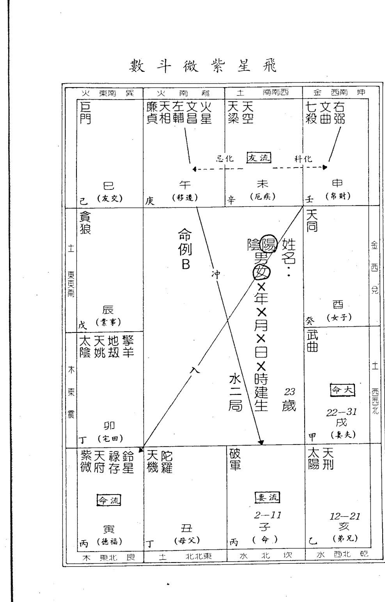

飛星紫微斗數

| 方位/宮位 | 巳（女子） | 午（妻夫） | 未（弟兄） | 申（命） | 酉（母父） | 戌（德福） | 亥（宅田） | 子（業事） | 丑（友交） | 寅（移遷） | 卯（厄疾） | 辰（帛財） |
| :--- | :--- | :--- | :--- | :--- | :--- | :--- | :--- | :--- | :--- | :--- | :--- | :--- |
| 方位/宮位 | 東南巽 | 南離 | 西南坤 | 西北乾 | 北坎 | 東北艮 | 東震 | 東南巽 | 南離 | 西南坤 | 西北乾 | 北坎 |
| 地支 | 巳 | 午 | 未 | 申 | 酉 | 戌 | 亥 | 子 | 丑 | 寅 | 卯 | 辰 |
| 主星 | 廉貪祿火
貞狼存星 | 巨天擎
門刑羊 | 天文文
相昌曲 | 天天
同梁空 | 武七
曲殺 | 太天
陽姚 |  | 天機
(權) | 紫破左右鈴
微軍弼星 | 地劫 | 天府 | 太陀
陰羅 |
| 大限 |  | 業事年流
宮命限大 | 16-25 | 6-15 |  | 業事限大 |  |  |  | 宮命年流 |  |  |
| 五行 | 火 | 火 | 金 | 水 | 土 | 木 | 金 | 水 | 土 | 木 | 火 | 土 |
| 天干 | 癸 | 甲 | 乙 | 丙 | 丁 | 戊 | 己 | 庚 | 辛 | 庚 | 辛 | 壬 |

（注：此表格为对原图中复杂命盘的简化描述，原图中包含更多星曜符号、宫位标注及连线关系。）

現在看看命例 C 的事業運如何？（見下頁圖）

大限事業官千戊，天機化忌沖大限命宮，所以此十年中事業必不順利，而且又是本命夫妻宮，故夫妻生活並不吉利，當行年走到寅的宮位時，大限命宮變成流年事業官，此年的事業運會比往年不順，因是天機化忌來沖，故可知心情浮動，不安於現職或較有調職的機遇。

#### 四化星對錢財的影響

即錢財收入支出的情形，收入可分為：一、自營生意收入。二、薪資類的穩定收入。再以支出或損耗的原因可概分為：一、日常性支出；二、投資；三、借予銀行以外的第三者；四、儲蓄。紫微斗數的財帛運推算規則對穩定性的收入支出情形較難正確地掌握，對於投機性的損益狀況較能掌握。

我們看財帛運，對於錢財的來源和去處必須加以探討，才能知悉財帛的波動狀態。

紫微斗數可以交友宮代表與我有往來的客戶，所以財帛的變化與朋友有密不可分的關係，故探究財帛的波動狀態，必須將財帛與朋友兩個宮位的宮干四化與星宿性質列入考慮。

大限財帛宮之化祿雖有入命宮，但交友宮之化忌又入我命宮或財帛宮，就好像朋友伸手到我荷包取我錢財耗用般，故無法積聚財富。如果交友宮化祿入我命宮或財帛宮，但該宮位又自化忌，就意謂著朋友很支持我、惠顧我之產品或拿錢資助我，但是自己卻因種種因素，無法善加利用資源而導致失敗。

#### 先由財帛宮的四化說起：

化祿：入命宮代表有錢財收入、入事業代表拿錢投資事業，依何星化祿而知收入的來源：

太陽化祿：若為自營事業者，今年的生意競爭比去年要激烈，但能在群雄中脫穎而出，成為斯界權威。所從事之行業以電氣類、能源動力類的事業較佳。

廉貞化祿：若為藝術界的自營事業者，如室內設計、裝潢、髮型設計、服裝設計、攝影、傳播、廣告等，皆很不錯，可以好好計畫一下擴展業務。

上班族的話，出差或靠口才賺錢的機會增加，有出國的機會。

上班族呢？有調薪的機會，但工作負荷也會加重。

若您是公司職員，今年也是一個權、財兩利的年度，不但收入增加、職位也可以上升，可以掌握實權的業績增加，減少經營的風險。

天同化祿：對於服務業的朋友，今年將會有一個更好的競爭環境，讓你一展鴻圖，或者和公家單位有關的業務會更順利。

貪狼化祿：貪狼主「酒、色、財、氣」，說得文雅一點是指娛樂業和飲食業，所以貪狼入命，又是從事上述兩行業的朋友，今年很順手，不過錢賺太多了，小心身體、四肢受傷或錢財被兄弟朋友「借」去了。

公務人員莫貪紅包，免得東窗事發，身繫囹圄，安份一點，一年三節的特別獎金會令你滿意的。

若你是民營企業的職員，可能主管請你加班的加班費比往年要多，若能積少成多，也是一筆不小的收入。

此命格之人，今年會有收入或工作上的轉機，如換工作或內部調動等。

天梁化祿：「馬無野草不肥，人無橫財不富」，天梁化祿可能會使你得到一筆意外之財，如：中愛國獎券、撿到錢財、摸彩中獎……等額外之財，對生意人來說，可得投機之財，又可說是老人財，可以賺到錢。

化祿須有化權來合，才能由虛轉實，因此，若化祿入午、申、戌的位置，再配合化權，則能穩穩的抓住機會。

化忌不可沖命、事業、財帛，雖有化祿守在該宮，但一受到忌星的衝擊，化祿之吉力消失，反而成為大損的預兆。

再說交友宮干的四化，化祿入我之財帛，前已述及，現在說「化忌」，交友宮的化忌若和我之命、財帛、事業成「沖」的態勢時，必須小心朋友來「劫」我之財，此「劫」之釋意為：

- 1. 借錢予朋友，有如肉包子打狗，有去無回。
- 2. 參加民間互助會，結果被倒了。
- 3. 商業往來，收到空頭支票。
- 4. 財被搶或被偷。

第四項的情形中，被偷以巨門和左、右同宮，而對宮有化忌來沖或本宮化忌，尤其巨門化忌最靈驗。而被搶呢？則須注意擎羊、七殺等煞星，有沒有隨化忌沖財帛，或在財帛宮而對宮化忌來沖，或在本宮自化忌等都易有被搶的機會，擎羊宛如一位不份子，伺伏在你的財庫內，一遇到機會（化忌來沖或自化忌時），就會發生壞影響力。現在看命例D的今年財運：大限財帛宮干的四化，都有入流命的遷移、福德、財帛宮內，故今年的財運不錯，而且今年的財帛宮甲戌，太陽化忌流入流年事業宮（庚午），所以今年會有拿出錢來投資事業的現象。再看大限交友宮干之四化中之化忌（廉貞化忌）反沖大限命宮及本命財帛宮，故要小心朋友來「害」我之財，尤其是今年。

#### 飛星紫微斗數

#### 今年的結婚運如何

對於想結婚的朋友，先將大限夫妻宮和流年夫妻宮圈出來，再看看裏面的星宿是何種星性，如碰到孤寡之星，如：武曲、七殺、煞星等獨坐，或命宮三方會滿三顆煞星以上，那麼今年要結婚的話，比較不好，或可說是情緣不深，難結成連理，若不是，則看大限夫妻宮干的化忌星，有無沖到流年夫妻宮，有的話也無望，須等到明年，假如，流年夫妻宮干四化中之三吉化星有入命、夫妻、福德、職業、財帛等宮位，皆有婚緣現象，希望好好把握。

### 四、你的另一半會是什麼樣子？
——請由夫妻宮的星性來推算

天府星在夫妻宮的意義：
在子、午的位置，和武曲同宮，請參閱武曲星。
在寅、申的位置，和紫微同宮，請參閱紫微星。
在辰、戌的位置，和廉貞同宮，請參閱廉貞星。
在丑、未、卯、酉、巳、亥等位置均為獨坐的型態，因天府星又稱為司令星，所以對於「男女平等」非常注重，個性柔中帶剛，若您是男士夫妻宮為天府星獨坐，那麼您將擁有一位賢內助，處理家事，頭頭是道，對於錢財的收支管理亦能量入為出，且有存私房錢的習慣，做人處事穩重務實，中年之後會長胖，有貴婦之相。
丑、未是在天羅地網內，故天府星的「保守、發號施令、享受」等特質便會受到束縛，而增加其溫柔度，比其他宮位來得更勤勞、更擅於女紅，有人說：「成功的後面，一定有一位偉大的女性」，而夫妻宮有天府星的男士往往符合這句話，因為有位能幹的妻子穩定大後方，讓先生無後顧之憂地在外衝刺。
若您是女命夫妻宮坐天府星，則您將有一位穩重的好丈夫，個性耿直，喜歡指揮別人，不過知道他有這種嗜好，讓他一點也不妨，尤其是天府星在丑、未坐夫妻宮的小姐，因您是殺、破、狼的組合，在個性上就略為強悍些，若能柔軟些，對於未來的婚姻生活將有很大的幫助。
天府星的長相很好看，清秀、唇紅齒白，身材勻稱，心性仁慈，不輕易發脾氣。若有昌、曲同宮，更能增加配偶的學識涵養，外表更秀麗，但不可化忌，否則有失學，肢體、顏面受傷，神經衰弱等方面的缺失。
和羊、陀、火、鈴同宮，在脾氣上會比較暴躁些，但因天府可制煞星之惡，其劣性會受到抑制，火、羊同宮則主配偶做事較莽撞、欠缺考慮，和陀、鈴同宮則屬拖延、遲疑，需要人的砥礪、建議。
在丑、未宮有煞星同坐，則會加強天府衝出天羅地網的決心，不再是保守的天府星了。
妻宮在卯、酉的位置，天府星獨坐的話，妻子事業心強，脾氣較固執，這是做丈夫的要諒解的。

太陰星在夫妻宮的意義：
在子、午的位置，與天同同宮，請參閱天同星。
在丑、未的位置，與太陽同宮，請參閱太陽星。
在寅、申的位置，與天機同宮，請參閱天機星。在卯、酉、辰、戌、巳、亥等宮都是獨坐的型態，落入廟、陷的宮位，對其特性影響很大，在戊、亥時為月亮最亮的時刻，主人心地光明，宅心仁厚，有滿懷大志，雖是女性也有不讓鬚眉之志，故夫妻宮坐太陰星於廟旺之地，則有上述之特性，非常適合向學術、藝術界發展。一般說來太陰星的配偶較內向、羞怯，動作中充滿女性的韻味，感覺纖細敏銳，臉呈圓型者多，個性溫柔、耿直，若您夫宮有太陰星，那麼您的丈夫也具有上述的特性，而且對於女人心理也較常人瞭解，是一位溫柔體貼的好丈夫，在廟、旺之地的話，在事業上定會有番成就的，不過在陷的位置，如卯、巳宮，則在事業上的發展性，可能會因個性上的缺憾而無法升至高級主管，而且有潔癖。太陰星的配偶，大部分均很美麗、斯文，體態豐滿，具有多方面的興趣，在婚前即受到許多愛慕者的追求，不過若在陷地的話，婚姻得晚些。在巳宮時男女雙方都要注意調適雙方的興趣，以免晚年孤獨，在此宮最怕再化忌，恐有分離的現象。太陰最不喜與煞星同宮，會使優美的特性完全走樣，故有「太陰與火、鈴同宮反成十惡」之說，若無科星來解，則爭吵不斷，最好找溫柔一點的對象。在丑、未的位置，與武曲同宮，參閱武曲星。在卯、酉的位置，與紫微同宮，參閱紫微星。在巳、亥的位置，與廉貞同宮，參閱廉貞星。

#### 貪狼星在夫妻宮的意義：

在子、午、辰、戌、寅、申等宮位是獨坐的型態，前面已說過貪狼主「酒、色、財、氣」，代表欲望，所以此星在夫妻宮的人，大半您的配偶應屬於物質欲望較強的類型，為了滿足欲望會不斷地工作，努力地賺錢，不達目的決不罷休，在做人處事方面也有一套，擅交際應酬，再加上豪放、熱情的個性，所到之處無不受歡迎的，但妻宮坐此星的男性，必須諒解太太婚後仍維持頻繁的社交活動和常要求外出旅遊，说不定太太的交際圈會成為您日後事業的助力。女命夫妻宮坐此星的話，您丈夫除前述優點外，他和別的男人不一樣——很省錢，尤其在辰、戌宮的位置，過了三十歲以後會有突發資財，但運限不好亦會散光。和昌、曲同宮，配偶長相秀美，注重妝扮，說話風趣而廣受歡迎，但文曲星同宮的話，可能話中多虛少實而予人浮誇之評。在辰、戌宮若有火星、鈴星同宮，稱為「火貪或鈴貪格」，表示配偶可從事股票、房地產等投機性事業，會有多次橫發的現象，但是不可化忌，否則定然橫發橫破。擎羊、陀羅、化忌同宮時，感情的路頗坎坷，婚前對象常換，婚後多是非、口角，若能晚婚便可降低此種傾向。

#### 巨門星在夫妻宮的意義

在丑、未的位置，和天同同宮，參閱天同星。
在寅、申的位置，和太陽同宮，參閱太陽星。
在卯、酉的位置，和天機同宮，參閱天機星。
在子、午、辰、戌、巳、亥等位置，都是獨坐的型態，在紫微斗數諸星宿中，巨門主『口角、是非』，所以落入夫妻宮中，不管男女婚前都會有失戀的紀錄，而且不會和初戀的情人結成連理，適合晚婚，才能保有美滿的婚姻，早婚須防波折，一般說來，男命以三十歲，女命以二十六歲以後結婚較吉利，而且對於對象的年齡限制也要放寬一些，如女大於男一、二歲或男大於女六、七歲以上的搭配，也很吉利，因為巨門的口舌是非會因年齡的增長及理智的成熟而降低其不良作用。
男命妻宮坐巨門，主配偶性子較急，喜怒哀樂都掛在臉上，幼年時多災多難，歷盡艱辛，因而養成堅毅的人格，持家嚴謹，頗受長輩的器重，家中大小事務幾乎由其一手包辦，身為丈夫的您也須設身處地的為她想一想，幫忙家務，減少自己過於頻繁的應酬，就能保持和諧的婚姻生活。
女命夫宮有巨門的話，配偶往往是口才不佳、懷才不遇的專業人才，對家庭照顧盡心盡力，唯不善於表現溫柔體貼，容易引起您的失望，只要您能時常開導他，逐漸開闊他的心胸，會轉為開朗、善辯的，這些全賴您正確的誘導了。

#### 天相星在夫妻宮的意義

在子、午的位置時，和廉貞同宮，請參閱廉貞星。
在寅、申的位置時，和武曲同宮，請參閱武曲星。
在辰、戌的位置時，和紫微同宮，請參閱紫微星。
在其他的宮位都是天相星獨坐的型態，稱為『掌印星』的天相星，為了行使大印必須要求自己立足點的公平、公正，所以主配偶「公正、踏實」，因此人人樂於和他親近，而且喜歡當和事佬、戴高帽子，所以在團體活動中是不可或缺的人物，因為只要給頂高帽子戴戴，便會努力地完成囑咐，這也是個缺點——很容易受人利用，尤其是女命，常被人誘拐了還不自知。
天相星的配偶長相都很不錯，不是高壯就是高瘦，而且很注重衣飾、食物的精美，三方再會入昌、曲，則易流於「好色之徒」，不過人是很聰明、充滿高貴氣質的，只因為三方的「水」星太多了，感情易於氾濫，若能自知而節制，可以減少氾濫，尤其是昌、曲有化忌時，最怕會感情出軌。
天相再加擎羊、鈴星、火星、陀羅等四煞時，原來「公平、踏實」的特性會轉為「陰謀、計較」的特性，主人比較工於心機、損人利己、欠缺群體意識，所以常成為流氓太保之流，若和擎羊同宮，刀傷難免（不論開刀或被殺），若和天姚同宮則小心不要吃錯藥而中毒了，吃東西也需小心食物中毒。
天相星的配偶可以擔任服務業、美術設計業、大眾傳播業、餐飲業、衣飾業等都十分適合。

有昌、曲同宮時，配偶才華很高，口才也好，不是教育界、新聞界的名人就是研究工作者，但昌、曲化忌時，說話較浮誇不實，巨門化忌則口才拙劣，常不知所云，言辭的組織能力需要加強。
有左輔、右弼同宮時，最宜晚婚，配偶度量寬宏，能力很強，是位獨當一面的將才，但左輔、右弼有「多情、藕斷絲連」的毛病，對於巨門坐夫妻宮的人來說失戀是常事，有左、右同宮就會有「忘了」的現象，而巨門星的配偶佔有慾較強，因此，千萬莫提當年事，免得口角。
有四煞同宮除脾氣較硬外，身體也較弱，和天姚同宮，妻子定然常吃藥，三方成「巨、火、羊」的格局時，除了多行善，培養開朗的人生觀外，也要注意身體的保養，丁年生的人，或命宮、夫妻宮坐天干丁的人，尤須小心。

#### 天梁星在夫妻宮的意義：

在寅、申的位置時，和天同同宮，請參閱天同星。
在卯、酉的位置時，和太陽同宮，請參閱太陽星。
在辰、戌的位置時，和天機同宮，請參閱天機星。
在其他的宮位都是獨坐的型態，在紫微斗數的諸星宿中，凡五行屬土者皆屬政府供俸，因天梁星屬戊土，故為俸祿星，代表政府機關，管理百姓，於個人來說，管理個人的上級就是父母親，因此有「年長」的意謂，即男命有娶年長之妻或女命嫁年長之夫的可能，因年長又可引申為穩重、成熟，故配偶的個性亦是如此，比較討厭的是男命的妻子比較有老大姊的架式，常會過度關心丈夫而引起誤會，其實了解了太太的個性後，也就沒什麼可吵的了。
男命妻子意志堅強、富有領導能力、不論學生時代或出社會後都是令人信任的夥伴，個性積極、慈愛、樂於助人，頗能令人產生依賴感。
女命丈夫除具有前段的特性外，也有創業的慾望，尤其天梁化權坐夫妻宮時，丈夫有獨立自主的機會，或在大企業、政府機關擔任「掌權」的重要職位。
和昌、曲同宮，具有相當造詣的文學素養，尤其天梁在子的位置和昌、曲同宮，參加各種公職考試，一定比別人具有更高的錄取機率，同時在藝術方面的素養也很高，是一位注重生活品味的學者。
和左、右同宮時，在事業或家庭上可以得到配偶很大的助力，而配偶本身毅力堅強、勤勞能幹，容易出人頭地。
和羊、陀、火、鈴同宮，常會為朋友奔波受朋友之累的現象，在脾氣上也比較易怒、剛愎自用，不過脾氣發過後就沒事了，不能和化忌同宮，否則常會因配偶太過關心朋友之事而發生爭吵。
天梁星的配偶適宜擔任：公務人員、教師、服務業、藝術有關之事業等皆很合適。
天梁星化祿常主投機性之錢財或貪污所得，若和昌、曲同宮化忌或在對宮來沖，注意投資失敗或東窗事發，身繫囹圄。

#### 七殺星在夫妻宮的意義：

在丑、未的位置，和廉貞同宮，參閱廉貞星。
在卯、酉的位置，和武曲同宮，參閱武曲星。
在巳、亥的位置，和紫微同宮，參閱紫微星。
在紫微斗數的星宿中，凡是殺星或煞星皆主「剛強、孤獨」，所以夫妻宮有七殺坐守，必然會有此種趨勢，婚緣因此會比別人來得晚些，不過雙方都能互相體諒對方的個性的話，也能得到美滿的歸宿。
七殺星的代表人物是封神榜中的黃飛虎，原是紂王的大將，後因其妻（化為太陰星）被奸臣費仲（以廉貞為代表）陷害而倒戈，投效周武王，成為周朝的元帥，所以廉貞和七殺就成了死對頭，因此命宮和夫妻宮分別坐守上述兩星宿的話，感情生活大多有所缺憾，如：夫妻感情冷淡，一方外遇、遲婚、無子女，一方體弱多病等，故七殺星坐守子、午的位置又恰為夫妻宮的朋友，必須特別注意雙方心性的調適之道。
七殺星獨守夫妻宮，對方長得中等身材，眼睛大、性急、一生中常有驚險事，做事比較衝動，因此在面臨歸宿的抉擇時也常令人意外，幾乎是在突然的狀況下決定的或決定的對象不是大家公認的最佳拍檔。
七殺喜有文昌、文曲來合，則在特性上有所轉換、衝動性減少、理智抬頭，而且多半有藝術方面的天分，如：雕刻、美術設計、樂器……等，可以成為此方面的專才，若夫妻宮有此種組合的話，配偶的職業宜與上述行業有關連。
若與左輔、右弼同宮，在心性上會比較寬厚，而且長相會比較富態些，對於顴骨略高的配偶來說，臉型會比較柔和，工作能力很強，在社會上的評價很高。
最忌與擎羊同宮，擎羊星好比是「手術刀」，故夫妻宮是七殺配擎羊的組合，可能配偶在一生中會有數次開刀的機會，情況差一點的，就是受刀傷、骨折之類的傷害，若能培養仁厚的德性，就可以減少外來的傷害。
和陀羅、鈴星、火星同宮，脾氣古怪，令人難以捉摸，好爭強鬥勝，行動充滿爆發力，再加上獨來獨往的習性，令人覺得欠缺一份親切感，而令您忿忿不平，發生爭吵。所以在婚前最好睜大眼睛觀察，不要找很有「個性」的對象，免得日後後悔，或者配偶的工作和金屬、軍職有關的行業也可制化煞星的惡性，如：職業軍人、冶金師、機械人才、五金器材業等等。

#### 破軍星在夫妻宮的意義：

在丑、未的位置，和紫微同宮，請參閱紫微星。
在卯、酉的位置，和廉貞同宮，請參閱廉貞星。
在巳、亥的位置，和武曲同宮，請參閱武曲星。
除上述宮位外，都是獨坐的型態，最能發揮破軍星「波動、開創」的特性，因為要開創，所以個性上具有叛逆性，例如：奇裝異服、行為乖異、思想前進等，尤其是妻子，可能個性較強，行為舉止較像男性，欠缺女性的溫柔體貼，在事業上頗有成就，因此使傳統「男主外、女主內」的觀念徹底打破。
所以破軍星坐夫妻宮的男性，須先「革心」破除傳統的觀念來接納外向、事業有成的賢妻。
破軍星的另一特性是「好爭強鬥勝」，有理定力爭到底，無理亦是，所以知道對方有這種性向，可以適可而止的讓他贏，不要繼續無休止的爭辯。還有喜歡和別人比成就，會一直督促自己、配偶爬升更高的職位，以便和人炫耀，所以須有心理上的準備。
破軍五行屬水，所以最怕再和屬水的文曲同宮落在寅或申的位置，水多則氾，亦即感情比較浮濫，或者用錢不知節制等，這是要意的。不過和文昌在一起的話就不會有前述之現象，若再化吉來助，則有在異域成功立業的機會，故有此種格局的夫妻最好出外發展。
與左、右同宮，夫妻感情好，但須晚婚才吉利，早婚恐有變，配偶性情較溫厚。
與羊、陀、火、鈴同宮，配偶個性剛強易怒或是對金錢控制能力較差，因此家庭經濟常呈現捉襟見肘的窘境，所以要訓練管理金錢的能力，另外處在一個多元化的社會中，個性剛強易怒者常在人際關係上居於劣勢，而受人排斥，故若能修心養性，就能脫離失敗的陰影，若再加上三化吉星來助亦能時來運轉，開創美好的未來。
破軍與天馬同宮者，易有婚前與人同居的情形存在，流年不吉，多有分手的可能，所以請命宮或夫妻宮有天馬、破軍同宮的朋友多參加旅遊活動，以洩除星宿的惡性。

#### 文昌、文曲星在夫妻宮的意義：

在夫妻宮時，有可能與其他主星同宮，此時表示配偶有該主星的特性外，並主配偶在文書、學業上有特殊的際遇或嗜好等。
若是獨坐的型態，就須另外詮釋，古人有「名士多風流」之說，用在形容文質彬彬的文昌、文曲倒是很貼切，尤其是文曲星再加化忌，則感情較豐富，處處留情，用情不專，不管男生、女生都有此種傾向，但是文曲化忌亦屬顏面肢體有傷疤，故配偶上逑體位有傷疤的話，則不會有「感情氾濫」的情形。
一般而言，昌、曲坐夫妻宮皆代表配偶漂亮、英俊，而且風度、氣質皆很優雅，學識淵博或有閱讀的習慣，富有求知慾，但是不可化忌，逢化忌則有失學或文書是非，又昌、曲亦主精神狀態，故化忌時，配偶有歇斯底里、神經衰弱等傾向，因此，文昌、文曲化忌在夫妻宮的朋友，最好做婚前檢查。
命宮在寅或申的位置，而且是寅、申時生人，因為命、夫妻宮分別有文昌、文曲坐守，代表雙方皆有相似的嗜好，心靈的契合度很好，生活中充滿情趣，是令人羨慕的神仙眷侶，但是不可化忌或與煞星同宮。
昌、曲在命或夫妻宮之人，適合經營文藝氣息濃厚的事業，提供知性服務。文曲較欠缺實質內涵，給人以「浮誇」的感覺。

#### 祿存、天馬在夫妻宮的意義：

祿存主財祿，入夫妻宮獨坐主配偶幼年多災多難，坎坷不平，成長後自然養成勤儉的習慣，為人比較保守、知足，若有化祿、天馬來會，主婚後會因配偶之助而增加財富，憨厚的本性使生活中充滿平穩的氣息，但和其他主星同宮時，其特性便因主星之特性而變。
天馬是一顆充滿活力的星宿，在夫妻宮主男命會得到一筆不少的嫁妝或得妻助而出人頭地，女命則主丈夫有活力，具開創性，易在社會中成功，和祿存同宮或在對宮來合時，成「祿馬交馳」的格局，則會在異域成功立業，而且越奔波越多財源，所以配偶可能常因事業需要而奔波在外，冷落了家庭，這是應多加體諒的。

#### 擎羊、陀羅、火星、鈴星在夫妻宮的意義：

顧名思義，這些都是煞星，必和「剛強、激烈、傷害、孤獨」等字眼有關，在夫妻宮，配偶的特性上亦含有上列字眼的形容詞，不過不必驚慌，如此並不表示感情生活不美滿，若能事先調適，亦不妨。
一般說來，煞星獨坐夫妻宮主妻子艷麗、丈夫性格，個性較強，故為了防止夫妻雙方的爭執，最好年齡差距略大些，差個五歲以上最好或者晚一點結婚也不錯。
傷害一詞可指身體或財物上的損失，所以煞星守夫妻宮主配偶身體多傷疤或在事業上會有失敗的紀錄，損失不少的錢財。
凡人之本命或夫妻宮三方會入太多的煞星，而本命宮又為武曲、七殺、廉貞、天刑、天梁等孤獨之星，則往往會有晚婚的趨勢，很多三十幾歲的未婚小姐，多有此種結構，因此，有這種結構的小姐或先生宜開放心胸，接受更多友誼的訊息，免得年華虛度。
陀羅是屬於一種陰柔綿延的惡勢力，若盤據在夫妻宮中，常會受其影響，此種力量不明顯但很長，例如雙方似乎有種不適存在，但又不會分離。以實例來說吧！可能對方久病在床，無法履行夫妻生活的義務，但感情深厚不忍卒離……等皆屬之。
煞星獨坐夫妻宮時，配偶的長相會有比較特殊的地方，如：鬈髮、雙瞳仁、顴骨高等特徵。

#### 天姚星在夫妻宮的意義：

左輔或右弼在夫妻宮的人，十之八九是屬晚婚型的，不管和什麼主星在一起皆是如此，最好和太陰、天同、天梁等柔和之星同宮，方能顯現其優點。

陰、天同、天府同宮，主婚姻美滿。其所以會造成晚婚的原因很多，一般說來左輔、右弼的配偶工作能力皆很強，常為主管的得力助手，再加上重情的特性，故常因事業忙碌或前緣藕斷絲連而無法放開心胸接納新的對象。不過一經愛上了的對象絕對不會忘懷，但是「博愛」的心胸卻常使配偶不自在，故左、右在夫妻宮的朋友最好將以往的戀史深深的埋入心中。左、右最喜同宮或在對宮來合，最能發揮輔弱的力量，所以配偶的事業一定很不錯，如為經理、廠、課長級的人才，輔佐決策者的秘書人才等皆是。

#### 天刑在夫妻宮的意义：

紫微斗數全書上說「天刑性剛無毒」，可見配偶的個性一定很剛毅，見有不對，即會出言制止，所以會令人反感，但他是完全出於善意的，只是性子直了些，話語欠缺修飾容易傷害他人而已。天刑又為孤獨之星，在夫妻宮常會晚婚，婚後也喜歡獨來獨往或不常在家等，因此假日時若能常陪妻小旅遊，則能消弭雙方的不滿心理，確保家庭和樂。天刑又為宗教星，配偶晚年多有宗教方面的信仰。天姚星主「風流、文采」，故落入夫妻宮中，主配偶長相頗富異性緣，文采不錯，喜歡修飾自己。獨坐時無煞星、忌星來沖則可擁有平靜的家庭生活，若有煞星、忌星來沖，再和廉貞、破軍同宮逢天馬，則有軌外行為的傾向，流年大限皆不吉者，往往會有家庭風波，終場常以悲劇收場，希望有此種結構的人，必須修心養「性」，免得貪圖慾樂而毀掉了一生幸福。

配偶可從事美藝方面的職業。

以上已將諸星在夫妻宮的意義介紹完了，這只是基礎的認識而已，它的準確率大約只有三、四成而已，必須透過：宮干四化及流年大限的分析，才能看出夫妻關係的動態變化，故莫看到夫妻宮有煞星坐守便慌亂不已，否則僅憑十二種基本的組合便能推命，怎麼顯出紫微斗數的精密程度？要如何推論夫妻關係的動態變化，請看「夫妻宮干四化與夫妻關係的變化」的詳細說明。

### 五、由四化星推算婚姻的波動

大致說來，只要命宮和夫妻宮的三方，沒有忌、煞星會入，都主夫妻性情相投，相處融洽，若會入太多的煞星或忌星來沖，皆主夫妻無緣、多口角、晚婚等，這是由星性來判斷而已，並不能表達人生運途的動態變化，人的「運」會隨時間、空間的變化而改變，舉例來說吧：有些人初結婚時，兩口子恩恩愛愛，令人羨慕，但是受到外界的誘惑，有一方沉迷賭博或美色，而置家庭於不顧，以致甜蜜的家庭支離破碎。這種事例層出不窮，其他的如破鏡重圓、飛來橫禍、久病不癒等事例亦不勝枚舉，您能不感嘆造化弄人嗎？

所以紫微斗數的推命過程需將星性、宮位、四化、大限、流年等因素包括在內，予以綜合的考慮，星性以前已說明了，宮位則牽涉到陰陽五行相生相剋的觀念，留待後面解說，這裏說明四化星和大限、流年的婚姻關係，能掌握四化星的運用，才能夠了解婚姻運的動態變化。

我們都知道訴說一個事件，必須包括：人、事、時、地、物等五大要素，才算完整，在斗數命盤中：星宿、宮位五行、天干、地支等已蘊涵了此五大要素，但要如何找出它們的關係，沒有下幾年的苦心研究，是難以了解其秘密的，不過它的變化樞紐全在天干四化，能掌握四化星在命盤中的飛躍路徑的牽扯關係，才能用紫微斗數推命，所以四化星是推算運途變化的媒介。

到底四化星在婚姻生活中，應如何解釋呢？可以簡單地說：

- 化祿：代表情意、緣份深濃、胖。
- 化權：代表成就、才幹、霸道、管制。
- 化科：代表貴人、斯文、慢條斯理、清秀。
- 化忌：代表關心、爭執、無緣、虧欠、晚婚。

其中化忌並非完全不吉利，同理，化祿亦非全吉，其吉與凶非三言兩語能解釋清楚，有機會再說明。

天干四化所指之天干，有生年天干、十二宮干等，又依其所化之宮位的關係，而有「化入」、「化出」、「自化」的區別，「化入」有得到的意思，「化出」有失去的意義，「自化」則為抵制之意，譬如（命盤A），命宮干化祿「入」夫妻宮，對我命宮而言，是化祿「祿出」，即我會付出愛心，關心我的配偶，對夫妻宮而言，是由我命宮化祿給它，是「祿入」的狀態，亦即得到我的關愛，但是配偶領不領情？得不得到我的關愛呢？則要看夫妻宮有沒有自化，像本例中夫妻宮自化忌，表示配偶並不領情，對我的關愛，無動於衷，又若我命宮化祿入夫妻宮，夫妻宮又化祿入我命宮，這種祿來祿去的現象，表示互相關懷的意思，化權則有相敬如賓、尊重的意思，化科則為愛你在心口難開的含蓄方式。再配以宮內星宿星性的善惡，即知婚姻好壞。

首先，我们先由生年四化星入夫妻宫说起：
化禄：双方有缘，互相眷恋，所以婚缘较早，但不一定早婚。
化权：对方很有才幹，会在事業上居於掌權之職位，或是創業。
化科：配偶長相或身材勻稱，文質彬彬，做事不疾不徐，遇急難有逢凶化吉的力量。
化忌：過度關心或不關心配偶，致生爭吵，又主虧欠，所以會為對方多付出，是適合晚婚的運。
以上是生年天干四化入夫妻宫的解释，它和命宫干或夫妻宫干的四化，又有可能撞在一起，產生不同的作用，如命盤B，生年干化忌入夫妻，表示會關心配偶或為對方付出心血，但爭吵不免，現在化忌星碰撞在一起，變成雙忌，變成佔有慾太強，使我命宮干化祿入夫妻宮，表示我愛配偶，不過和生年忌星碰撞在一起，變成雙忌，變成佔有慾太強，使我爭執更激烈。若命宮干化權入夫妻和生年忌碰在一起，因為我化權給配偶，我大聲，配偶會比我更大聲，可引喻為互不相讓，化科的話呢？會坐下來講道理，所以夫妻宮最喜有科星坐。
論四化星，首重化忌星，化忌的力量以沖最凶，而坐之凶力次之，故逢沖之狀況時，夫妻雙方都要注意調適。
凡六親宮化忌來沖，即主我與該化忌來沖我之六親無緣，所謂六親宮指：命宮、兄弟、夫妻、子女、父母、交友等六宮，例如命盤C中，夫妻宮干化忌入我遷移宮，對我命宮而言，即成「沖」之態勢，故主夫妻無緣，這種無緣的解釋很廣泛，以本命來說的話，就是夫妻聚少離多或無法靜守家中之意，假如命宮化忌入事業沖夫妻宮，對我命宮來說化忌入事業，是我關心事業，對夫妻宮來說，是因為我為事業而冷落了對方，所以此種無緣並不意指生離死別，而是指聚少離多之意，對方大都會適應此種生活，但若大限、流年皆有此種情形的話，就要特別留意了。

| 命盤C |   |   |   |
| :---: | :-: | :-: | :-: |
| 移遷 |   | 妻夫 |   |
| 已 | 午 | 未 | 申 |
| 辰 | 命盤C |   | 酉 |
|   | 冲 |   |   |
| 卯 |   |   | 戌 |
| 業事 |   |   |   |
| 寅 | 丑 | 子 | 亥 |

| 命盤A |   |   |   |
| :---: | :-: | :-: | :-: |
| 德福 | 宅田 | 業事 | 友交 |
| 已 | 午 | 未 | 申 |
| 母父 |   | 移遷 |   |
| 辰 | 命盤A |   | 酉 |
|   | 命宮干祿 |   |   |
| 命 |   | 厄疾 |   |
| 卯 |   |   | 戌 |
| 兄弟 | 妻夫 | 女子 | 帛財 |
| 寅 | 丑 | 子 | 亥 |

| 命盤D |   |   |   |
| :---: | :-: | :-: | :-: |
| 遷大 業事 |   | 妻大 帛財 |   |
| 已 | 午 | 未 | 申 |
| 辰 | 命盤D | 女子 | 酉 |
|   | 冲 |   |   |
| 卯 |   |   | 戌 |
| 命 | 弟兄 | 命大 妻夫 |   |
| 寅 | 丑 | 子 | 亥 |

| 命盤B |   |   |   |
| :---: | :-: | :-: | :-: |
| 干年生 票化 妻夫 | 弟兄 | 命 | 母父 |
| 已 | 午 | 未 | 申 |
| 辰 | 禄化 |   | 酉 |
| 女子 | 命盤B | 德福 |   |
| 帛財 |   | 宅田 | 戌 |
| 卯 |   |   | 亥 |
| 厄疾 | 移遷 | 友交 | 業事 |
| 寅 | 丑 | 子 | 亥 |

假如，科星與忌星同宮，則忌星的凶力會被科星所解制，故有「科忌不忌」之說，因此夫妻宮坐忌星時，最喜有科星解救，可以度過難關，假如忌星沖的話，科星亦有制化之能力，但時間一過，科星之吉力會失效，若能掌握科星吉力涵蓋的期間調適夫妻生活，也能挽救婚姻危機，到底科星的威力有多長久呢？須先知道此科星是大限或流年所化，大限十年，流年一年，在後面將會舉例說明。

科星解救的吉力消失後，若仍未脫離忌星的影響範圍，則凶星的威力仍有再現的時機，此處所指之時機有兩種可能：一、流年坐宮內多煞星時，二、忌星沖或坐之流年，以上皆有發生波折之可能。

前面的解說，適用於大限和流年的推命，不過還有一種狀況也頗為嚴重，參考命盤D，此命盤大限已步入本命盤的夫妻宮（簡稱本夫），而大限夫妻宮跑到本命財帛宮中，而且大限夫妻宮干化忌入本命事業沖本命夫妻宮（即大限命宮），這是一種極凶惡的情況，在紫微斗數推命學中，最忌諱同類相沖，一旦有這種情況出現，幾乎無法避免遺憾事的發生，例如：開工廠的人，有大限事業沖本命事業的情況出現的話，大部分會賠得當褲子，可想而知，有夫妻沖夫妻的情形出現的話，婚姻關係有極大可能破裂，但是科星還是可以解救此種危難，確保婚姻關係，不過不愉快的事件仍會出現，關係是保存了，但心是否和以前一樣，很難說，故科星又有拖延的意味，時間到了也有可能分離。

（註：所謂同類相沖指的是：相同性質的宮位，不同的年限化忌沖的情況，如大限財帛化忌沖本命財帛、本命事業沖大限事業等，流年亦同。）

宮位，若是因久病不癒而分手又須參看疾厄宮，所以針對婚姻關係找出波折的原因和結果，並不是單純地如市售書籍上所謂只看命宮與夫妻宮即可，而是須先了解造成婚姻波折的因素有那些，而在命盤上是在那些宮位中蘊涵了這些因素，再以該宮干之四化，看看有沒有沖到命或夫妻，若有的話，則該宮位所代表的因素，有可能成為婚姻波折的原因。

結婚或同一年發生車禍？這是絕不可能的事。造成同命不同結果的因素很多，如何突破此一瓶頸是命理學家的努力方向，而也顯示出在冥冥中運作的那隻手，留給人類很多自我選擇、發揮的餘地，可說是善與惡的果實全靠自己的抉擇。針對婚姻問題，則請夫妻宮不吉的未婚小姐就本身與對方的種種條件深入分析、認識後，再深入交往，切莫被情與慾沖昏了頭，毀了下半輩子，畢竟在這個社會上婚姻失利較吃虧的還是女孩子。

另外，夫妻雙方命盤的行運配合得當，命宮及夫妻宮內坐星之星性、五行，均符合五行相生的原則，雖犯「同類相沖」的禁忌，亦可化解，保持和諧的關係。

看到這裏您也不必為自己命盤上呈現上述同類相沖的情況而驚慌失措，因為感情是雙方的事，若夫妻雙方命盤的相關宮位皆呈現相同狀況，才會發生最嚴重的後果，若只有單方面出現同類相沖的狀況，那麼可能會以較輕微的波折型態出現，如：破財、失業、口角、聚少離多等。

前面所說的不愉快事件，包括：外遇、畸戀、疾病、車禍、失財、失業、失蹤、死亡等，依來沖的星性及所立之宮位特性，而知輕重，若能預知妥為防範，則能減少嚴重性。

純地如市售書籍上所謂只看命宮與夫妻宮即可，而是須先了解造成婚姻波折的因素有那些，而在命盤上是在那些宮位中蘊涵了這些因素，再以該宮干之四化，看看有沒有沖到命或夫妻，若有的話，則該宮位所代表的因素，有可能成為婚姻波折的原因。

現在請看命例E：

#### 推命步驟：

- 一、星性：
本命坐天梁、天刑，已有孤獨的傾向，再加上三方會入空、劫、鈴、火等煞星，益增孤獨的現象。

夫妻宮坐巨門星，故主妻年少時多災難，及長勤勞能幹，最宜以口為主之事業。但三方會入：空、劫、火等煞星，相處並不很和諧。

- 二、本盤四化：
    1. 生年忌星落入事業宮沖夫妻。
    2. 命宮干戊，天機化忌沖福德，福德為夫妻的事業宮（以夫妻宮當作命宮，順序數下來福德宮即是事業宮位置），而事業又代表行為，故夫妻之間的對待關係不佳。
    3. 夫妻宮干丙，天同化祿在事業宮，適逢生年忌星，故成雙忌沖夫妻，婚姻波折難免。

- 三、大限四化：
戊寅大限（二十六～三十五歲），為本命宮干化忌沖的大限，所以此限會有夫妻對待問題爆發，再說大限夫妻宮坐戊子，又是天機化忌沖大限命宮，故可以確定本大限會出問題。

- 四、流年：
現在要來找那一年會發生風波？

才會發揮，如本命造在二十六～三十二歲間應沒問題，但三十三歲時的流年命宮在丙、戌，流年夫妻宮甲申，太陽化忌沖大限夫妻，合乎同類相沖的條件，但流年夫妻宮仍有生年科在保護著，故今年會推拖下去，待三十四歲時，流年夫妻在乙酉，生年科星的力量已無法保護夫妻宮了，且太陰化忌沖大限命宮，所以終於在三十四歲那年分手，雖然紫微化科來護，但流月一過，此科星就無保護力了。(此命是因獨子去世而分手的，各位可看出端倪否？)

寫出來只有寥寥百字而已，但是，一張命盤上只有二十八星宿、十二宮位、天干、地支等符號而已，要從無因果的關係中，推出事件的因果關係，實在不是易事，由此命例中可知，夫妻宮雖壞，但仍會廝守在一起，若流年或大限四化加入時，便會產生變化，是故婚姻生活的動態變化由四化示象。

#### 再由命例F說明夫妻宮四化的運行規則：

#### 一、星性：

本命宮坐天機、天姚，女命漂亮而有異性緣，具有文藝氣息。惜三方會入空、火、陀等煞星，容易思想偏激。

#### 二、本盤四化：

- 生年干化權入夫宮，主丈夫在事業上有表現，但戌時的太陽，陰晦不明，故其吉力不彰，可引喻為做人較霸道。
- 命宮干庚，太陽化祿入夫妻宮，表示此女疼愛丈夫。
- 夫妻宮干不詳，無法說明。

| 火東南巽 | 火南離 | 土南南西 | 金西南坤 |
| :---: | :---: | :---: | :---: |
| 廉貪文曲（科） 巳（友交） | 巨門（祿） 午（移遷） | 天相 未（厄疾） | 天同天梁陀羅 申（帛財） |
| 火星 太陰（大限科星） 辰（業事） | （空） | （空） | 武曲七殺祿存文昌（忌） 酉（女子） |
| 天府左輔 卯（宅田） | （空） | （空） | 太陽擎羊地劫（權） 戌（妻夫） |
| 紅鸞 寅（德福） | 紫微破軍 丑（父母） | 天機天姚天空 子（命） | 右弼鈴星 亥（弟兄） |

戊，天機化忌入命宮，和我化祿給他的情形不一樣，意為我對他好，他却怪我囉嗦，付出關懷却遭白眼。

#### 三、大限四化：庚寅大限（二十五～三十四歲）。

大限夫宮庚子，天同化忌沖大限命宮，而且沖到大限命宮恰為本命福德宮，故表示夫妻間的對待關係在此大限一定不好，因是夫妻宮化忌來沖，故丈夫是我之剋星。

但是大限夫宮干使太陰化科照本命夫妻宮，故二十四歲以前，還能忍受對方的虐待，等科星的吉力消失後，家庭問題便表面化了。

#### 四、流年：二十五歲時，流年夫妻宮、福德宮，俱被忌星沖破，故在此年遭丈夫虐待後，上法院判決離婚。

像這個命例的本命宮和夫妻宮是祿去忌來的現象，很容易產生一廂情願的戀情，不會計較對象品格如何，只要覺得對方很有個性，便湊在一起了，在欠缺理智的分析下，生活在一起，很容易遭到遺棄，因此適合晚婚，或者待心智成熟些再結婚較吉利。

簡單來說，夫妻宮不吉的朋友，可採取下列對策避免婚姻波折：

- 1. 修身養性。
- 2. 晚婚（男命三十歲，女命二十八歲以後）。
- 3. 夫妻年齡差距大一些（男大於女七歲以上，或女略大於男亦可）。
- 4. 對方的工作合乎夫妻宮坐星和宮位五行屬性，如夫妻坐擎羊，屬金，故與金屬或殺氣有關的行業皆可，如警察、軍人、冶金匠、屠夫、醫生等都是。
- 5. 雙方命盤的各連限均配合得當，沒有相沖的情形。
- 6. 卦數必須無剋（紫微斗數的深層理論，不在本書範圍）。

其中4. 5. 6. 項可請精於此道的先生代勞，1. 2. 3. 項只可靠自己平日的努力來自我要求了。

### 六、由紫微斗數陰陽五行的關係推算結婚年

市面上有很多關於紫微斗數的書，強調「廟、陷、利、旺」的說法，說明某星在何宮是廟旺，故其吉祥的一面完全展露，而在某宮又為失陷，星性的吉祥面顯而不彰，甚至會表現兇惡的特性，這麽看起來，星性和所落入的宮位，大有影響了。事實上也是如此，不然僅靠二十八星宿和天干地支、四化星的變化來推斷人生千變萬化的動態環境，豈不太容易了？因此對於影響星性在各宮位轉變的決定性因素——陰陽五行生剋制化的關係，將在本節中有所說明。

另外在前面提及如何推斷適合結婚年的說明，因為避免星性與婚姻關係的部份中斷，而在本節中補述。

陰陽五行的思想，是由易經發展而來，古人認為由陰陽而區分五行，再由五行衍生萬物，世界上的一切事與物都是由這五種元素所組成，當然所謂的「事」中已包括了人類的命運在內，因此演繹出一套以陰陽五行為基礎的哲學思想，而山、醫、命、卜、相的理論基礎亦承襲了此一哲學思想。

#### 紫微斗數與陰陽五行的生剋制化關係

到底這五行是什麽呢？就是指：金、木、水、火、土等五種元素，這五種元素會相互作用，而產生生生剋制化的現象，世上萬物都是在此種過程中衍生，當然生物生存的環境也會受到五行變化的影響，故崇尚自然的古人也聯想到人類的命運會受到其影響，因此中國傳統的命理學如：子平八字、紫微斗數、奇門遁甲、太乙神數等莫不在五行生剋制化的關係上推求個人命運的吉凶禍福上下功夫，到底五行有什麽特徵呢？可由五行在自然界的形象做一簡單的解釋：

- 金：代表尖銳、激進的意思。
- 木：代表成長、向上的意思。
- 水：代表流動、擴散、自由的意思。
- 火：代表損失、放射的意思。
- 土：代表內聚、兼容的意思。

在命理學的應用上，可取其涵義而隨事物解釋，如說情緒，水象徵哀愁，因有向下的意思。木象徵喜悅，取其向上之意。火象徵快樂，因有放射效果。土象徵欲望，因其有兼容之意。金象徵憤怒，因為金代表尖銳、激進的意思。

我們常聽人說「生剋制化」這四個字，其實是分別代表五行間的相互關係。

紫微斗數命盤共有十二宮，每宮有不同的五行屬性，請參考圖二的空白命盤，而每宮也分陰陽，如子宮屬陽水，丑宮屬陰土，寅宮屬陽木，卯宮屬陰木：……等依此類推，即可分出十二宮不同的陰陽五行，再以之配斗數二十八星宿，因為二十八星宿亦有不同的陰陽五行，故落入十二宮中會和該宮的陰陽五行產生生剋變化，若有兩顆星宿同宮，兩顆星也會有生剋關係，所以變化萬千，讓初學者頭痛，不過若能掌握「孤陰不長，孤陽不生」，「陰陽合，萬物生」的原理，即能了解大半的理論了，茲舉天機星為例，它屬乙木是為陰木，故喜陽水來生，故入子位是旺地，天機星的吉祥面完全展現，亥宮亦為水位，但屬陰水，陰水來生陰木，陰氣太重反而不妙，卯宮屬陰木，天機星落入卯宮，叫做「歸

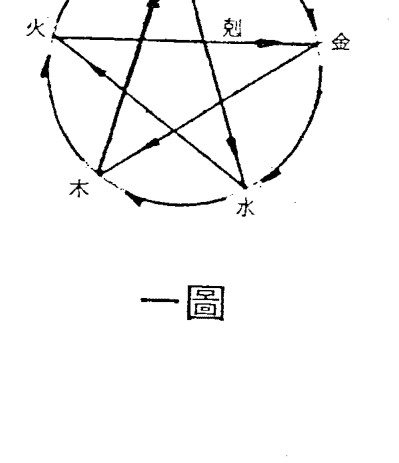

#### 生的關係：

- 木生火：用木柴來取火。
- 火生土：木柴燒完了，變成灰，歸於塵土。
- 土生金：大地中蘊藏了各式各樣的資源，如金屬礦脈也是深埋土中的。
- 金生水：在清晨起來，你會發覺露天院子裏的金屬物品上沾滿了水珠，此點古人誤解水珠產生的原因，不過應用上仍須借重。
- 水生木：樹木必須靠水來滋養，才能枝葉茂盛，開花結果，花木不澆水必然枯萎。

#### 剋的關係：

- 木剋土：樹木的莖會深入土中，吸取土中的養分，使土壤中的養分衰竭。
- 土剋水：我們可用土來阻擋水流，也可築土壩擋水，以抑制水之流勢。
- 水剋火：發生火警了，用水澆噴以熄滅火源。
- 火剋金：要將金屬冶煉成有用之工具，必須用火來熔解，再予以鍛鍊。
- 金剋木：利用金屬製成的鋸、斧、刀等工具，可以砍伐樹木。

生剋的關係，可以用圖一來表示。弧線代表生的關係，星形代表剋的關係，箭頭代表生剋的方向。

| 火 東南 異 | 火 南 離 | 土 南南 西 | 金 西南 坤 |
| :---: | :---: | :---: | :---: |
| 武曲破軍文昌 | 太陽火星天空 | 天府左輔右弼天鉞陀羅 | 天機太陰祿存天馬 |
| 已 (友交) | 午 (移邊) | 未 (厄疾) | 申 (帛財) |
| 天地天同姚 | 命例E 34歲離婚 | 紫微貪狼文曲擎羊 | 酉 (女了) |
| 辰 (業事) | 沖 | 忌 | 巨門 |
| 卯 (宅田) | 祿 | 時建生局 | 戌 (妻夫) |
| 廉貞七殺天魁紅鸞 | 天梁天刑 | 天相 |
| 命大 26-35 寅 (德福) | 丑 (父母) | 妻大 子 (命) | 亥 (弟兄) |
| 不 東北 艮 | 北北黃 | 北 坎 | 西北 乾 |## 制的关系：

金剋木得火制：因金剋木，若得火来制金，则金之凶性会受火压制而不显，凶力减少。

木剋土得水制：因木剋土，若得水来制木，则木之旺盛会受抑制，木受剋之势趋缓和。

水剋火得土制：因水剋火，若得土来制水，则火之可使受制于土，火苗不至于熄灭。

土剋金得木制：土可以降低水势，水势受制，所以土剋水之凶力会因木剋土而受制。树茎深入土中汲取养分，若用金属性的树茎可免土中的养分消耗得太快，无法即时补充。

#### 化的关系：

金剋木得水化：斧砍了树，再浇予水助木成长，砍了多少，马上衍生多少，不怕枯竭。

木剋土得火化：树木汲取土壤中的养分而成材，木烧成灰后而归为尘土中的养分。

水剋火得土化：水浇熄了火，也助树木成长，以供应燃火所需之薪材。

火剋金得土化：火可使金熔化，但火又可生土，成为蕴藏金之处所。

#### 飞星紫微斗数 图二

| 火 東南 巽 | 火 南 離 | 土 南西 | 金 西南 坤 |
| :--- | :--- | :--- | :--- |
| 巳（） | 午（） | 未（） | 申（） |
| 土 東南 艮 | 卯（） | 戌（） | 酉（） | 姓名： 陰陽男女 年 月 日 時建生 局 歲 |
| 火 南 離 | 寅（） | 丑（） | 子（） | 亥（） |
| 木 東北 艮 | 土 東北 坎 | 水 北 坎 | 水 西北 乾 |

土剋水得金化：土剋水又能生金，金又能生水，故為引通不滯，亦有節制不浮泛之意。

例如天相屬陰水入丑宮，丑為陰土，故為土剋水之局，假如再有擎羊金星落入丑宮，即呈「土剋水得金化」之局，因此此時之擎羊星不以凶論，反而因得擎羊之助而引通不滯。

由以上可見陰陽五行生剋制化在紫微斗數推命學上的重要作用，淺則可看星性在各宮位中的變化，深則可看六親緣分，財帛事業的旺相休咎，故學者不可忽略陰陽五行的影響力，為便於讀者查閱，將二十八星宿的陰陽五行及簡略的星性介紹，列如圖三。由圖三和圖二的陰陽五行關係，就能推知同一宮中同時落入二顆星宿以上時的吉凶現象。

再說十二宮又依個人出生年的不同而有不同的天干、地支的組合，此組合又產生不同的五行，如命宮為戊子屬陽火，夫妻宮為丙戌屬陽土，父母宮為己丑屬陰火……等，這是屬後天的，而圖二中的五行為先天五行，現有一命造天梁星落入子的位置，由水來生木，故呈旺相，但宮干戊子屬陽火，奪水生木之氣，天梁星優良的本性受抑制而不彰，在解釋時可喻為先天有清貴之資，惜因後天行運相悖，難得清貴之職，或難有發展。這是論本命格時的解釋，但行運亦會影響人之成就，故實際應用時，要將兩者明確區分。

所以在考慮陰陽五行生剋關係時，須考慮下列三項的五行關係：

- 一、星性陰陽五行。
- 二、宮位先天陰陽五行。
- 三、宮位後天陰陽五行。

各宮五行以清純、清朗為上局，最忌駁雜、混淆不清，則氣不明、神不清，不以吉論。

四化星主掌斗數變化的樞紐，若某宮有四化星之一落入也會和原有的星性產生生剋的變化，而改變原有的性質，故有四化飛入的宮位，該宮的解釋不可純依星性解釋，這點要特別注意。

在論六親時，該六親宮的五行與命宮之五行，是生或剋的關係，如為相生則較投緣，相剋的話，則緣淺。這是看六親關係的應用，其他事業、財帛亦可仿此解釋。

| 天干 | 地支 | 五行 | 陰陽 | 星宿 | 特質 | 意義 |
| :--- | :--- | :--- | :--- | :--- | :--- | :--- |
| 甲 | 寅 | 木 | 陽 | 貪狼 | 敏感、多疑 | 智慧、才藝 |
| 乙 | 卯 | 木 | 陰 | 太陰 | 溫和、柔順 | 財星、母星 |
| 丙 | 巳 | 火 | 陽 | 天同 | 和睦、圓融 | 福星、壽星 |
| 丁 | 午 | 火 | 陰 | 天機 | 智慧、善變 | 謀劃、宗教 |
| 戊 | 辰、戌 | 土 | 陽 | 天梁 | 老成、穩重 | 貴人、蔭星 |
| 己 | 丑、未 | 土 | 陰 | 紫微 | 尊貴、領導 | 帝星、主星 |
| 庚 | 申 | 金 | 陽 | 武曲 | 剛毅、果斷 | 財星、武將 |
| 辛 | 酉 | 金 | 陰 | 天府 | 穩健、保守 | 財庫、令星 |
| 壬 | 亥 | 水 | 陽 | 天相 | 正直、輔佐 | 印星、和事佬 |
| 癸 | 子 | 水 | 陰 | 巨門 | 口舌、是非 | 口才、暗星 |
| 乾 | 戌 | 土 | 陽 | 天門 | 開闊、通達 | 天門、開通 |
| 坤 | 未 | 土 | 陰 | 地戶 | 厚德、包容 | 地戶、包容 |
| 艮 | 丑 | 土 | 陽 | 鬥口 | 口舌、爭執 | 鬥口、爭執 |
| 兑 | 酉 | 金 | 陰 | 破碎 | 破壞、分裂 | 破碎、分裂 |
| 坎 | 子 | 水 | 陽 | 水險 | 險阻、困難 | 水險、險阻 |
| 离 | 午 | 火 | 陰 | 火虛 | 空虛、虛假 | 火虛、虛假 |
| 震 | 卯 | 木 | 陽 | 雷動 | 動盪、變化 | 雷動、變化 |
| 巽 | 辰 | 木 | 陰 | 風順 | 順利、和緩 | 風順、和緩 |
| 中央 | 辰、戌、丑、未 | 土 | 陰陽 | 土庫 | 穩定、收藏 | 土庫、穩定 |

#### 如何推断适婚年

命理學由古流傳至今，已有一千五百多年了，在此期間，朝代的更迭、社會風氣的改變、科技的進步等都會影響命理學的推斷法則，有許多古人的觀念已不合時宜，故推命時的解釋亦應配合時代的趨勢而修正，如：妻奪夫權、偏房侍妾等對婦女含有偏見的名詞，在今日應有新的詮釋，故不要太在意古本紫微斗數中的賦文。

在看婚姻時也是一樣，古人大部分是憑媒妁之言、父母之命結成連理的，而在今日呢？大部分是先友後婚的，故今日論婚姻何時可結？須先查交友宮，再查夫妻宮，以定何年結婚較為吉利。

「男怕選錯行，女怕嫁錯郎」，這句話中明白的表示婚姻是女性的終身幸福所在，若選錯郎，則一生的幸福也就泡湯了，雖然在今天的社會上，有許多行業中女性的成就已超越男性，但婚姻失敗時吃虧的還是女性，故夫妻宮不佳的女性最好注意選擇，在此所謂注意選擇包括對方人品與佳期的選擇。

注意我們強調的是那一年結婚較吉利，而不是那一年一定會結婚。

在紫微斗數中影響力最強的甲級星有二十八顆，凡是性質穩定、溫柔、成熟的星宿或容易和異性接觸的星宿，如：文昌、文曲、紫微、天府、天同、天相、太陽、太陰、廉貞、貪狼等坐命宮的人都易於早婚。而孤寡之星或煞星坐命的人有晚婚的趨勢，如：武曲、七殺、破軍、天刑、天梁、巨門、擎羊、陀羅、火星、鈴星等坐命即是，或三方會入太多的煞星亦同論，另外有兩顆星也會造成晚婚——左輔、右弼落夫妻宮即是，這兩顆星往往是因為前緣未了，或忙於事業而忽略婚姻大事，所以簡單地可由星性上判斷婚緣的早晚。

現在我們看圖四的命例：

命宮在子，內有廉貞（屬火）、天相（屬水）、天刑（屬火），而子位又屬水，水火相剋且又不得土木來制化，故其立命的根基已不佳，再加上三方會入天空、地劫、擎羊、陀羅、武曲、破軍等孤寡星或煞星，故知此人性情孤僻，不易與異性相處，可推知為晚婚命。

再參看命宮與夫妻宮的五行關係，命宮甲子屬金，而夫妻宮壬戌屬水，水受戌宮之土來剋而不通，雖命宮與夫妻宮五行呈相生關係，但其效不彰，故夫妻之間緣分淺薄。

到底什麼時候結婚合適呢？這個就要靠四化飛星來找了。這個問題比較複雜，在此只能說明大原則而已。要運用四化飛星來推命，必先知道四化之中以化祿、化忌的力量最強，但是只有化祿的話，沒有什麼作用，只有現象或幻想而已，無法實現。茲舉例說明：有個王老五想脫離光棍生涯，但一直沒辦法下定決心要追到某人為終身伴侶，或遲遲不見行動，以四化星來說，「想要結婚了」是化祿的現象，但會不會實行呢？就要看「化權星」了，因為化權是成就的意思，化祿和化權會合後，才能將理想付諸行動。而化忌呢，它有粘住的意思，化忌進入婚姻相關宮位，有粘住對象的機會，也可能是被粘住。到底前面所說的四化是由何宮所化呢？當然看婚姻是以夫妻宮為基準了。

在解釋婚姻關係時，有婚姻之實，而無法定婚約關係的同居也包含在婚緣之內。

#### 飞星紫微斗数 五图

| 火 東南 巽 | 火 南 離 | 土 南南西 | 金 西南 坤 |
| :--- | :--- | :--- | :--- |
| 天陀 相羅 | 天左祿 梁輔存 | 廉七擎 貞殺羊 | 右鈴 弼星 |
| 已 乙（弟兄） | 午 丙（命） | 未 丁（父母） | 申 戊（德福） |
| 土 巨門  22－31 辰 甲（妻夫） | | | 金 西 兌 地劫 酉 己（宅田） |
| 東 東南 辰 甲（妻夫） | | | 金 西 兌 酉 己（宅田） |
| 木 東 震 卯 癸（女子） | | | 土 西西北 戌 庚（營事） |
| 天太文 機陰曲  （科祿） 寅 壬（帛財） | 天天火 府空星  丑 癸（厄疾） | 太文 陽曲  子 壬（移遠） | 武破天天 曲軍刑馬  亥 辛（友交） |

#### 飞星紫微斗数 四图

| 火 東南 巽 | 火 南 離 | 土 南南西 | 金 西南 坤 |
| :--- | :--- | :--- | :--- |
| 太祿文 陽存昌 | 破擎天 軍羊空 | 天天左右火 機鉞輔弼星  （科） （科） | 紫天 微府 |
| 已 丁（友交） | 午 戊（移遠） | 未 己（厄疾） | 申 庚（帛財） |
| 土 辰 丙（營事） | | | 金 西 兌 太文 陰曲  （祿） 31－43 酉 辛（女子） |
| 木 東 震 卯 乙（宅田） | | | 土 西西北 戌 壬（妻夫） |
| 七殺  寅 甲（德福） | 天天 梁魁  丑 乙（父母） | 廉天天 貞相刑  子 甲（命） | 巨門  亥 癸（弟兄） |

現代人大部分是先友後婚的，所以查那一年會結婚，須先看交友宮干的四化，有沒有入命與夫妻宮，若忌沖到夫妻宮，則不會結成連理的多，若無沖，再查流年夫妻宮的四化，都入命之三合或對宮的那一年，即具備結婚的條件了。

現在請看圖四，命例中命宮坐甲子，太陽化忌在交友宮，故所交男友不理想，再加上交友宮化忌自沖，更少異性緣，再來夫妻宮坐壬戌，武曲化忌自沖夫妻，會有因忙於事業忽略婚姻，或有對象不擅把握（因武曲化忌忌出）的現象。

再看二十四至三十三歲的交友宮乙卯和夫妻宮庚申所化出之忌星成對峙的狀態，難有「先友後婚」的對象，若在奉父母之命結婚的時代早已出閣了，但崇尚自由戀愛的今天，就得晚婚了，這個命例在三十三歲以前恐不易成婚。

到了第四個大限（三十四、四十三歲），大限的夫妻宮在己未，其宮干四化的武曲化祿在事業，貪狼化權在夫妻，已顯示強烈的結婚慾望了，行年七十五年和七十七年時夫妻宮的四化都入了本命的命宮和夫妻、事業等宮位，故在七十五年或七十七年結婚最好。

再舉一例（圖五），是標準的「陽梁昌祿」格，有「臚傳第一名」之說，可惜這個命例因家庭因素而輟學，不過他在其服務的行業中成為其中的翹楚是可預期的，但在夫妻生活上可就無法享有互信互愛的甜蜜生活了，因為他夫妻宮內坐著一顆主掌口舌、是非、疑惑的巨門星，再加上化忌，其猜疑的本性更加強對婚姻的破壞力，所以此人最好晚婚，或妻略大於夫，或夫妻年齡差距大一些，便可化解，否則最好學姜太公去釣魚，圖個耳根清淨。

但本命造卻很早就結婚了，怎麼看呢？先看本命夫妻宮坐甲辰，廉貞化祿入父母宮，破軍化權入交友宮，當行運走到丑或酉兩個位置時，很有結婚的希望，因為本命夫妻宮化出的祿和權落入丑年或酉年的三合方中，當在酉年時本命造已達適婚年齡，且流年夫妻宮坐丁未，宮干丁的四化星全入本命盤的三合內，故在辛酉年結婚，其實他若能考慮一下，在二十九歲結婚會更好，因該年夫妻宮干坐辛，巨門化祿入夫妻宮而非巨門化忌，所以巨門星的猜疑、是非的特性會減至最低，增加感情生活的祥和。

看結婚年的方法，除了前項方式以外，尚有其他脈絡可循，前例是淺顯的命造，在實際上的論斷時，還會牽涉到其他的宮位，如奉父母之命結婚的由何宮顯示？奉父母之命完婚的呢？所以要理出一、二條斷結婚年的規則很難，據先賢手抄本顯示至少有十二條定則可資應用，不過總歸於一句話，化祿要有權才能由虛轉實，有化忌才能抓住，否則那只有幻想而已。

是否一定會在紫微斗數推斷出來的年份結婚呢？根據經驗顯示，未必見得，我們只能說那年結婚較吉利而已。如圖五這個命例，很顯然太早結婚了，能延到二十九歲結婚感情生活更為美滿，紫微斗數推斷婚姻年的作用主要在此。

### 七、由『忌出』与『忌入』看婚姻波动

今年三月中旬報載有名婦女為了能和丈夫離婚，請術士作法，被騙了兩百多萬元，一時間籌不出這麼多的款項，竟鋌而走險，盜領客戶存款，結果東窗事發，身繫囹圄，落個身敗名裂的下場。看到這種新聞真是令人憤慨！社會上真是太多這種賺黑心錢的江湖術士了，自古以來即將命理中人視為「怪力亂神」之流，實在是有他的理由。筆者是學工程的，對於命理亦曾抱著不屑一顧的態度，後來經人介紹中和一位紫微斗數高手處推算，竟然有令人驚訝的準確率，但因當時工作忙碌，未再前往請教。民國七十年，老先生看我還堪造就，乃親切的講解如何推算，乃至民國七十年的中秋節，受了江湖術士的愚騙後，才專心潛研紫微斗數，希望將正宗的命理學發揚光大，以驅逐命理界的敗類。當您有心前去算命時，最好先打聽其人之風評如何？茲提供個人經驗給大家做個參考：

- 一、廣告多而大，收費越高，但準確性未必與費用成正比。
- 二、用化名者，多為自己留後路，以後再取化名，可東山再起。
- 三、地攤不如有居處者，因其機動性高，不會欠缺新客戶。
- 四、純正的紫微斗數、子平八字推命家多不設神壇。
- 五、看相士的臉相、眼神而知其人之心性。
- 六、請他先說往事，有應驗者，再繼續坐下。

命卜為生？古之術士常說：『一運、二命、三風水、四陰騭』，這是強調『命運』的說詞，其實在資深的命理學家眼中，正確的順序應該是『一陰騭、二風水、三運、四命』，因為看過太多應該早逝的命卻活得好好的，再察其人之心性寬厚仁慈，不似凶狠狂狷之人，所以說：『未卜命理、先卜心田』，『廣種自己福田，莫為昧心之事，命理自可解厄，何向他人求方』，內心常懷慈悲之心，濟世之意，常為積善積德之事，即可改運，各位也可參看『了凡四訓』，其中對於改運解厄的方法，說得很詳細，不過沒有提到如何改運才能離婚的方法，這種事只有騙錢的術士才肯為。

至今仍有許多人以為紫微斗數只能占卜人事之祿命學，這是很不了解個中堂奧之人的說辭，為何稱『數』而不稱『術』？因斗數之學涵括：天地萬物、飛禽動植、山川地理、龍穴砂水、命脈醫術、奇門易數等範圍，會運用的人，可在一張小小的命盤上，窺透暗藏的玄機，不懂的人只是看到命盤上的數十字而已，如何引導您的思路在其中剖析貫連，是本書出版目的，除細心閱讀外，沉思冥想也很重要，試著去體會十二宮的變化運用，想想看，是不是有很多人事現象，未包含在十二宮中，如：合夥人、買主、上班的公司或工廠、上司、外遇對象、岳父母……等等，如何由十二宮中推演出其他欲占事物的代表宮位呢？例如：要占上班公司的好壞或自營行號的營業狀況，可由疾厄宮代表，因其為事業的田宅位（即工廠、公司），若要看夫妻的行為，就用福德宮代表，因福德宮為夫妻的事業宮，故配偶的行為會在此宮中顯示，所以飛星紫微斗數無所謂「開宮」之說，每一宮位都很重要，其他的活盤變化應用，留待各位去想像了。前面曾談到夫妻相處融洽不融洽或有無生離死別的現象，可由命宮、夫妻宮、財帛宮、福德宮等宮位中顯示出來，為什麼會在這四個宮位中浮現呢？福德宮之關係已在前段說明，命宮和夫妻宮是推斷感情連的必然宮位，不再說明，剩下財帛宮，夫妻兩人生活在一起，牽涉到「你對我」，「我對你」的問題，而財帛宮是夫妻的夫妻宮，是配偶的夫妻宮，是「我對你」的關係顯示的宮位，故財帛宮干化忌不可沖到相關宮位，有則破壞感情的融洽，夫妻相處關係不和諧，而福德宮干化忌來沖的話多主性生活的不協調，所以在論斷一個現象時，不單依一個宮位，必須合參相關宮位，這是推命時的基本常識。同理可推知，在推斷六親關係時，亦須考慮互相的對待問題，否則，單憑一個宮位無法推斷兩者之間相處關係。紫微斗數推災厄，都是用化忌在運轉，所以化忌是四化中的精靈，變化多端，不易捉摸，為了方便記誦，紫微斗數中將各種忌星皆冠以名稱如下：

#### 一、回水忌：参考图一

凡是由命宮化忌入遷移、財帛化忌入福德、事業化忌入夫妻，皆叫「流出忌」，流出忌會在對宮漏掉，故叫「忌出」，假如對宮有生年忌坐守，則可將出忌擋回來，這個忌叫「回水忌」，是好忌，會發達起來，但是對宮不可再自化，有的話，漏出更大更急。若是夫妻宮化忌入事業而事業宮有生年忌坐守，表示配偶關心我，但我對於配偶的關切、叮嚱擋回去，不理會，仍我行我素。

#### 二、四马忌：参考图二

凡是寅、申、巳、亥四宮有生年忌坐守，或自化忌時，均叫「四馬忌」，如夫妻宮在寅、申、巳、亥，坐四馬忌時，主夫妻聚少離多，緣淺，相同的，凡是六親宮坐四馬忌，亦主分離，時常在外奔波。

#### 三、禄来忌：参考图三

凡在六親宮位間，祿來忌去或忌來祿去，叫做「祿來忌」，主囉嗦、是非、生活很不安寧。如命宮化祿入夫妻而夫妻宮化忌入命宮，就構成是非忌的條件，相處不佳，時生口角是非，或是生活不安寧。

#### 四、互冲忌：参考图四

兩個不同宮位，化出之忌成對宮互相對峙的狀態，叫「互沖忌」。如命宮化忌入福德，交友宮化忌入財帛，忌與忌在財福線對沖，主與朋友發生重大爭執或互撞，有生命之危險。若命宮化忌入福德，夫妻宮化忌入財帛，在財福線對峙互沖，又可稱為「怨嘆忌」，主夫妻兩人，活到老，吵到老，相親如寇仇，小心行運走到財福線時會吵翻了。

#### 五、忌来忌：参考图五

凡是對待宮位之間，互相忌來忌去，則為「忌來忌」。如命宮化忌入夫妻，而夫妻宮化忌回命宮，表示禮尚往來，你兇我更兇，你體貼我也體貼，若對待宮位內星性不吉，常往惡意方向發展。

#### 六、劫数忌：参考图六

凡命宮或事業宮坐生年忌星，而田宅或事業化忌入命宮或事業宮，沖破生年忌星，即為「劫數忌」，行年走到有生命之險。

如果，夫妻化忌入命宮，而命宮坐生年忌星，則成為夫妻的劫數忌，要注意防范死別的可能。命例B是一個典型劫數忌之例。

在辛卯大限時，夫妻宮化忌入命宮，而命宮坐生年文昌忌，故為劫數忌，丈夫在此限的辛酉年暴病而亡。

相同的，本命盤主人到壬辰限時，田宅宮化忌入命宮，劫數忌的條件又成立了，故本身要注意壬辰限的末年，積陰德以防災厄。

除了前述六種忌星外，尚有其他的名稱，但和夫妻對待關係較少關連，留待以後解說財帛、事業運時再解釋。

現在我們再來談談「忌入」與「忌出」的區別，市面上所看到的紫微斗數書籍，幾乎不談這個機密問題，所以看了外面的斗數書籍後，仍不知化忌的運用基本規則，故無法為自己推命，「入」與「出」是四化應用的基本要領，兩者呈現的吉凶現象完全相反，所以碰到四化時，第一緊要的事是分辨「入」與「出」的現象，「忌入」不主凶，而是收斂的意思，「忌出」是凶象，凡是忌出都會有損失，我們用圖解釋「忌入」、「忌出」的差別。（如圖七）

相同的，夫妻宮亦有「忌入」、「忌出」的現象，若為忌入的狀態，雖然走到忌沖之流年也不會有夫妻對待問題的凶象出現，但是「忌出」的狀態時，就要好好的調適雙方的生活了，否則流年一到，潛伏的凶意立即爆發，難以收拾。

#### 飞星紫微斗数

紫微斗数命盘表格，包含命例B的详细星曜分布。具体包括：
- 宫位：命宫、夫妻宫、田宅宫等，对应天干地支和星曜如紫微、七杀、文昌等。
- 年龄范围：如45-54岁、35-44岁等。
- 其他信息：姓名、阴阳男女、年月日时等。
表格结构为多行多列，每个单元格显示相关宫位的星曜和注释。

凡是大限三合（即大限命宫、财帛宫、事业宫）化忌入本命三合，即为忌入，不会有凶象发生。但是，忌入之宫不可再自化忌，有则必然转为凶象，一定会发生。发生的流年和忌出所应验的流年断法并不相同，后面有命例研讨，各位可自行比较即知。

但是命宫坐生年忌时，若再为忌入的状态时，即和生年忌撞在一起，产生凶性，故不可以忌入的状态解释。

记得以前提过「不可同类相冲」的话，现在的名词，就是忌出的意思，兹列如下：

- 大限父母宫化忌冲本命父母宫，凶意，有灾厄。
- 大限事业宫化忌冲本命事业宫，凶意，离职或失业。
- 大限夫妻宫化忌冲本命夫妻宫，凶意，争执或分离。
- 大限财帛宫化忌冲本命财帛宫，凶意，钱财损失。
- 大限兄弟宫化忌冲本命兄弟宫，凶意，兄弟有恙。
- 大限疾厄宫化忌冲本命疾厄宫，凶意，本身有灾厄。

其他各宫依此类推，流年、流月亦是如此，不可犯同类相冲的禁忌。

近来有多位朋友慕名而来，所谈论之问题有十之六、七属于感情问题，有很多人都问道：「我会不会和配偶离婚？」这个问题真是令人难以回答，说「会」可能破坏别人美满婚姻，说「不会」可能算不准，碰到这种问话，只好自认功力不行了。先贤曾说过：「推人与扶人都是一般手，陷人与赞...人都是「一般口」，宁使扶人手，莫开陷人口。」站在辅导的立场，当然是劝和不劝离。想想古人也有很多终其一生不离婚的怨偶，但今日女性社会地位提高，知识进步，多有独立谋生的能力，故在心理、物质上的束缚较少，无须畏惧离婚后带来的后遗症，所以离婚比率逐渐升高，并不是占卜者说离即离。站在命理家的立场，更不希望自己所说的话有一种恶性暗示增强作用。

当行至寅限，大限财帛宫化忌入本命财帛宫，是为忌入。本命财帛宫坐壬干，武曲自化忌，故为忌出，呈凶象。所以本命盘主人会在此大限破财。此即依据：大限财帛宫忌入本命财帛宫，但逢自化忌，转为凶象。流年走到本命财帛宫或大限财帛宫的宫干引发自化忌的年份，就会破财。

#### 命例 C…忌出之例

辛丑大限，大限夫妻宫在己亥，文曲化忌入本命夫妻宫，是为忌入，本不主凶。但是夫妻宫坐丙申，廉贞自化忌，故为忌出，呈凶象。所以本命盘主人会在本大限离婚。忌入本来无凶象的，但逢自化而改变性质，因此，逢到自化不要以为无所谓而忽略了变异。

#### 命例 D…忌入之例

在甲申大限时，大限夫妻宫为壬午，武曲化忌冲本命夫妻宫，此为「忌出」的现象，故主凶。若能在本大限子年之后结婚可保无恙，但在子年之前结婚，故婚姻必会起波折。果然在本大限的子年离婚。为何在子年分手？请各位自行推敲，原理在本节中俱以明示。

#### 命例 E…忌入之例

己卯大限命宫化忌入本命命宫，故为忌入。但本命命宫又坐己干，文曲又自化忌。且本命命宫又为大限夫妻宫，大限命宫又为本命福德宫，故推知和婚姻对待关系相关的问题将产生，且是凶象，不宜早婚。但是偏偏早婚了，故在本大限的戌年离婚了。

#### 命例… 互冲忌之例

辛巳大限时，大限命宫干，文昌化忌在戌宫；大限夫妻宫干坐巳，文曲化忌在辰宫，构成互冲忌之条件。而且是由本命命宫和本命福德宫飞出之忌成互冲状态，故知是夫妻对待问题。在本大限的辰年以前结婚，必定多是非，故又称怨叹忌。但是要来的还是要来，在戌年就劳燕分飞了。戌年正是互冲忌冲应之年，您说奇不奇怪？

笔者常拿好友的命盘来研究，告诉他们何时该注意何事，结果没有发生如命盘中显示的凶象。但有很多「顺其自然」的命例，大都发生如命盘中呈现的凶象。由此可见，有些事件是可以避免的。但若不明白所介绍的命盘已很清楚的显示凶象，若当事人能采取防范措施或调适得法，则可能安然度过；但若不知道的话，一切都是顺其自然的发展，就会得到如命盘中显示的结果。这就好像走迷宫，假如您不明迷宫的路径，只知在其中乱闯乱撞，可能走不出迷宫或者只得到小奖而已。若您能跳出迷宫俯瞰迷宫的路径，再入迷宫，可以轻易地破解迷宫，以最经济的方式得到最佳的结果。

人生也是一样，到底整天忙碌，自己的目标、前途又在那里呢？今天拥有的一切是不是明日还能拥有？笔者曾买卖股票，也认识几位大亨，有空就扯到命理。其中有一位是丙种经纪商，资产上亿，但很明显的是忌出的状况。故周清和老师就劝他赶快收住不要再冲了，但他说：「江湖术士之言可信的话，谁还那么笨做事业？」大有一副一切操之在我之势，将全部资产投入期货买黄金股。结果不涨反跌，一夜之间，清洁溜溜，和老师所说的败期完全吻合。

命理学不可能指引您凭空致富，但凭本身努力和命理的指引，至少可使您事半功倍。在婚姻的小迷宫中，要如何走出至善之门，就须先冷静地分析相互的差异，找出问题的症结，谋求对策。用命理学的方式虽可找出问题的症结，但有时得到的答案会令人觉得很玄，如：卧室、厨房相冲，这是属高深的飞星紫微斗数理论，恕笔者藏拙，无法在本书中讲解。

现在留两个命例让大家思考一下，活用本节所说的论断规则，用「入」与「出」的观念或各种忌的关系去分析，必然会有所获。

其中，命例 H 是一对夫妻，希望各位找出是那一位发生问题？也请大家思考婚姻问题是否会在当事人双方命盘中显示？同理各位可将六亲关系在自己命盘中如何显示？如何消长？一一去找出他们的关系。笔者很喜欢看禅语录，其中有很多启示性的问答，令人觉得原来自己的想法受以前经验或所受知识的束缚而无法跳出某一个限定的窠臼。研究命理的课题也是一样，不可让观念受十二宫的限制，在我的眼中有十三宫，各位不要小看这一宫，很重要的哦！若悟不透，功力不能精进，只能在某一程度而已。诗以证之：

> 上善若水本无形，穷以水月当之明；
> 化无化有皆因化，因化应之即一蜂。
> 个中自有缘人。

| 宫位 | 星曜组合 | 年龄 |
| :--- | :--- | :--- |
| 巳 (兄弟) | 紫微、七杀、天马、陀罗 | 5-14 |
| 午 (命宫) | 禄存、天喜 | 28岁 |
| 未 (父母) | 文昌、文曲、擎羊 | 15-24 |
| 申 (福德) | 天姚、天钺 | 25-34 |
| 酉 (田宅) | 廉贞、破军 | - |
| 戌 (事业) | - | - |
| 亥 (交友) | 天府、左辅 | - |
| 子 (迁移) | 天同、太阴、火星、红鸾、天魁 | - |
| 丑 (疾厄) | 武曲、贪狼、铃星 | - |
| 寅 (财帛) | 太阳、巨门、天赦 | - |
| 卯 (子女) | 天相、右弼 | - |
| 辰 (夫妻) | 天机、天梁、天刑 | - |

现在走庚戊大限，大限交友宫又是癸卯，再化一个太阴化科入本命夫妻宫。只要太阳、流年再逢事件便显象了。不幸此造在壬戌年时仍未脱离庚戊大限，三层桃花能量加诸于身，怎堪空闺独守？于是有妇之夫爬墙会情郎去了。若前提条件不成立的话，会有外遇的结果吗？答案是否定的。若丈夫时常在家，让空虚的心灵有所依托，不再到处串门子，便不会肇致爬墙的结果。有则只主夫妻关系更亲密而已。否则台湾至少有三十四人与她同命盘的小姐会「偷吃」了哦！事实上并非如此，立地条件（空间）不同也！可见算命的目的，不在推理结果如何？而在引导往吉利的空间发展，避免不幸的结局。若命格上有凶象垂示，及早创造吉利的环境与培养高雅内涵，当可避免凶象，故说改运亦即「心物合一」修养，有心境、环境的配合才可以。我们的四化飞星观念和大家的观点可能大不相同，我们认为三吉化星与化忌星的凶解释，要依问题（看命角度即立象问题）来分吉凶，而不是由四化的字面意义上分吉凶，这是非常重要的观念。现在我们再举一个命例给大家研究（图二），各位推理看看她到底发生什么事？在何时？（注：感情问题）若耐心不够，直接翻阅次页。

由命格上来看，禄存独守命宫，在诸星问答中有道：「若独守命而无吉化，乃看财奴耳，逢吉逞其权，遇恶败其迹，最嫌落于陷空，不能为福，更凑火铃空劫，巧艺安身。」本命造的三合对宫已符合这些条件了。又说天机、天梁会天刑，早有刑而晚见孤。在夫妻宫来说，这也是孤克的组合。由命宫和夫妻宫的三合及星曜组合，已可看出此人是守财奴兼孤单。各位要了解「刑」、「孤」的现象，并不指将配偶刑克得死死的意思，它的涵义很多：

- 离家出走。
- 受意外伤害，身体机能不全或长年卧病。
- 个性不合，相视如寇仇。
- 因犯法被通缉，常年在外躲藏，难得聚首。
- 某方修炼道功，将对方冷冻守活寡。

再看交友宫乙亥，乙干四化：

- 天机化禄
- 天梁化权
- 紫微化科
- 太阴化忌

其中天机化禄和天梁化权皆飞入夫妻宫，表示朋友和我感情宫有关系了，亦是外遇的命格。在命格上来说，此人属孤克格局，但感情会那么的多采多姿吗？此点有些矛盾，应该注意。但是前一命例也是由交友宫飞入夫妻宫，造成本人的外遇，此造亦应相同才对。不错！正是如此。有些人虽然年轻时招蜂引蝶，但当年华老去时，便得尝尽孤单寂寞的滋味。此造正是如此。原来拥有很美满的家庭，丈夫是个笃实的商人，但自己不甘寂寞，红杏出墙来，结果与丈夫分开（未离婚）在外与情夫同居。当情夫玩腻了，钱花光了，便弃她而去。想回去家中，子女家人、邻居与亲友的指责，令她无颜待下去，只好自己赁屋而居，反省往日情怀了，符合「孤」的条件。到底在运势上如何推理呢？壬申大限时，大限交友宫在丁丑，太阴化禄，天同化权在迁移宫，巨门化忌冲大限命宫，也表示此大限交会与我发生关系。而且因巨门化忌来冲大命，故是同居。在二十八岁时，大限交友飞出之禄和权在迁移照命，出外很风光，朋友的簇拥赞美，使她更厌恶孤单的家居生活，心理一把持不住便铸成难以挽回的大错了。还好丈夫是个笃实商人，偶尔会在物质上接济她，但心理上已成陌生人了。早知如此，何必当初呢？

有些人强调「八字定终生」，我们却非如此认为。每个人都有物质或心理上，不同层次的需求。于感情问题来说，若能在这两方面互相满足对方的需求，那有问题产生的暇隙！最怕双方皆无法相互沟通，致使某方走上不归路。所以我一直强调要维持感情和谐，首重双方坦诚沟通，即可避免不幸。命虽由天定，但运却掌握在自己手上，运势的乖违顺逆，端视自己如何因应。我不相信人人遇到失败时，烧个香，拜个十八王公，使财源滚滚而来。

最近偶读联合报副刊阮文达先生专栏－「科学与相命」一文，对二十六万个命运模式如何概括五十亿人口的吉凶祸福提出质疑。我想这对紫微斗数认识的差距问题，前已提及空间因素是个人可随意变动的因素。若我们翻回图二来看，假若将事件和时间两轴固定一常数，而空间这一轴可变动的话，将人类所有可能活动的空间均标在坐标内，也可连成一条线段。但推理的事件会在那一点中发生呢？就得先了解立地条件何在，否则推理将失误。推而广之或小而化之都要考虑细微的地域性、民族性、社会阶层性的差异。所以紫微斗数算命是一种讨论，和心理医生与病患沟通的作用相同，并不是天眼通，更不是僵化无所变通的知识。

我们做个比喻：有人专门研究福利经济学，自认为是最切合实际的经济学。但是时局变动，人心转变，已否定福利经济学并非万灵丹了。我们总不能都将所有经济学打入冷宫吧！因为适应新时代的经济理论也必适时重现，生生不息，代代创新，这种学术才有生命力。尤其是探讨社会问题、心理问题的学术更是代代有新人新论问世。

紫微斗数能引人入胜，也在它活跃的生命力，而不在它僵硬地如算术一加一等于二。它也因时、因地的在时时调整因应时空特性。虽台湾一千八百万人口中有三十四人会共用同命盘，但因出生家庭、区域不同，而推理时亦必修正。如：外省人与闽南人的习俗差很多。在闽南习俗中，有很多命坐某星者常过房或被别人养大，但外省人无此习俗。故碰到此问题时，必先确定其省籍。没有若P，则推理Q，必失误。

道家的说法：太极中有太极。我们也可延用此观念，以客家人区、山地人区、闽南人区各立太极，以血统、信仰、风俗、语言、文化等之差异，作为推命时之修正因素。所以命理中人不应墨守成规，要能体认时空特性差异，才能切合实际。

我们由一千年前传下来的紫微斗数，在今日尚能维持很高的精确度，便知道此种时空差距的修正作用，无时无刻、无分地域的在调整因应的事实。若无法衡诸历史轨迹便妄下断语，岂是治学的态度。

所以研究紫微斗数一定要考虑立地条件，即所处区域，在该时代的特性。

还有我们算紫微斗数从不叫人「整容」、「作法」帮人改运，我们改运方法在前已有叙述。希望有此类改运法，莫加诸于斗数之身。术数无罪，罪在人心！

## 第十四章 斗數風水學淺析

有很多位斗數作者曾對紫微斗數能不能旁通風水的論點提出質疑，大部分的作者均否認紫微斗數可以看風水，但是筆者却持相反看法，假如我們對陳希夷祖師曾師事楊筠松先生習風水的歷史有所了解的話，應該可以理解斗數可旁通風水的事實。

風水學中探討的課題，包括：陽宅與陰宅；陽宅即活人的住家，而陰宅即死人住的墳墓。

最早析論斗數風水常識的為「斗數宣微」作者觀雲山人，但是筆者的論點却與之不同，兹提出來和大家互相討論。

一般人以紫微斗數斷陽宅座向吉凶時，有兩種不同的論點：

- 一、主張以田宅宮干的四化來斷吉凶。
- 二、以命宮干的四化斷住宅座向吉凶。

依筆者的看法，贊同後者的主張，因爲陽宅是給人居住的場所，應該選配合人命的房屋，怎可以『人』就『物』呢？在風水學中也是以主人的命卦來論屋向吉凶，亦可爲佐證。

又問是以本命盤或大限盤論宅向吉凶？此時即須看主人命盤格局與行運方可決定，若格局佳，且行運祿權雙美，當然以本命盤論吉凶；若格局冲破但運逢吉限，當以吉限以定宅向吉凶，隨運限替換，宅向亦須修正或搬遷，方可收錦上添花之效。

當然除了天干四化的作用外，亦須參酌宮內坐星之星性，因爲『星性』在『住』的環境中，亦有其對應事物，若居住環境中，有與命盤內顯示對應事物時較佳，其吉凶亦須經過『天地人』盤的推理以綜判之。

論陽宅室內佈置時，以田宅宮爲命宮，其它十一宮依序替換，以定房屋內廳房廚廁等設施的位置，再配合主人命剋便可選定吉凶位置了。

若有其它的裝飾物，如：字畫、水族箱、盆景、照明設施、電氣用品等之佈置，最好亦能考慮整體搭配的平衡性。

至於更高深的探討則請參考飛星派的風水學。

## 第五章 結語

紫微斗数的流派很多，若您愿意也可自成一派，不过市面上较流行的有：

1. 飛星派：以四化飛星的著落間，來斷吉凶，使用三十顆以內的主星，其變化主要在四化星，以蔡明宏先生為首。
2. 占驗派：使用星宿達百顆以上，注重小星星的吉凶來斷流月、流日的現象，主星和眾小星間的組合關係很複雜，以天乙上人為代表。
3. 三合派：專就命宮三方的星辰的吉凶星曜多寡，配合格局，以論吉凶，論命主要參考賦文的格...
4. 流年派：此派大師推命以流年為主。
5. 小限派：用小限來論吉凶。

至於本派主要架構是飛星派，並參酌他派的優點，融匯而成，追求「準」的目標為主，從不排斥其他流派。

凡是研究課題牽涉到「人類心理因素」的學術，都無絕對的定論，如：心理學、經濟學、領導統御等，必須因時因地而時時修正，才會使理論趨近於實際，而預測個人未來運勢的命理學，它所探討的對象——人，具有獨立思考、行為能力，根本無法以法律以外的力量規制，在此種狀態下，如何能以一加一等於二的簡單數學來推算個人命運呢？所以研究命理是一種推理、比較作用，各門各派皆有其獨到的地方，站在研究命運的立場，所追求的真理唯一「準」字耳，亦應擷眾家之長補己之短才是，功力才會精進，凡是心中已存「排他、武斷」之念者，其學術能力亦必自止。

以筆者的立場而言，主要在探討那一種命理學的結構最完整，如何更進一步提升其精密度；在所有命理學中我認為紫微斗數最合乎筆者之理想，但並非所有流派的紫微斗數都是，凡是各位看到命盤各宮不寫天干的，就非正確的紫微斗數。

紫微斗數的排盤規則至今仍是個謎？為何有天府星系和斗數星系的順逆行？起寅首的規則？五行局的定法？？……等都是大可探究的題目，雖有人解釋天府星系與紫微星系的隔一、空二、空三等為隱含天、地、人之義，但此說難以令人信服，筆者深信此中含有紫微斗數形成的秘密。

關於星辰的說法亦議論紛紛，有人說斗數星曜和天上的星曜有關，其排盤規則來自天上星，甚至星性也來自天上星斗的啟示，也有人否認此說法，認為只是假借天上星斗之名而已，至於星性完全和星辰無關，筆者亦很懷疑星曜的來源和其定義是如何訂定的？

依照八字和斗數的演化來看，斗數是處於後生地位，既然如此，斗數先賢在創成過程中，有些觀念引用自子平術，那麼前述之問題是否可由子平術中求得答案呢？

筆者深信現代人智識遠勝過古人，物質條件、輔助工具也優於古人多多，應當可以拆解其中謎團，能知其原理，再來說改進之道或批評其不是，尚不為遲，否則不知又怎能評判其不是呢？這違反科學精神吧！

有些人常拿：「科學與相命」為辯論題目，筆者以為這無啥可辯的，所處之立場不同，對相術缺乏深刻的了解（尤指紫微斗數），這種辯論一定各行其是，辯不出一個——「理」字來，我從未聽過。

迷信有兩種意義，一種迷信已知，已知的一切萬能，完全否定未知，此種人善於求神問卜，或者鑽研未知術，這兩種行徑都非理性，若拿已知或看得到、摸得到的事物以否定未知、看不到、摸不著的事物，這也是犯了理性的錯誤，因此我們站在另一個角度來看批評者，誰又能肯定他站的位置是在理性、科學的角度呢！

談到最後，變成科學的起源問題了，什麼叫科學？科學是人類運用智慧探索自然而得到經驗的累積，演變成各種學問，如：力學、光學、電學、心理學、流體力學……等，是先有智慧才有科學，站在科學的立場，任何探索未知的課題都是值得鼓勵研究的，人生未知的未來是否也是一項充滿挑戰性的研究課題呢？經濟景氣狀況的預測沿用經濟學的觀念，氣象預報由觀察雲層、氣團的移動而推測，這些學術是迷信？抑是科學呢？相術很多，但紫微斗數的組織架構中已明示命運是由空間、時間、事件等三要素所構成，它所蘊含的哲理又有幾位批評者能理解，所以在不知之前，先莫批評，要批判之前，先看看自己的立地條件！

我希望紫微斗數能受到學術性的尊重。

當然，我們並非不容批評，要讓我們知道是站在什麼角度來批評，是因為紫微斗數不準而用迷信之名扼死它？還是因其揭藥之宿命論造成暮氣沉沉的社會而批評（此點書中已提出辯解）？……要讓「理」字出頭，只要是其立場正確，批評得有理，大家都得心服口服，否則難收批評之功效。

再來談到「理性」一詞，到底定義何在？我們由觀念的形成來看，一個從小接受各種外界事物刺激，綜合各種思考能力而演繹出個人特有之觀念，人們往往以此觀念來套合其所見所聞之事物，合乎其觀念上之理性概念者，即是理性，否則不是，我們可舉出很多事例與對策，請不同的人來判定那一個是理性的對策，一定是人言人殊，因為一個人觀念形成中所容納的知識，並非包括所有已知的、未知的知識，所以每個人的理性定會有不同的意境，如此可見理性也是一種相對尺度的概念性定義，而非絕對的概念性定義，衡諸世上各項學術，凡是相對性的概念問題做比較，都是公說公有理、婆說婆有理，所以理性一詞並不是死的，而是隨時空條件演進的，理性的觀點也會進步，它是活的，活在每一個人心中，你的理性與他之理性未必全同，算命術有很多，但是不要一竿子打落水，古人說得好：

「欲窮千里目，更上一層樓」而不是夷平妨礙欲窮千里的事物，果真如此，自己的境界沒法提高也阻礙其它事物的發展，相信在物競天擇、適者生存的法則下，不合時宜的事物必會萎縮下去，終至消失。

我們很希望大家揭發術士騙財騙色的行徑，但要對人不對術數，術數無罪，誤用者之罪。

## 命理服務

- 一、紫微斗數推命：伍佰元。
- 二、斗數合婚：以雙方八字推算相處調適之道，一仟二佰元。
- 三、斗數陽宅鑑定：以主人命盤調配空間、方位，請先約定勘察時間。
- 四、紫微斗數講座：見解獨到，科學析理，與眾不同。

入門班：鬥數必備知識（本書內容）。

深究班：四化精義，飛星理則，問題立向。

樂意為各社團講解飛星紫微斗數架構與原理，電話：（02）66011911治。

遠道不克前來，函批結緣，潤金寄郵政劃撥帳號：02666031，頭份鎮仁愛里21號徐曾生收即可，務必附上正確出生年月日時，並註明陰陽曆及性別，近道者歡迎親洽，因本人另有事業，請先電話約定。

因有些父母故意隱時（尤其女命），函批者請註明一、二件重大往事及時間，以茲印證。

## 紫微斗數的新里程

讀遍千本紫微斗數叢，仍有滿腹疑問？請看希代作者群，精闢獨到的見解！

- M 104 紫微探真 徐曾生著 定價二八○元
- M 107 紫微玄機 陳啓銓著 定價一九○元
- M 108 斗數疑難集彙 鄭稼學著 定價二○○元
- M 109 紫微改錯 了無居士著 定價二○○元

希代出版有限公司
地址：台北市民生東路639巷25弄35號
電話：(02)7135272~3、7172226
郵政劃撥帳號：第0017944-1號

| 書號 | 書名 | 作者 | 價格 |
|------|------|------|------|
| M1 | 體相學 | 陳秋帆譯 | 70元 |
| M3 | 人相學 | 陳秋帆譯 | 90元 |
| M4 | 手相學 | 陳 寧編 | 65元 |
| M5 | 從手相看個性 | 陳秋帆譯 | 65元 |
| M7 | 從筆跡看性格 | 許鼎樵著 | 55元 |
| M8 | 巴比倫占星學 | 林耕莘譯 | 90元 |
| M10 | 從血型看性格 | 陳秋帆譯 | 70元 |
| M11 | 談血型與氣質 | 陳秋帆譯 | 90元 |
| M15 | 姓名學之觀念與設計（精裝） | 歐昌欣著 | 150元 |
| M19 | 八字的奧秘 | 林宜學著 | 90元 |
| M20 | 秘術奇門遁甲 | 林宜學編 | 90元 |
| M21 | 中國占卜奧秘 | 林宜學著 | 60元 |
| M22 | 中國預言之謎（增訂本） | 林宜學著 | 100元 |
| M23 | 中國星象算命學 | 陳 寧編 | 80元 |
| M24 | 中華預卜神算入門 | 阮茂森著 | 100元 |
| M25 | 中國面相研究 | 北海相士編 | 85元 |
| M26 | 八字心理推命學 | 何建忠著 | 220元 |
| M27 | 千古八字秘訣總解（增訂本） | 何建忠著 | 220元 |
| M28 | 九宮算命法入門 | 觀象學人 | 90元 |
| M29 | 人相新說 | 儀陽明著 | 70元 |
| M30 | 斷易新論（易經占卜斷事物） | 天智生著 | 220元 |

## 獎落誰家!?

對於獎券，您知道多少？
是愛國獎券也好，是大家樂也罷，
都有一套可供依循的規則。
只要掌握訣竅，下一次的千萬富翁就是你！

M102 中獎占卜法
鄭景峰著     定價230元

希代好書·值得攜帶！

- M59 科学奇门遁甲 陆飞帆著 250元
- M60 紫微奇经（增订本）陆飞帆著 220元
- M61 紫微喜忌神大突破 楚皇著 220元
- M62 现代家庭风水学（精装）欧阳明著 150元
- M63 住宅风水与设计（精装）林宜学著 280元
- M64 公寓大厦风水与室内装潢（精）羊云樵著 140元
- M65 住家风水200项 林宜学著 100元
- M66 住家风水入门（增订本）欧阳明著 90元
- M67 现代阳宅研究 梁湘润著 180元
- M68 室内风水图解 梁湘润著 160元
- M69 屋向宅位学 天滴子著 220元
- M70 店铺风水学 天滴子著 220元
- M71 白话奇门遁甲 端木磬著 220元
- M72 八字入门新观 秦昭易著 230元
- M73 紫微铁板 郑稼学著 280元
- M74 星象集萃（第一辑）名家汇纂 160元
- M75 现代命学 梁心铭著 180元
- M76 丹道气功 余雪鸿著 150元
- M77 紫微流年 张胜一著 250元
- M78 星象集萃（第二辑）名家汇纂 160元
- M79 八字讲谈 颜昭柏著 180元
- M80 谈运说命 余雪鸿著 150元
- M81 占星术与八字学 吴凡青著 260元
- M82 紫微看婚姻 郑稼学著 280元
- M83 星象集萃（第三辑）名家汇纂 160元
- M84 堪舆纪实 毛锡然著 160元
- M85 现代紫微（第一集）了无居士著 160元
- M31 中国高级命理奥秘 南映典署 140元
- M32 情占秘卜新论（占卜婚嫁情感）君紫星著 250元
- M33 阴间的生命（灵魂探讨）陈秋帆译 100元
- M34 地理与择日（包含阴阳宅）阮茂森著 250元
- M35 鉴母（论中央极乐世界）林子钦著 390元
- M36 超心理治疗病癖奇蹟 徐鼎铭著 540元
- M37 卦理特论 天智生著 250元
- M38 命理点睛（四柱推命专论）吴怀云著 250元
- M39 五术新论（上集）文擞子编 250元
- M40 五术新论（下集）文擞子编 250元
- M41 姓名学秘理（增订本）余雪鸿著 220元
- M42 商业预言学 君紫星著 180元
- M43 八十年代大预言（增订本）余雪鸿著 130元
- M44 你可再投生 陈秋帆译 100元
- M45 诸葛神算（白话详解）天滴子著 150元
- M46 静动论 林子钦著 250元
- M47 紫微精解（斗数中之泰斗）天滴子著 280元
- M48 易经占卜今说（上集）古斧岚编 220元
- M49 易经占卜今说（中集）古斧岚编 220元
- M50 易经占卜今说（下集）古斧岚编 220元
- M51 手面相病理学 余雪鸿著 160元
- M52 符咒研究 程灵凡著 180元
- M53 思果与人生 林子钦著 150元
- M55 地理龙穴判断 梁湘润著 280元
- M56 八字泄天机 司萤居士 220元
- M57 测字玄谭 宋凌云著 150元
- M58 手掌辑解 宋凌云著 280元

| 編號/標題 | 作者 | 價格 |
|-----------|------|------|
| M86 你的手 | 麥艾儼譯 | 90元 |
| M87 子平推理 | 顏昭柏著 | 180元 |
| M88 為你解手面相 | 朱韶光著 | 90元 |
| M89 紫鏡大限 | 鄭豫學著 | 200元 |
| M90 現代紫微（第二集） | 丁無居士著 | 160元 |
| M91 下海算命記 | 戴訓揚著 | 140元 |
| M92 人鬼神 | 何文匯著 | 80元 |
| M93 你的血型 | 葉進人著 | 100元 |
| M94 你的掌相 | 余雪鴻著 | 90元 |
| M95 現代紫微（第三集） | 丁無居士著 | 160元 |
| M96 命理特訣 | 梁友銘著 | 480元 |
| M97 現代紫微（第四集） | 了無居士著 | 160元 |
| M98 斗數辨證 | 慧 耕著 | 200元 |
| M99 八字洩天機（中册） | 司螢居士著 | 250元 |
| M100 現代紫微（第五集） | 了無居士著 | 180元 |
| M101 八字洩天機(下册) | 司螢居士著 | 350元 |
| M102 中爻占卜法 | 鄭 景 峯著 | 230元 |
| M103 現代紫微(第六集) | 了無居士著 | 180元 |
| M104 紫微探真 | 徐曾生著 | 280元 |
| M105 現代紫微(第七集) | 了無居士著 | 180元 |
| M106 江湖術士眞面目 | 楊寧夫著 | 100元 |
| M107 紫微玄機 | 陳啓銓著 | 190元 |
| M108 斗數疑難集彙 | 鄭稼學著 | 200元 |
| M109 紫微改錯 | 了無居士著 | 200元 |