# 紫微攻略

史上最强运势管理，了解12宫位，用斗数秘诀「煞忌交会」手法预测、避险有一套！

- 子
- 丑
- 寅
- 卯
- 辰
- 巳
- 午
- 未
- 申
- 酉
- 戌
- 亥

大耕老师——著

- 命宫
- 父母
- 福德
- 田宅
- 官禄
- 仆役
- 迁移
- 疾厄
- 财帛
- 子女
- 夫妻
- 兄弟

时报出版

# St. Royal College
天使神秘学院

- ※ 神秘学资料库
- ※ 神秘学培训机构
- ※ 水晶能量研究中心
- ※ 专业占卜预测机构
- ※ 官方微信：strcdts
- ※ 微信公众平台：strc2011
- ※ 官方店铺网址：http://strc.cr.cx
- ※ 读书交流QQ群：
  占星塔罗占卜师交流群：814594478（加入密码：PDF）
  神秘学其他综合群：659338717（加入密码：PDF）

微信号：strcdts
天使神秘学院

微信公众平台：strc2011

# 制作说明

本书由《天使神秘学院》出重金从台湾购入的原版书籍扫描制作完成。为达到最好阅读效果，特地把书全部切开后，再经由专业扫描设备高精度扫描完成，并经过一张张的PS后期处理最终成书，其间花费大量的人力、物力以及时间，只为能给大家提供经济并优质的神秘学学习资料而努力。

本学院强力谴责某些机构和个人，把本学院花心血制作完成的电子书籍，包装后直接放在自家淘宝网上低价倾销的行为，以谋取不劳而获的经济利益。如果长此以往最终将无人愿意再为大家花心思制作电子书，那以后可能大家再无新书可读。

为让大家以后能够读到更多的好书，也为了本学院的良性发展。本学院恳请大家尽量做到如下几点：

- 一、尽量在天使神秘学院的官方网站购买电子书籍。
  **官网电脑访问地址：http://strc.cr.cx**

  手机微信购买
  请扫以下二维码

  手机淘宝等购买
  请扫以下二维码

  加店长微信号
  请扫以下二维码

- 二、在收到电子书后小范围传阅即可，千万不要公开传播，更别挂到淘宝网上低价销售。

同时为答谢广大支持者，学院电子书将做如下调整：

- 一、学院会把一些早已收回制作成本的电子书折价销售。
- 二、最新制作的电子书籍会开放打印功能，大家购买后有条件的可自行打印成书。

天使神秘学院
2020年5月

# 大耕老师

20岁受教于台湾某大上市公司之御用大师，多年来利用紫微斗数为自己家族（曾为台湾最大餐饮连锁店）以及个人生意（台湾最大羊肉盘商与冷冻食品及餐饮集团）逢凶化吉，创造市场。

本只为有缘人及企业解盘与顾问，40岁时因缘际会得自台湾密教佛学大师提点，而发愿将此千年密术传播与人，使人可以拥有更好的人生。长期于部落格发表文章，擅长用现代思维、逻辑性的语言阐述命理观念，让紫微斗数生活化、更易理解，尤其预测推算趋势精准，广受欢迎，文章每月达数万人次浏览，网络教学影片每月突破10万浏览量。

目前讲课于台湾中小企业处、产发局、大学与社团机构，并担任多家企业顾问。创办小漱宝人文讲堂紫微斗数研习社，学员多达千人，遍及两岸。

# 紫微攻略

史上最強運勢管理，了解12宮位，用斗數祕訣「煞忌交會」手法預測、避險有一套！

大耕老師 — 著

# 紫微攻略

作者｜大耕老師
美術設計｜張嚴
主編｜楊淑娟
校對｜侯孜餘、林雅茹、江岳勳、秦立帆、孫國寧、大耕老師、楊淑媚
行銷企劃｜許文燕

第五編輯部總監｜梁芳春
發行人｜趙政岷

出版者｜時報文化出版企業股份有限公司
一〇八 台北市和平西路三段二四〇號七樓
發行專線｜（〇二）二三〇六一六八四二
讀者服務專線｜〇八〇〇—二三一—七〇五、（〇二）二三〇四—六八五八
讀者服務傳真｜（〇二）二三〇四—六八五八
郵撥｜一九三四四七二四 時報文化出版公司
信箱｜台北郵政七九～九九信箱
時報悅讀網｜http://www.readingtimes.com.tw
電子郵件信箱｜yoho@readingtimes.com.tw

法律顧問｜理律法律事務所 陳長文律師、李念祖律師
印刷｜勁達印刷有限公司
初版一刷｜二〇一八年十一月三〇日
定價｜新台幣三八〇元

版權所有翻印必究
缺頁或破損的書，請寄回更換

時報文化出版公司成立於一九七五年，並於一九九九年股票上市公開發行，於二〇〇八年脫離中時集團非屬旺中，以「尊重智慧與創意的文化事業」為信念。

紫微攻略／大耕老師作.-- 初版.-- 臺北市：時報文化，2018.11 面； 公分
ISBN 978-957-13-7624-0(平裝)
1. 紫微斗數
293.1
107020147

# Content

# 序

- 人生兩次負債千萬的重大墜跌 010
- 路，始於順天乘風時 011
- 走不一樣的命理之路 012
- 出不一樣的命理之書 014

# 第一章 踏上命理這條路

- 1-1 十二宮：人生的迷霧中打開地圖 018
- 1-2 大限運勢：人生無法避免的喜怒哀樂，解讀地圖中的運勢走向 024
- 1-3 身宮：一生追求的價值，人生所無法放棄的事情 036
- 1-4 三方四正：從紫微斗數重新找到生機，從三方四正了解自己 042

# 第二章 何謂紫微斗數？

- 2-1 命理：命理，命中的道理是什麼？ 054
- 2-2 起源：紫微斗數不是占星學 058
- 2-3 宮位與星曜：兩大不同體系的應用 064
- 2-4 本命盤：人生的地圖與功課表，不是算命用的 069

# 第三章 如何查地圖與了解自己的功課，做好準備人生旅程才會順利

- 3-1 真正重要的隱形命盤——大限命盤：每十年的新功課，每十年的新地圖 078
- 3-2 小限、流年、疊宮的概念：每年的功課，今年我在哪裡會跌倒 086
- 3-3 四化的概念與用法：人生旅途上忽然出現的變化 101

# 第四章 人生中必然撞上的那棵樹

- 4-1 命運是否不可改·老師啊！人家說我婚姻無緣而且克夫，能改嗎？ 112
- 4-2 祿羊陀：人總有些非自己預期的災難 119
- 4-3 四煞與化忌，搭配四化表與宮位組合：看出各項災難的發生 131
- 4-4 利用煞忌組合：快速找出災難小技巧 144
- 【愛情】不容易找到好對象、今年來的對象不對、今年會有分手機會、對方有外遇跡象 145
- 【財運】是否存得住錢、能否做投資、今年是否有加薪機會與今年是否會賺錢 145
- 【工作】是否會創業，創業是否會成功、是否會沒有工作、是否會升官（考試是否順利）、工作職場上的關係、是否適合以及有機會出外地工作 145
- 【身體】 145

# 第五章 因為了解而無所懼

- 5-1 人善順天：了解自己的運勢，不用人定勝天 158
- 5-2 流月流日算法：利用運限盤為自己挑選好時機 166
- 5-3 尋找好貴人 174
- 5-4 有趣實用的神棍技巧：只要出生年就能了解運勢的快速推算法 178
- 為自己找到最適合的夥伴與情人 184

# 第六章 利用斗數北派秘訣

- 6-1 飛化：北派斗數的重要訣竅，好處都飛到我身上吧 190
- 【化祿】 192
- 【化權】 274
- 【化科】 278
- 【化忌】：好處不見得只有化祿，有的時候缺乏更是一種力量 284
- 【化忌】 285
- 6-2 如何找到好情人 293
- 6-3 會愛自己的人 296
- 會讓自己深愛的人 298
- 6-4 如何找到能幫助自己的好朋友 301
- 找到對工作有幫助的朋友 301
- 借錢與投資幫助自己的人 304
- 好掌握與為自己效命的夥伴及下屬 306
- 北派飛化手法簡單應用總結 308

# 後記 310

# 序

# 一人生兩次負債千萬的重大的跌一

可以說從一踏入命理業，我就等著這本書出版了。從小受到完整的美術設計教育的我（高中復興美工，大學實踐大學工業設計），求學階段對自己的期待就是成為偉大的設計師，畢業後卻因為家族事業，放棄出國念書的機會，而踏入冷凍食品業界。在眾人不看好，甚至想看一個沒有生意經驗的菜鳥設計師笑話時，在三年內我為家族事業創造了高達四成的全國市場佔率的成績（當年台灣一年羊肉的對外採購數量，我們家族公司獨占將近15%，這幾乎是可以決定操縱台灣羊肉價格的地位），甚至準備計畫讓公司輔導上市，然而卻因為不習慣於人際間的鬥爭而離開，並且受到朋友拖累而負債數千萬。而後我依靠著信用卡借款，開啟自己的連鎖餐飲事業（當時也上了不少媒體、出了書），在不到四十歲的年紀，我再次擁有一家營收數億的餐飲連鎖公司，但也再因為不善於人際鬥爭，最後被迫放棄自己一手創辦的公司，再一次背上上千萬的債務。那時的我已經年過四十，身邊還帶著剛出生的幼子。 我的人生在大學畢業後的二十年內面對兩次重大墜跌，過往努力建構的財富跟經驗都在一瞬間被歸零，失去公司、失去房子、失去對人的信任，不再有年輕時的體力，甚至不再有為自己人生建構夢想的能力，究竟該怎麼走下去，我不知道。然而人到了一個年紀後，就不再是為了自己而活，我身邊還有需要我保護的家人，所以無論環境多困難，必然要找到一條生路。但是，路在哪裡呢？

# 路，始於順天乘風時

如果人生是一場漫長的旅途，我們通常希望可以有個明確的目的地，可惜我們比較像在霧行軍，走得很急，時間像是巨石，一直推著你往前，但是前方卻充滿迷霧，讓自己根本不知道該如何往前，更怕自己選錯了路會走向山谷。而我的確是墜谷了（還墜了兩次）。 年輕時，我因為對於各種事物的好奇，有機會接觸命理的世界，但是當時的我從未認真看待這樣的知識，直到我的人生跌到完全無法掌控的地步，我終於明白了當年想不通的道理——人該順天而不該是勝天，因為人根本無法勝天，但是為自己找到好的姿態，順天乘風而起卻是可以的。因為懂紫微，我在做生意時，有超乎同行極高的市場預測能力，這讓我在市場上無往不利，但是成為一個企業主所需要的不只是對於市場的預測能力，還需要具備人際上的能力，這一點在我身上是絕差的，也就是說，我將自己放錯位置了——當軍師的人以為能運籌帷幄就誤會自己可以當王，這當然把自己給整死了。這個用二十年的人生以及數億的事業價值學到的一門課，讓我學通了命理真正的涵義，也讓我產生用自身經驗幫助其他人的信念。我開始分享與教授紫微斗數，從沒沒無聞寫部落格開始（因為沒錢可以打廣告），沒有學生、沒有人認識，甚至因為是一個沒有背景的菜鳥而被懷疑學理能力，也曾因為教課方式不同於傳統而被嘲笑不入流，一直到部落格瀏覽量破百萬，甚至所寫的文章被其他老師轉為自己的文章或是上課的材料。從踏入命理業開始，我就知道我會有一本書來談人生轉折，如同我演講時最常舉的例子就是自己一樣，因為這實在是個太好的例子。我的啟蒙老師曾跟我說「老師、自身努力、人生經驗」是學習命理的三個關鍵點，也就是要有好的老師、教才會學到真正的訣竅、自己要夠努力，更重要的是，人生要夠倒楣，才能夠了解大多數人的問題所在。因為自身的經驗，當我踏入命理業，我就捨棄了從算命出發，反而從教學開始（一般老師都是先算命累積知名度再考慮教課，因為教課的難度相對高出算命許多）。因為這一次我知道了，只有當自己能夠掌握這張人生地圖，才能夠走出迷霧。 雖然命理師在華人社會大幅度的承擔人生嚮導的角色，但無論是多厲害的命理師，他都無法替你決定人生，也無法真正了解你內心的需要。在遠久的年代裡，所謂的預測學是一種大眾知識，根本不是現在的這種專屬的職業（甚至是一個可以裝神弄鬼的職業）。在過去，命理學重要的經典《易經》是所有學子必讀的讀物，命理學也就變成必然要會的知識，差別只是層次的不同而已。就同很多人都會游泳，也能煮點東西來吃，只是我們不是廚師或者是奧運游泳選手，但是這不表示我們不能擁有這樣便利的技術，來幫助我們的人生更加的美好。 因此從決定教學開始，我就立下要讓命理學普及的目標，如果人人能解讀手上的地圖，那能幫助多少人呢？即使前路艱難，有了地圖，至少面對迷霧不會再害怕，能夠更有勇氣、更加了解自己適合的選擇，最起碼可以降低被假彎導（神棍）騙的機會。但是，要普及就必須解決過往傳統命理師習慣性喜歡用高深艱澀的文字，來描述甚至教學的問題。紫微斗數因為是明清兩代皇室御用的數術，所以集合了兩代皇室的力量整合出一套極其龐大的數術體系，能將整套體系學全的人通常不多，因此坊間許多紫微斗數的書籍其實都相當的表面，只是將其當成一門占星學來看待，事實上這完全誤解了紫微斗數（真正的斗數高手可以在完全沒有生辰的情況下推算事情，生辰都不需要了那如何占星呢？）；另一方面也因為紫微斗數體系的龐大，對於傳統華人一學就要學到最深入的學習習慣，唸英文就要能像英國人寫英文文章這樣的邏輯來說，當然變得十分艱難，但若是從「實戰能用」、 「能夠幫助自己」的角度來學，就可以簡單多了。 紫微斗數原本就具備了相當科學與理性邏輯的架構體系，只要能夠了解這個架構，我們就了解了地圖的解讀方式，可以輕鬆掌握紫微斗數這張人生地圖的使用方法，至於能夠讀到地圖到多深入，是業餘登山客還是專業求生專家，則需要靠大家自己的努力了。有別於其他紫微斗數書籍，本書從命盤基礎架構以及宮位結構著眼，讓大家了解紫微斗數中相當重要的「環境」影響因素，我們跳過對於星曜的解釋，只會在書中有需要的時候用舉例的方式帶到，並不會完整的介紹每一顆星曜，因為在紫微斗數的設定中，宮位是整體大環境，星曜則是自己在環境中的態度，但是大環境的影響往往超乎自己的想像，不了解環境（宮位）的變動，就無法確實掌握星曜的解釋，換句話說，若是能夠掌握環境，就能掌握人生地圖上主要的走勢了。因此以一本介紹跟推廣紫微斗數的書籍來說，本書少見的不特別介紹星曜，也不介紹排盤方式（建議大家可以利用現在非常方便的排盤網站或者手機免費的排盤APP，只要輸入生辰就可以輕鬆的排出命盤）。 會單純以介紹命盤與宮位體系的變化應用為主，一方面是因为掌握命盤結構與宮位邏輯才是學習斗數的最重要基本功，另一方面，這是許多初學者甚至是老師等級的斗數同好都會忽略的部分，以至於在紫微斗數上的學習進展一直受限，而且了解宮位的體系可以讓自己更快的進入斗數的世界，馬上掌握解盤技巧，達到很快就能實用紫微斗數的能力。這是我們上課時，為了讓學員可以快速讓斗數成為自己人生的實用工具，所累積出來的經驗。並且書中加入了我自己對於紫微斗數在應用上的一些簡單小技巧，對於完全不懂或初學者，可以簡單的了解斗數宮位體系的運作方式，在腦海中快速建構出一個紫微斗數的世界；對於已經有學習經驗者，可以幫助解讀星曜跟推算整體趨勢的掌握能力，至於星曜的部分，在我的教學視頻中有免費的星曜教學。最後感謝時報，在努力看了我一年的部落格文章跟參加講座之後邀請我出書，讓我有機會用如此不同以往的方式，將這個把我從谷底救回來的命理學紫微斗數介紹給大家，希望可以幫助到更多人。

# 第一章 踏上命運這條路

# 人生的迷霧中打開地圖

一切要從七年前那個五點半的清晨說起，因為生意失敗一無所有，我需要向一位親戚借錢周轉。多年來，這位親戚對於我從事食品與餐廳生意，需要諸多的殺生，一直希望我能夠多接近宗教多念念經，因此多次希望我去參加他有在參與的一位老師的聚會，但是早上七點集合這樣的時間對我來說實在很辛苦，因此我從來不想參加，一方面當然也是因為一直以來生意做得不錯，怎麼可能去聽經呢？但是人總是可以在面臨困境的時候，去做過往做不到的事情，面臨著事業生死關頭，別說去聽經了，剃度我都可以答應，而且面對著龐大的債務，本來就整夜都沒睡了，五點半起身整理一下，便出門參加那個心中早有了畫面的場合——一堆人跪拜著，嘴中嘟囔著可能連自己都不知道意思的經文。為了不讓支票跳票，無論如何還是去吧！沒辦法，錢是英雄膽，沒錢的英雄膝蓋軟。一到了現場，發現現場工作人員居然發給每個參加者一張紫微斗數的命盤，不是要念經嗎？幹嘛要發紫微斗數命盤呢？原來這位老師很特別，他用紫微斗數命盤來講解地藏王經，說的是講經，其實多數時間都在從紫微斗數的命盤上，去談自己今生所需要面對的課業，這一點讓我大開眼界了。紫微斗數是一門在華人社會非常流行的命理術數，上網查一下就可以看到一堆資料，與八字並列當今兩大華人主要的命理學，算是一種超級的命理學。因為其廣泛的程度氾濫到跟便利商店一樣多，身邊隨時就可以遇到一兩個人學過紫微斗數，自己也曾因為好奇跟著老師學過。傳說是北宋陳希夷所發明（這是目前命理界普遍的認知），但是陳希夷明明是道家人人物，怎麼他發明的東西被拿來解說地藏王經呢？而且這位老師很巧妙的利用紫微斗數盤，解釋佛學中的因果問題，訴說著今生果必為前世因的佛教觀念。但是在聽講經的過程中，我慢慢發現，如果說宗教是一種教育系統，教我們如何讓自己的生活過得很好，那應該無論任何宗教所說的都會是相同的事情，自然是可以彼此互通的（在後面透過對於歷史的研究可以發現，其實紫微斗數是源自於佛教而非道教，只是後來因為政治迫害而假借進入道教的體系）。就如同游泳的各種泳式，雖然方式不同，但是都是透過人體的活動能力去駕馭水，其中所使用的力學原理是相同的。

我們的人生總會遇到迷惘的時候，該選什麼學校？該不該接受這個男人的追求？下一個會不會更好？這次投資是否恰當？要像朋友一樣創業還是繼續為公司賣命？甚至是面對生命危急時候，決定是否應該開刀？或者是家產要分給誰……人生有許多需要我們決定的事情，可惜的是，人生如同走在迷霧之中，我們永遠不知道下一步會踩在哪裡，是草地、石板路或者是萬丈深淵，更無奈的是這條路無法回頭，時間逼著我們就是要往前走，要不斷的做出選擇，但是迷霧卻隨時籠罩著。旅程中，會有人因為一路順利，而充滿了信心大步向前，也有人因為天生身強體壯，即使是遇到荊棘，也不怕傷痛，一樣的勇往直前，然而，絕大多數的人都是害怕的，害怕在迷霧中會不會選錯了道路？害怕自身的能力不夠，以致於無法面對選錯路後可能出現的難關。我們都希望在人生路上能有更好的選擇，這時候如果能夠有一張地圖該多好！最好是搭配了衛星雲圖的GPS定位系統，清楚的告訴我們如何選出對自己最有利的道路，順便標明哪裡會山崩、何時有颶風。若依照宗教的說法，這一切都是老天為我們準備好的（無論是哪個宗教體系都有類同的概念，只是說法不同），既然已經先準備好了，那就應該會有個計畫書、地圖、氣象圖，或者是攻略本之類的吧！而這個攻略本，就是紫微斗數，紫微斗數利用這十二個宮位，十二個格子圍成一圈，來代表我們一生的旅途。紫微斗數利用一張命盤、十二個宮位，來代表人生重要的事項以及人際關係，只要我們知道如何應用這張表格，就可以判讀我們所需要的資訊，包含了命盤主人的個性特質以及一生的運勢變化，清楚而明瞭。東西方任何一種命理學，其實基本的結構都是在討論人與時間、空間的關係，例如一個人年二十八歲，遇到大雪可能可以去賞雪，但是若他是八十八歲或年紀大的人就應該注意保暖好好留在家裡，所以當我們知道大雪來臨，面對不同年紀的人就可以對他做出不同的預測，這是每一種預測系統的基本原理。而紫微斗數可以說是各類預測系統裡面，表格化做得最好的一種，如果將我們的人生資訊用表格整理在一張圖紙上面，只要能解讀那張圖表就可以解讀人生的所有資訊，而十二宮的設計，就如同了我們需要去面對的時空環境，命盤上十二宮內的許多星曜，就像是我們在那個時空環境下的反應、價值觀還有態度，因此我們只需要掌握好命盤上的資訊就可以知道，我們是否會遇到風雪？遇到風雪的時候我們是該去賞雪、或在家裡躲好？還是更厲害的去賣熱湯給賞雪的人，順便賺錢。

## 十二宮圖：宮位名稱以及基本解釋

| 巳 (命宮) | 午 (父母) | 未 (福德) | 申 (田宅) |
|-----------|-----------|-----------|-----------|
| 什麼樣的人（類似太陽星座）<br>個性、能力、智慧、<br>價值觀、態度、特質、<br>長相 | 代表爸爸<br>（本命盤）<br>扶養你的人 | 過世的前 10-15 年<br>來財的方式、品味、靈<br>魂精神、有無福氣、前<br>世修行、祖上有無積德 | 出生的地方（本命盤）<br>居住環境、家世背景、<br>與家人關係、合夥人<br>（事業的兄弟宮）（財庫） |
| 辰 (兄弟) |  |  | 酉 (官祿) |
| 同性別兄弟姊妹<br>代表媽媽<br>（父宮的夫妻宮）<br>岳父、公公<br>（夫妻的父母宮） |  |  | 工作態度、狀況<br>喜歡的工作類型<br>跟上司關係<br>（看小限或太歲盤） |
| 卯 (夫妻) |  |  | 戌 (僕役) |
| 對感情的態度<br>看法（本命盤）<br>喜歡什麼類型的人<br>（本命盤）<br>期待的感情狀況 |  |  | 平輩關係<br>（不論年紀）<br>（EX 業主或客人關係） |
| 寅 (子女) | 丑 (財帛) | 子 (疾厄) | 亥 (遷移) |
| 對小孩的養育態度<br>小孩是哪一型的人<br>有無子息命、<br>性生活（財庫）、<br>婆婆、岳母、食慾 | 用錢的態度<br>理財態度 & 方式<br>對錢的看法 | 身體狀態<br>外型、長相<br>體力、體能 | 在外別人對我的看法<br>在外的表現<br>內心世界 |

了解十二宮後，再對應宮位內星曜的解釋就可以解讀出基本的涵義、了解一個人，例如，財帛宮說的是一個人的用錢態度跟理財的能力，而紫微斗數中的紫微星，則代表了尊貴的皇帝，若是紫微在財帛宮表示什麼呢？這表示這張命盤的主人的理財觀念和用錢的態度跟皇帝一樣，皇帝基本上是不賺錢只負責花錢的，這樣可想而知這張命盤主人的財務會如何了，這就是紫微斗數命盤對於一個人人生態度與價值觀的基本解讀方式。

### 小練習☆

武曲星是個剛毅正直，務實而認真拼命的將軍，若是在財帛宮會表示這個人的理財與用錢觀念如何？

答案 既然是將軍當然是要衝鋒陷陣，表示對於錢財會有企圖心，但是因為是正直的將軍，因此在理財賺錢上面較為一板一眼，務實的個性讓他不會亂花錢，只會一步一腳印的努力賺錢。

## 大限運勢

## 人生無法避免的喜怒哀樂

解讀地圖中的運勢走向

紫微斗數將千年以來對人的大數據資料，以複雜的數學計算模式作為資料庫擷取資料的方式，將所解取出來的資料收錄在一張命盤內，再利用複雜的數學計算方式將其壓縮成一組數字，就是我們的出生年月日時，因此我們只需要利用自己的生辰，透過斗數的數學公式，就可以解壓縮得到一份屬於自己的資料，即所謂的「本命盤」，這也是絕大多數的人對於所謂的命理學，會有命理學等於統計學的想法由來。因為基本的數據資料確實是來自於群體人類，從生理到心理乃至於心裡的統計資料庫。但是，統計學並無法做出推測（如果統計學可以做出推測，那我們可以專心的研究巴菲特的投資，跟著照做就可以預測股市了），因此，統計學的數據資料只是建構出紫微斗數中本命盤的資料，也就是運用長達千年的數據資料，統合出在這個生成之下的人會是一個怎樣的人、擁有哪些與生俱來的特質，這就是本命盤要說的事情。與生俱來的特質並不會代表這個人天生就具備了該有的運勢，就像天生長得好看的人不見得會成為明星，天生擁有很好商業頭腦的人，也不一定可以成為賺大錢的商人一樣，這樣時不我予的案例別說是我當命理師，就算是不當命理師的一般人身邊也有這樣的朋友吧？因此，坊間許多命理師，甚至是大多數紫微斗數老師習慣用本命盤去解釋一個人的運勢，例如你的本命夫妻宮有破軍，有的命理師會說你的感情一生都不順利（本命盤的夫妻宮表示自己天生的感情態度、喜歡的類型，而破軍星是一顆大破大立敢愛敢恨的星曜，傳統的說法叫做耗星，放在夫妻宮基本上就是可以為了感情耗盡自己的生命，所以很容易被解釋成一生情路不順）。這是很可笑的說法，想想看，如果這個人遇到的剛好就是很愛他的人呢？並不是所有天雷勾動的烈火，在一發不可收拾之後都會灰飛煙滅啊，如果樹林夠大，那大火還是可以一直燒下去的不是嗎？所以重點在於這個人是否有足夠的資本來燒這把火，資本來自於哪裡呢——運氣的好壞與否佔了很大一個部分。所謂的運氣，可以簡單的解釋為我們在人生路上會遇到的人事物，如果說代表了我們天生特質的那張本命盤是一台車子，天生是什麼車子這件事情大概很難去改變了，跑車就是跑車，房車就是房車，超跑就是超跑，卡車就是卡車，就算是卡車要變成跑車，那頂多也是一台跑很快的卡車，不會真正的變成跑車，這就像我們的本命盤一樣，是不會有變動的；但是，這台車子開在路上卻會大幅度的影響了車子的命運，因此，開在路上面就是我們運氣問題了。一台超跑看起來很棒，但是老天安排給它跑的是充滿泥巴的產業道路，就算是超跑也一樣會黯淡無光，還會造成車體損壞變得一文不值。然而，同樣的道路如果是卡車來開，可能不但沒有問題，甚至還可以順便欣賞沿途風光，雖然台看起來不起眼的卡車，卻反而可以享受旅程，這就是所謂的運途、運氣。可見我們的人生不是只有依靠自己的天生特質能力，更重要的是走在什麼路上，這個路途當然是被安排好的，也可以從紫微斗數盤上面找到，但若是我們可以預先知道，就可以有相對應的策略讓自己走得好一點，也就是所謂的趨吉避凶了。那麼，紫微斗數中用什麼來代表運氣和運途呢？其實紫微斗數中除了代表天生特質的本命盤之外，還有所謂的「運限盤」，來表示我們人生走在什麼道路上面。大家千萬不要因為它也是用一盤一這個字，以及它的呈現方式，就以為運限盤跟本命盤是相同的。事實上，若說本命盤是代表我們與生俱來的特質（如同我們是一台什麼車子），這張運限盤說的就是我們走在哪種路上。雖然都是用一盤一來做為名稱，但是所代表的意義完全不同，一個是一生的「特質」，一個則是在那個時間點內，由於自己本命盤天生的特質所「產生的價值」，以及因為這樣的價值所會「發生的事情」。加上老天在我們人生旅途中會安排的驚喜，每個人會走不同的路、會遇到不同的事情，也會因為自己的開車技術不同而得到不同的結果。所以這張運限盤呢，就是利用原本命盤十二宮的每個宮位去做基本的架構，所重新建構出來的。在利用電腦排盤軟體排出來的本命盤上，我們可以發現每個宮位的名稱上方都會有一組數字，例如23～32，45～54，62～71，這些數字組合代表了實歲的歲數，例如23～32那一格表示了你實歲23～32歲那十年的情況，因此當你的歲數在那個格子所表示的時間內，就可以稱那個格子為你那十年內的命宮，也稱為「大限命宮」。也就是說，在那十年內，其實我們的價值觀與想法需要看的是這個命宮，並不是本命的那個，因為本命是我們天生的特質與價值，但是人會隨著歲數、環境、時間的不同而改變自己的想法，所以不可能會一直完全跟本命盤的一樣，就像前面說的，若我們天生是一台超跑，可能尊貴非凡，但是當我們知道自己正在開車在產業道路上的時候，可能就會改變自己的開車特性以及對於車子的態度，因為人的價值觀與態度是會改變的，這時候用的就是用大限命宮來表示。

## 解釋大限命宮

| 巳 (命宫) 3~12 | 午 (父母) 113~122 | 未 (福德) 103~112 | 申 (田宅) 93~102 |
|----------------|-------------------|-------------------|------------------|
| 辰 (兄弟) 13~22 |                   |                   | 酉 (官禄) 83~92  |
| 卯 (夫妻) 23~32 |                   |                   | 戌 (僕役) 73~82  |
| 寅 (子女) 33~42 | 丑 (财帛) 43~52   | 子 (疾厄) 53~62   | 亥 (迁移) 63~72  |

# 紫微攻略

有了大限的命宮，自然也可以有其他的十一個宮位，而紫微斗數的十二宮位，彼此相關位置是固定的。從命宮起算，順時針一格一定是父母宮，逆時針一格一定是兄弟宮，因此，當我們知道了大限命宮所在的時候，也可以以此類推找出其的十一個宮位。斗數的十二宮位逆時針方向依序是「命宮、兄弟、夫妻、子女、財帛、疾厄、遷移、僕役、官祿、田宅、福德、父母」，依照這個順序，我們可以將這十一個宮位的位置也排出來，這就組成新的一張盤，稱為「大限命盤」。

大限命盤說的都是在這個十年時間內、十年歲數內，自己相對應各宮位所代表事情的態度與價值，例如大限的夫妻宮就表示了自己在這個大限內的感情態度，或是會遇到怎樣的對象。

利用十二宮以及自己的歲數時間，所做出來的一張專屬於這個十年的大限命盤，是紫微斗數相當有趣精巧的地方，但是往往會被人忽略其重要性與使用概念，或是少於討論，甚至是完全不使用它，所以坊間才會有許多只用本命盤在論事情的老師，也因此造成紫微斗數感覺不夠科學與精準的問題。然而，我們光用夫妻宮來做案例解釋，就可以知道大限盤的重要性，我們想想，自己從小到大的愛情觀是否有改變？二十多歲喜歡的類型跟三十多歲喜歡的類型其實是會轉變的，或許我們一直都會在乎另一半是否有好的聰明才智，但是隨著年紀的不同，我們對於所謂聰明才智的解讀也會改變，那個一直在乎聰明才智的價值就是本命盤的影響，而對於聰明才智解讀的改變，就是大限盤夫妻宮對我們的影響，既然如此當然不可能一直用本命盤去解釋自己的感情態度啊，因此，紫微斗數設計出大限命盤，利用人們的價值觀會隨著年歲而改變，因此影響了想法與態度，也改變了決定，改變決定當然就會有不同的結果與現象的發生。

傳統上習慣用本命盤去討論事情，一方面是因為過往的華人教育學習體系，對於知識的建構通常扁平，習慣直接的給予答案，少於立體的思考，因此在面對完全複雜的人生三度空間，甚至是四度空間立體情況的紫微斗數，就會覺得艱深難懂，加上過往社會變化較為簡單，因此老師通常學個平面盤就開業了，運限盤的應用往往含糊帶過。

想想在那個單純的年代，如果自己本命盤的夫妻宮坐落的是「武曲」，那麼自己對於感情的態度就是個務實的人，自然最後就會去找個務實的人，人生第一次戀愛就是結婚的對象了，當然可以用本命盤的夫妻宮去推算另一半的情況；但是現在社會的大多數人，搞不好都快忘記第一次戀愛的對象長的是圓是扁，這個時候當然需要用大限命盤才能推算出這個人當下的愛情價值觀，和因為這個價值觀所做出的決定，以及依照這個決定會選到的人，最後才會合理的推算出他的愛情狀態、婚姻狀態等等的問題，也才能夠確實掌握實際的狀況，這就是大限盤非常重要的原因，也因此掌握好大限命盤的意義才能夠真正的解讀我們在人生的迷霧中面對的情況，因為本命的那張命盤其實算不上是地圖，只能說是我們佩戴上路的裝備清單而已，我們是不是天生就帶了水壺、睡袋，還是明明要冒險，結果只穿了雙美麗的高跟鞋來，拍照好看卻不切實際呢？真正的人生地圖，其實是這個大限命盤，因為這個大限命盤才能夠真正展現出自己在每個十年的時間點會遇到什麼事情。在我餐飲生意出問題的那一個大限中，我的大限命宮是「武曲、七殺」，光看名字就知道是一個奮力往前衝的星曜組合，這兩顆都是將軍星（在古代最好的賺錢方式就是打仗，所以無論東西方文化，表示財富跟商業的神都是戰神，例如關公或是西方的雅典娜）。紫微斗數中有個很重要的觀念，叫做「過旺則不佳」，也就是同樣性質的星曜不能放在一起，因為沒有可以制衡的力量。武曲、七殺這兩個都是將軍星也都是財星，當然符合了這個概念，兩個都衝衝衝想賺錢，自然容易衝過頭而看不到風險的存在，而我在那個大限時間內，就充分展現了這兩顆星曜帶給我的人生價值與態度，當然也就依照這個態度做了決定，所以即使當時我覺得合作夥伴有問題、公司體質不夠健全完善，我還是只想奮力往前衝，心裡不斷告訴自己，頭過身就過，只要再擴大版圖就可以解決一切問題。這般固執的態度與個性，深深受了大限命宮的影響，也完全忽視了當時大限的僕役宮是一火星，這表示我的合作與朋友關係根本如同一把火，會被燒乾抹淨，而我的大限官祿宮更是在對面衝過來代表了官非的煞星，於是，在自己個性衝衝只想往錢拼的情況下，隨之而來的股東鬥爭、被逼離開自己公司、危難發生時身邊無人支援、最後連帶著官司與負債，一切兵敗如山倒，人生跌入深淵，這也完全表現「武曲、七殺」這個組合在大限命宮最容易出現的情況，速發在前五年慘敗在後五年，因為衝過頭了，忘記注意身邊的危機。

### 小練習☆

紫微斗數命盤上面真正的人生地圖，其實它展現運限的部分，這個部分所談的是所謂的大限命盤，利用左頁的表格，填上自己當下的大限命盤十二宮，利用這個大限命盤，我們就可以知道自己每個十年將遇到的狀態是如何。

| 巳 | 午 | 未 | 申 |
|---|---|---|---|
| 辰 |  |  | 酉 |
| 卯 |  |  | 戌 |
| 寅 | 丑 | 子 | 亥 |

## 1-3 身宫

> 一生追求的價值，人生所無法放棄的事情

除了因為大限命宮產生的衝衝之外，其實還有另外一個原因造成我當年的人生慘敗，但是這個原因卻也是讓我後來進入命理界能夠為自己找出一條不同路途的特質，那就是紫微斗數中其實有第十三個宮位——身宮。一般的說法，身宮可以說是後天的命宮，或者說中年之後的人生態度、情況、價值觀看的是身宮，但是這些解釋身宮的說法都過於偏頗，不能完全解釋身宮真正的意義。

身宮會依照出生的時間，跟原本本命盤上的十二宮其中六個之一重疊，例如寅、申時出生的人（清晨3點到5點，與下午3點到5點），身宮就會在自己本命盤的官祿宮上面，與官祿宮重疊，所重疊的宮位，就會是自己一生所追求的價值，例如身宮疊官祿宮，則工作、官祿就是他一生所追求的價值、他重視的事情。

至於如何追求，要看裡面的星曜組成是什麼，有可能是重視工作成就感，有可能是重視工作是否可以為自己帶來財富，有可能工作上是堅守崗位，也可能工作常常隨自己心情，開心才做，不一定是好是壞，重點是官祿影響了這個人的一生，是這個人一生追求的價值，但是為何許多書籍都說身宮是後天的宮位，或者說三十五歲以後看身宮，甚至說中年後只受身宮影響呢？其實這些都是一種在命理上常見的謬誤。

想想若是有一個人，他一生追求的價值在夫妻宮，試問一下，他在十歲孩童的時候如何追求愛情，無論他多喜歡隔壁座位的小花，他都必須在放學的時候乖乖回家，即使到了二十歲，他可能也必須為了當兵或學業放棄追求心愛學姊Lisa。古人說三十而立，人通常需要在三十歲左右才能真正獨立的面對自己的人生慾望與價值，命理師為了避免出錯再補上個五歲，大約就是三十五歲了，這也是所謂的中年過後看身宮的原因，因為人過了中年後會愈發的希望追求自己的人生價值，因此才會對於身宮做出各類奇奇怪怪的解釋。其實，身宮的意義，說的是他所重疊的宮位就是這個人一生追求的價值所在，而追求的方式則依照身宮內的星曜來解釋。

身宮在命宮的我，自己個人所相信的價值，當然就會是我一生所追求的價值，這樣的說法聽起來難懂，念起來拗口，說得簡單一點，就是固執。當我相信一個價值的時候，通常就不會輕易改變，也會讓自己的人生照著這個價值前進，因此，在那個衝衝衝的大限裡面，再加上固執的個性，當然就完全無法抵抗災難的發生。

在那個當下，我是完全無法聽進周圍人的規勸的，因此覺得自己對人良善不可能遭到背叛、覺得自己或許口壞，但是至少對員工是善良的，不可能受到背棄，卻忘記了大限命盤的影響，忘記這個世界上還有許多的欺瞞跟誣陷，於是最後面臨必須放棄自己所創辦的公司，甚至背負上巨額債務的結果。但也就是這樣堅持信念的個性，讓我在即使失去公司、房子等等一切，選擇以命理業做為人生下半場的謀生機會時，也沒有選擇去當神棍賣一些自己都不相信的開運商品或做些欺瞞社會的事情，而選擇不藏私的將紫微斗數做了通盤現代化的解釋與整理，將所謂的秘訣都公開，慢慢的，在部落格上一字一句寫下自己對於紫微斗數的了解，走上一條最慢最難的道路，但是這樣的選擇讓我在很快的時間內累積了人氣（對於命理業來說，用兩年的時間才出現效果不算慢，而且後續快速的累積了口碑）。而後我展延了推廣紫微斗數的道路，成立國際紫微學會，甚至開枝散葉，開始有學生獨立出去開業。在那個剛開始的時光裡，這樣公開秘訣，用很低的價格招收學生，默默的寫文章都被同行視為是傻瓜的行為，祕訣公開了誰還要來學呢？鼓勵學生開業不是搶了自己的飯碗嗎？這是不同於過往傳統命理界的做法，但是因為命宮在身宮的固執，我相信自己是對的。

### 小練習☆

身宮是常常被人忽略的宮位，但是身宮所在的位置，通常表示自己一生追求的價值，也會因此影響了自己的個性，以及在運限變動時，自己對人生的選擇。因此判斷一個人會做什麼選擇以及是否會影響命運的時候，身宮具有相當大的參考價值，甚至我們可以利用身宮的影響，只需要知道對方是何時出生就可以知道他的個性，例如知道他是中午出生、或者午夜出生，通常是子、午時出生，身宮會重疊在命宮，這類的人較為固執。

這是一個很簡單又好用的方法，也是我常在保險業或跟開拓業務有相關的產業演講上，所分享的一個小技巧，利用這個方法可以很快地引起話題並跟人建立起關係。身宮依照出生時辰會重疊於本命盤上的六個宮位其中之一：

- 子午時出生與【命宮】重疊
- 丑未時出生與【福德宮】重疊
- 寅申時出生與【官祿宮】重疊
- 卯酉時出生與【遷移宮】重疊
- 辰戌時出生與【財帛宮】重疊
- 巳亥時出生與【夫妻宮】重疊

重疊的宮位是人一生追求的價值，試著用 1-1 中 P.22 對於十二宮的介紹，試著想想若是自己的身宮重疊了那個宮位應該做何解釋？例如我的身宮在命宮，因為追求自己的價值，所以展現出來的就是固執的態度。自己思考聯想是我們一直提倡的學習方式，只有透過聯想才能真正掌握對斗數的了解，因為命理是一種推理邏輯學，不只是資料庫。

子午時出生與【命宮】重疊：重視自我價值，展現出在人生決定上對自己信念的堅持，通常容易白手起家自行創業，或是照顧一家的長子長女。

丑未時出生與【福德宮】重疊：重視自我精神價值的實踐，做任何事情都會以自己內心的思想為考量，這一類的人無論在工作的挑選或者是感情的挑選都會有自己的一套價值觀，不會依照世俗眼光做選擇。

寅申時出生與【官祿宮】重疊：工作的成就是此人一生追求的價值，但是工作的成就是要看宮位內是否有好的星曜搭配，若是搭配得好可以是個事業能手，否則會變成是眼高手低，對自己的期待大於能力的時候，會有很慘的無力感。

卯酉時出生與【遷移宮】重疊：遷移代表了我們的內心深處，以及在外的關係與形象，因此除了某種程度也會跟在命宮一樣固執之外，另一方面也是個重視自己在外形象的人，因此身宮與遷移宮重疊的人通常較愛面子。

辰戌時出生與【財帛宮】重疊：對於金錢的掌握當然是人人一生所追求的價值，但是對於金錢的掌握不只是賺錢，花錢也是一種對金錢的掌握，知名的旅日投資家邱永漢先生說過，錢賺進來只是完成了他價值的一半，要花出去才能夠真正完成金錢的價值，因此看宮內的星曜才能了解這個人他追求的是花錢還是賺錢。

巳亥時出生與【夫妻宮】重疊：如同財帛宮一樣，對愛情的追求雖然是這個人一生的價值，但是如何追求，卻要看宮內的星曜是如何呈現了，但是無論如何，此人一定會在感情上有較多的想法以及期待。

## 三方四正

## 從紫微斗數重新找到生機

從三方四正了解自己

因為身宮在命宮，所以我願意為了自己的信念而努力，但是人生光靠相信自己是不夠的，我就是因為這樣的相信自己才面臨人生慘敗，所以固執的重點應該是擇善固執，堅持的重點在於走在正確的道路上。我們在實務上看到許多人，即使跟跟他說他所做的投資將會一敗塗地，但是他還是一馬當先勇往直前，不顧一切的往火坑裡面跳，這樣的堅持與固執當然是不行的，因為人通常不能真實的去了解自己。如果說本命盤是人生路途上，老天給我們帶在身上的裝備（天生具備的特質、才能以及缺陷），在不知道未來的路途（運限盤）是什麼情況的時候，至少我們該盤點好自己擁有的條件，了解自己的優缺點，當知道未來會遇到怎樣的路況，自然就可以做好萬全的準備，甚至選出一條最適合自己的道路。所以，了解自己的本命盤非常重要。

前面提到，紫微斗數將人一生所會面對的各項事務，分解成十二個宮位來表示，而且相對八字來說，紫微斗數所使用的名稱簡單易懂，夫妻宮就是談感情，不會去談房屋，但是八字比較有趣，上面每個字都看得懂，但是都是不一樣的意思。紫微斗數作為一個皇室御用的數術，清楚明白是它很重要的使命，為何呢？因為這些使用術數的欽天監需要跟皇帝簡報，要知道所謂的皇帝除了開國的那幾個之外，絕大多數都是蠢而且神經質的，沒有清楚明白讓他看懂，很容易就掉腦袋了，這也是紫微斗數有趣的地方，但是也因為如此，我們常常誤會論感情就只有夫妻宮，事實上紫微斗數用了一個相當重要的觀念，去呈現現實中我們作為「一人」真正的思考模式，這就是所謂的「三方四正」，也就是說，人並不是依照一個宮位在思考事情，而是一種組合思考，用合議制在決定事情，如同現在的公司制度。紫微斗數將人設定成一個公司（較為古老說法是當人是一個國家，所以才有紫微星是皇帝，武曲星是將軍這樣的星曜設定），但是若認真研究紫微斗數的架構會發現，與其說它像是有皇帝的帝制國家，更像是現代化的公司。當一個有制度的公司要決定事情時，不會只有老闆說了算，必須是各部門的人開會做決定，這就像是我們在考慮感情對象的時候，其實不會只有依照內心對感情的態度去思考，還需要參考彼此家世背景、雙方工作情況、兩人是否心靈契合等等，這些事情都會影響我們對感情的態度。因此，在紫微斗數中，每個宮位對於命盤的影響並不是只來自於那個宮位，而是一個「至少四個宮位的宮位組」，是一個Group，這個所謂「三方四正」組合在命盤上會用一個三角形，跟一個箭頭來表現。

## 命盤三方四正圖

| 巳 (命宮) | 午 (父母) | 未 (福德) | 申 (田宅) |
|----------|----------|----------|----------|
| 辰 (兄弟) |          |          | 酉 (官祿) |
| 卯 (夫妻) |          |          | 戌 (僕役) |
| 寅 (子女) | 丑 (財帛) | 子 (疾厄) | 亥 (遷移) |

所謂的三方，就是三角形所連到的三個宮位，以命宮來說，就會是命宮、財帛宮、官祿宮，而命宮畫出一個箭頭指向對面的宮位遷移宮，前面三角形的三個宮位加上箭頭指向的遷移宮，這四個宮位稱為四正，這四個宮位一組就是在斗數中常被提到的三方四正。我們可以想像依照古人那種盡可能節省，能少說就少說，能不寫就不寫的表現模式，在命盤畫上這樣一個大大的三角形跟箭頭，一定是非常重要的，沒錯，因為古人覺得一個人的一生除了自己的命宮之外，其實決定命宮的還要包含這個人的工作（官祿宮）以及理財能力（財帛宮），再加上這個人在外的表現、人緣與內心的想法（遷移宮），這四個宮位就像是公司的四個重要主管一樣，一起開會決議公司的事情，我們可以把命宮當成是董事長（畢竟他是統管十二宮的人），遷移宮當成是總經理（代表公司對外面對一切事務、通常也是董事長的心腹，最了解董事長內心的人），財帛宮當然是財務部門，官祿宮可以當成是業務部門，用這樣模式去思考，當董事長（命宮）要決定事情的時候，當然要參考其他三個重要人員的意見，他才能做出真正決定。因此一個人的個性特質並不能只去看他的命宮星曜，這是紫微斗數初學者常常會因為簡易明白的宮位名稱而忽略考慮的事情（例如看財運只看財帛宮，看感情只看夫妻宮），其實從頭到尾，紫微斗數的設計都是叫我們應該要至少看四個宮位，因為這才貼合實際人生情況，這也是紫微斗數精巧的地方，利用這樣的組合宮位，模擬出人在做決定時候的真正影響要素，也因此紫微斗數可以對人性做出精密的分析。

而斗數盤上不只有我們看到排盤軟體排出來的那個命宮三方四正，事實上，十二宮每個宮位都會有自己專屬的三方四正，會有自己的 Group，例如夫妻宮的三方四是：夫妻宮的對宮官祿宮（因為工作會影響感情，沒有好的工作或工作不穩定，自然感情也會出問題）、三方的遷移宮（在外的人緣與表現還有内心想法）、福德宮（累世的福氣跟精神狀態，精神狀態有問題以及運氣不佳當然容易找到爛咖當伴侶）。每一個宮位都可以找出專屬於它的團隊，這才是每個宮位真正會表現出來的狀態，雖然表現上仍以主要的宮位為主，但是團隊會對其發揮很大的影響力。

一般來說，因為大家會誤會這樣的概念，所以只會用主要宮位了解自己，而且實際的情況確實通常是受主要宮位影響最大，畢竟一切還是董事長說了算，但是如果董事長能力不好呢？或者說董事長在這個當下狀況不佳呢？是否我們可以找團隊內更好的人選來做更好的決定呢？

雖然，我是在一無所有、因緣際會的情況下，在數個老師身上學會了斗數與命理上的重要觀念與技巧（甚至有些是目前斗數圈少為人知的技巧），但是要開始從事命理師這一行，了解自己、做自己最適合的事情，才能夠避免再次走錯路，才能將堅持放在對的地方，於是我必須理性而真心審視自己的特質與強項到底在何處。許多人問我，如果我懂命理，那為何當年生意會失敗？我必須承認當年的我懂的只是皮毛，慘敗的教訓讓我深深感受到，人在面對命運的時候，必須有足夠的客觀理性才能為自己找出生路，這也是許多人常說命理師無法算自己的原因，因為人性往往無法面對自己的缺點，反而容易放大自己的優點，而這些都是命理分析上最大的致命傷。命理，就是要很理性地討論自己的生命，不能受情緒所影響，現在的我自剖，其實自己不愛交際的個性、過度容易相信人的價值觀，以及有話直說的人生態度根本不適合商場，但是當命理師就適合嗎？

其實，有話直說這一點大概也不太適合，人家來算完命大概就不會再來了，要不是沒有得到安慰，要不就是覺得問題都解決了不用再來了，更別說不討人喜歡的外型（看看網路上滿滿俊男美女的命理師），以及天生不具備人緣的命宮跟遷移宮，要靠算命維生，會說話跟有人緣幾乎是必備的條件，而我根本沒有這樣的條件，但這卻是我唯一的一條路，於是審視自己的命宮三方四正，我發現自己的宮祿宮坐天機獨坐，又有生年忌與地空、地劫同宮，於是我在命理上的強項不是教人如何發財，我比較擅長的是，如何以一個不開心、情緒化的人，理性地看待自己、面對人生，從事理性的思考，我的宮祿宮讓我在思考邏輯與分析上有獨到的見解，但是情緒控制與人際關係卻是我一生的課題，而這也讓我更能體會情緒化的人所面臨的困擾，也更能給予情緒化的人一些實用的建議。

於此分享一點心得。

### 小練習☆

紫微斗數中命盤的十二宮，每個宮位都會有自己專屬的三方四正，可以說是自己的團隊，真正對於宮位的解釋應該整體查看三方四正的情況，不能以單一一個宮位做解釋，因此熟悉十二宮的每一組三方四正宮位，對學習紫微斗數基本結構相當重要。三方四正以主要宮位為主，逆時鐘方向算四格，順時鐘方向算四格，這樣三個宮位成為三方畫出一個三角形，對面宮位為第四個宮位，加起來稱為四正，我們可以試著利用下頁所附的十二宮空宮表格，以及自己的命盤，將自己的十二宮填上，然後畫出十二宮的三方四正，找看看每個宮位自己所屬的團隊都是哪些宮位，也了解宮位間彼此的影響力。

了“太陽、文昌、鈴星”。太陽是天上最亮的一顆星，代表了父親，文昌是文筆文書，若說以古人的觀念，一日為師終生為父，那我該做的是教育而不是直接以算命為業，而寫文章來證明自己的能力並且傳達理念，剛好應和文昌星的特質，於是在一個寒流來襲的深夜，我打開電腦設定好部落格，打上第一行字，何謂紫微斗數……

而被稱為兇星的鈴星，刻苦而深慮的特質，將陪伴著一個中年男人一步步把自己救回來，走上難走但是適合自己的命理教學之路。

## 命盤三方四正圖

| 命宮 巳 | 父母 午 | 福德 未 | 田宅 申 |
|---------|---------|---------|---------|
| 兄弟 辰 |         |         | 官祿 酉 |
| 夫妻 卯 |         |         | 僕役 戌 |
| 子女 寅 | 財帛 丑 | 疾厄 子 | 遷移 亥 |

## 夫妻宮三方四正附圖

| 命宮 巳 | 父母 午 | 福德 未 | 田宅 申 |
|---------|---------|---------|---------|
| 兄弟 辰 |         |         | 官祿 酉 |
| 夫妻 卯 |         |         | 僕役 戌 |
| 子女 寅 | 財帛 丑 | 疾厄 子 | 遷移 亥 |

## 十二宮空宮附圖

| 命宮 巳 | 父母 午 | 福德 未 | 田宅 申 |
|---------|---------|---------|---------|
| 兄弟 辰 |         |         | 官祿 酉 |
| 夫妻 卯 |         |         | 僕役 戌 |
| 子女 寅 | 財帛 丑 | 疾厄 子 | 遷移 亥 |

| 命宮 巳 | 父母 午 | 福德 未 | 田宅 申 |
|---------|---------|---------|---------|
| 兄弟 辰 |         |         | 官祿 酉 |
| 夫妻 卯 |         |         | 僕役 戌 |
| 子女 寅 | 財帛 丑 | 疾厄 子 | 遷移 亥 |

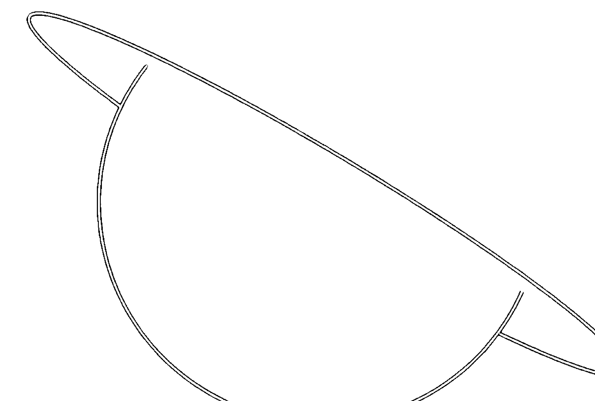

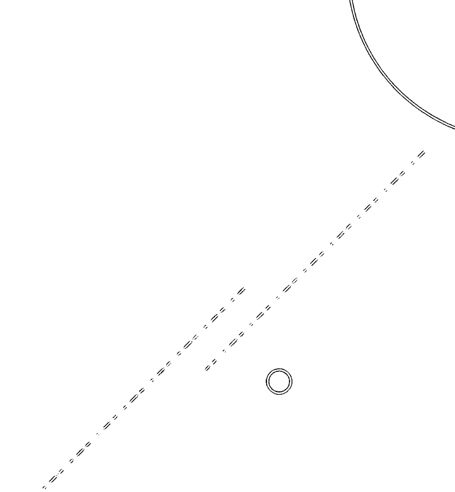

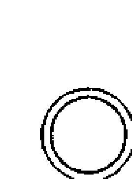

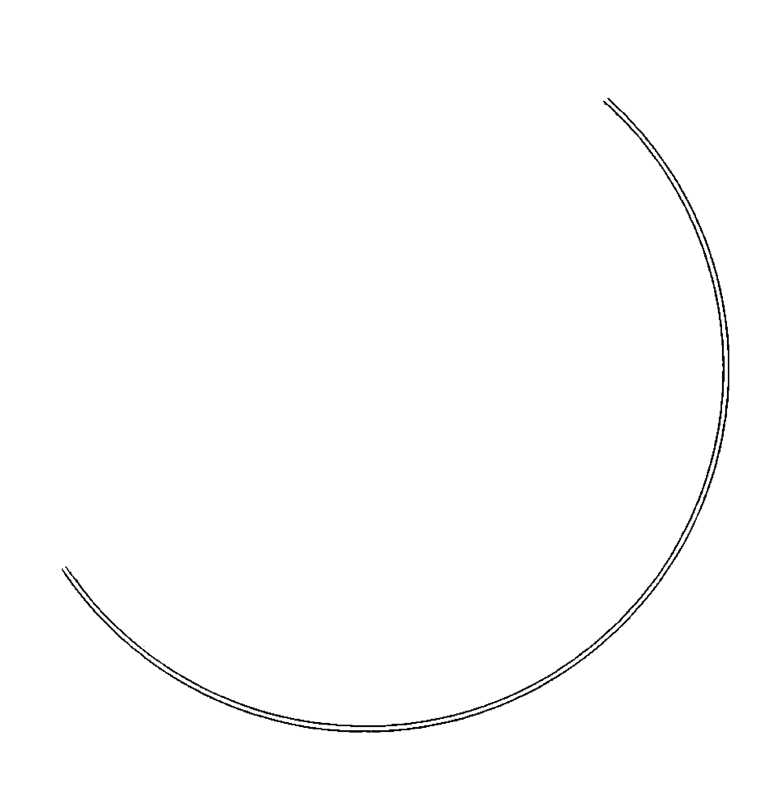

# 第二章 何謂紫微斗數？

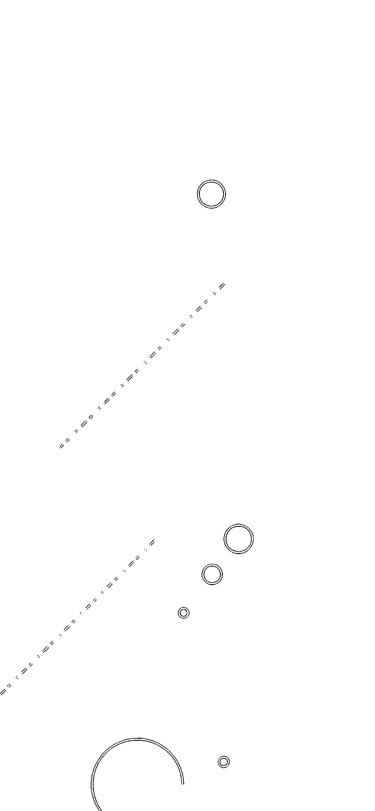

## 命理，命中的道理是什麼？

要談什麼是紫微斗數，我們要先知道何謂命理，許多人學習命理的時候看的都是技術層面，希望更快的知道用什麼技巧可以斷出事情，追求可以一眼看出這個人何時會離職、何時會墮胎這一類的驚人技巧，或者亟欲知道自己該如何改變運、如何讓人生照著自己的意思走，這樣的心態都是學習命理的障礙，無論任何學問，若是不了解本質的意義，不管怎麼學都很難進步。現實中我們看到許多人花了很久的時間，甚至是近乎一生都在摸索命理，鑽研各種數術，游走於各式各樣的流派之間，但是依然只學會了皮毛，這是因為一般人學習東西過於重視技法，就像看到有人在牆壁上插了水龍頭會流水出來，自己回家也插上一管但是卻沒有水一樣，因此，我常對學生說，只有當你了解紫微斗數的架構以及它的思考模式，才能真正的掌握它，否則背再多的資料庫都是枉然。以台灣流行的南派斗數來說，可以排列出二十多萬種組合，能被寫出來的解釋條文上億，這根本不是人腦有辦法記憶的資料庫，需要運用的是推理與計算。利用資料庫去推理與計算，推演出能預測的事情，這幾乎是所有命理學的基本邏輯，而紫微斗數可以視為將這件事做得最精妙完善的，要能夠明白這其中的推演原則，我們就必須知道，命理學的基本建構概念。

所謂的命理學，是討論人在環境中的關係，以及環境如何影響一個人。全世界無論哪一種文化體系的命理學都是這個基本構成，利用對人的統計了解與分析資料，以及透過對於環境（時間與空間的變化）觀察與掌握，以這兩個基本條件為主要架構去推演，舉個例子來說，如果我們知道某人年歲已達八十，氣管不好（這個可以由醫學上的資料來做出判斷），並且知道下次寒流來大約在六個月後（季節有其循環性，因此可以做出基本的預測），而此人生活環境不好，經濟狀況不佳，家中沒有暖氣（空間給予的生活條件），那我們可以大膽的預測此人在六個月後可能染上重病，甚至生命垂危，這是一般人在不受過任何訓練下，就可以做出的推斷，而專業的命理師只是因為擁有更龐大的資料庫，以及更好的推演技巧，所以可以把這件事情算得很精細，例如命理師可以說出這件事是六個月後的第二週發生，病得很重，但是只要調養一個月會好。

因此討論命理時，我們會說命理是生命的道理，但是這兩個字也同時在告訴我們，需要相當理性的看待生命，才能看出生命的道理。無論多美多感性的樂章，都是建構在極度理性與嚴謹的樂理上面，並且由結構完善的音符所表現出來，因此，可能一個三歲孩童也可以在無意間隨手敲出一段美麗的旋律，但是卻無法變成一個掌握音樂的音樂家，就像人生中我們常會有神來一筆的決策，但是大多數的時候卻是錯誤決定不斷，這就是因為我們通常不夠理性，無法用足夠的理性去決定事情，而情感層面的我們往往把人生往泥淖推去。如同我總是無法理性拒絕美食，最後就只好把自己的靈魂淪陷在肥肉之中，我知道要理性的做好健身計畫，但是理性的維持與執行好難。因此東西方無論哪種文化體系，都會發展出屬於自己文化、能夠理性分析並對抗人性的感情層面的命理術，如同給我們一張人生的健康檢查表，清楚理性的分析，告訴我們，你膽固醇太高該減肥了！你太放縱自己追求愛情的態度，該收斂了不然會一直遇到渣男！了解了命理的基本結構，我們就可以利用這個健康檢查表，理性找出自己需要注意的問題去改善，如同我需要少吃多運動，否則遲早要裝心血管支架，如果我做到了，自然就改變了原來要裝支架的身體，自然而然就可以改運了，命理學的道理也是如此，理性的了解自己，然後為自己找到好的道路，

這也說明了為何常有人說，有宗教信仰的人算命會不準確，因為有宗教信仰的人的思考模式行事準則是依照著宗教給的教規走，不是依照自己的個性決定事情，自然就會脫離了命理學的推演準則：人與環境的變化關係。至於有宗教信仰的人算命是否準呢？其實絕大多數還是準的，因為真正信仰很虔誠的人並不多，通常都是依照自己的個性，取用了自己所喜歡的一部分教義來信仰，這還是理性的在控制自己的情感，所以我們算他的命還是會準。

### 小練習 ☆

依照前文所提，人與環境的推演，是命理的基本邏輯，那麼中醫常常說夏天中午出生的人個性熱情但是固執，若這個人是年輕氣盛的三十歲，他出生在戰亂的戰國時代跟出生在承平時代會各自有不同的人生發展嗎？如果有，會是怎樣的情況呢？

個性雖然相同，但是因為時代環境不同，當然結果也不同。在承平時代，這個人可能因此成為黑道老大，但是在戰亂時代，可能變成地方諸侯、將軍，其實在古代許多開國之君、地方軍閥、封疆大吏，不也都是從黑道起家嗎？只是因為環境不同，能夠給予的發展狀況不同罷了。

## 2-2 起源

### 紫微斗數不是占星學

了解了所謂的命理之後，我們再從歷史的變革來看紫微斗數的起源，就更能了解紫微斗數的真正核心技術與組成架構，也才能真正了解紫微斗數的世界。目前一般說到紫微斗數都會說它是北宋陳希夷所寫，這是因為目前整個華人世界，各流派對於紫微斗數的基本學理都來自於《紫微斗數全書》與《紫微斗數全集》，這兩本書提到紫微斗數的起源說法，說的都是北宋時期的道家名人陳希夷所著。陳希夷就是那個在睡夢中還可以下棋下贏北宋開國皇帝趙匡胤，順便告訴他你小子要當皇帝的陳摶，但是，事實上陳希夷是道家煉丹派的主要人物，人生大志就是煉丹修仙，長生不老。一個追求成仙的人或許可以說他應該也懂命理，但是要說他鑽研命理，甚至寫出一整套命理體系的書（在紫微斗數全書出現之前，無論是哪個朝代都沒有這樣一個完整的斗數系統書籍），其實是不太可能的，他老人家忙著睡覺跟昇天，怎麼有空來弄這些對他來說是不入流的命理學呢？

# 第二章 何謂紫微斗數？

更別說紫微斗數全書所寫的內容結構完整，所用的詞彙已經是明清兩代的詞彙，以及其實紫微斗數中所用的諸星曜名稱，通篇充滿了非道教的用語，例如破軍星，最早的起源根本就是薩滿教的神祇；貪狼星、陀羅星這些都是佛教用語，一個道家名人幹嘛用佛教的名詞呢？（紫微斗數中的星曜名稱最早出現在佛教大藏經中的佛說北斗七星延命經，見下頁圖。）這類傳統經典，在華人世界習慣性的喜歡找個名人來背書，但是若研究一下其構成，往往可以發現其實都不是那個人寫的，以紫微斗數這樣一套結構完整的命理體系，通常也不可能由一個人完成，當然如果我們假定古代所有宗教名人都是外星人，這或許有可能。

根據許多資料的考證，紫微斗數的前身應該是古代的占星學「七正四餘」，而且是在唐朝經由佛教僧侶和阿拉伯人由印度傳入（這也是目前有種說法）是紫微斗數源自於印度占星學的原因）。傳入之後，再依照唐代的文化背景被整理成當時重要的占星流派「琴堂派」的主要依據「七正四餘」。直到此時，命盤的樣子都像占星一樣是圓形的，連十二宮的名稱都是一模一樣，大致上可以想像幾乎就是印度占星的中文翻譯版。這個學派因為占星學相徑原本以易經、占卜為主要體系所建立的預測學，在對於事件的分析判斷上更為理性而具有邏輯，清晰# 佛說北斗七星延命經

- 破軍星
- 武曲星
- 廉貞星
- 文曲星
- 祿存星
- 巨門星
- 貪狼星

而有條理，所以在唐朝時期大為普及，受到世人接受，加上唐朝各類異國文化薈萃，因此唐朝可以說是歷代與天文學相關的占星學發展的最顛峰，但是隨著時代的變遷，以及之後政治的動亂，後代道教勢力崛起，這些包含著異國文化的學術便藏進了道教的體系之內，在唐以後，華人掌握天文曆法的能力倒退了，需要深厚天文能力的占星學也因此出現停滯不前、失去準度的問題（我們現今所使用的農民曆的基礎時憲曆甚至是由德國人湯若旺所編寫）。在融入道教體系的過程中，一方面因為曆法不準確而影響原本占星學的能力，因此又結合了以易經為體系的傳統預測學，來解決當時曆法的問題，同時也解決了傳統易經分析事件較為籠統、需要大量依靠學習者天分的不穩定因子。經過數百年的整合，到了明朝，終於成為目前我們所知道的紫微斗數的基本架構，將易經的九宮轉化成十二宮，對應占星的十二宮，而將原本占星學的圓形改成目前的方形命盤，以占星學依靠相位與軌道交錯，宮位星座對應，精確推演出基本原理結構，再加上易經的體系，各自解決了兩種主要體系的問題，讓預測學變得更科學有條理、方便學習，也讓知識技能可以複製，降低依靠學習者天分的問題，變成人人可以學習的知識。

# 紫微斗數攻略

因為人人可以學習，所以傳承沒有問題；條理清晰，所以不好人為操控（用命理學說來妖言惑眾），有效避免有人以此操縱政治，確保政局穩定等優點，保御用知識，這就是今日的紫微斗數基礎——被收錄在《永樂大典》之內，也是現今所謂北派十八飛星紫微斗數的基本架構由來。而到了明朝晚期，翰林院修撰羅洪先（基本上就是圖書館抄書的，但是就像少林寺藏經閣掃地的通常神通廣大武功高強一樣，他也是著名道家人物）因為丟了工作失業時去華山自助旅行，遇到了一個華山道士，給了他一本《紫微斗數全書》，目前比較科學的說法其實是羅洪先整理了明朝的紫微斗數，加上他自己對於數術的研究心得，也就是他在失業時期遊山玩水時所得到的各地方民間數術的資訊。而清朝時期更是以此為基礎，收錄了更多民間各類型的術數，如八字、奇門遁甲、風水、面相、占課等等的各類型技術，整合在一起，也就是現在一般說的被分為南派斗數的起源。 在這個演變的過程中，紫微斗數因為引用了易經作為背後的基礎，所以脫離了占星學的範疇，因此目前的紫微斗數已經不需要使用占星學的經緯度換算，也就是說，目前的紫微斗數基本內涵更像是易經，但是用了占星學的推演手法，所

### 小練習☆

依照前面所說，紫微斗數不再是占星學，所以命盤上的星曜其實是假借名詞而已，並不是真正天文上的星曜，因此命盤設定只需要使用當地時間。那麼如果是南半球呢？會因為季節轉換而需要換算嗎？

答案：目前這個問題有兩派說法，一個是需要因為季節不同，一個是不需要，我持不需要的立場，因為若是為了季節不同而需要換算，那剛好住在赤道南方的怎麼辦呢？他的季節一年四季都是夏天，難道那裡的人生辰都只有七月八月九月嗎？住在冰島的人只有十二月一月跟二月嗎？因此，我所使用的是都不需要換算的方式，除了少數整個國家橫跨三、四個時區但是卻用同一個時間的地方，例如中國與馬來西亞，那就需要換算。

以，目前的紫微斗數主流看法，命盤上的時辰只需要以出生當地時間就可以，不需要換算，也就是說，如果我在日本出生，我就用日本當地時間，不需要再換算時間，否則要換算成哪個時間呢？西安的時間嗎？因為那是唐代長安城，還是北京的時間呢？因為那是明朝的紫禁城。所以，當紫微斗數不再是占星學，這些就通通都不需要，方便許多。

## 2-3 宮位與星曜

## 兩大不同體系的應用

前面章節中提到，命理預測學是透過人在環境中產生的互動與變異，依照人與環境的數據來進行合理的邏輯推算。

明朝初年，在紫微斗數完成的過程中，發展出兩個大的體系，一個是重視環境影響的宮位體系，一個是重視個人價值與態度的星曜體系。宮位代表了時空環境，星曜代表了人在時空環境內的態度以及所產生的應對，以此推算出現象的發生。

目前我們所學的紫微斗數，因為已經將兩個體系整合了，所以通常不會有人注意到這原本是兩個不同的價值體系，因此常常對紫微斗數古籍中的許多解釋感到錯亂，或覺得前後矛盾，若是知道本來就是由兩個體系構成，自然就不會出現這樣的疑惑。

例如紫微斗數中會說到，當自己的命宮在地支「子」的位置，則夫妻宮在『戌』。此時，命宮跟夫妻宮隔了一個轉角，這個轉角叫做『隔角煞』，通常表示這個人的感情比較不穩定，容易與另外一半聚少離多或者有分離的情況，就像兩個人雖然坐在同一張桌子但是卻分坐在兩個邊上，即使感情好也有阻隔，或者像前面（P.36）提到的身宮疊在哪個宮位上，他就會受這個宮位的所影響，這些觀念都是出自於宮位的系統。

又例如，紫微斗數主要使用的星曜，有十四主星與四煞星，若是主星跟煞星同一個宮位，則表示煞星會對主星所代表的事情有所傷害，所以如果代表財星的武曲星跟煞星火星或擎羊在同一個宮位，無論是在哪個宮位，都表示容易財帛受損（傳統的說法甚至表示這樣的人賺錢常常是左手進右手出）。這無論是放在十二宮中的哪個宮位，都可以這樣推算，都表示有破財的機會，不需要非得在代表理財能力的財帛宮或者在代表財庫的田宅宮才算。例如在夫妻宮表示常常為了感情破財，在僕役宮會為了下屬或朋友破財。又或者，代表子孫後代的破軍星，如果跟擎羊同宮放在一起，這時候也不論哪個宮位，都會表示跟子女無緣，傳統的命理師在看到年過四十歲的女生命盤有這樣的組合時，就會說這個女生應該是流產或是墮過胎，至少，她也容易跟小孩子無緣生不出來。這樣單純看星曜的組合，不去討論星曜在哪個宮位的手法，其實就是星曜體系的看法（當然實際看法需要搭配現代科技能力做調整，現代要生小孩，相對於古代有太多人為可以介入的方式）。會如此整合宮位體系和星曜體系，就是因為每個體系都有各自不夠周全的地方，因此才會在明朝之後逐步整合，也順勢的整合了其他的術數體系進來。

### 隔角煞

| 巳 (僕役) | 午 (遷移) | 未 (疾厄) | 申 (財帛) |
| :--- | :--- | :--- | :--- |
| 辰 (官祿) | **隔角煞** (中央) | 酉 (子女) |  |
| 卯 (田宅) |  | 戌 (夫妻) |  |
| 寅 (福德) | 丑 (父母) | 子 (命宮) | 亥 (兄弟) ↗↙ |

### 小練習☆

紫微斗數由星曜與宮位兩個主要體系組成，再透過其中許多的規則去融合彼此，並建構出屬於紫微斗數的宇宙，進而推算一個人的個性運勢，因此其中有諸多小技巧可以快速使用，例如宮位的位置、又如星曜與煞星同宮，對星曜造成的傷害。

我們說擎羊星是一把代表著衝動的大刀，所以當擎羊跟代表財星的武曲星放在一起，常會因為自己的衝動造成自己破財，依此類推，若是擎羊跟以下這些星要放在一起，會表示什麼呢？

- 【太陽】表示父親、老公與上司
- 【太陰】表示母親、妻子與房產
- 【天機】表示兄弟、四肢
- 【廉貞】表示人際關係

答案：
- 【太陽】表示父親、老公與上司，所以表示因為自己的個性，常會與這些人產生衝突。
- 【太陰】表示母親、妻子與房產，表示容易與這些人產生衝突，容易搬家換房子或者是破財。
- 【天機】表示兄弟、四肢，表示容易與兄弟無緣爭吵，或是四肢容易受傷。
- 【廉貞】表示人際關係，容易在人際關係上產生問題。

## 人生地圖與功課表
### 不是算命用的

現在我們可以知道，其實紫微斗數一開始根本不是拿來算命用的，它最早的設計是讓人可以了解自己，知道自己有什麼應該解決的事情。因此，我常說它其實是一張人生的地圖以及功課表，讓我們能夠真正的了解自己（絕大多數的人是不了解自己的），透過對自己的了解就可以知道該選擇怎樣的路途，知道在人生旅途上應該要如何找到出路。 透過紫微斗數，我們知道命宮表示我們的個性與價值觀，也掌管了其他十二宮，身宮表示我們追求的價值，就像我可能是個做事很嚴謹的人，但是我也同時希望追求浪漫的生活，然後再搭配三方四正的變化，紫微斗數用這樣的方式解析出人的許多面相，讓我們知道我們不是只有一個面相在生活，對應許多不同需求，我們會有不同的人生態度，如此交錯出複雜的人生，也透過這樣的分析讓我們了解到內心真正的需要。除此之外，紫微斗數的命盤上還有一些特殊標記，就像地圖上面的重要標記，各自顯示出需要注意的事情：

### 1. 陀羅星——

陀羅二字引用自佛教的經典，說的就是自己放不下與糾纏不清的情緒與感情，所以陀羅星所在的位置通常就會是糾纏自己一生的問題。例如陀羅在夫妻宮的人，感情就會是他一生的糾纏、放不下的問題。若是命宮有陀羅呢？這當然就表示一生受到自己個性帶來的困擾，容易太鑽牛角尖或太過度的堅持，容易讓自己覺得不開心，個性上的調整就是自己一生的功課。所以看看自己的命盤上面陀羅星的位置吧，你就可以知道自己的個性會太過糾結於哪個部分，需要做修改。

### 十二宮與陀羅星

| 宮位 | 陀羅在此宮的意義 |
| :--- | :--- |
| **巳（命宮）** | 陀羅在命宮：個性糾結拖延，自己的個性為一生最需要努力修正的問題 |
| **午（父母）** | 陀羅在父母：一生與父親關係糾纏，既在意又為其所拖累，是最需要好好經營的關係 |
| **未（福德）** | 陀羅在福德：精神靈魂很糾結，最需要學習自我排解，避免鑽牛角尖，來財方式也是煩惱來源 |
| **申（田宅）** | 陀羅在田宅：家人為一生在意糾結的事情，存錢會有困難，容易住到有壁癌的房子 |
| **辰（兄弟）** | 陀羅在兄弟：一生與媽媽或者兄弟關係糾纏不休，需要耐心與努力好好經營與他們的關係 |
| **酉（官祿）** | 陀羅在官祿：工作是一生糾結問題的所在，適合有毅力高專注的工作 |
| **卯（夫妻）** | 陀羅在夫妻：感情問題會是一生最需要努力的問題，也表示容易在選擇對象上選錯人 |
| **戌（僕役）** | 陀羅在僕役：與朋友的交往是一生在意的問題，也表示朋友容易造成麻煩 |
| **寅（子女）** | 陀羅在子女：表示子女會是一生的問題所在，相處上糾結但又在意，會持續的造成煩惱產生 |
| **丑（財帛）** | 陀羅在財帛：財務問題會是一生始終需要去面對與正視的問題點 |
| **子（疾厄）** | 陀羅在疾厄：表示身體會有不容易治好且會糾纏很久的疾病，例如皮膚病 |
| **亥（遷移）** | 陀羅在遷移：自我的內心和在外與人交往是一生糾結的所在，容易自我懷疑，需要努力建立自信 |

### 2. 化忌 ——

「忌」原意是「己心」，也就是自己的內心。在紫微斗數中，忌會因為星曜的變化而產生，所以我們可以在命盤上看到，十二宮中其中一個宮位的某一顆主星下面寫了一個忌，例如「武曲忌」「太陰忌」「太陽忌」等等，每個人不盡相同，而這個忌所在的宮位，就可能是我們自己內心空缺的地方，因為空缺，自然就希望去彌補或追求它。例如夫妻宮內有個忌的人，面對感情會因為有所期待，而加以追求，但是，人往往會因為空虛而做錯事情，好比肚子空虛的時候找到的餐廳特別難吃，所以感情空虛的時候也容易找到不對的人，因此許多書都會說，有忌在的宮位表示會有許多問題和紛爭，或者說是不好的，其實就是因為自己的內心在那個部分有空缺，而難以理性的做出好的判斷與決定。

### 十二宮與忌

| 巳（命宫） | 午（父母） | 未（福德） | 申（田宅） |
| :--- | :--- | :--- | :--- |
| 化忌在命宫<br>覺得自己本身有空缺，所以這樣的人會努力去填補這空缺<br>會對自己比較好 | 化忌在父母宮<br>會對爸爸好<br>但是不會處理關係，也表示說容易帶有先天上的疾病問題 | 化忌在福德<br>精神上有空缺不滿足<br>比較會容易透過花錢去追尋精神上的滿足 | 化忌在田宅<br>渴望有個家<br>重視且會對家人好，但是不會處理與家人的關係 |
| 辰（兄弟） |  | 化忌（中間圓圈） | 酉（官禄） |
| 化忌在兄弟<br>會對媽媽與兄弟付出，但是相處上不是很良好 |  |  | 化忌在官禄<br>在工作上有空缺<br>重視工作成就與表現，會是工作上的拼命三郎 |
| 卯（夫妻） |  |  | 戌（仆役） |
| 化忌在夫妻<br>對於感情很渴望<br>重視感情<br>但容易選錯人 |  |  | 化忌在仆役<br>對於朋友的關係覺得有空缺<br>所以會重視與朋友的關係，但有時會相處得不好 |
| 寅（子女） | 丑（财帛） | 子（疾厄） | 亥（迁移） |
| 化忌在子女<br>會對子女好<br>不斷的對子女付出<br>但是與子女的相處關係不是很順暢 | 化忌在財帛<br>覺得自己缺錢<br>更會產生賺錢的動力 | 化忌在疾厄<br>表示身體有空缺<br>看化忌的星曜，可表示身體容易有某些方面的疾病 | 化忌在遷移<br>覺得內心與外在有空缺，重視自己內心<br>會想往外跑但不一定順利 |

## 紫微斗數攻略

許多書籍因為傳統華人教育體系的思考邏輯過於扁平，因此在解釋上也會非常的主觀與直接，少了靈活應用的部分，只會直接的把結果說出來，卻忽略了解原因，然而如果我們要了解自己，必然要從原因了解起，不能直接做結果的判斷，否則往往容易出錯，這是傳統命理學讓人詬病的地方，也失去紫微斗數當初設計的意義。所以我希望從本書，你能知道忌所在的位置是代表自己內心空缺的部分，其他衍生的解釋只是因為內心空缺所產生的缺點，不能直接看成是結果。例如，夫妻宮有忌的人必然對感情很投入，所以他可能因為投入、用心，而找到好的對象，那麼這個忌就是適得其所；相反的我們也可以了解為何他會容易找錯對象，因為空虛造成他可能太過於心急，自然容易看走眼；同樣的，如果忌在官祿宮，這個人可能對自己的工作覺得內心有空缺，雖然可能因此常常對工作不滿，但是也可能是個相當投入工作的工作狂，在適當的時機，或許因此在工作上相當有成就。因此，透過紫微斗數的命盤，我們除了知道命宮表示了自己的個性特質之外，更可以了解到自己所追求的夢想、內心的空缺、自己無法擺脫的糾纏。這些情緒心理上的影響會造成我們在做事情與判斷事情的時候，產生不同的價值觀，例如某人有忌在田宅宮，雖然命宮可能是孤寡獨立的天機、天梁星，與家人比較少有相處的機會，但是因為內心的空缺在田宅，所以與家人相關的事情一定會盡力完成，也會一直希望自己能夠定下來，有一個家。

### 小練習☆

我們知道，斗數一開始不是為了算命用，最早出現斗數星曜名稱的經典是《佛說北斗七星延命經》，這個延命的意思，其實不是延長壽命，而是讓人生變好，因此紫微斗數在看盤的時候，其實很重視這個人命盤上所顯示的「忌」以及「陀羅」與「身宮」的位置，以此看出這個人可能連自己都沒發現的、內心重視的事情。

- 如同前面的敘述，如果有人的命盤有「忌」在僕役宮，該做何解釋？
- 若是此人有「陀羅」在遷移宮該做何解釋呢？
- 這個忌與陀羅是否又會彼此影響呢？

### 答案

「僕役宮」表示這個命盤主人與平輩的相處關係，所以與他有一般交友關係的人、認識的人，甚至下屬都可以算是「僕役宮」，而「忌」示了空缺，所以這裡可以解釋為，這個人對於平輩朋友、下屬或是認識的人，都會感覺自己的內心空缺，有空缺就想要彌補，所以這個人會希望能夠得到朋友的認同，特別重視朋友，但是因為太過度的重視，反而產生與朋友的問題，總是覺得人家對他不夠好，沒辦法，因為他就缺啊。

而「遷移宮」表示這個人的內心深處想法、在外面的表現、以及外人對他的看法，「陀羅」則表示一生內心的糾纏，因此他糾纏的事情在於他自己的內心。這樣的人往往內心想法很多，但是容易鑽牛角尖，尤其是在什麼地方鑽牛角尖？在於他自己在外面的表現以及外人對他的看法，因此這個人一定很愛面子，在意他人對他的評語，常常會因為他人的一兩句話而在內心糾結很久。

若是將兩個現象整合起來，我們可以發現，其實遷移宮跟僕役宮有某種關聯性。我們在外的表現和他人的看法，幾乎都來自於自己的朋友，所以這個人在僕役宮有忌，他就會重視朋友並需要朋友的認同，也因此反而常常會與朋友有些問題產生，同時他又內心容易糾結，可想而知這個人容易因為外人的評語而患得患失，甚至會對身邊的朋友產生不信任感，所以我們就該考慮他有很高的機率，會容易交到不好的朋友，因為只有想利用他的損友，可以哄著他讓他開心，或者說因為他自己的不安全感或是鑽牛角尖，讓好朋友會離開，引來不好的朋友，因此這一類的人就很需要注意自己的交友情況。

## 第三章
### 如何查地圖與了解自己的功課
### 做好準備人生旅程才會順利

## 真正重要的隱形命盤

### 大限命盤
### 每十年的新功課
### 每十年的新地圖

在了解自己人生旅途上所重視的事情以及自己的優缺點之後，我們就要正式的打開地圖，看看每個人生階段我們將遇到的事情是什麼了。如同前面說的，每個人會隨著年紀，而有不同的價值觀，因此紫微斗數以我們的出生年月日時排出命盤（本命命盤），解開我們一生下來就具備的特質與能力，這就如同我們是一台有特殊裝備的車一樣，但是這台車開在怎樣的路上結果卻是不同的。那麼這條路在哪裡呢？紫微斗數給了一張地圖告訴我們現在在哪裡？前方有什麼？這就是所謂的「大限命盤」。這是依照我們每十年的年歲所設定出來的命盤，以十年為一個大的限制範圍，所以稱為十年大限命盤，簡稱大限命盤，和議論別人八卦用的所謂大限將至的大限是完全不一樣的。這裡的大限命盤用的是我們每十年的歲數，在本命盤的十二宮宮位名稱上面都會有一組數字，例如 3、12、24、33，這兩個數字剛好差十，說的就是我們的歲數在這個十年間會發生的事情，所以 24、33 說的就是：我們 24、33 歲這十年會發生的事情。這裡的十歲用的是實歲，我們可以用這個十年所在的宮位，當成是我們大限命盤的命宮，而十二宮的相對位置是相同的，也就是說，命宮順時鐘一格一定是父母宮，逆時鐘一格一定是兄弟宮，因此我們有了大限命宮，當然也可以依照大限命宮，排出大限的其他十一個宮位，形成一張大限的命盤。

### 單一宮位大限所寫位置範例圖

| 巳 4~13 (命宮) | 午 114~123 | 未 104~113 | 申 94~103 |
| :--- | :--- | :--- | :--- |
| 辰 14~23 | 大限 24~33 | 酉 84~93 |  |
| 卯 24~33 (大限命宮) |  | 戌 74~83 |  |
| 寅 34~43 | 丑 44~53 | 子 54~63 | 亥 64~73 |

### 本命十二宮與大限十二宮重疊圖

| 地支 | 年份 | 大限宮 | 本命宮 |
|------|------|--------|--------|
| 巳 | 4~13 | 大限福德 | 命宫 |
| 午 | 114~123 | 大限田宅 | 父母 |
| 未 | 104~113 | 大限官祿 | 福德 |
| 申 | 94~103 | 大限僕役 | 田宅 |
| 辰 | 14~23 | 大限父母 | 兄弟 |
| 酉 | 84~93 | 大限遷移 | 官祿 |
| 卯 | 24~33 | 大限命宮 | 夫妻 |
| 戌 | 74~83 | 大限疾厄 | 僕役 |
| 寅 | 34~43 | 大限兄弟 | 子女 |
| 丑 | 44~53 | 大限夫妻 | 財帛 |
| 子 | 54~63 | 大限子女 | 疾厄 |
| 亥 | 64~73 | 大限財帛 | 遷移 |
| 中心 | 24~33 | 大限 | - |

這個大限命盤（有的排盤軟體會說這是運限盤，都可以），基本上就是依照自己十年歲數定下命宮，再依照命宮排出十二宮形成的命盤。這個命盤不是依照出生年月日時形成的本命命盤，只代表天生的特質、價值觀、性格等等無法改變的天生素質，大限命盤代表的是命主在這個十年，因為自己的個性與價值觀所產生出的對人的判斷，進而影響他所遇到的人事物，如同我們在人生迷霧中，選擇了什麼道路也會影響之後所遇到的事情，因此大限命盤同時具備了價值觀的建立以及事件的發生，這張盤就是紮紮實實的人生地圖。而且隨著時間變化，還會每十年換一張給你，甚至隨空間的不同，還會有變化。在這裡我們簡單的介紹：隨著時間變化，這張盤會依照十年年歲的改變，去改變大限命宮的位置，當然也跟著更動了其他十一個宮位，紫微斗數利用這樣三度空間的轉盤變化概念，讓我們的人生開始進入人、環境與時間變化的對應關係裡面。那麼這個大限命盤要怎麼使用呢？首先，紫微斗數中有個很重要的「疊宮」觀念，重疊的宮位彼此之間有所關連，複雜的用法可以透過這樣的關係找出前因後果以及事情的變化，最基本的用法就是如前面提到的「身宮」概念一樣，與身宮重疊的宮位是我們一生追求的價值、一生所重視的事情，因此，我們的大限命宮必然也會跟本命命盤的十二宮其中之一重疊，可能是夫妻宮，可能是官祿宮，也可能是子女宮，會依照我們的歲數而有所不同。大限命宮重疊的宮位會是這個十年我們最在乎的事情，或者說影響我們最多的事情，而且，因為斗數很強調與對面宮位的聯動，所以也需要將對面宮位一併考慮進去，重疊了夫妻宮就需要順便考慮對面的官祿宮。有了這樣的觀念之後就可以知道，當我們的大限命宮重疊的宮位，以及對宮宮位，也就是這十年的時間所重疊的宮位就是我們需要在乎的事情，也是需要努力的事情，當然宮位中座落的星曜，就會是我們在該宮位的態度，以及因為這樣的態度所會遇到的情況。

將自己大限的十二宮寫在本命盤上面，有了大限的命盤之後，我們可以直接套用原本大限命盤上面的星曜，然後依照前面（p.22）提到的看本命命盤的技巧，除了身宮不能套用以外（或者說不需要），其他如「忌」所在的位置，陀羅星所在的位置，都可以套用本命盤的解釋方式，用此來解釋這十年的情況。例如忌在大限命盤的夫妻宮，表示這十年對於感情會有很多的期待，雖然因為過度期待與需求，通常會找錯人，但也因為這樣的特質，這個十年很可能會結婚，因為人總是在很渴求的時候才會做瘋狂的事。同樣的，陀羅星在的位置，也會是這十年最讓自己糾缠而且總是有麻煩的地方，例如陀羅在僕役宮，可能總是跟朋友有牽扯不清的麻煩事情。

### 小練習☆

大限命宮所依照的歲數，起歲數的時間有的人是三（例如 23~32），有的人是四（例如 24~33），這是依據命盤中間通常會寫下個人的基本生辰資料，其中會有個所謂的局數，每個人不同，總共有「水二局、木三局、金四局、土五局、火六局」。（這個局數是怎麼來的不重要，除非想要學手寫排盤，但是現在科技方便，這種事情交給電腦做就好了。）局數裡面的數字就會是自己大限的起限歲數，例如水二局的人，他就會從命宮開始為第一個大限 2~11 歲，第二個大限可能是父母宮或是兄弟宮為 12~23 歲。依此類推，請問重疊什麼宮位的時候，通常是自己最想結婚的時候呢？提示：大限命宮所重疊的宮位和對面宮位會是自己重視的事情。

### 答案

大限命宮通常會依照命主出生年當年天干所屬的陰陽，而決定是順時鐘走還是逆時鐘走，所謂「陽男陰女順走，陰男陽女逆行」，如果是男生生年天干屬陽，他的第二大限就會在父母宮，依此類推，因此通常大約二十多歲至四十多歲這兩個大限會重疊在夫妻宮、官祿宮或是子女宮、田宅宮。因為夫妻的對宮是官祿，子女的對宮是田宅，所以無論是順走逆走都會受到夫妻跟子女的影響，也會在此時希望人生中有另外一半，以及擁有孩子與家庭的想法，所以最有可能重疊在這四個宮位時候的大限，會希望想成家。

只是在婚姻這件事情上，現代的我們不太能夠用古人的角度看婚姻，在古代多說兩句話就要把人家娶回家，摸到手可能就要負責任了，依照古代的觀念來看現代的女生，婚前性行為先準備好去浸豬籠，所以在紫微斗數中我們所談的是實質婚姻態度與觀念，並不是真實的簽字結婚。我有個客人跟男友同居五年，期間遇到男友父親過世，她還幫忙守孝跟摺紙蓮花，那算不算那個人的妻子呢？做了這麼多事情，難道他們一樣算是僕役宮嗎？當然是夫妻宮。

## 小限、流年、疊宮的概念

> 每年的功課，今年我在哪裡會跌倒

看完了每十年的運勢大地圖，怎麼可以缺少每年的情況呢？原則上紫微斗數可以推算事情的月跟日的細微時間，雖然本書沒有足夠的篇幅可以介紹到月跟日的推算方式，但是每年的運勢情況必然是我們要重視的。紫微斗數中以年為單位的推算方法有兩個，一個是小限命盤，一個是流年命盤。如同大限命盤一樣，也是先找出小限或流年的命宮，然後依照命宮位置列出其他十一宮，組成一張命盤，再依照這張命盤去解釋這一年的運勢情况。

### 一小限命盤

所謂的小限命盤用的就是我們自己的歲數，大多數的排盤軟體都會在本命盤的十二宮裡面寫上一組數字，大約是七個，例如，3，15，27，39，51，63，75，這是代表了自己的虛歲歲數，所以找到自己當下虛歲歲數所在的宮位，以此當成自己的小限命宮，同樣可以整理出一張自己的小限命盤，並看到自己的小限命宮是重疊了本命命盤的哪個宮位——今年最會影響自己的也就是那個宮位，如小限命宮重疊了本命宮祿宮，那就會影響自己那一個小限年的運勢。

# 紫微攻略

#### 举例宫位内的小限数字

| 巳 (命宫) | 午 (父母) | 未 (福德) | 申 (田宅) |
|---|---|---|---|
| 2,14,26,38,<br>50,62,74 | 3,15,27,39,<br>51,63,75 | 4,16,28,40,<br>52,64,76 | 5,17,29,41,<br>53,65,77 |
| 辰 (兄弟) |  | 酉 (官禄) |  |
| 1,13,25,37,<br>49,61,73 |  | 6,18,30,42,<br>54,66,78 |  |
| 卯 (夫妻) |  | 戌 (仆役) |  |
| 12,24,36,48,<br>60,72,84 |  | 7,19,31,43,<br>55,67,79 |  |
| 寅 (子女) | 丑 (财帛) | 子 (疾厄) | 亥 (迁徙) |
| 11,23,35,47,<br>59,71,83 | 10,22,34,46,<br>58,70,82 | 9,21,33,45,<br>57,69,81 | 8,20,32,44,<br>56,68,80 |

### 舉例小限命宮

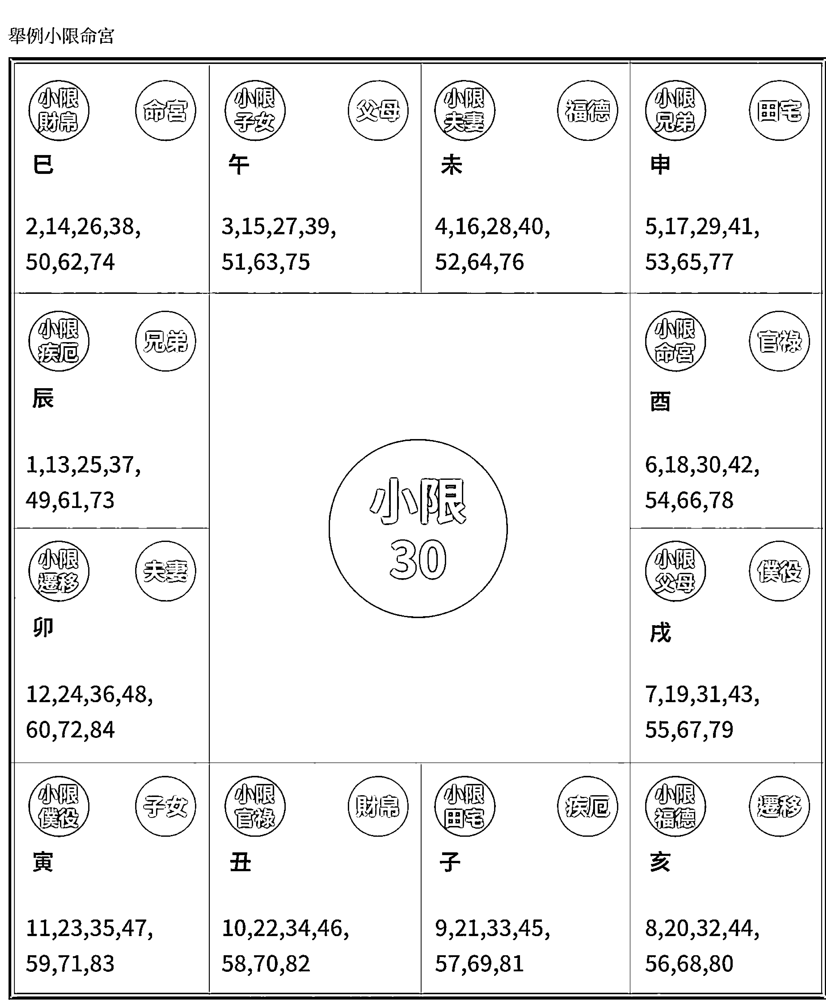

### 一流年命盤一

有的書上會說流年是太歲，沒錯，流年就是我們每年遇到的生肖年，因此所使用的依據就是命盤上的十二地支位置。我們只需要看今年的生肖是什麼，再去找十二宮對應生肖的位置，那個宮位就是流年（太歲）的命宮，然後就可以整理出一張流年的命盤。因為流年是依照命盤上面的地支定出來的，所以每年每個人的流年命宮都會一樣，例如二○一八年屬狗，每人的流年命宮都會在「戌」的那個位置，所以每個人的小限命宮在個宮位，二○一九年屬豬，就會在「亥」的那個位置，所以每個人的流年命宮位置都一樣，但是流年命宮卻是一樣的。雖然流年的命宮位置都一樣，但是流年命宮一樣可以看到是重疊在本命盤的哪個宮位上面，所以雖然位置相同但是某甲可能是重疊了「財帛宮」，某乙卻可能是重疊了「疾厄宮」，當然這一年重視的事情也就不相同了。

#### 十二宮地支位置

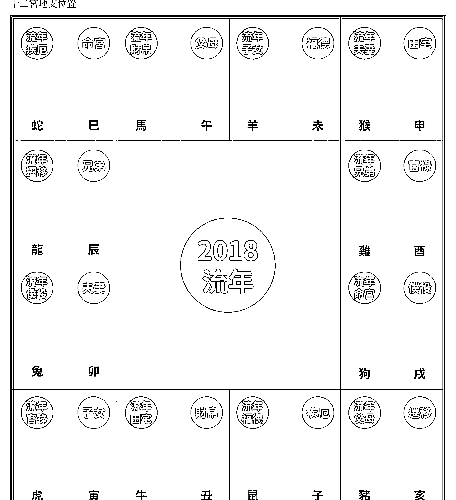

### 那麼，為何一個年裡面需要兩個命盤（小限、流年）去表示呢？

這就是紫微斗數有趣的地方，紫微斗數中，利用各種不同的命盤會有不同的涵義。本命的命盤用的是出生的時間，出生的時間一出生就定下來，不會再改變，這表示我們與生俱來的特質、個性、價值觀、長相、家世背景等等天生就存在的事物。大限則是用我們每十年的歲數去圈限出來的時間範圍，表示這每個十年，我們因為自己的個性特質而做的判斷，也就是我們依照自己的個性特質所產生出來的人生道路，也因此，大限命盤除了有價值觀等等形而上的心理層面，也有現象的發生，因為個性會決定命運。而小限也是依照我們的歲數所定出來一年的時間範疇，因此也可以說是我們在這一個年歲內的人生態度。 所以我們可以想像，本命盤像是我們攜帶的登山裝備，而大限命盤像是登山過程中所遇到的路途，我們會因為所帶的裝備去選擇路線，帶了登山杖的會繼續登山，帶了帳篷的可以選擇野營，但有時候可能選錯了，因為裝備可能會出問題。 而小限就像是我們在路途上做的事情，例如看看沿途的花朵採集一下食物。 這些命盤都是依照我們的出生時間或歲數定出來的，因此，通常都是我們能夠做的決定，並進而影響後續事件與現象的發生。

但是，流年就不一樣了，流年是依照每年不同的生肖所改變的，而且大家都在一樣的位置，只是對應到自己本命盤的宮位不同而已，所以這個時間是大家的時間，也就是一整體環境對我們的影響。同樣以登山來比喻，就像我們一行人在路途中，雖然都遇到了大雨（所有人的流年命宮都會在同一個位置），但是每個人的情況卻不同（每個人所疊的本命宮位不同），有的人有帶雨衣，有的人什麼都沒帶，當然就會得到不同的結果，甚至有的人帶了一箱雨衣，這時候可以順便做個小生意發一筆小財，這就是流年的概念。

流年說的是外界整體環境對我們產生的影響，目前斗數界的主流是以流年來論斷在一年時間內的現象跟情況，絕大多數的書籍跟流派都很少去談到小限的部分，但是在古書裡面，小限的命盤卻比流年更常被提到，為何會如此呢？

因為，通常在越短的時間之內，環境越容易影響我們做決定，越長的時間越容易產生自我的價值，也就是因為自我價值改變而作出不同的人生決定，因此在十年大限的時候，甚至會因為自己的價值觀跟態度轉變，而產生不同的價值體系，例如本命夫妻宮表示我們喜歡的對象類型，可能因為大限夫妻宮的影響而做了轉變，但是到了年的計算單位，通常都是外力（環境）在影響我們，代表自身可以決定事情的小限，則較不明顯，因此現在這個年代，大家常常會以流年來看當年度的運勢情況，而忽略了小限才是能用自我意志做出的決定。那麼為何在古代卻是常提到小限呢？別忘記了，紫微斗數最終完成時是為了服務皇室貴族的，那個年代，天子如同神明，皇權至上，天子命盤上的小限就是我們的流年了啊，他的個人決定就會是我們的外在環境不是嗎？而到了現代來說，為何我還是提倡小限的用法，一方面是因為少了小限，就少了個人意志影響命盤的力量，這就讓我們少了一個改運的機會，另一方面，這個年代的時間感與古代不同，十年內因為一個智慧手機的出現，整個人類社會生態大轉變，所以在這個年代，小限的一年可能會改變一個人的思考態度，所以說小限很重要。

當然，無論是小限或流年，用法都跟大限一樣，我們可以在上面找出忌以及陀羅所在的位置，可以看出這一年在乎的跟糾結的事情，以及擺脫不掉的問題。若是流年上面的事，則可以說是因為自己的決定所造成的；利用這些如同查詢表格的方式，我們就可以找出自己一生的個性和問題所在（本命命盤）、每個十年會遇到的問題（大限命盤）、每一年自己做的決定容易在哪裡犯錯（小限命盤），還有每年外界環境給我們帶來的風險會在什麼地方（流年命盤），到此我們對於紫微斗數命盤已有了整體性的掌握跟了解，知道紫微斗數的命盤其實是依照時空環境的變動而產生不同的命盤，是一個立體的概念。

# 第三章 如何查地圖與了解自己的功課，做好準備人生旅程才會順利

### 小練習☆

在學習紫微斗數的時候，最好的方式就是拿自己的命盤來對照。現在大家已經知道了：紫微斗數利用宮位來表示時空環境，不同的時空環境建構出我們每個人專屬的小宇宙，再利用星曜表示我們在這個時空環境內的態度，進而推演出所發生的事件。而每個宮位也不是單獨存在，而是一組宮位組合，必須考慮三方四正至少共四個宮位的星曜組合變化，並且透過本命、大限、小限、流年這四張命盤各自表示了不同的力量對我們產生的影響。而疊合的宮位則表示那個時期自己受什麼事情影響或是重視什麼樣的事情，或者是關係，例如流年命宮疊在本命夫妻宮上，表示這一年自己的感情受到外界環境的影響，所以會讓自己比較將心力放在感情上面。

「疊宮」是紫微斗數中十分重要的技巧與概念，無論任何學術與技術，熟練都是相當重要的，這就是為何不是人人看了米其林主廚的做菜影片都可以變成米其林主廚，原因就是疏於熟練、將其技巧內化。我們可以透過自己的命盤來練習一下，將自己每個流年、每個小限，所疊合到的本命宮位對照自己過往發生的事情，回憶看看是否符合，像是疊到田宅宮是不是有發生過如搬家、破財、與家人出遊、與家人吵架等與田宅宮有關係的事情（當然也包含了對宮子女宮相關的事情，但是會以田宅宮為主）。並想想這些事件是不是本來沒有計畫，但因為有個不是自己意願決定的事情而去引發（外界給予的力量）。同樣的也可以看看每個小限發生的事情，是不是跟疊到的宮位有關係，透過這樣的練習讓自己熟稔紫微斗數對於環境掌握很重要的工具，和各式各樣的宮位應用。

### 疊宮範例圖一 流年疊本命

| | | | |
|---|---|---|---|
| **巳（蛇）**<br>流年財帛、命宮 | **午（馬）**<br>流年子女、父母 | **未（羊）**<br>流年夫妻、福德 | **申（猴）**<br>流年兄弟、田宅 |
| **辰（龍）**<br>流年疾厄、兄弟 | **（中心）**<br>2017 流年 | **酉（雞）**<br>流年命宮、官祿 | **戌（狗）**<br>流年父母、僕役 |
| **卯（兔）**<br>流年遷移、夫妻 | | **亥（豬）**<br>流年福德、遷移 | |
| **寅（虎）**<br>流年僕役、子女 | **丑（牛）**<br>流年官祿、財帛 | **子（鼠）**<br>流年田宅、疾厄 | |

### 疊宮範例圖二 小限疊本命

| 小限(本命宮位) | 對應宮位 | 地支 | 年齡範圍 |
| :--- | :--- | :--- | :--- |
| 小限官祿 | 命宮 | 巳 | 2,14,26,38,50,62,74 |
| 小限僕役 | 父母 | 午 | 3,15,27,39,51,63,75 |
| 小限遷移 | 福德 | 未 | 4,16,28,40,52,64,76 |
| 小限疾厄 | 田宅 | 申 | 5,17,29,41,53,65,77 |
| 小限田宅 | 兄弟 | 辰 | 1,13,25,37,49,61,73 |
| 小限財帛 | 官祿 | 酉 | 6,18,30,42,54,66,78 |
| 小限福德 | 夫妻 | 卯 | 12,24,36,48,60,72,84 |
| 小限子女 | 僕役 | 戌 | 7,19,31,43,55,67,79 |
| 小限父母 | 子女 | 寅 | 11,23,35,47,59,71,83 |
| 小限命宮 | 財帛 | 丑 | 10,22,34,46,58,70,82 |
| 小限兄弟 | 疾厄 | 子 | 9,21,33,45,57,69,81 |
| 小限夫妻 | 遷移 | 亥 | 8,20,32,44,56,68,80 |

### 疊宮範例圖三 大限壓本命

| 地支 | 宮位1 | 宮位2 | 年齡範圍 |
|------|-------|-------|----------|
| 巳 | 大限田宅 | 命宮 | 4~13 |
| 午 | 大限官祿 | 父母 | 114~123 |
| 未 | 大限僕役 | 福德 | 104~113 |
| 申 | 大限遷移 | 田宅 | 94~103 |
| 辰 | 大限福德 | 兄弟 | 14~23 |
| 酉 | 大限疾厄 | 官祿 | 84~93 |
| 卯 | 大限父母 | 夫妻 | 24~33 |
| 戌 | 大限財帛 | 僕役 | 74~83 |
| 寅 | 大限命宮 | 子女 | 34~43 |
| 丑 | 大限兄弟 | 財帛 | 44~53 |
| 子 | 大限夫妻 | 疾厄 | 54~63 |
| 亥 | 大限子女 | 遷移 | 64~73 |

## 紫微答案

這一題當然不會有標準答案，因為每個人的情況不同，但是練習過後會發現有時候很準確有時候沒有，沒有的時候會有幾個原因，一個是因為自己忘記了（這是常有的，畢竟瞬息萬變的年代，要記的事情太多了），還有一個原因是因為還有其他事情更重要，例如流年命宮雖然疊在本命田宅宮，但是因為大限命宮疊在本命的夫妻宮，而且忌在夫妻宮，陀羅還在小限夫妻宮，這時候一直受感情影響的我，可能沒注意到其實自己有破財的跡象（田宅有財庫的意思）。最後一個是受到星曜的影響，在某些特殊狀況下，星曜力量強大的時候，宮位所產生的現象會較為不明顯，多練習幾次就可以抓出那種感覺。到這裡幾乎已經可以讓自己簡單的查表對照宮位，說出一些運勢情況了，如果再花一點時間看我在網絡上免費的星曜介紹，學習一些星曜的基本概念，就可以大致上解讀出自己的命盤做簡單的推算。

## 四化的概念與用法

人生旅途上，忽然出現的變化。

前面我們提到了命盤上面有一個「忌」，是紫微斗數中稱為「四化」，是紫微斗數中與疊宮一樣重要的觀念與技巧。所謂的四化，是紫微斗數中的主星（共有十四顆），會依照時空環境不同而產生出四種不同的變化。這是怎樣的概念呢？就像一棵樹，在春夏秋冬不同的季節會有不同的樣貌，春天樹葉枝芽剛冒出來，夏天枝葉茂盛，秋天樹葉枯黃，冬天樹葉掉落剩下光禿禿的樹枝，但是樹還是那棵樹，只是因為季節不同而產生了變化。在古老的年代，當紫微斗數還是占星學的時候，利用了時空造成星曜變化的概念設計了這個機制，也就是透過星座的變動反推出事件的發生。到了和易經整合的時代，利用這個占星學上的機制，代替原本易經占卦的變動機制，進而讓我們更能能夠掌握事情的變動。因為相對於易經原本的機制，占星學的概念更加理性有條理且能夠被掌握，因此紫微斗數就用了這個機制，讓星曜依照宮位環境的不同而造成星曜產生變動。雖然同樣是那一顆星，但是會因時空變化而出現不同的風貌，這讓紫微斗數有了更豐富的解析能力。

這個星曜因為時空環境不同而產生變化的概念，就是化祿、化權、化科、化忌四種變化，簡稱四化。其中，忌就是我們在前面提到的，有的星曜下面會寫一個忌，就是因為那個星曜產生的變化，進而影響我們在該宮位內的價值態度，最後影響宮位產生變化，可能因此改變價值觀，而產生出不同的現象。

本來四化在一開始是十四顆主星通通都有的，但是經過長年的刪減整理，把不明顯的刪除，最後整理成現在我們知道的四化表。但是也會因為各種流派不同而有不同的四化表，例如台灣斗數流派用的就和香港的不同。本書提供我用的四化表：

| 天干 | 化祿 | 化權 | 化科 | 化忌 | 口訣 |
| :--- | :--- | :--- | :--- | :--- | :--- |
| 甲 | 廉貞 | 破軍 | 武曲 | 太陽 | 廉破武陽 |
| 乙 | 天機 | 天梁 | 紫微 | 太陰 | 機梁紫陰 |
| 丙 | 天同 | 天機 | 文昌 | 廉貞 | 同機昌廉 |
| 丁 | 太陰 | 天同 | 天機 | 巨門 | 陰同機巨 |
| 戊 | 貪狼 | 太陰 | 右弼 | 天機 | 貪陰右機 |
| 己 | 武曲 | 貪狼 | 天梁 | 文曲 | 武貪梁曲 |
| 庚 | 太陽 | 武曲 | 天同 | 天相 | 陽武同相 |
| 辛 | 巨門 | 太陽 | 文曲 | 文昌 | 巨陽曲昌 |
| 壬 | 天梁 | 紫微 | 左輔 | 武曲 | 梁紫左武 |
| 癸 | 破軍 | 巨門 | 太陰 | 貪狼 | 破巨陰貪 |

我們可以看出，表格前面是天干，後面是各星曜。使用上我們會對應四化表，在遇到某個天干的時候，我們就知道哪顆星是化祿、哪個星是化忌。例如表格上面天干甲對應的就是「廉貞化祿、破軍化權、武曲化科、太陽化忌」。依此類推，我們就可以找出對應各天干的四化。

舉例來說，如果有一個人出生年的天干是甲午年，因為天干是甲，所以他命盤上面的廉貞星就會化祿，破軍星下面會寫一個權，因為破軍化權，當然武曲星下面就寫了一個科，太陽星下面是忌。如果這時候剛好他的太陽星在田宅宮，我們就可以說，這個人應該內心的空缺在家庭，他希望像太陽一樣照顧家庭，但是因為空缺，讓他照顧的力道太過頭了，所以反而產生家人不見得領情，甚至可能還跟家人不合的狀況。這就是星曜會依照著我們出生時候產生的天干而產生了變化。

既然我們會有因為生年產生的本命盤，而本命盤上面會出現因為出生年的天干而產生的「忌」，那大限盤、小限盤跟流年命盤，自然也會有大限產生的忌以及小限、流年產生的忌。該如何找出來呢？命盤上的十二宮，每個宮位都有天干跟地支，地支可以用來找出流年命宮位置，而每個宮位都會有自己專屬的天干，會跟地支寫在一起，例如宮位寫著「甲辰」，那麼這個宮位的天干就是甲。

天干
| 天干 | 屬性 |
| :--- | :--- |
| 甲 | 陽 |
| 乙 | 陰 |
| 丙 | 陽 |
| 丁 | 陰 |
| 戊 | 陽 |
| 己 | 陰 |
| 庚 | 陽 |
| 辛 | 陰 |
| 壬 | 陽 |
| 癸 | 陰 |

地支
| 地支 | 屬性 |
| :--- | :--- |
| 子 | 陽 |
| 丑 | 陰 |
| 寅 | 陽 |
| 卯 | 陰 |
| 辰 | 陽 |
| 巳 | 陰 |
| 午 | 陽 |
| 未 | 陰 |
| 申 | 陽 |
| 酉 | 陰 |
| 戌 | 陽 |
| 亥 | 陰 |

# 紫微攻略

找到這個宮位的天干對應四化表（p.103），就能找到大限的四化（建議這時候也把它寫在自己的命盤上面）。這個四化表是這個十年因為自己對人生的看法態度，產生了命盤上面星曜的變化，所以這個四化是因為大限命宮而產生，過了這個大限就沒有了。我們找到自己的大限命宮，就可以找到大限命宮所在宮位的天干，再依照這個天干，以此類推，我們也可以找出小限的四化。

至於流年的四化比較特別。流年既然用的是生肖的年份，所以天干用的也是當年農民曆上所記載的天干。因為流年是整個大環境的變化，整體就是共有的，所以用的天干當然要和大家相同。例如二〇一八年是戊戌年，所以所有人命盤上面的天機星都會化忌，因為戊天干，天機化忌；二〇一九年是己亥年，己天干文曲化忌，所以二〇一九年大家命盤上面的文曲星都會化忌。

而既然紫微斗數有疊宮的概念，因此當你把小限命盤疊上本命盤的時候，這些四化當然也可以疊上去，所以你的命盤上面就會有兩個「忌」出現了。這時候兩個忌都可以拿來判斷這個流年你覺得需要去追求或在乎的事情。當然如果是兩個忌都在一起，那一定是你今年最需要重視的事情了。

一般來說，四化「祿、權、科、忌」會被解釋成「春耕、夏耘、秋收、冬藏」，如同前面說到樹木隨著四季變化的例子一樣。因此一般的解釋為「化祿」是四化的開端與起因，即所謂的「起於祿而終於忌」。

然而，我對此有不同的解釋。忌如同自己內心的空缺處，就像我的肚子餓了，肚子空缺了，所以我會去找食物想要吃大餐。在還沒有找到食物的時候我會很不開心，因此通常對於「忌」的解釋是不好的、有問題的、心情煩躁、有是非的。廢話，我肚子餓的時候誰來跟我說什麼事情，我都會覺得很煩躁不給他好臉色，自然會有是非出現。所以其實所謂的化忌，空缺才是重點。有了空缺自然會去填補空缺，因此反而會產生動力，讓自己命盤上有了活動力讓命盤活起來。

當我肚子餓了，我會想要找東西來吃，把肚子填飽——這個食物本來不是我肚子內的東西，但是因為我需要，而把食物放進肚子裡面，這就是「化祿」。祿是本來不屬於你而給你的，就像我們放進肚子的食物一樣，本來不屬於我而給我。因此斗數上有一個重要的觀念叫「祿隨忌走」——化祿的宮位會去彌補化忌宮位的空洞。

例如有人財帛宮有化祿，可以概略的表示這個人，在財富上多出來的錢財（超過他基本需要的錢財），但是同時這個人在田宅宮有化忌，這表示他賺錢都拿回家去。我們剛剛提到疊宮是可以將兩張盤的四化一起放著使用的（建議大家一定要把兩張盤寫在一起，四化寫在一起，這樣才會清楚）。就表示這個人可能會：生年財帛宮化祿——有賺錢的能力，生年田宅宮化忌——基本上賺了錢也都會拿回家，但是他的大限命盤卻是僕役宮化忌——在這個十年，他的錢都拿去給朋友，花在朋友身上了。到這裡已經慢慢出現了紫微斗數有趣的立體變化應用了。

空缺產生的肚子餓，需要化祿的食物來彌補才不會不開心。在找尋食物的過程中當然要先取得食物，這個取得的掌握與擁有就是『化權』。但是我們也知道，肚子餓的時候容易亂買東西，便當一個吃不夠當然就買兩個，所以這個化權有『加重』的意思，還有『兩個』的意思。買了兩個便當這樣爽快的事情，在吃便當之前當然要拍照上網炫耀一下讓大家羨慕，這就是『化科』，是一種『發生、展現、出現、曝光、出名』的概念。

所以我常開玩笑說，財帛宮化科就像把錢拿出來給人家看，是一種用錢做名聲的概念，也是某種程度的破財。

這些就是四化因為星曜的變化，產生了時空環境（宮位）變化的基本概念。當然，因為四化是由星曜產生的變化，因此太陽化忌跟太陰化忌基本上是不一樣的，但是它對於宮位產生的效益是雷同的，都造成了宮位的空缺感，進而產生了價值觀與現象的變化。

因此，有的流派就是強調可以不需要學習星曜，直接用四化去看各宮位產生的變化。這是一個簡易快速使用命盤的方式，對初學來說很容易得到成就感，也很實用。當然要實際深入，還是需要了解星曜才行。但是我們可以簡單的用這個方法去對應命盤，就可以知道我們當下需要注意哪些事情：為何你總是把錢都花在朋友身上，為何男友去年對自己很好，今年卻對自己不理不睬。可能是因為去年夫妻宮是化祿，得到許許多多出乎自己預期的感情，但是今年卻是化忌，就空缺啊，兩個人就是相處起來不對。

### 小練習☆

我們知道原來紫微斗數上面的每個星曜還會有變化，所以我們可以依照四化表找出命盤上星曜的四化，而且一樣可以用疊宮去看。這裡做個小練習：找找自己在哪個小限的時候夫妻宮是化忌的，再想想自己是不是在那年對感情有期待。當然那年也可能跟男友吵架（這也表示是一種期待，就是因為你男友不如你的預期才會吵架不是嗎？）

第二個練習：如果說化忌是一種空缺，而祿會跑到忌的位置上去彌補這個空缺，請問命盤上哪一類的人，錢都會給老婆呢？想一想，誰會這樣做？（我知道這一題一定很多人想知道）

> 答案／
> 當然是財帛宮化祿而夫妻宮化忌的人啊。當化忌在田宅宮也可以，因為錢會拿回家，但是重點是財帛宮要有化祿，否則他賺不到錢要拿什麼回家呢？如果本命盤上面沒有呢？沒關係，我們還有大限命盤的機會，不要因此對你老公灰心。

## 盤宮與四化示意圖

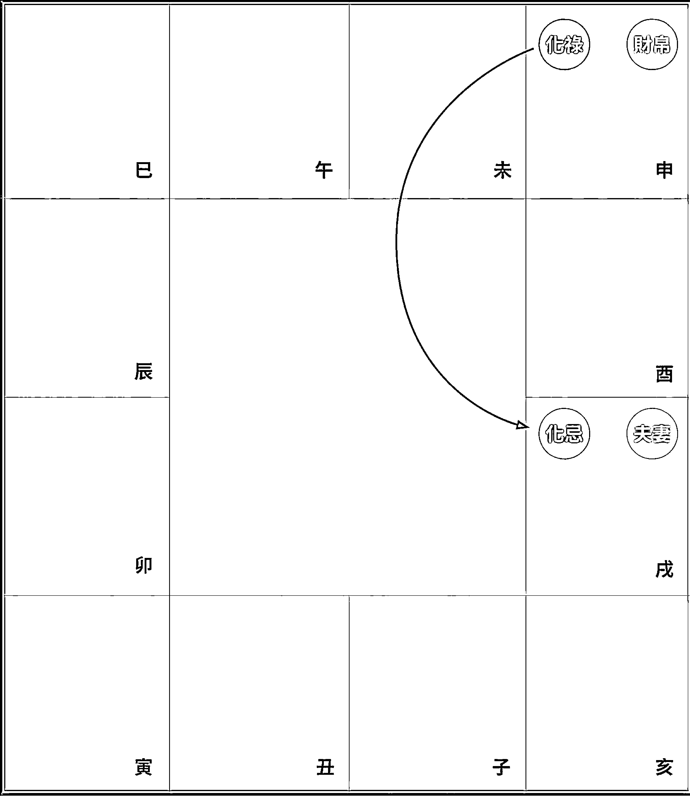

# 第四章 人生中必然撞上的那棵樹

## 命運是否不可改？

> 老師，人家說我婚姻無緣而且剋夫，能改嗎？

前面提到，我因為審視了自己的命格情況，所以一開始就選擇命理圈裡面發展難度較高的教學。一般來說，算命算是比較簡單的，因為無論算得準不準，臺灣人通常不會因為算不準去翻桌子，不像在餐廳吃飯，吃到難吃的、服務不好或者食物有問題的，很有可能會遇到勃然大怒的客人。算命通常就是兩個關卡：一見面，說出過去的事情或當下的情況，沒有問題就可以取得客人的信賴了。這個部分不要說在命理技巧上來說算是簡單的，甚至還有所謂的江相派——江湖口訣，能在完全沒有命理知識的情況下，就做出推算，而且可以有高達七八成的準度。這完全就是社會心理學，不只在命理業出現，許多行業都有這樣的技巧。至於建立了客人信賴之後，未來說得準不準已經不重要了，反正覺得準的客人會再介紹客人來，生意就好一點，不準的就差一點，如此而已。教學則不同，學生付了學費，聽完課回家馬上驗證，下週上課就來問你為何說的方式不管用。每次上課都在考驗著自己的學理夠不夠深厚。也因為教學必須要能夠順利穩定的將好的知識傳授出去，因此，大量考驗老師的教學能力。

紫微斗數一開始的設定就是為了讓皇室使用，為了能夠有好的傳承，所以必須具有極高度的邏輯與科學性。我們從前面章節可以了解，紫微斗數將整個世間萬物用很科學理性的方式建構出來，讓人可以利用紫微斗數這樣的工具，理性的分析自己的需求，進而做出好的選擇。這個理性的術數，也幫助我們說明了許多傳統命理上，因為口耳相傳以及道聽塗說造成的許多誤會，甚至可以破除許多迷信，例如我們常聽到的：這個人會剋父或剋夫。

當然我們現在都知道所謂的剋夫，可能只是因為在古代大家不喜歡強勢的女子，所以就會說強勢的女生是剋夫的，這也只是表示她會忤逆丈夫，違反古代的三從四德而已。但是剋父呢？我常常跟客人說，不要覺得自己有那麼偉大，剋父？剋蟬我就比較相信啦，超市買罐殺蟲劑就剋蟬了，講得好像你爸跟蟑螂一樣動不動就被你剋死了。這其實都要怪長年來許多江湖術士喜歡恐嚇行銷，嚇嚇你來做生意。這也是我常說其實命理是給有邏輯的人學的，但是更是給沒有邏輯的人學的，因為它會幫你把邏輯訓練好。

學習命理的重點是思考邏輯，根本不是什麼口訣秘招。許多傳統的命理說法（其實是江湖術士的說法）例如屬虎的會剋夫，老公容易早死，太陽在命宮的女生剋父。天啊，那我應該改行去殯葬業，這也太容易死人了，十二分之一這是多高的機率啊？難道全國虎年出生的女子都要注意，以後大家都會死老公？不覺得這種說法太無稽之談了嗎？

實際上的情況是，這類的說法來自於清中葉後有所謂的『江湖術士系統』，他們有一套獨特的社會心理學，可以透過觀察與言詞的推敲試探就知道你的身家背景，之後再用一些看起來很像是命理上的詞彙嚇唬你，以此得到讓你相信他、並且給錢的效果。我們生活中許多這類看起來很迷信的論調很多都來自於此。事實上用邏輯去推演就知道，超有程度的命理師可以在一個人一出生定出命盤之後，就知道這個人大致上壽元到哪裡、死因為何？這時候這個人的兒女都還不知道在哪裡？這要如何可以剋他？更別說用的還是那種只有十二分之一的機率。生肖屬虎剋老公的說法當然也是一樣的道理，你老公一出生，拿命盤來看大致上就知道他哪一年會去找玉皇大帝下棋了，你憑什麼剋他，難道你是王母娘娘再世嗎？所以這些說法從邏輯來看根本就是無稽之談。但是就像許多人喜歡看恐怖片一樣，拿很獵奇的事情嚇嚇自己跟別人。

前面提到大唐時代是占星學的巔峰時代，唐朝的政治環境造就了各種文化的交流薈萃，是一個宗教、科學、數術的輝煌時代。但是唐朝因為皇帝姓李，所以信奉的是道教，而武則天因為曾經受到佛寺庇佑，所以在武則天當朝的時候佛教大為興盛，也是在那個時候從印度流傳進來的占星學與命理術大為發達。

在佛教上有個著名的故事恰好說明了命理學的基本構成方法。傳說法藏大師曾為武則天說《華嚴經》，其中以武則天座前的一對印度來的金獅子舉例，說明任何事情的發生跟存在都有一定的機緣。為何那對金獅子會在這裡不在其他地方，為何是武則天擁有不是其他王族擁有，甚至金獅子的毛髮細節會成為現在這個樣子，是捲毛的不是飄逸的，是霧面的不是金面的，做金獅子的人為何是甲不是乙，其實都有一定的原因存在，中間需要有諸多的原因組合，一環扣一環才會成為現在的樣子，缺一不可。這一段佛教因果概念的解釋，最後被收錄下來為《金獅子章》。

當然法藏大師談的是佛學，但是其實裡面卻藏了所有命理學的重要觀念，也就是：我們依照各種環境因素跟人文因素去推算出你會發生什麼事情。也就是：我們其實是依照眼前拿到的資訊回推之前發生的事情，以及之後可能發生的事情。

既然這個發生的事情是可以被整理出來的，我們就知道這件事是由時空環境與人交錯的條件產生，所以其實我們只要去更動這樣的條件就好了不是嗎？這當中最常見的就是風水學的使用，因為風水可以更動環境。又例如找到好的時機去談生意，這不就是控制了時間嗎？又或者我們雖然個性很急，但是我們知道急事緩辦的生活經驗，雖然年輕氣盛，但是我們知道應該要收斂脾氣，讓處事更為圓滑，行事更為順利。這不就是因為改變了個性因而改變了人的部分，進而在對應環境的時候比較順利嗎？這其實就是改運。

所以說人當然是可以改運的，只是因為我們不知道該怎麼改、該從哪裡改，到底是要改個性還是改時間、改風水？而紫微斗數命盤恰恰是這張檢查表兼人生地圖，隨時告訴我們該改的是時間、空間還是個性？明白了要怎麼改，一步步的做，當然運勢就會跟著轉換了。

因此，所謂的命理學並不是百分之百的準確，也因為這個不準確，所以命是可以被改變的。命理師只是依照收到的條件去做出精確的推測，在推測的過程中為命主找出最好的道路。

### 小練習☆

這是我常給學生做的一個小遊戲：想像一下有一間房子，裡面有個白色的東西，那會是什麼？

若這個東西除了是白色還可以一隻手拿取，但是要很用力才拿得起來，那是什麼？

若是這個白色可以一隻手拿起來的東西可以裝水，那會是什麼？

若是這個白色可以一隻手拿起來的東西可以裝水，而且會發亮，那會是什麼？

若是這個白色可以一隻手拿起來的東西可以裝水而且會發亮，還會發出聲音，那會是什麼？

### 答案

這個問題沒有標準答案。這個題目的條件也可以一直開下去，最好能多找幾個朋友一起玩這個遊戲，你會發現很有趣的事情。

在回答問題的過程中，我們可以從回答問題的方式，發現每個學生的個性：有的隨心所欲，有的很嚴謹思考，有的會受別人答案影響，有的可以堅持己見雖然他的答案實在很奇幻。曾有學生從頭到尾都回答夜明珠，很大一顆中間挖了一個洞可以裝水（正常人會給那麼大一顆價值連城的夜明珠，中間挖一個洞，又發亮的夜明珠嗎？），我問「好吧都算對，那為何夜明珠會發出聲音呢？」他說那是一個用夜明珠當裝飾品的高級揚聲器，所以會發出聲音。堅持己見而且創意十足。

在這個遊戲裡面，我們發現了華人社會教育下害怕答錯的心理障礙。絕大多數的學生會透過我的眼神，或者同學的回答來揣測答案是什麼，一種不希望自己的答錯的心情，但是這個心情其實造就了我們比較不願意給自己夢想跟希望的社會氛圍。通常一個班十個學生，除了少數喜歡夜明珠跟特殊偏好的人以外，多數人在提示越來越多的時候，答案會越來越趨向同一個方向，因為能符合這些條件的答案必然會越來越少。最後大家終將會是說到同一個答案上面去，這其實就是命理的推演過程。

我們透過各種管道取得各種條件和數據，去交叉比對跟推理，以此得到答案。數據越多得到的答案就會越精準，這個包含了使用的工具以及做推測者的經驗值。經驗值當然也是數據的一部分，所以越是機密的工具越是可以解決經驗值的問題，當然有經驗就可以解決工具粗糙的問題。而這個透過分析推演出來的答案越是貼近真實答案，就會讓命理師越精準。

可是在這個過程中很多人都忽略了一件事情：我們習慣追求準確的同時，卻又同時失去了可能性。那個一路堅持答案是夜明珠的同學，難道答案就真的不可能是夜明珠嗎？這種害怕想像的問題，是華人教育給我們的制約，因為害怕犯錯所以害怕想像。

事實上，我鼓勵大家盡可能的想像，因為，現實的情況是我們大多數的人並沒有辦法過著別人的人生。一個命理師怎麼可能同時知道生意人的思維，以及藝術家因為藝術環境造就出來的想法呢？所以絕大多數的命理師通常是用自己的人生價值去判斷別人的人生價值。如果一個女人一生可以擁有跟享受無數的愛情，為何一定要叫她跟一個男人終老一生？這個建議除了所謂的守護傳統價值以外，卻同時讓這個女人少了認識更多讓自己生命豐富的機會，同時間也少了讓很多男人認識這個生命豐富的女人的机会。然而，我們通常會用自己的價值去評斷別人的生命。

這就是我希望大家會看紫微斗數這張人生功課表，會看地圖才可以自己找到之所以要往哪條路哪個方向走的原因。因為只有你最了解你自己，也只有你可以改變自己。這也是為何我常跟學生說，學習命理的人要用生命來看待命盤，不要用命盤看生命。請問你看過有人開車只看衛星導航螢幕，不看前方道路的嗎？真有這樣的人那車禍也是必然的。我們很少看到這樣開車的人，但是在命理圈反而很常見，因為習慣性的局限想法，所以才會產生很多食古不化的命理誤區。

所以我常鼓勵學生，在初學的階段需要放大自己的想像，最好把自己當成是八點檔肥皂劇的編劇，然後再利用工具。就像這個小遊戲一樣，利用越來越多的條件設定去刪除不可能的事情，刪除得越好就會愈趨近事實，那就算得準了。再更進一步，可以透過重組那些條件，將好的變成不好的，跟積木一樣，需要車子的時候，把不需要的屋子拆了改組成需要的車子，那就可以改運了。這也是實務上我們真正建議給客人的改運方法。

## 人總有些非自己預期的災難

在我分析自己的運勢之後，確定要以教學為志業，首當其衝的就是上哪裡找學生。雖然那時候已經開始寫部落格，希望透過文字讓大家了解我以及我的想法跟理念，然而實際的情況卻是一整年都沒有學生，甚至連算命的客人都沒有，你說我以教學為主為何還要算命？問題是不算命誰會相信你有能力教呢？所以一般算命的市場SOP就是找個咖啡廳蹲點幫人算命，從免費的、隨喜的（隨客人喜歡給多少，基本上跟乞丐沒太大區別），直到開始建立自己的名聲，這通常需要五年以上的時間，還必須搭配生意好的咖啡廳，若咖啡廳生意不好客人太少，名聲不好打開，可能時間還要久一點，然後算個五年的命（通常是十年）累積一點經驗，再開始考慮教課。這樣一個漫長又無法掌控的光陰，對當年一身債務還有個新生幼子的我來說，當然是不可能如此，更何況我的命格算命根本生意不會好，我只能教課，第一年的唯一兩個客人，一個是老友一個是親戚，想來全都是為了給予我精神支持。

這絕對是相當痛苦的一年，完全不知道自己這樣寫部落格是否有用，但是我告訴自己，如果當年我的命盤早有所顯示將襲來的生意失敗、人心背叛，那我這一次該真正相信它給的訊息，其他的問題，我只能想辦法突破。不能因為短暫的生活問題，就選一條不屬於自己的路，這種事情最常發生在女生對於感情的態度上，生怕自己嫁不出去，成為高齡產婦，即使知道身邊的追求者根本就是渣男，一樣嫁了，我說奇怪了，肚子餓的時候，再沒錢買食物都不會去吃餿水，應該是想辦法找錢買食物怎麼會接受吃餿水呢？但是現實上的人性卻很多都是如此，甚至還會有媽媽告訴女兒，你都年紀那麼大了就將就一下啊！我說媽媽啊，人生不能將就啊！不想將就，當然就要付出代價，我想辦法過活但是不能放棄目標，於是努力的辦講座，厚著臉皮拉親朋好友好友來參加，證明我的能力，也努力的用自己的面子拉到一個班級十個人來上課，事實上那根本連房租都不夠付。

就在某個很無奈的早晨（因為前一天剛好知道自己一個很好的命理數位化點子，被一個說好要合夥的人拿去賣給別的公司），我遇到了目前在北京發展的很好的學生，他如今在北京已經是很有名聲的命理大師，聰明認真用功以及對人生的熱情，加上不怕苦的個性，成為大師本來就指日可待。這個學生給了我很大的鼓舞，讓我發現原來二十年的商場經驗，其實對於命理的推廣來說會是很好的利器，我們本來就有很好的科學方法可以教育主管去推測市場的變化，因此也能教會人們將看起來落後古板的紫微斗數，回復到原本很科學的原貌。我的學生說起他有一個客人，因為愛情與事業都不順利，經過他的指點，在這段時間先拚事業再談愛情，果然在很快的時間內升上高階主管，薪水高漲，但是卻回來問我學生，是否能夠放棄薪水，因為她更需要愛情，最後她回頭淪陷在渣男給她的迷幻但是卻痛苦的愛情裡，我的學生問我，老師，我們是不是其實根本無法抵抗命運的巨輪？

那個當下，我給了他一個答案，也給了我自己一個答案。我告訴他，有時候當運限走到，就是會有些我們無法阻擋的事情。就像我開車去撞到一棵樹，我四十多歲，那棵樹七十多歲，他在那裡等了我七十年了，生命中確實有些事情是等在我們人生軌跡上很久了，就是要出現出來給我們考驗，問題是我們因為個性的緣故通常很難躲過去，即使知道要出事了，難道我就不出門嗎？絕大多數的人都做不到。我跟學生說，就像老師我，即使知道自己已經胖得像被豬神附身，我還是無法控制吃的欲望，所以再來可能是海怪要附身在我身上了。另外一個答案則是給我自己的，既然紫微斗數已經给了我清楚的路，那我應該想辦法將路走過去，而不是因為艱難而放棄，於是我當下更有決心的去做該做的事情，當然也才有今天這本書的出現。那麼，我們人生中真的有些障礙是「等」在人生路途上嗎？前面提到的陀羅星、忌所在的宮位，那些問題通常是因為與生俱來的、一出攜帶上路的裝備就有問題，至於路途上其他的陷阱跟災難以如何看呢？紫微斗數既然有著本命、大限、小限、流年命盤，我們就可以依照生年的天干找出本命盤上的四化，還有大限、小限、流年盤上的化忌位置，當然那個很麻煩糾纏不清愛哭愛跟路的陀羅星，也會有大限、小限、流年的陀羅星，跟忌一樣，也可以重疊在一張命盤上面使用，怎麼找出來呢？首先要先利用祿羊陀所屬天干位置表：

## 祿羊陀所屬天干位置表

| 巳 (丙、戊) | 午 (丁、己) | 未 | 申 (庚) |
|:---|:---|:---|:---|
| 辰 | | | 酉 (辛) |
| 卯 (乙) | | | 戌 |
| 寅 (甲) | 丑 | 子 (癸) | 亥 (壬) |

我們可以看到這張表，一樣有十二宮，但是上面寫的天干卻跟我們命盤上的不同，甚至有些位置是沒有天干的，這是一個專屬找出紫微斗數中很重要的三顆星曜「祿存、擎羊、陀羅」的圖表，這三顆星，會有固定的位置關係，以祿存為中心，順時鐘一格是擎羊，逆時鐘一個是陀羅，古書上會寫著「前擎羊後陀羅」。至於表上的那些天干是什麼意思呢？它是祿存星所在的位置，也就是說，如果你出生年的年干（我們前面用來找本命盤四化的那個天干）是「乙」，那它就會如圖表上面在十二宮中「卯」的位置，如果是「丙」或是「戊」，那就會在「巳」的位置，依此類推，我們就可以找出自己本命盤祿存星的位置，而找出祿存星，再依照祿存星的位置：前擎羊後陀羅，順時鐘一格宮位的是擎羊，逆時鐘一個宮位是陀羅星。

### 小練習☆

大限、小限、流年的擎羊跟陀羅的找法，跟四化的找法一樣，都是利用大限命宮的天干，小限命宮的天干，流年使用農民曆的天干（2018是戊年、2019是己年），去找出大限、小限、流年的專屬祿存，然後再依照祿存的位置找出大限、小限、流年的擎羊星、陀羅星。

現在我們試著在自己的命盤上，依照上面的方法找出這幾顆星曜，跟四化一樣，它也是可以疊在一起應用，因此也是一併的寫在自己的命盤上面，可以重疊寫在同一個宮位上，這樣就可以找到一般人只會看本命盤所不知道的職業級秘訣：命盤上還有這些隱形的擎羊陀羅存在，隨著運限的變動偷偷出現在我們的命盤上。

以六十三年次甲年生人，大限命宮為乙，小限命宮為丁作範例

| 巳: 小限陀羅 | 午: 小限祿存 | 未: 小限擎羊 | 申 |
| 辰: 大限擎羊 | 63年次甲年生 | 酉 | |
| 卯: 大限祿存, 本命擎羊 | | 乙 戌: 大限命宮 | |
| 寅: 大限陀羅, 本命祿存 | 丑: 本命陀羅 | 丁 子: 小限命宮 | 亥 |

### 答案

大限祿存羊陀範例

| | 巳 | 午 | 未 | 申 |
|---|---|---|---|---|
| 辰 | 巳：大限擎羊 | | | 酉 |
| 卯 | 辰：大限祿存，本命擎羊 | 大限命宮走乙 | 大限命宮：酉 | 戌：乙 戌 |
| 寅 | 寅：大限陀羅，本命祿存 | 丑：本命陀羅 | 子 | 亥 |

### 答案 / 小限祿羊陀蔭例

| 巳<br>小限<br>陀羅 | 午<br>小限<br>祿存 | 未<br>小限<br>擎羊 | 申 |
|---|---|---|---|
| 辰 | 中央<br>小限<br>命宮走<br>丁 | 酉 |
| 卯<br>本命<br>擎羊 | | | 戌<br>乙 |
| 寅<br>本命<br>祿存 | 丑<br>本命<br>陀羅 | 子<br>小限<br>命宮 | 亥 |

### 答案 /

流年2018 戊年祿羊陀範例

| 巳 (流年祿存) | 午 (流年擎羊) | 未 | 申 |
|---|---|---|---|
| 辰 (流年陀羅) | 2018 流年走 戊 | | 酉 (流年命宮) |
| 卯 (本命擎羊) | | | 戌 |
| 寅 (本命祿存) | 丑 (本命陀羅) | 子 | 亥 |

### 四張盤 重疊 範例

| 巳 | 午 | 未 | 申 |
|---|---|---|---|
| 小限陀羅<br>流年祿存 | 小限祿存<br>流年擎羊 | 小限擎羊 | |
| 辰<br>大限擎羊<br>流年陀羅 | | | 酉 |
| 卯<br>大限祿存<br>本命擎羊 | | | 乙 戌<br>大限命宮<br>流年命宮 |
| 寅<br>大限陀羅<br>本命祿存 | 丑<br>本命陀羅 | 丁 子<br>小限命宮 | 亥 |

## 四煞與化忌，搭配四化表與宮位組合看出各項災難的發生

我上課有幾個特色，一個是利用各種遊戲訓練同學的邏輯思考能力，另一個就是希望大家在合理的範圍內盡量的聯想，此外，我會一開始就談各類煞星，這一點在某位同學回去跟女友分享心得時，得到了很有趣的對答：

女：那你都學了些什麼？
男：依照老師教的，所以你@%&CS$**&@#......（講了大約三十分鐘）
女：你講了三十分鐘我各種倒楣的地方耶！
男：ㄛ，因為老師就教這些啊......
女：你們老師只教你看倒楣的地方喔，這不是越看越沒希望嗎？不要去學了。
男：可是老師說人只有遇到倒楣事情才會來算命啊，快樂的事情自己開心就學了。

好了。後來他女友也變成了我的學生，最後兩人結為夫妻，然後這個故事一直在學生間流傳。上課大約一個月都在聽各種煞星，其實是因為在命盤上面，煞星代表我們衝動且原始的個性，因為衝動而原始的慾望，往往會造成人生的顛簸跟傷害，而我覺得先面對可能發生的慾望與衝動，才能避免人生出現風險與不可挽回的傷害，加上雖然紫微斗數是以十四主星為主的星曜結構，但是每一顆主星再遇到四煞的時候都會產生不同的變化，甚至是變得完全不一樣，因此，雖然說四煞星是輔星，是輔助主星的星曜，目前流行的說法是乙級星（這種說法讓人感覺四煞比較弱）。而輔星所謂的輔助主星，其實就像是我們的情緒或像是我們會交了怎麼樣的朋友，而這個朋友是比較衝動或有著比較不受社會道德與法制規範的個性，主星就會受了他的影響，有時候會因此性格大改變，讓主星的特質由好變壞，尤其是那些個性比較搖擺不定的星曜，例如廉貞、太陰；有時候則可以反過來被主星利用來成為突破困境的動力，例如天府、天同。而四煞星單獨存在的時候（宮位內沒有主星只有煞星單獨存在），基本上就可以當成是一個比較衝動的壞朋友，會為宮位帶來破壞，所以我們上課先學習四煞，再學習主星的解釋，這樣一來才不會上每一個主星的時候，會因為遇到煞星不同，解釋就跟著變換，讓學生不知所措。更重要的是，其實光靠著四煞星跟忌所在的位置，就可以評斷十二宮的好壞了，連帶可以簡單的分析運勢了。

## ## 四煞星的概念

### 擎羊

這是源自於古代塞外胡人蠻族的羊角刀，象徵著巨大的衝動與破壞力，表示斬斷的力量，但是也表示了很強大的堅持力量，不動搖、往前衝的固執個性。

### 陀羅

這是源自於佛教，永遠無法擺脫的業力糾纏，就如同陀螺般一直旋轉，是內心不願意放棄的糾結，也可以是堅持下去原地不動的力量，也有鑽研的意思。

### 火星

如同一把大火，會將整個宮位都燒乾淨，破壞殆盡，但是也表示怒火的衝動與熱情如火爆發力。

### 鈴星

如果說擎羊是一把大刀，鈴星就是一把小刀，慢慢的割、慢慢的切，細心計畫，斬斷一切障礙，雕刻出自己計畫的結局。

這四顆煞星，在前一節說過擎羊跟陀羅除了本命命盤上的，還會有大限、小限與流年命盤所產生的。火星跟鈴星則只有本命盤上面的，但是透過疊宮，還是會出現各種運限盤上。如果說十二宮代表的是時空等環境因素，那宮位被破壞了，自然表示那個宮位所代表的事情是處於狀況不佳的狀態，因此，那個宮位所代表的人事物自然是比較弱、不利的情況。紫微斗數將一個人當成是一個小的國家，現代來說可以當成是一個小的公司，十二宮等於是公司的各個不同部門，若是宮位被破壞了，我們可以想像成那個部門體質不佳，例如若是帛宮被破壞了，我們可以解釋成這個公司本身財務狀況不佳，這時候即使公司來了一個很厲害的財務長，工作起來也是左支右絀相當吃力。前面說到，有的主星本身不夠強勢，受到煞星大幅度影響；有的主星能力很好，有煞星不見得會不好，這就像是公司財務體質不佳，遇到能力差的主管可能就會更慘，遇到能力好的，有時候反而會團結大家讓公司度過難關，甚至因此讓公司更有競爭力（財務不好都可以爬起來必然是有很堅強的戰鬥力）。但是，若是情況真的太差，能力再好的主管也是無力可回天，所以說煞星的力量足以讓宮位毀掉之後，讓這個破壞成為人生的障礙。當然，若是空宮沒有主星而有煞星在裡面的時候，這個宮位算是被破壞了，但是如果有主星呢？怎樣算是破壞呢？

我們在前面章節（P.42）提到過三方四正，紫微斗數中對於宮位的概念是一個「宮位群組」，不是單一宮位構成，因此我們可以從三方四正內有多少煞星來判斷：這個宮位的主星是否有能力控制煞星的力量，度過難關。排除掉各主星以及雙星組合所產生的各類型複雜應變能力不說，有一個簡單的方式可以讓我們知道煞星對宮位的破壞程度，評估這個宮位的健康狀態，那就是加總三方四正四個宮位有幾個煞忌（沒錯，加上代表空缺的忌）。

- 若是三方四正四個位置加起來都沒有煞忌，那算是很平安，沒有麻煩安安穩穩的狀態；
- 若是有一個煞忌，這其實也還好，甚至有時候是一種讓自己努力的動力；
- 若是有兩個煞忌，如果不是兩個都在同一個宮位，那問題也不太大，只是有些麻煩，因為隊員各自有麻煩無法幫忙自己。若是同一個宮位，除非宮位內主星是天府與天梁，否則那個宮位可以算是破壞了；
- 若是三方四正加起來有三個煞忌，煞跟忌都算喔，這時候這個宮位算是不妙了，即使主星是比較不怕煞的天府星也一樣，若是三個集中在一個宮位，或者說是在主宮位跟對宮（例如命宮／遷移宮、夫妻宮／官祿宮），這一組的兩個宮位可以說都毀了；
- 若是四個，那所在的宮位大概就是我們人生要接受魔王大挑戰的宮位了。

我們只要透過煞星與忌所在的位置，計算宮位三方四正有幾個煞忌，就可以知道哪個宮位最差了，那個宮位代表的事情就會是我們該注意的地方，因此這時候我們只要排一排本命、大限、小限三張盤做疊疊樂，並且把煞星與忌擺上去，然後看看小限命盤以及本命命盤上面的十二宮中哪一個最糟，這就是我們小限那年該注意的事情了。那流年呢？因為小限跟流年都是一年的時間內，所以如果用了小限就不需要用流年，用了流年就可以不用小限，可以擇一使用來推測一年內該注意的事情。這一招是實務算命時，命理師很常用的技巧，能夠很快的看出這個人今年最倒楣跟最辛苦的事情是什麼，看到這個人流年的官祿宮，兩個煞一個忌在上面，馬上跟他說，請問是不是來問工作啊，今年是不是工作都不順利呢？

### 小練習☆

紫微斗數有個很簡便的方式，可以利用各個盤所產生煞星的所在位置，以及忌所在的位置，重疊以後去看最多的煞忌是落在哪些宮位上面。以流年或小限的命盤宮位為例，如果有三個忌在小限財帛，或者是兩個忌一個煞在流年田宅，就可以知道他這一年有破財（田宅宮）或者是財務（財帛宮）的問題。也可以看看是落在本命的哪個位置，如果是落在本命的夫妻宮，那表示這一年感情狀況也不好，若是剛好是本命的夫妻、小限的財帛，則表示這一年因為感情問題造成財務狀況有問題，因為本命就像我們開的車子，而小限就像我們開在道路上做的事情，因此我們的車子有問題造成我們在道路上手忙腳亂。依此類推，我們來看看，以下幾張圖表，各自表示有問題的宮位在哪裡？

### 題目一

流年田宅宮兩煞一忌

| 巳 | 午 | 未 (化忌) | 申 |
|---|---|---|---|
| 辰 | (中心: 流年田宅兩煞一忌) | 酉 | |
| 卯 | | 戌 (流年命宮) | |
| 寅 | 丑 (擎羊, 陀羅, 流年田宅) | 子 | 亥 |

### 題目二

紫微斗數命盤，展示小限官祿宮三煞相關星曜與宮位分布：

| 地支 | 星曜/宮位標註 | 備註 |
|---|---|---|
| 巳 | 火星, 小限官祿 | 位於第一行第一列 |
| 午 | | 空 |
| 未 | | 空 |
| 申 | | 空 |
| 辰 | | 空 |
| 酉 | 擎羊, 小限財帛 | 位於第二行第四列 |
| 卯 | | 空 |
| 戌 | | 空 |
| 寅 | | 空 |
| 丑 | 小限命宮 | 位於第四行第二列 |
| 子 | | 空 |
| 亥 | 陀羅, 小限夫妻 | 位於第四行第四列 |

中心區域有圓形標註“小限官祿宮三煞”，並有箭頭指向巳、酉、亥三個地支格子。

### ## 題目三

本命僕役宮兩忌一煞

| | | | |
|---|---|---|---|
| 巳 | 午 | 未<br>（本宮命宮） | 申 |
| 辰 | | | 酉 |
| | 本命僕役宮兩忌一煞 | | |
| 卯 | | | 戌 |
| 寅 | 丑 | 子<br>（擎羊）（化忌化忌）（本命僕役） | 亥 |

### 題目四

本命夫妻宮疊小限田宅宮兩忌兩煞

| 巳 | 午 | 未 | 申 |
|:---:|:---:|:---:|:---:|
| 辰 | | | 酉 |
| 卯 | | | 戌 |
| 寅 | 丑 | 子 | 亥 |

（此處省略圖片描述文本，保留原始信息）

### 答案

#### 題目一 流年田宅宮兩煞一忌

單以流年命盤來看，流年田宅宮內疊了擎羊、陀羅兩個煞，對面子女宮有一個忌，表示今年因為外在環境造成破財，因為子女宮代表了家的外面，所以忌在子女宮，通常表示破財是在家外面造成的。

#### 題目二 小限官祿宮三煞

單以小限命盤來看，小限官祿宮有一個火星，官祿宮的對宮夫妻宮有一個陀羅，而官祿宮的三方宮位財帛宮有一個擎羊，造成小限官祿宮在三方四正內有三個煞，表示這個小限的工作上，自己個性很急，工作之外，又有很多問題糾結（夫妻宮為官祿宮的外在情況），自己財務狀況又不佳，雖然很希望賺錢，但是卻常因為自己理財問題而破財，綜合起來表示今年的工作情況不太順利。

#### 題目三 本命僕役宮兩忌一煞

單以本命僕役宮，是自己的交友態度來說，兩個忌在僕役宮內，表示其實自己很重視朋友，但是因為太重視了，反而容易受朋友所害，甚至引起糾紛，再加上一個煞進來破壞宮位，因為這樣，往往與朋友的關係都不長久。

#### 題目四 本命夫妻宮疊小限田宅宮兩忌兩煞

本命夫妻宮有兩忌兩煞可以解釋為，自己在情感態度上很重視感情，但是這個重視太過頭，加上煞星表示著衝動的破壞力，因此在情感上可能會因為在乎而且衝動，反而無法將感情處理好，通常會造成感情不穩定，以及會在情感上造成傷害。

＊補充：若是在小限田宅宮出現這樣的情況，可以直接判斷為與家人爭吵或者是破財（田宅是家人關係與財庫）。此時若將本命盤當成是基本原因，我們好比開著那台出問題的車子，小限當成是我們因為車子出問題而在人生道路上的狀況應變，就可以解釋成我們因為自己的感情問題，而產生這個小限年會有破財的問題。

## 利用煞忌组合快速找出灾难的小技巧

在了解如何利用宫位以及煞忌简单排列，找出我们在运势上和本身个性的问题时，基本上我们已经掌握了可以快速应用紫微斗数命盘的小技巧。当实际的问题发生，必须要了解宫位内的主星曜情况，才能做细节的判断，例如前面提到在夫妻宫内有双忌，如果是武曲天相各自产生忌，而形成双忌，这可能是在感情状况上，与另一半有钱财纠纷问题，甚至有法律问题，因为武曲是财星，而天相若是化忌会有法律合约问题，这个部分当然就需要详细了解星曜才能够做出细节的解释。不过，若是平常使用，其实也可以用前面教的方式快速知道要出状况有问题了，进而改善注意。除了星曜之外，我们还可以利用宫位知道什么情况呢？以下介绍几种我常用的小技巧，一样是利用宫位就可以做出简单的判断，可以先以此做为熟悉宫位的练习，等熟悉星曜的特质后再带入星曜特质解释，就可以详细的掌握紫微斗数的应用技巧，到达专业级的水准。

## 一 爱情

爱情几乎是来算命的人最常问的问题，爱情问题中常被问到的有以下几种情况，我们下列简单的介绍。

### 1. 不容易找到好对象

不容易找到好对象可以分为两个层面来说，一个当然就是自己本身对感情的态度，这里看的就是本命盘了，若是本命盘上面的夫妻宫三方四正遇到太多煞忌，我们可以看看这些煞忌是在什么地方：从夫妻宫的三方四正（官禄宫、迁移宫、福德宫）去查看，福德宫有煞可能是因为自己的价值观与一般社会价值不同，所以难找到跟你心灵相通的人。若是官禄宫则可能是因为自己在工作上太过于投入或是工作不稳定，也可能是因为自己对感情的态度，有许多的不同想法，心里想的跟表现的不同，因为所有宫位的对宫，都可以当成是主要宫位的内心世界互为表里，所以官禄宫也可以当成是感情的内心世界。迁移宫有问题则是因为自己的外缘比较有问题。

另一个层面则是环境影响：若是本命的夫妻宫只有一个忌，但是流年却出现了流年擎羊在官禄宫以及大限陀罗在迁移宫，这表示整个大限自己的内心有许多纠结，在外与人关系比较不活络（大限陀罗在本命迁移），同时，今年外界环境让自己工作有状况（流年擎羊在本命官禄），以致于本命夫妻宫煞忌聚集，这些状况造成自己今年根本无心于感情，虽然化忌在本命夫妻宫对感情必然有期待，但是因为各种事情与状况让自己无定下心去寻找对象，或者说因为今年的状况很多，所以也不容易找到对象。简单看，可以知道我们的问题在哪里。透过这样对于宫位的分析，就可以知道我们的问题在哪里。

了解了宫位的问题后，再带入星曜的特质，就可以依照宫位内的星曜分析出问题的细节，例如若此时官禄宫是破军星，破军遇到陀罗可以解释为自己在工作上希望是有发展性的，但是却可能因为此与老板不合或是不如自己的预期，所以内心有许多的烦与心结，以致于影响了工作跟感情。

### 不容易找到好对象附图

| 地支 | 信息 |
|------|------|
| 巳 | 大限陀罗, 本命迁移 |
| 午 |  |
| 未 |  |
| 申 |  |
| 辰 |  |
| 酉 | 化忌, 本命夫妻 |
| 卯 | 流年擎羊, 本命官禄 |
| 戌 |  |
| 寅 |  |
| 丑 | 铃星, 本命福德 |
| 子 |  |
| 亥 |  |

中心：不容易找到好对象

### 2. 今年来的对象不对

既然说的是今年，必然看的时间范围是用年做单位，当然使用的是流年命盘，跟小限命盘，一方面看是大环境造成的原因（流年）或是自己造成的原因（小限），此时无论是流年或小限，看的就是夫妻宫。『今年来的对象不对』这个问题，我们需要去看小限或流年的夫妻宫状态，若是遇到太多的煞忌，自然此时来的对象不会太好，在运限中的夫妻宫若是遇到煞忌，不一定就表示会没有对象，因为实际上看是否有姻缘出现，还需要搭配其他星曜，例如红鸾、天喜星，或例如桃花星有出现化禄（还有许多方式，以后再另外介绍，在这里我们可以先用简单的方式去查看）。进来的缘分是否是好的缘分，只需要看是否有煞忌就可以了，一般来说，夫妻宫内若是遇到擎羊、火星都属于来得快去得快的缘分，很多闪婚也是这样的情况造成，但是这类的情况通常后势不看好，毕竟长久的感情通常需要长久的观察；若是铃星，只要没有再遇到其他煞忌其实还可以，毕竟此时自己也会对于对象仔细盘点观察；若是陀罗，则容易找到与自己心中真正期待相反的类型；至于忌，若是此时夫妻宫或命宫有化忌，因为对于情感会有空缺感，所以也容易看走眼。

建议要冷静多观察，毕竟肚子饿的时候容易找到烂餐厅，用这样方式就可以观察今年自己是否会有好姻缘。

可能会有人觉得，三个盘的煞忌都放在一起，有那么多煞忌，夫妻宫怎么可能不遇到呢？其实在实务上，除非遇到忌与陀罗直接坐在夫妻宫跟命宫的，真的就是容易鬼遮眼选错人，其他的煞星，其实表示了各自不同的问题。感情路本来问题就多，如果不是很严重的（两个以内），我会请客人自己评估是否需要努力改善，也可以利用宫位的叠并了解问题是出在什么地方，看看自己是否可以改善。

### 今年来的对象不对附图

巳

午

未
- 大限陀罗
- 大限化忌
- 小限夫妻

申

辰

今年来的对象不对

酉
- 流年化忌
- 流年夫妻

卯
- 流年擎羊
- 流年官禄

戌

寅

丑
- 流年陀罗

子

亥
- 小限陀罗
- 小限化忌
- 流年命宫

## 第四章 人生中必然撞上的那棵树

### 3. 今年会有分手机会

可以利用煞忌组合看出来问题，跟男友或女友是否今年会出现问题也是算命咨询的重点问题之一，这也很单的人担心找不到恋情，但是有恋情的人也会担心自己细心守护的恋情出一样的，讨论现象看的是流年命盘，流年的夫妻宫里面如果有太多煞忌表示感情要出问题了，但是要到分手却需要一些不同的看法，毕竟感情经过积累要在一瞬间摧毁也不是那么容易，因此，若是到分手的情况，并不能很单纯的只去计算煞忌的数量而已，因为有时候是一时天雷勾动地火，结果火一冒出来就消失的快速恋情，这一类的情况通常是流年夫妻宫有擎羊跟火星，但是同时三方四正内化禄或者禄存，这样的情况表示今年在感情上面是火热速发的，但是也手起刀落快刀斩乱麻，冲动的决定也会快速的放弃。但是如果是已经交往了一段时间，到了今年流年夫妻宫有煞忌出现的时候，夫妻宫位破损，到底会不会分手呢？这时候其实要看一颗重要的煞星「陀罗星」，如果有这颗星存在，那就可能是两个人吵架，但是不一定要会分手。

同样的，当我们看到三个以上的煞忌聚集在流年夫妻宫，则今年很高机率会有感情破裂的机会，但是这些煞星里面不包含陀罗星，因为陀罗星表示的是纠缠，如果有陀罗星存在，表示两个人还有牵扯纠缠不清的事情存在，因此就不容易分手。而这个陀罗星还不只是在流年夫妻宫有影响，若是陀罗星在本命夫妻宫，表示这个人对于感情是无法下决心的；如果是大限夫妻宫，则表示这个十年大限里面的感情态度是纠缠的，这时候不用去看本命与大限夫妻宫的三方四正，可以只单纯的看夫妻宫内是否有陀罗星就好，因为在学理上，三方四正的陀罗星一样影响，但是这时候夫妻宫三方四正的陀罗星的力道已经不够大了，主要还是看夫妻宫主宫位内是否存在陀罗星，但是别忽略了陀罗星其实不只有本命盘的那颗，其他因为大限、小限、流年生的陀罗星都该放进去一起看，如果小限造成一颗陀罗在本命夫妻宫，一样算是有陀罗星在里面，这一点千万别忽略，因为这表示了这一年自己的个性造成自己原本的感情态度转变。各个命盘一重叠就必须要把所有的禄存、擎羊、陀罗还有四化都放在一起看，然后依此讨论是谁在造成影响，才能找出问题以及解决办法。若是流年命盘的夫妻宫三方四正出现了陀罗星，因为是流年直接出现所以即使在三方四正效果也很好，这时候即使有其他煞忌在破坏宫位，也会因为陀罗星的彼此纠缠而拖延分手的力道，这时候可以看看陀罗星是在哪个地方就可以分辨出两个人无法分开的原因是什么？

例如陀罗星在夫妻宫，这当然说的是彼此对感情还有纠葛，但是若是在福德宫的对面是财帛宫，可能除了精神还有财务问题是彼此纠缠的；若是在迁移宫，则表示可能因为彼此有许多共同朋友，所以为了面子问题以及人际上面的麻烦还在硬撑，当然迁移宫也表示彼此有工作上的纠葛或是需要所以不好分开，官禄宫也是夫妻宫的迁移宫，是感情的内心世界，当然也可以说是内心放不下对方。因此，虽然说煞忌是破坏，但是因为有陀罗星存在，这个破坏却会是彼此折磨，不见得是断开关系。虽然会有一种情况是，两个擎羊一个火星再加上陀罗，单看擎羊火星时很凶险，但是再加上陀罗呢？很多男女关系是说了分开但是一直都还有牵扯，这一类的情况可能就是如此。

所谓是面子问题通常也是因为割舍不下才会产生；若是因为在官禄宫则表示因为工作的关系，彼此有工作上的纠葛或是需要所以不好分开，官禄宫也是夫妻宫的迁移宫，是感情的内心世界，当然也可以说是内心放不下对方。因此，虽然说煞忌是破坏，但是因为有陀罗星存在，这个破坏却会是彼此折磨，不见得是断开关系。虽然会有一种情况是，两个擎羊一个火星再加上陀罗，单看擎羊火星时很凶险，但是再加上陀罗呢？很多男女关系是说了分开但是一直都还有牵扯，这一类的情况可能就是如此。

绝大多数时候煞星是因为运限走进来的，或者只是因为运限夫妻宫走到，因为此产生的问题，过了运限之后可能就没问题了，两个人恢复浓情蜜意，这时候陀罗星就变得很重要，因为陀罗星的纠缠拖延，所以才拉住彼此的关系反而可以拖过感情路上的问题，这也是我常提到的，其实有时候煞星不见得是不好的情况，当然若是自己的情人命盘有这样的情况，但是他的拖延却是跟前女友，那就必须要考虑会不会拖延之后，是你自己被擎羊切了、火星烧了，他却回到前女友身边去。 对了，除了流年的夫妻宫，当然小限夫妻宫也要检查一下。

### 今年会有分手机会附图

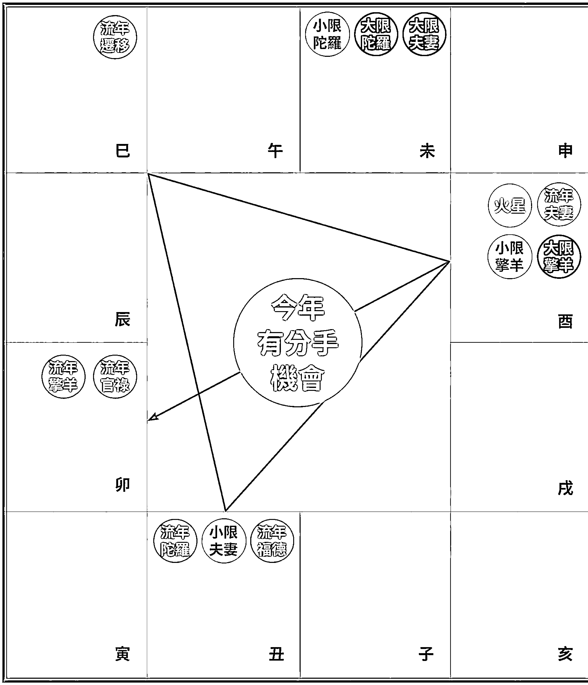

### 4. 对方有外遇迹象

对方有外遇迹象这件事情，是我最受欢迎的一堂课，实际上的操作可以精确的看出对方何时外遇、外遇对象的样子、怎么认识、为何喜欢对方、两个人关系会多久、是否影响自己感情等相当多的细节，但是这必须经过一段时间的课程以熟悉星曜的特质，在这里我们单纯介绍快速实战用法，单纯的看出另一半最近是不是有比较多的桃花出现，可能会影响到两人的感情。

这样的现象当然也是要看流年命盘了，不过这次看的不只是夫妻宫，还要加看田宅宫，因为一个人会有两个家当然也可能是有两个老婆了。单就夫妻宫来看，会有外遇，通常是两个人的感情有了小小的问题，以及外面有人正好给予机会，所以我们需要看的除了煞忌（两人感情有问题），还有就是是否有多出来的人，在紫微斗数中的夫妻宫，一般我们会希望是较为稳定的状态，不要有太多的变动，这里说的变动除了煞忌造成宫位破坏之外，感情中有太多的参与者也不太好，因此要看出是否有外遇，就要看是不是在夫妻宫内有太多不该出现的外人了。

哪些是外人呢？四化里面的化禄（本来不属于你而多出来的）以及化权（因为想要掌握、掌控所以会加重，一个不够要两个）都表示有可能会出现外人的迹象，而除了四化的禄跟权，若是有遇到主星是「太阳、太阴」在同一个宫位，都一起在夫妻宫内，这是白天与黑夜都拥有，最好是白天一个晚上一个，或者是有「左辅、右弼」这些想要帮忙你的朋友出现的时候，就会表示有这样的机率会出现。毕竟感情是两个人的事情，不需要有太多人帮忙，不然帮着帮着就会不知知道帮去哪里了。但是大前提是两人的感情本来就要出现问题，这些外人才会有机会可乘，因此还是要注意流年夫妻宫三方四正内是否有遇到煞星，当然小限也是同样的情况，不过有迹象出现是否就真的造成外遇的行动，还必须看主星曜以及其他运限的影响，但是若是发现有这样的情况，至少可以知道两人的关系需要注意了。而且，这样的情况若是出现，也可能表示是自己要外遇了。

### 对方有外遇迹象附图

| 巳 (流年福德) | 午 (化权, 流年田宅) | 未 (擎羊, 流年官禄) | 申 (擎羊, 流年迁移) |
|---------------|---------------------|---------------------|---------------------|
| 辰 | | | 酉 |
| 卯 (流年擎羊, 流年官禄) | | | 戌 |
| 寅 | 丑 (化禄化权, 太阳太阴, 流年夫妻, 左辅右弼) | 子 | 亥 |

## 第四章 人生中必然撞上的那棵树

## —— 财运 ——

求发财求富贵是算命咨询的第二大主流问题，大多数人的人生追求爱情与钱财是免不了的，我们可以利用简单的方式看出自己是否有赚钱的机会，但是这个赚钱的机会其实不只是财帛宫而已，还要看看田宅宫，因为财帛宫是财务能力与状态，真正钱落口袋要看的是「财库」——田宅宫。许多人努力工作赚不少钱但是却存不到钱，就是因为钱并没有放进口袋里面，或者说钱进来了又无端端的跑出去。

下面举出几种财务的情况，可以利用前面所教的方式简单地看出问题。

### 1. 是否存得住钱

一个人是否能存钱，要看的是财库田宅宫，不是财帛宫，因为财帛宫代表的是理财的能力用钱的观念、对钱的态度，所以真正看钱是否留得住，看的是田宅宫，如果这个人的田宅宫不佳，财帛宫再好也是财来财去，左手进右手出。分辨田宅宫最简单的方式，当然就是看田宅宫是否很健康，会不会遇到太多的煞忌，太多的煞忌在田宅宫表示财库破损，这个人当然就不容易留住钱。除了田宅宫，其实子女宫也是另外一个财库，在古代，养儿防老，把孩子养大，再期待孩子一路把自己养到死，这是一种买绩优股的概念，而有土斯有财，买了房子土地再靠当房东赚钱，这是一种据地为王收保护费的概念，自己无法当真正的王收税金，也当不起土匪收过路费，当房东也是不错的选择，这是古代没有基金、股票、期货的年代，唯一的两种理财方式，所以子女宫跟田宅宫都是命盘上面的财库宫位，若是本命盘有太多煞忌进去，表示人生整个是口袋破洞的状态，放进去的钱无来的一直掉出去，若是运限走到的，则表示当下那个运限会破财，不容易存住钱，好不容易累积一点基金想要买房当山大王，总会出事情把钱花了。若是财帛宫有煞忌进去，其实代表的是自己的用钱态度过于冲动，容易不小心手就滑了，可能一上网卡就刷了，而若是在财帛宫还会有一个情况是化科在里面，财帛宫是用钱的态度，化科则与名声跟名气有关，所以财帛宫有化科表示拿钱出来做名气、拉关系，当然代表某个层面的爱花钱了，这么爱花钱，守财存钱能力自然不佳，所以无论是本命或是运限走到的时候都需要小心。但是有一个情况很特殊，反而会促进赚大钱的，就是有忌的时候。若是本命盘上财帛宫、田宅宫甚至是命宫有忌，某些时候反而会赚钱，为何呢？因为忌是一种空缺，有空缺才有动力，忌在财帛或田宅，要不就是觉得自己很缺钱，要不就是觉得家里很缺钱，这样的人如果在运限上遇到了好的情况，例如运限中遇到三方四正有两个禄或是一个禄一个权，其实都表示他在这个运限有机会赚大钱，因为他内心有需求，运限又给他掌握权力跟赚钱的机会，当然就有机会可以赚钱了，当然这一切还是要他自己愿意努力，不愿意努力只能说他的日子会过得不错而已，而且实际上能不能留住钱还是要看田宅跟子女宫。

### 是否存得住钱附图

| 巳 | 午: 化忌、命宫 | 未 | 申 |
| 辰 | 中心: 是否存得住钱 | 酉: 化忌、田宅、禄存化禄 | |
| 卯: 禄存化禄、子女 | | 戌 | |
| 寅: 财帛 | 丑 | 子 | 亥 |## 2. 能否做投資

所謂的「我不理財，財不理我」，但是真正要理財、要投資卻不是每一個人都可以。

首先我們要確認所謂的投資，說的是投資創業，還是單純出錢投資一家公司？若只是創業或投資一家公司，但是自己在公司內是有決策能力的，通常如果本命盤有化權在命宮或官祿宮或是財帛宮的人，會有這樣的希望跟期待，至於是否有機會如此，那要看運限的情況是否給他這樣的機會。若是大限命盤有這樣的特質，則表示這十年會有這樣的機會，但是大限命盤上面若是在財帛宮或者是福德宮（一來財方式，對金錢在內心的想法與態度）有化權，比較接近是自己實際投資金錢進去；若是大限命宮或是官祿宮化權，是否投資金錢進去掌握權力，同時破宮有沒有煞忌，或者田宅宮有煞忌造成破財，有的話就是同時掌握權力，同時破財，通常就是花了錢買到權力。在大限內有這樣的情況，通常表示這個人有投資創業的情況，若是在小限或是流年，當然在這一年內會有這樣的情況，不過若是大限沒有而小限流年有，通常表示並非很大的投資。在看事件的現象時，要利用出現在哪個時間長度的命盤去分辨，時間越長，則事件的規模會越大。

還有一種情況的投資是純粹的理財投資，或者是單純的投資好友等等，是不掌握權力管事的，這一類通常是財帛宮或福德宮有化科或化祿，若是本命盤有這樣的情況，只能說是自己會有這樣的想法，但是因為我們會受運限的命盤影響，所以不見得在當下會浮現這樣的念頭，但是若是運限盤出現這樣的特質就會較為明顯。其中真正想賺錢的是化祿，命主會希望多一點來財的方式，化科則是因為跟著流行走，別人有投資那我也要的概念，不希望自己跟別人不一樣，所以也會希望要投資一點。那麼面對各種各樣的投資，誰比較適合並且會賺到錢呢？這需要從兩方面來說，一是有投資理財能力的，二是運氣問題，如果單看投資理財能力，當然說的是本命盤，因為本命盤代表的是天生的能力，因此若是本命盤財帛宮沒有化祿或祿存，基本上機會少了一大半，如果本命盤沒有，那至少大限盤要有，若是兩個都沒有，其實保守理財也是個好方法，而且這裡的化祿還不能是破軍產生的化祿。那麼天生有理財投資能力就可以嗎？當然不是這樣的，運氣其實相當的重要，這就是為何十二宮內福德宮要在財帛宮的對面，因為古人認為一個人的要有錢，能力好、家世好、長相好都比不上運氣好重要，所以代表了福氣運氣的福德宮在財帛宮的對面，那要怎樣看投資是否會賺錢的運勢呢？這個部分還是要回歸到田宅宮來看待，因為田宅宮才是實際會拿到錢的宮位，所以投資是否真正會賺錢要看的是那個運限（無論大限、小限、流年）田宅宮或子女宮是否有化祿或者祿存，這樣在那個時間點至少口袋是有錢的。另外一個要檢查的是財帛宮跟福德宮，這兩個宮位不能有煞忌，若是這兩個宮位有煞忌，則表示這時候自己在理財思考上可能會有錯誤或過於衝動，這當然就不適合投資。因此，要投資的時候就必須這樣檢查自己的命盤，或者是此時身邊有人告訴自己有個什麼投資的好機會，若是檢查起來發現自己的命盤不佳，此時就不能去相信那個投資機會，當然如果了解了星曜還可以知道自己適合投資的方式與產品是什麼，但是在不理解星曜的情況下，至少可以知道適合自己投資的時機點，跟何時有風險存在。

## 能否做投資理财附圖

| 巳 | 午: 化权 命宫 | 未 | 申: 化权 福德 |
|----|--------------|----|---------------|
| 辰 |              |    | 酉: 禄存 化禄 田宅 |
| 卯: 子女 |          | 戌: 化权 官禄 |          |
| 寅: 禄存 化禄 财帛 | 丑 | 子 | 亥 |

### 3. 今年是否有加薪機會與今年是否會賺錢

若是不投資，單純的希望今年自己在工作職場上可以有好的收穫、能夠加薪呢，抑或是已經創業了，希望自己的公司能夠賺錢，這樣要怎麼看？

現在我們知道了錢不只是看財帛宮而已，田宅宮也很重要，但是這個問題我們還是要先看財帛宮，因為若是沒有財運，即使田宅宮好也沒有用，再加上我們希望知道的是今年的情況，所以利用的當然是流年或小限的命盤。看流年跟小限的財帛宮，若是有祿存或化祿，表示今年不但有加薪機會而且還可以放進口袋不會亂花。

若是一般上班族的子女宮、田宅宮有祿存或化祿，則需要考慮自己的薪水是不是有往上加的機會，可能這個祿是因為自己有了其他的業外收入，並不是加薪，要加薪，最好官祿宮可以出現化科或是化權，這樣在工作上有比較大的聲望跟影響力，加薪的機會自然就提高了。

若是創業做生意的人則有一個好處，那就是財帛宮不見得不能有煞忌，基本上不要太多就可以，所謂的太多，就是不要超過兩個，而且若是此時財帛宮還出現化祿或是祿存，甚至是化權，那麼只要田宅宮有化祿、祿存都有賺錢機會，因為做生意本來就需要有點勇氣跟衝動，敢於挑戰市場，所以這時候煞星反而會給上一些能量，讓自己在投資上有魄力，相對來說就會更有機會，因此只要田宅宮有祿，財帛宮有煞忌其實不見得不好，當然還是要提醒不能是破軍祿，而且煞忌不能太多。

## 一、工作

很多人將工作跟財運放在一起談，雖然絕大多數人其實問的是財運，不過也有很多時候工作運勢相當重要，例如前面提到的財帛宮很好、理財能力很棒，田宅宮也有祿，有錢放進口袋，問題是自己的工作能力不佳，也不過就是一個月領個三萬元，如此一來就算再會理財、再擅長存錢其實也是有限，因此官祿宮狀態好才能支撐起好的財帛宮跟田宅宮。另一方面，很多人工作是為了成就感跟興趣，創業只為了完成一個夢想，這時候有好的財務能力（財帛宮）和積蓄，或者是家世背景（田宅宮）來支持就變得重要。以下我們就來看看跟工作有關係的各種問題，如何運用紫微斗數預測以及分析，並且利用宮位、煞星及四化幫我們做出工作上所需要的決定。

### 1. 是否會創業，創業是否會成功

關於這個問題，許多人會想到的是從事哪一行，這其中又分為是幫人打工或是創業。在華人世界「寧為雞首不為牛後」的觀念下，創業會是許多人的考慮項目之一，但是實際上，真正來問創業的人其實是希望創業要能夠賺錢，少數有人是因為要完成自己理想跟夢想，畢竟口中所說的理想跟夢想，其實就是希望獲得更多的財富。

在前面章節，我們提到了投資創業，在財帛宮有化權出現的時候可能有這個跡象，實際上在官祿宮也可能會如此，當然在命宮也會，流年命盤上的官祿宮若是有化權，代表此人有相當大的機率會想創業，如果再加上化科，機率就更大了，可以是官祿宮化科、命宮化權，也可以是命宮化科、官祿宮化權，這時候都有希望自己能夠實際掌握權力、更上一層樓的跡象，若是命宮或官祿宮在四馬地（在十二地支中寅申巳亥四個位置）內更會有這樣的跡象。

但是若是討論到創業是否可以成功，我們就要看流年的官祿宮情況是否健康，因為當命宮、官祿宮化權的時候，表示我們希望自己握有權力，但是希望可以做到卻是兩回事，因此，若此時自己的命宮或官祿宮有太多的煞忌，則需要注意是否風險很高。還有一種情況是財帛宮狀況不佳，如果創業需要投資資金進去，這時候財帛宮不佳就會很糟糕。那麼若是代表財庫的田宅宮不佳呢？如果命宮、財帛宮、官祿宮都不錯，沒有太多煞忌，甚至還遇到化權化科甚至化祿，這時候田宅宮、子女宮的煞忌可能只是因為投資造成存款減少而已，反而不用擔心，若是隔年的子田線（子女宮、田宅宮）上還有祿（化祿或祿存）進來，表示隔年可能就開始賺錢有回收了。若是財帛宮、官祿宮狀況不好，這時候就需要先觀察一下先緩緩，或許隔年有更好的機會。
若是事業是跟人有關係的，除了這幾個宮位，還需要注意遷移宮跟僕役宮，例如需要業務開發的，或者做餐飲生意者，因為僕役宮也表示客人，所以遷移宮有祿存化祿，僕役宮有化祿祿存，有化權化科者，對於做生意有加分的作用。若事業是需要團隊合作的，這時候若是僕役宮不佳，就會非常嚴重，因為工作上的夥伴會常出問題，因此若是需要團隊的事業，僕役宮就不能有煞忌。另外若是合夥的生意，則可以從田宅宮看事業上的合夥關係，通常此人的田宅宮不能有煞忌，因為若將官祿宮當成命宮，則田宅宮會是他的兄弟宮，工作上的兄弟關係當然就是合夥人，這時候如果狀況不佳當然也就不適合了，若是創業，可以想見會出現問題。還有一種情況是流年官祿宮有重疊了本命的僕役宮，這時候需要注意因為工作而跟朋友起紛爭，有這一類情況，都會建議做一人可以獨立負擔的技術型工作，或者不要增加過多的團隊成員，盡可能縮小編制，檢查完這些項目後，若是還有創業的熱誠，則可以去創業並且有很高的成功機率。

### 是否會創業、創業是否會成功附圖

| 巳 | 午 | 未 | 申 |
|----|----|----|----|
| 化权, 流年命宫 |  | 化权, 流年福德 | 化禄, 禄存, 流年田宅 |
| 辰 |  |  | 酉 |
|  |  |  | 化权, 化科, 流年官禄 |
| 卯 |  |  | 戌 |
|  |  |  | 化禄, 禄存, 化权, 化科, 流年仆役 |
| 寅 | 丑 | 子 | 亥 |
| 化禄, 禄存, 流年子女 | 化权, 化禄, 流年财帛 |  | 化禄, 禄存, 流年迁移 |

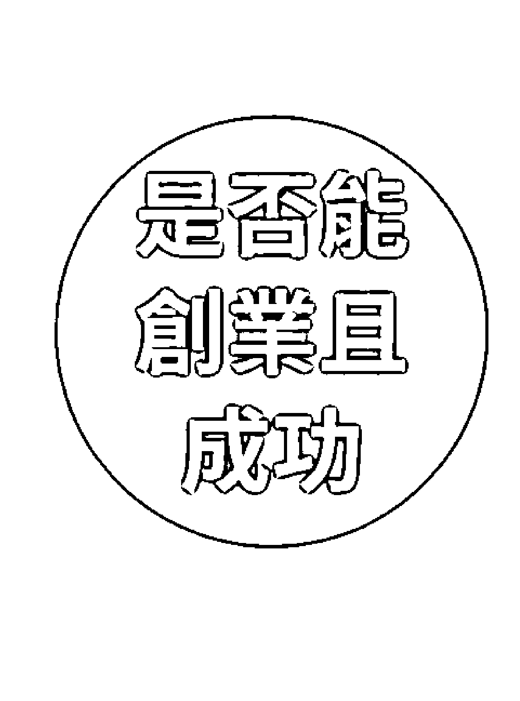

### 2. 是否會沒有工作

有時候環境不好或遇到不好的老闆，我們可能會擔心自己沒有工作，因此工作是否保得住，以及失業後是否還有其他機會也是很重要的事情。工作會不會出問題呢？如果能在被老闆開除之前就做好準備，相信對於自己的人生會有很大的幫助。

失去工作是事件，看的當然是流年或小限的官祿宮，若是官祿宮內出現過多的煞忌，這個時候就有可能會工作不保了。工作的斷裂如同與人的關係，跟感情或結婚一樣，主要會跟擎羊、火星有關係；若是遇到陀羅星，而沒有其他煞星，則表示工作有磨難，但是不一定會失去工作；若是遇到忌，有時候反而會更加的認真拚命，因此判斷的時候要注意。

若是兩個擎羊，丟工作的機會就很高了，但是如果再補上一顆陀羅，可能是工作還會有所拖延，雖然拖著，但狀況也不會太好。若是一個化忌在官祿宮，但是三方四正進來的是陀羅，這反而是會很認真工作，只是問題多而已。若都是陀羅，則表示工作上很多麻煩但是並不會離職。

很特別的是，如果擎羊跟火星同宮，但是三方四正有遇到化祿、化權、化科這三個的其中兩個，工作還可能有重大突破，因為擎羊跟火星放在一起，火力旺盛的火星反而會將擎羊的大刀鍛鍊成一把為自己所用的好武器，加上有化祿化權化科出現，加強自己的實力，反而是在困難中（有煞星）披荊斬棘（把煞星轉變成自己手上的刀），衝出困境而有很大的作為，這一類通常是解決問題後反而升官，或者是離開原公司之後創業成功的跡象。紫微斗數的有趣就在這裡，有時候困境反而是好事情，有時候好事情反而是後面藏陷阱，另外如果這時候官祿宮是在四馬地（在十二地支中寅申巳亥四個位置），因為這四個位置有「異動、變動」的含意，因此相對來說比較容易有機會因為煞星太多而造成工作轉變或者是異動，因此我們可以透過這個方式，看出自己的工作運勢，若是知道會有變動那就及早準備。同樣的，如果是要投資創業，也可以用這個方法找出自己的工作運勢，如果是短期的小投資，例如開炸雞排店，因為很快就會回本，所以就不用擔心官祿宮很快發生問題。若是投資金額很大，例如先蓋個兩年工廠再開始做生意的人，這時候就要注意接下來幾年的官祿宮情況，因為也許工廠一蓋好，自己就遇到了問題，得關閉工廠。同樣的，這時候也要檢查大限官祿宮，如果整個大限十年官祿宮都不佳，這就要注意這十年在工作上需要能有更多的競爭力，以及出問題的退路打算。注意，若是創業更是需要查看十年大限的官祿宮情況，因為工作是需要時間去累積跟堆疊的。

是否会没有工作附图

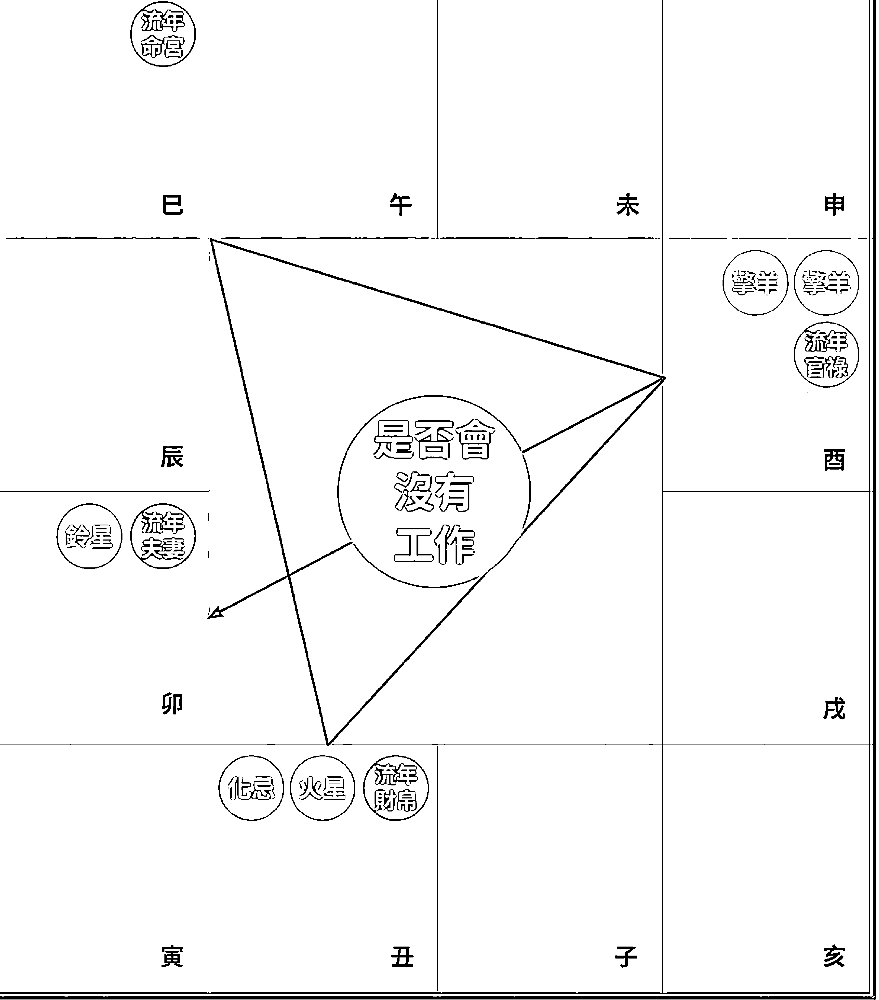

### 3. 是否會升官（考試是否順利）

希望可以升遷，這是一般上班族最在乎的事情了，但是升遷就一定是好事嗎？會不會升遷之後反而運勢更差呢？或者許多人為了考試再去進修，通常也是希望可以有更好的工作發展。對此，我們可以從官祿宮來看進修是否可以順利，考試是否可以如願。

能夠職務上有所升遷，主要看的是官祿宮或命宮有沒有化科出現，一般來說，如果是單純的在同一個職務上面升等，那就只需要看官祿宮、命宮或是對宮的遷移宮、夫妻宮有化科，因為升遷是一個事件，所以只需要看流年命盤有這樣的跡象就可以。一般都認為，所謂的官祿宮代表的是上班、創業那一類的工作，那麼難道家庭主婦的官祿宮就沒用了嗎？並不是如此。官祿宮所代表的事情也可以廣義解釋為「我們生活的重心」，所以如果是家庭主婦，那自然表示對家庭的照顧與打理就會是她的官祿宮，若是在學的學生，當然可以說學業就是他的官祿宮。

因此如果學生要看是否考試可以考得好，其實也是看官祿宮或命宮化科，主要是以官祿宮為主，但是因為有些考試是會讓整個家族或家人為其開心的，例如考上大學、考上法官，這一類某些意義上象徵社會地位的考試，這個時候田宅宮化科也算，因為這是光耀門楣的意思。如果是工作上的升等，例如當上大公司總經理，或者升上少將，當化科出現在田宅宮就有可能出現這一類的升遷情況，但是此時官祿宮並不能太差（超過三個以上的煞忌）。若是被挖角而得到的升遷，這時候就需要注意是否官祿宮同時有出現破損，有煞忌但是不會太多，而且同時出現有科，加上官祿宮或命宮在四馬地（十二宮中的寅、申、巳、亥位），或是有遇到天機、天梁在對面宮位的情況（天機天梁對拱），或者是太陽、太陰星在對面宮位的情況（日月對拱）。如果有上述這樣的情況，表示工作有變動，必須是要離開原地，若是再加上有遇到化科（甚至是化權，表示掌握權力），就可能是因为被挖角換到另外一間公司所產生的升遷機會。

### 4. 工作職場上的關係

工作是否順利，其實與工作上的人際關係有很大的關係，而工作上的人際關係不外乎是與上司、與同事以及與客戶之間的問題，若是要分辨我們在工作職場上的人際問題，就必須要依照各宮位所代表的不同屬性去查看。

官祿宮會代表工作職場上的關係，這裡的關係說的是自己與上司，這個上司必須是可以決定自己在公司去留位置的人。若只是在公司內較為資深的人或是一個小主管，除了給自己言語跟情緒上的壓力，倚老賣老一下，其實無法真正決定自己的去留，這一類其實看的是僕役宮，僕役宮說的是平輩之間的關係。而這裡所謂的輩分，指的是實質影響力，是否彼此間有上下位階關係，而不是以年齡或財富去區分。因此，我們可以從官祿宮是不是有太多的煞忌出現，簡單的區分自己在職場上是否會與主管起衝突，同樣的道理，也可以在僕役宮看出來是否會與同事起衝突，當然如何起衝突、跟誰、甚至是跟哪個生肖、男生女生、對方是怎樣的一個人，這些細節其實都可以從紫微斗數看出來，但是這樣的解讀能力必須搭配對星曜的掌握，這就需要花點心思去鑽研，而一般人只需要知道是否有這樣的問題就可以，並且搭配後面會提到的計算月的運勢（流月），甚至日的運勢（流日）就可以避免許多工作問題與災害。

另外我們也可以依照工作上的關係，去了解自己是否適合做哪一類的行業，例如作為公眾人物，在外的緣份跟周邊是否有朋友幫襯就會相對重要，這時候如果遷移宮與僕役宮不佳，當然就會比較辛苦一點，若是本命盤這兩個宮位本來就比較差，就表示只能用大限、小限或流年命盤去支撐，這就是為什麼我們可以看到許多影視人員與公眾人物，本身個性其實不是太好，甚至可能因為孤僻一直紅不起來，卻忽然之間一個新聞的出現，引起眾人追捧瞬間爆紅，但是一段時間後卻又銷聲匿跡或者聲望下跌，這就是因為他本身其實不具備引人注意、讓人跟隨的優勢，但是受到運限命盤的影響而在某段期間可以紅起來。反之也可能這個人本身人緣就很好，容易吸引人接近，從小到大就是萬人注目的人，但是忽然之間變成人人喊打，這當然就是他在某個時間點裡面，也許流年、也許小限的遷移宮或僕役宮有太多煞忌所產生的問題，一個是本來沒人理變成有人理他，另一個是本命盤人緣很好，但是運限遇到煞忌，這時候就不只是人家不理他的問題，甚至可能是朋友背叛，因為一個本來朋友就多的人，在這種時候會形成樹大有枯枝，人多有白痴的情況，交友一旦廣闊，煞忌帶來的就不只是關係斷落，而是會為自己帶來損傷的朋友。

若自己從事的行業較需要與人接觸，就要注意僕役宮跟遷移宮，不能只是注意官祿宮而已，若是發現自己在人緣上的條件不是太好，這裡說的人緣條件不好不見得是朋友少，有的人朋友多但是都是狐群狗友，這裡說的人緣條件不佳，指的是僕役宮跟遷移宮太多煞忌，有時候因為具有桃花星，可能人緣還是很好，只是來的都是爛朋友，建議這一類的人反而要從事比較少跟人接觸的工作，若是創業也要找不需要太多人作業的行業，最好是可以自己獨資作業。

### 5. 是否適合以及有機會出外地工作

有沒有機會出國工作呢？這也是我們常會遇到的客人問題，在越來越地球村的社會氛圍下，交通與網路便利，出國或外地工作也變成是我們對於職業生涯主要的考慮選項之一，但是是否適合外出工作，這裡又必須分辨所謂的是否適合，其實真正要問的是在國外能不能有更好的發展，以及有沒有機會外出工作，因為很適合外出但是沒機會出去那也是枉然，例如我們常遇到許多客人，受到了媒體影響，夢想著外出工作，但是卻無法在外找到更好的機會，或者其實一外出之後，反而賺不到錢，白忙一場。

外出工作，若是一個長期穩定的工作，不只是出差，要看的是十年大限命盤，看看這十年的運勢是否適合離開出生地，這裡所說的離開出生地，大家要先有一個簡單的觀念，古書上有一個對於外出的基本看法，就是在離開的那段時間內將自己的遷移宮當成是命宮，並且依照十二宮的排列，重新定出新的一張命盤出來。

### 是否適合在外地工作附圖

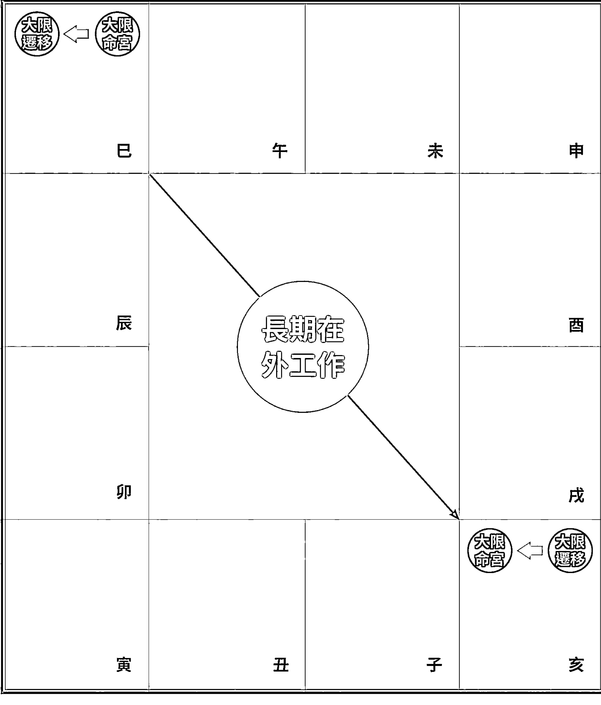

這是怎樣的原理呢？因為當一個人出門在外的時候，自然會拿出自己不同的面貌來面對一個陌生的環境跟世界，這個面貌就是遷移宮，因此可以在這個時候把遷移宮當成是命宮，而十二宮是連動的狀態，所以當我們決定了新的命宮之後就可以依序羅列出其他十一個宮位，形成一張新的命盤。但是我們常可以看到有的說法是，在某個時間點需要將命盤再倒轉回原本的樣子，這一段常常讓學習者很混亂，一方面這樣轉來轉去，到底該怎麼去分辨解釋，一方面各家對於何時可以轉回來的說法不一，有的說是三年有的說是五年，讓人很難認定，若是用我們提到過的，紫微斗數談的是實質影響力，其實就可以馬上了解該是多少年。

前面解釋了為何要轉變成遷移宮，因為當自己在一個陌生環境的時候，人會本能的拿出另外一個面貌出來面對環境，這個面貌通常就是遷移宮，因為遷移宮表示的是自己希望外人看到的形象，這可以算是一種保護色的作法，因此若是這個人已經習慣熟悉了新環境，自然而然就可以放下保護色，自己原本命宮的特質就會展現出來，因此，到底是二年、五年還是七年，其實都只是一個概略的數字，真正要看的是「自己是否已經習慣新環境」，一旦已經熟識了新環境，自然就會將個性特質轉換回來給原本的命宮。

# 紫微攻略

依照前面的說法，我們要看自己是否適合外出，其實只需要將遷移宮當成命宮，然後列出一張新的命盤，再依照這張新的命盤所形成的命宮、財帛宮、官祿宮以及遷移宮這四個宮位，看看是否有比原本那張的煞忌少，甚至還多上了化祿、化權、化科，若是新的命盤比較好，那自然就是適合外出的。

那麼，若是自己希望外出，卻一直沒有機會呢？

其實，用一個簡單的邏輯概念來說，若是外出會有好的機會，或是有機會讓自己會往外發展，通常是因為自己那個當下運勢命盤的命宮或官祿宮在四馬地上，或是遇到天機天梁對拱，或者太陰對拱。

### 是否有機會外出發展附圖

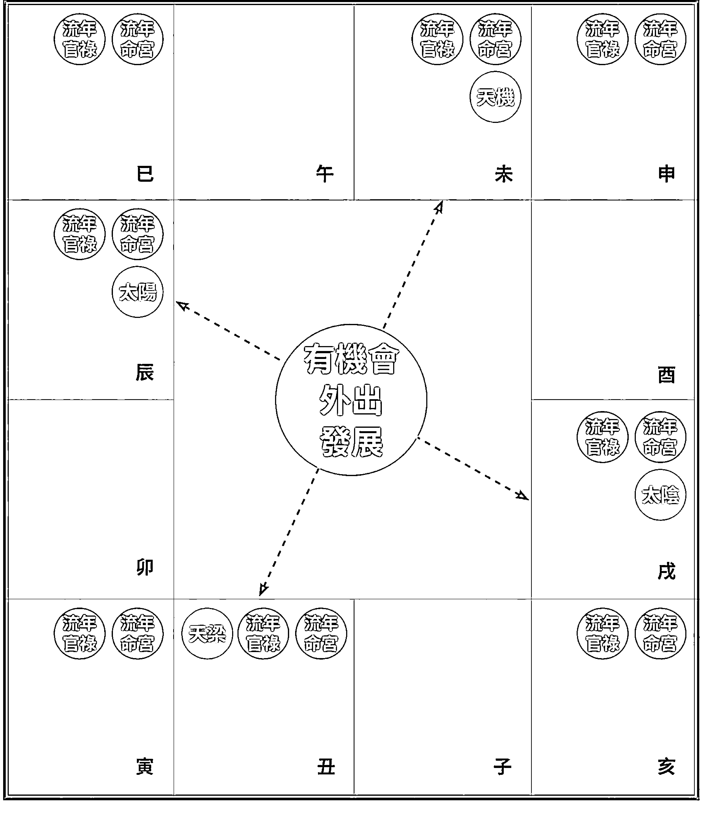

而且此時通常遷移宮會有化祿化科存在，這時候自己才會有比較大的慾望希望往外走，也就是說自己希望異動（命宮官祿宮在四馬地），並且外面有機會在對自己招手（遷移宮有化祿或者化科），剩下的就是需要利用前面說的方式去判斷外出是否可以有更好的發展，若沒有這樣的情況，就表示其實並沒有遇到適合的機會，既然沒有遇到適合的機會，依然很希望出去呢？這時候我們一樣可以利用前面的方式去評估外出是否會有更多機會，若是沒有，純粹是因為自己個人的期待，通常我們會委婉的勸告命主，不過他若執意要如此，也只能告知外出後會有何風險，請多加注意。

若是評估後，發現其實外出不錯，只是目前沒有機會，這樣的情況通常是大限命盤適合外出，但是流年卻不適合，這時候則有兩方法：一個是挑選適合的流年給他，也就是遷移宮有祿的，或是官祿宮在四馬地，或者是官祿宮中有天機天梁對拱或太陰對拱，並且在夫妻宮有祿的，為何是夫妻宮呢？因為如果命宮的對面宮位遷移宮是「人在外」的情況，那夫妻宮是官祿宮的對宮也可以解釋成是「工作在外」的情況，因此夫妻宮有祿也可以考慮，找出這樣的時間點，就會是有機會往外發展的時間。問題是如果都找不到呢？或可能要很久以後才找到這樣的時間點，該怎麼辦？這時候其實可以找流月，就是在一年中挑出比較好的月份出來，努力去爭取看看有沒有機會，流月的找法我們會在後面的章節介紹到（P.127）。

如果說單純希望看看自己會不會出差，基本上就可以很簡單的從流月去找，看看有沒有出現前面說的命宮、官祿宮在四馬地，或遇到天機天梁對拱，或者太陽太陰對拱，當有這樣的組合出現，只要遇到其中一項，就有機會在那個月出差。

## —— 身體 ——

身體的健康在紫微斗數中會分為生病或是意外災傷。以生病來說，依照的是中醫的理論體系，因為中醫本來就是預防醫學，中醫的概念是希望能將身體做適當的調養讓疾病不會發生，若是真的發生了才會需要治療，因此，中醫本來就有一整套的大數據統計資料，可以依照出生時間，知道每個人天生的體質有哪些地方是比較虛弱的，再依照當下的節氣變化去推算出這個人是否會生病，病因為何？

從這個角度來看待疾病的發生，因此可以預先知道命主的身體情況，例如命主哪一方面會在二十年後會出現問題，這個部分當然必須要對星曜有很深入的了解，甚至我們在課程中還會加入基本的中醫理論課程，讓學習者可以有所根本的去擷取紫微斗數中的資料，不是只是背誦所謂的秘訣。另外一個部分則是意外的發生，這個部分則回歸到命理的結構與推算邏輯，單純的利用煞忌對於疾厄宮的影響來推算。一般來說，若是年輕的客人來諮詢，通常不會去注意或是詢問身體情況，除非本來就有身體健康的問題，但是我在為客人做諮詢的時候，卻常有機會提到這個部分，因為身體是否健康，會影響行為能力以及情緒，若是出狀況了，可能就會影響生活。舉例來說，若是有人剛好要升官並且外調其他國家，正準備大展身手飛黃騰達，此時身體卻出狀況，可能是生病、可能是外出之後發生意外，那到底是去還是不去呢？又或者是明年運勢很差，工作不穩定、感情出問題、財運沒機會，但是後年就會整個好轉，這時候若是明年的身體也出狀況就很慘了，但若是明年身強體健，有一副健康的身子骨可以支持一年的辛勞，到了後年運氣來可以翻身，如此一來，這運勢不佳的一年其實也沒有那麼的糟糕了，因此，身體狀況雖然是許多人不那麼重視的部分，卻是相當重要的。

## 如何分辨自己的身體情況呢？

前面提到，紫微斗數是可以論斷到相當細緻的身體健康情況，我們的學生在高級班考試的時候，需要能夠判斷出某人開刀的原因以及落刀的部位，但是這需要長時間練習以及對於星曜的熟練，在這本書我們主要介紹讓大家可以快速上手實用的紫微斗數，因此我們單純的利用前文說的方式，以宮位跟煞忌星來論斷自己的身體是不是會出問題。首先我們要知道關於疾病的部分基本上是以疾厄宮為主，最簡單的論斷方式就是看自己命盤上的父母宮與疾厄宮是否有煞忌進去，如果有，自然表示身體要出問題了，但是人會生病自然是一種現象，現象要看的是運限的命盤，因此，這個疾厄宮看的是大限或流年的疾厄宮，但是一般人通常只會注意當下的身體狀況，因此流年的疾厄宮會使用得比較多，若是今年流年疾厄宮有三個以上的煞忌，則今年的身體健康需要注意，但是還有一種情況是，本來大限疾厄宮只有兩個煞忌，但是今年卻因為流年產生的流羊跑進去了，造成大限疾厄宮變成擁有三個煞忌，這時候也會讓身體出現問題。

紫微攻略

分辨身體的狀況附圖

| 巳 | 午 | 未 | 申 |
|:---:|:---:|:---:|:---:|
| (流年命宮) | (本命 擎羊) (流年 父母) |  |  |
| 辰 | 分辨 身體的 狀況 | 酉 |  |
| 卯 |  | 戌 |  |
| 寅 | 丑 | (化忌) (流年 擎羊) (流年 疾厄) (流年 遷移) 子 | 亥 |

上述的情況是單純的生病問題，若是搭配後面將會介紹的流月命盤找法，也可以利用流月的疾厄宮，看出這個月是否會生病或心情不佳情緒不定，我們可以依照這樣的方式，查出自己的身體情況，讓自己作計畫的時候可以將身體因素考慮進去。而身體除了生病還會有所謂的災害外傷，這時候要看的就不只是疾厄宮了，疾厄宮代表的是身體情況，所以當意外災害發生的時候，疾厄宮當然會出問題，但是意外通常是發生在家的外面，因此遷移宮跟子女宮（子女宮是田宅宮的對面宮位，所以也有「家外面」的意思）如果有狀況，這就表示可能是受傷，若是再遇到有紅鸞或天喜星在裡面，則可能就會出現一般俗稱的血光了。而到底是多大的問題，則需要看是哪一個命盤出現的狀況，一般來說若是流月出現的則意外不大，若是流年或是大限出現的，則情況會較為嚴重。需要注意的是，如果討論受傷等意外災害，勢必還是與身體有關係，因此若是代表身體的疾厄宮沒有問題，則遷移宮跟子女宮出現的煞忌就要作別的解釋，也許在外與人爭吵、也許內心有許多煩惱（遷移宮）、又或者是有破財的問題（子女宮與田宅宮都是財庫），並不見得是意外災害。另外，紫微斗數也可以利用斗數十二宮各自代表的身體部位，去判斷身體出問題的地方在哪裡，可以依照下圖判斷身體的部位。若是疾厄宮出問題，而疾厄宮所在的位置對應到的身體部位，通常就會是身體出狀況的部位，如下表。

| 巳 (右手右肩) | 午 (頭部右眼) | 未 (臉部左眼) | 申 (左手左肩) |
|---------------|---------------|---------------|---------------|
| 辰 (右胸) | | | 酉 (左胸) |
| 卯 (右腹右腰) | | | 戌 (左腹卵巢) |
| 寅 (右腳) | 丑 (肛門) | 子 (生殖泌尿) | 亥 (左腳) |

### 小練習 ☆

這個章節說的，主要是利用煞忌在宮位內對於宮位產生的破壞，以此去判斷命主的當下運勢情況，但是因為不談及星曜，因此只能判斷出即將發生問題，至於會出什麼問題等細節的解釋，還是需要對星曜的了解，這個部分可以直接上網去看免費的星曜教學視頻 (https://www.youtube.com/watch?v=eeMGAKDjKF4)。

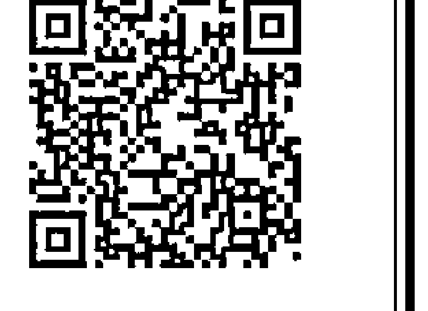

但是在這裏一樣可以利用宮位被破壞的狀況，來了解初步的運勢情況，這個方法其實是許多很有經驗的命理師快速論斷客人問題的一個手法，命理師可以在很快的時間馬上知道客人想問的是感情而且會離婚，就是使用了這個手法，不需要看星曜。例如只要看到這個人的命盤上的流年夫妻宮有三、四個煞忌，這個人此時一定被感情所困，來問的自然是當下最煩惱的感情事，煞忌如果非常多，自然可能是要離婚了，除非這個人是單身，那麼就有可能是因為工作出問題，因為夫妻宮的對面是官祿宮。

我們也可以用這樣的方式，來幫助自己快速掌握紫微斗數的整體結構跟技巧，之後若是有興趣再充實星曜的資料庫，就可以讓紫微斗數成為自己一生的好幫手，幫自己趨吉避凶。以下來練習一下，各個盤應該是哪裡出現問題呢？

### 問題一 / 此人與男友感情狀況

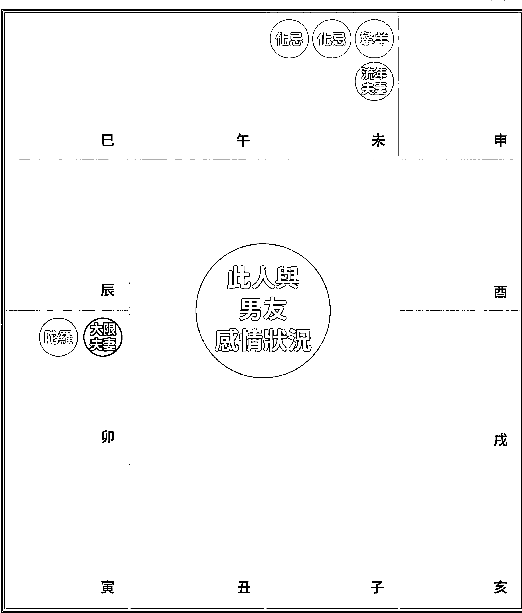

### 問題二 / 此人這十年是否適合外出發展

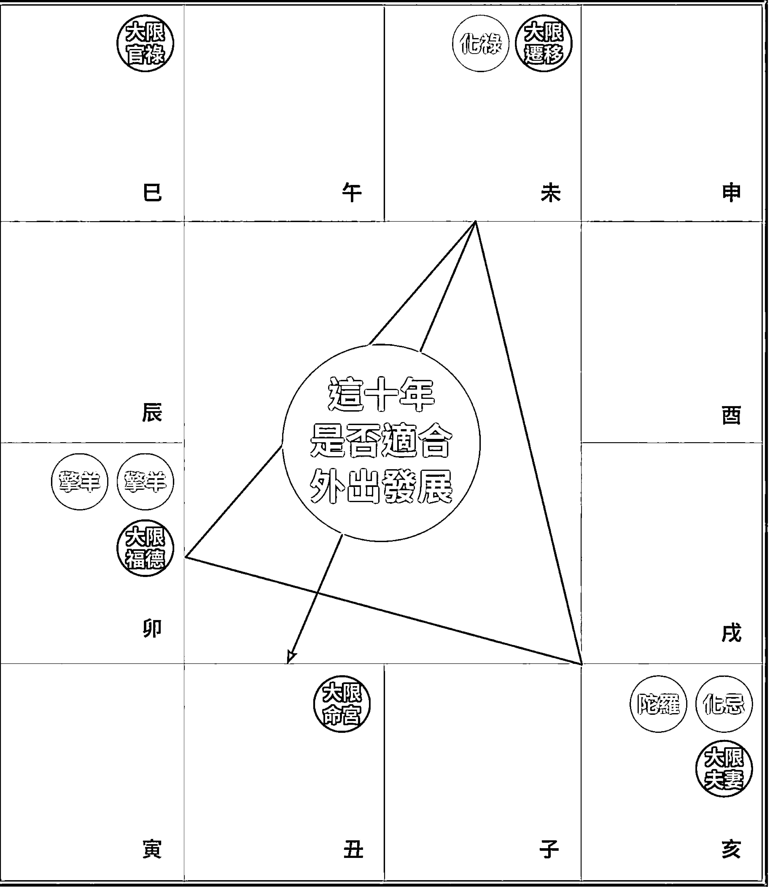

### 問題三 / 此人今年身體問題

| 地支 | 內容 |
|------|------|
| 已 | 陀羅 |
| 午 |  |
| 未 | 擎羊 |
| 申 | 陀羅 |
| 辰 | 流年命宮 |
| 酉 | 流年遷移 |
| 卯 | 擎羊 |
| 戌 |  |
| 寅 |  |
| 丑 | 陀羅, 流年子女 |
| 子 |  |
| 亥 | 紅鸞, 流年疾厄 |

中央區域標註：此人今年身體問題，並有箭頭指向其他位置。

### 問題四 / 此人是否適合創業

| 巳 | 午 | 未 | 申 |
|:---:|:---:|:---:|:---:|
| (化科) (大限官祿) |  | (化權) (本命財帛) |  |
| 辰 | （中央）此人是否適合創業 |  | (大限財帛) 酉 |
| 卯 |  |  | (化祿) (下個大限財帛) 戌 |
| 寅 | (化權) (大限命宮) 丑 | 子 | (本命命宮) 亥 |

### 問題五 此人感情狀況如何

| 巳 | 午 | 未 | 申 |
|---|---|---|---|
| 辰 | (中心) | 酉 |  |
| 卯 | (中心) | 戌 |  |
| 寅 | 丑 | 子 | 亥 |

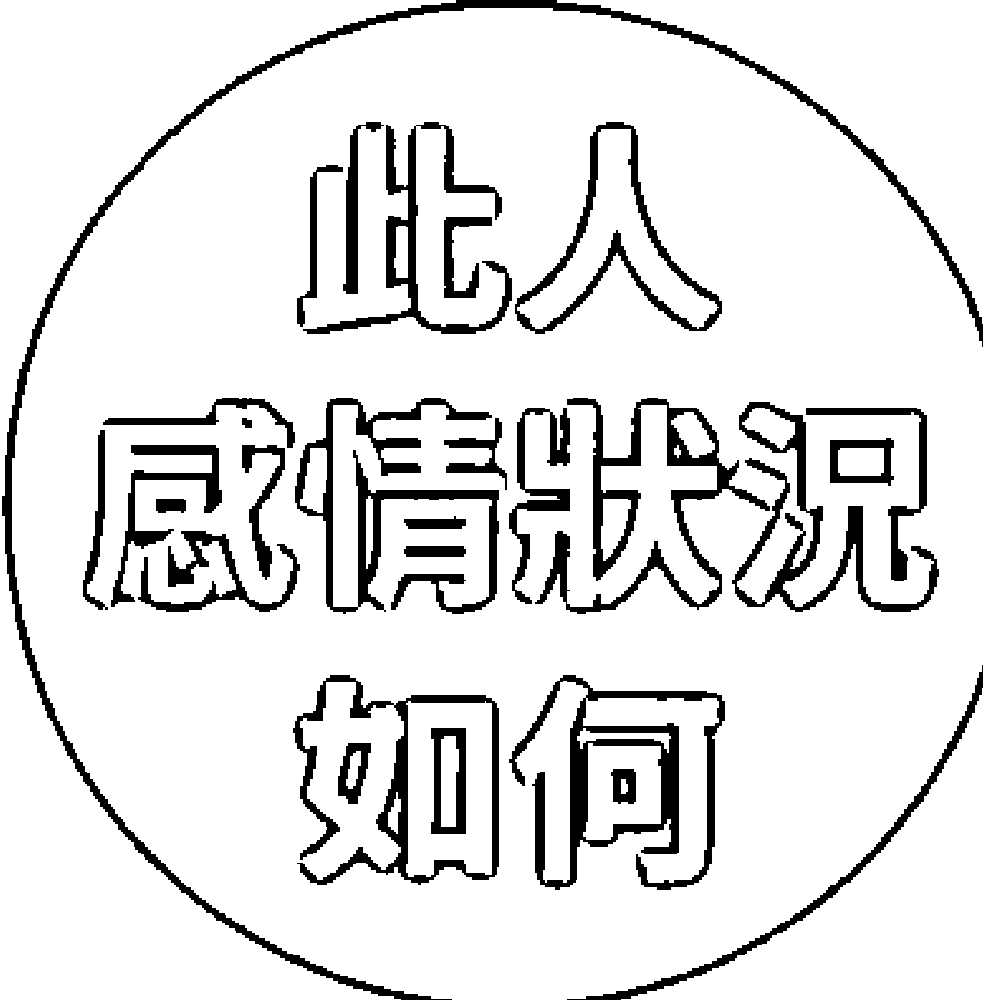

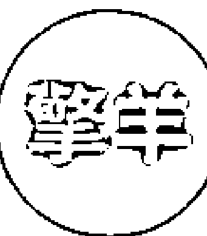


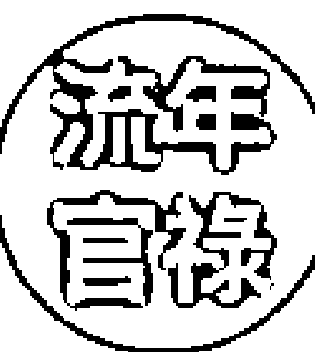

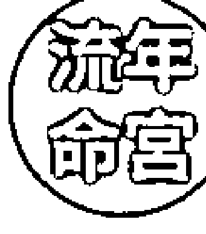

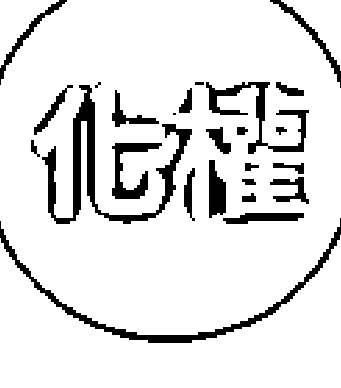

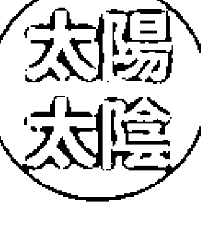

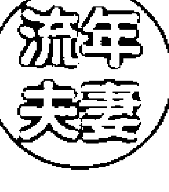

巳

午

未

申

辰

酉

卯

戌

寅

丑

子

亥

### 答案

### 問題一

流年夫妻宮有擎羊有兩個忌，本來應該要分手，但是因為大限夫妻宮有陀羅，所以分不開。

### 問題二

此命盤大限官祿宮在四馬地，遷移宮有化祿，內心會希望往外發展，並且也有機會往外發展，但是若是往外發展，把遷移宮當成命宮去看，雖然遇到了化祿，但是轉換後卻變成三方四正遇到兩個擎羊、一個陀羅還有化忌，反而是看起來有好處，一出去卻是事業兵敗如山倒。

### 問題三

流年疾厄宮有一個紅鸞，加上三方四正進來兩個擎羊、一個陀羅，查看他的子女宮有煞星，遷移宮也有煞星，今年應該會有血光，因為疾厄宮在亥位，血光的位置可能在左腳或右手。

### 問題四

本命財帛宮化權，大限命宮化權，官祿宮化科，並且連續下一個大限財帛宮化祿也相當不錯，創業應該沒有問題。

### 問題五

流年夫妻宮同時太陽太陰同宮，太陽化權，對面官祿宮還有煞忌，這表示他目前的感情狀態可能不只有一個人。

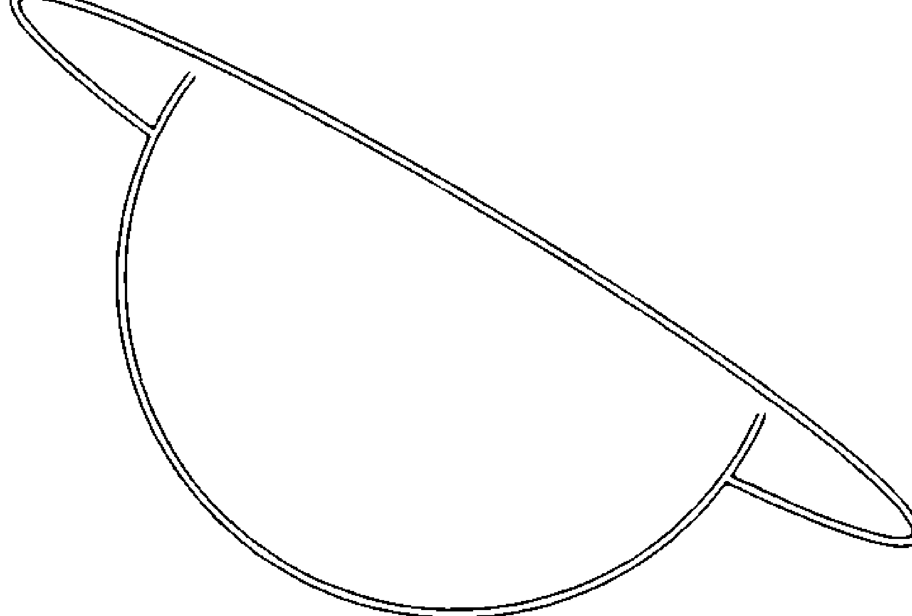

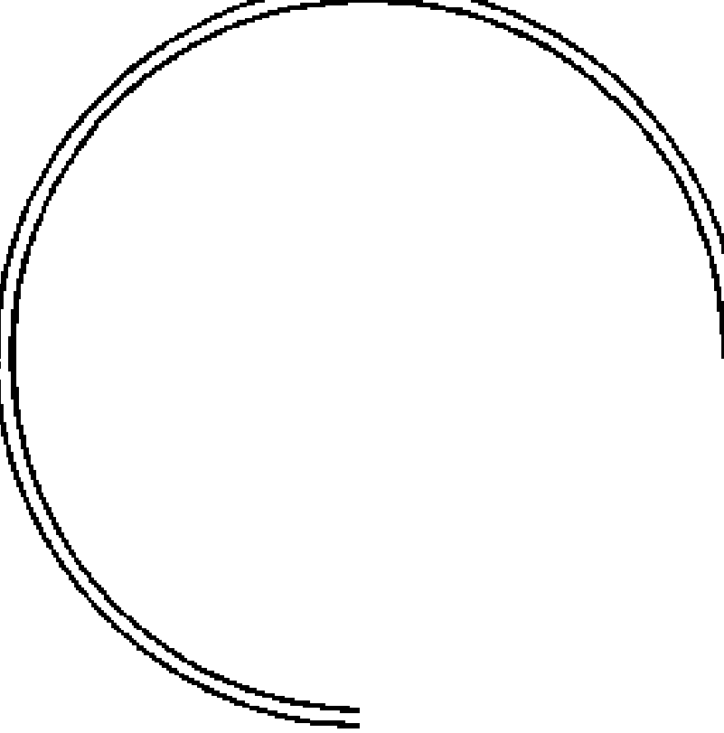

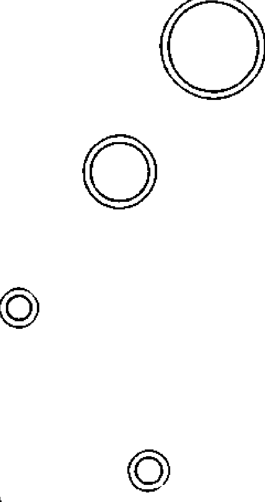

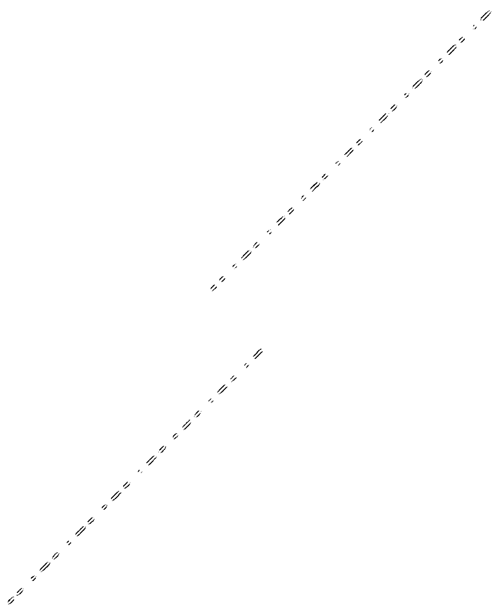

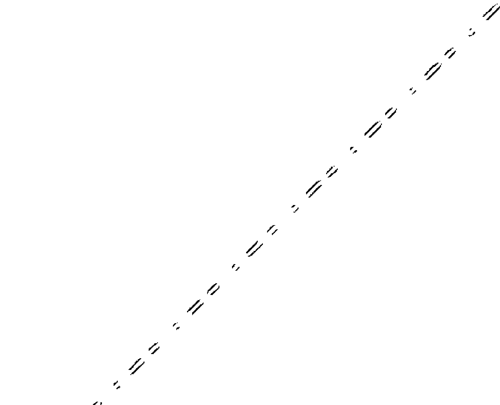


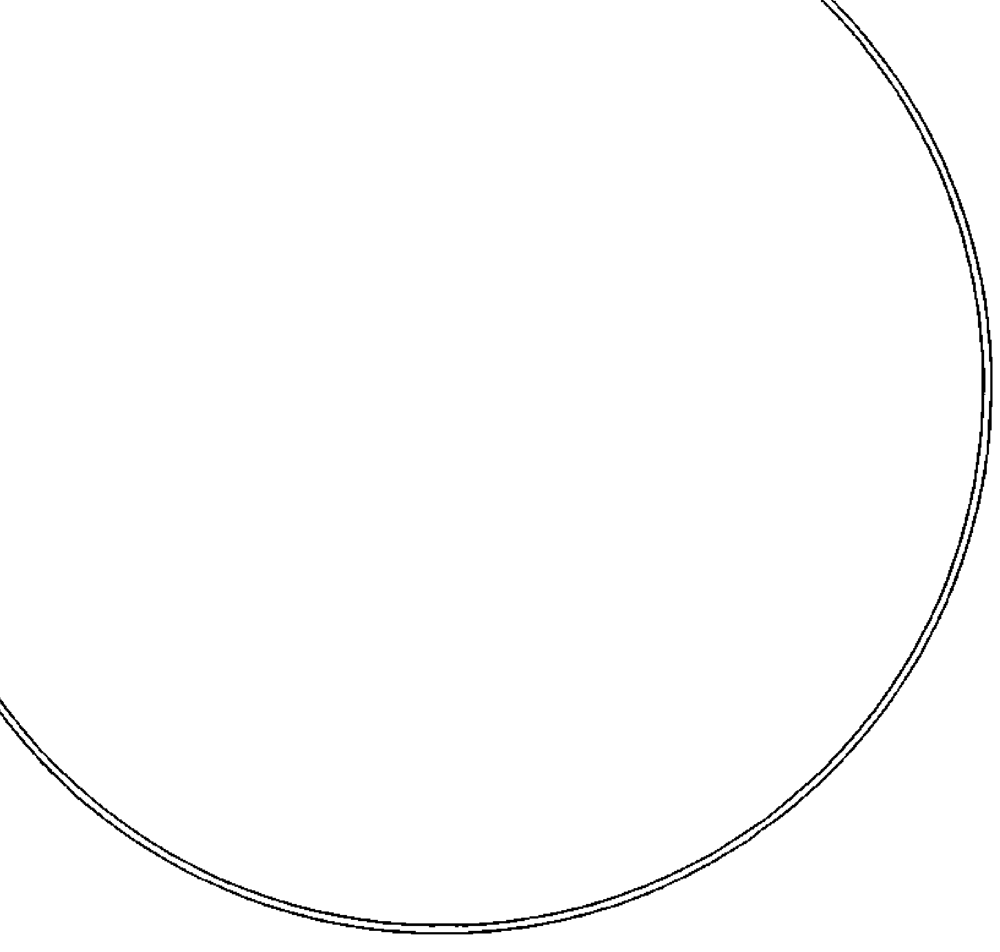

# 第五章 因為了解 而無所懼

許多來上課的學生，其實都不是為了當命理師，為的是了解自己，了解自己的問題，了解自己的個性，希望知道自己為何總是遇到渣男，希望知道為何無論多努力總是無法得到自己想要的，希望能夠了解為何自己總是那麼倒楣，為何無論對朋友多好卻總是被朋友背叛……，各式各樣無由來的災難充斥在生命中，讓我們對人生感到無奈。年輕的時候還可能用樂觀的心情對待，可以透過許多勵志書籍鼓勵自己往光明面看待，甚至還告訴自己所有的困難其實是讓人生變更好的養分，所有的考驗都是讓自己變更強大的訓練，然而到了一定的年紀之後，慢慢會發現，無論是書上的激勵話語，或是各類型正能量思想，在災難發生的時候，一點用處都沒有，該破財還是破財，該斷腿還是斷腿，會分手的一樣分手，遇到合夥人要併吞你的公司，無論怎麼鼓勵自己，最後公司還是被吞了。

人生有太多自己無法掌握的事情，以及更多無論多堅強都會感到失落的困境，這時候，人們會開始有各種不同的心情歸宿，有的人因為運氣很好所以會說一切只要靠自己努力就能完成，我在三十歲的時候就是屬於這一類的人，當時正創業還清了三千萬債務，證明可以靠自己的努力從谷底翻身，還有什麼事情做不到的呢？可惜這一類人不知道，再厲害的游泳高手，遇到瘋狗浪一樣會死掉，只是他還沒遇到而已。

還有一類人則是完全的宿命論，覺得人生本來就有無法擺脫的問題，反正逆來順受，就繼續接受吧，可能是因為個性使然，更可能是受到某些宗教份子的影響，也許是受到老公長期家暴，但是她又離不開；也許是出生環境異於常人的糟糕，我有客人是天生的小兒麻痺，並且上有高堂、下有智能不足的妻小，絕大多數人可以編織的人生夢想，他都要放棄，甚至因為自卑，退而求其次娶一個智能不足的老婆，結果帶給他生活莫大的壓力，最後他放棄希望，覺得就看開一切，當作是修行般過日子；還有人是本來雄心壯志，但是遇到大難後意志消沉的，這一類的人很多，我在生意出問題後，甚至到進入命理業的前一兩年，大概也是如此的心情；更多的是遇到神棍告訴她這一生就是感情路坎坷，所以放棄自己的人生，一直去找渣男的女人，或是到處算命，只希望為了給自己喜歡花心男人造成感情不順，找到一個藉口，讓老師告訴她這是她的命，不是因為她眼睛瞎。

到了一個年紀後，有了人生歷練，但是卻找不到解決人生問題的方法時，有些人會尋求快速的解決之道，例如去跟隨什麼可以讓你擺脫業障的師父，或者去相信什麼宮廟的作法。其實，若是從前面介紹的預測原理來看人生，我們的人生會發生的事情之所以可以被預測出來，從來不是什麼神奇玄幻的事情。所謂的玄學不過就是我們還無法證明的科學，如同兩百年前若有人看到手電筒，他也會覺得這是神奇的、神仙才擁有的東西。而紫微斗數可以說是所有的術數中最貼近當代科學的，因為它完成的年代距今才不到四百年，所使用的方式包含了西方理性科學的思考邏輯，從推論的原理架構就可以看出，這裡面充滿了邏輯分析，更別說這是一個可以被傳授的學術，若是神怪的事物，如何能夠被傳授呢？如何能夠被有系統、有效率的傳承呢？

一個受過有效訓練的紫微斗數學習者，可以在半年內就達到精準判斷的程度，拿到命盤就知道命主在何時拿過小孩、哪一年生意失敗，這樣的神奇準確程度是我們給半年學習的學員的考試題目。這些術數之所以被嗤之以鼻、被稱為統計學（會這樣說的人一定是完完全全的門外漢），或被當成是神棍在朦騙世人的東西，其實很大的原因在於許多人喜歡將秘訣藏私，更多人喜歡擁著一點點的學術能力抬高身價，不願意用現代化的言詞與方式來討論這個古老的智慧結晶。要學習就必須先要面對老到掉渣的名詞，以及摸不著邊際的虛無學說，這樣藏私的態度與食古不化的方式，除了讓文化無法進步之外，更讓這樣一個好的學術，無法幫助到需要幫助的人。當我的人生因為紫微斗數而重新燃起希望，我就希望可以打破這樣的問題，希望可以用大家能夠理解的現代方式去解析紫微斗數，因為，我們或許無法搬離人生道路上的巨石，但是至少如果我們可以預先知道，而且是精準的知道，那對人生的恐慌就會降低很多，甚至可以做好許多安排，不能避免斷腿，至少可以買好保險吧，不能避免渣男出現，至少可以分辨出誰是渣男躲開吧（當然如果自己不願意躲開那是另外一回事了），又或者我們至少可以知道自己工作要出問題，提早作好準備。以佛家的觀點來說，自業自償，任何人都無法代替我們解決人生問題，所有的問題都是要自己面對的，只是面對問題不見得是宿命式的完全承受，或者是無奈的抱怨，也不是完全的用阿Q精神的正能量安慰自己，我們可以更有效率更積極的去面對人生，因為我們有了紫微斗數這張人生的地圖，可以預知大的災難，做好準備，甚至可以像查地圖一樣，預先知道後面有什麼小風險，運用得好，小風險可能還會變成人生逆風而上的機會。

# 紫微攻略

人都是因為面對未知而恐懼，因為恐懼而失去了對人生的力量，但是紫微斗數可以用理性科學的方式告知我們人生旅途中的未知數，讓我們不再害怕，因為當我們了解自己，就可以知道自己的優缺點為何，可以走在更適合自己的道路上，而讓我們更加有信心，當我們了解環境及將發生的災難，做好了準備，災難對我們的傷害會變小，如同前文說的，如果預測學是用來掌握環境跟人作推測，我們自然可以利用對人與環境的掌握，來改變命運。

## 第五章 5-1 人善順天

### 了解自己的運勢，不用人定勝天

要改變命運，首先就必須了解自己是怎樣的人，這一點在紫微斗數中做了相當多元化的分析。紫微斗數中的命宮說的是命主主要的個性與價值觀，甚至是能力與長相，而遷移宮代表的是一個人的內心世界與在外的形象，身宮則是這個人一生追求的價值；陀羅星在的位置是一生所需要解決的問題，化忌星在的位置是一生中內心需要去彌補的空缺，而福德宮代表了這個人的靈魂，再搭配十年運限的命盤，一樣有命宮、遷移宮、福德宮，以及化忌星與陀羅星在的位置，透過這樣的組合讓人可以精確的掌握自己的天生的特質，以及每十年自己的優缺點，因此，我們需要先了解自己本命盤帶來的條件為何，再去參照當下十年的運勢情況，才能通盤的掌握了解自身。

但是，這裡說的了解，不只是宮位對應上星曜得出解釋這麼簡單，單純的利用宮位與星曜去解釋自己的個性特質，只能算是了解了一半，還需要完成另外一半，那就是知道自己需要擺在什麼位置。我常說華人社會長久以來的教育體系，讓許多有才華的人淪陷在災難之內，儒家教育喜歡用一套框架式的價值體系，讓帝王好管理人民，因為每個人的價值觀都相同，社會必然呈現某一種相對的安穩，就相當的好管理，但這樣的價值觀卻會扼殺人的思考與想像能力，這也是華人社會的學生通常理解能力好但是創造力很差的原因。在這樣的狀態下，常常會出現一種情況：命理師明明看了命盤，知道命主個性，卻給了一個扭曲命主個性的建議。因為長久以來命理師受雇於帝王家，也承襲了過往所謂知識分子的倫理道統觀念，絕大多數的命理師價值觀相當的僵化老舊，因此就會給出對命主來說很奇怪的答案，如同一個醫生知道你就是天生長得胖，卻一直要求你要想辦法瘦到跟名模一樣，而不是告訴你其實胖子會有其他市場、其他優勢，只要健康就可以。我曾有個命主，受孕困難，命盤看起來也與子女較無緣分，但是夫家卻一直給她壓力，夫妻感情才會好，這當然是因為命主的婆婆很愛孩子，而老公很愛自己的媽媽（命主的婆婆），那生了孩子當然就會家和萬事興。問題是，命主就是很難生，結果造成命主花了數百萬忍受人工受孕的各種痛苦，她來找我諮詢的時候，我只告訴她，其實只要換老公就好了，諸如這類的例子，充斥在我們的生活周圍，甚至現在正翻書的讀者可能都有這樣的感慨，傳統教育的洗腦之下，社會保守價值觀的禁箍之下，我們早就忘記了自己的喜好跟能力，選擇一條不適合自己的道路，結果通常就是中年過後開始遺憾。

現在，透過紫微斗數可以理性的了解自己的特質為何，為自己選擇一條最佳的道路，另外還有一點是需要知道現在自己將面對的環境變化，也就是運限命盤上面的變化。我曾遇到一個客人，從二〇〇八年開始投資房地產，一路賺錢，結果在二〇一八年初慘賠出場，這位客人自己也學習過紫微斗數，命盤上代表房地產的太陰星化祿在他的財帛宮，簡單的解釋就是，他可以靠房子賺到錢。因此即使從二〇一五年後，台灣房地產就在下跌了（其實我在二〇一三年就一直呼籲台灣房地產將走跌，只是在二〇一三～二〇一六年期間情況都還不明顯，因為建商跟投資客都還在放出假的消息哄抬房價），但是他覺得自己可以躲過房地產下跌，畢竟之前他因投資房地產賺了不少錢。我在二〇一六年認識他的時候便建議他快把房子出清，但是因為他認為從自學的紫微斗數來看，他不會賠錢，所以就堅持要等到一個好價錢，結果最後在二〇一八認賠出場。這個案例說明了兩件事情，一個是人會視自己的心理需求，安慰自己在命盤上面看到的東西。這個命主希望房子能賺錢，就相信了自己看的命盤，因此失去理性的判斷。另一件事情是，人無法抵抗環境的浪潮，大家都要下跌的時候，即使你有很好的財帛宮也沒有用。原因為何呢？因為他只看了大限的財帛宮有太陰化祿，因為房地產（太陰星）得到了原本不屬於他而多給他的東西（化祿），什麼東西呢？答案是錢財（因為在財帛宮）。確實在這個大限的十年內，他因此賺了不少錢，但是他忘記了同時問這個大限財帛宮的三方四正內聚集了三個煞忌，而走進流年的時候剛好從二〇一六、二〇一七、二〇一八都有煞忌進去，因此從二〇一六年開始房子就跌價了，但是他還是等待房價回升的機會，可惜連續三個流年都遇到煞忌，因此在二〇一八終於受不了斷頭賣出，流年所帶來的外界環境力量終究還是讓他屈服了。我們必須知道，當我們看命盤為自己找出好的運勢情況，本命格很好很重要，因此傳統的三合派紫微斗數（或稱為南派），很習慣性的會討論這個人是什麼格局；紫微斗數中有各種富貴格局，上網找就可以找到許多，但是這其實只代表了這個人有了一個基本的條件，例如有人長得很帥，但是長得帥跟變成劉德華、金城武這類的偶像明星卻還有很長遠的距離。所以說，我們雖然可以透過星曜知道自己可能有不錯的格局，但是若是環境運勢狀況不好，格局好也是沒用的，甚至會因為覺得自己狀況不錯，反而忽略環境產生的風險。若是大家有自學紫微斗數或曾經上過課，抑或是從來沒學過，僅因為本書而開始了解紫微斗數，除了前面說的可以透過星曜了解自己個性，為自己找到適合的定位之外，其實了解運勢情況更為重要，畢竟大風捲起，豬也會飛，狂暴的逆風也會讓戰鬥機墜落。怎麼看出自己運勢情況呢？本書提到的最重要的一個方法，就是利用煞忌來看我們的宮位是否有受損。宮位表示環境，四煞代表我們衝動的個性或是欲望引起的災害，而化忌則表示因為空缺而引發的過度追求，也可能因此產生問題。雖然我們上課教授改運手法時，可以利用煞忌轉換成力量，變成是為自己所用的動力，但是對於初學者，可以簡單的看做是一種對於時空環境（宮位）破壞的情況，也就是說，環境被破壞了，在那個環境內命主就會受到傷害。這個觀念是本書最主要闡述並分享給大家的技巧，也是許多紫微斗數高手使用的快速斷盤技巧。要查看運勢如何，必須先知道所謂的運勢通常是一段時間的，因此可以從大限命盤去尋找，當自己大限命盤的命宮、財帛、官祿這些宮位不差，甚至帶著化權，那是可以有機會大展身手的，但是如同前文的案例，其實我們還需要注意每一年的流年情況，因為所謂的大限命盤，說的是這十年來我們自己的能力和信念價值，以及依照這樣的條件延伸出來的現象，但是這樣的情況會受到流年環境因素的影響，也就是說，我能力很好，意志堅強，氣勢旺盛，但是每個流年，環境都給了我打擊跟傷害，這樣再強旺的運勢也會受傷。這是很少人會注意的事情，實務上我常遇到許多自學過紫微斗數的朋友來問我，為何大限命盤局勢明明看起來很好，但是卻一點感覺都沒有，反而災禍連年，原因就在這裡。

由此可見，看清楚這些藏起來的小麻煩是很重要的，當然，如果是大限命盤看起來雖然不是太好，但是流年每年都很不錯，也可以依照環境給的機會，每年多點努力慢慢的走出大限的困境，甚至抓住好的年份努力，壞的年份放鬆靜待機會，小輸為贏，大贏也要防止許多小輸去損耗自己，保持這樣的情況，最後就可以將自己帶上越來越好道路上。說到這裡，是不是有人覺得很像打麻將呢？確實如此，麻將需要靠實力也需要靠運氣，實力可以練習，但是運氣需要自己去掌握，人生也是如此。

### 小練習 ☆

以工作財運來說，研究以下三張盤的運勢。

#### 例圖一

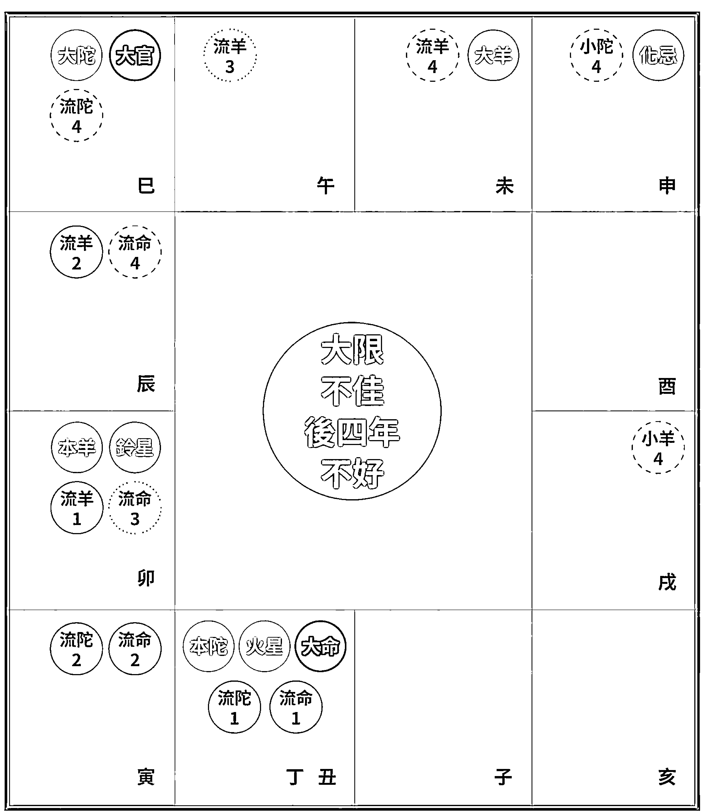

#### 例圖二

| 宮位 | 內容 |
|------|------|
| 巳 | 大陀 |
| 午 | 火星， 大官， 流羊2， 流羊3 |
| 未 | 大羊， 大羊 |
| 申 | (空) |
| 辰 | 流羊2， 流命3 |
| 酉 | 流羊2 |
| 卯 | 本羊， 鈴星， 流羊1， 流命3 |
| 戌 | (空) |
| 寅 | 本祿， 大命， 流陀2， 流命2 |
| 丑 | 本陀， 火星， 流陀1， 流命1 |
| 子 | (空) |
| 亥 | (空) |
| 中心 | 大限不錯後三年不好 |

#### 例圖三

| 36 巳 (小陀 38， 小命 36， 本命祿存) | 37 午 (小祿 38， 大羊， 大財) | 38 未 (小羊 38， 本陀) | 39 申 (本祿) |
|-----------------------------------|-----------------------------|-----------------------|--------------|
| 辰 (大陀)                         | 大限 不錯 後四年 不錯       | 酉 (本羊)             |              |
| 卯 (化權 大官)                    |                             | 41 35~44 戌 (化祿 大命)|              |
| 45 寅                             | 44 丑 (大限陀羅 火星)       | 43 子                 | 42 亥        |

### 答案

#### 例圖一：大限不佳，大限最後四年流年不佳

這個最慘，根本不適合做什麼開創性的創業，甚至要小心連工作都沒有了。

#### 例圖二：大限不錯，大限最後三年流年不佳

需要注意最後三年，通常人在前面過得好，後面就會因為沒有警覺而慘敗，因此最後三年跟前面三年，雖然是一樣的煞忌組合，但後面運勢不佳會更慘。

#### 例圖三：大限不錯，大限前六年流年不佳，後四年不錯

因為大限情況不差，所以雖然前面幾年很辛苦，但是後勢看好，而且往往因前面吃苦，累積經驗，後面反而能夠依此爆發。

## 5-2 流月流日算法

### 利用運限盤為自己挑選好時機

除了整體的運勢之外，我們也會希望了解短時間內的運勢情況，如果可以知道今天的運氣好不好必然是讓人開心的事情。紫微斗數中也有推算月份與日的方法，一樣是利用各個命盤的煞忌疊合去看這個時間內的命盤情況如何，以此推算自己的運勢，用這樣的方式我們就可以知道，何時出遊，何時去談判，甚至何時告白會比較有機會，也可以知道哪些日子其實讓自己放空反而比較好。首先我們必須先知道如何推算出流月跟流日的命盤。

#### 一流月命盤算法一

紫微斗數的命盤中有個東西叫做「斗君」，至於斗君是什麼意思，基本上對於初接觸紫微斗數的人來說是不重要的，就像我們用電話的人不必知道電學或是訊號學一樣，只需要知道所謂的斗君可以拿來當作一種推算的方式。斗君，就是在本命命盤十二地支「寅」的位置。

| 巳 | 午 | 未 | 申 |
|---|---|---|---|
| 辰 |  |  | 酉 |
| 卯 |  |  | 戌 |
| 斗君(寅) | 丑 | 子 | 亥 |

寅的位置就是斗君的位置，若是這個位置在本命盤上面是夫妻宮，那夫妻宮就是本命斗君宮位，若是官祿宮，則本命斗君就是官祿宮，依此類推，看自己本命盤上面寅的位置是什麼宮位，那個宮位就是自己的斗君。因此，假設某人的本命斗君是財帛宮，他的流年斗君就是流年財帛宮，也就是說，依照他的流年命宮去找到流年財帛宮，就會是他流年斗君的位置。

而流年斗君的位置就會是這個人這個流年的 1月，並且依照順時鐘一路排出十二個月。

| 巳 (兄弟) | 午 (流年財帛/命宮) | 未 (父母) | 申 (福德) |
|---|---|---|---|
| 辰 (夫妻) |  |  | 酉 (田宅) |
| 卯 (子女) |  |  | 戌 (官祿/流年命宮) |
| 寅 (財帛) | 丑 (疾厄) | 子 (遷移) | 亥 (僕役) |

*流年斗君位於午宮下方*

| 巳<br>十二月<br>（兄弟） | 午<br>一月<br>（流年財帛）<br>（命宮） | 未<br>二月<br>（父母） | 申<br>三月<br>（福德） |
| :----------------------- | :------------------------------------- | :--------------------- | :--------------------- |
|                          | **流年斗君**                           |                        |                        |
| 辰<br>十一月<br>（夫妻） |                                        |                        | 酉<br>四月<br>（田宅） |
| 卯<br>十月<br>（子女）   |                                        |                        | 戌<br>五月<br>（官祿）<br>（流年命宮） |
| 寅<br>九月<br>（財帛）   | 丑<br>八月<br>（疾厄）                 | 子<br>七月<br>（遷移） | 亥<br>六月<br>（僕役） |

盤。再依照每個月的命宮在哪裡，排列出其他十一個宮位，就可以形成流月的命盤。而每個流月的命宮為當月的初一，依此順時鐘排列出初一到初三十，而每個排到的位置就會是那個流日的命宮，一樣可以列出另外十一個宮位，成為流日的命盤，依此類推。

| 巳<br>十二月 | 午<br>一月 | 未<br>二月 | 申<br>三月 |
| --- | --- | --- | --- |
| （三月 子女） （兄弟） | （三月 夫妻） （命宮） | （三月 兄弟） （父母） | （三月 命宮） （福德） |
| （三月 財帛） （夫妻） | | | （三月 父母） （田宅） |
| 辰<br>十一月 | | | 酉<br>四月 |
| （三月 疾厄） （子女） | | | （三月 福德） （官祿） |
| 卯<br>十月 | | | 戌<br>五月 |
| （三月 遷移） （財帛） | （三月 僕役） （疾厄） | （三月 官祿） （遷移） | （三月 田宅） （僕役） |
| 寅<br>九月 | 丑<br>八月 | 子<br>七月 | 亥<br>六月 |

| 巳 | 午 | 未 | 申 |
|---|---|---|---|
| 初五 僕役<br>兄弟<br>三月初十<br>三月二十二 | 初五 遷移<br>命宮<br>三月十一<br>三月二十三 | 初五 疾厄<br>父母<br>三月十二<br>三月二十四 | 初五 財帛<br>福德<br>三月<br>三月初一<br>三月十三<br>三月二十五 |
| 辰 |  |  | 酉 |
| 初五 官祿<br>夫妻<br>三月初九<br>三月二十一 |  |  | 初五 子女<br>田宅<br>三月初二<br>三月十四<br>三月二十六 |
| 卯 |  |  | 戌 |
| 初五 田宅<br>子女<br>三月初八<br>三月二十 |  |  | 初五 夫妻<br>官祿<br>三月初三<br>三月十五<br>三月二十七 |
| 寅 | 丑 | 子 | 亥 |
| 初五 福德<br>財帛<br>三月初七<br>三月十九 | 初五 父母<br>疾厄<br>三月初六<br>三月十八<br>三月三十 | 初五 命宮<br>遷移<br>三月初五<br>三月十七<br>三月二十九 | 初五 兄弟<br>僕役<br>三月初四<br>三月十六<br>三月二十八 |

透過前述的方式找出想知道的流月跟流日的命盤，我們就可以推算月跟日的運勢情況。坊間對於月的推算方式有三種，一種是因為農民曆一月都是寅月，所以所有一月都從寅月開始算起，這個方式有很大的問題，照此方法，若是有人寅月遇到血光，這人不就每年一月都有出車禍見血的機會嗎？當然不能如此。另外兩種方法就是利用斗君來找，一個是用小限斗君，因為本書沒有介紹小限的使用，加上小限的月找出來，一樣會有每個月與每個日所在宮位天干會重複的問題，加上依照紫微斗數的系統設定，越是短的時間外界環境越會影響自己的命盤情況，因此當我們看到月跟日這樣的短時間時，用流年命盤去推算出來的流月流日會較為準確，所以這裡推算月跟日的日子，用的就是以流年命盤去推算出來的流月跟流日。

另外，每張命盤都要有屬於它的天干，去推算出四化跟祿存、擎羊、陀羅這三顆星，那麼，流月流日命盤該用哪個天干呢？

既然是用了「流」這個字，就代表了是外界環境的影響力量，所使用的就是和大家一樣的時間，因此如同流年一樣，其天干使用的也是農民曆上面的天干，農民曆上有每一年的天干，例如二〇一八年是戊戌年，戊就是二〇一八年的流年天干，所以我們只要翻開農民曆就可以知道當下月份的天干為何，例如二〇一八年陰曆七月天干就是「庚」，有了流月的天干，就可以將這個流月的天干所產生的四化以及祿羊陀，放進去命盤裡面。同樣的，流日命盤使用的流日日干也可以從農民曆找，也會產生一組屬於流日的四化與祿羊陀，一樣可以將它放進去命盤裡面。不過因為農民曆上面的天干，不一定會依照著陰曆的月份變化，有時候會有兩個天干出現，例如可能陰曆六月前面二十天是一個天干，後面十天是另外一個天干，這是因為我們所用的農民曆其實是陰陽合曆，並不只是陰曆，因此當天干在變換的時候不見得會跟月份完全相同，因此有這樣的情況出現，但是這個問題只要在推算流月流日的時候查農民曆就可以了，這樣的方法雖然比用小限推算麻煩一點，但是卻精確許多，可以實際的利用環境的影響力去判斷將發生的事情。知道如何找出流月跟流日命盤之後，若是將我們本來就知道的本命、大限跟流年命盤所使用的四煞跟四化都放進去，加上流月、流日總共五個盤，至少就是五個化忌，這還不含因為空宮產生借星曜至對宮而多出來的化忌，聽起來實在是太可怕了，但是大家不用擔心，紫微斗數有所謂的「天、地、人」盤，其實說的就是各個命盤可以疊合在一起，找出事件的前因後果，這是南派斗數的重要訣竅。這裡說的天地人盤就是基本的組合命盤，要有三個，時間越長的在越下面，所以本命代表一生，大限為十年運勢，流年為一年運勢，如此去組合出天地人盤。因此如果我們推算的是流月，只需要使用大限、流年跟流月三張命盤，若是流日只需要使用流年、流月跟流日，因此並不會產生五張盤一起出現，出現五個化忌的嚇死人狀況。當我們推算流月的時候，最長的時間只需要使用到大限就可以了，並將三個盤的四煞跟四化放上去看，遇到最多煞忌就是最糟的宮位，並且可以依照煞忌是從哪個宮位來，判斷是哪個相對應的宮位出問題。

#### 天地人盤例圖一 流年

該圖表為一個紫微斗數盤（天地人盤），以十二地支方位排列，並標註了大限、本命、流年的宮位關係及對應年齡範圍。核心為「流年天地人」。圖表結構及信息如下（按地支順時針順序，從「巳」位開始）：

**巳 (4~13)**
- 大限：田宅
- 本命：命宮
- 流年：疾厄

**午 (114~123)**
- 大限：官祿
- 本命：父母
- 流年：財帛

**未 (104~113)**
- 大限：僕役
- 本命：福德
- 流年：子女

**申 (94~103)**
- 大限：遷移
- 本命：田宅
- 流年：夫妻

**酉 (84~93)**
- 大限：疾厄
- 本命：官祿
- 流年：兄弟

**戌 (74~83)**
- 大限：財帛
- 本命：僕役
- 流年：命宮

**亥 (64~73)**
- 大限：子女
- 本命：遷移
- 流年：父母

**子 (54~63)**
- 大限：夫妻
- 本命：疾厄
- 流年：福德

**丑 (44~53)**
- 大限：兄弟
- 本命：財帛
- 流年：田宅

**寅 (34~43)**
- 大限：命宮
- 本命：子女
- 流年：官祿

**卯 (24~33)**
- 大限：父母
- 本命：夫妻
- 流年：僕役

**辰 (14~23)**
- 大限：福德
- 本命：兄弟
- 流年：遷移

*圖表中央圓圈標註：流年天地人*

### 天地人盘例圖二 流月

| 巳 | 午 | 未 | 申 |
| --- | --- | --- | --- |
| 大限田宅<br>流月命宫<br>流年疾厄 | 大限官禄<br>流月父母<br>流年财帛 | 大限仆役<br>流月福德<br>流年子女 | 大限迁移<br>流月田宅<br>流年夫妻 |
| 辰<br>大限福德<br>流月兄弟<br>流年迁移 | 流月天地人 |  | 酉<br>大限疾厄<br>流月官禄<br>流年兄弟 |
| 卯<br>大限父母<br>流月夫妻<br>流年仆役 |  |  | 戌<br>大限财帛<br>流月仆役<br>流年命宫 |
| 寅<br>大限命宫<br>流月子女<br>流年官禄 | 丑<br>大限兄弟<br>流月财帛<br>流年田宅 | 子<br>大限夫妻<br>流月疾厄<br>流年福德 | 亥<br>大限子女<br>流月迁移<br>流年父母 |

### 天地人盤例圖三 流日

| 地支 | 流日 | 流月 | 流年 |
|------|------|------|------|
| 巳 | 田宅 | 命宫 | 疾厄 |
| 午 | 官禄 | 父母 | 财帛 |
| 未 | 仆役 | 福德 | 子女 |
| 申 | 迁移 | 田宅 | 夫妻 |
| 辰 | 福德 | 兄弟 | 迁移 |
| 酉 | 疾厄 | 官禄 | 兄弟 |
| 卯 | 父母 | 夫妻 | 仆役 |
| 戌 | 财帛 | 仆役 | 命宫 |
| 寅 | 命宫 | 子女 | 官禄 |
| 丑 | 兄弟 | 财帛 | 田宅 |
| 子 | 夫妻 | 疾厄 | 福德 |
| 亥 | 子女 | 迁移 | 父母 |

中心：流日天地人

有了這個找流月流日的技巧後，我們就可以為自己找出哪個月的運勢比較好，哪個日子運勢比較差，更重要的是可以依照這個方式趨吉避凶，找出最佳的時機點，例如要出門談生意，必然要掌握人心，而且要有成功的機會，這時候如果可以找到流月遷移宮或命宮化科，流日官祿宮或是命宮、遷移宮化權的日子（表示本月會有升官的機會，當然也可以解釋成有得到好名聲，有成功機會），再加上流日當天命宮或官祿宮化權，這表示在這一天會很有權勢，當然代表這樣的日子容易成功。之所以要找流月化科，是因為生意的成功，背後帶來的效益至少是一個月的，而當天談判則需要有足夠的能力跟氣，所以要找流日化權，能不能顛倒過來呢？當然也可以，雖然效果應該會差很多，但是如果有的時候我們無法順利找到心中期待的時間點，退而求其次也是可以的。依此類推，我們要向心愛的人告白，也可以用這個方法挑出時間，這時候當然是流月命宮、遷移宮、巨門化祿，流日夫妻宮化權會是最好的選擇；若是要找好的房子當然要在流月子女宮、田宅宮化祿的日子去找。用這方法可以簡單順利的找出最適合自己需求的時間點，但若通通找不到，就要找相對比較好的時間，怎樣是相對好呢？當然就是煞忌比較少的命盤以及相對應的宮位了。例如明明流日官祿宮四煞匯集，那就別在那天去談生意，除非是黑道在談生意，需要有勇猛的衝勁跟不顧一切的勇氣。所以，大家應該也可以聯想，如果是要找好的房子，當然是流月流日田宅宮有化祿的時候；要跟男友談分手，自然是夫妻宮有很多煞忌的時候去談會夠力了。

### 小練習 ☆

若是有人要出門邀請別人做自己創業的股東，以下哪個的日子最適合？

> 例圖一

| 巳<br>化權 流月命宮 | 午<br>化祿 流日官祿 | 未 | 申 |
| :--- | :--- | :--- | ---: |
| 辰 |  |  | 酉 |
| 卯 |  |  | 戌<br>化科 流年命宮 |
| 寅 | 丑 | 子 | 亥 |

| 巳 (化禄, 流月子女) | 午 (化权, 流日命宫) | 未 | 申 (火星, 流年官禄) |
|---------------------|---------------------|----|---------------------|
| 辰                  |                     |    | 酉                  |
| 卯 (擎羊, 铃星)      |                     |    | 戌                  |
| 寅                  | 丑 (陀罗)           | 子 | 亥 (化禄, 流月田宅) |

### 例图三

| 巳 | 午 | 未 | 申 |
|---|---|---|---|
| 化科 流月官禄 | 化权 流日命宫 | | 化禄 流月子女 |
| 辰 | | | 酉 |
| | | | 化权 流年官禄 |
| 卯 | | | 戌 |
| 寅 | 丑 | 子 | 亥 |

### 答案/

#### 例圖一：流年命宮化科，流月命宮化權，流日官祿宮化祿

這個看起來不錯很有機會。

#### 例圖二：流年盤無任何四化，但是官祿宮四煞匯集，流月子女宮化祿，田宅宮化祿，流日命宮化權

這個是今年創業風險萬分，但是日子挑得很好。

#### 例圖三：流年官祿宮化權，流月官祿宮化科，子女宮化祿，流日命宮化權

這是這天運勢不差，日子挑得好，因為有人參加當股東表示有投資，投資是人家給你錢，所以你的財庫會有進財跡象，子女宮、田宅宮是財庫，有化祿或祿存表示會進財，因此三張盤內這張最適合。

## 5-3 尋找好貴人

人生中很多時候需要被拉抬一把、提攜一下，在自己需要幫忙的時候，有個人從旁協助，會更順利度過難關，這樣的貴人，絕對是人生中很需要的，問題是我們往往不知道貴人會在那裡，甚至有時候我們覺得很討厭的人卻是我們的貴人，因此如果無法了解如何找貴人，容易錯失了好時機。開始接觸命理的人，應該都會覺得人生如同在打遊戲，需要知道自己帶了那些裝備，需要選擇出道路，也需要在路途上一關關的打怪，慢慢的累積經驗值，然後讓自己擁有強大的生命力，往夢想前進。我常在教課的時候建議學生把紫微斗數命盤當成人生的攻略本，而這個人生道路上某些人會來幫助我們，或者在無意中為我們透露出訊息，也可能因為某些人對你的傷害，結果讓你反而變得更好，這種逆境菩薩的角色，在平常是看不出來的，但是我們可以從紫微斗數命盤中尋找出來。那麼，要如何找貴人呢？

### 一、用運限盤找出貴人星曜所在的宮位

紫微斗數中明定的貴人星曜有：天梁、天魁、天鉞、左輔、右弼，天貴，龍德，當我們要找是否有貴人的時候，我們可以看看運限命盤內是否有貴人星的存在，例如工作創業需要幫手，這時候要看運限的官祿宮是否有貴人星；創業需要有人投資，這時當然然是看財帛宮了，不過若是同時間的田宅宮、子女宮沒有化祿或祿存，則即使有人幫忙也不會有人投資，因為財庫沒有錢匯進來，而且貴人星裡面的「左輔、右弼」屬於平輩的貴人，因此若是在財帛宮出現而且宮是空宮，表示可能需要跟人借钱了。而且，貴人星不能放在命宮，放在命宮表示自己是大家的貴人，因此要尋求貴人的時候，應該要找相對應的宮位是否有貴人星，這時候就知道能不能找到貴人幫忙，但是若是找不到，或是雖然有貴人出現但是那個宮位煞忌太多，這個貴人能幫忙的有限，或者說整個月份運氣實在太糟，這時候不能找流月命宮，必須要找遷移宮，因為命宮表示自己是人家的貴人，遷移宮是在外的情況，表示在外有遇到貴人。但是必須注意，若是貴人星存在的宮位遇到太多的煞忌，這也表示那個貴人星可能效果不大，因此就不見得可以幫助到你了。

當然，這中間還可以有升級版的技巧：若是在流年找不到貴人星，還可以在流月找，但是從流日找，通常是自己在這個流月運勢很糟，但是又不得不去談生意，或者是面對感情問題的時候。

所以，當需要貴人時候，可以看自己運限命盤是否有貴人，並且依照各星曜特色找出符合的人，他就會是可以幫助自己的人。以下說明各個貴人星具備的特質：

### 天梁

老人星，通常是有一定的社會地位或年紀較大的人，天梁也是守護神的意思，所以也可能是原本不認識或不熟識但是忽然出現的人。

天梁也是宗教星，所以也代表可以去求神明希望出現貴人幫忙，這裏的神明不只是道教神明，自己喜歡哪個宗教，就可以祈求。

### 天魁

陽貴人，男性，社會地位較高或者較資深的人。

### 天鉞

陰貴人，女性，社會地位較高或者較資深的人。

### 左輔

男性，平輩交往的朋友。

### 右弼

女性，平輩交往的朋友。

### 天貴

可以想成小天梁，也是老天送來幫忙你的人，所以通常不會是事件中的相關人等，舉例來說，如果是公司有個合作案無法完成，這時候找的是與這個案子沒有直接關係的人。

### 龍德

有點類似天貴，但是最好是跟這個事件有關係，且社會地位高的人。

除了依照貴人星特質去找出貴人之外，還可以依照貴人所在的十二地支，找出貴人可能的生肖，例如天梁星在午位，這表示這個貴人年紀有點大，而且社會地位或者人生經驗豐富，並且應該是屬馬（十二地支午，對應十二生肖是馬）或者是老鼠（對面宮位是子）。

### 2. 用運限盤找出祿、科、忌的所在宮位

此外，化祿、化科的位置，甚至是化忌的位置也可能是我們的貴人所在。首先化祿當然是緣分深厚所以會幫助我們，化科則是為了自己的價值跟面子會幫助我們，至於化忌為何會是貴人呢？因為化忌是一種空缺，有空缺就會有動力產生，因此化忌所在的生肖，這一類的人會督促我們，雖然有壓力卻會讓我們進步，當然這些化科、化祿、化忌的條件，也可以將對面宮位的地支算進去。
依照上述這兩種方式，就可以找出誰能夠幫助我們，不過要注意，即使有貴星在宮位裡面，但若是煞忌太多，就不能使用，同樣的，利用化祿、化科、化忌去找的也不行。

### 小练习☆

如果有人想问今年事业情况，以下三张盘各自的贵人特质是什么？

### 例图一

| 巳 | 午 | 未 | 申 |
|---|---|---|---|
| 命宫 | 右弼 擎羊 父母 | 福德 | 天钺 陀罗 左辅 田宅 |
| 辰<br>龙德 陀罗 兄弟 | （空） | （空） | 酉<br>官禄 |
| 卯<br>夫妻 | （空） | （空） | 戌<br>陀罗 擎羊 仆役 |
| 寅<br>子女 | 丑<br>火星 财帛 | 子<br>天魁 擎羊 天贵 疾厄 | 亥<br>迁移 |

#### 例圖二

| 地支 | 宫位 |
|------|------|
| 巳 | 夫妻 |
| 午 | 兄弟 |
| 未 | 命宫 |
| 申 | 父母 |
| 辰 | 子女 |
| 酉 | 福德 |
| 卯 | 天贵、财帛 |
| 戌 | 田宅 |
| 寅 | 疾厄 |
| 丑 | 迁移 |
| 子 | 仆役 |
| 亥 | 官禄 |

| 地支 | 宫位 | 星曜 |
| :---: | :---: | :---: |
| 巳 | 命宫 | 陀罗 (两个) |
| 午 | 父母 | |
| 未 | 福德 | |
| 申 | 田宅 | |
| 辰 | 兄弟 | |
| 酉 | 官禄 | 火星、天贵、擎羊 |
| 卯 | 夫妻 | |
| 戌 | 仆役 | 铃星 |
| 寅 | 子女 | |
| 丑 | 财帛 | 天梁 |
| 子 | 疾厄 | |
| 亥 | 迁移 | |

### 答案

#### 例圖一

無貴人。因為貴人星都在命宮三方四正的其他位置，有貴人星在內的宮位也充滿煞忌。

#### 例圖二

有一個天貴在卯，所以貴人星屬兔。

#### 例圖三

有天梁在財帛宮，天魁在官祿宮，但是官祿宮遇到四個煞忌，所以有人幫忙也是不長久，或者是要命主付出其他代價。

## 有趣實用的神棍技巧

## 只要出生年就能了解運勢的快速推算法

我們上課的時候，常有學生說曾經遇到很神奇的命理老師或師父，只需要寫出生年次或是生肖，就可以知道他要問的問題，或者可以馬上說出他今年擔心不安的事情，不需要寫出完整的生辰八字，相對於紫微斗數來說，厲害許多。事實上，排除某些老師本身真正具備通靈的體質，可以利用自己的靈魂跟算命者的靈魂溝通（因為能夠透過彼此靈魂的溝通，所以可以巨細靡遺的知道命主私人密事件之外，其實只要真正研究過命理的人就會知道，這一點都不難，有許多的手法可以做到這樣的事情。例如稍微通曉面相的人，基本上就可以從面相直接看出來算命的人現在的問題，又或者各種如諸葛神算、馬前課、大六壬或奇門遁甲的占卦技巧，在具備一定的熟練程度之後，也可以在完全不動聲色的情況下做出這樣的推測，讓人非常驚訝，再厲害一點的高手甚至不用任何生辰數據，就可以做到這樣的水準，極為驚人，若是算命者再假藉神明的名義說出來，更是威力驚人，例如跟你說這是哪位神佛跟他說的消息，你必然會相當驚訝，馬上相信了算命者，接著就會掏出金錢。

其實真正的專業命理師通常不會用這樣的方法，他們會將命理視為科學的系統，只是這個科學因為年代久遠，許多邏輯原理已經散佚了，所以無法用現代人的方式去解釋，因此變成所謂的玄學。但是，專業的命理師都還是會認為應該拿出專業面對來諮詢的案例，好好的算給你看。上述這一類只靠一個生肖就開始斷事者，通常比較多出現在跟宗教有關係的地方，他會說這是上帝或是哪個大天使我，抑或是哪個厲害的神明跟他說的，當然，我們不可否認民間有許多的高人，但是我常常提醒學生，只要稍有宗教知識就知道，這類透過通靈得到的資訊，我們必須要有正確的觀念去面對，以基督、天主與回教等泛天主教系統來說，人家根本反對這樣的事情，佛教一樣也是反對這樣的事情，即使有做也不會拿來每周固定時間開宮辦事。以道教來說，確實有這樣的系統，但是這也通常將地區性的巫術系統融合進道教的體系中，所引用的通常是低等的靈魂與命主的靈魂溝通，從邏輯上想想就知道，怎麼可能隨便就會出現九天玄女、關聖帝君這種大神來跟人說話，如果有人跟你說她在路上遇到劉德華或湯姆克魯斯，你會覺得她是遇到真人還是遇到一個長得像的人呢？雖然這些靈不見得是不好的，或許他是希望可以藉由一個高大上的形象來讓你相信他，方便幫助你，但是也確實非常多的人利用這樣的方式欺世詐財，或是許多無法通靈的人也會利用學習命理術來達成這樣的事情，甚至會通靈者也會來學，我便有學生本身是具有通靈能力者，並且利用這個能力辦事的，我曾問他，既然有神明可以跟他說這些訊息，何必來學算命？原因是，神明也需要休息的時候，不是每次都可以跟他說話，若是神明不來，又有客人的時候，總是要有方法可以應付一下。

所以，命理學就發展出許多這一類的技巧，雖然說這是江湖技巧，而且通常在一般的命理書籍上看不到這樣的用法，因為目前我們可以看見的命理書籍，以古書來說，通常是讀書人甚至是當朝大官所寫，例如面相學的重要經典《冰鑑》就是清朝的封疆大吏曾國藩所寫，另一本重要經典《人倫大統賦》則是大金國吏部尚書所寫，紫微斗數的重要經典《紫微斗數全書》傳說作者是北宋陳希夷，其實依照中國人寫書的潛規則，更有可能是明朝的羅洪先在政治鬥爭下台後，不得不已到處自助旅行散心解悶所寫的，這一類的人通常不屑於這些江湖技巧，因此不太會寫在書內流傳於世，但是這些江湖技巧卻是快速而實用的，試想那些走跳江湖的民間術士，所能夠取信於人的時間其實十分短暫，而他們所需給出的答案也十分簡單，不同於當朝大官、皇室貴族尋求複雜全面性的思考與答案，一般人的不過就是一個簡單的答案，今年財運如何？明年感情運如何？所以有時候這些江湖技巧反而更加的實用。這裡就介紹一個紫微斗數中，十分好用的江湖技巧。
我們在前面已經學會了祿存、擎羊、陀羅的找法，也知道這三個星曜其實有出生年的、也有流年的，我們就可以利用這幾個條件來推算，並且只需要知道出生年就可以。
首先我們必須先知道對方是哪一年出生，然後利用他的出生年找出他的生年天干。西元紀年的尾數只要是四，紀年的天干就會是「甲」，例如西元一九七四年，尾數是四，那一年是甲子年，以此類推：
- 尾數四是甲年
- 五是乙年
- 六是丙年
- 七是丁年
- 八是戊年
- 九是己年
- 零是庚年
- 一是辛年
- 二是壬年
- 三是癸年
知道了生年天干，自然就可以知道他本命盤上面生年的祿存、擎羊、陀羅這三顆星在哪裡，例如有人是一九六七年生，尾數是七，生年天干是丁，他的本命盤上應該會如下：

| 巳<br><small>本命陀羅</small> | 午<br><small>本命祿存</small> | 未<br><small>本命擎羊</small> | 申 |
| --- | --- | --- | --- |
| 辰 | 1967 年生 | | 酉 |
| 卯 | | | 戌 |
| 寅 | 丑 | 子 | 亥 |

而若要看这个人二○一九年的运势，怎么看呢？二○一九年是猪年，流年的命宫一定在命盘上「亥」的位置，并且以此可以知道他的流年命盘十二宫位置，而流年天干是己，所以禄存会在午的位置，如（P.252）图。此时若是将本命的禄存、擎羊、陀罗也放上去，就会变成如（P.253）图。我们可以看到，这个人的流年命盘财帛宫上出现了一个生年擎羊、一个流年擎羊，两只羊在流年财帛宫上，依照前文的介绍，我们可以知道这个人二○一九年流年命盘财帛宫有很高的机率会出现理财上的问题，因此可以说这个人二○一九年的财运状况不好。虽然只有两只羊，不符合前面说的三个煞忌那么危险，但是具备了两个再遇到第三个的机率其实相当高，同样的，陀罗在流年迁移宫，因此这个人内心一定许多心烦纠结的事情。

| 巳 (流年陀罗) | 午 (流年禄存) | 未 (流年擎羊) | 申 |
|---------------|---------------|---------------|----|
| 辰            | 2019 流年     | 酉            |    |
| 卯            |               | 戌            |    |
| 寅            | 丑            | 子            | 亥 (流年命宫) |

| 巳 | 午 | 未 | 申 |
|---|---|---|---|
| **本命陀羅**<br>**流年陀羅** | **本命祿存**<br>**流年祿存** | **本命擎羊**<br>**流年擎羊** | |
| 辰 | 2019<br>流年 | | 酉 |
| 卯 | | | 戌 |
| 寅 | 丑 | 子 | **流年命宮**<br>亥 |

只利用流年命盤以及生年的天干跟流年的天干，就可以推算出基本的運勢情況，雖然不及三個煞忌在某個宮內那麼真確嚴重，但是也一樣會有效用，並且快速而簡單。如果你熟練於命盤十二宮位置的人，幾乎可以在心裡就推算出來，並且告訴對方今年財運不佳心裡很多煩心的事情喔。
當然，這個方式不是只有一個宮位內兩個煞星才可以，我們一樣可以利用三方四正內來看，如果在三方四正內湊到兩個以上的煞星，狀況就會是比較嚴重的，若是都湊不到，例如：| 巳 | 午 | 未 | 申 |
|---|---|---|---|
| 辰 | 2019 流年 | | 酉 |
| 卯 | | | 戌 |
| 寅 | 丑 | 子 | 亥 |

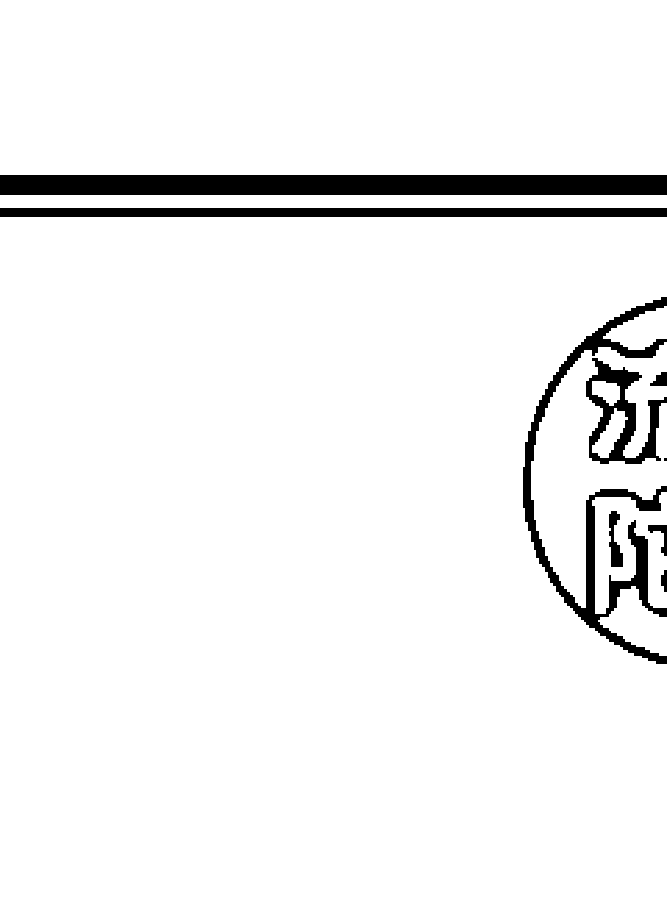

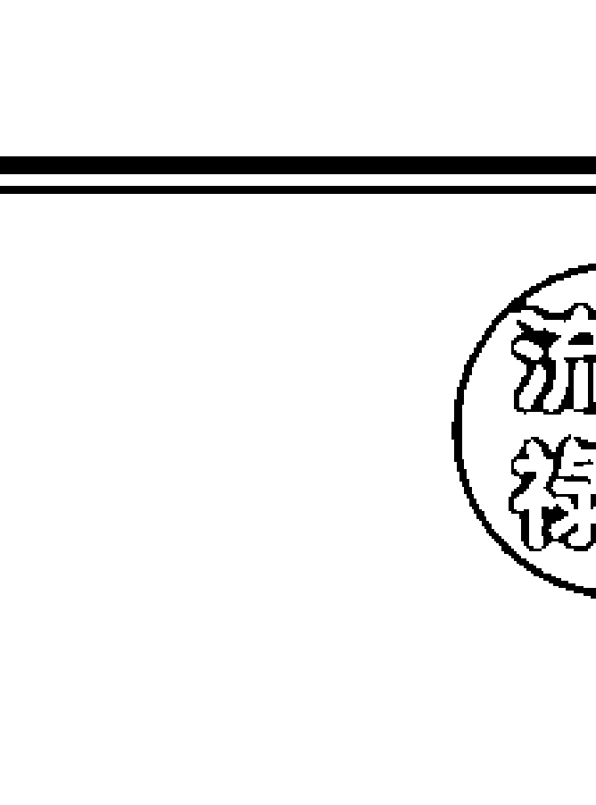

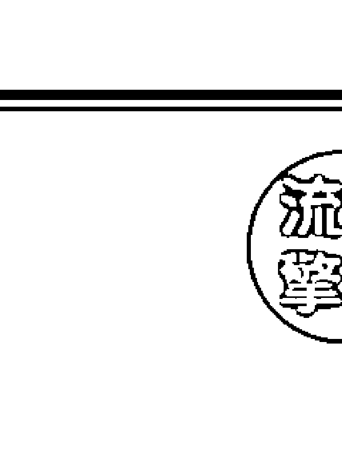

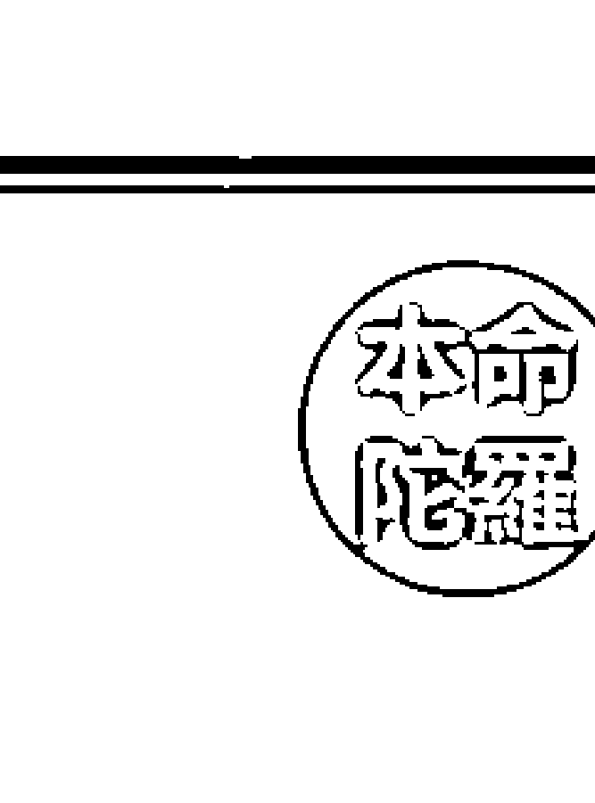

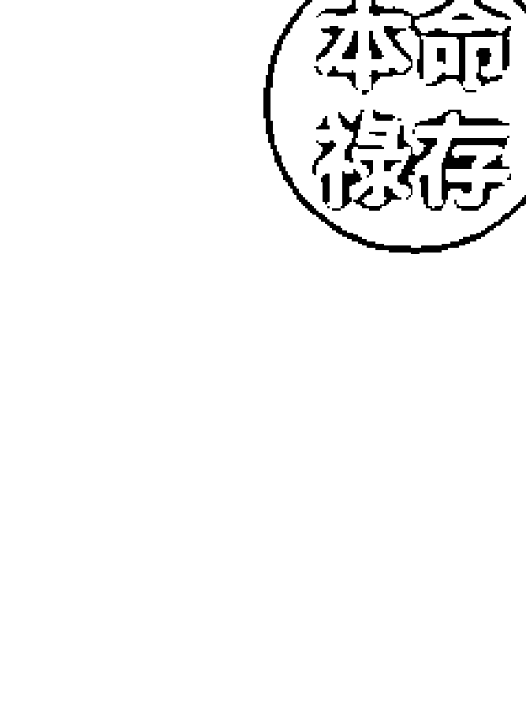


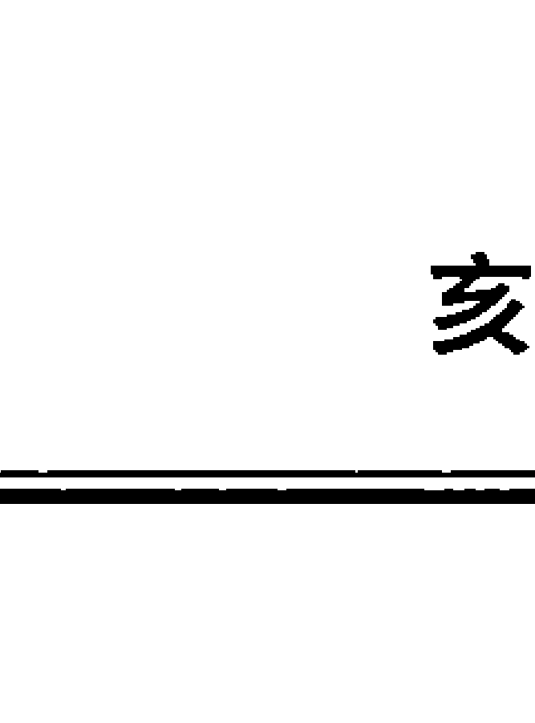

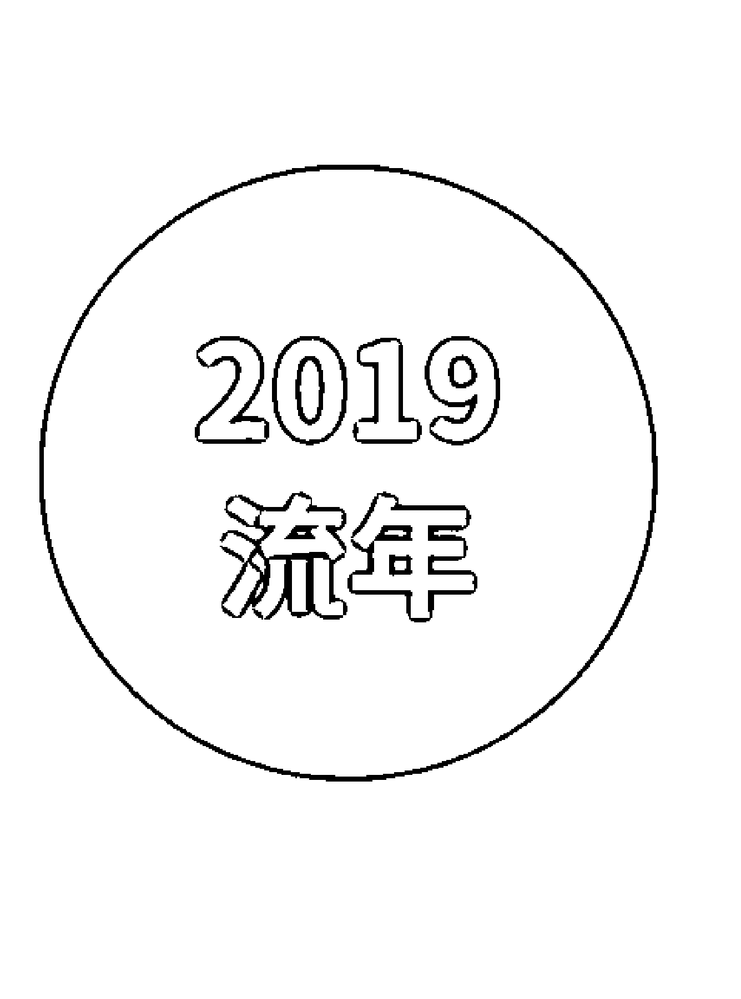

# 紫微攻略

這個時候也可以簡單的依照有煞星的宮位去解釋，因為即使只有一顆煞星，那個宮位也會受影響，只是有時候影響的力道不大而已。例如若是這個人是乙年生，而二〇一九年運勢就會像下圖，我們就可以解釋成：你今年容易破財（本命陀羅在流年田宅宮），並且常常容易跟朋友有些糾紛（本命擎羊在流年僕役宮），因此常常心裡會很心煩（流年擎羊在流年財帛宮）。要注意不要亂花錢亂做投資（流年擎羊在流年財帛宮）。

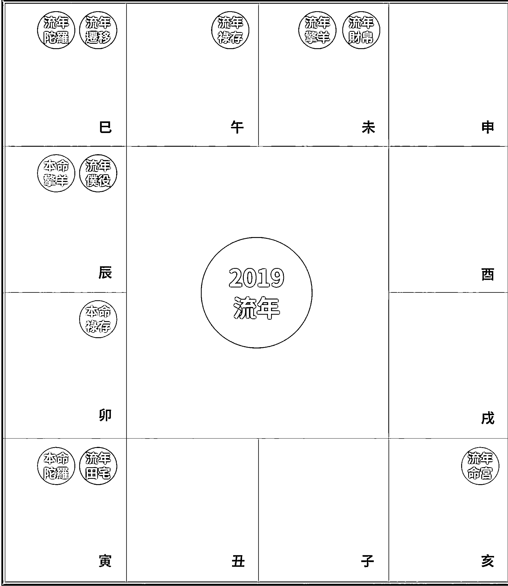

### 小練習☆

若是有人是 1987 年生，請問在 2020 年他的運勢如何？

若是有人是 1987 年生，2020 年他的流年命盤應該是如此（如左圖）。在 2020 年，這個人應該在疾厄一年身體不太好，容易有擦傷跟碰撞的傷害，他的父親也要注意身體健康（流年疾厄宮有生年擎羊與流年陀羅，衝對面的父母宮），自己跟朋友也容易有些摩擦（生年陀羅星在流年僕役宮），這一年有容易跟小孩吵架還有外來損財的機會（流年子女宮有流年擎羊星）。

### 答案

| 巳 | 午 | 未 | 申 |
| --- | --- | --- | --- |
| 本命陀羅<br>流年僕役 | 本命祿存 | 流年陀羅<br>流年疾厄<br>本命擎羊 | 流年祿存 |
| 辰 | 中央為「2020 流年」 | 申 | 酉 |
|  |  |  | 流年擎羊<br>流年子女 |
| 卯 |  |  | 戌 |
| 寅 | 丑 | 子 | 亥 |
|  |  | 流年命宮 |  |

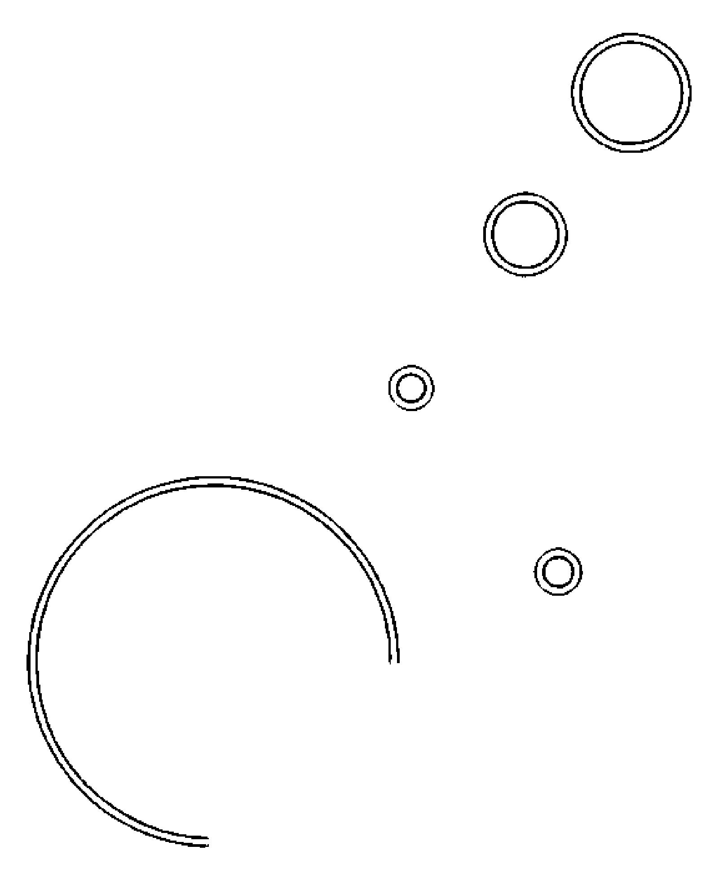

# 第六章 利用斗數北派秘訣，為自己找到最適合的夥伴與情人

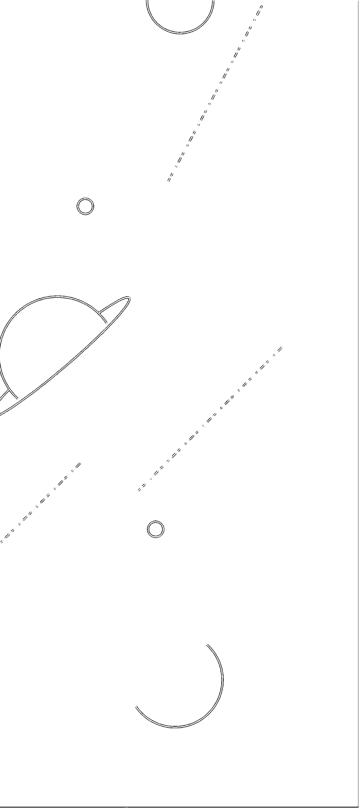

# 紫微攻略

利用紫微斗數推算運勢，需要命主的出生年、月、日、時這四個條件，但若是條件不齊全怎麼辦呢？即使是最排列組合的南派紫微斗數（高達二十六萬種命盤排列組合，解釋條文與相關變化可以至上億種，可以說是目前所知最多排列組合的命理系統）一樣會有共盤（命盤相同）的問題。其實身為一套發展許久，整合了各種數術於一身的完整系統，怎麼可能會有這樣的問題，它早就有了解決的方法。所謂的共盤問題，其實就算是精細至一毫秒，一樣會有這樣的問題存在，因此無論分拆得多細緻、排列組合到什麼程度都會有這樣的問題。因此解決問題的方法不是在於增加更多命盤排列組合，而是回歸到前文提到的，所有的命理學基礎在於人和環境的關係，所有的命理學發展都是用這個架構做為基礎，只是各自因為不同文化以及對於世界的了解而有不同的手法，形成不同的發展體系，但是主要的架構卻是完全一樣的。既然如此，命盤上所談的事物，各種排列組合出來的命盤，其實只是一種基本結構，必須透過解盤者對於環境變化的掌握以及人生經驗，才能做出完整的推論。其中因為環境的不同變化，自然會去影響了相同命盤的人有了不同的人生。也就是說，相同命盤的人，因為出生地的不同，自然結果就會不同。例如一個人依照命盤會成為有名的歌手，但是他在台灣出生，與在美國出生就會有不同的際遇發展，台灣與美國的市場不同；亦或者有人的命盤就是適合在外地發展，所以他在台灣出生可能要到美國才能成名，但是他有機會去嗎？所以許多的變化其實不只是在命盤上面，而是在實際的生活上面。也因為如此我們能夠透過命盤的分析在現實生活中做出改變，讓我們找到更適合自己的人生路途。這也是為何這本書會有別於其他紫微斗數的命理書籍，先以代表環境的「宮位」做為入門的敲門磚。

人生的環境，不是只有在命盤上面的，例如風水對我們的影響，例如我們是否知道在恰當的時機做出對的決定（請見P.217），以及我們是否知道怎麼選擇自己身邊的人。人從來就不是只為了自己而活，我們無法脫離群體的生活，因此，身邊的人帶來的影響就變成我們在實體環境中很重要的事情。選擇對的人在身邊，與之接近，或者說躲開對我們會有不好影響的人，讓自己免於災難跟風險，避免讓自己的人生毀在這些人手上。那麼如何知道身邊的人誰會對我好呢？如果紫微斗數需要命主的出生年月日時，我們很多時候並不是那麼容易拿到手的話，該如何是好呢？

我一直跟學生強調一個觀念就是，命理是人與環境的關係。當了解這樣的關係時就可以知道，其實我們可以從人去看環境影響，以及如何與其變動。若說身邊的人是構成我們周遭環境的一個因素，紫微斗數就可以利用這些因素，以及蝴蝶效應的觀念，掌握各種的變因，自然可以利用自己的命盤，找出這個人對我們的影響，並不需要有他的命盤。所以說，紫微斗數可以利用自己的命盤看出另一半的長相、當下與未來的運勢、家世背景，甚至當另外一半有了小三，還可以找出這個小三是哪裡認識的、長相如何。

紫微斗數中有各種不需要生辰的情況就可以做出推算的方法，而對於看出身邊的人與自己的關係這件事情，例如追求者是否會給自己管錢，員工是否會真心對自己盡心盡力，股東是否會背叛自己……等等種種別人對待自己的情況，有一個相當實用而且簡單好學的方式。

這個方法只需要利用對方的出生年，就可以知道他與自己的關係、對自己產生的影響。這是北派的紫微斗數常用的手法，利用的原理就是將人當成是時空環境的一環，因此可以看出人對自己命盤上產生的影響力量，由此看出這個人對我們引發的變化。下面就介紹這個方法的應用方式。

紫微攻略

## 北派斗數的重要訣竅

### 好處都飛到我身上吧

前文提到，紫微斗數中一個很重要的技巧「四化」，所談的是星曜因為時空環境變化而產生了變化，而星曜的變化則會影響宮位的情況。若說紫微斗數在古代的設定，是將人的命盤當成一個小小的國家，現代來說，我們可想成是一個公司，宮位則是公司的各個部門，因此財帛宮就像是公司的財務部門，而宮位內的星曜就像是公司的財務長一樣。但是公司的財務情況太差，再厲害的財務長也無能為力，這就是之前介紹以宮位來看出一個人遇到極差的時空環境，即使能力很好也會很難突破。以此方式就可以利用宮位被破壞（宮位三方四正內超過三個以上的煞忌）來論斷一個人的運勢情況。

宮位內的星曜還會遇到四化的影響，因為一個人不同的年紀產生的不同能力與價值觀，對應星曜讓星曜產生了變化，這就是紫微斗數中很特別而且精妙的四化應用。這個四化的設計其實可以用在各種地方，不只適用於如前文所提到，因為年紀的變化，對應各個運限盤所產生了星曜的變動，以此讓命主在各年紀對於自身的價值以及能力都會跟著動。其實四化的概念，就是以天干來代表時空環境的變動，而時空環境的變動，年紀只是其中一種。流年命盤所產生的四化，其實就是利用流年的天干代表外界環境的變動，以此讓星曜產生變動，表示了外界環境對自身的影響。所以四化這個在紫微斗數中重要的變化系統，才可以成為紫微斗數中極為重要的技巧，也因此不只用在命盤上面，任何可以產生天干的事物，其實都可以用四化來造成命盤的變動。因為宮位是環境，紫微斗數以此來判斷自身所出現的時空環境情況。若是有人可以改變我們的命盤上的星曜，自然可以改變我們對於所處時空環境的態度，自然而然就會影響我們的命盤。如此的手法常見於北派斗數之中，較少見到在南派斗數中。我們在這裡將介紹一種最好學好用的方式，其變化性可以十分繁複，甚至自成一種論命體系，是相當好用的一種方式。單純使用別人的生年天干，對應我們自己命盤，產生對我們的影響，就像年紀對我們的影響是來自於我們自己運限命盤上面的命宮天干，外界環境對我們的影響來自於流年的天干一樣。別人出生年的天干，也會對我們有所影響。

由別人造成我們命盤的星曜產生四化變化，就像從別人身上飛了四化到我們命盤上面一樣，所以這個方法稱為「飛化」，也就是因為別人的生年天干造成我們命盤上出現四化。例如，某人出生年是一九八二年，依照前面所說，利用西元年尾數找到天干的方法，尾數二的天干是「壬」，而壬的天干是「天梁化祿、紫微化權、左輔化科、武曲化忌」。所以如果自己命盤上面有顆天梁星在自己的命宮，遇到出生年西元尾數為二出生的人，因為這個人的生年天干會造成自己的命宮天梁星產生化祿，而化祿的意思是「本來不屬於自己而多出來的」，通常在跟人有關係的事情與宮位上，被解釋成是緣分的增加。因為代表人的宮位通常表示了與人的關係，所以夫妻宮表示與感情的關係，僕役宮表示了與平輩的關係。化祿當然說的就是本來不屬於你而增加的關係，這表示這個人基本上會因為對你付出而讓彼此關係增加。用這樣的觀點去看，就可以知道這個人基本上很容易對你付出。也就是說，這個人的天干造成你命宮的天梁化祿，他給了你一個祿（從他身上飛過去給你的祿），當然表示他對你給予付出，因為付出給你了，因此會增加彼此的緣分。

# 紫微攻略

A天干造成B命盤上面出現四化

| 巳 | 午 | 未 | 申 |
|---|---|---|---|
| 天梁（B命宮）、兄弟 | A化祿 | 父母 | 福德、田宅、官祿 |
| 辰：夫妻 | （A辛年生飛化到B） | 酉：僕役 |
| 卯：子女 | 丑：財帛 | 子：疾厄 | 亥：遷移 |
| 寅： |  |  |  |

### 命宮

命宮管理十二宮，化祿到命宮，幾乎等於化祿到了其他十一個宮位。

### 一【化祿】在命盤上的各宮位意思如下 ——

化祿是一種緣份的增加，對方化祿給我們，是希望可以透過對命主的好，而增加彼此的緣分。透過化祿星曜的不同，可以知道對方是用怎樣方式給我們好處。例如命宮主星是巨門，對方造成我們巨門化祿，巨門是口舌的意思，所以這個化祿，通常是吃喝的好處，或利用這樣方式，我們就可以知道別人對我們的影響。當然既然是四化，就表示『化祿、化權、化科跟化忌』四種變化都會產生影響。透過這個方式，我們只需要知道對方的出生年，就可以利用對方出生年的天干，依照化祿、化權、化科、還有化忌各自會對我們的命盤產生不同的影響，是對方給我們命盤上面各宮位的變化。

當然，這個變化產生於本命盤跟運限盤，影響會不盡相同。以下我們就簡單分析若是四化出現在各宮位上，會有何解釋跟看法。

### 兄弟宮

兄弟宮代表的是自己的母親或是同性別的兄弟姊妹，也是自己與朋友在外的關係。若是化祿在本命盤上的兄弟宮，可以表示會對你的家人用心關心；若是在運限盤上面的兄弟宮，除了表示對你的兄弟姊妹關心以外，也可以說會對你的交友關係用心，會因此為你介紹新的朋友。

### 夫妻宮

這個宮位在本命盤上面代表的是自己的感情態度；若是運限盤上的夫妻宮則表示目前的感情狀態。因此若是對方可以化祿在你的本命夫妻宮，表示會讓你在情感上感到開心愉快，在情感上關心你，讓你得到情感上的滿足。若是在運限盤的夫妻宮，則表示這個人在情感上對你呵護備至，讓你感覺很開心。若對方是同性別，因為夫妻宮是官祿宮的遷移宮，表示可以增加在工作上的幫助與機會，也可以為你介紹新的對象。若是自己的伴侶化祿在自己夫妻宮，當然可以為你介紹新的對象。若是此時是單身狀態，而有異性化祿在自己夫妻宮，表示此人願意在自己的情感上多加關注。

### 財帛宮

這個宮位表示了金錢的來源與用法，這個宮位化祿當然是增加錢財。但是這裡的錢財不只是代表了錢，也包含了用錢與賺錢的機會，所以可能是花錢享樂也可能是賺錢。因此若是有人化祿到你的這個宮位，算是此人增加了你的用錢與賺錢機會，甚至是直接增加你的財富，直接用金錢對你展示善意。這無論是找情人或者找工作夥伴，都希望能夠遇到的。

### 子女宮

這個宮位表示了財庫跟家（田宅）的外面，也可以說是吃喝享樂的宮位。若是化祿在子女宮則表示此人會讓自己有進財的機會，也可以是因為此人有出去玩樂跟吃喝的機會。當然因為子女宮是性生活，若是異性也表示在性的部分會對自己非常的用心。

### 疾厄宮

這個宮位表示身體，化祿給你的身體當然表示的是關心跟照顧你的身體，包含了吃喝玩樂等等身體上的享受，當然也表示了性生活。

### 遷移宮

這個宮位表示的是你在外的情況以及內心的世界，化祿到這個宮位，自然表示了會讓你在外覺得很開心享受，也表示會關心你的內心、重視你的內心想法，可以算是除了命宮之外，一樣讓你覺得開心的一個宮位。

### 僕役宮

這是一個表示不同性別兄弟姊妹，以及所有平輩關係、下屬關係的宮位。化祿到這個宮位當然表示對你的家人不錯，以及對你的朋友很好，甚至可以介紹新的朋友與人際關係給你。

### 官祿宮

代表工作的這個宮位，當然是表示你的工作能力以及在工作上的運勢機會，也表示了自己在情感上的外緣。因此化祿在官祿宮表示對自己在工作上帶來方便與人緣，自己的工作有幫助，可能因為幫自己在工作上帶來方便與人緣，因此幫自己帶來工作的機會，當然也帶來桃花的機會。

### 田宅宮

子女宮與田宅宮都是財庫的意思，但是田宅宮也有家人的概念。所以若是化祿在田宅宮，當然具有用心對待你的家人，以及幫你錢財入庫的概念。

### 福德宮

一般來說這是代表了精神與靈魂的宮位，但是福德宮因為是財帛宮的對面，也有錢財從外而來的意思。因此若有人化祿在福德宮，除了會表示讓自己的精神心靈感受豐富愉快之外，也表示給你帶來賺錢的方式。

### 父母宮

代表父親的宮位，若是另外一半化祿在這個宮位當然表示對於你的父親體貼關心。但是若不是自己的伴侶，而化祿在自己的父母宮，則表示會去影響疾厄宮，所以也可以說是讓自己的疾厄宮具有化祿的特質，也表示關心自己的身體。

### 一【化權】在命盤上的各宮位意思如下

化權是一種加強、加重與控制的觀念，也有因為要能加重與掌控，所以會有加倍的概念。既然加倍了就是兩個，因此若是有人化權到我們的命盤上，當然表示這個人會希望可以掌握、掌控我們，並且會對我們有所要求，對我們有所督促，以及帶來壓力。

### 命宮

在討論對應的宮位時，需要注意這個人是否可能因為這個宮位產生影響。

### 兄弟宮

在討論對應的宮位時，需要注意這個人是否可能因為這個宮位產生影響。例如化權在代表同性兄弟姊妹或母親的兄弟宮，這時候若是尋常人或是不熟悉的人，當然很難直接解釋成他會干涉、掌控自己與母親或兄弟姊妹的關係。若要如此解釋，通常這個化權到自己的兄弟宮的人，會是自己的親屬；若是一般朋友，則可以解釋為關心自己與家人的關係或是交友情況。當然也需要這個人有這樣的機會，不能直接硬去解釋。

### 夫妻宮

表示自己的感情態度，如果有人化權在這個宮位，當然表示希望可以掌握自己的感情狀態。若是另一半，則表示希望可以掌握自己的感情。若是單純的異性追求者，也可以說是讓自己在情感上無法拒絕他。若是同性朋友，可以說是會喜歡干涉自己的感情問題。若是家屬當然也表示會干涉自己的感情選擇，也會影響自己工作在外的情況。

### 子女宮

如同夫妻宮與兄弟宮，化權的概念在這個宮位，要發生力量通常必須是跟自己較為親近的人，否則就算對方想掌控自己也不是那麼的容易，所以通常在剛認識的人身上是感受不到的。掌控子女宮，表示希望掌握財庫與家人關係，當然也表示在性生活上希望較有主導權的概念。

### 財帛宮

賺錢與投資理財的宮位。若是有人化權給我們，如果此人是我們的朋友，通常表示會為自己帶來投資的機會；但是若是合作夥伴可能需要注意，對方是否對於兩人合夥上的金錢關係較為強勢、希望掌握權力。若是另外一半，則表示兩個人在一起時，對方會希望管控我們的金錢。

### 疾厄宮

代表身體的疾厄宮，有人化權進來，表示對於我們的身體有掌控能力。對身體的掌控能力，當然不能說是要控制我們的人身自由，但可以說是喜歡差遣我們去做些體力付出與勞動的事情，另外也可以說是重視我們的身體狀況。這個宮位是父母宮的遷移宮，也就代表是我們父親的遷移宮。若是自己的母親化權在這裡，當然也表示媽媽喜歡管爸爸在外的行為。

### 遷移宮

遷移宮表示了內心在外的行為狀況，因此若是有人化權在我們的遷移宮，表示這個人會干涉我們在外的行為，也會掌握我們的內心。這是當然的，畢竟不能掌握內心如何能夠干涉我們的外在行為呢？

### 僕役宮

化權在這個宮位，若是說要干涉自己的交友情況，必須是自己的親屬或是情人才能夠做到。若是自己的親人或是情人，就可以解釋成會希望能夠掌握自己的交友情況。

### 官祿宮

掌握工作的狀態，當然是化權在官祿宮最簡單的解釋。因為有加倍或者是兩個的概念，當然也有給自己其他工作機會跟工作權力的意思，因此也可以解釋成讓自己有創業的欲望。官祿宮也是夫妻宮的意思，因此也可以解釋為是掌握自己在感情上的內心世界。

### 命宮

科是增加名聲，產生聲望與光榮的意思。

### 一【化科】在命盤上的各宮位意思如下

### 福德宮

精神狀況被化權了，若是情人則表示了自己的心靈被牢牢掌控。若是非情人，因為福德是來財、賺錢的方式與機會，所以也可以解釋成此人會給自己帶來多一份收入的機會。

### 田宅宮

掌控自己的家人關係，當然是自己的親屬。若是非親屬的人化權在自己的田宅宮，也可能是讓自己有機會可以買房子，或者，因為田宅宮是官祿宮的兄弟宮，所以田宅宮是工作上的兄弟，等於是工作夥伴。因此若是此人與自己合作，就會喜歡在合夥關係上掌控一切。

若是有人的生年天干造成我們命盤上某個宮位化科，這個宮位代表的事物就會因此增加光彩、名聲與榮譽。

可以讓化科產生在自己命宮上，表示這個人可以讓自己增添名聲，這個名聲包含了工作升官，名氣增加，至少也會讓自己變漂亮，這雖然是要依照星曜去細細解釋，但是光就化科來看，產生的通常不是太差的事情，增加自己的名氣與聲望都是好的事情。

### 兄弟宮

在這類的六親宮位，通常是親人才可能造成對於自己親人的影響，否則只能稱為這個人會關心自己的兄弟姊妹而已。

### 夫妻宮

有人讓自己的夫妻感情狀態化科了，變有名了，表示這個人讓自己在情感上覺得很有面子，通常的解釋會是這個人讓自己的外型，或者是表現得讓自己很開心，當然是自己喜歡的人或是對自己有好感的異性，但是若是同性朋友，就可以當成是官祿宮的遷移宮，可以幫助自己在工作以外的表現，讓人覺得很有名聲。

### 子女宮

讓自己子女宮化科的人，通常會有兩個意思，如果自己是有小孩的，可以表示對自己的小孩關心，但是若自己無小孩，這時候子女宮就會表示財庫，財庫有名聲，表示錢財拿出來給人看了，因此有可能是造成自己破財。若是討論情人間的關係，子女宮表示性生活，這時候化科會代表這個人會讓你在性生活上感受尊貴呵護。

### 財帛宮

代表錢財的財帛宮，若是產生化科，也會如同代表財庫的宮位一樣，好像把錢拿出來給人看一樣，用錢來增加名聲，這當然就表示這個人會讓自己的錢帛宮化科的人，會讓自己更敢花錢享受，因為財帛宮也是福德宮的遷移宮，是靈魂與精神狀態的內心世界，所以表示這個人會讓自己的心靈感到呵護跟滿足。

### 疾厄宮

化科在這裡怎麼解釋讓身體有名聲呢？紫微斗數的解釋要能夠對應各種情況做恰當的解說，讓身體有名聲，可以說重視你的身體健康與外在，若是情人造成的化科，可以說是會將你打扮得光鮮亮麗。

### 遷移宮

讓自己在外面有名聲，若是親人，可以說這個親人應該會讓自己很有面子。若是一般朋友，可以說讓自己因此認識有名的人，或是讓自己受人羨慕。如果是異性或者是伴侶，就可以解釋成是這個伴侶條件不錯，會讓自己在外面受到別人的羨慕，讓自己因此增加名聲。

### 僕役宮

如何解釋別人可以讓我們的交友關係化科呢？當然是這個人可以介紹給自己許多有名望的人，也可以說這個人可以讓自己在朋友圈增加面子，讓自己增加朋友與人際關係。

### 官祿宮

工作上有化科出現，通常表示升官的意思，所以會被解釋成在工作上面有聲望，因此若是有人造成自己的官祿宮化科，當然可以表示這個人在工作上會有不錯的聲望。這裡可以依照這個人與自己的關係，解釋成讓自己在工作上升官，或讓自己在工作上得到機會，或者增添自己在工作上的機會。

### 田宅宮

若是親近的人，可以說是會關心自己的家人，但是因為是化科屬於名聲，所以通常關心也比較是在口頭言語上面的行為，因為跟子女宮一樣是財庫，所以也會有破財的機會。

### 福德宮

表示來財方式，跟精神狀態與靈魂的宮位，若是出現化科，當然可以說是讓自己感覺心靈契合相通，也可以說是給自己一些賺錢的方法，但是因為是化科，所以這些賺錢方法跟精神心靈的契合，其實也比較虛幻一點，不是那麼實際。

我們可以透過這樣的方式，知道別人對於自己生命的影響，但是需要注意的是，這個飛化到對方命盤的方式，不只是影響本命盤也會影響運限盤，這裡所說的運限盤包含了「大限」與「流年」，所以可能會出現一種情況是，現在化祿給你，但是明年就沒有的情況，因為對方化祿到你今年的流年命宮，但是隔年卻不是了，所以基本上還是以「化祿到自己的本命盤」是最好的狀況。

### 小練習☆

問題一：若是有一個人可以化祿到你的遷移宮，又化權到你的財帛宮，可以怎樣解釋呢？

問題二：若是有人化祿到你的財帛宮，又同時化權到你的財帛宮，表示什麼意思呢？

+   答案
一、這個人讓你內心開心又常有機會帶你出去玩，但是卻管你的錢管得死死的，不過也會對你的工作跟理財給予意見。
二、表示會讓你有賺錢機會，或者會資助你的財務，但是也會同時希望掌控你的財務。

> > 好處不見得只有化祿，有的時候缺乏更是一種力量

四化還有一個很重要的化忌，前面提到的化祿、化權跟化科，除了化權可能表示給予自己一些管控的壓力之外，其他都算是不錯的四化，但是「化忌」一般來說都是不好的情況，這是因為「忌」是一種空缺，如前面所說，空缺通常讓人覺得不好，但是我們在前面也提到了，其實有空缺才有需求，有需求才有力量。只是因为空缺产生的力量，在追求希望跟期待的过程中，有时会过于冲动，因此若是再搭配上煞星，可能就会产生宫位的破损，所以我们在前面的章节提到利用四煞星，搭配化忌，看这五个影响宫位的星曜与变化，在一个宫位的三方四正内对宫位产生的影响，去判断宫位是否产生了破损（相关宫位的时空环境出问题），又因为环境出的问题够大（三个以上的煞忌），所以即便星曜再好也无法拯救，也因此慢慢的让「忌」变成是一个不好的象征。加上「忌」这个字本来在中文就让人讨厌，所以让人常常误解它的原意。虽然说空缺是让人不开心的，但是在某些情况下却是很不错的事情，因为很多时候我们需要一股动力，才能让自己产生爆发力突破困境，所以在使用飞化的时候不能单纯的将「忌」看成是不好的情况，我们要记得：「忌」造成星曜的空缺变化，而这个星曜的变化让宫位也产生了空位，代表这个宫位有所空缺，但是这个空缺可能会是一件好的事情。以下来看看若是有人「化忌」给我们的命盘，对于命盘上各宫位有何影响，又如何影响我们的生命。

### 【化忌】在命盘上的各宫位意思如下

### 命宫

化忌是一种空缺，所以如果有人造成我们的命宫化忌，这表示有人造成我们的生命产生空缺，代表这个人让我们觉得：因为他的关系，生命少了什么，既然如此，我们就会非常重视他的存在，造成我们会相当看重他。因此若是朋友或合作伙伴，可能就会无法拒绝他的要求，也会重视他的态度，希望得到他的认同，在交友或合作工作上若是这样的情况，只要此人对自己是很好的，可以因为受他的影响，而能够要求让自己越来越进步。若是情人造成我们的命宫化忌，这表示我们情感上会很需要这个人，自然而然会对他念念不忘，魂牵梦萦。

### 夫妻宫

有人造成我们的情感产生空缺，表示这个人会造成我们在情感上很需要他，这当然是表示我们在情感上很需要对方，这一点跟化忌在命宫很像，不过这里只有对于异性才能这样说，若是同性朋友可以变成是督促自己在工作上努力的力量，因为夫妻宫的对面就是官禄宫，所以会造成对面宫位的影响，但是这也因此造成自己在...

### 兄弟宫

表示同性别兄弟姊妹以及母亲的宫位，若是有人造成我们命盘上的兄弟宫化忌，表示这个人会造成我们与兄弟姊妹跟母亲的关系不佳，但是这个看法同样需要视这个人与自己的关系，若是这个人并不会与自己的兄弟姊妹跟母亲有机会，自然不会造成这些问题。

### 子女宫

有人造成我们的财库出现空缺，这当然表示这个人可能会影响我们的存钱状况，或者说会造成我们破财，但是若是此人是我们的伴侣，则可以不当成财库而当成是对小孩的态度，因此就可能影响了彼此对孩子的教养看法分歧，因此产生与小孩之间的问题。若是没有小孩，也可以表示这是情侣之间的性关系，造成自己子女宫化忌的人，若彼此是情人，则这个人会让自己在性关系上对他很有需求，当然某个层面也表示两个人的关系很亲密。

### 财帛宫

有人让自己的理财用钱情况有所空缺，当然表示这个人会让自己破财，或者说会让自己的财务出问题，若是自己的情人，还可以说是自己宠爱情人，但是如果是合作伙伴或是工作上的朋友，则需要小心。

### 疾厄宫

如果有人可以在代表身体的疾厄宫产生他的化忌，表示这个人会让我们无法拒绝他对我们身体劳动上的要求，我们可以为他做任何体力劳动的事情，搬家跑腿都无法拒绝。但是因为是身体，也可以表示这个人会让我们的身体为了他产生空缺，若是情人，可以解释为自己在身体的需求上很需要他，若是彼此互相化忌，也可以可以表示彼此在性生活上很协调。（但是有些流派却会称这样的两个人不适合在一起，因为会造成彼此身体不好，嗯，这也算是传统命理师对于客人的一种关心与担心吧。）

### 迁移宫

有人化忌在我们的内心，当然表示我们的内心因为这个人而产生了空缺，若是情人，当然表示这个人心生牵挂，但是迁移宫也代表了自己的表现，因此若是化忌在迁移宫，也表示我们在这个人面前，常常会觉得自己表现得不好，会常常担心自己的行为举止。

### 仆役宫

化忌在代表平辈关系的仆役宫上面，一样需要注意这个人与自己的...

有人造成我们官禄宫化忌，让我们的工作产生空缺，这表示若这个人是工作伙伴，可能会造成工作上的问题，若是伴侣，则因为官禄宫是夫妻宫的迁移宫，也就是感情的内心世界，当然也表示会让我们在情感上，觉得对方是不可或缺的人，甚至因此影响工作。

有人造成财库化忌产生空缺，当然表示这人会让我们破财，这样的人无论是当朋友还是合作伙伴都不适合，但是当情人，就要看自己对于情人的态度了，或许有人对情人很舍得花钱，如果是这样的态度那当然是没有问题的。田宅宫是子女宫的对面宫位，化忌当然也会影响代表性生活的子女宫，这时候如果两个人是情人，这个...

### 福德宫

让我们田宅宫化忌的人，也会让我们在性生活上面很需要对方，但是如果彼此感情有问题的时候，却会因此造成两个人的感情纠纷。

自己的精神状态因为某个人产生空缺，若是在情侣关系上，当然可以说对方让我们在心灵上很需要他，这表示我们觉得对方能够让我们心灵感觉到契合（虽说化忌是空缺，但会让我们感觉空缺，必然因为对方曾让我们感受美好，就像我们吃过美食就会怀念那家餐厅，吃不到就会很难过一样），所以说，化忌在福德宫，除了让我们因为这个人产生心灵空虚，也影响了对面的财帛宫，因此这个人也会让你很愿意花钱在他身上。

化忌的力量产生了宫位的空缺，因为这个空缺会造成我们的动力，所以当有人造成我们化忌的时候，我们会为了这个人而对人事物有所追求。若是这个人是个很好的人，反而会让我们的人生产生力量，甚至会因此让我们进步，变成我们的贵人，例如自己喜欢的人化忌到你的夫妻宫，让你在情感上很需要他，并且会影响自己的官禄宫，若是这个人是个好对象，这就表示这个人会督促我们在事业上努力，将爱情化为力量；同样的，若是我们的生年天干可以化忌到对方的命宫，这表示我们会让对方无法抵抗我们的要求，会很需要我们，这时候无论是在爱情的选择，或是对于员工的选择，都会愿意让对方接受自己的想法，能够无往不利。但是如同其他四化一样，这个化忌是同时化忌到本命盘跟运限盘，若是产生在运限盘就需注意，时间过了，影响力也会过了，本来今年是化禄，隔一年却是化忌，这样的转变常常让人在感情、交友或者是事业上的合作选择，会因为时间转变而跟着转变，令人措手不及。这特别是我们选择身边朋友或情人时需要注意的事情，有时候觉得两个人一时天雷勾动地火，情投意合，或者谈及合作的时候两个人意气风发，觉得遇到知音，结果在一起之后，因为运限的转换，结果变成怨偶一对，本来是无所不谈的好友一合作却反目成仇，很多时候都是因为这样的天干变换，因此产生了四化变换，最后两人关系生变。

### 小練習☆

若有人是 1987 年出生，这个人会造成你命盘上怎样的影响呢？若是这个人是追求你的人，是否是个可以考虑的对象呢？若是合伙人是否可以合作呢？

依照自己的命盘去推算寻求答案，多做这样的练习可以增加自己在实务应用上的熟练度。

## 如何找到好情人

感情绝对是命理咨询中最多人问的问题，人人都想有一个在人生旅途上可以跟自己携手相伴，分享喜怒哀乐的人。透过前面的方法，我们可以知道别人对我们生命的影响，也可以知道谁会对我们好，问题是怎样才算是好情人呢？

> > 老师，我何时会遇到好情人？每次我遇到客人这样的疑问，我都会先问他，请问怎样算是好情人呢？是对你好的人，还是你会想要对他好的人？是你希望守护一生的人，或者会愿意陪你一生的人呢？是可以给你钱让你挥霍花用的人，还是外型俊俏美艳，让你带出去很有面子的人呢？亦或是很了解你的人呢？

答案可能是以上皆是，上面的条件通通要符合，但是这是不可能的，人没有完美的，必然有缺点，因为我们自己也不是完美的，当然不可能找到完全符合自己要求的人。绝大多数的人通常不能真实地面对自己的内心需求，说希望对方看得顺眼，但可能希望对方美如天仙，说希望对方经济独立，但可能希望年薪五百万。当我们设下条件的同时，往往忘记我们需要选择的是『真正在乎的条件』，当真的出现一个人是美丽聪明年薪五百万，温柔体贴善解人意，问题是你有帅气的外表、温柔体贴的个性跟透析他人的玲珑心吗？如果没有，如何期待一个那么完美的伴侣呢？所以我们必须认清楚自己真正在乎的，然后放弃不切实际的部分，如果喜欢他的热情如火，就需要接受他可能会是万人迷，喜欢他白手起家的魄力，就需要知道可能面对的是工作狂，希望对方善解人意，就要接受他可能其貌不扬，许多事情都不可能两全，认清自己的期待，放弃不可能和不重要的部分，如此才能够将市场范围缩小，如同职场挑人，越是清楚的条件越容易找到正确的人，不需要浪费时间在找到人之后还要诸多测试。所以要找到自己期待的人，其实必须要先认清自己的内心，自己真正需要的是什么？当你了解自己真正需要的人，再去透过紫微斗数来让自己找到好的时间点找到对的人。

### 小練習☆

写出自己内心追求的伴侣条件 20 个，以及自己可以不在乎的伴侣条件 20 个。

> **答案**

条件写得越仔细，表示你越能够了解自己的内心。只有当你了解自己的内心才能找到真正的对象，若只因为孤单寂寞而追求有人陪伴，最后只会因为对方不如自己的预期，一直希望改变对方，而让感情的美好成为彼此的怨怼。

### 1. 会爱自己的人

有一类人会自然而然的希望对自己好，那就是会「化禄」给自己的人，尤其是化禄在自己的命宫跟夫妻宫，让自己在情感上跟生命中，能够增加许多的缘分，愿意为了自己而付出。虽然化科也可能让自己有这种感觉，但是化科毕竟是一种名声的展现，所以若是化科，可能会比较偏向于表面的对待。除了这两个四化对我们自己命盘的影响之外，其实如果知道对方的命盘，也可以透过自己的生年天干去查看能否影响对方的命盘，若是自己的生年天干可以造成对方的夫妻宫或是命宫「化忌」，当然就表示自己造成对方在情感上内心的空虚，这样必然对方会很需要你，需要你当然就离不开你了。 但是需要注意，对方化禄给你，不见得是你愿意接受的好，很多人会说她喜欢温柔体贴的人，但是若是她自己不欣赏的人对她温柔体贴，她可能会觉得对方太过于黏腻。每天的温馨接送情，若是自己爱慕欣赏的人来做，那是万般的甜蜜，若是讨厌的人来做则会变成恶心的变态行为，这是人的基本心理，所以才会说，人必须要清楚的认清自己所要的，免得一直放出错误的信息，结果来了错误的对象，彼此浪费时间，所谓的「人帅人人爱，人丑性侵害」不就是这样的吗？

若是对方可以化禄给你，但是同时又化忌到你的命宫或夫妻宫或福德宫，就表示你会对他魂牵梦萦，这时候通常就可以让感情急速升温；而若是有人化禄给你，但是不能化忌给你，这时候可能你只是想接受别人的好，却不见得会喜欢对方，或是可能你也不会感受到对方的好。

因此，若是可以知道对方的命盘，知道自己的生年天干有造成对方的命盘上命宫或夫妻宫亦或是福德宫化忌，那么代表自己可以是让对方产生空缺、有需要的，若此时对方还化禄给你，那就非常好了，当然这里的宫位可以是本命的命盘，一辈子受影响，若不是，至少也要是大限的命盘，有个十年时间，若只是流年命盘则需要好好考虑，除非你是个只在乎曾经拥有不在乎天长地久的人。

实务上的课程中我们会教授，完全不需要对方命盘，就可以知道自己是否化忌给对方的方法。但是因为篇幅有限并且属于较为复杂的观念与手法，因此在此不多做介绍，仅以这个简单的方式让大家方便熟练应用。

### 2. 会让自己深爱的人

会让自己深爱的人，当然是因为对方造成自己的空缺，这里的空缺可以是命宫、夫妻宫或者是福德宫，但是只有这三个宫位吗？这样若是自己的这些宫位星曜都没有会化忌的主星，不是很惨吗？没关系，所谓的食色性也，代表性生活的子女宫跟疾厄宫，也可以因为对方产生化忌，影响自己的身体感受与性生活，从身体的热切感受而最后投入心灵，这样当然也会造成自己深爱对方。这时候若是自己也可以同样化忌对方在相对宫位，彼此造成对方的空虚寂寞觉得冷，相互需要，两人自然就会深爱对方，若是能够增加一些化禄给对方，就可以增加两个人的感情，否则即使这样的组合，有时候也会是彼此吵闹，但是又离不开对方的怨偶。

还有一个是化权，化权是掌握的意思，所以化权到你的命宫，表示这人能够掌握你，也希望可以掌握你，因此可以说是对方很在乎你，否则怎么会希望可以掌握呢？此时若是搭配对方化禄给你的财帛宫，那也是相当不错的，怕的是对方只给化权跟化忌，但是却没有化禄与化科给你。切记，这需要搭配两个人的关系，若是关系疏离，可能就不会有现象的展开，因此我们自己需要多注意，否则又会产生让你牵肠挂肚，对方却不会回报你的感情。

### 小練習

以下列命盤為例，1987、1982、1974哪一年生的人比較愛他？

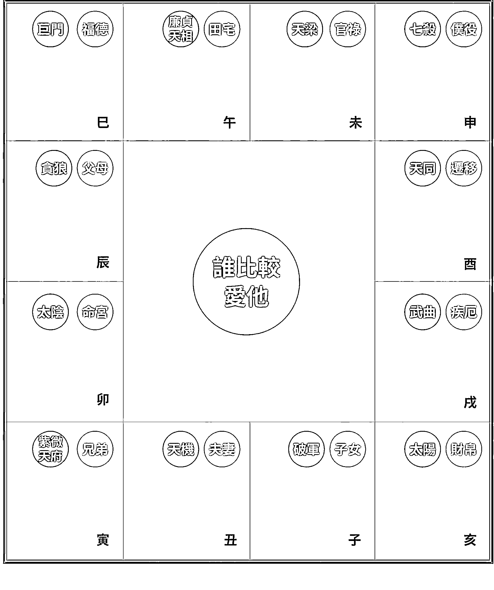

# 紫微攻略

> 答案 /
1987年

## 6-4 如何找到能帮助自己的好朋友

找到好友的方式，其实跟找情人的方式是类似的，只是不拘泥于夫妻宫上面而已，会对自己好的当然就是要能够化禄给自己，但是其实从上面的情况我们就知道，有时候化忌给自己的人也不错，那么该如何判断呢？接下来我们就来看看，找朋友的时候该如何分辨对方的生年四化会怎么影响我们。

### 一、1. 找到对工作有帮助的朋友——

会在工作上对我们有帮助的朋友，化禄到我们的命宫是一定需要的，但是对工作的帮助其实不只有命宫，跟工作有关系的官禄宫当然也是需要的。另外，如果是需要外出的，需要透过人际关系的工作，例如公关业务类型的工作，这时候化禄在迁移宫也会是不错的情况，化科也可以，因为若是有人化科到我们的迁移宫，那表示这个人可以让我们在外很有面子，提升我们在外的曝光度和身分地位，自然也会帮我们带来许多人脉的机会，甚至从某些角度来说，化科会比化禄重要，因为化禄是在外让我们增加缘分或是让我们外出可以享乐。若说到可以提升我们的地位的，其实是化科，官禄宫化科会有升官的意思，因此，若是此人可以造成我们的官禄宫化科，当然就表示这个人会让我们在工作上提升地位，也就是升官的机会，因此在工作上就会很需要他来为自己提升运势了。

那么若是化禄在财帛宫对工作会有帮助吗？财帛宫跟官禄宫、命宫在一个三合内，在命盘上如同支撑命盘的三脚架一样，所以若是化禄在财帛宫，表示这个人会让我们提升财运，无论是因为工作带来的或是因为财运提升了而使工作顺利，当然都是不错的。若是问到工作，其实财帛宫的对宫福德宫可以当成赚钱的方式与机会，因为福德宫本来就是福气运气的宫位，古人觉得，一个人要有钱，无论是家世好、能力好、学历好、长相好都比不上运气好重要，所以财帛宫的运气就是福德宫，因此，若是能够化禄在我们的福德宫，除了可以让我们心情与心灵感受到满足快乐之外，通常也可以解释成会为我们带来赚钱的机会。

若是化禄在我们的仆役宫，除了破军化禄以外，其他的星曜化禄则表示可以为我们带来更多的人际关系与朋友。若是化禄在夫妻宫，也可以当成是工作在外...的朋友关系，当然也是好的情况，只是若此人是异性也可能因此与自己产生情怀，我常看到有许多来咨询的客人，老公在工作上有一个异性会带来许多人脉关系，最后变成了办公室恋情，便可能是这样的情况。

对方的生年天干化禄在上述这几个宫位，会有助于我们的职场生涯，那么除了化禄，其他四化也会带来工作上的好处吗？

其实，在职场上不只有化禄对我们是有好处的，化权也表示让我们可以得到权力，原本官禄宫化权就是得到权力的意思，虽然化权也同时表示会干涉跟掌控我们，但是另外一层意思是，能够掌控我们工作的人，当然就可以给予我们工作上的权力。如果是化权在财帛宫，则表示可以帮助我们有另外一个获利的管道，或者说是有赚钱或投资的机会，在福德宫也会有雷同的意思。但是注意，并不是每个身边的朋友只要生年化禄化权给我们就可以有这样的能力，必须要这个人跟我们的工作有关系才可以。

至于化忌呢？我们不断的说化忌是一种空缺，有空缺才有动力，因此若是有人化忌给我的命宫或官禄宫，当这个人是我的亲人、上司或是伴侣，则表示这是一个会给我压力的人，因为他造成了我在工作上的空缺，我在工作态度上就觉得自己有空缺，也就是说这会让我觉得自己做得不够好，自然就会更加认真的工作。若是我的命盘上面官禄宫本来就带了化禄跟化权，这时候又有人给我一份化忌的压力，反而会造成我的动力，让我在事业上努力，若再搭配着好的运势，自然会更加得到成就。

但是化忌在财帛宫则不佳，尤其是创业的人，因为创业的人财务调度能力很重要，不能来一个人让你感觉财务有空缺，这样就很糟了。另外，若是化忌在我们的夫妻宫、福德宫、迁移宫，这些宫位因为会影响到对面的宫位，所以会造成宫位破坏，这些是对我们工作事业不利的人，当然需要敬而远之。如果我们的工作或事业很需要团队的合作帮助，则化忌在仆役宫或兄弟宫也对合作会有影响，在代表财库的田宅宫与子女宫，当然也不适合了。

### 二、借钱与投资帮助自己的人

创业的人会很需要资金，或者说我们在某些困顿的时候也会需要资金，在古代，是没有那么明显的“投资”与“借贷”分界的，就实际的情况来说，无论是借贷或投资，其实都是有钱会进来。我们在人生或职场上难免会有借贷的需要，尤其做生意的人会有更多需要投资跟帮助自己的时候。实际在解盘的时候，可以细分出来这是借钱还是投资的，甚至可以算出投资者的生肖与长相，但是这需要许多的学习时间与经验，并且搭配对星曜特性的掌握。但是接下来介绍的方法，要单纯的知道何人会投资或是会借钱给我们，很多时候已经很够用了。使用的方式一样是利用对方的生年天干，化禄在哪个宫位，因为是金钱，所以就看化禄，其他四化可以不用看。而化科会有一种情况，若是化科，这个人会说得头头是道，拍胸脯下毒誓，但是最后却会找一堆理由不投资不借钱，因此关于借钱或是找投资，只能看化禄，并且是化禄在命宫、迁移宫、财帛宫、福德宫、子女宫、田宅宫这几个宫位。其中在命宫、迁移宫的道理很简单，他本来就容易对我们好，在财帛宫是帮助我们的财务，福德宫则是给我们赚钱的方式，当然等于给我们钱了。至于真正会给钱的要落在子女宫（财库外面）还有田宅宫（正式进入财库），跟这个人借钱效果才会好，找他投资机会会比较大，当然，在这个时间，子女宫跟田宅宫不能有太多煞忌的情况，因为若这个时间有破损，表示自己当下的财库有破洞，自然而然钱就是进不来了。

### 一、3. 好掌握与会为自己效命的伙伴及下属

好的下属当然是对我们好的人，所以化禄是第一个选择，会化禄给我们的命宫、迁移宫、官禄宫、仆役宫的人，当然是最好的下属，但是要注意的，是不能是破军化禄。另外，太阳化禄用途也不大，尤其如果太阳是在“申、酉、戌、亥、子、丑”这几个位置的（如左图），这样算是没有光芒的太阳，所以就算化禄效果也不好。另外一个选择则是化科，因为让我们有面子的人，通常会尊重我们的人，所以也比较容易听我们的话，但是若是武曲化科，或者是如同前面在那六个位置的太阳是没力的太阳，化科也没用，这是需要注意的。当然若是可以找到部属的命盘，看看自己是否可以化权到他的命盘上，若是化忌到他的命宫、官禄宫、迁移宫、福德宫这些宫位，则表示自己对他拥有很好的掌控能力，若是化忌到他的命宫、官禄宫、夫妻宫，则算是一个很好的伙伴与下属，不过一样需要注意，他无法抵抗自己的要求，当然他也就应该会是一个很好的伙伴与下属，不过一样需要注意。

### 太阳陷落位

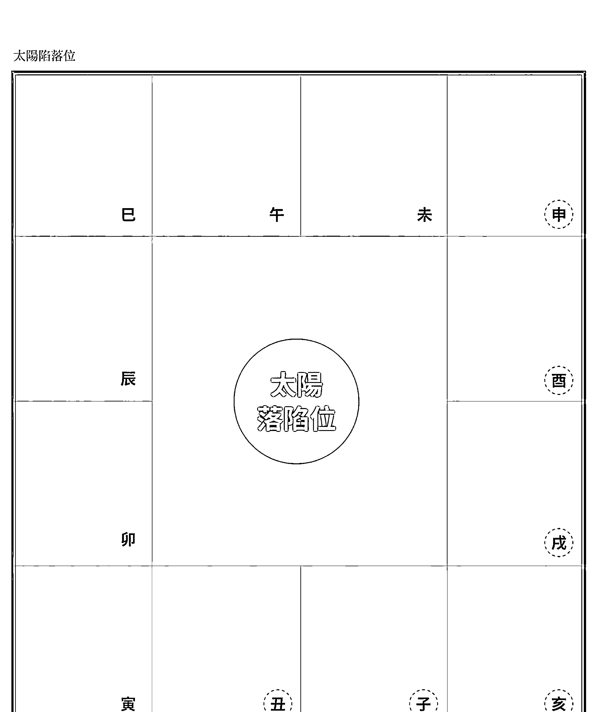

> 若是对方化禄化科给自己，自己命盘上的相对宫位不能有太多煞忌，否则效果不佳甚至会有不好的影响。

### 一、北派飞化手法简单应用总结

这个手法的重点是，利用别人与自己的关系去反馈，看出他对我们的影响，因此越是关系靠近的人，影响越深越明显。因此看待彼此关系的时候，必须知道对方跟自己的关系，例如自己公司同事，生年天干化忌给自己的仆役宫，当然表示这个人对我们来说就是职场上的损友。但是若是此人是我们家楼下不熟的邻居，则没机会影响我们的工作职场，他的生年天干对我们来说当然就没有力量了。就如同林志玲让许多男人怦然心动，但是其实她影响不了大家的感情，因为距离太远了，但是若是公司的女同事，那就可能因此让自己意乱情迷了。所以这个方法必须是真正能够与自己有接触有关联的人，才会有效。又例如有人化忌给你的官禄宫，但是你跟他根本不熟悉，他对你造成工作上的空缺，可能就真的只会是工作上的不顺利。但是若是一个你很在乎的人、你愿意听他话的人，这个空缺就可能是他对你的要求，而你愿意听他的话去满足这些要求，当然表示会让自己更进步。这是许多命理师在帮人找贵人的手法之一，请掌握好这些观念，否则找出来也没用。另外，若是宫位内有太多的煞忌进去，就算别人化禄给你也无效，因为自己本来命盘的煞忌还是存在，就像我这个月工作运势就是很差，常常出问题，这时候就算有人化禄给我，也只是因为她的帮助让我工作稍微好一点，并不能为我直接解决这些问题。

### 小练习☆

- 若是你要找一个创业合作伙伴，需要找西元年尾数多少的人恰当呢？
- 若要应征一个员工来当自己的秘书，需要找西元年尾数多少的人恰当呢？
- 若要找投资者，需要找西元年尾数多少的人恰当呢？

答案/ 可以依照自己的命盘试着练习，但是需要注意的是，同时化禄到官禄宫但是也化忌到田宅宫呢？这表示这个人帮助你的同时也让你破财。再者要注意是否太多煞忌，当然若是本命盘上找不到可以找运限盘上的。最后找秘书需要注意会不会有工作转职场婚外情的情况喔（同时有化禄跟化忌出现在官禄宫）。

# 后记

我的学生会在整个课程结束前收到两份礼物，一份是在第一次考试时给的，通常是上课半年后，我们考的是“定盘”，给性别、年、月、日，以及三个条件，比如何时创业、何时离婚、何时生子，学生必须在十五分钟内算出这个人是几点出生。第二份礼物是第二次考试给的，考的是快速解盘，通常是上课一年后，给学生一张命盘和三道题目，比如何时结婚、何时车祸、何时父亲死亡，然后一分钟的时间看那张盘，一分钟后作答，连续五张盘。这是毕业考试，高度的时间压力下会让学生呈现出最基本的基本功以及灵活的思考能力，这样的考试几乎是专业命理师的水准。但是我们不是要训练命理师，而是要让学生真的能够利用这项技术，因为它而改善自己的人生。这两份礼物分别是《紫微斗数全书》以及我的命盘。为何会用我的命盘当礼物呢？因为我有一张一生孤苦六亲无缘，人生必然有性命生死的关头，以及一生惹官非容易被朋友背叛，最后还要加上永远留不住钱的严重财库破损。大体上很少人的盘会比我还差。如果依照前面教的，我是四煞汇集再加上两个忌，要多差有多差，那个四煞汇集还是本命盘上的，若是加上大限小限流年的，我自己都懒得去看了。但是这样差的命盘，外人却不见得如此。我三十岁不到就做生意，在台湾冷冻食品与羊肉市场有举足轻重的位置，三十多岁就有连锁餐饮事业，而进入命理界也在短短四年成为部落格浏览量破百萬，教学影片预估在这本书出版时大概也有五十万浏览次数了。这在外人看来，我几乎是做哪一行都可以做得很好，怎样也无法想像我的命盘如此糟糕。但是我确实背负过数千万债务，也面临生死关头，众叛亲离，一夕之间几乎是流落街头的生活过。因此，我的命盘是拿来鼓励学生：再差再凶的命盘，都会有起死回生的机会，问题是，你愿不愿意去面对这些问题，愿不愿意好好的为自己的人生找出一条路出来。当然，懂得紫微斗数对我的人生起了很大的帮助，让我能够为自己找到很好的出路，能够救回自己的人生，这也开启了我希望推广紫微斗数的原因，想要让这个很好的学问帮助到更多人。这本书从一开始时报联络我，我们对于书的想法就一拍即合了。华人世界的命理书籍繁如星海，因为华人对于命理具有相当笃信的深刻文化传统，所以当我们推出这本以心理学角度来谈紫微斗数的书，市场反应非常热烈。但是相对于欧美西方世界的命理世界，要不就是显得过度的压抑与传统，意义隐晦艰涩再加上字句中充满了玄虚。欧美西方文化中那些相对抚慰人心的玄学知识，更为贴近生活的知识传授方式，在华人圈很难看得到。深究其原因，一方面在于长久以来华人的陋习，好的知识喜欢强调传子不传贤，害怕自己的学生徒弟学会了以后会抢自己饭碗，另一方面习惯性的以古为尊，强调越古老的越好，不古老的也要冒充成很古老的，并且不喜欢去研究其根本的逻辑原理，却喜欢故弄玄虚。这样的情况不只是在命理世界，而是在各方面的学术都如此，也造成了许多好的学术往往停滞不前，变成某一群人专属的知识，这是种保护利益的方式——我懂你不懂，所以你要付钱给我。

知识当然是需要付费的，但是不该是神神秘秘，深怕人知道的。一个命理师的养成不是只要知道技巧就可以，与人的沟通方式，让命主能放心的接受建议，并且在合理的费用范围内得到好的结果，许许多多的条件都需要经验与自己的努力以及天分，并不是知道断事的技巧就可以成为命理师。然而，我们却相当的封锁且过度保护这些技术，当技术不流通，就无法进步，因为一个人的智慧有限，再厉害的老师、再有天份的天才也比不上群众的智慧力量。当一个秘诀锁在一个人或一个家族手上，迟早是要流失的。因此，当我决定踏入这一行，便决定以推广跟普及紫微斗数为目标，因为紫微斗数在明清两代，本来就是皇家利用了皇室的力量，希望能够研究出一套可以科学化，并且有效率的训练御用命理师的工具，利用表格形式的结构，立体化的呈现包含时间在内的六维度世界。懂得紫微斗数的人都会惊讶于数百年前那群研发斗数古人智慧（虽然我个人私心以为他们应该是外星人）。这样的一套如此好用好学的体系，怎么能够只有我自己知道呢？所以，我在原本就相当先进的结构上，致力于让这套技术更加现代化，用更简便的方式让人可以了解。因此在四年前从一篇篇的部落格文章开始，介绍我知道的紫微斗数，希望大家解开紫微斗数的神秘面纱。我喜欢用生活上的体验来讨论命盘，因为命盘如同地图，是我们生命的辅助工具，要学会看地图，其实更要先学会看人生。所以我会尝试用一首有名的情歌来解释化忌在感情上的杀伤力，会用一部经典电影来解释某个星曜的无奈，也在这一篇文章中，让出版社看到居然有这么一个离经叛道的命理师（根据网友的形容，我的教学影片简直像歌厅秀）。我一直希望可以出一本命理书，是不同以往的观点与路线，是能够有温度、有感受的引领大家进入命理学的世界，不只是冷冰冰艰涩难懂的文字。因此我像在课程将结束时给学生我的命盘那样，以自己为例，用紫微斗数救回自己的人生故事为起头，将大家带入一个实用的紫微斗数世界。

# 紫微攻略

这本书尝试了过往紫微斗数书籍从来没用过的方式，从宫位作为入门的学习。一般来说，紫微斗数的入门书都是从排盘开始，或许是因为现在排盘软件方便，便从介绍星曜开始，但是却忽略了所有星曜的解释方向，其实是依照宫位而产生，这是紫微斗数中根本的设定原理。因为所有的命理学都是依照人与环境的关系而推算，当环境变动了，那个人也会变动，如同一棵树在南方枝叶茂，在北方可能会死翘翘，我们如何能够只讨论那棵树呢？因此我在教学上，也是从宫位的掌握开始教授，因为了解环境之后，剩下的只是人在其中的变化，也就是说，掌握宫位后，剩下的只是星曜在其中的变化，而这些变化又是依照着宫位产生，所以先掌握宫位，自然可以轻松学习星曜的变化。但是这样的教法，一方面涉及太多所谓的秘诀，另一方对于华人教育下不习惯思考的学生，会在一开始就需要面对大量的思考与推理，无论是对于老师想保护秘诀，或者是对于教课的难度，都是相当大的考验。但是这样学习的好处是只要能够磨过前三到六个月，就可以很快的成为紫微斗数的专家，其余的只是更多资料库的堆积与经验的沉澱而已，这是需要自己努力的，正所谓师父领进门修行在个人了。因此，我尽量在这本书中复原我实际授课的状况，将入门课程中的主要技巧和紫微斗数在宫位利用上的绝大多数重要观念，利用每个主题章节的解释以及章节后的练习，一步步带大家通过阅读和实作无痛进入紫微斗数应用的世界。为什么舍弃了星曜的介绍，这是因为星曜根本不是一本书说得完的，既然如此干脆就别说了，我们有免费的星曜教学影片，大家直接看影片罢了。这种资料库储存的动作，就交给各位买书的同好自己去完成吧，省下来的纸张，我们专注为大家解释学理上的逻辑与技巧就好。本书所提及的技巧，是希望用最简单的方式，让大家可以通过自我的练习就能够基本的应用紫微斗数。所提到技术与观念当然还有更高阶的用法，以及深层的学理，例如“叠宫”、“暗合宫”的宫位变化，以及自己十二宫“飞化”、“自化”的观念，各个命盘在组合搭配时候能够以此找出事情的前因后果，更能利用这个方式找出原因提前预防，如同中医的观念一样，预防病因的发生，这才是紫微斗数真正希望能够达到的助人效果。紫微斗数学问庞大精妙，碍于篇幅无法一一详尽说明，我们精选出最实用的技巧，以及一定要有的基本功做为本书内容。

希望透过这本书，让大家知道紫微斗数其实可以简单的就上手应用，让大家重新认识这个看起来神奇玄幻，或者有人觉得有点老气、民俗的命理学。透过本书用一个新的角度来看它，会发现它其实是相当亲人并且有趣的。

最后要感谢我们学会 GREG 老师帮忙绘制书内的所有图示，以及学会美国分会的 AINNA 老师帮忙校稿，以及在写书期间帮忙我处理事情以及代课，如秦立帆老师、侯孜余老师、ZONA 老师等等各位国际紫微学会成员，以及小徵宝人文讲堂的老师们。

### 欢迎扫描以下QR Code

### 教学频道

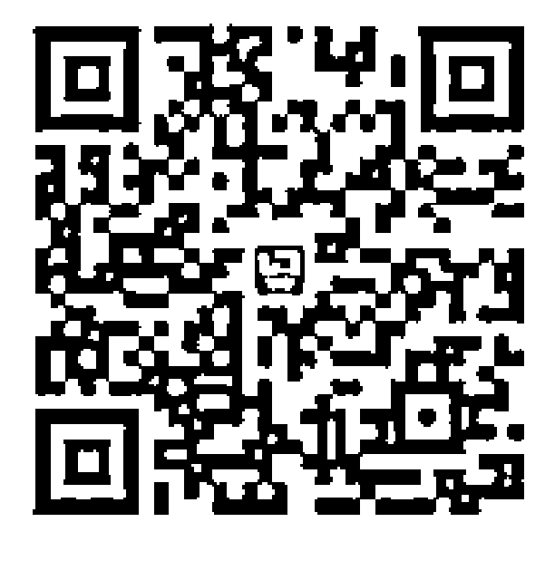

### ISZN 国际紫微学会

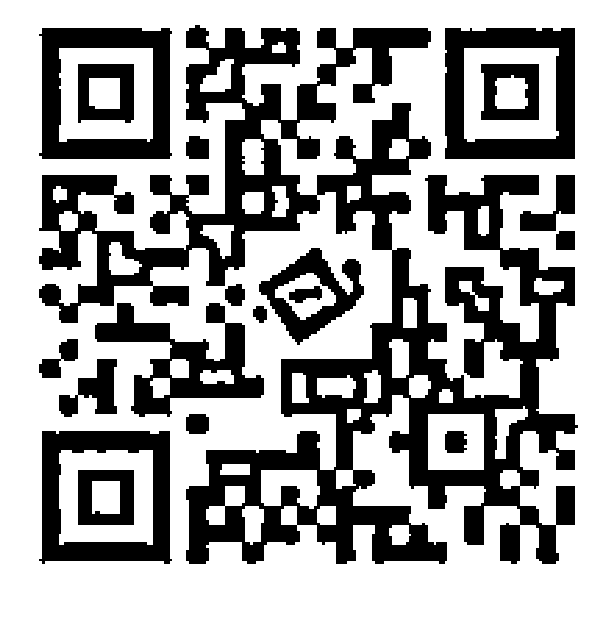

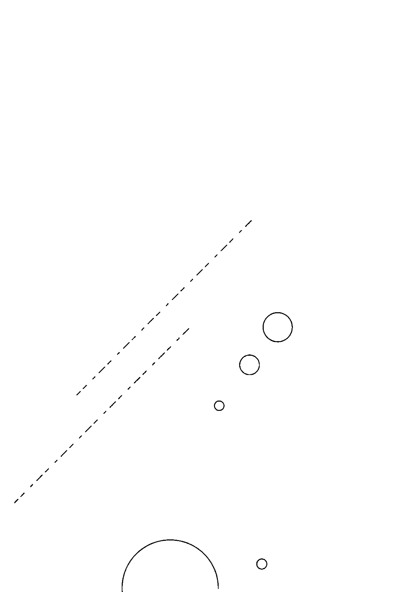

# 紫微攻略

十四星曜

二〇一九流年运势

大耕老师 著

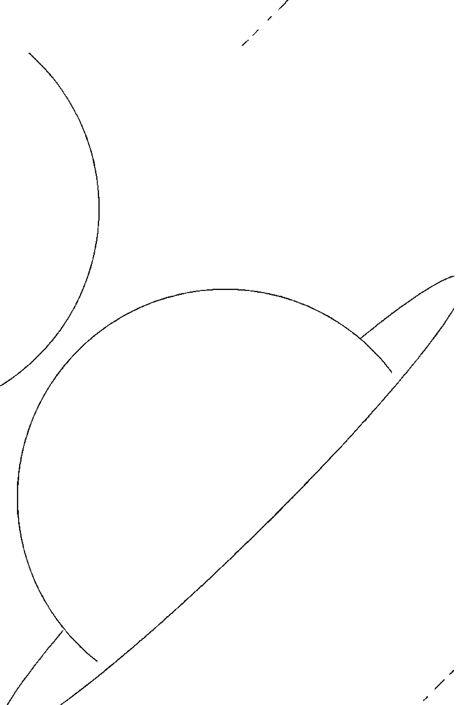

时报出版

```
天府星 天梁星 太阴星 天机星 七杀星 廉贞星 紫微星
25     21     17     13     9      5      1
天相星 天同星 太阳星 巨门星 破军星 武曲星 贪狼星
27     23     19     15     11     7      3
```

# 紫微星

紫微星在斗数中代表皇帝，表示紫微爱好面子，喜欢大家以他为首，有时会让人觉得他尊贵骄傲。紫微星的重点在于有没有遇到吉星，等于一个皇帝有没有好的帮手帮忙，这样的紫微才有可能发挥帝星的特质。

### 紫微星基本组合

1. 紫微对面有贪狼在子午位：二〇一九年会有较多的社交活动和结交新朋友的机会，而武曲星化禄在财帛表示财务上有新的机会，可以得到成就感，但是要注意不宜让身体太过劳累，导致肠胃不佳。另外在人际关系上，容易因别人的言语或环境改变初衷造成是非纷争。
2. 紫微破军同宫在丑未位：今年可以说是一个可以为自己的梦想努力，冲刺目标的一年，但是在做任何事之前都要谨慎规划，不要太冲动行事，容易事半功倍，过多的桃花也容易造成不必要的感情困扰。
3. 紫微天府同宫在寅申位：今年财运不错，建议投资在自己熟识或专业的领域较易成功。需要注意跟人际关系会有口角纷争，还有自己住宅或附近，容易有漏水或是装修的可能。
4. 紫微贪狼同宫在卯酉位：今年吃吃喝喝的活动很多，须注意与朋友之间的财务纠纷，以及工作上太过强硬。
5. 紫微天相同宫在辰戌位：今年感情生活精彩不担心没人来追，财运爱情运双得意的一年，只需要注意今年变动奔波较多，身体也要好好照顾，容易皮肤过敏肠胃不佳。
6. 紫微七杀同宫在巳亥位：今年会有想创业或扩展新事业的想法，只是须注意适当的放松身心灵，不要太劳累。

二〇一九年是己年，己年的四化是武曲化禄、贪狼化权、天梁化科、文曲化忌。紫微星坐命，武曲星一定在财帛宫，大财星在财帛宫化禄，在今年会出现很多赚钱的机会，而且容易愿望成真。

总结二〇一九年，对于紫微星来说，如果能好好利用武曲化禄的能量，这会是财运收获满满的一年，注意脾气和人际关系问题，相信一切会很顺利。

# 贪狼星

贪狼星是斗数中的第一大桃花星，也是欲望之星。简单来说，贪狼就是如狼一般的贪婪，贪财、贪食、贪物、贪色，并且不挑，相对来说，个性随和豪爽，但往往也比较容易受自我情绪影响。相较于破军七杀，贪狼是比较有心机与智慧的，逢贵主贵，逢煞忌则运势波荡，与人通常相处融洽，因此也是一个很能调和人际关系的人。综合以上数点，贪狼其实是一个解厄之星。

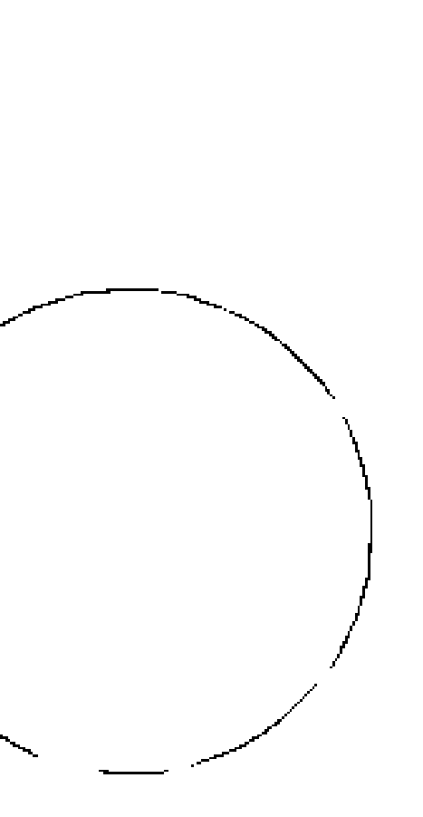

### 贪狼星基本组合

1. 贪狼对面是紫微在子午位：二〇一九年需要注意会因为太多的应酬与吃喝玩乐，容易有肠胃以及肝肾问题，并且需要注意会与人有情感的纷争（因为他会在流年父疾线，而明年有流禄在上面，那么爱吃喝当然容易感情出问题）。
2. 贪狼对面是武曲在辰戌位：二〇一九年贪狼化权、武曲化禄，这是事业上可以认真奋斗的一年，靠着自己的专业，可以有很好的成就，但是要注意会因为太劳累产生皮肤问题，也比较容易感冒。
3. 贪狼对面是廉贞在寅申位：二〇一九年是吃喝玩乐，事业、感情都丰富的一年，但需要注意，太多的外在事务奔波以及过多的感情，也容易让自己太劳累，或者惹来烂桃花。
4. 武曲贪狼同宫在丑未位：请参阅【武曲星】
5. 廉贞贪狼同宫在巳亥位：请参阅【廉贞星】
6. 紫微贪狼同宫在卯酉位：请参阅【紫微星】

二〇一九年是己年，己年的四化是贪狼化权，这个化权加重了贪狼星对于欲望的追求，不只是要多方位，更是重视而希望能够掌控，所以有时候化权的贪狼星，会有稳定的概念，就是因为这时候的贪狼不只是要多，而且希望能够将欲望化为动力，牢牢掌握甚至实现。因此，贪狼在二〇一九是丰盛的一年，但是要注意自己身体，并利用化权的力量帮自己完成梦想。

# 廉贞星

廉贞星为次桃花星，在斗数中担任外交官的角色，风趣幽默，是天生的公关高手，这样能力佳、聪明又敏感度高的人，其实很容易令人难以捉摸。

二〇一九年武曲化禄，廉贞星坐命时，武曲星一定是在他的官禄宫，表示今年只要努力认真的工作，很容易得到应有的升迁或是加薪。

### 廉贞星基本组合

1. 廉贞天相同宫在子午位：二零一九年工作上的好运气，让很多新的资源工作计划找上门，你也会想要证明自己的能力，不过要当心身体过劳、四肢较为无力或筋骨问题。
2. 廉贞七杀同宫在丑未位：今年在工作上会想要有一席之地，掌握实权，也有机会跳槽有更好的工作机会，要注意在外交际应酬有适度的花费，容易破财。
3. 廉贞破军同宫在卯酉位：今年有机会出来自己创业当老板，只是要注意在外桃花氾滥，容易有感情困扰。
4. 廉贞天府同宫在辰戌位：今年在研究理财投资方面会特别有兴趣，也容易有收获，只是要理性投资，勿过度情绪化或是听信别人的意见。
5. 廉贞贪狼同宫在巳亥位：今年容易结交到对自己有帮助的朋友，而且在工作上注意力较为集中，可趁此机会增加自己的专业技能。唯在与人财务关系上需要多多注意，容易出现官非问题。

# 武曲星

武曲星代表了正财，为紫微主星取的金线，因此个性相当的务实重义气。而这样务实的个性也造成个性上的寡宿，武曲虽为财星，但是必须入命、身、财宫才能以财星论，否则只是具备爱钱的个性。

二零一九年武曲化禄，廉贞星坐命时，武曲星一定是在他的官禄宫，表示在今年只要努力认真的工作，很容易在工作上得到应有的升迁或是加薪。因此，廉贞在工作成就上会很令人满意，只是要注意不要走偏路走捷径，相信今年会是顺风顺水的一年。

6. 廉贞对面是贪狼在寅申位：今年在外表现力很强，人缘也很好，今年在工作上表现很稳定，容易得到上司的赏识，较不顺心的地方是朋友之间的感情忽冷忽热，让你无法适应。

### 武曲星基本组合

1. 武曲天府同宫在子午位：今年在外活动力强，人缘很好，很多外出旅游的机会，在今年好放松自己吧，记着出门多注意安全，别横冲直撞。
2. 武曲贪狼同宫在丑未位：武曲化禄、贪狼化权都在命宫。今年的你，做起事来特别有冲劲，赚钱能力好，敢赚敢花，要小心容易投资过头而破财。
3. 武曲天相同宫在申位：今年在工作上的人缘容易为自己加分很多，在外桃花运不错，感情丰富，唯要注意不宜和朋友有金钱的往来借贷，易有纷争。
4. 武曲七杀同宫在卯酉位：今年在工作上绝对是个赚钱能手，容易赚异性财、人缘财，但要注意勿抄短线赚偏门的钱，易有官司问题。
5. 武曲破军同宫在巳亥位：今年会想在工作上有一番新的作为，工作表现也很亮眼，令人激赏。但切勿太过强势而为，容易会有小人阻挠。
6. 武曲贪狼对拱在辰戌位：今年的人缘特好，在外常有和朋友一起吃喝玩乐的机会，可以为自己的兴趣多加钻研，对未来会有不小的帮助。须注意投资理财要谨慎为上。

二零一九年武曲化禄，财星遇到化禄，更是代表财运很好，想赚钱的欲望变强了，赚钱的资讯跟机会也来临了，要好好把握。整体来说，武曲星今年的人缘佳，工作运也不错，唯要注意与朋友的财务往来，相信今年会是好运满满的一年。

# 七杀星

如果说紫微斗数将人当成是一个小的国家来看待，有了紫微星当皇帝、武曲星当将军，那七杀就是上将之星，所谓上将之星，代表具有生杀大权的大将，甚至，与其说他是将军，不如说他像锦衣卫，皇帝的贴身守护者、专属的暗杀部队，因为他具备了冷静、独来独往、刑孤（刑剋六亲，孤单一人）的特质，主要是七杀为了要完成自己的理想，可以坚忍不拔，独自孤单的奋斗，这样坚持自我的个性，在华人讲辈分、讲伦理的世界，自然形成了刑剋的状态。

### 七杀星基本组合

1. 七杀对面是武曲天府在子午位：今年很适合向外赚钱，国外或外地都很不错，容易因为长辈长官提携得到名声。要比较注意身体的肠胃问题。
2. 七杀对面是紫微天府在寅申位：今年会有跟朋友合伙开店或投资生意的机会，建议是现金开业为主，不然较容易有财务上的纠纷。
3. 七杀对面是廉贞天府在辰戌位：今年在感情上很愿意付出，也容易遇到一个会照顾你的另外一半，在财运方面，也会有不错的收入，记得要理性花钱，不然很容易荷包大失血。
4. 武曲七杀同宫在卯酉位：请参阅【武曲星】。
5. 廉贞七杀同宫在丑未位：请参阅【廉贞星】。
6. 紫微七杀同宫在巳亥位：请参阅【紫微星】。

# 破军星

一向敢于挑战社会大破大立，勇气与创意能力都非凡的星曜，这样的人通常难容于社会，太过特立独行，往往造成自己的人生极度动荡，因此这颗星曜的重点，在于是否有足够的家底与运势去支持。有家底与实力才能挑战社会，做为创新世界的开创者，否则通常就会被社会视为异端，并受责罚以及嘲笑。因此，看破军如果只看到破耗的部份，那就只看到了表面，必须去注意他是否有足够的能力，去使用破军的力量，用得好反而是开创局面的星曜。对于破军星从小爱破坏，花钱不手软，会桃花星会形容成多淫荡，其实都是因为他们敢爱敢恨的个性，感情丰富，而且不在乎天长地久，只在乎曾经拥有，没办法拥有也不让别人拥有。

二零一九年己年武曲化禄、贪狼化权、天梁化科、文曲化忌。七杀星坐命时，贪狼星一定会在财帛宫。平时在理财方面什么都想尝试一下的七杀星，在今年会专心找一个可行的理财方向去执行，把钱守得相当好。

### 破军星基本组合

1. 破军对面是廉贞天相在子午位：二零一九年在工作爱情上都很得意，单身的人可以多参加朋友间的聚会，增加更多的缘分。多注意在外面大手大脚的把钱都花光了。
2. 破军对面是武曲天相在寅申位：今年有机会把自己在工作上的梦想实践，开个工作室，须注意跟朋友之间的合伙关系。
3. 破军对面是紫微天相在辰戌位：今年很容易因为工作表现亮眼，被长官或是长辈提携，记得要好好发挥专业长才，表现自己。努力工作之余也要好好照顾身体，小心脾胃不好的老毛病又找上门了。
4. 武曲破军同宫在巳亥位：请参阅【武曲星】。
5. 廉贞破军同宫在卯酉位：请参阅【廉贞星】。
6. 紫微破军同宫在丑未位：请参阅【紫微星】。

# 天机星

天机星化气为善，代表善良与善变，是善良但也有不安定、变动等意思，又因为聪明逻辑好，但是过于聪明，也造成个性孤傲自豪，常口不择言，容易形成早刑晚孤的情况。天机星虽然为聪明的星曜，但是不适宜落陷，落陷则容易钻牛角尖，化忌则聪明算计过头，逢地空地劫则反而变笨。

二零一九年己武曲化禄、贪狼化权、天梁化科、文曲化忌。破军坐命时，贪狼星一定会在官禄宫，表示平时在工作上很想突破创新的破军，今年会有一一实现的机会。

1. 天机、太阴对拱在巳亥位：二零一九年要改善与子女之间的关系，与朋友的聚会较以往多，体重控制是今年的课题。
2. 天机、太阴同宫在寅申位：二零一九年要对子女好，工作应酬增加，维持良好的生活作息还是很重要的。
3. 天机、巨门对拱在子午位：二零一九年会重视子女、对子女好，因态度的转变，与朋友关系容易有磨擦。
4. 天机、巨门同宫在卯酉位：二零一九年要主动让兄弟姐妹透过聚会或其他方式联系情感。
5. 天机、天梁对拱在丑未位：二零一九年对子女金钱大方，会想买房，但建议你行动前要多做功课，否则很容易买了之后后悔。
6. 天机、天梁同宫在辰戌位：二零一九年若对宫无四煞星和昌曲，认真踏实的赚钱，很有机会赚到钱，但勿投资或操作杠杆，非常容易失败而损财。

总结二零一九年对于天机星来说，是增进亲子间的情感、享受美食满满的一年，钱就是要投资在自己和家人身上最实在。

# 巨门星

巨门星化气为暗，我们将他视为一个黑洞，唯一不发光的星曜。除了太阳以外，所有跟他在一起的星曜，都像被一个黑洞吞噬一样。因此，只有太阳能驱他的暗，同时巨门也表示了口舌（人身上最大的洞就是嘴），也因这个巨门的暗，一直被认为是人舌而产生的，影射的意思就是“因口舌而产生是非”。长久以来，就常让人忘记了巨门的其他特质，见到巨门只会想到口舌是非，其实这样便过于偏颇了，事实上，巨门的黑洞也表示了包容，有温良敦厚的意思。

### 巨门星基本组合

1. 天机、巨门对拱在子午位：二零一九年武曲化禄在田宅宫，贪狼化权在兄弟宫，重视家人、对家人好，但容易与兄弟姐妹有磨擦。
2. 天机、巨门同宫在卯酉位：请参考【天机星】。
3. 巨门、太阳对拱在巳亥位：二零一九年是照顾平辈朋友与家人的一年，会热烈参与朋友、家人间聚会与活动。
4. 巨门、太阳同宫在寅申位：二零一九年平辈间会介绍看起来不错的赚钱机会，但与其拿肉包子打狗，不如多与朋友聚会、旅行。
5. 天同、巨门对拱在辰戌位：二零一九年会花钱让自己好好放松一下，与好姐妹做个芳疗SPA或2天1夜轻旅行，都是个不错的选择。
6. 天同、巨门同在丑未位：请参考【天同星】。

总结二零一九年，对于巨门星来说，是与兄弟姐妹、朋友间重新加温的一年，无论是聚会或是旅行，都是让自己充电再出发的能量来源。

# 太阴星

太阴星化气为富，如同太阳星一样，也需要注意是否在旺位，并且与太阳为【对星】，斗数中有很多组对星，也就是说，看到太阴就要去看太阳的情况，因为太阴（月亮）的光芒是受到太阳照射而来，日月同属庇荫之星，但是太阴的光芒不像太阳那样直接而强烈，所以表现的特质如同母亲（女性），也代表了整个母系与女性的特质，也代表了家庭；太阴属水，而且是慢慢流动的水，所以会有动作缓慢的特质，融合不一样的星曜特质，呈现的状态也有所不同，也因其缓慢特质，运限逢之起运会慢一点。

### 太阴星基本组合

1. 天机、太阴对拱在巳亥位：二零一九年改善与家人之间的关系，与朋友的聚会、应酬也较以往多，体重控制是今年的课题。
2. 天机、太阴同宫在寅申位：请参考【天机星】。
3. 太阳、太阴对拱在辰戌位：二零一九年朋友会介绍赚钱机会，要注意勿过度劳累、应酬产生的身体影响。
4. 太阴、天同对拱在卯酉位：二零一九年最好的投资就是对自己、对身体的投资，今年是适合照顾身体的一年，做健康检查、买健身房的课程，都是很好的方式。
5. 太阳、太阴同宫在丑未位：请参考【太阳星】。
6. 太阴、天同同宫在子午位：二零一九年，家中长辈在工作上会给予肯定与支持，可是要注意意外来的困境需要突破。

总结二零一九年，对于太阴星来说，有赚钱的机会，也能存得到钱，但钱赚之余不要忘记照顾自己的身体，定期健康检查是非常重要的。

# 太阳星

太阳星化气为贵，也可说需要因“名”而“贵”，是个燃烧自己照亮别人，有名却无财的星曜，但也意味着能因名气、社会地位得到财富。太阳也代表了男性，为天上最亮的一颗星，所以也代表了一家之主，政府跟公司上司官员，对女性来说代表了老公；太阳星不同于其他星曜，他是依照时间而决定旺弱的，命盘上与十二地支对应一天的十二时辰，太阳星在日出时间的时辰为旺位，相反则是落陷位，等于是太阳下山无光了。

### 太阳星基本组合

1. 巨门、太阳对拱在巳亥位：二零一九年对兄弟姐妹很好，且今年与朋友间的活动变多，建议多与朋友联系情感，勿拿去投资理财，容易有去无回。
2. 太阳、太阴对拱在辰戌位：二零一九年兄弟姐妹能在工作上给予务实又可用的建议，也容易将家中布置更换成让身心灵提升的商品。
3. 太阳、太阴同宫在丑未位：二零一九年，喜欢照顾家人的你，建议与兄弟姐妹共同规划一场，带着父母一同旅行。
4. 太阳、天梁同宫在卯酉位：二零一九年，与平辈间关系和谐，愿意与他们共享自己获得的成果，同时要注意身体，聚会与健康兼顾才是王道。
5. 太阳、天梁对拱在子午位：二零一九年，家人是你今年的重心，除了行动上实际的关心，提醒你嘴巴上的嘘寒问暖也不可少。
6. 巨门、太阳同宫在寅申位：请参考【巨门星】。

总结二零一九年，对于太阳星来说，照顾家人一向是你的强项，除原先的家人外，会多分心在平辈的往来，人一向救急不救穷，要拿捏好帮助的分寸。

# 天梁星

天梁星化气为荫，为紫微斗数十四主星中真正的庇佑之星，也是三个福星中，真正可以抑制煞星伤害的一颗福星，标准的老人个性，懂的事很多，个性成熟稳重，甚至有困难跟他借贷，他也会在能力范围内大方借贷，还不好意思催讨。缺点就是喜欢照顾人的个性，以及天性较一般人聪明的特质，有的时候对人在态度上会得显得过于强势，甚至会碎念，其嘴碎的程度往往让人无法接受；另一方面，天梁星有很深的宗教缘分，甚至前世几乎都是修行者，因此往往身边总是有守护神庇佑，遇到灾难也比较容易躲过。

### 天梁星基本组合

1. 太阳、天梁同宫在卯酉位：请参考【太阳星】。
2. 天同、天梁同宫在寅申位：请参考【天同星】。
3. 天机、天梁对拱在丑未位：二零一九年会存钱，并且对家人花钱大方，同时也重视子女。
4. 太阳、天梁对拱在子午位：二零一九年和朋友间的合作是有实际性帮助的，唯需注意彼此间，一定要有清楚的合约来保障彼此。饮食上需控制，虽然新的一年有许多聚餐机会，但勿过度放纵自己，伴随而来的体脂肪可是让人头痛的小家伙呢！
5. 天同、天梁对拱在巳亥位：二零一九年，内心稳重外在纯真的你，迎接的是朋友对你的热情邀约不断，会花比较多钱在满足口腹之欲，把部份聚会移转到运动中心或踏青，也会很棒。
6. 天机、天梁同宫在辰戌位：请参考【天机星】。

总结二零一九年，对于天梁星来说，就是吃喝玩乐的一年，无论来自朋友的邀约，或是家人的聚会，简直是高潮不断呀！需慎防投资理财造成的伤害。

# 天同星

天同星化气为福，在紫微斗数中是福气的象征，与天府、天梁并列为三大福星之一，福星在紫微斗数中有明确的规范，就是不怕四煞星（擎羊、陀罗、火星、铃星），天同星不怕煞星，单纯就是因为其具备了赤子之心，如同小朋友遇到困难、遇到受伤，不会难过太久，很快地可以释怀。而天同星五行也属水，属水的星曜都可以称之为桃花星，其桃花的特质，来自如于与人为善，不会拒绝人的个性，但是这样的个性，通常也容易让人变成滥好人，甚至招惹烂桃花，因此不宜再跟其他的桃花星在一起，好处是此人必然好相处，坏处则是因为过于懒惰，容易在中年过后造成身体的肥胖。

### 天同星基本组合

1. 天同、巨门同宫在丑未位：二零一九年，天生缺乏安全感的你，面对突发变动不知所措的同时，不如找间别具风味的甜品店，坐下喝个下午茶，用糖份平抚自己焦虑的情绪。
2. 天同、巨门对拱在辰戌位：二零一九年有机会透过平辈或异性间的好人缘，得到实质上的好处，也容易因务实努力的方式赚到钱。
3. 太阴、天同对拱在卯酉位：二零一九年过度放纵会造成对身体的伤害，今年要小心的照顾（使用）身体，花钱与父母一起去做健康检查吧！
4. 天同、天梁同宫在寅申位：懂吃懂玩的你，新的一年有许多享受美食的机会，遇到不错的餐厅，不妨带着父母或另一半去尝鲜。
5. 天同、天梁对拱在巳亥位：懂得生活也懂得照顾身边人的你，接下来的一年与其纠结在一些无谓的事情上，不如假日带着家人四处走走，台湾有许多美丽的风景，值得去走走。
6. 太阴、天同同宫在子午位：请参考【太阴星】。

总结二零一九年，对于天同星来说，你有多久没有和父母好好聚聚了呢？今年提醒天同星，别忘记对父母嘘寒问暖，有空多回老家走一走，带着二老出门走走，吸收芬多精。

# 天府星

天府星化气为权，他绝对可以算是十四主星中最好的一颗了，三颗福星（天府、天梁、天同）他在其中，三颗财星（天府、武曲、太阴）他也在其中，并且依照古书，他跟紫微一样是帝星，却相对少了紫微的很多缺点，是个务实的帝星，重视实际的权力，深具谋略，并且可以化煞为用，因此他是三个福星里，唯一可以利用煞星力量的。但煞星只是被利用，不表示不再是煞星，煞星的力量依然存在，而务实的天府重视财务，所以如果能逢到禄存或化禄，可以成为库星，能自己赚钱长钱，很有金钱观念与理财能力，简直如同印钞机一样，是三个财星里面最厉害的一个。

### 天府星基本组合

1. 廉贞、天府同宫在辰戌位：请参考【廉贞星】。
2. 天府独坐在卯酉位，对宫武曲、七杀：二零一九年可以规划行程带伴侣外出游玩，除了让感情加温，也能让身心灵得到放松。
3. 紫微、天府同宫在寅申位：请参考【紫微星】。
4. 天府独坐在丑未位，对宫廉贞、七杀：二零一九年在感情上略微强势，但同时也更懂得生活情趣，除此之外，也是努力后会获得结果的一年，感情之余也不要忘记兼顾面包。
5. 武曲、天府同宫在子午位：请参考【武曲星】。
6. 天府独坐在巳亥位，对宫紫微、七杀：二零一九年是适合赚钱冲刺的一年，但要特别注意并不适用投资，而是需踏实工作奋斗的一年。

总结二零一九年，对于天府星来说，务实的你，别忘了为生活加点温度，给伴侣来点小浪漫，星光下抱着对方，聊聊彼此的梦想，安好太座，才能在事业上冲刺的更好更稳。

# 天相星

如果说紫微斗数将一个人当成一个国家，紫微是皇帝，天府是王爷，武曲、破军是将军、廉贞是外交官，那天相星就是宰相了。天相化气为印，就如同皇帝交办事情，相去盖章执行一样，因此天相有法律的概念，而皇帝交办的事情，不是大家都真心愿意去做，因此宰相肩负了沟通疏导的工作，因此天相的水，代表的是人际上的桃花，不见得是异性桃花，也因此天相也是个媒人星，是撮合事情、媒合人际的高手。

### 天相星基本组合

1. 武曲、天相同宫在寅申位：请参考【武曲星】。
2. 天相独坐在丑未位，对宫紫微、破军：二零一九年，原本就迷人的你，今年出门在外会比以往更吸引异性的注意，若把这份吸引力专注在另外一半上，再加上时不时的小惊喜，必定让你们重新温习热恋感。
3. 廉贞、天相同宫在子午位：请参考【廉贞星】。
4. 天相独坐在巳亥位，对宫武曲、破军：二零一九年是保守的一年，不适合投机的理财方式，稳健踏实往前，就有机会赚到钱，同时也是桃花朵朵开的一年，单身的你可以把握机会好好选择，有伴侣的你则需要注意，否则感情将有纠纷。
5. 紫微、天相同宫在辰戌位：请参考【紫微星】。
6. 天相独坐在卯酉位，对宫廉贞、破军：二零一九年有机会透过异性介绍来的人脉，获取赚钱的机会，但需要小心彼此间的距离，否则容易因此惹来桃花劫。

总结二零一九年，对于天相星来说，迷人的你今年桃花旺旺来，完全不需要拜凤梨，就能旺旺来，慎重的选择、保持安全距离，变成是很重要的一环。

自己的命盘自己看，
自己的运势自己改！
找出命盘上的煞忌交会之时，
提前为人生问题找到策略！

紫微斗数命盘就是自己的运势健康检查表，更是一张专属的人生游戏攻略，让我们从中找出更多、更适合自己的可能性！

1.  这是一本命运管理书。作者将“命理”二字解为“理性的讨论生命”，其中“理”更是“道理、管理”的意思，透过这样的概念，本书教你从命盘找出可以改善、避免和努力的方向，与迷信和消极的宿命论非常不同。
2.  本书着重介绍宫位与宫位的变化，以及很重要的煞忌交会应用，读者更能快速上手。这是目前斗数书籍很少介绍使用的方法，因为内行的老师通常不愿意教，或者不愿意一开始就教。
3.  本书以简明白话、逻辑思维去解释斗数，读者不必死背海量的资料，而是用“宫位联想法”，了解宫位中心价值、了解星曜中心价值，然后推演出星曜在宫位内的解释。
4.  每个单元充分的将理论结合故事、案例，随后设置【小练习】让大家熟悉解盘的要领。并有许多斗数实战秘诀，读者可依需求快速运用上手。

时报出版
VUU0066 NTS380
ISBN 978-957-13-7624-0(293.1)