# 紫微攻略3

史上最强星曜解盤！
對宮為明鏡，透視深層人性

星曜
我們與真實自己的距離

上集

大耕老師
著

時報出版

# 制作说明：

本书由《天使神秘学院》出重金从台湾购入的原版书籍扫描制作完成。为达到最好阅读效果，特地把书全部切开后，再经由专业扫描设备高精度扫描完成，并经过一张张的PS后期处理最终成书，其间花费大量的人力、物力以及时间，只为能给大家提供经济并优质的神秘学学习资料而努力。

本学院强力谴责某些机构和个人，把本学院花心血制作完成的电子书 籍，包装后直接放在自家网上低价倾销的行为，以谋取不劳而获的经济利 益。如果长此以往最终将无人愿意再为大家花心思制作电子书，那以后可能 大家再无新书可读。

为让大家以后能够读到更多的好书，也为了本学院的良性发展。本学院 恳请大家尽量做到如下几点：

- 一、 尽量在天使神秘学院的官方网站购买电子书籍。 官网访问地址：[http://www.ac2011.cn](http://www.ac2011.cn) 短网址：[ac2011.cn](ac2011.cn) 网址含义：(Archangel College 成立时间：2011年)

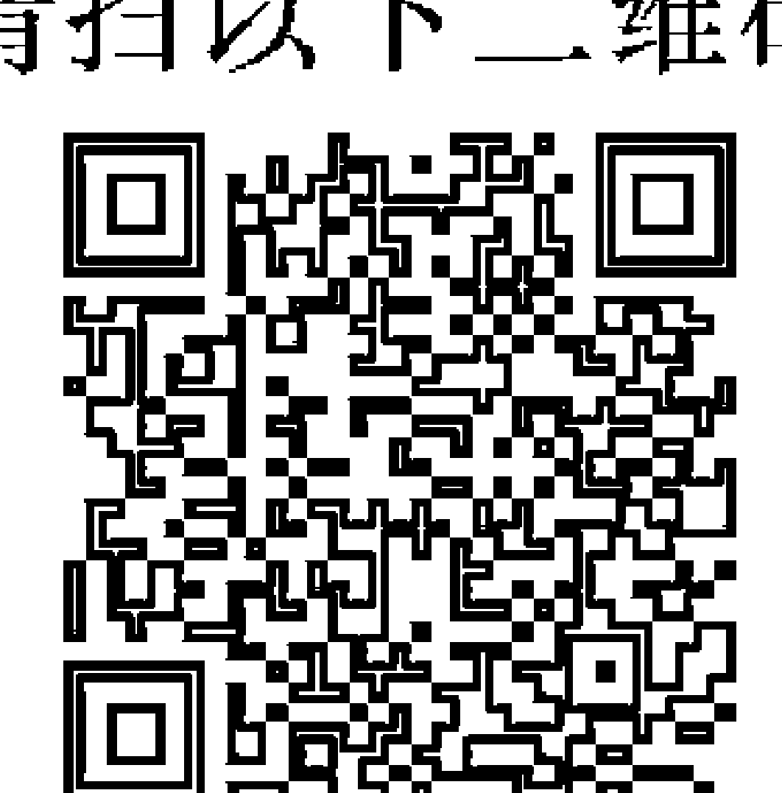

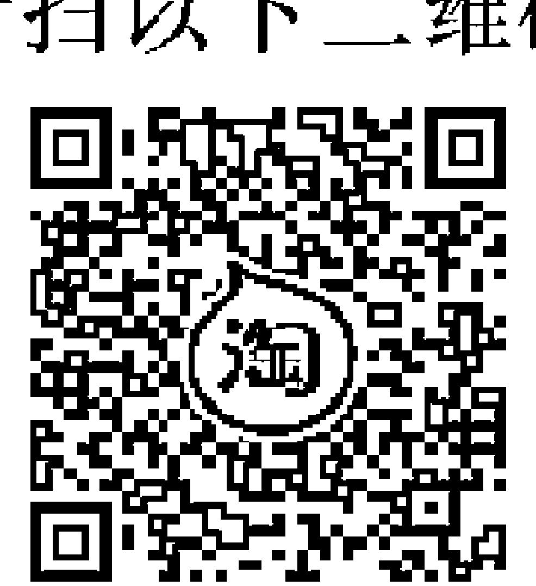

- 二、 在收到电子书后小范围传阅即可，千万不要公开传播，更别挂到网上低 价销售。

同时为答谢广大支持者，学院电子书将做如下调整：

- 一、 学院会把一些早已收回制作成本的电子书折价销售。
- 二、 最新制作的电子书籍会开放打印功能，大家购买后有条件的可自行打印 成书。

天使神秘学院
2021 年 3 月

# 福利公告：

凡在【天使神秘学院】购买任何电子资料赠送实体书，详情请咨询店铺客服！

备注：如客服不知道这活动你可能进了盗版店铺！赠书活动仅在以下正版店铺购买有效哦！

# 【天使神秘学院】淘宝店

手机淘宝扫以下二维码

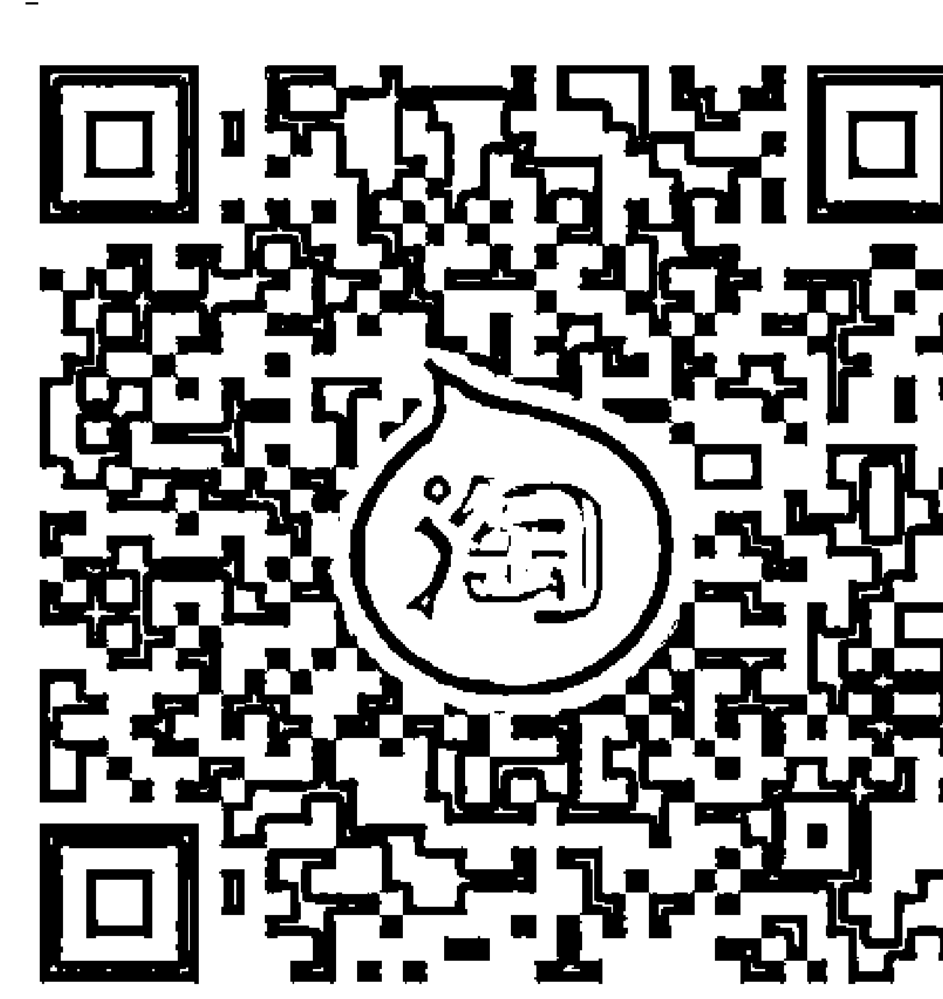

1、打开手机淘宝：搜索“天使神秘学院”
2、点击“店铺”按钮就是

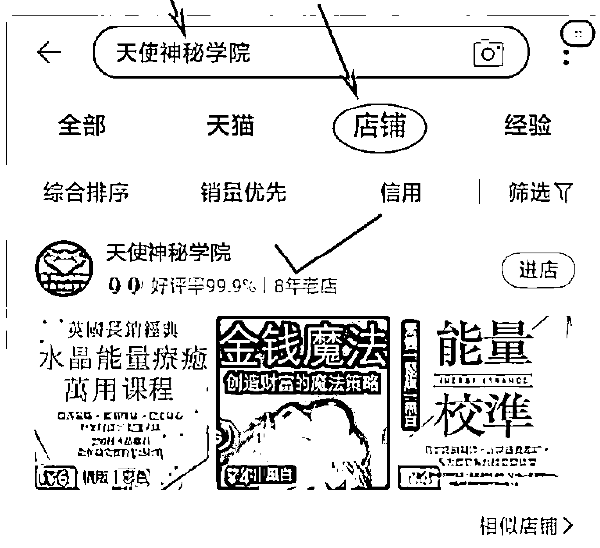

# 【天使神秘学院】微店

手机微信扫以下二维码

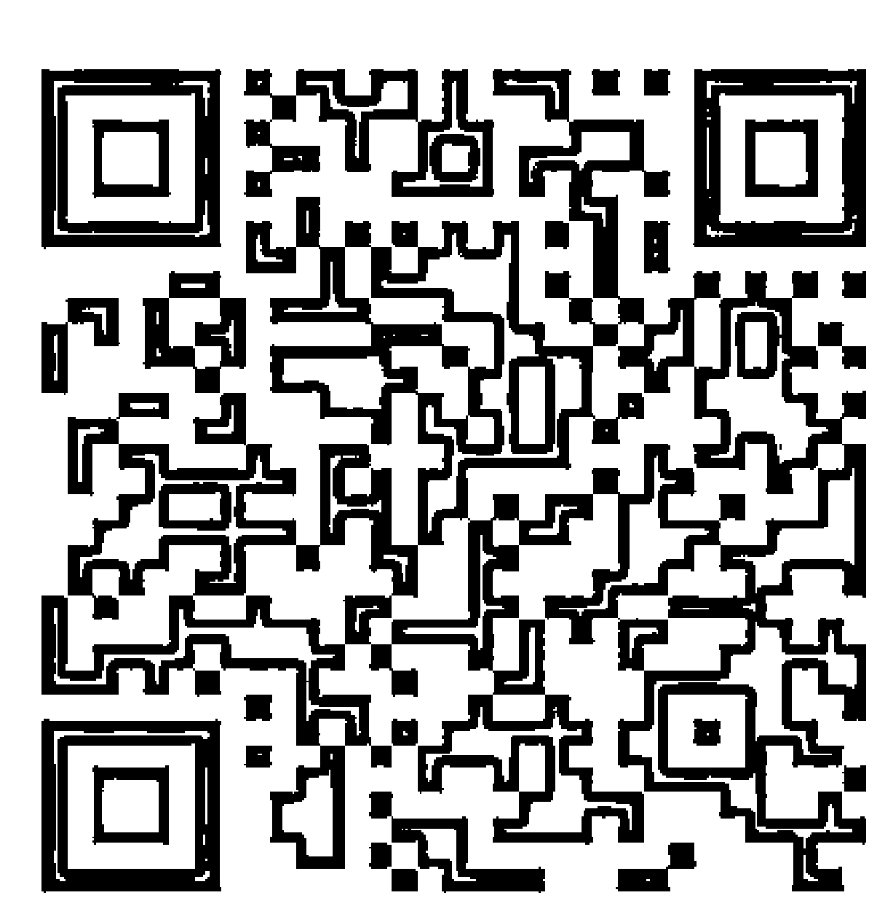

用手机微信扫码进店

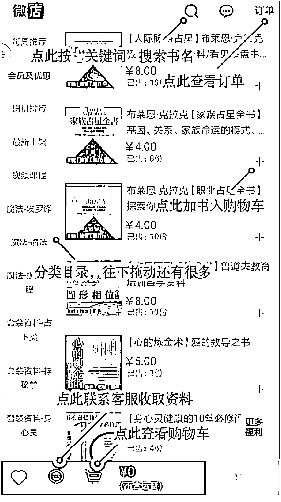

# 大耕老師

20歲受教於台灣某大上市公司之御用大師，多年來利用紫微斗數為自己家族（曾為台灣最大餐飲連鎖店）以及個人生意（台灣最大羊肉盤商與冷凍食品及餐飲集團）逢凶化吉，創造市場。

本只為有緣人及企業解盤與顧問，40歲時因緣際會得自台灣密教佛學大師提點，而發願將此千年密術傳播與人，使人可以擁有更好的人生。長期於部落格發表文章，擅長用現代思維、邏輯性的語言闡述命理觀念，讓紫微斗數生活化、更易理解，尤其預測推算趨勢精準，廣受歡迎，文章每月達數萬人次瀏覽，網路教學影片每月突破10萬瀏覽量。

目前講課於台灣中小企業處、產發局、大學與社團機構，並擔任多家企業顧問。創辦小激寶人文講堂紫微斗數研習社，學員多達千人，遍及兩岸。

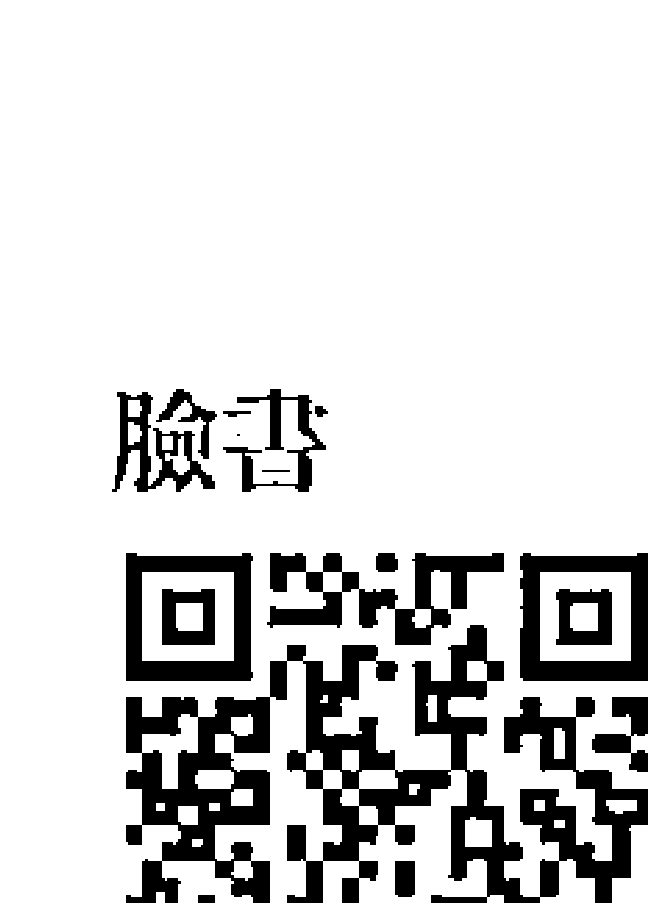

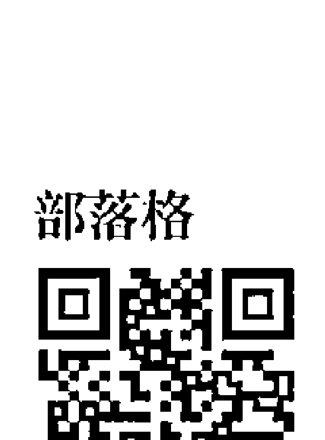

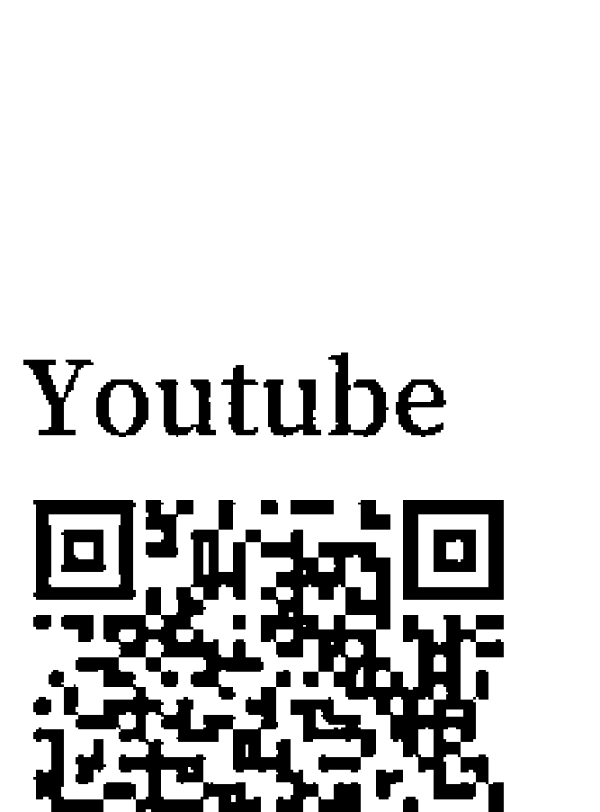

# # 紫微攻略3 上集

星曜
我們與真實自己的距離

大耕老師 著

> > 史上最強星曜解盤！
> 對宮為明鏡，透視深層人性

# 各界推薦

# 前言 010

# 第一章 /
星曜的重要性——人在環境中的自我展現
觀念建立 016

- 一 星曜是什麼？ 紫微斗數中宮位與星曜的關係及起源 022
- 二 不再混亂的心與星 星曜的解釋與應用 025
- 三 定性與定心 對照宮位解釋星曜的基本練習法 032
- 四 人生好隊友 雙星同宮的解釋邏輯與空宮 043
- 五 看到真心性的明鏡 對宮是星曜不能忘記的內心價值

# 第二章 /
我是什麼人——命宮中星曜的個性特質展現
觀念建立 064

二 紫微星 有皇帝心不一定有皇帝命 065

# 目錄

# 第三章/兄弟宫——上天给的帮手

觀念建立

二 天府星 坐擁地盤，務實而大度的王爺
078

三 天機星 善良而多變，邏輯理性與不安並行
088

四 太陽星 一切按照我的規則走，至高無上的星曜
097

五 太陰星 美麗優雅但是讓人不敢造次的媽媽
106

六 貪狼星 慾望之星
114

七 破軍星 打破枷鎖的偉大夢想家
119

八 七殺星 堅持信念絕不放棄的勇者
124

九 廉貞星 囚禁的心更展現奔放的魅力
132

十 天相星 制度的協調與守護者
144

十一天梁星 人生守護神，上天給與的庇佑
152

十二天同星 純真浪漫用愛與包容行走天下
158

十三巨門星 黑暗中善良的火把
164

十四武曲星 剛毅耿直，一步一腳印，說一不二的正財星
171

命宮各星曜總結
178

# 第四章 /
夫妻宮——
感情路上的自我

- 一 紫微星 皇帝般尊貴的親戚，可惜他貴我只好跪 185
- 二 天府星 豪邁穩重的王爺是我兄弟 190
- 三 天機星 身邊永遠的智多星 194
- 四 太陽星 長兄如父，就算是妹妹也一樣如父 199
- 五 太陰星 長姊如母，弟弟一樣像媽媽 205
- 六 七殺星 情和義比金堅的兄弟宮 209
- 七 破軍星 永遠無法猜透的兄弟姊妹 213
- 八 貪狼星 感情愈多愈好、喜歡與兄弟姊妹開創人生 218
- 九 巨門星 空虛寂寞覺得冷，總是希望兄弟姊妹給予溫暖 223
- 十 天梁星 老天給予的大哥 230
- 十一 天同星 單純樂觀不跟你爭家產的好兄弟 234
- 十二 天相星 親兄弟明算帳，感情建立在理性上 239
- 十三 廉貞星 最愛的人傷我最深 242
- 十四 武曲星 重義氣的好兄弟 246

# 上集總結

- 一 紫微星 究竟是皇帝大還是皇后大
- 二 天府星 看來大方但是不願退讓
- 三 天機星 善良而善變的感情
- 四 天梁星 天生情感成熟善於體貼照顧人
- 五 天同星 善良無邪水汪汪
- 六 太陽星 男的娶某大姊，女的嫁老公如我父
- 七 太陰星 母親像月亮，老婆像月娘
- 八 七殺星 感情上的殺手，但是殺自己比較多
- 九 破軍星 如果浪漫是感情的必需品，一時的璀璨才是真正的永恆
- 十 貪狼星 感情的慾望是人生的方向，對異性的魅力無法擋
- 十一 巨門星 愛在心裡口難開
- 十二 廉貞星 魅力十足理性與感性兼備
- 十三 天相星 理性是浪漫的實踐基礎
- 十四 武曲星 女人最愛收到的一種花：隨便花

# 目錄

# 各界推薦

我從十七歲就喜歡到處算命，總覺得命理是那麼遙不可及，直到去年向大耕老師學習，除了了解如何用正確的方式解釋命盤，更重要的是老師讓我們理解人生不是平面的，一切都是「同時存在的」，這點真的讓我去重新檢視很多事情。

——解盤很弱的那個／國貿業務專員

跳脫傳統框架，上課媲美補習班名師。跟大耕老師學習，讓我更能理解自己，同時放大命盤的力量，也能盡量避開人生的彎路，做更好的決策。

——小姐好／時尚業務業務

老師以宏觀且細膩、嶄新而客觀的現代思維解析古老的智慧，深入淺出、靈活幽默，教我們不以一己價值觀評斷，如實解讀、看待命盤密碼，面對人生起落，改寫命運，鼓勵我們利己之餘，也不忘利人，老師很誠懇、用心教學，受益良多，非常謝謝。

——Sienna／資深行銷

大耕老師精湛獨到的掌鏡功夫，破除命理的八股文化，結合現代生活元素，讓學生們運用自如達到知命而運命。大耕老師集結各家門派之大成，堪稱為新時代斗數宗師。

——EMBA五柳先生／業務經理

我本身不是喜歡死記、硬背書的人，大耕老師靈活的教學，讓我們可以活用宮位、星曜，記下斗數小技巧，再配以實戰解盤提升解盤基礎功力！

——忍字頭上一把刀／資深美容師

> > 老師特別喜歡講實話，再差的盤都會從不同角度告訴你人生有多種出路，很準確的講出我今年的轉折。但玻璃心者慎入，哈哈！
> — 宇宙微驗販售機／金融分析師

> > 人生的混沌、迷茫乃至於恐懼，皆因不夠了解自己的本質與氣勢。就如號脈辨症以論虛實，方能對症下藥力求藥到病除。若能信手捻來巧用斗數象、數、理來參酌，幫自己號脈，自己就是能知己知彼的良醫。
> — 野樵郎中／愛好命理研究者

> > 平常在教風險管理，稽核是否落實風險處理，紫微是一種很好的預測方法論，大耕老師不藏私，領你進門。
> — 天有不測風雲／資訊業專業副理

> > 謝謝老師帶領我們知命、論命、改運。因為另一半的推薦開始學習命理，從一開始覺得算命是無稽之談，一路走到深覺紫微斗數是門科學，因大耕老師的教學，讓我開始理解為何家人會有這樣的行徑，而給予包容和關懷，誤打誤撞進入命理圈的我，意外地開啟另外的視野，在斗數盤上找尋新的出路，老師難得可貴的人生經歷，更是超脫世俗的想像，讓每個人的人生有了新的註解。總之，學斗數，找大耕！
> — 哈陳小海牛／行政內勤
> — 小天同／清大校友

# # 前言

我們時常聽到一個命理疑問：同年同月同時生的人，為何命運會不同？面對這個問題，專業的命理師會告訴你很多答案，例如風水不一樣、祖上功德不一樣、所處的環境不一樣……等等，這些答案都是合理的，那麼你有發現嗎？其實這些答案都指出一件事——環境。為何你生在這個家庭？為何這個家庭的風水不好？為何你在這個城市出生？同樣是脾氣暴躁的人，出生在平和時代可能是讓人感到麻煩討厭的人，在戰國時代則可能是一代武將，這幾乎是命理學的A B C，因為所有的命理推論，都來自於人跟環境的關係推演。命理學上有個經典故事，說的是明成祖登基後，害怕有人跟他一樣，會有所謂「皇帝命」，因此下令捕殺所有跟他同樣生辰的人。捕殺過程中，明成祖很好奇跟他同樣生辰的人到底是怎樣的命運，便抓了其中一人來詢問。那個

人說他是養蜜蜂的養蜂人，明成祖問他養了多少蜜蜂，他說他不知道，但是他有九個大蜂箱，每個蜂箱大約五百隻蜜蜂，所以總數大約是四千五百隻。說到這裡，明成祖心中有了答案，他放了養蜂人，也放了所有被抓的人。明成祖年間，明朝將天下分為九州，而人口數大約是四千五百萬人。這個故事當然杜撰的成分極高，但是也簡單地說明了命理學的概念。同樣的時辰，因為明成祖生在帝王家，所以他統御的是人民，另一位在養蜂世家，他統御的是蜜蜂。明成祖當然心中明白，其實並非生辰一樣，命運就可以跟他一樣，生辰所帶來的天生特質，只是能成就一個人的其中一個條件。同樣地，我們也常用臺灣首富來比喻這個例子，依照當時的出生比率，全臺大概兩百多人與他同盤，但是首富只有一個。因為其他人可能沒有母親可以標會給予他創業基金，沒有岳家的支持，除此之外，命理是人跟環境的關係，這也是《紫微攻略1》裡面提到的『環境影響力』。除此之外，環境影響力之外，或許在關鍵時刻，其他人並沒有在每個人生關口選擇一樣的道路，最後只有一人成為首富。當然從不同角度來看的話，首富不見得是最好的人生。命盤上面會有雷同的生命軌跡、天生特質，但是每個人在人生的選擇上卻會有

所不同。或許，無論是家世背景或所在的國家與風水，我們不見得可以選擇想要的環境，但是了解、認識自己，讓自己可以放在自己覺得最好的狀態，卻是我們改變命運的一個好方法。

在紫微斗數中，星曜代表了我們的個人特質，以及各種能力，透過星曜處於每一個宮位的含意，就可以了解自己，讓紫微斗數盤如同一張健康檢查表和自我評量表。《紫微攻略1》讓我們知道人生地圖中有哪些風險，可以依照地圖避開風險；

《紫微攻略2》讓我們了解自己內心擁有的能量，知道在人生旅途中如何利用風險與困境來幫助自己，那麼《紫微攻略3》就是希望透過星曜的學習，了解自己天生的特質跟能力、與生俱來的一切，為我們找到自己人生的本初價值，利用宮位彼此間的關係交錯，每個宮位的對宮呈現的內心世界，揭開星曜的神秘面紗，並導正長久以來讓人誤解的星曜解釋。

我們常說福德宮是晚年的宮位，因為這個宮位代表了我們的靈魂。當我們走過一生的努力，穿越無數的荊棘之後，這些荊棘與風雪將剝落我們的外衣，讓我們回到初始來到人間最赤裸的原始，這時候我們脫去了世俗的外衣才能看到真實的自己，回到靈魂的一面，所以到了晚年我們才能看透自己靈魂的存在，了解自己這一

生需要的是什麼，這是為何晚年的生活是看福德宮的原因。對於星曜的解釋也是如此，我們往往容易陷入既有世俗觀念與個人價值觀，對於星曜的解讀，忘記了真實的一面，而宮位可以幫我們撥開外衣，讓我們看到真實面，可以因此更加了解自己。只有了解自己，才能知道將自己放在怎樣的位置，是最開心最快樂的，也才能夠幫助我們在人生路途上愉快地完成旅程，這是學習紫微斗數最有趣的事情，也是深入了解星曜最好的方法。我希望用這樣的思維建構出不同以往的紫微斗數書籍，讓大家可以在閱讀的過程中，逐步地、最快地入手應用，深入了解紫微斗數對於人性細膩的分析。這本書，維持我上課教授星曜時的基本原則，從星曜基本邏輯到使用分析上的概念方法開始，再依序帶入十二宮的變化，以對應星曜的解釋必須依照宮位產生含意的主要概念，一步步帶大家掌握星曜的意義跟使用方法，並且達到可以了解自己、探測自己內心深處想法的目的。理解星曜才能理解自身，理解自身才能知道自己在人生旅途中，為何會做出各類決定，為何會有與他人不同的想法，也因此可以掌握自己。其中，也會收錄我在教授紫微斗數時，使用的圖表聯想記憶方式，以及透過圖表的聯想，進一步分析星曜特質，最後透過利用本命盤就可以深深了解一個

人。本書一如過往本系列書籍，在學習過程中也希望達到實用的目的，希望透過學習星曜的過程，幫助大家了解自身的個性特質，因此會以本命盤（天生特質為主）適度帶進一些大限盤的概念，幫助大家專注在星曜的個性分析，避免貪多嚼不爛、模糊了核心。希望透過本書，大家可以了解自己，並且掌握紫微斗數中除了宮位以外，另一個至關重要的元素「星曜」。

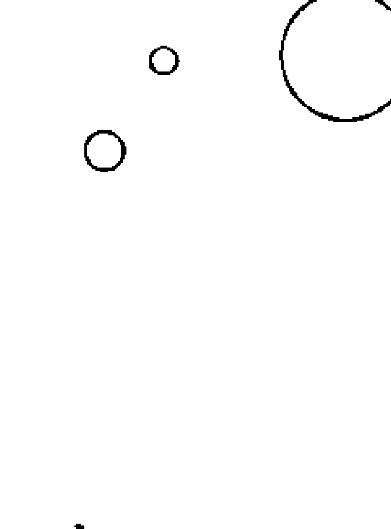

# # 第一章

# ## 星曜的重要性——

人在環境中的自我展現

# 觀念建立

命理是人在環境中的態度，因此引發現象的產生。所有命理學都是依照此邏輯設計出來，差別在於設計的精密度，其中包含了透過觀察自然現象，整理出一套規律，以此對應人面對時間與空間變化時的掌握，例如春夏秋冬的季節變化、例如生老病死；對於人的掌握，則透過對人的觀察，包含醫學與靈魂，整理歸納出一個體系，這兩個系統交錯分析推算，就可以將人的一生做出合理的推論。而在紫微斗數中，對應「人」的系統便是星曜的體系，透過一個個星曜在各宮位（時空環境）的變化，做出預測與推算，因此星曜的解釋可以說是人在那個環境中的自我展現，也就是我們常說的「個性決定命運」：在某個領域的價值態度，會造成我們在生活上的選擇跟決定，最後就會決定了命運的行走軌跡。如前言所舉的例子，在表示情感態度的夫妻宮坐紫微星，我們的態度是希望找到一個讓人有面子的皇帝，自己也

希望受到尊贵的对待，但是现实中有事业能力的男人，通常不会把你捧成皇后般尊贵，所以很有可能找到的只是会捧着你但其实没有能力的人。

大致的概念就是如此，只是对紫微斗数初学者来说，通常不会用这个角度去思考星曜的本质，因为绝大多数的书籍，都是单纯地解释星曜，看起来很容易理解，但是长久来说，却容易让人愈学愈混乱，所以我上课时，通常会从宫位开始教起，再用整体结构带入星曜的解释，虽然乍看比较麻烦，但长久来说却能够一次掌握星曜的特质，也因为这样才会贴近星曜解释的本质内涵。

例如天相这颗星曜，一般会从五行属性开始解释，接着有一堆资料库需要背诵，例如它是重视人际关系的星曜，也是重视自我规范的星曜，并且在乎自己外在的门面，也是个会处处帮助别人的一颗星。这样的形容再写上一万字，大家都可以读得很开心，感觉学习了很多，可是一旦问：如果天相星在财帛宫该如何解释？却往往答不上来。是靠人际关系赚钱？还是赚钱有自己的原则？抑或是赚钱重视门面？这样的解释基本上跟报纸的星座专栏上写的「巨蟹座爱家」这类答案的等级是差不多的，准确度靠的是运气跟机率，而不是逻辑跟科学的推算。财帛宫代表的不只是赚钱，也可以是花钱，整个财帛宫说的是对财务的态度，不能单指赚钱或

花錢，更別說還需要看這個財帛宮是哪個盤的財帛宮，本命盤和運限盤的解釋都不同，所以如果單純地這樣理解或背誦星曜的意思，一定讓自己陷入痛苦的深淵。最實際的好方法應該是先理解宮位是哪個盤的哪個宮位，例如這是本命盤的財帛宮，可以說是在那個運限時間內的財務情況。以本命盤來說（本書介紹以本命盤為主），天相星五行為陽水，是重視人際關係的桃花星，所以天相的桃花較偏重人際關係，不見得是一般認知的異性桃花。天相星化氣為印，化氣是基本價值的意思，印是蓋章，蓋章表示一種契約跟規則的遵守，所以天相的基本概念就是人際關係，以及對於自我規則與約定的堅持。

有了這兩種理解之後（可見得需要理解的基本條件其實不多），我們可以將其做出排列組合。對於本命財帛宮表示的錢財態度，可以簡單地說是賺錢跟花錢，賺錢還包含工作賺錢、理財與希望的收入方式，但因為是本命盤，所以不會有現象的意義，因此本命的財帛宮就不會討論今年會不會賺錢這樣的觀念，只能說自己是否有不錯的財務能力。對應天相這顆星曜，特質在賺錢的態度跟希望，我們可以說他賺錢的方式適合跟人際有關係（因為雖是桃花但為人際桃花，著重在人際網絡），

花錢的方式則會有自己的意見跟規則（化氣為印有自己規則之意），卻不能說這個人花錢的方式跟桃花有關係，不過，可以說這個人會願意在經營人際關係上花錢。所以，星曜的解釋其實是對應了宮位的意義去解釋，利用宮位的各種不同涵義，套上星曜的基本價值跟解釋，就可以排列組合出各類型不同的解釋，這才是紫微斗數解盤時的最主要方式，而不是死記背誦。

又例如太陰星，通常被稱為媽媽的星曜，母星，五行陰水、化氣為富。這裡的母星與化氣為富，說的是太陰星展現出母親、女性的特質，以及富足的概念，因為太陰星算是桃花，但比較偏向女性，不能單純說是異性，富足是母親、女性

這樣的人希望擁有的，對照剛剛的解釋邏輯，把太陰星放進本命財帛宮，就可以解釋成：在理財上會像媽媽守護家一樣，希望聚沙成塔，慢慢累積財富，但是在金錢的使用上，則因為希望可以過富足的生活，所以會重視享受。那麼屬於水的五行，是不是也可以當成桃花呢？因為太陰是女性，所以如果這是男生的命盤，當然就是

桃花，在理財、賺錢上可以利用跟異性的關係魅力，增加機會；若是女性的命盤，則不一定。另外，因為太陰是用女性特質被設定出來的星曜，女人似水、兵無常勢水無常形，這個太陰相對來說比較容易受到外界影響，所以與它同宮的主星，以及對宮的主星，就會大幅影響它，例如一樣是女人的特質，天機、太陰同宮時，搭配天機的邏輯能力，可以說是個較細心、數字能力好的女人；太陰、天同同宮時，因為天同星的不爭不計較，所以是個較逆來順受的女人。放在財帛宮，天機太陰可以說是懂得存錢、懂得享樂，卻也精打細算；相對來說，太陰天同則不會計較金錢的使用。也就是說，星曜的意義要依照星曜被設定的基本結構，而對應宮位的各類涵義去延伸，才是真正的解釋。在這個架構下，再去對應各類煞星跟四化，才能夠得到真正的分析。

圖一／星曜意義，宮位意義連連看

有了這樣的架構之後，還要再看每個星曜所在對宮的星曜是什麼，因為對宮是本宮的內心世界，所以必須看對宮的星曜，才能做出完整的解釋。例如以貪狼星為例，貪狼為慾望之星，但貪狼對面若是武曲、或者廉貞、抑或是紫微，對於這個貪狼的慾望就會有所不同。對面是武曲的貪狼，即使內心充滿慾望但個性務實，所以這個位置的貪狼，古書說是百工之人、以專業技術維生，原因就是他重視務實的價值態度，而貪狼喜歡各類事務的慾望，就會對應在專業技能上；如果對面是廉貞的貪狼，廉貞是人際與公關外交的星曜，所以這個貪狼重視的就是人際上的能力，因此對於人跟人的關係會相當有能力，希望跟眾人關係都不錯，加上桃花的特質，因此會吸引許多異性，但是這個貪狼就不會特別鑽研學習各類技術，因為對宮的廉貞星影響他，人際對他來說才是重要的內心期盼。每一顆星都會有這樣的情況跟特質，雙星的組合還會受到旁邊那顆星曜的影響。以下我們會先從每個星曜的基本概念談到雙星的基本概念，再依照十二宮不同的涵義，以本命盤為基本結構，帶大家從了解星曜進而了解自己。

## 星曜是什麼？
### 紫微斗數中宮位與星曜的關係及起源

在《紫微攻略 1》說過，紫微斗數的起源本是印度占星術，後來進入華文文化圈的時候，轉變成華人的占星術，再因為政治因素以及戰亂，逐步地從黃河流域轉進到長江流域，並且漸漸與華人原本擅長的易經做結合，擷取了易經的特質（或者說是易經利用占星學的觀念，改良自己的應用方法），因此到了明中葉以後，逐步完成目前我們所知道的紫微斗數。其中，易經的九宮轉化成原本占星學的十二宮（所以紫微斗數的十二宮名稱與占星學一模一樣），並以此取用了占星學的推論結構與更為進步的邏輯理路，解決易經在單純占卦上容易依靠個人第六感與模糊不清的問題，而占星學整合了易經的占卦觀念以及更多元化的變化，解決了占星學需要依靠精確曆法以及經緯度換算的問題，也一併解決了千百年來無法解決的共盤問題。

（同時出生的人命盤相同，生命歷程卻不一樣），套用了易經之後，因為取卦的概念，基本上共盤問題根本不存在，當然已經可以算是紫微斗數中的高階技巧了。

總之，科技始終始於人性，紫微斗數在這樣的背景之下，被整合成一種集大成的命理學，並且簡單好用，也方便學習，兼具東西方命理學的優點。

而其中星曜的產生，便是易經取用占星學對星曜的設定觀念，將易經的六十四卦套用在斗數的各主星上，並且加以整理，透過各星曜的排列組合，讓六十四卦的觀念可以更加清楚並且有更多變化，所以目前紫微斗數上的星曜是用虛星（假藉名，卻沒有真實存在）建構出這個以宮位當作時空環境，星曜當作人的紫微斗數基本結構，而這個人，其實就是以易經作為基礎對應出來。我們可以簡單想像成，我們想知道感情的問題，到廟裡抽了一支籤，感情問題看的當然是夫妻宮，那支籤就是夫妻宮內的星曜，星曜對應宮位做出解釋，所以同一支籤如果問的不是感情而是工作，得到的結果是不是就會不一樣呢？所以，同一個星曜的解釋必須依照宮位分析，這就是紫微斗數對於星曜的設定，基本上是依照這個原理被開發出來的。

所以在這樣的架構下，其實我們真正需要了解星曜的部分，是各個星曜當初被設定出來的中心價值，也就是書上常常提到的，每顆星的陰陽五行是什麼，以及「化氣」是什麼。化氣最初的意思是經過高溫而被燒燬了外界的包覆，留下中心的價值（例如胖子老師我可能化氣為豬油），化氣在這裡說的也是每個星曜最核心的價值，以此對應各個宮位產生出解釋，所以只要星曜的解釋跟這個中心價值不同，基本上就會是錯的。利用這樣的方式，我們可以檢視自己的解讀是否有錯，並且可以不需要背誦解釋，因為解釋是被推演出來的，不是套用出來的。

## 二十 不再混乱的心与星
### 星曜的解释与应用

现今的紫微斗数书籍多如牛毛，十分庞杂，光是对於星曜的解释就数不清，但往往流於互相抄袭，翻来翻去也大致都是那些道理，实际应用的时候很容易流於表面。其实这些书籍的解释都来自现今常被引用的古书《紫微斗数全书》、《紫微斗数全集》，以及紫微斗数从四百多年前明朝完成之後，过渡到现代解释的重要著作《斗数宣微》。这三本著作对紫微斗数现今的解释有举足轻重的影响，以此为基础，各家老师再依照自己的观点去延伸跟解释，形成现今到处可见的资料。但也正因为其中很大一部分都是依各家老师观点衍生阐述而产生，所以无法解释到位。实际上，这几本书对星曜的解释，其实只有短短数十页，是後人依照自己的经验以及彼此的抄袭，整理出各类解释星曜的书籍。我们当然不能说这样完全不对，

畢竟在初學時需要有一本可以參考的書籍（所以我出過一本六十星系與十二宮詳解的講義，給學生當作課後參考），但是如果只依照書中的解釋背誦卻是不行的，甚至常見許多自學的人到處找各類老師的書籍，希望滿足自己覺得不夠的星曜解釋，但是無論背了多少條文，還是無法做出很好的解釋，總是覺得哪裡不太對，就是因為根本不能如此解盤。命理學是推理學，不是拿出一堆解釋來碰運氣的，反正把每一個解釋都說一次，總是可以朦到對的，但這卻是很多學習命理的人，甚至是開業老師都會犯的問題。

想想古人學習紫微斗數的時候，只拿著那兩本小冊子，看來十分淒涼空虛的數十頁解釋，該如何可以學到出師、精確論斷呢？所以絕對不是靠書上那一點點的資料去記憶、去應用，這也可以說明為何古書上有許多非常駭人的解釋，例如「巨火羊門前鑑死」（巨門、火星、擎羊同宮就會自殺），諸如這般可怕的字句充斥整本古書，但是實際用這樣的解釋去推算時，卻常常失誤。也因此，紫微斗數被說成好學難精，其實是因為這樣的論斷根本不准，這樣的論斷法太過於片面，根本就沒利用到紫微斗數在推算上的真正邏輯，可惜許多人、許多老師就是用這樣的方式在算命，甚至不是看古書而是看現代人翻譯的書，但也只是把古文翻譯成白話文而已，因為他們不知道星曜根本不能這樣子解釋。星曜必須依照宮位，並且要同時考慮整個星曜的組合，與對面宮位的星曜搭配一起解釋，更是重點中的重點。

本書利用最簡單的星曜特質，搭配宮位特質的方式，幫助大家做星曜意義的聯想，並且利用這個方式，讓大家回到星曜最初之本心，用這樣的方式去看到自己命盤上，星曜在對應本命盤十二宮時，如何解析出我們這個人的各項特質以及內心的呈現。下頁為整理過後星曜的特質表：

## 圖二／星曜特質表

| 星曜名稱 | 陰陽五行 | 化氣 | 喜會 | 忌會 |
| --- | --- | --- | --- | --- |
| 紫微 | 陰土 | 尊 | 昌曲.左右.魁鉞 | 煞忌 |
| 天機 | 陰木 | 善 | 昌曲.左右.魁鉞 | 空亡.煞 |
| 太陽 | 陽火 | 貴 | 祿存.三台.八座 | 空.落陷 |
| 武曲 | 陰金 | 財 | 權祿.昌曲.貪狼 | 破.殺.火 |
| 天同 | 陽水 | 福 | 左右.昌曲 | 空亡.煞 |
| 廉貞 | 陰火 | 囚 | 左右.魁鉞.祿存 | 破.煞.昌曲 |
| 天府 | 陽土 | 權 | 祿存.昌曲.左右.不怕煞 | 空亡.六親宮位 |
| 太陰 | 陰水 | 富 | 旺位.左右 | 落陷.昌曲.煞忌 |
| 貪狼 | 陰水陽木 | 桃花 | 火鈴.左右.魁鉞 | 落陷.忌.羊陀.昌曲 |
| 巨門 | 陰水 | 暗 | 祿權.太陽對照 | 煞忌.落陷 |
| 天相 | 陽水 | 印 | 紫微.天府.昌曲.左右.魁鉞.祿存 | 火鈴.天刑.忌.桃花 |
| 天梁 | 陽土 | 蔭 | 化科.左右.昌曲 | 化權 |
| 七殺 | 陰火陽金 | 殺權 | 祿存.左右.昌曲.魁鉞 | 煞忌.廉破 |
| 破軍 | 陰水陰金 | 耗 | 左右.魁鉞 | 廉貞.煞忌.昌曲 |

初學星曜的時候，其實只需要了解這些基本意義，其他任何對於星曜的解釋都是出自於此，所以只要聽到有違背「星曜特質表」裡涵義的，基本上都可以說是錯的。就像如果蜂蜜在我們的界定認知中代表甜的，我們在與人溝通的文字或是語言上，就不會用「蜂蜜」來形容苦的、辣的、酸的；例如我們會說愛情甜如蜜，不會說這個麻辣鍋超甜蜜，因為這樣的解釋違反原本蜂蜜被設定出來的價值概念。如同表中的天梁星化氣為蔭，代表「庇蔭」的一顆星曜，就該由庇蔭的觀點去解釋。有些書籍會說天梁星會有刑罰的意義，這就是違反了天梁星的基本設定，之所以會有這樣的情況，是因為天梁星的對面可能有顆太陽星，而古人認為太陽星是天上最亮的一顆星（還記得嗎？斗數盤上都是虛星，是假設出來的，所以就別爭論天文學上太陽的意義了）。所以，太陽代表了可以掌管一切規則，是地位崇高的。地位崇高的太陽在外面，本性上又想庇蔭你，如果你不照他的意思做，是不是他就會不高興呢？如果再遇到四化的變化，以及各類煞星，就會有強制希望你遵從的概念，因此引發了好像有刑罰的問題，但是直接解釋刑罰，就是作者自己腦補過頭了。

有些書寫天梁星不適合化祿，意思是天梁是庇蔭星，如果化祿、庇蔭太多，人反而不願意努力，因此不好。仔細一想，其實是因為這個老師受到傳統禮教觀念，覺得人就是要吃苦耐勞，過太爽不好，這是不是又是一個用自己價值觀去腦補的解釋呢？我一心只想爽爽過日子，明天梁星如果化祿在財帛宮有可能拿到財產，幹嘛要當作不好？至於拿到財產之後我是不是成為敗家子，就不需要這些亂解釋的老師擔心了，爽爽過難道不對嗎？我不能拿錢做善事嗎？這類用自己價值觀跟經驗去理解的解釋非常多，充滿了寫書老師個人的價值觀判斷，完全罔顧是否違反了紫微斗數設定的原意，實在是可笑。

為了避免這樣的情況發生，我們應該在學習星曜的時候，專注於基本價值，才能理性地分析，避開自己的情緒跟價值觀影響，也才能將星曜的基本涵義學習掌握得很好，之後帶入各宮位變化以及南派常用的疊宮技巧、北派常用的飛化技巧，甚至宮位內充滿了煞星跟吉星的時候，以及同時有各類四化出現的時候，才不會混亂。一切都必須回溯到最基本價值，從這個基本價值再做出各類變化跟延伸，這樣學習解釋星曜的邏輯，就可以依照基本幾個解釋組合出非常細膩的解盤，也可以以檢視自己的解盤，是否用了自己的感情去扭曲命盤的解釋，保持解盤的穩定度。

透過這樣的方式，可以回歸紫微斗數在數百年前被設定下來時最原始的結構，幾乎可以在不考慮宮位內其它各種煞星跟四化的情況下，就做出非常細膩的解釋，因為這才是在命盤上呈現出來最原始的架構，等於是我們人心在各方面最基礎、最深層的價值。在這個基本價值上再去討論各類煞星、四化的種種影響才會有意義。就像在《紫微攻略1》裡面，我們把煞星當成破壞環境的力量，因為環境破壞，因此造成人生的變動，但是同樣的破壞，對應每個星曜卻有不同的結果，如同地上出現一個洞（環境被破壞），對於破腳踏車可能很危險，對於坦克車可能沒感覺，但是經過洞，還是會受到影響，只是影響的大小不同，有時可能還會是一個機會，例如法拉利遇到山崩可能完了，越野車遇到山崩卻可能不會有太大的問題，甚至可以順便救救旁邊的法拉利，搞不好還可以賺錢。同樣一場山崩，卻會因為不同的星曜而遇到不同的意義，這樣的理性思考，才能讓我們掌握星曜，並且理性地做出最好的分析。

## 三。定性與定心
### 對照宮位解釋星曜的基本練習法

如前面所說，星曜的解釋必須依照宮位做解釋，所以首先我們必須知道宮位的含意，而宮位的含意則需要依照什麼樣的盤去做定義，如圖三表格。

| 项目 |
| ---- |
| 命盤產生的方式 |
| (除了本命盤之外，依照時間區段產生的都可以稱為迴限盤) |
| 宮位基本概念 |

## 圖三／本命、大限、小限、流年／太歲盤說明

| 流年／太歲盤 | 小限盤 | 大限盤 | 本命盤 |
| :--- | :--- | :--- | :--- |
| 依照每年的生肖對應命盤上面的地支產生 | 依照命盤上每個小限產生 | 依照命盤上每個大限產生 | 依照出生時間而產生 |
| 依照每一年地支對應命盤上面的地支而產生的命宮，因此所有人每年流年命宮位置會相同，表示了這是所有人都需要去經歷的時間，表示是外界環境對所有人的同步影響，以此產生的命盤也表示是環境影響了我們造成的現象發生。例如在某一年因為環境外界的影響，讓我們下定決心要分手。 | 命盤上面各宮位有標示了自己虛歲的時間，依照那個時間的宮位做為自己該年虛歲的命宮，以此產生十二宮組成小限命盤，因為自己的虛歲時間代表是自己當下的作為引起的現象發生。例如，我們在某一年因為自己對於感情的想法而決定了要結婚。 | 依照命盤上每十年一個區段標示出來的宮位，做為命宮產生十二宮，形成命盤，因為長達十年的時間，代表人生中的某個時段，因此同時具備了心態個性，以及因為這些心態個性造成現象的發生。例如，我們隨著年紀的增長面對感情的態度會不同，所以每個大限的夫妻宮會變化。 | 因為是依照出生時間產生的盤，表示一輩子擁有，影響自己一生，但是也表示只能代表出生就具備的個性特質，以及能力價值觀，不能表示現象，只有父母、家世背景這一類一出生就具備的，才能以本命盤解釋，例如本命夫妻宮只能代表感情態度，不能代表自己的另外一半。 |

所以，一樣的一個夫妻宮，一樣討論感情、討論財務，卻會因為不同的命盤產生不同的涵義，更別說宮位本身會有各類型因為宮位轉換而產生的涵義，例如，田宅宮因為是官祿宮的兄弟宮，表示工作上的兄弟，表示合夥人的意思。宮位可以做出這樣的變化，而初學者往往淪陷在這些複雜的變化裡，這也是常見的問題。因為紫微斗數清晰簡單的文字表現（明白的文字，讓人通通看得懂，不像八字或者奇門遁甲，大量利用干支作為代號），加上華人的學習習慣是背誦，誤以為念過更多資料就可以學會更多，其實不然，紫微斗數的基本架構，引用的是西方的數理邏輯，比較像是一張人生攻略圖，這張圖上標示的各個路徑，以及提示的各種危險，還有蘊藏的各類人手的能力與特質，需要公式解開，並且依照公式做變化，才能準確地從資料庫中取出資料並且變化應用。因為紫微斗數的好讀明瞭，容易造成初學者甚至是開業的老師習慣性背誦資料庫，而忽略了用基本邏輯去理解，才會出現所謂第一段婚姻看本命夫妻宮、第二段婚姻看子女宮這樣的謬誤。其實本命盤上的宮位只能表示我們的態度，我們一出生這個宮位就存在，但是出生時，另一半就跟著一起出來了嗎？如果我婚嫁四次，難道第四次婚姻要用疾厄宮來解釋？如果我沒結婚，但是有個陪伴二十年的伴侶，我們彼此深愛守護，甚至還生了小孩，这个人到底要不要算是我的老婆呢？因为不了解命盘的涵义，就会对宫位做出错误解读，最后就会一步步错步步错地一路歪下去，如同我上课常说的，以讹传讹，那只鹅愈传愈大只，传到后面都快变老鹰了。

因此，初学时面对命盘，建议只需要先理解各命盘代表的涵义，不用追求坊间各类书籍对于各种宫位的解释，如同盖房子，房子的主要结构都还没盖好，就一直讨论房间装潢、谁要住在里面，那是没有意义的。先稔了基本结构，逐步将基本逻辑套用至可以随手拿来应用，再追求各类变化，才是真正的方法。

既然星曜的解释必须依照宫位产生，那么我们就要先知道各种盘的各宫位所代表的基本涵义，这样就可以建构成一个人生的基本架构，组成代表自己的小宇宙，有了这样的概念，再依照各宫的宫位名称去解释。例如本命盘的夫妻宫，本命是与生俱来的，我们不会在出生时一边吃着大拇指，一手牵着老婆从娘胎出来，所以本命的夫妻宫只会讨论感情态度跟价值观。同理，我们也不会一出生就抱着一堆账单出来，所以本命盘的财帛宫只代表自己的财务观跟能力，再怎么多煞忌汇集，也不用担心要负债。不过，运限盘就需要注意因为自己的个性造成现象发生。所以，本命盘可以说是人生的基本盘，是与生俱来的个性特质，并且会依照这样的个性特质去影响人生，就像盖房子打地基，这是练习星曜最好的基础。因为本命盘的宫位最单纯简单，所以以下都是利用本命盘做星曜的解释，帮助大家练习利用宫位的涵义，引导出星曜的涵义，让星曜的解释不再是背诵，而是推论。了解各个命盘基本的涵义之后，才能厘清宫位代表的意义，这是初学者容易搞不清楚的部分，才会在叙述现象时感到非常害怕。其实在描述现象的解释中，如果是在本命盘出现，莫惊、莫慌、莫害怕，因为这只能说“有机会”发生，不能说一定会出现。本命盘中各宫位的解释，大致上可以分为人际亲属关系的宫位（父母宫、兄弟宫、仆役宫、夫妻宫、子女宫、田宅宫），以及自己人生中非人际关系的部分，通常掌握于自己的部分，因为你无法选择父母，但是可以选择工作（命宫、迁移宫、财帛宫、官禄宫、福德宫、疾厄宫），其中田宅宫因为也代表财库，可以同时存在于两组分类中。下页为十二宫位在本命盘的解释：

## 十二宮位在本命盤的解釋

| 兄弟 | 命宫 | 父母 | 福德 |
| :--- | :--- | :--- | :--- |
| 与兄弟姊妹的对待态度，母亲。 | 自身个性与能力特质，影响十二宫。 | 父亲，家世背景，教育环境，长相遗传。 | 福气，祖上，精神状态，灵魂。 |
| 夫妻 | | | 田宅 |
| 感情价值观，对象的选择与喜好。 | | | 家世背景，财库，家人。 |
| 子女 | | | 官禄 |
| 对子女的态度，对性的态度。 | | | 学业与工作态度、喜好，人生价值的追求。 |
| 财帛 | 疾厄 | 迁移 | 仆役 |
| 对钱财的态度。 | 身体，外型，遗传。 | 个人在外的展现，希望外人对自己的看法，内心世界的想法。 | 交友态度，各类平辈关系。 |

從這十二宮在本命盤上的基本解釋，看得出來都是依照與生俱來的價值與觀念去發展。例如田宅宮，可以說是家世背景，因為出生時住在怎樣的房子，當然是早就存在的事實。出生後住哪裡，當然跟自己的出生背景有很大的關係。同時，田宅宮代表家的概念，所以也表示自己對家的態度，當然這其中就包含了對家人的態度，例如，某人可能兄弟宮有煞、忌，與母親的關係不佳，但是田宅宮內的星曜組合不錯，表示雖然容易跟媽媽爭吵，但是個人因為很愛家，所以為了家的完整還是會忍讓，或者跟其他家人很好，只是跟母親有摩擦。同理可證，如果這個人田宅宮有煞忌，可能不愛待在家裡，但是兄弟宮很好，表示他跟母親感情很好，常外出但也常打電話回家。

較少為人理解的，還有官祿宮。官祿從字面上來說是工作，那是因為古人覺得人生只有工作，而且就是當官，所以才會這樣定義。其實官祿宮說的是對於生命價值的追求，以及追求的能力。例如，官祿宮是紫微星，紫微化氣為尊，所追求的人生價值是希望可以受到尊重與尊貴，並且會將這樣的價值投射在自己日常大部分的時間（絕大多數是工作），至於是否有這個能力當皇帝（紫微是皇帝的概念），當的又是怎樣的皇帝，端看這個紫微星在官祿宮的組合而定。

## 紫微狀態如何，以及與生俱來的能力如何？這才是官祿宮基本的概念，不能只用工作看待。還有，父母宮代表的父親也是一出生就存在的，因此父親是個怎樣的人，當然也代表了我們的家世背景還有教育情況。因為華人很重視所謂上對下、父對子的身教，所以某些書籍會說父母宮是光明宮，如果父親的能力好，可以庇蔭子孫，如同給了自己一盞天生帶來的光明燈。有的書也提及會不會念書要看父母宮，因為父母宮代表遺傳，以及若是父親會念書，本身是書香門第，當然下一代容易受到薰陶，但這其實已經是延伸的定義了。我們應該把宮位的涵義回歸基本面，其他的解釋都是後世老師定義出來的，這往往是利用自己的觀念跟想法所做的解釋，以父母宮來說就是這樣的問題，這種父親影響自己念書的事情，在這個年代已經大幅度降低了，可能巧虎跟粉紅豬對小孩的影響還比父母來得大。所以建議初學時，就宮位的基本意義去熟練星曜，尤其本命盤的宮位其實都是非常基本的中心價值，透過本命盤的十二宮這些基本涵義，就可以讓我們了解一個人，不需要特別熟稔各類變化出來的宮位意義。隨著星曜對應宮位的邏輯清楚、熟練後再延伸變化。如同學做菜，一次給你九把刀，卻每一把都不熟練，還不如先把其中一把練熟了，再慢慢延伸。

在這十二宮裡，還有一個重要的宮位時常被忽略，那就是遷移宮。這個宮位第一層意思代表了我們在外展現的樣子，以及外人對我們的看法，同時，遷移宮也是自己的內心世界。這個概念常常讓人搞不清楚，卻是紫微斗數中依照人性設計出來，非常重要的宮位邏輯。簡單舉個例子，貪狼是慾望之星，也是異性的桃花星，當本命盤遷移宮內有貪狼，對於遷移宮的外在表現來說，是展現了貪狼的桃花，但是對於遷移宮的內心世界來說，則是貪狼慾望的需求，因為慾望是內心深處的渴望，是較為心理層面的，所以遷移宮的內心世界引用的是貪狼的「慾望」概念，而「桃花」是展現在外的，因此遷移宮對外展現的狀態要引用的是「桃花」這個意思。可見，同一個貪狼星，因為對應宮位的不同意義，引用的解釋也不同。若我們更深一層地解釋，則可以說遷移宮有貪狼星的人，之所以在外面展現桃花，其實是因為他的內心是慾望，也就是說，這個人的慾望（內心）是希望能得到不錯的人緣，所以就展現出桃花的能力（在外表現）。這兩個意思其實是一個前因後果的概念。我們時常可以看到即便是外型不亮眼的貪狼，一樣會有非常多人喜愛，這是因為貪狼這也是為何貪狼的桃花特質不展現在外型美貌上，而是展現在對人的態度。實務上，貪狼的個性使然。紫微斗數這樣的設計十分貼近人性，也符合現代心理學的邏輯。這個「內心世界—外在表現」的邏輯也會延伸在各個宮位上，也就是說，各宮位的對面宮位，其實都是本宮的遷移宮——本宮位的內心世界，以及因為這個內心而在外所展現出來的樣子。「本宮—對宮」這兩個宮位彼此互為表裡、互相影響。以前面提到的遷移宮來說，遷移宮有貪狼，因為貪狼內心對於在外人緣表現的慾望，所以展現出貪狼外顯於人的桃花特質。這時遷移宮的對宮命宮，則是遷移宮的內在影響。也就是說命宮是遷移宮的內在影響，一個人天生的性格與特質，當然會影響內心世界。如果命宮是武曲，武曲是務實的星曜，務實的個性才是自己內心潛藏的特質，所以武曲影響著在遷移宮的貪狼，讓這個貪狼對於慾望的渴求在深層價值上是務實的。因此，武曲在命宮、遷移宮是貪狼的人，雖然貪狼希望得到人緣的慾望影響了他的內心（遷移宮），但是外顯出來的特質，就不像一般人對貪狼的認知，他與人的關係會相對節制且保守。相較於命宮廉貞重視人際關係和個人魅力，對面遷移宮是貪狼的人，「廉—貪」這一組就是天生的發電機，魅力十足。本宮與對宮彼此影響的觀念，在斗數宮位的邏輯上十分重要，卻也常被疏忽，因此解釋起來才會無法展現紫微斗數對於人生的細膩度與豐富層次。

## 圖五／星曜對應宮位連連看

| 星曜 | 特質 | 宮位 | 解釋 |
| :--- | :--- | :--- | :--- |
| **武曲星** | 陰金，化氣為財，務實，剛毅耿直 | **本命財帛宮** | 用錢態度、賺錢能力與方式 |
| **武曲星在財帛宮** | | | 用錢的態度很務實，賺錢方式用心用力，不喜歡浮誇不實的理財態度 |

## 人生好队友——雙星同宮的解釋邏輯與空宮

紫微斗數中有十四顆主星，是主要代表宮位內自身態度的星曜，以及幫助這些主星的各類輔星，還有一些雜曜可以當作各種影響宮位跟星曜的小幫手與小問題。

本書主要介紹學習十四顆主星，幫助大家利用對於星曜的理解，進而正確解讀本命盤，了解自身的優、缺點以及內心的想法。掌握了本命盤，就可以以此類推掌握運限盤，從而選擇最適合自己的人生路。

紫微斗數中對於十四顆主星的排列組合有十二種（圖六）。事實上，這十二種是由六種組合顛倒後所形成的，所以十四顆主星彼此有相對應的關係，例如巨門星的逆時鐘兩格一定是太陰星，如果巨門是命宮，則太陰一定是夫妻宮，所以巨門的男生通常喜歡很有女人味的女生，而這樣的排列組合大致確定了各星曜的基本特質跟性格，所以常見對於星曜的解釋，其實並非單一顆星曜的解釋，而是整體命盤組合結構的解釋，這也是初學者常常忽略的。

**紫微在子**
| 巳 | 午 | 未 | 申 |
| :---: | :---: | :---: | :---: |
| 太陰 | 貪狼 | 天同巨門 | 武曲天相 |
| 辰 | | | 酉 |
| 廉貞天府 | 紫微在子 | 太陽天梁 | 七殺 |
| 卯 | | | 戌 |
| 破軍 | 丑 | 紫微 | 天機 |
| 寅 | | 子 | 亥 |

**紫微在丑**
| 巳 | 午 | 未 | 申 |
| :---: | :---: | :---: | :---: |
| 廉貞貪狼 | 巨門 | 天相 | 天同天梁 |
| 辰 | | | 酉 |
| 太陰 | 紫微在丑 | 武曲七殺 | |
| 卯 | | | 戌 |
| 天府 | | 太陽 | |
| 寅 | 紫微破軍 | 天機 | 亥 |
| | 丑 | 子 | |

**紫微在寅**
| 巳 | 午 | 未 | 申 |
| :---: | :---: | :---: | :---: |
| 巨門 | 廉貞天相 | 天梁 | 七殺 |
| 辰 | | | 酉 |
| 貪狼 | 紫微在寅 | 天同 | |
| 卯 | | | 戌 |
| 太陰 | | 武曲 | |
| 寅 | 天機 | 破軍 | 太陽 |
| | 丑 | 子 | 亥 |

**紫微在卯**
| 巳 | 午 | 未 | 申 |
| :---: | :---: | :---: | :---: |
| 天相 | 天梁 | 廉貞七殺 | |
| 辰 | | | 酉 |
| 巨門 | 紫微在卯 | | |
| 卯 | | | 戌 |
| 紫微貪狼 | | 天同 | |
| 寅 | 天機太陰 | 天府 | 太陽 | 武曲破軍 |
| | 丑 | 子 | 亥 |

**紫微在辰**
| 巳 | 午 | 未 | 申 |
|---|---|---|---|
| 天梁 | 七殺 | | 廉貞 |
| 辰 | | | 酉 |
| 紫微天相 | | | |
| | 紫微在辰 | | |
| 卯 | | | 戌 |
| 天機巨門 | | | 破軍 |
| 寅 | 丑 | 子 | 亥 |
| 貪狼 | 太陽太陰 | 武曲天府 | 天同 |

**紫微在巳**
| 巳 | 午 | 未 | 申 |
|---|---|---|---|
| 紫微七殺 | | | |
| 辰 | | | 酉 |
| 天機天梁 | | | 廉貞破軍 |
| | 紫微在巳 | | |
| 卯 | | | 戌 |
| 天相 | | | |
| 寅 | 丑 | 子 | 亥 |
| 太陽巨門 | 武曲貪狼 | 天同太陰 | 天府 |

**紫微在午**
| 巳 | 午 | 未 | 申 | 酉 |
|---|---|---|---|---|
| 七殺 | 辰 | | 酉 | |
| 天梁 | 卯 | 紫微在午 | | 廉貞天府 | 戌 |
| 太陽 | 卯 | | 太陰 | |
| 武曲天相 | 寅 | 天同巨門 | 貪狼 | 太陰 | 亥 |
| 寅 | 丑 | 子 | 亥 | |

**紫微在未**
| 巳 | 午 | 未 | 申 | 酉 |
|---|---|---|---|---|
| 太陽 | 辰 | | 天府 | 酉 |
| 武曲七殺 | 卯 | 紫微在未 | 太陰 | |
| 天同天梁 | 寅 | 天相 | 巨門 | 廉貞貪狼 | 亥 |
| 寅 | 丑 | 子 | 亥 | |

**紫微在申**
| 星曜 | 地支 | 星曜 | 地支 | 星曜 | 地支 | 星曜 | 地支 |
|---|---|---|---|---|---|---|---|
| 太陽 | 巳 | 破軍 | 午 | 天機 | 未 | 紫微天府 | 申 |
| 武曲 | 辰 | 紫微在申 (中心) | | 太陰 | 酉 | | |
| 天同 | 卯 | | | 貪狼 | 戌 | | |
| 七殺 | 寅 | 天梁 | 丑 | 廉貞天相 | 子 | 巨門 | 亥 |

**紫微在酉**
| 星曜 | 地支 | 星曜 | 地支 | 星曜 | 地支 | 星曜 | 地支 |
|---|---|---|---|---|---|---|---|
| 武曲破軍 | 巳 | 太陽 | 午 | 天府 | 未 | 天機太陰 | 申 |
| 天同 | 辰 | 紫微在酉 (中心) | | 紫微貪狼 | 酉 | | |
| (空) | 卯 | | | 巨門 | 戌 | | |
| (空) | 寅 | 廉貞七殺 | 丑 | 天梁 | 子 | 天相 | 亥 |

**紫微在戌**
| 巳 | 午 | 未 | 申 |
|---|---|---|---|
| 天同 | 武曲天府 | 太陽太陰 | 貪狼 |
| 破軍 | （紫微在戌） | 天機巨門 | 紫微天相 |
| 廉貞 | 丑 | 七殺 | 天梁 |
| 寅 | 丑 | 子 | 亥 |

**紫微在亥**
| 巳 | 午 | 未 | 申 |
|---|---|---|---|
| 天府 | 天同太陰 | 武曲貪狼 | 太陽巨門 |
| （紫微在亥） | 天相 | 天機天梁 | 紫微七殺 |
| 廉貞破軍 | 卯 | 戌 | 亥 |
| 寅 | 丑 | 子 | 亥 |

在這些排列組合中，有許多組合會出現兩顆星曜排在同一個宮位內，這也是在初學時期，讓人無法解釋跟面對的難題，兩個星曜到底該如何解釋呢？

雙星的組合該如何解釋，有個最簡單的辦法，也是依照紫微斗數對於雙星組合的基本概念去聯想。紫微斗數在對星曜的設計中，利用主星作為主結構，雙星作為變化結構，如果紫微斗數在設計時是將人當成一個小國家來看待，那麼在現代來說，當成一間公司來看待更好理解。利用各種宮位建構出一個組織架構，各宮位就是各部門，這時宮位內的主星就可以當成是各部門主管，所以各部門主管就會影響管理，各種主管就會產生各種不同的結果，這個結果其實就是我們解盤的基本概念。

但是，我們往往會錯誤地以為這個結果會是星曜的意義，其實這是星曜在宮位內產生出來的變化，依照這個變化而出現的現象。就像同樣的財務部門，由不同的主管主事，就會有不同的結果跟風格，也會因為不同的風格產生不同的效應；而同一個人待在不同的部門，也會展現出不同的態度，就像一個業務能力很強的人去當總經理，不見得也能做得好，這是本書希望大家釐清的觀點，也是前面說到的基本解釋概念。

當我們遇到雙星的時候，可以當成部門內有兩個主管，一個正、一個副，正副主管同樣管轄這個部門，副主管會影響正主管的觀念跟想法，有時候是幫助調整正主管的缺點，例如武曲星的重點是剛毅耿直，缺點就會變成不近人情，所以武曲星適合跟桃花星放在一起，假使武曲跟大桃花星貪狼放在同一個宮位，會是武曲不錯的組合。也有些副主管會影響正主管，甚至造成正主管改變個性，這樣的正主管通常本來就是比較不強勢、不穩定，例如天同、巨門。天同本來就是天真善良、與世無爭，也因為這樣不計較、不在乎的個性，算是福星，但是如果跟沒有安全感的巨門放在一起，旁邊的巨門就會一直影響天同，到處擔心、事事不安，反而造成天同沒辦法那麼單純自在，所以天同跟巨門在一起的時候，會被說成天同的福分破格。雙星的組合，我們應該將前面那顆星當成正主管，後面那個當成副主管，再依照副主管影響正主管的邏輯去聯想。因此，宮位內如果有雙星，例如紫微、貪狼同宮，其實還是以紫微為主，不能說那個宮位是貪狼星，只能說紫微被設定為皇帝，是一個比較貪心愛玩、有許許多多慾望的皇帝，卻不能說他是慾望無限的貪狼星。如果可以理解這一點，就可以簡單地釐清一些長年在星曜上的爭論，例如火星加貪狼是重要的火貪格，那麼紫微貪狼加上火星算不算火貪格？其實正式來說是不算的，應該說是一個火貪格的副主管影響著紫微這個正主管，不能直接說是火貪格。

而雙星中有許多組合會出現另外一個讓大家非常困惑的問題，就是「空宮」。空宮的主要定義就是宮位內沒有主星。紫微斗數在明朝的時候只有十四顆主星，還有文昌、文曲、左輔、右弼這些輔星，以最基本的主星組成了基本結構，因此沒有主星就算是空宮，就算有其他星曜都不算。當空宮出現時，最簡單的方式就是把對面宮位的星曜直接放在空宮裡。不要遲疑、不要害怕，也不要慌張，因為紫微斗數是用十二宮連動一起建構人生，沒有主星在夫妻宮，不表示沒有另一半，因為本命盤夫妻宮代表的是感情態度跟價值觀，運限盤夫妻宮代表的是價值觀跟現象，而宮位本來就不會單獨存在，至少必須與對面宮位連動，也受其他十一個宮位影響，所以各位擔心受怕的原因有二，其一是我們習慣性地覺得空了就是不好，很害怕；另外一個原因就是許多根本沒有學好的老師，拿著空宮到處嚇人，事實上只是自己誤解了古書上說的「逢空」的空劫星，當成是空宮，這種對於稍有紫微斗數概念的人而言會笑掉大牙的說法。如同現在還會有人以為紫微斗數是因為封神榜而生的一樣可笑。空宮，其實只需要將對面的主星放進空宮解釋就可以了。

唯獨有個小小的問題，就是當空宮的宮位內沒有主星，但是卻有「文昌、文曲」這兩顆星，或「擎羊、火星、陀羅、鈴星」這四顆煞星的時候，就不能將主星借過去，必須將這些輔星的特質當成主星，來對應宮位解釋。坊間有所謂借來的星曜力量少一半的說法，其實是因為隨著運限變化，會有運限的擎羊跟陀羅進去原本不存在煞星的空宮，就會造成沒有煞星的時候可以借，但是有運限煞星進去時不能借，這樣有時候可以、有時候不行的狀態，在實務論命時會產生一種不穩定的感覺，好像力量不夠，才會有空宮借星力量減半的說法，其實只要依照紫微斗數原理去看，就可以清楚解釋，解釋不出來，就是因為老師個人的經驗使然。因此，面對空宮一點都不需要害怕，更別說有時候空宮更能表現出內外一致的概念，因為借來之後，本宮跟對宮都是同一組星曜。

## 五 看到真心性的明鏡——對宮是星曜不能忘記的內心價值

有了前面的基本概念之後，就可以利用這些基本架構，真正地對應宮位和解讀星曜在其中的涵義。

最重要的是，所有星曜都需要看看對宮的星曜是什麼，依此解讀本宮星曜，否則就無法做出深度的解釋。

## 圖七／十二宮各自對宮圖

| 遷移 | | | |
|---|---|---|---|
| | | | |
| | | | 命宮 |

| | 疾厄 | | |
|---|---|---|---|
| | | | |
| | | 父母 | |

| | | 財帛 | |
|---|---|---|---|
| | | | |
| | 福德 | | |

一般書籍與初學者都是單純地背誦星曜的解釋，所以面對星曜放進宮位內的時候，無法做出好的應用，因此我們不該去記星曜在哪個宮位是什麼意思，因為這樣的學法永遠無法將資料背完，也很難加以運用，應該善用前面所提到的，先想宮位是什麼意思，因為這樣的基本概念之後，更進一步需要注意，每個星曜其實有「內心」的涵義，這是紫微斗數相當巧妙的地方。如同一個粗獷的男人可能擁有一顆溫柔的內心，一個柔弱的小女子卻有著堅強的意志力。我們單純說這個人很粗獷，並不能用此判斷這個人真實的樣貌，只看這女生嬌小的樣子，無法分析出她可能因為堅強的意志可以成就許多事。所謂星曜的內心世界，就是在每個星曜的對宮，從星曜所在位置的對宮星曜去了解星曜真正的內心想法，才可以理解為何這個星曜會有這樣的解釋。而且紫微斗數在設計上相當有意思，例如為了夢想可以堅持不放棄的七殺星，對面卻一定是做任何事情帶有自己尺度的天相星；為了目標可以堅持不放棄的七殺星，對面永遠是有謀略且務實地追求理想的天府星。在紫微斗數中，只有這兩顆星曜的對面星是固定的，所以這兩顆星曜也常常讓人覺得個性絕對鮮明，因為無論在哪裡，內心永遠不變，頂多代表內心的對面宮位主星會是雙星組合，而雙星中會有一個有變動，所以大致上的方向會相同，這也說明了為何破軍星跟七殺星的質常常會讓人分不清楚，感覺兩個星都是那種可以不顧別人看法的原因，其實破軍星因為對面是天相，破軍追求夢想中往往會有自己的一套邏輯，而且這個邏輯跟規範是旁人無法、也不容許被打破的，如同天相的本質「化氣為印」蓋了章一樣，但是這個規範是自己給的，所以隨時都可以改變；七殺則是對於目標的堅持，兩個星曜都有固執己見不聽人勸的概念，但是破軍呈現在對於夢想的追求，七殺則是對於既定目標的堅持，因為七殺對面是天府星，天府是相對具有謀略且務實穩定的星曜，所以七殺不會讓夢想換來換去。除了這兩個星以外的其他主星，對面星曜都會有所不同，因此影響星曜的特質相對較大，因此我們會覺得七殺、破軍更堅持自己的看法（因為感覺都差不多），而其他星曜因為對宮會不同，所以會有更多的變化。

例如，天機星，對面會有巨門、太陰、天梁這些組合，對應天機星化氣為善，個性善良而善變的特質，表現出來的特質完全不同。天機—太陰對拱，因為太陰星是桃花星，也是屬於媽媽的星曜，所以可以消除許多天機星人因為聰明而產生孤芳自賞的問題；而天機—天梁這一組，則因為天梁星也是個聰明且博學的星曜，所以這一組的天機星雖然算是個性善良，但相對太陰那一組，這一組就算與人為善，也有某種程度的疏離感，讓人有捉摸不定的感覺。有了以上的基本價值判斷之後，我們再套入宮位來解釋，就可以更加清楚，不會讀了許多解釋卻無法套用在宮位。同樣以天機星來說，天機星因為是個較善於變動的星曜，所以通常會說不要再遇到桃花星，尤其是天機、太陰這一組，否則很容易產生感情問題。這句話當然可以背起來，但是背起來就無法理解原因，無法靈活應用。所以我們要從基本原因來看這個解釋背後的原理，究竟是什麼原理而做出這樣的解釋呢？

除了命宮統管十二宮，所以會有這樣的狀況出現之外，討論感情當然要看夫妻宮，而本命盤是先天的特質跟個性。如果有一個人夫妻宮是天機，對面官祿宮是太陰，夫妻宮是感情的態度跟價值，情感上當然會因為特質是善良跟善變的天機星在夫妻宮，而希望不能一成不變。夫妻宮也表示了喜歡的類型，天機星聰明有邏輯，所以他喜歡的類型不能太笨，要是個聰明有邏輯的人，他自己在處理感情的態度上，也會有條理，而且希望可以跟對方用邏輯說道理的方式溝通，這是天機在夫妻宮的基本情況。但是在情感上內心的真正想法，卻會因為對宮的星曜不同而大有差別。在一樣的基礎下，對面官祿宮（感情的內心世界）如果是太陰，因為太陰星的桃花特質以及女性的特質，他在情感上希望的「不能一成不變，對方要聰明有邏輯」這個基礎上，還會加上希望對方有桃花的特質，也就是要有魅力、人緣好，也要有女性的溫柔跟體貼。「輯」，要能展現在生活上給予細膩照顧這一點，他自己也會用同樣的方式去對待人。也就是說，這個天機的聰明多變會展現在太陰的母性特質上，或者說太陰的母性特質影響了天機的價值。相對來說，原本天機星偏向理性的邏輯思考，以及希望感情的溝通要有條理，可能在「天機」、「太陰」這一組就會較弱，因為柔情似水才是他的重點。也是這個原因，古書上會說這一組合不適合再加上其他桃花星，否則就會出現許多感情問題。傳統的算命師會告訴你這樣的女人不能娶、男人不能嫁，但若是仔細想想，一個人在情感上，感性多於理性，而且處理情感又聰明、柔情兼具，當然是個很吸引人的特質，如果再補上一些桃花星，魅力四射當然就會吸引許多人，加上不喜歡一成不變，自然容易在情感上出問題。因此，如果他能遇到一個本來個性就多變化，總是可以讓他感到驚喜的聰明人，並且帶著一點孩子氣（滿足太陰的照顧特質），自然就毋須擔心。我們用原理去理解就會清楚明白，這樣利用對宮星曜解釋出來的特質會非常細膩。

同樣地，若是巨門星在對宮，因為巨門的化氣為暗，內心黑暗所產生的不安全感，會影響天機星的狀態。巨門星一樣是某類型的桃花星，但是因為重點在於黑暗的內心，所以感情的多變其實來自於情感上的不安，加上其他桃花星一樣會有感情問題，只是太陰的重點在於感情浪漫以及對人的照顧，巨門來自於對感情的不安全感，所以同樣具有感情變動的特質，卻是不一樣的感情問題。從對宮的星曜，我們才能看星曜在宮位內真正的態度跟涵義，掌握了這樣的基本概念之後，對應各類的四化跟煞忌，才會知道該如何解釋，例如天機星如果化忌在夫妻宮，情感上的變動以及各類想法會造成自己對於情感的需求與期待（化忌產生空缺），對面是太陰的天機會利用工作上與人的接觸、細膩的心思增加桃花機會，期待可以有戀情去填補自己在情感上的空缺；但是巨門在對面的天機，卻是不安全感大大加深，對情感的不信任讓他總是不知道該如何面對感情。接下來，我們將利用十二宮每一宮的特質，來套用在各星曜的組合，逐一為大家解釋各星曜在十二宮內的內心特質。掌握了星曜的內性特質，就可以搭配《紫微攻略 1、2》，讓自己在解盤上有更精確的解釋。每一個單元後面會有個小練習，將以「如果這個組合出現在大限命盤上該做何解釋」為題目主旨，以此幫助大家學習利用星曜解盤的觀念。

# 第二章

## 我是什么人——命宫中星曜的个性特质展现

# 觀念建立

星曜依照宮位得以產生解釋。本命盤十二宮中，命宮代表一個人與生俱來的價值跟個性特質。因此，目前幾乎所有星曜的解釋，都是討論星曜在命宮的涵義，例如貪狼星代表桃花、異性緣好，這個解釋說的當然是貪狼在命宮，不會是貪狼在田宅宮，所以幾乎每個我們所知道的星曜概念，說的都是命宮；也可以反過來說，星曜在命宮的解釋，可以說是這個星曜的主體價值，而對面遷移宮所在的星曜，就是這個在命宮的星曜之潛在特質。各星曜在命宮所展現的，是這個人基本的個性與價值，並且其解釋會受到對宮所代表的內心狀態所影響。以下我們就來看看各個主星在命宮的特質。

## 一、紫微星
有皇帝心不一定有皇帝命

紫微斗數最能讓人馬上記得的就是紫微星，這顆星曜被設定成皇帝的概念。因為為紫微斗數設計星曜的時候，將命盤當成一個國家，所以依照每個星曜的陰陽五行與化氣的特質，給予一個在國家中的身分，賦予星曜更鮮活的印象。而紫微星的皇帝特質就來自於化氣為尊，是一個尊貴的概念。但是，皇帝之所以尊貴，並非自己產生，而是要眾人給予。如果只是因為血統就認為自己是皇帝，那就是個沒用的皇帝，必須要有足夠的執政團隊給予皇帝足夠的權力，所以紫微星的重點在於，它所在的宮位以及三方四正，或至少是夾宮，必須有以下幾顆輔星：

- 文昌
- 文曲
- 左輔
- 右弼
- 天魁
- 天鉞

如果可以再加上天府跟天相，就更好了。

所以古書上說左輔、右弼、天魁、天鉞、天府、天相這六個星曜湊齊在三方四正內，會有一個很棒的格局，叫「君臣慶會格」，表示整個執政團隊很爽快地開趴慶祝，這麼開心的狀態當然表示皇帝領導有方、團隊能力很好。但是如果沒有了這些星曜呢？就會變成一位弱勢的皇帝，空有理想但是無法做到，會有心有餘而力不足的感嘆，有著皇帝的雄心卻沒有皇帝的命。三方四正內，湊到愈多上述的輔星愈好，愈多人幫忙愈能彰顯皇帝的尊貴，當然，要全部湊齊確實不簡單，若真的湊不齊，至少一顆也行，如果都沒有，至少兩旁的夾宮也行，十二宮有六個宮位，六顆星，這樣高機率的組合還是湊不到，這個紫微就真的比較可憐了。

紫微星所看重的，是皇帝本身是否有足夠的團隊。有了團隊，紫微星就有展現能力的機會。紫微星本身還有許多組合，透過不同的組合會有不同的個性特質，也就是說，在不同的紫微星組合下，其實各個皇帝的个性特質都不同，搭配上是否擁有團隊，再依照所坐宮位去判斷在宮位中產生的特質，才能對星曜做出主要解釋。

# 圖九/ 紫微星分布圖

| 巳 (紫微破軍) | 午 (紫微) | 未 (天相) | 申 (七殺) |
| :--- | :--- | :--- | :--- |
| 辰 (紫微天相) |  |  | 酉 |
| 卯 (紫微貪狼) |  |  | 戌 (破軍) |
| 寅 (紫微天府) | 丑 (紫微破軍) | 子 (貪狼) | 亥 (天府) |

# 1. 紫微對宮為貪狼

紫微星如果是自己一顆獨坐的時候，對面一定是貪狼，這個組合其實是絕大多數書籍解釋描述紫微星的時候，所採用的主要組合。命宮是紫微星，對面遷移宮是貪狼的這個組合，因為貪狼是慾望之星，所以紫微星的化氣為尊、期待享受尊貴的生命價值，會受到內心的貪狼影響，可以說是最高直接展現紫微星特質的組合。貪狼的內心慾望影響著紫微，希望得到眾人的崇敬，也因此展現出對人的和善親切，表現貪狼對外的桃花特質以及學習心，希望自己可以跟所有人都說得上話，能夠得到大家的喜愛，並且受到大家的尊崇。也是在這樣的情況下，通常我們會說這一組不適合在貪狼的三方四正遇到煞、忌，因為煞、忌可以看成是最根本不受控制的慾望與情緒，一個人如果期待自己是眾人喜愛並且尊崇的對象，但陪伴他的不是左輔、右弼這些組成團隊的星曜，而是比較衝動的情緒，當然就容易感覺懷才不遇，或是會有點任性，還好有貪狼這個大桃花在外面，可以利用自己的魅力，來解決皇帝的任性跟尊貴價值產生的高傲。

一般很容易誤會的是，因為紫微是皇帝，所以非常厲害。其實紫微的皇帝概念來自於化氣為尊，這個尊貴的背後有個隱藏的概念，就是某個程度的耳根子軟，對於別人的吹捧，總是有高高在上的尊貴感，紫微也會有這樣的特質，因此很容易受到雙星組合旁邊主星的影響，也就是遇到什麼樣的副手對這個皇帝的態度影響很大，對面宮位是什麼星曜，也會一起影響這個紫微皇帝。

# 2. 紫微、七殺同宮

紫微、七殺在古書上面會說是化殺為權，也就是說當紫微跟七殺放在一起，會讓紫微本來的尊貴，轉變成重視權力跟權勢，這是因為七殺星的對面永遠會有天府星，而天府星是化氣為權、重視權力的，這時紫微原本重視尊貴的態度就會建立在權力上。也就是說，同樣感到擁有尊榮，有人是因為身上充滿名牌，有人是因為得到讚賞，有人則是因為掌握權力。而紫微星本身具備的化氣為尊，受對面的天府星影響，這個尊貴的來源和深層需求，是建立在自己握有權力之上，這也是跟七殺放在一起的時候會化殺為權的原因。加上七殺在旁邊幫助紫微星，七殺本身具備對於目標的堅持與毅力，剛好跟對面的天府內外呼應，所以我上課會打趣地說，七殺就像殺手，皇帝身邊有殺手，當然大權在握，就算沒有團隊也沒關係，因為他有東廠錦衣衛。因此這個紫微七殺的組合，相對來說其實並不那麼重視三方四正是否有足夠的團隊，有團隊當然很好，可以幫忙，但假使沒有團隊，他也會靠自己的努力。

# 3. 紫微、破軍同宮

如果說擁有殺手的紫微、七殺握有權力，可以孤軍奮戰，那麼擁有軍隊的皇帝，是不是就更加具備很好的能力呢？我們可以把破軍星當成一位有夢想的大將軍，紫微受到這個感性又有夢想的將軍影響，也就會是比較擁有夢想跟抱負的皇帝。而破軍的對面是天相星，一旦紫微、破軍的組合，對面剛好是天相，這就符合了紫微星三方四正內要有天府、天相、左輔、右弼、天魁、天鉞其中一顆星。天相被設計成宰相的概念，是官場上可以調和人事、處理人際的人，對面是天相的紫微，相較於對面是天府的紫微、七殺，通常會有更好的人際手腕，也更重視自己內心的規範，相對降低了紫微星因為化氣為尊的尊貴特質而產生與人不好親近的問題，所以這可以說是紫微星最好的組合，紫微尊貴的特質展現在自己的事業與人際網絡上，即使少有那些吉星幫忙，至少天生就具備了一個天相。

# 4. 紫微、貪狼同宮

這個組合對面一定是空宮，如果是空宮，就從對面借主星過來，兩個宮位都是紫微貪狼，表示這是一個表裡如一的組合啊！這麼表裡如一當然就會充分展現出貪狼對紫微皇帝的影響，相較於旁邊有七殺、破軍的紫微組合，人生的夢想、事業的掌握，會是自己努力的目標，紫微貪狼這組則是貪吃、貪喝、貪玩，什麼都想試試看。而且因為對宮是空宮，造成表裡如一的情況，這個皇帝的尊貴感受當然就來自於是否能夠有更豐富的人生、更多不同類型的生活經驗，因此紫微貪狼的組合在古書上被說成是「奴欺主」，意思是旁邊的貪狼把皇帝帶壞了。事實上，這是因為在古代的價值觀來說，玩樂是不對的，但是一個人可以一生玩樂，不也表示這個人的生活環境應該還不錯，而且能力不會太差嗎？

很多人分不清楚這跟紫微破軍的組合有何不同？破軍也是擁有很多夢想，但是破軍的對面有天相，所以這個皇帝敢作偉大的夢，但夢想還是要顧及人際關係以及某些自我價值，貪狼則是什麼都想試試看，成不成功不重要，但是也不會做太大的努力，因為對人生美好的感受來自於豐富的體驗，不是來自於紫微七殺的萬人之上，或是紫微破軍的成就夢想。

因為對宮是空宮，可能會有四煞星「擎羊、陀羅、火星、鈴星」，還有「文昌、文曲」，有這六顆星進去的時候，空宮就不能借對面的紫微、貪狼，這時候又該怎麼解釋呢？其實就是把這六顆星的特質，拿來當做這個喜好豐富人生的皇帝內心的世界，例如對面是擎羊，這個紫微貪狼雖然喜好豐富人生，偏向享樂主義，但是因為擎羊在內心，所以還是會對自己的人生與事業有所期待跟努力，這時候就要看是否有足夠的吉星可以幫忙；如果對面是陀羅，則相對來說差一點，無法發揮紫微、貪狼那種真瀟灑的特質，常常會糾結在自己的欲望跟現實中，裹足不前；若是火星，則表示火星的光輝燦爛是紫微、貪狼重視的，內心個性的急躁當然免不了，但是浮華的世界才是他的追求。許多人會問，古書上所謂火貪格、鈴貪格在這種雙星組合算不算呢？其實說算也能說不算，所謂火貪格，是因為貪狼的欲望加上火星的衝動爆發力，又遇到足夠的條件（例如有足夠的化祿、祿存），就會產生速發的機會，但這是與單獨的貪狼星在一起時才論的，如果是紫微加貪狼呢？我們可以說，這時候是有欲望以及爆發力的貪狼影響著紫微皇帝，所以是否有速發的機會，還要看紫微的情況，如果沒有好的條件，就只是個性火急，想將欲望快速展現而已。至於鈴星如果在對宮，則紫微、貪狼會受到鈴星影響，而具有冷靜與謀略計算，加上鈴星，表示在內心有計畫的盤算，完成自己豐富的人生，反而可以免去紫微、貪狼如果對面是空宮容易太過浪漫，較不能專心事業的問題。最後是文昌跟文曲，這兩顆星一個是很規矩不敢犯錯的文昌，以及心思變化多端、有著小小浪漫的文曲，我們可以想像，當對面是文昌，這個貪玩的皇帝不太敢玩，也同時限制了紫貪皇帝追求豐富人生的能力；文曲則代表這個紫貪皇帝內心期盼擁有不同的個性，但是紫貪已經很多欲望、很敢追求了，還要如何不一樣呢？當然可能就會因此個性離經叛道，特別是又遇到煞、忌進去時。

# 5. 紫微、天相宮

古書上說這個組合是「造反之局」，事實上是因為這個組合的紫微通常能力都很好，相對紫微七殺重視自己的權力、紫微破軍追求夢想、紫微貪狼想要豐富人生，紫微跟天相的組合因為受到天相重視規矩並且注重人際關係的影響，以及天相星具備良好的溝通協調跟組織能力，這算是能力相當不錯的人，而且所追求的尊貴不會非要是自己當老闆獨當一面。但是，天相的對面一定是破軍星，所以這樣一個有守、有為、有能力的人，其實內心放著一個遠大的夢想，而且是不想受到控制的靈魂，如果機會到了，就會想要開創自己的人生，例如他覺得老闆太笨，無法帶給自己更多的機會，那就乾脆自己來，這就是被稱為造反之局的原因。這個組合的人本來很乖地遵守分際，會因為天相遇到煞、忌，以及破軍的浪漫引發放棄規矩、自己努力的個性。如果破軍星可以化權，穩定破軍星的浪漫，這個人其實能夠白手起家有所成就，甚至會比前面的紫微、七殺，或者紫微、破軍還好，唯一的缺點就是，平時對人很好、很有規矩的人，如果踩到他內心的紅線，對宮遷移宮的內心破軍星就會爆發，變得情緒不能控制。

# 6. 紫微、天府同宮

紫微、天府這個組合最常被誤認為黃金組合，因為古書說這兩個都是帝星，如果兩個同時在命宮，好像非常不錯。事實上，紫微重視自身尊貴的價值，而天府卻很務實，只重視是否可以掌握展現人生的實際權力。兩顆組合在一起的優點是，這一組大概是紫微、七殺那組以外最務實，最有希望事業成就的；缺點是人往往無法面子、裡子兼顧，兩者同時都要，有時候就會變得很辛苦，因為天府的對面一定是七殺，所以這一組的內心就是七殺星，一個人面子、裡子都要，對於自己內心的想法堅持、不放棄，當然就會辛苦一點。七殺堅持不妥協的價值觀，影響了紫微、天府，這個紫微組合會讓人有種固執的感覺，女生容易出現男孩子個性，這樣一個尊貴又堅持，而且面子、裡子都要的人，當然很需要別人的幫忙，所以是不是有足夠的吉星，就變得很重要。雖然如同紫微、天相，六個需要湊齊的星曜已經湊到一個，但天相有輔佐的概念，天府則會直接跟紫微衝突，所以會有反覆不定的小問題，如果再加上其他吉星，在各個領域都有人幫忙，當然可以解決問題，完全呈現兩個帝星的優點；如果沒有一個可能是命盤上的太陽在落陷位置。

紫微斗數中有個概念，太陽在旺位的時候星曜能力比較強，但是比較強不一定比較好，在紫微、天府這個組合裡就有這樣的情況。紫微、天府會在命盤中寅跟申的位置，在寅的紫微、天府，因為太陽同時會在落陷位置，而太陽在落陷位置上的星曜力量不大，所以紫微跟天府這兩個彼此價值觀落差很大的星曜，反而不會起衝突。但如果紫微、天府在申位，則太陽在旺位，兩顆星彼此競爭、分化，這個人同時要面子、裡子，又追求事業，又因為七殺的影響，固執又難勸，就容易發生問題，往往变成有恢弘的企图却没有实践的能力。

# 圖十／太陽旺與落陷位

| 旺位 | 旺位 | 旺位 | 卑位 落陷 |
| :--- | :--- | :--- | :--- |
| 旺位 |      |      | 落陷      |
| 旺位 |      |      | 落陷      |
| 旺位 | 宙/遺 | 落陷 | 落陷      |

# 紫微星在命宮小練習

面對裁員，紫微星各組合可能的反應。

- **紫微七殺**: 乾脆自己來，不再擔心被人裁。
- **紫微天府**: 看看有沒有機會跟人合作創業，或者找機會換家更好的公司。
- **紫微破軍**: 還沒被裁員之前，可能已經打算創業或跳槽。
- **紫微天相**: 沒有煞、忌的話，會找下一份工作；有煞、忌的話，乾脆把工作團隊帶出去，另開一家公司跟老闆打對台。
- **紫微貪狼**: 先出國玩一下再回來找工作。
- **紫微對面是貪狼**: 有機會玩就玩，沒機會就找工作。如果紫微化權，則考慮創業。

## 二、天府星
坐擁地盤，務實而大度的王爺

相對於被設定為皇帝的紫微星，天府星雖然在古書上也被形容為帝星，但其實比較接近王爺與地方諸侯的概念。一樣是希望受到尊重，擁有自己的地盤，但因為是王爺身分（所謂王爺就是在皇族裡面搶不到皇位，被分封到地方當大王的貴族），心態上會較紫微務實很多。因此，紫微是化氣為尊，天府是化氣為權，實際掌握在手上的權力，才是他真正在乎的事情。而地方諸侯需要自己籌措財政，以及要能自己應付許多問題，因此，天府星也是財庫星，當天府星遇到「祿存」，或者是在雙星組合中遇到另一顆星化祿的時候，便可以展現自行籌措財源的財庫能力。當然，提到財，需要對應財帛宮或命宮（命宮管十二宮）才算，如果不是，則不能算是錢財，但是可以有庫的意義，有「聚集、擁有」以及「自己產生、累積」的概念，例如天府跟祿存都在子女宮，會愛小孩，希望有多一點的孩子，或是重視家庭旅遊與吃喝享受，因為這些都是子女宮的涵義。一定有人想問這是要同宮還是三方四正就算？回想一下三方四正的概念，同宮當然最好，如果是三方四正也可以，只是對天府的影響就沒那麼直接，而是來自相對應宮位的影響力，例如紫微在命宮，天府在財帛宮，廉貞在官祿宮。

官祿宮有一顆祿存星與廉貞星放一起，代表這個人工作很努力而且有守有為，這樣的工作態度不會想要搶短線追求快速的成就，影響了在財帛宮的武曲、天府，讓這個人理財很務實，會一步一腳印地做好理財規劃，累積財富。所以，雖然天府星也是帝王星，有工作團隊幫忙會比較好，但是務實的態度跟個性，讓他願意親力親為，所以是否有祿存，讓他呈現出財庫的狀態跟能力，會比是否有團隊更加重要。另外，天府星因為需要自己經營事業、建立地盤求發展，所以以具備自我求生的能力，因此有一『化煞為用』——把煞星抓來為自己所用的能力。煞星的破壞能力通常也具備了創造跟決心的特質，所以天府星可以不受煞星的影響，反而借用煞星的能力。不過凡事有平衡，所以煞星也不能太多顆，三方四正可以容納的煞星在兩顆以內，一旦太多，好比黑道養太多總是會被黑道吞食，天府王爺也會不好控制，這是天府星的基本概念。

## 天府星

天府星跟紫微星有一定的位置配置（图十二）。天府星的对宫一定是七杀星，所以天府星会受到七杀的影响很大，这个看起来雍容大度的王爷，其实内心是个坚忍不拔，希望一切以他的意志为依归的杀手，因此天府星有一个隐藏的特质，也就是如同七杀，有坚持的固执，并且个性很急，虽然表面看起来四平八稳，但是当命宫内天府独坐的时候，对面会有「紫微、七杀」、「廉贞、七杀」、「武曲、七杀」的组合来分析这个王爷是怎样的王爷。因为对面宫位表示这个天府的内心，有三种不同的组合呈现，因此这三个天府会有不同的表现。

### 1. 天府对宫为紫微、七杀
「紫微、七杀」，因为内心是个带了杀手、重视实权的皇帝，因此这一组的天府会是最重视事业跟能力展现的，也是最需要得到尊重与面子的一组，但是如果重视面子，就少了天府沉稳的特质，如果再遇到煞星中的擎羊、火星，可能会过于冲动，陀罗则是想太多裹足不前，就会破坏了这个好的组合，甚至会有自己怀才不遇的情况与心情出现，只有铃星反而可以帮助自己。

### 2. 天府对宫为廉贞、七杀
「廉贞、七杀」，因为廉贞星被设计成外交官，对外展现人际拓展与魅力的星曜，因此这一组重视人际网络的开展，以及在事业上面的关系，并且相当重视原则，但是不求得到位高权重的光芒，而是希望在生活中展现魅力与创意。

### 3. 天府对宫为武曲、七杀
「武曲、七杀」因为武曲星的务实、耿直态度，影响天府星的价值，一样追求权力范围，一样希望在人生中拥有小小天下，但是相对于廉贞、七杀般用尊荣帝位来展现，相对于廉贞、七杀期待在自己规范下创造吸引人的生活魅力，不求最高位当老板，但求人人称羡、事事顺心；武曲、七杀则是踏踏实实地想要建立自己的世界，小缺点是，会因武曲太务实、七杀太坚持，所以这时候天府的化煞为用也会跟着能力变差，不能再遇到煞星，如果能加点桃花星，例如文曲，会好很多。最后，天府星还有一个重要却少被人注意的问题，紫微斗数中有所谓对星的观念，两两一组称为一对，天府星的对星就是天相星，天相被设定为宰相，所以是辅佐天府星的，这时宰相的好坏攸关王爷的生存。正所谓猪队友比神对手更可怕，身为宰相的天相星一般来说算是还不错，唯独不能遇到煞忌（四化中，天相会化忌，而且天相也可能因为双星组合时的另外一颗星化忌而受到影响，例如武曲天相的组合，武曲化忌了），遇到煞忌的宰相就像走上歪路，原本谨守规则的特质在这时候转变成依照自己的想法跟情绪去设定，但是自己的想法不见得跟社会的想法与价值相同，就容易影响天府星，让王爷需要辛苦地应付宰相惹出来的麻烦。

### 图十三／天府单星对宫组合

| 紫微七杀 |   | 天府 |   |
| --- | --- | --- | --- |
|   |   |   | 天府 |
| 武曲七杀 |   |   |   |
|   | 廉贞七杀 |   | 天府 |

## 天府星在命宫小练习
哪个天府星的组合最容易创业？
天府对宫是紫微七杀。

## 三、天机星
### 善良而多变，逻辑理性与不安并行
天机星化气为善，属阴木，「木」在传统命理上有发展、发生，以及思考的意思。整个星曜的重点在于天机星重视逻辑思考，也会因为逻辑思考让自己想到或找到新的方向、方法而随时改变，所以化气为善，其实有「善变」的意思。另外一个涵义则是「善良」，来自于天机星善于思考以及逻辑辩证，面对宇宙万物会有一定的思辨能力，所以自身有着善良的个性，当然这所谓善良也是自己认定的价值。而把聪明发挥得淋漓尽致，难免容易有价值上的偏差；天机星也不适合遇到化忌，化且聪明的人往往有个小缺点，就是无法掩盖聪明，有时候会因此人缘不佳，毕竟华人社会不喜欢人说话直来直往，因此天机星的人也常常觉得自己的内心无人理解。所以，天机星不适合遇到煞星，有煞星同宫的天机星会受到煞星特质的影响，容易忌是空缺的意思，天机星化忌表示觉得自己思虑不够，而思虑不够就会想东想西，反而容易犯了小聪明使用过头的问题；如果遇到地空、地劫这两颗星同宫，则可能让原本具有的能力发挥不出来（地空、地劫星将收录在下集解说，有专门篇幅介绍），而这个善变的星曜当然也会深受同宫跟对宫的星曜影响。

天机星单独在宫位内的时候，会有对面是太阴、巨门、天梁等三种组合，这三种组合各自影响这颗善良且不安的天机星。也就是说，天机星善于逻辑思考的特质会对应在对宫这三组不同星曜上。

### 1. 天机对宫为太阴
对面是太阴，可以说是天机星中人缘、异性桃花最好的组合，聪明具有逻辑的思虑，展现在太阴星照顾人体贴细腻上。但是，太阴星已经充满了女性心思细腻的特质，再加上天机星，往往容易钻牛角尖，所以刚好就好，不要好过了头，尤其如果男生有这个组合，更容易显得不符合一般人对男性的价值认知，会觉得不够有责任跟担当，也因此不适合再遇到煞星以及其他桃花星曜，这都会让这一组陷入太多情感上的思绪之中。

### 2. 天机对宫为巨门
天机、巨门的这一组，巨门也算桃花星，因为巨门内心的黑暗与不安全感，所以这组需要注意的是太阳星的位置。如果太阳星在旺位，虽然巨门有着不安全感，但是这不安全感会促使巨门为了消除内心的不安，反而出现博学、多才华的表现，希望用学识来消除内心深层的自卑，这时候天机星的逻辑特质就会展现在这里，所以以这类的人通常口舌伶俐，说起话来非常有逻辑跟条理，并且学习快速；若是太阳在落陷位，则需要担心因为巨门的不安全感带来内心空虚，如果一样将心力放在学习上，则也是很有能力的人。但是如果因为遇到煞星或桃花星，则可能一直受到感情的困扰。无论太阳在旺位或落陷位，因为巨门影响天机星，也会是最想追求心灵成长的一组，会想接触学习宗教、灵魂等相关知识。

### 3. 天机对宫为天梁
天机对面为天梁的这一组合，天梁被设定成庇护的星曜，如同守护神，善良的天机，其内心状态是一个更加善良、觉得应该到处照顾人的天梁星，可以想见这个组合的天机星一定会屁股坐不住，想要到处跑。天机的聪明跟逻辑能力都发挥在想要帮助人方面，这大概也是天机组合里相对桃花较少，而且比较不怕桃花影响感情的组合，不过有时候善心帮人也会帮出感情，那就是因为有煞星进来增加了冲动。另外，天机星还有下列三个组合，三组的对宫都是空宫，所以可以把星曜借过来，可以说是表里如一，除非在里面遇到文昌、文曲跟四煞。

### 图十四／天机星组合

| 巳 天机 | 午 天机 | 未 天梁 | 申 |
|---|---|---|---|
| 辰 天机 天梁 | | | 酉 |
| 卯 天机 巨门 | | | 戌 |
| 寅 天机 太阴 | 丑 天机 | 子 巨门 | 亥 太阴 |

### 4. 天机、太阴同宫
前面提到，天机的对面是太阴时，因为受到太阴影响，聪明才智都用在那个内心柔情似水，但是又容易胡思乱想，充满女性特质的太阴上，但是因为是分别在两个宫位，所以天机的理性依然存在。如果在同宫，天机跟太阴放在一起呢？太阴的柔情细腻特质会大幅度影响天机星，让天机原本的理性跟逻辑，偏向钻牛角尖（命理上各类形容其实都是那个命盘的人自认为的事，所谓理性往往是当事人觉得自己理性），太阴好享乐、啰嗦，表面和善、内心喜欢掌控一切的个性影响着天机的个性。这个星曜组合对宫是空宫，所以会把主星借过来，因而表里如一，这样的感性特质，让这一组天机星再加上桃花星，在感情上反而失去了天机的思考能力。如果对面空宫遇到文曲，那可就浪漫爆表。虽然看起来只是温柔待人，却容易对身边所有异性都温柔；如果是文昌，则容易让自己在内心有个风纪小股长，想要又不敢展现能力；如果是陀罗，则会更加强内心情感的纠结；火星跟擎羊虽然有冲动特质，但是有时候反而会好点，虽然也很情绪化，至少来得快去得也快；若是铃星，则聪明稳定许多，毕竟铃星是个很有计划、谋略的星曜，就算要柔情似水、到处泛滥，也会控制好出水量。

### 5. 天机、巨门同宫
巨门的特质是跟它同宫的星曜，都会被巨门这个黑暗王子给吞噬，除了太阳星以外。因此，巨门跟天机放在一起，相当程度地控制了天机星善变的情况，就像聪明善变的天机被关在黑房子里，这让天机星可以专注于研究，所以这个组合的人在专业技术、学业上可以说相当有成就，只要不要遇到奇怪的煞星。如果遇到如陀罗、火星这种纠结或爆冲的星曜，别说无法把主星借到对宫以增加能力，就算是这些煞星跟天机巨门同宫，让天机巨门可以借到对宫，一样会因为太过纠结或个性急躁，反而影响了天机在暗黑房子内冷静思考的能力；如果是铃星则相当不错，可以更加凸显天机、巨门的思考能力；擎羊则让天机、巨门有动力，不会只想关在屋子里；至于文昌、文曲，其实都可以算是增加能力，只是除了擎羊之外，无论哪个组合，天机、巨门都会有活在自己世界里的孤单感，虽然他们可能怡然自得，不觉得自己孤单。

### 6. 天机、天梁同宫
这个组合在古书上是赫赫有名的懒惰鬼，所谓「天机、天梁善谈兵」，就是说这个组合的人擅长嘴炮，说的时候能言善道，做的时候是什么都不知道。其实这是因为天机、天梁两颗星，一个逻辑好、一个博学，所以当博学人帮助逻辑好的人时，自然而然容易考虑许多，当他考虑完，事情也不用做了，这是这个组合最被人诟病的问题。但是如果知道原因，就可以明白这个组合绝对是最好的幕僚与公司高阶主管人才，因为他聪明、有能力、博学而且没有斗争心（他考虑完要怎么斗争的时候，斗争已经结束了）。不过，如果对面宫位是文曲，可能就会花太多时间思考和思虑，无法集中精神；遇文昌星则容易有太多自我的规矩，更加造成这个星曜的动力不足；当然陀罗星也就同样会有这种问题，但是通常有陀罗跟铃星，因为够专注，所以专业上会有不错的成就；火星跟擎羊基本上可以改善缺乏斗争心的情况，人生中总会有想要奋力一搏、赌一下的时期出现，成不成功就看运限是否有好的安排了。

## 天机星在命宫小练习
遇到出差机会，在相同的情况下，哪一组天机星最不愿意去？
> 天机、巨门这个组合，这个组合希望一切照自己的计划不要变动。

## 四、太阳星
### 一切按照我的规则走，至高无上的星曜
太阳被设定成天上最亮的一颗星，也是整个命盘光明跟能量的来源，所以许多说法都相当重视太阳星是否有足够的亮度。但是就如前文说的，命理学或者说华人玄学的理论都在讨论平衡的观念，过旺也是不好的，所以不能单看一个点，必须整体性思考跟理解。而太阳被设计成一个普照大地的星曜，就如同华人社会中的父权角色，基本上是父权社会的影射跟缩影，所以太阳除了代表父亲，对女性来说，也代表老公跟儿子，所以，太阳在命宫的女性通常会被说成是克父、克夫或克子，传统的观念当然是相当严重。以现代角度来说，因为太阳在命宫的女性，会觉得自己像普照大地的太阳，万物都要依照光芒而生，所以希望一切规定照着自己的意思，这样的态度当然会让男人感到压力，所以会有所谓克父、克夫或克子的说法。

然而，这个说法在现今年代已经不太适用，毕竟社会环境不同，男、女性对于自身价值认定与角色扮演已经不再那么刻板、固定，所以现在只能说太阳坐命的人就是会想制定一切的规则，这源自于太阳化气为贵的中心价值，在群体中有足够的地位是他在所求的，在正常情况下，庇荫照顾大家也是他的目标，只是庇荫照顾的背后往往也代表了强势跟固执。

那么，太阳的化气为贵，与紫微的化气为尊想当皇帝又有何不同呢？（因为古书的记载版本不同，有时候这两颗星会是相反的或是相同的）皇帝当然也希望可以是群体的领头者，但是他跟太阳的差异在于太阳还多了庇荫的特质，本质上是照顾人的，所以太阳化气为贵，说的是地位，紫微则还需要有众人的崇敬吹捧，这是两者最大的不同。因此，太阳的基本重点是希望可以领导大家，照顾众人，并且重视自己的地位。

原则上，太阳希望在旺位（见图十五下图），否则会心有余而力不足。落陷位的太阳，如果再遇到三方四正中有化禄、化权跟化科，本来不错的禄、权、科，反而因为自己追求这样的能力，但能力又不够，结果变成硬撑场面。因此太阳星也会有所谓「喜照、不喜坐」的潜规则，也就是说适合在迁移宫、不适合在命宫，没必要自己当太阳做得那么辛苦，有适合的机会当然很好，如果没有反而做白工，照愿人却得到一堆抱怨。而这么重视地位的太阳，如果能够遇到两个代表地位的小星曜「三台、八座」，可以增加太阳提升地位的能力，这么想要制定一切规则的人再加上文昌，当然也可以帮忙他做事更有思虑，若能再加上化禄或禄存，也可以减少的时候太强势而惹人不开心的问题，当然依照这样的原理加上桃花星当然也是不错的。

### 1. 太阳对宫为太阴
太阳对面是太阴者，因为太阴具备母性的光辉，女性的特质，可以算是不错的组合，同时具备太阳、太阴的特质，不用担心因为太单方面的阳刚特质而造成自己过于强势，而且多了许多女性细腻的心思，以及桃花的特质，人缘通常不错，唯独因为同时具备两者，所以有时候内心与现实的想法反复，也因为同时具备两者，会对自己的价值相当坚持。

### 2. 太阳对宫为天梁
太阳对面是天梁者，深受天梁这个善心老人的影响。这个组合的太阳可能在命盘上「午」或「子」的位置。在午位的太阳，日正当中，无论对自己的生命或身边的人，绝对是尽一切努力、鞠躬尽瘁。太阳在子位，是半夜的太阳，光芒锐减但是善心依旧。如果是女生太阳在午位，会让身边的男人感到很有压力，而且因为一切都要她来照顾，所以容易成为女强人；在子位时，当然就会是很好的贤内助。若是男生，在午位是顾家的好男人，但可能是大男人；在子位则是暖男。

### 3. 太阳对宫为巨门
太阳对面是巨门，如果太阳在旺位，巨门内心的不安全感会被一扫而空，并且展现巨门博学且能言善道的风采，可以说是传统对于才学风华男人的最佳写照。如果是落陷的位置，则风采依旧，且增加了温柔暖男的特质，但是有不愿意努力奋斗的小问题，因为心有余而力不足。女性在这个位置，则旺位是女强人，但也因为过于强势，所以需要注意感情问题。在落陷位则是一个贤内助，但是通常容易变成二老婆或小三，因为这样的人相当吸引有能力的男人，她自身也重视男人的能力，并且既然是规则制定者，当然另一个意义就是不会遵守一般社会规则，因为法律跟所谓道德规范在她心中只是自己的认知问题。

### 4. 太阳、太阴同宫
太阳、太阴同宫，最明显的是会同时具备两种特质，跟太阳在命宫、太阴在迁移宫的差异在于：太阳在命宫、太阴在迁移宫者，基本上还是呈现太阳的特质，只是内心具备了太阴的温柔细腻，以及在外展现了比较好的桃花（迁移宫也具备在外的表现）。而太阳、太阴同宫，则是同时具备太阳、太阴的特质，一下太阳、一下太阴，所以常阴晴不定、难以捉摸。这个阴晴不定的变化组合，命盘上会在两个地方出现，一个是太阳算是旺位的「未」，一个是太阳落陷的「丑」。太阳、太阴同宫的时候，基本上对面是空宫，可以借星曜，所以当太阳在丑位落陷时，其实迁移宫的太阳是旺位的，这表示他内心希望自己是个旺位的太阳并且很有能力，所以会尽可能展现自己的样态，可是因为命宫太阳是落陷的，会受太阴的牵制，真正面对问题的时候，常常出现举棋不定，甚至后悔承诺的情况。如果空宫加上煞星跟昌、曲，更是加强了自身性格上的反复不定，而这个位置昌、曲会在同一个宫位内，所以理性跟感性同时兼备也同时作乱，太阳、太阴、文昌、文曲都可能出现化忌，如果因为运限的影响同时汇集，精神与心灵更是会有许多的挣扎跟抉择，因此这个组合比较适合女生，毕竟女生在社会上的认知本来就比较阴晴不定，所以大家比较愿意接受跟忍受。若是在未位的太阳、太阴，太阳强盛，虽然一样会阴晴不定，但这时候太阴星的影响就比较隐性，类似于太阳在命宫、太阴在迁移的情况，不过一样要注意对面宫位是否有煞星跟昌、曲。

### 图十五／太阳星组合与旺位落陷图

| 巳：太阳 | 午：太阳 | 未：太阴 | 申 |
|---|---|---|---|
| 辰：太阳 |  |  | 酉 |
| 卯：太阳 天梁 |  |  | 戌：太阴 |
| 寅：巨门 太阳 | 丑 | 子：天梁 | 亥：巨门 |

| 旺位 | 旺位 | 旺位 | 申位：落陷 |
|---|---|---|---|
| 旺位 |  |  | 落陷 |
| 旺位 |  |  | 落陷 |
| 旺位 寅位 | 落陷 | 落陷 | 落陷 |

### 5. 太阳、天梁同宫
原则上，太阳因为希望一切可以照自己的规则运行，所以虽然出发点是照顾人，但总会有些让人不开心的地方。在华人社会中，这样的状况不适合女性，所以一旦女生的命宫有太阳，都会觉得比较辛苦（其实能力通常都错，这不是个女人当自强的世界吗？观念改变后也没什么不好），因此才有女生命宫太阳坐落陷位比较好的说法（见图十五下图）。

其实太阳有个组合无论是旺位或落陷位，对女生来说都错，那就是太阳、天梁这一组，因为受到天梁善良老人的影响，太阳就算在旺位，也不至于太过强势，总是贴心地为别人着想；至于落陷位那一组，更是任劳任怨地付出。这个组合的对面宫位也是空宫，可以将主星借过去，若遇文昌、文曲，虽然不能借，但因为文昌、文曲本身都会增加太阳的桃花（文曲）人缘，以及对人生丰富想法，或者思虑（文昌）的能力，所以都算是不错的组合。至于四煞出现，铃星可以增加冷静的思考，保护自己不会乱助人；陀罗当然就弱势一点，会总是对人生有无力感；遇火星与擎羊就要注意个性是否太冲动，而让天梁星本来就待改善的强势问题又再度增加。基本上，这个组合算是太阳星组合里，整体评估相当不错的。

## 太阳星在命宫小练习
在不考虑煞、忌的情况下，哪个太阳星的女生最驭夫有术，但是又不至于让老公感到痛苦？
> 落陷的太阳星或太阳、天梁同宫，因为落陷的太阳比较不那么强势，太阳、天梁则因为有天梁在旁边，基本上和老公、小孩相处时，较能容忍彼此的问题跟沟通。

## 五、太阴星
### 美丽优雅但是让人不敢造次的妈妈
太阴也就是月亮，跟太阳在紫微斗数里是一对的，和天府与天相是一组对星是相同概念，所以看到太阴的时候，要看看太阳的状况，因为月亮的光影是跟随太阳而来。月亮相对于太阳，代表女性的价值，是对女人的看法与认知，也可以引申为女人所代表的家庭。太阴属阴水，也是桃花星，化气为富。如果太阳是男人意象、代表男人重视社会中的地位，太阴就有如女性为家庭守财、聚集财富的概念。当然传统上也会如同太阳有克父的概念，太阴同样也有克母的意义，但其实只是因为个性而容易在家中跟母亲争主导权，所以会有所谓刑克问题，现代已经没有这样的问题了。关于太阴，我们可以将所有女性的特质都放在上面，温柔细腻、容易钻牛角尖、喜欢享受生活、浪漫多情，甚至爱吃醋的个性以及动作慢，都是太阴星的特质。但是除此之外，一般人通常忽略了它的起源是母星，主要代表了妈妈的概念，所以，母性的庇荫性格，以及相对于很直接明显的父权个性，母性有着潜在而温和的坚持，虽然不直接说但会有不放弃改变你的情况，因此，跟太阳星一样，其实都不适合出现化权，否则会有个性太过固执，甚至会有碎念、啰嗦的表现。太阴星也会被当成属于房屋的星曜，其实这是因为妈妈有「家」的涵义，也有聚集财富的概念（传统上都是妈妈掌管财务、累积存钱），而所谓太阴星所代表的房屋真正概念，不是房子，其实是代表家，也是一个可以住的地方、可以照顾家人安身立命的地方，聚集财富的目的也在此。在这个年代，家并不能单纯用房子来看待，而是所有可以稳定聚集财富的理财工具都算，这也是太阴并不代表土地的原因，买房子来聚财如果代表太阴，那么房子背后持有的土地呢？为何不代表房子？而且只有华人圈会那么买卖房子，换一个国家例如日本，买房子可能反而会赔钱，恐怕就失去太阴聚集财富的意义，所以要回归到原始的涵义去了解。身为一个柔情似水的太阴星，特质一定是思虑细腻，但细腻过头就会钻牛角尖，也会有跟常人不同的想法，所以太阴星有几个是特别有趣的组合，例如太阴加上火星或鈴星，在同一個宮位時，可以稱為十惡格，但是這並非十惡不赦的意思，而是因為古人對於無法理解的事情都稱為不好。所謂十惡格，是因為太陰像水一樣的思考方式與個性，正如兵無常勢水無常形，本來就已經難以捉摸，再加上鈴星的冷靜計算特質，或者加上火星來得快去得快，如烈火燒起或熄滅的飄忽不定，當然會使有這個組合的人更加讓人難以理解，但是這個組合的人卻是很清楚自己的想法，例如我們覺得一個人上班不對，他可能覺得那是為了實踐夢想而休息。

太陰星本身因為是桃花星，所以也不適合再遇到其他桃花星，否則感情就會太過豐富。不過古書上有個特別的組合是專業命理師的格局，所謂太陰加文曲，九流術士格。這裡的九流並非很差的意思，而是古人覺得陰陽家是九流十家中的第九個。但為何一個感情豐富的太陰加上文曲，是最好的命理家格局之一呢？其實身為幫助人的命理師，如果沒有足夠的細膩心思跟豐富的感情，如何能夠透徹人心呢？

太陰星有許多被傳誦的格局，但是格局就像一個好背、好記的基本架構，如同在臺北的人最好的格局是「命帶停車格」，格局的組成剛開始好像背起來有模有樣，久了卻是思考僵化的開始。因此，在這本書我們會盡量少提，而在太陰的各類組合上，可以注意太陽的位置，太陽隨著時間愈來愈沒力量的時候，其實太陰也較容易偏向感性層面，太陽比較旺的時候，則太陰星會偏向庇蔭跟母親的層面。太陰在命宮的時候，對宮會有天機、天同、太陽這幾種可能，如此心思如流水細細蔓延，也可能變成洪水的太陰星，在遇到各個組合的時候，就會大大受對宮星曜影響。

## 圖十六／太陰的各種組合與旺弱

| 巳（落陷，天機） | 午（落陷） | 未（落陷，太陽太陰） | 申（旺位） |
| --- | --- | --- | --- |
| 辰（落陷，太陽） |             |                       | 酉（旺位，太陰） |
| 卯（落陷，天同） |             |                       | 戌（旺位，太陰） |
| 寅（落陷，天機太陰） | 丑（旺位） | 子（旺位，太陰天同） | 亥（旺位，太陰） |

### 1. 太陰對宮為天機

對面是天機時，太陰星會在心中對各種事情有許多盤算，如果再加上有煞、忌出現，可能就會變成心機與計算過多。

### 2. 太陰對宮為天同

對面是天同，因為天同的赤子之心、單純善良，除了因為桃花太多，感情上因為不好意思拒絕人，所以常常會有情感問題以外，基本上是個有福氣有人緣且聰明討喜的人（天同有聰明好學的意思），算是太陰單獨在宮位內的好組合，當然這樣的組合也不適合再放桃花星，一個善良聰明、外型好、人緣佳的人，桃花若又很旺，一看就知道很麻煩，太陰的庇蔭跟照顧人往往會讓感情太複雜。

### 3. 太陰對宮為太陽

對面是太陽的這一組，本身是太陰的個性卻在外展現太陽的特質，就女性而言，通常很有機會成為女強人，因為太陽、太陰在對面，有因為日月顛倒跑來跑去的概念，所以本來就比較願意為了事業奔波，再加上聰明、人緣好，而且通常外型也不錯（日月都有眼睛的意義，所以太陽、太陰的人通常眼睛都是靈活有神且黑白分明，當然也就會有不錯的外型），當然就容易有成就了。太陰星因為是女性的代表，所以相較太陽星不適合女生來說，太陰星也被認為不適合男生，因為社會價值上，女性的細膩跟小心機，在男人身上就會變成小氣沒擔當跟算計過度，這一點除了因為社會上對於男女的評價不同之外，應該還有男、女性在社會上能夠擔任的角色不同。而男生是太陰，除了擁有女性的特質之外，比較不能夠呈現媽媽庇蔭、保護的特質。母親在某個層面上算是擁有承擔責任、保護家人的特質，在女生身上也較容易展現，因此太陰的男性通常容易沒擔當、好享樂，女性雖然也好享樂，但是相對常帶著一點義氣、俠氣。

### 4. 太陰、天同同宮

太陰的雙星組合有「太陰、天同」、「太陽、太陰」、「天機、太陰」。（因為「太陽、太陰」和「天機、太陰」，一組是以太陽為主、一組以天機為主，所以以下我們介紹「太陰、天同」。）

古書上對這個組合大肆批評，因此大概所有這個組合的女性都不敢去算命。事實上，太陰、天同會在子位同宮，如果是男性，會被說成是很好的清官，但是女性卻變成小三；如果是在午位的太陰、天同更慘，不只是小三，還周旋在眾男人身邊，利用身體換取利益。究竟為何會被如此形容呢？其實是因為太陰受到天同單純善良的影響，善良不競爭的特質，好學且細心、好人緣的表現，讓這個位置的男人被形容成清官；但是對女性來說，擁有這個特質再加上滿滿的桃花，很容易在情感上淪陷，不強求、善良的個性當然就成了在感情中成為第三者的特質。至於為何在午位的太陰、天同會被形容成如此不堪的女人，則是因為那個位置的太陽星一定在落陷位，太陰星失去光芒，連基本守護家庭的媽媽個性都沒了，加上本身具備的條件，所以在情感上就會較為浪漫、開放，這些在古代都是很嚴重的問題，在現代其實許多女性在追求情感的路上都是如此，一旦排除感情的問題，這個組合的女性其實能力都不錯，也很聰明。

這個組合的對宮也是空宮，所以需要注意對宮有什麼星曜，若是文曲，則桃花爆棚，而且感情細膩，一輩子大概很難擺脫與異性的牽扯；若是文昌則比較節制；若是陀羅，本來天同星帶來的天真、善良、福氣，會因為自己的想不開、鑽牛角尖而受到影響；擎羊則是個性上變得比較強悍且固執，同樣是傷害了天同原本善良不爭的特質；至於火星跟鈴星，雖然不是同宮形成十惡格，但是火星容易讓人個性衝動而情緒爆衝，這個最佳小三可能不如自己預期的那麼好商量；鈴星的深謀遠慮更像是讓這個組合的人，將太陰的細膩特質發揮到極致，如果放在工作上，會有相當好的事業發展（仔細想想太陰、天同的特質，有人緣、有福氣、外型好、夠懶惰，懶惰才能努力發展組織，因為較省時、省力，實在是當老闆最好的組合）。

## 太陰在命宮小練習

哪個太陰星的男生最適合創業？

太陰、天同同宮在「子」，這個組合的太陰財、福都具備，有人緣、有桃花，而且太陰、天同都會化權，都有希望掌握自己人生的機會。

為何不是太陰對面天同呢？因為此時的太陰星太過孩子氣，較沒有動力，好於享樂，女性在這個位置會因為社會價值的關係，遇到化權有機會創業，男性則會相對安逸。

## 六·貪狼星
### 欲望之星

貪狼星大概是紫微斗數中，除了紫微星最為人知的。貪狼被譽為大桃花星，其是源自貪狼如狼一般的欲望、貪戀各項事物，並且化氣為桃花，也因為這樣的解釋，使貪狼一直讓初學者淪陷在各類對於貪狼的桃花形容之中。其實化氣為桃花，說的是桃花的原始涵義。在命理上，桃花原始的涵義是發生、生長與發展，並且在這裡被引申為欲望的展現，如果因此一直把貪狼放在桃花這個情色概念裡，可就辜負它了。事實上每隻狼都不太一樣，如同前面提到的，每個星曜其實都要看對面宮位的星曜是什麼，才能看出這個星曜的真心、本質。

### 1. 貪狼對宮為武曲

如果貪狼的對面是武曲，這個人雖然命宮是貪狼，但是貪狼的慾望跟桃花，受到武曲的影響，其實是個相當務實的貪狼，因為武曲被設定為剛毅務實的星曜，所以這隻狼的慾望會受到內心務實層面影響，想做什麼時，會思量著可能不划算，也就作罷了，可以說是一隻乖得像哈士奇的狼，這也是為何這個組合會被稱為百工之人，雖然有許多慾望，也很博學，但是會希望所學的東西要務實、有用，所以通常就會是研究專精各類型的技術。

### 2. 貪狼對宮為廉貞

如果對面宮位是廉貞星呢？廉貞是一個磁場強大的公關外交星，這樣的龐大磁場在貪狼的外面，人際關係的擴張，展現磁場能量的內心乞求，當然就會引發貪狼的慾望，讓每個人都跟自己很好、每個人都受到自己磁場影響是這隻狼的特質，所以這個組合的貪狼都會被形容成是最有魅力、最美麗迷人的貪狼。當然這是在正常的基本星曜情況下，偶爾也會有些狼因為受到其他星曜的干擾不那麼漂亮，但是通常魅力依舊。同樣的，貪狼的博學會建立在增加人際魅力，以及更懂得了解人，因此這個組合的人通常外型迷人，除非如同古書所說，貪狼在遇到與祿存星同宮時，會在五官外型上相對失色，稱為「息壤」，看了慾火都熄滅了，然而因為內在而一樣地吸引人。

### 3. 貪狼對宮為紫微

貪狼還有可能遇對面是紫微的組合。紫微化氣為尊，尊貴是紫微的中心價值，雖然不一定是真正尊貴的皇帝，但態度上一定是這樣，因此這隻狼的慾望就會來自於希望受到尊貴的對待，貪狼在這時就會呈現比較嬌貴的狀態，希望自己可以是人生勝利組、可以是被尊重的。因此，我們可以看到同樣的桃花，而呈現出來的慾望卻是在不同的地方。如果要追求一個貪狼的女生，對應貪狼對面的宮位不同，就需要給予不同的慾望滿足。對面是武曲的，需要很務實地給予關心跟未來；對面是廉貞的，要展現出自己的能力，跟可以滿足各類在人際上、事業上、心情上的不同需求；而對面是紫微的貪狼，則需要給予萬般的尊榮以及浮誇的浪漫。因為這些特質可能就是各類貪狼星在內心深處追求的生命價值，是慾望實現的所在。

所以當我們看到貪狼的解釋，其實不能套用在雙星組合上，因為貪狼的雙星組合，貪狼都在輔助角色，而一般對貪狼的解釋，也通常都是說放在命宮上面的情況，這時我們就要切記，必須注意對宮內心的想法，才能對應在命宮裡展露出來的狀態。無論是對貪狼的欲望追求、貪狼的桃花展現、貪狼的解厄能力（貪狼與人為善，所以會有在群體裡得人緣的能力，因此通常可以解決一些問題），也都必須依照貪狼對面宮位所在的星曜去解釋，例如同樣是貪狼，對面是武曲的跟紫微的，在人際上就不像廉貞那麼願意妥協。最後，貪狼通常也被稱為宗教星，這源自於貪狼是個欲望之星，在尋求各類欲望的過程中，最後總會回歸到自己身上，了解自己的前世今生、了解自己此生的任務與災難的來源，這是宗教能為我們所做的解答。貪狼當然也會走向這樣的思索人生，除此之外，貪狼還會跟紫微、武曲、廉貞同宮組合，但是因為這些組合中，貪狼都擔任輔助角色，所以就不在此細談，待其他星曜的章節再論。

## 圖十七／殺破狼位置

| 空 | 破軍 | 空 | 空 |
|---|---|---|---|
| 空 | （箭头指向七殺、破軍、貪狼） | 空 | 空 |
| 空 | （箭头连接破軍、七殺、貪狼） | 空 | 貪狼 |
| 七殺 | 空 | 空 | 空 |

## 貪狼在命宮小練習

以下哪一組貪狼最希望可以創業？

- A. 官祿宮七殺
- B. 官祿宮紫微、七殺
- C. 官祿宮廉貞、七殺

> 解答：B。官祿宮紫微、七殺，人生態度是紫微、七殺，當然會希望在工作上自己是個有實權的皇帝，相對較容易創業。

## 七 破軍星
### 打破枷鎖的偉大夢想家

所謂「勇士通常都會變成烈士，沒變成烈士才可能成為勇士」，這句話最好的代表就是破軍星。傳統的看法都將破軍設定成一個大將軍，大將軍開疆闢土，當然需要具備遠大的夢想來支持，但通常一將功成萬骨枯，成功的背後會有許多犧牲，可想而知，沒有萬骨來枯就很難功成了，所以沒有足夠的能力犧牲，當然也就沒有夢想的完成。因此，破軍有「化氣為耗」的基本中心價值，這是源自古人認為萬物需要有破壞才能重生的概念。破軍星的起源是中亞地區薩滿教的破壞之神，在古老觀念中，需要有所破壞，才會有建設。以環境來說，上古遊牧民族需要以火焚燒枯草作為養分，造就之後繁茂的豐盛草原；文明社會中需要打破舊有建設與制度，才能建立新的環境跟更好的制度，這是破軍星原始的函義。因此，破軍的破耗重點在於「大破大立」。在命盤中，這是一個給與我們大破規範、創立新生命的一顆星，只是傳統的華人觀念是愈保守愈好（大家都大破大立，皇帝怎麼鞏固權力），所以對破軍的評價非常差，男的不忠不義、女的放蕩淫亂，但是很有趣的是，男、女的都帥氣而美麗。雖然古人也無法擺脫男人不壞女人不愛的生活經驗，或者說勇於表現自己的人自然會散發迷人的魅力。

像破軍這麼一個敢作夢的星曜，要有人幫忙比較好。因此，紫微星那一套三方四正有團隊幫忙的概念，在破軍這裡也適用。破軍通常有夢想容易大於現實，無法了解夢想是豐滿的，但現實是骨感的問題，因此破軍的夢想要能成為理想，最好是能夠化權，能夠因為重視自己的夢想，反而穩定了星曜不受控制的特質。最重要是，化氣為耗的破軍要看是否有足夠的萬骨可以枯，所以破軍的家世背景就顯得非常重要。有家族的支持，或是在運限中可以先有一筆資源，去支持自己在破軍時期追逐夢想，這都是判別破軍星好壞的考量點。有足夠的條件就不用怕破耗，反而可以利用比別人敢拚的精神而有所成就，這樣的個性跟特質使得破軍成為大藝術家的專門戶，許多成名藝術家都是破軍在命宮跟官祿宮，因為只有這樣的個性能做出曠世驚人的好作品。

如同貪狼星，破軍星也有三個雙星組合，當然那是放在其他星曜裡討論。而破軍獨自在命宮時，對宮都是雙星組合，並且受到對宮的星曜影響，作夢的方式也有所不同。對宮分別有三組，「紫微天相、廉貞天相、武曲天相」，看到對面的各類組合都有天相（破軍對面一定是天相），可以想見這些雙星組合都受到天相的影響，也就是說，對於破軍的夢想，內心想法其實都是在一定的範圍內要有所控制，只是因為旁邊的主星不同，所以也會各有不同立場。

### 1. 破軍對宮為紫微、天相

紫微、天相的破軍，紫微皇帝的尊貴特質，會影響命主在追求夢想時容易偏向不切實際，因為尊榮浮華是內心的期盼，還好有天相控制著皇帝，只要天相不要遇到煞、忌，都還算不錯。

### 2. 破軍對宮為廉貞、天相

廉貞、天相這一組，則是古書裡很愛提到的「英星入廟格」，算是破軍星裡很好的一個格局，只要不要碰到煞、忌，破軍還有化權，基本上算是相當有能力，因為廉貞、天相不如紫微、天相那麼重視面子，廉貞更在乎人際關係、自己的創意是否得以發揮，以及工作人生上的成就滿足。

### 3. 破軍對宮為武曲、天相

最務實的破軍大概就是武曲、天相這一組了，但也因此成了相對最不被看好的一組，因為武曲的務實影響了破軍原本追求浪漫的特質。這種彼此衝突的概念，幾乎是所有命理學的問題，也是傳統命理學之所以常變成迷信工具的原因。如果回歸基本面，就知道武曲、天相相對一步一腳印的態度，其實讓破軍的夢想追求最為務實，只需要注意不要遇到煞、忌，否則在夢想追求的過程中，破軍最該注意的就是財務問題，但如果有足夠的財務支撐，這一組是最好的。而且本來破軍因為個性浪漫，通常不建議再加上桃花星，在武曲這一組則沒有那麼忌諱，多個文曲同宮，在這個浪漫與創意奔放的年代，反而會不錯。總體來說，破軍星其實是一個浪漫且願意追逐夢想的星曜，只要把自己放在對的位置，找到好的時機，注意是否有足夠的資源，不要被浪漫沖昏了頭，其實並不用害怕，更別說破軍高比例地出俊男、美女了。

## 破軍星在命宮小練習

破軍星因為有偉大的夢想跟不顧一切、願意打破世俗的人生態度，所以是很多大藝術家的命宮或官祿宮主星，以下哪一組破軍在命宮最適合變成藝術家，往藝術方面發展？

- A. 紫微、破軍
- B. 武曲、破軍
- C. 廉貞、破軍

通常會成為藝術家，還會加上文曲或文昌，以及有天魁、天鉞，加上化科，但是在沒有考慮其他條件下，應該是紫微、破軍這一組。因為紫微、破軍這一組的紫微，希望人生有尊榮跟品味，相較務實的武曲、破軍，跟重視人際關係的廉貞、破軍，就天分來說，紫微、破軍的特質優勢相對較多，但如果以商業操作以及目前藝術圈需要人脈來說，或許廉貞、破軍也適合。

## 八 七殺星
### 堅持信念絕不放棄的勇者

七殺常常讓人跟破軍分不清楚，一部分的原因是「七殺、破軍、貪狼」會固定在三方四正中的三方，或者一般命理用語稱為「三合」內（見一一八頁圖十七）。因此，七殺與破軍的某些個性特質會相當接近，再加上華人教育習慣簡化思考的問題，讓人分不清楚追逐夢想跟堅持信念有什麼不同。既然七殺、破軍會在三合內，當七殺在命宮時，破軍就會剛好在官祿宮，所以這個人在工作上追求夢想，加上個性會堅定地為自己努力不懈；而破軍在命宮時，七殺剛好在財帛宮，所以破軍追求夢想的時候，花起錢來根本跟殺手一樣，不手軟、不放棄，這兩種情況在外人看來根本是一樣的事情，所以常常讓人分不清楚。

## 圖十八／七殺坐命宮、破軍坐官祿

|      |      |      | 官祿 破軍 |
|------|------|------|------------|
| 命宮 七殺 |      |      |            |
|      |      |      |            |
|      |      | 貪狼 |            |

## 圖十九／破軍坐命宮、七殺坐財帛

|      |      |      | 命宮 破軍 |
|------|------|------|------------|
| 財帛 七殺 |      |      |            |
|      |      |      |            |
|      |      | 貪狼 |            |

七殺總是讓人覺得就是個不聽話、固執的人，這是因為我們容易用簡單的思路去面對一個人的表現，如果只看他在工作上的態度，就會感覺跟破軍很雷同，其實這中間是有差異的。我常用一個玩笑來訴說兩者的不同，失戀時，七殺可能選擇自殺，破軍則可能選擇殺人，這是因為七殺是對自我要求的星曜。七殺在命宮時，代表人生價值追求的官祿宮是破軍，所以期望自己會有豐富與精采的人生，並且堅持為了這個目標不斷努力，一旦失敗了，就會覺得是自己努力不夠。而破軍在命宮的人，官祿宮是貪狼，人生浪漫，追求的價值多樣化（貪狼），只是在追求時很敢拚，所以，七殺的重點在於堅持的態度，這也是他被形容為殺手，或者有些書上說他是上將之星的原因。在古代，所謂上將之星就是皇帝身邊的守護部隊，不用開疆闘土，而是忠心守護在皇帝身邊。這樣一個對事情堅持不放棄的星曜，在古代當然也不會太受歡迎，因為很容易就變成不聽話的孩子，所以一樣有諸多批評，例如破軍、七殺逢二宮，男的淫亂、女的更淫亂之類。二宮說的是命宮跟身宮，也就是這兩個星曜分別在命宮跟身宮時，感情上就很混亂，其實只是因為同時具備了兩個星曜的特質，這個人一定不受一般世俗禮教的限制，所以古人就不喜歡，才會有這樣的說法。

而七殺化氣為殺，這個「殺」字，說的是七殺的堅持跟魄力，很像臺灣人說的一個人做事很有「殺氣」，指的是魄力（臺語保留許多古漢字發音，所以用臺語可以更加貼近古人想法，理解更多古書的解釋）。當然這樣的魄力若用在不對的地方，就會讓人不舒服，也會為自己帶來許多災難，但這通常都是因為七殺的個性造成的。

要了解七殺星的深層個性，要從對宮來看，七殺的單星對宮組合有下列三種：「紫微、天府」、「廉貞、天府」、「武曲、天府」。因為七殺的對面一定是天府星，所以三個組合都具備了天府的價值，也就是會希望擁有自己的一片天，一個自己可以控制的小小王國，只是跟著雙星的主星不同，所要的王國會呈現不同的價值。

## 圖二十／七殺單星三種組合

| 已 | 午（七殺） | 未 | 申（七殺） |
| --- | --- | --- | --- |
| 辰（七殺） |    |    | 酉 |
| 卯 |    |    | 戌（廉貞天府） |
| 寅（紫微天府） | 丑 | 子（武曲天府） | 亥 |# 1. 七殺對宮為紫微、天府

以紫微、天府這一組來說，這是最著名的七殺好格局「七殺朝斗格」（或者俯斗格，看所在的位置），因為對宮是紫微、天府這兩顆帝星，所以人生的成就跟價值的呈現，會希望自己可以受眾人景仰，依照社會價值來說，通常就會呈現在事業上，在乎有一個受人景仰的事業成就，所以這個組合創業的機率相當高，因為只有自己當老闆才會是絕對的制高點。當然這要看他所處的社會價值觀在哪一方面，例如如果這個人從小出家，那麼他的目標可能就是當教主，事實上很多名山大寺的開創者都是這個組合（據說玄奘大法師就是這個格局），因為只有對夢想夠堅持的人才能突破萬難。

# 2. 七殺對宮為廉貞、天府

廉貞、天府這一組，因為廉貞星的價值在於創意跟魅力的展現，人生豐富跟生活自在的追求，所以這一組不見得會創業，但是希望為自己找到一個可以自在生活，並且讓大家羨慕跟嚮往的方式，活得不受拘束，因此可以有個公司高位坐、可以發揮長才，就會很開心。並且因為天府在旁邊，所以不會作白日夢，當然這不是說在適當的運限有機會出現，他也不會創業，而是相對於紫微、天府，他不會將創業作為首要考量。

# 3. 七殺對宮為武曲、天府

武曲、天府這一組，武曲星是務實的星曜，天府雖然也務實，但是比武曲星有計畫跟謀略，所以這個組合的人，認為人生的價值就是努力奮鬥，而且願意努力吃苦，可以追求穩定踏實的自我價值呈現，不需要別人羨慕的眼光。如廉貞、天府，也不用別人景仰的崇敬，如紫微、天府，這是絕對自我、只跟自己比較的態度，所以這類的人當然有機會創業，甚至機會比廉貞、七殺還高，因為他只要小小的生活，一樣是他對自己的價值呈現（武曲很務實），但是如果身處一個好的環境，他也願意當一個小螺絲釘，端看運限是否給與足夠的機會跟動力了。

# 七殺在命宮小練習

如果婚後又遇到人生的真愛並且已將外遇的時候，哪一組七殺會選擇拋夫棄子？

- A. 七殺對宮紫微、天府
- B. 七殺對宮廉貞、天府
- C. 七殺對宮武曲、天府

B。廉貞、天府。因為紫微較重視面子，武曲、天府則會務實地考量現實情況，只有廉貞、天府的B組，會因為廉貞的不穩定特質，相對容易出現這樣的狀況。

# 廉貞星

# 九、○○

# 囚禁的心更展現奔放的魅力

廉貞跟天相一樣，都是在斗數裡讓人比較難以捉摸的星曜，在古書的解釋中，通篇彼此矛盾跟衝突，原因在於廉貞星「化氣為囚」，有囚禁的意思，但是古書上，甚至許多現今老師的解釋，又將廉貞星形容成一個非常外放的星曜，例如廉貞、破軍同宮則魅力四射，廉貞、七殺被形容成路邊埋屍，或是可以威震邊關。聽起來廉貞星就是一個活力四射且無法控制的星曜，甚至感覺很像七殺、破軍，更別說有所謂「財與囚仇」。廉貞星放在財帛宮，一生財運都被囚禁、財運不開。到底何時是囚禁、何時是外放呢？

其實，這是對於化氣為囚這句話的解釋問題，就像天機星化氣為善，其中包含了善良跟善變的意思；太陰星化氣為富，是期望家庭富足享受的意思。各類星曜的化氣，讓我們容易就字面解釋而產生望文生義的錯誤，我們必須回歸原始涵義。化氣為囚，這個「囚」其實代表自我的禁箍、自我的節制，但是在斗數的設定中，任何星曜都是中性的，沒有所謂好壞，只有性質，如同快慢、高低、黑白，只是一個性質，不設定好壞，壞會依照各時代中個人的認知有所不同，有的人覺得有事業很好，有的人卻覺得忙於事業疏忽家人不好，如果我們自我認知「囚」是不好的，我們就會失去理性判斷的能力。對於廉貞星，在紫微斗數中的設定是拓展人際跟生活圈的外交官概念，外交官很重要的就是對於節操的要求，這個「囚」一字，其實是廉貞星廉潔貞操的內涵，因為廉貞星的設定是外交官需要可以非常靈活且快速判斷時機，並且做出對國家最好的選擇，以應對許多國際局勢的變化，又不能做出對國家不利的事，所以對自身有很高的要求，很嚴格自我控制的人，這就是「囚」的真正涵義。對於自己慾望的控制，因為這個中心價值，才會衍生出許多書籍的解釋，包含古書在內，都是非常衝突的。所以只要了解化氣為囚的真正意義，再來看廉貞星在紫微斗數中的組合，就能明白會有各類落差很大的解釋出現。廉貞星會有與七殺、破軍、貪狼、天府、天相五組不同的雙星組合，以及廉貞獨坐對面是貪狼，總共六種組合。其中可以發現，

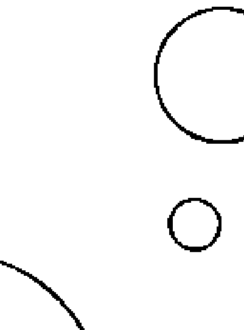

七殺、破軍、貪狼都可以說是人對慾望的各種表現，貪狼是慾望的根源，破軍是對慾望追求的夢想，七殺則是對慾望追求的堅持，當慾望被禁錮起來的時候，當然就會將慾望好的一面展現出來，但是如果枷鎖被破壞了，本來被囚禁的慾望被大量釋放，反而會更加不顧一切，更加奔放（一種參加飢餓三十的活動之後要大吃大喝一頓的感覺）。

例如廉貞、天相的組合，因為天相本身很怕煞、忌，一遇到就走歪，反而會帶壞廉貞星，導致獨守的廉貞一旦牢籠被打破，對面的破軍星慾望同樣會大幅度影響它，仔細想想，六個組合中有五個具有煞、忌，反而加強了慾望爆發的問題。而沒有遇到煞、忌，廉貞星就在自我禁錮的乖巧狀態，如同一個聰明伶俐的外交官，恪守崗位，但是遇到誘惑之後，希望利用本來就具備的魅力、能力以及人脈來滿足慾望，當然就會比一般人更有機會、更能夠爆發慾望的特質。六個組合中，不怕煞星的天府有務實、穩定控制的能力，因此廉貞、天府這一組比較不會因為煞、忌而有爆衝狀況，其他五個組合都會有遇到煞、忌而爆衝的風險。因此在星曜的解釋上，如果不思考星曜的組合影響，廉貞星遇到煞、忌跟沒遇到煞、忌的解釋落差就很大，會出現各類解釋彼此衝突的問題。因此，廉貞星最喜歡的情況就是廉貞化祿，或者遇到與祿存星同宮，形成所謂「廉貞清白格」。廉貞化祿是因為廉潔貞操的特質增加了好處，祿存則是因為祿存星是所謂乘旺之星，將星曜的優點加倍成長，所以增加了廉貞的優點，讓廉貞比較不怕煞、忌，囚牢沒有那麼容易被打破。

# 1. 廉貞對宮為貪狼

廉貞單星的組合裡，只有貪狼在對宮。當廉貞星在命宮，而對宮是貪狼時，廉貞的內心有著貪狼的慾望，廉貞對於自身的創意跟能力的發揮，都會依照貪狼的慾望去展現，希望透過能力滿足內心對世界的期盼。貪狼喜好各種事物，追求人人喜愛的人際關係，希望有各種不同視野，這些隨著貪狼而來的特質，讓廉貞星本身具備的外交官機智與人際魅力滿檔，搭配上貪狼的桃花特質，會是個人人稱羨的人，外型與才能都相當不錯。只是當廉貞星遇到煞、忌時，就會出現想要將慾望極度放大的情況，憑藉自身的能力，希望可以用最快的速度滿足內心的期盼，當然就會出現運氣不支持、人生有風險等問題。因為廉貞的能力條件實在太好，所以出現的問題也會相對嚴重，也因此就容易遊走法律邊緣。這也是為何許多書籍將廉貞星的化氣為囚，引申解釋為犯官非的原因。抄捷徑抄得太順利，一旦運勢轉差，當然就容易易犯官非了。另外，因為廉貞星這樣的特質，這個人的一生就容易風風雨雨不斷。也因為夠聰明機智，會想辦法解決問題，並且希望可以有效率解決問題，所以當人生遇到風雨，自然也會想要探索生命，這是廉貞星也被稱為五鬼星的原因，具有宗教星的質。畢竟這是一個被禁錮的星曜，具有一旦釋放就希望四處飛竄、奔放且磁場強大的靈魂。（以古老華人文化的生命觀念，靈魂與生命是在一起的，廉貞星作為外放的星曜，自然也會有強大能量的靈魂，因為只有能量強大的靈魂才能有如此的魅力，以及推送自己信念跟慾望的洪荒之力。）

# 圖二十一／廉貞星位置圖

| 地支 | 星曜 |
|------|------|
| 巳 |  |
| 午 | 廉貞天相 |
| 未 | 廉貞七殺 |
| 申 | 廉貞 |
| 辰 | 七殺 |
| 酉 | 天相 |
| 卯 | 廉貞破軍 |
| 戌 | 廉貞天府 |
| 寅 | 貪狼 |
| 丑 | 天府 |
| 子 | 破軍 |
| 亥 | 廉貞貪狼 |

# 2. 廉貞、天府同宮

這一組可以說是廉貞星除了化祿或祿存的廉貞清白格之外，最好的廉貞組合。有天府這個王爺照顧控制的廉貞，星曜的特性穩定，對宮七殺，內心對於自己的價值有所堅持，不容易受到煞、忌的影響就爆衝，不會因為環境的變動、慾望的產生，就想要快速抄捷徑，但也是因為有個天府星在旁邊，是廉貞組合裡最不容易想要白手起家，自己創造一番事業的（當然如果受到運限的影響，則不在話下）。因為腳踏實地運用才能，逐步創造自己的地盤，並且不怕苦不怕難，才是他的人生價值。但是因為廉貞星的特質，所以他依然具備創意跟機智，只是相對其他組合，更務實看待自己的人生。

# 3. 廉貞、天相同宮

這個組合的對宮必定是破軍，所以廉貞、天相這個看起來有著宰相照顧、管控的廉貞星，通常應該會有類似天府的效果，有守有為，並且對自己的人生相當有計畫、有目標，可惜因為破軍就藏在內心，所以一旦天相遇到煞、忌，宰相本來該守的規矩與界限破了；廉貞遇到煞、忌，外交官不再廉潔貞操，內心的破軍夢想就會不受控制地奔放出來，當然就會不受控制地展現破軍的力量，為了自己的想法跟夢想，不顧一切世俗規則。這個組合最讓人頭痛的就是，雖然許多時候本命盤的廉貞、天相沒有煞、忌，看起來是個能力很好、聰明、創意十足，並且重視人際關係的人，會在遇到煞、忌時有所轉變，而煞、忌可能會因為運限盤而產生（參看《紫微攻略1》），一旦煞、忌出現，就會變了一個人，受破軍慾望力量的拉扯，在沒有足夠的本錢去支撐夢想下，雖然自己希望在內心的規範與夢想間兩全，但最後卻無法圓滿。

# 4. 廉貞、七殺同宮

廉貞、七殺同宮，這是一組對自我人生價值、對自己人生範圍的控制權有著絕對的堅持。因此，廉貞星的各項才能與特質都在七殺的堅持下，努力向著內心的天府要求的方向去走。廉貞在人際網絡的努力、對自我能力的要求、聰明跟創意機智等特質，皆會因為七殺星對自我堅持的要求，而讓廉貞、七殺的人通常會是人中龍鳳，並且在專業領域達到很好的成就。這樣的堅持信念以及自我要求，並且熟稔拓展人脈的技巧，卻堅持人際的分寸，在古代絕對是上好的大將軍人選，也是各類司法或講求紀律效率的部門最好的主管人才。當然如果遇到了煞、忌，廉貞星會展現出不顧世俗規範的價值觀，但是別忘記，對宮的天府有化煞為用的特質，會將煞星轉為自己所用，雖然少了廉貞的自我道德要求力道，但是轉用了煞星的力量用得好，也會是一方之霸。

# 5. 廉貞、破軍同宮

廉貞的創意跟機智能力加上磁場強大的魅力，如果搭配上破軍無限的夢想與不顧一切的特性，當然會將廉貞的特質發揮到無極限，所以古書上對於女性有這個組合的人，通常風評非常差。反正古人對於所有讓人慾望奔放、風華迷人的，都抱持不好的評價。在現代，這卻是相當使人著迷的特質，才貌兼備、浪漫多情，對宮是天相星，內心對於人生有想法、有計畫，對外重視人際網絡圈。但是這個組合的問題同樣在於天相星害怕遇到煞、忌，煞、忌出現會影響原本內心該堅守的界限，或者廉貞化忌，廉貞牢籠被打破，破軍的力量如猛獸出閘一般地被釋放出來，當然就會因為過於跟隨慾望情感，而讓人生顛簸。所以，這個組合最好的情況是甲年生的人，這時候廉貞化祿、破軍化權，出現廉貞清白格，並且因為破軍化權，對於自身夢想的追求會因為化權而產生穩定的狀態，這時候，廉貞、破軍就在最佳的狀態，擁有夢想跟創意，浪漫跟能力具備，卻不會受感性爆炸而讓人生也跟著爆炸。

# 6. 廉貞、貪狼同宮

這個組合的廉貞對面是空宮，可以把雙星的廉貞、貪狼借過去，呈現表裡如一的情況。廉貞星本身雖然不算桃花星，但是如果宮位內有桃花星的浪漫因子存在，就可以將本身的聰明魅力展現在桃花上，也可以變成桃花星，所以廉貞、破軍才會魅力十足（破軍五行其中一個屬水，斗數中屬水的都算桃花星），而貪狼星當然也是桃花星，加在廉貞旁邊，貪狼的無窮慾望與桃花的特質，當然會影響廉貞在展現個人特質與魅力的時候，會更加偏向於與異性的關係。

這個組合跟廉貞、貪狼對拱的差異在於，廉貞、貪狼同宮時，貪狼會輔助廉貞星展現魅力，而貪狼在對宮時，則是貪狼的慾望帶動廉貞能力的發揮，一個是為了慾望而展現能力（對宮貪狼），一個是用貪狼的能力幫助廉貞更加發揮力量。但是因為這一個組合的兩顆星都會化忌，而且如果對面是空宮，一借過去就是雙化忌，自身空缺再加上內心空缺，又具備機智跟魅力及桃花，難免會做出比較違反道德的事情。如果空宮遇到四煞和文昌、文曲，不能借對宮星曜，卻一樣形成煞星去影響廉貞星的問題，除非廉貞星化祿，否則一樣會有囚籠炸開、欲望奔流的問題，所以這個組合在古書上的風評很差。如同前面各類受批評的組合，其實只是因為古人不喜歡不受控制的人，現今來說，或許這類人感情奔放又創意無限，對於人生會有許多不同的想法，只是如果對宮遇到陀羅，會讓人生在希望奔放跟放不下身段中間徘徊；火星如果遇到貪狼化祿或廉貞化祿，運限走得好的話，則可能因為擁有火星的爆發勇氣、敢抓住機會衝一下，或許有機會有不錯的事業，當然如果運限不好，也可能衝到山谷裡；鈴星則既如往往常地提升了謀略跟算計能力；擎羊則需要注意控制不住自己的真性情；文曲也是桃花，在這個位置當然需要擔心桃花朵朵開，魅力若是太奔放，人生就會太惆悵；碰到文昌雖然可以穩定星曜的浪漫特質，卻也需要擔心因此喪失了原本廉貞、貪狼浪漫不受控制的特質，所帶來願意追求人生美好的能力。

# **廉貞星在命宮小練習**

同樣廉貞化忌，在人生中遇到了可以拿回扣的時候，哪一組廉貞不會做？

- A. 廉貞、貪狼
- B. 廉貞、破軍
- C. 廉貞、天府，且廉貞化祿

> C。因為廉貞化祿為廉貞清白格，而且身邊還有天府在看守他。

# 十、天相星

# 制度的協調與守護者

天相被設定為宰相的概念，一個負責協調國家各部會工作，以及守護國家規則，讓國家在穩定的軌道上運行的工作者，一人之下萬人之上，人際間的協調能力，以及守護心中價值是他的信念。天相『化氣為印』，一個負責蓋章、決定事情的人，不同於廉貞外放的人際拓展，天相雖然也是人際關係的星曜，但他更重視的是身邊周圍既有的人脈維持，能夠讓一切在軌道上運行完美，才是天相的努力目標。所以天相其實跟另外兩個帝星一樣，希望可以有足夠的團隊幫忙，但畢竟不是天生皇室家族，無論宰相是多大的官，還是個打工仔，所以沒有團隊就得要靠自己努力，無論大國、小國的宰相，都需要有一定的門面來撐場面，因此天相相當重視門面，所以天相算是能力好、人際關係佳的人，願意為自己認可範圍內的身邊人付出許多，以此來維繫良好的人際關係。

不過，也因為上述這些特質，天相相對比較怕煞、忌。一個規矩的守護者遇到煞、忌，不再堅守心中的規則，當然就容易出問題，如同廉貞星害怕煞、忌，外交官重視廉潔，以免對外的關係出問題，對內規則的維持當然也怕煞、忌，一旦煞、忌出現，規則就被破壞了。廉貞因為雙星組合是以廉貞為主，所以當牢籠被打破，本來被訓練好的慾望野獸衝出枷鎖，不受控制，而天相的雙星組合都是別人的輔助星，例如紫微天相、廉貞天相、武曲天相，就像是個本來在身邊告訴自己該如何循規蹈矩，做好規劃跟安排的朋友，忽然跟自己說其實可以不照規則走，影響了自己對於原本星曜特性的價值觀，紫微不再為了面子而對事情有所堅持，廉貞不再廉潔貞操，原本控制自己的機巧變成取巧，武曲不再務實地一步一腳印，反而希望可以有快速的方式達到目的，這都是因為天相星的對宮一定是破軍星。破軍的夢想無限大，追夢無極限的價值態度，在天相的內心深處蠱惑他，如同歷史上許多篡位者都是宰相，守護規則的人一旦打破了規則，往往都是為了成就內心的夢想。因此，天相星如果遇到煞星給與動力、遇到化忌覺得自己有所空缺、需要更多，都會引發潛藏在內心的對宮破軍崛起，進而影響天相以及所跟隨的主星。

誠如前面所說，所謂官非，是因為歷朝歷代法律不同，說的應該是一種約定的破壞，不見得是真的被告或者告人。天相如果化忌或遇到煞星，當然就表示這個規則被破壞了，因此可以說有官非的跡象。比較特別的是，大多數斗數流派對於四化的使用，天相星是沒有四化的，但是在我的使用，以及香港某些流派用的四化中，庚年是天相化忌的。

# 圖二十二／四化表

| 天干 | 化祿 | 化權 | 化科 | 化忌 |
|---|---|---|---|---|
| 甲 | 廉貞 | 破軍 | 武曲 | 太陽 |
| 乙 | 天機 | 天梁 | 紫微 | 太陰 |
| 丙 | 天同 | 天機 | 文昌 | 廉貞 |
| 丁 | 太陰 | 天同 | 天機 | 巨門 |
| 戊 | 貪狼 | 太陰 | 右弼 | 天機 |
| 己 | 武曲 | 貪狼 | 天梁 | 文曲 |
| 庚 | 太陽 | 武曲 | 天同 | 天相 |
| 辛 | 巨門 | 太陽 | 文曲 | 文昌 |
| 壬 | 天梁 | 紫微 | 左輔 | 武曲 |
| 癸 | 破軍 | 巨門 | 太陰 | 貪狼 |

原因在於，最早期在斗數發展過程中，應該是十四顆主星各自有四化，甚至應該全都有四化，隨著各家流派驗證之後，慢慢整理成目前所引用出自《紫微斗數全書》、《紫微斗數全集》裡面的四化，但是可以發現在明朝的古書上寫的是庚年「天相化忌」，到了清朝中葉後期卻寫了「天同化忌」，而在書後的案例中寫的又是「天相化忌」，因此根據考證，很可能是因為書為木刻版，歷經戰亂的年代保存不易，遭受火焚或蟲蛀，讓原本的「庚年四化，陽武同相」，「同相」兩個字變成了「月同」兩個字，也就變成目前大多數流派使用的太陰（月）化科、天同化忌，因此書裡才會出現寫天同化忌，但是後面的案例卻是天相化忌的問題。這一點長久以來一直有爭議，近年因為許多實證案例，慢慢地大家也開始認知天相化忌的觀念與實用性。

天相星在雙星組合上皆為其他星曜的輔助星。而單獨天相的組合中，有三組，分別是對宮為「武曲、破軍」、「廉貞、破軍」、「紫微、破軍」。

# 圖二十三／天相星位置圖

| 巳 (天相) | 午 (廉貞天相) | 未 (紫微破軍) | 申 (破軍) |
|------------|---------------|---------------|-----------|
| 辰 (紫微天相) | | | 酉 (廉貞破軍) |
| 卯 (天相) | | | 戌 (破軍) |
| 寅 (武曲天相) | 丑 (天相) | 子 (破軍) | 亥 (武曲破軍) |

# 1. 天相對宮為武曲、破軍

在對於規矩的守護上，對宮的星曜代表了這個規則的建立目的與界限。對宮是武曲、破軍的天相，受到武曲務實特質的影響，會是這三組之中相對在思考上不會追求光鮮門面的一組，但是武曲旁邊畢竟放了破軍，所以遇到煞、忌的時候，難免還是會出現不小心花錢的問題。而這組的務實表現，也是在遇到好的運限時，三組裡面最有可能白手起家創業成功的，個性重義氣而且好相處。

# 2. 天相對宮為廉貞、破軍

當廉貞、破軍在天相的內心時，我們可以想像這是最有魅力的一組天相。廉貞外放的魅力特質搭配破軍的夢想家特質，總是會可以給予眾人許多創意跟希望，也是在群體裡最容易建立起人脈的人，因為魅力與夢想的展現，是這組天相對的自己規則與價值的建立目的，所以也會是最懂得做人，最讓人感到暖心熱情的一組天相。

## 3. 天相對宮為紫微、破軍

與人為善，照顧好身邊的人、做好人際關係，維繫好人脈網絡，是天相星的標準特色。但若對宮是紫微、破軍，這個身邊帶著將軍的皇帝，這組天相當然就是貴氣十足。不同於前面兩組，一個是個性務實但豪邁重義氣的對宮武曲、破軍，一個是熱情風趣創意十足的廉貞、破軍，這一組則是多出了讓人感覺氣質高雅甚至帶著高級感的氣勢，也因為紫微、破軍的影響，這一組也容易在運限有機會出現時創業，因為社會地位崇高跟受眾人景仰，是這個人建立人脈網絡的深層目標。

## 天相星在命宮小練習

哪一個天相最容易跟人有財務糾紛？

-   A. 天相對宮武曲、破軍
-   B. 天相對宮廉貞、破軍
-   C. 天相對宮紫微、破軍

A。因為武曲、破軍的組合在個性上本來就對錢比較不在乎，又同時因為天相的關係，希望一切有個規矩，一旦天相化忌，規矩被打破，自己原本對人的錢財大方可能就會帶來財務麻煩。

## 十一、天梁星
人生守護神，上天給與的庇佑

天梁星化氣為蔭，在紫微斗數中的設定是庇蔭自己的守護神，在傳統社會中通常都是家族中的老人，才會有這樣無私的庇蔭特質，所以天梁星也稱為老人星。老人都是有生命經驗的，因此天梁星也是博學的星曜。既然是老人，當然對於生命的價值與追求就有深刻的了解，也會想要追尋真理與探索生命真相，所以這個星曜也是宗教哲學和醫藥的星曜。比較特別的是，他也是吸毒與賭博的星曜，原因在於吸毒在現代已經被證明通常是因為追求心靈上的滿足而使用（其實毒品最早的出現就是為了宗教儀式，以及人追求心靈提升使用），當然這需要遇到足夠的煞、忌，讓人心偏向於情感的衝動，還有機會買到毒品。賭博則是因為天梁星有一個組合是對面為天機星，聰明、邏輯能力好，這樣的人對於賭博可能是用投資的心態看待，賭博是我們說的，對他們而言，這可是專業投資理財。因為在古老的世界觀，靈魂與天地運行會有一定程度的關係，天梁星就是被設定來解決這個部分的。代表上天無私的給與，就像家中長輩對我們無私的愛（雖然也有例外），是一顆絕對的庇蔭星曜，因此這是唯一一顆真正可以壓制煞星力量的主星。在斗數的三大福星中，天府是化煞為用，將煞星抓來為己所用；天同因為個性天真不計較，所以遇到煞星也可以樂觀面對；天梁星則是唯一真正可以降低煞星力量的，但是也只有降低，並不能真正消弭煞星的力量。另外，天梁星還有一個有趣的特質，也是所有庇蔭類星曜的一貫特質（太陽、太陰也算庇蔭星曜），只要化權，都會讓人有小小的討厭。太陽過於強勢，太陰過於碎念，而天梁則是碎念到讓人不想跟他過日子，這也是天梁跟天機一樣被古書形容成「早刑晚孤」的原因，大家都不想跟一個碎念的老人一起吃年夜飯，不是嗎？而天梁星在雙星中都是以別的主星為主，例如「太陽、天梁」、「天機、天梁」、「天同、天梁」，其他都是單星組合的對宮為太陽、天機、天同。

## 1. 天梁對宮為天機

天梁星這麼一顆個性清楚的老人星曜，本身的庇蔭能力跟態度，對應對宮的星曜，也相對好理解。對面是天機的，因為內心聰明邏輯好，善良但也不喜歡一成不變，所以這一組是天梁星裡活動力最強的，可以想像成一個活力十足的大叔。

## 2. 天梁對宮為太陽

對面是太陽的，則像個權威的爸爸，照顧人的同時，一切要照他的規則走，但也是天梁組合裡最關心社會議題，有正義感的一組。在傳統命理學上，如果是女生有這個命盤，太陽在落陷位比較好，免得搶了爸爸跟老公的風采。

## 3. 天梁對宮為天同

對面是天同，這一組在古書上又被說得十分難聽，雖然最難聽的是天同在命宮，天梁在遷移宮，但是遷移宮天同的也好不到哪裡去。其實是因為這一組的人，就像老頑童，老人內心有顆赤子之心，永遠有著天真的理想，以及不錯的桃花，如果再加上更多桃花以及煞星，就容易不安於室。事實上，這一組的人卻是運氣好且人緣佳，想想看一個人可以到老都保持赤子之心，很大的原因通常都是運氣還不錯，不是嗎？最後，天梁也被稱為貴人星，但因為天梁在命宮，所以表示自己是大家的貴人，自己是那個庇蔭大家的人，所以跟天梁人借錢救急是最容易的。

## 圖二十四／天梁星位置圖

| 巳，天梁 | 午，太陽 | 未，天梁 | 申 |
|----------|----------|----------|----|
| 辰，天機 天梁 |          |          | 酉 |
| 卯，太陽 天梁 |          |          | 戌 |
| 寅，天同 天梁 | 丑，天機 | 子，天梁 | 亥，天同 |

## 天梁星在命宮小練習

天梁是個仗義疏財的星曜，當天梁星借錢給你的時候，哪個組合最有可能收利息？

-   A. 天梁、太陽對拱
-   B. 天梁、天同對拱
-   C. 天梁、天機對拱

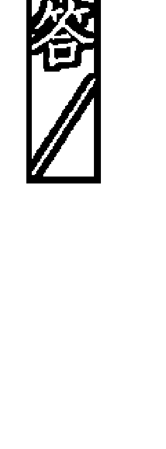

> C。天梁的個性基本上對金錢的借出會不好意思與人計較，但因為天機星在對宮的天梁，天生有數字觀念跟邏輯，所以會自動換算自己因為借出損失了多少錢，也因為天機星重視邏輯，所以較容易將借錢的行為加上利息。

## 十二 天同星
純真浪漫用愛與包容行走天下

天同「化氣為福」，這個福字當然表示天同是顆福星，但福氣不是來自運氣好，而是來自於天生像孩子一樣不與人計較的個性，這樣不計較的個性連帶著引申出心寬體胖的概念，所以天同一直被人傳頌有著唇紅齒白和圓潤的體型，其實這是太陰、天同或是天同對面是太陰的組合才比較容易發生。天同的個性善良，也因為具有很好的智慧跟學識能力，所以天同的孩童個性也代表教育的意義，這個孩童的概念包含了孩子不與人爭的特質，會讓人希望能保護他，所以天同具有天生的福氣之原因來自於此。但是，這樣的個性也會有些小缺失，例如，常被人提到不夠積極進取，或是因為個性善良，不懂得拒絕，加上本身五行屬陽水，也是桃花星，如果在三方四正內再遇到桃花星，就容易有感情上的問題。並且因為天同星的個性來自於本身如孩童般的善良，如果跟巨門放在一起，會被巨門這個黑暗之星吞食，如同一個孩子在黑暗中，因為擔心受怕就不再天真善良，只會受到情緒糾結的影響。有趣的是，這個組合卻也是天同組合中比較不容易感情氾濫的一組，因為他糾結害怕感情中的失去都來不及了，哪裡有時間拈花惹草。天同星單星組合中的對宮分別為「天梁」、「太陰」、「巨門」。這個善良的孩子根據不同的內心狀態，也會有不同的表現。天同星的雙星組合裡，以天同為主的有兩組，「天同、巨門」、「天同、天梁」。

## 1. 天同對宮為天梁

天梁在對面者，就像天真的孩子內心有個老靈魂，純真善良的表現卻存著喜歡照顧人的心，個性成熟能力好。

## 2. 天同對宮為太陰

對宮是太陰的組合，內心是純粹的女性特質，太陰、天同都是桃花星，需要擔心的是如果遇到煞忌，會太過受到桃花跟感性的影響，在感情上較有問題，容易有牽扯不清的感情。但是，這一組因為都會化祿，並且一個代表福氣、一個代表富足，所以其實這一組相當適合創業做生意，畢竟生意要好，人緣和運氣好相當重要，更別說太陰的細膩會大幅度降低天同不與人爭背後隱藏的散漫小缺點。

## 3. 天同對宮為巨門

天同對面是巨門，巨門內心的黑暗，雖然不會像同宮的巨門會整個吞食天同星，只是內心帶有黑暗跟不安全感，整體展現出來的還是天同的天真樂觀特質。然而，這時候如果太陽在落陷位置，因為巨門的黑暗增加了，內心潛在的不安感與對人的不信任也會比較嚴重，如果身宮又在遷移宮，就會有類似天同、巨門同宮的問題。

## 圖二十五／天同星位置圖

| 巳 (天梁) | 午 | 未 | 申 |
|-----------|----|----|----|
| 辰 (天同) |    |    | 酉 (天同) |
| 卯 (太陰) |    |    | 戌 (巨門) |
| 寅 (天同天梁) | 丑 (天同巨門) | 子 (太陰天同) | 亥 (天同) |

## 4. 天同、巨門同宮

天同、巨門同宮最大的問題，就是因為天同的福分被巨門吞食，容易有情感糾結，導致個性無法大開大合，總會想東想西。這個組合的對宮一定是空宮，所以當化忌出現，就會產生雙忌。加上這個位置會有文昌、文曲同宮出現，命宮、遷移宮容易同時出現三個忌，何況化忌的星曜都是思慮星曜或黑暗星曜，所以這個組合最大的問題都是在情緒心情上。如果對宮空宮是煞星，遇到陀羅個性更加糾結；遇到擎羊跟火星，除了脾氣比較不好，做起事來反而變得比較果決；遇到鈴星會更加深思熟慮，也可以消除感情用事的問題。不過，因為紫微斗數中有一個很好的組合格局「明珠出海格」，說的是遷移宮是天同、巨門而命宮空宮，這是一個只要有祿、權出現在三方四正內，運限不要太差通常人生都很順遂，所以如果天同、巨門在命宮，只要遷移宮、福德宮、夫妻宮不要有煞、忌，其實可以建議他離家，往外發展，透過環境給與的壓力，讓他不再受情緒控制，反而會有不錯的事業發展。

## 5. 天同、天梁同宮

天同身邊加上了天梁這個庇蔭星，善良天真中會帶著喜歡幫助人的特質，當然也會加上一點老氣橫秋的個性，這是天同這個白嫩桃花星裡面，相對來說感覺比較有男子氣概的，也是天同組合裡，除了與天梁對拱那一組之外，最有學習能力的。因為對面是空宮，同樣要注意如果是文曲在對宮，會有思慮與桃花問題；文昌則是更增加天梁的成熟性格而且規矩很多，就降低了天同傻傻的個性。遇到各個煞星時，除了陀羅之外，都會增加天同的動力，但也一樣會破壞了天同的福氣。

## 天同星在命宮小練習

哪個天同最容易舊情復燃？

-   A. 天同、天梁同宮
-   B. 天同、太陰同宮
-   C. 天同、巨門同宮

B。天同、太陰同宮最有可能，因為天同、巨門對情感有某些潔癖，愛的時候無法分開，分了之後也會斷得乾淨；天同、天梁同宮當然也有機會，但是天同、太陰這一組最容易心軟，所以機會最高。

## 巨門星
黑暗中善良的火把

巨門星化氣為暗，被設定成一個黑洞。巨門的原意是一間巨大而黑暗的房子，在星象上就是會吞食所有星曜光芒的黑洞，源自人們心中對黑暗的不安，引申為內心深處的不安全感。因為內心的黑洞，所以對於世界有著期望得到認同的陽光，以及不敢面對世界，想隱藏自己的複雜情緒。關於巨門的所有形容都來自於此設定，無論是容易引起口舌，以及所在宮位就是比較黑暗的宮位（巨門為隔角煞，所在宮位會因為不安全感而小心對待，因此與那個宮位代表的人產生疏離），所以巨門的重點在於需要太陽，只有太陽可以給予黑暗的巨門光亮（紫微斗數借用天文概念，所以都是假的星曜，就別深究其實太陽也照不亮黑洞的問題了）。因此，看到巨門的時候，需要注意太陽的亮度，太陽在旺盛位置的巨門會降低黑暗的狀態，但這只是讓巨門的黑暗轉成隱性，並不是真正消除問題，在巨門遇到煞、忌的時候，一樣會展現出來。有趣的是，因為這份不安全感，所以巨門在命宮的人通常擁有不錯的各類知識，並且頗為努力，希望成就不會太差，至少不要讓人看不起，這樣的特質在命宮當然就總管了十二宮都會如此，在各宮位則在各宮位上展現。紫微斗數中常有這種與傳統觀念衝突的設定，其實這才是真實的人性，一方面害怕、一方面努力，會不安不敢靠近，同時又希望可以接近、可以得到，這才是真正的人心。巨門星就充滿這樣的特質，如同黑暗中一支小小的火把，有顆溫暖的心卻需要人好好呵護，否則很容易就熄滅了，所以才有內心善良，希望展現溫暖，卻常常不小心太快拿出火把，反而將火把弄熄了，變成一片黑暗、口不擇言得罪人，最後變成有口舌之災。巨門在命宮的時候，福德宮一定是天梁，福德宮代表靈魂是個希望幫助人的天梁，這就是巨門在斗數全書中被稱為「敦厚溫良」的原因。以巨門為主的雙星只有一個巨門、太陽組合，其他都是巨門獨坐的情況。巨門獨坐，則對面宮位會有一天機、天同、太陽三種組合。

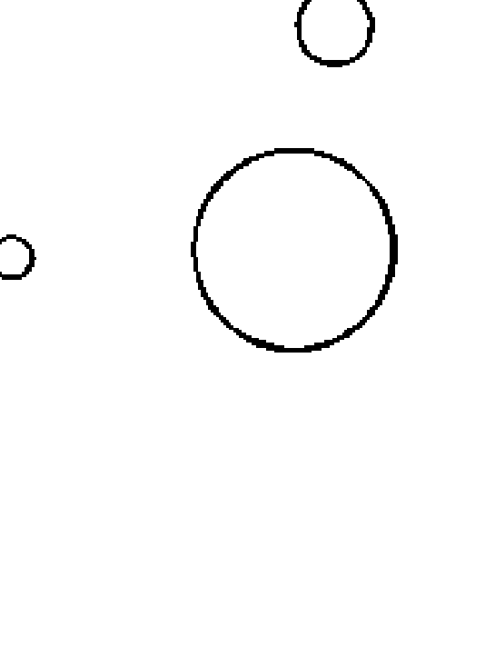

## 1. 巨門對宮為太陽

對面是太陽的組合，如果太陽在旺位，稱為「明月趨暗格」，太陽趨逐了巨門的暗，巨門的不安全感被隱藏起來，轉成博學努力跟開朗的優點，能言善道又陽光；若太陽在落陷位，則因為太陽不給力，所以內心的不安全感會很明顯，個性上會一面要求自己，一方面更希望環境可以給予幫助，因此如果遇到煞、忌，很容易從事遊走法律邊緣的工作。男性、女性通常都相當有魅力。

## 2. 巨門對宮為天同

對面是天同的組合，雖然巨門有著不安全感，但個性善良樂觀，太陽在旺位時，會展現出天同樂天、好相處的特質，加上天同是桃花星，通常外型不錯，也討人喜歡；若太陽在落陷位，則雖然天同的純真依然存在，但是也較任性、情緒化。

## 3. 巨門對宮為天機

對面是天機的組合，則是一般稱為巨門的另外一個好格局「石中隱玉格」，但是這個組合只有巨門在「子」的位置才算石中隱玉格，因為此時的太陽在旺位，巨門的黑暗被消除，並且搭配天機星的聰明邏輯好，雖然年輕的時候因為個性問題，人生較不順利，中年過後卻會因為人生經驗以及個性的成熟，搭配上原本的博學聰明轉變成不錯的特質，所以中年後大富貴。若是在「午」的位置，則因為太陽是落陷，較容易淪陷於情緒問題，而浪費巨門的優點。

## 圖二十六／巨門星位置圖

| 巳   | 午   | 未   | 申   |
|------|------|------|------|
| 太陽 | 天機 |      |      |
| 辰   |      |      | 酉   |
| 天同 |      |      |      |
| 卯   |      |      | 戌   |
| 天機 巨門 |      |      | 巨門 |
| 寅   | 丑   | 子   | 亥   |
| 巨門 太陽 | 天同 巨門 | 巨門 | 巨門 |

## 4. 巨門、太陽同宮

巨門只有這個雙星格局是巨門為主的組合。這個組合會在「寅」、「申」兩個位置，對面是空宮。因為巨門需要太陽的照耀，所以巨門、太陽同宮在一起，太陽的光芒要足夠，因此這個組合最好是在太陽旺盛的「寅」一位。雖然對面是空宮，借去之後，太陽變成落陷，但是由於太陽夠亮，可以照射對宮，所以整體來說很像明日趨暗格局那一組。又因為具備太陽，所以多了會照顧人的特質，也有一切希望照自己規則進行的太陽特質，少了單獨太陽在外的熱情樣貌。如果遇到火星、擎羊，個性比較衝動，但是也相對降低了隱藏的不安全感；如果是陀羅，則感覺像是太陽落陷了，一下太陽、一下巨門，個性搖擺；如果是鈴星，則少了熱情，但是多了計畫跟冷靜的特質；遇到文曲，則算是能言善道、才華洋溢；文昌則會讓個性變得比較拘謹。但如果是在「申」一位的巨門太陽，則因為太陽在落陷位，力道不夠，熱情常常只有三分鐘，巨門黑暗的狀態不時浮現，雖然因為對面「寅」一位是旺盛的太陽，但那只是對外的表象。如果對宮有四煞或昌、曲，不能借星過去，這個問題就會更嚴重，因為連對宮的旺位來補救也沒用，遇到文昌、文曲就會變成想太多，煞星也都會讓想法比較偏向悲觀。

## 巨門星在命宮小練習

傳說許多古代的忠臣都是巨門星，因為巨門需要被重視，內心黑暗卻堅持自我價值的特質，以及福德宮有天梁，傳說中文天祥就是巨門坐命，依照歷史上文天祥抵抗外敵到死，死前還罵人，這最可能的組合是哪一個？

> 解答

巨門在亥，對面是太陽這一組。這一組因為內心太陽的影響，希望一切太陽底下的規則都要照著自己的想法走，所以相對來說是社會價值與政治問題，是許多政治人物會出現的命盤，所以這一組最有可能。

## 武曲星

剛毅耿直，一步一腳印，說一不二的正財星

武曲化氣為財，是紫微斗數中明訂的財星。其他類似的財星還有天府的庫星（計畫性自己印鈔票）、太陰的富星（媽媽般存錢聚沙成塔），而正式的財星則是武曲星。武曲被設定的特質是衝鋒陷陣的小將軍，個性耿直、一步一腳印，守信諾、重義氣，但是因為個性剛毅，有時不好相處，容易得罪人，因此也稱為寡宿星（一個人睡覺）。這本書看到這裡大概就可以知道，具有以上特質表示武曲最好能遇到化祿或祿存，才能彰顯財星特質。這個剛毅耿直的人如果跟紫微星一樣有人幫忙當開飛機賺的錢就不一樣。最後，如果加上顆桃花星，就會讓剛毅特質變得可愛討喜，做事比較不會一板一眼。

## 1. 武曲對宮為貪狼

武曲星的雙星組合會有以下幾種，『武曲七殺、武曲破軍、武曲貪狼、武曲天府、武曲天相』。武曲星單坐在宮位內的時候，只會是貪狼星在對宮，這個組合古書稱為百工之人，跟貪狼獨坐、武曲在對面的時候，會如同鏡子一樣反射，貪狼在命宮是個性聰明活潑但內心務實。武曲在命宮、對面是貪狼，則是武曲受到貪狼影響，雖然個性一步一腳印很務實，但是追求金錢財富的特質不變，並且因為遷移宮是貪狼，所以太過剛殺正直的問題降低了不少，如果有專業技術，中年過後因為人生歷練夠了，將特質發揮出來，通常也會有不錯的事業成就。另外，武曲雖然被稱為財星，但只有在命宮跟財帛宮才能單純當成財星看待，其他地方則以財物價值、金錢觀，以及剛毅正直這類的個性特質來看待。武曲也怕煞星，遇到煞星通常表示會有跟錢相關的災害與問題。

## 圖二十七／武曲星位置圖

| 巳 | 午 | 未 | 申 |
| :---: | :---: | :---: | :---: |
| 天相 | 七殺 | | 破軍 |
| 貪狼 | | | 天府 |
| 武曲 七殺 | | | 武曲 |
| 武曲 天相 | 武曲 貪狼 | 武曲 天府 | 武曲 破軍 |

## 2. 武曲、七殺同宮

武曲這個拼命務實的主管，遇到了不妥協的七殺，加上對宮有天府，自然會對自己的目標跟理想努力奮鬥不懈，並且因為擁有天府星的企圖跟謀略，如果運限走得好，通常會有不錯的人生成績。問題是武曲、七殺都是因為個性堅持，造成人生較辛苦的星曜，如果像紫微一樣，能在三方四正有吉星，會比較好一點，否則偏固執的個性會讓自己在人生努力的路上顯得孤單。另外，這個組合比較需要注意的是，如果是大限命宮，會有好前五年、敗後五年的問題，因為前面很敢衝，容易成功，但成功之後的固執，會讓自己沒注意到風險，若加上擎羊則有機會在遇到煞、忌時，宮位出問題，通常是跟錢有關係的官非問題。

## 3. 武曲、破軍同宮

破軍算是桃花星，所以武曲、破軍可以算是武曲星遇到桃花星，增加了武曲星的創意跟能力，也降低了武曲星的孤單問題，聽起來相當不錯。不過，武曲畢竟是紫微，遇到破軍星可能會太過浪漫，有時對於金錢的控制反而變得不夠務實，而偏向不計較、不在乎，加上對宮的天相影響，遇到煞、忌就容易在理財上出現脫軌。的行为，否则因为天相的好人缘，加上破军的不爱钱，以及破军的创意跟天相的条理，会让这个组合的能力不错、人缘也好。

## 4. 武曲、贪狼同宫

这一组是武曲中著名的好格局「武贪格」，对面是空宫，可以把主星借到对宫，是个中年后会有大富贵的组合，原因在于武曲、贪狼两颗星都会化权、化禄，加上可以借主星到对宫，在运限组合上，很容易出现双禄交持、双权这样很旺盛的组合。加上武曲星受到贪狼影响，帮助武曲增加能力跟人缘，变得个性灵活，不再一成不变，因此是个很容易在人生上取得胜利的格局。然而，古书也写了「武贪不发少年时」，这是因为这个组合容易遇到煞、忌，加上这个位置会昌、曲同宫，武曲跟贪狼也都会化忌，人生无法只选择好处，有双禄就会有双忌，何况昌、曲也会化忌，很容易就有三个、四个忌了，要是再来一颗煞星就毁了。但是运限在走，煞星到处都有，所以风险很高，人生如果早期顺利后面运差，往往让人难以承受，所以古书的这段说法有两个解释：一是不能发于少年时，因为一发于少年时，遇到煞、忌出现，人生不顺，就会很难受。二是不会发于少年，人生磨练到四十多岁以后

### 5. 武曲、天相同宫

天相的对面一定是破军，所以这一组必然有颗奔放的内心，奔放的梦想放在心里，而天相守护着规矩、帮助武曲增加人缘、做事情更有方法，这一切都相当美好，唯独天相怕煞、忌，所以一遇到煞、忌出现，天相走了歪路，管不住破军星，内心的梦想跟浪漫不受控制地变成野兽，连带着武曲就不会再务实跟理性，当然财务上就容易出问题。

## 6. 武曲、天府同宫

这一组绝对是武曲星除了武贪格以外最好的一组，武曲星受到天府的帮助，个性比较宏观、做事情有计划。缺点是七杀在内心，个性的固执跟强硬会是人生中的小问题，不过因为做事踏实有计划，个性上的坚持和不追求不切实际的梦想，不像

## 武曲星在命宫小练习

在相同的条件下，武曲的哪一个组合最适合当牙医，最适合往公务机关发展？

牙医算是一种专业技能，在相同条件之下武曲、贪狼对拱，重视专业技能的百工之人最适合。而武曲、天相跟武曲、天府都相当适合往公务机关或大公司发展，因为这两个组合相对来说较稳定，虽然天相需要注意煞、忌问题，但是天相的好人缘也适合在大团体里有发展。当然武贪对拱也适合，只是最好还是跟专业技术有关系的工务部门。

武曲、破军，因为两颗星都会化权，也不像武曲、贪狼两颗星都会化忌，容易将梦想变成创业，也容易遇到煞、忌出现，因此通常可以稳定地完成自己的梦想跟成就，并且因为天府星的存在，所以比较不怕煞星。

## 命宫各星曜总结

命宫在紫微斗数命盘上总管十二个宫位，如同一个人主要的个性价值会影响人生中做出各种决定，例如太阳在命宫的人，通常会希望生活中所有的人、事、物都依照自己的规则运行。太阳在命宫的人，夫妻宫一定是天同，夫妻宫表示这个人的感情态度，天同的不争夺、乐观个性，感觉似乎跟太阳是抵触的，但太阳的特质还是会影响感情观，也就是虽然在情感上是乐观且好相处的，但重要的事情还是会希望依照自己的意见进行。这也就是我们常说不能只看一个宫位的原因，命宫所呈现的星曜涵义通常会比较偏向个性跟价值，也就是决定事情的态度以及对人生的看法，其他各宫位对星曜的解释，就可以想像成这个人在各宫位时所做出的选择，例如刚刚的例子：夫妻宫天同、命宫太阳的组合，虽然太阳星希望一切按照自己的意思决定，但因为夫妻是天同，所以在情感上比较不愿意争夺，很容易原谅别人在情感上的过错，这也是太阳在命宫时会被形容成很适合当小老婆的原因，因为对她来说，情感上不见得需要争夺名分，尤其是落陷的太阳更是如此，对于感情会有极大的容忍度。
所以看各星曜在命宫的解释，尤其是本命盘（本书的解释也以本命盘为主），应该偏向于星曜的个性特质，先从这个角度去思考跟练习，慢慢熟练之后就可以再对应运限盘，解答出因为个性造成运限的状况，搭配上《紫微攻略1》的煞、忌，《紫微攻略2》的飞化，就可以全面掌握整个命盘的解释。

## 第三章

### 上天的帮手

兄弟宫

## 观念建立

我们在紫微斗数中遇到的第一个六亲宫位是兄弟宫，所谓六亲宫位说的就是我们跟人的关系，这个关系来自于对六亲宫位代表人物的看法，以及相处时采取的态度，至于看法就是我们觉得他是一个怎样的人，但不代表他真是那样的人，例如父母宫代表父亲，家中三个小孩的父母宫可能不一样，难道爸爸会有三个吗？并非如此，而是因为三个人眼中的父亲都不同，另外一个意义是我们与这个宫位所代表的人相处时，会希望拥有的关系，例如仆役宫代表平辈朋友关系，仆役宫内有紫微星，一方面代表希望认识有身份地位的人，一方面则是希望在朋友关系中自己是被尊重的。许多人在学习六亲宫位的星曜解释时，常常在这一点感到很混乱，无法理解为何认识皇帝还想当皇帝的举例，虽然紫微斗数的星曜为了方便大家理解，有个代表人物的设定，但是壹切要回归到「化气」是什么的中心价值来讨论。紫微一化气为尊一，希望认识的朋友是尊贵的，也希望自己受到尊重，以此为基础再加上四化跟辅星去解释，并且考虑三方四正的影响，就可以将宫位内星曜的涵义解释得很细腻。关于六亲宫位还有一个小技巧很少人知道，就是当双星出现时，在宫位内可以有自己与对方感受的解释，例如兄弟宫代表同性别的兄弟姊妹（不同性别的兄弟姊妹在仆役宫）。兄弟宫内有紫微、七杀，在与兄弟的往来上，会觉得自己的兄弟像紫微，感觉高高在上，而我的态度则会让兄弟宫所代表的兄弟姊妹觉得我像固执且对事情很坚持的七杀，双星在六亲宫位可以有这样一个论法。这一章所讨论的兄弟宫，除了同性别的兄弟姊妹之外，还代表了自己的母亲。母亲在我们出生时就已存在，所以将本命盘的兄弟宫当母亲看待时，可以当成我们眼中的母亲的个性跟类型；当兄弟宫使用时，则说明我们对兄弟姊妹的看法跟态度，但不见得表示兄弟姊妹就是那个样子。此外，因为现代社会少子化，我们不见得有兄弟姊妹，如果没有，当然就不当兄弟姊妹论断，而当母亲来论断的时候，也只能看我们对母亲的看法，实际与母亲的状况要从运限盘去判断。如果父母离婚，从小母亲不在身边，则兄弟宫只能说是母亲对我们的遗传影响。总之，本命盘只在于态度跟价值，实际发生的情况现象都要从运限盘判断。

许多书籍会讨论到从兄弟宫看自己有几个兄弟姊妹，这一点在这个年代其实不容易准确，因为现代有太多外力足以控制怀孕跟生产，所以准确度会有所偏差，但是后续在各主星的解释中有部分可能的迹象依然会提到，包含可能有同父异母的兄弟，以及在查看本命盘的兄弟宫时，要注意运限是否有煞星或者化忌进去兄弟宫的三方四正，如果有三个以上，就要特别注意并参考《紫微攻略１》的说明。

## 紫微星
皇帝般尊贵的亲戚，可惜他贵我只好跪

有些书会说有紫微天府在命宫的两旁时，这个人命格很好（紫府夹命），其实只是因为父母在我们出生之前就存在，如果父母可以是紫微、天府，感觉上比较有社经地位，或是有财力可以帮帮自己，但紫微跟天府是否有足够的能力，须视紫微及天府有无其他加强能力的星曜辅助。相对的，这也表示自己相对弱势。而且有时候这种说法会忽略一件事，兄弟宫代表的不见得只有母亲，还会有同性别的兄弟姊妹，而兄弟姊妹在兄弟宫的看法，说的是我对兄弟姊妹的态度，因此，紫微在兄弟宫，我觉得自己的兄弟贵气，又希望对方要能给我足够的尊重，除非遇到化禄或禄存，否则就会符合紫微斗数在六亲宫位上的一个通则「他贵你就贱」。

紫微斗数的所有设计皆是依照社会文化逻辑设定，现实情况中，人跟人之间的问题常常受彼此气场不同影响，以及因能力跟社会地位不同，而产生彼此关系的高低感受，有些人自动地就会觉得好像矮他人一截，有些人虽然看起来很温和，但是与之相处时会不自觉听他的话。如果紫微星在兄弟宫，表示盘主对于自己兄弟姊妹会不自觉觉得对方是天之骄子、受尽尊宠，这样的相处情况，除非如前面所说遇到化禄或禄存，或是紫微贪狼这个有趣皇帝的组合，否则很容易就有与兄弟不和的感受，所以当紫微星在兄弟宫除了对应的是母亲关系之外，如果希望兄弟姐妹给与自己帮助，可能就要失望了。

### 1. 紫微、七杀同宫

紫微星有几个组合，「紫微、七杀」在兄弟宫的组合，盘主在兄弟姊妹的关系上会希望得到尊重，并且希望自己有能力在兄弟姐妹间掌握一切，毕竟这一组的对宫是天府星，在内心里面要能够有自己的实际影响能力。

### 2. 紫微、破军同宫

「紫微、破军」在兄弟宫的组合，虽然对宫有天相星，也会希望在兄弟姊妹关系中符合自己的人生准则，不过因为天相星的关系，相比之下对兄弟姊妹很好，尤其如果遇到破军化禄，对亲人会有许多照顾跟付出，不过要注意对面的天相是否有化忌，否则就容易出现亲友之间因为财务而产生问题。

### 3. 紫微、贪狼同宫

「紫微、贪狼」在兄弟宫的组合，因为是个好玩乐的皇帝，所以只要对宫没有出现煞、忌，通常问题都不大。不过这一组也是兄弟各自努力的一组，通常母亲过世后，大家只会偶尔联络。

### 4. 紫微、天府同宫

「紫微、天府」在兄弟宫的组合，对宫是七杀，兄弟之间比较不容易有亲昵的感情，较会彼此争夺权益。

### 5. 紫微、天相同宫

「紫微、天相」在兄弟宫的组合，同样是小时候感情不错，但是人生中太高的机率容易遇到煞、忌，所以有可能在煞、忌出现时，兄弟间出现问题，因为兄弟宫同时也代表父亲的夫妻宫（父母宫的夫妻宫），如果宫位内有煞、忌，加上有左辅、右弼、天魁或天钺这些星曜，可能出现小时候父母离异，造成单亲状态。

### 6. 紫微对宫为贪狼

最后一个紫微独坐兄弟宫，对面是贪狼星的组合，如果遇到煞、忌，这个人可能跟自己的兄弟姊妹不亲近，反而跟外面的朋友比较亲近，如果三方四正没有煞、忌出现，也会因为长大后兄弟之间各有发展而较为疏离。

## 紫微星系在本命兄弟宫小练习

兄弟宫可以代表跟母亲的关系，当命盘在相同条件下，缺钱的时候，哪一个兄弟宫的紫微星组合，最容易向妈妈借到钱？

紫微、破军。破军化气为耗，只要破军化禄，很容易就是破耗自己，借钱给他人，而运限在走，破军化禄一定会有，所以这一组最有机会。其他组合如紫微、贪狼的也有可能，但是钱不会太多，不过这单指母亲，因为化禄所在的宫位除了父母亲，通常都是你对那个宫位的人好，所以如果是同性别的兄弟姊妹，则是你借钱给对方。

## 二 天府星
豪迈稳重的王爷是我兄弟

一样是帝星，天府在兄弟宫的情况会比紫微稍微好一点，毕竟天府比较务实，摆阔跟骄傲前会想一下，而且总会做点样子展现自己的雍容大度，因此天府在兄弟宫，如果有禄存或化禄同宫（例如武曲、天府同宫，武曲化禄），通常对自己比较有帮助。所以正式的紫府夹命，应该是紫微、贪狼在父母宫，天府在兄弟宫，而且紫微三方四正遇到吉星，天府遇到禄存，这个时候的命宫天机、太阴，就会得到许多来自父母的帮助，就算不是来自母亲，也会来自同性别的兄弟姊妹。虽然前面说到，六亲宫位除了父母亲之外，宫位代表其他意思时，遇到化禄或禄存，都是自己对那个宫位的人好，但是在天府这颗星的状况下，这个遇到禄就会变成库星的天府，则是彼此好来好去的情况，想想兄弟宫代表的兄弟缘分跟财库一样，这是多爽快的一件事，不过，在这个大前提下还是会有所区分。
天府星在所有双星组合中，都是当主星的辅助星，例如廉府的廉贞、天府，武府的武曲、天府（这些双星皆留待各主星解说时提到）。单纯独坐的天府星，因为对宫会有三种不同组合而有所区别，这三种不同的对宫组合分别是「紫微、七杀」、「廉贞、七杀」、「武曲、七杀」。因为对宫不同，天府星各自心里务实的盘算皆有所不同，也就是对于兄弟姊妹之间的相处态度跟看法有所不同。

### 1. 天府对宫为武曲、七杀

以对宫为「武曲、七杀」来说，是位耿直的天府王爷，说的话会守信用，个性比较刚硬，但是重视跟兄弟姊妹间的承诺。当然如果出现武曲化忌，或者有煞星，就会因为比较不会变通的财务观念跟兄弟姊妹有所争执。如果是母亲的角色，则是因金钱观念差异会有所不合。

### 2. 天府对宫为廉贞、七杀

如果是「廉贞、七杀」这一组，对待兄弟姊妹的态度大方爽快，内心却有所盘算，并不会完全地付出，懂得保护自己，当然也可能是觉得与兄弟姊妹的关系需要维系但不用努力（廉贞星是最懂得用最省时、省事的方法达到目的的星曜），如果遇到廉贞化禄或禄存，形成廉贞清白格，就会跟兄弟姊妹保持很好的关系，也会懂得照顾兄弟姊妹。如果是妈妈，则是位很会持家的母亲。如果是廉贞化忌，则要注意兄弟姊妹间会有因为家产而产生的问题（天府王爷重视自己的地盘而务实，当然会有所有权事物的概念）。

### 3. 天府对宫为紫微、七杀

最后一个「紫微、七杀」，这位有权势的王爷，这个天府就算有化禄，仍与兄弟姊妹往来不多，除非命宫太阴有不错的条件，否则内心是紫微七杀的天府星，自己在兄弟姊妹间的态度会是重视家人，但是需要家人给予一定的尊重。这样的态度亦需要搭配足够的能力。加上兄弟宫也可以当成盘主自己认为兄弟姊妹是像王爷这样特质的人，盘主自身如果没有足够能力，当然会变成想掌控兄弟姊妹间的主导权却做不到的痛苦，虽然还是会努力地将人情做得很好，却禁不起煞、忌的骚扰。最后，天府星的王爷库星特质，也代表如果三方四正出现化禄或禄存，有可能

## 天府星在本命兄弟宫的小练习

哪一组天府单星及禄存组合于兄弟宫时，对盘主自身最有帮助，并且愿意提供实质的帮助？

天府星单星时，对面会有「紫微、七杀」、「廉贞、七杀」、「武曲、七杀」。看这几个组合，就可以了解，真正会默默帮助自己的，应该是「武曲、七杀」这一组，因为这一组的王爷最务实且重义气。「廉贞、七杀」也有可能，但是自己本身的条件必须也很好。「紫微、七杀」则专注于照顾自己，除非当下大限的运势强旺，才可能得到兄弟姊妹的帮助，但是如果自己运势很强旺，又何需他人帮助呢？所以这一组比较在彼此的结盟合作，不是单纯江湖救急式的帮忙。

兄弟姊妹比较多，而且因为天府相对稳定跟有谋略的特质，自己的兄弟姊妹通常会在大公司或公务机关任职。母亲则很有能力，有趣的是如果有禄存出现，这时候刚好命宫会有擎羊，对宫紫微星化权，母亲很可能是商场女强人，会因此对自己疏于照顾，但是也会影响自己的个性，变成比较坚强。

## 三 天机星

### 身边永远的智多星

天机星是兄弟主，意即最适合放在兄弟宫，因为放在命宫会有太傲于自身的聪明而视才傲物的问题，放在官禄宫、夫妻宫，都会有不稳定的问题，放在兄弟宫刚刚好，跟兄弟姊妹不用太亲近，但是天机星化气为善，善良的个性，逻辑好、聪明的能力，却是对自己最有帮助的人。而自己对于兄弟姊妹这样的态度，也表示自己懂得对待兄弟姊妹的关系，知道需要若即若离，只是不能遇到煞、忌，否则就会有兄弟不和的问题。这个位置也是父母宫的夫妻宫，代表父亲的感情状况，如果是命宫中说到很容易花心变动的状况，在兄弟宫也表示父亲的感情比较丰富，母亲通常都是很聪明且会照顾家人，这是天机在兄弟宫的主要结构。而天机星系列会有几种组合，有双星组的「天机、天梁」、「天机、巨门」、「天机、太阴」，以及天机单星独坐，对面会有天梁、巨门、太阴这六种组合。

### 1. 天机、天梁同宫

依照斗数对应宫位解释星曜的逻辑，天机的特质会展现在我們对待兄弟姊妹与母亲的态度，以及我们觉得他是怎样的人，所以我们在双星组合上，「天机、天梁」的对面一定是空宫，在没有遇到煞星的情况下，我们与兄弟姊妹间算是关系不错，但这个关系除非是天机或天梁遇到化权，否则彼此的关心对待仅止于表面，遇到化科也一样，但若遇到化禄，兄弟姊妹间更有可能为了家族的事情有所纷争，如果遇到煞星在对面，通常关系也不会太好，尤其在成年后更加明显，与母亲的关系也在于是否遇到化禄，即便没有化禄，母亲与自己的关系，因天机、天梁一个善良、一个庇荫，不会跟自己感情太差，而且会遇到运限的化禄，所以通常也还算融洽。

### 2. 天机、巨门同宫

「天机、巨门」原本天机星的特质因为受到巨门影响，兄弟间相敬如宾，关系并不紧密。此组合的对面是空宫，一样怕遇到煞、忌，喜欢遇到化禄，但即使是化禄，也是彼此默默对待跟关心。与母亲的关系通常还不错，母亲多为聪明的美女。

### 3. 天机、太阴同宫

「天机、太阴」这一组的母亲也多是美丽的，这一组算是这个宫位里感情好的一组，虽然感情好，但是在运限上也容易因遇到煞星而产生纷争，不过吵过就算了，受到太阴星的影响除非煞、忌实在太多（两个以上），否则通常有缓和的机会，彼此感情仍算不错，但是有可能在长大后分隔两地（天机、太阴是变动的星曜），即使如此，还是有好的一面，会彼此关照。

### 4. 天机对宫为天梁

这一组是天机、天梁组合中最为变动的，受到对宫影响，这个组合是会照顾兄弟姊妹的，但是一样需要遇到化禄，无论是天机化禄或是天梁化禄，否则这个组合通常会在长大后与兄弟姊妹分隔两地，若加上煞、忌，也会因为环境状况无法往来，特别是当天梁星有四化出现（任何一种），都会有年长一点的平辈亲戚在工作上给予帮忙。如果宫位内有吉星出现（无论是左辅右弼或天魁天钺，在兄弟宫与对面仆役宫），则可能在小时候父母分离（天机天梁对宫有不安稳、分开的情况，有吉星表示有其他人代替父母照顾自己）。

### 5. 天机对宫为巨门

对宫是巨门的这个组合，则要看太阳星是否在旺位，如果在旺位，并且没有煞忌出现，盘主与兄弟姊妹算是感情不错，且会希望受到兄弟姊妹的关心对待，盘主同样也会帮助兄弟姊妹，虽然可能因为口直心快，跟兄弟姊妹有纷争，但通常感情还不错，母亲则是相当聪明的美女。

### 6. 天机对宫为太阴

这一组因为变动性大，彼此感情算深厚，如果出现化禄，更会关心彼此。
总体来说，除了天机、天梁同宫，天机、巨门同宫相对怕煞、忌之外，天机组合在兄弟宫，都算是人生有个聪明的好帮手，对于兄弟姊妹间的感情维护也算尽心尽力，毕竟，那个位置代表了母亲，而且是个聪明的母亲，对孩子的教育不会太差，善良与逻辑会是母亲重视的教育观点，在这样的情况下，除非遇到煞、忌，否则孩子之间通常会相处得相当不错。

## 天机星在本命兄弟宫的小练习

哪一组天机星系在相同的情况下最容易与兄弟姊妹在长大后分隔两地？

天机、天梁对拱这一组。如果在兄弟宫，不讨论四化、煞星的前提之下，是同性别的兄弟姊妹在长大后容易跟自己分隔两地，因为天机、天梁对拱有移动、变动的意思，无论是自己对于跟兄弟姊妹分开较不在意，或者兄弟姊妹喜欢到处跑（比自己早出生的可以用本命兄弟宫看个性），两者都可能在有适合条件时，造成与兄弟姊妹的分离。

## ④ 太阳星

长兄如父，就算是妹妹也一样如父。

太阳的重点在于是否在旺位，在旺位的太阳往往会取代父母的角色来照顾自己，这是太阳在兄弟宫的基本看法。而且兄弟宫是同性别兄弟姊妹跟母亲的意思，以母亲的角度来说，表示母亲主导家中一切；在对待兄弟姊妹的角度来说，则是自己会很照顾兄弟姊妹，无论年纪是否比对方大。

之前曾提到兄弟宫也表示我们看待同性别兄弟姊妹是一个怎样的人，这时候就会变得有点难以区分，所以要看太阳星的对宫是什么星曜。太阳星的星曜组合有几种，双星同宫的有「太阳、天梁」、「太阳、太阴」、「太阳、巨门」。太阳独坐的对宫分别会有太阴、天梁、巨门。基本上如果是旺位的太阳，则母亲会是家里主导者；若是落陷位的太阳，则母亲通常是默默的支持者。

就兄弟姊妹来说，简单地讲当然是旺位的太阳会长兄如父般照顾兄弟姊妹。因为六亲宫位除了父母宫，其他六亲宫位说的是自己在六亲关系中所扮演的态度（兄弟宫有太阳，在兄弟姊妹的关系中扮演太阳的角色）。但是因为兄弟宫同时也是自己觉得对方是怎样的人，所以这时候是否也能解释成自己觉得对方是个太阳呢？在斗数的学习上，这是一个常常搞混的问题。我自己是太阳但又觉得对方是太阳，那到底谁是太阳？这样两个太阳不是会打架吗？

其实这就要提到，在宫位解释上，星曜所扮演的角色跟解释要依照宫位的意义调整。当兄弟宫是自己对兄弟姊妹的态度时，说的即是自己希望在兄弟姊妹间扮演星曜特质的角色，与自己希望与兄弟姊妹间的相处态度的相互关系。这时候要用太阳与人相处的观念跟态度，来扮演自己在兄弟姊妹间的角色（本命盘说的态度跟价值）。如果说的是我觉得兄弟是个怎样的人，表示要看太阳放在人身上会变成怎样的气息。太阳化气为贵，觉得自己的兄弟姊妹是个追求高贵身份，希望被认同尊重的人。

因为宫位的应用解释不同，对应星曜的解释也会不同。如果是旺位的太阳，会具备太阳某些强势的特性，就会跟兄弟姊妹间稍有冲突；如果是落陷的太阳，反而……

### 1. 太阳、天梁同宫

以双星的「太阳、天梁」来说，对宫是空宫，除非空宫遇到煞星，否则都是个性好且照顾家庭，无论大小事都能扛起的人。若是遇到煞星，则要看太阳在旺位还是落陷位，虽然一样会照顾家庭，但是态度上有所不同。这一组的太阳受到天梁星的影响，比较没有旺位或落陷位的问题。无论是同宫或对拱，总是真心善良扮演太阳照顾人的角色，差别在于对拱的组合因为天梁星在外，会比较老气横秋一点。彼此不会有冲突，虽然具备一样的特质，但是太阳星强度不再，少了发挥太阳特质的强势态度。虽然自己照顾兄弟姊妹，但不觉得需要主导一切（当然也可能是因为能力不够主导一切）；而自己的兄弟姊妹虽然希望被尊重，却并不强势认为自己不被重视就不开心，两人关系反而比较不会发生冲突。

当然，以上说的是本命盘，实际上除非兄弟姊妹比自己早出生，如同父母自己出生的时候已经存在，否则通常与兄弟姊妹间的关系，还是用运限盘去论断较为清楚。毕竟本命盘只是谈态度跟价值。至于看待兄弟的态度中各种太阳星的组合，当然也就可以参考原本太阳在命宫的各项解释。

### 2. 太阳、太阴同宫

「太阳、太阴」这一组，对面是空宫，所以简单的看法还是旺位的太阳跟落陷的太阳态度皆不同。与天梁的差异是，因为太阴星在旁边，所以这一组母亲的样子会较为女性，与天梁同宫的则会偏向成熟稳重的态度。与太阴同宫的个性较不稳定，相对来说，天梁是真的任劳任怨。

而太阴这一组有另一个风险，如果对宫有煞、忌出现或超过两个以上，再遇到化权或化禄，则可能会有父母分离的机会，因为那是父亲的夫妻宫位。这一组因为有太阴存在，需要注意太阳与太阴彼此冲突，与内心受太阴心思细腻的想法影响（同宫的会反覆不定，对拱的则会降低太阳在旺位的强势问题，展现太阴柔顺的一面），所以比较容易发生兄弟间彼此不信任的问题。尤其如果遇到昌曲同宫的影响，则会因为煞、忌而产生兄弟姊妹间的嫌隙。

### 3. 太阳对宫为天梁

如果是独坐的太阳，在落陷位就是个任劳任怨的妈妈，尤其对宫是天梁。对宫为天梁，自己在兄弟姐妹间会扮演着照顾大家的角色，无怨无悔的付出。差异在于太阳如果是旺位，则付出的同时需要得到众人的尊重跟拥有兄弟姐妹间的话语权。

### 4. 太阳对宫为太阴

落陷的太阳就真的是无怨无悔，不求回报了。如果是男性的命盘，可能会因此跟自己的哥哥容易起冲突，尤其是太阳在亥位，并且出现化权或是化忌的时候。对宫若为太阴，则虽然任劳任怨，但是也会把自己生活过得很好，不会让自己受苦。这个组合基本上也是个照顾兄弟的组合。太阴毕竟是桃花星，会让自己在兄弟姊妹之间，比较容易得到好的相处模式。但是这个组合适合男性，若是女性而太阴出现化忌或者化权，再加上煞星，则有可能与姊妹容易不合。

### 5. 太阳对宫为巨门

对宫为巨门，则是自己会有事业并且对家庭无怨无悔付出，但是常常说话得罪人，因为心直口快。上面这三组的妈妈通常都相当美丽。在旺位则是一样的情况，但是会比较强势。太阳因为受到巨门影响，如果是旺位的，虽然强势，但是也较为爽朗，兄弟间彼此虽有口舌争吵，但是通常感情不差；落陷则较容易争执后影响感情。但是无论如何，太阳星在兄弟宫只要不要遇到太多煞、忌，算是跟兄弟姊妹感情……

## 太阳星在本命兄弟宫的小练习

哪一组太阳星在兄弟宫可以像对待爸爸一样，很容易跟他借到钱？

> **解答** 太阳在子、午位的组合，因为对宫一定是天梁星。天梁星这个善良的守护神，如果有人需要借钱，在他能力允许情况下，一定会给予帮忙。所以太阳在兄弟宫受天梁的影响，内心超级善良，无论是觉得该如此对待兄弟姊妹，或是自己平常对待兄弟姊妹，应该都会让兄弟姊妹感恩在心，有需要通常也会帮忙，所以基本上都很容易借到钱。还有一组是巨门、太阳同宫在寅，受到巨门敦厚个性的影响，应该也会容易借到钱，但是在申的那一组，因为太阳在落陷位，增加了巨门的黑暗，机率就不高。最后是太阳、天梁同宫的组合，因为天梁在身边，当然也很容易。

## ⑤ 太阴星

长姊如母，弟弟一样像妈妈。

太阴星因为是桃花星，所在的六亲宫位基本上都算是跟这个宫位的人有缘分。而太阴又是代表妈妈的星曜，太阴星在兄弟宫代表妈妈的意思，基本上算是有不错的母亲照顾自己。在代表同性别兄弟姊妹的意义上，如果女生的命盘，因为代表的是姊姊或妹妹，以太阴星来说比较好理解，也就是说无论姊姊或妹妹，都算是会照顾自己，并且很好相处，感觉上像是多了一位妈妈；如果是男生的命盘，可以有几个方面解释，这时候通常代表妈妈而不太代表兄弟，代表自己会相当照顾兄弟，就像他是另一个妈妈。最后如果真的要用兄弟宫来讨论兄弟，建议用运限的兄弟宫，而不是本命盘兄弟宫。

太阴单星的对宫会有天机、天同、太阳等几个组合。如果讨论母亲，则可以用……

### 1. 太阴对宫为太阳

### 2. 太阴对宫为天同

命宫的概念看母亲是怎样的人。简单来说，就是把这个宫位当成母亲的命宫解释，但切记六亲宫位这样的解释方式，都是以自己看待那个人为主，也就是说，自己觉得母亲是个像太阴星这样的人。如果讨论的是姊妹关系，就要看太阴星的对宫为何，但是大方向都不能有煞、忌，否则在姊妹关系中就比较容易有许多小手段、小心机出现。如果化禄则表示感情很好，化权则是盘主会扮演母亲的角色照顾姊妹，化科虽然代表感情也不错，但也只是嘘寒问暖而已，并不会如同化禄那么紧密。最后则是看对宫是什么星曜来加以细腻解释。

对宫是太阳星，则一样会如母亲照顾姊妹，并且较为强势。这一组如果是兄弟，则表示与兄弟间关系融洽，但是长大后容易各奔东西。不过即使如此，只要不是遇到煞、忌，基本上感情还是很好。这个组合基本上若遇到煞忌，大概是跟妈妈……

### 3. 太阴对宫为天机

对面若是天同星，与兄弟姊妹感情融洽，毕竟这太阴内心是天同，凡事与人为善不会争执，除非庚年天同化科，这时候会变成任性爱面子的孩子，就可能无论是自己或姊妹的态度，会因为希望受到重视而有时因运限的煞、忌出现产生纷争。

### 4. 太阴、天同

太阴星基本上有几种组合，双星以太阴为主的只有一组「太阴、天同」。太阴旁边是善良的天同，与世无争个性乐观，并且两个都是桃花星。这一组对应母亲可以说有个聪明漂亮的母亲，但是因为这一组代表了父亲的感情状态，如果遇到三方四正有煞、忌，再加上有左辅、右弼、天魁或天钺，表示父母亲的感情可能有问题，或者是自己小时候可能曾受到他人照顾，否则通常表示自己跟母亲感情不错。这个组合……

的机会。如果是姊妹，则需要注意有煞、忌出现，易造成彼此有心结，会为了姊妹而伤神，如果没有则算是感情不错，只是长大后一样容易分隔两地。

## 太阴星在本命兄弟宫的小练习

太阴星跟火星或铃星同宫是「十恶格」，通常表示会有与正常人不同的价值观，不一定是好还是坏。但是在兄弟宫中，太阴的各种组合，哪一个遇到「十恶格」的时候，比较容易跟姊妹起纠纷，甚至翻脸？

> **解答** 太阴、天机同宫或者太阴、天机对拱的组合。因为太阴星的其他组合，太阳、太阴这个双星组合以太阳为主，所以加上火星、铃星也不算十恶格。太阴、天同不会造成太大的影响。而太阴、天机同宫因为是天机为主，不算十恶格，对拱那一组，则会因为天机星容易受煞星影响，有思虑过度而彼此产生心结跟心机的问题。

合的对宫一定是空宫，因为桃花很多，因此如果是落陷位的太阴，不适合对宫再加上煞星，或者文昌、文曲。如果是旺位的太阴则还好。如果说的是自己的姊姊，通常跟姊妹的感情也不错，只是如果加上煞、忌跟文昌、文曲，则姊妹间容易有许多小心思，勾心斗角。

## ⑥ 七杀星

情和义比金坚的兄弟宫。

七杀的特质在于坚持的个性，跟为了自己的价值可以永不放弃。这样的星曜在兄弟宫，就必须知道他在兄弟感情之间坚持的是怎样的事情。七杀星在双星的时候都是辅佐的星曜，例如「紫微、七杀」这一组，所以七杀只有在单星存在时，才能单纯用七杀的特质来讨论。而七杀星单星时对宫有「廉贞、天府」、「紫微、天府」，以及「武曲、天府」这几个组合。也就是说，在兄弟宫讨论自己与兄弟姊妹的关系，在同性別兄弟姊妹中希望扮演的角色上，七杀这个对兄弟姊妹固执与坚持的态度会发挥在什么地方。

简单来说，七杀星在六亲宫位上因为本身的个性特质，常常让人觉得对于感情亲情的处理太不近人情。如果武曲是很务实地对人付出，没有甜言蜜语，但是该给……

### 1. 七杀对宫为廉贞、天府

的不会少，七杀就是好的时候很好、该断也不会手软，不过通常都是自己在情感上已经完全受不了时才会放手，只是放手之后也绝不回头。与兄弟姊妹相处，七杀也会如此，基本上算是对兄弟姊妹不错的星曜。

兄弟宫在妈妈的涵义上，一方面可以说父亲在感情上是有所坚持的。在寅、申位的七杀星，如果加上左辅、右弼，天魁或天钺，则父母有机会分隔或分开。若单纯指妈妈而言，通常都是能力不错的妈妈，并且可以把大小事情处理好的妈妈，只是分别因为受对宫的影响，而有不同解释。

对宫是「廉贞、天府」，凡事都会安排好，只要不遇到太多煞星，因为天府的不怕煞、忌，顶多有纷争却不见得会有危害。廉贞、天府的妈妈也会重视金钱，但更重视家庭的人际关系以及自己个人的事业成就。

### 2. 七杀对宫为武曲、天府

对宫是「武曲、天府」的七杀，在兄弟姊妹的情感处理上很像武曲星，更加懂……

### 3. 七杀对宫为紫微、天府

「紫微、天府」这个组合，如果是在寅位，因为太阳落陷，整个盘的星曜力量相对较低，所以紫微、天府爱面子也爱里子的小问题，会比较不明显。自己会希望受到兄弟姊妹的尊重，也会照顾兄弟姊妹。如果是在申的位置，因为期待被尊荣对待的态度加深，加上七杀的固执特性，就容易有与兄弟姊妹在成年后不合的问题。因为七杀对面一定是天府，所以无论是兄弟宫或是对宫如果遇到化禄或禄存，因为……

得掌握跟兄弟姊妹的相处关系，但是因为武曲会化忌，所以难免会因为金钱观跟兄弟姊妹有纷争。武曲、天府的妈妈比较务实且重视金钱。

有錢好辦事，願意付錢的容易當大哥，所以怕會有煞、忌影響兄弟感情的問題也會降低。紫微、天府的媽媽，愛面子並且希望子女能力不錯，因為對宮是媽媽的內心世界，並且需要考慮如果是全職媽媽，家庭老公與孩子就是她的事業！

## 七殺星在本命兄弟宮小練習

哪一個七殺星的組合，父親在挑選伴侶時最不在乎外型？

> **解答** 七殺對宮是武曲、天府的組合。兄弟宮也是父母宮的夫妻宮，代表父親的感情價值觀，有武曲天府在代表兄弟宮內心世界的對宮，表示父親在感情觀上較為務實，另一半可以幫助自己的事業，有能力比長相重要。

## ⑦ 破军星

永远无法猜透的兄弟姊妹。

破军这个浪漫到让人觉得无法掌握跟控制，而拥有负评很多的星曜，因为对宫是天相，所以实际上他的内心有一道很清楚的防线，以及如印章般刻印出自我设定的规则。虽然感觉是个情绪起伏较大的人，但其实一直以来自有一套人生规范。破军过往被认为只要存在于六亲宫位，代表关系都不好，这是不对的看法。所谓因爱生恨，大概就是破军在人际关系上的最佳形容了。破军化气为耗，是破耗的概念，但是，破耗其实是希望可以大破而大立。之所以会有关系不好的问题，其实是希望可以在彼此关系上有更多的发展、更好的、更深入、更不同的交往。然而，对宫的天相星所主导的「规则」，终究是自己订的，不见得大家都要遵守。因此，对自己而言可能是浪漫的想法，对别人来说却可能是惊恐的，当然就容易破坏关系了，这……

是破军星在六亲宫位上面的主要问题。

综观整个破军星系的问题，其实都是在谈论自己对于兄弟宫的关系，内心有所期待的想法。对于兄弟姊妹，可能因为希望用自己的方式对他们好，遇到煞忌的时候反而会出现问题。对母亲的意义来说，则一样会因为自己心里在乎的想法，损耗了跟孩子的关系。这是破军一直被人称为破耗的原因——并非故意损耗那个宫位，而是因为太重视自己的价值态度，所以变成破耗。这时候我们从对宫星曜的组合可以看到，盘主在乎的究竟是什么事情？是紫微需要被尊重、还是廉贞需要众人围绕的成就感，并且希望可以用最快跟最简单的方式得到众人的信赖、或是武曲重视财物价值跟金钱观念。

七杀、破军、贪狼这三个的双星都是作为别人的辅助星曜，所以实际用破军讨论的，只能用破军单星来讨论。破军单星对面会有「紫微、天相」、「廉贞、天相」、「武曲、天相」这几个组合。依照紫微斗数的设定，这几个组合代表了破军星特质的展现跟星曜本身内心深处的价值，对应在兄弟宫上，表示与母亲和同性别兄弟姊妹的关系。

### 1. 破军对宫为紫微、天相

破军会希望兄弟姊妹可以给予自己尊重，在没有煞、忌的情况下，也会很照顾兄弟姊妹。因为内心是个守护自我价值的皇帝，所以希望通过这样的行为来彰显自己的价值，受人尊重。如果遇到煞、忌，就会因为觉得自己的价值被破坏，而与兄弟姊妹有纷争。如果讨论的是兄弟宫的母亲意义，对宫是紫微、天相时，母亲应该是个相当漂亮的美女，在家中很受到尊重，有艺术天分，重视孩子的教育跟学习（紫微化气为尊，需要受到尊重，而天相帮忙守护这样的价值，她当然会重视孩子是否可以跟她一样有尊贵的气质。当然这里说的尊贵，究竟是尊贵到哪里、怎样展现，那是妈妈自己的价值）。

### 2. 破军对宫为廉贞、天相

这组是在乎的价值可以不用受别人吹捧，只要跟大家感情很好，受到众人喜爱，就可以让他感觉开心满足，因此通常也会是兄弟姊妹间一个很好的桥梁。不过如果遇到煞、忌出现，则会因为希望众人和谐而有些善意的谎言，也可能因此而产生人际上的问题。

### 3. 破军对宫为武曲、天相

这一组是务实地对待兄弟姊妹，也是在金钱上对兄弟姊妹最大方的，因为他对兄弟姊妹间的照顾与付出（破军化气为耗，破耗这个宫位从某个角度来说也是付出，没有付出为何会出现破耗呢？）较注重在实际的金钱上，不过也因此容易跟兄弟姊妹有财务纷争，毕竟你愿意借，别人可能不願意還。這一組也是最照顧家庭的媽媽，只是因為個性務實，如果外出工作也會為了賺錢讓家裡生活更好，將心力放在工作上，就可能因此忽視對孩子的照顧。

## 破军星在本命兄弟宫的小练习

兄弟宫中有破军星单坐，根据四化的逻辑，化禄会增加兄弟缘分，化权会希望可以掌控兄弟关系，也会希望可以在兄弟姊妹中掌权管事。如果本命兄弟宫有破军，到底是化禄还是化权，遇到兄弟姊妹借钱的时候，会借给他吗？

> **解答** 破军星因为是破耗之星，所以如果出现化禄，也会有因为破耗才出现化禄的意思。化禄在六亲宫位都表示缘分增加，破军化禄在兄弟宫，兄弟缘分增加的原因来自于破耗，当然就表示自己可能需要借钱给兄弟姊妹了。但如果讨论的是本命盘，就是个性上愿意为了兄弟姊妹这样做。化权是否也会呢？其实化权也会，只是化权没有那么干脆，条件相对多很多。

## ⑧ 贪狼星

感情愈多愈好、喜欢与兄弟姊妹开创人生。

贪狼所在的位置，往往会是我们内心欲望所在。贪狼在兄弟宫，表示我们对于跟兄弟姊妹的感情有许多期待，希望彼此的感情不错，也希望兄弟姊妹可以给予我们许多支持跟帮助（贪狼为欲望之星，我们对兄弟姊妹的关系，会因为贪狼的欲望而更加有所期待）。这个对兄弟姊妹关系的期待会呈现在什么地方，当然就是看兄弟宫的对宫——仆役宫。看贪狼单星的时候，对宫是什么星曜组合，就会知道自己对兄弟姊妹关系的想法，以及在兄弟姊妹间希望扮演的角色。贪狼星在单星时，对宫会有武曲、紫微、廉贞等组合。

### 1. 贪狼对宫为紫微

对宫是紫微星的时候，会希望自己对待兄弟姊妹的关心跟付出，能在兄弟姊妹间得到被尊重、崇拜的地位，因此只要能力足够，会常常带兄弟姊妹出去玩，并且给予许多帮助。如果说到兄弟宫中对母亲的意义，则会牵涉到父亲的感情状态。同样贪狼星对宫不同的三个组合，在一样没有各类煞、忌进入的情况下，紫微在对宫的妈妈可以说是懂吃懂生活、经验丰富，会是很有趣的母亲，但是也会重视孩子的教育。

### 2. 贪狼对宫为廉贞

如果是廉贞星在对面，则兄弟姊妹间融洽的感情是自己希望得到的感受。廉贞在对宫的妈妈，虽然跟紫微的妈妈一样聪明，但是更加机智而有趣，并且相对没有那么在乎孩子的考试成绩。只是这个组合因为牵涉父亲的感情状态，如果遇到煞、忌，或有吉星在里面，就有可能因为感情太丰富而让自己有不同母亲的兄弟姊妹，或是有其他阿姨出现。

### 3. 贪狼对宫为武曲

别尊重，也不会希望关系特别融洽，觉得一切事情的处理、人际的相处都需要理性看待，会为兄弟姐妹付出，但是不会一味护短。妈妈聪明而务实，对自己的教育态度也会务实考量，所以通常会重视自己是否有专业技能。另外，兄弟宫同时代表了母亲跟兄弟姐妹，从某个角度来说，也代表了这个人的家庭情况（其他还有父母宫与田宅宫会有这个涵义），所以这个宫位是参考是否适合结婚的重要宫位，对方家人是否好相处，对方家人是否会在双方争吵时一味护短，这都是需要考虑的指标。

以上说明了在兄弟姐妹感情上，贪狼单星时的基本价值。当然这里说的是同性的兄弟姐妹，当命宫是这个组合的时候，因为命宫掌管了十二宫，所以也会有这样的特质。只是在这个基本结构下，需要注意一些事：如果贪狼有化忌，会因为对于兄弟姐妹的情感太过投入，结果得不到预期成果而造成问题。若是同时因为运限的关系产生紫微化权，反而会觉得不受重视，只喜欢跟外面的朋友往来；又或是廉贞化忌，也会因为得不到兄弟姐妹的温暖，宁愿在外面结交各类朋友。当然也就可以……能交到坏朋友。若是武曲化忌，会因为金钱价值观跟兄弟姊妹产生纠纷，因为这是本命盘，所以这里提到的都是自己在兄弟姊妹关系的处理态度上可能隐藏的问题，并非一定会发生。只是运限出现，就可能有这样的问题（关于运限的各类灾难问题，可以参考《紫微攻略1》）。大致来说，贪狼在兄弟宫的人，如果与兄弟姊妹感情有问题，都是因为自己对兄弟姊妹有太多期待，会出现自己的投入得不到满足而产生问题，又因得不到满足，所以往往向外发展，反而到处结交各类朋友，或者会希望朋友跟自己的家人很好，例如一紫微、贪狼、一廉贞、贪狼一。而这样的心情也让贪狼在兄弟宫的人，很容易希望跟兄弟姊妹共创事业，或者在同一个行业内。这也是为何传统上说贪狼在兄弟宫时，若宫位内有左辅、右弼，再加上煞、忌，容易遇到兄弟狼狈为奸的情况。因为自己要做任何事情，兄弟姊妹都会帮忙，但是煞、忌会让自己在运用兄弟姊妹的情谊时走了歪路。当然我们还是要强调一点，这是指本命盘，说的是自己的态度跟价值，只是因为态度价值容易影响自己的做事方法，进而出现结果，但我们并不能单纯的断定会有如此情况出现。

## 贪狼星在本命兄弟宫的小练习

传统上说贪狼在兄弟宫遇到煞、忌，再加上左辅或右弼，如果运限走得不对，会跟兄弟一起狼狈为奸做坏事。如果有人兄弟宫有贪狼星独坐，这个人准备收黑钱，请问要找自己的亲人当白手套，该是怎样的组合比较容易找到，并且哪个组合比较不会出问题？

> 解答
基本上对宫分别为紫微、廉贞、武曲的这三组都可以，但是找廉贞这组比较容易答应，紫微的相对难，武曲的也可以，只是如果风险太大或者太没人性，照武曲这么老实的个性，可能会反对。

## 九 巨门星

空虚寂寞觉得冷
总是希望兄弟给予温暖

巨门有所谓黑暗之星的称号，放在哪个宫位，哪个宫位就黑暗了。有些书会说巨门是隔角煞，位在哪个宫位，自己跟那个宫位仿佛就有一层隔阂，就算有化禄或禄存在宫位内，感觉感情不错，但对于彼此的情谊总是有不够放心、不够亲密，在本命盘如此，在运限盘则会造成彼此的疏离感。这样的说法，跟破军星在哪个宫位就造成宫位破耗的情况很类似，常常让人误以为破军所在的宫位等于跟那个宫位没有缘分（破军在夫妻宫，总是对感情敢于追求且浪漫多情，然而感性战胜理性，往往感情不稳定，在传统观念上就等于感情不好。事实上，感情稳定是不是直接等于感情好，这是值得怀疑的。对情感的追求，造成看似不稳定的感情，是否等于这个人就是花心或者一生感情有问题，若这样解读，就成了宿命论）。

同样地，巨门星所在的宫位也有这样的说法，其实是来自于巨门的化气为暗，这个『暗』，代表内心的不安全感，因为不安全感而出现不信任、不敢付出等负面情绪，以致于各种小剧场在内心翻转演出。心中有那么多的想法，最好的清除方式就是给予肯定，肯定代表信任，掌声代表付出得到回报。小剧场的内心戏上演时，当然需要足够的聚光灯照亮，才能被人看见，这就是巨门需要太阳在旺位的原因，因为化气为贵的太阳，才能给予巨门足够的认同跟信赖，让巨门不要出现灰暗的情况，所以讨论巨门在兄弟宫对于兄弟姊妹的情感态度，首先要看太阳是否在旺位，并且讨论巨门的各类组合。

巨门星单星会有三种组合，对面分别是天机、天同、太阳，双星组合则是『巨门、太阳同宫』。其他双星因为跟天机与天同在一起，分别都是辅助星曜的角色，所以在天机、天同星的章节里面讨论。

- 1. 巨门、太阳同宫

就双星组合来看，巨门最需要的太阳跟巨门放在一起，有了太阳的帮助，巨门就会觉得自己很不错，心中不再黑暗，有了阳光的感觉与热情的人生态度。巨门的博学加上太阳的庇荫照顾个性，是巨门、太阳双星组合的特色，当然这个特色也展现在对待兄弟姊妹的方式上，同样的，也会依兄弟姊妹的照拂而给予相同的回报，表示会重视且希望家庭关系融洽。如果这时候自己不是长女或长子，当这两个星曜出现化忌的时候，也会因为期待过高而与兄弟姊妹产生冲突。如果是落陷的太阳，则因为太阳的力量不够，会呈现有时候阳光、有时候不安的情况，对待兄弟姊妹的态度也会变得忽冷忽热，有时候热情、有时候疏离。这一组合对宫是空宫，因此可以借星曜到对宫。如果兄弟宫在太阳旺位，则借过去对宫的太阳刚好会是在落陷的位置，表示自己对于兄弟姊妹的情感是热情的，展现出来的却是有时候不安，并且若煞、忌出现，就会因为太关心对方而产生口角。同样地，如果太阳在落陷位，则虽然骨子里是不安的，却努力想要展现及希望自己可以是热情跟阳光的，当然这样的冲突往往也会造成双方更加对彼此不信赖，尤其更怕再碰到煞、忌。在寅位的太阳旺盛，母亲是个热情、有活力、有主见的人，家中会以母亲的意见为主，若是在申的落陷位，则母亲会是默默为家付出的人，这两个位置都要注意对宫是否有煞星出现，如果有无法借到对宫，则需要注意煞星的情况，铃星则个性较为沉稳，擎羊相对固执并且容易跟父亲起冲突，甚至会有离异的可能性，火星则会看心情来展现自己的热情，陀罗则须注意如果对宫是落陷的太阳，个性容易变成阴沉、不好相处，容易想东想西。

### 图二十八／巨日位置图，太阳旺位、落陷位

| 巳 | 午 | 未 | 申 |
| :---: | :---: | :---: | :---: |
| 旺 | 旺 | 旺 | 太阳落陷位 巨门太阳 |
| 辰 (旺) |  |  | 酉 (落陷) |
| 卯 (旺) |  |  | 戌 (落陷) |
| 太阳旺位 巨门太阳 | 丑 (落陷) | 子 (落陷) | 亥 (落陷) |

### 2. 巨门对宫为太阳

如果是太阳，则希望努力扮演好照顾人的角色。如果遇到化禄、禄存，并且因为是落陷的太阳，则不会希望拥有主导权而与长兄、长姊起冲突，而会做好照顾兄弟姊妹的角色。如果化忌出现，就容易因为在乎而发生问题。若是旺位的太阳，自己又是长兄、长姊，则兄弟姊妹感情融洽。如果不是，要注意出现煞、忌，可能与长兄、长姊产生冲突。

### 3. 巨门对宫为天机

如果是单星的组合，这份不安全感比较会出现在对宫各种星曜的特质上。对面是天机，内心会有许多想法，遇到化忌，往往就会想得很多，反而容易跟兄弟姊妹因为不信任而产生纷争。如果是以母亲的角色来看巨门星的组合，基本上这代表了父亲对于感情对象的审美观，因此通常母亲都是美女。巨门、太阳这一组在旺位的时候，无论是双星或单星对拱的组合，妈妈都是家中主导者。如果是落陷位，则妈妈虽然看起来不是家中主导者，却默默为家中付出，并且实际掌握家中大小事。

### 4. 巨门对宫为天同

妈妈则思虑相当清晰，可以将家里整理得有条不紊，除非遇到天机化忌，家里会收藏各类东西，有点混乱。

因为天同是善良而乐观的星曜，在对宫表示自己的内心跟外在展现，因此只要太阳在旺位，巨门内心黑暗不再，并且没有煞、忌（天同不化忌，而是化科，所以顶多是个爱面子的朋友，多给点面子就好了），这个组合基本上跟兄弟姊妹的感情不错，如果是落陷的太阳，当然也会因为不安全感而疏离，内心没办法真正亲近。母亲则算是个乐观但有点散漫的妈妈。

## 巨门星在本命兄弟宫的小练习

兄弟是老天给予我们的帮手，所谓抓贼打虎亲兄弟，但是巨门的黑暗却常让兄弟宫巨门的人，对于兄弟感情产生不安全感，甚至因此喜欢往外结交朋友。请问，哪一个巨门的组合，当兄弟姊妹有需要的时候最大方？最能得到兄弟姊妹的帮助？

### 解答

巨门在亥位，对宫太阳在巳这一组。因为太阳在外照耀，驱走巨门的黑暗，让不安全感不再，只留下巨门善良敦厚的一面，表示用善良敦厚的态度照顾着兄弟姊妹，当然是最大方的。同样地，彼此之间的感情在没有遇到煞、忌的时候也会是最好的。

## 十 天梁星

### 老天给予的大哥

天梁是贵人星曜，在斗数的设定上是上天给予的机会跟贵人。天梁星放在六亲宫位通常还不错，但是一般都会错认那个六亲宫位是自己的贵人，如同前面提到的，本命盘说的是与生俱来的关系，父母亲比自己早出生，哥哥姊姊比自己早出生，在自己出生拥有这张命盘之前就存在了，所以本命盘可以论述这些人的个性特质甚至长相。但如果是晚于自己出生的，则只能用运限盘去看，所以天梁在运限盘上，当然可以说那个六亲宫位是自己的贵人。本命盘则是除了比自己早出生的人之外，说的就是我们对于那个宫位的态度，我们自己扮演了天梁的角色，当然，因为我们帮助人、做别人的贵人，所以会得到别人的反馈跟帮助，这也是传统习惯用本命盘论事，也往往会准确的原因。这一点是常常让人搞不清楚的。

### 1. 天梁对宫为太阳

以兄弟姊妹来说，如果是长于自己的兄、姊，可以用上面看待母亲的角度来看，差别只在于这是自己的兄、姊，因此有时候甚至有兄、姊代母职的情况。至于要分辨是兄、姊或是母亲，则可以用三人的盘分别交错比对，或者在斗数中有更复杂的太岁入卦，或利用其他宫位与运限盘做分析，这里就先不做讨论。排除上述的情况，则表示自己算是照顾兄弟姊妹的人。天梁星如果化禄，还有老天送钱的意思，所以兄弟宫天梁化禄还不错，但如果不是自己的母亲，是自己对兄弟姊妹的态度，那就是自己送钱给人家了。不过，实际的关心跟照顾而增加感情缘分也是不错的。天梁星的星曜组合在双星部分都是别人的辅助星，在单星部分，分别是对宫太阳、天机、天同这三种。

对宫是太阳这一组，是标准的长兄如父，对兄弟姊妹会用父母亲的大人态度给与关心跟照顾，尤其遇到化权的时候更加明显，但是需要注意不要有煞、忌进来，否则就会有白做工，反而惹到一身腥的问题。如果讨论母亲或父亲的感情，对宫是太阳这一组，通常母亲是家里的精神领袖，甚至是经济支柱，太阳在旺位的通常母亲会有不错的工作事业，但是相对强势一点；在落陷位则无怨无悔地为家人付出。

### 2. 天梁对宫为天机

天机这一组，兄弟姊妹容易各自在生活事业上努力，但是互相关心跟体贴依然存在，没有那么黏但不会漠不关心，会交流彼此的生活心得跟资讯，只是天机不要遇到煞、忌，否则就容易有兄弟反目的情况发生。如果遇到煞星并且有吉星在里面，因为天机、天梁对拱的特质是变动，所以会有父母分离与离异的机会，当然这还要搭配运限去计算。此外，母亲通常很聪明，并且很世故成熟。

### 3. 天梁对宫为天同

对宫是天同者，与兄弟姊妹的照顾与相处方式，吃喝玩乐、旅游是日常，关心体贴、不与人争也很正常。这一组的母亲一样世故成熟，并且照顾家人，但是因为天同星在对面，所以少了太阳的强势跟天机的精明，个性乐观且随和。

## 天梁星在本命兄弟宫的小练习

天梁星在兄弟宫的人通常很会照顾兄弟姊妹，请问怎样的情况下可能有例外，兄弟姊妹会觉得自己不够照顾他们？

### 解答

天梁对面是天同或天机的时候。如果遇到天机化忌，天同化科，再加上有煞星，就可能让兄弟姊妹觉得自己对他不够照顾，因为对宫是天机化忌而且有煞的时候，天机化忌会是聪明反被聪明误，对于自己对待他们的方式想得太多，加上煞星，当然就破坏了好意。天同如果化科，会因为爱面子，有时候考虑得比较多，当然也会得到一些抱怨。

## 天同星

### 单纯乐观不跟你争家产的好兄弟

无疑地，天同绝对是兄弟宫最好的一颗星曜。有句让人感伤的话：「母亲在的时候是兄弟，母亲不在只是亲戚。」许多时候，兄弟姊妹应该是我们人生最亲密的伙伴，但是随着年纪渐长，每个人有自己的生活，却常为了情感与利益问题反目成仇，让人不胜唏嘘。我们对路人都不会有这种仇恨，对亲人却可以恨不得对方入十八层地狱，这是一种很奇妙的情感。

然而，这也是紫微斗数对于人性最精妙的设计，一个宫位同时代表你对六亲宫位的态度，也同时表示你可能遇到什么人，仿佛苏东坡与佛印大师的故事。

> > 苏东坡问佛印：「你看我像什么？」佛印说：「你看来像一个慈悲的菩萨。」苏东坡大笑说：「但是我看你却像一坨屎。」佛印说：「这可能是因为你心里充满了屎，才会」

我们对人的态度通常反映出自己在人际关系上的心态，但是我们往往不能真实觉得我看起来像一坨屎吧！」

这是在学习斗数的时候大家常会卡关的地方，也是紫微斗数作为修身、修心的学问所重视的地方——能看透自己才能看到命运。在这样的逻辑下，天同星面对自己。

以双星来说，因为天同星跟巨门放在一起，天同星单纯善良的特质会被巨门的黑暗吞噬，所以少了天同乐观的特性，通常就会变成在情感上的执着，以及跟随执着而来的感情纠结，与兄弟姊妹的相处感情，容易会有害怕自己的付出得不到回报，却又希望与兄弟姊妹感情好的问题。因为这一组对宫是空宫，所以需要注意是否有煞、忌进去，若有煞、忌，则容易与兄弟姊妹发生冲突，甚至心生怨念。这个组合如果太阳是旺位，因为驱走巨门的暗，状况会稍微好一点。如果是母亲的解释，天同、巨门同宫时，母亲的个性可能有一点固执。

### 1. 天同、巨门同宫

天同星的星曜组合有几种，双星组「天同、巨门」、「天同、天梁」，以及单星对宫组合分别会有巨门、天梁、太阴这三种组合。

天同星只要是六亲宫位，在没有其他煞、忌影响下，天同星当当是一个相当不错的星曜（天同星只要是六亲宫位，在没有其他煞、忌影响下，几乎都算不错），因为他乐观、不争、不求的个性，绝对是与人相处时最好的个性，当然是一颗相当不错的星曜。

### 2. 天同、天梁同宫

因为天梁在旁边，与兄弟姊妹的关系通常不错，虽然天梁化权可能会因为自己太关心对方，让人感觉有点厌烦，但是大致上来说关系并不差。同样地，对宫也是空宫，需要注意是否有煞、忌，如果有这样的迹象，当运限走到这个位置，就得注意跟兄弟姊妹之间有问题发生。这是斗数中一过旺则不佳的概念应用，两颗同类型的星曜不要放在一起，否则会产生各种不同的问题。天同、天梁两颗都是福星，所以问题的发生，通常会让当下的运限受到影响。至于影响层面则是看当下的运限盘哪个位置最差。

### 3. 天同对宫为巨门

单星的组合中，对宫是巨门的会不会跟天同、巨门同宫一样呢？因为巨门在对宫，所以只是内心会有不安全感，并不会完全抹去天同的特质，只有当太阳在落陷位的时候，会比较在感情上有纠葛。如果太阳是旺位，通常这个情况并不明显，一样会保持天同的乐观态度，只是在与兄弟姐妹的关系上面不会那么毫无保留。这一组需要担心巨门化忌或太阳落陷，个性上比较没有安全感，因此需要在妈妈付出的时候，多给予一点掌声。这个宫位也代表了父亲的感情态度，因此如果这些组合遇上其他桃花星，或者化禄、化忌，父亲可能会比较多情。

### 4. 天同对宫为太阴

对宫是太阴的组合，因为太阴星一样是桃花星，并且是母性的照顾星曜，所以这个组合在对待兄弟姐妹的态度上，通常是个性和善并且懂得照顾大家。母亲则是标准善良傻气的好妈妈。

### 5. 天同对宫为天梁

对宫是天梁这一组，在对待兄弟姐妹的态度上，如果没有兄、姊，则会扮演好兄、姊的角色，照顾跟帮助身边的人，对兄弟姊妹如此、对朋友也是如此。母亲则是看起来乐观但内心成熟稳重，事事观察细微的妈妈。

## 天同星在本命兄弟宫的小练习

兄弟宫也可以说是父亲的感情态度，天同星是桃花星，所以不要再有太多桃花比较安全。哪一个天同的组合就算有多颗文曲星，父亲的感情也不会太花心？

### 解答

天同、巨门双星同宫的组合。这个组合因为天同受到巨门的钳制，在情感上虽然不能说始终如一，但是相对于其他的天同组合，比较会在情感上纠结，所以不容易会同时出现太多感情。

## 十三 天相星

天相非常重视身边的人际关系，周围的人脉关系需要依照自己内心的守则维持一定关系，天相会因为他人做出许多付出，维系好与众人的关系。但是如果遇到煞、忌，那一条内心的守则被打破，也会因此产生问题。所以天相在兄弟宫的基本概念可以说是跟兄弟姊妹感情不错，唯独需要担心的是如果天相遇煞、忌会有怎么样的问题。

天相星的双星都是其他主星的辅佐星，单星的对宫则有三种组合，分别是「武曲、破军」、「紫微、破军」、「廉贞、破军」这三组。

### 1. 天相对宫为武曲、破军

武曲、破军这一组一看就可以知道对兄弟姊妹间的金钱往来算是大方的，但是并不像天梁星是专门被借钱都不会计较的。天相有个准则在心中，当煞、忌出现时，准则被破坏就容易跟兄弟姊妹在金钱往来上发生问题，其他时候与兄弟姊妹相处则不太在乎钱。如果带到禄跟权，母亲有可能是女强人。如果有煞、忌再加上有左辅右弼等吉星，父母可能会有离异的情况，若是都没有，则母亲是个性刚直又热情的人。

### 2. 天相对宫为廉贞、破军

廉贞、破军虽然在金钱上没有那么大方，但是同样跟兄弟姊妹感情不错，不过也就仅止于彼此的感情交流。虽然相处愉快但是实质帮助很少，遇到煞、忌时更是容易反目成仇。因为天相星遇到煞、忌也有法律问题，所以廉贞、破军这一组需要担心如果遇到煞、忌，再加上其他桃花星与吉星，则父母可能有离异的机会。母亲会是美女妈妈，甚至是美魔女妈妈。需要注意如果有煞忌出现，并且有破军化禄或有吉星出现，可能是父亲感情太丰富了。

### 3. 天相对宫为紫微、破军

紫微、破军这一组是最明显的，在兄弟姊妹间感情的努力，是希望得到彼此的尊重跟众人的尊崇，也因此这是遇到煞、忌时，相对不容易出问题的一组，毕竟皇帝很爱面子。母亲通常是家中主要发号司令的人，当然通常也是身材不错的美女，并且重视邻里关系。

## 天相星在本命兄弟宫的小练习

天相星所在的宫位害怕出现煞忌，虽然是本命盘，但是如果运限走到也会有状况出现。如果本命天相化忌对面武曲、破军要注意什么事情？

### 解答

需要注意不要跟朋友或兄弟姊妹有金钱往来，否则很容易在金钱上出现问题。

## 十三 廉贞星

### 最爱的人伤我最深

廉贞是一个亦正亦邪的星曜，好的时候（廉贞、天府的组合或是廉贞遇到化禄或是禄存）风趣幽默、聪明机智、廉洁贞操。遇到煞、忌，则会反过来出现不廉不贞的问题，转变成利用能力跟聪明才智，希望可以抄捷径，也可能因此踩到地雷而出现问题。这样的星曜在兄弟宫，说的当然是自己会跟兄弟姊妹有什么问题。廉贞星有几种组合，双星的有「廉贞、贪狼」、「廉贞、破军」、「廉贞、七杀」、「廉贞、天相」、「廉贞、天府」，单星的对宫则只有贪狼这个组合。

- 1. 廉贞对宫为贪狼

这个单星的组合，重点在于廉贞是否遇到禄存跟化禄，如果有，这是个在兄弟宫还不错的组合，跟兄弟姊妹间感情好，而且彼此有帮助，也会给予资源，当然母亲一定是个聪明美丽的妈妈，也会是父亲事业的好帮手。如果少了化禄跟禄存，则要注意是否有太多的煞、忌进去，在正常情况下，通常兄弟之间感情也不错，只是

### 2. 廉贞、天府同宫

双星的「廉贞、天府」这一组在兄弟宫，除了自己会希望给予兄弟姊妹帮助，彼此关系通常也不差。若兄弟姊妹是兄、姊，兄、姊的能力通常不差，母亲当然也会是父亲很好的贤内助。

### 3. 廉贞、天相同宫

这一组需要注意的同样在于是否遇到煞、忌。没有遇到的时候，会相当类似廉贞、天府，而且更加与人为善，母亲也相对于天府更为和善圆融。但是如果遇到煞、忌引发对宫的破军，就容易出问题。本命盘上若再加桃花星与吉星，父亲的感情容易出状况，与自己兄弟姊妹间可能在长大后，会因为家产或是个性问题产生纷争。

## 4. 廉贞、破军同宫

「廉贞、破军」这个组合，相对于前面两个组合，兄弟姊妹间相处更像朋友，无论彼此年纪差距多大，如果破军化禄或化权，都会希望可以在事业上帮助兄弟姊妹。如果廉贞没有化禄成为廉贞清白格，则因为遇到煞、忌的风险很大，也会是相当不稳定的一组，但是可以说这一组会是相当愿意为兄弟姊妹付出的。

## 5. 廉贞、七杀同宫

这一组因为对宫有天府，虽然不算是同宫的天府来稳定廉贞星，但是在内心也会有清楚的做事方针跟谋略，相对地比较不受情绪影响，对于兄弟姊妹的关系处理，会是最能够掌控一切的，并且可以掌握好彼此的关系，唯独如果运限的田宅宫遇到了，同时又有煞、忌，造成兄弟姊妹间会因为家产而产生纷争。母亲个性刚强又聪明，往往不知不觉中就掌控家中大权，对宫有天府，是家中理财好手，虽然因为七杀总是有些固执情况，但是只要不要遇到太多煞忌，通常会是个是非分明的人。

## 6. 廉贞、贪狼同宫

会引发自己对兄弟姊妹感情的期待，通常也是所有廉贞组合里最相信兄弟姊妹的一组。因为贪狼的欲望，引发希望感情的各种发展，也希望能够有更好的兄弟姊妹关系，所以会对大家有较多的期待，但是有期待就容易有伤害。当煞、忌出现时，很容易同时间出现变化忌，再补一个煞，宫位就破损了，所以变成表面上感情很好，其实伤害很大，并且会有财产争夺的问题。若是论母亲的宫位意义，因为代表的是父亲的感情状态，这样充满桃花的感情状态，当然也可能会有不同母亲的兄弟姊妹出现。

## 廉贞星在本命兄弟宫的小练习

廉贞星个性变化让人不好掌握，在兄弟宫感觉也像在兄弟姊妹间的情感变动不稳定，如果希望与兄弟姊妹合伙做生意，应该是廉贞星哪个组合比较好？

> 解答：廉贞、天府双星组合或是廉贞化禄的其他廉贞星组合。否则即使现在没有煞、忌出现，都会因为运限煞、忌出现而出问题。

## 十四 ◎ 武曲星

重义气的好兄弟

武曲本来是寡宿星曜，在六亲宫位时，通常被说成跟那个宫位的人感情比较不亲，其实主要原因是个性过于务实。然而华人社会往往讲情理法，人情的感性层面在人际关系上大于一切。事实上，因为武曲的人对情感很务实，很实际地对待，虽然武曲星只有在命宫跟财帛宫宫才可以当财星，但是因为务实的态度往往会变成在金钱上有实质的帮助，所以也容易让人误以为是与对人在钱财上的态度有关，这一点是学习斗数时常常会搞混的。

一般来说，武曲若是化忌，表示对这个宫位所代表的人，会因为金钱财务观念而产生彼此的疏离感，在兄弟宫当然表示跟兄弟姊妹有财务观念上的问题，对于母亲来说也是同样的道理。化禄则表示对兄弟姊妹在钱财上很大方，其实化忌也会很大方，差别在于大方完之后，比较不开心，感觉缺憾，化禄则是心甘情愿的付出。如果是武曲、破军化禄，更是无怨无悔。兄弟宫也含有妈妈的意义，所以是指妈妈对我们的态度。如果化禄，当然相当不错，表示总是用钞票来宠爱自己，如果是兄弟姊妹，就是自己以这样的方式对待他们。如果是化权，则会用金钱价值来管控彼此关系，妈妈控制我，我控制姊姊兄弟。如果是化科，我们会想像成类似化禄，但只是说的多做的少吧！至于这些用金钱来宠爱我们的过程会是怎样的方式，要看武曲星的各种组合。

### 1. 武曲、破军同宫

以双星来说，「武曲、破军」一定是最大方的，花钱的态度完全用感情来展现，但需要注意的是对面一定会是天相星，因此这样用感情花钱的态度，也容易在煞忌出现时，会与兄弟姊妹有财务上的问题。至于在母亲的角度，大概就是自己会让她担心罢了。

### 2. 武曲、贪狼同宫

因为「武曲、贪狼」的对宫是空宫，需要注意的是有没有煞忌。在没有煞忌的情况下，其实好处多多，因为这一组很容易遇到化禄，会有机会得到母亲的资助，以及跟兄弟姊妹一起创业的机会，当然也会很大方地资助兄弟姊妹。

### 3. 武曲、七杀同宫

这一组的两颗星都是这么硬梆梆的个性，可能给予钱财也没人理会，其实这是因为在钱财上虽然总是潇洒大方，却不懂得用比较好的态度来呈现。

### 4. 武曲、天府同宫

这一组是最懂得将钱花在刀口上，愿意给予，但不是乱花乱给。

### 5. 武曲、天相同宫

「武曲、天相」则是看起来有许多规矩，不过一样相当大方，这是因为对宫是破军，只要符合心中合理的规则，就会大方以待，只是一样需要注意煞忌进来的时候，会因为大方地给予而造成规则被破坏。

### 6. 武曲对宫为贪狼

武曲单星只有一个对面是贪狼星，这个武曲因为受内心贪狼的影响，对于母亲或是兄弟姊妹的关系有许多期待，希望可以在关系中得到自己的满足，因此武曲无论是遇到哪个四化，都很重视兄弟姊妹，也都会在金钱上相当大方，只是需要注意化忌化权的时候可能反而会好心做坏事，给予帮助却反而得到抱怨，因为自己在给予的同时也要求许多。

## 武曲星在本命兄弟宫的小练习

武曲在兄弟宫通常表示自己在金钱上对兄弟姊妹非常大方，即使是武曲化忌，也是一边骂一边给。请问搭配上四化，哪一个组合最需要注意跟兄弟姊妹间的金钱往来，免得为了感情口袋空空？

解答：武曲化忌破军化禄在兄弟宫（图二十九），这一组一方面是金钱观与兄弟姊妹不合，一方面又会为了增加兄弟姊妹的感情而引发破军的破耗。虽然就本命盘来说，这不可能同时出现，但是如果加上运限的四化就有可能，所以当武曲破军在兄弟宫又遇到武曲化忌，或者破军化禄，就要注意因为运限出现了另外的四化，组合成武曲化忌破军化禄的状态，就需要很注意跟兄弟姊妹甚至是朋友的财务问题了。

## 图二十九／ 武曲化忌，运限破军化禄

| 兄 | 命 | 父 | 福 |
| :--- | :--- | :--- | :--- |
| 武曲(本命化忌)、破军(大限化禄) |  |  |  |
| 夫 |  |  | 田 |
| 子 |  |  | 官 |
| 财 | 疾 | 迁 | 仆(天相) |

## 第四章

感情路上的自我——夫妻宫

## 观念建立

本命盘的夫妻宫讨论的是自己在情感上的价值态度，传统上会把本命盘夫妻宫当成结婚对象，甚至有第二段婚姻以子女宫判断，第三段婚姻看财帛宫的说法，这是一种很奇怪的观念（难道第四段婚姻看疾厄宫吗）。之所以会有这样的看法，是因为早年的婚姻状况大多是一谈恋爱就结婚，甚至是相亲结婚，所以本命盘上呈现的感情态度，通常是自己在初恋时追寻的态度（因为没什么经验，用的当然就是原始本能），因此很高的机率会类似本命盘夫妻宫。第二段婚姻通常会出现在第四大限的命宫，也就是本命盘的子女宫或田宅宫，子女跟田宅是对宫，彼此影响，而命宫的价值态度影响十二宫，所以感觉起来好像可以用子女宫来看第二段婚姻。再加上我常说的，算命准度只要约三到五成就可以开業了（因为这样的机率就足以让命理师活下来的回头客），所以这种看法才会不断流传，甚至一再被命理师运用在咨询者身上。然而事实上，古人很难有那么多段婚姻，尤其是女人，因为此这一定是现代人推算出来的方法，慢慢地流传成这个通俗的看法。其实我们只要知道紫微斗数重视的是实际影响力，先利用每个盘所代表的不同意义，再依照这些不同意义的盘去定义每个宫位，如同筛子一样，筛选出星曜的意义，就可以得到结果，这是斗数的解盘基本观念。在这样的观念下就可以简单分辨出来，其实本命盘夫妻宫只会代表自己的感情价值观，每一段感情的真实状态则要从运限盘去看。如此一来，无论是古代还是现代，男人还是女人（否则古代男人三妻四妾要怎么分辨？）都可以看得很清楚。实际与自己产生关系的人，才是真正盘上呈现的人，而非「世间法」定义上的人（社会上的法律与各类观念规范会随着环境改变，所以斗数强调真实的情况）。

*   为何自己认识的那个人，过两年就变成另外一个人？
*   为何原本欣赏的人或是感情的态度，随着年纪增长有了改变？

有了这样的观念后，我们看待感情问题时，就可以清楚厘清很多事情。例如：因为运限转换了，夫妻宫也转换了。这也是因为运限转换了。

那么，自己本命盘的夫妻宫是否就不影响呢？本命盘是一辈子的，本命盘夫妻宫说的是我们一生对感情的态度，无论时空如何改变，那都是自己在情感上最自我的部分。或许人会因为年岁改变对爱的期待与认知，但是属于自己永远无法抛弃的爱情价值，总会埋藏在内心最深处。有趣的是，如同兄弟宫，本命盘夫妻宫也同时代表了在感情上如何看待对方，以及希望得到怎样的对待，两者同时并存的情况。就如同人的心理在付出的同时，也期待受到相同的方式对待，就好像翘翘板的两端，当你用力坐下将对方高高举起，让他看见所有美好光景，你也会希望对方一样这般对待你，只是高高在上的他，往往就忘记在下面奋力支撑着你的你了。世间情感的送往迎来，爱恋的悲苦欢恋，莫过于此间的挣扎与徘徊。紫微斗数在人际关系上的双面设定，让学习斗数的人难以理解斗数的解释，因为这本来就是我们在人生中很难面对自己的的一面，这也是我常说的，紫微斗数不是命理学，而是修正、面对自我的人生功课表。个性影响命运，再来让我们看看各星曜在本命盘夫妻宫将为我们带来怎样的深情爱恋。

## 一. 紫微星

究竟是皇帝大还是皇后大

*   **紫微对宫为贪狼**：紫微在夫妻宫，代表自己在情感上希望得到尊贵的对待，也希望感情的对象有足够的才学与身份地位。只可惜有身份地位的人，通常很难对另一半有足够的尊重。这是紫微在夫妻宫的冲突点，也是最常拿来解释夫妻宫的范例，人与人的关系如水，随着彼此的高低流动，在六亲宫位中，他贵你就要跪。六亲宫位通常不希望有太强势的星曜，在夫妻宫里坐落了紫微，自己对爱情的期待是带着浮华的梦，这个华丽的美梦要落实在怎样的地方，当然就需要看对宫是什么星曜了。

*   **紫微、七杀同宫**：在对于情感的各种好奇与想象，希望有人可以呵护着自己，像公主（或者皇妃）一样，到处感受爱情的浪漫跟可能。若是男性，则会希望在情感中得到尊重，所以会尽可能地展现自己的能力与亲和力。并且希望另一半也有着相当的能力跟地位，这等于女命的夫妻宫紫微找的就是男命命宫要紫微独坐，或者夫妻宫紫微独坐的人。因此，这一组可以说是紫微星里面，比较不用担心因为自己在情感上的娇贵而产生问题，当然如果遇到太多桃花跟煞忌，那可就不一定了。桃花跟煞忌的出现，说明了自己情感的欲望奔放以及魅力涌现，当机会变多了，紫微希望得到的宠也就不必定要来自同一个人，因为夫妻宫代表的是感情态度，不是另外一个人，只有在感情上得到自己的需要、满足自己的想要，至于是不是来自同一个人，在煞忌星的催动之下，就不是那么重要了。紫微、七杀双星的组合在夫妻宫，对宫的天府星代表自己对另一半的期待。紫微、七杀「化杀为权」，表示自己在情感上需要有一定的掌控程度。对宫重视自己地盘的王府天府，也表示在感情上有不能被侵犯的态度。同时也期待另一半有能力。

*   **紫微、破军同宫**：紫微、破军的组合，对宫是天相，期望对象人际关系不错，处理事情有条不紊又圆融，要有梦想、有事业心。因为自己在情感上的态度如同紫微、破军，是一个有梦想的皇帝，不但浪漫多情还期待另一半可以跟着或带着自己一起作梦，一起完成人生的各种期待。相处上也希望被呵护或是被吹捧，甜言蜜语跟称赞绝对是增进感情的良方，更重要的是因为对宫是天相，所以称赞要适度，不能过头。

*   **紫微、贪狼同宫**：紫微、贪狼这一组的对宫是空宫，在没有煞忌星的情况下，对感情是敢于尝试勇于追求的态度。若有煞忌星，则要看是怎样的煞忌。遇到火星、擎羊，对感情的追求当然如同放火跟拿刀，更加勇敢与奔放；如果是铃星跟陀罗，就是细细评估跟上演许多内心戏的踌躇；如果是贪狼化忌呢？这会影响自己在情感上追求的殷殷且有不错的社会地位，但是有社会地位并且努力事业的人，通常也比较不愿意受控制，所以这是建议晚婚的标准组合，因为年纪大一点，控制技巧会好一点。期待，也会可能变成不知道该怎么办（我们往往在肚子饿的时候不知道该找哪家餐厅，因为怕选错而往往就选错），所以这个组合就别再放进文昌文曲了，会更加扰乱心情。如果已经放了，就需要知道自己在情感上需要放慢脚步，厘清目标。这样个性的人喜欢的对象当然是要能够陪着他吃喝玩乐，对生活要有一点品味跟看法，才能成为他心中的迷人皇帝跟皇后。

*   **紫微、天相同宫**：紫微、天相的组合，对宫是破军，如果说紫微、破军是要一个有人生梦想并且人人喜爱的对象，那么紫微、天相就是风范迷人，看起来无法捉摸，却有自己的规范跟想法。在夫妻宫上，喜欢选择的对象要是破军这样对人生有不同想法，但是行为又有法则规范的人。在自己的情感态度上，看起来好像放荡不羁，其实谨守分寸，当然有时候会因为煞忌星出现，破坏了本来该守的规则，引发破军的力量，在情感的追求就会不顾一切了。

*   **紫微、天府同宫**：紫微、天府这两个帝星放在一起，又要面子又要里子，在情感的追求上不只有浪漫，爱情跟面包同时需要，对宫又是不愿意妥协的七杀，当然也就因此常常事与愿违，喜欢的感情对象当然也就可以同时提供爱情跟面包的人。

整体来说，在情感上，紫微星系是最容易被拿来劝说要有所抉择的一个组合，要同时在情感中期望伴侣有地位，又要取得对方的尊宠，看看那些后宫争夺战就知道这会有多辛苦，不是自己需要退让伴侣条件，就是要让自己至少能够与对方并驾齐驱，也因此这个组合最常被人说适合晚婚，但是看清楚原因之后，可以帮助我们改善，想当皇后要有手段，想当皇帝更要有许多智慧。

## 紫微星在本命夫妻宫的小练习

在相同的情况下，紫微星系的组合中，如果知道暧昧对象的夫妻宫是紫微星系，怎样最容易打动他？

*   **紫微单星**：男生女生都一样，只要让他觉得你是一个甜蜜有趣，并且会一直称赞他的人，就能吸引他。
*   **紫微、七杀**：出门约会的时候以他的意见为意见，适度发表自己的看法，但是尊重跟参考他的建议。
*   **紫微、破军**：让对方觉得自己的人际关系不错，并且可以帮忙他一起完成梦想。
*   **紫微、贪狼**：生活的多彩多姿以及对人生的丰富体验，是最吸引他的特质，各类型浪漫的把戏都是最好的攻击武器。
*   **紫微、天相**：在夫妻宫的女生，要的是一个有才华，而且对生活有方向有规划的人，男生则希望会是一个浪漫又能帮助自己事业的女人。
*   **紫微、天府**：虽然面子里子都要，但也不能说直接送钱跟送花就可以。紫微星是以紫微为主，所以面子还是最重要的，只是这个面子要给得让人觉得不会华而不实，就会让他在心里种下欣赏的种子。

## 二. 天府星

看來大方但是不願退讓

相对于紫微需要尊宠，天府则是务实的王爷，在情感上也是务实的态度，对于是否能够守住自己的感情，比在情感上是否得到尊荣的对待还要重要。然而，这并不代表他会坚守在自己伴侣身边。夫妻宫讨论的是感情态度，不只是另一半，毕竟有些人的感情状态不是只有另一半，会像披萨一样有很多瓣。这里所说守护情感的状态，是指希望自己可以「掌控」感情，至于是如何的状态，那就是个人的看法跟解释了。本命盘夫妻宫说的是态度，如果运限让他有三妻四妾的机会，那么守护这个机会就是他这个天府王爷的责任。天府的双星组合都是辅助其他主星，所以在此我们只看单星的组合。

*   **天府对宫为武曲、七杀**：天府的对宫一定是七杀，当单星对面是武曲、七杀的时候，这个王爷在情感追求上就会相当务实，武曲、七杀对于金钱价值的务实期盼，是天府王爷最重视的，所以虽然贵为王爷，但他不需要许多浪漫跟吹捧，反而是踏实的态度跟真诚的对待最让他心动，在情感上也是以金钱价值观来做考量。
*   **天府对宫为廉贞、七杀**：对宫是廉贞、七杀的组合，在创意跟人际关系上以及人生的目标不会墨守成规，这个由廉贞带出来的特质，会是天府王爷所期待的感情对象，当然这也是他自己所呈现的感情态度。因此，若有煞忌出现，感情上是否必须依照世俗条件、或需要遵照传统方式，旁边的七杀会给与一切坚持的力量。
*   **天府对宫为紫微、七杀**：紫微、七杀在对宫的王爷，女生免不了会希望对象要有一定程度的社会地位以及事业。就好比在学生时代，当班长跟当网拍模特儿的校园风云人物让他选择，出了社会，大公司的高层跟白手起家的商人，他会选择商人，毕竟这还是要考虑长久以来的社会氛围影响，但至少他会希望对象要能独立自主、有个性，并且无论男女，对于自己的情感都会相当有自信。这个组合的女生所爱的，是那种为自己创造地位的人。男生的话，不能说会追他自然会选择风云人物；出了社会，大公司的高层跟白手起家的商人，他会选择商人，毕竟这还是要考虑长久以来的社会氛围影响，但至少他会希望对象要能独立自主、有个性，并且无论男女，对于自己的情感都会相当有自信。

## 天府星在本命夫妻宫的小练习

天府星在本命夫妻宫，无论哪个组合都对自己的感情很有看法，并且不是那么容易随波逐流。请问遇到天府星在夫妻宫的心仪对象时，该怎么打动他？

*   对于对宫是紫微、七杀的天府女性，要展现自己旺盛的事业企图心，对于事业梦想的魅力，绝对会是最好的感情催化剂。对于男性的夫妻宫对宫是紫微、七杀，则女生要表现出有想法，个性独立，不黏不好追，绝对是让他更想追求的力量。
*   对宫为廉贞、七杀的天府星，男性希望对象人际关系不错，并且独立有想法，聪明反应快是吸引他的地方；女性除了这些之外，还会期待另一半在专业领域上有成就，或者至少有机会有成就，能展现风趣跟专业，以及在群体中不同于别人能力。
*   最后武曲、七杀这一组，无论男女都希望对方能在人生中踏实生活，努力建立起自己的人生王国，踏实地追求梦想，王国不用大，但是要能够有不错的物质生活能力，可以不用名牌，但是不能需要担心金钱。相对来说，如果是男生，就会希望女性能够有好的理财能力，可以帮他管理好家中经济，至于是不是在人群中很风光，是不是有多伟大的计划，那就不必定了。

## 三. 天机星

### 善良而善变的感情

### 为了你好，我要离开你

天机因为本身星曜特质不稳定，传统上都不希望出现在夫妻宫，因为不希望感情有太多变化，这样的观念也根深柢固地影响着传统上我们对于感情与婚姻的看法，因此，通常都不希望夫妻宫有太多桃花星以及不稳定的星曜（事实上，人要变心，如天要下雨，娘要嫁人一样，往往不是我们所能控制的，即使是稳固的星曜，所稳固的也是他的感情认知，不见得是单独对你的感情），甚至因为这样，许多人即使遭到另一半毒打、言语暴力，也不敢离开对方，只因深怕找不到更好的人，殊不知离开不好的就是好的开始。所以，就现代来说，我们对感情的态度，无论男女，该讨论的是相处时的彼此珍惜，而不是缘分到了却不甘心不放手。如果说长相厮守是最完美的结局，那也必须是甜蜜的相守，而不是彼此折磨到老。与其如此，## 1. 天機對宮為天梁

天機單星獨坐，對面是天梁的這一組，在情感上會期待一個聰明成熟並且願意幫助人的善良伴侶，自己則是願意花心思照顧感情對象，小缺點是這個天機組合是相對變動較大的一組，如果感情讓他感覺一成不變，或是對方讓他感到無法在人生上彼此學習進步，就會希望再探索其他感情的可能。

## 2. 天機對宮為巨門

如果對宮是巨門，則是標準地在情感上有著深深不安全感的人。巨門需要隨著太陽的旺弱來解釋，太陽在旺位時，這份安全感是隱性的；若在落陷位，就會常常展現出許多疑心跟猜忌。好處是這也會讓這個人在感情上相當努力，希望可以增加能力，缺點是如果遇到太多的煞忌或其他桃花，尋找口袋備胎名單就會是解決安全的方法。這個組合期待的伴侶要像天機、巨門對拱一樣聰明善良，並且帶著溫暖。

## 3. 天機對宮為太陰

對面是太陰這一組，太陰星這顆桃花星在外面，無論男女在感情上都有相當好的桃花緣分，但是在情感上有著太陰星細膩的心思，遇到煞忌時往往會想太多，當然就容易遇到許多所謂的爛桃花。其實這是因為天機在夫妻宮，會希望對象要聰明、相處時不喜歡一成不變，太陰在夫妻宮對面，代表不論男女對另一半的外貌都有一定的要求，自己也會有不少桃花，再加上煞忌，衝動的需求拉高，這樣的情況當然在情感追求上風險就顯得很高了。

## 4. 天機、天梁同宮

天機星雙星時，對宮都會是空宮，需要注意對宮是否有煞星，已經是變動的星曜就會相對在意是否有煞忌在裡面作怪，煞星（即四煞星：擎羊、火星、陀羅、鈴星，空劫不能當成煞星）和文昌文曲都是情緒星曜，不安穩的個性態度如果再加上擎羊的影響，就會更加不安穩，無法理性思考。這一組在情感上會有比較多的考量，加了擎羊、火星可以讓他比較願意在情感上少一點計算，多點勇氣；加上鈴星、陀羅，則是更加強了盤算得失，雖然這不能說不對，但是感情的浪漫往往來自於無畏的追求。這一組通常喜歡、也需要安穩而細膩的人，所以若是遇到好的運限，可以安穩平淡；但是如果運限一直遇到煞星，就會變成在自己的想東想西之下，好的對象容易溜走了。

## 5. 天機、太陰同宮

這一組因為對宮是空宮，如果沒有煞星，則要將天機和太陰借到對宮，算是一個內外一致的人，也是個無論內外，心思都過於細膩，在情感上過於敏感的人。若遇到煞星再加上桃花星，在感情上會因為內心的不安穩而祈求更多的滿足跟方向，當然也就會有情感過於豐富的問題，加上所喜歡的人也要跟他有一樣特質，當然在感情上就會很麻煩。不過這一類的人傳達出來的感情態度，正面來看都是溫柔而細膩的，所以其實相當討喜。

## 6. 天機、巨門同宮

這一組，巨門將天機關了起來，但是不同於天同被關起來，天機星被關起來其實頗為怡然自得，雖然有時候感覺孤單，但是自己也喜歡獨自思考的狀態。在感情上，這一組算是很清楚自己要什麼，也不會害怕寂寞，除非遇到了煞忌，或者太陽落陷，這時候內心的孤單湧現，往往就無法在感情的相處上做出好的選擇，以及給彼此足夠的空間。

## 天機星在本命夫妻宮的小練習

不喜歡一成不變的天機星在夫妻宮的人，該如何打動他的心？

天機單星的時候，不穩定的特質發生在對面星曜，如果對面是巨門的，要給他絕對的安全感，並且讓他感受許多注視。對面是太陰的，細心的照顧是他在情感上的展現也是期待，所以細心照顧，隨時變換的小禮物，會讓他感受到別人難以代替你的魅力。對面是天梁這一組，成熟的個性，聰明博學做事有計畫，並且帶著對生活的開創勇氣，對他來說是無比的魅力。天機星雙星的時候，天機巨門同宮的人要的是有智慧的陪伴，聰明能了解他的人卻給他一個安靜自在，默默守護的時光。天機太陰同宮的人有各種小心思的浪漫，許多不同的生活經驗以及各類美食會讓他無法忘記。最後一組天機天梁同宮的人，談心勝過一切。

## 四、天梁星

天生情感成熟 善於體貼照顧人

天梁這個老人星曜，在感情上通常會比較成熟，但是相對地少了浪漫跟激情，這是一般的看法。不過天梁並非都如此老態龍鍾，也有些組合是可以變成老司機，變成情場高手的。天梁，也是庇蔭星，所以通常在情感上的處理算是相當照顧人，只是相對於太陰的細心照料，天梁比較像是大哥哥或大姊姊照顧弟弟妹妹，即使對象的年紀比自己大，也會展現這樣的特質。如同前面一再提醒的觀念，自己在情感上的付出，通常也是期望被對待的方式。所以，天梁星在夫妻宮也表示希望找到比較年長的對象，這在古代來說當然是年紀大，在現代來說卻不一定如此，可以說是個性成熟。所謂年紀大，還有男女的分別，如果是男生的命盤，年紀大的意思是大他超過三歲（因為男人通常比較幼稚），如果是女生的命盤，則會希望找比自己大八歲以上。不過，這可能有例外，一般出現在跟天同雙星的『天同、天梁』，或對宮是天同的這個組合，會想找比自己年紀小的人，原因就在於自己希望照顧人，當然就容易找到喜歡被照顧的人。天梁的雙星都是別人的輔組星曜，所以這裡只討論天梁單星的組合。

### 1. 天梁對宮為天同

天梁單星的組合中，對宮是天同的人，是標準的看起來純真善良個性好，但是懂事明理，也清楚知道自己要什麼，希望另一半也能夠有著純真善良又帶點夢幻的心。

### 2. 天梁對宮為天機

對面是天機的組合，在情感上會有許多巧思，只要不遇到昌曲同宮或者陀羅星，其實算是相當理性，很清楚知道自己要的感情對象，喜歡聰明博學反應快的人，但也不喜歡一成不變的相處模式，否則遇到煞忌再加上吉星，可能就會有感情的問題。

### 3. 天梁對宮為太陽

這當然是希望能找到一個可以照顧自己的人，如果是女生，有很高的機率希望可以找到年紀比較大的對象，把自己當小女人對待。如果是男生，通常會希望感情對象成熟穩重，最好可以有自己的事業，在情感的對待上相對來說也容易比較強勢。而天梁有個很特別的情況，因為是庇蔭星，所以感情對象通常來自於很久以前的朋友，或者是突如其來就認識的人。因為天梁也是宗教星，所以是去求神明（各類型）最容易找到緣分。但是要注意，如果天梁化權，會因為在情感上過於希望別人照著自己覺得好的方向去做，往往讓人感覺不舒服或是覺得太囉嗦。

## 天梁星在本命夫妻宮的小練習

遇到在夫妻宮有天梁星獨坐的人，我們該如何打動他的老人心？

這時候我們就要看對宮是什麼星曜，如果對宮是天同，他在情感上的內心其實跟孩子一樣，很會照顧人。除了同樣希望有個也能如此照顧自己的人之外，也希望另一半可以帶著自己到處玩樂，因此給他一個可以彼此陪伴，四處遊玩的夢想，會讓他很心動。對面是天機的人，聰明跟反應快是吸引他的地方，因此每一次見面最好都可以出其不意，每一次的約會都要讓他感覺有趣而不同。最後一組太陽在對宮的人，女生會被有事業成就的人吸引，男生則希望對方可以幫自己打理事情，並且有獨立自主的能力，個性成熟。

## 五、天同星

善良無邪水汪汪

純真善良的天同在夫妻宮，命宮一定是太陽，所以在情感上願意照顧人，也喜歡被照顧。太陽在命宮，當然很適合找不跟他爭執、個性隨和的人，但需要注意的是，天同星本身是桃花星，這樣的不爭不求又善良的個性，很多時候也會變成不懂得拒絕，所以不適合再遇到桃花星，否則就會有因為心軟而無法跟舊情人斷捨離的問題。另外，天同也代表博學教育的意義，希望另一半有才華、學識豐富，不能只會努力工作賺錢。且天同在夫妻宮還有個特質，喜歡對象保有童心、年紀小，以男性生命盤來說，女性小他十歲就算小；以女性生命盤來說，男性小她三歲以上才算。天同星的雙星組合中，以天同為主的有「天同、巨門」、「天同、天梁」這兩組，兩組對面都是空宮。單星獨坐的天同，對面會有天梁、太陰、巨門這幾個組合。

### 1. 天同、巨門同宮

天同與巨門同宮的時候，因為星曜的特質會被巨門吞噬，因此少了天同的樂觀特質，往往容易在情感上有糾纏跟放不下的問題，如同小孩子被關在黑暗的房子裡，會因為害怕而不知所措，所以這一組如果太陽不在旺位，沒有化祿，常常容易在情感上提不起放不下。若是太陽在旺位，也會有隱性的成分存在（表面上說沒有，但是其實心裡放不下）。對面空宮若有煞忌進去，也會增加情感上的問題，尤其是陀羅。火星、擎羊反而有助於快刀斬亂麻。文昌文曲也會加重情感上的糾纏。

### 2. 天同、天梁同宮

與天梁同宮的組合，如同天真的孩子有著成熟的個性，通常能夠有不錯的對象，因為自己對待情感的態度同時具備了天真（讓人相處舒服）、成熟（善解人意，會照顧人），雖然遇到化權，會比較需要注意在情感上過於強勢，但是大致上來說都不差。對宮空宮一樣需要注意有煞星進去，但是有文昌文曲卻可以增加這一組合在情感上的浪漫程度。

### 3. 天同對宮為天梁

對面是天梁的天同，喜歡會助人、關心別人的對象，自己的感情態度也是如此，但是要注意如果有煞星出現，隨著煞星衝動，就容易控制不住自己的感情。

### 4. 天同對宮為太陰

對面是太陰，則是桃花滿開，但是在感情上念舊跟好商量的態度，一樣要注意不要遇到煞忌跟其他桃花星，否則就容易在感情漩渦中打轉。這個組合的女生也容易因為喜歡細心斯文的男人，不小心找到沒有擔當的男人。

### 5. 天同對宮為巨門

對面宮位表示自己情感的內心深處想法，巨門在對宮表示對於感情有著不安全感，雖然表面上天同很樂觀，其實內心深處有塊地方需要被一直鼓勵跟照顧，如果盤上的太陽在落陷位置，情況就會更嚴重，當然也不適合再遇到煞忌了。

## 天同星在本命夫妻宮的小練習

天同星因為念舊以及不懂得拒絕的個性（分手也能當好朋友），容易與舊情人舊情復燃，基本上是個只要他不討厭你，你又有足夠的耐心，可以陪他吃喝玩樂給與關心，就能吸引他。在這些組合裡，哪一個組合最不需要擔心他被舊情人搶回去？

天同的組合裡，天梁在對宮的會不好意思拒絕人，同宮的要看對面是否有煞星。太陰的本來個性就是一旦愛上了就似水柔情。巨門的因為沒有安全感，總是覺得情人還是老的好，只要年紀不會太老，通常在身邊沒有人，再加上遇到煞忌且同時巨門化祿化權化科，都有可能在運限走到有機會的時候舊情復燃。唯獨天同巨門同宮這一組相對不會，這一組會在戀愛時全心投入，但是愛過了，一切都累了，因此相對地不會接受舊情人。

## 六、太陽星

男的娶某大姊，女的嫁老公如我父

古書上，男生最好是夫妻宮太陰，女生最好是夫妻宮太陽，表示各自嫁娶到最適合自己，陰陽協調的組合。但是現實情況並非如此，先不說現代社會男女角色的分野沒有那麼清楚，就拿古代來說，男生夫妻宮太陰，命宮一定是巨門，那麼這樣一個沒有安全感的人，如果夫妻宮的桃花多一點，當然感情就很容易有問題。同樣地，女生夫妻宮太陽，會喜歡有主見且能照顧自己、有能力的人，最好可以跟爸爸一樣，永遠把自己當小女兒疼。但是如果遇到太陽化忌，化忌所在的宮位會需要填補自己覺得永遠不夠的部分，所以若太陽化忌，可能是這個女生自己得要當那顆太陽，照顧身邊的人。因此，太陽在夫妻宮，如果是男生，會喜歡獨立有主見的女生、關心社會、有自己的事業，並且要皮膚白。然而，因為自己也希望受到尊重，就必須冒險或總是難以找到能跟自己相處的人。這樣到底誰要聽誰的？當然我們會說兩個人在一起要多溝通，問題是如果那麼好溝通，這個世上就不用警察和法官了。如果女生太陽在夫妻宮，雖然基本上不錯，但是也需要看太陽星曜組合情況。太陽有幾種組合，雙星組合有「太陽、天梁」、「太陽、太陰」。單星則分別有對宮為天梁、太陰、巨門的組合。

### 1. 太陽、天梁同宮

因為有天梁在旁邊幫忙，所以這一組無論男女，在感情上都算相當不錯，至少在處理感情的態度上，個性成熟又懂得照顧別人，即使是對面空宮有煞星，甚至加上昌曲，這個組合的人都相對不容易產生各類感情的處理問題，喜歡的對象也偏向個性成熟穩定。

### 2. 太陽、太陰同宮

跟太陰同宮的這一組，無論是在命宮或夫妻宮出現，許多流派的書上都會說這是雙妻命，或是會外遇的命格。在運限上出現的時候，確實有這樣的風險，太陽跟月亮白天晚上各自精彩。但是本命盤代表的是個性跟價值，只能說這個人在情感上會有極端的兩面，看起來都是會照顧跟體貼伴侶，但是太陽在未位的個性較為強勢，並且喜歡較為白淨的女生。女生則喜歡外型姣好的男性，感情上看似陽光熱情，內心卻有很需要被關懷的一面，看起來像太陽大剌剌，其實內心戲很多，像太陽在丑位的這一組，因為太陽在落陷位，情感容易陰晴不定，若再加上這個位置有昌曲同宮出現，就更容易在情感上有許多情緒化的問題。一個人感情兩面不一，有可能情緒化，有可能說自己喜歡樂觀大方的女生，其實也被細膩溫柔吸引。個性決定命運，當然就有可能在人生旅途中希望找到兩個不同的人陪伴自己，這也是有些書寫本命盤夫妻宮有太陽太陰同宮，會有雙妻的原因。

### 3. 太陽對宮為天樑

單星的太陽，首先要注意的是旺位還是落陷位。旺位的太陽，對於感情通常是熱情開朗大方，落陷位的則因為太陽沒力了，所以在情感上會較為小心謹慎，甚至於會有點自我保護。再來就是要看對宮是什麼星曜，當對宮是天樑，情感上相當願意為對方付出的，雖然這一組的女生很希望可以找到如同父親般照顧自己的情人，但是一方面因為運限也會影響擇偶條件，另一方面一個人在情感上習慣性付出，慈母都會多敗兒了，當然賢妻也容易出蠢夫，這一組女生的夫妻宮比較適合旺位的太陽，男生則適合落陷位的太陽。

### 4. 太陽對宮為太陰

對面是太陰的組合，如果太陽在旺位，則表面上看起來個性爽朗，但是其實情感細膩很有自己的想法，卻不願意說出來。若是太陽在落陷位，則會有點讓人捉摸不定，並且很注重個人隱私跟規範，以及是否受到尊重。

### 5. 太陽對宮為巨門

最後一組對宮是巨門，受巨門影響，很重視太陽是否在旺位，如果是在旺位的太陽，男生會選擇皮膚白皙高挑大眼的美女，個性還要開朗陽光，有自己的事業；女性則重視男生口才好不好，是否有事業心。若是落陷位的太陽，則男生會更加希望身邊的女性外型要好，又同時對感情對象沒有安全感，沒有安全感就會有可能多方尋找備胎，所以不適合再加其他桃花星。女生則更容易在情感上沒有安全感跟對人不信任，因為是太陽星，所以這個不信任不是懷疑，而是不願意投注太多情感。

## 太陽星在本命夫妻宮的小練習

面對太陽在夫妻宮的人，該如何讓他成為我們的真愛？

太陽天梁同宮的人，會希望對象有才華、有愛心、喜歡關懷別人，因為他在情感上也是如此付出，所以溫柔體貼絕對是他的重點。展現對社會的關懷，對親友同事的耐心付出，也會是他評估的重點。

太陽太陰的組合，捉摸不定是他的情感特色，所以讓自己成為這樣的人，才有足夠的資格跟他捉對廝殺，讓他無法離開跟你的遊戲。

對宮是太陰的人，溫柔體貼絕對是重要條件，看出他的內心戲才能抓住他。對宮是巨門的人，只要對他噓寒問暖，隨時隨地照顧與關心，就可以抓住他的心。而對面是天梁的人，如果對方是女生，就看她的爸爸是怎樣的人，照做就可以，男生則需要展現自己成熟不黏人的個性特質。

## 七、太陰星

母親像月亮，老婆像月娘

相對於太陽的父親概念，太陰當然就展現最女性、最媽媽的一面。一般書上會說男生夫妻宮最好就是太陰，因為會找到賢良淑德的另一半（寫書的人一定不知道這個世界上有虎媽這種產物），更別說太陰在男命夫妻宮，男生會特別喜愛很有女人味的女人，並且追求這樣的價值。女性則喜歡的對象會太重視感覺而且心思細膩，這樣的男人有很高的機率會是想法多卻沒擔當，因此不太適合傳統上男主外女主內的分配。加上太陰星本身已經是桃花星，不適合再會其他桃花星，或者遇到煞忌，否則會加重自己在情感上本來就想得很多、很細膩的問題，對於感情容易猶豫不定，就會呈現許多書上說的，容易陷入三角關係。當然這還要看運限走勢，本命盤夫妻宮有太陰，只能說具備了這樣的感情特質，不見得一定有機會發現，並且要看對宮跟雙星組合如何呈現。太陰的雙星組合有「太陰、天同」這一組，因為對宮是空宮，兩組的情況有所不同，但是兩組都不適合遇到煞忌以及桃花星，否則容易有複雜的關係。單星則分別有天同、天機、太陽的組合。

### 1. 太陰、天同同宮

太陰如果是旺位在子位，因為受天同影響，情感上是不與人爭、個性良善的星曜，雖然桃花很多，但是如果沒有遇到煞忌，太陰守護家庭的母性個性就會出現，因此並不會有太多感情問題。只是如果受到運限煞忌影響，會很容易陷在一段感情中走不出來。如果太陰是落陷位，在午的位置，則會因為太陰的力量沒有了，當情感有一點點問題，就會希望多些備胎可以填補。如果遇到煞忌跟桃花星，當然就會有複雜的關係。

### 2. 太陰對宮為天同

如果是單星組合，對宮是天同的人，除了容易跟舊情人藕斷絲連，基本上在情感上心思不穩定，兩個喜歡的類型都是要外型不錯，而且能一起玩樂享受。

### 3. 太陰對宮為天機

對宮是天機的這一組，看看天機、太陰同宮的不安穩感，這一組當然也不會穩定，找聰明有邏輯的才子當對象是這一組的重點，自己在情感上也相當具有巧思，喜歡才子，感情浪漫，遇到煞忌時當然也就無法堅持地跟同一個人穩定在一起。

### 4. 太陰對宮為太陽

最後是太陽，這是外表看起來陽光熱情，其實要的是一個漂泊的心有歸屬感的感情狀態，女性會喜歡有能力有個性但是細心的人，男生則喜歡獨立自主的女性，並且當太陽在旺位的時候，如果有四化出現，可能伴侶會來自外地。當太陽是落陷位的時候，女生需要注意容易受到看起來能力好其實依賴性強的才子所吸引；男生則會因為被女人依賴，所以沒這個問題。太陰星的女性在感情中都扮演著相當柔順且陪伴的角色，旺位則媽媽的個性多一點，落陷位就小女孩的個性多一點。男性若有這個夫妻宮組合可說相當不錯，只是自己可能也會具備這樣的特質，所以如果有煞忌，會讓自己有太多機會。女性則容易在情感上太重視感覺而忘記理性思考。

## 太陰星在本命夫妻宮的小練習

太陰星在夫妻宮的人，對於感情心思細膩，女生重視男人有才華跟聰明溫柔，男生喜歡極具女人味的女人，再加上桃花，甚至希望走美豔路線，也因為這樣的擇偶條件，在感情路上常常遇到多情且會跟身邊男人搞曖昧的女伴，或是太多情且在情感上沒有擔當的男人，要如何改善跟避免這樣的狀況呢？

要在情感上避免找錯人，最好的方式當然得學會看人的方法。例如《紫微攻略 1》第六章就寫了這樣的方式。自身個性的改善也是重點，太陰在夫妻宮的人，往往在情感上太過感性，尤其是跟天同同宮或是對拱的那一組，所以需要讓自己保持得比較理性，遇到好的對象要多聽身邊朋友的意見，或者在流年夫妻宮較為強勢跟強硬的星曜出現時再做選擇，就可以避免因為情感的不穩定跟心軟，而找到浪女跟渣男。

## 八、七杀星
### 感情上的杀手，但是杀自己比较多

许多书籍都会说到如果「杀破狼」在夫妻宫，感情会不稳定，希望要晚婚。其实如同在命宫的问题一样，因为这三颗星在命盘上代表我们的欲望，当欲望高跃起的当下，当然容易失去理性，进而做出外人觉得不合理或是不对的决定，在命宫是如此，当然在夫妻宫就是对感情如此。

依照七杀星的个性特质，坚持自己的目标是七杀的核心重点，在夫妻宫当然就是对于感情的坚持（再次提醒，感情不等于感情对象），所以当七杀遇到自己认为的真爱时，也会为了真爱不顾一切抛下亲人，这般对感情坚持的个性特质，如果遇到运限好，那就是终极浪漫感人的情节，如果因为运限走得不好，遇到了渣男，通常就会十分凄惨。毕竟坚持是自己的，但是放荡跟不专一却是别人可以拥有的选择，这个坚持的杀手通常杀的就是自己了。

### 1. 七杀对宫为廉贞、天府

七杀单星的组合有「廉贞、天府」，这一组在情感上希望的对象除了有能力，也要有足够的忠诚度，看起来在情感上大方，其实是为了做更好的控制。廉贞害怕化忌，虽然有天府星帮助，算是不怕煞忌的一组，不过这种形容通常是不怕别人伤害自己，自己遇到化忌，则表示自己想要冲出牢笼，再加上桃花星就会有感情上的风险了。

### 2. 七杀对宫为紫微、天府

对宫是「紫微、天府」，感情上期待对方给予足够的尊宠，希望的对象也需要有点社会地位，最好是带有文化气息的名门望族，这表示桃花增加，运限走得不对，容易因为环境因素让自己为了追求更符合心中的期待而放弃原本的感情。

### 3. 七杀对宫为武曲、天府

## 七杀星在本命夫妻宫的小练习

七杀星，尤其是在寅、申位的这一组，「紫微、天府」在对宫，喜好尊宠的皇帝如果限走得不好，遇到太多煞忌跟桃花星，加上天马星，容易抛夫弃子为爱走天涯，这是常见的形容。如果身边的人夫妻宫是这个组合，该如何预防这样的问题呢？

这一组会有这样的情况出现，一方面是因为有桃花汇集，使他有机会，另一方面是因为自己在情感上的不稳定感，总是希望追求更多宠爱，所以如果身边的人是这样的组合，建议在感情上即使已经在一起，也千万不要穿着随便，并且随时给予甜言蜜语，让自己很专注努力在事业上，并非不能没有他，这样就可以确保他为了保持自己的地位以及得到称赞，没有空给予别人机会。

打动他，无论男女都一样，但是相对武曲、天府这一组，则相对务实许多，愿意为了人生努力付出的人就不会像前面两组那么不顾一切，也容易跟另一半因为金钱价值观念不同，是这组里最不容易在感情上有问题的。

## ⑨ 破军星
如果浪漫是感情的必需品，一时的璀璨才是真正的永恒

如果说七杀会为了唯一的真爱抛弃一切（如果自己是七杀的真爱，通常会非常幸福，绝对是满满的爱），那破军在情感上就是最浪漫的追求。感情对他来说可以永远寻求更多可能性，也因此传统上当然把破军在夫妻宫说得很難聽。对于长达六百年要女人裹小脚免得乱跑的民族，中心价值只有听话，任何不统一的想法都是有问题的，偏偏破军星就是一个想法很多、梦想无限的星曜，因此出现在夫妻宫的时候，也会是最浪漫的人，并且勇于追求浪漫，这样的特质自然违反了传统总是单一思想的社会文化，但就现在来说，其实破军思想的解放迷人之处却往往展露无遗，只要在符合法规的情况下，相信任何人对于感情的追求都不该受到限制。
破军的对宫一定是天相，所以在浪漫中其实会有自己的规范，除非天相遇到煞忌，规范被打破，就会不受控制。另外破军星在夫妻宫，择偶通常是外貌协会，外型的美好会是重点考虑项目之一。至于会不会追求真爱呢？这么浪漫一定会，只是真爱不一定只有一个。

### 1. 破军对宫为紫微、天相

如果是「紫微、天相」，对感情的追求在于有人能给与尊荣感，也希望对方会是个有能力有地位的人（伴侣的社会地位也是一种透过感情寻求的尊荣）。

### 2. 破军对宫为廉贞、天相

「廉贞、天相」的组合，通常会在自己生活周边的人际圈寻找对象，重视这个人的社交能力，以及对事情的反应能力。

### 3. 破军对宫为武曲、天相

「武曲、天相」当然会受到武曲务实的价值影响，在情感上相对其他两组务实许多，即使遇到桃花星，感情也不见得会出轨。当然，如果遇到煞忌星就不一定了，甚至在运限盘的时候可能会因为感情而发生财务问题。

## 破军星在本命夫妻宫的小练习

破军星有着感情上极度的浪漫个性，请问哪一个组合会让破军星在人生中遇到各种情感诱惑时比较把持得住？

破军对面一定是天相星，有一组对宫是「廉贞、天相」，这一组只要遇到廉贞化禄或者禄存，就形成廉贞清白格。如果没有太多煞忌星进去，在情感的内心选择上，就会偏向追求彼此的信赖与信守承诺，相对来说比较不会在情感上出问题。

## 贪狼星
感情的欲望是人生的方向，对异性的魅力无法挡

- 1. 贪狼对宫为武曲

跟夫妻宫是贪狼的人恋爱绝对是个开心的过程。尤其是贪狼单星的组合中，对宫是武曲那一组。对面内心的位置有着武曲星，务实的思考模式，一步一步的态度，影响着他的感情态度，因此除非遇到太多煞忌星，否则那只小野狼如同被关起来的哈士奇，有着狼的样子，其实是乖乖的忠犬，虽然哈士奇相对狗类来说较不受控制，但绝不是野狼那般四处狩猎。若对面是紫微星，这个组合的贪狼，内心觉得自己该是高高在上备受尊宠的狼族，因此对情感的欲望也会比较高。如果加上化禄以及煞星，在情感上展现出来的博学多才，以及懂得生活品味，往往相当吸引人。再加上煞星的力量，通常就会在感情上比较多情。特别的是，许多书会说这个位置的贪狼化忌会很花心，其实并不一定，因为当贪狼化忌的时候，他在情感上的追求，会因为许多期待（欲望产生期待），因为过度的期待（化忌为空缺），加上对宫紫微是个爱面子，希望得到尊宠的星曜，反而会不知道该怎么办，又期待又怕受伤害，就会不知所措。除非长时间遇到煞星，这时候就会转变成乱枪打鸟，才能解煞星的冲动，反正都试试看。当然如果本命没有，也需要担心煞星因为运限进去。

对于贪狼星在夫妻宫，大致上风评也不是太好，因为贪狼是欲望跟桃花的星曜，所以太多的欲望跟桃花自然会被说成花心跟感情混乱。其实有感情的欲望不必然是常在感情上很懂得与对方沟通的人。

### 2. 贪狼对宫为紫微

### 3. 贪狼对宫为廉贞

廉贞在对宫，廉贞是很外放的公关外交星曜。这个在夫妻宫的贪狼，内心被影响的欲望在于情感，以及与异性关系得到的融洽，和延伸出来的情感氛围，让自己随时感受到与异性的美好关系。这样的感情态度，当然也容易在运限不对的时候（或者其实是对的时候，端看从什么角度来看），造成自己在情感上有太多的浪漫关系，除非廉贞有化禄产生了廉贞清白格。当然，贪狼毕竟是最大的桃花星，人必然有欲望才能有事情的发生跟魅力的展现，所以不希望有更多桃花星加进去，否则就容易因为太多的感情欲望，而让自己到处寻找更多的爱。

## 贪狼星在本命夫妻宫的小练习

如果自己的夫妻宫是贪狼星，无论各类贪狼组合，基本上都会受到贪狼特质的人吸引，找个一样夫妻宫有贪狼的人，或者命宫有贪狼的人，是最容易也简便的方式，通常就算不爱也喜欢。但是命宫贪狼或者夫妻宫贪狼一样也会有贪狼星，会因为欲望跟桃花产生的各类感情风险，排除各种监控与抓奸，做法加风水的改运方法，单纯就星曜来说，找怎样的组合最适合呢？

> 找武曲在夫妻宫，贪狼在对宫，或是贪狼在夫妻宫，武曲在对宫的人，因为这一组的人是可爱的哈士奇，拥有狼族的帅气迷人，却没有狼族的欲望奔放，所以他们有贪狼的特质，却少了贪狼的风险，是一个很好的安全选择。

## 十二 巨门星
爱在心里口难开

巨门的特质是因为黑暗而造成没有安全感，所以在六亲宫位，通常表示他对于所在宫位没自信，有不安全感，进而不敢付出，好像多爱一点就会失去。但人性往往同时具备正反两面，不敢付出也代表他一旦爱了就会如同火山孝子，无限付出。当然这里必须再次强调，这个付出是感情，不是特别针对哪一个人，太多煞忌出现的话，也可能如同黑洞一般需求感情的满足，这时候就会需要许多情人围绕身边，当然这一定是命盘上太阳落陷的巨门，状态会比较明显，因为太阳没有办法驱巨门的暗，让不安全感直接呈现。

### 1. 巨门、太阳同宫

以巨门为主的双星组合，只有对宫是空宫的「巨门、太阳」，但是因为巨门很需要太阳，所以当太阳在旺位的时候，巨门会如同太阳，并且如果对宫是空宫，可以借星曜过去，但是一借过去太阳就会变成落陷位，太阳落陷无法照耀巨门，因此这个组合是表面阳光热情，内心却有着黑暗。如果反过来呢？太阳落陷的在夫妻宫，但内心是太阳旺位，这个组合就会变成在情感上木讷少言，带点害羞，内心对感情却反而有比较正面的力量。当然，这样的组合也是不能遇到煞忌星，尤其是巨门如果化忌，更容易因为自己的不安全感而造成在感情上对人没信心跟不安全感。（见下页图三十）

### 2. 巨门对宫为太阳

单星的巨门如果对宫是太阳，当太阳旺位时，在感情上的呈现会是像太阳般热情，会照顾人，但如果是落陷的太阳，就会在感情上没有自信，加上煞忌就容易变成不要求、也不坚持自己的原则，再加上煞忌往往就会有感情上的复杂情况出现，也可能因此希望能找一个远离自己生活圈的人。

### 3. 巨门对宫为天同

如果天同在对宫，天同善良天真的特质，如果加上太阳是旺位，可以大幅度解决巨门的不安感，但因为天同是桃花星，如果加上化禄、化科，也会因为不好意思拒绝别人而产生复杂的感情问题。

### 4. 巨门对宫为天机

对宫为天机的组合，细腻的心思是这个组合的特质，但是也会因为太阳落陷产生没安全感，让天机容易有太多联想，遇到天机化忌、巨门化忌，都会因为自己的想太多跟口直心快，而在情感上产生问题。当然这样的没安全感状态，也需要担心是否有其他桃花进来。

整体来说，巨门的最大问题是不安，所以需要寻求内心的补偿跟安全感的建立，当然忌出现时，往往就会采用多找几个的方式，其实巨门内心只是害怕受伤。

## 巨门星在本命夫妻宫小练习

对于感情如此没有安全感的巨门星，如果身边的人刚好是巨门星在夫妻宫，该如何让他安心，同时牢牢抓住他的心呢？

> 巨门的问题在于没有安全感，巨门需要太阳来驱暗，最好的方式就是给与他太阳，该怎么给呢？太阳星的特质是光亮以及温暖，还有稳定的规矩跟公平正义，所以常给与巨门关心温暖，让巨门觉得受到光芒的照射，是很受到重视的，最后是公平的对待，这样就足以让巨门觉得无法离开你了。

## 十三 廉贞星
### 魅力十足理性与感性兼备

廉贞的感情特质在于理性跟感性兼备，化气为囚表示对自己的要求，尤其在廉贞化禄的时候，形成了廉贞清白格，在感情上对自己一定的要求。无论是哪一种组合，基本上只会代表喜欢的类型（可以参考廉贞星在命宫的特质，喜欢的就是那样的人），以及在情感上面，因为对宫影响而产生的情感发挥，但是都不会有过分的表现，保持了廉贞的聪明机智与幽默，以此来表现自己在情感上的样子，即使有煞忌出现，也只是让情感奔放一点不至于太过。但是如果没有化禄，就必须担心有其他煞忌星进去，会让情感如水泻而出，奔流四窜。那麽窜到哪里去呢？

廉贞会与七杀、贪狼、破军同宫，如果这三组廉贞双星遇到煞忌，基本上可以想成本来的廉贞再加上双倍的七杀、破军、贪狼，看起来节制的廉贞，其实更加埋藏着杀破狼的力量。

### 1. 廉贞、七杀同宫

对感情坚持的七杀，可能因为遇到文昌文曲同宫时，再遇到煞忌出现，则会在情感上因为过度坚持而产生肢体冲突，因为毕竟对面是重视地盘的王爷天府，自己在本命的情感上就不愿意放手。

### 2. 廉贞、破军同宫

这一组合可能因为破军的浪漫影响，在情感上会十足奔放，除非遇到破军化权，有可能把桃花转成工作上的助力，但对面的天相也不能有煞忌，否则影响界线的崩坏。

### 3. 廉贞、贪狼同宫

贪狼是欲望之星，因为对宫是空宫，这时候如果出现铃星，反而在感情上有理性的思考。如果是陀罗，则容易有纠缠不清的感情，这是因为自己个性所造成。火星或擎羊则是感情来得快去得快，因为自己会不断地追求更多的情感。

### 4. 廉贞、天府同宫

如果是「廉贞、天府」这一组合，对面是七杀，廉贞因为受到天府管控，相对稳定许多，虽然七杀在外面，这时候反而变成王爷天府很务实地追求自己的情感，内心对于所认定的感情会很坚持。

### 5. 廉贞、天相同宫

「廉贞、天相」这个组合，则需要注意是否会有煞忌星进去，打开廉贞的牢笼，让内心的破军爆发出来，对于感情的梦幻追求就会在表面很有节制的情况下，偷偷流出界线之外。

### 6. 廉贞对宫为贪狼

如果是单星的廉贞，对宫是贪狼的这一组，要能符合传统感情观念，最好是廉贞能遇到化禄。比较特别的是，如果是贪狼加上禄存，本来用来看人外型的星曜特质在这个时候却会被改变，本来期待外型迷人的伴侣，却可以在贪狼遇到禄存的时候变得务实。

## 廉贞星在本命夫妻宫的小练习

廉贞星最难掌握的，就是受到煞忌影响，本命盘上看起来安全的廉贞星，往往在煞忌出现时受到欲望影响，转为不顾规则法理，但是我们又容易被他迷人的特质吸引。
请问当煞忌星出现时，哪个组合最不用担心本命盘具备的感情态度会有所变化？

> > 解答：
廉贞化禄，或者廉贞天府。一个当然是因为廉贞化禄表示廉贞清白格，这是一个因为廉洁贞操而得到好处化禄的组合，既然因此得到好处，当然不可能放弃这样的特质。另一个则是受到天府的管控，但是需要知道天府也只能管控两个煞星，太多也不行。

## 十三 天相星
### 理性是浪漫的实践基础

天相重视自己的规则、在乎自己的名声，所以在夫妻宫除了表示喜欢外型好（尤其不能胖，毕竟胖子对某类人是一种不自我要求的表现），也希望是个人际关系不错的人，所以宅男大概也没办法吸引他们了。当然自己也会在情感态度上有许多的自我要求，在这样的规则自我要求下，我们需要知道他的规则在哪里，就要看对宫是什么星曜。

- 1. 天相对宫为紫微、破军

对面是「紫微、破军」这组，喜欢有能力有梦想的人，情感上也是如此追求，并且希望能够有让人羡慕的恋情，当然遇到煞忌就会刺激过头。

### 2. 天相对宫为廉贞、破军

「廉贞、破军」这一组则相对来说是有守有为的，喜欢的伴侣对象通常也会是中规中矩，虽然因为廉贞的缘故，幽默风趣不能少，聪明机智不能无，却不会希望对象过分卖弄，并且在彼此对待上也会如此，可以浪漫但不能随便，可以有趣但绝不下流，当然如果遇到煞忌，那就會看起来很有规矩其实无界线了。

### 3. 天相对宫为武曲、破军

最后是务实加老实的武曲星，虽然旁边有破军陪着，但是武曲破军这一组合无论如何还是以武曲为主，因此虽然另外一半在金钱上很大方，但是如果超过限度，就会让自己有所警悟。至于对于伴侶外型的选择上，不能胖是重点。

## 天相星在本命夫妻宫小练习

重视规则跟名声的天相星在夫妻宫的人，我们该如何打动他的心？

> > 解答 「紫微、破军」在对宫的天相，约会找特别而浮夸的好餐厅是免不了的，展现自己不错的人脉跟对于外来的企图也会大大吸引他。若是「廉贞、破军」在对宫的天相，外型是重点，人际关系与聪明会是他注意的标准。最后每次约会有不同的创意，但是做事情很有计划的个性，凡事可以帮他规划好的能力，让他无法离开你。「武曲、破军」的重点当然是大方以及重义气，所以适度展现自己对于他身边亲朋友好友的照顾，绝对会大大加分。

## 十四 武曲星
### 女人最爱收到的一种花：随便花

武曲在六亲宫位，通常表示自己对于那个宫位的人在金钱上大方的方式，如同兄弟宫对于兄弟姊妹，夫妻宫指的是自己的感情态度，花钱展现浪漫是武曲在夫妻宫的直觉态度，喜欢的伴侣类型也会是个性爽直，直来直往重义气，对生活努力认真，是他们择偶的标准，不喜欢心思细腻跟规矩很多的人，男女都一样。许多人以为有武曲在夫妻宫，可以找到金龟婿，这可是天大的误会，比较可能是自己为爱付出一切，期待对方的给予，但是投资有赚有赔，一切都要详细观察啊！不只是投资说明书，对另一半更要细细观察。

### 1. 武曲对宫为贪狼

在情感的对待上，单星武曲对面是贪狼，看起来情感丰富且有许多想法，但是其实相当理性。

### 2. 武曲、贪狼同宫

双星的武曲组合，与贪狼同宫的希望对象能力好，有企图心，最好可以白手起家，肯努力但是不能傻呆。

### 3. 武曲、破军同宫

与破军同宫这组，对情人是绝对大方，但是需要情人给与他无限的梦想空间。

### 4. 武曲、七杀同宫

武曲、七杀这一组在情感上几乎是所有星曜组合最为耿直的一组，耿直到几乎要具备命盘上所有的婚外情条件，才可能动摇他的感情，原因无他，因为武曲的理性务实加上七杀的坚持，最重要的是对宫天府对情感的掌控能力，让这个组合的人在情感上能抵抗桃花星，即使有桃花，仔细想想后也会觉得还是不要乱来。

### 5. 武曲、天府同宫

「武曲、天府」这一组，会跟「武曲、七杀」有一样的情感坚持，只是当天府跟武曲在一起，对于感情的金钱会更加务实，绝不会乱花钱，除非可以拥有自己的王国。这也表示一旦遇到桃花星，他不会拒绝，因为夫妻宫代表的是感情态度，而不是固定对象。

### 6. 武曲、天相同宫

「武曲、天相」这一组会很务实地在周边交友圈找对象，却又希望可以有不同世界的人出现，因为对面有个浪漫的破军星，希望的对象需要是团体中让人觉得赞赏的人，但也不会痴心梦想地找超过自己能力的对象。同样地，因为有天相，所以需要注意煞忌的出现。

## 武曲星在本命夫妻宫的小练习

与人之间的宫位（六亲宫位）说的是我们与这些人彼此的对待方式，前面也说到人性是双面的，对待对方的方式往往是自己希望被回的方式，所以武曲星在夫妻宫的人，在情感上务实大方，其实也希望对方可以给与自己相同的回报。请问，若想要追求武曲在夫妻宫的人，该如何打动他？

> > 给钱，大方地给，而且要给现金，因为现金最务实，可以最不花俏啰嗦地展现自己的爱。

## 上集總結：
《紫微攻略3》以宮位帶出星曜的解釋，因為星曜的解釋需依照宮位進行。在上集，我們說明了絕大多數星曜的解釋邏輯，以及如何對應宮位導出解釋，尤其是：每個星曜其實需要重視對宮與同宮的影響，才能真正做出解釋。並且，利用命宮、兄弟宮跟夫妻宮的星曜解釋，一帶出各宮位的重點涵義，以及在星曜解釋上的思考邏輯，希望大家在學習紫微斗數的過程中，光是利用本命盤就可以清楚解讀出命盤主的個性與心理特質。這可以當成一份天生特質與人生態度的檢查表，搭配《紫微攻略1、2》使用，效果非凡，立竿見影。
下集，同樣會依照這個方式詳解其他宮位，但是上集講解過的觀念，例如六親宮位與自己的彼此關係立場，下集將不再詳述，會專注在星曜的解讀。較為特別的疾厄宮，更將以圖表圖解出各星曜所代表的天生身體問題。
同样地，下集仍是以本命盘为主要解释逻辑。我们常向客人和学生强调，本命盘跟运限盘的价值差异，本命盘只能判断自己的天生观念与价值，过往价值影响个性，最后造成命运，但是在现今复杂的年代，不能单纯只看本命盘，现象的发生必须是运限盘才会产生，要清楚这一点，才能确切掌握星曜特质，不会愈学愈混乱，不会说出这个人命宫是什么星，代表他一定是如何如何，也不会有所谓开创性的人比较容易怎样、领导型的人通常会当老板跟主管……等等死板缺乏逻辑的解释。这样粗暴而浅碟式的分类法，少去了紫微斗数原本在人性与心理上细腻迷人的透析能力。算不准就算了，让人失去了解自己原始的能力，探索自己更多的可能，就很可惜了。

## 紫微攻略 3

## 星曜 我們與真實自己的距離（上集）
史上最強星曜解盤！對宮為明鏡，透視深層人性

- 作者—— 大耕老師
- 美術設計—— 張嚴
- 主編—— 楊淑娟
- 校對—— 林雅茹、秦立帆、王嘉麟、鍾家嫻、周宜萱、沈佳妤、孫國寧、陳文杰、吳柏憲、邱鈺筑、林碧香、連玉瑩、楊淑娟
- 行銷企劃—— 許文燕
- 第五編輯部總監—— 梁芳春
- 董事長—— 趙政岷
- 出版者—— 時報文化出版企業股份有限公司
- 10803 台北市和平西路三段二四〇號七樓
- 發行專線—— (02) 2306-6842
- 讀者服務專線—— 0800-231-705、(02) 2304-7103
- 讀者服務傳真—— (02) 2304-6858
- 郵撥—— 19344724 時報文化出版公司
- 信箱—— 10899 臺北華江橋郵局第 99 信箱
- 時報悅讀網—— http://www.readingtimes.com.tw
- 電子郵件信箱—— yoho@readingtimes.com.tw
- 法律顧問—— 理律法律事務所 陳長文律師、李念祖律師
- 印刷—— 勁達印刷有限公司
- 初版一刷—— 2019 年 12 月 20 日
- 定價—— 新台幣 380 元

版權所有 翻印必究

時報文化出版公司成立於一九七五年，並於一九九九年股票上櫃公開發行。於二〇〇八年脫離中時集團非屬旺中，以「尊重智慧與創意的文化事業」為信念。

| 欄位 | 內容 |
|---|---|
| 書名 | 紫微攻略 3: 星曜 / 大耕老師作 .-- 初版 .-- 臺北市 : 時報文化, 2019.12 冊 ; 公分 |
| ISBN | ISBN 978-957-13-8059-9(上冊:平裝). |
| 主題 | 1. 紫微斗數 |
| 分類號 | 293.11 |
| 管理號 | 108020981 |

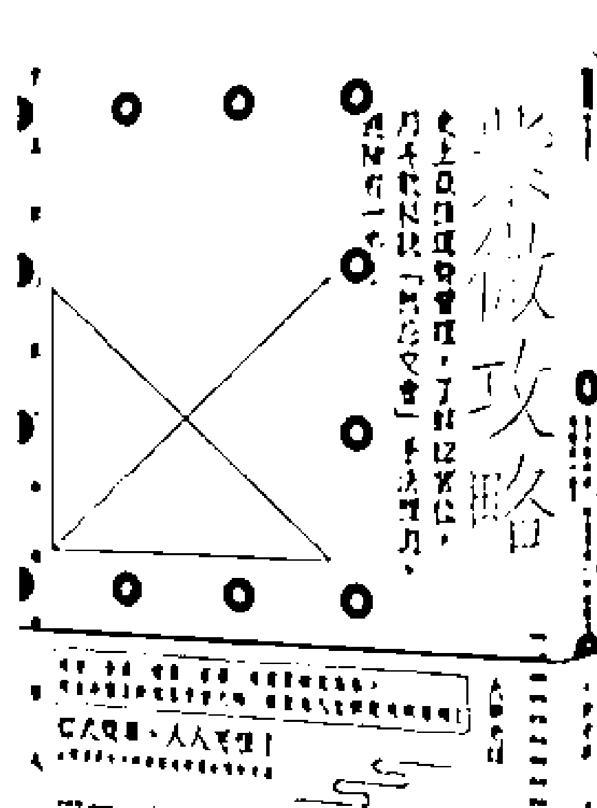

## 紫微攻略1
史上最強運勢管理，了解12宮位，用斗數秘訣「煞忌交會」手法預測、避險有一套！

自己的命盤自己看，自己的運勢自己改 感情、事業、健康、家運、本運要轉危為安 找出命盤上的煞忌交會之時，提前為人生問題 找到策略！

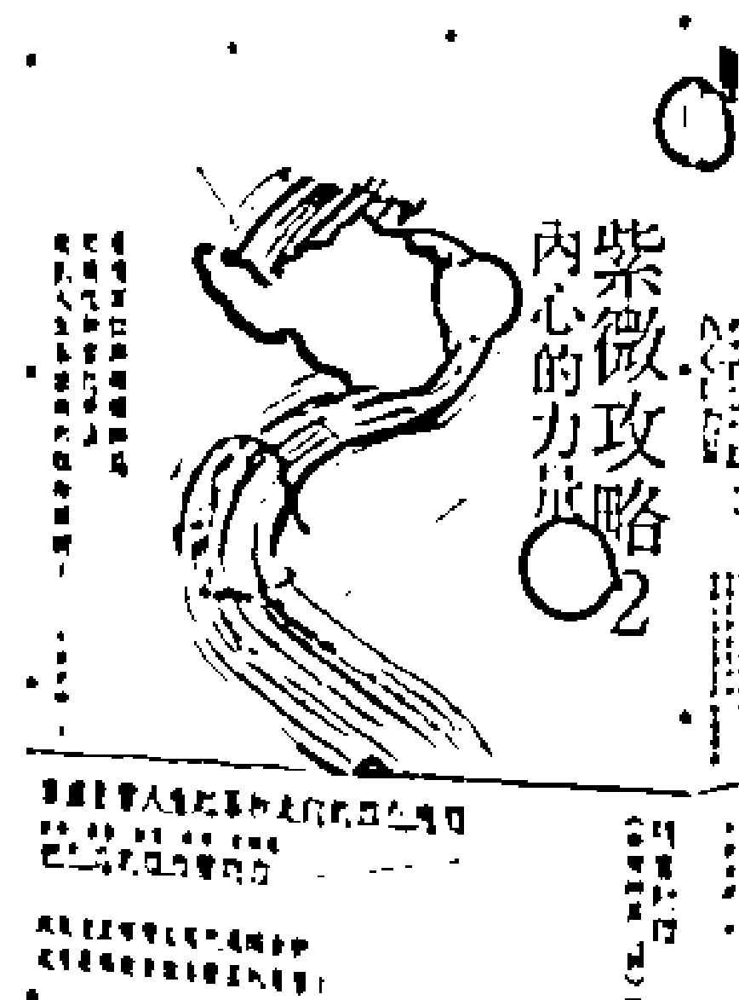

## 紫微攻略2 內心的力量
看透宮位與祿權科忌，用飛化和自化手法，規劃人生各面向的取捨關鍵！

（隨書贈《命理師真心話》一冊）

從命盤看到未來待人處事的方向，透視人生起伏流變之因——祿、權、科、忌 本書將說明，當我們受到四化連動影響，遇到逆境時，如何透過紫微斗數，知道自己真正擁有的能力，做出適當的選擇與進化。

## 解讀星曜密碼，首要掌握兩大重點
- 1. 星曜特質：對應宮位不同的內涵來思考
- 2. 人的本心：須同時看代表內心的對宮

透過星曜處於每一個宮位的不同含意，我們可以了解個人的特質和能力。同時，查看對宮的星曜，更能準確推演出個人內心深層的價值觀與真實欲望所在。藉此知道自己在人生旅途中，為何會做出各類決定？為何會有與他人不同的想法？也因此可以掌握未來人生布局。

上集內容：論星曜與宮位（環境）的關係、雙星的解釋方法、對宮的意義、十四主星與雙星組合在命宮、兄弟宮、夫妻宮之解析和應用

## 五大特色
- 一、探表究裡，論命立體又細膩
為什麼有時候覺得算命不準？因為大部分老師往往只解釋到星曜的「表」，而沒探究到「裡」。本書利用本命盤清楚解讀命主的個性特質與能力，讓紫微斗數盤如同一張人生的健康檢查和自我評量表。

- 二、對宮就是照見內心的明鏡
要了解一個人的中心價值，必定要探討內心，紫微斗數將內心世界以「對宮」來表現。因此每個星曜其實需要重視對宮與同宮的影響，才能真正做出解釋。

- 三、星曜（特質）要對應宮位（環境）解釋
星曜的解釋必須從宮位去理解，才能夠真正的掌握星曜的本質內涵，否則就會望文生義，解出很奇怪的意義。

- 四、懂原理，不再困惑於陳舊解釋
一顆星曜的組合可以有高達上萬種的解釋意義，想要學會，不必全背，只需要懂原理邏輯。本書淺顯地解釋斗數，只要記住星曜的五行、基本特質、化氣為何，並採用「宮位對應聯想法」來用推演詮釋。

- 五、生活化命題，加強解盤力
設計生活化的【小練習】讓大家熟悉解釋星曜的要領，全書以靈活有趣的命題增進斗數解盤實力！