## 紫微攻略3

下集

史上最強星曜解盤！對宮為明鏡，透視深層人性

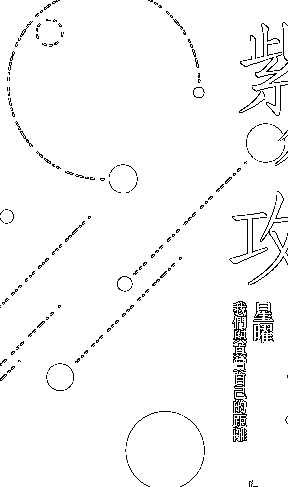

### 星曜 我們與真實自己的距離

大耕老師 著

時報出版

- 午
- 未
- 申
- 酉
- 戌
- 亥
- 子
- 丑
- 寅

### 制作說明

本書由《天使神秘學院》出重金從台灣購入的原版書籍掃描製作完成。為達到最好閱讀效果，特地把書全部切開後，再經由專業掃描設備高精度掃描完成，並經過一張張的PS後期處理最終成書，其間花費大量的人力、物力以及時間，只為能給大家提供經濟並優質的神秘學學習資料而努力。

本學院強力譴責某些機構和個人，把本學院花心血製作完成的電子書籍，包裝後直接放在自家網上低價傾銷的行為，以謀取不勞而獲的經濟利益。如果長此以往最終將無人願意再為大家花心思製作電子書，那以後可能大家再無新書可讀。

為讓大家以後能夠讀到更多的好書，也為了本學院的良性發展。本學院懇請大家盡量做到如下幾點：

- 一、盡量在天使神秘學院的官方網站購買電子書籍。
  官網訪問地址：http://www.ac2011.cn
  短網址：ac2011.cn
  網址含義：(Archangel College 成立時間：2011年)

  手機微信購買
  請掃以下二維碼

  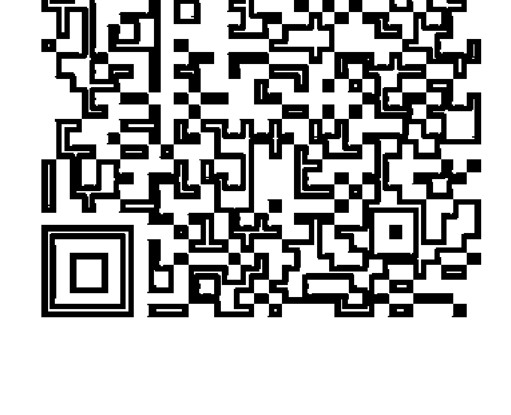

  手機淘寶等購買
  請掃以下二維碼

  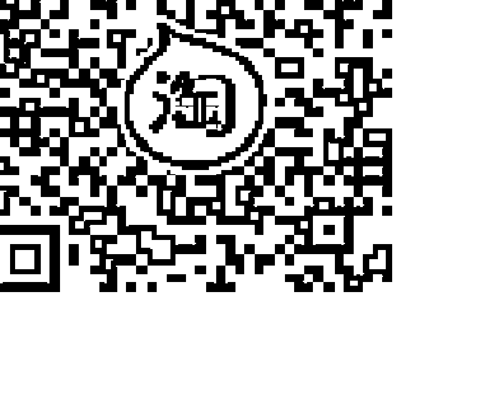

  加店長微信號
  請掃以下二維碼

  

- 二、在收到電子書後小範圍傳閱即可，千萬不要公開傳播，更別掛到網上低價銷售。

同時為答謝廣大支持者，學院電子書將做如下調整：

- 一、學院會把一些早已收回製作成本的電子書折價銷售。
- 二、最新製作的電子書籍會開放打印功能，大家購買後有條件的可自行打印成書。

### 福利公告

凡在【天使神秘學院】購買任何電子資料

贈送實體書，詳情請諮詢店鋪客服！

備註：如客服不知道這活動你可能進了盜版店鋪！

贈書活動僅在以下正版店鋪購買有效哦！

## 【天使神秘學院】淘寶店

手機淘寶掃以下二維碼

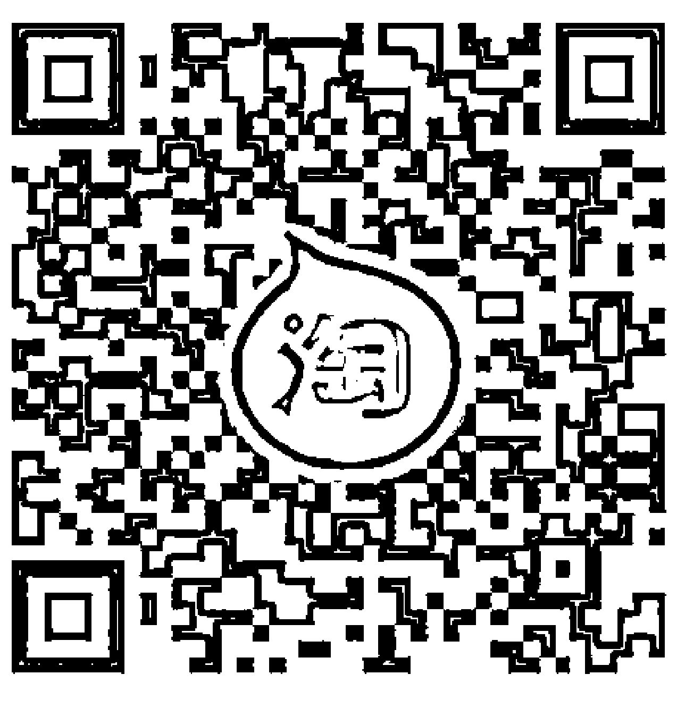

- 1. 打開手機淘寶：搜索“天使神秘學院”
- 2. 點擊“店鋪”按鈕就是

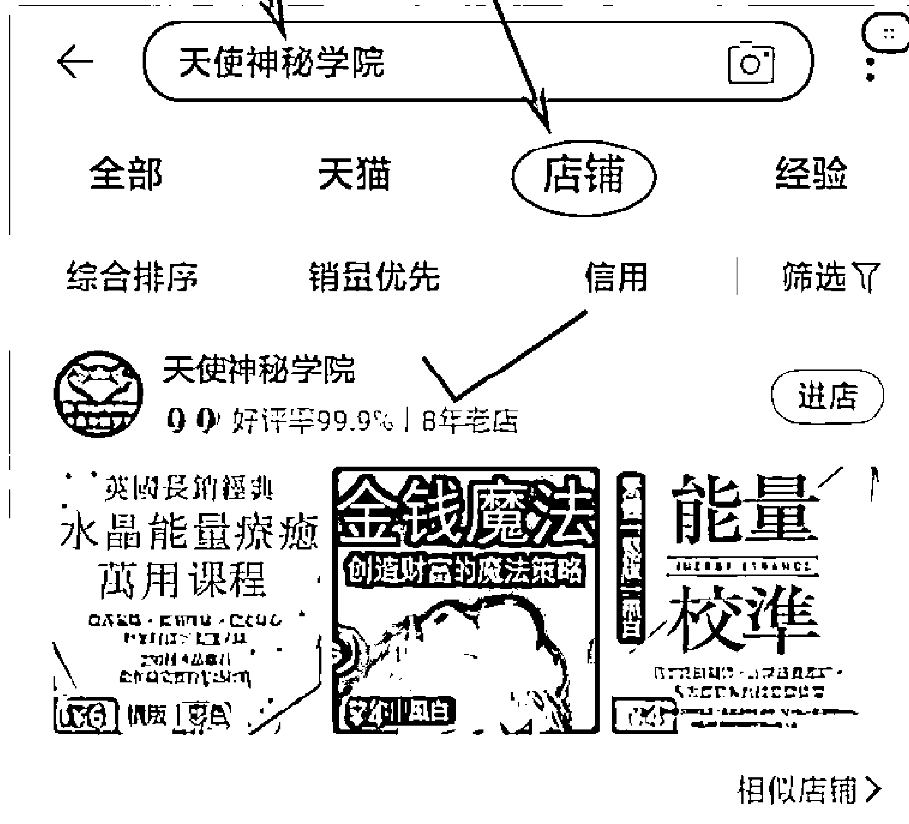

## 【天使神秘學院】微店

手機微信掃以下二維碼

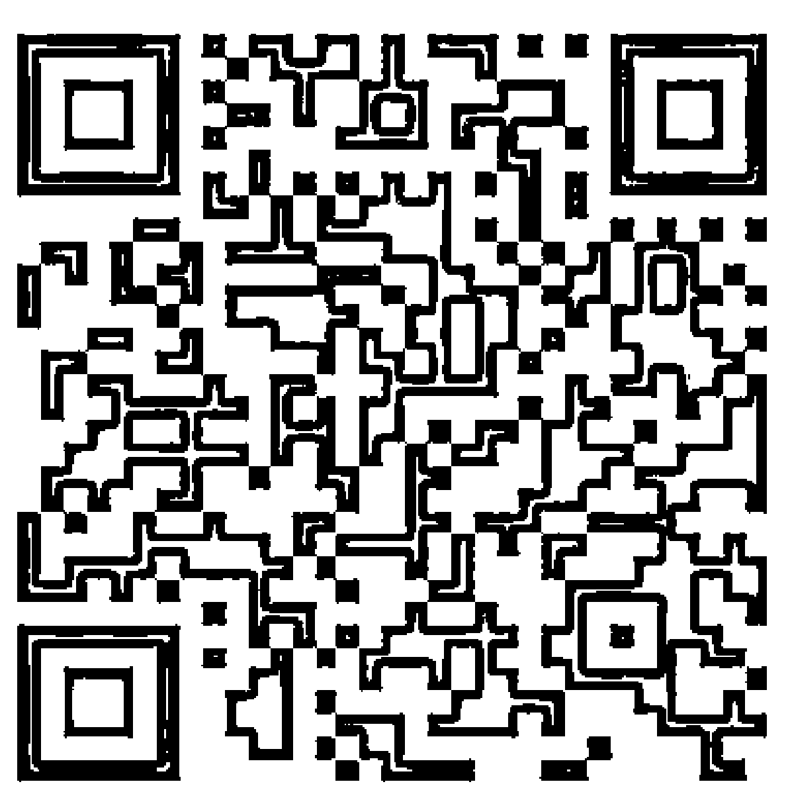

用手機微信掃碼進店

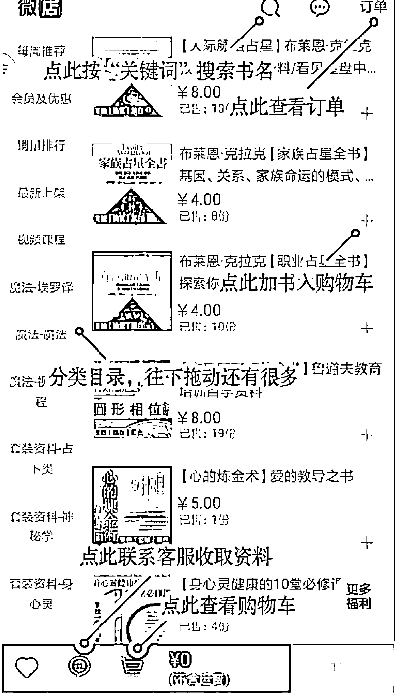

### 大耕老師

20歲受教於台灣某大上市公司之御用大師，多年來利用紫微斗數為自己家族（曾為台灣最大餐飲連鎖店）以及個人生意（台灣最大羊肉盤商與冷凍食品及餐飲集團）逢凶化吉，創造市場。

本只為有緣人及企業解盤與顧問，40歲時因緣際會得自台灣密教佛學大師提點，而發願將此千年密術傳播與人，使人可以擁有更好的人生。長期於部落格發表文章，擅長用現代思維、邏輯性的語言闡述命理觀念，讓紫微斗數生活化、更易理解，尤其預測推算趨勢精準，廣受歡迎，文章每月達數萬人次瀏覽，網路教學影片每月突破10萬瀏覽量。

目前講課於台灣中小企業處、產發局、大學與社團機構，並擔任多家企業顧問。創辦小澈寶人文講堂紫微斗數研習社，學員多達千人，遍及兩岸。

臉書

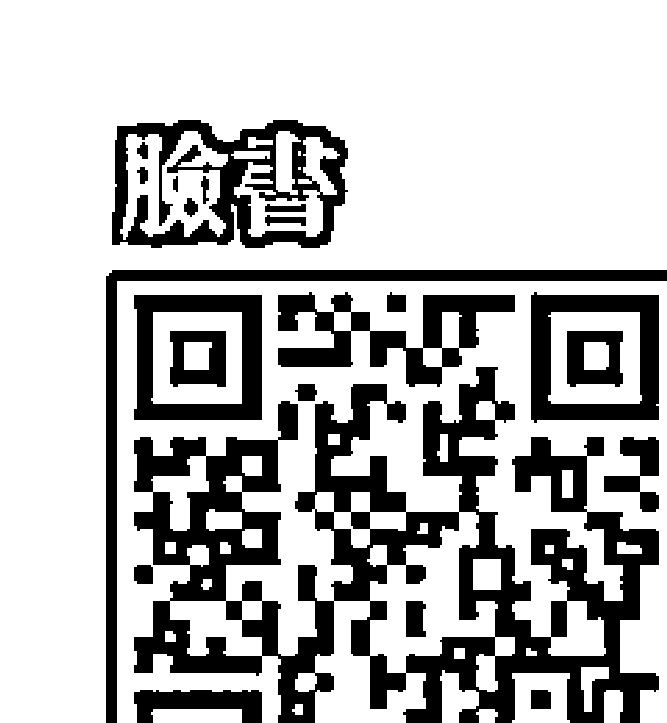

部落格

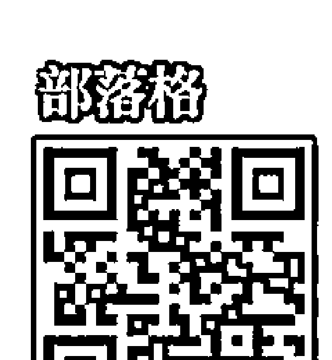

Youtube

## 史上最強星曜解盤！對宮為明鏡，透視深層人性

## 紫微攻略 3 下集

星曜 我們與真實自己的距離

大耕老師 著

## 第五章 / 子女宮——家與未來的期待

### 觀念建立

- 一 紫微星
  找不到孝子就由自己孝順兒子吧
  017

- 二 天府星
  為家裡帶來好運的孩子
  021

- 三 天機星
  聰明孝順但是難以捉摸的孩子
  025

- 四 太陽星
  活潑熱情好孩子
  030

- 五 太陰星
  細膩體貼心思多的孝順孩子
  034

- 六 天同星
  乖巧善良圍繞身邊永遠的寶貝
  038

- 七 天梁星
  成熟穩重不讓人操心的小大人
  043

- 八 七殺星
  個性固執難溝通
  046

- 九 破軍星
  聰明熱情難捉摸
  049

- 十 貪狼星
  鬼靈精怪難掌控
  052

- 十一 武曲星
  晚年得子，個性務實卻不懂得與父母親暱
  055

- 十二 巨門星
  愛之深責之切的孤單小孩
  059

- 十三 天相星
  人見人愛出門都會帶
  062

- 十四 廉貞星
  聰明伶俐卻讓人傷腦筋
  065

### 目錄

## 第六章 / 財帛宮 | 財富的來源與使用

### 觀念建立 070

- 一 紫微星 賺錢也要有面子 073
- 二 天府星 天生擁有聚寶盆 078
- 三 天機星 數字清楚邏輯好 081
- 四 太陽星 名聲比財富重要 086
- 五 太陰星 聚沙成塔享受一生 091
- 六 七殺星 堅持是一切的信念 094
- 七 破軍星 花錢是人生浪漫的一部分 097
- 八 貪狼星 擁有與付出都是欲望的展現 100
- 九 天同星 快樂地享受才是人生的重點 103
- 十 天梁星 最好的功德主 107
- 十一 天相星 人脈就是錢脈，先服務再收錢 110
- 十二 武曲星 努力勤奮的正財星 113
- 十三 廉貞星 巨富與破財合體 117
- 十四 巨門星 金錢給予安全感 121

## 第七章/ 疾厄宮—— 承載我們度過風浪的人生寶船

- 觀念建立 126

- 一 貴氣紫微星 133
- 二 雍容天府星 135
- 三 精明天機星 136
- 四 陽光太陽星 138
- 五 柔美太陰星 139
- 六 圓潤天同星 140
- 七 中性天梁星 141
- 八 剛毅七殺星 142
- 九 圓眼破軍星 143
- 十 厚唇貪狼星 144
- 十一 結實武曲星 145
- 十二 西洋廉貞星 146
- 十三 優美天相星 148
- 十四 暖男巨門星 149
- 疾厄宮總結 150

## 第八章 遷移宮——面具與面具下的世界

### 觀念建立

- 一 紫微星
  存在內心的皇帝
  155

- 二 天府星
  內心期盼著自己的王國
  159

- 三 天機星
  永遠停不下來的內心
  162

- 四 太陽星
  心中有著一把希望為大家點燃世界的火
  165

- 五 太陰星
  母親的心與女人心
  168

- 六 天梁星
  有個老靈魂在內心
  172

- 七 天同星
  天真赤子心
  175

- 八 七殺星
  不甘心不放手的內心
  178

- 九 破軍星
  心中有許多偉大的夢
  180

- 十 貪狼星
  只要我可以什麼我都想要
  181

- 十一 巨門星
  黑暗的內心
  183

- 十二 武曲星
  不怕苦不怕難的內心
  186

- 十三 天相星
  心中永遠的一把尺
  190

- 十四 廉貞星
  電量四射發電機
  193

## 第九章 / 僕役宮——出外靠朋友，後天給的幫手

### 觀念建立

198

- 一 紫微星 能力地位不好的不要來
- 二 天府星 誰才是真正的好朋友
- 三 天機星 君子之交淡如水，喜新厭舊是常態
- 四 天梁星 老人才是我朋友
- 五 天同星 人人都是我朋友
- 六 太陽星 世界的領導者社會的發言人
- 七 太陰星 總是細心關心人
- 八 七殺星 交友快狠準，討厭拖泥帶水的人
- 九 破軍星 心靈感覺對了就是好朋友
- 十 貪狼星 想要認識所有人
- 十一 武曲星 情和義，比金堅
- 十二 廉貞星 朋友是我展現魅力的所在
- 十三 天相星 朋友總是知道我的好
- 十四 巨門星 朋友總是誤會我的好

### 目錄

## 第十章 官祿宮——人生重心所在，日常價值的追求

觀念建立 244

- 一 紫微星 華麗的工作選擇 247
- 二 天府星 務實的工作選擇 253
- 三 天機星 一成不變無法滿足 256
- 四 天同星 輕鬆自在的人生追求 261
- 五 天梁星 助人助己有智慧的工作 265
- 六 太陽星 受人景仰的工作 268
- 七 太陰星 享受與人緣具備 272
- 八 七殺星 為了理想而堅持 276
- 九 破軍星 為了夢想永遠偉大 278
- 十 貪狼星 人生總有無限可能與想像 280
- 十一 武曲星 穩紮穩打努力不懈 283
- 十二 廉貞星 理想與夢想的拔河 289
- 十三 天相星 一切照我的規則走 294
- 十四 巨門星 夢想藏在心裡 297

## 第十一章 田宅宮——家是最後的港口

觀念建立 304

**一 紫微星** 人生的皇宮 309

**二 天府星** 自己的王國 310

**三 天機星** 不安於室也適應環境 311

**四 太陽星** 陽光讓我很舒服 312

**五 太陰星** 溫暖的家也可能變成陰暗的家 313

**六 天同星** 孩子氣的生活環境 314

**七 七殺星** 對於自家住宅的堅持 315

**八 破軍星** 破敗的情懷 316

**九 貪狼星** 什麼都要的居住環境 317

**十 武曲星** 更加務實地居住追求 318

**十一 廉貞星** 磁場強大的居住環境 319

**十二 天相星** 好的人際網絡要有好的交通環境 320

**十三 巨門星** 黑暗的心黑暗的家 321

**十四 天梁星** 大樹下好乘涼 322

**其他輔星代表的環境特質** 323

## 第十二章／靈魂所在 福德宮

- 一 紫微星 永遠的皇帝 331
- 二 天府星 永遠的王者 336
- 三 天機星 不安定的靈魂 339
- 四 天梁星 永遠的庇佑 343
- 五 天同星 善良的靈魂 345
- 六 太陽星 主持正義的靈魂 348
- 七 太陰星 善良而心軟容易招惹以身渡人的靈魂 351
- 八 七殺星 無法放棄的靈魂 354
- 九 破軍星 奔放熱情的靈魂 356
- 十 貪狼星 潛意識的慾望所在 358
- 十一 武曲星 剛毅的靈魂 361
- 十二 廉貞星 無法控制與細綁的靈魂 365
- 十三 天相星 為自己編織好的蜘蛛網絡 369
- 十四 巨門星 除了不安還是不安，有了光明才能忘記黑暗 372

### 目錄

## 眾所矚目番外篇

### 第十三章 / 父母宮 — 爸爸真偉大

觀念建立與推演

376

### 第十四章 / 煞星的力量

觀念建立

384

### 四煞星總結與練習

- 一 擎羊星 豪邁果決的大刀 390
- 二 陀羅星 不甘心不放手的業障 391
- 三 火星 熱情而焚身的火 393
- 四 鈴星 精細分解的外科手術刀 395

397

### 空劫宮 — 一直被名字耽誤的吉星

- 一 空劫星的基本由來跟原理，以及謬誤 400
- 二 空劫星的實務應用 406

400

### 目錄

## 第五章

### 子女宮 ——

家與未來的期待

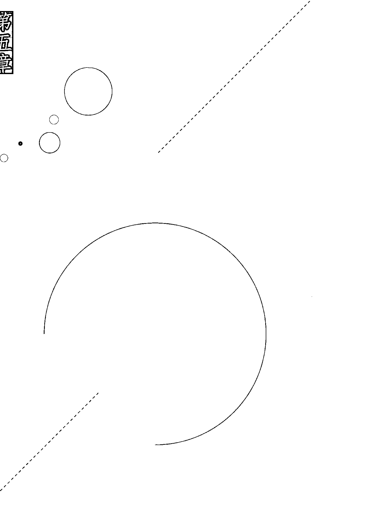

### 觀念建立

子女宮，顧名思義，跟子女有關係的都會看這個宮位，包含教養孩子、對子孫的期待，以及性生活的態度。此外，還代表了很重要的財庫，會不會有錢總是留不住的問題。

關於財庫，子女宮跟田宅宮都有財庫的意思，因為是本命盤的解釋，所以被視為存錢的觀念，以及對家人的付出態度。至於真正出現所謂的破財狀態，還是在運限盤比較清楚。簡單來說，當有煞星出現在裡面，就容易有財庫破損、錢不易存的情況。

關於性生活的態度，從本命盤上來說，也可以視為在性生活上是個怎樣的人（對應命宮的解釋），例如「紫微、七殺」同宮，就可以解釋為在性生活上希望有主導權；「太陰、天同」同宮，則是隨和且配合度高，大家可以對應上集關於命宮的解釋。

至於常被提及的是否會有小孩，以及會生幾個、生男生女、孩子以後是個怎麼樣的人、孝不孝順等問題，我們需考量，在這個年代有許多幫助生育與幫助不生的方法，所以從命盤上來看這件事，基本上準確度並不高，更別說本命盤只代表天生的價值跟個性。此外，子女宮不能一概而論的問題還有諸如：夫妻兩人的子女宮不同，孩子到底孝不孝順？會生幾個孩子？要以父親還是母親的命盤為主呢？或是以子女宮看待第二段婚姻，也是荒謬的事。首先，古代跟現代對於婚姻的觀念不同。再者，如果這個人嫁了五次呢？難道第五次婚姻就要看遷移宮嗎？之所以會有這樣的說法，其實是因為許多人不了解本命盤是用來看天生的價值觀跟個性，事件的發生與現象則需要看運限盤。子女宮通常是人的第四大限，恰恰可能是再婚的時間點，才會有這樣的訛傳。其實這種看法相當不準確，如同我們常開玩笑說的，現在的命理師有一半準度就可以開業了，看到女人一律說拿過小孩，沒拿過的說是避孕避掉的，幾乎都會命中，若沒命中，再隨便套上一些術語也能唬弄過去。

那麼，為何可以從本命盤的子女宮看出自己會有怎樣的小孩呢？絕大多數原因是自己教養孩子的態度，加上傳統社會環境單純，很容易導向這樣的說法。這就是現代人說的言教不如身教，例如自己對孩子惡言暴力，自然灌輸給孩子這是一種解決事情的方法，最後導致他變成這樣的人。以及，是否先天無法生育和何時生育的問題。先天的部分在這個年代容易被解決，何時生育則需要看運限盤。所以，子女宮的部分，我們專注在一般人較重視的親子關係的解釋，至於夫妻兩人的子女宮不同這個問題，其實夫妻倆對孩子的教養態度本來就會不同，實務上的應用更是可以透過對命盤的了解，選擇夫妻兩人誰對孩子的教養比較有幫助，而由那個人來主導親子教育，這對於親子關係以及孩子的教育幫助相當大。至於每個孩子的個性，在紫微斗數中有專門的推算方法，因為方法複雜，在此我們就不多著墨，未來有機會出專書介紹。

#### 找不到孝子就由自己孝順兒子吧

許多人誤以為紫微在子女宮，會生出像皇帝一樣尊貴的小孩，其實不然。那是因為自己很重視孩子，自然容易把孩子養成小皇帝。雖然有滿滿的愛，對孩子非常好，但是也相對地容易給予不良示範。孩子是否可以順利被教育成自己心目中的氣質與能力，需要看紫微所在宮位的三方四正內是否有足夠的吉星，如同每一個星曜都要對應宮位來產生解釋，並且得看對宮來找出內心的期待。

#### 1. 紫微對宮為貪狼
通常大家對於紫微在子女宮的認識與解釋來自於紫微單星，對宮是貪狼，所以重視孩子，並且給與關愛跟寵愛，甚至是溺愛。這源自於對宮貪狼的心理態度。

##### 2. 紫微、七殺同宮
紫微雙星的各種組合中，「紫微、七殺」算是比較不會寵溺小孩的一組。對孩子的要求高，希望孩子可以依照自己的目標去努力（對宮為天府，重視務實的掌控），優點是通常小孩能力很好，缺點是如果煞、忌太多，可能會跟孩子不親密。

##### 3. 紫微、破軍同宮
「紫微、破軍」則是重視多元化教育，並且給予孩子很多空間，容易教育出聰明有想法跟領導能力的孩子，但是給予空間跟放縱是一線之隔，關鍵就在於是否遇到煞、忌，以及有沒有紫微喜歡的吉星出現。

##### 4. 紫微、貪狼同宮
同貪狼在遷移宮的人會對身邊的人都相當和善，這一組合會希望孩子可以成為人中龍鳳，但是如果沒有足夠的吉星（能力與資源），就會變成單純地寵溺小孩，若再加上煞、忌，當然就會變成對孩子既要求又寵愛，這是親子教育的大忌。

#### 5. 紫微、天相同宮
「紫微、天相」的組合，雖然紫微星重視孩子的教育跟品德，但也重視孩子的人際關係，因此會注重孩子的外表打扮，同樣地，如果遇到煞、忌，則會因為要求太多反而讓孩子長大後與自己不親近。

#### 6. 紫微、天府同宮
「紫微、天府」的組合，對宮七殺表示自己對於孩子有迫切期待，「紫微、天府」是面子裡子都要的企圖心，往往增加親子關係的緊張感，如果加上祿存幫助天府星，或三方四正有吉星增加紫微的力量，或許狀況會好一點。這個組合也會造成晚年才生子（因為期待很大，需要一切準備好才生）。

「紫微、貪狼」在子女宮，對宮是空宮，這個組合絕對是最平易近人的好父母，也最懂得跟孩子相處，通常孩子跟自己的感情會很不錯，但是一樣需要注意不能遇到煞、忌以及貪狼化祿，否則容易太過寵愛。小時候還好，長大後孩子會變得不容易管教。

#### 紫微星在本命子女宮的小練習
本命盤子女宮是我們對下一代的態度，在現代人因為生活環境問題通常少子的情況下，飼養寵物也可以用子女宮來看待。請問哪一個紫微星的組合在養寵物的時候，很容易把寵物訓練得非常有教養，很乖巧？

> 在不考慮其他吉星與四化的情況下，若單純討論星曜組合，「紫微、七殺」這個重視自己掌控力的紫微星系，當然會把寵物教導得很好，也就是所謂棒下出孝子。此外，「紫微、天相」這個重視面子的皇帝，當然不會讓自己的寵物成為一隻迅猛龍，應該也會把寵物教得很好。

### 二、天府星
為家裡帶來好運的孩子

天府是財庫星，但是要加上祿存才算財庫。傳統算命說，有了孩子，事業才能穩定、存到錢，說的大約就是子女宮有天府星的人（有時候太陰星在子女宮也會做此解釋），原因在於，天府是財庫星，對應子女宮、田宅宮這兩個財庫宮位，當然很適合放在裡面，即使天府需要有祿存才能成為財庫，沒有遇到祿存的天府在子女宮、田宅宮內也很不錯，因為祿存總會出現，本命沒有、運限也會有。而本命盤說的是態度，自己對於存錢積蓄的觀念有天府這樣務實、懂得策畫的星曜存在，當然是相當好的一件事。當這樣的人有了孩子，對待子女的態度相當務實，希望他未來可以如王爺一般有能力、有機會、有氣度，這樣的心態自然會讓更加引發原本就具備的儲備資產能力，以及對家人的照顧，並且會在工作投資上更加謹慎，不會如紫微星一樣，想得很多卻不一定能夠務實做到。例如，會買自己能力根本負擔不起，但是很有名且很貴的美語教材，當然就會幫自己少去許多的工作與投資風險、增加財富。這也就是這個星曜出現在子女宮時，會被稱為生了孩子之後會更好的原因。

這樣務實地重視孩子能力跟教養，以及未來發展的親子態度，是天府在子女宮的人子孫通常都不錯的主要原因，這樣的態度也適合各類星曜在子女宮的父母多做學習（了解自己的缺點，直接學習跟改善，就是一種改運的方式）。如果我們知道天府在子女宮的人，為何可以因為孩子而讓自己改變，即使自己的子女宮沒有天府，也可以比照辦理。若天府在子女宮，也可以依照對宮的雙星組合，找出對子孫期待的態度。

- 1. 天府對宮為武曲、七殺
  對宮是一武曲、七殺一這組，通常會重視孩子的個性跟基本能力，是不是能夠因此得子而富貴，或是孩子可以有很好的成就，倒是其次，通常都是願意為孩子付出許多，尤其是金錢方面。

## 天府星

### 2. 天府对宫为廉贞、七杀

「廉贞、七杀」这一组，则重视孩子的人际关系表现跟是否聪明伶俐，但是这组合的孩子，也会因为父母的教养态度如此，从小就比较会看人脸色，并且习惯用小聪明解决问题。若是遇到太多煞、忌，则表示因为自己的教育问题导致孩子可能比较不听话。

### 3. 天府对宫为紫微、七杀

「紫微、七杀」则是最重视孩子教育跟能力的一组，期待孩子可以成为人中龙凤，但是相对于「紫微、七杀」在子女宫，对孩子的掌控度强大，这个掌控只有在内心，态度上还是务实而大方的天府。

总体来说，天府在子女宫，因为天府善于谋略与计划的个性特质，加上相对有远见的态度，教养出来的孩子能力通常不会太差，只是因为对宫七杀的影响，加上孩子有能力通常表示不需要在父母身边，因此天府在子女宫，也会有孩子容易往外发展事业的机会。除了对面「武曲、七杀」那一组，因为务实的态度，所以会期待孩子可以子承父业之外，其他组合虽然孩子都算孝顺，但是一样容易因为自己事业

## 天府星在本命子女宮的小練習

三個天府星獨坐在子女宮的組合，哪一個最有可能將孩子送到國外發展呢？

「紫微、七殺」這個組合，在對待孩子的態度上，會希望他能高人一等，所以在能力許可情況下，相對容易期待孩子可以出國發展。

## 天機星

聰明孝順但是難以捉摸的孩子

天機星是個聰明、邏輯好而善變的星曜，所以天機星在子女宮，通常我們會重視孩子的邏輯思考能力，期待孩子可以聰明伶俐，但是聰明伶俐的孩子通常也都善變，不好控制。遇到煞、忌影響，自己教導孩子的時候，也會是那種常常讓孩子無法了解的狀態，自然會養成他容易變動、見風轉舵的個性，不過這當然還是要細看天機星的組合。天機星單星的最符合上面說的情況，並且從對宮可以找到他對孩子的期待。

### 1. 天機對宮為太陰
對面是太陰星，如果太陰是旺位，則對孩子的態度細膩溫柔；如果是落陷位，雖然也一樣細膩溫柔，但是就會少了月光的溫暖，取而代之的是陰晴不定，這也會讓孩子情感上容易變得很敏感，若再遇到煞、忌，就會更加重這樣的情況。

### 2.／天機對宮為天梁
對宮是天梁，則是用教育邏輯跟成熟的態度照顧孩子，該放手的時候放手，容易讓孩子有較為早熟獨立的個性，當然也容易出現孩子成年後不在身邊的情況。

### 3.／天機對宮為巨門
對面是巨門，則內心對孩子有著期待與不安，但是這個組合必然命宮是天府，遷移宮為「武曲、七殺」，個性做事有計畫而務實，加上巨門的情況需視太陽是否在旺位，太陽在旺位則這個組合的孩子通常聰明，心思細膩，並且個性成熟，這來自巨門的不安全感導致在教養上，重視孩子的心靈跟思考能力，深怕孩子會不夠好的心態，也會注重孩子要能夠成熟有思慮的能力。若是太陽在落陷位，則上述的情況依然會有，只是對於孩子的要求會在無形中因為不安全感而加重，小孩就容易變成習慣猜測別人的心思，反而將自己的想法藏起來，容易變成安靜的孩子。

### 4. / 天機、天梁同宮
雙星的組合裡，「天機、天梁」這個組合，重視孩子的思慮跟教育，但是也相對地變得小心翼翼與過度保護。

### 5. / 天機、太陰同宮
「天機、太陰」這個組合，如果是女生，算是對孩子相當有辦法，聰明有愛心，也很能跟孩子溝通。

### 6. / 天機、巨門同宮
「天機、巨門」這個組合當然要看太陽的旺、落位置，太陽在旺位，則小孩聰明活潑，學業能力不錯；如果太陽在落陷位，則一樣聰明，但是因為受到黑暗的巨門影響，會相對安靜。

當然這都是來自於自己對子女宮的態度，影響了孩子的心靈跟個性發展。天機的雙星組合對宮都是空宮，天機星是善變的星曜，所以空宮需要注意是否有煞星進去，有煞星則會對上述的特質產生影響。擎羊、火星會急迫地想做到上述的教養方式，鈴星則會更增加了細心的特性，陀羅則是常常感到不安，心想自己是不是做得不夠好，反而讓孩子不知所措。如果是昌、曲在裡面，也容易在親子關係中投入太多情感，可能適得其反。如果上面的四煞星跟昌、曲在子女宮但是是空宮，對宮才是天機星組合，則情況會更加明顯及嚴重。最後一點，因為本命盤的子女宮在傳統的觀念上，也代表女性的生殖能力，因此天機組合在子女宮的女生，尤其是『天機、太陰』這一組，無論單星或雙星，在希望懷孕的情況下，都需要照顧好身體。

## 天機星在本命子女宮小練習

天機星在子女宮的特質，在於希望孩子聰明伶俐，但是聰明伶俐的孩子通常比較有自己的想法思維，所以也比較不容易留在自己身邊。請問天機星哪個組合裡，孩子在成年後可能留在身邊？

「天機、太陰」在申的這個位置，太陰為旺位，在沒有煞、忌的情況下，自己對孩子的照顧相當付出，因此親子感情通常相當好，孩子也會保有較為親暱的關係，因此就算分隔兩地，也會常常問候。

#### 太阳星

活泼热情好孩子

太阳的重点在于是否在旺位，在旺位的太阳会较落陷位的太阳更有自信。太阳是制订规则的人，所以在对待亲子关系上会展现这样的态度，希望孩子可以具备太阳星的特质，也会这样教导小孩，希望他们能有正义感，明辨是非，拥有领导特质。

落陷位的太阳也会具备一样的心情，只是往往容易心有余而力不足。因此，太阳在子女宫，如果三方四正遇上化科、化禄、化权，可能在亲子教养上会因为过于重视孩子的学业跟能力，以及希望小孩符合自己的期待，反而造成亲子关系有问题。

我们无法一方面期待孩子有独立自主的能力，一方面又希望他可以顺从自己。

太阳星的组合中，双星的部分都是空宫，需要注意的是空宫借了对宫之后会让太阳的旺弱改变。

### 圖三十一／ 太陽太陰借對宮後，旺位與落陷位改變

|   |   | 太陽太陰 太陽旺位 |   |
|---|---|---|---|
| 巳 | 午 | 未 | 申 |
| 辰 |   |   | 酉 |
| 卯 |   |   | 戌 |
| 寅 | 太陽太陰 太陽落陷位 | 子 | 亥 |

### 1.／太陽、太陰同宮
如果子女宮是一「太陽、太陰」，而太陽在旺位，表示對孩子具備了太陽的權威又不失太陰的溫柔。借星曜到對宮，太陽從旺位轉成落陷位，對於親子關係，內心常常反覆糾結。如果是子女宮的太陽在落陷位，則需要擔心在太陽跟太陰之間的轉換，會讓孩子感覺到自己的性格陰晴不定，借過去對宮太陽轉成旺位，外顯出來的卻是一個開明的父母樣子，這樣的狀況，如果加上煞、忌會更明顯，孩子的個性容易變得文靜，因為他需要多觀察所處的世界，才知道該如何應變。如果空宮在子女宮，對宮「太陽、太陰」，子女宮借了星曜過來同樣需要注意太陽星的旺、落問題。空宮借星的觀念，容易讓初學者搞混，尤其是在太陽星上，建議直接將星曜寫在盤上。

### 2.／太陽、天梁同宮
如果是「太陽、天梁」這一組，因為有天梁在，所以太陽的個性無論在旺還是落陷，都會因為天梁的影響趨於平穩，所以旺、落陷之間僅僅會有能力問題，是否強勢主導事情，僅有一點點差異。

### 3.／太陽對宮為太陰
太陽星獨坐的時候，對孩子的期待與照顧的方式，以對宮星曜來看。對宮是太陰時，會希望孩子個性獨立，並且有能力照顧眾人，堅強面對困難，但是內心有溫柔的一面。

### 4.／太陽對宮為巨門
對宮是巨門的，當太陽是旺位，總是可以很有魅力地在家人或孩子面前主導一切，也會深覺孩子要有這樣的人生價值，所以孩子相對地熱情且能言善道；如果在落陷位，則不會要求一定要讓眾人將目光放在自己身上，即便內心如此期待，所以教養出來的孩子也會較為安靜沉穩。

### 5. 太陽對宮為天梁
太陽對宮是天梁，孩子的個性成熟穩重、可以被期待，在親子的教育上，會重視孩子的個性穩定度，以及善良幫助人。

## 太陽星在本命子女宮小練習

有一種說法，子女宮內的星曜屬性可以判斷出會生男孩是生女孩，星曜屬陽生男，屬陰生女，請問太陽星在子女宮應該會生男孩是生女？

太陽星屬陽火，所以照傳統的說法應該是生男，但是這個論法其實還有一些條件，首先，本命盤只論頭胎，其他要看運限盤。再者，雖然每個星曜都可以這樣用，但是太陽跟太陰同宮的時候要看旺、落，如果太陰旺則是女生，最後生男、生女是看爸爸的命盤，不是看媽媽的。但是筆者用不用這個方法呢？其實這個方法在現代來說準度不高，因為生男生女的狀況，在古代沒有太多的外力介入，但现在不是，到底在保險套裡面的那個算不算第一胎？受環境賀爾蒙影響的呢？

## 太阴星

细腻体贴心思多的孝顺孩子

太阴的力量来自太阳，并且是一个具备传统母亲特质的星曜，因此太阴在子女宫通常被解释为孩子孝顺，跟父母感情不错。但是太阴星具备的诸多细腻感情、照顾家等等特性，即使一样孝顺的孩子也会有不同的个性特质。

太阴双星的时候，需要跟太阳一样注意旺、落，但是还好相对太阳来说，太阴比较不受落陷影响，毕竟太阳无光便整个昏天暗地，月亮无光除了少点浪漫多点惊慌，误差不会太大，所以当太阴星在旺位的时候，太阴充满母性光辉。

### 1. 太阴、天同同宫
「太阴、天同」可以想成对孩子的温柔照顾以及宠爱放纵。这一组因为教育态度会让孩子也受到如此的教育方式影响。

### 2. 太陰、天機同宮
「太陰、天機」則是個溫柔聰明且重視孩子教育跟思考的媽媽，這樣的態度當

### 3. 太陰對宮為太陽
太陰單星的時候，我們可以較簡單地把對宮星曜看成媽媽內心的期待。對宮是太陽，雖然對待孩子親密溫柔，內心卻希望孩子可以獨立堅強，如果太陽在落陷位，容易變成親子態度跟期待衝突，如果加上煞、忌，在面對親子關係時，需要一點學習跟態度的轉換。

#### 4. 太陰對宮為天機
對宮是天機的媽媽，很類似「天機、太陰」同宮，只是會更加注重孩子的思考能力，重視孩子的教育，常常對孩子的功課能力心急如焚，當然也就不適合遇到煞、忌了，如此的親子關係容易變成彼此相愛卻又不自覺傷害。

### 5. 太陰對宮為天同
太陰對宮是天同，在沒有煞、忌干擾的情況下，應該會是感情最好的一組，溫柔的媽媽體貼又有耐心，而且天同在對宮只是內心天真，不至於過度純真而讓孩子感覺自己需要照顧媽媽。

## 太陰星在本命子女宮小練習

太陰星有外表柔順、動作緩慢、內心急躁的特質，哪一個組合的太陰星在子女宮，會讓孩子覺得媽媽很難搞？

排除「太陽、太陰」同宮與「天機、太陰」同宮的組合，因為是以太陽或天機為主，不算在太陰星系。天機、太陰對拱這組，內心是天機，雖然教養上的聰明邏輯保證可以戰勝孩子，但需要面對天機、太陰同時出現化忌，以及遇到煞星的機率高出很多，一旦遇到煞、忌，就會變成過度要求，以及規則態度隨時變換，讓孩子無所適從，因此這一組的機會最高。

## 天同星

乖巧善良圍繞身邊永遠的寶貝

天同這樣善良的星曜，在子女宮也會解釋成子女孝順乖巧，因為父母對待孩子的態度、對家的態度（子女宮是田宅的對宮，內心的想法）也是如天同一般和善、樂觀、好相處，在滿滿的愛包圍下，孩子的個性也會受到感染，自然會在成年後也如此對待家人。

### 1. 天同、巨門同宮
天同的雙星中，「天同、巨門」那一組會因為受到巨門影響，情感上出現糾結任性的問題，因此讓孩子覺得自己管教過多，所以不適合再遇到化權跟煞、忌，這樣的情況就會需要擔心親子關係，甚至影響家庭。

### 2. / 天同、天梁同宫
「天同、天梁」的組合，算是相當不錯，天真之中帶著成熟的智慧，只要不要遇到太多煞、忌，基本上親子關係很好，雖然成年之後孩子容易離開身邊，但是感情依然不錯。

### 3. / 天同對宮為太陰
單星的天同，依照對宮星曜來看。對宮為太陰，只要不要遇到化權，而有任性跟管太多的問題，絕對是好父母，細心溫柔善良、重視教育卻不會給與壓力，當然如果太陰在落陷位，會有寵溺孩子，疏於管教的小問題。

### 4. / 天同對宮為巨門
對宮如果是巨門，對待孩子會有隱隱的迫切感，表面看起來很和善，內心卻有著許多期待，這個時候如果太陽在落陷位，不安全感提升，反而會是表面上跟孩子很好，但是內心疏遠，當然也就不適合遇到煞、忌出現。

### 5. 天同對宮為天梁
教得很好的父母，重視教育並且和善對待，成熟地處理親子問題，也容易培養出孩子成熟且和善的人格特質。

傳統上有個說法很特別，天同星遇到了煞、忌，可能生出有問題的小孩，這觀念來自於天同是少數會圍繞在父母身邊的星曜，天同在子女宮會被說成是承歡膝下的典範，但是有煞忌則表示孩子會讓自己擔心，表示孩子有問題，導致他不會離開，一直是個麻煩這樣的說法。對此，我們先釐清一件事，天同本身並不化忌（目前常見的天同化忌，其實是明朝晚年因戰亂導致資料錯誤），雙星中「太陰、天同」是以太陰為主，「天同、天梁」的天梁也不化忌，所以此說法中的煞忌應該是來自「天同、巨門」這組以及單星天同的對宮星曜。再者，宮位被破壞至少需要三個以上的煞、忌，而實際上天同若真的承歡膝下、離不開父母，則必須天同有化祿，並且不在四馬地，所以唯一可能只有「天同、巨門」組合以及天同、太陰對拱，加上煞、忌超過三個以上，並且懷孕的當下大限子女宮、福德宮有問題，才會出現這樣的情況。而且現在醫療發達，這種情況通常會被篩選掉，因此也不用太害怕。

## 天同星在本命子女宮小練習

一般來説，天同星雖然在子女宮是指會有孝順的孩子，但也容易因為溺愛跟感情好而被養成媽寶，請問以下哪一組把孩子養成媽寶的機會最高？

- A. 巨門化權、天同化祿同宮
- B. 巨門化祿、天同化權同宮
- C. 太陰化權、天同化祿同宮

|   |   |   |   |
|---|---|---|---|
|   |   |   |   |
|   |   |   |   |
|   |   | A |   |
| 本命化祿 | 運限化權 | 天同 本命子女宮 | 巨門 |

本命盤雙星的四化不會同時出現在這樣的組合，這是考慮在真實孩子出生後教養的運限四化進去影響本命盤。

解答：B。這一組很會說話，很會管控，但是情緒又任性，很容易讓孩子學著順從，並且習慣聽話。

## 天梁星

成熟穩重不讓人操心的小大人

這是一個成熟穩重的老人星曜，因此天梁在子女宮也是頗受稱讚的組合，會耐心照顧孩子，並且重視他們的學習以及思考能力，通常教養出來的孩子都算得上聰明得人疼愛，只要天梁不化權，親子關係都很好。至於化權的天梁，則孩子本身能力很好，但是親子關係有點疏離，彼此覺得對方太囉嗦，至於細節上對應對宮的星曜則會有些許差異。

### 1. 天梁對宮為太陽
對宮是太陽，需要看太陽是旺位還是落陷位。旺位的太陽，會給與十足的照顧，並且讓孩子對人生產生熱情跟活力，若太陽是落陷位，則面對親子教育會有心有餘而力不足的情況，如果再加上化忌，反而會變成自己的期待與能力有落差，造成孩子雖然個性成熟，卻跟自己感情疏離。

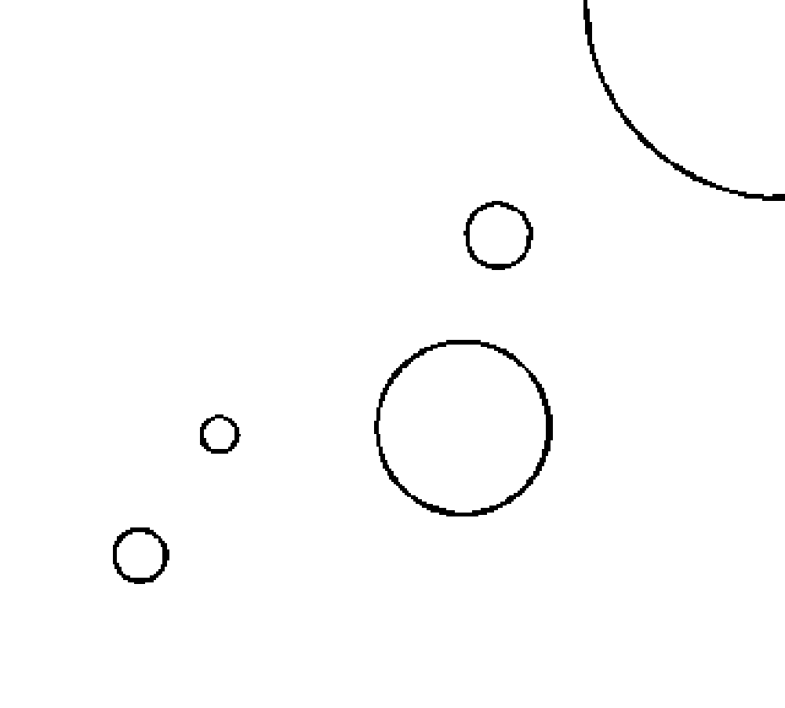

### 2. 天梁對宮為天同
對宮如果是天同，因為天同的存在，天梁星因化權而讓人感覺囉嗦的情況會減緩一點。但如果天同星化權，也會讓人感覺任性，甚至倚老賣老。除此之外，因為這兩個星曜都會化祿，因此算是不錯的組合，只是長大後聰明的孩子容易離開身邊，但是感情依舊不差。

### 3. 天梁對宮為天機
對宮是天機的這一組，因為本命盤牽涉骨盆問題，所以如果遇到煞、忌，並且是女生，懷孕生孩子的時候通常會有比較多的病痛，需要一生調養身體。這一組也是變動的組合，如果遇到煞、忌，對於孩子的教養態度容易養成孩子聰明卻難帶的情況。另外，天梁星為老天給與、上天庇佑的概念，所以當子女宮有天梁星的時候，很高的機率顯示孩子是跟神明求來的（各國的神明都算數），很特別的是這樣的情況也可以倒過來，適用於求子的時候。子女宮有天梁，求神的時候最好選擇流年或流月甚至流日天干為壬，此時天梁化祿，感應比較好。這個方法如果不是本命盤，運限盤子女宮有天梁也可以用。不過，這類小孩往往天生就有比較好的宗教緣分，容易跟神靈有接觸的機會，這是天梁星有趣的部分。

## 天梁星在本命子女宫小練習

「天梁、天機」對拱的組合，在子女宮的時候，容易上演親子間諜戰，因為彼此都太聰明，這樣的情況該如何改善？

遇上這樣的情況時，父母應該感到高興，因為小孩很聰明。很多父母關心孩子，希望能守護孩子，但是往往造成親子問題，尤其是太陽、太陰、天梁這些庇蔭星化權在子女宮跟命宮的時候。事實上，再想要照顧，也只能照顧孩子到三十歲，他們的人生還是要自己面對，因此好的品德教育才是人生的重點。放手，是所有父母在孩子一出生就該學的功課。

### 七殺星

個性固執難溝通

### 1. 七殺對宮為武曲、天府
七殺的特質在於堅持的個性，對於在乎的事情會很堅持態度，好處是擇善固執，壞處是有時候自己認為的善並不見得就是善。在六親宮位中，七殺這一點的個性相當吃虧，因為華人傳統在親情上，通常講情多於講理。所以七殺在子女宮，當自然代表自己對孩子教養態度容易堅持己見，一方面可能會因此跟另一半起爭執，一方面也可能造成跟孩子的關係緊張。尤其如果七殺還遇到煞星，或者對面宮位有化忌。而這樣的堅持，我們可以從對宮看出堅持的重心在哪裡。

對宮是「武曲、天府」，重視教養孩子的花費跟目的性是否合理，希望孩子個性務實，並且對生活不怕困難跟努力。

### 2.／七杀对宫为廉贞、天府
對面是「廉貞、天府」，則重視孩子的反應跟聰明，以及人際關係跟學習能力。

### 3.／七杀对宫为紫微、天府
至於「紫微、天府」，則重視孩子外在的表現跟學業成績，與人生未來成就，這是最容易給與孩子壓力的一組。

總體來說，子女宮有七殺的人，通常會建議晚一點生育，讓自己學會圓滑一點，避免跟孩子的衝突。另外如果七殺在「戌」的位置，因為那是女生子宮的位置，所以如果是女生的盤，也要注意生孩子比較容易有問題，當然以現在的醫學科技，這些問題會減少很多。

|
| 巳 | 午 | 未 | 申 |
| 辰 | (廉贞\n天府) |   | 酉 |
| 卯 |   |   | 戌 | (七杀) |
| 寅 | 丑 | 子 | 亥 |

## 七杀星在本命子女宫的小练习

七杀因为个性固执，如果出现在子女宫，容易有亲子问题。但是七杀也是杀自己、不杀别人的人，生气的同时往往自己的心更痛，以斗数的学理来说，在命盘上面加上什么条件可以减缓这样的问题？

**解答**

七杀对面一定是天府，其实七杀的内心对于事情的处理有很多方法，但是天府星需要禄存星，所以如果能够加上禄存，或者化禄，或者文曲这类的桃花星，状况会好一点，可以降低七杀的问题。

### 九、破軍星
聰明熱情難捉摸

一般來說，破軍因為是子息之星，所以在命宮的人通常很愛小孩，在子女宮那就更不用說了。不過因為破軍也是破耗之星，所以在子女宮也會被當成不容易有小孩，或是跟小孩子沒有緣分。這部分一方面因為科技發達，所以這種傳統上不容易有小孩、小孩會早夭、小孩會有災難的說法，在現代來說其實往往不準確，但是不可否認，依照紫微斗數的原理，的確有因星曜本身帶的特質，如果遇到煞、忌，就會損耗的特性。例如擎羊跟破軍同宮，會有流產或者跟小孩無緣的機率，這樣的情況的機率確實很高，而且這還不一定需要在子女宮。不過，這都可以透過個性的更改來避免。破軍在子女宮，在此我們先單純地看他愛孩子的部分吧！

#### 1. 破軍對宮為紫微、天相

破軍對面一定是天相星，對宮如果是「紫微、天相」，孩子有能力、聰明、學問好、能力好，甚至要長得好看，都會是破軍的期待，當然他也可以為了達到這個目標，不顧一切地花錢跟投注心力。

#### 2. 破軍對宮為廉貞、天相

如果是「廉貞、天相」，孩子的能力跟聰明一樣是他在乎的，但是他更重視孩子與人相處的態度跟人際關係，外表好不好看、有沒有面子不是他的重點。

#### 3. 破軍對宮為武曲、天相

如果是「武曲、天相」，則上述說的他也會喜歡並期待，但相對來說務實很多，教養孩子時不會亂花錢，也不會追求許多虛華的特質，注重在孩子的能力跟品德。

無論是哪一個組合，都是非常大方的父母，也是願意為孩子拋頭顱灑熱血的父母，並且心中覺得自己是非常有計畫而且節制的，雖然外人不見得如此認為。

不宜再遇到煞、忌。如果同時有破軍化祿還遇到煞、忌，難免就會變成一邊溺愛、一邊控制，這樣的親子對待方式反而不好，也可能造成所謂親子無緣的潛在問題。

## 破軍星在本命子女宮小練習

浪漫的破軍星在子女宮，有時候會因為自己的教養態度反而變成寵溺孩子，請問哪個星曜組合容易造成孩子的財務觀念不佳？

對宮是「武曲、天相」這一組，如果破軍化祿，而「武曲、天相」出現化忌，則容易在教養孩子時給與不佳的用錢示範方式，所以也給與孩子錯誤的金錢觀念。

## 十、貪狼星
鬼靈精怪難掌控

欲望之星在子女宮，傳統的說法是容易有非婚生子女，因為子女宮代表性生活，欲望之星在性上面，當然就可能有很多搞出人命的意外出現。不過這樣的說法，其實還是需要天時地利人和，性欲強的人不見得就一定會到處播種，或者接受播種。

回歸到親子關係，貪狼在子女宮的父母，其實對孩子相當不錯，親子關係也很好。

如同貪狼在命宮或在任何六親宮位上，通常人際關係都是不錯的。貪狼的慾望所在位置會讓他對那個宮位有許多期待，在子女宮，對於孩子也會因為諸多期望而投注心力，對宮的星曜會是那個期望值的展現。無論是哪個組合，只要不要遇到煞、忌，其實貪狼在子女宮的親子關係都算不錯，並且很懂得教導子女，畢竟貪狼可是多才多藝的星曜。

#### 1. 貪狼對宮為武曲

如果對宮是武曲，他對孩子的期待會相當務實，期待孩子健康長大，可以給予自己人生的滿足跟家庭的感受就好，甚至連生孩子都是做好相當的計畫跟準備，如果不是遇到煞、忌，通常都會在有充分準備後才生小孩，這也是最不容易有未婚生子的一組。

#### 2. 貪狼對宮為廉貞

對宮是廉貞，則在教育孩子上相當有辦法，甚至足以教導身邊其他父母，聰明有趣的親子生活也會讓家庭生活相當豐富，缺點是如果遇到煞、忌，過多的慾望跟花招也是傳統說法中，最容易有非婚生子的一組。所謂子女宮是歡樂宮，說的大概就是這一組了，除非廉貞遇到化祿或者祿存，成為廉貞清白格，敢說不敢做。

#### 3. 貪狼對宮為紫微

對宮是紫微，當然會希望孩子聰明漂亮，還要人人喜歡，讓自己很有面子，因此也會相當要求孩子的各項能力。

## 貪狼星在本命子女宮小練習

貪狼在子女宮的人通常對孩子有很多期待，請問對宮哪一個星曜出現時，父母會買很多很貴的教育書籍？

> 對宮是紫微的時候會如此，因為要給孩子最好的，雖然孩子不見得用得到。

## 十一、武曲星
晚年得子，個性務實卻不懂得與父母親暱

武曲在子女宮，會解釋成晚年得子，這源自於武曲對孩子務實的態度，如果沒有準備好，就不敢有孩子（所以所謂的「晚」也不一定真的年紀很大，只要自己覺得時間允許就可以），並且在教養親子上也相當務實。甚至因為太過務實，有需要就給錢，比較不懂得說好話跟親暱的相處，因此被稱為寡宿星曜，在六親宮位都會被說成跟那個宮位的人不親。然而，並非真的感情不好，只是因為在情感表達上比較一板一眼，父母有這樣的態度，當然也就會教導出這樣的孩子，不過也不是每個武曲星的組合都會如此。

### 1. 武曲、貪狼同宮

「武曲、貪狼」雙星同宮，對孩子就相當有辦法，懂得教導也懂得維繫感情，是個有趣且大方的父母，當然這不能有煞、忌出現的。

### 2. 武曲、破軍同宮

「武曲、破軍」更是可以為了孩子掏心掏肺、賣肝賣腎把錢當雪花的父母，尤其在遇到煞、忌的時候更是如此。

### 3. 武曲、天相同宮

「武曲、天相」雖然中規中矩，但是畢竟對面有破軍，當孩子真正有需要的時候，也會不計一切投注心血，跟「武曲、破軍」的差別只在於「武曲、天相」通常會提早做好規劃。

### 4. 武曲、天府同宮

「武曲、天府」這個組合，在雙星組合裡是最懂得幫孩子做好教育計畫，重視孩子未來發展，希望他們的個性能力能夠獨當一面。當然這個組合因為天府重視，要有祿存，至少要武曲化祿，如果沒有祿存或化祿，也容易出現心有餘而力不足的情況。

### 5. 武曲、七殺同宮

「武曲、七殺」大概就是最孤單的一組了，對孩子花錢不手軟，卻也沒建立起深厚親暱的感情。

### 6. 武曲對宮為貪狼

武曲單星對宮是貪狼的組合，是親子關係最好的一組，教育孩子不會太務實也不會亂花錢，內心的貪狼讓他對孩子有期待，並且展現了很好的溝通，但是又能展現武曲的務實能力。

因為武曲是財星，所以在子女宮裡也可以是財庫的特質會更明顯，前面說到子女宮為財庫，遇到煞、忌會有破財情況，這是一個通用的看法，但如果是武曲，像「武曲、七殺」、「武曲、破軍」，甚至「武曲、貪狼」，即使沒有煞、忌，其實也都有可能在花錢上不太知道節制。「武曲、天相」則需要注意有煞、忌引發的官非狀況。

## 武曲星在本命子女宮小練習

武曲星系在子女宮這樣一個花錢不囉嗦，但是不懂得做人情的父母，該如何改善跟子女的關係？

單就命盤而言，如果武曲能加上桃花星，就可以改善這樣的情況，所以「武曲、貪狼」、「武曲、破軍」比較少有這樣的情況。但是如果天生沒有這樣的組合該怎麼辦呢？天生沒有，我們可以自己創造，在對待親子關係上多花一點心思，不要只想花錢，就可以改善這樣的情況。

## 十二、巨門星
愛之深責之切的孤單小孩

因為巨門具有不安全感的黑洞特質，造成對於所在的六親宮位，有不敢投注感情的疏離感，然而情感的感受通常是一體兩面，愈是不敢投入，其實愈期待跟喜愛孩子，當然這必須是巨門或者雙星以巨門為主的情況，並且要考慮太陽星的位置。

-   1. 巨門、太陽同宮或對拱

巨門雙星中只有「巨門、太陽」以巨門為主。當太陽在旺位的時候，「巨門、太陽」的組合當然是對親子關係相當熱情並且照顧，重視孩子的教育，甚至希望多生幾個，這樣滿滿的愛所教育出來的孩子，也會是個熱情聰明的孩子，這個情況跟巨門在子女宮，太陽在對宮的情況很像。

如果是太陽在落陷位的「巨門、太陽」同宮，則因為太陽落陷，對孩子的不安感會浮現，對待親子關係就會有點陰晴不定，孩子感受到父母的變化，也會習慣觀察，所以變得沉默，如同巨門在巳位，太陽在亥位的太陽落陷情況。但是畢竟都有太陽在旁邊或是對宮，所以這個組合的孩子通常也都會希望自己能力不錯，因為父母會給與這樣的教育，也會希望自己有正義感。

-   2. 巨門對宮為天機

巨門單星的時候如果對宮是天機，會希望孩子聰明邏輯好，所以會重視孩子的教育，並且著重在思考能力上。但是這一組也會因為這些計算的特質，容易晚年得子，生孩子的時間會晚一點。

-   3. 巨門對宮為天同

對宮是天同的組合，是親子關係最融洽的一組，只要太陽在旺位，教育的心血與愛心會讓孩子有不錯的成長童年，讓孩子有很好的人格成長，但是若出現煞、忌，也容易出現太寵溺孩子的問題。

總體來說，巨門的重點還是在太陽，太陽旺位則巨門溫厚敦良的優點都會出現，若是太陽在落陷位，則會在對待孩子時有不知該如何是好的問題，這一點可以透過多給與鼓勵來改善。

## 巨門星在本命子女宮小練習

這麼容易孤單的巨門，排除太陽在旺位可以改善親子關係之外，有其他的方法可以讓這樣的父母跟孩子感情更好嗎？

> 解答：巨門的問題在於不敢投入感情的疏離感，並非真正不和或者不親暱，所以多出外旅遊增加彼此相處時間，會是一個好的解決方法。

## 十三、天相星

如果說貪狼所在的位置是自己慾望所在，天相所在的位置就是人生準則所在，不過大前提是不是能有煞、忌，否則規則會被破壞。子女宮有天相，在沒有煞、忌的情況下，對於孩子的教養會相當注重，並且要求孩子的規矩，希望能夠在外人面前有很好的表現，對宮的星曜就是他內心的規則所注重的地方。天相星的對宮一定是破軍星，並且是雙星，破軍的夢想如同天相清楚規劃下的夢想，希望可以透過自己有效率的計畫展現出很好的表現，對待孩子的教育也是如此。大致上天相星的親子問題，都會在於一方面希望孩子有能力，卻又希望孩子要照規矩走的問題上，所以要注意天相星是否遇到煞、忌。

### 1. 天相對宮為武曲、破軍

對宮是『武曲、破軍』，會為了讓孩子表現好而不惜花費金錢。

### 2. 天相對宮為紫微、破軍

對面是『紫微、破軍』，則會因為對孩子寵愛，讓孩子可以自由奔放地追求自己的夢想與世界，很容易就變成了傳統上不好管教的孩子，尤其是遇到煞、忌時，往往會給自己惹上些麻煩。

### 3. 天相對宮為廉貞、破軍

對面是『廉貞、破軍』，會重視孩子的聰明學習、反應靈活，如果遇到煞、忌，小孩反而容易運用小聰明，產生不易管教的問題。

## 天相星在子女宮小練習

天相星怕煞、忌，如果子女宮當財庫來論，哪一個組合最容易破財？

天相對宮是「武曲、破軍」的組合，因為武曲星跟破軍在一起本來就是花錢不手軟。

## 十四、廉貞星
聰明伶俐卻讓人傷腦筋

廉貞是個反應快、聰明的人，放在子女宮當然也表示對待孩子的態度跟做法相當聰明，所以容易訓練出能力好跟聰明的孩子。但是也因為如此，容易讓孩子從小學到太多巧思，如果遇到煞、忌，這些巧思就會變成不擇手段，如同廉貞在命宮容易走偏門。另外，因為廉貞遇到桃花星的時候，比單純桃花星的魅力都要大（例如破軍單星跟「廉貞、破軍」組合相比，「廉貞、破軍」的桃花魅力更大），所以在前述提到容易出現非婚生子的情況，在廉貞與破軍、貪狼同宮或對拱的時候也會出現。當然現在人懂得避孕，所以有時候人命不見得會出現，但是機會卻非常多，除非是廉貞化祿或遇到祿存。

子女宮有廉貞，小孩子難掌控，通常鬼點子也很多，除非是廉貞化祿或遇到祿存，因此，廉貞星在子女宮對待孩子的教育方式，通常需要注意品格教育，其他的部分可以不用要求，並且教導時不能用太強勢的態度，或者太多手段，免得適得其反。

### 1. 廉貞、天府同宮

廉貞、天府同宮在子女宮，教養上會期望孩子聰明伶俐，擁有良好出色的學習能力，雖然比較不怕煞、忌影響，但七殺在對宮，有時可能因為自己在教育的堅持要求，而帶來較大的壓力。

### 2. 廉貞、天相同宮

如果是「廉貞、天相」同宮，則最重視孩子的聰明學習跟人際關係，需要注意有沒有煞、忌進來，當運限有煞、忌出現，會因為太多的規矩加上孩子本身的聰明，反而容易讓孩子變得與自己的期待相反。

### 3. 廉貞分別與殺、破、狼同宮

廉貞跟七殺、破軍、貪狼同宮的，如果廉貞遇到化祿或者祿存，通常跟孩子感情不錯，孩子的能力也很好，但是如果遇到煞、忌，就容易因為孩子不受控制而跟孩子感情有問題，因此廉貞星也會被勸導晚年再生孩子，加上廉貞怕煞忌，懷孕時也需要注意安胎和風水問題。

## 廉貞星在子女宮小練習

廉貞星因為怕煞、忌，所以在子女宮容易讓人擔心，雖然孩子通常很聰明且能力好。除了改善自己的親子教育態度之外，就財庫的概念來說，哪一個最容易破財？

除了「廉貞、天府」之外，其實每個廉貞星的組合只要遇到煞、忌，都會造成破財。

## 第六章、財帛宮
財富的來源與使用

### 觀念建立

財帛宮是大家都很重視的宮位，不亞於代表感情態度的夫妻宮，我們都會希望自己能夠賺多少錢。其實財帛宮說的是我們對錢的概念，是對於世間的價值實際展現，因為我們在一個用金錢建構的世界裡，所以財帛宮展現的就是對錢的態度，如果今天我們還在以物易物的世界裡，財帛宮說的就不是錢了。如同我們一直提到紫微斗數說的是實質影響力，如果有一天，人類的大便可以成為重要的地球物資，人人可以利用自己的大便交換生活所需，那麼我們對待大便的態度，怎樣隨時保持排便暢通，不要有便秘的情況，就會變得很重要。相對來說，可以幫助排便暢通的各類運動、食物，也會變得更為珍貴。如何保存大便，方便儲存跟交換，也會變成生活重心。財帛宮的概念就是如此，什麼東西讓我們可以在人世間活下來，可以與人交流溝通彼此資源，才是財帛宮要談的，只是剛好這世界以錢建構，所以我們稱之為「財帛」宮。

因為上述的觀念，所以財帛宮也稱為生命的泉源，沒有了這個資源，人就無法存活。至於我們該如何獲得這個資源，如何使用、如何讓它更好、用在什麼地方、用的方法、取得的方式、使用的態度，都會在財帛宮上呈現。因此，有的書上說財帛宮是代表品味的宮位，其實是因為錢都拿去買名牌，當然感覺有品味。或者常有人擔心財帛宮化忌，是不是會破財，其實本命盤的財帛宮化忌，只是覺得對於錢財的需求有空缺，會覺得比較需要錢，但是不見得真的沒錢，因為本命盤說的只是態度跟價值，以及天生的能力跟個性，並不代表現象，缺錢則是一種現象，這一點是一直被大家所誤會的地方，所以許多時候，財帛宮化忌的人反而能夠賺大錢，因為他會覺得自己缺錢，所以很努力。

有了對財帛宮的認識之後，再去看待各星曜在財帛宮裡面的解釋，我們可以把它當成自己的財務大臣。也就是說，如果財帛宮是「武曲、七殺」，而你是國王，那麼你的財務大臣就是「武曲、七殺」這樣的人，理財的態度務實而努力，但是如果遇到煞、忌，也可能在財務的處理上固執不聽人勸。這樣的人管錢時，如果運氣好，就會因努力堅持而得到回報；如果運氣不好，遇到災難，就有可能反而讓自己因為不聽人勸而破財，但是這是一個個性使然，並不是一定的情況。如果財帛宮是太陰、天同，財政大臣便是個顧家且隨和的人，如果沒遇到煞、忌，會相對保守一點，因此在考慮賺錢的方式時，當然就會找比較安全且注意穩定的獲利，不會想嘗試太過刺激的投資。

以這樣的角度去想每顆星曜的特質個性，用錢的態度如何，就可以知道各星曜在財帛宮應該是怎樣的情況。再舉一個例子，紫微星，化氣為尊，尊貴是中心價值，所以在財帛宮，無論是用錢態度、來財方式、理財方向、買什麼東西等等，都要保持尊貴的情況，可以買名牌就不會考慮雜牌，可以去大公司上班就不會考慮名不見經傳的小公司。這樣才能正確解釋各星曜在財帛宮的情況。至於傳統命理常見的，星曜屬金的適合打鐵跟從軍，屬火的適合開餐廳，這種完全無厘頭的解釋方式，其實只是沿自八字，並且完全不準確的說法。屬金的星曜通常對事情很堅持，所以適合一步一腳印，勉強可以說打鐵因為很累很辛苦，從軍的人數也不多，所以才適合吧！可惜現實的情況是，打鐵的機會不多，從軍的人也是如此，所以這種說法的準確度比射飛鏢還差，射飛鏢至少可以透過練習改善，這樣利用五行分類完全是碰運氣的說法。以下看看各星系在財帛宮的理財態度，以及適合的賺錢方式。

### 一、紫微星
賺錢也要有面子

紫微在財帛宮是我在上課或開講座時，跟大家介紹紫微斗數最常用的例子，因為常有人誤以為紫微星在財帛宮非常好，跟皇帝一樣有錢，其實皇帝不一定都有錢，而且本命盤財帛宮代表的只是與生俱來的特質，所以只能說這個人對錢的態度就像皇帝。或者用財帛宮是人生的生命之源，是自己跟現實社會實際交流的方式來說，他擁有著希望別人可以尊崇他的態度，因此只會說這個人花錢像皇帝，但是皇帝有很多種，我們可以從紫微星的各種組合來看，這個人在金錢上會如何呈現皇帝般的尊貴。

#### 1. 紫微對宮為貪狼

紫微星的組合中，真正花錢如皇帝，希望買的東西、花錢的方式，甚至賺錢的方式，都要拿得出來說嘴，可以讓大家羨慕，最明顯的大概就是紫微、貪狼的組合。紫微、貪狼對拱的時候，因為貪狼星會在福德宮，心靈層面的滿足跟需求，是紫微星對錢財的重點，所以賺錢的方式、用錢的態度，都必須符合心靈的滿足，才能達到他自己覺得可以受到眾人尊崇的樣子。

#### 2. 紫微、貪狼同宮

如果紫微、貪狼同宮，則因為對宮是空宮，也會有雷同的跡象，只是這時候偏向貪狼星好追求欲望的部分更多，因為紫微受到貪狼影響，當然這時候如果遇到煞、忌，就會太過重視金錢上的享受，但如果煞星是鈴星，則享受的同時一樣會精打細算。上述兩個都是紫微、貪狼的組合，當紫微化權，因為希望掌握金錢能力，所以很容易會考慮創業，當然這一點就現象來說是看運限盤，本命盤只是有這樣的態度，不見得真的會做，但是紫微對宮為貪狼的會比起「紫微、貪狼」同宮容易，因為一個受到貪狼的影響，一個是內心對金錢有許多慾望。其他雙星的組合，幾乎只要紫微遇到化權都會有這樣的想法，但是其中各自的原因有所不同。

#### 3. 紫微、七殺同宮

「紫微、七殺」這個皇帝本身就很重視權力，在財帛宮，當然希望自己可以財務自主，不用靠人，所以是否有化權都會有這樣的想法。相對來說，也是理財用心且有目的，並且也是比較敢投資跟追求財富的。

#### 4. 紫微、破軍同宮

「紫微、破軍」則是為了自己的夢想所求，而會做財務投資跟創業，畢竟皇帝身邊若有軍隊，他不打仗怎麼知道自己能力有多好。對宮因為是天相，所以在天相沒有煞、忌的情況下，不至於會有錯誤的理財觀念。

#### 5. 紫微、天相同宮

「紫微、天相」則是因為對宮有破軍，原本受到天相有條理、重視承諾跟人際關係幫助的皇帝，會在天相遇到煞、忌時釋放破軍，讓破軍追求夢想。如果破軍有化權，因為是穩定且重視實際的將軍，所以能有不錯的成績，除非運限太差。

#### 6. 紫微、天府同宮

「紫微、天府」這一組的重點其實是天府星是否遇到祿存，否則即使紫微化權，也會因為紫微面子裡子都要而做得很辛苦。

綜觀來說，紫微星如果在財帛宮，並且化權，擁有紫微星重視的三方四正要有吉星，通常會相當不錯，但是也需要注意這個人有錢之後可能會花錢不手軟，運勢不好可能就是黃粱一夢的皇帝了。至於適合從事的賺錢方式，可以從紫微星本身的特質來說，紫微星既然特質是化氣為尊，與尊貴有關係的理財方式跟行業，當然就會是他相對熟悉的，例如時尚業、精品業、創意文化產業，有吉星幫忙的皇帝，則只要他喜歡，什麼行業都適合。

### 紫微星在本命財帛宮小練習

紫微星在財帛宮，花錢像皇帝，但是皇帝可能亂買名牌，也可能是個英明聖主，會考慮實際需要將錢花在刀口上，但是該花的時候絕不手軟，這會是紫微星系中哪個組合？

> > 這個情況通常是「紫微、七殺」這一組，因為「紫微、七殺」化煞為權，對宮又是天府，相當務實，但是一樣保有紫微的特質，該花錢的時候不會怕。

### 二 天府星

#### 天生擁有聚寶盆

天府是財庫星，所以在財帛宮算是相當美好，各類跟錢有關的星曜在財帛宮都相當好。差別只是在於星曜的特質，武曲努力耿直、認真奮鬥，有這樣的理財觀念，當然容易成功。太陰星心思細膩，雖然愛吃喝花錢，但是也很懂得聚沙成塔，放在財帛宮當成理財態度，為了享受可以做很好的積蓄，這當然也不錯。天府則是做人處事相當有謀略、有計畫，如果加上祿存，會幫助他少了天府受七殺（天府對宮一定是七殺）的影響，將重視權力的衝動跟固執，轉變成懂得利用計畫、規劃，讓自己很容易完成事情，放在財帛宮，當然就是可以因此讓財富增加，是很好的理財能力。天府在財帛宮會重視自己的理財規劃能力，依照對宮的星曜有不同的表現。

#### 1. 天府對宮為紫微、七殺

對宮是「紫微、七殺」，身邊有殺手錦衣衛，是重視自己權力的皇帝，如同「紫微、七殺」在財帛宮，也會在恰當時機創業，差別只是「紫微、七殺」在財帛宮的人，會很清楚自己的需要而掌控財務。天府只希望透過好的規劃讓錢可以滾錢，不見得要創業，否則只會希望自己可以有穩定而優渥的收入，能夠投資別人最好，所以自己創業更需要時機來推動。

#### 2. 天府對宮為廉貞、七殺

對宮是「廉貞、七殺」，用錢會重視是否有好的方法跟理財方式，我常開玩笑說，這組是最好的錢莊經營者，這樣的人會是最想把財務規劃好的人，當然如果遇到煞、忌，也可能影響「廉貞、七殺」在財務上走偏方去理財。

#### 3. 天府對宮為武曲、七殺

「武曲、七殺」這個務實且會堅持、努力過頭的組合，在天府的對面會讓天府的理財規劃很務實，也很努力，如果天府有祿存並且運限不要出現問題，通常在中年後會有不少財富。所以天府星只要能夠出現在財帛宮，都算是相當不錯，如果加上祿存更是完美，因為會有很好的理財觀念跟計畫，懂得如何靠自己創造財富，重視計畫跟財務規劃，能力行業，如銀行理財業務、分析師、實業的創業者，都很不錯。

### 天府星在本命盤財帛宮小練習

天府是財庫星，如果加上祿存，財庫星的特質展現出來，放在財帛宮相當不錯，這樣的人是否就一生不會破財呢？

> 財帛宮只是理財的態度跟能力，天府星在財帛宮加上祿存，只能說他的能力很好，不能說他不會破財，因為破財是一種現象，所以還是可能會有運限盤財帛宮出問題，導致雖然天生能力不錯但是當下錯誤判斷。另外，財帛宮出現煞、忌而造成破財的情況，通常來自於理財問題，例如投資生意或者是用錢的觀念導致財留不住。另外還有一種破財是無由來的，例如家裡忽然需要整修，這一類的會出現在子女宮跟田宅宮，因為那裡是財庫，當然這也是運限的問題。

### 三 天機星

#### 數字清楚邏輯好

天機是一個邏輯數字能力好的星曜，放在財帛宮可以說擁有很好的數字觀念，但是因為天機的不穩定性，所以也會害怕遇到煞、忌出現。尤其是天機化忌，天機化忌的時候會有聰明反被聰明誤，算計過多的問題。因此在沒有煞、忌的情況下，我們可以說這個人有不錯的數字觀念，在理財跟金錢的使用上會處理得不錯，但是如果有煞、忌，就需要擔心可能因為本身太過聰明，反而做了錯誤的理財，例如以使用一堆信用卡可以搭配出最好的利率，但是最後卻是過度借貸。天機的計算跟邏輯會如何使用，以及不希望一成不變等特質會在對宮星曜展現出來。天機的各種雙星組合中，對宮都是空宮，因此表裡如一的態度也會讓自己在金錢的使用上很明白清楚。

#### 1. 天機、天梁同宮

「天機、天梁」的人，對於需要理解的事物都會去清楚的了解，畢竟天梁是博學的星曜，所以同宮的時候，會很容易在理財上趨於保守，因為知道愈多往往真相愈讓人害怕，在理財上知道愈多知識，可能就會愈保守理財。如果遇見化祿或祿存，會變成很好的理財能手，女生必然很會持家。這個組合適合有固定收益的理財工具，也適合利用自己的邏輯跟思考從事相關專業技能的工作。除非遇到煞、忌，天機思慮過度或邏輯歪樓，造成天機暴衝，那就另當別論。

#### 2. 天機對宮為天梁

如果「天機、天梁」對拱，這一組在財帛宮的人通常被說是好賭成性，就當然需要一點煞星進去幫忙。如果有化祿或祿存，運限好的時候可以投資獲利，如果創業做生意，也都適合需要計算與分析的產業。

#### 3. 天機、巨門同宮

「天機、巨門」同宮，當太陽在旺位的時候，對於理財很有自信，也因為天機的數字觀念好，通常在理財用錢上會有自己的想法跟主見，但是畢竟有巨門在旁邊，所以除非遇到煞、忌，否則對錢的態度會相對保守。如果太陽在落陷位，則巨門不安全感的部分會明顯出現，對錢財的態度就會相對保守，保守的理財觀念不是不好，只是遇到煞、忌時容易過度保守，反而變成有點小氣。無論太陽在旺位或落陷位，保守穩健的理財工具，以及對於日常開銷有很精細的規劃計算，都是「天機、巨門」同宮的特質，工作上也找這一類需要專業技術並且有關邏輯的類型比較好。

#### 4. 天機對宮為巨門

「天機、巨門」如果對拱，天機的對面是巨門，重點還是在於太陽是否在旺位，若是在落陷位，容易用買東西來滿足心靈的空虛，太陽在旺位也會有這樣的特質，但是比較偏向旅遊吃喝，適合的投資或者工作，在於教育與專業行業，並且與人際有關。

#### 5. 天機、太陰同宮或對拱

如果是「天機、太陰」，這個組合同宮或對拱，因為太陰為桃花星的關係，都會大幅度降低天機單純專注在邏輯理性的思考問題，也降低了天機化忌時會想太多的問題。因為受太陰影響，從事民生飲食以及異性相關的產業都很適合。理財方面，若投資房地產則需要注意配合天機善變的特質，以買賣為主，不適合囤積。

總體來說，天機的重點在於對數字的理性特質，但他卻不適合穩定的投資或置產，有些書會說天機要投資穩定的理財產品，然而因為本身個性太不穩定，容易隨波逐流，受到市場影響變成錢財放水流，又說不能做需要置產的生意，例如工廠、餐廳等等有固定資產者，其實也是因為天機的變動性，因為以固定資產來理財需要個性穩定，所以才說不適合，當然這也是因此天機星會被說成適合當公務員的原因。可見我們需要了解自己對於錢財的本質特性，才能真正找出適合的理財方式。

### 天機星在本命盤財帛宮小練習

聰明有邏輯的天機星，在財帛宮上最容易財務出狀況的是哪一個組合？

「天機、天梁」對拱這一組，只要遇到煞星，就容易出現衝動理財或計算錯誤的情況，所以這一組的風險最大。

### 四 太陽星

#### 名譽比財富重要

太陽的特質是化氣為貴，所以不能被看待成財務的豐富程度。本命盤的財帛宮有祿或祿存出現，都只能當成理財特質造成自己未來的財務情況，但是有許多星曜的特質在財帛宮化祿，很可能只是讓自己很愛花錢，所以本命盤財帛宮需要了解的是對錢的態度，而不能直接當成錢，避免誤會自己很有錢。太陽就是其中一個，化氣為貴表示這個人用錢是為了在群體有足夠的地位，這種人通常出門付錢很爽快。因為太陽是個重視自己能夠制定一切規則的星曜（一家之主的概念），當太陽在財帛宮，並不能當成理財能力很好或是會賺錢，只能說因為這種用錢、付錢乾脆的個性，會帶來許多機會，所以太陽在財帛宮也適合從事在社會上相對有名望的事情，比較容易有賺錢的機會或是獲利，例如：校長、里長、團體組織中的領導人。然而這種特質的人，如果太陽在落陷位就容易做出超過自己能力範圍的事，這種情況在理財上當然就容易出問題。

#### 1. 太陽對宮為巨門

太陽星對宮是巨門時，如果太陽是旺位，巨門的黑暗不至於影響太陽星，對錢財的大方不計較與願意用錢照顧人的態度，尤其是吃喝與教育方面，絕對不手軟，這會讓他有很好的機會；如果太陽是落陷位，會有一樣的特質，只是有時候因為運限的問題，感覺心有餘而力不足，內心對錢比較沒安全感。太陽有個特質，落陷的時候會有不顧及社會價值的特色，所以放在財帛宮也容易讓這樣的人在理財上可以接受灰色地帶，例如從事較為偏門的投資生意甚至賭博。

#### 2. 太陽、天梁同宮

「太陽、天梁」如果同宮，因為受到天梁的影響，無論是用錢的態度或是理財的方式，都需要有知識來支撐，不會無厘頭地亂投資跟亂花錢，但是因為兩個都是庇佑星，對錢財的態度算大方，通常也是很好的募款對象。如果遇到太陽化忌，對於錢財比較沒有安全感，尤其是太陽落陷的時候。

#### 3. 太陽對宮為天梁

如果是太陽單星，天梁在對宮，太陽落陷的時候，無論遇到哪個四化，都會有打腫臉充胖子的情況。太陽在旺位，則受到天梁影響，因為天梁的老天眷顧特質，所以很容易有創業的機會跟能力。

#### 4. 太陽、太陰同宮

「太陽、太陰」一同宮，同時具備了太陽跟太陰的特質，理財的觀念跟用錢的態度會同時有太陽跟太陰的想法，所以重視名聲跟累積財富會同時表現出來。如果太陽在旺位會偏向太陽，落陷位則會偏向太陰，因為對宮是空宮，如果對宮沒有煞忌跟文昌、文曲，很容易因為借星過去空宮，所以兩者都會的情況會很明顯，偏向哪一種的情況會較為不清楚。如果有四化出現，則四化所在的星曜會比較明顯，這樣一個不清晰的特質，也就是讓太陽、太陰在財帛宮的時候，容易讓這個人希望可以有不同來源的收入，所以在有一份收入時，通常會希望再有另一份收入，例如平常是上班族，但是希望可以有房子收租，已經是包租公卻還想是不是該投資早餐店。

#### 5. 太陽對宮為太陰

如果是對宮是太陰，太陽單星，旺位的太陽星除了具備太陽的一切特質，也會因為對宮的太陰，很重視將錢財用在精神上的享受，錢財也會多用在家人身上。若是落陷的太陽，除了心有餘而力不足，也會希望有其他收入，並且重視財富的累積。

### 太陽星在本命盤財帛宮小練習

財帛宮代表理財觀念，以及適合的賺錢方式，因為錢是人與社會聯繫及資源交流的方式，所以財帛宮通常也代表了我們生活的價值態度，以及累積資源的方式。請問依照太陽星的特色，哪一個組合最適合當命理師？

太陽在財帛宮，巨門在對宮的組合，賺錢的對外方式是利用與人溝通的巨門，這個組合是太陽星裡最適合當命理師的組合，具備了命理師需要地位名聲、幫助人，並且與人溝通的特色。落陷的太陽更是適合，因為落陷的太陽有灰色地帶的特色，而命理師是灰色地帶的產業。有趣的是，其實午夜牛郎這類情色業其實也相當適合，一樣具備有名（紅牌）、照顧人、用言語關心人這樣的特色。

### 五 太陰星

#### 聚沙成塔享受一生

#### 1. 太陰對宮為太陽

太陰通常也被認為很適合放在財帛宮，因為太陰具備母性的照顧特質，不同於太陽的庇蔭特色來自於希望一切由他制定，希望大家過得好，太陰星是純粹希望可以照顧大家，而且無怨無悔，所以需要累積足夠的資源，在財帛宮當然就是能夠有好的財富資本。太陰星這樣一個「家」的概念，有如雙手圍抱的守護，積聚財富是太陰在財帛宮的特色。在用錢態度上，母親對我們的照顧最重視的莫過於吃喝穿方面，所以財帛宮有太陰的人，通常也會比較會將錢花在這上面。

太陰星的對宮如果是太陽，會重視自己的理財能力，如果太陽是旺位，考慮的賺錢方式跟理財方式都會希望跟上社會潮流，如果在落陷位，則這些理財規劃會依據自己心中的設定，如同「太陽、太陰」同宮，心中也會希望有其他收入，太陰的星系組合還有個特質，就是會往國外發展，在命宮如此，在財帛宮當然也表示願意在理財上有更多發展機會。

#### 2. 太陰、天同同宮

太陰、天同同宮在財帛宮上算是懂得享受生活，懂吃喝，錢也多半花在照顧家人身上。需要注意的是落陷位的太陰，如果遇到煞、忌，容易造成不自覺的花費。比較特別的是這個組合如果遇到化權，其實很適合創業，因為有桃花守財。

#### 3. 太陰對宮為天同

對宮是天同的太陰，除了吃喝享受的錢財花用，也重視學習的投資，最好的理財方式除了有化權，適合做娛樂、餐飲、教育業創業之外，穩定保守的理財方式也是這個組合的最佳選擇，包租公包租婆最佳範本，也適合開間小店。

#### 4. 太陰對宮為天機

如果太陰對宮是天機星，是最善於積蓄財富的一組，只是需要擔心如果天机遇到煞星，或者是化忌，會因為計算過多，在理財上又有顆不安穩的心，容易在有煞、忌出現時出現財務問題。

### 太陰星在本命財帛宮小練習

太陰星在財帛宮的特質是積聚成富，但是一樣需要有祿存或化祿，才是真正有這樣的特質，否則比較偏向於吃喝的滿足。傳統上因為太陰代表田宅主，所以會建議投資房地產。請問太陰組合中哪一組適合投資房地產？

太陰所謂田宅主，其實並非房子，而是家的意思，所以不能直接解釋成適合投資房子，只能說對於錢財有守護的概念。但是太陰組合中其實只有「太陰、天同」具有穩定的概念，因此只有這一組適合投資房地產。

### 六 堅持是一切的信念

### 七殺星

七殺可以說是隱藏的財星，因為七殺的對宮一定是天府，只要遇到化祿或祿存，天府的財庫星特質就會出現，因此七殺在財帛宮只要不要遇到煞、忌，造成過度的固執，容易理財衝過頭或忘記風險，通常都可以在財務上有不錯的表現。許多書籍說七殺在財帛宮會有很多風險，其實是因為七殺在財帛宮，破軍一定在命宮，破軍在命宮會有追求浪漫的個性，當希望夢想能夠實現，對於自己的錢財就會引發七殺的固執，所以有時候會太過堅持理想，因此如果運限不佳，當然就容易有風險。但是如果運限好或懂得規避風險，其實反而會有很好的賺錢能力，因此不能因為七殺在財帛宮就當作是不好的組合。

#### 1. 七殺對宮為紫微、天府

當對宮是「紫微、天府」的時候，會是七殺很好的格局，遇到紫微有化權或祿存出現，會希望財務上有發展，所以可能會創業，但是需要有好的運勢搭配，否則變成心有大志卻沒機會。

#### 2. 七殺對宮為廉貞、天府

如果對宮是「廉貞、天府」，在理財上通常有很好的能力，很懂得做出最適合自己的規劃，如果廉貞化祿或有祿存出現，很適合投資事業。

#### 3. 七殺對宮為武曲、天府

「武曲、天府」在對宮，務實的財務規劃跟使用，也容易讓這樣的人在中年後可以有不錯的財富，只要注意運限不要出問題。

### 七殺星在本命財帛宮小練習

七殺星的組合裡，只要對宮星曜遇到化權，都會希望有投資或創業的機會，在七殺所有的組合裡，如果遇到創業時機，最需要注意什麼事情？

> 七殺已經具備堅持的態度，所以不適合再遇到火星或擎羊，並且要有化祿或祿存，在創業上才有好的財務能力，避免因為七殺星過於堅持而產生的風險。

### 七 破軍星

#### 花錢是人生浪漫的一部分

傳統上來說，大家都覺得浪漫的破軍不適合在財帛宮，而且對宮是天相星，又害怕天相遇到煞、忌，但破軍星如果遇到化權，可以穩定破軍的浪漫，讓夢想成為理想，並且因為天相星在對宮，只要不遇到煞、忌，若運限不錯，其實通常有不錯的理財能力。不過，因為破軍是破耗之星，遇到化祿反而不能解釋成一般所認知的財帛宮有祿的存在，因為這個祿來自於消耗自己所產生，在本命盤這個人絕對是大方的，但也容易亂花錢，除非運勢很好，否則爽快花錢是他人生的浪漫，絕對是免不了的事情。

#### 1. 破軍對宮為武曲、天相

對宮的組合裡，「武曲、天相」是最有可能創業的，因為武曲會化權，並且希望能夠透過努力完成花錢的浪漫態度，創業便是一個很好的選擇。適合穩紮穩打的行業，畢竟「武曲、天相」任何一個化忌，在投資上都會產生風險。

#### 2. 破軍對宮為廉貞、天相

「廉貞、天相」這一組，若是遇到破軍化權，會有希望創業的機會，對於投資理財甚至財務規劃，都很有自己的想法跟創意，可惜這一組如果遇到煞、忌出現，就容易因為錢財惹上官非。適合從事跟人際關係有關係的行業。

#### 3. 破軍對宮為紫微、天相

「紫微、天相」，花錢不手軟在這一組最明顯，因此追求好的財務能力跟消費水平，也是他的夢想，並且賺錢方式最好是可以拿來炫耀的，當然也就相對地更能在財富上有所追求。適合跟品味有關的行業。總體來說，如同七殺在財帛宮不好，破軍在財帛宮的風評也不佳，但是在這個敢拚就會贏的年代，其實破軍星如果有足夠的條件，就是一個敢投資、敢努力賺錢的星曜。

### 破軍星在本命財帛宮小練習

破軍的用錢態度往往讓人很擔心，其中哪一個最容易讓人擔心？

> **解答**
> 
> 「武曲、天相」這個組合最容易讓人擔心，因為這個組合遇到煞、忌的機會最高。

### 八 貪狼星

#### 擁有與付出都是慾望的展現

對錢財有慾望，無論花用或獲取，都是貪狼在財帛宮的寫照，所以這是個花錢不手軟，並且很懂得花錢的人，畢竟貪狼是博學的星曜，在哪一個宮位對那個宮位的事情都很拿手，並且慾望的特徵就會產生在對宮的星曜。

#### 1. 貪狼對宮為武曲

貪狼的對宮如果是武曲，這個人雖然重視錢財的獲得跟享受，但是對宮武曲讓他的慾望相當務實，不會追求浮誇的金錢價值，這個組合被稱為百工之人，靠專業技術很踏實地努力是很好的賺錢方式，花錢的態度也是如此，投資理財當然也要找很務實，能穩定獲利的。

#### 2. 貪狼對宮為廉貞

如果對宮是廉貞，需要擔心的是廉貞是否化忌，如果廉貞化忌，會在花錢上很重視與人的交往，花在人際關係的建立比對待家人多。也重視享受，尤其是身心靈方面的投資與支出。在投資理財上需要注意會因為想炒短線而遇到運限不佳出問題，如果廉貞有化祿或遇到祿存，可以大幅度改善這樣的問題，並且很穩定理性地找到最佳投資工具，只要運限沒有遇到不好的狀況，通常晚年可以有不錯的財富。

#### 3. 貪狼對宮為紫微

對面是紫微的組合，花錢雖然不像紫微星的人那麼重視品牌、品味與浮誇，但也重視品質，以及買東西追求心靈的感覺，會因為感覺不錯就花錢，尤其是遇到化忌的時候。這個組合也是貪狼星裡最容易創業的組合，因為紫微、貪狼都會化權，也希望能夠有較好的生活品質。貪狼的慾望，放在財帛宮算是相當不錯，加上貪狼很會針對在乎的事情做功課與研究。缺點是慾望太多、容易迷失方向，優點則是會有很多方向跟知識，只要不遇到太多煞星，造成花錢太衝動，完全跟著慾望走，基本上是還不錯的一個星曜。

### 貪狼星在本命財帛宮小練習

據說貪狼星在財帛宮，容易花天酒地，請問哪一個組合會如此？

貪狼在財帛宮或命宮，如果遇到擎羊跟陀羅，稱為風流采杖格，被解釋成容易在風月場所花錢。其實有一個重點，必須是在子位的貪狼，因為並非每個貪狼都會如此，當然如果其他貪狼組合遇到很多煞、忌，也可能因為控制不住金錢的揮霍而亂花錢，但是至少對宮是武曲的那一組，相對來說狀況少很多，頂多就是唱唱歌、喝喝酒。

### （九）天同星
#### 快樂地享受才是人生重點

天同是個享受的星曜，有些書籍會說天同在財帛宮不太好，因為古人覺得人不該花錢，要努力工作。其實對於錢財的觀念應該不是只有賺錢，懂得花錢也很重要。天同在財帛宮的人，通常很懂得對自己好，吃喝享受、學習各類知識，對他來說是豐富人生的方法，不是累積財富的手段。這樣的理財態度，如果運限好，有時候反而能夠自然地累積財富。人往往因為想要而失去，因為不在乎而累積。天同雙星有「天同、天梁」，「天同、巨門」兩組。

- 1. 天同、天梁同宫
這一組因為受天梁星影響，加上對宮是福德宮，如果對宮空宮沒有煞星、文昌、文曲阻擋借星過去，因為天梁會化祿，並且受福德宮福氣運勢的影響，幾乎可以說是一生不缺錢，就算有煞星阻擋無法借過去，也不至於財運太差。只是這個老天給的財運，因為天同個性和散漫，所以上天給的錢通常只是剛好夠用，不見得能夠累積大財富。

- 2. 天同、巨門同宮
「天同、巨門」這一組則需要擔心是否有天同化科跟巨門化忌出現，如果用錢就會依照感覺跟情緒走。

- 3. 天同對宮為巨門
單星的天同，對宮如果是巨門，會因為巨門而受太陽影響。太陽是旺位，巨門被照亮以後少了不安全感，反而展現巨門的博學跟收納的特質，巨門這時候反而會有庫藏跟財庫的概念。遇到化祿，則是個很懂得用錢花錢以及投資的人。若是太陽在落陷位，就會因為巨門的沒有安全感，產生對金錢的不安。

- 4. 天同對宮為太陰
對宮是太陰，很少有人知道這個組合很適合創業，因為太陰在對宮，懂得享受之外，對錢財不是太浪費，並且因為兩個都是桃花星，所以有很好的人緣會給予財源，只要不遇到太多煞、忌，一般來說也是一生不愁吃穿，理財上很適合各類保本穩的投資工具，也適合各種店鋪、跟人相處有關係的生意。

- 5. 天同對宮為天梁
對宮是天梁，財運會比同宮的組合好，因為有天梁星在福德宮，幾乎是老天送財運的組合。當然是否有真正的好財運，還是要看天梁是否有化祿。這一組也很懂得生活，最重要的是這一組因為天梁是宗教星的緣故，是求神拜佛求財運最好的組合。

### 天同星在本命財帛宮小練習

長久以來，很多人都誤會天同在財帛宮不佳，甚至覺得會重於享樂，女性命盤若遇到煞、忌，更會被解釋成因為好享樂可能走向色情行業，但其實天同星在財帛宮都有不錯的基本財運，有福氣懂享受且人緣好。但是好享樂的天同即使化權在財帛宮，往往也不見得如同其他星曜化權一樣適合創業，請問哪一個組合的天同比較適合創業呢？

> 對宮太陰或是「天同、天梁」這個組合，因為受太陰星影響，雖然享樂但是更希望自己可以照顧人。天梁也是如此。所以當天同化權，就會讓天同星有更多的動力去創業。

### 十、天梁星
最好的功德主

天梁在福德宮，我們會說向這個人借錢不用還，天生來做功德幫助大家的，其實在財帛宮也是如此，花錢大方不小氣，也是個一生不缺錢的人，並且因為天梁具有博學的特質，所以在正常情況下只要不遇到煞、忌，理財能力通常不錯，做任何投資也會做足功課。天梁如果化祿在財帛宮，其實還有一個特質，就是老天送錢，本命盤是與生俱來的錢財，所以這是一個有機會拿到祖產的星曜。

- 1. 天梁對宮為天同
天梁的對宮是天同時，除了善於理財，並會將錢財花在學習跟精神享受。

- 2. 天梁对宫为太阳
如果对宫是太阳，自己对钱财的观点在内心藏着太阳的特质，如果遇到化禄或化权，其实会有能力跟想法创业，只要等到运限有适当时机，这一组通常也会愿意大方资助朋友金钱。只是如果遇到化权，难免会对借贷的朋友要求多一点，特别是这个组合的太阳无论是否在旺位，能力都不会太差，只是太阳在旺位，会希望用钱光明正大，太阳在落陷位则比较不受限制，因为这些条件这个组合往往会有成为企业家，甚至是公益团体领导人的机会。

- 3. 天梁对宫为天机
对宫是天机的组合，如同天机对宫是天梁，有化禄、化权，具有风险投资的能力跟企图，也同样需要担心煞、忌会让这个特质转成投机跟赌博，差别在于天梁在财帛宫的人，真的要投机跟赌钱时会做比较多功课，相对来说投机成分比较低。

### 天梁星在本命財帛宮小練習

天梁星在財帛宮化祿有機會拿到祖產，請問如果類似的狀況出現在運限盤，還會有什麼可能性呢？

> 解答：什麼是老天送錢？其實就是某種偏財，不需要花費努力就可以得到，本命盤因為是一出生就擁有的，所以可能是祖產。如果是運限盤，可能是保險或意外之財。

### 天相星
人脈就是錢脈，先服務再收錢

重視人際網絡的天相放在財帛宮，用錢的態度跟理財的能力一樣展現在人際圈，在天相不化忌、沒有煞星在同宮或對宮衝來的時候，有條不紊的自身規則，以及對自己際生活圈的掌握，這樣的個性價值會出現在他對錢財的態度上。錢財的消費也重視品味，希望身邊的人都可以知道他的用心，而這樣的個性在重視人際關係的華人社會，會相當吃香，因為有人脈就有錢脈，在投資理財上很適合各種合理規則的理財商品，賺錢的方式也總是在利用人際關係上，所以保險業等各類金融財務規劃很適合。然而也因為如此，當遇到煞、忌，規則被破壞時，就容易出現合約甚至官非的問題，雖然現象是出現在運限盤不是本命盤，但是一樣需要擔心運限的煞、忌會影響本命盤上的財務判斷能力。

- 1. 天相對宮為武曲、破軍
天相對宮一定是破軍的雙星組合，當對宮是「武曲、破軍」，理財特質會在務實中求發展，對人大方但是不會亂花錢，可是如果遇到武曲化忌或者天相化忌，都因為過度理性與自我要求，反而容易出問題。

- 2. 天相對宮為廉貞、破軍
對宮是「廉貞、破軍」的組合，遇到化權會有創業的想法，但是一樣要擔心煞、忌出現時會因為求好心切，反而遊走法律邊緣。

- 3. 天相對宮為紫微、破軍
「紫微、破軍」在對宮，只要對宮福德宮的三方四正有足夠的吉星，在遇到化權的時候，會有創業的想法跟能力，遇到好的時機也會在商業上有好的發展，若是單純以用錢態度來說，則是個願意花錢在心靈品味上的組合。

### 天相星在本命財帛宮小練習

天相在財帛宮，重視以錢財維繫人際關係，並且照顧身邊的人，但是遇到煞、忌，往往反而因此跟身邊的人發生財務糾紛，請問哪一個組合最容易做風險投資？

> 解答：「廉貞 破軍」這個組合最容易。「武曲、天相」相對務實。而「紫微、破軍」除非煞、忌很多，否則通常會往創業路線發展。唯獨廉貞需要擔心廉貞化忌會想炒短線發展。

### 十三、武曲星
努力勤奮的正財星

武曲本身就是財星，放財帛宮可以說是最好的宮位了，無論化祿、化權，都算是不錯的配置，即使化忌也僅是對錢財沒有安全感，運限如果走得好，反而會因此產生賺錢的動力。比較特別的是如果化科，反而會因為太過注重面子，以及少了武曲務實的特質，所以會有破財的機會，把錢拿出來給人看（化科），當然就容易破財了。因此，武曲在財帛宮一般都會解釋成適合務實的理財，至於常見的武曲適合從事軍警職務才好賺錢，其實是一種錯誤的說法，只是因為相對來說這樣的工作比較單純，一板一眼，所以只要是踏實的工作都可以稱適合武曲，也因為如此特質，所以只要武曲不遇到煞，通常可以穩定地有不錯的財務收入。因為武曲是財星，所以在命宮跟財帛宮這兩個宮位，最能夠展現武曲的特質。要了解武曲各種組合在財帛宮，只要將命宮對武曲解釋，改成這個人對於理財的態度就可以了。

- 1. **武曲、天府同宮**
武曲雙星的組合中，「武曲、天府」可以說是最有理財能力的組合，當然這要配合遇到化祿或祿存，讓耿直的武曲可以擁有的規劃財務能力。

- 2. **武曲、天相同宮**
「武曲、天相」的組合，對宮是破軍，所以用錢態度務實與浪漫夢想並存，只要不遇到煞、忌，一樣善於理財，可以理性規劃自己的財務狀況，遇到煞、忌當然就容易出問題。

- 3. **武曲、破軍同宮**
「武曲、破軍」的對宮是天相，跟「武曲、天相」相比，一個是重視規劃來完成內心的夢想，一個則因為跟破軍同宮，花錢不手軟，不過會有個天相在對宮的底線，只要內心的天相沒有出問題，不會希望有過度的理財態度，與用錢不受控制，基本上一樣會不錯。

- 4. 武曲、七殺同宮
「武曲、七殺」則要擔心如果有煞、忌進去，容易跟人發生財務糾紛，因為自己對錢財的態度過於固執，當運限造成財務問題出現時，問題也容易變大。

- 5. 武曲、貪狼同宮
「武曲、貪狼」則是武曲星的好格局，只要不遇到煞、忌，通常創業機會很大，而且也具備這樣的能力，只怕如果太年輕就創業，會讓自己忽略了風險。畢竟有貪狼星的加持，武曲增加了各種知識，也加強了理財能力，但是同時增加了對錢財的欲望，當欲望來了往往跟著煞、忌，因為真正的欲望無法控制，是連帶著煞、忌的，因此就容易敢賺敢花，卻無法守住財富。

- 6. 武曲對宮為貪狼
武曲單星對宮是貪狼，可以說是前面討論武曲星特質的最佳組合，最像所有對於武曲星的形容，儘管內心有著貪狼的慾望卻相當務實，並且因為貪狼的學習能力，會願意為了賺錢而努力學習。

### 武曲星在本命財帛宮小練習

武曲是正財星，所謂正財就是一步一腳印，很務實地靠自己的努力跟能力賺錢，但是哪個組合適合賺偏財呢？
首先，所謂偏財，相對於正財的武曲來說，就是可以輕鬆不勞而獲，例如股票的利息、房租等等，當然如果是專業的投資家或包租公，這又變成是正財了。一般來說，武曲都不太適合，只有幾組雙星組合，例如「武曲、天府」有天府好的規劃能力，「武曲、貪狼」有貪狼的學習能力，可以讓武曲擁有這些理財投資的技巧，其他組合雖然也都有機會，卻具備了比較高的風險，例如「武曲、天相」，也會希望有好的理財規劃幫助賺錢，但是天相遇到煞、忌的風險太大了。

### 廉貞星
巨富與破財合體

廉貞有沒有遇到煞、忌，特質會落差很大，這在每一個宮位都會如此。因為廉貞化氣為囚，所以古書上會有所謂「財與囚仇」，說的是廉貞放在財帛宮，可能理財能力有問題，幾乎是天生的財運就不好；但是同時又說廉貞在財帛宮會因為穩定理財，在中年後會有積聚錢財成巨富的特質；也有說法是廉貞可以在好的時間放手一搏，一次擁有的財富。這一切說法都來自廉貞星的特質。化氣為囚往往容易被誤解成囚犯，事實上「囚」是指對自己的限制，以自己的規則對於自己有一定的限制要求，將慾望囚禁起來，這個被關起來的情況，若關得好，少了慾望衝動而造成的不當用錢觀念，當然就可以在中年後累積財富。也因為這樣的特質，當然適合在好運來的時候衝一把、賭一下，因為有基本的控制能力，所以有很好的機會。不過因為廉貞星害怕煞、忌，所以當煞、忌出現，打破囚籠的時候，慾望一旦奔放而出，連帶著引發廉貞本來就具備的聰明機智，但是如果慾望用在炒短線上，就會容易因為慾望跟衝動，讓財務出現狀況。這就是為何對於廉貞有如此多不同的解釋。廉貞也代表了強大的磁場，很適合利用自己的魅力獲取很好的賺錢機會，所以願意將錢財花在學習跟累積身心靈與宗教知識。適合在於各類跟人際、人緣有關係的賺錢方式。因為廉貞是五鬼星曜，所以願意將

- 1. 廉貞、七殺同宮

- 2. 廉貞、破軍同宮
「廉貞、破軍」則需要讓破軍化權，否則廉貞遇到煞、忌，就容易爆衝成為理財一直出問題，因為破軍的慾望影響了廉貞跟對宮的天相，會有打破規則的理財態度，當然就容易發生事情。

- 3. 廉貪同宮
「廉貞、貪狼」同宮，則容易為了賺錢不擇手段，畢竟這是一個容易化忌的雙星，也是一組都怕煞的雙星，因為廉貞遇到貪狼是桃花星，也表示適合從人際關係跟業務方面來賺錢。

- 4. 廉相同宮
另一個怕煞、忌的組合是「廉貞、天相」，如果在財帛宮遇到煞、忌，雖然希望能夠穩定理財，但往往會挑錯理財工具，容易跟人或自己在錢財上有法律問題。

- 5. 廉府同宮
「廉貞、天府」是廉貞星系最穩定的一組，即使遇到煞、忌，也不會讓自己陷入財務問題，如果有化祿或祿存，就完全符合廉貞星所謂積聚成巨富的特色，並且是一個善於打理財務的人。

### 廉貞星在本命財帛宮小練習

廉貞星害怕煞、忌的特質，容易讓自己在財帛宮裡有廉貞的時候發生財務問題，所以才說「財與囚仇」。請問怎樣的組合可以解決這個問題？

廉貞遇到化祿或者祿存的時候，會形成廉貞清白格，在遇到煞、忌的時候，會展現廉貞清廉的一面，不至於走偏鋒，讓慾望征服自己。而廉貞天府因為天府星可以節制煞星，所以也有一定的控制功能，這兩個組合才能阻止廉貞遇到煞、忌產生，因為慾望而產生的財務問題。

### 十四、巨門星
金錢給予安全感

黑暗的巨門所在的宮位，都會造成對該宮位的相關事情沒有安全感，除非太陽在旺位可以將它隱藏。不過當巨門在財帛宮的不安感並不一定代表小氣，比較像是覺得自己身邊需要有錢，也不一定是指錢的多寡，單純就是心理因素。這也是為何巨門在巳位的組合適合從事灰色地帶的行業，因為那個位置太陽落陷，沒有安全感的特質再加上某些運限的搭配，就可能讓人願意接受賺錢的收入來源不見得那麼符合世俗價值，例如情色業、賣盜版光碟、地下樂透、路邊攤、國外代購等。其實我們生活中有很多行業遊走在法律灰色地帶，畢竟各朝代法律不同，甚至各國法律都不同，這個年代合法的以前可能非法，這個國家非法的換個國家可能合法，所以不能完全用是否違反法律來看待。

巨門也有口舌的意思，並且通常代表博學，常被引申為很適合跟嘴有關係的生財方式，例如和吃喝有關的行業，像是餐飲業。用言語與人溝通的行業，例如律師、命理師、心理輔導師、業務、教育行業。花錢的方式則因為不安全感所以偏向保守，至於適合哪一些賺錢方式，以及如何保守，則需要看對宮。

- 1. 巨門、太陽同宮
「巨門、太陽」同宮，當然要看太陽在旺位還是落陷位，旺位的太陽會類似巨門在亥的明日驅暗格，能言善道聰明博學，並且對人在錢財上算大方，不大方怕人覺得自己好像對錢沒安全感很小氣。只要是跟人有關的行業，都適合這個組合。太陽如果是落陷位，則會對金錢較為保守，其實可以做的事情跟旺位的相同，只是容易行動力不足，比較希望賺錢能夠簡單輕鬆一點，當然就很容易考慮灰色地帶的工作。巨門在巳位，太陽在亥是落陷位的組合，不會小氣，但是願意接受灰色地帶的行業，並且更加適合與人接觸的行業，是情色業的最佳組合。

- 2. 巨門對宮為天機
對面是天機時，因為天機邏輯好、善於思考，福德宮又是來財的方式，跟計算邏輯有關係的都很適合，有很好的數字觀念、花錢要盤算過，當然遇到煞、忌時也會亂花錢，命理業、律師、會計師都相當適合。

- 3. 巨門對宮為天同
對面是天同，會因為天同的特質，餐飲、教育類都適合，但是因為天同的緣故，最好不要找需要到處跑的工作，花錢的態度是只要跟吃喝玩樂有關就不會太小氣。

### 巨門星在本命財帛宮小練習

巨門很重視太陽，在財帛宮太陽是落陷位時，願意接受法律上與社會價值上灰色地帶的賺錢方式。請問，放高利貸對巨門來說，哪一個組合比較適合？

其實無論是財帛宮的賺錢方式，或是後面官祿宮說的工作行業，我們都常被誤導，用行業來區分，銀行業、軍公教、運輸業，其實每個行業都不會只有一個單一項目的工作，所謂銀行業，到底你是投資者，還是管理者，還是業務、櫃檯服務人員，或者是門口警衛呢？所以我們該以工作內容來看待，因此適合放高利貸的，當然除了太陽落陷之外，要看他是在放款的哪個部門，例如天機在對宮的，比較適合做放款的財務計算跟獲利模式的設定；對宮是太陽的，與落陷太陽同宮，因為適合跟人有關係，當然就適合當業務尋找客戶，以及去討債了。

## 第七章
疾厄宮——承載我們度過風浪的人生寶船

### 觀念建立

代表身體疾病的疾厄宮，對於星曜的解釋，會有不同於前面的解釋邏輯。疾厄宮在本命盤上有兩個涵義，其一是身體的長相，資料源自紫微斗數全書裡的「形性賦」，紫微斗數中對於各星曜的個性跟長相都來自這一篇，其二是天生的體質狀況，例如巨門代表支氣管，所以通常巨門的人天生支氣管與鼻子比較容易有問題。對於真實發生疾病的判斷，例如去年中風，前年出車禍這樣的事，則需要利用運限盤去看，不能單純用本命盤，本命盤說的只能是天生的身體狀況，因為身體狀況衍生出來的個性跟外表，以及對待身體的態度，例如「紫微、破軍」在疾厄宮，通常老年之後身體虛弱，如同我們在財帛宮表示自己對錢的態度，疾厄宮也會是我們對自己身體的態度，我們覺得自己的身體是「紫微、破軍」這樣一個帶著軍隊的皇帝，自然是不斷操勞，當然「紫微、破軍」的身體通常也很強健，所以年輕時很強健，但是方法不對地過度使用，年紀大了就容易身體虛弱。很特別的是，一般來說，不好的煞星在疾厄宮卻不見得好，例如擎羊星在疾厄宮通常身體很強健，鈴星則是身體的耐受度很好，不怕吃苦勞累，甚至不怕痛，火星缺點是火氣太大、個性急以外，通常身體也算健壯，而且以上幾個星曜如果在疾厄宮，通常外型很吸引人，唯獨陀羅星在疾厄宮，皮膚容易有問題，並且沒辦法增添長相的美感。因為本命盤疾厄宮不直接代表生病，所以這一章主要介紹長相跟天生的體質情況，這個部分需要包含疾厄宮、父母宮、命宮跟遷移宮，也就是說這四個宮位都會依照星曜的特性，對外表跟身體特質有影響。當然主要是以疾厄宮跟命宮為主，畢竟命宮統管十二宮，每個宮位的解釋都可以套用在命宮上，疾厄宮也不例外。至於真正疾病的發生，因為有一套專屬的推算方式，未來有機會再加以介紹。在紫微斗數中關於長相的解釋，主要是以疾厄宮跟命宮，再來是對宮的父母宮跟遷移宮為主要結構，以及相關宮位的三方四正做調整，並且以這四個宮位其中星曜較為強勢的宮位為主。例如巨門在子位，疾厄宮是「紫微、破軍」，「紫微、破軍」是強勢的組合，所以這個人的長相會以紫微為主，但是巨門下顎較寬的特質一樣會有，可以想像成一個主要日式風格的房子加了一點法式風格。所以一般單純依照「形性賦」解釋星曜，直接對應長相還是會有失誤。再者，形性賦裡面的內容，主要還是以華人以及長江中下游兩岸的人種為資料基礎，所以能夠推算的長相受限於這些地區，因此還需要考慮遺傳問題。

關於疾病的天生體質問題，紫微斗數也要看疾厄宮跟命宮並加針對宮的影響，而紫微斗數的身體特質概念來自中醫五形，中醫以木、火、土、金、水五行對身體五臟六腑分類，分別是肝、心、脾、肺、腎，各臟器成為一個系統，例如火是心，心的系統包含整個心血管，不只是心臟（見圖三十三）。

| 五行 | 五臟 | 五腑 | 五體 | 五竅 | 五華 | 五志 | 五液 | 五脈 |
|------|------|------|------|------|------|------|------|------|
| 木   | 肝   | 膽   | 筋   | 目   | 爪   | 怒   | 淚   | 弦   |
| 火   | 心   | 小腸 | 脈   | 舌   | 面   | 喜   | 汗   | 洪   |
| 土   | 脾   | 胃   | 肉   | 口   | 唇   | 思   | 涎   | 緩   |
| 金   | 肺   | 大腸 | 皮   | 鼻   | 毛   | 憂   | 涕   | 浮   |
| 水   | 腎   | 膀胱 | 骨   | 耳   | 髮   | 恐   | 唾   | 沉   |

圖三十三／五行生剋圖，和對應的五臟六腑、五華五表關於先天體質，可以依照這幾個宮位內的星曜五行，對應中醫認知的五行，知道我們哪個臟器的效能比較差，例如疾厄宮有紫微，紫微屬陰土，脾胃屬土，所以脾胃不好。如果是雙星，就兩個都解釋，例如「紫微、破軍」，一個屬土、一個屬水，所以是脾、腎不好。另外，除了五行，會再依照各星曜的設定加上紫微斗數專屬的含意，例如天機屬木，通常是肝比較差，但是天機的木也有樹枝的概念，所以被引申成四肢。但是所謂不好，指的是天生比較差，因此不見得馬上看出來，例如天機的人骨頭相對差，但是在年輕的時候不見得看得出來，隨著年紀愈來愈大，骨頭的情況就會很明顯。

另外，紫微斗數還依照十二宮做出身體的分布圖（圖三十四），並且可以依照宮位對應星曜，找出身體的問題，這在運限上可以利用運限疾厄宮所在位置，如果遇到煞、忌，並且對應裡面的星曜，就可以知道這個時間點裡需要注意什麼。

重點是我們需要知道十二宮對應的身體位置，例如太陽代表眼睛跟心臟，如果太陽在辰，那是胸部，代表心臟、心血管。因此如果流年疾厄宮在未，有個擎羊跟太陽同宮，太陽還化忌，那年可能眼睛會有問題。（見圖三十五）可以用這個方法簡單地依此類推。

### 圖三十四／十二宮人體分布圖

| 巳 | 午 | 未 | 申 |
|---|---|---|---|
| 右手 | 頭部、精神、神經 | 頸部、淋巴 | 左手 |
| 胸部 | | | 背部、心臟 |
| 腹部、腸胃 | | | 腎臟、卵巢 |
| 右腳 | 肛門 | 生殖器、膀胱 | 左腳 |

### 圖三十五／太陽在未與辰範例圖

| 巳 | 午 | 未（太陽太陰） | 申 |
| 辰（太陽） | | | 酉 |
| 卯 | | | 戌 |
| 寅 | 丑 | 子 | 亥 |

不過如果太陽出現在亥呢？那裡是左腳，並沒有太陽適合的解釋，這時太陽的問題就會變成隱性的，比較可能因為血氣不順暢影響四肢，或者可以用更高階的宮位手法去查，但是因為本書以本命盤為主，所以就不再詳述。

### 一、貴氣紫微星

紫微星特質在於貴氣的外表，額高、下巴厚、眉毛柔順，中年後男性可能前額微禿，男、女腹部跟後背都會加厚，通常眼睛有神，這個特質主要是紫微星單星對宮貪狼，如果雙星會受到旁邊的星曜影響。

紫微各雙星組合中，「紫微、七殺」因為受七殺影響，女性下巴會比較尖、容易有酒窩，也是紫微星組合中相對比較會在中年後發胖的，通常也身體強健，並且很有意志力，能夠勞動身體，肺比較差。「紫微、破軍」因為破軍影響，大眼、眉毛比較濃，中年後腹部比較大，但是禿頭問題會減少，對於身體健康比較不在乎，所以中年後容易有糖尿病等富貴病，因為貪狼屬土，所以長年的腸胃不好容易有腸躁症。「紫微、貪狼」相對於七殺或破軍的組合，因為貪狼的桃花星特質，降低了紫微星容易散發一股較為高傲不好親近的氣質，也是受貪狼影響，臉會較圓有肉，眼睛圓，五官細緻，但也因為貪狼不同於七殺跟破軍的特質，這個組合較不會勞動身體、不照顧身體，除了脾胃、肝腎需要注意，會有糖尿病機會。「紫微、天相」，因為天相的影響，身形通常瘦高，除了脾胃以外，需要注意內分泌系統的問題。「紫微、天府」，常因為脾胃問題造成中年後身體的慢性病，長相因為受到天府影響，下巴較為寬厚，眉毛也比較濃，眼睛非常有神，男生會有點眼凸。

### 二、雍容天府星

天府星長相特質，男性額頭高而且方，下巴也較寬厚，女生則成年後呈雍容的，天府是方的。天府屬陽土，如同紫微一樣有脾胃問題。紫微星，差別在於眉毛，天府的線條比較銳利，顏色也較濃。額頭部分，紫微是圓的，天府是方的。天府屬陽土，如同紫微一樣有脾胃問題。華貴的樣子，通常大眼、鼻頭顴骨圓潤豐滿，如果再加上桃花星，女性通常相當美麗，並且貴氣，無論男女，中年後都容易有雙下巴，並且腹部厚實，許多特質很像紫微星，差別在於眉毛，天府的線條比較銳利，顏色也較濃。額頭部分，紫微是圓的，天府是方的。天府屬陽土，如同紫微一樣有脾胃問題。

### 三、精明天機星

天機星屬木，代表肝，善於思考的天機通常消化不好，不容易胖，在斗數中還代表骨頭，而天機的聰明樣子跟面相學上說的學者幾乎是同一個樣子，額頭高下巴尖，倒三角的臉型，這種臉型以女性來說就是很典雅的亞洲美女，但是也因為這樣的下巴，有時候會讓牙齒有點問題。天機星如果跟太陰星一起，無論是同宮或對拱，都會讓天機星的組合相當美麗，優雅而具女人味，男生也會是清秀的外型，太陰在旺位的時候，男生會偏白、女生偏黑，在落陷位則相反。也因為太陰星通常眼眸清澈，身體的問題可能是眼睛視力不佳，年紀大以後容易有白內障。因為太陰星的關係，女生手腳四肢容易冰冷無力，男生則年紀大以後會有這樣的情況，這是因為天機星。天機跟天梁同宮，通常是瘦瘦高高，對拱則不一定，但是除非有其他因素，否則通常不會胖，這個組合的特質，男女生都容易讓人感覺有安全感，「天機、天梁」同宮的會害怕遇到煞星，遇到了容易四肢受傷。如果是對拱，則容易脊椎有問題。「天機、巨門」的組合，如果同宮，可以單純地用天機跟巨門的特質去看，「天機、巨門」對拱，則在四十歲後容易發胖。女性無論是「天機、巨門」或「天機、天梁」，都需要注意因為骨盆影響子宮的問題，腰痠難免，需要注意少受風寒。

### 四、陽光太陽星

太陽星屬火，代表心臟跟心血管系統，也代表了眼睛。長相特質旺位的太陽女生白皙、臉圓。落陷位則沒有那麼白皙，臉也不會那麼圓，男性則看來相當陽光，無論男女通常都大眼有活力，女性身材容易上圍豐滿，並且通常都高挑、骨架粗。「太陽、太陰」同宮的需要注意在中年後有心血管、中風問題，尤其如果跟文昌、文曲同宮的組合，眼睛容易不好。太陽跟天梁同宮或對拱，長相較為中性，男女生都會有成熟的書卷氣質。

### 五、柔美太陰星

代表女性的太陰星，屬水，女性通常容易有婦科問題，無論男女性，腎通常都比較弱。長相部分，女生甜美，圓額頭、有美人尖，男生秀氣，並且男女兩眼都黑白分明，很有靈氣，女性通常薄背削肩骨架小。因為月亮有陰晴圓缺，如果初十到初二十月圓的時候出生的人，臉容易偏圓，其他偏尖。太陰因為是好享樂的星曜，通常也會比較注意養生，不會太過操勞自己，除非遇到煞、忌。最後一點，因為太陰是媽媽星曜，所以通常女性容易屁股偏大，這個現象最容易發生在「太陰、天同」的組合裡面。

### 六、圓潤天同星

唇紅齒白是天同星的重要特色，屬水的天同星，女生命盤一樣需要擔心容易有婦女病。許多人看到天同星，都覺得應該是胖胖的，其實不見得，通常是豐腴但不見得胖，也就是面相書上的瘦不見骨，當然因為天同星的體質容易發胖，所以中年後需要注意確實會有發胖的狀況。天同的臉型通常眼睛圓圓，看起來天真無邪。跟天梁的組合，如果是同宮，則看起來成熟一點，對拱的通常身材高。「太陰、天同」的組合有很高機率是美女，無論是同宮或對拱，但是同宮的容易有白帶這類婦科問題，對拱的如果遇到煞、忌，婦科會差一點。無論男女都有糖尿病的機會，並且因為腎主管耳朵跟牙齒，容易有牙、耳比較差的問題。

### 七、中性天梁星

天梁因為是老人星特質，所以跟天梁有組合的星曜，通常長相會中性一點。中性並不是陰陽不分的意思，而是女生帶點英氣，男生像長輩般成熟，男性容易額頭高。天梁星雖然屬土，但是除了脾胃以外，還代表骨頭跟神經系統，但是這裡的骨頭通常說的是大的骨頭，例如大腿骨或脊椎，神經系統說的，也比較是這一方面，並且無論男女身材都偏高。

### 八、剛毅七殺星

七殺星的長相特質在於鼻子高聳，面相上鼻子高聳的人通常意志力堅強。女性通常會有酒窩，肩膀較窄。男女都有眼睛較圓禿，跟眉稜骨較高的情況，但是因為對宮是天府星，通常都會是俊男美女。因為七殺的性格，算是很能吃苦，願意讓身體支持自己的行為，也就是能熬夜、能勞動。七殺屬金，金屬肺，肺主管人的皮膚水分，所以通常皮膚較乾燥，也有肺跟氣管的問題以及容易過敏，如果跟煞星同宮臉上有疤。

### 九、圓眼破軍星

破軍星屬水，腎的問題以及女性需要注意子宮問題，通常眼大、圓，因為對宮是天相星，所以身材勻稱。皮膚偏白，男女生都帶著英氣，也通常都是俊男美女。對待身體的方式，也容易受到破軍影響，會不顧一切操勞，中年後需要注意慢性的肝腎疾病。

### 十、厚唇貪狼星

貪狼星是最大的桃花星，一般人會直接將貪狼星認為是美貌的星曜，其實貪狼的桃花特質來自個性並非外表，貪狼這個星曜起源自南亞，所以其實會帶著一點異族的五官特色。貪狼通常唇厚、眼圓，兩眼較開，顴骨有一點點高，皮膚偏黑，五官立體。五行屬木，需要注意肝的問題，並且也是一個在年輕時很能夠為了玩樂願意操勞身體的星曜。

### 十一、結實武曲星

武曲星的外表特質是骨架粗，兩眼有神，顴骨高，但是如果有桃花星同宮，則比較看不出顴骨高。武曲屬金，一樣是肺跟氣管問題，容易過敏、皮膚乾燥。但是因為骨架粗大，稱得上體格強健，但是不一定高大。通常相對比例來說寬頭骨大，命理上所謂大小都是跟自身比例相比的。當然這樣一個耿直的星曜在疾厄宮，對於自己身體的態度也是很願意勞動的類型。

### 十二、西洋廉貞星

傳統上許多書籍都說太陽星有混血兒的樣子，其實是因為旺位太陽的人大眼、皮膚白，如果以現代的眼光標準來看，應該是廉貞星更像混血兒，廉貞的長相特質在於五官立體，額骨高聳、鼻高、皮膚白、大眼、眉毛較開，嘴唇相對厚但是比貪狼薄，下顎骨比較方，身材偏高，並且因為廉貞星遇到桃花星會轉為桃花星，所以廉貞星組合裡，「廉貞、破軍」，「廉貞、貪狼」，「廉貞、天相」，無論是同宮或對宮都算俊男美女。

「廉貞、天府」三方四正有桃花星，會相當貴氣美麗。「廉貞、七殺」則是男生有霸氣，女生有英氣煥發的特質。

而廉貞在身體疾病上，因為代表磁場強大的五鬼星，所以在父母、疾厄、兄弟、命宮，家族都有可能具有癌症基因，當然有癌症基因不一定代表會有癌症，只是機率相對提高很多，真正是否發病需要看運限的情況。

### 十三、優美天相星

天相是一個重視自己門面的星曜，所以天相比外表的特質是修長的身材。看身材修長有一個技巧，畢竟人可能因為運限的關係影響胖瘦，但是天相的人，除非因為生病，否則只是因為生活飲食，無論再怎麼胖，手腕骨、手指頭都會是修長的，是標準的模特兒身材、四肢修長。天相屬水，腎當然可能是身體問題所在，但是天相也有人際網絡的概念，所以在人的身體上，也代表了內分泌與淋巴還有筋膜的意思。

### 十四、暖男巨門星

巨門在形性賦裡的形容是敦厚溫良，說的是巨門在太陽是旺位的時候，少了巨門的黑暗，多了溫厚敦良的暖男五官，因為巨門的疾厄宮一定是紫微，所以紫微星的貴氣，也會影響巨門。巨門的下顎也如同廉貞較寬，兩者相較，巨門更是明顯，廉貞會受旁邊的星曜影響，例如「廉貞、七殺」，下顎的寬就會減小，但是巨門則幾乎都會如此，也因為這樣，所以會有牙齒不好的問題。巨門屬水，腎容易有問題，所以痛風、糖尿病、腎結石都是成年後常見問題。巨門代表腎的問題，也會依照星曜組合不同而有所不同，跟天機星的組合通常會影響骨頭，跟天同星的組合，糖尿病、牙周病是常見問題，跟太陽的組合容易有眼睛的問題，如白內障。而巨門也代表大嘴巴，所以從嘴延伸的支氣管跟肺也會有所影響，所以巨門是容易感冒的體質。

### 疾厄宮總結

雖然疾厄宮會有代表天生身體較弱部分的體質問題，但是並不表示會有生病的機會，通常會有生病機會可能在於運限盤的命宮走到本命疾厄宮，加上裡面有煞、忌或四化，才表示身體可能出問題，並且依照宮位內的星曜來判斷是什麼地方出問題，例如本命疾厄宮天機在丑，有一個陀羅星，剛好流命也在那裡，這個位置的天機星對宮是天梁星，表示脊椎的部分，通常未位是頸椎，丑位是骨盆與脊椎銜接處，而陀羅在丑，陀羅是皮膚外傷撞傷，表示這個流年骨盆可能有撞到受傷的機會，這是從疾厄宮看待身體生病的基本概念（圖三十六）。

### 圖三十六／流年命宮重疊本命疾厄宮

| | | | |
|---|---|---|---|
| | | 天梁 | |
| | | | |
| | | | |
| | 天機 陀羅 本命疾厄 流年命宮 | | |

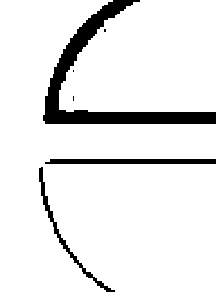

## 第八章

### 遷移宮

面具與面具下的世界

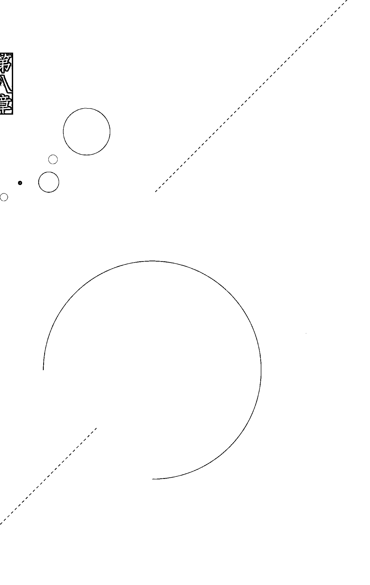

### 觀念建立

遷移宮具有內心與外在表現的兩層涵義，也因為這兩個涵義，常讓人搞不清楚為何遷移宮同時代表了兩個意思，其實是會因為我們內心的隱藏想法，會轉為顯露在外給人的感受，例如，遷移宮為貪狼星的人，內心會有滿滿的慾望，讓他希望可以擁有很多，從哪裡擁有很多呢？從大家對他的看法以及別人的觀感上，所以他會對人很好。與人親近這樣的態度讓貪狼一直是個跟所有人都很好的星曜，也因此有大桃花的稱號，這個特質來自於他慾望的內心。我們不自覺隱藏的事情，最後呈現出來外顯給別人看，只是換了一個樣貌，這就是遷移宮同時具備內心與外顯特質的原因。

### 紫微星　存在內心的皇帝

紫微的中心價值是尊貴，依照各種雙星的組合跟對宮星曜的影響，來證明自己的尊貴價值。

- **1. 紫微、七殺同宮**
「紫微、七殺」因為受到七殺堅持個性的影響，以及對宮天府重視自己權益與王國實權的價值，讓紫微的尊貴來自能夠真正掌控一切，這樣的內心聲音讓他展現在外會較霸氣跟強勢，如果沒有足夠的吉星或者加上桃花星，可能就會比較孤寡。

- **2. 紫微、破軍同宮**
「紫微、破軍」則受到破軍追求夢想的影響，紫微的尊貴認定在於能否完成自己的想法，對宮的天相表示重視人際網絡與規則，因為這樣的內心，對外展現出來紫微破軍外在的表現，會是重視人際關係，所以通常會是群眾中能夠用夢想來引導大家的人。

- **3. 紫微、貪狼同宮**
「紫微、貪狼」對宮是空宮，是表裡如一的表現，內心希望擁有很多生活夢想，各種不同的人生體驗是他覺得有尊貴人生的表現，因此雖然有著紫微的嬌貴氣質，但是與人為善，喜歡學習是他給人的印象。

- **4. 紫微、天相同宮**
「紫微、天相」則是因為天相星影響，重視自己內心的規則是覺得自己與眾不同的地方，這樣的規則因為天相的人際關係特質，展現在外是對人的幫助跟重視人際關係，如果遇到煞、忌，這重視人際關係就會變成利用人際關係，當然就容易惹出人際關係上的麻煩。

- **5. 紫微、天府同宮**
「紫微、天府」的重點是面子、裡子都要，在遷移宮可以看成內心覺得自己的尊貴來自可以掌握人生，並且為人生做出努力，這樣的特質展現在外給人的感覺，就是不服輸但是是一樣要保持尊貴氣質的樣子。

### 紫微星在本命遷移宮小練習

紫微在遷移宮，哪一個組合人緣最好？

> 「紫微、貪狼」同宮的組合，懂吃喝玩樂，很有生活情趣，因此也容易有好人緣。

### 天府星　內心期盼著自己的王國

天府「化氣為權」這個說法常讓人只把天府解釋成字面意義的「權力」，其實「權」是掌握的意思，所謂權力必然是可以掌握一切，才叫作有權力，所以天府會被形容成有謀略、有計畫，因為這些行為跟個性都是希望掌握一切的人會有的特質。當天府在遷移宮的時候，內心希望可以掌握一切，希望有個自己的小王國，所以對外會展現出很有氣度、大方，並且清楚知道該如何掌握對外的關係，讓人感覺是個非常好的領導者，是群體的領袖。天府對宮分別有「廉貞、七殺」、「武曲、七殺」、「紫微、七殺」。

- **1. 天府對宮為廉貞、七殺**
「廉貞、七殺」的組合會重視自己的想法能夠貫徹，也重視有自己的人生舞台。

- **2. 天府對宮為武曲、七殺**
「武曲、七殺」會使天府讓人覺得重義氣講信用，無論男女都是非常好的朋友，而且對於金錢很大方。

- **3. 天府對宮為紫微、七殺**
「紫微、七殺」則因為紫微的特質比較重視自己，所以雖然知道在外要展現出領導者的風範，但是難免較不容易與人親近，對外與人的相處也會希望挑選較有社會地位的對象。

### 天府星在本命遷移宮小練習

天府星在遷移宮時，因為內心總是有所謀畫，所以對外大器大方，請問哪一個組合最不符合這個條件？

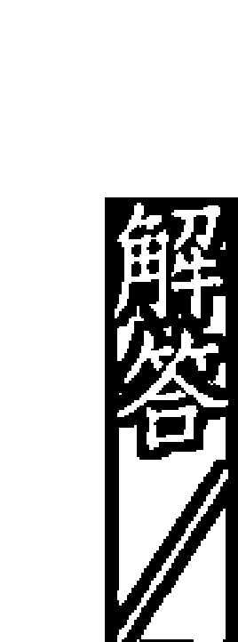

命宮「紫微、七殺」，遷移宮天府的組合，因為紫微帝星的尊貴感覺，所以即使知道應該表現大方，但是骨子裡難免有高傲的氣息。

### 天機星　永遠停不下來的內心

天機是個思考跟邏輯的星曜，當這個星曜在內心的層面，通常表示這個人心中會有許多小劇場跟想法，隨時在腦海中浮現各種對於人生以及生活中大小事情的相對劇本，這也常是天機在遷移宮的人睡眠不好的原因，因為想太多。
這樣的內心世界展現出來在外的樣子，通常會讓人覺得相當聰明，但是又不會如天機在命宮的人，因為在命宮會直接影響十二宮，所以各種事情都會受天機的特質影響。在遷移宮，只會因為內心影響了外顯的個性，不會如天機在命宮那樣太過於讓人覺得聰明不好親近。

- **1. 天機、太陰同宮或對拱**
「天機、太陰」無論同宮或對面是太陰的對拱情況，因為受到太陰星影響，這個聰明且有桃花幫助會讓他變得心思細膩，因此展現在外，也會有很好的桃花緣。

- **2. 天機、巨門同宮或對拱**
「天機、巨門」同宮因為受到巨門影響，會有著很喜歡享受孤獨的內心，也因為此顯現出來聰明而不易與人親近的樣子。若是單純天機對面是巨門，這樣的情況會降低，但是一樣容易讓人覺得太聰明，並且口舌鋒利。

- **3. 天機、天梁同宮或對拱**
「天機、天梁」的組合受到天梁星影響，個性老成穩定，天機的思考在這個組合裡變成了因為天梁的學識豐富而較成熟深思，所以展現出來給人一種信賴感。天機單星，而天梁在對面，會因為並非同宮，讓人感覺急公好義，有行動力。天機星在遷移宮還有很有趣的事，因為天機善於行動、想法很多，所以一旦天機星化忌，會想太多，常常容易迷路，畢竟一邊走路、一邊想事情，當然就會失去方向感。

### 天機星在本命遷移宮小練習

天機星代表骨頭，在遷移宮還有個有趣的小問題，想想會是什麼？

解答 天機星代表骨頭，如果在遷移宮而不小心因為運限有煞星進來，同宮或者對拱，往往會因此影響四肢的骨頭，所以常常會有跌倒跟撞傷的問題。

### 太陽星　心中有著一把希望為大家點燃世界的火

太陽有個特質叫作「喜照不喜坐」，說的就是太陽在遷移宮會比在命宮好，因為在命宮等於是處處燃燒自己照亮別人，也因為太陽希望一切規則由自己制定，所以以女生容易讓身邊的男人受不了。如果是在遷移宮，只是在內心藏著這樣的想法，如同天機星在遷移宮一樣，具備聰明特質，但是不會讓人覺得聰明過頭。內心有著太陽一般的特質，所以會呈現有主見、會領導大家，也會照顧大家，給人溫暖卻不會事事要主導權，因此這個人容易得到大家的擁戴跟支持。這樣的人是最好的政治明星甚至偶像明星，當然最好是太陽在旺位，在落陷位則會有心有餘力不足的問題，並且會有讓人覺得遊走灰色地帶的情況。

#### 1. 太阳、太阴同宫
“太阳、太阴”同宫因为对宫是空宫，无论是在命宫跟迁移宫，都会有让人觉得表里不一、难以捉摸的感觉。如果是太阴当命宫，迁移宫是太阳，则少了太阳的强势，多了太阴的细心跟细腻，异性缘也相当不错。

#### 2. 太阳、天梁同宫
“太阳、天梁”同宫基本上就是老好人，处处关心别人，也会因此让人觉得有时候管太多甚至强势。太阳对面是天梁的组合，如果太阳是旺位，因为具备了领导能力跟服务人的心，是最受尊崇的一个，也是容易往政治或公益团体发展的类型。如果是落陷位，则少了太阳希望独当一面的情况，相对低调，但是一样会处处把大家的事情放在心上。

#### 3. 太阳、巨门同宫或对拱
“太阳、巨门”的重点是太阳是否在旺位，在旺位的太阳，散发着无比光芒，对于能够让大家依照自己的想法生活，希望可以引领大家的心最为清楚，这时候无论是跟巨门对宫或同宫，都会让人感觉是个很好的领导人才，公平公正且能言善道，是前面所说最佳的偶像跟政治人才。如果是落陷位呢？一样具备让人感觉受到照顾跟容易跟随的特质，所以就某个层面来说，很适合情色业、心灵产业，这一类。

### 太阳星在本命迁移宫小练习
太阳在命宫如果是落陷位，个性比较文静不多话，这样的特质在迁移宫其实也会有，文静不多话，对事情的看法比较悲观，或者比较没有动力，或者比较会想找非主流社会价值的事情来发展。依照内心影响外在的迁移宫原理，请问是为什么？

太阳在落陷位的时候，会有心有余而力不足的问题，所以某个程度来说会没有自信，不像旺位的太阳信心十足，会有怀疑自己能力跟希望得到许多称赞的想法，展现在外给人的感觉，就会相对低调、谦虚，甚至没动力。这也是为什么太阳落陷还遇到化科的时候，容易变得喜欢让大家知道自己有多厉害，例如许多人会在名片上面印上一堆头衔一样。

### 五 太阴星
母亲的心与女人心

太阴星是以月亮的特色，依照女人的形象被设定出来。当太阴内在的特质细腻，并且善妒，希望守护家庭（这是善妒的原因，害怕自己的家被破坏），这些内在的特质在迁移宫，都会影响着命宫，并且会外显出温柔（因为心思细腻）、善解人意，并且因此产生桃花特质。这是太阴在迁移宫的主要情况，但是相同的特质却会因为对宫的命宫而影响展现的方式。
- 1. 太阴对宫为天机
  太阴对面是天机，受到天机影响，这个迁移宫的太阴会让人感觉相当聪明，懂得利用聪明在展现桃花魅力上，因此异性缘通常相当好。对宫是太阳，则柔顺细心。

#### 2. 太阴、天同同宫
“太阴、天同”同宫，因为对宫是空宫，可以借到对宫去（见一七〇页图三十七）。但是太阴在旺位跟落陷位的“太阴、天同”个性却不同。“太阴、天同”在子的位置太阴旺位，个性相对单纯傻气；如果在午的位置，太阴在落陷位，会变成比较有女性善妒且阴晴不定的特质。同样喜好享受的“太阴、天同”，在旺位的太阴虽好享受，但是通常不喜好争夺；在落陷位的太阴就比较有争夺心。如果迁移宫是旺位的“太阴、天同”，命宫借星曜过去，迁移宫内心不喜欢争夺的特质，让他展现在外相当有异性缘，但其实本身（落陷位的“太阴、天同”）个性很急，很重视自己能够得到关爱。反之若是“太阴、天同”在落陷位，但是借过去给命宫的星曜是旺位，这让迁移宫表现得太阴内心的不安与希望被关爱，呈现在外的往往让人觉得楚楚可怜，处处要人关心甚至任性，感觉好像很多心机，其实是个傻大姊。

#### 图三十七／太阴、天同的旺位与落陷位

| 巳 | 午 太阴天同 太阴落陷位 | 未 | 申 |
| :--- | :--- | :--- | :--- |
| 辰 | | | 酉 |
| 卯 | | | 戌 |
| 寅 | 丑 | 子 太阴天同 太阴旺位 | 亥 |

### 太阴星在本命迁移宫小练习
太阴星跟天机星常有不稳定的问题，一个聪明善良，一个有母爱又温柔有桃花。古书上说这两个星如果对拱，又遇到其他桃花星跟煞星，容易以身度人，因为太善良又心软，加上很有母爱，所以搭配上煞星的冲动，就会用身体到处爱人。这样的说法当然还需要配合各类运限，有时想渡人就有机会可以渡人。但是排除运限问题，太阴在迁移或是天机在迁移，相同条件下，到底哪一个容易以身度人呢？

太阴在迁移宫。因为太阴在迁移宫，对宫天机星本来就是个不安稳的星曜，命宫掌管十二宫，相对来讲影响了夫妻宫的感情状态，再加上太阴内心的母爱跟展现出来外在的桃花，相对来说比较有机会。

#### 3. 太阴对宫为天同
太阴对面是天同，则因为本身天同在命宫，太阴在迁移宫的内心想法就会偏向不与人计较。这时候会充分展现太阴的女性魅力，却少了诸如忌妒小心眼的问题，除非遇到天同化科跟化权，成为任性的孩子。

### 六 · 天梁星
有个老灵魂在内心
- 1. 天梁对宫为天机
- 2. 天梁对宫为太阳
  如果真的有人内心住着老灵魂，说的就是迁移宫有天梁的人，即使不是天梁为主的双星组合，都会有这样的效果。因为天梁成熟的个性，会让这个人在思虑上，不会像太阴过度纤细，以及天机过度盘算小剧场太多，往往是设身处地为人着想，展现出来的除了如大哥大姊般的气质，有时候也容易让人觉得太过老派跟保守。
对宫是太阳的时候，因为太阳的影响，这样老气横秋的状况就会比较严重。

#### 3. 天梁对宫为天同
对宫是天同时，会让原本个性纯真、本来感觉孩子气的天同，给人多了一点安全感。这样的个性展现在外，是喜欢助人以及稳重的气质，通常也会吸引年纪大的长辈注意，也容易让这一类的人喜欢他，并且愿意给予资源。这也是天梁星在迁移宫，会容易外出遇到贵人的原因。当然天梁代表博学，博学也包含对生命的探究，这样的内心自然往外也会展现出对这方面的兴趣，所以在迁移宫的人往往也会跟宗教或是相关学问，有许多接触的机会。

## ### 天梁星在本命迁移宫小练习
天梁星因为善良个性，有借钱不用还的有趣特质（不好意思向人家要），请问天梁星在迁移宫是否也有这样的个性？

> > 天梁星在命宫会有这样的个性，是因为命宫掌管十二宫，连带影响了财帛宫用钱的态度。迁移宫是内心世界，内心会想帮助人，对外也是如此，但是实际的情况却不一定完全愿意，因为他会受到命宫影响，例如对面命宫天机星的人，可能就会希望加点利息。

### 七．天同星
天真赤子心

天同的特质是纯真乐观和善，对于各种人事物的接受度高。这样的内心世界展现出来的表现，就是对人总是笑咪咪，不跟人计较，无论任何话题都有兴趣，不懂的也会倾听。在这样的特质下，让他拥有很好的人缘跟异性缘，甚至给人一种好学博学的感觉，但是实际的情况当然也需要从对宫来看。

#### 1. 天同对宫为太阴
对面是太阴，会因为太阴的母爱发挥，对人除了上面的特质之外，还多了照顾跟细心。虽然看起来是傻气的孩子，其实遇到事情很有耐性解决，很愿意付出，也愿意为了家人牺牲。

#### 2. 天同对宫为天梁
对面是天梁，则是看起来天真随和，其实做事深思熟虑。相对天同在命宫、天梁在迁移，是个性天真但展现出来成熟的样子；天同在迁移却是展现出天真其实个性很沉稳。

#### 3. 天同、天梁同宫
“天同、天梁”同宫，则因为空宫可以借对宫星曜，所以算是表里如一。天同受天梁的影响，就是个成熟的孩子。

#### 4. 天同对宫为巨门
这个情绪化纠结的天同，在迁移宫也会如同在命宫，内心有很多小剧场，内心的情绪波动总会影响自己的行为，对很多事情放不开，像个任性的孩子，展现出来的状态就少了前面提到天同因为天真而产生的好人缘。

## ### 天同星在本命迁移宫小练习
天同星有个感情上的小问题，因为个性善良天真，常常跟前任情人藕断丝连。通常只有“天同、巨门”跟“天同、天梁”这两个组合的机率比较低。请问，如果以天同在迁移宫，对面是天梁，以及天梁在迁移宫，对面是天同，哪一个对于前任情人的追求会无法拒绝？

> > 天同在迁移宫。因为天梁在迁移宫，内心会有很多考量，天同则容易心软。

### 八 七杀星
不甘心不放手的内心

七杀星的特质在于坚持的意志力，有这样的星曜在迁移宫，表示对于命宫的价值很坚持，也会因此让人觉得有某种固执的感觉，连带着当然很强势。但是需要从对宫去看他坚持的是什么事情。
- 1. 七杀对宫为武曲、天府
  七杀对面一定是天府，“武曲、天府”重视物质跟实际的金钱价值观，展现出来的感觉是这个人在金钱上的一板一眼，说好的就不会变，但也不轻易接受说情。
- 2. 七杀对宫为廉贞、天府
  “廉贞、天府”则对于自己的人际关系跟在外能够得到的资源相当重视，也会努力经营。

#### 3. 七杀对宫为紫微、天府
“紫微、天府”则因为面子里子都要，可惜这并不容易，但是七杀的坚持就会让他在外展现出固执而且不可一世的样子。这也是为何七杀在迁移最好是在申的位置，因为这个位置太阳是落陷的，会降低七杀的强势跟坚持力量，反而可以改善七杀在迁移宫产生与人的冲突。

## ## 九 破军星
心中有许多伟大的梦

破军在迁移宫，内心世界有许多想法跟梦想，因此展现出来让人感觉总是热情且散发魅力，这是破军身为桃花星的原因。对宫的天相让破军不至于乱来，但是要注意天相是不是遇到煞、忌。如果有，那么天相管不住破军，则破军就会从热情变成让人觉得无法控制，或者说不按牌理出牌。

### （十） 贪狼星
只要我什么都想要

贪狼在迁移宫，内心诸多欲望尤其在人际关系上，展现出希望学习跟与人关系良好的态度，因此贪狼在迁移宫会有不错的桃花，尤其是异性桃花。因为内心欲望的期待造成外在态度的反应，那么希望得到人缘的好处，当然就不会破坏人际关系。

### 七杀、破军、贪狼在本命迁移宫小练习
七杀、破军、贪狼在迁移宫内各有特色。请问一个希望选举的人，哪一个星曜在迁移宫会最恰当？

> > 贪狼星。贪狼因为内心期待人缘佳，会愿意花时间让自己成为跟很多人都有话题的人，也喜欢学习各类技能，增加人缘，这样的人相对起来较容易得到名望跟机会。

### （十一）巨门星 黑暗的内心
巨门是黑暗之星，需要靠太阳照射。无论巨门在哪个位置，都要看太阳是否在旺位，否则就会让巨门呈现黑暗状态。巨门的黑暗放在内心的宫位，当然表示内心黑暗，并且没有安全感。这样的心情反映在对外的表现上，就会呈现希望得到认同，以及希望要有好人缘，希望被看见。加上巨门代表言语沟通能力，所以如果遇到化权或煞、忌，就容易让巨门在对外的关系上为了取得认同，反而强势地用言语与人辩论。这也是所谓巨门星好辩的原因，巨门在迁移宫会外出与人有口舌纷争，甚至有官非问题的原因，其实这些都是来自巨门内心的不安。太阳在旺位的时候，巨门少了不安全感，可以呈现出巨门善于言词以及沟通的能力；落陷位的时候即变成不擅言词或是好辩论，这个部分就要看巨门的对宫是什么星曜了。

#### 1. 巨门对宫为天机
巨门对宫是天机，这个巨门本就逻辑好，当然也增加了他辩论的能力。太阳在旺位的时候都容易说话得罪人了，更何况在落陷的时候。对面是天同时，因为天同星的纯真善良，如果太阳在旺位，巨门诸多的缺点，例如口舌是非、例如多疑，则不会呈现出来。如果是落陷的太阳，也会因为天同星的个性影响，除非遇到煞、忌，否则只是内心缺乏自信。

#### 2. 巨门、太阳同宫
“巨门、太阳”的组合，如果在寅，太阳是旺位，但对面命宫是空宫，则是看起来热情有活力、能言善道，其实做事情三分钟热度，而且不容易相信人。如果太阳在申，是落陷位，则看起来木讷不会说话，其实熟了之后能言善道，并且相当有想法。如果巨门对面是太阳，巨门在亥位、太阳是旺位在巳，则是标准的政治家领袖人物，受到太阳的影响，口舌能力都发挥在主导与领导身边的人事物。太阳如果在落陷位，巨门在巳，受到太阳在命宫有气无力的情况，这时候的内心会更加没有信心以及不安，对外也会展现出很努力地想好人际关系并且得到认同。

### 巨门星在本命迁移宫小练习
巨门的没有安全感需要太阳照射，在太阳为旺位的情况下，哪个巨门组合最不会被讨厌？

> 太阳在对宫的巨门，因为受太阳星影响，能言善道有条有理，并且重视公平正义。相对天机会因为聪明而孤傲，天同则因为孩子气的天真，有时候难免不小心得罪人。

### 武曲星
不怕苦不怕难的内心

武曲之所以被称为正财星，就是因为有着一步一脚印的努力特质，并且很务实地面对自己的人生。所以当他在迁移宫的时候，这样的务实态度就会展现出来，让人感觉很有自己的坚持，不怕困难。但是因为务实的态度，在金钱价值观上就比较不近人情，但是同时也很大方，因为武曲本来就有重义气的表现。这个务实的表现就是他会对人好而且愿意花钱，但是钱要花在刀口上。
- 1. 武曲、七杀同宫
  “武曲、七杀”可以说是最让人觉得个性刚硬的一组，当然也是最重义气却最不讨人喜欢的一组，常常得罪人。

#### 2. 武曲、破军同宫
“武曲、破军”一则因为破军的关系，调整了武曲刚毅的特质，增加许多想法。但是因为对宫的天相，又让人觉得很规矩并且有梦想，感性理性兼备。只要天相不要遇到煞、忌，否则很容易因为对朋友的大方反而为自己惹来金钱纠纷。

#### 3. 武曲、贪狼同宫
“武曲、贪狼”这一组如果同宫，因为可以借对宫过去，加上受到贪狼的影响，应该是最让人觉得大方的一组，在外花钱不手软。贪狼的欲望深深影响着武曲。

#### 4. 武曲对宫为贪狼
武曲对面是贪狼时，则武曲会靠着务实态度，好好守住贪狼，不让他欲望大爆发，这也是贪狼相对来说最乖的一组。即使贪狼有花心或与异性搞暧昧的情况，因为内心武曲的务实感，会让他展现出相当耿直的一面。

#### 5. 武曲、天相同宫
“武曲、天相”因为受到天相影响，遇到煞、忌，天相的规矩破坏就会产生问题。当“武曲、天相”在内心的时候，是个对自己务实态度规范的人，不多不少，个性不会太硬，但是也不会如“武曲、贪狼”不节制。问题是当天相化忌或遇到煞星，规范破坏，则展现出来的就是会与人因为钱财出现问题。

#### 6. 武曲、天府同宫
“武曲、天府”这一组可以说是在迁移宫最好的一组。因为天府的谋略与计划能力，一方面让武曲在迁移宫的时候，不会因为务实的价值观让人误会金钱上不大方（其实武曲的不大方只是不乱花钱），甚至让人觉得是个很有计划能力的人。

## ### 武曲星在迁移宫的小练习
“武曲、天相”、“武曲、破军”都因为天相遇到煞、忌，可能跟人在金钱上有纠纷。如果本命具备，当然就是等运限走进去，毕竟天生就会希望用自己的规范与人交往，但是自己的规范又常常被自己打破，有时候是本命盘或运限盘有煞、忌进去，这时就是那个运限里面需要担心。请问，这两组中哪一组最容易惹上跟钱财有关系的官非？

> 原则上两者都可能，但是“武曲、天相”更有可能，毕竟这表示了武曲对金钱的看法跟原则，如果原则被打破，当然就可能出现问题。

## ## 十三 天相星
心中永远的一把尺

天相化气为印，这个盖章、印章的意思，其实说的是一种承诺。天相的人会重视自己与人的关系，因为人与人之间的关系建立在彼此的承诺上，所以天相才被称为重视人际圈的星曜，会为了自己的人际圈去经营人生。这样的星曜放在迁移宫，内心有着一把尺，这一把尺如何规划，当然是看对宫的星曜。但是这样的尺度人生影响着他对外的态度，因此在重视人际的情况下，这个人的人际关系当然不错，所以天相会是人际桃花星。但是也会因为遇到煞、忌，表示自己的那把尺出了问题，所以容易在外跟人有纠纷。至于是什么样的纠纷，当然也需要看对宫的星曜。
- 1. 天相对宫为武曲、破军
  天相的对宫如果是“武曲、破军”，没有煞、忌，则让人感觉用钱大方，会照顾朋友；遇到煞、忌，则大方可能会过头，反而与人有金钱纠纷。

## ### 2. 天相对宫为廉贞、破军
如果是“廉贞、破军”，遇到煞、忌时可能会因为过度拓展自己的人际关系，因而产生问题，通常出现在与朋友之间的合作或是约定，却彼此无法遵守。

## ### 3. 天相对宫为紫微、破军
若是“紫微、破军”，这个天相需要维护的人际网络是要能够让自己可以在人际圈中得到尊贵的位置，出现问题通常也就在这样的地方，许多时候不是自己要人家捧着你就可以顺利达成。

## ### 天相星在迁移宫的小练习
天相因为违反约定，走偏了心中该有的尺度，因此容易有官非问题。其实所谓官非问题，就是一种约定，人与人的约定，人与社会国家的约定，严重的时候就是真正的官非，否则可能只是一些摩擦。请问，在天相的组合中，如果与人合作生意，各自会产生摩擦的问题是什么？

> 解答 对宫是“紫微、破军”，会因为主导权与是否受尊重而产生问题。对宫是“廉贞、破军”，则因为彼此的个性以及在事业发展上的人情世故，诸如受到外人挑拨以及与同事纷争。“武曲、破军”当然是为了钱。

### 十四 廉贞星
电量四射发电机

廉贞是个磁场强大的星曜，所以被称为五鬼星，也被认为是外交官一般的星曜，聪明反应快，外型又好。被放在迁移宫的时候，化气为囚的特质，内心里面常感性与理性俱备，将同宫的星曜做一定限度的控制，却又展现这些同宫星曜的优良特质，除非遇到煞、忌才会控制不住，让同宫星曜的力量不受控制地放出去。这样的特质在迁移宫展现出来的，当然是相当有魅力的样子，不希望凡事拖拖拉拉，就会想用最快的方法把事情完成，因此会让人感觉能力好、机智又有魅力。如果再加上一点桃花星，通常也会非常幽默，可以说是万人迷。只是如果遇到煞、忌，这样的人格特质通常会三教九流的朋友都交，就容易因为个性与交际关系招惹麻烦。

#### 1. 廉贞、七杀同宫
“廉贞、七杀”同宫在迁移宫，会重视自己在外面的影响力，在生活圈亦有一席之地。如果是觉得自己无法发挥，无法受到重视的地方，他就会离开。但是因为自身特质，通常很容易在群体中得到主导地位，并且是众人的领袖。

#### 2. 廉贞、破军同宫
“廉贞、破军”虽然受对宫天相影响，也会重视自己的人际关系，但是因为破军在旁边，所以会展现出自己的魅力跟影响力。破军是可以有许多梦想的，这样性格在内心，当然展露出来的就是将自己的人际网络无限扩张，让人觉得很能引领众人、给众人梦想、很有魅力。

#### 3. 廉贞、贪狼同宫
“廉贞、贪狼”则因为对宫是空宫，加上贪狼是大桃花星，这一组从内而外都充满异性的魅力。内心贪狼的渴望加上廉贞的特质，将欲望放在人际网络上控制发挥得刚刚好。没有煞、忌的话，会是一个聪明幽默、异性缘佳而且学问丰富的人。

遇到煞、忌则不免有桃花的问题。

#### 4. 廉贞、天相同宫

「廉贞、天相」的重点当然是不能遇到煞、忌，遇到煞、忌则心中的界限被破坏，对外的人际关系容易产生问题，希望人脉可以帮助自己却也会因为太过祈求这样的效果，让自己与人发生法律纠纷。

#### 5. 廉贞、天府同宫

「廉贞、天府」则因为有天府管控，基本上具备这个星曜一切优良的特质，聪明能力好、反应快有事业心。

#### 6. 廉贞对宫为贪狼

至于廉贞单星，对宫是贪狼，则是廉贞系列里最俊男美女的一组，在没煞、忌的情况下，也是最能够在人际关系跟桃花与事业间游走的组合。

### 廉贞星在本命迁移宫小练习

廉贞星在迁移宫的人，通常让人感觉到他无限的魅力，因为内心的理性感性兼备，呈现在外的迷人风情让人一瞬间就着迷，也因此往往会出现许多烂桃花，毕竟树大有枯枝，人多有白痴，桃花多当然也就不乏烂桃花。请问怎样的组合比较不会有这个情况？

#### 解答

廉贞遇到禄存同宫或化禄，形成廉贞清白格，对廉贞星会有很好的控制能力。廉贞与天府同宫，因为天府的管控，也会比较务实，不被煞、忌影响。最后是「廉贞、七杀」，因为对宫是天府，所以除非遇到严重的煞、忌或者陀罗星，抑或是不好的运限，通常都可以分得清楚什么是烂桃花，不会被迷惑。

## 第九章

### 仆役宫

> 出外靠朋友，后天给的帮手

### 观念建立

如果兄弟宫是天生给我们的好帮手，仆役宫就是后天我们自己挑选的。有句话说「在家靠兄弟、出外靠朋友」，但是在紫微斗数中，仆役宫并非只有指朋友（有交情的人），而是所有认识的人，可能与自己有接触的人，都可以算是仆役宫。

仆役宫跟迁移宫在外表现的差异在于，迁移宫说的是自己外显出来给人的看法，以及生活圈跟外出时候的样子；仆役宫比较偏向在人际上，当然仆役宫也代表了不同性别的兄弟姊妹，我们可以说这是因为同性别的兄弟姊妹天生应该就与自己比较亲近，不同性别的兄弟姊妹相处上则比较像平辈朋友，当然这是天生的架构，实际的情况还是要看宫位内的星曜，就像我们应该天生跟兄弟姊妹比较亲近，却有很多人反而跟朋友比较亲近，跟兄弟姊妹反目成仇，例如在《紫微攻略 2》里提到的兄弟宫化忌，因为希望兄弟能给予自己亲情，但是由于自己或他人的问题得不到，因而转向对外的友情。本命盘仆役宫代表的是我们天生对外与人相处的态度，以及挑选交友的对象跟眼光，当然真正交到怎样的朋友需要看运限盘，并非本命盘，这一点在夫妻宫跟子女宫也是如此，需要特别注意，在运限盘才会说当下的时间点内自己的交友状况。

### 紫微星

#### 能力地位不好的不要来

##### 1. 紫微、七杀同宫

紫微星化气为尊，尊贵是紫微星在仆役宫择友的标准，在朋友之间要得到尊重、尊崇，也希望跟社会群体中比较有地位的人往来，至于怎样的地位、怎样的尊崇，则要看紫微星的组合与对宫。

「紫微、七杀」这一组化杀为权，对宫是天府，希望可以在朋友间掌握人际关系，所谓的尊崇感来自于能够在朋友圈中担任意见领袖，也希望来往的对象有足够的分量。「紫微、七杀」若在命宫，有很高的机率会白手起家，所以在仆役宫成年后通常有希望跟这样的人往来，只是如果遇到煞、忌，或太阳落陷，或者运限不佳。

##### 2. 紫微、破军同宫

「紫微、破军」对宫是天相，重视交友关系能够成为自己的人际网络，因此对朋友也算大方，但是因为受紫微影响，会希望在朋友圈之间得到尊崇，并且会挑选有社会地位的朋友。因为是破军，所以创意跟才华是他所重视的。

##### 3. 紫微、贪狼同宫

「紫微、贪狼」这一组当然是寻找喜欢懂得生活享受，有品味、多才多艺的朋友。

##### 4. 紫微、天相同宫

「紫微、天相」对宫是破军，兄弟宫破军如果遇到煞、忌，跟兄弟姊妹的关系通常都不佳，所以影响他对朋友的态度，会希望后天的平辈关系可以让自己得到主导权，依照自己的规范建立出来。不过因为天相怕煞、忌，所以也容易遭朋友背叛。（其实是别人不见得希望照他的意思跟他往来）。

##### 5. 紫微、天府同宫

「紫微、天府」对宫七杀的组合是面子、里子都要，交友时会很重视这个人的社会地位跟经济能力，也希望在朋友间得到尊崇及帮助。

##### 6. 紫微对宫为贪狼

紫微单星对宫贪狼，则重视自己在朋友圈的地位，希望大家围绕着自己，当然也会要求朋友光鲜亮丽。

#### 紫微星在本命仆役宫小练习

紫微在本命仆役宫时，会希望跟有能力、有地位的人往来，除了「紫微、破军」可能重视才华跟不拘小节之外，一般书籍都会说，这个人的往来对象都是达官显要，可以得到朋友的帮助，请问真是如此吗？

---
解答
本命盘指代表自己的选择态度，我希望认识川普，川普不见得想认识我，是否真的有机会，还是要看运限的仆役宫。但是仆役宫有个特色，你希望朋友有地位，最好自己也有地位，毕竟交往都需要门当户对，所以紫微在仆役宫，如果自己本命不够强，运限不够强，再加上遇到煞、忌，很可能会变成自己想巴着有地位的人，其实对于自己的运势并没有帮助，有时候反而有害。

### 天府星 谁才是真正的好朋友

1. 天府对宫为武曲、七杀
对宫是「武曲、七杀」，希望朋友重情义，并且有重情义的表现，能够仗义疏财，朋友之间金钱往来大方。

天府是个务实的星曜，朋友圈是否可以给予自己实质的帮助跟资源，才是他重视的事。如果遇到禄存，无论是在兄弟宫或仆役宫，都表示懂得经营朋友关系，也表示较能得到朋友帮助。不过是否在事情发生的当下有朋友支持，还是要看运限，只是天府在仆役宫的人与朋友的关系通常都比较好，也较能够找到对自己有帮助的朋友。而重视交友圈能给予自己怎样的好处，则要看对宫的星曜。

2. 天府对宫为廉贞、七杀
「廉贞、七杀」则是重视朋友能给予自己人脉资源的交流，以及重视朋友的知识跟能力。

3. 天府对宫为紫微、七杀
「紫微、七杀」则希望朋友最好是事业能力很好的人。

#### 天府星在本命仆役宫小练习

天府星遇到禄存在仆役宫，通常更能经营朋友关系，并且得到朋友的帮助，因天府星是个有谋略、有计划的人，所以在仆役宫算是善于经营朋友关系的，但禄存是什么意思呢？

禄存所在的六亲宫位，除了父母以及代表妈妈的兄弟宫以外，通常我们会投注心力在那个宫位，也因此会增加跟那个宫位的关系与缘分。

### 天机星

#### 君子之交淡如水，喜新厌旧是常态

天机星的特质是善变，善变的原因来自天机星善于逻辑思考跟聪明，所以不喜欢一成不变的事情，当然也不喜欢一成不变的人，所以天机在仆役宫除了喜欢跟聪明的人往来（里面的星曜是自己喜欢的类型），也不喜欢交友圈一成不变，因此朋友圈会常转换。

1. 天机、巨门同宫
「天机、巨门」同宫的人，会有享受孤寂的特质，在仆役宫除了喜欢聪明、有想法的人，若是太阳在旺位，则遇到聪明的人会想多交流；如果是落陷位，因为巨门没有安全感，以及天机的盘算，也会让自己对于交友趋于保守跟观察。

2. 天机、天梁同宫
「天机、天梁」同宫，则是只要跟自己谈得来的都是好友，但是交谈的都是知识性话题，不过毕竟「天机、天梁」是个聊天组合，所以期望他因为天梁对朋友非常照顾，就需要其他因素配合了。

3. 天机、太阴同宫
「天机、太阴」则是对朋友细心而温柔，如果是男生命盘，这个组合的朋友比例就容易以女性居多。

4. 天机对宫为太阴
如果是天机单星，对面是太阴，家庭教育给予的细心呵护，让他也会选择个性较和善且温柔的人为友，这样的特质一样会让男生的朋友群中，以女性朋友为多。

5. 天机对宫为天梁
对面是天梁，则喜欢个性成熟且聪明博学的人，对于交友也会希望多方尝试，并且因为天梁星，会很愿意帮助朋友，跟「天机、天梁」同宫的差别在于，同宫还是以天机为主，并非由内心状态影响天机星。

6. 天机对宫为巨门
对宫是巨门一样要看太阳是旺位还是落陷位，旺位的太阳，只要是聪明的朋友，就会显得很有活力，很热情，希望多往来。落陷的太阳，对朋友的选择会比较保守，一旦成为朋友，就绝对相挺；不是朋友的，则处处观察。

#### 天机星在本命仆役宫小练习

天机星怕煞、忌，遇到化忌时聪明反被聪明误，遇到陀罗，感情纠结，因此常挑错朋友，遇到其他煞星，则因为冲动交友，起冲突、断交、翻脸都难免。请问，在天机的组合中，哪一个组合最容易跟朋友出问题？

> 解答：「天机、巨门」同宫的组合，因为受巨门影响，即使是太阳在旺位的巨门，都会潜在地没有安全感，何况是太阳落陷的，所以往往让天机星对于朋友的挑选与相处，会想太多或是不信任，反映出来的也是容易找到不对的人，自然容易出问题。

### 四、天梁星
#### 老人才是我朋友

天梁是老人星的意思，在于天梁的五行属土，稳重并且藏了金，这个金表示清楚的想法，活脱脱一个成熟稳重的大哥，在仆役宫当然表示自己喜欢跟这样的人往来，因为自己对朋友也是如此，会给与对方意见，并且愿意倾听对方的声音，照顾他。这种照顾朋友的方式，以及希望自己被朋友照顾的方式要看对宫。

1. 天梁对宫为天同
天梁的对宫如果是天同，则因为自己跟母亲与兄弟姊妹的感情和善，影响了他对朋友也会很有耐心，并且不计较彼此利益。

2. 天梁对宫为太阳
对面是太阳，则对朋友的照顾比较像是爸爸或哥哥，果决而且带着强势，尤其遇到化权时，同样地他也希望认识的朋友是这类有社会地位，并且能给予自己心灵力量跟鼓励的人。

3. 天梁对宫为天机
对宫是天机，则对朋友的帮助就会多了点计算，倒不是天机星心机多，很多人把天机的机，误会成心机的机，心机多的大概是铃星或者天府，天机则是凡事会多想一下，但是他毕竟化气为善，没有煞、忌出现，本身还是善良的，所以对面如果是天机，会多想一下，并且一样常常换一群朋友，不会固定跟同一批人往来。不过因为天梁的关系，所以跟老朋友的关系基本上还不错。

#### 天梁星在本命仆役宫小练习

天梁是老人星，如果依照夫妻宫的说法，到底多老才算是年纪比我们大的朋友呢？

天梁的年纪大，以男生盘来说，女性比他大超过三岁就算大，男性则需要大五岁以上。女性盘来说，男性大她八岁以上算大，女性则是大五岁就算。当然这个数字要对应一下年纪，例如七十岁的老男人，其实同年纪对他来说也算老了。

### 五、天同星
#### 人人都是我朋友

天同几乎在六亲宫位的每一宫都算不错，本身的个性比较与世无争，所以在跟人际有关系的宫位上，就显得相当适合，毕竟华人的世界以和为贵，但这个以和为贵若遇到煞、忌，往往会变成是非不分，容易出现好心做坏事的问题，以及自己对人好却得不到回报。不过如果没有遇到煞、忌，则通常会因为自己个性良善，所以朋友关系不差，当然也希望找到跟自己同类型的朋友，而天同也代表博学跟教育，所以朋友间的交往在乎个性和乐，并且要能够有知识交流。

1. 天同、天梁同宫或对拱
天同若是跟天梁同宫，对朋友多了关怀跟帮助的个性；如果对面是天梁，则是相当好的朋友，帮人且回报。

2. 天同对宫为太阴
对面若是太阴，会细心温柔地照顾人，希望跟懂得关心他人且有爱心的人往来，只是这样的个性，若是男生命盘，难免会跟朋友有暧昧关系。

3. 天同、巨门同宫
「天同、巨门」同宫，无论太阳旺弱，都会对友情的建立没有安全感，也容易跟朋友闹情绪，因为天同的良善不再。

4. 天同对宫为巨门
如果对面为巨门，太阳在旺位，则能言善道、个性善良温厚，并且因为巨门隐性的不安全感，相当愿意为朋友付出，在朋友间会是个很好的交友对象。如果太阳是落陷位，虽然跟旺位的太阳一样会是好朋友，但是常常因为对交友关系比较不安，会有情绪问题。

## 第九章

#### 天同星在本命仆役宫小练习

天同个性善良，又是福星不怕煞、忌，但是前面又说到天同在仆役宫遇到煞、忌时，容易好心做坏事，觉得自己做得很多但是得不到回报，为什么煞、忌好像还是会产生影响？

> > 天同的不怕煞、忌，只是因为他不在乎，并非不会发生，一旦发生，他也是笑笑度过。本命盘说的虽然不是现象，但是因为有煞、忌在宫位内，对待朋友有时仍然会有情绪上的冲动，但是因为天同的特质，这份冲动通常都是好心助人，加上运限配合，就会出现好心做坏事反而被嫌弃的问题。

### 六、太阳星

#### 太阳星

##### 世界的领导者 社会的发言人

1. 太阳、太阴同宫
太阳化气为贵，喜欢交往的对象当然要有点社会地位，也希望自己能够在朋友间有被尊重的主导地位，所以是否为有能力的太阳，就会变得很重要，旺位的太阳当然不错，落陷的太阳难免有点失落。

太阳与太阴同宫的时候，因为多了太阴的帮助，在交友上多了一些细心，少了太阳有时候会展现出来的强势，其实某个层面也是因为太阳、太阴双面的性格，让他交友时不太能够真心相信别人，多了细心就多了疑心，如果太阳是旺位，可以掩饰得很好，落陷位就可能比较严重，所以这一类人交往的对象难免落差很大。

2. 太阳对宫为太阴
如果太阴在对面，则保留了细心的一面，少了双面性格。

3. 太阳、天梁同宫
「太阳、天梁」同宫，表示这个人对朋友总是关心用心，也乐于助人，因此容易遇到贵人，通常是有年纪的男性贵人。

4. 太阳对宫为天梁
如果对宫是天梁，则旺位的太阳会对朋友主动用心，并且可以在朋友间得到不错的领导地位，也容易认识有名望的人；落陷位则偏向在朋友间做牛做马。

5. 太阳对宫为巨门
若对宫是巨门，选择朋友除了社会地位，最好是能言善道，并且具社会影响力的人。

#### 太阳星在本命仆役宫小练习

太阳喜欢跟有名望的人交往，当然不可能一开始就认识有社会地位的人，所以这里所说的社会地位都是依照自己生活的群体去区分，在学校就以学校为群体，常活跃于运动社团，就用那个社团去看社会地位。太阳在旺位的时候，通常可以如自己所愿，但是如果太阳在落陷位呢？还可以如自己所愿吗？

> > 太阳如果在落陷位，简单来说就是会做得比较辛苦，能力与期望有落差，不适合再加上化科、化禄、化权，有时候就会变成打肿脸充胖子，硬撑场面了。

### 七、太阴星
#### 总是细心关心人

太阴这样的母性星曜，出现在每个六亲宫位都很不错，只是需要担心体贴跟关心过头，遇到煞、忌或者再加上其他桃花星，可能会跟身边朋友暧昧不断。

1. 太阴对宫为天机，对宫若是天机，喜欢聪明的朋友，但是也容易因此被朋友所害，毕竟聪明人比较容易害人，所以需要注意煞、忌的问题。
2. 太阴对宫为天同或同宫，对宫是天同，则对朋友不计较，但是因为自己个性特质，来往的朋友比较喜爱吃喝玩乐或是心灵的关心，比较不是对自己事业有帮助的类型。若是同宫，则容易对朋友太善良好心。
3. 太阴对宫为太阳
对宫是太阳，对朋友的选择就比较有原则。

#### 太阴星在本命仆役宫小练习

太阴星如果遇到其他桃花星，容易跟朋友有暧昧关系，尤其是男生的命盘，请问哪个组合比较会出现这样的情况？

「太阴、天同」同宫、对拱。太阴对面是天机星，都会有这样的机会。

### 八、七杀星
#### 交友快狠准，讨厌拖泥带水的人

七杀的交友态度一向果决且重义气，敢爱敢恨一直是七杀的特色，快刀斩乱麻也是他的态度，剩下的只是看对宫，就知道他坚持的是什么、斩断的是什么了。

1. 七杀对宫为紫微、天府
对宫如果是「紫微、天府」，不会想和无法给予自己帮助与资源的人往来，交往的朋友必须能说得出口、带得出场、让人感觉有面子，否则就不会是他的朋友。

2. 七杀对宫为廉贞、天府
对宫是「廉贞、天府」，则重视朋友的自身能力，以及是否给予不同的人际关系跟开拓自己的生命。

#### 七杀星在本命仆役宫小练习

七杀在仆役宫对朋友算是重义气，只要是 他认定的朋友，都会对对方很好。如果有 个七杀在仆役宫的朋友，你跟他借钱，这 些七杀组合会各自需要什么条件？

> 对宫是「紫微、天府」，如果你本身条件 不错，他会当作投资你来借你钱。「廉贞、 天府」则会判断你是否有能力还钱。「武 曲、天府」则会看你平常对他好不好。

3. 七杀对宫为武曲、天府
「武曲、天府」则务实地重视与朋友之间的交往关系，对方是不是跟自己一样 重义气跟信守承诺，能给予自己实质的帮助。

### 九、破军星

#### 心灵感觉对了就是好朋友

1. 破军对宫为紫微、天相
破军一向用感觉与梦想面对人生，对于朋友跟人际关系也是如此，不在乎是不是原本设定的朋友条件，随时可以打破，如同他对感情一样，这样的态度当然也容易跟朋友有暧昧，不过一见如故，谈得来的，就是兄弟，不喜欢了随时可以消失，但是重视你的时候，可以将身家性命都给你，这是他的对人的态度。对宫是天相星，同样影响他在交友上所追求的浪漫。

对宫是「紫微、天相」，在朋友间是否可以得到尊崇，往来的朋友是否是各领域能人，是他挑选的态度。

2. 破军对宫为廉贞、天相
「廉贞、天相」则重视与各个朋友之间的关系，希望经由往来的朋友与生活圈，扩展更多的人际关系，除非廉贞化禄。

3. 破军对宫为武曲、天相
「武曲、天相」重视跟朋友金钱往来，对朋友大方，但是如果遇到煞、忌，也容易跟朋友发生财务纠纷。

#### 破军星在本命仆役宫的小练习

破军会不计一切对朋友好，但也可以随时离开，因为是桃花星，所以也容易跟朋友有暧昧，请问哪一个组合的机会最大？

对宫是「紫微、天相」的机会最高，因为「紫微、天相」一旦遇到煞、忌，是不在乎规范的。

### 贪狼星

#### 想要认识所有人

贪狼是欲望之星，在仆役宫当然就会重视人际关系，希望从人际关系得到自己的需要，所以也是杀破狼中最懂得处理人际关系的星曜。对宫的星曜影响了他对朋友的期待。

##### 1. 贪狼对宫为武曲
对宫是武曲，对于朋友交往有期待，有付出，但是相当务实，不会乱交朋友，如同破军选人。

##### 2. 贪狼对宫为廉贞
对宫是廉贞，则希望透过与朋友的往来让自己更进步，所以挑选朋友时重视人际关系跟能力。

##### 3. 贪狼对宫为紫微
对宫是紫微，则在乎对方是不是有品味、是否有比自己更好的眼界跟社会地位。因为贪狼是桃花星，当然跟朋友搞暧昧也很正常。

#### 贪狼星在本命仆役宫的小练习

擅长人际关系的贪狼星，哪一个组合最容易交到龙蛇混杂的朋友？

对宫为廉贞的组合，当廉贞化忌，对于朋友的选择，只会着重对方的能力跟周边人脉，至于个性是否善良等道德标准，较没有那么强硬，所以容易结交三教九流等各类人士。

### 十一、武曲星：情和义，比金坚

武曲跟天梁在仆役宫的，都会是我们人生的好朋友。天梁总是循循善诱，武曲则是平常不联络，但是有事找他也不会拒绝，是重义气的朋友。如果武曲还化科，更是对朋友花钱很大方，当然这一切的重点是：你必须是他的朋友。

- 武曲、七杀同宫
“武曲、七杀”重视朋友的个性直爽跟重义气，对宫是天府，也希望朋友有不错的工作能力，并且能给予自己帮助。

- 武曲、破军同宫
“武曲、破军”则受破军影响，只要符合他的交友条件，是个做人不错，愿意帮助朋友的人，他就会对你相当大方，有求必应。

- 武曲、贪狼同宫
“武曲、贪狼”则除了要有好能力，重义气，更要有才华，懂得生活，可以给他不同生活刺激跟经验，所以他会不断认识新朋友。

- 武曲、天相同宫
“武曲、天相”，因为对宫是破军，虽然很会挑选朋友，但总是可以挑选出不同族群与环境的朋友，不过跟“武曲、破军”一样，都需要担心因为煞、忌而受到朋友影响财务。

- 武曲、天府同宫
“武曲、天府”则是最懂得挑选朋友跟应用自己人际关系的组合，只是因为对宫是七杀，所以对朋友看起来都好，但是其实在他心中壁垒分明。

- 武曲对宫为贪狼
若是武曲单星对宫贪狼，这是个期待能认识各种生活圈的人，却也很务实地评估朋友可以为自己带来什么资源。

### 武曲星在本命仆役宫的小练习

武曲是个重义气但对朋友也很务实的人，因为武曲本身带有财星的涵义，遇到与天相同宫或对宫的时候，都会有因为煞、忌而与朋友之间发生财务问题。对于这样的命盘组合，该注意什么事情？

> 跟朋友之间不要有投资往来，从事的行业比较不建议保险或理财顾问这类跟人际关系与金钱往来的工作，与朋友之间的借贷最好当作给予不是借贷。

### 十二、廉贞星：朋友是我展现魅力的所在

遇到桃花是桃花星，没有遇到桃花也是人际关系的高手，廉贞在仆役宫可以说是让人又爱又恨，爱的是这个人能够跟各种人交往，拥有的人际网络与关系，恨的是遇到煞、忌就容易跟朋友产生问题，朋友愈多问题愈多，交往关系能力愈好，自己的麻烦也愈大。

- 廉贞、七杀同宫
“廉贞、七杀”选择朋友的标准，能力是必然的，而且还要在意在群体中是否为一方之霸。

- 廉贞、破军同宫
“廉贞、破军”同样的是交友凭感觉，但重视对方是否给予自己人际关系上的资源，对宫有天相，需要注意是否有煞、忌，容易在人际关系上产生问题，当然也容易跟朋友有暧昧情愫。

- 廉贞、贪狼同宫
“廉贞、贪狼”跟朋友搞暧昧几乎是日常，与异性的关系多过同性，虽然三教九流都交往，却也希望对方能够给予自己许多新的生活经验跟知识。

- 廉贞、天相同宫
“廉贞、天相”类似“廉贞、破军”，但是只要天相没遇到煞、忌，平常跟人的交往比较有守有为，不会到处放电，也较会挑选朋友，看起来人人都好，其实内心对于朋友的挑选相当严格。

- 廉贞、天府同宫
“廉贞、天府”是最乖的一组，对宫有七杀，朋友的往来该有的义气和支持不会少，不过也不是随便是谁都可以跟他当朋友。

- 廉贞对宫为贪狼
廉贞单星对宫为贪狼，则重视朋友可以给自己的帮助，以及对自己的人生是否有成长，至于是否容易跟异性往来，因为是贪狼，机会当然很大。

### 廉贞星在本命仆役宫的小练习

廉贞很怕遇到煞、忌，遇到太多煞、忌，容易交到不对的朋友影响自己，请问在什么情况下，这样的问题会降低？

> “廉贞、天府”或者廉贞遇到化禄跟禄存，形成廉贞清白格的时候。不过如果是“廉贞、七杀”，则自己比较可能是带坏别人的那一个。

### 十三、天相星：朋友总是知道我的好

#### 1. 天相对宫为紫微、破军
对宫是“紫微、破军”，会因为自己希望在朋友群中得到赞赏，有时候会因而好心做错事，反而受朋友所害。

#### 2. 天相对宫为廉贞、破军
“廉贞、破军”是人际关系最好的一组，但也是最需要担心的一组，因为认识的人多，遇到的坏人难免就多，没有思考就做出承诺，很可能为自己惹来不必要的麻烦。

#### 3. 天相对宫为武曲、破军
“武曲、破军”的人际问题都会发生在钱财上面。

### 天相星在本命仆役宫的小练习

天相在仆役宫因为怕煞、忌，需要注意是否被朋友所害，原因来自于自己重视朋友关系。请问，除了对宫“武曲、破军”容易在金钱方面出状况，其他两组比较可能出现的问题会是什么？

> “紫微、破军”，因为希望在交友圈中得到主导地位，所以问题在于容易遭朋友背叛。“廉贞、破军”则因为廉贞和破军是桃花星，需要注意与异性的关系。

### 十四、巨门星：朋友总是误会我的好

巨门是黑暗之星，所在的六亲宫位会对那个宫位的人既爱又怕被伤害，想靠近又不敢勇敢冲过去。因为只要爱就会怕伤害，所以巨门在仆役宫算是会对朋友不错的人。受到太阳影响，如果太阳是旺位，则对朋友热情善良，落陷位依旧善良热情，却因为少了太阳的帮助，较容易显得不安全感。

- 巨门对宫为天机
  对宫为天机，喜欢聪明的朋友，也希望朋友给予自己不同的人生经验，所以朋友常换来换去。

- 巨门、天机同宫
是笨蛋，就无法跟你往来。巨门、天机同宫则对于朋友往来相对稳定，但是无论哪个组合，只要他觉得你是笨蛋，就无法跟你往来。

- 巨门对宫为天同
对宫是天同这一组，会是最好的心灵伴侣跟酒肉朋友，吃饭喝酒不啰嗦，烦心事都可以找他聊，但是受天同影响，不喜欢太多心机的朋友。

- 巨门、太阳同宫
与太阳同宫除了受太阳旺、落陷影响，对朋友会相当照顾，并且喜欢有学术能力跟社会地位的人。

- 巨门对宫为太阳
若是太阳在对宫，则太阳在旺位会像同宫，落陷位则对于朋友的交往较不会特别挑选，因为当太阳落陷的时候，巨门的内心空虚感会增大，一旦有人对他好，他自然就接受，这个情况也就需要注意是否会受到朋友所害。

### 巨门星在本命仆役宫的小练习

巨门内心空虚寂寞觉得冷，在哪个宫位需要哪个宫位的爱，当然容易有暧昧。请问哪个组合会出现这样的情况？

> 对宫是太阳，并且太阳落陷，因为较不挑朋友，也容易为朋友付出，所以容易让朋友超过界。
> 对宫是天同，则因为不懂得拒绝，也容易有这样的情况。

## 第十二章 官禄宫：人生重心所在，日常价值的追求

### 观念建立
官禄宫虽然名称是“官禄”，其实不能只当成工作甚至职业，家庭主妇的工作可能是照顾家人的起居生活，也可能是一家的财政大臣；学生的工作或许就是只有读书，所以不能只将官禄宫当成一种职业。而官禄宫也跟财帛宫有所链接，例如，财帛宫武曲化禄，却是在第二大限，如果在求学时间，即使财帛宫化禄，对于赚钱这件事的效果也不会太大。天梁化禄搭配官禄宫化科，或许还有可能会得到奖学金，但是单纯对应工作出现的钱其实有限，因为当时这个人没有赚钱的工作，所以官禄宫不是只有工作与职业，应该是当成一个人平常对于人生的追求，这也是为何官禄宫有所谓“一气数位”的原因。一个人的日常生活如果一团乱，这个人的生命价值无法依照自己的需求展现跟进行，当然就会觉得很无奈，生活很无力，一种有气无力，人生看不到计划与未来的感觉。

本命盘说的是自己对于人生生活的追求态度，运限盘的官禄宫说的当然就是在那个时间内对于当下生活的追求态度，以及因为这样的态度会发生的事情。若是在流年官禄宫，说的则是因为外界环境对于你的日常生活重心的影响。还在求学，影响的就是学业，是家庭主妇，影响的就是家庭生活。我们习惯因为命盘上的名称而僵化了解释，这一点还是要不断提醒大家，命盘上讨论的是实质影响力，我们实际上遇到的情况、遇到的是什么，就那个可能的情况去讨论，并且需要搭配其他宫位。例如一位家庭主妇，运限官禄宫出了问题，但她并没有工作，所以我们需要检查她的夫妻宫或田宅宫，因为她的工作是家庭的照顾者，当官禄宫出问题，其实田宅宫跟夫妻宫应该也会出问题，甚至于子女宫都有状况。又或者，一个人如果在公家机关上班，官禄宫出现武曲化权，一般来说武曲化权会有创业机会，但是因为这个人在公家机关上班，有可能是因为他的工作努力（武曲）让他化权了（拿到权力），因此比起创业更像是在工作上受到重用，拥有更多的工作上的权力，当然也可能是多了其他工作，因为化权也有两份的意思。这个许多学习斗数的人无法想通的地方，我们必须依照实际情况去讨论命盘，并且熟记，本命盘只代表天生的价值与能力，并不代表现象，不表示事件的发生，真的发生了也只是因为能力造成事件发生，但是并非一定。如果单纯讨论官禄宫的星曜特质，造成自己适合的行业特质，也必须考虑财帛宫，毕竟绝大多数的人，对工作的看法是希望获得更多金钱。本书主要讨论的是本命盘，说的是这个人对于生活的主要态度，因为自己的生活重心通常在第一大限，受父母控制，第二大限受环境控制，要念书当兵。因此，本命盘官禄宫的特质在成年后会相对明显，展现在工作上的部分就比较多，也会因此决定我们在工作上的选择与态度，例如官禄宫化科的人，对于工作的选择，会比较希望可以让自己觉得有面子，或是自己感兴趣的。

### 一、紫微星：华丽的工作选择

紫微星被称为『官禄主』，适合放在官禄宫，这其实有一个先决条件，就是必须是一个有能力的皇帝。紫微的特质在于高贵的气质，具备这样的人格特质的同时，却也免不了有相对应的缺点。紫微如果没有团队帮忙，就会变成好高骛远。前面说了很多次，这个团队就是三方四正内要有左辅、右弼跟天魁、天钺，否则再差也要是夹宫（仆役、田宅）会有。

当三方四正或夹宫有吉星的时候，在本命盘来说，无论是在命宫、迁移宫，自己对人不错，所以得人缘。在官禄宫，工作上愿意助人，所以也得人帮助。在财帛宫，对人大方所以得人帮助。更别说在仆役宫对朋友的态度，以及在田宅宫代表家人就是自己的贵人了。这样的组合才能造就紫微星重视自己的格局、贵气的特质，而能够成就他对工作的期待，运限盘说的更是当下会有人出手帮忙。我们常喜欢看成功人士的传记，学习他们成功的模式，但是当我们看到某人用铁血策略压榨劳工得到成就时，或许该想一想，自己是否有足够条件，也许人家使用铁血政策，但是因为他有很好的仆役宫帮忙，可以找到很好的管理人才，帮他铁血员工。你的仆役宫很差，铁血的过程只得到劳工局虐待劳工的罚单。这样自以为可以，其实只是证实梦想肥美，但是现实却骨感，因为错误认知产生的可悲趣味，其实也常出现在命理的判断上，紫微星就是这样一个常让人误判的星曜。

| 吉星 | 紫微 | 吉星 |    |
| :--- | :--- | :--- | :- |
|      |      |      |    |
|      |      |      | 吉星 |
| 吉星 |      | 吉星 |    |

- 紫微、七杀同宫
“紫微、七杀”化杀为权，这时紫微星的特质反而偏向天府星，重视自我的价值掌握，有人帮忙当然很好，没人帮忙也不会让自己的梦想太过于远大，亲力亲为实现梦想是这个组合的特性，也有很高的机率会选择创业，至于创业方向，只要是自己喜欢的，大致上都可以。

- 紫微、破军同宫
“紫微、破军”这个组合，原则上比“紫微、七杀”好，缺点是需要有吉星在旁边，否则就会是梦想远大但现实残酷，并且对面的天相容易让盘主在职场上有人际关系的问题，常常遇到会变卦的人，虽然会发生这样的情况，是自己也常常如此。这个组合有可能创业吗？基本上要看有没有发挥的空间，如果没有，他也会选择创业，适合的工作以创业相关的行业比较恰当。

- 紫微、贪狼同宫
“紫微、贪狼”在工作上是相对聪明的，很容易找到适合且安稳的工作，让自己在一个最好的平均值里，不会太累也不会太差，当然这是一个最佳状态。这样求安稳要过得好也要收入不错的特性，如果运限走得不好，就会变成怀才不遇，当然就更不可能创业了。

- 紫微、天相同宫
“紫微、天相”的对宫是破军，对于自己想做的事业，内心有许多梦想，不像“紫微、破军”那么直接呈现，会先重视工作环境与是否有发挥机会，但是通常在遇到煞、忌的时候，还是会选择创造自己的事业，因此容易在刚开始跟人不错，但后来出现问题。

- 紫微、天府同宫
“紫微、天府”这个里子面子都要的皇帝，要不要得到当然要看是否有足够的吉星，如果吉星有两个以上，在工作职场会很快拥有领导地位，否则就会变成曲高和寡。

- 紫微对宫为贪狼
单独的紫微对面是贪狼，在紫微星里面，这一组其实算是相当好，几乎所有对于紫微的优秀评价都来自于这一组，原因在于贪狼的存在，桃花与博学的特质降低了紫微的负面评价，艺术创意、宗教心灵等事业都相当适合他。

### 紫微星在本命官禄宫的小练习

紫微重视三方四正是否有吉星，如果三方四正刚好没有，工作上就可能会有好高骛远的情况发生，请问这时候该如何给予建议？

> 本命盘没有的条件，我们可以从运限盘里找。紫微缺乏吉星的最大问题，在于对自己的期待过高，却没有能力做到，所以可以充实自身能力，加上利用运限上遇到吉星的时候去努力。

### 二、天府星：务实的工作选择

务实的天府只追求自己能够掌握事务，相对于紫微来说，当然比较好，至少不用担心三方四正没有吉星怎么办，有人帮很好、没人帮也可以自己来。加上本身具备很好的计划跟数字能力，能在工作上如鱼得水，是实至名归的官禄主。天府的对宫一定是七杀，对于事业会有自己的坚持能力及信念。

- 天府对宫为紫微、七杀
对宫“紫微、七杀”，不同于官禄宫坐“紫微、七杀”，创业只是时机问题，能够有自己可以发挥的舞台，基本上就会很满意，并且会牢牢地守住权力。

- 天府对宫为廉贞、七杀
“廉贞、七杀”除了重视能够发挥的平台，对于工作上是否可以得到更多的人际机会，满足自己的人生梦想，与拥有更广的人际关系，会是他的重点。从事创意相关、金融相关的产业都很适合。相对于“紫微、七杀”，他可以当老二不一定要当老大，如果“紫微、七杀”宁为鸡首，那么“廉贞、七杀”就是甘为牛后。

- 天府对宫为武曲、七杀
对宫“武曲、七杀”适合什么工作呢？依照他认真努力的工作态度，只要不是太需要创意跟太多变化的工作，基本上都可以胜任。例如一样是金融业，“武曲、七杀”跟“廉贞、七杀”相比，“武曲、七杀”比较适合担任稽核人员，而“廉贞、七杀”适合对外发展。

### 天府星在本命官禄宫的小练习

天府星一样是帝星跟官禄主，但是相对务实，对于工作上的取舍进退很有分寸，通常不会让自己陷入危险。但是在天府的组合中，哪一组在有机会做生意时需要注意投资过度呢？

> 对宫为“武曲、七杀”，会有因为特质相同而产生过旺则不佳的情况，当有煞、忌出现，容易因为太固执而不顾风险。

### 三、天机星：一成不变无法满足

天机聪明且善于思考，当然这是在天机没有遇到化忌的时候，否则会聪明反被聪明误，同时也是没有遇到空劫同宫，否则天机的逻辑就会被剥夺，然而有时候这反而是好事，为什么呢？因为天机的善变会让他无法接受一成不变的工作，喜欢思考跟研究的他怎么能做呆板的事情呢？所以常有书籍说“机月同梁格”适合当公务人员，做安稳的工作，其实这句话的原始说法是“小吏”，也就是小官员，或是公务部门的办事人员，不过古代的公务部门跟现代相差很大，古代再怎样小的公务部门人员都会当成官员，在司法行政集中于一人的年代里，一个地方官会被说成父母官，是因为他的权力可能比你爸还要大，可以定夺你的生死，在他底下做事的人。

机月同梁说的是天机、天梁、太阴、天同在三方四正之内，这样的人适合当小公务员，说的是在那个即使是小公务员都可以鱼肉乡民的年代，善良、愿意照顾人的特质才适合从事这样的职业，并非用现在公务员一考上就可以安稳到退休的社会观感来看待这个行业，好像机月同梁的人都是能混就混。恰恰相反的是，这些人都很聪明，却又有愿意照顾人又善良的特质，才会适合为“小吏”，这是古代命理家对社会的良心体认。不过如果无法理解历史缘由就会误解，甚至常遇到算命因为是机月同梁，就被嫌弃成好像一生只能庸庸碌碌，没有开创能力，只能辅佐别人。这是近代许多斗数书籍很大的错误认知。本命盘官禄宫有天机星，对于自己的工作目标相当有能力跟想法，当然这是在没有遇到空劫的情况下，依照同宫跟对宫的星曜会有各类不同的变化。

- 天机、天梁同宫
“天机、天梁同宫”，受到天梁的影响，凡事较深思熟虑。天梁是老人星，当然会想得周到一点，所以这个组合就会变成行动力不足，其实并非如此，他只是谋定而后动，或许对于有赌徒性格的创业家来说较不适合，但是如果运限走得也好，也会是很精明的企业家，因为他具备了很好的学识跟逻辑能力，缺点则是凡过于深思，往往建议从事高级的智囊工作，因此就算是创业通常也在中年后。

- 天机对宫为天梁
“天机、天梁”对拱，则一如以往是个变动很大的组合，在官禄宫会高度呈现天机不喜欢一成不变的工作特质，因此较适合跟专业知识与数理逻辑相关的工作，若有足够的运势跟吉星组合，从事医疗与精算师这类工作相当有发展。

- 天机、巨门同宫
“天机、巨门”同宫，如同在命宫，只要不要遇到太差的煞、忌，通常书念得不错，因此也适合具备专业技术的工作，是一个可以专心、耐心在一个工作岗位上的人，那么这是否跟前提所说天机无法一成不变有所冲突呢？其实不会。专心在专业技术面，只要这份专业可以让他深入研究并取得许多新发现，就不算一成不变了。

- 天机对宫为巨门
“天机、巨门”对拱的组合，其实也具备这种特质，只是更具备了许多变化性，因为巨门不是同宫，而是在内心的宫位（对宫），所以内心的不安感会让他对于工作有许多想法跟努力，愿意为了工作而学习，当然这样的过程跟心情也适合拿来成为自己当老师的资源与能量。

- 天机、太阴同宫或对拱
“天机、太阴”同宫，或者是“天机、太阴”对拱，最具备不安稳工作的特质，无论做什么，内心都希望有所改变，因此，从事创意、设计、业务、进出口贸易这类需要不断因应市场，与人有沟通来往，需要能够随时保持动力的工作，才能满足他对工作的期待。

### 天机星在本命官禄宫的小练习

天机星对于自己的人生无法一成不变，即使嘴里说没有，心里却常有，这样的人如果要创业，除了时机要对，还需要选对行业。请问餐厅老板、补习班老师、设计师和律师，哪一个行业最不适合他？

> 餐厅老板。除非是拿了一大笔钱帮家族到处拓展全世界分店，否则一开始创业时，餐厅老板需要长时间待在店里，这样的工作对天机星来说，除非是“天机、太阴”那一组喜欢跟人相处的人，否则就会太过无趣。

### 六 太陽星 受人景仰的工作

一樣是官祿主的太陽，當然也很適合放在官祿宮，具備領導才能跟想法，放在官祿宮很適合在工作上有所發展。太陽星化氣為貴，他對工作與學習帶來的價值感與成就感的重視，會大於金錢利益。至於在乎的工作跟成就感會落在什麼事情上，當然就要看對宮是什麼星曜。太陽星是十四顆主星裡少數重視星曜旺弱的，
- 當太陽在旺位的時候，表示上述他追求的價值較有能力達成；
- 在落陷位的時候，則變成心有餘而力不足，或是堅持的力道不夠，才會容易從事遊走灰色地帶的工作。

遊走灰色地帶不見得不好，譬如在古代，演藝人員是不入流的行業，但是在現代卻相當令人羨慕，所以我們不能將落陷的太陽視為違法，只是個人願意接受在法律跟道德上面的灰色面，當煞、忌出現，就可能有機會走向觸碰法律問題的行業。

#### 1. 太陽對宮為太陰

如果對宮是太陰，太陽會希望工作上有不錯的人緣，並且因為太陽、太陰日夜兼備的特質，對於外派出差甚至往外發展，接受度都相當高，通常也願意接受除了自己職務之外其他份外的工作內容。在工作上當然需要掌控一切，但是會用比較好的態度達成，照顧身邊的夥伴。

#### 2. 太陽、太陰同宮

如果「太陽、太陰」同宮，會有同時兼兩份工作的情況，差異在於一個是願意多做一點幫助人（對宮是太陰），一個是因為日月同時在一個宮位內，對於自己所追求的人生價值會有兩種截然不同的想法，因此願意多給自己一個嘗試的機會。

#### 3. 太陽對宮為天梁

如果對宮是天梁，會比天梁在官祿宮對宮是太陽的組合，更有可能成為大企業或公益團體的領導者，也有創業的機會，因為對宮天梁，內心渴望幫助人，希望能做更多對社會有幫助的事，會是影響太陽星在工作跟人生價值上可以領導一切的主要原因。

#### 4. 太陽、天梁同宮

若是一「太陽、天梁」同宮，這一組可以說是太陽星組合裡最好的一組。這個組合只要遇到化祿或祿存（太陽、天梁都有機會化祿），再加上文昌星，就會成為古書中所謂高官格局的陽梁昌祿格。想想看，一個有領導能力，並且為了達成工作價值與成就感，他有能力制定自己覺得好的規則與方向，又希望可以助人，再加上化祿，必然在工作上因為這樣的特質給與自己很好的機會，最後補上做事很有規則跟條理的文昌，這當然是絕佳的大企業高級主管或領導人的人才。因為天梁的關係，這些所謂大企業通常會偏向醫療、社會公益、教育方面。

#### 5. 太陽對宮為巨門

對面如果是巨門，太陽若在旺位，能言善道且具有絕佳的領導魅力，言談之間有吸引人的特質，在工作中是天生的領導者。如果是落陷位，則巨門受到太陽無光的影響，在工作上會有不安全感，並且因為這樣，會願意接受灰色地帶的行業。當然前面所有組合在太陽落陷時都有這樣的特質，只是巨門更為明顯，但是也因為這份不安全感，所以會很願意為了自己的人生努力，並且學習新事物。

### 太陽星在本命官祿宮的小練習

通常在官祿宮或財帛宮化權出現的時候，會有創業的想法跟機會，但是在太陽星還有一個可能創業，請問是什麼？

化忌的太陽星也會想要創業，原因在於太陽追求工作成就，化忌讓他覺得自己的工作成就永遠不夠，因此當運限出現機會，也會想創業。

### 太陰星 享受與人緣具備

一樣是庇蔭星的太陰，化氣為富，這個富是富足、滿足的意思，所以他追求的是自我人生的滿足。如果說太陽是成就感的追求，可以為了成就感做很多努力，太陰就是在人生追求上希望可以享受過程，並且在過程中展現太陰照顧人以及桃花的特質，舒適的工作環境，以及開心的工作，會比成就感更重要。至於享受工作的特質會呈現在哪一方面，怎樣的工作或學習讓他可以開心，則要看同宮雙星影響以及對宮的星曜。

#### 1. 太陰對宮為太陽

對宮是太陽的組合，會是個細心的領導者，願意多做一點份外的事情，導致可因為有人緣以及不強出頭，會有不錯的表現。落陷，可以降低遇到化權太過強勢卻又能力不足的情況，細心且桃花的特質會讓他候如果遇到化科、化祿、化權，會有打腫臉硬撐場面的問題，反而會因為太陽同時能同時做兩份工作的特質，如同太陽對面是太陰，但是太陰星不像太陽星落陷的時候

#### 2. 太陰對宮為天機

因為有人緣以及不強出頭，會有不錯的表現。落陷，可以降低遇到化權太過強勢卻又能力不足的情況，細心且桃花的特質會讓他候如果遇到化科、化祿、化權，會有打腫臉硬撐場面的問題，反而會因為太陽同時能同時做兩份工作的特質，如同太陽對面是太陰，但是太陰星不像太陽星落陷的時候

#### 3. 太陰對宮為天同

對宮是天同，從事女性以及教育飲食產業都適合，能夠一邊工作一邊享受人生是這個組合的重點。這個組合出現在官祿宮，通常在工作上人緣很好，尤其是異性緣，缺點是容易在工作上出現桃花，如果遇到了煞、忌，也容易利用桃花來完成工作。不過，因為有好人緣以及學識能力充足，加上細心與關心的態度，其實會是很好的創業條件。

#### 4. 太陰、天同同宮

上述的特質也出現在「太陰、天同」同宮，一般來說這很少被注意，因為這一類人並不會特別努力追求事業成就，所以容易被忽略，但是天生卻具備了很好的創業特質與條件，所以只要運限有化權或煞星出現，就會有創業機會。因此，「太陰、天同」同宮的組合會是相當好的創業家，並且是以開設店鋪這類面對客人以及資產的行業最適合。

### 太陰星在本命官祿宮的小練習

太陽星化忌在官祿宮會如同化權一樣有創業的想法，化權是希望可以掌控，化忌是希望可以做得更多，太陰星化權則是重視自己對人生財富的追求，因為希望可以透過對人生的追求得到富足的生活。那麼太陰星化忌會如同太陽化忌的情況嗎？

太陰化忌除非搭配其他化權，否則不會如同太陽一般，因為太陽化氣為貴，社會地位是他的工作成就指標，成為老闆或是企業領導者，是一種社會地位的表徵，但是太陰不是。

### 八 七殺星 為了理想而堅持

#### 1. 七殺對宮為廉貞、天府

七殺的特質在於堅持，堅持什麼則要看對宮，所以在官祿宮上對七殺的解釋，尤其是本命官祿宮，需要討論的是他人生價值的追求與態度，依照這個態度才決定適合的工作內容，當然對宮的星曜就是他堅持的價值所在。

對宮是「廉貞、天府」，廉貞的特質在於可以用好的方式完成事情，利用創意跟人際關係，讓自己可以有好的應變方式。簡單來說，就是不希望自己像武曲那樣，一步一腳印，一切靠拼命。加上天府幫忙，更是有謀略，有計畫，可以在工作上得到自己想要的成果。至於適合的工作，通常是跟人際有關係的工作，最好可以在付出與金錢收穫上得到滿意的情況。

#### 2. 七殺對宮為紫微、天府

對宮是「紫微、天府」，工作上裡子、面子都要，表示需要在工作上有成就感，也要有足夠的獲利，因此有很高機率會創業，當然，要「紫微、天府」在寅位的組合更適合。至於哪一方面的行業，因為這是本命盤，所以可以看有機會創業時間點的大限官祿宮，作為行業的參考。

#### 3. 七殺對宮為武曲、天府

對宮是「武曲、天府」，則工作成就來自於有讓人覺得安全踏實的收益，當然如果是學習階段，不可能是要求工作賺得滿意的金錢報酬，而是學習的過程不會只憑興趣，需要考慮學習過後能夠得到的成果，這個成果最好能對未來的就業有幫助。

### 九 破軍星 為了夢想永遠偉大

破軍的感性在工作與人生價值上的呈現，當然也相當具有熱情與夢想，這是許多大藝術家或設計師的命宮或官祿宮常有破軍的原因，這一點在於他們為追求夢想不計一切的態度，也因此能有一般人不同的成就。
不過，問題也在於是否有足夠的能力支撐這樣的夢想，這也是許多命理師會說破軍在官祿宮不佳的原因。
但是，這往往讓判斷失準，因為只要有足夠的條件，就可以讓破軍反而相當有成就，這一點除了運限好之外，本命的田宅宮很好，有家族背景可以支持，或者破軍化權，穩定破軍因為追求夢想的不安穩特質，都可以讓破軍轉向好的方面發展。
破軍對宮一定是天相，因此工作環境以及人際關係會是他重視的部分。
如果環境不好，工作或學習夥伴不合自己的個性，他也會選擇放棄。
當然，因為對宮是天相，所以不能遇到煞、忌，否則容易不受控地打破該有的規則，容易在工作上出現人際關係與官非的問題。

#### 1. 破軍對宮為紫微、天相

對宮如果是「紫微、天相」，對於工作的態度、人生的追求，希望可以得到掌聲跟尊榮，如果不行，就會選擇離開，這也是破軍裡最容易創業的一個組合。

#### 2. 破軍對宮為廉貞、天相

對宮是「廉貞、天相」，創意企劃與人際有關的工作，利用自己的人緣跟創造力得到工作成就感，是這個組合所追求的。

#### 3. 破軍對宮為武曲、天相

「武曲、天相」，受武曲的影響，一切的夢想都會回歸金錢價值的務實態度，這也是在工作上相對於其他組合，對於工作夥伴以及自己的崗位會堅守價值跟信守承諾的一組。

### 貪狼星 人生總有無限可能與想像

貪狼的慾望在工作上的追求，會讓這個人願意對自己的生涯永遠保持學習態度，也願意做出各種嘗試。如果說七殺是為了目標而努力，破軍是為了夢想而努力，那麼貪狼就是為了無限的慾望而努力，任何事情都可以是他考慮的對象。不過，因為貪狼是桃花星，所以與人有關的，尤其是跟異性的人際關係，更是職場上吃香的部分，當然也隨之有著職場上的桃花風險。對宮的星曜決定了慾望的展現，以及慾望真正投射出來努力追求的價值。

#### 1. 貪狼對宮為武曲

對宮是武曲，因為務實的個性，會以專業技術為主要目標，也是這個組合被稱為百工之人的原因。或許因為貪狼會嘗試各種興趣與機會，但是因為務實的態度，所以專業技術的取得是他努力的方向，畢竟一技之長勝過萬貫家財，而這樣的特質也導致這個人通常會在中年後有發跡跟創業的機會，因為專業技術需要時間，而經驗與技術累積成熟加上運限，就有創業機會了。

#### 2. 貪狼對宮為廉貞

對宮是廉貞，當然是依靠人際關係跟創意作為自己在職場上的發展能力，只是需要擔心廉貞與貪狼的化忌，畢竟廉貞一化忌，就會希望可以追求更快速、更有效率的方式，貪狼化忌則會有更多慾望出現，卻不知道該如何進行，無論是哪一種情況，都可以讓他在工作上出現問題，尤其是職場的異性關係。

#### 3. 貪狼對宮為紫微

對宮是紫微，可以說是最佳組合，只要紫微星遇到所需要的吉星幫忙，以及貪狼不要遇到煞星，這個組合就會具備能力跟人際手腕，並且讓人感覺可以獨當一面，當然也可以在宗教、身心靈，任何與人或心靈有關的行業發展，需要品味跟眼光的時尚業也相當不錯，畢竟貪狼肯學習與博學的特質，加上紫微的眼光品味跟事業上展現的風采，在創意跟時尚相關產業都會相當吃香。

### 七殺、破軍、貪狼在本命盤官祿的小練習

許多人因為書籍錯誤的形容，以為官祿宮有了這三顆星，似乎不是很好、很不安穩，因而相當擔心自己的工作甚至是學業問題。排除這是因為古代政治價值、追求奴才文化，所以創造出奴才文化圈，愈多奴隸就愈好控制的特質，告訴我們人不該有冒險精神。對於這三顆星，無論是七殺的堅持、破軍的偉大夢想，跟貪狼的永遠有新方向，對古人來說都是不好的，因為奴才的特質就是要穩定，不穩定就是不好（因為可能會有推翻統治者的問題）。排除煞、忌出現的時候，其實各星曜都是不穩定的。這三顆星各自要在怎樣的情況下，相對來說對於事業或人生價值的追求，比較是謀定而後動，雖然一樣堅持與創造，貪心地嘗試以及不顧一切地追求，但是相對穩定的情況？

七殺對宮是「廉貞、天府」、破軍遇到化權、貪狼對宮是武曲甚至加上化忌，這樣的組合，其實在工作上都相對穩定，即使追求夢想，也有很穩定的努力方向，不會隨時因為感動而衝動，因為衝動有變動。

### 十一 武曲星 穩紮穩打努力不懈

武曲通常被稱為財帛主，但是有些書籍也會說適合當官祿主，原因在於個性特質，但是這不能視為有一份容易賺錢的工作，因為武曲就算在財帛宮，都不算是容易賺錢的星曜，而是可以因為努力，一步一腳印賺到錢，並且算是財務能力不差的星曜。在官祿宮上被視為工作與學習的態度，務實而努力，以及在工作職場個性上重視承諾。不可否認地，這樣的態度容易在工作上有不錯的發展，畢竟誰不希望自己的員工有這樣的工作態度，絕大多數創業成功的老闆都擁有如此特質，在學業上也有這樣的精神，通常也都會站在不錯的基礎上，因此，官祿宮有武曲其實算是相當不錯，只是這樣的個性特質也有些缺點，例如太過一板一眼，太注重金錢價值的利益（需要說明的是，這通常出現在武曲化忌或遇到煞的情況，但是並非他重視金錢很小氣，而是不喜歡花錢在沒意義的事情，說到底還是務實的態度展現，只是當煞、忌出現的時候，會因為太明顯而容易呈現在實質金錢層面，例如他可以借你錢，但是不能亂借或者需要計算利息，並非他很小氣的意思），這樣一個務實努力的星曜，搭配上對宮與雙星，會有什麼變化呢？

#### 1. 武曲、天府同宮

武曲、天府同宮，對宮為七殺，讓這個組合無疑成為武曲中最穩紮穩打，在人生上有計畫一步一步朝向目標邁進的組合。天府的幫助讓武曲不會只懂得努力，而是有計畫的努力，但是相對也會少了冒險精神，因此這個組合即使創業，也是經過深思熟慮，適合的行業最好是穩定且只要努力就可以完成的，通常會建議到公家機關或警察軍事單位等紀律部隊。不過這種論法，其實還是要考慮如果命盤主所在國家的警察單位風氣很不好呢？一旦去了豈不是很難升官？這也是筆者不斷強調需要看工作內容跟性質，而不是單純用職業討論的原因。

#### 2. 武曲、天相同宮武曲、天相同宫，因为天相星，需要注意职场的人际关系，对宫的破军容易因煞星出现时，控制不住自己对于工作的想法，而放弃了原本武曲一步一脚印的务实态度，容易在工作职场上发生人际与合约问题，但是在没有煞、忌的时候却是如同武曲、天府一样特质的人。因为天相与破军的桃花人格特色，让武曲一板一眼的固执特色减少很多，至少知道如何跟人沟通，适合的行业当然跟人际有关，公司内的协调角色以及业务职位都适合，因为天生给予人一份信赖感。

#### 3. 武曲、七杀同宫

武曲、七杀这个组合在运限盘上，会有好前面五年、差后面五年的问题，原因来自于武曲所具备的一步一脚印的特质，其实算是某一种固执，加上七杀更是认定了就不回头，当风险出现就会有问题，这也是这个组合一样会被建议从事军人跟警察或公务员的原因。不过应该考虑的是，这样的个工作态度其实相当不错，做任何行业都有成功的机会，因为够努力，对宫是天府星，让他愿意努力守护工作，只是需要注意不要太固执。

#### 4. 武曲、破军同宫

“武曲、破军”对宫是天相星，相对于“武曲、天相”，这个组合更加浪漫，所以这个人对于工作上学习的投资不会手软，破军的梦幻推动着武曲的巨大齿轮一直往前冲。但是这样的个性特质如同“武曲、天相”，也要注意天相如果受到煞、忌影响，会与人有财务问题。这个组合高机率地会创业，因为希望自己对人生的努力可以得到更多，因而愿意更加努力，适合的行业因为破军跟天相的影响，与人际关系、创意以及贸易买卖都相当适合。

#### 5. 武曲、贪狼同宫

“武曲、贪狼”是著名的武曲好格局，武曲的问题会因为有桃花星帮忙而减少。在众多具备桃花特质的主星里，贪狼可以说是最适合武曲的一个，不像破军太梦幻，也不像天相虽然是桃花，但重视人际关系，虽然有自己的一把尺，只是尺度遇到煞、忌破坏又会冲过头，贪狼同时具备桃花，降低武曲的孤寡问题，又能够用聪明跟博学帮忙武曲完成目标的组合。这么好的条件，一样有很高的概率会创业，适合的行业，基本上只要自己喜欢，没有不能做的，但是需要注意受到煞、忌的影响，会有冲过头的问题。

#### 6. 武曲对宫为贪狼

武曲对宫是贪狼的百工之人，可以说是武曲组合成绩最平均的一个，有武曲的努力、内心有贪狼的企图，加上被贪狼影响的外在表现，降低武曲的孤寡，缺点只是有时候太务实。不过，相较于贪狼在官禄宫，企图心不够大，武曲也比贪狼在官禄宫更加务实地面对工作，因此具备了中年过后工作事业让人羡慕的特质，只要不要遇到运限太差影响。

### 武曲星在本命官禄宫的小练习

武曲努力而务实的态度，在工作上通常可以让自己得到不错的成绩，或许当下不显眼，但是长久来说会后来居上，这样的人其实就某个层面来说，很容易变成工作狂，并且因此影响感情，让人觉得有点不近人情。在不考虑桃花星帮助降低这个问题的情况下，哪一个武曲的组合最容易有这样的情况？

> “武曲、七杀”这个组合最可能有这样的情况，因为一旦做了决定，会不顾他人劝说。

### 十三 廉贞星

#### 理想与梦想的拔河

效率的追求，但内心总有着一解放就无法控制的感性与浪漫。差异点在于是遇到廉贞是理性跟感性的综合体，如同德国人或日本人，极度的严格代表着纪律与煞星解放，这样聪明有能力的人格特质，让他无论在命宫或官禄宫，都会是工作或学习环境的佼佼者，也会是群体中的万人迷，因为他总是可以用最快最好的方法完成目标，至于当他奔放而出的感性会如何影响工作与学业等等人生的追求，当然就要看双星与对宫。

- 1. 廉贞对宫为贪狼
当廉贞对面是贪狼，对于人生价值的追求会有莫大的欲望，让他愿意学习、愿意接触所有未知领域以及可能性，无论是人际圈与行为方式，这样的态度容易让这个人在工作职场相当吃香，但是遇到煞、忌一样会有聪明过头的问题，尤其是这样迷人的人容易有职场的感情问题，如果可以让廉贞补上个禄存或化禄，就会是相当完美的组合。基本上这样的人不见得要求自己掌控人生事业，可以有各种不同的发展机会才是他的目标，与异性跟需要创意以及各种挑战的日常，是他喜欢的从事的行业。

#### 2. 廉贞、贪狼同宫

“廉贞、贪狼”同宫，对宫是空宫，会有类似对宫贪狼的特质，缺点在于对宫是空宫，所以遇到煞、忌的风险提高许多，再加上如果是子、午时出生的人，空劫星会在“廉贞、贪狼”同宫的位置，所以会有人生梦想很大，才智不输人，关系也良好却往往功亏一篑的问题。

#### 3. 廉贞、七杀同宫

“廉贞、七杀”算是廉贞星系里很适合在官禄宫的组合。廉贞星理性跟掌握全局的高度视野，搭配对宫天府的谋略，在任何环境都可以得到重视，缺点是容易遇到煞、忌的机率，自然会影响原本廉贞理性聪明的特质，变成陷于感情的复杂判断里。

#### 4. 廉贞、破军同宫

“廉贞、破军”是廉贞组合里最容易创业的一组，甲年生或命宫宫干为甲的命盘，无论是生年天干或命宫影响，都会让廉贞化禄、破军化权，廉贞所有的优势特质都在廉贞化禄时展现出来，虽然廉贞化禄的廉贞清白格有时候会让廉贞的魅力下降一点，相对来说比较乖，只要乖通常就会少了赌一把的爆发机会，但是破军在旁边却可以弥补这个问题，更别说破军还会化权，是个稳定不乱冲的将军，因此就希望有自己的事业，并且可以说是深思熟虑地完成梦想。唯一要注意的是对宫的天相毕竟是怕煞、忌的，不同的创意跟梦想以及人际关系是他的强项，也是需要注意的地方。

#### 5. 廉贞、天相同宫

“廉贞、天相”对宫是破军，会不会有“廉贞、破军”的优势呢？可惜的是破军在对宫的内心世界，不像在官禄宫直接发挥力量，用梦想跟浪漫推动廉贞的能力，而是在内心暗暗鼓励着对宫的“廉贞、天相”，所以如果是破军在官禄宫，创业的机会就高于“廉贞、天相”在官禄宫，毕竟天相星是重视规矩的一颗星，当然如果遇到煞、忌就不一定了，只是遇到煞、忌的时候，天相通常容易受到破军影响暴走，决定的风险高很多。这个组合受到天相影响，人际关系产生的工作利益与成就，是相当适合的选择。

#### 6. 廉贞、天府同宫

“廉贞、天府”对宫七杀，受天府的影响，不需要遇到化禄跟禄存，廉贞也会调整到很好的状态，甚至更加具备筹谋大局的企图与能力。不过因为对宫的七杀，工作上的人际关系会稍微差一点，在遇到自己认定的目标又有煞星出现时，只要不是陀罗星，也会给与人工工作狂的感觉，因为这个组合的人一旦决定事情，时就会希望计划可以完成。

### 廉贞星在本命官禄宫的小练习

廉贞星一直以来都因为我们天生受教育的问题，无法理解亦正亦邪的变化，遇到天府同宫或者化禄的时候，理性而聪明，遇到煞、忌的时候，会将这聪明不受控制、不管社会价值地用在他想用的地方，这一类的人在职场上有相当的魅力，但是也容易出问题。如果你是老板，看到这样的员工，并且没有遇到化禄跟禄存以及天府，该如何安排？

解答

这里说的是本命盘，本命盘具备的是个性特质，不具备因为个性产生的现象，所以廉贞星的风险在这里相对变小，只需要注意运限中间是否有煞、忌会影响本命盘，如果没有则不存在，单纯就是个公司里最佳的风云人物，适合对内带动气氛、对外带动业绩，当下解决公司问题，带领公司走往新的方向。

### 十三 天相星

#### 一切照我的规则走

天相是个重视人际网络与自我守则的人，在工作上当然最适合那种需要与人接触，并且信守承诺的类型，愿意助人且带给人乐观跟能够拿捏人际分寸是他的优势，保险业、里长这一类的工作都很适合。需要担心的当然就是是否会遇到煞、忌，因为一旦煞、忌出现，规则崩坏，就会产生他自己都无法控制的影响，导致问题出现，至于这个问题出现在哪里，当然就要看天相对宫是谁了。

天相对宫必然是破军，当煞、忌出现影响的，就是天相会把自己的规则扩大解释，超出了能力控制范围，被破军影响了。虽然破军给予他职场上的好人缘，但是如果控制不好，也给与了因为对于重视好人缘的投资，所带来的人际问题。对宫的破军不会单独存在，都是双星组合，所以影响的会是另一颗主星的态度价值。

#### 1. 天相对宫为紫微、破军

对宫“紫微、破军”，人生价值的追求具有崇高且自觉高人一等的梦想，当然这样的梦想需要足够的资源才能完成，没有的时候就会觉得怀才不遇，总是不顺利，适合的行业最好是人人称羡，五光十色，喧哗夺目的类型，能够展现人脉跟才华。

#### 2. 天相对宫为廉贞、破军

对宫是“廉贞、破军”，如果“廉贞、破军”遇到化禄、化权则相当不错，就算遇到煞、忌，规则崩坏，也具备剑走偏锋险中求胜的能力，在工作上总是可以用许多创意跟特殊的想法突破困境，适合的行业除了与人相关，最好可以跟创意与尖端产业连接。

#### 3. 天相对宫为武曲、破军

对宫“武曲、破军”，是天相组合里最需要担心的一个，因为化忌的机会总是造成财务问题，这个来自于个性的务实价值坚持，没有煞、忌时，梦想与现实可以同步，遇到煞、忌时，破军推着武曲乱花钱，这样的情况如果要创业，需要相当小心，不过通常这个人在这样的情况下都是劝不听的，毕竟破军总是有着让我们情绪梦想高涨的能力啊！

### 天相星在本命官禄宫的小练习

天相星怕煞、忌，煞、忌出现，规则崩坏，会盖错章、做错决定。如果有人本命官禄宫天相，本来好好的星曜组合却遇到大限天相化忌，对于天相的各种组合，我们该给与怎样的建议？

> 解答 天相化忌影响对宫的内心世界，也就是影响了这个人在工作上内心的期待，不照着规则走。如果对宫是“武曲、破军”，要注意会有为了工作梦想而过度投资，或是与人有财务合约的问题。对宫是“廉贞、破军”，要注意自己对于人生目标的追求可能为了快去抢短线，而忽略工作上的人际关系与界限。“紫微、破军”则会让那个皇帝忘了凡事要多深思熟虑啊！

### 十四 巨门星

#### 梦想藏在心里

巨门的特质是黑暗，黑暗产生了不安与希望填补与满足安全感的延伸特质，这样的心态让巨门在官禄宫或命宫，都会让自己在人生目标的追求上非常努力。命宫当然因为统管十二宫，所以像巨门在官禄宫，让这个人会用工作上的努力来满足自己的安全感，这样的心态连带着让巨门在官禄宫的人愿意学习，愿意充实自己的工作技能。人生的价值与目标的追求，往往是我们的梦想与目标，巨门因为不安全感而将梦想藏起来，但是梦想藏得愈深邃往往长得愈巨大，因此巨门在官禄宫的人常常被忽略，其实是个有远大梦想且希望能做大事的人。当然这样的特质需要搭配上太阳在旺位，以及不能遇到陀罗星，否则会受到太阳落陷影响，让黑暗过了头，梦想藏得太深而不敢追求，要不就是因为陀罗影响，太过受到情绪踌躇的拖累。因此，这也是巨门在官禄宫常常被忽略了能力（别忘记巨门也是博学星，也是桃花，并且因为不安而有足够的努力），而沦入巨门具有的独有特质：口舌能力，被称为适合以口舌为业，这样的论断不能说不对，只是太平面单调。

巨门被解释成适合口舌为业的背后原因，其实在于他博学，所以有论述能力，所以当有梦想，能力却无法完成的时候，阐述想法就是最好的发挥。因此所谓口舌为业，就不适合大学以下的教师，因为这口舌谈的是论事跟理念的阐扬，律师、需要给与人梦想的业务、特殊技能的教师，才是巨门适合的。餐饮业之所以也被认为适合，其实是因为巨门在官禄宫，天梁星一定在迁移宫，开店做生意需要有很好的来客，迁移宫代表来客，天梁星只要化禄，就会一直带来客人，并且巨门通常很博学，有来客、还可以研究技术，所以适合餐饮。坦白说，单纯‘口舌’两个字并非代表嘴巴要吃东西这样的单薄解释。

巨门受太阳影响，落陷较无力，简单的看法就是目标达成的能力较无力，除此之外，其他特质都算是相同的。

#### 1. 巨门对宫为天机

巨门对宫是天机，对工作努力有计划，并且重视具有逻辑地投注心力，以及具备这些特质的行业，专业技术人员，并且最好需要沟通的技术人员，会是这个组合所适合的。

#### 2. 巨门对宫为天同

对宫是天同，在工作上通常会有不错的人缘，并且不争求工作地位的价值，反而重视工作上的心情感受与人际关系，因此教育跟公益事业是相当适合的产业。

#### 3. 巨门对宫为太阳

对面是太阳且太阳在旺位，是巨门最好的格局“明日驱暗格”，工作上对外有领导能力，可以照顾人；对内则让自己有足够的自信，相信自己的能力，巨门因此产生了最好的沟通能力，高阶经理人、公司领导者都适合这样的组合。即使是落陷的太阳，巨门的不安感增加，也让这个组合的人更加能够面对工作上的变动，以及愿意在工作上做出各种努力，虽然常常动力不足，但是因为这个特质，所以这个人会愿意做些游走灰色地带的工作。这个组合会遇到化忌跟化权，所以创业是必然的，只是等机会出现。

#### 4. 巨门、太阳同宫

巨门跟太阳同宫的组合，如果在寅这个位置，特质类似于太阳在对宫，对宫是空宫就过去了之后太阳落陷，内心稍有不安，但是本身能力与特质足够。若在申位，虽然本身努力与信心不够，却对工作事业充满热诚与信心，会让人有在工作上虎头蛇尾的感受。

图三十九/

巨门命盘上各种组合，太阳旺位

|    | 太阳 | 天机 |      |          |
| --- | ---- | ---- | ---- | -------- |
|     |      |      |      | 天机巨门 |
|     | 天同 |      |      |          |
|     |      |      |      | 巨门     |
|     | 巨门太阳 | 天同巨门 | 巨门 |          |

巨门命盘上各种组合，太阳落陷位

|    | 巨门 | 巨门 | 天同巨门 | 巨门太阳 |
| --- | ---- | ---- | -------- | -------- |
|     |      |      |          | 巨门     |
|     |      |      |          |          |
|     | 天机巨门 |      |          | 天同     |
|     |      |      | 天机     | 太阳     |

### 巨门星在本命官禄宫的小练习

巨门的重点在于太阳是否在旺位，太阳落陷会让巨门缺乏安全感。巨门也是桃花星，请问当太阳落陷的时候，巨门在工作上会有怎样的优势跟问题？

巨门在官禄宫对宫的内心世界其实是夫妻宫，情感层面影响着自己在工作上的期待，反之，工作上的努力跟期待不满的时候，其实很需要情感来弥补。当巨门落陷，便容易从情感上寻求安慰。因此只要运限有桃花星出现，便容易在职场上投注感情，当然也可能出现职场上的婚外情。

## 第十一章 田宅宫——家是最后的港口

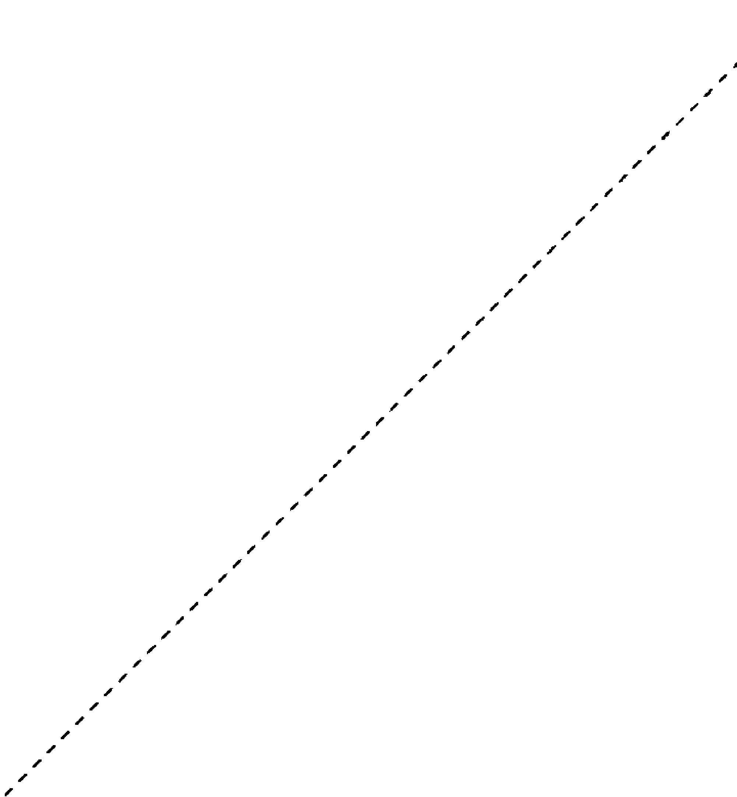

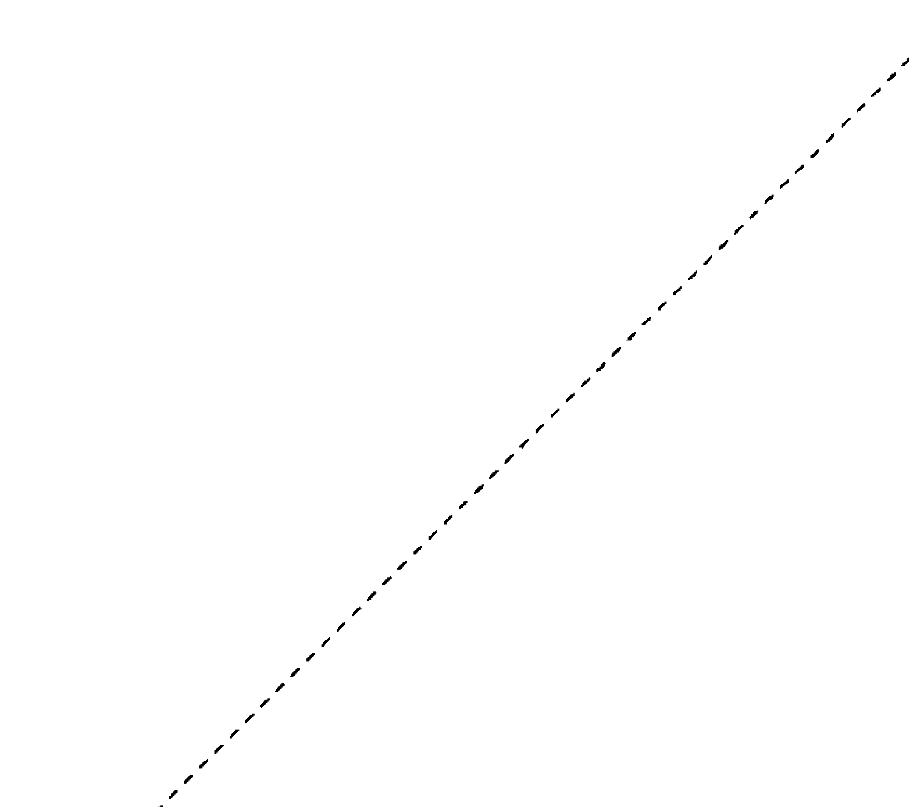

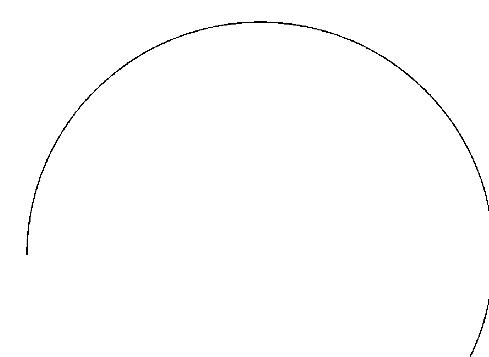

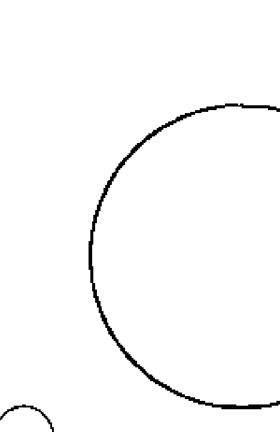

### 观念建立

田宅宫跟子女宫一样，为财库的宫位，原因来自于是对于家的态度，一个人想存钱是因为想要有一个家，想守护自己的家，想有个安全感跟安身立命的地方与机会。至于所谓的家对于这个人来说是什么样子，就需要看田宅宫里面是什么星曜了。毕竟每个人对家的概念都不一样。例如“天机、天梁”对拱的人，会照顾家人，但不觉得家一定要在同一个地方甚至是同一批家人，所以“天机、天梁”对拱会被分析为常搬家，其实是相对于其他星曜，这个组合比较不在乎搬家给予的变动伤害（心理学上来说，搬家的伤痛仅次于丧偶）。田宅宫说的是对家的态度，这个态度会影响自己存钱的能力，这是本命盘田宅宫为财库的基本原理，当然运限盘的田宅宫因为煞、忌破财，那就是另一个层次的问题了。

既然是家的概念，田宅宫也会讨论居家环境，以及对于家人的态度，例如“紫微、七杀”在田宅宫，对宫是天府，这个人有着天府王爷的特质，这个王爷又是一紫微、七杀，重视地位跟权力的王爷，会希望在家里一切要听他的，如果这个家无法如他的意思，就会觉得家里没有温暖，不如预期，也容易往外面跑，或者觉得家庭成员都很自以为是，其实这是一种心理的彼此投射影响。这个部分我们可以用命宫和兄弟宫的逻辑去思考跟联想，只是在此放大成为跟自己住在一起的人。本命盘是呈现态度跟价值，说的是对于同住一起的人的态度，因此女性婚后要看的是对于夫家的态度，运限盘说的是当下会发生的事情，就是你跟室友的相处关系了。又例如，太阴在田宅宫，一定是个好妈妈，或是顾家的温柔暖男。若对面是天同星，天同星比较随和，所以他的家就会呈现很温馨的状态，跟家人比较随意，也不会要求。那如果是天机呢？他的家就要一尘不染。天机在子田线上，一般会说这个人很容易搬家，当太阴、天机一对拱或同宫又在四马地，很容易变动，所以这个人是不怕搬家的。不怕搬家的人有一个特质，那就是会把东西收拾得很好，因此搬家时就不会那么痛苦。如果对宫是太阳，当太阳在旺位，太阴对于家的庇佑跟照顾，就有点像太阳，会稍微强势一点。这种对家的照顾，对面是天机的靠脑筋，天同靠与人为善，太阳靠订立规则。本章将介绍比较特别的内容。本命盘田宅宫也会影响一个人对于居住环境的考虑，因此从紫微斗数在田宅宫的星曜，可以判断自己生活周围的环境有什么情况。本命盘当然是自己天生的喜好，运限盘则是当下的居住环境状况，以及室内布置，这个方法颇为有趣，也可以用这个方法透过紫微命盘知道这个人当下的居住环境是否有风水问题，以及问题在哪里？影响了谁？对应星曜的时候，宫位内的星曜是同时解释的，例如紫微为高楼，破军为传统市场，“紫微、破军”同宫，就是高楼与市场同时存在。煞星也一样，并且从田宅宫三方四正会有各自代表的方位（图四十）。

- ☆田宅宫为建筑物外五百公尺方园，以及视力可见，与室内布置。
- ☆夹宫为左邻右舍、上下楼邻居。
- ☆子女宫为建筑物后方。
- ☆拱的宫位各自为左半边与右半边。

图四十／田宅宫三方四正与夹宫各自的代表意义

|                  |                          | 田宅 为建筑外面五百公尺方圆，以及视力可以见，与室内布置 |                          |                  |
| ---------------- | ------------------------ | -------------------------------------------------------- | ------------------------ | ---------------- |
| 左半边           |                          |                                                          |                          |                  |
| 疾厄 拱       |                          |                                                          |                          | 兄弟 拱       |
|                  |                          |                                                          |                          | 建筑物后方       |
|                  |                          | 天机                                                     |                          |                  |
|                  |                          |                                                          |                          |                  |
|                  | 官禄 夹宫 左邻右舍 上下楼邻居 |                                                          | 福德 夹宫 左邻右舍 上下楼邻居 |                  |

### 一、紫微星
人生的皇宮
紫微星是皇帝，化氣為尊，所以他要住在什麼地方？當然是高貴的地方，對一般人來說，可以說得出來、比較有名的地方，所以紫微星的人挑選房子的時候，同樣的租金，如果這戶的門廳比較漂亮，另外一戶房子比較大，門廳沒有那麼漂亮，紫微星會選擇房子漂亮的。而且他要高樓，怎麼樣算高樓？通常七樓以上就算。當然如果那個區域的房子都是十層樓，就會選擇十樓以上，總之最好自己可以高高在上。他會比較想要往高的地方住，或者周圍有高樓，因為有高樓的地方通常都比較繁華。紫微喜歡繁華的地方，所以要不我高高在上，要不這個地方不錯。居家的佈置，比較喜歡閃亮亮（Bling Bling）的東西，或是在他能力範圍內，買些雕龍畫鳳這種東西，要讓人覺得自己住得還不錯。

### 二、天府星
自己的王國

天府要的是什麼？天府要的是方方正正的房子。天府是務實的，因為房子是方方正正的，使用空間比較足。也因為務實，對他來說，同樣的東西，買到比較好的價錢比較重要。但天府星畢竟是王爺，不能住在太差的地方，天府要控制他的王國，希望住在有銀行、公家機關，這種地方條件不錯，然後方便，生活機能不會太差。

### 三、天機星

不安於室也適應環境

天機的特質，如果逢空劫，居家就會亂；如果化忌，則會聰明反被聰明誤。他有一套自己的整理方法，當然大家也看不太懂。天機還有一個特質，因為他喜歡動來動去，所以喜歡住在交通便利的地方。此外，天機代表西醫，居家附近會有小診所跟西藥房。天機的住家周圍會有樹，只是如果煞星太多，樹可能就長不太好，有祿的就長得比較好。

至於在評量風水方面，要考慮現實上是否容易找到那樣的環境，譬如說這個人到底住在什麼地方，如果住在新疆烏魯木齊，你問他說：「你家附近是不是有一棵樹？「沒有啊，連草都沒有。

另外，天機也代表管線。流月田宅宮，天機星逢煞、忌，也有可能是管線壞掉。

### 四、太陽星

太陽星要的是什麼？太陽星要的是光線明朗，注重居家環境漂不漂亮，而且要住在高地上，也就是地勢相對於周遭比較高的地方，以台北市來說，大概就是天母。不過就只是地勢較高，毋須到郊區山上的程度。那麼太陽跟紫微有什麼差別？紫微要高高在上，太陽只要不是低的就可以。並且要周圍光線好，不能有太多高樓在旁邊形成陰影，擋著採光。

### 五、太陰星
溫暖的家也可能變成陰暗的家

太陰喜歡家有溫馨的感覺，這同時代表另一件事，那就是家中光線不夠，比較陰暗，所以喜歡住在巷子底，因為這樣才有安全感。住家周圍會有水池、游泳池（算水池的一種）、湖、蓄水池、水道（比較像水圳，不是樓下的排水溝）。也比較會住在餐廳旁邊、菜市場旁邊等媽媽會去的各類地方。

### 六、天同星
孩子氣的生活環境

天同周圍會有小學、書店、水池、娛樂中心（屬於小朋友的娛樂中心）。如果住在比較繁華的地區，周圍會有遊樂園、小公園，吃吃喝喝也會讓人感受到小小幸福，所以周圍最好也有許多飲食小店。

### 七、七殺星
對於自家住宅的堅持

七殺喜歡住在哪個地方，要看當下的心情跟態度，所以受命宮影響大。通常住家周圍有金融機構、商業區、派出所，或比較容易會住在有尖煞的地方，譬如廟旁邊。在以前，可能還會有金屬加工的地方，如金店、磨菜刀店，不過現在這類情況比較少了，畢竟社會環境有所不同。七殺對於居住環境有自己的品味，不在乎別人的看法，加上七殺是孤星，會希望不要被別人打擾，因此需要鬧中取靜，這是他的內心會有的期待。

### 八、破軍星
破敗的情懷

破軍周圍容易有傳統菜市場、屠宰場、破舊房子、爛尾樓。這是一種對環境不在乎，只重視自己當下感受的選擇結果。由於破軍對宮為天相，因此會有交通要道。

### 九、貪狼星
什麼都要的居住環境

貪狼是博學的星曜，所以周圍會有學校。有別於天同的小學、天梁的大學，一般來講，會比較偏向國中、高中，或是人生各階段的學習環境，像是補習班。也會住在商業區、育樂區等比較繁華的環境。以台北來說，跟紫微、天府相比，紫微、天府偏向大安區，貪狼偏向林森北路，或是夜市旁邊、西門町，一樣是交通方便，有娛樂場所，酒店、小鋼珠店等的娛樂場所。貪狼也是宗教星，內心的慾望會引發對於風水的期待，所以家中也有機會用宗教或心靈類的物品來布置。

### 十、武曲星
更加務實地居住追求

武曲要的是務實，比天府更加務實，因為天府畢竟是王爺，所以還是需要基本的格局，但武曲不是，因此CP值要高、生活機能要好，周圍要有金融中心、派出所，對於居家狀態相對比較不重視。武曲雖然也是寡宿星，但是因為務實、追求CP值，所以即使跟七殺一樣屬金，卻不見得會追求隱蔽的環境，有自己的小天地。

### 十一、廉貞星
磁場強大的居住環境

磁場強大的廉貞想找到覺得不錯的居住環境，通常也會是磁場強大的地方，這類地方會是各類宗教、宮廟、身心靈聚會的好地方，所以廉貞居家周圍一定有宮廟，而且是通靈辦事情那種，因為廉貞星是五鬼星，會是這種跟靈有關的場所。廉貞還代表辦公大樓以及金融機構、法院，法院的解釋比較廣泛，派出所也算，因為在現代才有差別。電塔、電箱、變電箱這類對環境有磁場影響的設施，也會容易出現在住家附近。

### 十二、天相星
好的人際網絡要有好的交通環境

天相重視自己的人際網絡，要跟大家往來，當然最好要交通方便，鐵橋、鐵道、捷運、地下道，這是天相比較在乎的住家地點條件。居住的地方需要有好的門面，但不會像紫微那麼虛華浮誇。

### 十三、巨門星
黑暗的心黑暗的家

巨門屬水，但卻是黑暗的水，所以雖然也希望有好的交通環境，卻希望鬧中取靜，並且因為沒有安全感，也會有想躲起來的念頭，附近會是跟水有關的髒水溝、水池、水道、排水溝、地下道、涵洞、橋下的洞、隧道、停車場，或是跟餐飲有關的地方。

### 十四、天梁星
大樹下好乘涼

天梁代表居家附近會有大廟、教堂、大樹，這些地點源自於天梁是會追求身心靈宗教星。早期宗教發展聚集時，通常會在樹下，而後巫師出現，有了巫師就有巫醫，因此天梁也代表大樹、大醫院或宗教寺廟，有別於天機星較小的診所，與廉貞星的小宮廟。

### 其他輔星代表的環境特質

- ☆ 文昌 —— 文教區，家中會掛字畫。
- ☆ 文曲 —— 水池，家中喜歡種花草。
- ☆ 左輔右弼 —— 整排的建築物（但不一定是建築物，可能是河堤）。左輔，左邊一整排；右弼，右邊一整排。
- ☆ 天魁天鉞 —— 有名的地方、鬧中取靜，觀光區，但不要太吵鬧。
- ☆ 擎羊 —— 房間旁有煞、高塔，或尖尖的東西。
- ☆ 陀羅 —— 牆癌，外牆有問題、採光不好、漏水。
- ☆ 火星 —— 三方四正碰到廉貞、天機，容易管線有問題或破損。
- ☆ 鈴星 —— 小的煞，房子的電器會出問題。
- ☆ 紅鸞天喜 —— 熱鬧，要有水池。
- ☆ 龍池鳳閣 —— 靜中取鬧。
- ☆ 空劫 —— 房子有建築上的問題，周圍會有破敗或是空曠地。

## 第十一章

## 第十二章
### 福德宮——
靈魂之所在

### 觀念建立

福德宮代表一個人的福氣所在、祖上給與的福分（父母宮的父母，等於你的阿公）。在財帛宮對面，也代表來財的方式，所以福德宮化權會有機會創業，因為希望可以掌控自己金錢收入的來源；化祿則希望有多方面的收入。同時也代表花錢的方向跟方式（出外旅遊也可以看這個宮位）。需要注意的是，本命盤跟運限盤不同，本命盤福德宮化權，會希望掌握自己的金錢，當機會出現，就會想創業，這是天生的觀念跟想法。運限盤化權則是當下會做這樣的事情或是有這樣的機會出現。花錢的方式與方向、賺錢的方式這些觀念性的東西，當然本命盤會有影響，如果是出外旅遊是否順利、運氣好，就要看運限盤了。而本命盤的福德宮若是拿來討論自己的阿公，就可以比照父母宮、兄弟宮討論了。

父親、母親的邏輯去看，不過一樣要注意實質影響力的問題，這也是為何一般都會說長孫比較準，因為阿公通常對長孫比較好。

除了上述，本命盤福德宮最主要的是代表我們的靈魂，或者說潛意識，並且可以衍伸為意志力。這一點常讓初學者甚至學習斗數很久的人搞糊塗，所謂靈魂跟潛意識，跟遷移宮的內心世界有何不同？命宮又代表了什麼呢？關於這一部分，因為我們的文化價值在於表裡如一，無法理解人會有多個面向，在本書各宮位的解釋一直提到這樣的觀念。傳統上對於命理學常有的說法，算過去準、算未來不準的其中一個原因，就在於此。因為外來可以決定事情的方向太多，影響決定的因素太多，所以我們會覺得難以判斷。但是如果我們可以理解一個人面對各項人生事項時，其實會有各種不同的態度（所以斗數會有十二宮），就可以知道為何有人在事業上是女強人，在感情上卻又優柔寡斷，可能優柔寡斷的是對自己的男女感情，但是對於親子感情卻又異常狠心，並且同時會做善事捐錢。其實人就是如此複雜，了解複雜的心理層面，用同理心去判斷他的決定，自然就知道他會做什麼抉擇，自然就會增加準度。

另一方面，關於潛意識的存在以及對於人生的影響，在古時候相信靈魂學的年代，會用宗教角度理解，延伸到現代，反倒讓人難以明白所謂的潛意識到底是什麼。以道家的說法，我們可以認知為是自己的守護神，現代許多身心靈的說法喜歡用所謂「高我」，但是我更愛古埃及及對靈魂學的看法。古埃及覺得人有兩個靈魂，一個是跟肉身綁在一起，受七情六慾影響的靈魂，死後就沒有了；另外一個則是不受自身七情六慾影響，可以獨立思考跟存在的靈魂，這個靈魂有自己的想法跟態度，不受生命影響，卻影響著我們的生命。人死後不斷重生的，其實也是這個靈魂，所以會有許多時候我們彷彿經歷過相似的畫面，彷彿聽過同樣一句話，其實都來自於這個靈魂對我們的影響。佛教所說能帶我們脫離婆娑苦海的，也是這個靈魂。這樣的觀點在現代來說就是潛意識，如果說命宮像是一家餐廳，這是一家中式料理，或是一家日本料理，或是一家素食餐館，也可以是一家速食餐廳。而遷移宮就可以當成這家餐廳的店長，內心對於餐廳的期待，希望是一家重視服務與客戶關係的日本料理，可能是天相星，所以門面要好，並且最好可以記得每位客人的名字(天相的人一定很愛這樣的餐廳)，當然各類型的天相展現出來的又會不同，例如「武曲、天相」會務實一點，重視客人的態度在於價錢的回饋，「紫微、天相」則會浮誇一點，重視客人的部分來自於餐廳裝潢的細節品味。依照這樣的內心想法，

因此展現出這家餐廳給人的外在感覺，就是遷移宮內心世界的想法展現出來，對外給予人感受並且影響別人觀感的部分。那麼福德宮呢？福德宮則是老闆能夠投注多少心力，有多少能力，能花多少精神，甚至運氣夠不夠好到可以完成這樣的餐廳，看的都是這個老闆，他才是這家餐廳真正的靈魂。

如同我們可以看到重視客人的日本料理店（命宮），希望注意細節的外觀（遷移宮），但是執行出來的結果卻不同，因為雖然目標相同但是老闆不同，結果也就會不同。因此，福德宮才是真影響我們一生所有宮位，對所有事情態度的宮位，因為福德宮影響了命宮、遷移宮，連帶著也影響十二宮所有的變化。

舉例來說，貪狼星的福德宮一定是天相星，所以貪狼的慾望所在，潛意識裡會重視人際關係，因此貪狼為大桃花星。又例如太陰的福德宮是巨門，所以潛意識的不安全感，讓太陰在展現女性特質的時候，家庭的守護以及對於財富累積要用存錢的方式，便是受到巨門內心的黑暗影響，也是受到巨門這個黑洞喜歡收藏東西的影響。再看看天府的福德宮是貪狼，對於實際金錢的掌控，以及屬於自己的可控制範圍與能力，會有所追求。潛意識影響了我們的命宮態度和真正的價值，這也是為何紫微斗數的高手看的反而是福德宮，而非命宮。

如同前面提到埃及人認為人有兩個靈魂的說法，另外一個靈魂才是真正主導我們的靈魂，不受情緒的影響，卻影響著我們的人生價值判斷。而這樣一個潛意識的存在，也代表了我們是否有足夠的意志力或心態去突破困境，延伸出來會展現在自己的用錢態度，個性樂觀的人通常不重視金錢，因為不在乎金錢，通常會有貴人，人生也較無災難，這是誰的特質呢？是天同星。這也就是為何天同星為福德宮主，適合放在福德宮的原因了。當然人會隨著年紀愈來愈大，愈讓生活偏向自己靈魂跟潛意識價值的追求，當人生看盡千帆之後，會在不斷的人生歷程中回顧自己深層意識的價值，在一次次失戀之後，發現其實自己根本不是那個可以跟人爭奪感情的人，最終懂得不在感情路上爭奪。這樣的人生轉折，透過人生了解自己的過程，在晚年之後會讓自己貼近潛意識的價值觀，這也是福德宮被稱為晚年宮位的原因，因為我們終於明白，那才是我們真正要的。

### 一、紫微星
永遠的皇帝

怎樣的靈魂是皇帝？我們應該先想想皇帝的特質是什麼。紫微星化氣為尊，尊榮、尊貴是他的重點，因此紫微在福德宮，我們可以說這個人有尊貴的靈魂，在精神層面上希望自己跟別人不同，對於外界事物的吸收與接觸，會希望可以擁有更多心靈上的感受，買東西重視品味，娛樂消費要能彰顯自己的與眾不同。如果將福德宮當成來財方式，賺錢獲利的方法，則要能夠是讓眾人羨慕的，所以時尚業、社會價值上人人稱羨的行業，會是他的選擇，當然這是主要架構，還需要看對宮與雙星組合的搭配。

#### 1. 紫微、七殺同宮
「紫微、七殺」化殺為權，讓紫微成為所有組合中最希望可以掌握權力的，因此掌握賺錢方式，就會讓這個組合想創業賺錢。權有「雙」的意思，起因在於當自己有兩份工作、兩間房子，甚至兩個妻子，感覺自己像是可以掌控一切，才能控制得比別人多，所以即便沒創業，也要多一點收入來源。這樣一個強勢的靈魂，代表會有很堅強的意志力，在遇到災難時，除非煞、忌太多，否則通常可以靠著意志力度過，缺點則是意志力堅強表示精神太亢奮，晚年往往會操勞，放不下心，並且因為重視務實的掌控能力，對於品味的追求會是紫微系列相對少的一組。

#### 2. 紫微、破軍同宮
「紫微、破軍」是個有夢想的皇帝，當然我們知道破軍的重點在於是否有足夠的支援，所以這個組合如果紫微星三方四正有吉星，則會是一個福德旺盛，有很好的精神、意志力跟情緒調整能力的人。來財方式通常在於有創造力、與藝術、品味相關的事業會是他所適合的。對宮是天相星，所以最好是能跟人接觸的行業，缺點當然也是太旺盛的精神狀態導致晚年都閒不下來。

#### 3. 紫微、貪狼同宮
「紫微、貪狼」這個受貪狼影響的貪玩皇帝，最重視精神享受，也是最有品味，跟會追求心靈探索的組合，適合的來財方式是教育、創意、與宗教相關產業。除非遇到太多煞、忌，否則算是有福氣的福德宮組合，缺點是到了晚年可能會有任性的孩子氣。

#### 4. 紫微、天相同宮
「紫微、天相」在福德宮讓人重視人際關係，並且在人際關係上尋求自我價值。生活上的器物使用，人與人之間的舉止進退，對於人生的心靈探測，都會是「紫微、天相」的重心。對宮的破軍讓他對於來財方式，會投注在人際關係以及有創意，不同於一般社會價值的產業。因為天相怕煞、忌，只要不遇到煞、忌，運勢都不會太差，但是一樣在晚年會有閒不下來的心情。

#### 5. 紫微、天府同宮
「紫微、天府」兩個帝星都在同一個宮位，不用說，這是操忙到老的組合。但只要對宮的七殺沒有太多煞、忌，也是一個意志力堅強的人，遇到困難通常可以堅忍度過，尊貴與務實需要同時具備，生活的品味要追求，但是也不會亂買東西，這樣的態度當然也會希望可以掌控人生，所以當運限有適合的機會出現，一樣會希望可以創業，至少要能夠有多項收入來源。

#### 6. 紫微對宮為貪狼
紫微單星，對宮是貪狼，簡單來說，精神品味的追求在於金錢慾望的展現，賺錢花錢滿足了他的靈魂，還好晚年除了希望自己過得很不錯，算是紫微星系裡相對不會太過操勞的，適合的來財方式也在於時尚創意、教育，跟宗教產業。

### 紫微星在本命福德宮的小練習

紫微在福德宮的好處是，除非是個很弱勢的紫微星，三方四正缺乏吉星，否則運氣通常都不錯，缺點是老年還很忙碌，請問要怎麼解決這個問題？

紫微的閒不下來，其實是希望自己的人生一直在被重視的情況，覺得自己應該凡事都高人一點。但是隨著年紀增長，影響力的降低往往讓自己老年時候追求過往的精彩回憶。傳統上因為福德宮代表老年生活，都會建議應該放「天同、天梁」這一類星曜，這是因為過去的價值觀認為年紀大了就該安享晚年、含飴弄孫，負面一點的說法其實是希望人老了就不該有夢想，不要追求生活，這樣的價值觀下，當然紫微就會變成缺點。其實現在醫療的進步跟社會價值的改變，人的生命品質大幅度提升之下，年紀大了以後只要不要一直嘮叨子孫，讓人家聽你說了十萬次的笑話跟過往的光榮，還是可以追求屬於自己美好的夢想。操勞用在對的地方可以變成活力，一個有活力，對人生跟社會有熱情的老年生活，會是很迷人的。

### 二、天府星
永遠的王者

天府星對宮一定是七殺，讓他有絕對的意志力克服人生的困難，這樣的特質對於人生價值的追求、來財方式的規劃，只要不遇到陀羅星或火星，通常天生都會有很好的能力，清楚知道該怎樣讓自己有不錯的生活跟賺錢能力，因此各行各業其實都可以算是相當適合他。老年生活雖然如同紫微，也會閒不下來，不過因為務實的態度，所以會在自己能力範圍內追求人生晚年的富足生活。但是依照對宮的星曜組合，還是有一點不同。

#### 1. 天府對宮為武曲、七殺
對宮是「武曲、七殺」，這個組合是天府最務實也相對衝動的一組，認真踏實的靈魂加上七殺，往往讓自己努力過了頭，但是只要不遇到煞、忌，不過度的財務投資，通常晚年生活不錯。

#### 2. 天府對宮為紫微、七殺
「紫微、七殺」則因為紫微的影響，略同於「紫微、七殺」在福德宮，差異在於這一組更會希望創業，但是成功率以及能力會因為天府的影響而提高不少，尤其天府如果遇到祿存。

#### 3. 天府對宮為廉貞、七殺
對宮為廉貞七殺，如果遇化祿或祿存，會有認真理性且靈活的理財能力，但如果遇到太多煞、忌，又沒有化祿跟祿存，可能容易投機走偏門而引發財務問題。

### 天府星在本命福德宮的小練習

天府在福德宮算是相當不錯，好的福氣、好的理財能力，並且性格穩定，但是在天府的組合裡，哪一組需要注意財務投資會出現狀況？

這個答案基本上一定是「武曲、七殺」這一組。因為武曲一化忌，理財風險就會因為太過躁進而提高，但是，天府其實有個重點，天相是對星，會彼此影響，所以才有逢府看相的說法。因此如果天相星遇到煞、忌，也有這個可能。

### 三 · 天機星
#### 不安定的靈魂

善良而善變的天機，在福德宮的重點在於是否遇到煞、忌以及對宮星曜，從不安穩、不穩定造成我們的運氣動盪，到讓我們可以一生不缺錢都有可能，天機在福德宮有無限的驚喜。

- 1. 天機對宮為巨門

對宮是巨門的天機，善良的靈魂搭配聰明的理財能力，適合從事專業人員與教育工作者，遇到化祿跟化權時，無論在巨門或天機，都可以讓他一生不愁吃穿，並且有機會身兼數職。巨門重視太陽的旺與落陷，這個時候差異在於，旺位的太陽會選擇希望讓眾人稱羨的工作，落陷位則對於工作性質較不挑選。

- 2. 天機對宮為太陰

對宮是太陰，重視精神的享受，對於心靈的追求、宗教與文化的接觸，只要在可以接受的範圍內，會相當願意付出。適合利用人際關係以及需要數字邏輯的生意、進出口買賣業、創意美術跟文化的工作也不錯。

- 3. 天機對宮為天梁

對宮是天梁，心靈的冒險是他們的日常，金錢的冒險也是，遇到煞、忌或是化權、化祿，很願意嘗試各類投資，包含賭博。宗教方面的心靈成長與探索，也讓他們願意嘗試各類機會，甚至包含身心靈相關的活動與藥物的使用。

- 4. 天機、巨門同宮

「天機、巨門」同宮，天機的善變會被巨門隱藏起來，善變的靈魂只藏在深處，更多的是對於生命的不安導致對心靈深度的追求，標準的晚年會往宗教發展的類型。來財方式適合專業的知識型技術人員。

- 5. 天機、太陰同宮

「天機、太陰」同宮，與「天機、太陰」對拱相當相似，差異在於「天機、太陰」同宮的人更加敏感且重視人際，也因此如果遇到煞、忌，更容易有情緒上的問題。

- 6. 天機、天梁同宮

「天機、天梁」同宮，在福德宮雖然一樣像對宮喜歡投資，以及對於宗教生命的探索，卻不會像對宮在天梁那樣衝動，這是相對穩定的一組，缺點是不能遇到煞、忌。

福德宮只要遇到破損，就等於運氣變差，這是因為自己的精神不安穩、意志力喪失，而造成自己本來運勢已經不好了，還會一直做出錯誤思考。天機星的差異在於化祿、祿存或者有吉星的時候，思慮清晰當然就可以扭轉運勢，若是遇到化忌或煞星，甚至空劫，則天機化氣為善以及連帶的邏輯思考能力就會走偏或喪失，因此會讓自己做出錯誤判斷，當然運勢就會變差，尤其是「天機、天梁」如果遇到煞星更是容易如此。

### 天機星在本命福德宮的小練習

天機星怕遇到煞、忌，我們看人是否能夠度過災難的時候，往往看的是福德宮，即使其他宮位差，也可能好運度過。請問天機在福德宮如果遇到煞、忌，遭到宮位破損的情況，該如何拯救？

天機星在福德宮如果遇到煞、忌，「天機、天梁」這個組合同宮或對拱，幾乎只要有一個煞星，就可以造成破壞，其他組合則需要兩個以上。解決的方法有三種，一是讓化祿出現，無論是對宮、同宮有化祿、祿存出現，會讓災害變小，所以當下的判斷要看有沒有化祿或祿存，即使是同宮的其他星曜化祿也有幫助。或者，因為真正判定是否可以度過難關需要看至少三個福德宮，本命、大限、流年，或者小限，所以需要檢查是否三個都很差。最後一個是捐錢，「天機、天梁」都是宗教星，在福德宮的人表示有很好的宗教緣分，所以捐錢求神效果不錯，而且沒有限定是哪一種宗教的神。

### 四、天梁星：永遠的庇佑

天梁是福德主，出現在福德宮最好，有天梁在福德宮或命宮的人，天生就對宗教有相當的興趣，甚至某些流派覺得天梁在福德宮的人，前世基本上就是修行人，或者做了不少捐獻，並且如果天梁有化祿，通常這個人會有祖產可以拿，至少一生不缺錢，在危難時刻總會得到老天幫助、有金錢資助，但不一定讓他大富大貴，只是度過難關。如果天機因為有宗教緣分，在危難時候求援神明的效果很好，天梁就更是能夠直達天聽了。所以天梁在福德宮的人，基本上一生遇難呈祥，除非是極為巨大的災難，宮位內煞、忌超過三個以上，否則本命有天梁在福德宮的人，總是很能夠在人生災難中全身而退。更棒的是這一點還可以不論組合跟對宮星曜，幾乎都具備這樣的特質。小小的缺點是，如果天梁化權，可能老年會變成碎念的老頭。

### 天梁星在本命福德宮的小練習

天梁在福德幾乎是福德宮最好的選擇，求神明幫忙總是比較容易靈驗，但不是每個人都如此，如果福德宮不是天梁星，又希望有這樣的效果，該怎麼辦呢？

**解答**
我們除了本命盤還有運限盤，大限、流年、小限、流月、流日，所以本命沒有從運限盤可以挑選福德宮有天梁的時候，尤其是天梁化祿跟化科的時候。

### 五、天同星 - 善良的靈魂

另外一個福德主是天同，當然也適合放在福德宮。不過天同的特質不像天梁是庇蔭星曜，在福德幾乎可以說一生受到神明、老天庇蔭（當然這類人其實人生常常也很倒楣，只是總可以度過難關，好像有神明幫忙，就是如此，古人才覺得他如有神助）。天同是個善良而心軟，不跟人計較的靈魂，這樣的特質放在福德宮，對應晚年生活的解釋相當不錯，與世無爭就是他了。對應在來財方式也相當不錯，懶惰輕鬆就可以賺錢。這樣的特質下，基本上他的人生也不會有太多災難，即便有災難出現，也可以用樂觀的態度度過。這樣的特質幾乎是所有的天同組合都如此。在福分和來財方式的差異則看雙星和對宮。

- 1. 天同對宮為太陰

天同跟太陰對拱，福分運氣與來財方式會展現在異性緣跟家庭與生活享受上。

- 2. 天同對宮為巨門

跟巨門對拱，雖然性格樂觀，但如果太陽落陷，會因為受情緒影響就亂花錢。

- 3. 天同、天梁同宮

「天同、天梁」同宮需要注意雖然可以逢凶化吉，但是通常凶險比較龐大、厲害。畢竟兩個福德主都在福德宮，應該是災難很多，才需要老天集中火力幫忙。

- 4. 天同對宮為天梁

若對宮為天梁，基本上就是一生不缺錢。

- 5. 天同、巨門同宮

跟巨門同宮的這一組，則受到巨門包覆天同的樂觀，本來就容易有不理性的感思考，對應在代表精神跟靈魂的福德宮，如果太陽落陷又遇到文昌、文曲，也容易有精神方面的問題。

### 天同星在本命福德宮的小練習

據說天同因為個性太懶散，適合加個煞星。如果放在福德宮再加上煞星，這個福德宮會有問題，表示倒楣嗎？

其實天同加上煞星的好壞，來自於可以給與多一點的動力，但是「天同、天梁」對拱的組合，天同並不會懶散，是聰明地希望可以用簡單的方式面對問題，所以加上煞星給與動力，這個情況比較會是天同在辰，對面巨門的時候，其他時候加上煞星，天同的樂觀降低，當然會影響福分，畢竟他是靠著自己的樂觀而得到運氣，讓他可以度過難關的。

### 六、太陽星
#### 主持正義的靈魂

太陽是天上最亮的一顆星，古人認為是所有萬物生長的能量來源，因此被引申為一家之主、父權的星曜，這是在命宮的太陽有主持正義的價值觀的原因。在福德宮有太陽，命宮一定是天同星，天同的人雖然個性樂觀和善，不會主動傷害人，即使帶了煞星也不會，因為他的靈魂深處是太陽，照顧人才是天同真正的價值。這樣一個可以主宰一切的星曜在福德宮，當然這是旺盛的福德宮，雖然太陽重視旺與落陷，但是差異只在於度過難關的艱辛程度，適合的工作通常必須要是能夠以知名度跟社會地位得到財富的工作，例如演藝人員、政治家、命理師，只要是隨著知名度上漲財富就可以跟著上漲的都算。落陷的太陽則容易遊走在法律邊緣的行業。依照這個標準看對宮星曜，可以將其做些約略區分。

- 1. 太陽對宮為天梁

醫療宗教與心靈相關產業。

- 2. 太陽對宮為太陰

同時具備太陰特質，所以跟異性相關或者吃喝日常消費相關產業，甚至同時兼任兩份工作，而以上工作情況遇到化權，就可以創業，自己發展了。這樣一個正義的靈魂，到了晚年當然容易閒不下來。

- 3. 太陽對宮為巨門

飲食、教學、理念宣達這一類的工作。

### 太陽星在本命福德宮的小練習

太陽重視旺位與落陷位，在本命福德宮落陷的時候，關於來財方式可以從事違反社會法律跟道德的行業，為何如此？

因為太陽重視正義其實來自於內心的價值跟正義，當太陽旺位的時候，會將內心價值偏向於一般大眾認定的價值體系，落陷的時候，則願意遊走在灰色地帶，這個原因來自太陽覺得一切都是他自己制訂出來的，他覺得可以就可以，根本不在乎別人的看法，這也是為何影響天同星在命宮的時候，容易在情感上落入三角關係的原因。

### 七、太陰星
#### 善良而心軟 容易招惹以身渡人的靈魂

太陰在福德宮，關於來財方式，當然跟異性有關。太陰重視享受，尤其是關於日常吃喝旅遊的生活享受，因為重視，就容易成為專業，也就容易在這一行賺到錢。在老年的生活上，除了受到太陰心思細膩想很多的特質影響，可能遇到煞、忌，會讓他晚年還會胡思亂想、沒辦法拋開煩惱之外，通常也會是不錯的晚年生活。許多星曜都會因為晚年還要操煩，而在世俗認知上會有不好的意思，但是一樣的操煩卻有不同的結果，例如「紫微、七殺」不煩心就會覺得自己沒有價值，太陽也會如此，甚至覺得人生很灰暗。但是太陰就是單純的情緒跟精神問題，這樣的情況尤其發生在對宮或同宮是天機星的時候，對宮或同宮是天同星的就稍微好一點。比較特別的是，太陰星在福德宮如果跟一顆小的星曜「陰煞」在同宮或對拱，會有天生與另一個空間聯繫的能力，這個情況在與天機同宮或對拱的組合最明顯。日月同宮或是與天同同宮對拱的，則需要搭配煞、忌與運限才可能出現。

最後，太陰這樣一個充滿母愛，會照顧人的星曜，如果再加上桃花星，可能影響命宮，讓來財方式偏向於與異性的情感買賣，再加上煞、忌，就可能會是情色產業。當然這個所謂情色產業範圍很廣，例如古人覺得演藝人員就算情色產業了，差異在於運限與生活環境給與的機會跟態度，因為在靈魂深處，他覺得這樣的工作實在是用情感撫慰人心的。

### 太陰星在本命福德宮的小練習

太陰星在福德宮遇到「陰煞」容易有靈異體質，但是不見得每個人都有遇到的機會，其中的原因來自於是否有環境可以遇到，以及這個體質的能力到哪裡，請問這要如何區分？

關於環境在於運限盤是否出現這樣的機會，運限盤在遷移宮、福德宮、官祿宮、命宮有遇到煞、忌，並且有宗教星，例如天巫、華蓋、陰煞、廉貞出現的時候，有機會。而本身的能力強度要看煞、忌多寡，跟是否還有其他如天巫跟華蓋的增強力量。

### 七殺星
#### 無法放棄的靈魂

七殺星跟破軍星在福德宮，一般也會被解釋成不好，這當然是因為傳統上不喜歡七殺跟破軍這類讓人覺得不好控制的星曜特質。但是以七殺來說，這其實是個意志力堅強的靈魂，但是如果加上其他煞、忌，有時候會變成太過堅持，並且折磨於自己的精神狀態，所以我們需要區分是否遇到太多煞、忌。晚年的生活，七殺坐福德宮，可以想見是到老都無法放鬆。來財方式除了適合努力付出的類型，付出的方式要看對宮。

- 1. 七殺對宮為廉貞、天府

個煞星其實還在可以接受的範圍，但是廉貞不能化忌。需要創意跟人際關係的大企業，會是他很適合的工作，以穩定的投資報酬來為自己在工作之外增加額外收入。

- 2. 七殺對宮為紫微、天府

如果是「紫微、天府」，兩個煞星就會太多了，除非紫微星遇到吉星。有高機率希望可以創業，紫微有吉星幫忙，做什麼都不錯，如果沒有建議，還是穩定找個小生意或是到大企業上班就好。

- 3. 七殺對宮為武曲、天府

「武曲、天府」的問題一樣是武曲不能化忌。沒有上述的情況，這個福德宮就算不錯，遇到災難，雖然艱辛，還是可以度過，但是精神上的焦慮就難免了。適合專業技術搭配穩定的金融產業工作，有適合的機會可以選擇創業。

### 九、破軍星
#### 奔放熱情的靈魂

破軍的化氣為耗，會被說成相當糟糕的意義，在福德宮當然也是如此，破財、精神耗弱加上晚年的不堪，其實並非如此。以來財方式來說，創意跟走在時代尖端的產業，會是他很適合的方式。如果晚年的生活是全世界旅行，做藝術創作這樣看起來很不安分的規劃，卻是相當適合破軍星。在精神跟運勢方面，破軍只要遇到化權，其實都相當穩定。沒有遇到化權時，只要不碰到太多煞、忌，也不會有問題，只是破軍確實不能遇到太多煞、忌，超過一個就要注意風險。

- 1. 破軍對宮為武曲、天相

對宮是「武曲、天相」，在財務以及與人的投資上很難避免風險。

- 2. 破軍對宮為紫微、天相

「紫微、天相」，問題會出在人際關係以及如果有創業，都會有財務問題。

- 3. 破軍對宮為廉貞、天相

對宮是「廉貞、天相」，最容易因此影響自己的精神狀況。

以上這些組合都不能再遇到文昌、文曲，否則就容易因為自己精神情緒的問題，而做出錯誤的判斷。年輕的時候會因此影響財運跟工作，年紀大了則會影響晚年生活以及睡眠跟精神狀態。

### 貪狼星
#### 潛意識的慾望所在

慾望之星在哪個宮位，就會在那個宮位產生慾望所在。福德宮有貪狼，貪狼的慾望對應在福德的精神與靈魂，讓我們希望探索自己的靈魂，所以貪狼的宗教特質就會發揮出來，這類的人會希望尋找自己的心靈，當然就容易接近宗教文化。對於來財方式，也會希望有各種不同的嘗試跟機會，這樣的個性在晚年生活來說，一定是不能安穩但是相當精彩的。

貪狼星是一個很好的案例來說明對應宮位解釋，曾有老師解釋貪狼在福德宮的人好色，因為貪狼是桃花星。其實不然，因為福德宮談的是靈魂跟精神，所以只能對應貪狼的慾望，這個人就算好色（可能有其他原因造成重視性生活），也是重視性生活並且連帶心靈層面，所以要說這個人在性上面應該是重質不重量。

- 1. 貪狼對宮為武曲

對宮是武曲，來財方式適合靠專業技能，並且願意為了學習知識投資金錢。

- 2. 貪狼對宮為紫微

對宮是紫微，則重視心靈層面，對藝術跟各類文化宗教活動相當有興趣，會購買宗教文物。

- 3. 貪狼對宮為廉貞

對宮是廉貞，適合以創意跟人際關係的工作來謀生賺錢，這個組合也是在遇到煞、忌時，最容易有靈感體質的一個。

### 七殺、破軍、貪狼在本命福德宮的小練習

同樣有煞星出現的時候，七殺、破軍、貪狼哪一個在福德宮的風險最小？

貪狼星。因為四煞星中的火星跟鈴星對於貪狼反而是好的組合，成為火貪格或鈴貪格，對應財帛宮如果遇到化祿，有機會賺大錢。擎羊跟陀羅都只是讓貪狼容易將錢花在吃喝玩樂與風花雪月上，或是精神靈魂容易沉迷於此，但是殺傷力卻不大。

### 十、武曲星
#### 剛毅的靈魂

武曲的剛毅個性跟特質對應福德宮，當然就是剛毅的靈魂。怎樣才是剛毅的靈魂呢？例如「武曲、七殺」在福德宮，命宮是天相，天相星應該很重視人際關係，並且有跟人周旋的手腕，但是這個天相雖然重視人際關係，卻是天相裡最不願意妥協的一個，尤其在金錢價值上，這就是靈魂的概念。剛毅的靈魂當然也代表了堅強意志力，以及晚年的煩惱不停，至於運氣與來財方式，則要看星曜組合。

- 1. 武曲、七殺同宮

「武曲、七殺」，對宮是天府，來財方式在遇到化權時會希望自己創業，適合的產業通常是一步一腳印慢慢打拚的類型，例如開餐廳就不能開浮誇的餐廳，反而是快餐店需要大量人潮就很適合。因為對面有天府，如果煞、忌沒有超過兩個以上，基本上運勢不算太差。但是需要注意武曲如果化忌，會有過於固執的投資個性造成破財。

- 2. 武曲、破軍同宮

「武曲、破軍」對宮是天相，這個靈魂剛毅之外帶點浪漫，但是這份浪漫容易讓自己花錢如流水，容易出現創業時有合約與財務糾紛，畢竟浪漫的靈魂沒有謹慎的心情。但是如果破軍化權，基本上是個不錯的福德宮，感性、理性兼備的精神狀態，讓他可以逢凶化吉。

- 3. 武曲、貪狼同宮

「武曲、貪狼」這一組在福德宮基本上可以說是武曲系列最好的一組，貪狼相對地不怕煞星，幫助武曲不會太過固執，更別說因為對宮空宮可以借到對面，很容易變化祿、變化權的組合，有源源不絕的創業跟各方面的好運，唯一的缺點是如果遇到文昌、文曲同宮，運勢走得不好，會有精神方面的問題。

- 4. 武曲、天相同宮

「武曲、天相」同宮，這個唯一需要擔心的就是遇到煞、忌會有財務投資的問題，以及對自己的要求過多。

- 5. 武曲、天府同宮

「武曲、天府」同宮，有了天府當然是個穩定而堅強的靈魂，以抵擋災難來說，這會是最好的組合。財務上就需要以穩紮穩打的投資來幫助自己累積財富了。

### 武曲星在本命福德宮的小練習

武曲會遇到化祿、化權跟化忌、化科，而福德宮代表來財方式，所以武曲的四化在福德宮會各自對賺錢的方式有怎樣的影響？

| 四化 | 影響 |
| :--- | :--- |
| 化祿 | 本來不屬於自己而多出來的，會因為努力為自己帶來很多的賺錢機會。 |
| 化權 | 希望可以掌控來財方式，因此不是找到機會創業，就是努力爭取兩份收入來源。 |
| 化科 | 希望有不錯的收入，會想要找機會投資，尤其是大家都說好的那種機會。這時候就要注意是否有煞、忌出現，否則反而會因投資錯誤賠錢。 |
| 化忌 | 武曲的金錢價值產生的化忌空缺，讓自己的靈魂在一個缺錢就不安全的狀態，所以會努力賺錢。至於怎麼賺，除了會努力、努力、再努力之外，就一樣得看對宮位搭配的星曜，運勢好會賺大錢，但是有時候會努力過頭反而賠錢。 |

### 十二、廉貞星
#### 無法控制與捆綁的靈魂

磁場強大的廉貞星，在福德宮有著超乎其他星曜的靈性跟精神，如同廉貞星在其他宮位遇到化祿跟祿存，具備穩定、聰明、理性的一切優良特質，搭配雙星的組合，還可以穩定旁邊的星曜，只留下雙星中的各類優勢。

- 1. 廉貞、七殺同宮

遇到七殺同宮，剛毅而堅持的靈魂，理財有能力且對於事業跟理財都能夠有自己的有效方法。

- 2. 廉貞、破軍同宮

與破軍同宮，利用人際關係，從事跟創意有關的工作，會是他最好的理財管道跟方向，遇到化權還有很好的創業機會跟能力。

- 3. 廉貞、貪狼同宮或對拱

與貪狼同宮，適合宗教文化創意相關的工作，並且有不錯的宗教緣分，如果對宮是貪狼，也會具備一樣的特質，但是會比同宮更加具有宗教緣分。如果再加上天巫、陰煞，甚至會有靈感體質。

- 4. 廉貞、天相同宮

「廉貞、天相」則非常需要有化祿跟祿存，否則容易投資合夥錯誤，精神也容易受到影響。

- 5. 廉貞、天府同宮

「廉貞、天府」則因為天府可以不需要遇到化祿跟祿存，會有很好的理財能力。

力，當然也可能因為運勢不好而出錯，但總是有機會救回財務。

以運勢來說，除了「廉貞、天府」比較強壯以外，重點就在於有化祿、祿存不怕煞、忌，兩個以內都可以控制得好，沒有祿，遇到煞、忌就需要擔心會因為不好控制的靈魂影響命宮，做出錯誤的決定。

因為廉貞是磁場強大的五鬼星，所以在福德宮如果遇到煞、忌，優點是第六感不錯，缺點是容易與靈異世界有連結，尤其又遇天巫、陰煞、華蓋。這樣磁場強大的星曜在福德宮，晚年要清心寡慾當然很難，宗教方面的追求，會是晚年的方向。

### 廉貞星在本命福德宮的小練習

廉貞怕遇到煞、忌，請問如果廉貞化祿、破軍化權，遇到大限造成廉貞化忌，這樣會有影響嗎？

| 庚巳 | 壬午 | 辛未 | 癸申 |
|------|------|------|------|
| 己辰 |      | 甲辰 | 本命命宮 廉貞 破軍 大限化忌 癸卯化祿 癸卯化權 |
| 戊卯 |      |      | 乙戌 |
| 丁寅 | 丙丑 | 丁子 | 丙亥 大限命宮 |

本命廉貞化祿、破軍化權，大限廉貞化忌

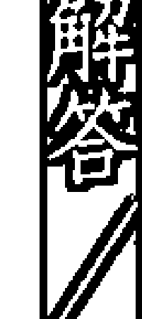

> 可以說是他本身具備穩定而有創意的想法跟靈魂，精神飛揚卻不會不受控制，雖然大限有廉貞化忌，會希望自己能夠有過往的想法，卻不會受到太多影響，只是希望這個大限可以有些不同的投資跟財務應用。

### 十三 · 天相星

#### 為自己編織好的蜘蛛網絡

天相在福德宮，命宮一定是貪狼星，靈魂深處重視人際關係，影響著命宮的貪狼成為大桃花星，對應的理財方式希望依照自己的人際關係、人脈，在內心可以被依循的網絡，如同蜘蛛安穩悠哉地在蜘蛛網中一般，這也是貪狼星會這麼願意讓自己與人為善，希望與人人做朋友的原因。但是這張被自己靈魂掌握跟建構出來的蜘蛛網，需要擔心是否會破裂，遇到煞、忌出現，蜘蛛網斷裂，危機就會出現。可惜的是蜘蛛網是脆弱的，小小的一個煞、忌，就會讓這個福德宮有危機出現，更別說兩個了。破掉的蜘蛛網，掉落下去的災難來自於對宮的星曜。

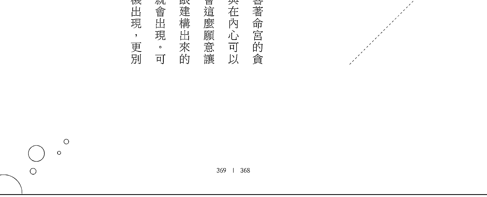

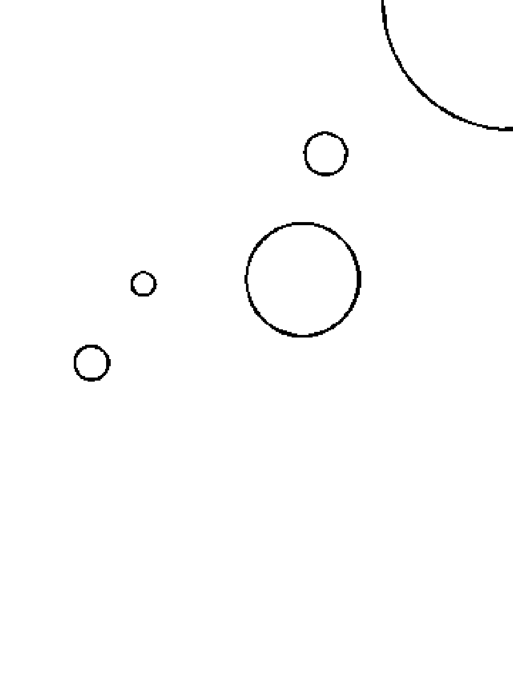

- 天相對宮為廉貞、破軍
對宮是「廉貞、破軍」，容易為了夢想與人際關係而控制不住財務，這也是最容易追求宗教上的能量跟祝福的一組。

- 天相對宮為武曲、破軍
對宮是「武曲、破軍」，更是直接在財務上出問題。當然如果他不創業或投資，這個問題就會降低，但是武曲的個性會讓他為了夢想根本不聽勸告。

- 天相對宮為紫微、破軍
對宮「紫微、破軍」這一組相對來說比較能抵抗煞、忌，尤其如果紫微遇到三方四正有吉星。然而，若煞、忌過多，強勢有夢想的皇帝也容易控制不住錢財、排除風險。天相在福德宮適合利用自己的人際網絡創造財富，不可否認地，能量和運勢都不差，加上這麼重視人際關係，晚年或許比較適合在鄰里間當個眾人尊崇的長者，一方面滿足自己的精神，一方面貢獻自己的能力。

### 天相星在本命福德宮的小練習

天相害怕遇到煞、忌，除了對宮「紫微、破軍」那一組可以稍稍抵抗超過兩個以上的煞、忌，還有什麼組合可能會有這樣的力量呢？

對宮「廉貞、破軍」。廉貞化祿、破軍化權這個組合，讓靈魂的內心強大而不怕困難。

### 十四 巨門星

#### 除了不安還是不安，有了光明才能忘記黑暗

巨門為黑暗之星，黑暗的靈魂感覺上不太好，其實黑暗的靈魂表示這個人因為有許多不安藏在靈魂深處的孤寂，需要被安慰與溫暖。巨門在福德宮，命宮一定是太陰，這也是造成各種太陰組合在命宮的人，會希望保護家庭的原因，而同樣的母性星曜有不同的守護方式，例如：「太陰、天同」在子，被稱為月生蒼海格，基本上是太陰星中不錯的格局，聰明個性好，男生當清官，也有很好的商人條件，有桃花有人緣。女生相當有能力卻不爭不奪，只會善良地照顧身邊的人，但是內心會有著堅持跟分寸，古書上稱為最好的小三。看看他的福德宮，剛好會是「巨門、太陽」同宮。巨門受到太陽同宮的照曜，變成學識豐富的大宅院，少了黑暗多了陽光，以及伴隨而來巨門的善良溫厚，這樣的靈魂讓「太陰、天同」具備前面說的那些特質。

但若「太陰、天同」同宮在午，計較心態相對提升，因為這時福德宮「巨門、太陽」在申位，太陽不夠力，所以有機會讓巨門的黑暗出現，靈魂在黑暗孤單的狀態，當然就會讓太陰覺得需要更努力地爭取跟守護家。所以巨門在福德宮是否會因為黑暗而影響精神，還是要看太陽星。

以運勢來說，若是太陽落陷，但是巨門化祿或祿存，還是可以利用巨門善良的特質來增加福氣，以及巨門本身具備的隱性宗教特質，加上對心靈空缺而追求心靈的提升加以改善。如果又遇到煞、忌，會因為不安、孤寂而追求心靈滿足，也容易因自己的心思不安混亂影響命宮做錯決定。晚年的生活一樣要看太陽是否在旺位，落陷的太陽搭配煞、忌，會讓巨門在福德宮的晚年有較多操煩，宗教上的依靠是很好的選擇。這樣的問題在跟巨門同宮或對宮對拱時會明顯。

以來財方式來說，與天機同宮或者對拱，適合跟數字有關、具有邏輯思考的專業技術，這方面的專業人員或學問教授都相當適合。跟太陽同宮或對拱，則與人群有關的行業，歌手、政治家、教育家、演說家、宗教事業都不錯。

### 巨門星在本命福德宮的小練習

巨門需要太陽照曜，太陽落陷的巨門在福德宮，對於福德宮的來財方式來說，適合遊走法律與社會道德灰色地帶的行業。試著想想哪些工作是這類的工作？

--------------------------------

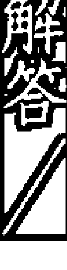

所謂灰色地帶，就是其實不一定犯法，甚至犯得不嚴重的工作，例如許多新創的事業，法律法規尚未規定，或者如情色行業，但是這樣的行業也有許多不同範圍，甚至在有些國家根本不犯法，這些都可以算是灰色地帶。

## 第十三章 父母宮

### 爸爸真偉大

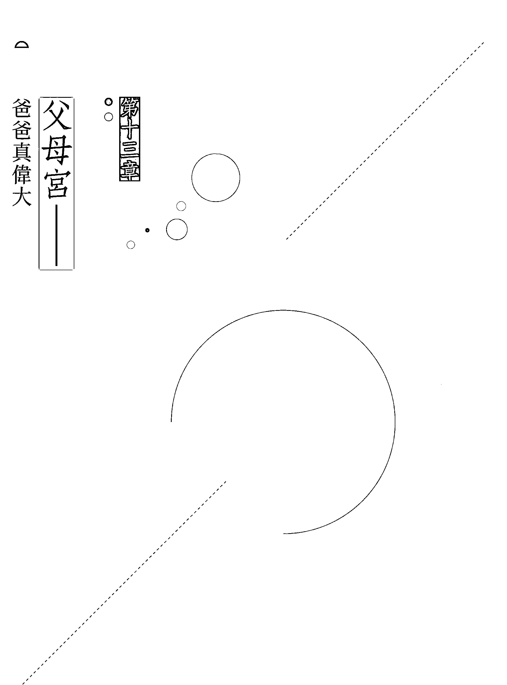

#### 觀念建立與推演

父母宮是少數在本命盤上可以看到現象的宮位，因為本命盤說的是與生俱來的事情、能力、特質、個性等等，所以本命盤的夫妻宮不能拿來看自己的老婆是什麼樣子，或者自己對感情的態度。但是父母早我們出生，可以說是與生俱來，我們對於父母的態度通常也受到第一大限小時候的影響。父母宮通常說的是父親，而兄弟宮說的是母親，因為兄弟宮剛好是父母宮的夫妻宮（圖四十一）。

#### 圖四十一/ 兄弟宮為父母宮的夫妻宮

| 兄弟 | 命宮 | 父母 | 福德 |
| --- | --- | --- | --- |
| 父母宮的夫妻宮 |      |      | 田宅 |
| 子女 |      |      | 官祿 |
| 財帛 | 疾厄 | 遷移 | 僕役 |
|      | 以父母宮當命宮來看，逆時針算2格則為夫妻宮 |      |      |

會給與我們長相的遺傳、個性的潛在影響、家世背景的情況、受教育的程度，甚至是身體疾病的遺傳，例如父母宮的星曜有化忌，影響對宮的疾厄宮，並且可以看什麼星化忌（可以對照疾厄宮那一章所說），表示自己在某個臟器受到天生遺傳的影響，可能比較差。當然也可以看出自己與父親的關係、父親是個怎樣的人。但是如果從小就沒有父親呢？從小沒有並不表示沒有生理上的父親，畢竟我們不可能從石頭裡面蹦出來，或者母親如同聖母瑪利亞般處女懷孕。如果從小沒有父親，因為父親過世、死亡，與母親分離等等諸多原因，這時候我們可以依照他不在身邊的時間去推算，從何時開始就不屬於父母宮的範圍。例如，有的人的父親在第二大限過世，這時從第二大限開始，父母宮就不再代表他的父親，可能是他的養父，甚至可能是母親取代了這個位置。這時候第二大限開始的父母宮，所代表的可能是養父或者母親與他的關係，而這個養父也可能是他的叔叔，或是他的祖父，可能是舅舅，但是實際上代表父親照顧他的那個人就算是。如果自三兩歲父親就不在，由母親養大，這時候父母宮討論的就是母親，因為紫微斗數看的是實質影響力：真正誰行使這個宮位的權利與義務。但是，關於遺傳的部分，無論如何說的都還是天生父親的遺傳，因此，這個人可能父母宮「武曲、天相，武曲化忌」，但是父親早年過世，由母親養大。他的武曲化忌一方面表示有天生遺傳而來，肺比較容易過敏或者有內分泌的問題，一方面母親會重視他關於金錢方面價值觀的教養，可能有時候也會因此跟母親有些意見的不同而紛爭。這是武曲化忌需要分開解釋各種不同的情況。而因為這代表了小時候受教育時期的教養問題，以及相關聯的家世背景，所以有些書說父母宮是所謂光明線：因為有好的父母親才會有好的教養跟生活環境，讓自己一生得到光明。這種說法是否正確，其實在古書上沒有的，純粹是老師個人的解釋跟認定。我們看書需要從古書談到的基本原理結構去討論，刪除因為當代價值觀產生的論定意義，就可以釐清許多因為個人因素設定的解盤看法，這樣的看法往往隨著時代變動而變動，在五、六十年代，可能因為父親是黨國高官，就真的是一生有了光明燈，但是在現代社會是否如此，便很難說了。

也有許多說法，關於父母宮可以當成上司看待，其實，關於上司應該從官祿宮來看，除非上司是可以決定你工作職場生死的人，例如他可以因為任何事情讓你沒有工作，你必須把他當成父母親來孝順，這時候才能用父母宮來看，並且無論是用官祿宮或父母宮，一定是在運限盤，否則難道我們一出生就會有個老闆嗎？

父母宮有時候也會當成表示有官非產生的宮位，天府、廉貞、破軍、巨門、太陽、天相、文昌在父母宮而遇到煞、忌出現，也可能有官非問題。當然，首先還是要先認定所謂官非問題，並非一定是打官司，也可能是約定被破壞。彼此的約定被破壞了，無法自己解決，才需要訴諸法律，所以所謂官非是打官司，那是因為無法自己解決，往往官司的途徑發展。因為法律本來就是道德的底線，道德的產生來自於人與人之間彼此的約定。例如，我跟你約好將房子租給你、我跟你約好租你房子一個月給多少錢、我跟你約好一輩子照顧妳，不要妳了財產會分一半給妳、我跟你約好，除了妳不會再跟別的女人上床，當然也不會跟男人。我們大家約好遇到紅燈不能右轉、遇到平交道柵欄放下來不可以衝過去、騎機車要戴安全帽……這些都是約定。當約定被破壞，打官司是其中一種途徑，但是並非絕對的情況，而一般所謂官非跡象其實只是約定被破壞，因此產生了問題，當然這是一種現象的發生，所以也不會出現在本命盤，除非自己的父母宮遇到的煞、忌是從運限盤產生，這就有可能了。那麼為何會是上面那些星曜呢？天府化氣為權，說的是權力的掌握。廉貞化氣為囚，說的是自身規矩的控制。天相是與人以及自身的規則約定，太陽則是規則的制定者，破軍當然就是破壞者，巨門則是口舌問題，文昌是文書筆墨寫錯字、立錯條約。父母宮在本命盤，代表可以影響我們人生的一個人，在運限盤就可以被視為我們與政府社會的關係，因此當這些星曜遇到煞、忌破壞，就可能表示我們本來的約定被破壞了。

所以，關於父親的長相外表，可以參考疾厄宮、命宮說的外表長相。至於父親是怎樣的人，也可以參考命宮，就是把父母宮當成是父親的命宮。與父親的關係，則依照各星曜的不同，可以參照兄弟宮與媽媽的關係來解釋，並且注意到，父母宮出現化祿、化權、化科、化忌，是少數由對方給與我們的四化，一般六親宮位都是我們給與對方，例如化祿在夫妻宮，是我們對感情投注心血，雖然那份感情不代表某一個人，只能說可能有某個人代表了他的感情。對於僕役宮化權，表示我們會重視朋友關係，希望在朋友間掌握權力，能夠領導大家。但是在父母宮，四化卻是父母給我的態度，化祿通常都是對我不錯，化權是喜歡掌控我、給與權威感，化科則是讓我覺得父親很不錯的人、有名望的人，化忌除了影響我的身體，讓我有遺傳疾病，也會讓我覺得跟他相處總是不如自己心意，但這通常是父親個人造成的，與夫妻宮化忌是自己的感情問題不同。

最後很重要的是，看父母宮判斷父親是一個怎樣的人時，需要連對宮的疾厄宮一起看，當然這其實是每一個宮位都需要去做的事，只是對於從六親宮位中判斷某一個人，通常都是在運限盤上，只有代表父親的父母宮可以從本命盤來看（如果父親的人生落差很大，例如你出生時他坐牢，你念大學時他創業成功，那就要考慮運限盤）。因此需要注意代表對外關係跟感受的對宮，也就是疾厄宮，才能判斷準確。

### 本命盤父母宮的小練習

父母宮代表父親，卻是實質上產生父親影響力的人，並非一定是我們生理上貢獻精子的那一位父親。如果出生時父親因為某種原因不在身邊，而由另一位男性照顧自己，依照星曜跟宮位的邏輯，我們可以想一想，這時候父母宮會有怎樣的跡象？

**解答** 自己的父親無法照顧自己，但是多一個旁人來照顧，所以父母宮裡面等於有兩個爸爸的存在，是怎樣的情況會有這種跡象呢？父母宮裡多了一個其他的人，在六吉星中有特別代表另一個人的四顆星：左輔、右弼、天魁、天鉞，父母宮有煞、忌再加上這幾顆星，就表示小時候可能有義父母，通常表示原生父母無法全心照顧自己，委請他人照顧，但這裡說的是實際上真正給與生活照顧。華人有所謂給神明當契子的說法，除非這個人在宮廟長大，否則就不能算是。若細分是男生還是女生，則左輔、天魁是男生，右弼、天鉞是女生，如果這個男生只是私下給與金錢或生活資助，則天鉞也有可能。在某些情況下，化權或日月同宮也會有機會。

## 第十四章 煞星的力量

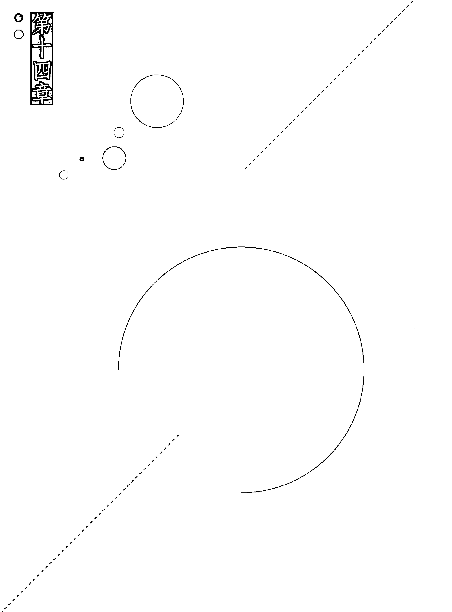

### 觀念建立

我們學習星曜，有了基本了解之後，就會開始希望解讀盤上的意義，可惜許多時候準度不高，這並不是因為紫微斗數不準確，而是我們習慣將紫微斗數用現代流行的星座看法去看。除了前面提到的，我們忽略了每個星曜需要對應宮位解釋，例如武曲星的財星特質只會出現在命宮跟財帛宮，其他宮位只能對應他的耿直個性。貪狼的慾望與桃花需要對應宮位解釋，討論賺錢方式的時候，可以說他利用桃花賺錢，卻不能因為他在福德宮，就說他是個好色的靈魂，因為福德宮說的是精神狀態，要用慾望去解釋，並且看對宮是什麼星曜。這樣的觀念其實是學習星曜的基本觀念，可惜我們習慣背誦式學習，失去了利用推演產生答案的能力，但人生不可能是死硬的，我們並非機器人，所以推理的觀念是紫微斗數學習中最重要的部分。有了這樣的觀念，就不會在初學星曜之後，看到煞星卻不知道該如何解釋。我的教學經驗是，即使上課不斷提醒，但學生還是習慣把煞星直接當成不好的意思，這當然是因為絕大多數的老師甚至書籍都這樣形容，也是我們自己面對文字的字面涵義心理無法突破的障礙，無法理解所謂的煞只是一個代名詞，並非一個絕對的形容詞。

文化設計出來，背後的原因來自於我們心理上無法控制的衝動，以華人奴才的文化的社會環境，衝動當然不好，反正只要違反皇權，都不是好事，只要不聽話，都是不好的孩子。這樣觀念延續至今，其實許多人都還是如此想，看到別人爭取自由會覺得是鬧事，但是沒有想到如果沒有人爭取權益，我們到現在還在裹小腳，還需要跪拜皇帝，財產隨時會被收走。想一想，衝突與爭取往往一體兩面，吵鬧與抗爭真的不好嗎？

我們應該回歸煞星當時被設計出來的本質來看待，煞星的力量可以破壞環境（宮位），可以影響個人價值態度（主星）。因為整張命盤是利用宮位與主星作為的主要結構組織，就像一間公司會有一定的組織架構跟方向，煞星可以影響公司的經營環境以及公司主管的個性特質，所以我們需要看這個煞星是從什麼地方來的。例如流年產生的擎羊星，流年代表了外在環境，產生的影響來自於外在環境。

### 第十四章

又如流年夫妻宮出現一個流年擎羊，感情出現問題是因為外界環境所產生。這個外界環境所產生的擎羊，如果出現在流年夫妻宮，代表自己在這個流年受到外界環境影響，對於感情會有些衝動的態度，這個態度可能造成原有的感情產生變化，也可能原本沒有感情而因此衝動地追求一段感情，但衝動就是衝動，擎羊是一種固執的衝動、堅持的力量，如同七殺，只是他更為情緒化，因為四煞星純粹來自於內心的情緒。
如果不出現在流年夫妻宮，而是在夫妻宮的三方四正去影響自己的感情態度，那麼影響的力量又會不一樣，例如在官祿宮出現的擎羊，是因為工作上的問題產生影響；遷移宮出現擎羊，是因為內心有不同想法產生的問題；福德宮當然是指精神狀況。利用各種不同宮位涵義對夫妻宮產生影響，了解感情上的問題（「問題」兩個字是中性的，不一定表示不好）來自哪裡，這樣的邏輯才是正確的斗數解盤方式，許多書籍單純用口訣讓大家背誦什麼煞沖、忌沖，這類方式往往最後只是讓學習的人愈學愈混亂，甚至連許多老師自己都很混亂，突然失去紫微斗數理性而具有細膩結構的解盤方式。這一段我在《紫微攻略1》亦有詳細解說。
而對星曜來說，煞星也會影響星曜。怎麼影響呢？

星曜在命盤宮位上，依照不同的命盤及宮位，產生不同的涵義，例如本命盤財帛宮說的是理財能力跟用錢觀念，運限盤中大限表現現象跟觀念，所以大限財帛宮可以說是理財觀念造成財務狀況，流年則是外在環境對自己的影響，所以流年財帛宮是因為外界環境造成這個流年的財務狀況，能力那個部分就被降低了。對應星曜的解釋，本命財帛宮有武曲星，因為本命是價值態度跟能力，所以解釋成願意努力賺錢的態度以及不錯的財務能力。流年財帛宮坐武曲，表示今年外界環境讓自己有努力賺錢的機會，這時候如果武曲化祿，就可以說有努力賺錢的機會而且能賺到錢。至於能不能存到錢，要看財庫的子女宮跟田宅宮。這樣一步一步解釋推論出來，並且依照各命盤跟各宮位的涵義，去取用星曜具備的涵義。在這樣的架構下再加上煞星，去解釋煞星對星曜的影響，以及這個影響對宮位產生的變化。

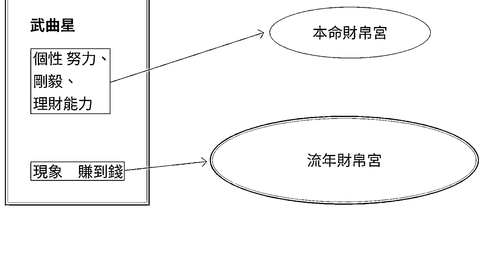

以擎羊星來說，擎羊古代是引用中亞遊牧民族的羊角刀，代表堅強而剛毅的情感特質，果決且大刀闊斧。這樣的情放在前面說的武曲星上，本命來說特質放在前面說的武曲星上，本命來說有賺錢能力且願意努力，可以果決地做出決定且大刀闊斧，在理財判斷方面，再加上前面說到的每個武曲星曜組合解釋，例如「武曲、天府」同宮，有理財能力又有計畫，加上擎羊的大刀闊斧，這樣只缺運限出現四化來幫助了，但是也可以說他在理財上會有衝動的個性，所以如果運限不能幫助，當然可能出現因為衝動而做出錯誤財務決定。但是因為天府的謀略、計畫能力，所以擎羊的衝動就會沒有那麼大的影響力，畢竟有計畫、有謀略的衝動跟傻傻的衝動不一樣。誰會傻傻的？「武曲、七殺」這一組，本來就是憑著熱情跟信念在努力，加上擎羊的熱情信念勇猛爆發，他不傻還有誰會傻？然後這樣的特質影響宮位。如果沒有主星呢？這時候就是煞星直接影響宮位了，通常只用自己的感性跟情緒去面對環境，通常就是不太好，所以其實只有在這個時候，煞星才可以直接當成煞星破壞環境來看待。這樣的推演邏輯才是面對煞星真正的情況，回歸煞星的特質才能夠找到真正的涵義，才不會浪費了有時候煞星反而是可以幫助我們的力量。例如相對應擎羊是果決的大刀，陀羅星就是永不放棄的堅持，不甘心放手更加不想走，這當然是一種讓人討厭跟不舒服的心情，但是如果大限夫妻宮有陀羅，整個大限對於自己的感情就是不願意放棄的心態，在流年遇到夫妻宮很難面對離婚的情況，卻因為大限的不甘心不放手撐過婚姻危機，下個流年如果轉好，豈不是一個好的重新開始嗎？所以我們必須以煞星的本質去看待。

### 一、擎羊星

豪邁果決的大刀

擎羊來自於遊牧民族的羊角刀，以此代表擎羊星具備的特質是果決而豪邁的態度，對於所在宮位的影響是果決的態度，這種態度跟奔放的情感展現，影響著主星，因此影響宮位所代表的涵義。當擎羊在命宮，命宮統管十二宮，所以這個人通常會在各種事情上非常有意志力跟果決，除了感情，因為此時夫妻宮會有陀羅星。 在本命盤的六親宮位上，說的都是對於親屬關係的態度，但是因為華人重視以和為貴的態度與親友關係，所以擎羊在六親宮位通常被說得不太好，其實是因為他敢愛敢恨，可以很快跟你建立關係，也可以很快就斷掉，這也是擎羊在運限夫妻宮可能會閃婚的原因。 在官祿宮、財帛宮其實不見得不好，因為擎羊的力量會是我們人生的動力，只是如果主星已經走很衝動的路線，就不適合再補上這樣衝動的煞星去推動了。

### 二、陀羅星

不甘心不放手的業障

陀羅星來自佛經裡萬般帶不走，唯有業隨身的業障觀念，如同前面說到本命盤的煞星，如果說的是我們的情感糾結問題，對應佛經說的業障觀念，其實往往來自我們的問題，一生放不下的問題當然糾纏著我們，因此陀羅星在本命盤上所代表的是我們一生放不下的宮位。在六親宮位表示我們對於六親宮位所代表的人與情感，永遠無法割捨與放棄，而通常只有自己不放手，人家才能永遠傷害你，陀羅星的傷害來自於此，再看主星是什麼，以此去推論，例如夫妻宮內桃花旺盛且情感黏膩的天機、太陰，搭配上陀羅星，表示天機、太陰不想傷害人，但是又不能對感情一成不變的態度，讓他糾纏而放不下、放不開，這是他一生需要處理的功課。

如果在屬於自己的宮位，則表示自己對於相關宮位的堅持，但是這樣的堅持具有情感成分，因為本命盤的煞星傷害來自情感層面，所以是自己對於某些事情的堅持與感情糾纏，例如「紫微、天相」在官祿宮遇到陀羅，本來「紫微、天相」對宮破軍，因為自己的能力與態度，跟希望人生有所突破的個性，如果運限走到適合時機，會有創業機會，但是加上了陀羅星，對於自己「紫微、天相」那種重視名聲的個性，會有無謂的堅持，所以是否創業可能就無法拿出破軍的能量奮力一搏。但是若將這樣莫名的堅持用在鑽研各項專業技術上卻非常好，我們可以發現許多專業能力的擁有者，都會有我們所無法想像的莫名堅持。這就是陀羅星的特質，不放手可能是傷害，但也是一種機會，端看是哪個主星搭配，以及在哪個宮位。

### 三、火星

热情而焚身的火

火星有时出现的特征跟擎羊很像，但是其实不太一样，差别在于虽然看起来都很冲动，但真正冲动的是火星。火星如同字面，像一团大火，烧起来很快，却可以很快熄火。擎羊其实是经过思考才展现出来的果决，从什么地方可以看出来呢？火星在财帛宫时，花钱跟烧纸钱一样，如果是天机、天梁星，钱会花在投资且是风险投资上，并且大火燃烧愈旺愈好。如果是「太阴、天同，则花在吃喝享受上，但无论哪一种，都是一种冲动行为，感觉对了就花。如果是擎羊，则会经过思考，所以比较固执，也就是说火星是一种情绪，当情绪过去了，缓一缓就会消失，擎羊却在冲动之后还有坚持，因为冲动是我们说的，他觉得自己是深思熟虑后的择善固执。当然，这没有好坏，固执往往导致灾难来了旁人无法救，但毕竟他是想过的。

雖然只要有人制止，讓大火燒過，火星就會馬上恢復冷靜清醒，但是如果沒有人拉呢？所以其實誰比較好，還是要看在哪一個宮位，對應哪一個主星，例如對應貪狼星，會形成貪狼星的好格局「火貪格」，就是因為慾望被火燒起，奔放而出。如果搭配上化祿，當然就會有賺錢的機會，甚至賺錢的能力，這也是說火貪格是「速發」的原因，但是需要注意運限問題，否則可能速敗，畢竟那是來自一時之間的運氣或爆發力。對應在六親宮位，火星通常表示熱情，情感關係如一把火，只是來得快去得快，好的時候熱烈，壞的時候焚身。

### 四、鈴星

精細分解的外科手術刀

四煞星有個特質，他們其實兩兩對星，擎羊跟陀羅，一個豪邁果決、一個糾結躊躇。火星跟鈴星，一個熱情、一個冷靜。相對於豪邁的擎羊，冷靜的鈴星像是一把外科手術用的刀，鋒利而專業，下刀需要經過精密分析，所以鈴星代表我們冷靜的情緒，可以說他是心機跟陰狠，也可以說他是冷靜跟沉穩。因此，那些衝衝衝的星曜就很適合搭配鈴星，例如害怕擎羊跟火星讓自己衝太快的七殺，配上鈴星就增加冷靜沉穩。或是受到陀羅影響而失去大開大合的特質，反而裡外不是的破軍，如果換上鈴星，其實都會相當不錯。

然而，這樣說起來不錯的煞星，如果出現在六親宮位，坦白說就會有點算計過頭，無論是你對他還是他對你，搭配上心思細膩的星曜，如天機、太陰，也會有想太多的問題。所以鈴星通常比較適合在屬於自己的那些宮位，並且放在較衝動的主星旁，讓他可以冷靜一點。例如貪狼星加上鈴星變成「鈴貪格」，也是這個原理，因為讓貪狼的桃花不會到處亂放，可以讓貪狼的桃花有計畫的應用。又或者跟「廉貞、七殺」放在一起，雖然廉貞化忌有可能把自己高超的能力拿來做壞事，但是加上鈴星應該可以做得更好，不容易被發現跟抓到。

### 四煞星總結與練習

煞星除了空宮，自己一個煞星的時候是直接對宮位產生破壞，宮位出現問題了，所以我們對應那個宮位的解釋，就可以說成那個宮位出問題。如果煞星是一種原始情緒的表現，或許我們可以把煞星當成小孩子看待，小孩子的情緒是直接的，宮位內有主星存在，就像有個大人可以管控，雖然有時大人太弱，也會受小孩的影響，如果空宮就變成不受控管的小孩，直接對宮位產生損害，在哪一個宮就是那個宮位所代表的意思因為情緒而受到破壞，例如火星在財帛宮，亂花錢就跟燒紙錢一樣；陀羅在夫妻宮，感情總是糾結不清；擎羊在官祿宮，一不高興就換工作；鈴星在僕役宮，總是算計朋友也受朋友算計，傷害總是互相的嘛！有了主星控管，就看是否可以管住他，或者也是彼此傷害，這個過程其實是彼此影響的變化，所以解盤的時候一定要先解釋主星，再想想煞星怎麼影響他，否則就會一片混亂。

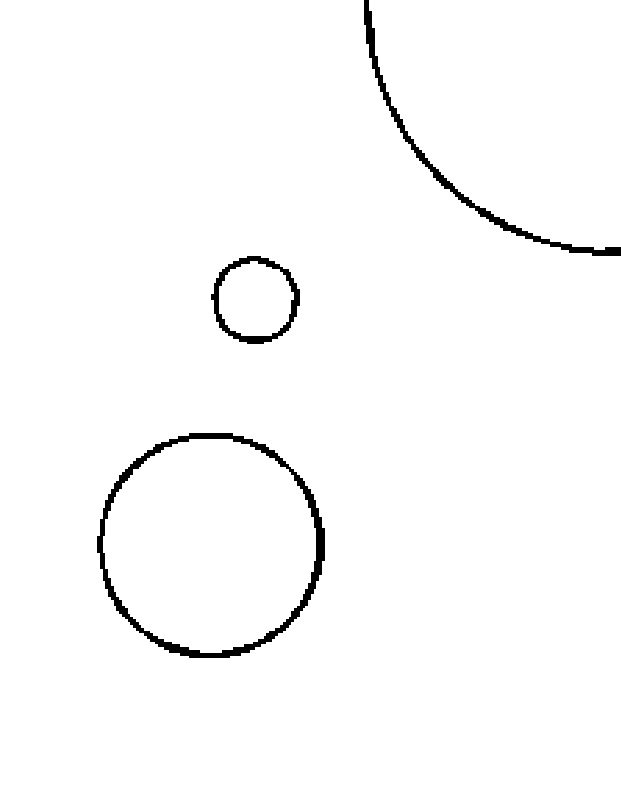

例如，「紫微、破軍」在命宮的人，本來在紫微遇到三方四正有吉星的合理情況下，應該會對人生很有想法，並且希望可以做些不一樣的事，但是加上陀羅，就會讓這個夢想空想很久，而且又不像鈴星是有計畫性地規劃，而是情緒上的躊躇不展，或許在躊躇過程中，也會做些細節上的策劃。但通常是讓本來可以大開大合、創造人生的「紫微、破軍」，少了奔放的能量。所以，解釋煞星的時候，應該先想這個主星在這個宮位表示什麼，如果有不一樣的心情，他會如何決定。用這樣推論的方式去想煞星，才可以分別出煞星到底是幫我們還是害我們，才不會在他幫我們的時候誤會了他。

一直被名字耽误的吉星

### 空劫星

众所属目看外篇

- ○
- ○
- ○
- ○

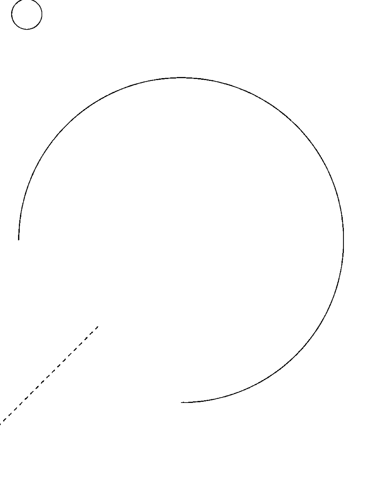

### 空劫星的基本由來跟原理，以及謬誤

空劫星其實是兩顆星曜：地空、地劫。這兩顆是一組對星，但是古書上面卻是用天空、地劫的名稱，只是近代因為增加了其他術數上的天空星，為了區分，所以把這兩顆星改為地空、地劫。這是許多人會產生的誤會，甚至連許多寫書的老師自己都搞錯。再來，雖然空劫星用的是「星」這個字，但是其實跟我們前面說的星都不一樣，前面說到的是星曜會在宮位中產生態度跟能力，跟宮位彼此影響，然後產生對整個命盤的影響。空劫星則不是這樣的概念。這要說到紫微斗數在起源過程中分成兩個主要的大系統，一個是專門討論星曜，例如武曲星遇到擎羊，無論在哪個宮位都會有破財的問題。一個是專門討論宮位，依照宮位所在位置推算，例如命宮在子位，夫妻宮跟命宮成為隔角煞，這個人的感情就會不穩定。或者是煞星在三方四正對於宮位產生破壞，就像環境被破壞了，再厲害的人也沒辦法抗衡，這也是《紫微攻略1》的主要結構技巧，但《紫微攻略1》的讀者一定都熟知，但也是這樣的推算方式其實有疏失，好處是快速、缺點是細膩度不夠，所以才會在數百年前逐步整合成目前紫微斗數的完整體系，並且在不斷進步中。但是在過程中，因為不了解歷史，所以讓後面的老師讀書時對文字產生誤解，空劫星就是最好的例子。

#### 圖四十三／宮位隔角煞範例

| 僕役 | 遷移 | 疾厄 | 財帛 |
| --- | --- | --- | --- |
| 官祿 |  |  | 子女 |
| 田宅 |  |  | 夫妻 |
| 福德 | 父母 | 命宮 | 兄弟 |

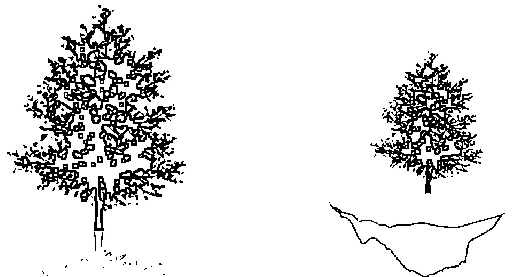

大树在平地上与大树在孤岛上

空劫星来自于宫位体系的系统，所以真正影响的是宫位，本身并不像其他辅星直接对主星产生影响，而宫位变动了，所以星曜里面的影响受到影响而变化。说得更直接一点，空劫星是对宫位产生影响，而宫位变动了，所以星曜无法相对应于宫位去产生影响力。宫位是环境，星曜是人在环境里的态度，依据这个基本逻辑建构出紫微斗数这个命理体系，如果空位没有力量呢？根本没有这个环境呢？就像一棵大树可以供人乘凉，但是如果大树在一座孤岛上，四面环海，大家根本没有办法过去乘凉，那我们还能说大树可以乘凉吗？大树还算有乘凉的功能吗？其实我们还是可以说大树有乘凉的功能，只是因为环境的关系用不到而已。这就是空劫的基本观念。

空劫星讓宮位無法產生力量，所以在宮位內的星曜無法發揮正常影響力，但是你不能說他不存在，我們眼前所見還是一棵大樹，只是無法走到大樹下乘涼。這就是斗數讓人讚嘆的地方，透過這些理論結構去建構出非常貼近真實人生的千變萬化，人生中我們是否會有這樣的情況呢？例如老公帥氣溫柔，卻長年在國外，帥氣跟溫柔只能出現在臉書上，讓朋友羨慕，或許偶爾可以給一點訊息，卻實際無法在身邊展現他的貼心。帥氣溫柔當然還是存在，卻無法對妳產生力量。又或者，爸爸是個會家暴的渣男，但是因為他長年逃債，常常不回家，所以雖然會家暴但是機會不高。那棵無法乘涼的大樹，也可能是強烈颶風，但是因為都在海上沒有經過陸地，所以根本不會對陸地產生傷害。從這個角度來說，空劫的「空」跟「劫」讓人們產生莫大的害怕，但他卻是個被名字耽誤的吉星。許多老師錯誤解釋，造成人們對他的恐慌，然而他卻是個可以真正讓煞星消失力量的吉星。這也是為何我從不把地空地劫與四煞放在一起稱為六煞星的原因。或許你會說那棵大樹無法乘涼怎麼辦？看過《紫微攻略1》的讀者就知道，命盤一排，其實煞星滿天飛，人生的災難往往超過幸運，所以依照機率來說，你覺得空劫讓宮位無法產生力量空掉煞星的機會多？還是空掉吉星的機會多呢？

依照比例來說，空劫星絕對是我們人生的好朋友。

在這樣的基本觀念下，常常也會有人誤解，如夫妻宮遇到空劫星，是不是說夫妻沒有了？是不是就沒有老公了？其實這是因為落入了思考邏輯上的幾個盲點：

1. 夫妻宮代表的是感情態度，不是你老公、不是一個人。
2. 每個宮位其實都要看三方四正，所以一個宮位不產生力量，不表示命盤上所代表的事情不存在。
3. 宮位代表的是環境，否則如果空的是父母宮，難道你媽媽是處女懷孕生下你嗎？或者你是從石頭蹦出來的，跟孫悟空是兄弟？

因為有這樣的誤解，就會產生許多對空劫星奇奇怪怪的解釋，例如在命宮的頭殼空空（沒有想法，很笨的意思），也有的說這種人會有很多想法，天啊！到底是他們沒有考慮空劫是讓宮位沒有力量，如果是天機星在裡面，本來該聰明卻無法發揮力量，就笨了啊！如果三方四正遇到的星曜都是聰明且想法多的，一個宮位不能產生力量，其他宮位的影響力就會增加，當然就變成想法很多。因為對空劫原理的不了解，所以產生各類奇怪解釋，甚至有些老師說空劫星所在位置是要求神拜佛彌補的業障，各式各樣因為自身學理不足、穿鑿附會解釋出來的理由，也是讓人看不起命理界的原因之一。或許你說你有兩三個朋友婚姻不幸幸福離婚，夫妻宮都有空劫。你知道很多沒有空劫的也離婚嗎？臺灣離婚機率高達五成，這樣的說法其實跟抽籤碰運氣是差不多的。

### 空劫星的實務應用

空劫星讓宮位沒有辦法產生力量，因此影響星曜跟命盤，實際上的運用又是怎麼影響呢？如前面提到的，宮位的意義要對照的是哪一個命盤的宮位，本命盤討論的是個性跟價值，就像我們反覆提到的概念。但空劫星還有一個用法，是「終將一無所有」這個說法，看到這裡，我想大家應該又緊張起來了吧！

其實所謂「終將一無所有」，「終將」這兩個字代表了時間的概念：最後會沒有。這背後代表著一段時間，因此這個情況只會出現在運限盤。當然我們也可以說本命盤代表一生，所以本命盤可以用一生最後一無所有來看待。但是，人生前二十年，絕大多數的人根本也是一無所有，人生最後十年也是如此，畢竟生不帶來死不帶去，所以所謂終將一無所有的情況，在本命盤上除非是人生走到盡頭，否則其實很難有感覺，但是在運限盤上卻相當明顯，因為運限盤上代表的是這個宮位在這段時間內表示的意思，無論是價值概念還是因此發生的現象，因為這種情況影響自己的整張命盤跟這段時間內的人生，這個宮位無法發揮力量，當然說的就是這個時間內本來該發生的事，對我們的人生無法產生影響了。

所以空劫星在不同的盤上，其實會依照不同命盤的含意而有不同的影響，在這樣的基礎下，本書主要還是談本命盤，我們來看看本命盤對應空劫星的基本應用，還是要用雖然具備著，但是沒有環境發揮的觀念來看待，而且空劫星還有不同的組合，有不同的影響方式。空劫星有同宮、對拱、拱、夾這些組合方式（圖四十四）。

#### 圖四十四

| 地空 地劫 |  |  |  |
| --- | --- | --- | --- |
|  |  |  |  |
|  |  |  |  |
|  |  |  | 地空 地劫 |

地空地劫，同宮

|  |  |  | 地空 |
| --- | --- | --- | --- |
|  |  |  |  |
|  |  |  |  |
| 地劫 |  |  |  |

地空地劫，對拱

番外篇

#### 圖四十四／

| 被拱宫位 |   | 地空 |   |
|----------|---|------|---|
|   |   |   | 地空 |
| 地劫 |   |   |   |
|   | 地劫 |   | 被拱宫位 |

地空地劫，拱

| 被夹宫位 | 地空 |   |   |
|----------|------|---|---|
| 地劫 |   |   |   |
|   |   |   | 地空 |
|   |   | 地劫 | 被夹宫位 |

地空地劫，夹

##### 1. 同宫

我們延續前述「終將一無所有」的時間概念繼續舉例。例如，有人大限官祿宮太陽、對宮巨門，太陽化權，可能有在工作上掌權甚至創業的機會，但是地空、地劫同宮在大限官祿宮，影響著他大限官祿宮的太陽化權，這是表示他會因此無法掌權或創業嗎？其實，依照大限時間來看待官祿宮，那是那個十年工作對他人生的影響，並且往後影響他的後面十年，所以只能說是他這十年的官祿宮太陽化權，這件事情最後其實會回歸平淡，可能失去權力或是創業收攤，仍要看其他條件的影響，不表示他不會因此創業或掌權。只是這十年過去之後權力消失，無法繼續影響後面十年。這是終將一無所有的真正涵義：並非完全沒有。同宮的這個組合，整個宮位力量被空掉，其實是說必須依靠三方四正其他宮位的力量幫忙。原本宮位內的那個星曜只是擺在那裡，好看的成分居高，很像是商品請來的代言人，似乎那個明星是吃了這個食品才變瘦變美，但是你真的相信嗎？不，他本來就是瘦又美的。但是除了這個之外，其實其他組合並非單純這樣解釋。這也是《紫微攻略》系列無論哪一集都一直強調宮位、強調三方四正的原因，因為每個宮位都是彼此連動的，如這次提到的福德宮影響著命宮，更別說每個宮位所屬的三方四正宮位，是建構這個宮位的基本架構，所以任何宮位都需要看三方四正造成的影響，並且依照三方四正宮位的含意去解釋所產生出來的影響力量在哪裡、是哪一類的。這是紫微斗數引用西方占星學中最重要的—環技術，但是現在卻常常被忽略。因此，其他空劫星的組合，我們需要依照三方四正去看他對主宮位產生的影響能力，以及對宮位造成如何的破壞。

##### 2. 對拱

以對拱來說，因為本宮與對宮是最密切的聯繫，彼此互為表裡，是對方的內心也是外在表現，所以關係最密切。當兩個宮位都遇到空劫星，空劫星只有一顆，其實並不能說是整個宮位都被破壞了，只能說宮位的環境力量被降低，但是這時候是兩個對拱的宮位力量各自被降低了一點，原本如果一個宮位遇到地空、地劫兩顆星同宮，整個宮位都失去力量，至少還有對宮可以馬上支援，但這時候是各自都失去一部分力量，所以可以說是這兩個宮位其實都失去了力量，主要就要靠三方四正另外兩個拱的宮位去增加影響。

##### 3. 拱

如果三方四正內是拱的位置遇到空劫星，例如財帛宮有地空，官祿宮有地劫，這樣當然財帛宮、官祿宮都會受到影響，但其實真正受到影響的是命宮，想想看有一個人，工作能力發揮不出來，理財能力不如自己預期，他會不會覺得自己命宮真正想發揮的力量無法發揮呢？例如有人官祿宮有擎羊，但是遇到地空，雖然工作拼命又衝動，但是沒什麼機會衝動，財帛宮遇到武曲化忌，照理說應該很喜歡努力賺錢，但是遇到地劫，即便想拼命也沒什麼機會，這時命宮的那個紫微星可能就無法發揮力量了。這個組合只要出現一個運限的陀羅在命宮，就會形成羊陀夾忌，簡單來說運勢不太好，但是這個原因來自於，工作上想拼命，財帛上想努力，而且是瘋狂的努力，再加上命宮那個陀羅影響紫微星，讓皇帝裹足不前，躊躇不定，胡思亂想，通常這樣反而讓自己變成左支右絀，最後為了愛面子做出錯誤的決定。

但是這時因為有空劫，想衝動沒機會，想賺錢也沒機會，皇帝就慢慢躊躇吧！

陀羅怎麼亂想跟糾纏也不太會出事，所以如果是拱的位置，其實真正影響的主要宮位不是拱的那兩個位置，而影響的原因是因為拱的兩個宮位，所各自代表的宮位含意去影響主要宮位。

##### 4. 夾

地空、地劫夾的其實也是一樣，這樣的觀念在《紫微攻略1》中提到許多次，因為宮位彼此含意給與的互相影響。這也是一個重要的觀念跟技巧，許多斗數書籍甚至可以說都只談到「拱」、「沖」、「夾」這樣的眼，卻不重視這是宮位之間的彼此影響，解釋出來往往失之毫釐差之千里，也失去了紫微斗數最有趣、最迷人的地方。所以如果有人祿存在命宮，其實被地空、地劫夾反而是好的，因為這時候原本的父母跟兄弟宮剛好有擎羊跟陀羅，原本父母無法給予照顧，還會補上一些問題，加上空劫讓問題沒有機會發生，反而少了問題。用這樣的觀念來看空劫星，就可以發現其實他真的滿好的，根本是人生命盤上的吉星，有時候失去反而是好的事情，只是我們往往忘記看到失去之後自己擁有的部分。

## 紫微攻略 3

星曜 我們與真實自己的距離（下集）
史上最強星曜解盤！對宮為明鏡，透視深層人性

- 作者—— 大耕老師
- 美術設計—— 張嶧
- 主編—— 楊淑娟
- 校對—— 林雅茹、秦立帆、王嘉麟、鍾家嫻、周宜萱、沈佳妤、孫國寧、陳文杰、吳柏憲、邱鈺筑、林碧香、連玉螢、楊淑娟
- 行銷企劃—— 許文蒸
- 第五編輯部總監—— 梁芳春
- 董事長—— 趙政岷
- 出版者—— 時報文化出版企業股份有限公司
- 地址—— 10803 台北市和平西路三段二四〇號七樓
- 發行專線—— (02) 2306-6842
- 讀者服務專線—— 0800-231-705、(02) 2304-7103
- 讀者服務傳真—— (02) 2304-6858
- 郵撥—— 19344724 時報文化出版公司
- 信箱—— 10899 臺北華江橋郵局第 99 信箱
- 時報悅讀網—— http://www.readingtimes.com.tw
- 電子郵件信箱—— yoho@readingtimes.com.tw
- 法律顧問—— 理律法律事務所 陳長文律師、李念祖律師
- 印刷—— 勁達印刷有限公司
- 初版一刷—— 2019 年 12 月 20 日
- 定價—— 新台幣 460 元

版權所有 翻印必究

時報文化出版公司成立於一九七五年，並於一九九九年股票上櫃公開發行。
於二〇〇八年脫離中時集團非屬其中，以「尊重智慧與創意的文化事業」為信念。

> 紫微攻略 3: 星曜 / 大耕老師作 .-- 初版 .-- 臺北市 : 時報文化,
2019.12 冊 ; 公分
ISBN 978-957-13-8060-5(下冊 : 平裝)
1. 紫微斗數
293.11 108020981## 紫微攻略1
史上最強運勢管理，了解12宮位，用斗數秘訣「煞忌交會」手法預測、避險有一套！

自己的命盤自己看，自己的運勢自己改

感情、事業、健康、家運、本運要轉危為安
找出命盤上的煞忌交會之時，提前為人生問題找到策略！

## 紫微攻略2  內心的力量

看透宮位與祿權科忌，用飛化和自化手法，規劃人生各面向的取捨關鍵！

《隨書贈《命理師真心話》一冊》

從命盤看到未來待人處事的方向，透視人生起伏流變之因——祿、權、科、忌

本書將說明，當我們受到四化聯動影響，遇到逆境時，如何透過紫微斗數，知道自己真正擁有的能力，做出適當的選擇與進化。

## 解讀星曜密碼，首要掌握兩大重點

- 1. 星曜特質：對應宮位不同的內涵來思考
- 2. 人的本心：須同時看代表內心的對宮

透過星曜處於每一個宮位的不同含意，我們可以了解個人的特質和能力。同時，查看對宮的星曜，更能準確推演出個人內心深層的價值觀與真實慾望所在。藉此知道自己在人生旅途中，為何會做出各類決定？為何會有與他人不同的想法？也因此可以掌握未來人生佈局。

下集內容：論十四主星與雙星組合在子女宮、財帛宮、疾厄宮、遷移宮、僕役宮、官祿宮、田宅宮、福德宮、父母宮之解析和應用、煞星解析、以及空劫星細說分明

## 五大特色

### 一、探表究裡，論命立體又細膩

為什麼有時候覺得算命不準？因為大部分老師往往只解釋到星曜的「表」，而沒探究到「裡」。本書利用本命盤清楚解讀命主的個性特質與能力，讓紫微斗數盤如同一張人生的健康檢查和自我評量表。

### 二、對宮就是照見內心的明鏡

要了解一個人的中心價值，必定要探討內心，紫微斗數將內心世界以「對宮」來表現。因此每個星曜其實需要重視對宮與同宮的影響，才能真正做出解釋。

### 三、星曜（特質）要對應宮位（環境）解釋

星曜的解釋必須從宮位去理解，才能夠真正的掌握星曜的本質內涵，否則就會望文生義，解出很奇怪的意義。

### 四、懂原理，不再困惑於陳舊解釋

一顆星曜的組合可以有高達上萬種的解釋意義，想要學會，不必全背，只需要懂原理邏輯。本書淺顯地解釋斗數，只要記住星曜的五行、基本特質、化氣為何，並採用「宮位對應聯想法」來用推演詮釋。

### 五、生活化命題，加強解盤力

設計生活化的【小練習】讓大家熟悉解釋星曜的要領，全書以靈活有趣的命題增進斗數解盤實力！

時來轉運網
VUU0085 NT$460
ISBN 978-957-13-8060-5(293.11)