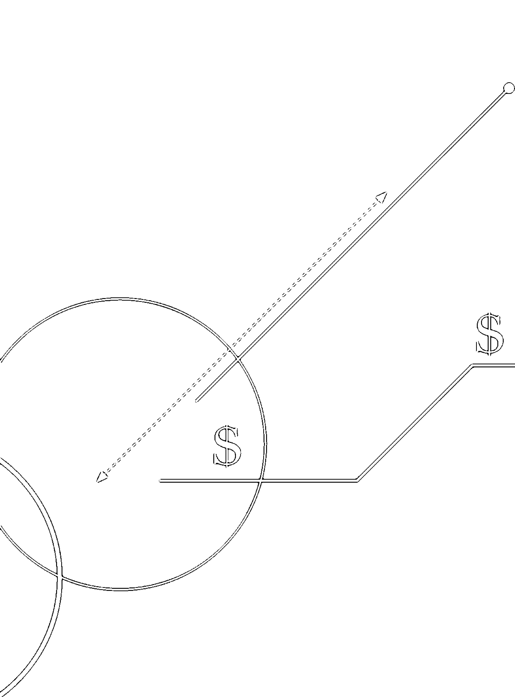
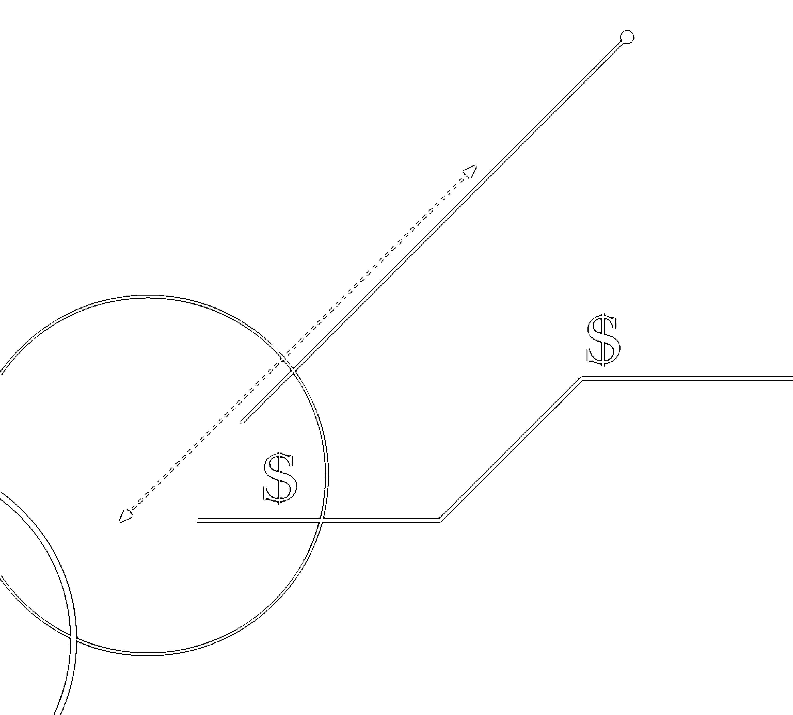
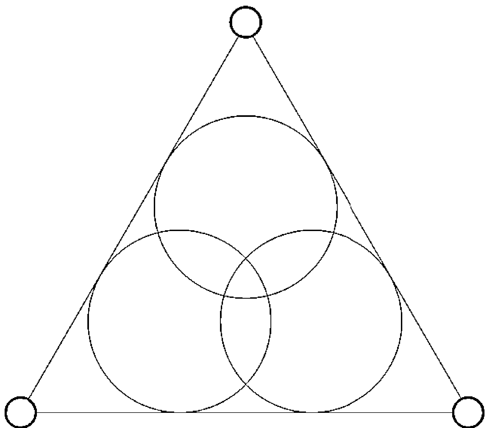

# 紫微攻略4 財富

財運不順，人生怎麼會順！

看懂隱藏在紫微斗數命盤上，
專屬於自己的財富攻略

大耕老師 ——著

提高財務能力
找對理財工具
抓準賺錢時機
創造致富財位

Zoe 王小凡 KOL、主持人｜李佩甄 台灣好媳婦｜簡少年 命運設計系系主任
強力推薦 依首字筆順排序

## 福利公告：

凡在【天使神秘学院】购买任何电子资料赠送实体书，详情请咨询店铺客服！

备注：如客服不知道这活动你可能进了盗版店铺！

赠书活动仅在以下正版店铺购买有效哦！

### 【天使神秘学院】淘宝店
手机淘宝扫以下二维码

1. 打开手机淘宝：搜索“天使神秘学院”
2. 点击“店铺”按钮就是

### 【天使神秘学院】微店
手机微信扫以下二维码

用手机微信扫码进店

## 制作说明：

本书由《天使神秘学院》出重金从台湾购入的原版书籍扫描制作完成。为达到最好阅读效果，特地把书全部切开后，再经由专业扫描设备高精度扫描完成，并经过一张张的PS后期处理最终成书，其间花费大量的人力、物力以及时间，只为能给大家提供经济并优质的神秘学学习资料而努力。

本学院强力谴责某些机构和个人，把本学院花心血制作完成的电子书籍，包装后直接放在自家网上低价倾销的行为，以谋取不劳而获的经济利益。如果长此以往最终将无人愿意再为大家花心思制作电子书，那以后可能大家再无新书可读。

为让大家以后能够读到更多好书，也为了本学院的良性发展。本学院恳请大家尽量做到如下几点：

- 一、尽量在天使神秘学院的官方网站购买电子书籍。
官网访问地址：[http://www.ac2011.cn](http://www.ac2011.cn)
短网址：ac2011.cn
网址含义：(Archangel College 成立时间：2011年)

- 二、在收到电子书后小范围传阅即可，千万不要公开传播，更别挂到网上低价销售。

同时为答谢广大支持者，学院电子书将做如下调整：

- 一、学院会把一些早已收回制作成本的电子书折价销售。
- 二、最新制作的电子书籍会开放打印功能，大家购买后有条件的可自行打印成书。

## 目录

# 前言 認識財富的重要，才能解決人生的問題 006

# 前導1 財帛宮到底是什麼 016

# 前導2 命理學是人生的指南，了解本質才能幫助自己 026

# 第1章 從財帛宮檢視自己的財務能力 033

- 紫微星系 034
- 廉貞星系 040
- 武曲星系 045
- 太陽星系 050
- 太陰星系 055
- 天同星系 060
- 天梁星系 063
- 天機星系 066
- 天相星系 071
- 七殺星系 074
- 破軍星系 077
- 貪狼星系 080
- 巨門星系 083
- 天府星系 087

# 第2章 四化和四煞在財帛宮的影響

- 1. 當四化在財帛宮 092
- 2. 當四煞星在財帛宮 099
- 【特別加映】財帛宮星曜組合的簡單使用與判斷方法 105

# 第3章 除了財帛宮1。內行人看福德宮

- 1. 福德宮才是真正的力量來源：紫微斗數中的顯化法則 115
- 2. 先別管錢花到哪裡去，求財要先知道錢從哪裡來
- 3. 人生困境的上天救援
- 4. 堅強的靈魂陪我們享受過程與開山登峰
- 5. 吸引力法則：運氣自己造就，利用命盤拿回主導權 128

# 第4章 除了財帛宮2。不能不看的僕役宮

- 1. 容易被忽略的僕役宮：人生的豬隊友與財運的好幫手 142
- 2. 人人為我，危難中可以幫我一把的貴人

# 第5章 脫貧改運守則

- 1. 了解自己才能賺錢 172
- 2. 個性特質是否適合
- 3. 個性與時機衝突時候該怎麼辦 177
- 4. 人生是否有投資賺錢的機會，怎樣的理財工具適合自己 186

# 第6章 財富落袋為安，必看田宅宮

- 1. 廣積糧緩稱王：賺錢要留得住，積沙才會成塔 193
- 2. 聚寶盆要先有第一個元寶，才能生出錢來 197
- 3. 運限在走，觀念要變：不同年紀的資產規劃 201
- 4. 【特別加映】有土斯有財？買房是財富保險還是人生風險？ 204
- 5. 補財庫有用嗎？ 209

# 第7章 紫微斗數裡的財運藏寶圖

- 1. 利用命盤之前：致富的實力來自知識 226
- 2. 適合自己的好時機 228
- 3. 適合自己的好環境 239
- 4. 適合自己的好方位 241
- 5. 紫微斗數中的東方魔法：在空間中增加自己的能量 252
- 【特別加映】防神棍詐騙必看真心話 263

# 很長的後記

## 一個武曲化忌、一生缺錢賺錢者的告白

面對內心確立自己的目標，由小夢想逐步踏實成就理想 272

天下沒有白吃的午餐，世間沒有輕鬆錢財 275

了解各類金融知識，借錢從銀行開始 277

所有方式、法則、名師言論都需要用邏輯檢驗 280

# 前言 認識財富的重要，才能解決人生的問題

> 如果不曾好好學，怎麼有理財腦？

在我們還很小的時候，就被灌輸「唯有讀書高」、「百善孝為先」的觀念，聖賢之說充斥在我們的知識養成過程中。這樣的價值觀一代代延續下來，導致到了現代，社會大眾對於商人的輕視，仍延伸到對於錢財教育的藐視，因此華人社會向來有嚴重的反商情結。然而，大家可曾想過，古代的聖賢會有可能賺大錢嗎？古代是帝王統治階級架構出來的封建社會，如果鼓吹賺大錢，誰來當奴隸呢？因此當然要從思想上灌輸尊君愛國、從父從夫的重要性。不同於華人，以色列人（猶太人）從小就把金錢觀念深植心中，畢竟一個流浪千年的民族一定相當了解金錢的重要性，小至養家糊口、買食物、買衣服，大至獨立建國、買軍火打通國際關係，全都需要錢，所以以色列人將金錢觀念放在生活教育之中，成為世界上最有生意、理財頭腦的民族。

直到近代的華人教育，學校仍不太主動教導「重視財富」這樣的觀念，甚至希望我們應該安分守己，安貧樂道，人生只求溫飽，將追求財富打成邪魔歪道。於是，多數人都是在長大成人、進出社會群體生活之後，才發現另外一種不同的聲音——原來人活在社會上是很難自給自足的，群體之間的往來聯繫，往往要透過金錢才能建構。

我們從人類社會最大的一個組成單位「國家」，就可以知道這樣的情況。「國」這個字是象形文字，中間的「口」是一口井，代表人們生活的基本，而井的周圍是「一把一戈」，代表武力，口字下面有一橫，代表秤子，最後用一道圍牆把這一切圍起來。這表示國家的組成最早是為了樹立起一套生活標準，建立在能夠養活大家的水草綠地與水資源上面，並且用武力與公平的交易來維護，最後將這一切圍起來，不容他人侵犯，這就是國家與社會的基本組成結構。更可見人與人的交流、社會的組成，基本上都是建立在金錢之上，但是我們卻在進入社會之後，才知道小時候的聖誕老人送的禮物，其實就是爸爸媽媽辛苦賺錢而來，跟我們是不是乖小孩其實沒有太大的關係。

我們在成長過程中，往往只被期待在學業上精進，進入社會後，又被督促在事業上努力，接著又被要求創造美好的婚姻，但這些關乎學歷、工作、成家的追求，不都是為了在社會上建立「穩定的生活」嗎？因為缺乏財富思維的訓練，許多人的生活不斷出問題。就這麼一路驚慌失措到四十歲，才發現人生已經錯失許多良機，甚至被迫中斷或忘記內心的夢想，有些人只好安慰自己時不我予，有些人則開始諮詢命理師的建議，或轉而從宗教上尋求解答，讓自己心甘情願地接受命運的安排。

這是絕大多數人的人生路程，只有少數出生在商業世家的人，從小透過父母長輩得到理財的啟蒙，或者從小家境貧寒，生活逼迫他了解金錢的重要性。客觀來說，這類人因為了解得早、學習時間長，且周遭具備相當的知識來源與人脈資源，或者自己會為了需求而尋找資源，因此只要不是太糟的情況，相對於一般人而言，他們通常較具備社會競爭力，這就是我在教學時所說，其實從學理的角度來看，化忌有時候反而是動力，而非絕對不佳，人生若沒有空缺帶來不安全感，何來追求的動力呢？這也是我們可以看到在華人社會中，除了富二代、官二代之外，在社會上能夠...

# 第1章 從財帛宮檢視自己的財務能力

## 拯救家族事業，看見荒唐卻普遍的金錢觀

以我來說，因為父親的生意出問題，我自小必須與祖母、姑母同住，三人过了好几年四处流浪的生活。这样不安定的日子，让我有很长一段时间非常反商，觉得做生意赚钱是个很不好的选择，所以一心想凭借自己的绘画天赋，向往未来以艺术技能维生，当时的我认为这是让自己安心的方法。后来，父亲的生意又攀回高峰，但是因为好大喜功、胡乱投资，以及对市场错误的判断，造成公司金玉其外败絮其中，竟累积高达上亿元的负债。身为长子，大学刚毕业的我只好放弃多年的美术设计学习之路，回到家族企业帮忙。也就在那时候，我看到了台湾（或者说华人世界）对于工作、金钱、理财抱持许多荒诞的观念。例如我们的社会一向鼓吹学历至上，会念书就等于是社会菁英，但你知道吗？社会菁英的收入可能还不如一个卖猪肉的摊商。又如传统的商人或许因为学历不足与对财富的渴望，努力奋斗之后，靠着运势或是自身的努力，获得了小小 的成功，却因此看不起知识分子，也排斥学习理财的相关知识，在早年的台湾，许多老板连财务报表都看不懂，想赚钱却不愿意学习赚钱的知识，这真是个荒谬的现象。当时，我的家族企业看起来赚钱，其实却面临倒闭危机。可怕的是，明明有上亿元的庞大负债，全公司上下却无人担忧，包含老板。整个财务收支结构混乱，公司账户就像老板的私人金库，可以随便动支。这样的状况其实并非只在企业老板身上出现，许多财务状况也是如此，每天赚多少花多少，完全没有理财观念，即使有，也是来自各类媒体的道听途说，幻想看几篇财经报导就能了解整体经济局势，听几场演讲就能变成股神，拜托！多少人学英文十几年都不会用，却认为自己只要十几天就可以变成股市高手？！当这样的态度充斥在社会中，我们当然就很难学习到正确的理财观，破财也就是可预期的情况了。如同紫微斗数所说，任何推测与命运的轨迹，都是由人与环境构成，怎样的能力与个性的人在哪一类的环境中，就会组合成一定的命运轨迹。如果我们的社会环境是一个反对学习理财观念，却又无法摆脱金钱的世界，自然最后只有某一类的人能够在错误中学习成长（强大的心理素质），或者因为拥有相对好的资源（例如有经验的长辈朋友给予教导），才能在这个社会取得较多的财富资源。至于其他人，只能在茫茫大海中寻找浮木，求求财神、求求命理老师、求求股市老师，或者继续道听途说，直到有一天自己接受安贫乐道。

## 「千萬負翁」用紫微斗數走出人生新路

我的人生总共面对过三次的负债，金额从数千万到上亿元，但我都在几年的时间内，重新建立自己的事业版图。

当年回到家族企业后，面对市场下滑与上亿元的负债，整个公司毫无危机意识，加上我又是公司内最年轻的成员，其实有一度是无能为力的。后来，刚接触紫微斗数的我试图从命盘上找出机会，我冷静检视盘上的自身特质、事业状态与环境的各种变因，一步步找出方向和指引。官禄宫有颗铃星的我，在痛苦中沉着谋划，整顿家族公司并给予转型，花了三年，终于清偿完债务，还争取到上市柜的机会。不过，也因为对于命盘了解得不够深入，判断不够全面，以及因为年轻气盛，有了战功却失去人和，因此被家族扫地出门，只好另行创业。

离开家族企业后，我又受到朋友的欺骗而负债，所以随后的创业，我依然背负着数千万元的债务，最后也因为股东问题离开创立的餐饮连锁店，而且依旧是负债上千万元的离开。人生前二十年的事业发展在说明自己在人际关系上的处理有着极大的弱点，因此推算跟预测是强项，与人相处却是极弱的我，最后选择了命理业。一方面从事这样的行业，自己一个人就可以温饱，不用牵扯那么多的股东，一方面我也希望自己分享自己过去的经验，将这个总是让我从绝境翻身的紫微斗数推广给更多人。

在这二十年改革家族公司、自己做生意的过程中，紫微斗数给予我极大的帮助，命盘上清楚诉说我将面对的环境，以及我在环境中该有的态度跟方式，相较于许多理财书或商业书籍，这更像是一本为自己量身订做的财富攻略本。每个人的命盘不同，运势不同，我们不可能照着别人的成功模式走，王永庆所在的年代跟你的年代不同，郭台铭能做的，你做了可能会挨告，马云的时势背景跟人脉关系造就他可以办到你办不到的事情。这就像奥运游泳选手的训练计划看起来很厉害，但我们根本无法照着做，做了还可能会伤害身体，事倍功半。所以，我们需要的不是别人的成功故事，也不是各类心灵鸡汤。成功故事和心灵鸡汤只能给予自己困境中的勇气和安慰。而紫微斗数则是专属自己的解决方案，清楚告诉我们适合的做法，为自己的财富也好、财运也好，找到一个好的方向与运用的方式。即使我们不在乎财富，那也必须是我们有能力拥有而不追求，绝对不是因为没有能力而妥协。

## 改運，從你看清能力、時勢、決心開始

人生的各类事情都可以从紫微斗数中找到专属的答案，问题在于我们是否了解这张命盘给予什么讯息，以及知道讯息之后，该如何行动。常听人家说，紫微斗数只是算命，无法改运。会这样说，通常是因为不了解紫微斗数，如果只能知道却不能改，那表示你根本没有看透。

如果你知道自己会破财，是因为爱乱花钱……

如果你知道自己一生的财务最大漏洞，来自于对家人的不离不弃，所以你无法拒绝家人的请求，刚好家中又总是有人闯祸……

如果你知道自己投资时，总是心理上的纠结导致投资失利，那么是否可以找到自己比较不会纠结的时间或是投资标的呢……

知道原因后，我们当然可以改变。

改运永远都是自己去找到自己的问题，选择适合自己的环境。有时候不是紫微斗数做不到，而是人自己做不到。所以看懂自己的命盘，努力找到适合的方向，就可以不怕风浪，甚至可以乘风破浪。

许多客人和学生知道我的故事之后，都希望学会利用命盘，让自己从谷底翻身。

不过，希望从命理学的角度为自己找到致富之道，这 一样是犯了前面所说：我们太想寻求一个快速的方法去学习任何学问。任何一个能成为我们一生受用的能力，都不可以快速达成的，许多声称能够通天遁地、预知未来的老师，自身理财能力不一定好，这也让许多人对于命理学是否能做为一种改变财务能力的学问产生质疑。

其实我们需要回归事情本质。既然理财是一种学问，了解财务概念当然就是基本功，就像命理学可以说你何时会出车祸，但是如果你根本不会开车，又硬要去开车，这不需要命理学，随便一个路人都可以预测你会出车祸。有了基本的财务观念之后，才能真正利用命盘上的迹象，让我们顺风顺水，避开灾难。因此，这是一本综合了我多年来的经验，用紫微斗数教大家财务观念的书，从紫微斗数命盘对应理财，包括从心理到运势各层面所需要了解的事情，让我们了解在面对人生困境时，该如何利用命盘来逆境突围，该如何利用命盘来转化心境，避免受到环境与情绪影响而不断犯错，并且找到好的时间点，顺风而起，在逆境来临的时候，也可以找到财富的避风港。
这一本紫微斗数理财专书，内容尽量做到内行能够看门道，外行也可以努力一下就知道。如果希望对于紫微斗数有更多、更全面的涉略，欢迎网路搜寻「国际紫微学会」或者大耕老师的教学频道。

# 前導1 財帛宮到底是什麼

紫微斗数用命盘十二宫代表一个人从出生到死亡，一生所面对的生活环境，以及本身所具备的能力跟个性特质。其中，属于自己的宫位，主要是命宫，还有与命宫呈现三足鼎立状态的官禄宫与财帛宫，加上命宫对面的迁移宫，代表着这个人内心的想法以及因为内心想法展露出来的样貌。这四个宫位在命盘上会画出一个三角形，加上一个箭头，形成一个组合，称为「三方四正」（P.22 图一），可以说是一个人主要的人格特质，世俗评价我们的能力与个性都来自这四个宫位，就像是一间公司主要的组成干部，董事长（命宫）、总经理（迁移宫）、业务副总（官禄宫）、财务长（财帛宫）构成公司的营运状况。就一般正常的情况来说，公司主要由这四个人做决定以及产生影响，业务要拓展，除了董事长要同意，财务部门也需要支援，总经理在外处理面对的一切，通常也是为了执行董事长的意志，若董事长一意孤行，希望大展鸿图，愿意花大钱拓展一番，财务部门也相当支持，但是业务不给力，一样徒劳无功。大至公司，小至个人，逻辑都是如此。

## 图一 三方四正示意图

| 兄弟 | 命宫 | 父母 | 福德 |
| :--- | :--- | :--- | :--- |
| 夫妻 | | | 田宅 |
| 子女 | | | 官禄 |
| 财帛 | 疾厄 | 迁移 | 仆役 |

紫微斗数将这四个宫位画成一个铁三角，就是因为一个人的人生就像一间公司，而这个铁三角组合，让我们看出这个人是什么样的一个人。

董事长可以说是公司的主导者，正常来说，会是掌控公司的人（除非这位董事长是个无能富二代，或是人头董事长），而官禄宫就像公司主要的业务，主掌日常的发展能力，甚至包含了学习能力（因为要学习才能够面对市场变化），所以对应到个人，官禄宫不能只是称为「工作」，而是「对于生活的主要追求」，以及生活日常中主要的活动。例如家庭主妇本身没有工作，但是她需要照顾家人，照料家庭就会是她的官禄宫状态。

不只要有业务（官禄宫）的支持，财务（财帛宫）的能力也很重要，才能支持总经理对外代表公司，并且执行董事长内心的意志（迁移宫为内心态度展现出来对应意外的状态）。不过，一般人通常只会将财帛宫当成钱财，其实并非只有这样的含意。财务能力不只是赚钱、花钱，还有对于所有物产资源的调度。一个公司有了优秀的财务长，可以让公司提高获利（知道如何创造更有效率的金钱利用），可以让公司降低成本，甚至让公司做财务杠杆去扩充事业，这也是帮企业做人才咨询时，对于财务相关人 员，我们常会特别注意他的财帛宫状态的原因。对应到个人，财帛宮就是這個人對於錢財的觀念，由此可知，一個人對於錢財的利用能力，攸關這個人是否有能力讓人生（命宮）依照自己的想法去實現追求，讓自己在工作或人生夢想上（官祿宮）擁有很大的資源。

在紫微斗數中，這個鐵三角的組成，以順時鐘來說，剛好是財帛、命宮、官祿再繞回財帛，形成一個循環，說明人生就是理財能力（財帛宮）讓我們有了好的生命（命宮），才能進而追求人生夢想（官祿宮），而人生夢想與日常工作的能力，也會影響我們的財務能力（財帛宮），這才是紫微斗數財帛宮的最根本概念，因此我們也稱財帛宮為生命泉源，很真實的說明了一個人在人生中對於錢財的無可避免與需求。

要注意的是，紫微斗數中所有的宮位，會隨著命盤的不同而有不同的含意，因為並非只有一張命盤。紫微斗數利用命盤上的宮位代表我們所擁有的環境，而用不同命盤建構出時間的長河，讓我們的命盤可以在時間跟空間之中，建構出立體化、四度空間的人生狀態，所以每個宮位會因為每一張盤會有不同的解釋含意。以本命盤來說，是用出生時間訂下的，代表一個人的主要整體狀況，因此本命盤代表一個人天生的能力跟態度，所以本命盤的財帛宮代表這個人對於金錢的態度跟價值，以及相對應的處理跟使用能力。順帶一提，之所以用「金錢」做為代表，是因為在我們生活的資本主義社會，文明已經發展到用金錢做為一切社會關係組建的樞紐，也就是人要在社會中生存並取得資源，就是用金錢做為各類關係與物質交流的仲介，因此這個財帛宮，我們通常會直接對應為金錢。若這個世界是用時間彼此交換，我就會認為這個財帛宮是一個時間，例如我要幫你刷馬桶一個小時，才可以換到你家牛肉兩公斤，那麼財帛宮就會變成我們對於時間的態度以及使用的能力。

## 相對於本命盤，紫微斗數中還有運限盤：

- 因為每十年的時間變化產生的大限命盤。P.27 圖二
- 每一年屬於自己歲數的小限命盤。P.28 圖三
- 以及每一年外界環境會對我們產生影響的流年命盤。P.29 圖四

這些運限盤各自代表了：我們在該時間區段的價值觀與能力改變所產生出來的態度價值，以及因此產生的現象。例如本命財帛宮有創業的星曜，只能說這個人天生有創業的能力與特質，有希望財務為自己所掌控的價值觀，但是要成為現象，則需要看運限盤。因此，當創業星曜在大限命盤上面出現，就代表了在這個十年限，自己有這個能力跟態度，也因此會創業（產生現象）；小限則是自己在某個歲數有這樣的跡象；流年因為代表了外界環境給我們的影響，所以表示外界環境讓我產生創業的想法跟機會，也讓我真的創業了。所以，本命盤的財帛宮，只能用來討論自己的財務能力，但是在運限盤的財帛宮，則是直接代表我們目前的用錢能力跟態度，以及產生出來的現象，當然就會包含了我們的財務狀況。

圖二 大限盤示意圖（這是示意圖，每個人的大限走法不一定相同）

| 兄弟 | 命宮 | 父母 | 福德 |
|---|---|---|---|
| 大限子女宮 114-123 | 大限夫妻宮 4-13 | 大限兄弟宮 14-23 | 大限命宮 24-33 |
| 夫妻 | 金色為本命盤12宮 黑色為大限盤12宮 | 田宅 |
| 大限財帛宮 104-113 | 大限父母宮 34-43 |
| 子女 | 官祿 |
| 大限疾厄宮 94-103 | 大限福德宮 44-53 |
| 財帛 | 疾厄 | 遷移 | 僕役 |
| 大限遷移宮 84-93 | 大限僕役宮 74-83 | 大限官祿宮 64-73 | 大限田宅宮 54-63 |

## 圖三 小限盤示意圖（這是示範圖，每個人的小限走法不一定相同）

| 兄弟 小限遷移宮 3.15.27. 39.51.63 | 命宮 小限疾厄宮 2.14.26. 38.50.62 | 父母 小限財帛宮 1.13.25. 37.49.61 | 福德 小限子女宮 12.24.36. 48.60.72 |
|---|---|---|---|
| 夫妻 小限僕役宮 4.16.28. 40.52.64 | 金色為本命盤 12 宮 黑色為小限盤 12 宮 | | 田宅 小限夫妻宮 11.23.35. 47.59.71 |
| 子女 小限官祿宮 5.17.29. 41.53.65 | | | 官祿 小限兄弟宮 10.22.34. 46.58.70 |
| 財帛 小限田宅宮 6.18.30. 42.54.66 | 疾厄 小限福德宮 7.19.31. 43.55.67 | 遷移 小限父母宮 8.20.32. 44.56.68 | 僕役 小限命宮 9.21.33. 45.57.69 |

## 圖四 流年盤示意圖（每個人的流年盤都是依照每年的生肖訂立出來，所以每個人的流年盤宮位位置會相同）

| 兄弟 流年官禄宫 114-123 | 命宫 流年僕役宫 4-13 | 父母 流年遷移宫 14-23 | 福德 流年疾厄宫 24-33 |
|---|---|---|---|
| 夫妻 流年田宅宫 104-113 |  |  | 田宅 流年財帛宫 34-43 |
| 子女 流年福德宫 94-103 | 金色為本命盤 12 宮 黑色為 2021 流年盤 12 宮 |  | 官禄 流年子女宫 44-53 |
| 財帛 流年父母宫 84-93 | 疾厄 流年命宫 74-83 | 遷移 流年兄弟宫 64-73 | 僕役 流年夫妻宫 54-63 |

## 命理學是人生的指南，了解本質才能幫助自己

紫微斗數是一門重視現實情況的命理學，一切的判斷都會用實際對自己產生影響力的因素去做推論，所以我們可以發現紫微斗數的宮位設計，十分貼近真實的人生情況。透過前面對於財帛宮的敘述，我們可以知道，一個人的財務狀況和理財能力，其實需要從他天生的個性與人生價值觀（本命命宮），和天生對生活的態度跟人生價值的追求，還有目標的實現能力（本命官祿宮），以及他自己天生的財務能力跟態度（本命財帛宮），再去對應他所生存的現實生活環境，也就是他的人生旅途之中，隨著光陰的轉變，他會遇到怎樣的時空環境，給予他怎樣的人生目標以及生活資源（運限盤上的命宮、官祿宮、財帛宮）。這就是為何我們會看到有些人無論事業如何失敗，都可以東山再起，可能是他天生本命盤有足夠強悍的能力，即使遇到運限盤上較為不好的環境給予傷害，都可以重新站起來。或者也可以看到有些人本來並非擅長理財或重視財務，卻在某個時間點忽然發大財，一瞬間變成生意高手，或者原本是安安分分的上班族，卻忽然投資起股票，風生水起。

雖然這一類依靠運限盤給予的觀念改變或者環境改變，造就跟現象改變的情況，通常在運限走完後就會兵敗如山倒，但也就是這樣的本命盤與運限盤的轉動，可以解讀出我們真實人生中為何會有各類情況。

有人能力很好，很努力，卻總是出問題、有人有機會賺錢，卻在幾年後就賠光、有人一直很辛苦，卻可以在六十歲之後忽然事業成功、本來非常精明的人，卻因為感情而失去了整個事業，這些情況比比皆是，在社會新聞中也常常可見。各種的情況，其实在紫微斗数中都能用各種命盤做出解釋，也因此我們可以利用各種命盤的組合，來判斷出這些情況。

這些令人出乎意料的狀況，也是我們在人生的財運跟理財情況中最需要知道的事情之一，因為自己往往不知道為何努力打拚的事業，會突然出現問題，其實是因為自己的命盤轉換了。我們也往往不知道為什麼一向理性對待財務情況的自己，總會因為朋友或者感情而控制不住花錢的情況，這是因為盤上有其他宮位對我們產生影響。

因為人生處於變動的狀態，一般人在人生經歷某個過程後、經過一段年歲後，會開始對於人生產生不安定的感覺，這就是開始想要求助命理學的主要原因，當然他也可能會認真去上理財課程。無論是上理財課程或是求助命理學，其實有時候都只彌補了一部分的能力，還少了另外一方面的資訊來幫助自己。學習理財能力當然可以幫助我們增加自己的理財觀念，只是就像各類有幫助的學問一樣，例如健身運動、行銷學，重點都是自己必須能夠非常理性的了解其核心宗旨並且確實達成，不過這並非易事，如果每個人都可以這樣要求自己，社會上也不會有這麼多胖子，每個人的肌肉線條都會跟希臘雕像一樣完美，不是嗎？

單純的技術和能力上的學習，並不能解決我們個性上的缺失，也無法解決運氣的問題。但是，我們可以從本命盤、大限盤知道自己在個性能力上的缺失，也可以從大限盤、小限盤跟流年盤知道我們目前的環境與運勢狀態，知道了這些訊息，就可以找到適合自己的理財方式，以及掌握好的時機跟躲避風險。

不過也因為如此，求助於命理學的人要不是無法解決技術層面的問題，例如已經很認真作帳卻還是破財（這通常是太倒楣，不然就是他只把作帳當成寫日記，並沒有因此修正自己亂花錢的狀態），要不就是根本不想學習理財的能力跟技術，連最基本的功課都不願意了解，只希望透過命理來得到幫助。我們總說，命理學好比人生攻略本，是一個人的指南地圖，問題是人可以只靠地圖就去爬山跟冒險嗎？就算預先知道前方會有老虎出現，但是自己體弱多病或是沒有任何技術跟能力，也無法阻止自己被老虎吃掉吧！唯有厲害的人才可以因為預知老虎會出現，找到躲避的方法，甚至具備技巧，可以把老虎獵殺了，作為冒險過程的獎勵。人生的旅途就是如此，即使你先知道自己何時會有好運，也需要有相對應的技術能力；即使了解自己的個性能力，也要知道如何補強跟利用，這些都需要在現實生活中的實際知識跟經驗。這一類只想求助命理師而不願加強實力的人，通常最後會得到幾個結果，一種是被神棍或命理師所騙，希望簡簡單單得到豐收人生或輕鬆解決問題的人，就像是希望可以快速減肥、馬上治癒陽痿、禿頭一樣，很容易就被不實廣告欺騙。另外一種則是即使得到專業命理諮詢，最後還是無法躲開自己的命運，當然也就可能覺得是算命師不準確。因此在實際的諮詢經驗中，我認為除了命理學的推算跟分析之外，命主自己的努力才是關鍵，這包含了自己是否願意更改個性（想想前面說到的財帛宮聯動著命宮），以及是否願意學習相關的技術與知識，即使是最簡單的生活理財記帳，都是需要技術的，只有命主願意付出努力學習，專業命理師的諮詢才能真正給予幫助。

相對的，專業命理師本身也需要具備財經知識，否則所給予的建議通常也很容易出錯，同樣的命盤現象，會因為命理師對於財經知識的不了解，甚至因為錯誤的命理學觀念，而做出錯誤的判斷。最常看到的，就是某個人田宅宮有太陰星，就建議人家去買房子，單純因為太陰代表房子，田宅代表房子，完全不管這個人的命宮、財帛宮跟官祿宮目前是否適合買房子，也不管現在房價到底會不會走跌。或是看到財帛宮有武曲星，就建議人家從軍或當警察，有巨門就建議人家當律師，完全不考慮他是否考得上，是否喜歡當兵。這些都是常見的可笑論調。更經典的還有遇到八字屬火的人，就建議他開餐廳，也不想現在餐廳的生意靠的是宣傳跟人脈，需要的其實是水不是火。只是從五行的木火土金水去認定，覺得餐廳需要開火煮菜，所以屬火的人適合餐飲業，問題是現在的餐飲業只要會烹飪就可以嗎？現代餐飲業靠的是包裝行銷跟管理。一個命宮屬火，個性這麼風裡來火裡去的人，或許很熱情，但是真的適合管理嗎？追根究柢，這些問題都是因為我們從來不願意去正視，理財的知識跟學問其實是很需要學習的一個項目，也很少思考金錢與工作屬性對人生有多重要。因為我們生活在長久反商的文化中，知識來源都是道聽塗說，就像一個出外冒險的人對於野外的求生知識，都是看電影跟聽故事而來，結果路上遇到大黑熊，以為選擇裝死就可以躲過攻擊，結果卻被傷害一樣的可笑。

# 第一章

# 從財帛宮檢視自己的財務能力

財帛宮並非只有錢財的意思，相對於命宮、官祿宮來說，財帛宮是一種資產跟物質的獲取與使用能力，對其他宮位來說，是一種支撐宮位的資源，因此財帛宮內的星曜就會代表我們對於財務的掌握能力與態度。本章介紹紫微斗數各星曜落在財帛宮中，有可能出現的財務態度。

## 紫微星系

紫微星在紫微斗數的定義中，是一個較重視自我價值，希望受人羨慕的星曜，如同字面上的意思，像是皇帝一般。但是皇帝有許多類型，要看跟什麼樣的星曜一起組合，才會知道會是一個怎麼樣的皇帝，不過，無論如何，他都是一個需要面子、希望得到大家簇擁的角色。當紫微星在財帛宮，我們可以想像這個人用錢跟皇帝一樣，並且理財、花錢的狀況都要讓他覺得與眾不同，甚至要讓別人可以羨慕他，從這個角度去想，就可以理解紫微在財帛宮的人，他會如何花錢用錢，以及會有什麼樣的理財觀念。只是有時候自己的期待跟運氣不見得能夠搭配，會因為做不到而感到失落。

### ① 紫微。貪狼在對宮

在紫微斗數中，每個宮位的對宮都可以說是他內心的想法跟呈現出來的狀態。當命盤上只有一顆紫微星在宮內，對宮一定會有一顆代表慾望的貪狼星，表示這是一個內心有很多期待跟慾望的皇帝。放在財帛宮內就可以解釋為，這個人用錢花錢是為了滿足很多的慾望，而對於賺錢，他一樣會有著很多的想法，才能展現在錢財運用上，認為自己很不錯、有面子的樣子，這時候只要有足夠的運氣跟環境，這樣的人就會花錢不手軟，對投資賺錢也會很感興趣。

### ② 紫微。七殺同宮

紫微跟七殺這兩顆星會有放在一起的機會，這時對宮會有天府星。七殺可以說是深具決心的一顆星曜，跟紫微放在一起，就呈現出對宮天府星希望可以掌握一切的特質。這樣的特質在財帛宮，當然就是希望可以掌握自己的財運跟財務，而且要讓大家可以羨慕，所以在合理的情況下（例如沒有跟陀羅星或空劫星放在一起），這樣的人通常都會去創業，只是看時機是否成熟。因為只有自己當老闆，才能掌握自己的金錢。

### ③ 紫微。破軍同宮

破軍代表我們內心的夢想，紫微跟破軍放在一起，表示是個追求夢想的皇帝，或者說這個希望受到人家羨慕的心情，建築在他有比別人更願意追求夢想的態度，所以紫破放在財帛宮，當然會呈現這個人花錢不手軟（紫微星系幾乎都有這個特質，差別在於是否瘋狂而已，破軍就會是瘋狂的那一個），只要是他覺得有趣、可以滿足夢想的，都願意投資、花費。而這個組合的對宮一定是天相星，天相是個很守規矩的星曜，也是個注重自身儀表的星曜，所以通常這個組合在財帛宮，花錢購物都相當有品味，如果天相沒有遇到煞星，或者沒有遇到化忌（後面會介紹當星曜化忌的時候），我們可以說這是一個懂得花錢也懂得賺錢的組合。如果紫微七殺是為了掌握金錢而創業，這個紫微破軍就是為了完成夢想而創業，在有機會的時候。

### ④ 紫微。貪狼同宮

貪狼是慾望之星，當他放在紫微星的對面，自己對於金錢的看法便多多少少會包含一些滿足精神層面的期待，而跟紫微放在一起的時候，就像個慾望無窮的皇帝。皇帝的慾望必須建立在他有足夠的資本上面，所以前面幾個紫微組合的財帛宮，皇帝會抓到機會就創業，或有多方面取得收入的打算。但是在紫微貪狼同宮的組合，對宮一定是空宮，也就是沒有主星的宮位，在紫微斗數中，一旦沒有主星，就會把原本宮位的星曜拿過去填補，便讓這個組合成現出表裡如一的狀態。也就是說，這個皇帝的慾望無窮，他也不想為了賺錢而放棄各類慾望，所以當然也可能在適當的時機創業，只是他更懂得將錢花在吃喝玩樂上。當然這也表示他對於各類時尚品味與吃喝玩樂的消費，都會相當有心得，並且因為需要所以了解，因為了解，所以能夠用最好的方式獲得。

### ⑤ 紫微。天相同宮

前面說到天相星是一個守規則的星曜，紫微跟天相在一起，當然就會是乖乖守規則的皇帝。但是對宮的破軍讓他感覺內心充滿許多夢想，所以這樣的人花錢一定是有自己的想法跟計劃，總是可以在規範中找到不同於別人的途徑，而當天相遇到煞星或是化忌，他也會衝破內心的規矩，不顧一切往追尋夢想的路上狂奔。

### ⑥ 紫微。天府同宮

天府星是個務虛的星曜，能夠掌握一切才是重點，相對於追求眾人羨慕眼光的紫微，可以說一個是要面子，一個是要裡子。跟天府放在一起的紫微星，我們可以說是面子里子都要的組合，這樣一個要全拿的特質，對宮當然要給他一個七殺星，才能夠對外展現出堅持「我全都要」的樣子。紫微星系在選擇工作的時候，風光跟能夠讓大家羨慕通常會是重點，買東西後得到眾人稱讚是目的，例如紫微貪狼要展現出自己擁有豐富資訊，紫微天相、紫微破軍的品味跟與眾不同很重要，紫微七殺則絕對不能買得比人貴，就算貴也要貴得有價值，因為這些就是讓他們在投資、花錢與賺錢上沾沾自喜的地方。不過，紫微天府就會希望以上皆是，並且會很努力的追求這樣的目標，雖然他不一定追求得到。當然為了達到這樣的目標，他也有可能創業，或者至少會十分努力的讓自己在財務上有一個還不錯的水準。

## 廉貞星系

廉貞星是理性與感性兼備，有許多規則與想法的星曜，在各宮位都會用自己的道德標準約束自己的想法與態度。當廉貞星在財帛宮時，通常會被建議要穩定理財，一方面是因為他本身就是這樣的個性，另一方面是他通常是會用自己認定的價值約束自我的人。只是當這個約束的界線跟一般人不同時，可能就會讓人覺得太過奔放，但是他自己卻不會有如此的認知，因為他會認為那就是他的價值，而且是非常不錯的，一切都在他的控制之內。既然如此，算命師只好建議他，要乖一點，投資在穩定的理財商品上。廉貞也是個人際關係的星曜，所以把錢花在建立自己的脈上，也是他的特質。當然，廉貞星一樣會受到旁邊與對面星曜的影響，各自狀況也不太相同。

### ① 廉貞。貪狼在對宮

貪狼的慾望，讓廉貞星在用錢、賺錢等理財上，充滿各類想像，各式各樣的機會他都願意嘗試，各種消費也都可能發生，尤其是在代表人心衝動與渴望的煞星與化忌出現時，更是容易讓這個在財帛宮的廉貞打破常規，做各種嘗試。當然這樣的情況並沒有絕對的好壞，畢竟當今社會要能夠賺錢都要打破常規，只是這必須要有相對應的條件。如果遇到廉貞星旁邊出現祿存星，或者廉貞星有化祿，就會讓情況得以控制，甚至可以因為自己不同於一般人的創意，而得到不錯的賺錢機會。

### ② 廉貞。七殺同宮

前面說到七殺星是個代表堅毅個性的星曜，而且對宮一定是天府，所以在這個組合上，也表示這個人通常會有很好的控管金錢能力，並且不會亂花錢，最好的賺錢方法是可以長長久久、穩紮穩打的，但是為何這樣的人卻不像紫微七殺的人去創業呢？因為他會理性思考才做決定，而且他不需要讓人羨慕自己的金錢狀態。

### ③ 廉貞。破軍同宮

夢想來到的時候，通常我們都會有無限的衝動。廉貞的約束性在與破軍同宮時，代表內心的對宮一定是天相。因為這個位置很容易有煞星進來，或者廉貞、天相會出現化忌，而往往讓人打破規矩。不過，我們覺得他不守常規，但他則覺得自己創意無限，花錢用錢跟理財方式當然不會手軟，而且相當勇敢，所以當他遇到好的機會就會創業，但是如果沒有足夠的條件，就容易大起大落。無論如何，因為對宮是天相，這會是個很好的朋友，至少在請客吃飯上夠大方，只是如果彼此有金錢往來，就要注意財務糾葛。

### ④ 廉贞贪狼同宫

跟贪狼在一起的廉贞，一样会有无限的欲望。贪狼会让理性跟感性同时存在的廉贞，充满了创意跟想法，在花钱上喜欢尝试各种新鲜事物，也愿意尝试让自己的财务来源有各种不同管道，当然如果遇到有煞星、廉贞或贪狼化忌，还是需要担心这样的理财态度会有追求过头的问题。

### ⑤ 廉贞天相同宫

廉贞跟天相放在一起，理性与感性兼具的廉贞会再往理性靠拢一些。这个组合懂得挑选消费方向，理财有赚钱机会，也会有很多自己的看法，虽然受到对宫破军的影响，会很舍得花钱，但实际上却是相当保守，侃侃而谈没问题，动手去做时就会回归理性层面。不过，也害怕遇到煞星或者廉贞与天相化忌，就会因为自以为的理性而做出错误判断，在运限盘上甚至可能出现财务上的违约问题，所以这一组可以说是廉贞系里面，最适合做保守理财的组合。

### ⑥ 廉贞天府同宫

受到天府星稳定特质的牵绊，无论廉贞星再怎么感性战胜理性，也会有所控制，所以这一组的廉贞星会自动思考，花钱赚钱、理财投资要能理性判断并且稳定投资，可以说是稳扎稳打。只要运限之间不要出现太多问题，通常都可以安安稳稳。如果运气好一点，来个十年大限，风生水起，也能有不小的富足机会。

## 武曲星系

### ① 武曲贪狼在对宫

武曲在紫微斗数中被称为正财星，直接明白的说明了他是一步一脚印、很踏实的理财态度，但有时候还是需要担心不懂得变通，所以当武曲在财帛宫内，而且遇到煞星（火星、铃星、擎羊、陀罗），还有化科的时候，一样要注意容易因为一时冲动就乱花钱，除此之外，就要看他跟哪些主星搭配进而影响务实个性。

相较于其他星曜对宫是贪狼的星曜组合，紫微追求自己在理财用钱上能有更多机会、更多能力，这样可以让他展现令人羡慕的财务能力；廉贞期待自己有更多的方法与机会，他希望藉由所拥有的财务能力拓展人际关系，并且不用担忧金钱；武曲则是相对务实的看待金钱对自己的价值，务实的规划财务与使用金钱，不会想要受人羡慕，也不会期待以此能力让人生有更多发展机会。虽然我们不能说务实赚钱就一定不会受到羡慕或没有发展机会，但是在心态上，他不会去做这样的追求，而是愿意一步一脚印，重视能够掌握在手上的现金。几乎所有武曲系在财帛宫都会有如此的态度，但是在这个组合里，武曲星单独在宫位内，对于自己的财务态度更是单纯而直接，通常这样的人会希望自己拥有一技之长，可以稳定有保障的赚钱，因为他花钱的态度也是如此。

### ② 武曲七杀同宫

一步一脚印的财务观念，加上对宫有注重实际的天府，财帛宫有这个组合的人，一旦没有现金，通常会非常没有安全感，买东西也十分精打细算，这是个不错的组合，但是加上七杀之后，就容易有只要他自己觉得对的，做出决定后就不回头的情形，因此，这是武曲组合里很怕遇到煞星出现的一组，一旦煞星出现，他就会对自己

### ③ 武曲破军同宫

自己的财务态度相对固执，出现有时候自己觉得对，但是外界环境却不适合，当然容易失去赚钱的机会，或是破财。这是他的小问题，如果没有创业当老板，则问题不大，毕竟受薪阶级因固执而破财的机会是有限的。

浪漫又有梦想的破军跟武曲一起放在财帛宫，听起来是不是有点让人害怕呢？虽然他有着武曲一步一脚印的态度，但他血液里也有追求梦想、奔放的因子，所以一般来说，这就是个花钱不手软、大方的人。这样的个性如果运气不错，也会有赚大钱的机会，即使真的没有机会，只要稍加注意，顶多也只是爱乱买东西，而且自以为买得很便宜而已。这个组合对面因为有个天相星，所以需要注意天相如果化忌，容易因为合约而产生财务纠纷，因为天相是秩序的意思，当秩序遭到破坏，就代表约定、合约出了问题。

### ④ 武曲贪狼同宫

跟贪狼同宫，对宫都会是空宫，这个一步一脚印的武曲，会增加很多的想法跟企图，但是相对于破军的梦想，他会在追求欲望的过程中多了学习，因此通常被认为是财帛宫中一个不错的组合，可以说是让武曲不会那么一板一眼，也没七杀跟破军那么固执或浪漫，所以这个组合的人通常也是能赚能花，而且总是可以找到好的理财赚钱方式，只要是自己喜欢的就不手软，但是也懂多方评估，在适合的时机也会创业。比较需要担心的，一样是怕财帛宫或对宫福德宫出现煞星，这时候因为拥有比别人好的财务能力，反而会过于冲动，也就是容易因为个性跟情绪造成财务出现状况。

### ⑤ 武曲天相同宫

遇到天相都需要注意是否有煞星或天相化忌，而破坏了自己原本订定的规范。大部分的人都会依照世俗来订规范，所以正常情况下，天相星的规范就像个模范生，因此财帛宫有天相的人通常花钱都会精打细算，而且在合理状态下买到很有品味的商品，但是对宫的破军会影响他，一旦遇到煞星或天相化忌，规则被破坏了，就会做出不同于一般人的选择，这时候就会出现一些问题，但是他自己并不这么想，他会觉得这只是自己的想法跟一般人不同所做的选择，而不是错误的选择。这个组合容易在理财或花钱时，出现合约问题而破财。

### ⑥ 武曲天府同宫

如果说要务实的赚钱、用钱，并且有计划的规划财务，天府绝对会比七杀好很多，所以我们在武曲七杀中害怕的固执问题，当武曲跟天府同宫的时候，则完全不需要担心，而且还同时拥有务实赚钱的能力。缺点是这样的理财态度就会相对保守，相较于前面几组，这一组比较适合稳定的收入，毕竟富贵险中求，不敢冒险就只能乖乖学习理财，稳定的成为积富之人。

## 太阳星系

太阳是天上最亮的一颗星，他在紫微斗数中被形容像爸爸，表示他需要的是地位的认可，把这样的态度放在财帛宫，表示这个人在用钱上也算是大方，我们可以想像爸爸用钱维护地位的方式，完全是「付清节」的概念。这类人对家人朋友的用钱是大方的，不希望赚钱或理财的方式是违法或游走于法律边缘，因此，这样的人通常是因为自己的名望而赚钱。但要注意的是，太阳有所谓白天的太阳跟晚上的太阳（图五），晚上的太阳光芒就不见了，所以对于会不会做游走法律边缘的事，通常也不会那么坚持，或者比较适合靠晚上的生意赚钱。

### 图五 太阳星的旺位与落陷位图

| 旺位 | 旺位 | 旺位 | 落陷位 |
| ---- | ---- | ---- | ------ |
| 旺位 | 太阳星 |      | 落陷位 |
| 旺位 |      |      | 落陷位 |
| 旺位 | 落陷位 | 落陷位 | 落陷位 |

### ① 太阳太阴同宫

如果太阳是爸爸，太阴就是妈妈，同时有爸爸妈妈在财帛宫，表示这个人的花钱态度跟理财想法会同时具备两种特质，他不像纯粹的太阳那么大方，而是同时有太阴的细心跟温柔，所以一样会用钱照顾身边的人，能够用不同的角度让别人感受到温暖。也因为具备正反面的特质，所以在财帛宫的人通常也会希望有两个收入来源，如果在运限盘，就直接表示这个人会有两份收入（两份收入不等于两个工作）。

### ② 太阳太阴在对宫

不在同宫但是在对宫的太阳跟太阴，也会有两份收入吗？可能会有，但是相对于同宫的是两份不同性质的收入，在对宫的比较像是相关延伸出来的赚钱方式，例如：开餐厅顺便卖冷冻食品。因为对宫是太阴，所以这个太阳在花钱上也比较偏向太阴所代表的吃吃喝喝这一类，并且因为太阳太阴在对宫有日月轮替的意思，所以这个人会愿意为了赚钱去远方，或是愿意接受轮值晚班的工作。

### ③ 太阳天梁同宫

天梁星是个老人星曜，老人代表慈祥跟无悔的付出。想想父亲花钱在我们身上总是希望我们可以用好用功，带有某种目的性，因为对太阳来说，他觉得他做的绝对都是最好的决定。但是爷爷奶奶对我们的好就是无怨无悔（正常情况下），所以跟天梁同宫的太阳组合在财帛宫，表示这个人对照顾别人的用钱相当大方，尤其是自己的亲人。适合的赚钱方式跟工作也是这类能够助人的行业，例如：医生、老师等等，因为天梁也是宗教跟心灵的星曜，所以在消费上也会追求心灵层面的事物。

### ④ 太阳天梁在对宫

如果天梁在对宫，太阳会在午位，是正中午的太阳，表示他会希望工作赚钱能够得到大家的认同，并且很有财务能力去支撑对宫的天梁，藉由帮助身边的人来满足自己的精神。但如果太阳在子位，表示这个太阳是晚上的太阳，就变成单纯的帮助人，是否要让人家觉得自己很会赚钱，或是工作上很有地位，就不是考虑重点了。

### ⑤ 太阳巨门在对宫

太阳在财帛宫，但是对宫却有个内心没安全感的巨门，表示他希望自己可以拥有能够照顾人的理财能力，以及要有光鲜的获利模式，是一个擅长利用沟通能力得到赚钱机会与获利方式的人，也会把钱花在追求心灵与精神层面，简单来说，就是不希望让人觉得太爱赚钱，又不希望自己没有赚钱能力，这时的太阳在白天或晚上就变得很重要。在巳位的太阳是白天的太阳，这时巨门的安全感就是隐性的，但是会让太阳因这样隐藏的不安，而愿意收集与寻找各种赚钱方法，对于各种财经知识跟能力也说得头头是道。如果是在亥位的太阳，是晚上的太阳，无法照亮巨内心的不安，因此虽然跟白天的太阳有一样的想法，却更多了一点愿意为了赚钱而游走法律边缘的心情，如果煞星太多，也容易去赚取法律或道德上灰色地带的钱财。加上左辅右弼，更是有能力呼朋引伴一起赚钱，是标准的有号召力、能让大家跟着他赚钱的人。

## 太阴星系

太阴，是月亮的别称，微微的光芒温柔照亮我们，如同妈妈一般，所有对他的形容，基本上就是我们对女性的看法。女性喜欢的消费态度，大概就是太阴星在财帛宫的消费态度——花钱享受吃喝游玩。但是这个星曜之所以被形容成妈妈的星曜，是因为他还有另一个意义，就是家的概念。家是一个人内心的安全感所在，所以他也是善于储蓄的星曜，如果没有一定的储蓄，这个人也会少了份安全感。如同太阳，他也愿意花钱照顾亲人，虽然有时候只是带亲人朋友吃吃喝喝。这么富有女性特质的星曜，当然也具备女人心底针的特质，所以当他跟火星或铃星同宫的时候，就令人捉摸不定，前面说的特质一样存在，只是存在他的心里，就好比他也会用钱照顾家人，只是用法可能跟我们的理解有所不同。当然，他也跟太阳一样，会有晚上的月亮跟白天的月亮之分（图六）。

### ① 太阴天同同宫

天同星是众所周知的福气星曜，不争不抢，随和的个性为天同带来福星的名号。当财帛宫里面放了太阴跟天同时，表示这个人对于财务保持随和且大方的态度，将钱都花在吃喝玩乐跟享受上。乍听起来似乎不太好，其实不然，因为太阴星懂得储蓄，所以除非遇到太多煞星，否则这个组合并不会乱花钱，反而懂得把钱花得很优雅、花得很自在，在理财赚钱上，也会因为这样的特质，加上两个星曜都具有人缘，会花钱照顾身边的人，所以也表示在财务上受到很多人帮忙，因此这是很适合开店做生意的星曜组合。

### 图六 太阴星的旺位与落陷位图

| 落陷位 | 落陷位 | 落陷位 | 旺位 |
| 落陷位 | 太阴星 | 旺位 | 旺位 |
| 落陷位 | 旺位 | 旺位 | 旺位 |

### ② 太阴天同在对宫

如果天同在对宫，除了具备上述太阴天同同宫的特质之外，因为天同星在对宫，所以会更明显的不计较花钱用钱，很容易被朋友约出门吃饭唱歌，一起分摊消费。不过仍要注意太阴星如同太阳星，会有晚上的月亮跟白天的月亮之分，晚上的月亮跟白天的太阳一样，会注意自己是否扮演好月亮的角色；如果是白天的月亮，因为躲在太阳后面，会如同晚上的太阳，在思维行事上比较不会注意是否符合社会规范。

### ③ 太阴太阳在对宫

这个组合基本上跟前面提到的太阳太阴在对宫（P.56）很像，差别在于因为太阴在财帛宫，所以花钱享受跟储蓄会是他对待钱财的方式。

### ④ 太阴天机在对宫

天机是个思虑跟变动的星曜，他善于思考，并且希望生活不要一成不变，跟太阴星这个具有女性特质的星曜在一起时，除了会让各种想法更加细腻、遇到煞星时更会胡思乱想之外，对于金钱的观念跟用法，也因为脑海时常浮现各类想法，所以在运限走到的时候会有创业的念头，而且也愿意为了满足自己对财务的安全感而努力工作。

## 天同星系

### ① 天同太阴在对宫

前面说过天同是颗福星，放在财帛宫，表示这个人对于财富并不追求，但很奇妙的是，这样的态度反倒时常让他好运连连，因为不与人争财，让身边的人反而愿意跟他分享赚钱的机会，所以人生不太缺钱。当然抱持这样的态度的天同，若要非常有钱，得看运气，但至少这个人在财务上是容易满足的，并且愿意将钱财花在各种学习上面。

天同对面是太阴，除了更加展现出天同星的特质之外，这个人也很愿意花钱照顾家人，只是看起来好像很会储蓄理财，其实却只是希望自己可以轻松简单的花钱赚钱就好。

### ② 天同巨门同宫

巨门代表一个人内心的不安全感，若跟天同放在一起，天同的这种福星特质，就会被不安全感影响。试想，一个人希望自己开开心心，平平安安，不争不抢，但是又有不安全感，展现出来就是一种情绪纠葛，所以天同和巨门同宫的特质是很容易受到情绪影响，放在财帛宫，赚钱花钱跟理财的态度除了和天同一样，喜欢学习，喜欢吃喝，但都是受情绪影响。当然这样的特质如果运气好，情绪的处理正确，就会有不错的赚钱机会，但是也很容易让人摸不清他的消费习惯。

### ③ 天同巨门在对宫

巨门的不安全感如果放在对宫就好多了，除了具备天同主要的特质，因为巨门的不安全感在对宫，所以这是天同组合中相对不会乱花钱，比较容易改善天同消费

### ④ 天同天梁同宫

天同旁边若有个代表老人、老天的天梁星，放在财帛宫，表示受到眷顾而一生不缺钱，这是因为他对于钱财的宽容特质，很有趣的是，这样的不追求特质反而让他很容易且随时有赚钱机会，而且他也会把钱花在追求心灵的学习与消费。

### ⑤ 天同天梁在对宫

除了老人之外，天梁还有一个重要含意：上天，也就是有上天给予照顾的含意，这也是天同跟天梁同宫的人几乎一生不缺钱，即使遇上财务困难，也会有天外飞来的钱给予帮助的原因。而对宫是天梁的这个组合，更表示上天会给予钱财的概念，除非遇到煞星，否则算是一组在理财消费上可以说是能够轻轻松松随心所欲赚钱花钱的组合。

## 天梁星系

天梁星在紫微斗数中，有上天给予的意思，如同人生中有位年长的长辈会关心我们。如果放在财帛宫，就代表上天会给予钱财，虽然需要有化禄或是禄存星放在一起，不过这已经算是财运较好的组合了，一生不愁吃穿，基本生活也有一定水准，就算是运气不好时遇到灾难，通常也会得到意外之财（也可能是物资）而度过难关。更好的是，如果有天梁化禄，还可能机会拿到祖上给予的财产。这样的人在钱财使用上通常也是大方且愿意助人的，适合的理财与赚钱方式则要看他跟哪个星曜同宫与对宫。

### ① 天梁天同在对宫

有上天庇佑的天梁星在财帛宫，对宫是天同，在用钱消费上呈现随性的特质，这个组合跟前面天同在财帛宫（P.66）有点类似，但相对来说，会有更多对财务的掌控能力，只要不是呆板的工作，而是与人接触的工作，都可以为这个人带来不少财运，并且不会因为重视金钱而只在乎赚钱，可以说是赚钱容易、花钱满意的组合，是个懂得运用金钱财物来满足心灵的人。

### ② 天梁太阳在对宫

遇到太阳时，都要注意太阳所在的位置。如果这个组合的太阳在子位，这个人除了财运不差，也很愿意付出金钱帮助别人，这样的个性会让在生活与工作环境中得到许多人的支持与拥戴，并且因为太阳在子位，所以他的付出是默默的，很低调；如果太阳在午位，则会希望在付出的同时，可以获得更多的能力与地位，让自己可以帮助更多人，这类组合很适合担任慈善机构募款人或是大企业高层，各类可以聚集众人金钱或物资力量而产生能力的工作都很适合他。

### ③ 天梁天机在对宫

受老天眷顾财运的天梁，加上一个善于思考，希望不要一成不变的天机星，运气跟思考能力让这个人对于钱财的取得跟应用上，除了愿意为了赚钱学习，也愿意用钱助人，购物时总是会多点思考，又不会太拘泥于一般人的价值观。最重要的是，因为生命的态度与经验，这会是一个希望自己能够用好的技术能力掌握金钱的人，因此会计师这类的工作会是他们可能选择的方向，当然他们也可能创业，但是不喜欢一成不变的特质，容易让他们在理财上偏向风险性投资，遇到煞星时，就易有投资风险出现。

## 天机星系

除非遇到天机化忌或煞星，否则这是一个很懂得思考，希望自己能够理性做逻辑分析的星曜。这种善思考又不希望一成不变的特质，放在财帛宫，表示这个人希望自己的用钱态度是经过计算思考的，不论用钱或投资，都会做功课并有所计划，也愿意接受新的事物，会为了适应环境而转变，如果遇到化禄或禄存，通常也是很懂得理财。当然这样的人也会怕遇到煞星或天机星化忌，遇到煞星时，会因为情绪让他失去原有的理性逻辑，遇到化忌就会让他因为太过度计算反而少了机会。

### ① 天机天梁在对宫

我们说天梁在财帛宫，天机在对宫，遇到煞星容易在理财上偏向风险投资，那么这个组合就可以直接说是会做风险投资了，无论是否遇到煞星。在我们看来如同赌博的状态，对他们来说都只是合理计算后所做的投资，因此需要注意运气不好时，可能会有投资破财的机会。

### ② 天机天梁同宫

有天梁这个老人星曜在旁边帮忙，天机星因为自己不够稳定总要找新机会的特质，反而会变成稳定思考，所以这个组合在财帛宫的人，用钱投资都会偏向安稳，仔细计算跟安排会是他们对于金钱的态度，会计师、工程师这种稳定的技術型工作，靠着能力爬上安稳的位置，会是他们期待的财务来源。

### ③ 天机太阴在对宫

天机在财帛宫的人，对于金钱通常会有不错的基本逻辑。比起太阴在财帛宫而对宫是天机，对宫是太阴的人更愿意尝试自己的理财工具跟赚钱机会。这个组合一样愿意用金钱物资照顾别人，尤其是自己的亲人。相对于太阴在财帛宫遇到合适的机会时会想创业，天机当然也会，只是更偏向于自己多找些赚钱方式，或是一边上班一边做个小生意。

### ④ 天机太阴同宫

天机跟太阴同宫，也会具备天机跟太阴在对宫（无论是哪一颗星曜在财帛宫）的特质。比起前面两个天机太阴对宫的组合，天机太阴同宫是最愿意承受风险与尝试机会的组合，并且受到太阴的影响，让天在判断的时候有更多感性成分，也因为如此，这个组合更怕遇到煞星，可以说这是天机太阴组合中，最能充分展现这两颗星曜的特质，也是最需要担心受到煞星影响，造成判断错误而破财的组合，同时也是最容易因为家人、家庭的因素，而使理财受到影响。

### ⑤ 天机巨门在对宫

巨门是颗没有安全感的星曜，当天机在财帛宫，表示这个人对于自己的钱财有隐性的不安全感，而巨门受到太阳的严重影响，如果太阳在辰位，则把钱用在吃喝或收藏东西，藉以满足自己的不安全感；太阳在戌位，则会比较节俭度日，但无论是哪一种，都会希望身上有现金，也因为天机的影响，会想办法学会某些专业的技术能力，所以通常这一类的人相对容易会计师、工程师、律师这方面发展。

### ⑥ 天机巨门同宫

当天机跟巨门同宫，这个天机星就像隐士学者，会有一套自己的想法跟逻辑，在财帛宫则代表他的用钱跟理财都会有很好的计划，也会为生活做好安排，虽然这个安排不见得是大家接受的，但是他会有自己的逻辑。如果遇到化禄，则懂得收藏與計算投資，可以有機會賺錢。

## 天相星系

天相是重視自己規則與秩序的星曜，在財帛宮代表用錢、理財有條不紊，一切都依循規範的方式，因此在用錢態度上，會用金錢來維持人際關係，在消費上也有著自己的藝術品味，因為天相星的對宮一定是破軍星，有完美秩序的夢想不只是瘋狂，而且不同於一般人，這就是天相星在財帛宮的人消費有品味的原因。也因此，他的投資理財觀念會偏向穩定，並且可以具有合約的方式，各類票券穩定的證券投資、出租房屋，都會是他的選擇，但是如同前面所說，如果秩序被打壞，就可能因而在財務上產生與人的問題。

### ① 天相對宮武曲破軍

這個組合是天相裡面比較務實的一組，只要不是在宮位內出現天相化忌或武曲化忌，或者是遇到煞星，理財狀況通常相對穩定，如果有好的機會也可能創業，可以透過穩定的投資儲蓄理財。

### ② 天相對宮紫微破軍

紫微破軍在財帛宮，對於金錢消費較不受控制，當然也會在適當時刻有創業或投資的想法，但如果天相在財帛宮，則在消費上算是相當有品味，並且很懂得利用自己的品味交朋友，但是在投資理財上，卻不像紫微破軍在財帛宮的人較有希望擁有自己的事業。

### ③ 天相對宮廉貞破軍

這是一個比紫微破軍更懂得理財投資的人，因為廉貞感性跟理性兼備的個性，以及更加懂得將錢花在人際關係，所以會比一般人得到更多資訊，只要不遇到煞星跟廉貞化忌，加上運勢搭配，通常可以有不錯的財運，但是如果遇到煞星跟化忌，就會容易為了人際關係而破財。

## 七殺星系

這是一個代表內心堅持信念的星曜，這樣的星曜放在財帛宮，到底是懂得理財還是破財，許多書籍裡眾說紛紜。其實因為對宮是天府星，天府是務實而且希望掌握一切的，因此七殺星堅持信念的態度在理財上，就要看對面是什麼樣的星曜跟天府星放在一起。

- ① 七殺對宮紫微天府

前面說過，紫微跟天府放在一起是面子裡子都要的態度，所以這個人在理財用錢上，就希望展現出這個樣子，並且堅持一定要這樣做，如果運氣不錯，當然沒有問題，但是剛好運勢不佳，就容易讓自己落在困難的環境，例如這樣的人如果要創業開店但資金不夠，就會猶豫到底要以賺錢為主，還是要開間大家都羨慕的店面。這時如果有七殺碰到祿存或者紫微天府遇到祿存，就會讓他的理財能力跟平和務實與面子之間做好調和。

- ② 七殺對宮武曲天府

武曲天府在財帛宮，代表相當務實的理財用錢，看來會很一板一眼，但如果七殺在財帛宮，則會希望讓人家覺得自己有不錯的賺錢能力，因此花錢不小氣，不過也會堅持自己的金錢價值觀，不值得的錢絕對不花，適合很穩定的累積財富，創業也適合收現金且穩定的生意。

- ③ 七殺對宮廉貞天府

天府太過務實，會是七殺在財帛宮中最好的一個組合，以一般人來說，算是用錢恰當，懂得安排金錢，並且願意給予自己務實的投資機會。

## 破軍星系

夢想與浪漫的破軍星，一般都被認為不適合放在財帛宮，如果我們對自己的錢財如此浪漫，很可能就會留不住，如同感情不容易長久，當然這是傳統看法。現代的看法也如同現代的愛情觀，曾經幸福的擁有勝過淒涼的天長地久。破軍在財帛宮，對於金錢大概就是這樣的態度，但如果能夠增加一點理性的思考，以及遇到一點好的機會，那麼敢於追求的愛情可能不會曇花一現，勇敢花錢的特質可能為他帶來好的投資機會。我們在深度分析財務的時候，除了需要考慮田宅宮（看看家世背景是不是讓他有機會花大錢買夢想），之外，也可以看看破軍星是否有化權，或者同時出現文昌（理性的思考）跟天魁（成熟穩重的態度），並且不能遇到對面的天相星出現化忌或者有煞星。大家覺得很難嗎？沒辦法，勇士通常都是烈士，敢花錢的人當烈士機會比較大，要當勇士需要很多條件跟技術能力來搭配。此外，這樣的人在消費上，一定也會讓人覺得他總是可以買到很特別的東西。

### ① 破軍對宮紫微天相

對宮是紫微天相，夢想跟浪漫是想讓人家感覺自己像皇帝，也就是說，這個人對於錢財的態度，會希望讓別人覺得很不一樣，讓別人認為自己很厲害，當然就免不了會亂花錢，除非遇到前面所說的破軍化權，會讓他有創業的想法，再搭配上好的運勢，通常會有不錯的事業。

### ② 破軍對宮武曲天相

這一組因為武曲，所以夢想不敢太大，不過也需要擔心因為天相化忌或武曲化忌、或者遇到煞星，會有雖然看起來一步一腳印，很務實，但是夢想容易受到朋友的影響而爆發，因而跟朋友或親人出現財務問題，不過，至少可以知道他在金錢上對親人朋友很大方。

### ③ 破軍對宮廉貞天相

跟每一組的組合一樣，遇到廉貞，通常會具備比較多功能的能力，擅長人際關係，也擁有更多資源，不會像紫微太過追求名聲，也不像武曲大戰戰兢兢，所以在沒有遇到天相化忌跟廉貞化忌的時候、或者遇到煞星，這會是破軍在財帛宮最好的組合，懂得利用身邊資源，讓自己在財帛宮所代表的投資賺錢上有所成果，消費金錢的態度也可以為自己帶來很好的人際關係。

## 貪狼星系

貪狼是慾望之星，放在財帛宮當然也代表他對錢財的慾望，但這個慾望不是只有賺錢，也代表花錢，並且會因為這個慾望讓自己去學習各式各樣的能力，所以貪狼在財帛宮可以說是相當不錯的安排，不過我們還是要看他的對宮是什麼樣的星曜。

### ① 貪狼、紫微在對宮

對宮是紫微，對於金錢的使用慾望，來自於要能夠讓自己擁有不錯的消費能力及消費品味，因為要擁有這樣的能力，勢必會有希望可以創業或是多方面收入的機會，以及希望可以隨心所欲使用錢財的狀態。在好的運勢狀態下，這算是一個不錯的財帛宮選擇，當然因為貪狼也是桃花星，所以也是個很懂得利用財務取得人脈，並且可以利用人際關係賺錢的人。

### ② 貪狼、廉貞在對宮

廉貞是一個讓人又愛又恨的星曜，在沒有遇到煞星或者廉貞化忌的時候，幾乎可以說是所有星曜裡面最符合我們期待的了，要能力有能力，要人際有人際，放在財帛宮的對宮搭配上財帛宮的貪狼慾望，可以說是貪狼組合裡面最懂得利用機會賺錢的人，無論是創業或投資，因為本身也是人際關係的星曜，所以搭配貪狼會是更懂得利用人脈資源的組合，跟這個組合的人合作，就算賠錢了，你也不會生他的氣。通常他很能讓自己一邊賺錢一邊花錢，更重要的是，因為兩顆都是磁場強大的星曜，所以傳統上，廉貞系跟天梁系的組合去求財神的效果最好，只要不要遇到煞星或化忌。

### ③ 貪狼、武曲在對宮

這是一個對於金錢慾望務實追求的組合，認真審視自己的財務能力，總是現實、不做浮誇的投資與遙不可及的金錢夢想，即使對於金錢的使用與賺取充滿期待跟慾望，還是會以專業技能認真工作來取得財富，可以說是貪狼系裡面最不容易在財務上出問題的一組，即使是武曲化忌，通常也不會出太大的問題。

## 巨門星系

巨門像是一個黑洞，代表我們內心的不安全感，以及希望被填補的心情，所以有收藏、收納的含意，從某個角度來說，如果放在財帛宮，也會是一種財富的聚集，因為金錢與物資就像可以填補他內心黑暗的東西，因此巨門在財帛宮的人會有喜歡收藏東西的特質，就好的角度來說，這可能是財富來源，但如果收藏的東西不值錢，又會變成亂花錢，這時就要看這張命盤上的巨門遇到的太陽是否為白天的太陽。巨門代表吃吃喝喝，所以通常也會將錢花在這方面。巨門也代表溝通，因此也會因為與人的溝通能力而獲得財富，但是因為這份不安全感也害怕遇到煞星或者巨門化忌，這時不安全感會加重，對於金錢也分外重視，嚴重時就會讓人覺得小氣，但其實只是個性使然，真的需要他拿出金錢幫助的時候，他是大方的。

### ① 巨門、天機在對宮

巨門的不安全感會透過天機的邏輯思考而改善，尤其當太陽是白天的太陽，這個組合會讓人善用理財能力創造財富，對金錢的不安會驅使他追求各類賺錢知識，但是需要注意不能遇到煞星或是化忌，否則就會因為衝動或情緒問題造成破財；若是遇到晚上的太陽，則較欠缺創造財富的活力，但是一樣會努力追求。

### ② 巨門、天同在對宮

只要這個組合是白天的太陽，花錢自在、懂得吃喝玩樂，就是他的特質，財運也會相當不錯，因為不與人計較金錢，所以人緣也好，是個很好的消費夥伴。吸收各種理財投資知識、不設限的個性，讓他在運勢好的時候會有輕鬆創業或投資致富的機會，就算是晚上的太陽，也只是稍稍減緩這些特質而已。

### ③ 巨門、太陽在對宮

這個組合的重點，當然是更直接看太陽在什麼地方，如果太陽在亥位，屬於晚上的太陽，則會因為對錢財的不安，願意用各種方式賺錢，當然就可能接受灰色地帶的獲利方式，花錢的態度也趨向保守，但是又不希望別人覺得他沒錢，所以會展現出大方的一面。如果太陽在巳位，則是花錢不手軟，而且都是用來照顧眾人，進而建立起地位的價值，也容易因此創造出人格魅力，讓自己擁有許多賺錢的資源，就能夠得到許多市場資訊，只需要依靠巨門星與人的溝通能力跟特質就可以賺到錢。

### ④ 巨門、太陽同宮

這個巨門的組合很像前一個，只要是在寅的位置，因為是剛日出的太陽，所以有著前面太陽巨門在對宮組合的特質，但畢竟是同宮不是對宮，所以如果缺了點運氣推動，就會保守一點。如果在申的位置，此時已是日落西山，就會希望跟前面那組一樣，卻又容易裹足不前，常常有談好了的投資卻又考慮半天，當然也容易失去賺錢的機會。不過，無論如何，這兩個組合只要不要遇到煞星，基本上都是可以利用人脈跟人溝通來賺錢。

## 天府星系

天府星是紫微斗數中著名的財庫星曜，因為天府本身就是個務實、懂得為了自己的需求做好規劃的人，如果武曲的務實是埋頭苦幹，一步一腳印，那麼天府的務實則是為了需求，會做好縝密的規劃與布局。如果加上祿存星，就可以視為財庫的星曜，因為絕大多數的事情都可以用金錢完成，因此展現出天府星的務實特質，只要擁有金錢就可以達成一切。這樣的觀點如果放在財帛宮，更是紫微斗數中非常好的組合，當然所呈現出來希望運用財務追求務實夢想跟價值的狀況，還是要看對宮是什麼星曜。

### ① 天府對宮紫微七殺

紫微七殺是個希望可以掌控一切，並且讓眾人羨慕的組合，放在財帛宮，通常會有創業的特質與心情，在運限盤上出現，幾乎可以確定這個人會創業，除非遇到陀羅或是空劫。但如果天府在財帛宮，而對宮是紫微七殺，則不一定如此，因為務實的理財觀念會讓這個人細細盤算自己是否有創業的能力，若是遇到祿存星，甚至反而會更加務實檢討自己的理財能力，但畢竟對宮是紫微七殺，這樣的人在花錢態度與理財觀念上很有看法，言談中不排除有創業的可能。只是這個組合會比紫微七殺在財帛宮更加小心，因為實際得到財富比讓人羨慕來得更重要，因此是否會創業，就要看紫微會不會遇到化權，或是命宮遇到化忌或化權，讓他覺得需要掌握人生，或者覺得很需要用什麼來證明自己，這樣就可能走向創業的路。

### ② 天府對宮武曲七殺

武曲七殺跟紫微七殺分別在財帛宮時，紫微七殺會偏向創業，武曲七殺則是只要能賺錢，自己是否當老闆就不是重點了。但是在天府的這個組合裡，武曲七殺在對宮，創業的成分不比紫微七殺低，因為他會是三個天府組合裡最重視金錢的一個，尤其是身上到底有多少現金，因此如果遇到武曲化權、化忌，甚至是擎羊星同宮，都會因為希望多賺點錢而創業，並且會非常努力，遇到不錯的時機通常也會有不錯的成就，尤其是天府遇到祿存或者武曲有化祿的時候。

### ③ 天府對宮廉貞七殺

這個組合是三個天府組合裡相對最不會創業的一組，即使是天府遇到祿存也是如此，雖然運勢在運限盤轉動時會出現其他跡象，讓他有創業的機會，但是本身卻比較少有這樣的考慮，比較會考量人生不用為錢擔憂，可以穩定獲取不愁吃穿的財務，可以花錢購買喜歡的事物以增進人際關係，只要能夠如此，其實也不用創業，加上因為有天府的特質，財務規劃的能力相當不錯，也不容易有大的財務問題，即使命盤中遇到煞星或者廉貞化忌，也只是會多些衝動企圖心，只要運勢不差，都不需要擔心。

# 第二章 四化和四煞在財帛宮的影響

## 1 當四化在財帛宮

紫微斗數中，宮位代表了我們的生命價值，跟環境對我們產生的影響，而星曜表示我們在這個生命價值與環境中的處世態度。這之中有個非常有趣的設計，就是「四化」（P.98 圖七），這些星曜會因為環境的變動而有四化的產生。也就是說，星曜會依照時空環境產生變化，其中有我們天生具備的生年四化，也有因為每個時間點所產生的四化，例如大限命盤會有因為大限命宮的天干產生的四化、每個流年也會有因為流年天干產生的四化，例如二〇二一年天干為辛，就會有辛的四化對應產生在命盤的星曜上。星曜產生四化後，所對應的宮位環境也會發生改變，例如本來為了夢想可以不顧一切的破軍星，當具備化權的時候，因為化權是一種掌控的能力，就不會再不顧一切的消耗錢財追求夢想，反而會控制自己追求夢想的能力，又或者原本喜歡助人的太陽在財帛宮，如果化權了，可能會讓人有點不舒服，因為拿了他的錢可能也要聽他的話。這也就是說，星曜產生四化，進而改變宮位的狀態，至於狀態變化的細節則要看這個四化是由哪些星曜產生的。不過，因為四化在財帛宮中，會使財帛宮的狀況有所改變，所以我們還是可以簡單的用四化看在財帛宮的影響。

> 透過輸入排盤軟體，也可以看到命盤上面的四化（國際紫微學會排盤ＡＰＰ 網頁版下載連結：[https://app.dreamkinin.com](https://app.dreamkinin.com)）

### 圖七 四化表

| 天干 | 祿 | 權 | 科 | 忌 |
|------|----|----|----|----|
| 甲 | 廉貞(廉) | 破軍(破) | 武曲(武) | 太陽(陽) |
| 乙 | 天機(機) | 天梁(梁) | 紫微(紫) | 太陰(陰) |
| 丙 | 天同(同) | 天機(機) | 文昌(昌) | 廉貞(廉) |
| 丁 | 太陰(陰) | 天同(同) | 天機(機) | 巨門(巨) |
| 戊 | 貪狼(貪) | 太陰(陰) | 右弼(右) | 天機(機) |
| 己 | 武曲(武) | 貪狼(貪) | 天梁(梁) | 文曲(曲) |
| 庚 | 太陽(陽) | 武曲(武) | 天同(同) | 天相(相) |
| 辛 | 巨門(巨) | 太陽(陽) | 文曲(曲) | 文昌(昌) |
| 壬 | 天梁(梁) | 紫微(紫) | 左輔(左) | 武曲(武) |
| 癸 | 破軍(破) | 巨門(巨) | 太陰(陰) | 贪狼(贪) |

## 化祿在財帛宮

「祿」這個字在古代表示上天給予的恩惠，意思是「本來不屬於你，多出來的東西」，所以古代皇帝給予臣子的薪水叫俸祿。這個名詞一開始就是恩賜的意思，因此指的不一定是金錢，而是泛指所有的物資，放在紫微斗數中，是指在財務物資上可以得到許多，但是因為紫微斗數會用各種命盤去區分是天生的還是當下狀態，所以如果是本命盤財帛宮有星曜化祿，代表財務上有如老天給予獲取財富能力或是享受能力（有錢才能享受）。

例如武曲在財帛宮，是一步一腳印的理財態度，武曲化祿表示可以用這樣務實的態度擁有好的財務能力、賺錢的能力（不是每個認真賺錢的人都賺得到錢）。如果是運限盤的財帛宮，則表示在這段時間內可以因為這樣的態度賺到錢。本命盤說的是能力，運限盤說的是現象，所以在本命盤的化祿，可以視為賺錢理財、獲得金錢與物質的能力，運限盤的化祿，則可以視為發生了獲得資源與擁有錢財的現象，因此如果本命盤的武曲沒有化祿，可以說是這個人只知道努力，卻不見得懂得努力的好方法，不過時間到了，運氣來了，努力就會出現成果。

## 化權在財帛宮

「權」是一種掌控的概念，希望自己可以掌握，所以化權所在的宮位，也表示希望可以掌握這個宮位所代表的事物。出現在財帛宮，當然代表希望無論是使用或獲取的方法，都可以掌握錢財，因此財帛宮出現化權，通常會被認為有創業的機會，因為只有自己當老闆才能夠掌握金錢。換句話說，只要是控制收入來源的人，都能被視為創業當老闆，例如擺路邊攤，做個小微商，做個自由接案的工作者都算，並非一般人認知的開公司才算是老闆、算是創業。也因此財帛宮出現化權者，有可能一邊上班一邊接案子，因為他希望可以掌握財務來源，可以控制自己的財務能力。

不過，在本命盤財帛宮出現化權的星曜，除了武曲、紫微、破軍、貪狼之外，其他星曜的化權不見得會真的創業。這是因為本命盤代表的是個性價值，如果這個星曜化權，都會希望有創業的機會，或者至少可以有兩份收入來源。人在運限上（也就是時機）沒有機會，他可能會考慮多一份其他收入，或是在事業發展上覺得公司給予的條件不錯，他就可以接受了。但是在運限盤上無論是哪一顆星曜化權，都一定代表在這個時間點上，會希望能夠自己控制財務收入，因此會有更多的企圖心與企圖。

## 化科在財帛宮

「科」是一種彰顯的概念，在官祿宮跟命宮都被視為會為了面子而努力，唯獨在財帛宮，有錢財露白的概念。財帛宮有化科，就像是用錢來彰顯自己，這當然不見得是好事，所以這是某種角度的破財行為，因為這樣的人總是禁不住別人的吹捧跟誘惑而亂花錢，忍不住別人擁有但自己沒有的心情去購物。不過，這類的人通常都很大方，會願意花、捨得花，因而獲得不少友誼跟讚賞，甚至是機會。

## 化忌在財帛宮

「忌」這個字是「己心」兩個字所組成，也表示內心。內心得不到滿足，當然就會覺得空虛、不滿，一旦空虛不滿，當然就不會開心快樂，連帶的也就會產生許多問題，並且可能做出過度追求的事。強摘的瓜果不甜，強走的路途不遠，人生中硬去要求的事情通常不能盡如人意，也因此有星曜化忌在財帛宮，通常都被評價得非常不好，但事實上並非如此。有時候不去摘一下，怎麼知道瓜果真的不甜？不努力拼一下，怎麼知道自己能走的極限真的不遠？
化忌在財帛宮時，通常會覺得錢財賺得不夠多，這個覺得不足的念頭往往就會迫使自己努力，缺點當然是無論這個人賺多少錢，他都覺得不夠，以及如果對應到廉貞、天相、巨門、天機這類本來就容易出現情緒問題、或是本來就有不安全感、或是需要被規範的星曜，就容易因為化忌的空缺與失去，追求時容易做過頭，所以需要注意，尤其遇到煞星時，可能就容易在財務上做出不好的判斷。其他星曜的化忌在財帛宮上往往是一種動力的產生，反而會讓自己有追求財務的能力，只要運限盤不要太倒楣，這樣的人往往會有不錯的財富收入。

## 當四煞星在財帛宮

四煞星在紫微斗數的起源，來自天上的流星跟彗星，那是一種並非每天在天上，而是短暫出現又消失的現象，就算是一個循環周期就會出現的彗星，也跟平常就在天上的星星不一樣。就好比女人會在每個月的月事期間有所改變，並不會因為每個月都來就感到習慣而不受影響。所以，四煞星的出現，代表命盤與生活中原本擁有的特質跟能力、價值觀跟態度受到自己的情緒影響，而這個情緒可能會讓原本的主星失去本有的判斷能力跟行事作風，造成主星，也就是原本的價值跟態度變得不同，但這不一定不好。想想看，財帛宮若為空宮時（宮位內沒有主星），往往代表容易破財，這是因為一人的用錢理財態度都是The request was rejected because it was considered high risk這種時候代表精神狀態的福德宮就非常重要了，通常在危難出現時，會希望福德宮能夠有天同、天梁、太陰、天機、白天的太陽（旺位）、巨門、廉貞、武曲、貪狼等星曜出現，最好有化祿或祿存放在一起，只要宮位的三方四正沒有一個煞星，星曜本身沒有化忌，就表示可以保持好的思慮狀態。這些星曜不是善於領導，就是博學，不是有上天眷顧，就是細心或具有巧思，都是善於解決問題的星曜。還有一個天府星，但是需要跟祿存放在一起。當福德宮有這樣的組合，表示有能力為困境找到出路。

如果是本命的福德宮，表示原本就具備這樣的能力，但若是運限的福德宮不佳，例如有煞星或者放的星曜不對，甚至還化忌，這時候就該靜下心來想想該如何面對困境，因為這代表你原本其實具備有應付困境的能力，只是運限福德宮的精神、靈魂狀態、當下運勢不好，煞星和化忌造成原本的優良特質無法發揮，心緒混亂，讓自己失去思考能力。

面對巨大問題的時候，我們雖然無法馬上解決，但是可以逐一破解，靜下心後，先想想自己是否還有什麼沒有發現的能力，例如保險可以用來借錢，例如是不是有資產可以出售，好好盤算還有什麼可以利用的資源，以此換取一點時間與空間，再找其他方式逐步解決問題。如前面所說，絕大多數的人遇到的難題其實都是因為無力進而度過難關。

力冷靜思考而越加感覺問題很大，而真正事業成功的人都會好好盤算自己的能力。

我曾有個客人因為父親生意失敗，長年向地下錢莊周轉資金，最後實在無法解決，累積高達三千多萬元的負債。我看了她的命盤，發現她的福德宮有巨門化祿，對宮是天機星，表示她具備很好的溝通能力與巧思，在一陣詳談之後，我建議她將家中住屋賤價賣給討債的黑道（當然一時之間命主會覺得自己就無棲身之所，沒了錢負了債，連住的地方都沒了）。

她的住屋市價兩千萬，而她當時身上還揹了一千萬元房貸，每個月要付貸款五萬元。我建議她用一千八百萬賣給黑道（黑道現賺兩百萬元），她馬上可以還掉房貸一千萬元，等於每個月減輕房貸負擔五萬元，而多出的八百萬元還給黑道，於是債務馬上從三千兩百萬減少到兩千四百萬。低於市價的價差兩百萬當作談判籌碼，談什麼呢？談黑道不能再增加利息，因為計算下來，這兩百萬就包含黑道多年來利滾利的錢了，否則她就不管爸爸，讓爸爸去死好了（破釜沉舟的打算）。如果黑道答應，她願意分十年償還父親欠下的三千多萬元，一年兩百四十萬元，每個月付二十萬元還債。

至於賣給黑道的房子，這客人每個月再用市價三萬元回租，於是，這間房子讓黑道每個月有三萬元房租收益，對黑道來說，其實一毛錢都沒有出，就擁有一間房產，還有租金可收，更有人願意代替她那位年邁（其實根本拿不出錢）的父親承擔兩千四百萬元的債務（因為客人在銀行上班，所以信用可以期待），這一來一往，黑道不僅不會犯下重罪，反而還能求財，於是就答應了。

至於那位客人，我再建議她，多找一份工作，例如保險，最後這位客人成為保險超級業務，五年就還清債務，還讓自己成為高收入的保險經紀人。在這個案例裡，正是命盤上的福德宮告訴我們，她具備良好的溝通能力，可以靠著巨門化祿的能力做好業務工作，能夠解決問題解決，並且因此開創更好的事業。

那如果本命福德宮有煞星呢？這時候就要看運限的福德宮，可是問題是當人的運勢出狀況時，通常福德宮的狀況也不會太好，這時又該如何判斷呢？

這時需要看看問題到底有多大，如果本命福德宮不佳，流年福德宮也不佳（所以才會出問題），但是大限的福德宮還不錯，那就看流年走到哪一年時，福德宮的狀況才會好，就有解套的機會，剩下的就是思考如何撐過這幾年，逐步從人生的加護病房走出來。

有時候人生的問題就像生病，有的病拖很久，有的病一時之間很嚴重，如果沒有好好處理，可能小命都不保，但是只要妥善處理，很快就可以復原，例如出車禍造成氣胸，若沒有送醫處理，就可能命危，但是若能馬上送醫治療，可能躺個幾天就沒事了。

所以如果問題實在很嚴重，連大限的福德宮都很差都在化忌，該怎麼辦呢？這時候一樣要保持冷靜，仔細盤點自己的資源，因為福德宮是我們的靈魂，所以我們可以依靠意志力讓它化祿，也就是透過星曜的特質去好好面對，並且逐一檢視每個流年，雖然大限和當下的流年不佳，但是或許之後的流年還算不錯，這樣就能在困難中慢慢擺脫問題。

如同前面提到的案例，她雖然解決了當下父親被黑道用刀槍逼迫的問題，還是需要花好幾年的時間面對債務（原本預計是十年），但是因為流年福德宮不錯，所以可以試著讓自己的財務能力變好去面對問題，最後當然也解決問題，因為她運勢不好的大限只要再五年就結束，換了運限之後，不但解決了債務，還讓自己收穫更多能力，累積了財富。

## 坚强的靈魂

## 陪我們享受過程與開山登峰

好吧！我知道真的會有人命盤裡滿滿的都是煞星和化忌，找來找去實在找不到喘息的時間點，這時候該怎麼辦呢？

傳統上對於福德宮的看法，偏向於適合坐比較安穩的星曜，並且搭配化祿，這當然是華人文化的態度價值觀所造成的觀念。華人是比較不願意冒險跟承擔風險的族群，雖然不可否認的，安穩順利是很不錯的狀態，就好比以前述的案例來說，其實大多數人願意採取的方式，都會像命主原本的想法一樣，覺得應該至少守住房子（她的父親也是如此認為，所以才會一直借錢，希望可以保住房子）。

但其實這類觀點是標準的錯誤理財觀點，我們身邊甚至會有朋友借錢繳保費，用高利息去付低利息的錢，這怎麼看都是不對的，當下都要過不去了，還在想房子以後買不回來？

當下都過不下去了，卻去想保險解約會損失利息，用更高的利息去借錢來繳保險，這實在讓人匪夷所思，然而事實上，真的有很多人如此。

能解決問題的人和被問題困住的人，有時候差別只在於是否能自己找出好的資源，如果可以好好的了解自己的資源，並且善用命盤上提供的優勢，找出好時機，就可以慢慢把問題解套。在前面的案例中，只要換個角度找到資源，命主就可以有信心去面對問題，畢竟她本身的福德宮不差。

問題來了，如果福德宮都是煞星、都是化忌呢？這時應該要注意，前面提到的星曜（P.128）夠利用化祿的時機，或者努力告訴自己要克服心理的障礙，利用靜心的方式穩定情緒，其實也可以慢慢解決。

前文有說到，煞星是種無法控制的情緒，化忌是覺得自己做得不夠好而可能過度追求，這根本都是內心的問題，只要情緒思路平穩，讓自己慢慢冷靜處理，雖然困難，大概也可以度過困難。

問題又來了，如果不是這些星曜，而是諸如自尊心很強的紫微、想法做法本來就不安穩且敢於突破的破軍、遇到問題會從平常的乖乖牌變成想要鋌而走險的天相呢？除了前面章節（P.128）提到的星曜，其他星曜在福德宮內再加上煞星或者三方四正遇到化忌，甚至福德宮內是空宮，直接遇到煞星，都不能說這樣的福德宮狀態是好的。

若是本命、大限、流年都是如此，在一般傳統命理學來看，這的確是個很糟的狀態。現實上遇到這樣問題的人，一定也覺得自己的命真是爛透了，但很不可思議的是，這卻是有可能絕處逢生的命盤狀態。

當福德宮出現這樣的狀況時，實際上只需要注意兩顆星曜，一個是陀羅星，一個是火星，這兩顆星曜會讓思慮過於糾結或衝動，但是這兩顆星曜不會一直在福德宮，所以只要想辦法躲開這兩顆星曜，其他的煞星或者化忌都可以將它變成意志力，讓自己度過難關。

當一個人願意認真盤算自己的財務狀況時，基本上問題就解決了一大半，所以心境冷靜是主要態度，再來是對自己有信心，有了信心，潛能才會被激發出來，上天也會願意伸出援手。

而且，很特別的是當福德宮有煞星時（無論是擎羊或鈴星），通常也是第六感最好的時候，而且這時搭配的主星都會有不顧一切奮勇向前的特質，俗話說富貴險中求，沒有奮勇想錢哪可能奮勇向前賺大錢，所以這種時候通常都會有無比的意志力去面對問題。

如果遇到化權會更好，因此當這些星曜在福德宮，其實我們更在乎的是化權而非化祿，同樣的用各種運限盤以前面的方式找到好的時機點，但是這次用的是帶了化權的力量，化權是掌握跟穩定，當我們一直受到情緒影響，化權可以給予穩定的思慮，煞星可以變成堅持的力量，只是此刻更需要告訴自己，要有魄力的找出不同的方法跟想法來幫助自己，畢竟問題的產生是長年累月，就像一個人的肥胖絕大多數必然是因為生活習慣所致，改變生活習慣才會是根本的解決辦法。

改變過去的財務觀念讓自己從谷底翻身，並且利用煞星讓自己產生無比的意志力，如同現在流行的身心靈學說，給予自己力量，或者說利用有煞星、第六感強的福德宮，可以告訴自己與上天，自己願意面對問題，進而產生更好的意志力跟想法，或許不如前面所提天梁、天同那些星曜容易解決，更多時候會是充滿艱難，但是如果可以轉換心境，福德宮的煞星就可以轉變成我們的意志力，一樣可以幫我們度過難關，或是很有決心的斬除問題，甚至為自己找到下一個運限的好機會。

我們可以從許多大企業家或所謂成功人士的命盤上發現，這些人的福德宮或命宮都帶著煞星，多數也都是如七殺、紫微、破軍等等這類不安穩的星曜，但也就是因為這一類的星曜，讓他們可以大破大立，做別人不敢的嘗試，因而功成名就。

當我們遇到困難的時候，更是需要有這樣的精神，用精神意志力掌握人生。不過，絕大多數的運限不可能充滿這樣的煞星，總會在某些運限點有好的機會，只是主要的運限福德宮不佳而已，例如本命或者大限，這時把福德宮當成意志力，利用相對好的流年或流月運限來改善，一步步讓自己越來越好，才是解決問題的方法，而且紫微斗數中也真的有可以幫忙讓自己越來越好 的方式。

## 5

## 吸引力法則

## 運氣自己造就，利用命盤拿回主導權

很多時候，我們會希望更主動掌握自己的財運狀態，在經過了努力奮發與利用堅強意志力度過難關之後，有什麼方法可以讓我們找到更積極良好的方式來獲取財富呢？

我們可以用星曜的四化，來簡單判別福德宮內的不同星曜該怎樣賺錢。

如果福德宮內有化祿或祿存出現，表示可以利用宮位內的星曜特質，擁有許多賺錢機會，例如：
- 天同化祿在福德宮，對宮財帛宮是天梁，表示有能利用天同隨和個性的好人緣，以及豐富的學識，追求輕鬆賺錢的特質，加上對宮有老天給予幫助的天梁星，讓這個人可以一邊吃喝玩樂一邊擁有賺錢的機會。
- 福德宮化祿的人在本命盤上常讓人覺得一生不缺金錢，總會有賺錢的機會（每個星曜化祿後的特質不同，機會產生的方式也不同）。這類的人願意多利用財帛宮的星曜特質，尋找更多的賺錢機會，才會有一生好像不太缺錢的樣子，甚至在運勢好的時候更有賺大錢的機會，即使是上班族，都會希望能夠有更多其他收入。
- 福德宮象徵財帛宮的內心，呈現出追求金錢與花錢的靈魂狀態，如果是運限盤有化祿或祿存，就表示在這個運限時間內，會因為福德宮星曜的特質，希望有更多的花錢機會與能力，所以會讓自己的第六感也好、靈魂也罷，都處於尋找賺錢機會的狀態，願意找就有機會，有機會就可能賺錢，因此就比別人有更多的方式。

近幾年很流行的身心靈各類法則，其中「吸引力法則」、「顯化法則」所說的，用紫微斗數的角度來看，都是利用福德宮的方法，讓我們對自己的內心或是靈魂產生追求慾望，因而驅動老天給予機會（其實仔細分析這一類的法則，都是利用做計劃，推動自己的慾望、心情以及企圖心，用正向的力量幫助自己，努力自我鼓勵），其實這就是化祿。

化祿是本來不屬於我，因為星曜的特質而多出來的。因此，利用紫微斗數對星曜的解釋，可以有個更明確的方向去引發顯化法則，例如福德宮內太陰化祿，對宮財帛宮是天同。細心跟照顧人，認真儲蓄以及重視家庭這樣的態度，讓我們有許多賺錢與獲得財富的機會，我們就該認真去做這樣的事，讓這個特質展現出來，『顯化法則』的情形就會出現。

不過，這類身心靈書籍中談到的技巧，往往容易讓我們陷入迷思，其一是，真的心想就會事成嗎？當然不是，光是心想根本沒用，因為一般人絕對不夠用力，所以各類書籍都會告訴我們許多做好計畫認真執行的方式，透過計畫模式認真想、認真思考；其二是，有些願望即使做好計畫也不可能實現，例如希望成為世界首富。所以這類書籍也會告訴我們，願望需要符合現實情況。

因此，我們可以利用紫微斗數命盤上星曜的特質，尋求適合的、並避免無法確實執行的計畫，畢竟計畫如果容易實現，才會容易讓自己保持動力。

紫微斗數命盤上福德宮出現化祿的人，可以說天生就具備了追求願望心靈會催促自己的力量，但是不免有很多人心裡想著：問題是我的命盤上沒有化祿或祿存啊！該怎麼辦呢？

前面說到四化是星曜因為時空環境而產生，即使本命盤上的福德宮星曜根本沒有四化，運勢卻會給予出現四化的機會，例如命盤上福德宮有天梁星，這是一個屬於跟上天與靈魂溝通的星曜，所以福德有天梁化祿的人，通常會擁有源源不絕的賺錢機會，所以也是最容易引發吸引力法則的星曜。

如果本身不具備天梁化祿，就可以利用流年或是流月的天干造成天梁產生化祿的時間點。簡單來說，本命盤的天梁雖然不化祿，但是運限盤有機會產生，如果遇到大限命宮的天干、小限命宮的天干，或者流年的天干有機會天梁化祿時（可以查詢農民曆，例如二〇二二年壬寅年天干為壬，依照前面的四化表顯示，天梁就化祿），福德宮就有化祿的機會，這時候祈求的願望就比較有機會達成。

如果年的時間太長，不好等待，也可以利用農民曆去查哪個月分或哪一天的天干是壬，讓福德宮天梁星產生化祿，為自己找到要訂下的目標，向上天訂立契約、祈求願望實現的機率，就會相對提高，因為這是利用了福德宮，讓我們有比較巨大的能量可以完成願望。

你可能會想，又不是每個人的福德宮都有天梁星，該怎麼辦呢？我們會有運限盤的福德宮，可能會有流月命盤的福德宮有天梁星，找個天干為壬的那一天，在那一天許下願望。當然也可以找流年福德宮，然後找流月天干是壬的那一個月，越是長的運限時間效果就越好，可以許下比較大的願望。

> 教你找良辰吉日，流月流日
> https://www.youtube.com/watch?v=vfE0KxB6ESI

在紫微斗數中，天梁是最接近上天與自己靈魂的星曜，但即使不是天梁星，其他星曜在福德宮中，例如天機、太陰、天同、廉貞、巨門，雖然效果比天梁差一點，一樣有這樣的功效，所以如果不是天梁星，還是可以利用上述的方式尋找好的時機點，為自己找到好的運勢時機。這些時間點通常會是我們在運勢上、跟靈魂的溝通能力上，還有精神狀況比較好的時間。

前面提到各類身心靈使用的法則，其實是用自己的力量去引發老天的幫助，這雖然是自助而他助的方式，但之所以有些人會無效，其實是因為不夠努力，以及所求的願望跟現實相差太多，當然也是這類身心靈系統所用的法則引人詬病之處。大多數的人都只看到表面，忘記深入內容，只想向上天許願，忘了許願的過程需要自己的努力。就算自己願意努力，也會因為各類因素，包含環境與心情導致放棄，而紫微斗數利用命盤找到好運時間點的方式，則可以避免掉自己因為運勢不好而受到環境影響的問題。

星曜的四化不是只有化祿，還有化權、化科跟化忌，前面提到的方式其實在化權跟化科的時候也可以使用，只是化祿的效果最好，也是最容易達到的。
- 如果是化權，需要比較努力。
- 化科則通常事情比較表面而非真實給予。例如祈求擁有一些賺錢的機會，如果是化祿就有很多機會，化權是要靠努力爭取，化科則會偏向看起來好像有機會，但只是曇花一現。
- 至於化忌則是效果最差，甚至事與願違，除非是非常努力要求自己。

這個方法是利用福德宮來決定運勢，為自己努力。除此之外，也可以利用四化來看自己在理財上，該抱持怎樣的態度，可以增加更多財源。
- 以化祿來說，多方面尋找賺錢的方式會是好方法。
- 化權則是無論是投資或事業，甚至是理財，都要在自己的掌控內，也就是只要是自己無法掌控的就不適合，例如一樣是投資，化權的人就必須真正可以介入公司經營，而化權也有「兩種、兩份」的意思，代表可以有另一個主要的收入來源。
- 至於化科，則是容易因為追求流行趨勢，而擁有比較廣的人脈跟理財方面的知識，就可以避免人云亦云而有損失財富的問題。

紫微斗數的有趣之處，就是可以利用命盤找出好的運勢時機點，讓選擇權回到自己手上，所以如果有創業的企圖，就可以選擇福德宮有化祿化權的時機點。希望可以多些收入來源時，也可以這樣去選擇。當自己可以做出選擇的時候，就不只擁有節流的手段，還可以開源——當自己擁有選擇能力，能利用命盤找到好的賺錢時機點，就可以在投資理財或是創業上，甚至要求老闆加薪，都比較有機會成功。

# 第四章

## 除了財帛宮
## 不能不看的僕役宮

## 容易被忽略的僕役宮
## 人生的豬隊友與財運的好幫手

資本主義的社會中，人與人的關係建立在金錢的價值之上，金錢的產生與付出跟人脫不了關係，卻又是我們常忽視的地方。許多時候，我們的能力都不錯，但是無論再怎麼努力，總會遇到讓我們破財或是造成我們的事業出問題的人。不過，從紫微斗數可是能夠相當容易得知這些人是誰、為何財庫總是因為某些人而破洞，也找出可以幫我們增加財富的人。

紫微斗數中有幾個宮位代表他人，有代表感情對象的夫妻宮、代表子女的子女宮，還有代表家人的田宅宮、代表父親的父母宮，代表母親和同性別兄弟姊妹的兄弟宮，以及代表異性別兄弟姊妹，和除了家人以外，我們認識的人的僕役宮（圖八）。

## 圖八 六親宮位解釋圖

| 宮位 | 代表對象 |
| :--- | :--- |
| 兄弟宮 | 媽媽、同性別兄弟姊妹 |
| 父母宮 | 爸爸 |
| 夫妻宮 | 感情對象 |
| 田宅宮 | 家人 |
| 子女宮 | 子女 |
| 僕役宮 | 不同性別兄弟姊妹、家人以外認識的人 |

在這幾個宮位中，僕役宮最常被忽視。大多數的人問事，會從夫妻宮一路問到官祿宮、財帛宮，再順便問一下家人，最後的最後才會問到朋友、交友狀況，但是大家往往忽略了，田宅宮代表的家人、或其他六親宮位代表的父母與兄弟姊妹甚至子女，都是我們無法選擇的，真正能夠選擇的只有夫妻宮跟僕役宮這兩個宮位。

我們在感情上可以自由選擇（那種所謂前世糾葛、幾世姻緣，基本上是一種宿命論，並非不存在，但是也並非不能斷開，「錢是糾葛」才比較可能斷不掉），所以如果這是自己的選擇，還容易選錯，就要回過頭檢視命盤，看看自己是否有個性上的缺失，造成容易選錯人。尤其夫妻宮是官祿宮的對宮，直接影響工作。

用轉宮的概念來看，僕役宮則是官祿宮的父母宮（圖九）。我們說父母宮代表生出我們（命宮）的人，在運限中有時甚至代表社會或政府規範，以及頂頭上司，也就是可以決定我們職場生存的大Boss。因此以此類推，僕役宮是代表生活日常與工作狀態的官祿宮的父母宮，可見得僕役宮其實對工作有很大的影響力。用一句通俗的俚語來說，就是「在家靠父母，出外靠朋友」，可惜在家靠父母的時間不多，成年之後父母還要靠我們，所以只剩下出外靠朋友了。

## 圖九 僕役宮為官祿宮的父母宮圖

| 兄弟 | 命宮 | 父母 | 福德 |
|------|------|------|------|
| 夫妻 |      |      | 田宅 |
| 子女 |      |      | 官祿 |
| 財帛 | 疾厄 | 遷移 | 僕役 |
|      |      |      | 以官祿宮為命宮 |
|      |      |      | 官祿宮的父母宮 |

紫微斗數全書《太微賦》：「祿居奴僕，縱有官也奔馳。」

這句話說的就是有祿存星在奴僕宮，就算當官有地位，也要奔波勞累。人不可能單獨生活在社會中，家人之外所有認識的人都可以被認定為奴僕宮，許多排盤軟體因為「奴僕」二字不好聽，所以改成僕役宮或交友宮，卻讓這個宮位少了點深層含意，若回到奴僕宮的原意，更可以了解這句出自紫微斗數全書對於奴僕宮的看法。

紫微斗數命盤上的十二宮，基本上都可以視為我們的某種態度跟價值，以及相對應的能力狀況。運限盤上說的則是這些態度價值所造成的現象。所謂六親宮位，都代表我們跟那個人的關係，以及希望在關係中得到怎樣的對待。例如，夫妻宮內有紫微星，除了希望找到個性氣質像紫微般尊貴的感情對象，也希望彼此會將對方捧在手心。這種互相的心理關係，如同對人和善的人自然不會喜歡兇巴巴的人，愛恨分明的人很難忍受是非模糊地帶很大的人。我們對人的態度通常來自內心希望如何被對待，從這個角度來看，古人稱現代常說的交友宮或僕役宮為奴僕宮，是更加粗暴但真實，不過為了因應現代的使用習慣，本書將統一使用僕役宮的名稱。

另一端的人就會被高高抬起，所以最好是彼此互相坐下來抬升對方，互相幫襯是最好的，可惜往往能互相幫襯的人很少，現實上不一定找得到真正這樣有來有往的人，所以僕役宮說的並非你把朋友當成奴僕，而是指自己願意抬升對方，去當人家奴僕，或者是即將當奴僕。想想僕役宮的定義，你願意付出，是否也該找到偶爾願意當你奴僕的人呢？否則就是自己單方面付出了。回到紫微斗數全書這句「祿居奴僕，縱有官也奔馳」，在命盤上，當祿存在於夫妻、子女、僕役、兄弟宮，除了代表母親的兄弟宮，在兄弟宮代表兄弟姊妹的部分，這幾個宮位有祿出現，都是指我們會為了對方付出，因此才會說「祿居奴僕，縱有官也奔馳。」一個人對友好，當他有名望有能力的時候，當然會更願意幫助身邊的人，也就需要奔波勞累。

可見所謂僕役宮的原始含意，是對於在古代社會體制下，人與人之間的關係更加寫實的反應，如同八字學上說的「我剋為我財」，我的八字剋你的八字，表示你比較容易為我所用、聽我的話、幫我賺錢，很真實的反應出人與人以金錢為結構的社會關係。由此可知，自古以來人與人的關係跟自己的工作與財運有極大的關聯性，只是到了現代，因為名詞的混淆以及社會教育氛圍的改變，讓我們少了這樣的想法。

而紫微斗數中，僕役宮有個很重要的看法，叫作「你貴我就賤」，人與人的相處如同蹺蹺板，如果我正在低潮，卻一直想結交達官顯貴，這不見得是好事，但這是很多人會犯的問題，自以為所謂人脈就是認識有能力的人、就是可以幫助自己、就可能遇見貴人，殊不知所謂貴人是能真正幫助你的人。很可惜的，貴人並不多，絕大多數都是同等級的人彼此幫襯。你的條件並不差，只是目前地位差一點，對方可以稍微拉抬你，並希望你會記得人情。但是如果彼此身分條件差太多，即使認識在高位者，也很難請他大力援助，甚至還要為此浪費許多金錢與時間。當年我做冷凍食品生意時，跟許多大通路合作，而且因為業績不錯，有許多機會跟這些大型通路集團的總經理、董事長等高層吃飯，但是我通常不參加，因為這類聚會常常只是許多人聚在一起，董事長頂多客客氣氣的打招呼，根本不會記得你是誰，在這種場合認識的人，能夠給予自己的幫助其實有限。不過，我很樂意參加基層員工的聚會。想一想，當商品在市場上銷售時，董事長通常不會在現場的，但是現場員工卻可能在經過展示架時，幫忙留意你家的商品是否擺放好，或是消費者對商品有疑問的時候，他們會願意幫忙說兩句話，這就是對我最直接的幫助。因此，談到僕役宮，就是必須清楚知道自己身處怎樣的狀態，應該交往怎樣的朋友，到底在蹺蹺板的遊戲中，你是用力坐下去抬起別人的人，或者自己高高在上，總要有人幫你抬起來，不但十分無聊也讓遊戲無法繼續進行，還是選擇一個可以跟你一來一往、彼此需要的人，讓蹺蹺板的遊戲進行得非常有趣？

本命盤僕役宮代表我們和朋友相處的基本態度，以及選擇朋友的類型，而運限盤的僕役宮則代表在那個時間點，我們所交往的人以及因為人際關係面臨的狀況，對應在工作與財運上，需要注意的幾個重點：

首先，是運勢狀況不佳時（自己應該可以感受到運勢狀況不佳），如果本命盤的僕役宮是紫微系列，如紫微七殺、紫微貪狼等等以紫微為主的星曜組合，或天府星、廉貞星的組合，都需要注意交友的態度，容易因為與朋友的關係，在資源已經不足的情況下，還要注意是否太多煞忌，或是僕役宮的宮幹會讓財帛宮或是子女宮、田宅宮產生化忌（P.155 圖十）。例如僕役宮的宮幹是丙，剛好財帛宮又有廉貞，僕役宮就會造成財帛宮化忌，這都需要注意與朋友的往來關係。

若是運限不錯，覺得財運工作狀況也好，則只需要注意運限的僕役宮宮幹是否化忌到本命與運限財帛宮或是子女宮、田宅宮，尤其是僕役宮內有煞忌的時候。當利用這個原理也可以看出來，當運限不佳的時候，僕役宮能夠化祿給我們的命宮、官祿、財帛、子女、田宅宮，都算是對我們的財運有或多或少的幫助，這時只要僕役宮內沒有煞忌，尤其是廉貞、天相，基本上多結交朋友，拓展交友圈，對我們都是有幫助的。如果在運勢好的時候還能遇到好的僕役宮狀態，就表示能夠在財運跟事業上得到朋友的幫助，當然越拓展人脈就會越好，此時原本那些紫微系他貴我卑的星曜組合，就會對我們的人生有很大的幫助。

## 图十 仆役宫飞化化忌到财帛宫示意图

| 官禄 (巳) | 仆役 (午) | 迁移 (未) | 疾厄 (申) |
| 田宅 (辰) | 丙午 | 飞化 | 财帛 (酉) 廉贞破军 |
| 福德 (卯) | | | 子女 (戌) |
| 父母 (寅) | 命宫 (丑) | 兄弟 (子) | 夫妻 (亥) |

## 飛化

僕役宮因為是官祿宮的父母宮，而官祿宮的工作狀況影響著我們的財務能力，所以僕役宮也表示如果希望工作帶來好的財務能力，就必須先選擇適合自己、能夠賺錢的工作。如果你選擇的工作是為了夢想而非金錢考量，自然在財務上就不可能蒸蒸日上，因為每個行業都有一定的財務範疇。以台灣來說，從事外送行業，即便再努力，月薪頂多就是台幣十萬、十二萬元，如果希望月收入二十萬，也許就要找其他的方式或是多兼一份工作。在選擇工作上，如果是需要團隊合作的工作，接觸到的人會比較多，例如策展人、製作人、帶兵打仗的軍官、業務單位、工廠廠長等，因為具有需要頻繁跟人接觸的特質，所以僕役宮帶有屬水的星曜，有桃花、有祿，對這個人來說都是加分的；相反的，當然就是減分，因為人際關係不好，工作就無法順利，更別說可以從中獲利了。

前面提到由僕役宮檢視是否化忌到財帛宮的用法，稱為飛化。在紫微斗數中，這類飛化的用法，代表這個宮位（環境狀態）會影響另一個環境狀態（宮位），因此當僕役宮化忌到代表財務狀況、理財觀念的財帛宮、化忌到代表財庫的子女宮、田宅宮、化忌到代表工作狀況的官祿宮時，當然就需要擔心是否會因為交友問題、與人相處的問題而影響了工作跟財運。飛化的用法不只限於僕役宮，各宮位都可以這樣使用，因為在十二宮中代表人的宮位，都同樣有這些概念，例如夫妻宮化忌到財帛宮，表示這個人總會為了感情而影響理財用錢觀念，依此類推，如果是本命，就是總會受到家人、孩子、朋友等人際關係的影響，而有破財的可能；如果是運限盤上的宮位有這樣的情況，就代表在運限的時間點內，財運會因為這些人而受到影響，例如流年父母宮化忌到流年財帛宮，就有可能因為父親而出現破財危機。這些都是在看財務問題時需要檢視的部分，否則就會出現光看財帛、官祿宮好像還不錯，卻不知道為何總是留不住錢，可能是因為一手賺錢，另一手就要把錢交給媽媽或女友。

所以，即使是第一次了解紫微斗數，也可以很簡單的利用前面說的方法，好好檢查本命盤，看看自己的人際關係是否有問題，容易因為太好心，無法拒絕別人而破財，或因為亂交朋友造成破財，又或是並不適合做太多與人接觸的生意或工作。也可以利用運限命盤找到僕役宮狀態，進而判斷需要注意的事情。

## 疊宮

除了飛化的應用，紫微斗數利用宮位來討論所處環境，也利用星曜討論我們在環境內的態度，因此也有些星曜是代表人際關係的，例如廉貞、天相，而貪狼除了代表人際關係，還表示異性關係，這幾個星曜如果同時遇到煞忌在同宮或對宮，剛好又是在財帛宮，也要注意會因為工作上的人際關係產生財務問題；在子女宮、田宅宮時，則除了注意因為人際關係而破財，更要注意如果有合作、合夥關係，可能也會出問題，當然這都是在運限盤比較常見。

紫微斗數中有個重要觀念稱為「疊宮」，也就是任何運限的宮位都會跟本命的宮位有疊併的情況，本命代表先天的個性特質，屬於基礎底層，如同樓房的地基，而疊在上面的運限盤，則是因為這個原始地基而發生的問題現象，如同蓋在泥沙上的大樓會倒塌，是由於地基不穩定。因此，我們也可以從疊宮的角度來看事情發生的原因（圖十一）。

## 圖十一 盤宮示意圖

| 兄弟 (大限財帛宮) | 命宮 (大限子女宮) | 父母 (大限夫妻宮) | 福德 (大限兄弟宮) |
| :---: | :---: | :---: | :---: |
| 夫妻 (大限疾厄宮) | **金色為本命盤 12 宮** **黑色為大限盤 12 宮** | | 田宅 (大限命宮) |
| 子女 (大限遷移宮) | | | 官祿 (大限父母宮) |
| 財帛 (大限僕役宮) | 疾厄 (大限官祿宮) | 遷移 (大限田宅宮) | 僕役 (大限福德宮) |

## 暗合

如果在命盤上看到自己的流年財帛宮、田宅宮、子女宮這些對應了財運的宮位，剛好疊在本命盤上的六親宮位，可能就會因為這些人而產生財務問題，這是紫微斗數一個很重要的觀念。本命是我們的價值，在六親宮位上也可以說是我們對那個宮位的親屬朋友的感情態度，而這樣的感情態度影響了當下的財運情況，由宮位疊併的方式，以及財帛宮內如果有人際關係的星曜，都可以找出是因為什麼樣的人際關係，或是因為某個人，造成我們財務上的問題。

還有一個技巧是「暗合宮」潛移默化，默默的影響著我們的宮位。圖十二中，箭頭的兩邊指兩個宮位彼此暗合，因此如果命盤上剛好僕役宮跟財帛宮處於暗合的位置，便代表財務狀況會受到朋友影響，這時候僕役宮內的星曜好壞就會默默的影響財運。例如僕役宮內有煞忌，表示自己是以很單純的感情對待朋友，說得更直接一點，就是常常會意氣用事。這時候財帛宮若是還不錯，例如武曲化祿，就很容易把錢會花在朋友身上。有時候本命盤上並沒有這樣的狀況，但是運限盤上有，就可以說平常花錢不會受朋友影響，但是今年卻不知道為什麼，常因為朋友亂花錢。如果本命盤就如此，就要好好調整自己對朋友的態度。這個暗合宮對應六親宮位影響的財運情況，放在田宅宮、子女宮也可以如此使用，因為田宅跟子女是我們的財庫，如果暗合這兩個宮位，也會有類似的效果。

不過話說回來，凡事都有一體兩面，上述這些設定都可能讓我們因為他人的關係，而在理財上產生問題。但是，會讓我們破財，就是因為我們在乎那個人、重視那個宮位，也必然是我們投注心力在那個宮位上，只是可惜真心換絕情。

我們所投注心力的這個人（或者這份關係對應的人），剛好時運不濟，連帶影響了我們。反過來想，如果我們愛著的是生命中的貴人，投注心力的是現在剛好落難被打入凡間，有朝一日將駕著七彩祥雲、身披黃金戰甲前來拯救我們的人呢？所以，前面說到的煞忌或飛化化忌造成我們的財務能力和財庫有損，其實可以換個角度想，這樣的觀念如果用在化祿，反而會變成人生的助力。

當六親宮位如果有宮干造成財帛或是子女、田宅等宮位內的星曜化祿出現，若在本命盤，代表有機會利用這些關係得到財富；若在運限盤，則表示在這個時間點內，有機會因而獲得錢財，或是有增加財運的機會。（雖然夫妻宮化祿進子女宮有感情升溫，增進性生活美滿的意思，但是感情好、性生活美滿，這樣身心靈合一的情況，也容易讓人有賺錢的能力不是嗎？同樣的，如果是運限財帛宮、子女宮、田宅宮疊在本命的六親宮位上，而且有化祿或祿存出現，也表示會因為這些親屬朋友而有賺錢或拿到錢的機會。暗合宮的用法也一樣，如果僕役宮有化祿、祿存暗合財帛宮，也指會因為朋友帶來錢財。至於財帛宮、官祿宮、命宮內有桃花的星曜化祿（天同、貪狼、廉貞化祿或者加祿存。天相、太陰、太陽、天府碰到祿存同宮），更表示會因為人際關係得到好處，而這樣的好處也容易轉移成財運上。所以除了需要注意人際關係帶來財務的問題，這些人際關係通常也可能是貴人，為我們帶來財運，甚至在我們處於危難時加以拯救。

## 人人為我，危難中可以幫我一把的貴人

人生難免會出現一些財務狀況，在此危難之際，總希望可以得到貴人的幫助，用命盤來看，會發現自己財運不佳的時候通常是在運限盤，如流年命盤或者大限命盤的財帛宮、或子女宮、田宅宮有煞忌，而且是在三方四正中有高達兩個以上的煞忌，尤其是煞忌同時存在。單獨的煞，有時候呈現出的是理財時個性太衝動，就是想衝衝衝；單純有個化忌在財帛宮，可能是心裡覺得好像錢不夠，並非真的沒有錢。但如果是煞跟忌同時出現，就真的有點困難了。還有一種情況是，運限的財帛宮是空宮，沒有主星，並且有煞星在裡面，如果代表財庫的田宅宮也有煞星或化忌，就表示目前的財務狀況可能不佳。紫微斗數的運限盤呈現的是當下的狀態，子女宮、田宅宮代表某種心理上的安全感，所以被稱為財庫。當具有安全感的房子（House，占星學將宮位稱為房子）內充滿了煞星，代表本該具備安全感的心房是不安的，當然就表示可能沒有足以讓自己安心的財務，並呈現出當下的財務情況。以傳統華人的說法，就是財庫破了。主掌理財的財帛宮有衝動的星曜，財庫又破了，當然是目前財務出現問題。這時會需要有個可以伸出援手的貴人，無論是物資的資助，借錢來周轉度過難關，或是投資公司，都可以透過命盤找到一個尋求支柱的方向。前面提到，僕役宮是彼此的互相關係，如同人生中的人際關係，都是有來有往的。紫微斗數做為人生攻略計畫書，除了教我們了解自己，當然也有明確的方式可以找出誰會在困難的時機點給予幫助。前面提到可以利用疊宮、暗合宮、飛化的方式，找出是誰讓我們的財運出現問題，也可以找到是誰會給予財運上的幫助，將這個方式再擴大應用，就可以知道，當發現財務出現問題，需要尋求幫助的時候，也能透過命盤找出對我們理財有幫助的人。例如運限財帛宮出現問題，但僕役宮暗合了財帛宮，而且僕役宮有化祿或者祿存；或是運限田宅宮出現問題，但是運限田宅宮卻疊了本命的夫妻宮，剛好也有化祿或者祿存；或是財帛宮出了問題，卻有兄弟宮的宮干造成財帛宮化祿。因為理財狀況出問題是一種現象，現象要看運限盤，所以這些都是發生在運限盤出問題的狀況下，卻看出有某個親屬朋友會給予財務上的支持，就可以向他尋求幫助，暗合僕役宮時可以找朋友幫忙，疊了夫妻宮時可以找另一半，飛化化祿給我們的是兄弟宮時，可以找兄弟姊妹或者母親，他們通常會比較願意給予協助。

除了親屬人際關係的宮位上有化祿或祿存，代表那個人會給予我們幫助之外，星曜上如果有天梁星、廉貞星、貪狼星、太陰星、天同星、武曲星出現在僕役宮或是親屬宮位上，也或多或少會給予幫助。因為紫微斗數中有個很重要的觀念「祿隨忌走」，概念是化祿是命盤上本來不屬於你的東西，會因為你在這個宮位的努力與付出，而增加出來豐富你的生命；化忌則是自己不安與空缺的地方。人生總是在生命的豐富與空缺之中不斷追求平衡，上天也會給予我們用富足之處去彌補不足的機會，可以說是大自然宇宙法則投射在人生的具體表現。化祿或者祿存在運限盤上的六親宮位，通常是你願意為這個宮位上的人或關係付出與給予，讓自己與這個宮位上的人增加緣分，當危難出現時，因為你的付出而增加的緣分，就會用各種方式幫你填補自己的空缺，這就是所謂「祿隨忌走」。透過這樣的觀念，既可以知道誰會幫助我們，也可以找到能夠幫助我們的人。當然有人會想，自己平常對朋友都很好，為何發生事情時卻沒有人肯幫助？這就有幾個情況：首先，你對朋友真的很好嗎？還是這只是你的自以為？再者，既然每個人都有可能因為運勢問題發生財務狀況，當然人際關係也可能因為運勢問題而緊繃，最後，每個人對朋友會給予財務幫助的期待有所不同，有些人覺得如果不是拿出錢來借就不算幫忙（會這麼直接的大概只有天梁跟武曲化祿），有些人卻是只要朋友的一句關心，我們都該感激萬分。但是，在人生遭遇困難的時候，即使是一點點的幫助、一句小小的關心，我們都該珍惜。即使接受的只是一點點的小幫助，但如果能抱持感恩的心，願意持續為朋友、為身邊的人付出，當運限轉動，終將會讓我們得到眾人的支持。

此外，很有趣的是，從紫微斗數還可以看出會幫助你的人的形象與條件。剛剛提到，當宮位化祿或有祿存出現時，可能用疊宮或飛化或暗合來影響你，而紫微斗數中每個宮位都有相對應的地支，也就是華人的十二生肖，找出給予我們化祿或祿存的宮位是什麼地支（生肖），以及他的對宮生肖，就是那位可能幫助我們的朋友的生肖。例如財帛宮有問題，而流年僕役宮干化祿給我，原理上我要尋求朋友幫忙，這時流年僕役宮的地支是午，那我該找屬馬的人，對宮是子，或是找屬老鼠的人。如果僕役宮剛好疊著本命或大限的官祿宮，則這個屬老鼠或屬馬的人，應該是工作上的夥伴。如果宮位內的星曜屬陰，例如紫微是陰土，則這個人應該是女性。用這樣的方式找出相關的人，條件越接近，成功率越高。再更深入一點，還可以利用宮內的星曜找出對方大致的長相，以及與你的關係。例如太陽應該是上司，而且是努力工作、任勞任怨的男性上司。對於星曜不熟者，至少也能找出生肖對應（圖十三、十四）。

## 圖十三 命盤十二宮地支與生肖圖

| 巳/蛇 | 午/馬 | 未/羊 | 申/猴 |
| ---- | ---- | ---- | ---- |
| 辰/龍 |  |  | 酉/雞 |
| 卯/兔 |  |  | 戌/狗 |
| 寅/虎 | 丑/牛 | 子/鼠 | 亥/豬 |

## 圖十四 十四主星陰陽與五行屬性圖

| 名稱 | 陰陽 |
|---|---|
| 紫微 | 陰土 |
| 天機 | 陰木 |
| 太陽 | 陽火 |
| 武曲 | 陰金 |
| 天同 | 陽水 |
| 廉貞 | 陰火 |
| 天府 | 陽土 |
| 太陰 | 陰水 |
| 貪狼 | 陰水、陽木 |
| 巨門 | 陰水 |
| 天相 | 陽水 |
| 天梁 | 陽土 |
| 七殺 | 陰火、陽金 |
| 破軍 | 陰水、陰金 |紫微斗數中還有討論人與人之間關係的方式，就是某人對你的影響。只要利用他的出生年天干，就可以知道他對你命盤（人生）的影響。當然必須建立在你跟他之間存有某種實質關係的基礎上，否則依照命理邏輯推算，日本著名AV女優明日花綺羅可能會瘋狂愛上我，但現實上並沒有發生，所以用生年去看他人跟你的關係的前提，這個人務必在現實生活上跟你有聯繫才算數。當我們跟這個人在生活中有聯繫，就可以用他的出生年天干，看看是否會造成我們在財帛宮或者命宮有化祿出現。例如某人是一九七九年（民國六十八年）生，他的生年干支是己未年，生年天干為己，斗數的四化是武曲化祿，而武曲剛好在我的流年命宮，那麼他就會是那位願意在財務上幫助我的人。這個找出對方生年天干的方法，可以收看筆者的Youtube免費教學影片，或者查一下農民曆就可以知道。所以如果你需要找一位屬馬，且是工作上的上司，卻實在找不到時，也可以看看是否有哪位工作上的上司出生年天干有化祿給你的命宮或財帛宮。或是如果無論用疊宮、暗合宮、飛化等技巧都找不到相對可以給予幫助的親友關係，單純的從身邊朋友之中尋找出出生年可以化祿給你的人也行。不過有個小技巧是，真正給予金錢的幫助大概只會是武曲或天梁化祿，其他的化祿比較接近給予關心（例如太陰、巨門、天同），給予人脈關係與人生意見（例如廉貞、貪狼、太陽），透過這樣的方式，可以實際找出有財務需求時會幫助自己的人。

我們在紫微斗數盤上可以找到，自身的努力與平時的付出，以及累世的善心福報，無論是觀念心態，或是老天因為我們累世積善而給予的幫助。但是，會不會有完全找不到的情況呢？當然也可能。這時候或許就該審視自己平日的人際關係，或該想想也許老天是要告訴我們，該結束這公司，別再堅持下去，更有可能這原本就是你未來更大發展的考驗跳板，畢竟有些時候功課還是要靠自己寫，考試還是要靠自己來，不能只想著會有人遞小抄。

我無論在上課或是諮詢中，常遇到客人或學生問起如何找到貴人。其實真正了解紫微斗數命盤的人，就可以知道貴人是靠自己創造的。雖然不可否認，少數的人可能天生有貴人不斷的幫忙，但這何嘗不是他前世為自己累積的好緣分呢？所以，與其不斷尋找身邊是否有貴人，用心學習讓生活變得更好，希望賺錢就要學習賺錢的知識，才是真正的重點。人生中能夠給予幫助的人際關係，要不就是之前的付出（有可能是很久之前的前世），更多是如同前面所說的僕役宮，這是一來一往的彼此關係，你幫我我幫你，人為我我為人，才能夠讓人生隨時有願意幫助我們走遠一點，幫助我們搬開擋路大石的人。

# 第五章

# 脱貧改運守則

# 了解自己才能賺錢

前面提到，因為文化的關係，絕大多數的華人在就學期間，甚至入社會後，都有某種反商或厭惡金錢的心態，可惜我們根本無法脫離金錢的束縛，隨著年歲增長，會越來越覺得擁有了賺取財富的能力非常重要。我們從前來尋求命理諮詢的人可以發現，年輕時間的常是愛情，年過四十歲以後，財富就成了重點。一個人是否能夠賺錢，或是不用受金錢的控制，在生活用度上無須綁手綁腳，一方面當然是因為運勢問題，抓得一手好牌也需要後續有好的胡牌機會，但更多時候是根本不知道手上的牌該怎麼打，不了解自己適合怎樣的理財模式，因為絕大多數人原本就不了解，當然無法有好的知識分享跟傳授。

華人傳統命理學通常會以陰陽五行論斷適合的賺錢方式，例如命格屬金適合當兵，或者命中帶火可以開餐廳。然而，五行結構出現的年代久遠，單純用五行論法，其實很難用五種分類概括所有的工作。即使加上陰陽的變化，甚至加上兩個五行的生剋，都無法應付現今社會的職業情況。而紫微斗數利用星曜的解釋，組合出來的變化會比陰陽五行多一點。不過但很可惜的是，許多命理師也容易掉入利用星曜，再回到用星曜五行解釋的窠臼，因而會有七殺屬金適合武職這類說法。實際上，做職業分析時，這樣的分類從根本上就是有問題的。

若說屬金適合從事金融業，可問題是金融業的範圍很廣，你做的到底是金融業裡的業務，還是金控集團的保全，或是投資銀行家，或者地下錢莊的討債打手，還是是金主呢？光一個金融業就有許多工作類別，怎麼可能只用五行去解釋呢？又如屬火適合開餐廳這個說法，說的是適合自己開，還是投資別人開餐廳？餐廳生意需要人和，無論是對待員工還是客人，屬火的人就某個層面來說，容易有個性火爆的問題，這類人的人際關係會很好嗎？還是只是因為煮東西要生火所以適合火行人？會有這樣的解釋，通常是因為命理師學藝不精，或是只因自身如此認為，就給了一個簡單平面的答案，卻不深究是否合理，不考慮諮詢者的心靈層面所需。就像一籃竹難書這個詞，說的是古代用竹片書寫，而且竹子都用完了，還是寫不完，我們難道可以用來說一個人做過的善事罄竹難書嗎？這是完全不對的，因為這個成語只用來指罪狀極多。語文會有字面之外的內在含意，命理學也是如此，生活上更是如此，但是我們卻常有錯誤的解讀。

除了命理上的解讀錯誤之外，另外一方面我們無法將一個人適合的工作（官祿宮）跟適合賺錢的方式（財帛宮），甚至是自己的個性（命宮）區分開來。有許多人諮詢時會問「我適合什麼工作？」其實是想要問怎樣才賺得到錢。會有這樣的問法，根本原因是我們無法分清楚這有什麼差別。還有就是傳統命理師給你的答案跟回饋，讓你覺得應該這樣問，所以常會忽略一個人適合的財富的取得方式，應該從他適合的工作、個性以及理財邏輯去分析。

因此，我們首先要了解命盤上對於工作的解讀該用什麼角度去看，無論是傳統八字使用的陰陽五行或紫微斗數的星曜，其實解釋的都不是簡單的行業分類，例如，我們說一個人命格屬火，具備熱情跟爆發力，那麼他適合的工作就是較快速或需要熱情的，如果要創業，與其經營燈光好氣氛佳的音樂餐廳，可能不如在夜市擺攤。同樣的，以紫微斗數來說，一個人的財帛宮如果有天同星，就適合輕鬆簡單，利用豐富的學識賺錢的工作，無論是哪一個行業，只要是這樣的工作性質，就適合天同星，而不是用行業來論定。許多書籍會說天同、太陰這樣的星曜不適合創業，但實際上有許多餐廳老闆卻是天同星坐命或在財帛宮，因為天同的人愛吃，在餐飲上自然比較有品味，而且好相處不與人計較的個性，也很適合從事服務業，不是嗎？更別說他具備了願意充分授權（因為懶散的個性）以及好人緣（身邊容易聚集好夥伴），還有願意吸收各種知識，不會有太多自我立場的個性（可以隨市場變化），很適合當飯店老闆。但是這類星曜卻因為個性跟傳統認知的商人需要鉤心鬥角，需要殘忍心狠，而被摒除在外，這完全是命理師的生活經驗不足所造成的謬誤。

我們在判斷適合自己或者說能讓自己如魚得水的賺錢方式時，應該用這樣的方式思考，才能夠找到好的方向。以我自己的經驗來說，我在大學剛畢業就進入家族企業，面對看似旺盛其實百病叢生的公司，憑藉著對於市場的預測，在短短三年內將家族企業從兵敗如山倒（原本八十家分店萎縮至不到十家），救回成為冷凍調理食品市場的龍頭企業，自己開設的餐廳也在短短三年內成為業界數一數二的指標企業，所依靠的都是對於市場的預測與分析能力，因為比市場上其他對手先行一步加以分析，讓我總是能提前佈局，搶得先機。但又因為不善交際與人情世故，最後仍被趕離公司，這就是因為我誤以為自己有才能擔任企業老闆。雖然我具備身為企業老闆所需要的預測市場的能力，但是這樣的才能從事命理師行業更為適合，因為命理師可以孤軍奮戰。但是對企業老闆來說，除了單純的預測能力，真正重要的，是要有調和人事、整合資源的能耐。我相信很多人都有這樣的經驗，可能因為社會觀感，因為親友長輩的價值觀，而選擇了並不適合或不喜歡的工作；或是因為環境，陰錯陽差的踏進不適合的行業；更多的還有因為誤解了自己適合的工作，在跌跌撞撞之後，才能重新認識自己，了解自己真正適合的工作。

了解這樣的思考方式之後，就可以依照前面所說紫微斗數各星曜在財帛宮的特質，選擇工作內容，才能真正找到適合自己的工作，在工作崗位上獲取足夠的利益。

但這還只是基本的用法，更深入的判斷還需要注意幾個事項，本章將加以說明。

## 2 個性特質是否適合

許多人在一開始選擇職業的時候，往往很茫然，畢竟從小就是依照長輩的意見或根據社會上的道聽塗說而決定方向，比如說最近菜市場婆婆媽媽流行什麼、網路上的風向，或是哪個親戚朋友的小孩的發展，通常比較少會有自己的想法。依照紫微斗數命盤來看自己的個性特質，是個很好的方式，按照本書前逑的福德宮與財帛宮星曜特質，我們可以簡單的判斷適合的職業。（如果不熟悉星曜的話，一時之間可能無法馬上很清晰的根據星曜特質做出選擇，建議多觀看我的 Youtube 免費教學影片、部落格文章，甚至看書研究，都有所幫助。）

首先，看完星曜的特質之後會發現，每顆星曜就像一個人，各有個性，再想想這樣個性的人適合什麼工作，例如貪狼星是慾望之星，一個對金錢很有慾望的人，他的工作不可能是一成不變或是追求穩定的狀態，所以就該找能讓自己有很多機會的工作。同樣從事金融業，對他來說，業務性質的工作就會比幕僚工作更適合。如果是對宮是武曲的貪狼，就應該偏向有專業技術的業務。用這樣的邏輯思維就能為自己找出適合的行業。

還有一種情況是，已經知道自己想做什麼行業了，例如從小嚮往藝術工作，但是財帛宮是天府，對宮武曲七殺，有著一步一腳印且擅長規劃工作目標的特質，怎麼看都跟藝術無關，這樣的特質當然不能說一生懸命，硬是要朝藝術家的目標發展。

如果以賺錢為目標，又對藝術如此熱愛，不妨試試藝術品仲介買賣的工作，或許會更加適合。因此，如果已經有個目標，就可以依照自己的特質去尋找相關行業中適合的職位。這樣的觀點還會運用在一個狀況：有些人可能面臨中年失業，或是因為家庭婚姻等各種情況，必須在人生下半場重新選擇行業，這時就要考慮某些工作是否適合，例如天梁星，傳統上會說適合當醫生，但實際上年近四十要當醫生並不是容易的事。當我們必須在可能範圍內做選擇，就可以依照星曜特質選擇適合的工作崗位。如果天梁的對宮是天同，從事公益募款的工作或身心靈工作者，或是保險業務員，都是好選擇，因為這些行業都符合天梁希望助人，天同希望可以錢財輕輕鬆鬆進口袋，並且願意為了這樣的目標奔波。我們常說向神明祈求的時候，有個很大的重點，就是要把願望說得很清楚，說得越清楚，神明越能夠給予幫助，這一點跟西方身心靈界流行的向上天下訂單、祈求高我的引導、吸引力法則等等的看法其實是一樣的。古人用一個神明的形象，讓人產生目標，現代人覺得神明是迷信，改用一些新名詞，或是用外星人代替，感覺好像比較科學跟現代，其實真正的目標都是透過某種儀式跟信念，為自己訂下清楚的目標與方向。重點在於這個清楚的目標跟方向，因為絕大多數的人都不太能夠把方向跟目標說清楚，更別說擬定完成目標的計畫了，就好比希望可以抓到一隻老虎，但是一想到自己手上只有一顆貢丸，連塊可以吸引老虎的豬肉都沒有，想著想著也就放棄了。但是當我們清楚的訂下目標：我要抓老虎就需要有豬肉，要有豬肉就需要有豬，光有豬肉貢丸是不夠的。要有野豬可能需要一隻野狗吸引牠，要有野狗就需要隻兔子或老鼠，我手上只有貢丸，兔子不吃，但是有機會吸引老鼠，因此不妨從抓老鼠開始，這樣就簡單多了。可惜大多數的人並不會這樣慢慢思考。向上天祈求的這個過程，之所以需要你把目標說清楚，就是因為清楚目標之後，就可以以為自己找到方向，無論這些外星人與滿天神佛是否聽見，至少你自己聽見也了解了，甚至會知道該如何完成，或者根本無法完成，可以選擇放棄，免得浪費時間。

## 個性與時機衝突時 該怎麼辦

紫微斗數命盤可以幫助人找到自己的目標跟方向，透過前述的層層檢視，可以了解自己是否找到對的方向。除此之外，還能找到對的時間點，例如目前想要創業，卻剛好遇到財帛宮、福德宮充滿煞星與化忌，就不是個好的時機點，如果宮位內剛好是陀羅星或空劫星，這時更應該思考，也許我們看到的其實是一種錯誤的認知，需要好好規劃才行。

很多時候我們會有自己的想法或個性相衝突的問題，這是因為我們的天生能力與特質會因為環境不同，而使想法有所改變，甚至忘記原本就具備的特質能力，或是錯判適合的事。就像前面說的，我誤以為自己會是很好的企業主，卻忽略了真正的企業主所需要的能力。

也有的人因為一時走好運，忘記評估自己是否適合，例如可能因為認識一位擅於投資的朋友，跟著一起投資房地產賺了錢，就以為自己適合投資房地產。會賺錢可能只是因為運勢，好運會來，也會過去，過了之後不再有這麼好的運氣，就可能導致兵敗如山倒。我曾有很長的一段時間從事餐飲業，就常看到這樣的案例：開店後忽然熱門，大賺了一兩年後，熱潮一過，接著就開始賠錢，甚至把之前賺的錢都賠了出去。這就是因為人會受到時空環境影響，有時只是因為運勢，會有一段時間忽然賺大錢，而不是這個行業適合自己，一直都能賺錢。這樣的狀況，我們該如何分辨呢？

如果紫微斗數中的本命盤指的是我們天生的特質，運限盤是時空環境給予的機會或改變，那麼便能利用紫微斗數輕易分辨天生的本質是否跟目前的狀態有衝突，或是找到彼此協調的方式。最基本的概念就是：需要先找出內心真正喜歡的事物。許多人窮其一生都無法知道自己真正喜歡什麼，但這是非常重要的事，如同前面所說，希望上天給予幫助，你也要清楚知道自己的目標，找到真正喜歡的方向，遇到困難也比較容易克服。有許多人來諮詢命理的時候，都希望我們直接給予建議，告訴他應該從事什麼行業、做什麼事情，如果最後得到的答案是建議他仔細想一想，他通常會詫異為什麼一個還算有名的命理師會叫他不用思考五行，也不給直接的建議叫他去考公務員或開餐廳，而是希望他想一想？若能夠真能仔細想想，最後總會明白我給出這樣建議的原因，如果連自己都不清楚內心的需求，又該怎麼面對未來的困境，又該怎麼利用當下的時空環境呢？如果只是單純希望命理師給予建議，那命理師不就等於你的另一個鄰居或長輩，告訴你現在該做什麼一樣？自己內心喜歡的事會對應命盤，那才會是你真心希望要做的事。我們甚至也可以發現，會在人生中成功的人，幾乎都很清楚知道自己該往什麼方向努力，無論他是天生如此，或是在跌跌撞撞之後才找到方向。所以，實際諮詢的過程中，我寧願花上許多時間引導，陪著命主討論他對自己的期待、對生活的看法，最後才能找到真正的方向，再依照命盤上星曜的特質與現實狀況做出分析。例如有個命主喜歡做菜，但是家人希望他當公務人員，而目前他覺得當公務人員對生活的經濟需求沒有更多幫助，我就會建議他試著發展自己可能的廚藝專長，但是因為公務員身分無法從事副業，更別說是開餐廳，那麼就可以依照命盤的訊息分析，或許可以把廚藝教給老公，讓老公製作後在網路上販售，一步步找到適合的方法。

在這個論命過程裡，我所做的是先了解需求，有本命盤的財帛宮、福德宮的需求，也有運限盤的財帛宮跟福德宮的需求，如果發現本命的個性不希望創業，但是運限想創業，就需要知道運限一旦過了，這個念頭可能會消失，因此需要從兩個（本命跟運限）財帛宮上去找出最大公約數（圖十五）。本命盤上的宮位會是天生擁有一輩子的能力跟特質，當與運限特質相衝突，其實應該回歸本命的特質，以本命盤為基礎，找出在運限中適合自己的方式。例如本命財帛宮對宮天梁，希望的來財方式是能同時讓自己有一定程度的社會地位跟身分，並且能夠發揮幫助人的能力，而運限走到財帛宮巨門對宮天同，即使這個巨門因為是白天的太陽，不是太沒安全感，也絕對不會是本命太陽那種希望自己的工作能夠光輝燦爛的，不過還好對宮的天同算是人緣好的星曜，可以在這個時間點上選擇同時具有太陽跟巨門特質的工作，與人溝通，善用天同的桃花魅力，加上天梁讓人安心的特質，如果是改行經營一間養生餐廳或從事保險業務，都會是好的選擇，當然也要看本身喜歡的方式。利用條列的方式，寫出星曜的特質，加上自己的想法以及現實環境中可能的工作，交叉比對之後，就會找出適合的方向。

## 圖十五 三個圈圈交集圖

# 人生是否有投資賺錢的機會，怎樣的理財工具適合自己

如果單純從投資理財的角度來看財帛宮跟福德宮，該如何利用宮位內的星曜判斷呢？其實還需要另外考慮「田宅宮」這個在紫微斗數中屬於財庫的宮位，因為單純的投資理財，重點是錢能夠真正落進口袋，否則容易成為紙上富貴，財帛宮當然有理財賺錢的含意，但是也包含了花錢，所以判斷錢財是否真的能成為自己的財富，還要參考田宅這個宮位，然後才思考適合的投資理財工具。

第一項，從投資理財的角度來看，如同選擇適合的賺錢工作，投資工具也要依照自己的用錢習慣做選擇。

就好比減肥，對某甲而言好用的方法，不一定適合某乙，因為某甲身邊都是愛好運動的朋友，而某乙活在一個充滿美食的環境，減肥方法自然要不同。

滿吃喝應酬的環境，兩個人的環境不同、個性不同，減肥的方法一定不會相同，這也是為何少吃多運動的減重法則，不見得對每個人都有用，究其原因，並非對有些人無效，而是實際上少吃多運動對每個人的定義都不同，因此需要一套適合自己的方式。就好比近年流行的專業健身教練推動各類健身活動有很大的成效，因為量身訂做的運動計畫，使更多人可以利用閒暇之餘，打造出過往社會上很少看見的健美身材。在理財上也是如此，需要依照各人的用錢習慣以及運勢狀態量身訂做。

第二項，利用紫微斗數命盤上的兩種訊息來判斷該使用什麼投資工具來累積財富，其中一個就是本命財帛宮的星曜特質，還有運限財帛宮的星曜特質，透過交叉比對找到我們對投資的心智狀態。另外一個是當下的財運狀況，這時需要利用運限的財帛宮以及子女、田宅宮這兩個代表財庫的宮位。就第一項來說，可以先將大多數人了解的投資工具分成幾個類別：

- ① 穩定投資型

對華人來說，因為現在的儲蓄利息太低，買房子會是首要選擇，再來是穩定的股票跟保險。不過，許多人嘴巴上說買房是為了穩定，內心卻想著等待房價上漲，大賺一筆。所以必須面對自己：你對買房的希望是什麼？至於股票與保險，基本上保險是最低的底線，真的很穩定，但確實獲利也不高，而穩定的股票其實只要做點基本功課，大致上都找得到，觀念上要找的不是股價上漲而是公司穩定的獲利，就像是找個可以穩定賺錢的人，幫忙自己賺錢。

- ② 希望投資有不錯的獲利型

相信絕大多數這一類人的想法，是不求大富大貴但也想賺個小錢，只不過這個小錢隨著股市與房市的熱潮，還有媒體的推動聲量而變得越來越大，內心的夢想也就越來越大，嘴上不說卻默默希望自已可以變成股神。這樣的投資方向就很多了，可以創業，可以投資朋友開店，可以投資好的股票，可以投資房地產做包租公，方向

- ③ 希望自己就是投資天王型

比較少有人敢說出這樣的真心話。真正會直接這樣說的，通常是財帛宮帶了煞星，使用的投資工具跟上述第二種相同，再加上更多風險性投資工具。

上面三種基本的投資工具簡單分類，越高額的獲利回饋，風險就越大。越高風險的投資成效，越考驗我們對投資商品的認識，以及自身的運勢狀態。

就上面的分類來說，第一種穩定乖乖牌的投資態度，這類人本命盤的財帛宮，大致上會是太陰、天同、天梁、太陽，甚至是巨門、天府，廉貞化祿或者加上祿存，並且沒有煞星或陀羅，對於任何投資都抱持著小心翼翼的態度，即使因為運限的關係，運限財帛宮出現煞星或化忌，也會建議先求穩定。

再撥出一部分資金做稍有風險的投資。至於是否投資房地產，需要用買了房子至少可以自己住的心態。坦白說，The request was rejected because it was considered high risk## 图十七 运限盘上田宅宫有暗合进来的化禄或禄存图示

| 仆役 (癸巳) | 迁移 (甲午) 大限子女宫 | 疾厄 (乙未) | 财帛 (丙申) |
|---|---|---|---|
| 官禄 (壬辰) | | | 子女 (丁酉) 大限命宫 |
| 田宅 (辛卯) | | | 夫妻 (戊戌) |
| 福德 (庚寅) | 父母 (辛丑) 太阳太阴 化禄 | 命宫 (庚子) 大限田宅宫 | 兄弟 (己亥) |

注：底部有箭头连接“父母 (辛丑)”的“太阳太阴 化禄”与“命宫 (庚子) 大限田宅宫”，并标注“暗合”。

## 图十八 遁限盘上田宅宫有飞化进来的禄图示

| 仆役 癸巳 | 迁移 甲午 大限子女宫 | 疾厄 乙未 | 财帛 丙申 |
|---|---|---|---|
| 官禄 壬辰 | | 子女 丁酉 大限命宫 | |
| 田宅 辛卯 | | | 夫妻 戊戌 |
| 福德 庚寅 | 父母 辛丑 | 命宫 庚子 大限田宅宫 飞化禄 武曲天府 | 兄弟 己亥 飞化 |

上述三种情况都可以视为子女宫或田宅宫有化禄、禄存进来，也就是说在这个运限内，实际上会有钱进入口袋。当然因为钱财汹涌，进进出出，所以可能看的运限是大限的十年，虽然流年有破财，不过十年结算下来还是有钱的，只是现实情况可能是一边存一边花。还有一种情况是整个大限十年内的子女宫、田宅宫同时间有化禄、禄存，也同时间有煞星化忌，这时就要更加精确判断是否能够累积财富。紫微斗数上常用的改运方法，或者说是一种防呆的方式，就是买房子。前面提过贷款买房子是一种负债，因此可以用这样的方式让自己破财，却又可以留下财富。当然，因为子女宫、田宅宫内有煞星跟化忌，还是需要注意买房子的时间、地段，以至是否有风水上的问题。这样的方式在流年或者小限，甚至是流月其实更好用，因为短的时间内可以看出更加明确的代表迹象，例如下个月要向人家借钱度过难关，是否能借到钱，就可以用这个观念来看。向别人借钱，可以分为向亲友以及向法人（银行或者公司）借钱。如果是向亲人借钱，这钱的来源跟人有关系，所来的化禄或是禄存必须跟人有关系，例如跟朋友借钱，依照前面三种图示，这个化禄或者禄存需要跟仆役宫有关系（图十九～二十一）。

## 图十九 流月田宅宫叠流年仆役宫图示

（跟仆役宫重叠表示钱财跟朋友有关系）

| 流年官禄宫 流月福德宫 | 流年仆役宫 流月田宅宫 | 流年迁移宫 流月官禄宫 | 流年疾厄宫 流月仆役宫 |
| :--- | :--- | :--- | :--- |
| 流年田宅宫 流月父母宫 | | | 流年财帛宫 流月迁移宫 |
| 流年福德宫 流月命宫 | | | 流年子女宫 流月疾厄宫 |
| 流年父母宫 流月兄弟宫 | 流年命宫 流月夫妻宫 | 流年兄弟宫 流月子女宫 | 流年夫妻宫 流月财帛宫 |

## 图二十 流月田宅宫暗合大限仆役宫图示

（表示钱从朋友而来）

| 大限田宅宫 流月福德宫 | 大限官禄宫 流月田宅宫 | 大限仆役宫 流月官禄宫 | 大限迁移宫 流月仆役宫 |
| :--- | :---: | :---: | :--- |
| 大限福德宫 流月父母宫 | | | 大限疾厄宫 流月迁移宫 |
| 大限父母宫 流月命宫 | | | 大限财帛宫 流月疾厄宫 |
| 大限命宫 流月兄弟宫 | 大限兄弟宫 流月夫妻宫 | 大限夫妻宫 流月子女宫 | 大限子女宫 流月财帛宫 |

暗合

## 图二十一 流年仆役宫化禄进流月仆役宫（钱从朋友而来）

| 流年官禄宫 | 流年仆役宫 | 流年迁移宫 | 流年疾厄宫 流月仆役宫 |
| :--- | :--- | :--- | :--- |
| 癸巳 | 甲午 | 乙未 | 廉贞 化禄 丙申 |
| 流年田宅宫 壬辰 | | | 流年财帛宫 丁酉 |
| 流年福德宫 辛卯 | | | 流年子女宫 戊戌 |
| 流年父母宫 庚寅 | 流年命宫 辛丑 | 流年兄弟宫 庚子 | 流年夫妻宫 己亥 |

还可以透过仆役宫是否叠在财帛宫，叠在官禄宫，叠在子女宫、叠在其他运限田宅宫做出细部的分辨。如果检查不出有这样的迹象，却有田宅、官禄、财帛、迁移这几个宫位会重叠、或暗合、或飞化化禄进来流月田宅宫，而此时这几个宫位内有左辅、右弼、天魁、天钺这些助人的星曜，或是太阳、天梁、太阴这些主星化禄，表示会是工作上的同事上司或客户，也可能是家中长辈或是在外认识的朋友会给予帮助，并且有机会在当月就拿到钱，因为田宅宫有化禄或是禄存进来。比较有趣的是，如果是破军化禄，要注意可能得付出一点代价才能借到钱。

如果没有这些迹象呢？再检查官禄、福德、财帛、迁移这几个宫位是否有化禄或者禄存进来流月田宅宫，或至少是流年田宅宫，也会有机会借到钱，只是可能不是向亲人，也可能是向法人（公司或银行）借钱。如果这几个宫位给予田宅宫禄存，并且在这几个宫位以及子女宫、田宅宫宫位内有廉贞、天府、天相、巨门、破军、文昌，有可能是向银行或法人公司产生借贷关系，这时候就会建议与其找亲友帮忙不如找银行帮忙。无论如何，先看看田宅宫是否有前面说的三种化禄跟禄存出现，才能够判断是否借得到钱，短期的资金需求用流月来看，长期的资金需求则可以从流年来看，看看是否有拿到资金或是得到财务帮助的机会。

除了借钱，田宅宫也可以用来看投资是否赚钱。许多时候，我们在判断是否适合创业或投资，通常只注意财帛宫，其实看田宅宫才能真正确定是否能赚到钱，当田宅宫有化禄时，才真的会有钱进入口袋。许多人只看到财帛宫很漂亮就想创业，其实很可能只是风光一时，是过路财神，船过水无痕，财过只剩恨。因此，田宅宫是否有化禄跟禄存，是评估是否赚钱的重要指标。在田宅宫、子女宫状况不佳充满煞星的情况下，即使赚钱也该做好防备措施，这就像朱升给朱元璋的建议，千万不要像张士诚以及陈友谅一样急着称王，应该先累积资本。如果更积极正面看待子女宫、田宅宫，也可以利用这两个宫位，了解到投资或是正从生意是否有赚钱的机会，例如流月田宅宫有化禄，刚好手边有个案子在投标，这就会是一个考虑指标。通常用紫微斗数判断是否能拿到生意或标案，以及投资是否可以收益时，田宅宫会是一个重要参考宫位，如果标案会在年底收钱，应该看看流年田宅宫是否有化禄跟禄存的迹象，以及真正收钱的月份是否有化禄跟禄存的迹象，再加上标案是一种考虑概念，如果官禄宫、命宫有化科，那就八九不离十了。同样的，如果是以投资理财的角度来看，也可以利用这样的观念，例如投资某一项商品，但是整个流年田宅宫非常不佳，几乎就表示最好不要投资，除非财帛宫很漂亮，这时可以利用流月的田宅宫跟财帛宫来判断，也就是利用好的流月田宅宫，把投资获利的部分现金落袋为安，并且将资产做好安排跟分配（稳定的储蓄或找到好的时机点买房给信赖的人之类）。当然，也可能是流年不佳，流月也找不到好时机，这种情况下就可以了解，其实安稳的投资或是把钱花在自己身上，上课学习累积才能，或是吃喝玩乐捐钱做功德、带家人亲友出门旅游累积人脉，都会比做出无畏的投资，让钱财白白流失好多了。

## # 5 补财库有用吗？

命理学上常听见“补财库”这个说法，是否有用呢？
真正的命理高手会说，必须财库破财才能补，如果连财库都没有，那要补什么呢？就跟想要找小三一样，最主要的条件不是有钱、不是花心，而是要有正宫，才能找小三。
少数人的本命盘子女宫、田宅宫有煞星和化忌，基本上就可以视为没有财库，但是如同前面提到紫微斗数命盘上的子女宫、田宅宫为财库宫位的原理，本命盘是天生的能力与特质，因此这里所说的没有财库，虽然不能说完全不是自己太倒霉，总会到处无来由的破财（有四煞星或者天刑或者武曲化忌的的确容易如此），但是更可能是因为个性问题所造成，这时候就该利用运限有财库的时间点来累积财富。而当运限子女宫、田宅宫有煞星和化忌出现，才可以视为财库破了，或许可以尝试各类补财库的方法，这些方法其实也可以视为利用天地间的能量，给予我们精神上的理性判断，去弥补当下对事情的误判，而造成的财物损失。所以补财库的概念，最主要的是希望可以透过各种仪式与天地间的力量，为自己找到一个支持与面对问题的解决能力。实务上如果不能利用紫微斗数命盘去搭配好的时机点，并且了解真正的问题（例如根本是自己爱乱花钱），那么补财库可能也只是一种乱花钱的方式。利用紫微斗数命盘找到好的时机，避开危险的时机，慢慢累积出财富才是重点。广积粮缓称王的重点在于“缓”字，能够慢慢静心做出判断，才能够好好利用自己的田宅宫，用时间帮自己赚钱。

# 第七章

# 紫微斗数里的财运藏宝图

# 利用命盘之前

## 致富的实力来自知识

现实生活中希望自己拥有好的财运，想要创业，就应该了解创业所需的知识；想利用理财工具，就该好好学习理财工具的基本常识；希望可以安稳储蓄，就该好好工作，找到最适合自己的赚钱工作，并且做好储蓄规划。

因为人的财富能力除了天生本能之外，都需要以专业知识为基础，就像一个人天生孔武有力，如果没确实受过训练，一旦遇到训练有素的武术高手一样会被打败，只是我们通常不会愿意面对这个残酷的事实。

我曾担任青年创业贷款的经验分享讲师，传授融资与创业技巧，很有趣的是，几乎每次都会遇到学员问同样一个问题：该如何逃漏税？其实每当有学员这样问，大概就可以知道他的创业很难成功了，因为这表示他不看好自己的创业计划，没有赚钱的自信。再者他只希望靠节税甚至是苛刻员工而产生获利，不是利用真正的商业模式来赚钱。最后，先不论国家政府是否好好使用税收，一个创业者总会用到国家社会的资源，免费的道路、低廉的医疗、社会秩序的执法与制度，分分秒秒我们都在利用别人的税收所给予的资源，如果不愿意付出却希望赚钱，就表示他连基本的财经观念都没有。种种因素之下，这一类的人自然从一开始就不会是适合创业的人才，投资也一样（投资股票或者各类理财工具，是投资别人帮你赚钱，而创业是投资自己，帮自己赚钱）。当然，依照制度可以合法节税，所以知识是绝对的力量。

当这些都做到了，运气的掌握和使用就可以避开灾难，不至于让努力成空，或是能够更上一层楼，这时候紫微斗数可以帮助我们的，除了了解个性特质，以及在心灵上给予力量，还有更积极的方式帮助我们找到好机会跟好环境，也就是我们专属的藏宝图，例如开店做生意，就能从命盘找到适合的环境与开店时机，当然也会让我们的努力得到更好的发挥。

## 2 适合自己的好时机

利用紫微斗数为自己寻找好的时空环境，就像奥运比赛的地主国选手容易拿奖一样，因为有利的环境，可以做出最好的发挥。这就要了解紫微斗数中代表时空环境的组成因素：宫位。整个紫微斗数的体系是利用宫位组建起来，可见时空环境对我们的影响之大。现实生活中，除了要找到好的方式增加金钱的收益（例如希望可以投资赚钱，就该认识相关的朋友，接触专业的知识。希望创业就不能将创业的想法跟上班族讨论，因为从来没创业过的人给出的想法可能有问题。或者有的人只创业过一次，如果成功或许还有参考价值，但还得看他成功了多久，如果只有两三年，或许只是运气好，运限走得对。如果是失败的经验，则只能撷取失败的原因，千万不要撷取他失败的心情），还需要挑选适合的环境，例如财帛宫有煞星，但是田宅宫不错，加上年纪很轻，那么高风险的市场就很适合，无论是投资或创业都是如此。但是如果年纪大了，而且财帛宫不佳、田宅宫不佳，或是财帛宫不错但是田宅宫不佳，就比较适合保守而安全的环境。所以需要以自身的条件做出判断，并且慢慢的思考，以及做好市场调查。做好这些功课后，选择好的时机也非常重要。若是以单纯的投资理财或储蓄来说，要挑选的时机点是马上开始，只是需要注意命盘上的运势走向。所谓马上开始是需要马上做功课，做好专业的准备，然后依照命盘上财帛宫、福德宫跟子女宫、田宅宫的状态去投资或储蓄。传统命理学上有所谓的“小儿关煞”，无论是哪一种命理学都有。因为古代的孩子在七岁之前很容易夭折死亡，所以各种命理学都会帮助无助的父母来推论人力无法抵抗的状态，但是随着科技发达、人的能力越来越强大，现今小孩在七岁前死亡的机率相对小很多，甚至妇女难产的机率也少很多（在清朝，大概有近三成的女性死于生产，女人真是拿生命在拼搏）。相对的，在现代来说，也有很多事情因为文明能力的不同而有所变化。单纯以容易破财的人来说，现在有许多稳定的理财工具，从储蓄型保险到稳定获利的上市公司股票，而且各方面的专业知识都稳定充足，只要不求大富大贵，基本上都可以安稳养老，更何况台湾还有全世界最好的健保制度。因此，关于财运，最主要还是要清楚自己的目标，这也是现今身心灵界流行的各类法则。其实就某个层面来说，就是梳理自己内心真正所需，了解自己后才能够知道需要的是什么，才能够去追求。如果只是希望一生安稳，那么对你而言安稳的定义是什么呢？如果是一份喜欢的工作，六十岁退休，那就该及早做好储蓄计划，因为不可能一生都没有灾难，不可能在六十岁退休后只靠基本退休金，因此真实了解自己，做好财务规划，甚至或许必须降低一点日常享受，那么坦白说，在目前的台湾绝对可以过上舒服自在的生活，不太需要命盘给予帮助的力量。这就像宗教，利用某种信仰让自己坚持过上制式的生活，生活自然而然就会稳定，加上台湾这个很好的社会环境，只要固定做好储蓄就可以了。这样一个听起来有点笨的方法，可能还比为了赚钱到处寻找机会然后失败的人，最后留下更多的财富。就像打牌最大的胜利者往往那个只求不要输的人，而不是想赢大钱的人，利用时间加上不出错，为自己累积出财富。但是如果还算年轻，或是已经不年轻，但希望晚年可以过得舒服一点，想透过创业或是利用投资获得多一点的利润，这时候除了马上开始研究专业知识，找到好时机就格外重要。前面提到，如果要投资，可以利用田宅宫是否有化禄或者禄存来观察适合的时机点。若单纯以金融投资来说，还需要注意几个命盘上给予的讯息：首先，必须先利用自己的金融知识为想投资的商品找出好的时机点，这是很重要的观念，因为运气很好，体能满分，技术一流的奥运游泳选手遇到疯狗浪一样会溺死，所以现实环境的情况绝对不能忽视。这也是很多命理师会给客人很可笑的建议的原因，明明房市正在崩盘，却只因为客人太阴化禄就建议他买房子，这是完全不对的观念。在确定好想投资的商品的现实环境后，再考虑命盘上好的时机点，最好的情况当然是流年流月的财帛宫、福德宫跟子女宫、田宅宫没有煞星或化忌，再加上有化禄跟禄存。如果没有这样的情况，就需要仔细查验命盘的信息，例如想投资某一支股票，预计三个月内会涨，这时候可以看看三个月后的流月财帛宫跟子女宫、田宅宫，如果子女宫、田宅宫有化禄跟禄存，并且不是破军化禄，就是适合的时机，最好三个月后的流月财帛宫也是化禄跟禄存，如果只有子女宫、田宅宫，就需要注意财帛宫的煞忌是否太多，如果超过两个以上，或许就代表能赚钱，但可能不如自己预期。这是用流月看股票市场，因为股票市场的变化通常在年以内就会有所变动。如果是看长期的投资，当然就要用流年去看，并且要注意整个十年限的大限命盘。基本原理相通，只要看打算何时卖出，而在卖出的时机点是否财帛子女宫、田宅宫有钱进来。如果自己预估两年卖出，但是两年后的流年并不好，需要等五年才有，可是五年后这个商品可能会下跌，就不适合了。因此，先理解要投资的商品重叠循环的周期，然后在周期内寻找最适合的时间点，所看的命盘需要大于周期，例如看一年的变化就要看流年跟流月，看数年的变化就要看流年跟大限，然后在买的当下，流月财帛宫、福德宫若有太多煞星，建议就要多想想这可能是一时冲动，卖出的时间点如果财帛宫跟福德宫有超过两个以上的煞星，即使子女宫、田宅宫有化禄跟禄存都需要考虑，并且注意破军的化禄不能用，注意到这几个点，我们可以找到好的时机，我们可以用这样的方式适度的进出市场，因为这些时间点是紫微斗数命盘上解释会有钱进来，运气相对好的时机。如果选择的是创业，无论是副业还是在网络上卖点小东西，切记只要是自己发薪给自己都算创业，是否开公司并不是重点，公司的成立时间更不是重点，重点是运气如何。如果是自行创业，只需要考虑自己的技术能力与当下的环境状态，例如因为疫情影响，餐饮业势必受到冲击，但如果自己是网络营销高手，因为环境的改变，大家通过网络订餐的市场变大，这时反而成了自己的好时机。跟前面提到的一样，一定要评估自己的准备工作是否完整，所经营的市场是否有好机会，再去考虑命盘上的运势状况。当一切都确定没问题了，就可以要通过命盘找到财帛宫状态好的时机点，但是否真的只能等到财帛宫状态好的时机才能创业呢？毕竟很多时候财帛宫的状态都不是太好。第一个考虑点当然是如果财帛宫煞星化忌太多，理财能力会受到影响，不理性的思考通常是失败之母，就算有运气的帮助往往也无法抵抗人的愚蠢。所以如果财帛宫煞忌太多的时候（超过两个以上），就需要仔细思考，但为何是建议仔细思考而不是放弃创业呢？因为创业本来就是一种需要勇气的行为，所以存在煞星不见得是完全不佳，只是怕会受到影响，做出不理性的判断，尤其是陀罗星跟火星。如果仔细评估，并且找到有经验的人给予意见（这个人绝对不会是命理师，因为命理师通常没有创业经验，而你需要的是产业经营的专业知识），再加上官禄宫状态不差，甚至官禄宫会产生化禄进去财帛宫（图二十二），或者虽然财帛宫有煞星有化忌，但是同时有化禄跟禄存，这也是创业的好时机。

## 图二十二 官禄宫化禄进财帛宫示意图

| 流年官禄宫 | 流年仆役宫 | 流年迁移宫 | 流年疾厄宫 |
|------------|------------|------------|------------|
| 丁 巳      | 戊 午      | 己 未      | 庚 申      |
| 流年田宅宫 | 流年财帛宫 |            |            |
| 丙 辰 飞化 | 太阴 化禄  | 辛 酉      |            |
| 流年福德宫 | 流年子女宫 |            |            |
| 乙 卯      | 壬 戌      |            |            |
| 流年父母宫 | 流年命宫   | 流年兄弟宫 | 流年夫妻宫 |
| 甲 寅      | 乙 丑      | 甲 子      | 癸 亥      |

## 图二十三 叠宫会让宫位内同时出现煞星跟化禄化忌示意图

| 兄弟 | 命宫 | 父母 | 福德 |
| :--- | :--- | :--- | :--- |
| 大限财帛宫 流年田宅宫 | 大限子女宫 流年官禄宫 | 大限夫妻宫 流年仆役宫 | 大限兄弟宫 流年迁移宫 |
| 夫妻 | **金色为本命盘 12 宫 黑色为大限盘 12 宫 金底为流年盘 12 宫** | 田宅 |
| 大限疾厄宫 流年福德宫 | | 大限命宫 流年疾厄宫 |
| 子女 | | 官禄 |
| 大限迁移宫 流年父母宫 | | 大限父母宫 流年财帛宫 |
| 财帛 | 疾厄 | 迁移 **巨门** **流年擎羊** 本命化禄 大限化忌 | 仆役 |
| 大限仆役宫 流年命宫 | 大限官禄宫 流年兄弟宫 | 大限田宅宫 流年夫妻宫 | 大限福德宫 流年子女宫 |紫微斗数因为可以将大限、流年等运限盘叠并于本命盘，所以会出现叠宫状态，因此运限出现的四化与禄存、擎羊、陀罗星也会叠并于宫位内，表示人生中可能同时有赚钱又破财的情况（图二十三）。（详细做法可以参考 Youtube 免费教学影片或是部落格文章：https://lucidchateau.blogspot.com/ ，以及《紫微攻略一》一书）

这其中有一个小小的技巧，如果创业是一个兼差的小生意，那么命盘显示上只需要看子女宫、田宅宫有化禄跟禄存，财帛宫跟福德宫有化禄跟化权（表示开始有多方面或者两份收入），就可以知道何时可以兼差，或者做副业会有成绩，再评估是否有支撑下去的能量。除此之外，通常创业需要筹备跟投资时期，如果想做的产业需要半年或一年的投资时期，那么抓的时间点应该在好运时期的前一年，因为那时候刚好正在做准备，即使是破财的时间都可以，因为投资后等待回收之前就是一种破财，然后让真正好运的时间点落到已经准备回收的时机，这是一个小小的技巧。

虽然在好的时间点创业会更顺利，但是如果可以让自己在辛苦的时间专心拿来收集财富，不是更好吗？

最后当然要注意这个好运的时间能持续多久，如果投资一间餐厅，以台湾一间中度规模的餐厅而言，头一个回收时间约两年计算，就必须评估未来几年，甚至是十年大限的财运状态。如果只有一两年的好运，所选择的创业项目就需要能够在短期得到回收的项目，不能让投注的时间拉得太长，因为当运势转换，才能让自己可以随时脱手，避免把之前赚的又赔回去。

# 3 适合自己的好环境

找到好的时间点后，还要看是否有好的环境，这部分同样需要依照产业的基本逻辑做选择。如果从事的是网络生意，基本上没有空间问题，唯一要注意的是在那个时机点发现迁移宫、福德宫、子女宫有化禄跟禄存，那么市场做得越远就越有机会。

除此之外，需要注意地点的通常是依照产业特质寻找，再回头观察命盘给予的讯息，因为人的状态不可能超过市场环境，所以紫微斗数命盘上给予的是自己对应空间的能量，就像有些人穿日系服装会比穿欧系服装好看，每个人都会有适合的方位与空间，但是传统命理学往往只注意个人的喜好特质，却忘记不能违反大的市场原则，所以我们要在符合市场原则的情况下，找出适合自己的地方，以及无论投资理财或创业，都必须是自己喜欢跟了解的产业。

# 适合自己的好方位

依照紫微斗数命盘，可以知道自己在哪个方位会有比较好、比较自在的状态。命盘将十二宫做为我们在人生各种状态下的态度与能力，各宫位当然就可以视为我们对那个宫位所代表的状况会做出的反应，因此可以利用宫位的基本组成结构要素之一：宫位的天干，来找出自己在这个宫位所代表的事，在能量发散出去之后会产生的优缺点。什么是宫位的能量对外发散呢？就是四化。前面提到，要找出谁会给我们资金之助时用了一个技巧，仆役宫造成财帛宫化禄，表示会有朋友给予金钱资助，这在紫微斗数中有个专业的术语，称为“飞化”。一个从仆役宫造成财帛宫产生的化禄，就像钱从朋友身上飞到我身上，所以称之飞化，这是因为朋友对我们的财帛宫产生化禄的影响力，简单来说，就是给予资金的资助。而宫位除了各类人际关系（如仆役、兄弟等六亲宫位），以及代表自己具备的条件跟理财能力的宫位外，其实也代表方位（图二十四）。

## 图二十四 十二宫代表十二方位图

| 东南方偏南 巳 | 南方 午 | 西南方偏南 未 | 西南方偏西 申 |
| :--- | :--- | :--- | :--- |
| 东南方偏东 辰 |  | 西方 酉 |  |
| 东方 卯 |  | 西北方偏西 戌 |  |
| 东北方偏东 寅 | 东北方偏北 丑 | 北方 子 | 西北方偏北 亥 |

利用这样的观念查看财帛宫（理财能力）、命宫（自身能量）、福德宫（自身的灵魂及运势能量）发散出去较好的地方在哪里，简单来说，就是这几个宫位的宫干造成哪些宫位的化禄，而那个化禄宫位所代表的方位，就会是对这几个宫位发散出去的能量较好的位置，当然就表示我们能在那个位置上得到比较好的发挥（图二十五）。

## 图二十五 宫位化禄与方位示意图

| 东南方偏南 | 南方 天机 化禄 | 西南方偏南 | 西南方偏西 |
| :--- | :--- | :--- | :--- |
| 东南方偏东 | 乙天干造成天机化禄 (南方) 辛天干造成巨门化禄 (北方) | 西方 流年财帛宫 |  |
| 东方 流年福德宫 | 飞化 |  | 西北方偏西 |
| 东北方偏东 | 东北方偏北 流年命宫 | 北方 巨门 化禄 | 西北方偏北 |

除了化禄，还有颗星曜叫做禄存星，这颗星曜的基本含意是“乘旺主星”，通常也代表他所在的位置可以让主星的能力得以发挥，而这颗星曜一样可以利用宫位的天干找到所在的位置，表示这个宫位代表的事可以在该方位有好的发挥（图二十六）。

## 图二十六 禄存星在各天干所代表的位置

| 巳 丙天干禄存 戊天干禄存 | 午 丁天干禄存 己天干禄存 | 未 | 申 庚天干禄存 |
| :--- | :--- | :--- | :--- |
| 辰 |  |  | 酉 辛天干禄存 |
| 卯 乙天干禄存 |  |  | 戌 |
| 寅 甲天干禄存 | 丑 | 子 癸天干禄存 | 亥 壬天干禄存 |

依照这样的逻辑，如果某人的财帛宫天干是甲，那么他的财帛宫所产生的禄存星就会在命盘上寅的位置（图二十七）。

## 图二十七 财帛宫宫干为甲，其禄存星的位置示意图

| 巳 | 午 | 未 | 申 |
| :--- | :--- | :--- | :--- |
| 辰 |  |  | 酉 (财帛) |
| 卯 |  |  | 戌 (甲戌) |
| 寅 (禄存) | 丑 | 子 | 亥 |

利用这个方式就可以找到适合我们发挥的方位，但还是需要注意几个问题：

1.  如果所在宫位有煞星或化忌超过两个以上，则这个宫位不能使用，当然因为化禄跟禄存会各自找一个位置，所以会有两个宫位可以选择。这时候可以互相比较两个宫位，找宫位状况好的。但是好与不好还可以再细分，原则上如果有煞星或是有星曜化忌就相对不好，最好的当然原本就有化禄跟禄存。
2.  如果所需要的方位是要去谈判、考试、赚外快抢短期的偏财，这时候有火星、铃星，甚至擎羊，或者有化权，只要没有再加一个化忌，其实反而会是好的方位，因为这样的需求本来就需要有魄力、有决心与热情，所以煞星的出现反而比较好。

掌握了这样的原则之后，就可以依据事情的需求找出适合的方位，例如找到的位置是命盘的午，代表南方，那么自己的座位就适合在办公室内偏南的位置。如果是要摆摊做生意，有两个夜市可以选，就选偏南方的夜市，比较适合自己，这是基本的应用原则。不过，还需要注意一个细节，如果挑出来的位置煞星化忌都很多，一样可以产生飞化的化禄跟禄存，只要注意如果需要的地方是五年，用流年的运限盘找出来的位置可能在隔年就要更换，所以这时无论如何都只能用本命盘跟大限盘去找，不能用流年盘。

另外，这里建议的财帛宫、福德宫、命宫三个宫位到底要选哪一个呢？第一个考量是希望寻找的自身能量是哪一个，若单纯希望对财务分析有比较好的稳定度，就选财帛宫；希望运气好的选福德宫；希望对身边所有事物都有好的精神状态跟力量，则选命宫。但是还要做另外一个考量，如果这几个宫位内有两个以上的煞星或者星曜化忌，则这个宫位的宫干不能使用，因为这就是个风险很高的宫位，利用它的力量其实不太适合。最后则是不断提及的，命理不超越现实状况，不能完全照章办事，按图施工如果不考虑现实状况，也有可能不会成功，所以找出来的方位如果现实考量实在有问题，例如办公室的南方刚好是女厕的门口，一个大男人坐在那里实在不适合，就可以选择方向偏一点的位置，或者就该找其他方位了。

# 紫微斗数中的东方魔法 在空间中增加自己的能量

找到适合方位之后，通常还有几个注意要点，如前面提到过程可能不是那么顺利，总会遇到一些问题，无论是命盘上有太多煞星，或是现实中那个位置可能是阳台，根本不适合，这时势必要找出相对好的那一个，也就是难免要接受有一点煞星在宫位里面。我们可以利用火的力量。火对人来说是一种生命的力量，温暖且可以祛除我们内心的不安，也可以稳定思虑，是一种力量的展现，所以世界各文化的魔法阵或是宗教上的仪式，火都是重要元素。而因为火所产生的碳，更是被世界各宗教公认为现实世界与灵魂沟通的工具。绝大多数的煞星都怕火（擎羊、陀罗皆属金，而火克金；铃星具备冷静跟思虑清晰的特质，所以在环境中不那么严重的被视为煞星；化忌在紫微斗数中则如同海中漩涡，会把人的思虑卷进去，所以火也能给予光明），因此，利用火的力量可以解决许多现实空间环境的问题。

我们可以在挑选出来的好方位上，长时间给予火的力量（所谓长时间当然是根据现实上自己的方便）。什么是火的力量呢？简单来说就是烧东西，烧各种东西，在喜欢的位置没事就约大家烤肉也行，只是这件事的重点是要增强能量，让自己可以高度利用自身的能量特质，其中包含祛除不安全感，以及稳定自己的情绪。揪大家烤肉一方面自己可能会太嗨太开心，无法稳定情绪，另一方面，可能增加出来的能量还会被分走，所以除非是自己一个人默默的烤肉，否则可以用其他方法，例如点蜡烛、点香，或者挑选运势好的时间点（福德宫状况好的流月或流日），将愿望写在纸上之后烧掉。烧几张呢？写多少呢？依照各种不同流派与文化，会有不同的数字，其实就是越多越好。写的过程要专心，写的过程中回想所有问题，检讨原来的方案，沉思计划是否可行，并且在一张张烧掉的过程中，会看着自己的愿望，加强信念，最后给予自己更多的理性思考跟想法，给予努力的信心跟消除对环境以及对外来的不安全感，自然的就会提升能量与磁场（或者各类你想称呼的名称）。所以，平时可以使用蜡烛，最好是芳香蜡烛，除了因为香味有提升精神引导灵魂的力量，也免得把家里搞得跟香堂一样可笑，点香也是一样的道理。另外，光也是一种火的概念，如果不方便在挑选的方位用火，也可以让该处长期有光的存在，当然环境也要打扫干净，工作的时候才能帮助自己厘清思路，慢慢的就会有好的精神支持。这也是告诉我们，如果单纯的只是想烧烧东西发白日梦，祈求发大财，是没有用的，就像风再大也不可能把你吹成奥运赛跑冠军，如果你根本不曾练习。

除了用火，方案二是可以搭配一些小布置，摆出属于自己、调和环境的布局，怎么做呢？选出的方位宫位内的星曜，代表了那个位置的状态，如果火是一种生命力，也可以抑制煞星，那么水就是源源不绝、生生不息的力量，可以把那个位置调整成有水的状态。最简单的方法当然是放水在那里，势必要干净的水，而且要够大盆，只是这现实生活中不太可能做得到，所以我们也可以依照宫位内的星曜特质给予现场布局的变化，进而产生水的能量。紫微斗数的星曜都有自身的五行（图二十八），这是从自身特质对应出来对于环境的感受所做的分析，例如有人看到台风会害怕，有人却觉得很有趣，同一个台风对不同的人会有不同的解读、不同的感受，相同的环境对某甲来说，感觉像是紫微，十分华丽，对某乙来说，却像武曲，务实而无趣。这就如同看同一件衣服，有些人觉得性感，有些人觉得还好。所以可以依照这样的特质为环境做变更，如同觉得衣服不够性感的人，可以自行把拉链拉到肚脐以下，改变暴露的尺度，让性感倍增。

## 图二十八 十四主星阴阳与五行属性图

| 名称 | 阴阳 |
| :--- | :--- |
| 紫微 | 阴土 |
| 天机 | 阴木 |
| 太阳 | 阳火 |
| 武曲 | 阴金 |
| 天同 | 阳水 |
| 廉贞 | 阴火 |
| 天府 | 阳土 |
| 太阴 | 阴水 |
| 贪狼 | 阴水、阳木 |
| 巨门 | 阴水 |
| 天相 | 阳水 |
| 天梁 | 阳土 |
| 七杀 | 阴火、阳金 |
| 破军 | 阴水、阴金 |

## 图二十九 五行相生相克表

（图片占位符）

用水强化空间的能量，首先，需要知道重点在于水，要想办法让水的特质出现（这个方法会有因应不同宫位与不同状况的更高阶应用，为了方便大家学习，这里只介绍初步布局方式，并且专用于财运跟思绪），如果宫位内的星曜属金，因为金生水，要放个水，可能是用个漂亮的金属碗装上八分满的水，水中放入金属钱币或宝石，并且随时保持干净再加上明亮就可以（火的力量还是很重要）。如果宫位内的星曜属水，就要看看是不是遇到化忌或陀罗星，有可能水已经太多了，或是受陀罗影响，这是混乱的水，那么就不要再增加水了。火的力量可以给予控制，或者是土的力量，对于土的力量，可以选择够大而颜色沉稳单纯的石头，彩色斑斓漂亮那种花花的石头不行，放沙或土可以吗？基本上可以，但是土可能不容易保持干净。如果宫位内的星曜属火呢？水火相克，除了放水之外，也可以放一些金属的装饰品，而且最好以圆形、圆弧形为主，因为金属物若呈现尖锐，在水上会成为煞。金生水，可以稳定补充水的力量，这时候还需要补火的力量吗？其实还是可以的，因为一个是拉动那个空间跟自己内心灵魂的力量（火），另一个是帮原始环境调和，就像露营的时候要整理环境，但是营火也是必要的。还有一个方式是放上石头，在五行的观念中，有一个比抵抗跟控制更好的方式，叫作“泄”，也就是不是阻断你，而是疏导你。泄的观念来自于相生，我生你，我就必须为你付出，而我自己则会失去，所以火生土，让土的力量增加，就可以较温和的降低火的影响。

再来，宫内星曜如果是木呢？水生木，有木的存在会泄了水的力量，所以找个东西来控制木，降低木的力量。火会烧掉木，常在这个位置点蜡烛、点香，增强火的力量，再放上一些金属物品，一方面增强金生水，一方面金也可以克木。

透过这些方式可以简单调整自己在相对方位内的星曜属性，也是透过外力来调整我们能量的方式。就像有个人在某个环境会特别拘谨，也许就是因为金的特质。

但是我们若给他一位柔情似水的女人，或者他喜欢的酒精饮料，他可能就会改变心情，不再一板一眼，这就是实际上魔法应用的原理。这是神奇魔法吗？或许是，但其实也是生命法则，在生活中到处可见，只是我们也可以有效率的拿来应用。

认真看到这里的读者可能会发出一个疑问，宫位内如果是煞星呢？四煞星擎羊跟陀罗都属金，用火来处理，铃星跟火星本来就属火，如果希望大爆发，其实正是要选这样的位置，但是要加上水以稳定自己的情绪，如果想安安稳稳，则可以参考前面那一个（图三十）。而紫微斗数中有三个主星具有两个五行，分别是七杀、破军和贪狼，又该取决于哪一个呢？杀破狼是紫微斗数中很特别的三个主星，代表了我们内心的欲望，在命盘上对应出来的宫位，也会是我们在那个方位较容易产生情绪问题的方位，我们可以这样调整：七杀属金属火，如果希望能够有坚定的力量，要加强金的力量；破军属水属金，如果希望拥有更多创意，要控制金增加水的力量；贪狼属木跟属水，若希望在财运与事业上有好的思虑，要增加木，如果希望有好人缘，例如从事业务工作或是做小买卖，那要增加水，也就是要针对自己需要的去增加对应的元素。

## 图三十 双星在宫位内以面的主星为主图示

| 巳 | 午 | 未 | 申 |
| :--- | :--- | :--- | :--- |
| 紫微七杀 |  |  |  |
| 辰 | 酉 |  |  |
| 天机天梁 | 以紫微七杀在巳的命盘为例，双星组合以框起来的星曜为主 |  | 廉贞破军 |
| 卯 | 戌 |  |  |
| 天相 |  |  |  |
| 寅 | 丑 | 子 | 亥 |
| 巨门太阳 | 武曲贪狼 | 太阴天同 | 天府 |

这就是利用紫微斗数命盘，以及以此为根据，了解自身需求而在环境上做调整，才能处于更好的环境状态的布局方式，利用环境给予的好能量，让自己在努力的过程中得到一点外力的帮助，在终点线前得到一阵顺风的推波助澜，或者让我们在爬出环境困顿的坑洞中最后往上爬的那一刻，能够遇见一棵可以助一臂之力的小树枝。

## 特别加映

## 防神棍诈骗 必看真心话

人生总会在有钱的时候欲望变强，希望能赚更多钱，在穷困的时候才发现自己的赚钱能力不足以面对人生困境。在一定的年岁之后，会因为现实生活变故而不断遭受打击，并且越来越不容易重新面对自己的不足，只有极少数的人在离开学校后还愿意不断学习，因此当人出现困难或是对自己有更多的期待，又希望可以快速得到解决方法时，就会想求助于无形的力量，而非知识的力量，却忘记知识的力量才是一切的根本。要知道，即使是无形的力量，其背后也有很好的逻辑与科学为基础，并非漫无所本的只是补财库、求神明，或者做法会，或者向上天祈愿、向外星人拜托，跟神奇的高我连接，这类的各种学说虽不能说完全不可能，却容易让许多人拿来行诈骗之实。

当人们的愿望增强时，也会让人失去理智，尤其是处在胜利的时候更是如此，会忘记自己是什么样子的人、忘记成功的真正原因。当人在失败的时候则会因为信心崩盘而不再相信自己，只想在困境的大海中找到一片可以救赎的浮木，这样的心情背景就是神棍最好介入的时机（不用神明之名，而用外星人代替的，就不再另外称呼外星棍了，一律叫神棍省得麻烦）。其实各种宗教原则、神明启示、身心灵法则，即便是外星人的教条，基本上最初的立意都是好的，只是人们将其利用来迷惑人心，而受到迷惑的人就是因为不够理性思考才会被迷惑，无论是成功或落魄的时候，那时候的自己都容易不理性，容易因为自己的心境而掉入神棍的陷阱中。

事实上如果能够掌握好基本原则，了解一切需要靠自己，并且所有的事情必须可以被基本原理跟逻辑解释，就可以分辨出是否遇到神棍了。至少一个能够帮助你赚钱的“神明”不会在你困难时，先叫你拿出十万、八万元来做法会；至少一个可以帮助你转换环境的“使者”、“代言人”，应该本身要有足够的商业逻辑跟不错的物质生活，若是他自己的生活都不富贵，要如何教你富贵？一个能让你大放的“心灵导师”，至少要曾有投资的经验，否则就像从武侠小说看来的网友评论一样，说長久以來，紫微斗數一直被認為是命理學、算命術，考究根源（我曾在部落格發表許多相關文章），其實是來自希望一個人可以了解自己並且讓生活變好的方法，包含了大家認知上的命理學，了解自己以及知道即將面對的人生運勢。但是揭露這些訊息並非讓人想著怎麼躲避困難，而是要讓人知道如何面對困難，並從困難中學習變得更好，包含本書前面提到的許多方法：怎麼挑時間、怎麼挑適合的空間、怎麼利用時間上的變化的優劣勢，為自己找到奮力一搏的時間點，跟需要喘息躲避的時間點，這都是利用命盤的結構做出的理性分析，讓人可以為人生做出判斷。還記得盤上的煞星就是我們無法控制的情緒嗎？不理性的判斷也是讓我們容易做出錯誤選擇的原因，所以不建議在有煞星出現時做出判斷，因為理性在人生的旅途上相當重要，畢竟人是脆弱的。一個深入了解人性，包含人的靈魂力量的紫微斗數（不了解人的靈魂力量怎麼可能了解一個人，更別說是做出預測了），當然可以有激發個人潛能，與利用外力將自身能量做更大發揮的方法。

過去將紫微斗數稱為命理學，是因為紫微斗數的體系過於龐大，許多人光是命理的部分就學不完全，何況是利用紫微斗數發動自身能量的方法。這個邏輯就像是一位好的教練可以利用選手個人精確的數據分析，了解選手的各類型數據，從心跳率、出汗量、身體各部位肌肉比例、肌肉含氧量、爆發力，甚至是心理素質的數據化分析，從這些多如牛毛，極其細微的數據，為選手調整訓練方法，讓選手發揮本身最大的能力。（本書完成期間適逢東京奧運，本次奧運因為台灣選手得到前所未有的成績，進一步揭露了許多選手訓練的過程。）

紫微斗數就如同每個人的資料庫，可以給予精確的數據分析，因此讓我們能利用自身的天生潛能跟特質做出最大的發揮。紫微斗數並非只是算命的概念，我在許多影片與文章中都曾提過，包含本書提到的上天給予我們的運氣（福德宮）、上天給予的理財能力（財帛宮），還有在另一本著作《改運之書・風水篇》中大篇幅介紹子女宮、田宅宮的個人與環境能量的互動關係，也是利用紫微斗數對於自身的了解，挑選出適合我們能量的好風水，因為風水學也是一種可以透過外力改變自己的方式，如同一個胖子會因為比較會穿衣服，使他看起來不那麼胖。

紫微斗數身為傳承千百年、集合各家優點的綜合數術，同樣有著如魔法般，可以了解個人的靈魂力量（或者說是磁場，是高我，是守護靈，是意志力……等等各種形容都可以），而將其增強與放大的方法。其原理分為兩大部分，其一是找到適合的環境，如同仙人掌要放在沙漠，不能放在熱帶雨林，但蕨類放在沙漠則可能會枯死，每個人都有適合的空間；其二是如何創造出適合的環境，如同葡萄需要乾旱的氣候才會甜美，但是完全的乾旱又會讓它枯萎，如何在這之間找到平衡，在環境不佳的狀況下解決環境問題。全世界無論是東西方文化所用的魔法概念，大致上不外乎如此，只是身心靈界透過了解自身，利用各類法則教育自己，幫助自己心靈成長；宗教利用宗教的規則與宗教團體的眾人扶助之力幫助個人；風水直接更動外在環境；還有利用各類長久以來人們對於靈魂能量的了解去幫助自己，提高自己的能力。這類因為無法用現代科學認證的方式，就被稱為魔法，但其實只是一種用環境與外力幫助自己的方法——在人已經做了很多努力之後，給予臨門一腳的幫助。

就像一個人賽車的時候忽然來了一陣順風推他一把，讓他可以衝破終點線得到獎盃。但是光靠風是沒用的，必須你已經靠著自己的努力接近終點線，這時再來一陣風推一把才有用。

# 很長的後記

## 一個武曲化忌、一生缺錢賺錢者的告白

只要是我的學生、或買過我的書的讀者、或是看過影片用心觀察，就能知道我是壬年出生，這是武曲化忌的命盤，並且剛好化忌在田宅宮。這樣的命盤在許多紫微斗數的書籍中，常被提及相當有問題，尤其從本命盤看來，大概就是破財破一生，但事實真的如此嗎？

如果從我二十八歲到三十歲這三年，以及四十歲到四十五歲這六年來看，確實如此。排除掉小時候家境貧困，甫出社會後即承擔家中負債之外，我在成年後確實遭逢了幾年人生極大的變故，動輒都是數千萬元的負債額度，若是用當下時間點去看這樣一個人，大概都會認為我是個人生無望的失敗者，完全符合算命師利用化忌恐嚇行銷，讓你掏出許多金錢來為自己改運的慘烈案例。但是如果從另一個角度來看，扣除近幾年開設命理機構以及過往創業維艱的年分，也有十數年的時間擁有許多人羨慕的事業成就，雖然不敢說多有錢，但是擁有一份還可以的收入，住在高級地段的房子，出入開進口車都沒有問題。負債、倒閉、創業，在二十年內輪迴，我在三、四十歲就經歷了這些事，過程中也確實展現出武曲化忌在田宅宮的狀態：我是家中重要的經濟支柱，身邊永遠存不到錢（因為賺到了就往家裡花），所以在面臨股東鬥爭與環境變化的時候，毫無應變能力，加上個人的人格特質，以至於事業總是平地起高樓，隨之高樓又迅速崩塌。

說到底這是因為沒有將自己要蓋的大樓放在適當位置上，樓要蓋得高，基礎就要打得穩；樓要蓋得高，蓋樓的地方就要挑選好環境，不能是地震帶，不能常有風吹雨打太陽曬。但是蓋高樓的人往往只想著蓋樓，卻忘了其實人並無法勝天，自身的能力需要順天而為，才能有很好的發揮。不過，只依靠環境跟選擇良好的地點，卻無蓋高樓的能力與企圖心，也只能坐寶地但空手而歸，這也是命理學上最原始而重要的關鍵。人與環境的關係，才是真正能夠窺看生命軌跡的因素，而希望掌握生命為自己尋找好的生命軌跡人生路途，就需要同時掌握這兩者。 許多人會想，如果能夠掌握命理學，為何人生還會失敗？這道理很簡單，就像醫生也會生病，即使掌握了命理學，卻無法掌握自己的內心，驅動自己的行為意志去做該做的事，如同腎臟科醫生克制不了自己的飲食，一樣會有罹患糖尿病的機會。

「知道」跟「做到」往往如京劇中青衣的水袖，無止境的擺動與綿長。人往往只有在面臨生死關頭時，才能痛定思痛的改變一切。至於該如何改變、如何進行，就需要一個可以依循的目標，如同醫院的身體健康檢查報告所做的分析與評估，讓我們可以透過飲食、運動或是醫療行為，逐步改善身體狀況，而紫微斗數命盤就是這樣的分析報告，各類財經知識與好的經濟觀念就像是醫療行為與使用的方法，缺一不可。可惜人往往都是肥胖了才急著減肥，得了糖尿病了才急著找偏方，完全忽視科學檢驗與方法所帶來的醫療知識以及給予的改善方案，因為這往往太慢又太難，才會相信各類偏方與江湖傳說的神奇療法。但是只要用邏輯一想就知道，如果這些方法這麼有用，為何發明方法的人不去拿諾貝爾獎？為何這些方法不能得到公開的認可？或許各類自然療法有其效果，但是現代文明社會追求的是一種普世的通用性，一個方式需要被證明能夠適用於大多數的人，只是人心的虛弱往往讓我們不願意面對這一切。這也是許多命理師或神棍明明經濟狀況不好，卻夸夸其詞指導客人如何生財、如何創業，甚至藉由供養與詐騙得到豐厚收入的荒謬現象，不過許多人仍趨之若鷺。

## 面對內心確立的目標，由小夢想逐步踏實成就理想

我在成為命理師之前，有大半的人生幾乎都在創業，深知商業上的許多規則與邏輯，多年來對於很多前來諮詢的朋友，我都希望能夠快速利用命理學改變自己的觀點，給予深深的勸導，但總是有故事的人多，願意成為故事主角去努力改變的人少之又少。命理學當然可以給予幫助，但是如同醫生勸告病人，若病人根本不願意面對與調整，就算醫生的建議再好，也是一點用處都沒有。因此，在本書的最後，除了前面分享利用紫微斗數上的技巧給予財運幫助的方法，與利用斗數盤了解自己，讓自己能夠面對人生困境之外，也在此分享多年來從生意倒閉、人生希望破滅掉入地獄到重新爬回地面，能夠有一席之地的經驗。關於理財上的基本觀念跟知識，兩者搭配服用，才能徹底改善財運狀況。確定目標是非常重要的一步，絕大多數人財務上的問題都是因為沒有確定的目標，所以不知道努力的方向與方式。確立目標並非異想天開，而是築夢踏實，透過目標的設定，從結果去分析需要做哪些功課，要如何達成。以我踏進命理界為例，當時每個月要償還負債二十萬元，還不包含生活開銷（孩子剛出生），所以一個月三十萬元的支出是很正常的，可怕的是當時我負債一千多萬元，身上連一點安全的儲備資金都沒有，也沒有能力為自己打知名度，沒有能力廣告，即使擁有再厲害的命理學能力，也無法有收入。我開始制定讓自己成名的計畫，分析網路上的流量數據，為自己訂下精密的部落格寫作計畫，順利的用兩年多時間成為百萬部落客，為自己帶來了穩定的命理收入。我在做出計畫之後，就很清楚知道自己需要在這兩年內再籌出多少資金，才足夠支撐生活與負債，並且可以擬定清楚的借貸計畫。而長年的生意經驗與對命理學推廣的夢想，我當然不可能甘願只做一個可以糊口的命理師。但是，要做大的推廣，需要自身有足夠的能量，只是當時的我可說是自身難保，要如何產生能量？因此，要先解決當下問題，然後逐步計畫後續的發展。目前我創辦的學會，在命理學推廣上，有著與他人不同的架構，也就是有陪讀的助教體系，讓學習者在學習過程中有人陪伴與分享經驗，幫助度過在學習中遇到的撞牆期或迷惘。這樣的做法，來自於我一開始就設下可以國際化推廣紫微斗數的目標，但是在當時負債上千萬的情況下又如何能夠做到？

還記得當初訂下國際化的目標之後，我就清楚知道自己該做什麼，所以即使成為百萬部落客，知名度也跟著增加時，學費卻沒有大幅度提高，就是為了培養人才，幫助更多的人，讓即使是身在國外的學生也能有國外的助教，可以零時差的回答問題，這絕對不是老師一個人做得到的。當然也是因為自己的目標很清楚，所以可以依此標竿去做計畫，當一般成名老師調高學費賺錢的時候，我們更在乎的是教學團隊的養成，逐步建立頻道跟考核制度，創設了一套學習系統，可以讓全世界學習者依循。即便一開始就是負債千萬元，但是當目標確定之後，方向跟做法也就跟著明確，就可以了解接下來的過程該如何逐步完成，像過關打怪一樣，一關一關的達成。過程中當然會遇到很多困難，諸如資料遭剽竊、文章被不具名引用、書籍被盜版、學員私下挖角學生、遭受其他老師的攻擊等都存在，但是因為目標清楚，所以不會動搖，更不會因此選擇傳統命理師留一手的做法。既然要大程度的推廣，當然要把所有真功夫都交出去，學生可以學得越多越好，當你不再看眼前利益，最後得到的就會是全面性回饋。我們可以發現，幾乎所有長久穩定的企業都是抱持這樣的觀點跟做法。我們常會覺得某家厲害的餐廳應該有所謂的祖傳秘方，可能只傳子不傳女，而且這樣的餐廳通常只能有一家，不可能是連鎖餐廳。當然不是說只有一家店的餐廳不好，而是必須清楚知道自己期待的目標。如果希望自己的餐廳可以國際化，需要的就不是怎麼守住配方，而是如何管理與吸引更多人才。同樣的，如果希望自己一切平平穩穩，就要做好穩定儲蓄的財務規劃，安穩過日子，而非賺多少花多少，了解自己外來的需求，需要有最低可以抵抗災難的能力，就像在田宅宮章節所說，一個家之所以能產生安全感，不是因為那間房子，而是來自房子內有頭豬啊（所以華人的撲滿都用金豬做造型）！因此，如果不期待自己功成名就大富貴，只希望過上小日子，也要把颱風來了會吹垮小日子的災難儲備金準備好，養好金豬就不用怕了。

## 天下沒有白吃的午餐，世間沒有輕鬆錢財

這是一句老掉牙的話，但老掉牙的話通常都經得起時代檢驗。追求財富的過程往往像追求愛情，總是在剛開始的時候不在乎、不練習、不求知，卻在臨場時希望自己擁有超人般的能力。從小不讓我們接觸利益跟數字觀念這種做法，跟從小告訴我們先用功讀書長大再談戀愛一樣，問題是無論哪一種知識都需要學習跟練習，語文如此，人際關係如此，游泳、廚藝、物理，任何學問都是如此，怎麼可能財經知識跟愛情不需要學習、馬上就會？尤其財務知識往往是在面臨了現實狀況時，才發現很重要、很需要趕快知道，但是十年之症怎麼可能用一時的藥石解除呢？因為一場疫情、一年關在家裡吃吃喝喝的肥肉，別說是一天了，一個月可能都減不下來，這是天下公平的法則。所以如果別人用了十年的時間財富自由，自己如何可以用一個月或者一年的時間成為千萬富翁（除非原本是億萬富翁，在一個月之內賠錢賠到變成千萬富翁）？因此，若希望自己能夠掌控財務，無論目的為何，都需要花上時間學習相關知識，並且利用一定的時間調整自己的價值觀。任何告訴你可以瞬間致富的，無論是命理、法術、法則、課程、組織、公司、團體、法門、外星人使者等等，那都是假的，就像愛情中，對方在一個瞬間告訴你，他可以為你兒子愛你一輩子，通常也是假的。因為求財跟求愛一樣，人總是在這個過程中急迫的希望得到，所以尋求緊急的給予，最後得到的都只是虛假的方法、虛假的愛情。

在選擇開始理解財經常識的時候、在選擇希望改變自己的時候，耐性是很重要的重點。我當年在負債如此嚴重的情況下，依然決定給自己兩年的時間，不上班不工作，專心從事命理業，專心寫文章，無論是當時或是後來的許多學生聽到這個故事，都覺得太不可思議了。問題是，台灣一般命理師在沒有任何資源情況下，想要成名到有足夠收入可以支付生活開銷大概需要三到五年，更何況這只是基本收入，若不認真做，怎麼可能縮短時間呢？從這個角度來看，兩年已經是很短的時間了，時間的長短從來都不是到底是一年還是兩年，而是一種相對的比較。如果花上兩年可以一次解決，比來來去去花上十年好太多了。這就像許多人浮浮沉沉追求愛情，卻永遠不去省思自己要的是什麼，不願意真實面對自己能夠做的是什麼，最後就是透過一次次的問題、一次次的失戀，真實的面對自己的困境。當然這就是人的困境，也就是我們在命盤上可以看到的問題，這時候命理學可以給予我們一個理性客觀的幫助，讓我們清楚知道該怎麼做。做好計畫之後讓自己有時間改變，不要因為心急而尋找快速的財富，就像不要因為失戀就去找一夜情，才能找到真正的愛情。

## 了解各類金融知識，借錢從銀行開始

本書數度提到希望大家多了解財經知識，但是許多人一邊了解各種理財商品，一邊上各類課程，又在打算創業的時候，覺得自己不該借錢，或者不該向銀行借錢，而該向親朋好友借錢。問題是絕大多數的企業家都會跟銀行往來，為何大多數成功人士在做的事情，你卻不願意做？我曾是台灣第一個將餐廳料理以冷凍調理食品方式推向大型販售通路的人，這個做法在當時深受家族長輩以及相關人士的反對，理由是這些大型公司吃人不吐骨頭，只會用各類合約謀取利益，跟他們做生意無非是與虎謀皮。但這卻是讓人十分疑惑的事，如果真是如此，難道讓公司商品在連鎖通路上架的那些老闆都是白痴？如果真的這麼可怕，為何他們還要跟這些連鎖通路做生意？再者，相較於傳統餐廳生意的獲利模式，一切現金往來，做多少賺多少，賺多少做多少，跟大型公司合作必須接受他們各類的規章，而且必須跟銀行往來，因為他們通常會延遲很多個月才付帳，所以向銀行借貸周轉基金是必然的，這當然也被視為洪水猛獸。後來才發現，絕大多數人只喜歡做簡單的生意，根本不願意為了自己的品牌、為了自己的市場，對這個世界做更多了解，一看到合約就頭大，不願意找出有利於自己的方式。就像許多人算命時只想問好不好，卻不想知道如何才能變好，只想知道會不會離婚，卻不願意多了解婚姻相處之道。對銀行的態度也是如此，許多人寧願向親戚借錢，不願意面對銀行的主要原因是不用付利息（但是欠人情沒關係，跟親戚翻臉沒關係），不願意理解銀行的運作（畢竟親戚的心情自己比較熟悉）害怕自己出問題時會被銀行告（顯然一開始就準備賴帳），身邊若有這樣的人，想創業卻在有資金需求時先找上你而不是找銀行，基本上可以不用借錢給他了，因為銀行體系的運作是金融的基本常識，無論是害怕銀行或是不想付利息，甚至是不願意面對債務壓力，這個人通常不會成功，因為他連基本的創業勇氣與金融常識都沒有，這就像只用熱情去捕魚，遇難的機會太高了。因此，要學習各類金融知識，建議可以從銀行體系開始了解。銀行受政府一定程度的監控，有一定的規範，至少不會是金融詐騙者，雖然偶爾也聽說銀行出現現金融風暴，但是通常都有機可循。所以，即使不創業不投資，至少一般人對於現今社會上所使用的基本金融商品都要了解，信用卡、個人信用貸款、房貸的計算方式，透過這些日常生活中就可以用到的財務工具，建立起基本的金融常識，再逐步擴大了解，會是一個很好的學習過程跟方式。同樣的，如果已經創業或是有投資經驗，也可以回顧這些基本的金融商品跟銀行體系背後的結構，這會是最基本的學理。有了好的知識跟學習的方向，才能搭配命盤上給予的運勢估算，做出對自己最有利的選擇。

## 所有方式、法則、名師言論，都需要用邏輯檢驗

在知識的學習過程中，一切都需要用理性的邏輯做檢驗。許多人意識到自己對財經知識的需求之後，往往會胡亂的吸收。尤其在網路資訊爆炸的年代，我們很難分辨正確的學習道路，如同佛陀涅槃之際，魔王跟佛陀說：「在末世，我將許許多多的徒子徒孫，用你的話語你的名號去迷惑你的信徒。」所以佛教強調重視經驗法則，重視邏輯辯證，重視以經為師，而不以人為師，就是因為人很容易被一些看似正確的學理迷惑。而這則佛教的故事，說的正是普世上許多人在尋求知識與真理過程中，避免找錯老師跟方向的警惕。理性跟邏輯可以檢驗自己所學的是不是合理，任何的課程跟訊息都應該要多方觀察跟檢驗，越是強調可以快速，可以非常厲害的，大概都是不太能夠相信的。假使這麼厲害，他根本不用自己說，假使這麼厲害，他的財富早就超過巴菲特了。

紫微斗數的應用也是如此，理性是一切的基礎跟根本，才能幫助我們擺脫命盤上煞星的問題，解決命盤上因為個性而遭受環境拖引的問題，讓命盤成為人生的好工具，而不是隨波逐流的認為自己命格屬什麼五行就該做什麼事，就像我們的愛情不該是因為算命師說該找什麼生肖的人，或者說某某就是你的真命天子，這樣不理性跟近乎愚蠢的邏輯去做選擇。財運跟愛情是命理師諮詢業務的兩個大宗，究其原因來自於這是我們在現實與心靈上的兩個重心，而我們卻在人生中少有學習的機會。但是，現在我們可以利用命理學，好好幫自己找到適合的方式，面對內心真正的需求，而擁有的人生。

# 紫微攻略 4 財富

作者 — 大耕老師
設計 — 張嚴
主編 — 楊淑娟
校對 — 林雅茹、連玉瑩、楊淑娟
行銷企劃 — 謝儀方

第五編輯部總監 — 梁芳春
董事長 — 趙政岷
出版者 — 時報文化出版企業股份有限公司
108019 台北市和平西路三段二四○號七樓
發行專線—（02）2306—6842
讀者服務專線—0800—231—705、（02）2304—7103
讀者服務傳真—（02）2304—6858
郵撥—19344724 時報文化出版公司
信箱—10899 臺北華江橋郵局第99信箱
時報悅讀網—http://www.readingtimes.com.tw
電子郵件信箱—yoho@readingtimes.com.tw
法律顧問— 理律法律事務所 陳長文律師、李念祖律師
印刷— 勁達印刷有限公司
初版一刷— 2021年10月22日
定價— 新台幣450元
版權所有 翻印必究

時報文化出版公司成立於一九七五年，並於一九九九年股票上櫃公開發行。
於二○○八年脫離中時集團非屬旺中，以「尊重智慧與創意的文化事業」為信念。

## **投資有賺有賠，投資自己穩賺不賠**

## 大耕老師首本斗數理財專書

教你解密命盤上的財運藏寶圖

財帛宮化忌，一輩子破財？什麼時候可以放手投資衝一波？田宅宮有太陰星，最好去買房？古書說擎羊星跟火星放在一起有大財？……自古以來財富運勢的說法繁多，到底什麼才是真的？

與其道聽塗說，不如深度了解命盤狀態

四個宮位一起看，精解60組星曜的理財之道，讓財運走揚！

紫微斗數中，財帛宮代表駕馭金錢的態度和能力，但除了財帛宮，還有三個宮位會同步影響財務狀況：跟財源和運氣有關的福德宮、錢有沒有真正賺進口袋的田宅宮、賺錢不只天時地利，還需要「人合」的僕役宮，大耕老師教你同參這四宮裡的星曜組合，找出自己最容易成功的賺錢與存產模式，更進階運用疊宮、飛化、暗合技巧，找出影響財運的原因，避開財務風險，讓你的努力有所收穫！

除此之外，本書還要教你更多更深：

- 從命盤看適合又能賺到錢的職業
- 看四化和四煞對財運的影響是好是壞
- 創業的必要條件
- 關鍵宮位沒有祿？用福德宮的意志力自己化祿
- 讓時間成為自己最好的理財工具
- 改運也要造運，化祿出去的位置很重要
- 買房是財富保險還是人生風險？
- 從二十多歲到六十多歲，不同年紀的資產累積計畫
- 已知用火！催化財運的東方魔法

