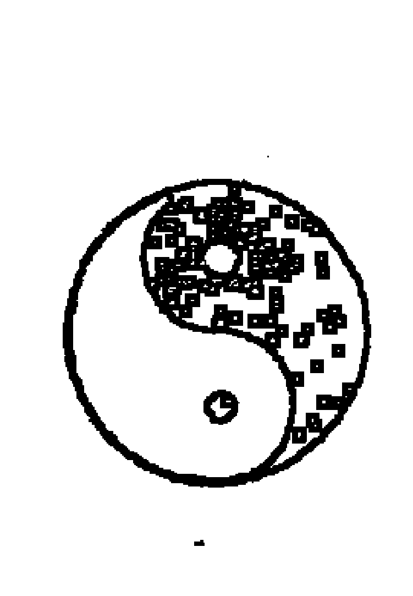
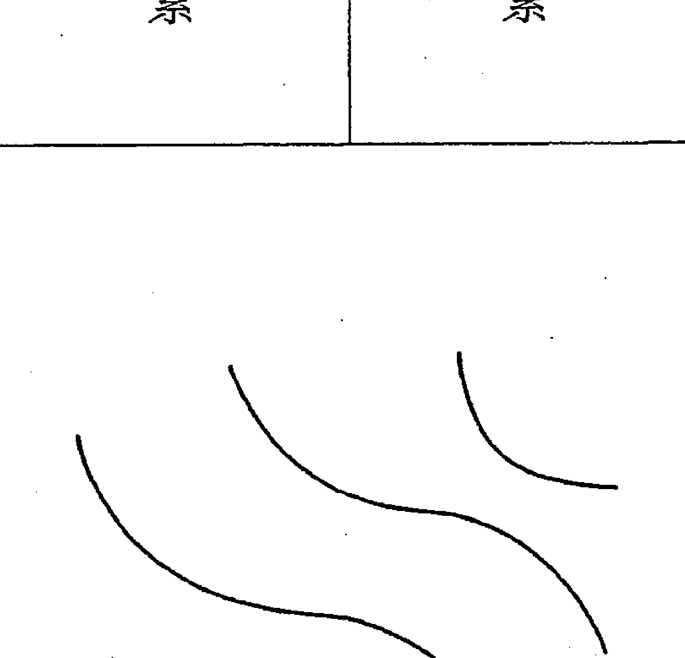
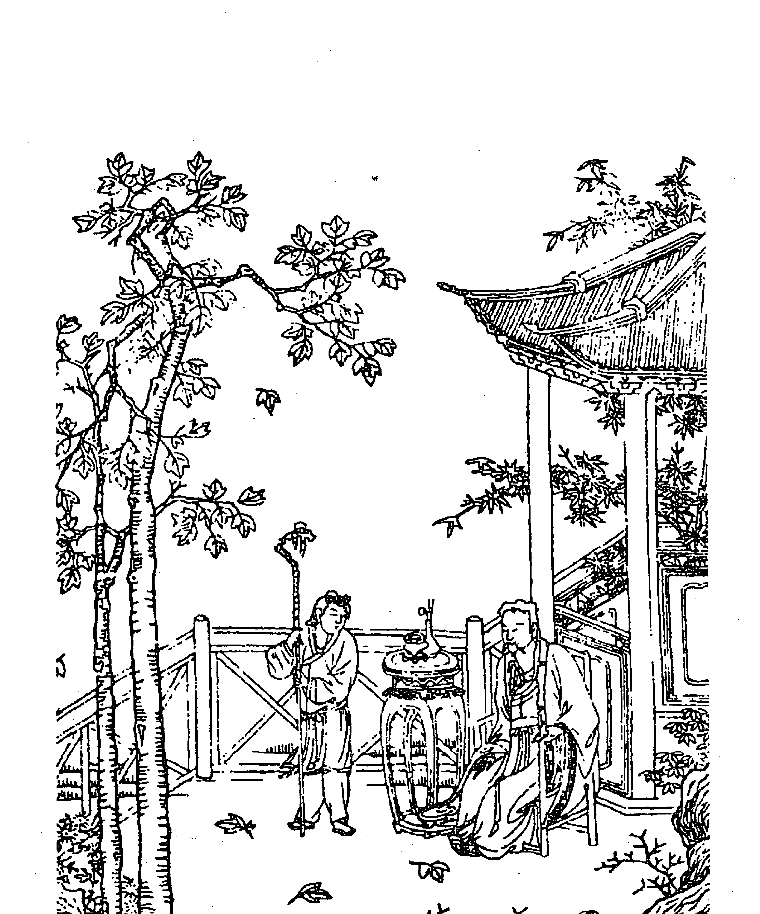

## 最新修订版

## 周易参同契

(清) 王道亨 编纂 (宋) 陈抟 著
李非 白话释意

## 周易参同契经典文集

中国古籍出版社

## 最新增订版

## 周易与堪舆经典文集

## 紫微斗数

(清) 王道亨 编纂  (宋) 陈抟 著

李 非 白话释意

中医古籍出版社

## 图书在版编目（CIP）数据

周易与堪舆经典文集/（清）王道亨编纂 （宋）陈抟著 李非白话释意．北京：中医古籍出版社，2010.6

（紫微斗数）

ISBN 978-7-80174-860-7

I．周… Ⅱ．①王… ②陈… ③李… Ⅲ．①风水－中国－古代－文集 Ⅳ．①B992.4-53

中国版本图书馆CIP数据核字（2010）第083634号

## 周易与堪舆经典文集（紫微斗数）

清·王道亨编纂 （宋）陈 抟 著 李 非 白话释意

- 责任编辑：杜杰慧
- 封面设计：五星设计
- 出 版：中医古籍出版社
- 社 址：北京东直门内南小街16号（100700）
- 印 刷：新乡市三木奇印务有限公司
- 开 本：700×1030 1/16
- 印 张：全套240印张
- 字 数：3600千字
- 版 次：2018年1月第2版 2018年1月第3次印刷
- 印 数：3001－5000套
- 书 号：ISBN 978-7-80174-860-7
- 定 价：360.00元（全套）

版权所有 翻印必究·印装有误 负责调换

## 最新精校版

## 《紫微斗数》出版前言

《紫微斗数》自出版以来，很受读者欢迎，但过了不久，出现了两个问题。其一，由于当时只找到一种古版本，无其它古版本参照对比，验证，存在一些谬误。中国古代传统文化非常严谨，往往一字只差，谬之千里，使读者如坠云雾，不解其详。其二，《紫微斗数》属于高层次预测学，艰涩难懂，没有深厚的命理学功底或国学功底，确实如读天书。

为解决以上问题，我们作了以下工作。

首先，我们收集了民国上海锦章书局、校经房书局、广益书局和《续道藏》中的《紫微斗数》版本相互参照，补漏拾遗，并聘请专家，逐字校勘，终于推出了目前最为完整的版本，我们此举，也是为了告慰读者。

其次，关于此书艰涩难懂的问题，经专家解析后，我们认为是可以化繁为简的。

> 邵雍说：“夫人者，禀天地之气，受阴阳之精，生其身命，上属五星，下属五行。若其时正，则身命高超，前程显达；其时不正，命贱身卑，沉沦飘没。大抵人生，须生辰得地，运用并胜可遂，更喜乐旺无刑，而吉星在高强宫，皆为福厚之人也。此乃前定星辰之所主也。”

凡看命，先定身宫。并身者，上系太乙之神。若好星为禄旺相见得地，颇成天气，则是清贵之命。然后却推命宫及时候浅深，不安则无力，纵有力星辰，为福亦轻。须得地时正，方得荣显福德，田宅官禄。六宫好恶，断其存亡贵贱，定其祸福，方有应验。”总之此书虽难，只要肯下功夫，还是可以了解此书精髓的，正如邵雍说：“锐意精思，推则斯文之奥，谈今博古，方识此书之良。生死贫富，若非前定，贵贱荣枯，乃知不偶。推算之术，有精有微，考于经典，则三复而可晓。观此妙术，非一日之所能。”

综上所述，要想掌握紫微斗数这门高深的预测学，不下一番功夫是不行的，“不经一番寒彻骨，哪得梅花扑鼻香。”

为弘扬传统文化，我们出版此书，以飨读者。

## 《紫微斗数》导读

## 周易与堪舆经典文集

## 紫微斗数

《紫微斗数》——也称“紫微术”。它根植于阴阳五行学说，牵系《周易》卦爻，吸收《周易》卦象之论，融合道家义理，以天文、历数、地理、中医、音律等为其思想资料，可谓博大精深，义理充蕴、逻辑严密，体系谨严，并特别注意数理的关系。它的产生是以数学的演绎法和归纳法为基础，而绝少诡秘玄虚的神学气息。

紫微：我国古代天文学家将天体恒星分为三垣、二十八宿及其它星座。紫微星是三垣（太微垣、紫微垣、天市垣）的中星，是北斗星系的主星。星相学称它为“万星之主”，代表至高无上的权威，主管生育、造化。

斗数：星在天为斗，在地为数。以星的运转判断人的命运（气数）的意思。

《紫微斗数》既具有道家宇宙观的色彩，又具有注重人文环境、人际关系的现代意蕴，在中国传统文化中卓立特出。《紫微斗数》、《铁板神数》、《邵子易数》、《南极神数》、《北极神数》号称中国五大数术，其中《紫微斗数》名列五大数术之首。

作者陈抟（？—989 年）五代末、宋初道教大师，字图南，自号扶摇子，亳州真源（今河南鹿邑）人。举进士不第，隐居武当山。后迁居西岳华山。宋太宗赐号“希夷先生”。民间称他为“陈抟老祖”。陈抟又是一位易学大师，他精研易学易理玄机，务求宇宙造化之秘，创制《太极图》、《先天图》等。

据南宋易学家朱震说：“陈抟以《先天图》传种放，放传穆修，穆修传李之才，之才传邵雍。放以《河图、洛书》传李溉，溉传许坚，许坚传范谔昌，谔昌传刘牧。穆以《太极图》传周敦颐，敦传程颢、程颐。”（《宋史·朱震传》）据此，陈抟实为宋代象数易学即图书学的开山鼻祖。其学以图式说易，寓阴阳消长之数与卦之生变。其易学包括《先天图》、《河图、洛书》、《太极图》三类图式，分为“数”学与“象”学两方面的内容。这些图式经北宋邵雍和周敦颐等人的演化发展，对于宋代乃至整个宋明时期的易学以及理学的内容都发生了深刻的影响。

紫微术分为南北两派。

南派紫微——紫微斗数的一个流派。说见张耀文所注的《紫微阐微录》。南派紫微是讲求实际斗数的。南派紫微的推法是：先定紫微，即以命宫纳音以定紫微躔宫，然后依次逆布：紫、阳、武、贞、狼、臣、破北斗七主星，再顺布：府、阴、相、梁、杀、机、同南斗七主星，更有若干副星，列出星盘，按庙、旺、陷失及各星所躔宫位，论人吉凶。本书前四卷属于南派紫微。

北派紫微——紫微斗数的另一个流派。说见徐良弼校订的《十八飞星策天紫微斗数》一书。此书所载北派紫微十八飞星为：虚、贵、印、寿、空、鸾、库、贯、文、福、禄、杖、异、毛、刃、哭、刑、姚。北派紫微的推法是：先取紫微命宫，即子年紫微在子，每年一位，按生年顺取。再用十八飞星加紫微共十九星，所躔宫位之庙、乐、旺，以论吉凶。

道教典籍《续道藏》中收有三卷本的《紫微斗数》，原书题作宋陈抟撰，实为后人假托。本书后三卷，所载命宫顺序与北派相一致，其十八飞星也与北派紫微相一致，只是中间缺少了空和哭二星，可能是古人抄写疏漏。本书后三卷属于北派紫微。

我们将《紫微斗数》一书作为附录收入《康节说易全书》，以供读者研究之用。

读者应以辩证的、科学的态度研读《紫微斗数》，取其精华，弃其糟粕，让中国古老而宝贵的文化遗产发扬光大。

## 罗洪先序

## 紫微斗数全书

尝闻命之理微，鲜有知之真而顺受之者。余谓功名富贵有命存焉，遂捐厥职访道学者，以为之宗，行抵华山下询知：希夷公曾得道于兹矣。因陟其颠，谒其祠。将返，见一道者年须弱冠，态度老诚，遂进礼，承出书示予，予问之，曰：希夷公《紫微斗数》集也，始观排列星辰犹不省其奥窍，既读其论，论则有道理，玩其断，断则有神验，即以贱降试之，果毫不爽，于是喟然叹曰：造化至玄而阐明之若对鉴焉，非心涵造化能之乎？星辰至远，而指视之若运掌，然非胸藏星斗者能之乎？天位乎上，地位乎下，而人则藐然于中者，先生则以“天合之人，人合之天”即星辰之变化而知人命之休咎是非，学贯天而一之者又孰能之乎？猗欤休哉。先生真高人也，神人也，不然胡为乎，而有最高志又胡为乎，而有是神数也。予乃捧持之，遍示天下，俾世之人知有命而顺受之可也。胡乃祖作之而子秘之则继述之，道安在哉，请志予言以弁是书之首。时陈子去。希夷公十八代讳道号子然，年方二十有六，时。

嘉靖庚戌春三月既望之吉赐进士及第
吉水 罗洪先 撰

## 先天八卦

## 紫微斗数

## 文王八卦方位图

巽兑坎离艮震乾坤
下上中中覆仰六三
断缺满虚碗盂断连

[解说] 八卦包括四面八主，每一卦都代表一定的方位。这幅八卦方位图，用图表形式标明每个卦所代表的方位。“乾三连”、“坤六断”等，说明八卦的画法。

## 文王八卦次序

|          | 坤母 | ☷      | 乾父 | ☰      |
|----------|------|--------|------|--------|
| **兑少女** |      | ☱      |      |        |
| **离中女** |      | ☲      |      |        |
| **巽长女** |      | ☴      |      |        |
| **艮少男** |      |        | ☶    |        |
| **坎中男** |      |        | ☵    |        |
| **震长男** |      |        | ☳    |        |
| **得坤上爻** | 得坤中爻 | 得坤初爻 |      |        |
| **得乾上爻** |      |        | 得乾中爻 | 得乾初爻 |

[解说] 这是周文王的八卦次序图，标有八卦画法和阴阳属性。乾为老父，震为长男，坎为中男，艮为少男；坤为老母，巽为长女，离为中女，兑为少女。乾、震、坎、艮为男属阳，坤、巽、离、兑为女属阴。六爻即震得乾初爻，坎得乾中爻，艮得乾上爻，巽得坤初爻，离得坤中爻，兑得坤上爻。附有无极图、太极图、两仪图。

## 目录

最新精校版《紫微斗数》出版前言

《紫微斗数》导读

罗洪先序

新镌希夷陈先生紫微斗数全书卷之一

太微赋

形性赋

星垣论

斗数准绳

斗数发微论

重补斗数彀率

增补太微赋

诸星问答论

斗数骨髓赋注解

女命骨髓赋注解

太微赋注解

定富贵贫贱等诀

定富贵贫贱十等论

十二宫诸星得地合格诀

十二宫诸星失陷破格诀

十二宫诸星得地富贵论

十二宫诸星失陷贫贱论

定富局

定贵局

定贫贱局

定杂局

## 新镌希夷陈先生紫微斗数全书卷之二

安身命例

安十二宫例

起五行寅例

六十花甲子纳音歌

安南北斗诸星诀

安文昌文曲星诀

安左辅右弼星诀

安天魁天钺诀

安天马星诀

安禄存星诀

安擎羊陀罗二星诀

安火铃二星诀

安禄权科忌四变化诀

安天空地劫诀

安天伤天使诀

安十二宫太岁杀禄神歌诀

安天刑天姚星诀

安三台八座二星诀

安天哭天虚星诀

安龙池凤阁诀

安台辅诀

安封诰诀

安长生沐浴冠带临官帝旺衰病死墓绝胎养歌诀

安红鸾天喜诀

安丧门白虎吊客官府四飞星诀

安斗君诀

安天德月德解神诀

安飞天三杀诀

安截路空亡诀

安旬中空亡诀

安大限诀

安小限诀

安童限诀

安命主

安身主

论安命金锁铁蛇关

定男女竹萝三限诀

定十二宫弱强

定十二宫星辰落闲

安流禄流羊流陀诀

论星辰生克制化

论诸星分属南北斗化吉凶并分属五行诀

定金木水火土局

安紫微天府图

伤使祸福紧慢图

禄权科忌图

十二宫庙旺落陷图

一 命宫

## 新镌希夷陈先生紫微斗数全书卷之三

二 兄弟

三 妻妾

四 子女

五 财帛

六 疾厄

七 迁移

八 奴仆

九 官禄

十 田宅

十一 福德

十二 父母

谈星要论

论人命人格

论格星数高下

论男女命同异

论小儿命

定小儿生时诀

论人生时安命吉凶

论人生时要审的确

论小儿克亲

论命先贫后富

论大限十年祸福何如

论二限太岁吉凶

论行限分南北斗

论流年太岁逢吉凶星杀

论阴骘延寿

论羊陀迭并

论七杀重逢

论大小二限星辰过十二宫遇十二支人所忌诀

论立命行限宫歌

论太岁小限星辰庙陷遇十二宫中吉凶

论诸星同位垣各司所宫分别富贵贫贱夭寿

## 新镌希夷陈先生紫微斗数全书卷之四

古今富贵贫贱夭寿命图

附批命活套

## 附录 《续道藏》三卷本《紫微斗数》

《续道藏》三卷本《紫微斗数》卷之一

论次序

命星时刻度数总论

照胆经四言十八飞星直指序

子申巳酉亥

入骨仙经四言总断撮要法

《续道藏》三卷本《紫微斗数》卷之二

太乙金井局阴阳玄妙论# 目录

- 分富贵贫贱线 …………………………………………………… (268)
- 定诸宫分合 …………………………………………………… (270)
- 洞微十八星断 …………………………………………………… (272)
- 《续道藏》三卷本《紫微斗数》卷之三 ………………… (285)
- 星行限吉凶论 …………………………………………………… (285)

## 周易与堪舆经典文集

# 紫微斗数

### 新镌希夷陈先生

### 紫微斗数全书卷之一

江西负鼎子潘希尹补辑
闽关西后裔杨一宇参阅

### 太微赋

斗数至玄至微，理旨易明，虽设问于百篇之中，犹有言而未尽。至如星之分野，各有所属，寿天贤愚，富贵贫贱，不可一概论议。其星分布一十二垣，数定乎三十六位，入庙为奇，失数为虚，大抵以身命为福德之本，加以根源，无穷通之资。星有同躔，数有分定，须明其生克之要，必详乎得垣失度之分，观乎紫微舍躔，司一天仪之象，卒列宿而成垣。土星苟居其垣，若可动移；金星专司财库，最怕空亡；帝居动则列宿奔驰；贪守空而财源不聚；各司其职，不可参差。苟或不察其机，更忘其变，则数之造化远矣。

例曰：禄逢冲破，吉处藏凶；马遇空亡，终身奔走；生逢败地，发也虚花；绝处逢生，花而不败；星临旺庙旺，再生克之机；命生强宫，细察制化之理；日、月最嫌反背，禄、马最喜交驰；倘居空亡，得失最为要紧；若逢败地，扶持大有奇功；紫微、天府，全依辅、弼之功；七杀、破军，专依羊、铃之虐。诸星吉逢凶也吉，诸星凶逢吉也凶；辅、弼夹帝为上品，桃花犯主为至淫；君臣庆会，材擅经邦；魁、钺同行，位居台辅；禄、文拱命，贵而且贤；日、月夹财，不权则富；马头带箭，镇卫边疆；刑囚夹印，刑杖惟司，善荫朝纲，仁慈之长；贵人贵乡，逢者富贵；财居财位，遇者富奢；太阳居午，谓之日丽中天，

### 形性赋

原夫紫微帝座，生为厚重之容；天府尊星，当主纯和之体。金乌圆满，玉兔清奇。天机为不长不短之资，情怀好善。武曲乃至刚至毅之操，心性果决。天同肥满，目秀清奇。廉贞眉宽、口阔、面横，为人性暴，好忿好争。贪狼为善恶之星，入庙必应长耸，出垣必定顽嚣。巨门乃是非之曜，在庙敦厚温良。天相精神相貌持重，天梁稳重，心事玉洁冰清。七杀如子路暴虎冯河，火铃似豫让吞炭装哑。暴虎冯河兮目太凶狠，吞炭装哑兮暗狠声沉。俊雅文昌，眉清目秀；磊落文曲，口舌便佞；在庙定生异痣，失陷必有斑痕。左辅、右弼，温良规模，端庄高士；天魁、天钺，具足威仪，重合三台，则十全模范；擎羊、陀罗，形丑貌粗，有矫诈体态。破军不仁，背重眉宽，行坐腰斜。奸诈好行惊险，性貌如春和蔼，乃是禄存之情。德情怀似火烽冲，此诚破耗之威权。

星论庙旺，最怕空亡，杀落空亡，竟无威力。权、禄聚九窍之奇，耗、劫散平生之福。禄逢梁荫，抱私财益与他人；耗遇贪狼，逞淫情于井底。贪星人于马垣，易善易恶；恶曜扶同善曜，禀性不常。财居空亡，巴三览四；文曲旺宫，闻一知十。暗合廉贞，为贪滥之曹使；身命数，实奸盗之技儿。猪屠之流善禄，定是奇高之艺，细巧伶俐之人，男居生旺，最要得地，女居死绝，专看福德。命最嫌立于败位；财源却怕逢空亡。机、刑、杀荫孤星，论嗣续之官；加恶星忌耗，不为奇特。陀 [忌] 耗囚之星，守父母之躔，决然破祖刑伤，兼之童格，宜相根基，要察紫微肥满，天府精神，禄存禄主也，应厚重。日、月、曲、相、同、梁、机、昌，皆为美俊之姿，乃是清奇之格，上长下短，目秀眉清。贪狼同武曲，形小声高而量大；天同如陀、忌，肥满而目渺。擎羊身体遭伤，若遇火、铃、巨暗，必生异痣；又值耗、杀，定主形丑貌粗。若居死绝之限，童子哺乳，徒劳其力，老者亦然寿终。此数中之纲领，乃为星纬之机关，玩味专精，以参玄妙，眼有高低，星寻喜怒。假如运限驳杂，终有浮沉；如逢杀地，更要推详；倘遇空亡，必须细察。精研于此，不患不神。

### 星垣论

紫微帝座，以辅、弼为佐贰，作数中之主星，乃有用之源流。是以南北二斗，集而成数，为万物之灵。盖以水淘溶则阴阳既济，水盛阳伤，火盛阴灭，二者不可偏废，故得其中者，斯为美矣。寅乃木之垣，乃三阳交泰之时，草木萌芽之所。主于卯位，其木愈旺矣。贪狼天机是庙乐，故得天相水到寅，为之旺相。巨门水得卯，为之疏通，木乃土栽培，加以水之浇灌，三方更得文曲水、破军水相会尤妙，又加禄存土极美矣。巨门水到丑，天梁土到未，陀罗金到于四墓之所，苟或得擎羊金相会，以土为金墓，则金通不凝，加以天府土、天同金以生之，是为金趁土肥。顺其德以生成，未巳午乃火位，巳为水土所绝之地，更午垣之火，余气流于巳，水则倒流；火气逆焰，必归于巳，午属火德，能生于巳绝之土，所以廉贞水居焉。至于午火，旺照离明，洞彻表里，而文曲水入庙。若会紫府，则魁星拱斗，加以天机木、贪狼火，谓之变景，愈加奇特。申酉金乃西方太白之气，武居申而好生，擎羊在酉而用杀，加以巨门、禄存、陀罗而助之愈急，须得逆行，逢善化恶，是为妙用。亥水属文曲、破军之要地，乃文明清高之士，万里派源之洁，如大川之泽，不为焦枯，居于亥位，将天河，是故为妙。破军水于子旺之乡，如巨海之浪，澎湃汹涌，可远观而不可近倚，破军是以居焉。若四墓之克，充其弥漫，必得武曲之金，使其源流不绝，方为妙矣。其余诸星，以身拿推之，无施不可，至玄至妙者矣。

### 斗数准绳

命居生旺，定富贵各有所宜；身坐空亡，论荣枯专求其要。紫微帝座，在南极不能施功；天府令星，在南地专能为福。天机、七杀同宫也，善三分；太阴、火铃同位，反成十恶。贪狼为善宿，入庙不凶；巨门为恶曜，得垣尤美。诸凶在紧要之乡，最宜制克；若在身命之位，却受孤单。若见杀星，倒限最凶，福荫临之，庶几可解，大抵在人之机变，更加作意之推详。辨生克制化以定穷通，看好恶正偏以言祸福。官星居于福地，近贵荣财；福星居于官宫，却成无用。身命得星为要，限度遇吉为荣。若言子媳有无，专在擎羊、耗、杀；逢之则害，妻妾亦然。相貌逢凶，必带破相；疾厄逢忌，定有尪羸。须言定数以求玄，更在同年之相合，总为纲领，用作准绳。

### 斗数发微论

白玉蟾先生曰：“观天斗数，与五星不同。”（按：此星辰，与诸术大异。）四正吉星定为贵，三方杀拱少为奇；对照兮详凶详吉，合照兮观贱观荣。吉星入垣则为吉，凶星失地则为凶。命逢紫微，非特寿而且荣；身遇杀星，不但贫而且贱。左右会于紫府，极品之尊；科权陷于凶乡，功名蹭蹬。行限逢乎弱地，未必为灾；立命会在强宫，必能降福。羊陀七杀，限运莫逢，逢之定有刑伤（劫空伤使在内合断）。天哭丧门，流年莫遇，遇之实防破害。南斗主限必生男，北斗加临先得女。科星居于陷地，灯火辛勤；昌曲在于乡，林泉冷淡。奸谋频设，紫微愧遇破军；淫奔大行，红鸾羞逢贪宿。命身相克，则心乱而不闲；玄媻（即天姚星）三宫则邪淫酒耽酒。杀临三位，定然妻子不和；巨到二宫，必是兄弟无义。刑杀守子宫，子难奉老；诸凶照财帛，聚散无常。羊陀（临）疾厄，眼目昏盲；火铃到迁移，长途寂寞。尊星列贱位，主人多劳；恶星应命宫，奴仆有助。官禄遇紫府，富而且贵；田宅遇破军，先破后成。福德遇空亡劫，奔走无力；相貌加刑杀，刑克难免。后学者执此推详，万无一失。

### 重补斗数彀率

诸星吉多，逢凶也吉；诸星恶多，逢吉也凶。星更躔度，数分定局。重在看星，得垣受制，方可论人祸福穷通，大概以身命为祸福之柄，以根源为穷通之机。紫微在命，辅、弼同垣，其贵必矣。财、印夹命，日、月夹财，其富何疑？荫福临不怕凶冲，日月会不如合照。贪狼居子，乃为泛水桃花；天刑遇贪，必主风流刑杖。紫微坐命库，则曰金舆捧御辇；临官安文曜，号为衣锦惹天香。太阴合文曲于妻宫，翰林清异；太阳会文昌于官禄，金殿传胪。禄合守田财，为烂谷堆金；财荫居迁移，为高商豪客。耗居败地，沿途丐求；贪会旺宫，终身鼠窃。杀居绝地，生成三十二之颜回；日在旺宫，可学八百年之彭祖。巨暗同垣于身命疾厄，嬴瘦其躯；凶星交会于相貌迁移，伤刑其面。大耗会廉贞于官禄，枷杻囚徒；官府会刑杀于迁移，离乡远配。七杀临于陷地，流年必见死亡；耗杀忌逢破军，火铃嫌逢太岁。奏书博士并官禄，以丧乎吉祥；力士将军与青龙，以显其威福，童子限弱，水上浮泡；老人限衰，风中燃烛。遇杀必惊，流年最紧。人生发达，限元最怕浮沉；一世迪嬗，命限逢乎驳杂。论而至此，允矣玄微。

### 增补太微赋

前后两凶神，谓两邻加侮，尚可撑持；同室与谋，最难提防。片火焚天马，禾羊逐禄存，劫空亲戚无常，权禄行藏靡定。君子哉魁钺，小人哉羊铃，凶不皆凶，吉无纯吉。主强宾弱，可保无虞；主弱宾强，凶危立见。主宾得失两相宜，运限命身当互见。身命最嫌羊、陀、七杀，遇之未免为凶；二限甚忌贪、破、巨、廉，逢之定然作祸。命遇魁昌常得贵，限逢紫府定财多。凡观女人之命，先观夫子二宫，若值杀星，定三嫁而心不足；若逢羊孛，虽啼哭而泪不干。若观男命，始以福财为主，再审迁移何如，二限相因，吉凶同断。限逢吉曜，平生动用和谐；命坐凶乡，一世求谋龃龉。廉禄临身，女得纯阴贞洁之德；同梁守命，男得纯阳中正之心。君子命中，亦有羊陀火铃；小人命内，岂无科禄权星。要看得垣失垣，专论入庙失庙。若论小儿，详推童限，小儿命坐凶乡，三五岁必然夭折；更有限逢恶杀，五七岁必主灾亡。文昌文曲天魁秀，不读诗书也可人。多学少成，只为擎羊逢劫杀；为人好讼，盖因太岁遇官符。命之理微，熟察星辰之变化；数之理远，细详格局之兴衰。比极加凶杀，为道为僧；羊陀遇恶星，为奴为仆。如武破廉贪，固深谋而贵显；加羊陀空劫，反小志以孤寒。限辅星旺，限虽弱而不弱；命临吉地，命虽凶而不凶。断桥截路，大小难行；卯酉二空，聪明发福。命身遇紫府，叠积金银；二主逢劫空，衣食不足。谋而不遂，命限遇入擎羊；东作西成，限身遭逢辅相。科权禄拱，定为折桂之高人；空劫羊铃，作九流之术士。情怀畅舒，昌曲命身；诡诈浮虚，羊陀陷地。天机天梁擎羊会，早有刑而晚见孤；贪狼武曲廉贞逢，少受贫而后享福。此皆斗数之奥妙，学者宜熟思之。

## 周易与堪舆经典文集

# 紫微斗数

### 诸星问答论

问：紫微所主若何？
答曰：紫微属土，乃中天之尊星，为帝座，主宰造化枢机，人生主宰，杖五行，育万物，以人命为之立定数、安星曜，各根所司处年数内，常掌爵禄，诸宫降福，能消百恶，须看三台。盖紫微守命是中台，前一位是上台，后一位是下台，俱看在庙旺之乡否？有何吉凶星守照？如庙旺化吉甚妙，陷又化凶甚凶，吉限不为美，凶限则凶也。人之身命，若值禄存同宫，日、月三合相照，贵不可言。无辅弼同行，则为孤君，虽美玉不足，更与诸杀同宫；或诸吉合照，君子在野，小人在位，主人奸诈假善，平生恶积，与囚同居。无左右相佐，定为胥吏。如落疾厄、兄弟、奴仆、相貌四陷宫，主人劳碌，作事无成，虽得助亦不为福，更宜详细 [察] 宫度，应究星曜之论。若居官禄、身、命、三宫，最要左、右守卫，天相、禄马交驰，不落空亡，更坐生乡，可为贵论。如魁、钺、三台星会吉星，则三台、八座矣。帝会文昌拱照，又得美限扶，必文选之职。帝降七杀为权，有吉同位，则帝相有气，诸吉咸集，作武官之职。财帛、田宅有左、右守卫，又与太阴、武曲同度，不见恶星，必为财赋之官。更与武曲、禄存同宫，身命中尤为奇特。男女宫得祥佐吉星，主生贵子。若独守无相佐，则子息孤单。妻宫会吉，男女得贵，美夫妇偕老，亦要无破杀。迁移虽是强宫，更要相佐，有吉星照命，则因人之贵。福德男为陷地，女为庙乐，逢吉则吉，逢凶则凶。

> 希夷先生曰：紫微为帝座，在诸宫能降福消灾，解诸星之恶虚，能制火、铃为善，能降七杀为权，若得府、相、左、右、昌、曲吉集，无有不贵。不然，亦主巨富，纵有四杀冲破，亦作中局。若遇破军，在辰戌丑未，主为臣不忠，为子不孝之论。女命逢之，作贵妇断，加杀冲破，亦作平常，不为下贱。

歌曰：

- 紫微原属土，官禄宫主星。
- 有相为有用，无相为孤君。
- 诸宫皆降福，逢凶福自申。
- 文昌发科甲，文曲受皇恩。
- 僧道有师号，快乐度春秋。
- 众星皆拱照，为吏协公平。
- 女人会帝座，遇吉事贵人。
- 若与桃花会，飘荡落风尘。
- 擎羊火铃聚，鼠窃狗偷群。
- 三方有吉拱，方作贵人评。
- 若还无辅弼，诸恶共欺凌。
- 帝为无道主，考究要知因。
- 二限若遇帝，喜气自然新。

> 玉蟾先生曰：“紫微乃中天星主，为众星之枢纽，为造化之根柢，为人命之主宰，掌五行，育万物，各有所司，以左辅、右弼为相，以天相、昌、曲为从，以魁、钺为传令，以日、月为分司，以禄、马为掌爵之司，以天府为帑藏之主，身命逢之，不胜其吉。如遇四杀（羊、陀、火、铃）、劫、空、机、梁冲破，定是僧道。此星在命，为人厚重，面紫色，专作吉断。

#### 问：天机所主如何？

答曰：天机属木，南斗第三，益算之善星也。后化气曰善，得地合之行事，解诸星之顺逆，定数于人命，逢诸吉咸集，则万事皆善。勤于礼佛，敬乎六亲，利于林泉，宜于僧道，无恶虐不仁之心，有灵机应变之志，渊鱼察见，作事有方。女命遇之为福，逢吉为吉，逢凶为凶，或守于身，更逢天梁，必有高艺随身，习者宜详玩之。

> 希夷先生曰：天机，益寿之星，若守身命，主人异常，与天梁、左、右、昌、曲交会，文为清显，武为忠良。若居陷地，四杀冲破，是为下局。若见七杀、天梁，当为僧道之清闲。凡人二限逢之，兴家创业。更改女人，吉星拱照，主旺夫益子，有权禄则为贵妇，落局羊、陀、火、忌冲破，主下贱、残疾、刑克。

#### 歌曰：

- 天机兄弟主，南斗正曜星。
- 作事有操略，禀性最高明。
- 所为最好尚，亦可作群英。
- 会吉主享福，人格居翰林。
- 巨门同一位，武职压边庭。
- 亦要权逢杀，方可立功名。
- 天梁星同位，定作道与僧。
- 女人若逢此，性巧必淫奔。
- 天同与昌曲，聚拱主华荣。
- 辰戌子午地，入庙有功名。
- 若在寅卯辰，七杀并破军。
- 血光灾不测，羊陀及火铃。
- 若与诸杀会，灾患有虚惊。
- 武暗廉破会，两目少光明。
- 二限临此宿，事必有变更。

玉蟾先生曰：天机，南斗善星，故化气曰善。佐帝令以行事，解诸囚之逆节，定数于人命之中，若逢吉聚，则为富贵；若逢杀冲，亦必好善，孝义六亲，勤于礼佛。无不仁不义之为，有灵通变达之志。女命逢之，多主福寿，其在庙旺有力，陷地无力。

问：太阳所主若何？

答曰：太阳星属火，日之精也，乃造化之表仪，在数主人有贵气，能为文为武，诸吉集则降祯祥，处黑星则劳心费力。若随身命之中，居于庙乐之地，为数中之至曜，乃官禄之枢机。后化贵化禄。最宜在官禄宫，男作父星，女为夫主。命逢诸吉守照，更得太阴同照，富贵全美。若身居之，逢吉聚则可在贵人门下客，否则公卿走卒。夫妻亦为弱宫，男为诸吉聚可因妻得贵，陷地加杀，伤妻不吉。男女宫得八座，加吉星在庙旺地，主生贵子，权柄不小。若财帛宫于旺地会吉相助，不怕巨门缠，其富贵绵远矣。若旺相无空劫，一生主富。居田宅，得祖父荫泽，若左右诸吉星皆至，大小二限俱到，必有聚兴之喜。若限不扶，不可以三合论议，恐应小差。女命逢之，限旺亦可共享；与铃、刑、忌集限，目下有忧，或生克父母。刑、杀聚限，有伤官之忧，常人有官非之挠。与羊、陀聚，则有疾病；与火、铃合，其苦楚不少。推而至此，祸福了然。迁移宫其福与身命不同，难招祖业，移根换叶，出祖为家。限步逢之，决要动移。女命逢之，不及 [吉]。若福德宫有相佐，主招贤明之夫。父母宫男子单作父星，有辉则吉，无辉克父。

希夷先生曰：太阳星周天历度，轮转无穷。喜辅弼而佐君象，以禄存而助福。所忌者巨暗遭逢，所乐者太阴相旺。诸宫会吉则吉，黑道遇之则劳，守人身命，主人忠鲠，不较是非。若居庙旺，化禄化权，允为贵论。若得左、右、昌、曲、魁、钺三合拱照财官二宫，富贵极品。加四杀，亦主饱暖。僧道有师号。女人庙旺，主旺夫益子，加权禄封赠，加杀主平常。

歌曰：

- 太阳原属火，正主官禄星。
- 若君身命位，禀性最聪明。
- 慈爱量宽大，福寿享遐龄。
- 若与太阴会，聚发贵无伦。
- 有辉照身命，平步入金门。
- 巨门不相犯，升殿承君恩。
- 偏垣逢暗度，贫贱不可言。
- 男人必克父，女命夫不全。
- 火铃逢苦定，羊陀眼目昏。
- 二限若值此，必定卖田园。

玉蟾先生曰：太阳司权贵为文，遇天刑为武，在寅卯为初升，在辰巳为升殿，在午为日丽中天，主大富贵。在未申为偏垣，作事先勤后惰；在酉为西没，贵而不显，秀而不实；在戌亥子为失辉，更逢巨暗破军，一生劳碌贪忙，更主眼目有伤，与人寡合招非。女命逢之，夫星不美，遇耗则非礼成婚。若与禄存同宫，虽主财帛，亦辛苦不闲。若与帝星、左、右同宫，则为贵论。又嫌火、铃、刑、忌，未免先克其父，此星男得之为父星，女得之为夫星。

> 问：武曲星所主若何？

答曰：武曲，北斗第六星，属金，乃财帛宫主财。与天府同宫有寿，其施权于十二宫分，其临地有庙旺陷宫，主于人性刚果决，有喜有怒，可福可灾。若陷囚会于震宫，必为破祖淹留之举。与禄马交驰，发财于远郡。若贪狼同度，悭吝之人；破军同财乡，财到手而成空。诸凶聚而作祸，（诸）吉集以成祥。

希夷先生曰：武曲属金，在天司寿，在数司财。怕受制入陷，喜禄存而同政，与太阴以互权。天府、天梁为佐贰之星，财帛、田宅为专司之所，恶杀、耗囚会于震宫，必见木压雷震；破军、贪狼会于坎宫，必主投河溺水。会禄马则发财远郡，会贪狼则少年不利。所谓“武曲守命福非轻，贪狼不发少年人”是也。庙乐、桃花同月，利已损人；七杀、火星同宫，因财被劫。遇羊陀财孤克，遇破军难显贵。单居二限可也。若与破军同位，更临二限之中，定主是非之挠。盖武曲守命，主人刚强果断。甲己生人福厚，出将入相；更得贪、火冲破，定为贵格。喜西北生人，东南生人平常，不守祖业，四杀冲破，孤贫不一，破相延年，女人吉多为贵妇，加杀冲破孤克。

问：天同星所主若何？

答曰：天同星属水，乃南方第四星也。为福德宫之主宰，后云化福，最喜遇吉曜，助福添祥。为人廉洁，貌禀清奇，有机枢，无亢激，不怕七杀相侵，不怕诸杀同躔。限若逢之，一生得地，十二宫中皆曰福，无破定为祥。

希夷先生曰：天向南斗，益算保生之星。化禄为善，逢吉为祥，身命值之，主为人谦逊，禀性温和，仁慈鲠直，文墨精通，有奇志，无凶激，不忌七杀相侵，不畏诸凶同度，十二宫中皆为福论。遇左、右、昌、梁贵显，喜壬乙生人，巳亥得地，不宜六庚生人，居酉地终身不守，会四杀居巳亥为陷，残疾孤克。女人逢杀冲破，刑夫克子，粱、月冲破，合作偏房。僧道宜之，主导享福。

问：廉贞所主若何？

答曰：廉贞属木，北斗第五星也。在斗司品秩，在数司权令。不临庙旺，更犯官符，故曰化因为杀，触之不可解其祸，逢之不可测其祥。主人心狠性狂，不习礼义。逢帝座执威权，遇禄存主富贵，遇文昌好礼乐，遇杀曜显武职。在官禄有威权，在身命为次桃花。若居旺宫，则赌博迷花而致讼，与巨门交会于陷地，则是非起于官司。逢财星耗合，祖业必破；遇刑忌，则浓血不免；遇白虎，则刑杖难逃；遇武由于受制之乡，恐木压蛇伤。同火曜于陷空之地，主投河自缢。破军与日月以济行，目疾而不免。限逢至此，灾不可禳。只宜官禄身命之位，遇吉福映，逢凶则不慈，若在他宫，祸福宜详。

> 歌曰：
> 廉贪己亥宫，遇吉福盈丰。
> 应过三旬后，须防不善终。

问：天府所主若何？
答曰：天府属土，南斗主令第一星也。为财帛之主宰，在斗司福权之宿，会吉皆为富贵之基，定作文昌之论。

希夷先生曰：天府乃南斗延寿解厄之星，又曰司命上相镇国之星。在斗司权，在数则职掌财帛、田宅、衣禄之神，为帝之佐贰，能制羊、陀为从，能化火、铃为福，主人相貌清奇，禀性温良端雅。与太阳、昌、曲会，必登首选。逢禄存、武曲，必有巨万之富。秘云：“天府为禄库，命逢终是富”是也。不喜四杀冲破，虽无宫贵，亦主财田富足。以田宅、财（帛）为庙乐，以奴仆、相貌为陷弱，以兄弟为平。常命逢之，得相佐，主夫妻子女不缺。若值空亡，是为孤立，不可一例而推断。大抵此星多主吉，又曰此星不论诸宫皆吉。女命得之，清正机巧，旺夫益子，虽见冲破，亦以善论。僧道宜之，有师号。

> 歌曰：
> 天府为禄库，入命终是富。
> 万顷置田庄，家资无论数。
> 女命坐香闺，男人食天禄。
> 此是福吉星，四外无不足。

问：太阴星所主若何？
答曰：太阴乃水之精，为田宅主，化富，与日为配天仪表，有上弦下弦之用，黄到黑到分势，尚好亏数定庙乐。其为人也，聪明俊秀；其禀性也端雅纯祥。上弦为要之机，下弦减威之论。所值不以所见无妨，若相生坐于太阳，日在卯，月在酉，俱为旺地，为富贵之基。命坐银辉之宫，诸吉咸集，为享福之论。若居陷地，则落弱之名，若上弦下弦，仍可不逢巨门为佳，身若居之，则有随娘继拜，或离祖过房。身命若见恶杀交冲，必作伤残之论，除非僧道，反获祯祥。决祸福最为要紧，不可参差；又或与文曲同居身命，定是九流术士。男为妻宿，又作母星。

希夷先生曰：太阴化禄，与日为配，以卯、辰、巳、午、未为陷地，以酉、戌、亥、子、丑为得垣。酉为西山之门，（丑）为东潜之所，嫌巨曜以来躔，怕羊陀以同度。廉囚相犯，七杀相冲，恐非得意之垣，定作伤残之论，此星属水，为田宅宫主，有辉为福，失陷必凶。男女得之皆为母星，又作妻宿。若在身命，庙乐吉集，主富贵；在疾厄，遇陀暗为目疾；遇火铃为灾。值贪、杀损目，在父母如陷地失辉；遇流年白虎、太岁，主母有灾。此虽纯和之星，但失辉受制则不吉。若逢白虎、丧门、吊客，妻亦慎之。

问：贪狼所主若何？
答曰：贪狼，北斗解厄之神，第一星也，属水。化气为桃花，为标准，乃主祸福之神，受善恶，定奸诈瞒人，授学神仙之术。又好高吟浮荡，作巧成拙，入庙乐之宫，可为祥，可为祸。会破军，迷花恋酒而丧命；同禄存可吉；遇耗囚以虚花，遇廉贞也不洁。见七杀或配以遭刑，遇羊、陀主痔疾，逢刑、忌有斑痕。二限为祸非轻，与七杀同守身命，男有穿窬之体，女有偷香之态。诸吉压不能为福，众凶聚愈长其奸，以事藏机，虚花无实，与人交，厚者薄而薄者又厚。故云：七杀守身终是夭，贪狼入庙必为娼。若身命与破军同居，更居三合之乡，生旺之地，男好饮而好赌博游荡，女无媒而自嫁，淫奔私窃，轻则随客奔驰，重则游于歌妓。喜见空亡，返主端正，若与武曲同度，为人谄佞奸贪，每存肥己之心，并无济人之意。与贞同公庭，必定遭刑，七杀同为［位］，定为屠宰。羊、陀交并，必作风流之鬼；昌、曲同度，必多虚而少实。与七杀、日、月同躔，男女淫邪虚花。巨门交战，口舌是非常有。若犯帝座无制，便为无益之人；得辅、弼、昌、曲夹制，则无此论。陷地逢生，又生祥瑞；虽家颠（沛），也发一时之财。惟会火、铃，能富贵美。在财帛，与武曲、太阴同，终非所自发，则为淫佚。在兄弟子息，俱为陷地。在田宅，则破荡祖业，先富后贫。奴仆居于庙旺，必因奴仆所破。夫妻宫，男女俱不得美。疾厄与羊、陀、暗杀交并，酒色之病。迁移若坐火乡，破军暗杀并流年岁杀叠并，则主遭兵火贼盗相侵。总而言之，男女非得地之星，不见尤妙。

希夷先生曰：贪狼为北斗解厄之神，陟明之星。其气属木，体属水，故化气为桃花，乃主祸福之神，在数则乐为放荡之事。遇吉则主富贵，遇凶则主虚浮。主人矮小，性刚猛威，机深谋远，随波逐浪，爱憎难定。居庙旺，遇火星，武职权贵。戌巳生人合局，遇军、相延寿。会廉、武巧艺，得禄存，僧道宜之。破、杀相冲，飘蓬度日。女人主刑克不洁，遇太阴则主淫佚。

问：巨门所主若何？
答曰：巨门属水金，北斗第二星也，为阴精之星。化气为暗，在身命，一生招口舌之非；在兄弟，则骨肉参商；在夫妻，主于隔角，生离死别，纵夫妻有对，不免污名失节；在子息，损后方招，虽有而无；在财帛，有争竞之意；在疾厄，遇刑、忌，眼目之灾，杀临，主残疾；在迁移，则招是非；在奴仆，则多怨逆；在官禄，主招刑杖；在田宅，则破荡祖业；在福德，其福稍轻；在父母，则遭弃掷。

希夷先生曰：巨门在天司品万物，在数则掌孰是非，主于暗昧，疑是多非，欺瞒天地，进退两难，其性则面是背非，六亲寡合，交人初善终恶。十二宫中若无庙乐照临，到处为灾，奔波劳碌。至亥、子、丑、寅、巳、申，虽富贵亦不耐久；会太阳则吉凶相半，逢七杀则主杀伤。贪耗同行，因好徒配。遇帝座则制其强，逢禄存则解其厄；值羊陀，男盗女娼。对宫遇火铃、白虎，无帝压禄存，决配千里。三命杀凑，必遭火厄。此乃孤独之数，刻剥之神，除为僧道九流，方免劳神偃蹇，限逢凶曜，灾难不轻。

问：天相星所主若何？
答曰：天相属水，南斗第五星也，为司爵之宿，为福善。化气曰印，是为官禄文星，佐帝之位。若人命逢之，言语诚实，事不虚为。见人难，有恻隐之心；见人恶，抱不平之气。官禄得之则显荣，帝座合之则争权。能佐日月之光，兼化廉贞之恶。身命得之而荣耀，子息得之而嗣续昌。十二宫皆为祥福，不随恶而变志，不因杀而改移。限步逢之，富不可量。此星若临生旺之乡，虽不逢帝座，若得左、右，则职掌威权；或居闲弱之地，也作吉利，二限逢之，主富贵。

希夷先生曰：天相，南斗司爵之星，化气为印，主人衣食丰足，昌、曲、左、右相会，位至公卿。陷地贪、廉、武、破、羊、陀杀凑，巧艺安身，火、铃冲破，残疾。女人主聪明端庄，志过丈夫，三方吉拱，封赠论。若昌、曲冲破，侍妾。在僧道，主清高。

歌曰：

- 天相原属水，化印主官禄。
身命二宫逢，定主多财福。
形体又肥满，言语不轻渎。
出仕主飞腾，居家主财谷。
二限若逢之，百事看充足。

问：天梁星所主若何？
答曰：天梁属土，南斗第二星也，司寿。化气为阴，为福寿，乃父母之主宰，杀帝之权。于人命则性情磊落，于相貌则厚重温谦，循直无私，临事果决。荫于身（命），福及子孙。遇昌、曲于财官，逢太阳于福德，三合乃（为）万全。声名显于王室，职位临于风宪。若逢耗曜，更逢天机及杀，宜僧道，亦受王家制诰。逢贪狼同度而乱礼乱家；居奴仆、疾厄、相貌，作丰余之论。见廉贞、刑、忌，必无灾厄克激之虞；遇火、铃、刑暗，亦无征战之挠。太岁冲而为福，白虎临而无殃。论至此，数决穷通之论也。命或对宫有天梁，主有寿，乃极吉之星也。

希夷先生又曰：天梁，南斗司寿之星，化气为阴为寿，佐上帝威权，为父母宫主，主人清秀温和，形神稳重，性情磊落，善识兵法。得昌、曲、左、右加会，位至台省。在父母宫则厚重威严；会太阳于福德，极品之贵。戊巳生人合局，若四杀冲破，则苗而不秀。逢天机耗曜，僧道清闲；与贪、巨同度，则败伦乱俗。在奴仆、疾厄，亦非丰余之论。廉贞、刑、忌，见之必无克敌之虞；火、铃、刑暗，遇之亦无征战之挠。太岁冲而为福，白虎会而无灾。奏书会则有意外之荣，青龙动则有文书之喜。小耗、大耗交遇，所干无成；病符、官府相侵，不为灾论。女人吉星入庙，旺夫益子；昌、曲、左、右扶持，封赠。羊、陀、火、忌冲克，招非不洁，僧道宜之。

歌曰：
天梁原属土，南斗最吉星。
化阴名延寿，父母宫主星。
田宅兄弟内，得之福自生。
形神自持重，心性更和平。
生来无灾患，文章有声名。
六亲更和睦，仕宦居王庭。
巨门若相会，劳禄历艰辛。
若逢天机照，僧道享山林。
二星在辰戌，福寿不须论。

问：七杀星所主若何？
答曰：七杀，南斗第六星也。属火金，乃斗中之上将，实成败之孤辰，在斗司斗柄，主于风宪。其威作金之灵；其性若清凉之状。主于数，则宜僧道；主于身，定历艰辛。在命宫，若限不扶夭折；在官禄得地，化祸为祥。在子息而子息孤单；居夫妇而鸳衾半冷。会刑囚于田宅、父母刑伤，父母产业难留。逢刑、忌、杀于迁移、疾厄，终身残疾。纵使一身孤独，也应寿年不长。与囚于身命，折股伤股，又主痨伤。会囚耗于迁移，死于道路。若临陷弱之宫，为残较减；若值正阴之宫，作祸无深。流年杀曜莫教逢，身杀星辰休迭并。身杀逢恶曜于要地，命逢杀曜于三方，流、杀又迭并，二限之中又逢，主阵亡掠死。合太阳、巨门会帝旺之乡，则吉。处空亡，犯刑杀，遭祸不轻。大小二限合身命杀，虽帝制也无功。三合对冲，虽禄亦无力。盖世英雄为杀制，此时一梦南柯。此乃倒限之地，所主务要仔细推详，乃数中之恶曜，实非善星也。

希夷先生曰：七杀，斗中上将。遇紫微则化权降福，遇火、铃则为杀，长其威。遇凶曜于生乡，定为屠宰；会昌、曲于要地，情性顽嚣。秘经云：“七杀居陷地，沉吟福不生”是也。二宫逢之，定历艰辛；二限逢之，遭殃破败。遇帝、禄而可解，遭流、杀而逢凶。守身命作事进退，喜怒不常；左、右、昌、曲入庙拱照，掌生杀之权，富贵出众。若四杀、忌星冲破，巧艺平常之人，陷地残疾。女命旺地，财权服众，志过丈夫。四杀冲破，刑克不洁，僧道宜之，若杀凑，飘荡流移还俗。

歌曰：

- 七杀寅申子午宫，四夷拱手服英雄。
魁钺左右文昌会，权禄名高食万钟。

- 杀居陷地不堪言，凶祸犹如抱虎眠。
若是杀强无制伏，少年恶死到黄泉。

问：破军所主若何？
答曰：破军属水，北斗第七星也。司夫妻、子媳、奴仆之神，居子午入庙，在天为杀气，在数为耗星，故化气曰耗。主人暴凶狡诈，其性奸猾，与人寡合，动辄损人，不成人之善（美），善助人之恶，虐视六亲如寇仇，处骨肉无仁义。惟六癸六甲生人合格，主富贵。陷地加杀冲破，巧艺残疾，不守祖业，僧道宜之。女人冲破，淫荡无耻。此星居紫微则失威权，逢天府则作奸伪，会天机则鼠窃狗盗，与廉贞、火、铃同度则决起官方，与巨门同度则口舌争斗，与刑、忌同度则终身残疾，与武曲入财则东倾西败，与文星守命一生贫士。遇诸凶结党破败，遇陷地其祸不轻。惟天梁可制其恶，天禄可解其狂。若逢流、杀交并，家业荡空，与文曲入于水域，残疾离乡。遇文昌于震宫，遇吉可贵。若女命逢之，无媒自嫁，丧节飘流。凡坐人身命居子午，贪狼、七杀相拱，则威震华夷。或与武曲同居巳宫，贪狼拱亦居台阁，但看恶星何如。庚癸生人入格，到老亦不全美也。在身命陷地，弃祖离宗；在兄弟，骨肉参商；在夫妻，不正，主婚姻进退；在子息，先损后成；在财帛，如汤浇雪；在疾厄，致尪羸之疾；在迁移，奔走无力；在奴仆，谤怨逃走；在官禄，主清贫；在田宅陷度，祖基破荡；在福德，多灾；在父母，破相刑克。

问：文昌星所主若何？
答曰：文昌（属金），主科甲。守身命，主人幽闲儒雅，清秀魁梧，博文广记，机变异，一举成名，披绯衣紫，福寿双全，纵四杀冲破，不为下贱。女人加吉得地，衣禄充足，四杀冲破，偏房下。僧道宜之，加权禄重厚，有师号。

歌曰：
文昌主科甲，辰巳是旺地。
利午嫌卯酉，火生人不利。
眉目定分明，相貌极俊丽。
喜于金生人，富贵双全美。
先难而后易，中晚有声名。
太阳荫福集，传胪第一名。

问：文曲星所主若何？
答曰：文曲属水，北斗第四星也。主科甲，文章之宿。其象属水，与文昌同协吉数，最为祥。临身命中，作科第之客，桃花浪暖，入仕无疑。于官禄，面君颜而执政；单居身命，更逢凶曜，亦作无名舌辩之徒。与廉贞共处，必作公吏官身；与太阴同行，定系九流术士。怕逢破军，恐临水以生灾；嫌遇贪狼，莅政事而颠倒。逢七杀、刑、忌囚及诸恶曜，诈伪莫逃；逢巨门共其度，和而丧志。女命不宜于逢，水性杨花。忌入土宫，限临蹭蹬。若禄存化禄来躔，不可以为凶论。

希夷先生曰：文曲守身命，居巳酉丑宫，居侯伯，武、贪三合同垣，将相之格，文昌遇合亦然。若陷宫午戌之地，巨门、羊、陀冲，丧命夭折，水火惊险。若亥卯未旺地，与天梁、天相会，主聪明博学。杀冲破，只宜僧道。若女命值之，清秀聪明，主贵；若陷地冲破，淫而且贱。

问：流年昌、曲若何？
答曰：命逢流年昌、曲，为科名科甲；大小二限逢之，三合拱照。太阳又照流年禄，小限、太岁逢魁、钺，左、右台座，日、月、科、权、禄、马三方拱照，决然高中无疑。然非此数星俱全，方为大吉。但以流年科甲为主，如命限值之，其余吉曜，若得二三拱照，亦必高中。但二星在巳酉得地，不富即贵，只是不能耐久。

歌曰：
南北昌曲星，数中推第一。
身命最为佳，诸吉恐非吉。
得居人命上，桃花浪三汲。
人仕更无虚，从容要辅弼。
只恐恶杀临，火铃羊陀激。
若还逢陷地，苗而秀不实。
不是公吏辈，九流工数术。
无破宰职权，女人多淫佚。
乐居亥子宫，空亡宫无益。

问：左辅所主若何？
希夷先生答曰：左辅，帝极主（宰）之星，守身命诸宫降福。主人形貌敦厚，慷慨风流。紫府、禄、权、武、贪三合冲照，主文武大贵。火、忌冲破，虽富贵不久。僧道清闲，女人温重贤慧，旺地封赠。火、忌冲破，以中局断之。

问：右弼所主若何？
希夷先生答曰：右弼，帝极主宰之星，守身命，文墨精通，紫、府吉星同垣，财官双美，文武双全。羊、陀、火、忌冲破，下局断之。女人贤良有志，纵四杀冲破，不为下贱，僧道清闲。

歌曰：
左辅原属土，右弼水为根。
失君为无用，三合宜见君。
若在紫微位，爵禄不须论。
若在夫妻位，主人定二婚。
若与廉贞并，恶贱遭钳髡。
辅弼为上相，辅佐紫微星。
喜居日月侧，文人遇禹门。
倘居闲位上，无爵更无名。
妻宫遇此宿，决定两妻成。
若与刑囚处，遭伤作盗论。

问：天魁、天钺星所主若何？
希夷先生答曰：魁、钺，斗中科之星，人命坐贵向贵，或得左、右吉聚，无不富贵。况二星又为上界和合之神，若魁临命，钺守身，更迭相守，更遇紫、府、日、月、昌、曲、左、右、权、禄相凑，少年必娶美妻。若遇大难，必得贵人成就扶助；小人不一，亦不为凶。限步巡逢，必主女子添喜生男，则俊雅入学，功名有成；生女则容貌端庄，出众超群。若四十以后，逢墓库，不以此断，有凶不以为灾。居官者贤而威武，声名远播；僧道享福，与人和睦，不为下贱。女人吉多，宰辅之妻，命妇论之；若加恶杀，亦为富贵，但不免私情淫佚。

歌曰：
天乙贵人众所钦，命逢金带福弥深。
飞腾名誉人争慕，博雅皆通古与今。
魁钺二星限中强，人人遇此广钱粮。
官吏逢之发财福，当年必定面君王。

问：禄存星所主若何？
希夷先生答曰：禄存，北斗第三星，真人之宿。主人贵爵，掌人寿基，帝相扶之施权，日月得争辉。天府、武曲为厥职，天梁、天同共其祥。十二宫中，惟身、命、田宅、财帛为紧，主富；居迁移则佳；与帝星守官禄，宜子孙爵秩；若独守命而无吉化，乃看财、奴耳。逢吉呈其权，遇恶败其迹，最嫌落于陷空，不能为福；更凑火、铃、空、劫，巧艺安身，盖禄爵当得势而享之。守身命，主人慈厚信直，通文济楚。女人清淑机巧，能干有为，有君子之志。紫、府、廉、同会合，作禄存上局。大抵此星诸宫降福消灾，然禄存陷居四墓之地者，盖以辰戌变魁罡，丑未为贵人之明，故禄存避之，良有以也。

歌曰：
北斗禄存星，数中为上局。
守值身命内，富贵多金玉。
此为迪吉星，亦可登仕路。
文人有声名，武人有厚禄。
常庶发横财，僧道主享福。
官吏若逢之，断然食天禄。

又曰：
夹禄拱贵并化禄，金里重逢金满屋。
不惟方丈比诸侯，一食万钟犹未足。
禄存对面守迁移，三合逢之科禄宜。
得逢遐迩人钦敬，的然白手起家基。

问：天马星所主若何？
希夷先生答曰：诸宫各有制化，如身命临之，谓之驿马，喜禄存、紫、府、昌、曲守照为吉；如大小二限临之，更遇禄存、紫、府、流、昌必利。如与禄存同宫，谓之禄马交驰，又曰折鞭马；紫、府同宫，谓之扶舆马；刑杀同宫，谓之负尸马；火星同宫，谓之战马；日、月同宫，谓之雌雄马；逢空亡，谓之死马、亡马；居绝死，谓之死马；遇陀罗，谓之折足马。以上犯此数者，俱主灾病，流年值之，以此断。

问：化禄星所主若何？
希夷先生答曰：禄为福德之神，守身命官禄之位，科、权相，必作大臣之职；小限逢之，主进财人仕之喜；大限十年，吉庆无疑。恶曜来临，并羊、陀、火、忌冲照，亦不为害。女人吉凑作命妇，二限逢之，内外威严，杀凑，平常。

问：化权星所主若何？
希夷先生答曰：权星掌判生杀之神，守身命，科、禄相逢，出将人相；科、权相逢，必定文章冠世，人皆钦仰。小限相逢，无有无吉；大限十年，权谋有益。官禄方逢，迁荣职；如逢恶曜，亦不为害。女人吉主贵，杀凑平常。

问：化科星所主若何？
希夷先生答曰：科星，上界应试，主掌文墨之星。守身命，权、禄相逢，宰臣之贵；如逢恶曜，亦为文章秀士，可作群英师范。女命吉拱主贵，封赠。虽四杀冲破，亦为富贵，与科星拱照冲同论。

问：化忌星所主若何？
希夷先生答曰：忌为多管之神，守身命，一生不顺；小限逢之，一年不足；大限十年悔吝；二限太岁交临，断然蹭蹬，文人不耐久，武人纵有官灾，口舌不妨，虽商贾技艺人，皆不宜利。如会紫、府、昌、曲、左、右、科、权、禄与忌同宫，又兼四杀共处，即发亦不聚财，功名亦不成就。如单逢四杀，耗、使、劫、空，主奔波带疾。僧道流移还俗，女人一生贫夭。

问：擎羊星所主若何？
希夷先生答曰：擎羊，北斗之助星。守身命，性粗行暴，孤单则视亲为疏，翻恩为怨。入庙，性刚果决，机谋好勇，主权贵。北方生人为福。四墓生人不忌。居卯酉，作祸兴殃，刑克极甚。六甲六戌生人，必有凶祸，纵富贵不久，亦不善终。若九流工艺人辛勤，加火、忌、劫、空冲破，残疾离祖，刑克六亲。女人入庙加吉，上局。杀耗冲破，多主刑克，下局。

问：陀罗星所主若何？
希夷先生答曰：陀罗，北斗之助星。守身命，心行不正，暗泪长流，性刚威猛，作事进退，横成横破，飘荡不定。与贪狼同度，因酒色以成痨；与火、铃同处，疥疫之不死。居疾厄，暗疾缠绵。辰、戌、丑、未生人为福。在庙财官论，文人不耐久，武人横发高迁。若陷地加杀，刑克招凶，二姓延生。女人刑克，下贱。

玉蟾先生曰：擎羊、陀罗二星，属火、金，乃北斗浮星，在斗司奏，在数凶厄。羊化气曰刑，陀化气曰忌，怕临兄弟、田宅、父母三宫，忌三合临身命。合昌、曲、左、右，有暗痣、眼痣；见日、月，女克夫而夫克妇，为诸宫之凶神。忌同日、月，则伤亲损目；刑并桃花，则风流惹祸。忌贪狼合，因花酒以亡身。刑与暗同行，招暗疾而坏目。忌与杀暗同度，招凌辱而生暗疾。与火、铃为凶伴，只宜僧道。权刑合杀，疾病官厄不免；贪耗流年，面上刺痕，二限更遇此，灾害不时而生也。

歌曰：

- 刑与暗同行，暗疾刑六亲。
火铃遇凶伴，只宜道与僧。
权刑囚合杀，疾病灾厄侵。
贪耗流年聚，面上刺痕新。
限运若逢此，横祸血刃生。

- 羊陀夭寿杀，人遇为扫星。
君子防恐惧，小人遭凌刑。
遇耗决乞求，只宜林下人。
二限倘来犯，不时灾祸侵。

问：火星所主若何？
答曰：火星，乃南斗浮星也。
希夷先生歌曰：
火星大杀将，南斗号杀神。
若主身命位，诸宫不可临。
性气亦沉毒，刚强出众人。
毛发多异类，唇齿有伤痕。
更与羊陀会，襁褓必灾迍。
过房出外养，二姓可延生。
此星东南利，不利西北生。
若得贪狼会，旺地贵无伦。
封侯居上将，勋业著边庭。
三方无杀破，中年后始兴。
僧道多飘荡，不守规戒心。
女人旺地洁，陷地主邪淫。
刑夫又克子，下贱劳碌人。

问：铃星所主若何？
答曰：铃星，乃南斗助星也。
希夷先生歌曰：
大杀铃星将，南斗为从神。
值人身命者，性格亦沉吟。
形貌多异类，威势有声名。
若与贪狼会，指日立边庭。
庙地财官贵，陷地主孤贫。
羊陀若凑合，其形大不清。
孤单并弃祖，残伤带疾人。
僧道多飘荡，还俗定无伦。
女人无吉曜，刑克少六亲。
终身不贞洁，寿夭仍困贫。
此星大杀将，其恶不可禁。
一生有凶祸，聚实为虚情。
七杀主阵亡，破军财屋倾。
廉宿羊刑会，劫宜主刀兵。
或遇贪狼宿，官禄亦不宁。
若逢居旺地，富贵不可伦。

玉蟾先生曰：
铃火陀罗金，擎羊刑忌诀。
一名马扫星，又名短寿杀。

卷之一

君子失其权，小人犯刑法。
孤独克六亲，灾祸常不歇。
腰足唇齿伤，劳碌多蹇剥。
破相又劳心，乞丐填沟壑。
武曲并贪狼，一世招凶恶。
疾厄若逢之，四时不离身。
只宜山寺僧，金谷常安乐。

#### 问：天空、地劫所主若何？

希夷先生答曰：二星守身命，遇吉则吉，遇凶则凶。如四杀冲照，轻者下贱，重者六畜之命。僧道不正，女子婢妾，刑克孤独。大抵二星俱不宜见，定主破财，二限逢之必凶。

> 歌曰：
劫空为害最愁人，才智英雄误一身。
只好为僧并学术，堆金积玉也须贫。

#### 问：天伤、天使星所主若何？

希夷先生答曰：天伤乃上天虚耗之神，天使乃上天传使之神。太岁二限逢之，不问得地否，只要吉多为福，其祸稍轻；如无吉，值巨门、羊、陀、火、忌、天机，其年必主官灾，丧亡破败。

> 歌曰：
限至天耗号天伤，夫子在陈也绝粮。
天使限临人共忌，石崇巨富破家亡。

#### 问：天刑星所主若何？

希夷先生答曰：天刑守命身，不为僧道，定主孤刑，不夭则贫，父母兄弟不得全。二限逢之，主出家、官事、牢狱、失财，入庙则吉。

> 歌曰：
天刑未必是凶星，入庙名为天喜神。
昌曲吉星来凑合，定然献策到王庭。

周易与堪舆经典文集

紫微斗数

#### 问：天姚星所主若何？

希夷先生答曰：天姚守身命，心性阴毒，多疑恐，善颜色，风流多婢，主淫。入庙旺，主富贵多奴。居亥，有学识。会恶星，破家败产，因色犯刑。六合重逢，少年夭折。若临限，不用媒妁，招手成婚。或紫微吉星加，刚柔相济，主风骚；加红鸾，愈淫；加刑刃，主夭。

> 歌曰：
> - 天姚居戌卯酉游，更入双鱼一并求。
> - 福厚生成耽酒色，无灾无祸度春秋。
> - 天姚星与败星同，号曰人间扫气器。
> - 辛苦平生过一世，不曾安迹在家中。
> - 人身偶尔尔值天姚，恋色贪花性帚凶。
> - 此曜若居生旺地，位登极品亦风骚。

#### 问：天哭、天虚二星所主若何？

希夷先生答曰：
> - 哭虚为恶曜，临命最非常。
> - 加临父母内，破荡卖田庄。
> - 若教身命陷，穷独带刑伤。
> - 六亲多不足，烦恼过时光。
> - 东谋西不就，心事忽忙忙。
> - 丑卯申宫吉，遇禄名显扬。
> - 二限若逢之，哀哀哭断肠。

### 斗数骨髓赋注解

太极星躔，乃群宿众星之主；天门运限，即扶身助命之原。在天则运用无常，在人则命有格局。先明格局，次看恶星。

如有同年同月同日同时而生，则有富贵贫贱寿夭之异，或在恶限，积百福万之金银；或在旺乡，遭连年之困苦，祸福不可一途而推，吉凶不可一例而断。要知一世之荣枯，定看五行之宫位。立命便知贵贱，安身即晓根基。第一先看福德，再三细考迁移。分对宫之体用，定三合之源流。命无正曜，夭折孤贫。吉有凶星，美玉瑕玷。既得根基坚固，须知合局相生，坚固则富贵延寿，相生则财官昭著。

命好、身好、限好，到老荣昌。

假如身命坐长生帝旺之乡，本官又得吉星庙旺及大小二限，遇相生吉，遇吉星，则一世谋为，无不顺遂。

命衰、身衰、限衰，终身乞丐。

假如身命居死绝之乡，本官不见吉化，更会羊、陀、火、铃、空、劫诸股恶曜，而运限又无吉星接应，定主贫贱。

夹贵夹禄少人知，夹权夹科世所宜。

假如丙丁、壬癸生人，在辰戌安命，魁、钺加夹，更遇紫微、天府、日、月、权、禄、左、右、昌、曲夹身夹命，是为夹贵，富贵必矣。如甲生人，身命丑卯，而寅禄居中，是生成之禄，尤为上格。其余者，若甲寅、乙卯、庚申、辛酉四位俱同，此格如甲生人，安命在子，廉贞化禄居亥，破军化权居丑，是科、权、禄夹命，定主富贵。余皆仿此。

夹月夹日谁能遇，夹昌夹曲主贵兮。

假如太阳、太阴在身命前后二宫夹命，不逢空、劫、羊、铃，其贵必矣。如昌、曲夹命，亦为之。

夹空夹劫主贫贱，夹羊夹陀为乞丐。

假如命化忌，遇天空、地劫、羊、陀等杀夹身命者，及廉、破、武等星值之，定主孤寒，下格，如不应，即夭。又如命化忌，廉贞、羊、陀、火、铃来夹者，亦为下格。或禄在生旺酉地，虽夹禄、羊、陀，不为下格。又或羊、陀、空、劫不并临，及三方遇权、禄者，亦不在夹败论。但逢杀，运有灾。

廉贞、七杀，反为积富之人。

廉贞属火，七杀属金，是火能制金，为权。如贞居未，杀居午，身命遇之，奇格也，反为积富。或陷地化忌，下格贱命。

天梁、太阴，却作飘蓬之客。

太阴居卯、辰、巳、午，俱为陷地，如亥、巳二宫，遇天梁坐于身命，定主孤寒。不然飘荡他乡，耽恋酒色徒耳。又云：梁虽不陷，亦不作敦厚之人。

廉贞主下贱之孤寒，太阴主一生之快乐。

假如身命巳亥，遇廉贞乃为陷地，三方前后二宫，又无吉星拱加，乃为贫贱。又如身命自未至子宫，遇太阴必主富贵，或吉多，富贵不小，或吉少，亦主刀笔功名。

先贫后富，武、贪同身命之宫。

假如命立丑未，二星同宫，盖武曲之金克贪狼之木，则木逢制化为有用，故先虽贫而后方富贵。又或得三方有昌、曲、左、右等星拱照，主贵。限逢科、权、禄，则贵显至矣。

先富后贫，只为运逢劫杀。

如身命宫或有一二正曜，出门亦遇吉限，至中年，限行绝地，廉遇劫、空、耗、杀等凶，则身命无力，故后贫也。

出世荣华，权、禄守财官之位。

权、禄守财帛、福德，入庙吉多，定主荣华。身命值之，亦然。

文昌、武曲，为人多学多能；左辅、右弼，秉性克宽克厚。

假如辰、戌、巳、亥、卯、西安命，遇吉限二星是也。有昌、曲坐命未宫，见羊、陀等杀者，灾殃。故看法要活变，如左、右二星坐命，不拘星辰多少，亦宽厚。

天府、天相，乃为衣禄之神，为仕为官，定主亨通之兆。

假如丑安命，巳、酉府、相来朝；未安命，亥、卯府、相来朝，是也。甲生人无杀，依此断，如加杀，不是。

苗而不秀，科名陷于凶神。

假如科星陷于空、劫、羊、陀之中，又或太阳在戌，化科，太阴在卯，虽为化吉，科、权、禄亦不为美也。

发不主财，禄主缠于弱地。

假如化禄陷于劫、空是也，又或子、午、申、酉宫，虽化禄无用，亦主孤贫。

七杀朝斗，爵禄荣昌。

假如寅、申、子、午四宫安身命，七杀值之是也。亦要左、右、魁、钺、昌、曲坐照相合，一生富贵荣华。或遇吉限尤美。若加杀，不是。

紫、府同宫，终身福厚。

如寅、申二宫安命，值紫微、天府同宫，三方有左、右、魁、钺拱照，必主富贵，终身福厚。甲生人，化吉极美。

紫微居午无杀凑，位至公卿。

假如甲、丁、己生人，安命午宫，值之入格，主大贵。其余宫，亦主富足，或小贵。

天府临戌有星扶，腰金衣紫。

假如甲、己生人，安命戌宫，值之依此断。加杀，不是。要有魁、钺、左、右、禄、权，主大富贵，如无此吉星，亦平常。

科、权、禄拱，名誉昭彰。

此为三化，吉星，如身命坐守一化，财帛、官禄宫二化来合，是三合守照，谓之科、权、禄拱是也。如左有，位至三台。

武曲庙垣，威名赫奕。

假如辰、戌二宫安命，值定上格；丑、未安命，次之。宜见权、禄、左、右、昌、曲吉星，则依此断。

科明禄暗，位列三台。

假如甲生人，安命亥宫，值科星守在命宫，又天禄居寅，则寅与亥合，故曰科名禄暗。

日、月同临，官居侯伯。

假如命安丑宫，日、月在未；安命未宫，日、月在丑，谓之同临是也。诀云：日月同临论对宫，丙辛人遇福兴隆。

巨、机同宫，公卿之位。

假如辛、乙生人，安命卯宫，二星守命，更遇昌、曲、左、右，上格；如丙生人次之，丁生人亦主平常，其余宫分，不在此论。

#### 贪、铃并守，将相之名。

假如辰、戌、丑、未、子宫安命，值之是为入庙，依此断，如加吉，惟子、辰二宫坐守，尤佳，戊、己生人合格。

#### 天魁、天钺，盖世文章。

如身命坐忌，对宫天钺；身命坐钺，对宫天魁，是谓坐贵向贵，更合吉化，其贵必然矣。

#### 天禄、天马，惊人甲第。

如寅、申、巳、亥四宫安命，值天禄、天马坐守命宫，更三台吉守照，依此断，加杀不是。

#### 左辅、文昌会吉星，尊居八座。

假如此二星坐守身命，更三方吉拱，依此断，加杀、劫、空，不合此格。

#### 贪狼、火星居庙旺，名镇诸邦。

如辰、戌、丑、未四宫安命，值此上格，三方吉化拱照尤美，如卯宫安命，无杀，次之，如羊、陀、劫、空，不是。

#### 巨、日同宫，官封三代。

寅宫安命，值此无劫、空、四杀，上格，申宫次之，巳、亥不为美。如巳宫有日守命垣，亥有巨者，上格；已有巨守命，亥有日者不美，下格。申有日守，巨来同垣，无杀加，平常之人。

#### 紫、府朝垣，食禄万钟。

如寅宫安命，午、戌宫紫、府来朝，申宫安命，子、辰二宫有紫、府来朝，是为人君访臣之象，吉格也。更遇流禄巡逢，必然位至公卿。如七杀在寅、申坐者，亦为上格，加四杀，加吉忌，为平常人也。

#### 科、权对拱，跃三汲于禹门。

科、权二星在迁移、财帛、官禄三方对拱是也。或命宫有化科、权、禄三方守照，无杀亦然。

#### 日、月并明，佐九重于尧殿。

如安命丑宫，日在巳，月在酉来朝照，为并明，辛、乙生人格，如丙生人，主贵，丁生人主富，加四杀、空、劫、忌，平常。

府、相同来会命宫，全家食禄。

三台照临，更遇本宫吉多，身命无败，是为府、相朝垣之格，富贵必矣。诀云：府相朝垣格最良，出仕为官大吉昌。

三合明珠生旺地，稳步蟾宫。

如在未宫安命，日在卯宫，月在亥宫来朝照，为明珠出海，定主财官双美，如辰宫日守命，戌宫月对明；戌宫月守命，辰宫日对明，必主极贵。

七杀、破军宜出外。

此二星会身命于陷地，主诸般手艺能精，出外可也。杀寅、申，军巳、亥论。

机、月、同、梁作吏人。

此四星必身命三合曲全，方准刀笔功名可就。加杀化忌，下格。诀云：寅、申会同、梁、机、月，必定作吏人，若无四星，三者难成。

紫、府、日、月居旺地，断定公侯器。

紫午宫，府戌宫，日卯、辰宫，月酉、戌、亥，又化禄、科、权坐守身命是也。加杀、劫、空、忌，不是此格，美玉瑕玷。

日、月、科、禄丑宫中，定是方伯公。

丑、未安命，日、月化科、禄坐守是也。如无吉化，虽日、月同宫，不为美也。诀云：日月丑未命中逢，三方无吉福无生，若还吉化方为美，方面威权福禄增。

天梁、天马陷，飘荡无疑。

巳、亥、申宫安命，值天梁失陷，而天马同宫，又或陷于火、罗、空、劫，依此而断。

廉贞、杀不加，声名远播。

杀谓四杀也。如卯宫安命，值之主贵，亦宜三合吉照是也。加杀平常。或在未、申二宫坐命，无杀亦吉。

日照雷门，富贵荣华。

卯宫安命，太阳坐守，更三方左、右、昌、曲、魁、钺守照，富贵不小。甲、乙、庚、辛生人合格。加刑、忌四杀，亦主温饱。

名。丙、丁生人主贵，壬、癸生人主富。

寅逢府、相，位登一品之荣。

寅宫安命，府午宫、相戌宫来朝，甲生人遇之是也。如加杀，不是。如酉宫安命，丑府、巳相来朝，亦贵。

墓逢左、右，尊居八座之贵。

辰、戌、丑、未安命，二星坐守是也。或迁移、官禄、财帛三宫遇之，亦主福寿。

梁居午位，官资清显。

午宫安命，天梁坐守是也。丁生人上格，己生人次之，癸生人主富，又次之。

曲遇梁星，位至台纲。

午宫安命，二星同官坐守，上格，寅宫次之。或梁在午、曲在子拱冲者，官至二、三品贵。

科、禄巡逢，同勃欣然入相。

命宫有吉坐守，三方化吉拱冲，或命前三位遇科、权、禄，皆主富贵。

文星暗拱，贾谊允矣登科。

如命宫有吉，迁移、官禄、财帛三方有昌、曲、科星朝拱者是也。

擎羊、火星，威权出众；同行贪、武，威压边夷。

辰、戌、丑、未四墓安命，遇羊、火二星入庙，文武双全，兵权万里。如贪狼、武曲遇火旺地，亦同此格。

李广不封，擎羊逢于力士。

二星守命，纵吉，多平常论。加杀最凶，女命不论。

颜回夭折，文昌陷于天殇。

如丑生人，安命寅宫，其文昌陷于未宫，天伤、流年又遇七杀及羊、陀迭并之限，依此断准。

仲由猛烈，廉贞入庙遇将军。

立命申宫，此二星坐守是也，余仿此。

子羽材能，巨宿、同、梁冲且合。

羽命立申宫，子宫有天同，寅宫有巨门，辰有天梁，又得科、权、禄、左、右拱冲，合此格是也。

寅、申最喜同、梁会。

寅宫安命，值同、梁化吉，甲、庚及申生人富贵，又如申宫安命，值同、梁化吉，甲庚及寅生人富贵。

辰、戌应嫌陷巨门。

辰、戌二宫安命，值巨门失陷，主人作事颠倒；加杀，主唇舌之非，刑伤不免；更遇恶限尤困。

禄倒马倒，忌太岁之合劫、空。

如禄、马临败绝空亡之地，而太岁流年复会地劫、天空，主驳杂灾悔，发不住财之论。

运衰陷衰，喜紫微之解凶恶。

如大、小二限不逢吉曜，而身命有紫微拱照，则限虽凶，亦主平稳，盖以身命有主故也。

孤贫多有寿，富贵即夭亡。

如命主星弱，及财、官、子息陷地，亦宜减禄延寿是也。又如太岁坐命，主星又弱，或财、官、迁移化吉，或又行吉限，定主横发，不久及十年、二十年运过即夭亡也。

吊客丧门，绿珠有坠楼之厄。

大小二限，遇前有丧门，后有吊客，及太岁逢凶星，必遭惊险是也。

官符太岁，公治有缧绁之忧。

身命宫二星坐守，及二限又遇官符等杀，依此断。

限至天罗、地网，屈原溺水而亡。

二限行至辰、戌二宫，逢武曲、贪狼，更有太岁、丧吊、白虎及劫、空、四杀，或一逢冲照，其限最凶。

运遇地劫、天空，阮籍有贫穷之苦。

二限十二宫中但遇劫、空二星，虽吉多，亦财来财去，如见流年杀曜凶星，定主贫困。

文昌、文曲会廉贞，丧命天年。

巳、亥二宫安命，值之是也。辛生人是最忌。若武曲、天相、财、印之星随宫，反为得贵，主权。

命空限空无吉凑，功名蹭蹬。

如命限逢空加杀，其功名必不能就。或有正星吉化，逢空动命限，亦主灯火辛勤，不得上达。

> 生逢天空，犹如半天折翅。
> 命宫值天空坐守，作平常之论。尤恐中年跌剥。倘横发，必主凶亡。如命在亥，子时生人，命在巳，午时生人是也。
> 命中遇劫，恰如浪里行船。
> 命宫遇地劫坐守，作平常论，亦不主财。若加杀忌，尤甚凶。
> 项羽英雄，限至天空而丧国。
> 大小二限，俱逢天空是也。
> 石崇豪富，限行劫地以亡家。
> 大小二限，临于夹陷之地，更遇流、陀等杀，必凶。
> 吕后专权，两重天禄、天马。
> 禄存又逢化禄，及天马同守命宫是也。
> 杨妃好色，三合文曲、文昌。
> 命宫及财、官、迁移、昌、曲照，更会太阴、天机，必主淫佚。
> 天梁遇马，女命贱而且淫。
> 如寅、申、巳、亥四宫女命，遇天马坐守，而三方遇天梁合照是也。
> 昌、曲夹墀，男命贵而且显。
> 太阳为丹墀，太阴为桂墀，如太阳、太阴在丑、未安命，而前后二宫有左、右、昌、曲来夹是也。
> 极居卯、酉，多为脱俗僧人。
> 紫微为北极，加坐守命宫，加杀，定主僧道；无杀，加吉化、左、右、魁、钺，主贵。
> 贞居卯、酉，定是公胥吏辈。
> 卯、西安命，廉贞坐守，加杀，必作公门胥吏仆役。
> 左、府同宫，尊居万乘。
> 辰、戌二宫安命，值此二星坐守，更会三方吉化拱冲，必居极品之贵。
> 廉贞、七杀，流荡天涯。
> 巳、亥二宫安命，值此二星，更加杀化忌，逢空、劫，流荡天涯。不得守家，军商在外艰辛。

邓通饿死，运逢大耗之乡。

通命安在子宫，二限行至夹限之地，大耗逢之，更会恶曜是也。

夫子绝粮，限到天殇之内。

与上同断。

铃、昌、罗、武，限至投河。

此四星交会辰、戌二宫，辛、壬、己生人，二限行至辰、戌，定遭水厄。又加恶杀，必死外道。如四星在辰、戌坐命，亦然。

巨、火、擎羊，终身缢死。

此三星坐守身命，大小二限又逢恶杀，则不美，依此断。

金里逢空，不漂流即主疾苦。

如命宫不见正星，单值天空坐守，更三合加杀化吉，依此断。加吉星，亦不至此甚也。

马头带剑，非夭折则主刑伤。

擎羊在午守命，卯次之，酉又次之，为羊刃落陷是也。寅、申、巳、亥四宫，陀罗守命，亦然。如辰、戌、丑、未生人，不忌。

子、午破军，加官进禄。

子、午二宫，逢破军守命，加吉星，必然位至三公。

昌、贪居命，粉骨碎尸。

如巳、亥二宫女命，值此二星坐守，加杀化忌夭亡，或官禄宫遇之，亦是。

朝斗仰斗，爵禄荣昌。

七杀守命，旺宫是也。如子、午、寅、申为朝斗，三方为仰差别人格者，富贵。若迁移、官禄二宫，不在此论。

文桂文华，九重显贵。

文昌为文桂，文曲为文华，如丑、未安命，值之更化吉，及禄合吉星拱夹是也，或岁无吉化，虽昌、曲无用耳。

丹墀桂墀，早遂青云之志。

丹墀谓日居卯、辰、巳，桂墀谓月入酉、戌、亥，此六宫身命遇之是也。亦宜见昌、曲、魁、钺。

合禄拱禄，定为巨擘之臣。

禄存与化禄在财、官二宫合命，或命坐禄，而迁移有禄拱，皆主富贵。诀云：合禄拱禄堆金玉，爵位高迁衣紫袍。

阴、阳会昌、曲，出世荣华。

如命坐阴阳，财、官二宫昌、曲来会，或命坐昌、曲，财、官日、月来会，更遇魁、钺吉星，富贵必矣。

辅、弼遇财、官，依绯着紫。

如命身有正是化吉，过三方、财帛、官禄宫，有辅、弼来相朝是也。

巨、梁相会廉贞并，合禄鸳鸯一世荣。

巨、梁、贪、廉四星，身命三合相逢，庙地并吉，又如禄存、化禄居夫妻宫，有禄来合，亦主富贵。

武曲闲宫多手艺，贪狼陷地作屠人。

武曲巳、亥宫守命，加杀者手艺安身。贪狼巳、亥加杀，天寿。

天禄朝垣，身荣贵显。

如甲生人，立命寅宫，甲禄到寅守命，亦作禄朝垣格。又如康禄居申，乙禄居卯，辛禄居酉，此四位禄存守命宫，俱依在巳、亥、子、午四宫，不为禄朝垣格也。

魁星临命，位列三台。

如午宫安命，紫微守坐，遇文曲、文昌、魁、钺同宫，丙生人奇格。

谓也。与前科明禄暗禄格同断。

紫微辰戌遇破军，富而不贵有虚名。

辰、戌二官安命，遇紫微、破军，实为陷地，必不贵也。纵使发财，亦无实受。

昌、曲、破军逢，刑克多劳碌。

如卯、酉、辰、戌破军坐命，虽得文昌、文曲，亦非全吉。若加杀化忌，亦不足贵。

贪、武墓中居，三十才发福。

如辰、戌、丑、未四宫，得二星守命，主少年不利，加化忌天。诀云：贪、武不发少年人，运过三十方延寿。

天同戌宫为反背，丁人化吉主大贵。

盖天同在戌官，本陷，如遇丁生人寅午官，禄存、化禄更得寅、辰化吉冲照拱定，主大贵。天相亦然。加杀，僧道下局。

巨门辰戌为陷地，辛人化吉禄峥嵘。

辰、戌巨门坐命，本为陷地，如辛生人，巨门、化禄在辰，则酉禄暗合，在戌，则酉禄夹命，必主富贵，加杀非也。

机、梁酉上化吉者，纵遇财、官也不荣。

酉官安机、梁，实为相地，虽逢化吉，无力。巨门亦然。

日、月最嫌反背，乃为失辉。

太阳在申、酉、戌、亥、子，太阴在寅、卯、辰、巳、午，则日、月无辉，何贵之有？然有日、月反背而多富贵者，要看本宫三合有吉化拱照，不加权是也。故玉蟾先生尝曰：数中议论最精，惟断法在人活变耳。

> 故玉蟾先生尝曰：数中议论最精，惟断法在人活变耳。
> 身命定要精求，恐差分数。
> 欲安身命，先辨时辰，真则命愈不应。身命既定子之后，则看本宫生旺死绝何如，然后依星推断。
> 阴骘延年增百福，至于陷地不遭伤。
> 身命虽弱及行弱限，反得福寿，此必心好阴骘所负。余家内之舍亲李逢春，随兄任湖广，遇一相师，相他寿促，可往还之。乃至中途风雨，见一贫者，周之钱米。其人感德，将亲女陪奉，逢春固辞，而回后无一恙。复之兄任，相师见之，笑曰：先生阴骘相现矣。然当居台阁，# 紫微斗数

再三问之，春不对，及后徐详方知其故。今果游泮，此其验也。

命实运坚，稿田得雨；命衰限弱，嫩草遭霜。

如命坐陷地，却有四面吉拱，亦为福论。又如无生陷地，运逢恶杀，必主灾悔，若夫命实运坚，其福不必言矣。

论命必推星善恶，巨、破、擎羊性必刚。

此三星守命，若居陷地，不但性刚，也定主唇舌是非，加杀，伤残破败。

府、相、同、梁性必好，火、劫、空、贪性不常。

府、相、同、梁皆南斗纯阳助中之星，身命值之，必得中和之性。若贪狼遇火，固当富贵，但空、劫临之，则依此断。

昌、曲、禄、机清秀巧，阴、阳、左、右最慈祥。

昌、曲、禄、机守命，不加四杀，主人磊落英华，聪明秀丽，亦当富贵，如阴、阳、左、右坐命，不加杀，主人清奇敦厚，度最宽洪，富贵之论。

武、破、贞、贪冲合，曲全固贵；羊、陀、七杀相杂，互见则伤。

身命三合遇武、破、廉、贪守照，更得化吉，富贵必矣。要知紫微能降七杀威权，能使羊、陀相善，故紫微同居命宫固佳，在冲合亦可，但七杀、羊、铃终非吉兆之曜，到老亦不得善终也。

贪狼、廉贞、破军恶，七杀、擎羊、陀罗凶。

身命三合有六星守照，更廉化忌不见吉，定主淫邪破败，残伤刑克，如入庙化吉，亦与前同看。

火星、铃星专作祸，劫、空、伤、使祸重重。

大小二限，值此凶星，定主灾悔多端，如身命逢之加吉，火、铃无害，劫、空不宜。

巨门、忌星皆不吉，运身命限忌相逢。

巨、忌星乃多管之神，十二宫、身命、二限逢之，皆主不吉。况巨门本吉曜，若陷地化此，何吉之有？更兼太岁、官符至，定非口舌决不空。

夫太岁、官符，本为兴讼之神，况巨门乃是非之曜，又兼化忌临之，其官非口舌必不能免。

吊客丧门又相遇，管教灾病两相攻。

夫吊客、丧门，本主刑孝，但不逢七杀，刑刃犹或可免，若灾病则必有也。况忌是最能生疾。
七杀守身终是天贫，贪狼入命必为娼。
七杀守身命，陷地加凶，依此断。如贪狼守命，虽不加杀，或在三合照临，亦主淫佚。如加杀陷地，则男主飘荡，女主淫乱。秘云：贪狼三合相临照，也学韩君去偷香。
心好命微亦主寿，心毒命固亦夭亡。
上句即前阴骘论之说，下句与上句反者便见。譬如诸葛孔明用智烧藤甲军，乃减数年之寿是也。
今人命有千金贵，运去之时岂久长？
数内包藏多少理，学者须当仔细详。

### 卷之一

府、相之星女命缠，必当子贵与夫贤。
午宫安命，二星坐守，甲生人合格；子宫安命，二星坐守，己生人合格；申宫安命，二星坐守，庚生人合格；必作命妇，荣膺封诰是也。
廉贞清白能相生。
此星未宫坐命，甲生人合格；申宫坐命，癸生人合格；寅宫坐命，己生人合格；俱为上格看。
更有天同理亦然。
此星寅宫坐命，甲生人合格；卯宫坐命，乙生人合格；戌宫坐命，丁生人合格；巳宫坐命，丙、戊生人合格；亥宫坐命，丙、辛人生合格；定主富贵。
端正紫微、太阳星，早遇贤夫性可凭。
子、巳、亥三宫安命，二星坐守，主富贵。
太阳寅到午，遇吉终是福。
太阳午宫安命，定主富贵，陷地平常。
左辅、天魁为福寿，右弼、天相福相临。
四星诸宫得地，如身命值此坐守，定主福寿荣昌。

#### 禄存厚重多衣食，府、相朝垣命必荣。

禄存诸宫守命，并吉，紫、府、武、相三合守照，不贵即富。惟寅在申、申在寅为朝垣之格，甲、庚生人为上局；若辛生人次之。如丙、戊、丁、己、壬、癸生人，遇巳、亥、子、午安命，不吉。

#### 紫、府已亥相互辅，左、右扶持福必生。

巳、亥二宫安命，遇紫、府、左、右守照冲夹，更兼化吉星，主富贵必矣。

#### 巨门、天机为破荡。

寅、卯、申宫安命，巨、机逢之，虽为旺地，然终福不全美。

#### 天梁、月曜女命贫。

巳、亥安命，天梁值之；寅、辰安命，太阳值之，纵使贞正，衣禄不遂。假如陷地，则主下贱。

#### 擎羊、火星为下贱。

此二星守命，旺宫犹可，但刑克不免耳。如居陷地加杀，主下贱，不然则天。

#### 文昌、文曲福不全。

此二星宜男不宜女。

#### 武曲之宿为寡宿。

此星宜男不宜女，如值太阴，得令三方吉拱，可为女将。如陷地遇昌、曲加杀，则主孤贫。

#### 破军一曜性难明。

此孤独，淫佚之星，女人不宜。加四杀，必因奸谋夫，因妒害子，不然则为下贱娼婢，尼可也。

#### 贪狼内狠多淫佚。

此名为桃花，乃好色之星，不容妾婢，心有嫉炉，因奸谋夫害子，纵不至此之甚，淫佚最验。

#### 七杀沉吟福不荣。

此将相之星，若居庙旺，主为女将。诀云：机月寅申女命逢，恶杀加之淫巧容；便有吉化终不美，偏房侍奉主人翁。

#### 十干化禄最荣昌，女命逢之大吉昌。

更得禄存相凑合，旺夫益子受恩光。

如命坐化禄，又得禄存冲合，或巡逢，或同宫，皆主命妇之贵。不然，亦主大富，必生贵子。

火、铃、羊、陀及巨门，天空、地劫又相临。

贪狼、七杀、廉贞宿，武曲加临克害侵。

大抵此数星，女命不宜逢，如内逢一二，亦主淫贱；若并见之，其下贱贫夭必矣。

三方四正嫌逢杀，更在夫宫祸患深。

若值本宫无正曜，必主生离克害真。

此论前数星之中，惟七杀、三方、四正身命身宫俱不宜见，见之者，要依此断，方可验也。

已前论赋，俱系看命要诀，学者宜熟玩之，乃得原委也。

### 太微赋注解

禄逢冲破，吉处藏凶。

假如身命宫逢禄存，或三合有禄，却被忌来冲破，反为凶兆。如限步到于禄存，凶星同聚，亦以为凶也。

马遇空亡，终身奔走。

假如甲生人，正截路空亡，在申旁，空在酉，若安命在申，主人终身奔走，宜僧道。

生逢败地，发也虚花。

假如土水人安命在巳，为绝地，劫得金星在巳，生水不绝，为母来救子之理。凡寅、申、巳、亥为四绝，又为四生。

绝处逢生，花而不败。

（古本有此二句，今补其注如上。）

星临庙旺，再观生克之机；命坐强宫，细察制化之理。

假如水土生人，墓库在辰，若与财帛同度，为财库；与官禄同，为官库；与禄存同，为天库；耗杀同，为空库；迁移同，为劫库；凡辰、戌、丑、未为四墓库，此亦属纳音而论。

日、月最嫌反背。

## 紫微斗数

假如日在戌、酉、亥、子、丑，月在卯、辰、巳、午、未，皆为反背，仍看上弦下弦。月在上弦望日，吉，下弦晦日，凶。若日、月同垣，便看人生时，日喜太阳，月喜太阴，方可论祸福。

禄、马最喜交驰。

假如甲禄在寅、而甲子辰，马亦在寅，遇此得地，谓之禄马交驰。

空亡定要得用，天空最为紧要。

假如身命惟金空则鸣，火空则发，二限逢之，反为福论。若水空则泛，木空则折，土空则陷，为祸矣。

若逢败地，专看扶持之曜，大有奇功。

假如命在败绝地，又禄存、化禄扶持，反美。

紫微、天府，全依辅、弼之功。

假如命遇紫、府，又得辅、弼守照，终身富贵。

七杀、破军，专依羊、铃之虐。

假如身命遇七杀、破军，又会羊、铃守照，有制方可。

诸星吉，逢凶也吉；诸星凶，逢吉也凶。

假如三方身命，值吉多凶少，则吉，凶多吉少，则凶。仍看吉凶星得垣失陷，与夫生克制化，以定祸福。

辅、弼夹帝为上品，桃花犯主为至淫。

假如身命、紫微，与贪狼同垣，男女淫邪，奸诈巧佞，得后悟得辅、弼夹帝，贪狼受制，则不拘此论。

君臣庆会，才善经邦。

假如紫微守命，又得天相、昌、曲，天府得天同、天梁相助，紫微得夹，为君臣庆会，逢之无不富贵。但有金星与刑忌四星同度，谓之奴欺主、臣蔽君，反为祸乱，须要推论，如安禄山之命是也。

魁、钺同行，位居台辅；禄文拱命，贵而且福。

假如魁、钺守身命，兼得权、禄、昌、曲吉曜来拱，无不富贵。但有刑、忌相冲，则平常。又宜僧道。

日、月夹财，不权则富。

马头带箭，镇御边疆。（注：原文为“马头帝剑”，应为抄写失误。）

假如午宫安命，遇有天同、贪狼、擎羊，丙戊生人逢之，化吉，虽

### 卷之一

以羊刃在命，以为美论，富贵皆可许也，只不耐久。

#### 刑囚夹印，刑杖惟司。

假如身命有天相，却被羊、贞夹之，主人招官非，受刑杖，终身不能发达。只宜僧道。

#### 善荫朝纲，仁慈之长。

假如机、梁二星守身命，在辰、戌宫，兼化吉相助，以为富贵，加刑、忌、耗、杀，僧道宜之。

#### 贵人贵乡，逢者获禄。

假如身命遇有贵人，又兼吉曜权、禄来助，逢之无不富贵。限遇之，亦必主发福。

#### 财居财位，遇者富奢。

假如紫微、天府、武曲居于财帛之宫，又兼化权、禄存，必主富奢。二限若逢，大主发积。

#### 太阳居午，谓之日丽中天，有专权之贵，敌国之富。

假如身命坐于午宫，遇有太阳，庚、辛生人，日生时者，富贵全美。女人逢之，旺夫益子，封赠夫人。

#### 太阴居子，号曰水澄桂萼，得清要之职，忠谏之材。

假如身命坐于子宫，遇有太阴，丙、丁生人，夜生时者，富贵全美，心无私曲，有忠谏之材。

#### 紫微、辅、弼同宫，一呼百诺。

假如紫微守于身命，有左、右同宫来扶持，富贵，以为终身全美之论。

#### 文、耗居寅、卯，众水朝东。

假如身命居寅、卯，遇昌、曲、破军，却有刑杀冲破，一生惊骇，限步到此，须逢吉则平，遇凶更不吉，终身辛苦，费心劳力。

#### 日、月守不如照合，荫福聚不怕凶危。

假如日、月守身命，虽会吉曜，不为全美，如逢凶星，定有凶灾。如是三合于命，兼化吉以为美。荫福即天梁、天同，如在身命，逢吉不怕凶灾，便有刑忌，不论也。

#### 贪居亥、子，名为泛水桃花。

假如身命坐于亥、子，遇贪狼，逢吉曜以吉论。如遇刑忌，男子浪荡女淫娼。

#### 刑遇贪狼，号曰风流彩杖。

假如贪狼、羊刃同垣，身命于寅宫，为人聪明，更主风流。若遇闲宫，则平矣。余详之非也。寅宫无擎羊到位，只有陀罗所值，后学要明此论。

#### 七杀、廉贞同位，路上押尸。破军暗曜同乡，水中作冢。

假如身命值此二星守之，加化忌、耗、杀亦依上此断。或在迁移宫，亦然。暗曜巨门，亦同上断。

#### 禄居奴仆，纵有官也奔驰。

假如身命官星平，奴仆宫又得禄存，及化权、禄吉曜，以为美论，只是劳碌。

#### 帝遇凶徒，虽获吉而无道。

假如紫微守身命，遇有权、禄、刑、忌同位，虽吉无凶，只是为人心术不正。

#### 帝坐命库，则曰金舆扶御辇；临官同文曜，号为衣锦惹天香。

假如紫微守命宫，命前有吉曜者，来呼号是也。必掌大权之职。临官同文昌、曲，主福德宫，亦然。

#### 太阳会文昌于官禄，皇殿首班之贵。

假如太阳会文昌于官禄，逢吉曜，富贵，必作宰相。

#### 太阴同文曲于妻宫，蟾宫折桂，文章令盛。

假如太阴、文曲同于妻宫，又兼吉曜来扶，限步又逢至此，男子蟾宫折桂，女子招贵受封赠。

#### 禄、存守于田、财，则堆金积玉。

假如禄存星守于田、财二宫，主大富。

#### 财、荫坐于迁移，必巨商高贾。

财即武曲，荫即天梁，此二星或一化权、禄，与吉星坐迁移宫，必作巨商高贾，若加刑、忌、杀凑，平常。

#### 杀居绝地，天年绝似颜回。

假如命坐寅、申、巳、亥，逢七杀加刑忌，又值某星所绝，纵有吉曜合照，限临则凶矣。

#### 耗居禄位，沿途乞食。

### 卷之一

假如耗星守官禄宫，又逢刑、忌，及寅、午、戌生人命坐午宫；巳、酉、丑生人命坐酉宫；亥、卯、未生人命坐卯宫；申、子、辰生人命坐子宫是。

#### 贪会旺宫，终身鼠窃。

假如耗星会贪狼，守身命，官禄之位，主为人贫穷，终身为窃盗之人。

#### 忌暗同居命宫、疾厄，困弱尪羸。

假如身命宫，疾厄宫逢巨门、擎羊、陀罗，为人贫困，羸弱残疾，祖业破荡，奔波劳碌之人也。

#### 刑、杀会廉贞于官禄，枷扭同流。

假如刑、杀、廉贞守官禄之宫，流年二限到此，不为祸患，定遭刑。

#### 官府夹刑、杀于迁移，离乡遭配。

假如流年官府与当生官府刑杀于迁移之宫，太岁小限若到位，必遭刑贬配，离祖之论。

### 定富贵贫贱等诀

#### 论对面朝斗格　子午宫逢禄存是也。

诗曰：

> 禄存对面在迁移，子午逢之利禄宜。
> 德合天壤人敬重，双全富贵福稀奇。

#### 论科、权、禄主格

诗曰：

> 禄权周勃命中逢，人相王朝赞圣功。
> 迎合权星兼吉曜，巍巍富贵列三公。

#### 论左、右朝垣格

诗曰：

天星左右最高明，若在三方禄位兴。
武职高登应显佐，文人名誉列公卿。

#### 论兼文武格 文曲、武曲在身命是也。

诗曰：

> 格名文武少人知，遇此须教百事通。
> 更值命宫无杀破，滔滔荣显是英雄。

#### 论文星朝命格

诗曰：

> 文昌文曲最荣华，值此须生富贵家。
> 更得三方祥曜拱，却如锦上又添花。

#### 论石中隐玉格 命在子午逢巨门是也。

诗曰：

> 巨门子午二宫逢，身命逢之必贵荣。
> 更得三方科禄拱，石中隐玉是丰隆。

#### 论贪狼遇火名为火贵格 三合照身命是也。

诗曰：

> 火遇贪狼照命宫，封侯食禄是英雄。
> 三方倘若无凶杀，到老应知福寿隆。

论人有无商贾之命，如人命巨、日、紫、府守照，为人安分，有仁德、耿直之心，作事无私，不行邪僻，不肯妄求，为士为官，主有廉洁。如值月、贪、同、杀、忌，心多机关，贪财无厌，暮夜求利之辈。

诗曰：

> 贪月同杀会机梁，因财计利作经商。
> 须知暮夜无眠睡，潮海营营自走忙。

又曰：

> 经商紫府遇擎羊，武曲迁移利市场。

### 卷之一

杀破廉贞同左右，羊铃火宿远传扬。

#### 论人命有无术艺者

寅、申、巳、亥安命，或辰、戌、丑、未，遇有贪狼、武曲在命，化忌加杀，必作细巧艺术之人也。

诗曰：

> 闲宫贪狼何生业，不是屠人须打铁。
> 诸般巧艺更能精，性好游畋并捕猎。

又曰：

> 破武未宫多巧艺，巳亥安命正相宜。
> 破军廉贞居卯酉，细巧之人定艺奇。

又曰：

> 天机天相命身中，帝令财星入墓宫。
> 天府若居迁动位，平生定是作奇工。

#### 论出家僧道之命

紫微居卯、酉，遇劫、空者，看命无正星，又兼羊、火、劫、空、化忌者，更看父母、妻、子三宫有杀者，方可断。及寅年申月巳日亥时四正杀凑化忌，男僧道，女尼姑。

诗曰：

> 极居卯酉遇劫空，十人之命九为僧。
> 道释岩泉皆有分，清闲幽静度平生。

又曰：

> 命坐空乡定出家，文星相会实堪夸。
> 若还文曲临身命，受荫清闲福可嘉。

又曰：

> 天机七杀破梁同，羽客僧流命所逢。
> 更若太阳兼帝旺，伶仃孤客命方终。

#### 论人命内犯孤克者

如克妻克子克父母，内犯一二，不为僧道，亦作贫贱之人。第一看父母在庙旺地，有无吉凶星辰，如在陷地加杀化忌，必主刑克。第二又看妻妾宫，三看子女宫，庙陷之地有无吉凶星辰，如在陷地加杀化忌，必鳏寡孤独论断。

#### 论寿天淫荡

诗曰：

> 贪狼入庙最高强，南极天同寿命长。
> 北斗帝星无恶杀，绵绵老耄衍祯祥。

又曰：

> 七杀临身终是夭，贪狼入庙定为娼。
> 又示三合相临照，也学韩君去窃香。

又曰：

> 身命两宫俱有杀，贪花贪酒祸犹深。
> 平生二限来符会，得意之中却又沉。

#### 论定人残疾

先看命星落陷，加羊、陀、火、铃、劫、空、忌宿，又看疾厄宫星庙陷吉凶而断，可也。

诗曰：

> 命中羊陀杀守身，火铃坐照福非轻。
> 平生若不常年卧，也作陀腰曲背人。

#### 论定人破相

诗曰：

> 相貌之中逢杀曜，更加三合又逢刑。
> 疾厄擎羊冲耗使，折伤肢体不和平。

#### 论定人聪明

诗曰：

> 文曲天相破军星，计策偏多性更灵。
> 更若三方昌曲会，一生巧艺有声名。

#### 论定人富足

诗曰：

> 太阴入庙有光辉，财帛宫中分外奇。

## # 卷之一

破耗凶星皆不犯，堆金积玉富豪儿。

### 论定人贫贱

诗曰：

> 命中吉曜不来临，火忌羊陀四正侵。
> 武曲廉贞巨破会，一生暴怒又身贫。

#### 论定人作盗贼

诗曰：

> 命逢破耗与贪贞，七杀三方照及身。
> 武曲更居迁动位，一生面背刺痕新。

#### 论定人一生驳杂

诗曰：

> 吉曜相扶凶曜临，百般巧艺不通亨。
> 若逢身命逢恶曜，只做屠牛宰马人。

### 定富贵贫贱十等论

#### 福寿论

如南人天同、天梁坐命，庙旺主福寿双全；如北人紫微、武曲、破军、贪狼坐命，旺宫主福寿。

#### 聪明论

如文昌、文曲、天相、天府、武曲、破军、三台、八座、左辅、右弼三合拱照，主人极聪明。

#### 威勇论

如武曲、文昌、擎羊、七杀坐命宫，得权、禄，三方又得紫微、天府、左、右拱照，主人威勇。

#### 文职论

如文昌、文曲、左辅、右弼、天魁、天钺坐命旺宫，又得三方四

## 紫微斗数

正，科、权、禄拱，主为文官。

#### 武职论

如武曲、七杀坐命，庙旺宫又得三台、八座，加化权、禄、及天魁、天钺并拱，主为武职。

#### 刑名论

如擎羊、陀罗、火、铃星、武曲、破军带杀，上吉凑合，三方四正无凶，不陷，主刑名。

#### 富贵论

如紫微、天府、天相、禄、权、科、太阴、太阳、文昌、文曲、左辅、右弼、天魁、天钺守照拱冲，主大富贵。

#### 贫贱论

如擎羊、陀罗、廉贞、七杀、武曲、破军、天空、地劫、忌星、三方四正守照拱冲，诸凶并犯陷地，主贫贱。

#### 疾夭论

如贪狼、廉贞、擎羊、陀罗、天空、地劫、火、铃、忌星三方守照，主疾夭，或疾厄、相貌宫亦然。

#### 僧道论

如天机、天梁、七杀、破军、天空、地劫并犯，帝坐紫微，又或耗杀加临，主为僧道。

### 十二宫诸星得地合格诀

#### 子安命

子宫贪狼杀阴星，机梁相拱福兴隆。
庚辛乙癸生人美，一生富贵足丰荣。

#### 丑安命

丑宫立命日月朝，丙戊生人福禄饶。
正宫平常中局论，对照富贵祸皆消。

#### 寅安命

寅宫巨日足丰隆，七杀天梁百事通。
申己庚人皆为吉，男子为官女受封。

### 卷之一

#### 卯安命
卯宫机巨武曲逢，辛乙生人福气隆。
男子为富縻廪禄，女人享福受褒封。

#### 辰安命
辰位机梁坐命宫，天府戌地最盈丰。
腰金衣紫真荣显，富华贵曜直到终。

#### 巳安命
巳位天机天相临，紫府相垣福更深。
戊辛壬丙皆为贵，一生顺遂少灾侵。

#### 午安命
午宫紫府太阳同，机梁破杀喜相逢。
甲丁己癸生人福，一世风光廪禄丰。

#### 未安命
未宫紫武廉贞同，日月巨门喜相逢。
女人值此全福寿，男子逢之位三公。

#### 申安命
申宫紫帝贞梁同，武曲巨门喜相逢。
甲庚癸人如得喜，一生富贵逞英雄。

#### 酉安命
酉宫最喜太阴逢，巨日又逢当面冲。
辛乙生人为贵格，一生福禄永亨通。

#### 戌安命
戌宫紫微对冲辰，富而不贵有虚名。
更加吉曜多权禄，只利开张贸易人。

#### 亥安命
亥宫最喜太阴逢，若人值此福禄隆。
男女逢之皆称意，福贵荣华直到终。

### 十二宫诸星失陷破格诀

#### 子、丑安命

子午天机丑巨铃，此星落陷果为真。纵然化吉更为美，任他富贵不清宁。

#### 寅安命

寅上机昌曲月逢，虽然吉拱不丰隆。男为伴仆女娼婢，若非夭折即贫穷。

#### 卯、辰安命

卯上太阴擎羊逢，辰宫巨宿紫微同。纵然化吉非全美，若非加杀到头凶。

#### 巳安命

巳宫武月开梁巨，贪宿廉贞共到蛇。三方吉曜皆不贵，下贱贫穷度岁华。

#### 午安命

午宫贪巨月昌从，羊刃三合最嫌冲。虽然化吉居仕路，横破横成到老穷。

#### 未安命

未宫巨宿太阳嫌，纵少灾危有克伤。劳碌奔波官事至，随缘下贱度时光。

#### 申、西安命

申酉机巨为破格，男人浪荡女人贫。二宫若然桃花见，男女逢之总不荣。

#### 戌安命

戌上紫破若相逢，天同太阳皆主凶。男女孤寡更夭折，随缘勤苦免贫穷。

#### 亥安命

亥宫贪火天梁同，飘荡浪子走西东。若还富贵也年促，不然隶仆与贫穷。

十二宫诸星得地富贵论

子宫得地太阴星，杀破昌贪文曲明。
丑未紫破朝日月，未贞梁丑福非轻。
寅宫最喜逢阳巨，七杀天同梁文清。
卯上巨机为贵格，武曲守卯福丰盈。
辰戌机梁非小补，戌宫天府累千金。
巳亥天机天相贵，午宫紫府梁俱荣。
申宫贞巨阴杀美，酉戌亥上太阴停。
卯辰巳午阳正照，紫府巨宿巳亥兴。
亥宫天府天梁吉，子宫机宿亦中平。
七杀子午逢左右，文曲加之格最清。
廉坐申宫逢辅弼，更兼化吉祸尤兴。

武府巳亥逢，六甲统边庭。
贪狼居卯酉，遇火作公卿。
天机坐卯贵，寅月六丁荣。
巨卯逢左右，六乙立边庭。
巨坐寅申位，偏喜甲庚生。
二宫逢七杀，左右会昌星。
辰戌遇二宿，必主位公卿。

十位宫诸星失陷贫贱论

丑未巨机为值局，失陷此宫福须轻。
卯酉不喜逢羊刃，辰戌紫破朝罗网。
辰休戌囚贪身陷，午宫阴巨不堪称。
申宫合武为下格，酉逢机巨日无精。
卯辰巳午逢阴宿，戌亥逢阳亦不荣。
贪杀巳亥居陷地，破军卯酉不为清。
加杀遇劫为奸盗；此是刑邪不必论。
贪狼化禄居四墓，纵然遇吉亦中平。
命缠弱地休逢忌，空劫擎羊加火铃。
若非夭折主下贱，六畜之命不可评。
旺地发福终远大，陷地峥嵘到底倾。
二论不过五百字，富贵贫贱别得明。

定富局

-   财、荫夹印
    相守命，武，梁来夹是也。田宅宫亦然。
-   日、月夹财。
    武守命，日、月来夹是也。财帛宫亦然。
-   财、禄夹马。
    马守命，武、禄来夹是也。逢生旺尤妙。
-   荫、印拱身。
    身临田宅，梁、相拱冲是也。勿坐空亡。
-   日、月照壁。
    日、月临田宅宫是也。喜居墓库。
-   金灿光辉。
    太阳星守命，在午宫是也。

定贵局

-   日、月夹命。
    不坐空亡，更遇本宫有吉星是也。
-   日出扶桑。
    日在卯守命是也。守官禄宫亦然。
-   月落亥宫。
    月在亥守命是也。又名月朗天门。
-   月生沧海。
    月在子宫，守田宅是也。
-   辅、弼拱主。
    紫微守命，二星来拱是也。夹之亦然。
-   君臣庆会。
    紫微、左、右同守命是也。更会府、相、武、阴，妙甚。
-   财印夹禄。
    禄守命，梁、相来夹是也。入财帛宫亦然。
-   禄、马佩印。
    马前有禄，印星同宫是也。
-   坐贵向贵。
    谓魁、钺在命，迭相坐拱是也。
-   马头带剑。
    谓马有刃是也。不是居午格。
-   七杀朝斗。
    见前注解。寅、申、子、午安命，身值七杀是也。
-   日、月并明。
    见前注解。日、月同宫，丑命日巳月酉来朝。
-   明珠出海。
    见前注解。
-   日、月同临。
    见前注解。
-   刑囚夹犯。
    天刑、廉贞同临身命，主武勇之人。
-   科、权、禄拱。
    见前注解。
-   贪、火相逢。
    谓二星守命，同居庙旺是也。
-   武曲守垣。
    武守命，卯宫是也，余不是。
-   府、相朝垣。
    见前注解。
-   紫、府朝垣。
    见前注解。
-   文星暗拱。
    见前注解。即昌、曲夹论，命宫有吉，迁移、官禄、财帛三方拱星亦是。
-   权、禄生逢。
    二星守命，庙旺是也。陷不是。
-   擎羊入庙。
    辰、戌、丑、未守命，遇吉是也。
-   巨、机居卯。
    见前注解。辛、乙生人，卯宫三星守命，遇昌、曲、左、右。
-   明禄暗禄。
    见前注解。甲生人，安命亥宫，科星守命，禄居寅与亥合也。
-   科明禄暗。
    见前注解。因寅与亥合，同上断。
-   金舆扶驾。
    紫微守命，前后有日、月来夹是也。

定贫贱局

-   生不逢时。
    命坐空亡，逢廉贞是也。
-   禄逢两杀。
    禄坐空亡，又逢空、劫、杀星是也。
-   马落空亡。
    马既落亡，虽禄冲会无用，主奔波。
-   日、月藏辉。
    日、月反背，又逢巨、暗是也。
-   财与囚仇。
    武、贞同守身命是也。
-   一生孤贫。
    谓破守命，居陷地是也。
-   君子在野。
    谓四杀守身命，贪、刑交会，而吉临陷地是也。
-   两重华盖。
    谓禄存、化禄坐命，遇空、劫是也。

定杂局

-   风云际会。
    身命虽弱，二限会逢禄、马是也。
-   锦上添花。
    谓限破恶星，而吉化是也。
-   禄衰马困。
    限逢七杀，禄、马空亡是也。
-   衣锦还乡。
    少年不遂，四十后行墓运是也。
-   步数无衣。
    前限接后限，连绵不分是也。
-   水上驾星。
    一年好、一年不好是也。
-   吉凶相伴。
    命有主星，限前则发，限衰不发是也。
-   枯木逢春。
    谓命衰限好是也。

新镌希夷陈先生紫微斗数全书卷之二

安身命例

(要知与五星大不同)
大抵人命俱从寅上起正月，顺数至本生月止。又自人生月上起子时，逆至本生时安命，顺至本生时安身。假如正月生子时，就在寅宫安命身；丑时逆转丑安命，顺去卯安身；寅时逆转子安命，顺至辰安身。余宫仿此。又若润正月生者，要在二月内起安身命，凡有闰月，俱要依此为例。纳音甲子歌，务要熟读，就如甲生人安命在寅，却起甲己之年丙寅首，是丙寅丁卯炉中火，却去火局寻某日生期，起紫微帝主。如是正月初一日生者，是火局，酉宫有初一日，就从酉宫起紫微。庶无差误，若错了，则差之毫厘，失之千里矣。

安十二宫例

(男女俱从逆转，切记莫顺云)
一命宫 二兄弟 三妻妾 四子女 五财帛 六疾厄
七迁移 八奴仆 九官禄 十田宅 十一福德 十二父母

起五行寅例

甲己之岁起丙寅，乙庚之岁起戊寅，
丙辛之岁起庚寅，丁壬之岁起壬寅，
戊癸之岁起甲寅。

六十花甲子纳音歌

甲子乙丑海中金，丙寅丁卯炉中火，
戊辰己巳大林木，庚午辛未路傍土，
壬申癸酉剑锋金，甲戌乙亥山头火，
丙子丁丑涧下水，戊寅己卯城头土，
庚辰辛巳白腊金，壬午癸未杨柳木，
甲申乙酉泉中水，丙戌丁亥屋上土，
戊子己丑霹雳火，庚寅辛卯松柏木，
壬辰癸巳长流水，甲午乙未沙中金，
丙申丁酉山下火，戊戌己亥平地木，
庚子辛丑壁上土，壬寅癸卯金泊金，
甲辰乙巳覆灯火，丙午丁未天河水，
戊申己酉大驿土，庚戌辛亥钗钏金，
壬子癸丑桑柘木，甲寅乙卯大溪水，
丙辰丁巳沙中土，戊午己未天上火，
庚申辛酉石榴木，壬戌癸亥大海水。

安南北斗诸星诀

紫微天机逆行旁，隔一阳武天同当，
又隔二位廉贞地，空三复见紫微郎，
天府太阴与贪狼，巨门天相及天梁，
七杀空三破军位，八星顺数细推详。

安文昌文曲星诀

(论本生时)
子时戊上起文昌，逆到生时是贵乡；
文曲数从辰上起，顺到生时是本乡。
文昌星从戌上起子时。如人生子时，就在戌宫安；若丑时，逆至酉宫安之。
文曲星从辰上起子时。若人生子时，就在辰宫安之；若丑时，顺去巳宫安之。余宫仿此。

安左辅右弼星诀

(论本生月)
左辅正月起壬辰，顺逢生月是贵方；
右弼正月宫寻戌，逆至生月便调停。
左辅从辰上起正月顺行，如正月生者，就辰宫安之。二月在巳宫，
右弼从戌宫逆转。如正月，就戌宫安之，二月在酉宫。余仿此。

安天魁天钺诀

(论本生年干)
甲戊庚牛羊，乙己鼠猴乡，六辛逢马虎，壬癸兔蛇藏，丙丁猪鸡位，此是贵人方。
(二星主科甲，身命若逢之，金榜题名客)

安天马星诀

(论本生年支)
寅午戌人马居申，甲子辰人马居寅。
巳酉丑人马居亥，亥卯未人马在巳。

如安命在辰戌丑未，遇夫妻宫在寅申巳亥有天马。若得同位，或三方照临，必主男为官，女封赠；不然，禄马交驰。亦吉。

安禄存星诀

（论本年干）

-   甲生禄存在寅宫，乙生在卯丙戊巳，
-   丁己禄存停午方，庚禄居申辛禄酉，
-   壬禄在亥癸禄子。

安擎羊陀罗二星诀

禄前擎羊后陀罗，夹限逢凶祸患多，
岁限逢之俱不利，人生遇此莫蹉跎。
此二星随禄存安之，禄前安擎羊，禄后安陀罗。假如癸禄在子，丑宫安擎羊，亥宫安陀罗。余仿此。

安火铃二星诀

-   寅午戌人丑卯方，申子辰人寅戌扬，
-   巳酉丑人卯戌位，亥卯未人酉戌房。

安禄权科忌四变化诀

（论生年干挟火而化）

-   甲廉破武阳为伴，乙机梁紫月交侵，
-   丙向机昌廉贞位，丁月同机巨门寻，
-   戊贪月弼机为主，己武贪梁曲最平，
-   庚日武同阴为首，辛巨阳曲昌至临，
-   壬梁紫府武宿是，癸破巨阴贪狼停。
如甲生人，廉贞化禄，破军化权，武曲化科，太阳化忌是也。余仿此。

安天空地劫诀

（论本生时）
亥上起子顺安劫，逆回便是天空乡。
如子时生者，劫空俱在亥宫；若丑时生者，劫顺在子宫，空逆在戌宫；若午时生者，劫空俱在巳上安之。余仿此宫。

安天伤天使诀

命前六位是天伤，命后六位天使当。
顺数命前六位是天伤，命后六宫是天使。天伤安在奴仆宫，天使安在疾厄宫，身与岁限夹在伤使中间，谓之犯夹地，更加恶曜，多凶。

安十二宫太岁杀禄神歌诀

博士力士青龙续，小耗将军及奏书，
蜚廉喜神病符录，大耗伏兵至官府，
吉凶从此分祸福。
要知不拘男女命，寻禄存星起，阳男阴女顺推轮，阴男阳女逆流行。

博士聪明力士推，青龙喜气小耗钱，
将军威武奏书福，蜚廉主孤喜神延，
病符带疾耗退祖，伏兵官府口舌缠，
生年坐守十二杀，方敢断人祸福源。

安天刑天姚星诀

天刑星从酉上起正月，顺至本生月安之，
天姚从丑上起正月，顺至本生月安之

安三台八座二星诀

三台寻左辅，将初一加在左辅宫，顺数至本生日安之；八座寻右弼，将初一日加在右弼宫，逆数至本生日安之是也。

安天哭天虚星诀

（论本生年支）
天哭天虚起午宫，午宫起子两分踪，
哭逆巳兮虚顺未，数到生年便居中。

安龙池凤阁诀

（论本生年支）
龙池子顺辰，凤阁子戌逆。

安台辅诀

从午宫起子，顺数至本生时安之。

安封诰诀

从寅宫起子，顺数至本生时安之。

安长生沐浴冠带临官帝旺衰病死墓绝胎养歌诀

(男命顺数，女命逆数)

火局命寅起长生，木局命亥起长生，
土局命申起长生，金局命巳起长生，
水局命申起长生。

安红鸾天喜诀

卯上起子逆数之，数到当生太岁支，
坐守此宫红鸾位，对宫天喜不差移，
年少婚姻喜事奇，老人必主丧其妻，
三十处前为吉曜，五十年后不相宜。

安丧门白虎吊客官府四飞星诀

流年太岁前二位是丧门，后二位是吊客，丧门对照安白虎，吊客对照安官府。

岁君前二是丧门，后二宫中吊客存，
对照丧门安白虎，吊客对照安官府。

安斗君诀

（即月将星是也）

于流年太岁宫起正月，逆至本生月，又从本生月起子，顺数至本生时安斗君。

太岁宫中便起正，逆寻生月即留停。
又从生月宫轮子，顺到生时镇斗星。

安天德月德解神诀

天德星，从酉上起子，顺数至流年太岁上是也。
月德星，从子上起子，顺数至流年太岁上是也。
解神，从戌上起子、逆数至当生年太岁上是也。

安飞天三杀诀

（即奏书将军直符）

寅午戌年，飞入亥卯未宫。
申子辰年，飞入巳酉丑宫。
亥卯未年，飞入申子辰宫。
巳酉丑年，飞入寅午戌宫。

奏书口舌祸来侵，将军飞入悔心惊，
直符官灾终不免，此是流年三杀星。

安截路空亡诀

（论本生年）

甲己申酉宫，乙庚午未宫，丙辛辰巳宫，戊癸子丑宫，丁壬寅卯宫。

安旬中空诀

(论本生年)

甲子旬中空戌亥，甲戌旬中空申酉，
甲申旬中空午未，甲午旬中空辰巳，
甲辰旬中空寅卯，甲寅旬中空子丑。

安大限诀

阳男阴女从命前一宫起（是父母宫），阴男阳女从命后一宫起（是兄弟宫）。

安小限诀

(不论阴阳，男俱顺数，不论阴阳，女俱逆数)

寅午戌人起辰宫，申子辰人起戌宫，
巳酉丑人起未宫，亥卯未人起丑宫。

安童限诀

一命二财三疾厄，四妻五福六宫禄，
余年一派顺流行，十五命宫看端的。

安命主

贪狼子宫，巨门亥丑宫，禄存寅戌宫，文曲卯酉宫，破军午宫，廉贞申辰宫，武曲未巳宫。(假如午宫安命，寻破军星在何宫，即命主星也；子宫安命，寻贪狼星，即命主也。左辅随丑至午，右弼随亥至午。）

安身主

-   子午人火铃星
-   丑未人天相星
-   寅申人天梁星
-   辰戌人文昌星
-   巳亥人天机主
-   卯酉人天同星

论安命金锁铁蛇关

当从戌上起子年，顺数行年月逆推，日又顺数时逆转，小儿寿夭可先知。

此法从戌上起年，顺行至本生年；年上起月，逆数至本生月；月上起日，日上起时，逆至本生时。遇丑未宫病有救，辰戌宫死。

定男女竹萝三限诀

法曰：同前帝星局例，只是逆行，以上此二数，逆排定，只托三方、四正、七杀，破军俱作竹萝三限。若再加巨暗凶星，便作三方、四正定议，若大小二限相遇，作死限断。

定十二宫弱强

男命：财帛、官禄、福德、迁移、田宅为强宫，子女、奴仆、兄弟、父母为弱宫。
女命：夫君、子息、财帛、田宅、福德为强，余宫皆弱。

定十二宫星辰落闲

紫微在子辰亥为闲宫，贪狼在寅申为闲宫，天相在辰戌为闲宫，七杀在辰亥为闲宫，天梁在巳酉为闲宫，天机在巳为闲宫，破军在巳申为闲宫，武曲在申为闲宫。

安流禄流羊流陀诀

论流年太岁：假如巳丑流年，流禄在午，流羊在未，流陀在巳；如甲子生人，安命在巳，小限又行在亥，或七杀坐小限，擎羊又在卯宫，却是三方四正，俱见擎羊、流羊、流陀，又七杀重逢，必遭毒祸。此乃余累试之验诀也。

论星辰生剋制化

星曜全要明生剋制化之机，次看落于何宫。如廉贞属火，在寅宫乃木乡，能生廉贞之火；若武曲金星，与廉贞同度，则武曲为财而无用也。余仿此。

金入火乡，火入水乡，水入土乡，土入木乡，俱为受制。

论诸星分属南北斗化吉凶并分属五行诀

-   紫微属土，中天星，南北斗，化帝座，为官禄主。
-   天机属木，南斗，化善，为兄弟主。
-   禄存属土，北斗，司爵贵寿星。
-   太阳属火，南北斗，化贵，为宫禄主。
-   天同属水金，南斗，化福，为福德主。
-   廉贞属火，北斗，化杀，囚在官禄，为官禄主。（在身命，为次桃花。）
-   武曲属金，北斗，化财，为财帛主。
-   天府属土，南斗，化令星，为财帛田宅主。
-   太阴属水，南北斗，化富，为财帛田宅主。
-   贪狼属水木，北斗，化桃花杀，主祸福。
-   巨门属水，北斗，化暗，主是非。
-   天相属水，南斗，化印，为官禄主。
-   天梁属土，南斗，化荫，主寿星。
-   七杀属火金，南斗，将星，遇帝为权。
-   破军属水，北斗，化耗，司夫妻子女奴仆。
-   文昌属金，南北斗，司科甲，乃文魁之首。
-   文曲属水，北斗，主科甲星。
-   辅弼二星属土，南北斗，善住雨令星。

以上自紫微至辅弼一十八星，俱南北斗正曜，魁、钺、天马亦是吉星，俱不入正曜。

-   魁、钺二星属火，天马属火。
-   擎羊属金，北斗浮星化刑。
-   陀罗属金，北斗助星化忌。
-   火星属火，南斗助星。
-   铃星属火，南斗助星。
-   天空地劫属火。
-   天伤天使属水。
-   化禄属土，喜见禄存。
-   化权属木，喜会巨门、武曲。
-   化科属水，喜会魁、钺。
-   化忌属水，即计都星。
-   红鸾天喜属水。
-   岁君属火。
-   博士属水，主聪明。
-   力士属火，主权势。
-   青龙属水，主喜气。
-   (大、小) 耗属火，小耗钱财，大耗退祖。
-   将军属木，主威猛、欠和。
-   奏书属金，主福禄。
-   飞廉属火，主孤。
-   喜神属火，主喜气。
-   伏兵属火。主口舌。
-   病府主病。
-   官府主官符。
-   丧门木。
-   吊客火。
-   白虎金。
-   官符火。

定金木水火土局

金四局

紫微金宫四岁花，初一寻猪初二龙，
顺进三步逆退一，先阴后阳是其基，
惟有初二辰上起，退三进四逆寻迹。

| 巳   | 午   | 未   | 申   |
| :--- | :--- | :--- | :--- |
| 十九 二十五 | 二十三 二十九 | 二十七 二十四 | 十八 二十八 |
| 初六 十六 | 初十 二十 | 二十 四 | |
| 辰   | | | 酉   |
| 十五 二十一 | | 金 | 二十二 |
| 初二 十二 | | 四 | |
| 卯   | | 戌   | |
| 十七 十一 | | 二十六 | |
| 初八 | | | |
| 寅   | 丑   | 子   | 亥   |
| 初七 十三 | 初九 | 初五 | 三十 |
| 初四 | 初三 | | 初一 |

水二局

坎水宫中二岁行，初一起丑初二寅，
顺行一宫安二日，阴阳虽殊行则同。

| 巳   | 午   | 未   | 申   |
| :--- | :--- | :--- | :--- |
| 初九 初八 | 十一 初十 | 十二 十三 | 十四 十五 |
| 辰 (三十七 初七 初六) | 水二局 | | 酉 (十七 十六) |
| 卯 (二十八 二十九 初四 初五) | | | 戌 (十九 十八) |
| 寅 (二十六 二十七 初二 初三) | 丑 (二十五 初一 二十四) | 子 (二十三 二十二) | 亥 (二十一 二十) |

## 木三局

生逢木宫三岁游，初一起龙初二牛，逆进二宫安度日，顺回四步一辰孚，初二回宫牛头起，逆退二步二辰涛。

| 巳 | 午 | 未 | 申 |
|---|---|---|---|
| 初四 十二 十四 | 初七 十五 十七 | 初十 十八 二十 | 二十三 二十五 二十七 |
| 辰 | 木三局 | 酉 |
| 初一 初九 十一 |  | 十六 二十六 三十六 |
| 卯 | 木三局 | 戌 |
| 初八 初六 |  | 二十七 二十九 三十七 |
| 寅 | 丑 | 子 | 亥 |
| 初五 初三 | 二十八 初二 | 二十五 | 三十二 |

## 周易与堪舆经典文集

## 火六局

离火宫中六岁奇，初二骑马初四龙。
进三退二各一日，逆回三步是生时，
先阳后阴逆退二，另有进一各其端，
退二安一退二日，顺进五宫是其基。

| 巳 二十九 二十四 初十 | 午 三十 十六 初二 | 未 二十二 初八 | 申 二十八 十四 |
| 辰 二十三 十八 初四 | 火六局 |  | 酉 二十 初一 |
| 卯 二十七 十七 十二 |  | 戌 二十六 初七 |  |
| 寅 二十六 十一 初六 | 丑 二十五 十五 初五 | 子 十九 初九 | 亥 十三 初三 |

## 紫微斗数

## 土五局

> 戌水五龙居其中，初一五上二亥宫，
逆行二宫安一日，惟有九日不能均，
十居辰上初居寅，二十九日午上寻，
二宫一日顺三次，退二三次又逆回，
惟有六日无正位，逢四对宫去追寻。

| 巳 | 午 | 未 | 申 |
|---|---|---|---|
| 二十四 二十 初八 | 二十五 二十九 一 十 三 | 三十 十八 初六 | 二十三 十一 |
| 辰 十九 二十七 初三 十五 | 土五局 | | 酉 二十八 十六 |
| 卯 二十二 二十四 初十 | | 戌 二十一 | |
| 寅 十七 初九 初五 | 丑 十二 初四 | 子 初七 | 亥 二十六 初二 |

## 安紫微天府图

天府惟寅申二宫，紫府同宫，余宫俱各填斜作对。如紫居丑。则府居卯矣。

| 巳 紫 | 午 紫 | 未 紫 | 府宫 申 紫同 |
| :--- | :---: | :---: | :--- |
| 辰 紫 |  |  | 酉 府 |
| 卯 紫 |  |  | 戌 府 |
| 府宫 寅 紫同 | 丑 府 | 子 府 | 亥 府 |

## 伤使祸福紧慢图

岁限为灾之局，凡岁限行到此星必死，若有救始不妨也。

| 如寅一样六丙生人 | 若身合灾天伤祸紧 | 天伤祸紧 | 一样怕者如寅六庚生人 |
| 天使祸紧 | 伤使寅戌宫 | 天伤未子宫 | 天使祸紧 |
| 天伤祸紧 | 申巳祸紧 | 卯辰酉祸紧 | 官太不天使灾岁可祸恶临见此杀紧 |
| 相使宜六冲二到甲限此怕人太伤不 | 天使祸紧 | 此是羊陀当死太逢 | 宫限北大宜此方 |

## 禄权科忌图

| | | | |
|---|---|---|---|
| 忌星凶 科禄福慢 | 忌禄科星不得地 星不得地 | 忌怕科无杀权用为祸福慢 | 地权科忌禄不得地 |
| 忌无用 冲杀为灾 科禄福重 | | | 地权科忌禄不得 地不得 |
| 忌星得地 杀凑合 科权喜怕 | | | 忌星重厚 怕杀冲 科权福禄 |
| 忌星不吉 财慢有杀破禄 科权福禄 | 忌星不忌 紧不怕杀 科权福禄 | 忌星不凶 地禄权不得 | 忌星不宜 |

## 十二宫庙旺落陷图

|   | 亥 | 戌 | 酉 | 申 | 未 | 午 | 巳 | 辰 | 卯 | 寅 | 丑 | 子 |
|---|---|---|---|---|---|---|---|---|---|---|---|---|
| **庙** | 月同 | 府梁武贪月铃羊陀 | 巨昌机曲 | 相贞巨杀 | 紫武贪府羊陀 | 紫机梁破存 | 同昌曲 | 府梁武羊 | 巨日梁存铃同 | 梁紫府月相巨曲杀武羊禄马 | 府紫相杀月昌曲武 | 阴相破府梁曲存机 | 庙 |
| **旺** | 紫曲巨 | 月破府杀紫羊月 | 紫同 | 梁曲破 | 贪巨日府杀武 | 紫 | 日破 | 紫机昌杀 | 日 | 梁破 | 贪羊同武巨 | 旺 |
| **得地** | 府存相 | 紫相 | 梁 | 武府机日昌曲 | 相日月 | 相 | 府相存 | 紫昌曲杀 | 府贪 | 机武破存 | 火 | 昌 | 得地 |
| **利益** | 昌 | 机贞 | 武贪 | 月 | 贞昌 |   | 机贞 | 曲武火 | 同 | 贪贞 |   |   | 利益 |
| **平和** | 机杀武破 | 巨同 | 日同贞 | 贪陀 | 巨 | 贞 | 破机武梁杀 | 相同巨 | 贞 | 曲贪贞 | 紫贞 |   | 平和 |
| **不得地** |   | 日 |   | 同 | 月 |   |   |   | 陀 | 同日巨 |   |   | 不得地 |
| **落陷** | 日贞贪梁 | 昌曲 | 破相 | 梁 |   | 同曲羊昌 | 月贞贪陀 | 月 | 相月破羊 | 昌月 | 机 | 日火铃 | 落陷 |

## 紫微斗数

## 一 命宫

紫微土，南北斗，化帝座，为官禄。主紫微，面紫色，或白清，腰背肥满，为人忠厚老成，谦恭耿直，其威制七杀，降火铃。若与府、左、右、昌、曲、日、月、禄、马三合，极吉，食禄千钟，巨富大贵。与禄存同，奇特，不入庙；无左右，为孤君，亦清闲僧道；与破军同，为胥吏；与羊、陀、火、铃冲合，吉多，亦发财，常庶人吉。女命会吉星，清秀（旺夫益子）。

子宫，喜丁己庚生人，贵格，壬癸人不耐久。
午宫入庙，喜甲丁己生人，财官格，丙戊人成败带疾。
卯、酉宫旺，贪狼同，乙辛生人贵，甲庚生人不耐久。
寅、申宫旺地，与天府同，甲庚丁己生人，财官格。
巳、亥宫旺地，与七杀同，乙戊生人，财官格。
辰戌宫得地，与天府同，乙己甲庚癸人，财官格。
丑未入庙，与破军同，甲庚丁己乙壬人，财官格。

## 紫微入男命吉凶诀

歌曰：

> 紫微天中第一星，命身相遇福财兴。
若还相佐宫中会，富贵双全播令名。

又曰：

> 紫微守命最为良，二杀逢之寿不长。
羊陀火铃来相会，只好空门礼梵王。

又曰：

> 紫微辰戌遇破军，富而不贵有虚名。
若逢贪狼在卯酉，为臣失义不相应。

又曰：

> 火铃羊陀来相会，七杀同宫多不贵。
听人孤独更刑伤，若是空门为吉利。

## 紫微入女命吉凶诀

歌曰：
紫微女命守身宫，天府尊星同到宫。
更得吉星同主照，金冠封赠福滔滔。

又曰：
紫微女命守夫宫，三方吉拱便为荣。
若逢杀破来冲破，衣禄盈余淫巧容。

## 紫微入限吉凶歌

歌曰：
紫微垣内吉星临，二限相逢福禄兴。
常人得遇多财富，官贵逢之职位升。

又曰：
紫微入限本为祥，只恐三方杀破狼。
常庶逢之多不利，官员降谪有惊伤。

天机属木，南斗化善星，为兄弟主。入庙，身长肥胖，性急心慈，机谋多变。与天梁会合，善谈兵。乙丙丁生人遇之，入庙化吉，得左、右、昌、曲、魁、钺、太阴凑合，生于巳、酉、丑、亥、卯、未宫，权禄不小，文武皆大贵极品。加巨门、羊、火、陀、忌，巳、酉、丑、亥为下局，孤穷，纵有财官贵显，亦不耐久，只宜经商巧艺之辈耳。女命入庙，性刚，机巧，有权柄，干家助夫益子。天梁、太阴、巨门见羊、火忌冲合财，淫贱，偏房娟婢，否则伤夫克子。

- 子午宫入庙，丁己癸甲壬生人，财官格。
- 卯酉宫旺地，巨门同，辛戊癸生人，财官格。
- 寅申宫得地，太阴同，丁己甲庚癸生人，财官格。
- 巳亥宫和平，丙壬戊生人，合局，不耐久。
- 辰戌宫利益，天梁同，壬庚丁生人，为福。
- 丑未宫陷地，丙戊丁壬生人，财官格，乙壬生人，禄合格。

## 紫微斗数

## 天机入男命吉凶诀

歌曰：

> 机月天梁合太阳，常人富足置田庄。
官员得遇科权禄，职位高迁面帝王。

又曰：

> 天命化忌落闲宫，纵有财官亦不终。
退尽家财兼寿夭，飘蓬僧道住山中。

## 天机入女命吉凶诀

歌曰：

> 天机女命吉星扶，作事操持过丈夫。
权禄宫中逢守照，荣膺诰命贵何如。

又曰：

> 天机星与太阴同，女命逢之必巧容。
衣禄丰饶终不美，为娼为妾主淫风。

## 天机入限吉凶歌

歌曰：

> 男女二限值天机，禄主科权大有为。
出入经营多遇贵，发财发福少人知。

又曰：

> 天机照限不安宁，家事纷纷外事多。
更遇羊陀并巨暗，须知此岁入南柯。

太阳入南北斗化贵，为官禄主。太阳入庙，形貌堂堂雄壮，面方圆满，夜生陷，日生庙旺，心慈，面紫色，好施济。若会左、右、昌、曲、魁、钺、太阴、禄存守照官禄，财官昭著，极品之论，文武皆宜之。身逢吉聚，贵人门下客，否则公卿走卒。六庚生人，命坐卯宫，第一庙所；六壬次之，命在亥；甲生人，下局，否则夭寿贫穷，虽发不久。庙旺终身富贵，陷地虽化权禄也凶，官禄亦不显，先勤终懒，成败不一。出外离祖，可吉，与羊、陀冲破，又陷下局，横发横破，不耐久。若经商巧艺，辛苦劳力，而祸轻延生矣。加凶杀带疾，化忌自疾。女命入庙，旺夫益子，若陷地，又见羊、陀、火、铃、忌、劫，贫贱残疾，亦为贞洁之妇。僧道亦清洁。

- 子宫陷，午宫旺，丁己生人，财官格，壬丙生人悔吝。
- 卯宫庙，酉和平，乙辛生人，财官格，甲庚人困。

## 太阳入限吉凶诀

歌曰：
二限偏宜见太阳，添财进业福非常。
婚姻和合添嗣续，仕者高迁坐庙堂。

又曰：
太阳守限有多般，陷城须防恶杀侵。
加忌逢凶多阻滞，横事破财家伶仃。

武曲金，北斗，化财，为财帛主。武曲性刚果决，心直无毒，形小声高而量大。最喜甲己生人福厚，有毛发之异，入庙与昌、曲同行，则出将入相，武职最旺，文人多学多能。会贪遇火，化吉为上格；丙、丁、庚、辛、壬、癸、中格断；与府、相、梁、月、禄马会，主贵，西北人为福，东南人平常，陷地，巧艺之人及僧道，更遇廉贞、破军、羊、忌、空、劫冲破，下局，破祖败家。女命入庙权贵，陷地值杀孤单，刑夫克子，且不正。

- 子午宫旺地，天府同，丁己庚生人，财官格。
- 卯酉宫利益，与七杀同，乙辛生人，财官格。
- 寅申宫得地，天相同，丁己甲庚生人，财官格。
- 巳亥宫和平，与破军同，壬戊生人，财官格。
- 辰戌宫入庙，乙甲生人，财官格。
- 丑未宫入庙，贪狼同，戊辛生人，大贵财官格。
- 寅宫旺，申得地，巨门同，丁己甲庚人，财官格。
- 巳宫旺，财官格；亥宫陷，逢杀，孤寡贫穷。
- 丑宫陷，未宫得地，太阴同，加吉星，财官格。

## 紫微斗数

辰宫旺，财官格；戌宫陷，反背孤寡。

## 太阳入男命吉凶诀

歌曰：
命里阳逢福寿浓，更兼权禄两相逢。
魁昌左右来相凑，富贵双全比石崇。

又曰：
日月丑未命中逢，三方无化福难丰。
更有吉星终不美，若逢杀凑一生穷。

又曰：
失陷太阳居反背，化忌逢之多蹇昧。
又招横事破家财，命强化禄也无害。

## 太阳入女命吉凶诀

歌曰：
太阳正照妇人身，姿貌殊常性格贞。
更得吉星同主照，金冠封赠作夫人。

又曰：
太阳安命有奇能，陷地须防要杀凌。
作事沉吟多进退，辛勤度日免家倾。

又曰：
太阳反照主心忙，衣禄平常寿不长。
克过良人还克子，只宜荫下作偏房。

## 武曲入男命吉凶诀

歌曰：
武曲守命化为权，吉曜来临福寿全。
志气峥嵘多出众，超凡入圣向人前。

又曰：
武曲之星守命宫，吉星守照始昌荣。
若加耗杀来冲破，任是财多毕竟空。

## 武曲入女命吉凶诀

歌曰：

- 女人武曲命中逢，天府加之志气雄。
- 左右禄来相逢聚，双全富贵美无穷。

又曰：

- 将星一宿最刚强，女命逢之性异常。
- 衣禄滔滔终有破，不然寿夭主凶亡。

## 武曲入限吉凶诀

歌曰：

- 大小限逢武曲星，若还入庙主财兴。
- 更加文昌临左右。福禄双全得称心。

又曰：

- 武曲临限化权星，最利求谋事有成。
- 更遇吉星同会合，文人名显庶人兴。

又曰：

- 武曲之星主官人，公吏逢之刑杖来。
- 常庶逢之还负债，官员值此有惊怀。

天同水，南斗，化福，为福德主。天同入庙，肥满清明，仁慈耿直，与天梁、左、右嘉会，丙生人，子巳亥酉宫安命，财官双美，福非小可，未宫次之。午陷，丁生人宜之，若在亥地，庚生人下局，更遇羊、陀、铃、忌冲合，则孤单破相目疾。女命会吉星，作命妇，旺夫益子，极贤能，居巳亥虽美而淫。

- 子旺，午陷宫，丁己癸辛生人，财官格。
- 卯酉宫和平，乙丙辛生人，财官格。
- 寅宫利，申宫旺，天梁同，乙甲丁生人，福厚。
- 巳亥宫入庙，壬丙戊生人，财官格。
- 辰戌和平，丙丁生人利达，庚癸生人，福不耐久。
- 丑未宫不得地，巨门同，乙壬甲丙辛庚生人，财官格。

## 天同入男命吉凶诀

歌曰：
天同坐命性温良，福禄悠悠寿更长。
若是福人居庙旺，定教食禄誉传扬。

又曰：
天同若与吉星逢，性格聪明百事通。
男子定然食天禄，女人乐守绣房中。

又曰：
天同守命落闲宫，火陀杀合更为凶。
天机梁月来相会，只好空门度岁中。

## 天同入女命吉凶诀

歌曰：
天同守命妇人身，性格聪明伶俐人。
昌曲更来相会处，悠悠则禄自天申。

又曰：
天同若与太阴同，女命逢之淫巧容。
衣禄虽丰终不美，偏房侍妾与人通。

## 天同入限吉凶诀

歌曰：
人生二限值天同，喜气盈门万事荣。
财禄增添宜创造，从今家道得丰隆。

又曰：
流年二限值天同，陷地须防恶杀冲。
作事美中终不美，惟防官破及家倾。

廉贞属火，北斗，化次桃花杀，囚星，为官禄主。为人身长体壮，眼露神光，眉毛中大，吹骨亦露，性硬浮荡，好忿争。入庙，武职贵；遇府、相、左、右，有科、权、禄存同，富贵；昌、曲、七杀，立武功。与擎羊同，是非日有；破军、火、铃同，狗悻狼心。巳亥陷宫，弃祖孤单，巧艺僧道军旅之流。六甲生人，命坐寅申者上格，丁己人次之；六丙人，坐子午卯酉宫，横发横破，不耐久。六甲生人，坐四墓宫，财官格。若丙戊生人，招非，有成败。若与昌、曲、忌星同在巳亥宫，六丙生人有祸，六甲人亦不宜也。未申生人，在未申宫化禄逢吉，富贵必矣。若在诸宫，逢羊、陀、火、忌冲破，主残疾。

女人三合吉拱，主封赠，虽恶杀冲，不为下局。若入庙逢化禄，刚烈，机巧清秀，旺夫益子。

僧道有吉拱，有师号，此星最喜天相同，能化其恶。

- 子午宫和平，天相同，丁己甲生人，财官格。
- 卯酉宫和平，乙辛生人、癸生人，破军同，吉。
- 寅宫和平，甲庚己生人为贵格。
- 申宫入庙，甲庚戊生人为贵格，丙生人次之。
- 丑未宫利益，七杀同，加吉星，财官格。
- 辰戌宫利益，天府同，甲庚生人，财官格。
- 巳亥宫陷地，甲己丙戊人，福不耐久。

## 廉贞入男命吉凶诀

歌曰：
廉贞守命亦非常，赋性巍巍志气刚。
革故鼎新官大贵，为官清显性名香。

又曰：
廉贞坐命号闲宫，贫破擎羊火更中。
纵有财官为不美，平生何以得从容。

又曰：
廉贞落陷入闲宫，吉曜相逢也有凶。
腰足灾残难脱厄，更加恶杀命该终。

## 廉贞入女命吉凶诀

歌曰：
女人身命值廉贞，内政清廉格局新。
诸吉拱照无杀破，定教封赠在青春。

又曰：
廉贞贪破曲相逢，陀火交加极贱佣。
定主刑夫并克子，只好通房娟婢容。

## 廉贞入限吉凶诀

歌曰：
廉贞入限旺宫临，喜逢吉曜福骈臻。
财物自然多蓄积，任人得意位高升。

又曰：
大小二限遇廉贞，更有天刑忌刃侵。
脓血刑灾逃不得，破军贪杀赴幽冥。

天府土，南斗，化令星，为财帛主。为人而方圆，容红齿白，心性温和，聪明清秀，学多机变，能解一切厄，喜紫微、昌、曲、左、右、禄存、魁、钺、权、禄。居庙旺，必中高第。羊、陀、火、铃会合，诈。命坐寅午戌亥卯未，六己生人权贵。若巳、酉、丑，乙、丙、戊、辛人，文武财官格，加亥卯未，辰酉上安命者，甲庚人不贵，先大后小，有始无终。

- 女命清白机巧，旺夫贵子，遇紫微、左、右同垣，极美，作命妇。
- 子午宫旺，与武曲同，丁己癸生人为福，财官格。
- 卯酉入庙，酉宫旺地，乙丙辛生人，财官格。
- 寅入庙，申宫得地，紫微同，丁己生人，财官格。
- 辰戌宫入庙，廉贞同，甲庚壬生人，财官格。
- 丑未入庙，加吉星，财官格。
- 巳亥宫得地，乙丙戊辛生人，财官格。

## 天府入男命吉凶诀

歌曰：
天府之星守命宫，加之权禄喜相逢。
魁昌左右来相会，附凤扳龙上九重。

又曰：
火铃羊陀三方会，为人奸许多劳碌。
空劫同垣不为佳，只在空门也享福。

## 天府入女命吉凶诀

歌曰：
女人天府命身宫，性格聪明花样容。
更得紫微三合照，金冠霞帔受皇封。

又曰：
火铃擎陀来冲会，性格庸常多晦滞。
六亲相背子难招，只可空门为尼计。

## 天府入限吉凶诀

歌曰：
限临天府能司禄，士庶逢之多发福。
添财进喜永无灾，且也润身并润屋。

又曰：
南斗尊星入限来，所为谋事称心怀。
若还又化科权禄，指日欣然展大材。

太阴水，南北斗，化富，为母宿，又为妻星，为田宅主。太阴面方圆，心性温和，清秀耿直，聪明花酒，文章博学，横立功名。身若逢之，则随娘继拜，陷地化吉，科、权、禄返凶。出外离祖吉。更遇羊、陀、火、铃，酒色邪淫，下贱夭折。最喜六壬戊生人，在亥卯未宫立命合局；乙庚戊人，亥宫立命上格；六丁人次之；六乙合格。六丁、六戊化科权禄，吉。

女命会太阳入庙，封赠夫人，若陷地，伤夫克子，妾妓之辈。
子丑寅宫入庙，丁戊生人财官格。
卯辰巳宫陷地，乙壬戊生人，孤寡，不耐久。
午宫陷，未申宫利益，丁庚甲生人，财官格。
酉戌亥宫入庙，丙丁人，财官格，吉星众，大贵。

## 紫微斗数

## 太阴入男命吉凶诀

歌曰：太阴原是水之精，身命逢之福自生。酉戌亥垣为得地，光辉扬显姓名亨。

又曰：太阴入庙化权星，清秀聪明迈等伦。禀性温良恭俭让，为官清显列朝绅。

又曰：寅上机昌曲月逢，纵然吉拱不丰隆。男为仆从女为妓，加杀冲杀到老穷。

又曰：太阴陷地恶星中，陀火相逢定困穷。此命只宜僧与道，空门出入得从容。

## 太阴入女命吉凶诀

歌曰：月会同阳在命宫，三方吉拱必盈丰。不见凶杀来冲会，富贵双全保到终。

又曰：太阴陷在命和身，不喜三方恶杀侵。克害无君夭又寿，更虚血气少精神。

## 太阴入限吉凶诀

歌曰：太阴星曜限中逢，财禄丰盈百事通。嫁娶亲迎添嗣续，常人得此旺门风。

又曰：二限偏宜见太阴，添进财产福非轻。火铃若也来相凑，未免官灾病患临。

### 卷之一

限至太阴居反背，不喜羊陀三杀会。
火铃二限最为凶，若为官灾多破悔。

贪狼水，北斗，化桃花杀。贪狼入庙，长耸肥胖；陷宫，形小声高而量大。性格不常，心多计较，作事急速，不耐静，作巧成拙，好赌博花酒。陷地，加羊、陀、忌星，则孤贫，破相，残疾，有斑痕疮痣。入庙，多居武艺之中。遇火铃，喜戊己生人；合局垣，不喜六癸生人，不耐久长。

女命平常，若逢陷地，伤夫克子且不正，大多为娼妓。僧道亦不清洁。

- 子午宫旺地，丁己生人福厚，丙戊庚寅甲生人下局。
- 卯酉宫利益，紫微同，见火星贵，乙辛己人宜之，财官格。
- 寅申宫和平，庚生人，财官格。
- 丑未宫入庙，武曲同，见火星，戊己庚生人，贵格。
- 辰戌入庙，戊己生人，财官格。
- 巳亥宫陷地，廉贞同，丙戊壬生人，为福不耐久。

#### 贪狼入男命吉凶诀

> 歌曰：
> 四墓宫中福气浓，提兵指日立边功。
> 火星拱会诚为贵，名震诸夷定有封。

> 又曰：
> 贪狼守命同羊宫，陀杀交加必困穷。
> 武破廉贞同杀劫，百艺防身度岁终。

> 又曰：
> 四墓贪狼庙旺宫，加临左右富财翁。
> 若然再化科权禄，文武材能显大功。

#### 贪狼入女命吉凶诀

> 歌曰：
> 四墓宫中多吉利，更逢左右方为贵。
> 禄财丰富旺夫君，性格刚强多志气。

> 又曰：
> 贪狼陷地女非祥，衣食虽丰也不良。
> 克害良人并男女，又教衾枕守孤孀。

#### 贪狼入限吉凶诀

> 歌曰：
> 北斗贪狼入限来，若还入庙事和谐。
> 科权仕路多成就，必主当年发横财。

> 又曰：
> 贪狼至限四墓临，更喜人生四墓生。
> 若见火星多横发，自然富贵冠乡邻。

> 又曰：
> 限至贪狼陷不良，只宜节欲息灾伤。
> 赌荡风流去财宝，吉曜三方可免灾。

> 又曰：
> 女限贪狼事不良，宜怀六甲免灾殃。
> 若无吉曜来相会，须知一命入泉乡。

巨门水，北斗，化暗，主是非。入庙，身长肥胖，敦厚清秀；不入庙，五短瘦小，作事进退疑惑，多学少精，与人寡合，多是多非，奔波劳碌，喜左、右、禄存。六癸六辛生人，坐子卯合局，六庚、六丁生人，辰戌安命，却不富贵。子午宫安命，丙戊生人，孤寡天折。六甲生人而擎羊同入庙在卯宫者，破局；在子午宫，于身命，为石中隐玉格，更会禄、科、权，福厚，会破、忌、羊、陀。（若不夭折，男盗女娼。）

女命入庙，六癸、六辛生人，享福。（陷地伤克夫子，丁人遇极淫，此星在女命，多有瑕疵。）

子午宫旺地，丁己癸辛生人福厚，丙戊生人主困。
卯酉宫入庙，乙辛生人，财官格，丁戊生人有成败。
寅申宫入庙，太阳同，甲庚癸辛生人，财官格。
辰戌宫和平，癸辛生人贵，丁生人困。
丑未不得地，癸辛丙生人，财官格。
巳亥旺宫，癸辛生人，财官格。

#### 巨门入男命吉凶诀

> 歌曰：
> 巨门子午二宫逢，局中得遇以为荣。
> 三合化吉科权禄，官高极品衣紫袍。

> 又曰：
> 此星化暗不宜逢，更会凶星愈肆凶。
> 唇齿有伤兼性猛，若然入庙可和平。

> 又曰：
> 巨门守命遇擎羊，铃火逢之事不祥。
> 为人性急多颠倒，百事茫茫乱主张。

#### 巨门入女命吉凶诀

> 歌曰：
> 巨门旺地多生吉，左右加临寿更长。
> 女人得此诚为贵，廉卷珍珠坐绣房。

> 又曰：
> 巨门命陷主淫娼，侍女偏房始免殃。
> 相貌清奇多近宠，不然寿夭主凶亡。

#### 巨门入限吉凶诀

> 歌曰：
> 巨门主限化权星，最喜求谋大事成。
> 虽有宫灾并口舌，凶为吉兆得安宁。

> 又曰：
> 巨门人限动人愁，若遇丧门事不周。
> 士庶逢之多惹讼，居官失职或丁忧。

> 又曰：
> 巨门限陷最乖张，无事官非闹一场。
> 哭泣丧连终不免，破财呕气受凄凉。

天相水，南斗，化印为官禄主。为人相貌敦厚，持重清白，好酒食，衣禄丰足。紫、府、左、右、昌、曲、日、月嘉会，财官双美，位至三公。与武、破、羊、陀同行，则为巧艺，更加火、铃、巨、机，则伤刑不善终。天相又能化廉贞之恶。

- 女命入庙温和，衣禄遂心。僧道宜之。
- 子午宫入庙地，廉贞同，丁已癸甲人，财官格。
- 卯酉陷宫，乙辛生人吉，甲庚人主困。
- 辰戌宫得地，紫微同，财官格。
- 丑宫入庙，未宫得地，加吉星，财官格。
- 寅申宫入庙，武曲同，丁甲庚生人，财官格。
- 已亥宫得地，丙戊壬生人，为福。

#### 天相入男命吉凶诀

> 歌曰：
> 天相星辰迈等伦，照守身命喜无垠。
> 为宫必主居元宰，三合相逢福不轻。

> 又曰：
> 天相吉星为命主，必定斯人多克己。
> 财官禄主旺家资，权压当时谁不美。

> 又曰：
> 天相之星破武同，羊陀火铃更为凶。
> 或作技术经商辈，若在空门享福隆。

#### 天相入女命吉凶诀

> 歌曰：
> 女人之命天相星，性格聪明百事宁。
> 衣禄丰盈财帛足，旺夫贵子显门庭。
> 破军七杀来相会，羊陀火铃最所忌。
> 孤刑克害六亲无，只可偏房与侍婢。

#### 天相入限吉凶诀

> 歌曰：
> 天相之星敢主财，照临二限悉无灾。
> 动作谋为皆遂意，优游享福自然来。

> 又曰：
> 天相之星有几般，三方不喜恶星躔。
> 羊陀空劫重相会，口舌官灾祸亦连。

> 又曰：
> 限临天相遇擎羊，作祸兴殃不可当。
> 更有火铃诸杀凑，须教一命入泉乡。

天梁属土，南斗化荫，主寿星。厚重清秀，聪明耿直，心无私曲，好施济，有寿。与天机同行，居翰院，善谈兵。左、右、昌、曲嘉会，则出将入相，要入庙方富贵。陷地，遇火、羊破局，则下贱、孤寒、夭折。逢天机耗杀，清闲僧道，受制诰。六壬生人，亥卯未上安命者，富贵双全。

女命有男子之志，入庙，富贵；陷地，加杀伤，克夫子，又贱淫。

子午宫入庙，丁己癸生人，福厚，财格。
卯宫入庙，酉宫得地，太阳同，乙壬辛生人，财官格。
寅宫入庙，申宫陷地，天同同，丁己甲庚生人，财官格。
辰戌宫入庙，天机同，丁己壬庚生人，财官格。
丑未宫入庙，壬乙生人，财官格，六戊生人，大贵。

#### 天梁入男命吉凶诀

> 歌曰：
> 天梁之曜数中强，形神稳重性温良。
> 左右曲昌来会合，管教富贵列朝纲。

> 又曰：
> 天梁星宿寿星逢，机日文昌左右同。
> 子午寅申为入庙，官资清显至三公。

> 又曰：
> 天梁遇火落闲宫，陀杀重逢更是凶。
> 孤刑带疾破家财，空门技艺可营工。

#### 天梁入女命吉凶诀

> 歌曰：
> 辰戌机梁非小补，破军卯酉不为良。
> 女人得此为孤独，克子刑夫守冷房。

#### 天梁入限吉凶诀

> 歌曰：
> 天梁化荫吉星和，二限逢之祸必多。
> 若加吉曜逢庙地，贵极一品辅山河。

> 又曰：
> 限至天梁最是良，犹如秋菊吐馨香。
> 加官进职迎新禄，常庶逢之也足粮。

> 又曰：
> 天梁守限寿延长，作事求谋更吉昌。
> 若遇火铃羊陀合，须防一厄与家亡。

七杀火金，南斗，将星，遇帝为权，余宫皆杀。目大，性急不常，喜怒不一，作事进退沉吟。庙旺，有谋略，遇紫微，掌生杀之权，武职最利。加左、右、昌、曲、魁、铖会合，位至极品；落空亡，无威力；遇凶曜于生乡，定为屠宰；会刑囚、伤克，安命寅亥子午宫，丁己生人合局。辰宫，六庚人吉，若坐子午寅甲，却不喜壬庚午戌，六丙六戊中平；羊陀火铃冲会，又在陷地，残疾下局，虽富贵不久。

女人入庙，加权禄，旺夫益子；陷地遇羊、火，则伤克，下贱。

子午宫旺地，丁己甲生人，财官格。
卯酉宫旺地，武曲同，乙辛生人，福厚，财官格。
寅申宫入庙，甲庚丁己人，财官格。
巳亥宫和平，紫微同，丙戊壬生人，福厚。
辰戌宫入庙，加吉星，财官格。
丑未入庙，廉贞同，加吉星，财官格。

#### 七杀入男命吉凶诀

> 歌曰：
> 七杀寅申子午宫，四夷拱手服英雄。
> 魁钺左右文昌会，科禄名高食万钟。

> 又曰：
> 杀居陷地不堪言，凶祸犹如伴虎眠。
> 若是杀强无制伏，少年恶死在黄泉。

> 又曰：
> 七杀坐命落闲宫，巨宿羊陀更照冲。
> 若不伤肢必损骨，空门僧道可兴隆。

#### 七杀入女命吉凶诀

> 歌曰：
> 女命愁逢七杀星，平生作事果聪明。
> 气高志大无男女，不免刑夫历苦辛。

> 又曰：
> 七杀孤星贪宿逢，火陀凑合非为贵。
> 女人得此性不良，只好偏房为使婢。

#### 七杀入限吉凶诀

> 歌曰：
> 二限虽然逢七杀，从容和缓家道发。
> 对宫天府正来朝，仕宦逢之名显达。

> 又曰：
> 七杀之星主啾唧，作事艰难俱有失。
> 更加恶曜在限中，主有官灾多病疾。

破军水，北斗，化耗星，主妻子奴仆。形五短，背厚眉宽腰斜，性刚寡合争强，弃祖发福，好搏禽捕猎，喜紫微，有威权。天梁、天府能制其恶，文曲一生贫，士更入水乡残疾，虽富贵不久，天折。六癸、六甲生人坐子午宫者，位至三公。若丙戊寅申生人坐子午，则孤单残疾，虽富贵不久，天折。丙戊生人坐辰戌丑未，紫微同垣，富贵不小。遇廉贞羊陀火铃于陷宫，争斗疾病。（僧道宜之。）

- 女人子午入庙，有疾病，陷地加杀，下贱淫欲。
- 子午宫入庙，丁己癸生人福厚，丙戊人主困。
- 卯酉宫陷地，廉贞同，乙辛癸生人利，甲庚丙人不耐久。
- 辰戌旺宫，甲癸庚生人为福。
- 寅申宫得地，甲庚丁己生人，财官格。
- 丑未宫旺地，紫微同，丙戊乙生人，财官格。
- 巳亥和平，武曲同，丙戊生人福厚。

#### 破军入男命吉凶诀

> 歌曰：
> 破军七杀与贪狼，入庙英雄不可当。
> 关羽命逢为上将，庶人富足置田庄。

> 又曰：
> 破军子午会文昌，左右双双入庙廊。
> 财帛丰盈多慷慨，禄官昭著佐君王。

> 又曰：
> 破军一曜最难当，化禄科权喜异常。
> 若还陷地仍加杀，破祖离宗出远乡。

> 又曰：
> 破军不喜在身宫，廉巨火羊陀会凶。
> 不见伤残的天寿，只宜僧道度平生。

#### 破军入女命吉凶诀

> 歌曰：
> 破军子午为入庙，女命逢之福寿昌。
> 性格有能偏出众，旺宫益子姓名香。

> 又曰：
> 破军女命不宜逢，擎羊加陷便为凶。
> 克害良人非一次，须教悲哭度朝昏。

#### 破军入限吉凶诀

> 歌曰：
> 破军入限要推详，庙地方知福禄昌。
> 更遇文昌同魁钺，限临此地极风光。

> 又曰：
> 破军入限要推详，庙地无凶少损伤。
> 杀凑破军防破耗，更防妻子自身亡。

> 又曰：
> 破军主限多脓血，失脱乖张不可说。
> 更值女人主孝服，血光产难灾殃节。

文昌金，南北斗，乃文魁星。眉目清秀分明，机巧多学多能。会阳、梁、禄存，财官昭著，富贵先难后易。陷地，加羊、火，巧艺之人；陷地独守，加杀擎羊、火、陀、铃，带疾，亦能延寿。旺有暗痣，陷有斑痕。

女命入庙平常，加吉曜富贵，陷地遇火、羊、巨、机杀忌，则下贱、淫娼、使婢。

寅午戌宫陷地，丁己甲庚生人，财官格。
申子辰宫得地，癸庚甲生人，贵格。
巳酉丑宫入庙，乙戊辛生人，大贵。
亥卯未宫利益，乙戊生人，财官格。

#### 文昌入男命吉凶诀

> 歌曰：
> 文昌坐命旺宫临，志大财高抵万金。
> 文艺精华心壮大，须教平步上青云。

> 又曰：
> 文昌守命亦非常，限不天伤福寿长。
> 只怕限冲逢火忌，须教夭折带刑伤。

#### 文昌入女命吉凶诀

> 歌曰：
> 女人身命值文昌，秀丽清奇福更长。
> 紫府对冲三合照，管教富贵着霞裳。

> 又曰：
> 文昌女命遇廉军，陷地擎羊火忌星。
> 若不为娼终寿夭，偏房犹得主人轻。

#### 文昌入限吉凶诀

> 歌曰：
> 文昌之宿最为清，斗数之中第二星。
> 若遇太岁与二限，士人值此占科名。

> 又曰：
> 限遇文昌不得地，更有羊陀火铃忌。
> 官非口舌破家财，未免刑伤多晦滞。

文曲水，北斗，司科甲星。与文曲逢吉，主科第，单居身命，更逢恶杀凑合，无名、便佞之人，喜六甲生人。巳酉丑宫，侯伯贵，与贪狼、火星同垣三合者，将相之命，武、贞、羊、破、杀、狼居陷地，则丧命夭折。若无同、梁、武曲会旺宫，聪明果决，如羊、陀、火、铃冲破，只宜空门，旺有暗痣，陷有斑痕。

女命入庙清秀，陷地，与巨、火、忌、机星会，及贪狼、破军同垣冲破，则下贱、孤寒、淫欲。

寅宫平和，午戌宫陷地，甲庚生人，财官格。
申子辰宫得地，丁癸辛庚生人，福厚。
巳酉丑宫入庙，辛生人遇紫微同，大富贵。
卯亥未宫旺地，辛丙壬戊生人，财官格。

#### 文曲入男命吉凶诀

> 歌曰：
> 文曲守命最为良，相貌堂堂志气昂。
> 士庶逢之有厚福，丈夫得此受金章。

> 又曰：
> 文曲守垣逢火忌，不喜三方恶杀聚。
> 此人虽巧口能言，惟在空门可遇贵。

#### 文曲入女命吉凶诀

> 歌曰：
> 女人命里逢文曲，相貌清奇多有福，
> 聪明伶俐不寻常，有杀偏房也淫欲。

#### 文曲入限吉凶诀

> 歌曰：
> 二限若逢文曲星，士庶斯年须发福。
> 更添左右会天同，财禄滔滔为上局。

> 又曰：
> 文曲限遇廉陀羊，陷地非灾惹祸殃。
> 更兼命里星辰弱，须知此岁入泉乡。

左辅土，南北斗，善星，佐帝令人尤佳。若府、相、机、昌、贪狼、武曲会，更右弼同垣，富贵不小，财官双美。若见羊、陀、火、忌，中局，旺宫有暗痣三杀，如陷地，加巨门、七杀、天机，下局。

女命会吉星，旺夫益子。僧道亦清洁。

#### 左辅入男命吉凶诀

> 歌曰：
> 左辅尊星能降福，风流敦厚通今古。
> 紫府禄权贪武会，文官武职多清贵。

> 又曰：
> 羊陀火铃三方照，纵有财官非吉兆。
> 廉贞破巨更来冲，若不伤残终是夭。

#### 左辅入女命吉凶诀

> 歌曰：
> 女逢左辅主贤豪，能干能为志气高。
> 更与紫微天府合，金冠封赠福滔滔。

> 又曰：
> 火陀相会不为良，七杀破军寿不长。
> 只可偏房方富足，聪明得宠过时光。

#### 左辅入限吉凶诀

> 歌曰：
> 左辅限行福气深，常人富足累千金。
> 官员更得科权照，职位高迁佐圣君。

> 又曰：
> 左辅之星人限来，不宜杀凑主悲哀。
> 火铃空劫来相凑，财破人亡事事衰。

右弼土，南北斗善星，佐帝令。入庙，厚重、清秀、耿直，心怀宽恕，好施济，有机谋，诸宫降福，四墓尤佳。若会紫微、府、相、昌、曲，终身福寿。若与诸杀同躔，及羊、陀、火、忌冲合者，则福薄，亦不为凶。有暗痣斑痕，伤残带疾。

女命会吉星，旺夫益子。僧道清洁。

#### 右弼入男女命吉凶诀

> 歌曰：
> 右弼天枢上宰星，命逢重厚最聪明。
> 若无火忌羊陀会，加吉财官冠世英。

> 又曰：
> 右弼尊星入命宫，若还杀凑主常庸。
> 羊陀空劫三方凑，须知带疾免灾凶。

#### 右弼入限吉凶诀

> 歌曰：
> 右弼入限最为荣，人财兴旺必多能。
> 官员迁擢僧道喜，士子攻书必显名。

> 又曰：
> 右弼主限遇凶星，扫尽家资百不成。
> 士运伤败奴欺主，更教家破主伶仃。

禄存土，北斗，司爵贵星。持重、心慈、耿直，有机变，多学多能，命遇主富贵。文人有声名，诸宫降福消灾，弃祖重拜父母。喜紫微、府、相、同、梁、日、月、武曲，同宫为妙，单守命身，看财之库。怕火、铃、空、劫冲照下局，巧艺多精之人，陷地减福。在命宫、官禄、田宅为福。

女命清白秀丽，有男子之志。

#### 禄存入男命吉凶诀

> 歌曰：
> 人生若遇禄存星，性格刚强百事成。
> 左右逢兮昌曲会，滔滔衣禄显门庭。

> 又曰：
> 禄存守命莫逢冲，陀火交加福不全。
> 天机空劫忌相会，空门僧道得清闲。

#### 禄存入女命吉凶诀

> 歌曰：
> 女命若遇禄存星，紫府加临百事宁。
> 更遇同贞相凑合，必然注定是夫人。

> 又曰：
> 禄存入命陷宫来，空劫铃火必为灾。
> 若无吉曜来相凑，夫妇分离永不谐。

#### 禄存入限吉凶诀

> 歌曰：
> 禄存主限最为良，作事求谋尽吉祥。
> 仕禄逢之多转职，庶人遇此足钱粮。

> 又曰：
> 禄存主限寿延长，作事营谋万事昌。
> 更有科权兼左右，定知此限富仓箱。

> 又曰：
> 禄存禄主多富足，婚姻嫁娶添嗣续。
> 更兼科禄又同宫，必主荣华享厚福。

> 又曰：
> 禄马交驰限步逢，最怕劫空相遇同。
> 更兼太岁恶星冲，限到其年入墓中。

魁、钺火，即天乙贵人，若人身命逢之，更得诸吉加临，三合吉星守照，必少年登科及第。逢凶忌，不为文章秀士，可为弟子之师。限步逢之，必主清高，名成利就。大抵此星，若身命逢之，虽不富贵，亦主聪明，为人秀丽清白，有威可畏，有仪可象。

女命逢吉，多为宰相妇，逢凶杀，也主富贵。

#### 魁钺入命限吉凶诀

> 歌曰：
> 魁钺命身限遇昌，常人得此足钱粮。
> 官员遇此高迁擢，必定当年向帝王。

擎羊火金，北斗浮星，化刑入庙，权贵。身旺形粗，破相刚强果决，好勇斗狠，机谋矫诈，横立功名，能夺君子之权。喜西北（戌亥）生人，为福，宜命在四墓宫；庙地，亦喜四墓生人。会日、月，男克妻而女克夫；会昌、曲、左、右，有暗痣斑痕。若卯酉陷宫作祸，伤残带目眇。六甲六戌寅申生人守命，其人孤单，不守祖业。二姓延生，巧艺为活。廉贞、火、巨、忌星同陷地，则带暗疾；或面手足有伤残，且不善终。一生多招刑祸，否则为僧道。

女命入庙权贵，陷地伤夫克子，孤刑，破相下淫。
辰戌丑未入庙，亦宜辰戌丑未生人，则官格。
子午卯酉陷地。
寅宫得地。

#### 擎羊入男命吉凶诀

> 歌曰：
> 禄前一位安擎羊，上将逢之福禄加。
> 更得贵人相守照，兵权万里壮皇家。

> 又曰：
> 擎羊守命性刚强，四墓生人福寿长。
> 若得紫府来会合，须知财谷富仓箱。

> 又曰：
> 擎羊一曜落闲宫，陀火冲兮便是凶。
> 更若身命同劫杀，定然天绝在途中。

#### 擎羊入女命吉凶诀

> 歌曰：
> 北斗浮星女命逢，火机巨忌必常庸。
> 三方凶杀廉来凑，不夭终须浪滚涛。

#### 擎羊入限吉凶诀

> 歌曰：
> 擎羊守限细推详，四墓生人免祸殃。
> 若遇紫微昌府会，财官显达福悠长。

> 又曰：
> 天罗地网遇擎羊，二限冲兮祸患戕。
> 若是命中主星弱，定教一疾梦黄粱。

> 又曰：
> 擎羊加杀最为凶，二限休教落陷逢。
> 克子刑妻卖田产，徒流贬配去从戎。

陀罗火金，北斗浮星，化忌入庙，身雄形粗，赋性刚强，破相气高，横发横破，不守祖业，为人飘蓬，不作本处民，作事退悔，有始无终。喜西北（戌亥）生人为福，及四墓生人，又坐四墓宫，吉星众者为福。会日、月、忌宿，男克妻而女克夫，加忌且损目；会左、右、昌、曲，有暗痣。若无正星而独守命者，孤单弃祖入赘，二性延生，巧艺为活。若陷宫逢巨杀，必伤妻子，背六亲，且伤残带疾。僧道吉。

女命内狠外虚，凌夫克子，不和六亲，又无廉耻。

辰戌丑未入庙，辰戌丑未生人，利。
寅申巳亥陷地。

#### 陀罗入男命吉凶诀

> 歌曰：
> 陀罗命内坐中存，更喜人生四墓中。
> 再得紫微昌府合，财禄丰盈远播名。

> 又曰：
> 陀罗在陷不堪闻，口舌官灾一世侵。
> 财散人离人孤独，所为所作不如心。

#### 陀罗入女命吉凶诀

> 歌曰：
> 陀罗一曜女人逢，遇吉加临淫荡容。
> 凶杀三方相照破，须防相别主人翁。

#### 陀罗入限吉凶诀

> 歌曰：
> 限遇陀罗事亦多，必然忍耐要谦和。
> 若无吉曜同相会，须教一梦入南柯。

> 又曰：
> 平身夹命有陀羊，火铃空劫又来伤。
> 天禄不逢生旺地，刑妻克子不为良。

火星，南斗浮星。性刚强出众，唇齿四肢有伤，毛发生异，形容各别。诸宫不美，惟贪狼庙旺，指日立边功，为财官格，利东南生人，不利西北，及喜寅卯巳午生人，祸轻。更与擎羊同，则襁褓灾厄，孤克下局，只宜过房，外家寄养，重拜父母方可。

女命心毒，内狠外虚，凌夫克子，不守妇道，多是非，淫欲下贱。
寅午戌人宜。申子辰人陷灾吝困。巳酉丑人得地吉。亥卯未人利益，吉，多发福。

#### 火星入限吉凶诀

> 歌曰：
> 火星得地陷宫逢，喜气盈门百事通。
> 仕宦逢之皆发福，常人得此财丰隆。

> 又曰：
> 火星一宿最乖张，无事官灾闹一场。
> 克害六亲应不免，破财艰苦免恓惶。

铃星火，南斗浮星。性毒，形神破相，胆大出众。宜寅午戌生人，权贵；亦利东南生人，及限行福厚，西北人限行成败，虽富贵不久。入庙遇贪狼、武曲，镇边夷。更会紫、府、左、右，不贵即富，如陷夭折，破相延寿，离祖重拜父母。

女命性刚背六亲，伤夫子，遇吉丰足。

#### 铃星入限吉凶诀

> 歌曰：
> 限至铃星事若何，贪狼相遇福还多。
> 更加入庙逢诸吉，富贵声扬处处歌。

> 又曰：
> 铃星一宿最乖张，无事官灾闹一场。
> 克害六亲应不免，破财艰苦免恓惶。

# 紫微斗数

铃星一宿不可当，守临二限必颠狂。
若无吉曜来相照，未免招灾惹祸殃。

### 火铃二星入男命吉凶诀

> 歌曰：
火铃二曜居庙地，贪狼紫府宜相会。
为人情急有威权，镇压乡邦终有贵。

又曰：
火铃在命落闲宫，西北生人作事庸。
破尽家财终不久，须教带疾免灾凶。

### 火铃二星入女命吉凶诀

> 歌曰：
火铃之星入命来，贪狼相会得和谐。
三方无杀诸般美，坐守香闺得遂怀。

又曰：
火铃二曜最难当，女命单逢必主伤。
若遇三方加杀凑，须防目下入泉乡。

### 火铃二星入限吉凶诀

> 歌曰：
火铃二星事若何，贪狼相会福还多。
更加吉曜多权柄，富贵声扬处处歌。

又曰：
火铃限陷血脓侵，失脱时常不可寻。
口舌官灾应不免，须防无妄福来临。

地劫属火，乃劫杀之神，性重，作事疏狂，动静增恶，不行正道，为邪僻之事。(有吉福轻，三方四正加杀少者，天论) 女命只可为偏房妓婢而已。

### 卷之一

### 地劫入命吉凶诀

> > 歌曰：
地劫从来生废疾，命中相同多啾唧。
若还羊火在其中，辛苦持家防内室。

### 地劫入限吉凶诀

> > 歌曰：
劫星二限若相逢，未免当年无祸危。
太岁杀临多疾厄，官符星遇有官府。

天空，乃空亡之神。性重，作事虚空，不行正道，成败多端，不聚财，退祖荣昌。空多不吉，名曰：断桥，有吉祸轻。四杀加，少者平等，论多者下贱。（太岁二限遇有正曜星加吉者平安，经云：男子英雄，限到天空而丧国。）

女命单守，只可为偏房妓婢。

### 天空入命吉凶诀

> > 歌曰：
命坐天空走出家，文昌天相实堪夸。
若逢四杀同身命，受荫承恩福可佳。

### 天空入限吉凶诀

> > 歌曰：
空亡入限破田庄，妻子须防有损伤。
财帛不惟多败失，更忧寿命入泉乡。

### 地劫天空同入限吉凶诀

> > 歌曰：
极居卯酉劫空临，为僧为道福兴隆。
乐享山林有师号，福寿双全到古龄。

又曰：

劫空二限最乖张，夫子在陈也绝粮。
项羽英雄曾丧国，绿珠逢此坠楼亡。

天伤属水，乃虚耗之神，守临二限太岁，不问得地，只要众星，方可获善。若无正星，又羊、火、巨、机，必主官灾。丧亡破财，横事相侵，夫子绝粮，限到天伤。

天使属水，乃传使之星，务审人间祸福之由，若二限太岁临，有吉星众者祸轻。若无正星，又值巨、忌、羊、火，则官灾，丧亡，横事破家。

### 天伤天使入限吉凶诀

> 歌曰：
天伤守限号天伤，夫子在陈也绝粮。
天使限临人共忌，石崇豪富破家亡。

天马属火，最喜会禄存，极忌截路空亡。如命在辰戌丑未，遇寅申巳亥，有天马在夫妻宫，加吉会者富贵，加杀不美，加权禄照临，必主男为官，女封赠。

### 天马入限吉凶诀

> 歌曰：
天马临限最为良，紫府禄存遇非常。
官宦逢之应显达，士人遇此赴科场。

> 又曰：
天马守限不得住，又怕劫空来相遇。
更兼太岁坐宫中，限到其人寻死路。

化禄星属土，为福德之神，守身命官禄之位，科权相遇，必作大臣之职。(小限逢之，主进别人仕之喜，大限十年吉庆，恶曜来临，并羊、陀、火，忌冲照，亦不为害。)
女人吉凑作命妇，内外威严，杀凑平常。

### 化禄入命断诀

歌曰：

十干化禄最为荣，男命逢之福自生。
武职题名边塞上，文人名誉满朝廷。

又曰：

禄主天同遇太阳，常人大富足田庄。
资财六畜皆生旺，凡有施为尽吉祥。

### 化禄入限断诀

歌曰：

限中若遇禄来临，爵位高迁佐圣明。
常庶相逢当大贵，自然蓄积广金银。

化权星属木，掌判生杀之神，守身命科禄相迎，出将入相。会巨门、武曲，必专大事，掌握兵符，为人极古怪，到处人钦敬。小限相逢，无有不吉，大限十年必遂，逢凶亦不为灾，如遇羊、陀、耗、使、空、劫。（听说贻累，官灾贬谪。）
女人得之，内外称意。
僧道掌山林，有师号。

### 权星入男命诀

歌曰：

权星最喜吉星扶，事业轩昂胆气粗。
更值巨门兼武曜，三边镇守掌兵符。

### 权星入女命诀

歌曰：

化权吉曜喜相逢，更吉加临衣禄丰。
富贵双全人性硬，夺夫权柄福兴隆。

### 权星入限断诀

> 歌曰：
此星主限喜非常，官禄高升佐帝王。
财帛丰添宜创业，从今家道保安康。

> 又曰：
权星此遇武贪临，作事求谋尽得成。
士子名高添福禄，庶人得此积金银。

化科星属水，上界应试，主掌文墨之神，守身命权、禄相逢，主人聪明通达。最喜逢魁、钺，必中科第，作宰臣之职。如遇恶星，亦为文章秀士，因作群英雄师范，但嫌截路空亡，旬空、天空，亦畏忌。女命宫星拱守，作公卿妇，虽四杀冲破，也主富贵。

### 科星入男命吉凶诀

> 歌曰：
科星文宿最为奇，包藏锦绣美文章。
一跃龙门鱼变化，管教名誉达朝堂。

> 又曰：
科星人命岂寻常，锦绣才华展庙廊。
更遇曲昌魁钺宿，龙门一跃姓名扬。

### 科星入女命吉凶诀

> 歌曰：
化科女命是良星，四德兼全性格清。
更遇吉星权禄凑，夫荣子贵作夫人。

### 科星入限吉凶诀

> 歌曰：
科星二限遇文昌，士子逢之姓名香。
僧道庶人多富贵，百谋百遂事英扬。

化忌星属水，为多管之神，守身命一生不顺，招是非。小限逢之，一年不足。大限相遇，十年悔吝，二限并太岁交临，断然蹭蹬，文人不耐久，武人纵有官灾口舌，不妨。虽商艺人在处不宜，难立脚。如遇紫、府、昌、曲、同、右、科、权、禄与忌同宫，又兼羊、火、铃、空，作事进退，横发横破，始终不得久远，即系发不住财是也。一生奔波劳碌，或带疾贫夭。僧道亦流移还俗，然天同在戌化忌，丁人遇吉，巨门在辰化忌，辛人反佳。若太阳在寅卯辰巳午化忌，太阴在酉戌亥子化忌，为福论；若日、月陷地化忌，主大凶。（如廉贞在亥化忌，是为火入泉乡，又逢水命入，化忌也不为害。）

### 忌星入男命吉凶诀

> > 歌曰：
诸星化忌不宜逢，更会凶星愈肆凶。
若得吉星来助救，纵然富贵不丰隆。

> > 又曰：
贪狼破军居陷地，遇吉化忌终不利。
男为奸盗女淫娼，加杀照命无眠睡。

### 忌星入女命吉凶诀

> > 歌曰：
女人化忌本非奇，更遇凶星是祸基。
衣食艰辛贫贱甚，吉星凑合减灾危。

### 忌星入限吉凶诀

> > 歌曰：
忌星入庙反为佳，纵有官灾亦不伤。
二进一退名不遂，更兼遇吉保安康。

> > 又曰：
二限宫中见忌星，致灾为祸必家倾。
为官退职遭赃滥，胥吏须防禁杖刑。

忌星落陷在闲宫，恶煞加临作祸凶。
财散人离多疾苦，伤官退职孝重逢。

禄会禄存富贵，权会巨武英扬，科会魁钺贵显，忌会身命招是非。

岁君属火，乃流年太岁星君。(与诸凶神相遇，皆与不谋，忌与大小二限相冲，若逢大限，遇紫、府、昌、曲、左、右、魁、钺吉星扶救，灾少，防六畜死失，若遇羊、陀、火、铃、劫、空、伤、使，财破身亡。)

女命逢之，防产难之厄，若有相救，可免多死亡。

> 歌曰：
太岁之星不可当，守临宫限要推详。
若无吉曜来相助，不免官灾闹一场。

斗君正月初一日管事，遇吉断吉，遇凶断凶，如太岁二限美，若斗星正月初一日值在某宫过度，逢凶杀也，主其年有得失灾病官非，依月限断之。

## 卷之三

## 二 兄弟

紫微有倚靠，年长之兄；天府同，三人；天相同，三、四人；破军同，亦有三人，或各胞生，加羊、陀、火、铃、空、劫克害，有则欠和。

天机庙旺，有二人；与巨门同，二人，陷地相背，不一心，天梁同，二人；太阴同，二、三人，见羊、陀、火、铃，虽有而克害。

太阳庙旺，三人；与巨门同，无杀加，有三人；太阴同，五人，陷地不和欠力，加羊、陀、火、铃、空、劫更克，减半。

武曲庙旺，有二人，不合，陷宫加杀，只一人；天相同，二人；破军、七杀同，有一人，不和睦；加昌、曲、左、右，有三人；见羊、陀、火、铃、空、劫，孤单。

天同入庙，四、五人；天梁同，二、三人；巨门同，无杀，三人；太阴同，四、五人，陷地只二人；见羊、陀、火、铃、空、劫、忌，少，宜分居，不和。

廉贞入庙，二人；贪狼同，招怨；天相同，二人；七杀同，一人；天府同，加左、右、昌、曲，有三人；见羊、陀、火、铃、空、劫，有克，且不和。

天府有五人；紫微同，加左、右、昌、曲，有六、七人；廉贞同，三人；见羊、陀、火、铃、空、劫，只二人。

太阴入庙，兄弟五人；太阳同，亦五、六人；天机同，二人；科、权同，四、五人；见羊、陀、火、铃、空、劫，减半，且克，宜分居相背。

贪狼庙旺，二人，陷地宜各胞；廉贞同，不和；紫微同，有三人，加羊、陀、火、铃、空、劫，孤单。
巨门庙旺，二人，陷地各胞有，宜分居；太阳同，加左、右、昌、曲，有三人；天机同有二人，更乖违不一心；天同同，二、三人；加羊、陀、火、铃、空、劫，孤克。
天相和平，有二、三人，见杀全无；紫微同，有三、四人；武曲同，二人；廉贞同，二人；见羊、陀、火、铃、空、劫，孤单。
天梁庙旺，二人，和顺，或多不同胞，且不和，陷宫全无；天同同，三人；天机同，二人，见羊、陀、火、铃、空、劫、少。
七杀主孤克，在子、午、寅、申宫方，有三人，也不和，宜各人加昌、曲、左、右，更好。
破军入庙，三人，陷地加杀，孤单；武曲同，二人；紫微同，二人；廉贞同，一人，加昌、曲、左、右，有三人，和睦，加羊、陀、火、铃、空、劫，孤单。
文昌、文曲诸宫，皆有三人，见羊、陀、火、铃，庙旺不克，陷宫孤单，加空、劫全无。
左辅有三人，同天同、昌、曲，有四、五人，加羊、陀、火、铃，欠力，不和睦。
禄存相生，有兄弟，见杀克害，招怨。
羊陀克害，入庙一人，众吉星加，有二三人，陷地全无。
火星入庙，逢有吉星，有一、二人，加廉、杀、破、铃，孤克。
铃星入庙相生，有兄弟，加羊、陀、火、空、劫，全无。
斗君逢在兄弟宫过度，逢吉星，兄弟第一年和睦；逢凶杀，有刑者不见刑，主有兄弟争斗。

## 三 妻妾

紫微晚聘，谐老，性刚；天府同，谐老；天相同，年少；破军同，克刑；加羊、陀、火、铃，亦刑；贪狼同，有吉星，免刑。
天机宜年少，刚强之妻可配，夫宜长，加羊、陀、火、铃，主生离，晚娶吉。天梁同，宜年长；太阴同，内助美容。

太阳庙旺，迟娶吉，早娶克，因妻得贵；与天梁同，加左、右，招贤明之妻；太阴同，内助；巨门同，无羊、陀、火、铃、空、劫，不克；有此四杀反空、劫，定克；遇耗，非礼成婚。

武曲背克，宜迟娶，同年夫妇也相当；加吉星，因妻得财；凶，因妻去产；贪狼同，招迟无刑；七杀同，克二三妻；加羊、陀、火、铃、空、劫，更克。

天同迟娶谐老，夫宜长，妻宜少，加四杀，欠和，生离；巨门同，加四杀亦克；太阴同，助美容；天梁同，极美夫妇。

廉贞三度作新郎，即贪狼同，愈克；七杀同，亦刑，且欠和，加羊、陀、火、铃，主生离；天府谐老，性刚者无克。

天府相生宠爱，夫主贵，见羊、陀、火、铃、空、劫，迟娶免刑，晚娶得谐老。

太阴入庙，男女皆贵，美夫妇，加昌、曲，极美，加羊、陀、火、铃、空、劫、耗、忌，不克，主生离；太阳同，谐老；天同同，内助；天机同，美好，宜少年。

贪狼男女不得美，三次作新郎，入庙，宜迟娶；廉贞同，主克，加羊、陀、火、铃，主生离；紫微同，年长方可对。

巨门宜年长，定克欠和；太阳同，无四杀加，谐老；天机同，内助美貌；天同同，性聪之妻并头，加羊、陀、火、铃、空、劫，定克二妻，或主生离。

天相貌美贤淑，夫宜年长，亲上成亲；紫微同，谐老；武曲少和；廉贞同，入庙免刑，加羊、陀、火、铃、空、劫，刑克。

天梁妻宜大，美容；天同同，和气；天机招美淑；加羊、陀、火、铃、空、劫，多不和顺。

七杀早克；武曲同，亦克，或迟娶免刑；廉贞主生离，加羊、陀、火、铃、空、劫，克三妻。

破军男女俱克，别娶主生离；武曲同，克三；廉贞亦克，且欠和；紫微同，宜年长之妻。

文昌妻少，内助聪明；天机、太阴同，主美容，不宜陷地，加羊、陀、火、铃、空、劫，深忌。

文曲相生，会太阴诸吉星，谐老；同昌、曲，妻妾多，加羊、陀、火、铃、空、劫、忌星，有克。禄存相生无克，妻宜年少，并头迟娶者，加羊、陀、火、铃、空、劫，见截路空亡，孤单。左辅、右弼谐老，加羊、陀、火、铃、空、劫；贪、廉同，宜年长刚强之妻；羊、陀入庙加吉星，迟娶免刑、或欠和，陷地早克，加日、月、巨、机、火、铃、武、杀，主生离。火、铃星入庙加吉，无刑；陷地刑克。天魁、天钺多主夫妇美丽。天马坐妻宫，必主得妻财，加吉星同，主贵美夫妇。斗君过度在妻宫，逢吉星，妻妾美，无灾克；逢恶星，妻妾有灾厄。又看人本命妻宫，若克妻者，的主其年刑伤；妻妾若不克者，可断其年有灾。

## 四 子女

凡看子女，先看本宫星宿，主有几子，若加羊、陀、火、铃、空、劫、杀、忌，主生子女有刑克。次看对宫有冲刑否？如本宫无星曜，专看对宫有何星宿，主有几子，若善星、贵星守子女宫，必主其人生子昌盛贵显。若恶星又同刑杀守子女宫，不是刑克，主生强横破荡之子。又看三方四正，得南斗星多，主多生男，北斗星多，主多生女。若太阳落在阳宫，主先生男；太阴落在阴宫，主先生女。专看刑杀守本宫，无制化相生，必然绝祀。日生最怕太阴临，夜生最怕太阳照。此星若在儿女宫，妨君到老无儿叫。紫微庙旺，男三女二，加左、右、昌、曲，有五人，加羊、陀、火、铃、劫、空，只一双，不然，偏室生者多，或招祀子居长。破军同，三人。天府同，加吉星，四、五人，加昌、曲、左、右，有贵子，若独守，再加空、劫，为孤君。天机庙旺，二人，或庶生多。巨门同，一人。天梁同，在寅宫，有二、三人；在申宫，女多男少，只可一子。太阴同，二、三人，加羊、陀、火、铃、劫、空，全无子。

太阳入庙，男三女二，晚子贵。巨门同，三人。太阴同，五人，陷地有三子，不成器；再加羊、陀、火、铃、劫、空，止留一子送终。
武曲主一子，或庶生者多。破军同，主刑，止有一人，加羊、陀、火、铃、劫、空，绝祀。贪狼晚招二子。天相同，先招外子，后亲生一子。七杀同，主孤，或伤残之子。
天同庙旺，五子，有贵。巨门同，三人。太阴同，五人，在午宫，陷地减半。天梁同，先女后男，有二子，守在申宫，只可留一子送终。在寅宫，加吉星，有三子，加羊、陀、火、铃、劫、空，见刑克，子少送终。
廉贞一人。天府同，主贵子三人。若贪狼、破军、七杀同，主孤，再加羊、陀、火、铃、空、劫，全无。天相同，有二子。
天府五人。武曲同，二人。紫微同，四、五人。廉贞同，三人，加羊、陀、火、铃、空、劫，止三人。
太阴女三男二，先女后男，庙旺，有贵子陷地减半，招软弱之子，或虚花不成器。太阳同，五人。天机同，二人。天同同，五人，庙地无克，陷地有克，加羊、陀、火、铃、空、劫，子少。
贪狼庙旺，二人，早有刑克。紫微同，二人。廉贞同，子少，加吉星，二人。武曲同，三人，先难后易。
巨门入庙，二人，先难后易。太阳同居，头一、二子易养，加羊、陀、火、铃，子少。天机同，一人，有吉星同，二人，加空、劫，全无。
天相无羊、陀、火、铃同，有二子，成器。有杀，先招祀子，居长，亲生一二子。紫微同，加昌、曲、左、右，有三、四人。武曲同，有三人，见羊、陀、火、铃、空、劫，必克。宜偏室生。
天梁庙旺，二人。加羊、陀、火、铃、空、劫，早克。天同同，加昌、曲、左、右，吉星，有三人。天机同，有二人，加羊、陀、火、铃、空、劫，全无。
七杀主孤，一人之分。紫微同，再吉星，有三人，见羊、陀、火、铃、空、劫，全无，纵有，不成器，必强横败家之子。
破军入庙，三人，刚强之子。紫微同，三人。武曲同，加昌、曲、左、右，有三人。廉贞同，一人，见羊、铃，相生有制，无刑，见空、劫、火、陀，子少。

左辅单居，男三女一。见紫微、天府诸吉星，主贵子；见破、杀、羊、陀、火、铃、空、劫，止二人，有也不成器。

右弼三人，加吉星，有贵子，见羊、陀、火、铃、空、劫，减半。

文昌三人，加吉星，更多，有擎羊、陀罗、火、铃、空、劫，只可一子之分。

文曲庙旺，有四人，陷地，有二、三人，加陀罗、擎羊、火、铃，子少。

禄存主孤，宜庶出，一螟蛉之子，加吉星，有一人，加火星诸杀，孤刑。

羊、陀陷宫，孤单，加吉星庙旺，有一人，如对宫有吉星，多无杀冲，亦有三、四人，见耗、杀、忌在本宫，绝嗣。

火星逢吉同，不孤，陷宫加杀，刑伤。

铃星独守，孤单，加吉星入庙，可许庶出，看对宫吉多，二、三人。

魁、钺单守，主有贵子。

斗君在子女宫过度，逢吉，子女昌盛，逢凶，刑克，或子破家。

## 五 财帛

紫微丰足仓箱，加羊、陀、火、铃、空、劫，不旺。破军同，先难后易。天相同，财帛蓄积。天府同，富足，终身保守。加左、右同，为财富之官。七杀同，加吉，财帛横发。

天机劳心费力，生财。巨门同，闹中求取。天梁同，机关巧计生外财。太阴同，陷宫成败，加羊、陀、火、铃、空、劫，一生有成有败。

太阳入庙，丰足，陷宫，劳碌不遂。太阴同，加左、右吉星，发财不小。禄存同，操心得财致大富。巨门同，早年成败，中末充盈。

武曲丰足，化吉，有巨万家资，无吉加，亦闹中进财。破军同，东来西去，先无后有。天相同，财帛丰盈，遇贵生财成家。七杀同，白手起家，生财成家。贪狼同，三十年后方发财，加羊、陀、火、铃，不聚，极怕空亡。

天同，白手生财，晚发。巨门同，财气进退。天梁同，财大旺，加四杀、空、劫，或九流人生财成家。

廉贞在申、寅宫，闹中生财，陷宫，先难后易。贪狼同，横发横破，见羊、火，极生横进之财。七杀同，闹中取。天相同，富足仓箱，加耗、劫、天空，常在官府中破财。

天府富足，见羊、陀、火、铃、空、劫，有成败。紫微同，巨积。廉贞、武曲同，加权、禄，为富奢翁。

太阴入庙，富足仓箱，陷宫，成败不聚。太阳同，先少后多。天机同，白手生财成家。天同同，财旺。生身禄存兼左、右同，主大富。

贪狼庙旺，横发，陷地，贫穷。紫微同，守现成家计，自后更丰盈，见火星，三年前成败，三十年后横发。

巨门，白手生财成家，宜闹中取，气高之人横破。太阳同，入庙，守现成家计。天机同，财气生身，所作不一。天同同，白手成家，九流入吉，加羊、陀、火、铃、空、劫，破财多端。

天梁富足，入庙，上等富贵，陷宫，辛勤求财度日。天同同，白手生财，胜祖。天机同，劳心用力，发财不多，更改方见成家，加羊、陀、火、铃、空、劫，先难后易，仅足度日。

天相富足。紫微同，财气旺。武曲同，加四杀，百工生财，廉贞同，商贾生财，加羊、陀、火、铃、空、劫，耗、忌，成败无积聚。

破军在子、午宫，多有金银宝贝蓄积，辰、戌旺宫，亦财盛，陷宫，破祖不聚。武曲同，守巳、亥宫，东来西去。紫微同，先去后生。廉贞同，劳碌生财，先难后遂，加空、劫，极贫。

文昌富足仓箱，加吉星，财气旺。巨门同，富，陷地，将同陀、火、铃、空败，寒儒辈。

文曲入庙，富足，加吉星，得贵人财，加羊、陀、火、铃、空、劫、耗、忌，东来西去，成败不遂。

左辅、右弼诸宫富足，会诸吉星，得贵人财，加羊、陀、火、铃、空、劫、耗、忌，主成败而不聚。

禄存富足仓箱，堆金积玉，加吉美，不待劳而财自足，加羊、陀、## 紫微斗数

火、铃、空、劫、耗、忌，先无后有。
擎羊辰、戌、丑、未宫，闹中生财，陷地，破祖不聚，终身不能发达，只鱼、盐、垢污中生财。
陀罗闹中生财，陷宫，辛勤求财度日，加空、劫，东来西去。
火星独守，横发横破；陷宫，辛勤，加吉星，财多遂志。
铃星入庙独守，横发；陷地，孤寒，辛苦度日。
魁、钺主清高中生财，一生遂意。
斗君遇吉，其月发财，遇凶恶、空、劫、耗、忌星，其月损财，招口舌官非，为财而起。

## 六 疾厄

先看命宫星曜落陷，加羊、陀、火、铃、空、劫，化忌守照如何；又看疾厄宫星曜善恶，庙旺、落陷如何，断之。
紫微灾少。天府同，亦少。天相同，皮肤劳，如加破军，血气不和，同羊、铃，主有暗疾，加空、劫，主痼疾、心气疾。
天机襁褓多灾，陷地，头面破相。巨门同，血气疾。天梁同，下部疾。太阴同，疮灾，加羊、火，陷宫，有目疾，四肢无力。
太阳头疯。太阴同，加化忌、羊、陀，主目有伤，陷宫，亦主目疾欠光明。
武曲襁褓灾迍手足，头面有伤。羊、陀同，一生常有灾。天相同，招暗疾。七杀同，血疾。贪狼同，庙旺，无疾；陷地，加四杀，眼手足疾、痔疾、疯疮。
天同入庙，灾少。巨门同，心气疾。太阴同，加羊、火，血气疾。天梁同，加四杀，心气疾。
廉贞襁褓灾疮，腰足之疾，入庙，加吉，和平。遇贪狼同，陷地，眼疾，灾多。七杀、破军、天府同，灾少。
天府灾少，临灾有救。紫微同，灾少，加羊、陀、火、铃、空、劫，有风疾。廉贞同，加劫、杀、空亡，半途伤残。
太阴庙旺，无灾，陷地，灾多，主痨伤之症，女人主有伤残。若太阳同，加吉美，一生灾少，同羊、陀、火、铃，眼目疾。加空、劫，有风疾。天同同，加羊、陀，陷宫，主加症，同火、铃，多灾。

### 卷之一

巨门少年浓血之厄。太阳同，有头疯疽。天同同，下部主有疯症，加羊、火，酒色之疾，加忌，有耳目之忧。
天相灾少，面皮黄肿，血气之疾。紫微同，灾少。武曲同，加四杀，破相。廉贞同，加空、劫，手足伤。
七杀幼年多灾，长主痔疾。武曲同，加四杀，手足伤残。廉贞同，主疾，加擎羊，四肢有伤残。
破军幼年疮癞，浓血羸黄。武曲同，目视疾。紫微同，灾少。廉贞同，加羊、火，四肢有伤残。
文昌独守，灾少，加羊、陀、火、铃、空、劫，灾多，同诸吉星，一生无灾。
文曲灾少，加吉星，一世无灾，加羊、陀、火、铃、空、劫，坐陷宫，灾有。
左辅独守，平和，加吉星，灾少，见羊、陀、火、铃、空、劫，常有灾。
右弼独守，逢灾有救，见羊、陀、火、铃、空、劫，灾多。
禄存少年多灾，加吉星，灾少，见羊、陀、火、铃，四肢必伤残，加空、劫，致暗疾延生。
擎羊有头疯之症，或四肢欠力，头面破相，延寿，加吉星，灾少。
陀罗幼年灾磨，唇齿头面有伤破，方可延寿。
羊、铃主一生灾少，身体健旺伶俐。
斗君遇吉，身心安宁，其年无灾，遇凶杀，本生人有畏忌，其年灾多。

## 七 迁移

紫微同左、右出外，贵人扶持，发福。天府同，出入通达。天相同，在外发财，破军同，贵人见爱，小人不足，加羊、陀、火、铃、空、劫，在外不安静。
天机出外遇贵，居家有是非。巨门同，动中则吉。天梁同，出外称意。太阴同，忙中吉，加羊、陀、火、铃，在外多是非，身不安静。
太阳宜出外发福，不耐静守。太阴同，出外忙中吉。巨门同，劳心，加羊、陀、火、铃、空、劫，在外心身不清闲。
武曲闹忙中进，少不宜静守。贪狼同，作巨商。七杀、破军同，身心不得静守，加羊、陀、火、铃，在外多招是非。
天同出外遇贵人扶持。巨门同，劳心。太阴同，辛苦。天梁同，贵人见爱，加羊、陀、火、铃、空、劫，在外少遂志。
廉贞出外通达近贵，在家日少。贪狼同，闹中立脚。七杀同，在外广招财。天相同，动中则吉，加羊、陀，并三方有凶杀，死于外道。
天府出外遇贵人扶持，同紫微发福，廉贞、武曲闹中取财，作巨商。
太阴入庙，出外遇贵，发财，陷宫，招是非。太阳同，极美。太阴同，欠宁静。天同同，在庙旺地，出外白手生财成家。
贪狼独守，在外劳碌，闹中横进财。廉贞同，加四杀，在外艰难。武曲同，作巨商，加羊、陀、火、铃、空、劫、耗、杀，流年遭兵盗劫掠。
巨门出外劳心，不安，与人不足，多是非，加羊、陀、火、铃、空、劫，愈甚。
天相出外贵人提携。紫微同，吉利。武曲同，在外发财。廉贞同，加羊、陀、火、铃，招是非，小人不足。
天梁出外近贵，贵人成就。天同同，福厚。天机同，艺术途中走。
七杀在外日多，在家日少。武曲同，动中则吉。廉贞同，在外生财。紫微同，在外多遂志，加羊、陀、火、铃、空、劫，又操心不宁，或流荡天涯。
破军出外劳心不宁，入庙，在外峥嵘，加羊、陀、火、铃，奔驰巧艺走途中，加文昌、文曲、武曲相会，优伶之人。
文昌出外遇贵发达，小人不足，加羊、陀、火、铃、空、劫，在外欠安宁。
文曲在外近贵，加吉星，得财，加羊、陀、火、铃，少遂志。
左辅动中贵人扶持，发福，加羊、陀、火、铃，下人不足，多招是非。
右弼出外遇贵人扶持，发达，不宜静守，加羊、陀、火、铃、空、劫，在外与人有争竞。
禄存出外衣禄遂心，会羊、陀、火、铃、空、劫，与人多不足意。
擎羊入庙，在外衣禄遂心，加吉星，闹中发财，陷地，有成，下人多不足。
陀罗会吉星，在外遇贵得财，陷地加羊、火、铃、星、空、劫，多招是非，下人不足。
火星独守，出外不安。加吉星，闹中进财。加羊、陀、空、劫，招是非，在外少遂志。
铃星有吉星，同出外吉，加羊、陀、空、劫，不足，招是非。
斗君过度遇吉，动中吉，遇凶杀，动中有口舌。

## 八 奴仆

紫微成行得力旺，主生财，加擎羊、火、铃、陀罗，欠力。破军同，先难后有招。天相同，得力，加空、劫，招怨逃走。
天机入庙得力，陷宫怨主。天梁同，晚招。太阴同，欠力。巨门同，加吉星，有奴婢，加擎、陀、火、铃、空、劫，全难。
太阳入庙旺，主发财；陷宫，无分，有也怨，主会走。太阴同，多招。巨门同，有多招怨，加羊、陀、火、铃，奴则背主。
武曲旺宫，不少，一呼百诺。天府同，多奴多婢。破军同，招怨，会走，末年有招。天相同，得力。七杀同，背主。贪狼同，欠力。
天同得力，旺相。巨门先难后易。太阳同，得力。天梁同，助主，加羊、陀、火、铃，有背主之奴；若见空、劫，则怨主，会走。
廉贞陷地，奴背主，晚年方招得，入庙，一呼百诺。贪狼同，欠力。七杀同，背主。天同同，多奴多婢，加羊、陀、火、铃，不旺，会走。
太阴庙地，得力成行。太阳同，多奴多婢。天机同，欠力。天同同，旺主，加羊、陀、火、铃、空、劫，多背主逃走。
贪狼初难，招财主之奴，陷地全无。廉贞同，亦少。紫微同，乏奴仆，加羊、陀、火、铃、空、劫，虽有难育。
巨门入庙，早年不得力，招是非，不能久居。太阳同，助主卫家，天机同，不一心。天同同，末年招得。
天相末年招得。紫微同，多奴婢。武曲同，怨主。廉贞同，末年可招，加羊、陀、火、铃、空、劫，欠力，逃走。
天梁奴多，旺主。天同同，有卫家之奴。天机同，不一心。
七杀欺主，有刚强之仆，多盗家财。武曲同，背主。廉贞同，欠力，加羊、陀、火、铃、空、劫，全难招。
破军入庙，得力，陷宫，招怨背主。武曲同，违背。紫微同，得力。廉贞同，欠力，加羊、陀、火、铃、空、劫，难招。
文昌入庙，独守，得力助主，加羊、陀、火、铃、空、劫，虽有，背主。
文曲入庙，得力，陷宫无分，加羊、陀、火、铃、空、劫、怨主逃走。
左辅独守，旺相，一呼百诺，加羊、陀、火、铃、空、劫、耗、忌，背主难招。
右弼独守，成行，加羊、陀、火、铃、空、劫、耗、忌，背主盗财而走。
禄存奴仆多，加吉星，卫主起家，见羊、陀、火、铃、忌、耗，欠力。
擎羊背主招怨，不得力，有也不长久，入庙，晚年方可招。
陀罗奴仆欠力，怨主，入庙，加吉星有分。
火星独守，怨主，不得力，加吉星，入庙，可招一二。
铃星独守，不得力，恨主，会吉星入庙，助主卫家，加空、劫、耗、忌，全欠力。
斗君过度，逢吉星，则奴仆归顺，逢凶忌耗杀，或限主而走，或凶奴仆而招是非。

## 九 官禄

紫微庙旺，遇左、右、昌、曲、魁、钺，轩胜，位至封侯伯，加羊、陀、火、铃，平常。天府同，权贵、名利两全。天相同，内外权贵清正。破军同，闹中安身。
天机入庙，权贵，会文曲，为良臣，见羊、陀、火、铃方宜。天梁同，文武之材。太阴同，名振边夷，陷宫，退官失职，吏员立脚。
太阳入庙，文武为良，不见羊、陀、火、铃，吉。太阴同，贵显。左、右、昌、曲、魁、钺同，更加科、权、禄，定居一品之贵。
武曲入庙，与昌、曲、左、右同宫，武职峥嵘，常人发福，会科、权、禄，为财赋之官。贪狼同，为贪污之官。破军同，军旅内出身与安身。七杀同，横立功名，陷宫及陀、铃、劫、忌，功名无分。
天同入庙，文武皆宜，无羊、陀、火、铃，吉。巨门同，先小后大。太阳、昌、曲、科、权、禄，吉美。天梁同，权贵。太阴同，陷宫，胥更论。
廉贞入庙，武职权贵，不耐久。贪狼同，闹中权贵。紫微会三方，文职。七杀同，军旅出身。天相、天府同，衣锦富贵。
天府入庙，文武皆吉，无羊、陀、火、铃、空、耗全美。紫微同，文武声名。廉贞、武曲同，权贵。见空、劫，平常。
太阴入庙，多贵，陷地，气高横破难显达，会太阳，昌、曲、左、右，三品之贵。天同同，文武皆宜。天机同，闹中进身，吏员立脚。
贪狼入庙，遇火、铃，武职掌大权。紫微同，文武之职，权贵非小，陷宫，贪污之官，加羊、陀、空、劫，平常。
巨门入庙，武职权贵，文人不耐久。太阳同，有进退，入庙久长。天机同，在卯宫吉美，在酉宫虽美无始终，陷宫遭悔吝，加羊、陀、火、铃、空、劫、更不美，退官卸职。
天相入庙，文武皆宜，食禄千钟，陷地成败。紫微同，权贵。昌、曲、左、右同，权显荣贵。武曲同，边夷之职。廉贞同，峥嵘权贵，加羊、陀、火、铃、空、劫，有贬谪。

### 卷之一

天梁庙午，会左、右、魁、钺，文武之材。天同同，权贵不小。天机同，峥嵘贵显，加羊、陀、火、铃、空、劫，平常。
七杀庙旺，武职峥嵘，权贵非小，不宜文人。武曲同，权贵。廉贞同，功名显达。
破军庙旺，武职轩胜。武曲同，加权、禄、文昌、文曲，显达，加羊、陀、火、铃，平常。紫微同，功名振扬。廉贞同，文人不耐久，胥吏最美。
文昌入庙，太阳同，加吉科、权、禄，文武之才。同天府、文曲，富贵双全。
文曲庙旺，文武皆宜，陷宫，与天机、太阴同宫，胥吏权贵。会紫、府、左、右，近君颜而执政。加羊、陀、火、铃、空、劫，平常。
左辅入庙，文武之材，武职最旺，不利文人。会吉星，身中清，文武皆良，见羊、陀、火、铃、空、劫，进退声名。
右弼宜居武职，不利文人。与紫、府、昌、曲同，财官双美，陷宫成败，有贬谪，见羊、陀、火、铃、空、劫，亦有黜降。
禄存会吉，文武皆良，财官双美，子孙爵秩，诸宫为美。
擎羊入庙，最利武职，同吉星，权贵，陷地平常，虚名而已。
陀罗独守，平常，加吉星，亦虚名而已。
火星，晚年功名遂心，早年成败。会紫微、贪狼吉，陷地不美。
铃星独守旺宫，吉，陷地不美，加诸吉星，权贵。
斗君遇吉，其年月财官旺，逢凶忌，财官不显达，有劳碌奔波。

### 定公卿

> 辅弼星躔帝座中，高官三品入朝中。
空亡恶杀三方见，只是虚名受荫封。

### 定两官府

> 昌曲二曜最难逢，建节封侯笑语中。
若然凶杀来临破，须然好处也成凶。

### 定文官

> 文官昌曲挂朝衣，官禄之中喜有之。
紫相更兼权禄至，定居风宪肃朝仪。

### 定武官

### 卷之一

将军武曜最为良，帝座权衡在禄乡。辅弼二星兼拱照，金章玉带佐皇王。太阳化官在阳宫，更有光辉始不凶。若逢紫微兼左右，一生曹吏逞英雄。

## 十 田宅

紫微茂盛，自置旺相，加羊、陀、火、铃、空、劫，有置有去。破军同，退祖。天相同，有现成家业，得左、右、昌、曲夹辅，大富田生。
天机退祖，新创置。巨门同，在卯宫，有田园，在酉宫，不守祖业，先大后小。天梁同，有置，晚年富。太阴同，自置旺相。
太阳入庙，得祖业，初旺未平。太阴同，加吉星，田多。巨门同，在寅宫，旺盛，在申宫，退祖不为，无田产，陷地逢羊、陀、火、铃、空、劫，全无。
武曲单居旺地，得祖父大业，陷地退后方成。破军大耗同，破荡家产，有也不耐久。天相同，先见破，后方有。七杀同，心不欲。天府同，守见成家业。贪狼同，晚置，见火、铃星同，极美，田产茂盛。同空、劫，有进有退。
天同先少后多，自置甚旺。巨门同，田少。太阴同，入庙大富。天梁同，先退后进，加羊、陀、火、铃、空、忌，全无。
廉贞破祖。贪狼同，有祖业，不耐久。七杀同，自置。天府同，守见成家业。天相同，先无后有。
天府田园茂盛，守祖自置旺相。紫微同，大富。廉贞、武曲同，守祖荣昌，见羊、陀、火、铃、空、劫，更少，有成败。
太阴入庙，田多，陷地加忌，及羊、陀、火、铃、空、劫，田全无。天机同，自创置。天同同，白手自置，同左、右、权、禄及禄存，主多田产。
贪狼陷宫退祖，一世田少，庙旺，有祖业也去，中末自有置。廉贞同，无分。紫微同，有祖业。武曲同，晚置，见火、铃星，守祖业，有自创，但恐火焚屋宅。
巨门庙旺，横发置买，陷地无分，因田产招非。太阳同，先无后有，加羊、陀、火、铃、空、劫，田宅全无。
天相庙旺，有分。紫微同，自置。武曲同，无分。廉贞加羊、陀、火、铃、空、劫，飘零祖业。
天梁入庙旺，有祖业。天同同，先难后易。天机同，不见羊、陀、火、铃、空、劫，终有田宅。
破军在子、午宫，守祖业荣昌，但见有进退，加羊、陀、火、铃，退祖田少。紫微同，有见成家业。廉贞同，先破后有置，耗忌，全无。
文昌会诸吉，田无广置，加羊、陀、火、铃、空、劫，败祖。
文曲旺地，有分，守祖业，加吉星，自置。同羊、陀、火、铃、空、劫凑，有进有退。
左辅有祖业，加羊、陀、火、铃、空、劫，退祖，田地少，会吉星，多。
禄存田园多旺，自置，会吉星，承祖业荣昌，加羊、陀、火、铃、空、劫，田宅少。
擎羊入庙，先破后成，陷地加空，劫，退祖业。
陀罗退祖，辛勤度日，加吉星，先无后有，加空、劫，全无。
火星独守，退祖业，会吉星，先无后有，加空、劫，全无。
铃星退祖入庙，加吉星，自有置，见空、劫，全无。
斗君过度，遇吉星，其年田产倍进，逢凶杀忌耗，退败。

## 十一 福德

紫微福厚，享福安乐。天府、天相同，终身获吉。破军同，劳心费力不安。加羊、陀、火、铃、空、劫，福薄。天机同，享福终身。
天机先劳后逸。巨门同，劳力欠安。天梁同，享福。太阴同，主快乐，加羊、陀、火、铃、空、劫，奔走不得宁静。
太阳忙中发福。太阴同，快乐。巨门同，费力欠安。天梁同，快乐。女人会吉星，招贤明之夫，享福，加羊、陀、火、铃、空、劫、耗、忌，终身不美之论。
武曲劳心费力，入庙，安然享福。破军同，东走西行，不宁静。天相同，老境同安康。七杀同，欠安康。贪狼同，晚年享福，见火、铃星，安逸，加羊、陀，操心得力。
天同快乐，有福有寿。巨门同，多忧少喜。太阴同，享福。天梁同，清闲快乐。
廉贞独守，忙中生福。天相同，有福有寿。天府同，安乐无忧。破军同，不守静，劳心费力。再加羊、陀、火、铃，劳苦终身，末年如意。
天府安静享福。紫微同，快乐。廉贞同，身安心忙。武曲同，早年更辛苦，中晚安乐享福，加羊、陀、火、铃、空、劫、耗、忌，劳苦过日。
太阴入庙，享福快乐。太阳同，极美，僧道亦清洁享福。天机同，心忙。天同同，安静无忧，加羊、陀、火、铃、空、劫，有忧有喜，不得安静。
贪狼劳心不安。廉贞同，福薄。紫微同，晚年快乐。
巨门劳力不安。太阳同，有忧有喜，天机同，心忙不安。天同同，享福，加羊、陀、火、铃、空、劫，生平多忧。
天相安逸享福，有寿。紫微同，快乐。天机同，忙中吉。太阳同，福寿双全，加羊、陀、火、铃、空、劫，不得心静。
七杀入庙享福，陷地加羊、陀、火、铃、空、劫，劳心费力。武曲同，欠安。廉贞同，辛勤。紫微同，先劳后逸，末年方如意遂心。女人单居福德，则必为娼婢。
破军劳心费力。武曲同，欠安。廉贞同，辛勤。紫微同，安乐，加羊、陀、火、铃、空、劫，操心不得宁静。
文昌加吉星入庙，享福快乐，陷地遇羊、陀、火、铃、空、劫，身心俱不得安静。
左辅加吉星，享福独守，晚年安宁，加羊、陀、火、铃、空、劫，辛勤。
右弼生平福禄全美，加吉星，一生少忧，见羊、陀、火、铃、空、劫凑，劳心欠安。
禄存终身禄厚，安静处世，加吉星，有喜有福，见羊、陀、火、铃、空、劫，心身不得宁静。
魁、钺有贵人为伴，享福快乐。
擎羊入庙，动中有福，陷宫，劳心欠力，得吉星同，减忧，独守，身心不安。
陀罗独守，辛勤，入庙，有福禄，陷地，奔驰，加吉星，晚年有福。
火星欠安，劳力辛勤，加吉星，晚年遂志。
铃星劳苦，加吉星，和平；独守，辛勤。
斗君遇吉，其年安静，逢凶杀，欠宁。
岁君、大小二限不过，逢吉则享福，逢凶则劳力辛苦。

## 十二 父母

凡看父母，以太阳星为父，太阴星为母。太阳在陷宫，主先克父；太阴在陷宫，主先克母；如二星俱在陷地，只以人之本生时，日生者主父存，夜生者主母在。若夜生者，太阴星主母存，反背不明，主母先克；日生时者主父在，反背暗晦，主父先克。余试之屡验矣。学者宜心识之。先有本宫某星主刑克，又加恶杀，的以刑克断之，据理参详，在乎人之自悟耳。
紫微无克。天府同，亦无刑，加羊、陀、火、铃、空、劫，亦克。天相同，无刑。贪狼同，无杀加，亦无刑。破军同，早克。
天机庙旺，无刑，陷地逢羊、陀、火、铃、空、劫，二姓寄居，重拜父母，或过房入赘。太阴同，免刑。天梁同，无刑，俱要无杀加，有杀加也不免刑伤。巨门同，早刑。
太阳入庙，无克，陷地克父，加羊、陀、火、铃、空、劫，克父母早。太阴同，看无羊、陀凑，父母全，迟刑。巨门同，加四杀、空、劫，克早。天梁同，无刑。

### 卷之一

武曲克早，退祖业不刑。贪狼同，刑克。七杀同，有刑。天相同，加羊、陀、火、铃、空、劫，刑伤。
天同独守庙旺，无刑，加四杀，重拜父母。巨门同，欠和。太阴同，父母双全。天梁同，无刑，或退祖业，加羊、陀、火、铃、空、劫，父母不全。
廉贞难为父母，弃祖重拜。贪狼同，早刑。七杀孤克。天府同，免刑。破军同，刑早，加羊、陀、火、铃、空，父母不周全。
天府父母双全。紫微同，亦无刑。廉贞、武曲同，在庙旺，无刑，加羊、陀、火、铃、空、劫，主伤。
太阴入庙，无克，加羊、陀、火、铃，克母，不然，过房弃祖。太阳同，无四杀，父母双全。天机同，无刑。天同同，极美。
贪狼陷地，早弃祖重拜，过房入赘。廉贞同，早刑，主孤单。紫微同，无杀加，双全。
巨门陷地，伤克，弃祖过房。太阳同，少和。天机同，重拜。天同同，或退祖，无刑，加羊、陀、火、铃、空、劫，父母不周全。
天相庙旺，无刑。紫微同，无刑。武曲同，刑克。廉贞同，亦刑，加羊、陀、火、铃、空、劫，早刑。
天梁陷地，加羊、陀、火、铃，孤克，弃祖入赘，更名，寄人保养，免刑。天同同，加四杀，有刑；无杀，无刑。天机同，无刑。太阳同，克迟，加四杀、空、劫，亦克早。
七杀克早，离祖六亲，骨肉孤独。武曲同，亦刑。廉贞同，刑早。紫微同，加吉星，无刑，加羊、陀、火、铃、空、劫，父母不周全。
破军克早，离祖更名寄养，免刑。武曲同，克早。廉贞同，亦早克，紫微同，无刑。
文昌加吉星入庙，无刑，加羊、陀、火、铃，有刑，或退祖二姓延生。
文曲独守入庙，无刑，加羊、陀、火、铃、空、劫，父母俱不周全。
左辅独守，无刑。廉贞同，早刑，加文昌相生，无刑，加羊、陀、火、铃，刑伤，退祖二姓延生。
右弼独守，无刑，加吉星，得父母庇荫，见羊、陀、火、铃凑，离祖二姓延生。

## 紫微斗数

- 禄存无克，加空、劫、羊、陀、火、铃，早年有破父财，且刑伤，中不自成家计。
- 擎羊刑克早，会日、月，重重退祖，加吉星，众免刑。
- 陀罗幼年刑伤，会日、月，重重退祖，二姓安居，加吉星，人赘过房，或重拜二姓延生。
- 火星独守，孤克，二姓延生，加吉星，平和。
- 铃星刑克，孤单，二姓安居，重拜父母，人赘过房。
- 魁、钺主父母荣贵，同吉星，双全。
- 斗君过度，逢吉父母吉利，无灾伤，得安逸，内外有喜，遇凶则父母不利。

### 谈星要论

看身命禄马不落空亡，天空截空最紧，旬空次之。第一看命主吉凶、庙旺、化吉、化忌、生克，次看身主吉凶生克，三看迁移、财帛、官禄、三方星辰、刑冲克破，四看福德宫、权、禄、劫、空庙陷。以福德对财帛宫也，身、命、迁移、财、官、福德六宫，名曰八座，俱在成照，聚吉化吉，富贵高寿；六宫俱陷，聚凶化忌，天寿贫孤。若卯时生人者，尤外有田宅、疾厄。已录于后。又看父母、妻、子三宫，俱有劫、空、杀、忌，僧道之命，否则孤独贫穷。若命宫无正曜者，财、官二宫有吉星拱照，富贵全美，或偏房庶母所生，三方有恶星冲照，或二姓可延生，离祖可保成家。如命宫有正曜吉星，庙旺化吉，三方又有吉星会合，上上之命。如无正曜吉星，三方有吉，上次之命。命宫星辰，无吉无凶，或吉凶相半者，如三方亦有中等星辰，为中格。如命宫星辰入庙旺，三方有恶星守照破格，及命星陷背，加羊、陀、化忌、劫，得十干禄元来相守化吉，亦为中等之命。若命无吉星，反有凶杀化忌，无禄落陷，为下格之命。三方有吉星，亦可为中等。先小后大，不能久远，终为成败夭折论。若安命星曜陷地，又加凶杀化忌，三方又会羊、陀、火、铃、空、劫，为下格贫贱，二姓延生，奴仆之命，否则夭折，六畜之命。

## 论人命入格

如命入格，庙旺聚吉，科、权、禄守，上上之命。不入庙加吉，化吉，科、权、禄，上次之命。不入庙，不加吉，平常命。入庙不加吉，平等。若居陷地，又加杀化忌，为下格之命。不以入格而论也。又入格不化吉而化凶，只以本命吉凶多寡而断之。

## 论格星数高下

紫、府与数相合何如？

紫微南北斗中天帝主，天府乃南斗主，又有阴、阳相半者。若阴阳不相半，又数不相生，为下格。阴阳纯和为中格。又三方、四正皆吉星，为上格；吉凶相半守照，为中格；吉星恶杀为下格，凶徒论。

1. 凡星得上格，而数得上格，为第一位；
2. 凡星得上格，而数得中格，为第二，位至三公；
3. 星得上格，而数得下格，为第三，位至六卿，皆为上格上寿之人。
4. 星得中格，而数得下格，为第四，位至监司；
5. 星中数中，为第五，位至县令；
6. 星中数下，为第六，异路前程贵显。皆为中等享福之人也。
7. 又星得下格，而数得上格，为第七，衣禄丰足，富比陶朱，子孙蕃盛，寿享遐龄，以星虽凶，而又入格合局故也。
8. 再否虚名虚利，星下数中，为第八，衣食无亏。
9. 星下数下，为第九，辛苦奔波，贫穷夭折。

上中下三等，依理而断也，则上可以知祖宗之源，而下可以知子孙之昌盛也。

## 论男女命同异

男女命不同，星辰各别。男命先看身命；次看财帛、官禄、迁移，俱要庙旺为吉，败陷聚凶为凶；三看福德、权、禄、劫、空庙陷吉忌。外看田宅、妻妾、疾厄宫吉凶，已禄于后；又看父母、妻、子三宫，俱有劫、空、杀、忌，则僧道之命，否则贫穷孤独。须要仔细审详，方可断人祸福荣辱。

女命先看身命吉凶，如贪狼、七杀、擎羊则不美；次看福德宫吉凶，若七杀单居福德，必为娟婢；三看夫君，四看子媳、财帛、田宅，若桃花刑杀，要败绝空亡为吉；若诸吉庙旺不佳，虽是艰辛贫困，亦不为下贱夭折论。女因夫贵，女命贵格，反为无用，以子媳、夫君、福德为正强，田宅、财帛为次强，以官禄、迁移七杀为陷。

## 论小儿命

小儿博士、力士，上短下长；青龙、将军，腮小头圆。大耗鼻仰唇缩，死符病符，声高性雄。官府奏书逢恶曜，落地无声；白虎太岁遇七杀，幼弱遭伤。须分生克制化之理，更看时禄之衰败之地，后观关杀，方知寿夭穷通。

小儿初生，命中星辰庙旺、大小二限未行断，其灾少易养，父母无克。若命坐恶杀及缠陷地，大小二限未行断，其灾多难养，刑克父母。

### 定小儿生时诀

- 子午卯酉单顶门，或偏左边二三分。
- 寅申巳亥亦单顶，偏居右去始为真。
- 辰戌丑未是双顶，胞胎受定正时辰。

### 卷之一

又：
子午卯酉面向天，寅申巳亥侧身眠。
辰戌丑未脸伏地，临盆当试用心坚。

### 论人生时安命吉凶

凡男女生在寅、午、戌、申、子、辰六阳时，安命在此六宫者吉。生在巳、酉、丑、亥、卯、未六阴时，安命在此六宫者吉。反此则少遂。

### 论人生时要审的确

如人生子、亥二时，最难定准，要仔细推详。如子时有十刻，上五刻属昨夜亥时，下五刻属今日子时。如天气阴雨之际，必须罗经以定真确时候，若差讹，则命不准矣。

### 论小儿克亲

如寅、午、巳、酉生人，见辰、戌、丑、未时最毒。子、申、亥、卯生人次之。若寅、亥、巳生人，见午、申、酉、亥时，主先克父，出十六岁刚不妨。若辰、巳、丑、未生人，见子、午、卯、巳、亥、申、酉生时者，主先克母。

### 论命先贫后富

人生于富贵之家，一生快乐享福，财官显达，妻荣子贵，奴仆成行，声名昭著，其间有半途遭伤，人离财散，官非火盗，身丧家亡，此等之命，非命也，却是限步，逢大小二限，及太岁相冲照，又加凶杀守临，故此破败，不贫即损寿也，所谓先成后败，先大后小也。

又有人命，出身微贱，营活生财，百工巧艺，九流医术，又为农圃等辈，初历艰辛度日，却乃中末，平地升腾发财，惊骇乡邦，因生在中庸之局，后因限步相扶，星辰逢吉曜庙旺，以此突然发达进禄，所谓先贫后富、先小后大是也。

## 论大限十年祸福何如

分星躔全吉，庙旺得地，无擎羊、陀罗、火、铃、空、劫者，主十年安静，人财全美。若限内有擎羊、陀罗、火、铃、空、劫，忌星为伴，成败不一。

如宫分星躔陷地，值擎羊、陀罗、火、铃、空、劫、忌，又加流年恶杀凑合，及小限巡逢凶杀，则官灾死亡立见。大限将出，有吉众者无灾悔，少者灾多，损人破财不利。

凡行至寅、申、巳、亥、子、午宫，遇紫微、天府、天同、太阳、太阴、昌、曲、禄存，禄主吉星，主人财兴旺，添丁进口之庆。行至辰、戌、丑、未、卯、酉，遇恶杀、廉贞、天使、羊、陀、火、铃、空、劫，忌星，主人酒色荒迷，贫乏死生。遇左、右、昌、曲，仕宦迁官加职，士民生子发财，妇人喜事，僧道亦利，商贾得益。

凡大小二限及太岁，怕行天伤、天使夹地，怕行天空、地劫之地，怕行擎羊、陀罗之地，及羊、陀冲照，怕脱凶限，怕逢凶限，又怕伤、使、劫、空、羊、陀并夹岁、限。如天伤在子，天使在寅，岁限在丑宫，乃并夹也。羊、陀命尚且无用，况夹限乎？若逃得过，须看寿星、紫微、天同、天梁、贪狼坐命可解，更须看月值恶杀，日值恶杀，加凑大小岁月日时，五者参详吉凶推断。

太岁行至奏书、将军、直符、天使、天伤、羊、陀、火、铃、空、劫、忌星，逢一二位，主人离财散，疾病哭泣之兆。若岁限犯重，月日一二位，又逢忌星合者，官吏遭谪，常人招横事，妇人损胎，病者死亡。若恶杀在不得地，如风雨暴过，若岁限临，无吉星，命中无救，其年难过，必死。

## 论二限太岁吉凶

须详大限独守，吉凶何如；小限独守，吉凶何如；太岁独守，吉凶何如。岁限俱凶则凶。
又看大限与小限相逢，吉凶何如；大限逢太岁，吉凶何如；小限逢太岁，吉凶何如，祸福所定。
又看太岁冲大限、小限，太岁冲羊、陀、七杀，然后可断吉凶。

## 论行限分南北斗

阳男阴女南斗为福，阴男阳女北斗为福。
北斗诸星吉凶，大限断上五年应，小限断上半年应。
南斗诸星吉凶，大限断下五年应，小限断下半年应。

## 论流年太岁逢吉凶星杀

凡太岁，看三方对照，星辰吉凶何如，以定祸福。太岁在命宫行者，祸福尤紧。如命在子宫，太岁到子，又癸生人，逢吉则吉，逢凶则凶。

## 论阴骘延寿

阴骘延寿生百福，虽然到限不遭伤。假如有人，大小二限及太岁到凶陷地，有延过寿去不死者，还是其人曾行阴骘，平日利物济人，反身修德，以作善降祥，虽凶不害。如宋郊编荻桥渡蚁是也。又如诸葛亮火烧藤甲军，伤人太毒，减寿一纪，当以此参详。

## 论羊陀迭并

如庚生人，命在卯宫，迁移在酉宫，如遇羊、陀，流年亦庚禄居申，流年在酉，流陀在未，是命在卯宫，原有酉宫，擎羊冲合流年，又遇流年流陀，谓之羊、陀迭并。

## 论七杀重逢

如命中三合原有七杀守照，而流年又遇流羊、流陀冲照，若七杀重逢，二者为祸最毒，入庙，灾晦减轻，如陷地逢忌，及卯、酉遇擎羊，为阎宫，午生人不利也。然七杀逢吉曜众，亦转凶化吉，不可一概论凶。擎羊、陀罗、七杀逢紫微、天相、禄存三合拱照，可解。

> 诗曰：
> 羊陀迭并命难逃，七杀重逢祸必遭。
> 太岁二限临此地，十生九死不坚牢。

## 论大小二限星辰过十二宫遇十二支人所忌诀

（遇此主灾悔、官非、孝服、火、盗、破财、刑伤，死亡立见。）

人生子命忌寅申。
（假如子年生人，切忌寅、申岁限，灾悔至重，及忌子、午岁限相冲。）

丑午生人丑午嗔。
（假如丑生人，忌午、丑岁限；午生人，亦忌丑、午岁限，及忌七杀星，灾悔极重。）

寅卯之人防巳亥。
（假如寅、卯生人，忌巳、亥岁限，及忌卯、酉、寅、申相冲。）

蛇龙切忌本身临。
（假如巳生人，忌逢巳年，及忌行到巳限。辰生人，忌行辰年，又忌行到辰限，为天罗。又忌行到戌，为地网，限遇此主灾悔、疾厄之险，官非破财，忧制连连矣。）

申人铃火灾殃重。
（假如申生人，忌逢火、铃二星，必主灾悔至重，及忌寅年冲。）

未遇猪鸡墓患殷。
（假如未生人，忌逢酉、亥岁限，又忌见擎羊在四墓宫。）

戌亥羊陀须避忌。
（假如戌、亥生人，忌遇羊、陀，灾重。戌生人，又忌行到戌官岁限，为地网，又忌行到辰官岁限，为天罗，谓之辰、戌相冲，不美。）

酉人陀刃亦非亲。
（假如酉生人，亦忌羊、陀星岁限，及忌行卯官限，及卯年岁君相冲。）

歌曰：
> 猪犬生人莫遇陀，辰戌切忌到网罗。
> 预先整顿衣冠木，未免生人唱挽歌。

## 论立命行限宫歌

歌曰：
> 金木遇坎命须伤，木命逢离有祸殃。
> 水遇艮宫应蹇滞，火来兑上祸难藏。
> 土到东南逢震巽，须防脓血及惊慌。
> 纵然吉曜相逢照，未免官灾闹一场。

## 论太岁小限星辰庙陷遇十二宫中吉凶

（依此判断人行年灾患，应如神。）
子年太岁并小限到子宫，入庙化吉。
七杀、破军在子宫，守岁限，癸、庚、己人发福。
巨门、天机，乙、癸生人发福。
天府、天相、天梁，丁、己、庚生人财旺遂心。
天同，丙、丁生人财官双美。

子年太岁并小限到子宫，不入庙化吉。
紫微在子宫守命及岁限，丙、戊、壬生人悔吝，破财灾殃。

### 子年太岁所值吉凶星

禄存、天机、天同、太阴、昌、曲、辅、弼、破军、天相、廉贞、武曲、天府、巨门、七杀，可断其年人财两美，事事遂心。若遇贪狼、紫微、天梁、忌星、太阳、擎羊，便断人财耗散，官灾孝服，本身灾悔不宁，减半论之。

丑年太岁并小限到丑宫，入庙化吉。
天机在丑守命，丙、辛生人发旺。
天相，戊生人发旺。
太阴、武曲，丙、戊生人发旺。
天府、廉贞，戊生人发旺。
天梁，丙、戊、辛生人发旺。

丑年太岁并小限到丑宫，不入庙，化凶。
太岁在丑官守命，戊人悔吝。
太阳星，甲、乙生人悔吝。
天机，丙、辛、癸生人悔吝。
天同、廉贞，丁、庚生人招事非。

### 丑年太岁所值凶星

紫微、天相、天梁、太阴、天府、禄存、廉贞、破军、昌、曲、天机、辅、弼，可断其年事事遂心。若遇天同、巨门、武曲、贪狼、忌宿、太阳、擎羊，便断其年人财耗散，官灾、口舌、孝服，本身遭晦，减半论之。

寅年太岁并小限到寅宫，入庙化吉。
紫微、太阳、武曲、天梁、七杀，甲、庚、丁、己生人，财官双美。

寅年太岁并小限到寅宫，不入庙，化凶。
廉贞、贪狼、破军在寅，丙、戊生人招官非。甲子生人，不喜寅、申岁限。

### 寅年太岁所值吉凶星

紫微、天府、天机、太阴、武曲、七杀、天同、天相、太阳、巨门、天梁，便断其年人财进益，作事遂心。若遇贪狼、陀、忌，便断其年人财破散，官非、孝服，本身见灾，减半论之。

卯年太岁并小限到卯宫，入庙化吉。
紫微、天机、太阳、天相、天府、天同、武曲在命，乙、辛生人发旺。

卯年太岁并小限到卯宫，不入庙，化凶。
廉贞，甲、丙生人横破。
太阴，甲、乙生人财破，灾害，庚生人亦不宜，主灾害。

### 卯年太岁所值吉凶星

太阴、天梁、紫微、天机、天同、天府、贪狼、巨门、七杀，即断其年人财兴旺，婚姻喜事重重，诸事称心。若遇廉贞、破军、太阴、天相、擎羊、忌宿，其年破财、官灾、口舌，本身见晦，减半论之。

### 辰年太岁并小限到辰宫，入庙化吉。

- 紫微、贪狼、七杀在辰宫守命限，癸、甲生人，财官禄旺。
- 天机，太阳，丁、庚，癸人财禄发旺。
- 天同，戊、庚、癸人顺遂。
- 巨门，丙、辛生人遂意。

### 辰年太岁并小限到辰宫，不入庙，化凶。

- 贪狼、武曲在辰，壬、癸生人灾晦。
- 天同、巨门，丁、庚生人灾晦。
- 廉贞，壬、癸人主灾晦至重。
- 太阴、太阳、天机，甲、乙、戊、己生人灾晦。

### 辰年太岁所值吉凶星

太阳、天机、天梁、七杀、贪狼、文昌、左辅、右弼，便断其年财禄大进益，家道更兴隆，添丁进口，婚姻喜庆重重。若遇紫微，天同、廉贞、天府、太阴、巨门、天相、破军、忌宿，便断其年破财、孝服、官灾、口舌。

### 巳年太岁并小限到巳宫，入庙化吉。

- 紫微、天府、天同、巨门、天相、天梁、破军，丙、戊、辛生人发福。
- 太阴、天机，丁、壬、丙生人发财。
- 贪狼，甲、戊生人平平。

### 巳年太岁并小限到巳宫，不入庙，化凶。

- 巨门、贪狼，癸、丙生人口舌、灾晦。
- 太阴、破军，灾晦多端。

### 巳年太岁所值吉凶星

紫微、太阳、天同、天府、天梁、禄存，便断其年人财称意，喜事重重。若遇武曲、廉贞、太阴、贪狼、巨门、天相、破军、忌星，便断其年人财损失，官灾、口舌，本身病患，减半论之。

### 午年太岁并小限到午宫，入庙化吉。

紫微、太阳、武曲、天同、天梁、廉贞、七杀、破军，丁、己、甲、癸生人进财遂心。

### 午年太岁并小限到午宫，不入庙，化凶。

贪狼在午，丙、壬、癸生人破财，官灾、口舌。

### 午年太岁所值吉凶星

紫微、天府、天机、太阳、武曲、廉贞、天相、巨门、天梁、破军、禄存，便断其年人财兴旺，婚姻喜事重重。若值太阴、贪狼、天同、羊、陀、忌星，便断其年人财破败，官灾、口舌、孝服，本身灾厄可免。

### 未年太岁并小限到未宫，入庙化吉。

紫微、天机、天府、天相、天梁，壬、乙、生人发福。太阴，庚、壬人发福生财。

### 未年太岁并小限到未宫，不入庙，化凶。

太阳，甲、乙生人多灾晦。天同，丁、庚生人多灾。武曲，壬、癸生人生灾招官非横祸。

### 未年太岁所值吉凶星

紫微、天府、廉贞、天机、破军、天相，便断其年人财增益，作事如意，婚姻产育之喜。若遇太阴，太阳、武曲、天同、贪狼、巨门、羊、陀、忌宿，便断其年人财耗散，孝服，官灾，阴人小口不宁，本人灾厄难免。

### 申年太岁并小限到申宫，入庙化吉。

廉贞、破军、紫微，甲、庚、癸生人发福。
巨门，甲、癸、庚、辛生人发福。
天机，丁、甲、癸生人发福，庚生人亦发财发福。

### 申年太岁并小限到申宫，不入庙，化凶。

天机，乙、戊生人灾晦。
巨门，丁生人不宜。
廉贞，丙、壬生人有灾。
天同，甲、庚生人灾祸。
贪狼，癸、丙生人有灾祸。

### 申年太岁所值吉凶星

紫微、太阳、廉贞、天府、巨门、七杀，文昌、武曲、禄存，便断其年人财利益，喜事重重。若遇天机、天同、天梁、天相、太阴、破军、忌宿，便断其年人财散失，官非，孝服，本身灾病。

### 酉年太岁并小限到酉宫，入庙化吉。

紫微、天梁、太阴酉宫守命，丙、戊、乙、辛生人，进财吉利。

### 酉年太岁并小限到酉宫，不入庙，化凶。

太阳、天同，甲、乙生人不宜。
武曲，庚、壬生人不宜。
天相，申、庚生人不宜。
廉贞，甲、庚、丙、辛生人不宜。
天府，甲、庚、壬生人不宜。

### 酉年太岁所值吉凶星

禄存、太阴、紫微、天府、昌、曲、左、右，便断其年人财兴旺，作事遂心。若值天机、巨门、武曲，廉贞、擎羊、陀、忌，便断其年人离财散，口舌、官非。

### 戌年太岁并小限到戌宫，入庙化吉。

紫微，壬、甲、丁、己生人进财。
太阴，丁、己生人吉庆。
武曲，丁、己、甲、庚生人吉庆。
天机，甲、乙、丁、己生人发福。
巨门，丁、己、辛、癸生人发福。
天同、廉贞、破军、七杀，丁、己、甲生人发财。

### 戌年太岁并小限到戌宫，不入庙，化凶。

贪狼，癸生人不宜。
天同，庚生人不宜。
天机，戊生人不宜。
巨门，丁生人不宜。
太阳，甲生人不宜。
廉贞，丙生人不宜。
武曲，壬生人不宜。

### 戌年太岁所值吉凶星

天机、太阴、天梁、天府、武曲、七杀、贪狼、左、右、天同，便断其年人财利益，作事遂心，家道兴隆。如遇巨门、太阳、破军、紫微、天相，忌宿，便断其年人财退失，孝服、官灾，本身见病，减半论之。

### 亥年太岁并小限到亥宫，入庙化吉。

紫微、天同、巨门、天梁，壬、癸、戊生人吉庆。
天机，壬生人吉美。
天相，丁、己生人及丙、戊生人发福。
太阴，戊、己生人财官双美。

### 亥年太岁并小限到亥宫，不入庙，化凶。

廉贞，丙、壬、癸生人不宜。
武曲，壬、丙生人不宜。
太阳，甲生人不宜。

### 亥年太岁所值吉凶星

天同、太阴、天梁、紫微、天府、昌、曲、禄存，便断其年人财进益，喜气重重，谋事俱称心怀。若遇廉贞、破军、七杀，便断其年人财耗散，小口死亡，本身灾晦。

### 论诸星同位垣各司所宫分别富贵贫贱天寿

#### 紫微

- 庙 寅、午、丑、未
- 旺 申、亥、卯、巳
- 平 子 [无陷]

紫微居午无刑忌，甲丁巳命至公卿。
（加刑忌，平常。刑乃擎羊也。）

紫微居子午，科、权、禄照最为奇。
（科、权、禄三方照是也，为仰面朝斗格。）

紫微男亥女寅宫，壬甲生人富贵同。
（同，男女同也。）

紫微卯酉，劫、空四杀，多为脱俗之僧。
（四杀：羊、陀、火、铃也。）

紫微、天府，全依辅、弼之功。
（紫、府得辅、弼同垣，及三方拱照加会，终身富贵。）

紫、府同宫无杀凑，甲人享福终身。
（紫、府同在寅、申宫守命，六甲人富贵。）

紫、府朝垣活禄逢，终身福厚至三公。
（命坐寅、申，再加吉星，妙。）

紫、府同临巳亥，一朝富贵双全。

紫、府、日、月居旺地，必定出佳公卿器。
（紫午、府戌无杀加，又化禄是也。）

紫、府、武曲临财宅，更兼权、禄富奢翁。
（得左、右、禄存亦可。）

紫微、辅、弼同宫，一呼百诺居上品。
（或在三方为次吉，在财帛宫，则为财赋之官。）

紫、府、擎羊在巨商。
（得武曲居迁移者吉。）

紫、府夹命为贵格。

紫、禄同宫日、月照，贵不可言。
（紫微、禄存同宫，日、月三合拱照。）

紫微、昌、曲，富贵可期。

紫微、七杀化权，反作祯祥。

紫微、太阴杀曜逢，一生曹吏逞英雄。

紫微、破军无左、右，无吉曜，凶恶胥吏之徒。

紫微、武曲、破军会羊、陀，欺公祸乱。
（只宜经商。）

紫微、权、禄遇羊、陀，虽获吉而无道。
（为人心术不正。）

紫微、七杀加空亡，虚名受荫。

紫破命临于辰戌丑未，再加吉曜，富贵堪期。

紫、破辰戌，君臣不义。
（安禄山、赵高命是也。）

紫、破、贪狼为至淫，男女邪淫。

女命紫微、太阳星，早遇贤夫信可凭。

女命紫微在寅午申宫吉，贵美、旺夫、益子，陷地平常，惟子酉及巳亥加四杀，美玉瑕玷，日后不美。

#### 天府

庙 ① 子、丑、寅、未 ② 午、酉、辰、戌 ③ 卯、巳、紫微斗数

#### 天府
申、亥无陷

天府戊宫无杀凑，甲巳人腰金又且富。
（加四杀，有疣。）

天府、天相、天梁同，君臣庆会。

天府居午戌，天相来朝，甲人一品之贵。

府、相朝垣，千钟食禄。
（命寅、申，府、相在财帛、官禄官朝者，上格，别宫次之。）

天府、禄存、昌、曲，巨万之资。

天府、昌、曲、左、右，高第恩荣。

天府、武曲居财宅，更兼权、禄富奢翁。
（有左、右、禄存，亦美。）

#### 天相
- 庙：子、丑、寅、申
- 地：己、未、亥
- 陷：卯、酉

天相、廉贞、擎羊夹，多招刑杖难逃。
（终身不美招横祸，只宜僧道。）

天相之星女命缠，必当子贵及夫贤。
（女命巳生子宫，甲生午宫，庚生辰宫，俱是贵格。）

右弼、天相福来临。
（女命天相、右弼诸宫吉，子宫癸生人，寅宫癸、己生人，申宫甲、庚、癸生人，俱是贵格。丑、未、亥宫不贵，子、午、卯、酉皆少福。）

#### 天梁
- 庙：子、寅、辰、午
- 旺：丑、未
- 地：戌、卯
- 陷：申、巳、亥

天梁、月曜女淫贫。
（梁巳、亥，阴寅、申，主淫佚，不陷，衣禄遂；如陷，下贱。）

天梁守照吉相逢，平生福寿。
（在午位极佳。）

天梁居午位，官资清显朝堂。
（丁、己、癸人合格。）

梁、同、机、月寅申位，一生利业聪明。
（声多不论。）

梁、同巳亥，男多浪荡女多淫。
（加刑忌杀凑，多下贱。）

天梁、太阳、昌、禄会，胪传第一名。

天梁、文曲居庙旺，位至台纲。

梁、武、阴、铃，拟作栋梁之客。

梁宿太阴，却作飘蓬之客。
（梁居酉、月居巳是也。）

天梁、天马，为人飘荡风流。

天梁加吉坐迁移。
（巨商高贾，加刑忌平常。）

#### 天同
- 庙：卯、巳、亥
- 旺：子、申
- 平：丑、未、酉、午

天同会吉寿元长。

天同、月陷宫加杀重，技艺嬴黄。

天同、贪、羊、陀居午位，丙戊镇御边疆。
（为马头带箭，富且贵。）

天同戌宫化忌，丁人命遇反为佳。

女命天同必是贤。
（子生人，命坐寅；辛生人命卯，丁生人命戌，入格。丙、辛人命申，吉，巳、亥逢此，化吉，虽美必淫。）

#### 天机
- 庙：子、午、辰、戌
- 旺：卯、酉
- 平：丑、未

机、梁会合善谈兵，居戌亦为美论。
（孟子迁移，戌宫有机、梁。）

机、梁守命加吉曜，富贵慈祥。
（加刑忌，僧道。）

机、梁、同照命身空，偏宜僧道。
（机、同单守命身，又逢空亡。）

机、梁、七杀、破军冲，羽客僧流命所逢。
（若兼帝座，加太阳吉。）

机、月、同、梁作吏人。
（命在寅、申方论，加吉亦不论。无吉无杀亦是平常人，加四杀、空、劫、化忌宿，为下格。）

机、梁、贪、月、同机会，暮夜经商无眠睡。
（遇凶星奔波。）

天机加恶杀同宫，狗偷鼠窃。

天机巳宫酉逢，好饮离宗奸狡重。

巨陷天机为破格。
（女命在寅、申、卯、酉，虽富贵，不免淫欲下贱，寅申守照，福不全美。）

#### 太阳
- 庙：卯、午
- 旺：寅、辰、巳
- 陷：戌、亥、子、丑

日照雷门，子辰卯地，书生富贵声扬。

太阳居午，庚辛丁己人，富贵双全。

太阳、文昌在官禄，皇殿朝班。
（文曲同，亦然。）

太阳化忌，是非日有目还伤。

日落未申在命位，为人先勤后懒。

女命端正太阳星，早配贤夫信可凭。
（太阳守命陷，平常，居卯、辰、巳、午无杀，旺夫益子。）

#### 太阴
- 庙：亥、子、丑
- 旺：酉、戌
- 陷：午、寅、辰、巳、卯

太阴居子，丙丁富贵忠良。
（夜生人合局。）

太阴同文曲于妻宫，蟾宫折桂。
（文昌同，亦然，在身命，巧艺之人。）

太阴、武曲、禄存同，左、右相逢富贵翁。

太阴、羊、陀，必主人离财散。

月朗天门于亥地，登云职掌大权。
（子生人夜时生合局，不贵则大富。）

月曜天梁女淫贫。
（太阴寅、申、巳，多主淫贫，或偏房侍婢，若会文昌、文曲同于夫宫，必招配贤明之夫。）

#### 太阳、太阴拱照

日巳月酉，丑宫安命步蟾宫。

日卯月亥，安命未宫多折桂。

日、月同未命安丑，侯伯之材。

日、月命身居丑未，三方无吉反为凶。
（子、午、辰、戌身命，更佳。）

日、月守命，不如照合并明。
（守命吉多主吉，凶多主凶，若吉少亦不为美之论。）

日辰月戌并争曜，权禄非浅。

日、月夹命夹财加吉曜，不权则富。
（加羊、陀冲守，宜僧。）

日、月最嫌反背。
（如日、月同宫，看人之生时，日喜太阳，夜宜太阴，若反背日戌月辰、日亥月巳、日子月午，若出外离宗成家，也吉，勿概以反背论。）

阴、阳、左、右合为佳。

日、月、羊、陀多克亲。

日、月陷宫逢恶杀，劳碌奔波。

日、月更须贪、杀会，男多奸盗女多淫。

日、月疾厄命宫空，腰陀目瞽。
> （如日、月在疾厄宫，逢空亡，必主腰陀目瞽，命宫亦然。）

### 文昌
- 庙：
    1. 丑、巳、酉
    2. 申、子、辰
    3. 寅、午、戌

文昌、武曲，为人多学多能。
> （四墓卯、酉、巳、亥身命，论三方科、权、禄。）

文、科拱照，贾谊年少登科。
> （论三方。）

左辅、文昌，位至三台。

文昌、武曲于身命，文武兼备。
> （孙膑之命是也。）

#### 文曲
- 庙：
    1. 子、辰、巳、酉、丑
    2. 亥、卯、未
    3. 午、戌

二曲庙垣逢左、右，将相之材。
> （文曲宜子、卯、酉，武曲宜四墓。）

二曲旺宫，威名赫奕。
> （文曲子宫第一，卯、酉宫次之。武曲辰宫第一，丑、未宫次之。）

二曲、贪狼午丑限，防溺水之忧。

#### 文昌文曲

昌、曲夹命是为奇。
> （假若命在丑宫，文昌在寅，文曲在子是也，不贵即富，吉多方论，此为贵格。）

昌、曲临于丑未，时逢卯酉近天颜。
> （贾谊、卜商，昌、曲未宫命丑宫。在命兼化吉者方论。）

昌、曲巳亥临，不贵即当大富。

昌、曲吉星居福德，谓之玉轴天。
> （得紫微居午宫，妙。）

昌、曲陷宫凶杀破，虚誉之隆。
（凶杀即羊、陀、劫、空。）

昌、曲陷于天伤，颜回夭折。
（命有劫、空、羊、陀，限至七杀、羊、陀迭并方论。）

昌、曲己辛壬生人，限逢辰戌虑投河。
（如入庙吉，大小二限俱到，命坐辰、戌者一星轻。）

昌、曲、廉贞于巳亥，遭刑不善且虚夸。
（贪多，作事颠倒，子、申二宫贵吉多美。）

昌、曲、禄存，尤为奇特。

昌、曲、破军临虎兔，杀、羊冲破奔波。
（虎、兔即寅、卯宫是也。）

昌、曲、左、右会羊、陀，当生异痣。

女人昌、曲，聪明富贵只多淫。

#### 武曲
- 庙：丑、未、戌
- 旺：子、午
- 平：巳、亥
[无失陷]

武曲庙垣，威名赫奕。
（辰、戌、丑、未生人，安命在忌、戌、丑、未宫，为四墓。若但在辰、戌、丑、未次之。）

武、破相遇昌、曲逢，聪明巧艺定无穷。
（武曲或与天相同垣，逢昌、曲。）

武曲、禄、马交驰，发财远郡。

武曲、魁、钺居庙旺，财赋之官。

武曲迁移，巨商高贾。
（吉多方论。）

武曲、贪狼财宅位，横发资财。

武曲、廉贞、贪、杀，便作经商。

武曲、贪狼加杀忌，技艺之人。

武曲、破军，破祖，破家劳碌。

武曲、破、贞于卯地，木压雷惊。

武曲、劫、杀会擎羊，因财持刀。

武曲、羊、陀兼火宿，丧命因财。

武曲之星为寡宿。
> > （夫星柔弱，妇夺夫权，方免刑克，若两刚相敌，必主刑克生离。）

#### 贪狼
- 庙：辰、未、戌
- 旺：子、午
- 陷：巳、亥

贪狼遇铃、火四墓宫，豪富家资侯伯贵。
> > （辰、戌宫佳，丑、未宫次之，若守照，俱可论吉。）

贪狼人庙寿元长。

贪狼会杀无吉曜，屠宰之人。

贪狼子午卯酉，鼠窃狗偷之辈，终身不能有为。
> > （申、子、辰人，命坐子宫；寅午戌人，命坐丁宫；亥、卯、未人，命坐卯宫；巳、酉、丑人，命坐酉宫是也。）

贪狼加吉坐长生，寿考永如彭祖。
> > （寅、午、戌火生人，命坐寅木甲金。）

贪狼巳亥加杀，不为屠户亦遭刑。
> > （享福不久。）

贪、武同行，晚景边夷神服。
> > （三十年后发财，坐命武曲守照，辰、戌宫佳，丑、未宫次之。）

贪、武先贫而后富。
> > （利己损人，命有紫、府、日、月、左、右、昌、曲，限逢禄、权、科，则贵显论。）

贪、武申宫为下格。
> > （化忌方论。）

贪狼加杀同乡，女偷香而男鼠窃。

贪、武四生四墓宫，破军忌杀百工通。

贪狼、武曲同守，身无吉命反不长。
> > （命无吉曜，身有贪、武，孤贫。）

贪、武、破军无吉曜，迷恋酒以忘身。
（或作手艺。）

贪、月同杀会机、梁，贪财无厌作经商。

贪狼、廉贞同度，男多浪荡女多淫。

贪遇羊、陀居亥子，名为泛水桃花。
（男女贪花迷酒，丧身，有吉曜则吉。）

贪狼、陀罗在寅宫，号曰风流彩杖。

女命贪狼多嫉炉。
（在亥、子遇羊、陀嫉炉之流，逢禄、马不美。）

#### 廉贞
- 庙：寅、甲
- 旺：辰、戌、丑、未
- 陷：巳、亥

廉贞申未宫无杀，富贵声扬播远名。
（雄宿朝元格，加杀平常。）

廉贞卯酉宫加杀，公胥无面官人。
（或巧艺人。）

廉贞暗巨，曹吏贪婪。

廉贞、贪、杀、破军逢，武曲迁移作具戎。
（恐是文曲。）

廉贞、七杀居庙旺，反为积富之人。
（杀居午，奇格，若陷地化忌，贫贱残疾。）

廉贞、破、火居陷地，自缢投河。

廉贞、七杀居巳亥，流荡天涯。

仲由威猛，廉贞人庙会将军。
（甲生人，命坐酉；乙生人，命坐亥；丙、戊生人，命坐酉；丁、已生人，命坐寅；庚生人，命坐子；辛生人，命坐卯；癸生人，命坐申。）

廉贞四杀遭刑戮。
（同羊、陀、火、铃是也。若安布此星同，必遭刑戮终身。）

廉贞白虎，刑杖难逃。
（流年、太岁并小限坐宫，又值白虎加临，必主官非，遭刑杖。）

廉贞、破、杀会迁移，死于外道。

廉贞、羊、杀居官禄，枷杻难逃。

廉贞清白能相守。
> （女人甲、己、庚、癸安命，申、酉、亥、子宫；丙、辛、乙、戊安命，寅、卯、巳、午是也。若辰、戌、丑、未反贱。）

#### 巨门
- 庙：卯、寅、申、酉
- 旺：子、丑、午、亥
- 陷：辰、巳、未、戌

巨、日寅宫立命申，先驰名而食禄。

巨、日命宫寅位，食禄驰名。

巨、日申宫立命寅，驰名食禄。

巨门子午科、权、禄，石中隐玉福兴隆。
> （富而子贵，辛、癸人上格，丁、己人次之，丙、戊主困。）

巨、日命立申宫亦妙。

巨在亥宫日命巳，食禄驰名。

巨在巳宫日命亥，反为不佳。

巨、日拱照亦为奇。
> （假如日在午宫，巨在戌宫是也，吉多方论，日忌陷。）

巨、机居卯，乙辛己丙至公卿。
> （不贵即富，甲生人平常。何也？因甲禄到寅，卯宫有擎羊，破格耳。）

巨、机酉上化吉者，纵有财官也不终。
> （如值孤贫多有寿，巨富即夭亡，加化忌尤凶。若太岁在迁移宫，财官化禄。）

巨、火、擎羊、陀逢恶限，防缢死投河。

巨、火、铃星逢恶限，死于外道。

巨宿、天机为破荡。
（女命巨、机于卯、酉，虽富贵，不免淫佚，若陷地，下贱。）

#### 七杀
- 庙：丑、寅、未、申、戌
- 平：子、午、卯、酉
- 陷：巳、亥
[无陷]

七杀寅申子午，一生爵禄荣昌。
> > （为七杀朝斗格。）

七杀、破军，专依羊、铃之虚。

七杀、廉贞同位，路上埋尸。
> > （观廉贞内注，会耗于迁移亦然，若陷地加化忌，尤凶。）

七杀、破军宜出外，诸般手艺不能精。

杀临身命，流年刑忌灾伤。
> > （逢紫微、天相、禄存可解。）

杀临绝地会羊、陀，颜回夭折。

七杀重逢四杀，腰陀背曲阵中亡。
> > （杀与铃、火主阵亡，又有疾厄。）

七杀、火、羊贫且贱，屠宰之人。
> > （七杀、羊、陀会生乡，为屠宰。）

七杀、羊、铃流年，白虎刑戮灾迍。

七杀流年二官符，离乡遭配。
> > （岁限俱到。）

七杀守照，岁限擎羊，午生人命安卯酉官，主凶亡。
> > （余官亦忌，命限三合有杀，流年羊、刃到命，即七杀重逢，申、酉宫忌多忌限。）

七杀沉吟福不荣。
> > （男有威权，女元所施。）

七杀临身终是天。

七杀单居福德，女人切忌贱无疑。

#### 破军
- 庙：子、午
- 旺：辰、戌、丑、未
- 陷：寅、申

破军子午宫无杀，官资清显至三公。
（甲、癸生人合格，丁、巳、未人次之，丙、戌生人主困。）

破军、贪狼逢禄马，男多浪荡女多淫。

破军、暗巨同乡，水中作家。
（破与巨不同垣，恐照命宫，或犯迁移。）

破军、火、铃奔波劳碌。

破军一曜性难明。
（男女命论。）

破、耗、羊、铃官禄位，到处乞求。
（又贪狼在子、午、卯、酉者，看贪狼内注。）

#### 羊铃
- 庙：辰、戌、丑、未
- 旺：子、申、酉、亥
- 陷：卯、巳、午

擎羊入庙，富贵声扬。
（加吉方论。）

羊、火同宫，威权压众。
（辰、戌人佳，丑、未次之。）

羊、陀、铃、火守身命，腰陀背曲之人。

擎羊子午卯酉，非天折而刑伤。
（午凶，卯次，子、酉又次，马头带剑吉，多勿论。）

擎羊逢力士，李广难封。
（甲生人，命卯；丙生人，命午；庚生人，命酉；壬生人，命子，吉多平常，加杀则凶。）

羊、陀、火、铃，逢吉发财，凶则忌。

羊、铃坐命流年，白虎灾伤。
（流年白虎又到命宫也。）

擎羊对守在西宫，岁迭羊、陀庚命凶。
（余官亦忌，守命官有羊、陀，流年遇羊、陀为迭并。）

羊、陀夹忌为败局。
（假如安命在申宫，又逢忌星，羊在酉，陀在未夹之，余要仿此为例。命、岁、二限行至此，亦凶；孤贫刑克，若单守禄存，无吉星同垣，亦有灾殃之凶。）

羊、陀流年铃破面字斑痕一，擎羊、火星为下格。

擎羊重逢流年，西施倾殒身。
（岁限重逢。）

#### 陀罗
- 庙：辰、戌、丑、未
- 陷：卯、酉
- 地：子、亥

陀罗巳亥寅申，非夭折而刑伤。
（余试得多离祖出外成家者，亦吉，主生人丑，破相。）

#### 火星
- 庙：寅、午、戌
- 地：巳、酉、丑
- 陷：无

火、铃相遇，名振诸邦。

火、铃夹命为败局。
（如命安寅、申，火星在丑，铃星在卯，吉多尚可，惟夹忌辰凶，岁限巡游者，此地亦吉。）

#### 铃星
- 庙：寅、卯、午、戌
- 地：辰、巳、未、申
- 陷：子、亥、酉

火、铃旺宫，亦为福论。

擎羊、火、铃为下格。
> （女人庙旺犹可，陷地下贱，贫穷夭折。）

# 紫微斗数

#### 魁钺

魁、钺夹命为奇格。
（如命安在辰宫，魁在卯，钺在巳宫是也。）

魁、钺命身多折桂。
（加吉方论，在命身最妙，三方次之。）

魁、钺、昌、曲、禄存扶，刑杀无冲台辅贵。
（命身妙，三方次，见刑杀冲会者平常，只宜僧道。）

魁、钺重逢杀凑，痼疾日霞。
（杀乃羊、铃、空、劫。）

魁、钺辅星为福寿。
（二星在命诸宫，福寿双全。）

#### 左辅右弼

左、右、文昌，位居台辅。

左、右夹命为贵格。
（如安命在丑宫，左辅在子宫，右弼在寅宫，四、七月、十一月生者是也，不贵则大富。）

右弼、左辅，终身福厚。
（在命宫、迁移是也，三方次之。）

左、右同宫，披罗衣紫。
（辰、戌宫安命，正月、七月生者；丑宫安命，九月生者；入宫安命，四月生者；卯、亥宫安命，六月、十二月生者，三方勿论。）

左、右单守照命宫，离宗庶出。
（身命无正曜是也，若三方合紫微、天相、天府吉。）

左、右、贞、羊遭刑盗。

左、右、昌、曲逢羊、陀，当生暗痣。

左、右财官兼夹供，衣禄丰盈。

左、右、魁、钺为福寿。
（三星在命，诸宫福寿全美。若女命逢之，旺夫益子。）

右弼、天相福来临。
（诸宫降福，丑、未、亥三宫不贵，纵贵不久远，当主富，若卯、酉二陷官少，称心遂意。）

#### 禄存

十二宫中皆人庙。

禄存守于财、宅积玉堆金。
> （在命亦可喜，化禄同，科、权更妙。）

禄存子午位迁移，身命逢之科禄宜。

明禄暗禄，位至公卿。

双禄重逢，终身富贵。

禄逢冲破，吉也成凶。

双禄守命，吕后专权。

禄存厚重多衣禄。
> （诸宫降福，起家富贵，女人嫁夫，招赘旺财。）

#### 天马

禄马最喜交驰。
> （忌见杀，羊、火截路马空亡，多主劳苦。）

天马四生妻宫，富贵还当封赠。

马遇空亡，终身奔走。

#### 科权禄

科、权、禄合，富贵双全。
> （禄存亦是禄，禄会禄存富贵，权会巨、武威扬，科会魁、铖贵显，在命宫尤佳；三方次吉；聚亦在凶，多则不美，谓之美玉瑕疵。）

禄、权命逢兼合吉，威权压众相王朝。

权、禄重逢，财官双美。
> （论三方吉多方吉，凶聚也不美。）

科命权朝，登庸甲第。
> （或权或禄全更佳，为权、禄逢迎格。）

活禄子午位迁移，夫子文章冠世。
> （迁移在子、午官，为对面朝夫子命，太阳化禄在午官，合此格，余官要看吉凶。）

科、权、禄夹为贵格。
> （如命安在子宫，禄在亥官，权在丑官，为夹贵，余皆仿此。）

权禄重逢杀凑，虚誉之隆。

科名陷于凶神，苗而不秀。
> （如日戌月卯，化科陷地，或又加羊、陀、劫、空。）

禄主缠于弱地，命不主财。

权、禄守财福之位，处世荣华。

权、禄吉星奴仆位，纵然官贵也奔波。

#### 劫空

劫、空夹命为败局。
> （假如安命在亥宫，劫在子宫，空在亥宫是也。岁限行到，亦凶，夹忌亦凶，孤贫刑伤。）

劫、空临限，楚王丧国绿珠亡。

生处劫、空，犹如半天折翅。

劫、空临财福之乡，生来贫贱。

#### 伤使

天伤加恶曜，仲尼绝粮邓通亡。

#### 命宫

三夹命凶六夹吉。
> （三夹是劫空、火铃、羊陀是也，六夹是紫府、左右、昌曲、魁钺、科权禄、日月是也，若在命则凶多吉少，虽吉也凶，如吉多凶少，虽凶也吉，身命三方仍看庙旺。）

命无正曜，二姓延生。
> （或过房出维，随母继拜，入赘，或又是庶母所生者。）

命逢吉曜，松柏青秀以难凋。
（身命官有吉星，太岁大小二限不利，未为凶，必太岁二限有凶，又且本生人所忌方凶。）

限逢凶曜，柳绿桃红而易谢。
> （命逢凶限，庙旺犹发达，限凶星陷，必凶。）

命实运生，如旱苗而得雨。
> （如命限平常，三方有吉星，如限行美地为福。）

命衰运弱，如嫩草而遭霜。
> （如命坐陷忌，岁限又逢恶曜，必刑伤死亡。）

命有吉星官杀重，纵有财官也辛苦。

#### 身宫

三夹身凶六夹吉。
> （夹忌劫空、火铃、羊陀凶，六夹贵，逢吉甚妙。）

身命俱吉，富贵双全。

身吉命凶，亦为美论。

命弱身强，财源不聚。

贪、武守身无吉，命反不为良。

#### 纳音

纳音墓库看何宫。
> （如水生人库辰，遇财官或禄存尤妙。遇迁移耗杀同，不为美。）

生逢败地，发也虚花。
> （如年纳音水，土长生见申，申乃金星，为水宫之主；若安命在酉，败地，又逢羊、陀、忌、耗、七杀，同，不美，得禄存吉。）

绝处逢生，花而不败。
> （如水土绝在巳，安命在巳，为维地，却得金星在巳，生水，不绝方位，得禄。）

#### 财帛

日、月夹财，加吉曜，不贵则富。

（如财帛宫在未，天府星守，日在午，月在申，夹财是也。余仿此。）

左、右财官兼夹拱，衣禄丰隆。

（如左、右同财帛官，又或财官在丑，日在子，月在寅，乃是夹也。）

#### 财帛宫

紫微、辅、弼，多为赋财之官。

武曲、太阴，多居财赋之任。

（不是武曲、太阴同限度，取财帛官，遇武曲，或遇太阴星，主为人多居财赋之任。）

紫、府、武曲居财帛，更兼权、禄富奢翁。

武曲、贪狼财宅，横发资财。

（忌空亡。）

禄存守于财宅，堆金积玉。

#### 财福宫

权、禄守财福之位，出世荣华。

劫、空临财福之乡，生来贫贱。

## 新镌希夷陈先生紫微斗数全书卷之四

## 古今富贵贫贱夭寿命图

紫微斗数

周易与堪舆经典文集

## 紫微斗数

### 孔仲尼命 子路之命

| | | | | | | | | | | | | | | | | | | | | | | | | | | | | | | | | | | | |
|---|---|---|---|---|---|---|---|---|---|---|---|---|---|---|---|---|---|---|---|---|---|---|---|---|---|---|---|---|---|---|---|---|---|---|---|---|
| 太阴 禄存 天马 | 紫微 贪狼 擎羊 | 廉贞 贪狼 擎羊 | 破军 天刑 | 廉贞 天相 | 七杀 破军 | 天机 天梁 文曲 | 天府 | 天相 | 紫微 天府 | 廉贞 天府 | 天同 太阴 | 天机 巨门 | 天梁 天机 禄存 | 天同 天梁 | 巨门 天机 | 天相 紫微 | 天机 天梁 | 太阳 天梁 | 廉贞 天相 | 破军 七杀 | 天机 天梁 文曲 | 天府 天相 | 紫微 天府 | 廉贞 天府 | 天同 太阴 | 天机 巨门 | 天梁 天机 禄存 | 天同 天梁 | 巨门 天机 | 天相 紫微 | 天机 天梁 | 太阳 天梁 | 廉贞 天相 | 破军 七杀 |
| 长生 财帛 博士 | 沐浴 子女 力士 | 冠带 父母 小耗 | 临官 兄弟 将军 | 帝旺 命宫 奏书 | 衰 夫妻 飞廉 | 病 子女 喜神 | 墓 疾厄 大耗 | 绝 奴仆 伏兵 | 胎 迁移 官府 | 养 疾厄 青龙 | 长生 财帛 博士 | 沐浴 子女 力士 | 冠带 父母 小耗 | 临官 兄弟 将军 | 帝旺 命宫 奏书 | 衰 夫妻 飞廉 | 病 子女 喜神 | 墓 疾厄 大耗 | 绝 奴仆 伏兵 | 胎 迁移 官府 | 养 疾厄 青龙 | 长生 财帛 博士 | 沐浴 子女 力士 | 冠带 父母 小耗 | 临官 兄弟 将军 | 帝旺 命宫 奏书 | 衰 夫妻 飞廉 | 病 子女 喜神 | 墓 疾厄 大耗 | 绝 奴仆 伏兵 | 胎 迁移 官府 | 养 疾厄 青龙 |
| 庚戌年十一月一子生 阳男 土五局 | 壬戌年七十三岁四月初二故 | 天同 文曲 科 | 武曲 破军 禄 | 天府 天钺 天空 | 天机 天同 | 文昌 二台 廉贞 太岁 | 天虚 | 文曲 七杀 八座 | 天刑 天梁 天钺 天哭 天池 | 庚戌年十一月一子生 阳男 土五局 | 壬戌年七十三岁四月初二故 | 天同 文曲 科 | 武曲 破军 禄 | 天府 天钺 天空 | 天机 天同 | 文昌 二台 廉贞 太岁 | 天虚 | 文曲 七杀 八座 | 天刑 天梁 天钺 天哭 天池 | 庚戌年十一月一子生 阳男 土五局 | 壬戌年七十三岁四月初二故 | 天同 文曲 科 | 武曲 破军 禄 | 天府 天钺 天空 | 天机 天同 | 文昌 二台 廉贞 太岁 | 天虚 | 文曲 七杀 八座 | 天刑 天梁 天钺 天哭 天池 | 庚戌年十一月一子生 阳男 土五局 | 壬戌年七十三岁四月初二故 | 天同 文曲 科 | 武曲 破军 禄 | 天府 天钺 天空 |
| 贪狼 紫微 羊 | 破军 七杀 | 武曲 天府 禄存 | 天梁 天机 | 太阳 天梁 | 巨门 天机 | 天相 紫微 | 天府 天相 | 紫微 天府 | 廉贞 天府 | 天同 太阴 | 天机 巨门 | 天梁 天机 禄存 | 天同 天梁 | 巨门 天机 | 天相 紫微 | 天机 天梁 | 太阳 天梁 | 廉贞 天相 | 破军 七杀 | 天机 天梁 文曲 | 天府 天相 | 紫微 天府 | 廉贞 天府 | 天同 太阴 | 天机 巨门 | 天梁 天机 禄存 | 天同 天梁 | 巨门 天机 | 天相 紫微 | 天机 天梁 | 太阳 天梁 | 廉贞 天相 | 破军 七杀 |
| 禄存 青龙 夫妻 | 地劫 天刑 | 破军 禄 | 福德 沐浴 | 田宅 死 | 官禄 墓 | 父母 衰 | 身宫 帝旺 | 命宫 帝旺 | 兄弟 小耗 | 禄存 青龙 夫妻 | 地劫 天刑 | 破军 禄 | 福德 沐浴 | 田宅 死 | 官禄 墓 | 父母 衰 | 身宫 帝旺 | 命宫 帝旺 | 兄弟 小耗 | 禄存 青龙 夫妻 | 地劫 天刑 | 破军 禄 | 福德 沐浴 | 田宅 死 | 官禄 墓 | 父母 衰 | 身宫 帝旺 | 命宫 帝旺 | 兄弟 小耗 | 禄存 青龙 夫妻 | 地劫 天刑 | 破军 禄 | 福德 沐浴 | 田宅 死 |
| 癸丑年九月初九日寅生 阴男 木三局 | 天机 天梁 | 天府 天相 | 天机 天梁 | 巨门 天机 | 天相 紫微 | 天府 天相 | 紫微 天府 | 廉贞 天府 | 天同 太阴 | 癸丑年九月初九日寅生 阴男 木三局 | 天机 天梁 | 天府 天相 | 天机 天梁 | 巨门 天机 | 天相 紫微 | 天府 天相 | 紫微 天府 | 廉贞 天府 | 天同 太阴 | 癸丑年九月初九日寅生 阴男 木三局 | 天机 天梁 | 天府 天相 | 天机 天梁 | 巨门 天机 | 天相 紫微 | 天府 天相 | 紫微 天府 | 廉贞 天府 | 天同 太阴 | 癸丑年九月初九日寅生 阴男 木三局 | 天机 天梁 | 天府 天相 | 天机 天梁 |
| 甲申年三十二岁三月初三故 | 紫微 天相 | 禄存 武曲 左辅 天府 | 天同 天梁 陀罗 | 三台 左辅 龙池 | 廉贞 七杀 火星 天刑 | 天梁 八座 天府 | 斗君 右弼 天梁 | 天府 天梁 地劫 天哭 | 禄存 武曲 左辅 天府 | 甲申年三十二岁三月初三故 | 紫微 天相 | 禄存 武曲 左辅 天府 | 天同 天梁 陀罗 | 三台 左辅 龙池 | 廉贞 七杀 火星 天刑 | 天梁 八座 天府 | 斗君 右弼 天梁 | 天府 天梁 地劫 天哭 | 禄存 武曲 左辅 天府 | 甲申年三十二岁三月初三故 | 紫微 天相 | 禄存 武曲 左辅 天府 | 天同 天梁 陀罗 | 三台 左辅 龙池 | 廉贞 七杀 火星 天刑 | 天梁 八座 天府 | 斗君 右弼 天梁 | 天府 天梁 地劫 天哭 | 禄存 武曲 左辅 天府 | 甲申年三十二岁三月初三故 | 紫微 天相 | 禄存 武曲 左辅 天府 | 天同 天梁 陀罗 | 三台 左辅 龙池 |
| 天同 天机 巨门 禄存 | 太阴 太阳 天梁 | 天府 紫微 禄存 | 天机 天同 陀罗 | 三台 左辅 龙池 | 廉贞 七杀 火星 天刑 | 天梁 八座 天府 | 斗君 右弼 天梁 | 天府 天梁 地劫 天哭 | 天同 天机 巨门 禄存 | 天同 天机 巨门 禄存 | 太阴 太阳 天梁 | 天府 紫微 禄存 | 天机 天同 陀罗 | 三台 左辅 龙池 | 廉贞 七杀 火星 天刑 | 天梁 八座 天府 | 斗君 右弼 天梁 | 天府 天梁 地劫 天哭 | 天同 天机 巨门 禄存 | 天同 天机 巨门 禄存 | 太阴 太阳 天梁 | 天府 紫微 禄存 | 天机 天同 陀罗 | 三台 左辅 龙池 | 廉贞 七杀 火星 天刑 | 天梁 八座 天府 | 斗君 右弼 天梁 | 天府 天梁 地劫 天哭 | 天同 天机 巨门 禄存 | 天同 天机 巨门 禄存 | 太阴 太阳 天梁 | 天府 紫微 禄存 | 天机 天同 陀罗 | 三台 左辅 龙池 |
| 文章冠世年六十一陈绝粮盖有劫空七十三岁逢天伤小限在天伤太岁入地网生人有忌故此为府相朝元格且紫微诸吉星拱合所以命宫廉贞七杀但命宫主勇武更对垣遇贪狼忌星拱命故主凶亡果死孔悝之难 | 文章冠世年六十一陈绝粮盖有劫空七十三岁逢天伤小限在天伤太岁入地网生人有忌故此为府相朝元格且紫微诸吉星拱合所以命宫廉贞七杀但命宫主勇武更对垣遇贪狼忌星拱命故主凶亡果死孔悝之难 |

### 颜亚圣命 孟轲之命

| 府 | 巨門太陽 | 文昌貪狼左輔武曲文曲 | 太陰天同天魁 | 府 | 巨門太陽祿存右弼八座 | 貪狼武曲天梁陀羅 | 太陰天同三台輔 | 天府 |
|---|---|---|---|---|---|---|---|---|
| 長生 | 臨官 | 帝旺 | 衰 | 病 | 死 | 墓 | 絕 | 胎 |
| 父母 | 福德 | 田宅 | 官祿 | 田宅 | 將軍 | 小耗 | 官祿 | 哀 |
| 大耗 | 伏兵 | 沐浴 | 冠帶 | 病符 | 青龍 | 奴僕 | 帝旺 | 力士 |
| 甲寅年五十五歲七月初五故 | 陽男 | 庚申年三月初一日子時生 | 金四局 | 壬辰年三十二歲六月初四故 | 陰男 | 辛酉年四月二十卯時生 | 木三局 | 天相祿存 |
| 病符 | 命恒 | 文曲小限 | 天梁天機文昌天哭星鈴星 | 天相擎羊天傷力士 | 帝 | 奏書福德 | 廉貞破軍 | 疾厄 |
| 姚貞華 | 康破 | 兄弟胎 | 喜神 | 火星天馬 | 天魁 | 斗君 | 天鉞 | 地赦 |
| 天虛 | 飛廉 | 安宮絕 | 安書 | 子女 | 墓 | 將軍財帛 | 小耗 | 疾厄 |
| 絕地故凶 | 天羅太歲又在 | 口舌能辨大限 | 身命主人 | 文章冠世文曲 | 重逢成有機梁 | 雙祿拱照昌曲 | | 羊流陀迭併故 |
| | 壬辰年太歲流 | 大限七殺重逢 | 天傷不能發達 | 權祿昌曲陷於 | 命坐魁鉞身逢 | | | |

命坐魁鉞身逢，權祿昌曲陷於，天傷不能發達，大限七殺重逢，壬辰年太歲流，羊流陀迭併故。

絕地故凶，天羅太歲又在，口舌能辨大限，身命主人，文章冠世文曲，重逢成有機梁，雙祿拱照昌曲。

### 卷之一

| 端木易命 | 子燕之命 | 另一命盘 | 另一命盘 |
| :--- | :--- | :--- | :--- |
| 天府科 紫微科 右弼 天钺 ... | 天机科 太阴 天同 ... | ... | ... |
| 紫贪 地劫 伏兵 ... | 武曲 羊刃 ... | ... | ... |
| 禄存坐命宫蓬 暗禄会合为富 贵之论卯生人 防于已亥限三 十五岁大限入 亥四十一岁小 限入已免埋蛇 地更为凶太岁 相冲丧门忌会 是以凶也故死 | 格食禄千钟富 美四十四岁入 夫限在申宫子 生人有忌申限 小限四十五岁 天伤天刑夹地 浴败地命亡 | ... | ... |

## 紫微斗数

周易与堪舆经典文集

紫微斗数命盘表格，包含再求之命和子产之命两部分。表格内容涉及星曜分布，如天钺、紫微、天机等，以及命理术语如大限、长生、奴仆等。具体单元格内容包括：
- 再求之命列：天钺 天伤 大限 长生 奴仆 喜神；紫微 破军 太微 病符 官禄；天机 大耗 田宅 冠；左辅 天马 吊客 伏兵 福德；天机 紫微 天府 财帛 将军；天天 虚 使 疾厄 奏书；将军 禄 大限 遗 遣 遗 康；龙太天 池陽刑哭 天傷 长生 奴仆 喜神。
- 子产之命列：阴男 土五局 乙未年六十五岁四月初九故；乙卯年二月初六日子时生；阴男 金四局 癸丑年九月二十八日戌时生；丙辰年六十四岁二月初五故；武曲 太岁 沐浴 官禄 病符；三天火 台星 冠 田宅 大耗；天梁 羊 天空 父母 官府；擎羊 福德 伏兵；天梁 天同 天府 兄弟 力士；天梁 巨门 天马 兄弟 力士；天相 妻妾 青龙；巨门 天魁 子女 小耗；贪狼 月 地劫 天空 财帛 将军。
表格底部有总结文字，如“紫府朝垣左辅加会一生富贵声名显扬大限流马小限逢忌故凶而死”和“禄存守垣紫微加会终身福厚大限天伤小限到己卯生人忌之丧门天虚冲命劫空合拱太岁白虎天哭在此命故此难逃也”。

### 卷之一

周易与堪舆经典文集

| | | | | | | | |
|---|---|---|---|---|---|---|---|
| 命 | 仲 | 平 | 晏 | 命 | 相 | 玉 | 燕 |
| 天刑 | 天機 | 陀羅紫微破軍 | 祿存 | 天馬天同左輔 | 天相武曲天府 | 太陽太陰 | 陀羅文昌文曲 |
| 地天空 | | | | 在亥 | 天傷 | | 忌 |
| 長生父母大耗 | 沐浴福德伏兵 | 冠帶田宅官府 | 臨官祿士 | 臨官身祿將軍 | 冠帶奴僕小耗 | 沐浴遷移青龍 | 長生力士厄 |
| 太陽文昌祿身小限 | 壬寅年四十三歲十一月初五故 | 陽男 | 庚申年九月二十四日午時 | 天牢天姚羊府 | 破軍太歲截空 | 甲辰年三十四歲四月初五故 | 陰男 |
| 辛未年二月二十一日寅時 | 祿存右弼天機巨門火星 | ||||||
| 墓命垣病符 | 金四局 | | 帝天傷奴僕力士 | 帝田宅奏書 | | 土五局 | | |
| 武七曲八座 | | | 哭星陰 | 鳳閣 | | | | |
| 兄弟喜神 | | | 衰遷移青龍 | 衰福德飛廉 | | | 胎子女病符 | 大限小限 |
| 火天同廉破右弼太歲天科 | 故天相忌 | 天魁 | 斗左巨門輔 | 三廉台貞狼 | 天廉天鉞貞姚 | 天三虛台座八座 | 七殺 | 龍天池天哭梁 |
| | 墓子女奏書 | 死財帛將軍 | 病使疾厄小耗 | 病父母喜神 | 死命垣病符 | 墓兄弟大耗 | 絕妻宮伏兵 |
| 哭中照故命亡 | 限喪門病符天 | 申生人有忌小 | 太歲行寅火忌 | 雙全四十三歲 | 權祿會合文武 | 坦日月爭耀科 | 格且太陽守命 | 秋月生者是真 | 此為丹墀貴格 | 天羅入地網 | 入地網小限又 | 四歲而亡大限 | 全美故主三十 | 劫空沖守福不 | 名譽聲揚只嫌 | 伯公左右加會 | 丑未官定是方 | 雖日月權祿 |

虽日月权禄，丑未宫定是方。伯公左右加会，名誉声扬只嫌。劫空冲守福不，全美故主三十。四岁而亡大限，入地网小限又。天罗入地网，此为丹墀贵格。秋月生者是真，格且太阳守命。坦日月争耀科，权禄会合文武。双全四十三岁，太岁行寅火忌。申生人有忌小，限丧门病符天。哭中照故命亡。

## 紫微斗数

周易與堪輿經典文集

| 孫臏之命 | 龐消之命 |
|---|---|
| **命宮**: 飛廉、臨命、奏書、冠帶、兄弟、沐浴、妻宮、小耗、子女、長生、疾厄、飛廉、天使、天機、太陰、龍池、流祿、天馬、天姚、紫微、貪狼、天虛、巨門、子女、病符、天使、力士、疾厄、陀羅、天魁、地劫、天德、奴僕、官府、死、官祿、伏兵、兄弟、奏書、陽男、甲辰年九月初五寅時、金四局 | **命宮**: 飛廉、臨命、奏書、冠帶、兄弟、沐浴、妻宮、小耗、子女、長生、疾厄、飛廉、天使、天機、太陰、龍池、流祿、天馬、天姚、紫微、貪狼、天虛、巨門、子女、病符、天使、力士、疾厄、陀羅、天魁、地劫、天德、奴僕、官府、死、官祿、伏兵、兄弟、奏書、陽男、庚辰年三十七歲九月十三故、水二局 |

此為紫府朝垣科格，左右拱照，科權祿三方會合，文昌武曲守命，兼資文武，終身富貴之論。七十歲大限入天羅，小限在子與流年戊午相沖，故凶。

五歲大限在天羅，小限在子與流年戊午相沖，故凶。流年戊午相沖，故凶。五歲大限在天羅，小限在子與流年戊午相沖，故凶。

紫府科權祿昌曲魁鉞坐守身命，左輔右弼夾垣，為富貴之論。廉貞七殺為積富之人，命犯陀羅羅庚辰太歲入天羅，身命逢流羊流陀會併故凶。

## 紫微斗數

周易与堪舆经典文集

| 明輔之命 | 蕭何之命 |
|----------|----------|
| 右弼 破軍 武曲 貪狼 天相 廉貞 天機 紫微 天同 巨門 太陽 太陰 武曲 貪狼 天相 廉貞 天機 紫微 天同 巨門 太陽 太陰 天機 紫微 天同 巨門 太陽 太陰 | 陀羅 天同 天機 紫微 天府 天相 武曲 貪狼 破軍 廉貞 天機 紫微 天同 巨門 太陽 太陰 |
| 己酉年三月二十八辰時生 | 己酉年三月二十八辰時生 |
| 水二局 | 水二局 |
| 斗君 紫微 天魁 八座 天馬 天刑 天官 | 斗君 紫微 天魁 八座 天馬 天刑 天官 |
| 命宮 父母 兄弟 夫妻 子女 財帛 疾厄 遷移 奴僕 官祿 田宅 福德 | 命宮 父母 兄弟 夫妻 子女 財帛 疾厄 遷移 奴僕 官祿 田宅 福德 |
| 絕 沖 福 德 將 軍 父 母 奏 書 命 宮 兄 弟 喜 神 病 福 德 將 軍 哀 父 母 奏 書 帝 命 宮 絕 兄 弟 喜 神 | 絕 沖 福 德 將 軍 父 母 奏 書 命 宮 兄 弟 喜 神 病 福 德 將 軍 哀 父 母 奏 書 帝 命 宮 絕 兄 弟 喜 神 |
| 流羊與命垣相沖故六十而終 西人忌之小限到擎羊 富貴雙全入相 之命限到擎羊 合乃坐貴向貴 會又兼昌曲六 府相朝垣格紫 府左右權祿嘉 | 小限重逢故死 傷陀羅酉人忌 二大限入己天 六後遂志在三 十 空直在二十 五歲有犯擎羊 為戰國明輔廿 守命壯年崢嶸 昌曲加會七殺 神祿生逢左右 |

神祿生逢左右昌曲加會七殺，為戰國明輔，命宮壯年崢嶸，守命左右，五歲有犯，擎羊星在，天空直後，六遂志在己，二限入天，傷陀羅酉人忌，小限重逢故死。

| 耿弇之命 | 陳平之命 |
|----------|----------|
| 天梁 天空 天使 疾厄 奏書 | 天梁 天傷 奴僕 大耗 |
| 天府 三台 鳳閣 身財帛 將軍 | 天相 紫微 天虛 病符 官祿 |
| 武曲 鈴星 子女 小耗 | 天機 巨門 地劫 田宅 喜神 |
| 太陽 天刑 天馬 陀羅 妻妾 青龍 | 太陰 太陽 天魁 祿存 夫妻 龍池 |
| 貪狼 福德 飛廉 | 天府 武曲 鳳閣 命垣 將軍 |
| 文昌 天相 左輔 太歲 遷移 沐浴 | 文曲 七殺 左輔 乙丑年七十三歲五月初三申時 水三局 |
| 廉貞 天相 太歲 壽星 | 右弼 天空 天使 疾厄 官府 |
| 天哭 天鉞 巨門 八座 長生 奴僕 喜神 | 天虛 文曲 廉貞 右弼 祿存 大限 財帛 博士 |
| 癸丑年三月初四日辰時生 金四局 | 庚戌年三月十八日辰時生 |
| 陰男 | 陽男 |
| 天府 天虛 紫微 天相 病符 官祿 | 武曲 天府 鳳閣 命垣 將軍 |
| 破軍 祿存 妻妾 青龍 | 三台 天同 天刑 子女 力士 |
| 鈴星 武曲 子女 小耗 | 八座 天機 巨門 地劫 田宅 喜神 |
| 天梁 天空 天使 疾厄 奏書 | 天梁 天傷 奴僕 大耗 |
| 沖太歲山故死 流羊當頭小限 到午謂之沈馬 有嫌巨門太歲 | 到天空天使夾 限七十三入中 然入相之命大 右昌曲加會劫左 武曲守命垣 權祿科逢天府 |## 紫微斗数

| 宫位 | 信息1 | 信息2 | 信息3 | 信息4 | 信息5 |
|------|-------|-------|-------|-------|-------|
| 命 | 己未年三十二岁十一月初六生 | 水二局 | 天相 | 天府 | 死于午位 |
| 身 | 丁卯年八月十二日卯时生 | 木三局 | 天机 | 天同 | ... |
| 兄弟 | ... | ... | ... | ... | ... |
| 夫妻 | ... | ... | ... | ... | ... |
| 子女 | ... | ... | ... | ... | ... |
| 财帛 | ... | ... | ... | ... | ... |
| 疾厄 | ... | ... | ... | ... | ... |
| 迁移 | ... | ... | ... | ... | ... |
| 交友 | ... | ... | ... | ... | ... |
| 官禄 | ... | ... | ... | ... | ... |
| 田宅 | ... | ... | ... | ... | ... |
| 福德 | ... | ... | ... | ... | ... |
| 父母 | ... | ... | ... | ... | ... |

周易与堪舆经典文集

紫微斗数

| 紫微斗数 | 命宫 | 身宫 | 命主 | 身主 | 生年 | 五行局 | 命之工作 |
|---| --- | --- | --- | --- | --- | --- | --- |
| 天机 天梁 | 天府 天相 | 文昌 文曲 | 左辅 右弼 | 天魁 天钺 | 擎羊 陀罗 | 火星 铃星 | 地空 地劫 |
| 天机 天梁 天空 截空 | 天府 天相 文昌 文曲 | 天机 天梁 天空 截空 | 天府 天相 天空 截空 | 天机 天梁 天空 截空 | 天府 天相 天空 截空 | 天机 天梁 天空 截空 | 天府 天相 天空 截空 |
| 天机 天梁 天空 截空 | 天府 天相 天空 截空 | 天机 天梁 天空 截空 | 天府 天相 天空 截空 | 天机 天梁 天空 截空 | 天府 天相 天空 截空 | 天机 天梁 天空 截空 | 天府 天相 天空 截空 |
| 天机 天梁 天空 截空 | 天府 天相 天空 截空 | 天机 天梁 天空 截空 | 天府 天相 天空 截空 | 天机 天梁 天空 截空 | 天府 天相 天空 截空 | 天机 天梁 天空 截空 | 天府 天相 天空 截空 |
| 天机 天梁 天空 截空 | 天府 天相 天空 截空 | 天机 天梁 天空 截空 | 天府 天相 天空 截空 | 天机 天梁 天空 截空 | 天府 天相 天空 截空 | 天机 天梁 天空 截空 | 天府 天相 天空 截空 |
| 天机 天梁 天空 截空 | 天府 天相 天空 截空 | 天机 天梁 天空 截空 | 天府 天相 天空 截空 | 天机 天梁 天空 截空 | 天府 天相 天空 截空 | 天机 天梁 天空 截空 | 天府 天相 天空 截空 |
| 天机 天梁 天空 截空 | 天府 天相 天空 截空 | 天机 天梁 天空 截空 | 天府 天相 天空 截空 | 天机 天梁 天空 截空 | 天府 天相 天空 截空 | 天机 天梁 天空 截空 | 天府 天相 天空 截空 |
| 天机 天梁 天空 截空 | 天府 天相 天空 截空 | 天机 天梁 天空 截空 | 天府 天相 天空 截空 | 天机 天梁 天空 截空 | 天府 天相 天空 截空 | 天机 天梁 天空 截空 | 天府 天相 天空 截空 |

### 卷之一

| 起 | 高 | 之 | 命 |
| --- | --- | --- | --- |
| 天 地 人 | 天 地 人 | 天 地 人 | 天 地 人 |
| ...（后续行因图片模糊暂略） |

### 参合之命 康生之命

| | 命宫 | 父母宫 | 福德宫 | 田宅宫 | 官禄宫 | 交友宫 | 迁移宫 | 疾厄宫 | 财帛宫 | 子女宫 | 夫妻宫 | 兄弟宫 |
| :--- | :--- | :--- | :--- | :--- | :--- | :--- | :--- | :--- | :--- | :--- | :--- | :--- |
| **主星** | 紫微贪狼 | 天机 | 天同天梁 | 武曲天相 | 天府 | 太阴 | 廉贞天相 | 破军 | 天梁 | 武曲天相 | 天同天梁 | 天机 |
| **辅星** | 左辅右弼文昌文曲天魁天钺禄存 | 地空地劫 | 天马 | 火星铃星 | 天刑 | 天喜 | 天虚 | 陀罗 | 天哭天虚 | 火星铃星 | 天马 | 地空地劫 |
| **长生** | 冠带 | 沐浴 | 长生 | 养 | 胎 | 墓 | 绝 | 帝旺 | 临官 | 冠带 | 沐浴 | 长生 |
| **大限** | 辛亥年六十三岁大限在戍宫 | 庚戌年六十二岁大限在酉宫 | 己酉年六十一大限在申宫 | 戊申年六十岁大限在未宫 | 丁未年五十九岁大限在午宫 | 丙午年五十八岁大限在巳宫 | 乙巳年五十七岁大限在辰宫 | 甲辰年五十六岁大限在卯宫 | 癸卯年五十五岁大限在寅宫 | 壬寅年五十四岁大限在丑宫 | 辛丑年五十三岁大限在子宫 | 庚子年五十二岁大限在亥宫 |
| **流年** | 癸亥年六十三岁流年在戍宫 | 壬戌年六十二岁流年在酉宫 | 辛酉年六十一流年在申宫 | 庚申年六十岁流年在未宫 | 己未年五十九岁流年在午宫 | 戊午年五十八岁流年在巳宫 | 丁巳年五十七岁流年在辰宫 | 丙辰年五十六岁流年在卯宫 | 乙卯年五十五岁流年在寅宫 | 甲寅年五十四岁流年在丑宫 | 癸丑年五十三岁流年在子宫 | 壬子年五十二岁流年在亥宫 |
| **评注** | 紫微贪狼在命宫为‘桃花犯主’，主多才多艺，异性缘佳，但亦易有感情困扰。 | 天机在父母宫，主父母聪明，但关系可能多变化。 | 天同天梁在福德宫，主内心安乐，有长辈贵人缘。 | 武曲天相在田宅宫，主有祖业，但购置房产需波折。 | 天府在官禄宫，主事业稳定，宜财经、管理。 | 太阴在交友宫，主部下或朋友中有女性贵人。 | 廉贞天相在迁移宫，主出外得人和，但需防小人。 | 破军在疾厄宫，主易有突发性疾病或意外伤害。 | 天梁在财帛宫，主得财顺利，常得贵人相助。 | 武曲天相在子女宫，主子女有才干，但管教需严。 | 天同天梁在夫妻宫，主配偶温和贤淑，年龄可能有差距。 | 天机在兄弟宫，主兄弟聪明，但助力有限。 |

癸亥年九月初四己时生，男命，本命坐紫微贪狼，三方四正会照，为‘桃花犯主’格局，主人风流倜傥，才华横溢，异性缘极佳，然亦主感情波折，易陷入多角关系或桃花纠纷。大限流年行至火铃之年，须慎防官非口舌及意外血光。

庚戌年三十六岁正月十一亥时生，女命，命宫天机独坐，主聪慧善变，心思灵动。然父母宫空劫同度，主与原生家庭缘分较薄，或早年离家。夫妻宫天同天梁，得配偶荫庇，婚姻和谐。中年行限见府相朝垣，事业财运可期。

周易与堪舆经典文集

紫微斗数

| 庆忌之命百里奚命 | | | | | |
| :--- | --- | --- | --- | --- | --- |
| 天机 | 文昌 | 廉贞 | 武曲 | 贪狼 | 破军 |
| 流年 | 命宫 | 兄弟宫 | 夫妻宫 | 子女宫 | 财帛宫 |
| 阳男 | 金四局 | | | | |
| 庚戌年正月二十四日辰时生 | | | | | |
| 少年不利 | 早年刑伤 | 中年走运 | 晚年享福 | | |

## 紫微斗数

| 命宫 | 相貌宫 | 福德宫 | 官禄宫 | 财帛宫 | 迁移宫 |
|------|--------|--------|--------|--------|--------|
| 左辅、右弼、天机、天梁 | 天机、天梁、太阴、天同 | 太阳、太阴、天机、天梁 | 武曲、天相、七杀、破军 | 天同、天机、太阴、天梁 | 紫微、天府、天相、天机 |
| 戊午年二月十四日寅时生 | 辛丑年六月二十三日辰时生 | 庚子年十一月十四日寅时生 | 己亥年十月十八日戌时生 | 戊戌年九月十六日申时生 | 丁酉年八月十二日午时生 |
| 土五局 | 金四局 | 木三局 | 水二局 | 火六局 | 土五局 |
| 命主贪狼 | 身主文昌 | 命主文曲 | 身主天相 | 命主廉贞 | 身主天机 |

注：以上各宫位之星曜，可参考本书相关章节进行分析。

### 周易尚氏学卷之一

| 天干 | 地支 | 人元 | 纳音 | 对应关系 | 其他注释 |
| --- | --- | --- | --- | --- | --- |
| 甲 | 子 | 癸 | 海中金 | ... | ... |
| 乙 | 丑 | 己辛癸 | 海中金 | ... | ... |
| 丙 | 寅 | 甲丙戊 | 炉中火 | ... | ... |
| ... | ... | ... | ... | ... | ... |

### 宋琅命之祖贾之道命

| 巨门太阳文昌龙池 | 天同太阴廉贞 | 天机天梁 | 武曲贪狼 | 天府天相 | 太阴太阳 | 廉贞破军 | 天机巨门 | 天同天梁 | 武曲天府 | 太阴贪狼 | 太阳巨门 |
| --- | --- | --- | --- | --- | --- | --- | --- | --- | --- | --- | --- |
| 天使小耗疾厄绝 | 龙池凤阁病符 | 天钺红鸾喜神 | 天马地空劫煞 | 天哭天虚丧门 | 天刑官府贯索 | 天伤天使陌越 | 天姚咸池大耗 | 天哭天虚吊客 | 天钺红鸾喜神 | 天马地空劫煞 | 天刑官府贯索 |
| 八座天相宫利天空 | 天相利宫 | 天机忌 | 天梁利宫 | 天同利宫 | 天府利宫 | 太阴利宫 | 太阳利宫 | 廉贞利宫 | 天机利宫 | 天同利宫 | 武曲利宫 |
| 天刑铃星天机天梁忌 | 铃星天机忌 | 天梁忌 | 天同忌 | 天府忌 | 太阴忌 | 太阳忌 | 廉贞忌 | 天机忌 | 天同忌 | 武曲忌 | 太阴忌 |
| 奏书子女良 | 子女宫 | 夫妻宫 | 兄弟宫 | 父母宫 | 命宫 | 福德宫 | 田宅宫 | 官禄宫 | 仆役宫 | 迁移宫 | 疾厄宫 |
| 紫微七杀小限 | 七杀小限 | 紫微小限 | 天府小限 | 天相小限 | 太阴小限 | 太阳小限 | 廉贞小限 | 天机小限 | 天同小限 | 武曲小限 | 贪狼小限 |
| 飞廉妻妾病 | 妻妾宫 | 疾厄宫 | 迁移宫 | 仆役宫 | 官禄宫 | 田宅宫 | 福德宫 | 命宫 | 父母宫 | 兄弟宫 | 夫妻宫 |
| 天刑地空劫煞 | 地空劫煞 | 天刑 | 铃星 | 天马 | 天哭天虚 | 天伤天使 | 天姚咸池 | 天刑 | 铃星 | 天马 | 天哭天虚 |
| 喜神福德 | 福德宫 | 田宅宫 | 官禄宫 | 仆役宫 | 迁移宫 | 疾厄宫 | 妻妾宫 | 子女宫 | 夫妻宫 | 兄弟宫 | 父母宫 |
| 天钺红鸾喜神 | 红鸾喜神 | 天钺 | 龙池凤阁 | 天哭天虚 | 天刑 | 铃星 | 天马 | 地空劫煞 | 天哭天虚 | 天刑 | 铃星 |
| 流年大限三方合命 | 流年合命 | 大限合命 | 三方合命 | 流年 | 大限 | 三方 | 命宫 | 流年 | 大限 | 三方 | 命宫 |
| 紫微斗数分析 | 紫微斗数 | 分析 | 命盘 | 星曜 | 宫位 | 大限 | 流年 | 注释 | 解读 | 备注 | 总结 |

### 卷之一

| 马周之传数之命 | 廉贞 天钺 天伤 伏兵 奴仆 病 | 龙攀凤池 羊斗 官禄 官府 死 | 七杀 存 禄 田宅 墓 | 三台 天刑 马杀 陀罗 科 力士 身宫 福德 绝 | 天刑 天伤 小限 奴仆 高 廉 飞 | 天钺 奏书 官禄 衰 | 天哭 天虚 四宅 幡军 | 紫微 机 临 福德 小限 |
| --- | --- | --- | --- | --- | --- | --- | --- | --- |
| 巳卯年九月十八日未时生 大耗 迁移 庚 破军 天使 疾厄 旺 火六局 巳酉年四月初九岁 火六局 甲子年十一月二十四时生 破军 月禄 逢 迁移 死 喜神 父母 青龙 胎 天相 紫微 天空 青龙 父母 胎 天机 甲戌年十一月初九故 青龙 父母 冠 左辅 紫微 沐 命垣 力士 |

| 命 | 偏 | 者 | 割 | 命 | 之 | 外 | 马 |
|----|----|----|----|----|----|----|----|
| 天 | 太 | 仓 | 天 | 巨 | 文 | 紫 | 斗 |
| 府 | 利 | 阴 | 门 | 微 | 微 | 钥 | 姚 |
| 天 | 武 | 天 | 门 | 伤 | 门 | 福 | 德 |
| 田 | 宅 | 聚 | 义 | 官 | 禄 | 门 | 姚 |
| 甲 | 午 | 年 | 九 | 月 | 初 | 四 | 未 |
| 时 | 生 | 丙 | 申 | 年 | 二 | 十 | 七 |
| 岁 | 乙 | 丑 | 初 | 五 | 亥 | 庚 | 申 |
| 年 | 六 | 月 | 二 | 十 | 三 | 甲 | 午 |
| 时 | 生 | 天 | 田 | 宅 | 聚 | 义 | 官 |
| 禄 | 门 | 姚 | 书 | ... | ... | ... | ... |

| 庚午 | 乙亥 | 丙子 | 丁丑 | 戊寅 | 己卯 | 庚辰 | 辛巳 | 壬午 | 癸未 | 甲申 | 乙酉 |
|---|---|---|---|---|---|---|---|---|---|---|---|
| 比肩 | 伤官 | 食神 | 劫财 | 比肩 | 正财 | 偏财 | 伤官 | 食神 | 劫财 | 比肩 | 伤官 |
| 甲子 | 乙丑 | 丙寅 | 丁卯 | 戊辰 | 己巳 | 庚午 | 辛未 | 壬申 | 癸酉 | 甲戌 | 乙亥 |
| 壬申 | 癸酉 | 甲戌 | 乙亥 | 丙子 | 丁丑 | 戊寅 | 己卯 | 庚辰 | 辛巳 | 壬午 | 癸未 |
| 庚午 | 乙亥 | 丙子 | 丁丑 | 戊寅 | 己卯 | 庚辰 | 辛巳 | 壬午 | 癸未 | 甲申 | 乙酉 |
| 比肩 | 伤官 | 食神 | 劫财 | 比肩 | 正财 | 偏财 | 伤官 | 食神 | 劫财 | 比肩 | 伤官 |
| 壬申 | 癸酉 | 甲戌 | 乙亥 | 丙子 | 丁丑 | 戊寅 | 己卯 | 庚辰 | 辛巳 | 壬午 | 癸未 |
| 庚午 | 乙亥 | 丙子 | 丁丑 | 戊寅 | 己卯 | 庚辰 | 辛巳 | 壬午 | 癸未 | 甲申 | 乙酉 |
| 比肩 | 伤官 | 食神 | 劫财 | 比肩 | 正财 | 偏财 | 伤官 | 食神 | 劫财 | 比肩 | 伤官 |
| 壬申 | 癸酉 | 甲戌 | 乙亥 | 丙子 | 丁丑 | 戊寅 | 己卯 | 庚辰 | 辛巳 | 壬午 | 癸未 |
| 庚午 | 乙亥 | 丙子 | 丁丑 | 戊寅 | 己卯 | 庚辰 | 辛巳 | 壬午 | 癸未 | 甲申 | 乙酉 |
| 比肩 | 伤官 | 食神 | 劫财 | 比肩 | 正财 | 偏财 | 伤官 | 食神 | 劫财 | 比肩 | 伤官 |
| 壬申 | 癸酉 | 甲戌 | 乙亥 | 丙子 | 丁丑 | 戊寅 | 己卯 | 庚辰 | 辛巳 | 壬午 | 癸未 |
| 庚午 | 乙亥 | 丙子 | 丁丑 | 戊寅 | 己卯 | 庚辰 | 辛巳 | 壬午 | 癸未 | 甲申 | 乙酉 |
| 比肩 | 伤官 | 食神 | 劫财 | 比肩 | 正财 | 偏财 | 伤官 | 食神 | 劫财 | 比肩 | 伤官 |
| 壬申 | 癸酉 | 甲戌 | 乙亥 | 丙子 | 丁丑 | 戊寅 | 己卯 | 庚辰 | 辛巳 | 壬午 | 癸未 |

周易与堪舆经典文集

紫微斗数

紫微之命
| 天钱 | 天伤 | 天伤 | 天伤 | 天伤 | 天伤 | 天伤 | 天伤 | 天伤 | 天伤 | 天伤 | 天伤 |
|------|------|------|------|------|------|------|------|------|------|------|------|
| 流年 | 官府 | 病符 | ... | ... | ... | ... | ... | ... | ... | ... | ... |

赵奋之命
| 天钱 | 天伤 | 天伤 | 天伤 | 天伤 | 天伤 | 天伤 | 天伤 | 天伤 | 天伤 | 天伤 | 天伤 |
|------|------|------|------|------|------|------|------|------|------|------|------|
| 流年 | 官府 | 病符 | ... | ... | ... | ... | ... | ... | ... | ... | ... |

### 卷之一

周易与堪舆经典文集

紫微斗数

| 斗 | 数 | 命 | 之 | 酉 | 生 |
| --- | --- | --- | --- | --- | --- |
| 天马科 | 左辅 | 文曲 | 亥宫 | 巨门 | 天机 |
| 水星 | 天机 | 太阴 | 天府 | 天相 | 天梁 |
| 土五局 | 紫微 | 天相 | 天府 | 天同 | 天机 |
| 水日生 | 天相 | 紫微 | 天府 | 天同 | 天机 |
| 乙巳年四月十四日丑时生 | | | | | |
| 壬戌年二月初七日寅时生 | | | | | |

部格之命

| 宫位 | 主星/辅星 | 备注 | 宫位 | 主星/辅星 | 备注 |
|------|-----------|------|------|-----------|------|
| 命宫 | 太阳 天梁 | 天刑 禄存 | 兄弟 | 天机 巨门 | 天姚 天刑 |
| 夫妻 | 紫微 天府 | 天喜 | 子女 | 武曲 天相 | 天姚 龙池 |
| 财帛 | 天同 | | 疾厄 | 天相 | |
| 迁移 | 破军 | 天马 天哭 | 交友 | 廉贞 贪狼 | 天刑 天姚 |
| 事业 | 七杀 | 火星 铃星 | 田宅 | 天府 | 天刑 天姚 |
| 福德 | 天同 天梁 | 天刑 禄存 | 父母 | 太阴 | 天刑 禄存 |

**癸丑年三月初七日寅时生**

| 十二宫 | 状态 |
|--------|------|
| 命宫 | 帝旺 |
| 兄弟 | 衰 |
| 夫妻 | 病 |
| 子女 | 死 |
| 财帛 | 墓 |
| 疾厄 | 绝 |
| 迁移 | 胎 |
| 交友 | 养 |
| 事业 | 长生 |
| 田宅 | 沐浴 |
| 福德 | 冠带 |
| 父母 | 临官 |

**大限**

| 年龄 | 运势 |
|------|------|
| 54岁 | 天机巨门 大限 |
| 55岁 | 天相 大限 |
| 56岁 | 紫微 大限 |
| 57岁 | 武曲 大限 |
| 58岁 | 天同 大限 |
| 59岁 | 太阴 大限 |
| 60岁 | 贪狼 大限 |
| 61岁 | 太阳 大限 |
| 62岁 | 武曲 大限 |
| 63岁 | 天同 大限 |
| 64岁 | 天机 大限 |

**小限**

| 年龄 | 运势 |
|------|------|
| 1岁 | 天相 小限 |
| 2岁 | 紫微 小限 |
| 3岁 | 武曲 小限 |
| 4岁 | 天同 小限 |
| 5岁 | 太阴 小限 |
| 6岁 | 贪狼 小限 |
| 7岁 | 太阳 小限 |
| 8岁 | 武曲 小限 |
| 9岁 | 天同 小限 |
| 10岁 | 天机 小限 |
| 11岁 | 巨门 小限 |
| 12岁 | 天相 小限 |

**流年**

| 年份 | 运势 |
|------|------|
| 甲寅年 | 天机巨门 流年 |
| 乙卯年 | 天相 流年 |
| 丙辰年 | 紫微 流年 |
| 丁巳年 | 武曲 流年 |
| 戊午年 | 天同 流年 |
| 己未年 | 太阴 流年 |
| 庚申年 | 贪狼 流年 |
| 辛酉年 | 太阳 流年 |
| 壬戌年 | 武曲 流年 |
| 癸亥年 | 天同 流年 |

**批注**：

廉贞七杀同宫，主大贵，然相夹，左辅右弼相拱，虽主富贵，然化忌在命，恐有波折。天机巨门同宫，主聪慧，然天刑同宫，恐有刑伤。天相独坐，主衣食无忧。紫微独坐，主尊贵。武曲天相同宫，主财帛丰盈。天同独坐，主福寿。太阴独坐，主女性贵。贪狼独坐，主欲望强。太阳独坐，主光明。武曲天相同宫，主财权并重。天同独坐，主安逸。天机巨门同宫，主口才佳。天相独坐，主协调。紫微独坐，主领导。武曲独坐，主刚强。天同独坐，主温和。太阴独坐，主内敛。贪狼独坐，主桃花。太阳独坐，主热情。武曲独坐，主决断。天同独坐，主包容。天机巨门同宫，主谋略。天相独坐，主辅佐。紫微独坐，主权威。武曲独坐，主财富。天同独坐，主享受。太阴独坐，主柔美。贪狼独坐，主才艺。太阳独坐，主奉献。武曲独坐，主执行。天同独坐，主和谐。天机巨门同宫，主思辨。天相独坐，主平衡。紫微独坐，主核心。武曲独坐，主实干。天同独坐，主知足。太阴独坐，主情感。贪狼独坐，主变化。太阳独坐，主理想。武曲独坐，主目标。天同独坐，主随缘。

荣英之命

| 宫位 | 主星/辅星 | 备注 | 宫位 | 主星/辅星 | 备注 |
|------|-----------|------|------|-----------|------|
| 命宫 | 紫微 天府 | 天刑 禄存 | 兄弟 | 天机 巨门 | 天姚 天刑 |
| 夫妻 | 紫微 天府 | 天喜 | 子女 | 武曲 天相 | 天姚 龙池 |
| 财帛 | 天同 | | 疾厄 | 天相 | |
| 迁移 | 破军 | 天马 天哭 | 交友 | 廉贞 贪狼 | 天刑 天姚 |
| 事业 | 七杀 | 火星 铃星 | 田宅 | 天府 | 天刑 天姚 |
| 福德 | 天同 天梁 | 天刑 禄存 | 父母 | 太阴 | 天刑 禄存 |

**丁丑年三月初五日子时生**

| 十二宫 | 状态 |
|--------|------|
| 命宫 | 帝旺 |
| 兄弟 | 衰 |
| 夫妻 | 病 |
| 子女 | 死 |
| 财帛 | 墓 |
| 疾厄 | 绝 |
| 迁移 | 胎 |
| 交友 | 养 |
| 事业 | 长生 |
| 田宅 | 沐浴 |
| 福德 | 冠带 |
| 父母 | 临官 |

**大限**

| 年龄 | 运势 |
|------|------|
| 1岁 | 天相 大限 |
| 2岁 | 紫微 大限 |
| 3岁 | 武曲 大限 |
| 4岁 | 天同 大限 |
| 5岁 | 太阴 大限 |
| 6岁 | 贪狼 大限 |
| 7岁 | 太阳 大限 |
| 8岁 | 武曲 大限 |
| 9岁 | 天同 大限 |
| 10岁 | 天机 大限 |
| 11岁 | 巨门 大限 |

**小限**

| 年龄 | 运势 |
|------|------|
| 1岁 | 天相 小限 |
| 2岁 | 紫微 小限 |
| 3岁 | 武曲 小限 |
| 4岁 | 天同 小限 |
| 5岁 | 太阴 小限 |
| 6岁 | 贪狼 小限 |
| 7岁 | 太阳 小限 |
| 8岁 | 武曲 小限 |
| 9岁 | 天同 小限 |
| 10岁 | 天机 小限 |
| 11岁 | 巨门 小限 |
| 12岁 | 天相 小限 |

**流年**

| 年份 | 运势 |
|------|------|
| 戊寅年 | 天机巨门 流年 |
| 己卯年 | 天相 流年 |
| 庚辰年 | 紫微 流年 |
| 辛巳年 | 武曲 流年 |
| 壬午年 | 天同 流年 |
| 癸未年 | 太阴 流年 |
| 甲申年 | 贪狼 流年 |
| 乙酉年 | 太阳 流年 |
| 丙戌年 | 武曲 流年 |
| 丁亥年 | 天同 流年 |

**批注**：

紫微天府同宫，主大贵，然左辅右弼相拱，虽主富贵，然化忌在命，恐有波折。天机巨门同宫，主聪慧，然天刑同宫，恐有刑伤。天相独坐，主衣食无忧。紫微独坐，主尊贵。武曲天相同宫，主财帛丰盈。天同独坐，主福寿。太阴独坐，主女性贵。贪狼独坐，主欲望强。太阳独坐，主光明。武曲天相同宫，主财权并重。天同独坐，主安逸。天机巨门同宫，主口才佳。天相独坐，主协调。紫微独坐，主领导。武曲独坐，主刚强。天同独坐，主温和。太阴独坐，主内敛。贪狼独坐，主桃花。太阳独坐，主热情。武曲独坐，主决断。天同独坐，主包容。天机巨门同宫，主谋略。天相独坐，主辅佐。紫微独坐，主权威。武曲独坐，主财富。天同独坐，主享受。太阴独坐，主柔美。贪狼独坐，主才艺。太阳独坐，主奉献。武曲独坐，主执行。天同独坐，主和谐。天机巨门同宫，主思辨。天相独坐，主平衡。紫微独坐，主核心。武曲独坐，主实干。天同独坐，主知足。太阴独坐，主情感。贪狼独坐，主变化。太阳独坐，主理想。武曲独坐，主目标。天同独坐，主随缘。

### 卷之一

### 周易卜筮金書卷之一

| 土火若命 | 日劫 | 中土命 |
|---|---|---|
| 天官 | 父官 | 命宫 |
| 田宅 | 妻宫 | 男女 |
| 福德 | 官禄 | 迁移 |
| 疾厄 | 财帛 | 相貌 |
| 兄弟 | 夫妻 | 子女 |
| 仆役 | 奴仆 | 命宫 |
| 命宫 | 命宫 | 命宫 |
| 田宅 | 田宅 | 田宅 |
| 福德 | 福德 | 福德 |
| 疾厄 | 疾厄 | 疾厄 |
| 兄弟 | 兄弟 | 兄弟 |
| 仆役 | 仆役 | 仆役 |
| 命宫 | 命宫 | 命宫 |

### 土火若命

## 周易与堪舆经典文集

## 紫微斗数

## 紫微斗数命盘

### 命造基本资讯

- **命格**：安命
- **年份**：庚子
- **性别**：阴男
- **生辰**：己亥年九月二十八日辰时生
- **五行局**：土五局

### 十二宫位与星曜分布

| 宫位 | 主星 | 辅星/杂曜 | 民间信仰/神煞 | 长生十二神 | 将前十二神 | 岁前十二神 | 博士十二神 |
| :--- | :--- | :--- | :--- | :--- | :--- | :--- | :--- |
| 命宫 | 太阴 | 天府、三台、八座、恩光、天贵、天官、天福 | 喜神、吊客 | 长生 | 将星 | 太岁 | 力士 |
| 兄弟 | 破军 | 武曲、天马 | 亡神、贯索 | 沐浴 | 攀鞍 | 贪狼 | 青龙 |
| 夫妻 | 天机 | 禄存、天厨 | 将星、官符 | 冠带 | 岁驿 | 太阳 | 小耗 |
| 子女 | 天同 | 龙池、三台、八座 | 小耗、晦气 | 临官 | 华盖 | 武曲 | 将军 |
| 财帛 | 廉贞 | 紫微、天府、七杀、文昌、文曲、左辅、右弼、天魁、天钺、火星、铃星、擎羊、陀罗、地空、地劫、天刑、天姚、天马、天哭、天虚、破碎 | 陌越、岁驿 | 帝旺 | 月煞 | 天机 | 奏书 |
| 疾厄 | 天相 | 天梁、天寿、天福 | 指背、月煞 | 衰 | 指背 | 廉贞 | 病符 |
| 迁移 | 七杀 | 贪狼、天伤、天使 | 咸池、指背 | 病 | 将星 | 破军 | 喜神 |
| 交友 | 天府 | 武曲、破军、天刑 | 天煞、咸池 | 死 | 贪狼 | 天同 | 正耗 |
| 官禄 | 太阴 | 天机、巨门、文昌、文曲、左辅、右弼、天魁、天钺、火星、铃星、擎羊、陀罗、地空、地劫、天刑、天姚、天马、天哭、天虚、破碎 | 灾煞、劫煞 | 墓 | 太阳 | 天府 | 伏兵 |
| 田宅 | 天同 | 天梁、天寿、天福 | 岁煞、灾煞 | 绝 | 武曲 | 贪狼 | 官府 |
| 福德 | 巨门 | 天相、天厨 | 天德、岁煞 | 胎 | 天机 | 巨门 | 大耗 |
| 父母 | 天机 | 天梁、天寿、天福 | 白虎、天德 | 养 | 廉贞 | 天相 | 小耗 |

### 大限与小限

- **大限**：四岁起大限，每十年一移。
- **小限**：三岁起小限，每年一移。

### 综合批注

禄存加会，权禄巡逢，威镇边疆，雄宿渊源。金匮入庙，美流年。太阴入庙，大限入岁，主富贵双全。太阳居午无杀，主有左右扶持福禄。不轻因有文昌、同科禄富贵。三岁大限天使，十二岁小限天使，不吉。小限天使，不吉。太阳居午无杀，主有左右扶持福禄。权禄巡逢，富贵双全。科权禄加会，左右扶持，得称意。禄存加会，权禄巡逢，雄宿渊源。金匮入庙，美流年。太阴入庙，大限入岁，主富贵双全。太阳居午无杀，主有左右扶持福禄。

### 汉光武命王莽之命

| 巨门太阳 | 武曲贪狼 | 廉贞破军 | 天机太阴 | 天梁天同 | 七杀 | 紫微天府 | 天相 | 天同太阴 | 天机巨门 | 太阳天梁 | 武曲天相 |
|---|---|---|---|---|---|---|---|---|---|---|---|
| 将军 | 青龙 | 将军 | 白虎 | 将军 | 青龙 | 将军 | 白虎 | 将军 | 青龙 | 将军 | 白虎 |
| 面德 | 身德 | 面德 | 身德 | 面德 | 身德 | 面德 | 身德 | 面德 | 身德 | 面德 | 身德 |
| 命垣 | 父母 | 命垣 | 父母 | 命垣 | 父母 | 命垣 | 父母 | 命垣 | 父母 | 命垣 | 父母 |
| 力士 | 贪狼 | 力士 | 贪狼 | 力士 | 贪狼 | 力士 | 贪狼 | 力士 | 贪狼 | 力士 | 贪狼 |
| 禄存 | 文曲 | 禄存 | 文曲 | 禄存 | 文曲 | 禄存 | 文曲 | 禄存 | 文曲 | 禄存 | 文曲 |
| 太岁 | 天府 | 太岁 | 天府 | 太岁 | 天府 | 太岁 | 天府 | 太岁 | 天府 | 太岁 | 天府 |
| 博士 | 兄弟 | 博士 | 兄弟 | 博士 | 兄弟 | 博士 | 兄弟 | 博士 | 兄弟 | 博士 | 兄弟 |
| 力士 | 夫妻 | 力士 | 夫妻 | 力士 | 夫妻 | 力士 | 夫妻 | 力士 | 夫妻 | 力士 | 夫妻 |
| 长生 | 儿女 | 长生 | 儿女 | 长生 | 儿女 | 长生 | 儿女 | 长生 | 儿女 | 长生 | 儿女 |
| 沐浴 | 子女 | 沐浴 | 子女 | 沐浴 | 子女 | 沐浴 | 子女 | 沐浴 | 子女 | 沐浴 | 子女 |
| 冠带 | 财帛 | 冠带 | 财帛 | 冠带 | 财帛 | 冠带 | 财帛 | 冠带 | 财帛 | 冠带 | 财帛 |
| 临官 | 疾厄 | 临官 | 疾厄 | 临官 | 疾厄 | 临官 | 疾厄 | 临官 | 疾厄 | 临官 | 疾厄 |
| 帝旺 | 迁移 | 帝旺 | 迁移 | 帝旺 | 迁移 | 帝旺 | 迁移 | 帝旺 | 迁移 | 帝旺 | 迁移 |
| 衰 | 奴仆 | 衰 | 奴仆 | 衰 | 奴仆 | 衰 | 奴仆 | 衰 | 奴仆 | 衰 | 奴仆 |
| 病 | 官禄 | 病 | 官禄 | 病 | 官禄 | 病 | 官禄 | 病 | 官禄 | 病 | 官禄 |
| 死 | 田宅 | 死 | 田宅 | 死 | 田宅 | 死 | 田宅 | 死 | 田宅 | 死 | 田宅 |
| 墓 | 福德 | 墓 | 福德 | 墓 | 福德 | 墓 | 福德 | 墓 | 福德 | 墓 | 福德 |
| 绝 | 父母 | 绝 | 父母 | 绝 | 父母 | 绝 | 父母 | 绝 | 父母 | 绝 | 父母 |
| 胎 | 兄弟 | 胎 | 兄弟 | 胎 | 兄弟 | 胎 | 兄弟 | 胎 | 兄弟 | 胎 | 兄弟 |
| 养 | 夫妻 | 养 | 夫妻 | 养 | 夫妻 | 养 | 夫妻 | 养 | 夫妻 | 养 | 夫妻 |

阳男 木三局 甲申年三月初九日子时生 癸未年六月初十日酉时生 丁己年六月二十一日丑时生 庚辰年六月二十一日丑时生

命身垣 青龙 天机 天府 巨门 太阳 武曲 贪狼 廉贞 破军 天同 天梁 七杀 紫微 天相

三台 妻妾 子女 官禄 财帛 伏兵 疾厄 大耗 地绵 病符 喜神 五鬼 小耗 劫煞 灾煞 天煞 地煞 年煞 月煞 亡神 将星 攀鞍 岁驿 月德 天德 天赦 天喜 天医 天刑 天姚 咸池 红鸾 天喜 孤辰 寡宿

紫微斗数

周易与堪舆经典文集

为臣不忠 为子不孝 声扬紫微名誉 科权禄拱 之位是也 且申 人忌见火铃五 遇火铃地网重 十三天限入戌 伤小限天伤遭 刑伤而亡

马头带箭 禄逢冲破 生逢 禄存双美 二十 岁后限行吉 地位登元玉直 到五十四大限 人于地杀之宫 小限天伤不吉 损寿

| 命盘信息 | 癸亥女命 | 命盘信息 | 庚寅女命 |
| :--- | :--- | :--- | :--- |
| 主星 | 天同(平) 天梁(旺) | 主星 | 武曲(庙) 天相(旺) |
| 辅星 | 天刑 天使 | 辅星 | 文昌(利) 文曲(利) |
| 神煞 | 陀罗 火星 地空 | 神煞 | 天马 天哭 天虚 |
| 宫位 | 命宫(子) | 宫位 | 命宫(寅) |
| 四化 | 化科 | 四化 | 化权 化科 |
| 生年 | 辛酉年九月初十日子时生 | 生年 | 戊寅年四月十六日亥时生 |
| 五行局 | 木三局 | 五行局 | 土五局 |
| 十二宫格 | **天同(平) 天梁(旺)**
命宫 子

**天机(旺) 巨门(庙)**
父母 丑

**太阳(庙) 天刑**
福德 寅

**武曲(庙) 天相(旺)**
田宅 卯

**天机(旺) 巨门(庙)**
官 辰

**太阳(庙) 天刑**
迁移 巳

**天同(平) 天梁(旺)**
疾厄 午

**廉贞(庙) 天府(庙) 化科**
财帛 未

**天机(旺) 巨门(庙) 化禄 化权**
子女 申

**武曲(庙) 天相(旺)**
夫妻 酉

**太阳(庙) 天刑**
兄弟 戌

**廉贞(庙) 天府(庙) 化科**
父母 亥 | 十二宫格 | **廉贞(庙) 天府(庙) 化科**
命宫 寅

**天机(旺) 巨门(庙) 化禄 化权**
父母 卯

**太阳(庙) 天刑**
福德 辰

**天同(平) 天梁(旺)**
田宅 巳

**武曲(庙) 天相(旺)**
官 午

**太阳(庙) 天刑**
迁移 未

**天机(旺) 巨门(庙) 化禄 化权**
疾厄 申

**廉贞(庙) 天府(庙) 化科**
财帛 酉

**天同(平) 天梁(旺)**
子女 戌

**武曲(庙) 天相(旺)**
夫妻 亥

**天机(旺) 巨门(庙) 化禄 化权**
兄弟 子

**太阳(庙) 天刑**
父母 丑 |
| 大限 | 大限：21-30岁 行运至午宫(疾厄)。

**巨门(庙) 天刑**
限命宫 午

**廉贞(庙) 天府(庙) 化科**
限父母 未

**天机(旺) 巨门(庙) 化禄 化权**
限福德 申

**太阳(庙) 天刑**
限田宅 酉

**天同(平) 天梁(旺)**
限官 戌

**武曲(庙) 天相(旺)**
限迁移 亥 |
| 流年 | 流年：辛丑年。

**武曲(庙) 天相(旺)**
流年命宫 丑

**太阳(庙) 天刑**
流年父母 寅

**天同(平) 天梁(旺)**
流年福德 卯

**天机(旺) 巨门(庙) 化禄 化权**
流年田宅 辰

**廉贞(庙) 天府(庙) 化科**
流年官 巳

**武曲(庙) 天相(旺)**
流年迁移 午

**太阳(庙) 天刑**
流年疾厄 未

**天同(平) 天梁(旺)**
流年财帛 申

**天机(旺) 巨门(庙) 化禄 化权**
流年子女 酉

**太阳(庙) 天刑**
流年夫妻 戌

**天机(旺) 巨门(庙) 化禄 化权**
流年兄弟 亥

**廉贞(庙) 天府(庙) 化科**
流年父母 子 |

大限起于命宫逆行。庚寅女命，大限命宫在午，限行疾厄宫。癸亥女命，大限命宫在子，限行命宫。

四库（辰、戌、丑、未）兄弟三方（命宫、财帛、官禄）星曜聚集，主有成就。

庚寅女命，命宫在寅，三方四正见廉贞、天府、天机、巨门，为机月同梁格，宜公教或服务业。

癸亥女命，命宫在子，三方四正见天同、天梁、天机、巨门，亦为机月同梁格，但巨门化禄，口才佳，宜以口生财。

### 招嫔之命

天杀
天钺
天机
天梁
天府
天同
天相
天梁
天府
天同
天相
天梁
天府
天同
天相
天梁
天府
天同
天相
天梁
天府
天同
天相

大杀当身，终不安矣。天府之地，再无良，虽有紫府，亦命迥而天虚，于总二宫甚混，离日总亡，居于福位，其庆无疆。

| 孔子命 | 夫命 | 郭子仪命 | 袁命 |
|---|---|---|---|
| 贪狼 (文曲科，天机禄，太阴权，右弼) | 天府 (文昌，武曲，天相，禄存) | 武曲 (天同，天梁，天机) | 太阴 (天机，天梁，天同) |
| 天机 (太阴，天机，天梁) | 天机 (太阴，天机，天梁) | 天机 (太阴，天机，天梁) | 天机 (太阴，天机，天梁) |
| 天梁 (天机，天梁，天同) | 天梁 (天机，天梁，天同) | 天梁 (天机，天梁，天同) | 天梁 (天机，天梁，天同) |
| 天同 (天机，天梁，天同) | 天同 (天机，天梁，天同) | 天同 (天机，天梁，天同) | 天同 (天机，天梁，天同) |
| 天机 (太阴，天机，天梁) | 天机 (太阴，天机，天梁) | 天机 (太阴，天机，天梁) | 天机 (太阴，天机，天梁) |
| 天梁 (天机，天梁，天同) | 天梁 (天机，天梁，天同) | 天梁 (天机，天梁，天同) | 天梁 (天机，天梁，天同) |
| 天同 (天机，天梁，天同) | 天同 (天机，天梁，天同) | 天同 (天机，天梁，天同) | 天同 (天机，天梁，天同) |
| 天机 (太阴，天机，天梁) | 天机 (太阴，天机，天梁) | 天机 (太阴，天机，天梁) | 天机 (太阴，天机，天梁) |
| 天梁 (天机，天梁，天同) | 天梁 (天机，天梁，天同) | 天梁 (天机，天梁，天同) | 天梁 (天机，天梁，天同) |
| 天同 (天机，天梁，天同) | 天同 (天机，天梁，天同) | 天同 (天机，天梁，天同) | 天同 (天机，天梁，天同) |
| 天机 (太阴，天机，天梁) | 天机 (太阴，天机，天梁) | 天机 (太阴，天机，天梁) | 天机 (太阴，天机，天梁) |
| 天梁 (天机，天梁，天同) | 天梁 (天机，天梁，天同) | 天梁 (天机，天梁，天同) | 天梁 (天机，天梁，天同) |
| 天同 (天机，天梁，天同) | 天同 (天机，天梁，天同) | 天同 (天机，天梁，天同) | 天同 (天机，天梁，天同) |
| 天机 (太阴，天机，天梁) | 天机 (太阴，天机，天梁) | 天机 (太阴，天机，天梁) | 天机 (太阴，天机，天梁) |
| 天梁 (天机，天梁，天同) | 天梁 (天机，天梁，天同) | 天梁 (天机，天梁，天同) | 天梁 (天机，天梁，天同) |
| 天同 (天机，天梁，天同) | 天同 (天机，天梁，天同) | 天同 (天机，天梁，天同) | 天同 (天机，天梁，天同) |
| 天机 (太阴，天机，天梁) | 天机 (太阴，天机，天梁) | 天机 (太阴，天机，天梁) | 天机 (太阴，天机，天梁) |
| 天梁 (天机，天梁，天同) | 天梁 (天机，天梁，天同) | 天梁 (天机，天梁，天同) | 天梁 (天机，天梁，天同) |
| 天同 (天机，天梁，天同) | 天同 (天机，天梁，天同) | 天同 (天机，天梁，天同) | 天同 (天机，天梁，天同) |

> 礼禄交命之格，左右加会，刑忌，双禄交流，无不富贵。大限在寅，小限在寅，太岁在申，冲照，飞廉同宫，流年又加火铃，重逢，是为凶也。
权禄交命之格，又兼昌曲加会，无不富贵之论。八十五岁，大限于小限，限又行擎羊，忌，宿酉人，有忌，故终寿于此年。

## 周易与堪舆经典文集

## 紫微斗数

| 王珪之命 | 李太白之命 |
|---|---|
| 文昌 | 天禄存 天魁 天钺 破军 凤阁 陀罗 天相 廉贞 文曲 天机 七杀 羊刃 | 天梁 天机 紫微 贪狼 天府 太阳 武曲 天同 太阴 巨门 天相 破军 |
| 伏兵 福德 长生 官府 父母 命垣 博士 仆役 兄弟 勾陈 妻妾 青龙 小耗 田宅 长生 养 福德 力士 父母 博士 命垣 身博士 息神 天空 绝 命宫 | 天机 天机 紫微 贪狼 天府 太阳 武曲 天同 太阴 巨门 天相 破军 |
| 丁巳年七月初四日寅时生 | 庚子年四十四岁三月初八日亥 |
| 阴男 水二局 | 阳男 水二局 |
| 龙池 天空 田宅 天乾 左辅 天同 铃星 品客 官禄 病符 身官禄 | 天钺 天府 天姚 忠心 奏书 丧门 贪狼 天刑 天刑 小耗 子女 青龙 妻妾 阴煞 奏书 丧门 小耗 子女 |
| 破军 天机 太阳 武曲 天同 太阴 巨门 天相 左辅 右弼 天梁 贪狼 天府 太阴 天机 廉贞 天相 天梁 太阳 天机 天同 太阴 巨门 天相 左辅 右弼 天梁 贪狼 天府 太阴 天机 廉贞 天相 天梁 | 天梁 天机 紫微 贪狼 天府 太阳 武曲 天同 太阴 巨门 天相 破军 |
| 天刑 天姚 天喜 天哭 天虚 天官 天厨 天寿 天哭 天虚 天官 天厨 天寿 | 天刑 天姚 天喜 天哭 天虚 天官 天厨 天寿 天哭 天虚 天官 天厨 天寿 |
| 梁居午位官贵 清显朝堂命垣 文曲位至台卿 吊客太岁冲凶 三煞又照故损 嘉凡天梁对照 文曲央命者合照 此格 | 天魁天钺世称 李白文华权禄 生逢欣然人相 左右加会富贵 终身只奈空蚀 在命垣寿不长 久大小二限天 罗地网是以凶 出 |

梁居午位官贵 清显朝堂命垣 文曲位至台卿 吊客太岁冲凶 三煞又照故损 嘉凡天梁对照 文曲央命者合照 此格

天魁天钺世称 李白文华权禄 生逢欣然人相 左右加会富贵 终身只奈空蚀 在命垣寿不长 久大小二限天 罗地网是以凶 出

## 紫微斗数

周易与堪舆经典文集

命直秉吴

| 宫位 | 星曜与描述 |
|------|------------|
| 命垣 | 天机、天梁等，描述健康、性格 |
| 父母 | 天同、太阴等，描述家庭关系 |
| 兄弟 | 紫微、破军等，描述兄弟姐妹 |
| 妻妾 | 天相、巨门等，描述婚姻 |
| 子女 | 天府、武曲等，描述子女 |
| 财帛 | 贪狼、廉贞等，描述财运 |
| 疾厄 | 太阳、天梁等，描述健康问题 |
| 迁移 | 七杀、破军等，描述外出发展 |
| 交友 | 天机、太阴等，描述人际关系 |
| 事业 | 紫微、天府等，描述职业 |
| 田宅 | 天相、巨门等，描述房产 |
| 福德 | 天同、太阴等，描述精神生活 |

### 卷之一

### 命锡孟頫命之哲燕

| 命 | 锡 | 孟 | 頫 | 命 | 之 | 哲 | 燕 |
|----|----|----|----|----|----|----|----|
| 天府 | 天梁 | 天相 | 紫微 | 天机 | 太阴 | 太阳 | 天同 |
| 武曲 | 贪狼 | 廉贞 | 破军 | 巨门 | 天机 | 太阴 | 太阳 |
| 天同 | 天梁 | 七杀 | 天府 | 武曲 | 贪狼 | 廉贞 | 破军 |
| ... | ... | ... | ... | ... | ... | ... | ... |

## 紫微斗数

紫微斗数命宫在丑未，天机天梁同宫，为机月同梁格，主人清高，性情端正，博学多能，但有巧艺之能，然身福厚，有论主人性情。五十一岁

## 紫微斗数

| 马直节命 | 卯王之命 |
| :--- | :--- |
| **星曜排列** | **星曜排列** |
| 天机 天梁（旺）
天刑 天哭 小限
父母 | 破军 贪狼（旺）
文曲 天姚 福德
兄弟 | 天相 天府（得）
天魁 天钺 疾厄 | 紫微 贪狼（庙）
擎羊 天马 命宫 |
| **命造基本资料** | **命造基本资料** |
| 庚午年三月二十八日申时生
阳男
水二局 | 甲申年七月二十一日辰时生
阳男
木三局 |
| **宫位与星曜** | **宫位与星曜** |
| 天机（得）天梁（旺）
大限 癸亥
父母 | 廉贞（庙）天相（庙）
大限 乙亥
兄弟 | 紫微（庙）天府（庙）
大限 丁亥
疾厄 | 贪狼（旺）武曲（庙）
大限 己亥
命宫 |
| **小限与神煞** | **小限与神煞** |
| 文昌 天刑 病符
天官 天寿 天哭 | 武曲 破军 天姚
天喜 红鸾 天刑 |
| **其他资讯** | **其他资讯** |
| 天机 天梁 天刑
天哭 天寿 天官 | 紫微 贪狼 武曲
破军 文昌 天刑 |
| **解读** | **解读** |
| 巨日格照，暗禄无为，富贵
四十七岁大限
到于天伤小限
冲命垣太岁天
罗病符作恶故
死于是年也 | 贪武同行，左右
对守，木为吉命
一生坐享富贵
六十七岁太岁
到寅火星凶矣
小限天罗杀人
作凶是凶 |

巨日格照，暗禄无为，富贵。四十七岁大限到于天伤小限，冲命垣太岁天罗病符作恶，故死于是年也。

贪武同行，左右对守，木为吉命。一生坐享富贵。六十七岁太岁到寅，火星凶矣。小限天罗杀人，作凶是凶。

## 周易与堪舆经典文集
## 紫微斗数

| 审莘之命 | 李嗣源命 |
| --- | --- |
| 天梁 天同 天机 天府 天相 天同 天梁 天机 | 天梁 天同 天机 天府 天相 天同 天梁 天机 |
| 太岁 小限 伏兵 官府 长生 命垣 沐浴 兄弟 | 太岁 小限 伏兵 官府 长生 命垣 沐浴 兄弟 |
| 庚寅年九月初一日寅时生 | 丁亥年九月初五日寅时生 |
| 水二局 | 土五局 |
| 陽男 | 陰男 |
| 太阴 天机 天同 天梁 天府 天相 天同 天梁 | 太阴 天机 天同 天梁 天府 天相 天同 天梁 |
| 病符 天刑 天使 疾厄 丧门 福德 胎元 | 病符 天刑 天使 疾厄 丧门 福德 胎元 |
| 五十二岁三月初七数 | 六十一岁十一月初七数 |
| 七杀 朝斗 一生爵禄荣昌紫府朝垣左右拱照大限六十岁天限到央地过流年太岁有忌煞害人逢凶化吉 | 机月同梁之格一生史业辛荣五十二岁大限央地辛年太岁埋蛇小限丧门忌星为害主 |

七杀朝斗一生爵禄荣昌紫府朝垣左右拱照大限六十岁天限到央地过流年太岁有忌煞害人逢凶化吉

## 紫微斗数

| 白起之命 | 马后之命 |
|----------|----------|
| 天文八座 | 天機 |
| 紫微破軍 | 天府 |
| 天府     | 天機 |
| 天空     | 天相 |
| 破軍     | 天同 |
| 天相     | 天梁 |
| 天梁     | 天機 |
| 天機     | 天府 |
| ...      | ... |

### 卷之一
## 周易参同契五相類

### 起

天符
進退
應時
節候

天符有進退，屈伸以應時。故易統天心，復卦建始萌。
長子繼父體，因母立兆基。消息應鐘律，升降據斗樞。三日出為爽，震庚受西方。八日兌受丁，上弦平如繩。十五乾體就，盛滿甲東方。蟾蜍與兔魄，日月氣雙明。蟾蜍視卦節，兔者吐生光。七八道已訖，曲折低下降。十六轉受統，巽辛見平明。艮直于丙南，下弦二十三。坤乙三十日，東北喪其朋。節盡相禪與，繼體復生龍。壬癸配甲乙，乾坤括始終。

### 端

天符
進退
應時
節候

天符有進退，屈伸以應時。故易統天心，復卦建始萌。
長子繼父體，因母立兆基。消息應鐘律，升降據斗樞。三日出為爽，震庚受西方。八日兌受丁，上弦平如繩。十五乾體就，盛滿甲東方。蟾蜍與兔魄，日月氣雙明。蟾蜍視卦節，兔者吐生光。七八道已訖，曲折低下降。十六轉受統，巽辛見平明。艮直于丙南，下弦二十三。坤乙三十日，東北喪其朋。節盡相禪與，繼體復生龍。壬癸配甲乙，乾坤括始終。

### 之

天符有進退，屈伸以應時。故易統天心，復卦建始萌。
長子繼父體，因母立兆基。消息應鐘律，升降據斗樞。三日出為爽，震庚受西方。八日兌受丁，上弦平如繩。十五乾體就，盛滿甲東方。蟾蜍與兔魄，日月氣雙明。蟾蜍視卦節，兔者吐生光。七八道已訖，曲折低下降。十六轉受統，巽辛見平明。艮直于丙南，下弦二十三。坤乙三十日，東北喪其朋。節盡相禪與，繼體復生龍。壬癸配甲乙，乾坤括始終。

### 命

太白金
天符
進退
應時
節候

天符有進退，屈伸以應時。故易統天心，復卦建始萌。
長子繼父體，因母立兆基。消息應鐘律，升降據斗樞。三日出為爽，震庚受西方。八日兌受丁，上弦平如繩。十五乾體就，盛滿甲東方。蟾蜍與兔魄，日月氣雙明。蟾蜍視卦節，兔者吐生光。七八道已訖，曲折低下降。十六轉受統，巽辛見平明。艮直于丙南，下弦二十三。坤乙三十日，東北喪其朋。節盡相禪與，繼體復生龍。壬癸配甲乙，乾坤括始終。

### 自

八天太
陽陰

天符有進退，屈伸以應時。故易統天心，復卦建始萌。
長子繼父體，因母立兆基。消息應鐘律，升降據斗樞。三日出為爽，震庚受西方。八日兌受丁，上弦平如繩。十五乾體就，盛滿甲東方。蟾蜍與兔魄，日月氣雙明。蟾蜍視卦節，兔者吐生光。七八道已訖，曲折低下降。十六轉受統，巽辛見平明。艮直于丙南，下弦二十三。坤乙三十日，東北喪其朋。節盡相禪與，繼體復生龍。壬癸配甲乙，乾坤括始終。

### 鼎

山八月
太白

天符有進退，屈伸以應時。故易統天心，復卦建始萌。
長子繼父體，因母立兆基。消息應鐘律，升降據斗樞。三日出為爽，震庚受西方。八日兌受丁，上弦平如繩。十五乾體就，盛滿甲東方。蟾蜍與兔魄，日月氣雙明。蟾蜍視卦節，兔者吐生光。七八道已訖，曲折低下降。十六轉受統，巽辛見平明。艮直于丙南，下弦二十三。坤乙三十日，東北喪其朋。節盡相禪與，繼體復生龍。壬癸配甲乙，乾坤括始終。

### 安

木火
土

天符有進退，屈伸以應時。故易統天心，復卦建始萌。
長子繼父體，因母立兆基。消息應鐘律，升降據斗樞。三日出為爽，震庚受西方。八日兌受丁，上弦平如繩。十五乾體就，盛滿甲東方。蟾蜍與兔魄，日月氣雙明。蟾蜍視卦節，兔者吐生光。七八道已訖，曲折低下降。十六轉受統，巽辛見平明。艮直于丙南，下弦二十三。坤乙三十日，東北喪其朋。節盡相禪與，繼體復生龍。壬癸配甲乙，乾坤括始終。

### 合

陽火
陰符

天符有進退，屈伸以應時。故易統天心，復卦建始萌。
長子繼父體，因母立兆基。消息應鐘律，升降據斗樞。三日出為爽，震庚受西方。八日兌受丁，上弦平如繩。十五乾體就，盛滿甲東方。蟾蜍與兔魄，日月氣雙明。蟾蜍視卦節，兔者吐生光。七八道已訖，曲折低下降。十六轉受統，巽辛見平明。艮直于丙南，下弦二十三。坤乙三十日，東北喪其朋。節盡相禪與，繼體復生龍。壬癸配甲乙，乾坤括始終。

## 紫微斗数
## 周易与堪舆经典文集
## 紫微斗数
### 自居易命 司马弼命

| 天府 天钺 小限 | 太阴 天同 天池 | 贪狼 武曲 左辅 右弼 | 巨门 天阳 天马 天刑 | 天马 司命 | 武曲 天府 左辅 八座 | 太阴 太阳 天马 | 天钺 三台 左辅 |
| ---- | ---- | ---- | ---- | ---- | ---- | ---- | ---- |
| 病符 晦气 衰 | 兄弟 元辰 丧门 | 命宫 天哭 病符 | 父母 天寿 天马 | 大耗 妾 天哭 | 兄弟 天刑 元辰 | 命宫 病符 天哭 | 父母 天喜 元辰 |
| 天姚 天哭 丁卯年二十六岁二月十二故 | 阳男 水二局 | 壬寅年四月二十日戌时生 | 天相 地空 福德 天梁 天伤 田宅 | 破军 小限 子女 宫府 死 | 丙寅年五十一岁二月初五故 | 阴男 木三局 | 乙亥年三月二十日酉时生 |
| 文曲 三台 天使 小限 衰厄 | 火星 天空 迁移 青龙 | 天刑 八座 文昌 羊刃 力士 奴仆 临官 | 紫微 天刑 文昌 禄存 官禄 贵士 天哭 | 天刑 天哭 疾厄 绝 | 文昌 文曲 天喜 迁移 青龙 | 天刑 禄存 天喜 奴仆 大耗 长生 | 风阁 天梁 天刑 官禄 养处 |
| 二十六岁 死必兵故其寅生人有忌丧门白虎为殃 | 命逢化忌大限 命宫少年贵显 | 禄存会合左右 同宫少年贵显 | 禄存会合左右 同宫少年贵显 | 宅生人有忌故 亥生人有忌故 | 到陀罗天空之 迁移小限行年半 | 寿难长火限 迁移小限行年半 | 文曲守身富贵 同宫日月同宫 |

| 太阴 太阳 天马 天马 | 武曲 天府 左辅 八座 | 太阴 太阳 天马 | 天钺 三台 左辅 | 天府 天钺 小限 | 太阴 天同 天池 | 贪狼 武曲 左辅 右弼 | 巨门 天阳 天马 天刑 |
| ---- | ---- | ---- | ---- | ---- | ---- | ---- | ---- |
| 兄弟 大耗 天刑 | 兄弟 天刑 元辰 | 命宫 病符 天哭 | 父母 天喜 元辰 | 病符 晦气 衰 | 兄弟 元辰 丧门 | 命宫 天哭 病符 | 父母 天寿 天马 |
| 丙寅年五十一岁二月初五故 | 阴男 木三局 | 乙亥年三月二十日酉时生 | 天姚 天哭 丁卯年二十六岁二月十二故 | 阳男 水二局 | 壬寅年四月二十日戌时生 | 天相 地空 福德 天梁 天伤 田宅 | 破军 小限 子女 宫府 死 |
| 文昌 文曲 天喜 迁移 青龙 | 天刑 禄存 天喜 奴仆 大耗 长生 | 风阁 天梁 天刑 官禄 养处 | 文曲 三台 天使 小限 衰厄 | 火星 天空 迁移 青龙 | 天刑 八座 文昌 羊刃 力士 奴仆 临官 | 紫微 天刑 文昌 禄存 官禄 贵士 天哭 | 天刑 天哭 疾厄 绝 |
| 到陀罗天空之 迁移小限行年半 | 寿难长火限 迁移小限行年半 | 文曲守身富贵 同宫日月同宫 | 二十六岁 死必兵故其寅生人有忌丧门白虎为殃 | 命逢化忌大限 命宫少年贵显 | 禄存会合左右 同宫少年贵显 | 禄存会合左右 同宫少年贵显 | 宅生人有忌故 亥生人有忌故 |

天禄拱照左右 同宫日月同宫
文曲守身富贵
之命命带忌星
寿难长火限
到陀罗天空之
迁移小限行年半
亥生人有忌故
宅生人有忌故
禄存会合左右
同宫少年贵显
命逢化忌大限
命宫少年贵显
二十六岁 死必兵故其寅生人有忌丧门白虎为殃

### 卷之一
### 殷倫之貞命三川濟命
## 周易与堪舆经典文集
紫微斗数

| 命主分类 | 破軍 天虛 | 大殺 祿存 | 天梁 祿存 | 文曲·天機·天相·龍池 | 天機 祿存 | 龍池·天刑 | 廉貞·天相 | 龍池·天刑 | 天機·祿存 | 文曲·天機·天相·龍池 | 大殺·祿存 | 破軍·天虛 |
| --- | --- | --- | --- | --- | --- | --- | --- | --- | --- | --- | --- | --- |
| 神煞宫位 | 小耗·兄弟 | 青龍·妻妾 | 喪門·妻妾 | 力士·福德 | 喪門·妻妾 | 力士·福德 | 龍池·天刑 | 龍池·天刑 | 大耗·兄弟 | 小耗·兄弟 | 青龍·妻妾 | 丧门·妻妾 |
| 出生/命局 | 丙申年九月二十二日丑時生 陽男 火大局 | 戊子年五月十二日卯時生 陽男 火大局 | 辛卯年九月二十三日丑時生 陰女 火大局 | 辛卯年六十一歲九月初七故 | 天同·官府·仇煞 命宮·財帛·福德·田宅 | 天機·天相·天虛 疾厄·命宮·財帛·福德·田宅 | 天同·官府·仇煞 命宮·財帛·福德·田宅 | 天機·天相·天虛 疾厄·命宮·財帛·福德·田宅 | 天同·官府·仇煞 命宮·財帛·福德·田宅 | 天機·天相·天虛 疾厄·命宮·財帛·福德·田宅 | 天同·官府·仇煞 命宮·財帛·福德·田宅 | 天機·天相·天虛 疾厄·命宮·財帛·福德·田宅 |
| 命盘详批 | 府相朝垣左右，昌曲加會財官 雙美富貴之命，大限行於火鈴 天傷之地，小限五十三歲未重 逢在彼大限地，刑剋破其兄無 | 魁星 逢在彼大限地，刑剋破其兄無 | 禄庫會昌，曲居酉巳酉限 巳宮流年，火忌小限 大殺天殺，煞臨 | 太陰·太陽·左輔·右弼·地劫 田宅·福德·官祿·身宮 天機·天相·祿存·天刑·天傷 小限·大限 | 祿存·天刑·天傷 小限·大限 | 廉貞·天相·祿存·天刑·天傷 小限·大限 | 祿存·天刑·天傷 小限·大限 | 廉貞·天相·祿存·天刑·天傷 小限·大限 | 祿存·天刑·天傷 小限·大限 | 廉貞·天相·祿存·天刑·天傷 小限·大限 | 祿存·天刑·天傷 小限·大限 | 祿存·天刑·天傷 小限·大限 |

## 紫微斗数

| 命宫 | 夫妻宫 | 子女宫 | 财帛宫 | 疾厄宫 | 迁移宫 | 交友宫 | 事业宫 | 田宅宫 | 福德宫 | 父母宫 |
|------|--------|--------|--------|--------|--------|--------|--------|--------|--------|--------|
| 紫微 | 天机 | 太阳 | 武曲 | 天同 | 廉贞 | 天府 | 太阴 | 贪狼 | 巨门 | 天相 |
| 天机 | 太阳 | 武曲 | 天同 | 廉贞 | 天府 | 太阴 | 贪狼 | 巨门 | 天相 | 紫微 |
| 太阳 | 武曲 | 天同 | 廉贞 | 天府 | 太阴 | 贪狼 | 巨门 | 天相 | 紫微 | 天机 |
| 武曲 | 天同 | 廉贞 | 天府 | 太阴 | 贪狼 | 巨门 | 天相 | 紫微 | 天机 | 太阳 |
| 天同 | 廉贞 | 天府 | 太阴 | 贪狼 | 巨门 | 天相 | 紫微 | 天机 | 太阳 | 武曲 |
| 廉贞 | 天府 | 太阴 | 贪狼 | 巨门 | 天相 | 紫微 | 天机 | 太阳 | 武曲 | 天同 |
| 天府 | 太阴 | 贪狼 | 巨门 | 天相 | 紫微 | 天机 | 太阳 | 武曲 | 天同 | 廉贞 |
| 太阴 | 贪狼 | 巨门 | 天相 | 紫微 | 天机 | 太阳 | 武曲 | 天同 | 廉贞 | 天府 |
| 贪狼 | 巨门 | 天相 | 紫微 | 天机 | 太阳 | 武曲 | 天同 | 廉贞 | 天府 | 太阴 |
| 巨门 | 天相 | 紫微 | 天机 | 太阳 | 武曲 | 天同 | 廉贞 | 天府 | 太阴 | 贪狼 |
| 天相 | 紫微 | 天机 | 太阳 | 武曲 | 天同 | 廉贞 | 天府 | 太阴 | 贪狼 | 巨门 |

## 周易与堪舆集成 第贰卷

| 统宗之命 | 宗石之命 | 官富之命 |
| :--- | :--- | :--- |
| 天机 天梁 (权) 紫微 天府 天相 天同 (禄) 廉贞 贪狼 武曲 破军 七杀 | 天机 天梁 紫微 天府 天相 天同 廉贞 贪狼 武曲 破军 七杀 | 天机 天梁 紫微 天府 天相 天同 廉贞 贪狼 武曲 破军 七杀 |
| 兄弟 命宫 父母 田宅 男女 夫妻 | 子女 财帛 疾厄 迁移 交友 官禄 | 兄弟 命宫 父母 田宅 男女 夫妻 |
| 左辅 右弼 文昌 文曲 天魁 天钺 | 禄存 天马 擎羊 铃星 地空 地劫 | 禄存 天马 擎羊 铃星 地空 地劫 |
| 乙酉年六月初六日戊时生 | 乙亥年五月十一岁六月十一日 | 丁丑年四月十一岁十一月十一日戌时 |
| 金男 | 金男 | 金男 |
| 水二局 | 水二局 | 水二局 |
| 天刑 天姚 天虚 天哭 天官 天福 天寿 天伤 天使 | 天刑 天姚 天虚 天哭 天官 天福 天寿 天伤 天使 | 天刑 天姚 天虚 天哭 天官 天福 天寿 天伤 天使 |
| 青龙 小耗 将军 伏兵 官符 大耗 病符 死符 岁破 龙德 白虎 天德 | 青龙 小耗 将军 伏兵 官符 大耗 病符 死符 岁破 龙德 白虎 天德 | 青龙 小耗 将军 伏兵 官符 大耗 病符 死符 岁破 龙德 白虎 天德 |
| 破军 天机 天梁 紫微 贪狼 武曲 | 七杀 天机 天梁 紫微 贪狼 武曲 | 破军 天机 天梁 紫微 贪狼 武曲 |
| 天府 太阴 贪狼 廉贞 天相 七杀 | 天府 太阴 贪狼 廉贞 天相 七杀 | 天府 太阴 贪狼 廉贞 天相 七杀 |
| 武曲 天同 天机 天梁 廉贞 七杀 | 武曲 天同 天机 天梁 廉贞 七杀 | 武曲 天同 天机 天梁 廉贞 七杀 |
| 太阳 武曲 天机 天梁 紫微 天府 | 太阳 武曲 天机 天梁 紫微 天府 | 太阳 武曲 天机 天梁 紫微 天府 |
| 天机 天梁 紫微 天府 武曲 破军 | 天机 天梁 紫微 天府 武曲 破军 | 天机 天梁 紫微 天府 武曲 破军 |
| 紫微 天府 武曲 破军 七杀 廉贞 | 紫微 天府 武曲 破军 七杀 廉贞 | 紫微 天府 武曲 破军 七杀 廉贞 |
| 天府 武曲 破军 七杀 廉贞 贪狼 | 天府 武曲 破军 七杀 廉贞 贪狼 | 天府 武曲 破军 七杀 廉贞 贪狼 |

命宫生府綵宅，终然地空禄，一生照终不照。大限逢，忌破逢太阴会，故大限自九岁起。

小限四命垣天机，定地劫之位，何年能得生之主命，土故死于五十一而亡。

庚世紫府权禄，守财福之命，火四局，武曲拱命，大限自十三岁起。

## 紫微斗数
## 周易与堪舆经典文集

| 車明貧命 | 天馬 | 破軍 | 天機 | 太陽 | 武曲 | 天同 | 花丹贫命 | 天馬 | 破軍 | 天機 | 太陽 | 武曲 | 天同 |
|----------|------|------|------|------|------|------|----------|------|------|------|------|------|------|
| 太陰    | 紫微 | 天府 | 貪狼 | 巨門 | 天相 | 天梁 | 太陽    | 武曲 | 天同 | 貪狼 | 巨門 | 天相 | 天梁 |
| 天機    | 七殺 | 破軍 | 貪狼 | 巨門 | 天相 | 天梁 | 天機    | 七殺 | 破軍 | 貪狼 | 巨門 | 天相 | 天梁 |
| 武曲    | 天府 | 太陰 | 貪狼 | 巨門 | 天相 | 天梁 | 武曲    | 天府 | 太陰 | 貪狼 | 巨門 | 天相 | 天梁 |

## 周易与堪舆经典文集
## 紫微斗数

和尚之命

**阳男 阴男**

表格内容包含多个宫位与星曜的对应关系，例如：
- 命宫：天机、天梁等
- 兄弟宫：紫微、天府等
- 夫妻宫：天同、巨门等
- 子女宫：太阳、太阴等
- 财帛宫：武曲、天相等
- 疾厄宫：天机、天梁等
- 迁移宫：紫微、天府等
- 交友宫：天同、巨门等
- 官禄宫：太阳、太阴等
- 田宅宫：武曲、天相等
- 福德宫：天机、天梁等
- 父母宫：紫微、天府等

表格中还包含干支、生年、五行局等信息，以及大限、流年等命理分析。

巨机自上化科，贵人有财官也。不终俗人发达，终天空门享福。五十一岁，大限遇擎羊、小限到命垣、太岁在空劫、并灾之地。

卷之一

## 周易与堪舆经典文集

## 紫微斗数

| 僧 | 命 | 古 | 今 | 人 | 道 | 静 |
| --- | --- | --- | --- | --- | --- | --- |
| 天马 天姚 天虚 | 贯索 | 天巨 机同 禄 | 陀武 天梁曲相 | 天相 | 天天 天梁 府相 | 天武 贪府 |
| 驿马 天贵 天官 | 天刑 天姚 天哭 | 天哭 天虚 天月 | 天喜 天虚 天哭 | 天刑 天姚 天哭 | 天喜 天虚 天哭 | 天马 天贵 天官 |
| 天马 天姚 天虚 | 贯索 | 天巨 机同 禄 | 陀武 天梁曲相 | 天相 | 天天 天梁 府相 | 天武 贪府 |
| ... | ... | ... | ... | ... | ... | ... |
| 金四局 | | | 木三局 | | | 金四局 |
| 壬寅年正月初八日亥时生 | | | 辛亥年二月二十五日卯时生 | | | 壬子年正月初八日亥时生 |
| ... | ... | ... | ... | ... | ... | ... |

命宫 财帛 疾厄 迁移 交友 事业 田宅 福德 父母
（表格内容，包含多列，每列列出不同命主（如“壬申年十月初四日辰时生”、“壬戌年五月十一日午时故”、“戊午年五月十三日午时生”、“乙卯年五十八岁八月大故”）的星宿、宫位、神煞、大限流年等信息。因原始文本为竖排古籍表格，且文字模糊难以完全精确识别，此处仅示意结构。具体每列内容涉及天干地支、星曜（如天机、太阴、贪狼、巨门等）、宫位（命宫、兄弟、夫妻、子女等）、神煞（如青龙、白虎、病符、吊客等）以及批注。）

## 紫微斗数

| 蒋介石命 | | | | | | | 万两溪命 |
| :--- | :--- | :--- | :--- | :--- | :--- | :--- | :--- |
| 禄存 天马 天府 太阳 天梁 天相 廉贞 天机 | 天钺 天府 天同 天机 天梁 天相 廉贞 紫微 | 武曲 破军 天相 天梁 天机 廉贞 紫微 破军 | 天机 天梁 天相 廉贞 紫微 破军 武曲 破军 | 文曲 文昌 天机 天梁 天相 廉贞 紫微 破军 | 天同 天机 天梁 天相 廉贞 紫微 破军 武曲 | 七杀 天马 天机 天梁 天相 廉贞 紫微 破军 武曲 | 贪狼 紫微 破军 天机 天梁 天相 廉贞 紫微 破军 武曲 |
| 阴男 金四局 癸亥年八月十四岁五月初九故 | 阳男 | 阴男 木三局 己亥年八月二十一日寅时生 | | 阳男 金四局 庚子年正月二十二日酉时生 | | | |
| 武曲 天相 小限 庚寅年七月十六岁八月初四故 | | | | | | | |
| 紫微 天机 天梁 天相 廉贞 紫微 破军 武曲 破军 | 紫微 天机 天梁 天相 廉贞 紫微 破军 武曲 破军 | 紫微 天机 天梁 天相 廉贞 紫微 破军 武曲 破军 | 紫微 天机 天梁 天相 廉贞 紫微 破军 武曲 破军 | 紫微 天机 天梁 天相 廉贞 紫微 破军 武曲 破军 | 紫微 天机 天梁 天相 廉贞 紫微 破军 武曲 破军 | 紫微 天机 天梁 天相 廉贞 紫微 破军 武曲 破军 | 紫微 天机 天梁 天相 廉贞 紫微 破军 武曲 破军 |
| | | | | | | | |
| 紫微坐守命垣，会左右昌曲，主大贵三方，擎羊天刑廉贞，虽高而子息宫，火星天空飞廉，为害故囚子破，败而临终不得，全美也。此为禄权坐守，加会富贵双全，福寿有终，七十，六岁小限到天，岁又遇擎羊之地，太岁是以命亡。 | | | | | | | |

## 紫微斗数

| 宫位 | 天梁 天空 禄 | 文曲 破军 | 天府 天相 廉贞 | 封诰 文曲 | 天钺 巨门 | 八座 贪狼 禄存 | 龙池 存 太阴 | 太阳 太阴 天伤 | 天钺 武曲 三台 凤阁 | 天空 斗科 地劫 |
| :--- | :--- | :--- | :--- | :--- | :--- | :--- | :--- | :--- | :--- | :--- |
| 状态 | 养 命垣 病符 | 长生 父母 天乾 | 胎 兄弟 喜神 | 绝 妻妾 糠 | 胎 子女 奏书 | 长生 迁移 博士 | 官禄 奴仆 养 | 伏兵 官禄 | 胎 田宅 天龙 | 绝 大耗 |
| 主星 | 壬子年十月初二日辰时生 | 天同 | 沐浴 福德 伏兵 | 阴男 | 庚子年四十九岁正月初九故 | 贪狼 | 巨门 天使 力士 | 子女 奏书 | 庚辰年七月二十一日午时生 | 阳男 |
| 五行 | | 小限 天姚 武曲 阴星 忌 | 田宅 官府 | 水二局 | | 太阴 地劫 将军 | 身帛 财帛 死 | 铃星 紫微 相星 忌 | 破军 右弼 文曲 天梁 | 土五局 |
| 神煞 | 太阳 禄存 | 官禄 博士 | 力士 奴仆 | 青龙 迁移 | 天伤 疾厄 | 天使 | 八座 破军 羊刃 天伤 太岁 | 左辅 右弼 天马 | 天府 紫微 破军 科 天使 | 三台 火星 |
| 限运 | 天虚 廉贞 | 小限 | 天魁 | 兄弟 奏书 | 旺 妻妾 将军 | 临 子女 小耗 | 疾厄 天耗 | 庚 迁移 青龙 | 旺 奴仆 力士 | 博士 官禄 禄 |
| 批注 | 昌曲夹贵左右 朝垣双禄守照 无不富贵早年 连登科第位至 监察御史转陛 京卿四十九岁 小限入地网逢 陀忌太岁擎羊 天伤以致倒寿 | 此为紫府朝垣 禄权加会三台 禄曲武曲曲会合 八座吉星俱拱 照宜为大贵之 命且廉贞守命 垣庚生人合之 为贵终身福厚 位登二品后因 太岁进入病废 |

卷之一

| 宫位 | 天干 | 地支 | 主星 | 辅星 | 杂曜 | 十干四化 | 大限年龄 | 流年 | 备注 |
|---|---|---|---|---|---|---|---|---|---|
| 命宫 | 戊 | 辰 | 紫微 | 天府、天钺、天姚 | 龙池、凤阁、天才、天寿、恩光、天贵、三台、八座、台辅、封诰 | 化权 | 1-10 | | 紫微在辰，府相朝垣，百官朝拱，为君臣庆会格，主富贵。 |
| 兄弟宫 | 己 | 巳 | 天机 | 天梁 | 天官、天福、天哭、天虚、旬空、截空 | 化禄、化权 | 11-20 | | 机梁同宫，善荫朝纲，主有计谋，多助力。 |
| 夫妻宫 | 庚 | 午 | 天同 | 太阴 | 天喜、红鸾、咸池、天刑、天伤、天使 | 化忌 | 21-30 | | 同阴在午，感情丰富，但易有波折，化忌主多纷扰。 |
| 子女宫 | 辛 | 未 | 武曲 | 贪狼 | 天姚、天刑、火星、铃星、擎羊、陀罗、地空、地劫、天马 | 化禄 | 31-40 | | 武贪同宫，主晚发，火星、铃星会照，成火贪、铃贪格，主暴发。 |
| 财帛宫 | 壬 | 申 | 天府 | | 天哭、天虚、旬空、截空 | 化忌 | 41-50 | | 天府在申，财库丰盈，但逢空劫，财来财去。 |
| 疾厄宫 | 癸 | 酉 | 太阴 | | 天刑、天伤、天使 | 化科 | 51-60 | | 太阴在酉，庙旺，主身体健康，化科解厄。 |
| 迁移宫 | 甲 | 戌 | 廉贞 | 天相 | 天姚、天刑、火星、铃星、擎羊、陀罗、地空、地劫、天马 | 化禄 | 61-70 | | 廉相在戌，为府相朝垣，出外得贵，但逢四煞，亦主奔波劳碌。 |
| 交友宫 | 乙 | 亥 | 巨门 | 天机 | 天官、天福、天哭、天虚、旬空、截空 | 化权 | 71-80 | | 机巨同宫，口舌是非多，朋友关系变化大。 |
| 事业宫 | 丙 | 子 | 天相 | | 天喜、红鸾、咸池 | | 81-90 | | 天相在子，为出将入相，事业稳当，有贵人助。 |
| 田宅宫 | 丁 | 丑 | 天梁 | | 天哭、天虚、旬空、截空 | 化科 | 91-100 | | 天梁在丑，祖业有荫，但逢空劫，易有变动。 |
| 福德宫 | 戊 | 寅 | 七杀 | | 天刑、天伤、天使 | 化权 | 101-110 | | 七杀在寅，独立开创，劳心劳力，化权主有权柄。 |
| 父母宫 | 己 | 卯 | 破军 | | 天姚、天刑、火星、铃星、擎羊、陀罗、地空、地劫、天马 | 化禄 | 111-120 | | 破军在卯，主离乡背祖，与父母缘分薄，多变动。 |

卷之一

## 周易与堪舆经典文集

| 命 元 状 唐 | 命 元 状 | 巨文門昌 | 右天相衞 | 天支天梁曲月 | 八阮座羅陰 | 祿倉存狼 | 天巨門同 | 天武曲鐵 |
|---|---|---|---|---|---|---|---|---|
| 康貞 | | | | 天俊 | 身力士 | 天傷 | | 天使 |
| 官祿 | 敗小耗僕 | 瓦 | 病 | | | 墓士 | 沐 | 官府 | 長生 | 疾厄 | 伏兵 |
| 天太陰姚 | | 陰男 | 乙酉年四月初五日辰時生 | 七武殺曲 | 天府 | 田宅 | 陰男 | 己巳年八月二十三日申時生 | 三天姚台 | 天梁 |
| 田宅 | 力士 | | | 財帛 | | 田宅 | | 天星 | 夫妻 | 文文昌 | 大耗 |
| 八大天煞座遠府存 | 姚 | 夫妻 | | 太陽 | 右星弼天文 | 小耗 | | | 文文昌 | 封誥 | 大耗 |
| 陰陽 | | 火大局 | | 子女 | 艮 | | 水二局 | | 子女 | | |
| 破軍微池 | | 天天刑刑 | 天三台馬 | 文昌魁 | | 天文曲魁 | 左輔 |
| 父母 | 沐 | 命宮 | 伏兵 | 兄弟 | 太陽 | 夫妻 | 臨官 | 疾厄 | 夫妻 | 命宮 | 养 | 妻妾 | 兄弟 | 妻妾 |
| 紫微守命龍池 鳳閣左輔右弼 朝垣天相得紫 微是為君臣加 會其富貴必矣 | | | | | | | | 日月照命昌曲 夹命且前後三 方吉集光爲大 貴其對宫羊刃 入廟不妨 | | | | | | | | |

## 紫微斗数

| 常國公命 | 暨太監命 |
|---|---|
| 院羅 | 命垣力士 |
| 財帛 | 疾厄 |
| 兄弟 | 妻妾 |
| 子女 | 遷移 |
| 父母 | 官祿 |
| 田宅 | 福德 |
| 交友 | 事業 |
| 身宮 | 命宮 |
| 辛卯年正月廿六日亥時生 | 丙子年正月初六日亥時生 |
| 陰男 | 陽男 |
| 火六局 | 水三局 |
| 命宮雖無正曜 | 酉亥二宮相會 |
| 但得三方吉拱 | 紫微得文曲扶 |
| 富貴必矣沉公侯承蔭祖宗即如帝胄之命不 | 佐主掌兵權之職但地劫疾厄 |
| 必合格但得吉星扶持是兵故看命數者又當因人而論 | 忌星沖垣有忌故有淨身去勢 |
| 命坐紫微武曲朝垣文昌文曲加會天魁天鉞 | |
| 天府 | 太陽 |
| 天傷 | 天傷 |
| 病符 | 大耗 |
| 田宅 | 官祿 |
| 武曲 | 文曲 |
| 祿存 | 祿存 |
| 文昌 | 文昌 |
| 天馬 | 天馬 |
| 地劫 | 地劫 |
| 青龍 | 青龍 |

命宮雖無正曜，但得三方吉拱，富貴必矣，沉公侯承蔭祖宗，即如帝胄之命，不必合格但得吉星扶持，是兵故看命數者又當因人而論。命坐紫微武曲朝垣文昌文曲加會天魁天鉞。酉亥二宮相會，紫微得文曲扶佐，主掌兵權之職，但地劫疾厄，忌星沖垣有忌，故有淨身去勢。

| 胡总制命 | | | | | 都督命 | | |
| :---: | :---: | :---: | :---: | :---: | :---: | :---: | :---: |
| 天梁 | 七杀 | 文曲 | 天姚 | 天哭 | 廉贞 | 文昌 | 天同 | 天机 | 武曲 | 天府 | 太阴 | 太阳 | 天马 | 文曲 | 天机 | 文昌 | 贪狼 | 天钺 |
| 子女 | 飞廉 | 胎 | 妻妻 | | 兄弟 | 病符 | 长生 | 命垣 | 大耗 | 子女 | 伏兵 | 冠 | 妻妻 | 大耗 | 沐浴 | 兄弟 | 病符 | 长生 | 命垣 |
| 紫微 | 天相 | 封诰 | 天刑 | | 阳男 | | 壬申年九月二十六日寅时生 | 凤阁 | 龙池 | 破军 | 封诰 | | | 阴男 | | 乙亥年九月十八日寅时生 | 天门 | 天星 | 火星 | 天空 |
| 财帛 | 奏书 | 墓 | | | | | | 沐浴 | 父母 | 伏兵 | 脱帛 | 财帛 | 官府 | | | | | | 养 | 父母 |
| 巨门 | 天机 | 天魁 | | | 土五局 | | | 铃星 | 破军 | 陀罗 | 凤阁 | 禄存 | 龙池 | 天使 | | 水二局 | | | 天相 |
| 天使 | 疾厄 | 斗君 | | | | | | 冠 | 官府 | 衰 | 疾厄 | 博士 | | | | | | 胎 | 福德 |
| 会狼 | 火星 | 天马 | | 太阳 | 天阴 | 地劫 | 天伤 | 左辅 | 武曲 | 天府 | 天同 | 天虚 | 天姚 | 天伤 | 地劫 | 左辅 | 七杀 | 天魁 | 天梁 |
| 小耗 | 衰 | 青龙 | | 旺 | 官禄 | 力士 | | 四宅 | 博士 | | 病 | 迁移 | 力士 | 死 | 奴仆 | 墓 | 官禄 | 小耗 | 绝 | 田宅 |
| | | 杀破贪狼金局 | | | | | | 恶庙而不临掌 | | | | 三军此命得之 | | | | 现左魁钺守 | 照文昌同垣宜 | 武职峥嵘但寅 | 辰二宫见羊陀 | 宜威武中所有 | 者美也 |
| | | 科权拱命紫府 | | 朝垣左右加会 | 得此四府宜居 | 感武之职但见 | 羊火更命遇贪 | 狼廉贞故终不 | 得其死 | | | | | | | | | | | |

周易与堪舆经典文集

紫微斗数

| 进士之命 | 举人之命 | 之人命 |
| :---: | :---: | :---: |
| 廉贞 天空 伏兵 子女 | 文曲文昌 天哭 官府 财帛 | 禄存 天杀 养 疾厄 |
| 天刑 台辅 病符 奴仆 | 紫微天相 左辅 天伤 沐浴 奴仆 | 破军 擎羊 地空 死 身宫 |
| 丁亥年正月二十一日卯时生 | 阴男 金四局 | 己亥年正月初九日卯时生 |
| 天钺 铃星 台辅 右弼将军 墓 妻妾 | 天姚 龙池 巨门 天机 忌 官禄 小耗 | 天同 天魁 命宫 善曜 |
| 天刑 天府 铃星 病符 福德 长生 | 武曲 七杀 擎羊 力士 身官 冠带 | 三台 武曲 天府 父母 灾厄 |
| 天哭 破军 左辅 紫微 天空 火星 命垣 长生 | 文昌 天机 封诰 兄弟 胎 | 太阴 太阳 天姚 福德 禄 |
| 君臣庆会左右 同宫夹昌夹曲 文格当为大贵 但与火星同垣 空劫送守故限 交科禄辛酉年 三十二中不禄 廷登至癸未年 方能发达 | | 中垣紫微独坐 申宫天梁坐命 当为科甲之人 但中年以上行绝地未得遂 志至五十四后 方利达 |

卷之一

### 进士之命

### 纳粟之命

| 天哭 天虚 | 破军 天德 | 紫微 天府 廉贞 | 天机 天梁 禄存 | 八座 | 破军 天官 天哭 天虚 天姚 | 天机 天梁 禄存 | 廉贞 天府 紫微 | 天哭 天虚 | 破军 | 天德 天刑 天姚 天哭 天虚 | 紫微 天府 | 天机 天梁 禄存 | 八座 | 破军 天官 天哭 天虚 天姚 | 天机 天梁 禄存 | 廉贞 天府 紫微 |
|---|---|---|---|---|---|---|---|---|---|---|---|---|---|---|---|---|
| 小耗 岁驿 | 青龙 大耗 | 病符 官符 丧门 | 田宅 博士 | 德 国印 | 喜神 白虎 将星 | 天官 天福 | 岁建 天德 | 小耗 | 大耗 | 病符 官符 | 丧门 田宅 | 博士 国印 | 德 喜神 | 白虎 将星 | 天官 天福 | 岁建 天德 |
| 阳男 木三局 | 丙申年闰二月初十日巳时生 | 天府 天使 | 天伤 | 力士 将星 | 咸池 | 天刑 天姚 | 天哭 天虚 | 阳男 木三局 | 丙申年闰二月初十日巳时生 | 天府 天使 | 天伤 | 力士 将星 | 咸池 | 天刑 天姚 | 天哭 天虚 |
| 天刑 天姚 | 天哭 天虚 | 蜚廉 破碎 | 贯索 天贵 | 官符 天官 | 将星 白虎 | 天福 天官 | 天德 岁建 | 天刑 天姚 | 天哭 天虚 | 蜚廉 破碎 | 贯索 天贵 | 官符 天官 | 将星 白虎 | 天福 天官 | 天德 岁建 |
| 太阴 天府 | 武曲 天相 左辅 右弼 | 太阳 天梁 文昌 | 食神 七杀 | 廉贞 天机 | 天同 | 巨门 | 太阴 天府 | 武曲 天相 左辅 右弼 | 太阳 天梁 文昌 | 食神 七杀 | 廉贞 天机 | 天同 | 巨门 | 太阴 天府 |
| 病 死 绝 | 墓 胎 养 | 长生 沐浴 冠带 | 临官 帝旺 | 病 死 绝 | 墓 胎 养 | 长生 沐浴 冠带 | 临官 帝旺 | 病 死 绝 | 墓 胎 养 | 长生 沐浴 冠带 | 临官 帝旺 | 病 死 绝 | 墓 胎 养 | 长生 沐浴 冠带 | 临官 帝旺 |
| 倾轮 天贵 | 龙池 凤阁 | 天官 天福 | 奏书 博士 | 力士 青龙 | 将军 威德 | 岁建 攀鞍 | 天刑 天姚 | 倾轮 天贵 | 龙池 凤阁 | 天官 天福 | 奏书 博士 | 力士 青龙 | 将军 威德 | 岁建 攀鞍 | 天刑 天姚 |
| 寅申宫天府守命，必会紫微，且禄存必夹，故二十九岁三十岁大限行辰太阳正照，当流曲文禄会，身命定以运会，官至四品上。太阳坐命太阴，拱照为日月争辉，虽有贵命，美中难全。已时生人正曜不合天，逢地劫在垣，故不能大贵，而得大富，止于绅荣，居在之位，富贵。 |

男命：
文昌 文曲
父母宫：小耗 岁驿 天姚 禄存
命宫：阳男 木三局 丙申年闰二月初十日巳时生 天府 天使 天伤
兄弟宫：力士 将星 咸池 天刑 天姚
夫妻宫：天哭 天虚 蜚廉 破碎
子女宫：贯索 天贵 官符 天官
财帛宫：将星 白虎 天福 天官
疾厄宫：天德 岁建 天刑 天姚
迁移宫：天哭 天虚 蜚廉 破碎
交友宫：贯索 天贵 官符 天官
事业宫：将星 白虎 天福 天官
田宅宫：天德 岁建
福德宫：太阴 天府 武曲 天相 左辅 右弼 太阳 天梁 文昌 食神 七杀 廉贞 天机 天同 巨门
父母宫：病 死 绝 墓 胎 养 长生 沐浴 冠带 临官 帝旺

### 禀生之命

| 天马 | 武曲 天府 文曲 化忌 | 天机 太阴 太阳 | 贪狼 文曲 台辅 | 命身 小耗 | 天机 台辅 | 破军 天钺 紫微 左辅 右弼 化科 | 天马 |
|---|---|---|---|---|---|---|---|
| 长生 | 疾厄 | 飞廉 | 沐浴 | 财帛 | 喜神 | 冠带 | 子女 | 病符 | 临官 | 妻妾 | 太耗 | 病 | 命垣 | 小耗 | 养 | 父母 | 将军 | 墓 | 福德 | 奏书 | 绝 | 田宅 | 病符 |
| 破军 封诰 | | 阳男 | 壬申年十一月二十六寅时生 | 巨门 天机 天空 | 文曲 太阴 太阳 化忌 | 凤阁 天姚 | | 阳男 | 甲午年四月二十日午时生 | 天府 |
| 奏书 | 遗缩 | 养 | | | | 旺 | 兄弟 | 伏兵 | 衰 | 兄弟 | 青龙 | | 胎 | 官禄 | 喜神 |
| 天魁 | | | 金四局 | | 天相 紫微 贪狼 铃星 陀罗 | 武曲 七杀 化科 羊刃 铃星 | | | 木三局 | 天使 |
| 将星 | 奴仆 | 胎 | | | 命垣 | 官府 | 旺 | 妻妾 | 力士 | | | 养 | 奴仆 | 病符 |
| 火星 左辅 廉贞 贪狼 池贞 | | 地劫 | 右弼 七杀 破军 羊刃 | 天梁 天机 化禄 存 | 天同 天梁 三台 禄存 | 天相 紫微 破军 天刑 巨门 | 八座 | | 贪狼 廉贞 天空 禄存 | 地空 |
| 绝 | 官禄 | 小耗 | 墓 | 田宅 | 青龙 | 养 | 福德 | 力士 | 病 | 父母 | 博士 | 临 | 子女 | 博士 | 沐 | 财帛 | 官府 | 沐 | 疾厄 | 伏兵 | 长生 | 迁移 | 太耗 |

此命无正曜，得天府相朝垣，廉禄拱冲，福德宫吉，集故有受朝廷作养，但寿终不，得长以劫空冲，命文昌陷于天伤故也

### 富商之命

| 天马 | 武曲 天府 文曲 化忌 | 天机 太阴 太阳 | 贪狼 文曲 台辅 | 命身 小耗 | 天机 台辅 | 破军 天钺 紫微 左辅 右弼 化科 | 天马 |
|---|---|---|---|---|---|---|---|
| 长生 | 疾厄 | 飞廉 | 沐浴 | 财帛 | 喜神 | 冠带 | 子女 | 病符 | 临官 | 妻妾 | 太耗 | 病 | 命垣 | 小耗 | 养 | 父母 | 将军 | 墓 | 福德 | 奏书 | 绝 | 田宅 | 病符 |
| 破军 封诰 | | 阳男 | 壬申年十一月二十六寅时生 | 巨门 天机 天空 | 文曲 太阴 太阳 化忌 | 凤阁 天姚 | | 阳男 | 甲午年四月二十日午时生 | 天府 |
| 奏书 | 遗缩 | 养 | | | | 旺 | 兄弟 | 伏兵 | 衰 | 兄弟 | 青龙 | | 胎 | 官禄 | 喜神 |
| 天魁 | | | 金四局 | | 天相 紫微 贪狼 铃星 陀罗 | 武曲 七杀 化科 羊刃 铃星 | | | 木三局 | 天使 |
| 将星 | 奴仆 | 胎 | | | 命垣 | 官府 | 旺 | 妻妾 | 力士 | | | 养 | 奴仆 | 病符 |
| 火星 左辅 廉贞 贪狼 池贞 | | 地劫 | 右弼 七杀 破军 羊刃 | 天梁 天机 化禄 存 | 天同 天梁 三台 禄存 | 天相 紫微 破军 天刑 巨门 | 八座 | | 贪狼 廉贞 天空 禄存 | 地空 |
| 绝 | 官禄 | 小耗 | 墓 | 田宅 | 青龙 | 养 | 福德 | 力士 | 病 | 父母 | 博士 | 临 | 子女 | 博士 | 沐 | 财帛 | 官府 | 沐 | 疾厄 | 伏兵 | 长生 | 迁移 | 太耗 |

此科权迭丧身，命但嫌陀罗破局，是以不贵喜，天府武曲居财帛是谓才人不，享其富宜矣但，破军居迁移不，免劳力耳。

### 卷之一
## 周易与堪舆经典文集
# 紫微斗数

### 秀才之命
| 命垣 | 官府 | 兄弟 | 妻妾 | 子女 | 大耗 | 子女 | 小耗 | 绝 | 青龙 | 财帛 | 墓 | 力士 | 疾厄 | 死 | 博士 | 迁移 | 寿生 |
| :--- | :--- | :--- | :--- | :--- | :--- | :--- | :--- | :--- | :--- | :--- | :--- | :--- | :--- | :--- | :--- | :--- | :--- |
| 文曲 | 破军 | 左辅 | 禄存 | 天钺 | 陀罗 | 紫微 | 文曲 | 天刑 | 天机 | 八座 | 天马 | 天机 | 紫微 | 破军 | 天刑 | 禄存 | 文曲 |
| 庚申年九月初十日寅时生 | 水二局 | 阳男 | 天姚 | 羊刃 | 三台 | 天空 | 父母 | 力士 | 沐浴 | 天府 | 铃星 | 天官 | 福德 | 青龙 | 天官 | 田宅 | 小耗 |
| 喜神 | 疾厄 | 临官 | 天梁 | 天使 | 天同 | 巨门 | 天相 | 天府 | 禄存 | 文曲 | 紫微 | 破军 | 天刑 | 天机 | 八座 | 天马 | 天机 |
| 左辅 | 龙池 | 将军 | 官禄 | 奏书 | 仆役 | 禄存 | 天相 | 右弼 | 天刑 | 巨门 | 天同 | 地劫 | 天相 | 紫微 | 贪狼 | 廉贞 | 天姚 |
| 太阴 | 田宅 | 小耗 | 长生 | 命垣 | 喜神 | 父母 | 沐浴 | 病符 | 福德 | 恩光 | 天哭 | 天虚 | 天哭 | 天虚 | 天哭 | 天虚 | 天哭 |
| 此破军守命，其星喜禄存而解其狂，主人文武双全，三十以上，宜食廪出贡，致当大贵矣。 |  |  |  |  |  |  |  |  |  |  |  |  |  |  |  |  |  |

### 孤夭之命
| 博士 | 迁移 | 寿生 | 疾厄 | 死 | 力士 | 财帛 | 墓 | 青龙 | 绝 | 小耗 | 子女 | 大耗 | 子女 | 妻妾 | 兄弟 | 官府 | 命垣 |
| :--- | :--- | :--- | :--- | :--- | :--- | :--- | :--- | :--- | :--- | :--- | :--- | :--- | :--- | :--- | :--- | :--- | :--- |
| 文曲 | 禄存 | 天刑 | 紫微 | 破军 | 天机 | 八座 | 天马 | 天刑 | 天机 | 八座 | 天马 | 天刑 | 紫微 | 文曲 | 破军 | 左辅 | 禄存 |
| 阳男 | 丙午年十一月十八日丑时生 | 木三局 | 天府 | 文曲 | 天钺 | 天空 | 兄弟 | 养 | 妻妾 | 将军 | 墓 | 财帛 | 青龙 | 病符 | 疾厄 | 喜神 | 长生 |
| 天机 | 天梁 | 紫微 | 破军 | 天刑 | 天机 | 八座 | 天马 | 天刑 | 天机 | 八座 | 天马 | 天刑 | 紫微 | 文曲 | 破军 | 左辅 | 禄存 |
| 太阴 | 田宅 | 小耗 | 长生 | 命垣 | 喜神 | 父母 | 沐浴 | 病符 | 福德 | 恩光 | 天哭 | 天虚 | 天哭 | 天虚 | 天哭 | 天虚 | 天哭 |
| 此命贪狼廉贞二星俱陷，又逢化忌，虽有天魁、贵人坐长生，亦无用也。三方四正俱属羊、铃会合，二十九岁小限入于绝地，太岁又在地网，故得狂邪之疾亡。 |  |  |  |  |  |  |  |  |  |  |  |  |  |  |  |  |  |

| 小限天命 | 天府 | 天机 | 天同 | 天相 | 七杀 | 天梁 | 天同 | 天机 | 太阳 | 武曲 | 天同 | 天府 |
| :--- | :--- | :--- | :--- | :--- | :--- | :--- | :--- | :--- | :--- | :--- | :--- | :--- |
| | 贪狼 | 天机 | 天同 | 天相 | 七杀 | 天梁 | 天同 | 天机 | 太阳 | 武曲 | 天同 | 天府 |
| | 文曲 | 文曲 | 天梁 | 天机 | 贪狼 | 破军 | 武曲 | 天机 | 贪狼 | 破军 | 武曲 | 天机 |
| | 文昌 | 文昌 | 天机 | 天同 | 天相 | 七杀 | 天梁 | 天同 | 天机 | 太阳 | 武曲 | 天同 |
| | 廉贞 | 廉贞 | 天机 | 天同 | 天相 | 七杀 | 天梁 | 天同 | 天机 | 太阳 | 武曲 | 天同 |
| | 武曲 | 武曲 | 天同 | 天相 | 七杀 | 天梁 | 天同 | 天机 | 太阳 | 武曲 | 天同 | 天府 |
| | 天相 | 天相 | 七杀 | 天梁 | 天同 | 天机 | 太阳 | 武曲 | 天同 | 天府 | 贪狼 | 天机 |
| | 七杀 | 七杀 | 天梁 | 天同 | 天机 | 太阳 | 武曲 | 天同 | 天府 | 贪狼 | 天机 | 天同 |
| | 天梁 | 天梁 | 天同 | 天机 | 太阳 | 武曲 | 天同 | 天府 | 贪狼 | 天机 | 天同 | 天相 |
| | 天同 | 天同 | 天机 | 太阳 | 武曲 | 天同 | 天府 | 贪狼 | 天机 | 天同 | 天相 | 七杀 |
| | 天机 | 天机 | 太阳 | 武曲 | 天同 | 天府 | 贪狼 | 天机 | 天同 | 天相 | 七杀 | 天梁 |
| | 太阳 | 太阳 | 武曲 | 天同 | 天府 | 贪狼 | 天机 | 天同 | 天相 | 七杀 | 天梁 | 天同 |
| | 武曲 | 武曲 | 天同 | 天府 | 贪狼 | 天机 | 天同 | 天相 | 七杀 | 天梁 | 天同 | 天机 |
| | 天同 | 天同 | 天府 | 贪狼 | 天机 | 天同 | 天相 | 七杀 | 天梁 | 天同 | 天机 | 太阳 |
| | 天府 | 天府 | 贪狼 | 天机 | 天同 | 天相 | 七杀 | 天梁 | 天同 | 天机 | 太阳 | 武曲 |
| | 贪狼 | 贪狼 | 天机 | 天同 | 天相 | 七杀 | 天梁 | 天同 | 天机 | 太阳 | 武曲 | 天同 |
| | 破军 | 破军 | 武曲 | 天同 | 天府 | 贪狼 | 天机 | 天同 | 天相 | 七杀 | 天梁 | 天同 |
| | 廉贞 | 廉贞 | 天机 | 太阳 | 武曲 | 天同 | 天府 | 贪狼 | 天机 | 天同 | 天相 | 七杀 |
| | 贪狼 | 贪狼 | 天机 | 天同 | 天相 | 七杀 | 天梁 | 天同 | 天机 | 太阳 | 武曲 | 天同 |
| | 天机 | 天机 | 太阳 | 武曲 | 天同 | 天府 | 贪狼 | 天机 | 天同 | 天相 | 七杀 | 天梁 |
| | 天同 | 天同 | 天府 | 贪狼 | 天机 | 天同 | 天相 | 七杀 | 天梁 | 天同 | 天机 | 太阳 |
| | 天相 | 天相 | 七杀 | 天梁 | 天同 | 天机 | 太阳 | 武曲 | 天同 | 天府 | 贪狼 | 天机 |
| | 七杀 | 七杀 | 天梁 | 天同 | 天机 | 太阳 | 武曲 | 天同 | 天府 | 贪狼 | 天机 | 天同 |
| | 天梁 | 天梁 | 天同 | 天机 | 太阳 | 武曲 | 天同 | 天府 | 贪狼 | 天机 | 天同 | 天相 |
| | 武曲 | 武曲 | 天同 | 天府 | 贪狼 | 天机 | 天同 | 天相 | 七杀 | 天梁 | 天同 | 天机 |
| | 天府 | 天府 | 贪狼 | 天机 | 天同 | 天相 | 七杀 | 天梁 | 天同 | 天机 | 太阳 | 武曲 |
| | 破军 | 破军 | 武曲 | 天同 | 天府 | 贪狼 | 天机 | 天同 | 天相 | 七杀 | 天梁 | 天同 |
| | 天机 | 天机 | 太阳 | 武曲 | 天同 | 天府 | 贪狼 | 天机 | 天同 | 天相 | 七杀 | 天梁 |
| | 廉贞 | 廉贞 | 天机 | 太阳 | 武曲 | 天同 | 天府 | 贪狼 | 天机 | 天同 | 天相 | 七杀 |

呂太后命 韋紹華之命

| 名称 | 宫位 | 主星 | 辅星 | 煞星 | 化曜 | 流曜 | 长生十二神 | 将前十二神 | 岁前十二神 | 博士十二神 | 大耗 | 小耗 | 将军 | 岁驾 | 息神 | 华盖 | 咸池 | 天德 | 月德 | 天空 | 天刑 | 天姚 | 天马 | 截路 | 空亡 | 旬空 | 禄存 | 天马 | 化禄 | 化权 | 化科 | 化忌 | 天魁 | 天钺 | 左辅 | 右弼 | 文昌 | 文曲 | 贪狼 | 巨门 | 天相 | 天梁 | 七杀 | 破军 | 廉贞 | 武曲 | 紫微 | 太阳 | 太阴 | 天机 | 天同 | 天府 |
| :--- | :--- | :--- | :--- | :--- | :--- | :--- | :--- | :--- | :--- | :--- | :--- | :--- | :--- | :--- | :--- | :--- | :--- | :--- | :--- | :--- | :--- | :--- | :--- | :--- | :--- | :--- | :--- | :--- | :--- | :--- | :--- | :--- | :--- | :--- | :--- | :--- | :--- | :--- | :--- | :--- | :--- | :--- | :--- | :--- | :--- | :--- | :--- | :--- | :--- | :--- | :--- | :--- |

双禄守照之会，经云：“呂后专权。”左右昌曲加会，天同天禄七杀，夫宫魁钺火铃，羊陀併入命垣，亦主淫慾。夫限羊陀，合是凶故寿终。地空地劫，小限羊陀，虽有左右加会，巨门天同俱不得地，火铃二星冲照，亦主淫慾。夫星暗陷，配二夫，夫而不为足，天刑于息神无，天寿陀杀冲刑于夫宫主遭刑剋，小限太岁临于绝地，主凶亡。

| 孔明之命 | | | | 林御史之命 | | | |
| :--- | :--- | :--- | :--- | :--- | :--- | :--- | :--- |
| 破军 贪狼 | 左辅 右弼 | 紫微 天府 | 天机 | 太阴 天同 | 天梁 | 天相 文曲 | 天府 武曲 |
| 父母 绝 | 命垣 沐 | 兄弟 长生 | 夫妻 冠带 | 子女 临官 | 财帛 帝旺 | 疾厄 衰 | 迁移 病 |
| 辛酉年四月初十日戌时生 | | | | 甲寅年五月十八日戌时生 | | | |
| 阴男 金四局 | | | | 阳男 金四局 | | | |
| | | | | | | | |
| 天哭 禄存 地劫 | 天刑 | 天府 廉贞 破军 羊刃 | 七杀 | 天钺 天马 | 陀罗 | 天魁 文昌 贪狼 | 太阴 |
| 田宅 死 | 官禄 墓 | 福德 绝 | 相貌 墓 | 父母 临官 | 兄弟 长生 | 命垣 沐 | 夫妻 冠带 |
| | | | | | | | |
| 紫府同宫科禄加会兼昌曲俱拱为合格局又云左辅文曲尊居八位太岁到寅小限五十一年在子且子生人忌行寅年大限天地故死 | 左右同宫日月亥丑并明为明珠两照一生富贵多财能十四岁大限太岁天伤忌耗太岁流限二方迭并故死 |

### 卷之一
## 周易与堪舆经典文集
# 紫微斗数

### 命山禄安命道味齐

| 分类 | 文昌左辅 | 破军紫微 | 天微左辅 | 天马陀罗 | 太阴太阳 | 天梁擎羊 | 天府武曲 | 天马天同 | 火星巨门 | 太阳 |
| :--- | :--- | :--- | :--- | :--- | :--- | :--- | :--- | :--- | :--- | :--- |
| 十二宫/神煞 | 使兵、道禄 | 官府、奴仆 | 身禄、官禄 | 田宅、力士 | 伏兵、妻妾 | 官府、子女 | 博士、身命 | 力士、疾厄 | 夫妻、迁移 | 兄弟、大耗 |
| 命主/生辰 | 丁未年二月二十四日寅时生 | | | | 已亥年五十三岁三月初七日破 | | | | 已未年七月初七日戌时生 |
| 五行局 | 金四局 | | | | 金四局 | | | | 阴男 |
| 星曜/流曜 | 八座、天府、天钺 | 天机、太阴、铃星 | 巨门、忌 | 天相、天梁 | 武曲、破军、天魁、天钺 | 天同、天梁、禄存 | 廉贞、文曲、忌 | 天虚、天空 | 文曲、七杀、文昌、天魁 | 飞廉、父辈、命垣 |
| 底部断语 | 紫府加会双禄，朝垣左右拱照，无富贵只嫌铃星同位于寅方，酉地流羊巨门化忌，小限天伤天刑主凶亡 | 兼任小限陀火，三方俱见为 | 纯阳中之心 | 论命同梁得 | 破会富贵之昌 | 扶持福不替 | 秋未相会左右 | 秋杀经云科权禄 | 喜神、命垣、将军、妻妾、飞廉、福德、奏书、田宅、冠带 | 天哭、天空 |

伤天刑主凶亡

### 附批命活套

紫微守命坐寅方，天府同宫最妙。左右昌曲合，加会两相帮。七杀朝拱，掌握威扬，寅午戌合，星斗明朗。再详命主某星，循良寿元乘旺。富寿无疆，台辅暗拱，景星凤凰，天门月照。声价琳琅，光射牛斗，普照四方。身星坐某，福履康庄，五行无克，蓝玉生光。注人瑰玮，邦家柱梁，佳人破军，重卜坤裳。四宫坐贵，三杰传芳，兹行某炅，吉星之乡。名登仕籍，日出扶桑，峥嵘头角，乌帽锦裳。双南溢筍，九粟盈仓，维皇眷德，福寿陵岗。蟾从蚀后，愈畅辉光，来春某月，左辅文昌。化科得令，政绩著扬，某年某星，夜雨潇湘。财丁损抑，骨肉参商，诉诉终吉，视履考祥。乔迁某限，彩凤翱翔，出司郡佐，报绩圣皇。希踪卓鲁，接武龚黄，部院彩檄，交驰旌扬。名崇五岳，利涌三湘，肖嗣脱颖，兰吐天香。某限逢陀，尤见剥床，某星救护，薏苡萧墙。秋风乍起，莼鲈味香，逢冠高挂，荣旋锦堂。十年某限，福寿宁康，重裀列鼎，冠盖锵锵。天寿星辅，愈炽愈昌，华封之祝，啧啧道傍。惟到某星，云掩无光，梁木其坏，哲人云亡。

### 又

禄坐午垣巨门，石中隐玉名彰，逢生无克理，参详三方、四正吉，福寿等陵岗。右弼归垣，互守化权，掌握铿锵。身宫魁、钺，贵格岂寻常，注人丰神，卓伟表表，景星凤凰，胸怀今古富琳琅，功名应有待，何必恁惶惶！次究星命某星，逢得地高强，奇哉金水会蛇乡，文昌、文曲尽光芒，加会得照合，定拟发科场，官、福二宫星美，生平作事端庄，身居奴仆静中忙。妻宫逢七杀，正副免刑伤；子宫擎羊作践，先虚后实辉煌，现今限步正辉光。早夺焚舟计，雷剑吐光芒。小限恩光，台辅文宋，取试名扬，观场补廪喜洋洋。流昌、曲星集，谁识一穿杨。某限行来显达，中年贪、武为良，门庭生色喜非常。财源春水涨，志气吐肩扬。某年忌某星，宜慎内外伤忧，尤宜惩忿惩亲，善远奸狂。某仍交来七杀、紫微，制伏祯祥，巍然超拔声名香，拜官居百里，德政媲龚黄。某年有所畏忌，须知到此惊慌，尚喜某星为福，依然福履无疆，行交某限十年康，部院驰彩檄，黔庶植甘棠。某限桑榆暮景，东篱陶菊金黄，莼鲈美味逕三荒，二疏从解组，看子绍书香。某年某星为忤，某星相党相戔，俄然一梦熟黄梁，哲人其萎矣，空为裂肝肠。

## 周易与堪舆经典文集
# 紫微斗数

# 紫微斗数
### 又

破军人庙势汪洋，专权掌握振八方。七杀棱棱司正令，贪狼照合得相帮。分明有倚无偏党，文武林能佐庙廊。制伏擎羊还有气，凛凛威风孰敢当。次究星盘无陷落，水归亥子定荣昌。命主星临官禄位，乌纱黑发不寻常。文昌七曲临旺地，喜居巳酉得循良。人庙相生宜子午，重权高爵不须量。斗星布列腰金客，数局推明衣紫郎。注人志气凌霄汉，魁梧仪表貌堂堂。椿树萱花沾宠渥，阶前棠棣并芬芳。佳人天相星偕老，森森丹桂紫微郎。试看于今行某限，星佳福集助身强。流年奇遇科权禄，科甲文昌会吉祥。利销名强俱得意，争看腾踏早飞黄。金门待漏迢迢夜，荣锡乌纱到鬓霜。就此拜官荣梓里，牛刀小试向琴堂。某年交卸前运后，吹彻梨花覆道傍。某限交来某星好，乘风之鸟顺风船。六六东西仍谨慎，休临蜀道与羊肠。亲疏内外防忧并，刮地西风起白杨。再交某限辅弼美，辅身守照喜洋洋。调和鼎鼐为舟楫，金瓯覆姓理朝纲。还看肖嗣游上国，封章又贺沐恩光。某限犹忌□作祸，寒蝉哽咽噪斜阳。伤情泪满关山泪，陡顿灾生有几场。某年行来仍旧好，赫赫声名震朔方。仕路悠悠八卦外，功成衣锦得还乡。六旬几岁将伤寿，花落无声满地香。云暗鼎壶犹去远，月明华表鹤归忙。

### 卷之一
### 又

星守命，性极霑，金白偏宜水爱清。金生水垣得依仗，文昌及第是兰馨。今日暂为白屋子，欣看他年荣祖亲。注人显异魁梧表，词馆文章可立身。堂上椿萱尽恬恃，凌云鸿雁唤来宾。佳人早中雀屏选，继后徐卿拔等伦。且道于今童庚事，月弥百日稍遑迫。一周千日仍灾咎，花防骤雨损根荄。幸赖星盘有吉曜，妖霾扫尽见祥氛。年临几岁初行限，万紫千红总是春。某年禄马逢空地，中年皓月被云迷。年过二八行某限，镰幕轻兰麝薰。洞房花烛摇金影，盈门百辆车声轔。书义精微勤究讲，放心收斂莫他求。某年某星花上锦，灾消福集喜频频。若问终身非小就，何让当年楚春申。某年某二星守口，禄马扶身喜气臻。时习工夫黾勉力，养成头角冲牛斗。脱交某限某星亮，鹿鸣佳晏赋诗歌。从此某地文运转，廷式对策金銮殿。宫花斜插醉琼林，满门富贵咸称羡。某年某限须有厄，未免灾疾与丁忧。交衣某限非常妙，高迁爵位秩加增。君空何幸有此际，三四十年禄位峨。生前姓字题金榜，身后文章不朽磨。

# 紫微斗数
### 又

天相未垣真可羡，对宫某宿喜朝垣。身星辅弼来加会，三方会吉无刑战。台辅到命不逢空，盛世英才从此见。焚膏继晷向芸窗，笃志稳期登月殿。趋庭闻礼与闻诗，少年怀抱温公见。机关百出迈群儿，智识谋深应不浅。双亲百岁沐恩荣，棠棣田真可共伦。佳人金石同偕老，丹桂传芳朵朵馨。某限某星善人庙，青灯夜雨要留心。气质陶镕人俊雅，二八游芹压世英。某限之年廿五年，文昌科禄吉星临。百步穿杨应一箭，春闱秋榜占先魁。承恩出仕花封县，重升重擢乐陶陶。银带换却金带旋，六六前后六七傍。恶星作祸忧当见，某宫某星喜又来。滚滚红尘拂人面，官居宪副却归来，稀寿惺惺猿鹤怨。

### 又

贪狼遇火局申垣，戊巳生人合格妍。破军七杀相扶照，何妨恶杀任水缠。据此斗数之理论，青年拟着祖生鞭。魁钺三合身命内，科禄夹命主希贤。前后星曜有循序，何忧富贵不双全。椿树萱花臻福祉，阶前棠棣乐翩翩。佳人贤淑同偕老，继后双成朵朵鲜。且论如今在某限，犹如花柳竞春妍。放心收却归腔子，须坐韩毯与郑毯。越岁相看符吉梦，笑贺重闻汤饼筵。

### 卷之一

+   某星到某，文星光射斗牛边，芹宫水暖鱼龙化，名挂儒林翰墨鲜。脱某看看某年近，乘风休驾子陵船。某年喜会某星美，食廪科场妙莫言。花如罗绮春光艳，又喜重重□俊贤。四八东西左与右，喜中尤慎看忧愆。某年流禄科星集，鹿鸣宴上许争先。金勒马嘶芳草地，玉楼人醉杏花天。拜官百里声名振，子继书香孙又贤。二十余年重擢职，伫看金带系腰缠。寿元某岁里，谈笑入桃源。

### 又

+   命旺身强格理良，三方四正吉星彰。天梁庙午守命局，化禄清高贵莫当。天寿台辅强，左右夹局喜非常。化禄化权交加拱，定拜皇恩入帝乡。百岁双亲膺紫诰，二宫逢陷雁孤单。贞临三位配淑贤，良子星得地克绍书香。且论目今行某限，某生不喜见擎羊。一交某限吉星聚，游泮远期帮补粮。当此步蟾而折桂，鹿鸣晏上喜扬扬。蓝袍脱换青袍着，闾里争先睹道傍。灿灿奎娄联碧汉，铮铮丝竹奏弦楼。再入某限科禄地，春闱三战夺魁名。官居县令恩宠，广施善政牧斯民。男儿大志从斯展，到此英名正烈轰。某限也应防一厄，梧岗风木慎忧刑。幸得尚有祥星集，蟾从触后展光明。某限官卿名显赫，重升拔擢曜神京。于公大厦容重马，谢氏芝兰庭下生。

## 紫微斗数

古来圣贤多寂寞，唯有饮者留其名。唱罢阳关别故人。

## 批命

-   紫、府同宫旺，喜得辅、弼缠；财官兼吉曜，名利自然全。
当生不合局格理，难将贵宿作虚言。三方又见擎、陀混，应别青云足下生。
妙得金星司财库，期君早富并春申。命主临财财巨万，着星守命福盈余。
纵逢克化何为害，君子小人泾渭分。太阳星陷父先逝，太阴光照母年延。
棠棣花枝悴，恶杀在其垣。贪狼居妻位，硬配没刑前。
子宫北斗兼南斗，彩莲生见后麒麟。试论于今限某星，此星恶虐要调停。
落花不是无春色，只为风光转换频。某岁又交某星限，某星得地主昌荣。
更妙喜色重重吉，明珠常捧掌中珍。向阳花木春无限，得水鱼龙气象新。
四九年临其限里，车行蜀道阻其轮。交来某限星庙旺，雨过江山一画屏。
东邻告借纷然至，西室偿钱不住停。某年某限行吉地，人安物泰喜洋盈。
田畔添田屋伴屋，楼竖碍月紫连云。某年之内某月里，八珍汤散服频频。
尚幸大限无忌杀，还夸老景愈安宁。老梅经雪香犹在，伫看芝兰绝胜荣。
某年之内春已艾，子规啼罢恨长城。

## 附录

> > 《续道藏》三卷本《紫微斗数》
>
> [宋] 陈抟 撰

## 《续道藏》三卷本 《紫微斗数》卷之一

### 论次序

一定时刻，二起八字，三立格局，四排星辰，五立坐命，六起大运，七起大限，八书化曜，九书喜忌，十排吉凶。

一看八字强弱。日主生旺，刑冲破害，三合六合，开杀气化，轻重浅深，进退发神，墓库空亡。

二看立格用神。财官印食，伤制偏正。比劫枭败，日主所生。天德月德，岁德德秀。贵禄刃杀，禄马向背。金神魁罡，拱格总论。井栏倒冲，飞天杂气。朝阳龙背，逢巳趋乾。从弃去留。

三看命宫空贵。守命官星，三方四正。运限生克，十二宫身事，十二宫长生，十二宫马前杀。坐墓坐禄，加盘通关。

四看六亲多寡。优劣强弱，死绝成败。阴错阳差，情性相貌。

五看行运兴衰。生扶剥削，合克向背，墓库启压。

六看守限星照。鬼败冲犯，反吟伏吟。天罗地网，杀墓照正。起倒灾福。

### 七看流年星宫

日岁征犯，吉凶星宿，太岁并杀，刑合日主，命运生伤。

### 八看倒限神杀

有无救助，禄尽马倒，直难星主，化曜吉凶，运限倒例。

### 九看落枕安慰

遭虎遇蛇，吊胫自割，溺水犯汤火，牢狱斩绞，屈死于路，有无棺木。

### 十断死命运限期年月日时刻之应

推论生岁掌法：

-   十岁起于甲戌年，二十甲子逆流旋。
三十甲寅居其位，四十甲辰起期行。
更逢五十立甲午，六十花甲在申先。
轮至所生年分上，始知几岁可推言。

看法：看所生在何辰甲子，即以其甲子天干顺类，至甲，看在何辰，就以此甲，逆流至此生之辰，即见若干岁也。

论小儿时刻应例：

-   子午卯酉向父生，人物小巧顶中平。
寅申巳亥双顶定，半偏向父体中停。
辰戌丑未还偏顶，背生于父系肥人。

定时刻例：

-   半夜子刻鸡鸣丑，平旦寅时日出卯。
食时辰兮属中巳，午日中未日侧眇。
黄昏戌兮睡属亥，哺时申兮日入酉。

### 命星时刻度数总论

### 天库宫

子时上四刻，先克母，自成家计。作事进退有成有败，难为六亲，衣禄不足，兄弟无情。

### 天贯宫

子时中四刻，无克破。作事起倒，末年称意。命招六畜田财。兄弟无情，少靠之命。

子时下四刻，先克父，兄弟不得力，子息迟。招一生劳碌，作事有头无尾。只宜出祖过房。六亲难为，无倚之命。

### 红鸾宫

丑时上四刻，无克破。衣禄足，祖业招。文武皆能。近贵人。子息有灾殃，少六亲和兄弟，须有无情疏之命。

丑时中四刻，先克父。衣食不足，祖业难招，发达迟，为人无力，多愁怨，好惹是非。心慈口直，事不藏机。兄弟六亲冰炭，自卓自立。晚年吉也。子息难为，须有宜迟。

丑时下四刻，先克母。六亲不得力，兄弟亦无情。心慈性直，衣禄近贵。艺术立心身。子息稀招之命。

### 天空宫

寅时上四刻，先克父。六亲少靠，少年劳碌，自卓立。衣食不足，多忧虑。晚年发福。祖业稀招之命。

寅时中四刻，无克破。为人有成有败，有权柄。衣禄足，富贵。性急，轻快，忠直。六亲少倚，兄弟须有情疏。子息桃花夹竹之命。

寅时下四刻，先克母。六亲不得力，僧道之命劳碌身。若出祖成家，心常不足，兄弟少倚，子息迟招。中未兴家之命。

### 天寿宫

卯时上四刻，先克父。兄弟须有无情，六亲淡薄。初年奔波，进退，祖业兴衰。作事起倒，子息初虚后实。

卯时中四刻，无克破。命招横财，近贵。艺术立身，兄弟少倚，六亲无情。中末富足。子息有平稳之命。

卯时末四刻，先克母。十成九败，多进退。六亲无靠，兄弟少倚。初年妻室添，婚姻谋由遂意，祖业稀招之命。

### 天印宫

辰时上四刻，无克破。一生近贵，衣禄足。和气春风，心行公道，逢危不险。兄弟睦。子息不孤之命。

辰时中四刻，先克父。衣禄辛苦，祖业希疏，进退多端。脚忙手乱，子息不孤。先败后成家之命。

辰时末四刻，先克母。兄弟无，六亲少靠。幼年奔走进退，颠倒祖业难靠。子息先虚后实。妻宫和谐之命。

巳时上四刻，兄弟三四，有文有武。大事化小，逢险不怕，遇难无危，到处春风。妻招美质，子息二三。初运平平，晚运亨通。祖业颇招之命。

巳时中四刻，先克母。为人多计巧，言词过人，有施为。兄弟森杖，祖业兴家。中末则吉。子息不孤之命。

巳时末四刻，六亲不得力，兄弟无情。妻室早偕，子息桃花夹竹，一喜一忧，未后成家之命。

### 天印宫

午时上四刻，无克破。近贵人，衣禄足。祖业自文武皆能，或艺术立身，兄弟有无情，六亲冰炭。子息不孤之命。

午时中四刻，先克父。衣禄辛苦，祖业稀疏。多成多败。脚手常忙，先难后易。兄弟不得力，六亲难为。子息初虚后实。

午时末四刻，先克母。六亲兄弟俱无靠，十成九败，进退多端。衣禄不足，自卓自立。祖业难招，子息不孤。自兴家之命。

### 紫微殿驾

未时上四刻，无克破。兄弟有四，外和气。到处春风，心行平直，息中招怨，出祖成家，六亲稀招和，子息不孤。祖业颇招之命。

### 天虚宫

未时中四刻，先克父。衣禄足。自然和气春风，心行公道，息中招怨。出祖成家，六亲少倚，兄弟情疏。祖业兴衰之命。

未时下四刻，先克母。兄弟二三，衣禄足，心慈性直，为人有功。一喜一忧，也沉也浮。把虎头，捉虎尾，逢凶不怕，遇险无危。一生平稳之命。

### 天禄分宫

申时上四刻，无克破。为人近贵，性巧聪明。逢危不险，大事化小，一生安稳，衣禄无亏。六亲和，兄弟睦。子息不孤之命。

申时中四刻，先克父。六亲不得力，兄弟难为。自卓自立，近官出入聪明。祖业稀招，终成家业。妻宜两硬，子必先虚。

申时末刻，先克母。六亲兄弟俱无靠，妻室早谐，子桃花夹竹。为人多巧多能，一生平稳，成家春风之命。

### 天福分宫

酉时上四刻，无克破。衣禄足；招祖业。性巧聪明，作事勇猛如龙似虎，文武皆通。或富或贵，成家之命。

酉时中四刻，先克父。兄弟少靠，近贵人，心行正道，衣禄自然。作事有头无尾，出祖成家，六亲少和。子息不孤之命。

酉时末四刻，先克母。六亲不得力，兄弟亦无情。一生多成多败，招怨，自成家计。子息迟招。作事迥进退之命。

### 文昌分宫

戌时上四刻，先克父。兄弟不得力，六亲亦稀。子息实又虚，衣禄足。心直良善，有横财。出祖成家，少孝顺。自成家之命。损妻换续。

戌时中四刻，先克母。为人多计较，性巧聪明，好生快乐。忠良出类，言词过人。有施为。六亲稀和，兄弟须有无。祖业兴家，中末则吉。子息不孤之命。

戌时末四刻，无克破。为人不得力，计较聪明，文武皆能。出家有权，能主富贵。六亲稀，兄弟有无情。祖业稀招，子息先虚后实也。

### 天贯分宫

亥时上四刻，先克母。作事略为能。六亲少靠，兄弟无情，中末则吉，自成家之命。

### 又天贯分宫

亥时上四刻，先克母。作事略能为。六亲无靠，兄弟不招。出祖成家，子息迟招。末年得吉之命。

亥时中四刻，无克破。三十年前父母在，作事起倒，自有权柄。逢凶不怕，胆志性刚，无险无危。六亲稀和，兄弟须有情疏。祖业有之命。

亥时末四刻，先克父。衣禄不足，性格和柔，难为头。夫妻六亲少靠，兄弟无情。初年一成一败。末年方立成家之命。

### 照胆经四言十八飞星直指序

### 十二宫分

-   紫微 天虚 天贵 天印 天寿 天空 红鸾 天库
-   天贯 文昌 天福 天禄

### 四星分宫

-   天仗 天异 毛头 天刃 天姚（在丑顺行） 天刑（在酉顺行） 天哭（合太岁）

### 顺排流年例

太岁逼凶而入局，梦入南柯；流年会杀于当年，歌兴薤露。

-   一太岁 二太阳 三丧门 四太阴 五官符 六死符 七岁破 八龙德 九白虎 十福星 十一吊客 十二病符

### 凶十八星于十二宫歌

子行起正逆向行，数至生月便安仗。
异毛刃逆杖后随，生年合处哭星傍。
杖星宫里起生时，顺数卯处安命之。
单从杖上起初一，不向阴阳男女逆。
两日之半行一宫，数至生日身宫住。
又从未上顺数子，遇着生年便布紫。
虚贵印寿逆相逐，空鸾为贯文福禄。
刑酉姚丑皆顺行，数至生月是其星。
群星依此各排定，祸福从头论重轻。

### 起紫微例

凡起紫微、虚、贵、印、寿、空、鸾、库、贯、文、福、禄，并从未上起子，顺数至本人生年，安紫逆数一宫、安一星，假如人命寅年生，从未一起子，顺数至酉，起紫逆布，虚、贵、印仿此。

### 起天杖例

凡起天杖，异、毛、刃，并从子上起正月，逆数至本人生月，安杖逆布异、毛、刃。假如正月生人，在子上安杖，亥上安异，戌上安毛，酉上安刃，仿此

### 起天刑例

凡起天刑，从酉上起正月，顺数至本人生月安天刑。

### 起天哭例

凡起天哭，与本人生年相合，安哭，子与丑合，如子年生人丑上安哭。

### 安命例

凡从杖星顺数本人生时，是卯时，则从子上起申，顺数至未，逢卯便是命宫。

### 安身例

从杖上逆数，一宫两日半，五日二宫。数至本人生日安身，不分男女皆逆。如遇初三、十三、二十三、初八、十八、二十八、此六日，午时不过宫，未时过宫。

### 起大限例

阳男阴女，从命宫顺数，十年行一宫；阴男阳女，从申宫逆数，十年行一宫。

### 起小运例

阳男阴女，从申宫逆数，一年一宫；阴男阳女，从命宫顺数，一年一宫。

### 卷之一

### 十干所属阴阳

甲丙戊庚壬属阳，乙丁己辛癸属阴。

### 论大小限

限行限陷要为火，恶曜加临祸并来。
更把流年推月分，病如不死也伤才。

### 顺排流年例

-   一太岁
-   二太阳
-   三丧门
-   四太阴
-   五官符
-   六死符
-   七岁破
-   八龙德
-   九白虎
-   十福星
-   十一吊客
-   十二病符

### 定死生诀：

夫星之分野，可察灾祥，推人之死生，最难测论。夫人若论死生者，先看天哭，次看天虚，在何宫照身，命何宫者。若天哭正临身命，更与天虚同位，喜星又且无力，其人生下不出三五日而死。亦有二日而死。如二星见命不见身，见身不见命，亦不过数岁而死。身命如得善星救助，则其限尽而死。更看被刑刃对照同主，同主恶死无善终也。限行亦此断之，不差矣。假如狮子为命，其行限到之宫，天哭在宝瓶，对照交限之年，未便可言死，须及后运到子宫，方可言死。天哭在人马寅宫，限亦至人马寅宫，亦可言死。或当生聚会，命宫行年又得吉曜扶持，亦善矣。如有称意之事，只断哭星限，到天虚则可言死矣。余仿此。虚主孝服，若得善星，可解过矣。天哭则吉曜，亦难免所谓遇善星同宫，亦在限尽而死，与恶星同居，才交限便死。独有天寿见之，可以延年。惟有隐德之助，纵有延年之力，亦不过九阳之数而已矣。一说夫恶限有天刃星，不同庙旺之宫，遇限行到，必有亲人下泪。天虚到限，亦如此。天杖不论，庙旺亦有孝服，若擎天游，奕哭星，亦可断死焉。古云客至罢琴书，子亦希之绘此图。声势相忘为义重，金兰契谊结交欽。桂花香里挥士勤，宝树堂前驻客车。且得关刘今复见，名芳千载播乡闾。而痈疽既溃，而大命从之。覆辙相逢，迷而不悟。

周易与堪舆经典文集

紫微斗数

## 紫微斗数

### 九阳星分祸福轻重

紫（木），文（木），福（土），禄（木），印（土），寿（土），杖（木），库（土），姚（木）。在阳宫则福重而灾轻，在阴宫则福轻而灾重。

### 九阴星分灾福轻重

贵（土），红（金），异（土），毛（水），虚（水），贯（土），刑（火），刃（金），哭（金）。在阴宫则福重而灾轻，在阳宫则灾重而福轻也。岂可不仔细推乎？若在庙堂乐旺者，不必拘阴阳也。

### 三台八座

右此二星，乃紫神之气。主北斗之权，掌天机清贵之宿。专世文章仕进吉庆之利，身值孤数，为左辅右弼之神，号曰：三台八座。妻宫主生离克破，天宫亦照此。二星照人命身，或命限逢之，吉利大贵亨通之兆。三台星，凡男女自戌上起正月，顺数至本人生月止，起初一数至本人生日是也。八座星，凡男女自辰上起正月，顺数至本人生月上，起初一数至本人生日是也。

### 龙池凤阁

此二星，乃天上德管文明之宿，金星之余。主文章科甲得地。凡在人身，命中为人清秀伶俐，雅重温良。男人逢之，主攀龙附凤，功名显达，财禄丰厚。女人逢之，相貌过人，心能多能，淫欲不足以动其心，若弱宫为福，轻在强宫。为福甚重。龙池，凡男女生于辰上，起子时，顺数至本人生时是也。凤阁，凡男女又于戌上，起子时，逆数至本人生时是也。夫此十八星名，有论格，外有大格，今选如左。凡人身命二宫，在亥子上，星不入庙，名身溺江湖格，男女居戌亥辰巳上，名子头罗网格，身宫在巳上，名身人贫民格，主身妻忧亡，命坐刃上，名磨烛为命格，多成多败。天刃天虚居卯上，为命坐富门格，凡为凶不凶者，皆有吉事，以后之也。凡人遇卯时卯宫坐命者，为蛇人龙宫，不问甚时，但在卯宫坐命者，皆好也。

### 七强宫

凡吉曜加临为福命宫，田宅妻妾官禄四宫系高强，男女福德为次强，财帛为近强也。

### 五强宫

是相貌奴仆为恶弱，又陷之地，兄弟为半陷宫，又为闲极宫。疾厄迁移为次恶杀。居庙为奇。

### 九吉星入庙例

-   紫、文、红、贵、福、禄、印、寿、库。

但得三五位与照强宫，则主荣贵。文昌天贵，主科名文章之显，博学经典。天刑乐，天库庙，守命照身，及四宫强，必真才实德之学，超群出众之人也。

### 九凶星入庙例

-   刑、昇、刃、杖、虚、哭、毛、姚。

凶星居庙，旺照身命，主为福。不居庙旺，为祸。天刑居庙，化为文藻之星，主才学。天刃入庙，主积才谷，及主贪文，虚耗财帛，运限不宜逢之，刑刃虚哭临身，命二宫，男女妻妾，主克害。入庙旺士，终先行毛头虚耗，忌照财帛妻妾宫，主伤克妻，破财。大概凶星为祸，又看凶多吉少斟酌。

### 精粹限歌断

> 皇天垂象地成形，人事浮沉孰可明？
> 运限先看有通塞，星辰须看有枯荣。
> 命宫官禄最为强，男女迁合三合方。
> 父母须高夹妻妾，近强财帛疾病祥。

录曰：

三宫兄弟称闲极，恶弱还须奴仆当。
相貌恶弱须记取，诸余不用苦思量。

## 紫微斗数

### 限数断歌

限数行年有消息，限若通时身自吉。假使行年到恶星，小灾小患何所恤。

### 录曰：

（合刑刃星必遭刑机，会虚哭薤露歌兴。）果然大限将欲尽，虚哭本宫见刑刃。纵有吉曜照行年，十死一生凡是信。

### 一：命宫

所宜福禄之星，复得其老年，老年食禄，安康无疾，又得吉星之助。管主：一曰富，二曰寿，三曰贵之人也。是以身命值之，皆为权印相从也。若身命二宫，所陷刑异器刃姚星肢体，定主殇破。根刃，则损己，刑，则伤身，不然则破足折臂，患耳鼻上宿疾，亦主眼目昏昧。若身命值之天空，又曰天中，主家道贫窘，业如销雪，必主抱膝忍饥而已矣。经云：身命四空，非道即僧，再有恶星拱照，断为独立终身。

文星在命主聪明（经云：文星乐旺，而贤辅当朝。黑头宰相，命逢文馆之星。）

福禄临宫主富荣（经云：福禄顺垣，功名盖世。君子见之印，名成于一举。小人见之，发迹非常。）

贵寿助之终富贵（贵者主笔下成名，寿者因寿得禄。）

紫红印杖总平平（紫微百福皆从者，权印相从。红睹富贵若浮云，杖进退无定。）

天姚照命多淫欲（丈夫早年贪色欲，盖因命内犯天姚。女人夜半出淫奔，皆因天姚居命位。）

刑异加临祖业倾（刑异并行，必有兴衰之叹，无情福禄官魁。）

天库照时多富贵（经云：身命临于库，无数钱财。库曜单行，命必丰。）

天虚作事必无成（经云：必主虚花人也。作事如逆艇上溪，多遇僧道。）

毛头血刃贯星恶（身命值毛头，终不超。）

哭星临，哭亲庭（青衫才到手，官鬼更身随。）

### 二：财帛宫

宜天库星（库守田财作富翁，库曜卑行命必丰。）
天贯（运限身命临此，必获横财。紫微红鸾天寿入庙，旺临财帛俱富。天贵遇贯星巨富，一生富贵足印星拱贯成名。）
天库富（忌无曜冲破财主归窠富不休，贯星常获横财。）
天福（财帛充足，主有粟陈之富也。）
文昌（财帛会辅，而富集全家。）
天贵（管主富荣，更彰名誉。）
天虚（守财帛进退。）
天哭（破耗人。）
天杖星守（纵然家积千金，未免中途破耗。）
天异星守（不益险假无情，取财不义。）
天哭星守（破财多。巧里得来空里去，水中浮泡眼前花。）
天刃星守（财星佩刃，富若浮云。）
毛头星守（终虚频遭盗贼。）
天刑星守（财有虚，以公营私。）
天姚星守（多因花酒赌博，成财过多滞。滞毛终虚，刑才有亏，贫穷有盗贼，官事之刑耗。）

天刃财有益（库贯之星得横财，限若相逢必秘埋。余若凶星居此地，终能发迹也成乖。财帛宫中善星在，贯库临时福尤大。不然姚异照其间，一生干事多成败。财帛宫中天库过，更加贯索无灾祸。若逢刑异照其宫，一生命限多成败。财帛紫福寿为祥，贯星临之大吉昌。贵印禄星财富足，红文异杖亦常常。）

### 三：兄弟宫

宜乐旺星照之招财，兄弟切不宜陷溺。
紫（一二人，）虚（主争宜不宜刑，）贵（成行，）印（贵显，）红（可招，）紫（一二人睦。）
天虚（主喧争，多见刑。）
天贵（兄弟成行。）
天印（兄弟贵显。）
天寿（荆萼联芳得寿。）
天空（手足难为宜子力。）
红鸾（有情可招。）
天库（得力。）
天贯（不成行。）
文昌（近贵相亲。）
天福（有情义让。）
天禄（俱有名禄。）
天杖（实分情薄。）
天异（不同契则可。）
毛头（无有则主喧争。）
天刃（伤克重宜子力。）

寿（相侵亦不凶星相克），库（得力），贯（雁字不成行），文（近贵相亲），福（成富有情义让），禄（名禄），杖（实分），异（不同契），毛（主争喧无），刑（不和争喧刑），姚刃哭（主伤克分离子力）。

> > 歌曰：
> 兄弟宫中分贵贱，虚异刑姚不喜见。
> 若逢天贵与红鸾，雁字成行人可羡。
> 天异若临兄弟位，须招兄弟异居住。
> 假饶同祖合屋居，弃别终须两分路。
> 天异临兄弟，须教是异生。
> 纵然合屋住，常有闹喧争。
> 虚哭姚刑主不听，时生诧异在星辰。
> 若得红鸾与天贵，成行雁坠自相亲。
> 兄弟须逢印寿昌，若逢姚异女亲多。
> 红文异杖总先当，哭刃毛刑奈若何。

### 卷之一

#### 四：田宅宫

宜贯库喜星在庙旺，不宜天异。主凶，父母早丧。如库星与天异同照，主先破后成。自立之命。

- 紫贵印（祖业盛）
- 福库（福星已上奋发多恶吉凶）
- 贯（得福星忌冲破）
- 寿（平）
- 红（田宅盛旺）
- 文禄（主多谷粟）
- 虚杖（刃主先享福）
- 异（破祖）
- 毛（多破多成）
- 姚（破祖）
- 刑（自破自成）
- 哭（共加库贯二星，先破后成，入庙旺增产，胜祖田宅）
- 空（自成自立）

田宅见毛虚与异，祖业宗才如扫地。
若逢库贯照其身，先破后成还自置。
福禄印寿多田宅，姚毛刑舁父母重。
先破后成印破吉，天虚田宅到头空。

#### 五：男女宫

诗曰：
五位逢生，儿孙满眼。

不宜男女照临，主男女有凶恶，有哭虚，亦夭折，多不成，三且。
官在高强，善生，主福禄。身躔次度两同胎，月在凶躔双共乳。

- 紫（一二子，先女后男。入庙旺，子孙贵显。旺地，子孙四五成行）
- 贵（二三子荣后代）
- 虚（老来无子不成天，不然飘荡他乡。惟喜过房之子，若不，子有疾）
- 库寿印贯（子息荣家）
- 红（多招女子，少成）
- 福文（三五子，主富贵，忌冲破）
- 主禄（儿荣，改换门闾之子）
- 杖（子孙不成，带成）
- 哭（主克害一二，中得送终）
- 异（隔胞子孙难招，偏旁度出有一也，不然过房之子）
- 毛（男女主祖暴凶死，得地招子推福）
- 刃（子孙带疾，破家业，免克害，除是过房）
- 姚（男女不得力，飘荡，男不良，妇不洁）
- 刑（招男女，有若无，主不孝。得吉星同宫，三子有一子送终。如三合又逢恶星，不招男女，亦是过房，女人有产厄之害）
- 贯（二三子成）

诗曰：
毛头不可居男女，子媳生来如暴虎。
若逢天贵与红鸾，子嗣荣登自然兴。

毛头刑刃如凶暴，倘若虚哭为凶天。
若得二宫皆吉星，僮仆子孙欢豫得。

四煞刑肤，胎内须当破相。
天异之星主异胎，若临子息亦相乖。

膈胞庶出犹闲事，亦主妻儿带得来。
三刑克命，产前必定伤身。

文昌多子紫红疏，长子难招杖贯虚。
印寿之星招二子，福星男女亦堪居。

#### 六：奴仆宫

不宜见文昌，其人智不如奴。天刃天杖，主有力奴。器虚见之，却自不妨。

- 紫（难为）
- 杖刃寿福禄哭贯红禄（主奴仆畏惧）
- 文虚（智不辨奴）
- 贵印（不宜私处走）
- 毛刑（主凶恶意是然也）
- 姚异（须婢得力）

主起奴宫不足，随娘娶时，须换父成持。

紫文不宜居奴仆，虚星文不如奴智。
若逢杖刃须得力，天刑毛头奴仆无。
姚异得力须还婢，库禄多招有力奴。

#### 七：妻妾宫

宜红鸾天贵照临，主有美贵之妻及奴婢。不宜见天异，必主别离，或防克而再娶。

- 紫（人垣招贵貌之妻，失地招淫荡之妇。女人招夫平稳，多是要道术修行善果之人。（男女皆有果断））
- 虚（主克害，宜迟免损。亦主无妻，僧道多遇）
- 贵（主招美洁之妻）
- 印（因妻致富，加杖不老）
- 寿（宜夫妻年老）
- 空（不吉）
- 红（招美貌之妻）
- 库（得妻妾不宜老）
- 禄（得妻贵，忌恶星冲）
- 文（招聪明伶俐之妻，吊三方，有恶星克）
- 贯（主男婚不正之妻，女嫁不良之夫，己午甲亥上不悲，亦主妻才）
- 福（主招美良之妇，犯异刑不宜）
- 杖（孤克带疾之夫妻）
- 毛（伤克，刚强之妻）
- 异（主伤二三，亦不和睦，不然主离别，仍见重婚，男女皆不宜）
- 刃（主男因酒色伤身，女有产厄之危。亦主狼狈不事，多见伤克）
- 刑（主伤克，迟可免。天仗夫妻灾疾多忧，防宠妾）
- 姚（犯重婚。亦主和。又加杖异恶星，主生离死别。如入庙，若并限逢之添寿，添寿称意事美）
- 哭（多见刑克灾殃）

诗曰：
七宫无杀，琴瑟和鸣。
夫妻离异见分离，若得红鸾及贵推。
贤妻贵子皆安定，哭星至此却成悲。
夫妻贵印寿为良，虚刃毛刑主损伤。
若是三方逢恶曜，也须重媾两三场。
刑虚毛刃主重妻，惟有红鸾貌最奇。
贵姚库禄妻才厚，天异相逢主别离。

#### 八：疾厄宫

不宜见姚异星，主有驼腰屈背，并掘恶疾脚。

- 紫虚贵寿姚毛空
- 异疾缠身，目手足之灾，肺经喘满，哭常啾唧。
- 印红库贯文刃之福禄。
- 姚哭脏不宁，主背曲、跛足之患。

生时疾厄临人马，又与鬼门同分野。
生陷或逢刃异刑，所伤若翼并喑哑。
刃刑疾厄怕相逢，五脏乖张疗不通。
跛足驼腰并曲背，年年哭病必相逢。
身星落陷处何方，更出相逢最不祥。
八煞恶星如拱照，便知精目实堪伤。
疾厄不可见天姚，异星同喜甚蹊跷。
刑刃见之多疾病，天贵文昌可解饶。
姚异毛刑须带疾，杖微福寿总无灾。
吉星混杂须详察，恶曜如临祸患来。

#### 九：迁移宫

不宜见毛头刑刃照临，出外多出盗贼险横之事，重则至死，看其有无善星救助。

- 紫（出入住外方近贵）
- 虚（出祖外才益）
- 印（出外方才禄）
- 贵（出入得贵人力）
- 寿（出入外方吉利）
- 库贯（得外方才吉利）
- 红（有外才，喜庆会。三合才吉利，是儒述九流之十）
- 文（出入近贵吉利）
- 福（主迁移之得三合逢吉，出入听其所欲）
- 禄（多遇高贵）
- 杖（不利出入）
- 毛（出外路逢盗贼，损害非横之事，又主水厄）
- 异（不得安静）
- 姚（主出入得人和气）
- 刃（主远行招贼）
- 刑（主远行不利。若天哭，逢盗贼横恶之事也）
- 哭（远行出入，多招口舌是非）
- 空（万事到头）

> 歌曰：
迁移刑刃见毛头，出入须逢盗贼偷。
横死无遇吉星救，若无恶曜不须忧。
天贵游行遇贵频，印薇福禄可相亲。
毛头刑刃虚防盗，也作他乡客鬼人。

#### 十：官禄宫

宜见印绶，文昌中科名。若庙旺，主权职高迁。不宜虚星，一生无禄。

- 紫（名复金瓯，入庙者名达宸聪。一生不息，不惹是非。如会鸾，少年登科。冲破者不贵）
- 虚（主虚名奇人势，自无决断之事）
- 贵（主遇事不惧，无恶者。平生不善安康也）
- 印（主能齐家，更得地。又拱合兄天贵，主拜将封侯，大贵之命。少年登科，早拥旌旗。若庶人不得地者，亦平息，寿入庙者，少年科甲。慈悯群细，见事远）
- 禄（同上）
- 红（有仁义，主得庆。好礼夹狂妄）
- 库（善规才能计等，入庙者，名播华夷）
- 贯（一生平善，决破者不利）
- 毛（不怕事，被决不畏）
- 哭（去文）
- 文（入庙者，少年科名旌节。君子职位清显，僧道洁，庶人近贵）
- 姚（恶事易戒言，事多亦然）

> 诗曰：
天禄宫中刑杖照，决配徒流未足道。
必然天哭更临冲，徒死伤亡凶自吊。
官禄刑刃不可言，狱讼缠绵祸患连。
天印文昌居此地，少年反地得高迁。
官禄须逢印贵星，杖微红寿总平平。
天虚刑刃无成实，若遇文昌播大名。

#### 十一：福德宫

宜见福寿印，吉星更宜。庙旺，如凡虚星照破，一生无福。或在陷溺，及见刑刃临之，必是耳目聋瞽痼癖之疾。

- 紫寿红（一生衣食安康）
- 贵文（衣禄清厚）
- 印（播名）
- 库（财禄）
- 贯（横才）
- 福（坚固）
- 禄（禄位）
- 杖异（劳碌进退）
- 毛姚刃哭（主福薄不利）
- 虚（一生无财。身在陷地，更加刑刃照之，必主耳目口鼻臂足之疾）
- 刑（主劳心，一怨有灾难。徒配加虚哭二星，法伤亡。遇吉减半）
- 姚（身乱心忙）

> 歌曰：
福德不可见天虚，有福之人只此无。
刑异照限自然恶，纵然无疾也惊危。
身宫清吉休愁命，福德坚高不论宫。
福德之宫要吉星，少年享用必安荣。
若逢恶曜印无福，早克妻奴与弟兄。

#### 十二：相貌宫

宜见虚哭，一生少灾。不宜身命见之毛头天哭同宫，主有破相，见贵大吉。

- 紫（孤气）
- 贵红文（美貌）
- 印（威权）
- 寿（古貌）
- 库（发财）
- 贯（暴发）
- 虚（灾疾忌冲）
- 福禄（在宫强宫，白手荣华富贵）
- 杖（后带疾厄）
- 姚（美貌清秀）
- 毛（面貌丑恶）
- 哭（面貌灾疾）
- 异刃刑（面貌残破，带疾厄）

> 录曰：
相貌不宜见哭悲，破伤容貌跛肩余。
此宫若还逢此曜，定生恶疾再无疑。

> 录曰：
相貌不宜见异星，又嫌刑刃到其中。
身命二宫逢此曜，定生暗疾异灾攻。

> 录曰：
貌宫文昌未为良，福寿加临寿考长。
若遇凶星多破祖，红鸾天哭细推详。

#### 子申巳酉亥

(紫气高强师巫有分高强)

#### 紫微

星名紫微，子上安居。男子学堂、学馆，女子织锦刺绣。毛头不加男子而冠重禄，刃星不至女人贵室名珍。若在巳宫并酉亥，运行福禄有余名。紫气之星，独曰孤。为僧为迦为泛后。

> 录曰：此星落陷，一世老儒。
人若子上见紫微，富贵功名天下知。
刑异不来免破荡，夫妻保守颇相宜。

> 录曰：紫气归垣管，主文章冠世。
紫加亥酉子巳宫，富寿才名硕德翁。
衣紫腰金人莫比，何愁官爵不荣尊。

> 录曰：
紫气逢之紫气宸，吉星同照倍精神。
孤宿天冲闲极位，主为僧道九流人。
身命逢之必寿长，紫气旺乐妙为良。
贵显相逢居翰苑，更兼天刃作员郎。

> 录曰：
紫气清闲艺术人，鬼华兼带局尤清。
能文能武多谋略，空里荣华事事新。
紫微最喜妙中逢，财帛丰盈福禄丰。
子息命宫官禄位，遇之多雅达亨通。

#### 天虚

属水阴象（正午）
星名天虚，身命逢渠。寅申巳亥四宫，有财少实多虚。丑午荣华富贵。若陷官禄，破荡无余。
不如收拾闲风月，纸帐梅花独自眠。

> 录曰：
天余丑午真富贵，巳亥寅申实多虚。
忽遇毛头相照应，田园万顷破无余。

> 录曰：
天虚丑午位宜来，庙旺相逢不生灾。
辞言诳心不须听，更能谋达富多财。

> 录曰：
桃李无言三月春，翡翠衾中谁与共。
天虚天上销烁熔，犯着财官半世穷。
若得好星来救解，也须半吉半为凶。

> 录曰：
进一步与天齐眉，退一步俗缘未断。
天虚入庙命身临，得地阴阳喜驻停。
假使恶星同拱照，纵然亨达顾边尘。

#### 天贵

属土象阴（寅辰）
星命天贵，功名自誉。寅辰二宫，得地，主财足。荣华富贵呼奴婢。世少凶灾，所谋顺遂，万倍生涯。

> 录曰：
天贵寅辰最好佳，毛头拱照不繁华。
杖星加临贫且贱，一似宣州苍木瓜。

> 录曰：
天贵星名庙旺中，申子辰及亥寅宫。
少年临雅翡声誉，金榜标名福庆隆。

> 录曰：
天贵从禄福德深，若临身命作官人。
更兼文印傍偏照，管取居官转紫宸。
贵星人庙在身命，运限逢之福禄隆。
亿万资财似离岳，为官品列在三公。

#### 天印

阳象属土（子卯辰亥）

星命天印照身命，女子至心灵，男子有名誊。恶星不至，早有权柄。异星若来，不夭则病。一生少吉，半世多凶。倘逢天杖借权，仕阶偏有庶子。正室无胎。

> 录曰：
天印元来星吉星，毛头一宿不堪亲。
喜游子卯二宫里，掌握兵权作师臣。

> 录曰：
天印元来是吉星，子卯辰巳达光荣。
官高权重人钦羡，赫赫声名振帝京。

> 录曰：
天印临身有势权，三方有力照身元。
若无虚哭并毛异，富贵双全享百年。
印星入庙最为奇，祸则消除福则随。
要紧命中逢吉曜，少年平步上天梯。

#### 天寿

象阳属土（亥酉戌）

寿星独立，有子不孤。官符平生不作，凶灾一世全无。若不陷溺，福厚业余。本宫若无恶宿，寿与彭祖同途。

> 录曰：
巳亥午宫行天库，积玉堆金无记数。
毛哭若来生贱疾，稚年记了百年事。
天库星临狮子宫，倘临巳亥亦和同。三方若也无凶曜，积玉堆金作富翁。

> 录曰：
库贯人庙名天助，智足多谋巧心路。
不和金银禄有余，若不成名也须富。

### 文昌

象阳属木（寅午戌）
星名文昌，照身命宫。男人必吐珠玑，女子巧绣鸳鸯。少年不学自扬名，官禄须见文章显。寅午戌宫最为奇，文星贵宿足天盈。少年及第冠群英，天杖加临贫且贱，百岁虚为百岁名。

> 录曰：
文昌戌上同寅午，此处荣华衣金紫。
翰苑蜚声名烜赫，文章出众功名士。

> 录曰：
文昌庙旺必聪明，定有文章冠世荣。
失位亦逢高贵倚，公私须达利知名。

> 录曰：
文昌吉曜临身命，主擢巍科迈等伦。
红鸾才质十分奇，美貌光亨事事宜。
福德若临身命上，定鹰福禄两相随。

> 录曰：
入庙红鸾身命临，俊然容貌似观音。
其人情性温良相，出众超群众所钦。

### 贯索

象阳属土（卯巳午未亥）
星名贯索，照身命宫。人有多成多败，一生半吉半凶。毛头加临，若颜子之早丧；杖星同照，寿如彭祖之长生。巳亥二宫为入庙，晚年财禄自丰隆。

> 录曰：
贯星巳亥作高强，家门昌盛置田庄。
天杖傍照多子息，草毛一子也难当。

> 录曰：
贯索之星号洞玄，未申巳亥正相缠。
满堂金玉堆如土，才禄丰盈万顷田。

> 录曰：
贯索之星号洞微，命中值此好根基。
若无天异毛头照，依旧平安得便宜。

### 天库

象阴属土（卯巳亥午）
星名天库，人多富贵，女子多置田庄，男子显爵位。巳亥午上更聚财，临危不惊，险不畏。此星之主三子，成刑刃，相同留一。

> 录曰：
天寿限临人命长，亥酉二宫最为良。
刃哭若还加临上，将来必定待侯王。

> 录曰：
天寿之星号吉祥，喜居酉亥寿延长。
若得吉曜来相照，寿算弥坚福禄昌。

> 录曰：
天寿之生号老人，得居身命美人伦。
尊崇福德人瞻仰，名禄之中是富荣。

> 录曰：
吉星天寿福当权，庙旺逢之福自然。
出则将兮入则相，人皆道是传岩贤。

### 红鸾

象阴属金（辰丑寅）
星名红鸾，人身长大。男人早婚早姻，妇人无克害便喜。辰丑聪明富贵，若无灾星与同途，白首光华八十余。红鸾吉相为美。

> 录曰：
红鸾吉曜喜如何，凶星毛头不可过。
万一刑刃加临上，犹如霜折半池荷。

> 录曰：
红鸾一宿从来吉，巳亥寅宫丑上游。
享福半生多称意，贵膺帝敕位王侯。

> 录曰：
运限方冲方相显，腰金衣紫辅明君。

### 天福

象阳属土（申卯）

福星加临，此命最好。女人美貌端严，男子婚早子早。恶星不临，多财多宝。申卯最加无灾无祸，父母兄弟双全，夫妇百年谐老。

> 录曰：
天福申卯作才郎，腰横金带好文章。
哭虚二星加临上，不贫则夭实堪伤。

> 录曰：
天福加临身与命，为人大度有精神。
更兼禄贯三方照，定作荣华富贵人。

> 录曰：
天福吉星来入庙，最宜身命更加临。
福禄兴隆生贵子，三方不破禄多增。

### 天禄

象阳属木（巳申）

禄星加临，恶星不至。人有智慧，聪明求谋。万事称意。居在巳申，身命得地。吉星三子，且留二毛头。若不共同行，功业成兮田自置。

> 录曰：
太极天禄已得位，所遇吉星皆得地。
毛头星若不同宫，事业功名由我致。

> 录曰：
禄元星宿主科名，衣锦腰金甚贵荣。辅佐君王成大业，金枝玉叶是皇亲。

> 录曰：
禄居申巳号三台，福禄无求亦自来。财谷一生多富积，文章合会作高魁。

> 录曰：
天禄加临庆有余，为人权柄播当途。更宜福气文昌挟，豪杰英雄乐裕如。

### 天杖

象阳属木（未亥子申）

星名天杖，偏生妄。男子婚姻不得，子息难乳，不贫则天。杖星落庙，而荣贵无灾。身曜入宫，而清慈获福。

> 录曰：
若不披毛带角，也作驴前马后人。独喜官星居亥子，纵然富贵主孤身。

> 录曰：
天杖最宜亥子游，同与申酉并来求。凡事称心少违背，更加一寿免灾忧。

> 录曰：
（惟容儿而且秀，取人事而最足。）天杖之星入命中，吉星救助善星逢。或遇限中逢此曜，为官为吏任从容。

> 录曰：
杖居月位凶何有，身到天门钱自无。天杖入庙号天威，掌握兵权定四夷。此是权星凶变吉，英声无处不扬辉。

### 天异

象阴属土（辰丑未）

星名天异，虚星同宫，两恶相宗，少年不夭。除去少吉多凶，父母见克，兄弟无子，无踪。祖业不留，皆破尽，一生萍迹走东西。未与丑辰宫最乐，吉星同照禄重上。

> 录曰：
身命贯异虚当头，路途湖口也无愁。
若教刑宿来冲破，只是厨中爨仆流。

> 录曰：
天异之星太不祥，喜逢丑未及辰乡。
辰巳无灾多喜悦，经营庶事总蕃昌。

> 录曰：
离别之曜最关情，天使眉头空恼人。
寡妇三夫犹未足，孤男五妇未成亲。

> 录曰：
异星人庙正临宫，多积资财谷甚丰。
田宅之中加旺相，更观身命吉星隆。

### 毛头

象阴属水（子卯未寅戌）

星名毛头，只喜乐旺。若单行。妇人克夫，害子。男子重婿婚姻。祖宅空虚，生涯自立，须然衣食无亏，半世勤劳，未免耗粹欺财，不是守成之辈。

> 录曰：
毛与子卯寅戌地，性静情逸更聪明。
男子不富则必贵，女子不贵则心灵。

> 录曰：
毛头哭刃不可当，徒流奔走利名场。
纵然祖业消磨尽，子息何如得久长。
毛头子卯寅戌地，福惠须轻亦有祯。
吉曜加临推旌节，出膺天命镇边城。

> 录曰：
毛头恶宿吉为凶，犯此之人一世穷。
若得好星来救助，也教官事见重重。

> 录曰：
毛头入庙临身命，遇者应须带武人。
名誉扬扬遍天下，藩垣镇便四夷宾。

### 天刃

象阴属金（申巳午寅酉同）
天刃贯宫，财禄合格。女人害夫克子，男儿婚姻不得。茕茕孑孑立身，却少灾厄。父母兄弟不酉，妻奴岂得长久。天刃自刃重叠来，两般逢此便为灾。杀曜四强同水火，少年遇恶死为灰。

> 录曰：
血光犯命必伤残，刑刃如临杙厄佳。
六尺之躯亡虎咬，亦然须是溺波涧。

> 录曰：
刃宿同刑损父母，男子必须好过房。
若是女子同宫照。数定刃度作新娘。

> 录曰：
（无福伤身破相，有救必伤六亲。）
天刃流血逆星凶，限到还逢厄难重。
庙旺须然文武贵，也防轻敌却成空。

> 录曰：
玉临人杀光灼灼，斤在财宫福不全。
若是刑星不入庙，灾忧蛇腹定当年。

> 录曰：
天刃居巳并午申，更逢寅位主光荣。
必因武勇成大业，名显专权统万兵。

> 录曰：
天刃凶星到白羊，照曜乾坤定四方。
掌握威权施妙手，得财显达必为祥。

### 天刑

象阴属火（寅午酉戌）
刑星单行，为三不了。为僧为道，不成家，却又无分晓。孤哉孤哉，不孤则无兄弟，父母不双全，妻奴分上不长久。
三宫伤身于猖，亡自缢之灾。

> 录曰：
霹雳命中怎不怕，见刑身陷何须下。
命被寿促恶星临，其人死在雷霆下。

> 录曰：
三不了星为天刑，为僧为道号孤身。
刃哭二星加临上，不免须臾带疾人。

> 录曰：
天姚居戌卯辰游，更向双鱼一并求。
福厚也须耽酒欲，无灾无厄度春秋。

> 录曰：天姚即咸池也。
咸池一杀杖兼真，逢水妖娆主乱淫。
沐浴进神徒见贵，心教倾国与倾城。

> 录曰：
夫姚星与败星同，号曰人间扫帚凶。
辛苦平生更一世，不曾安逸在家中。

> 录曰：
天姚人庙并为祥，运限相逢定吉昌。
更遇贤妻添福禄，冰长得地甚高强。

#### 十八星所属

哭刃鸾金水是刑，紫文杖禄木成林。
毛姚虚水贵福土，印寿库贯异土同。
诸星人身命二宫，凡看所属五行，详其时照三方四正，和合之宫，何星论其生克、制化，断其福禄吉凶也。

#### 入骨仙经四言总断摄要法

> 歌曰：
一元混气，五行未见。三才肇分，阴阳始变。同生异刑，有吉有凶。有男有女，同生异刑，均此一理。

寿鸾库昌福禄，紫微贵印，天寿红鸾。
紫贵印曰，库贯文昌，福禄周旋。
吉曜左行，是曰吉星，随年左行。照临身命，富贵非轻。
杖异毛刃姚哭刑，杖异毛刃，姚与哭刑。
皆曰凶星，是命凶宿，遇之者倾。各有庙旺，循环不穷。

> 紫微（喜申子巳酉亥主荣），紫居申子巳酉亥荣。
天虚（喜丑午未酉亥主荣），辰宫，丑午玉堂为宜。
天贵（喜寅辰亥卯未），贵在寅，辰亥卯堪居。
天印（喜子卯辰），卯授宜何，子卯辰位，吉王权贵，身命逢之，不求自贵。

> 凡天寿星（喜亥酉，天寿老人。亥酉寅宫，寅入庙旺。三方四正，冲合亨通。）

> 此红鸾（喜辰丑寅卯亥），红鸾辰丑，寅卯亥佳。
库贵卯巳午未库（喜亥位），库贯之星，位不可差。
此文昌（喜寅午戌妙，主擢科，申位居卿相所），卯巳午未，亥土堪夸。
文昌，文昌之宿，寅午戌佳。
此福禄星，（喜寅卯巳午），申居卿相。
福禄，登科甲第，位居卿相。福禄寅卯，巳午申居。
此杖星，（喜子申亥），旺冲合拱照，富贵无疑。

### 卷之一

天杖，杖在子申，亥未庙旺。
此两星，喜子卯未，敢作敢为，财雄财旺。
毛头，毛在子卯，未寅戌中。
此异星喜丑寅辰位，寅戌多财富。胆略雄大，掣电英雄。
天异，异居丑寅，辰未博学。
天刃，喜申巳，午寅刃在申巳。午寅着脚。
天姚，喜卯辰，戌亥入垣，天姚淫娼，卯辰戌亥。
此星，喜寅，酉戌入局吉。名曰入垣风流之辈。
天刑，开刑寅酉，戌上无迎。
天哭星，天哭所居，丑申卯午。凶化为吉，名曰得所。
吉星失陷，祸福相停，多艺多财，四海名传。
刑刃不保终，若逢失陷，更会恶星。
天刃天刑，逢刃不吉，刑不保终。
天刃，居庙旺则吉，一切恶曜不可相侵。曜居庙垣，方保安心。
天印，权柄富贵，大抵印星得地，权柄多福。身命遇之，金珠千斛，亦主人苦，如会恶星，其福减半。倘若失陷，孤刑直判。
天寿，主慈善福高。天寿得地，慈善福高。纵会凶星，出入滔滔。
会哭即夭无疑，如若得地，又会哭星，夭折分明。
天库主横财喜事，天库得地，名曰横财。身命逢之，财自天来。
刑杖加异，刑杖有权，加异偏驳。
会毛加姚，会毛破祖，恶姚淫恶。
天贯，主产业，贯索之星，一名宝藏。财利丰肥，家业兴隆。
俱失陷，主争讼，破家事，若还失陷，又会凶星，是非争讼，门户必倾。
文昌陷是非，文昌得地，是谓天魁。词章才学，文兴福齐。
空亡，失陷不吉，会恶生非。
红鸾好花酒，红鸾得地，威仪济楚。好酒贪花，无所不可。
空亡，会吉则吉，会凶则凶。男女皆然，可贱可荣。
天福星，天福得地，福厚如山。
会吉非凡，更会吉星，富贵非凡。
陷祸耗，失陷逢恶，反吉为祸。命限逢之，消释难过。

周易与堪舆经典文集

紫微斗数

紫微斗数

天禄，天禄得位，一生荣贵。
姚增妾，不会凶星，会长福聚。
异孤毛，文武才。逢姚增宠，异遇孤立。
会刃疾，毛主文武，刃生疾病。
天杖，刑禁，杖星得地，亦主权显。失陷刚强，刑禁罗网。
天异，宜更变换祖性。异姓得地，意外之吉。失陷破败，他乡之客。
毛头主兵权，陷暴。横毛头得地，天地未判。失陷横暴，天理必然。
天刃陷哭祸刑诛，刃星得地，转祸为祥。失陷灾非，羊刃血光。
天姚，风流陷淫辱。姚星得地，风流富贵。失陷淫辱，内乱多婢。
天刑陷刑，罹家口巳祸。天刑得地，亦不为灾。失陷刑罹，家口难谐。
天哭，陷刑孝，巳不足。天哭得地，当哭不哭。失陷刑孝，自身不足。十八星转，在人变通。不可执一，依身会断。运限同推，流年并看。

运限论

自小限对冲起之一宫，安一曜，阳男阴女顺行，阴男阳女逆行，本生本命宫，起小限。
用布紫微鸾文贵虚印寿福禄库贯，起外躔诸星，并月大小哭星倒。
流年太岁前一宫。逆紫虚前同，杖异寅申毛巳刃亥俱从午，逆逢刑酉，姚丑亦逆。顺太岁合者，小哭位，申前一宫为辅，甫身后一宫三日，住身命，俱有两没宫，三命。两没未宫，逢正鸡、二蛇、三马、四羊、五虎、六兔、七龙、八猪、九犬、十羊、十一猴、十二鼠，祸福详推仔细求。
凡人三日有吉星，主出入遇贵人，引进获财，须在迁移宫方最妙。

《续道藏》三卷本

《紫微斗数》卷之二

太乙金井局阴阳玄妙论

夫人者，禀天地之气，受阴阳之精，生其身命，上属五星，下属五行。若其时正，则身命高超，前程显达；其时不正，命贱身卑，沉沦飘没。大抵人生，须星辰得地，并用并胜可遂，更喜乐旺无刑，而吉星在高强宫，皆为福厚之人也。此乃前定星辰之所主也。

凡看命，先定身宫，并身者，上系太乙之神，若好星与禄旺相见得地，颇成天气，则是清贵之命。然后却推命宫，及时候浅深，不安则无力，纵有力星辰，为福亦轻。须得地时正，方得荣显福德，田宅官禄。六宫好恶，断其存亡贵贱，定其祸福，方有应验。

凡诸星在庙堂之宫，乐旺之所，又拘阴阳宫分论之。

> 经云：阳星好善，阴星好杀。

凡在星命二宫，时刻分派，遇阳多而阴少，产初一二三四刻时分者，则福厚而寿长，双亲有庆，雁字联行，妻贤子秀。更在庙旺之宫安身命者，上等之命。男子生而阳星为贵，产于上四刻者，主刚强福久。女子生而遇阴星为荣，出于下四刻至八刻者，主妇道攸宜，外亲有力，妯娌和谐，夫妻举案齐眉，子嗣双双俊彦也。必算其时，然后准其祸福，定其骨肉，有无刑克，辨其富贵贤愚。阳星主文，在其庙旺之乡，占六阳之宫，则文藻清华之士。阴星主武，在乐旺之宫，又占六阴之域，则就武勇毅之人。

凡诸星，在阳居阳，在阴居阴。各从其类，是为得地也。相反者，阴阳错杂，是谓不得地，受气浊者矣。一日之间，自卯至申六时为阳，

周易与堪舆经典文集

紫微斗数

为昼，自酉至寅六时为阴，为夜。
凡人生寓阴宫，可忌昼生。生寓阳宫，可忌夜生。二位一时，又憎昼夜相半，时有上下不同，皆须减福减算。倘若阴阳混集，刻数不均，对合为凶，此又非庙旺，则必福簿命短之人也。更看行限所遇，善星恶星入于身命时刻，端确祸福，无不验耳。

骨肉三局赋

古者，玄理名为紫微，独摅一家之妙，遂为三奇之局，究星辰善恶之源，熟求阃奥，定宫外尊卑之位，细察存亡。夫太极肇分三才已备，贫而夭者，曷知其本富而久者，曷知其义命者有兴衰，情有粹驳，灾祥交至。盖穷上古之文，福禄并照，共在紫微之位，所有诸星，条款时辰刻数，悉载于后。

+   卯时（属阳）
* 紫（木）
* 文（木）
* 福（土）
* 禄（木）
* 印（土）
* 寿（土）
* 杖（木）
* 库（土）
* 姚（水）
* 贵（土）
* 红（金）
* 异（土）
* 毛（水）
* 虚（水）
* 贯（土）
* 刑（火）
* 刃（金）
* 哭（金）

+   辰时（阳）
* 文
* 福
* 祥
* 印
* 寿
* 杖
* 库
* 姚
* 紫
* 红
* 异
* 毛
* 虚
* 贯
* 刑
* 刃
* 哭
* 贵

+   巳时（阳）
* 文
* 禄
* 印
* 寿
* 杖
* 库
* 姚
* 紫
* 异
* 毛
* 虚
* 贯
* 刑
* 刃
* 哭
* 贵
* 红

+   午时（阳）
* 禄
* 印
* 寿
* 杖
* 库
* 姚
* 紫
* 文
* 福
* 毛
* 虚
* 贯
* 刑
* 刃
* 哭
* 贵
* 红
* 异

卷之下

未时（阳）

印 寿 杖 库 姚 紫 文 福 禄 虚 贯 刑 刃 哭 贵 红 异 毛

申时（阳）

寿 杖 库 姚 紫 文 福 禄 印 贯 刑 刃 哭 贵 红 异 毛 虚

酉时（属阴）

杖 库 姚 紫 文 福 禄 印 寿 刑 刃 哭 贵 红 异 毛 虚 贯

戌时（阴）

库 姚 紫 文 福 禄 印 寿 杖 刃 哭 贵 红 异 毛 虚 贯 刑

亥时（阴）

姚 紫 文 福 禄 印 寿 杖 库 哭 贵 红 异 毛 虚 贯 刑 刃

子时（阳）

紫 文 福 禄 印 寿 杖 库 姚 贵 红 异 毛 虚 贯 刑 刃 哭

丑时（阴）

文 福 禄 印 寿 杖 库 姚 紫 红 异 毛 虚 贯 刑 刃 哭 贵

寅时（阴）

福 禄 印 寿 杖 库 姚 紫 文 异 毛 虚 贯 刑 刃 哭 贵 红

紫微斗数

分富贵贫贱线

文昌（主贵），天虚（主贫），天姚（主贱），天福（主富），天刃（主刑），天禄（主禄），天贵（主禄），天哭（主刑），毛头（主耗），天杖（刑父），天寿（主寿），天刑（主刑）。

上局贵命，身命三日后，辅四宫皆吉。老人星合对，主父母高年，位及人臣。身命二宫，逢仪凤吉祥帝符，老人合对，主母有寿，及人臣台辅。照命鸾微印寿诸星，但遇本日生时合刻者，又遇善星，人庙三分，善星一分，庙旺上局，上贵之命也。十二时，中分为百刻，精研星象躔度，后可究其吉凶，方有应验耳。

阴升阳降，凶星对杖者，损父。吉星相尚者，皆寿。

+   酉（属阴）
紫 文 禄 印 寿 杖 库 姚 贵 红 异 毛 虚 贯
刑 刃 哭

+   戌（阴）
文 禄 印 寿 杖 库 姚 紫 红 异 毛 虚 贯 刑
刃 哭 贵

+   亥（阳）
福 禄 印 寿 杖 库 红 紫 文 异 毛 虚 贯 刑 刃
哭 贵 红

+   子（阴）
禄 印 寿 杖 库 姚 紫 文 福 毛 虚 贯 刑 刃 哭
贵 红 异

卷之一

丑（阴）
印 寿 杖 库 姚 紫 文 福 禄 虚 贯 刃 刃 哭 贵

寅（阴）
寿 杖 库 姚 紫 文 福 禄 印 贯 刃 刃 哭 贵 红 异 毛 虚

卯（阳）
杖 库 姚 紫 文 福 禄 印 寿 刃 刃 哭 贵 红 异 毛 虚 贯

辰（阳）
库 姚 紫 文 福 禄 印 寿 杖 刃 刃 哭 贵 红 异 毛 虚 贯 刃

巳（阳）
姚 紫 文 福 禄 印 寿 杖 库 哭 贵 红 异 毛 虚 贯 刃 刃

午（阳）
紫 文 福 禄 印 寿 杖 库 姚 贵 红 异 毛 虚 贯 刃 刃 哭

未（阳）
文 福 禄 印 寿 杖 库 姚 紫 红 异 毛 虚 贯 刃 刃 哭 贵

申（阳）
福 禄 印 寿 杖 库 姚 紫 文 异 毛 虚 贯 刃 刃 哭 贵 红

紫微斗数

中局贵命，善星高，恶星低。身命吉曜，文昌拱照，辅印星四方，或三合，福曜正守庙旺之宫。辅印正时分八刻，星分九曜，又在高强之位，福星庙旺对合宫，独辅星高身命。但得一星庙旺照高强之位，或在三日宫八刻内，占其六阴之域，身鸾星不对天杖，母受长年，兼庙旺中局，中贵殷富之命也。

下局贵命，台辅星独高，身命及三日宫俱得善星三合，又得善星下局，上贵之命也。福星乐旺高强，善星陷弱，下贵之命。此乃阴阳相件时刻得中。

不人局，常人之命，善恶星相伴照命宫，台辅不得位，富人命。台辅陷弱，横财正照，虚庙不照破，红鸾对合，此为巨富之人也。

贫贱之命，福星陷，天姚照守身命，二宫虚星对照，此至贫至贱之命。父母早年见克，兄弟纵有若无，刑妻损子。或遇吉限善星，财亦不积聚，盖为根基浅薄。须有文学官禄，不为人局之命也。

愚人之命，文昌不可陷弱，宫六是吉星。高强宫是凶星，又不入庙，其凶乎。大抵星辰人局，不看官禄。其修学者，须看文昌，而常人但看天禄天杖寿，便可以决定其有无厚薄也。

## 定诸宫分合

观夫福寿；齐临红鸾何如，其聪明，虚异同拱毛头何如。其昏昧或在天印，则主迁移之位，有权。或在文昌，则无福禄之行。或在田宅，则谷粟盈仓。或在财帛，则金玉满赢。贵禄临男女之宫，光荣后代。库贯临身命之宫，前程永固，总有荣华。姚异缠身，断无寿考。刃哭临命，天虚天刃兮，皆主其杖，天刑天杖兮，孰为其庆，遇妻妾，则孤寡多吉，人官禄，则穹苍多病，运逢此曜，即是凶危之临限，过其星必有灾殃之咎。

是知命有穷达，日有长短，达士则居高强之位，穷人则守寂寞之乡。荣华寿考，乃吉曜之相临；横逆天亡，实凶星之并照。非星辰无以考其详，非运何以知其要。锐意精思，推则斯文之奥，谈今博古，方识此书之良。生死贫富，若非前定，贵贱荣枯，乃知不偶。推算之术，有

卷之一

精有微，考于经典，则三复而可晓。观此妙术，非一日之所能。则四主三元之说，真金不换。五星六曜之论，美玉难当。十八星默察其理，十二宫尽得其要，贫贱富贵实难逃，栈福星辰无不照。

夫人受天地之气，之为三才。天地人全者，谓之成人。则运限值之，则财高久永。天地人不全者，谓之不成人，则运限临之，则财倾久逝。

凡虚哭刑刃不照者，为全照破者，为之不全限。入阳宫遇阳星者，阴宫遇阴星者，各秉天时受中和之气也。避忌之年，遇哭星立见应也。

凡人当生，紫红贵星在身命宫，初限荣贵，发禄变大，若文昌，诸星对照，及在庙旺宫，亦有吉庆喜事，天虚入限，主财帛耗散。凡照处，皆不吉，并见乖异之事。

天印入运限，更在高强宫入庙，则有重权之喜，虽不入局，主有吉庆之事。限遇红鸾，主聘美色妇人，女配俊杰之夫。

虚星照限命者，主虚惊之事。姚刃主水厄。毛异主火灾、边配、徒流、变姓。异祸限命，如值库贯，主有横财，贫则暴富。其余凶星随文昌星之椎，详察星辰得宫分为准，不失毫厘。或有限初交而死者，或临限而亡者，须凭生死星辰详断。若限内天哭星正照身命，曰黄泉星，若正照限，与于对照者，名曰浪涛限，主亡死，孝服重重，阳宫多悲，阴宫多喜，若庙照处乃为福星，亦不免外丧，乃亲孝服也。夫浪涛限一说，乃杖贯哭，此三星是也。

> 断曰：
得失穷通未易穷，由来尽属身命宫。
吉星临此皆膺福，恶曜加临主恶终。

> 录曰：
姚异双星俱照命，此是凶神必易殃。
破祖离乡贪酒色，男为淫客女为娼。

> 录曰：
天哭凶星最不祥，若临大限见危亡。
休言祖业消磨尽，更怕光限不久长。

> 录曰：
虚刃之星身命临，只宜林下可安身。

紫微斗数

俗人犯者行千里，重重管取见灾迍。

> > 录曰：疾病之中恶曜加，五脏失调不可夸。脚跛腰驼并曲背，纵然寿永福无佳。

> > 录曰：四正宫中最要强，善星临照喜非常。哭刃二星当头立，骨肉刑伤祸未央。田宅见之惟破祖，妻妾见之必损伤。官禄遇时无事至，命宫逢者必乖张。始终祸福皆前定，从头历过细推详。

> > 录曰：天哭之星最不祥，若然见者必为殃。纵然祖业消磨尽，急急光阴不久长。

> > 录曰：凶星天哭最为灾，官事重重入户来。岁限若然逢此杀，门庭主见哭哀哀。

> > 录曰：刑哭相逢事不轻，行年若遇主虚惊。福禄旺时防产厄，人离财散不安宁。

> > 录曰：天刃之星是七伤，并冲岁限定伤亡。若非是托阴功力，定招灾祸及重丧。

## 洞微十八星断

#### 紫微星

一名紫气。太阳、玉堂、少微、近待贵人。《晋志》云：此星居帝垣之中，至尊至贵。吉能制，此星照临慧慈，主久长命富贵。论格局，独立玄上天门，谓之拱北辰，主贵。独临卯位，谓之出辰格，主贵。大命照身，又会吉星入侍，谓之清光格，庙乐旺宫，巳酉庙是人庙格，申亥乐子旺，是交宫格，身命值之，主好道，多才识，衣紫腰金。为人尊

卷之一

尚，小人难近。其慈善学道，则有神仙之分。照身宫，主有禄，清职端正，能文多智，居是宫，主一生慈善而有福禄。不入庙旺，为孤神，好僧道，守斋戒。同例刃，则为山林泉石之士。会暗曜，主好色，性刚无亲，妇人妨夫损子。如会吉神，却夫荣子贵，有封号，若失地，则衰弱，临危亦有救，为九流之人。诸宫分官禄宫见之，主爵位高崇，好善种德，不损助，守常礼义。运限见之，主面见人君。此星守命，主人物古貌丰肥，身瘦长腰，背穹窿，气色昏沉，紫彤色，或黄白色。小儿清瘦，清黄色。

- 录曰：(子) 礼貌为人宾，尊贤恶不仁。文经武纬事，清贵作朝臣。
- 录曰：(丑) 丑位谦而孤，姻亲有若无。仁义有设施，康庄是坦途。
- 录曰：(寅) 寅位号真人，金途不相亲。志曾居相外，身亦有君亲。
- 录曰：(卯) 卯位号枢和，皆因迭化孤。先难而后易，晚景是丰途。
- 录曰：(辰) 辰上是天空，名成时又丰。姻亲非我分，双拳独奋功。
- 录曰：(巳) 巳上恩承世，名成重大都。日近清光下，殊勋岂能无。
- 录曰：(午) 天恩人孤虚，风波险相遇。有源无旱涸，奋力上天衢。
- 录曰：(未) 紫乃人天渊，性善别愚贤。

紫微斗数

卓意半途苦，晚景是光亨。

- 录曰：(申) 秉性特温良，心高志见长。文经武纬事，掌握镇边疆。
- 录曰：(酉) 酉上紫微星，威仪近至尊。名在主人上，声价对乾坤。
- 录曰：(戌) 天喜到白羊，月桂喷秋香。成败多经历，晚景定为良。
- 录曰：(亥) 亥紫到天门，子身浮若云。忧不忧已事，识高必近君。

#### 天虚星

又名无实空亡。孝服黄泉黑道。天躔在垣中，为破耗之星。凡照处遇吉，不吉遇凶，主贫，主狂妄，又主孝服。庙中旺丑身命宫，主性巧福薄虚诳。照是宫，主忧疑，财帛耗散，与恶星同，亦寿夭。若在庙旺，有善星，吉如得地，官品员外郎。失地狂妄之人，主夭。会吉星同宫，亦主虚名虚利。会曜杖刃，主法死。加刑，主横死。加刃，主夭。加杖，主贪酷。加毛，破耗。加姚，淫奔。加哭，主孤。加异，主好谋诡。若在身宫，主一身两姓，早年克父，女人见之不宜。官禄宫，主有虚名。相貌宫，却灾。奴仆宫，智不如奴。运限逢之，尤多事。会刑杀并限到，由为三丘五墓，一生好事皆空，万事到头如梦。身星临虚刑刃者，损母早。

> 录曰：悟彻三千与大千，平生不为利名牵。
(子) 子位号天空，谋为若梦中。家基须自主，生计是飘蓬。

卷之一

- 录曰：(丑) 丑位斗牛宫，岂孤道不穷。精明分黑白，身在仕途中。
- 录曰：(寅) 虚星若在寅，聪明道非身。欲要光宗祖，顾身不顾人。
- 录曰：(卯) 天蝎居近泉，安居非自然。历练穷冬尽，精神愈更坚。
- 录曰：(辰) 仓库入天虚，半生分明孤。须然不缺禄，未免役征途。
- 录曰：(巳) 太乙名虚耗，迂回非我傲。奔走半生身，中年方运到。
- 录曰：(午) 虚宿岂奔离，忠言达圣机。风波接中首，晚景任施为。
- 录曰：(未) 玉堂坐天孤，系练岂能无。姻亲非我有，基谋自当图。
- 录曰：(申) 天虚号孤宿，求道衣禄丰。与祥倘相伴，一身两姓当。
- 录曰：(酉) 虚遇莫悼劳。巨万也磨消。自立方成器，晚年方见高。
- 录曰：(戌) 吉曜若并行，祖业也须更。此身名利事，生涯两处营。

紫微斗数

(亥) 亥上成孤子，成败多歇灭。祖业有若无，只好自施设。

#### 天贵星

又名天乙。始泰君棋。《隋志》云：此星紫微星宫门，乃太乙之神也。主战斗，知人吉凶。持威福之权，以制善恶之星。主贵，文章博学也。庙乐旺宫辰，庙寅乐亥，旺身命宫，主立非常之功，超群出众，难事易成，高人见亲，小人难近，有声名。是宫主智高上，文章满腹，好道尊荣，有科名显达之职。又曰：少因异梦而生，得地，庙旺有权，三方拱会，一世荣华。有杀见之皆退，须遇厄难，亦傍贵人，会恶曜毛头印杖，有权，会姚，淫，会哭，如巫依，如刃恶。与刑同宫，巧计千般。加凶星刑刃，不善终，父母损，亲无力。妇人见之，有吉星，则贵有封号，金冠紫绶之印。会恶星，不仁不义，妨夫害子，丑恶之人。官禄宫，主出众，不怕事，无恶意。岁限逢之，有喜庆也。天贵守命，主形端面白，方员气宇宽大，物长大肥胖，面方员白净四字，唇红齿白，心和性良，清雅便为官。加吉星者，至亲有倚，手足情长。

录曰：

- (子) 子上好文星，心洁性尤清。功名不劳力，声誉播朝廷。
- (丑) 天辅至斗牛，清名达四周。不须承祖业，功利自能俦。
- (寅) 寅宫旺贵星，基业壮精神。虽不登蟾阁，声名也动人。
- (卯) 殿阁居卯宫，性聪全义类。初限未能成，须待晚年贵。
- (辰) 天贵旺金宫，福清性亦聪。非特一身贵，世代位丰隆。

卷之一

- 录曰：(巳) 巳贵紫微宫，荣华有始终。一身登要地，儿孙学业通。
- 录曰：(午) 午贵当坎离，姻亲实验违。中元光祖业，声名更远弛。
- 录曰：(未) 科甲入未宫，欲逐岂能容。离坎无荆棘，高人有荐功。
- 录曰：(申) 天贵守阴阳，立志有维纲。初年未发达，晚岁见名扬。
- 录曰：(酉) 贵骑金牛上，清奇古怪人。何愁衣禄浅，声誉播朝廷。
- 录曰：(戌) 戌上号天医，声名必自宜。立身思遇贵，渐显莫猜疑。
- 录曰：(亥) 天门为旺气，非来禄非细。定作异人者，仁慈真大贵。

#### 天印星

又名帝符。此星主统兵镇军之象，杀伐之权。庙子旺辰，乐卯身命
宫，主权贵，福多。居是宫，主威名权重。若是有天杖，主掌印。会善
星，主有神仙之分。不然位极人臣。会恶星，喜职加异，偏生庶出。不
然，早克双亲。加杖毛，有权，加刑，惨酷。加姚，淫秽。加刃，孤
天。加哭，孤独。得地，则承祖业。失地，无承。运限逢之，却有骤
迁。女人见之，貌利性良，主官禄，宫人敬服。妻妾宫，主妻致富。运
限照临，主迁官显达之职。岁限逢之，则有声名。人物清秀，聪明，中
等身材，面清白。

### 卷之一

（子）天印入子宫，定有权威，慈祥气象宽宏。行藏终有定数，他日遇合可看。

录曰：

（丑）印星临斗宿，名利起初恐怕艰难。中年须有远虑，至死难享荣华。

录曰：

（寅）天马印星居垣，逢之气象宽宏。根基须依靠祖业，自有好的机缘。

录曰：

（卯）卯星来临卯宫，性情温和善良。生涯莫要依靠祖业，自立方能焕发光彩。

录曰：

（辰）印星落在辰宫，虽遇危难不至凶险。根基惟有独立，临老能使门风兴旺。

录曰：

（巳）绝乡是此星，家计起初孤贫。不得姻亲之力，末年方遇春天。

录曰：

（午）印宿在午位偏，挺然多有是非。行藏须有泰然，求事奈何迟迟。

录曰：

（未）印星适宜迁移，如棋局非在棋。机成之后还有败，晚景方始适宜。

录曰：

（申）经纬之道到阴阳，中年定然自强。须巳方利名得有，临老始能芬芳。

录曰：

（酉）印星入金牛宫，得失两悠悠。知命能够谨守，穷通道理始可谋求。

录曰：

（戌）天印入白羊，心地方能恢张。荣身须当自立，莫要当作寻常。

录曰：

（亥）亥位见天祥，精明道义显扬。虽破却月中桂，成为朝中一栋梁。

### 天寿星

又名老人尚父。此星居南方，为老人星。守垣局中，主长生。庙旺在亥，乐位于寅，居身命宫，主高福廷寿，好善有阴德，晚年得福。居此宫，主因寿得福，庙旺尤其尊贵，若居酉上，自年少便无灾殃。加杖星，有权柄；加毛星，破祖业；加刑星，主刑克，若宫陷则早亡。守宫若遇哭虚，主星合照，主不出三日而死。寿星见哭虚，谓之陷弱，终无长久，女人见之，反主有福。虚异刃哭四星齐聚，主天折，亦主骨肉受损刑克，或过房入赘。守官禄宫，主见事长远、思虑慈悯，运限无凶星干扰，主福贵双全，人物长大，体貌从容，性格执古，作事无私，能坚守忍耐。

录曰：

- （子）寿星入宝瓶宫，青春乐有余。
  中年多反复，好景在晚年。
- （丑）斗牛宫得寿星，温良性情亦和。
  冷淡宜于初主，终年方始有荣。
- （寅）寿星在乐寅，功成却非亲。
  纵横妙用之处，终须达贵人之伦。
- （卯）仰位长久无亏，凶星亦不怕危。
  纵有风浪险阻，谋望有关键时机。
- （辰）天墀化紫衣，僧道岂会孤栖。
  受偿值荣禄，高贵引丹墀。

（巳）寿星不喜蛇宫，更张之事不通。若因金水之地，晚景方始成功。

录曰：

（午）丽雅号孤高，名高久却低。若问功名成就，须看发白之时。

录曰：

（未）寿星入未加乡，名利缓慢更张。还须历练得到，晚岁方得名香。

录曰：

（申）老人见坤宫，难成事业功。花开复又花谢，根基在晚年丰。

录曰：

（酉）寿星入西宫兮，终可达天衢。功名须要独立，加官不必相宜。

录曰：

（戌）白羊宫寿星安，身命必能加官。有名又有利，何须忧虑事多难。

录曰：

（亥）朝元庙旺宫，英俊性从容。文章冠于天下，中年职位兴隆。

### 红鸾星

又名太阴，天翳仪凤和鸣。此星喜则为红鸾，怒则为计都，在垣局中，为近侍之宿，主有官禄。论格局，临亥上，为月照天门格，主贵。红鸾入庙，禄元照身命，为龙门高擢格，主贵。庙乐旺宫，丑庙见入庙格，照身命宫，主性情柔和，威仪清楚，好衣饰，贪酒色，喜交朋友，多得阴人扶助。又主招妻财。居此宫，主性情柔和，容貌温恭，美色秀丽，举动有成，好清秀。会恶曜加杖星，有性狠，有权柄。加毛星，主淫欲。加刃星，狼藉于人。加异星者，弃祖业，女子不良为娼。加姚星，为妒妇，非妒则为厄，为婢妾。男命加刑星，险处成名，但早年失怙恃，骨肉相刑。若诸星得地，则为出类拔萃之才，能为国家镇抚天下，学问过人，能处理事业。失地者，则入空门，亦主辛苦。

### 卷之一

毛星，主酒色。陷地，则无成就。女人美丽，性情急躁，阴毒，有封号。庙旺乐宫，为人晓事，识高低，善处闺门，性情爽快。会吉星，则贵。会凶曜，则不良。入庙，主应异梦而生。守官禄宫，主好礼乐仁义，不妄为，有权柄。守兄弟宫，见之主雁字成行。运限流年见之，主非常有庆，人物俊秀，性格聪明洒脱，和气风流，花酒赌博，三者必占其一。

录曰：
红鸾守命面方平，眉目分明俊秀郎。
唇红齿白四字口，一生温润有柔刚。

录曰：
女人最喜太阴星，智识机谋性地明。
喜怒不常难触犯，能招贵子及夫荣。

（子）仪凤为科名，持权定有声。
平生无险惧，禹浪跳三层。

录曰：

（丑）入丑贵无伦，富贵皆有因。
莫忧前途险，平步侍明君。

录曰：

（寅）寅上好威仪，天然性地宽。
友朋好酒色，风流儒雅施。

录曰：

（卯）卯上喜红鸾，心明胆志昌。
文章非若祖，贵至位严廊。

录曰：

（辰）辰到金棋局，昂然大丈夫。
静时非是静，闲来喜无拘。

录曰：

（巳）巳位号天盈，孤圭月主明。
但看存恩节，桑榆到晚荣。

录曰：

（午）红鸾号午位，女人常如意。

### 卷之一

男子且循常，中年荣且贵。

（未）鸾入巨蟹乡，孤身双女当。
门庭两相隔，至老倍风光。

录曰：

（申）鸾不入申乡，声名未显扬。
妨妻并克子，姻眷早参商。

录曰：

（酉）酉宫见红鸾，美事未能全。
家道成又破，好事始团圆。

录曰：

（戌）鸾入白羊家，贪酒又贪花。
虽然中运福，晚景更堪夸。

录曰：

（亥）亥上称人意，攀高羽士林。
性情无偏比，晚景又骎骎。

### 天库星

又名天财，吉星。书云：右弼之异名，北斗之杓柄。又名天库之祥，在娄之左角，为兵库之府，居紫微中，为玉府之神，库藏之曜。珍宝兵储，皆赖之。庙旺在午、巳，乐位于卯、未，居身命宫，主富贵财帛，田宅丰满，如身命值之贵，可参大政。此宫主财，却损人益己。会吉曜杖印，主权贵。喜天刑发财。加刑杖，有权。加毛星，破祖业。会孤星，不聚财，可谓大德闲人。加异星者，庶出改祖，或入赘奇怪之人。加哭刑，克害父母兄弟，便是楚秦相争。加姚星，淫欲。加刃星者，恶死有疾，压之方能长久。不然溺水波沉。女人见之，端正福厚，善处闺仪。加姚星，主淫私。守官禄宫，主才能计智。运限照之，主有财，贫者则暴富。人物肥厚，女人犯毛异者，主产厄。男女主肺经喘满。因财致祸，余皆仿此。

（子）天库对宝瓶，徘徊又虚惊。貌变当自立，营谋必有成。
（丑）库入丑宫孤睽，须防克子与妻。中道自然泰顺，晚年又得其时。
（寅）天库号财星，孤害不可听。基业原非善求，经营方得荣。
（卯）影孤心又虚，横财富有余。基业谋当自置，终归潭府居。
（辰）天库好居辰，虽荣未显伦。萍梗奔驰之地，晚年方得福殷。
（巳）库入巳宫强，根基久必长。仁慈无谄曲，姓字自然荣禄。
（午）天库到离宫，形貌正温恭。仁厚无私曲，荣华福位丰。
（未）未上临身命，仁厚冠群伦。中年方有力，老去必朝君。
（申）申宫天莹星，羁縻未得亨。奔驰满天下，归来方老成。
（酉）库星居酉地，沈晦岂无成。显处非为祖，成时自立明。

# 紫微斗数

（戌）天库入白羊，家业必更张。
慈善无贪酷，由来誉尽扬。

录曰：

（亥）库星临亥位，自立显家风。
名在众人上，何愁不立功。

录曰：

### 卷之一

# 《续道藏》三卷本

# 《紫微斗数》卷之三

## 星行限吉凶论

### 贯索星

名曰宝藏，连索之神。又名横财、勾绞、长绳、天赦、天罗、计都，此星在北斗前，主法律，禁强暴，门开则成狱讼，主恩赦，主发骤。喜论格局，勾绞星，主索刑，同守身命宫，为连索身刑格，招闲事，惹争讼，庙旺在未、巳，乐位于亥，卯午身命宫，主财帛丰厚，照身命，运限流年遇之，主财帛充足，利名索绊，不能心闲。凡宫，主与天库同。会吉曜相遇，祸厚恩赦，横祸冰释。会鸾刑，主发财。会凶曜，多狱讼。加刃星，恶死。加姚星，淫荡。加哭杖，主夭折。加恶星，必主吊刑。悬溺、雷击、兽伤、身尸、流荡、伤肢、毁体，碌碌浮生，无超达，鄙吝之人。入官禄宫，与天库同。运限流年，拱会，主骤发。会恶星，主离别争论。女人遇此，同论。尤防产死，因色陷身。处家善能。

（子）上多成败，黑道主哀怨，悲伤独夫。惟计锱铢之人，收积有余。
（丑）自立有成，主孤克凄惶，损六亲鸡口。惟贪不念，若傥来之物。
（寅）一沤，主暴卒，恶毒咒诅，不仁。少亲力，见利而忘旧约，悖德而负初心。
（卯）上有财人，主腰驼，手足风疾。没温良，无礼义。有禽兽乱渎之行，无水木本厚之思。
（辰）先破后成，主丧吊临门之事，雷虎之惊，看仔细，仔细相交，小心方可强壮，不征自庆晚笼之鸟。
（巳）险处成立，印星之权，印禄之象，太乙宫喜，贯虎来廊，庙得安居，君宠臣安，权有节名，扬当列中。
（午）实星旺午，财禄无亏，妻子骨肉成虚。恶会得朱吉照，多阻蝇头是务，岂知有悖出之虞。
（未）孤散入集，主有刑禁之事，孤克六亲。无凶星则吉，心迷法网，身逐利途。
（申）与杀相宫，有阴害谋，毒害不为。无福孤克孽，自己作空污良善。
（酉）上能自立，土宫贵临，妻妾异心。有母必克，丧吊临此，吉凶既异，其利而悲。
（戌）上多辛苦，天正星近贵，有衣禄。遇恶凶自缢，迹须异于穿窬，情何殊于劫夺。
（亥）清后主贵，乃游冶孤虚之福，双鱼之地，身命并临金马玉堂之事。

### 文昌星

名曰台辅，科甲第秀气。天魁、三台、凤阁、天奇、文曲、南斗六司之星，主贵、主学、主天禄之事。论格局，文曲庙旺，曰桂魁高攀格，旺乐午戌，居身命，主后秀文高。掌名选出将入相。庙旺尤贵，照各宫者，主有辞章，能中科甲。在庙旺，才智过人，有经纬之文，将相之职。是处事典雅，会善星，主大贵。主科名文美。会恶曜天异，壮年不遂，改祖庶出。加杖刑，刚傲。加刃星，阴毒，刑害父母，兄弟不睦，有若无。加毛头，见破祖。加刑星，酷毒狠戾，凶祸残身。加哭者，克害。加姚异者，淫奔。会曜亦号孤神，居旺地，主清贵无双，仁义有守，信实不移。失地，则傲慢清高，隐逸孤闲而已。女人见之，主淫欲。加毛姚异，鄙陋之人。加刑刃，惨酷。守官禄宫见之，好礼义，享清福，不理闲事。守奴仆宫见之，智不如奴。守子息宫见之，逢天贵，主后嗣显达。运限流年照并吉。

录曰：

- （子）孤立子孤迟，妻儿定缓期。
  若教妻早到，长命也分离。
- （丑）丑惟主英名，不贵亦必富。
  中年之后来，大器方成就。
- （寅）寅上坐文昌，英容谁可当。
  更加吉星会，发福自成章。
- （卯）卯上学堂星，虚危未显名。
  成才浑如梦，老来方有情。
- （辰）辰上情豪强，孤高誉显扬。
  四正若相照，贪酷必非常。
- （巳）儒雅好文星，身孤性格清。
  若入高人手，姻亲水上萍。
- （午）午位到天台，逢人必主财。
  姓名香似桂，金印曜三槐。
- （未）未上号孤独，虽高心上逸。
  异枝还结子，僧道亦清吉。
- （申）申上号孤星，心明必显荣。
  修文能致富，老去亦须昌。
- （酉）酉守命心慈，扶扬善吉星。
  不然僧与道，身挂紫衣荣。

# 紫微斗数

（戌）白羊偏得局，声誉远流传。
人相三名位，出将掌兵权。

录曰：

（亥）文宿在高强，纵凶也不妨。
可怜骨格重，基业晚年香。

录曰：

### 天福星

名善祥，帝符赐福，吉神。此星房两三宿星，星列南北二斗。天福主乘舆公车之政，祭祀之事。尚书侍中此星也，主高明福厚。庙旺在卯、寅、申，乐位于巳，居身命宫，主寿高福厚，最少疾，作事多成，诸事称心，有阴力扶助。在高强宫，主晚年获庆，遂心称意。居此宫主能，乐施济人利物，须与恶星同宫，遇险难不危。会毛异，主过房庶出，不然填房入赘，两姓同居。加姚星，有福多淫。加毛星，流荡。加刃星者，主疾，酷毒之人。加刑星，肤露之毒，好争讼。加杖星，多责杖。加哭星，孤克，雷击浮波，因财落陷，恶兽残身。盖失地无力。女人见福星吉。加姚异毛刃，则卑贱不廉之人。因色产悬吊之祸，不可不谨。守官禄宫，有政事，不狂妄。守迁移宫，主出入遂心。运限流年值之，吉兆，主享福也。

（子）福入宝瓶居，生涯可待时。
险中还有险，名利可怜虚。
（丑）丑位福星临，幼年常主灾。
家门须自立，经史尽安排。
（寅）天福入寅宫，杖刃加临贵。
幼年志未伸，晚节必称遂。
（卯）福入卯偏宜，行藏任便为。
何愁官不显，老至自应奇。
（辰）居辰为雨泽，只怕恶星临。
有名无贪酷，终存道义心。
（巳）福入金莹垣，聪明性气宽。
心慈能爱物，年少镇朝端。
（午）老树晚始荣，初入未扬名。
旺印俱临位，何愁不称情。
（未）福星来未上，超趍何日间。
若无恶星临，白头方壮旺。
（申）天福入旺生，何愁禄不成。
利名非异得，权高见水清。
（酉）酉上福星加，浑如涧底花。
刑异若来助，磨粉是生涯。
（戌）白羊宫最忧，家富足田牛。
营生大业事，进寿入公侯。
（亥）亥上福星照，空荣平不遭。
成家中有分，好事未为高。

### 天禄星

曰三台，佐辅天厨、天财、天库、天宝之星。其星东北列六星，曰禄元。主盛馔之事，在垣局为福之本，养命之源，主官禄。吉祥论格，当刑冲破。禄元曰：连索破禄格，旺巳庙申乐卯，居命二宫，主仁义调度。居是宫，主官禄自至，财帛实足，拱会一生官贵。命中不会凶星，主大贵。若遇恶星照，则为碌碌之人。会善星与文星合，主清雅之职。加毛星，文武之才，但财帛耗散。加虚星，虚名虚利。加异星，孤立。加刃星，杀伐。加姚星，好色，性快至毒。入庙招宠妾。加刑星，减福，性直招怨，半失双手，手足情疏，妻儿见克。女人见之，夫荣子贵，富足优游。加毛异，重婚。加姚星，淫。加杖刃，夭折。加哭星，吊悬自缢。产厄。加福紫鸾，福厚，有封赠。男女官禄宫见之最吉，主财厚业隆。运限流年照临，主不次之吉。

（子）为性慈善，儒雅堪夸。
须无大事，晚必荣华。
（丑）禄到金牛，名利懒求。
他年之后，辛苦营谋。
（寅）禄居人马，英雄俊雅。
福位滔滔，晚年声价。
（卯）为人堪美名，荣华富贵清。
自然多会遇，何愁不称情。
（辰）福来库辰乡，成就几更长。
姻亲非我分，男子自当强。
（巳）巳位定威仪，荣华在后期。
平生无阻滞，下钓生鱼矶。
（午）禄不出南离，求名且待时。
晚年活计就，多是好根基。
（未）禄元来未上，虚誉却高迁。
自来知音遇，时时望眼穿。
（申）申位禄坚牢，荣华更富高。
中年成业计，祷者寿清高。
（酉）禄陷禄倾兮，蹄趋未可期。
发迹方称意，聊且慰桑榆。
（戌）禄入白羊地，心高身孤贫。
发迹方称意，聊且慰桑榆。
（亥）禄元居亥位，情性最恬然。
姻眷如萍草，雍雍喜晚年。

### 天机星

名曰狱讼，主宰之星。玄参捧星，主罗网刑禁之事。论格局，天机独守官禄宫，名宫乡引杖格，主频遭责辱惹祸招非。庙旺在子、申、亥，未身命二宫，主多遭罗网刑禁。如有善星救，可解。罹戳与恶曜同宫，主杖棒恶死，不然乱伤、虎咬、雷击、波沉、斗狼伤命。居是宫，加刃则恶死，为人狂横不伏，主气刚强暴。庙旺于贵，亦主酷刑，不得位。会凶星为血杀害，主嗔怒不常，多杖责。会星天印同宫，主权印，亦贵显。加紫福贵寿，主文慈权柄，福星称高。加库得地，发财有权。加贵人入庙，有福寿。加鸾儒雅有性。加文星主孤，会恶曜，加刑刑害父母。刑不全，手足参商，妻嗣有克，六亲少力，结契无情，男女亦然。加姚星，淫欲。加虚星好诈。加哭星性参。会刃主法死。女人见之，性刚直，处事能为。会吉曜，则凶。加毛异主婚重再嫁。男子见之，变祖离乡自立。会刑不吉，主教唆词讼，招是非。运限流年值之，得地而有权。失地主狱讼。其验如神。

（子）子为天威，禀性高巍。
若无凶照，平步天墀。
（丑）丑为天轰，声名远扬。
守其谨愿，僧道也强。
（寅）天机入寅宫，心性聪明。
遇吉则吉，劳而成巧。
（卯）卯位为人冲，加印大亨通。
纵横妙用处，辛苦始成功。
（辰）居辰机必凶，劳力自成功。
驿路荣身命，功名事必通。
（巳）巳位不堪夸，虽高身未华。
几成多败，生涯乱似麻。
（午）天机入午，索绊辛苦。
基业更张，老来可补。
（未）天机入未宫，风骚性识通。
初年须狼籍，晚岁始丰隆。
（申）申上有过星，印寿禄方亨。
心平无阻碍，庙廊看雍容。
（酉）酉上为殃，会吉方强。
是非成败，萍浮他乡。
（戌）戍上号怆惶，逢之定扰攘。
有成还有破，老至始更张。
（亥）天机入亥宫，气象尽从容。纵横妙用处，知名获大功。

### 天异星

名曰离异破基，司怪天孤异胎，地劫铁钺，司怪之星。主天地日月星辰之变异，及鸟兽草木之妖诞。居南北之人，多学奇怪之事，得失不常。庙旺在丑、未，乐位于辰，身命二宫，主破祖离乡重发。照此宫，主别离变姓，与善星同宫，或在庙旺，则吉。若与恶星同宫，又在陷弱宫，主多虚诈，不识人，少尊重。但在庙旺则吉，主庶出之数。会恶星，主大灾。会吉曜，有意外之喜。入庙乐，主贵显。若正照临，主亦得妻财。会吉宿，主贵，加索星，名扬天下，加贵星，得地，声名烜赫，多淫邪。加文昌，有声誉，主壮年失意。加鸾星，风流。加福禄，有享用，印寿，有权，福星，诡诈。加库贯，骤发奔驰。会恶曜，加虚星，奸诡诈计，及无廉耻。加姚星，淫滥。九刑者，惨酷刑害双亲，兄弟似冤家，夫妻见离，克子，如沙里淘金。男女亦然。女人见之，主淫奔。守官禄宫，主有异财，临事多变。妻妾宫，不宜见之，主离损害，第三宫有若无。疾厄宫，与姚同守，主有异疾。田宅宫，主破祖业。财帛宫，耗散。运限流年见之，主惊怪，异福耗财。

（子）弃祖号玉池星，性巧妙，聪明，得西北之禄。恶星相遇，灾疾夭寿。僧道遇之吉，主变祖。
（丑）出外贵人钦羡，文学有名。恶星冲照，主灾疾，克害。男不肖，女不良。
（寅）主歌乐妙舞之事。恶星冲照，其辛苦之人，遇吉平安。
（卯）偏生性狡猾不成，遇哭刑，并六亲骨肉，伶仃贫贱。

## 紫微斗数

（辰）异招贪财，谷招是非。三方无凶星照破，名扬翰苑之人，破祖离宗。
（巳）主俊杰文章巧妙，玉女最为良。刑克男子，主官禄显，女子有冠带。遇库贯紫富，遇吉昌。
（午）此宫非为贵男子，主聪明，忌天姚，多破成。少孤灾，寿夭，吉曜也平平。
（未）主人遭压。巧计美颜。破荡祖业。吉照得业。般遇寿，刑克父母，贫有福。
（申）福禄双全。入紫微星，荣华有孙子。得妻财旺盛，家计足。温和。
（酉）随女情逐高，主离祖，男重女嫁，因花破败也。
（戌）克害刑恶，天寿，刑狱不免。孤克六亲，其本身，主亦平平也。
（亥）福禄照宗，枢机镇府庭宫，福德方扬名。遇库贯鸾紫富贵。

### 毛头星

又名天彗。卷枪扫帚妖孽之星。守宫，主两年灾，岁馑。凡照处，皆不吉，亦主横祸死亡。庙子卯旺未戌乐寅身命宫，主性强暴，刃逆好杀，敢勇有力。凡照是宫，不吉逢之，其家无四壁。会吉曜，有权。与恶星同宫，则凶。居是宫，须破祖，为事却快。庙旺，主兵权，定扬旌旄节钺。会吉星，加贵人庙，主官禄荣显。加福德，破祖成家。加印寿，主荣主寿。加文昌，清孤。加库，富实财足。会恶曜，加刑刃，主刑父母兄弟，妻子见损，亦主旺年夭折。加刑，好杀。加虚，贫寒多灾。加哭，巫医九流之辈，主外死。加虚哭，主瘟疫，三星虚星恶星在命宫。加毛，凶天，亦主贪淫好色。遇贯，自成立，长在外，若僧道身死外境。官禄宫，主不怕事，立志有谋，决断无疑。迁福二宫，不遇险难。运限流年照，无吉星，亦主官灾水厄，异祸相凌。女人见之，亦然，主有产厄，肺经虚怯之症。会吉星，助失获福，犯主淫致祸。加哭刃者，六亲冷落。

歌曰：

- （子）庙有心胆，能主持。夜生吉星，凶妻，多婢妾。遇天福，紫微，富贵。
- （丑）有福德，转祸如祥，遇变禄。功名富贵，凭笔舌上成来，庙旺上为吉。
- （寅）有权，仓箱盈满，内实外虚，遇吉多财。艺能之人，福倍富贵。
- （卯）职重权支，翰苑之人，遇吉星富贵。加恶星冲破者，贫穷。
- （辰）弃祖，主克害，招异，无刑恶。百事无成。遇凶星，遭刑贫贱。
- （巳）更变不常，孤苦无定，伶仃思，宜进退，六亲俱不得力。
- （午）会吉星，得贵提携。加恶星多败少成。其所作为，亦不须。
- （未）有多，主六亲无分，离祖方成。遇天福贯库，主富。恶星冲，不利。
- （申）主妖媚艺毒。遇凶星，一生贫苦。破祖离乡。遇吉星，主禄寿。
- （酉）主破祖劳心。遇凶星，夭寿，不得善终。遇吉星，方可免，吉。
- （戌）破祖，有凶化吉，晚年财多。遇吉曜，平步云梯。遇恶星，不吉。
- （亥）主疑惑惊恐之。遇凶星，成败不常，得失无定。遇善星则吉。

### 天刃星

名曰流血，悬针石室。秘文曰：此星乃金神，七杀之神。异名在垣局，具阴德之事。亦杀伤。论格局，男女二宫，主刃贯，同守乃子刃紫格，必破家。庙已申旺午乐，寅身命二宫，值此，主性毒狼狼，好杀戮，多在兵阵中。刃死照是宫，主杀伐之权。会恶星，伤残。会吉星，居是宫，主伤陷，人有事。不言能善络庙，与吉星同宫，主兵权，不免阵前落魄，并主血疾陷地，必遭杖辱徒配。会吉星加紫，凶自减半。加库贯，有财，多主自缢。水淹大灾兽伤，加印寿，有疾方可，不然夭折。加文，有权而孤，加鸾，因色害身，加贵，有权不善终，加福禄，不正全福，加刑，主恶亡，加毛，加姚，主淫而夭，加虚，无实多诈，加哭，孤克。女人见之，多虚，产疾胎，后异疾。官禄宫，主性刚暴，不陷人，迁徙宫，不宜见，运限值之，多桔恬横祸，积善之家，可免犯。姚异淫夭。别立宗风，主庶出类，男女身命，不宜值此。

歌曰：

- （子）主色事，有美人，遇异呻吟，劳碌奔波，到底亦未甚善。
- （丑）妖怪好师，巫财宝，旺田畴。遇吉星，减灾殃。遇凶星，主天亡。咒水书符，恬不知耻。
- （寅）因色丧身，妇女死于淫，男子性多愚蠢。想是匹夫身，主有禽兽渎乱之行。
- （卯）克六亲，手足疯疾，刑妻害子。遇恶星，寿夭贫穷。吉星亦常乎。
- （辰）辰宫天禄足，中限主奔波。一生虚碌碌，财禄有无多。
- （巳）财禄耗散，出外身亡。子孙孤苦，遇吉星可解。逢凶星必克害，其瑞甚微，其祸甚大。
- （午）孤睽午宫，主好色，妻宫通外人。能廉礼节，伤残克六亲，日下临丧，面前可见。
- （未）六亲克害，作事成败，遇吉星人来好。恶曜见之，终不能保守。华而不实者矣。
- （申）凶伴不良，有害则可也。吉星当头，亦不能济其灾也。福星临而祸发，以表人。
- （酉）百中无正性，作事多番覆。性则无定准，损害见刑酷。
- （戌）夭殃火星，多财禄，虚酉。畏恶星限临。恶曜伤克父母，妻子寿促，主灾疾。
- （亥）亥宫须有害，禄位得阴人。贵高得宠位，室壁尽忠清。

### 卷之一

### 天刑星

名曰天炮、火星、死符、始始击、计都、虚空、火德、天狗、天权、天害，此星十名，乃计都星异名，与罗睺星相对，又曰天尾星。士军旅铁钺之事。紫微面南，为车骑，将帅之宿遇之，则主豪富权贵忠义。贯于日月节操，凛于冰霜。主官。灾论格局，刑刃星，兄弟宫名破雁格，同虚及居卯上，名坐雷门格，庙寅成旺酉乐午宫身命二宫，主气象，好折人不平处。照是宫，主横死，有善星救解，亦主徙流。若同红贯，庙旺非常，且无狱禁之厄，戌上百通。失地，主法死，必主跛足背腰腿背异疾。如得地，吉，祸轻。会吉星，加紫微得地，声价贵重。失地，亦主疾厄伤残。加贵显达。加文昌人庙，主孤。加库贯，因财有名。加印寿，有权，加鸾，有文武之才。加福禄，无十分全。加毛，破相好武，加杖，有权。如虚贫薄，须有声名，多虚少实。加异，过房人赘。有刃者，徒配流刑。加毛刃，主夭。女人见之，防克夫损子，外家凌替，产厄，虚怯之患。加姚淫奔。加异重婚再嫁。加鸾福禄相夫，有封赠。加寿寿高。官禄宫，见吉。迁移宫，招水火贼盗之危。运限流年值之，主灾耗。

- （子）子宫主哀伤。遇恶曜，刑伤遭毒，妨害短命。六亲主克，疾病连乡。
- （丑）丑宫多克害，贪财并破败。凶限克双亲，少成多破败。
- （寅）寅居号虎威，印禄庙廊居。主武居宠臣安乐，雁塔必中书。忌恶星冲，男子伤妻，子女性刚，孤寡，三十岁内少儿，少年有浓血之灾。
- （卯）腰驼眼目疾，刑害不能安。僧道须当吉，身孤命又单。
- （辰）辰宫心地险，（封公）遇贯虎蛇惊。刑吊伤亡事，要免遇吉星。
- （巳）巳宫损妻子，罗刚克害岂非常。成败无期准，生来性急刚。
- （午）外死，主夭折。恶毒咒诅，不良之人，刑妻害子，损六亲，宜重责己，而轻责人。
- （未）未宫凶吉两相参，妻儿定主两三番。六亲有损须破祖，离乡僧道寿宜长。
- （申）申宫阴毒主刑伤，父母初年定克亡。命限若无吉星助，灾危成岂寻常。
- （酉）酉宫必刑伤，文武妻儿定克亡。幼年伤父母，带疾夭寿丧。
- （戌）征伐靖边，时色戌宫，禄星属三方，吉曜临，或名须自，到无谋定有成。
- （亥）亥宫孤虚禄，文章克世材。惊天须动地，天禄自然来。

### 天姚星

名曰天淫玄娼。主参将桃花，主桃花插钗，风流妖涎之宿。此星在垣局，专主淫秽之事。论格局，居子位名花粹宝，主格主淫乱。庙卯戌旺辰乐亥身命二宫，主性阴毒性乱，多疑，善颜色，福浅之人。若入庙旺，却富贵，多奴婢。居亥上，多登明之宫，有绝世之才。逢吉星，则恋花酒。会恶曜，破家败业，因色犯刑，亡身六合，少年夭折。若临命陷嫁不用谋，把手成亲。会吉星，加寿，有寿。加库，财，加紫，刚柔相济，风流。加贵，多妾多嫔。加鸾，淫。会凶星，凶。加刑刃，夭折，损父母并妻儿。兄弟宫，雁行失序。加杖，好色，近贵，多为隶，隶，书写之人。加异，业祖，淫贱独人。加毛，破祖，淫或于人，言不顾行。加哭，酷毒。官禄宫，多虚少实，会陷人。疾厄宫，不宜见，主异疾横伤，因色酒损身。运限逢之，皆不宜。入庙则吉，人物美质俊秀，性格风流。狡猾多端，机谋百壮。常招是非，及酒色奢华，赌博，必占一也。男女值之，皆然。女人加哭毛二星，主自缢产伤。

判曰：

- （子）吊客子宫主狡猾，阴谋说夭孤。女作风尘之贱妇，损子及损夫。
- （丑）哭临丑宫威猛更端严，文武清贵有刚权。须逢恶曜有高贵，九流医术是高强。此星用文武为宰相，列诸侯者。逢恶冲破也。作九流高士之人。
- （寅）寅宫招罪青，牢狱更官灾。凶星相犯照，孤克不聚财。此星早伤父母，帝疾寿促。身命遭之不吉。若得吉星相助，福禄昌盛。
- （卯）威猛更色欲，加吉反为福。重重财禄旺，又忌恶星觞。
- （辰）破军威猛之壮，象三方，遇恶星，克父母，主奇食庶生，倚亲之命。
- （巳）巳宫犯兵刃，毒药伤身命。若遇天福天杖，减一半，女主螺寡。若遇红鸾，因色伤身，死于他乡。
- （午）文章有风声，际会荫豪名。帛衣官显容，凶中化吉星。贯索，巫医僧道。
- （未）主风流、血疾、死亡。身来官禄助，亦夭。遇红鸾星，可免一半。
- （申）败常乱家法，先破后成家。遇恶带重疾，身亡文毋华。
- （酉）主人一生，名标青史，禄贵高迁。酉宫号矢星，金刃矢害身。更加恶曜临，刑伤损六亲。主伤亡，父母破败，孤克家风。
- （戌）因猛中而失职，恶曜冲照，官灾横恶。此宫主孤贫，非横，恶事临身。
- （亥）亥宫在阴邪，家富尽消磨。恶曜凶星照，官灾产死多。此宫如遇恶星，男遭官灾，女主产难之厄。

## 紫微斗数

**紫微**
紫微星拱限，主荣迁喜庆之事。庶人营业增产。学生名誉。贵人加官进职。僧道有清高之福。妇人必旺夫家。亥卯三方会吉星。主面君之荣。庶人发迹。

**天虚**
天虚，名无实星。照限，主利名，耗虚危，财帛难骤，仍有虚惊空喜，阴人小口哭泣，孝服破财之事，刑哭姚刃冲并，主染蛊肿之病。虚会刑杀并限者，主招家暗凶事，长吊官制，凡事不吉。主虚痨瘦弱，亦主贫贱孤苦。一生好事成空，万事到头如梦。

**天贵**
天贵星拱限，喜气非常，无灾有吉，文人及第，官贵升迁，士庶发财，僧道衣钵充实。女人遇此，必主荣夫，富资帛，有封号。

录曰：
贵星入限喜非常，纵有灾危亦吉昌。
文者遇之须及第，官贵逢此入朝堂。

**天印**
天印星拱限，贵人主骤迁显达，士庶则创业兴隆。贵者主三印之权，生杀之柄，更在庙旺高照之宫，管领军民，掌握兵权。常人遇贵，僧道清职。不入局者，居陷弱之宫，亦主近贵发财。

录曰：
运限如逢天印星，迁除骤曜得光荣。
一官连管重重印，职高权重播芳名。

**天寿**
天寿星拱限，凡事吉利。更遇吉星，主荣华显达，寿永灾消。更须四破无侵，多获吉庆。

### 红鸾

红鸾星拱限，主财禄吉庆之事。男子必招美妇，女子必配良夫。如会禄贵，则荣华显达。如不入庙，更加天异，主公私破耗，孝服不宁，失脱横罗之事。

### 天库

天库星拱限，主发财。更入庙旺方，骤富之家，开张铺质，常人亦发。如无刑星，奋发世推当代陶朱，财镇一坊，人指当年倚顿。

录曰：
天库之宫中局中，十年之内足财源。
更兼外位相逢那，管取身鹰王殿前。

### 贯索

贯索星拱限，主进财禄，更在命宫庙旺会地，主发。天库会之，主得横财。红鸾拱之，主发财亨利，亦遇高贤荐擢。三合会吉星，亦主获福。三合文刑来拱，主招词颂凶事。若遇吉星拱合，逢恩赦释。加恶曜，主生离死别，是非破家耗荡，盗贼损害，回禄之事，囊四方之利，网罗六地之资。

录曰：
贯索之星只主财，吉星拱会自然来。
忽然岁限相逢着，资库还均数处开。
又曰：
贯禄之星宝上奇，生来囊橐厚金资。
加之岁限相逢好，财禄盈门喜展眉。

### 文昌

文昌为天福星，拱限贵人面君，士者展官，庶人进田宅，门庭光彩，栋宇维新。限到亥卯未宫，亦骤发骤富，僧道清高，常人奋发。女人临此，夫安子美，于橐于囊。遇贵禄星有封赠。

录曰：
吉星相照号文昌，士贵逢之姓字扬。
常人遇者增产业，女流僧道值为良。

### 天福

天福星拱限，贵人面君，仁者展官，庶人进田宅，门户清吉，君子官禄升迁，重纳喜庆，财禄丰盈，福禄骈集，乐享高常，主贵。常人僧道，亦主发财增福。女人膺此，福寿齐临，相夫益子。

录曰：
限逢天福得安康，改换门风家道昌。
钱财进益添人口，定须创造置田庄。

### 天禄

天禄照限，主俄然旧愿新谋事并圆，灾困徒流，须会赦，驳官君子受宜宜，商人暗览生财利，文武须持两柄权，到此人情皆庆贺，经营遂意胜如前。

录曰：
天禄宫中事称情，求官得遂禄丰盈。
更兼流岁红鸾照，十年之内贵无论。

### 天杖

天杖星拱限，命主风痨气喘，脚疾心疼之患，寒热呕逆，及跌扑之灾，官挠之祸。凡事少顺不宁之悔，又主孝服，口舌括括。若加刑刃，主遭拘禁枷锁无头之祸。不然亦主中风寒邪气喘千正。若在疾厄宫，主有异疾罗己。凡所照者，有害无益生灾。癣脓血之灾。

### 天异

天异星拱限，主产业分散，孝服相仍，及大刑小并宅下，诧异祸事。若加天姚，主移徒破耗，讼讼牵继之事。加恶星，主伤命公治之。如入庙者，主灾悔三方。有吉星不为害。

### 毛头

毛头照限，主灾病官刑，及移徒不宁，水火盗贼之灾。如虚哭星钓合，主瘟疫疮毒脓血汤火之伤，回禄之恐。又忌刑星并冲，不利少吉，多凶，破耗，孝服死亡。若限庙旺之地，加善星者，主富贵，及有出师斧钺兵民之摧。不入庙旺者，所以灾祸不利之事，三方有吉星拱会，而无害也。

录曰：
天彗毛头不可当，多生灾病主瘟黄。
或然岁岁限皆临，此急去祈求作保。

### 天刑

天刑星拱限，主官殃不测之灾，及刑狱之祸。主破财并并陷水厄，刑父母克弟兄。加姚，异，刃星，主耳目昏疼，并血光之咎。加哭星，主惊恐灾疾，人离财散之祸。加天杖，主官刑不吉之事。会恶曜冲并，主腰驼背曲，手足耳目异端之患。及五脏不宁，疯疾气喘之灾。与吉星同宫者，可变恶为祥，如会凶刑刃哭虚星者，主夭亡也。

### 天刃

天刃星拱照，主灾祸破财之事，不利父母妻儿，主灾咎、刑并、疮疥、血光、异疾、伤损之悔。女人主产厄之灾。恶毒痈疽之证。宜守困，切莫进身谋望。亦主人口灾伤孝服，重则伤亡及损寿。正照并对照，皆主厄难，名利身亡，亦忌刑星中并，招凶祸等事。限内并凶星，太岁三合，并恶星入局者，八口之家亡七口，其验如神。

### 天姚

天姚星照限，在水厄之灾。若加天异，主灾胞破财，败坏异端，祸事生，阴人荼毒，勾绊闲非。如入庙者，变凶为吉。若加恶星，定主夭亡。

录曰：
运遇天姚岁限同，更兼身命会红鸾。
无心自遇阴人喜，情意相投事事欢。

### 天哭

天哭星照限，又遇流年恶曜，命不可逃。如三方拱照，必主外孝服见，主死。三方对合，为浪涛之宿，照身宫为黄泉星，三方照限，为浪涛限。

录曰：
波涛浪理十年中，便是王孙莫要逢。
正照傍照皆不吉，刑及相逢寿必终。

此星正照傍照，皆主危厄。更逢哭虚相会，主疫，非常官事，凶灾。刑杖刃冲并，不得地者，主夭亡。若哭异相逢，主迁徙流耗，公讼官灾不测之事。若哭异姚相会者，主失脱破财，非横之事，重者凶恶惟已。