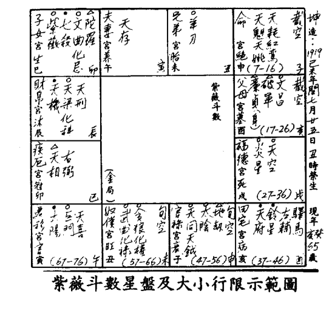

紫微斗數入門 紫微斗數精要 合璧

卓宏著並題

科華圖書出版公司

封面設計/鄧玉嬋

Published & printed in Hong Kong H.K.$13.00

鄭福印和

# 紫微斗數入門

# 紫微斗數精要

# 合璧

卓宏著

# 目錄

- 第一卷 第一章 命盤起例 ... 三
- 第二卷 第二章 大限小限起法 ... 四十七
- 第三卷 第一章 命身提要(一) ... 五十五
- 第四卷 第二章 命身提要(二) ... 六十三
- 第五卷 第三章 對宮」與「三合」 ... 七十七
- 第六卷 第四章 大小二限(一) ... 八十一
- 第七卷 第五章 大小二限(二) ... 九十一
- 第八卷 第六章 祓「四化」 ... 九十九
- 第七章·談「羊陀」...... 一百零五
- 第八章·談「火鈴」...... 一百一十七
- 第九章·談「空劫」...... 一百一十七
- 第十章·談「女命」...... 一百一十七
- 第十一章·十二長生位在斗數中的看法(一)...... 一百二十七
- 第十二章·十二長生位在斗數中的看法(二)...... 三十一
- 第三卷 斗數賦文精選...... 三十六
- 紫微斗數總訣...... 三十七
- 百字千金訣...... 三十八
- 斗數準繩...... 三十九
- 斗數發微論...... 四十
- 太微賦...... 四十
- 增補太微賦...... 一百四十二
- 斗數髓賦...... 一百四十四
- 女命骨髓賦...... 一百四十八
- 形性賦...... 一百四十九
- 談命要論...... 一百五十一

書名：紫微斗數入門 合璧 紫微斗數精要 卓宏著

出版·科華圖書出版公司 地址·香港九龍長沙灣青山道四九九號 永興工業大廈10樓C座

印刷·廣記印務公司 地址·香港上環西街四十九至五十一號

定價·十三元

# 第一卷

## 第一章：命盤起例

### 一、安命宮

安命宮可照後列圖表查出，該表是以「出生月份」及「出生時辰」對比查出；但最要緊記的就是：命宮的「出生月份」必須以「節」為標準。例如：交入「立春節」後，方算今年寅月，交入「驚蟄節」則算卯月。其餘按下表推算：

- 正月（立春至驚蟄）建寅。
- 二月（驚蟄至清明）建卯。
- 三月（清明至立夏）建辰。
- 四月（立夏至芒種）建巳。
- 五月（芒種至小暑）建午。
- 六月（小暑至立秋）建未。
- 七月（立秋至白露）建申。
- 八月（白露至寒露）建酉。
- 九月（寒露至立冬）建戌。
- 十月（立冬至大雪）建亥。
- 十一月（大雪至小寒）建子。
- 十二月（小寒至立春）建丑。

「命宮」起法，可由下表查出：

（例）男命或女命：一九四五年農曆四月二十六日午時出生。查萬年曆：此年農曆四月二十六日巳時交「芒種節」，故命宮應作午（五）月計。身宮無須論過節，故應作四月論。

### 二、安身宮

安身宮則以初一為標準，不必過節。又凡閏正月生者，便仍在正月安身；凡有閏月，俱要依此為例。

附：「紫微斗數全書」起例歌訣有云：「不依五星要過節」，故起命宮必以「過節」方合正塓；身宮不用「過節」者，逾命為太陽，身為太陰之故。「身宮」起法，可由下表查出：

### 命宮一覽表

| 生月支 \ 生時支 | 戌 | 酉 | 申 | 未 | 午 | 巳 | 辰 | 卯 | 寅 | 丑 | 子 |
| :--- | :--- | :--- | :--- | :--- | :--- | :--- | :--- | :--- | :--- | :--- | :--- |
| 亥 | 亥 | 戌 | 酉 | 申 | 未 | 午 | 巳 | 辰 | 卯 | 寅 | 丑 |
| 戌 | 戌 | 酉 | 申 | 未 | 午 | 巳 | 辰 | 卯 | 寅 | 丑 | 子 |
| 酉 | 酉 | 申 | 未 | 午 | 巳 | 辰 | 卯 | 寅 | 丑 | 子 | 亥 |
| 申 | 申 | 未 | 午 | 巳 | 辰 | 卯 | 寅 | 丑 | 子 | 亥 | 戌 |
| 未 | 未 | 午 | 巳 | 辰 | 卯 | 寅 | 丑 | 子 | 亥 | 戌 | 酉 |
| 午 | 午 | 巳 | 辰 | 卯 | 寅 | 丑 | 子 | 亥 | 戌 | 酉 | 申 |
| 巳 | 巳 | 辰 | 卯 | 寅 | 丑 | 子 | 亥 | 戌 | 酉 | 申 | 未 |
| 辰 | 辰 | 卯 | 寅 | 丑 | 子 | 亥 | 戌 | 酉 | 申 | 未 | 午 |
| 卯 | 卯 | 寅 | 丑 | 子 | 亥 | 戌 | 酉 | 申 | 未 | 午 | 巳 |
| 寅 | 寅 | 丑 | 子 | 亥 | 戌 | 酉 | 申 | 未 | 午 | 巳 | 辰 |
| 丑 | 丑 | 子 | 亥 | 戌 | 酉 | 申 | 未 | 午 | 巳 | 辰 | 卯 |
| 子 | 子 | 亥 | 戌 | 酉 | 申 | 未 | 午 | 巳 | 辰 | 卯 | 寅 |

### 三、安十二宮

既知「命宮」所在，即可按命宮而查出其餘宮位。

注意：凡命不論男女，皆以命宮為主，逆而兄弟、夫妻、子女、財帛、疾厄、遷徙、奴僕、官祿、田宅、福德、父母。

- 十二宮必有一宮與身宮重覆。
- 命宮必與遷移宮相對。
- 官祿、田宅、福德、父母。

十二宮可由下表查出：

### 身宮表

| 生時支\生月 | 正 | 二 | 三 | 四 | 五 | 六 | 七 | 八 | 九 | 十 | 十一 | 十二 |
| :--- | :--- | :--- | :--- | :--- | :--- | :--- | :--- | :--- | :--- | :--- | :--- | :--- |
| 子 | 丑 | 寅 | 卯 | 辰 | 巳 | 午 | 未 | 申 | 酉 | 戌 | 亥 | 子 |
| 丑 | 寅 | 卯 | 辰 | 巳 | 午 | 未 | 申 | 酉 | 戌 | 亥 | 子 | 丑 |
| 寅 | 卯 | 辰 | 巳 | 午 | 未 | 申 | 酉 | 戌 | 亥 | 子 | 丑 | 寅 |
| 卯 | 辰 | 巳 | 午 | 未 | 申 | 酉 | 戌 | 亥 | 子 | 丑 | 寅 | 卯 |
| 辰 | 巳 | 午 | 未 | 申 | 酉 | 戌 | 亥 | 子 | 丑 | 寅 | 卯 | 辰 |
| 巳 | 午 | 未 | 申 | 酉 | 戌 | 亥 | 子 | 丑 | 寅 | 卯 | 辰 | 巳 |
| 午 | 未 | 申 | 酉 | 戌 | 亥 | 子 | 丑 | 寅 | 卯 | 辰 | 巳 | 午 |
| 未 | 申 | 酉 | 戌 | 亥 | 子 | 丑 | 寅 | 卯 | 辰 | 巳 | 午 | 未 |
| 申 | 酉 | 戌 | 亥 | 子 | 丑 | 寅 | 卯 | 辰 | 巳 | 午 | 未 | 申 |
| 酉 | 戌 | 亥 | 子 | 丑 | 寅 | 卯 | 辰 | 巳 | 午 | 未 | 申 | 酉 |
| 戌 | 亥 | 子 | 丑 | 寅 | 卯 | 辰 | 巳 | 午 | 未 | 申 | 酉 | 戌 |
| 亥 | 子 | 丑 | 寅 | 卯 | 辰 | 巳 | 午 | 未 | 申 | 酉 | 戌 | 亥 |

### 四、安五行局

由於紫微星的起法，是由「五行局」及「生日」查出的，故此首先要定出五行局。五行局的起法，是以「出生年干」及「命宮所在」對照查出。五行局可由下表查出：

| 命宮在支 | 福德宮 | 田宅宮 | 官祿宮 | 奴僕宮 | 遷移宮 | 疾厄宮 | 財帛宮 | 男女宮 | 夫妻宮 | 兄弟宮 | 父母宮 |
| :--- | :--- | :--- | :--- | :--- | :--- | :--- | :--- | :--- | :--- | :--- | :--- |
| 子 | 寅 | 卯 | 辰 | 巳 | 午 | 未 | 申 | 酉 | 戌 | 亥 | 丑 |
| 丑 | 卯 | 辰 | 巳 | 午 | 未 | 申 | 酉 | 戌 | 亥 | 子 | 寅 |
| 寅 | 辰 | 巳 | 午 | 未 | 申 | 酉 | 戌 | 亥 | 子 | 丑 | 卯 |
| 卯 | 巳 | 午 | 未 | 申 | 酉 | 戌 | 亥 | 子 | 丑 | 寅 | 辰 |
| 辰 | 午 | 未 | 申 | 酉 | 戌 | 亥 | 子 | 丑 | 寅 | 卯 | 巳 |
| 巳 | 未 | 申 | 酉 | 戌 | 亥 | 子 | 丑 | 寅 | 卯 | 辰 | 午 |
| 午 | 申 | 酉 | 戌 | 亥 | 子 | 丑 | 寅 | 卯 | 辰 | 巳 | 未 |
| 未 | 酉 | 戌 | 亥 | 子 | 丑 | 寅 | 卯 | 辰 | 巳 | 午 | 申 |
| 申 | 戌 | 亥 | 子 | 丑 | 寅 | 卯 | 辰 | 巳 | 午 | 未 | 酉 |
| 酉 | 亥 | 子 | 丑 | 寅 | 卯 | 辰 | 巳 | 午 | 未 | 申 | 戌 |
| 戌 | 子 | 丑 | 寅 | 卯 | 辰 | 巳 | 午 | 未 | 申 | 酉 | 亥 |
| 亥 | 丑 | 寅 | 卯 | 辰 | 巳 | 午 | 未 | 申 | 酉 | 戌 | 子 |

命盤的「紫微星系」，天機、太陽、武曲、天同、廉貞，俱以紫微為依據，因此首先要查出紫微所在：紫微起法是以「五行局」及「農曆生日」對比查出。紫微所在可由下表查出：

### 五、安紫微星

| 生年干 | 甲 | 乙 | 丙 | 丁 | 戊 | 己 | 庚 | 辛 | 壬 | 癸 |
| :--- | :--- | :--- | :--- | :--- | :--- | :--- | :--- | :--- | :--- | :--- |
| 子 | 水 | 火 | 土 | 木 | 金 | 水 | 火 | 土 | 木 | 金 |
| 丑 | 火 | 土 | 木 | 金 | 水 | 火 | 土 | 木 | 金 | 水 |
| 寅 | 土 | 木 | 金 | 水 | 火 | 土 | 木 | 金 | 水 | 火 |
| 卯 | 木 | 金 | 水 | 火 | 土 | 木 | 金 | 水 | 火 | 土 |
| 辰 | 金 | 水 | 火 | 土 | 木 | 金 | 水 | 火 | 土 | 木 |
| 巳 | 水 | 火 | 土 | 木 | 金 | 水 | 火 | 土 | 木 | 金 |
| 午 | 火 | 土 | 木 | 金 | 水 | 火 | 土 | 木 | 金 | 水 |
| 未 | 土 | 木 | 金 | 水 | 火 | 土 | 木 | 金 | 水 | 火 |
| 申 | 木 | 金 | 水 | 火 | 土 | 木 | 金 | 水 | 火 | 土 |
| 酉 | 金 | 水 | 火 | 土 | 木 | 金 | 水 | 火 | 土 | 木 |
| 戌 | 水 | 火 | 土 | 木 | 金 | 水 | 火 | 土 | 木 | 金 |
| 亥 | 火 | 土 | 木 | 金 | 水 | 火 | 土 | 木 | 金 | 水 |

### 六、起紫微星及天府星

既知紫微所在，即可按表查出「紫微星系」天機、太陽、武曲、天同、廉貞所在。「天府星系」是根據「天府星」所在而查出的，但天府星又須根據紫微所在而定，參圖二。

| 水 | 金 | 土 | 火 | 木 | 農曆生日 | 水 | 金 | 土 | 火 | 木 | 農曆生日 |
| :--- | :--- | :--- | :--- | :--- | :--- | :--- | :--- | :--- | :--- | :--- | :--- |
| 酉 | 巳 | 酉 | 午 | 酉 | 十六 | 丑 | 亥 | 午 | 酉 | 辰 | 一 |
| 酉 | 卯 | 寅 | 卯 | 午 | 十七 | 寅 | 辰 | 亥 | 午 | 丑 | 二 |
| 戌 | 申 | 未 | 辰 | 未 | 十八 | 寅 | 丑 | 辰 | 亥 | 寅 | 三 |
| 戌 | 巳 | 辰 | 子 | 戌 | 十九 | 卯 | 寅 | 丑 | 辰 | 巳 | 四 |
| 亥 | 午 | 巳 | 酉 | 未 | 二十 | 卯 | 子 | 寅 | 丑 | 寅 | 五 |
| 亥 | 辰 | 戌 | 寅 | 申 | 二十一 | 辰 | 巳 | 未 | 寅 | 卯 | 六 |
| 子 | 酉 | 卯 | 未 | 亥 | 二十二 | 辰 | 寅 | 子 | 戌 | 午 | 七 |
| 子 | 午 | 申 | 辰 | 申 | 二十三 | 巳 | 卯 | 巳 | 未 | 卯 | 八 |
| 丑 | 未 | 巳 | 巳 | 酉 | 二十四 | 巳 | 丑 | 寅 | 子 | 辰 | 九 |
| 丑 | 巳 | 午 | 丑 | 子 | 二十五 | 午 | 午 | 卯 | 巳 | 未 | 十 |
| 寅 | 戌 | 亥 | 戌 | 酉 | 二十六 | 午 | 卯 | 申 | 寅 | 辰 | 十一 |
| 寅 | 未 | 辰 | 卯 | 戌 | 二十七 | 未 | 辰 | 丑 | 卯 | 巳 | 十二 |
| 卯 | 申 | 酉 | 申 | 丑 | 二十八 | 未 | 寅 | 午 | 亥 | 申 | 十三 |
| 卯 | 午 | 午 | 巳 | 戌 | 二十九 | 申 | 未 | 卯 | 申 | 巳 | 十四 |
| 辰 | 亥 | 未 | 午 | 亥 | 三十 | 申 | 辰 | 辰 | 丑 | 午 | 十五 |

知紫微之所在，即可知天府之所在；知天府之所在，即可按下表查出「天府系」諸星。天府系主星有七，即太陰、貪狼、巨門、天相、天梁、七殺、破軍等。

### 七、起天府系主星

| 主星 | 天府星 |
| :--- | :--- |
| 紫微在支 | 子 |
| 子 | 辰 |
| 丑 | 卯 |
| 寅 | 寅 |
| 卯 | 丑 |
| 辰 | 子 |
| 巳 | 亥 |
| 午 | 戌 |
| 未 | 酉 |
| 申 | 申 |
| 酉 | 未 |
| 戌 | 午 |
| 亥 | 巳 |

| 主星 | 紫微在支 | 天府星 | 天同星 | 武曲星 | 太陽星 | 天機星 | 廉貞星 |
| :--- | :--- | :--- | :--- | :--- | :--- | :--- | :--- |
| 子 | 亥 | 未 | 申 | 酉 | 亥 | 子 | 辰 |
| 丑 | 子 | 申 | 酉 | 戌 | 子 | 丑 | 巳 |
| 寅 | 丑 | 酉 | 戌 | 亥 | 丑 | 寅 | 午 |
| 卯 | 寅 | 戌 | 亥 | 子 | 寅 | 卯 | 未 |
| 辰 | 卯 | 亥 | 子 | 丑 | 卯 | 辰 | 申 |
| 巳 | 辰 | 子 | 丑 | 寅 | 辰 | 巳 | 酉 |
| 午 | 巳 | 丑 | 寅 | 卯 | 巳 | 午 | 戌 |
| 未 | 午 | 寅 | 卯 | 辰 | 午 | 未 | 亥 |
| 申 | 未 | 卯 | 辰 | 巳 | 未 | 申 | 子 |
| 酉 | 午 | 辰 | 巳 | 午 | 未 | 酉 | 丑 |
| 戌 | 未 | 巳 | 午 | 未 | 申 | 戌 | 寅 |
| 亥 | 午 | 午 | 未 | 申 | 酉 | 亥 | 卯 |

### 八、安火星

火星又名炎星，是以人的出生「年支」及「時支」對比查出。

### 天府系主星一覽表

| 天府在支 | 主星 ||||||| |
| :--- | :--- | :--- | :--- | :--- | :--- | :--- | :--- |
|  | 太陰星 | 貪狼星 | 巨門星 | 天相星 | 天梁星 | 七殺星 | 破軍星 |
| 子 | 丑 | 寅 | 卯 | 辰 | 巳 | 午 | 戌 |
| 丑 | 寅 | 卯 | 辰 | 巳 | 午 | 未 | 亥 |
| 寅 | 卯 | 辰 | 巳 | 午 | 未 | 申 | 子 |
| 卯 | 辰 | 巳 | 午 | 未 | 申 | 酉 | 丑 |
| 辰 | 巳 | 午 | 未 | 申 | 酉 | 戌 | 寅 |
| 巳 | 午 | 未 | 申 | 酉 | 戌 | 亥 | 卯 |
| 午 | 未 | 申 | 酉 | 戌 | 亥 | 子 | 辰 |
| 未 | 申 | 酉 | 戌 | 亥 | 子 | 丑 | 巳 |
| 申 | 酉 | 戌 | 亥 | 子 | 丑 | 寅 | 午 |
| 酉 | 戌 | 亥 | 子 | 丑 | 寅 | 卯 | 未 |
| 戌 | 亥 | 子 | 丑 | 寅 | 卯 | 辰 | 申 |
| 亥 | 子 | 丑 | 寅 | 卯 | 辰 | 巳 | 酉 |

### 九、安鈴星

鈴星是以人的出生「年支」及「時支」對比查出。

### 火星一覽表

| 生時支 \ 生年支 | 亥 | 戌 | 酉 | 申 | 未 | 午 | 巳 | 辰 | 卯 | 寅 | 丑 | 子 |
| :--- | :--- | :--- | :--- | :--- | :--- | :--- | :--- | :--- | :--- | :--- | :--- | :--- |
| 子 | 酉 | 丑 | 卯 | 寅 | 酉 | 丑 | 卯 | 寅 | 酉 | 丑 | 卯 | 寅 |
| 丑 | 戌 | 寅 | 辰 | 卯 | 戌 | 寅 | 辰 | 卯 | 戌 | 寅 | 辰 | 卯 |
| 寅 | 亥 | 卯 | 巳 | 辰 | 亥 | 卯 | 巳 | 辰 | 亥 | 卯 | 巳 | 辰 |
| 卯 | 子 | 辰 | 午 | 巳 | 子 | 辰 | 午 | 巳 | 子 | 辰 | 午 | 巳 |
| 辰 | 丑 | 巳 | 未 | 午 | 丑 | 巳 | 未 | 午 | 丑 | 巳 | 未 | 午 |
| 巳 | 寅 | 午 | 申 | 未 | 寅 | 午 | 申 | 未 | 寅 | 午 | 申 | 未 |
| 午 | 卯 | 未 | 酉 | 申 | 卯 | 未 | 酉 | 申 | 卯 | 未 | 酉 | 申 |
| 未 | 辰 | 申 | 戌 | 酉 | 辰 | 申 | 戌 | 酉 | 辰 | 申 | 戌 | 酉 |
| 申 | 巳 | 酉 | 亥 | 戌 | 巳 | 酉 | 亥 | 戌 | 巳 | 酉 | 亥 | 戌 |
| 酉 | 午 | 戌 | 子 | 亥 | 午 | 戌 | 子 | 亥 | 午 | 戌 | 子 | 亥 |
| 戌 | 未 | 亥 | 丑 | 子 | 未 | 亥 | 丑 | 子 | 未 | 亥 | 丑 | 子 |
| 亥 | 申 | 子 | 寅 | 丑 | 申 | 子 | 寅 | 丑 | 申 | 子 | 寅 | 丑 |## 十・安年系诸星

耗、红鸾、天喜。以「年干」来取定的有：羊刃、陀罗、天存、天魁、天钺等。以「年支」来取定的则有：

| 生时支\生年支 | 亥 | 戌 | 酉 | 申 | 未 | 午 | 巳 | 辰 | 卯 | 寅 | 丑 | 子 |
|---------------|----|----|----|----|----|----|----|----|----|----|----|----|
| 子 | 戊 | 卯 | 戌 | 戌 | 戌 | 卯 | 戌 | 戌 | 戌 | 卯 | 戌 | 戌 |
| 丑 | 亥 | 辰 | 亥 | 亥 | 亥 | 辰 | 亥 | 亥 | 亥 | 辰 | 亥 | 亥 |
| 寅 | 子 | 巳 | 子 | 子 | 子 | 巳 | 子 | 子 | 子 | 巳 | 子 | 子 |
| 卯 | 丑 | 午 | 丑 | 丑 | 丑 | 午 | 丑 | 丑 | 丑 | 午 | 丑 | 丑 |
| 辰 | 寅 | 未 | 寅 | 寅 | 寅 | 未 | 寅 | 寅 | 寅 | 未 | 寅 | 寅 |
| 巳 | 卯 | 申 | 卯 | 卯 | 卯 | 申 | 卯 | 卯 | 卯 | 申 | 卯 | 卯 |
| 午 | 辰 | 酉 | 辰 | 辰 | 辰 | 酉 | 辰 | 辰 | 辰 | 酉 | 辰 | 辰 |
| 未 | 巳 | 戌 | 巳 | 巳 | 巳 | 戌 | 巳 | 巳 | 巳 | 戌 | 巳 | 巳 |
| 申 | 午 | 亥 | 午 | 午 | 午 | 亥 | 午 | 午 | 午 | 亥 | 午 | 午 |
| 酉 | 未 | 子 | 未 | 未 | 未 | 子 | 未 | 未 | 未 | 子 | 未 | 未 |
| 戌 | 申 | 丑 | 申 | 申 | 申 | 丑 | 申 | 申 | 申 | 丑 | 申 | 申 |
| 亥 | 酉 | 寅 | 酉 | 酉 | 酉 | 寅 | 酉 | 酉 | 酉 | 寅 | 酉 | 酉 |

时系诸星即文曲、文昌、大耗、地劫等。其取法是以人之出生「时支」为准。

### 十一、安月系诸星

| 年支 | 天魁星 | 红鸾星 | 天耗星 |
|------|--------|--------|--------|
| 子 | 子 | 卯 | 丑 |
| 丑 | 丑 | 寅 | 寅 |
| 寅 | 寅 | 丑 | 卯 |
| 卯 | 卯 | 子 | 辰 |
| 辰 | 辰 | 亥 | 巳 |
| 巳 | 巳 | 戌 | 午 |
| 午 | 午 | 酉 | 未 |
| 未 | 未 | 申 | 申 |
| 申 | 申 | 未 | 酉 |
| 酉 | 酉 | 午 | 戌 |
| 戌 | 戌 | 巳 | 亥 |
| 亥 | 亥 | 辰 | 子 |

| 生年干 | 天煞星 | 天刑星 | 天存星 |
|--------|--------|--------|--------|
| 甲 | 未 | 丑 | 寅 |
| 乙 | 申 | 子 | 卯 |
| 丙 | 酉 | 亥 | 巳 |
| 丁 | 亥 | 西 | 午 |
| 戊 | 丑 | 未 | 巳 |
| 己 | 子 | 申 | 午 |
| 庚 | 丑 | 未 | 申 |
| 辛 | 寅 | 午 | 酉 |
| 壬 | 卯 | 巳 | 亥 |
| 癸 | 巳 | 卯 | 子 |

| 生年干 | 主星 | 羊刃星 | 陀罗星 |
|--------|------|--------|--------|
| 甲 | 卯 | 丑 | 辰 |
| 乙 | 辰 | 寅 | 巳 |
| 丙 | 午 | 辰 | 未 |
| 丁 | 未 | 巳 | 申 |
| 戊 | 午 | 辰 | 未 |
| 己 | 未 | 巳 | 申 |
| 庚 | 酉 | 未 | 酉 |
| 辛 | 戌 | 申 | 戌 |
| 壬 | 子 | 戌 | 丑 |
| 癸 | 丑 | 亥 | 寅 |

月系诸星即天姚、大刑、左辅、右弼、驿马等，皆以人之出生「月支」来取定。

### 十二・安时系诸星

| 杂曜星 | 生月支 | | | |
| :--- | :--- | :--- | :--- | :--- |
| 天刑星 | 天姚星 | 子 |
| 未 | 亥 | 丑 |
| 申 | 子 | 寅 |
| 酉 | 丑 | 卯 |
| 戌 | 寅 | 辰 |
| 亥 | 卯 | 巳 |
| 子 | 辰 | 午 |
| 丑 | 巳 | 未 |
| 寅 | 午 | 申 |
| 卯 | 未 | 酉 |
| 辰 | 申 | 戌 |
| 巳 | 酉 | 亥 |
| 午 | 戌 | 亥 |

| 副星 | 生月支 | | | |
| :--- | :--- | :--- | :--- | :--- |
| 驿马星 | 右弼星 | 左辅星 | 子 |
| 寅 | 子 | 寅 | 丑 |
| 亥 | 亥 | 卯 | 寅 |
| 申 | 戌 | 辰 | 卯 |
| 巳 | 酉 | 巳 | 辰 |
| 寅 | 申 | 午 | 巳 |
| 亥 | 未 | 未 | 午 |
| 申 | 午 | 申 | 未 |
| 巳 | 巳 | 酉 | 申 |
| 寅 | 辰 | 戌 | 酉 |
| 亥 | 卯 | 亥 | 戌 |
| 申 | 寅 | 子 | 亥 |
| 巳 | 丑 | 丑 | 亥 |

### 十三・安四化

「四化」即化禄、化权、化科、化忌。是以人之出生「年干」查出。该等化曜星，必须写在所依之星下面。例如甲年廉贞化禄，「化禄」二字必须写在命盘中廉贞所在的下面；乙年天梁化权，「化权」二字必须写在命盘中天梁所在的下面；除按此例推算。

| 文曲星 | 文昌星 | 生时支 |
|--------|--------|--------|
| 戌 | 辰 | 子 |
| 酉 | 巳 | 丑 |
| 申 | 午 | 寅 |
| 未 | 未 | 卯 |
| 午 | 申 | 辰 |
| 巳 | 酉 | 巳 |
| 辰 | 戌 | 午 |
| 卯 | 亥 | 未 |
| 寅 | 子 | 申 |
| 丑 | 丑 | 酉 |
| 子 | 寅 | 戌 |
| 亥 | 卯 | 亥 |

| 地劫星 | 天空星 | 副星 |
|--------|--------|------|
| 亥 | 亥 | 子 |
| 子 | 戌 | 丑 |
| 丑 | 酉 | 寅 |
| 寅 | 申 | 卯 |
| 卯 | 未 | 辰 |
| 辰 | 午 | 巳 |
| 巳 | 巳 | 午 |
| 午 | 辰 | 未 |
| 未 | 卯 | 申 |
| 申 | 寅 | 酉 |
| 酉 | 丑 | 戌 |
| 戌 | 子 | 亥 |

### 十四、庙旺、陷失、平和的查法

星有吉凶之分，但吉星凶星又会因其「庙旺陷失」之不同而再分吉凶。「庙旺陷失」，乃是从古贤用定星曜强弱的一种方法；所谓「吉星临庙旺为实吉，凶星入庙旺为实凶」，吉星临陷为虚吉，凶星入庙为虚凶，这是星之庙旺陷失的一般定义。以前，古贤把诸星的强弱划分为七个等级，即：庙、旺、得地、利益、平和、不得地、陷；由于其中有些是分别不大的，因此我把它们归细起来而分为三类：

- （一）庙旺（吉端）| 用圆圈代表。
- （二）陷失（凶端）| 用三角代表。
- （三）平和（普通）| 用一点代表。

十干化曜星一览表

| 化忌星 | 化科星 | 化权星 | 化禄星 | 生年干 |
|--------|--------|--------|--------|--------|
| 太阳 | 武曲 | 破军 | 廉贞 | 甲 |
| 太阴 | 紫微 | 天梁 | 天机 | 乙 |
| 廉贞 | 文昌 | 天机 | 天同 | 丙 |
| 巨门 | 天机 | 天同 | 太阴 | 丁 |
| 天机 | 太阳 | 太阴 | 贪狼 | 戊 |
| 文曲 | 天梁 | 贪狼 | 武曲 | 己 |
| 天同 | 天府 | 武曲 | 太阳 | 庚 |
| 文昌 | 文曲 | 太阳 | 巨门 | 辛 |
| 武曲 | 天府 | 紫微 | 天梁 | 壬 |
| 贪狼 | 太阴 | 巨门 | 破军 | 癸 |

### 十五・截空及旬空的查法

（一）截空 — 即「截路空亡」。是以人之生年天干取出。例如甲年或己年出生的人，截空就在该人星盘的「申」位及「酉」位上。

（二）旬空 — 即「空亡」。是以人之生年干及生年支配合取出。例如甲子年出生的人，旬空就在该人星盘的「戌」位及「亥」位上。

| | 丑 | 寅 | 卯 | 辰 | 巳 | 午 | 未 | 申 | 酉 | 戌 | 亥 | 子 |
|---|---|---|---|---|---|---|---|---|---|---|---|---|
| 紫微 | ○ | ○ | ○ | ○ | · | ○ | ○ | ○ | ○ | · | ○ | |
| 天机 | ○ | △ | ○ | ○ | · | △ | ○ | △ | ○ | ○ | · | △ |
| 太阴 | △ | · | · | ○ | ○ | ○ | ○ | · | · | △ | △ | △ |
| 武曲 | ○ | ○ | · | ○ | △ | ○ | ○ | · | ○ | △ | △ | |
| 天同 | ○ | △ | ○ | · | · | ○ | △ | ○ | △ | · | ○ | |
| 廉贞 | · | ○ | ○ | △ | △ | · | ○ | ○ | △ | △ | | |
| 天机 | ○ | ○ | ○ | · | ○ | · | ○ | ○ | · | ○ | ○ | · |
| 太阴 | ○ | · | · | △ | △ | △ | · | · | ○ | ○ | ○ | |
| 贪狼 | ○ | ○ | · | ○ | △ | ○ | ○ | · | ○ | ○ | △ | |
| 巨门 | ○ | △ | ○ | △ | · | ○ | △ | ○ | △ | · | | |
| 天相 | ○ | ○ | ○ | △ | · | ○ | ○ | ○ | △ | · | | |
| 天梁 | ○ | ○ | ○ | ○ | ○ | △ | ○ | ○ | ○ | ○ | ○ | △ |
| 七杀 | ○ | ○ | ○ | ○ | △ | · | ○ | ○ | ○ | ○ | △ | · |
| 破军 | ○ | ○ | · | △ | · | ○ | ○ | · | △ | · | | |
| 文昌 | ○ | ○ | △ | · | ○ | △ | · | ○ | △ | · | ○ | △ |
| 羊刃 | △ | ○ | · | △ | ○ | · | △ | ○ | · | △ | ○ | · |
| 陀罗 | · | ○ | △ | · | ○ | △ | · | ○ | △ | · | ○ | △ |
| 火星 | △ | ○ | ○ | · | △ | ○ | ○ | · | △ | ○ | ○ | · |
| 铃星 | △ | ○ | ○ | · | △ | ○ | ○ | · | △ | ○ | ○ | · |
| 天空 | ○ | △ | ○ | △ | ○ | △ | ○ | △ | ○ | △ | ○ | △ |
| 地劫 | △ | △ | △ | △ | ○ | △ | △ | △ | ○ | △ | △ | △ |

附注

○ 强

△ 弱

· 平

### 十六・十二长生位的查法

| | 空 | 支 | 年 | 干 | 丙 | 年干 |
|---|---|---|---|---|---|---|
| 寅 | 辰 | 午 | 申 | 戌 | 甲 |
| 卯 | 巳 | 未 | 酉 | 亥 | 乙 |
| 辰 | 午 | 申 | 戌 | 子 | 丙 |
| 巳 | 未 | 酉 | 亥 | 丑 | 丁 |
| 午 | 申 | 戌 | 子 | 寅 | 戊 |
| 未 | 酉 | 亥 | 丑 | 卯 | 己 |
| 申 | 戌 | 子 | 寅 | 辰 | 庚 |
| 酉 | 亥 | 丑 | 卯 | 巳 | 辛 |
| 戌 | 子 | 寅 | 辰 | 午 | 壬 |
| 亥 | 丑 | 卯 | 巳 | 未 | 癸 |
| 子 | 寅 | 辰 | 午 | 申 | 癸 |
| 丑 | 卯 | 巳 | 未 | 酉 | 癸 |

十二长生位是用「局」来定立的：

1. 火局—寅宫起长生。
2. 木局—亥宫起长生。
3. 金局—巳宫起长生。
4. 水局土局—申宫起长生。

然后按照男顺布，女逆行的定律而继续排出沐浴、冠带、临官、帝旺、衰、病、死、墓、绝、胎、养等位。

| | 丙 | 年干 |
|---|---|---|
| 亡空路截 | 己 | 甲 |
| 酉申 | 庚 | 乙 |
| 未午 | 辛 | 丙 |
| 已辰 | 壬 | 丁 |
| 卯寅 | 癸 | 戊 |
| 丑子 | 癸 | 戊 |

## 第二章：大限小限起法

| 五行局 | 名顺 | 星 | 养 | 胎 | 绝 | 墓 | 死 | 病 | 衰 | 帝旺 | 临官 | 冠带 | 沐浴 | 长生 |
| :--- | :--- | :--- | :--- | :--- | :--- | :--- | :--- | :--- | :--- | :--- | :--- | :--- | :--- | :--- |
| 申 | 阴女阳男 | 水局 | 未 | 午 | 巳 | 辰 | 卯 | 寅 | 丑 | 子 | 亥 | 戌 | 酉 | 申 |
| 亥 | 阳女阴男 | | 酉 | 戌 | 亥 | 子 | 丑 | 寅 | 卯 | 辰 | 巳 | 午 | 未 | 申 |
| 巳 | 阴女阳男 | 木局 | 戌 | 酉 | 申 | 未 | 午 | 巳 | 辰 | 卯 | 寅 | 丑 | 子 | 亥 |
| 亥 | 阳女阴男 | | 子 | 丑 | 寅 | 卯 | 辰 | 巳 | 午 | 未 | 申 | 酉 | 戌 | 亥 |
| 巳 | 阴女阳男 | 金局 | 辰 | 卯 | 寅 | 丑 | 子 | 亥 | 戌 | 酉 | 申 | 未 | 午 | 巳 |
| 亥 | 阳女阴男 | | 午 | 未 | 申 | 酉 | 戌 | 亥 | 子 | 丑 | 寅 | 卯 | 辰 | 巳 |
| 申 | 阴女阳男 | 土局 | 未 | 午 | 巳 | 辰 | 卯 | 寅 | 丑 | 子 | 亥 | 戌 | 酉 | 申 |
| 亥 | 阳女阴男 | | 酉 | 戌 | 亥 | 子 | 丑 | 寅 | 卯 | 辰 | 巳 | 午 | 未 | 申 |
| 寅 | 阴女阳男 | 火局 | 丑 | 子 | 亥 | 戌 | 酉 | 申 | 未 | 午 | 巳 | 辰 | 卯 | 寅 |
| 亥 | 阳女阴男 | | 卯 | 辰 | 巳 | 午 | 未 | 申 | 酉 | 戌 | 亥 | 子 | 丑 | 寅 |

### 一、定大限诀：

> 『节气深浅起大限，三月一载顺逆奔，阳男阴女顺推算，阴男阳女逆行真。』

大限排法：第一运必为命宫，然后按「阳男阴女顺行，阴男阳女逆行」的方法一路排去，故第二运顺行为父母宫，逆行为兄弟宫。

【例一】：男命：一九四五年农历四月二十六日丑时生。
查万年历，此年农历四月二十六日巳时才交「芒种节」，故仍作四月计，乙年男命，为「阴年生男」，逆行，逆数至「立夏节」得三十一日，用三除之，得十日，余一日作一百二十日计，于此命起运岁数为「十岁又一百二十日」。
大限排法：第一运（十至十九岁）行命宫，阴男，逆行，第二运（二十至二十九岁）任兄弟宫……一路排去，约排七个运程即可。

### 二、定小限诀：

> 「寅午戌人辰上起，申子辰人戌上推，亥卯未人丑上起，巳酉丑人未上追。」

小限主一年之祸福，从该人「生年」起一岁，然后「男顺行，女逆行」，无须过节。
【例一】：男命：寅年出生，按例则在辰宫起一岁，顺行，巳宫二岁，午宫三岁……
【例二】：女命：午年出生，按例则在辰宫起一岁，逆行，卯宫二岁，寅宫三岁……

### 三・紫微斗数星盘及大小行限示范图

（1）大限起法：一九一九年农历闰七月二十五日出生，已过「白露节」，命宫作八月计。已为阴年，公元生女，顺数至未夹间（寒露）得二十一日，三日算一岁，故作七岁起运。

第一运：七至十六岁行「田宅宫」，阴女顺行。十七至二十六岁行「父母宫」，二十七至三十六岁行「福德宫」，三十七至四十六岁行「官禄宫」，四十七至五十六岁行「迁移宫」，五十七至六十六岁行「疾厄宫」，六十七至七十六岁行「财帛宫」。

（2）流年起法：此命末年出生，「亥卯未」年生人，丑止起一岁；女命逆行，子上起二岁，亥上起三岁……

- 每个宫位「左下角」为「星盘原来宫位」。
- 每个宫位「右下角」为「流年所行宫位」。

| 命宫 辛未 |
| :---: |
| **父母宫 庚午** (17-26) | **福德宫 己巳** (27-36) |
| **田宅宫 戊辰** (37-46) | **官禄宫 丁卯** (47-56) |
| **迁移宫 丙寅** (57-66) | **疾厄宫 乙丑** (67-76) |
| **财帛宫 甲子** | **子女宫 癸亥** |
| **夫妻宫 壬申** | **兄弟宫 癸酉** |
| **夫妻宫 壬申** | **兄弟宫 癸酉** |

紫微斗数星盘及大小行限示范图

> 坤造：1919己未年闰七月二十五日丑时癸生 现年癸55岁

# 第二卷斗数精要

## # 第一章・

### ## 命身提要（一）

在紫微斗数中，十二宫的得失都能影响个人的吉凶祸福；不过，其中最重要的当然要算「命宫」及「身宫」了；因为两者都是个人富贵贫贱，寿夭穷通的根本。以下就把王星人「命宫」的得失，配合个人「生年」的喜忌列述于后：

### 一、紫微

- （1）子宫：喜丁己庚生人，贵格；壬癸人不耐久。
（2）午宫：入庙，喜甲丁己生人，财官格；丙戊人成败带疾。
（3）卯酉宫：旺地，贪狼同；乙辛戊癸生人财官格。
（4）寅申宫：旺地，与天府同，甲庚丁己生人财官格。
（5）巳亥宫：旺地，与七杀同，乙戊生人财官格。
（6）辰戌宫：得地，与天相同，乙己甲庚癸人财官格。
（7）丑未宫：入庙，与破军同，申庚丁己乙壬人财官格。

### 二、天机

- （1）子午宫：入庙，丁己癸申庚壬生人财官格。
（2）卯酉宫：旺地，巨门同；乙辛戊癸生人财官格。
（3）寅申宫：得地，太阴同；丁己甲庚癸生人财官格。
（4）巳亥宫：和平；丙壬戊生人合局，不耐久。
（5）辰戌宫：利益，天梁同；壬庚丁生人亨福。
（6）丑未宫：陷地，丙戊丁壬生人入财官格，乙壬生人禄合格。

### 三・太阳

- 1. 子宫陷，午宫旺：丁己庚生人财官格，壬丙戊生人悔吝。
2. 卯酉宫：利盆，与七杀同，乙辛生人财官格。
3. 寅申宫：得地，天相星同，丁己甲庚生人财官格。
4. 巳亥宫：和平，与破军同，壬戊生人财官格。
5. 辰戌宫：入庙，乙甲生人财官格。
6. 丑未宫：入庙，贪狼同，戊辛生人大财官格。
7. 丑未宫：平和。日月同未卯安丑，日月同丑命安未，侯伯之材。

### 四・武曲

- 1. 子宫：旺地，天府同，丁已庚生人财官格。
2. 卯酉宫：利盆，与七杀同，乙辛生人财官格。
3. 寅申宫：得地，天相星同，丁已甲庚生人财官格。
4. 巳亥宫：和平，与破军同，壬戊生人财官格。
5. 辰戌宫：入庙，乙甲生人财官格。
6. 丑未宫：入庙，贪狼同，戊辛生人大财官格。
7. 寅宫：旺，甲得地，巨门同。丁已甲庚人财官格。
8. 巳宫：旺，财官格。亥宫陷，逢杀孤寡贫弱。
9. 丑宫：陷，未宫得地，太阴同，加吉星财官格。
10. 辰宫：旺，财官格。戊宫陷，反背孤寡。

### 五·天同
-   (1) 子午陷宫：丁己癸辛生人财官格。
(2) 卯酉宫和平：乙丙辛生人财官格。
(3) 寅宫利：申宫旺：大梁同。乙甲丁生人福厚。
(4) 巳亥宫：入庙。壬丙戊生人财官格。
(5) 辰戌宫：和平；内丁生人利达，庚癸生人，福不耐久。
(6) 丑未宫：不落池，巨门同。乙壬申辛庚生人财官格。

### 六·廉贞
-   (1) 子午宫：和平，天相同。丁己申生人，财官格。
(2) 卯酉宫：和平，乙辛生人，癸生人，破军同吉。
(3) 寅宫：和平。甲庚戊生人为贵格，丙生人次之。
(4) 申宫：入庙。甲庚戊生人为贵格，丙生人次之。
(5) 丑未宫：利益，七杀同，加吉星，财官格。
(6) 辰戌宫：利益，天府同，甲庚生人财官格。
(7) 巳亥宫：陷地，甲己丙戊人，福不耐久。

### 七 · 天府
-   1. 子午宫：与武曲同，丁己癸生人财官格。
2. 卯酉宫：卯庙酉旺，乙丙辛生人财官格。
3. 寅申宫，甲得地：乘微同，丁己生人财官格。
4. 辰戌宫：入庙，廉贞同，甲庚壬生人财官格。
5. 丑未宫：入庙加吉星，财官格。
6. 巳亥宫：得地，乙丙戊辛生人财官格。

## 第二章 · 命身提要（二）

### 八·太阴
-   1. (1) 子丑寅宫：入庙，丁戊生人财官格。
2. (2) 卯辰巳宫：陷地。乙壬戊生人孤寡不耐久。
3. (3) 午宫陷，未申宫利益：丁庚甲生人财官格。
4. (4) 酉戌亥宫：入庙。丙丁人财官格，吉星乘大贵。

### 九·贪狼
-   1. (1) 子午宫：旺地，丁己生人福厚；丙戊庚寅申生人下局。
2. (2) 卯酉宫：利益，紫微同见火星贵；乙辛己人宜之，财官格。
3. (3) 寅申宫：和平，庚生人财官格。
4. (4) 丑未宫：入庙，武曲同见火星；戊己庚生人贵格。
5. (5) 辰戌宫：入庙，戊己生人财官格。
6. (6) 巳亥宫：陷地，廉贞同；丙戊壬生人为祸不耐久。

### 十．巨门
-   1. 子午宫：旺地；丁己癸辛生人福厚；丙戊生人主困。
2. 卯酉宫：入庙；乙辛生人财官格；丁戊生人有成败。
3. 寅申宫：入庙；太阳同，庚癸辛生人财官格。
4. 辰戌宫：和平；癸辛生人贵，丁生人困。
5. 丑未不得地；癸辛丙生人财官格。
6. 巳亥旺宫；癸辛生人财官格。

### 十一．天相
-   1. 子午宫：入庙地，廉贞同；丁己癸甲人财官格。
2. 卯酉陷宫；乙辛生人吉；甲庚人王困。
3. 辰戌宫得地；紫微同，财官格。
4. 丑宫：入庙，未宫得地；加吉星，财官格。
5. 寅申宫：入庙，武曲同；丁甲庚生人财官格。
6. 巳亥宫：得地；丙戊壬生人为福。

### 十二·天梁
-   1. 子午宫：入庙；丁己癸生人福厚，财格。
2. 卯酉宫：入庙，酉宫得地，太阳同；乙壬辛生人财官格。
3. 寅宫入庙；申宫陷，天机同；丁己甲庚生人财官格。
4. 辰戌宫：入庙，天机同；丁己壬庚生人财官格。
5. 丑未宫：入庙，壬乙生人财官格，六戊生人大贵。

### 十三·七杀
-   1. 子午宫：旺地。丁己甲生人财官格。
2. 卯酉宫：旺地，武曲同；乙辛生人福厚，财官格。
3. 寅申宫：入庙。甲庚丁己人财官格。
4. 巳亥宫：和平，紫微同；丙戊壬生人福厚。
5. 辰戌宫：入庙，加吉星，财官格。
6. 丑未宫：入庙，廉贞同，加吉星，财官格。

### 十四．破军
-   (1) 子午宫：入庙。丁己癸生人福厚；丙戊人主困。
(2) 卯酉宫：陷地。廉贞同；乙辛癸人利，甲庚丙人不耐久。
(3) 辰戌宫：旺。甲癸生人为福。
(4) 寅申宫：得地。甲庚丁己生人财官格。
(5) 丑未宫：旺地。紫微同；丙戊乙生人财官格。
(6) 巳亥宫：和平。武曲同；戊生人福厚。

### 十五．文昌
-   (1) 寅午戌宫：陷地。丁己甲庚生人财官格。
(2) 申子辰宫：得地。癸庚甲生人贵格。
(3) 巳酉丑宫：入庙。乙戊辛生人大贵。
(4) 亥卯未宫：利益。乙戊生人财官格。

### 十六．文曲
-   (1) 寅宫平和，午戌宫陷；甲庚生人财官格。
(2) 申子辰宫……得地。丁癸辛庚生人福厚。
(3) 巳酉丑宫……入庙。辛生人遇紫同，大富贵。
(4) 亥卯未宫……旺地。辛丙壬戊生人财官格。

### 十七．羊刃
辰戌丑未宫入庙，亦宜辰戌丑未生人，吉多，财官格。

### 十八：陀罗
辰戌丑未宫人入庙，亦宜辰戌丑未生人，吉多，财官略

### 十九：火星
寅午戌人宜，亥卯未人利益，吉多亦发福。

### 二十・铃星

## 第三章・「对宫」与「三合」
古云：「本宫吉，谓之由内自强，对宫吉，谓之迎面春风，三合吉，谓之左右逢源」。因此，在紫微斗数中，想要评定某宫的吉凶，除了要观察「本宫」星曜的得失外，同时亦要取「对宫」及本宫「三合」来参详。但为什么要取「对宫」及「三合」来参详呢？其原理又是如何？以下就是浅谈一下这个问题，及引述一下古贤用对宫三合来定格局的实例。

## 一、相对原理
(一) 对宫即是五行的「对冲」—相对原理。
-   子—午冲、丑—未冲、寅—申冲、卯—酉冲、辰—戌冲、巳—亥冲

## 二、合力原理
(二) 合局即是「三合局」—合力原理。以五行的长生、帝旺、墓结合成局。

| 长生 | 帝旺 | 墓 |
| :--- | :--- | :--- |
| 亥（木局） | 卯（木局） | 未（木局） |
| 寅（火局） | 午（火局） | 戌（火局） |
| 申（水局） | 子（水局） | 辰（水局） |
| 巳（金局） | 酉（金局） | 丑（金局） |

在紫微斗数的演算中，凡遇本宫无「主星」时，那就要取对宫的星曜来代替，这种方法，相信大家都耳熟能详；但大家可否留意到在紫微斗数的格局中，有许多都是用对宫或三合来确定的，以下就是一些例子：

(一) 取对宫入格

## 第四章：大小二限（一）
（1）安命在未，日月同宫在丑（对宫）；或安命在丑，日月同宫于未（对宫），称为「日月同光格」，富贵之论。
（2）安命在辰见日、月在戌宫对照，或安命于戌见日、月在辰宫对照，为「日月争辉格」，富贵之论。
（3）安命在辰见日、月在戌宫对照，或安命于戌见日、月在辰宫对照，为「日月争辉格」，富贵之论。
（4）命见天府居午，戊宫天相来朝；申年生人，一品之贵。

（二）取三合入格
（1）日巳、月酉、命安丑；为「日月并明格」，富贵之论。
（2）日卯、月亥、命安未；为「明珠出海格」，富贵之论。
（3）安命寅宫，天府在午，天相在戌；位登一品之荣，甲年生人更佳。
（4）天存（天姚）与化禄在命宫三方，称为「双禄朝垣格」，古云：「双禄重逢，终身富贵」。

大限和小限吉凶的论法都是一样的，其分别，不过是：「大限主十年祸福，小限主一岁吉凶」而已。
以下是大小二限在十二宫吉凶的论法提要，其中特别着重于「出生年份」的配合，但由于在同一个「宫位」内往往有几颗星乘在一起的情况，吉凶相杂，分辨非易，这些自然就要靠学者凭经验去加以变通；如果按图索骥，执定不变，那么，不免就有「差之毫厘，谬以千里」之弊了。

## 一、大限或小限在子宫
-   1. 若见七杀破军，癸庚己年生人发福。
2. 若见巨门天机，乙癸年生人发福。
3. 若见天府天相天梁，丁己庚年生人，财旺遂心。
4. 若见天同，丙丁年生人，财官赞美。
5. 若见紫微，丙戊壬年生人，悔吝、破财、灾殃。

## 二、大限或小限在丑宫
-   1. 若见天机，丙辛年生人发旺。
2. 若见天相，戊年生人发旺。
3. 若见太阴武曲，丙戊生人发旺。
4. 若见天府廉贞，戊年生人发旺。
5. 若见天梁，丙戊辛年生人发旺。
6. 若见太阴，甲乙年生人悔吝。
7. 若见天机，丙辛癸年生人悔吝。
8. 若见天同廉贞，庚年生人招非。

## 三·大限或小限在寅宫
(1) 若见紫微、太阳、武曲、天梁、七杀、甲庚丁己生人，财官双美。
(2) 若见廉贞、贪狼、破军，丙戊生人招官非，“甲子年”出生之人尤忌。

## 四·大限或小限在卯宫
(1) 若见紫微、天机、太阳、天相、天府、天同、武曲、乙辛生人发福。
(2) 若见廉贞，甲丙生人破财。
(3) 若见太阴，甲乙庚生人破财灾害。

## 五·大限或小限在辰宫
-   (1) 若见紫微、天府、天同、巨门、天相、天梁、破军，甲戊年生人发福。
(2) 若见天机，丁壬辛丙年生人破财。
(3) 若见天同，庚癸年生人顺遂。
(4) 若见巨门，丙辛年生人顺遂。
(5) 若见贪狼、武曲，壬癸年生人灾晦。
(6) 若见天同巨门，丁庚年生人灾晦。
(7) 若见廉贞，壬癸年生人，灾晦至重。
(8) 若见太阴太阳天机，甲乙戊己年生人，灾晦。

## 六·大限或小限在巳宫
-   (1) 若见紫微、天府、天同、巨门、天相、天梁、破军，丙戊辛年生人发福。
(2) 若见太阴天机，丁壬辛丙年生人破财。
(3) 若见贪狼，甲戊年生人平平。
(4) 若见巨门贪狼，癸丙年生人口舌灾晦。
(5) 若见太阴破军，灾晦多端。

## 七·大限或小限在午宫
-   1. 若见紫微、太阳、武曲、天同、天梁、廉贞、七杀、破军，丁己甲癸年生人，进财遂心。
2. 若见贪狼，壬癸年生人，破财官灾口舌。

## 八·大限或小限在未宫
-   1. 若见紫微、天机、天府、天相、天梁，壬乙年生人发福。
2. 若见太阴，庚壬年生人发财。
3. 若见太阳，甲乙年生人多灾晦。
4. 若见天同，丁庚年生人多灾。
5. 若见武曲，壬癸年生人，灾祸官非横祸。

## 第五章：大小二限（三）

## 九·大限或小限在申宫
-   (1) 若见廉贞、破军、紫微，甲庚癸年生人发福。
(2) 若见巨门，甲庚癸年生人发福。丁年生人不宜。
(3) 若见太阳，丁甲癸年生人发福，庚生人发财发福，乙戊生人灾晦。
(4) 若见廉贞，丙壬年生人有灾。
(5) 若见天同，甲庚年生人灾祸。
(6) 若见贪狼，癸丙年生人有灾祸。

## 十·大限或小限在酉宫
-   (1) 若见紫微、天梁、太阴，丙戊乙辛生人，进财吉利。
(2) 若见太阳天同，乙年生人不宜。
(3) 若见武曲，庚壬年生人不宜。
(4) 若见天相，甲庚年生人不宜。
(5) 若见廉贞，甲庚丙辛年生人不宜。
(6) 若见天府，甲庚壬年生人不宜。

## 十一·大限或小限在戌宫
-   1. 若见紫微、天同、巨门、天梁；壬癸戊年生人吉庆。
2. 若见太阴，丁己年生人吉庆。
3. 若见武曲，丁己甲庚年生人吉庆；壬年生人不宜。
4. 若见天机，甲乙丁己年生人发福；戊年生人不宜。
5. 若见天同，己辛癸年生人发福；巨门丁年生人不宜。
6. 若见天同，廉贞、破军、七杀；丁己甲年生人发财；天同庚年生人不宜，廉贞丙年生人不宜。
7. 若见贪狼，癸年生人不宜。
8. 若见太阳，甲年生人不宜。

## 十二·大限或小限在亥宫
-   1. 若见紫微、天同、巨门、天梁；壬癸戊年生人吉庆。
2. 若见天相，丁己年生人及丙戊年生人发福。
3. 若见天机，壬年生人吉美。
4. 若见太阳，甲年生人不宜。
5. 若见太阴，戊己年生人财官变美。
6. 若见廉贞，丙壬癸年生人不宜。
7. 若见武曲，壬丙年生人不宜。

判断大小二限的方法，除了上面所述的「配合个人生年」的方法外；最后，还要用下面三种方法去参详，才能灵验如神的！

## 一、由命局定出的『忌位』
-   - ① 水局生人，忌行丑寅位。
- ② 木局生人，忌行午位。
- ③ 金局生人，忌行子位。
- ④ 土局生人，忌行卯辰巳位。
- ⑤ 火局生人，忌行酉位。

## 二、十二生肖生人，遇宫所忌
-   - ① 子年生人，忌行寅甲位。
- ② 丑年生人，忌行丑午位。
- ③ 寅年卯年生人，忌行巳亥位。
- ④ 辰年巳年生人，忌行辰巳位。
- ⑤ 申年生人，忌行辰巳位。
- ⑥ 未年生人，忌行酉亥、戊戌丑未位。
- ⑦ 酉年戌年生人，忌羊陀两星。戌年生人，忌行辰巳戌位。亥年生人，忌行巳位。

## 三·行限分南北斗
由上可知，在紫微斗数中，想要诊断大小二限的吉凶能够事半功倍，一定要经过几个步骤去推定的，当然经验亦是一个重要的因素。

有些初学斗数的朋友以为斗数的变化不及子平，或谓其应验性不及子平，这个说法，我一向不敢苟同；观此文后，相信读者亦不喻而明了。
-   (1) 阳男阴女，南斗为福；阴男阳女，北斗为福，反之减吉。
(2) 在大限，北斗应上五年，南斗应下五年。在小限，北斗应上半年，南斗应下半年。

## 第六章：谈「四化」
「化禄、化权、化科、化忌」称为「四化」。

有些紫微斗数的书籍，在批断当年月令（流月）吉凶的时候，特别着重于「四化」的飞布所在，但依我的看法，这是「以偏盖全」的做法，因为决定某年十二个月的吉凶，「四化所在」不过是其中一个因素而已；各位读者不妨按其法去研究一下，即知我所言不谬；其实，「四化」的吉凶，关系「原命」的得失较大，影响「流月」祸福较小，学者切勿轻重倒置，现时，且把古贤对「四化」的看法列述于下，俾大家得一参考或研究之用：

## 一．化禄
(一) 化禄：寅申巳亥「庙旺」，辰戌丑未「平和」，子午卯酉「失陷」。
-   (1) 化禄守身命宫禄之位，科权相遇，必作大臣之职。
-   (2) 化禄及禄存守身命，主富贵。
-   (3) 禄主权于弱地，发不主财。（原注：陷于劫空或子午卯酉）。
-   (4) 禄逢冲破，吉也成凶。（原注：本宫或三合有化禄，却教忌来冲破，反为凶兆）。

## 二．化权
(二) 化权：丑寅卯未戌「庙旺」，辰午巳亥「平和」，申酉子「失陷」。
-   (1) 化权守身命，科禄相逢，出将入相。
-   (2) 化权化科身命，主贵。
-   (3) 权禄吉星奴仆位，纵使富贵也奔忙。
-   (4) 化权遇羊陀并空劫，虽远陷果，官灾贬谪。

## 三·化科
化科：丑午申辰戌卯寅巳未「庙旺」。亥子「平和」。酉「失陷」。（原注：陷、截空、旬空、地劫、天空、擎羊、陀罗、日月陷地）。
-   1. 化科守身命，体数相迩，宰臣之贵。
2. 科曜对拱，禄三汲于禹门。
3. 科明禄暗，位列三台。（原注：科守命藏六合暗合是也）。
4. 科名陷于凶神，苗而不秀。（原注：陷于劫空羊陀或日月陷地）。

## 四·化忌
化忌：子丑卯辰未「庙旺」，申酉「平和」，寅午戌巳亥「失陷」。
-   1. 天同在戌化忌，丁人遇吉。
2. 巨门在辰化忌，辛人反佳。
3. 日月庙旺化忌，为福。
4. 诸星在庙旺化忌，不忌。
5. 水命人逢化忌不忌。
6. 化忌在命身宫，主一生不顺。
7. 廉贞在陷地化忌，甚忌。
8. 诸星在陷地化忌，甚忌。
9. 化忌在命身宫，主一生不顺。

## 第七章·谈「羊陀」
「羊刃」、「陀罗」、「火星」、「铃星」，称为「四杀」。在紫微斗数中，星曜主要分为吉星凶星两种；通常，四杀是被划归为凶星这一类的；但我们要知道：凶星有时是会变成吉星的，但有时当然亦会变得更凶；其间变化，必须用下列几个方法鉴定：
-   - (一) 该星的庙旺陷失。
- (二) 该星入何宫位。
- (三) 该星会吉并凶。

## 羊刃 又名擎羊
> > 「紫微斗数全书」论羊刃云：
> 擎羊为祸心胆惊，二限休教落陷名；
> 妻刑妻杀输未了，徒流刺配离振兴。
> 羊刃一曜不堪论，口舌官灾祸患侵；
> 财散人离多困乏，所遇所作不如心。

## 羊刃吉论
-   1. 擎羊入庙加吉，富贵声扬。
2. 擎羊火星同在辰戌丑未宫守命，威权压众。（原注：辰戌人佳，丑未次之）
3. 擎羊贪狼同在午宫守命，威镇边疆。（原注：为马头带箭格）
4. 擎羊天同同在午宫守命，威镇边疆。（原注：为马头带箭格）

## 羊刃凶论
-   1. 擎羊火星星同在陷地守命，下格。
2. 擎羊守命，火忌劫空冲破，主残疾离祖，刑克六亲。
3. 擎羊守命，七杀或破军冲破，主刑克下局。
4. 擎羊在子午卯酉守命，非夭折则主刑伤。

## 陀罗
> > 「紫微阐微录」论陀罗云：
> 陀罗受配贪狼星，更喜人逢四墓生；
> 再得紫微昌府台，财丰禄厚播芳名。
> 限遇陀罗事亦多，必然忍耐妥谦和；
> 若无吉宿同相会，定断浮生梦入柯。

## 陀罗吉论
-   (1) 陀罗立命，安身于辰戌丑未宫，武人能横发高迁。
-   (2) 陀罗遇紫府、文昌会合，财官论，武职利。
-   (3) 陀罗贪狼同宫，因酒色成痨。

## 陀罗凶论
-   (1) 陀罗独守命者，孤单弃祖，二姓延生，巧艺为活。
-   (2) 陀罗守命，会日月忌星，男娶妻而女尪夫，加忌且损目。
-   (3) 陀罗陷宫守命，逢巨门或七杀，伤残带疾，克妻孛，背六亲。

## 第八章：谈「火铃」
上次已谈过「羊陀」，本文当然要续谈「火铃」，因为「四煞」是紫微斗数的吉凶关键。

## 火星 又名炎星
> 紫微斗数论火星云：“火星得地限中逢，喜气盈门百事通；仕宦逸之皆发福，常人值此财门风。火星一宿最乖张，无事官非恼一场；六亲损害不免，破财苦恼遭殃。”

## 火星吉论
-   1. 火铃相遇，入庙，名振诸邦。
2. 火星贪狼同在辰戌丑未，三方吉拱，立功边疆，将相之贵。（原注：加羊陀空不是，卯安命无杀次乙）
3. 火星若与贪狼会于庙旺之地，主贵。居于卯酉，位至公卿，限步逢之，财帛横发。

## 火星凶论
-   1. 火星陷地，羊陀同宫，禄存灾深，宜过房外养，二姓延生。
2. 火铃夹命为败局。
3. 女命火星，心毒，内狠外虚，凌夫克子，不守妇道，多是非，淫佚下贱。

## 铃星
> > 「紫微阐微录」论铃星云：限并铃星事若何，贪狼相会祸还多；更加入庙逢诸吉，富贵声名处处歌。铃星一宿不可当，守临二限必猖狂；若无吉曜来相照，未免招非惹祸殃。

## 铃星吉论
-   1. 铃星守命，庙见诸吉，立武功。
-   2. 铃星守命，庙见天府，不贵即富。
-   3. 铃星贪狼同在辰戌丑未宫守命，三方吉拱，立功边疆。

## 铃星凶论
-   1. 铃星破军同宫，财星必倾。
-   2. 铃星陷地守命，孤贫夭折，破相延寿。
-   3. 铃星守命，羊陀夹合，孤单弃祖，伤残带疾。

## 第九章：谈空劫
在紫微斗数中，「天空」、「劫煞」被视为最凶煞无吉的凶星；而在先贤论者中，大多都认为「空劫」位列在「旬空」位上，否则仍是「吉曜辅曜，遇凶则凶」的法则去论断。
-   - (一)『百字千金诀』
- (二)『劫空夹命，衣食不足』
- (三)『斗数骨髓赋』
- (四)『福德遇劫空，奔走无力』。
- (五)『谈命灾论』

由上可知：无论空劫在十二宫中总是为祸的，能否化解，端赖吉星多少而定；当然，大小二限行到「空劫」所坐的宫位不忌凶星多吉少之论，能否化腐，亦端赖对宫三方吉多吉少而定。

项羽英雄，限至天空而丧国；石崇富贵，限行地劫以亡家。

在「紫微阐微录」中，谓空劫入限，简单易记，兹择选于下，以利初学。

天空为客最愁人，才智英雄限一身；只好为僧光学业，堆金积玉也须贫；天空二限最乖张，限到斯年也个强；## 第十章：談女命

項羽英雄當世死，綠珠遭此變慘亡。

天空地劫的起法，是以出生時辰來取定的，相信許多人都認…可否借意到「子時出生的人，「天空地劫」剛好在「巳位」上；這兩顆星同聚一宮的時候，當然會加重該宮的兇性；尤其大小二限行到此宮，為禍較烈亦屬理所當然的；所以古時相傳子時…

午時出生的人是比較命硬（刑剋性重）。由此看來，則此說並非空穴來風的。

紫微斗數星曜吉兇的變化極大，偶一不慎，卻不吉兇倒置而致全盤皆謬，但起碼亦足以使其靈驗性大打折扣；所以，在斗數演算的過程中，評定星曜的吉兇極為重要。

至於評定星曜吉兇的方法，各師各法，互有出入，茲將本人歷年經驗所得列述於後，俾各位得一參考，相信對於日後研究斗數星曜吉兇變化上是有所幫助的。

## 評定星曜吉凶的方法

以上六項問題，都是令星曜起着吉凶的變化，吉星可以變成更吉，亦可以變成凶星，凶星可以變得更凶，亦可以變成吉星。

- （一）星曜本身吉凶的分別
- （二）星的廟旺陷失
- （三）星的會合吉凶
- （四）星與人生年的配合
- （五）星與出生地域的配合
- （六）星與男女性別的配合

由於上述前五項我已在其他各章內介紹過，故此不再贅述；現將第六項「星與男女性別的配合」，其中「女命」的一項提出一談；因為在斗數中，「女命」的看法是與「男命」有所分別的。

### 女命

### 女命凶論

- （1）女命，紫微與貪狼同宮，主風塵。
- （2）女命，天機在寅申卯酉守命，雖富貴不免淫佚；寅申守照，福不全美。
- （3）女命，天同太陰同宮，雖美而淫，偏房妾侍。
- （4）女命，太陰天機昌曲同宮於寅，不為偏房亦為奴。
- （5）月曜，天梁，女淫貧。或為偏房妾侍。
- （6）貪狼廉貞同宮，女多淫。酒色喪身。貪狼廉貞同宮於巳亥，不純潔且遭官刑。
- （7）貪狼加殺同鄉，女偷香。

## 女命吉論

- （1）紫微寅宮，女命，壬申生人富貴同。
- （2）女命紫微在寅申宮，吉美，旺夫益子。
- （3）女命，天機入廟，性剛機巧，有權柄，持家，旺夫益子，有福有壽。
- （4）天相乙星女命論，必當子貴及夫賢。
- （5）女命，天相右弼福來臨。
- （6）祿存厚重多衣祿。（原註：女人緣夫招財旺。）
- （7）府相之星女命纏，必當子貴與夫賢，廉貞清白能相守，更有天同亦然。
- （8）端正紫微太陽星，早遇賢夫價可憑。
- （9）左輔天魁為福壽，右弼天鈔福來臨。
- （10）十干化祿最榮昌，女命逢之大吉祥，更得祿存相湊合，旺夫益子受恩光。

以上所述，乃根據「飛星紫微斗數」錄出：當然，內中有些仍須經斟酌後方可應用的。

### 女命凶論

- （8）貪居亥子遇羊陀，名為「泛水桃花」，貪狼陀羅在寅宮，號曰「風流彩杖」，酒色喪身。
- （9）女命，巨門天機為破薄。
- （10）巨門守命見羊陀，邪淫。
- （11）女命，昌曲沖破，妾侍。
- （12）梁同對居己亥，多淫。
- （13）女命，七殺沈吟福不榮。（原註：男有威權，女無所施。）
- （14）破軍、貪狼，逢驛馬，多淫。
- （15）女人昌曲，聰明富貴只多淫。
- （16）楊妃好色，三合文昌文曲。
- （17）女命，天梁遇馬，賤而且淫。
- （18）女命火星，心毒，內狠外虛，凌夫剋子，不守婦道，多是非，淫佚下賤。

## 第十一章：十二长生位在斗数中的看法（一）

「長生、沐浴、冠帶、臨官、帝旺、衰、病、死、墓、絕、胎、養」種為「十二長生位」；它在「八字命理」、「三合風水」中都佔著很重要的地位。

但在紫微斗數中，它的作用僅屬於次要的；即在紫微斗數重要的賦文中，如「紫微斗數總訣」、「百字千金訣」、「太微賦」、「增補太微賦」、「斗數骨髓賦」、「女命骨髓賦」、「形性賦」、「斗數星垣論」、「斗數發微論」、「星垣論」等，大部份都沒有提及用法；偶一提起，亦僅限於三兩句而已。

- 「殺居絕地，天年天似顏面，貧坐生鄉，壽考永如彭祖」。
- 「基逢左右，尊居八座之貴」。
- 「武曲戊亥上，最怕貪狼，化忌處為好，休囚墓中藏」。（原註：辰戌丑未四宮，雖化祿亦無用）

### (I) 太微賦

### (II) 斗數骨髓賦

### (III) 形性賦

### (IV) 斗數星垣

### (V) 其他賦文

- 「命最嫌立於敗位」。

古賢對「十二長生位」的見解已引述於上，但又中所稱的「絕地」、「生鄉」、「生旺」、「死絕」等，是否即指十二長生位中的「生旺死絕」亦成疑問；例如第一條引述的「殺居絕地」未必不可以解釋作「七殺失陷」，「貧居生鄉」亦可解釋作「貧狼居旺」；這些因賦文所言過於模糊而令人莫衷一是的地方，在古書中屢見不鮮，而我們對於古賢所說必須經過「小心求證」，然後才可全盤接受。

- 「命居生旺定富貴，各有所宜，身坐空亡論榮枯，專取其要」。

「貧武居中居，三十才發福」。（註：為貧武同行格）

- 「貧狼生四生宮，破軍忌殺百工通」。
- 「貧狼火浴凶星宮，豪富家貧侯伯貴」。（原註：辰戌宮佳，丑未宮次之）

「生逢敗地，發也虛花；絕處逢生，花而不敗」。

## 第十二章：十二長生位在斗數中的看法（二）

十二長生位在斗數中又稱為「長生十二神」，由於其在斗數重要的賦文中沒有完整或明確的紀錄，因此，觀其所傳的「十二長生位」吉凶的定義，都是近人根據其性質再重新釐訂的；不過，由於於所論均有靈驗可言，故此還是值得參考或採用的；現在且把「十二長生位」的要義列述於下。

- 1. 長生：生長之意。喜會吉星臨命身、夫妻、子女、官祿、財帛等宮。忌落旬空。
- 2. 沐浴：桃花之論。喜臨夫妻宮，喜落旬空。忌入命身、官祿、田宅。
- 3. 冠帶：長成之意。諸宮咸吉。忌落旬空。
- 4. 臨官：強盛之意。諸宮咸吉。忌入疾厄。
- 5. 帝旺：旺盛之意。諸宮咸吉。忌落旬空。
- 6. 衰：衰退之意。諸宮不美，忌入少運，喜見吉化或疾厄。
- 7. 病：衰病之意。諸宮不美，忌入少運，忌入疾厄，喜見吉化或疾厄。
- 8. 死：終結之意。諸宮不美，忌入命身宮，喜入財帛、官祿等宮。
- 9. 墓：斂藏之意。忌入命身宮，喜入財帛、官祿等宮。
- 10. 絕：絕滅之意。喜入疾厄宮，其餘各宮不美。
- 11. 胎：孕育之意。男命喜逢夫妻宮，忌入疾厄、遷移、或入旬空之宮。
- 12. 養：養育之意。諸宮咸吉，忌入旬空。

十二長生位的起法如下：金局在巳起長生，木局在亥起長生，火局在寅起長生，水局土局在申起長生，以知「長生」所在，然後按男順佈、女逆行而續排出沐浴、冠帶、臨官、帝旺、衰、病、死、墓、絕、胎、養。最後一訣：在「八字命理」中，火土同旺，火與土都是「長生在寅」；但在紫微斗數中，水土則同局「長生在申」。

# 第三卷斗数赋文精选

## 一・紫微斗数总诀

希夷仰觀天上星，作為斗數推人命，不依五星要過節，只論年月日時生。先安身命次定局，紫天府佈諸星，劫空傷使天魁鉞，天馬天祿帶煞神。前羊後陀並四化，紅鸞天喜火鈴刑，二王大限拼小限，流年太歲尋斗君。十二宮份詳細陷，流年禍福從此分，談祿科忌為四化，惟有忌星最可憎。大小二限若逢忌，未免其人有災迍，科名科甲看魁鉞，文昌文曲主功名。紫府日月諸星棲，富貴皆從天上生，羊陀火鈴為四殺，沖命沖限不為榮。殺破廉貪俱作惡，廟而不陷掌三軍，魁鉞昌加無弗忌，若逢忌限尤嘆。尚有流羊陀等宿，此又太歲從流行，更加喪吊白虎溪，區便可以斷死生。若是生時準確者，禍福何有不準平，不準但用三時斷，畧有差誤不可憑。此是希夷口訣，學者須富仔細看，後列星圖并論斷，其中剖決最分明。若能依此推人命，何用琴堂瑞五星，賺得斗數真抄法，吉凶推來鬼神驚。

## 二・百字千金诀

樞庫坐命遇吉，富貴始終亨通，機月梁同福壽，日月左右長生。殺遇終須進退，武破吉化熾熾，貧貞守垣性劣，昌曲入廟科名。祿存到處皆豐，最怕羊陀火鈴，巨化吉宿富貴，同兇但不昌榮。魁鉞夾拱發達，一生近貴功名，局中最忌空劫，諸星不可同宮。

## 三．斗数准绳

命居生旺定富貴，各有所宜。身坐空亡論榮枯，專求真要。紫微帝座在兩樞，不能施功。天府命居南地，專能為福。天機四殺同宮，也善三身。太陰火鈴同位，反成十嗔。貪狼為宿宿，入廟不凶。巨門為噓曜，得垣尤美。諸兇在緊要之鄉，最宜制魁。擎羊在身命之位，却受孤單。若見殺星，倆限最兇，禍患難防之庶可解。大抵在人之機變，更加作意之推詳。擣生尅制化以定窮通，看好星正偏以言禍福。官星活於喩地，近實榮財。福星居於官位，却成無用。身命得星為要，限度遇吉為榮。若言子息有無，專在擎羊耗殺，逢之則害，妻妾亦然。相貌逢兇，必帶破相。疾厄遇忌，定主厄贏。須言定数以求玄，更在同年之相合。總為關領，用作玄龜。

## 四．斗数发微论

紫微斗数與五星不同，按此星辰與諸術大異。四正吉星定為貴，三方殺拱少為奇。對照兮，詳兇詳吉，合照兮，觀賤觀榮。吉星入垣則為吉，兇星失地則為兇。命逢紫府，非特壽而且榮。身遇殺星，不怕貧而且賤。左右曾於紫府，極品之尊。科權限於兇鄉，功名蹭蹬。行限逢乎弱地，未必為災。立命曾任強宮，必能降福。羊陀七殺限限逢，逢之則定有刑傷。天哭喪門流年莫遇，遇之則實防破害。南斗王限必生男，北斗加迴先得女。科星居於陷卯，戀火辛勤。昌曲仕於兇鄉，休泉冷淡。奸謀頻設，紫微愧遇破軍。淫奔私行，紅鸞羞逢貪宿。命身相尅，則心亂而不得。巨到二官，必是兄弟無義。刑殺守子宮，子難繼老。諸兇照財帛，聚散無常。羊陀疾厄，眼目昏盲。火星到遷移，長途寂寞。尊星列賤位，主人多勞。官祿遇破軍，富而且實。田宅遇破軍，先破後成。福德遇天空，奔走無力。相貌加刑殺，刑厄難免。學者執此推詳，萬無一失。

## 五、大微賦

斗數至玄至微，迴目難明，難殺問於各篇之中，猶有言而未盡。至如星之分野，各有所屬，壽天賢愚，富貴貧賤，不可一概論議。其星分佈一十二垣，數定乎三十六位，入廟為奇，失度為虛。大抵以身命為福德之本，加以根源為通之資，星有向背，數有分定，須明其生剋之要，必詳乎得垣失度之分，觀乎紫微含曜，司一天儀之象，卒列宿而成垣，土星苟居其垣，若可動移，金星專司財帛，最怕空亡，帝居動則列宿奔馳，貪守空而財源不聚，各司其職，不可參差，苟或不察其機，更忌其變，則數之造化遠矣。

例曰：祿逢沖破，吉處藏兇；馬遇空亡，終身奔走；生逢敗地，發也虛花；絕處逢生，花而不敗；星臨廟旺，再觀生剋之機；命坐強宮，細察制化之理；日月最嫌反背；祿馬最喜交馳；居空亡，得失最為要緊；若逢收斂，扶持大有奇功；紫微天府，全依輔弼之功，七殺破軍，專依羊鈴之虐；諸星吉，逢兇也吉；諸星兇，逢吉也兇；輔弼夾帝為上品，桃花犯主為至淫；君臣慶會，才擅經邦；魁鉞同行，位至台輔；祿文拱命，富而且貴；日月夾財，不權則富；馬頭帶箭，威鎮邊疆；刑囚夾印，刑杖惟司；善蔭朝綱，仁慈之長；貴入貴鄉，逢之富貴；財居財位，遇者富奢；太陽居午，謂之日麗中天，有專權之貴，敵國之富；太微居丑，號曰水澄桂萼，得清要之顯，忠諫之材；紫微輔弼同宮，一呼百諾居上品；文耗居子府，謂之眾水朝東；日月守，不如照合，蔭福聚，不怕兇危；貪居子、午、卯、酉，謂之泛水桃花；忌遇貪狼，號曰風流彩杖；七殺廉貞同位，路埋屍；破軍暗曜同鄉，水中作塚；祿居奴僕，縱有官也奔馳；帝遇兒徒，雖獲吉而無道；帝坐命庫，則曰金輿捧榜；福安文曜，謂之玉袖天香；太陽會文昌於官祿，皇殿首班之貴；太陰同文曲於妻宮，蟾宮折桂之榮；祿存守於田財，堆金積玉；財蔭坐於遷移，巨商高賈；耗居祿位，沿途乞食；貧會旺宮，移身鼠竊；殺居陷地，終年夭似顏面；貧坐生鄉，壽考永如彭祖；忌暗同居身命疾厄，沉困庢贏；兇星會于父母迁移，刑傷破祖；刑殺同廉於官祿，枷杻難逃；官符加刑殺於迁移，離鄉遠配；羊鈴合於命宮，遇白虎；須當刑戮；力士將軍同青龍，顯其威職；童子限如水上之漚，老人限似風中之燭；遇殺無制，流年最忌；人生榮辱，限元必有休咎；盛世孤貧，命限逢乎殺曜；學者至此，誠玄微矣。

## 六·增補太微賦

前後兩兄神為兩鄰加侮，尚可撐持，同室興謀，最難提防；劫空親戚無當，權祿行藏廉定；君子哉魁鉞，小人非羊鈴；凶不皆凶，吉無純吉；主強賓弱，可保無虞，主弱賓強，凶危立見；身命最嫌羊陀七殺，遇之未免為凶，二限甚忌貪破巨廉，逢之定然作禍；命遇魁昌當得賞，限逢紫府定多財。

凡觀女之命，先觀夫子二星，若值殺星，定三嫁而心不足；或逢羊陀，須啼哭而淚不乾；若觀男命，殆以財為王，再審遷移如何，二限相因，吉凶同斷；限逢吉曜，平生動用和諧；限逢凶星，一世求謀鯁鯁；廉貞獨身，女得純陰良潔之德；同梁守命，男得純陽中正之心；君子命中，亦有羊陀火鈴，小人命內，豈無科祿權星；要看得垣失垣，專論入廟失廟；若論小兒，詳推童限，小兒命坐兇鄉，三五歲必認夭折；更有限逢殺，七五歲必主灾亡；文昌文曲天魁秀，不讀詩書也可入；多學少成，只為擎羊逢忌殺；為人妖蛤，差因太過遇官符。

命之理微，觀察星辰之變化；數之理遠，細詳格局之興衰；比極加凶殺，為僧為道，羊陀遇兩星，為奴為僕；如武破廉貞，固深謀而貴顯，加羊陀空劫，反小志以孤衰；限輔星旺，限難弱而不弱，命臨吉地，命雖死而不死；斷截空，大小難行，卯酉二空，聰明發福；身命遇入擎羊；東作西成，身限還逢輔相；科權祿拱，定為攀桂之高人，空劫羊鈴，必作九流之術士；情懷舒，昌曲命身，詭詐浮虛，羊陀陷地；天機天梁擎羊會，早有刑而晚見孤；貪狼武曲廉貞逢，少受貧而後享福；此皆斗數之奧妙，學者宜熟思之。

## 七：斗数骨髓赋

太極星蹤，乃群宿眾星之主；大門遠限，即扶身助命之原；在天則運用無常，在人則命有格局；先明格局，次看吉光，要知一世之榮枯，定看五行之宮位；立命使知貴賤，安身即曉根基；第一先看福德，再三細考遷移，分對宮之體用，定三合之源流；命無正曜，天折孤貧，吉有兇星，美玉瑕玷；既得根基堅固，須知合局相生，堅固則富貴延壽，相生則財官昭著。命好、身好、限好，到老榮昌；命衰、身衰、限衰，終身貧賤；夾貴夾祿少人知，夾權夾科世所宜；夾月夾日誰能遇，夾曲夾昌主貴兮，夾空夾劫主貧賤，夾羊夾陀為乞丐；廉貞七殺，反為積富之人；天梁太陰，卻作飄蕩之客；廉貞主下賤之孤寡，太陰主一生之快樂；先貧後富，武貪同身富之人，天梁太陰，卻作飄蕩之客；廉貞主下賤之孤寡，太陰主一生之快樂；先貧後富，武貪同身命之宮；先富後貧，只為運限逢殺；出世榮華，權祿守財福之位；生來貧賤，劫空臨福德之鄉；文昌文曲，為人多學多能；左輔右弼，秉性克寬克厚；天府天相，乃為衣祿之神，為仕為官，定主亨通之兆。苗而不秀，科名陷於凶神，發不主財，祿主躡於弱地，七殺朝斗，爵祿榮昌，紫府同宮。，移身福厚；業成晝午，無殺居，位至公卿，大府臨戊有星扶，嘆金衣紫；科權祿拱，名譽昭彰，武曲曜垣，威名赫奕，科明祿暗，位列三台；日月同臨，官居侯伯，巨機同宮，公卿之位，貧鉛並將相之名；天魁天鉞，蓋世文章；天祿天馬，驚人甲第；左輔文昌會吉星，尊居八座，貪狼火星居廟旺，名振諸邦；巨日同宮，官封三代，紫府垣朝，食祿萬鍾；科權對拱，躍三汲於禹門；日月並明，佐九五於堯殿；符相同來會命宮，全家食祿；三合明珠生旺地，穩步嬋宮；七殺破軍宜出外，機月梁梁作更人；紫府日月居旺地，斷定公侯爵；日科祿祿丑未中，定是萬伯公；天梁天馬陷，登品極之榮；墓逢左右，尊居八座之貴；梁居午位，官資清顯，曲遇梁星，位至台輔；科祿巡逢，周勃欣然入相；文星暗拱，賈誼允矣登科；擎羊火星，威權出來，同行貧武，威壓邊夷；李廣不封，且合；寅申最喜同梁會，辰戌戌嫌陷巨門；祿倒馬倒，忌太歲之合劫空，連喪限衰，喜樂微之解兔，祿，孤貧多有毒，富貴即天亡；吊客喪門，綠珠有墜樓之危；官符耗忌，符太歲，公治有繅縲之厄；限至天空，弒地網，屈原溺水而亡；運遇地劫天空，阮籍有黃窮之苦；文昌文曲會廉貞，費命天年，命空限空而無吉矣，功名贈蹬；生逢天空，猶如半夭折翅，命中遇劫，恰如浪裡行船；項羽英雄，限至天空而

清秀巧，陰陽左右最慈祥；武破廉貪沖合曲全剛貴，羊陀七殺相逢見則傷；貪狼廉貞破軍曜，七殺擎羊陀羅兒；火星鈴星身作禍，劫空傷使禍重重；巨門忌星許不吉，身命連限忌相連；更兼太歲官符至，官弄口舌決不空；吊客喪門又相過，營救災病兩相攻；七殺守身終是天，貪狼入命必為娼；心好命微亦主壽，心毒命固卻天亡，今人命有千金貴，運去之時岂久長，數內包藏多少理，學者須當仔細詳。

雙祿；石崇富豪，限行劫地以亡家，呂后專權，兩重天祿天馬，禍妃好色，三合文昌曲；天梁遇馬，女命賤而且淫；昌曲夾墀，男命貴而且顯；權居卯酉，多為脫俗僧人，貞居卯酉，定是公門胥吏。
左府同宮，尊居屬乘，廉貞七殺，流蕩天涯；鄧通餓死，運逢大耗之鄉，夫子厄體，限到天傷之內；給昌權武，限至投河，巨火擎羊，終身縊死；命喪逢空，不顯流即主貧苦，馬頭帶箭，非天折則主刑傷；子午破軍，加官進祿；昌食活命，粉骨碎死；朝斗仰斗，爵祿榮昌，父桂文章，九重折刖主刑傷；丹墀桂墀，早遂青雲之志，合殺拱祿，定為巨擎之臣；陰陽會昌曲，出世榮華，祿弱遇財官，衣耕有業；巨梁相會廉貞併，合殺縱黃一世榮，武曲戌亥上，多手藝，貪狼陷地作屠人；大祿朝垣，識職；丹墀桂墀，魁星臨命，位列三合；武曲戌亥上，最怕逢貪狼，化祿還為好，休同墓中藏；子午巨門身榮顯貴，魁星臨命，位列三合；武曲戌亥上，最怕逢貪狼，化祿還為好，休同墓中藏；子午巨門身榮顯貴，魁星臨命，位列三合；石中隱玉，明揚暗晦，綿上添花；紫微辰戌遇破軍，居而不顯有通名；昌曲破軍逢，刑妻多勞碌；武財墓中居，三十幾發福；天同戌宫為反背，丁人化吉王大貴，巨門辰戌為陷地，辛人化吉禄縲緲；巨機西上化吉者，縱遇財官也不榮，日月最嫌反背，乃為失輝。
身命定要精求，恐差分數，陰陽延年增百福，至於陷地不遭刑；命貧運堅，槁田得雨，命衰限弱，嫩草遭霜；編命必推星善惡，巨破羊性必僻；府相同梁性必奸，失却貪生性不常，昌曲破軍性難測，

## 八·女命骨髓赋

府相之星女命缠，必富直与夫贤，廉贞清白能相守，更有天同理亦然；端正紫微太阳星，早遇贤夫信可凭；太阳寅到午，遇吉终是福，左辅天魁为福寿，右弼天钺福来临；禄存厚重多衣食，府相朝垣命必荣；紫府已亥相互辅，左右扶持必生；巨门天机为破荡，天梁月曜女淫贫；擎羊火星为下贱，文昌文曲福不全；武曲之星为寡宿，破军一曜性难明，贪狼妖姤多淫佚，七杀沉吟福不和，荣；十干化禄最荣昌，女命逢之大吉祥，更得禄存相凑合，旺夫益子受恩光；火铃羊陀及巨门，天空地劫又相缠，贪狼七杀廉贞宿，武曲加临遭害侵，三万四正纵遥杀，更在夫宫祸患深，若值本宫无正暗，必王生离赴害真。

## 九·形性赋

原夫紫微带座，生为厚重之容，天机禽不长不短之资，情懷好善；太陽相貌雄壯，面方闊滿，聰明感愛，不較是非；武曲乃主剛主殺之操，心性果決；天同肥滿，目秀清奇；廉貞眉寬口闊面橫，為人性暴，好怒好爭；天府庫星，富主純和之體，心性果決；天梁穩重，玉潔冰清；七殺目大，兇狠性急，喜怒不常；破軍不仁，背厚眉寬，行坐腰斜，奸詐好行陰險；俊雅文昌，眉清目秀，磊落文曲，口舌便佞，在廟定王與寵重和端，乃是藏府存之盛德；擎羊陀曜，形貌端高士；天魁天鉞具見威儀，重合三台則十全模範；性貌持重和端，乃是藏府存之盛德；擎羊陀曜，形貌貌陋，有嫡詐禮態；火星剛強出眾，毛髮多異，唇齒四足有傷；諸星廟旺，最怕空亡，竟無威力；福祿乃九煞之奇，耗損殺半生之禍；祿逢梁蔭，抱星論廟旺，最怕空亡，竟無威力；福祿乃九煞之奇，耗損殺半生之禍；祿逢梁蔭，抱…## 十、談命要論

凡人立命之後，最宜先看身命；駛馬不落空亡，天空截空煞緊，斗空次之；第一看命宮吉兇，廟旺、化吉、化忌、生尅；次看身宮吉兇，生尅；三看遷移、財帛、官祿三宮星辰吉兇、廟陷；四看福德宮、機、陰、空、帑、陷，乃福德宮對財帛宮也。命宮、身宮、遷移、財帛、官祿、福德六宮，俱在成廟，乘吉化吉，富貴高壽；六宮俱陷，乘兇化忌，孤寡夭壽。又看父母、子女三宮，俱有劫、空、殺、忌，僧道之命，否則孤獨貧窮；若命宮無正曜者，財帛、官祿二宮有吉星拱照，富貴全美，或偏房庶母所生；三方有暗星沖照，或二姓可延生，離祖可保成家。如命宮有正曜吉星，廟旺化吉，三方又有吉星會合，上上之命；如無正曜吉星，三方有吉，上次之命；命宮星辰無吉無兇，或吉兇相伴，如三方亦有中等星晨，為中格；又命宮星晨廟旺，三方有曜星守照，為假格；命宮星晨陷背，加羊陀化忌，卻得吉來相守，亦為中等之命；若命無吉星，反有兇殺，化忌、無祿、落陷，為下格之命；三方有吉星，亦可為中等，先小後大，不能久遠，終為成敗天折論；若安命星曜陷地，又加兇殺，化忌，會羊陀火鈴空劫，為下格，貧賤，二姓延生，僕役之命，否則...

私財盆與他人，耗過貪狼，還淫情如井底；貪星入於馬垣，易善易惡；獨娼扶同善曜，稟性不常；財居空亡，巴三覽四；文曲官宮，關一知十；男居生旺，最要得地；女居死絕，專看福德；命殺權立於敗位，財祿卻怕逢空亡；機刑殺蔭逃星，論嗣續之宮，加煞星忌耗，不為奇特；陀忌囚之星，守父母乙鄉，決然少袒，刑傷兼之；童格官相，根苗要緊；紫微肥湖，天府精神，祿存長主，體態厚童；日月曲相同機昌，皆為美俊之姿，乃清奇之格，上長下短，目秀眉清；貪狼同武曲，形小聲高而量大；天同加陀忌，肥滿目渺，擎羊身體遭傷；若遇火鈴巨暗，必生異痣，又值耗殺，定主形魁貌泚；若居死絕之限，童子乳哺，徒勞其力，老者塗於死絕之地，亦然壽終；此段中之綱領，乃星纏之機關，玩味專精，以察玄妙；限有高低，星尋喜怒，假如運限駁雜，終有浮沉；如逢殺地，更要準詳，倘遇空亡，必須細察，精研於此，不患不神。

夭折壽促之命。