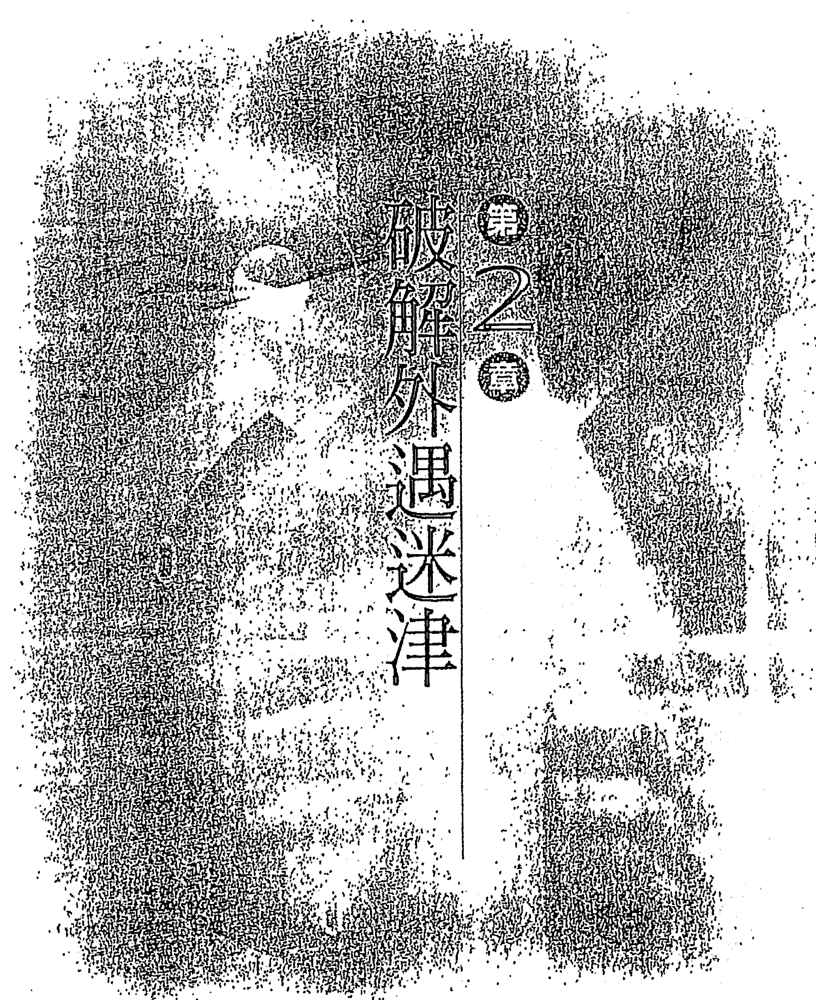
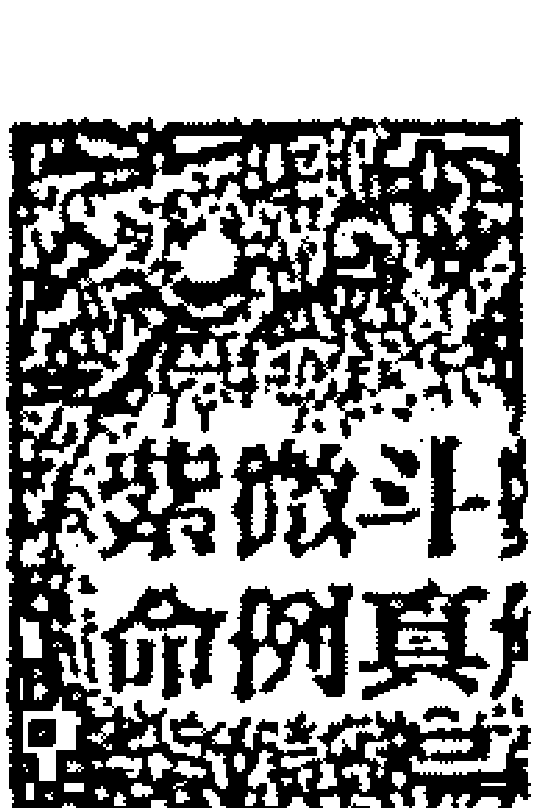
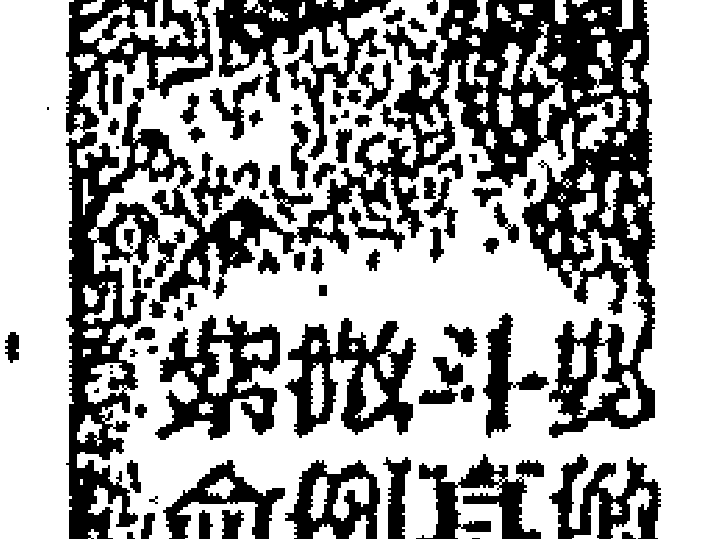
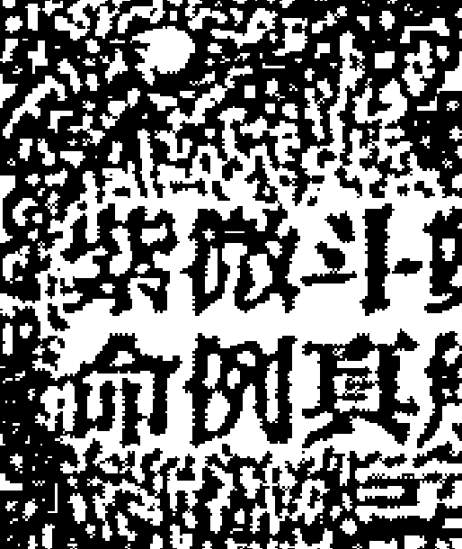
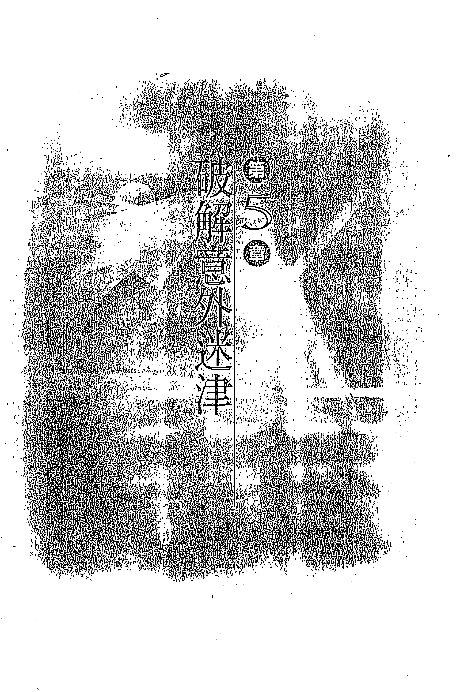
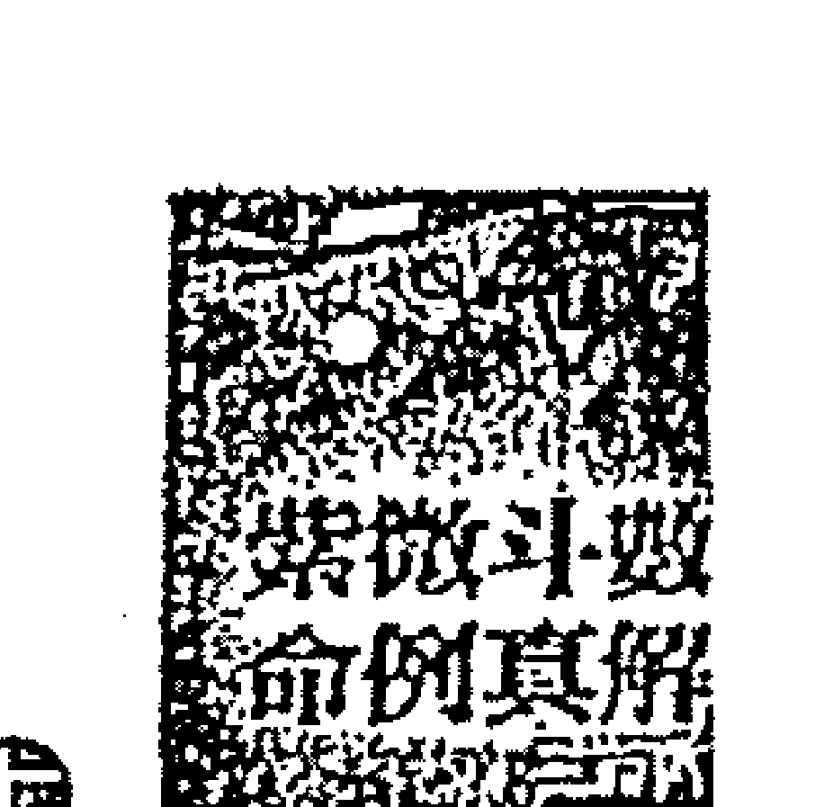

# 最终幻想VII补完计划
百科（上）

录屏是黑的截图是白的
录下的是黑的

## 序

凡學習過紫微斗數這門占星學的人，都有一個共同的結論，斗數確實易學難精，愈高層愈難突破瓶頸，要將這門學問融會貫通談何容易，絕非三年五載的時間能竟全功。就算有名師帶入門，能由正確的方法進入斗數領域，可以讓閣下少走不少冤枉路和節省寶貴時間，但每個人資質不同、領悟力互異，加上後天的努力亦不同，結果當然層次會差很多，有的學生學得相當認真，研究精神令人感動，有則「混」得令人看不下去，學不好反而怪老師偏心、天壽、薑步！

現代的人凡事都講求速食，很少有人肯花時間作基礎研究，曾有一位在電腦公司上班的學生向我誇下海口：

> > 「學紫微幹嘛要花一年的時間？我只要三個月就可以搞懂！」我說：「我再加三個月給你，到時候再看看吧！」

結果半年後，他不但嘴巴拉鍊拉起來外面還再貼一層膠布。要學紫微其實很容易，隨便到書局買兩本相關的書，看完後就可以滔滔不絕談上幾個小時，紫微很多人會，只是「會」到什麼程度的差別而已，入門簡單進階難。因此要學習紫微斗數，最好的方法還是由基礎打起，按部就班的往上進階，絕無捷徑可抄，跳級進階的結果不是變「花盤」就是「相公」了！

紫微學到一定的程度後，都會面臨一個共同的困難，那就是可供研究的案例難找，缺乏實戰的經驗，功力難以提升。余三十年來已教過五百一十多個學生，亦深深體會到這點，故將三十年的教學與執業經驗，以及所收集各式各樣稀奇古怪的案例，加以整理、歸類，加註說明，耗時一年多才完成，余不忍藏私，特將它公開給同好朋友，希望愛好占星學的道友好好珍惜，只要用心研究與體會，您的功力最少可以增進廿年以上。祝福您。

## 作者簡介

◎民國六十七年拜入占驗法門第五十二代陳家齊恩師門下，六十九年學成開始執業，七十一年傳授第一期入世弟子，迄今已屆四十期，學生年齡最小的廿二歲，最長的六十四歲，學生學歷則有國小畢業也有一個博士學位以上的學生。授業學生達五百一十七餘，已開業學生八十一位，學生遍佈臺灣及世界各地，堪稱臺灣斗數師資養成所。

◎命理界唯一多產的作家，曾在《美華報導》、《翡翠》、《第一手》、《第一家庭》、《財運》、《獨家報導》……等雜誌撰寫命理專欄近百篇，超過卅萬字，專業著作四十四本，全文超過六百萬字，幽默散文二本。

◎七十五年錄製全國第一套紫微斗數教學錄影帶共十卷，錄音帶卅卷，參與博新衛視台「現象追蹤點」現場Call in節目卅八集，力霸友聯「快樂台灣人」神機妙算單元共六十集，主持中廣「瑩彩廣場」節目一年半。

◎经常应邀至扶輪社、獅子會、各大基金會等社團專題演講不下百場，是臺灣命理界少見的：站著能講，坐著能寫，又擁有豐富教學經驗的命理專家，並成立《天乙命理網站：www.skyfate.com》。

◎天乙上人傳授學生的方法，由入門到經驗養成一氣呵成，過程採小班制的師徒傳授教法（有別於一般補習班），使用自己撰寫的獨家講義，能否成為占驗門下的一員，端看您我是否有此師生緣了。

## 序

3

## 作者簡介

5

## 目錄

7

## 第一章 破解婚姻迷津

19

### 一、告別不倫，重新展開地上情

20

### 二、結婚三天，碰上公公過世

23

### 三、中年喪夫，奈何晚年又喪子

26

### 四、武曲加煞，易在中年喪偶

29

### 五、遇人不淑，只好棄家出走

32

### 六、蜜月剛過，新婚妻子就跑了

36

### 七、天梁化禄，最好嫁「老」公

39

### 八、命坐寡宿，不结婚比较好

43

### 九、不利婚姻，当姨太太无妨

46

### 十、酒色皆来，没有老婆受得了

49

### 十一、婆家反对，想结婚不容易

52

### 十二、感情纷扰，剪不断理还断

55

### 十三、事业破败，婚姻面临大考验

59

### 十四、风流禄杖，婚姻难如人意

63

### 十五、命犯桃花，早婚必难持久

66

### 十六、运气太背，因赌赔上婚姻

70

### 十七、夫妻逢空，难有美满姻缘

74

### 十八、命带刑剋，夫妻难共白首

77

### 十九、形单影只，一生与六亲无缘

80

### 廿、缘起缘灭，因大限流年犯冲

83

### 廿一、婚姻告吹，皆因流年不利

86

### 廿二、命會三煞，難逃生死別

89

### 廿三、婚姻坎坷，不如嫁人做繼室

92

### 廿四、姻緣早發，可惜並非良緣

95

### 廿五、婚姻破裂，先生離家出走

98

### 廿六、痛遭喪夫，才知不宜早婚

101

### 廿七、遲遲不婚，只因眼界太高

104

### 廿八、嫁給賭徒，一生受其拖累

107

### 廿九、結婚離婚，兩次都是同一人

110

### 卅、有心從良，奈何因財失和

113

### 卅一、歷盡滄桑，總算結成姻緣花

116

### 卅二、天生暗疾，竟遭牵手嫌惡

120

### 卅二、命坐桃花，感情多采多姿

125

## 第十三章 破解外遇迷津

127

### 一、嫁得贵夫，卻有雙夫命格

128

### 二、情場老手，老婆紅杏出牆

132

### 三、徐娘半老，偏愛少年頭家

136

### 四、結婚當年，就有情夫插花

140

### 五、外遇對象，竟是有婦之夫

144

### 六、甘心做妾，卻被元配抓到

148

### 七、要搞外遇，大家一起來

152

### 八、自命風流，何必歸咎雙妻命

155

### 九、流年不利，感情易生變故

158

### 十、沾染小姨，掀起軒然大波

162

### 十一、才剛結婚，就鬧三角紛紛

165

### 十二、發現綠帽，老公差點自殘

169

### 十三、婚外偷情，日久也會吃膩

172

## 第三章 破解財運迷津

175

### 一、錢來錢去，空歡喜一場

176

### 二、投資失敗，債務官司接連來

179

### 三、破軍加煞，錢財得而復失

182

### 四、好大喜功，怎奈兵敗如山倒

185

### 五、沈迷賭局，敗光家產空遺憾

188

### 六、反向操作，不慎誤觸地雷股

191

### 七、租屋不利，只好破財又消災

194

### 八、生意雖好，甜頭卻難嚐到

197

### 九、时局歹歹，玩股票被套牢

200

### 十、命会天刑，恐有牢狱之灾

203

### 十一、借钱开店，有违创业原则

207

### 十二、赌性不改，千万家财亦枉然

209

### 十三、手足争门，大好家业付东流

212

### 十四、少年得意，创业容易守成难

215

### 十五、流年犯冲，遭逢回禄之灾

218

### 十六、仆役不佳，小心危机四伏

221

### 十七、登陆被骗，身边小人不断

224

### 十八、劫空加会，十年奋斗转头空

227

### 十九、太阳化忌，最好去当上班族

230

### 廿、吃喝嫖赌，造成公司倒闭

233

### 廿一、煞星云集，做愈多亏愈大

236

### 廿二、有志难伸，一生为财拚生死

239

### 廿三、海外投资，谁知白忙一场

242

### 廿四、魁星坐命，不宜跨行投资

245

### 廿五、赌六合彩，输光一生积蓄

248

### 廿六、事业顺遂，可惜福寿不长

251

### 廿七、事业早发，奈何后继无人

254

### 廿八、心地善良，岂能做好生意人

257

### 廿九、对中大奖，财运手气皆不错

260

### 卅、命格大贵，牵动中奖连庄

263

### 卅一、入不敷出，竟然盗用公款

266

### 卅二、看错朋友，被骗失财上千万

269

### 卅三、交友不慎，因赌输光家产

272

### 卅四、破军化禄，库破威力无法挡

275

### 卅五、为友背书，破财又吃官司

278

### 卅六、夫妻同谋，一起扮猪吃老虎

281

### 卅七、破产边缘，幸得贵人相助

284

### 卅八、暴起暴落，五年间白忙一场

287

### 卅九、赔光积蓄，异乡发财梦碎

290

## 第四章 破解官禄迷津

293

### 一、人民保姆，栽在不伦之恋

294

### 二、倒闭三次，还能继续赚钱

297

### 三、有福同享，有难自己先跑

300

### 四、与人合伙，竟遭股东出卖

303

### 五、呆胞登陆，投资血本无归

306

### 六、汲汲营生，奈何只赔不赚

309

### 七、時移境遷，當年乞丐變局長

312

### 八、投資電玩，竟遭枕邊人告密

315

### 九、流年凶險，開店碰上大水淹

318

### 十、又嫖又賭，斷送大好前程

321

### 十一、屬下貪污，連累自己丟官

324

### 十二、身在遷移，適合出外發展

327

### 十三、精力過人，事業三起三落

330

### 十四、英俊多金，風流校長當無愧

333

### 十五、際遇乖忤，一年換七次工作

336

### 十六、羊陀夾忌，投資不宜冒險

339

### 十七、衣食無缺，升官野心卻不小

342

## 第五章 破解意外迷津

345

### 一、被撞重伤，索赔却无结果

346

### 二、迁移逢煞，开车出事撞死人

349

### 三、大限凶险，车祸意外命不保

352

### 四、双忌双煞，大限流年皆大凶

355

### 五、车断三截，自己只受轻伤

358

### 六、羊陀叠并，开车不慎落深坑

361

### 七、双忌入命，站卫兵遭枪击

364

### 八、命迁不吉，车祸连来两次

367

### 九、劫煞同宫，车祸伤及脑部

370

### 十、瓦斯爆炸，妻受伤、子不治

373

### 十一、禄存入命，遇劫可化险为夷

376

### 十二、命身不强，车祸不幸被撞死

379

### 十三、廉贞坐命，童年惊险万分

382

### 十四、福德已倒，夫妻同遭不测

385

### 十五、有钱有权，却因空难损命

388

### 十六、仆役犯冲，离家出走变黑户

391

### 十七、禄忌同宫，意外频生多重伤

394

### 十八、破军当道，只好见血消灾

397

## 第六章 破解家宅不宁迷津

401

### 一、花钱买屋，碰上遇不点交

402

### 二、家遭小偷，妻子钱财却无恙

405

### 三、羊入疾厄，破财官非纷沓至

408

### 四、火灾刚走，出门又碰上车祸

411

### 五、三空夹击，引动火厄上身

414

### 六、宅运逢凶，手足难逃一劫

417

### 七、田宅不佳，家運首當其衝

420

### 八、武殺人限，有財不易聚守

423

中华人民共和国
第1页

## 一、告别不倫，重新展開地上情

| 天祿梁存 | 七殺殺羊 | 紅鸞天天姻宿姚傷 | 廉火真星忌 |
| :--- | :--- | :--- | :--- |
| 天地地旬官劫空空【田宅】傅病劫天【癸巳】士煞德 | 【官祿】官衰災吊【甲午】伏煞客 | 【僕役】伏帚天滿【乙未】兵旺煞符 | 封誥【遷移】大臨指崴【丙申】耗官背耗 |
| 93~102 小限 6 | 83~92 小限 5 | 73~82 小限 4 | 63~72 小限 3 |
| 紫天陀右文鈴微相弼弱昌星科 | 准命日期： | 天紙 |  |
| 截空八煞廉座【福德】力死乖白【壬辰】士茸虎 | ○姓名：○性別：女○生辰：農曆45 (丙申) 年 07月01日 午時○五行：木三局○性曆：陌女○生肖：猴○命宮：寅宮○身宮：寅宮○命主：祿存○身主：天梁○出生地 東經：___/___/___北緯：___/___/___時差：___/___ | 破天天碎賓使【疾厄】病冠咸海【丁酉】伏帚池飛 |  |
| 103~112 小限 7 | 53~62 小限 2 |  |  |
| 天巨機門相 | 破左文軍輔曲 |  |  |
| 天恩刑光【父母】背墓息龍【辛卯】龍神德 | 天天天三哭才壽台【財帛】露休地淚【戊戌】拌浴煞門 |  |  |
| 113~122 小限 8 | 43~52 小限 1 |  |  |
| 貪狼 | 太太陰陽 | 武天曲府 | 天天同魁祿 |
| 天天鳳解天陰馬虛閣神巫煞【命宮】小耗歲大【庚寅】耗驛耗 | 天享【兄弟】將胎舉小【辛丑】宜拔耗 | 天龍台斗櫃池輔宿【夫妻】壽養將官【庚子】壽星符 | 孤天辰月【子女】飛畏亡實【己亥】產生神寨 |
| 3~12 小限 9 | 13~22 小限 10 | 23~32 小限 11 | 33~42 小限 12 |

## 第一章 破解婚姻迷津
告别不伦，重新展开地上情

## 一、告别不伦，重新展开地上情

### 【案主】

*生辰：民国四十五年七月一日午时阳女

*特征：浓眉美目、身材姣好，外型明艳动人，神色冷漠，脾气暴躁，才艺虽多但博而不精，好动、爱往外跑，但公共关系并不佳，在外面常惹是非，而一生多奇遇。

### 【事例】

十九岁与有妇之夫同居，对方年纪大自己十七岁，廿四岁堕胎，廿七至廿九岁吵架闹失和，在卅一岁四月后分手，丙寅年四月认识新男友，房屋两栋。

### 【命盤解析】

一、命格
命身贪狼会双煞大桃花，并与次桃花对照，夫妻宫又为四煞会集之处，且第二大限即引动夫妻宫因此内外条件兼具，此格为有不花之理？

二、星盘优点
福德本有双煞，但为劫空扫除，兄弟宫星宿尚称平和，与姐妹情份较深。

三、星盤缺點
紫微雖在朝卻逢空，天府亦不會祿，日月居丑亦無光芒可言，雙祿會空於子田，夫妻雖坐武府但會四煞，子午卯酉四宮之組合甚凶，行運至此皆不利，命宮三合星宿組合皆差，哀啊！

四、事件分析

* 命帶桃花，第二大限走日月會紅鸞夫妻宮化祿，該大限不花也難，本命忌入大限疾厄，大限子女煞忌交馳，此大限開鍋煮飯亦不足為奇。
* 大限官祿為天梁，主其於該大限內所接觸的對象屬較年長者，十九歲走桃花而與人同居，第三大限夫妻宮逢破，大限忌又沖大限夫妻，並與本命財宮重疊，主有為財失和分手之兆。

五、綜合結論

* 廿七歲走財宮逢破耗之宿，且財星化忌，太歲夫妻入雙忌，小限夫妻逢忌沖，故吵鬧失和。
* 大限子女逢羊刃單守，廿四歲小限走子女，逢二三忌交馳於太歲子田，小限子女亦逢忌，太歲又入雙羊刃，主墮胎，並於卅一歲太歲小限走夫官線時分手。
* 卅二歲走桃花，夫妻宮又逢祿，故另結新歡而除舊佈新。

### 二、結婚三天，碰上公公過世

### 【樂事】
* 生辰：民國四十八年五月廿一日丑時 陰女
* 特徵：面貌清秀姣好，聰明冷靜，孝順顧家，重視物質享受，此外多為四眼田雞，夜貓族，個性外向、活躍好動，頗有男子氣概，但言語直爽，易招惹口舌是非，宜小心罹患心臟病以及四肢外傷，右手和左腳堪稱多災多難。

### 【事例】
廿三歲結婚，婚後二天逢公公過世，夫妻常常爭吵，廿五歲離婚。

### 【命盤解析】
1. 命格：女命太陽加煞既不利婚姻，亦不利長輩，命帶天姚為紅豔煞，亦為桃花格，身宮坐天機加煞不利兄弟且早刑晚孤，除此之外，父母、兄弟宮又坐祿，亦有兩姓或庶出之兆。
2. 星盤優點：紫微在朝，命坐官貴，主貴，天府會祿入於田宅，又為雙祿夾命，主富，日月居旺地，且日月、昌曲拱財，雖小有瑕疵亦無大礙，一生物質享受必然優渥，而巨鈴之恐怖組合被空劫夾反吉。

三、星盤缺點
命身雙煞皆刑及六親，命居旺地太陽，福德落煞，一生操勞不得清閒，個性雖然外向，但遷移宮逢空劫夾，外出不得利，人際關係亦有待加強，僕役火貴之組合卻逢空，官祿雖有旺地太陰亦逢空，甚爲可惜。

四、事件分析
女命太陽旺地加煞坐命，行運又逢天機加擎羊，廿五歲主離婚

五、綜合結論
辛未大限時，大限夫妻宮爲權忌夾煞同宮，婚姻線雖被引動，但卻暗藏是非，大限忌又入本命宮祿沖夫妻，更爲不利，主其若於該大限內結婚，也將在該大限內離婚。

| 太陀文 隅殺曲 忌 | 破孫右 氣存弼 | 天梁 機羊 | 紫天府左 微府鉞輔 |
| :--- | :--- | :--- | :--- |
| 天天天 虛姚巫 [命宮] 官病歲大 [己巳] 伏 驛耗 | 天陰 秃煞 [父母] 傅死息龍 [庚午] 士 神德 | 天天台 哭月輔 [祖德] 力羣華白 [辛未] 士 薹虎 | 天 馬 [田宅] 青絕劫天 [壬申] 龍 煞德 |
| 3~12 小限 9 | 13~22 小限 8 | 23~32 小限 7 | 33~42 小限 6 |
| 武 曲 藤 | 推命日期： |  | 太文 陰昌 |
| 紅天三恩旬 繁才台光空 [兄弟] 伏衰銀小 [戊辰] 兵 彼耗 | ○ 姓名： ○ 性別：女 ○ 生辰：農曆 48 (己亥) 年 05月21日丑時 |  | 天戲破斗 官空碎害 [官祿] 小胎災吊 [癸酉] 稀 煞客 |
| 天 同 | ○ 五行：木三局 ○ 性別：陰女 ○ 生肖：豬 ○ 命宮：巳宮 ○ 身宮：未宮 ○ 命主：武曲 ○ 身主：天機 |  | 貪火 狼星 權 |
| 龍封 池話 [夫妻] 大希將官 [丁卯] 耗旺星符 | ○ 出生地 東經：____/____/____ 北緯：____/____/____ |  | 天寡八地天 署宿座空偕 [僕役] 將憂天病 [甲戌] 宮 煞符 |
| 103~112 小限 11 | 時差：____/____ |  | 53~62 小限 4 |
| 七 殺 | 天 梁 科 | 廉天天 真相魁 | 巨鈴 門星 |
| 天孤 福辰 [子女] 病臨亡貧 [丙寅] 伏官神案 | 煞天 煞刑 [財帛] 吾冠地羅 [丁丑] 神希煞門 | 解天地天 悸貴劫使 [疾厄] 飛沐威晦 [丙子] 廉浴池瓦 | 風 閃 [遷移] 麥畏指蔽 [乙亥] 舌生背達 |
| 93~102 小限 12 | 83~92 小限 1 | 73~82 小限 2 | 63~72 小限 3 |## 三、中年丧夫，奈何晚年又丧子

| 紫微七杀 | 天魁 | 陀罗 | 天封 贫黯 【遗移】官绝亡病 【丙申】伏 神符 |
| :--- | :--- | :--- | :--- |
| 天截破八地地 福空碎座劫空 【田宅】病病指白 【癸巳】伏 背虎 | 红鸾 【官禄】大死成天 【甲午】耗 池德 | 寡天天 宿兆伤 【仆役】伏兵煞客 【乙未】兵 煞客 | 33~42 小限3 |
| 33~42 小限3 | 43~52 小限2 | 53~62 小限1 | 63~72 小限12 |
| 天天右文龄 机梁昌星 忌 【福禄】丧衰天龙 【壬辰】神 煞德 | 推命日期： ○ 姓名： ○ 性别：女 ○ 生辰：农历10(辛酉)年 07月12日午时 ○ 五行：木三局 ○ 性属：阴女 ○ 生肖：鸡 ○ 命宫：寅宫 ○ 身宫：寅宫 ○ 命主：禄存 ○ 身主：天同 ○ 出生地 东经：___/___/___ 北纬：___/___/___ 时差：___/___ | 廉破禄火 贞军存星 | 天天三天 官哭台使 【疾厄】博胎将威 【丁酉】士 星殒 |
| 23~32 小限4 |  |  | 73~82 小限11 |
| 天相 |  |  | 犁左文 羊辅曲 |
| 天天虚刑 【纣母】飞帝癸大 【辛卯】廉旺煞耗 |  |  | 【财帛】力癸华晦 【戊戌】士 较气 |
| 13~22 小限5 |  |  | 83~92 小限10 |
| 太巨天 阳门贰 禄禄 | 武贪 曲狼 科 | 天太 同阴 | 天府 |
| 天解天阴恩 马神巫煞光 【命宫】癸临劫小 【庚寅】苦宫煞耗 | 能恩 池闲 【兄弟】将冠弄官 【辛丑】军蒂弄符 | 天台旬斗 喜辅空君 【夫妻】小沐浴贫 【庚子】耗浴冲气 | 孤辰天天天 廉禄才龙月 【子女】长成岁殇 【己亥】龙生骐门 |
| 3~12 小限6 | 113~122 小限7 | 103~112 小限8 | 93~102 小限9 |

推命日期：
○ 姓名：
○ 性别：女
○ 生辰：农历10(辛酉)年 07月12日午时
○ 五行：木三局
○ 性属：阴女
○ 生肖：鸡
○ 命宫：寅宫
○ 身宫：寅宫
○ 命主：禄存
○ 身主：天同
○ 出生地 东经：___/___/___
北纬：___/___/___
时差：___/___

## 第一章 破解婚姻迷津

## 中年丧夫，奈何晚年又丧子

## 二、中年丧夫，奈何晚年又丧子

### 【命主】

+   生辰：民国十年七月十一日午时 阴女
+   特征：聪明冷静，孝顺顾家，又急公好义，热心诚恳。好动外向，个性霸气、直爽，言语坦率，易伤人于无形。是夜猫子、近视眼，有口福，注重保养，心脏、牙齿不佳，皮肤易过敏，腰椎神经以及妇科方面易出毛病，一生为家庭生活奔波忙碌。

### 【事例】

女，于四十岁庚子年夫亡，五十五岁乙卯年其子亦亡，大限子女位化忌加双煞，本命阴阳相反，主刑克，大限紫杀又逢三空，官禄廉火冲夫妻位。

## 【命盘解析】

### 一、命格

巨日旺地坐命，且巨日同宫格为煞星冲破，会魁钺为公家格，两星皆不利女命，主中年精神生活空虚，夫宫阴阳颠倒兼双煞拱，子女宫会三空，若行运再不佳，即有刑夫伤子之兆。

### 二、星盘优点

双禄都给了自己，至少蛮有口福的，而且体质还不错，且挺注重养生之道。

### 三、星盘缺点

+   紫微在野又逢空，命格无以言贵，命坐禄星，但天府会空不会禄，乃虚库一座，再考虑其财福一线及田宅，可知为过路财神可是当之无愧。
+   命坐四马地带天马，个性外向，迁移却为恶煞单守，衰哉！福德带忌会三煞，一生难得精神享受。

### 四、事件分析

婚姻成于壬申大限约于廿八岁之时，四十岁庚子年太岁走夫妻位逢羊刀，因本命阴阳相反，主刑克，大限紫杀又逢二空，大限官禄廉火流羊刀夫妻位之故。

### 五、综合结论

五十五岁乙卯年大限乙未宫，大小限子女双忌带五煞交驰，太岁子女亦双忌，当年其子亦身故。

## 四、武曲加煞，易在中年丧偶

### 【案例】

*   生辰：民国十七年二月廿一日卯时 阳女
*   特征：个性白目、急惊风、霸气、爱掌权，好动爱往外跑，重享受及口腹之欲，是爱钱嫂，有些不解风情，但重朋友，讲义气又疼爱子女，唯朋友或属下皆不得力，一生难得清闲，毫无精神享受可言。视力不佳，易犯偏头痛，牙齿、肺经一脉皆差，心脏与妇科亦不佳。

### 【事例】

女，乙巳年丈夫病死。女命武曲加煞，主中年丧夫，此大限必然再婚或同居。

### 【命盘解析】

### 一、命格

◎命身组合属武曲加煞，命格之中刚毅带孤克，视为寡宿，主中年丧偶。
◎身宫七杀不利，再加羊刀，除己身多灾病之外，亦不利六亲，而其六亲宫位之中夫妻宫为空宫，并会双煞而不堪一击，若行运中再入煞忌即兑现，敢娶她的还真是拼命三郎。

| 天机左辅火铃 | 七杀擎羊 | 天同文曲 | 廉贞 |
| :--- | :--- | :--- | :--- |
| 天马天喜孤辰天刑封诰 | 凤阁龙池 | 天使 | 龙德解神天巫天空 |
| 【仆役】博弈劫耗 | 【迁移】官符丧吊 | 【疾厄】伏兵天伤 | 【财帛】大耗指背 |
| 【丁巳】土生煞气 | 【戊午】伏 煞门 | 【己未】兵 煞客 | 【庚申】耗 背符 |
| 74~83小限6 | 64~73小限5 | 54~63小限4 | 44~53小限3 |
| 紫微天府 | 推命日期： |  | 右弼科 |
| 天才 | ○ 姓名： |  | 台辅 |
| 【官禄】力士岁建 | ○ 性别：女 |  | 【子女】病符咸池 |
| 【丙辰】土浴堂旌 | ○ 生辰：农历17（戊辰）年 02月21日卯时 |  | 【辛酉】伏 池耗 |
| 84~93小限7 | ○ 五行：金四局 |  | 34~43小限2 |
| 天巨机门忌 | ○ 性别：阴女 |  | 破军 |
|  | ○ 生肖：龙 |  |  |
| 天官天福 | ○ 命宫：子宫 |  | 截空天刑天空天虚 |
| 【田宅】青龙息神 | ○ 身宫：午宫 |  | 【夫妻】喜死地大 |
| 【乙卯】龙德神符 | ○ 命主：贪狼 |  | 【壬戌】神 煞耗 |
| 94~103小限8 | ○ 身主：文昌 |  | 24~33小限1 |
| 贪狼禄 | 太阴天姚铃星 | 武曲天府 | 天同 |
| 天哭姚恩天贵地劫破碎 | 寡宿破碎三台八座 | 阴煞 | 红鸾旬空 |
| 【福德】小耗岁驿 | 【父母】将帝奏卷天 | 【命宫】奏丧将白 | 【兄弟】飞病亡匙 |
| 【甲寅】耗官驿客 | 【乙丑】军旺禄德 | 【甲子】害 星虎 | 【癸亥】匪 神德 |
| 104~113小限9 | 114~123小限10 | 4~13小限11 | 14~23小限12 |

推命日期：
○ 姓名：
○ 性别：女
○ 生辰：农历17（戊辰）年 02月21日卯时
○ 五行：金四局
○ 性别：阴女
○ 生肖：龙
○ 命宫：子宫
○ 身宫：午宫
○ 命主：贪狼
○ 身主：文昌
○ 出生地 东经：___/___/___
北纬：___/___/___
时差：___/___

### 二、星盘优点

夫妻宫不利坐破军，逢空较好，至少彼此之对待关系尚不至太差，较不会因吵闹失和而离婚。

### 三、星盘缺点

此盘星宿组合与坐落之处皆不吉，四化更“荣”，盘中架构为紫微在野又逢煞是为无道，天府坐命又不会禄，且田宅库位又化忌，武曲财星入命原本禄入财福甚佳，偏偏空劫亦来凑热闹，帮了倒忙，而另外一颗禄却落入了朋友宫，真是背到家了！

### 四、事件分析

辛酉大限，忌入大限夫妻位，并与本命疾厄重叠，大限羊刀再入本命夫妻，该大限其配偶必有灾病。

### 五、综合结论

卅八岁逢大小限重叠，本命夫妻入双羊刀，大小限夫妻双忌带流羊刀，太岁夫妻亦化忌故而丧偶。

## 五、遇人不淑，只好弃家出走

| 紫微七杀天钺 | 右弼 | 铃星 | 左辅 |
| :--- | :--- | :--- | :--- |
| 天孤天天斗 辰辰姚巫君 [财帛] 飞禄劫煞 [乙巳] 庶官煞气 45~54小限6 | 天同益暗 福阴脉络 [子女] 奥冠决授 [丙午] 考帝煞门 35~44小限5 | 天天三八句 寿月台座空 [夫妻] 胎沐天其 [丁未] 虹浴煞房 25~34小限4 | 天能地 马池劫 [兄弟] 小畏指官 [戊申] 耗生背符 15~24小限3 |
| 天天 机梁 禄 天 使 [疾厄] 妻帝罪岁 [甲辰] 神旺苍庭 55~64小限7 | 推命日期： ○姓名： ○性别：女 ○生辰：农历41 (壬辰)年 05月24日酉时 ○五行：土五局 ○性属：阴女 ○生肖：龙 ○命宫：酉宫 ○身宫：卯宫 ○命主：文曲 ○身主：文昌 | 雁破 贞军 | 陀罗 |
| 截台 空辅 [迁移] 病衰息病 [癸卯] 伏 神符 65~74小限8 | 出生地 东经：___/___/___ 北纬：___/___/___ 时差：___/___ | 天天 官虚 [父母] 力殆地大 [庚戌] 土 煞耗 115~124小限1 |  |
| 太巨 阳门 | 武曲文昌 曲禄昌曲 忌 | 天太黎 同阴羊 | 天禄火 府存星 科 |
| 天地天 哭空伤 [仆役] 大病成吊 [壬寅] 耗 豁客 | 慕破天天 宿碎才刑 [官禄] 伏死弊天 [癸丑] 兵 鞍德 | 解神 [田宅] 宫墓将白 [王子] 伏 星虎 | 红思天封 鸾光贡讼 [福德] 傅绝亡能 [辛亥] 士 神德 |
| 75~84小限9 | 85~94小限10 | 95~104小限11 | 105~114小限12 |

### 【案主】

+   *生辰：民国四十一年五月廿四日酉时 阳女
+   *特征：个子虽不高，却有波霸的身段，个性反复无常，坐姿不雅，怕死又贪小便宜，易受人利用，重享受、有口福，好动活跃，爱漂亮，是洛克马一匹，醋坛子一个，父兄无靠，一生难得知心好友，极为疼爱子女。

### 【事例】

女，廿岁被强暴，因大限仆役极乱，夫妻宫化科，廿一岁勉强结婚，廿五岁即离家出走。

### 【命盘解析】

+   一、命格

廉破次桃花坐命，加咸池又会昌曲为桃花格，且夫妻宫为煞星单守，官禄宫文化忌对冲，此属不利婚姻之组合，纵有婚姻亦难持久，一生在感情路上坎坷，

+   二、星盘优点

多是非纠葛。

+   三、星盘缺点

紫微在野，命会空，身逢空，日月虽居旺地，但一逢空、一落煞，虽有日月夹官禄亦枉然，且夫官一线甚为复杂，煞忌交驰，无吉可言，夫妻宫虽有左右夹，但夹宫不旺，而且是夹一颗凶煞，此盘空宫最多，但多为煞冲，或为煞星单守，甚不恰当。

+   四、事件分析

◎戊申大限空劫照会，本命夫官线与大限兄仆重叠，甚为复杂。且本命官禄禄忌同处，本命疾厄煞忌临宫，大限夫妻位为羊刃单守，并与本命子女重叠，此大限不破财也要破身。
◎廿岁辛亥年生日过后，大小限皆走空劫照会，小限走仆役，并与大限迁移重叠，且大小限兄仆化三忌与恶煞交驰，太岁兄弟羊陀叠并与忌星交驰，因而有被强暴之事发生。

+   五、综合结论

◎廿一岁壬子年生日过后，小限走官禄位，虽逢三忌冲本命夫妻宫，但流鸾入身宫，小限夫妻得科禄，太岁夫官亦是双禄带忌，因而结婚，但其中必夹杂是非而勉强结婚。

丁未大限本命夫妻羊铃坐守不利婚姻，廿五岁丙辰年大限忌入小限太岁夫官，流年忌引动命迁，因大限夫妻有羊铃坐守，故而婚离不成，便离家出走。

## 六、蜜月刚过，新婚妻子就跑了

| 天机 | 紫微 | 陀罗天钺 | 破军禄存 |
| :--- | :--- | :--- | :--- |
| 天孤天马辰才 [指謦] 大耗亡贯 [辛巳] 耗 神帚 | 天魁天刑月福池刑月 [田宅] 伏胎将官 [壬午] 兵 星符 | 截天空地旬空劫空 [官禄] 官符举小 [癸未] 伏 绞耗 | 天凤天阴天虚阁巫煞信 [仆役] 传长茂大 [甲申] 士生驿耗 |
| 25~34 小限 2 | 35~44 小限 3 | 45~54 小限 4 | 55~64 小限 5 |
| 七杀 | | 推命日期： | 火铃羊星 |
| 天解哭神 [父母] 病墓地丧 [庚辰] 伏 煞门 | ○姓名： ○性别：男 ⊙生辰：民国39 (庚寅)年 10月25日申时 | | 破碎天 [迁移] 力沐息龙 [乙酉] 士治神倦 |
| 15~24 小限 1 | ○五行：土五局 ○性属：阳男 ⊙生肖：虎 ⊙命宫：卯宫 ○身宫：未宫 ○命主：文曲 ○身主：天梁 | | 65~74 小限 6 |
| 太阳天梁禄 | | | 府天贞 |
| 地空 [命宫] 墓死威晦 [己卯] 神 池气 | ○出生地 东经：___/___/___ 北纬：___/___/___ 时差：___/___ | | 紫天封天府姚错使 [疾厄] 胥冠垂白 [丙戌] 龙蒂吾虎 |
| 5~14 小限 12 | | | 75~84 小限 7 |
| 武曲天文相昌禄忌 | 天巨天左门魁辅弼科 | 贪文狼曲 | 太阴星 |
| 台辅 [兄弟] 飞廉指岁 [戊寅] 廉 背建 | 红鸾三台八座恩光宿台座光 [夫妻] 奏哀天府 [己丑] 寿 煞符 | [子女] 将帝炎吊 [戊子] 军旺煞害 | 天天斗官贵君 [财帛] 小耗劫天 [丁亥] 耗官煞德 |
| 115~124 小限 11 | 105~114 小限 10 | 95~104 小限 9 | 85~94 小限 8 |

推命日期：
○姓名：
○性别：男
⊙生辰：民国39 (庚寅)年 10月25日申时
○五行：土五局
○性属：阳男
⊙生肖：虎
⊙命宫：卯宫
○身宫：未宫
○命主：文曲
○身主：天梁
○出生地 东经：___/___/___
北纬：___/___/___
时差：___/___

## 第一章 破解婚姻迷津

蜜月刚过，新婚妻子就跑了。

## 六、蜜月刚过，新婚妻子就跑了

### 【案例】

*   生辰：民国卅九年十月廿五日申时 阳男
*   特征：身材中高，孝顺顾家，是夜猫子，个性少年老成，啰唆、爱抬杠，有点霸道，是男性沙文主义者。十项全能，能吃有口福，重朋友，但友人多无义，一生犯小人。心脏、视力不佳，皮肤易生疮。

### 【事例】

男，卅四岁癸亥年结婚，未满三个月，太太离家出走。

### 【命盘解析】

+   一、命格

命身空劫各一，三合四煞照会，可惜这“日出浮山格”已经玩完了，兄仆与夫官两线可热闹着呢！夫妻宫有是非星坐守，再加上左右同宫，此人之姻缘若不来上个两三回，恐怕难定江山啊！

+   二、星盘优点

身宫煞星单守，但逢空扫除，迁移入双煞，但羊火化合而为权，有制而减。

### 三、星盘缺点

紫微在野，天府无禄，日月虽居旺地，却为空劫毁之殆尽，最糟的莫过于命宫之三方四正，皆照会四煞与空劫，而且身宫又偏偏在这三合的地雷区，正所谓“连环泡”，真是“衰尾道人”一个，命坐禄星却命身三空，禄入友宫逢阴煞再加忌冲，唉！当他的朋友可真是吃香喝辣的唷！

### 四、事件分析

辛巳大限，大限禄引动本命夫妻，本命禄亦入大限夫妻，主该大限内会有姻缘出现。卅四岁癸亥年小限走夫妻位，逢红鸾星动而结婚。

### 五、综合结论

因大小限太岁之夫妻宫皆有恶煞据守，且四忌夹本命夫妻，使得其妻在婚后未满三个月即离家出走，至丙寅年由法院判决离婚。

## 七、天梁化禄，最好嫁“老”公

### 【案主】

+   *生辰：民国卅一年十一月廿九日亥时 阳女
+   *特征：个性直爽，有爱心，孝顺顾家，但脾气却阴晴不定，重夫妻，有绰号，并有过房庶出或重认义父母之兆，一生犯小人，不宜与朋友有财物上的牵扯，婚后亦不宜与婆家同住，以免发生纠葛。

### 【事例】

女，廿一岁结婚，卅八岁离婚，本命夫妻天梁化禄加禄存，应嫁“老”公而且不宜早婚，故二婚难免。

### 【命盘解析】

### 一、命格

◎日月同未安命丑，乃侯伯之材，但二煞夹命，空劫夹身，三合不见禄马，故而此亦平常之命尔。
◎盘中双禄全给了夫妻宫，而且是老人星化禄，又逢空劫夹夫妻，主其不宜早婚，而且须嫁“老”夫才有利，否则可就不是一次婚姻所能解决的啰！

| 天同\破军 | 武曲\天府 | 太阴 | 贪狼 |
| :--- | :--- | :--- | :--- |
| 破碎台辅 [官禄] 飞廉亡神 [乙巳] 服 神符 | 天刑三台 [仆役] 癸亥将星 [丙午] 云 星建 | 天才 [迁移] 将星寡宿 [丁未] 军旺煞气 | 孤辰八座 [疾厄] 小耗岁破 [戊申] 秘官驿门 |
| 83~92小限12 | 73~82小限11 | 63~72小限10 | 53~62小限9 |
| 破军 凤阁 开宿 [田宅] 喜神地劫 [甲辰] 神 煞客 | 推命日期： ○姓名： ○性别：女 ○生辰：农历31 (壬午)年 11月29日亥时 ○五行：木三局 ○性属：阳女 ○生肖：马 ○命宫：丑宫 ○身宫：亥宫 ○命主：巨门 ○身主：火星 ○出生地 东经：______ 北纬：______ 时差：______ | 天巨 樑门 红旬 鸾空 [财帛] 青龙息神 [己酉] 龙德神将 | |
| 93~102小限1 | | | 43~52小限8 |
| 天文 魁曲 | 紫微 天相 天姚 权 | 天龙天池 官月劫 [子女] 力士寡宿 [庚戌] 士浴害符 | |
| 截空 [福德] 病墓咸池 [癸卯] 伏 池德 | | | 33~42小限7 |
| 103~112小限2 | | 七杀 右弼 火星 | 天梁 文曲 禄存 |
| 廉贞 左辅 | 封诰 斗君 [命宫] 伏兵天德 [癸丑] 兵 煞德 | 天哭 天空 虚虚 [兄弟] 官符灾煞 [壬子] 伏 煞耗 | 天姚 [夫妻] 传送劫杀 [辛亥] 士生煞耗 |
| 113~122小限3 | 3~12小限4 | 13~22小限5 | 23~32小限6 |

## 第一章 破解婚姻迷津

天梁化禄，更好嫁“老”公

### 二、星盘优点

+   紫微在朝当权，但入地网宫，为美中不足，虽无法贵显，格调不差。
+   命借日月皎正坐佳，且三方四正无煞，除却感情路上的阴霾不说，其他在人际遇，工作及生活上倒还平稳，兄弟宫之星宿组合令人毛骨悚然，幸逢地空予以解围。

### 三、星盘缺点

天府合财星，同宫入忌不会禄落于仆役乃虚库一座，无大富可言，再观其财福与田宅和命身宫之情形，更是前呼后应，命无会禄，双禄安身却空劫夹，可惜呀！命无主星又被二煞夹，六亲宫位皆不吉，可谓六亲无靠。

### 四、事件分析

+   壬子大限时禄星引动本命夫妻宫，大限夫妻宫为双权加陀罗，主姻缘成于下五年。
+   廿一岁流鸾入命，流禄入夫官而结婚，辛亥大限，忌入本命夫妻，大限夫妻组合不佳，双禄入宫，主夫妻感情生变。

### 五、综合结论

+   庚戌大限，禄入大限夫妻且双桃花对照兼煞冲，该大限婚姻亮红灯。

### 八、命坐寡宿，不结婚比较好

◎卅八岁己未年太岁行日月加煞，不利婚姻，且太岁夫官禄上加禄，小限忌入小限仆役与大限夫妻重叠，恐不安于室而离婚。

【案例】

*   生辰：民国卅年七月五日戌时 阴女
*   特征：长相漂亮，心软善良，身材不高，个性刚毅、喜爱出风头，是钱嫂加鸡婆，亦颇有异性缘和第六感。怕死、易焦虑，花钱较无计划，缺乏精神享受，一生劳碌，是别人的贵人。能吃、有口福。长辈有增加之兆，重手足之情。

女，命坐寡宿，只宜同居，收养义子。

【命盘解析】

### 一、命格

武曲坐命加煞为寡宿，加左辅更严重，夫妻宫又为凶星据守，婚姻必有克，纵使命坐红鸾，身坐桃花星，要姻缘平顺实非易事，但不表示此生没人中意，而是不结婚较为利人利己，偏房或同居则无妨。

### 二、星盘优点

◎紫微在朝，命宫得府相朝、魁钺拱，兼左右对照以及权禄夹，故而格调与品味还蛮高的。

命虽具寡宿之格，但三合无煞有吉，除却姻缘不论，其他方面都算满好的。

田宅虽入地空，不但把天机加煞之不良组合扫除，而且并不空宫位。

### 三、星盘缺点

-   ◎天府星及命宫三合皆不会禄，故无大富可言，官禄组合甚佳，却照会二煞，且疾厄亦不佳，故而虽会魁钺，亦恐与公门无缘。

-   ◎命坐财星却化科，身入财帛宫却逢忌冲，主其来财辛苦，双禄皆照会二空，且落宫亦不恰当，子女宫煞冲、戌位落煞、子位逢忌，亦有无子之憾，兼多皮肉之灾。

## 四、综合结论

命格具寡宿，并以夫妻宫为最差，因此正式婚姻难成，子女宫之对宫坐天机，主子女为收养来的。

巨门禄 | 廉贞天相天魁 | 天梁 | 七杀陀罗铃星
:--- | :--- | :--- | :---
天刑孤辰天福空天贵使 [疾厄] 病符指威 [癸巳] 伏 背建 | | 截空廉姚 [子女] 伏墓地损 [乙未] 兵 热门 | 孤辰旬空 [夫妻] 官符亡贯 [丙申] 伏 符察
**73~82 小限3** | **83~92 小限2** | **93~102 小限1** | **103~112 小限12**
贪狼右弼 | **推命日期：** | 天马同存
天厨台斗 喜神辅弼 [迁移] 寡宿天病 [壬辰] 神 煞符 | ○姓名： ○性别：女 ○生辰：农历30 (辛巳) 年 07月05日戌时 ○五行：木三局 ○性属：阴女 ○生肖：蛇 ○命宫：戌宫 ○身宫：午宫 ○命主：禄存 ○身主：天机 | 天龙破地 官池碎劫 [兄弟] 傅胎将官 [丁酉] 士 星符
**63~72 小限4** | **113~122 小限11**
太阴 | | 武曲左 破军辅 科
天天才刑光宿 [仆役] 飞廉灾吊 [辛卯] 廉旺煞客 | ○出生地 东经：____/____/____ 北纬：____/____/____ 时差：____/____ | 红鸾 [命宫] 力衰孽小 [戊戌] 士 较耗
**53~62 小限5** | **3~12 小限10**
紫微天府文曲 | 天火机星 | 破军文昌忌 | 太阳权
天府天马三台 马神巫煞台 [官禄] 炎端劫天 [庚寅] 苦官煞德 | 天地哭空 [田宅] 将冠帝白 [辛丑] 冥帝忧虎 | 八封座煞 [福德] 小沐卷宠 [庚子] 移浴神德 | 天天虚秀月 [父母] 养长大 [己亥] 龙生驿耗
**43~52 小限6** | **33~42 小限7** | **23~32 小限8** | **13~22 小限9**

### 九、不利婚姻，当姨太太无妨

【案例】

*生辰：民国四十一年六月廿九日辰时 阳女

*特征：身材高挑，眉清目秀，面目五官有高低眉或大小眼。少年老成，孝顺顾家、一副大姐头的架势，是夜猫子。个性开朗乐观，有爱心，鸡婆、霸气小器又怕死，是个钱嫂。脾气阴晴不定难以捉摸，记性不佳，带点脱线，易犯小人，劳碌一生，愿为家庭、手足牺牲付出而无怨无悔。

【命盘解析】

女，为一外国侨领之第二姨太太。

-   一、命格

好好的一个“日出浮山”以及“禄合鸳鸯”格，却被空劫搞成“两重华盖”格，日月喜照不喜坐，女命旺地太阳，不利婚姻，为偏房之格，恐怕连姨太太都没得做呢！

-   二、星盘优点

◎命身三合皆无煞冲，夫妻之组合虽不理想，但三合亦无煞冲，兼得左右拱，至少尚不会遇人不淑。

◎女命旺地太阳本不利长辈与配偶，逢空则免其刑克，亦不至太过劳碌，福德虽不旺，但三合见禄不见煞，亦能知足而常乐。

### 三、星盘缺点

◎紫微无道，天府不会禄，并非富贵之造，虽命身三合得双禄，但空亡星偏偏和此人过不去，落宫甚不恰当，摆了个金三角地雷区，不偏不倚地刚好套在命宫之三位，这一下炮三响，赔大了！

◎田宅四煞会集，更是聚财不易，疾厄宫之组合亦差，肠胃不佳，妇科易长瘤，亦具癌症因子，兄仆一线亦是挺累人的，为单向付出，吃力不讨好。

### 四、事件分析

壬申大限，逢财星双忌加煞，与本命兄弟重叠，大限夫妻为双羊冲破，大限福德又为七杀，有因负担家计或外债而下海之兆。

### 五、综合结论

壬寅大限夫官线化双权，且对象来头不小，有因夫得贵之兆，推测当事者是此时坐上侨领之姨太太的宝座。

天机钺弼 | 紫文火微昌星福 | 破文军曲
:--- | :--- | :---
天马刑辰 [福德] 飞廉劫煞 [乙巳] 亡生煞气 | 天凤翌天封相闇廉姚诸 [田宅] 奏书灾煞 [丙午] 丧 煞门 | 天地旬才空空 [官禄] 将星天赏 [丁未] 军 煞索 | 龙天天池巫备 [仆役] 小耗指背 [戊申] 耗 背符
104～113小限6 | 94～103小限5 | 84～93小限4 | 74～83小限3
七杀阴煞 [父母] 普休华盖 [甲辰] 神裕喜建 | 推命日期： ○姓名： ○性别：女 ○生辰：农历41 (壬辰)年 06月29日辰时 ○五行：金四局 ○性别：阳女 ○生肖：龙 ○命宫：卯宫 ○身宫：亥宫 ○命主：文曲 ○身主：文昌 ○出生地东经：＿＿／＿＿／＿＿ 北纬：＿＿／＿＿／＿＿ 时差：＿＿／＿＿ | 左辅恩光 [迁移] 背盖咸小 [己酉] 龙 池耗 |
114～123小限7 | 64～73小限2
太天梁魁禄 | 廉天陀真府罗科 |
戳天地空微月劫 [命宫] 病冠息病 [癸卯] 伏帝神符 | 天天台官岁辅使 [疾厄] 力死地大 [庚戌] 士 煞耗 |
4～13小限8 | 54～63小限1
武铃曲相星忌 | 天巨同门 | 贪擎狼羊 | 太禄阴存 |
天天哭刑 [兄弟] 大耗吊客 [壬寅] 耗官符客 | 寡破三八宿碎台座 [夫妻] 伏帝攀天 [癸丑] 兵旺绶德 | 解神 [子女] 官衰将白 [壬子] 伏 星虎 | 红天斗鸾贵君 [财帛] 传病亡龙 [辛亥] 士 神德 |
14～23小限9 | 24～33小限10 | 34～43小限11 | 44～53小限12

### 十、酒色皆来，没有老婆受得了

### 【案例】

-   生辰：民国四十一年八月廿九日丑时 阳男
-   特征：身材瘦高，个性喜新厌旧，性急善变，常不按牌理出牌，令人感到难捉摸，喜揭人疮疤，脾气倔强又自私，疑心病重，重感官刺激，豪爽爱面子，喜喝酒且坐姿不雅，说话具挑衅性、欠合群，因此人际关系不佳。

### 【事例】

男，本身有一技之长，从事钟表师傅职业，但一生好赌又嗜酒，桃花多，廿六岁和女友先同居再结婚，廿七岁离婚，迄今未再结婚。婚姻期间未尝生子。

### 【命盘解析】

### 一、命格

-   破耗之星坐命，不利子息，乃耗财耗亲之命格，身做廉府本可制破军之恶，却逢地空入宫，不但损失了库星，亦影响了福德，以及后天所依恃的身宫。
-   破军加上天姚，夫妻化权会空劫，成立桃花格，亦不利其婚姻，一生起伏波动较大。

### 二、星盘优点

命盘里四煞中三煞，被空亡星解决了，尤其空掉了疾厄宫反吉，余一煞落入官禄为害较不大，且官禄之三台同称稳定，纵无大事业可言，也必有一技在身。

### 三、星盘缺点

紫微在野，天府逢空，与富贵无缘，日月虽居旺地却一逢空、一逢夹，而且空劫落空甚不恰当，使得身宫福德被空、田宅被夹，来财辛苦聚守不易，加上运势顺行，婚姻可就先遭殃了。

### 四、事件分析

-   ◎庚戌大限逢地空，庚禄入大限夫妻，该限有姻缘可见，但破军坐守又再逢大限忌入大限官禄，并造成双忌冲夫妻，主其纵有婚姻亦恐在该大限结束。
-   ◎廿六岁丁巳年太岁，夫妻权禄交加，但逢忌冲小限走本命红鸾，兼流鸾入身宫，但夫妻宫化忌与父母宫重叠，小限又走大限父母，当年婚姻必曾受长辈之反对而勉强完成。

### 五、综合结论

廿七岁戊午年流年走夫官线，大小限一空一劫，本命夫官四羊交驰，大限夫妻三忌冲，故而其婚姻在当年划下句点。

文曲天孤辰 [子女]飞想劫晦 [乙巳]廉 煞气 95~104 小限8 | 紫微枢天凤盖斗福开廊君 [夫妻]妻胎炎丧 [丙午]神 煞门 105~114 小限9 | 天台旬月补空 [兄弟]病发天赀 [丁未]伏 煞索 115~124 小限10 | 破军龙天池 [命宫]大畏指官 [戊申]耗生背符 5~14 小限11
:--- | :--- | :--- | :---
七杀天刑 [财帛]奏羁平岁 [甲辰]否 灶注 85~94 小限7 | 推命日期： ○姓名： ○性别：男 ○生辰：农历41 (壬辰)年 08月29日丑时 ○五行：土五局 ○性别：阳男 ○生肖：龙 ○命宫：申宫 ○身宫：戌宫 ○命主：廉贞 ○身主：文昌 | | 文昌 [父母]伏沐威小 [己酉]兵浴池耗 15~24 小限12
太天右火阳梁魁弼星禄 | 截三封天空台错使 [疾厄]将死患病 [癸卯]气 神符 75~84 小限6 | | 天地官虚空 [福德]官冠地大 [庚戌]伏带煞耗 25~34 小限1
武天曲相忌天哭解神 [迁移]小病灾吊 [壬寅]耗 惊客 65~74 小限5 | 天巨同门雾破天宿碎伤 [仆役]青丧举天 [癸丑]龙 粑德 55~64 小限4 | 贪狼羊天阴恩地才煞光劫 [官禄]力帝将白 [壬子]士旺星虎 45~54 小限3 | 太禄左辅阴存辅星天红天八马燮巫座 [田宅]博路亡龙 [辛亥]士官神德 35~44 小限2

### 十一、婆家反对，想结婚不容易

【案主】

*   生辰：民国四十九年十一月十二日亥时 阳女
*   特征：身材高眺，眉目动人，但性急多变，怕死，脾气火爆，霸气直爽，坐姿不雅，属闷骚型的人。既重手足之情、朋友之义，又爱管闲事，因此常犯小人，一生是别人的贵人。要注意皮肤、脾胃和心脏方面毛病。

【事例】

女，癸亥年交到男友，甲子年二月上车，甲子年九月因男方家人反对而未婚，运程及大限夫妻有够“荣”。

【命盘解析】

### 一、命格

命会四煞，本命忌冲夫妻，身坐夫妻逢空劫夹，其命宫之星宿组合为武火，已成立寡宿之局，何况再加上其夫官一线之状况，实在是有够瞧的！

### 二、星盘优点

命宫得日月左右夹，以及魁钺对照，虽有瑕疵，聊胜于无。

### 三、星盘缺点

-   ◎紫微在野，天府不会禄又会空，命逢四煞，身遭空劫夹，福德会三煞，田宅会空劫，可说既不贵亦无大富可言。
-   ◎日月皆陷且一逢空，禄存单守入疾厄，陷星化禄又逢空，最背的莫过于其大运又为逆行，正所谓‘明知山有虎，偏向虎山行’。

### 四、事件分析

戊子大限，日月反背为桃花大限，夫妻宫并未被引动，故而只是想结婚而未必会如愿。廿四岁癸亥年，太岁小限皆走夫妻宫主恋爱，甲子年大限流年一走空、一走劫，必有一劫，即不破财亦必破身。

### 五、综合结论

-   ◎因大限疾厄、子女皆逢煞，当年小限走子女宫，又为大限夫妻，年干岁首又各自引动疾厄与子女，大限疾厄禄忌同宫与小限子女重叠，故有试婚之举。
-   ◎然因太岁自化忌与兄弟宫重叠，大限太岁之兄弟宫亦逢忌冲，而兄弟宫代表婆家，因而当年必遭男方家长反对，观其命格如此，运限又如此，要论及婚嫁，谈何容易？

天相忌破台旬碎机空 [官禄] 小耗劫小 [辛巳] 耗 煞耗 86~95小限6 | 天梁天天天解阴天刑哭虚神煞伤 [仆役] 青龙灾火大 [壬午] 龙 煞耗 76~85小限5 | 廉七陀天贞杀罗绯截天空刑 [迁移] 力死天龙 [癸未] 士 煞德 66~75小限4 | 禄存.盖天库使 [疾厄] 博病指白 [甲申] 士 背虎 56~65小限3  巨门龙池 [田宅] 将胎垂官 [庚辰] 军 丰符 96~105小限7 | 推命日期： ○ 姓名： ○ 性别：女 ○ 生辰：民国49(庚子)年 11月12日亥时 ○ 五行：火六局 ○ 性属：阴女 ○ 生肖：鼠 ○ 命宫：丑宫 ○ 身宫：亥宫 ○ 命主：巨门 ○ 身主：火星 ○ 出生地 东经：___/___/___ 北纬：___/___/___ 时差：___/___ | 紫铃羊星天恩喜光 [财帛] 官衰成天 [乙酉] 伏 地德 46~55小限2 天同科凤寡天地阙宿月劫 [子女] 伏帝地吊 [丙戌] 兵旺煞客 36~45小限1 | 紫贪文微狼曲红鸾 [福德] 奏表恩宝 [己卯] 寿 神器 106~115小限8  天太左机阴辅天孤天马辰巫 [父母] 飞长岁殁 [戊寅] 病生殁门 116~125小限9 | 天天火府魁星天三八天封斗才台座贵话君 [命宫] 喜休紫晦 [己丑] 神浴绶气 6~15小限10 | 太阳弼禄地'空 [兄弟] 捐冠将岁 [戊子] 伏帝星建 16~25小限11 | 武破文曲军呈权天天天官寿烧 [夫妻] 大阴亡病 [丁亥] 耗官神符 26~35小限12

### 十二、感情纷扰，剪不断理还断

【命主】

*   生辰：民国四十二年七月八日酉时 阳女
*   特征：个子瘦高，艳丽动人，善于眉目传情，又带有一丝野性美。既擅长撒娇，声音又好听。多才多艺，贪多而不精，好动外向，喜欢听甜言蜜语。公关手腕一流，尤其具有异性缘，但也是是一个大醋桶，重视衣食享受，爱美、愈老愈花俏，有绰号，具第六感，幽默好相处，也是个鬼灵精。一生情感多波折，为手足负担亦重，幼年多灾病。

【事例】
女，廿八岁结婚，廿九岁即离婚。其一生感情生活多采多姿。

【命盘解析】
一、命格
◎廉贞巳亥位为“绝处逢生格”，亦为情锁，乃典型的桃花命格，一生在感情的罗网之中盘旋，剪不断理还乱，感情生活过于复杂。
◎再加上其仆役宫之状况，使得其夫妻宫会暗忌。除与婆家不和之外并可知其...

天机破天三旬碎才台空 [迁禄] 大耗亡病 [己巳] 耗 神符 | 紫微天机军钺根天天恩天官姚光贵 [财帛] 死死梁将 [辛未] 神 铃气 | 天天恩天官姚光贵 [财帛] 死死梁将 [辛未] 神 铃气 | 截孤地空辰劫 [子女] 飞符岁爻 [壬申] 马 驻门
:--- | :--- | :--- | :---
66~75小限12 | 56~65小限11 | 46~55小限10 | 36~45小限9
太阴弼忌凤阁天阁宿仙 [仆仆] 伏胎地吊 [戊辰] 兵 煞客 | 推命日期： ○姓名： ○性别：女 ○生辰：农历43 (甲午)年 07月08日酉时 ○五行：火六局 ○性阳：阳女 ○生肖：马 ○命宫：亥宫 ○身宫：巳宫 ○命主：巨门 ○身主：火星 ○出生地 东经：_______ 北纬：_______ 时差：___ | 天府天红八招摇座 [夫妻] 夹夹忌贯 [癸酉] 番 神带 | 太阴精星
76~85小限1 | | 26~35小限8 |
武曲七杀煞羊 | | | 龙池 [兄弟] 将帝害宫 [甲戌] 军旺害符
86~95小限2 | | | 16~25小限7
天同梁禄存天盖解天险地马厮神巫煞空 [田宅] 博畏指白 [丙寅] 士生背虎 | 天陀天文文相杀魁昌曲科 [福德] 力沐天龙 [丁丑] 士浴煞德 | 巨门门星天天笑虚 [父母] 膏冠灾大 [丙子] 能蒂煞耗 | 廉贞贞狼禄天天对霹月诰 [命宫] 小临劫小 [乙亥] 耗官煞耗
96~105小限3 | 106~115小限4 | 116~125小限5 | 6~15小限6

所交往的异性朋友愈多愈是麻烦，必会影响其婚姻。

### 二、星盘优点

星盘之中，日月居旺地对照，命会双禄，身宫借禄，并得府相朝。

### 三、星盘缺点

◎紫微在野，天府亦不会禄，不贵亦无大富，日月虽坐旺地，但落宫不当，命虽坐禄，但廉贞不主财，反增其感情困扰。

◎禄存虽入田宅宫，又为命宫之暗禄，本是恰当，却逢二空对照，主子息有损或不孕，因戊位煞忌交驰之故且聚财不易，父母与官禄之组合甚差，运限逢之皆凶险。

### 四、事件分析

◎癸酉大限走红鸾，大限禄入大限夫妻加以引动，此大限必有婚姻机缘。

◎廿八岁辛酉年，太岁走夫妻宫逢红鸾，禄入本命及大限夫妻，小限夫妻亦逢禄，主当年结婚，但因大限夫妻坐破军加权禄，为不利婚姻之组合，因而该大限内所成的婚姻亦不甚牢靠。

### 五、综合结论

廿九岁壬戌年，大小限忌位都在小限兄弟宫，小限夫妻又为煞忌交驰，大限## 十三、事业破败，婚姻面临大考验

### 【案主】

-   生辰：民国四十四年三月四日巳时阴女
-   特征：中等身材，娇美娟丽之中带有一些泼辣，爱美女爱老来俏，外交能力极强，人缘佳，尤其具异性缘，但有点三八和胆小。口才好、多才多艺，文武皆能，然十学九不精，孝顺，重手足之情和朋友之义，但往往易被同性朋友拖累。事业心强，爱钱如命。

### 【事例】

女，二十六岁结婚，二十九岁分居，受朋友拖累，事业破败，三十一岁身兼两家广告公司AE。

### 【命盤解析】

### 一、命格

命借廉贪府相朝，身在夫妻会明禄暗忌，一生犯小人兼感情困扰多，桃花不断，为手足负担沉重。

### 二、星盘优点

### 十三、事业破败，婚姻面临大考验

### 命盘信息

| 宫位与星曜 | 宫位与星曜 | 宫位与星曜 | 宫位与星曜 |
| :--- | :--- | :--- | :--- |
| 破军文 贪狼昌 八座 【迁移】奇绝戏吊 【辛巳】龙 爵客 65～74 小限9 | 巨左 门辅 截天空地天 空才空使 【疾厄】小胎患痛 【壬午】秤 神符 75～84 小限8 | 天相 恩封 光诰 【财帛】将荣寿岁 【癸未】军 喜摧 85～94 小限7 | 天天天右 同梁钺弼 枢 天红孤 马魁辰 【子女】夹畏劫晦 【甲申】害生煞气 95～104 小限6 |
| 太阴 陀羊 忌 天寡天天地旬天 官府寿月劫空伤 【仆仆】力万群天 【庚辰】土 拔德 55～64 小限10 | **推命日期：**  ○ 姓名： ○ 性别：女 ○ 生辰：农历44（乙未）年 03月04日巳时  ○ 五行：土五局 ○ 性属：阴女 ○ 生肖：羊 ○ 命宫：亥宫 ○ 身宫：酉宫 ○ 命主：巨门 ○ 身主：天相   ○ 出生地东经：___/___/___  　　北纬：___/___/___  　　时差：___/ | 武七文 曲杀曲 三台 【夫癸】朵沐灾丧 【乙酉】厌浴煞门 105～114 小限5 |
| 天禄铃 府存星 恩煞天斗 刑解姚君 【官禄】博死将白 【己卯】土 星危 45～54 小限11 | 紫破 微军 科 天破 虚碎 【福德】伏丧地大 【己丑】兵 煞耗 25～34 小限1 | 天天 机魁 禄   【父母】大帝成小 【戊子】耗旺池耗 15～24 小限2 | 太阳 阴 解神 神煞 【兄弟】喜冠天贯 【丙戌】神希煞索 115～124 小限4 |
| 陀火 罗星 天天天 马基巫 【田宅】官病亡能 【戊寅】伏 神德 35～44 小限12 | 天龙天天台 哭池刑贵将 【命宫】病总指官 【丁亥】伏官背符 5～14 小限3 |

## 第一章 破解婚姻迷津

## 事业破败，婚姻面临大考验

### 三、星盘缺点

-   天府会禄，虽入煞反为我用，且入于官禄较无妨，命虽无星但有府相朝，且廉狠不宜加文昌，用借的则只借廉贪，反而较好。
-   双空入疾厄宫甚佳，至少体质就比别人好，迁移之星宿组合不佳，但吉中有破，逢空劫夹较好。
-   紫微在野，日月又落陷，命格可富但不贵。兄仆线不佳，容易受兄弟或朋友拖累。
-   田宅入双煞，与祖产无缘及财难聚守之外，子女依赖性重而不思长进。

### 四、事件分析

-   己丑大限行杀破狼大限，一则在事业上必会冲刺，一则在感情生活方面亦多起伏。该大限其禄忌入本命夫妻，大限夫官亦坐桃花带权，是故此大限虽有姻缘，但也恐怕难以维持到该大限结束。

### 五、综合结论

-   二十六岁庚申年太岁走红鸾，太岁权禄入大小限夫妻而结婚。
-   二十九岁己亥年小限，走夫妻逢双禄双忌，主上当。因此太岁走命迁仆役化双忌时，主受朋友拖累，并分别与大限之田宅，财宫重叠，可见财利损失不小、夫妻必定因此而吵闹并分居。
-   大限夫官化权，除双职并存之外，亦主争执。

## 第一章 破解婚姻迷津

风流彩杖，婚姻难如人意

### 十四、风流彩杖，婚姻难如人意

### 【紫主】
-   生辰：民国四十五年三月五日戌时 阳女
-   特征：聪明、美艳动人，多才多艺，喜新鲜刺激，口才佳，行为突破传统，但十学九不精。坐姿不雅，嫉妒心极强，出门爱打扮，好面子，人缘佳，爱现也爱财，但花钱欠节制。早婚不利，感情生活复杂。孝顺、重手足之情。

### 【事例】
女，六十七年结婚，生一子，六十九年离婚。七十三年因工作关系，认识有妇之夫而交往。

### 【命盘解析】
### 一、命格
桃花之宿女命不宜，贪狼逢羊刃于午位不利，乃风流彩杖，加左辅则更甚，身宫再逢破耗之宿则必有淫行，乃『闻鸡起舞』之人也，夫妻宫煞忌又逢空，此生姻缘路上难能如意。
### 二、星盘优点

### 十四、风流彩杖，婚姻难如人意

| 太禄 阴存  天天旬 官鬼空 ［兄弟］ 传长劫天 ［癸巳］ 士生煞德  14~23 小限6 | 贪紫左 狼羊辅   ［命宫］ 官癸灾吊 ［甲午］ 伏 煞客  4~13 小限5 | 天巨 同门 禄  红寡 鸾宿 ［父母］ 伏胎天病 ［乙未］ 兵 煞符  114~123 小限4 | 武天右铃 曲相弼星   斗 君 ［福德］ 大绝指岁 ［丙申］ 耗 背建  104~113 小限3 |
| :--- | :--- | :--- | :--- |
| 廉天陀 贞府罗 忌  截蜚天八台 空飞月座辅 ［夫妻］ 力休衰白 ［壬辰］ 士浴盖虎  24~33 小限7 | 推命日期： ○姓名： ○性别：女 ○生辰：农历45 (丙申) 年 03月05日 戌时 ○五行：金四局 ○性历：阳女 ○生肖：猴 ○命宫：午宫 ○身宫：寅宫 ○命主：破军 ○身主：天梁  ○出生地 东经：___/___/___ 北纬：___/___/___  时差：___/___ | 太天太 阳梁钺  破地 碎劫 ［田宅］ 病墓成晦 ［丁酉］ 伏 池气  94~103 小限2  七 杀 | 天恩 姚光 ［子女］ 背冠息龙 ［辛卯］ 龙带神德  34~43 小限8 | 天天解阴三 寿掉煞台 ［官禄］ 喜死地飞 ［戊戌］ 梓 煞门  84~93 小限1 |
| 破文 罡曲  天天瓜天天 马虚闪才巫 ［财帛］ 小临岁大 ［庚寅］ 耗官辞耗  44~53 小限9 | 天地天 巫空使 ［疾厄］ 将帝累小 ［辛丑］ 军旺鞍耗  54~63 小限10 | 紫文火 微昌星 科  天龙封 福池话 ［迁移］ 丧丧将官 ［庚子］ 丧 星符  64~73 小限11 | 天天 机魁 樑  孤天天 辰刑仆 ［仆役］ 飞病亡贯 ［己亥］ 厌 梓客  74~83 小限12 |
| ○ 姓名： ○ 性别：女 ○ 生辰：农历45 (丙申) 年 03月05日 戌时 ○ 五行：金四局 ○ 性历：阳女 ○ 生肖：猴 ○ 命宫：午宫 ○ 身宫：寅宫 ○ 命主：破军 ○ 身主：天梁  ○ 出生地 东经：___/___/___ 北纬：___/___/___  时差：___/___ | | | |

紫微在朝，因而格调品味尚不至太低劣，子女宫借阳梁入于旺地会权禄，子女有出息，疾厄无星又入地空，乃名符其实的「战车牌」体质，迁移、仆役皆入贵人星，主其一生逢贵。

### 三、星盘缺点
命宫星宿组合不佳，桃花过重，身宫组合更差，有水厄之忧，且增加其后天人生际遇之波动性，并降低其原有之格调品味，天府逢空，田宅会空劫，无库可言，易暗耗不留，命宫虽有双禄夹，但皆会空劫而中看不中用，日月皆陷又会空劫，星盘亦失色不少。

### 四、事件分析
-   癸巳大限并未引动婚姻线，二十二岁戊午年只是走桃花而结婚，此婚姻必无法维持长久。
-   壬辰大限逢忌冲大限夫妻，且大限夫妻亦逢破，该大限其婚姻即面临考验。

### 五、综合结论
二十五岁小限走夫宫线，夫妻宫入双忌并冲大限夫妻而离婚。
由于当事人为三月生人，于是大限壬辰廉贞化忌，虽逢空亦非真空，仍有桃花情锁，而大限夫妻坐破军，因而该大限所结交之异性多为已婚人士。

### 十五、命犯桃花，早婚必难持久

| 廉贞天 贪狼钺 | 巨门 铃星 | 天相 | 天天 同梁 禄 |
| :--- | :--- | :--- | :--- |
| 天孤恩 喜辰光 ［命宫］飞招劫悔 ［乙巳］厌 煞气 6～15小限6 | 天凤解神 福阙煞神 ［父母］癸墓灾张 ［丙午］墓 煞门 116～125小限5 | 三八地旬 台座劫空 ［福德］将死天赏 ［丁未］军 煞察 106～115小限4 | 龙天 池刑 ［田宅］小病指官 ［戊申］耗 背符 96～105小限3 |
| 太阴 | 推命日期： ○姓名： ○性别：女 ○生辰：农历41（壬辰）年 12月05日申时 ○五行：火六局 ○性属：阳女 ○生肖：龙 ○命宫：巳宫 ○身宫：酉宫 ○命主：武曲 ○身主：文昌 ○出生地 東經：＿＿＿＿＿ 北緯：＿＿＿＿＿ 时差：＿＿＿＿ | 武七 曲杀 忌 | 天斗 才君 ［兄弟］癸胎寿岁 ［甲辰］神 画延 16～25小限7 | ［官禄］胥衰成小 ［己酉］龙 池耗 86～95小限2 |
| 天天左 府魁辅 科 | 太陀火 阳罗星 截天地 空贯空 | ［夫妻］病发息病 ［癸卯］伏 神符 26～35小限8 | ［仆役］力帝地大 ［庚戌］土旺煞耗 76～85小限1 |
| 文 昌 | 紫微 破军 禄 | 天羊文 杀曲 | 禄右 存弼 天天台 哭月辅 | 寡碎天 宿碎寿 ［子女］大耗成吊 ［壬寅］耗生驿客 36～45小限9 | ［财帛］伏洙煞天 ［癸丑］兵浴鞍德 46～55小限10 | 天天 姚使 ［疾厄］官冠将白 ［壬子］伏帝星虎 56～65小限11 | 天红天 马峦巫 ［迁移］倒临亡龙 ［辛亥］士官神德 66～75小限12 |

## 第一章 破解婚姻迷津

命犯桃花，早婚必难持久

### 十五、命犯桃花，早婚必难持久

### 【案例】
-   生辰：民国四十一年十二月五日申时 阳女
-   特征：脸蛋、身材皆是一级棒！聪明，嫉妒心强，大醋桶一个。人缘不错，尤其是异性缘，是野马一匹，但心软、胆小又杂婆，多学而不精，重事业，一生是别人的贵人，所交之异性朋友对其较无助益。心脏、肺经皆不佳，多病痛。具第六感，童限有惊险及意外，须当心。

### 【事例】
二十二岁结婚并生一女，二十八岁离婚，三十四岁另行订婚，三十五岁两人发生口角及是非，因而失和，本从事餐饮业，现为观光旅游业。命带桃花，夫妻官禄逢破，大限夫妻又欠佳，主有三次婚姻。

### 【命盘解析】
-   一、命格
命具桃花格，身坐武曲带忌，夫妻宫再逢空乘忌冲，此生必然桃花不断，但只开花而难有结果，更是不宜早婚，而且以偏房较为妥当，否则不知此花终究落

### 二、星盘优点
禄入田宅，祖产不少亦喜置产，财宫化权并得昌曲夹，有掌财收支之权。

### 三、星盘缺点
-   紫微在野，天府逢空，并无大富大贵可言，但命会暗禄，小富可也。
-   日月陷地逢煞落于兄仆，难得力助手，且易被男性朋友拖累。
-   禄存入迁移单守会空劫，失去禄马交驰之利，身坐寡宿，夫妻入贵又逢空兼忌冲，子午位之星宿组合不佳，煞星齐聚，运限逢之多不利，且与长辈无缘，身体也较多病灾。

### 四、事件分析
-   命坐廉贪于娱乐位，多从事于餐饮、娱乐界。
-   甲辰大限，禄存引动大限夫妻，二十二岁癸丑年流年走桃花，夫妻宫逢禄忌交驰而结婚，其中亦难免夹带是非而不易维持。

### 五、综合结论
-   二十八岁己未年大限会空劫夫妻逢破军加煞，且禄权交加，甚为复杂。流年再走空劫，夫妻宫亦是禄权交驰而离婚。

## 第一章 破解婚姻迷津

## 命犯桃花，早婚必难持久
-   因其命带桃花，本命及夫官线不佳，大限夫官又逢破，必因自己不轨而致婚姻无法维系。

### 十六、运气太背，因赌赔上婚姻

| 太阳梁 | 破天右文军魁弼曲 | 天机 | 紫天陀左文微府罗辅昌忌 |
| :--- | :--- | :--- | :--- |
| 天魁孤辰破天天 | 天阴旬 | 龙凤天天天 | 天台马辅 |
| ［父母］病绝岁限 | ［福德］大胎息贫 | ［田宅］伏癸军官 | ［官禄］官长劫小 |
| ［癸巳］伏 辟门 | ［甲午］耗 神穷 | ［乙未］兵 吾符 | ［丙申］伏生煞耗 |
| 12~21小限9 | 22~31小限8 | 32~41小限7 | 42~51小限6 |
| 武曲科 | 推命日期: ○ 姓名:  ○ 性别: 女 ○ 生辰: 民国40(辛卯)年 05月15日寅时 ○ 五行: 水二局 ○ 性属: 阴女 ○ 生肖: 兔 ○ 命宫: 辰宫 ○ 身宫: 申宫 ○ 命主: 廉贞 ○ 身主: 天同 ○ 出生地东经: ___/___/___ 北纬: ___/___/___ 时差: ___/___ | 太阴阴存 |
| 八封座错 | | 天天恩地天 官虚光空偕 ［仆役］传沐灾大 ［丁酉］土浴煞耗 |
| ［命宫］寡宿蜚廉 ［壬辰］神 较煞 | | 52~61小限5 |
| 2~11小限10 | | |
| 天同 | | 贪擎 狼羊 |
| | | |
| 天哭 | | 三斗 台君 ［迁移］力冠天龙 ［戊戌］士帝煞德 |
| ［兄弟］飞死将岁 ［辛卯］麻 星运 | | 62~71小限4 |
| 112~121小限11 | | |
| 七天杀铁 | 天梁 | 廉天铃 贞相星 | 巨火 门星 禄 |
| | 寡天地 宿刑劫 | 杠解 绳神 | 天天 寿使 |
| ［夫妻］癸病亡病 ［庚寅］医 神符 | ［子女］将衰地吊 ［辛丑］旱 煞容 | ［财帛］小常咸天 ［庚子］耗旺池德 | ［疾厄］寿甦指白 ［己亥］龙官背虎 |
| 102~111小限12 | 92~101小限1 | 82~91小限2 | 72~81小限3 |

### 十六、运气太背，因赌赔上婚姻

### 【寡宿】
-   生辰：民国四十年五月十五日寅时 阴女
-   特征：中等身材，食量大、顿位也不小，个性直爽、急躁、勤劳及心软，讲义气、重朋友，但属下或朋友并不得力。爱跟会也易被倒会，为人担保做头易蒙受损失，但自视甚高，爱现、爱出风头，傲视群伦，反易有孤独感。愈老愈唠叨，肺经不佳，皮肤易过敏，视力不良。

### 【事例】
女，二十六岁结婚，三十二岁因沈迷赌博造成夫妻失和，最后走上离婚之路。其间曾于二十九岁生一女儿，本身有兄弟姐妹五人。三十二至三十六岁运途一直不顺，有气喘病。

### 【命盘解析】
一、命格 命身宫之组合为寡宿，且身入官禄宫，星宿过旺主孤，又化忌带煞冲夫妻宫，乃不利婚姻之命格，早婚必不利，中年后有独居之兆。

### 二、星盘优点
紫微在朝，格调品味颇高，命得府相朝身宫又强势，田宅得昌曲左右夹，中年之后必有一番作为。

### 三、星盘缺点
命坐财星却化科又会三煞，身坐天府却不会禄，财宫又逢空劫照会，双禄皆会空，因而不是其聚财。日月虽居旺地，却双双逢空可惜之至，子女宫亦是三空照会，欲得子恐非易事，疾厄宫之星宿组合甚糟，除不利身体以外，运限逢之亦凶险。

### 四、事件分析
-   甲午大限，禄入本命夫妻加以引动，二十六岁丙辰年小限走红鸾，斗君亦引动夫妻宫，太岁夫官并双禄交驰因而结婚。
-   乙未大限，夫妻宫逢三空照会，命宫武曲加羊刀，大限福德会空劫又入忌，本命忌则冲大限疾厄，且大限斗君化忌又冲命，但因其限逢机梁对照为延寿之星宿，故而虽无性命之忧，仍然活罪难逃，除了运势很背，有好赌之兆，凤体欠佳之外，其婚姻亦面临破裂的危机。

### 五、综合结论
三十二岁壬戌年小限逢破，忌入大限夫妻，小限太岁夫妻亦是煞忌交驰，因而有因赌失利，造成夫妻感情不和，最后走上离婚之征兆。

## 第一章 破解婚姻迷津

## 通气太背，因赌赔上婚姻

### 十七、夫妻逢空，难有美满姻缘

| 宫位/星曜 | 午宫 (财帛) | 未宫 (子女) | 申宫 (夫妻) |
| :--- | :--- | :--- | :--- |
| 主星 | 巨门化禄 火星 | 天相 铃星 | 天同 天梁 |
| 辅星 | 天旬 姚空 | 天哭 | 天恩天巫 天贵地劫 |
| 宫干/杂曜 | ［丙午］ 博沐恩龙 士治神德 | ［丁未］ 力冠垂白 士带銮虎 | ［戊申］ 背临劫天 龙宫煞德 |
| 小限 | 84~93 小限 8 | 94~103 小限 7 | 104~113 小限 6 |
| 推命日期 | \multicolumn{3}{c\|}{推命日期：} |
| 个人信息 | \multicolumn{3}{c\|}{○ 姓名： ○ 性别：女 ○ 生辰：农历36 (丁亥)年 06月09日酉时} |
| 五行信息 | \multicolumn{3}{c\|}{○ 五行：金四局 ○ 性属：阴女 ○ 生肖：猪 ○ 命宫：戌宫 ○ 身宫：辰宫 ○ 命主：禄存 ○ 身主：天机} |
| 出生地 | \multicolumn{3}{c\|}{○ 出生地 来经：\_\_/\_\_/\_\_  北纬：\_\_/\_\_/\_\_  时差：\_\_/\_\_} |
| 身宫信息 | \multicolumn{3}{c\|}{天机化科  解神 |
| ［福德］ 飞死咸池  ［壬子］ 厌 池气} |
| 福德/父母 | \multicolumn{2}{c\|}{天魁  天厨封诰 凤阁诰  ［父母］ 奏书指背  ［辛亥］ 奏 背建} | \multicolumn{1}{c\|}{14~23 小限 3} |

### 十七、夫妻逢空，难有美满姻缘

### 【案例】
-   生辰：民国卅六年六月九日酉时 阴女
-   特征：外型清秀俏丽，多愁善感，有点钻牛角尖，然性情孝顺顾家，亦是夜猫族和四眼田鸡。好动外向，如洛克马一匹，又霸气小器，喜欢当钱嫂。由于心思多变，个性反复及阴晴不定，给人感觉像千面女郎。喜欢帅哥，迷恋偶像，异性缘不错，然欠缺精神享受，宜注意心脏及妇科毛病，易长疔疮或肿瘤。

### 【事例】
女，二十二岁结婚，二十九岁犯桃花，因私情曝光而离婚。

### 【命盘解析】
### 一、命格
命身坐辰戌位日月对照，一生出国运甚旺。女命太阳，为不利婚姻之格，又有寡宿同宫，加上三合会红鸾、天姚，亦是个散花天女，夫妻宫化权又会三空，此生若想要有个美满婚姻，简直作春秋大梦，如居偏房可也！
### 二、星盘优点

## 第一章 破解婚姻迷津

## 十八、命帶刑剋，夫妻難共白首

### 【案例】

* 生辰：民國五年三月十二日寅時陽女
* 特徵：性格剛毅多變，不解風情，能突破傳統，然坐姿不雅，白目、兇悍又霸道，神情過於嚴肅和不苟言笑，作風有如洛克馬，此點不利於婚姻。但本性孝順重家，事業心強，做起事來衝勁十足，人際交遊廣闊，多才多藝，口才佳又愛現，外出能逢貴人，在友人當中說話甚具份量。

### 【事例】

女，卅八歲，丈夫於當年病死。

### 【命盤解析】

### 一、命格

* 雖為七殺仰鬥格，但格局並不完整。因命坐七殺，身宮不宜再坐破軍，會使其一生起伏過大。
* 身宮帶煞而七殺又專依羊鈴為虐，故而此格必帶有刑剋，而六親宮位之中以其夫妻宮為最差，因此若其行運時再逢夫妻宮不佳，必生事端。

#### 二、星盤優點

* 星盤中日月居旺地，子女宮因而連帶受益，福德宮之不良組合逢空反吉，財宮得暗祿，祿入父母及田宅，可謂肥水不落外人田，兄僕線與遷移甚佳，對於身居官祿者而言是一大助力。

#### 三、星盤缺點

* 雖坐七殺仰斗，但仰的卻是個空斗，紫府雖有右弼卻不會祿，身居午位破軍但無祿存又加文曲、左輔與凶煞，形成水厄兼無道，且一生暗潮洶湧。
* 田宅雖有祿但會空劫，又為二煞夾破，最差的莫過於夫妻宮，不但化忌而且會四煞，除不利婚姻之外，對事業亦有不良影響。

### 四、事件分析

己亥大限運行巨門，大限忌沖本命夫妻宮，大限夫妻又逢空劫照會，可說陷弱不堪。本命具備、行限又如此，安能無恙？

#### 五、綜合結論

卅二歲戊子年，太歲斗君皆走夫妻宮，小限走七殺重逢遇哭虛，忌星再入夫，妻，當年必有傷心之事，主其配偶必定凶多吉少。

---

## 十九、形單影隻，一生與六親無緣

### 【案例】

* 生辰：民國四十二年十一月十七日子時陽男
* 特徵：身材瘦高，臉上常帶凝重的神色，不苟言笑，少年老成，孝順古意，但也有點孤僻內向。有時雖顯霸氣，愛和人抬損，但實際上心軟善良，重精神享受卻無福可享。與六親無緣，長輩亦有增加之兆。

### 【事例】

男，四歲時父親因吐血而不治，隨母改嫁，但八歲時母親已撒手人寰。廿歲結婚，廿八歲卻離婚。

### 【命盤解析】

### 一、命格

* 天梁為孤獨之宿，本身帶孤獨之星性，主婚姻生活較冷淡而不利婚姻。
* 命宮三合雖無會煞，但左右夾宮皆凶，夫妻宮之星宿亦不利感情，再加上命盤落星不當，行運走勢不佳，宮干四化不吉，因而六親都成了砲灰，身先士卒。

#### 二、星盤優點

星盤中日月居旺地，除此之外實在找不出其它的優點。

#### 三、星盤缺點

* 紫微在野又逢四煞已無用處，天府雖會祿但也會空劫及四煞，亦是虛庫一座，難得紫府夾財，本宮卻逢空而無力。
* 祿入福德卻是單守，又被四煞夾破，父母、福德、田宅二宮運限逢之，更是不利，夫官三合雖較平穩，但落宮皆不怡當，十一宮已被破壞殆盡，僥幸完整的宮位所剩無幾。

### 四、事件分析

星盤中父星化忌，可見本命父母宮不佳，童限走哭虛，大限及大限斗君忌星皆入父母，本命忌又為父母之疾厄位，四歲丁酉年小限走父疾線，雙忌帶煞再入太歲父母故而喪父。因父母位有增加之兆，主其母勢必再婚。至八歲辛丑年太歲走父母，而大限父母位凶，太歲小限之父母皆逢忌沖，因而喪母。

#### 五、綜合結論

廿歲結婚那年為丁丑大限，權忌引動本命夫官，癸丑年歲首引動夫妻，流年夫官又逢權祿因而結婚。但到下一輪丙寅大限運行不佳，大限夫妻又被煞忌沖犯，辛酉年又逢雙忌沖本命夫妻宮，故而與配偶分道揚鑣。

---

## 廿、緣起緣滅，因大限流年犯沖

### 【案例】

* 生辰：民國四十八年十一月廿一日子時陰女
* 特徵：瓜子臉，膚白秀麗，個性雞婆，洛克馬一匹，懶散愛享受。重兒女私情，浪漫、喜幻想，唯意志不堅，猶豫不決，心軟善良，但也很孝順顧家，膽小怕死，酒量很好，視力卻不佳，一生常有手術之災。

### 【事例】

女，廿一歲時母親因罹患子宮癌，引發腎臟衰竭和尿毒而撒手歸西。廿四歲認識一位男友，交往至廿七歲感情破裂。

### 【命盤解析】

### 一、命格

* 命身、福德皆無正宿，其性必有遷移宮陰同之特性。
* 父疾線入權祿，兄弟宮入空劫，若非庶出，則長輩必有一人早歸、一人再婚之兆。
* 命借天同，本命夫妻宮煞忌交馳，兼犯隔角煞又為二空夾破，此生感情之途必生枝節而坎坷不順，除婚姻多波折，若行運再不吉，更有墮入風塵之可能。

#### 二、星盤優點

本命雖無主星，星盤中日月亦紛紛落陷，但命宮卻借太陰天同於旺地坐命，至少可免其刑剋。

#### 三、星盤缺點

父母宮無主星，雖有左右夾，但左右皆單守，以致自保都難，更甭談能給予什麼助力。且該宮又為二煞照會之處，運行不佳時更是兇險。夫妻宮逢三二空夾，

### 四、事件分析

丙寅大限忌沖大限父母，寅位又無主星，本命父母位又逢煞甚多，其肇因爲大限父母位為丙寅逢廉貞忌，沖父母位之疾厄之故，並於太歲走疾厄宮，廿一歲己未年時兌現。

#### 五、綜合結論

丙寅大限化權引動本命夫妻，並於廿四歲壬戌年太歲走夫妻宮時有戀愛之實，但因命格及大限夫妻組合之故，欲進一步談論婚嫁難成，廿七歲乙丑年太歲小限皆化忌，入大限官祿沖夫妻宮，且流年夫妻皆不吉，此段戀情因而告吹。

---

### 廿一、婚姻告吹，皆因流年不利

### 【案例】

男，廿六歲庚戌年結婚，卅一歲乙卯年因外遇而離婚。

### 【特徵】

幼年時家境不錯，重義輕財，易犯小人，雖解風情但仍無情調，如免洗餐具，突破傳統，重享受，也能疼愛子女。

### 【事例】

### 【命盤解析】

### 一、命格
命身之組合為武破，因此種組合不利婚姻，且命身空劫各一，主其一生勞碌，雖田宅不錯，但官祿逢雙空拱財星及財宮，皆被空個正著，僕役逢忌，命身又為耗財之組合，身宮又落福德，還真是個典型的散財童子。

#### 二、星盤優點
子田一線甚佳，否則哪禁得起這位散財童子的大搬風。

#### 三、星盤缺點
紫府架構不佳，命身組合不吉，空亡星落宮更糟，雖然本命夫妻宮尚可，但運程走勢接二連三，皆對夫妻宮十分不利。

### 四、事件分析
甲申大限祿星分別引動本命夫官及大限夫妻，因而該大限即有結緣之兆，但因大限夫妻不佳、故而縱有姻緣亦不穩固，婚後仍會偷吃，若流年運行不利感情即有分手之可能。

#### 五、綜合結論
廿六歲庚戌年小限引動夫妻宮，太歲小限夫妻皆入祿星因而結婚，卅一歲乙卯年小限，夫妻爲忌沖兼空劫夾，且流年亦走桃花，當年必爲此而離婚。

---

### 廿二、命會三煞，難逃生死別

### 【案例】

* 生辰：民國卅二年十二月十三日申時 陰女
* 特徵：個性浮躁、善變，脾氣又火爆，生性雞婆又愛計較，因而人際關係不佳，孝而不順，有點怕死，作風洛克馬，童年有過房或庶出之兆，兄弟不多，重事業、喜置產。

### 【事例】

女，廿五歲丁未年生一女，丈夫卻不幸因車禍而死亡。

### 【命盤解析】

### 一、命格
天機加煞主早刑晚孤，而盤中之六親宮位最不吉的又為夫妻宮，且夫妻宮內坐四姨星之一，其財宮又逢權，這可就不是一次婚姻就可以搞定的哦！

#### 二、星盤優點
子田一線還算是所有宮位內較好的一宮，起碼後代要比自己來得優秀得多。

#### 三、星盤缺點
* 太陰落陷，三方會齊火鈴羊陀，又逢空劫，財帛宮破相，一輩子財來財去，難有積蓄，官祿宮坐馬，主一生變動大。
* 夫妻宮主星不亮，會煞星，又為隔角煞，婚姻必不美。

### 四、事件分析
丁未年，流年夫妻宮疊大限夫妻宮，逢破軍化權，又有火星，主當年有婚慶，但廉貞化忌沖大限父母宮（疾厄宮），故而配偶有災。

#### 五、綜合結論
本命夫妻宮已不佳，大限夫妻宮又逢沖，流年再引動，故而有生離死別之事。

---

### 附錄：命盤表格（原始格式轉換）

#### 十八、案例命盤

| 宮位 | 星曜與資訊 |
| :--- | :--- |
| **田宅** [癸巳] | 太陰 陽存 天天孤天 官害辰寅 博病劫晦 93~102 小限6 |
| **官祿** [甲午] | 破軍左輔曲 鳳閣天三 開府才台 官表災殞 83~92 小限5 |
| **僕役** [乙未] | 天機 權 恩光 天傷 伏帝天貴 兵旺煞塞 73~82 小限4 |
| **遷移** [丙申] | 紫微右弼昌 科 龍八台 池座輔 大臨指官 耗官背符 63~72 小限3 |
| **福德** [壬辰] | 武陀火 曲羅星 截天封 空月舘 力死毒歲 壬 孟楚 103~112 小限7 |
| **個人信息** | 推命日期： ○ 姓名： ○ 性别：女 ○ 生辰：農曆5 (丙辰) 年 03月13日寅時 ○ 五行：木三局 ○ 性歷：陽女 ○ 生肖：龍 ○ 命宮：寅宮 ○ 身宮：午宮 ○ 命主：祿存 ○ 身主：文昌 ○ 出生地東經：___/___/___ 北緯：___/___/___ 時差：___/___ |
| **疾厄** [丁酉] | 太陰 陰鉞 地天 空使 病冠成小 伏帶池耗 53~62 小限2 |
| **父母** [辛卯] | 天同 祿 天姚 背發息病 能 神符 113~122 小限8 |
| **財帛** [戊戌] | 天天解陰 虛壽神煞 喜沐地大 神浴煞耗 43~52 小限1 |
| **子女** [己亥] | 亘天 門魁 紅天 煞刑 飛簾亡能 廝生神德 33~42 小限12 |
| **命宮** [庚寅] | 天天馬 馬哭巫 小耗歲弔 耗 驛客 3~12 小限9 |
| **兄弟** [辛丑] | 寂破地句 宿碎劫空 將胎準天 軍 煞德 13~22 小限10 |
| **夫妻** [庚子] | 廉天貞相星 忌 天斗 福君 奏書將白 害 星虎 23~32 小限11 |

#### 十九、案例命盤

| 宮位 | 星曜與資訊 |
| :--- | :--- |
| **僕役** [己巳] | 破軍 天馬 旬空 天刑 小耗亡神 耗 神符 52~61 小限 2 |
| **遷移** [庚午] | 太陰 天機 天解 陰煞 三台 台輔 將星將星 旺 星建 62~71 小限 3 |
| **疾厄** [辛未] | 天府 天相 天刑 天官 天姚 天使 奏書攀鞍 旺 衰氣 72~81 小限 4 |
| **財帛** [壬申] | 天機 太陰 截空 八座 孤辰 飛廉喪門 廟 生驛馬 82~91 小限 5 |
| **官祿** [戊辰] | 天同 文昌 科 鳳閣 閑宿 青龍地煞 龍 煞客 42~51 小限 1 |
| **個人信息** | 推命日期： ○姓名： ○性別：男 ○生辰：農曆43（甲午）年 11月17日子時 ○五行：水二局 ○性別：陽男 ○生肖：馬 ○命宮：子宫 ○身宫：子宫 ○命主：貪狼 ○身主：火星 ○出生地 東經：___/___/___             北緯：___/___/___             時差：___/___ |
| **子女** [癸酉] | 紫微 貪狼 天紅 福空 沐浴息寶 神浴神案 92~101 小限 6 |
| **田宅** [丁卯] | 紫微 貪狼 羊 天壽 力士威天 士 池德 32~41 小限 12 |
| **父母** [丁丑] | 廉貞 七殺 陀羅 天魁 火星 祿存 恩光 官符天龍 伏 煞德 12~21 小限 10 |
| **命宮** [丙子] | 天梁 右弼 天哭 天虛 伏兵災煞 兵旺煞耗 2~11 小限 9 |
| **兄弟** [乙亥] | 天相 天姚 地劫 地空 大耗劫小 耗官煞耗 112~121 小限 8 |
| **福德** [丙寅] | 祿存 左輔 天才 天封 天廚 天巫 誥君 博士病符白 士 背虎 22~31 小限 11 |

（其餘命盤表格結構類似，此處從略，按原文信息完整保留並轉換為Markdown表格格式。）

### 四、事件分析

己未大限陀罗入大限夫妻该宫，该宫一时四煞汇集，自己又行于三空照会之地，命格及本命大限夫妻皆已具丧夫之兆。

### 五、综合结论

廿五岁丁未年，因大限太岁同宫，夫妻位又逢煞忌冲，小限行巨暗衰运，夫妻更是三空照会，故而究其意外事发之因素，皆因当年大小限太岁夫妻位的迁移位太差之故。

## 廿三、婚姻坎坷，不如嫁人做继室

| 太陀阴星杀 | 寅禄禄存 | 天巨紫同門羊忌 | 武天火曲相星 |
|------------|----------|----------------|--------------|
| 天台天虚捕使 【疾厄】官長威大 【乙巳】伏生禄耗 | 天旬火空 【财帛】博休忌龍 【丙午】土浴神德 | 天天月哭霽 【子女】力冠羣白 【丁未】士帶雲尫 | 天姚 【夫癸】青臨劫天 【戊申】龍官煞德 |
| 74～83 小限9 | 84～93 小限8 | 94～103 小限7 | 104～113 小限6 |
| 廉天貞府 | 推命日期： ○姓名： ○性别：女 ○生辰：辰曆36 (丁亥)年 08月05日亥時 ○五行：金四局 ○性曆：陰女 ○生肖：猪 ○命宫：戌宫 ○身宫：申宫 ○命主：禄存 ○身主：天機 ○出生地東經：___/___/___ 北緯：___/___/___ 時差：___/___ | 太天天齡陽梁鉞星 | 破天碎才 【兄第】小帝災吊 【己酉】耗旺煞害 114～123 小限5 |
| 右文弼曲 | | 七殺 | |
| 龍三天池台医 【僕役】大胎將官 【癸卯】耗 星符 | 54～63 小限11 | 天寒地善宿劫 【命宫】將哀天病 【庚戌】罡 煞符 | 4～13 小限4 |
| 破軍 | 紫微 | 天天左文樞怒辅昌科 | |
| 天越孤解恩官空辰神光 【官祿】病留亡費 【壬寅】伏 神宗 | 斃对靡詰 【田宅】垂墓地疾 【癸丑】神 煞門 | 陰地煞空 【福德】飛死咸晦 【壬子】廉 池氣 | 天天鳳天八福馬閻巫座 【父母】奏病指煞 【辛亥】害 寶建 |
| 44～53 小限12 | 34～43 小限1 | 24～33 小限2 | 14～23 小限3 |

## 廿二、婚姻坎坷，不如嫁人做繼室

### 【案例】

### 【命主】

- 生辰：民國卅六年八月五日亥時 陰女
- 特徵：脾氣火爆，個性雞婆又率直、驢包，有時像無頭蒼蠅亂衝一番，思慮淺薄短視，平時有點孤僻、白目又洛克馬，但極重視配偶，是個錢嫂，怕死重養生，與六親無緣。

### 【事例】

女，廿一歲丁未年結婚，但廿四歲庚戌年即宣告離婚，至卅一歲丁巳年嫁人做繼室。

### 【命盤解析】

### 一、命格

命身之組合為不利婚姻的搭配，尤其是案主的身宮亦是夫妻宮，更具備了寡宿的命格，何況命宮還有一顆不利婚姻的七殺星，於是更明白顯示其在婚姻這條路上，定是坎坷難行，若為繼室而由對方來承擔，反倒較吉。

### 二、星盤優點

身宮還有一顆天姚星及天相來中和其剛性，且武火的組合又會雙空，否則連嫁人都甭想了，且官祿宮空的又是眾水朝東之局也不算虧。

### 三、星盤缺點

- ◎煞星之落點及組合皆凶，夫妻宮更是雙煞夾殺，紫府皆會空、日月亦陷，
- ◎田宅庫位會二煞兼空劫夾，父母宮亦為空劫夾破，子女宮之組合更恐怖，命
- ◎身及六親宮位之差，若非身宮在夫妻宮，恐離敲木魚的生活不遠了。

### 四、事件分析

- ◎辛亥大限權科引動本命及大限夫妻，必有成婚之兆，廿一歲流鸞入身而結婚。
- ◎壬子大限煞入大限夫妻，忌入本命夫妻又犯隔角煞，該限內婚姻必出現危機。
- ◎廿四歲庚戌年煞忌入本命夫妻，流年夫妻皆差，歲首又引動夫妻，必因經濟

### 五、綜合結論

當事者在壬子大限，因忌星亦引動其夫妻位，且大限會紅鸞、天姚乃有姻緣之兆。大限官祿為廉府，必然想再找個有油水的人嫁了，至卅一歲丁巳年流鸞入命，因而順勢嫁人做繼室。

### 廿四、姻緣早發，可惜並非良緣

### 【案例】

- 生辰：民國廿一年九月廿三日辰時 陽女
- 特徵：美豔動人、冷靜能幹，是撒隆巴斯、兌洗餐具，同時也是錢嫂，喜置田產，異性緣極佳，重情慾更重物慾。與父兄緣薄，雖疼子女但也緣淺。

### 【事例】

女，廿歲辛卯年結婚，然其夫有吸毒惡習，廿五歲丙申年，因不堪其夫一度繫獄而離婚改嫁。

### 【命盤解析】

### 一、命格

◎命宮為火貪亦為二八桃花，且為四煞匯集之地，身宮又坐破耗，且為眾水朝東之局，並會三煞兼忌沖。
◎命身皆入地雷區，其人生歷程必是大起大落，精采不已，忌入福德又會雙煞，縱然其命帶桃花，恐怕感情世界也難盡如人意吧！

### 二、星盤優點

### 廿四、姻緣早發，可惜並非良緣

太天陰鉞 | 貪文火狼昌星 | 天巨同門 | 武天文曲相曲忌
天天天刑巫貴 [兄弟]飛臨劫天 [乙巳]歷官煞德 | 天封福祿 [命宮]奕冠災吊 [丙午]書帶煞客 | 紅寡地廉宿空 [父母]將淋天病 [丁未]童浴煞符 | 天斗馬君 [福德]小畏指旅 [戊申]耗生背楚
12~21小限6 | 2~11小限5 | 112~121小限4 | 102~111小限3
廉天貞府科 蓋解八座神座 [夫妻]寡帚蜚白 [甲辰]神旺窩虎 | 推命日期： ○姓名： ○性別：女 ○生辰：農曆21 (壬申)年 09月23日辰時 ○五行：水二局 ○性陽：陽女 ○生肖：猴 ○命宮：午宮 ○身宮：寅宮 ○命主：破軍 ○身主：天梁 ○出生地東經：______/______/______ 北緯：______/______/______ 時差：______/______ | 太天陽梁祿 破天碎姚 [田宅]青龍威降 [己酉]能 池氣 | 
22~31小限7 | 92~101小限2 |  | 
天愁 |  | 七陀殺巨 | 
截恩地空光劫 [子女]病衰息龍 [癸卯]伏 神德 |  | 天天天陰三台 官哭霽煞台輔 [官祿]力胎地喪 [庚戌]土 煞門 | 
32~41小限8 |  | 82~91小限1 | 
破右鈴星弘星 |  | 紫微左羊輔框 龍池 | 天祿機存
天風天月虛閃才月 [財帛]大病歲大 [壬寅]耗 駐耗 | 天天使喜使 [疾厄]伏死舉小 兵 絕耗 | 龍池 [遷移]官墓將官 [壬子]伏 星符 | 孤旬天空偕 [僕役]博絕亡賓 [辛亥]土 神票
42~51小限9 | 52~61小限10 | 62~71小限11 | 72~81小限12

## 第一章 破解婚姻迷津

姻缘早发，可惜并非良缘

### 三、星盘缺点

- ◎命身之组合及三合位甚差，虽为火贪但双禄所落之处皆逢空亡之星。
- ◎盘中天府不会禄，财宫之破耗亦大，田宅虽坐禄却会空，因而聚财甚不易，夫妻宫虽不算差，但行运却不利。

### 四、事件分析

- ◎案主本身命坐桃花，乙巳大限又行落陷太阴亦主桃花，大限又引动大限夫妻，故而姻缘早发。
- ◎廿岁辛卯年，因权禄入大小限夫妻而结婚，但非正缘故难持久。
- ◎甲辰大限本命忌冲大限夫妻，且该宫之组合不佳又落入三煞汇集之处，其婚姻必亮红灯，且大限夫妻之疾厄入同巨之组合，显示其夫有吸毒之兆。

### 五、综合结论

廿五岁丙申年，斗君引动夫妻，太岁煞入忌再入于本命夫妻之囚星，小限忌又造成大小限夫妻位双忌冲破，因而使当年有此原因而离婚。

## 廿五、婚姻破裂，先生离家出走

| 宫位/星曜 | 信息 |
| :--- | :--- |
| **天火 梁星 橛** | **[兄弟] 肯病疾吊** **[辛巳] 能 骞容** 113~122小限9 |
| **七杀 殺星** | **[命宫] 小死患病** **[壬午] 耗 神符** 3~12小限8 |
| **(空)** | **[父母] 将喜寿藏** **[癸未] 军 宫延** 13~22小限7 |
| **廉天 貞鉞** | **[福德] 奏招劫晦** **[甲申] 带 煞忌** 23~32小限6 |
| **紫天紫左 微相羊辅 科** | **推命日期：** ○ 姓名： ○ 性別：女 ○ 生辰：農曆44 (乙未)年 01月01日申時 ○ 五行：木三局 ○ 性属：陰女 ○ 生肖：羊 ○ 命宫：午宫 ○ 身宫：戌宫 ○ 命主：破軍 ○ 身主：天相 ○ 出生地 東經：___/___/___ 北緯：___/___/___ 時差：___/___ |
| **天刑** | **[田宅] 飛胎災張** **[乙酉] 屏 煞門** 33~42小限5 |
| **天杀三旬 宿台空** | **[夫妻] 力喪舉天** **[庚辰] 士 較傷** 103~112小限10 |
| **破右 军弼** | (内容为空) |
| **天巨祿 機門存 祿** | (内容为空) |
| **天八封 月座喆** | **[官祿] 喜慶天貫** **[丙戌] 神 煞索** 43~52小限4 |
| **鳳驚地 閣馬空** | **[子女] 傳帝將白** **[己卯] 士旺星虎** 93~102小限11 |
| **武天天文 曲府魁曲** | (内容为空) |
| **贪陀文 狼煞昌** | (内容为空) |
| **太太 陽陰 忌** | **[疾厄] 伏冠地大** **[己丑] 兵帝煞耗** 73~82小限1 |
| **天同** | (内容为空) |
| **天陰台 喜煞輔** | **[財帛] 官臨亡能** **[戊寅] 伏官神德** 83~92小限12 |
| **天破天天恩天 虚碎才姚光使** | **[遷移] 大沐咸小** **[戊子] 耗浴池耗** 63~72小限2 |
| **天能天天 哭池貴傷** | **[僕役] 病畏指官** **[丁亥] 伏生背符** 53~62小限3 |

### 廿五、婚姻破裂，先生離家出走

### 【案例】

＊生辰：民國四十四年一月一日申時 陰女
＊特徵：個性喜新厭舊，突破傳統，外表白目冷靜，人緣不錯，有綽號，但記憶較差，體質不佳。重事業、疼子女。

### 【事例】

女，十九歲癸丑年結婚，至廿七歲辛酉年夫妻反目，其夫不堪綠巾罩頂，離家不知去向。

### 【命盤解析】

### 一、命格

七殺、破軍之組合，不宜再搭配鈴星，且命身殺破各佔其一，雖然命宮之組合逢空，但身宮之組合，依然會造成其一生際遇波濤洶湧。再者其夫官線之落宮與組合，亦十分不利婚姻，但問題應是出在當事人身上，而非遇人不淑。

### 二、星盤優點

命宮之恐怖組合逢空較好，紫微之組合不佳但幸逢左右，否則其婚姻狀況還會更糟。

### 三、星盤缺點

天府會空以及盤中雙祿紛紛會空，甚為可惜，加上其命身之組合型態，且二合亦不見祿，難有富庶可言。

### 四、事件分析

- ◎癸未大限本命權入大限夫妻位並加以引動，且將本命大限子女位、疾厄位全數引動。
- ◎十九歲癸丑年雙祿，又引動子女星，於本命夫官線亦是大限子田，該年應有奉子成婚之兆。
- ◎甲申大限逢紅鸞又為大小桃花對照，為桃花野馬之局，且甲干致使桃花星又化祿，化權星又落於本命官祿，該大限桃花之旺必使其樂不思蜀。

### 五、綜合結論

廿七歲辛酉年歲首引動夫妻，小限夫妻的對宮，此時已是熱鬧非凡，太歲小限夫妻皆不吉，該年其夫才會因不堪綠巾罩頂，憤而離家不知去向。

### 廿六、痛遭喪夫，才知不宜早婚

### 【案例】
* 生辰：民國一年七月十一日未時 陽女
* 特徵：主幼年庶出或重認義父母之格，孝而不順，自私、重享受，重配偶與工作，一生犯小人，心臟及視力不佳，個性反覆不定，太陽落陷又會天姚，亦主桃花。

### 【事例】
女，結婚甚早，但廿一歲壬申年即遭喪夫之痛。

### 【命盤解析】

- 一、命格: 女命坐太陽不利姻緣，且本命夫妻宮天同加文曲為煙消雲散之局，主三次婚姻，雖逢祿存可解，但配偶須大她十二歲以上方可，且以其命格再配合運勢，亦不宜早婚。
- 二、星盤優點: 身宮之組合逢空較好，遷移宮借日月於旺地，起碼人緣尚佳。

## 廿六、痛遭丧夫，才知不宜早婚

| 天天鈴 梁鉞星 祿  破 碎 [官祿] 飛廉劫小 [乙巳] 麻 煞耗  83~92 小限6 | 七 殺  天刑天八地天 福哭虛座劫傷 [僕役] 奏表災火 [丙午] 奏 煞耗  73~82 小限5 | （此单元格为空白） | 廉 貞  蜚三天天 廉台貴使 [疾厄] 小耗指白 [戊申] 秣官背虎  53~62 小限3 |
| 紫天右 微相弼 祿  龍地 池空 [田宅] 喜死罪官 [甲辰] 神 靈符  93~102 小限7 | 推命日期：  ○ 姓名： ○ 性別：女 ○ 生辰：農曆1(壬子)年 07月11日未時  ○ 五行：木三局 ○ 性屬：陽女 ○ 生肖：鼠 ○ 命宮：丑宮 ○ 身宮：卯宮 ○ 命主：巨門 ○ 身主：火星  ○ 出生地東經：___/___/___  北緯：___/___/___  時差：___/___ | （此单元格为空白） | 火 星  天封 誥誥 [財帛] 背冠成天 [己酉] 龍帝池德  43~52 小限2 |
| 天巨天文 梁門魁邑 | （此单元格与上一列合并） | （此单元格为空白） | 破陀左 軍輻輔 |
| 趁紅天旬 空魁壽刑空 [福德] 病墓忌貧 [癸卯] 伏 神需  103~112 小限8 | （此单元格与上一列合并） | （此单元格为空白） | 天鳳寡 官閣宿 [子女] 力沐地吊 [庚戌] 士浴煞客  33~42 小限1 |
| 貪 狼  天孤解天巫 馬辰神巫煞 [父母] 大耗歲煞 [壬寅] 耗 駐門  113~122 小限9 | 太太 陽陰  天台斗 才輔君 [命宮] 伏胎舉晦 [癸丑] 兵 煞氣  3~12 小限10 | 武天擎 曲府羊 忌科  恩 光 [兄弟] 官癸將歲 [壬子] 伏 星建  13~22 小限11 | 天祿文 同存曲  天 月 [夫妻] 博畏亡病 [辛亥] 士生神符  23~32 小限12 |

### 三、星盤缺點

紫府皆會空劫乃平常之格，雙煞拱命又命弱身弱，且福德田宅皆不佳，而不利其壽基，六親緣份淡薄，必需事事靠自己，故一生勞碌不免。

### 四、事件分析

壬子大限逢武曲雙忌加煞主寡宿，大限夫妻之組合不吉又會空劫，因此若在此大限成婚，其姻緣亦難安然跨過此大限，故而在第一大限即喪夫亦不足為奇。

### 五、綜合結論

- ◎廿一歲壬申年，太歲小限都走壬，武曲三忌加三羊刀，恰好都落在大限本宮，亦是太歲小限之夫官線。
- ◎本命夫妻則是祿重反凶，本命大限皆具備凶兆，流年又如此，會發生此不幸實非偶然。

### 廿七、遲遲不婚，只因眼界太高

| 天梁 | 七殺文魁忌 | 火星 | 廉貞文曲 |
| :--- | :--- | :--- | :--- |
| 天虛天龍天天 福空哭池落貴 ［子亥］病臨臨官 ［癸巳］伏官符 | 解陰封斗 神煞諸君 ［夫妻］帝盛小耗 ［甲午］耗旺池耗 | 天天地 虛刑空 ［兄弟］伏兵大煞 ［乙未］兵 煞耗 | 天喜 ［命宮］官病亡能 ［丙申］伏 神德 |
| 96~105小限3 | 106~115小限2 | 116~125小限1 | 6~15小限12 |
| 紫天微相 | 推命日期： | 祿存 |
| 旬空 ［時幹］暮冠天貴 ［壬辰］神帶煞帶 | ○ 姓名： ○ 性別：女 ○ 生辰：民國50 (辛丑) 年 11 月23日 辰時 | 天鳳赦天 官闘冠才 ［父母］傳死將白 ［丁酉］士 星虎 |
| 86~95小限4 | ○ 五行：火六局 ○ 性屬：陰女 ○ 生肖：牛 ○ 命宮：申宮 ○ 身宮：辰宮 ○ 命主：廉貞 ○ 身主：天相 | 16~25小限11 |
| 天巨機門祿 | | 破軍羊 |
| 忌地天光劫僕 ［疾厄］飛沐災殁 ［辛卯］廉浴熱門 | ○ 出生地 東經：_____ 北緯：_____ 時差：_____ | 薬天台宿月輔 ［福德］力墓舉天 ［戊戌］士 綬德 |
| 76~85小限5 | | 26~35小限10 |
| 貪天左鈴狼钺輔星 | 太太陰陰報 | 武天右曲府弼科 | 天同 |
| 天社孤天八馬煞辰巫座 ［遷移］壽長劫海 ［庚寅］奪生煞氣 | 破天碎傷 ［僕役］將星軍威 ［辛丑］軍 喜建 | 三台 ［官祿］小胎患病 ［庚子］耗 神符 | 天姚 ［田宅］龍招歲吊 ［己亥］龍 驛客 |
| 66~75小限6 | 56~65小限7 | 46~55小限8 | 36~45小限9 |

## # 廿七、遲遲不婚，只因眼界太高

### ## 第一章 破解婚姻迷津

### ### 遲遲不婚，只因眼界太高

> > 【案例】
> * 生辰：民國五十年十一月廿三日辰時 陰女
> * 特徵：漂亮、精明能幹，公關一流，具第六感，孝順顧家，作風洛克馬，同時也是錢嫂，但來財極為辛苦，聚財不易。手足無助，得子不易，看人眼光高，姻緣晚發，工作多變動或帶有是非。

> > 【事例】
> 案主為單身貴族，迄今無結婚意願，漂亮、能幹且負擔整個家計。

> > 【命盤解析】
> 1. 命格
>    命會雙煞、庫會三空，雖得府相朝，但逢文曲同宮，這雖宿朝垣仍不成格兼且官訟，雖命坐桃花，但夫妻位化忌、福德不佳，因此若要論及婚嫁，恐尚有一段距離吧。
> 2. 星盤優點
>    身坐紫相會右弼，命得府相朝，三合雖不見祿，至少肥水亦不落外人田，福德雖不吉，尚有魁鉞拱扶，只是來財辛苦不免。

### 三、星盤缺點

命身組合不佳，雖身在財宮但盤中天府不會祿，田宅會三空亦難有大富可言，夫妻宮之組合及所欠宮位，再搭配其子女宮及戍位情形，亦可反應其姻緣方面的狀況。

### 四、事件分析

丁酉大限雖有引動夫妻宮，但因大限夫妻位會空劫，因而要論及婚嫁實在不易，第二、三大限皆逢忌欠父母或田宅，且本身雙祿入父疾線，顯示其長輩有難，需要她負擔家計。戊戌大限逢破耗加煞之組合亦不利婚姻，且大限羊刀入本命夫妻。

### 五、綜合結論

雖然大限夫官線主桃花、露水姻緣應不缺，但還談不上正緣，當事者本身能幹，再觀其夫官一線，可知若非頗有油水或是有事業成就的對象，可是很難博得其青睞呢！

### 廿八、嫁給賭徒，一生受其拖累

### 【基本資料】

*   生辰：民國五十七年八月廿三日亥時 陽女
*   特徵：體質不好，記憶力欠佳，為過房或庶出之格。膽小怕死，注重養生，個性較趨向身宮，雞婆，對吃穿皆極挑剔，重配偶，是錢嫂兼悶騷型的人。

【事例】
廿三歲結婚，夫嗜賭，目前負債數佰萬，本身亦負擔所有家計。

### 【命盤解析】

### 一、命格

*   命宮逢空會雙煞，身居夫妻乃命弱身強，且夫妻宮坐天相，受財宮貪狼影響，亦會使其夫妻位產生不良效應。
*   當事者身居武相又帶天姚，財宮又化祿，亦非一婚即能定案者，再說其夫妻宮之對宮為眾水朝東之局，必會受其配偶拖累而耗財。

## 二、星盤優點

身坐財星又得祿入財富，雖有瑕疵總是聊勝於無，遷移宮甚旺亦是出外格。

| 太祿 階存 權 | 貢萃 滾羊 祿 | 天巨天 同門機 | 武天 曲相 |
| :--- | :--- | :--- | :--- |
| 台天 相使 | [疾厄] 傳璐劫天 | [丁巳] 士官煞德 | 天人 才座 |
| [財帛] 官冠災帛 | [戊午] 伏希煞客 | 紅流天恩 煙宿月光 | [子女] 伏淋天病 |
| [己未] 兵浴煞符 | 天三 姚台 | [夫妻] 大畏指歲 | [庚申] 耗生背建 |
| 52~61 小限6 | 42~51 小限5 | 32~41 小限4 | 22~31 小限3 |
| 順天陀 真府祿 | 推命日期： |  | 太天爺 祿梁星 |
| 書天 天斗 廉義刑居 | [遷移] 力帝哥白 | [丙辰] 士旺喜虎 | ○姓名： |
| ○性别：女 | ○生辰：農曆57 (戊申) 年 08月22日亥時 | ○五行：水二局 | ○性曆：陽女 |
| ○生肖：猴 | ○命宮：戊宮 | ○身宮：申宮 | ○命主：祿存 |
| ○身主：天梁 | ○出生地 東經：___/___/___ | 北緯：___/___/___ | 時差：___/___ |
| 破碎 | [兄弟] 湧煞風咻 | [辛酉] 伏 池氣 | 12~21 小限2 |
| 七殺 | 裁天地 空哭劫 | [命宮] 喜胎地畏 | [壬戌] 神 煞門 |
| 2~11 小限1 | 天左文 微輔昌 忌 | 孤天天 馬辰巫貫 | [父母] 飛絕亡竇 |
| [癸亥] 屏 神需 | 112~121 小限12 | 右文 弼曲 科 | 天句天 官搖空傷 |
| [僕役] 膏衷怠能 | [乙卯] 能 神德 | 72~81 小限8 | 破軍 |
| 天瓜解 虛開神 | [官祿] 小病歲大 | [甲寅] 耗 駐耗 | 82~91 小限9 |
| 天火 魁星 | 天封 喜諾 | [田宅] 蕭死發小 | [乙丑] 氣 輸耗 |
| 92~101 小限10 | 紫微 | 龍陰地 池煞空 | [福德] 煥喜將官 |
| [甲子] 客 星符 | 102~111 小限11 |  |  |

## 第一章 破解婚姻迷津

嫁給賭徒，一生受其拖累

## 三、星盤缺點

紫府逢空架構不良，命坐七殺又逢空則衝力盡失，將難以突破天羅地網而有志難伸。

福德逢空兼煞沖，福份受損亦影響其婚姻，田宅更是可怕，除不利聚財之外最好連火險都得多保一點。

*   官祿之局欠佳，父母宮受空劫夾而自顧不暇，對其難有助力，祿存落宮不當又逢煞忌沖破，必影響其肺經一脈。

### 四、事件分析

庚申大限本命大限夫妻都被祿星引動，主該大限應有姻緣之象，但因大限之忌星亦同時入於本命夫妻宮，且大限夫妻會空劫，主其婚姻在該大限內亦存不少問題和是非。

## 五、綜合結論

由於案主在該大限內，其夫妻與子女位皆有祿星，其夫必然顧自己都來不及更甭談養家，大限財宮亦化祿入子女位，於是沉重的家計必然落在她身上，恰好亦反應其大限田宅之狀況。

### 廿九、結婚離婚，兩次都是同一人

| 太陽忌 | 破軍權 | 天機星 | 紫微府 |
| :--- | :--- | :--- | :--- |
| 破天等地劫空 | [福德]病衰將戩 | 天天官貴 | 截天孤封空馬辰器 |
| [父母]大病亡病 | [庚午]伏星建 | [田宅]喜帝紫晦 | [官祿]飛蛾踐張 |
| [巳巳]耗神符 | 103~112小限11 | 93~102小限10 | 83~92小限9 |
| 武文曲昌 | 推命日期： ○姓名： ○性别：女 ○生辰：農曆43 (甲午) 年 09月23日午時 ○五行：木三局 ○性屬：陽女 ○生肖：馬 ○命宮：辰宮 ○身宮：辰宮 ○命主：廉貞 ○身主：火星 ○出生地 東經：___/___/___ 北緯：___/___/___ 時差：___/___ | 太陰星 |
| 天同羊 | 天陀天梁魁 | 廉天左貞相輔祿 | 巨門 |
| 天喜 | 恩光 | 天天台哭虛補 | 天使 |
| [兄弟]宮基戍天 | [子女]力胎天龍 | [財帛]菁慧炎大 | [疾厄]小畏劫小 |
| [丁卯]伏池德 | [丁丑]士煞德 | [丙子]龍煞耗 | [乙亥]移生煞耗 |
| 13~22小限2 | 33~42小限4 | 43~52小限5 | 53~62小限6 |

## 第一章 破解婚姻迷津

結婚離婚，兩次都是同一人

### 廿九、結婚離婚，兩次都是同一人

### 【要旨】

*   生辰：民國四十三年九月廿二日午時陽女
*   特徵：為人聰明又愛現，是馬蓋仙一個，重配偶，略帶孤獨感。多才多藝，文武俱全，勤快耐勞，有點像錢嫂。人緣佳、人際關係不錯，但天生體質不佳，肺經弱，視力也不好。

### 【事例】

廿三歲丙辰年結婚，廿七歲庚申年離婚，卅二歲丙寅年又與前夫再婚，卅四歲丁卯年又離婚。

### 【命盤解析】

### 一、命格

*   女命不宜坐武曲，況且又與寡宿同宮，於婚姻必不利，此為其一。
*   其二為當事者之夫妻位，有四姨星坐守又逢祿，而財宮也有祿星，顯示此人之婚姻絕非一、二次就可解決得了，而且亦難擁有一椿白首偕老的姻緣。

## 二、星盤優點

財星坐命三合無煞有吉，財福線權祿交馳，若非盤中紫府逢空，則真大富大貴之格，即便逢空，小富仍是指日可待。

## 三、星盤缺點

*   紫府會左右及雙祿但也逢空，連帶雙祿會空亦受影響可惜之至。
*   日月皆落旺地，但太陽卻逢空而使得疾厄位不得驅暗，雖命坐財星會祿，但其田宅位實在不佳，使其因而暗耗不少，聚財不易。
*   強勢星宿皆落命、遷、財、官，其六親宮位卻是煞忌連連，極不得力。

### 四、事件分析

丙寅大限行七殺，於感情主速戰速決，其本命夫妻亦如此。大限夫妻祿權忌交馳，陀入命宮，顯示該大限有成婚之兆，且不只一次，同時亦不利於婚姻。

## 五、綜合結論

廿二歲斗君引動夫妻而結婚，廿七歲大限太歲夫妻逢雙忌而離婚，卅三歲走夫妻宮又與前夫結婚，此係太限及夫官逢陀羅之故，但丁丑限大限夫官雙忌帶煞，此大限婚姻面臨危機，卅四歲大小限夫官皆煞忌臨門之時，又告離婚。

## 第一章 破解婚姻迷津 有心从良，奈何因財失和

## 卅、有心从良，奈何因財失和

*   生辰：民國四十七年四月六日丑時 陽女
*   特徵：聰明好動，冷靜、善於交際，作風洛克馬、愛財、重享受，亦重視養生之道，是驕包一個，孝而不順，有過房或庶出之兆，出國運旺……同時也是夜貓子或四眼田雞。

女，十八至廿四歲下海當馬殺雞女郎，廿六歲結婚所嫁之夫已離過二次婚，廿七歲閨房失和，夫妻吵架翻臉，廿八歲萌生離婚之意，廿九歲終於與夫仳離。

### 【命盤解析】

*   一、命格
*   二、星盤優點

命宮之組合於長輩及婚姻有剋，並帶桃花，兼具風塵格。身宮之組合，則又主早刑晚孤，且坐落於福德宮，同時其夫妻宮又是如此之組合，加上會二空，只能說這個女人真不是普通的衰。

### 卅、有心從良，奈何因財失和

| 宫位/星曜 | 宫位/星曜 | 宫位/星曜 | 宫位/星曜 |
| :--- | :--- | :--- | :--- |
| 祿文存曲 紅句綴空 [父母] 傳病亡龍 [丁巳] 士官神德 115~124 小限12 | 天挈祿羊忌  [福德] 官冠將白 [戊午] 伏希星虎 105~114 小限11 | 紫破天左右微軍鉞輔弼科 募台宿精 [田宅] 伏沐嬰天 [己未] 兵浴鞍德 95~104 小限10 | 天陰哭煞  [官祿] 大巽敗弔 [庚申] 秣生驛客 85~94 小限9 |
| 太陀鈴陽羅星  天天天虛落姚 [命宮] 力帝地大 [丙辰] 士旺煞耗 5~14 小限1 | 推命日期：  ○ 姓名： ○ 性別：女 ○ 生辰：農曆47 (戊戌)年 04月06日 丑時  ○ 五行：土五局 ○ 性屬：陽女 ○ 生肖：狗 ○ 命宮：辰宮 ○ 身宮：午宮 ○ 命主：廉貞 ○ 身主：文昌  ○ 出生地東經：__ / __ / __ 北緯：__ / __ / __ 時差：__ / __ | 天文府昌  天天貴儀 [僕役] 病斃息病 [辛酉] 伏 神符 75~84 小限8 |
| 武七曲殺  天天封官福誥 [兄弟] 背衰戌小 [乙卯] 龍 池耗 15~24 小限2 | 太陰根  截解地斗空神空君 [遷移] 喜胎平成 [壬戌] 抑 喜建 65~74 小限7 |
| 天天火同梁星  龍天天八池才月座 [夫妻] 小病指官 [甲寅] 耗 背符 25~34 小限3 | 天天相魁  破恩碎光 [子女] 將死天賓 [乙丑] 軍 煞窠 35~44 小限4 | 巨門  鳳驚天三地闕廉刑台劫 [財帛] 奏蒿災張 [甲子] 書 煞門 45~54 小限5 | 廉貪狼祿  天天孤天天馬喜辰巫使 [疾厄] 飛耗劫晦 [癸亥] 廉 煞氣 55~64 小限6 |

### 三、星盘缺点

盘中所有之煞忌皆落女命最忌之宫位，更糟的是其星宿之搭配皆成刑剋。

另外对于一个出国运旺的交际命格来说，偏偏又逢四煞拱迁移，且该宫位再配合其疾厄位及忌星所冲之处，若染上妇科恶疾可是代誌大条了。

### 四、事件分析

乙卯大限财宫与疾厄重叠且自化忌，有用身体赚钱之兆，但观其大限财福之情形，不似靠努力赚钱，再配合命格及大限夫官，即显示有下海之兆。

### 五、综合结论

*   甲寅大限禄存引动本命夫妻，有姻缘之兆，但因大限夫官之组合不吉，又逢煞忌交驰，该大限纵有婚姻亦难维持。
*   廿六岁红鸾入命结婚，廿七岁大小限重叠，并引动夫妻位且大限流年夫妻皆煞忌，当年必因财失和，并于廿九岁太岁再引动夫妻时离婚，此时其大小限太岁之夫妻位，已是差到极点了。

### 卅一、歷盡滄桑，總算結成姻緣花

| 太天左 陰機輔 | 破文 軍昌 祿 | 天 機 | 紫天文 微府曲 |
| :--- | :--- | :--- | :--- |
| 天孤煞破天 福馬辰廉碎月 [遷移] 癸絕歲癸 [丁巳] 壬 胖門 | 天天封天 官喜諧使 [疾厄] 飛胎態黃 [戊午] 廉 神煞 | 龍鳳三八恩地 池鳳台座光空 [財帛] 喜紫華宮 [己未] 神 蓋符 | 解天 神巫 [子女] 病畏劫小 [庚申] 伏生煞耗 |
| **62~71 小限9** | **72~81 小限8** | **82~91 小限7** | **92~101 小限6** |
| 武曲 | **推命日期：** |  | 太右 陰弼輔 科 |
| 旬天空傷 [僕役] 將喜舉晦 [丙辰] 軍 轅煞 | ○ 姓名： ○ 性別：女 ○ 生辰：民國52 (癸卯) 年 02月15日辰時 |  | 天天成亥 [夫妻] 大淋災大 [辛酉] 耗浴煞耗 |
| **52~61 小限10** | ○ 五行：水二局 ○ 性別：陰女 ○ 生肖：兔 ○ 命宮：亥宮 ○ 身宮：未宮 ○ 命主：巨門 ○ 身主：天同 |  | **102~111 小限5** |
| 天天同魁 | | | 貪狼忌 |
| 天地斗哭劫君 [官祿] 小死將歲 [乙卯] 耗 星建 | ○ 出生地 東經：___/___/___ 北緯：___/___/___ 時差：___/___ | | 天天台壽刑輔 [兄弟] 伏冠天能 [壬戌] 兵帶煞德 |
| **42~51 小限11** | | | **112~121 小限4** |
| 七煞殺星 | 天擎火梁羊星 | 廉天祿貞相存 | 巨陀門羅程 |
| 天天才姚 [田宅] 膏病亡病 [甲寅] 龍 神符 | 寡宿 [福德] 力喪地吊 [乙丑] 士 煞客 | 紅陰鸞姚煞 [父母] 傳帝威天 [甲子] 士旺池德 | 截空 [命官] 官路指白 [癸亥] 伏官背虎 |
| **32~41 小限12** | **22~31 小限1** | **12~21 小限2** | **2~11 小限3** |

### 卅一、歷盡滄桑，總算結成姻緣花

*   【素室】
*   生辰：民國五十二年二月十五日辰時 陰女
*   特徵：身材矮胖，上一輩的婚姻狀況甚為複雜，好動、愛往外跑，易犯小人、招惹是非，個性孝順但與父兄無緣，刻苦堅強，又很鐵齒、不服輸，童年過得相當艱辛。須注意婦科方面的疾病。

【事例】
案主童年時父母即分手，各自男婚女嫁，她先跟父親，但六歲時受後母虐待，由社會局送回生母那裡，卻被養父強暴，十六歲並被賣到娼寮，廿一歲被恩客救出並同居，廿五歲丁卯年恩客車禍身亡，卅四結婚，膝下無子。

### 【命盤解析】

### 一、命格

命身之組合為機巨加煞，屬不利婚姻之組合，原本此種組合逢空反吉，但因其命身皆逢三空照會，福德與田宅又是如此之差，加上其父母宮與兄弟宮之狀況，以及其行運走勢之差，使其在姻緣路上可說歷盡滄桑，遭遇不少紅塵劫，聞

## 二、星盤優點

天府會祿、財富雖會三空亦有暗祿來合，盤中日月皆旺，命宮之不利組合逢空反吉，福德雙煞有制，又會空可減凶並得左右拱，否則童限即難過關了，夫妻宮於旺地化科，對她必有助益。

## 三、星盤缺點

命身皆會三空又逢行運不佳、四化不恰當，使其際遇倍加坎坷，一路走來傷痕累累。

### 四、事件分析

*   童限走巨陀之衰運，且父母位及兄弟位即雙祿雙忌，已清楚顯示其長輩婚姻狀況，並因其長輩之夫妻位雙忌而受害。
*   甲子大限為桃花限，遷移逢權祿忌欠官祿有離鄉工作之兆，且大限父母位不佳，大限忌沖父母位之夫妻位，大限疾厄與財宮重疊，故有被賣至娟寮等不幸事發生。

## 五、綜合結論

*   十六歲流年引動兄弟位及疾厄位而兌現，廿一歲引動命遷線逢貴人星而被救出，乙丑大限夫妻逢二空會，且大限忌入本命夫妻，主該大限不利其枕邊人。

## 第一章 破解婚姻迷津 歷盡滄桑，總算結成姻緣花

*   廿五歲逢大小限重疊，本命大小限之夫妻位皆凶，因而同居人遇車禍身故，甲寅大限夫官雙祿對照，主此大限有姻緣可成，並於卅四歲太歲走紅鸞時結婚。

## 卅二、天生暗疾，竟遭牵手嫌恶

| 天左龄 梁辅罡  天刑天劫破天 耗空馬辰解碎月 【子女】將絕歲喪 【癸巳】軍 驛門 36~45小限5 | 七天 殺魁  天地旬斗 害劫空君 【夫妻】小恙怠貪 【甲午】耗 神索 26~35小限6 | 龍恩 池開光  【兄弟】壽死寡官 【乙未】龍 豆符 16~25小限7 | 陀羅 貞銓  解神 天巫 【命宮】力病劫小 【丙申】士 煞耗 6~15小限8 |
| :--- | :--- | :--- | :--- |
| 紫天火 微相星 | 推命日期: |  | 祿右 存弼 |
| 八地 座空  【財帛】癸殆癸晦 【壬辰】害 按氣 | ○姓名: ○性别: 男 ○生辰: 民國 40 (辛卯) 年 02月 18日 未時 ○五行: 火六局 ○性度: 陰男 ○生肖: 兔 ○命宫: 申宫 ○身宫: 戌宫 ○命主: 廉貞 ○身主: 天同 |  | 天官 封虛鑑  【父母】傳衰災大 【丁酉】士 煞耗 |
| 天巨文 祿門昌 祿忌 | ○出生地東經: ___ / ___ / ___ 北緯: ___ / ___ / ___ 時差: ___ / ___ |  | 破軍 羊刃 |
| 天天 天哭使  【疾厄】飛廉將成 【辛卯】廉 星建 |  |  | 天三 刑台  【福德】官帝天能 【戊戌】伏旺煞德 |
| 貪天 狼鉞 | 太太 陽陰 機 | 武天 曲府 科 | 天文 同曲 |
| 天 姚 | 天台天 宿星補傷  【僕役】病沐地吊 【辛丑】伏浴煞客 | 杠陰 機煞  【官祿】大冠威天 【庚子】耗帶池德 | 天 才  【田宅】伏跙招白 【己亥】兵官帚虎 |
| 66~75小限2 | 76~85小限1 | 86~95小限12 | 96~105小限11 |

## 卅二、天生暗疾，竟遭牵手嫌恶

> 【案例】

*   生辰：民國四十年二月十八日未時 陰男
*   特徵：個子不高，精明能幹，作風洛克馬、重享受，事業野心不小，能突破傳統，刻苦耐勞，但天生體質不佳，有神經系統之疾病，童限難養，有離宗棄祖之兆，因之極為怕死，注重養生之道。

> 【事例】

自幼即患有癲癇之疾，難養而遭長輩遺棄至孤兒院中長大，至卅五歲以後才不再發作。本身從事鋁窗業，廿八歲結婚，卅四歲因其病遭其妻訴請法院離婚，同時亦喪失子女監護權，之後未婚，打游擊至今。

> 【命盤解析】

### 一、命格

廉貪對照、會紅鸞天姚及雙煞，其雄宿朝垣之格已破，但桃花格局卻已成立，加上其身宮及子女宮之組合，即知此命除不利婚姻之外，亦與子息無緣，甚至六親緣份都很淡薄。

## 二、星盤優點

命得府相朝、身受魁鉞拱，雖命身星宿頗凶，但僕役宮還不致太差，因而不致落入黑幫。

## 三、星盤缺點

*   命身組合皆差、紫府架構皆會空劫，命格並不高亦無大富。
*   福德會空劫主來財辛苦，田宅雖有旺地天同，但不宜再加文曲，主煙消雲散，必與祖產無緣，且財宮入空又會二煞皆為暗耗之局。
*   子女為空劫夾破主緣薄，疾厄化忌宮干又再自化忌，除不利己身，亦與長輩無緣。

### 四、事件分析

*   童限即廉貞化忌，必多病痛而難養，同時其父疾線亦遭忌沖而不能得蔭。
*   甲午大限鸞喜對照化權亦引動大限夫官，該大限有婚姻機緣，並於廿八歲走夫妻宮時結婚。
*   但此大限內，其夫官線實在不佳，大限忌入大限疾厄，大限疾厄又再化忌入本命疾厄，顯示其病情加劇，且時好時壞，以當時夫妻位之情況來看，其婚姻實不堪考驗。

### 五、综合结论

卅四岁走夫官线，年干又引动夫妻位时离婚，该年其本命大限之疾厄位皆逢双忌，太岁又走官府之星，故有因其暗疾而上法院离婚之诉讼。

### 卅三、命坐桃花，感情多采多姿

| 天机天梁 | 紫微天府 | 廉贞贪狼 | 破军七杀 |
| :--- | :--- | :--- | :--- |
| 八座天马 | 天喜天姚 | 红鸾寡宿 | 天刑地劫 |
| **[疾厄]** 大耗劫煞 | **[财帛]** 伏兵灾吊 | **[子女]** 官府病符 | **[夫妻]** 博士长生 |
| **[辛巳]** 伏兵 煞客 | **[壬午]** 兵 煞客 | **[癸未]** 伏兵 煞符 | **[甲申]** 博士 生肖 建 |
| 75~84 小限8 | 85~94 小限9 | 95~104 小限10 | 105~114 小限11 |
| 七杀 | 推命日期： | | 左辅 羊刃 |
| | ○姓名： | | |
| 胎元阴煞 | ○性别：男 | | 破碎三台 |
| | ○生辰：農曆9(庚申)年 06月13日酉時 | | 天府 |
| **[迁移]** 病符墓库 白虎 | ○五行：土五局 | | **[兄弟]** 力士沐浴 嗨 |
| **[庚辰]** 伏兵 苍穹 | ○性別：陽男 | | **[乙酉]** 博士 浴池 然 |
| 65~74 小限7 | ○生肖：猴 | | 115~124 小限12 |
| 天梁 | ○命宮：午宮 | | 天府 |
| | ○身宮：辰宮 | | |
| 禄存 | ○命主：祿存 | | 天哭 |
| | ○身主：天梁 | | |
| 天台辅星 | | | |
| | ○出生地 東經：______/______/______ | | **[命宫]** 青龙冠带 丧门 |
| **[仆役]** 喜神死符 勾陈 | 北緯：______/______/______ | | **[丙戌]** 博士 龙德 煞门 |
| **[己卯]** 桃花 桃花 德 | 時差：______/______ | | 5~14 小限1 |
| 55~64 小限6 | | | |
| 武曲天相 | 天同巨门 天魁文昌文曲 | 贪狼 | 太阴火星 |
| 化忌 | 化科 | | |
| 天虚凤阁 地空地劫 | 天刑旬空 | 龙池天寿 解神恩光天贵 | 天官孤辰 封诰 |
| **[官禄]** 飞廉病符 大耗 | **[田宅]** 奕神衰神 小耗 | **[福德]** 将星帝旺将星 官府 | **[父母]** 小耗亡神 实 |
| **[戊寅]** 鹿马 距耗 | **[己丑]** 财库 较耗 | **[戊子]** 气星旺官 符 | **[丁亥]** 耗官神泰 |
| 45~54 小限5 | 35~44 小限4 | 25~34 小限3 | 15~24 小限2 |

## 卅二、命坐桃花，感情多彩多姿

### 【累主】

*   生辰：民國九年六月十三日酉時 陽男
*   特徵：為人霸氣、白目、愛面子，個性洛克斯，同時也是個急驚風、鬼靈精，十分精明能幹、能無中生有，可以成為商場悍將，重朋友也尊重配偶，但與父、兄、妻子緣份皆薄。

### 【事例】

男，廿七歲結婚，廿八歲離婚，卅四歲再婚生一子一女，五十二歲與一女子同居、生一女，原任公職後從商，五十八歲後發財。

### 【命盤解析】

*   一、命格
命坐桃花會天姚，夫官線權祿忌交會，甚是熱鬧，一生感情生活必然多采多姿，加上財福線有紫貪坐守，對其婚姻亦有不利之影響，具雙妻格，因其夫官線雖熱鬧，但也形成空劫照會之局。
*   二、星盤優點
命宫之组合佳，命强身强，命身财福之三合位皆坐强势星座又不会煞，且运行对其财官发展较顺利，子女宫之不当组合亦空得漂亮。

*   三、星盘缺点
此命在命、迁、财、官方面虽是不错，但其六亲宫位可就都遭殃了，原本仆役还算不错，却入禄星又逢四煞会集，库星坐命三合又不见禄亦是虚库一座，虽富亦有限。

*   四、事件分析
*   命不会魁钺，不具公家格，任公职必无法待至退休，故此局为从商之格。
*   戊子大限为桃花大限，并未引动姻缘线，因而该大限若结婚必不长久，卅四岁已至该大限尾声，需参看己丑大限，而己丑大限有禄星引动本命夫官，且大限逢鸳鸯对照，则主有正缘可待。

*   五、综合结论
卅四岁癸巳年生日后小限走夫妻，年干亦引动夫妻，因而再婚，戊寅大限有贪狼化禄坐大限夫妻位，不花也难，且大限田宅亦坐禄星，在外必筑香巢，并于五十三岁大小限重叠、太岁又走桃花时与人同居。

## 中文应用文选读

## 202

## 一、嫁得貴夫，卻有雙夫命格

| 天同天梁 | 武曲天府禄存文曲 | 太阴太阴 癸羊 禄 | 贪狼文昌 |
| :--- | :--- | :--- | :--- |
| 天虚天巫天伤 | 三台旬空 | 天哭天贵天使 | 天马解神八座辅星 |
| **[仆仆]** 官府病符 大耗 | **[迁移]** 传病息神 龙德 | **[疾厄]** 力士喜神垂象 白虎 | **[财帛]** 背绝劫煞 天刑 |
| **[乙巳]** 伏兵 煞耗 | **[丙午]** 博士 神德 | **[丁未]** 博士 需虎 | **[戊申]** 博士 煞德 |
| 53~62 小限9 | 63~72 小限8 | 73~82 小限7 | 83~92 小限6 |
| 破军左辅 | 推命日期： | | 天机巨门天钺 |
| | ○姓名： | | 化科化忌 |
| 红鸾封诰 | ○性別：女 | | 破碎天刑恩光地空 |
| | ○生辰：農曆36（丁亥）年 01月27日寅時 | | |
| **[官禄]** 伏兵丧门毕宿 小耗 | | **[子女]** 小耗胎神 灾吊 | |
| **[甲辰]** 兵 鞍耗 | ○五行：木三局 | | **[己酉]** 耗 煞客 |
| 43~52 小限10 | ○性屬：陰女 | | 93~102 小限5 |
| | ○生肖：豬 | | 紫微天相右弼 |
| | ○命宮：子宫 | | |
| | ○身宮：辰宮 | | |
| | ○命主：貪狼 | | 天喜茅宿天月 |
| | ○身主：天機 | | |
| 龙池天寿 | | | |
| **[田宅]** 大耗帝旺将星 官府 | ○出生地 東經：＿／＿／＿ | | **[夫妻]** 将星七杀天病 |
| **[癸卯]** 耗旺星符 | 北緯：＿／＿／＿ | | **[庚戌]** 七杀 煞待 |
| 33~42 小限11 | 時差：＿／＿ | | 103~112 小限4 |
| 廉贞 | | 七杀星 | 天梁天魁火星 |
| 天魁孤辰 阴煞斗君 | 盟神 天姚地劫 | **[命宫]** 飞廉沐浴岁建 晦气 | 天凤梧开才 |
| **[福德]** 病符阴煞亡神 贯索 | **[父母]** 害神冠带地丧 哭虚 | **[壬子]** 病符沐浴 池气 | **[兄弟]** 害神义指 蕨 |
| **[壬寅]** 伏兵官府 神索 | **[癸丑]** 神帝煞門 | | **[辛亥]** 害神生背 旋 |
| 23~32 小限12 | 13~22 小限1 | 3~12 小限2 | 113~122 小限3 |

## 一、嫁得貴夫，卻有雙夫命格

### 【案例】

*   生辰：民國卅六年一月廿七日寅時 陰女
*   特徵：眼大微凹，膽小怕死，但外表冷靜自目，性急而喜怒無常，個性好強又好勝，略帶霸氣，喜強人所難。口福佳、食量大，口才亦不錯，平日人緣佳，多才多藝又有點騷包。

### 【事例】

女，卅四歲，六十九年歲次庚申起有外遇。至七十二年歲次甲子，時年卅八歲，與丈夫協議離婚。

### 【命盤解析】

*   一、命格
*   殺破入身命位，主孤剋而難成棟樑。本為七殺仰斗，但偏逢鈴星之大殺將而破格，並增其凶焰。
*   因身居耗星不利六親，薄仁寡義，逢左輔更助其破敗，命身又有沐浴、咸池、紅鸞等桃花星坐守，財宮有貪狼，則顯示其具有雙夫格，且觀其女、疾厄、子位之星宿，可知其口味甚重，且較無貞潔觀念。

*   二、星盤優點
*   此命特點在命盤架構甚高，紫微會左右入於夫妻，且夫妻宮又得魁鉞相夾，主可嫁得貴夫，吃穿不愁，但自己卻不安份。
*   命宮三合頗佳，除命宮外會吉不會煞，主其原本一生際遇不錯，卻敗於自己弄巧成拙。

*   三、星盤缺點
*   命宮星宿組合極差，身宮坐落之處亦不恰當。
*   福德入空亡星，田宅逢煞沖，疾厄宮之組合也令人不敢領教，要煞過知命之年恐非易事。
*   宜特別注意，兄僕線奇差無比，顯示命主多交損友又常受其拖累。

*   四、事件分析
卅四歲大限無主星，命宮為借機巨不利婚姻之組合，大限夫妻入羊刃且照會空劫與雙煞為逢破，大限祿入本命官祿，而大限官祿亦逢祿，大限僕役桃花星逢忌，顯示該大限已有出牆之兆，庚申年太歲小限皆走桃花，斗君引動夫妻且自化忌，夫妻宮入祿，忌入僕役，於是裡面放電，外面回電，便一拍即合。

## 第二章 破解外遇迷津

嫁得贵夫，却有双夫命格

*   五、綜合結論 卅八歲大限夫妻宮逢破已具離婚要件，甲子年太歲忌入大限官祿，沖到夫妻宮，小限生日後走兇僕線，且夫妻宮為機月化忌，擎羊入本命之夫妻宮，斗君落宮其差，且官祿宮亦化忌沖夫妻，因而情斷緣了，終告此離。

### 二、情場老手，老婆紅杏出牆

| 天机天曲 禄 | 紫微左辅 科 | 破军天钺右弼 |
| :--- | :--- | :--- |
| 破碎 | 披麻三台空亡 | 寡宿台辅 |
| **[田宅]** 伏兵冠带 指背 白虎 | **[官禄]** 大耗威池天德 | **[仆役]** 喜神病符 亡神 |
| **[辛巳]** 兵官 背虎 | **[壬午]** 耗带池德 | **[癸未]** 伏浴煞客 | **[甲申]** 神生神符 |
| 105~114 小限 11 | 95~104 小限 12 | 85~94 小限 1 | 75~84 小限 2 |
| 七杀火星 | 推命日期： | | 文昌 |
| | ○姓名： | | |
| | ○性別：男 | | 天官天月天貴 |
| | ○生辰：農曆34 (乙酉)年 03月13日丑時 | | 天钺 |
| | ○五行：土五局 | | |
| | ○性度：陰男 | | **[父母]** 官府帝旺 天德 龙德 |
| | ○生肖：雞 | | **[庚辰]** 伏兵 旺煞德 |
| | ○命宮：卯宮 | | 115~124 小限 10 |
| | ○身宮：巳宮 | | |
| | ○命主：文曲 | | **[迁移]** 飞廉将星 岁建 |
| | ○身主：天同 | | **[乙酉]** 庶 星建 |
| | ○出生地 東經：____/____/____ | | 65~74 小限 3 |
| | 北緯：____/____/____ | | |
| | 時差：____/____ | | 太阳天梁禄存 |
| | | | 廉贞天府 |
| | | | 天虚天妣地姚 |
| | | | 解神阴煞地空天使 |
| | | | **[命宫]** 博士丧门灾煞 大耗 |
| | | | **[己卯]** 博士 煞耗 |
| | | | 5~14 小限 9 |
| | | | **[疾厄]** 赛神胎神 单晦 |
| | | | **[丙戌]** 喜神 煞气 |
| | | | 55~64 小限 4 |
| 武曲天相 陀罗 | 天同巨门 | 贪狼天魁 | 太阴铃星 化忌 |
| 天马天寿天巫 | 桃花凤阁 | 天喜天财地劫 | 孤辰蓝廉天刑哭虚 |
| **[兄弟]** 力士衰神 小耗 | **[夫妻]** 背死神华盖 官府 | **[子女]** 小耗喜神忌神 贯索 | **[财帛]** 将星绝神岁建 衰 |
| **[戊寅]** 博士 煞耗 | **[己丑]** 龙德 喜符 | **[戊子]** 耗神 神带 | **[丁亥]** 室星 驿门 |
| 15~24 小限 8 | 25~34 小限 7 | 35~44 小限 6 | 45~54 小限 5 |

## 第二章 破解外遇迷津

## 情场老手，老婆红杏出墙

### 【案例】

*   生辰：民国卅四年三月十二日丑时 阴男
*   特徵：脸型长圆，身材魁梧，外型潇洒但神色严肃，属酷哥型的美男子。
性格刚强、好动，言词爽快又聪明善良，孝顺顾家，是绝佳参谋人才，加以风流倜傥，十项全能，才华出众，颇能吸引女性青睐。但本身却是男性沙文主义者，霸气又小气，好享受、有口福，喜当夜猫子。

### 【事例】

男，四十岁，七十三年岁次甲子，老婆送了一顶绿帽子给他。

## 【命盘解析】

*   一、命格
赋曰：「日照雷门，富贵荣华」，「天梁太阳昌禄会，富贵名扬」。命身双禄又为禄合鸳鸯格，命坐红鸾煞，异性缘甚佳，一生艳福不浅，姑不论其一生成就如何，至少日子过得蛮逍遥的。

*   二、星盘优点
*   三、星盤缺點
*   身雖化祿但入於陷地，逢煞忌沖乃吉處藏凶，主晚景較不如意，盤中南北北斗主星組合原本甚佳，卻雙雙遭空亡星予以二振出局。
*   此命應屬富貴命，但觀其空亡星所影響之處，在宮位則恰為田宅，因而除了「難能可貴」之外，恐也是有財無庫，雖其命坐吝嗇星，因財宮化忌入夫妻，故非其「親密愛人」可是花不到的。

*   四、事件分析
命盤顯示案主情竇初開甚早，戊寅大限已是情場老手了，已丑大限走同巨不利於婚姻，大限夫妻入暗祿，夫官線更是祿忌雙煞交馳，該大限必是外銷有餘而內銷不足。

*   五、綜合結論
*   戊子大限走泛水桃花彎喜對照，大限官祿宮羊陀疊併沖夫妻，大限夫妻又逢暗祿不花也難，但反看其大限夫妻宮之夫妻，有貪狼化祿坐守，大限兄僕雙忌交……她表示该限其配偶亦展开反扑攻势。
“甲子年太岁走桃花，夫妻宫逢忌，小限走大限夫妻逢情锁，太岁小限逢空劫，斗君亦化忌入夫妻，显示当年必有桃花丑闻。”

## 三、徐娘半老，偏爱少年头家

| 贪狼天机 天文曲 忌 | 巨门左辅 破碎 | 天相 | 天同天梁右弼 |
| :--- | :--- | :--- | :--- |
| 天破枢碎 | **[福德]** 奏书韬光 指背 白虎 | **[田宅]** 飞廉咸池 天德 | **[官禄]** 吊客官府 地吊 | **[仪役]** 病符亡神 亡病 |
| **[丁巳]** 蓉 背虎 | **[戊午]** 雁 池德 | **[己未]** 钟 煞客 | **[庚申]** 伏生神符 |
| 22~31 小限 3 | 32~41 小限 2 | 42~51 小限 1 | 52~61 小限 12 |
| 太阴火星 | 推命日期： | | 武曲七杀文昌 |
| | O 姓名： | | 天哭 |
| 天月天贵 | O 性别：女 | | **[迁移]** 大耗沐浴将星 庙旺 |
| **[父母]** 将星天德 龙德 | | | **[辛酉]** 耗冶星建 |
| **[丙辰]** 军 煞德 | O 生辰：農曆22 (癸酉) 年 03月01日丑時 | | 太阳 |
| 2~11 小限 5 | O 五行：水二局 | | 解神阴煞地空天旬 侠 |
| 天府天魁 | 紫微破军擎羊 禄 | 天机禄存 | 陀螺铃星 |
| 天姚天刑 天姚醋 | 龙池凤阁 | 天喜天财地劫 | 截空孤辰益刑天斗 君 |
| **[命宫]** 小耗死神灾煞 大耗 | **[兄弟]** 育病劫小 | **[夫妻]** 力士衰神华盖 官府 | **[子女]** 传病息神 贵人 | **[财帛]** 官府临官疾衰 |
| **[乙卯]** 耗 煞耗 | **[甲寅]** 龙德 煞耗 | **[乙丑]** 博士 灵符 | **[甲子]** 博士旺神 察 | **[癸亥]** 伏兵官府 破门 |
| 72~81 小限 10 | 112~121 小限 6 | 102~111 小限 7 | 92~101 小限 8 | 82~91 小限 9 |

## 第二章 破解外遇迷津

## 徐娘半老，偏愛少年頭家

### 【要點】

*   生辰：民國廿二年二月二日丑時陰女
*   特徵：外型冷艷，聲音好聽、善撒嬌，身材中等，中年後發福，有雙重個性，時冷時熱，性子急又雞婆。第六感靈敏，聰明、反應快，嘴巴很會蓋且唱作俱佳，愛掌權，為生意人才，重視錢財及享受，疼愛子女。

### 【事例】

女，五十二歲，七十四年歲次乙丑，與小她廿六歲的男子同居。走老年桃花，倒貼少年，但子女均同意。

### 【命盤解析】

*   一、命格
命坐紅鸞煞，身坐外桃花，命身亦是合格的酒色桃花，在加上夫妻宮明祿暗祿俱全，乃典型的桃命格，想金屋藏「蕉」，自然不在話下了。

*   二、星盤優點
截空一次就解決了兩顆煞星，亦減輕了對福德宮之威脅，子田得子午活祿且

*   三、星盤缺點
*   星盤中紫微不會左右，主孤而不利婚姻，日月二宿皆落陷，心性較不磊落。
*   身宮之星宿組合不佳，多感情是非與困擾，財富雖有截空掃除雙煞，但財宮空劫挾制依然不利，且宮干化忌入福德之桃宿，有為情「捐獻」，為愛「供養」之傾向。

*   四、事件分析
*   本命即具備桃花格，夫妻宮為紫破化祿加煞之組合，其命格在第二大限時即有姻緣。
*   丁巳乃桃花大限，夫妻間為此已是時起勃谿，戊午大限又遇鸞喜對照，夫妻宮更是雙煞兼陰陽對照，這一 路走來，可說是走馬看花，柳暗花明，直到己未大限時，大限走天相擎羊加寡宿，夫妻宮雙忌加煞又有桃花星坐守，主私情曝光，因色損及聲譽。

*   五、綜合結論
該大限與其夫有分手之兆，庚申大限夫宮權祿對照，且天機主「幼齒」，大限見僕化忌與本命夫官重疊，乙丑年太歲走夫妻，雙祿入大限官祿，雙科入夫妻，雙忌則入大限財宮，小限子田權祿對照，因而大大方方與「幼齒」同居。

### 四、結婚當年，就有情夫插花

| 天机天禄 化科 | 紫微左辅火星 禄存 | 擎羊文昌文曲 | 破军右弼 |
| :--- | :--- | :--- | :--- |
| 破碎封诰 | **[官禄]** 官府病符 指背 白虎 | **[仆役]** 传病威池 天德 | **[迁移]** 力士墓库 地吊 | **[疾厄]** 背绝亡神 亡病 |
| **[乙巳]** 伏兵 背虎 | **[丙午]** 博士 池德 | **[丁未]** 博士 煞容 | **[戊申]** 龙德 神符 |
| 43~52小限3 | 53~62小限2 | 63~72小限1 | 73~82小限12 |
| 七杀 | 推命日期： | | 天钺 |
| | ○ 姓名： | | |
| | ○ 性別：女 | | 天暮天八座 旬空 |
| | ○ 生辰：農曆46（丁酉）年 03月17日卯時 | | **[田宅]** 伏兵衰神 天德 龙德 |
| | ○ 五行：木三局 | | **[甲辰]** 兵 煞德 |
| | ○ 性屬：陰女 | | 33~42小限4 |
| | ○ 生肖：雞 | | 83~92小限11 |
| | ○ 命宮：丑宮 | | 太阳天梁 |
| | ○ 身宮：未宮 | | |
| | ○ 命主：巨門 | | 居府天贞 |
| | ○ 身主：天同 | | |
| | ○ 出生地東經：___/___/___ | | **[福德]** 帝旺炎上 大耗 |
| | 北緯：___/___/___ | | **[癸卯]** 耗旺煞耗 |
| | 時差：___/___ | | 23~32小限5 |
| | | | 93~102小限10 |
| 武曲天相 | 天同巨门铃星 化机忌 | 贪狼 | 太阴天魁 禄 |
| 天官截空天马 地劫 | 龙池斗君 凤阁 | 天喜 | 天福孤辰天刑 |
| **[父母]** 病符伤官 小耗 | **[命宫]** 冕官冠带 官府 | **[兄弟]** 飞廉沐浴神宁 贫 | **[夫妻]** 衰神长生岁建 阴门 |
| **[壬寅]** 伏兵官府 煞耗 | **[癸丑]** 神帝 盖符 | **[壬子]** 病符沐浴 神宁 | **[辛亥]** 死神生阴 门 |
| 13~22小限6 | 3~12小限7 | 113~122小限8 | 103~112小限9 |## 第二章 破解外遇迷津

## 结婚当年，就有情夫插花

### 【生辰】

*生辰：民国四十六年二月十七日卯时 阴女
*特征：瓜子脸外型冷酷，皮肤白皙、声音小。身材属超级重量杯，冷静机智霸气，刚愎自用城府深，疑心病重、个性带孤独，一生是非多，大醋桶一个。

### 【事例】

女，廿六岁，七十一年岁次壬戌结婚，当年即出墙，此段姻缘仅维持了一年

### 【命盘解析】

+   一、命格

+   二、星曜优点

同巨加煞坐命，不利女命亦不利婚姻。身入昌曲虽是桃花朵朵，但寡宿入身不利正式姻缘，加上夫妻宫化禄有夫妻增加之兆，子女宫与疾厄宫皆坐强势星宿，子位更有贪狼坐守，此人可谓“抽水马达”。

星盘中紫微架构高，日月居旺地，且夫妻宫旺地化禄，显示其品味颇高，对

◎身宫虽坐擎羊但入墓不为凶，并有旺地日月拱身，因逢昌曲故而桃花难免，财福线子田线都不错，一生除了多感情是非之外，生活优裕非常好命。

### 三、星盘缺点

命坐巨门会二煞，身入迁移逢煞，土外出意外较多，父疾线空劫除与长辈无缘之外，易染不良嗜好，第一、二大限时坎坷异常，身入桃花与寡宿，恐中年过后将过着“寡居渔猎”的生活。

### 四、事件分析

本命具备桃花，癸卯大限夫妻宫颇为复杂，双煞、双权带忌入宫，并犯隔角煞，且大限仆役不佳，忌入本命兄弟冲仆役宫，而大限夫妻宫已被引动，主该大限纵有姻缘，也必在该大限内了结。

### 五、综合结论

因“插花者”众多，本身与婆家的关系也搞不好，壬戌年太岁走桃花，小限逢红鸾而结婚，但太岁、小限官禄皆化忌冲夫妻并化科，主此姻缘夹带是非甚多，并有私情曝光。隔年太岁小限走夫官线，大限夫妻入二权、三煞，已是吵得天翻地覆，且小限忌入夫妻，大限太岁化双忌入兄弟，显示当年必受婆家极力责难而不得不下堂。

## 五、外遇对象，竟是有妇之夫

| 宫位/星曜 | 信息 | 宫位/星曜 | 信息 | 宫位/星曜 | 信息 | 宫位/星曜 | 信息 |
| :--- | :--- | :--- | :--- | :--- | :--- | :--- | :--- |
| 太阴 忌 | 【夫官】背椅裁吊 【辛巳】龙 骤客 103~112 小限9 | 贪狼 左辅 火星 | 【兄弟】小死总病 【壬午】耗 神符 113~122 小限8 | 天同 巨门 铃星 | 【命宫】将星垂威 【癸未】军 雪魅 3~12 小限7 | 武曲 天相 右弼 天钺 | 【父母】奏绝劫唠 【甲申】喜 煞乱 13~22 小限6 |
| 廉贞 天梁 禄存 羊刃 | 天官 天旬 官宿 月空 【子女】力衰举天 【庚辰】士 拔德 93~102 小限10 | 推命日期： | ○ 姓名： ○ 性别：女 ○ 生辰：民国44（乙未）年 03月25日酉时  ○ 五行：木三局 ○ 性属：阴女 ○ 生肖：羊 ○ 命宫：未宫 ○ 身宫：丑宫 ○ 命主：武曲 ○ 身主：天相  ○ 出生地 东经：____/____/____ 北纬：____/____/____ 时差：____/____ | 天梁 | 23~32 小限5 |
| 禄存 | 七杀 | | | | | | |
| 天姚 蜚廉 天台 阴煞 姚辅 【财帛】博帝将白 【己卯】土 旺星虎 83~92 小限11 |  | 解神 阴煞 神煞 【田宅】喜丧天贯 【丙戌】神 煞察 33~42 小限4 | | | | | |
| 破军 陀罗 火星 | 文昌 文曲 | 紫微 天府 科 | 天机 禄 | | | | |
| 天马 天喜 天哭 天虚 天空 天使 | 天姚 破碎 | 天恩 天贵 天伤 | 天哭 天刑 天官 天指 | | | | |
| 【疾厄】官路亡龙 【戊寅】伏官神德 73~82 小限12 | 【迁移】伏冠地大 【己丑】兵帝煞耗 63~72 小限1 | 【仆役】大沐咸小 【戊子】耗浴池耗 53~62 小限2 | 【官禄】病兵指官 【丁亥】伏生背符 43~52 小限3 | | | | |

### 【基本资料】

*生辰：民国四十四年三月廿五日酉时 阴女
*特征：瓜子脸，外型冷艳，皮肤白皙，思想行为较开放，是野马一匹，大醋桶一个。身材瘦弱，声音小，但是能说善道，是哑巴一个，个性孤独、机智冷静、霸气，又有点刚愎自用，城府甚深，疑心病重，喜艺术、绘画、音乐。

女，卅岁，七十三年岁次甲子有外遇，对方是有妇之夫。卅二岁，丙寅年私情曝光，遂告分手。

### 【命盘解析】

### 一、命格

同巨加煞坐命不利女命，亦不利于婚姻。身入昌曲亦是桃花格局，夫妻宫禄忌交驰显示感情生活复杂，财富又有禄存，为标准的双夫格。双禄拱命，吃穿不愁，一生生活优裕，只是苦于情感而作茧自缚。

### 二、星盘优点

（注：图片中“二、星盘优点”下方无具体段落文本，仅为标题。）

### 三、星盘缺点

+   ◎命宫为巨铃之意外组合，星盘中日月俱陷，夫妻宫落陷且禄忌交驰，主配夫无力，事业亦多变动，本身对感情亦无一个专属性。
+   ◎田宅宫就算三煞拱已被解除了两煞，但还是躲不掉双空拱，主暗耗且住所磁场极乱，本有左右夹命，但夹宫一逢空一逢劫而无力，且火贵被空，武相会空劫都非常可惜，财虽坐禄却为单守，不能乘旺而无力。

### 四、事件分析

+   ◎乙酉大限走陷地阳梁，大限之夫妻宫奇差并犯隔角，且大限之四化与生年同干，以致本命夫宫得双禄、双忌交驰，显示该大限其婚姻已近有名无实，而濒临破裂状态。
+   ◎甲子年太岁走桃花，太岁官禄化双禄主有人放电，小限亦走红鸾一拍即合，大限丙戌夫妻宫空劫对照，此大限有分手之兆。

### 五、综合结论

+   ◎大限禄存入本命夫妻，并为大限夫妻之暗合位，该大限花心依旧，大限夫官显示该大限其对象为二手的。②丙寅年小限夫妻双忌加双煞，且小限忌入大限夫妻宫，太岁夫妻化科又加天魁，主因私情曝光而分手。

## 六、甘心做妾，却被元配抓到

| 单元格1 | 单元格2 | 单元格3 | 单元格4 |
| :--- | :--- | :--- | :--- |
| 火星 [官禄] 背后谈事 [辛巳] 龙官队容 46~55小限9 | 天铃 微星 禄 [仆役] 小帝忌满 [壬午] 移旺神符 56~65小限8 | 紫破 微星 科 [迁移] 将表害成 [癸未] 官 产运 66~75小限7 | 天钺 [疾厄] 奏病劫海 [甲申] 韦 煞气 76~85小限6 |
| 太阳 陪羊 天刑 天旬 官宿刑空 [田宅] 力冠举天 [庚辰] 土蒂锐德 36~45小限10 | 推命日期： ○姓名： ○性别：女 ○生辰：民国44(乙未)年 08月08日申时 ○五行：火六局 ○性属：阴女 ○生肖：羊 ○命宫：丑宫 ○身宫：巳宫 ○命主：巨门 ○身主：天相 | 天府 [财帛] 飞死灾衰 [乙酉] 痠 煞门 86~95小限5 | 太阴 忌 封诰 [子女] 喜喜天宝 [丙戌] 神 煞气 96~105小限4 |
| 武曲 七杀 禄存 右弼 [福德] 备休将白 [己卯] 土浴星虎 26~35小限11 | 天相 天破碎 虚碎君 [命宫] 伏杀地大 [己丑] 兵 煞耗 6~15小限1 | 巨门 文曲 天阴 霭煞 [兄弟] 大胎岁小 [戊子] 耗 池耗 116~125小限2 | 贪狼 左辅 天哭 龙池 天巫 [夫秀] 病招指官 [丁亥] 伏 背符 106~115小限3 |

### 【基本资料】

+   *生辰：民国四十四年八月八日申时 阴女
*特征：脸型圆中带方，门面长得还不错，喜淡妆，身材瘦长，表面温柔随和，但个性反复暴躁，偏食，认床。爱面子、重视衣着打扮，爱现又爱管闲事。

### 【事例】

案主本身是红牌舞女，廿七岁，七十年岁次辛酉，跟有妇之夫同居，直到甲子年才被“抓猴子”。

### 【命盘解析】

### 一、命格

天相在丑为落陷，身宫坐火星，则为人易不行正道，私生活不检点，夫妻宫桃花星坐守再加左辅，主其风流韵事多，落入风尘机率高，又逢空劫拱，婚姻晚成且多波折，恐非梅开二度所能偕老。

### 二、星盘优点

身宫得府相朝，对其命格后续力不无小补，仆役宫之不良组合，亦被截空扫除较佳。

### 三、星盘缺点

紫微虽会左右，却遭空劫肆虐而作为不大，命盘中禄存星与化禄，全被空亡星一并扫除，且福德逢空，子田线煞忌交驰，恐非福厚寿长之格，再加上夫妻宫不佳，以致感情生活复杂。

### 四、事件分析

+   ◎命具风尘格，身入四马地具备舞者条件，身居官禄入于娱乐位会廉贪，则所从事之行业与休闲娱乐有关，并其有桃色性质，因得府相朝，工作场所之等级尚不致太差，故而从事舞行业。
+   ◎戊寅大限走同梁加煞，惊喜对照主桃花，大限官禄宫禄忌同宫，财宫忌转权，本命夫官线更是双禄交驰，大限夫妻亦被冲破，该大限即有下海之兆，己卯大限三合会禄权科，此大限在该行业中已是名利双收了。

### 五、综合结论

+   ◎甲子年流年天魁与科星交驰于大限夫官，太岁走兄弟宫逢阴煞、魁星与双化科，且太岁夫官三忌交驰，当年必有人密告而使其私情曝光。
◎此外，因大限父疾逢忌，太岁走巨门，小限走疾厄，恐怕还有一场桃色官司要打呢！

## 七、要搞外遇，大家一起来

| 位置 | 信息 | 位置 | 信息 |
| :--- | :--- | :--- | :--- |
| 紫七陀微杀罗 | 禄火存星 | 擎文文羊昌曲忌 | 天钺 |
| 天魁天天恩天封哭池刑巫光贯语［夫癸］官招指官［己巳］伏背符 | 旬空［兄弟］传胎戊小［庚午］士池耗 | 天斗虚君［命宫］力养地大［辛未］士煞耗 | 天天天地马喜才空［父母］背畏亡龙［壬申］龙生持德 |
| 105~114小限3 | 115~124小限2 | 5~14小限1 | 15~24小限12 |
| 天天机梁科解神［子女］伏冥天买［戊辰］兵煞索95~104小限4 | **推命日期：** ○姓名： ○性别：女 ○生辰：农历38(己丑)年 09月24日 卯时 ◎五行：土五局 ○性历：阴女 ○生肖：牛 ○命宫：未宫 ○身宫：丑宫 ○命主：武曲 ○身主：天相 ○出生地 东经：___/___/___ 北纬：___/___/___ 时差：___/___ | | 廉破贞军 天截凤盘天台宫空开府蛇辅［福德］小将将白［癸酉］耗浴星危25~34小限11 |
| 天相八座［财帛］大死灾丧［丁卯］耗煞门85~94小限5 | | | 寡阴宿煞［田宅］将冠瑶天［甲戌］军帝鞍德35~44小限10 |
| 太巨右阳门弼弼 | 武曲禄存曲浪星禄枢 | 天太天左同阴魁辅 | 天府 |
| 天红孤天地天使摇孤辰医月劫使［庚辰］病痛劫晦［丙寅］伏煞无75~84小限6 | 破碎［迁移］喜哀平戏［丁丑］冲霄建65~74小限7 | 天伤［仆役］飞帝患病［丙子］府旺神符55~64小限8 | 三台［官禄］奏临岁吊［乙亥］害官贼客45~54小限9 |

### 【案主】

*生辰：民国卅八年九月廿四日卯时 阴女
*特征：眉清目秀，颧丽动人，口才佳，能说善道，聪明多才艺，但气势凌人，说话得理不饶人，为人好吹嘘，个性反复不定，好动外向，遇事冷静而霸气。虽爱财富但富而不贵，长辈有增加之兆。

### 【事例】

卅二岁七十年岁次辛酉，老公给她“升官”做大姐。卅六岁甲子年才抓到证据，然后有样学样，依样画葫芦，让老公绿云罩顶，“青损损”。

### 【命盘解析】

+   一、命格

昌曲居未乃平和之地，却与煞忌同宫而冲破，多是虚名虚利华而不实，且与身宫星宿组合形成“文昌擎羊火铃聚”，若非带有残疾则易不行正道多情困。

+   二、星盘优点

命得府相朝，身居铃贪逢权禄，又为旺地日月、左右夹身，物质生活充裕。

### 三、星盘缺点

若非命宫化忌加煞以及福德逢空，必然福份厚重，一生优裕。身宫虽有吉夹，但夹宫之中，一逢空劫、一逢煞冲，因而实际上不如预期的好，整体组合不佳，身宫会三煞亦暗藏凶险。

### 四、事件分析

+   - ◎其姻缘应在壬申大限，因大限四化引动本命夫妻，大限夫妻亦有禄，约廿三岁太岁行官禄宫时成立，癸酉大限为桃花大限，大限忌与本命忌交驰于大限夫妻宫，该大限其婚姻必出问题。
+   - ◎因大限官禄为其夫之迁移，有桃宿与禄权忌煞同宫，主其夫在外多声色诱惑机会，辛酉年大限夫妻双忌，大限命迁为其夫之夫宫线有双禄交驰，且小限走官禄大限太岁同宫走廉破，主有第三者介入其婚姻。

### 五、综合结论

+   - ◎甲戌大限夫官空劫对照逢破，且大限夫宫为巨日加禄忌，主一明一暗，田宅亦是权禄交加，故该大限其夫夜不归营之机率增高。
+   - ◎甲子年生日后小限夫妻化双科，太岁官禄亦化科，其夫私情因而曝光，且双忌冲大限夫妻，于是案主大概想通了，不如大家一起嚟嘛！

## 八、自命风流，何必归咎双妻命

+   * 生辰：民国卅五年九月廿九日丑时 阳男
* 特征：英俊潇洒又性格，个子高、声宏亮，喜留八字胡，处事圆滑，用情不专，脾气急又冲，好动、爱往外跑。多才多艺，霸气、小气又爱现，具有第六感，童年必有惊险意外发生，或易受惊吓而发高烧。个性鸡婆爱管闲事，但又常吃力不讨好，犯小人、是非多，一生都是朋友的贵人。

当事者是生意人，老婆小他三岁，七十年岁次辛酉，时年卅六岁，在婚姻之外爱上第二者，对方小他九岁。至七十二年岁次甲子，卅九岁时，被老婆发现以上私情。

### 一、命格

廉贞不宜加昌曲，廉贞化忌谓之“情锁”，再加上天姚，一生易为情所困，夫妻宫借武贪，财官有禄，为双妻格，再加上子女宫、疾厄宫皆为强势星宿，子位又化禄，胃口不小且又喜欢常换口味。

| 紫微七杀
廉杀存曲
擎羊 | 天红天天斗
官德刑巫害
[财帛] 博临亡龙
[癸巳] 士官神德
86~95小限2 | 天天陀铃
机梁颗星
机 | 越天解三天
空虚神台使
[疾厄] 官冠地大
[壬辰] 伏希煞耗
76~85小限1 | 天相 | 封诰
[迁移] 伏沐咸小
[辛卯] 兵浴池耗
66~75小限12 | 太巨右火
阴门弼星 | 能天天
池月伤
[仆从] 大马指官
[庚寅] 耗生背符
56~65小限11 | [子女] 力常将白
[甲午] 士旺星虎
96~105小限3 | 推命日期：
○姓名：
○性别：男
○生辰：民国35（丙戌）年 09月29日丑时
○五行：火六局
○性别：阳男
○生肖：狗
○命宫：酉宫
○身宫：亥宫
○命主：文曲
○身主：文昌
○ 出生地 东经：___/___/___
北纬：___/___/___
时差：___/___ | 武贪
曲狼 | 破碎
[官禄] 病癸天灾
[辛丑] 伏 煞案
46~55小限10 | 天台旬
宿才辅空
[夫妻] 寿衰擎天
[乙未] 龙 鞍德
106~115小限4 | 天太左
同阴辅
禄 | 天机星恩地
福阴庶光劫
[田宅] 喜胎灾丧
[庚子] 神 煞门
36~45小限9 | 天天马
哭贵
[兄弟] 小将咸吊
[丙申] 耗 驿客
116~125小限5 | 廉破天文
贞军钺昌
忌 科 | 天天
寿姚
[命宫] 将死患疾
[丁酉] 宣 神符
6~15小限6 | 阴八地
煞座空
[父母] 寅衰平岁
[戊戌] 害 盖建
16~25小限7 | 天天
府魁 | 天孤
喜辰
[福德] 飞韬劫晦
[己亥] 廉 煞气
26~35小限8 |

### 二、星盘优点

命坐桃花，但身居天府且命身魁钺各一，主桃花较暗藏收敛，命格三方无煞冲，日月亦居旺地，艰辛后亦有成，双禄入财宅肥水不落外人田，疾厄之星宿组合甚差，幸得截空清理门户。

### 三、星盘缺点

廉破居酉化忌，不利心脏，身入福德坐天府甚佳，却受空劫挟制，田宅若无煞冲必是家财万贯，父母宫照会四煞，与长辈无缘，童年即有丧亲之兆。

### 四、事件分析

官禄宫武贪乃经商之格，辛酉年大限走庚子，大限夫妻逢四煞拱破，太岁小限当年又走桃花，因而会有外遇。

### 五、综合结论

+   ◎命坐情锁，又坐文昌化科，本身就爱现，藏不住心事。
+   ◎甲子年太岁又走大限化科位，斗君更明显是走双科，且斗君夫官亦是双忌交驰，生日后小限引动夫妻宫，导致婚外情曝光，被太座发现。

## 九、流年不利，感情易生变故

| 天天梁越 | 七右杀弼 | 蓝天天雁月使 | 厥左贞辅 |
| :--- | :--- | :--- | :--- |
| 天凤天天天天八地地天 楊开才喜妹巫座劫空伤 [仆役] 喜畏指成 [丁巳] 神生背建 | 天阴旬 官煞空 [迁移] 飞爱成晦 [戊午] 屜 泄气 | [疾厄] 奏胎地畏 [己未] 蓄 煞门 | 天孤封 马辰谐 [财帛] 将组亡贫 [庚申] 军 神崇 |
| 74~83小限11 | 64~73小限12 | 54~63小限1 | 44~53小限2 |
| 紫天交铃 微相星 | 推命日期： ○姓名： ○性别：男 ○生辰：农历42(癸巳)年 05月02日午时 ○五行：金四局 ○性属：阴男 ○生肖：蛇 ☎命宫：子宫 ○身官：子宫 ○命主：贪狼 ○身主：天机 ○出生地东经：__/__/ 北纬：__/__/ 时差：__/__ | 武天禄 曲府存 | 火星 |
| 天苏恩 光宿光 [官禄] 病沐天病 [丙辰] 伏浴煞符 | 太太黎 阴阴羊 科 | 解台 神捕 [命宫] 傅奕忌龙 [甲子] 士 神德 | 龙破三 池碎台 [子女] 小喜将官 [辛酉] 耗 星符 |
| 84~93小限10 | 天天 哭刑 [父母] 官帝垂白 [乙丑] 伏旺磊虎 | 4~13小限6 | 34~43小限3 |
| 天巨天 桥门匙 根 | 114~123小限7 | | 破文 军曲 禄 |
| [田宅] 大冠灾希 [乙卯] 耗希煞客 | | | 红天 织贫 [夫奏] 肯死染小 [壬戌] 龙 被耗 |
| 94~103小限9 | | | 24~33小限4 |
| 真 狼 忌 | | | 天陀 同罗 |
| 斗 君 [福德] 伏龙劫天 [甲寅] 兵官煞德 | | | 数天 空虚 [兄弟] 力病岁大 [癸亥] 士 驿耗 |
| 104~113小限8 | | | 14~23小限5 |

## 第二章 破解外遇迷津

流年不利，感情易生变故

### 九、流年不利，感情易生变故

### 【举证】
- 生辰：民国四十二年五月二日午时阴男
- 特征：脸型方圆，中等身材，相貌清秀，声音宏亮，个性如急惊风，视财如命，爱面子、讲义气，但霸道、主观性极强，喜欢掌权，性情刚毅、果决，聪明善良，处事效率高，善守财，孝顺，但与长辈缘薄，有享齐人之福的心态。

### 【事例】
男，廿二岁六十五年岁次丙辰结婚，廿三岁外遇，廿四岁化科才曝光，廿六岁离婚。

#### 【命盘解析】
一、命格
武府同宫富且寿，双财星入命，多为经商之能手，又为老板格，加禄存更是堆金砌玉，然夫妻宫破军化禄加文曲，并遭双煞夹，且本命忌入官禄冲夫妻，此种情形若无二度婚姻是无法敲定的。

二、星盘优点
双财星入命并逢禄星，命会左右，财官府相朝，富贵自然不在话下，空劫只落在兄仆一线，而且还为兄弟宫解决了一颗煞星，使此张盘空劫所造成之损失已减至最轻的程度，紫微会昌曲左辅入于官禄甚为恰当，男有左右夹疾厄，有逢凶化吉作用。

三、星盘缺点
仆役宫甚差，一生难得知心好友与得力部属，亦影响其事业无法成就大规模经营，福德化忌为财烦恼、贪得无厌，自然就增其劳碌，此盘之财官虽美，但六亲宫位可是烂得一塌糊涂。

四、事件分析
- ◎癸亥大限禄入本命夫妻加以引动，大限夫官双权，子田双忌住所有变动，大限具备该大限内将有姻缘，丙辰年太岁走官禄引动夫官线，小限引动迁移与田宅，主结婚自组小家庭，但因大限流年之夫官线甚差，该段姻缘必夹杂是非。
- ◎廿三岁太岁走桃花，太岁夫妻有暗禄，主有偷腥之兆。

五、综合结论
廿四岁大限过宫走桃花大限，且本命忌冲大限夫妻，大限夫官又为廉贪对照，该大限其婚姻必会因其肆无忌惮的花心行为而出现危机，廿四岁太岁走化科，生日后大小限亦化双科入命而曝光。
- ①廿六岁大小限重叠，引动夫妻宫，且夫妻受忌冲，双忌并入太岁官禄冲夫妻宫，与配偶终告离婚。

### 十、沾染小姨，掀起轩然大波

| | | | |
| :--- | :--- | :--- | :--- |
| 紫微七杀 文曲 地劫破碎 指背 辰煞 [子水] 将犯辰杀 [癸巳] 气败门 | 天魁 天罡 旬空 斗君 [夫乘] 小忌息拱 [甲午] 耗神祭 | 陀罗 龙池 凤阁 天恩 台辅 [兄弟] 育死等官 [乙未] 龙喜符 | 天姚 [命宫] 力病劫小 [丙申] 士煞耗 |
| 36~45 小限5 | 26~35 小限6 | 16~25 小限7 | 6~15 小限8 |
| 天梁 天刑 天座 八座 [财帛] 奏胎挈陛 [壬辰] 奇煞气 46~55小限4 | **推命日期：** ○ 姓名： ○ 性别：男 ○ 生辰：农历40(辛卯)年 08月24日丑时 ○ 五行：火六局 ○ 性属：阴男 ○ 生肖：兔 ○ 命宫：申宫 ○ 身宫：戌宫 ○ 命主：贞 ○ 身主：天同 ○ 出生地 东经：___/___/___ 北纬：___/___/___ 时差：___/___ | 羊刃 火星 三台 地空 天空 [福德] 官帝天宠 [戊戌] 伏旺煞德 106~115小限10 | 廉贞破军 禄存文曲 化忌 天官 天虚 [父母] 传亮火大 [丁酉] 士煞耗 116~125小限9 |
| 天哭 天瘟 封诰 天使 [疾厄] 飞煞将旗 [辛卯] 屏星建 56~65小限3 | 贪狼 化科 天爵 天禄 天官 天僚 [仆役] 病休地吊 [辛丑] 伏浴煞客 | 天同太阴 红鸾 阴煞 地劫 [官禄] 大冠威天 [庚子] 耗带池德 | 天府 左辅 铃星 天马 天才 天巫 [田宅] 伏阳指白 [己亥] 兵官背虎 |
| 66~75 小限2 | 76~85 小限1 | 86~95 小限12 | 96~105 小限11 |

### 【案由】
生辰：民国四十年八月廿四日丑时 阴男
特征：脸型圆方，身材壮硕，英俊潇洒，人缘不错，特别是异性缘尤佳，但性情奸滑冷酷，脾气暴躁霸气，好动，爱往外跑，学而不顺，与父亲缘薄，长辈有增加之兆，幼年身体不佳，心脏方面具有遗传性疾病。

### 【事例】
男，卅五岁，七十四年岁次乙丑六月，与小姨子通奸，十二月爆发，导致家庭大乱。

#### 【命盘解析】
- 一、命格
陀罗单守主孤单，弃祖二姓延生，巧艺为活，宜远离家乡谋发展，命身居二煞，刑克极重，六亲寡合，加上天姚入命，夫官线照会空劫，婚姻不美且较无廉耻之心。
- 二、星盘优点
除命身宫之外，三合位都不错，会禄、权并得旺地日、月拱照，羊火同宫有制不为凶，且又逢空较无机会作怪，十二宫中星宿之恐怖组合较少。

三、星盘缺点
命身居二煞，身宫居福德逢空，福必受损，田宅虽入天府，却被空劫挟制，父母宫甚差以及该宫所属之部位必有缺陷，迁移与三方虽佳，但为命宫星宿冲破反不利，主其万般事由非他人之故，而是咎由自取。

四、事件分析
- ◎命身宫之组合即具备乱伦之条件，我行我素，全然不顾周遭诸人之立场。
- ◎大限夫妻位为双煞冲破，大限子田线众多桃宿聚集，且禄忌交驰过于复杂，并与小限夫官线重叠，而子女宫又代表姨舅之宫位，亦表该大限其「性趣」状况，当然并非人人逢此状况皆会乱伦，必须先考虑其命格才能下假设。

五、综合结论
七十四年太岁走桃花，小限夫官线亦是闹热滚滚，六月斗君行至官禄位时，搞出这种「大小通吃」事件。由于太岁走化科会双忌，小限生日后亦逢化科，大限过宫后又过化科，因而私情无处隐藏，加上子田线不佳，故于十二月太岁行至丑位，被人举发而爆发家庭革命。

### 十一、才刚结婚，就闹三角纠纷

### 【案例】
- 生辰：民国四十五年十月十八日辰时阳女
- 特征：长相秀丽带有古典美，身材瘦高，主观意识强。聪明、反应快，能说善辩、富心机，然记忆力不佳。性子急，心地善良，多愁善感，对于感情容易朝三暮四，缺乏定性。兄弟不过二且有损，若全为姊妹亦不足为奇。

### 【事例】
女，五十年岁次辛丑六岁时丧母，父亲再婚。廿八岁，七十二年岁次癸亥结婚，廿九岁即发生三角感情纠纷，卅岁婚姻破裂。

#### 【命盘解析】
- 一、命格
命身皆带桃花，一生感情困扰难逃，双禄一坐夫妻、一落财帛，乃典型的双夫格。虽其命带寡宿，但逢空亡而不至没有婚姻，命身空劫各一，则劳碌一生。
- 二、星盘优点
夫妻宫于旺地逢禄存，既能嫁得贵夫，又可享齐人之福，财宫化禄，财福一线二合无煞，来财轻松且物质享受充裕。
- 三、星盘缺点
命坐兄弟，主兄仆线甚糟，不利手足，夫妻宫星宿虽佳，却逢三煞夹，主其虽嫁贤夫，但自己却不会好好珍惜。
- ◎疾厄宫组合不良并影响父母宫，田宅虽为武贪对照，却四煞会齐，主暗耗反不利。

四、事件分析
- ◎父母位过旺反主孤，且其父母位之夫妻位逢煞忌冲，辛丑年大小限、太岁之兄仆线皆煞忌交驰，且斗君引动父母宫，因而丧母。命坐天机本应过房或庶出，若幼年时即过房应可免此遗憾。

五、综合结论
- ◎案主婚姻和外遇事件全在癸巳大限开演与落幕，原因在该大限本命禄入大限夫妻宫，而癸亥年太岁引动夫官线，小限走红鸾，大限流年夫官皆逢禄而缘定三生，因此案主在该年结婚。
甲子年流年引动兄仆逢情锁，大限仆役也化忌，流年兄仆双忌与本命夫官重叠而显示必有第三者介入，乙丑年小限走夫妻，夫官不佳而致使婚姻破裂。

### 十二、发现绿帽，老公羞愤自残

### 【类型】
- 生辰：民国卅二年三月十日巳时阳女
- 特征：相貌斯文秀气，脸呈椭圆形，身材较高壮。个性温和，孝顺顾家，聪明，能言善道，但有点孩子气、爱幻想，有洁癖，不善交际但异性缘佳，是「廿六孝」成员之一，怕死又小气，爱当夜猫子。

### 【事例】
女，四十四岁，七十四年岁次乙丑年农历六月，老公发觉外遇，不堪绿云罩顶之辱而自残。

#### 【命盘解析】
- 一、命格
身宫在夫妻逢桃花星坐守，且官禄宫又化禄，显示其感情生活较复杂，再加上子女宫、疾厄宫及子位诸星宿来看，做她老公若没两下子，恐难喂饱她喔！
- 二、星盘优点
命坐财星会双禄，财富得日月及双禄拱，因太阳逢空故而多富少贵，福德昌曲拱能安享。

三、星盘缺点
紫微虽过左辅但逢空，太阳逢空光源就不足，命坐旺地太阴却无从吸收，必间接影响其光茫与成就。因此日生人较差，难得照会双禄却逢空，煞星隔宫坐落，使得拱夹之宫位甚多而不利。

四、事件分析
- ◎丁未大限虽有旺地日月及双禄拱，但本宫却是擎羊单守，且拱照之处也因逢空而瘫了一边，大限夫妻落陷又被空劫夹破，主该大限与其夫有生离死别之不祥征兆。
- ◎对宫见双禄，则是有开荤打野食之兆，乙丑年小限走桃花引动夫妻宫且自化忌，本命与大限流年之夫官线又为禄忌交驰，必是桃花满天飞。

五、综合结论
当年太岁走大限忌位，忌入太岁夫妻，大限夫妻入双陀带忌冲，小限夫妻则为双羊逢忌冲，斗君夫妻亦逢煞忌，故于斗月六月行至夫妻位时引发不幸。

### 十三、婚外偷情，日久也会吃腻

### 【紫主】
- 生辰：民国卅六年九月十八日卯时阴女
- 特征：长相斯文、冷艳，面无笑容，行事反复不定，忽冷忽热，情绪难以捉摸，但能说善道，孝顺顾家。性子急、聪明冷静，视力不佳，喜当夜猫子。

### 【事例】
女命老公在国外服务，自己却倒贴幼齿，己酉大限即开始外遇，并有同居情形。四十二岁，七十七年岁次戊辰才换对象。

#### 【命盘解析】
- 一、命格
命格阴阳颠倒主桃花，再加昌曲及煞星则更甚，夫妻宫居动地逢权忌，且暗合位有贪宿，因而「贪嘴」难免，食量好、胃口大，正餐之外恐怕还得外加点心，更别奢望她会「吃长斋」。
- 二、星盘优点
命坐财星化禄又得暗禄，并有魁钺夹田宅，物质生活不虞匮乏，疾厄宫星宿不佳，逢空较好。

三、星盘缺点
日月喜照不喜坐，加煞则具刑克，不利长上及婚姻，再观其父母宫与夫妻宫则更加肯定，身入迁移煞星单守并对冲命宫，除外多意外，一生际遇亦不顺遂，福德不佳，难得精神享受。

四、事件分析
- ◎命格具备桃花，夫妻宫又为梁马飘荡格，除与其夫出生地相隔较远之外，亦主其夫长年在外奔波。
- ◎当其运走己酉大限时，因该年大限走机巨加天姚之桃花组合，大限夫妻又逢禄忌交驰，想必是在忙着做爱做的事。且大限子田照会双禄，故金屋藏「蕉」难免，大限财宫化忌入大限夫官，则必属倒贴。

五、综合结论
- ◎庚戌大限，夫妻宫不但大小桃花遥遥相望，而且是空劫对照依然不佳，辛亥大限，本命忌入大限夫妻，但大限双禄又进入大限夫妻，主有迎新送旧之。
- ◎戊辰年太岁小限皆走桃花，本命与太岁夫官更是双禄交驰，且小限太岁兄仆都化忌，因此吃腻了家常菜，而想换换口味也是意料之中的事。

## 授堂金石遗书

### 一、钱来钱去，空欢喜一场## 一、钱来钱去，空欢喜一场

【案例】

男，卅一岁，连续中六合彩奖金约七千万元，两年内又全部输光。

【特征】

个儿小，外表冷静沉着，个性刚毅、内向，有点害羞怕陌生，煞星单守，本主心狠，但临事又会心软，狠不下心来，说到未必能做到。

【命盘解析】

### 一、命格

命逢煞星会左、右，兄弟、夫妻、子女皆破，主刑克孤单。

### 二、星盘优点

盘中父母、福德、田宅等宫皆旺，如能在异业功名上，稳定中求发展，一生必然安定无忧。

### 三、星盘缺点

命格除了六亲缘淡之外，最精彩应属财宫，禄存加天机化忌，形成羊陀忌之局，又被左辅星添上一脚，空劫又来捣乱，财务调度必有隐忧。

### 四、事件分析

财帛宫天机化忌，本是流动是非之财，加红鸾更主投机，大限太阴化权会机梁，恩光、天贵照会主中奖之财，太阴主慢，故拖到后三年才应验。

### 五、综合结论

当运转入贪狼时、大限之田宅煞忌同临，库位已破仍不知踩刹车反而想再乘胜追击，赌性坚强岂有好下场？只是大财得而复失，空欢喜一场罢了。最后的下场是连两轮的坐骑都给当了，终至妻离子散，落跑至大陆。

## 二、投资失败，债务官司接连来

【案例】

男，卅七岁，家中本是有钱的地主，因投资电子业不当，导致四十一岁负债累累，官司上身而“落跑”，避居大陆。

【特征】

身材矮胖、口才好、盖功一流，交际手腕灵活，为人好相处。

【命盘解析】

### 一、命格
‘福星双禄拱照，主出生旺族，福星会忌星主福份受损、难享清福。’

### 二、星盘优点
命身天同、太阴主一生快乐享受，喜风花雪月，酒色财气样样皆精，个性“敢死”亦是一大特征。

### 三、星盘缺点
双煞夹财帛暗藏危机，天同坐生命本不适合经商，大限行天相运时其官禄武曲化忌，却又偏在卅七岁投资电子业。

### 四、事件分析
大限福线空劫照会，大限命逢“水空”，官禄逢化忌，此时做生意怎么可能有钱赚呢？何况卅七岁运行官禄宫文曲化忌（太岁辛未）昌曲皆化忌，显示决策不当、判断错误，四十一岁引爆财务危机、四十二岁诈欺官司上身。

### 五、综合结论
本命父母宫双忌、大限官禄位，引动子田线而远走高飞，这就是运不好又外行內行，投资错误的结果。

| 巨門 | 廉貞天相右弼火星 | 天梁鈴星祿存 | 七殺天鉞左輔 |
| :--- | :--- | :--- | :--- |
| 天斗天姚巫刑 [财帛] 伏断吊客 [辛巳] 兵官驿客 42~51 小限5 | 截空煞 [子女] 大耗患疾 [壬午] 稀帚悖符 32~41 小限6 | 天月 [夫妻] 病沐冠衰 [癸未] 伏浴冠建 22~31 小限7 | 天马红鸾孤辰劫煞 [兄弟] 喜长劫晦 [甲申] 禄生煞气 12~21 小限8 |
| 贪狼铃羊 天寡八旬天官宿才座空使 [疾厄] 宫帝旺天 [庚辰] 伏旺鞍德 52~61 小限4 | **推命日期：** ○ 姓名： ○ 性别：男 ○ 生辰：农历44 (乙未) 年 05月03日酉时 ○ 五行：水二局 ○ 性阴：阴男 ○ 生肖：羊 ○ 命宫：酉宫 ○ 身宫：卯宫 ○ 命主：文曲 ○ 身主：天相 ○ 出生地 东经：___/___/___ 　　北纬：___/___/___ 　　时差：___/___ | 天同 [命宫] 飞廉灾卷 [乙酉] 病 煞门 2~11 小限9 |
| 太阴禄存忌 凤阁台辅 [迁移] 传丧将白 [己卯] 士 星虎 62~71 小限3 | 天文文昌曲禄 天破天刑 [官禄] 背死地大 [己丑] 龙 煞耗 | 破军天魁 解神 [田宅] 小耗咸小 [戊子] 耗 池耗 92~101 小限12 | 太阴 天龙封诰池诏 [福德] 将绝指害 [丁亥] 虚 背符 102~111 小限11 |
| 紫微天府陀罗科 天恩光天贵地空天刑 [仆役] 力病亡能 [戊寅] 士 神德 72~81 小限2 | 天机天梁 82~91 小限1 | 太阳 92~101 小限12 | 天相 102~111 小限11 |

## 三、破军加煞，钱财得而复失

【举例】

* 生辰：民国四十六年二月四日丑时 阴男
* 特征：毛发旺盛，“绝顶”困难，博学难精，意志力较弱，行事犹豫难定，开口易伤人。

【事例】

男，行破军加煞之大限，大起大落，钱财得而复失。

【命盘解析】

### 一、命格
陷地的太阴逢禄亦是虚禄、双煞拱命，空劫夹财，一生必大起大落。

### 二、星盘优点
太阴之禄主晚发，官禄位左右夹、三方贵人拱照、田宅位甚佳，只要“看得开”，自有一番福份可享。

### 三、星盘缺点
星盘的架构及行运的指标，福德有化忌星及财帛受空劫所制，主一生平凡。

### 四、事件分析
一般人大限逢七杀或破军，其精神、体力皆佳，企图心旺盛，干劲十足，但大限过完结算总无利，组合较差的甚至倒赔利息，所得到的几乎只是宝贵的“经验”罢了。

### 五、综合结论
- ◎此例行破军之运，仆役位巨门化忌加陀罗相当凶悍，必为损友所拖累。
- ◎卅八岁小限引动仆役位，太岁逢大限之化忌位，大限与流年空劫各占其一，行运开始一路下滑，应验斗数之理论无误。

| 巨門文 曲曲 忌 | 廉天祿左 貞相存輔 | 天梁 梁羊 | 七右 殺弼 |
| :--- | :--- | :--- | :--- |
| 破八 碎座 [福德] 力兵指白 [乙巳] 士生背虎 104~113 小限 11 | 紅 繆 [田宅] 博義成天 [丙午] 士 池德 94~103 小限 12 | 天台 宿貴輔 [官祿] 官胎地帝 [丁未] 伏 煞客 84~93 小限 1 | 天 借 [僕役] 伏鋁亡病 [戊申] 兵 神符 74~83 小限 2 |
| - ○姓名： - ○性别：男 - ○生辰：农历46 (丁酉)年 03月04日丑时 - ○五行：金四局 - ○性阳：阴男 - ○生肖：鸡 - ○命宫：卯宫 - ○身宫：巳宫 - ○命主：文曲 - ○身主：天同 | **推命日期：** ○ 姓名： ○ 性别：男 ○ 生辰：农历46 (丁酉)年 03月04日丑时 ○ 五行：金四局 ○ 性阳：阴男 ○ 生肖：鸡 ○ 命宫：卯宫 ○ 身宫：巳宫 ○ 命主：文曲 ○ 身主：天同  - ○出生地 东经：___/___/___ - 北纬：___/___/___ - 时差：___/___ | |
| 天月天 墳姚錯 | 天機 科 | 解陰地天 神煞空使 |
| [命宮] 小冠災大 [癸卯] 耗帝煞耗 4~13 小限 9 | 龍鳳 池閣 [夫妻] 費帝乖官 24~33 小限 7 | [疾厄] 病死挫晦 [庚戌] 伏 殺氣 54~63 小限 4 |

## 乐天知命

### 四、事件分析

一般人大限逢七杀或破军，其精神、体力皆佳，企图心旺盛，干劲十足，但大限过完结算总无利，组合较差的甚至倒赔利息，所得到的几乎只是宝贵的“经验”罢了。

### 五、综合结论

- ◎此例行破军之运，仆役位巨门化忌加陀罗相当凶悍，必为损友所拖累。
- ◎卅八岁小限引动仆役位，太岁逢大限之化忌位，大限与流年空劫各占其一，行运开始一路下滑，应验斗数之理论无误。

## 第三章 破解财运迷津

好大喜功，怎奈兵败如山倒

## 四、好大喜功，怎奈兵败如山倒

【案例】

*生辰：民国四十年十一月十日亥时 阴男
*特征：天府会煞霸性十足，性急冲动凡事带头领先，行事讲求效率，禄存入财帛，付出必有目的。

【事例】

男，因公司经营不善，为了面子无限制扩张信用，以求勉强维持，导致不可收拾的后果，不禁借问：“面子”二字值多少？

【命盘解析】

### 一、命格
命坐天府，身逢空劫夹制，疾厄线双煞坐守，属财多身弱，赚得到不一定保证一定吃得到。

### 二、星盘优点
身宫入夫妻位，武曲加破军本属重义气，但被文昌忌所抵消而突显其臭屁和势利眼的本性。

### 三、星盘缺点
官禄位逢空、财帛禄存加煞，天府虽是老板格，但财官皆不利，这种老板比员工还累，只是当事者却乐此不疲。

### 四、事件分析
天府星本质好大喜功、听不进别人的建言，身宫又被空劫挟制，人算不如天算，行运逢破军、铃星必有苦头吃。印证过去，武破之运卅二岁财与事业皆受重伤。

### 五、综合结论
酉位大限禄存加铃星为羊陀夹煞之局、为吉处藏凶，好看而已。四十九岁昌曲又皆化忌，注定历史重演无疑，兵败如山倒、树倒猢狲散，只是往后是否还有运让他再翻身呢？

| 天相 | 天天梁魁 | 廉七贞杀 | 破军 |
| :--- | :--- | :--- | :--- |
| 天刑孤鸾破台 刑空辰弼辅 [官禄] 将星成灾 [癸巳] 旺官职门 85~94 小限5 | 天解阴旬天 刑神煞空伤 [福德] 小耗忌贯 [甲午] 秘带神客 75~84 小限6 | 龙凤天恩 池阴刑光 [迁移] 背沐乘官 [乙未] 龍浴蓋符 65~74 小限7 | 天使 [疾厄] 力士劫小 [丙申] 士生煞耗 55~64 小限8 |
| 巨门禄 [财帛] 博爱灾大 [丁酉] 士 煞耗 75~84 小限6 | **推命日期：** ○ 姓名： ○ 性别：男 ○ 生辰：农历40(辛卯)年 11月10日亥时  ○ 五行：土五局 ○ 性属：阴男 ○ 生肖：兔 ○ 命宫：丑宫 ○ 身宫：亥宫 ○ 命主：巨门 ○ 身主：天同  ○ 出生地东经：___/___/___ 北纬：___/___/___ 时差：___/___ | 禄存 天同 |
| 天才 [田宅] 奎帝翠晦 [壬辰] 云旺鞍氧 95~104 小限4 | | | 天天 同羊 [子女] 官胎天龙 [戊戌] 伏 煞德 35~44 小限10 |
| 紫微文曲 天八 哭座 [福德] 飞廉将岁 [辛卯] 廉 星远 105~114 小限3 | | | 天地 月劫 |
| 天天天左 微阴钺辅 | 天府 | 太右 阳弼 权 | 武破文 曲军昌 科 忌 |
| 天天天 马喜巫 [夫妻] 伏绝指白 [己亥] 兵 背虎 115~124 小限2 | 天府 寡封斗 宿誥君 [命宫] 病死地吊 [辛丑] 伏 煞害 5~14 小限1 | 红地 鸾空 [兄弟] 大嘉咸天 [庚子] 耗 池德 15~24 小限12 | 天三天 姚台贵 [夫妻] 伏绝指白 [己亥] 兵 背虎 25~34 小限11 |
| | 出生地东经：___/___/___ 北纬：___/___/___ 时差：___/___ | | |

## 五、沉迷赌局，败光家产空遗憾

【案例】

男，早年利用家族优势，独力自创家电品牌而名扬海外，却在赌桌上输掉公司和家产，导致妻离子散、黑道追讨债务，后因欠税还被限制出境。

【特征】

身材矮胖、腰背多肉，个性豪爽随兴，眉宽唇厚，略带威严，冲劲十足而有用不完的体力，喜球类运动。

【命盘解析】

### 一、命格
命坐武破加双煞、身逢贪狼，沉迷花酒、赌博而伤身，以致身败名裂。

### 二、星盘优点
命宫虽坐双煞，但三方会魁钺、左右、昌曲夹财帛、其父母、福德、田宅的星座组合，印证此人出世荣华，含着金汤匙无疑。

### 三、星盘缺点
命身的组合，必属创业有成，且过程不计任何代价，开创局面后又无法守成，再从他的手上毁灭。

### 四、事件分析
- ◎行左辅大运时为府相朝拱，创业有成自创品牌风光一时，奈因空劫照会而白忙一场，终因负债过多，由父亲指定哥哥收回了事。
- ◎行文昌大运时适逢火空而发，再度埋头苦干另创晶牌，以火凤凰浴火重生的姿态，三年后股票上市，亦当选十大杰出青年，名利双收。

### 五、综合结论
本应前途似锦，无可限量，奈因本性难以守成，再次沉迷赌桌，不但输掉自己一手创立的公司，连祖产亦输光，实在令人扼腕叹惜。

| 武曲破军 陀罗 火星 天刑 天姚 [命宫] 力士咸池大耗 [乙巳] 士 驿马 6~15小限5 | 太阴禄存 铃星 解神 旬空 [父母] 博士息神 [丙午] 士 神德 16~25小限6 | 天府 擎羊 天哭 地劫 [福德] 官府贯索白虎 [丁未] 伏 贯虎 106~115小限7 | 天机天梁 天马 天刑 天姚 [田宅] 伏兵岁驿劫煞 [戊申] 兵 岁驿 96~105小限8 |
| :--- | :--- | :--- | :--- |
| 天同 天魁 红鸾 天喜 阴煞 [兄弟] 青龙贯索小耗 [甲辰] 龙 贯索 16~25小限4 | **推命日期：** ○ 姓名： ○ 性别：男 ○ 生辰：农历36 (丁亥) 年 12月01日申时 ○ 五行：火六局 ○ 性属：阴男 ○ 生肖：猪 ○ 命宫：巳宫 ○ 身宫：酉宫 ○ 命主：武曲 ○ 身主：天机 ○ 出生地 东经：____/____/____ 　　　 北纬：____/____/____ 　　　 时差：____/____ | 紫微贪狼 天钺 天刑 破军 火星 [官禄] 大耗灾煞吊客 [己酉] 耗 灾煞 76~85小限10 | 巨门 天喜 寡宿 封诰 天伤 [仆役] 病符天哭病符 [庚戌] 伏旺煞符 76~85小限10 |
| 左辅 天姚 龙池 三台 地空 [夫妻] 小耗将官符 [癸卯] 耗 岁符 36~45小限2 | 廉贞七杀 恩光 天贵 [财帛] 奏书沐浴地丧 [癸丑] 奏书煞门 46~55小限1 | 天梁天机 天姚 天使 [疾厄] 飞廉冠带咸池 [壬子] 飞廉池病 56~65小限12 | 天相右弼 天马 八座 天厨 天巫 天虚 [迁移] 喜神指背岁建 [辛亥] 喜神岁建 66~75小限11 |

## 六、反向操作，不慎误触地雷股

【案例】

男，八十七年股市危机频传，被地雷股拖累，无量跌停而破产。

【特征】

身材矮胖，口才很好也很会盖，是标准的“屁仙”，个性主观固执，对朋友却耳根子太软，展现散财童子的特性。

【命盘解析】

### 一、命格
帝星单守四吉星拱照，身入财位逢三煞夹忌，注定“老歹命”。

### 二、星盘优点
三方府相朝垣、四吉照会、田宅逢禄、家世本应不错，应属天之骄子无疑。

### 三、星盘缺点
其身宫和禄存均落在财帛位，被三煞夹忌所破，主其一生必为财务所困，唯四十五岁之前劳劳碌碌并无多大之作为，亦属平安期，四十六岁开始行天府之运。

### 四、事件分析
四十九岁大小限重叠，大岁又逢破，本应保守因应，他却大举扩张信用反向操作，终因大环境不好，而回天乏力，其买了四档股票其中三档是地雷股，引爆后无量下跌、出售无门，最后竟然下市，股票当壁纸，一夕间变成无壳蜗牛。

### 五、综合结论
斗数里，天相代表有价证券，庚年为天相化忌再次更证明理论无误，如果是天同化忌，那四十九岁岂有破产之理。

| 太阴 火星 | 贪狼 左辅 文昌 | 天同 巨门 陀罗 天钺 铃星 科 | 武曲 天相 禄存 右弼 文昌 相忌 |
| :--- | :--- | :--- | :--- |
| 孤辰 天伤 [仆役] 大验亡贫 [辛巳] 耗官神索 56~65 小限 2 | 天龙封 福池酷 [迁移] 伏帝将官 [壬午] 兵旺星符 66~75 小限 3 | 截天地旬天 空喜空空使 [疾厄] 官衰斑小 [癸未] 伏 较耗 76~85 小限 4 | 天凤 虚闪 [财帛] 博病岁大 [甲申] 士 胖耗 86~95 小限 5 |
| 顺天 页府 | **推命日期:** ○ 姓名: ○ 性别: 男 ○ 生辰: 民国 39 (庚寅) 年 03 月 09 日辰时 ○ 五行: 火六局 ○ 性座: 阳男 ○ 生肖: 虎 ○ 命宫: 子宫 ○ 身宫: 申宫 ○ 命主: 贪狼 ○ 身主: 天梁  ○ 出生地 东经: ___/___/___ 北纬: ___/___/___ 时差: ___/___ | | 太阳 天梁 华禄 破碎 [子女] 力死危龙 [乙酉] 士 神德 96~105 小限 6 |
| 天天 哭月 [官禄] 病冠地毁 [庚辰] 伏带煞门 46~55 小限 1 | | | 七杀 监天解阴台 靡害神煞辅 [夫妻] 寿暮垂白 [丙戌] 龙 寿虎 106~115 小限 7 |
| 天天地 姚贫劫 [田宅] 喜沐岁晦 [己卯] 神浴池气 36~45 小限 12 | | | |
| 破军 | 天 . 魁 | 紫微 | 天机 |
| 天天天三斗 马才巫台君 [福德] 飞鼠指岁 [戊寅] 厌生背建 26~35 小限 11 | 红寡恩 鸾宿光 [父母] 奏煞天病 [己丑] 害 煞符 16~25 小限 10 | 八座 [命宫] 将胎灾吊 [戊子] 星 煞客 6~15 小限 9 | 天天 官刑 [兄弟] 小耗劫天 [丁亥] 耗 煞德 116~125 小限 8 |

## 七、租屋不利，只好破财又消灾

| 武曲破军 禄存 火星 | 太阳 擎羊 | 天府 天钺 左辅 右弼 文曲 文昌 科 | 天机 太阴 忌 禄 |
| :--- | :--- | :--- | :--- |
| 破碎 封酣 [田宅] 博貂劫小 [丁巳] 土 煞耗 32~41 小限8 | 天哭 天虚 [官禄] 力胎灾大 [戊午] 土 煞耗 42~51 小限9 | 旬空 天伤 [仆役] 背裟天龙 [己未] 龙 煞德 52~61 小限10 | 盐雁 天陛 地煞 空 [迁移] 小畏指白 [庚申] 耗生背虎 62~71 小限11 |
| 天同 天魁 | **推命日期：** ○姓名： ○性别：男 ○生辰：农历 37 (戊子) 年 04 月 17 日 卯时 ○五行：水二局 ○性属：阳男 ○生肖：鼠 ○命宫：寅宫 ○身宫：申宫 ○命主：禄存 ○身主：火星 ○出生地 东经：____/____/____ 北纬：____/____/____ 时差：____/____ | 紫微 贪狼 禄 |
| 龙池 天姚 [福德] 官基寿官 [丙辰] 伏 喜符 22~31 小限7 | | | 天台 天辅 使 [疾厄] 将沐咸天 [辛酉] 军浴池德 72~81 小限12 |
| 天官 天福 红微 八座 [父母] 伏死忌算 [乙卯] 兵 神索 12~21 小限6 | 巨门 | | |
| 孤辰 天才 月地 劫 [命宫] 大病岁丧 [甲寅] 耗 驿门 2~11 小限5 | 廉贞 七杀 天魁 铃星 [兄弟] 病丧蜚嘘 [乙丑] 伏 级气 112~121 小限4 | 天梁 [夫妻] 寿帝将岁 [甲子] 神旺星健 102~111 小限3 | 天相 天马 天巫 三台 [子女] 飞殇亡病 [癸亥] 病官神符 92~101 小限2 |The request was rejected because it was considered high risk

## 十二、手足争斗，大好家业付东流

### 【基本资料】

*   生辰：民国卅二年十月十日辰时阳女
*   特征：个子矮小，性子急，行事效率甚高，能干过人，但行运不利身体，为财多身弱之局，体弱多病难免。

### 【事例】

女，辛苦奋斗廿年所创的事业，八十四年却因兄妹利益相争而瓦解，进而官司缠讼数年，前功尽弃，廿几年白忙一场回到原点。

### 【命盘解析】

### 一、命格

廉贞加七杀坐命，会权、禄、魁钺、左右对照，昌、曲夹命，以其三方四正的组合为“夫星拱手”，岂是省油的灯。

### 二、星盘优点

廉杀会权禄又是四吉佳会，自有一番局面之人，以其人缘之佳，交际手腕之灵活，应是女强人之格。

### 三、星盘缺点

命身空、劫各占其一，注定其能者多劳之特性，唯身坐财帛此生必为财所困。又化忌入仆役线欠兄弟，命中欠缺乏得力的助手和班底为一大致命伤。

### 四、事件分析

命格本就欠兄弟，故一路走来均相当照顾自己的手足，公司负责人以兄之名登记，一旦翻脸，公司之资产全归其兄弟所有，进入法院自然理亏而败诉。

### 五、综合结论

紫贪之大限空劫照会，已显现劳而无功，其禄存入本命之兄弟位，化禄亦入大限之兄弟位，替兄弟打基础之象甚明，怨叹何用。还好天公疼好人，后运对她有所补偿，否则不知天理何在。

## 第三章 破解财运迷津

少年得意，创业容易守成难

### 十四、少年得意，创业容易守成难

### 【案例】

*   生辰：民国四十八年正月廿二日子时阴男
*   特征：个子矮胖，腰背多肉，为人谦虚有礼，待人处事相当和气，具有老板的架势。

男，八十二年因事业倒闭，负债加官司上身而落跑，避居大陆。

### 【命盘解析】

*   一、命格
    南、北斗主星入命身宫，双禄拱命三吉会合，组合相当强势，唯三方四正强势组合的人皆是“大难晚啼”之造。
*   二、星盘优点
    凡星盘上有双禄拱命者，其个性，思想皆相当主观、霸道。
*   三、星盘缺点
    大凡星盘强势的人皆行中年运或老运，年青走旺运大都难以守成，大起大落

| 宫位 | 星曜组合 | 宫干 | 神煞 | 小限 |
| :--- | :--- | :--- | :--- | :--- |
| 命宫 | 紫微、天府、天孤、阴煞、八座、封诰 | 丙寅 | 将星、长生、亡神、贯索 | 6~15 小限 2 |
| 兄弟 | 天机、天梁、天才、天寿、姚、蜚廉 | 丁丑 | 病符、沐浴、煞门 | 16~25 小限 1 |
| 夫妻 | 破军、天魁、三台、凤阁 | 丙子 | 岁驿、冠带、咸池、池馆 | 26~35 小限 12 |
| 子女 | 太阳、天马、地空、地劫、天贵、凤阁 | 乙亥 | 天煞、临官、指背、背建 | 36~45 小限 11 |
| 财帛 | 天同、天马、天刑、天伤、天哭、天虚 | 甲戌 | 月煞、帝旺、天病、伏兵 | 46~55 小限 10 |
| 疾厄 | 天相、火星、破碎、天刑、天哭、天虚 | 癸酉 | 将星、衰、灾煞、官符 | 56~65 小限 9 |
| 迁移 | 七杀、铃星、天马、解神 | 壬申 | 兵、煞、德、德 | 66~75 小限 8 |
| 仆役 | 天梁、擎羊、科、天哭、天虚 | 辛未 | 伏兵、死、白虎、吊客 | 76~85 小限 7 |
| 官禄 | 廉贞、天相、禄存、台辅 | 庚午 | 士、神、德、德 | 86~95 小限 6 |
| 田宅 | 巨门、陀罗、天恩、天巫、天光 | 己巳 | 力士、绝、耗、大耗 | 96~105 小限 5 |
| 福德 | 贪狼、左辅、文曲、化忌、红鸾、旬空 | 戊辰 | 青龙、胎、小耗、披头 | 106~115 小限 4 |
| 父母 | 太阴、龙池、天官、天将 | 丁卯 | 小耗、星、符、符 | 116~125 小限 3 |

推命日期：
○ 姓名：
○ 性别：男
○ 生辰：民国48 (己亥)年 01月21日子时
○ 五行：火六局
○ 性属：阴男
○ 生肖：猪
○ 命宫：寅宫
○ 身宫：寅宫
○ 命主：禄存
○ 身主：天机

○ 出生地东经：___/___/___
北纬：___/___/___
时差：___/___

### 四、事件分析

第三个大限行破军之运，经营录影带店因适逢好时机，相当赚钱而举债一口气开了三家，卅四岁后因第四台成立而逐渐没落，拖到卅六岁不但事业结束，又吃上妨害著作权官司。

### 五、综合结论

依斗数理论行破军之运又会双忌，绝大部份的人都是前好后坏结果是空欢喜一场，得到的只是人生最宝贵的经验罢了。

### 十五、流年犯冲，遭逢回禄之灾

| 武破陀 曲军罗 禄 | 太禄右 阳存弼 | 天擎 府羊 | 天太天左 机阴钺辅 |
| :--- | :--- | :--- | :--- |
| 天天天天天 虚才磊姊巫 ［兄弟］力临岁大 ［巳巳］土官驿耗 | 阴天台 煞赀辅 ［命宫］博冠息龙 ［庚午］土蒂神德 | 天天 哭月 ［父母］官沐葬白 ［辛未］伏浴墓虎 | 天斗 马君 ［福德］伏畏劫天 ［壬申］兵生煞德 |
| **15~24 小限5** | **5~14 小限6** | **115~124 小限7** | **105~114 小限8** |
| 天文 同曲 忌  红旬 鸾空 ［夫妻］青常坠小 ［戊辰］龙旺绫耗  **25~34 小限4** | 推命日期： ○姓名： ○性别：男 ○生辰：农历48 (己亥)年 05月16日子时 ○五行：土五局 ○性别：阴男 ○生肖：猪 ○命宫：午宫 ○身宫：午宫 ○命主：破军 ○身主：天机  ○出生地东经：___/___/___ 北纬：___/___/___ 时差：___/___ | 紫贪火 微狼星 极  天裁破 官空碎 ［田宅］大发灾吊 ［癸酉］耗 煞客  **95~104 小限9**  巨文钤 门昌星 | 龙八 池座 ［子女］小衰将官 ［丁卯］耗 星符  **35~44 小限3** | 天寡 喜宿 ［官禄］病胎天病 ［甲戌］伏 煞符  **85~94 小限10** |
| 天孤封 福辰喜 ［财帛］将病亡贫 ［丙寅］罡 神索  **45~54 小限2** | 廉七 贞杀  鉴天天 廉刑使 ［疾厄］奏死地哭 ［丁丑］雾 煞门  **55~64 小限1** | 天天 梁魁 科  解思 神光 ［迁移］飞廉威晦 ［丙子］廉 池气  **65~74 小限12** | 天 相  风三地地天 开台劫空伤 ［仆役］害绝指戊 ［乙亥］神 背建  **75~84 小限11** |

### 【案例】

*   生辰：民国四十八年五月十六日子时 阴男
*   特征：身材不高、脸圆肤白，相当英俊，口才亦好，待人彬彬有礼，凡事精打细算绝不含糊，是个标准的生意人。

### 【事例】

民国七十六年六月公司失火，烧光全部生财器具。

### 【命盘解析】

### 一、命格

太阳加禄存居午位，生于春夏之交，迁移有化科加魁星照会，为大企业家之格，必能扬名海外。

### 二、星盘优点

午位的太阳就算命宫有阴煞也起不了作用，兼具可驱官禄巨门之暗。男命太阳事业心必强，企图心亦十分旺盛无疑。

### 三、星盘缺点

太阳之星甚具爱心，也孝顺顾家，但有几个家就顾几个家，以其夫妻宫观之，似嫌博爱了一点，二国三府并不为奇了。

仆役位之天相被空劫所破，已暗藏是非与危机，行寅位之运应相当小心。

### 四、事件分析

大限官禄位化忌，形成双忌拱财之局，暗藏破财之因，七十五年引动财帛位，大小限重叠本应兑现，但该年遇红鸾结婚，因喜事而逃过一劫。

### 五、综合结论

但七十六年流年引动子田线，小限逢武破，夫官线三忌交驰，因员工不慎引发火灾，损失惨重，只好从头再开始打拼。经几年的努力，卅六岁起事业已横跨海峡两岸。

## 第三章 破解财运迷津

仆役不佳，小心危机四伏

### 十六、仆役不佳，小心危机四伏

### 【案例】

*   生辰：民国卅年九月廿一日子时 阴男
*   特征：身材矮小略胖，话多又会盖，性喜打野食，乃十项全能也。

### 【事例】

民国八十七年正月在泰国被绑架勒索壹仟万，差一点被活埋，轰动一时。

### 【命盘解析】

### 一、命格

贪狼加铃星为火贵格，加擎羊为风流格，又为“风云人物”之格，但被文昌化忌同宫，所有好格早已破光了。

### 二、星盘优点

与其说异性缘好，花功盖世，不如说他不挑食来得贴切。乍看之下好像具备很多格局，但仔细一推，却没有一样入流。

### 三、星盘缺点

就算他已不入流，但三方四正亦有照会五吉星，显示其自有一番作为，本性太过风流“吃神带重”，恐怕威而刚也无法令其抬头。

| 左上区 | 中上区 | 右上区 | 最右上区 |
| :--- | :--- | :--- | :--- |
| 太阳 天马 天越孤天天恩天 福空刑巫光使 [疾厄] 将病指藏 [癸巳] 气 背建 | 破天 军魁 八台 座辅 [财帛] 小衰戌晦 [甲午] 耗 地煞 | 天机 盖 服 [子女] 胥帝地癸 [乙未] 龙旺煞门 | 紫天陀 微府罗 天孤三旬 马辰台空 [夫妻] 力伤亡贸 [丙申] 土官神索 |
| 53~62 小限11 | 43~52 小限12 | 33~42 小限1 | 23~32 小限2 |
| 武文 曲曲 科 天寡解斗 喜宿神君 [迁移] 痞死天痛 [壬辰] 喜 煞符 | **推命日期：** ○ 姓名： ○ 性别：男 ○ 生辰：农历30（辛巳）年 09月21日子时  ○ 五行：木三局 ○ 性属：阴男 ○ 生肖：蛇 ○ 命宫：戌宫 ○ 身宫：戌宫 ○ 命主：禄存 ○ 身主：天机  ○ 出生地 东经：_______  北 纬：_______  时 差：_______ | 太禄 阴存 天龙破天 官池碎姚 [兄弟] 傅冠将官 [丁酉] 土帝星符 |
| 63~72 小限10 | 13~22 小限3 |
| 天火 同星 | 贵华文铃 发羊邑星 忌 红阴 鸾煞 [命宫] 官沫祭小 [戊戌] 伏浴鞍耗 |
| 天天 才马伤 [仆役] 飞磊灾吊 [辛卯] 病 煞客 | 3~12 小限4 |
| 73~82 小限9 | 七天右 杀钺弼 | 天 梁 | 廉天左 真相辅 | 巨 门 禄 |
| 天封 月诏 [官禄] 基艳劫天 [庚寅] 神 煞德 | 天 哭 [田宅] 病胎霉白 [辛丑] 伏 盂克 | [福德] 大养意龙 [庚子] 耗 神德 | 天天地地 虚贯劫空 [父母] 伏丧岁大 [己亥] 兵生群耗 |
| 83~92 小限8 | 93~102 小限7 | 103~112 小限6 | 113~122 小限5 |

### 四、事件分析

行破军之大限时即前往泰国投资。行太阳之大限其仆役位逢双忌加双煞已危机四伏。

案主极为不利的网，要不是家人立即报案，恐已凶多吉少。八十七年流年引动官禄、迁移位，斗君引动财帛位，其四化星交叉成一张对

### 五、综合结论

行武曲之大限已构成“铃昌罗武”的局面，相信六十六岁会有更精彩的事发生，“风云人物”岂能浪得虚名。

### 十七、登陆被骗，身边小人不断

| 宫位/星曜 | 宫位/星曜 | 宫位/星曜 | 宫位/星曜 |
| :--- | :--- | :--- | :--- |
| 陀罗 天台天 虚辅使 [病厄] 力兵岁大 [乙巳] 士生旺耗 54~63 小限5 | 天禄 机存 科 句空 [财帛] 博发恩龙 [丙午] 士 神德 44~53 小限6 | 紫破擎 微羊 天天天 哭虚月 [子女] 官胎寿白 [丁未] 伏 煞虎 34~43 小限7 | 火星 天姚 [夫飞] 伏绝劫天 [戊申] 兵 煞德 24~33 小限8 |
| 太阳 红天八斗 桃花刑座君 [迁移] 齐沐学小 [甲辰] 龙浴鞍耗 64~73 小限4 | 推命日期： ○ 姓名： ○ 性别：男 ○ 生辰：农历 36 (丁亥) 年 08 月 24 日亥时 ○ 五行：金四局 ○ 性属：阴男 ○ 生肖：猪 ○ 命宫：戌宫 ○ 身宫：申宫 ○ 命主：禄存 ○ 身主：天机 ○ 出生地 东经：____／____／____ 北纬：____／____／____ 时差：____／____ | 天天铃 府钺星 破天恩 碎才光 [兄弟] 大耗灾吊 [己酉] 耗 煞客 14~23 小限9 |
| 武七右文 曲杀引曲 禄天 池伤 [仆仆] 小冠将官 [癸卯] 耗带星符 74~83 小限3 | 天相 廉天对 府贫话 [田宅] 癸帝地飞 [癸丑] 亩旺煞门 94~103 小限1 | 太阴 禄 天寡三地 喜宿台劫 [命宫] 病死天伤 [庚戌] 伏 煞符 4~13 小限10 |
| 天天同梁 机 天魁孤解 官空辰神 [官禄] 将临亡宾 [壬寅] 军官神索 84~93 小限2 | 巨门 忌 阴地 煞空 [福德] 飞廉咸池 [壬子] 廉 池气 104~113 小限12 | 廉贪天左文昌 贞狼魁辅昌 天凤天 福马关巫 [父母] 喜病指旌 [辛亥] 神 背建 114~123 小限11 |

### 【案例】

*   生辰：民国卅六年八月廿四日亥时 阴男
*   特征：普通身材，内向、害羞、怕陌生人，较无主见，凡事由老婆出面打理，就一切搞定。

### 【事例】

男，民国八十五、八十六年在大陆设厂期间，被当地人所骗并与股东不合，损失上千万元。

### 【命盘解析】

### 一、命格

日月辰戌位出国动，三方科、权、禄拱命，应是扬名海外得利之巨富之人。

### 二、星盘优点

太阴会双禄主富，魁钺夹命更是先天好命，行运亦早发，卅二岁即自行创业，基础已相当稳固，为日本一大品牌的协力厂商，民国八十五年生产主力移往大陆。

### 三、星盘缺点

身为太阴加火星，本不利母及妻女的组合，星盘中空劫夹父母，双空夹田宅对亲情相当无奈，所谓有得有失，命格哪有完美的人。

### 四、事件分析

◎大限三方双空加地劫照会，本就暗藏不利的是非，大限化忌入仆役位，此大限犯小人已相当明显，流年丙寅年必然应验。

◎八十年流年丁丑双忌入兄弟欠仆役，小限亦走本命之仆役位，财宫贪狼化忌乃小人劫财之运。

### 五、综合结论

八十八年太岁入本命之仆役位逢文曲化忌，仍有被骗上当之可能。

## 第三章 破解财运迷津

劫空加会，十年奋斗转头空

### 十八、劫空加会，十年奋斗转头空

### 【案例】

*   生辰：民国四十八年七月十七日申时 阴女
*   特征：外型秀美、皮肤白皙，活泼、作事条理分明，外貌乍看之下比实际年龄还年轻。

### 【事例】

十年的辛勤打拼于八十五年财帛与官禄两不利，终于宣告失败，回到原点重新开始。

### 【命盘解析】

*   1. 命格
    天梁化科加文曲为异途功名，福德又有文昌阵守，必以口才取胜。
*   2. 星盘优点
    命坐天梁、身入天同，既长寿又很有福气，三方四吉星拱照，日月皆在旺地照会，应是名利双收、能干有成的女强人。
*   3. 星盘缺点

| 武曲破军 天相 火星 天马 | 太阳天梁 禄存 铃星 | 天府 羊陀 | 天机太阴 文曲 左辅 |
| :--- | :--- | :--- | :--- |
| 天机天梁 天马 天哭 |  | 天同天梁 地劫 天刑 天姚 | 天机太阴 天魁 |
| [官禄] 官禄 大耗 | [迁移] 迁移 死符 | [疾厄] 疾厄 白虎 | [财帛] 财帛 天德 |
| [己巳] 伏兵 病符 | [庚午] 天刑 神德 | [辛未] 天刑 丧门 | [壬申] 伏兵 官符 |
| 52～61 小限9 | 62～71 小限8 | 72～81 小限7 | 82～91 小限6 |
| 天右弼  天同 |  | 紫微贪狼  铃星 |  |
| 推命日期： |  |  | 紫微贪狼  铃星  擎羊 |
| 红鸾  天空 | ○ 姓名： |  | 天钺  破军  火星 |
| [官禄] 伏兵 病符 | ○ 性别：女 |  | [子女] 小耗 灾煞 |
| [戊辰] 伏兵 病符 | ○ 生辰：庚辰48(己亥)年 07月17日申时 |  | [癸酉] 伏兵 灾煞 |
| 42～51 小限10 | ○ 五行：水二局 |  | 92～101 小限5 |
|  | ○ 性属：阴女 |  |  |
|  | ○ 生肖：蛇 |  | 巨门  天机  左辅 |
| 龙池  天刑  天姚  天空 | ○ 命宫：子宫 |  |  |
| [田宅] 大耗 将军 | ○ 身宫：辰宫 |  | 天哭  封诰  喜神 |
| [丁卯] 伏兵 星符 | ○ 命主：贪狼 |  | [夫癸] 将军 天伤 |
| 32～41 小限11 | ○ 身主：天机 |  | [甲戌] 丧门 天伤 |
|  |  |  | 102～111 小限4 |
| 文昌  天马 | 廉贞  七杀 | 天梁  火星  文曲  化科  化忌 | 天相  破军 |
| 天哭  天刑  解神  天巫  天刑  三台  斗君 | 益  廉贞 | 八座 | 凤阁  天刑  天才  天月 |
| [福德] 病符 死符 | [父母] 丧门 地丧 | [命宫] 飞廉 咸池 | [兄弟] 天刑 指背 |
| [丙寅] 伏兵 神索 | [丁丑] 神索 丧门 | [丙子] 伏兵 咸池 | [乙亥] 病符 月建 |
| 22～31 小限12 | 12～21 小限1 | 2～11 小限2 | 112～121 小限3 |

本身虽是聪明能干过人，但夫妻位却是巨门加左辅，形成星盘上最大的包袱，田宅位逢空亡星，第一份不动产必然得而复失，星盘组合有财无库，只能浪得虚名而已。

*   卅岁独自成立广告公司，自己拉生意、自己主持节目，确实是能干过人，令人佩服。
*   行卯位之大限虽是府相朝的好局，但同时地劫加双空照会，形成好看不好吃的结果。

### 四、事件分析

### 五、综合结论

八十五年因房贷压力及老公生意赔钱拖累，导致周转不灵而结束营业，以大限而论，还好收得早否则拖愈久会更难看。

### 十九、太阳化忌，最好去当上班族

| 宫位一 | 宫位二 | 宫位三 | 宫位四 |
| --- | --- | --- | --- |
| 天府天鉞 天孤蜚破天天八 福辰廉碎姚巫座 [父母] 喜臨歲殺 [丁巳] 神官驛馬 115~124 小限5 | 天同太陰右弼文曲科 天天陰天 官喜煞貴 [福德] 飛冠息貧 [戊午] 病帶神索 105~114 小限6 | 武曲貪狼忌 龍鳳天天 池閣才月 [田宅] 奏沐寡官 [己未] 薔浴蓋符 95~104 小限7 | 太陽巨門左輔文昌樑 天恩台 馬光輔 [官祿] 將畏劫小 [庚申] 軍生煞耗 85~94 小限8 |
| 推命日期： | | | |
| ○姓名： ○性别：男 ○生辰：農曆52 (癸卯) 年 05月 02日寅時 ○五行：土五局 ○性歷：陰男 ○生肖：兔 ○命宮：辰宮 ○身宮：申宮 ○命主：廉貞 ○身主：天同 | | | |
| 出生地東經：____/____/____ 北緯：____/____/____ 時差：____/____ | | | |
| 封旬 詰空 [命宮] 病帝孽晦 [丙辰] 伏旺鞍氣 5~14 小限4 | 犁羊： ... [子亥] 官死地吊 [乙丑] 伏 煞害 35~44 小限1 | 祿銓 存星 紅解 魁神 [財帛] 博基咸天 [甲子] 士 池德 45~54 小限12 | 紫七陀火 微殺羅星 截天天 空霧使 [疾厄] 力絕指白 [癸亥] 士 背虎 55~64 小限11 |
| 天哭 [兄弟] 大耗將歲 [乙卯] 耗 星建 15~24 小限3 | | | 斗君 [遷移] 育胎天龍 [壬戌] 龍 煞德 65~74 小限10 |
| 廉破天 貞軍魁 祿 | | 天天 機梁 75~84 小限9 |

## 第三章 破解財運迷津 太陽化忌，最好去當上班族

## 十九、太陽化忌，最好去當上班族

### 【案例】

- *生辰：民國五十一年五月二日寅時 陰男
- *特徵：外型瘦小，外表怎麼看都不像是一個大老闆的料子，但頭腦相當聰明，副座掌權如魚得水。

### 【事例】

男，八十六年事業失敗，負債千萬，避居南部鄉下。

### 【命盤解析】

一、命格
命無主星借機梁坐命，身入官祿逢太陽和巨門坐守，太陽雖好，可惜已近黃昏，屬命弱身弱之造。

二、星盤優點
魁鉞夾命、日月、昌曲、左右夾田宅，童年環境應是不錯才對，機梁會祿存屬學有專精，懂得醫術卻無醫生之格。

三、星盤缺點

## 命例真解三百例

命宮借機梁總不如正坐來得有力。疾厄宮紫殺又加雙煞必有暗疾纏身。命格雖無太大的缺失，但觀其行運的走勢卻令人不敢認同。

### 四、事件分析

- ◎星盤屬『軍師』之格本不宜經商，但身宮入官祿逢化權，表示事業心相當強勢，命身宮相互衝突，導致從身格局行事。
- ◎少年早發，乃『瞎子不怕槍』，大限祿存單守，太陽又化忌，原本不宜創業，只能安穩當個上班族，偏偏在卅歲創業，從事醫療服務業，種下敗因。

### 五、綜合結論

大限命宮不強而僕役宮亦差，卅一歲舉債盲目擴充，無以為繼後招募股東合夥而加速失敗的兆因。

## 廿、吃喝嫖賭，造成公司倒閉

### 【察性】

- * 生辰：民國廿年十一月廿四日酉時 陰男
- * 特徵：身材矮胖、愛吹噓、很勢利眼、好酒食、濃眉、膚黑、對家中親人刻薄。

### 【事例】

男，民國七十二年因經年吃、喝、嫖、賭不務正業，公司不堪長期赤字負債而宣告倒閉，三家門市部，一夕間老闆換人做。

### 【命盤解析】

### 一、命格

紫貪坐命卯位，爲府相朝加鈴星乃商場得意，但會天姚且夫妻宮有昌曲乃花名在外。紫貪加祿坐命身，自私自利，十項全能。

### 二、星盤優點

星盤上雖屬府相朝垣之格，適合從商且屬早發無誤，左右夾夫妻必受配偶之助力。

### 廿、吃喝嫖赌，造成公司倒闭

| 列1 | 列2 | 列3 | 列4 |
| --- | --- | --- | --- |
| 武破曲軍科 天裁福空 [福德] 將病歲吊 [癸巳] 罩 驛客 103~112小限5 天同 等天宿露 [父母] 疾死舉天 [壬辰] 器 飯德 113~122小限4 風盤台閑脈輔 [命宮] 飛害將白 [辛卯] 痠 星虎 3~12小限3 天左鉞輔 天天馬地巫空 [兄弟] 署貂亡龍 [庚寅] 神 神德 13~22小限2 | 太天火陽魁星樞 解陰神煞 [田宅] 小衰患滿 [甲午] 耗 神符 93~102小限6 推命日期： ○姓名： ○性別：男 ◎生辰：農曆20 (辛未)年 11月24日酉時 ○五行：木三局 ○性歷：陰男 ○生肖：羊 ○命宮：卯宮 ○身官：酉宮 ○命主：文曲 ◎身主：天相 ○出生地 東經：____/____/____ 北緯：____/__/____ 時差：____/____ 廉七文文貞殺昌曲忌 天破三八魁碎台座 [夫妻] 病胎地大 [辛丑] 伏 煞耗 23~32小限1 | 天鈴府星 天刑 [官祿] 肅帝華歲 [乙未] 龍旺臺建 83~92小限7 天右梁弼 [子女] 大耗咸小 [庚子] 耗 池耗 33~42小限12 | 天太陀機陰煞 紅孤地天纓辰劫傷 [僕役] 力隨劫晦 [丙申] 士官煞氣 73~82小限8 紫微祿貪狼存 天官 [遷移] 博冠災畏 [丁酉] 士帝煞門 63~72小限9 巨門羊祿 天天勺天才月空使 [疾厄] 官休天貢 [戊戌] 伏浴煞罡 53~62小限10 天相 天龍天恩天封斗哭池姥光貴酷君 [財帛] 伏兵指官 [己亥] 兵生背符 43~52小限11 |

### 三、星盤缺點

命中欠官祿且官祿位爲日月夾，同時也是雙煞夾煞，事業發展過程必定起伏坎坷難免。

### 四、事件分析

- ◎ 一生中共經歷三次大起大落，每次有難均靠親友子女幫他東山再起，然第三次以後，已無人肯幫他了。
- ◎ 民國七十一、七十二年流年行運皆相當不利財運和事業，不知收斂而導致失敗。

### 五、綜合結論

天相之大限，其福德位雙忌，已顯現財務危機，挖東牆補西牆之象，又貪心擴充店數，以支撐門面更是雪上加霜。

### 廿一、煞星云集，做愈多亏愈大

| 宫位信息 | 推命日期与个人信息 | 宫位信息 | 宫位信息 |
| :--- | :--- | :--- | :--- |
| 武曲 破军 左辅 化科 天马 孤辰 天空 地劫 地空 天刑 [财帛] 大耗 亡神 贯索 [辛巳] 耗 神索 82~91 小限 2 | **推命日期：** ○ 姓名： ○ 性别：男 ○ 生辰：农历 39 (庚寅) 年 02月16日 午时 ○ 五行：水二局 ○ 性别：阳男 ○ 生肖：虎 ○ 命宫：酉宫 ○ 身宫：酉宫 ○ 命主：文曲 ○ 身主：天梁 ○ 出生地 東經：____/____/____ 北緯：____/____/____ 時差：____/____ | 天府 天陀 天钺 火星 截空 天旬空 [夫妻] 官符 卷舌 小耗 [癸未] 伏 病耗 102~111 小限 4 | 太禄 天机 阴存 天巫 解神 天台 三台 [兄弟] 博士 长生 大耗 [甲申] 沐浴 耗 112~121 小限 5 |
| 天文 文昌 化科 天哭 天使 [疾厄] 病符 墓门 地丧 [庚辰] 伏 煞门 72~81 小限 1 | (接上表个人信息) | 紫微 贪狼 右弼 禄存 擎羊 铃星 破碎 [命宫] 力士 息神 天德 [乙酉] 沐浴 神德 2~11 小限 6 |
| (空格) | (空格) | (空格) | 巨门 文曲 天刑 [父母] 青龙 冠带 白虎 [丙戌] 养带 喜虎 12~21 小限 7 |
| [迁移] 喪門 死符 咸池 [己卯] 神 池炁 62~71 小限 12 | (空格) | (空格) | (空格) |
| 天姚 天刑 [僕役] 飛廉 指背 岁建 [戊寅] 廉 背建 52~61 小限 11 | 廉贞 七杀 天魁 红鸾 天煞 [官禄] 奏书 天病 天煞 [己丑] 善 煞符 42~51 小限 10 | 天梁 阴煞 天贵 台辅 [田宅] 将军 灾煞 吊客 [戊子] 冠带 煞客 32~41 小限 9 | 天相 天忌 天天才 天寿 [福德] 小耗 劫煞 天德 [丁亥] 耗官煞德 22~31 小限 8 |

## 廿一、煞星雲集，做愈多虧愈大

### 【案例】
- *生辰：民國卅九年二月十六日午時陰男
- *特徵：外表毛髮茂盛，為人豪爽，喜擺場面、講派頭，不記仇、不記恨，相當照顧兄弟。

### 【事例】
本身從事水電工程包商，八十七年因房地產不景氣，資金週轉不靈，因而負債，只好避居特種行業圈中。

### 【命盤解析】

- 一、命格
  紫貪加鈴屬火貴之格，加擎羊會紅鸞則風流無比，會地劫、地空更是財來財去，放蕩一生罷了。
- 二、星盤優點
  星盤屬多重格局，必然發揮其多重人格，故在商場上無往不利，雙煞入命代表衝勁十足，處事相當有魄力。

### 三、星盤缺點

在工作上是拼命三郎，錢是賺了不少，但是財帛宮酉地劫、地空作怪，主財來財去，左手收工程款，右手丟給酒家和舞廳，賺到的只是「貝戈戈」和一「大」四個「Ｘ」。

### 四、事件分析

大限逢廉殺前上後下之運，雖有左右、魁鉞拱照，但三方四正總共六煞會集加空劫，必定暴起暴落無疑。

### 五、綜合結論

- ◎大限之四化為官祿位化祿、財帛位化權，眾煞雲集湊熱鬧，「做得愈多，死得愈難看」。
- ◎四十六歲大小限重疊時危機已現，不聽老人家建言，仍繼續接案衝業績，導致差一點被列入失蹤人口。

## 第三章 破解財運迷津

有志難伸，一生為財拚生死

## 廿一、有志難伸，一生為財拚生死

### 【案例】
- *生辰：民國四十八年九月廿五日丑時陰男
- *特徵：身材中等，是茶道高手，說話非常幽默，公關能力相當強。

### 【事例】
受朋友一句話答應幫他創業，還沒開幕就先結束營業，創下難得的「烏龍開業記」。

### 【命盤解析】

一、命格
二、星盤優點
三、星盤缺點

命宮廉破逢空，身宮天府加鈴星被地劫、地空夾破，屬廉府加煞的格局，性質相當「敢死」。

廉破加文昌很有開創力，權祿皆入官祿位，顯現其事業心相當強盛，僕役位星座穩定能得朋友之助。

### 廿二、有志难伸，一生为财拚生死

| 紫七陀文 微殺魁曲 忌 | 祿存 | 犁羊 | 天鉞 |
| --- | --- | --- | --- |
| 天天天斗 虚刑巫君 [財帛] 力長歲大 [己巳] 土生驛耗 44~53 小限 5 | [子女] 傅發忠龍 [庚午] 士 神德 34~43 小限 6 | 天台 哭輔 [夫妻] 官胎罷白 [辛未] 伏 蠡虎 24~33 小限 7 | 天天恩 馬才光 [兄弟] 伏絕劫天 [壬申] 兵 煞德 14~23 小限 8 |
| 天天 機梁 科 红解天旬天 煞神貴空使 [疾厄] 膏沐罄小 [戊辰] 龍裕筱耗 54~63 小限 4 | 推命日期： 姓名： 性別：男 生辰：農曆48 (己亥) 年 09月25日 丑時 五行：金四局 性屬：陰男 生肖：豬 命宮：酉宮 身宮：亥宮 命主：文曲 身主：天機 出生地 東經：___/___/ 北緯：___/___/ 時差：___/ | 廉破文 貪軍昌 天魁破天 官空碎姚 [命宮] 大墓災吊 [癸酉] 耗 煞客 4~13 小限 9 火星 | 天禽天陰地 喜宿煞空 [父母] 病死天病 [甲戌] 伏 煞符 114~123 小限 10 |
| 天相 龍封 池錯 [遷移] 小冠將官 [丁卯] 耗帶星符 64~73 小限 3 |  | 天禽天陰地 喜宿煞空 [父母] 病死天病 [甲戌] 伏 煞符 114~123 小限 10 | 天鉞 府星 鳳閣 [福德] 喜病指歲 [乙亥] 神 背建 104~113 小限 11 |
| 太巨右 陽門弼 天孤天八天 福辰月座僕 [僕役] 將臨亡賓 [丙寅] 軍官神案 74~83 小限 2 | 武貪 曲狼 祿權 煞 扉 [官祿] 奏帝地奏 [丁丑] 害旺煞門 84~93 小限 1 | 天太天左 同陰魁輔 三地 台劫 [田宅] 飛廉咸晦 [丙子] 屏 池氣 94~103 小限 12 | 天鉞 府星 鳳閣 [福德] 喜病指歲 [乙亥] 神 背建 104~113 小限 11 |

妻位煞星單守，夫妻難以同心協力，忌星入財帛位加上空劫夾福德，此生必然為財拚生死，一生追逐金錢而大起大落，「錢四腳、人二腳」，唉！

### 四、事件分析

因本身公關不錯，朋友見他有能力卻不得志，答應他創業時助他一臂之力，法想到他發揮天府的特性，凡事要大，一口氣在八德路租下四層樓的店面，大興土木，光是裝璜費就花了五百多萬，向廠商大舉訂貨，朋友看他如此蠻幹立即抽腿，令其資金頓失依靠，未開幕就先閉幕。

### 五、綜合結論

以其大限祿存單守又會空劫，勉強經商並不適合，卅七歲僕役位化忌，要靠朋友反被朋友誤，莫非想當老闆想瘋了。

### 廿三、海外投资，谁知白忙一场

| 武破文 曲军曲 科 | 太天 阳魁 枢 | 天左右 府辅弼 | 天太陀 机阴罗 |
|---|---|---|---|
| 天截孤蜚破 福空辰廉碎 [父母] 将临岁马 [癸巳] 闺官驿门 | 天旬 罗空 [福德] 小冠患贯 [甲午] 耗帚神索 | 龙凤天台 池阁才辅 [田宅] 背沐帛宫 [乙未] 龙浴罡符 | 阴天 煞贵 [官禄] 力畏劫小 [丙申] 土生煞耗 |
| 112~121 小限 5 | 102~111 小限 6 | 92~101 小限 7 | 82~91 小限 8 |
| 天同 | **推命日期：** ○姓名： ⊕性别：男 ○生辰：农历 40 (辛卯)年 04月17日丑时 ○五行：水二局 ○性属：阴男 ○生肖：兔 ○命宫：辰宫 ○身宫：午宫 ○命主：廉贞 ○身主：天同  ○出生地东经：____/____/____ 北纬：____/____/____ 时差：____/____ | 紫贪禄文 微狼存昌 忌 |
| 天姚 [命宫] 炎帝翠晦 [壬辰] 蜜旺鞍气 | 天天太太 官虚寿伤 [仆役] 博奏灾大 [丁酉] 土 煞耗 |
| 2~11 小限 4 | 72~81 小限 9 |
| 巨杀火 门羊星 禄 | 天八卦 哭座讼 [兄弟] 飞衰将成 [辛卯] 屏 星建 | 解地斗 神空君 [迁移] 官胎天龙 [戊戌] 伏 煞德 |
| 12~21 小限 3 | 62~71 小限 10 |
| 天铖 | 廉七 贞杀 | 天梁 | 天铃 相星 |
| 天月 [夫妻] 喜病亡病 [庚寅] 神 神符 | 寡宿 [子女] 病死地吊 [辛丑] 伏 煞客 | 红鸾刑光劫 [财帛] 大喜成天 [庚子] 耗 池德 | 天天三天 马巫台使 [疾厄] 伏绝指白 [己亥] 兵 背虎 |
| 22~31 小限 2 | 32~41 小限 1 | 42~51 小限 12 | 52~61 小限 11 |

## 廿二、海外投資，誰知白忙一場

### 【案例】

- *生辰：民國四十年四月十七日丑時 陰男
- *特徵：個子矮小，毛髮茂盛，喜交際酬風花雪月，脾氣和順，處處與人為善，對朋友相當講義氣。

### 【事例】

男，四十歲，受朋友引誘往海外，投資養殖漁業，失敗破財而歸。

### 【命盤解析】

- 一、命格：福星坐命，三方四正卻逢三煞齊聚，此乃一生須面對重重的外在壓力而不得閒，空有福份而沒得享也。
- 二、星盤優點：身宮太陽坐午位又會祿，足見老年生活可安享富足，光是祖產就足以讓他晚年無憂。
- 三、星盤缺點：

## 命例真解三百例

天同坐命但會空劫又會三煞，縱有安逸的身世亦是勞碌之命，加上身宮又是太陽在旺位，必定極思開創另一片天地，但觀其大限的組合恐怕挫折難免。

### 四、事件分析

行廉殺的大運其後五年本應持盈保泰，保持前五年的戰果，其運入尾聲才大舉赴海外投資實屬不智，印證七殺之運「得而復失，白忙一場」的至理名言。

### 五、綜合結論

廉殺之大限其財位逢雙忌已暗藏危機，卅七歲已被倒了不少錢，四十歲投資，四十一歲太歲流年又逢辛未，小限逢武破位，豈有不失敗、不破財之理？還好錢了人無代誌，已是不幸中的大幸了。

## 廿四、魁星坐命，不宜跨行投資

### 【紫微】

- *生辰：民國五十年十一月廿五日午時陰男
- *特徵：身材瘦高，長相斯文，英俊瀟灑，喜愛運動，生活上喜歡茶道和書香氣，對神像有收集的偏好。

### 【事例】

男，卅八歲投資高科技行業，因技術受制於人，加上資金過鉅，導致財務發生危機。

### 【命盤解析】

- 一、命格
魁星坐命，日、月旺地拱照，主其人為名士風度，一生得貴人幫助。
- 二、星盤優點
命宮日、月拱照，五吉星會集顯現其人心軟性慈，樂善好施，財宮裡的權祿同臨，正好提供其理念的來源。
- 三、星盤缺點

### 廿四、魁星坐命，不宜跨行投资

| 单元格1 | 单元格2 | 单元格3 | 单元格4 |
|---------|---------|---------|---------|
| 紫七 微殺 天截天能地地 福空哭池劫空 [兄弟] 將星指背 [癸巳] 軍生背符 14~23 小限 11 | 天魁 解陰神煞 [命宮] 小耗咸小 [甲午] 耗池耗 4~13 小限 12 | 破軍 天天天天 虛才刑刑 [父母] 背殆地大 [乙未] 龍煞耗 114~123 小限 1 | 陀羅 天斗封 害諸君 [福德] 力損亡龍 [丙申] 士神德 104~113 小限 2 |
| 天機天梁 忌 句空 [夫妻] 奔沐天哭 [壬辰] 潛浴煞案 24~33 小限 10 | 推命日期： ○ 姓名： ○ 性別：男 ○ 生辰：農曆50(辛丑)年 11月25日午時 ○ 五行：金四局 ○ 性屬：陰男 ○ 生肖：牛 ○ 命宮：午宮 ○ 身宮：午宮 ○ 命主：破軍 ○ 身主：天相 ○ 出生地東經：___/___/___ 北緯：___/___/___ 時差：___/___ | 廉破祿火 貞軍存星 天鳳臺天 宮閣廉貴 [田宅] 博磊將白 [丁酉] 士星虎 94~103 小限 3 |  |
| 天相 恩光 [子女] 飛冠災喪 [辛卯] 廟帶煞門 34~43 小限 9 |  | 紫文羊曲 寒天宿月 [官祿] 官死墓天 [戊戌] 伏鞍德 84~93 小限 4 |  |
| 太巨天左 陽門鉞輔 祿祿 天紅孤天三 馬刑辰巫台 [財帛] 喜臨劫悔 [庚寅] 神官煞氣 44~53 小限 8 | 武貪曲狼科 破天碎使 [疾厄] 病帝旺成 [辛丑] 伏旺建運 54~63 小限 7 | 天太右同陰弼 八台座輔 [遷移] 大衰息病 [庚子] 耗神符 64~73 小限 6 | 天府 天天姚傷 [僕役] 伏病歲吊 [己亥] 兵僻客 74~83 小限 5 |

## 第三章 破解財運迷津
魁星坐命，不宜跨行投資
更屬不利，對其身體影響極大，想要有子女得先向榮總不孕科掛號。

### 四、事件分析
> 「魁星」坐命日月化祿入財帛位，本應從事服務性質之買賣業必自利基，跨行投資又設廠實屬不智。

- ◎運行天相之大限，文昌忌又入本命之夫妻位，事業上已暗藏危機，流年逢庚辰年必兌現無疑。

## 五、綜合結論
星盤上顯示有此劫數，意志力如果足夠應可避過，但可惜命宮無主星，像極了家中無大人做主，只好照著運走。

### 廿五、赌六合彩，输光一生积蓄

| | | | |
|---|---|---|---|
| 天梁 天左輔 文昌 天馬 天才 天月 天使 ［病厄］舌貂歲吊 ［辛巳］龍驛客 75~84 小限9 | 七殺 截空 恩光 地空 ［財帛］小胎忌病 ［壬午］耗神符 85~94 小限8 | 三台 八座 封誥 ［子女］將薨葬歲 ［癸未］軍盡建 95~104 小限7 | 廉貞 天鉞 天福 紅微 孤辰 解神 天巫 ［夫奏］癸畏劫曄 ［甲申］春生煞氣 105~114 小限6 |
| 紫微 天相 擎羊 科 天官 宿地 旬空 斗君 ［遊稼］力幕举天 ［庚辰］士鞍德 65~74 小限10 | 推命日期： ○姓名： ○性別：女 ○生辰：農曆44 (乙未)年 02月15日已時 ○五行：土五局 ○性屬：陰女 ○生肖：羊 ○命宮：戌宮 身宮：申宮 ○命主：祿存 ○身主：天相 出生地 東經：___/___/ 北緯：___/___/ 時差：___/___ | | [兄弟] 飛沐灾耍 [乙酉] 廟浴煞門 115~124 小限5 |
| 天機 巨門 祿存 天馬 鳳閣 天刑 天姚 天煞 ［僕役］博死將白 ［己卯］士星虎 55~64 小限11 | | | 破軍 |
| 貪狼 陀羅 火星 天喜 天姚 ［官祿］官病亡龍 ［戊寅］伏神德 45~54 小限12 | 太陽 太陰 忌 天虛 破碎 ［田宅］伏衰地大 ［己丑］兵煞耗 35~44 小限1 | 武曲 天府 天魁 天鉞 陰煞 ［福德］大帝咸小 ［戊子］耗旺池耗 25~34 小限2 | 天同 天哭 龍池 台輔 ［父母］病跡指官 ［丁亥］伏官背符 15~24 小限3 |

## 第三章 破解財運迷津
賭六合彩，輸光一生積蓄

## 廿五、賭六合彩，輸光一生積蓄
【基本資料】
* 生辰：民國四十四年二月十五日巳時 陰女
* 特徵：個子矮小，體型袖珍，雙眉往上挑，兩眼有神，右手有斷掌，行事精明能幹。

【事例】
於民國八十三至八十四年玩六合彩，賭輸近二千萬，將一生積蓄全部賠光，連老公的支票也玩完了。

【命盤解析】
- 一、命格
破軍入命於戌位，三方無吉相助，四正空劫及三煞會集，註定此生必然大起大落無疑。

- 二、星盤優點
廉貞加貴人之星入於夫妻位，出了什麼紕漏必然全靠老公跳出嚟收尾。雙祿皆入僕役位，非此生「成也朋友、敗亦朋友」無疑。

## 三、星盤缺點
破軍入戌位本是造反及叛逆之星，亦主先敗後成，故四十五歲之前起伏不定，坎坷難測的狀態，行運也必定大起大落，四十五歲後才趨於穩定。

### 四、事件分析
- 案主本是歡場中的女子，頗有積蓄，婚後獨資開設理容院，生意還不賴。
- 四十歲起朋友教她簽六合彩、初嘗甜頭一頭栽進去，兩年間竟輸掉二千萬，賠了家產又賠了事業。

## 五、綜合結論
行日月之大限、財帛化忌、官祿受空劫夾、大限祿存亦逢空，八十二年太歲引動兄僕線之文曲忌，結交損友導致兵敗如山倒。

## 廿六、事業順遂，可惜福壽不長
【案例】
* 生辰：民國廿八年二月十六日子時陰女
* 特徵：身體標準、外形亮麗，圓臉膚白，非常愛漂亮，有時迷糊得很可愛，窈窕淑女應該君子好逑，卻始終嫁不出去，天底下的男人都瞎眼不成？

【事例】
女，民國六十三年（卅六歲），中了愛國獎券第一特獎，後轉投資餐廳，連旺數年。

【命盤解析】
### 一、命格
女命太陽、天梁於旺位，婚姻必令人傷腦筋，大姊頭亦當定了。

### 二、星盤優點
太陽會雙空光芒盡失，因而父母雙全，本性孝順、顧家、顧兄弟之特性仍在。財帛位雖逢地劫、地空同臨，但只是不會理財而已，星盤中天府會雙祿，到頭來仍是富婆一個，可謂傻人傻福。

## 廿六、事業順遂，可惜福壽不長

| 天機 陀羅 左輔 魁 | 紫微 祿存 | 犁羊 | 破軍 天鉞 |
|---|---|---|---|
| 天孤 蜚廉 破碎 天馬 辰 天月 [福德] 官祿歲癸 [己巳] 伏宮晦門 | 天喜 天才 天八座 天台輔 天貴 [田宅] 傳帝息質 [庚午] 士旺神案 | 龍池 鳳閣 閑神 [官祿] 力衰帶官 [辛未] 士靈符 | 解神 天巫 三台 旬空 天僑 [僕役] 背病劫小 [壬申] 龍煞耗 |
| 26～35 小限9 | 36～45 小限8 | 46～55 小限7 | 56～65 小限6 |
| 七殺 文曲忌 | 推命日期： ○ 姓名： ○ 性別：女 ○ 生辰：農曆28 (己卯) 年 02月16日 子時 ○ 五行：火六局 ○ 性屬：陰女 ○ 生肖：兔 ○ 命宮：卯宮 ○ 身宮：卯宮 ○ 命主：文曲 ○ 身主：天同 ○ 出生地 東經：＿／＿／＿ 北緯：＿／＿／＿ 時差：＿／＿ | | 右弼 火星 |
| [父母] 伏冠癸晦 [戊辰] 兵帶煞氣 | | 天刑 天官 天空 [遷移] 小死災大 [癸酉] 耗煞耗 |
| 16～25 小限10 | | 66～75 小限5 |
| 太陽 天梁科 | | 天相 文昌 天飾 天府 |
| 天哭 [命宮] 大沐將藏 [丁卯] 秘浴罡建 | | 天刑 天使 [疾厄] 將墓天乾 [甲戌] 重煞德 |
| 6～15 小限11 | | 76～85 小限4 |
| 武曲 天相祿 | 天同 巨門 | 貪狼 天魁權 | 太陰 |
| 天福 天妣錯 [兄弟] 病長亡病 [丙寅] 伏生神符 | 寡宿 [夫妻] 喜張地吊 [丁丑] 神煞客 | 紅鸞 恩光 煞陰 [子女] 飛胎成天 [丙子] 鳳池德 | 地劫 地空 斗君 [財帛] 奏絕指白 [乙亥] 書背虎 |
| 116～125 小限12 | 106～115 小限1 | 96～105 小限2 | 86～95 小限3 |

### 三、婚姻線
婚姻線是星盤中之一大致命傷，故婚姻不成並不意外。

（二）命格財多身弱，疾厄線卻衆星聚集，童年難養，長大病痛亦多，無怪乎四十，六歲就因肝痛掛掉了。

### 四、事件分析
命中有財終須有，既是富婆的命，行運自然會兌現，只是大運轉入未宮福德，立倒，賺得到未必享用得到，最後還是回歸到父母享用的原理。

### 五、綜合結論
行午位之大限為中年行紫微運甚為適當，又照會雙祿及恩光天貴，主獎項之財，卅六歲流年逢財星化祿立即兌現，且就在生日左右的一月份。

## 廿七、事業早發，奈何後繼無人

| 天梁星 红鸾天刑 [子女] 小耗亡神 [己巳] 禄存神德 | 七杀文曲科 天才斗君 [夫妻] 将星沐浴 [庚午] 军官浴星虎 | 天钺 天官天禄天贵 [兄弟] 奏书冠带 [辛未] 善带鞍德 | 廉贞文曲禄 截空天马天哭台辅 [命宫] 飞廉岁吊 [壬申] 廉官驿客 |
|---|---|---|---|
| 94~103 小限2 | 104~113 小限3 | 114~123 小限4 | 4~13 小限5 |
| 紫微相 | 推命日期： ○ 姓名: ○ 性别:男 ○ 生辰: 農曆23 (甲戌)年 09月15日寅时 ○ 五行:金四局 ○ 性属:阳男 ○ 生肖:狗 ○ 命宫:申宫 ○ 身宫:子宫 ○ 命主:廉贞 ○ 身主:文昌 | 天天恩地句 福姚光空空 [父母] 天带息病 [癸酉] 神旺神符 | 破军 天机 天阴 煞煞 [福德] 病衰平岁 [甲戌] 伏 盖惑 |
| 天解封 虚神韶 [财帛] 青龙地耗 [戊辰] 龙 煞耗 | 84~93 小限1 | 14~23 小限6 | 24~33 小限7 |
| 天使 [疾厄] 力胎成小 [丁卯] 士 池耗 | 出生地 東經:___/___/___ 北緯:___/___/___ 時差:___/___ | | |
| 贪狼右弼 禄存存 龙天三 池月台 [迁移] 博绍招官 [丙寅] 士 背符 | 太太陀罗 阴阳煞魁 忌 破地天 碎劫伤 [仆役] 官墓天贤 [丁丑] 伏 煞常 | 武天左 曲府辅 凤阁八 座座 [官禄] 伏死灾丧 [丙子] 兵 煞门 | 天同 天孤 喜辰 [田宅] 大病劫晦 [乙亥] 耗 煞气 |

## 第三章 破解財運迷津 事業早發，奈何後繼無人

## 廿七、事業早發，奈何後繼無人
### 【基本資料】
* 生辰：民國廿三年九月十五日寅時 陽男
* 特徵：外表斯文儒雅，個性卻剛強急躁，主觀又霸道，但口惡心善，心地善良。

### 【事例】
男，卅七歲開始從事美軍物資買賣，賺得數千萬元，開始發大財，所有的錢全部轉購土地，十年後就成了板橋地區的大地主。

### 【命盤解析】
### 一、命格
廉貞坐申位為「雄宿朝元」之格，會合雙祿，身宮入官祿位逢武曲與天府，實為大企業或巨富之格。

### 二、星盤優點
命宮坐文昌主其人溫文好禮樂，雙祿帶馬交馳在寅申位為發財遠鄉，需遠離出生地發展較好（台中縣人在台北發跡）。

### 三、星盤缺點
星盤中空劫拱子女，主其後代較弱，無法繼承父業並更上一層樓的發揚光大，且感情線太過複雜，將來財產恐難擺平。命中欠兄弟，手足難和諧，亦是一生中永遠的痛。

### 四、事件分析
- ◎天同之大運開始發跡，雖然福德位化雙忌，確實也給兄弟A掉了不少。
- ◎連續二個旺盛的大運奠定了他的基礎，以那個年代來說事實上也是時勢造英雄，宛如現在的電子新貴似的。

### 五、綜合結論
六十五歲（太歲戊寅）被兒子在股票市場虧了數十億，氣得避居美國。

## 廿八、心地善良，豈能做好生意人
### 【觀察】
* 生辰：民國卅一年十二月六日午時陰男
* 特徵：少年老成，老來卻有點年輕，個子瘦高，心地善良、古意，對佛教信仰相當虔誠，經常到處參加法會。

### 【事例】
男，卅六歲承接長輩遺產近二千萬元。卅八至卅九歲投資冷凍汽車生意，虧光了三千萬還不夠，還因違反票據法差一點被抓去關。

### 【命盤解析】
### 一、命格
天梁星會三煞，主早刑晚孤，加華蓋則老來遁入空門。

### 二、星盤優點
星盤中雙祿皆入僕役位，顯現其人重友輕財，加上夫官線雙空交馳，夫妻感情必較冷淡。

### 三、星盤缺點

## 廿八、心地善良，豈能做好生意人

| 列1 | 列2 | 列3 | 列4 |
|-----|-----|-----|-----|
| 巨門 天鉞 柱 天地位 福劫空 [夫星] 喪絕歲吊 [丁巳] 神驛客 26~35 小限5 | 廉貞 天相 天解 八座 官神座 [兄弟] 飛墓息病 [戊午] 祿神符 16~25 小限6 | 天梁 斗君 [命宮] 奏死萎歲 [己未] 普蓋建 6~15 小限7 | 七殺 紅鸞 天辰 三刑 台 封諾 句空 [父母] 將病劫晦 [庚申] 軍煞氣 116~125 小限8 |
| 貪狼 文鈴星忌 遂陰 宿煞 [子女] 病胎壽天 [丙辰] 伏賴德 36~45 小限4 | 推命日期： ○姓名： ○性別：男 ○生辰：農曆 32 (癸未) 年 12月 06日 午時 ○五行：火六局 ○性屬：陰男 ○生肖：羊 ○命宮：未宮 ○身宮：未宮 ○命主：武曲 ○身主：天相 ○出生地 東經：___/___/___ 北緯：___/___/___ 時差：___/___ | | 天同 [福德] 小耗災災 [辛酉] 耗煞門 106~115 小限9 |
| 太陰 天魁 左輔 火星科 風益 開廉 [財帛] 大發將白 [乙卯] 耗星虎 46~55 小限3 | | | 武曲 文曲 [田宅] 胥帶天貴 [壬戌] 龍旺煞氣 96~105 小限10 |
| 紫微 天同 天天喜 天才 天器 天月 天貴 天使 [疾厄] 伏喪亡龍 [甲寅] 兵生神德 56~65 小限2 | 天梁 僕羊 天破 虛碎 [遷移] 官沐地大 [乙丑] 伏浴煞耗 66~75 小限1 | 破軍 祿存 天姚 天台輔 天僕 [僕役] 博冠威小 [甲子] 士帶池耗 76~85 小限12 | 太陽 陀羅 右弼 戟 天馬 天空 天哭 龍池 天巫 [官祿] 力臨指官 [癸亥] 士官背符 86~95 小限11 |

## 第三章 破解財運迷津
心地善良，豈能做好生意人

### 四、事件分析
- ◎天梁星坐命本就有長上之蔭福，辰位之大限雙祿入財帛位，有大財可得應無疑問。
- ◎天梁星會左右主心軟又善良，豈是做生意的材料，奈何他卻偏向虎山行，以卅八至卅九之流年行運，投資虧錢乃屬在劫難逃之事。

### 五、綜合結論
案主卅九歲流年辛酉年運走財、福線，小限構成羊陀夾忌，父母位逢雙忌，故破財又要吃官司也。最後在四十九歲選擇逃避一途，離家出走，長住寺廟裡擔任義工。

命宮三方雖有日月、左右拱照，但日月皆入陷地難有正面作為，反而三方四正有三煞沖照，凶狠無比，亦顯示其人需承受相當大的外來壓力，終而選擇逃避一途。

## 廿九、對中大獎，財運手氣皆不錯

| 天梁 祿存 | 七殺 鈴星 | 文昌 文曲科 | 廉貞忌 |
| :--- | :--- | :--- | :--- |
| 天官 紅鸞 封誥 [兄弟] 博長亡龍 [癸巳] 士生神德 | [命宮] 官發將白 [甲午] 伏星虎 | 寡宿 天月 恩光 天貴 旬空 [父母] 伏胎犁天 [乙未] 兵輸德 | 天哭 天姚 地空 斗君 [福德] 大耗歲吊 [丙申] 耗陌客 |
| 14~23 小限12 | 4~13 小限11 | 114~123 小限10 | 104~113 小限9 |
| 紫微 天相 陀羅 火星 截空 天虛 天才 天刑 [夫妻] 力沐地大 [壬辰] 士浴煞耗 24~33 小限1 | 推命日期： ○姓名： ○性別：女 ○生辰：農曆 35 (丙戌) 年 08 月 02 日 卯時 ○五行：金四局 ○性屬：陽女 ○生肖：狗 ○命宮：午宮 ○身宮：子宮 ○命主：破軍 ○身主：文昌 ○出生地 東經： ___/___/___ 北緯： ___/___/___ 時差： ___/___ | 天鉞 台輔 [田宅] 病喜忌病 [丁酉] 伏神符 94~103 小限8 |
| 天機 巨門 右弼 [子女] 育冠歲小 [辛卯] 龍帶池耗 34~43 小限2 | 破軍 天馬 [官祿] 喜死華歲 [戊戌] 神壽建 84~93 小限7 |
| 貪狼 能解 八地 池神庇劫 [財帛] 小耗指官 [庚寅] 耗官背符 44~53 小限3 | 太陽 太陰 破碎 天使 [疾厄] 將帝天才 [辛丑] 號旺煞宗 54~63 小限4 | 武曲 天府 天鳳蓋 陰煞 三台 [遷移] 喪哭災哭 [庚子] 害煞門 64~73 小限5 | 天同 天魁 左輔 祿 天馬 天害 孤辰 天巫 天傷 [僕役] 飛廉劫陰 [己亥] 痲煞氣 74~83 小限6 |

## 第三章 破解財運迷津
對中大獎，財運手氣皆不錯

## 廿九、對中大獎，財運手氣皆不錯
### 【紫微】
* 生辰：民國卅五年八月二日卯時 陽女
* 特徵：眼睛大，眼神剛毅，個性卻相當膽小又孤傲，雙眼近視很深，臉部破相數次，疤痕很明顯，卅五歲才成婚。

### 【事例】
女，廿八歲（太歲癸丑年），中愛國獎券第一特獎。

### 【命盤解析】
- 1. 命格
命坐七殺加羊鈴主其刑剋極重，十八歲即父亡，四煞夾兄弟位其五位兄弟亦相繼死亡，只剩兩姊妹。

- 2. 星盤優點
身宮武曲、天府為財庫之星坐守、應屬中年後才開始好轉，可臻小富之局。

- 3. 星盤缺點
雙祿皆入兄僕線、運走卯位之時方可發跡。

命格帶刑剋，不利兄弟，亦不利婚姻和身體，早年及青壯年必定行運起伏不定，坎坷難行，必經過相當磨練無疑。

### 四、事件分析
小限流年廿八歲行辛丑位、三方會雙祿存及大限天梁化祿，顯現該年財運甚旺，手氣甚佳，加上對宮會合到恩光、天貴，故有中大獎之運。

### 五、綜合結論
但由於案主性情保守，不懂理財，該筆獎金隔年就被兄弟姊妹借光了。

## 卅、命格大貴，牽動中獎連莊
**【緊急】**
* 生辰：民國卅九年二月十九日丑時陽男
* 特徵：身上毛髮旺盛，身高體壯，外型相當英俊、性格，為人熱心好相處，博學又多才藝，酒量很好。

**【事例】**
男，卅一歲中愛國獎券第一特獎，卅二歲再中一次頭獎。

### 【命盤解析】
- 一、命格
火貪會祿存於四馬之地，屬商場得意發財遠鄉之格，適合出口性質之貿易。

### 二、星盤優點
命遷一線構成火貴格之局，又逢祿存所照，中年必然橫發資財。

### 三、星盤缺點
雖然命已成格，但仍難以避免其風流成性之局，其財帛位破軍逢天刑加白虎，必然會經常為財打官司，大限走辰位時，將難以避免因背書保證而破財、惹

## 卅、命格大貴，牽動中獎連莊

| 天梁 左輔 文曲 | 七殺 | 陀羅 天鉞 | 祿存 廉貞 |
|--------------|------|----------|----------|
| 天馬 天月 孤辰 [田宅] 大耗亡貧 [辛巳] 神希 | 天池 天福 龍露 [官祿] 伏胎將官 [壬午] 兵星符 | 截空 天台 旬空 天喜 輔空 天傷 [僕役] 官耗曉小 [癸未] 伏鈔耗 | 天虛 鳳開 解神 天巫 [遷移] 傅兵旅大 [甲申] 士生縣耗 |
| 35~44 小限2 | 45~54 小限3 | 55~64 小限4 | 65~74 小限5 |
| 紫微 天相 鈴星忌 | 推命日期： ○ 姓名： ○ 性別：男 ○ 生辰：農曆39 (庚寅) 年 02月19日丑時 ○ 五行：土五局 ○ 性屬：陽男 ○ 生肖：虎 ○ 命宮：寅宮 ○ 身宮：辰宮 ○ 命主：祿存 ○ 身主：天梁 ○ 出生地來經：___/___/___ 北緯：___/___/___ 時差：___/___ | 右弼 文昌 擎羊 破軍 天碎使 [疾厄] 力沐息龍 [乙酉] 土浴神德 |
| 天哭 天才 [福德] 病墓地喪 [庚辰] 伏煞門 25~34 小限1 | 75~84 小限6 |
| 天巨門 | 破軍 八座 封誥 [父母] 喜死咸池 [己卯] 神池氣 15~24 小限12 | 天刑 天空 貫空 [財帛] 背冠毒白 [丙戌] 龍蒂蟲虎 85~94 小限7 |
| 貪狼 火星 天恩光 [命宮] 飛病指庇 [戊寅] 府背建 5~14 小限11 | 太陽 太陰 天魁 祿 紅鸞 天喜 [兄弟] 奏義天痛 [己丑] 毒煞符 115~124 小限10 | 武曲 天府 權 陰煞 地劫 斗君 [夫妻] 將帝災吊 [戊子] 軍旺煞害 105~114 小限9 | 天同科 天台 三官 [子女] 小臨劫天 [丁亥] 耗官煞德 95~104 小限8 |## 第三章 破解財運迷津

### 卅一、入不敷出，竟然盗用公款

**【案主】**
*   生辰：民國廿六年七月四日卯時 陰男
*   特徵：外型老成、古意，口才相當好，是十足的蓋仙，因工作關係常涉足風月場所，一生常獲紅粉知己幫助。

**【事例】**
男，卅六至卅九歲收取回扣數佰萬元，四十一歲盜用公款一千伍佰萬潛逃被通緝，四十四歲被捕，判刑十一年。

**【命盤解析】**

### 一、命格
命身同梁四馬之地本屬浪跡天涯，三方會魁鉞，因而有機會入公門。

### 二、星盤優點
星盤三方四正會魁鉞，命身同梁易受長上及上司的提攜和蔭福，又會合權祿，故工作上油水甚多。

### 三、星盤缺點
命宮之三方四正有四煞會集，加上身宮的組合不佳，福德宮又化忌，雖然事業有成，物質無缺，但命格卻是不利於婚姻，也欠缺精神享受，乃一寂寞空虛的女人。

### 四、事件分析
其酉位之大限爲府相朝加上會合雙祿，表面上應是行運一片大好，但忽略本宮是祿存單守又會合地空、地劫，這種吉處藏凶的組合，最容易讓人看走眼判斷錯誤。

### 五、綜合結論
*   案主於卅五至卅七歲走辛酉位之大限，兄僕線雙忌交馳，此大限對外投資豈有好結果？
*   還好大限的組合相當強勢，其損失在短期即可再賺回來，只當做商場上的一個寶貴經驗罷了。

## 卅二、看错朋友，被騙失財上千万

**【案例】**
*   生辰：民國卅七年元月十七日寅時 陽女
*   特徵：身材矮小略胖，皮膚很白，氣質予人豪爽、精明且能幹的印象，處事冷靜反應快，爲一談判高手。

**【事例】**
女，卅五至卅七歲因轉投資朋友的建設公司，破財上千萬元。

**【命盤解析】**

### 一、命格
女命坐太陽四煞會集，身宮巨門加雙煞，本是刑剋極重，還好她始終未婚，將精神、體力全放在事業上。

### 二、星盤優點
身宮在官祿位又逢雙祿夾，其心態自屬事業心極強之女性，從事不動產代銷之行業而獲利甚豐，乃少年早發之格。

### 三、星盤缺點
命宮之三方四正有四煞會集，加上身宮的組合不佳，福德宮又化忌，雖然事業有成，物質無缺，但命格卻是不利於婚姻，也欠缺精神享受，乃一寂寞空虛的女人。

### 四、事件分析
其酉位之大限爲府相朝加上會合雙祿，表面上應是行運一片大好，但忽略本宮是祿存單守又會合地空、地劫，這種吉處藏凶的組合，最容易讓人看走眼判斷錯誤。

### 五、綜合結論
*   案主於卅五至卅七歲走辛酉位之大限，兄僕線雙忌交馳，此大限對外投資豈有好結果？
*   還好大限的組合相當強勢，其損失在短期即可再賺回來，只當做商場上的一個寶貴經驗罷了。

### 卅三、交友不慎，因赌输光家产

**【案主】**
*   生辰：民國廿六年六月二日辰時 陰男
*   特徵：身材壯碩微胖，口才不怎好，表達能力較差，予人古意老實的印象，觀念與作風都相當保守，主觀卻很強。

**【事例】**
男，卅七歲（大歲癸丑年）一個月內將所有家產輸個精光。

**【命盤解析】**

### 一、命格
巨機入卯位坐命，身宮入財帛位福星坐守卻逢空劫拱破，主其一生財務起伏甚大。

### 二、星盤優點
三方四正科權權照會，魁鉞拱照，顯現其本性善良心軟的一面，雙祿入夫妻位和田宅位主其顧家疼老婆。

### 三、星盤缺點
命宮的巨門化忌，一生多是非，三方空劫照會，主其勞碌不得閒，雙煞沖破夫妻位，顯示其婚姻線必受波折，空劫拱財位代表其一生財運大起大落。

### 四、事件分析
大限於壬子位財星化忌加煞，大限的田宅也相當不利，卅七歲時小限財帛位巨門化忌加天機雙科而引發破財。

### 五、綜合結論
*   其人本在癸丑大限時以餐飲業白手起家，到壬子運時已另開分店，夫妻各據一家，事業上已小有成就了。
*   只因交友不慎，涉足賭場，使得近十年辛苦打拼建立的基礎一夕變天，老闆換人做，實在令人惋惜，但是栽在賭場豈只是「三好加一好」而已？

## 卅四、破軍化祿，庫破威力無法擋

### 【案例】
*   生辰：民國卅一年七月八日子時 陰女

### 【特徵】
*   特徵：身材不高、皮膚不白，外型並不漂亮，卻能縱橫舞林列名紅牌，其聰明和交際手腕確有過人之處。

### 【事例】
女，卅九歲（太歲辛酉年）一場豪賭輸掉數佰萬，房子遭法院查封拍賣。

### 【命盤解析】

#### 1. 命格
命坐紅鸞星，惜對宮的機陰、天馬為用，三方有科、祿、權照會，應屬舞林高手。

#### 2. 星盤優點
星盤命宮三方四正有三吉佳會搭配適當，遷移位科星加封誥，因而能揚名舞林，三方四正無煞星干擾，主其心術純正，不入邪門。

#### 3. 星盤缺點
機陰加紅鸞、天馬為桃花帶馬之格，故能生張熟魏、送住迎來而百不厭，其感情世界難以穩定，田宅位逢雙空顯示有財無庫，左手進、右手出而無法聚財，喜歡及時行樂。

### 四、事件分析
大限癸亥位逢雙空，破軍化雙祿加雙陀，大限逢破軍化祿豈是好事？又引發本命田宅宮的破局，應驗庫破的威力。

### 五、綜合結論
*   此人在十八歲下海伴舞，紅極一時，卅歲升任大班收入甚豐，但田宅逢破存不住錢，事出必有因，詳查其第三大限即知其沉迷牌局。
*   大限逢雙官符，太歲引動父疾線雙忌加火星，亦因賭博罪被捉去關二天。

## 卅五、為友背書，破財又吃官司

### 【紫微】
生辰：民國四十三年十月十七日午時 陽女

特徵：外型豔麗，身材誘人，對男人展現「吸星大法」，令人不得不多看一眼，但有時顯得有點迷糊，三不五時會「短路秀逗」。

### 【事例】
女，卅二歲（大歲丙寅年）因替朋友背書保證而被拖累，破大財還要挨告上法院。

### 【命盤解析】

#### 1. 命格
機陰巳亥位會紅鸞絕非好格局，空劫入命、雙煞拱命更加肆無忌憚。

#### 2. 星盤優點
機陰加馬入巳亥位，主遠離出生地，三方會左右主其心軟心地善良。祿存入子女位、疾厄逢貪狼於子位，主其用身體賺錢，耐操耐磨，床上功夫一流。

#### 3. 星盤缺點
命宮之三方四正逢煞星聚集已無格局可論，田宅位逢空又被雙煞夾制，庫位逢破居所亦難穩定，只能以大限之強弱論吉凶了。

### 四、事件分析
*   廿歲進入歡場酒店上班，以其亮麗的外型收入甚豐，廿七歲即置一高級住宅、出入進口車代步，少年得利，開人眼光甚高。
*   當大限轉入丙寅，流年又逢丙寅年，造成大限財帛化忌，大限田宅位已逢空劫，小限又引動本命之田宅位而破大財。

### 五、綜合結論
大限財帛位與本命之僕役位重疊，因而為朋友背下債務，田宅逢破，最後還是賣屋還債結案。

## 卅六、夫妻同謀，一起扮豬吃老虎

**【案例】**
*   生辰：民國卅九年五月十三日午時 陽男
*   特徵：外表英俊瀟灑、斯文有禮，頗有紳士風度，眼小鼻尖善攻心計。

**【事例】**
男，卅二歲（太歲壬戌年）夫妻倒會，倒債數百萬潛逃。

**【命盤解析】**

### 1. 命格
命無主星，日月、左右、祿科拱照，主其人凡事以財富為人生目標，為人勢利眼。

### 2. 星盤優點
星盤三方四正無煞干擾，雙祿入財帛位，主其人一生追求財富而不擇手段，命宮借太陰天同，主一生追求逸樂，喜歡及時行樂。

### 3. 星盤缺點
財帛位雖有雙祿坐守，但四煞夾破暗耗甚多，田宅位逢忌星沖破加上四煞會照，注定其財來財去難留存。

### 四、事件分析
大限財帛逢破軍化祿，引發本命田宅之破局，太歲流年入大限田宅，夫妻宮忌煞交沖，故而夫妻同謀，铤而走險。

### 五、綜合結論
*   夫妻宮不佳，本命田宅逢破，早已注定家不像家。
*   大限引動，鋌而走險，終至身敗名裂，遠走他鄉。

## 第三章 破解財運迷津

## 夫妻同謀，一起扮豬吃老虎

命格顯示其人爲財可以不擇手段，但又以外型斯文而容易受人信任，使出扮豬吃老虎之招術，令人防不勝防。財旺庫破主一生財來財去，「錢四腳、人兩腳」，有錢也會得而復失。

### 四、事件分析

行戊寅之大限時，財帛位天機化忌與夫妻宮重疊，因而聯合妻子，共同詐騙得逞。

## 五、綜合結論

- 流年小限逢戊子，形成大限財帛雙忌，太歲壬戌年天梁化祿加文曲，斗君引動命遷線而落跑，拖累了周遭一票親友在背後○※○×...。

## 卅七、破產邊緣，幸得貴人相助

### 【案例】

生辰：民國十年五月廿九日卯時 陰女

特徵：長髮披肩，外型相當有氣質，眼睛大而靈活，處事能幹且口才又好，交際手腕更是高竿。

### 【事例】

女，四十八至五十歲因不動產投資錯誤，虧損到幾近破產邊緣。

### 【命盤解析】

一、命格
命坐卯位會雙祿帶權，三合會昌曲，為富中有貴之格，女企業家當之無愧。

二、星盤優點
雖然命無主星，但其二三方四正雙祿帶權又無煞干擾，仍然展現強勢的一面，大運順行對其行運相當有利，屬年少早發型。

三、星盤缺點
星盤夫妻位煞星單守，對宮又有忌星火上加油，無怪乎這麼多金又漂亮的女人，身邊的男人都維持不到一年就被三振出局，另換新戶頭。

### 四、事件分析

此人乃國內相當有名的建設集團的女當家，其行甲午之大限即因在郊區推出大量平價住宅而累積上億的財富。行乙未之大限逢雙忌之破壞，已無前運順利，本應謹慎因應，但她卻乘勝追擊，四十八至四十九歲時很明顯可看出危機已現，終於爆發重大挫折，損失慘重幾近破產。

### 五、綜合結論

幸五十歲逢貴人伸援手才免於倒店。此後又一帆風順，目前已擁有百億的身價，貴為上市公司的老闆。

## 卅八、暴起暴落，五年間白忙一場

### 【紫微】

生辰：民國卅年十一月廿八日子時陰男

特徵：外型少年老成、斯文有禮，書生味很重，原為小學代課老師。

### 【事例】

男，行運如坐雲霄飛車，五年內暴起暴落，歡喜一場也白忙一場。

### 【命盤解析】

### 一、命格
命坐子位，天梁受日月旺地拱照，應主貴氣，官祿位天同加文曲，屬異途功名又煙消雲散了。

#### 二、星盤優點
命宮之三方四正組合相當單純穩定，適合公教人員，但因其行運起伏甚大，而導致棄公從商。

#### 三、星盤缺點
天梁加右弼坐命，本性古意、心軟、善良，實不宜從商。官祿位天同加文曲組合不佳，對宮又有煞忌相沖，因此領不到退休金。其夫妻位祿忌交馳加煞，為成也老婆、敗也老婆。

### 四、事件分析

卅六歲受老婆遊說，棄公從商投入建築業，三年內橫發數千萬。卅九歲擴大投資卻遭逢社會不景氣，蓋了一大片房子乏人問津，閒置養蚊子，被銀行追討貸款，而在四十一歲宣告破產。

### 五、綜合結論

行丁酉之大限逢火貪加祿存主橫發，但其財福線雙空交馳，加上本命之田宅位逢煞沖，並非大富之人而留不住財也。其實這種大限運行，其配偶才是重要的關鍵人物，所謂「聽某嘴大富貴」的結局。

## 卅九、賠光積蓄，異鄉發財夢碎

### 【案主】
生辰：民國卅六年八月十八日亥時 陰男
特徵：個子矮小略胖，身上毛髮茂盛，眼高手低，做事不切實際，一心想發大財。

### 【事例】
誤信朋友投資期貨可賺大財，反而賠上半生積蓄。

### 【命盤解析】

一、命格
貪狼辰戌位不發少年，身宮雖坐紫府，但無左右又無祿照會，乃平凡之命格。

二、星盤優點
祿存入財帛位，田宅位日月拱照卻又有三煞照會，屬白手起家之格，如能腳踏實地的話，以其身宮紫府的庇蔭，中年後必有一番小康局面。

三、星盤缺點
父母位空劫夾忌與父無緣，兄弟宮化祿屬外面二房的私生子，身宮紫府命逢貪，主其心態為凡事大處著眼，小處則看不上眼，急於一步登天而容易吃大虧。

### 四、事件分析

行戊申大限時田宅位逢破，投入遠洋商船當船員，賺多花少頗有積蓄。行丁未大限時財帛天同加文曲，官祿巨門雙忌加空劫夾，流年卅五歲時在美國跳船，想在異鄉發財衣錦榮歸。

### 五、綜合結論
看朋友期貨玩得不錯也跟著下海，豈知操作不當，不到半年賠光了家當和積蓄，發財不成反成異鄉落魄人，唉！真是的。

## 第四章 破解官祿迷津

### 一、人民保姆，栽在不倫之戀

### 【察覺】
生辰：民國四十二年八月廿九日寅時陽男
特徵：外型英俊瀟灑，身高馬大、身材壯碩，喜愛運動，不過，性情為內向怕陌生。

### 【事例】
男，本身為警察，婚後仍跟有夫之婦搞七捻三，廿七歲被對方老公「捉猴子」，造成丟職、離婚、賠錢，又因妨害家庭被判一年二個月。

### 【命盤解析】
一、命格
為「明珠出海格」，魁鉞對照、日月左右拱命、昌曲夾命應屬貴格，可惜被三煞加忌星所沖破，已不具貴格而無官位可言。

二、星盤優點
星盤內有日月、左右等吉星拱照，及昌曲權科夾命，父親為中級軍官，田宅宮相當旺盛，家境應屬不錯。

三、星盤缺點
雖然星盤的組合無格可言，但童年過得相當優渥為天之驕子，但連續二個大限皆逢空，尤其第二個大限會空劫又逢五煞會集更是雪上加霜，第四個大限方能好轉。

### 四、事件分析
命格雖帶有公家格，但已被三煞加忌星所破，已與退休金無緣，本命及大限及其夫妻宮皆居不利婚姻的組合。身宮為太陰星，異性緣太好，命宮無主星其人意志力薄弱，經不起外界的誘惑而把持不住。

#### 五、綜合結論
身為人民保母，卻知法犯法而罪加一等，賠了遮羞費仍難免刑責，廿七歲小限庚午、太歲亦為庚申年，流年紅鸞入命，太歲逢破軍故栽在有夫之婦身上。

### 二、倒閉三次，還能繼續賺錢

### 【案主】
生辰：民國卅六年九月十八日酉時 陰男
特徵：個子矮小，頭髮微禿，右邊下巴有一棵長毛大痣，話多無主見，一張胡蘭嘴屬「行騙天下」的類型。

### 【事例】
男，分別在卅七、卅八、卅九歲（太歲癸亥年起），連續三年宣布公司倒閉，卻還能在同業界屹立迄今，可見昌、曲的能耐令人佩服。

### 【命盤解析】
一、命格
天相加昌曲入命，本為吉祥又主貴，但又逢三煞拱照，格局已破，無啥貴氣可言。

二、星盤優點
星盤日月皆旺地入子田線，天府入財帛位，財運還不錯，屬中年而發的典型，魁铖夾子女位，將來必是子勝於父。

三、星盤缺點
星盤中六親位已破掉一半了，乃父母不疼、姥姥不愛的孤兒，其大限的組合對夫官線皆相當不利，主其一生事業線甚難穩定，婚姻狀況連續二個大限皆逢煞忌所沖破，二次婚姻尚難偕老矣。

### 四、事件分析
當事者逢太陰之運而從事建築小包工程，七十二年起至七十六年屬不動產谷底期，但他連續三年倒三次卻愈倒愈有錢。
天相加昌曲本質即相當聰明，借力使力，只要別人倒他一百，他就倒別人一千，然後把責任推給對方，還假裝一副受害者的形象。

#### 五、綜合結論
大限的化忌位，流年逢之本屬不利，卅七小限逢之、卅九歲太歲逢之皆予應驗，但身宮紫破加煞的人（無會左右）反而能扮豬吃老虎。

### 三、有福同享，有難自己先跑

The request was rejected because it was considered high risk## 九、流年凶险，开店碰上大水淹

| 宫位/星曜 | 内容 |
|---|---|
| **太阳禄** 孤辰 [命宫] 大耗亡贯 [辛巳] 秽生神索 4～13 小限 2 | **破军** 天龙台 福池辅 [父母] 伏兵将星 [壬午] 兵浴星符 14～23 小限 3 | **天陀天左右** 机魁钺辅弼 截天空天旬 空喜才哭空 [福德] 官冠攀小 [癸未] 伏带鞍耗 24～33 小限 4 | **紫天禄** 微府存 天凤阴天 虚闲煞贵 [田宅] 临临岁大 [甲申] 士官驿耗 34～43 小限 5 |
| **武文** 曲曲 权 天天 哭姚 [兄弟] 病符地丧 [庚辰] 伏 煞门 114～123 小限 1 | **推命日期：** ○ 姓名： ○ 性别：男 ○ 生辰：农历 39 (庚寅) 年 04月18日 子时 ○ 五行：金四局 ○ 性属：阳男 ○ 生肖：虎 ○ 命宫：巳宫 ○ 身宫：巳宫 ○ 命主：武曲 ○ 身主：天梁 ○ 出生地 经度：______ 北纬：______ 时差：______ | **太阴羊** 破斗 碎君 [官禄] 力帝息龙 [乙酉] 士旺神德 44～53 小限 6 | |
| **天铃** 同星 科 [夫疾] 喜胎咸池 [己卯] 神 池气 104～113 小限 12 | **天天火** 梁魁星 红鸾 煞宿 [财帛] 癸墓天病 [己丑] 吞 煞符 84～93 小限 10 | **廉天** 贞相 忌 天三台 刑台使 [疾厄] 将死灾吊 [戊子] 虹 煞客 74～83 小限 9 | **贪文** 狼昌 紫解天 微神僧 [仆役] 青丧吊白 [丙戌] 龙 虎 54～63 小限 7 |
| **七杀** 天八恩封 月座光诰 [子女] 飞绝指背 [戊寅] 屏 背建 94～103 小限 11 | **巨门** 天官地地 马巫劫空 [迁移] 小病劫天 [丁亥] 耗 煞德 64～73 小限 8 | | |

【案主】

* 生辰：民国卅九年四月十八日子时 阳男
* 特征：身材中等，有张圆圆的娃娃脸，非常孝顺顾家，但是谈话间眼神常流露带有桃花的电波。

【事例】

男，廿八岁（太岁丁巳年），所开的文具书店被大水所淹，损失惨重负债四百多万。

## 【命盘解析】

### 一、命格

太阳旺地坐命主劳碌事业心重，企图心强，对宫空劫冲照为“乌云遮日”，劳心努力难免。

### 二、星盘优点

旺地的太阳本主贵，代表其人甚具爱心，其散发的光和热情普照大地，具牺牲奉献的精神，虽逢空劫干扰仍无损其本性，三方双煞拱命主其一生波折多。

### 三、星盘缺点

星盘中最弱的一环当属夫官一线，太阳星的男人绝对勤于事业，但太阳星的男人在感情上带有博爱的精神，对配偶感情难以专一，并有几点大男人主义，有几个家。

### 四、事件分析

◎其人廿六岁即创业，开了一家文具店，因生意很好于廿七岁年底迁移至板桥中正路一栋大楼的地下室扩大营业，七十年八月一次台风夜一场大水淹没了整个书店。

◎这个大限双空拱财、官禄位逢空劫，大限田宅化忌其凶险已现，该年太岁引动官禄，大限田宅共聚集了三忌加一煞库位已破。

### 五、综合结论

逢未位天机这个大限照理应是安稳的上班运，何况此大限二方四正六煞会集、双空拱照，四面八方危机重重，他却这个时候跳出来创业实属不智，但是太阳星的人就是等不及。

## 十、又嫖又赌，断送大好前程

### 【案例】

* 生辰：民国廿二年九月五日午时 阴男
* 特征：皮肤黑亮、喜开黄腔，交际手腕有一套，但为人十分势利眼，一张嘴奇烂无比。

### 【事例】

男，四十岁（太岁壬子年）因赌博输掉数佰万元，导致公司宣告倒闭。

### 【命盘解析】

### 一、命格

贪昌加忌坐命已构成二八桃花之局。双禄皆入财帛位，只要有钱赚，原则摆一边，其心态一切向“钱”看。

### 二、星盘优点

科权夹命，三方无煞星干扰，显现其家庭环境相当不错，若借力使力应有很好的发展，只可惜本身实在是扶不起的阿斗。

### 三、星盘缺点

| 宫位/星曜 | 内容 |
|---|---|
| **巨天门钺禄** | **廉天贞相** | **天梁** | **七杀** |
| 天破天刑地地空 福碎天巫劫空 ［父母］衰临指白 ［丁巳］神官背虎 | 天红 官恋 ［福德］飞冠威天 ［戊午］脉带池德 | 寡恩 宿光 ［田宅］奏沐地吊 ［己未］害浴煞客 | 天封 马诸 ［官禄］将畏亡病 ［庚申］军生神符 |
| 115~124 小限 11 | 105~114 小限 12 | 95~104 小限 1 | 85~94 小限 2 |
| **贫文铃** 狼昌星 忌 解三 神台 ［命宫］病帝天龙 ［丙辰］伏旺煞德 | **推命日期：** ○姓名： ○性别：男 ○生辰：农历22 (癸酉)年 09月05日 午时 ○五行：土五局 ○性属：阴男 ○生肖：鸡 ○命宫：辰宫 ○身宫：辰宫 ○命主：廉贞 ○身主：天同 出生地 東經：____/____/____ 北緯：____/____/____ 时差：____/____ | **天火** 同星 天天哭哭供 ［僕役］小耗将旅 ［辛酉］耗 星建 |
| 5~14 小限 10 | | 75~84 小限 3 |
| **太天** 阴魁 科 天 虚 ［兄弟］大衰灾大 ［乙卯］耗 煞耗 | | **武文** 曲曲 阴八句斗 煞历空君 ［迁移］育胎煞晦 ［壬戌］能 烦气 |
| 15~24 小限 9 | | 65~74 小限 4 |
| **紫天右** 微府弼 天 月 ［夫煞］伏病劫小 ［甲寅］兵 煞耗 | **天翠** 微羊 龙凤天天天 池阁才艺贤 ［子女］官死符官 ［乙丑］伏 煞符 | **破禄左** 军存辅 禄 天台 喜辅 ［财帛］傅墓忌质 ［甲子］士 神崇 | **陀 太** 隐星 截孤蓝天 空辰库使 ［疾厄］力绝岁忧 ［癸亥］士 驿门 |
| 25~34 小限 8 | 35~44 小限 7 | 45~54 小限 6 | 55~64 小限 5 |

## 第四章 破解官禄迷津

### 又嫖又赌，断送大好前程

### 四、事件分析

◎卅六岁独资开设一家广告公司，以其灵活的手腕因此生意还算不错，但一年后即逐渐不务正业，开始沉迷赌局和女色而终告破败。

◎流年四十逢壬戌位，太岁又巧逢壬子年，辰戌位形成“铃昌罗武”凶险格局，大限的斗君亦化忌冲命，能破财消灾乃不幸中之大幸，逃过这一劫应是祖上积德也。

### 五、综合结论

以其行丑位之大限，官禄位逢地劫地空，大限田宅位双煞带忌，其大限库位已破，就算命运线化权化禄又有何用？

◎贪狼化忌加文昌为“桃花舞春风”，行事眼高手低，很难脚踏实地做事是一大致命伤，其行运亦是一强一弱而难以连贯，并且其命格桃花过旺，有碍事业之发展。

## 十一、属下贪污，连累自己丢官

| 宫位/星曜 | 内容 |
|---|---|
| **武曲 破军** 红天天 姚刑马 [田宅] 小耗亡神 [己巳] 耗官神德 36~45 小限2 | **太阳 天机** [官禄] 将星将白 [庚午] 军旺星虎 46~55 小限3 | **天府 天钺** 天寡地天 宿劫煞 [仆役] 表衷惊天 [辛未] 表 忧德 56~65 小限4 | **天梁 天机** 截天空天 空马哭 [迁移] 飞病岁吊 [壬申] 届 驿客 66~75 小限5 |
| **天同** 天天解 虚煞神 [福德] 青冠地大 [戊辰] 龙帝煞耗 26~35 小限1 | **推命日期：** ○姓名： ○性别：男 ○生辰：农历23（甲戌）年 09月01日申时 ○五行：火六局 ○性属：阳男 ○生肖：狗 ○命宫：寅宫 ○身宫：午宫 ○命主：禄存 ○身主：文昌 出生地 東經：____/____/____ 北緯：____/____/____ 时差：____/____ | **紫微 火贪** 天天句天 招姚空使 [疾厄] 疾死患病 [癸酉] 神 神符 76~85 小限6 | |
| **擎羊** 地空 [父母] 力沐咸小 [丁卯] 土浴地耗 16~25 小限12 | | **巨门** 阴煞 封诰 [财帛] 病墓寡岁 [甲戌] 伏 丧连 86~95 小限7 | |
| **禄存 右弼 文昌** 龙天八台 池月座辅 [命宫] 博长指官 [丙寅] 土生背符 6~15 小限11 | **廉七破天** 贞杀禄魁 禄 破恩 碎光 [兄弟] 官死天贫 [丁丑] 伏 煞索 116~125 小限10 | **天左文** 梁辅曲 科 凤盖天三斗 闵廉才台君 [夫妻] 伏胎癸癸 [丙子] 兵 煞斗 106~115 小限9 | **天相** 天孤天 喜辰寅 [子女] 大结劫晦 [乙亥] 耗 煞气 96~105 小限8 |

### 【紧要】

* 生辰：民国廿二年九月一日申时 阳男
* 特征：外型斯文、额头甚高、为人正直，声音宏亮、口才好，善于攀龙附凤，长于奉承之道。

### 【事例】

男，五十一岁（太岁甲子年）因被属下贪污连坐，从国营事业的董事长职位遭到免职。

### 【命盘解析】

### 一、命格

文昌加禄存坐命，三方日月旺地拱照主贵，身宫午位的太阳虽有化忌星仍无损其贵格，只代表官禄有挫折而已。

### 二、星盘优点

三方四正的组合几近“阳梁昌禄格”，家世相当好，出生为桃园旺族，第二大的限曾出国留学，回国后因其家世背景庇荫，官路一路顺畅，末位大限曾当过部长。

### 三、星盘缺点

◎星盘组合仆役位强过命宫，虽主贵人显现又强而有力，但仆役位会到三煞反。

### 四、事件分析

◎官禄位太阳在午位坐守乃日丽中天之局，其三方昌曲、左右拱照，化忌星并无伤大局但挫折难免。

◎午位大限其仆役位煞忌同临，乃属下用人不当所致，因大限忌转禄相当强势，一时的挫折并无法动摇大限，因此隔年又复出担任要职。

### 五、综合结论

中国的官场文化为“上台靠机运、下台看时机”，掌握个中二味不怕没官做，很多大官就能选对时机以退为进反而再上一层，像他还等上级下令免职也未免太不识时务，观念太逊了些。

## 十一、身在迁移，适合出外发展

### 【紫微】

* 生辰：民国一九年七月廿八日酉时 阳男
* 特征：身材高大略胖、声音宏亮，酒量甚好，但支气管很差，脸上及身上有几处刀伤疤痕。

### 【事例】

男，五十二岁（太岁辛酉年）升任中部某市警察局局长。

### 【命盘解析】

#### 1. 一、命格

擎羊单守命宫，六亲位刑克难免，利于武职荣显，身宫紫贪则风流彩仗。

#### 2. 二、星盘优点

身宫在迁移位紫贪坐守为远离故乡外地逢贵，官禄位天府加昌曲魁星主公门主管之格。以星盘的组合来看，童年家世甚好，亦受过良好教育有利仕途发展。

#### 3. 三、星盘缺点

煞星单守坐命，除了对自己身体不利亦对亲情有克，其兄弟位逢禄存单守无。

## 第四章 破解官禄迷津

### 身在迁移，适合出外发展

力，加上空劫照会，主其与手足无缘，父母位星性水火不容，亦与长上缘分极淡，因而少小离家随国军撤退来台。

### 四、事件分析

冷板凳，四十八岁才又调升督察长。

五、十三岁 (太岁壬戌年) 流年行逢逢空劫大小限各占其一，发生大车祸，坐车翻覆伤及头部和右脚，缝了卅多针大难不死。

### 五、综合结论

命坐擎羊单守本利于武职，加力士本为“李广不封”，其四十之前官运确实相当差，警校毕业后在基层派出所足足待了十一年。

## 十三、精力过人，事业三起三落

| 宫位/星曜 | 内容 |
|---|---|
| **紫七禄微存** 孤辰天巫 [命宫] 博绝亡赏 [丁巳] 士 神萧 | **擎羊** 龙池 [父母] 力胎将官 [戊午] 士 星符 | **天钺** 天天恩天才光贵 [福德] 寿发难小 [己未] 龙 皱耗 | **天马虚阁神劫** 天天解地马虚阁神劫 [田宅] 小畏岁大 [庚申] 耗生财耗 |
| 5~14 小限 2 | 15~24 小限 3 | 25~34 小限 4 | 35~44 小限 5 |
| **天天陀左机梁辅忌** 天哭 [兄弟] 官墓地殁 [丙辰] 伏 煞门 | | | **廉破贞军** 破天旬斗碎刑空君 [官禄] 将休息龙 [辛酉] 官浴神德 |
| 115~124 小限 1 | | | 45~54 小限 6 |
| **天相** 天天八台官福座辅 [夫妻] 伏死成晦 [乙卯] 兵 池气 | | | **右火星弼星科** 裁些天天空廉月伤 [仆役] 奏冠衰白 [壬戌] 喜带盖虎 |
| 105~114 小限 12 | | | 55~64 小限 7 |
| **太巨阳门** 险地煞空 [子女] 大病指岁 [甲寅] 耗 背建 | **武贪天文文** 曲狼魁昌曲禄 红寡天天鸾宿霭姚 [财帛] 病丧天病 [乙丑] 伏 煞符 | **天太铃同阴星相** 天使 [疾厄] 喜帝灾吊 [甲子] 神旺煞客 | **天府** 三封台诰 [迁移] 飞廉劫天 [癸亥] 厉官煞德 |
| 95~104 小限 11 | 85~94 小限 10 | 75~84 小限 9 | 65~74 小限 8 |

推命日期：
○姓名：
○性别：男
○生辰：农历27（戊寅）年 01月20日酉时
○五行：土五局
○性属：阳男
○生肖：虎
○命宫：巳宫
●身宫：亥宫
○命主：武曲
○身主：天梁
○出生地 东经：____/____/____
北纬：____/____/____
时差：____/____

### 【举主】

* 生辰：民国廿二年正月廿四日酉时 阳男
* 特征：身材瘦高，视力差，但口才很好，个性主观又性急、霸道，食量甚大，酒品欠佳，有“吃饭配菜脯、赚钱饲查某”情形。

### 【事例】

男，一生三次大起大落还能屡败屡战，甚至转战大陆。

### 【命盘解析】

### 一、命格

紫杀加禄存坐命，身宫天府，南北斗主星分属命身，三方逢贵无煞干扰，为发财远乡衣锦荣归之造。

### 二、星盘优点

◎ 三方四正照会双禄、昌曲及贵人星，主其命格财旺又逢贵，人生的确是彩色的，田宅宫虽差但有天府坐身宫补足而无恙。
◎ 三方亦会贪狼化禄加红鸾天姚，桃花过旺到处留情到处播种，莫非这也是一

### 三、星盘缺点

◎煞忌夹命田宅位又会空，乃白手起家不依祖业。
◎星盘中兄仆线太烂，除了欠缺乏力的助手外亦多结交损友，实为一大致命伤。以其感情线之复杂和子田线之差，真不知老来要怎么办才好？

### 四、事件分析

廿八岁立志创业当老板，与朋友合伙开了一家旅行社，不到两年因周转不灵而倒闭，股东每人摊数十万债务。此因该大限化忌入财宫，田宅位亦差，做生意怎能赚钱呢？再说七杀坐命主波折，怎可能让你顺利赚钱呢？

### 五、综合结论

四十一岁曾发生重大车祸，妻亡自己亦重伤。五十六岁到大陆投资开卡拉OK店反而成功，在南京、上海、福州均有分店，每一处均有二奶坐镇，令人佩服其花甲之年仍能维持“一国四府”的精力。

## 十四、英俊多金，风流校长当无愧

### 【案例】

* 生辰：民国卅年十一月四日卯时 阴男
* 特征：外型英俊潇洒，具名士风度又多金，泡妞专挑漂亮女人，如空中小姐、名模特儿、影星、歌星等，很多都跟他沾上边

### 【事例】

男，卅四岁（太岁甲寅年）即坐上某专科学校校长的宝座。

### 【命盘解析】

### 一、命格

擎羊入戌位坐命本为旺地，身宫机梁为得长上之庇荫而兴，利于事业之再造。

### 二、星盘优点

由星盘的组合显示父母、福德、田宅皆旺，乃含着金汤匙出生的少爷，官禄位的权禄显现其人并非公子哥儿，是一位有所作为的少爷，命宫的煞星更能助其借力使力、冲刺事业。

| 宫位/星曜 | 内容 |
|---|---|
| **紫微 七杀** 天钺 凤阁 天刑 封诰 天使 [疾厄] 将病指墓 [癸巳] 军 背建 | **天机 火星** 解神 三台 [财帛] 小耗咸池 [甲午] 耗 池燕 | **文昌 文曲 忌** 蜚廉 [子女] 胥帝地丧 [乙未] 龙旺煞门 | **陀罗** 孤辰 八座 地空 旬空 [夫妻] 力临亡贯 [丙申] 士官神禄 |
| 53~62 小限 11 | 43~52 小限 12 | 33~42 小限 1 | 23~32 小限 2 |
| **天机 天梁** 天寡阴斗 宿煞君 [迁移] 葬死天病 [壬辰] 善 煞符 | **推命日期：** ○ 姓名： ○ 性别：男 ○ 生辰：农历30 (辛巳) 年 12月 04日 卯时 ○ 五行：木三局 ○ 性属：阴男 ○ 生肖：蛇 ○ 命宫：戌宫 ○ 身宫：辰宫 ○ 命主：禄存 ○ 身主：天机 ○ 出生地 東經：____/____/____ 北緯：____/____/____ 时差：____/____ | **廉破禄 贞军存** 天龙破天恩天台 官池碎寿光贵辅 [兄弟] 博冠将官 [丁酉] 士带星符 |
| 63~72 小限 10 | | 13~22 小限 3 |
| **天相 左辅** 天天 才伤 [仆役] 飞廉灾吊 [辛卯] 病 煞客 | | **羊** 红 喜 [命宫] 官沐孽小 [戊戌] 伏浴鞍耗 |
| 73~82 小限 9 | | 3~12 小限 4 |
| **太巨天 阳门钺 祝禄** 天地 月劫 [官禄] 喜绝劫天 [庚寅] 神 煞德 | **武贪铃 曲狼星 科** 天 哭 [田宅] 病胎垂白 [辛丑] 伏 丢虎 | **天太 同阴** 天 姚 [福德] 大耗息龙 [庚子] 耗 神德 | **天右 府弼** 天天天 马虚巫 [父母] 伏兵成大 [己亥] 兵生解耗 |
| 83~92 小限 8 | 93~102 小限 7 | 103~112 小限 6 | 113~122 小限 5 |

## 第四章 破解官禄迷津

### 英俊多金，風流校長當無愧

### 三、星盤缺點

煞星獨守坐命刑剋難免，首當其衝的當屬夫妻位，加上命宮有紅鸞作怪，其英俊又多金展現男人的魅力，吸引演藝界女人自動投懷送抱，財帛位火星單守，其人亦是有名的散財童子。

### 四、事件分析

以其星盤組合推論其人事業心很強沒錯，但以卅四之齡能當校長亦是破天荒之事，學校應是家族產業由其掛名罷了。末位大限正逢昌曲同臨三方府相朝，名利雙收自有其根據。

### 五、綜合結論

- ◎ 此張命例的最大特徵就是他始終保持單身，有三個女人替他生了三個小孩，雖然是花名在外的花花公子，其人也夠聰明。
- ◎ 此人事業相當成功，遇到喜歡的女人一擲萬金，因此想自動送上門的美女還要排隊呢，唉！我是羨慕還是嫉妒？

### 十五、際遇乖忤，一年换七次工作

| 庚貞狼存 忌 天恩旬 官光空 【命宫】博絕劫天 【癸巳】土 煞德 | 巨擎文火 门羊昌鼠 科 封誥 【父母】力胎喪弔 【甲午】士 煞客 | 天相 紅寡天天地 灝宿月貴空 【福德】背煞天病 【乙未】能 煞符 | 天天文 同梁曲 祿 天姚 【田宅】小耗指背 【丙申】耗生背建 |
| :--- | :--- | :--- | :--- |
| 2~11 小限 8 | 12~21 小限 9 | 22~31 小限 10 | 32~41 小限 11 |
| 太陀 陰羅 破天斗 碎耗君 空刑 【官祿】將沐咸池 【丁酉】旺浴池氣 | 排命日期： ○ 姓名： ○ 性别：男 ○ 生辰：農曆45 (丙申)年 08月25日辰時 ○ 五行：水二局 ○ 性别：陰男 ○ 生肖：猴 ○ 命宫：巳宫 ○ 身宫：丑宫 ○ 命主：武曲 ○ 身主：天梁 ○ 出生地 東經：___/___/___ 北緯：___/___/___ 時差：___/___ | 武七天 曲殺鉞 | 太陰 |
| 【兄弟】官符羊白 【壬辰】伏 喪虎 |  |  | 天台天 哭輔借 【遷移】奏冠地哭 【戊戌】爵帶煞門 |
| 112~121 小限 7 |  |  | 52~61 小限 1 |
| 天右 府弼 |  | 天機 祿 | 天左 魁輔 |
| 八地 座劫 【夫妻】伏死息符 【辛卯】兵 神德 |  | 天龍陰天 福池煞使 【疾厄】喜帝將官 【庚子】祿旺星符 | 天孤天三 馬辰巫臺 【遷移】飛廉亡貧 【己亥】廉官神索 |
| 102~111 小限 6 |  |  |  |
| 齡星 鳳解 滅開神 【子女】大耗歲大 【庚寅】耗 驛耗 | 紫破 微軍 天天 喜才 【財帛】病喪務小 【辛丑】伏 鞍耗 |  |  |
| 92~101 小限 5 | 82~91 小限 4 | 72~81 小限 3 | 62~71 小限 2 |

### 十五、際遇乖忤，一年換七次工作

**【案主】**

- 生辰：民國四十五年八月廿五日辰時 陽男
- 特徵：個子不高，嘴巴很甜、多才多藝樣樣都會，但見利忘義、翻臉無情的作風，令人不敢苟同。

**【事例】**

男，廿九歲（太歲甲子年）一年更動七次工作，居然還來得及回家吃尾牙。

**【命盤解析】**

**一、命格**

“廉貪與紫破的組合，三方四正無煞干擾，主一生逢貴人相助。其廉貞化忌第六感靈敏的特性已被祿存化解，但醋壇子依然不變。

**二、星盤優點**

命身廉貪、紫破的組合皆主桃花，逢祿存之星化解有花難開。身官在財帛位其人生觀亦以錢論英雄，田宅位逢化祿顯示其第一份資產來自長上蔭福。

**三、星盤缺點**

格局上已形成「羊陀夾忌」，遷移位有貴，理應遠離出生地才有發揮，身宮紫破無左右為「君臣無義」，隱含孤仁寡義的個性，很難令人放心與他交往，其人際關係格局自然無法推及大眾層面。

### 四、事件分析

未位大限三方四正雖然相當不錯又溫和，但其子田與兄僕一線相當差，又有空劫照會，最重要的是本命忌欠大限官祿，大限官祿位只有輔助星沒有較強的主星來運作，註定這個大限難有什麼作為。

### 五、綜合結論

該年流年小限逢煞星，財官都差，太歲夫官線更差，表示該年外在環境對他很不利，造成該年他到哪上班，狀況就出到哪，有上班一星期公司就倒、有上班一個月卻領不到薪水、還有到餐廳上班不到一週但餐廳就被火燒了……，手氣之……，背真令人不敢相信。

### 十六、羊陀夾忌，投資不宜冒險

**【癸生】**

- 生辰：民國卅七年正月廿六日子時 陽男
- 特徵：身材矮胖，個性內斂，害羞怕陌生，脾氣卻很火爆，經常把三字經掛在嘴邊，個性急躁外向。

**【事例】**

男，卅五歲（太歲壬戌年）事業失敗，卅六歲宣告倒閉，處分資產。

**【命盤解析】**

- **一、命格**
  “紫府坐命雖有會到右弼，但二方各有二煞據守，又會到截空星，其南北斗主星只是擺著好看而已。
- **二、星盤優點**
  這張星盤雖然缺點一堆、優點不多，但其衝勁卻值得一提，其心軟善良亦是不可否認的，但與其缺點相比起來就沒什麼好說了。
- **三、星盤缺點**

### 十六、羊陀夾忌，投資不宜冒險

| 巨祿 門存 | 廉天癸 貞相羊 | 天天 梁鉞 | 七 殺 |
| :--- | :--- | :--- | :--- |
| 破天三 碎巫台 [田宅] 博絕劫小 [丁巳] 士 煞耗 | 天天台 哭虛輔 [官祿] 力胎災大 [戊午] 士 煞耗 | 句天 空傷 [僕役] 肯煞天龍 [己未] 能 煞德 | 天馬解 煞神 [遷移] 小畏指白 [庚申] 耗生背虎 |
| 32~41 小限 8 | 42~51 小限 9 | 52~61 小限 10 | 62~71 小限 11 |
| 貪陀左文 狼曜輔曲 祿 | 推命日期：  ○ 姓名： ○ 性別：男 ◎ 生辰：民國 37 (戊子) 年 01 月 26 日 子時 ○ 五行：水二局 ○ 性別：陽男 ○ 生肖：鼠 ○ 命宮：寅宮 ○ 身宮：寅宮 ○ 命主：祿存 ○ 身主：火星  ○ 出生地 東經：___/___/___ 　　北緯：___/___/___ 　　時差：___/___ | 天同  天天八天 喜刑座使 [疾厄] 將沐咸天 [辛酉] 軍浴池德 |
| 龍天 池貴 [福德] 宮磊平官 [丙辰] 伏 蓋符 | 72~81 小限 12 |
| 太陰 權 | 武右文鈴 曲弼昌星 科 |
| 天天缸 官福婚 [父母] 伏死息貧 [乙卯] 兵 神索 | 裁鳳壽天恩 空開宿月光 [財帛] 奏冠地弔 [壬戌] 書帶煞客 |
| 12~21 小限 6 | 82~91 小限 1 |
| 紫天火 微府星 | 天天 機魁 忌 | 破軍 | 太陽 |
| 孤天天陰封 辰才爵煞誥 [命宮] 大病歲張 [甲寅] 稀 駐門 | 天姚 [兄弟] 病衰驛晦 [乙丑] 伏 鞍氣 | 斗君 [夫妻] 喜帝將歲 [甲子] 神旺星建 | 地地 劫空 [子女] 飛臨亡病 [癸亥] 廟官符神 |
| 2~11 小限 5 | 112~121 小限 4 | 102~111 小限 3 | 92~101 小限 2 |

紫府會空亡其性主觀、霸道、死不認錯且一意孤行，使週遭的親友不敢認同。其命坐孤辰，兄弟、夫妻、子女位皆不佳，老來恐怕又是社會上一位孤獨無依的老人。

### 四、事件分析

- ◎以巳位大限已形成巨陀又羊陀夾忌的格局，財宮天機化忌主週轉不靈，對宮空劫又來湊熱鬧，這種大限豈能不出紕漏。
- ◎卅二歲創業，從事服裝批發生意，卅五小限化忌入官祿太歲逢財位化忌，危機已現。

### 五、綜合結論

紫府坐命的人本就急於當頭家，而且凡事要大就是好，小的根本看不上眼，善於擴充信用，十元本錢就敢接一百元的生意，有一點閃失立刻狀況百出，不得不慎。

### 十七、衣食無缺，升官野心卻不小

| 巨天門鉞相 | 廉天火貞相星 | 天梁星 | 七殺 |
| :--- | :--- | :--- | :--- |
| 天樞[福德] 癸紹歲用 [丁巳] 善 驛客 | 天解陰官神煞 [田宅] 飛胎息病 [戊午] 病 神符 | 天刑 [官祿] 喜癸癸歲 [己未] 神 喜建 | 紅孤地旬天鸞辰劫空傷 [僕僕] 病癸劫晦 [庚申] 伏生煞氣 |
| 22~31 小限9 | 32~41 小限8 | 42~51 小限7 | 52~61 小限6 |
| 貪狼忌 | 推命日期： ○姓名： ○性別：女 ○生辰：農曆32 (癸未) 年 11月27日酉時 | 天同 |
| 寡天三宿壽台 [父母] 將墓攀天 [丙辰] 軍 輔德 | [遷移] 大沐災喪 [辛酉] 移浴煞門 |
| 12~21 小限10 | ○五行：水二局 ○性屬：陰女 ○生肖：羊 ○命宮：卯宮 ○身宮：酉宮 ○命主：文曲 ○身主：天相 | 62~71 小限5 |
| 太天陰煞科 | 武曲 |
| 鳳蓋台閑廚輔 [帝宮] 小死將白 [乙卯] 耗 星虎 | ○出生地 東經：______ 北緯：______ 時差：______ | 天天八天才月座使 [疾厄] 伏冠天頁 [壬戌] 兵帝煞索 |
| 2~11 小限11 | | 72~81 小限4 |
| 紫微天府左輔 | 天擎文文機羊昌曲 | 破祿右軍存弼祿 | 太陰陽 |
| 天天天恩天地馬喜巫光貴空 [兄弟] 病病亡龍 [甲寅] 龍 神德 | 天破虛碎 [夫妻] 力衰地大 [乙丑] 士 煞耗 | [子女] 博帝咸小 [甲子] 士旺池耗 | 戟天龍天封空空興池姚話君 [財帛] 官臨指官 [癸亥] 伏官背符 |
| 112~121 小限12 | 102~111 小限1 | 92~101 小限2 | 82~91 小限3 |

推命日期：
- ○姓名：
- ○性別：女
- ○生辰：農曆32 (癸未) 年 11月27日酉時
- ○五行：水二局
- ○性屬：陰女
- ○生肖：羊
- ○命宮：卯宮
- ○身宮：酉宮
- ○命主：文曲
- ○身主：天相
- ○出生地 東經：______
- 北緯：______
- 時差：______

衣食無缺，升官野心卻不小

### 十七、衣食無缺，升官野心卻小

**【案主】**

- 生辰：民國卅一年十一月廿七日酉時 陰女
- 特徵：膚白瘦高，外型清秀漂亮，唇紅齒白，兩眼靈活，很會撒嬌，桃花性格相當明顯。

**【案例】**

女，卅一歲（太歲癸丑年）打敗眾多競爭者，升任某公營機構主管。

**【命盤解析】**

- **一、命格**

太陰加天魁於卯位身宮天同的組合，乃一生平凡、平穩，屬公門中人。

- **二、星盤優點**

命身太陰、天同的組合本主快樂享受，但二方雙煞拱命，似乎不容易快樂得起來。雙祿皆入子田線，顯示其生活平穩、所用不缺，也相當重視「做人」的方法。

- **三、星盤缺點**

◎財位逢空其理財能力較差、薪水大半花在化粧品和衣飾上面，「穿乎水水、領薪水」。

◎夫妻位昌曲同臨，左擁右抱恐怕還不夠。兄僕一線空劫交馳，其人際關係只能朝異性發揮，同性必遭嫉。

### 四、事件分析

◎依據命格組合太陰、天同本是心中無大志之人，受雙煞所拱而激發衝勁和企圖心，才會鑽門路找關係，一心想升官。

◎卅一歲流年與小限都引動夫官線，科、權皆會魁星入命，因而有機會升官。

### 五、綜合結論

以巳位之大限已構成巨陀的組合，加煞忌所夾應無多大作為，行運尾聲時才臨門一腳，此大限應屬夫妻位最漂亮，老公雖為高級軍官，但應該不是陸軍才好，此大限能升主管職應與夫妻位的助力有關。

## # 第50回 雙熊夢 本回

### 一、被撞重傷，索賠卻無結果

| 天府 文曲 存 破軍 八座 恩光 天刑 天巫 [財帛] 傷病劫小 [丁巳] 土 煞耗 83~92 小限8 | 天太陰 天同 陀羅 祿存 天天 哭虛 [子女] 力死災大 [戊午] 土 煞耗 93~102 小限9 | 武曲貪狼 臺輔 句空 [夫妻] 青龍天德 [己未] 龍 煞德 103~112 小限10 | 太陽巨門 天馬 擎羊 [兄弟] 小耗指背 [庚申] 耗 背虎 113~122 小限11 |
| :--- | :--- | :--- | :--- |
| 陀羅 龍解天 池神使 [疾厄] 官喪符官 [丙辰] 伏 蓋符 73~82 小限7 | 推命日期： ○ 姓名： ○ 性别：男 ○ 生辰：農曆37(戊子)年 09月22日丑時 ○ 五行：木三局 ○ 性属：陽男 ○ 生肖：鼠 ○ 命宫：酉宫 ○ 身宫：亥宫 ○ 命主：文曲 ○ 身主：火星 ○ 出生地東經：___/___/___ 北緯：___/___/___ 時差：___/___ | 天文 相昌 天天天三 臺才姚合 [命宮] 將胎成天 [辛酉] 軍 池德 3~12 小限12 |  |

### 一、被撞重傷，索賠卻無結果

**【案主】**

- 生辰：民國卅七年九月廿三日丑時 陽男
- 特徵：聰明冷靜、多才多藝，注重吃穿及精神享受，愛錢，心性較自私、風流倜儻，具有雙妻之命格。

**【事例】**

男，公務人員，留美得博士學位，卅七歲甲子年農曆十一月發生車禍，被撞成腦震盪昏迷不醒，提出訴訟但對方家貧無以賠償，乙丑年四月以後漸恢復可以走路。

**【命盤解析】**

- **一、命格**

命會昌曲兼魁星，此人書唸得不錯，定有相當之學歷其公家格，然不論其貧富或成就如何，其遷移宮及身宮卻不吉，若再逢某大限陷弱，遷移又不佳時，即有劫難。

- **二、星盤優點**

天府會祿於財宮，但紫微架構卻不佳，因而為只富不貴之命造，夫妻宮的組合也頗令人羨慕至少蠻有口福的，命會二顆文星，羨煞多少莘莘學子。

### 三、星盤缺點

身宮之組合不吉，逢夾雖好此，但所夾之處卻也是他的身宮及福德宮，必影響其福份，加上運勢順行阻礙驚險亦較多。

### 四、事件分析

大限走地劫，宮無主星且大限羊入本命遷移、忌沖僕役，大限遷移亦逢本命羊刃，表示該限在外有一劫數。

### 五、綜合結論

甲子年又逢小限走地空逢陰煞，而引動父疾線，並於斗月十一月再走遷移宮時發生事故，且大限太歲財宮又化忌與兄僕線重疊，因此賠償無望。

## 第五章 破解意外迷津

### 遷移逢煞，開車出事撞死人

### 二、遷移逢煞，開車出事撞死人

**【案主】**

- 生辰：民國廿二年六月卅日亥時 陰男
- 特徵：帥哥一位，亦是夜貓子，體格肚碩，能吃、食量大，注重養生之道，孝順顧家，講話有權威性，事業心強，風流不落人後，但重視配偶，可因妻得貴，但人際關係欠佳，外出多不順，一生犯小人。

**【事例】**

男，銀行經理，癸亥年十一月腸胃不好而開刀。甲子年三月開車撞死人賠錢了事。

**【命盤解析】**

### 一、命格

巨日申位做事虎頭蛇尾，化權則較佳，具自我鞭策力，身入夫妻落陷又會空劫，然而化權坐命於生殺位，起碼也可成為一個部門的主管。

#### 二、星盤優點

命坐巨暗得太陽同宮以驅暗，光芒雖不強但不無小補，財宮雖會空劫破耗

### 二、遷移逢煞，開車出事撞死人

| 天天右 同机陽 | 太太 陽陰 科 | 武天 曲府 | 貪狼 忌 |
| :--- | :--- | :--- | :--- |
| 天天破天台 福馬驊才輔 〔子女〕病病指白 〔丁巳〕神 背虎 | 寡宿 〔兄弟〕奏帝地弔 〔己未〕番旺煞客 | 天紅天天斗 官然姚賢君 〔夫妻〕飛喪咸天 〔戊午〕屏 池德 | 天巫 〔命宮〕將臨亡將 〔庚申〕宦官神符 |
| 33～42 小限 11 | 13～22 小限 1 | 23～32 小限 12 | 3～12 小限 2 |
| 破軍 祿 陰煞 〔財帛〕病死天能 〔丙辰〕伏 煞德 | 推命日期： ○姓名： ○性別：男 ○生辰：農曆22(癸酉)年 06月29日亥時 ○五行：木三局 ○性別：陰男 ○生肖：雞 ○命宮：申宮 ○身宮：午宮 ⊙命主：廉貞 ○身主：天同 | 天巨左鈴 機門輔星 權 天哭 〔父母〕小冠將旅 〔辛酉〕耗蒂星建 |
| 43～52 小限 10 | 113～122 小限 3 |
| 天文 魁曲 | 紫微 天相 | 出生地東經：___/___/___ 北緯：___/___/___ 時差：___/___ | 地旬 劫空 〔福德〕背沐孽嗦 〔壬戌〕能浴穢氣 |
| 53～62 小限 9 | 103～112 小限 4 |
| 廉火 貞星 | 擎 羊 | 七祿 殺存 | 天陀文 梁羅昌 |
| 天恩 刑光 〔遷移〕伏把劫小 〔甲寅〕兵 煞耗 | 龍鳳三八封天 池陰臺座誥傷 〔僕役〕官胎乖官 〔乙丑〕伏 露符 | 天解地 喜神空 〔官祿〕博發息貧 〔甲子〕士 神密 | 藝孤蜚 空辰靡 〔田宅〕力畏藏畏 〔癸亥〕士生驛門 |
| 63～72 小限 8 | 73～82 小限 7 | 83～92 小限 6 | 93～102 小限 5 |

## 第五章 破解意外迷津
遷移逢煞，開車出殤撞死人

大，但幸有魁鉞夾雖無大財可言，至少細水長流、源源不斷。

### 三、星盤缺點

紫府會空架構不佳，田宅本入帝極之宿卻是空劫夾空之局，除庫位不吉之外，連帶影響對宮之庫星，其遷移宮及兄弟僕線亦提一大收簫，若行限再下時該宮位必生事端。

### 四、事件分析

- ◎ 丙辰大限為煞星單守加陰煞又會空劫，羊入身宮、忌入疾厄、大限疾厄亦凶，故於五十一歲癸亥年小限引動父疾線，斗月十一月走疾厄宮時有手術之災。
- ◎ 五十一歲甲子年，因大限已具備，小限太歲又是空劫各佔其一，主當年必有一劫。

### 五、綜合結論

太歲小限之遷移皆逢惡煞，年干又引動遷移，雙忌引動兄弟僕，小限遷移又比太歲遷移凶，故而主撞人，歲首又引動財宮，大小限流年財宮皆不佳，雙忌又欠僕役，因而需賠錢了事。

### 三、大限凶險，車禍意外命不保

- ○ 姓名：
- ○ 性别：男
- ○ 生辰：民國41 (壬辰)年 10月01日酉時
- ○ 五行：金四局
- ○ 性別：陽男
- ○ 生肖：龍
- ○ 命宮：寅宮
- ○ 身宮：申宮
- ○ 命主：祿存
- ○ 身主：文昌
- ○ 出生地 東經：____/____/____
- 北緯：____/____/____
- 時差：____/____

| 天府府銃科 | 天太同陰 | 武貪鈴曲狼星忌 | 太巨陰門 |
| :--- | :--- | :--- | :--- |
| 天天孤馬喜辰 [田宅] 飛喪劫晦 [乙巳] 病生煞氣 | 天風煞天天天 福開靡才刑月 [官祿] 喜沐災撮 [丙午] 神浴煞門 | 旬天 空傷 [僕役] 擴冠天賞 [丁未] 伏帝煞案 | 龍天陰地 池巫煞劫 [遷移] 大齡招官 [戊申] 耗官背符 |
| 34~43小限8 | 44~53小限9 | 54~63小限10 | 64~73小限11 |
| 解神 [福德] 奏赦華蓋 [甲辰] 奇 蓋建 | 推命日期： | 天相 天使 [疾厄] 伏帝咸小 [己酉] 兵旺池耗 | 74~83小限12 |
| 廉破天 貞軍魁 | | 天天陀 機梁飛 祿 | |
| 戡台 空輔 [父母] 將胎息滿 [癸卯] 軍 神符 | 出生地 東經：____/____/____ 北緯：____/____/____ 時差：____/____ | 天天天 官虛姚 [財帛] 官衷地大 [庚戌] 伏 煞耗 | 84~93小限1 |
| 左右文昌 輔弼曲 | 羊 羊 | 紫七祿火 微殺存星 權 | |
| 天地 哭空 [命宮] 小耗歲帛 [壬寅] 病 聯客 | 寒破三八 宿碎台座 [兄弟] 背蹇擎天 [癸丑] 龍 綴德 | 天恩天斗 馬光貴君 [夫妻] 力死將白 [壬子] 士 星虎 | 紅封 鸞韜 [子女] 傳病亡龍 [辛亥] 士 神德 |
| 4~13小限5 | 114~123小限4 | 104~113小限3 | 94~103小限2 |## 第五章 破解意外迷津

大限凶險，車禍意外命不保

### 三、大限凶險，車禍意外命不保

### 【案例】

男，廿六歲丁巳年三月（甲辰月），在桃園車禍過世。

*特徵：孝順顧家、疼愛子女，是夜貓族、洛克馬，亦是錢鼠一隻，但做事前熱後冷無恆心，記性不佳、勞碌、一生犯小人。

### 【命盤解析】

- 一、命格
- 二、星盤優點
- 三、星盤缺點

命無主星身入遷移逢陰煞，且命身空劫各佔其一，福德亦無主星，該命格甚為薄弱，行運之中更不堪再逢波折，恐無力抵擋。天府會祿於田宅，財福亦得祿。命身福德皆弱，紫微亦會空，運勢走向順逆皆凶，宮干四化亦不恰當，空宮又不少且又多入煞星單守。

### 四、事件分析

甲辰大限逢空借宿，而又無有力之主星，大限遷移入煞且大限福德為煞星沖破，大限田宅亦是煞忌臨宮，大限忌更入本命遷移，且大限斗君又沖命，大限祿存又居空位，該大限必有相當凶險之意外事故發生，且已達危及生命之要件。

### 五、綜合結論

廿六歲丁巳年，太歲、小限引動子田意外線，歲首引動命遷線，太歲又再化忌入本命遷移，小限則更是配合，其羊陀分別入本命及大限之遷移，小限忌則入大限子田，三月為甲辰月，斗月則為丁未，皆忌入本命遷移，該月可真是劫數難逃了！

### 四、雙忌雙煞，大限流年皆大凶

【紫主】
※ 生辰：民國卅二年十二月廿二日巳時 陽男
※ 特徵：好動外向，愛往外跑，貪玩，體質不佳、記性亦差，與手足相處感

【事例】
男，廿四歲丁未年當兵回家外出車禍而亡。

### 【命盤解析】

- 一、命格
命空身空、再加上福德會空劫，其命格福基皆薄弱，此種命格最怕忽逢凶運，又無吉星來扶之時，其抵擋力量太薄弱。

- 二、星盤優點
雙祿對照坐命三合無煞，起碼在其有生之年，還蠻有得吃、有喝、有得玩。

- 三、星盤缺點
不但紫府會空，命空、身空、雙祿空、連福德亦不放過，尤其該盤之運程為順行之勢，於是每隔一個大限，都會碰上空劫或三空照會之凶運，命盤還真是背到家了。

### 四、事件分析

命身皆如此薄弱，甲戌大限又會空劫，大限煞忌分別進入本命疾厄與僕役，這兩宮如逢流年不吉且再次引動時，必生事端，且大限福德又會空劫，田宅亦是雙煞雙忌凶不可言。

### 五、綜合結論

廿四歲丁未年，太歲引動兄僕，本身雙煞，對宮又逢雙忌、雙煞，小限則引動父疾線，對宮則逢三煞，小限及太歲之遷移皆凶，大限斗君又逢陰煞，流年斗君則走雙忌雙煞之凶位，太歲遷移又凶於小限，故為被撞，死得冤枉。

| 天文 梁昌 | 七 殺 | 天火 鈴星 | 廉 貞 祿 |
|-----------|-------|-----------|----------|
| 解地斗 神空君 | 天紅寡封旬 宿煙能空 | 越天 空刑 | [命宮] 飛鸞指背 [壬申] 匝官符旌 |
| [子女] 小畏劫天 [己巳] 耗生煞德 | [夫妻] 將沐災吊 [庚午] 軍浴煞客 | [兄弟] 奏冠天病 [辛未] 書帶煞符 | 4~13 小限 11 |
| 94~103 小限 8 | 104~113 小限 9 | 114~123 小限 10 | 4~13 小限 11 |
| 紫天 微相 | 推命日期： | 文 曲 科 | |
| 蜚天陰天地 庚才煞貧劫 [財帛] 背發靠白 [戊辰] 龍 蓋虎 | ○ 姓名： | 天破 福碎 [父母] 喜帝咸海 [癸酉] 神旺池氣 | |
| 84~93 小限 7 | ○ 性別：男 | 14~23 小限 12 | |
| 天巨紫左鈴 機門羊輔星 | ○ 生辰：民曆33(甲申)年 12月21日巳時 | 破 軍 權 | |
| 八天 座使 [疾厄] 力胎息龍 [丁卯] 士 神德 | ○ 五行：金四局 | 天 哭 [福德] 病喪地喪 [甲戌] 伏 煞門 | |
| 74~83 小限 6 | ○ 性歷：陽男 | 24~33 小限 1 | |
| 貪祿 狼存 | ○ 生肖：猴 | 天右 同弼 | |
| 天鳳天天 處開器月 [遷移] 博絕歲大 [丙寅] 士 驛耗 | ○ 命宮：申宮 | 天孤天三台 馬辰巫台輔 [田宅] 大病亡黃 [乙亥] 耗 神索 | |
| 64~73 小限 5 | ○ 身宮：午宮 | 34~43 小限 2 | |
| | ○ 命主：廉貞 | | |
| | ○ 身主：天梁 | | |
| | ○ 出生地 東經：___/___/___ | | |
| | 北緯：___/___/___ | | |
| | 時差：___/___ | | |
| | 54~63 小限 4 | 44~53 小限 3 | 34~43 小限 2 |

### 五、車斷三截，自己只受輕傷

【案主】
*生辰：民國四十八年十一月十六日子時陰女
*特徵：精明能幹、有事業雄心，自我意識較強，能掌經濟支配權，但不擅理財。手足親和、對朋友也不錯，具第六感，膽小自目。

【事例】
女，十九歲丁巳年車禍，車子斷為三截，本人只傷到外皮，而得以僥倖死裡逃生。

### 【命盤解析】

- 一、命格
廉殺坐命會三煞且遷移逢羊刀，一生中外出之意外機率高於常人，若非其遷移得有力之主星剋制，以及羊入四墓且又會空劫，則後果是蠻嚴重的喔！

- 二、星盤優點
遷移宮雖不完美至少尚有制，又得旺地日月夾因而滅凶不少，且命身還算硬朗能抵得過。

### 三、星盤缺點

命格雖不錯卻會三煞，紫微以及府相偏巧紛紛會空，已談不上具有什麼格局，此命既不富也更不貴，不過平常爾爾。

### 四、事件分析

命坐廉殺，丙寅大限又逢廉貞化忌入命宮，該大限對於在外的舟車或各種玄奇的突發意外，都勢必特別的加以留意防範。

### 五、綜合結論

十九歲丁巳年小限引動遷移又逢雙羊，對宮有廉貞忌，而太歲小限則化雙忌入子女宮，引動意外線因而發生意外，但因大限並不具備倒限要件，小限太歲雖遇遷移而不吉但疾厄宮都還不差，因而只是虛驚一場。

### 六、羊陀疊併，開車不慎落深坑

### 【案例】

*生辰：民國廿年八月廿二日申時 陰男
*特徵：身材高朓肚碩，少年老成，孝順顧家、聰明霸氣，喜歡抬槓，但能尊重配偶並注重事業，愛錢如命，唯體質不佳。

### 【事例】

男，開理髮店，四十八歲戊午年戊午月開自用轎車掉落深坑，幸未死亡而逃過一劫。

### 【命盤解析】

### 一、命格

機梁對照本主壽高之格，但是差就差在他的身宮逢空，而且福德宮又會空劫，這對其壽元而言其有相當之影響，但此人本命遷移倒還不算差，只是逢對宮化忌之時，即須留意舟車事故。

### 二、星盤優點

天梁在丑比未宮要佳，盤中日月皆旺，祿入財宮、權入官祿都是非常恰當，

| 太火 陽星 祿 | 破天鈴 軍魁星 | 天機 | 紫天陀 微府煞 |
|--------------|---------------|------|--------------|
| 天武八 德福座 [官祿]將臨歲帶 [癸巳]軍官驛客 | 天傷 [僕役]小冠息病 [甲午]耗帚神符 | 天地 月劫 [遷移]背沐浴歲 [乙未]龍浴亙建 | 紅孤天天天 鸞辰才姚使 [疾厄]力畏劫晦 [丙申]士生煞氣 |
| 85~94 小限 5 | 75~84 小限 6 | 65~74 小限 7 | 55~64 小限 8 |
| 武曲 科 寡宿 天刑 [田宅]奏帝舉天 [壬辰]蒼旺毅德 | 推命日期： ○姓名： ○性別：男 ○生辰：農曆20 (辛未) 年 08 月 23 日申時 ○五行：土五局 ○性屬：陰男 ○生肖：羊 ○命宮：丑宮 ○身宮：巳宮 ○命主：巨門 ○身主：天相 ○出生地 東經：______/______ 北緯：______/______ 時差：______/______ | 太陰 蔭存 天三台 官台貫 [財帛]博士災畏 [丁酉]士 煞鬥 | |
| 95~104 小限 4 | | | 45~54 小限 9 |
| 天右 同弼 | | | 貪狼 擎羊 |
| 鳳婆地 閣府空 [福德]飛衰將白 [辛卯]痱 星虎 | | | 封誥 旬空 [子女]官胎天費 [戊戌]伏 煞窠 |
| 105~114 小限 3 | | | 35~44 小限 10 |
| 七天文 殺鉞昌 忌 天解台 喜神輔 [父母]喜病亡龍 [庚寅]神 神德 | 天梁 天破斗 虛碎君 [命宮]病死地大 [辛丑]伏 煞耗 | 廉天貞文 相曲 天陰壽煞 [兄弟]大蹇咸小 [庚子]耗 池耗 | 巨左 門輔祿 天天龍天恩 馬哭池巫光 [夫妻]伏紐指官 [己亥]兵 背符 |
| 115~124 小限 2 | 5~14 小限 1 | 15~24 小限 12 | 25~34 小限 11 |

## 第五章 破解意外迷津

### 羊陀盤併，開車不慎落深坑

### 田宅得府相朝，子女有雙祿夾。

### 三、星盤缺點

紫府不會左右又不會祿，其架構平常而已，且如此之旺星入於疾厄宮更是浪費了，但最可惜的要算是其福德宮，若非空劫入宮，那麼此人真可說是最有幸福之命的人了！

### 四、事件分析

丁酉大限會空劫，大斗化忌入遷移，羊入本命遷移，陀忌則入大限財福，但因大限遷移雖不好但還可以，且大限有雙祿坐守，因而顯示該大限他雖會有意外但不至於丟了性命。

### 五、綜合結論

戊午年忌入本命遷移且小限爲太歲之遷移又自化忌，小限羊刃又入大限命宮主有血光，當年斗君則引動遷移，於是在戊午月忌星再入遷移時而生意外。

### 七、雙忌入命，站衛兵遭槍擊

| 天天 傘钺 | 紫微星 極 | 左右文曲 輔弼昌曲 | 破軍 |
|-----------|-----------|------------------|------|
| 孤封句 辰諾空 [田宅] 飛畏亡貧 [乙巳] 廉生神煞 | 天能 楊池 [官祿] 喜沐將官 [丙午] 神浴忌符 | 天天 喜信 [僕役] 病冠衰小 [丁未] 伏帶綾耗 | 天風陰地 虛閒煞空 [遷移] 大臨歲大 [戊申] 耗官駐耗 |
| 34~43 小限 2 | 44~53 小限 3 | 54~63 小限 4 | 64~73 小限 5 |
| 七火 殺星 | 推命日期： | | |
| 天天哭 哭才姚 | ○ 姓名： | | 破台天 碎輔使 [疾厄] 伏帝思寵 [己酉] 兵旺神德 |
| [福德] 葵癸地張 [甲辰] 毒 煞門 | ○ 性別：男 | | |
| 24~33 小限 1 | ○ 生辰：民國51 (壬寅) 年 04月20日 卯時 | | 74~83 小限 6 |
| 太天天 陽梁魁 祿 | ○ 五行：金四局 | | 廉天陀 貞府殺 科 |
| 戒空 [父母] 將胎成昧 [癸卯] 軍 池氣 | ○ 性別：陽男 | | |
| 14~23 小限 12 | ○ 生肖：虎 | | 84~93 小限 7 |
| 武天 曲相 忌 | ○ 命宮：寅宮 | | 太祿 陰存 |
| 天三地 月台劫 [命宮] 小絕指歲 [壬寅] 耗 背建 | ○ 身宮：申宮 | | 天天 馬巫 |
| 紅寡忌天 燕宿光賓 [兄弟] 背喜天病 [癸丑] 能 煞符 | ○ 命主：祿存 | | [子女] 傳病劫天 [辛亥] 士 煞德 |
| 天八斗 刑座君 [夫妻] 力死災弔 [壬子] 士 煞客 | ○ 身主：天梁 | | |
| 4~13 小限 11 | 114~123 小限 10 | 104~113 小限 9 | 94~103 小限 8 |

+ *生辰：民國五十二年四月廿日卯時陽男
*特徵：挑吃挑穿挑床睡，個性雞婆、直爽坦率，孝順長輩、疼愛子女，好動外向、洛克馬。

### 【事例】

男，七十三年四月站衛兵時，被槍誤傷不治。

### 【命盤解析】

### 一、命格

命身空劫各一又對照，且命坐忌星，一生大大小小是非不少，身宮破軍逢陰煞，福德二煞照會又會空，可說是命薄福弱，什麼倒楣事都會讓他碰上。

### 二、星盤優點

盤中日月居旺地，身宮之組合逢空較佳，只是不利坐身宮，子女宮之星宿較佳，若有子女則對待關係不錯。

### 三、星盤缺點

紫微不會左右，天府不會祿且又逢空，命薄身弱雙祿亦會空，其壽元原本就不長，因此若逢運勢不吉，流年再凶險之時，即危如風中之燭。

### 四、事件分析

命身遇空劫加陰煞，又逢癸卯大限與甲辰大限交接百日內，癸卯大限逢截空且大限忌冲田宅意外線，並與本命夫官重疊，而本命忌則入大限兄僕，顯示該大限他會遇到意外且是友人或同僚所為。

### 五、綜合結論

廿三歲小限引動命遷，雙忌入命必有是非或紛爭，太歲則走大限之化忌位又逢雙羊刃，太歲小限皆凶，且太歲忌又冲本命疾厄，主管當年自己運勢不佳，為某種外來因素所造成之血光災，因其命弱而且大限亦不吉，流年再如此則必然凶多吉少了！

### 八、命運不吉，車禍連來兩次

*生辰：民國卅二年九月七日辰時陰男
*特徵：身材中高，聰明冷靜、霸氣喜掌權，愛財、洛克斯、人際關係不錯。個性急、動作快，開車速度亦快，有時喜裝迷糊，是鬼靈精一個，極重視配偶，醋罈子特別大。

男，卅三歲乙卯年，連續發生兩次車禍。

### 一、命格

命格強勢身宮亦不弱，此種命格即使碰上了不吉之運，亦都能安然度過，其遷移宮雖無煞有祿，卻遭三煞夾，因而外出亦有防範事故之必要，尤其在行運中不宜逢壬干，將造成煞忌入命遷。

### 二、星盤優點

命身皆強，紫微會右弼，天府會祿，具富且貴之命格，雙煞雖入疾厄卻有制

| 列1 | 列2 | 列3 | 列4 |
|-----|-----|-----|-----|
| **16~25 小限5** 天天 同機 天福 天刑 天巫 [兄弟] 要紐成吊 [丁巳] 神 驿马 | **6~15 小限6** 武天交 曲府昌 天三封 官台誥 [命宫] 飛廉息病 [戊午] 康 神符 | **116~125 小限7** 太太 陽陰 科 地空 [父母] 奏死華蓋 [己未] 寄 矗建 | **106~115 小限8** 貪交 狼曲 忌 天紅孤八斗斗 馬鸞辰座空君 [福德] 將病劫暗 [庚申] 军 煞氣 |
| **26~35 小限4** 破軍 祿 寡解 宿神 [夫妻] 病胎綴天 [丙辰] 伏 綠德 | **推命日期：** ○ 姓名: ○ 性別: 男 ○ 生辰: 民國32 (癸未) 年 09 月 07 日 辰時 ○ 五行: 火六局 ○ 性別: 陰男 ○ 生肖: 羊 ○ 命宮: 午宮 ○ 身宮: 寅宮 ○ 命主: 破軍 ○ 身主: 天相 | | **96~105 小限9** 天巨 機門 根 天夭 露戲 [田宅] 小耗灾煞 [辛酉] 耗 煞門 |
| **36~45 小限3** 天魁 鳳蟲地 陽刑劫 [子女] 大耗將白 [乙卯] 耗 星虎 | **○ 出生地東經:** ___/___/___ **北緯:** ___/___/___ **時差:** ___/___ | | **86~95 小限10** 紫天 微相 陰台 煞輔 [官祿] 背帝天背 [壬戌] 能旺煞索 |
| **46~55 小限2** 廉右弼 貞弼星 天天 暦月 [財帛] 伏兵亡龍 [甲寅] 兵生神德 | **56~65 小限1** 翠火 羊星 天破天天天 虚碎才貴使 [疾厄] 官休地大 [乙丑] 伏浴煞耗 | **66~75 小限12** 七祿左 祿存輔 [遷移] 博冠威小 [甲子] 士带池耗 | **76~85 小限11** 天陀 梁羅 截天龍恩天 空哭池光傷 [僕役] 力魁指官 [癸亥] 士官背符 |

### 三、星盤缺點

身宮雖不弱，但此種組合並不吉，三空所落之宮位成爲一個金三角，行限或流年逢之皆不吉，若再逢四化不佳則生事端。

### 四、事件分析

丙辰大限逢破軍加陀羅，羊入本命宮，大限遷移又坐陰煞，大限忌則入於財宮，由此可知該大限發生意外之可能，但因遷移、疾厄還並不算太差，只是財福線不佳，因而無大礙只破財而已。

### 五、綜合結論

卅二歲乙卯年大歲二空照會，並引動子田意外線，歲首又引動命遷，且太歲小限之羊刀皆入大限命遷，並與太歲小限疾厄重疊，小限忌又再入本命宮，因而主其當年有舟車上的意外血光。

### 九、劫煞同宮，車禍傷及腦部

推命日期：

| 太天 陰鉞 | 孤天台旬 辰刑巫輔空 | [遷移] 飛廉亡賓 | [乙巳] 病生神煞 | 64~73 小限 12 |
|-----------|---------------------|----------------|----------------|---------------|
| 廉天 貞府 科 | 天解三天 哭神台傷 | [僕役] 喜沐地殺 | [甲辰] 神浴煞門 | 74~83 小限 1 |
| 天女 魁曲 | 戠斗 空君 | [官祿] 病冠咸晦 | [癸卯] 伏帚池氣 | 84~93 小限 2 |
| 破右弼 軍弼星 | 天恩 月光 | [田宅] 大耗指歲 | [壬寅] 耗官背建 | 94~103 小限 3 |
| 貪 狼 | 天龍天天 福池貴使 | [疾厄] 奏喪將官 | [丙午] 書 蓋符 | 54~63 小限 11 |
| ○姓名： | ○性別：女 | ○生辰：農曆 51 (壬寅) 年 09 月 05 日亥時 | ○五行：金四局 | ○性屬：陽女 |
| ○生肖：虎 | ○命宮：亥宮 | ○身宮：酉宮 | ○命主：巨門 | ○身主：天梁 |
| ○出生地 東經：______/______/______ | 北緯：______/______/______ | 時差：______/______/______ | | |
| 紅鈐天封 鸞宿才誥 | [福德] 伏帝天病 | [癸丑] 兵旺煞符 | 104~113 小限 4 | |
| 天巨 同門 | 天壽 | [財帛] 將胎罪小 | [丁未] 軍 輔耗 | 44~53 小限 10 |
| 紫微左火 微羊輔星 權 | 地空 | [父母] 官喪災弔 | [壬子] 伏 煞客 | 114~123 小限 5 |
| 武天 曲相 忌 | 天鳳 馬虛閣 | [子女] 小耗煞大 | [戊申] 耗 驛耗 | 34~43 小限 9 |
| 太天 陽梁 祿 | 破天 碎姚 | [夫妻] 青龍忌龍 | [己酉] 龍 神德 | 24~33 小限 8 |
| 七陀 殺羅 | 天鈍陰八地 官府煞座劫 | [兄弟] 力死害白 | [庚戌] 士 喪虎 | 14~23 小限 7 |
| 天祿文 祿存昌 | 天壽 | [命宮] 博病劫天 | [辛亥] 士 煞德 | 4~13 小限 6 |## 九、劫煞同宫，车祸伤及脑部

### 【案例】
- 生辰：民国五十一年九月五日亥时 阳女
- 特征：长相清秀、聪明霸气、小气又怕死，能干劳碌，注重配偶，住所常有变动或是好动外向，常不在家。

### 【事例】
女，皮鞋店店员，廿二岁七十二年七月深夜乘机车外出，发生车祸，伤及脑部，不治身亡。

### 【命盘解析】

### 一、命格
经云：「空劫夹命为败局」，其身宫亦落陷且会空也谈不上有多好，但最糟的是其福德无主星坐守，又为二煞夹破，如此命造寿元必受影响。

### 二、星盘优点
其十二宫之星宿组合及落点皆不吉，实在是难以找出有什么优点，真要找的话，财宫勉强可以，但只主稳定之财而已。

### 三、星盘缺点
这整张盘几乎都是缺点，紫府皆会空劫，命宫被夹身宫落陷会空，子田煞忌且是众水朝东，官禄吉星逢空，迁移落陷、疾厄会四煞，而最好的廉府组合却在仆役宫且又会空劫。

### 四、事件分析
庚戌大限逢地劫与阴煞及煞星同宫，宫内之星宿甚为不吉，且忌入本命子女而造成双忌冲田宅，而大限福德亦是摇摇欲坠。

### 五、综合结论
廿三岁甲子年，流年引动父疾线，其大限又正在交接前后百日内，大限一走地劫太岁再走地空，小限又化忌入大限迁移，因而劫数难逃，太岁为太阳化忌，且其四煞会集之处亦在午位，故而伤及脑部。

### 十、瓦斯爆炸，妻受伤、子不治

### 【案例】
- 生辰：民国四十四年五月八日亥时 阴男
- 特征：生性鸡婆，人缘颇佳、罗嗦，疼爱老婆却也风流，工作有冲劲，是钱鼠一只，胆小白目，孝顺、冷静、节俭，但又十分挑吃挑穿。

### 【事例】
男，甲子年十月九日巳时家中瓦斯筒发生爆炸，他太太右手断两节，儿子当场死亡。

### 【命盘解析】

### 一、命格
命造为廉杀同宫格，但其紫微不会左右，天府星亦不会禄，亦属平常之命而已，但此例重点亦牵涉到其妻与子，就其妻宫而言还算可以，但其本命子女却很糟，既会双煞又会空劫必损无疑。

### 二、星盘优点
命宫三台无煞，命得左右夹、昌曲拱，又有府相朝福德。

### 三、星盘缺点
空劫夹官禄，父疾一线以及子田一线甚不吉，除了和他们缘分较淡薄之外，运势行至该宫亦有凶险不利。

### 四、事件分析
辛巳大限忌入本命官禄冲夫妻，而大限夫妻也受煞星冲，但因宫内有禄星坐守以及星宿组合不错，故而可渡过灾劫，可是本命及大限之子女皆凶，该大限其子女必有损伤，该大限因其子田过凶，家中必生祸端。

### 五、综合结论
卅岁甲子年羊刃再入大限夫妻，太岁又自化忌，大小限皆冲夫妻，陀罗入田宅，十月流月、斗月分别行至子女宫及官禄宫，亦即大限忌位而引发事故。

### 命盘表格（原文第374页内容整理）

| 宫位 | 干支 | 星宿组合 | 年龄范围（小限） |
| :--- | :--- | :--- | :--- |
| **夫妻** | 辛巳 | 天相、天恩台、姚巫光辅、伏病蔽吊、兵 寡客 | 23~32 |
| **兄弟** | 壬午 | 天右梁弼、禄、截空、然、大丧息痛、耗 神符 | 13~22 |
| **命宫** | 癸未 | 廉七真杀、天斗、月君、病帝灾族、伏旺霆趋 | 3~12 |
| **父母** | 甲申 | 天左火钺辅星、天天红孤、福馬魁辰、喜临劫晦、神官煞气 | 113~122 |
| **子女** | 庚辰 | 天馬、官宿空、官死缀天、伏 级德 | 33~42 |
| **福德** | 乙酉 | 天貴、飞冠灾丧、病带煞门 | 103~112 |
| **田宅** | 丙戌 | 紫微禄文、微狼存曲、科、天同、地劫、沐天贯、密浴煞案 | 93~102 |
| **疾厄** | 戊寅 | 天太陀、机阴魁、禄忌、天天天、喜才使、力绝亡龙、士 神德 | 53~62 |
| **迁移** | 己丑 | 天府、天破天封、虚碎刑诰、背胎地大、龙 煞耗 | 63~72 |
| **仆役** | 戊子 | 太天、阳魁、天解地天、寿神空伤、小耗咸小、耗 池耗 | 73~82 |
| **官禄** | 丁亥 | 武破文、曲軍昌、天能八、哭池座、将兵指官、军生背符 | 83~92 |

**推命日期：**
- 姓名：
- 性别：男
- 生辰：岁历44 (乙未) 年 05月08日亥时
- 五行：木三局
- 性属：阴男
- 生肖：羊
- 命宫：未宫
- 身宫：巳宫
- 命主：武曲
- 身主：天相
- 出生地 東經：＿＿/＿＿/＿＿
- 北緯：＿＿/＿＿/＿＿
- 時差：＿＿/＿＿

### 十一、禄存入命，遇劫可化险为夷

### 命盘表格（原文第376页内容整理）

| 宫位 | 干支 | 星宿组合 | 年龄范围（小限） |
| :--- | :--- | :--- | :--- |
| **兄弟** | 己巳 | 太陀左陸紐輔、天馬虛才月、力臨歲大、士官發毛 | 15～24 |
| **命宫** | 庚午 | 貪祿火狼存星梟、天光賃、傳冠總能、士爺神德 | 5～14 |
| **父母** | 辛未 | 天巨挈鈴同門羊星、天哭、官祿垂白、伏浴露虎 | 115～124 |
| **福德** | 壬申 | 武天天曲相鉞祿、解天地斗神巫劫君、伏艮劫天、兵生煞德 | 105～114 |
| **夫妻** | 戊辰 | 廉天府、紅旬天空、青常裝小、龍旺緞耗 | 25～34 |
| **田宅** | 癸酉 | 太陽天梁弼科、天截破官空碎、大發災弔、裕 煞客 | 95～104 |
| **子女** | 丁卯 | 龍八台池座輔、小衰將官、耗 星符 | 35～44 |
| **官禄** | 甲戌 | 七殺、天察天喜宿刑、病胎夭病、伏 煞符 | 85～94 |
| **财帛** | 丙寅 | 破軍、天孤天地福辰姚空、將病亡貫、氣 神索 | 45～54 |
| **疾厄** | 丁丑 | 文文曲昌忌、盤天歷使、奏死地喪、害 煞門 | 55～64 |
| **迁移** | 丙子 | 紫天微魁、陰煞、飛墓成晦、匱 池氣 | 65～74 |
| **仆役** | 乙亥 | 天機、風天三封天開臺台階偕、喜絕指庇、神 背楚 | 75～84 |

**推命日期：**
- 姓名：
- 性别：男
- 生辰：农历48（己亥）年 02月07日酉时
- 五行：土五局
- 性别：阴男
- 生肖：猪
- 命宫：午宫
- 身宫：子宫
- 命主：破军
- 身主：天机
- 出生地东经：_______
- 北纬：_______
- 时差：_______

### 【案例】
- 生辰：民国四十八年二月七日酉时 阴男
- 特征：五官端正，身材标准，性情刚毅，记忆力强，城府深、现实，多才多艺，但博学而不精，说话爱抢先、罗嗦，霸道、爱享受，不善理财，是个严管严，一生犯小人。

### 【命例】
男，十六岁被人杀伤腰部，差点买单。

### 【命盘解析】

### 一、命格
贪狼居午为木火通明，加火星又为火贵，再与禄存同宫，则桃花内敛较稳重，物欲色彩较重，命格晚发且只富不贵。

### 二、星盘优点
命坐贪狼最喜化禄权逢火铃以及加禄存，而化禄又入于福德再恰当不过了，只是偏逢空劫照会挺可惜的。

### 三、星盘缺点
命宫为三煞夹煞之地，财福线空劫照会，田宅又截空，若非其命坐延寿解厄之宿，且身宫亦强，则不堪运程稍有波折。

### 四、事件分析
己巳大限逢落陷太阴又与双煞同宫，男命逢之为桃花，大限福德则更糟，三煞与双忌交驰并与本命父疾重叠，大限田宅则空劫照会，大斗又忌冲本命疾厄，故知该大限他必有一攸关生死之灾劫，但因有大限禄存入命解厄，故能绝处逢生。

### 五、综合结论
十六岁甲寅年太岁会空劫，忌入太岁疾厄，太岁之仆役凶于小限，因此是被别人杀伤，小限则引动夫妻，且忌入仆役亦为小限疾厄，又逢红鸾则必有血光之灾，归咎其原因必属情杀。

## 第五章 破解意外迷津
## 命身不强，车祸不幸被撞死

### 【案例】
- 生辰：民国廿二年八月二日巳时 阳男
- 特征：稳重老成、讲究吃穿，个性十分鸡婆，疼爱配偶、事业心强，是好先生，多才多艺但学而不精，住所多变动或极少在家，罗嗦一匹。

### 【事例】
男，六十九年出门被机车撞死。

### 【命盘解析】

### 一、命格
乍看之下似乎觉得此人命身皆强，不似短寿之人，但需考虑其命坐地劫又为天罗宫，身宫虽不错却会空而空欢喜一场，尤以其福德更是不吉，田宅则是煞忌冲兼空劫夹，如此之布局其命格又能有多硬朗。

### 二、星盘优点
身宫贪狼加禄存可使其桃花暗藏，官禄宫及福德之星宿组合较差逢空稍好，只是该宫被空仍无法以吉论。

### 三、星盘缺点
此盘漏洞百出，命身皆会空，福德亦空，父母空劫夹，田宅煞忌冲兼双空夹，财宫虽坐武府之最佳组合却会二空，兄弟宫、子女宫之星宿皆不佳，行运走到倒皆凶。

### 四、事件分析
壬申大限陀罗入本命迁移亦是大限福德，煞忌则冲本命福德，大限仆役亦是煞忌坐守，疾厄更是恐怖，且大限斗君忌入命，大限本宫亦不吉，该大限若稍有不慎，可就玩完了。

### 五、综合结论
四十七岁庚申年，岁首引动迁移，大限太岁同宫，太岁并化忌入于本命宫，小限则化忌入太岁宫亦是小限迁移，主被撞因命身不强，大限再不吉流年走到即劫数难逃。

### 命盘表格（原文第380页内容整理）

| 宫位 | 干支 | 星宿组合 | 年龄范围（小限） |
| :--- | :--- | :--- | :--- |
| **父母** | 己巳 | 天文梁昌、紅鸞、小病亡龍、耗 神德 | 13~22 |
| **福德** | 庚午 | 七火殺星、地空、將死將白、軍 星尭 | 23~32 |
| **田宅** | 辛未 | 天鉞、天廚天封、官宿月醋、癸墓癸天、害 袢德 | 33~42 |
| **官禄** | 壬申 | 廉貞祿存、截天空天、哭姚黃、飛絕歲吊、匪 驛客 | 43~52 |
| **命宫** | 戊辰 | 紫天微相、天天恩地、虛刑光劫、胥衰地大、龍 煞耗 | 3~12 |
| **仆役** | 癸酉 | 文曲科、天勾天、招空傷、喜胎息病、神 神符 | 53~62 |
| **迁移** | 甲戌 | 破軍科、斗君、病衰壬歲、伏 壹建 | 63~72 |
| **兄弟** | 丁卯 | 天巨鰲右、機門羊弼、八座、力帝威小、士旺泄耗 | 113~122 |
| **疾厄** | 乙亥 | 天左同輔、天天孤天三合天、馬喜辰巫台輔使、大兵劫唏、耗生煞氣 | 73~82 |
| **夫妻** | 丙寅 | 貪祿狼存、能天解地才神、博路指官、士官背符 | 103~112 |
| **子女** | 丁丑 | 太太陀天、陽魁刑樞、忌、破碎、官冠天黃、伏帶煞案 | 93~102 |
| **财帛** | 丙子 | 武天曲府、鳳藍天陰、閻廉壽煞、伏沐災襲、兵浴煞門 | 83~92 |

**推命日期：**
- 姓名：
- 性别：男
- 生辰：农历23 (甲戌)年 08月01日巳时
- 五行：木三局
- 性属：阳男
- 生肖：狗
- 命宫：辰宫
- 身宫：寅宫
- 命主：廉贞
- 身主：文昌
- 出生地 東經：___/___/___
- 北緯：___/___/___
- 時差：___/___

### 十三、廉贞坐命，童年惊险万分

### 命盘表格（原文第382页内容整理）

| 宫位 | 干支 | 星宿组合 | 年龄范围（小限） |
| :--- | :--- | :--- | :--- |
| **财帛** | 癸巳 | 紫七微杀、天魁天龍斗、福空哭池君、絕指背官、星背符 | 46～55 |
| **子女** | 甲午 | 天文魁昌忌、天解天封、害神貴語、小耗小耗、耗池耗 | 36～45 |
| **夫妻** | 乙未 | 火星、天地虚空、晉死地大、龍煞耗 | 26～35 |
| **兄弟** | 丙申 | 陀文羅曲、天天喜刑、力病亡龍、士神德 | 16～25 |
| **命宫** | （酉） | 天天机梁 | 56～65 |
| **迁移** | 辛卯 | 天左相辅、地劫、飛煞災煞、痱煞門 | 66～75 |
| **父母** | 戊戌 | 犁羊、寡天台宿才輔、官帝孽天、伏旺德德 | 116～125 |
| **仆役** | 庚寅 | 太巨天鈴陽門鉞星樞殺、红孤天三天魁辰月台傷、喪長劫害、神生煞氣 | 76～85 |
| **官禄** | 辛丑 | 武贪曲禄科、破碎、病休華蓋、伏治建建 | 86～95 |
| **田宅** | 庚子 | 天太陰同陰、天八姚座、大冠患病、耗帚神符 | 96～105 |
| **福德** | 己亥 | 天右府弼、天馬巫、伏臨煞吊、兵官騷客 | 106～115 |
| **疾厄** | （巳） | 廉破禄贞武存 | 6～15 |

**推命日期：**
- 姓名：
- 性别：男
- 生辰：农历50 (辛丑) 年 12月24日辰时
- 五行：火六局
- 性属：阴男
- 生肖：牛
- 命宫：酉宫
- 身宫：巳宫
- 命主：文曲
- 身主：天相
- 出生地东经：___/___/___
- 北纬：___/___/___
- 时差：___/___

### 【要点】
- 生辰：民国五十年十二月廿四日辰时 阴男
- 特征：勤劳节俭、精明能干，是钱鼠一只，能突破传统，但胆小白目，具第六感，重朋友但友多无益，六亲缘薄。

### 【事例】
男，五十六年四月十二日意外身故。

### 【命盘解析】

### 一、命格
命会空亡身坐截空，虽命身之星宿皆旺，但会空亦是枉然，最要命的是其福德宫更是三空照会，田宅宫又逢煞忌冲，此种命格若运势再不佳时即有凶险。

### 二、星盘优点
破军加禄存较能攻能守，夫妻宫煞星单守逢空反吉。

### 三、星盘缺点
紫府双双会空其架构甚差，命身亦会空，此盘空宫有四处，但其中二处皆是煞星单守，另一处则是忌星坐守甚不恰当，对其行运亦有颇不利之影响。

### 四、事件分析
- 廉贞坐命者，童年必有高烧不退，或是惊险万分之意外发生。
- 丁酉大限逢廉贞，其父疾、福德、田宅皆差，而大限又再化忌入仆役，大限斗君则化忌冲命，显示该大限有一个大劫难将来临。

### 五、综合结论
七岁丁未年大限与太岁同干，化忌入仆役，小限则与本命同干、化忌入子女而引动意外线，这两处化忌之宫位，在太岁小限来说是兄仆及父疾线，因而当年必是一群玩伴在游戏当中发生危险而身故，并于斗月走迁移宫时兑现。

### 十四、福德已倒，夫妻同遭不测

### 【案例】
- 生辰：民国廿五年六月廿一日申时 阳男
- 特征：精明能干、具敏锐之第六感。生性鸡婆、一生是别人的贵人，个性刚毅、多学而不精，罗嗦、重事业，喜置产，与父兄皆无缘。

### 【事例】
男，七十二年四月十三日，偕妻开车撞上路树同时丧生。

### 【命盘解析】

### 一、命格
廉贞己亥位化忌或加煞为意外死亡之格，命宫之组合不佳且又为空劫拱命，尤其迁移宫更差，遭三煞夹制，因而大大的提升他在外出时的种种意外机率。

### 二、星盘优点
田宅宫虽不完美，总是生活上还蛮优裕的，福德宫得左右拱、昌曲夹，起码精神生活上还过得蛮惬意的。

### 三、星盘缺点
空劫拱命且命宫组合不佳，兄仆线差，疾厄宫之星宿组合更是糟，紫府皆会空，架构不具。

### 四、事件分析
辛卯大限走空劫照会之运，自身磁场已较弱了，大限煞忌又入兄弟仆与本命子田意外线重叠，大限福德又被二煞夹，同时本命忌冲大限田宅更是凶，此时若小限或太岁再会空劫则有劫难发生。

### 五、综合结论
四十八岁癸亥年，太岁当宫双忌加煞又会空劫极为凶险，且又引动命迁，小限则引动夫妻，煞入本命迁移，忌冲本命疾厄，因此若以大限之夫妻宫来看，夫妻的福德已倒，然会发生如此之事，其问题应该出在风水位即仆役宫，因该大限之仆役不佳，且大斗化忌亦入仆役之故，并于斗月四月行至迁移时发生。

### 命盘表格（原文第386页内容整理）

| 宫位 | 干支 | 星宿组合 | 年龄范围（小限） |
| :--- | :--- | :--- | :--- |
| **迁移** | 癸巳 | 祿右存弼、天破官馬碎、傅病劫小、土 煞耗 | 63~72 |
| **疾厄** | 甲午 | 天擎鈴機羊星樞、天哭虛姚貧使、力死災大、土 煞耗 | 73~82 |
| **财帛** | 乙未 | 紫破微軍、地劫、背喜天龍、龍 煞德 | 83~92 |
| **子女** | 丙申 | 蛊天恩厭巫光、小紹指白、耗 背虎 | 93~102 |
| **仆役** | 壬辰 | 太陀陽羅、截能陰三天空池煞台傷、官衷乖官、伏 盜符 | 53~62 |
| **夫妻** | 丁酉 | 天旬空、將胎咸天、星 池德 | 103~112 |
| **官禄** | 辛卯 | 武七曲殺、紅天天地斗魁月空君、伏帝恩貧、兵旺神罡 | 43~52 |
| **兄弟** | 戊戌 | 太火陰星、風箕八封閒宿座話、奏發地吊、善 煞客 | 113~122 |
| **田宅** | 庚寅 | 天天文昌梁祿科、孤天台辰刑輔、大臨歲喪、耗官駁門 | 33~42 |
| **福德** | 辛丑 | 天相、病冠準晦、伏帶鞍氣 | 23~32 |
| **父母** | 庚子 | 巨文門曲、天解福神、喜沐將歲、神浴星建 | 13~22 |
| **命宫** | 己亥 | 廉貞天狼魁忌、飛畏亡病、厭生神符、天才 | 3~12 |

**推命日期：**
- 姓名：
- 性别：男
- 生辰：农历25（丙子）年 06月20日申时
- 五行：木三局
- 性别：阳男
- 生肖：鼠
- 命宫：亥宫
- 身宫：卯宫
- 命主：巨门
- 身主：火星
- 出生地 東經：______/_______
- 北緯：______/_______
- 時差：______/_______

### 十五、有钱有权，却因空难损命

### 命盘表格（原文第388页内容整理）

| 宫位 | 干支 | 星宿组合 | 年龄范围（小限） |
| :--- | :--- | :--- | :--- |
| **子女** | 辛巳 | 太火陽星孫、天封馬黯、大耗劫天、耗 煞德 | 92~101 |
| **夫妻** | 壬午 | 破軍、天斗刑月君、伏胎災吊、兵 煞客 | 102~111 |
| **兄弟** | 癸未 | 天陀天文文機钺钺昌曲、歲紅寡空娥宿、官符天病、伏 煞符 | 112~121 |
| **命宫** | 甲申 | 紫天祿微府存、天陰恩天巫煞光貧空、博士指背、士生背建 | 2~11 |
| **财帛** | 庚辰 | 武曲、極磁天解愿才神、病墓死白、伏 蓋虎 | （未标注） |
| **父母** | 乙酉 | 太陰、陰羊、力士歲海、士浴池無 | 82~91 |
| **疾厄** | 己卯 | 天同科、三天台使、喜死息龍、神 神德 | 72~81 |
| **福德** | 丙戌 | 天天哭器姚、青冠地裝、龍帶煞門 | 22~31 |
| **迁移** | 戊寅 | 七殺、天虛閒劫、飛病陰大、病 辭耗 | 62~71 |
| **仆役** | 己丑 | 天天左左鈴梁魁輔弼星、天旬天喜空傷、奏喪煞小、壽 較耗 | 52~61 |
| **官禄** | 戊子 | 廉天貞相忌、龍池、將帝將官、軍旺星符 | 42~51 |
| **田宅** | 丁亥 | 巨門、天孤八官辰座、小耗亡賓、耗官神案 | 32~41 |

**推命日期：**
- 姓名：
- 性别：男
- 生辰：庚辰9(庚申)年 10月15日 卯时
- 五行：水二局
- 性别：阳男
- 生肖：猴
- 命宫：申宫
- 身宫：寅宫
- 命主：廉贞
- 身主：天梁
- 出生地东经：____/____/____
- 北纬：____/____/____
- 时差：____/____The request was rejected because it was considered high risk## 第六章 破解家宅不宁迷津

### 三、羊入疾厄，破财官非纷沓至

### 【案例】
男，廿三岁至卅二岁经营技术性企业，卅六岁时厂房起火损失亿余，卅七岁被堂兄弟倒债，七十一年犯官司直至七十五年尚未解决，七十五年五至六月置产购屋。

### 【特徵】
- 生辰：民国卅五年七月七日酉时 阳男
- 特徵：聪明好动，孝顺顾家，是个夜猫族。长相清秀俊俏，颇具异性缘，重视精神享受、洛克马，有绰号，但命格不利母妻手足，长辈有增加之兆。生性鸡婆、犯小人，一生是别人的贵人。

### 【命盘解析】
### 一、命格
男命太阴在亥，二合无破有吉，成立月朗天门之佳局。身入迁移逢权禄不失为一大企业之格，此局有个漂亮的财福线，显示其经济情况不错，但财库与子田方面却不佳，一生中必将引起不小的破耗。

### 二、星盘优点
星盘之中日月皆居旺地，并得旺地月曜坐命二合无煞有吉，身宫更得权禄坐守，财福借得福星双禄对照且无煞星冲破，来财甚为轻松，另有昌曲福星同临于福德谓之玉袖天香，主一生富贵且艳福不浅，真是令人眼红！

### 三、星盘缺点
此盘紫府皆会空是一大缺憾，否则将是何等的尊贵之命。其父疾兄仆两线均会三煞，并为火铃夹命，父兄无靠且犯小人，故而搭配此种子田线亦颇为合理。

### 四、事件分析
大限羊入大限疾厄冲本命官禄，而大限疾厄又为厂房之宫位，因而流年行至该宫厂房受灾，并因文昌双忌冲财位而造成莫大的损失，七十一年走兄仆线逢忌以及财星双化忌，除被倒债亦有官讼缠身，七十五年引动田宅位，福德田宅均逢禄而置产。

### 五、综合结论
廿三岁至卅二岁大限甚佳，本宫有双禄坐守又为本命福德，且三合无破夫官又逢化权，其基础必在此时奠立，庚寅大限会空劫，大限自化忌于本命田宅，财宫又逢本命忌，此大限必有重大不利之起伏于财宅皆不利。

## 第六章 破解家宅不宁迷津
火灾刚走，出门又碰上车祸

### 四、火灾刚走，出门又碰上车祸

### 【紫微】
- 生辰：民国廿二年九月九日丑时 阳男
- 特徵：身材中等，门面长得不赖，聪明反应快，风流倜傥、重视精神享受，多才多艺能文能武，重朋友讲义气。然性急霸气、胆小白目，爱钱如己，体质不佳，视力又不良，肺经支气管一脉甚差。

### 【事例】
男，丁丑大运于丁巳流年甲辰月发生火灾，乙巳月又发生车祸。

### 【命盘解析】
### 一、命格
武杀逢文昌同守命垣乃文武双全，又会红鸾、天姚身借廉贪，此亦可归类为驅包一族的成员，命宫虽强但会双煞，身入福德位又遭空劫夹制，因而其一生之际遇必然较常人坎坷起伏。

### 二、星盘优点
武杀坐命于旺地，命会昌曲三合又有科禄权来合，且权禄之落宫甚为恰当，官禄又有左右夹必然是一位商场悍将，并具有老板格亦为公家格，若身在公门必能成为机关主管阶级。

### 三、星盘缺点
紫府架构不佳，格局不大，身在福德位同被空劫夹制，禄存人仆役科星人财均不恰当，仆役宫迁移位皆为双煞夹煞，日月落陷兼煞忌交驰于父疾线甚为不吉，运限逢之均不利。

### 四、事件分析
丁丑大限运行紫破加煞之杀破狼大限，运势起伏必然非常明显而且落差甚大，由于大限忌星化入本命子女位冲田宅宫，而大限子田线此时正好与本命极差之父疾线重叠，且亦是煞忌交驰之处，显示该大限其家运不佳，除有祝融之祸并有意外之灾劫。

### 五、综合结论
六十六年岁次丁巳，太岁再次化忌入本命子田线，小限亦化忌入大限田宅位，此时本命大限子田线皆双忌，并于甲辰月流月斗月皆行至忌冲之处引发，乙巳月流月又逢斗月丁丑而再次引动意外线而发生车祸。

### 五、三空夹击，引动火厄上身

| 右弼 | 天机 铃星 | 紫微破军 陀罗天魁天钺 | 禄存 |
| :--- | :--- | :--- | :--- |
| 天马 天喜 孤辰 [游移] 大耗 劫煞 晦气 [辛巳] 耗 煞气 | 天福 天凤 天阴 蚩廉 天姚 恩光 天使 [疾厄] 伏兵 胎神 灾煞 丧门 [壬午] 兵 煞门 | 截空 天空 地劫 [财帛] 官府 养神 天贯 [癸未] 伏 煞索 | 龙池 天巫 [子女] 博士 长生 指背 官符 [甲申] 士生 背符 |
| **65~74 小限 8** | **75~84 小限 9** | **85~94 小限 10** | **95~104 小限 11** |
| 太阴 禄 | 推命日期： ○姓名： ○性别：男 ○生辰：农历29 (庚辰) 年 06月18日申时 ○五行：土五局 ○性属：阳男 ○生肖：龙 ○命宫：亥宫 ○身宫：卯宫 ○命主：巨门 ○身主：文昌 | | 天梁 天府 左辅 羊刃 |
| 太阴 天煞 天武 天偶 [仆役] 病符 墓库 垂彖 [庚辰] 伏 贯建 | | | 旬空 [夫妻] 力士 沐浴 成神 小耗 [乙酉] 士浴 池耗 |
| **55~64 小限 7** | | | **105~114 小限 12** |
| 武曲 七杀 权 | | | 太阴 火星 |
| 天才 天月 天空 斗君 [官禄] 喜神 死神 忌神 病符 [己卯] 神 神符 | ○出生地 东经：____/____/____ 北纬：____/____/____ 时差：____/____ | | 天虚 天封 [兄弟] 龙德 冠带 地煞 大耗 [丙戌] 龙带 煞耗 |
| **45~54 小限 6** | | | **115~124 小限 1** |
| 天同 天梁 文昌 科 | 天相 天魁 忌 | 巨门 文曲 | 廉贞 贪狼 |
| 天笑 天刑 三台 台辅 [田宅] 飞廉 病符 岁驿 吊客 [戊寅] 病 腾害 | 寡宿 破碎 [福德] 奏书 衰地 攀鞍 天德 [己丑] 禧 鞍德 | 解神 八座 [父母] 将军 帝旺 将星 白虎 [戊子] 军旺 星虎 | 天官 红鸾 [命宫] 小耗 亡神 龙德 [丁亥] 耗官 神德 |
| **35~44 小限 5** | **25~34 小限 4** | **15~24 小限 3** | **5~14 小限 2** |

## 第六章 破解家宅不宁迷津

### 五、三空夹击，引动火厄上身

### 【聚生】
- 生辰：民国廿九年六月十八日申时阳男
- 特徵：英俊潇洒，身材脸蛋都不错，幽默风趣带点脱线，异性缘不错，好动外向，多才多艺但都是博学而不精。有事业心，爱赚钱，重视子女，对朋友甚讲义气，具第六感，虽少年得志却带癌症命格。

### 【事例】
男，廿六岁家中发生火灾。

### 【命盘解析】
### 一、命格
命身照会三空甚为薄弱，福德煞忌交驰兼会空，命造不成格不过为贩夫走卒之辈而已，命遇空劫如浪里行舟，一生劳碌坎坷起伏，如逢运限不佳之时，必多灾劫。

### 二、星盘优点
星盘中日月居于旺地，并可解仆役宫阴煞之暗，福德位虽不佳尚有左右拱、昌曲夹亦不无小补。

### 三、星盘缺点
- 紫微逢空天府亦会空，命盘架构甚差，命身宫又纷纷为三空炮火集中之处，子女虽有紫府夹宫，但禄存单守反受夹制，兄仆虽有旺地日月坐守，但组合并不理想难受其惠。
- 父疾线更差，除与长辈无缘之外，己身亦不利，夫官线再搭配其福德位，显示其婚姻状况亦不理想，此盘六亲宫位均不吉，强势星系虽落入其财官三合位，却被三空搞得一塌糊涂，就连田宅库位本得吉宿坐守，也被火铃拱个正着而不得安宁。

### 四、事件分析
丁巳年斗君引动田宅位，大小限子田线欠佳，大限兄仆亦为大限田宅之三合位，当年入三忌，因此肇祸原因为外来因素形成，且都引动隔壁住宅起火延烧。

### 五、综合结论
己丑大限逢羊陀叠并入于本命财宫，大限田宅遇火星冲照需防祝融之祸，大限兄仆更是煞忌交驰，必受友人拖累。

## 第六章 破解家宅不宁迷津
宅运逢凶，手足难逃一劫

### 六、宅运逢凶，手足难逃一劫

### 【案例】
- 生辰：民国五十一年五月五日亥时阴女
- 特徵：身材不高，目光锐利，心性多疑、主观甚强，有点霸气不信邪，外錶铁齿钢牙、言词尖锐，其实心软善良只是不善表达，好动爱往外跑，然体弱多病痛。六亲缘薄，一生犯小人。

### 【事例】
女，廿岁时家中发生火灾，兄弟一人遇难。

### 【命盘解析】
### 一、命格
巨暗之宿不宜加右弼亦不利加阴煞，命坐午位日月皆落陷，亦不得驱暗之功，命造不利六亲，而观其星盘之分布状况，很清楚地显示其兄弟宫必然首当其冲。火星不宜落入田宅位，居家招致祝融光临的机率高于常人，火险应该多保一点较为妥当。

### 二、星盘优点
命逢权禄、福德宫星宿甚佳且三合无破，懂得精神享受，起码在生活上可以过得十分自在惬意，不必为……奋斗而卖力打拼。

### 三、星盘缺点
紫微不逢左右，天府亦不会禄存，命格平常而已，并无大富大贵可言，见仆线非常差，兄弟宫更是化忌兼二煞拱而主其手足必损，疾厄宫以及命宫星宿组合均不理想，田宅宫更不利坐火星，除易招火灾之外并与祖产无缘，亦不利聚财。

### 四、事件分析
本命田宅宫与兄弟位皆具备，己未大限之大限子田又逢煞忌交驰，而大限陀罗又入于本命兄弟宫。廿岁甲寅年太岁小限皆走寅位，逢太阳双忌入于大限田宅位，而流年田宅亦是煞忌交驰，并与本命兄弟宫重叠，即可看出事发之前兆。

### 五、综合结论
流年兄弟位羊陀叠并与本命疾厄位重叠，斗君则走太阳双忌之处，且斗君亦转忌入于斗君兄弟位，此种走势甚为明显不利兄弟且宅运极凶。

## 七、田宅不佳，家运首当其冲

| 列1 | 列2 | 列3 | 列4 |
| :--- | :--- | :--- | :--- |
| 56～65 小限5 武曲破军 天魁 恩光 天使 龙马 【病危】力士 绝命 成神 大耗 【己巳】土 阴耗 | 46～55 小限6 太阴 文昌 太阳 禄存 封诰 【财帛】博士 破碎 忌神 龙德 【庚午】土 神德 | 36～45 小限7 天萃 府羊 天哭 地空 哭黄 【子女】官府 死神 乖廉 白虎 【辛未】伏 蔷虎 | 26～35 小限8 天机 太阴 天钺 文曲 忌 天解 马 神 【夫妻】伏兵 病符 劫煞 天德 【壬申】兵 煞德 |
| 66～75 小限4 天同 左辅 红鸾 三台 旬空 斗君 桃花 【游移】胥士 胎神 准确 小耗 【戊辰】龙 错耗 | 推命日期： ○姓名： ○性别：男 ○生辰：农历48（己亥）年 01月01日辰时 ○五行：火六局 ○性属：阴男 ○生肖：猪 ○命宫：戌宫 ○身宫：午宫 ○命主：禄存 ○身主：天机 ○出生地 东经：___/___/___ 北纬：___/___/___ 时差：___/___ | 16～25 小限9 紫微 贪狼 权 天宫 截空 破碎 天才 天刑 【兄弟】大耗 衰地 灾煞 吊客 【癸酉】耗 煞客 | 巨门 右弼 |
| 76～85 小限3 龙池 地劫 天伤 【仆役】小耗 将星 官符 【丁卯】耗 星符 | 6～15 小限10 天府 天喜 寡宿 八座 台辅 【命宫】病符 帝旺 天病 【甲戌】伏旺 煞符 | 天相 |  |
| 86～95 小限2 铃星 天孤 天阴 天摇 辰煞 【官禄】将星 亡神 天贯 【丙寅】单生 神需 | 96～105 小限1 廉贞 七杀 火星 蓝廉 天姚 【田宅】丧门 沐浴 地震 【丁丑】奋浴 煞门 | 106～115 小限12 天梁 天魁 科 【福德】飞廉 冠带 威晦 【丙子】廉帝 池气 | 116～125 小限11 天相 凤阁 【父母】喜神 临官 指背 岁建 【乙亥】神官 背建 |

### 【案例】
- 生辰：民国四十八年...月...日辰时 阴男
- 特徵：体格壮硕、外表挺拔，长相斯文，孝顺顾家，是个夜猫族。本性聪明心软善良、怕死爱财，有绰号，心性多疑、铁齿不信邪，体质不佳，肺经较弱，居家多是非而不得安宁，需有镇宅措施。

### 【事例】
男，廿岁戊午年，家中遭回禄之灾。

### 【命盘解析】
### 一、命格
巨门加右弼助其暗人于地网宫本是不吉，幸得旺地太阳照会得以驱其暗。本命田宅宫不宜坐火铃之宿，易遭祝融之祸，居家安危以及保险措施是必要的。

### 二、星盘优点
命宫得明日驱暗，身宫之组合还蛮不错的，日居午位坐于身宫本是劳碌异常，幸与禄存同宫，除可免去不利长上之现象，亦不致太过劳碌。

### 三、星盘缺点
身宫虽得官贵之宿坐守，奈何其紫府纷纷逢空，架构甚不理想，加上夫官线煞忌交驰，因此已不具大富贵之格，夫妻宫又受双空夹，姻缘亦多波折，父母宫被空劫拱、兄弟线亦不佳、子田线更弱，因而六亲缘分甚为淡薄。

### 四、事件分析
癸酉大限自化忌且因大限羊刀入于本命田宅位，主其家运不佳，廿岁戊午年生日过后，小限过宫恰为大小限重叠，并行于大限忌位且双忌之处又为太岁之田宅位，当年其本命田宅更是受众凶煞团团围住，因而家中必有受外来因素影响之凶祸发生。

### 五、综合结论
本命田宅宫甚差，除了会双空三煞之外，又落入火星而具备遭回禄之象，偏其运势走向又恰好促成其事。

## 八、武杀入限，有财不易聚守

*   生辰：民国四十七年二月廿七日寅时阳男
*   特征：身材矮壮，热心公益不落人后，风流倜傥亦不落人后。心软善良，怕死重形象；挑吃挑穿会认床。冷静沉着，事业心强，疼爱配偶，好动外向，一生际遇起伏转折极大，劳碌不得清闲。

### 【事例】

男，七十五年正月家中遭逢回禄之灾。

### 【命盤解析】

### 一、命格

好一个鸡婆大王的命格，虽得左右拱命、魁钺对照，但因命会空劫亦不成立坐贵向贵之格，却具双妻命格，此种星盘相常累人，一生注定为别人的贵人且吃力不讨好，原因只要细查其仆役宫、福德位以及财官即非常明显，也就不难理解为何此人命会空劫劳碌一生。

### 二、星盤优点

## 八、武杀入限，有财不易聚守

| 禄存左辅 | 天机擎羊文昌化忌 | 紫微破军天钺 | 文昌 |
| :--- | :--- | :--- | :--- |
| 天马红鸾天月旬空 [官祿] 传兵亡龙 [丁巳] 士生神德 | 天僖 [僕役] 力沐将白虎 [戊午] 士浴星虎 | 第三台八座天贵 [迁移] 带冠举天德 [己未] 龙带鞍德 | 天解天巫天台天将 [疾厄] 小耗临官岁吊客 [庚申] 耗官耗客 |
| 44~53小限2 | 54~63小限3 | 64~73小限4 | 74~83小限5 |
| 太阴陀罗 | 推命日期： | 天府右弼化科 | |
| 天刑封诰 [田宅] 官伏白癸地大耗 [丙辰] 兵 煞耗 | ○ 姓名： ○ 性别：男 ○ 生辰：农历47 (戊戌) 年 02月27日 寅时 ○ 五行：金四局 ○ 性属：阳男 ○ 生肖：狗 ○ 命宫：丑宫 ○ 身宫：巳宫 ○ 命主：巨门 ○ 身主：文曲 ○ 出生地 东经：___/___/___ 北纬：___/___/___ 时差：___/___ | 恩光天空 [财帛] 将帝息病符 [辛酉] 墓旺神符 |
| 34~43小限1 | 84~93小限6 |
| 武曲七杀火星 | 天枢 | |
| 天官天福天寿 [福德] 伏胎戍小耗 [乙卯] 兵 池耗 | 天刑天空 [子女] 癸衰病岁破 [壬戌] 晋 丧楚 |
| 24~33小限12 | 94~103小限7 |
| 天同天梁 | 天相天魁 | 巨门 | 廉贞贪狼化禄 |
| 天姚天刑 [父母] 大耗招指背官符 [甲寅] 耗 背符 | 破碎地劫天刑 [命宫] 病伏墓天刑天质 [乙丑] 伏 煞察 | 天刑天刑 [兄弟] 喜死灾门张 [甲子] 神 煞门 | 天喜孤辰天财 [夫妻] 飞病劫障 [癸亥] 墓 煞气 |
| 14~23小限11 | 4~13小限10 | 114~123小限9 | 104~113小限8 |

## 第六章 破解家宅不宁迷津

武杀入限，有财不易聚守

### 三、星盤缺点

此盘得左右拱命、魁钺对照，或许在夫妻宫颇令人垂涎三尺，但除此之外，在其他方面似乎并没有什么叫人羡慕的。

「命身会空劫，紫府刑囚不理想，命格既不富也不贵，兄仆一线甚不吉，搭配其坐命星宿更是不利，此生必受朋友拖累。
◎禄入官禄、科入财帛皆不恰当，子田一线虽坐旺地日月却一逢煞、一逢空，不善理财又不聚财且祖产无缘。

### 四、事件分析

本命田宅位不佳，大限乙卯又逢武杀火星坐守，大限忌冲本命田宅宫，大限羊刀又入田宅位而造成羊陀叠并，且大限田宅又逢本命煞忌坐守，显示该大限其家运甚差，居家不宁、不利长上，亦不利感情。财务上虽有进展，却多受剥削或有严重耗损而不利聚守。

### 五、综合结论

廿九岁丙寅年干引动田宅宫，太岁煞忌再入流年子田，必有灾祸并于生日前后兑现。

## # 国家图书馆出版品预行编目资料

> > 紫微斗数命例详解三百例 / 天乙上人作.--修订再版.--
> 台北市 : 莲田, 〔民95〕
> 册 : 公分. --
>
> ISBN-13 : 978-986-82988-0-4 (全套 : 平装) NT$1800
> ISBN-10 : 986-82988-0-6 (全套 : 平装) NT$1800
>
> 1. 命书
> 293.1
> 95024785

版权所有・翻印必究

| 项目 | 内容 |
| :--- | :--- |
| 莲田出版社 | 紫微斗数命例详解三百例 |
| 定价 | 新台币六〇〇元 |
| 作 者 | 天乙上人 |
| 编 辑 | 本社编辑小组 |
| 美术统筹 | 傅瀚萱 |
| 出版者 | 莲田出版社 |
| 社 长 | 潘葆蒂 |
| 地 址 | 一〇六 台北市仁爱路四段四一九之一号9楼 |
| 电 话 | (〇二)二七五二六〇六六・二七七八九八四二 |
| 传 真 | (〇二)二七五二〇八八四 |
| 邮政信箱 | 台北邮局一〇八之四六二号 |
| 邮政划拨 | 一九八六七五一一・户名 : 莲田出版社 |
| 法律顾问 | 蓝瀛芳大律师 |
| 总经销 | 农学股份有限公司 |
| 地 址 | 台北县新店市宝桥路二三五巷6弄6号2楼 |
| 电 话 | (〇二)二七一九八〇四二 |
| 制版印刷 | 捷络彩色印刷有限公司 |
| 电 话 | (〇二)二三二三四四三〇〇 |

中华民国八十九年五月初版・九十五年十一月修订再版