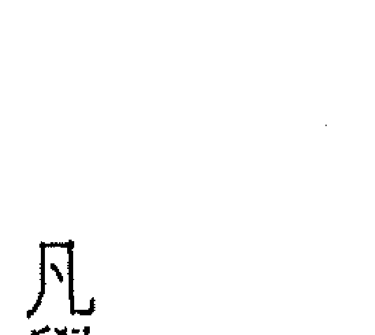
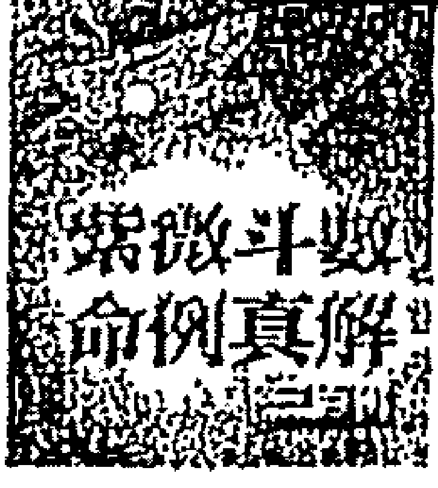
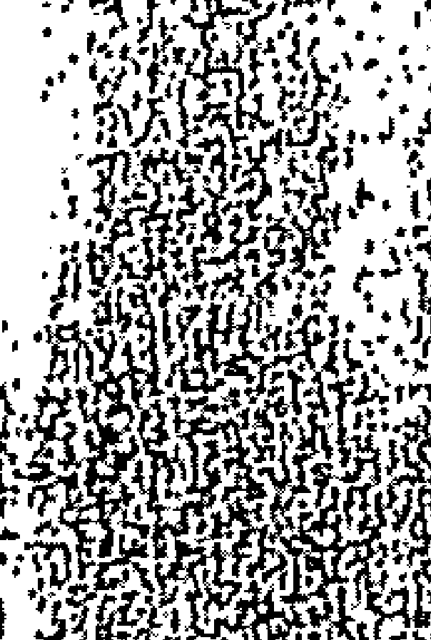
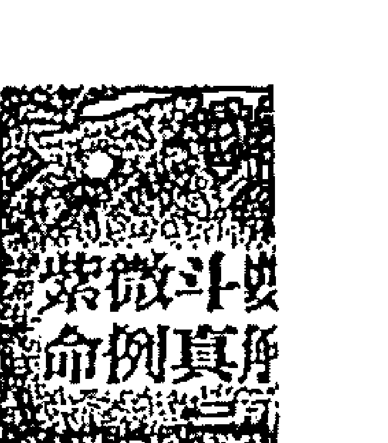
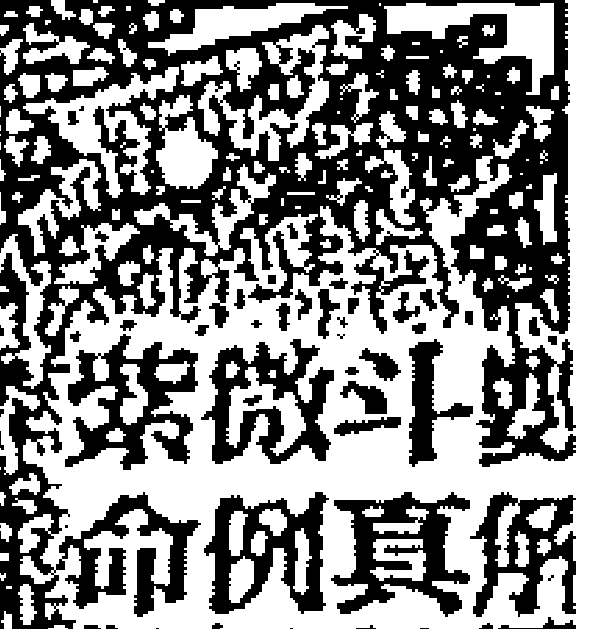
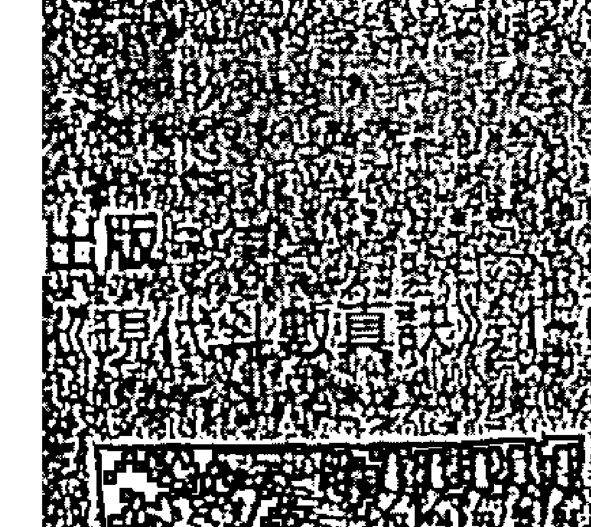
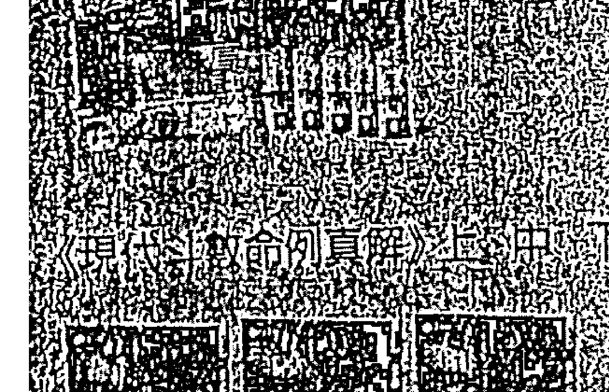
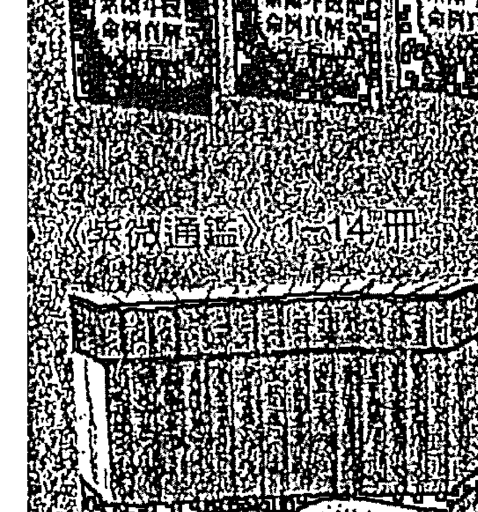
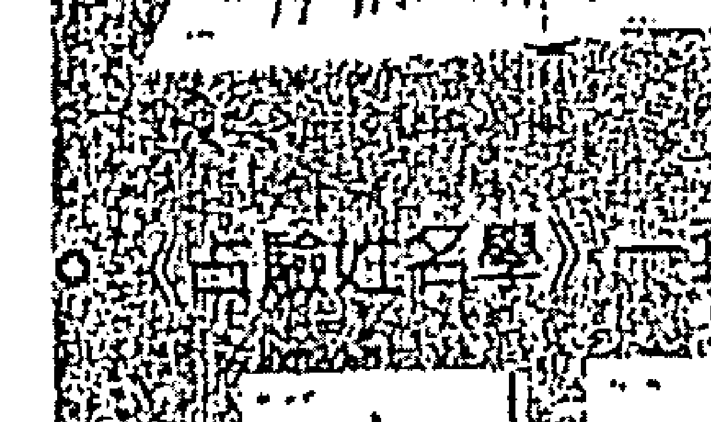

# 如何进行有效的项目管理

# 第三期

项目管理是现代企业中不可或缺的一环，它涉及到项目的规划、执行、监控和收尾等全过程。一个成功的项目管理能够确保项目在预算内按时完成，并达到预期的质量标准。

有效的项目管理需要项目经理具备良好的沟通能力、领导力和问题解决能力。同时，还需要使用合适的项目管理工具和方法论，如敏捷开发、瀑布模型等，来适应不同项目的需求。

# 真美百货

> 使 席 克 夫 的 朋 友
致 丁 人 晚 安 幽 默 宣 言

# 序

凡学习过紫微斗数这门占星学的人，都有一个共同的结论，斗数确实易学难精，愈高阶愈难突破瓶颈，要将这门学问融会贯通谈何容易，绝非三年五载的时间能竟全功。

就算有名师带入门，能由正确的方法进入斗数领域，可以让阁下少走不少冤枉路和节省宝贵时间，但每个人资质不同、领悟力互异，加上后天的努力亦不相同，结果当然层次会差很多，有的学生学得相当认真，研究精神令人感动，有的则「混」得令人看不下去，学不好反而怪老师偏心、天寿、盖步！

现代的人凡事都讲求速食，很少有人肯花时间作基础研究，曾有一位在电脑公司上班的学生向我夸下海口：「学紫微干嘛要花一年的时间？我只要三个月就可以搞懂！」我说：「我再加三个月给你，到时候再看看吧！」结果半年后，他不但嘴巴拉链拉起来外面还再贴一层胶布。

要学紫微其实很容易，随便到书店买两本相关的书，看完后就可以滔滔不绝谈上几个小时，紫微很多人会，只是「会」到什么程度的差别而已，入门简单进阶难。因此要学习紫微斗数，最好的方法还是由基础打起，按部就班地往上进阶，绝无捷径可抄，跳级进阶的结果不是变「花盘」就是「相公」了！

紫微学到一定的程度后，都会面临一个共同的困难，那就是可供研究的案例难找，缺乏实战的经验，功力难以提升。余卅年来已教过五百一十多个学生，亦深深体会到这点，故将卅年的教学与执业经验，以及所收集各式各样稀奇古怪的案例，加以整理、归类，加注说明，耗时一年多才完成，余不忍藏私，特将它公开给同好朋友，希望爱好占星学的道友好好珍惜，只要用心研究与体会，您的功力最少可以增进廿年以上。祝福您。

# # 作者简介

① 民国六十七年拜入古验法门第五十二代陈家齐恩师门下，六十九年学成开...（内容省略）

② 命理界唯一多产的作家，曾在《美华报道》、《翡翠》、《第一手》、《第一家庭》、《财运》、《独家报道》……等杂志撰写命理专栏近百篇，超过卅万字，专业著作四十四本，全文超过六百万字，幽默散文二本。

③ 经常应邀至扶轮社、狮子会、各大基金会等社团专题演讲不下百场，是台湾命理界少见的：站着能讲，坐着能写，又拥有丰富教学经验的命理专家，并成...

# 立《天乙命理网站：www.skyfate.com》

◎天乙上人传授学生的方法，由入门到经验养成一气呵成，过程采小班制的师徒传授教法（有别于一般补习班），使用自己撰写的独家讲义，能否成为占验门下的一员，端看您我是否有此师生缘了。

# 目录

序 3

作者简介 5

目录 7

## 第七章 破解疾病迷津 19

一、严重黄疸，出生即换三次血 20

二、工厂意外，遭机器压断四指 23

三、小限逢杀，当年必有血光灾 26

四、羊刀入命，连续三年出状况 29

五、迷途忘返，可能患了失忆症 33

六、双陀入限，终因大肠癌病故 36

- 七、高烧不退，童限即下肢残障 39
- 八、血癌末期，恐难过三大关 42
- 九、单恋成疾，精神恍惚不稳定 45
- 十、羊铃大限，生产必须动手术 48
- 十一、酒女从良，未料遭子宫病变 51
- 十二、幼时过房，凶年仍难逃死劫 54
- 十三、联考金榜，谁知竟发生血癌 57
- 十四、运逢天刑，甲状腺隐疾病发 60
- 十五、命格虽强，奈何福德宫太弱 63
- 十六、盲肠开刀，原来是小限逢杀 66
- 十七、子宫外孕，大限化忌要开刀 69
- 十八、命会双空，多病多灾不好养 72
- 十九、大限忌冲，不利父母与健康 75
- 廿、辰入双陀，乳房可能长瘤 78
- 廿一、命带天刑，年纪轻轻就中风 81
- 廿二、大限运差，竟因睾丸癌归西 84
- 廿三、廉贞化忌，幼年多病亦难养 87
- 廿四、命带龙池，大限走到犯重听 90
- 廿五、感情重挫，竟然变成精神病 93
- 廿六、精神异常，病情时好又时坏 96
- 廿七、命根不举，可能因滥交过度 99
- 廿八、福德皆破，因骨癌一病不起 102
- 廿九、意外坠楼，疑因失恋想不开 105
- 三十、运逢空劫，须防意外伤手脚 108
- 三十一、大限犯凶，一年两次胃出血 111
- 三十二、脑部受损，出生发现智力损害 114
- 三十三、精神失常，只因感情不顺利 117
- 三十四、小儿低能，疑为父母吃错药 120
- 三十五、才识过人，奈何患有精神病 123
- 三十六、妈妈吃药，生下孩子患畸型 126
- 三十七、命差运弱，终因大肠癌病逝 129
- 三十八、下肢残障，娶妻也同病相怜 132
- 三十九、父疾双忌，外科教授中风 135
- 四十、做多亏多，精神竟走火入魔 138
- 四十一、日月加煞，易罹患眼目疾病 141
- 四十二、肺癌未倒，却难逃意外夺命 144
- 四十三、治疗不及，导致双脚残废 147
- 四十四、幼时发烧，留下智障后遗症 150
- 四十五、白虎坐守，开刀竟伤及神经 153

## 第八章 破解倒限迷津

- 四十六、周岁外伤，导致小儿麻痹症 156
- 四十七、田宅不净，中邪引发心脏病 159
- 一、命弱身弱，行运如瘸子下楼 162
- 二、众煞云集，遭逢海难有前兆 165
- 三、海上遇难，事前可能无预警 168
- 四、新婚不久，因游泳意外溺毙 171
- 五、权禄会空，空姐不幸遇空难 174
- 七、骨癌病发，不到五十即撒手 177
- 八、廉贪加陀，大限有触电征兆 180
- 九、福德既倒，众煞纷出来作恶 183
- 十、车祸伤脑，开刀次年仍病逝 186
- 十一、年方廿五，竟生鼻咽癌恶疾 189
- 十二、凶年出事，头部重伤身难保 192
- 十三、忌入酉位，心肺疾病跑不掉 195
- 十四、酒瘾难戒，竟以服毒自杀终 198
- 十五、身处战乱，生命安危难预测 201
- 十六、官司难了，酒醉竟然想不开 204
- 十七、正值壮年，不幸因坠楼身亡 207
- 十八、迁移犯冲，流年意外易触电 210
- 十九、周岁殒命，应是母亲疏忽 213
- 廿、一时冲动，为情死于刀下 216
- 廿一、家运欠佳，夫妻同遭不测 219
- 廿二、铃星加刑，具备罹癌条件 222
- 廿三、财福犯冲，未料因财送命 225
- 廿四、母运逢凶，无辜断送小命 228
- 廿五、一生劳碌，壮年因鼻癌早死 231
- 廿六、游泳溺毙，归因命运线不吉 234
- 廿七、双忌重叠，意外难全身而退 237
- 廿八、大限既倒，只好下台一鞠躬 240
- 廿九、晚景不佳，离婚后脑瘤不治 243
- 三十、感情早发，最后竟因情自尽 246
- 三十一、岁凶加煞，在家离奇死亡 249
- 三十二、三羊入宫，引发羊癫疯不治 252
- 三十三、廿唧当，竟因高血压死亡 255
- 三十四、擎羊单守，外出际遇必不顺 258
- 三十五、命迁皆暗，落崖实在太突然 261

# 第九章：破解官符迷津

- 三十六、两人同行，出事何以是自己 264
- 三十七、武破加煞，为情抓狂跳楼死 267
- 三十八、癌症开刀，延至隔年终不治 270
- 三十九、送走丈夫，自己也难过关 273
- 四十、大限逢空，因先天疾病而亡 276
- 四十一、廉杀大限，有路上埋尸危机 279
- 四十二、命身皆弱，心肺一病竟不起 282
- 一、争风吃醋，换来牢狱之灾 285
- 二、欠债逼急，盗用公款数百万 288
- 三、贪渎事发，警官一夕变囚犯 291
- 四、交上损友，财运一路跌停 294
- 五、为情走险，不惜牺牲性清誉 297
- 六、夫妻不和，失手闹出人命 300
- 七、大哥退位，依旧难逃「一清」 303
- 八、难友投靠，竟是枪击要犯 306
- 九、被控杀人，原来是白色恐怖 309
- 十、女友别恋，一怒杀成重伤 312
- 十一、一时淫念，吃上强奸官司 315
- 十二、好勇斗狠，逢煞加重凶性 318
- 十三、为非作歹，不知天高地厚 321
- 十四、沦落风尘，养女遭遇坎坷 324

## 第十章 破解身世迷津

- 一、双禄逢空，不利亲子缘份 327
- 二、寄养多处，童年遭遇复杂 330
- 三、父母狠心，可怜弃婴命乖忤 333
- 四、父母早逝，跟着阿妈长大 336
- 五、爸爸一个，妈妈却有一大堆 339
- 六、幼年失怙，托给父叔辈无养 342
- 七、逢空会虚，童年即与父母无缘 345
- 八、桃花太重，父母皆结多次婚 348
- 九、出生兔唇，遭狠心妈妈遗弃 351
- 十、父母离异，与祖父母较亲近 354
- 十一、妻妾成群，可惜家道渐中落 357
- 十二、父亲出走，三年音讯全无 360

## 第十一章 破解子女迷津

- 1. 有女显贵，不是亲生又何妨 363
- 2. 生子白痴，种因为文曲化忌 366
- 3. 巨门在子，适龄生产不容易 369
- 4. 有意怀孕，却连续流产两次 372
- 5. 子位化忌，即使怀孕也不留 375
- 6. 子宫开刀，女儿又因车祸死 378
- 7. 子位会空，结婚多年难受孕 381
- 8. 体质欠佳，博士先生无子望 384
- 9. 屡战屡败，人工受精方成功 387
- 10. 想生老二，却先后胎死腹中 390
- 11. 开荤太早，差点当未婚妈妈 393
- 12. 子女众多，堕胎次数也不少 396
- 13. 桃花大限，丈夫独子皆横死 399

## 命例真解三百例

### 一、严重黄疸，出生即换三次血

| 天相破八碎座[福德][己巳] 106~115小限6 | 天文梁曲科天天哭虚[田宅][庚午] 96~105小限5 | 廉七天左右贪杀饯辅弼禄天天天官爵贵[官禄][辛未] 86~95小限4 | 文昌截煞阴台天空煞辅伤[仆役][壬申] 76~85小限3 |
|---|---|---|---|
| 巨火星龙天封池姚诺[父母][戊辰] 116~125小限7 | 推命日期：○姓名：○性别：女○生辰：农历73（甲子）年 04月27日寅时○五行：火六局○性属：阳女○生肖：鼠○命宫：卯宫◎身宫：未宫○命主：文曲○身主：火星○出生地 经：___/___/___ 北纬：___/___/___ 时差：___/___ | 天天三恩地福寿台光空[迁移][癸酉] 66~75小限2 |
| 紫府擎微狼羊红天魁才[命宫][丁卯] 6~15小限8 | 天同凤寡解天阁宿神使[疾厄][甲戌] 56~65小限1 |
| 天太禄机阴存孤天辰月[兄弟][丙寅] 16~25小限9 | 天陀天府罗魁地劫[夫妻][丁丑] 26~35小限10 | 太铃阳星忌天刑[子女][丙子] 36~45小限11 | 武破曲军枢天天勾斗马罡空君[财帛][乙亥] 46~55小限12 |

#### 【案例】

- 生辰：民国七十二年四月廿七日寅时 阳女
- 特征：丽质天生又黜丽动人，爱撒娇、富幻想，心软善良又极为聪明能干，具第六感，是鬼灵精一个，擅长交际，公关手腕高明，颇具异性缘，但嘴巴甜、骗死人不偿命，重视事业及手足之情。

#### 【事例】

出生时即因严重黄疸而换了三次血。

#### 【命盘解析】

##### 一、命格

紫贪加煞坐命，身入廉杀，父疾线又不吉，主此人一生必多血光之灾，而且童年十分难养，并可能会发生惊险之意外或紧急之重症，身为她的父母，可有得累了。

##### 二、星盘优点

命身宫之组合强势，身宫又有魁钺对照兼昌曲夹，虽在行运过程中多有劫难，但都有惊无险。

##### 三、星盘缺点

紫微会左右、天府会禄、但是又都双逢空，这下子可真是亏大了！空劫所落之宫位甚不恰当，不但毁了紫府，连福德宫也连带遭殃，田宅又被恶煞冲个正着，父疾线更是差；此种组合易染上毒瘾或对药物会产生过敏、中毒等情况。

##### 四、事件分析

命作贪狼之木又受到擎羊之金来克，其肝胆方面功能本来就差，再以其辰位肝胆部位所落之星宿来看，更为明显。

##### 五、综合结论

童限时借父母宫适逢巨火之恶限，宫干又再逢戊，阳木之宿又再次化忌，并在其出生年，太岁即走双忌之宫位，小限又引动疾厄，三羊加流惊入本命宫，当年必犯血光无疑，因其父疾线太差，需在八岁之后才会好转。

## 第七章 破解疾病迷津

### 二、工厂意外，遭机器压断四指

#### 【案例】

- 生辰：民国廿八年九月十七日戌时阴男
- 特征：身材高眺俊美，心软善良，智慧极高，是一块读书的好材料，更是一级的军师。外表斯文冷静，热心公益，好动外向，少年老成，孝顺顾家，爱赚钱、有偏财运，亦是夜猫族、洛克马，重朋友却犯小人。

#### 【事例】

四十四岁，七十一年十一月，右手被机器压断了四根指头。

#### 【命盘解析】

##### 一、命格

命身之组合为机梁加煞之局，主早刑晚孤，此局若非紫府架构如此之差及父疾线欠佳，就可成主阳梁昌禄之奇格，早年即可平步青云，实在非常可惜！

##### 二、星盘优点

日月居于旺地、太阳又逢禄于迁移，为外出格且人际关系良好，前途光明，命会日月、命身宫集文星于一身，若得良好的栽培，前途不可限量，仆役宫之不利组合逢空劫拱反较好，只是仍然难得益友以及得力之部属。

##### 三、星盘缺点

紫府架构甚差，命格机梁太阴加煞婚姻必有克，兼不利其母与手足，父疾线不佳，迁移虽旺却有二煞夹，必有潜在之危机，容易受外伤，并有带残之象。

##### 四、事件分析

壬戌年太岁走巨门意外，当年又逢大小限重叠；于是命入三羊刃又是当年斗君所行之宫位，太岁三陀、太岁之疾厄又逢三忌入宫，在这种险恶情况之下，当年能不发生血光吗？由于其本命已位为三空拱照之地，当年又入三忌，右手还能剩下一根手指头已算万幸了！

##### 五、综合结论

行壬申大限，本命忌入大限迁移位，大限忌入大限子田，且大限羊刃入命与大限官禄重叠，显示其该大限有发生意外血光之兆，并且是以发生在工作场所的机率较高。

### 三、小限逢杀，当年必有血光灾

| 天府 福德宫 空破军 指背 [癸巳] 官生背虎 24～33小限11 | 天同太阴左辅 红鸾 [兄弟] 小耗咸池 [甲午] 耗池德 14～23小限12 | 武曲贪狼科 寡宿 [命宫] 青龙地煞 [乙未] 龙煞客 4～13小限1 | 太阴巨门右弼 地劫 [父母] 力绝亡病 [丙申] 士神符 114～123小限2 |
|---|---|---|---|
| 天天才月 [子女] 泰沐天龙 [壬辰] 寿浴煞德 34～43小限10 | 推命日期： ○姓名： ○性别：男 ○生辰：农历10（辛酉）年 03月30日酉时 ○五行：金四局 ○性别：阴男 ○生肖：鸡 ○命宫：未宫 ○身宫：丑宫 ○命主：武曲 ○身主：天同 ○出生地 东经：___/___/___ 北纬：___/___/___ 时差：___/___/___ | 天禄相存 天天官哭 [福德] 博盖将成 [丁酉] 士星应 104～113小限3 | 天天煞机梁羊 天解阴霹神煞 [田宅] 官死葬晦 [戊戌] 伏殁气 94～103小限4 |
| 廉破贞军 天天八座虚姚座辅 [财帛] 飞冠灾大 [辛卯] 郎带煞耗 44～53小限9 | 文文曲昌忌 龙凤池阐 [迁移] 病帝华官 [辛丑] 伏旺盖符 64～73小限7 | 火星 天旬天喜空伤 [仆役] 大衰息质 [庚子] 耗神案 74～83小限6 | 紫七微杀 孤辰蜚廉三刑台诰 [官禄] 伏病岁狠 [己亥] 兵驿门 84～93小限5 |
| 天钺 天天地天马巫空使 [疾厄] 喜临劫小 [庚寅] 神官煞耗 54～63小限8 |## 二、小限逢杀，当年必有血光灾

-   **【案主】**
    *生辰：民国十二年二月二日丑时 阴男
    *特征：命带桃花，长得不赖，又极聪明冷静、多才多艺，但多学少精。爱现，爱钱，是盖仙一个，洛克马一匹，喜好美食和杯中物，重视生活享受。

-   **【事例】**
    廿九岁乙丑年游泳险遭不测，卅七岁丁酉年离婚再娶，四十一岁辛丑年开刀割盲肠。

-   **【命盘解析】**
    -   **一、命格**
        命造为贪武同行格亦是铃贪格，主中年发后，同时亦成立寡宿之局不利婚姻，有此种命格就有不理想的夫妻宫与之搭配。身坐昌曲逢忌于迁移，喜欢外出而在外却多是非与突发状况，亦有犯水厄之兆，其父疾一线更是糟透了，长辈有增加之象，健康方面肺经不佳，消化系统与泌尿系统也易出问题。
    -   **二、星盘优点**
        日月左右夹命，禄入福德、真是“好命子”一个，命宫三合无破、铃贪成格，且命“武”身“文”、乃文武全才，不过“臭屁”亦难免，其命格以及运势走向颇利于求学，即使第三大限逢空亦是“金空”尚不致太差，其学历必不低。

##### 三、星盘缺点

命盘架构不佳，紫府皆逢空，实在可惜，否则来日其富贵与成就必然不可限量。父疾线不佳，有碍龙体，迁移逢忌其人际关系亦多阻碍，外出状况频出；仆役宫更是烂透了，难获悉交益友与得力部属襄助，而子女会三煞、夫妻位逢空，六亲缘分亦是非常淡薄。

##### 四、事件分析

癸巳大限煞入本命大限迁移，本命盘命迁双忌交驰，外出安全堪虞，己丑年太岁引动迁移又逢三忌，流年三合位为煞星包围，本命又具犯水厄之格，太岁又再行至命迁，故险遭灭顶。

##### 五、综合结论

壬子大限逢武曲化忌入命，大限夫官线又不利，不利婚姻于小限走大限忌位时兑现，该大限疾厄入杀带天刑、大限会三煞，于辛丑年岁首引动疾厄，太岁疾厄不佳小限又逢杀，当年必然难逃血光。

### 四、羊刃入命，连续三年出状况

-   **【案主】**
    *生辰：民国廿八年二月十七日午时 阴男
    *特征：心软善良，个性坦率干脆，重享受有口福，疼爱子女，花钱爽快而不知节制，体质弱、记性不佳。

-   **【事例】**
    廿岁戊戌年因车祸而造成家中折损二口，廿二岁辛丑年结婚，妻助其毕业于台大，辛亥、壬子、癸丑年间发大财，戊午年动肺部大手术，己未年亏了一千多万元。

-   **【命盘解析】**
    -   **一、命格**
        命身皆无主星且逢空，福德坐禄会空劫，财务状况起伏极大，亦为耗财之命格，命身皆弱，父疾线更是差劲透顶，易有遗传性疾病，先天体质肺经弱，如行运遇疾厄不吉之时，则易有病发及动手术之虞。
    -   **二、星盘优点**

## 命例真解三百例

### 四、羊刀入命，连续三年出状况

| | **天陀左 相杀辅** | **天禄 梁存 科** | **廉七杀 贞杀羊** | **天钺** |
| :--- | :--- | :--- | :--- | :--- |
| **天孤蜚破天八地地斗 马辰廉碎月座劫空君** **[财帛] 力是岁丧** **[己巳] 土生墓门** | **天喜** **[子女] 博养惠贺** **[庚午] 士 神雾** | **龙凤恩 池开光** **[夫妻] 官胎华官** **[辛未] 伏 嘉符** | **解天封旬 神巫醋空** **[兄弟] 伏绝劫小** **[壬申] 兵 煞耗** |
| **44~53 小限 5** | **34~43 小限 6** | **24~33 小限 7** | **14~23 小限 8** |
| **巨文铃 门昌星** | **推命日期：** | **右弼** |
| **天使** **[疾厄] 背沐帮晦** **[戊辰] 龙浴鞍气** | ○ 姓名： ○ 性别：男 ○ 生辰：农历28 (己卯) 年 02月17日午时 ○ 五行：金四局 ○ 性属：阴男 ○ 生肖：兔 ○ 命宫：酉宫 ○ 身宫：酉宫 ○ 命主：文曲 ○ 身主：天同 ◎ 出生地 东经：______/______/_____  北纬：______/______/_____  时差：_____/_____ | **天机天三 宫空成台** **[命宫] 大墓灾大** **[癸酉] 耗 煞耗** |
| **54~63 小限 4** | | **4~13 小限 9** |
| **紫贪火 微狼星 权** | **天文 同曲 忌** |
| **天哭** **[迁移] 小冠将旅** **[丁卯] 耗帚星建** | **天刑** **[父母] 病死天龙** **[甲戌] 伏 煞德** |
| **64~73 小限 3** | **114~123 小限 10** |
| **天太 微阴** | **天府** | **太天 阳魁** | **武破 曲军 禄** |
| **天天福桃伤** **[仆役] 将临亡病** **[丙寅] 军官神符** | **寡天宿黄** **[官禄] 奏带地吊** **[丁丑] 书旺煞容** | **红天天阴台 鸾才寿煞辅** **[田宅] 飞衰成天** **[丙子] 廉 池德** | **[福德] 吾病措白** **[乙亥] 神 背虎** |
| **74~83 小限 2** | **84~93 小限 1** | **94~103 小限 12** | **104~113 小限 11** |

## 第七章 破解疾病迷津

### 羊刃入命，连续三年出状况

##### 三、星盘缺点

命身宫皆弱，福德宫又会空劫，紫微组合虽佳，但不会左右也没啥看头的！加上天府又不会禄、财宫田宅皆差，因此除了无大富贵可言之外，反而暗耗不小，另外；其父疾线亦是一大缺陷，而紫府所夹之处却是仆役宫，当他的朋友肯定不错。

娶到好老婆，虽然双方互动不佳，但配偶能干有帮夫命，财星化禄入于福德甚为恰当，主财源广、来财轻松，也较懂得享乐，真是羡煞人也！迁移虽有煞，幸有贪狼同宫牵制反吉。

##### 四、事件分析

◎壬申大限，大限羊刃入田宅、陀罗入父母位且忌入大限田宅，主其在此大限内家运不佳，父母位亦凶，戊戌年引动父母位及兄弟位，大小限又重叠，当年长辈与手足必有凶祸。

-   此大限其夫妻位有双禄引动、主有姻缘之兆，并于辛丑年引动夫宫线时结婚，因该大限其夫妻位坐科星主贵人，故而必得妻助。

##### 五、综合结论

庚午大限双禄对照，且财福线有禄，必有发迹之兆，但大限忌亦入财宫且库位不佳亦有破耗，而此大限其大限父母位羊陀叠并、疾厄宫干又转忌入巨门，大限羊刀入本命宫，主有血光之兆，并于戊午年引动疾厄时兑现。

## 第七章 破解疾病迷津

## 迷途忘返，可能患了失忆症

### 五、迷途忘返，可能患了失忆症

-   **【案主】**
    *生辰：民国四十五年四月十六日未时 阳男
    *特征：个性倔强，铁齿爱辩，有点不可理喻，然性情又闲散好享受，一生际遇起伏无常，心性阴沉，有张苦瓜脸，长辈婚姻不佳，或有增加之兆。

-   **【事例】**
    从小就不爱念书，终日嬉闹，十八岁癸丑年父亲亡故之后，便离家出走年余，至今不知去向，音讯全无。

-   **【命盘解析】**
    -   **一、命格**
        巨陷天梁多伤风败俗不顾伦常之道，为人较特异独行、六亲寡和，其命身皆会三空而陷弱不堪，且双空入迁移，亦是一个大“路痴”，偏偏其田宅宫又化忌，在家恐怕又待不住。
    -   **二、星盘优点**
        魁钺夹命、身坐荫星，多受长辈之护荫，因此一旦长辈有恙，对其必有重大之不利影响。

##### 三、星盘缺点

此盘空亡星之落宫甚不恰当，命身首当其冲，疾厄亦是三空夹，盘中双禄一逢空、一逢夹，全都泡了汤，且紫微不会左右、天府不会禄，而川上运程走势与宫干四化更是差劲，可谓‘背’到家了。

##### 四、事件分析

命宫三合没有会到任何文星，且其本身记性就差，童限时忌星就冲官禄，因而书读不好、也不爱读，己亥大限时虽逢文星，但宫干为己，使得文星化忌，大限入四马之地又逢天马、对宫又有双禄向他招手，能指望他安心的念书吗？他还真是没有读书的命，且大限行此运不论何因，必有离乡远行之兆，此大限其父母位虽入寿星，却会双煞兼二空，而大限文曲化忌又落于本命父母位，显示此大限其长辈不妙了。

##### 五、综合结论

癸丑年引动其父疾线，父母宫又入煞，因而父殁，而大限文曲化忌加亡神，疾厄宫太阳自化忌主丧失记忆，以致迷失在外不知去向。

### 六、双陀入限，终因大肠癌病故

| **庚贪陀罗贞狼疑** 【兄弟】力临指岁 【乙巳】土官背德 12~21 小限11 | **巨禄右弼门存忌** 【命宫】博冠咸晦 【丙午】土帝池气 2~11 小限12 | **天擎相羊** 【父母】官沐地畏 【丁未】伏浴煞门 112~121 小限1 | **天天左同梁辅权** 【福德】伏兵亡费 【戊申】兵生神索 102~111 小限2 |
| :--- | :--- | :--- | :--- |
| **太文阴曲禄** 天蒜喜宿 【未癸】青帝天病 【甲辰】龙旺煞符 22~31 小限10 | **推命日期：** 〇 姓名： 〇 性别：男 〇 生辰：农历6(丁巳)年 05月25日子时 ● 五行：水二局 ● 性别：阴男 〇 生肖：蛇 〇 命宫：午宫 〇 身宫：午宫 〇 命主：破军 〇 身主：天机 〇 出生地东经：___/___/___ 北纬：___/___/___ 时差：___/___ | **武七天曲杀钺** 龙破恩池碎光 【田宅】大耗将官 【己酉】耗 星符 92~101 小限3 | |
| **天火府星** 天胃 【子女】小衰灾吊 【癸卯】耗 煞客 32~41 小限9 | **紫破微军** 天天天哭刑使 【疾厄】奏死帝白 【癸丑】彗 盖虎 52~61 小限7 | **天机科** 解旬神空 【迁移】飞廉息龙 【壬子】厉 神德 62~71 小限6 | **天魁** 天天天天地地天福处才寿劫空信 【仆役】喜绝岁大 【辛亥】神 驿耗 72~81 小限5 |
| **天栽封官空诘** 【财帛】将病劫天 【壬寅】军 煞德 42~51 小限8 | **太文阳昌星** 红鸾 【官禄】病胎禄小 【庚戌】伏 较耗 82~91 小限4 | | |

-   **【案主信息】**
    - 推命日期：
    - 〇 姓名：
    - 〇 性别：男
    - 〇 生辰：农历6(丁巳)年 05月25日子时
    - ● 五行：水二局
    - ● 性别：阴男
    - 〇 生肖：蛇
    - 〇 命宫：午宫
    - 〇 身宫：午宫
    - 〇 命主：破军
    - 〇 身主：天机
    - 〇 出生地东经：___/___/___
    - 北纬：___/___/___
    - 时差：___/___

### 六、双陀入限，终因大肠癌病故

-   **【汇集】**
    *星辰：民国六六年五月廿五日子时 阴男
    *特征：脾气刚烈霸气、铁齿多疑，言词刻薄，不善交际，个性闲散无冲劲，可说是好吃懒做，不事生产之徒。

-   **【事例】**
    出身贫寒、未成家，父母无依，二十八岁甲午年之后便流浪于街头，五十八岁甲寅年，因为大肠癌而去世。

-   **【命盘解析】**
    -   **一、命格：** 巨暗之宿不宜再加右弼，且为羊陀夹忌之局，命坐午位，日在戌而不得驱暗之功，又与阴煞同宫，除了一生小人犯定了之外，兼是六亲寡合、孤苦无依，是非不断，际遇坎坷。
    -   **二、星盘优点：** 同梁之宿入于福德宫、又加左辅实在是酷毙了！其他的不说，若单只是以此宫而言：星宿是落对了地方，颇令人羡慕的！

##### 三、星盘缺点

十二宫之中实在是宫宫皆破，紫府架构差，禄存入命虽佳，但对他而言，反而造成羊陀夹忌更为不利，最可惜的是其福德若非会空，那真是有福可享了！财宫本为紫府夹，但是本宫却不争气，夹空也是枉然。

##### 四、事件分析

本命格就已经具备六亲寡合之局，况且其六亲宫位又实在很差，即使亲人有能力加以扶持也不愿插手帮他，癸卯大限虽走天府但会空劫，大限财福线甚差，大限田宅更是羊陀夹忌，本命迁移又有禄，显示此时已无家可归了！

##### 五、综合结论

癸丑大限擎羊凶煞入大限命宫，又逢天刑白虎主癌症，并与本命疾厄宫重叠，该处又是丑位肛门部位，显示该处必有病变产生，甲寅年逢双陀入大限命宫而形成羊陀叠并，大限流年之福德宫、疾厄位皆凶险而不支病故。

## 第七章 破解疾病迷津

## 高烧不退，童限即下肢残障

### 七、高烧不退，童限即下肢残障

-   **【案主】**
    *生辰：民国廿九年八月十七日午时 阳男
    *特征：脾气倔强、自负，固执己见，但外表长得还蛮帅的，既聪明好学又多才多艺，然贪多而不精，眼光看高不看低，做事有冲劲、爱赚钱，较乏精神上之享受。能疼爱子女、重手足之情，可惜与父母的对待关系不佳，右手有断掌。

-   **【事例】**
    当事者为小儿麻痹患者，妻贤营商。

-   **【命盘解析】**
    -   **一、命格**
        紫贪酉位乃四败之地，又加羊刀本为桃花犯主之局，但是若再仔细的观察其夫妻宫的情况，可就没能让他这么如意，若能顺利娶妻成家，就已经算是万幸了，其关键呢？则在其疾厄宫、福德宫以及行运之际遇。
    -   **二、星盘优点**
        命坐帝极之宿，会右弼及化权星格局还不低，星盘中日月皆居旺地夹夫妻宫，夫官线又得魁钺对照、左右拱必得贤妻。

### 七、高烧不退，童限即下肢残障

| **武破 曲军 狠** | **太阳 禄** | **天陀天 府魁钺** | **天太荫 机阴存** |
| :--- | :--- | :--- | :--- |
| **天孤斗 星辰君** | **天凤豊台 福斗库辅** | **赦天天 空月贵** | **龙天 池姚** |
| **[财帛] 大绝劫晦** **[辛巳] 耗 煞气** **82~91 小限8** | **[子女] 伏胎灾畏** **[壬午] 兵 煞门** **92~101 小限9** | **[夫妻] 官发天黄** **[癸未] 伏 煞索** **102~111 小限10** | **[兄弟] 博长指官** **[甲申] 士生背符** **112~121 小限11** |
| **天文 同曲 科** | **推命日期：** ○ 姓名： ○ 性别：男 ○ 生辰：农历29 (庚辰)年 08月17日子时 ○ 五行：水二局 ○ 性属：阳男 ○ 生肖：龙 ○ 命宫：酉宫 ○ 身宫：酉宫 ○ 命主：文曲 ○ 身主：文昌 ○ 出生地 东经：___/___/___ 北纬：___/___/___ 时差：___/___ | **紫宜犁 微狼羊** |
| **天天 刑使** | **旬 空** |
| **[疾厄] 病暮华盖** **[庚辰] 伏 盖健** | | **[命宫] 力沐威小** **[乙酉] 士浴池耗** **2~11 小限12** |
| **右弼** | | **巨文绮 门昌星** |
| **三台** | | **天虚** |
| **[迁移] 喜死息病** **[己卯] 神 神符** | **[父母] 青冠地大** **[丙戌] 龙蒂煞耗** **12~21 小限1** | |
| **火星** | **廉七天 贞杀魁** | **天梁** | **天左 相辅 忌** |
| **天解封天 哭神诰伪** | **落破天天恩 宿碎才养光** | **阴煞** | **天天红天八地地 官马卷巫座劫空** |
| **[仆役] 飞病岁吊** **[戊寅] 廊 眠吝** **52~61 小限5** | **[官禄] 奏丧攀天** **[己丑] 普 报德** **42~51 小限4** | **[田宅] 将帚将白** **[戊子] 室旺星虎** **32~41 小限3** | **[福德] 小临亡龙** **[丁亥] 耗官神德** **22~31 小限2** |

## 第七章 破解疾病迷津

## 高烧不退，童限即下肢残障

-   **三、星盘缺点**
    天府会三空甚为可惜，这同时也显示其妻较为劳碌，子女宫虽居旺地化禄，但也逢火铃拱，因而与子女之缘分亦浅薄，福德宫弱、父疾线不佳，运限行至皆不利且有带残之象。

-   **四、事件分析**
    其童限之时，借坐父母位之恶宿，大限斗君又化忌入疾厄宫，且大限凶煞亦入疾厄位，一出生时就逢大小限重叠，宫干皆为丙廉贞化忌，且太岁小限皆走父疾线，太岁又化忌入太岁疾厄宫，当年必因有高烧不退，进而导致小儿麻痹症发生的现象。

-   **五、综合结论**
    命逢羊刀、父疾线不吉，疾厄宫入天刑，宫干又化忌至下肢宫位，而且其亥寅两宫所落之星宿皆其差，双足必有重创。

## 八、血癌末期，恐难过三大关

| **天陀武 同紫昌 禄** | **武天禄 曲府存 禄** | **太太擎 阴阴羊 禄** | **贪火 狼星** |
| :--- | :--- | :--- | :--- |
| **破天恩 碎利光** | **红地 傲空** | **寇封 宿诰** | **天 马** |
| **[命宫] 官路指白** **[乙巳] 伏官背虎** **6~15 小限3** | **[父母] 阳帝盛天** **[丙午] 仕旺池德** **16~25 小限2** | **[福德] 力丧地吊** **[丁未] 士 煞客** **26~35 小限1** | **[田宅] 肩病亡病** **[戊申] 龙 神符** **36~45 小限12** |
| **破 军** | **推命日期：** ○ 姓名： ○ 性别：女 ○ 生辰：农历46 (丁酉) 年 09月26日巳时 ○ 五行：火六局 ○ 性别：阴女 ○ 生肖：鸡 ○ 命宫：巳宫 ○ 身宫：卯宫 ○ 命主：武曲 ○ 身主：天同 ○ 出生地 东经：______/______/______ 北纬：______/______/______ 时差：______/______ | **天巨天文 机门锦曲 科忌** |
| **解地句 神劫空** | **天天斗 天哭君** |
| **[兄弟] 伏冠天龙** **[甲辰] 兵带煞德** **116~125 小限4** | | **[官禄] 小死将岁** **[己酉] 禄 墨建** **46~55 小限11** |
| **铃 星** | **紫天 微相** |
| **天 虚** | **阴天 煞仆** |
| **[夫婦] 大沐灾大** **[癸卯] 耗浴煞耗** **106~115 小限5** | | **[仆役] 将墓墓晦** **[庚戌] 军 煥气** **56~65 小限10** |
| **厢右 真弼** | **天天 梁魁** |
| **天截天 官空月** | **天孤金台 福辰康辅** |
| **[子女] 病畏劫小** **[壬寅] 伏生煞耗** **96~105 小限6** | **86~95 小限7** | **76~85 小限8** | **66~75 小限9** |

### 八、血癌末期，恐难过三十大关

#### 【要旨】

*   生辰：民国四十六年九月二十六日巳时 阴女
*   特征：身材中等，聪明冷静、重视配偶，个性虽乐观豪爽、思想开放，喜欢罗曼蒂克的气氛，但心境反覆无常，思绪复杂多变且霸气自私、好享受，是洛克马。

#### 【事例】

当事者为血癌末期患者，估计其二十岁时为倒限期。

#### 【命盘解析】

##### 一、命格

命逢空劫夹，身宫又为煞星单守，命带天刑、命身宫之星宿组合皆不利，福德宫逢煞，田宅宫也不佳，主其阳寿不长，在格局上属于梁马飘荡格，一生起伏不已难以安定，如无根之草兼是六亲缘薄，且不利其姻缘。

##### 二、星盘优点

天同逢化权加煞，较具有冲劲而不致好吃懒做，命宫之组合不吉，逢空劫夹较好。

##### 三、星盘缺点

命身皆弱，紫府皆会空劫架构甚差，迁移宫之星宿组合虽然还不错，却是加会二煞亦无以言吉，因而一生难有好际遇，身入夫妻宫却为煞星单守又逢忌冲，主其姻缘难成，纵有婚姻亦遭拖累，仆役位更是三空照会而难得益友。

##### 四、事件分析

命身之星宿皆带有癌症因子之条件，只看何时引发而已，癸卯大限之时行恶煞单守，对宫又逢忌冲大限斗君、忌冲疾厄位，且大限羊刃入于本命疾厄宫，陀罗则入大限疾厄位，大限疾厄宫干又自化忌。

##### 五、综合结论

此时其大限福德宫已倒，逢此凶限恐难过关，种种迹象已显倒限之兆，推测其二十岁丙寅年太岁、小限逢廉贞忌时即将告别人世。

### 九、单恋成疾，精神恍惚不稳定

#### 【案例】

*   生辰：民国四十年十一月五日巳时阴男
*   特征：身材属于重量级的，思想开放，但个性极龟毛，铁齿且疑心重、怕死自私、固执而带神经质。有点浪漫、闲散及不切实际，有绰号、好享受、有口福，重视配偶，一生在感情上却不得意。

#### 【事例】

廿一岁辛亥年大二之时，因精神不稳定而退学，并于廿二岁壬子年以及廿三岁癸丑年入院治疗，病征为单恋明星之情形严重。

#### 【命盘解析】

##### 一、命格

同巨在未为落陷，身入空亡亦是命弱身弱，命身之星宿组合皆带感情困扰而不利姻缘，偏偏身入夫妻位，又逢空劫夹空则情况更是显而易见。

##### 二、星盘优点

双禄皆为己用，虽不见得是好事，起码不需劳碌营生，凉快得很。

##### 三、星盘缺点

紫微会空劫，天府不会禄，架构其差无比，命身之组合皆不吉，身入夫妻位该宫又坐妻星，且逢忌又为空劫夹空，此点对其影响尤深，再搭配其疾厄宫不吉，又加会二煞之情况来看，必然有碍其心智方面之发展。

##### 四、事件分析

甲午大限虽逢贪狼桃花之宿，且大限夫妻位化禄，但逢空亦枉然，可说是楚留香的朋友：“无花和尚”。大限又逢阴煞且大限疾厄宫入煞，又化忌入本命之夫妻位，必为情所苦，并于辛亥年流年引动夫官禄宫，岁首又引动疾厄宫时，病情加深不利求学而退学，并于壬子年引动田宅宫且父疾线皆逢忌冲时入院。

##### 五、综合结论

本命具备感情困扰，且夫妻宫之状况使得他在情感方面的际遇窒碍难行，易为情所困而造成精神状态不稳定。

| 宫位 | 讯息区 | 讯息区 | 讯息区 | 讯息区 |
| :--- | :--- | :--- | :--- | :--- |
| **[夫妻]** 太阴 文昌 天钺 孤辰 破碎 将星 岁驿 [癸巳] 军 生 驿马 24~33 小限5 | **[兄弟]** 贪狼 天魁 天解 阴煞 三台 地旬 小耗 息 贯索 [甲午] 耗 神 索 14~23 小限6 | **[命宫]** 天同 巨门 禄 龙池 天刑 封诰 青龙 胎 华盖 [乙未] 龙 盖 符 4~13 小限7 | **[父母]** 武曲 天相 陀罗 科 天马 八座 恩光 力 劫 绝 小耗 [丙申] 士 煞 耗 114~123 小限8 |
| **[子女]** 廉贞 天府 地劫 灾煞 沐浴 晦 [壬辰] 帝旺 衰 病 34~43 小限4 | **推命日期：** ○ 姓名： ○ 性别：男 ○ 生辰：农历40（辛卯）年 11月05日巳时 ○ 五行：金四局 ○ 性别：阴男 ○ 生肖：兔 ○ 命宫：未宫 ○ 身宫：巳宫 ○ 命主：武曲 ○ 身主：天同 ○ 出生地东经：___/___/___ 北纬：___/___/___ 时差：___/___ | **[福德]** 太阴 天梁 禄存 权 天官 天虚 博 墓 灾 大耗 [丁酉] 士 煞 耗 104~113 小限9 | |
| **[财帛]** 铃星 天哭 飞廉 将星 冠带 [辛卯] 临官 帝旺 44~53 小限3 | **[田宅]** 七杀 擎羊 天官 天府 天月 天德 官府 龙德 [戊戌] 伏 煞 德 94~103 小限10 | | |
| **[疾厄]** 破军 天钺 左辅 火星 天马 天巫 天使 吊客 亡神 病符 [庚寅] 沐浴 官 神符 54~63 小限2 | **[迁移]** 寡宿 病符 地丧 吊客 [辛丑] 伏 旺 煞 客 64~73 小限1 | **[仆役]** 紫微 右弼 红鸾 天姚 天贵 大耗 咸池 天德 [庚子] 耗 池 德 74~83 小限12 | **[官禄]** 天机 天台 姚辅 伏病 指背 白虎 [己亥] 兵 背 虎 84~93 小限11 |

## 第七章 破解疾病迷津

### 十、羊铃大限，生产必须动手术

#### 【案主】

*   生辰：民国四十六年十二月廿二日寅时 阴女
*   特征：心软善良，个性率直鸡婆，有点口不择言，花钱爽快、不善理财，好动外向，夫妻宫不吉，姻缘有破，但能疼爱子女，一生是别人的贵人，不宜居正室。

#### 【事例】

四岁庚子年时患小儿麻痹症，十一岁丁未年落水获救险些命丧黄泉，十六岁服安眠药险些没命，十八岁甲寅年以及十九岁乙卯年罹患严重胃病，廿一岁丁巳年奉儿女之命，嫁人作继室，并于廿二岁戊午年开刀生子。

#### 【命盘解析】

##### 一、命格

天相不会权禄，女命相夫无力，命会二煞、身宫无力之主星且又会空，命无格局可言、三合宫位欠佳，再加上疾厄宫过旺，一生病痛必然不少，兄仆一线不佳，入阴煞兼忌冲，除折损兄弟以及手足缘薄之外，亦主一生犯小人。

##### 二、星盘优点

命宫星宿还算强势，较能抵抗行运不吉时所带来的灾劫，迁移宫之星宿组合非常差，但是逢空劫拱则较好，可减轻其不利之情形。

##### 三、星盘缺点

命会三煞、身宫又弱、福德宫会空劫、田宅逢空，而紫府架构不良，六亲宫位皆不佳，疾厄宫过旺又为三煞夹，最糟的要算是其行运走势，铁定让她吃了不少苦头。

##### 四、事件分析

壬子大限逢羊铃且大限疾厄宫逢羊刃，此大限必有手术之灾，由于大限疾厄宫之状况显示易罹患胃疾，且宫干又转忌入戌位巨门星，流年若再引动疾厄位时必有药物中毒之现象或罹患胃疾，另外子位逢双煞，流年若引动疾厄及子女时即有动妇科手术之兆。

##### 五、综合结论

童限因疾厄宫太差，且宫干为廉贞化忌易发高烧，且大限斗君忌冲命，福德宫、田宅位皆差，必有重大惊险之灾病。

| 宫位/内容 | 讯息区 | 讯息区 | 讯息区 |
| :--- | :--- | :--- | :--- |
| 武曲 破军 陀罗 火星 破碎 【迁移】官长指白 【乙巳】伏生背虎 **64~73 小限 3** | 天机 太阴 文曲 禄存 红鸾 解神 天使 【疾厄】休沐咸池 【丙午】土浴池德 **74~83 小限 2** | 天府 天梁 天羊 寡宿 【财帛】力冠地吊 【丁未】土带煞客 **84~93 小限 1** | 天相 天同 文昌 科禄 天刑 天台 辅弼 【子女】膏肓亡病 【戊申】龙宫神符 **94~103 小限 12** |
| 天同 阴煞 恩光 封诰 天空 【仆役】伏兵天龙 【甲辰】兵 煞德 **54~63 小限 4** | **推命日期：** ○姓名： ○性别：女 ○生辰：农历 46 (丁酉) 年 12月22日 寅时 ●五行：金四局 ○性属：阴女 ○生肖：鸡 ○命宫：亥宫 ○身宫：卯宫 ●命主：巨门 ○身主：天同 ○出生地东经：__/__/__ 北纬：__/__/__ 时差：__/__ | | 紫微 贪狼 天钺 地空 【夫妻】小帝将星 【己酉】耗旺星连 **104~113 小限 11** |
| 左辅 | | | 巨门 忌 |
| 天斗 虚君 【官禄】大耗灾大 【癸卯】耗 煞耗 **44~53 小限 5** | | | 【兄弟】将衰鼙晦 【庚戌】单 辅气 **114~123 小限 10** |
| 天刑 天空 八座 天贵 【田宅】病绝劫小 【壬寅】伏 煞耗 **34~43 小限 6** | 廉贞 七杀 龙池 凤阁 地劫 【福德】喜悦华盖 【癸丑】神 盖符 **24~33 小限 7** | 天铃 天梁 星 天喜 天寿 三台 【父母】飞廉息费 【壬子】廉 神索 **14~23 小限 8** | 天相 天魁 右弼 天马 孤辰 天巫 【命宫】奏书岁驿 【辛亥】害 驿门 **4~13 小限 9** |

## 第七章 破解疾病迷津

### 十一、酒女从良，未料遭子宫病变

#### 【基本资料】

*   生辰：民国廿九年十月五日午时 阳女
*   特征：清秀动人、心软善良，并极疼爱子女，唯说话刻薄又直爽干脆、铁齿多疑，是洛克马，好动外向，记性差，与亲人缘分甚薄。

#### 【事例】

十六岁前由外祖母抚养，后由父母领回却流入酒家，十九岁戊戌年从良，并成为法院某书记官之第三任继室，二十二岁辛亥年割除子宫。

#### 【命盘解析】

##### 一、命格

太阳居亥无光驱对宫巨门之暗而为双暗之局，然女命太阳有碍婚姻，亦是桃花格不利为正室，继室或黑市则无妨，命身同宫会三空，福德宫又会空，其命格甚为薄弱，疾厄宫之状况亦不吉，若行限之中再逢大限不佳则必患重症。

##### 二、星盘优点

太阳喜照不喜坐，且陷地化禄反不吉，逢空反倒好些，天府星三合见禄，但

##### 三、星盘缺点

命身宫同会三空，福德位会空，疾厄宫不佳，六亲宫位皆欠佳，不但未蒙其利反受其害。

##### 四、事件分析

戊子大限恶煞入宫，大限四化造成本命疾厄宫廉贞双忌加羊刀，本命疾厄位及大限疾厄宫干皆化忌入大限。疾厄宫在身体上来说亦是戊位妇科之部位，显示此大限其子宫方面的恶性病变即已酝酿产生。

##### 五、综合结论

至乙酉大限时走羊刃，且大限之擎羊又进入大限之疾厄宫时才动手术，并在辛亥年戊位双忌交驰于大限父疾位时切除子宫。

| | 巨门 | 廉贞 天相 忌 | 天梁 陀罗 天钺 | 七杀 禄存 |
| :--- | :--- | :--- | :--- | :--- |
| **[迁移]** 天马 孤辰 三台 台辅 辰星 小临 劫晦 [辛巳] 耗 官 煞气 65~74 小限 6 | **[疾厄]** 天凤 益 天天 台天 福间 廉刑月辅使 青冠 灾癸 [壬午] 龙 带 煞门 55~64 小限 5 | **[财帛]** 截空 天贵 力沐 天贵 [癸未] 土浴 煞累 45~54 小限 4 | **[子女]** 龙池 天巫 阴煞 博兵 指官 [甲申] 士生 背符 35~44 小限 3 |
| 贪狼 文曲 | **推命日期：** ○ 姓名： ○ 性别：女 ○ 生辰：农历29 (庚辰)年 10月05日子时 ○ 五行：土五局 ○ 性属：阳女 ○ 生肖：龙 ○ 命宫：亥宫 ○ 身宫：亥宫 ○ 命主：巨门 ○ 身主：文昌 ○ 出生地 东经：___/___/___ 北纬：___/___/___ 时差：___/___ | 天同 擎羊 科 八座 旬空 [夫癸] 官养咸小 [乙酉] 伏 池耗 25~34 小限 2 |
| 解神 天僕 [仆役] 将帝华岁 [庚辰] 冠旺盛建 75~84 小限 7 | | |
| 太阴 | | 武曲 文昌 铃星 权 |
| 天斗 天才 天霹 君 [官禄] 奏哀息病 [己卯] 书 神符 85~94 小限 8 | | 天天 虚姚 [兄弟] 伏胎地大 [丙戌] 兵 煞耗 15~24 小限 1 |
| 紫微 天府 火星 | 天机 天魁 左辅 右弼 | 破军 | 天阴 禄 |
| 天封 哭话 [田宅] 飞病岁吊 [戊寅] 病 驿客 95~104 小限 9 | 冥破恩 宿碎光 [福德] 吾死孽天 [己丑] 神 鞍德 105~114 小限 10 | [父母] 病墓将白 [戊子] 伏 星虎 115~124 小限 11 | 天红地地 官德劫空 [命宫] 大绝亡龙 [丁亥] 耗 神德 5~14 小限 12 |

## 第七章 破解疾病迷津

### 十二、幼时过房，凶年仍难逃死劫

#### 【个案】
*   生辰：民国六十一年八月十三日午时阴男
*   特征：身材矮胖，体质欠佳，但心软善良、活泼外向，外表温和稳重，说话悦耳动听，内心固执、爱钱，脾气稍微急躁了一些，是洛克马一匹。

#### 【事例】
三岁癸丑年过继为人养子，十一岁壬戌年立秋后患小儿麻痹而死。

#### 【命盘解析】

##### 一、命格
天同福德主坐命本是福厚，但加煞其福份必然受损，若其福德宫够强的话顶多就是劳碌罢了，但其福德宫坐吉宿却是二空入宫，显示其福基甚为薄弱而非有寿之人，而十二宫之中又以其父疾线之组合对其尤为不利，若逢运限再不吉之时，恐怕就顶不住了！

##### 二、星盘优点
迁移宫稳定，人缘佳为出外格，权禄交驰于财福线本是不错，只可惜加会三

##### 三、星盘缺点
紫府架构不佳，入于兄仆亦不妥当，福德宫过于薄弱，尤其父疾线之星宿组合更是差透了！除了为过房养子之外，对其脊髓或神经系统亦有莫大的影响。

##### 四、事件分析
辛卯大限时父疾线即已双忌，必需过房才能够好养些，癸丑年于大小限重叠、父疾线四忌交驰时过房为养子。

##### 五、综合结论
然因父疾线坐红鸾带天刑、大小限重逢，立秋后小限太岁转入父疾线加以引动，又逢大小限交接之际，大限福德宫、田宅位俱凶而无力支撑，太岁又恰遇丙年廉贞化忌，必有因高烧而引发小儿麻痹之兆，此时大小限又入凶宫因而倒限。

| | 太阳 招 | 破军 天魁 | 天机 | 紫微 天府 天相 天封 天姚 谐临 |
| :--- | :--- | :--- | :--- | :--- |
| **[福德]** 天机 天地 地劫 空 将病岁大 [癸巳] 军 祥耗 103~112 小限5 | **[田宅]** 天哭 月 小衰息宠 [甲午] 耗 神德 93~102 小限6 | **[官禄]** 天哭 月 病帝灾白 [乙未] 龙旺盖虎 83~92 小限7 | **[仆役]** 天封 天姚 谐临 力临劫天 [丙申] 士官煞德 73~82 小限8 |
| **[父母]** 武曲 文曲 科忌 红鸾 天刑 奏死绝小 [壬辰] 符 祥耗 | **推命日期：** ○ 姓名： ○ 性别：男 ○ 生辰：戊厝60(辛亥)年 08月13日午时 ○ 五行：木三局 ○ 性属：阴男 ○ 生肖：猪 ○ 命宫：卯宫 ○ 身宫：卯宫 ○ 命主：文曲 ○ 身主：天机 ○ 出生地 东经：___/___/    北纬：___/___/    时差：___/ | **[迁移]** 太阴 禄存 天官 碎天 贵 博冠灾吊 [丁酉] 士带煞害 63~72 小限9 | **[疾厄]** 贪狼 文曲 天厨 天使 官休天病 [戊戌] 伏浴煞符 53~62 小限10 |
| **[兄弟]** 七杀 天钺 孤辰 天才 解神 空 喜绝亡贫 [庚寅] 神 神索 13~22 小限2 | **[夫妻]** 天梁 紫微 病胎地丧 [辛丑] 伏 煞门 23~32 小限1 | **[子女]** 廉贞 天相 阴煞 台辅 大耗威晦 [庚子] 耗 池气 33~42 小限12 | **[财帛]** 巨门 左辅 天马 天厨 天巫 台官 伏长指旅 [己亥] 兵生背建 43~52 小限11 |

## 第七章 破解疾病迷津

### 十二、联考金榜，谁知竟发生血癌

#### 【案例】
*   生辰：民国五十二年八月十九日亥时 阳男
*   特征：中等身材，性子急、学习能力强，冷静随和好相处，喜欢打抱不平，有多方面的兴趣，一生际遇变动性很大，有冲劲，想突破现状，行运起伏坎坷，常觉有志难伸，空有领导才干及老大个性，好恶之心极其明显。

#### 【事例】
十八岁考上建国中学，但第一学期就发现罹患血癌。

#### 【命盘解析】

##### 一、命格
命坐七杀孤克之宿，会天刑不利六亲或己身，而孰轻孰重就得看看是哪一宫较不得利，虽然他的六亲宫位并不好，但因其自身命宫更差，身宫与福德又逢空，并非久寿之人，故而被害者为自己的成分较大，这时可就要看大限走势即知谁先中奖。

##### 二、星盘优点

| | 太阴 | 贪狼 | 天同 巨门 天钺 | 武曲 天相 |
| :--- | :--- | :--- | :--- | :--- |
| **[疾厄]** 天孤三台 天喜辰 辅使 小临劫晦 [己巳] 耗官煞气 76~85小限8 | **[财帛]** 凤盏开麻 将帝灾丧 [庚午] 军旺煞门 86~95小限9 | **[子女]** 天天官月 奏哀天质 [辛未] 害 煞帛 96~105小限10 | **[夫妻]** 截龙天 天空池姚贵 飞痛指官 [壬申] 麻 背符 106~115小限11 |
| **[迁移]** 天恩斗刑光君 背冠华盖 [戊辰] 龙带营建 | **推命日期：** ○ 姓名： ○ 性别：男 ○ 生辰：农历 53 (甲辰) 年 08月19日亥时 ○ 五行：火六局 ○ 性属：阳男 ○ 生肖：龙 ○ 命宫：戌宫 ○ 身宫：申宫 ○ 命主：禄存 ○ 身主：文昌 ○ 出生地 东经: ___/___/___ 北纬: ___/___/___ 时差: ___/___ | **[兄弟]** 天八福座 喜死威小 [癸酉] 神 池耗 | **[仆役]** 天煞 同羊 科 犁右文羊引曲科 力沐息病 [丁卯] 土浴神符 |
| | | 太阳 天梁 铃星 忌 | **[命宫]** 天地虚劫 病墓地大 [甲戌] 伏 煞耗 6~15小限1 |
| **[官禄]** 破军 禄存 天解天哭才神 传长岁吊 [丙寅] 士生驿客 46~55小限5 | **[田宅]** 陀罗 天火杀魁星 家破封宿碎谐 官癸举天 [丁丑] 伏 绥德 36~45小限4 | **[福德]** 紫微 天阴地寿煞空 伏胎将白 [丙子] 兵 星虎 26~35小限3 | **[父母]** 天左文机辅昌 天红鸾恋巫 大貂亡龙 [乙亥] 耗 神德 16~25小限2 |

##### 三、星盘缺点

命会双禄且三合无煞，第二大限为其求学时代，姑不论其成就与地位，在乙亥大限时、对其最有利的莫过于读书了，因为三合均得众文星拱照之故。

紫微逢空，然天府虽与禄同宫坐于迁移位，如此难得之佳局却是二空照会，父母宫空劫夹、兄弟宫会四煞、夫官线亦会空，这张盘不吉组合之处甚多，于是一路走来，真是颠簸起伏而一波三折。

##### 四、事件分析

本命坐病符会哭虚、疾厄宫又有天喜主白血球过多之症，乙亥大限会昌曲，大限官禄又化科，故能高中第一学府，然而大限被空劫夹、大限福德居双煞、田宅亦会空，已具备倒限之要件。

##### 五、综合结论

大限忌星又入于本命疾厄，于是引发其本命格所具备之病症，并于十八岁辛酉年、小限走科星且化科又进入父疾线时显现病征。

### 十四、运逢天刑，甲状腺隐疾发病

| 区域 | 内容 |
| :--- | :--- |
| **第一行 (左上)** | 天机文 相存曲  孤天 辰伤 [伤官] 伤长亡贫 [丁巳] 士生神索 74~83 小限 12 |
| **第一行 (中上)** | 天梁 梁羊  龙解 池神 [迁移] 官禄将官 [戊午] 伏 星符 64~73 小限 11 |
| **第一行 (右上)** | 廉七天 贞杀钺  天三八台天 台座辅使 [疾厄] 伏胎举小 [己未] 兵 鞍耗 54~63 小限 10 |
| **第一行 (最右)** |   天凤天天 虚刑刑贵 [财帛] 大耗成大 [庚申] 耗 壁耗 44~53 小限 9 |
| **推命日期** | **推命日期：** ○ 姓名： ○ 性别：女 ○ 生辰：民国27年12月17日丑时 ○ 五行：金四局 ○ 性属：阳女 ○ 生肖：虎 ○ 命宫：子宫 ○ 身宫：寅宫 ○ 命主：贪狼 ○ 身主：天梁  ○ 出生地 东经：_____/_____/_____ 　　北纬：_____/_____/_____ 　　时差：_____/_____ |
| **第二行 (左)** | 巨陀铃 门煞星  天天阴 哭马煞 [官禄] 力沐地煞 [丙辰] 士浴煞门 84~93 小限 1 |
| **第二行 (右)** | 文昌   破旬 碎空 [子女] 病马息宠 [辛酉] 伏 神德 34~43 小限 8 |
| **第三行 (左)** | 紫贪左 微狼辅 禄  天官封 府禄诰 [田宅] 香冠岁晦 [乙卯] 龙带池气 94~103 小限 2 |
| **第三行 (右)** | 天同   截盖地 空库空 [夫癸] 丧死罪白 [壬戌] 祸 丧虎 24~33 小限 7 |
| **第四行 (最左)** | 天火太 刑阴星 忌机  天才斗 月月君 [福德] 小临指薇 [甲寅] 耗官背建 104~113 小限 3 |
| **第四行 (中左)** | 天天 府魁  红寡 鸾宿 [父母] 将帝天病 [乙丑] 军旺煞符 114~123 小限 4 |
| **第四行 (中右)** | 太阳   天恩地 姚光劫 [命宫] 丧丧灾吊 [甲子] 灵 煞客 4~13 小限 5 |
| **第四行 (最右)** | 武破右 曲军弼 科  天天 马巫 [兄弟] 飞病劫天 [癸亥] 廉 煞德 14~23 小限 6 |

### 十四、运逢天刑，甲状腺隐疾发病

#### 【案主】

*   生辰：民国廿七年十一月十七日丑时 阳女
*   特征：孝顺顾家，是夜猫子和四眼田鸡，眼睛大小不一，个性反复不定、阴晴难测，霸气、好计较，脾气不好，既骚包又爱享受，是洛克马，喜欢交朋友，异性缘重，不利为正室。

#### 【事例】

甲子年十一月因甲状腺肿而开刀。

#### 【命盘解析】

##### 一、命格

女命太阳有碍姻缘，星入子位落陷又加会二煞于二三合之地甚为不利，并与地劫同宫，除了命带桃花之外、一生也必然是劳心劳力，身入福德与煞忌同宫，此种格局属于日月或天机加煞之组合，具备了“早刑晚孤”之条件，且为过房或庶出之命。

##### 二、星盘优点

紫微架构不错，入于田宅宫起码祖产不少，天府也会禄，又得紫府夹身宫，虽命身之星宿不理想，但亦有富贵，应是出身于荣华之家。

##### 三、星盘缺点

夫官一线不佳，再配合其福德宫之状况来看，在婚姻上的挫折必然免不了！命身具刑克不利手足，虽也是日月加煞，但其父母宫强势，恐怕是自己的身体要先倒霉吧。

##### 四、事件分析

辛酉大限禄忌入大限，宫位虽不旺，但大限双禄忌交驰、三合无煞冲破，总还是可安然渡过，只不过该大限之疾厄宫星宿实在很烂，且宫干化忌至未宫之廉贞星，因此其甲状腺肿之症应是在此大限即形成，只不过疾厄宫内有阴煞坐守而未能显现，直到庚申大限逢天刑，且陀忌入疾厄位之时才发作。

##### 五、综合结论

甲子年流羊入大限疾厄宫，且小限逢红鸾主有血光之兆，而当年其疾厄亦是羊刃坐守，血光之情形更是明显，于是动刀手术在所难免。

### 十五、命格虽强，奈何福德宫太弱

#### 【案例】

*   生辰：民国十五年九月五日申时 阳男
*   特征：紫府坐命主孤，眼光高，自负、爱现，沉默拘谨，喜欢音乐、艺术。额高，有法令纹，发微秃，心软善良，命格具备异途功名之象，长得不错、斯文体面。事业心强，怕死，有家庭观念，具第六感，童限难养且有惊险意外，体质不佳，胃疾难免。

#### 【事例】

七十三年九月胃出血不治而身故。

#### 【命盘解析】

##### 一、命格

命格过旺福德宫却逢空，与其命宫甚不搭调且有损寿基，况且身宫又为刑囚夹印而非常不利，因此若逢行运凶险之时，恐怕就会一个不留神，坠马而下。

##### 二、星盘优点

紫微加右弼，架构不错，格调还蛮高的，禄入田宅宫且得魁钺夹财，虽不至大富，但在物质生活以及金钱上倒也不虞匮乏。

| 区域 | 内容 |
| :--- | :--- |
| **第一行 (左上)** | 巨禄门存 天孤天恩官辰刑囚光 [田宅]博病亡箕 [癸巳]土神索 33~42小限2 |
| **第一行 (中上)** | 廉天擎贞相羊忌 能池 [官禄]力死将官 [甲午]土罡符 43~52小限3 |
| **第一行 (右上)** | 天梁 天地天喜劫信 [仆役]青奏攀小 [乙未]龙鞍耗 53~62小限4 |
| **第一行 (最右)** | 七杀 天天凤天马虚闭嚣 [迁移]小绝咸大 [丙申]耗戬耗 63~72小限5 |
| **第二行 (左)** | 贫陀禄猴 弑天天解三空哭才神台 [福德]官丧地丧 [壬辰]伏煞门 23~32小限1 |
| **推命日期** | **推命日期：** ○ 姓名： ○ 性别：男 ○ 生辰：农历15 (丙寅)年 09月05日申时 ○ 五行：木三局 ○ 性属：阳男 ○ 生肖：虎 ○ 命宫：寅宫 ○ 身宫：午宫 ○ 命主：禄存 ○ 身主：天梁 ○ 出生地东经：___/___/___ 北纬：___/___/___ 时差：___/___ |
| **第二行 (右上)** | 天天火同钺星禄 |
| **第二行 (最右)** | 破天天碎姚使 [疾厄]将胎患能 [丁酉]军神德 73~82小限6 |
| **第三行 (左)** | 太阴 天地贵空 [父母]伏帝咸晦 [辛卯]兵旺池氲 13~22小限12 |
| **第三行 (中)** | 武曲 |
| **第三行 (最右)** | 监阴八卦厌煞座诏 [财帛]奏羡夭白 [戊戌]番卺虎 83~92小限7 |
| **第四行 (左)** | 紫天右文微府弼昌科 天台月辅 [命宫]大临指岁 [庚寅]耗官背挞 3~12小限11 |
| **第四行 (中左)** | 天机根 红寡微宿 [兄弟]病冠天病 [辛丑]伏帝煞符 113~122小限10 |
| **第四行 (中右)** | 破左文军辅曲 天斗福君 [夫妻]喜沐灾吊 [庚子]神浴煞客 103~112小限9 |
| **第四行 (最右)** | 太天铃阳懋星 旬空 [子女]飞兵劫天 [己亥]医生煞德 93~102小限8 |

## 第七章 破解疾病迷津

### 命格虽强，奈何福德宫太弱

##### 三、星盘缺点

命格强势，旺过头了也未必是好，且又没有一个强势的福德来搭配，天府又不会禄亦是虚库一座，身宫之星宿组合亦不理想，运程顺行虽较逆转佳，但偏连续两个大限都逢空，而且其宫干四化也不吉。

##### 四、事件分析

本命即具备寿元不长之兆，乙未大限又逢空劫照会，大限福德宫与田宅位纷纷会空而具倒限要件，此时大限斗君忌冲疾厄位，必然在其健康方面会出现问题。

##### 五、综合结论

由大限之疾厄位便可看出会引发何病症，因其除了大限陀罗之外又双化科，病征必然显现无遗，并于甲子年生日后，小限行大限忌位且又是空劫照会，同时又引动父疾线之时病发不治。

### 十六、盲肠开刀，原来是小限逢杀

| 太阳 陀罗 | 破军 禄存 文昌 | 天机 擎羊 科 | 紫微 天府 文曲 |
| :--- | :--- | :--- | :--- |
| 孤辰 破碎 天刑 天巫 | 天喜 封诰 | 龙池 凤阁 恩光 地空 | 天马 天寿 |
| 【兄弟】 官符 【乙巳】 伏兵 112~121 小限9 | 【命宫】 博士 【丙午】 神煞 2~11 小限8 | 【父母】 力士 【丁未】 官符 12~21 小限7 | 【福德】 官府 【戊申】 煞耗 22~31 小限6 |
| 武曲 | **推命日期：** ○ 姓名： ○ 性别：女 ○ 生辰：农历76（丁卯）年 09月15日辰时 ○ 五行：水二局 ○ 性属：阴女 ○ 生肖：兔 ○ 命宫：午宫 ○ 身宫：寅宫 ○ 命主：破军 ○ 身主：天同 ○ 出生地东经：＿＿/＿＿/＿＿ 　　北纬：＿＿/＿＿/＿＿ 　　时差：＿＿/＿＿ | 天铖 禄 | 天虚 天才 姚贵 |
| 解神 |  |  | 【田宅】 大耗 【己酉】 煞耗 32~41 小限5 |
| 【夫妻】 伏兵 【甲辰】 兵 102~111 小限10 |  |  |  |
| 天同 天梁 |  | 贪狼 |  |
| 天刑 地劫 |  | 阴煞 台辅 旬空 |  |
| 【子女】 将星 【癸卯】 星建 92~101 小限11 |  | 【官禄】 冠带 【庚戌】 煞德 42~51 小限4 |  |
| 七杀 右弼 铃星 | 天梁 火星 | 廉贞 天相 左辅 | 巨门 天魁 忌 |
| 天刑 天官 天空 三台 | 寡宿 天使 | 红鸾 八座 | 天福 天伤 |
| 【财帛】 病符 【壬寅】 伏兵 82~91 小限12 | 【疾厄】 丧门 【癸丑】 神煞 72~81 小限1 | 【迁移】 飞廉 【壬子】 帝旺 62~71 小限2 | 【仆役】 奏书 【辛亥】 官府 52~61 小限3 |

## 第七章 破解疾病迷津

### 盲肠开刀，原来是小限逢杀

### 十六、盲肠开刀，原来是小限逢杀

#### 【案例】

*   生辰：民国七十六年九月十五日辰时 阴女
*   特征：个子中等，肤白眼目细小，属于小辣椒“赤查某型”的，胆小白目、怕死、不遵传统，喜新厌旧，是管家婆兼小气钱嫂。洛克马，眼光孤高自负，犯小人，朋友不多。

#### 【事例】

八十七年二月忽患盲肠炎而开刀。

#### 【命盘解析】

##### 一、命格

破军午位原为水火既济格，加禄存会左右更是能守能攻，但此宿不宜与昌曲同宫否则破格，命造不但会空亡星，且身宫又落入截空宫位，其一生必然大受影响，命强身弱福德宫又会空，主其福份受损亦不利婚姻。

##### 二、星盘优点

破耗之宿坐午位较佳，加禄存可减轻其暗耗，身宫七杀加铃星为虐之组合甚差，但逢空反吉，仆役宫之星宿本不理想，逢空劫也算是拱对了地方，起码还不如预期的情况要差。

##### 三、星盘缺点

紫府会空入于福德位，架构欠佳，疾厄宫会三煞，痔疮、皮肤过敏以及出血性之胃疾难免，尤命坐破军不宜加文昌，且第二大限求学时代即走空亡星而不利读书。

##### 四、事件分析

本命即具备肠胃较弱、易出毛病之条件，丁未大限逢双羊刀且空劫照会，大限疾厄位又为羊铃坐守加右弼，主其于该大限必有动手术之兆。

##### 五、综合结论

因大限疾厄位逢空，于是势必要流年走到加以引动之时才会发生，八十七年十二岁戊寅年，太岁小限皆走该宫加以引动，大限逢双羊刀、小限太岁又逢杀加铃星右弼，并与双病符同宫，太岁也同时化忌冲本命疾厄宫，主其当年血光难逃，因而于二月份走子田线时开刀。

### 十七、子宫外孕，大限化忌要开刀

#### 【案例】

*   生辰：民国四十二年十月十七日巳时 阳女
*   特征：聪明能干、好动外向，是鬼灵精一个，具第六感，喜游走法律边缘，为人霸气，好胜心强，好学，喜追根究底，但多学而不精，是醋坛子和铲嫂，重视配偶，一生犯小人。

#### 【事例】

甲子年九月因子宫外孕而开刀。

#### 【命盘解析】

##### 一、命格

命身空劫各一，福德宫又逢空，其命格甚弱，除一生劳碌不得清闲之外，寿基亦不长，命宫以及疾厄宫皆具备癌症命格要件，且其命带病符，疾厄宫星宿过旺，也实在不是一件好事，一些啰哩啰唆的毛病必然不少。

##### 二、星盘优点

虽然命空、福德位空都并不理想，但所空的又都是极为不良的组合，也算是不错，命会双禄总不完美总比没有要好。

##### 三、星盘缺点

命身空劫各一，福德宫逢空，连带其紫府架构亦受波及，盘中日月落宫皆陷，迁移位会二空，疾厄宫又不理想，见仆线子田线皆不佳，运限至亦不利。

##### 四、事件分析

戊辰大限本命忌入大限疾厄宫，且大限疾厄位又转忌入卯位之本命子女宫，再观察其大限子女位又与本命疾厄宫重叠且星宿亦不佳，而此大限之羊刃又入于本命宫，故而该大限必有血光之灾，会出问题的部位则以妇科方面居多。

##### 五、综合结论

三十一岁甲子年大限疾厄位三忌，本命子女三羊刃，疾厄宫三陀冲照小限及太岁子女位，主有血光之兆，斗君之子女宫亦逢三忌冲，因而虽有怀孕但是其怀孕过程，可就不是那样的顺利了。

### 十八、命会双空，多病多灾不好养

| 天天右 同钺弼 | 武天铃 曲府星 忌科 | 太太 阳阴 | 贪狼 |
| :--- | :--- | :--- | :--- |
| 天破 马碎 | 天天天天 福哭虚姚使 | 地劫 | 尽天 厌巫 |
| [迁移] 飞长劫小 | [疾厄] 丧癸灾大 | [财帛] 将胎天龙 | [子女] 小指白 |
| [乙巳] 厢生煞耗 | [丙午] 善 煞耗 | [丁未] 军 煞德 | [戊申] 耗 背虎 |
| 64~73 小限 6 | 54~63 小限 5 | 44~53 小限 4 | 34~43 小限 3 |
| 破军 | **推命日期：** ○ 姓名： ○ 性别：女 ○ 生辰：农历61（壬子）年 06月26日申时 ○ 五行：金四局 ○ 性属：阳女 ○ 生肖：鼠 ○ 命宫：亥宫 ○ 身宫：卯宫 ○ 命主：巨门 ○ 身主：火星 ○ 出生地 东经：___/___/___ 　　北纬：___/___/___ 　　时差：___/___ | 天巨左 机门辅 天马 |  |
| 龙阴八 天池煞座低 |  | [夫妻] 背喜咸天 |  |
| [仆役] 嘉沐华官 |  | [己酉] 能 池德 |  |
| [甲辰] 神浴圣符 |  |  |  |
| 74~83 小限 7 |  | 24~33 小限 2 |  |
| 天魁 |  | 紫天陀火 微相罗星 极 |  |
|  |  | 天凤写三 封 |  |
| 戌红天 天空斗空态 惊月空空君 |  | 官闺信台诺 |  |
| [官禄] 病冠忌习 |  | [兄弟] 力死地币 |  |
| [癸卯] 伏帝神索 |  | [庚戌] 士 煞客 |  |
| 84~93 小限 8 |  | 14~23 小限 1 |  |
| 厕文 贞昌 |  |  |  |
|  |  | 七杀文 杀羊曲 |  |
| 孤天恩 台辰刑光辅 |  | 天禄 梁存禄 |  |
| [田宅] 大临岁长 | [福德] 伏帝举晦 | 解天 神贵 |  |
| [壬寅] 耗官驿门 | [癸丑] 兵旺蛟气 | [父母] 官衰将岁 |  |
| 94~103 小限 9 | 104~113 小限 10 | [壬子] 伏 星建 |  |
|  |  | 114~123 小限 11 | 4~13 小限 12 |
|  |  |  | [命宫] 伤病亡病 |
|  |  |  | [辛亥] 士 神符 |## 十八、命會雙空，多病多災不好養

【紫微】

*   生辰：民國六十一年六月廿六日申時 陽女
*   特徵：體型瘦高，心思細膩，個性雞婆，老成持重，但又主觀小氣、頑固自私、不易於捉摸。是洛克馬，一生犯小人，與父兄不和，體質不良多病痛。

【事例】

壬戌年兩眼失明、胸骨折斷，癸亥年醫生確定其患血癌，並已轉移至胸部，癸亥年不治去世。

【命盤解析】

一、命格 同梁巳亥位為梁馬飄蕩之格，如無根之草，隨著因緣際遇四處漂泊，非佳局之屬，命坐雙祿又會魁鉞、右弼原本不應太差，不過因命格三空會、雙祿又被拱掉，故而無吉可言，且命身均會三空、福德宮亦弱而有礙壽元。

二、星盤優點 此盤結構實在不佳，以整體而言優點實在難尋，十一宮之中以福德宮得昌曲夾、左右拱還勉強算是可以，但本宮還是弱，其他宮位則難以言吉。

三、星盤缺點

命身皆會二空甚弱，且命宮又為三煞所夾之處，疾厄宮更是四煞匯集又入煞忌，除了不利長輩之外，亦不利己身，且可以很清楚的看出此人將來必是因病而倒限的。

四、事件分析

命身實在過弱又坐病符，且疾厄宮又凶不可言，在其未上限之前就已經是多病多災而難養，只不過是福德宮尚未倒而支撐著，但運至辛亥本命宮時可就不好玩了！逢四煞夾命又會三空，大限田宅宮並化忌，福德位又薄弱不堪，只要流年煞再進入該宮，可就玩完了！

五、綜合結論

壬戌年太歲逢羊陀疊併且忌入疾厄宮，小限則逢忌沖小限疾厄位，羊入本命疾厄宮於午位，且大限為文昌化忌，故而眼目有傷，同時因其疾厄宮已具備惡性腫瘤之條件，癸亥年羊刀入福德位又為雙忌夾，子田線則逢雙忌交馳，三合無吉而倒。

### 十九、大限忌沖，不利父母與健康

【舉證】

*   生辰：民國十三年九月十四日卯時 陽男
*   特徵：斯文帥氣、聰明狡詐，為鬼靈精兼屁仙一個，具第六感，性急冷靜，外向、洛克馬，性情風流兼具雙妻格與公家格，主觀強、霸道白目，行事為達目的不擇手段，雞婆、犯小人，一生是別人的貴人。

【事例】

廿四、廿五歲經商失敗，三十歲後發大財，四十五歲母故，四十九歲父亡。五十二歲癸卯年患不舉之疾。

【命盤解析】

一、命格

命會昌曲、魁鉞以及科、祿、權，好一個強勢的命格，且身宮又坐天府亦屬廉府級的，能無中生有為商場悍將，其命身皆會三煞，一生之波折也不少，加上父疾線非常差亦是財多身弱之命。

二、星盤優點

| 天火 相星 | 天 梁 | 廉七天文文 貞殺鉞昌曲 祿 科 | 戟天煞地 空馬尾空 |
| :--- | :--- | :--- | :--- |
| 破天天封 碎刑巫誥 | 天天 哭虛 | 天天恩天斗 官才光貴君 | 空馬尾空 |
| [夫妻] 小耗劫小 [己巳] 耗 煞耗 | [兄弟] 將胎煞大 [庚午] 軍 煞耗 | [命宮] 奏發天龍 [辛未] 書 煞德 | [父母] 飛長指白 [壬申] 廁生背虎 |
| 105～114 小限 8 | 115～124 小限 9 | 5～14 小限 10 | 15～24 小限 11 |
| 巨 門 | 推命日期： ○ 姓名： ○ 性別：男 ○ 生辰：農曆13（甲子）年 09月14日 卯時 ○ 五行：土五局 ○ 性屬：陽男 ○ 生肖：鼠 ○ 命宮：未宮 ○ 身宮：丑宮 ○ 命主：武曲 ○ 身主：火星 ○ 出生地 東經：___/___/___           北緯：___/___/___           時差：___/___ | 天天台 福壽姚輔 |
| 能解 池神 | [福德] 吾沐咸天 [癸酉] 神浴池德 |
| [子女] 背喜華官 [戊辰] 能 煞符 | 25～34 小限 12 |
| 95～104 小限 7 | 天同 |
| 紫貪擎 微狼羊 | 鳳寡陰 閏宿然 |
| 紅 鸞 | [田宅] 病冠地吊 [甲戌] 伏帶煞客 |
| [財帛] 力死息貧 [丁卯] 士 神榮 | 35～44 小限 1 |
| 85～94 小限 6 | 武破 曲軍 權 |
| 天太祿右 機陰存弼 | 天陰天鈴 府羅魁星 | 太左 陽輔 忌 | 旬 空 |
| 孤天地天 辰月劫使 | 天三八 爵台座 | 天 傑 | [官祿] 大臨亡病 |
| [疾厄] 博病歲飛 [丙寅] 士 驛門 | [遷移] 官衰暴晦 [丁丑] 伏 鞍煞 | [僕役] 伏帝將衰 [丙子] 兵旺星建 | [乙亥] 耗官神符 |
| 75～84 小限 5 | 65～74 小限 4 | 55～64 小限 3 | 45～54 小限 2 |

## 第七章 破解疾病迷津

### 大限忌冲，不利父母與健康

命強身強且命身之組合頗佳又得三奇佳會，紫微雖在野，但身坐天府又會祿，必然屬於富而不貴且成就不小而能富甲一方。

### 三、星盤缺點

雖然命身皆強勢組合，但命身皆會二煞，福德宮更是四煞齊會，主此人一生必然勞碌異常，且難得精神方面之享受，父疾線二空照會，對其長輩及健康必有不利之影響。

##### 四、事件分析

壬申大限會三空，本命大限財官皆不吉而必有破敗，癸酉大限逢府相朝，且權祿入大限福德宮與田宅位而有發跡之象，乙亥大限逢大限忌沖本命父母位，且本命忌又落於大限父母宮沖疾厄位，因而該大限除其長輩不利之外，自己的健康也會出狀況，戊申年引動父母宮而喪母，壬子年逢太陽雙忌，年干又引動父母宮而喪父。

### 五、綜合結論

五十二歲乙卯年逢雙忌入疾厄宮，小限田宅位化忌沖戊位子女宮，且本命子位化忌、大限疾厄宮天梁又轉忌入天相星，必因糖尿病等諸症候群而導致不舉。

## 廿、辰入雙陀，乳房可能會長瘤

| 列1 | 列2 | 列3 | 列4 |
| :--- | :--- | :--- | :--- |
| 天府 孤辰 [田宅] 小耗亡神 [辛巳] 稗官神煞 95~104 小限 12 | 天同太陰科 天機解神 [官祿] 青冠將官 [壬午] 龍德星符 85~94 小限 11 | 武曲貪狼天鉞 截空 [僕役] 力士攀小 [癸未] 土府鞍耗 75~84 小限 10 | 太陽巨門祿存 天刑 [遷移] 博士歲駁 [甲申] 士生驛耗 65~74 小限 9 |
| 天機三台 天才 [福德] 將星地張 [庚辰] 軍旺煞門 105~114 小限 1 | 推命日期： ◎姓名： ◎性別：女 ◎生辰：農曆39 (庚寅) 年 12月02日亥時 ◎五行：土五局 ◎性陽：陽女 ◎生肖：虎 ◎命宮：寅宮 ◎身宮：子宫 ◎命主：祿存 ◎身主：天梁 ◎出生地 東經：__/__/__ 北緯：__/__/__ 時差：__/__ | 破軍 [疾厄] 官符息龍 [乙酉] 伏 神德 55~64 小限 8 | 天相同 天梁 鰲八地 座劫 [財帛] 伏胎垂白 [丙戌] 兵 盜虎 45~54 小限 7 |
| 廉貞左輔 文曲  |  | 火星  | 紫微七殺 右弼文昌  |
| 天馬 天喜 [父母] 癸癸咸池 [己卯] 普 池氣 115~124 小限 2 | 天魁 紅鸞封誥 煞宿臨 [兄弟] 喬死天病 [己丑] 神 煞符 15~24 小限 4 | 地空 天姚 [夫妻] 病喜災弔 [戊子] 伏 煞客 25~34 小限 5 | 天官 天馬 [子女] 大絕劫天 [丁亥] 耗 煞德 35~44 小限 6 |

## 廿、辰入雙陀，乳房可能長瘤

【案例】

*   生辰：民國三十八年十月三日亥時陽女
*   特徵：面貌姣好，身材不錯，兼以聰明冷靜、冷豔動人，個性好動外向，祿在遠方，須往他鄉求發展較有利。能尊重配偶，但霸氣固執，婚姻較難有結果，可謂美人無美命。

【命盤解析】

廿七歲丙辰年乳房長瘤開刀，年紀輕輕就變成『少奶奶』。

一、命格
二、星盤優點

命身雙煞坐守，先天即已具備癌症之命格，而且又擁有一個奇爛無比的疾厄宮，就已註定她在此生當中必然苦於病痛，並與外科醫生結下了不解之緣，命格屬於出外格，命弱身亦弱，福德宮更是空劫照會，且命具刑剋婚姻難成。

身坐夫妻位逢煞星單守，主其重視配偶卻為不良之配偶所拖累，逢空反而較佳，命會雙祿能幹勞祿，僕役宮之星宿組合不甚理想，逢空則受朋友之影響不至太大。

三、星盤缺點

紫微雖會左右，可惜被空劫夾，天府則不會祿，因而不具大富貴之格，命帶刑剋煞忌沖，父母宮雙煞夾，兄弟位空劫夾，子女位、夫妻宮也不甚理想，僕役宮更沒啥看頭的，整體看起來，幾乎是已經到了六親無緣的地步了，疾厄宮更是讓她在此生吃足了苦頭。

四、事件分析

本命即已具備了癌症的命格，疾厄宮又是煞忌同處，戊子大限走煞星單守之宮位，大限疾厄宮權祿加陀羅，大限陀忌則交馳於辰戌位，丙辰年大小限皆為戊干，辰位入雙陀並逢雙忌沖，大歲則行於該宮加以引動。

五、綜合結論

年干為廉貞化忌沖本命疾厄位，由於辰位是屬於人體胸部的部位，而以其宮位之特性來看，主乳房長瘤。

## 廿一、命帶天刑，年紀輕輕就中風

【案主】

*   生辰：民國四十年，一年十一月廿八日未時 陰男
*   特徵：身材中等，面帶威嚴有法令紋，個性急切、霸道孤僻，令人難以親近，喜新厭舊、怕死、行事不拘傳統，亦注重精神享受，雖是洛克馬，但穩重老成、獨立性強，做事幹勁十足。

【事例】

廿五歲丁巳年中風而眼歪口斜。

【命盤解析】

一、命格

午位破軍為水火既濟之格，三合會祿且身居紫府較能守能攻，可牽制破軍減低破耗，但命格過旺主孤，身帶天刑疾厄宮又逢羊刃，對己身必有不利之刑傷，夫妻宮逢地空、男命身宮又坐孤辰，這些不利之因素都顯示其在姻緣方面，必然波折不少而難能完滿如意。

二、星盤優點

| 太天綿 | 破 | 天 | 紫天 |
| :--- | :--- | :--- | :--- |
| 陽鉞星 | 軍 | 機 | 微府 |
| 天鳳恩 | 天解三地旬 | 盤 | 孤天八斗 |
| 福開光 | 官神台劫空 | 廉 | 辰刑座君 |
| 【兄弟】 | 【命宮】飛焉威晦 | 【父母】 | 【福德】將病亡貫 |
| 16～25小限11 | 6～15小限12 | 116～125小限1 | 106～115小限2 |
| 武曲 | 推命日期： | 太陰 | 龍破封 |
| 天涼陰地 | ○姓名： | 科 | 池碎酷 |
| 義宿煞空 | ○性別：男 | 【田宅】小喪將官 | 【辛酉】耗星待 |
| 【夫妻】病胎天病 | ○生辰：農曆42（癸巳）年 12月28日未時 | 96～105小限3 |  |
| 26～35小限10 | ○五行：火六局 |  |  |
| 天天左文 | ○性別：陰男 |  |  |
| 同魁輔昌 | ○生肖：蛇 |  |  |
| 【子女】大發災吊 | ○命宮：午宮 |  |  |
| 36～45小限9 | ○身宮：申宮 |  |  |
| 七殺 | ○命主：破軍 |  |  |
| 天月 | ○身主：天機 |  |  |
| 【財帛】伏畏劫天 | 出生地東經：___／___／___ |  |  |
| 46～55小限8 | 北緯：___／___／___ |  |  |
|  | 時差：___／___ |  |  |
|  | 天梁 | 廉天祿 | 亘陀右文 |
|  | 梁羊 | 真相存 | 門鈕弱曲 |
|  | 天天天台天 | 天姚 | 裁天天天天 |
|  | 哭嘉貫輔使 | 【遷移】博冠怠龍 | 空馬虛才巫傷 |
|  | 【疾厄】官沐華白 |  | 【僕役】力臨歲大 |
|  | 56～65小限7 | 66～75小限6 | 76～85小限5 |

## 第七章 破解疾病迷津

命帶天刑，年紀輕輕就中風

三、星盤缺點

身坐紫府於福德宮又會祿，可惜偏偏會空，男命坐孤辰，夫妻宮又不佳，此生姻緣難成，疾厄宮不佳、行運走勢又差、宮干更是不恰當。日月拱照，且命身皆強勢星宿坐守，故而韌性較強但刑傷難免。

四、事件分析

當事者非常年輕，若依常理而言此種因高血壓而中風之病症，在中年以下年齡層罹患率甚低，除非有家族性遺傳，或是先天命格具備，再加上疾厄宮甚糟的情形之下才會發生。本件案例即是如此，其本命帶天刑且疾厄宮又不佳，運程更是和他作對一般，丁巳大限逢旺地之太陽加雙煞坐守，且大限疾厄宮干又化忌至太陽，易產生心臟、血管諸症候群，以及血壓過高之病症。

五、綜合結論

廿五歲丁巳年小限及斗君分別引動父疾線，且太歲又走大限宮位逢四煞二忌交馳，小限則是二羊入宮因而引發腦中風。

## 廿二、大限運差，竟因睪丸癌歸西

| 廉贞贪狼 禄 | 巨门 | 天相同钱星 | 天同梁 |
| :--- | :--- | :--- | :--- |
| 红鸾地劫空 |  | 天官宿月 | 封诰天空 |
| [福德]小限亡龙 | [田宅]将帘将白 | [官禄]奏袁攀天 | [仆役]飞病岁吊 |
| [己巳]耗官神德 | [庚午]軍旺星虎 | [辛未]害鞍德 | [壬申]匪骤客 |
| 26～35小限2 | 36～45小限3 | 46～55小限4 | 56～65小限5 |
| 太文阴昌 |  |  | 武七铃曲杀星 |
|  |  |  |  |
| 天天虚刑 |  |  | 天旬格空 |
| [父母]冠带地大 |  |  | [迁移]聂死忌病 |
| 16～25小限1 |  |  | 66～75小限6 |
| 天梁府右弼 |  |  | 太文阳曲忌科 |
| 八恩光座 |  |  | 天使 |
| [命宫]力沐威小 |  |  | [病厄]病喜灾岁 |
| [丁卯]土浴池耗 |  |  | [甲戌]伏喜建 |
| 6～15小限12 |  |  | 76～85小限7 |
| 禄存 | 紫破陀天微军魁魁权 | 天机 | 左辅 |
| 解龙池神 | 破天才霖 | 风贫阴台阁庶煞辅 | 天天孤天三马害辰巫台君 |
| [兄弟]博长指官 | [夫妻]官癸天箕 | [子女]伏胎灾畏 | [财帛]大绝劫晦 |
| [丙寅]土生背符 | [丁丑]伏煞索 | [丙子]兵煞门 | [乙亥]耗煞气 |
| 116～125小限11 | 106～115小限10 | 96～105小限9 | 86～95小限8 |

*   姓名：
*   性别：男
*   生辰：农历23(甲戌)年 08月25日午时
*   五行：火六局
*   性属：阳男
*   生肖：狗
*   命宫：卯宫
*   身宫：卯宫
*   命主：文曲
*   身主：文昌

【個案】

*   生辰：民國廿三年八月廿五日午時 陽男
*   特徵：身材高大，個性急驚風，主觀強，霸道、喜掌權，為老闆格，行事為達目的不擇手段，孝順、重手足之情，但與六親緣份皆非常淡薄。

【事例】

因患睪丸癌引發淋巴腺發炎，並於六十一年四月廿五日戌時去世，享年僅二十九歲。

【命盤解析】

一、命格
命身坐天府加羊刀右弼會三煞，雖然天府星原不怕煞，但因會煞過多，疾厄宮又不吉，故而此生必將惡疾纏身而多皮肉之痛，況且又擁有一個奇爛無比的福德宮，這對他而言可就不妙了，會因而影響其壽基而主其壽元不長。

二、星盤優點
此盤除了他的命格較為強勢以外，其他宮位都談不上有什麼優點。

三、星盤缺點

命遷、夫官兩線皆會三煞而破，父疾線落陷又逢忌沖，福德宮難得化祿入宮，卻與空劫同守而反不利，兄僕線雖得吉星入宮，但逢空也是枉然，加上命盤的結構不佳，紫微在野、天府亦不會祿，難有大富大貴可言。

四、事件分析

庚午大限走巨門之衰運，又遇祿存逢空，大限福德宮截空並遭四煞夾破，大限子田線亦為凶星據守已具倒限之現象，因大限忌沖疾厄位，大限斗君亦轉忌入本命疾厄宮，且大限之父疾線亦是雙陀對照主癌症，而大限疾厄宮干則轉忌沖子位故而患此疾，並於二十九歲大小限重疊之年藥石罔效而身故。

五、綜合結論

所以說與其命好尚不如運好，以當事者之命格而言並不弱，只是沒有搭配一個適當的福德宮，再加上運程走勢不佳而難以支撐抵擋。

### 廿三、廉贞化忌，幼年多病亦难养

【案例】

一、命格

命无主星借坐日月，身坐福星于旺地乃命弱身强之局，生年忌冲疾厄宫，童年必然非常难养宜离宗或庶出，并有带殇之象，迁移位旺于命宫为外出之格，发展不在本乡，女命坐寡宿身入天同，且夫妻宫与禄同宫、财宫又化权，必然一生在感情方面多波折不顺。

*   生辰：民国四十五年八月十五日寅时 阳女
*   特征：好动外向，浪漫重感情，有事业心、能尊重配偶，心软善良，唯意志不坚，决断力不够，脾气较反复不定。体质不佳多病痛，又是个醋桶，有点神经质，内心有孤僻的一面。

【命盘解析】

一、命格
二、星盘优点

| 天梁禄存 天官旬空 [夫妻] 博艺劫天 [癸巳] 土生煞德 24~33小限6 | 七杀文曲羊刃 [兄弟] 官符灾吊 [甲午] 伏 煞客 14~23小限5 | 红鸾天天天斗 寡宿霹月贵君 [命宫] 伏胎天病 [乙未] 兵，煞符 4~13小限4 | 廉贞文昌忌科 天台姚辅 [父母] 大耗指背 [丙申] 耗 背建 114~123小限3 |
| :--- | :--- | :--- | :--- |
| 紫微天相 陀罗火星 截空天刑 天姚封诰 [子女] 力士蜚廉 [壬辰] 士浴盖虎 34~43小限7 | 推命日期： ○姓名： ○性别：女 ○生辰：农历 45 (丙申) 年  08月 15日 寅时 ○五行：金四局 ○性别：阴女 ○生肖：猴 ○命宫：未宫 ○身宫：亥宫 ○命主：武曲 ○身主：天梁 ○出生地 东经：____/____/____         北纬：____/____/____         时差：____/____ | 天钺 破碎地空 恩光天空 [福德] 病符咸池 [丁酉] 伏 池煞 104~113小限2 | 破军 天哭 [田宅] 喜神地空 [戊戌] 神 煞门 94~103小限1 |
| 天机巨门 右弼天马 天才 [财帛] 青龙息神 [辛卯] 龙德神德 44~53小限8 | 太阴太阳 天台三台 八座地劫 [迁移] 将星奏小 [辛丑] 军旺鞍耗 64~73小限10 | 武曲天府 铃星 天刑龙池 天福阴煞 [仆役] 奏书将官 [庚子] 普 星符 74~83小限11 | 天同天梁 左辅天魁 天马孤辰 天巫天虚 [官禄] 飞廉亡符 [己亥] 厉 神煞 84~93小限12 |

命會權祿也挺能幹的，至少尚不致於太懶散，命宮雖無主星但有左右拱、昌曲夾，且身宮也不弱尚可補強。

三、星盤缺點

紫微逢空可惜之至，天府亦不會祿難有富貴可享，夫官線雙線對照卻逢空劫拱，命身雖不至太差但福德宮卻是陷弱無力，兄僕線四煞匯集加陰煞更是差勁透頂，主其一生犯小人，若運行該宮之時亦有兇險，父疾線也是不理想，若行運不佳則刑剋傷難免。

四、事件分析

未上限時借父母宮來看，丙申大限走廉貞化忌宮干，又恰為丙，於是廉貞入雙忌沖的又是本命疾厄位，因此在其童年之時必然非常難養，並多有高燒不退之情形發生。

五、綜合結論

三歲戊戌年逢大小限重疊，廉貞二忌沖疾厄宮，太歲亦化忌入大限疾厄位，且流年直接引動父疾線，由此可看出命造當年必有因發高燒而併發小兒麻痹症的情形。

## 廿四、命帶龍池，大限走到犯重聽

| 武曲破軍 | 太陽 | 天府 | 天機太陰天鉅祿忌 |
|----------|------|------|-------------------|
| 天刑天使才巫哭使   [疾厄] 伏斷歲帛   [辛巳] 兵官驛客 | 截空臺輔天貴輔   [財帛] 大耗息病   [壬午] 耗帶神符 | [子女] 病沐華蓋   [癸未] 伏浴蓋建 | 天馬紅孤微辰   [夫妻] 喜兵劫晦   [甲申] 神生煞氣 |
| 55~64小限5 | 45~54小限6 | 35~44小限7 | 25~34小限8 |
| 天羊文同曲 | 紫微火貪狼星科   天姚   [兄弟] 飛廉災殺   [乙酉] 廉 煞門 | 天官宿解神句空君   [遷移] 官帝攀天   [庚辰] 伏旺綬德 | 巨門文昌文曲   陰煞   [命宮] 奏胎天貫   [丙戌] 害 煞索 |
| 65~74小限4 | 15~24小限9 | 75~84小限3 | 5~14小限10 |
| 祿存 | 廉貞七殺 | 天梁左輔魁相   恩光   [福德] 小耗咸小   [戊子] 耗 池耗 | 天相 |
| 鳳閣三天閨廉台倦   [僕役] 博衰將白   [己卯] 士 星虎 | 天天封喜月誥   [官祿] 力病亡能   [戊寅] 士 神德 | 天虛破碎   [田宅] 背死地大   [己丑] 龍 煞耗 | 天龍八地地哭池座劫空   [父母] 將絕指官   [丁亥] 軍 背符 |
| 85~94小限2 | 95~104小限1 | 105~114小限12 | 115~124小限11 |

推命日期：

○ 姓名：
○ 性別：男
○ 生辰：農曆44 (乙未)年 09月16日子時
○ 五行：土五局
○ 性屬：陰男
○ 生肖：羊
○ 命宮：戌宮
○ 身宮：戌宮
○ 命主：祿存
○ 身主：天相
○ 出生地 東經：___/___/___
　北緯：___/___/___
　　時差：___/___

#### 【案例】

*生辰：民國四十四年九月十八日子時 陰男

*特徵：塊頭大、口才好，是蓋仙一個，只是說話容易得罪人，常哪壺不開提哪壺。有老大性格，聰明冷靜、疑心病重，鐵齒愛辯，重視配偶，但一生感情挫折不少，對朋友不錯，卻是單行道，只有單向付出而已，因此朋友愈多反而愈累。

#### 【事例】

幼年因發高燒而引起耳鳴並造成重聽。

#### 【命理解析】

一、命格
巨鈴之命格帶刑克，除六親寡和之外亦不利婚姻，巨鈴之組合亦主意外，同時亦具備癌症命格，其命身同宮又會二煞，命遷一線非常差，對己身亦甚為不利，因此意外傷害的機率必然不小，命坐是非星又加陰煞，一生亦是小人纏身。

二、星盤優點
盤中日月皆坐旺地，田宅宮得左右夾，遷移位雖不佳，但有魁、鉞拱總是好一點。

## 三、星盤缺點

紫微不會左右，天府雖會祿卻逢空劫甚為可惜，命宮三合不佳，福德位也會空，難得精神之享受，日月雖居旺地，但太陽逢空使得命宮巨暗難以受驅暗之惠，夫妻宮難得紫府來夾，卻是祿忌同宮兼煞忌交馳，一生在感情生活上必然多有風波。

##### 四、事件分析

童限借坐父母宮，偏偏逢父母宮空劫同宮，且宮干化忌入本命宮，此時其大限斗君亦化忌沖命，運程相當差，若非大限三合會祿且大限福德還算強勢的話，恐怕小命難保。

## 五、綜合結論

由於命坐巨鈴大限不佳，又有龍池同宮，且大限疾厄宮又坐太陽於午位，故而主頭部之症，而龍池又不利耳部，大限宮干化忌至本命疾厄位，故而引起重聽的毛病。

## 第七章 破解疾病迷津
感情重挫，竟然變成精神病

## 廿五、感情重挫，竟然變成精神病

#### 【紫微】

*生辰：民國五十四年八月四日午時 陰女

*特徵：身材中等，口才好，能力強很會蓋，為生意人才，但個性急切，心軟性急動作快，死要面子，霸道愛掌權，也是小氣鬼，能疼愛子女，可惜體質不佳，容易情緒不穩。

#### 【事例】

七十三年四月突然精神失常。

## 【命盤解析】

一、命格
天府加祿存會左右，好一個強勢的命格，但美中不足的卻是她沒有一個好的福德宮來搭配其強勢之命格，因而顯得後繼無力、韌性不夠，夫妻宮雖化科但會空劫，又犯隔角而難以言吉，再配合其福德宮來看，即知其姻緣亦不如意，父疾一線更是複雜，除與長輩無緣之外亦不利自身。

二、星盤優點
盤中日月皆坐旺地，田宅宮得左右夾，遷移位雖不佳，但有魁、鉞拱總是好一點。

## 廿五、感情重挫，竟然變成精神病

| 廉貪 貞狼 | 巨 門 | 天 相 | 天天天 同梁鉞 樞 |
|----------|----------|----------|----------|
| 風地地 開劫空 [福德] 背紹指歲 [辛巳] 龍 背建 | 截恩 空光 [田宅] 小胎咸海 [壬午] 狀 池氣 | 藍天 屏月 [官祿] 將覓地張 [癸未] 軍 煞門 | 天孤天天天封天 福辰才壽姚諮僕 [僕役] 奏長亡費 [甲申] 背生神崇 |
| 25~34小限 3 | 35~44小限 2 | 45~54小限 1 | 55~64小限 12 |
| 太黎文鈴 陰羊昌星 忌 | 武七火 曲殺星 | 龍破 池碎 [遷移] 飛沐將官 [乙酉] 龍浴星符 | 天天幕天 官幕宿刑 [父母] 力罷天痛 [庚辰] 士 煞符 |
| 15~24小限 4 | 65~74小限 11 |  | 5~14小限 5 |
| 天祿右 府存弼 | 太文 陽曲 | 紅天 鸞使 [疾厄] 喜冠舉小 [丙戌] 神帶較耗 | 75~84小限 10 |
| [命宮] 博死災吊 [己卯] 士 煞客 |  |  |  |
| 陀 羅 | 紫破 微軍 科 | 天天 機魁 祿 | 左 輔 |
| 解三旬 神台空 [兄弟] 官病劫天 [戊寅] 伏 煞德 | 天 哭 [夫妻] 伏衰霽白 [己丑] 兵 蓋虎 | 陰八天台 煞座寅輔 [子女] 大帝息龍 [戊子] 狀旺神德 | 天天天斗 馬虛巫君 [財帛] 病臨歲大 [丁亥] 伏官驛耗 |
| 115~124小限 6 | 105~114小限 7 | 95~104小限 8 | 85~94小限 9 |

推命日期：
◎ 姓名：
○ 性別：女
○ 生辰：農曆54 (乙巳)年 08月04日午時
○ 五行：土五局
○ 性別：陰女
○ 生肖：蛇
○ 命宮：卯宮
○ 身宮：卯宮
● 命主：文曲
○ 身主：天機
○ 出生地 東經：____/____/____
北緯：____/____/____
時差：____/____

天府與祿同宮坐命，精打細算善於理財，又有府相朝財，左右朝官祿，此種命格可將其歸納爲只富而不貴的類型。

## 三、星盤缺點

紫微會空劫架構不佳，星盤之中日月皆落陷，入於父疾線並且煞忌齊集，雖有紫府夾兄弟宮但其所夾的卻是一顆煞星，故而主其父兄無靠，福德宮、田宅位皆陷弱，顯示其一生難得有精神層面之享受，而且內心空虛脆弱，只是外表堅強而已。

##### 四、事件分析

本命父疾線過差，情緒本就不穩定，容易產生思想偏激或容易情緒失控，庚辰大限又行走該宮具桃花之象，大限忌沖本命夫妻宮，且大限夫妻位亦是煞星單守，顯示當事者此大限感情上必有重挫，而造成其情緒上之嚴重衝擊，並容易因此鑽牛角尖。

## 五、綜合結論

廿歲甲子年歲首引動疾厄宮，太歲又再化忌入疾厄位，小限自化忌且沖大限福德位，流年夫妻宮則是雙忌交馳帶煞，於是當年必爲情所苦無法自拔，而走進了超現實的領域。

## 廿六、精神異常，病情時好又時壞

| 天梁 | 七殺文曲火星文昌天鉞科 | 紫微貪狼 | 廉貞天相破軍文曲忌 |
|------|------------------------|----------|-------------------|
| 天刑旬空天官天哭 | 恩光封誥 | 紅鸞地空 | 天馬天貴天哭天虛 |
| [兄弟] 博士劫煞 [癸巳] 伏兵歲德 | [命宮] 官符災煞 [甲午] 伏兵煞客 | [父母] 伏兵歲煞 [乙未] 兵符煞將 | [福德] 大耗指背 [丙申] 將軍歲建 |
| 14~23 小限6 | 4~13 小限5 | 114~123 小限4 | 104~113 小限3 |
| 天機太陰 | 天機 | 破軍天姚 | 天機 |
| 截路空亡解神 | | | |
| [夫妻] 力士貫索 [壬辰] 伏兵官符 | | [田宅] 病符咸池 [丁酉] 伏兵晦氣 | |
| 24~33 小限7 | | 94~103 小限2 | |
| 巨門 | | 破軍 | |
| 地劫 | | 天刑台輔天哭天煞 | |
| [子女] 青龍息神 [辛卯] 龍德神德 | | [官祿] 喪門地喪 [戊戌] 神煞門 | |
| 34~43 小限8 | | 84~93 小限1 | |
| 貪狼右弼鈴星 | 太陰太陽 | 武曲天相左輔天府 | 天同天梁天機 |
| 天喜天壽天虛天才天姚 | 天台八座三台天使 | 天福龍池 | 孤辰天傷天傷 |
| [財帛] 小耗歲建 [庚寅] 將軍歲驛 | [疾厄] 將星舉小耗 [辛丑] 病符歲建 | [遷移] 奏書將星符 [庚子] 喪門官符 | [僕役] 飛廉亡貫 [己亥] 病符歲建 |
| 44~53 小限9 | 54~63 小限10 | 64~73 小限11 | 74~83 小限12 |

推命日期：
○ 姓名：
○ 性別：女
○ 生辰：民國45 (丙申)年 09月02日 辰時
○ 五行：金四局
○ 性別：陽女
○ 生肖：猴
○ 命宮：午宮
○ 身宮：寅宮
○ 命主：破軍
○ 身主：天梁
○ 出生地 东經：____/____/____
北緯：____/____/____
時差：____/____

#### 【案例】

*生辰：民國四十五年九月二日辰時 陽女

*特徵：長相斯文秀麗，有綽號或偏名，多才多藝、愛表現，錢嫂，好學但博而不精。膽小白目、性急暴躁，思想不但偏激、怪異，還有點神經質，待人該厚道時反薄，該薄時反厚，喜鑽死胡同，對手足及朋友都不錯！

#### 【事例】

當事人為神經病患者，病情時好時壞。

## 【命盤解析】

一、命格
七殺專依羊鈴為虐，命坐七殺加雙煞必有刑傷之處，而因其身坐鈴貪之強勢組合，雖其福德位化忌，但其先天命格上的韌性還是很強的，在其命盤十二宮之中，除了他的父母宮較弱之外，其他六親宮位尚不至太差，而其父母宮之狀況卻遠比他命宮的星宿組合要來得安全的多，因而在這種情形之下，其刑傷自己的機率就相對的提高。

二、星盤優點
身宮之組合不錯，對其命格扶持有功，命宮雖不佳，但命宮之三合位尚不差，故而問題是出在她自己身上而非際遇造成。

## 三、星盤缺點

紫微逢空、天府亦會空，架構甚差，福德位之星宿組合不佳，命身皆煞但最糟糕的莫過於其疾厄宮，有日月坐守且宮干又是文昌化忌至命宮，必然會造成其神經系統方面的毛病，且部位又在午位頭部，必然與腦神經系統有直接的關聯，而且病情會時好時壞。

##### 四、事件分析

此人在童限之時就很難養，但推斷她應該是在辛卯大限時病情較嚴重。

## 五、綜合結論

大限逢機巨又會空劫，大限疾厄宮照會五煞，且羊刀入宮又有陰煞作怪，而大限斗君則化忌入福德位，必然會因心緒不寧，引起妄想症，進而造成精神方面異常之病徵。

## 廿七、命根不舉，可能因濫交過度

#### 【案例】

*生辰：民國二十九年十一月廿日卯時 陽男

*特徵：相貌穩重大頭大臉的，生性雖婆好管閒事，風流倜儻，生熟不忌，待異性像洗餐具一樣的用過即丟，喜新厭舊，思想行為突破傳統，卻易惹是非。愛面子重形象，但翻臉無情，是鬼靈精一個，也是陳年醋桶、摸魚大王，具第六感，重子女，洛克馬，一生犯小人。

#### 【事例】

當事者患有不舉之疾而無法生育。

## 【命盤解析】

一、命格
命身之組合屬於廉相級的，且是煞忌坐命，身為破軍加煞之組合，必然不利子息，疾厄宮煞星單守甚凶，命宮又坐羊刃，因而註定此生和外科有緣了。

## 二、星盤優點

| 天府 | 天太陰同星科 | 武曲貪狼天魁天鉞文昌文曲 | 太陽巨門天機天梁 |
|------|--------------|-------------------------|------------------|
| 孤辰寡宿八座封誥 | 天福德池解神陰煞 | 戡天空旬空刑空 | 天虛鳳閣地空 |
| [財帛] 大耗亡神 | [子女] 伏兵將星官符 | [夫妻] 官符蜚廉小耗 | [兄弟] 博士歲建大耗 |
| [辛巳] 耗 神煞 | [壬午] 兵 星符 | [癸未] 伏 輔耗 | [甲申] 士 生符耗 |
| 82~91 小限2 | 92~101 小限3 | 102~111 小限4 | 112~121 小限5 |
| 火星 | 天天哭使 | 破碎三台台輔 | 天刑羊刃忌 |
| [疾厄] 病符地喪煞門 | | | [命宮] 力士息神德 |
| 72~81 小限1 | | | 2~11 小限6 |
| 廉破貞軍 | | | 天天機梁 |
| [遷移] 喪門吊客晦氣 | | | 紫微七殺 |
| [己卯] 神 池氣 | | | [父母] 青龍冠帶白虎 |
| 62~71 小限12 | | | [丙戌] 龍德喜符 |
| 左輔 | 天魁 | 右弼 | 紫微七殺 |
| 天天地天馬巫劫傷 | 紅鸞恩光天貴 | | 天天官才姚 |
| [僕僕] 飛廉指背煞符 | [官祿] 病符天傷煞符 | [田宅] 將星灾煞客符 | [福德] 小耗劫煞官德 |
| [戊寅] 病 背建 | [己丑] 符 煞符 | [戊子] 客 旺煞容 | [丁亥] 耗 官煞德 |
| 52~61 小限11 | 42~51 小限10 | 32~41 小限9 | 22~31 小限8 |

推命日期：
○ 姓名：
○ 性別：男
○ 生辰：農曆39 (庚寅)年 11月20日 卯時
○ 五行：水二局
○ 性屬：陽男
○ 生肖：虎
○ 命宮：酉宮
○ 身宮：卯宮
○ 命主：文曲
○ 身主：天梁
○ 出生地東經：____/____/____
北緯：____/____/____
時差：____/____

夫妻宮過於複雜，逢空總是好些，田宅宮借同陰於旺地，主其祖產有望且家境還不錯，官祿位雖會空，但有左右夾、昌曲、魁鉞對照也是挺不錯的，只是不宜獨力開創，多有破耗，這與其僕役宮以及遷移位不佳亦有關連。

## 三、星盤缺點

紫微會空不會左行，天府亦不會祿，命中並無大富貴，雙祿皆逢空，命坐煞忌身帶破耗，這也是一個耗財耗親的命格典型，疾厄宮為煞星單守，此點對其健康方面而言，必有相當不利之影響。

##### 四、事件分析

疾厄宮為煞星單守，主其性需求過度，而火星入疾厄位，除了主其皮膚方面易過敏之外，同時該星所沖宮位也是戊位腰腎之處。

## 五、綜合結論

再看當事者行至第二大限時，夫妻位的複雜，顯示他葷腥不忌、來者不拒，享盡人間豔福，卻也疲於應付，導致「零件」折舊耗損率大，故而在運程進入丁亥大限時，因大限夫妻宮與子女宮皆化忌，即可推知其為何不能生育了。

### 廿八、福德皆破，因骨癌一病不起

| 太陰祿存右弼 | 貪狼擎羊 | 天同巨門祿 | 武曲天相 |
|--------------|----------|------------|----------|
| 天官馬碎 [夫癸] 博兵亡病 [癸巳] 士生神符 104~113小限2 | 天台姚輔 [兄弟] 力沐將歲 [甲午] 士浴星建 114~123小限3 | 天斗賞君 [命宮] 青冠琴海 [乙未] 龍帶較氣 4~13小限4 | 孤辰巫 [父母] 小臨歲癸 [丙申] 耗官驟門 14~23小限5 |
| 廉貞天府陀羅文曲忌 截空鳳閣寡宿陰煞 [子女] 官蓋地吊 [壬辰] 伏 煞客 94~103小限1 | | 太陰天梁天鉞左輔紅鸞 [福德] 將帝思箕 [丁酉] 軍旺神榮 24~33小限6 | 七殺文昌科 龍池 [田宅] 奏喪華官 [戊戌] 誓 盖符 34~43小限7 |
| 破軍 藍天封天雁刑酷使 [疾厄] 大絕指白 [庚寅] 耗 背虎 74~83小限11 | 火星 天天才壽台座光 [遷移] 病墓天龍 [辛丑] 伏 煞德 64~73小限10 | 紫微 天福哭虛神傷 [僕役] 害死災大 [庚子] 神 煞耗 54~63小限9 | 天機天魁權 地劫地空 [官祿] 飛病劫小 [己亥] 廉 煞耗 44~53小限8 |

推命日期：
○ 姓名：
○ 性別：男
○ 生辰：農曆55 (丙午)年 06月05日子時
○ 五行：金四局
○ 性屬：陽男
○ 生肖：馬
○ 命宮：未宮
○ 身宮：未宮
○ 命主：武曲
○ 身主：火星
○ 出生地東經：____/____/____
北緯：____/____/____
時差：____/____

#### 【案例】

*生辰：民國五十五年八月五日子時 陽男

*特徵：聰明狡詐、鐵齒多疑，屬扮豬吃老虎型的人，思想行為較開放，細心穩重，但生性開散不夠積極。能吃好享受，重視配偶，與手足不和，在家待不住，體質不佳、脾氣又不好，人際關係有待改進。

#### 【事例】

骨癌患者，丁卯年倒限。

## 【命盤解析】

一、命格
命坐福星化祿，但是三合會空劫及火鈴，主其福份必然受損，疾厄宮帶天刑又為火鈴夾破，其先天體質及抵抗力就很差，若在行運之中忽逢凶運，或大運之疾厄宮也不吉之時，即有重大疾病發生，又因其福德宮非常陷弱，恐怕福星也難耐吧！

二、星盤優點
子女宮之星宿組合非常恐怖，逢空較佳，只是好壞星座同歸於盡，可惜了那顆天府星，父母宮的星宿不錯，且宮干化祿回本命宮，顯示父母對他而言必有扶持之功。

## 三、星盤缺點

命身福德均為雙煞沖破而陷弱不堪，紫微、天府兩宿又會空，星盤之中日月亦居陷地，結構實在不佳，且命宮夫妻位坐祿星卻會空劫，顯示其祿基甚弱，綜合這些因素來看，此命除不具富貴之外，縱使其命坐福壽之宿但壽元亦不長。

##### 四、事件分析

命身、福德皆弱，本命疾厄宮凶險，且本命忌又沖戌位脊髓之部位，大限疾厄宮為惡煞單守無制，該宮亦為大限斗君宮位，宮干化忌又入戌位，顯示該處必有病變產生。

## 五、綜合結論

鈴星又主癌症，因此丙申大限之時廉貞星化雙忌帶雙陀而引發骨癌，同時沖的又是大限的福德位，大限田宅宮則是空劫同宮，已具備倒限之要件。

廿二歲丁卯年太歲小限皆走煞星單守之宮位，三合會煞甚多，且小限之煞忌再入戌位大限之福德宮，故而不支倒限。

## 第七章 破解疾病迷津

### 廿九、意外坠楼，疑因失恋想不开

**【概要】**
*   生辰：民国四十年五月廿二日卯时阴女
*   特征：面貌姣好、身材高挑，但神情较严肃，虽好学然博而不精，自负、小气、眼高手低，胆小怕死，重养生，人际关系广泛，异性缘也非常好，重气氛、情调，喜欢异性再三奉承。

**【事例】**
三十一岁壬戌年四月精神失常，从二楼掉下而摔断腿骨。

**【命盘解析】**

##### 一、命格
命无主星，借紫贪得府相朝，身坐紫贪得禄于迁移位，命身皆不弱，但是因为她的疾厄宫实在很差，因而在其一生中，少不得得多受点皮肉之痛，迁移宫甚旺，命格宜远方发展。

##### 二、星盘优点
命虽无主星，但命宫二合无煞，并会紫微、禄存、昌曲，又得府相朝等吉星围绕，星盘之中日月皆落旺地，身宫之星宿组合颇佳，亦可克制桃花，官禄宫坐天府加昌曲，又为旺地的日月左右夹，疾厄宫虽不佳，幸有魁钺加以拱扶而不无小补。

##### 三、星盘缺点
紫微会空、天府不会禄，在格局上依然属于平常之格而已，武破之组合逢空虽佳，但空的却是其福德宫，必然使其难得精神方面之享受，再配合其本命夫妻宫为煞忌交驰之状况，在事业与婚姻上必受影响，一生中感情路上多挫折，除此之外其六亲宫位都不甚理想，与六亲之间的缘分都非常淡薄。

##### 四、事件分析
大限走武破，羊刃入夫妻位，忌星入迁移宫并且冲大限之夫妻位，大限斗君则化忌入福德宫，亦即大限之命宫，显示在该大限之终，其在感情方面必严重受挫，进而影响其心智并有意外之灾劫。

##### 五、综合结论
三十二岁逢大限交接百日内，逢流年引动田宅宫与疾厄位，斗君则走迁移宫，因而主有意外且所发生事故之原因应与感情方面有所牵连。

| 宫位 | 星曜组合 | 宫干/神煞 | 小限年龄 |
| :--- | :--- | :--- | :--- |
| **[命宫]** | 天哭 飞刑旺星将岁建 | [辛卯] | 3~12 小限11 |
| **[父母]** | 天同 恶衰彗晦神鞭气 | [壬辰] | 13~22 小限10 |
| **[福德]** | 武曲破军 科天福德辰廉破姚天巫座诰 病痛岁煞 | [癸巳] 伏驿门 | 23~32 小限9 |
| **[田宅]** | 太阳天魁右弼权 天阴旬喜才煞空 大死息贯神索 | [甲午] 耗神索 | 33~42 小限8 |
| **[官禄]** | 天府文昌文曲忌 龙凤天恩池阁月光贵 伏盖华官宣符 | [乙未] 兵宣符 | 43~52 小限7 |
| **[仆役]** | 天机太阴陀罗辅 天地天空马伤 官绍劫小耗 | [丙申] 伏煞耗 | 53~62 小限6 |
| **[迁移]** | 紫微贪狼禄存 天天三台官虚台辅 博胎灾大士煞耗 | [丁酉] 士煞耗 | 63~72 小限5 |
| **[疾厄]** | 巨门擎羊禄 天使 力养天龙士煞德 | [戊戌] 士煞德 | 73~82 小限4 |
| **[财帛]** | 天相 晋长指白龙生背虎 | [己亥] 龙生背虎 | 83~92 小限3 |
| **[子女]** | 天梁火星 红鸾天解寿神 小沐咸天德耗浴池德 | [庚子] 耗浴池德 | 93~102 小限2 |
| **[夫妻]** | 七杀廉贞铃星 寡宿刑 将冠地吊军带煞客 | [辛丑] 军带煞客 | 103~112 小限1 |
| **[兄弟]** | 天钺地劫 奏临亡病哥官神符 | [庚寅] 哥官神符 | 113~122 小限12 |

**推命日期：**
○ 姓名：
○ 性别：女
○ 生辰：农历40（辛卯）年 05月26日 卯时
○ 五行：木三局
○ 性属：阴女
○ 生肖：兔
○ 命宫：卯宫
○ 身宫：酉宫
○ 命主：文曲
○ 身主：天同
○ 出生地 东经：___/___/___
北纬：___/___/___
时差：___/___

### 三十、运逢空劫，须防意外伤手脚

**【案例】**
*   生辰：民国六十六年十月廿四日卯时 阴男
*   特征：个性孤僻，铁齿爱静，多疑善妒，记性不好，意志不坚，口才差、讲话容易得罪人，因此人际关系欠佳，易犯小人，一生难得知心好友，属闷骚型的人，重视配偶，有事业心。

**【事例】**
满周岁二个月时，因不慎滑倒以致右后脑严重受伤，因而造成左手、左脚皆瘫痪。

**【命盘解析】**

##### 一、命格
命身宫之落宫非常的差，阴煞再加上巨暗之忌，又三空照会而不得驱暗之功，因此命身甚为薄弱，除了易于接近玄奇之物以外，一生亦多灾劫不顺，或必须带残疾以延生。

##### 二、星盘优点
紫微会左右架构还不低呢！因而此人格调、品味还不差，命坐阴煞无吉可言，逢空较好，虽然命身均弱，但有科禄权拱命亦不无小补。

##### 三、星盘缺点
命身宫之落宫不佳，命弱身弱，福德宫又无有力之主星坐守，兄仆线双煞交驰，主其手足必损且无缘，夫官线虽双禄交驰，却是煞星单守而不利姻缘，子女宫及父母宫星宿组合均不佳，六亲缘份甚为淡薄。

##### 四、事件分析
命身三空照会，迁移宫又逢忌星坐守，此种命格本来就具备常常跌跌撞撞的情况，而在其发生事故之时尚未上限，因而需借坐父母宫来看，因为大限之疾厄宫干化忌至太阳星，主头部之症并且当年小限引动命迁线逢阴煞以及三空照会，而运逢空劫必须防范毫无预警之下突如其来的摔伤。

##### 五、综合结论
太岁以及小限之宫干皆为戊，于是天机双忌又入于大限疾厄位，双羊刀则入于午位头部的宫位故而伤及后脑并影响其忌星所冲之左手宫位。

| 宫位/小限 | 星曜组合 | 主星/辅星 | 小限年龄 | 宫位/小限 | 星曜组合 | 主星/辅星 | 小限年龄 |
| :--- | :--- | :--- | :--- | :--- | :--- | :--- | :--- |
| **[命宫]** | 孤辰 天巫 阴煞 天空 伏畏亡箕 | [戊申] 兵生神索 | 5~14 小限2 | **[父母]** | 龙破碎台辅 大耗将官 | [己酉] 耗星符 | 115~124 小限3 |
| **[福德]** | 天相 病胎肇小伏煞耗 | [庚戌] 伏煞耗 | 105~114 小限4 | **[田宅]** | 天府天魁 天福虚 喜艳岁大神驿耗 | [辛亥] 神驿耗 | 95~104 小限5 |
| **[兄弟]** | 擎羊文昌曲 天寿 廉寿 官休地丧伏浴煞门 | [丁未] 伏浴煞门 | 15~24 小限1 | **[官禄]** | 天同太阴天梁禄 三台旬空 飞喜息龙府神德 | [壬子] 府神德 | 85~94 小限6 |
| **[夫妻]** | 禄存火星 天刑 天月 斗君 博冠咸晦士带池气 | [丙午] 士带池气 | 25~34 小限12 | **[仆役]** | 武曲贪狼左辅铃星弼 天天天哭才伤 丧死葬白寿丧虎 | [癸丑] 寿丧虎 | 75~84 小限7 |
| **[子女]** | 紫微七杀 天马 凤阁恩光天贵 封诰 力临指岁士官背建 | [乙巳] 士官背建 | 35~44 小限11 | **[财帛]** | 天机天梁科 天寡解喜宿神 菁帝天病龙旺煞符 | [甲辰] 龙旺煞符 | 45~54 小限10 |
| **[疾厄]** | 天使 小哀灾吊耗煞客 | [癸卯] 耗煞客 | 55~64 小限9 | **[迁移]** | 破碎 （无其他星曜） | [辛丑] 伏煞案 | 82~91 小限10 |

**推命日期：**
○ 姓名：
○ 性别：男
○ 生辰：农历66(丁巳)年 10月24日卯时
○ 五行：土五局
○ 性别：阴男
○ 生肖：蛇
○ 命宫：申宫
○ 身宫：寅宫
○ 命主：廉贞
○ 身主：天机
○ 出生地 东经：___/___/___
北纬：___/___/___
时差：___/___

### 二十一、大限犯凶，一年两次胃出血

**【案例】**
*   生辰：民国三十三年七月十八日卯时 阳男
*   特征：身材高挑俊俏，聪明善良、少年老成，多才多艺，但个性鸡婆、好助外向，在家中待不住。具有公家格，重享受、有口福，吝啬，有绰号。

**【事例】**
文化大学毕业，任教国中美术老师，四十六年丁酉三月父亡，六十二年癸丑年底结婚，育有两男一女，六十四年乙卯年调校，年头与年尾两次严重胃出血。

**【命盘解析】**

##### 一、命格
同梁于己亥位为梁马飘荡之格，再加上身宫又居迁移位，因此一生之中在外的时间远超过在家时间的数倍以上，但是命逢双禄坐守，如远离本乡到外地谋发展却不见得有利。然而虽然到处奔波但人生阅历绝对丰富而不虚此生，其实也不错嘛！

##### 二、星盘优点
命坐福星加双禄且命宫三合无煞冲破，福德宫之三合亦无破其福份不浅，一生优裕顺遂，起伏不大，兄弟宫之星宿组合虽然欠佳但是逢空反吉。

##### 三、星盘缺点
紫微虽逢左右，却也逢空甚是可惜！且落于仆役宫亦不恰当，天府星不会禄且子田一线非常差，因此纵使其命居双禄但亦无大富可言，且住所亦不稳定或极少在家，疾厄宫之星宿并不理想，若是大限再逢疾厄宫不吉并加以引动之时，必见血光。

##### 四、事件分析
甲午大限忌入大限父母宫，丁酉年逢巨暗之忌，小限亦化忌入大限父母位，斗君则引动父母宫因而有丧父之痛，乙未大限逢日月之旺运，官禄宫文化权，本命忌则入大限疾厄宫又加陀罗，显示其该大限在工作上必然忙碌异常且生活作息不规律，因而影响消化系统。

##### 五、综合结论
三十岁乙卯年斗君引动疾厄位，大限命宫逢双忌加羊刀，大限疾厄宫更是双煞带忌且流惊亦入宫，因此必见血光。

| 宫位/小限 | 星曜组合 | 主星/辅星 | 小限年龄 | 宫位/小限 | 星曜组合 | 主星/辅星 | 小限年龄 |
| :--- | :--- | :--- | :--- | :--- | :--- | :--- | :--- |
| **[命宫]** | 天同禄存天禄 天红封官微器 | [癸巳] 士神德 | 2~11 小限2 | **[父母]** | 武曲天府擎羊铃星 | [甲午] 士星虎 | 12~21 小限3 |
| **[福德]** | 太阴文曲文昌科 寡宿天空旬姚空 | [乙未] 龙鞍德 | 22~31 小限4 | **[田宅]** | 贪狼 地空天哭 | [丙申] 稞生驿客 | 32~41 小限5 |
| **[兄弟]** | 破军右弼火铃 截空天虚 | [壬辰] 伏煞耗 | 112~121 小限1 | **[官禄]** | 天机巨门天铖 台辅斗君 | [丁酉] 蜀浴神符 | 42~51 小限6 |
| **[夫妻]** | 天才三刑台 （无其他星曜） | [辛卯] 兵池耗 | 102~111 小限12 | **[仆役]** | 紫微左辅 天僖 | [戊戌] 書带營庭 | 52~61 小限7 |
| **[子女]** | 廉贞忌 天龙解天阴地马池神巫煞劫 | [庚寅] 稞背符 | 92~101 小限11 | **[财帛]** | 破碎 （无其他星曜） | [辛丑] 伏煞案 | 82~91 小限10 |
| **[疾厄]** | 七杀 天凤盖天使福閩扉使 | [庚子] 神旺煞門 | 72~81 小限9 | **[迁移]** | 天魁天钺 天机天八恩天喜辰月座光害 | [己亥] 厲官煞氣 | 62~71 小限8 |

**推命日期：**
○ 姓名：
○ 性别：男
○ 生辰：农历35 (丙戌)年 07月18日 卯时
○ 五行：水二局
○ 性属：阳男
○ 生肖：狗
○ 命宫：巳宫
○ 身宫：亥宫
○ 命主：武曲
○ 身主：文昌
○ 出生地 东经：___/___/___
北纬：___/___/___
时差：___/___

### 二十二、脑部受损，出生发现智力损害

**【案例】**
*   生辰：民国六十九年五月十二日午时阳男
*   特征：能吃好玩，是夜猫子，手足有损，与兄弟之间感情不佳，也没什么朋友。

**【事例】**
当事者为低能儿，因出生时脑部受损，以致智力与动作受影响。

**【命盘解析】**

##### 一、命格
命身同宫坐于子位，命虽坐禄星但陷地化吉反凶，又为双煞拱命之造，福德宫逢恶煞冲破，其福份必受损，命身、福德位皆不佳，若行限再不理想之时，较无力招架之力或须带残疾以延年。

##### 二、星盘优点
疾厄宫之组合不佳逢空反吉，并得左辅、右弼夹，基本体质应不错，福德宫虽逢煞忌冲，起码尚有紫府予以夹宫也不无小补。

##### 三、星盘缺点
紫微会空不会左右、天府亦会空不会禄，其命盘架构不良，田宅宫又为煞星冲破，因此虽其命会双禄，对其富贵方面也没有多大的作用，迁移宫为三空夹，命宫亦被火铃双煞拱，且财官两宫之星宿组合也不佳，运势行至皆不吉，最差的莫过于他的行运走势以及宫干四化的不当，致使好端端的一个人遭此刑伤，令人感到甚为遗憾！

##### 四、事件分析
因事情是发生在当事人出生之时，故而必须以其父母宫来看大限，己丑大限时因为大限羊刀进入本命疾厄宫，大限疾厄位为双煞夹煞亦凶，大限忌星入子女宫冲田宅，显示他在该大限之内必遭逢意外且身体必因此受伤害。

##### 五、综合结论
庚申年太岁造成本命疾厄位羊陀叠并，小限则走大限忌位，且小限之疾厄宫亦是煞忌临宫甚为不利，而小限忌又入于本命疾厄位，此时因为其父母位之疾厄宫与自己的疾厄宫皆不吉，才造成此种之遗憾。

| 宫位/小限 | 星曜组合 | 宫干/神煞 | 小限年龄 | 宫位/小限 | 星曜组合 | 宫干/神煞 | 小限年龄 |
| :--- | :--- | :--- | :--- | :--- | :--- | :--- | :--- |
| **[命宫]** | 太阳禄 龙解台池神辅 将胎将官气星符 | [戊子] 气星符 | 6~15 小限3 | **[父母]** | 天府天魁 夭夭旬喜刑空 奏爱举小害鞭耗 | [己丑] 害鞭耗 | 16~25 小限4 |
| **[福德]** | 天机天太阴 天风恩斗虚开光君 飞长成大廉生驿耗 | [戊寅] 廉生驿耗 | 26~35 小限5 | **[田宅]** | 紫微贪狼 喜沐息龙神浴神德 | [己卯] 神浴神德 | 36~45 小限6 |
| **[兄弟]** | 武曲破军权 天孤宫辰 小绝亡资耗神飞 | [丁亥] 耗神飞 | 116~125 小限2 | **[官禄]** | 巨门文铃星昌 盖脉 病冠平白伏带喜虎 | [庚辰] 伏带喜虎 | 56~65 小限8 |
| **[夫妻]** | 天同文曲科 青露地霞龙煞门 | [丙戌] 龙煞门 | 96~105 小限12 | **[仆役]** | 天相忌 天姚巫劫空伤 大临劫天禄官煞德 | [辛巳] 禄官煞德 | 66~75 小限9 |
| **[子女]** | 犁羊 破碎 力死威吓士池气 | [乙酉] 士池气 | 86~95 小限11 | **[财帛]** | 禄存左辅火星 天天天天封马才害贵黯 傅病指岁士胥建 | [甲申] 士胥建 | 46~55 小限7 |
| **[疾厄]** | 廉贞七杀陀罗天钺 截红寡天三八天空煞宿月台座使 官丧天府伏煞符 | [癸未] 伏煞符 | 76~85 小限10 | **[迁移]** | 天梁右弼 天阴梧煞 伏帝灾吊兵旺煞客 | [壬午] 兵旺煞客 | 86~95 小限11 |

**推命日期：**
○ 姓名：
○ 性别：男
○ 生辰：民国69 (庚申)年 05月12日午时
○ 五行：火六局
○ 性别：阳男
○ 生肖：猴
○ 命宫：子宫
○ 身宫：子宫
○ 命主：贪狼
○ 身主：天梁
○ 出生地 东经：___/___/___
北纬：___/___/___
时差：___/___

### 二十三、精神失常，只因感情不顺利

**【案例】**
*   生辰：民国四十一年八月十七日辰时 阴女
*   特征：心性多疑、霸气爱财，加上难缠、铁齿、爱计较，但不讲没有把握的话，好动爱往外跑、胆小怕死，父母有增加之兆或本身为庶出，兄弟不过三且有折损，彼此缘份甚薄而各自为政。

**【事例】**
十八岁精神失常至今。

**【命盘解析】**

##### 一、命格
巨门巳位坐命因对宫太阳落陷，而不得驱暗之功乃为双暗之局，身宫之组合则更令人却步，此命格不但不利婚姻，且具备早刑晚孤之要件，命身皆会空且福德位又是空劫照会，其命格非常的单薄无力，观其六亲宫位之中，除夫妻宫以外都算蛮强势的，再反观其疾厄位虽坐双禄，却有阴煞同守，必有隐疾暗藏，因若逢运行不佳之时，恐怕自己要身先士卒了。

##### 二、星盘优点
天梁加煞之组合逢空反吉，只可惜空的是福德宫，但又有昌曲夹日月以及左右拱还稍好。

##### 三、星盘缺点
紫府之架构不高，日月皆陷以至于命宫无法受驱暗之患，身宫组合不吉，福德位又会三空与三煞显示其福份甚薄，子田线虽旺但落星并不恰当反增困扰，除了祖产无份之外，子女主孤，即若有子女亦难管教，疾厄宫之组合虽佳，但组合与宫干四化实在不当，毛病反而多且有阴煞入宫，必有暗疾隐藏伺机而动。

##### 四、事件分析
戊午大限羊刀入大限而成刑囚夹印之局，此时大限疾厄宫为天机化忌加擎羊白虎，而本命忌则入大限之夫妻宫，大限又再化禄入夫妻宫，表示该大限其在感情方面必然遭遇了不少起伏波折，进而影响其神智。

##### 五、综合结论
十八岁庚戌年太岁化忌冲本命疾厄位，小限夫官线则是禄忌交驰，斗君则是引动福德又逢煞，心绪必然易受影响，当年必是因为感情方面遭遇不顺，以致精神失常。

| 宫位/小限 | 星曜组合 | 宫干/神煞 | 小限年龄 | 宫位/小限 | 星曜组合 | 宫干/神煞 | 小限年龄 |
| :--- | :--- | :--- | :--- | :--- | :--- | :--- | :--- |
| **[命宫]** | 巨门天钺 天风福朋 绝指岁冲背建 | [丁巳] 冲背建 | 5~14 小限3 | **[父母]** | 廉贞天相文昌 天对旬官霁错空 飞胎岁晦池气 | [戊午] 廉池气 | 15~24 小限2 |
| **[福德]** | 天梁火星 薨天地病月空 喜癸地畏煞门 | [己未] 神煞门 | 25~34 小限1 | **[田宅]** | 七杀文曲 孤辰天妣 病畏亡赀伏生神祟 | [庚申] 伏生神祟 | 35~44 小限12 |
| **[兄弟]** | 贪狼忌天幕天罡宿刑 将墓天病煞符 | [丙辰] 军煞符 | 115~124 小限4 | **[官禄]** | 天同龙破恩斗池碎光君 大沐将官耗浴星符 | [辛酉] 耗浴星符 | 95~104 小限6 |
| **[夫妻]** | 武曲红天天台才辅偕 伏冠翠小兵带鞍耗 | [壬戌] 兵带鞍耗 | 105~114 小限5 | **[仆役]** | 太阴右魁弼科解神 背病劫天龙煞德 | [甲寅] 龙煞德 | 85~94 小限7 |
| **[子女]** | 天哭 力丧乗白士丧虎 | [乙丑] 士丧虎 | 75~84 小限8 | **[财帛]** | 阴天煞使 博帝息龙士旺神德 | [甲子] 士旺神德 | 65~74 小限9 |
| **[疾厄]** | 裁天天天八天空马虚巫座贵 官临歳大伏官驿耗 | [癸亥] 伏官驿耗 | 85~94 小限7 | **[迁移]** | 紫微天铃府星 （无其他星曜） | [辛亥] 士生煞气 | 75~84 小限8 |
| **[官禄]** | 天机举羊 （无其他星曜） | [庚戌] 士浴官进 | 65~74 小限9 | **[仆役]** | 破军禄存 （无其他星曜） | [己酉] 龙帝神符 | 43~52 小限9 |

**推命日期：**
○ 姓名：
○ 性别：女
○ 生辰：农历42（癸巳）年08月17日辰时
○ 五行：土五局
○ 性属：阴女
○ 生肖：蛇
○ 命宫：巳宫
○ 身宫：丑宫
○ 命主：武曲
○ 身主：天机
○ 出生地 东经：___/___/___
北纬：___/___/___
时差：___/___

### 二十四、小儿低能，疑为父母吃错药

**【案例】**
*   生辰：民国七十一年五月初四日午时 阳女
*   特征：先天不足，智力与动作发展迟缓。

**【事例】**
经医院鉴定为智能不足，疑因母亲怀孕时吃错药所致。

**【命盘解析】**

##### 一、命格
命宫坐天机太阴，三方会照天同、天梁，形成机月同梁的组合，但命身宫皆落陷地，且被火铃羊陀四煞会照，命格甚为薄弱，福德宫又逢巨门化忌，一生多口舌是非，精神不得安宁，疾厄宫虽有天同太阴，但煞星聚集，健康方面亦多问题。

##### 二、星盘优点
父母宫坐紫微天府，主父母家境尚可，或得长辈之庇荫。

##### 三、星盘缺点
命宫弱，疾厄宫煞重，福德宫巨门化忌，三方四正又多煞星，先天命格与健康皆不理想，子女宫天机化忌见煞，子息缘薄或子女健康不佳。

##### 四、事件分析
本命疾厄宫天机太阴化忌加煞，先天已有不足之象，大限走到疾厄宫时引动其凶性，故而出生即显现问题。

##### 五、综合结论
先天命格与疾厄宫皆不佳，加之后天运势未能补救，故而有此遗憾。

| 宫位/小限 | 星曜组合 | 宫干/神煞 | 小限年龄 | 宫位/小限 | 星曜组合 | 宫干/神煞 | 小限年龄 |
| :--- | :--- | :--- | :--- | :--- | :--- | :--- | :--- |
| **[命宫]** | 天机太阴 天风恩斗虚开光君 飞长成大廉生驿耗 | [戊寅] 廉生驿耗 | 3~12 小限5 | **[父母]** | 紫微七杀 框飞痛亡熊糜神德 | [乙巳] 糜神德 | 113~122 小限4 |
| **[福德]** | 太阳巨门 龙斗地居大绢指官耗背符 | [壬寅] 耗背符 | 103~112 小限3 | **[田宅]** | 天相 病墓成小伏池耗 | [癸卯] 伏池耗 | 93~102 小限2 |
| **[兄弟]** | 天府禄存 孤喜辰台博兵劫晦士生煞气 | [辛亥] 士生煞气 | 113~122 小限4 | **[官禄]** | 天机天梁文昌禄 晏死地大神煞耗 | [甲辰] 神煞耗 | 83~92 小限1 |
| **[夫妻]** | 武曲贪狼忌 破碎天刑旬空 伏胎天灾兵煞需 | [癸丑] 兵煞需 | 113~122 小限4 | **[仆役]** | 紫微天府天马 天天夭官才寿力沐喜岁月浴官进 | [庚戌] 士浴官进 | 23~32 小限7 |
| **[子女]** | 破碎铃星 育冠息病龙帝神符 | [己酉] 龙帝神符 | 33~42 小限8 | **[财帛]** | 天同天梁科 三台旬空 飞喜息龙府神德 | [壬子] 府神德 | 63~72 小限11 |
| **[疾厄]** | 陀罗文曲 天天夭官才寿力沐喜岁月浴官进 | [庚戌] 士浴官进 | 73~82 小限12 | **[迁移]** | 天哭 天马虚巫八座贵官临岁大伏官驿耗 | [癸亥] 伏官驿耗 | 53~62 小限10 |

**推命日期：**
○ 姓名：
○ 性别：女
○ 生辰：农历71 (壬戌) 年 05月04日午时
○ 五行：木三局
○ 性属：阳女
○ 生肖：狗
○ 命宫：子宫
○ 身宫：子宫
○ 命主：贪狼
○ 身主：文昌
○ 出生地 东经：___/___/___
北纬：___/___/___
时差：___/___## 二十四、小儿低能，疑为父母吃错药

#### 【察妻】

* 生辰：民国七十一年五月四日午时阳女
* 特征：瓜子脸、面貌姣好，眼目有伤或视力不良，心软善良，是夜猫子，体质不佳，皮肤易过敏，牙齿、肺经以及支气管等方面较弱。

#### 【事例】

当事者为低能儿，动作与智力发展皆迟钝。

#### 【命盘解析】

##### 一、命格

阴同加煞坐命身，福份受损且不利长辈，其父疾一线煞忌交驰加天刑，具备带有残疾之象，除与长辈缘薄以及对待关系不佳之外，并易带有遗传性之疾病，或经由长辈之因素，而造成某种程度上的身体损伤。

##### 二、星盘优点

星盘之中日月居于旺地，命宫星宿虽不理想，但三合还算稳定，且福德宫还挺蛮强势的，起码生命力尚颇具韧性的。

##### 三、星盘缺点

命格具有刑剋之兆，若以其父疾线来看，必然不利其母且忌星所冲的是疾厄宫，其疾厄宫本身亦是凶煞单守无制，因而刑及己身之机率必然相对的提高；其紫微与天府之架构会空劫亦颇不理想，双禄一被双空夹、一则会二空，甚是可惜！运势走向以及宫干四化更是差劲。

##### 四、事件分析

童限借坐父母位已是双忌带煞又逢天刑而引动其父疾线，幼年必然多病难养，否则即是带残延年，此点在其先天命格即已具备此种要件。

##### 五、综合结论

壬子大限之时命宫与父疾线如此之差，故而事件之起因必与其父母有着直接的关系。甲子年又引发三个擎羊入命宫，父母位则逢三忌冲疾厄宫，其体内所潜伏之病因必然在此时引发而浮现，究其缘故为父母不当之服药所延续之影响。

## 第七章 破解疾病迷津

### 三十五、才识过人，奈何患有精神病

#### 【案例】

* 生辰：民国二十八年六月十五日亥时 阴女
* 特征：外表美艳动人、辣味十足，聪明伶俐，是鬼灵精一个，具第六感。思想前卫、个性鸡婆，幽默，勤俭小气，但人缘佳，公关手腕高明，重事业亦重感情，能疼爱配偶，可是又爱吃醋，是个醋桶。

#### 【事例】

六十六年入精神病院不认得朋友，六十八年精神病复发再度入院治疗，目前情况良好，才识工作能力强，本身为台大硕士。

#### 【命盘解析】

##### 一、命格

这是一个能力甚强的命格，若非空劫落宫不当，必然成就斐然，同时命坐廉贞与鸾喜对照，身宫又坐天姚，亦是一个桃花的组合，然而因其生年忌落于疾厄宫，且是主神经系统之星宿化忌，若行运不佳再引动疾厄宫之时，必有精神方面之疾病引发。

##### 二、星盘优点

迁移宫火贪之组合甚佳，命身皆强势，父母宫虽不理想但逢空反吉，命会权禄及魁钺，身宫又坐禄星，必然能干且才学兼优。

##### 三、星盘缺点

紫府架构皆差，双煞夹命、财宫会空劫、田宅库位又为空劫夹破，主其父儿无靠、祖产无望并且不利聚财，此盘之六亲宫位不佳，父疾一线更是糟糕，除六亲无缘之外亦不利己身。

##### 四、事件分析

甲戌大限行破军坐守大限逢地劫入宫，大限斗君忌及大限羊刀与科星皆入于本命疾厄位，且大限疾厄宫亦是化科加煞，同时大限疾厄宫干又为文曲化忌入于本命疾厄位，根据化忌星宿之性质来研判，即可知该大限将引发其本命格所具备的精神疾病，并于丁巳年之年干以及双忌引动疾厄位时引发病症。

##### 五、综合结论

由于流年引动子田，小限忌星入大限田宅，显示有因病人院之兆，己未年太岁小限又化忌入本命疾厄加以引动，因而宿疾再度复发，估计必须跨过该大限之后病情才能好转。

### 三十六、妈妈吃药，导致生子畸型

### 紫微斗数命盘

| 宫位 | 星曜组合 | 小限/大限 | 宫位 | 星曜组合 | 小限/大限 | 宫位 | 星曜组合 | 小限/大限 | 宫位 | 星曜组合 | 小限/大限 |
| :--- | :--- | :--- | :--- | :--- | :--- | :--- | :--- | :--- | :--- | :--- | :--- |
| 子女宫 (乙巳) | 太阴 陀罗 禄存 天虚 力士 岁驿 大耗 土官驿耗 | 35~44 小限5 | 夫妻宫 (丙午) | 贪狼 禄存 台辅 旬空 博士 冠带 息神 土帝神德 | 25~34 小限6 | 兄弟宫 (丁未) | 天梁 擎羊 天刑 天哭 天姚 天巫 天官 天贯 沐浴 华盖 白虎 伏兵 浴盆 | 15~24 小限7 | 命宫 (戊申) | 武曲 天相 天福 天官 天刑 天姚 天巫 天官 天贯 沐浴 华盖 白虎 伏兵 浴盆 | 5~14 小限8 |
| 财帛宫 (甲辰) | 廉贞 天府 文曲 右弼 三台 红鸾 龙德 天旺 小耗 病符 将星 小耗 病符 将星 | 45~54 小限4 | **推命日期：** ○ 姓名： ○ 性别：男 ○ 生辰：农历36 (丁亥)年 07月 07日子时 ○ 五行：土五局 ○ 性属：阴男 ○ 生肖：猪 ○ 命宫：申宫 ○ 身宫：申宫 ○ 命主：廉贞 ○ 身主：天机 ○ 出生地 东经：____/____/____ 北纬：____/____/____ 时差：____/____ | | 父母宫 (己酉) | 破军 天贵 天钺 火星 大耗 灾煞 吊客 | 115~124 小限9 |
| 疾厄宫 (癸卯) | 天同 天梁 恩光 天刑 天官 天刑 天哭 天姚 天巫 天官 天贯 沐浴 华盖 白虎 伏兵 浴盆 | 55~64 小限3 |  |  |  | 福德宫 (庚戌) | 七杀 左辅 文昌 铃星 寡宿 八座 天哭 天虚 病胎 天病 伏兵 煞符 | 105~114 小限10 |
| 迁移宫 (壬寅) | 破军 截空 天马 孤辰 解神 天刑 天姚 天巫 天官 天贯 沐浴 华盖 白虎 伏兵 浴盆 | 65~74 小限2 | 仆役宫 (癸丑) | 贪狼 天刑 天哭 天姚 天巫 天官 天贯 沐浴 华盖 白虎 伏兵 浴盆 | 75~84 小限1 | 官禄宫 (壬子) | 紫微 天刑 天哭 天姚 天巫 天官 天贯 沐浴 华盖 白虎 伏兵 浴盆 | 85~94 小限12 | 田宅宫 (辛亥) | 天机 天魁 天钺 天刑 天哭 天姚 天巫 天官 天贯 沐浴 华盖 白虎 伏兵 浴盆 | 95~104 小限11 |

### 三十六、妈妈吃药，导致生子畸型

#### 【个案】

* 生辰：民国二十六年七月七日子时阴男
* 特征：身材矮胖、大头大脸，个性鸡婆、勤快劳碌，重吃、挑穿也挑床睡，重视配偶、疼爱孩子，心软冷静，爱财重形象，一生犯小人。

#### 【事例】

天生残废，手指畸形、无膝盖臼，此乃其母于怀孕之时，因服药不慎所致。

#### 【命盘解析】

##### 一、命格

虽命坐生杀位但命会空兼双煞夹破，已无格局可言，再加上福德宫与田宅宫皆不理想，福泽更是薄弱不堪，父疾线也不甚理想，童年必然难养或是带残疾而得以延生。

##### 二、星盘优点

命身同宫会空，虽谈不上强势，但其福德宫却不错而赖以支撑，命格三合虽不会禄，却有暗禄来合亦不无小补，星盘之中紫微架构不错，且又为紫府拱命，

##### 三、星盘缺点

盘中日月俱陷，且加煞入于父疾线甚不理想，命造会空、疾厄宫入天刑，又逢双煞夹命、田宅位入空劫，加上宫干四化不佳，以至于命格带残且于童限即应验，另外其兄仆一线更糟，除与父兄无缘之外，一生亦严重犯小人。

##### 四、事件分析

先天命格具备，在未上限之时，又逢大限父疾位亦是本命财福线有煞忌交驰，出生年遇太岁走空劫，疾厄位又逢小限忌星进入，太岁煞忌又再入兄仆线，兄弟宫代表母亲，同巨又为药物中毒之兆，逢双忌双煞则不是其母不测，即是自己受害。

##### 五、综合结论

当年小限行于空宫运势较弱，再以其二合全为煞忌之星宿以及四马地之星宿组合来看，即可推知其受损的部位。

## 第七章 破解疾病迷津

### 二十七、命差运弱，终因大肠癌病逝

#### 【案例】

* 生辰：民国十九年五月二日子时 阳男
* 特征：亲和力欠佳，说话容易得罪人，外型给人印象也不是很好，属于面恶心善型。为人疑心病重、故步自封、不善交际，铁齿、不信邪，重事业及精神享受，能吃有口福，来财轻松但六亲缘薄。

#### 【事例】

五十八岁七十六年辛卯年因大肠癌而病逝。

#### 【命盘解析】

##### 一、命格

巨门午位三合会禄不见煞，格局不逢破而为石中隐玉格，然其疾厄宫过旺又见刑会煞，加上生年忌直冲，若以部位而言，该宫隶属人体之“后门”，入火星则该部位必然不得安宁，再配合其命宫星宿来看，则更清楚的显示当事者较易罹患何种病症，轻则少年得“痔”，重则厕管恶疾难逃。

##### 二、星盘优点

命宫三合会吉不见煞，福德宫更是漂亮得令人羡慕，官禄位虽化禄却是陷地，因此也不致太劳碌，否则又如何能与其福德宫搭配得上呢？财宫得稳定轻松之财，父母宫又为紫府夹，虽有煞忌同宫，但逢空反吉，只是缘分较淡而已。

##### 三、星盘缺点

命坐巨暗，日落陷地不得驱暗之功，会哭虚而神情较严肃，更不利与右弼、阴煞同宫，仆役宫不佳犯小人，紫微无道，天府会空，架构上不及格。命造虽然成格，但亦难有大作为，田宅位欠佳主其与祖产无缘，疾厄宫更差，必有暗疾藏身而蓄势待发。

##### 四、事件分析

本命具备该疾之要件，丁亥大限行空劫再逢大限忌入命，又为大限之疾厄宫，这下子不中奖也难了！由于大限所行宫位甚弱，三合更差，本命忌又再冲大限福德位，已具倒限要件。

丁卯年太岁虽走天府，但会二空又有小限忌入太岁父疾线，而小限则引动疾厄宫逢天刑，大限疾厄位则是巨门化双忌因而病发倒限。

### 三十八、下肢残障，娶妻也同病相怜

#### 【命盘】

* 生辰：民国廿一年十月廿日子时 阳男
* 特征：长相较具阴柔之气，毛发旺盛，是夜行性动物，聪明多疑但记性不佳，心软善良，铁齿不信邪，好动、爱往外跑而在家待不住，具有良好异性缘，廿六孝，但六亲缘薄，一生劳碌。

#### 【事例】

十一岁时发烧导致小儿麻痹症以致右脚残废，二十六岁结婚，配偶亦为右脚残废。

#### 【命盘解析】

##### 一、命格

好一个“月朗天门”格；然而竟然闯了三空而成了名副其实的“月朗空门”，甚是可惜！不过唯一的好处是可以免除其刑母剋妻之虞了，然而因其父疾线不佳，加上自己命格又薄弱，童限势必难养，倒霉的必然是他自己而非长辈了！不过在其未上限时倒还没事，一旦进入本命宫行空劫大限之时，可就有个大刑等着伺候了！

##### 二、星盘优点

命造阴阳颠倒又逢孤辰，若非逢空劫，那么要讨老婆可就没指望了！虽然命格不佳，至少命宫三合不会煞还算稳定。

##### 三、星盘缺点

命坐旺地却三空照会，不但毁了双禄，旺地日月亦受波及而损失不小，甚为可惜！紫微落宫不当架构亦差，三煞夹命田宅位入煞忌，主其父兄无缘难得祖产，最糟的要算是疾厄宫了，紫微入宫已过旺而不吉，且逢化权又是四煞会集之处，以其薄弱的命格而言必带残方能延生。

##### 四、事件分析

辛亥大限逢空劫会空，大限煞忌入戌位又为文昌之忌，依其星性来看主腰椎神经系统，该部位又羊陀叠并必有重创，且疾厄宫干化忌位亦在该部位，十一岁壬午年走疾厄位而引发，寅位又逢双忌必因高烧伤及脊髓神经以致右脚残废。

##### 五、综合结论

看配偶是以其夫妻宫当命宫反看，即知因其配偶之疾厄在寅逢煞忌，且宫干又自化忌，因此受损之部位在同一宫位，正所谓同病相怜。

## 二十九、父疾双忌，外科教授中风

#### 【案例】

* 生辰：民国二十六年二月十一日未时 阴男
* 特征：英挺高壮、仪表威严带孤独感，聪明反应快，思想能突破传统，个性急切，虽婆闷骚。重手足之情、疼爱子女，喜置产、重享受，一生犯小人、是别人的贵人。

#### 【事例】

为台大医院有名的外科教授，七十五年二月脑中风致使左脚行动不便。

#### 【命盘解析】

##### 一、命格

紫破加煞不会左右，主为臣不忠、为子不孝，加会昌曲、天姚成全桃花格局，身宫幸得天府以制其恶，然而因其命宫三合颇为强势，又得众文星嘉会，行运于求学之时又逢化科星，故而读书有利且益于科考，因此学历必然不低，且命带擎羊、身带天刑，若从事外科医师必然得心应手。

#### 二、星盘优点# 命理真解三百例

### 三十九、父疾双忌，外科教授中风

| 22~31 小限11 | 12~21 小限12 | 2~11 小限1 | 112~121 小限2 |
|---|---|---|---|
| 陀罗 殺星 天哭天姚 喪巫池 [夫妻] 力除指官 [乙巳] 士官背符 | 天禄 儀存 科 地劫 空 [兄弟] 博冠成小 [丙午] 士幣池耗 | 紫微破軍 擎羊 天虚斗 君哭 [命宫] 官沐地大 [丁未] 伏浴煞耗 | 天喜天馬 解神 旬空 才星 [父母] 伏畏亡寵 [戊申] 兵生杵德 |
| 太陽 左輔 地空 [子女] 胥帝天寶 [甲辰] 旄旺煞索 32~41 小限10 | 推命日期： ◎ 姓名： ◎ 性别：男 ◎ 生辰：農曆26 (丁丑) 年 01月12日 未時 ◎ 五行：水二局 ◎ 性属：陰男 ◎ 生肖：牛 ◎ 命宫：未宫 ◎ 身宫：酉宫 ◎ 命主：武曲 ◎ 身主：天相 ◎ 出生地東經：______ 北緯：______ 時差：______ | 天府 錢 鳳閣藍天 封貴刑話 [福德] 大發將白 [己酉] 耗 星虎 102~111 小限3 |
| 貪狼七煞 文曲 灰昌 三台 [財帛] 小喪災喪 [癸卯] 耗 煞門 42~51 小限9 | 天相 破碎天姚 恩光天輔 [迁移] 奏死乖歲 [癸丑] 喜 喜建 | 巨門 忌 天傷 [僕役] 飛喜息病 [壬子] 廢 神符 | 廉貞天魁 天交曲 天八座 福星 [官禄] 吾艳歲吊 [辛亥] 神 驚客 82~91 小限5 |

◎ 姓名：
◎ 性别：男
◎ 生辰：農曆26 (丁丑) 年 01月12日 未時
◎ 五行：水二局
◎ 性属：陰男
◎ 生肖：牛
◎ 命宫：未宫
◎ 身宫：酉宫
◎ 命主：武曲
◎ 身主：天相
◎ 出生地東經：______
北緯：______
時差：______

## 三、星盤缺點

紫微無道，天府不會祿，架構並不理想，子日線本為旺地日月對照，又逢祿存是吉不可言，三合卻是三空照會，甚是可惜！夫妻宮為空劫夾破主其婚姻不良，財宮雖旺卻逢雙空夾亦是空歡喜一場，僕役宮更是差勁透頂，難結知交而友多無助。

##### 四、事件分析

◎癸卯大限逢雙空夾大限，疾厄宮更是三空照會並逢科祿煞入宮，五十歲七十五年丙寅年，逢太歲走疾厄位加以引動，又遇紅鸞必有血疾。

◎本命帶羊刀與天刑，疾厄位入陰煞及紅鸞，生年忌又沖午位屬頭部之宮位，因其命盤中太陽居旺地，血壓病變必難逃，大限疾厄宮又有發福跡象，再逢化科必然疾病顯現。

## 五、綜合結論

小限又造成子午位雙忌加煞交馳，當年亥位並逢雙忌及三煞對照，因而腦部及左腳必定難逃一劫，而於二月行至亥位雙忌之處發生。

## 四十、做多虧多，精神竟走火入魔

| 宮位/星曜 | 內容 | 宮位/星曜 | 內容 | 宮位/星曜 | 內容 | 宮位/星曜 | 內容 |
|---|---|---|---|---|---|---|---|
| 112～121小限5 | 巨門文曲祿存 天截空 孤辰蜚廉 破碎天黃 【父母】將星臨官歲驛瑤 【癸巳】軍官聯門 | 102～111小限6 | 廉貞天相天魁 天八座 旬空 羅網 【福德】小冠息貧 【甲午】耗帶神索 | 92～101小限7 | 天梁左輔右弼 龍池鳳閣 天台輔星 才官 【田宅】青龍沐華蓋官 【乙未】龍浴蓋符 | 82～91小限8 | 七殺陀羅 陰煞 三台 【官祿】力士長生劫煞小 【丙申】士生煞耗 |
| 推命日期： | | | | | | 天同祿存 文昌 忌 | |
| 2～11小限4 | 貪狼 天姚 【命宮】癸帝臨官晦氣 【壬辰】飛旺發氣 | | ○姓名： ○性別：男 ○生辰：農曆40（辛卯）年 04月02日丑時 ○五行：水二局 ○性曆：陰男 ○生肖：兔 ○命宮：辰宮 ○身宮：午宮 ○命主：廉貞 ○身主：天同 ○出生地東經：___/___/___ 北緯：___/___/___ 時差：___/___ | | 72～81小限9 | 天惡天官 虛空霹靂星僚 【僕役】傅士殺災大 【丁酉】士 煞耗 |
| | | | | | | 62～71小限10 | 武曲七殺 火星 羊刃 科 解神地空 天斗君 【遷移】官胎天龍 【戊戌】伏 煞德 |
| | | | | | | 52～61小限11 | 太陽鈴星 天樞 天馬天巫 天使 【疾厄】伏兵蛇指白 【己亥】兵 背虎 |
| 12～21小限3 | 太陰 天封聖皓 〔兄弟〕飛廉衰將軍歲 【辛卯】厭 星建 | | | | | | |
| 22～31小限2 | 紫微天府 天鉞 天月 【夫妻】醫病亡神病符 【庚寅】神 神符 | 32～41小限1 | 天機 寡宿 【子女】病死地吊客 【辛丑】伏 煞客 | 42～51小限12 | 破軍 紅鸞 天刑天地劫 【財帛】大喜成天池德 【庚子】耗 池德 | 52～61小限11 | 太陽鈴星 天樞 天馬天巫 天使 【疾厄】伏兵蛇指白 【己亥】兵 背虎 |

## 第七章 破解疾病迷津

做多虧多，精神竟走火入魔

## 四十、做多虧多，精神竟走火入魔

### 【個案】

* 生辰：民國四十年四月二日午時陰男
* 特徵：長相正點，聰明好享受，講究形象和衣食，多學而少精，個性雞婆、孝而不順，重朋友，對朋友很凱。具有第六感，喜鑽法律漏洞，是摸魚大王。心性風流、幽默風趣，頗具異性緣，交際手腕不錯，既懼內又是醋桶一個，一生犯小人。

#### 【事例】

廿八歲之前做什麼、虧什麼，除了賺經驗以外，其他方面一事無成。廿八歲那年自己走火入魔而導致神經錯亂，廿九歲後轉行做建築。

### 【命盤解析】

##### 一、命格
#### 二、星盤優點

命身本來十分強勢，但因受三煞拱命、空劫照會命身之影響，而大打折扣可惜之至！命身廉貪，再會紅鸞天姚即為桃花格，只是較不明顯而已，屬悶騷型。

貪狼加天姚本是花心大蘿蔔，會空則減輕其花性，身宮又與魁星同宮，至少收斂多了，在外表形象看起來還不會那麼輕浮，遷移宮之星宿組合甚為不佳但逢空反吉。

#### 三、星盤缺點

紫府會空不會祿，架構不及格，入於夫妻宮亦不恰當，命會空劫及三煞，身宮亦受空劫波及，祿存入僕役甚衰，化祿又逢空，命造不富亦不貴且勞祿一生，身入福德重享受，卻無福可享。

##### 四、事件分析

◎庚寅大限雖逢紫府之強運，但因不會左右，大限三合亦不佳，且大限官祿宮與福德位重疊入大限忌星，故而該限之作爲不大。

◎在廿八歲時爲過大限忌位之前，必然事業多波折，除此之外因本命疾厄宮不吉，該大限之疾厄位又有本命文昌忌坐守，大限再入科星加煞，必有精神方面之疾病蓄勢待發。

#### 五、綜合結論

廿八歲戊午年太歲小限皆會空劫，太歲之疾厄位亦化忌，由於大小限、太歲之疾厄位皆凶，因而引發該疾。

## 第七章 破解疾病迷津

日月加煞，易罹患眼目疾病

## 四十一、日月加煞，易罹患眼疾病

#### 【案例】
* 生辰：民國七十一年九月九日戌時 陽女
* 特徵：個性急切帶孤僻，霸道愛現又愛面子、愛財、喜掌權，但在事業或財務上往往易遭到惡性剝削。唯精明能幹衝勁十足，精神生活卻單調毫無情趣可言。牙齒不好，有綽號，洛克馬，重手足之情與朋友之義，卻難獲得回饋。

#### 【事例】
丁卯年二月十二日因雞眼開刀。

### 【命盤解析】

##### 一、命格

命宮之星宿組合為武曲加煞而成寡宿之格，於女命甚為不利。雖命坐武府偏偏生年忌又化入財星，天府三合又不見祿還真背！不但如此；其命身之組合又是財與囚仇，可說是典型的人財兩空，一生在情與財這兩方面，必然是用心良苦卻難如其願，同時命帶羊刃父疾線亦不吉，一生多皮肉之痛且童限相貌必受損。

#### 二、星盤優點

### 四十一、日月加煞，易罹患眼目疾病

| 宮位/星曜 | 內容 | 宮位/星曜 | 內容 | 宮位/星曜 | 內容 | 宮位/星曜 | 內容 |
|---|---|---|---|---|---|---|---|
| 天梁天鉞 祿存 紅鸞天刑 天巫天傷 〔僕僕〕飛病亡蔭 〔乙巳〕德神德 73～82 小限12 | 紫微天相 天樞 天解神 台輔虚 〔官禄〕墓死地大 〔甲辰〕神 煞耗 83～92 小限1 | 天機巨門天魁 天空截空 〔田宅〕病墓咸池小 〔癸卯〕伏 池耗 93～102 小限2 | 貪狼右弼文曲 龍池天斗 月君 〔福德〕大耗指背官 〔壬寅〕耗 背符 103～112 小限3 |
| 七殺 天八座 天壽 〔迁移〕奏丧将白 〔丙午〕胥星虎 63～72 小限11 | 推命日期： ◎姓名： ◎性别：女 ◎生辰：農曆71（壬戌）年 09月09日戌时 ◎五行：木三局 ◎性属：阳女 ◎生肖：狗 ◎命宫：子宫 ◎身宫：申宫 ◎命主：贪狼 ◎身主：文昌 ◎出生地 东经：___/___/___ 北纬：___/___/___ 时差：___/___ | 太陰鈴星 破破碎 旬空空 〔父母〕伏兵天哭 〔癸丑〕兵 煞肃 113～122 小限4 | 天恩宿 光使 〔疾厄〕将星举天 〔丁未〕玺旺禄德 53～62 小限10 |
| 天姚貫劫 〔子女〕刑冠息将 〔己酉〕龙带神符 33～42 小限8 | 破軍陀祿 天陰官才煞 〔夫妻〕力休盖盛 〔庚戌〕土浴盆建 23～32 小限7 | 武曲天府 煞左文昌曲 羊輔昌忌科 鳳閣封誥府諧 〔命宫〕官癸灾丧 〔壬子〕伏 煞门 3～12 小限5 | 廉貞 天三馬哭台 〔财帛〕小临岁吊 〔戊申〕耗官骤客 43～52 小限9 |
| 天祿火星存星 天孤寡辰 〔兄弟〕博长劫悔 〔辛亥〕土生煞气 13～22 小限6 | | | | | | | |

紫微会左辅，天府不会禄，故而其命格贵多于富，父母宫与田宅宫之不佳组合逢空较吉。

命身虽强势但组合不佳，命格又为双煞夹煞之局，童年即须远离出生地且父兄无靠，双禄入兄仆甚不恰当。虽其命坐天府，三合却不见禄，田宅逢空，福德宫又为双空夹，由此可见只是虚库一座，六亲宫位奇烂无比，主与六亲无缘。

##### 三、星盘缺点
##### 四、事件分析

因其本命父疾线就较不佳，在其未上限前借坐父母位之时，逢日月加煞于眼目不利，壬子大限逢双忌双煞入命，必有手术或血光之灾发生。

命坐文昌加煞忌，疾厄位又逢日月，本命已具备易罹患眼目疾病之条件，大限又逢此故而于七岁丁卯年引动疾厄位时动手术。

##### 五、综合结论

当年是太岁走机巨化忌，擎羊入疾厄并引动田宅，小限父疾更是二忌冲疾厄，显示当年有血光以及住院之兆。

### 四十二、肺癌未倒，却难逃意外夺命

| 宫位 | 主星 | 辅星 | 事业/流年 | 宫位 | 主星 | 辅星 | 事业/流年 | 宫位 | 主星 | 辅星 | 事业/流年 | 宫位 | 主星 | 辅星 | 事业/流年 |
|---|---|---|---|---|---|---|---|---|---|---|---|---|---|---|---|
| 疾厄 | 天相 | 右弼 | [己巳] 官符德 | 财帛 | 天梁 | 廉贞七杀天刑天姚 | [庚午] 灾煞将星 | 子女 | 巨门 | 截空地劫 | [辛未] 丧门符煞 | 夫妻 | 紫微天府天机文曲 | 天马天使天才天姚 | [壬申] 飞廉指背 |
| 兄弟 | 紫微贪狼 | 天钺天刑天哭 | [戊辰] 龙德盖虎 | 命宫 | 天同 | 天哭 | [癸酉] 将星池馆 | 仆役 | 破军 | 天红鸾旬空劫煞灾煞 | [丁卯] 病符小耗 | 迁移 | 太阴天荫 | 天姚天哭 | [甲戌] 伏兵门 |
| 官禄 | 天府陀罗文昌文曲科 | 太阳忌 | [丙寅] 大耗贯索 | 田宅 | 武曲破军火星科 | 天刑天空地空 | [丁丑] 伏兵贯索 | 福德 | 太阴天梁 | 天三台八座 | [丙子] 将星符煞 | 父母 | 廉贞七杀 | 龙池解神孤辰封诰 | [乙亥] 亡神神索 |
| 66~75 小限 7 | 56~65 小限 6 | 46~55 小限 5 | 36~45 小限 4 |
| 116~125 小限 12 | 6~15 小限 1 | 16~25 小限 2 | 26~35 小限 3 |

推命日期：
◎ 姓名：
◎ 性别：男
◎ 生辰：农历 33 (甲申) 年 06月17日酉时
◎ 五行：火六局
◎ 性属：阴男
◎ 生肖：猴
◎ 命宫：戌宫
◎ 身宫：辰宫
◎ 命主：禄存
◎ 身主：天梁
○ 出生地 東經：____/____/____
北緯：____/____/____
時差：____/____

## 四十一、肺癌未倒，卻難逃意外奪命

* 生辰：民國三十三年六月十七日酉時 陽男
* 特徵：聰明穩重、思想開放，然愛鑽牛角尖，易生感情困擾，鐵齒多疑、洛克馬、人緣欠佳，酒肉朋友多，一生犯小人，但能疼愛子女、行事較不積極，愛賺錢而來財極辛苦。

當事者為肺癌患者，四十五歲戊辰年意外死亡。

### 【命盤解析】

##### 一、命格

天同坐於天羅地網之地是為落陷，身宮坐巨門加陰煞、白虎，肺經必弱，命身所落之星宿皆不理想，雖命坐福星，但其福德宮實在是差勁，何況其命宮又會空，因此福份必定受損，因而一生亦是勞碌亦非久壽之人，若行限再不佳，則難有抵抗之能力而有倒限之虞。

#### 二、星盤優點

紫微會左輔，架構尚可，天府會祿於田宅，家境頗為富裕，祖產不少但未得到。

#### 三、星盤缺點

- ◎命身宮的星系組合不佳，福德宮亦弱，盤中日月星皆為陷地，命會祿存但卻又逢空，紫府夾官祿但夫官線卻又是二空照會，再配合其子女宮來看，必有二婚之兆。
- ◎身坐巨門，肺經、支氣管方面先天就不良，何況其未宮之部位星宿組合頗差，又是四煞匯集之處，顯示其肺經、支氣管一脈極易產生病變。

##### 四、事件分析

- ◎本命具備，大限又走丙子，逢廉貞化忌於大限疾厄位，其惡疾必是於此大限由於生活作息不正常，或沾染不良之嗜好而逐漸形成。
- ◎因大限祿存此時入其本命疾厄宮，故而尚不致倒限，而丁丑大限雖其所行宮位頗為強勢，但因大限忌入本命遷移，並與大限田宅位重疊，且大限遷移宮更是恐怖，已成立路上埋屍之條件。

#### 五、綜合結論

四十五歲在大限交接之際，大歲走巨門大限之忌位之時引動遷移位，小限又忌入疾厄宮，當年必然一劫意外難逃。雖然他是癌症患者，但並非意味著他一定是因為疾病而倒限的，必須參考其大限各宮之吉凶來作為判斷的依據。

### 四十三、治疗不及，导致双脚残废

| 宮位/星曜 | 內容 | 宮位/星曜 | 內容 | 宮位/星曜 | 內容 | 宮位/星曜 | 內容 |
|---|---|---|---|---|---|---|---|
| 116~125 小限12 | 太陰天鉞 天馬破碎 [父母] 飛廉絕亡神病符 [乙巳] 廉 神符 | 106~115 小限11 | 貪狼 天禍刑天月地劫 [福德] 白暮將軍歲 [丙午] 香 星建 | 96~105 小限10 | 天同巨門 三台八座 [田宅] 將死哭晦 [丁未] 軍 粘氣 | 86~95 小限9 | 武曲天相火星忌 孤辰天巫陰煞恩光 [官祿] 小病歲畏 [戊申] 耗 截門 |
| 6~15 小限1 | 廉貞天府科 風閣零解神天費地空 [命宮] 喪胎地吊客 [甲辰] 神 煞客 | 推命日期： ◎姓名： ◎性別：女 ◎生辰：農曆31 (壬午) 年 10月19日 未時 ◎五行：火六局 ◎性屬：陽女 ◎生肖：馬 ◎命宮：辰宮 ◎身宮：午宮 ◎命主：廉貞 ◎身主：火星 ○出生地東經：___/___/___ 北緯：___/___/___ 時差：___/___ | 76~85 小限8 | 太陰天梁祿 紅鸞封誥旬空天僧 [僕役] 青龍喪息神索 [己酉] 龍 神索 |
| 16~25 小限2 | 天文魁昌 截空天喜 [兄弟] 病符癒咸池天德 [癸卯] 伏 池德 | | | 66~75 小限7 | 七殺陀羅齡星 天官龍池天斗才姚君 [遷移] 力士帝旺華蓋官 [庚戌] 士旺蓋符 |
| 26~35 小限3 | 破軍 蓋廉 [夫妻] 大耗畏指背虎 [壬寅] 耗生背虎 | 36~45 小限4 | 左輔右弼 台輔 [子女] 伏兵浴天龍 [癸丑] 兵浴煞德 | 46~55 小限5 | 紫微羊權 天哭虛霹靂 [財帛] 官冠災大耗 [壬子] 伏帝煞耗 | 56~65 小限6 | 天梁祿存文曲 天使 [疾厄] 博士臨官劫煞小 [辛亥] 士官煞耗 |

**生辰**：民國卅一年十月十九日未時 陽女

**特徵**：個性急驚風，愛現又愛面子，多學而少精，具第六感，霸氣加脫線，帶點孤僻和醋桶。怕死、愛享受，重朋友之義，但六親緣淺，姻緣亦難成。

幼年患小兒麻痺，因治療延誤而雙腳殘廢。

### 【命盤解析】

##### 一、命格

乍看之下其命身宮聲勢浩大頗為驚人，偏偏一些不吉之宿似乎和她過不去一般，紛紛坐落在一些不該坐的宮位，而一些吉宿卻又擦身而過，於是一個原本不錯的格局，已被叮得像馬蜂窩似的，「了不起」的如今成了「起不了」的命格。

#### 二、星盤優點

命造如此之差，若非祿存入疾厄恐怕更是凶多吉少，遷移宮之星宿組合頗為駭人，但照會空劫又得雙祿夾，定可減凶，加上身宮得解厄延年之宿，田宅位無...

#### 三、星盤缺點

紫府架構不及格，星盤中日月亦居陷地，命身空劫各一，寡宿入命忌沖夫，姻緣必然難成，身帶天刑兼四煞拱命，因而不夭折亦主殘疾。

##### 四、事件分析

- ◎命格具備帶殘之象，廉囚之宿坐命者，在童限之時本就毛病多而非常難養，尤須注意因高燒而引起的小兒麻痹症。
- ◎當其童限借坐父母宮時，逢大限忌星入限並沖本命疾厄位，大限本身又逢空劫夾，大限疾厄宮亦不吉，此大限其雙足之宮位一逢本命煞忌沖，一逢大限煞忌沖，故而必受池魚之殃。

#### 五、綜合結論

該大限雖然凶險又有大斗忌星入身宮，但大限之三合宮位無煞還算穩定，且其身坐解厄延壽之宿，大限福德位亦未倒，故而帶殘得以延年。

## 四十四、幼時發燒，留下智障後遺症

#### 【案例】

* 生辰：民國五十六年三月廿二日未時陰女
* 特徵：心性善良，孝順顧家，疼愛子女，但與六親緣份極淺，亦是夜貓子，鐵齒多疑、好管閒事，能吃即有口福，外向，有綽號，重享受。

#### 【事例】

六歲因發燒而成智障。

### 【命盤解析】

##### 一、命格

命造得日巳月酉，日月並明之局，又是權祿會之佳局，本是吉不可言，卻因星盤佈局欠佳、身宮不理想，以及行運走勢又助長劣勢，致使美局成空談，甚為可惜。

#### 二、星盤優點

命居旺地權祿對照，起碼衣食無憂，星盤之中日月皆居於旺地，巳位雙煞被夾較佳，疾厄宮入煞逢空亦可減低凶險。

## 四十四、幼時發燒，留下智障後遺症

| 宮位與星曜 | 宮位與星曜 | 宮位與星曜 | 宮位與星曜 |
| :--- | :--- | :--- | :--- |
| 太陽陀羅鈴星 斗宿 [財帛] 官絕歲吊 [乙巳] 伏 驛客 85~94 小限 9 | 破軍祿存左輔 天地 露劫 [子女] 傳胎息病 [丙午] 士 神符 95~104 小限 8 | 天煞擎羊科 [夫妻] 力衰平歲 [丁未] 壹 建 105~114 小限 7 | 紫微天府右弼 紅孤天 擬辰寅 [兄弟] 背晨劫煞 [戊申] 龍生煞氣 115~124 小限 6 |
| 武曲 火星 天三天地 宿才月空使 [疾厄] 伏蓋擊天 [甲辰] 兵 鞍德 75~84 小限 10 | **推命日期：** ○ 姓名： ○ 性別：女 ○ 生辰：農曆 56 (丁未)年 03月23日未時 ○ 五行：土五局 ○ 性局：陰女 ○ 生肖：羊 ○ 命宮：酉宮 ○ 身宮：亥宮 ○ 命主：文曲 ○ 身主：天相 ○ 出生地 東經：＿/＿/＿ 北緯：＿/＿/＿ 時差：＿/＿ | 太陰 鉞祿 封 錯 [命宮] 小沐災罷 [己酉] 耗浴煞門 5~14 小限 5 | |
| 天文 同昌 梔 鳳台天 閣府姚 [遷移] 大死將白 [癸卯] 祿 星虎 65~74 小限 11 | 天梁 天破台 虛碎輔 [官祿] 喪喪地大 [癸丑] 神 煞耗 45~54 小限 1 | 廉貞 天相 恩 光 [田宅] 飛帝歲小 [壬子] 廉旺池耗 35~44 小限 2 | 巨門 天魁 文曲 忌 天天龍天 福哭池刑 [福德] 奏臨指官 [辛亥] 書官背符 25~34 小限 3 |

## 二、星盤缺點

紫府加右弼又會雙空最為可惜，致使命盤架構為之潰傾，縱使命會權祿亦無富貴可言，身坐是非暗宿逢忌又帶天刑必有刑傷，且該宮又是其福德宮，父母宮更是三空照會而對其難有助益，三空所分佈之宮位極差，起碼一半以上的宮位被犧牲掉了。

##### 四、事件分析

本命即具備帶殘命格，父疾線又不佳因而必是由其健康問題所引起、再加上父母疏於照料所致，在其童限之時借坐父母位，而偏偏該宮又是其三空炮火集中之處，又加上陰煞坐守，大限疾厄宮雙煞兼忌沖，且大限羊刀入命，忌入大限福德位。

## 五、綜合結論

壬子年太歲忌入本命疾厄宮又逢雙煞，該宮本是武火又轉忌入太陽主發燒，而小限會雙空且忌入太歲疾厄宮，天機亦主頭部之症，且該宮位又為頭部中樞神經分布之處，一時之間科忌同處兼羊陀疊併，因而智力必受嚴重之損傷，因其本身命格並不弱，大限又逢解厄延壽之貪宿，故而性命得以保存。

## 四十五、白虎坐守，開刀傷及神經

| 列1 | 列2 | 列3 | 列4 |
| :--- | :--- | :--- | :--- |
| 巨門陀羅忌 天龍封哭池語 [命宮]力紹指官 [乙巳]土背符 6~15小限11 | 廉貞天相祿火真相存星 天才 [父母]博墓咸小 [丙午]土池耗 116~125小限12 | 天梁文曲 天姚 [福德]官死地大 [丁未]伏煞耗 106~115小限1 | 七殺 天地旬空空 [田宅]伏病亡龍 [戊申]兵神德 96~105小限2 |
| 貪狼右弼 太陰祿 天三刑台 [夫妻]小發災發 [癸卯]耗煞門 26~35小限9 | **推命日期：** ○ 姓名： ○ 性別：男 ○ 生辰：農曆26 (丁丑)年 07月06日 卯時 ○ 五行：火六局 ○ 性屬：陰男 ○ 生肖：牛 ○ 命宮：巳宮 ○ 身宮：亥宮 ⊙ 命主：武曲 ○ 身主：天相 ○ 出生地 東經：＿／＿／＿ 北緯：＿／＿／＿ 時差：＿／＿ | 天機鈴星科 破碎 [財帛]奏沐華歲 [癸丑]害浴亙建 46~55小限7 | 天同天鉞樑 鳳蠆台斗 閏廉輔弼 [官祿]大衰將白 [己酉]耗星虎 86~95小限3 |
| 紫微天府 天截天紅孤解天陰地 官空馬樹辰神巫煞劫 [子女]將兵劫晦 [壬寅]軍生煞氣 36~45小限8 | 天機鈴星科 破碎 [財帛]奏沐華歲 [癸丑]害浴亙建 46~55小限7 | 破軍 天天使 [疾厄]飛冠息病 [壬子]靡帶神符 56~65小限6 | 太陰天魁 天天八忌天 福月座光貧 [遷移]喜祿歲弔 [辛亥]神官駁客 66~75小限5 |

## 第七章 破解疾病迷津

## 白虎坐守，開刀傷及神經

## 四十五、白虎坐守，開刀傷及神經

#### 【紫主】

-   * 生辰：民國廿六年七月六日卯時 陰男
-   * 特徵：身材不高，儀態缺乏朝氣，有綽號，消克馬、好管閒事，鐵齒不信邪，心性多疑、犯小人，一生是別人的貴人。孝順、重視配偶，長輩人數有增加之兆，本身婚姻亦有挫折而婚姻不美。

#### 【事例】

二十八歲甲寅年因骨癌而動大手術。

## 【命盤解析】

##### 一、命格

◎命宮組合甚為不吉，加上身宮恰為雙暗之局，是非暗宿逢雙忌又不得驅暗之功，必然一生是非多、口舌紛爭不斷，童限時過得非常坎坷心酸，或災禍連綿不得安寧。

◎以其命宮組合再配合其子田線的情況，可知其意外頻率亦高於常人許多，如此命格三合又會白虎，亦是具備癌症之命格，且命身皆弱、福德逢破，故而亦非有壽之人。

## 二、星盤優點

命會魁鉞與科星，福德位落昌曲，命會魁鉞具備公家格，同時腦筋也非常的聰明，鈴星入財兼化科雖耗財，但亦主中彩或其他偏財。

## 三、星盤缺點

此命盤非常可惜的是，若非其空亡星落宮如此之差，應不致在壯年之際遭此橫禍。三空對照不但毀了紫府架構，同時田宅庫位也遭殃，又因其命弱身弱，韌性不足，運勢若行於此，不但無法發揮火空之效，更有性命之憂。

##### 四、事件分析

壬寅大限行紫府卻逢三空照會又帶紅鸞、陰煞，大限疾厄位遇白虎坐守，宮干又化忌至未宮頸部之宮位，加上星性特徵又為中樞神經之系統，而大限煞忌則入戍位脊髓之部位，主長瘤。

## 五、綜合結論

甲寅年太歲小限又再走空劫，且歲首引動疾厄位，大限太歲遇紅鸞、小限逢殺，小限疾厄宮又有擎羊天刑入宮，主手術血光而開刀必傷及神經。

## 四十六、週歲外傷，導致小兒麻痺症

#### 【案例】

生辰：民國四十九年一月十三日寅時 陽女
特徵：身材中等，毛髮粗硬，聰明冷靜但脾氣不好，愛現、霸氣，主觀重。皮膚易過敏，少年得「痔」，心臟機能較弱，具癌症命格。人緣佳，重事業，是不折不扣的錢嫂。

#### 【事例】

週歲前因外傷而致小兒麻痺。

## 【命盤解析】

##### 一、命格

命身火鈴分守無制，刑剋甚重，主六親無緣或需棄祖離宗，尤不利女命，若逢行運不佳則傷殘夭折不免，爲外出格，他鄉謀生較有利。

## 二、星盤優點

命會日月、昌曲必然聰明多才藝，再加上煞星單守命身，長相必是冷豔動人，同時又會雙祿與科星，物質生活不虞匱乏。

## 四十六、週歲外傷，導致小兒麻痺症

| 宮位/信息 | 76~85 小限6 | 66~75 小限5 | 56~65 小限4 | 46~55 小限3 |
| :--- | :--- | :--- | :--- | :--- |
| 主星 | 天府 破軍 天機 天同 天梁 [僕役] 小耗 劫煞 小耗 [辛巳] | 天機 太陰 文曲 科 天同 天梁 天機 [遷移] 龍德 喜神 災煞 大耗 [壬午] | 武曲 貪狼 陀羅 天鉞 權 截空 天光 天使 [疾厄] 力士 死符 天德 龍德 [癸未] | 太陽 巨門 祿存 文昌 祿 天馬 蜈廉 解神 臺輔 [財帛] 博士 病符 指背 白虎 [甲申] |
| 神煞/范围 | 左輔 火星 龍池 天喜 三臺 封誥 [官祿] 將星 胎神 乖官 [庚辰] 蓋符 86~95 小限7 | **推命日期：** ○ 姓名： ○ 性別：女 ○ 生辰：農曆49 (庚子)年 01月13日寅時 ◎ 五行：火六局 ○ 性屬：陽女 ○ 生肖：鼠 ○ 命宮：子宮 ○ 身宮：辰宮 ○ 命主：貪狼 ○ 身主：火星 ○ 出生地 東經：___/___/___ 北緯：___/___/___ 時差：___/___ | 天哭 天虛 天刑 天空 地劫 [子女] 官符 威池 天德 [乙酉] 伏兵 池德 36~45 小限2 |
| | 廉貞 破軍 紅鸞 [田宅] 病符 貪狼 息神 貧 [己卯] 將星 神煞 96~105 小限8 | 天魁 天刑 地劫 [父母] 喪門 沐浴 晦氣 [己丑] 神谷 絞煞 | 鈴星 天才 [命宮] 病符 冠軍 將星 [戊子] 伏兵 星辰 星 | 紫微 七殺 天官 [兄弟] 大耗 亡神 病符 [丁亥] 耗官 神符 16~25 小限12 |
| 其他范围 | | | | 26~35 小限1 |
| 最底部 | 孤辰 陰煞 斗宿 [相貌] 飛廉 長生 歲破 [戊寅] 病符 生符 喪門 106~115 小限9 | 116~125 小限10 | 6~15 小限11 | 16~25 小限12 |

## 第七章 破解疾病迷津

週歲外傷，導致小兒麻痺症

-   ①福德宮借巨日於旺地化祿，重精神享受有口福，來財較輕鬆。酉位之星宿組合相當差，但逢空則恰到好處，疾厄宮不宜過旺，逢空可使疾病減少亦有好處。
-   ②紫微會空而無力，天府又被空劫拱，因此其命盤架構不及格，命身星宿不佳，財福線雖佳，但財宮又被火鈴拱，田宅亦被煞忌沖破，因此，也難有大富貴可言。

## 三、星盤缺點

-   ③父母宮會三空，自身難保，自然對其鮮有助力，夫妻宮犯隔角並被煞星沖破，故而姻緣亦不美滿，子女宮更差，而其日月、昌曲所夾之處卻是疾厄宮且夾空亦是枉然。

##### 四、事件分析

童限借坐父母位，本宮無主星又逢三空照會，大限羊刀入本命疾厄位，而大限忌入遷移主意外，大限疾厄宮太陽自化忌加白虎，大限凶險又逢大斗沖命，主其在該大限之內必有一個不小的劫數在等著她，即無性命之憂亦有帶殘之虞。

## 五、綜合結論

庚子年三二忌雙羊刃交馳於子田線，若非大限疾厄逢祿馬、小限走機梁，則小命難保矣！

## 四十七、田宅不净，中邪引發心臟病

| 天機天鉞 | 紫微 | 恩光 | 破軍星祿 |
| :--- | :--- | :--- | :--- |
| 天刑天八台福刑巫座輔 [證稱]垂臨歲弔 [丁巳]神官驛客 62~71小限5 | 天官才使 [疾厄]飛冠息病 [戊午]廉帶神符 52~61小限6 | [財帛]奏沐華歲 [己未]壽浴蓋建 42~51小限7 | 天紅孤旬馬捲辰空 [子女]將長劫晦 [庚申]軍生煞氣 32~41小限8 |
| 七殺 | **推命日期：** ○ 姓名： ○ 性別：男 ○ 生辰：農曆32 (癸未) 年 09月10日亥時 ○ 五行：水二局 ○ 性屬：陰男 ○ 生肖：羊 ○ 命宮：亥宮 ○ 身宮：酉宮 ○ 命主：巨門 ○ 身主：天相  ○ 出生地 東經：____/____/____ 　北緯：____/____/____ 　時差：____ | 鈴星 | |
| 天宿煞天宿煞神傷 [僕僕]病帝攀天 [丙辰]伏旺鞍德 72~81小限4 | | | 天三姚台 [夫妻]小煞災煞 [辛酉]耗 煞門 22~31小限9 |
| 太陽天梁天魁文曲 風煞斗鬥廉君 [官祿]大衰將白 [乙卯]耗.星虎 82~91小限3 | | | 廉貞天府 陰地煞劫 [兄弟]哥眙天貫 [壬戌]龍 煞氣 12~21小限10 |
| 武曲天相右弼 天月天喜 [田宅]伏病亡龍 [甲寅]兵神德 92~101小限2 | 天巨煞同門羊福 天虛天破封碎錯 [福德]官死地大 [乙丑]伏煞耗 102~111小限1 | 貪狼祿存左輔忌 地空 [父母]博墓咸小 [甲子]士池耗 112~121小限12 | 太陰陀羅文昌天科 戳天龍天空哭池資 [命宮]力絕招官 [癸亥]士背符 2~11小限11 |

## 第七章 破解疾病迷津

## 田宅不淨，中邪引發心臟病

## 四十七、田宅不淨，中邪引發心臟病

## 【個案】

-   * 生辰：民國二十二年九月十日亥時 陰男
-   * 特徵：聰明冷靜、略帶神經質，性子雖急但動作卻很慢，驕包愛現、異性緣不錯，左手有斷掌之象。孝順顧家、疼愛子女，但體弱多病，少年易得痔，且是夜貓子。性趣濃、口味重，但心臟不好、脾胃亦欠佳。

#### 【事例】

七十二年八月份因中邪而引發心臟病。

## 【命盤解析】

##### 一、命格

經云：「空劫夾命為敗局」，原本命居旺地之月朗天門尚無大礙，偏偏本宮亦不爭氣，被空了個正著，因而形成了空劫夾空之局，真是背呀！身宮再逢惡煞單守更是雪上加霜，主其六親無緣、父兄無靠，在人生路途上必須獨立奮鬥。

## 二、星盤優點

男命太陰加煞本是不利母妻，如逢空則可免其刑剋，財宮得旺地日月、昌曲拱，雖缺一角但聊勝於無，起碼來財還算平穩。

## 三、星盤缺點

命逢空又爲空劫夾空，身宮煞星單守，八字甚輕，紫微雖會左右，卻受空劫影響而功虧一簣，天府不會祿亦是虛庫一座。本命忌沖疾厄位，體質不佳，並易帶有遺傳性之隱疾，再觀其酉位有惡煞單守，其心臟部位必是發生病變機率最高之處。

##### 四、事件分析

己未大限命宮入大限羊刃，雖有旺地日月、昌曲拱大限，但拱宮之一方逢空而無力護法，大限爲雙羊對照之局，而大限疾厄宮干又轉忌入太陽，大限忌星則正沖酉位，因此在該大限必會引發其心臟血管方面之隱疾。

## 五、綜合結論

四十四歲甲子年流年引動父疾線，大限田宅位坐五鬼星加陰煞，主其家宅易近邪穢而須有鎮宅措施，流年子田線此時亦是雙忌與惡煞交馳，因而有此事端。

## 设计极限米律

## 命例真解三百例

## 一、命弱身弱，行運如瘸子下樓

| 第一列 | 第二列 | 第三列 | 第四列 |
| :--- | :--- | :--- | :--- |
| 巨門忌 天馬虛 [乙巳] 士官耗 22~31小限5 | 廉貞天祿文 天恩封 [丙午] 士帶神德 12~21小限6 | 天梁 天地斗 [丁未] 伏浴蓋虎 2~11小限7 | 七殺文曲 天陰天 [戊申] 兵生煞德 112~121小限8 |
| 貪狼 紅鸞 太陰祿 龍池地劫 42~51小限3 | **推命日期：** ○姓名： ○性別：男 ○生辰：36(丁亥)年10月26日辰時 ○五行：水二局 ○性屬：陰男 ○生肖：豬 ○命宮：未宮 ○身宮：卯宮 ○命主：武曲 ○身主：天機 ○出生地東經：______ 北緯：______ 時差：______ | 天同 破碎 武曲 天寡天台 92~101小限10 | |
| 紫微天鈴府星 天孤天官三空辰靈台使 52~61小限2 | 天機左火補弼星科 益廉 62~71小限1 | 破軍 八天座傷 72~81小限12 | 太陽天匙 天鳳祿閒 82~91小限11 |

## ## 一、命弱身弱，行運如瘸子下樓

## ## 【案例】

-   生辰：民國二十六年十月廿六日辰時 陰男
-   特徵：命坐老人星，外型少年老成，身宮太陰，與母寡和亦不利感情，愛財懶散，有投機心態。

## ## 【事例】

廿九歲六十四年歲次乙卯年二月毒打母親，同年四月與女友死於同黨刀下。

## ## 【命盤解析】

## ### 一、命格

命坐天梁加煞早刑晚孤，身宮陷地太陰，賦曰：『天梁太陰，卻作飄蓬之客』，命身空劫各一，主勞碌一生，命弱身弱若行運再不佳，可就像瘸子下樓梯，劈哩啪啦碰！一個不留神就玩完了！

## ### 二、星盤優點

昌曲夾命主童年無憂，疾厄逢空病痛甚少。

## ### 三、星盤缺點

但日月皆反背而無力，主心性不夠磊落，遷移坐輔弼及科星，卻逢三煞匯集而增其在外之波動性反不利。

◎官祿入陷地太陽會空劫逢煞忌對沖而不利事業，財福線雖得月曜及福星坐守權祿交馳，但落陷化吉反不吉，福星雖廟旺正坐其位，卻逢雙煞帶忌來拱，福份受損，頗符合其命身空劫之兆。

##### 四、事件分析

本命奪占母星，大限斗君忌沖大限兄弟，大小限乙巳，太歲乙卯行大限忌位，母星化三忌、二羊入大限兄弟亦為其大限與母對待關係之宮位，三陀入本命疾厄對沖父母，當年父母宮會六煞屬大凶，流月二月行至而發生毆母事件。

## 五、綜合結論

第二大限逢刑囚夾印之格又為羊陀夾忌，大限兄僕線不佳必交上惡友而種下日後事件之惡因，第三大限逢巨陀帶忌之組合主遭意外凶禍，乙卯年逢大小限重疊引動妻宮，四祿三忌入大限夫妻又為太歲宮且照會空劫，大限流年僕役皆不吉，而於四月行至妻宮引發此劫。

## 一、眾煞雲集，遭遇海難有前兆

#### 【案例】

-   *生辰：民國48年8月15日寅時 陰男
-   *特徵：背厚眉寬，坐姿不雅，性剛毅，倔強任性，愛面子又難婆，帶點脫線，常因判斷錯誤而做一些後悔之事，博學而不精，遇事好奇但三分鐘熱度。

#### 【事例】

當事人為水產專校畢業，三十二歲庚申年戊子月遭海難失蹤。

## 【命盤解析】

-   一、命格

命帶雙空且命身空劫各一，主勞碌與壽元不高，行運若不能順風，可就隨時有「短路」的可能喔！

-   二、星盤優點

父疾一線無煞得魁鉞拱，尚稱穩定，至少沒啥要命的病痛，親子對待關係也不錯。

-   三、星盤缺點

## 二、眾煞雲集，遭逢海難有前兆

| | | | |
| :--- | :--- | :--- | :--- |
| 紫微七殺火星 微殺鼠星 天馬哭池君 馬哭池君 【財帛】力士指背 【己巳】士生背符 44~53小限11 | 祿存文曲忌 忌 天刑月空 刑月空 【子女】博蓋成小 【庚午】士池耗 34~43小限12 | 擎羊 天虛 【夫妻】官胎地大 【辛未】伏煞耗 24~33小限1 | 文昌天鉞 鉞昌 天巫煞貫輔 天巫煞貫輔 【兄弟】伏兵亡神 【壬申】兵神德 14~23小限2 |
| 天機天梁科 科 解神三台封誥 天台誥使 【疾厄】青龍天貴 【戊辰】龍浴煞客 54~63小限10 | **推命日期：** ○ 姓名： ○ 性別：男 ○ 生辰：農曆38 (己丑)年 10月16日寅時 ○ 五行：金四局 ○ 性屬：陰男 ○ 生肖：牛 ○ 命宮：酉宮 ○ 身宮：丑宮 ○ 命主：文曲 ○ 身主：天相 ○ 出生地 東經：____/____/____ 北緯：____/____/____ 時差：____/____ | | 廉貞破軍 破軍 天鉞鳳閣蜚廉 天空閒廉空 【命宮】大耗將星白虎 【癸酉】耗星虎 4~13小限3 |
| 天相 【遷移】冠帶災煞 【丁卯】耗帶煞門 | | | 寡宿天哭八座恩光 宿才哭座光 【父母】病死暴天德 【甲戌】伏喪德 114~123小限4 |
| 太陰巨門 巨門 天福紅鸞孤辰天壽 福鸞辰壽傷 【僕役】將軍晦氣 【丙寅】軍官煞氣 | 武曲貪狼左右弼 曲狼輔弼 祿權 地空地劫 【官祿】奏書官符 【丁丑】客旺鑾輿 74~83小限8 | 天同太陰天姚鈴星 同陰姚星 【田宅】飛廉息病 【丙子】病符神將 84~93小限7 | 天府 府 【福德】喜慶歲弔 【乙亥】神驛客 94~103小限6 104~113小限5 |## 第八章 破解倒限迷津

眾煞響應，遇逢海難有前兆

◎星盤架構中紫微雖會左右，卻逢命身空劫拱之，又與雙煞同宮於財帛，不利理財，身宮落官祿重事業，雖得權祿、左右同宮，外加旺地日月拱；但逢三煞照會且會空亡亦是白搭。

旺正坐其位，卻入煞又逢化忌對沖，福德亦逢二煞拱必增其勞碌。

「妻妾宮雖有府相朝、昌曲夾，但逢惡煞單守主娶惡妻亦是不吉，田宅本是廟

##### 四、事件分析

大限逢煞單守，大限祿存雖入大限福德，可惜逢空，大限羊刃又入大限田宅，大限斗君化忌入命，已具倒限之要件。

### 五、綜合結論

◎庚申年流年行於兄僕線逢陰煞，需防發生離奇之事，又為大限之化忌位，流年忌再入本命遷移加以引動，流陀入大限命宮而為羊陀疊併。

◎戊子月小限過宮至本命遷移，小限忌入太歲遷移，小限遷移亦不佳，且大限宮位再加上了一隻擎羊，一時命身之三合位眾煞雲集、熱鬧非凡亦是凶險異常，可謂屋漏偏逢連夜雨，要避此劫恐非易事，果不然，在戊子流月遷移逢忌終於「買單！

### 三、海上遇難，事前可能無預警

| 列1 | 列2 | 列3 | 列4 |
|-----|-----|-----|-----|
| 太祿 陰存 樞 紅天句 翠巫空 [命宮] 偉絕亡龍 [丁巳] 士 神德 5~14 小限2 | 貪孽 狼羊 祿 恩天 光費 [父母] 力胎將白 [戊午] 士 星虎 15~24 小限3 | 天巨天 同門鉞 箕 宿 [福德] 青發舉天 [己未] 龍 鞍德 25~34 小限4 | 武天 曲相 天天解地 馬哭神劫 [田宅] 小長歲吊 [庚申] 耗生驛客 35~44 小限5 |
| 廉天陀左 貞府魁輔 天八 虛座 [兄弟] 官磊地大 [丙辰] 伏 煞耗 115~124 小限1 | 推命日期： ◎ 姓名： ◎ 性別：男 ◎ 生辰：農曆47 (戊戌) 年 01月07日酉時 ◎ 五行：土五局 ◎ 性屬：陽男 ◎ 生肖：狗 ◎ 命宮：巳宮 ◎ 身宮：亥宮 ◎ 命主：武曲 ◎ 身主：文昌 | 太天 陽梁 天天斗 惡刑君 [官祿] 將沐恩病 [辛酉] 軍浴神符 45~54 小限6 | 七右火 殺弼星 科 |
| 天天天台 官福才輔 [夫要] 伏死咸小 [乙卯] 兵 池耗 105~114 小限12 | 出生地 東經：___/___/___ 北緯：___/___/___ 時差：___/___ | 裁天三空 空月台傷 [僕役] 奏冠帶歲< | [壬戌] 喜帶蓋逢 | 55~64 小限7 |
| 破軍 龍池地 池煞空 [子女] 大病指官 [甲寅] 耗 背符 95~104 小限11 | 天文文 魁昌曲 破天 碎姚 [財帛] 病衰天貧 [乙丑] 伏 煞察 85~94 小限10 | 紫鈴 微星 鳳蓋天 開廉使 [疾厄] 喜帝災發 [甲子] 神旺煞門 75~84 小限9 | 天機忌 天孤封 喜辰器 [遷移] 飛臨劫晦 [癸亥] 匪官煞氣 65~74 小限8 |

### 二、海上遇难，事前可能无预警

+   * 生辰：民国四十七年一月七日酉时 阳男
* 特征：孝顺顾家有洁癖，四眼田鸡外加夜猫子一个，斯文秀气多才艺，人际关系不佳但女人缘颇好，聪明机智好享受，霸气又小气。

【事例】
廿三岁庚申年戊子月，海难失踪。

## 【命盤解析】

一、命格
命宫星宿落陷，身宫落迁移逢忌，命身皆坐四马动地，子田又会空劫，多为离乡飘荡之格，但在外又不顺利且舟车意外频率高于常人，虽不具明显之短命格，但最怕行限不佳因外来因素而遭躲避不及之突发凶祸。

二、星盤優點
财福线虽不旺但尚称稳定，能量入为出，生活惬意而自得其乐，官禄宫虽居于陷地，但三合无煞，事业上虽不能成就斐然，至少稳定不吃力。

##### 三、星盘缺点

四煞夹命身，禄存虽入命却不能乘旺发挥，紫微虽会左辅但照会三煞落于疾厄实为可惜，日月拱财但皆落陷，虽有昌曲同宫、魁钺对照，但库星不逢禄库位又照会空劫亦不佳，故仅主细水长流、不虞匮乏而已，行运走势不佳以及迁移宫状况是其致命伤。

##### 四、事件分析

大限逢双羊会火铃，戊干造成命迁双忌且大限迁移逢煞对冲亦不佳，大限斗君化忌入命，福德空劫照会，这十年可是如同把脑袋拴在裤腰带上一般惊险，再若遇上流年不利，可就有驾鹤的机会了，此种情形就要特别针对外出舟车方面加以注意。

##### 五、综合结论

庚申年太岁，小限分别走空劫逢阴煞与流年忌星，此时流年迁移亦不佳，需防毫无预警之横祸，流年禄存与天马皆落空亡是为禄空马倒，斗君行于命宫逢迁移双忌对冲大凶，戊子月再次引动迁移忌星，于是「咔嚓」出局！

## 四、新婚不久，因游泳意外溺斃

#### 【案主】

+   * 生辰：民國四十年七月四日酉時陰男
* 特徵：長相體面，額寬有法令紋，腰背多肉，性急霸道，愛面子，頑固成見深，帶點脫線，洛克馬。

#### 【事例】

時年三十四歲甲子年和朋友出去游泳溺水而亡，癸亥年才結的婚，隔年就讓新娘子守了寡。

## 【命盤解析】

##### 一、命格

命會空身居遷移又逢空，真是一炮雙響、裡外中獎，命本強勢，奈何後繼無力，再加上財福線為煞忌交馳，福基不甚牢靠，於是在行限之中若有點兒什麼風吹草動的，恐怕就要吃不完兜著走了！

### 二、星盤優點

十二宮中唯有夫官一線尚可，至少能討個蠻上相的老婆。

| 紫七微殺 | 天火魁星 | 鈴星 | 陀羅 |
|---|---|---|---|
| 天刑孤辰破碎 福德空辰破碎 【遷移】刑病歲破 【癸巳】星 驛門 63～72 小限 5 | 天旬天喜空使 【疾厄】小耗息貫 【甲午】耗 神索 53～62 小限 6 | 龍鳳天池開姚 【財帛】青龍華官 【乙未】龍旺蓋符 43～52 小限 7 | 天地天喜劫 【子女】力臨劫小 【丙申】士官煞耗 33～42 小限 8 |
| 天天右機梁弼 天傷 【僕僕】奏死癸晦 【壬辰】吞 鞍煞 73～82 小限 4 | 推命日期： ○ 姓名： ○ 性別：男 ○ 生辰：農曆 40（辛卯）年 07 月 04 日 酉時 ○ 五行：木三局 ○ 性陰：陰男 ○ 生肖：兔 ○ 命宮：亥宮 ○ 身宮：巳宮 ○ 命主：巨門 ○ 身主：天同 ○ 出生地 東經：_____ 　　北緯：_____ 　　時差：_____ | 天天官虛 【夫妻】博士癸大 【丁酉】士帶煞耗 23～32 小限 9 |
| 天相 | 羊左輔 | [兄弟] 官沐天龍 [戊戌] 伏浴煞德 13～22 小限 10 |
| 天天恩天台斗 哭刑光貴輔君 【官祿】飛廉將星 【辛卯】辰 星建 83～92 小限 3 | 武貪文文曲狼昌曲 科 忌：... | 天太同陰 紅鸞 | 天府 天封月誥 【命宮】伏兵指白 【己亥】兵生背虎 3～12 小限 11 |
| 太巨天陽門鉞 樞祿 天天解天陰地 馬才神巫煞空 【田宅】病胎地吊 【庚寅】神 神符 93～102 小限 2' | 寡三八宿台座 【福德】病符地劫 【辛丑】伏 煞客 103～112 小限 1 | [父母] 大耗咸天 [庚子] 耗 池德 113～122 小限 12 |

### 三、星盤缺點

南北斗主星分處命身卻逢空甚為可惜，紫殺架構之星盤空宮最多，然而最令人佩服的莫過於該盤中之四煞不多不少各居一空宮，一點兒也沒浪費！這下在星盤上可就慘了，二刀六個限兒的破得像馬蜂窩似的。

就拿這福德宮來說吧，武貪與昌曲、科星同宮，並得旺地日月夾，這多美好啊！雖入化忌也只是小有瑕疵而不足為患，但夾宮一逢空、一逢沖，本宮亦遭鈴星沖個正著，這下泡湯了，本有府相拱財，卻是煞星單守逢忌沖，再者，紫微不會左右並逢空，天府坐失雙祿又會空，田宅空劫照會二煞拱，大限走勢亦不佳，真是「啞巴壓死兒子」喔！

##### 四、事件分析

大限走煞星單守逢空劫照會且福德倒，大限祿入本命遷移逢空而遭羊陀挾制，大限遷移亦如此，大限忌入大限父母沖疾厄，本命忌入大限僕役逢煞沖，甲子年太歲走父疾線且太歲父疾逢煞忌，小限行於兄僕線而小限兄僕亦逢煞忌，此二處必是該事件發生之癥結所在。

### 五、綜合結論

太歲小限遷移甚差，二合位各照會六煞而凶險異常，當年斗君逢雙忌夾與大限化忌冲，斗君之迁移、仆役、疾厄亦差，大小限所化之三禄存皆落空亡，形成禄空马倒，因而劫数难逃。

## 五、權祿會空，空姐不幸遇空難

+   * 生辰：民國四十九年六月廿四日寅時 陽女
+   * 特徵：長相不賴，性急心軟，好說話、無主見，興趣才藝多元化，但多學而不精。好動外向，人緣佳，重事業，具家庭觀，長輩有增加之傾向，記憶力不佳，脫線脫線的。

【事例】當事者為空姐，廿六歲乙丑（國曆七十五年一月八日）在往澎湖華航班機空難事件中罹難。

##### 一、命格

命無主星，遷移旺於命宮乃離祖庶出、遠鄉謀生之格，命會空劫帶忌，身逢空，福德落空逢忌沖，主一生勞碌、命弱福薄，為典型的短命格。

### 二、星盤優點

盤中日月坐旺地，輔弼命身各一，心性善良磊落，兄僕線日月對照會雙祿，

| 右弼 | 天文機曲 | 紫微軍羅鉞 | 祿存昌 |
|------|----------|------------|--------|
| 天破天句 馬碎才空 [命宮]小長劫小 [辛巳]耗生煞耗 | 天天天天八恩 福哭虛姚座光 [父母]胥愛災大 [壬午]龍 煞耗 | 截空 [福德]力胎天龍 [癸未]士 煞德 | 粘天三台 廉巫台輔 [田宅]博絕指白 [甲申]士 背虎 |
| 4~13小限6 | 114~123小限5 | 104~113小限4 | 94~103小限3 |
| 太火陽星祿 | 推命日期： | | 天府左羊輔 |
| 龍陰天封 池煞費錯 [兄弟]將沐官 [庚辰]氣浴蓋符 | 姓名： 性別：女 生辰：農曆49 (庚子)年 06月24日寅時 五行：金四局 性廣：陽女 生肖：鼠 命宮：巳宮 身宮：酉宮 命主：武曲 身主：火星 出生地 東經：___/___/___ 北緯：___/___/___ 時差：___/___ | 天地斗喜壽空君 [官祿]官墓咸天 [乙酉]伏池德 | 太陰 |
| 14~23小限7 | 天天相魁忌 | | 風霧天開宿傷 [僕僕]伏死地吊 [丙戌]兵煞容 |
| 武七曲殺樞 | 地劫 [財帛]喜帝整晦 [己丑]神旺綾氣 | 巨鈴門星 | 74~83小限1 |
| 紅天戀月 [夫妻]奕冠息實 [己卯]普帶神蒂 | | 解神使 [疾厄]病衰將歳 [戊子]伏星建 | 廉貞貞狼 |
| 24~33小限8 | | | 天官 [遷移]大病亡病 [丁亥]耗神符 |
| 天天同梁科 | | | 64~73小限12 |
| 孤辰刑 [子女]飛臉歲哭 [戊寅]麻官躲門 | | | |
| 34~43小限9 | | | |

手足中必有貴者，交友層次較高多知心益友，子女宮化科三台穩定，若有機會結婚生子必得才華洋溢之後代。

### 三、星盤缺點

本為「府相朝垣」、「絕處逢生」之格，奈何被空劫搞得是支離破碎的，福 德本有昌曲夾、魁鉞對照，財帛亦得左右拱、魁鉞對照，卻被煞忌、空亡星弄得是殘破不堪。

> ◎南北斗主星皆落空亡甚為可惜，田宅坐祿卻不能乘旺，不但得不到紫府夾反 造成雙空夾，於是該宮就像敗勢的圍棋子一樣，只有一邊涼快去囉！

##### 四、事件分析

大限雖行權祿但會雙空，大限羊陀、忌星落宮不當而造成大限福德煞星單 守，本命福德宮羊陀疊併，大限田宅與本命父疾重疊煞忌交馳，本命忌入大限夫 妻沖官祿，太歲小限走空劫，雙忌再入大限疾厄又為當年斗君落宮，且斗君忌亦沖疾厄。

### 五、綜合結論

大限、流年遷移皆不吉，顯示當年工作場所隱藏危機，而運行半空折翅不 利登高，偏偏其工作性質又如此，命格薄弱已具倒限要件，還能說什麼呢？

### 六、骨癌病发，不到五十即撒手

| 紫七杀 微杀存 | 擎 羊 | 天 钺 | 天鳳天陰三 虛陰巫煞台 [子女] 小耗歲大 [庚申] 耗生財耗 |
|---|---|---|---|
| 天孤 馬辰 [遷移] 侦貂亡黄 [丁巳] 土 神索 | 龍天天八台天 池刑月座輔使 [疾厄] 力胎將官 [戊午] 土 星符 | 天喜 [財帛] 育癸畢小 [己未] 龍 輔耗 | 92~101 小限 5 |
| 62~71 小限 2 | 72~81 小限 3 | 82~91 小限 4 | 92~101 小限 5 |
| 天天陀文 機樑魁曲 忌 | 推命日期： | 鳳破 貞軍 | |
| 天解恩天 哭神光傷 [僕役] 官墓地喪 [丙辰] 伏 煞門 | ◎姓名： ◎性別：男 ◎生辰：農曆27 (戊寅) 年 10 月 08 日子時 | 破旬 碎空 [夫妻] 將沐息龍 [辛酉] 軍治神德 |
| 52~61 小限 1 | ◎五行：水二局 ◎性歷：陽男 ◎生肖：虎 ◎命宮：亥宮 ◎身宮：亥宮 ◎命主：巨門 ◎身主：天梁 | 102~111 小限 6 |
| 天鈴 相星 | 文昌 | |
| 天天斗 官福君 [官祿] 伏死咸池 [乙卯] 兵 池氣 | ◎出生地 東經：____／____／____ 北緯：____／____／____ 時差：____／____ | 截煞天天 空鳳姚貧 [兄弟] 奏冠帶白 [壬戌] 書帶蓋虎 |
| 42~51 小限 12 | 112~121 小限 7 | |
| 太巨 陽門 | 武貪天左右火 曲狼魁輔弼星 祿 科 | 天太 同陰 機 | 天府 |
| 封誥 [田宅] 大病指歲 [甲寅] 耗 背強 | 紅寡天天 微宿才禹 [福德] 病衰天痛 [乙丑] 伏 煞符 | [父母] 喜帝災吊 [甲子] 神旺煞害 | 地地 劫空 [命宮] 飛臨劫天 [癸亥] 廉官煞德 |
| 32~41 小限 11 | 22~31 小限 10 | 12~21 小限 9 | 2~11 小限 8 |

### 六、骨癌病發，不到五十即撒手

#### 【案例】

## 【特徵】

+   * 生辰：民國廿七年十月八日子時陽男
* 特徵：南斗主星坐命身逢空劫，主其人反覆、孤立，性急霸叨又嘮叨，愛財，愛面子、重門面，是脫線二郎、洛克馬，遷移逢祿，宜往遠方發展。

#### 【事例】

四十七歲，國曆七十三年，歲次甲子年十月十七日骨癌病逝。

## 【命盤解析】

##### 一、命格

天府守命忌逢空劫，偏又命身空劫同宮，一箭雙鵰，賦曰：「命裡逢空猶如半空折翅，命中遇劫恰如浪裡行船」，因而有陽壽不長之兆。再因其疾厄宮為擎羊單守加天刑，此生必與外科醫師緣份匪淺，若大限之疾厄再不吉，便有病故之可能。

### 二、星盤優點

庫星會祿，財福雙祿魁鉞對照，福德旺地日月夾、左右化吉同宮，主其財源豐厚，衣食無憂。

### 三、星盤缺點

紫微逢祿會左右卻會空而難以發揮，庫星雖逢祿卻是個破庫，因庫星逢空，耗財難免，而且財源雖旺，但田宅庫位卻逢火鈴夾破而不利聚財，原有府相拱財，卻遭空劫與雙煞來拱，考其疾厄宮情形甚糟，以及僕役化忌且財宮化忌亦入僕役，推測此二宮必為其耗財之處。

##### 四、事件分析

本命具備，另大限化忌入於本命父母沖疾厄，本命及大限斗君忌亦落入大限父母對沖疾厄，太歲走父母宮又是大限忌位，小限走田宅逢流年雙忌引動田宅，有因病住院之兆。

### 五、綜合結論

當年小限、太歲雖行旺地日月，但皆化忌且遭煞星包圍，加上大限、流年之福德、疾厄、田宅皆不吉，大限父疾羊陀疊併加白虎，主筋骨之疾又會合空劫主病故。

### 七、车祸脚伤，竟因破伤风而亡

#### 【案例】

生辰：民国四十一年十一月十一日卯时 阳男
特征：双手右胁多灾多难，右手断掌机率高，生性多疑，临事优柔寡断、举棋不定，记忆力不佳。个性孤僻，脾气暴躁，与人寡合，多口舌是非，六亲状况犹如联合国一般复杂热闹。

#### 【事例】

十七岁甲寅年车祸脚伤所造成之后遗症，致使其乙卯年足部肿大得怪病而死，死因为破伤风。

## 【命盤解析】

+   一、命格
命逢空四煞会齐，身会双空于迁移，命身并形成巨陀会阴煞之双暗组合，主意外频传且寿元不长。

### 二、星盤優點

紫微會左輔雙禄於兄弟僕且兄弟宮化祿回本命，但因兄弟宮遭雙空夾，故手足對他雖無有力之助益，至少不至於扯後腿，命坐巨暗逢空得紫相科祿夾及旺地日月拱，拱夾之處雖有瑕疵不甚有力，總是聊勝於無，起碼幼年還不至太難過，子田線更是六吉俱全，可知其環境蠻優俗的。

「命身坐天羅地網宮，本喜入煞增其衝力以突圍，卻照會空亡而白搭了，夫妻本有紫府夾，卻是空劫帶忌入宮，疾厄遭四煞夾且宮干化忌回命宮，這些除了表示其有損肢體之外，其事業上也甭談了。

### 三、星盤缺點

◎星盤中之雙祿，分別遭四煞夾與雙空夾，可謂白祿一場，日月居旺地，但一逢雙煞、一逢化忌空劫，福德亦被四煞帶忌毀得差不多了，接下來如何？真的是要看「運氣」了！

##### 四、事件分析

大限為天相、陀羅、天馬之組合，大限福德宮入羊刃且七殺專依羊鈴為虐，大限子田空劫帶忌來沖，大限遷移逢六煞夾，尤其凶險異常，小限引動遷移逢陰煞且忌入大限疾厄亦為當年斗君宮位。

### 五、綜合結論

斗君反證其遷移疾厄皆凶，況且太歲走空劫，太歲遷移又逢天機化忌，出門

| 武曲破军禄存 | 太阳擎羊铃星 | 天府天钺文昌文曲 | 天机太阴忌 |
| :--- | :--- | :--- | :--- |
| 红鸾封诰旬空天马 | 解神 | 寡宿三台八座 | 天哭天刑地空地劫 |
| ［疾厄］傅绍亡龙 | ［财帛］力胎将白 | ［子女］青龙天伤德 | ［夫妻］小耗岁驿 |
| ［丁巳］土 神德 | ［戊午］土 星虎 | ［己未］龙 铃德 | ［庚申］耗 生丧客 |
| 72～81 小限2 | 82～91 小限3 | 92～101 小限4 | 102～111 小限5 |
| 天同陀罗火星 | 推命日期： | | 紫微贪狼禄 |
| 天阴斗虚煞君 | ○姓名： | | 台辅 |
| ［迁移］官符地大 | ○性别：男 | | ［兄弟］将息沐浴 |
| ［丙辰］伏 煞耗 | ○生辰：农历47（戊戌）年 12月17日 卯时 | | ［辛酉］空浴神符 |
| 62～71 小限1 | ○五行：水二局 | | 112～121 小限6 |
| 左辅 | ○牲属：阳男 | | 巨门 |
| | ○生肖：狗 | | |
| 天天官福伤 | ○命宫：戌宫 | | 截天空恩贵 |
| ［仆役］伏死咸小 | ○身宫：辰宫 | | ［命官］奏冠带岁 |
| ［乙卯］兵 池耗 | ○命主：禄存 | | ［壬戌］书带喜建 |
| 52～61 小限12 | ○身主：文昌 | | 2～11 小限7 |
| | ○出生地 東經：＿/＿/＿ | | 天相弼科 |
| 廉贞七杀天魁 | 北緯：＿/＿/＿ | | 天马天喜孤辰天巫 |
| 龙池天哭地刑劫 | ［官禄］大病指官 | 破碎 | 凤阁天姚丧门 |
| ［甲寅］耗 背符 | ［田宅］病丧天贫 | ［福德］喜帝灾丧 |
| 42～51 小限11 | 32～41 小限10 | ［甲子］神旺煞门 | ［父母］飞临劫晦 |
| | | 22～31 小限9 | ［癸亥］厨官煞气 |
| | | | 12～21 小限8 |

+   - ○姓名：
- ○性别：男
- ○生辰：农历47（戊戌）年 12月17日 卯时
- ○五行：水二局
- ○牲属：阳男
- ○生肖：狗
- ○命宫：戌宫
- ○身宫：辰宫
- ○命主：禄存
- ○身主：文昌
- ○出生地 東經：＿/＿/＿
- 北緯：＿/＿/＿
- 時差：＿/＿

### 三、星盤缺點

◎星盤中之雙祿，分別遭四煞夾與雙空夾，可謂白祿一場，日月居旺地，但一逢雙煞、一逢化忌空劫，福德亦被四煞帶忌毀得差不多了，接下來如何？真的是要看「運氣」了！

##### 四、事件分析

大限為天相、陀羅、天馬之組合，大限福德宮入羊刃且七殺專依羊鈴為虐，大限子田空劫帶忌來沖，大限遷移逢六煞夾，尤其凶險異常，小限引動遷移逢陰煞且忌入大限疾厄亦為當年斗君宮位。

### 五、綜合結論

斗君反證其遷移疾厄皆凶，況且太歲走空劫，太歲遷移又逢天機化忌，出門能不當心外來因素所造成之舟車意外嗎？果然，不慎成了折足馬，隔年小限行於凶宮引動疾厄，化忌入命亦為太歲疾厄，身宮羊陀疊併，斗君父疾線雙忌會空劫，命身福德無力支撐，終至回天之力。

## 第八章 破解倒限迷津

### 廉貪加陀，大限有觸電徵兆

#### 【案例】

- ＊生辰：民國四十年四月廿四日戌時 陰男
- ＊特徵：腰背多肉，面方圓，龍鳳入命定是「重量杯」的身材，心軟性急多變，暴躁重私慾，愛錢如己，酒量好，有口福，僕役緣忌同處，身居武殺重朋友，財宮露且且宫干又化祿，忌回僕役，為友耗財難免。

#### 【事例】

三十一歲，七十一年八月一日在工地觸電而亡。

#### 【命盤解析】

一、命格
紫微逢左右、華蓋同宮，身逢科星入於財宮，若非會空可成風流才子格，庫星逢祿入於福德本是吉甚，卻逢空劫照會並三煞夾，因而福基並不牢靠，盤中空亡星排列甚巧，可謂一炮三響，連中三元，大限如落此三處又逢煞重、四化不吉的話，恐有『三元及地』之憂啊！

二、星盤優點

| 天破孤鴞破 福空辰辰碎 ［夫疾］將星歲破 ［癸巳］死生晦門 24~33小限5 | 天天機魁 天天三旬 吾喬台空 ［兄弟］小耗息箕 ［甲午］耗 神索 14~23小限6 | 紫破左右火 微罡輔弼星 龍鳳斗 池閣君 ［命宮］背胎平官 ［乙未］龍 喜符 4~13小限7 | 陀鈴 羅星 陰八 煞座 ［父母］力絕劫小 ［丙申］土 煞耗 114~123小限8 |
| 太陽樑 天台姚輔 ［子女］奐沐龍騰 ［壬辰］書浴祓氣 34~43小限4 | 推命日期： ○姓名： ○性別：男 ○生辰：農曆40（辛卯）年 04月24日戌時 ○五行：金四局 ○性屬：陰男 ○生肖：兔 ○命宮：未宮 ○身宮：卯宮 ○命主：武曲 ○身主：天同 ○出生地 東經：____/____/____ 北緯：____/____/____ 時差：____/____ | 天祿府存 天天地官虛劫 ［福德］博墓災大 ［丁酉］土 煞耗 104~113小限9 |
| 武七曲殺科 天哭 ［財帛］飛冠將歲 ［辛卯］病蒂星怨 44~53小限3 | 天天天文同梁鉞曲 天天月使 ［疾厄］善臨亡病 ［庚寅］神官神符 54~63小限2 | 天相 寡地宿空 ［遷移］病蒂地吊 ［辛丑］伏旺煞客 64~73小限1 | 巨文門昌祿忌 紅天天封天魁刑貴誥偕 ［僕役］大耗咸天 ［庚子］耗 池德 74~83小限12 | 廉貪貞狼 天天馬巫 ［官祿］伏病指白 ［己亥］兵 背菟 84~93小限11 |

限逢加陀，太限有觸電微兆
紫微逢煞幸與左右同宮不至無道，星盤中日月皆坐旺地並對照於子田，田宅雖逢煞同宮尚有魁鉞拱，且三合穩定雖與祖產無緣，但自置亦豐。

三、星盤缺點
「空」星之落宮甚差，恰為三合位使得火力集中、彈無虛發，被空所波及的都是強而有力卻又最怕空的吉星。
①紫破會空其衝勁大打折扣，官祿會空多變動，遷移會紫府左右並昌曲夾，但癱了一邊，本宮也是空劫會截空，真是「鬥清」一摸三，不利遠道發展，在外勞碌多阻礙，田宅入煞、父母雖得紫府夾，但雙煞加陰煞坐守且對沖疾厄，故與長輩無緣，亦不利己身。

四、事件分析
當事者為金四局，大限本應逢空而鳴，因照會空劫形成還原作用，並逢大限斗君忌沖命，福德、田宅亦凶，本命忌入大限疾厄，身居武殺、大限遷移廉貪化忌加陀羅主重大意外之局。

五、綜合結論
流年引動父疾、子田線並遇陰煞及四煞會集，大小限官祿亦逢煞忌，斗君遷移疾厄皆化忌，終於丙午月再次引動而事發。

### 九、福德既倒，眾煞紛出來作惡

| 天陀 相貌 | 天祿左火 梁存輔星 | 廉七煞文文 貞殺羊昌曲 | 右 弼 |
|-------------|---------------------|-------------------------|---------|
| 破封 碎黯 [官祿] 力病指白 [乙巳] 土 背虎 | 紅天 澄傷 [僕役] 博衰成天 [丙午] 土 池德 | 寡 宿 [遷移] 官帝地吊 [丁未] 伏旺煞客 | 地天 空使 [疾厄] 伏臨亡病 [戊申] 兵官神符 |
| 83~92 小限 11 | 73~82 小限 12 | 63~72 小限 1 | 53~62 小限 2 |
| 巨 門 忌 | 推命日期： ◎ 姓名： ◎ 性別：男 ◎ 生辰：農曆46 (丁酉) 年 03 月 06 日 卯時 ◎ 五行：木三局 ◎ 性別：陰男 ◎ 生肖：雞 ◎ 命宮：丑宮 ◎ 身宮：未宮 ◎ 命主：巨門 ◎ 身主：天同 ◎ 出生地 東經：____/____/ 北緯：____/____/ 時差：____/____ | 天 鉞 | 台哭輔 [財帛] 大冠將威 [己酉] 耗帚星建 |
| 天天句 藝月空 [田宅] 青死天龍 [甲辰] 龍 煞德 | 93~102 小限 10 | 天台哭輔 [財帛] 大冠將威 [己酉] 耗帚星建 | 43~52 小限 3 |
| 紫貪 微狼 |  | 天 同 樞 |  |
| 天天八 虛姚座 [福德] 小耗災大 [癸卯] 耗 煞耗 | 103~112 小限 9 | 天解陰 才神煞 [子女] 病沐孽晦 [庚戌] 伏浴煞氣 | 33~42 小限 4 |
| 天太 機陰 科祿 | 天鈴 府星 | 太 陽 | 武破天 曲軍魁 |
| 天截天天地 官空馬巫劫 [父母] 將絕劫小 [壬寅] 甲 煞耗 | 龍鳳斗 池閣君 [命宮] 癸胎產官 [癸丑] 善 蓋符 | 天 喜 [兄弟] 飛養息費 [壬子] 罪 神索 | 天孤鸞天三恩天 福辰廉刑台光貴 [夫妻] 喜長歲癸 [辛亥] 神生輝門 |
| 113~122 小限 8 | 3~12 小限 7 | 13~22 小限 6 | 23~32 小限 5 |

### 【個案】

* 生辰：民國四十六年二月六日卯時陰男
* 特徵：方長臉型，膚白，有法令紋，囚龍鳳同宮，屬於『重顯赫』人物，聰明高傲，性急但冷靜，能言善道且多學多能，精打細算，愛面子，喜掌權柄，對事業及金錢的追逐慾望較強。

#### 【事例】

三十歲，七十五年歲次丙寅，二月華航澎湖空難死亡。

### 【命盤解析】

一、命格
命會三煞，父疾線雙空照會，但最糟糕的是其身宮廉殺坐遷移且入羊刀，已具備路上埋屍、意外凶死之命格，而且賦曰：『文昌文曲廉貞會，喪命天年。』

二、星盤優點
財帛得府相朝雖會雙煞，但有府相牽制而無法肆虐，加上命坐庫星，理財保守謹慎，福德無煞，必然財源廣進。

三、星盤缺點
紫微不會左右格局不算高，雖逢日月夾命，但皆落陷且一逢空，雙祿一居僕役、一逢空甚為可惜，庫星不逢祿加上庫位不佳，故而常有因打腫臉充胖子而破財，但星盤中最大的敗筆莫過於其身宮之組合及落宮，運勢走向亦不利。

四、事件分析
大限行殺破狼之大限必有大起伏，大限斗君化忌入大限命宮亦為本命夫妻沖官祿，大限遷移逢煞，且大限太歲忌入本命遷移加以引動亦為小限疾厄，並造成大限福德倒，田宅亦陷弱不堪。

五、綜合結論
太歲行空劫四煞會集並引動父疾，小限陷弱自化忌沖大限疾厄並照會五煞，在運行斷橋煞遷移宮凶險以及眾煞重重包圍之下，必因外來因素之故而造成此次不幸之劫難。

### 十、車禍傷腦，開刀次年仍病逝

#### 【案例】

* 生辰：民國廿九年十月廿五日酉時 陽男
* 特徵：面方圓，身材壯碩，具第六感，運弱時邪穢易近身，孝順好動外向，樂於服務人群，公私分明，具正義感，一生犯小人，易因自己過於迷糊，在印鑑及有價證券、背書、保證方面，造成是非與損失。

#### 【事例】

四十五歲，七十三年歲次甲子發生車禍，腦部開過刀，延至隔年去世。

#### 【命盤解析】

一、命格
命身空劫各一，福德七殺，命身皆入四馬地且祿忌交馳，乃典型的奔波勞碌命，由以遷移、疾厄兩宮為其致命傷，主意外頻繁且壽元不長。

二、星盤優點
命宮三合不會煞且日月居於旺地，主其心性磊落，財福、夫官線穩定主來財穩定能積財成富，僕役本是雙煞坐守，幸賴截空除害且一箭雙鵰。

| 天機 天天孤 馬星辰 [田宅] 大絕劫晦 [辛巳] 耗 煞氣 35~44 小限 8 | 紫微 天鳳蓋天天天 榻開靡才刑月 [官祿] 伏胎災喪 [壬午] 兵 煞門 45~54 小限 9 | 陀天鈴 羅縱星 截天 空傷 [僕役] 官符天費 [癸未] 伏 煞案 55~64 小限 10 | 破祿 軍存 龍天陰地 池巫煞劫 [遷移] 博長指官 [甲申] 士生背符 65~74 小限 11 |
| 七殺 解神 [福德] 病墓華蓋 [庚辰] 伏 畫建 25~34 小限 7 | 推命日期： ○姓名： ○性別：男 ○生辰：農曆29 (庚辰) 年 10月25日酉時 ○五行：土五局 ○性屬：陽男 ○生肖：龍 ○命宮：寅宮 ○身宮：申宮 ○命主：祿存 ○身主：文昌 ○出生地 東經：____/____/____ 北緯：____/____/____ 時差：____/____ | 羊 旬天 空使 [疾厄] 力沐威小 [乙酉] 士浴池耗 75~84 小限 12 | 廉天 貞府 天天 虛妣 [財帛] 育冠地大 [丙戌] 龍帶煞耗 |
| 太天 陽梁 祿 | （同第二列内容，此处省略） | 天天 虛妣 [財帛] 育冠地大 [丙戌] 龍帶煞耗 | （同第三列内容，此处省略） |
| 台輔 [父母] 喜死息病 [己卯] 神 神符 15~24 小限 6 | （同第二列内容，此处省略） | 天天 虛妣 [財帛] 育冠地大 [丙戌] 龍帶煞耗 | （同第三列内容，此处省略） |
| 武天 曲相 樞忌 天地 哭空 [命宮] 飛病歲吊 [戊寅] 廟 歲客 5~14 小限 5 | 天巨天左右文文 同門魁輔弼昌曲 科 寡破三八 宿碎台座 [兄弟] 奏喪輩天 [己丑] 苦 鈐德 115~124 小限 4 | 貪 狼 天恩天斗 霧光貴君 [夫妻] 將帝將白 [戊子] 冠旺星虎 105~114 小限 3 | 太火 陰星 天紅封 官德誥 [子女] 小臨亡龍 [丁亥] 耗官神德 95~104 小限 2 |

三、星盤缺點
此盤之優點皆聚於財官等地，於是另一方面也意味著其六親及其他的宮位可就不好玩了，諸如：命身空劫，身居遷移逢陰煞外帶三煞夾，疾厄羊刃單守則任人宰割的機會不少，身人祿存卻會空，餘人父母本主親子之間緣厚，卻爲四煞沖破，兄弟宮本是六吉齊聚，熱鬧非凡，但爲煞、空所毀，僕役會六吉更得旺地日月拱，但本宮卻落煞空而無助。

四、事件分析
大限三合受煞忌包圍且大限遷移甚差，大限福德空劫照會，大限忌造成本命雙忌並沖大限福德，連帶形成大限斗君忌入命，大限田宅亦凶，已具倒限要件。

五、綜合結論
七十三年逢大小限重疊，三忌入命引動命遷，太歲走雙擎羊忌星引動父疾必難逃血光之災，因逢貪狼延壽之宿，故而性命暫保，隔年小限揭開雙煞太歲走巨門流年父疾線雙忌，三合位煞星齊聚均不利，故而回天乏術。

### 十一、年方廿五，竟生鼻咽癌恶疾

| 天 府 科 | 天 陰 星 | 武 曲 文 曲 忌 | 巨 門 |
|----------|----------|----------------|-------|
| 孤 辰 旬 空 | 天 池 三 台 | 天 壽 月 | 天 馬 天 才 八 座 地 空 斗 君 |
| ［兄弟］飛紹亡頁 | ［命官］喜胎將官 | ［父母］病發葬小 | ［福德］大畏威大 |
| ［乙巳］廉 神察 | ［丙午］神 星符 | ［丁未］伏 軟耗 | ［戊申］耗生發耗 |
| 火 星 | 推命日期 | 天 相 |          |
| 天天哭刑 | ［夫星］妻墓地義 | ［甲辰］非 勞門 | 研 台 碎 輔 |
| 廉破天右 | 真氣魁弱 | ［田宅］伏沐扈龍 | ［己酉］兵浴神德 |
| 裁 空 | ［子女］將死或晦 | ［癸卯］軍 池氣 | 天 驚 官 虛 |
|          |          | ［官祿］官冠零白 | ［庚戌］伏常憂虎 |
| 天解地 慈神劫 | 紅鸾恩天天 照宿光貴使 | ［疾厄］背衰天痛 | ［癸丑］龍 煞符 |
| ［財帛］小病指疾 | ［壬寅］耗 背建 | 陰 煞 | ［遷移］力帝災吊 |
|          |          | ［壬子］士旺煞客 | 紫七禄左 微殺存輔 祿 |
|          |          |          | 天天天 馬巫傷 |
|          |          |          | ［僕役］傅貳劫天 |
|          |          |          | ［辛亥］士官煞德 |
| 112~121 小限 2 | 2~11 小限 3 | 12~21 小限 4 | 22~31 小限 5 |
| 102~111 小限 1 |          |          | 32~41 小限 6 |
| 92~101 小限 12 |          |          | 42~51 小限 7 |
| 82~91 小限 11 | 72~81 小限 10 | 62~71 小限 9 | 52~61 小限 8 |

推命日期：
○ 姓名：
○ 性别：男
○ 生辰：農曆51 (壬寅)年 08月20日卯時
○ 五行：水二局
○ 性屬：陽男
○ 生肖：虎
○ 命宮：午宮
○ 身宮：子宮
○ 命主：破軍
○ 身主：天梁
○ 出生地 東經：____／____／____
北緯：____／____／____
時差：____／____

#### 【案例】

### 十一、年方廿五，竟生鼻咽癌恶疾

- ＊生辰：民國五十一年八月廿日卯時陽男
- ＊特徵：容貌俊秀，臉型方圓，個性孝而不順，亦是夜貓子，本質聰明，冷靜、感情豐富，重朋友、重事業，愛往外跑，感情生活複雜，重氣氣且愛享受卻沒那個命。

#### 【事例】

七十四年住院，隔年廿五歲丙寅年因鼻咽癌而病故。

### 【命盤解析】

一、命格
命坐福星照會三煞，福份受損，雖較有衝勁卻倍嘗艱辛，而無福可享，身宮羊刀單守沖命，生年忌入父母宮且與疾厄宮干化忌重疊，福德宮空劫對照雙煞拱，必然體弱多病且短壽。

二、星盤優點
此盤最旺的宮位莫過於僕役宮，紫微會左右祿存，主交友層次頗高，此亦表

三、星盘缺点
◎命會三煞且日月皆落陷，主其人心術較不正，夫官一線甚為複雜，除不利事業外，感情亦多糾葛。
◎身宮擎羊單守加陰煞入於遷移，福德空劫照會，其本身磁場甚弱易與靈界來電，疾厄入紅鸞又逢忌沖，因父母宮會吉較多且旺於疾厄，必屬自己身體較差而難逃血光之災，疾厄宮干化忌位又與本命忌重疊於未宮，且武曲主肺經一脈，入此宮主其上呼吸道有遺傳性之疾。

四、事件分析
大限空劫照會雙煞拱，大限忌入大限福德逢煞沖其福德已倒，大限斗君化忌入大限命宮，大限疾厄化科主疾病顯現且宮干化忌入未宮，七十四年太歲小限並引動父疾、子田線，主因病人院。

五、綜合結論
丙寅年太歲走空劫又逢小限忌沖，太歲忌則入大限、太歲父疾，當年大小限太歲皆凶，煞星遍佈，太歲又祿空馬倒且命主逢天空，以致病入膏盲。

### 十二、凶年出事，头部重伤身难保

#### 【基本资料】

＊生辰：民國四十二年一月十八日丑時 陰男
＊特徵：愛面子，重外表，孝而不順，理想高、慾望大，對感情愛恨強烈，好說而無主見，異性緣佳，個性帶點孤僻與脫線，重限時難養，曾有驚險意外，具強烈之第六感。

#### 【事例】

三十四歲，七十二年歲次甲子年，十一月死於車禍，傷及頭部。

#### 【命盤解析】

一、命格
廉貪坐命加白虎刑杖難逃，身坐空亡於遷移，命會空逢雙煞夾，此屬四處飄蕩且易逢意外之格。

二、星盤優點
夫官一線甚旺，配合子位而言，至少擁有「口福」的，老婆長得又漂亮，頂多有點嘮唆。廉貪會空，命宮三合無煞，星盤中的日月皆旺，主其心性尚不致太

| 天截孤辰廉破天封 福空辰廉碎巫诰 [搬]将病岁哭 [癸巳]罡啰鬥 63~72小限5 | 天旬天空使 [疾厄]小耗忌贯 [甲午]耗神案 53~62小限6 | 紫破文文微曲忌 [财帛]背帝乖官 [乙未]龙旺矗符 43~52小限7 | 陀罗 [子女]力临劫小 [丙申]士官然耗 33~42小限8 |
|---|---|---|---|
| 太左陽辅祿 天伤 [仆役]癸死举晦 [壬辰]蕃綾氣 73~82小限4 | 推命日期： ◎ 姓名： ◎ 性别：男 ◎ 生辰：農曆40(辛卯)年 01月20日 卯时 ◎ 五行：木三局 ◎ 性属：阴男 ◎ 生肖：兔 ◎ 命宫：亥宫 ◎ 身宫：巳宫 ◎ 命主：巨门 ◎ 身主：天同 ◎ 出生地 東經：___/___/___ 北纬：___/___/___ 時差：___/___ | | 天禄府存 天天空台 官虚刑辅 [夫妻]博冠灾大 [丁酉]士带煞耗 23~32小限9 |
| 武七曲殺科 天八斗哭座君 [官禄]飞廉将岁 [辛卯]靡星建 83~92小限3 | 天铃相星 [福德]病胎地吊 [辛丑]伏煞客 | 巨火門星禄 红鸾 [父母]大发威天 [庚子]耗池德 | 太宰右陰羊弼 天月 [兄弟]官沐天龙 [戊戌]伏浴煞德 13~22小限10 |
| 天阴天才煞劫 [田宅]器绝亡病 [庚寅]神神符 93~102小限2 | 寡天恩天宿桃光贵 [福德]病胎地吊 [辛丑]伏煞客 103~112小限1 | 巨火門星禄 红鸾 [父母]大发威天 [庚子]耗池德 113~122小限12 | 廉貞狼三台 [命宫]伏丧指白 [己亥]兵生背虎 3~12小限11 |

## 第八章 破解倒限迷津

### 三、星盤缺點

紫微架構不會左右，格局不高，日月、左右旺地對照的卻為兄僕線，兄弟宮有魁鉞拱日官祿人命尚佳，僕役宮可是會二煞而未必是福，身宮雖得府相朝，本宮卻陷弱不堪，子田落空劫，福德又逢生年忌沖福澤薄弱。

##### 四、事件分析

大限走煞星單守、空劫照會，乃折足馬之組合，大限祿逢空，忌入本命宮，大限福德、田宅皆不穩固，已具倒限要件，事發當年，太歲走巨火之凶運，小限走羊刃，太歲、小限遷移、疾厄紛紛化忌入煞來加以引動。

### 五、綜合結論

本命及大限遷移皆為煞星挾制且疾厄皆入羊刃，血光之災明顯，其中雙羊入本命疾厄於午位屬頭部，大限疾厄宮干忌入文昌亦主頭部，其自身豈能毫髮無損、全身而退？加上祿空馬倒，只好參加「西遊記」了！

### 十三、忌入酉位，心肺疾病跑不掉

### 命盤信息

| 宮位/星曜 | 內容 | 宮位/星曜 | 內容 | 宮位/星曜 | 內容 | 宮位/星曜 | 內容 |
|---|---|---|---|---|---|---|---|
| 天府 鐵科 | 天同 太陰 鈴星 | 武曲 貪狼 文昌 文曲 忌 | 太陽 巨門 |
| 紅鸞 封誥 | 天梁 天機 天府 | 寡宿 天姚 | 天空 地空 |
| 【命宮】 飛廉 亡神 龍德 | 【父母】 喜神 帝旺 將星 白虎 | 【福德】 病符 衰 貫索 天德 | 【田宅】 大耗 病符 吊客 |
| 【乙巳】 廉貞 官符 神煞 | 【丙午】 神煞 旺 星宿 虎煞 | 【丁未】 伏兵 賴德 | 【戊申】 耗神 驛馬 |
| 6～15 小限 2 | 16～25 小限 3 | 26～35 小限 4 | 36～45 小限 5 |
| 右弼 火星 | 推命日期： | 天相 |
| 天虛 八座 | ◎姓名： ◎性別：男 ◎生辰：農曆 11 (壬戌) 年 07月13日 卯時 | 天台 斗君 爵輔 |
| 【兄弟】 貴人 冠帶 大耗 | ◎五行：火六局 ◎性屬：陽男 ◎生肖：狗 ◎命宮：巳宮 ◎身宮：亥宮 ◎命主：武曲 ◎身主：文昌 | 【官祿】 伏兵 死息 病符 |
| 【甲辰】 書帶 煞耗 | 【己酉】 兵符 神煞 |
| 116～125 小限 1 | 46～55 小限 6 |
| 廉貞 破軍 天魁 | 天機 天梁 左輔 祿存 |
| 截空 天才 天刑 | ◎出生地 東經：＿／＿／＿ 北緯：＿／＿／＿ 時差：＿／＿ | 天官 三台 傷官 |
| 【夫官】 將星 沐浴 咸池 小耗 | 【僕役】 官符 華蓋 |
| 【癸卯】 軍浴 池耗 | 【庚戌】 伏兵 蓋建 |
| 106～115 小限 12 | 56～65 小限 7 |
| 紫微 七殺 祿存 權 | 天馬 龍池 解神 天巫 陰煞 劫煞 | 破軍 旬空 | 鳳閣 墁廉 天使 | 天孤 天月 哭辰 |
| 【子女】 小耗 長生 指背 官符 | 【財帛】 青龍 登堂 天貫 | 【疾厄】 力士 胎災 喪門 | 【遷移】 博士 劫煞 咸池 |
| 【壬寅】 耗神 生背符 | 【癸丑】 龍煞 索 | 【壬子】 士煞 門 | 【辛亥】 士煞 氣 |
| 96～105 小限 11 | 86～95 小限 10 | 76～85 小限 9 | 66～75 小限 8 |

- **推命日期：**
- **◎姓名：**
- **◎性別：** 男
- **◎生辰：** 農曆 11 (壬戌) 年 07月13日 卯時
- **◎五行：** 火六局
- **◎性屬：** 陽男
- **◎生肖：** 狗
- **◎命宮：** 巳宮
- **◎身宮：** 亥宮
- **◎命主：** 武曲
- **◎身主：** 文昌
- **◎出生地**
  - 東經：＿／＿／＿
  - 北緯：＿／＿／＿
  - 時差：＿／＿

## 第八章 破解倒限迷津

忌入酉位，心肺疾病跑不掉

## 十二、忌入酉位，心肺疾病跑不掉

#### 【案例】

- 生辰：民國十一年七月十二日卯時 陽男
- 特徵：臉呈長方形，有法令紋，自幼父兄無靠，中年發福，為白手起家，個性霸道、講話較衝，善表達，反應快。愛財、愛現、愛說話、愛面子，好客，善交際，洛克馬，聰明博學多才且雞婆到家，如有綽號應該是叫「霸仙」吧！

## 【命盤解析】

##### 一、命格

南北斗主星合祿坐命且三合無煞，雖不具短命格可也並非是高齡長壽之命，因其命逢雙煞夾，福德、子田線並不穩定，而且疾厄宮其爛無比，此應屬財多身弱且早發之命。

### 二、星盤優點

命坐庫星身逢祿星，命遷一線三奇嘉會，財富借財星得府相朝，雖有忌沖只表其太愛賺錢永遠不易滿足而已，夫官線會吉不會煞，夫妻宮雖有不良組合，但被空亡星漂亮的予以掃除。

### 三、星盤缺點

◎該命盤之優缺點倒是各佔一半，除上述優點外，其他宮位都非常差，如：子田入陰煞照會空劫並雙煞拱，若非其命坐庫星會祿，聚財實不易。◎兄僕線會祿且左右對照並得魁鉞夾與紫相夾，但其本宮卻各會二煞而無益，父疾一線更是其要害之處，本宮落陷各會二煞，羊刀入疾厄與外科結緣，星性屬金主肺經弱，宮干化忌再入金星並與本命忌重疊，主肺經之疾明矣！

##### 四、事件分析

本命具備，大限雖走機梁之壽星，但與陀忌同宮並會白虎，易引發惡性腫瘤之疾，大限之煞忌此時皆落於酉位心肺之部位，更提高了該部位發生病變之機率，又因本命具備肺經欠佳，故而病發此症合乎理論。

### 五、綜合結論

六十三歲甲子年引動父疾線，且流年父疾線亦凶，小限又逢廉貞化忌而病發，由於其大限福德田宅全倒，以致藥石罔效而鞠躬下台了！

## 十四、酒癮難戒，竟以服毒自殺終

#### 【案主】
- 生辰：民國四十六年八月廿九子時 陰男
- 特徵：臉型方圓，相貌端莊，神色嚴肅，聰明直爽，個性廿五孝、夜貓子、心軟、雞婆，又有點風流，愛吃「重鹹」。

#### 【事例】
四十一歲，八十六年歲次丁丑二月，因長期酒精中毒，服農藥自殺。

### 【命盤解析】
##### 一、命格
命無主星且命身同處借陽梁至酉，已是落陷，且爲子時生人，磁場不強，意志力不堅，易受外界之誘惑，乃「十項全能」之才也！福德居空劫主福份受損，勞碌缺乏精神享受，並且會影響其壽限。

#### 二、星盤優點
日月喜照不喜坐，因而可免其刑剋，盤中日月皆旺，命宮得旺地太陽照主貴，且利於外出發展，父母宮甚旺，對其具有實質之幫助。

### 命盤信息

| 宮位與星曜 | 宮位與星曜 | 宮位與星曜 | 宮位與星曜 |
| :--- | :--- | :--- | :--- |
| 天機 羅科 破碎 陀羅 天馬 [財帛] 力臨指白 [乙巳] 士官背虎 45~54小限11 | 紫微 祿存 紅鸞 天才 天台 [子女] 博冠感天 [丙午] 士帶池德 35~44小限12 | 寡宿 天月 羊刃 天貴  [夫妻] 官沐地帶 [丁未] 伏浴煞客 25~34小限1 | 破軍 天姚  [兄弟] 伏畏亡病 [戊申] 兵生神符 15~24小限2 |
| 七殺 文曲 | 推命日期： | 天鉞 |
| 天刑 天使 旬空 截空  [疾厄] 青帝天龍 [甲辰] 龍旺煞德 55~64小限10 | ○ 姓名： ○ 性別：男 ○ 生辰：農曆46 (丁酉)年 08月29日子時 ○ 五行：土五局 ○ 性屬：陰男 ○ 生肖：雞 ○ 命宮：酉宮 ○ 身宮：酉宮 ○ 命主：文曲 ○ 身主：天同 | 天哭  [命宮] 大耗將歲 [己酉] 耗 星建 5~14小限3 |
| 太陰 天梁 右弼 火星 | 天府 廚官 天相 文昌 鈴星 |
| 天虛 三台  [逃移] 小耗災大 [癸卯] 耗 煞耗 65~74小限9 | ○ 出生地東經：___／___／___ 北緯：___／___／___ 時差：___／___ | [父母] 病胎攀晦 [庚戌] 伏 較氣 115~124小限4 |
| 武曲 天相 天同 巨門 樞忌 | 天同 巨門 | 貪狼 | 太陰 天魁 左輔 祿存 |
| 天解 封神 天空 陽偶  [僕役] 將病劫小 [壬寅] 軍 煞耗 75~84小限8 | 龍池 鳳閣 恩光 開元  [官祿] 奏死罡官 [癸丑] 晉 靈符 85~94小限7 | 天喜 陰煞  [田宅] 飛墓息貪 [壬子] 廉 神察 95~104小限6 | 天馬 天孤 天煞 八座 地劫 地空 天巫  [福德] 喜絕歲喪 [辛亥] 神 驛門 105~114小限5 |

酒癮難戒，竟以服藥自殺終

### 三、星盤缺點

紫微不會左右，格局不高，空劫入福德二煞拱，且命宮二合會雙煞與權科忌，獨不會祿，來財辛苦，較無金錢概念。
夫妻宮雖有旺地日月及左右拱，可惜太陰逢忌，夫官線本身亦是煞忌交馳，夫妻宮又逢暗祿，子女逢祿、子位逢貪，看來這位「大內高手」的感情領域必是風起雲湧，事業上亦多變動，且同巨逢忌之組合，若入大限何宮皆暗藏凶險。

##### 四、事件分析

推測其第二大限僕役宮狀況不佳，恐已造成其十項全能的本事了，由於本命疾厄不良，本身意志力不堅，因而酒癮難戒。事發當時大限走紫微逢羊刀會陰煞，未逢左右視為奴欺主，孤僻無主見易染惡習，大限忌入本命父母沖疾厄，大限疾厄入本命忌星又逢煞沖破，主該大限之中當是龍體欠佳，且同巨之組合於疾厄主藥物或酒精中毒之症。

### 五、綜合結論

丁丑年流年引動父疾線，而使得大限父疾雙煞忌交馳，本命父母亦是雙忌沖疾厄，太歲斗君在午與大限重疊，因此斗君亦明顯的反證其疾厄宮之凶險，加上小限走空劫，太歲走同巨逢雙忌之宮位，福德田宅皆無力，因而倒限。

## 十五、身處戰亂，生命安危難預測

### 命盤信息

| 宮位與星曜 | 宮位與星曜 | 宮位與星曜 | 宮位與星曜 |
| :--- | :--- | :--- | :--- |
| 廉貞 貪狼 天鉞 天姚 忌 | 巨門 文昌 樞 | 天相 | 天同 天梁 天曲 |
| 天馬 天福 天處  [福德] 晉臨歲大 [丁巳] 神官耗耗 | 天官 天姚 八座 天貴 封皓  [田宅] 飛冠冠龍 [戊午] 歷帶神德 | 天哭 地空  [官祿] 奏沐浴白 [己未] 害浴蓋虎 | 天巫 天台 天傷  [僕役] 將喪劫天 [庚申] 軍生煞德 |
| 102~111 小限5 | 92~101 小限6 | 82~91 小限7 | 72~81 小限8 |
| 太陰 科 | 推命日期： | 武曲 七殺 左輔 |
| 紅鸞 陰煞 恩光  [父母] 病帝舉小 [丙辰] 伏旺耗耗 | ◎姓名： ◎性別：男 ◎生辰：農曆12 (癸亥)年 06月24日 辰時 ◎五行：水二局 ◎性屬：陰男 ◎生肖：豬 ◎命宮：卯宮 ◎身宮：亥宮 ◎命主：文曲 ◎身主：天機 ◎出生地 東經：___/___/___ 北緯：___/___/___ 時差：___/___ | 研碎  [遷移] 小耗災弔 [辛酉] 耗 煞客 |
| 112~121 小限4 | 62~71 小限9 |
| 天府 天魁 | 太陽 |
| 龍池 天月 地劫  [命宮] 大喪將官 [乙卯] 耗 星符 | 天壽 天台 天喜 宿壽 天輔 使  [疾厄] 育胎天病 [壬戌] 龍 煞符 |
| 2~11 小限3 | 52~61 小限10 |
| 帝星 | 紫微 破軍 擎羊 火星 祿 | 天機 祿存 | 陀羅 |
| 孤辰 天才 天刑  [兄弟] 伏病亡將 [甲寅] 兵 神崇 | 螢火 廉貞  [夫妻] 官死地喪 [乙丑] 伏 煞門 | 解神 句空  [子女] 傳墓咸海 [甲子] 士 池氣 | 截空 鳳閣 斗君  [財帛] 力絕指歲 [癸亥] 士 背建 |
| 12~21 小限2 | 22~31 小限1 | 32~41 小限12 | 42~51 小限11 |

## 十五、身處戰亂，性命安危難預測

#### 【察士】

- 生辰：民國十一年六月廿四日辰時 陰男
- 特徵：身材中等，性急心軟，個性雞婆，霸氣愛面子，謹慎保守，愛財喜熱鬧，聰明但健忘。

#### 【事例】

廿五歲，民國二十六年歲次丁亥遭槍擊斃。

## 【命盤解析】

1.  **命格**：命坐庫星不會祿，財福忌空對照，財運不亨通只是虛庫一座罷了！命會雙空，身入空亡，主其壽元不長。
2.  **星盤優點**：紫微會左右雖逢煞然而有制，其格局不低，祿入子女，肥水不落外人田，至少能得聰明優秀之後代，只要他有機會的話！
3.  **星盤缺點**：該盤中的重量級星宿皆受波及，連日月二曜亦居陷地，命本強勢卻會雙空，身逢府相朝坐空會空兼忌沖，官祿昌曲夾，本宮卻無力，魁鉞夾父母，本宮亦落陷，紫府夾兄弟，卻是煞星單守並沖僕役。空亡星星三合排列並引該君入翫，使得南北斗主星紛紛會空而無強勢作為，

##### 四、事件分析

大限走紫破會空，雖有左右拱但大限遷移卻不吉，當年大小限重疊，化雙忌入雙羊刀入本命父母沖疾厄，並與大限田宅重疊，本命福德遭三忌夾，大限福德雖入雙祿但會雙空，大小限遷移入羊刀且僕役化忌，太歲遷移、僕役、疾厄皆逢忌，另有天空星逢祿存位以及身主於子位，故而在戰火之下死於非命。

### 五、綜合結論

秘經云：「駕前一位是天空，身命原是不可逢，二主祿存若逢此，閻王不怕你英雄」，此類命盤有時其倒限與否不甚明顯，實因處於戰亂之中，加入了外在大環境局勢的變因，非人力所能左右，亦非命理所能推敲之故。

## 十六、官司難了，酒醉竟然想不開

## 【緊要】

- 生辰：民國二十二年十月六日卯時陽男
- 特徵：體型中等矮小肥胖，表情嚴肅，聲音宏亮，性剛直率下難後，貪財、重事業，愛享受，霸道頑固。

#### 【事例】

三十一歲，民國六十三年歲次甲寅，侵占公款又被告侵犯專利，半夜酒醉投河而死。

## 【命盤解析】

1.  命格
    命坐天羅地網宮，身宮破軍，命身空劫各一，主一生勞碌，變動起伏頗大，對宮見貪宿，財帛逢祿，不宜從事投機冒險之行業，易有破敗大起伏。

2.  星盤優點
    雙祿拱命府相朝，命身二合皆無煞，紫府官祿主正坐其位且祿存乘旺錦上添花，但會空雖無法成就大事業，至少也能為一企業之部門主管，財福權祿交馳，主收入不錯且有兩份財源。

### 命盤信息

| 宮位與星曜 | 宮位與星曜 | 宮位與星曜 | 宮位與星曜 |
| :--- | :--- | :--- | :--- |
| 巨門 文曲 天馬 僕  [病厄] 小臨劫天 [己巳] 秋官煞德 | 貞相祿 天天天刑月台  [財帛] 將帝災串 [庚午] 命旺煞容 | 天梁 天鉞 天紅臺台旬  [子女] 奏煞天病 [辛未] 壽 煞符 | 七殺 劫天八空  [夫妻] 飛病指藏 [壬申] 歷 肯撫 |
| 76~85 小限8 | 86~95 小限9 | 96~105 小限10 | 106~115 小限11 |
| 貪狼 螢解斗祿神君  [遷移] 肯冠垂白 [戊辰] 龍帶蓋虎 | **推命日期：** ○ 姓名： ○ 性别：男 ○ 生辰：農曆33(甲申)年 10月06日丑時 ○ 五行：火六局 ○ 性屬：陽男 ○ 生肖：猴 ○ 命宮：戌宮 ○ 身宮：子宮 ○ 命主：祿存 ○ 身主：天梁  ◎ 出生地 東經：___/___/___ 北緯：___/___/___ 時差：___/___ |  | 天文同昌 天破天相碎實  [兄弟] 喜死成晦 [癸酉] 神 地氣 |
| 66~75 小限7 |  |  | 116~125 小限12 |
| 太陰火星 陰羊星 |  |  | 武曲 |
| 對天 諾傳  [僕役] 力沐恩能 [丁卯] 士浴神德 |  |  | 天地哭姚空  [命宮] 病基地要 [甲戌] 伏 煞門 |
| 56~65 小限6 |  |  | 6~15 小限1 |
| 紫微祿 微府存 | 天陀天左右 機魁魁輔弼 | 破軍星 樞 | 太鈴陽星忌 |
| 天鳳虛開  [官祿] 伸長歲大 [丙寅] 士生旺耗 | 天恩星光  [田宅] 官發登小 [丁丑] 伏 稅耗 | 龍地池劫  [福德] 伏胎將官 [丙子] 兵 星符 | 孤辰  [父母] 大絕亡寶 [乙亥] 耗 神索 |
| 46~55 小限5 | 36~45 小限4 | 26~35 小限3 | 16~25 小限2 |

## 第八章 破解倒限迷津

官司難了，酒醉竟然想不開

### 三、星盤缺點

雖有府相拱命可惜命身空劫各一，命宮財星卻逢空且身坐破軍，反不利，此為耗財之組合。星盤中日月落陷，主其心性不光明磊落，遷移會截空及照會空劫，該宮不以吉論。

### ◎子女宮四煞會集難出好筍

最可惜的是田宅庫位，六吉俱全但本宮卻入煞全毀！一邊會四煞另一邊會六吉，最後還是兩敗俱傷。父疾線雙暗對照逢忌沖，幸老天仁慈，疾厄化科尚不致隱藏疾病。兄弟線則凶多於吉，尤易栽在女人手裡。

##### 四、事件分析

大限為雙煞夾破，大限之化星造成本命遷移為貪狼加陀羅、白虎之組合與大限官祿重疊，本命財宮廉貞化忌加煞而呈刑囚夾印與大限遷移重疊，顯示該大限有因投機貪念而招惹官非之兆。

### 五、綜合結論

甲寅年太歲、小限、斗君紛紛引動官祿、遷移、財富，太歲忌入本命父母使得雙忌引動父疾，小限忌亦入大限父母沖疾厄，太歲會空、小限會空劫，因而在東窗事發之後想不開而自尋了斷。

## 十七、正值壯年，不幸因墜樓身亡

### 命盤信息

| 宮位與星曜 | 個人信息 | 宮位與星曜 |
| :--- | :--- | :--- |
| **命宮** 巨門 天鉞 天樞 天才 祿存 地空 天刑 【疾厄】 喜臨歲吊 【丁巳】 神官驛客  52~61 小限 5 | **推命日期**  ○ 姓名： ○ 性别：男 ○ 生辰：農曆 32（癸未）年 03月27日午時  ○ 五行：水二局 ○ 性屬：陰男 ○ 生肖：羊 ○ 命宮：戌宮 ○ 身宮：戌宮 ○ 命主：祿存 ○ 身主：天相  ○ 出生地東經：_______ 北緯：_______ 時差：_______ | **遷移** 貪狼 文曲 鈴星 天馬  【遷移】 病帶鑾天 【丙辰】 伏兵鞍德  62~71 小限 4 |
| **官祿** 天機 火星 陰煞 科  鳳閣 天姚 天傷 【僕役】 大耗將白 【乙卯】 耗星虎  72~81 小限 3 | | **子女** 天梁   【子女】 奏沐華蓋 【己未】 羅浴喜建  32~41 小限 7 |
| **田宅** 紫微 天府   天官 天巫 【官祿】 伏兵亡龍 【甲寅】 兵神德  82~91 小限 2 | | **夫妻** 七殺 右弼 鈴星 紅鸞 孤辰 三台 封誥 旬空 【夫妻】 將星劫晦 【庚申】 重生日炁  22~31 小限 8 |
| **交友** 天同   天哭 天刑 天貴 【父母】 力絕指背 【癸亥】 士背符  112~121 小限 11 | | **兄弟** 天同   【兄弟】 小耗災惡 【辛酉】 耗煞門  12~21 小限 9 |
| **福德** 破軍 祿存 化祿  台輔 【福德】 博士咸池 【甲子】 士池耗  102~111 小限 12 | | **父母** 武曲 文曲   解神 神煞 【命宮】 背胎天貫 【壬戌】 龍煞索  2~11 小限 10 |
| **相貌** 廉貞 天相 左輔  天官 天座 【財帛】 飛冠息病 【戊午】 病帶神符  42~51 小限 6 | | **福德** 天梁   天哭 天刑 天貴 【父母】 力絕指背 【癸亥】 士背符  112~121 小限 11 |

## 第八章 破解倒限迷津

## 十七、正值壯年，不幸因墜樓身亡

### 【基本資料】

- * 生辰：民國三十年二月廿七日午時陰男
- * 特徵：面型方圓，聲音宏亮，能言善道，是「幫閒」一個，個性率直，爽乾脆，講義氣，善於生財和理財，一生為財忙碌，來財的路子不少，但不宜從事投機冒險之行業。與父母緣薄，人際關係欠佳，一生犯小人。

#### 【案例】

三十歲，民國六十一年歲次壬子年結婚，育有一子一女。三十七歲，六十八年歲次己未年，墜樓而亡。

### 【命盤解析】

##### 一、命格

命坐二曲文武全才，但遷移宮組合甚不利，貪狼不宜逢文昌，除此煞忌同臨，遷移意外之機率必高於常人，其父疾線亦差，掛彩機會增加，此種命格在行運中，需針對命遷、父疾之狀況加以注意。

### 二、星盤優點

紫府會左右入於官祿位，三方不會煞且命宮得府相朝，其社會層次必不低，官祿雖逢雙煞夾，但宮內正星強勢而無啥大礙，假以時日，事業必能有一番成就，雙祿入於福德甚有口福，祿星坐對了地方，來財輕鬆且有多處來源，父疾線為雙暗對照加煞之組合，逢雙空反吉，但宮位陷弱依舊。

### 三、星盤缺點

命遷呂曲對照雖好，但文昌不宜逢貪狼，鈴貪組合於遷移本利於遠處發展，卻逢忌星多變動挫折與意外，若行限遇丙戊則命遷一線即形成「鈴昌羅武」，甚為凶險；命帶陰煞、貫索逢忌沖，僕役亦不佳，易犯小人及易有色糾葛，整張盤最差的為子田線，以子女宮會二煞之處尤凶。

##### 四、事件分析

大限斗君化忌沖命，大限、太歲重疊於命盤之凶宮，三合為煞所困，大限命遷「三羊」開泰，雙忌入本命宮，雙陀入本命疾厄，可謂凶險異常。

### 五、綜合結論

大限已不樂觀，小限走羊刀也在本命遷移補上一刀，命遷、父疾皆被引動，小限忌又沖大限福德，大限、流年福德、田宅俱倒，看來已無「晚孤」之機會，「早刑」的話，也是自己首當其衝，當年流年斗君又逢空劫，因而半空折翅。

## 十八、遷移犯沖，流年意外易觸電

#### 【案主】

- ＊生辰：民國二十九年二月十三日申時陽男
- ＊特徵：身材五短，背厚眉寬，多才多藝，口福不錯，有綽號。個性高傲自負，膽大性急好冒險，喜求新求變，一生起伏有如潮汐，成敗常在一念之間，三合不見權祿，不宜獨自開創，宜為人作嫁。

#### 【事例】

廿歲，民國五十八年歲次己酉，死於觸電。

### 【命盤解析】

##### 一、命格

破軍午位三合不逢煞乃「水火既濟」格，獨立性強，幹勁十足，加上命會昌曲，其文筆與口才皆佳，惟遷移宮逢忌，父疾線空劫對二煞，除有礙其人際之發展外，在外發生意外之機率也提高。

### 二、星盤優點

破耗之星居午三合不逢煞為成格之造，且紫微架構也不低，命會昌曲，日月居旺地，起碼其心性還不至孤獨淫逸。遷移逢忌多意外，疾厄宮雖得日月拱、昌曲夾、魁鉞對照，卻是會空兼二煞共，子女宮更是四煞俱全，但最差的要算是其運勢走向，第二大限則過空劫照會，若太歲或小限會空劫，則有一劫在那裡恭候大駕。

| 太陽祿 | 破軍 | 天陀天機羅鉞 | 紫天祿微府存 |
|--------|------|--------------|---------------|
| 孤辰天巫 | 天龍福池 | 裁天地旬空喜劫空 | 天天鳳天解斗馬虛開才神君 |
| [兄弟] 大病亡貧 | [命宮] 伏死將官 | [父母] 官寡累小 | [福德] 博絕歲大 |
| [辛巳] 耗 神需 | [壬午] 兵 星符 | [癸未] 伏 按耗 | [甲申] 士 驛耗 |
| 113~122 小限 2 | 3~12 小限 3 | 13~22 小限 4 | 23~32 小限 5 |
| 武左曲輔樞 | 推命日期： | 太陰火羊星 | 天同科 |
| 天三哭台 | ○ 姓名： ○ 性別：男 ○ 生辰：農曆39 (庚寅) 年 01 月 13 日申時 | 破天碎刑 | 地空 |
| [夫妻] 病衰地罷 | ○ 五行：木三局 ○ 性別：陽男 ○ 生肖：虎 ○ 命宮：午宮 ○ 身宮：戌宮 ○ 命主：破軍 ○ 身主：天梁 | [田宅] 力胎息龍 | [子女] 哀帝威晦 |
| [庚辰] 伏 煞門 | ○ 出生地東經：______/______/______ 北緯：______/______/______ 時差：______/______ | [乙酉] 士 神德 | [己卯] 神旺池氣 |
| 貪右狼弼 | 螢天八封廉月座點 | 七殺文昌 | 天天梁魁 |
| [官祿] 青龍毒白 | 陰煞輔 | 紅鸞天恩天鳳宿姚光使 |
| [丙戌] 龍 蓋虎 | [財帛] 飛廉指蔽 | [疾厄] 奏冠天病 |
| 廉天文真相曲忌 | 巨鈴門星 | 83~92 小限 11 |
| 天壽 | 天天官黃傷 | 73~82 小限 10 |
| [遷移] 將沐災弔 | [僕役] 小耗劫天 | 63~72 小限 9 |
| [戊子] 軍浴煞客 | [丁亥] 耗生煞德 | 53~62 小限 8 |

### 三、星盤缺點

居旺地，起碼其心性還不至孤獨淫逸。遷移逢忌多意外，疾厄宮雖得日月拱、昌曲夾、魁鉞對照，卻是會空兼二煞共，子女宮更是四煞俱全，但最差的要算是其運勢走向，第二大限則過空劫照會，若太歲或小限會空劫，則有一劫在那裡恭候大駕。

##### 四、事件分析

大限空劫照會，大限斗君化忌沖命，大限福德倒，田宅宮入忌，大限羊刀入本命疾厄與大限遷移重疊，事發當年太歲自化忌，小限亦自化忌且羊人大限命宮而呈羊陀疊併。

### 五、綜合結論

大限、流年之遷移皆為煞星包夾，流年斗君遷移亦凶，小限會空劫又走巨門加陀鈴之意外組合，能不「來電」嗎？

## 十九、周歲殞命，應是母親疏忽

| 天府 | 天太陰同陰星 | 武曲天狼鉞 | 太陽巨門忌 |
|------|--------------|------------|------------|
| 破天三碎巫台 | 天天天哭才 | 天地官劫 | 哉天解斗空馬脈神君 |
| [兄弟] 小耗劫煞耗 | [命宮] 將胎災煞 | [父母] 奪災天龍 | [福德] 飛長指白 |
| [己巳] 耗 煞耗 | [庚午] 軍 煞耗 | [辛未] 害 煞德 | [壬申] 廝生背虎 |
| 115~124 小限8 | 5~14 小限9 | 15~24 小限10 | 25~34 小限11 |
| 左輔 | 推命日期： ○姓名： ○性別：男 ○生辰：農曆73 (甲子) 年 01月02日申時 ○五行：土五局 ○性別：陽男 ○生肖：鼠 ○命宮：午宮 ○身宮：戌宮 ○命主：破軍 ○身主：火星 出生地 東經：____/____/____ 北緯：____/____/____ 時差：____/____ | 天相 | 天福天刑座 |
| 龍池 | 天天 | [田宅] 喜沐咸天 | 鳳寡天天封 |
| [未] 背基兼官 | 姚使 | [癸酉] 神浴池德 | 閣宿窮月話 |
| [戊辰] 龍 豐符 | [疾厄] 官災繫晦 | 35~44 小限12 | [官祿] 病冠地吊 |
| 105~114 小限7 | [丁丑] 伏 鞍氣 | 天哭右弼 | [甲戌] 伏帝煞客 |
| 廉破祿 | 75~84 小限4 | 祿梁弼星 | 45~54 小限1 |
| 貞軍羊 | 陀天 | 鳳寡天天封 | 文曲 |
| 祿祿 | 冠魁 | 閣宿窮月話 | 科 |
| 紅地 | 天天 | [官祿] 病冠地吊 | 天貴 |
| 鸞空 | 姚使 | [甲戌] 伏帝煞客 | [遷移] 伏帝將歲 |
| [子女] 力死息貧 | [疾厄] 官災繫晦 | 45~54 小限1 | [丙子] 兵旺星建 |
| [丁卯] 士 神索 | [丁丑] 伏 鞍氣 | 文曲 | 65~74 小限3 |
| 95~104 小限6 | 75~84 小限4 | 科 | 旬天 |
| 祿文 | 陀天 | 天貴 | 空僧 |
| 存昌 | 冠魁 | [遷移] 伏帝將歲 | [僕役] 大隘亡痼 |
| 孤陰恩台 | 天天 | [丙子] 兵旺星建 | [乙亥] 耗官神符 |
| 辰煞光輔 | 姚使 | 65~74 小限3 | 55~64 小限2 |
| [財帛] 博病歲覓 | [疾厄] 官災繫晦 | 旬天 | 紫七 |
| [丙寅] 士 驛門 | [丁丑] 伏 鞍氣 | 空僧 | 微殺 |
| 85~94 小限5 | 75~84 小限4 | [僕役] 大隘亡痼 | 55~64 小限2 |

#### 【案例】

生辰：民國七十三年一月二日申時陽男
特徵：圓臉，皮膚易有瘢痕，命帶哭虛，主面無笑容，愛哭鬼一個，疾厄宮不佳，幼時多病災，配合其身宮及父母宮狀況，應及早認義父母增強福蔭為佳。

#### 【事例】

一歲七十二年歲次甲子十一月八日，因窒息而夭折。

### 【命盤解析】

##### 一、命格

同陰如與擎羊同度於午為「馬頭帶箭」格，但不宜與火鈴同度，若居於陷地，一生不順且災禍重，或帶疾得以延年，福德甚弱，幼時多病災或有夭折之慮，縱能長大成人亦需一生忙碌，艱苦坎坷。

### 二、星盤優點

命會昌曲兼科祿，若能長大成人，也不失為一個聰明冷靜、多才多藝的酷哥。

### 三、星盤缺點

##### 四、事件分析

◎大限借父母宮而空劫照會，大限忌入大限疾厄，使得本命財福與大限父疾雙忌交馳，本命疾厄原是煞星單守，雖不吉但至少還有府相朝、昌曲夾、魁鉞對照，應不致要命。

◎但觀其大限疾厄可精采了，宮內無正星並逢陰煞坐守，故而祿不能乘旺反遭雙煞夾、雙煞拱兼忌沖，甲子年流年引動意外線，大限遷移煞忌聚集，疾厄更是祿重反凶。

### 五、綜合結論

小限走大限擎羊位空劫拱父母，太歲父母、福德、田宅大凶，流年斗君走大限父母，斗君落宮甚差，斗君忌又入母宮，因而推斷該事件是因其母親之疏失所造成的遺憾，若出生後給養母帶或認義父母應可免死。

命坐福星會三煞，福份受損，身宮則為機梁加煞之組合，命身之刑剋甚重，既不利母，亦不利兄弟姊妹，但最不利的還是自己。因其福德陷弱，運勢更是差到家了，尚未上限，只不過借父母宮一用，就遇上了空劫照會，否則其運限為逆行方向，至少在上限之後就安全多了。

## 一時衝動，為情死於刀下

#### 【案例】

- *生辰：民國三十九年九月二日酉時 陽男
- *特徵：臉型橢圓，是一個頗令人著迷的小白臉，能言善道，多才多藝又愛現，一生艷遇，為人行事反覆不定，晴時多雲偶陣雨，心地善良，孝順顧家，是夜貓子及洛克馬，也可能是四眼田雞。與父母有隔閡，手足方面助益亦不大，有兩姓重拜或其長輩有二婚之兆，命入天煞父疾線空劫帶忌，恐幼年即喪父。

#### 【事例】

三十歲時為六十四年歲次乙卯，為情不惜代價，與人打架而死於刀下，甚為可惜！

### 【命盤解析】

##### 一、命格

賦曰：「陰陽會昌曲，出世榮華」，並觀其夫官線得雙祿對照，可知其幼時家境「有一塊」，但命宮居丑以太陰為旺宜女命，男命主一生異性緣重，命帶昌曲夫官線雙祿對照，必多感情花債。

| 天祿梁存 | 七殺羊 | 廉貞忌 | 其他 |
| --- | --- | --- | --- |
| 天紅天天天 官德煞刑巫 [官祿]博絕亡龍 [癸巳]士 神德 45~54小限2 | 天偕 [僕役]力貽將白 [甲午]士 星虎 55~64小限3 | 寡旬宿空 [遷移]菁發肇天 [乙未]龍 輅德 65~74小限4 | 天天地天 馬哭劫使 [疾厄]小限齡吊 [丙申]耗生驛客 75~84小限5 |
| 推命日期： | 姓名： | 性別：男 | 生辰：農曆35(丙戌)年09月03日酉時 |
| 五行：土五局 | 性別：陽男 | 生肖：狗 | 命宮：丑宮 |
| 身宮：未宮 | 命主：巨門 | 身主：文昌 | 出生地東經：___/___/___ |
| 北緯：___/___/___ | 時差：___/___ | 其他 | 其他 |

### 二、星盤優點

命坐日月昌曲，命宮三方會祿無煞，聰明多才藝，異性緣佳，至少在其有生之年蠻好命的。

### 三、星盤缺點

此種命格本應才華出眾、一生近貴且扶搖直上的，因紫相為官祿主逢空，格局必不高，父疾限不佳難得知遇之機，僕役宮盡是三教九流之輩，如何近貴？雖命坐昌曲化科，但第一、二大限即遇科轉忌及空劫照會，別說仕途，就連學歷都成問題，又如何能扶搖直上？身宮弱為後續無力，雙空夾福德又福份受損，壽限不高，僕役甚差且雙煞夾夫妻，就算豔遇不少恐也無福消受。

> > 此種命格本應才華出眾、一生近貴且扶搖直上的

##### 四、事件分析

大限走機巨逢雙空夾之不良組合，本命忌入大限僕役，大限煞入大限僕役、疾厄，大限化忌入命與大限夫妻重疊，該大限感情是非難免。

### 五、綜合結論

乙卯年大限與太歲同宮且夫妻宮雙忌，小限生日後走雙煞加陰煞，三合眾煞群集，且僕役與夫妻宮紛紛化忌，因而引發該次事件。其實該大限其大限祿基雖弱，但大限福德尚未倒，若得親情天倫之引導、關照，或本身自制能力夠的話，應不至於如此，但偏偏其大限夾宮亦不佳，親人導護無力，且命坐日月同宮，情緒不穩，易受外界影響而招致禍端。

## 廿一、家運欠佳，夫妻同遭不測

#### 【案例】

- *生辰：民國廿九年七月廿八日寅時 陽男
- *特徵：臉型方長，性多疑，一生是非多，目光銳利、口才佳，忠厚誠實，做事有恆心，其事業心，夜貓子，有口福重享受，善良孝順卻與長輩緣薄，有重拜義父母或長輩有一婚之兆，童限坎坷且多災多難。

#### 【事例】

三十三歲，六十一歲次壬子二月三十日車禍死亡，同年五月其妻亦遭逢車禍而不幸身亡。

### 【命盤解析】

##### 一、命格

若無凶煞對宮來沖則為石中隱玉格，身入官祿雖得祿星卻落陷，乃命強身弱後繼無力，加上福德雖入福壽之星本是吉不可言，但為雙煞拱、雙空夾，田宅亦凶，故其壽元亦不長，尤其遷移宮又屬於多舟車意外之之組合，此種命格應列為保險公司的拒絕往來戶吧！

| 貪狼 廉貞 | 巨門 文曲 | 天相 天梁 天鉞 忌 | 天同 天機 祿存 文昌 科 |
|---|---|---|---|
| 天刑 孤辰 [兄弟] 大耗劫晦 [辛巳] 耗 煞氣 | 天喜 蜚廉 [命宮] 伏兵災殞 [壬午] 兵 煞門 | 天姚 截空 [父母] 官符天貫 [癸未] 伏 煞察 | 龍池 台輔 天貴 斗君 [福德] 傷絕指官 [甲申] 士 背符 |
| 113~122 小限8 | 3~12 小限9 | 13~22 小限10 | 23~32 小限11 |
| 太陰 右弼 火星 封誥 [夫妻] 病喪乖成 [庚辰] 伏 營愁 | 推命日期： ○姓名： ○性別：男 ○生辰：農曆29（庚辰）年 07月28日寅時 ○五行：木三局 ○性別：陽男 ○生肖：龍 ○命宮：午宮 ○身宮：戌宮 ○命主：破軍 ○身主：文昌 ○出生地 東經：____/____/____ 北緯：____/____/____ 時差：____/____ | 武曲 七殺 擎羊 樑 地空 旬空 [田宅] 力胎咸小 [乙酉] 士 池耗 |
| 103~112 小限7 | | 33~42 小限12 |
| 天府 | | 太陰 左輔 祿 |
| 天刑 | | 天梁 恩光 天虛 天才 [官祿] 青龍地大 [丙戌] 龍 煞耗 |
| [子女] 喜吊恩病 [己卯] 神旺神符 | | 43~52 小限1 |
| | 紫微 破軍 天魁 | 天鈴 機星 |
| 天馬 天哭 天刑 解神 天巫 陰煞 [財帛] 飛廉破碎 [戊寅] 病官晦客 | 蜜破 三台 八座 地劫 天佛 [疾厄] 喪冠災天 [己丑] 病帶鞍德 | [遷移] 將星將白 [戊子] 官浴星虎 | 天官 紅鸞 天月 天傷 [僕役] 小耗亡能 [丁亥] 耗生神德 |
| 83~92 小限5 | 73~82 小限4 | 63~72 小限3 | 53~62 小限2 |

### 二、星盤優點

星盤狀況已是千瘡百孔，惟子女宮尚可得優秀之子女，卻未必能得到回饋。

### 三、星盤缺點

紫微不會左右而會空劫，日月落陷無力驅命宮之暗，遷移為多舟車意外之組合，父母宮雖有昌曲夾、魁鉞對照，本宮卻陷弱無力且忌沖疾厄，田宅星宿之組合極凶，雖逢空但畢竟還是照會空劫而難以言吉，最可惜的是其福德宮，若非雙空夾、雙煞拱，應不至短壽，其運勢走向更是雪上加霜。

##### 四、事件分析

大限空劫照會，本命忌入大限夫妻且大限忌入本命夫妻，大限福德無星、田宅逢破，主該大限其家運不好，除本身多劫難之外其妻亦難倖免。

### 五、綜合結論

◎壬子年流年引動命遷，雙忌入大限命宮與子田重疊，由於大限七殺逢羊刀帶雙忌，太歲又走遷移逢三煞，小限三合六煞包圍，該年天空星又逢命主，故而血光難逃。

◎同時因大限刑忌入本命夫妻，大限之夫妻亦凶，流年雙陀又引動夫官線，使得流年之夫官一線即已四煞帶忌交馳了，因此其妻也只好做個同命鴛鴦了！

## 廿二、鈴星加刑，具備罹癌條件

| 列1 | 列2 | 列3 | 列4 |
|-----|-----|-----|-----|
| 陀火 罐星 | 天祿齡 擬存星 科 | 紫破犖 微軍羊 | 天陰天 丞煞傷 |
| 天孤蜚破 馬辰厭碎 [福德] 力畏歲畏 [乙巳] 士生避門 | 天天天天 君才刑月 [田宅] 博愛意貫 [丙午] 士 神累 | 龍鳳地 池闕劫 [官祿] 官胎華官 [丁未] 伏 蓋符 | 天陰天 丞煞傷 [僕役] 伏絕劫小 [戊申] 兵 煞耗 |
| 104~113 小限5 | 94~103 小限6 | 84~93 小限7 | 74~83 小限8 |
| 太陽 | 推命日期： | 天府鉞 | |
| 解神 | ○ 姓名： | 天虛 | |
| [父母] 背沐翠晦 | ○ 性別：男 | [遷移] 大耗災大 | |
| [甲辰] 龍浴鞍氣 | ○ 生辰：農曆16（丁卯）年 10月24日申時 | [己酉] 耗 煞耗 | |
| 114~123 小限4 | ○ 五行：金四局 | 64~73 小限9 | |
| 武曲七殺 | ○ 性別：陰男 | 太陰祿 | |
| | ○ 生肖：兔 | | |
| | ○ 命宮：卯宮 | | |
| | ○ 身宮：未宮 | | |
| | ○ 命主：文曲 | | |
| | ○ 身主：天同 | | |
| 天地哭空 | ○ 出生地 東經：___/___/___ | 天天夭封旬天 | |
| [命宮] 小冠將歲 | 北緯：___/___/___ | 喪姚貢醋空使 | |
| [癸卯] 耗帶星建 | 時差：___/___ | [疾厄] 病死天龍 | |
| 4~13 小限3 | | [庚戌] 伏 煞德 | |
| 天天同梁昌樞 | 天左右相輔弼 | 巨文門曲忌 | 廉貞天魁 |
| 天截八台官空座輔 | 寡宿 | 紅三台台光 | 天斗福君 |
| [兄弟] 將臨亡病 | [夫妻] 奏帝地吊 | [子女] 飛衰咸天 | [財帛] 喜病指白 |
| [壬寅] 軍官神符 | [癸丑] 香旺煞客 | [壬子] 廉 池德 | [辛亥] 神 背虎 |
| 14~23 小限2 | 24~33 小限1 | 34~43 小限12 | 44~53 小限11 |## 第八章 破解倒限迷津

## 廿一、铃星加刑，具备罹癌条件

#### 【案例】
生辰：民国十六年十一月廿四日申时 阴男
特征：体型矮壮，胆小怕死，面恶心善，孤傲、多变、喜刺激，爱财，重事业，人缘不错，在外相当活跃。

#### 【事例】
五十岁，民国六十五年岁次丙辰，因鼻咽癌而病故。

#### 【命盘解析】

一、命格
命身空劫各一，福德、田宅皆不佳，命坐武杀身带擎羊，六亲状况不错，恐自身有刑。

二、星盘优点
紫微会左右入官禄，星盘中日曜居旺地交驰于父疾线，与长辈缘厚，福德宫甚差，幸得会魁铖、府相朝加以扶持而不无小补，然早年亦需历尽坎坷。

三、星盘缺点
命身居空劫劳禄一生，命身宫星宿为破财之组合，福德双煞来财辛苦，财宫又逢空劫拱，不宜掌财，仆役坐阴煞，本身又重朋友义气，一生犯小人，禄入田宅逢煞忌冲破不利聚财。

四、事件分析
◎第三大限财帛宫化禄入命，大限的明禄暗禄皆有，禄基亦稳固，第四大限财宫化禄入本命财帛，大限会禄，本命财帛及大限财福线均有禄，大限夫官线极旺，因而发迹。
◎大限会空劫，财官均不利，煞忌交驰于本命兄仆并与大限田宅重叠，该大限库位逢破，必破大财，甲寅年流年走兄仆线，忌冲财宫与大限仆役宫重叠，乙卯年亦同。

五、综合结论
五十岁大限会空劫并逢双煞冲破，大限斗君化忌冲身宫，大限走廉贞加白虎父疾煞忌交驰，大限疾厄坐铃星与天刑，具备引发癌症之条件，又有科星加以显现病症，丙辰年太岁走父疾加以引动，又逢廉贞化忌，擎羊再入疾厄，小限走大限化忌位，父疾亦欠佳而病发身亡。

## 廿二、财福犯冲，未料因财送命

#### 【案例】
生辰：民国十九年闰六月二日戌时 阳男
特征：聪明机智口才好，分析能力强，善策划，乐善好施，异性缘重，感

#### 【事例】
当事者为台大化工系毕业，四十岁，于民国五十八年岁次己酉的十二月被人谋害。

#### 【命盘解析】

一、命格
“善荫同临格”，身材壮硕面方长，善谋略，是一位极佳的幕僚人才，因兄仆线过烂，命身皆居善宿且加会左右，心肠过软，不宜经商当老板，双煞夹命，疾厄及子田不佳，具备遭逢意外之格。

二、星盘优点
其逢破之宫位甚多，但命迁、夫官、财福线之二合，皆无煞有吉甚是难得。

三、星盘缺点
紫微架构不会左右，天府会空劫二煞，这父疾一线可是毁了，子女线不但会三煞且是空劫又会空，煞星逢空虽好，但该宫会空劫仍不能以吉论，兄仆线更是甭提了。

四、事件分析
大限空劫照会，大限三方四正煞星齐聚，大限迁移武贪逢羊陀叠并，本命忌入大限财宫冲福德，该大限在外与人易起财务纠葛，加上大限忌入大限父母，大限禄逢空、斗君化忌冲身宫，福德、田宅皆弱，有大难临头之兆。

五、综合结论
大限走地空，己酉年太岁走地劫并引动兄仆线，太岁仆役双忌逢阴煞，双羊刃入本命仆役，小限生日后走双忌所冲之宫位且自化忌，由于大限流年之迁移、仆役、疾厄俱凶，大限财福与本命兄仆重叠且煞忌交驰，以致因财丧命。

### 廿三、财福犯冲，未料因财送命

| 列1 | 列2 | 列3 | 列4 |
| --- | --- | --- | --- |
| 天府 破军天马 [疾厄] 大耗亡神 [辛巳] 称神符 75~84 小限2 | 天同太阴科 天机 [财帛] 伏兵将星 [壬午] 星建 85~94 小限3 | 武曲贪狼禄 截空 [子女] 官符晦气 [癸未] 伏兵煞气 95~104 小限4 | 太阳巨门禄 孤辰 [夫妻] 传长生 [甲申] 士生驿马 105~114 小限5 |
| 右弼 凤阁天台斗 阙宿才辅君 [游移] 病墓地空 [庚辰] 伏煞客 65~74 小限1 | 推命日期： ○姓名： ○性别：男 ○生辰：农历19 (庚午) 年 闰06月 02日 戌时 ○五行：土五局 ○性属：阳男 ○生肖：马 ○命宫：戌宫 ○身宫：午宫 ○命主：禄存 ○身主：火星 ○出生地 东经：___/___/___ 北纬：___/___/___ 时差：___/___ | 天梁羊 忌 红鸾 地劫 [兄弟] 力休恩 [乙酉] 士浴神飞 115~124 小限6 | 天天左 机梁辅 龙池 [命宫] 背冠带官 [丙戌] 龙带盖符 5~14 小限7 |
| 廉贞破军 天天八天 害利座仪 [仆役] 死咸池 [己卯] 神池德 55~64 小限12 | 天魁 魁星 地空 [田宅] 奏丧天宠 [己丑] 音煞德 | 文昌 天天天恩封 哭虚喜光禄 [福德] 将帝灾大 [戊子] 军旺煞耗 | 紫微七杀 天天三旬 官月合空 [父母] 小临劫小 [丁亥] 耗官煞耗 |
| 文曲 天马解神天阴天 马解神飞病指白 [官禄] 飞病指白 [戊寅] 廉背虎 45~54 小限11 | 35~44 小限10 | 25~34 小限9 | 15~24 小限8 |

命坐智慧星，命身文星齐众，以及第一、二大限之运势对其求学方面都有莫大的助益，一气呵成拥有高学历乃槛而易举之事。

### 廿四、母运逢凶，无辜断送小命

| 天陀梁科 | 七禄杀存 | 攀羊 | 廉天贞铖 |
| --- | --- | --- | --- |
| 破天碎倘［仆役］力临指白［己巳］士官背虎 | 红解阴台焰神煞辅［迁移］博冠咸天［庚午］士帝池德 | 窜天三八天宿刑台座使［疾厄］官休地吊［辛未］伏浴煞客 | 天贵［财帛］伏兵亡病［壬申］兵生神符 |
| 72~81小限11 | 62~71小限12 | 52~61小限1 | 42~51小限2 |
| 紫天文微相曲忌 | 推命日期： ○姓名： ○性别：男 ○生辰：农历58 (己酉)年 11月30日子时 | | 天赦天天天官空哭才殀［子女］大耗将岁［癸酉］耗星建 |
| ［官禄］胥帝天龙［戊辰］龙旺煞德 | | | 32~41小限3 |
| 天巨火机门星 | | | 破交绮军昌星 |
| 天虚［田宅］小丧灾大［丁卯］耗煞耗 | @出生地东经：___/___/___ 北纬：___/___/___ 时差：___/___ | | 天月［夫妻］病胎举阵［甲戌］伏绫气 |
| 92~101小限9 | | | 22~31小限4 |
| 贪左狼辅枢 | 太太阳阴 | 武天右曲府魁弼禄 | 天同 |
| 天天天思封旬斗福马玉光医空君［福德］将病劫小［丙寅］蚤煞耗 | 龙池凤阁［父母］奏死乖官［丁丑］昼盖符 | 天喜［命宫］飞墓息宾［丙子］廉神索 | 孤辰廉姚劫空［兄弟］喜绝岁丧［乙亥］神驿门 |
| 102~111小限8 | 112~121小限7 | 2~11小限6 | 12~21小限5 |

母运逢凶，无辜断送小命

#### 【案例】
生辰：民国五十八年十一月二十日子时 阴男
特征：形貌清秀，性刚果决，热心善良，聪明善理财，霸气又小气，乃企业长才、商场高手是也！

#### 【事例】
四岁，民国六十一年岁次壬子，三月与母同车，出车祸同时死亡。

#### 【命盘解析】

一、命格
双财星入命，为富贵之造，但迁移入七杀、阴煞，必然暗藏危机，疾厄宫羊刀单守加天刑，为财旺身弱之局，再加上其田宅宫之不良组合，在在显示其处境危机四伏，具备遭逢意外之格。

二、星盘优点
财星逢库星会魁钺入命，紫微会昌曲、魁钺、右弼入于官禄，三合无煞格局甚高，更难得的是财星化禄且是子午活禄迁移位，这简直是财神下凡尘嘛！

三、星盘缺点
父母宫本有日月同度兼左右、权禄夹，但因疾厄宫之星宿甚凶而连带受波及，再观其兄弟宫情况，福星入空劫会三煞，除了表示其兄弟有损之外，亦显示其母亲之状况颇为不利，然最主要的致命伤，还是在其迁移宫，只要运逢丙、戊，流年若再走到，就有大刑伺候了。

四、事件分析
第一大限虽走武府，但大限禄却逢空，迁移则入羊刀与七杀、阴煞同度，廉贞化忌冲福德，田宅又不吉，该大限外出之安全即需多加注意，同时该大限其母之磁场亦弱到极点。

五、综合结论
壬子年太岁引动命迁线且自化忌兼双羊对照，斗君迁移亦化忌，父母宫更是煞忌临宫，命迁线与父疾线极为凶险，小限也是煞忌交驰于命迁，父母宫更是一塌糊涂。如果当事人的长辈懂斗数命理的话，恐怕封门闭关都唯恐不及，还敢轻意带他出门吗？实在万分可惜，因此童若能顺利长大，前途可说一片大好，不可限量呢！

### 廿五、一生劳碌，壮年因鼻癌早死

#### 【案例】
生辰：民国十七年三月十九日丑时 阳男
特征：中等身材，大头大脸的，一副斯文敦厚之貌，个性热心公义，劳碌孝顺，但有点风流，犯小人，喜欢挑衣拣食的。

#### 【事例】
五十岁，民国六十六年岁次丁巳，丙午月患鼻癌，隔年丁巳月去世。

#### 【命盘解析】

一、命格
紫相在天罗地网宫主有志难伸，子田线尚可，为富而不贵之局，命带陀罗会白虎且疾厄宫入天刑与空劫，具备癌症命格，由于福德宫之星宿组合甚差，要活过一甲子恐怕需要“呷拚”！

二、星盘优点
迁移宫之组合凶险，逢空较佳，虽降低了紫微星应有之作为，至少也减少了其意外频率与外出之波动性，夫妻宫为火贵之组合，起码感情世界里多彩多姿，对其事业亦有助力，福德虽差但子田尚佳，且火铃二煞被漂亮的制住，否则早在第二大限时就难以过关了。

三、星盘缺点
福德宫之组合甚差，午位所属之部位亦同，来财辛苦异常，且欠缺精神方面之享受，见仆缘不佳，难得知心好友与得力部属，更增其劳碌，疾厄宫不良，健康欠佳。

四、事件分析
三十三岁后该大限已进入尾声的反弹走势，而接下来第四大限是其人生之颠峰期，大限魁钺对照得暗禄来合，大限双禄化于本命财福之地，二十三岁走武府财星逢权禄，有助于冲刺是其转机点。

五、综合结论
命具癌症命格，大限再走廉贞，忌星入命冲大限福德，科星入本命疾厄，丁巳年流年引动父疾，使大限疾厄入化科与双忌，并于廉贞化忌之月病发，隔年太岁走七杀双羊刀，大限流年疾厄皆化忌，福德田宅俱倒，并于丁巳月走父母宫时病故。

### 廿六、游泳溺毙，归因命迁线不吉

| 禄左存辅 天红天台旬 马猴月辅空 [父母] 伤组亡龙 [丁巳] 土 神德 | 天擎机羊忌 [福德] 力胎将白 [戊午] 土 星虎 | 紫破天微军钺 [田宅] 青龙攀天 [己未] 龙 鞍德 | 天解天哭神巫 [官禄] 小耗岁吊 [庚申] 耗生驿客 |
| :--- | :--- | :--- | :--- |
| 太陀阳刑 天八脸座 [命宫] 官墓地大 [丙辰] 伏 煞耗 | 推命日期： ○姓名： ○性别：男 ○生辰：农历 47 (戊戌) 年 02月06日亥时 ○五行：土五局 ○性属：阳男 ○生肖：狗 ○命宫：辰宫 ○身宫：寅宫 ○命主：廉贞 ○身主：文昌 ○出生地 东经：___/___/___ 北纬：___/___/___ 时差：___/___ | 天右弼科 天伤 [仆役] 将休总病 [辛酉] 军浴神符 |
| 武七文曲杀曲 天恩天光官福 [兄弟] 伏死咸小 [乙卯] 兵 池耗 | | 太阴根 截天空三刑天台 斗劫星 [迁移] 奏冠华盖 [壬戌] 喜带盖建 |
| 天天铃同梁星 能天天池才姚 [夫妻] 大病指官 [甲寅] 耗 背符 | 天天相魁 破碎封诰 [子女] 病衰天贯 [乙丑] 伏 煞暴 | 巨火星门 凤阁天刑地空 阴煞雾煞 [财帛] 丧吊灾丧 [甲子] 禄旺煞门 | 廉贞文曲昌禄 天孤天驿辰使 [疾厄] 飞廉劫晦 [癸亥] 病官煞气 |

游泳溺毙，归因命迁线不吉

#### 【基本资料】
生辰：民国四十七年一月六日亥时 阳男
特征：面方圆，身材壮硕，孝顺顾家却与父无缘，宜早认义父，夜猫子，四眼田鸡，聪明直爽，外向热情洋溢，个性豪迈不拘，沙文主义者。

#### 【事例】
十九岁，民国六十五年岁次丙辰，七月二日午时游泳溺毙。

#### 【命盘解析】

一、命格
日月对照于辰戌位，因其命入煞、月曜逢空且为夜生人，故而“日月并明格”并不成立，出国运旺，但迁移宫不佳而外出未必有利，身宫为同梁加煞“早刑晚孤”却成立，因其福德欠佳，迁移、疾厄更差，恐怕“刑”的对象是自己喔！

二、星盘优点
田宅会吉较多，官禄宫为紫府夹，父母宫虽不旺却有府相朝，想必是出身于富裕之家，财宫巨火加阴煞之组合怪恐怖的，幸赖地空扫除，但该宫煞忌交驰仍属不佳。

三、星盘缺点
命身坐双煞，迁移逢空又遭二煞拱，福德更是煞忌交驰，禄存入父母却成无用，化禄入疾厄而为空劫夹，六亲宫位除仆役宫外皆入煞或受双煞挟制，颇符合其“早刑晚孤”之命格。

四、事件分析
本命迁移不佳，大限忌星再入本命迁移并与大限疾厄重叠，大限斗君化忌冲命，该大限外出消遣即隐藏危机。

五、综合结论
丙辰年流年引动命迁禄，命迁禄煞忌交驰，太岁化忌入疾厄，小限生日后走疾厄宫加以引动，该宫又是廉贞双忌加陀罗逢空劫夹的组合主意外，且小限过宫后疾厄亦逢煞忌，大限福德田宅皆弱，故而死于非命甚为遗憾！

### 廿七、双忌重叠，意外难全身而退

#### 【案主】
生辰：民国十九年二月廿八日子时 阳男
特征：体型中矮壮硕，孝顺，重朋友、讲义气，霸气，不解风情。聪明又多才多艺，因命坐天罗地网之地，常有怀才不遇之感，易喜、易怒、易紧张，是个“过敏三郎”及有工作狂的钱鼠，口才好，亦是盖仙一个。

#### 【事例】
五十三岁，民国七十一年岁次壬戌，因车祸丧生。

#### 【命盘解析】

一、命格
一曲坐命文武全才，财星坐守逢权会禄，乃晚发富足之命，迁移阴煞坐守且组合不佳，行限之中若逢煞忌忌临宫，即须提防离奇之灾祸，命宫强势但福德、疾厄不佳，如大运不吉则难以抵挡。

二、星盘优点
紫微架构高，紫府逢右弼、禄存入官禄其为恰当，盘中日月皆旺，命宫三台无煞，人間道上不至误入歧途，田宅人宫逢空并有左右夹，起码仕家还能落个清静，祖产虽无缘但自置亦丰。

三、星盘缺点
武曲化权不利婚姻，夫妻宫逢火铃夹，对宫又见禄，无怪乎本命忌会入于子女冲福德，命宫病符，疾厄宫又煞，刑囚欠佳，二山线会此多，可憎的是会煞亦不少，而财星坐命却财宫化忌，本身重朋友义气，而兄仆线欠佳，不宜为朋友背书保证，必受拖累而破财。

四、事件分析
生日后大限交接百日内，巧逢大小限重叠为自化双忌，且大限斗君也化忌入迁移位冲命，并有阴煞同守作祟，太岁又恰好走到而引动，当年必有离奇之外发生。

五、综合结论
大小限逢羊刀加双忌、迁移逢煞，大限疾厄与太岁迁移重叠更是双擎羊带忌冲，逢意外岂能全身而退？由于大限凶险，大限福德宫、田宅宫全倒，因而命丧黄泉。

### 【案例表格】
| 破军左辅 | 天机陀罗天钺 | 紫微天府禄存右弼 | 太阳禄 |
|---|---|---|---|
| 破碎八座 [父母] 大哭亡痛 [辛巳] 耗生神将 | 天台福贵辅 [福德] 伏沐将旗 [壬午] 兵浴星健 | 截空 [田宅] 官冠带晦 [癸未] 伏带绶气 | 孤辰 [官禄] 博临岁殒 [甲申] 士官驿门 |
| 14~23 小限2 | 24~33 小限3 | 34~43 小限4 | 44~53 小限5 |
| 武曲文曲枢 凤阁天月 [命宫] 病养地吊 [庚辰] 伏 煞客 | 推命日期： ○姓名： ◎性别：男 ○生辰：农历 19(庚午)年 03月28日子时 ○五行：金四局 ○性属：阳男 ○生肖：马 ○命宫：辰宫 ◎身宫：辰宫 ○命主：廉贞 ○身主：火星 ○出生地 东经：___/___/___ 北纬：___/___/___ 时差：___/___ | 太阴羊 红鸾三台 [仆仆] 力帝忌黄 [乙酉] 士旺神将 |
| 4~13 小限1 | 54~63 小限6 |
| 天同天梁科 天姚 [兄弟] 喜胎成天 [己卯] 神 池德 | 龙池天才解神阴煞斗君 [迁移] 喜丧葬官 [丙戌] 龙 喜符 |
| 114~123 小限12 | 64~73 小限7 |
| 七杀 天马天巫天刑 [夫婿] 飞绝指白 [戊寅] 病 背虎 | 天梁天魁火星 [子女] 病墓天施 [己丑] 病 煞德 | 廉贞天相忌 天哭天虚恩光 [财帛] 将死灾大 [戊子] 军 煞耗 | 巨门 天官天刑地劫地空旬空天使 [疾厄] 小病劫小 [丁亥] 耗 煞耗 |
| 104~113 小限11 | 94~103 小限10 | 84~93 小限9 | 74~83 小限8 |## 廿八、大限既倒，只好下台一鞠躬

| 巨门禄存 | 天梁天相左辅 | 天机天钺 | 七杀右弼科 |
| :--- | :--- | :--- | :--- |
| 破碎天思背光 [夫妻] 博士官临劫小耗 [丁巳] | 天哭天虚 [兄弟] 力士帝旺灾煞大耗 [戊午] | 天才旬斗空君 [命宮] 背丧天魁龙德 [己未] | 天廉地劫 [父母] 小病指背白虎 [庚申] |
| 106~115 小限8 | 116~125 小限9 | 6~15 小限10 | 16~25 小限11 |
| 官禄陀罗狼魁禄 | **推命日期：** | | 天同 |
| 龙池天月 [子女] 官冠带官符 [丙辰] 伏带盖 | **◎ 姓名：** **○ 性别：男** **○ 生辰：農曆37 (戊子)年 03月 06日酉時** | | 天喜 [福德] 将死威天德 [辛酉] 星池 |
| 96~105 小限7 | **○ 五行：火六局** **○ 性屬：陽男** **○ 生肖：鼠** **○ 命宮：未宮** **○ 身宮：丑宮** **○ 命主：武曲** **○ 身主：火星** | | 26~35 小限12 |
| 太阴天极 | | | 武曲 |
| 天官天相红鸾天八座辅台 [財帛] 伏沐浴贪狼 [乙卯] 兵浴神 | **◎ 出生地 東經：___/___/___** **北緯：___/___/___** **時差：___/___** | | 截空凤寡解神阴煞 [田宅] 丧喜地吊客 [壬戌] 喜煞 |
| 86~95 小限6 | | | 36~45 小限1 |
| 紫微天府 | 天机天魁文昌文曲忌 | 破军 | 太阴火星 |
| 天马孤辰天空天使 [疾厄] 大耗岁驿灾门 [甲寅] 耗生 | 天马 [遷移] 病死驿马 [乙丑] 伏鞍 | 天伤 [僕役] 喜胎将星岁建 [甲子] 神 | 天刑三台封器 [官祿] 飞刃亡病符 [癸亥] 廉神 |
| 76~85 小限5 | 66~75 小限4 | 56~65 小限3 | 46~55 小限2 |

## 第八章 破解倒限迷津
大限既倒，只好下台一鞠躬

## 廿八、大限既倒，只好下台一鞠躬

【案例】
*生辰：民國二十七年三月六日酉時陽男
*特徵：方長順型，身材瘦高，少年老成，聰明冷靜，鬼點子多，城府深，為一流的幕僚長才。個性雞婆，一生是別人的貴人，但「箭王兼屁仙」，人際關係欠佳。

【事例】
二十一歲，民國六十七年歲次戊午乙卯月戊寅日，在台東車禍死亡。

【命盤解析】
一、命格
命坐天梁加煞主「早刑晚孤」，身宮天機化忌入遷移，主好動愛往外跑，但伴隨而來的卻是舟車意外頻繁，加上父疾線空劫照會，田宅不佳，若是大限再逢煞忌入遷移的話，可就小命難保了！

二、星盤優點
命身星宿皆為高智慧組合，福德宮為福星正坐，吃得飽、睡得著、看得開，

講究精神享受，生活愜意而自得其樂，來財容易、去財輕鬆，妻宮逢祿，財宮化權，就偏狹角度來看，至少「口福」不錯。

### 三、星盤缺點

紫府組合會左右逢空劫照會，多可惜啊！命逢日月拱、昌曲、魁鉞對照，卻是煞忌交馳於命遷且日月反背。夫官雙暗逢煞，財宮又有兩份收入，且來得輕鬆，必屬不見光之投機財，亦不利婚姻。田宅入財星會祿卻逢空兼煞沖而不利聚財，但最不利的卻是其身宮之組合。

##### 四、事件分析

大限雖走天同，但因本命格具備，大限宮干爲辛而造成本命遷移雙忌，於是該大限在外之交通即危機四伏了！

### 五、綜合結論

◎戊午年太歲走刑囚夾印逢二擎羊與廉貞化忌同宮，太歲天機化忌入遷移而爲斗君逢之加以引動。

◎小限則引動子田意外線，舟車意外徵兆已經非常明显，小限入三陀，對宮逢擎羊陰煞，歲首引動疾厄，大限流年疾厄皆凶，難逃血光之災，由於大限福德、田宅已倒，只有鞠躬下台了。

## 廿九、晚景不佳，離婚後腦瘤不治

【案例】
* 生辰：民國廿九年四月廿二日辰時 陽女
* 特徵：臉型橢圓形，面貌清秀，但兩眼大小不同或眼皮一單一雙，視力不佳，孝順顧家，夜貓子，溫柔善變，好管閒事且喜插嘴，情緒不穩而陰晴難定，行事反覆不定，忽冷忽熱，長輩有增加之兆，宜認義父母。

【事例】
二十五歲，民國六十三歲次甲寅離婚，育有一子一女。四十一歲，六十九歲歲次庚申，立秋後大病不起，乙酉月因腦瘤不治而病故。

【命盤解析】
一、命格
日月喜照不喜坐，身宮擎羊單守帶刑剋，命強身兇，除了不利長輩，婚姻際遇不美，且自身亦不利，疾厄宮具癌症條件，逢陰煞主病症不易顯現，加上福德薄弱，則陽壽不長。
二、星盤優點

## 廿九、晚景不佳，離婚後腦瘤不治

| 天梁 | 七杀文昌火星 | 陀罗天钺左右辅弼 | 廉贞禄存文曲 |
| :--- | :--- | :--- | :--- |
| 天梁孤辰天才三台贵 [官祿] 小耗劫晦 [辛巳] 耗煞 | 天福凤阁蓝廉天酷仆 [僕役] 帝墓灾须 [壬午] 龙煞 | 截空地空 [遷移] 力死天贫 [癸未] 士煞 | 龙池天阴煞使 [疾厄] 博病指官符 [甲申] 士背 |
| 86~95 小限5 | 76~85 小限5 | 66~75 小限4 | 56~65 小限3 |
| 紫微天相忌 天姚 [田宅] 将胎乘岁 [庚辰] 宣盖建 | 推命日期： ○姓名： ♀性別：女 ○生辰：民國29 (庚辰)年 04月23日辰時 ○五行：火六局 ○性局：陽女 ○生肖：龍 ○命宮：丑宮 ○身宮：酉宮 ○命主：巨門 ○身主：文昌 | | 摩羯天羊八座空 [財帛] 官衰成小 [乙酉] 伏池耗 |
| 96~105 小限7 | | | 46~55 小限2 |
| 天机巨门 | | | 破军 |
| 恩光地劫 [福德] 奏袅息痛 [己卯] 喜神符 | ○出生地東經：___/___/___ 北緯：___/___/___ 時差：___/___ | | 天虚解神台辅 [子女] 伏帝地大耗 [丙戌] 兵旺 |
| 106~115 小限8 | | | 36~45 小限1 |
| 贪狼宜铃星 太阴天魁禄 武曲天府极 | | 天同科 |
| 天哭天月 寒宿破碎天斗露君 [命宮] 喜沐浴天德 [己丑] 神浴鞍 天刑 [兄弟] 病冠将白虎 [戊子] 伏带星 | 天官天马红巫然 [夫妻] 大临亡能 [丁亥] 耗官神德 |
| 116~125 小限9 | 6~15 小限10 | 16~25 小限11 | 26~35 小限12 |

## 第八章 破解倒限迷津

晚髮不佳，離婚後腦癌不治

### 三、星盤缺點

紫微架構不佳，人田宅亦不怡當，遷移本是左右同宮、昌曲夾兼魁鉞對照，刑煞空同臨又會空劫，女命坐日月命逢寡宿，夫妻宮又被空劫拱個正著，必難圓鴛鴦蝴蝶夢，子女會火鈴又欠子女，知心好友亦不多，真可說是六親無緣哪！這不正是反映其福德會空劫兼煞沖之兆嗎？

##### 四、事件分析

命帶桃花，且婚姻有剋，大限走天同加紅鸞，本命忌入大限僕役，大限夫妻煞忌交馳逢破，甲寅年流年雙祿存引動夫官線，太歲走桃花，本命太歲夫妻皆權祿交馳且流鸞入命，小限夫妻破軍逢忌沖並造成雙忌沖大限夫妻，以致心有所屬、夫妻同床異夢而勞燕分飛。

### 五、綜合結論

身宮不吉並沖福德主晚景不佳，大限破軍逢二煞帶忌沖，大限斗君化忌沖身宮，大限廉貞化忌入疾厄，大限疾厄宮干文昌化忌至午位，屬頭部神經系統之疾，庚申年太歲走大限忌位引動疾厄，小限逢七殺擎羊，三合煞忌包圍，斗君亦凶，大限福德已倒而回天乏力。

## 三十一、感情早發，最後竟因情自盡

| | 天机天魁 | 紫微破军 | 陀罗 |
| :--- | :--- | :--- | :--- |
| 天煞孤辰蜚破天碎福才空巫 [田宅] 病病岁丧 [癸巳] 伏眸门 | 天恩光台旬霁辅空 [官祿] 大死息费 [甲午] 耗神索 | 龙池凤関天仆 [僕役] 伏墓华宫 [乙未] 兵丧符 | 天解神马 [遷移] 官绝劫小 [丙申] 伏煞耗 |
| 33~42 小限9 | 43~52 小限8 | 53~62 小限7 | 63~72 小限6 |
| 太阳左辅文曲樞 | 推命日期： | | 天府禄存火星 |
| | ○姓名： ○性别：女 ○生辰：農曆40 (辛卯)年 01月10日子時 ○五行：木三局 ○性屬：陰女 ○生肖：兔 ○命宮：寅宮 ○身宮：寅宮 ○命主：祿存 ○身主：天同 ○出生地東經：____/____/____ 北緯：____/____/____ 時差：____/____ | | 天官天刑虚使 [疾厄] 博胎灾大耗 [丁酉] 士煞 |
| [福德] 哀丧哭晦 [壬辰] 神叙氣 | 73~82 小限5 |
| 23~32 小限10 | 武曲七杀科 | 太阴右羊文弼昌星忌 |
| 天哭 [父母] 帝飞将岁 [辛卯] 庙旺星暹 | 天月 [財帛] 力养天龙 [戊戌] 士煞德 |
| 13~22 小限11 | 83~92 小限4 |
| 天同天梁天钺 | 天相 | 巨门禄 | 廉贞贪狼 |
| 阴煞封诰 [命宮] 痰亡官病符 [庚寅] 衰 | 寡宿兆天三八台座 [兄弟] 带冠地将 [辛丑] 带煞客 | 红鸾天魁斗贯宕 [夫妻] 小沐感天 [庚子] 耗池德 | 地劫地空 [子女] 胥畏指白 [己亥] 龙生背虎 |
| 3~12 小限12 | 113~122 小限1 | 103~112 小限2 | 93~102 小限3 |

## 三十一、感情早發，最後竟因情自盡

#### 【案例】
*生辰：民國四十年一月十日子時陰女
*特徵：臉型長方，身材中等，有綽號，動作慢、好打扮，依賴性重，個性雞婆，生活散漫，心思細密深沉，易鑽牛角尖，浪漫卻不善處理感情，對感情提不起、放不下，感情生活難免較複雜。

#### 【事例】
濫交男友，廿四歲，民國六十二年歲次甲寅五月服毒自殺身亡。

### 【命盤解析】

##### 一、命格
同梁守命本是福蔭聚，但命逢陰煞，三合忌相胥而破格則是不行正道，奸詐猾頭、際遇不美，一生多感情困擾，加上福德逢破，田宅陷弱，福份受損，陽壽必不長。

### 二、星盤優點
命坐同梁，父母宮化科，兄弟宮也不錯，至少其童年時代挺好命的。

### 三、星盤缺點
遷移得紫府夾，卻是煞星單守沖破命格，財福本為旺地日月、昌曲、左右對照，簡直是帥呆了，卻遭凶煞帶忌而毀之殆盡，子田亦是雙空照會，只有赤手打拼天下的份了，此種命格佈局再遇上夫官線如此，那才真的是要命！

##### 四、事件分析
◎命格如此，第二大限時又引動夫妻宮，以四化之情形可知當時即已擺駕「開葷」了，該大限露水姻緣必不少，大限文昌雙忌必然不愛讀書而中斷學業。
◎大限僕役不佳，疾厄更是煞忌糾結，已有交友不慎而染吸毒之惡習。第三大限雖走旺地日月對照，但遷移宮羊陀疊併兼忌沖，三合已為凶煞團團圍住，大限忌入本命父母沖疾厄及大限僕役，必然所遇非人，大限夫妻化祿並逢煞沖破，該大限之私生活，風花雪月在所難免。

### 五、綜合結論
甲寅年太歲走陰煞並引動命遷，太歲忌入大限命宮，太歲夫妻煞祿同宮，生曰後小限引動兄僕線，小限夫妻化祿逢空劫，文昌再化忌入大限遷移沖本命福德，必因情絲難斷，剪不斷、理還亂，導致抓狂失控，仰藥自盡尋求一了百了。

## 第八章 破解倒限迷津

歲凶加煞，在家離奇死亡

## 二十一、歲凶加煞，在家離奇死亡

#### 【案例】
*生辰：民國四十七年一月二日卯時 陽男
*特徵：臉型方圓，個性剛強直率帶孤僻，心直口快易招是非，疑心病重，做事欠恆心，虎頭蛇尾，孝而不順，六親寡合無靠，是夜貓、病貓，又是野馬、四眼田雞。

#### 【事例】
廿歲，六十六年歲次丁巳，三月在自宅離奇死亡，死因為低血壓休克。

### 【命盤解析】

##### 一、命格
太陽亥位坐命為失輝雙暗之局，身宮入遷移逢暗宿，雖得祿存卻無法乘旺而反遭四煞夾破，命弱身凶福德又逢忌，田宅入陰煞並照會空劫，於壽限有損，疾厄宮更是恐怖，體質甚差。

#### 二、星盤優點
命會昌曲、權祿、鸞喜，且三合無煞，至少長得蠻帥的，且出自優裕的環

### 三十一、岁凶加煞，在家离奇死亡

| 巨门禄存 红鸾天三台封 焰巫台锱空 [迁移]博绉亡龙 [丁巳]土 神德 62~71小限2 | 天梁天相羊星 天 使 [疾厄]力胎将白 [戊午]土 星虎 72~81小限3 | 天梁天钺文昌文曲 寡宿恩光贯 [财帛]誊登蹇天 [己未]龙 较德 82~91小限4 | 七 杀 天天解地 马哭神空 [子女]小昙岁吊 [庚申]耗生眵客 92~101小限5 |
| :--- | :--- | :--- | :--- |
| 贪狼陀罗左辅火星 禄 天天 虚伤 [仆役]官墓地大 [丙辰]伏 煞耗 52~61小限1 | 推命日期： ○姓名： ○性别：男 ○生辰：民国47（戊戌）年 01月02日 卯时 ○五行：水二局 ○性属：阳男 ○生肖：狗 ○命宫：亥宫 ○身宫：巳宫 ○命主：巨门 ○身主：文昌 ○出生地东经：___/___/___ 北纬：___/___/___ 时差：___/___ | 天同 天天八台 才刑座辅 [夫妻]将沐息病 [辛酉]军浴神符 102~111小限6 | 天 同 |
| 太阴权 天天天斗 官福寿君 [官禄]伏死咸小 [乙卯]兵 池耗 42~51小限12 | 武曲 右弼 科 | 截空天 月 [兄弟]奏冠华盖 [壬戌]誊带巫挞 112~121小限7 |
| 紫微天府 龙池地煞劫 [田宅]大病指官 [甲寅]耗 背符 32~41小限11 | 天机天梁忌 破天 碎姚 [福德]病衰天贯 [乙丑]伏 煞累 22~31小限10 | 破军 凤阁 阁廉 [父母]喜帝灾哭 [甲子]神旺煞门 12~21小限9 | 太阳 天孤 喜辰 [命宫]飞廉劫晦 [癸亥]廉官煞气 2~11小限8 |

## 第八章 破解倒限迷津

歲凶加煞，在家離奇死亡

### 三、星盤缺點
命身不佳，日月俱陷，星盤佈局差，在四煞重疊夾擊之下，威力集中並加重，命遷、父疾，兇僕全中獎，於是命盤宮位已毀了一半了！加上七殺朝斗，人子田卻逢空劫照會，又掛了兩宮，福德逢忌沖財，雖不至凶險，亦無以言吉，其他倖存之宮位也得要往後有命才談得上囉！

##### 四、事件分析

- ◎本命太陽落陷已具低血壓之體質，疾厄宮入廉相加羊鈴、白虎，屬於血壓、心臟方面的病變，加煞則病症不輕。
- ◎甲子大限即遇太陽化忌入命，且本命忌沖大限疾厄，大限疾厄宮干又自化忌，文曲主腦神經系統，該大限其血壓方面的毛病已現徵兆。

### 五、綜合結論
丁巳年太歲引動命遷逢四煞夾兼大限忌沖，小限生日後引動父疾線，造成太陽雙忌入命，大限疾厄雙化科病情顯現，由於太歲凶險，大小限重疊遭三忌夾，大限福德陰煞會空劫，田宅太陰加雙煞，斗君走子田線會空劫陰煞，家中必有離奇之禍端發生，再配合其疾厄宮與命宮化忌，即可明瞭。

## 三十二、三羊入宮，引發羊癲瘋不治

| 天府禄存 | 天梁太阴同羊 | 武曲贪狼天羚煞星禄 | 太阳巨门 |
| :--- | :--- | :--- | :--- |
| 破碎 | 天天哭虚三台侠 | 天旬姚空 | 益八恩天庖庆光贵劫 |
| [遷移] 传绝劫小 [丁巳] 土 煞耗 | [疾厄] 力胎灾大 [戊午] 土 煞耗 | [財帛] 背发天龙 [己未] 龙 煞德 | [子女] 小畏指白 [庚申] 秣生背虎 |
| 62~71 小限8 | 72~81 小限9 | 82~91 小限10 | 92~101 小限11 |
| 陀罗右弼科 龙池天仆 | 推命日期： ○姓名： ○性別：男 ○生辰：農曆37 (戊子)年 07月21日酉時 ○五行：水二局 ○性彥：陽男 ○生肖：鼠 ○命宮：亥宮 ●身宮：巳宮 ○命主：巨門 ○身主：火星 ○出生地 東經：____/____/____ 北緯：____/____/____ 時差：____/____ 天文文昌曲魁 | 天相 天喜 |  |
| [僕役] 官墓平官 [丙辰] 伏 符 |  | [夫妻] 将沐减天 [辛酉] 军浴池德 |  |
| 52~61 小限7 |  | 102~111 小限12 |  |
| 破军挪质 |  | 天机天梁相忌 截空凤窠宿阙 |  |
| 天天红天台斗 官福煞刑辅君 |  | [兄弟] 奏冠地吊 [壬戌] 书带煞客 |  |
| [官祿] 伏死恩贯 [乙卯] 兵 神索 |  |  |  |
| 42~51 小限6 |  | 112~121 小限1 |  |
| 天孤解天阴地 马辰神巫煞空 | 天文文昌曲魁 | 紫微七杀火星 |  |
| [田宅] 大病岁丧 [甲寅] 耗 旺门 | [福德] 病衰陛降 [乙丑] 伏 鞍气 | [父母] 喜帝将岁 [甲子] 神旺星建 | [命宮] 飞阴亡病 [癸亥] 庳官神符 |
| 32~41 小限5 | 22~31 小限4 | 12~21 小限3 | 2~11 小限2 |

## 二十二、二羊入宮，引發羊癲瘋不治

#### 【案例】
*生辰：民國三十七年七月廿一日酉時 陽男
*特徵：外貌敦厚，氣質端莊、瀟灑，洛兇馬，宜遠鄉發展，是衝勁十足的拼命三郎，愛財但為白手起家，早年必歷盡坎坷，一生起伏大。性急堅毅果敢，腳氣暴躁，有綽號，愛掌權、霸氣十足，自私自利。

#### 【事例】
三十一歲，六十七年歲次戊午，因羊癲瘋病發而去世。

### 【命盤解析】

##### 一、命格
紫殺化合為權與煞同宮，不會左右為奴欺主，孤剋之宿本就於己不利，加上疾厄宮又為馬頭帶箭逢哭虛之組合，必然帶有宿疾，若非身居天府，恐在二歲時就已過不了七殺重逢那一關了！然而子田空劫會陰煞，福德無有力之星，往後如何？但看其運程強弱，以及疾厄宮放不放過他了！

#### 二、星盤優點

身坐天府厚重之宿，福德雖弱幸賴昌曲、魁鉞、府相朝，才得以支撐至其成年，身坐祿星，財宮逢祿且為鈴貪之貴格，於財為正偏皆有，善於淘金。

### 三、星盤缺點
命宮組合不佳，庫位逢陰煞會空劫，除不利聚財之外，家中磁場怪異凌亂而不利人居，兄僕線煞忌交馳，手足有損且無靠，朋友部屬不得力，但最要命的，還是其疾厄宮之狀況。

##### 四、事件分析
◎乙丑大限忌入本命疾厄，大限父疾線會空劫，推測其病症在此大限即有發作之兆，但因大限三合府相朝並照會雙祿，且大限福德得祿存坐守，尚不至倒限。
◎時至戊午年該大限進入尾聲，逢大限交接甲寅，是故該大限之狀況亦須參看，甲寅大限空劫照會加陰煞，該運磁場甚弱，大限祿空又逢大限忌沖，大限疾厄宮干文昌化忌主神經系統之疾。

### 五、綜合結論
戊午年太歲引動父疾，逢二羊入宮大凶是其主因，小限亦逢三陀兼雙忌沖，連帶沖倒大限福德，由於大小限太歲皆凶，以致羊顛瘋病發不治，看來這「羊頭」比「馬頭帶箭」還厲害呀！

## 第八章 破解倒限迷津

### 二十三、甘嘟嘟，竟因高血压死亡

【紫微】

*   生辰：民國五十六年九月十一日酉時 陽男
*   特徵：單單是命身宮之星宿組合，即可知其不是一盞省油的燈，形貌俊美，多才多藝，聰明冷靜，愛現、愛吹噓，謹慎細心，雖姿外向，嘴硬不易接受別人的意見，廿六孝，長輩有增加之兆。

【事例】

廿一歲，七十二年歲次甲子，死於高血壓。

【命盤解析】

-   一、命格
    命身雙煞對照，身宮更是四煞齊聚，福星逢煞致福必受損，疾厄截空兼空劫照會，財福線更是煞忌臨門一借二忌，本命祿存又入空位，已具備短壽之格。

-   二、星盤優點
    紫微會左右架構不低，子女宮之組合亦不錯，化祿與庫星同宮，起碼子女優秀，自己勞碌亦能有成，只要活得夠久的話。

| 天机 | 紫微 | 天钺 | 破军 |
| :--- | :--- | :--- | :--- |
| 天孤天天天喜辰才刑巫 [官祿] 小絕劫晦 [己巳] 耗 煞氣 42~51 小限8 | 鳳蠟天開厮倖 [僕役] 將胎災喪 [庚午] 重 煞門 52~61 小限9 | 天官 [遷移] 奏發天貫 [辛未] 書 煞窯 62~71 小限10 | 哉天龍地天空馬池劫使 [疾厄] 飛表指背 [壬申] 廠生背符 72~81 小限11 |
| 七杀 解人 神座 [田宅] 背基垂成 [戊辰] 龍 蛊建 32~41 小限7 | **推命日期：** ○姓名： ○性别：男 ○生辰：農曆53 (甲辰)年 09月11日酉時 ○五行：水二局 ○性屬：陽男 ○生肖：龍 ○命宫：丑宫 ○身宫：未宫 ○命主：巨門 ○身主：文昌 ○出生地 東經：___/___/___ 北緯：___/___/___ 時差：___/___ | 天天相姚 [財帛] 喜沐咸小 [癸酉] 神浴池耗 82~91 小限12 | 廉天貞府 祿 |
| 太天黎陽梁羊 忌 | | 天陰三思天虛煞台光貴[子女] 病冠地大 [甲戌] 伏帶煞耗 92~101 小限1 | |
| 台旬輔空 [福德] 力死息病 [丁卯] 士 神符 22~31 小限6 | | | |
| 武天祿右曲相存弼 | 天巨陀天文文同門冠魁昌曲 科 寡破斗宿碎君 [命宫] 官委權天 [丁丑] 伏 鞍德 2~11 小限4 | 貪左狼輔 [兄弟] 伏帝將白 [丙子] 兵旺星虎 112~121 小限3 | 太火陰星紅天封鸞壽誥 [夫妻] 大臨亡龍 [乙亥] 耦官神德 102~111 小限2 |

-   三、星盤缺點
    紫微架構雖佳，入僕役反主其人勢利眼，本有日月旺地拱身宮，奈何四煞匯集反不利，武相權祿會甚佳，卻入於疾厄會雙空，福德宮更是化忌兼會三煞甚凶，然最爛的還是其運勢走向。

-   四、事件分析
    本命疾厄化權雖逢空，只表其童限身體不錯，而不能保證其日後若不加愛惜是否無恙，行限不佳或大限疾厄逢煞忌時尤需注意，其健康折舊比別人要快且容易，丙寅大限逢雙空，大限父疾線即已太陽化忌，太陽主血壓、頭部之疾，由於其本命太陽坐於旺地逢煞忌，姑不論其是否落於本命疾厄，其體質已具有血壓高之傾向，只不過在進入大限疾厄時徵兆較明顯而已，此時再逢煞忌則發病。

-   五、綜合結論
    甲子年走兄僕線，大限祿空，大限疾厄雙煞雙忌沖，流年疾厄巨陀，大限斗君化忌入命，福德倒、田宅不佳，終至倒限。按理說，廿一歲死於此症，實不可思議，但考其命格及大限僕役眾煞聚集之情況，似有因交友不慎，沾染惡習，煙酒過量，而把身體搞垮之傾向。

### 二十四、擎羊單守，外出際遇必不順

【題型】

*   生辰：民國五十二年五月九日辰時陽男
*   特徵：個性豪爽，不拘小節，海派、重面子，喜酒食，有口福，私生活極亂。但外表較嚴肅，性急多變，霸道冷靜，膽小自目，童年愛哭且常被修理，童限即有破相之虞。六親無靠，與文職無緣，多從事流動性職業。

【事例】

十八歲，民國七十年歲次辛酉己亥月車禍死亡。

【命盤解析】

-   一、命格
    破軍居寅為「眾水朝東」耗財之局，此格本是遠鄉謀發展之格，但遷移吉星逢空出外反不利，加上破軍七殺於命身各一且又會雙煞，一生波動大，起伏不定，子田陷弱，父疾、兄僕險惡，必多意外。

-   二、星盤優點
    此命本為耗財之局，逢甲年生人，命坐祿存化祿入福德稍佳，庫星逢祿居福德為來財路子多。

-   三、星盤缺點
    遷移本為財印坐馬兼祿馬交馳，逢空則奔勞無功，該盤唯一的兩個空宮，恰好各坐一凶煞，尤其羊刃與忌星交馳於父疾線，身宮又為七殺，平常掛彩機率就比別人高，日月在星盤中皆為落陷，紫微會左右的架構雖不錯，但落於夫妻宮且對宮逢貪宿，「胃口」未免也太好了點吧！

-   四、事件分析
    大限擎羊單守，空劫照會，遷移位化忌，該大限其外出際遇必不順，並需提防意外。

-   五、綜合結論
    辛酉年太歲走疾厄宮引動父疾線，又逢大小限重疊、太歲煞入本命遷移形成折足馬，羊刃則入大小限疾厄逢七殺於身宮大凶主血光，斗君走化忌位亦是煞忌交馳。大限福德已倒，三合煞忌遍佈，無吉相扶，故主意外死亡，並於己亥月文曲化忌再引動遷移宮時事發。

| 太阴 | 贪右文火凤阁天刑 | 天巨天官地空 | 武天左文截空天马 |
| :--- | :--- | :--- | :--- |
| 【田宅】小耗劫煞 【己巳】耗官煞气 36~45小限8 | 【官禄】将星灾丧 【庚午】军旺煞门 46~55小限9 | 【仆役】奏书天贯 【辛未】背煞崇 56~65小限10 | 【迁移】飞廉指背 【壬申】病背符 66~75小限11 |
| 擎羊天地旬 | **推命日期：** ○ 姓名： ○ 性别：男 ○ 生辰：農曆 53 (甲辰)年 05月 09日 辰時 ○ 五行：火六局 ○ 性屬：陽男 ○ 生肖：龍 ○ 命宮：寅宮 ○ 身宮：戌宮 ○ 命主：祿存 ○ 身主：文昌 ○ 出生地東經： 北緯： 時差： | 陀天 | 紫微解斗 |
| 【父母】力休忌病 【丁卯】士浴神符 16~25小限6 | | 【兄弟】官符擎天 【丁丑】伏 绞德 116~125小限4 | 【夫妻】伏胎将白 【丙子】兵 星虎 106~115小限3 |
| 破禄铃 | | 天机红鸾 | |
| 【命官】傅長歲吊 【丙寅】士生驛客 6~15小限5 | | 【子女】大耗亡龍 【乙亥】耗 神德 96~105小限2 | |

### 二十五、命遷皆暗，落崖實在太突然

【紫微】

*   生辰：民國四十四年八月二日卯時 陰男
*   特徵：臉型方長，性多疑，具有兩姓重拜或庶出之兆，聰明好動外向，甘五考，脾氣火爆、個性雞婆，記性不佳，有點脫線，一生犯小人。

【事例】

三十歲，七十二年歲次甲子正月落崖而死。

【命盤解析】

-   一、命格
    巨門居午逢空會雙煞，身入遷移天機加火星、陰煞坐守，主「早刑晚孤」，一生勞心費事，際遇不順且多意外，易與第二類接觸或體弱多災，命空身凶、財福會空劫，非長壽之人。

-   二、星盤優點
    子田線甚旺，子女優秀，疼愛子女，只要有來日，置產必豐盈。

-   三、星盤缺點
    石中隱玉格局逢破，身在遷移但組合不良，具備意外之格，紫微架構不高入疾厄亦不恰當，日月陷地交馳於夫官線逢煞忌，不利婚姻，事業小多變動，福德之星衚衕合本是最佳拍檔，卻逢空劫兼二煞沖而於壽有損。

| 廉貞貪狼 封誥 | 巨門 截空 | 天相文昌曲 天刑天月天哭天虛 | 天同天梁天鉞 天魁天钺天姚天空天刑 |
| :--- | :--- | :--- | :--- |
| [兄弟] 伏兵歲建 [辛巳] 兵 驛客 13～22 小限5 | [命宮] 大耗息病 [壬午] 耗 神符 3～12 小限6 | [父母] 病符華蓋 [癸未] 伏兵蓋建 113～122 小限7 | [福德] 喜神劫煞 [甲申] 神官煞氣 103～112 小限8 |
| 太陰擎羊化忌 天官天刑旬空 | **推命日期：** ○姓名：○性別：男 ○生辰：農曆44 (乙未)年 08月 02日 卯時 ○五行：木三局 ○性別：陰男 ○生肖：羊 ○命宮：午宮 ○身宮：子宮 ○命主：破軍 ○身主：天相 ○出生地 東經：___/___/___ 北緯：___/___/___ 時差：___/___ | 武曲七殺 台輔 | 太陽 |
| [夫妻] 官符舉天 [庚辰] 伏兵德 23～32 小限4 | | [田宅] 飛廉災煞 [乙酉] 病符煞門 93～102 小限9 | |
| 天機右弼 府存弼 鳳蓋閑廉 | | [官祿] 病符天官 [丙戌] 喜浴煞案 83～92 小限10 | |
| [子女] 傳官白虎 [己卯] 士 星虎 33～42 小限3 | | | |
| 陀羅 魁 天解八座地劫 | 紫微破軍化科 天破碎天才使 | 天機天梁天火 陰煞三台 | 左輔 天馬天哭天巫天壽 |
| [財帛] 力士亡神 [戊寅] 士 神德 43～52 小限2 | [疾厄] 胎地大耗 [己丑] 龍德煞耗 53～62 小限1 | [遷移] 小耗歲小耗 [戊子] 耗 池耗 63～72 小限12 | [僕役] 將軍指背官符 [丁亥] 軍生背符 73～82 小限11 |

-   四、事件分析
    大限走本命煞忌之處，大限斗君化忌入身沖命，大限祿存逢空，福德、田宅皆不佳，該大限情況甚糟，遷移宮不佳本不宜妄動，偏偏又走日月、祿忌對照而欠遷移，必然是天南地北的跑，甲子年太歲走遷移逢陰煞，忌入大限遷移，小限揭開巨門之暗，化忌入田宅且煞落本命及大限遷移，該年天空星又逢命主而必有一劫。

-   五、綜合結論
    由於本命身宮在遷移，逢煞加陰煞，大限遷移又落陷加煞忌，必死於意外，而且本命居暗宿，身宮遷移坐陰煞亦屬暗，大限命遷更是雙暗，推測其事發之因必然離奇匪夷所思，然而當年斗君會空劫，流月斗月在正月時亦遇空劫，主高處落下。

### 二十六、兩人同行，出事何以是自己

【案主】

*   生辰：民國四十五年十一月廿八日戌時陽女
*   特徵：皮膚白、眉目清秀，聰明溫柔，口才好，個性冷靜謙恭，神色較嚴肅，好動外向，在家待不住，亦是「錢嫂」一個，廿五孝，且異性緣非常好，一生多感情困擾，但姻緣際遇不美，不宜早婚。

【事例】

廿四歲，民國六十八年歲次己未二月，與朋友共乘機車摔死，但機車騎士卻無恙。

【命盤解析】

-   一、命格
    文曲單守入命，身坐陷地太陽，命身各會雙煞，命弱身弱並帶桃花，遷移宮不吉，福德截空火鈴拱，田宅化忌空劫拱，本命即已具備短壽之格了，如行限再不佳，恐難抵擋。

-   二、星盤優點
    父母宮不錯，至少能有一個無憂的童年，福德入煞逢空，雖不美，起碼在思想上會豁達一點。

| 廉贞禄 破军存 忌 | 巨门 门羊 | 天相 | 天同梁 天星 禄 |
| :--- | :--- | :--- | :--- |
| 天旬三合 官台空 【田宅】病劫天 [癸巳] 士 煞德 **93~102 小限6** | 天解阴 府神煞 【官禄】官丧灾吊 [甲午] 伏 煞客 **83~92 小限5** | 红寡天天 鸾宫刑伤 【仆役】伏带天病 [乙未] 兵旺煞符 **73~82 小限4** | [迁移] 大临指岁 [丙申] 耗官背建 **63~72 小限3** |
| 太陀 阴罗 空台 截天台 空廉微辅 【福德】力死罡白 [壬辰] 士 罡虎 **103~112 小限7** | **推命日期：** ○ 姓名： ○ 性别：女 ○ 生辰：農曆45 (丙申)年 11月28日 戌時 ○ 五行：木三局 ○ 性属：阴女 ○ 生肖：猴 ○ 命宫：寅宫 ○ 身宫：戌宫 ○ 命主：禄存 ○ 身主：天梁 ○ 出生地 東經：___/___/___ 北緯：___/___/___ 時差：___/___ | 武七天 曲杀钺 破八地天 碎座劫使 【疾厄】病冠威晦 [丁酉] 伏带池气 **53~62 小限2** | |
| 天府 | | 太阴 天天月 天哭才 [财帛] 喜沐地丧 [戊戌] 神浴煞门 **43~52 小限1** | |
| [父母] 龙息虎 [辛卯] 虎 神德 **113~122 小限8** | | | |
| 左文 辅曲 | 紫破 微军 | 天右文火 机弼昌星 科 | 天魁 |
| 天天恩天 马虚刑巫光 【命宫】小绝耗大 [庚寅] 耗 驿耗 **3~12 小限9** | 地天 空喜 【兄弟】将胎攀小 [辛丑] 军 鞍耗 **13~22 小限10** | 天龙封斗 福池诰君 【夫妻】奏养将官 [庚子] 卷 星符 **23~32 小限11** | 孤天 辰姚 【子女】飞长亡贫 [己亥] 廉生神索 **33~42 小限12** |

-   三、星盤缺點
    本為紫府夾命、祿馬交馳、魁鉞夾身、祿入田宅之局，卻遭煞、空毀了一切，日月交馳於財福但落陷，命盤中如田宅宮、夫官線、疾厄宮之類的組合甚兇，運限逢之都得捏一把冷汗。

-   四、事件分析
    辛丑大限雖逢空劫照會，但大限逢昌曲、左右夾，且大限三合會祿，福德未倒而得以無恙，但運限至庚子，大限四煞會齊大凶，大限羊刃入本命疾厄與七殺同宮甚不利，尤其遷移宮為巨羊加陰煞之組合，更是令人毛骨悚然，主離奇意外凶死。

-   五、綜合結論
    己未年太歲小限皆為己干，雙忌入命引動命遷線，小限遷移逢廉貞化忌加雙陀亦主意外，大限疾厄羊陀疊併與本命僕役重疊，又為當時之太歲宮位，此處必為事發之因，宮內坐天相化忌加紅鸞主男友所載，因大小限太歲皆凶險異常，福德亦倒無力支撐而倒限。

### 二十七、武破加煞，为情抓狂跳楼死

【特征】

*   生辰：民国四十七年十二月八日辰时 阳女
*   特征：命借桃花宿于桃花地，其长相必然明媚动人，声音磁性十足，是个爱哭鬼兼大醋桶，浪漫，重感情、富幻想，但感情脆弱，一旦陷入情网便会难以自拔。

【事例】

廿六岁，民国七十一年岁次癸亥，因苦恋而跳楼自残身亡。

【命盤解析】

-   一、命格
    命借紫贪为府相朝垣，主衣禄丰足，外出逢贵之格，但身宫入煞，福德空劫拱，福份受损，缺乏精神享受，较易钻牛角尖而想不开，尤其对感情方面之挫折更明显。

| 天禄火 相存星 | 天梁文 梁羊昌 | 廉七天铃 真杀钺星 | 文 曲 |
| :--- | :--- | :--- | :--- |
| 红旬斗 煞空君 [财帛] 伤病亡龙 [丁巳] 土 神德 **43~52 小限 12** | 解封 神煞 [子女] 官禄将白 [戊午] 伏 星虎 **33~42 小限 11** | 寡天地 宿才空 [夫妻] 伏帝举天 [己未] 兵旺馁德 **23~32 小限 10** | 天天 哭刑 [兄弟] 大临族吊 [庚申] 耗官驿客 **13~22 小限 9** |
| 巨陀 门罗 天阴八天 虚煞座使 [廉厄] 力死地大 [丙辰] 土 煞耗 **53~62 小限 1** | **推命日期：** ○姓名： ○性别：女 ○生辰：农历47(戊戌)年 12月08日辰时 ○五行：木三局 ○性属：阴女 ○生肖：狗 ○命宫：酉宫 ○身宫：巳宫 ○命主：文曲 ○身主：文昌 ○出生地 东经：____/____/____ 北纬：____/____/____ 时差：____/____ | | [命宫] 病冠息病 [辛酉] 伏带神符 **3~12 小限 8** |
| 紫微左 微狼辅 禄 天天天地 官福耗劫 [迁移] 青鸾咸小 [乙卯] 龙 池耗 **63~72 小限 2** | | | 天 同 截三台 空台辅 [父母] 喜沐岁 [壬戌] 神浴盖建 **113~122 小限 7** |
| 天机 梁座 忌枢 能天天天 池月贵伤 [仆役] 小指指官 [甲寅] 耗 背符 **73~82 小限 3** | | | 武破右 曲军弼 科 天天孤天 马喜辰巫 [福德] 飞长劫晦 [癸亥] 厉生煞乱 **103~112 小限 6** |
| | 天府 府魁 破 碎 [官禄] 将胎天哭 [乙丑] 军 煞宗 **83~92 小限 4** | 太 陽 风煞天恩 阖煞姚光 [田宅] 突灾哭哭 [甲子] 害 煞门 **93~102 小限 5** | |

-   二、星盘优点
    命借紫贪得府相朝会双禄，人际关系甚佳，若非苦于情感，其他方面必能有一番作为。

-   三、星盤缺點
    遷移雖旺，但桃花星不宜兩化祿，感情必多困擾，僕役宮雖得紫府夾，但權忌同宮多是非爭執，夫妻宮之組合甚凶雖逢空，但該宮仍屬空劫照會，亦難逢良緣，疾厄宮入陀加陰煞之恐怖組合，容易沾染不良嗜好，且嚴重影響其情緒之穩定。

-   四、事件分析
    大限空劫照會，大限父疾線雙忌交馳，大限為廉殺加羊鈴之組合甚凶，大限斗君自化忌入田宅主意外，由於大限走桃花逢寡宿，大限夫官線雙祿逢雙煞沖破，該大限將為情傷風、為愛感冒，感情挫折必多易因色蒙難。

-   五、綜合結論
    癸亥年太歲、小限皆照會空劫，當年必有一重大劫難潛伏著，小限走遷移逢桃花祿忌同宮會空劫，太歲則為武破加煞不利感情之宿，這就意味著落花有意而流水無情，雙忌入田宅與本命僕役重疊，該宮又為大限之疾厄宮，必導致其情緒非常不穩定，而抓狂輕生，因大小限太歲皆走空劫，主高處落下。

### 二十八、癌症開刀，延至隔年終不治

| 天机 | 紫微 | 陀羅星鉞 | 破軍存星 |
| :--- | :--- | :--- | :--- |
| 破天旬 碎發空 [逝煞] 小耗劫小 [辛巳] 耗官煞耗 | 天天天天 福哭虛使 [疾厄] 青冠癸大 [壬午] 龍帶煞耗 | 截天天 空弄月 [財帛] 力沐天龍 [癸未] 土浴煞德 | 藍天 風姚 [子女] 博長指白 [甲申] 士生背虎 |
| 七殺 龍天台天 池刑柳個 [假設] 將帝乖官 [庚辰] 軍旺蓋符 | **推命日期：** ○姓名： ○性别：女 ○生辰：農曆49（庚子）年 08月29日戌時 ○五行：土五局 ○性屬：陽女 ○生肖：鼠 ○命宮：亥宮 ○身宮：未宮 ○命主：巨門 ○身主：火星 出生地東經：___/___/___ 北緯：___/___/___ 時差：___/___ | 擎羊 天地 惡劫 [夫妻] 官發威天 [乙酉] 伏 池德 | |
| 太天右 陽架弼 祿 紅三台斗 遊台光君 [官祿] 奏衰恩賀 [己卯] 喜 押祭 | | | 雁天 貞府 鳳寡 閏宿 [兄弟] 伏胎地吊 [丙戌] 兵 煞客 |
| 武天文 曲相曲 極忌 孤解 辰神 [田宅] 飛病歲愛 [戊寅] 廉 驛門 | 天巨天 同門魁 科 地空 [福德] 喜死舉晦 [己丑] 神 鞍氣 | 貧文火 狼昌星 陰封 煞酷 [父母] 病墓將歲 [戊子] 伏 星建 | 太左 陰輔 天天天天八 官馬才巫座 [命宮] 大絕亡病 [丁亥] 耗 神符 |## 第八章 破解倒限迷津

### 二十八、癌症開刀，延至隔年終不治

**【案例】**

星盤：廉貞天相在子宫

生辰：民國四十九年八月廿九日戌時陽女

特徵：形貌清秀、橢圓臉，膚黑，身材較高，大「玻璃」，夜貓子，四眼田雞，廿六孝。性急動作慢，好動在家待不住，與母有代溝，長輩有增加之兆，心軟、沈默內向，姻緣不佳宜晚婚。

**【事例】**

廿一歲，六十九年歲次庚申年底，主因癌症而開刀治療，延至隔年依然不治死亡。

**【命盤解析】**

**一、命格**

原本命坐「月明天門」，身為「明珠出海」，大吉大利而吉不可言，只因生不逢「時」，而毀了這麼好的格局，實在可惜，身空、福德空，田宅煞忌交馳，恐非壽長之命。

**二、星盤優點**

命例真解三百例

紫微斗数
命例真解

**三、星盤缺點**

太陰旺地坐命又為夜生人，三合會祿及左右，為人心磊落，克寬克厚，兄弟宮組合不錯，必有貴者，財宮煞星逢空反吉卻不宜入身宮。

以其命宮星性與夫官線及子田線來看，此人未婚則罷，一旦步入婚姻進入家庭，可就永不超生，福德本有昌曲夾兼魁鉞對照，財宮又有旺地日月、左右拱，卻被空亡星給搞砸了，太陰逢天馬為財馬，遷移卻遭空劫拱，一生際遇必增加了不少阻礙而不利發展。

**四、事件分析**

丙戌大限雖走廉府之旺運，但宮干不宜為丙，大限會雙煞且自化忌，大限祿存被空劫拱，大限化祿又逢地空，本命或大限之疾厄皆不吉，該大限有因病動刀之象，且廉貞自化忌主癌症。

**五、綜合結論**

- 庚申年小限引動田宅與疾厄宮，本命及小限之疾厄宮皆入雙羊，且忌入大限疾厄，因而少不得要切兩刀。
- 當年因逢祿星來扶，暫得保住小命，但辛酉年太歲小限一走地空、一走地劫，斗君自化忌逢陰煞並引動父疾線，小限遭二忌夾且三合煞星包圍父疾限又入雙忌主病情惡化，大限亦是煞忌四臨，福德、田宅皆凶無吉來扶，加上本命弱勢，無力支撐因而倒限。

| 天陀鈴 相羅星 | 天祿 梁存 科 | 廉七殺 貞殺羊 | 天 鈔 |
|---|---|---|---|
| 孤辰 破碎 辰厭碎 [官祿] 官絕歲畏 [己巳] 伏 斷門 | 天天恩地天 署暑光劫偕 [僕役] 博胎息貫 [庚午] 士 神索 | 龍鳳天 池問姚 [遷移] 力養華官 [辛未] 士 符 | 旬天 空僕 [疾厄] 背長劫小 [壬申] 龍生煞耗 |
| 42~51 小限 9 | 52~61 小限 8 | 62~71 小限 7 | 72~81 小限 6 |
| 巨右火 門弼星 | 推命日期： | | |
| 天地 才空 [田宅] 伏墓架晦 [戊辰] 兵 較氣 | ○姓名： ○性別：女 ○生辰：農曆28 (己卯) 年 07月29日 未時 ○五行：水二局 ○性曆：陰女 ○生肖：兔 ○命宮：丑宮 ○身宮：卯宮 ○命主：巨門 ○身主：天同 ○出生地 東經：______/______/______ 北緯：______/______/______ 時差：____/____ | 天截天對 官空虛諧 [財帛] 小沐災大 [癸酉] 耗浴煞耗 |
| 32~41 小限 10 | | 82~91 小限 5 |
| 紫貞文 微浪昌 樞 | | 天左 同輔 |
| 天天 哭刑 [福德] 大死將歲 [丁卯] 耗 星建 | | [子女] 將冠天龍 [甲戌] 軍帶煞德 |
| 22~31 小限 11 | | 92~101 小限 4 |
| 天太 機陰 | 天 府 | 太天 陽魁 | 武破文 曲軍曲 祿 忌 |
| 天天解天陰三天 福馬神巫煞台貴 [父母] 病病亡病 [丙亥] 伏 神符 | 寡台斗 宿輔君 [命宮] 喜奏地弔 [丁丑] 神 煞客 | 紅八 鸞座 [兄弟] 飛帝咸天 [丙子] 匪旺池德 | 天 月 [夫妻] 奏臨指白 [乙亥] 書官背虎 |
| 12~21 小限 12 | 2~11 小限 1 | 112~121 小限 2 | 102~111 小限 3 |

### 二十九、送走丈夫，自己也難過關

- 生辰：民國廿八年七月廿九日未時陰女
- 特徵：為人重衣食，眼神迷人，臉瘦長，愛撒嬌，稚氣未脫，喜藝術，重享受，感情生活複雜，不利婚姻。脾氣好，表面厚道且自我中心意識強，私心重，遇有利害衝突時必先保護自己，宜君子之交即可。

**【事例】**
二十八歲，民國六十五年歲次丙辰，丈夫病故。四十歲，六十七年歲次戊午，男友坐車，失事死亡。

**【命盤解析】**

**一、命格**
天府居丑為日月夾命，但夾宮落陷並遭三煞沖照而不成格，福德不強、田宅欠佳，並非福厚之人，尤以其遷移宮之恐怖組合來看，遭逢意外之機率高於常人數倍，所謂：「路上埋屍，客死他鄉」也！

**二、星盤優點**

父疾線不錯，孝順，與父母溝通良好，身體没啥大病痛，田宅巨火之組合幸逢空以減其凶性。

**三、星盤缺點**
日月夾命但落陷且會二煞，身居紫貪卻會空而損其福澤，女命坐寡宿，夫官線甚差，婚姻難偕老，然而最大的致命傷，要算是遷移宮之組合，如大限再遇遷移逢煞、逢破，即有作古之慮。

**四、事件分析**
本命具備，大限行於戊辰，本命田宅為巨門加雙煞之組合，大限田宅之組合更差，主該大限內其家道中落。
◎大限疾厄祿忌同宮，與本命夫妻重疊，大限忌入大限夫妻與本命父母重疊，此大限其夫必然龍體欠安，丙辰年生日過後小限引動夫妻宮，大限與太歲重疊夫妻宮雙忌加煞及陰煞，且大限夫妻宮之疾厄宮又有廉貞化忌加煞，該年其夫必然敗於病魔掌下。

**五、綜合結論**
大限走地空又是凶限，戊午年太歲走地劫，該年必有一劫等候，太歲走僕役，且太歲僕役不佳，小限生日後走大限僕役，小限遷移化忌僕役更是天機雙忌，斗君當年又走本命遷移逢忌，當年外出意外之兆非常明顯，尤不宜與友人同進出，因大限流年俱凶因而倒限。

### 四十、大限逢空，因先天疾病而亡

| | | | |
|---|---|---|---|
| 天右火 府弼星  天 馬 ［迁移］ 背絶歲吊 ［辛巳］ 龍 驛客 65~74小限9 | 天太鈴 同陰星 忌  截夭天天 空才姚使 ［疾厄］ 小胎息病 ［壬午］ 耗 神符 75~84小限8 | 武貪 曲狼   地 劫 ［財帛］ 裕登華歲 ［癸未］ 軍 豪建 85~94小限7 | 太巨天 陽門鉞   天红孤天 福媒體巫 ［子女］ 喪喪劫晦 ［甲申］ 書生煞氣 95~104小限6 |
| 摯 羊   天窺陰八旬天 官宿煞座空惱 ［僕役］ 力萬舉天 ［庚辰］ 士 鞍德 55~64小限10 | **推命日期：** ○姓名： ○性別：女 ○生辰：農曆44（乙未）年 06月26日申時 ○五行：土五局 ○性屬：陰女 ○生肖：羊 ○命宮：亥宮 ○身宮：卯宮 ○命主：巨門 ○身主：天相  ○出生地 東經：____/____/____     北緯：____/____/____     時差：____/____ | | 天左 相輔    ［夫災］ 飛休災喪 ［乙酉］ 廉洛煞門 105~114小限5 |
| 廉破祿 貞軍存     天天 機梁 梁祿 | | 天三台 語台諾 ［兄弟］ 蓋冠天貸 ［丙戌］ 神帶煞察 115~124小限4 |
| 鳳蓋天地斗 間煞月空居 ［官祿］ 博死將白 ［己卯］ 士 星虎 45~54小限11 | | 天文 魁曲   解天 神貴 ［父母］ 大帝成小 ［戊子］ 耗旺池耗 | 紫七 微殺 科   天龍 哭池 ［命宮］ 病歸指宮 ［丁亥］ 伏官符符 |
| 陀文 貪昌   天夭恩台 函刑光輔 ［田宅］ 官病亡龍 ［戊寅］ 伏 神德 35~44小限12 | 天破 虛碎 ［福德］ 伏喪地大 ［己丑］ 兵 煞耗 25~34小限1 | 15~24小限2 | 5~14小限3 |

**【案例】**

- 生辰：民國四十四年六月廿六日申時 陰女
- 特徵：形貌敦厚，中等身材，有張苦瓜臉，個性急躁多變，膽小外向，生活較散漫，重氣氣與精神享受，顢頇、愛現，亦是醋溜族，記憶不佳而帶點脫線，體質不良，父疾線化忌，具有遺傳性之疾。

- 事例：二十歲，七十二年歲次甲子二月，因先天風濕性心臟病而病故。

**【命盤解析】**

**一、命格**
空劫拱命，身坐地空，福德為空宮，田宅煞星單守，此命乃典型的「中途島」命格，至於怎麼倒？則需再分析其他宮位，但看其命疾帶雙病符，疾厄煞忌臨宮，即知其健康方面出狀況機率較高。

**二、星盤優點**
天府會右弼於遷移，雖入煞但有制，其人緣尚可，但一生波動大，際遇不順

**三、星盤缺點**
命身皆弱，星盤中日月俱陷，疾厄煞忌雖逢空，一旦運限加以引動則凶性難制，僕役田宅皆為煞星單守之組合甚凶，行運之中，若是入於大限之福德或田宅宮，則足以令人元氣大傷而不得不慎，福德宮雖有吉星拱夾，但因該宮宮干之故，若大限行該處反不利。

**四、事件分析**
大限無主星，大限福德宮與祿存皆逢空，田宅亦凶，大限斗君化忌沖身宮，已具倒限之要件，而大限化忌入本命父母沖疾厄，大限疾厄亦逢煞沖破，可知該大限其身體狀況已是每下愈況，此命格易罹患心臟之疾，本命具備帶有遺傳性之疾，大限疾厄逢巨日且疾厄宮干又自化忌，主心臟、血壓之疾。

**五、綜合結論**
甲子年太歲走大限化忌位並引動疾厄，小限又走大限疾厄逢雙忌，且雙陀入大限命宮，三合煞聚無吉相扶，終至無力抵擋而難以回天。

### 四十一、廉殺大限，有路上埋屍危機

**【事例】**

- 生辰：民國廿六年七月十一日酉時 陰男
- 特徵：臉型方圓，身材結實，個性好動剛毅、霸道，靜不下來，行事常不按牌理出牌，豪爽、愛面子又重義氣，花錢如流水，有點江湖味，兼以雜婆、蓋仙，重吃穿享受，有綽號，但一生小人纏身。

**【命盤解析】**

**一、命格**
命會三煞，身宮居遷移逢煞，命身皆坐四馬之地，一生如無根草似的到處奔馳，但外出際遇並不順心，本命子田線甚差，因而在外發生意外之機率高於常人，行限如遇命遷不佳時即須當心。

**二、星盤優點**
夫官線還不錯，老婆漂亮又能幹，而且「裡應外合」也蠻有「口福」的嘛！

| 天陀相耀 天能哭池 [迁移]力畏指官 [乙巳]土生背符 64~73 小限 11 | 天禄呆存 天八天器座使 [疾厄]博赛惑小 [丙午]土 池耗 54~63 小限 12 | 廉七杀铃 贞杀羊星 天天虚姚 [财帛]官胎地大 [丁未]伏 煞耗 44~53 小限 1 | 天三地旬 喜台劫空 [子女]伏绝亡龙 [戊申]兵 神德 34~43 小限 2 |
| 巨右 門弼 忌  天 姚 [饑沼]青沐天寶 [甲辰]龍浴煞柔 74~83 小限 10 | 推命日期：  ○姓名： ○性別：男 ○生辰：農曆26 (丁丑) 年 07月11日酉時  ○五行：金四局 ○性屬：陰男 ○生肖：牛 ○命宮：亥宮 ○身宮：巳宮 ○命主：巨門 ○身主：天相  ○出生地 東經：___/___/___ 　北緯：___/___/___ 　時差：___/___ | 天鉞  鳳閣 閒廉 [夫妻]大耗將白 [巳酉]耗 星虎 24~33 小限 3 | 天左 同輔 權  寡思天 宿光貴 [兄弟]病死舉天 [庚戌]伏 鞍德 14~23 小限 4 |
| 紫貪 微狼  天右斗 刑輔君 [官祿]小冠災畏 [癸卯]耗帶煞門 84~93 小限 9 | | | |
| 天太 機陰 科祿  天截天紅孤解天陰地 官空馬撮辰神巫煞空 [田宅]將敗劫啄 [壬寅]軍官煞氣 94~103 小限 8 | 天文文 府昌曲  破碎 [福德]奏帝寡歲 [癸丑]書旺蓋建 104~113 小限 7 | 太火 陽星  天才 [父母]飛喪息病 [壬子]廉 神符 114~123 小限 6 | 武破天 曲軍魁  天天封 搖月諧 [命宮]喜病歲吊 [辛亥]神 驛客 4~13 小限 5 |

**三、星盤缺點**
命會二煞，福德本是玉袖天香，卻照會二煞而不成格，財宮之星宿組合更是『喪』斃了，且宮干化忌入僕役，加上性格受武破與魁星的影響，本命僕役又屬此種組合，能不犯小人嗎？疾厄宮乍看之下挺好的，孰料逢煞忌沖以及二煞夾破而不利，子田線化吉卻逢雙空，甚為可惜。

**四、事件分析**
大限走廉殺加羊鈴之凶限主『路上埋屍』，大限坐三煞帶血光，本命遷移入雙煞，大限斗君化忌入身沖命，而身宮又在遷移，徵兆已非常明顯，主此大限外出危機四伏，而且大限祿逢空，福德無正曜，大限又為丁未，大限田宅則遭雙忌沖破主意外，此時已具備倒限之充分要件了！

**五、綜合結論**
癸亥年太歲及小限引動命遷線，太歲又在大限財宮補上一忌對沖福德，小限則在大限疾厄化上一忌，無論大限或太歲小限之遷移及三合，一概全部淪陷，況且斗君不但逢空劫且坐落之處又是化忌又是陰煞，似乎處處要致其於死地不可，行運如此，豈有死裡逃生之機？

### 四十二、命身皆弱，心肺一病竟不起

| 天左同辅科 天天孤天 馬星辰月 [遷移] 大耗劫晦 [辛巳] 耗 煞氣 65~74小限 8 | 武曲天府文昌星 天鳳蜚廉封天 福開廉鑰使 [疾厄] 伏胎災喪 [壬午] 兵 煞門 75~84小限 9 | 太陽太陰陀羅天鉞 祿 截空空 [財帛] 官蜚天箕 [癸未] 伏 煞束 85~94小限 10 | 貪狼祿存文曲 龍解天 池神巫 [子女] 傅兵指官 [甲申] 士生背符 95~104小限 11 |
|---|---|---|---|
| 破軍 天傷 [僕僕] 病墓華蓋 [庚辰] 伏 盡撻 55~64小限 7 | 推命日期： ○姓名： ⊙性別：男 ○生辰：農曆29 (庚辰)年 02月21日辰時 ○五行：土五局 ○性屬：陽男 ○生肖：龍 ○命宮：亥宮 ⊙身宮：未宮 ○命主：巨門 ○身主：文昌 | 天巨擎右 機門羊弼 旬空 [夫妻] 力沐咸小 [乙酉] 士浴池耗 105~114小限 12 | 紫天 微相 忌 |
| 天地斗 才貧劫君 [官祿] 喜死意病 [己卯] 神 神符 45~54小限 6 | 出生地 東經：____/____/____ 北緯：____/____/____ 時差：____/ | 天天台 虛刑輔 [兄弟] 帝冠地大 [丙戌] 龍帶煞耗 115~124小限 1 |  |
| 廉貞鈴星 天天 哭姚 [田宅] 飛病歲弔 [戊寅] 匪 病害 35~44小限 5 | 天魁 寡宿破碎 破三台 八座 思天光 [福德] 奏喪驛天 [己丑] 曲 絕德 25~34小限 4 | 七殺 陰煞 [父母] 將帝將白 [戊子] 軍旺星虎 15~24小限 3 | 天梁 天紅天 官鸞壽 [命宮] 小臨亡龍 [丁亥] 耗官神德 5~14小限 2 |

**【案例】**

- 生辰：民國廿九年二月廿一日辰時陽男
- 特徵：身材瘦高，老成持重，善爭辯，心思細膩，個性反覆令人難以捉摸。是廿五孝、洛克馬、夜貓子兼四眼田雞和脫線二郎，心軟愛現，人緣不錯，一生有許多遠行機會。

**【事例】**
三十六歲，民國六十四年歲次乙卯，罹患重病而昏迷，隔年即因肺積水引發心臟病而病故。

**【命盤解析】**

**一、命格**
同梁巳亥位乃流浪天涯之命，雖命坐壽星，竟遭空劫拱命，身宮又坐雙空，這空亡星好像跟他有仇似的死纏著不放，加上福德無主星、田宅逢煞，甭說長壽，能過半個甲子就已經算是萬幸了！

**二、星盤優點**

財福二宮皆弱，但因身宮庫財逢昌曲夾，福德借祿星並得左、魁鉞對照，雖然扶持力量不大，總是聊勝於無。

**三、星盤缺點**
命會空劫，身居雙空，福德、田宅皆弱，有損壽元，紫微架構甚差，不但入於地網之地，又逢化忌同宮入於兄僕，一生易受小人糾纏，武府化權之強勢組合，卻坐守疾厄宮，不但無用反使其淪為病貓一隻，此外在星盤中尚有一些星辰不佳之組合，如：機巨加煞、廉貞加煞……等，若行運逢之，必生凶險。

**四、事件分析**
大限走廉貞加煞之凶運，大限忌入大限疾厄，大限擎羊入於本命疾厄，且大限斗君化忌位亦指向本命疾厄，因此該大限其健康狀況必出問題，乙卯年太歲疾厄化忌與雙科主疾病顯現，小限走大限忌位，又為大限疾厄宮，斗君引動疾厄並自化忌，大限更是三煞入宮，因而病倒。

**五、綜合結論**
大限疾厄星宿組合主心臟病，丙辰年逢大限命宮廉貞雙忌，又為斗君之疾厄位，雙羊引動本命疾厄，於是引發心臟之疾，由於命弱身弱，行限又凶險，福德、田宅俱無力而「提前退休了」！

### §19. 字符串

### 一、争风吃醋，换来牢狱之灾

天左鈴|紫文|陀天|破祿文
機輔星|微曲|羅鉞|軍存昌
天孤天|天龍天|截天天旬|天鳳解天台天
馬辰月|福池偕|空喜壽空|虛開神巫術使
［官祿］大臨亡煞|［僕役］伏帝將官|［遷移］官喪殤小|［疾厄］博病歲大
［辛巳］耗官神索|［壬午］兵旺星符|［癸未］伏 較耗|［甲申］士 驚耗
46~55小限2|56~65小限3|66~75小限4|76~85小限5
七|推命日期：|孽右
殺|○姓名：|羊弼
天八封|○性別：男|破地
巽座詰|○生辰：農曆39 (庚寅) 年 02月30日寅時|碎空
［田宅］病冠地喪|○ 五行：火六局|［財帛］力死鳥龍
［庚辰］伏帶煞門|○性屬：陽男|［乙酉］士 神德
36~45小限1|○ 生肖：虎|86~95小限6
太天火|○ 命宮：丑宮|廉天
陽梁星|○ 身宮：巳宮|貞府
祿|○ 命主：巨門|
天|○ 身主：天梁|鹽天三天
才||歷刑台賓
［福德］喜沐歲晦|○ 出生地 東經： ___ / ___ / ___ |［子女］青寡帚白
［己卯］神浴池氣|北緯： ___ / ___ / ___ |［丙戌］龍 福虎
26~35小限12|時差： ___ / ___ |96~105小限7
武天|天巨天|貪|太
曲相|同門魁|狼|陰
桃忌|科||
天|紅寡地斗|陰恩|天
姚|鸞宿劫君|煞光|官
［父母］飛災指歲|［命宮］奏奏天病|［兄弟］將胎災吊|［夫妻］小絕劫天
［戊寅］歷生背德|［己丑］否 煞符|［戊子］軍 煞客|［丁亥］耗 煞德
16~25小限11|6~15小限10|116~125小限9|106~115小限8## 一、争风吃醋，换来牢狱之灾

【案例】
* 生辰：民国二十九年二月二十日寅时 阳男
* 特征：个子高，脸圆带方，外型相当俊俏，异性缘很好，颇能获得女性朋友

【事例】
男，三十七岁（太岁丙寅年）因争风吃醋，与情妇的男朋友干架，手被砍伤外加两年的牢狱之灾。

【命盘解析】

##### 一、命格

同巨加天魁坐命左右拱照，本应是公门中人，但三方会空劫二煞拱照而破坏，已与公家无缘了。

##### 二、星盘优点

命宫魁钺照会、左右相拱、昌曲夹迁移位，本应是相当好的组合，但吉星所落的官位皆有煞星相随而发挥不了作用，甚为可惜。

##### 三、星盘缺点

命宫会空劫及三方煞星云集，加上本身即是不利婚姻的组合，其一生感情是非不断。身入官禄却逢空劫所拱，其事业线难以稳定，挫折起伏将难以避免。

##### 四、事件分析

* 本为计程车司机，二十岁升格为游览车运将，廿四岁结婚后依然到处留情，经常有三角关系纠缠不断。
* 二十七岁正月撞见其情妇与男朋友幽会，醋劲难忍，持刀将情妇和其男友杀成重伤。

##### 五、综合结论

该年小限迁移宫廉贞化忌加天刑、白虎，仆役宫三擎羊，小限夫妻宫化三忌加三权，太岁引动父母宫。

### 二、欠债逼急，盗用公款数百万

【紧要】
* 生辰：民国三十九年二月十四日辰时 阳男
* 特征：个子不高，行事则积极且精明能干，口才辩才无碍，能力深受上级肯定。

【事例】
男，三十五岁（太岁甲子年），因操作期货失利负下巨债，盗取公款数佰万落跑，三十六岁年底被捉去坐牢五年。

【命盘解析】

*   **一、命格**：廉相入子位坐命，三方左右、昌曲、权禄拱照而无煞干扰，身宫又相当强势，应属金融界高级人员。
*   **二、星盘优点**：廉贞会昌曲、左右，其交际手腕相当高竿。紫府加禄存入财宫，亦是财务运用高手。但命宫星性过于感性，身宫的星性却是十足的理性，当感性与理性相冲突时危机立现。

##### 三、星盘缺点

星盘中财位虽相当强势，但逢三煞夹制，暗耗隐含其中是一颗不定时的炸弹。三十岁即担任某公司的财务经理，少年早发反而不利，皆因经验不足而忽略危机意识。

##### 四、事件分析

*   命格的组合虽然很好，但其行七杀之运，财位贪狼化禄及仆役位化忌，对其相当不利。
*   小限仆役位化双忌，斗君引动父疾线因铤而走险。隔年小限引动田宅位才进牢门。

##### 五、综合结论

适逢大限七杀之下五年，所谓“骑尾包衰”岂能不慎，终因大小限重叠，财宫贪狼化双禄而引发财务危机。

| 太火 陽星 祿 | 破左文 貪輔昌 | 天陀天鈴 樑魁鉞星 | 紫天祿右文 微府存弼曲 |
| :--- | :--- | :--- | :--- |
| 孤天 辰儀 | 天龍恩封 福池光誥 | 劫天三八地旬天 空刑台座空空使 | 天鳳天 虛閣貴 |
| ［僕役］ 大臨亡貫 ［辛巳］ 耗官神索 | ［迁移］ 伏帝將官 ［壬午］ 兵旺星符 | ［疾厄］ 官衰舉小 ［癸未］ 伏 賴耗 | ［財帛］ 博病歲大 ［甲申］ 士 駐耗 |
| **56~65 小限 2** | **66~75 小限 3** | **76~85 小限 4** | **86~95 小限 5** |
| 武曲 權 天天 哭月 | 推命日期： ○姓名： ○性别：男 ○生辰：農曆39 (庚寅)年 03月14日辰時 ○五行：火六局 ○性屬：陽男 ○生肖：虎 ○命宮：子宫 ○身宮：申宮 ○命主：貪狼 ○身主：天梁 出生地 東經：____/____/____ 北緯：____/____/____ | 太半 陰羊 破 碎 |  |
| ［官祿］ 病冠地畏 ［庚辰］ 伏帶煞門 | ［子女］ 力死息龍 ［乙酉］ 士 神德 |  |
| **46~55 小限 1** | **96~105 小限 6** |  |
| 天同 科 天地 姚劫 | 貪 狼 益天解陰台 廉壽神煞輔 |  |
| ［田宅］ 喜沐咸海 ［己卯］ 神浴池氣 | ［夫妻］ 背墓乖白 ［丙戌］ 龍 蓋虎 |  |
| **36~45 小限 12** | **106~115 小限 7** |  |
| 七 殺 天天 梁魁 红寡 鸞宿 | 廉天 貞相 忌 巨 門 天天 官刑 |  |
| ［福德］ 飛長指歲 ［戊寅］ 廉生背建 | ［父母］ 奏發天病 ［己丑］ 看 煞符 | ［命宮］ 將胎災吊 ［戊子］ 軍 煞客 | ［兄弟］ 小絕劫天 ［丁亥］ 耗 煞德 |
| **26~35 小限 11** | **16~25 小限 10** | **6~15 小限 9** | **116~125 小限 8** |

### 三、贪渎事发，警官一夕变囚犯

【特征】
* 生辰：民国三十九年九月十二日寅时 阳男
* 特征：外型斯文，口才很好，私下却十项全能，人称绰号“猪哥雄”，以其夫官线的组合确实当之无愧。

【事例】
男，三十九岁（太岁丙寅年）因收受賄絡，犯贪渎罪被判刑四年半。

【命盘解析】

##### 一、命格

太阳旺地加文昌、禄存坐命，本为官贵及爱心广泽，其性光明磊落正直无私，但逢空劫夹破为“乌云遮日”，其星性反被对宫所左右。

##### 二、星盘优点

命宫之三方四正逢日月旺地、昌曲、魁星之组合甚佳，无什煞星交会，应属公门及功名两利之人，其左右夹财，一生所用不缺才对，只因身宫搭配太差而毁掉全盘。

| 太祿文 陽存呂 | 破軍羊 | 天機星忌 | 紫微府 |
| :--- | :--- | :--- | :--- |
| 破天天天 碎才刑巫 [命宮] 傳紹劫小 [丁巳] 士 煞耗 | 天天天地 哭虛貴空 [父母] 力胎災大 [戊午] 士 煞耗 | 對旬 諮空 [福德] 龍熬天寵 [己未] 龍 熬德 | 天蚤 馬雁 [田宅] 小畏指白 [庚申] 秆生背虎 |
| **5~14 小限 8** | **15~24 小限 9** | **25~34 小限 10** | **35~44 小限 11** |
| 武陀 曲耀  龍解八地 池神座劫 [兄弟] 官惡乖官 [丙辰] 伏 靈符 | 推命日期：  ○ 姓名： ○ 性别：男 ○ 生辰：農曆37 (戊子) 年 09月11日巳時 ○ 五行：土五局 ○ 性別：陽男 ○ 生肖：鼠 ○ 命宮：巳宮 ○ 身宮：卯宮 ○ 命主：武曲 ○ 身主：火星  ○ 出生地 東經：___/___/___ ○ 北緯：___/___/___ ○ 時差：___/___ |  | 太文 陰曲 稷  天天斗 喜姚君 [官祿] 沐浴咸天 [辛酉] 軍浴池德 |
| 天紓 同星 |  |  | 寅狼 祿 |
| 天天紅天 官福德壽 [夫無] 伏死恩賁 [乙卯] 兵 神索 | **105~114 小限 6** |  | 裁鳳寥陰三天 空閃宿煞台傷 [僕役] 秦冠地吊 [壬戌] 書帶煞客 |
| 七右 殺弼 科  孤天恩 辰月光 [子女] 大病歲煞 [甲寅] 耗 煞門 | 天天 梁魁  [財帛] 病衰擎晦 [乙丑] 伏 絲氣 | 廉天左 貞相輔  天 使  [疾厄] 宮帝將歲 [甲子] 神旺星建 | 巨門   台輔  [遷移] 飛臨亡病 [癸亥] 廉官神符 |
| **95~104 小限 5** | **85~94 小限 4** | **75~84 小限 3** | **65~74 小限 2** |

##### 三、星盘缺点

其身宫入夫妻位逢红鸾、天姚照会，加上仆役位贪狼化禄，结交一些虎、豹、狮、象，而被染黑了，福德宫天机化忌加煞则投机味太浓，见钱眼开又开销太大。

##### 四、事件分析

本身为刑事警官，经常私下替人讨债，收取保护费。夜路走多总会遇见鬼，知法犯法，罪加一等。

##### 五、综合结论

大限虽禄马交驰，但官禄位的天相忌适逢太岁又来个廉贞忌，好死不死小限刚好走到，流年加个化科因而被检举告发。

### 四、交上损友，财运一路跌停

【案例】
* 生辰：民国三十五年八月十二日午时 阳男
* 特征：浓眉大眼，右手断掌，行为动作粗线条，个性豪爽而不拘小节，嗜好茶道。

【事例】
男，三十九岁（太岁甲子年）受朋友拖累破财又官司缠身，终至落跑避居南部。

【命盘解析】

*   **一、命格**
    紫破会双煞带忌星，属“造反有理”的组合，逢左右所拱及会空劫之牵制，威力顿失。

*   **二、星盘优点**
    命身同宫者其福德位视为身宫之代用位，其天府对破军之破坏力有所牵制作用，使其不致过份使坏。妻位之魁星亦对当事者有扶助和导正的影响力。

| 那贪禄右 贞狼存弼忌 | 巨门羊 | 天火相星 | 天天同梁禄 |
| :--- | :--- | :--- | :--- |
| 天天紅地地 官馬縱劫空 [官祿] 傅紹亡龍 [癸巳] 士 神德 | 天八天 姚座悟 [僕役] 力胎將白 [甲午] 士 星虎 | 寡旬 宿空 [遷移] 育發聲天 [乙未] 龍 棘德 | 天天三天封天 哭巫台貴詔使 [疾厄] 小張歲弔 [丙申] 秘生驛客 |
| **45~54 小限2** | **55~64 小限3** | **65~74 小限4** | **75~84 小限5** |
| 太陰文 陰魁昌科 | 推命日期： | 武七天左鈴 曲殺鉞輔星 | |
| 截天陰 空虛煞 [田宅] 官墓地大 [壬辰] 伏 煞耗 | ○姓名： ○性別：男 ○生辰：民國35 (丙戌)年 06月12日 午時 ○五行：土五局 ○性屬：陽男 ○生肖：狗 ○命宮：丑宮 ○身宮：丑宮 ○命主：巨門 ○身主：文昌 ○出生地 東經：____/____/____ 北緯：____/____/____ 時差：____/____ | [財帛] 將沐息病 [丁酉] 軍浴神符 | |
| **35~44 小限1** | **85~94 小限6** | |
| 天府 | 太文 陽曲 | |
| 天月 [福德] 伏死戍小 [辛卯] 兵 池耗 | [子女] 奏冠帶歲 [戊戌] 帶帚喜建 | |
| **25~34 小限12** | **95~104 小限7** | |
| 紫破 微軍 | 天機 權 | 天魁 | |
| 龍天恩 池刑光 [父母] 大病指官 [庚寅] 秘 背符 | 破斗 碎君 [命宮] 病衰天寶 [辛丑] 伏 煞索 | 天鳳螽解台 福閨匯神輔 [兄弟] 喜帝癸癸 [庚子] 神旺煞門 | 天孤天天 害辰才壽 [夫妻] 飛驗劫晦 [己亥] 匪官煞氣 |
| **15~24 小限11** | **5~14 小限10** | **115~124 小限9** | **105~114 小限8** |

##### 三、星盘缺点

此星盘之最大败笔在于官禄位，其羊陀夹忌加空劫的威力不容忽视，事业上必须步步为营，否则大起大落难免，另一个致命伤是仆役位太凶悍了，必须相当小心应对。

##### 四、事件分析

廿六岁婚后受岳家提拔，加上运行卯位旺运，经营中古汽车买卖赚了不少，同时也结交了一批损友。

##### 五、综合结论

*   二十七岁（太岁壬戌年）小限仆役位武曲化忌，（本命财帛位与大限仆役位重叠）该年家中被偷、路上无故被抢，以及朋友倒债等损失近四千万元。
*   二十九岁被朋友拖累涉及一件抢案，遭警方追缉而避居南部乡下。

### 五、为情走险，不惜牺牲清誉

【案例】
* 生辰：民国四十四年四月二日午时 阴女
* 特征：圆脸、外型妖娇美丽，身材玲珑有致，不笑的时候，表情相当严肃和冷艳。

【事例】
女，三十二岁（太岁丙寅年）受男朋友拖累，涉及诈欺、伪造文书等被判刑二年。

【命盘解析】

*   **一、命格**
    天同入亥位加天马属浪迹天涯之格，三方左右、双禄拱照，层次高人一等，遇空劫冲照却未免空欢喜一场。

*   **二、星盘优点**
    女命福星坐守命宫，会合左右和双禄应是福份加倍，聪明过人，受对宫之化权催化，应属女中豪杰之造，加上其家境优渥更是天之骄女也。

| 天梁 樞 | 七殺 | 左右 輔弼 | 廉天 貞鉞 |
| :--- | :--- | :--- | :--- |
| 八恩地地 座光劫空 [迁移] 背絕歲弔 [辛巳] 龍 驛客 | 戊天天天 空才壽使 [疾厄] 小胎息病 [壬午] 耗 神符 | [財帛] 將殺害歲 [癸未] 官 官建 | 天紅孤陰封 柩鸞辰煞齡 [子女] 奏表劫晦 [甲申] 奄生煞氣 |
| **65~74 小限 9** | **75~84 小限 8** | **85~94 小限 7** | **95~104 小限 6** |
| 紫天煞文鈴 微相羊昌星 科 天哭天旬天 官宿姚空傷 [官祿] 力惡舉天 [庚辰] 士 奮德 | 推命日期：  ○姓名： ○性別：女 ○生辰：民國44 (乙未)年 04月03日午時  ○五行：土五局 ○性屬：陰女 ○生肖：羊 ○命宮：亥宮 ○身宮：亥宮 ○命主：巨門 ○身主：天相   ○出生地 東經：___/___/___      北緯：___/___/___      時差：___/___ | 三台 [夫妻] 飛休災耍 [乙酉] 廁浴煞門 | |
| **55~64 小限 10** | **105~114 小限 5** | |
| 天巨祿火 機門存星 祿 風蓋斗 闘廉君 [官祿] 博死將白 [己卯] 士 星虎 | | 破文 軍曲  解神 [兄弟] 喜冠天賁 [丙戌] 神帚煞索 | |
| **45~54 小限 11** | **115~124 小限 4** | |
| 貪陀 狼羅 天天 喜月 [田宅] 官病亡龍 [戊寅] 伏 神德 | 太太 陰陰 忌 天破 虛碎 [福德] 伏衰地大 [己丑] 兵 煞耗 | 武天天 曲府魁 天台 刑輔 [父母] 大帝歲小 [戊子] 耗旺池耗 | 天同  天天龍天天 馬哭池巫貴 [命宮] 病臨指官 [丁亥] 伏官背符 |
| **35~44 小限 12** | **25~34 小限 1** | **15~24 小限 2** | **5~14 小限 3** |

##### 三、星盘缺点

对宫的空劫星并临，使整个格局破坏无遗，令其福份严重受损，加上福德位的忌星更是雪上加霜，欠缺精神享受，对女命来说岂止是不吉而已。

##### 四、事件分析

*   ①本身廿六岁即考上司法官，执法者反被执法，实在令人扼腕叹惜！
*   ②天同女命必为情所困，其所看上喜欢的都是有妇之夫，加上其星盘之仆役位星座实在太差。

##### 五、综合结论

三十二岁小限逢空，斗君亦逢空劫，太岁则行桃花之运，所遇自非良人，因逢空而失去正常的理智，无端的涉入是非惹来牢狱之灾，又失去清高的司法官之职，“情”字何其伟大？

### 六、夫妻不和，失手闹出人命

【案例】
* 生辰：民国 年八月七日辰时 阳男
* 特征：身材圆润、体态福相、个性温和、笑口常开、酒量奇佳，为...的好好先生。

【事例】
男，六十六岁（太岁丁巳年）为轰动一时分尸案凶手，六十七岁戊午年伏法。

【命盘解析】

*   **一、命格**
    天同坐命于巳位，双禄带马对照，三方无煞凑热闹，属富中带贵员外之造。

*   **二、星盘优点**
    命中福星带贵，双禄照会，得祖长余荫，其祖先乃江苏名流，其父亦官居政府要职，俗语说：“有这种命格，自有其环境”，其一生为公子大小养尊处优。

*   **三、星盘缺点**
    命格虽是相当好命，其命身宫及三方四正找不出什缺点，但老天爷相当公平，人绝对没有百分之百的完美，其疾厄线所显示的肺疾即是，其夫妻宫会合空劫亦是一大致命伤。

| 天天 同鉞 | 武天文火 曲府昌星 忌科 | 太太 陽陰 | 貪文 狼曲 |
| :--- | :--- | :--- | :--- |
| 破天三 碎才台 [命宮] 飛臨劫小 [乙巳] 廉官煞耗 **6~15 小限8** | 天封 福哭虛諧 [父母] 吾帝災大 [丙午] 神旺煞耗 **16~25 小限9** | 天月 空空 [福德] 病喪天能 [丁未] 伏 煞德 **26~35 小限10** | 紫天 廉姚 [田宅] 大病指白 [戊申] 耗 背虎 **36~45 小限11** |
| 破 軍 | 推命日期： ○ 姓名： ○ 性別：男 ○ 生辰：農曆1 (壬子) 年 08月07日辰時 ○ 五行：火六局 ○ 性屬：陽男 ○ 生肖：鼠 ○ 命宮：巳宮 ○ 身宮：丑宮 ○ 命主：武曲 ○ 身主：火星 出生地 東經：___/___/___ 北緯：___/___/___ 時差：___/___ | 天巨 機門 | 天八斗 喜座君 [官祿] 伏死威天 [己酉] 兵 池德 **46~55 小限12** |
| 龍天 池刑 [兄弟] 癸冠帶官 [甲辰] 帝帶蓋符 **116~125 小限7** | 七煞 綵羊 | 紫天陀 微相羅 樞 |
| 天右 魁弼 | 陰天 煞使 [疾厄] 力胎將歲 [壬子] 士 星建 **76~85 小限3** | 天天恩 馬巫光 [遷移] 傳絕亡痛 [辛亥] 士 神符 **66~75 小限2** |
| 戴紅地句 空魁劫空 [夫妻] 將沐息賓 [癸卯] 冠浴神寮 **106~115 小限6** | 天天 義貴 [財帛] 晉衣弱胎 [癸丑] 龍 較煮 **86~95 小限4** | 廉貞 頁星 | 天祿左 梁存輔 祿 |
| 孤解 辰神 [子女] 小長歲提 [壬寅] 耗生際門 **96~105 小限5** | | | |

*   姓名：
*   性別：男
*   生辰：農曆1 (壬子) 年 08月07日辰時
*   五行：火六局
*   性屬：陽男
*   生肖：鼠
*   命宮：巳宮
*   身宮：丑宮
*   命主：武曲
*   身主：火星

##### 四、事件分析

以这张星盘和案例会跌破不少专家的眼镜，如此完美的星盘为何会犯下如此残忍又凶狠的案子，令人匪夷所思更值得探讨。

*   此人一生总共结过四次婚，其妾亦不计其数，以那个年代的民风和其家世背景，并没什好奇怪的，其夫妻位不也如此显示吗？

##### 五、综合结论

*   六十六岁那年因与第四任的妻子谈判离婚未果，竟兽性大发而将妻子分尸，天同星者岂止情关难渡，简直可以要人命哩！
*   其本命及大限之父疾线凶险的组合，正是引发心理突变，兽性大发的原因。

### 七、大哥退位，依旧难逃「一清」

| 宫位 | 星曜与小限 |
| :--- | :--- |
| **[官祿]** | 巨門祿、天機、鳳閣、天刑、天刑、天空、祿存 [癸巳] 將軍、指背、建煞 85~94小限11 |
| **[僕役]** | 廉貞、天相、天八座、天才、天刑 [甲午] 小耗、冠帶、晦氣 75~84小限12 |
| **[遷移]** | 天梁、星、鈴星、蜚廉 [乙未] 青龍、沐浴、地煞、天門 65~74小限1 |
| **[疾厄]** | 七殺、破軍、陀羅、天馬、天孤辰、三台、天巫、恩光、貴人、天空、天劫、旬空、天使 [丙申] 力士、亡神、生病、神索 55~64小限2 |
| **[田宅]** | 貪狼、天廚、解神、喜神、宿曜 [壬辰] 奏書、帝旺、天煞、病符 95~104小限10 |
| **[財帛]** | 天同、天祿、天存、天龍池、天破碎、天姚 [丁酉] 傳送、發財、將星、官符 45~54小限3 |
| **[福德]** | 太陰、台輔 [辛卯] 飛廉、喪門、災煞、吊客 105~114小限9 |
| **[子女]** | 武曲、羊刃、科星、紅鸞、煞星 [戊戌] 官府、胎神、舉將、小耗 35~44小限4 |
| **[父母]** | 紫微、天府、右弼、弼星、天空 [庚寅] 喜神、病符、劫煞、天德 115~124小限8 |
| **[命宮]** | 天文、文昌、文曲、化忌、天哭、君臣 [辛丑] 伏兵、喜神、白虎 5~14小限7 |
| **[兄弟]** | 破軍、左輔、火星、天壽 [庚子] 大耗、惡煞、寵德 15~24小限6 |
| **[夫妻]** | 太陽、天樞、天封、天空、虛耗、官訟 [己亥] 兵馬、驛馬、大耗 25~34小限5 |

**推命日期：**
○姓名：
○性別：男
○生辰：農曆30 (辛巳) 年 09月09日酉時
○五行：土五局
○性屬：陰男
○生肖：蛇
○命宮：丑宮
○身宮：未宮
○命主：巨門
○身主：天機
○出生地東經：___/___/___
北緯：___/___/___
時差：___/___

#### 【案例】

*生辰：民國二十一年九月九日酉時陰男
*特徵：外型斯文、彬彬有禮，口才很好、文筆流暢，處事積極、聰明能幹，鋒頭內斂。

#### 【事例】

男，四十四歲（太歲甲子年）「一清專案」掃黑被捕，高唱「綠島小夜曲」。

## 【命盤解析】

##### 一、命格

天機為謀士之星，逢昌曲更增智慧，逢雙祿拱照更行富與貴，加忌星則容易心術不正。

### 二、星盤優點

天機加昌曲坐命本為參謀、機要之上選人材，從事文化工作必屬一流人材，左右夾命更是如虎添翼；但因命宮文昌化忌的干擾，其思想容易走偏鋒。

### 三、星盤缺點

天機會吉之男人，重事業、重名聲，性喜依附權貴因而難顧家庭，其星盤中雙煞夾夫妻位性質相當明顯，六親位星座的組合，亦煞空交雜，親情淡淺無緣。

##### 四、事件分析

命格是屬於極度聰明的人，因官祿位逢空，命宮文昌化忌主正途功名無望，因而尋求「異途功名」，不慎踏入黑道幫派，隱身幕後參謀軍師。

### 五、綜合結論

-   ◎ 表面上是以某有名的雜誌社社長之位，實際上是某知名幫派的元老級大哥大，身任內堂總護法之職。
-   ◎ 行戌位大限時，命宮天機再化忌與大限田宅重疊，已暗藏危機。
-   ◎ 這種屬於政府政策性的執法，若以流年的二方四正是很難看出端倪的，用流年斗君的論法，即可很清楚的顯現出來。

## 八、難友投靠，竟是槍擊要犯

> 【要點】

-   * 生辰：民國四十一年三月九日丑時 陽男
-   * 特徵：外型大頭、大臉、大耳，身材壯碩微胖，屬英俊瀟灑型，衣著相當講究，好體面、重面子，樂於助人。

> 【事例】

男，二十三歲（太歲甲子年）因藏匿槍擊要犯被連累，遭收押坐牢一年半。

> 【命盤解析】

-   一、命格
命坐天府身逢廉貪加魁鉞，為桃花帶財的一類，其聰明智能無中生有。
-   二、星盤優點
命身雙貴加三重格局，應屬可造之材，以其精明能幹、衝勁十足之性質，必有一番作為，其良好的家庭背景亦是其成功的憑藉，但命宮之截空星會讓他二不五時秀逗、短路一下。
-   三、星盤缺點

| 宫位 | 星曜与小限 |
| :--- | :--- |
| **[招搖]** | 貪狼、天文、真武、天鉞、曲星 [乙巳] 貪狼、生氣、煞氣 |
| **[田宅]** | 巨門、左輔 [丙午] 天鳳、福星、天閃、辰庫 沐浴、災煞、天門 |
| **[官祿]** | 天相 [丁未] 天台、旬空、天才、輔星 病符、冠帶、天貫 |
| **[僕役]** | 天同、天梁、右弼、祿存 [戊申] 龍池、天傷 大耗、陰煞、指背、官符 |
| **[父母]** | 太陰、天恩、月光 [甲辰] 奏書、華蓋 |
| **[遷移]** | 武曲、七殺、文昌、化忌、天壽 [己酉] 伏兵、咸池、小耗 |
| **[命宮]** | 天府、天魁、火星、科星、截空、天空、封誥、天姚 [癸卯] 將軍、胎神、息病 |
| **[疾厄]** | 太陽、陀羅、天官、天虛、天解、地煞、陰煞、天使 [庚戌] 伏兵、煞星、大耗 |
| **[兄弟]** | 天馬、天哭、三台、天巫 [壬寅] 小耗、歲驛、吊客 |
| **[夫妻]** | 紫微、破軍、權星、寡宿、破碎 [癸丑] 龍德、天馬、墓庫 |
| **[子女]** | 七殺、羊刃、八座、天劫、地貧 [壬子] 力士、死符、將星、白虎 |
| **[財帛]** | 祿存、命星、紅鸞、天刑、天斗、君臣 [辛亥] 傳送、病符、亡神、龍德 |

**推命日期：**
○姓名：
○性別：男
○生辰：民國41 (壬辰) 年 03月09日 丑時
○五行：金四局
○性屬：陽男
○生肖：龍
○命宮：卯宮
○身宮：巳宮
○命主：文曲
○身主：文昌
○出生地 東經：___/___/___
北緯：___/___/___
時差：___/___

## 第九章 破解官符迷津

##### 四、事件分析

星盤組合即化祿入僕役位，連續三個大限皆顯示欠朋友，本身又是屬「別人」的貴人」之格，唉，這種貴人未免當得有夠累、有夠衰啊！

### 五、綜合結論

-   ◎運行巳位之大限其僕役位為落陷的太陽加煞，黑道的朋友自然會靠過來，陀羅加陰煞以致想推都推不掉。
-   ◎流年小限逢巨門羊刃的組合，太歲逢天機擎羊加白虎及太陽化忌，皆引動子田線，故先被收押再開庭慢慢審。

## 九、被控殺人，原來是白色恐怖

| 宫位 | 星曜与小限 |
| :--- | :--- |
| **[田宅]** | 天鉞 [丁巳] 天天橋、三虛露台 喜神、官符、歲驛、大耗 |
| **[官祿]** | 天機、左輔、文昌 [戊午] 天恩官光 飛廉、冠帶、神德 |
| **[僕役]** | 紫微、破軍、藤蛇 [己未] 天天哭僕 奏書、沐浴、穿心、白虎 |
| **[遷移]** | 右弼、文昌 [庚申] 台輔 將軍、長生、劫煞、天德 |
| **[福德]** | 太陽、紅鸞、天梁、封誥、皓星 [丙辰] 病符、旺神、翠煞、小耗 |
| **[父母]** | 武曲、七殺、天魁 [乙卯] 龍池、天姚 大耗、衰神、將軍、官符 |
| **[財帛]** | 太陰、科星 [壬戌] 天寡解陰、喜宿神煞 龍德、煞符、膏胎、夭病 |
| **[命宮]** | 天同、天梁、天孤辰、天馬、天巫 [甲寅] 伏兵、神索、病符、亡神 |
| **[兄弟]** | 天相、紫微、羊刃 [乙丑] 伏兵、煞門、益眼、天財、劫煞 |
| **[夫妻]** | 巨門、祿存、鈴星、摆袖 [甲子] 士神、池氣、旬空、斗君、墓庫、咸池、晦氣 |
| **[子女]** | 貪狼、天府、陀羅、火星、化忌 [癸亥] 士育、截空、鳳閣、天刑、力士、絕氣、指背、藏魂 |

**維命日期：**
○姓名:
○性別: 男
○生辰: 民國12 (癸亥) 年 03月12日寅時
○五行: 水二局
○性屬: 陰男
○生肖: 豬
○命宮: 寅宮
○身宮: 午宮
☉命主: 祿存
☉身主: 天機
☉出生地 東經: __/__/__
北緯: __/__/__
時差: __/__

## 九、被控殺人，原來是白色恐怖

#### 【案主】
*生辰：民國二十二年二月十二日寅時陰男
*特徵：斯文有禮，學識廣博，心軟慈善，外型頗具學者風範。

#### 【事例】
男，三十七歲（太歲己亥年，民國四十八年）被控殺人，遭警總約談旋即坐牢十八年，其間曾被判死刑、無期徒刑。

## 【命盤解析】

##### 一、命格

同梁於寅位坐命，三方四正逢昌曲、左右及科星拱照，無煞破壞，乃屬清高富貴，德高望重之人也。

### 二、星盤優點

星盤中三方四正的組合相當清朗，以那個年代來說應是一位大少爺的命格，以其父母位、福德位及田宅位來看，亦是家世望族之後代無誤。

### 三、星盤缺點

星盤的組合雖無啥可挑剔之處，但其子女位確是凶險異常，表面上看起來有截空遮蓋著，但其宮幹又屬癸，宮內又有天刑加重其凶性，行運又屬壯年逢之更是可惜。

##### 四、事件分析

其實此案是當年白色恐怖之下的政治案件的犧牲者，在命理上並非有跡可尋的案例。

-   ◎在日據時代能擁有台大法律系畢業，其家世自是非等閒之輩，如非名門之後，豈能有此能耐，其才華自是令人肯定。

### 五、綜合結論

以其亥位的大運廉貞加雙煞又逢雙忌，在命理上為「碎骨粉屍」之運，屬重大意外之格，死運可免、活罪難逃，十八年的鐵窗外加三年的思想改造，出來時已是白髮斑斑的老人了，這種冤又有誰能替他伸呢？

## 十、女友別戀，一怒殺成重傷

#### 【案主】
-   * 生辰：民國四十一年八月二十一日申時陽男
-   * 特徵：父母生下他後各自再婚，命造小時候由祖母帶大，個性缺乏自信和安全感。

#### 【事例】
男，三十二歲（太歲癸亥年）因殺人罪被判坐牢五年。

### 【命盤解析】
-   一、命格
天相於未位坐命，雖有科、權、祿照會，但逢雙空拱命就算三奇佳會也沒三小路用了。
-   二、星盤優點
星盤中星座的分佈組合相當差，重點的兩祿一忌的落點，都不是理想的位置，影響整個星盤的架構，唯一提得出的優點，大概只有魁鉞夾子女宮了。
-   三、星盤缺點

| 宫位 | 星曜与小限 |
| :--- | :--- |
| **[夫妻]** | 貪狼、天右綬、弼星 [乙巳] 天天孤八、馬喜辰座 刑、絕劫、晦氣 102~111小限8 |
| **[兄弟]** | 巨門 [丙午] 天鳳臺天台、福陽廉姚輔 惡胎、災喪 112~121小限9 |
| **[命宮]** | 天相 [丁未] 旬斗、空君 病養、天貧 2~11小限10 |
| **[父母]** | 天同、天梁、祿存 [戊申] 龍天、池巫 大畏、指官 12~21小限11 |
| **[子女]** | 太陰、文曲、陰煞 [甲辰] 癸墓、華蓋 92~101小限7 |
| **[福德]** | 武曲、七殺、左輔、化忌、三台、恩光 [己酉] 伏兵、沐浴、小耗 22~31小限12 |
| **[財帛]** | 天府、天魁、科星、截空、天月、天貴 [癸卯] 將軍、死符、息病 82~91小限6 |
| **[遷移]** | 紫微、破軍、機星、寡宿、破碎 [癸丑] 龍德、天馬、衰神、擎天 62~71小限4 |
| **[僕役]** | 天機、擎羊、解神、天傷 [壬子] 力士、帝旺、將星、白虎 52~61小限3 |
| **[官祿]** | 祿存 [辛亥] 傳送、官符、神德 42~51小限2 |

**推命日期：**
○姓名：
○性別：男
○生辰：農曆41（壬辰）年 06月25日子時
○五行：水二局
○性屬：陰男
○生肖：龍
○命宮：未宮
○身宮：未宮
○命主：武曲
○身主：文昌
○ 出生地 東經：＿／＿／＿
北緯：＿／＿／＿
時差：＿／＿

## 十、女友別戀，一怒殺成重傷

天相坐命宮本是很好的星座，只是雙空拱命、疾厄為火星單守、僕役天機加擊羊、官祿位祿存單守、福德位武曲化忌、兄弟位巨門又四煞會集，整個星盤已經支離破碎了。

##### 四、事件分析

該年初結識了一位歡場中的女子，對她一往情深而花掉不少積蓄，半年後卻發現她另有知心的男朋友，因爭風吃醋，一怒將她殺成重傷，一時的想不開而鑄成大錯。

### 五、綜合結論
-   ◎這張星盤的結構對感情線相當不利，其夫妻位組合是桃花帶馬，但對宮卻是地劫、地空來會，感情波折必多。
-   ◎天涯何處無芳草，何必單戀一枝花，縱使此花美如玉，何須為她去坐牢？

## 十一、一時淫念，吃上強姦官司

| 宫位 | 星曜与小限 |
| :--- | :--- |
| **[夫妻]** | 太陽、左輔、天祐 [癸巳] 天招、天截空、天馬、天鳳閃、天月 將軍、指背、成煞 24~33小限11 |
| **[兄弟]** | 破軍、天魁、鈴星 [甲午] 八座 小耗、咸池 14~23小限12 |
| **[命宮]** | 天機 [乙未] 鏊地、斗君、脈劫 龍胎、地煞 4~13小限1 |
| **[父母]** | 紫微、天府、陀羅 [丙申] 孤辰、解神、三台、旬空 力士、亡神 114~123小限2 |
| **[福德]** | 武曲、科星 [丁酉] 太陰、右弼、存星 博士、將軍、官符 34~43小限10 |
| **[財帛]** | 天同 [辛卯] 地空 飛廉、冠帶、災煞、吊客 44~53小限9 |
| **[田宅]** | 貪狼、羊刃、紅鸞、天刑、封誥 [戊戌] 官府、死符、舉將、小耗 94~103小限4 |
| **[疾厄]** | 七殺、天鉞、文昌、忌星 [庚寅] 天姚、天貴、天輔、天使 喪門、臨官、劫煞、天德 54~63小限8 |
| **[遷移]** | 天梁 [辛丑] 天哭 病符、帝旺、死符、白虎 64~73小限7 |
| **[僕役]** | 廉貞、天相、文昌、天陰才、天煞俠 [庚子] 大耗、衰神、息神、龍德 74~83小限6 |
| **[官祿]** | 巨門、火星、祿存 [己亥] 天虛 伏兵、病符、歲驛、大耗 84~93小限5 |

**推命日期：**
○姓名：
○性別：男
○生辰：農曆30 (辛巳)年 02月28日申時
○五行：金四局
○性屬：陰男
○生肖：蛇
○命宮：未宮
○身宮：亥宮
○命主：武曲
○身主：天機
○出生地 東經：___/___/___
北緯：___/___/___
時差：___/___

## 十一、一時淫念，吃上強姦官司

#### 【紫微】

-   * 生辰：民國XX年X月X日X時陰曆
-   * 特徵：身材瘦高，臉型方長，嗜愛零嘴，唯個性勤儉、內向，不太喜歡和人打交道。

#### 【案例】
男，四十歲（太歲庚申年）因強姦罪被判刑二年。

## 【命盤解析】
-   一、命格
命坐天機於丑未之地，應是機智聰明，但逢空劫交會易走偏鋒，身逢巨火讓個性反而內斂。
-   二、星盤優點
身官及祿星皆入官祿位，表示其勤勞，忠於工作，祿存入福德線則注重其個人享受，文昌化忌入疾厄線滿腦子充滿幻想，行事天馬行空而難以腳踏實地。
-   三、星盤缺點

星盤的分布情況，雙空夾子女代表親情緣份較淡薄，財帛天同逢空主其來財辛勞。大限入辰位雖然星座組合極為強勢，但雙空挾制難有發揮的餘地。

##### 四、事件分析

星盤中夫妻位陰陽顛倒加左輔及化權星，屬悍妻管嚴的型態，雖有空亡星遮蓋，仍難免抗拒在心裡。四十歲之行運逢貪狼加羊陀、紅鸞，為爛桃花之組合，遇到天刑因而有色犯刑的行為，加上太歲亦引動父疾線更加明顯。

### 五、綜合結論

當事者本為一計程車司機，只因乘客美貌嬌而起淫念，一時把持不住，換來兩年的牢獄之災，只為了「爽一次」付出的代價未免太高了。

## 十二、好勇鬥狠，逢煞加重凶性

#### 【案例】
-   * 生辰：民國廿五年四月十二日亥時 陽男
-   * 特徵：七殺星本性為性急膽小，遇擎羊而壯膽，加以哭虛為虐，身宮的紫相逢空無力牽制，只好放牛吃草了。

#### 【事例】
男，四十五歲（太歲庚申年）因殺人罪被判三年徒刑。

## 【命盤解析】

##### 一、命格

七殺星本以對宮之天府的培蔭而茁壯，但天府逢空無力支援，逢羊鈴必引發其凶性。

### 二、星盤優點

父母位左右同宮三方會昌曲、科祿權等吉星，顯示上一代環境應該相當好，奈何生了這個敗壞門風的不肖子。雙祿皆入兄僕線說明了週遭的朋友都比他好。

### 三、星盤缺點

| 宫位 | 星曜与小限 |
| :--- | :--- |
| **[兄弟]** | 天梁、祿存 [癸巳] 天破台、官碎輔 博士、畏劫、小耗 |
| **[命宮]** | 七殺、擎羊 [甲午] 天天天三、哭虛才台 力士、沐災、大耗 |
| **[父母]** | 左輔、右弼 [乙未] 青冠天龍 龍帝、煞德 |
| **[福德]** | 廉貞、化忌 [丙申] 蜜陰八斗、廉煞座君 秘官、指背、白虎 |
| **[夫疾]** | 紫微、天相、陀羅、天魁 [壬辰] 截龍天天、空池壽姚 伏兵、函符 |
| **[田宅]** | 天鉞、鈴星 [丁酉] 天恩旬、署光空 軍旺、池德 |
| **[子女]** | 天巨傑、文門曲、桂星 [辛卯] 紅鸞 伏胎、恩箕 |
| **[財帛]** | 貪狼 [庚寅] 孤天、辰月 大耗、成罡 |
| **[疾厄]** | 太陽、太陰、火星 [辛丑] 天封天、貴諸使 病葢、擎晦 |
| **[遷移]** | 武曲、天府 [庚子] 天天地、福刑空 罷死、將歲 |
| **[僕役]** | 天同、天魁、文昌、祿存、科星 [己亥] 天天天、馬巫偽 飛病、亡病 |

**推命日期：**
○姓名：
○性別：男
○生辰：農曆25 (丙子) 年 04月 12日亥時
○五行：金四局
○性歷：陽男
○生肖：鼠
○命宮：午宮
○身宮：辰宮
○命主：破軍
○身主：火星
○出生地東經：____/____/____
北緯：____/____/____
時差：____/## 第九章 破解官符迷津

好勇斗狠，逞煞加重凶性

廉贞化忌入福德位又被双空拱照，其心态极端不平衡又不稳定，若受到刺激随时会抓狂。仆役位的星座相当好，却被劫煞夹制，很难发挥益友的效果，相当可惜。

##### 四、事件分析

壬申大限陀罗入本命迁移亦是大限福德，煞忌则冲本命福德，大限仆役亦是以命宫的星座即知这是一个本性凶狠的角色，星盘中又缺乏制衡和化解的星座，因而任其发挥本性。

##### 五、综合结论

逢戌位之大限其化忌入大限之仆役位，引来损友临身，二方四正逢四煞会集，凶性加重，小限重回命宫、太岁亦逢廉贞加阴煞，因与朋友财务起纠纷，怒而杀人。

### 十三、为非作歹，不知天高地厚

| 巨门 | 廉贞天相忌 | 天梁陀罗钺 | 七杀禄存 |
| :--- | :--- | :--- | :--- |
| 红鸾天台辅使 [癸酉] 厄 绝亡龙神 [辛巳] 耗 神德 | 天忌福寿光 [财帛] 伏兵将白虎 [壬午] 星 | 截空寡宿三八台座 [子女] 官禄华天辅 [癸未] 德 | 天哭才姚 [夫妻] 传生岁驿客 [甲申] |
| **75~84 小限 2** | **85~94 小限 3** | **95~104 小限 4** | **105~114 小限 5** |
| 贪狼 | **推命日期：** ○ 姓名： ○ 性别：男 ● 生辰：辰历 59 (庚戌) 年 08月09日亥时 ○ 五行：土五局 ○ 性属：阳男 ○ 生肖：狗 ● 命宫：戌宫 ● 身宫：申宫 ○ 命主：禄存 ○ 身主：文昌 ○ 出生地 东经：____/____/____ 北纬：____/____/____ 时差：____/____ | 天梁同科 | |
| 天魁斗刑君 [游禄] 病墓地大耗 [庚辰] 伏 煞 | | [兄弟] 力休恩病将 [乙酉] 土浴神 | |
| **65~74 小限 1** | **115~124 小限 6** | | |
| 太阴右弼文曲 | 武曲禄 | | |
| 旬空天伤 [仆役] 寡死咸池小耗 [己卯] 神 | 天地贯劫 [命宫] 青龙带盖建 [丙戌] | | |
| **55~64 小限 12** | **5~14 小限 7** | | |
| 紫微天府铃星 | 天机天魁 | 破军火星 | 太阴左辅文昌禄 |
| 解神池神 [官禄] 飞病指背符 [戊寅] 座 | 破碎封诰 [田宅] 奏喜衰天煞察 [己丑] | 凤阁蜚廉阴煞空 [福德] 将帝灾丧门 [戊子] 军旺煞 | 天官天马天喜孤辰天巫 [父母] 小耗临官劫晦气 [丁亥] |
| **45~54 小限 11** | **35~44 小限 10** | **25~34 小限 9** | **15~24 小限 8** |

## 十二、为非作歹，不知天高地厚

#### 【案例】

+   * 生辰：民国五十九年八月九日亥时 阳男
* 特征：浓眉大耳、声音宏亮，个性主观又霸道，言行中显露叛逆和愤世嫉俗的心态。

#### 【事例】

男，十四至十七岁连续犯下小偷、强盗、强奸杀人等罪，被判刑十二年收容在新竹少监。

#### 【命盘解析】

+   一、命格
命宫武曲化权、身宫七杀加禄存应是很不错的组合，但后天的行运，却令人惨不忍睹。

二、星盘优点
武曲化权，三方四正没有任何文星照会，本应朝武职求发展必有一番作为，奈何后天的环境，无法造就他朝正确的方向发挥，甚为可惜。

三、星盘缺点
星盘中空劫夹父母、双煞夹田宅，必然欠缺温暖家庭和亲情，财宫童年就化双忌，逼得他幼小的心灵就得自力救济，这是典型的家庭所出的问题少年。

##### 四、事件分析

+   ◎ 童年父母离婚，与父亲同住，父亲再婚后与后母不合，每次挨打后就跷家逃学，几次后就跟同伴一起鬼混不回家了。
◎ 物以类聚、近墨者黑，没多久就被黑帮收归旗下，从小偷逐步开始，愈偷心愈大，干脆用抢的比较快，终至不可收拾的局面。

##### 五、综合结论

毛头小子不知天高地厚，参加帮派，以为人多势众，加上大人在后面壮胆，案子愈做愈多，小小年纪哪知道是与非，直到十七岁干下强奸杀人的滔天大祸，仍浑然不知其严重性，唉！养子不教谁之过？其父母应受连坐处分才公平。

### 十四、沦落风尘，养女遭遇坎坷

#### 【个性】

+   * 生辰：民国七十年七月十一日亥时阴女。
* 特征：外型还可以，有深度近视眼，成长过程相当坎坷，造成个性叛逆，不容易相信别人。

#### 【事例】

女，十七岁（太岁丁未年）因窃盗罪入狱服感化刑一年。

#### 【命盘解析】

##### 一、命格

命宫日月加煞主与父母无缘，不利婚姻生活，容易遇人不淑。

##### 二、星盘优点

日月的星性本是孝顺、居家、充满爱心的性质，但加煞又会煞的结果是与父母无缘。虽然个性有点叛逆又偏激，但其本性善良，还有一点慈悲心。

##### 三、星盘缺点
星盘的组合截空加空劫结伴入夫妻位，双禄又夹夫妻位造成“我本将心托明月，奈何明月照沟渠”，用心对待他反被对方辜负的悲哀。行运连续三个大限皆化忌入夫妻位。

##### 四、事件分析
『这是一个相当可怜的案例，她是母亲未婚生下的私生子，出生一周即被养父收养，十四岁时竟被养父强暴，因而离家出走。

『十七岁因窃盗被捕（因已有二次前科）送进感化院一年，出来后因无学历又无一技之长，为生活所迫而沦落风尘到酒家上班。

##### 五、综合结论
此案可说为一个不负责任的父母贻害下一代的具体例证，值得世人深思，造孽莫此为甚。

### 命盘表格

| 宫位 / 星曜 | 宫位内容 | 宫位内容 | 宫位内容 | 宫位内容 |
| :--- | :--- | :--- | :--- | :--- |
| 天梁天钺 | 七杀 | 廉贞 | 天刑天使 |
| 天孤蜚廉碎破福辰 [官禄] 病衰丧门 [丁巳] 丧生驿 | 天解台天官哭神辅伤 [仆役] 飞沐浴箕 [戊午] 庙浴神煞 | 龙池凤阁伤 [迁移] 喜冠带官 [己未] 神带盖符 | [疾厄] 病临劫小耗 [庚申] 伏官煞耗 |
| **44~53 小限 9** | **54~63 小限 8** | **64~73 小限 7** | **74~83 小限 6** |
| 紫微天相文曲 | **推命日期：** ○ 姓名： ○ 性别：女 ○ 生辰：农历 52 (癸卯) 年 12月02日 子时 ○ 五行：金四局 ○ 性属：阴女 ○ 生肖：兔 ○ 命宫：丑宫 ○ 身宫：丑宫 ○ 命主：巨门 ○ 身主：天同 ○ 出生地 东经：___/___/___ 北纬：___/___/___ 时差：___/___ | 火星 |
| 天阴三天旬才煞台贵空 [田宅] 将军星晦气 [丙辰] 较 | | [财帛] 大帝灾大耗 [辛酉] 旺煞耗 |
| **34~43 小限 10** | | **84~93 小限 5** |
| 天巨天左枢门魁辅禄 | | 破军文曲阴星昌禄 |
| 天哭[福德] 小胎将岁建 [乙卯] 耗 星 | | 八座恩光[子女] 伏衰天龙德 [壬戌] 兵 煞 |
| **24~33 小限 11** | | **94~103 小限 4** |
| 贪狼忌 | 太阴太阳羊科 | 武曲天府禄存 | 天同陀罗右弼 |
| 天封月煞[父母] 晋绝亡病 [甲寅] 龙 神符 | 寡宿斗君[命宫] 力士墓地吊客 [乙丑] 煞害 | 红鸾天棋姚[兄弟] 伤死咸天德 [甲子] 士 池 | 戊天地马巫劫空地空[夫妻] 官病指背白虎 [癸亥] 伏 |
| **14~23 小限 12** | **4~13 小限 1** | **114~123 小限 2** | **104~113 小限 3** |

## 第十章 破解身世迷津

### 一、双禄逢空，不利亲子缘分

| 禄存左辅 天天天天地斗君 马才爵月劫空 [财帛] 博士病煞天德 [丁巳] 43~52 小限 6 | 天梁擎羊忌 [子女] 官衰灾吊客 [戊午] 伏 煞客 33~42 小限 5 | 紫微破军天钺 红鸾媒宿 [夫妻] 伏兵旺天病煞符 [己未] 23~32 小限 4 | 火星 解神天恩封诰巫光 [兄弟] 大耗官背岁建 [庚申] 13~22 小限 3 |
| :--- | :--- | :--- | :--- |
| 太阴陀罗文昌禄存 煞八天使刑座使 [疾厄] 力士死飞白虎 [丙辰] 53~62 小限 7 | **推命日期：** ○ 姓名： ○ 性别：女 ○ 生辰：农历57（戊申）年 02月18日午时 ○ 五行：木三局 ○ 性属：阴女 ○ 生肖：猴 ○ 命宫：酉宫 ○ 身宫：酉宫 ○ 命主：文曲 ○ 身主：天梁 ○ 出生地东经：______ 北纬：______ 时差：______ | | 天府右弼科 破碎 [命宫] 伏病冠威池蒸 [辛酉] 带 3~12 小限 2 |
| 武曲七杀 | | | 太阴文曲天梁 |
| 天官天福空旬 [迁移] 育墓恩龙神德 [乙卯] 能 63~72 小限 8 | | | 天戏哭三刑台空 [父母] 喜沐地丧门 [壬戌] 神浴煞 113~122 小限 1 |
| 天同天梁 | 天相天魁 | 巨门 | 廉贞贪狼禄 孤辰 [福德] 飞尸畏亡贫紫 [癸亥] 生神 |
| 天凤天天虚开姚贵俦 [仆役] 小耗岁骏大耗 [甲寅] 耗 73~82 小限 9 | 天喜 [官禄] 将胎攀鞍小耗 [乙丑] 冠 83~92 小限 10 | 龙池煞辅台 [田宅] 奏器将宫符 [甲子] 临 星 93~102 小限 11 | 103~112 小限 12 |

## 第十章 破解身世迷津

### 双禄逢空，不利亲子缘分

### 一、双禄逢空，不利亲子缘分

**【紫微】**
* 星辰：民国五十七年二月十八日午时阳女
* 特征：圆型的脸，笑起来非常可爱，两眼灵活含情脉脉，确是个美人胚。

**【事例】**
出生五个月即被送往育幼院，隔年被一美国夫妇收养。

#### 【命盘解析】

+   一、命格
天府加右弼及科星坐命，福德廉贞加化禄，要不是天府逢空劫所阻，这可是一位女强人之格。

+   二、星盘优点
命宫天府加化科星主名声响亮，右弼星主异途功名，其财福线双禄交驰，未来必是名利双收的女性，所主修的企业管理将无从发挥，反而在高科技的领域出人头地。

+   三、星盘缺点
父母位逢空三方又三煞会集，童年欠父母与父母无缘。本命禄入财帛位逢空劫，表示其花钱勇敢，喜爱名牌追求高品味，其治装费为开支中的最大宗。

##### 四、事件分析
刚出生未上限的婴儿期以父母位为大限宫位，其二禄逢空相当不利与父母的缘分，其本命盘中父与母的关系更差。

##### 五、综合结论
出生没多久医生判定此人患有先天心脏方面的缺陷，父母负担不起庞大的医疗费才将她送进育幼院，七岁时在美国动了矫正手术。十七岁（太岁甲子年九月）来台寻找生父母，找到生父时父母已经离婚。

### 二、寄养多处，童年遭遇复杂

#### 【案主】
*生辰：民国四十七年十二月十七日丑时 阳女
*特征：个子矮小，双眼单眼皮，讲话声音宏亮，动作男性化。

#### 【事例】
三岁母死，送养他人，七岁时养父去世，八岁随养母再嫁。

#### 【命盘解析】

##### 一、命格
女命太阳坐命不利父与夫，身宫机阴加煞忌亦不利母亲，主其一生劳心劳力，欠缺精神享受。

##### 二、星盘优点
田宅宫紫贪化禄加左辅，三方四正无煞冲照，其祖产必然丰厚且不止一份。子女位文昌单守，代表下一代相当优秀，惟其对宫为贪狼化禄，想必是领养非自己亲生的。

##### 三、星盘缺点
星盘的组合不利父母。兄弟位被空劫夹制，夫妻位逢双空及对宫巨煞的冲照，想结婚也难，适合偏房。疾厄位星性过旺，中年后必定病痛缠身。

##### 四、事件分析
❶童年遭遇令人同情，以其童限及命身宫的组合情况，其次何过程是可以理解的。

+   ❶童年之大限除了本身太阳星化忌外，三方四正亦凶煞会集，显现与父母的关系一再生变。

##### 五、综合结论
其兄弟位除了空劫夹之外，三方吉星照会又逢禄存及紫贪化禄，其手足亲情的复杂情况，实在很难用命理的角度去厘清。

### 命盘表格

| | | | |
|---|---|---|---|
| 巨门陀罗 | 天阴虚煞 | 紫微左辅、天府 | 天天封官、天太火星、龙天斗池 |
| **推命日期：** ○ 姓名： ○ 性别：女 ○ 生辰：农历47 (戊戌)年 12月17日丑时 ○ 五行：金四局 ○ 性属：阳女 ○ 生肖：狗 ○ 命宫：子宫 ○ 身宫：寅宫 ○ 命主：贪狼 ○ 身主：文昌 ○ 出生地 东经：___/___/___ 北纬：___/___/___ 时差：___/___ | | 文昌 [子女] 病苦、[辛酉] 伏 神符 (34~43 小限 8) 天同 天救、空才空、[夫] 喜死、[壬戌] 神 寿连 (24~33 小限 7) 武破右、科 天天孤、马喜、[兄弟] 飞廉、[癸亥] 廉 煞气 (14~23 小限 6) | |
| **上方（小限）：** 74~83 小限 12: 天机天梁、解神、天哭、天刑、天贵 64~73 小限 11: 天机天梁、解神、天哭、天刑、天贵 54~63 小限 10: 廉贞七杀、三台八座、天马 44~53 小限 9: 天哭、天刑、天贵 | | | |
| **下方（小限）：** 104~113 小限 3 114~123 小限 4 4~13 小限 5 14~23 小限 6 | | | |

## 第十章 破解身世迷津

奇变多端，童年遭遇复杂

### 三、父母狠心，可怜弃婴命乖忤

| | | | |
|---|---|---|---|
| 廉贞贪狼禄存忌 | 巨门擎羊 | 天相 | 天同天梁禄 |
| 天刑 天哭 天虚 天使 [疾厄] 士病劫晦气 [癸巳] 煞气 | 凤阁 天台 [财帛] 宫奏灾衰门 [甲午] 伏 煞门 | 天马 [子女] 伏兵天贯索 [乙未] 兵旺煞 | 天刑 天哭 天虚 天使 [夫妻] 大耗指背官符 [丙申] 耗官背符 |
| **53~62 小限6** | **43~52 小限5** | **33~42 小限4** | **23~32 小限3** |
| 太阴陀罗文曲 | **推命日期：** ○ 姓名： ○ 性别：女 ○ 生辰：农历65 (丙辰) 年 闰08月28日 子时 ○ 五行：木三局 ○ 性属：阳女 ○ 生肖：龙 ○ 命宫：戌宫 ○ 身宫：戌宫 ○ 命主：禄存 ○ 身主：文昌 ○ 出生地 东经：__/___ 北纬：__/___ 时差：__/_ | | 武曲七杀天钺 |
| 截空解神斗君 [迁移] 力士死华盖 [壬辰] 士 喜建 | | | 天姚 [兄弟] 病冠戚小耗 [丁酉] 伏带池耗 |
| **63~72 小限7** | | | **13~22 小限2** |
| 天府 | | | 太阴文曲文昌科 |
| 三天台辅 [仆役] 滑葬息病符 [辛卯] 龙 神符 | | | 天刑 天哭 天虚 天刑 天哭 天虚 天使 [命宫] 喜沐地大耗 [戊戌] 神浴煞耗 |
| **73~82 小限8** | | | **3~12 小限1** |
| 右弼火星 | 紫微破军 | 天机左辅禄 | 天魁 |
| 天哭 天虚 天刑 天喜 天月 封诰 [官禄] 小耗岁吊客 [庚寅] 耗 驿客 | 凤阁破碎旬空 [田宅] 将胎攀天德 [辛丑] 军 鞍德 | 天恩福光 [福德] 丧殇将白虎 [庚子] 丧 星虎 | 红鸾八座地劫地空 [父母] 飞廉亡神德 [己亥] 病生神德 |
| **83~92 小限9** | **93~102 小限10** | **103~112 小限11** | **113~122 小限12** |

## 第十章 破解身世迷津

父母狠心，可怜弃婴命乖忤

### 二、父母狠心，可怜弃婴命乖忤

+   * 生辰：民国六十九年农八月二八子时阳人

+   * 特征：大大的眼睛会说话，肤白秀丽又爱打扮，从她的脸上及外型看来似乎写了一个“骄”字。

#### 【事例】
出生未满月即遭弃置于台北市新生北路一位柯姓人家门口。

#### 【命盘解析】

##### 一、命格
女命太阳加昌曲于辰戌位坐命，加煞是为红颜薄命，“水人无水命”。

##### 二、星盘优点
照理说“魁钺夹命、昌曲拱照、左右夹田宅”，应是非常好命幸福的公主命格，但仔细看清楚却是太阳坐命，三方四正有四煞会集一个都不少，这种组合长大后恐沦为酒店的“公主”了。

##### 三、星盘缺点
以其基本命格及父母、疾厄线的组合，即已说明了其与父母无缘的情况。

##### 四、事件分析
母本是有夫之妇，离家与一男子同居，该男子亦是有妇之夫，自知无法申报户口而出此下策。

##### 五、综合结论
该柯姓人士在家门口发现弃婴后，即将她送往派出所转交社会局，结局是在孤儿院或被人领养去，那我就“莫宰羊”。

女命太阳加煞本不利婚姻，夫妻位化禄又被火星冲破，这一生绝对不是一次婚姻能够解决的。逢未位之大限恐怕恶疾已难逃。

### ## 四、父母早逝，跟着阿妈长大

**【案主】**
* 生辰：民国廿四年十一月十四日亥时 阴男
* 特征：眉浓而黑，顶上微秃，身材瘦小，个性内敛，是亲友眼中有名的“袤猪”。

**【事例】**
九岁父亲亡故，十二岁母亦病故，由祖父母扶养长大。

**【命盘解析】**
一、 命格
男命太阴生于月圆日又值深夜，乃不利父母及配偶，不过若娶妻“某大姊”或由妻掌权反无不利。
二、 星盘优点
机阴坐命的男人必定好命，尤其是晚上生的一定有祖产可得，幸运一点可以减少奋斗三十年，另一个是老婆必定贤慧能干，凡事由她去操心就没事了。
三、 星盘缺点## 四、父母早逝，跟着阿嬷长大

| 天相 | 天梁 | 廉贞七杀 | 天钺火星 |
| :--- | :--- | :--- | :--- |
| 天台虚辅 [田宅]伏临岁大 [辛巳]兵官辞耗 | 裁解空神 [官禄]大冠息龙 [壬午]耗带神德 | 天天哭伤 [仆役]病沐华白 [癸未]伏浴惊虎 | 天旬刑空 [迁移]书兵劫天 [甲申]神生煞德 |
| 95~104小限5 | 85~94小限6 | 75~84小限7 | 65~74小限8 |
| 巨门羊 天红阴三 官然台 [福德]官带攀小 [庚辰]伏旺缀耗 105~114小限4 | 推命日期： ○姓名： ○性别：男 ○生辰：农历24(乙亥)年 12月14日亥时 ○五行：土五局 ○性属：阴男 ○生肖：猪 ○命宫：寅宫 ○身宫：子宫 ○命主：禄存 ○身主：天机 ○出生地东经：___/___/___ 北纬：___/___/___ 时差：___/___ | 铃星 破碑天使 [疾厄]飞廉灾吊 [乙酉]靡 煞害 55~64小限9 天同 天寡八地 妻宿座劫 [财帛]奏胎天病 [丙戌]霉 煞符 45~54小限10 武曲破军 右弼文昌 天凤天恩 马开寿巫光 [子女]将绝指应 [丁亥]蚤 背醒 |
| 紫微贪狼 禄存左辅 文昌 科 115~124小限3 | 龙池天费 [父母]博衷将官 [己卯]土 星符 孤辰天月 [命宫]力病亡贫 [戊寅]土 神索 5~14小限2 | 天府 益天才 府封诏 [兄弟]胥死地丧 [己丑]龙 煞门 15~24小限1 | 太阳天魁 天姚斗空 君 [夫妻]小寡威晦 [戊子]耗 池气 25~34小限12 |
|  |  |  | 35~44小限11 |

## 第十章 破解身世迷津

## 父母早逝，跟着阿嬷长大

日、月分处命身宫加煞星，本就不利父母，父母宫虽然星座强势组合，但还是抵挡不了对宫煞星的正冲以及忌忌所夹，“子女位被空劫夹制，与子女亦无缘份淡薄。

##### 四、事件分析

以命身宫的星座特性来看，不利父母的情况相当明显，若能及早离宗庶出，应可将不利的情况降至最低，但出生在那个年代的社会风气，要将男儿送给别人，可没那么容易。

##### 五、综合结论

- 九岁那年小限逢疾厄线之乙干，太岁逢癸未年，均引动不利父母的组合。
- 十二岁小限走兄弟宫照会哭虚，化忌星亦入父母位，因而孝服临身。

### 五、爸爸一个，妈妈却有一大堆

| 天禄禄存 | 七杀羊 | 天钺 | 廉贞 |
| :--- | :--- | :--- | :--- |
| 天红白马禄空 [官禄]传民亡龙 [丁巳]生神德 | 天天月天刑月伤 [仆役]力将白 [戊午]生禄星虎 | 慕天宿马 [迁移]青冠葬天 [己未]龙帝毅德 | 天天阴天哭巫煞使 [疾厄]小贼岁吊 [庚申]耗官爵容 |
| 44～53小限2 | 54～63小限3 | 64～73小限4 | 74～83小限5 |
| 紫微陀罗 天解台 虚神捕 [田宅]官发地大 [丙辰]伏煞耗 34～43小限1 | 推命日期： ○姓名： ○性别：男 ○生辰：农历47(戊戌)年 10月02日戌时 ○五行：金四局 ○性属：阳男 ○生肖：狗 ○命宫：丑宫 ○身宫：酉宫 ○命主：巨门 ○身主：文昌 ○出生地 东经：______/______ 北纬：______/______ 时差：______ | | 地劫 [财帛]将帝息病 [辛酉]旺禄神符 84～93小限6 |
| 天机巨门化忌 天官天福 [福德]伏胎戊小 [乙卯]兵池耗 24～33小限12 | | | 破军 截天空姚 [子女]奏奏葬成 [壬戌]壶 莲建 94～103小限7 |
| 贪狼文曲 龙三天池台贵 [父母]大绝指官 [甲寅]耗背符 14～23小限11 | 太阳太阴 左右铃星 辅弼极科 破斗碎空君 [命宫]病死天贪 [乙丑]伏煞案 4～13小限10 | 武曲天府 文昌凤蓝 八恩封开 鹿座光铭 [兄弟]喜死灾发 [甲子]神煞门 114～123小限9 | 天同火星 天孤天才 [夫妻]飞病劫晦 [癸亥]廉煞气 104～113小限8 |

## 第十章 破解身世迷津

## 爸爸一个，妈妈却有一大堆

### 五、爸爸一个，妈妈却有一大堆

#### 【案主】

- 生辰：民国四十七年十月二日戌时阳男
- 特征：外表相当“烟投”，日月眉很明显，身材高稍瘦，脸上表情很酷。

#### 【事例】

父亲花名在外，本身是外面的姨太太所生的长子。

#### 【命盘解析】

##### 一、命格

不论命坐日月加煞逢权科皆是伪格之造，就算吉星拱照仍然难脱不利父母与妻的形态，最感谢的应是空劫适时会到。

##### 二、星盘优点

日月之星本质上是一很有爱心又心地善良的星座，逢左右则心肠更软，加魁星更乐于助人，逢昌曲夹命则出世荣华富贵，一生衣食不缺。

##### 三、星盘缺点

其身入财帛位、禄存入官禄位逢空劫所拱，财官皆非旺宫，加上本身星性太过龟毛，似乎并不宜从商，更不适合自创事业当老板，仆役位如此凶悍还是稳定上班为要。

##### 四、事件分析

以父母位贪狼化禄加文曲，理论上绝对不只一个而已，既是姨太太所生，其不利父母的情况已降低不少。

##### 五、综合结论

- 其父亲是乡下农会的理事，想必也是“庄内头人”，以其田宅宫来看，财产应该不少。
- 如以星盘组合研判，其父之二房并无生子，当事者应是二房所生才对。

### 六、幼年失怙，托给父叔辈抚养

#### 【案主】

- 生辰：民国三年二月四日卯时 阳女
- 特征：外型瘦高、清秀，个性外向活泼，口才很好且反应快，思路细密，做事仔细不马虎。

#### 【事例】

三岁时（太岁庚子年）父母因意外双亡，将其托孤于昔日同袍抚养。

#### 【命盘解析】

##### 一、命格

天机化忌其聪明转成机灵，加昌曲、魁铖其智慧得以发挥，为公门高级机要人才。

##### 二、星盘优点

命宫及身宫机梁会禄存，又逢四吉星加会无煞冲照，虽有化忌星入命无伤完美的格局，心术绝对不会走入偏门，因吉星拱照，其智慧与才华必受贵人肯定与赏识，而得以发挥。

### 六、幼年失怙，托给父叔辈抚养

| 巨门禄存 红天八封旬 慈座谐空 [官禄] 传畏亡龙 [丁巳] 土生神德 84~93 小限 12 | 廉贞天相 擎羊左辅 羚星 天传 [仆役] 官杀将白 [戊午] 伏 星虎 74~83 小限 11 | 天梁天钺 文昌文曲 寡宿 [迁移] 伏胎举天 [己未] 兵 毅德 64~73 小限 10 | 七杀右弼 科 天地天 哭空仆 [疾厄] 大绝岁吊 [庚申] 耗 驿客 54~63 小限 9 |
| :--- | :--- | :--- | :--- |
| 贪狼陀罗 火星 禄 天德 天月 [田宅] 力沐地大 [丙辰] 土浴煞耗 94~103 小限 1 | 推命日期： ○ 姓名： ○ 性别：女 ○ 生辰：农历47 (戊戌) 年 03月04日 卯时 ○ 五行：金四局 ○ 性属：阳女 ○ 生肖：狗 ○ 命宫：丑宫 ○ 身宫：未宫 ○ 命主：巨门 ○ 身主：文昌 ○ 出生地东经：___/___/___ 北纬：___/___/___ 时差：___/___ | 天同 三恩天台 台光黄辅 [财帛] 病喜息满 [辛酉] 伏 神符 44~53 小限 8 | 武曲 裁解阴 空神煞 [子女] 喜死华岁 [壬戌] 神 喜建 34~43 小限 7 |
| 太阴 福 天宫福桃  [福德] 青冠咸小 [乙卯] 龙带池耗 104~113 小限 2 | 天机天魁 化忌 破斗碎君 [命宫] 将帝天赏 [乙丑] 旺煞索 4~13 小限 4 | 破军 凤台 阁府 [兄弟] 奏滚灾丧 [甲子] 害 煞门 14~23 小限 5 | 太阳 天孤天喜 辰才刑 [夫妻] 飞病劫降 [癸亥] 廉 热气 24~33 小限 6 |

##### 三、星盘缺点

父母位星性过旺逢空劫反与父母无缘，天机化忌主与兄弟手足之情不利，子女位逢空又四煞会集，其与子息之关系相当差，老来恐将孤独自守。

##### 四、事件分析

其父为一高级军官，在一次车祸中父母重伤而亡，小孩倖免于难，临终前将小孩托与军中同袍抚养长大。

##### 五、综合结论

- 命格本身与父母并无刑剋或不利因素，纯因父母位组合太差，而造成与父母无缘。
- 本身天机化忌主舟车意外，但命身魁鉞加会则贵人显现，三方无煞冲照，能延寿而大难不死。

### 七、逢空会虚，童年即与父母无缘

| 天相禄存 | 天梁架羊 | 廉贞七杀天钺 | 天马哭才寿 |
| :--- | :--- | :--- | :--- |
| 红天刑天 旬巫空使 [病厄] 传福亡龙 [丁巳] 土官神德 | 台辅 [财帛] 官冠将白 [戊午] 伏带星虎 | 寡天宿贵 [子女] 伏沐举天 [己未] 兵浴毅德 | [夫癸] 大丧岁吊 [庚申] 耗生驿客 |
| 52～61 小限 12 | 42～51 小限 11 | 32～41 小限 10 | 22～31 小限 9 |
| 巨门陀罗 文曲 | 推命日期： | 天姚 [兄弟] 病养息病 [辛酉] 伏 神符 |
| 天解三台 虚神君 [迁移] 力帝地大 [丙辰] 土旺煞耗 | | 12～21 小限 8 |
| 紫微贪狼 临星禄 | | 天同文昌 |
| 天相天伤 [仆役] 胥衰咸小 [乙卯] 龙 池耗 | | 截空八煞座 [命宫] 喜胎岁岁 [壬戌] 神 盖建 |
| 72～81 小限 2 | 时差：___/___ | 2～11 小限 7 |
| 天机太阴 右弼化科 龙天封池月谐 [官禄] 小病指官 [甲寅] 耗 背符 | 天府天魁 火星 破恩碎光 [田宅] 将死天贯 [乙丑] 军 煞死 | 太阳左辅 凤台阁廉 [福德] 奕墓灾丧 [甲子] 害 煞门 | 武曲破军 天孤地墓 辰劫空 [父母] 飞绝劫晦 [癸亥] 厄 煞气 |
| 82～91 小限 3 | 92～101 小限 4 | 102～111 小限 5 | 112～121 小限 6 |

- ○ 姓名：
○ 性别：女
○ 生辰：农历47（戊戌）年 09月29日子时
○ 五行：水二局
○ 性属：阳女
○ 生肖：狗
○ 命宫：戌宫
○ 身宫：戌宫
○ 命主：禄存
○ 身主：文昌
○ 出生地 东经：___/___/___
北纬：___/___/___

## 第十章 破解身世迷津

## 逢空会虚，童年即与父母无缘

### 七、逢空会虚，童年即与父母无缘

#### 【案主】

- 生辰：民国四年九月二九日辰时阳女
- 特征：圆脸肤白，下巴圆润、唇红齿白，笑容古锥，活泼可爱，像是永远长不大的洋娃娃。

#### 【事例】

十七岁（太岁甲寅年）父亲因肝癌去世。

#### 【命盘解析】

##### 一、命格

女命天同加昌曲，其性软弱缺乏意志力，浪漫气息太重，聪明才智沦为梦中幻影而难有作为。

##### 二、星盘优点

天同本是懒散之星，逢截空虽主福份受损，但反面却是其个性处事较为积极，逢煞忌相拱反而引发其冲劲。左右夹田宅其天府星又会禄存，库位相当旺盛值得一提。

## 命例真解三百例

天同之星本就多感情困扰，星盘上组合又欠老公，显示其一生感情挫折必多，必须擦亮眼睛慎防遇人不淑，女命天同逢双煞及忌星，乃精神空虚苦闷，美梦难成真。

##### 三、星盘缺点

##### 四、事件分析

星盘上父母位逢地劫、地空，主与父母缘淡，童限时因双禄交驰在父疾线而无事，其构成的羊陀夹忌逢空劫反吉。

##### 五、综合结论

酉位大限时父母位已逢空，又逢大限之煞忌同临而引发，流年虽引动夫官线，但小限父母位禄逢冲破、哭虚照会。

酉位大限逢红鸾、天姚及贪狼化禄，所有桃花星皆齐聚，形成桃花舞春风的局面，为承担家计恐入风尘排仙阵了。

## 第十章 破解身世迷津
## 桃花太盛，父母皆结多次婚

### 八、桃花太重，父母皆结多次婚

#### 【案例】
生辰：民国四十五年五月十九日巳时 阳女 男士。
特征：外型艳丽、成熟，身材凹凸有緻，三围相当标准，年轻时迷倒不少

#### 【事例】
男，父亲二婚，母三次婚姻，似乎仍未结束。

#### 【命盘解析】

##### 一、命格
命坐丑位坐贵向贵，昌曲拱命仍属贵格，但命宫陀罗单守则将整个格局破坏光了。

##### 二、星盘优点
双禄皆入父母位，虽主其孝顺，但父母位人数太多时可就令她为难了，不知该孝哪一位，又该顺哪一位呢？煞星单守命宫，大部份都拥有亮丽的外貌和白皙的皮肤。

### 八、桃花太重，父母皆结多次婚

| 第一列 | 第二列 | 第三列 | 第四列 |
| :--- | :--- | :--- | :--- |
| 天同文昌  破碎天姚 天巫旬空 【官禄】大临亡病 【己巳】耗官神符  82~91 小限 12 | 武曲天府 右弼火星  阴煞地空 僴 【仆役】病冠将岁 【庚午】伏帝星建  72~81 小限 11 | 太阳太阴 天钺 化忌  天官天才 天月封谐 【迁移】喜沐举晦 【辛未】神浴毅气  62~71 小限 10 | 贪狼左辅 龄星  截空孤辰 天马使 【疾厄】飞长岁丧 【壬申】历经生驿门  52~61 小限 9 |
| 破军 樞  凤阁地劫 宿 【田宅】伏帝地吊 【戊辰】兵旺煞客  92~101 小限 1 | 推命日期： ○姓名： ○性别：女 ○生辰：农历43（甲午）年 05月19日巳时 ○五行：水二局 ○性属：阳女 ○生肖：马 ○命宫：丑宫 ○身宫：亥宫 ○命主：巨门 ○身主：火星  ○出生地 东经：___/___/___  北纬：___/___/___  时差：___/___ | 天机巨门 文曲 科  天红福鸾 【财帛】奏书息赀 【癸酉】书 神器  42~51 小限 8 |
| 羊   天马  【福德】官哀咸天 【丁卯】伏 池德  102~111 小限 2 | 紫微天相  龙池恩光 【子女】将胎华官 【甲戌】军 盖符  32~41 小限 7 |
| 廉贞禄存 禄  监三天廉 台贫 【父母】博病指白 【丙寅】士 背虎  112~121 小限 3 | 陀罗天魁  天刑斗君 【命宫】力死天龙 【丁丑】士 煞德  2~11 小限 4 | 七杀  天哭虚神 解八座 【兄弟】青喜灾大 【丙子】龙 煞耗  12~21 小限 5 | 天梁  台辅  【夫妻】小耗劫小 【乙亥】耗 煞耗  22~31 小限 6 |

##### 三、星盘缺点

煞星坐命，福德位又是煞星坐守，女命必定红颜薄命。其命宫三方会昌曲、红鸾、天姚未免桃花太重，有碍婚姻和感情生活。

##### 四、事件分析

当她二岁时父母分离，从小由养父母扶养长大，三岁母亲再婚，五岁父亲再婚，十七岁母亲再结第二次婚。以其星盘的组合，其行戊位酉位大限时父母位还有增加婚姻的迹象，莫非想向金氏纪录挑战。

##### 五、综合结论

廿二岁五专毕业即考上空中小姐，私下则兼差应召，廿六岁辞去空姐工作，转入模特儿行业，活跃于台北上层社交圈。命格桃花如此之重，难道连桃花也有遗传不成？

### 九、出生兔唇，遭狠心妈妈遗弃

| 紫微七杀 陀罗魁 | 禄存 | 擎羊 | |
| :--- | :--- | :--- | :--- |
| 风天才天 开为伤 [仆役] 官病指殁 [乙巳] 伏 背建 | 解神阴煞 台辅 [迁移] 博死威晦 [丙午] 士 池气 | 芷天刑天 廉使 [疾厄] 力墓地丧 [丁未] 士 煞门 | 孤辰恩光 [财帛] 骨绔亡贫 [戊申] 龙 神宗 |
| 53~62 小限 3 | 63~72 小限 2 | 73~82 小限 1 | 83~92 小限 12 |
| 天机天梁 文曲 科 | 推命日期： | 廉贞破军 天钺 |
| 天巫善倌 [官禄] 伏丧天病 [甲辰] 兵 煞符 | ○ 姓名： ○ 性别：女 ○ 生辰：农历66（丁巳）年 11月12日子时 | 龙池破碎 [子女] 小胎将官 [己酉] 耗 星符 |
| 43~52 小限 4 | ○ 五行：木三局 ○ 性属：阴女 ○ 生肖：蛇 ○ 命宫：子宫 ○ 身宫：子宫 ○ 命主：贪狼 ○ 身主：天机 | 93~102 小限 11 |
| 天相火星 | | 文昌铃星 |
| | ○ 出生地 东经：____/____/____ | 红鸾天月 [夫妻] 将发举小 [庚戌] 冥 败耗 |
| [田宅] 大帝灾吊 [癸卯] 耗旺煞客 | 北纬：____/____/____ | |
| 33~42 小限 5 | 时差：____/____ | 103~112 小限 10 |
| 太阳巨门 左辅 化忌 | 武曲贪狼 | 天同太阴 右弼 权禄 | 天府天魁 |
| 天钺天官 天马天巫 天贵诰君 [福德] 病临劫天 [壬寅] 伏官煞德 | 天哭三台 八座 [父母] 喜冠带白 [癸丑] 神带盖虎 | 勾空 [命宫] 飞沐患龙 [壬子] 廉浴神德 | 天搓虎姚 地劫空 [兄弟] 奏长岁大 [辛亥] 奢生旺耗 |
| 23~32 小限 6 | 13~22 小限 7 | 3~12 小限 8 | 113~122 小限 9 |## 九、出生兔唇，遭狠心媽媽遺棄

【案主】
- 生辰：民國八十一（六）年十一月十一日子時陰女
- 特徵：外型很可愛、古錐，討人喜歡，身材玲瓏有緻，散發青春氣息。

【事例】
棄嬰，由私娼館老鴇收養。

## 【命盤解析】

##### 一、命格
女命太陰天同加右弼於子位旺地坐命，又逢化權、化祿同臨，福份顯然過重有反成帶殘的危險。

### 二、星盤優點
命宮之三方四正祿存及三吉嘉會，無煞干擾應是很有口福及福氣之造。魁鉞夾夫妻位逢昌曲對照其夫婿，主配偶能幹又體貼。

### 三、星盤缺點
太陰坐命與母無緣，童限其父母位逢武曲化忌，加上對宮之煞星正沖更形加重，其父母之夫妻位婚姻亦亮红燈。疾厄宫擎羊單守加天刑，此生血光恐難逃。

##### 四、事件分析
◎這個媽媽有夠『天壽』噢！真是『僥倖失德』噢！小孩子不要，什麼地方不丟，竟丟在私娼館門口，不怕長大以後『承接衣缽』？

## 五、綜合結論
◎幸好這位老鴇有一顆慈悲心，不但收養她，還花了大錢幫她整型三次恢復正常，長大後也沒有要她『下海接客』回饋，反而視如己出的疼她，『黑杆裝醬油』令人滿地找鏡片。

第十章 破解身世迷津

## 十、父母離異，與祖父母較親近

【紫微】
- 生辰：民國……八年八月……日寅時陰女
- 特徵：外型一副小辣妹的模樣，個性豪爽，聲音宏亮，動作粗魯，看不出有一點女人味。

【事例】
三歲時父母離異，均各自再男婚女嫁，由祖父母撫養長大。

【命盤解析】

##### 一、命格
七殺坐命、身宮破軍，本是一生勞心努力，行運坎坷起伏難定，幸而有魁鉞所拱稍減其凶。

### 二、星盤優點
七殺的女命乃自立自強，逢魁鉞拱命一生多逢貴人相助，人生的旅程必省力不少。夫官線組合相當好，顯示其事業線獨立，婚姻亦穩定。

### 三、星盤缺點
童年父母位化忌加雙煞又逢空劫拱照，主與父母無緣。昌曲、左右夾田宅位，但田宅本宮卻是煞星單守，其居所遷動頻率甚高。

##### 四、事件分析
童年父母位逢陀羅夾忌加雙煞，而形成相當凶險的組合，父母若無離異必出人命。

### 五、綜合結論
- ◎ 其巳位大限的父母位亦文曲化雙忌，與父母無緣亦屬正常，否則雙忌的凶性必由疾厄位發洩出來。
- ◎ 本命的祿存位及紫微加右弼均落在福德位，故此生與祖父的關係比父母要來得親密無疑。

## 十一、妻妾成群，可惜家道漸中落

【案主】
- 生辰：民國廿二年二月十二日卯時陽男
- 特徵：身高體壯、臉型帶方，嘴小眼小，個性內向而劃地自限，自然朋友很少。

【事例】
祖父共有九個妻妾，父親亦娶了八個太太，當事者為第八房所生。

【命盤解析】

##### 一、命格
命身子午位機巨的組合，美其名為「石中隱玉」，但無祿會合亦無多大的作為。

### 二、星盤優點
星盤組合相當差，好的都別人用光了，顯示其心態很顧家、孝順、顧兄弟、疼老婆，別人難以分到一杯羹。

### 三、星盤缺點
財帛位雙空同臨，主其來財辛苦，田宅位又差，應無甚麼祖產可得。雙祿以及紫微、天府的落宮分處六親位甚為可惜，只能像蠟燭般的燃燒自己，直到燒完為止。

##### 四、事件分析
祖父有九個妻妾，命盤中並無法印證。父親有多位太太，命盤已有顯示，只是人數高達八、九位也已超出命理範圍了。

### 五、綜合結論
- ◎在以前君王時代裡，當了大官或富有的員外，擁有三妻四妾是常有的事，並不值得大驚小怪。
- ◎常人說「富不過三代，窮也不過三代」，以星盤的田宅位顯示其家道亦已中落了，傳到他連擁有一個穩定的家庭都不容易，更別說甚麼妻妾了。

## 十二、父親出走，三年音訊全無

【察妻】
- 生辰：民國四十四年六月廿二日亥時陰女
- 特徵：身材矮小，體型豐滿，臉型亮麗，外型妖嬌，很會打扮及穿著，不過講起話來卻沒啥氣質。

【事例】
三十一歲（太歲乙丑年）父親與母親吵架後離家出走，音訊查無、生死不明，差一點將他宣告死亡立了牌位。

【命盤解析】

##### 一、命格
破軍午位坐命無祿存拱照，逢雙煞相拱應屬造反之局，幸而身宮有紫微天府相牽制。

### 二、星盤優點
女命破軍，祿存又入子女位乃是十足的廿五孝也。化祿入父母位也是孝女的典範。這種星盤組合實在夠衰，對上孝順聽話，對下也要孝順照顧得無微不至，就...

### 三、星盤缺點
夫妻位武曲加擎羊，星性太過剛硬，對宮有火星又會合空劫，感情線波折不斷，婚後未死卻相敬如冰。僕役位巨門化忌，星性相當凶悍，所幸被空劫沖破，但仍是益友難逢。

##### 四、事件分析
- ◎星盤中父母位並無破，大限父母位只是太陰化忌而已，並無惡煞沖照，應無大礙才是，流年是引動了父疾線沒錯。
- ◎父親離家後，全家總動員的到處尋找，報了失蹤人口也到處請神問卜，每一個講的都不一樣，搞得全家雞飛狗跳了三年沒有任何消息，一直是到八十一年才被找到。

### 五、綜合結論
以命理而論，當事者申位大限的父母位有化忌，其父母的田宅位有大限的化祿與本命遷移重疊，僅是離家出走而已並無大難。

## 十一、妻妾成群，可惜家道漸中落（命盤表格）

| 列1 | 列2 | 列3 | 列4 |
| :--- | :--- | :--- | :--- |
| 左辅 （天红天恩天对天马魁月光贵谐倌 [僕從] 小耗亡竈 [己巳] 耗神德 52~61小限2） | 天鈴 （樑星 [遷移] 將胎將白 [庚午] 军星虎 62~71小限3） | 紫微 （破軍天機文昌 [疾厄] 奏登举天 [辛未] 害鞍德 72~81小限4） | 武曲 （七殺擎羊 [田宅] 力死威小 [丁卯] 土池耗 32~41小限12） |
| 天府 （天相天梁天同 [福德] 博病指官 [丙寅] 土背符 22~31小限11） | 天相 （天陀天魁 [父母] 官喪天貧 [丁丑] 伏煞索 12~21小限10） | 巨門 [命宫] 伏帝災兵 [丙子] 旺煞門 2~11小限9） | 贪狼 （廉贞天姚 [兄弟] 大耗劫晦 [乙亥] 耗官煞氣 112~121小限8） |
| 天府 （右弼 [子女] 喜沐浴病 [癸酉] 神浴神符 92~101小限6） | 太陰 [夫妻] 病冠帶歲 [甲戌] 伏帶蓋建 102~111小限7） | 天机 （八座 [財帛] 飛長歲吊 [壬申] 廁生驛客 82~91小限5） | 天机 （天刑 [官祿] 青龍地大 [戊辰] 龍煞耗 42~51小限1） |
| 推命日期： ○ 姓名： ○ 性别：男 ○ 生辰：農曆23（甲戌）年 02月12日卯時 ○ 五行：水二局 ○ 性別：陽男 ○ 生肖：狗 ○ 命宮：子宮 ○ 身宮：午宮 ○ 命主：貪狼 ○ 身主：文昌 ○ 出生地東經：____/____/____ ○ 北緯：____/____/____ ○ 時差：____/____ | | | |

命例真解三百例

## 一、有女显贵，不是亲生又何妨（命盤表格）

| 武破陀 曲軍羅 天孤蜚破 馬辰廉碎 ［遷移］ 宮長歲張 ［乙巳］ 伏生驛門 | 太祿 陽存 天天天恩台天 喜刑月光輔使 ［疾厄］ 博沐息黃 ［丙午］ 土浴神索 | 天煞 府羊 龍鳳 池閣 ［財帛］ 力冠乗官 ［丁未］ 士帶亙符 | 天太 機陰 科祿 天陰 巫煞 ［子女］ 胥臨劫小 ［戊申】 龍官煞耗 |
| :--- | :--- | :--- | :--- |
| 64~73小限9 | 74~83小限8 | 84~93小限7 | 94~103小限6 |
| 天文 同曲 極 解八天 神座偽 ［僕役］ 伏筮疑晦 ［甲辰］ 兵 絃氣 | ; 推命日期 : ○姓名:  ○性別：女 ○生辰：農曆16 (丁卯)年 10月22日 子時 ○ 五行：金四局 ○性曆：陰女 ○ 生肖：兔 ○ 命宮：亥宮 ○ 身宮：亥宮 ○ 命主：巨門 ○ 身主：天同 ○ 出生地 東經：___/___/___ 北緯：___/___/___ 時差：___ | 紫貪天火 微狼鉞星 天 虛 ［夫妻］ 小帝災大 ［己酉］ 耗旺煞耗 |
| 54~63小限10 | | | 104~113小限5 |
| 天斗 哭君 ［官祿］ 大胎將旅 ［癸卯］ 耗 星建 | | | 巨文鈴 門昌星 忌 天三旬 姚台空 ［兄弟］ 將喪天能 ［庚戌］ 軍 煞德 |
| 44~53小限11 | | | 114~123小限4 |
| 廉七左右 貞殺輔弼 | 天 梁 | 天天 相魁 |
| 天魁天天封 官空才爵詰 ［田宅］ 病絕亡病 ［壬寅］ 伏 神符 | 寡 宿 ［福德］ 喜墓地吊 ［癸丑］ 神 煞客 | 紅天 鸞貴 ［父母］ 飛死咸天 ［壬子］ 廉 池德 | 天地地 福劫空 ［命宮］ 奏病指白 ［辛亥］ 蜜 背虎 |
| 34~43小限12 | 24~33小限1 | 14~23小限2 | 4~13小限3 |

第十一章 破解子女迷津

## 一、有女顯貴，不是親生又何妨

【案例】
高畢任公職，獨身未婚收養一女，積財兩千餘萬元。

【生辰】
生辰：民國十六年一月二日二時陰女

【特徵】
特徵：瓜子臉，身材不高，個性開放，情緒化，略帶憂鬱感，脾氣不好，講話比較衝。心軟、海派，精明目野，心大，只看大錢，但財亦難留，具公家格，怕死，疼愛子女。

【命盤解析】

##### 一、命格
命中遇空劫如浪裡行舟，成敗不一、辛勞多飄泊，聰明而帶孤僻，宜過房或二姓延生，並且以其父疾線之情況，亦有此兆，遷移宮旺過於本宮，亦是早年即需離鄉出外謀生之格。

### 二、星盤優點
紫微之組合以及架構不錯，為人之品味風格應不致太差，日月居於旺地夾財宮，且財宮又有暗祿來合，頗令人垂涎。

### 三、星盤缺點
命坐吉星卻會空劫，天府不會祿、田宅又逢空，福德雖旺卻會三煞，成位之星宿組合甚凶，且對其婦科方面而言，必有負面之影響；輕者常犯婦科毛病，重則不孕，另一影響：除手足無緣之外，亦主一生犯小人。

##### 四、事件分析
在其適婚年齡之第一至第四大限之時，夫妻宮皆不吉，姻緣不易成，成位化忌亦可能是其原因，雖其子女宮有科祿兼紫府夾，但未必是自己親生的，因天機亦是主收養而來之子女，且何時得子何時顯貴的緣份，其本命盤中父與母的關係更差。

### 五、綜合結論
無論是其親生與否？當她的孩子是蠻不錯的！至少身價不低且「好事」指日可待，只要他們之間的對待關係維持的還不錯的話。

## 二、生子白癡，種因為文曲化忌

【案例】
- 生辰：民國二十八年十一月廿日酉時 陰男
- 特徵：個性孝順顧家，是個夜貓子、四眼田雞兼洛克馬，平日頗注重精神生活之品味享受以及手足之情，人緣佳、異性緣更好，但友人皆不得力，一生犯小人，與子女緣份也較淡薄。

【事例】
生一子白癡，甲子年欲送往教養院。

【命盤解析】

##### 一、命格
日月辰戌位為出外格，一生出國運極旺，男命身坐太陰亦不利婚姻，加上夫官一線空劫照會之情形更是明顯，子女宮化忌又會二煞，除了主子息有損之外，亦容易生出帶有缺陷之子女。

### 二、星盤優點
紫微會左右，命又坐旺地官貴之宿，因而品味格調還不低，日月居於旺地坐命身，主心性磊落但勞碌不免。

### 三、星盤缺點
天府雖會祿但逢空，因而命格只貴而不富，福德雖有祿卻是三煞夾，雖重視情趣生活，但其一生亦是難得清閒，身坐太陰夫官線以及子女宮亦是凶星十分明顯大之處。

##### 四、事件分析
丙寅大限引動夫官線，該大限即有結婚生子之兆，但因其大限廉貞化忌入疾厄，並與大限子女位重疊，對宮又帶煞，而且觀其本命子女位之狀況亦具備子女有缺陷之兆。

### 五、綜合結論
子女位文曲化忌屬於神經系統方面的疾病，大限子女位再如此，則必有子女因受廉貞化忌之影響，產生幼年發高燒不退而引發此種病變的肇因，進而導致智力受損。

## 二、生子白痴，种因为文曲化忌（命盤表格）

| 陀罗 | 天禄禄存 | 紫破羊铃微軍星 | 天钺 |
| :--- | :--- | :--- | :--- |
| 天龍天才哭池 [父母] 力病指官 [己巳] 士 背符 113~122小限11 | 解旬神空 [福德] 博喪威小 [庚午] 士 池耗 103~112小限12 | 天恩天虛光貴 [田宅] 官帝地大 [辛未] 伏旺煞耗 93~102小限1 | 天天地喜刑劫 [官祿] 伏臨亡龍 [壬申] 兵官神德 83~92小限2 |
| 太陰 八煞座 [命宮] 胥死天貪 [戊辰] 龍 煞宗 3~12小限10 | **推命日期：** ○ 姓名： ○ 性別：男 ⊙ 生辰：農曆 38（己丑）年 12月20日酉時 ○ 五行：木三局 ○ 性屬：陰男 ○ 生肖：牛 ○ 命宮：辰宮 ○ 身宮：戌宮 ○ 命主：廉貞 ○ 身主：天相 ○ 出生地 東經：___/___/___     北緯：___/___/___     時差：___/___ | 天裁風蜚天官空闇雁信 [僕役] 大冠將白 [癸酉] 耗帶星虎 73~82小限3 |
| 武七左曲殺輔祿 台輔 [兄弟] 小憂災喪 [丁卯] 耗 煞門 13~22小限9 | 寡三斗宿台君 [遷移] 病沐舉天 [甲戌] 伏浴鉄德 63~72小限4 |
| 天天同梁科 天紅孤天地刑孤辰月空 [夫妻] 將絕劫晦 [丙寅] 罩 煞氣 23~32小限8 | 天文文相昌曲忌 破碎 [子女] 奏胎平歲 [丁丑] 害 蓋建 33~42小限7 | 巨天火門魁星 天姚 [財帛] 飛廉息痛 [丙子] 病 神符 43~52小限6 | 廉貞右貞狼弼權 天天天封天使壽巫諾使 [疾厄] 喜畏歲吊 [乙亥] 神生勝客 53~62小限5 |

## 三、巨門在子，適齡生產不容易（命盤表格）

| 祿存 | 天煞右鈴 | 紫破文文 | 左輔 |
| :--- | :--- | :--- | :--- |
| 天紅天天封 官煞姚巫誥 [福德]博病亡龍 [癸巳]士神德 | 陰煞 [田宅]官衰將白 [甲午]伏星虎 | 寒天天空宿 [官祿]伏帝擎天 [乙未]兵旺繳德 | 天天地天馬哭空信 [僕役]大臨災吊 [丙申]耗官煞客 |
| 103~112小限12 | 93~102小限11 | 83~92小限10 | 73~82小限9 |
| 太陀火限刑星 | 推命日期： ○ 姓名： ○ 性別：女 ○ 生辰：農曆35 (丙戌)年 05月18日 卯時 ○ 五行：木三局 ○ 性屬：陽女 ○ 生肖：狗 ○ 命宮：卯宮 ○ 身宮：酉宮 ○ 命主：文曲 ○ 身主：文昌 ○ 出生地 東經：______  北緯：______  時差：______ | 天天府鉞 台輔 [遷移]病冠息病 [丁酉]伏帝神符 |
| 截天空虛 [父母]力死地大 [壬辰]士煞耗 | 63~72小限8 |
| 武七曲殺 [命宮]青龍成小 [辛卯]龍池耗 | 太陰 |
| 3~12小限2 | 天使 [疾厄]喜沐華歲 [戊戌]神浴臺建 |
| 天天同梁祿 龍池劫 [兄弟]小絕指官 [庚寅]耗背符 | 天相 破天天三八碎才刑台座 [夫妻]將胎天賈 [辛丑]罡煞索 | 巨門 天鳳蠱解福開廉神 [子女]癸癸癸癸 [庚子]奮煞門 | 廉貞天貪狼魁忌 天孤思天斗喜辰光貫君 [財帛]飛長劫晦 [己亥]飛生煞氣 |
| 13~22小限3 | 23~32小限4 | 33~42小限5 | 43~52小限6 |
| 53~62小限7 |

## 二、巨門在子，適齡生產不容易

**【案例】**

- *生辰：民國二十五年五月十八日卯時 陽女*
- *特徵：身材矮小，面恶心善，是個急驚風，個性雖霸氣喜掌權，但處事穩重、勞碌，好動外向且愛往外跑，人際關係甚廣，唯婚姻不美，重精神享受但無福可享，重手足之情卻只是單向付出而已，以其各宮情形看來，其六親緣份都非常淡薄。*

**【事例】**

子女屢夭折，常在懷胎期間即告流產。

**【命盤解析】**

**一、命格**

武殺為剛毅之星、孤剋之宿，坐命者若非六親不利，則必刑及己身，雖然其三方四正皆無會煞，但其六親宮位之組合實在是差，而其中又以其疾厄位、以及子女宮所顯示之情況最不理想，其中又以子女宮凶於疾厄位。

**二、星盤優點**

天府會祿坐於身宮，命坐財星又會昌曲、魁鉞，因此具有公家格，能成為主管，日月又居於旺地此屬於多富少貴之格。

## 三、星盤缺點

紫微架構不理想，六親宮位皆不佳，六親緣份甚淺，祿存雖入福德卻是單守，又為四煞夾破兼忌沖，由此可見其姻緣必不佳。

##### 四、事件分析

其子女位坐巨門本就主損，且又照會四煞及雙空更是嚴重，同時其疾厄宮星宿雖居旺地，可也是四煞會集之處，故其體質本身就有問題，再者其會四煞這兩宮又位於戌位及子位，那麼情形就更加明顯了！

## 五、綜合結論

在其辛丑與庚子限為適產年齡之時，大限羊刀皆入大限子女位，因此想要順利產子，還真是「阿婆仔生子」。

### 四、有意怀孕，却连续流产两次

**【案例主】**
- *生辰：民国四十三年十二月十六日卯时 阳女*
- *特征：个性精明能干，冲劲十足，是个洛克马和急性子，公关一流，重事业，自我意识强烈、喜掌权，为商界悍将，具老阁格，与手足、子女缘薄，婚姻亦不美满，同性朋友或部属皆不得力。*

**【事例】**
三十一岁甲子年连续流产两次。

**【命盘解析】**

**一、命格**

廉府可无中生有，强势命格又会双禄，必然能干霸道，身入孤剋之宿必有刑伤之处，其命宫、福德位、子女宫、兄弟位、皆为双煞照会之处；因而主其子女、手足必有折损，再加上其疾厄位为双煞夹兼不利己身。

**二、星盘优点**

命宫之组合甚佳且会双禄，盘中日月居于旺地，子女宫昌曲坐守不够强，幸有旺地日月、左右拱，该宫虽会双煞主损，但以质而言，子女还算优秀。

## 三、星盤缺點

紫微無道，人於財富亦不恰當，夫妻宮之星宿逢空雖較好，但其夫官一線空劫照會，總是不以吉論，子女位雖非凶宮，但其戊位、子位分別加會雙煞，婦科方面也是毛病不少，在其懷孕過程當中，必然毛病層出不窮。

##### 四、事件分析

壬申大限行破軍不利子息之宿，又逢三空照會，本命戊位子位皆逢煞沖，婦科方面本就不佳，大限雙忌又再入戊位及子位，且本命煞忌此時又恰好坐於大限之疾厄，因而該大限婦科方面甚弱，安胎著床不易，並且有血光之兆。

## 五、綜合結論

甲子年太歲、小限皆行於大限羊陀之處，當年即有血光之災，宮干皆為甲，三煞忌沖太歲子女，又是大限之疾厄宮，斗君當年亦化忌入疾厄宮與大限之子女位重疊因而難以順利懷胎。

### 五、子位化忌，即使怀孕也不留

**【案例】**
- *生辰：民國四十九年二月十八日酉時陽女*
- *特徵：個性孝順顧家，是夜貓族、四眼田雞及洛克馬，鐵齒、疑心重，好動外向，一生多勞碌，且人際關係欠佳，外出多是非及意外。*

**【事例】**
七十二年七月打胎，七十二年六月打胎。

**【命盘解析】**

**一、命格**
女命太陽姻緣有剋，身坐巨火除婚姻不美之外，亦不利六親，而在其六親之宮位中，又以子田線最為不吉，這顯示其子女位之處，必有折損之兆，再觀察其疾厄宮又恰好位於子位化忌之處，於是更清楚的指出該處及該部位必有是非。

**二、星盤優點**
星盤中日月皆入旺地並拱照財宮，且身宮巨暗所落之處亦得以驅暗，福德宮雖落入雙煞，但逢空正是空得好耶！

## 三、星盤缺點

紫府會空劫甚爲可惜！命坐太陽旺地化祿，一生必然勞碌異常，財福、子田皆會空亡主其來財辛勞且聚守不易，女命太陽夫妻宮又會四煞婚姻必不佳，正室不宜，偏房或繼室無妨，戌位雙煞夾，子位化忌，子女位又不吉必有折損。

##### 四、事件分析

大限子女位化忌，此時若再逢小限的子女位或疾厄宮不佳時，即容易打胎或流產，以其七十二年癸亥來說，太歲小限皆走巨門化忌，子女宮此時會空劫，且大限流年之父疾線都化忌，七月走子女位而兌現。

## 五、綜合結論

甲子年太歲走疾厄宮，忌星又入疾厄位，小限之子女宮又是煞忌交馳，於是在六月行至子女位時而打胎。

## 六、宮開刀，女兒又因車禍死

**【案例】**

- * 生辰：民國四十六年十月二日丑時陰女*
- * 特徵：身材矮小，眼大冷驕，個性急切火爆，是個錢嫂，思想行為亦多突破傳統，驕包、霸道，愛面子重形象，心性喜新厭舊，說話具挑釁性，喜強人所難、幸災樂禍，自私護短、疑心重，寵愛子女。*

**【事例】**

廿八歲甲子年子宮外孕而手術，廿九歲乙丑年，長女車禍身故。

**【命盤解析】**

**一、命格**

命身空劫各一，主一生勞碌，命坐破軍主子息必少，子女位羊刀單守，子女必有折損，並與子女之間的對待關係不佳，緣份亦較淡。

**二、星盤優點**

天府會祿於身宮福德，命宮星宿具破壞力，逢空則其破壞力減輕許多，且其身宮為武府亦可牽制破耗之宿，祿入財宮與田宅則都是非常有利的。

## 三、星盤缺點

紫微會空劫，田宅雖然不錯卻為煞星單守沖破，父母宮會二煞兼空劫夾，兄弟宮僕役線巨化忌沖夫官線會空，子女位煞星單守，其命盤之中，六親宮位可真是爛透了！

##### 四、事件分析

壬子大限煞忌入子女位，大限疾厄宮又與本命子女位重疊，宮內並有羊刃單守，而本命忌又沖大限子女位，因而該大限其子女以及自身皆有血光之災，且部位在婦科方面，甲子年太歲走大限煞忌位，當年雙忌又沖太歲疾厄宮，主有血光之禍。

## 五、綜合結論

乙丑年太歲引動子田線，小限又走巨門化忌，太歲煞忌又再入本命田宅線沖子女位，而大限煞忌則入小限子女位，小限當年又逢哭虛照會，本命大限皆具備不利子女之因素，故而流年再走到實難加以防範。

## 七、子位會空，結婚多年難受孕

**【案例】**
- *生辰：民國三十二年六月六日寅時陽男*
- *特徵：個性雞婆，好動外向，在家待不住，但精明能幹、心軟善良，注重衣食方面之享受，疼愛子女，有事業心，一生勞碌不得清閒。*

**【事例】**
六十六年結婚並結束事業，迄今無子女。

**【命盤解析】**

**一、命格**
空劫拱命，身坐地空，命弱身亦弱，疾厄宮又逢煞忌於子位，除先天體質不良之外，該處亦有隱憂，再加上戊位亦有煞星沖，雖其子女宮有祿星卻會空，且以其宮內之星宿組合看來，應有收養而來之子女。

**二、星盤優點**
命身皆弱，還好福德宮尚強，且祿入福德至小可讓他輕鬆許多。

**三、星盤缺點**
紫府會空架構不佳，命中無大富貴可言，命身皆會空，除二三位欠佳之外，連六親宮位之組合都不理想，不但六親緣薄，事業亦多變動與挫折。

##### 四、事件分析

壬申大限本命及大限夫妻宮均被引動，顯示其該大限必有婚姻機緣，並於丁巳年小限走紅鸞時結婚，且因其本命忌此時入於其大限之官祿位，故其事業亦出現了變動，丁巳年之年干引動夫官線，此時又遇小限官祿位財星化忌，太歲會空劫當年必有因財力不支而導致結束營業之兆。

## 五、綜合結論

男命疾厄宮在子位化忌加煞又會到白虎，主精液稀薄、受孕不易，並且該大限之羊陀又分別再入其子位以及戌位，大限忌又沖子女位，而大限子女位又會空劫，其本命以及大限子女位均如此之差，想要得子，實非易事也！

## 八、體質欠佳，博士先生無子望

**【案主】**

- *生辰：民國廿四年八月四日亥時 陰男*
- *特徵：脾氣暴躁、霸道善變，心性反覆、自私、重享受，一生卻勞碌而難得清閒，是個夜貓族，也能尊重配偶，重朋友之義，但人緣欠佳，人際關係有待加強。*

**【事例】**

留美博士，婚後連懷三胎均未成功。

**【命盤解析】**

**一、命格**

日月辰戌位本為出外格，出國運極旺，但其本命遷移落陷加煞忌，則外出他鄉對其未必有利，反而多是非且易水土不服，再者辰戌位月曜化忌沖戌位，在健康方面而言；對其生殖力必構成影響，但並非不舉而是不易受孕。

**二、星盤優點**

星盤中天府會祿，命坐太陽陷地，雖然只富而不貴，起碼也不至於太勞碌，其行運情形恰好在第二、三大限之星宿分布與四化，對其求學有莫大幫助，讀起來輕鬆，老運也不錯，此點不煞多少莘莘學子。

## 三、星盤缺點

紫微在野，命居陷地而無法發，祿入福德卻逢空，身坐福壽之宿卻會煞，其福份必受損，否則這一輩子可以坐著吃、躺著拉了！

##### 四、事件分析

本命已具備不孕之命格，並非子女宮不佳，而是其自身之體質所致，尤以日月或昌曲於辰戌位遇煞忌之情是靈驗。

## 五、綜合結論

在其可能生育之年齡來分析，其中大限又遇太陽化忌於戌位，癸未大限忌入本命疾厄宮，大限子女位更是絞煞星宮而必損無疑，壬午大限羊陀分別入於戌位與子位，且大限忌入田宅宮沖大限子女位，女位則更是明顯。

### 命盘表格
| 宫位 | 星曜与干支 | 小限 | 宫位 | 星曜与干支 | 小限 |
| :--- | :--- | :--- | :--- | :--- | :--- |
| **太陽祿** 破天天八恩天旬 碎才巫座光貴空 ［命宮］小耗劫小 ［辛巳］耗生煞耗 | **破軍** 天天天 福哭虛 ［父母］蜚廉災大 ［壬午］龍 煞耗 | **天陀天鈴機魁鉞星** 截 空 ［福德］力士胎龍 ［癸未］士 煞德 | **紫天祿微府存** 天監解地 馬廉神劫 ［田宅］博士絕指白 ［甲申］士 背虎 |
| 4~13小限6 | 114~123小限5 | 104~113小限4 | 94~103小限3 |
| **武曲左輔** 祿  龍 池 ［兄弟］將星官符 ［庚辰］軍浴害符 | **推命日期：**  ○姓名： ○性別：女 ○生辰：農曆49(庚子)年 01月18日酉時  ○五行：金四局 ○性麼：陽女 ○生肖：鼠 ○命宮：巳宮 ○身宮：亥宮 ○命主：武曲 ○身主：火星  ○出生地東經：____/____/____ 北緯：____/____/____ 時差：____/____ | **太陰擎羊**   天天三台 喜刑台君 ［官祿］官符威天 ［乙酉］伏 池德 | 14~23小限7 | 84~93小限2 |
| **天同科**   紅鸞 台輔 ［夫妻］冠帶息神 ［己卯］帝帶神符 | **貪右狼弼**        鳳閣天天 閑宿月傷 ［僕役］伏死地吊 ［丙戌］兵 煞客 | 24~33小限8 | 74~83小限1 |
| **七殺**   孤辰地 陰煞空 ［子女］飛廉歲破 ［戊寅］病官驛門 | **天天文文梁魁昌曲**   天姚 ［財帛］攀安擎晦 ［己丑］神旺綬氣 | **廉天貞相** 忌  天使 ［疾厄］病符將歲 ［戊子］伏 星建 | **巨火門星**   天官封 耗符誥 ［遷移］大耗亡病 ［丁亥］耗 神符 |
| 34~43小限9 | 44~53小限10 | 54~63小限11 | 64~73小限12 |

### 命盘表格
| 宫位/星宿 | 天相 | 天机 |
| :--- | :--- | :--- |
| **55~64 小限5** | 贪狼真狼 天天台天虚贵辅使 [病厄] 伏临咸大 [辛巳] 兵官解耗 | 巨门 截空 [财帛] 大耗息龙 [壬午] 耗蒂神德 |
| **45~54 小限6** | 太阴暗羊 | 推命日期： ○姓名： ○性別：男 ○生辰：農曆 33 (甲申) 年 06 月 06 日 寅時 ○五行：木三局 ○性歷：陽男 ○生肖：猴 ○命宮：巳宮 ○身宮：酉宮 ○命主：武曲 ○身主：天梁 ○ 出生地 東經：___/___/___  北緯：___/___/___  時差：___/___ |
| **65~74 小限4** | 禄存文曲府右弼 ○五行：土五局 ○性属：阴男 ○生肖：蛇 ○命宫：戌宫 ○身宫：申宫 ○命主：禄存 ○身主：天机 | 兄弟 飞廉灾符 [乙酉] 厌 煞害 **15~24 小限9** |
| **75~84 小限3** | 龙天池伤 [仆役] 传衰将官 [己卯] 土 星符 | ○出生地 东经：___/___/___ 北纬：___/___/___ 时差：___/___ |
| **85~94 小限2** | 陀罗 孤解三辰神台 [官禄] 力病亡贯 [戊寅] 土 神索 | 紫破微军科 盏恩封雁光皓 [田宅] 死地丧 [己丑] 龙 煞门 |
| | **95~104 小限1** | **105~114 小限12** |
| **3~12 小限 8** | 天相右弼 天天馬癸 [命宮] 小病劫天 [己巳] 耗 煞德 | 天文梁曲 科 天姚 [父母] 將死災弔 [庚午] 空 煞客 **13~22 小限 9** |
| **113~122 小限 7** | 巨門火星 益陰封 廉煞諧 [兄弟] 青喪華白 [戊辰] 龍 蓋虎 | 天府羅魁 天天地 壽才劫 [財帛] 官冠祿小 [丁丑] 伏帶綬耗 **83~92 小限 4** |
| **103~112 小限 6** | 紫微寅狼 癸羊 天月 [夫癸] 力帝息龍 [丁卯] 士旺神德 | 廉貞七殺 天鉞 祿 天紅寡旬 官煞宿空 [福德] 喪羣天病 [辛未] 華 煞符 **23~32 小限 10** |
| **93~102 小限 5** | 天機太陰 祿存 天鳳天三 虛閉刑台 [子庚] 傳臨歲大 [丙寅] 士官駐耗 | 太陽鈴星 忌 龍解八恩天 池神座光使 [疾厄] 伏沐將官 [丙子] 兵浴星符 **73~82 小限 3** |
| **33~42 小限 11** | 文昌 戔天台 空巫輔 [田宅] 飛詔指辰 [壬申] 屏 背建 | 左輔 天破地斗 福碎空君 [官祿] 喜胎咸晦 [癸酉] 神 池炁 **43~52 小限 12** |
| **53~62 小限 1** | 天同 天天天 哭貴信 [僕役] 病養地喪 [甲戌] 伏 煞門 | 武曲破軍 樞 孤辰 [遷移] 大耗亡賓 [乙亥] 耗生神宗 **63~72 小限 2** |## 九、屡战屡败，人工受精方成功

| 天禄 仪存 忌 | 紫微 羊 | 天钺 | 破军 |
| 天台斗 才辅君 |  | 红鸾天 想宿姚 | 天责 |
| [财帛] 博病劫天 [丁巳] 土 煞德 | [子女] 力死灾吊 [戊午] 土 煞客 | [夫妾] 背墓天刑 [己未] 龙 煞符 | [兄弟] 小耗指背 [庚申] 耗 背建 |
| 83~92 小限 8 | 93~102 小限 9 | 103~112 小限 10 | 113~122 小限 11 |
| 七杀 陀罗 破碎 弱 科 | 推命日期： | 铃星 |  |
| 三台 恩光 天使 | ○ 姓名: | ○ 性别: 男 | 破碎 |
| 廉贞 天刑 白虎 | ○ 生辰: 阳历 57 (戊申) 年 07月07日亥时 |  | [命宫] 将胎咸池 [辛酉] 军 池气 |
| [疾厄] 官丧贯白 [丙辰] 伏 普流 | ○ 五行: 木三局 | ○ 性属: 阳男 |  |
| 73~82 小限 7 | ○ 生肖: 猴 | ○ 命宫: 酉宫 | 3~12 小限 12 |
| 太阳 文曲 | ○ 身宫: 未宫 | ○ 命主: 文曲 | 廉贞 天府 左辅 |
|  | ○ 身主: 天梁 |  |  |
| 天官 天福 天刑 天虚 空亡 |  | 截空 八座 地劫 |  |
| [迁移] 伏兵危龙 [乙卯] 兵旺神德 | ○ 出生地 经度: ___/___/___ | [父母] 奏书地丧 [壬戌] 害 煞门 |  |
| 63~72 小限 6 | 北纬: ___/___/___ | 13~22 小限 1 |  |
| 武曲 天相 | 天巨 火星 同门魁星 | 贪狼 荫 | 太阴 文昌 擎羊 |
|  | 天刑 罗睺 | 地空 龙池 | 孤辰 天月 |
| 天马 天虚 凤阁 解神 天巫 天伤 | [官禄] 病冠带小 [乙丑] 伏带紫耗 | [田宅] 喜神将官 [甲子] 神浴星符 | [福德] 飞廉亡符 [癸亥] 病生神崇 |
| 53~62 小限 5 | 43~52 小限 4 | 33~42 小限 3 | 23~32 小限 2 |

## 第十一章 破解子女迷津

### 九、屡战屡败，人工受精方成功

- 生辰：民国五十七年七月七日亥时 阳男
- 特征：身材硕大，冷静幽默，做事认真负责，分析力强，胆大心细有耐性，度量大，聪明善良，劳碌不得清闲。个性颇孝顺顾家、疼爱配偶，稳重老成，甚具老人缘，天生即具有老大哥的架势，有冲劲、爱赚钱、事业心亦强。

#### 【案例】

#### 【事例】

廿八岁婚后生一女至今受孕未再成功，原因乃第四、五对染色体异常易造成死胎，此为其家族之遗传，其本身为独子，其余皆为姊妹，其姊妹亦有此遗传，目前皆不孕。八十六年至八十七年曾做过多次“人工筛选正常染色体之胚胎受孕”均未成功，直至八十七年中旬方受孕成功。

#### 【命盘解析】

##### 一、命格

煞星单守坐命，于六亲或己身必有刑伤，且具有癌症命格，而在其六亲宫位之中，以其子女宫与疾厄宫较差，若行运之中再不利此两宫，则必生事端。

##### 二、星盘优点

盘中日月居于旺地，并与昌曲一同拱照身宫，命宫虽为煞星单守，但总比借阳梁于陷地坐命要来得积极、有冲劲与责任感，疾厄宫星宿虽不吉，但会三空则减凶许多。

##### 三、星盘缺点

命具刑克，财逢羊陀夹忌，紫府皆会空，田宅宫虽有禄星却是逢空，福德位又为三空夹兼忌冲，此种命格属劳碌且不聚财之局，就算他赚得再多，自己能花到的亦有限。

##### 四、事件分析

子女宫入煞且会三空，与子本就无缘，疾厄宫干化忌入戌位且戌位子位皆入空又会双煞，癸亥限大限忌星又入于子位，该处为其本命子田线，同时也是其大限之父疾线，故而在“做人”这方面，纵使是“铁杆磨成绣花针”，亦是屡战屡败也！

##### 五、综合结论

幸好其大限子女位入禄星，在此大限内尚不致“没子望”，若能求助于现代医学科技，并不是没有成功的可能，因此最后靠人工受孕帮忙，当上了父亲。

## 第十一章 破解子女迷津

想生老二，却先后胎死腹中

### 十、想生老二，却先后胎死腹中

#### 【基本】

- 生辰：民国五十五年十月十八日巳时 阴女
- 特征：身材中等稍胖，眼大清秀，眼光高，喜欢吃好、穿好、用好、自认颇高。心软善良但个性自私、胆小怕死，重手足之情，是廿五孝父母，重视配偶，依赖心强、喜新鲜刺激之事。

#### 【事例】

八十五年生一女之后一直无法顺利怀胎，八十六年八月以及八十七年元月虽

#### 【命盘解析】

一、命格
命身二煞三空，虽然有其得利的一面，但也有其不利的一面，破耗之宿坐命本就不利子息，加煞则更甚，身在夫妻位坐武陀又逢寡宿，于婚姻亦有不吉之作用，虽其命身之不利组合皆逢空，只能说是灭凶，要能全免恐非易事，除非其行运之中能逢吉全身而退。

### 十、想生老二，却先后胎死腹中

| 太禄文 阴存昌 科 | 破军火 擎羊星 | 天机 权 | 紫天铃 微府星 |
|---|---|---|---|
| 天天破 官马碎 〔兄弟〕传兵亡将 〔癸巳〕士生神符 | 天天三地 刑月台空 〔命宫〕官养将岁 〔甲午〕伏 星建 | 封诰 〔父母〕伏胎癸晦 〔乙未〕兵 缀气 | 孤天阴八斗 辰巫煞座君 〔福德〕大绝岁丧 〔丙申〕耗 罅门 |
| 14~23 小限 12 | 4~13 小限 11 | 14~123 小限 10 | 104~113 小限 9 |
| 武陀 曲罗 | 1. 推命日期： ○姓名： ○性别：女 ○生辰：农历55（丙午）年 10月18日巳时 ○五行：金四局 ○性属：阴女 ○生肖：马 ○命宫：午宫 ○身宫：辰宫 ○命主：破军 ○身主：火星 ○出生地 东经：___/___/___ 北纬：___/___/___ 时差：___/___ | 太天文 阴钺曲 |
| 戏凤解地 空闲宿神劫 〔夫妻〕力沐地吊 〔壬辰〕士浴煞害 | 红恩 鸾光 〔田宅〕病墓息贫 〔丁酉〕伏 神帚 |
| 24~33 小限 1 | 94~103 小限 8 |
| 天同禄 | 贪狼 |
| 天旬 喜空 〔子女〕青冠咸天 〔辛卯〕龙蒂池德 | 龙天天 池寿姚 〔官禄〕喜死乖官 〔戊戌〕神 盖符 |
| 34~43 小限 2 | 84~93 小限 7 |
| 七杀 | 天左右 梁辅弼 | 廉天 贞相 忌 | 巨天 门魁 |
| 益靡 〔财帛〕小临指白 〔庚寅〕耗官背虎 | 天天 贵使 〔疾厄〕将帝天龙 〔辛丑〕罡旺煞德 | 天天天天 福哭虚才 〔迁移〕丧寡灾大 〔庚子〕害 煞耗 | 台天 辅僐 〔仆仆〕飞病劫小 〔己亥〕痱 煞耗 |
| 44~53 小限 3 | 54~63 小限 4 | 64~73 小限 5 | 74~83 小限 6 |

## 第十一章 破解子女迷津

想生老二，却先后胎死腹中

##### 二、星盘优点

命身宫的星宿组合原本非常不佳，双双逢空反吉，且命宫得科禄权夹，身宫则为双禄及科星夹，田宅宫又平稳居于旺地，必得亲人呵护备至。

##### 三、星盘缺点

紫府会空架构不佳，命身皆弱，兄宫虽佳却为三空夹，子位化忌与戌位皆会四煞及三空，此点对其妇科方面来说，必有一定程度之影响。

##### 四、事件分析

丙子年因太岁小限之子女位无煞忌危害作乱，因而顺利得女，但是八十六年太岁小限之子女位皆受煞忌之影响，因而年中及年底怀两胎皆不顺。

##### 五、综合结论

壬辰大限羊陀入于戌位及子位且忌冲戌位，此大限怀胎本就不易，因大限子田还算平稳亦有禄引动，必有怀胎生子之兆。

### 十一、开荤太早，差点当未婚妈妈

| 天陀文 梁纽昌 科 | 七禄 杀存 | 羊 | 肃天 贞钺 |
|---|---|---|---|
| 天 马 [兄弟] 官相岁吊 [己巳] 伏 驿客 | 天天地 刑月空 [命宫] 伤胎息病 [庚午] 士 伸符 | 三八封 台座错 [父母] 力奏书岁 [辛未] 士 喜游 | 红孤天阴斗 鸾辰巫煞君 [福德] 齐长劫晦 [壬申] 龙生煞气 |
| 115~124小限9 | 5~14小限8 | 15~24小限7 | 25~34小限6 |
| 紫天 微相 雾解地 宿神劫 [夫疾] 伏喜华天 [戊辰] 兵 福德 | 推命日期： ○ 姓名： ○ 性别：女 ○ 生辰：农历68 (己未)年 10月 19日 巳时 ○ 五行：土五局 ○ 性属：阴女 ○ 生肖：羊 ○ 命宫：午宫 ○ 身宫：辰宫 ○ 命主：破军 ○ 身主：天相 ○ 出生地 东经：___/___/___ 北纬：___/___/___ 时差：___/___ | 文曲忌 天截 官空 [田宅] 小休灾丧 [癸酉] 耗浴煞门 |
| 105~114小限10 | 35~44小限5 |
| 天巨龄 机门星 廉杀 闲廉 [子女] 大死将白 [丁卯] 耗 星虎 | 破军 |
| 95~104小限11 | 45~54小限4 |
| 贪火 狼星 枢 天夭夭 福喜贵 [财帛] 病病亡龙 [丙寅] 伏 神德 | 太太左 阳阴辅弼 天天破 虚碎才使 [疾厄] 喜衰地大 [丁丑] 神 煞耗 | 武天天 曲府魁 禄 旬 空 [迁移] 飞廉咸小 [丙子] 龙旺池耗 | 天同 天龙天台天 哭池磊辅信 [仆役] 奏临指官 [乙亥] 吾官符 |
| 85~94小限12 | 75~84小限1 | 65~74小限2 | 55~64小限3 |

### 十一、开荤太早，差点当未婚妈妈

#### 【基本】

- 生辰：民国六十八年十月十九日巳时 阴女
- 特征：身材高挑，拥有一副不错的架子，眉目聪明并清秀有神，但自视颇高，主观极强，有点闷骚、霸道傲慢，是个洛克马；与父母手足皆不和，胆小白目，喜无理取闹，常弄巧反拙。

#### 【事例】

八十六年二月于在就学期间，未婚怀孕而去打胎。

#### 【命盘解析】

##### 一、命格

命身空劫各一，主其一生劳碌，身入夫妻又坐寡宿，婚姻必不美，迁移宫旺过于本宫，主其利在远方为出外格，命坐七杀带天刑逢地空虽可减凶，但其父疾线以及子女宫之星宿组合实在差，又逢本命忌冲，因而子息必有折损。

##### 二、星盘优点

天府会禄于迁移，人际关系不错，外出有利，财宫之组合不错，加上命会双禄及化权，因此属于只富不贵之局。

##### 三、星盘缺点

紫微在野，天相坐身不会权，则相夫无力兼无理取闹，天府虽会双禄，但会空劫损失不小，空劫入命身必增劳碌，且成就亦打折扣，六亲宫位皆不吉，与亲人之缘份必然淡薄。

##### 四、事件分析

辛未大限行羊刃单守，本命又带天刑，流年若再不吉则必有血光之灾，因大限夫妻位入忌星又逢空劫夹，显示此大限其情感方面多纠纷，且疾厄宫与子女位皆被引动而有开荤之兆，但正式姻缘却无法成立。

##### 五、综合结论

时逢丁丑年太岁引动疾厄宫与子女位，且双忌交驰于子女宫，大小限则重叠于双羊刃之处，且小限夫妻位双忌，子女宫双羊冲，当年必有血光之灾降临，此时若再配合其子田线来推测，可知为打胎手术。

### 十二、子女众多，堕胎次数也不少

#### 【案例】

生辰：民国五十一年七月四日巳时 阳女

- 特征：身高中等，额位不小，属波霸型女性，皮肤黝黑，双目动人，也称得上是个“胖美人”。孝顺、疼爱子女与老公，浪漫喜欢幻想，好动外向，不拘小节好相处，异性缘佳、勤快、有洁癖，爱财、爱享受。

#### 【事例】

六十七年未婚生一子送人领养，七十三年结婚，夫为赌徒，目前有二女一子，但中间打胎次数甚多，二十四岁后腰椎酸痛甚剧以及妇科长水瘤。

#### 【命盘解析】

##### 一、命格

太阴陷地已属桃花，受对宫天同文曲之影响，则更是花心且意志不坚，身坐夫妻位又逢红鸾寡宿亦是桃花兼不利婚姻，早婚不利、宜嫁老夫，否则易倒贴。子女宫会二煞于子位，且生年煞忌落于戌位，除了显示子女必损之外，妇科手术与病变亦难免。

### 十二、子女众多，堕胎次数也不少

|  |  |  |  |
|---|---|---|---|
| 巨门文昌 文钺昌 | 廉天火 贞相星 | 天梁禄 | 七杀星 |
| 孤辰天旬 天才空 | 天龙地 福池空 | 天恩封 光诰 | 天凤天 虚开伤 |
| [福德]飞丧亡贫 [乙巳]病生神煞 | [田宅]癸癸将官 [丙午]爵 显符 | [官禄]将胎星小 [丁未]星 较耗 | [仆役]小绝岁大 [戊申]耗 耗 |
| 104~113小限12 | 94~103小限11 | 84~93小限10 | 74~83小限9 |
| 贪右 狼弼 | 推命日期： | 天文 同曲 |
| 天地 哭劫 | ○ 姓名： ○ 性别：女 ○ 生辰：民国51 (壬寅) 年 07月04日巳时 | 破碎 |
| [父母]喜沐地丧 [甲辰]神浴煞门 | ○ 五行：金四局 ○ 性别：阴女 ○ 生肖：虎 ○ 命宫：卯宫 ○ 身宫：丑宫 ○ 命主：文曲 ○ 身主：天梁 | [迁移]青龙意龙 [己酉]龙 祥德 |
| 114~123小限1 |  | 64~73小限8 |
| 太天 阴魁 | 武陀左 曲罗辅 忌 |
| 截天天空刑 天寿刑 | ○ 出生地 东经：___/___/___ 北纬：___/___/___ 时差：___/___ | 天台天 官廉使 |
| [命宫]病冠岁晦 [癸卯]伏带地气 |  | [疾厄]力死害白 [庚戌]士 害虎 |
| 4~13小限2 |  | 54~63小限7 |
| 紫天 微府 科科 | 天机 | 破军 羊羊 | 太禄 阳存 |
| 天解天阴 马神巫煞 | 红寡三八 鸾宿台座 |  | 天天台斗 月贵辅君 |
| [兄弟]大临指岁 [壬寅]耗官背起 | [夫妻]伏帝天病 [癸丑]兵旺煞符 | [子女]官丧灾吊 [壬子]伏 煞客 | [财帛]博病劫天 [辛亥]士 煞德 |
| 14~23小限3 | 24~33小限4 | 34~43小限5 | 44~53小限6 |

## 第十一章 破解子女迷津

子女虽多，堕胎次数也不少

##### 二、星盘优点

紫微在卯只是落宫不当，命坐太阴逢空刑克可免，命会双禄勤奋能干，三合无煞忌，一生还算平稳，起伏不大。

##### 三、星盘缺点

天府不会禄、田宅逢空又会三煞，财虽有禄却陷落，因而花钱不知节制，暗耗多，福德为空劫夹破来...财辛苦，父疾线差除与长辈无缘之外，腰椎及妇科病变，对其尤构成严重之威胁。

##### 四、事件分析

本命子女不佳，壬寅大限时桃花甚旺，且禄入大限子女宫，同时疾厄位亦被引动，主其该大限即已开荤并有生子之兆，十七岁戊午年，流年引动子田线而生子，因未婚而送养他人，其正式姻缘在癸丑大限时才成立。

##### 五、综合结论

廿四岁甲子年，因流年入命而结婚，其本命夫官线为机梁对照，因此嫁赌徒亦不足为奇，壬子大限行破军，子位双煞、戌位双忌双煞皆重叠于疾厄位，该大限必有腰椎以及妇科方面之疾并有手术之灾。

### 十三、桃花大限，丈夫独子皆横死

| 天相天钺 | 天火梁星 | 廉七铃贞杀星 | 红孤地旬桃花劫空 |
|----------|----------|--------------|------------------|
| 天福 | 天官天才天使 | 天姚 | 桃花劫空 |
| [迁移] 秦超成帛 | [疾厄] 飞贻宪病 | [财帛] 喜爱平岁 | [子女] 病畏劫晦 |
| [丁巳] 番 驿客 | [戊午] 展 神符 | [己未] 神 盖建 | [庚申] 伏生煞气 |
| 62~71小限9 | 72~81小限8 | 82~91小限7 | 92~101小限6 |
| 巨右门弼 | 推命日期： |  |  |
|  | ○ 姓名： |  |  |
|  | ○ 性别：女 |  |  |
| 粥天宿伤 | ○ 生辰：农历32(癸未)年 07月28日酉时 |  |  |
| [仆役] 将墓华天 |  | [夫妻] 大沐灾恶 |  |
| [丙辰] 冥 峻德 |  | [辛酉] 耗浴煞门 |  |
| 52~61小限10 |  | 102~111小限5 |  |
| 紫贞天微狼魁忌 | ○ 五行：水二局 | 天左同辅 |  |
|  | ○ 性属：阴女 |  |  |
|  | ○ 生肖：羊 |  |  |
| 凤登天恩天台斗闯廉刑光贵辅君 | ○ 命宫：亥宫 | [兄弟] 伏冠天箕 |  |
| [官禄] 小死将白 | ○ 身宫：巳宫 | [壬戌] 兵带煞窠 |  |
| [乙卯] 耗 星虎 | ○ 命主：巨门 | 112~121小限4 |  |
|  | ○ 身主：天相 |  |  |
| 天太阳阴科 | 天萃文文府羊昌曲 | 太禄阳存 | 武破陀曲军罗禄 |
| 天天解天阴地马喜神巫煞空 | 天破三八虚碎台座 | 天寿 | 戟天龙天封空哭池月器 |
| [田宅] 背病亡龙 | [福德] 力衰地大 | [父母] 传带成小 | [命宫] 官临指官 |
| [甲寅] 能 神德 | [乙丑] 士 煞耗 | [甲子] 士旺池耗 | [癸亥] 伏官背特 |
| 32~41小限12 | 22~31小限1 | 12~21小限2 | 2~11小限3 |

## 第十一章 破解子女迷津

桃花大限·丈夫独子皆横死

## 十二、桃花大限，丈夫独子皆横死

### 基本资料

- 生辰：民国二十二年七月廿八日酉时 阴女
- 特征：体形矮胖、美艳动人，眼大会放电，重吃穿、爱漂亮，有口福，个性坦率直爽、鸡婆，爱面子也爱财，但花钱很凶，是个洛克马。平日孝顺、顾娘家，能疼爱子女，勤快能干、有洁癖，唯脾气急躁，好玩风流，赌性坚强，重物质享受。

### 事例

生性风流，老公在世之时，即已胡搞瞎搞，婚后育有一女一子，七十五年十一月老公车祸身故，七十八年元月独子遭人误杀而亡。

### 命盘解析

一、命格
命坐子女星宿子息必少，本命子田线又是空劫照会，主其子女必有折损，并显示其中有中年丧偶之兆，夫妻宫借紫贪并有再婚的情形。

## 命例真解三百例

##### 二、星盘优点

命宫之不利组合逢空反吉，否则其子女宫及夫妻宫的情况将更严重，且财物破耗亦将更大。

##### 三、星盘缺点

紫微在野，天府不会禄，本命所坐的禄星却为破军化禄，主加重破耗而无以言吉，子田线又是空劫照会之局，此为耗财耗亲之组合，因其命格本身即已具备不利子息兼婚姻有克之因素，故而较明显，会出事情的必然是其子女以及配偶。

##### 四、事件分析

乙卯大限行桃花大限，并有煞忌入田宅宫冲子女位，大限斗君忌亦冲子女宫，大限子女宫之迁移位与仆役皆凶，同时大限夫妻宫犯隔角，夫妻宫之迁移位亦凶险异常。

##### 五、综合结论

当事者于四十四岁己巳年时遇斗君引动子女位，对宫又逢大限忌，当年大小限重叠双忌入田宅宫冲子女位，太岁之子女宫亦是空劫照会兼双忌并于元月份走子田线时应验。

## 中國紫微斗數名師天乙上人傳道授業啟事

對紫微斗數有興趣的人都知道，這門學問易學精，沒有經驗豐富的老師指導，絕非輕易窺堂奧。

天乙上人擁有二十年的教學與執業歷練，為無數面臨困惑與抉擇的人解惑釋疑，門下學生近五百位，學有成績而對外執業的學生更高達六十多位，並且遍佈世界各地，繼續地發揚光大此一智慧的結晶。其專業著作出版已有四十餘冊，精闢的解析與概念，為斗數界的經典教材。

天乙上人傾囊相授從不藏私，授課更有專用的獨門精準講義，以利有心向學的學生能快速的抓到重點，而不會困惑於傳統八股、模棱兩可的迷思中；讓您瞭解自己、改變機運、掌握未來、並擁有永不褪流行的一技之長。

術傳有緣，緣至則聚。

結緣專線（○二）二七五一 一七○九三
一七八一九八四二

## 國家圖書館出版品預行編目資料

紫微斗數命例真解三百例 / 天乙上人作. -- 修訂再版. -- 臺北市 : 蓮田, 〔民95〕 Ⅲ : 公分. -- ISBN-13 : 978-986-82988-0-4 (全套 : 平裝) NT$1800 ISBN-10 : 986-82988-0-6 (全套 : 平裝) NT$1800 1. 命書 293.1 95024785

版權所有・翻印必究

◎蓮田出版社 紫微斗數命例真解三百例 ◎定價：新台幣六〇〇元

- 作者：天乙上人
- 編輯：本社編輯小組
- 美術統籌：傅瀚萱
- 出版者：蓮田出版社
- 社長：潘葆蒂
- 地址：一〇六台北市仁愛路四段四一九之一號9樓
- 電話：(02)2752-6066，2778-9841
- 傳真：(02)2752-0884
- 郵政信箱：台北郵局一〇八之四六二號
- 郵政劃撥：一九八六七五一一，戶名：蓮田出版社
- 法律顧問：藍瀛芳大律師

- 總經銷：農學股份有限公司
- 地址：台北縣新店市寶橋路235巷6弄6號2樓
- 電話：(02)2719-8041
- 製版印刷：捷絡彩色印刷有限公司
- 電話：(02)2223-4430

中華民國八十九年五月初版．九十五年十一月修訂再版

※本書如有缺頁、破損、裝訂錯誤，請寄回本公司替換

## 出版

### 《增补易隐直解》1-6册

### 《增补易隐直解》上中下

### 《增补通鉴》1-14册

### 《增补姓名学》一套两册

### 陆续出版：

- 《增补卜筮正宗》1-8册
- 《增卜筮全书》1-8册
- 《增补解易大全》1-8册