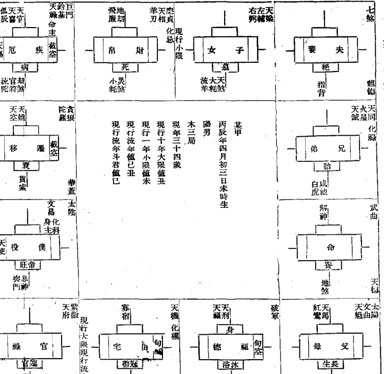

# 张开卷著

## 紫微斗数

命理研究

华联出版社印行

## 凡例

全书凡四十七章，自一章至廿五章为上编，自廿六章至四十七章为下编。全书内容乃由旧法彙辰太乙天人五行诸家演合而成之斗数命理，经著者加以全部彻底改良之一种新的推命技术，上编即为此术之基本术，下编即为此术之运用术。全书章次之前后，立说之浅深，皆有序可循，至便初学，图表歌诀之制订，尤切实用。上编每一章均有诀以备熟记，有表以备检查，两者异工而同用，如以诀之熟记为难，可舍诀而用表，如以表之检查为繁，可舍表而用诀。上编每一章之每一诀每一表，均有说明例为之说明，有试习例以资试习。下编廿六至卅四各章，乃全书精义，类皆著者融会一己之创见与心得而所立之新说，阅者能参详而消息之，则思过半矣。下编卅五至四十六各章，乃诸星见于十二宫之吉凶，类皆著者根据经验与学理，参证旧本重为厘定者，以之观审十二宫吉凶，往往应验，虽亦有例外甚鲜。本着所列星名，仅改正一二，大致仍沿用旧称。一星而数名者，或异星而同一经行蹟度同所主吉凶者，均已分别删并。本着所列诸星，其所经行之蹟度及所主之吉凶，均已详为考订。本着具有阅者探理自明之捷径，凡旧法中曾经谋食不谋道蠹所伪托附会之江湖滥调，均一律摒弃无遗。本着未一章命术医语，有关术者应世，宜留意及之。

## 慎思子任致远先生序

本著者逝世无悶斋张开卷先生，是一位好学先生，任何一种学问，他都有极浓厚的兴趣孜孜不倦的研究，而且凡是经过他的研究，必有创见，必有整理或补充，的确是在学问上有了高深成就的学者。

抗战时代，他在沦陷区被日寇囚禁，阅读写作，俱严受限制，朋友们因大量赠阅阴阳五行一类的书籍，供给他消磨不自由的永昼长夜。这本斗数命理新编，就是他在这个时期，从研究的许多命中，把认为最有价值的一种斗数命理，经他加以彻底改良而成功的新命书。

后来他从沦陷区脱险到了重庆，一般老朋友都去慰问，他便以此术为大家试推禄命，结果，大家都惊异此术的奇验，而敬佩他在囚禁中犹能对学术有此贡献为难能。但是，我却不以为然，我认为这类非科学的东西，不应为现代学者所侈谈，在囚禁中以之消磨岁月是可以的，老朋友们患难中相见，当作欢聚时的游戏也可以的，若竟过誉之为学术，站在科学的立场，我总觉不能无疑。我曾接二连三的指出其中的最大疑点，向他问难，我以为这类非科学的东西，一定禁不起科学的考验。不料此术的奇验，虽未足使我惊异，而他精彩的解答，却不能不使我由惊异而折服，更使我深深感到凡自己未曾认识的事物，遽加非科学的蔑视或批评，是最不妥当的。

这是卅二年在重庆的事，转瞬已是五年，他这本书终于在朋友们的怂恿之下而将要出版，他从远道来函约我写序，现在我将我们当时在重庆问难的谈话写在下面，以作这篇序文的主体，也算是我对这本书的一个正式介绍，下面的甲就是我，乙就是本书的著者。

> 甲：命之一说，在科学时代已无存在的价值，你是由来对学问具有真实态度和创造精神的人，现在并不在沦陷区的牢笼里，而是在重庆，尽有你阅读写作的自由，你不必再为这些旧废物浪费时间。

> 乙：我认为一个真实的学者，对于任何一件事物，在未经科学的分析之前，不应当遽下肯定的批评，你不要把这些旧有的东西一律当作旧废物，你必须对某一种旧东西有了真实的认识，你再确定你对某一种旧东西的态度。命这一观念，事实上在社会一般人的心理上仍然是普遍的存在，单凭少数不明就理的人，武断的否认它存在的价值，是无效的。要知道凡是存在的旧东西，自有它能存在的道理，这与新文化的成长，自有它成长的因素和需要正是一样。

> 甲：你以一群天上的星名，排列在十二个格内，凭某星主某事的无稽之言，以推断人的祸福休咎，就是受过现代教育的小学生，也不会相信天上的星会与人的祸福休咎有关系，难道你还能解释得使我相信吗？

> 乙：天上的星当然同人无关，但是人要叫它同人有关，它就能同人有关。比如算学代数式的元字，又何尝与数有关，但是人要用它与数有关，它就能与数有关，因为代数式中的元字，是用以表数的文字。星命学中好多星名，是用以表各种吉凶的记号。而且星命学表吉凶的记号，比代数式表数的元字尤为得用，例如天相星与七煞星，从星名字义上就可一望而知前者是吉的记号，后者是凶的记号，比之元字的ABC等须全凭记忆，尤为简捷。在新旧学术上关于表记符号的采用，原极寻常而普遍，类如我国古代的河图、洛书、八卦、都是这一类东西，东方古代文化就是从这一类东西孳生出来的，就是代数学，也原本是由印度传至阿拉伯，转而传入欧洲的所谓东来法。

> 甲：我真未想到你把星与人的关系，解答的如此圆满，可是，所谓与人生祸福休咎有关的命，为什么必得用人的降生年月日时来推？为什么人的降生年月日时，就可推得与人生祸福休咎有关的命？这两者间的关系，又是怎样成立的？

> 乙：这两者间关系的发生，起始于同一年月日时降生的人的个性形状及其生活环境，有着相同的情形发现，这种发现，是由于不经意的偶然的发现，以至于注意的连续的发现，更进而将这一发现，发展为有方法的统计。所以这两者间关系的成立，从知的方面说，可以说它的推理是由归纳到演绎的；在行的方面说，可以说它的工作是完全属于统计的。因为农历以干支纪年，每六十年为一花甲；以寅建正，每一年为十二个月；以朝望分月，每一月为三十日，以昼夜分日，每一日为十二时；依此递乘，可得出人的降生年月日时有二十五万九千二百二十个不同。从若干倍的二十几万个不同的当中，以同一年月日时生人的或吉或凶，以类相从，立为比较，而得出来的结果，就是二十几万个不同的命，也就是人有二十几万个不同的类型。这是统计上一个惊人的伟绩，除了指纹的统计几乎与人尽不同而外，试问世界上还有比这一个统计成就更为宏伟的吗？现在社会上每有人喜以血型或掌纹谈人的个性及事业，犯罪学亦以相貌特征来判断人的犯罪行为，实则血型只有寥寥数种，掌纹和相貌特征亦并无许多类，若与二十几万个不同的命相比，大有丘陵与泰山之别。但是，有科学常识的人，他可以信血型掌纹相貌等说。而不信命，原因是他们只知血型……等说，产生于科学的统计，而并不晓得二十几万个不同的命亦是成立于科学的统计的缘故。不唯如此，即使高明的算命者流，亦只是行其当然而不知其所以然，怎能不招致科学家的轻视，又何怪乎科学家的不信。

> 甲：你的解答，的确愈说愈感觉圆满，但是我仍然未尽无疑，世界上全人类数字不下十六亿，而命只有二十五万九千二百二十个，岂不是同命者太多，即单就中国四亿五千万人口而论，平均起来，就有一千七百三十余人同一个命，难道这一千七百三十余个同命的人，自生至死的人生过程，准能始终相同而无差别吗？

> 乙：人生的一切，与人的命、环境、以及意志和行为，都有着密切的关系，非单凭命可以决定。命、乃由于降生年月日时而来，是先天的安排人生的一种自然的潜力；环境、乃由于政教风俗等多几种复杂因素和关系而成，是后天的支配人生的一种人力的弹力；唯有意志和行为，则由于命与环境而生，是伸缩先天安排人生与后天支配人生的一种韧性的弹力；所谓人生的过程，就是这三种力所构成。有某种命的人，虽然蕴藏有某种命的意志和行为的必然性，但不是在某种环境，这种必然性较难发挥，比如有惰性的人，在自食其力的社会，是很难偷懒的，这就是后天的支配可以否决了先天的安排；在某种环境的人，虽然具备有产生某种环境的意志和行为的可能性，但不是有某种命，这种可能性较少实现，比如在险恶成风的社会，有善根的人，是仍然不失为好人的，这就是自然的潜力克服了后天的压力。

> 甲：据你这样的论命，岂不是宿命说的本身，原来就是站不住。

> 乙：原来你还误解我对你所解答的，一切都是在为宿命说作辩护，如果宿命说是星命学，我又何必如此辩费。要知宿命说与星命学是截然两件事，宿命说的目的，在使人信仰因而致果，是以人生的行为境遇，皆定于人的宿命而无可避免；星命学的目的，在使人由知因以致果，是以人的一切因虽有天定，而人的一切果仍在人为。所以宿命说只是知道种瓜得瓜种豆得豆的有是因自是果，而不知种瓜种豆后的肥瘠，土质的宜否，气候的变化，以及人工的培植灌溉，都与得瓜得豆有着重要的关系；星命学则不然，不但知道从种瓜种豆到得瓜得豆的过程中的一切重要关系，而且还能运用巧夺天工的移花接木的方法，以移栽易其地，以插压异其形，以贴接变其种，这就是宿命说之所以为宿命说，星命学之所以为星命学的两者迥然不同处，由此也就可以知道命术之为用何在。江湖算命者流，有挂着“指点迷津”“趋吉避凶”一类的招来幌子，江湖玩艺，当然不足道，但是他们这一套宣传，也是传来有自，试问假如星命学就是宿命说，那么命好就好，命坏则坏就是了，还有什么迷津可指点，还有什么吉可趋，凶可避，真如你所说，我也不必“浪费时间”写此知命术一书了。

问难至此，我始恍然，尤其是他对我的解答，如剥笋，如鞭辟，使我闻所未闻，知所未知，事隔五年，至今我的记忆犹新，所以我还能把它点滴的写入序文，作了这篇序文的主体，我想这篇序文的写法，在著者阅者或许都还能当意罢！民国卅八年六月慎思子序于海上。

## 著者自序

我国有易以来，凡研究阴阳五行生克制化之理以推知人事者统谓之术数。星命学即为术数之一，书可汗牛充栋，人亦派别系分，顾法虽各有所宗，一以人之降生年月日时推算禄命则无以异。世称唐之李虚中为星命家之祖，究其实汉七家之占候卜筮已启星命学之渐，晋之郭璞、唐之吕才张果、皆为是辈中人，历宋、元、明、清，作者传者代不乏人，尤以宋之陈冈南徐居易邵尧夫等各传所秘之斗数命理子平术河洛理数三者，流行偏中国，为世俗所通信。但河洛理数，失之于呆，如签诗，如谶语，未可尽驳；子平术，失之于活，仁见仁，智见智，亦未能尽是。故子平术易学而难精，河洛理数学至易而不必精，可得学而精者，其惟象至明而理至易之斗数命理乎？然坊间新版，已无一信本，讹象丛生，谬理叠出，若不经过彻底清洗之重编再订，将愈久而愈失其真，此即斗数命理新编所由作之始意也。

- 夫命者，天賦人以智愚贤不肯穷通寿天之不齐也，命理者即于此天賦不齐中而求所所以人定胜天之道也，否则，天定之休则休矣，天定之咎则咎矣，笃信乎宿命之说斯可矣，又何贵乎命理之存在哉？此尤为斗数命理新编所由作之深意存焉。盖茫茫人海，无边之欲海也，所苦；贪贱有贫贱之所欲，即有贫贱之所苦，苦亦无止境，苦而不知其已所得，苦而不知其已所困，无人不在追求其所以欲，欲无止境，亦即无人不在加深其所以苦于未来，而未来遂成寄托人生幻想之天地。

- 尽管转眼未来成过去，总将此心今日盼明朝，此一与生俱来与生俱灭之心，不至生之已时，不能消灭其幻想，亦即不到死方休，不肯自绝其生之希望也。然未来究如何，犹为人生之迷藏命术于焉以徇，以天定之数立其体，祛不可得之妄念；以人定之力致其用，示尽可能之正求，从不齐之天赋中，而各别施以为人之启迪，使益者知所足，进者知所止，顽夫知所廉，懦夫知所立，此即命理之为命理，亦即星命学与宿命说之大相径庭处。故命术之为用，乃由心理之改善，以影响行为之改善，损所益，益所损，出入于妄，入人于正，导社会于平衡者也。况夫求术于卷中，步天于纸上，玩习而体味之，胸罗星斗，明彻内外，以之自审，可以寡过，以之酬世，可以观人，诚自觉觉人之至术，岂小道也哉！今者是编终因朋儕之束而行将问世，爰弁言章首，以就有道而正焉。己丑七夕无闷斋主自序于香岛。

## 起命身表

例如某甲，生于四月未时，查本表生月之四栏及生时之未栏，即知其立命在戊

| 正 | 二 | 三 | 四 | 五 | 六 | 七 | 八 | 九 | 十 | 十一 | 十二 |
|---|---|---|---|---|---|---|---|---|---|---|---|
| 命身 | 命身 | 命身 | 命身 | 命身 | 命身 | 命身 | 命身 | 命身 | 命身 | 命身 | 命身 |
| 子 | 丑 | 寅 | 卯 | 辰 | 巳 | 午 | 未 | 申 | 酉 | 戌 | 亥 |
| 丑 | 寅 | 卯 | 辰 | 巳 | 午 | 未 | 申 | 酉 | 戌 | 亥 | 子 |
| 寅 | 卯 | 辰 | 巳 | 午 | 未 | 申 | 酉 | 戌 | 亥 | 子 | 丑 |
| 卯 | 辰 | 巳 | 午 | 未 | 申 | 酉 | 戌 | 亥 | 子 | 丑 | 寅 |
| 辰 | 巳 | 午 | 未 | 申 | 酉 | 戌 | 亥 | 子 | 丑 | 寅 | 卯 |
| 巳 | 午 | 未 | 申 | 酉 | 戌 | 亥 | 子 | 丑 | 寅 | 卯 | 辰 |
| 午 | 未 | 申 | 酉 | 戌 | 亥 | 子 | 丑 | 寅 | 卯 | 辰 | 巳 |
| 未 | 申 | 酉 | 戌 | 亥 | 子 | 丑 | 寅 | 卯 | 辰 | 巳 | 午 |
| 申 | 酉 | 戌 | 亥 | 子 | 丑 | 寅 | 卯 | 辰 | 巳 | 午 | 未 |
| 酉 | 戌 | 亥 | 子 | 丑 | 寅 | 卯 | 辰 | 巳 | 午 | 未 | 申 |
| 戌 | 亥 | 子 | 丑 | 寅 | 卯 | 辰 | 巳 | 午 | 未 | 申 | 酉 |

## 斗数命理新编总目录

自序 ......... 七

凡例 ......... 一

上编

第一章 十干 ......... 一

第二章 十二支 ......... 二

第三章 地盘 ......... 四

第四章 起命身(附一)闰月生人定生月法 (附二)子午时生人起命身法 ......... 五

第五章 安十二宫 ......... 〇

第六章 定五行局 ......... 三

第七章 起紫微 ......... 一六

第八章 安紫微诸辰 ......... 一三

第九章 起天府 ......... 一五

第十章 安天府诸辰 ......... 一八

第十一章 安月系诸辰 ......... 三〇

第十二章 安时系诸辰 ......... 三三

第十三章 安干系诸辰 ......... 三八

第十四章 安支系诸辰 ......... 四四

第十五章 安长生十二神 ......... 四九

第十六章 安截空 ......... 五二

第十七章 安旬空 ......... 五五

第十八章 安使伤 ......... 五七

第十九章 安命主身主 ......... 五九

第二十章 起大限 ......... 六二

第二十一章 起小限 ......... 六五

第二十二章 安流年将前诸辰 ......... 六七

第二十三章 安流年岁前诸辰 ......... 七〇

第二十四章 安流年斗君 ......... 七三

第二十五章 命盘全式（附某甲命盘全式） ......... 七六

## 下编目录

- 第二十六章 诸辰一览表 ............ 七九
- 第二十七章 术语须知 ............ 九三
- 第二十八章 观星四要 ............ 九三
- 第二十九章 观方十喻 ............ 九三
- 第三十章 观格局八法 ............ 九三
- 第三十一章 定时要指 ............ 九三
- 第三十二章 观命身要指 ............ 九三
- 第三十三章 观大行限及流年太岁要指 ............ 九三
- 第三十四章 观斗君月令要指 ............ 九三
- 第三十五章 诸星见命身宫吉凶 ............ 九三
- 第三十六章 诸星见兄弟宫吉凶 ............ 九三
- 第三十七章 诸星见夫妻宫吉凶 ............ 九三
- 第三十八章 诸星见子女宫吉凶 ............ 九三
- 第三十九章 诸星见财帛宫吉凶 ............ 九三
- 第四十章 诸星见疾厄宫吉凶 ............ 一一九
- 第四十一章 诸星见迁移宫吉凶 ............ 一三〇
- 第四十二章 诸星见僕役宫吉凶 ............ 一三一
- 第四十三章 诸星见官禄宫吉凶 ............ 一三二
- 第四十四章 诸星见田宅宫吉凶 ............ 一三三
- 第四十五章 诸星见福德宫吉凶 ............ 一三四
- 第四十六章 诸星见父母宫吉凶 ............ 一三五
- 第四十七章 命术医语 ............ 一三六
- 附某甲命评例 ............ 一三八

# 斗数命理新编 (上)

著作者 无闷斋主

## 第一章 十干

十干、甲、乙、丙、丁、戊、己、庚、辛、壬、癸也，甲、丙、戊、庚、壬属阳，乙、丁、己、辛、癸属阴，甲乙同属木，丙丁同属火，戊己同属土，庚辛同属金，壬癸同属水，初习悉宜熟记。其表如左：

### 十干所属表

| 五行 | 阴阳 | 十干 |
|------|------|------|
| 木   | 阳   | 甲   |
| 木   | 阴   | 乙   |
| 火   | 阳   | 丙   |
| 火   | 阴   | 丁   |
| 土   | 阳   | 戊   |
| 土   | 阴   | 己   |
| 金   | 阳   | 庚   |
| 金   | 阴   | 辛   |
| 水   | 阳   | 壬   |
| 水   | 阴   | 癸   |

## 上编 第二章 十二支

### 說明

例如甲，查本表十干之甲欄及所屬之陰陽欄五行欄，即知甲屬陽屬木，餘類推。

### 試習

問：戊癸兩干，陰陽何屬？五行何屬？

答：查本表十干之戊癸兩欄及所屬之陰陽欄五行欄，即知戊屬陽屬土，癸屬陰屬水。

## 第二章 十二支

十二支，子、丑、寅、卯、辰、巳、午、未、申、酉、戌、亥也。子、寅、辰、午、申、戌屬陽，丑、卯、巳、未、酉、亥屬陰。亥子同屬水，寅卯同屬木，巳午同屬火，申酉同屬金，丑辰未戌同屬土。子屬鼠，丑屬牛，寅屬虎，卯屬兔，辰屬龍，巳屬蛇，午屬馬，未屬羊，申屬猴，酉屬雞，戌屬狗，亥屬豬。

### 試習

### 說明

屬豬，初習悉宜熟記。其表如左：

### 十二支所屬表

| 十二支 | 陰陽 | 五行 | 生肖 |
|--------|------|------|------|
| 子     | 陽   | 水   | 鼠   |
| 丑     | 陰   | 土   | 牛   |
| 寅     | 陽   | 木   | 虎   |
| 卯     | 陰   | 木   | 兔   |
| 辰     | 陽   | 土   | 龍   |
| 巳     | 陰   | 火   | 蛇   |
| 午     | 陽   | 火   | 馬   |
| 未     | 陰   | 土   | 羊   |
| 申     | 陽   | 金   | 猴   |
| 酉     | 陰   | 金   | 雞   |
| 戌     | 陽   | 土   | 狗   |
| 亥     | 陰   | 水   | 豬   |

例如子，查本表十二支之子欄及所屬之陰陽欄五行欄生肖欄，即知子屬陽屬水屬鼠，餘類推。

問：午未兩支，陰陽何屬？五行何屬？生肖何屬？

答：查本表十二支之午未兩欄及所屬之陰陽五行生肖欄，即知午屬陽屬火屬馬，未屬陰屬土屬羊。

## 第三章 地盘

地盘圖

| 东 | 南 | 西 | 北 |
|---|---|---|---|
| 卯 | 午 | 酉 | 子 |
| 辰 | 未 | 戌 | 丑 |
| 巳 | 申 | 亥 | 寅 |

地盤，即十二支恒久不變之盤，亦即斗數命理推命之基本工具。其盤為四方周邊十二格，每一格即某一個支之單獨定位，每一方即某三個支之共同定方。初習悉宜熟記之。其圖如左：

> **注意**
> 一、此盤用時，可照式隨意放大，但不必填入十二支，宜熟記其單獨定位及共同定方為要。
> 二、此盤自下章起，即開始入於命盤之佈置。

### 說明

例如圖下方左數第二格，即為子之單獨定位，圖下方左數第一、第二、第三三格，即為亥子丑之共同定方。又自北而東南西為順，自北而西南東為逆，即自亥歷子丑寅卯辰巳午申酉至戌為順，自亥歷戌酉申未午巳辰卯寅丑至子為逆。

### 試習

- 問：申酉戌，屬何方？
- 答：申酉戌，屬西方。
- 問：自子至丑，與自丑至子，何為順？何為逆？
- 答：自子至丑為順，自丑至子為逆。

## 第四章 起命身

起命身為斗數命理佈置命盤之第一式，即以人之生月生時，推得其在地盤上立命安身之位也。起法：從地盤寅位起正月，順推至生月；再從生月之位起子時，逆推至生時立命，順推至生時安身。其訣與表分列如左：

### 起命身訣

- 寅正順數生月逢，
- 生月起子爾頭通，
- 順至生時身所在，
- 逆到生時命之宮。

> 說明

例如有某甲，生於四月未時，即從地盤之寅位起正月，順歷卯辰至巳，即為其生之四月，如附圖（甲）。再從生月之巳起子時，逆歷辰卯……至戌，即為其生之未時以立命，如附圖（乙）。順歷午未……至子，即為其生之未時以安身，如附圖（丙）。蓋某甲四月生，照通例寅起正月，以卯作二月……順推至巳，恰是四月也。又某甲未時生，由四月巳起子時，以辰作丑時……遞推至戌，恰是未時也。以午作丑時，……順推至子，恰是未時也。餘類推。

### 試習

問：假設有某乙，生於正月丑時，應在何位立命？何位安身？

答：正月生人照寅起正月通例，寅即其生月，應從生月之寅位起子時，逆推至丑，為其生之丑時以立命，順推至卯，為其生之丑時以安身。

### (丙)生月起子時順推至生時

|   |   |   |   |
|---|---|---|---|
| 巳 | 午 | 未 | 申 |
| 辰 | 生人四月未時為某甲命安身之位 | 酉 |
| 卯 | 卯 | 戌 命 |
| 寅 | 丑 | 身 子 | 亥 |

(乙)生月起子時逆推至生時

(附二)閏月生人定生月法：凡閏月生人，以閏月之上半月屬上月，下半月屬下月。

### 說明

例如生於閏二月十五日，則屬於閏二月之上半月，為二月生人。
又例如生於閏二月十六日，則屬於閏二月之下半月，為三月生人，餘類推。

### 試習

問：假設有某丙生於閏三月十四日，有某丁生於閏三月十五日，有某戊生於閏三月十六日，其生月應如何定？

答：某丙某丁皆屬於閏三月之上半月，應為三月生人，某戊乃屬閏三月之下半月，應為四月生人。

說明

例如正月子時生人，則命身同在寅位。又例如三月午時生人，則命身同在戌位，餘類推。

（附二）子午時生人起命身法：凡子午時生人，其命身同在一位。

試練

問：假設有某己，生於正月子時，有某庚生於五月午時，其命身應如何起？
答：某己命身應同在寅位，某庚命身應同在子位。

## 第五章 安十二宮

十二宮，即命宮以及父母、兄弟、夫妻、子女、財帛、疾厄、遷移、僕役、官祿、田宅、福德諸宮是也。（按僕役宮舊稱奴僕宮，因奴係古罪人之女從坐而沒入官者之稱，又係價賣而依主人姓者之稱，此種風氣，鼎革以遠，已趨消滅，今為名副其實及尊重人格，故為易之。）安法：命宮順前一位安父母宮，逆後一位安兄弟宮，其餘諸宮排在兄弟宮後，依次逆安之。其訣與表分列如左：

### 安十二宮訣

命前為父母，命後乃兄弟，逆次而行之，造端在夫妻，子女兼財帛，疾厄有遷移，僕役隨官祿，田宅福德基。

### 說明

例如某甲，立命在戌，則命前亥安父母，命後西安兄弟，……遞次逆推至子安福德，（參閱第廿五章某甲命盤全式）餘類推。

### 試習

問：假說某乙，立命在丑，其十二宮次應如何安？

答：應在命前寅安父母，命後子安兄弟，……遞次逆推至卯安福德。

### 安十二宮表

| 命宫 | 兄弟 | 夫妻 | 子女 | 財帛 | 疾厄 | 遷移 | 僕役 | 官祿 | 田宅 | 福德 | 父母 |
|------|------|------|------|------|------|------|------|------|------|------|------|
| 子   | 亥   | 戌   | 酉   | 申   | 未   | 午   | 巳   | 辰   | 卯   | 寅   | 丑   |
| 丑   | 子   | 亥   | 戌   | 酉   | 申   | 未   | 午   | 巳   | 辰   | 卯   | 寅   |
| 寅   | 丑   | 子   | 亥   | 戌   | 酉   | 申   | 未   | 午   | 巳   | 辰   | 卯   |
| 卯   | 寅   | 丑   | 子   | 亥   | 戌   | 酉   | 申   | 未   | 午   | 巳   | 辰   |
| 辰   | 卯   | 寅   | 丑   | 子   | 亥   | 戌   | 酉   | 申   | 未   | 午   | 巳   |
| 巳   | 辰   | 卯   | 寅   | 丑   | 子   | 亥   | 戌   | 酉   | 申   | 未   | 午   |
| 午   | 巳   | 辰   | 卯   | 寅   | 丑   | 子   | 亥   | 戌   | 酉   | 申   | 未   |
| 未   | 午   | 巳   | 辰   | 卯   | 寅   | 丑   | 子   | 亥   | 戌   | 酉   | 申   |
| 申   | 未   | 午   | 巳   | 辰   | 卯   | 寅   | 丑   | 子   | 亥   | 戌   | 酉   |
| 酉   | 申   | 未   | 午   | 巳   | 辰   | 卯   | 寅   | 丑   | 子   | 亥   | 戌   |
| 戌   | 酉   | 申   | 未   | 午   | 巳   | 辰   | 卯   | 寅   | 丑   | 子   | 亥   |
| 亥   | 戌   | 酉   | 申   | 未   | 午   | 巳   | 辰   | 卯   | 寅   | 丑   | 子   |

說明

例如某甲，立命在戌，查本表命宮之戌欄及餘宮欄，即知父母在亥，兄弟在酉，夫妻、子女、財帛、疾厄、遷移、僕役、官祿、田宅、福德，在申、未、午、巳、辰、卯、寅、丑、子，餘類推。

### 試習

問：假設某乙，立命在丑，由何可得而知其十二宮之安次？

答：查本表命宮之丑欄，即可知其父母在寅，兄弟在子，夫妻、子女、財帛、疾厄、遷移、僕役、官祿、田宅、福德，在亥、戌、酉、申、未、午、巳、辰、卯。

## 第六章 定五行局

五行局，即水一局、火二局、木三局、金四局、土五局是也。定法：在安十二宮之後，以人之生年干，按五寅冠蓋訣，求得命宮之干支；然後再按六十花甲納音歌，求得命宮干支之納音，納音為何，即為何局。其訣與表分列如左：

### (一) 五寅冠蓋訣(舊名五虎遁)

- 五寅冠蓋例，甲己丙當頭，乙庚戊為帽。
- 丙辛庚作兜，丁壬壬自首，戊癸甲稱會。

### (二) 六十花甲納音歌

- 甲子乙丑海中金，
- 丙寅丁卯爐中火，
- 戊辰己巳大林木，
- 庚午辛未路旁土，
- 壬申癸酉劍鋒金。
- 甲戌乙亥山頭火，
- 丙子丁丑澗下水，
- 戊寅己卯城頭土，
- 庚辰辛巳白蠟金，
- 壬午癸未楊柳木。
- 甲申乙酉泉中水，
- 丙戌丁亥屋上土，
- 戊子己丑霹靂火，
- 庚寅辛卯松柏木，
- 壬辰癸巳長流水。
- 甲午乙未沙中金，
- 丙申丁酉山下火，
- 戊戌己亥平地木，
- 庚子辛丑壁上土，
- 壬寅癸卯金箔金，
- 甲辰乙巳佛燈火，
- 丙午丁未天河水，
- 戊申己酉大驛土，
- 庚戌辛亥釵釧金，
- 壬子癸丑桑柘木，
- 甲寅乙卯大溪水，
- 丙辰丁巳沙中土，
- 庚申辛酉石榴木，
- 壬戌癸亥大海水。

### 說明

例如某甲，立命在戊，如生年干為丙，按五寅冠蓋訣，「丙辛庚作兜」，從寅位起庚，順至命宮則得出戊位之干為戊，再按六十花甲納音歌，「戊戌己亥平地木」，則又得出戊戌之納音為木，即為木三局。餘類推。

問：假設某乙，立命在丑，如生年干為癸，其五行局應如何定？

答：按五寅冠蓋訣，「戊癸甲稱會」，從寅位起甲，順至命宮得出丑位之干為乙；再按六十花甲納音歌，「甲子乙丑海中金」，得出乙丑之納音為金，應定為金四局。

### 定五行局表

| 年干/命宫 | 子 | 丑 | 寅 | 卯 | 辰 | 巳 | 午 | 未 | 申 | 酉 | 戌 | 亥 |
|-----------|----|----|----|----|----|----|----|----|----|----|----|----|
| 甲 己     | 水 | 金 | 火 | 土 | 木 | 火 | 水 | 金 | 火 | 土 | 木 | 火 |
| 乙 庚     | 火 | 土 | 木 | 水 | 金 | 木 | 金 | 火 | 水 | 金 | 木 | 土 |
| 丙 辛     | 土 | 金 | 木 | 火 | 水 | 金 | 木 | 火 | 金 | 水 | 金 | 木 |
| 丁 壬     | 金 | 木 | 水 | 火 | 木 | 火 | 木 | 金 | 土 | 火 | 水 | 金 |
| 戊 癸     | 水 | 土 | 土 | 火 | 木 | 火 | 木 | 金 | 土 | 火 | 木 | 水 |

## 第七章 起紫微

### 說明

例如某甲，立命在戊，生年干為丙，查本表生年干之丙辛欄及命宮之戊亥欄，即知為木三局。餘類推。

### 試習

問：假設某乙，立命在丑，生年干為癸，由何可得而知其為五行何局？

答：查本表年干之戊癸欄，及命宮之子丑欄，即可知其為金四局。

紫微為眾星主曜，起法：於所屬五行局內，求得生日所在之支，即為紫微之曜次，其訣與表分列如左：（本章各訣下有注）

### （一）水一局起紫微訣

水一局中初一牛，（即水一局初一在丑也。）
單雙不論順行流，（即不論單日雙日皆順行也。）
順行一格安兩日，（即除初一在丑外，其餘皆順行一格安兩天，初二、三在寅，初四、五在卯，……兩天一位，依次順行也。）
最末一天龍抬頭。（即照上法依次順行，至月終三十日適在辰也。）

### (二)火二局起紫微訣

- 火二局中初一雞，（即火二局單日初一在酉也。）
- 初二數從馬頭起，逆二兩次順五一。（即火二局雙日初二在午也。即先逆行二格兩次，然後順行五格一次，每次皆安一雙日也。法從初二午逆行二格至辰是初四，從初四辰逆行二格至寅是初六，從初六寅順行五格至未是初八；再從初八未逆行二格至巳是初十，從初十巳逆行二格至卯是十二，從十二卯順行五格至申是十四，……依次往返，三十恰在午。）
- 順二兩次逆三一，（即先行二格兩次，然後逆行三格一次，每次皆安一雙日也。法從初一酉順行二格至亥是初三，從初三順行二格至丑是初五，從初五丑逆行三格至戌是初七；再從初七戌順行二格至子是初九，從初九子順行二格至寅是十一，從十一寅逆行三格至亥是十三，……依次往返，二十九恰在巳。）

### (三)木三局起紫微訣

木三初一龍正眠，（即木三局單日初一在辰也。）
逆二安兩日，順四安一天；（即先逆行二格安兩天，然後順行四格安一天也。）
法從初一辰逆行二格至寅是初三初五，從初三初五寅順行四格至午是初七；再從初七午逆行二格至辰初九十一，從初九十一辰順行四格至申是十三，……依次往返，二十九恰在戌。
順四安一日，逆二安兩天。（即先順行四格安一天，然後逆行二格安兩天也。）
法從初二丑順行四格至巳是初四，從初四巳逆行二格至卯是初六初八；再從初六初八卯順行四格至亥是初十；……依次往返，三十恰在未。

### (四) 金四局起紫微訣

初一豬來初二龍，金星四數紫微宮，（即金四局單日初一在亥，雙日初二在辰也。）
順二逆一安單日，（即先順行二格安一單日，然後逆行一格安一單日也。法從初一亥順行二格至丑是初三，從初三丑逆行一格至子是初五；再從初五子順行二格至寅是初七，從初七寅逆行一格至丑是初九，……依次往返，二十九恰在午。）

### (五) 土五局起紫微訣

土局一馬與二豬，（即土五局單日初一在午，雙日初二在亥也。）
單日數罷雙日數，逆行二步安一日，（即逆行二格安一單日也。）
法從初一午逆行二格辰是初三，從初三辰逆行二格至寅是初五，……依次逆行至辰恰是二十七。）
值九移向寅辰午，（即依上法安單日初九正值戌，十九正值子，二十九正值寅。值九移向寅辰午者，即初九由戌移寅，十九由子移辰，二十九由寅移午也。）
順二三來逆二二，（即先順行二格三次，然後逆行二格二次，每次皆安一雙日也。法從初一亥順行二格至丑是初四，從初四丑順行二格至卯是初六，從初六卯順行二格至巳是初八，從初八巳逆行二格至卯是初十，從初十卯逆行二格至丑是十二；再從十二丑順行二格至卯是十四，從十四卯順行二格至巳是十六，從十六巳順行二格至未是十八，從十八未逆行二格至已是二十，從二十巳逆行二格至卯是二十二，……依次往返，三十恰在未。）

> 說明

例如某甲，木三局，如係初三生，按木三局起紫微訣，「木三初一龍正眠，逆二安兩日，」從初一辰逆行二格至寅是初三，即在寅位起紫微，（參閱第廿五章某甲命盤全式）餘類推。

> 試習

問：假說某乙，金四局，如係十五生，其紫微應如何起？

答：按金四局起紫微訣「初一豬來……順二逆一安單日，」從初一亥順二逆一，依次往返，至辰是十五，應在辰位起紫微。

### 起紫微表

| 局別 | 一 | 二 | 三 | 四 | 五 | 六 | 七 | 八 | 九 | 十 |
|------|----|----|----|----|----|----|----|----|----|----|
| 水一局 | 丑午亥寅未子寅未子卯申丑卯申丑辰酉寅辰酉寅巳戊卯巳戊卯午亥辰 | [内容省略] | [内容省略] | [内容省略] | [内容省略] | [内容省略] | [内容省略] | [内容省略] | [内容省略] | [内容省略] |
| 火二局 | [内容] | [内容] | [内容] | [内容] | [内容] | [内容] | [内容] | [内容] | [内容] | [内容] |
| 木三局 | [内容] | [内容] | [内容] | [内容] | [内容] | [内容] | [内容] | [内容] | [内容] | [内容] |
| 金四局 | [内容] | [内容] | [内容] | [内容] | [内容] | [内容] | [内容] | [内容] | [内容] | [内容] |
| 土五局 | [内容] | [内容] | [内容] | [内容] | [内容] | [内容] | [内容] | [内容] | [内容] | [内容] |

【注意】本表有生日欄之每一數字皆代表三日，如一為初一、又為十一、二十一，如水一局之第一格丑為初一、寅為十一、亥為二十一，餘類推。

> 說明：例如某甲，木三局初三生，查本表局別之木三局欄及生日之三欄，即知寅起紫微，餘類推。

### 试习

问：假设某乙，金四局，十五生，由何可得而知其起紫微之位？
答：查本表局别之金四局栏及生日之五栏，即可知其辰起紫微。

## 第八章 安紫微诸辰

随紫微而安之诸辰，为天机、太阳、武曲、天同、廉贞，是也。安法：在紫微躔次之后一格起逆行，惟第一辰与第二辰须隔一格，第四辰与第五辰须隔二格，而第五辰与紫微躔次恰隔三格，方为无误。其诀与表分列如左：

> 说明
连接天同空二格，廉贞居处正相宜。

紫微逆去宿天机，隔一太阳武曲移，连接天同空二格，廉贞居处正相宜。

例如某甲，寅起紫微，按上诀逆行，丑安天机，隔子一格，亥安太阳，戌安武曲，酉安天同，又隔申未两格，午安廉贞，（参阅第廿五章某甲命盘全式）余类推。

### 试习

问：假设某乙辰起紫微，其紫微诸辰应如何安？

答：辰起紫微，按上诀逆行，应卯安天机，隔寅一格，丑安太阳，子安武曲，亥安天同，又隔戌酉两格，申安廉贞。

### 安紫微诸辰表

| 甲 | 星名/诸辰 | 紫微 | 子 | 丑 | 寅 | 卯 | 辰 | 巳 | 午 | 未 | 申 | 酉 | 戌 | 亥 |
|---|---|---|---|---|---|---|---|---|---|---|---|---|---|---|
|  |  |  |  |  |  |  |  |  |  |  |  |  |  |  |
|  | 天机 |  | 子 | 丑 | 寅 | 卯 | 辰 | 巳 | 午 | 未 | 申 | 酉 | 戌 | 亥 |
|  | 太阳 |  | 酉 | 戌 | 亥 | 子 | 丑 | 寅 | 卯 | 辰 | 巳 | 午 | 未 | 申 |
|  | 武曲 |  | 申 | 酉 | 戌 | 亥 | 子 | 丑 | 寅 | 卯 | 辰 | 巳 | 午 | 未 |
|  | 天同 |  | 未 | 申 | 酉 | 戌 | 亥 | 子 | 丑 | 寅 | 卯 | 辰 | 巳 | 午 |
| 廉贞 |  |  | 辰 | 巳 | 午 | 未 | 申 | 酉 | 戌 | 亥 | 子 | 丑 | 寅 | 卯 |

【注意】甲级星应安在命盘十二格之右上方，（参阅第廿五章某甲命盘全式）

### 说明

例如某甲，辰起紫微，查本表紫微之寅栏及诸辰栏，即知丑安天机，亥安太阳，戌安武曲，酉安天同，午安廉贞，余类推。

### 试习

问：假设某乙，辰起紫微，由何可得而知其安紫微诸辰之位？
答：查本表紫微之辰栏及诸辰栏，即可知其卯安天机，丑安太阳，子安武曲，亥安天同，申安廉贞。

## 第九章 起天府

天府为南斗令星，起法：依紫微为转移，除在寅在申紫微天府二辰系同躔外，在卯与丑，辰与子，巳与亥，午与戌，未与酉，其躔次皆斜相对立。即紫微在卯，天府即在丑；紫微在丑，天府即在卯；……如附图。其诀与表分列如左：

### 起天府诀

天府南斗命，常对紫微君，丑卯相更迭，未酉互为根，往来午与戌，踝子和辰，巳亥交驰骋，同位在寅申。

| 紫 | 紫 | 紫 | 府 |
|---|---|---|---|
| 紫 | / | 府 | 府 |
| 紫 | 紫 | 府 | 府 |
| 紫 | 府 | 府 | 府 |

(图附)

| 府 | 府 | 府 | 紫 |
|---|---|---|---|
| 府 | / | / | 紫 |
| 府 | / | / | 紫 |
| 紫 | 紫 | 紫 | 紫 |

> 说明

例如某甲，寅起紫微，按上诀「同位在寅申」即紫微在寅，天府亦在寅，（参阅第廿五章某甲命盘全式）余类推。

### 试习

问：假设某乙，辰起紫微，其天府如何起？
答：按上诀「踝子和辰」，应子起天府。

### 起天府表

| 紫微 | 天府 |
|------|------|
| 子 | 辰 |
| 丑 | 卯 |
| 寅 | 寅 |
| 卯 | 丑 |
| 辰 | 子 |
| 巳 | 亥 |
| 午 | 戌 |
| 未 | 酉 |
| 申 | 申 |
| 酉 | 未 |
| 戌 | 午 |
| 亥 | 巳 |

### 说明

例如某甲，寅起紫微，查本表紫微之寅之并立之格，即知天府亦是寅起。

### 试习

问：假设某乙，辰起紫微，由何可得而知其起天府之位？
答：查本表紫微之辰之并立之格，即可知子起天府。

## 第十章 安天府诸辰

随天府而安之诸辰，为太阴、贪狼、巨门、天相、天梁、七煞、破军，是也。安法：在天府躔次之前一格起顺行，惟第六辰与第七辰须隔三格，而第七辰与天府躔次恰隔一格，方为无误。其诀与表分列如左：

### 安天府诸辰诀

天府顺行有太阴，贪狼而后巨门临，
随来天相天梁继，七煞空三是破军。

> 说明

例如某甲，寅起天府，按上诀顺行，卯安太阴，辰安贪狼、巳安巨门、午安天相、未安天梁、申安七煞、隔酉戌亥三格，子安破军。（参阅第廿五章某甲命盘全式）余类推。

### 试习

问：假设某乙子起天府，其天府诸辰应如何安？

答：子起天府，按上诀顺行，应丑安太阴、寅安贪狼、卯安巨门、辰安天相、巳安天梁、午安七煞、隔未申酉三格，戌安破军。

| 破军 | 七煞 | 天梁 | 天相 | 巨门 | 贪狼 | 太阴 | 天府 |
|---|---|---|---|---|---|---|---|
| 戌 | 午 | 巳 | 辰 | 卯 | 寅 | 丑 | 子 |
| 亥 | 未 | 午 | 巳 | 辰 | 卯 | 寅 | 丑 |
| 子 | 申 | 未 | 午 | 巳 | 辰 | 卯 | 寅 |
| 丑 | 酉 | 申 | 未 | 午 | 巳 | 辰 | 卯 |
| 寅 | 戌 | 酉 | 申 | 未 | 午 | 巳 | 辰 |
| 卯 | 亥 | 戌 | 酉 | 申 | 未 | 午 | 巳 |
| 辰 | 子 | 亥 | 戌 | 酉 | 申 | 未 | 午 |
| 巳 | 丑 | 子 | 亥 | 戌 | 酉 | 申 | 未 |
| 午 | 寅 | 丑 | 子 | 亥 | 戌 | 酉 | 申 |
| 未 | 卯 | 寅 | 丑 | 子 | 亥 | 戌 | 酉 |
| 申 | 辰 | 卯 | 寅 | 丑 | 子 | 亥 | 戌 |
| 酉 | 巳 | 辰 | 卯 | 寅 | 丑 | 子 | 亥 |

> 说明
例如某甲，寅起天府，查本表天府之寅栏及诸辰栏，即知卯安太阴、辰安贪狼、巳安巨门、午安天相、未安天梁、申安七煞、隔酉戌亥三格、子安破军，余类推。

> 试习
问：假如某乙，子起天府，由何可得而知其安天府诸辰之位？
答：查本表天府之子栏及诸辰栏，即可知其丑安太阴，寅安贪狼、卯安巨门、辰安天相、巳安天梁、午安七煞、隔未申酉三格，戌安破军。

## 第十一章 安月系诸辰

月系诸辰，为一系与生月有关之天姚，天刑，左辅、右弼、天马、解神是也。安法：天姚丑起正月，天刑酉起正月，左辅辰起正月，顺推至生月；右弼戌起正月，逆推至生月；天马亥卯未月在巳，申子辰月在寅，巳酉丑月在亥。

### 安月系诸辰诀

姚顺丑兮刑顺酉，右逆戌左兮顺辰，
各有前程相等待，途逢生月便停身；
亥卯未月马见巳，申子辰月马见寅，
巳酉丑月马见亥，寅午戌月马见申；
正二解申三四戌，五六解子七八寅，
十一十二解当午，九十之辰是解神。

> 说明
例如某甲，四月生，按上诀首四句，从丑起正月，顺推至辰安天姚，从酉起正月，顺推至子安天刑，从辰起正月，顺推至未安左辅，从戌起正月，逆推至未安右弼；按上诀中四句，四月为巳月，亥安天马；按上诀后四句，四月解神在戌，（参阅第二十五章某甲命盘全式）余类推。

### 试习

问：假设某乙，正月生，月系诸辰应如何安？
答：按上诀首四句，正月天姚应在丑，天刑应在酉，左辅应在辰，右弼应在戌；按上诀中四句，正月为寅月，天马应在申；按上诀后四句，正月解神亦应在申。

### 安月系诸辰表

| 星名/辰名 | 正 | 二 | 三 | 四 | 五 | 六 | 七 | 八 | 九 | 十 | 十一 | 十二 |
|---|---|---|---|---|---|---|---|---|---|---|---|---|
| 天姚 | 丑 | 寅 | 卯 | 辰 | 巳 | 午 | 未 | 申 | 酉 | 戌 | 亥 | 子 |
| 天刑 | 酉 | 戌 | 亥 | 子 | 丑 | 寅 | 卯 | 辰 | 巳 | 午 | 未 | 申 |
| 左辅 | 辰 | 巳 | 午 | 未 | 申 | 酉 | 戌 | 亥 | 子 | 丑 | 寅 | 卯 |
| 右弼 | 戌 | 亥 | 子 | 丑 | 寅 | 卯 | 辰 | 巳 | 午 | 未 | 申 | 酉 |
| 天马 | 申 | 巳 | 寅 | 亥 | 申 | 巳 | 寅 | 亥 | 申 | 巳 | 寅 | 亥 |
| 解神 | 申 | 戌 | 子 | 寅 | 申 | 戌 | 子 | 寅 | 申 | 戌 | 子 | 寅 |

【注意】乙级星应安在命盘十二格之左上方（参阅 第廿五章 某甲命盘全式）

### 说明

### 试习

问：假设某乙，正月生，由何可得而知其安月系诸辰之位。
答：查本表生月之正栏及辰名栏，即可知其天姚在丑、天刑在酉、左辅在辰、右弼在戌、天马解神在申。

## 第十二章 安时系诸辰

时系诸辰，为一系与生时有关之文曲、文昌、天空、地劫、火星、铃星是也。安法：文曲从辰起子时，顺推至生时；文昌从戌起子时，逆推至生时；天空从亥起子时，逆推至生时；地劫从亥起子时，顺推至生时；火星铃星先依年支取得起位后，再各从起位起子时，顺推至生时。其诀与表分列如左：

### （一）安文曲文昌天空地劫诀

> 曲顺辰兮戌逆昌，生时到处是文乡；亥宫起子逆和顺，逆是空方顺劫方。

> 说明
例如某甲，未时生，按上诀前二句，从辰起子时，顺推至亥安文曲，从戌起子时，逆推至卯安文昌，按上诀后二句，从亥起子时，逆推至辰安天空，顺推至午安地劫，（参阅第二十五章某甲命盘全式）余类推。

### 试习

问：假设某乙，丑时生，文曲文昌天空地劫应如何安？
答：按上诀前二句，应从辰起子时，顺推至巳安文曲，从戌起子时，逆推至酉安文昌，按上诀后二句，应从亥起子时，逆推至戌安天空，顺推至子安地劫。

### （二）安火星铃星诀

寅午戌年丑卯起，申子辰年寅戌扬，巳酉丑年卯戌始，亥卯未年酉戌翔，再从始处来起子，顺至生时是灾乡。

> 说明
例如某甲，辰年未时生，按上诀「申子辰年寅戌扬」，从寅起子时，顺推至酉安火星，从戌起子时，顺推至巳安铃星，（参阅第二十五章某甲命盘全式）余类推。

### 试习

问：假如某乙，巳年丑时生，火星铃星应如何安？
答：巳年丑时生，按上诀「巳酉丑年卯戌始」，应从卯起子时，顺推至辰安火星，从戌起子时，顺推至亥安铃星。

### 安时系诸辰表

| 甲（亥卯未） | 甲（巳酉丑） | 甲（申子辰） | 甲（寅午戌） | 乙（劫空） | 甲（昌曲） | 星级/安命/宫度 | 生时 |
|---|---|---|---|---|---|---|---|
| 戌酉 | 卯戌 | 寅戌 | 丑卯 | 亥亥 | 辰戌 | 酉戌 | 子 |
| 亥戌 | 辰亥 | 卯亥 | 寅辰 | 戌子 | 巳酉 | 亥辰 | 丑 |
| 子亥 | 巳寅 | 辰寅 | 卯巳 | 申丑 | 午申 | 卯子 | 寅 |
| 子丑 | 午卯 | 巳卯 | 辰午 | 申寅 | 未未 | 辰子 | 卯 |
| 丑寅 | 未辰 | 午辰 | 巳未 | 未卯 | 申午 | 巳丑 | 辰 |
| 寅卯 | 申巳 | 未巳 | 午申 | 午辰 | 酉巳 | 午寅 | 巳 |
| 卯辰 | 酉午 | 申午 | 未酉 | 巳巳 | 戌辰 | 未卯 | 午 |
| 辰巳 | 戌未 | 酉未 | 申戌 | 辰午 | 亥卯 | 申辰 | 未 |
| 巳午 | 亥申 | 戌申 | 酉亥 | 卯未 | 子寅 | 酉巳 | 申 |
| 午未 | 子酉 | 亥酉 | 戌子 | 申寅 | 丑丑 | 戌午 | 酉 |
| 未申 | 丑戌 | 子戌 | 亥丑 | 酉丑 | 寅子 | 亥未 | 戌 |
| 申酉 | 寅亥 | 子丑 | 寅子 | 戌子 | 卯亥 | 子子 | 亥 |

> 说明
例如某甲，未时生，查本表生时之未栏及辰名栏，即知文曲在亥，文昌在卯，天空在辰，地劫在午；又例如某甲，系辰年生，查本表生年支之申子辰栏及生时之未栏与辰名栏，即知火星在酉，铃星在巳。

### 试习

问：假设某乙，丑时生，由何可得而知其安文曲文昌天空地劫之位？
答：查本表生时之丑栏及辰名栏，即可知文曲文昌天空地劫在巳酉戌子。

问：假设某乙，系巳年生，由何可得而知其安火星铃星之位？

| 申 | 酉 | 戌 | 亥 | 子 | 丑 | 寅 | 卯 | 辰 | 巳 | 午 | 未 |
|---|---|---|---|---|---|---|---|---|---|---|---|
| 未 | 午 | 巳 | 辰 | 卯 | 寅 | 丑 | 子 | 亥 | 戌 | 酉 | 申 |
| 午 | 巳 | 辰 | 卯 | 寅 | 丑 | 子 | 亥 | 戌 | 酉 | 申 | 未 |
| 巳 | 辰 | 卯 | 寅 | 丑 | 子 | 亥 | 戌 | 酉 | 申 | 未 | 午 |
| 辰 | 卯 | 寅 | 丑 | 子 | 亥 | 戌 | 酉 | 申 | 未 | 午 | 巳 |
| 卯 | 寅 | 丑 | 子 | 亥 | 戌 | 酉 | 申 | 未 | 午 | 巳 | 辰 |
| 寅 | 丑 | 子 | 亥 | 戌 | 酉 | 申 | 未 | 午 | 巳 | 辰 | 卯 |
| 丑 | 子 | 亥 | 戌 | 酉 | 申 | 未 | 午 | 巳 | 辰 | 卯 | 寅 |
| 子 | 亥 | 戌 | 酉 | 申 | 未 | 午 | 巳 | 辰 | 卯 | 寅 | 丑 |
| 亥 | 戌 | 酉 | 申 | 未 | 午 | 巳 | 辰 | 卯 | 寅 | 丑 | 子 |
| 戌 | 酉 | 申 | 未 | 午 | 巳 | 辰 | 卯 | 寅 | 丑 | 子 | 亥 |
| 酉 | 申 | 未 | 午 | 巳 | 辰 | 卯 | 寅 | 丑 | 子 | 亥 | 戌 |

### 说明

例如某甲，未时生，查本表生时之未栏及辰名栏，即知文曲在亥，文昌在卯，天空在辰，地劫在午；又例如某甲，系辰年生，查本表生年支之申子辰栏及生时之未栏与辰名栏，即知火星在酉，铃星在巳。

### 试习

问：假设某乙，丑时生，由何可得而知其安文曲文昌天空地劫之位？
答：查本表生时之丑栏及辰名栏，即可知文曲文昌天空地劫在巳酉戌子。

问：假设某乙，系巳年生，由何可得而知其安火星铃星之位？
答：巳年生，查本表生年支之巳酉丑栏及生时之丑栏与辰名栏，即可知其火星在辰铃星在亥。

## 第十三章 安干系诸辰

干系诸辰，为一系与生年干有关之天禄、羊刃、陀罗、天魁、天钺、化禄、化权、化科、化忌，天福，天官是也。安法：天禄，甲年在寅，乙年在卯，丙戊年在巳，丁己年在午，庚年在申，辛年在酉，壬年在亥，癸年在子；羊刃在天禄前一位；陀罗在天禄后一位；天魁，天钺，甲戊庚年在丑未，乙己年在子申，丙丁年在亥酉，辛年在寅午，壬癸年在卯巳；化禄、化权、化科、化忌，甲年化在廉破武阳，乙年化在机梁紫阴，丙年化在同机昌廉，丁年化在阴同机巨，戊年化在贪阴右机，己年化在武贪梁曲，庚年化在阳武阴同，辛年化在巨阳曲昌，壬年化在梁紫左武，癸年化在破巨阴贪。其诀与表分列如左：

### （一）安天禄诀

甲寅乙卯丙戊巳，丁己午分禄所止，
庚禄见申辛禄酉，壬禄见亥癸禄子。

> 说明
例如某甲，丙年生，按上诀「甲寅乙卯丙戊巳」即丙年，巳安天禄，余类推。（参阅第二十五章某甲命盘全式）

### 试习

问：假设某乙，癸年生，天禄应如何安？
答：按上诀「壬禄见亥癸禄子」，即癸年，应子安天禄。

### （二）安羊刃陀罗诀

安顿羊陀处，首先看禄辰，禄前羊刃地，禄后陀罗村。

> 说明
例如某甲，丙年生，按上诀，丙年天禄见巳，即天禄前一位午安羊刃，天禄后一位辰安陀罗，（参阅第二十五章某甲命盘全式）余类推。

### 试习

问：假设某乙，癸年生，羊刃陀罗，应如何安？
答：按上诀，癸年禄见子，应于天禄前一位丑安羊刃，天禄后一位亥安陀罗。

### （三）安天魁天钺诀

> 说明
- 十干贵人乡，
- 甲戊庚牛羊，
- 乙己鼠猴地，
- 丙丁猪鸡方，
- 惟辛虎马守，
- 壬癸兔蛇藏。

例如某甲，丙年生，按上诀「丙丁猪鸡方」，即丙年，天魁见亥，天钺见酉，（参阅第二十五章某甲命盘全式）余类推。

### 试习

问：假设某乙，癸年生，天魁天钺，应如何安？
答：按上诀，「壬癸兔蛇藏」癸年，天魁应在卯，天钺应在巳。

### （四）安天福天官诀

甲鸡羊，乙猴龙，
丙鼠蛇兮丁猪虎，己虎鸡兮戊兔同，
庚与马猪会，壬与马狗通，
辛蛇鸡共见，癸蛇马相逢。

> 说明
例如某甲，丙年生，按上诀，「丙鼠蛇兮……，」即丙年，天福在子，天官在巳，（参阅第二十五章某甲命盘全式）余类推。

> 试习
问：假设某乙，癸年生，天福天官，应如何安？
答：按上诀，「癸蛇马相逢」，癸年，天福应在巳，天官应在午。

### （五）安化禄化权化科化忌

甲廉破武太阳会，乙机梁紫太阴临，## 安千诸系辰表

| 年干 | 禄存 | 羊刃 | 陀罗 | 天魁 | 天钺 | 化禄 | 化权 | 化科 | 化忌 | 天福 | 天官 |
|------|------|------|------|------|------|------|------|------|------|------|------|
| 甲 | 寅 | 卯 | 丑 | 子 | 未 | 申 | 酉 | 戌 | 亥 | 酉 | 未 |
| 乙 | 卯 | 辰 | 寅 | 丑 | 申 | 酉 | 戌 | 亥 | 子 | 申 | 酉 |
| 丙 | 巳 | 午 | 辰 | 寅 | 酉 | 戌 | 亥 | 子 | 丑 | 子 | 戌 |
| 丁 | 午 | 未 | 巳 | 卯 | 戌 | 亥 | 子 | 丑 | 寅 | 寅 | 亥 |
| 戊 | 巳 | 午 | 巳 | 辰 | 亥 | 子 | 丑 | 寅 | 卯 | 卯 | 子 |
| 己 | 午 | 未 | 午 | 巳 | 子 | 丑 | 寅 | 卯 | 辰 | 辰 | 丑 |
| 庚 | 申 | 酉 | 未 | 午 | 丑 | 寅 | 卯 | 辰 | 巳 | 巳 | 寅 |
| 辛 | 酉 | 戌 | 申 | 未 | 寅 | 卯 | 辰 | 巳 | 午 | 午 | 卯 |
| 壬 | 亥 | 子 | 戌 | 申 | 卯 | 辰 | 巳 | 午 | 未 | 未 | 辰 |
| 癸 | 子 | 丑 | 亥 | 酉 | 辰 | 巳 | 午 | 未 | 申 | 申 | 巳 |

【注意】化禄，化权，化科，化忌，应系于化星之下。（参阅第二十五章某甲命盘全式）

### 说明

例如某甲，丙年生，查本表生年干之丙栏及辰名栏，即知天禄，羊刃，陀罗、天魁、天钺、天福、天官，在巳、午、辰、亥、酉、子、巳，化禄，化权，化科，化忌，在同，机，昌，廉。

### 试习

问：假设某乙，癸年生，由何可得而知其安禄羊陀魁钺福官及四化之位？

答：查本表生年干之癸栏及辰名栏，即可知其禄、羊、陀、魁、钺、福、官，在子、丑、亥、卯、巳、午、四化，在破、巨、阴、贪。

## 第十四章 安支系诸辰

支系诸辰，为一系与生年有关之红鸾、天喜、孤辰、寡宿、飞廉是也。

安法：红鸾，子年起卯逆行；天喜，子年起酉逆行；孤辰、寡宿、亥子丑年在寅戌，寅卯辰年在巳丑，巳午未年在申辰，申酉戌年在亥未，飞廉，子丑寅年在申酉戌，卯辰巳年在巳午未，午未申年在寅卯辰，酉戌亥年在亥子丑。其诀与表分别如左：

### （一）安红鸾天喜诀

红鸾子起卯，天喜子起酉，逆行十二辰，两星相对走。

（即红鸾子年起卯逆行，丑年在寅，寅年在丑，卯年在子是也，……天喜类推。）

> 说明

例如某甲，辰年生，按上诀，辰年，红鸾在亥，天喜在巳，（参阅第二十五章某甲命盘全式）余类推。

> 试习

问：假设某乙，巳年生，红鸾、天喜，应如何安？答：按上诀，红鸾，应在戌，天喜应在辰。

### （二）安孤辰寡宿诀

亥子丑年寻虎狗，
寅卯辰年访蛇牛，
巳午未年猴龙入，
申酉戌年猪羊求。

说明：例如某甲，辰年生，按上诀，「寅卯辰年访蛇牛」，即辰年，孤辰在巳，寡宿在丑，（参阅第二十五章某甲命盘全式）余类推。

> 问：假设某乙，巳年生，孤辰，寡宿，应如何安？
答：按上诀，「巳午未年猴龙入」，孤辰临在申，寡宿应在辰。

### （三）安飞廉诀

子丑寅年朝西向，（西向申酉戌也，（见第三章）即飞廉子年在申，丑年在酉，寅年在戌是也。余年仿此类推）。

卯辰巳年对南方，
午未申年东边入，
酉戌亥年北地藏。

### 说明

例如某甲，辰年生，按上诀，「卯辰巳年对南方」，南方巳午未也，即辰年飞廉在午是也，（参阅第二十五章某甲命盘全式）余类推。

### 试习

问：假设某乙，巳年生，飞廉，应如何安？

答：按上诀「卯辰巳年对南方」，南方巳午未也，即巳年飞廉应在未。

### 安支系诸辰表

| 年支（子丑寅卯辰巳午未申酉戌亥） | 红鸾 | 天喜 | 孤辰 | 寡宿 | 飞廉 |
|----------------------------------------|------|------|------|------|------|
| 子 | 子 | 卯 | 酉 | 戌 | 卯 |
| 丑 | 丑 | 寅 | 戌 | 戌 | 寅 |
| 寅 | 寅 | 丑 | 亥 | 丑 | 丑 |
| 卯 | 卯 | 子 | 子 | 丑 | 子 |
| 辰 | 辰 | 亥 | 丑 | 辰 | 亥 |
| 巳 | 巳 | 戌 | 寅 | 辰 | 戌 |
| 午 | 午 | 酉 | 卯 | 申 | 酉 |
| 未 | 未 | 申 | 辰 | 申 | 申 |
| 申 | 申 | 未 | 巳 | 未 | 未 |
| 酉 | 酉 | 午 | 午 | 未 | 午 |
| 戌 | 戌 | 巳 | 未 | 戌 | 巳 |
| 亥 | 亥 | 辰 | 申 | 亥 | 辰 |

说明
例如某甲，辰年生，查本表生年支之辰栏及辰名栏，即知辰年红鸾在亥，天喜在巳，孤辰在巳，寡宿在丑，飞廉在午，余类推。

### 试习

问：假设某乙，巳年生，由何可得而知其安支系诸辰之位？

答：查本表生年支之巳栏及辰名栏，即可知其红鸾在戌，天喜在辰，孤辰在申，寡宿在辰，飞廉在未。

## 第十五章 安长生十二神

长生十二神，为一系与四生之局有关之长生，沐浴、冠带、临官、帝旺、衰、病、死、墓、绝、胎、养是也。安法：水一局长生在申，火二局长生在寅，木三局长生在亥，金四局长生在巳，土五局长生在申，其余诸神，男从长生前一位起依次顺安，女从长生后一位起依次逆安。其诀如表分别如左：

### 安长生十二神诀

水生于申火生寅，木生于亥土生申，
金生于巳须切记，男顺女逆莫乱真。

长生沐浴及冠带，临官帝旺衰病跟，
死墓绝胎养最后，此是长生十二神。

### 说明

例如某甲，木三局，男命，按上诀，『木生于亥……』，即木三局长生在亥，男命从亥前一位起，顺安其余诸神，沐浴在子，冠带在丑，……养在戌，（参阅第二十五章某甲命盘全式）余类推。

### 试习

问：假设某乙，金四局，女命，长生十二神应如何安？

答：按上诀，『金生于巳……』，长生应在巳，女命应从巳后一位起，逆安其余诸神，沐浴应在辰，冠带应在卯，……养应在午。

> 『注意』丙级星，应安在命盘十二格之中央。（参阅第廿五章某甲命盘全式）

### 安长生十二神表

| 丙 | 长生 | 沐浴 | 冠带 | 临官 | 帝旺 | 衰 | 病 | 死 | 墓 | 绝 | 胎 | 养 |
|---|---|---|---|---|---|---|---|---|---|---|---|---|
| 未 | 午 | 巳 | 辰 | 卯 | 寅 | 丑 | 子 | 亥 | 戌 | 酉 | 申 |
| 酉 | 戌 | 亥 | 子 | 丑 | 寅 | 卯 | 辰 | 巳 | 午 | 未 | 申 |
| 丑 | 子 | 亥 | 戌 | 酉 | 申 | 未 | 午 | 巳 | 辰 | 卯 | 寅 |
| 卯 | 寅 | 丑 | 子 | 亥 | 戌 | 酉 | 申 | 未 | 午 | 巳 | 辰 |
| 辰 | 卯 | 寅 | 丑 | 子 | 亥 | 戌 | 酉 | 申 | 未 | 午 | 巳 |
| 午 | 未 | 申 | 酉 | 戌 | 亥 | 子 | 丑 | 寅 | 卯 | 辰 | 巳 |
| 未 | 午 | 巳 | 辰 | 卯 | 寅 | 丑 | 子 | 亥 | 戌 | 酉 | 申 |
| 申 | 未 | 午 | 巳 | 辰 | 卯 | 寅 | 丑 | 子 | 亥 | 戌 | 酉 |
| 酉 | 戌 | 亥 | 子 | 丑 | 寅 | 卯 | 辰 | 巳 | 午 | 未 | 申 |
| 戌 | 酉 | 申 | 未 | 午 | 巳 | 辰 | 卯 | 寅 | 丑 | 子 | 亥 |
| 亥 | 戌 | 酉 | 申 | 未 | 午 | 巳 | 辰 | 卯 | 寅 | 丑 | 子 |
| 子 | 亥 | 戌 | 酉 | 申 | 未 | 午 | 巳 | 辰 | 卯 | 寅 | 丑 |
| 丑 | 子 | 亥 | 戌 | 酉 | 申 | 未 | 午 | 巳 | 辰 | 卯 | 寅 |

### 说明

例如某甲，木三局，男命，查本表五行木栏之男栏及辰名栏，即知木三局男命，长生在亥，沐浴在子，冠带在丑，……养在戌，余类推。

### 试习

问：假设某乙，金四局，女命，由何可得而知其安长生十二神之位？
答：查本表五行局金栏之女栏及辰名栏，即可知金四局女命，长生在巳，沐浴在辰，冠带在卯，……养在午。

## 第十六章 安截空

截空，即截路空亡，为与五合有关之空亡神。（注：五合，即甲与己合，乙与庚合，丙与辛合，丁与壬合，戊与癸合，附志于此，习者记取之。）

其诀与表分列如左：

### 安截空诀

截路空亡处，甲己申酉空，
乙庚是午未，丙辛辰巳同，
戊癸是子丑，丁壬寅卯从。

说明：例如某甲，丙年生，按上诀，「丙辛辰巳同」，即丙年截空在辰巳，（参阅第二十五章某甲命盘全式）余类推。

试习：问：假设某乙，癸年生，截空，应如何安？
答：按上诀，「戊癸是子丑」，癸年，截空，应在子丑。

### 安截空表

| 星级 | 年干 | 丙 |
|---|---|---|
| 截路空亡 | 甲 | 酉 |
| | 乙 | 未 |
| | 丙 | 巳 |
| | 丁 | 卯 |
| | 戊 | 丑 |

说明

例如某甲，丙年生，查本表生年干丙辛栏，即知丙年截空在辰巳，余类推。

试习

> 问：假设某乙，癸年生，由何可得而知其安截空之位？
答：查本表戊癸栏，即可知癸年截空在子丑。

## 第十七章 安旬空

旬空，即旬中空亡，为与六甲及生年干支有关之空亡神。（注：以十干轮配十二支，循环轮配，得六甲旬，如甲子至癸酉为一句，而戊亥即为旬空；甲戌至癸未为一句，而申酉即为旬空是也。）

安法：甲子旬年戊亥空，甲戌旬年申酉空。

### 安旬中空亡诀

甲子空戊亥，甲戌亡申酉，
甲申午未绝，甲午辰巳休，
甲辰没寅卯，甲寅无子丑。

> 说明

例如某甲，丙辰年生，丙辰属于六甲之甲寅旬，按上诀，『甲寅无子丑』，即丙辰年子丑是旬空，（参阅第二十五章某甲命盘全式）余类推。

> 试习

问：假设某乙，癸巳年生，旬空，应如何安？

答：癸巳属六甲之甲申旬，按上诀，「甲申午未绝」，癸巳年旬空应为午未。

### 安旬空表

| 空 | 旬 | 甲 | 乙 | 丙 | 丁 | 戊 | 己 | 庚 | 辛 | 壬 | 癸 |
|---|---|---|---|---|---|---|---|---|---|---|---|
| 句甲 | 子 | 丑 | 寅 | 卯 | 辰 | 巳 | 午 | 未 | 申 | 酉 | 戌 |
| | 寅 | 丑 | 卯 | 辰 | 巳 | 午 | 未 | 申 | 酉 | 戌 | 亥 | 子 |
| | 卯 | 寅 | 辰 | 巳 | 午 | 未 | 申 | 酉 | 戌 | 亥 | 子 | 丑 |
| | 辰 | 卯 | 巳 | 午 | 未 | 申 | 酉 | 戌 | 亥 | 子 | 丑 | 寅 |
| | 巳 | 辰 | 午 | 未 | 申 | 酉 | 戌 | 亥 | 子 | 丑 | 寅 | 卯 |
| | 午 | 巳 | 未 | 申 | 酉 | 戌 | 亥 | 子 | 丑 | 寅 | 卯 | 辰 |
| | 未 | 午 | 申 | 酉 | 戌 | 亥 | 子 | 丑 | 寅 | 卯 | 辰 | 巳 |
| | 申 | 未 | 酉 | 戌 | 亥 | 子 | 丑 | 寅 | 卯 | 辰 | 巳 | 午 |
| | 酉 | 申 | 戌 | 亥 | 子 | 丑 | 寅 | 卯 | 辰 | 巳 | 午 | 未 |
| | 戌 | 酉 | 亥 | 子 | 丑 | 寅 | 卯 | 辰 | 巳 | 午 | 未 | 申 |
| | 亥 | 戌 | 子 | 丑 | 寅 | 卯 | 辰 | 巳 | 午 | 未 | 申 | 酉 |
| | 子 | 亥 | 丑 | 寅 | 卯 | 辰 | 巳 | 午 | 未 | 申 | 酉 | 戌 |

### 说明

例如某甲，丙年生，查本表旬中丙栏之辰及空栏，即知丙辰年旬中空亡在子丑，余类推。

### 试问

问：假设某乙，癸巳年生，由何可得而知其安旬中空亡之位？
答：查本表旬中癸栏之巳及空栏，即可知癸巳年旬中空亡在午未。

## 第十八章 安使伤

使伤，即天使，天伤是也。安法：天使永在命宫前五位之仆役宫，天伤永在命宫后五位之疾厄宫，固定不移。其诀与表分列如左：

### 安使伤诀

使不离仆，伤不离疾，
命有万变，此则不易。

### 说明

例如某甲，立命在戊，即在卯安天使，在巳安天伤，因卯为其仆役宫，巳为其疾厄宫也，（参阅第二十五章某甲命盘全式）余类推。

### 试习

> 问：假设某乙，立命在丑，使伤应如何安？答：应在午安天使，申安天伤，因午为其仆役宫，申为其疾厄宫也。

### 安使伤表

|    | 子 | 丑 | 寅 | 卯 | 辰 | 巳 | 午 | 未 | 申 | 酉 | 戌 | 亥 |
|----|----|----|----|----|----|----|----|----|----|----|----|----|
| 命宫 | 子 | 丑 | 寅 | 卯 | 辰 | 巳 | 午 | 未 | 申 | 酉 | 戌 | 亥 |
| 天使 | 巳 | 午 | 未 | 申 | 酉 | 戌 | 亥 | 子 | 丑 | 寅 | 卯 | 辰 |
| 天伤 | 未 | 申 | 酉 | 戌 | 亥 | 子 | 丑 | 寅 | 卯 | 辰 | 巳 | 午 |

### 说明

例如某甲，立命在戊，查本表命宫戊栏及使伤栏，即知天使在卯，天伤在巳，余类推。

### 试习

> 问：假设某乙，立命在丑，由何可得而知其安使伤之位？
答：查本表命宫丑栏及使伤栏，即可知其天使在午，天伤在申。

## 第十九章 安命主身主

命主，即命之所主，身主，即身之所主。安法：命主，以立命之宫，求其命之所主之星，子命贪狼，午命破军，丑亥命巨门，寅戌命天禄，卯酉命文曲，辰申命廉贞，巳未命武曲；身主，以生年支求其身之所主之星，子午年火星，丑未年天相，寅申年天梁，卯酉年天同，辰戌年文昌，巳亥年天机。其诀与表分列如左：

### （一）安命主诀

子命主贪狼，午命主破军，凡命皆有主，丑亥间巨门，巳未曲为武，卯酉曲为文，辰申廉贞位，寅戌位禄存。

> 说明
例如某甲，立命在戌，按上诀，「寅戌位禄存，」即戌命之命主在禄存，（天禄一名禄存）（参阅第二十五章某甲命盘全式）余类推。

> 试习
问：假设某乙，立命在丑，命主，应如何安？
答：按上诀「丑亥同巨门」丑命之命主应为巨门。

### （二）安身主诀

生年擎身主，使身有所栖，子午火星住，卯酉天同齐，寅申天梁属，巳亥属天机，辰戌昌昌盛，丑未相相宜。

### 说明

例如某甲，生年辰，按上诀「辰戊昌盛，」即辰年生之身主是文昌，（参阅第二十五章某甲命盘全式）余类推。

### 试习

问：假设某乙，巳年生，身主，应如安？
答：按上诀，「巳亥属天机，」巳年生之身主，应是天机。

### 安命主身主合表

| 年份 | 命 | 身 |
|------|----|----|
| 子 | 贪 | 火 |
| 丑 | 巨 | 相 |
| 寅 | 禄 | 梁 |
| 卯 | 曲 | 同 |
| 辰 | 廉 | 昌 |
| 巳 | 武 | 机 |
| 午 | 破 | 火 |
| 未 | 武 | 相 |
| 申 | 廉 | 梁 |
| 酉 | 曲 | 同 |
| 戌 | 禄 | 昌 |
| 亥 | 巨 | 机 |

> 命主，身主，应系于所主星下。（参阅第二十五章某甲命盘全式）

### 说明

例如某甲，立命在戊，生年辰，查本表命年之戊辰两栏，即知戊命之命主为天禄，辰年之身主为文昌。

### 试习

问：假设某乙，立命丑，生年巳，由何可得而知其安命主身主之星？
答：查本表命年之丑巳两栏，即可知丑命命主为巨门，巳年身主为天机。

## 第二十章 起大限

大限，即十年一转之大运限也。起法：从命宫起，阳男阴女顺行，阴男阳女逆行，行一宫，限十年，故曰大限。水一局命，行限由一至十，火二局命，行限由二至十一，木三局命，行限由三至十二，金四局命，行限由四至十三，土五局命，行限由五至十四。其诀与表分别列如左：

### 起大限诀

大限初行起命中，阳男阴女顺方转，若问限行何岁起，五行分局数为宗。

### 说明

例如某甲，阳男，木三局，现年卅四岁，按上诀，从命宫起三岁至十二岁之十年大限，顺行至田宅宫，即其卅三岁至四十二岁之十年大限宫（参阅第二十五章某甲命盘全式）余类推。

### 试习

问：假设某乙，阴女，金四局，现年五十七岁，现行大限应如何起？
答：应从命宫起四岁至十三岁之十年大限，顺行至仆役宫，即其五十四岁至六十三岁之现行十年大限宫。

### 起限大表

### 上编第二十章 起大限

| 大限行局 | 宫限 | 命宫 | 父母 | 福德 | 田宅 | 官禄 | 僕役 | 迁移 | 疾厄 | 财帛 | 子女 | 夫妻 | 兄弟 |
|---|---|---|---|---|---|---|---|---|---|---|---|---|---|
| 水一局 | 顺 | 一 | 一 | 一一 | 九一 | 四一 | 五一 | 六一 | 七一 | 八一 | 九一 | 一〇 | 一一 |
| 水一局 | 逆 | 一 | 一一 | 二一一 | 六一 | 五一 | 四一 | 三一 | 二一一 | 一〇一 | 九一一 | 八一一 | 七一一 | 六一一 |
| 火二局 | 顺 | 二 | 二 | 二二 | 九二 | 四二 | 五二 | 六二 | 七二 | 八二 | 九二 | 一二 | 二二 |
| 火二局 | 逆 | 二 | 二二 | 三二 | 七二 | 六二 | 五二 | 四二 | 三二 | 二二 | 一〇二 | 九二二 | 八二二 | 七二二 |
| 木三局 | 顺 | 三 | 三 | 三三 | 九三 | 四三 | 五三 | 六三 | 七三 | 八三 | 九三 | 一三 | 三三 |
| 木三局 | 逆 | 三 | 三三 | 四三 | 八三 | 七三 | 六三 | 五三 | 四三 | 三三 | 一〇三 | 九三三 | 八三三 | 七三三 |
| 金四局 | 顺 | 四 | 四 | 四四 | 九四 | 四四 | 五四 | 六四 | 七四 | 八四 | 九四 | 一四 | 四四 |
| 金四局 | 逆 | 四 | 四四 | 五四 | 九四 | 八四 | 七四 | 六四 | 五四 | 四四 | 一〇四 | 九四四 | 八四四 | 七四四 |
| 土五局 | 顺 | 五 | 五 | 五五 | 九五 | 四五 | 五五 | 六五 | 七五 | 八五 | 九五 | 一五 | 五五 |
| 土五局 | 逆 | 五 | 五五 | 六五 | 十五 | 九五 | 八五 | 七五 | 六五 | 五五 | 一〇五 | 九五五 | 八五五 | 七五五 |

**注一**

顺栏，阳男阴女用；逆栏，阳女阴男用。数字格，一格十岁。

注二

### 说明

### 试习

例如某甲，木三局，阳男，现年三十四岁，查本表五行局之木三局栏及大限值宫之命宫栏，即知大限起自三岁，再查木三局栏顺栏之三三，即知现行大限在田宅宫，余类推。

> 问：假设某乙，金四局，阴女，现年五十七岁，在本表如何始可查得其大限起自何岁？现行十年大限在何宫？
>
> 答：金四局，阴女，现年五十七岁，查本表五行局之金四局栏及大限值宫之命宫栏，即可知其大限起自四岁，再查金四局栏顺栏之五，即可知其现行大限在仆役宫。

## 第二十一章 起小限

小限，即一年一转之小运限也。起法：从生年三合墓库之冲位起，男顺行，女逆行，行一宫，限一年，故曰小限。申子辰年生人，行限戌起一岁，亥卯未年生人，行限丑起一岁，寅午戌年生人，行限辰起一岁，巳酉丑年生人，行限未起一岁。其诀与表分别如左：

### 起小限诀

小限一年一度逢，男顺女逆不相同，申子辰人戌位起，亥卯未人在丑中，寅午戌人辰上始，巳酉丑人与未冲。

### 说明

例如某甲，辰年生，男命，现年三十四岁，按上诀，“申子辰人戌位起，”即从戌位起一岁，顺行三轮至酉为三十六岁，再从酉逆回至未，正为其现年三十四岁之现行小限，（参阅第二十五章某甲命盘全式）余类推。

### 试习

问：假设某乙，巳年生，女命，现年五十七岁，小限应如何起？

答：按上诀，“巳酉丑人与未冲，”应从未起一岁，逆行四轮至申为四十八岁，再从申逆进亥，正为其现年五十七岁之现行小限。

### 起小限表

| 小限之岁 | 一 | 二 | 三 | 四 | 五 | 六 | 七 | 八 | 九 | 一〇 | 一一 | 一二 |
|---|---|---|---|---|---|---|---|---|---|---|---|---|
|  | 一三 | 一四 | 一五 | 一六 | 一七 | 一八 | 一九 | 二〇 | 二一 | 二二 | 二三 | 二四 |
|  | 二五 | 二六 | 二七 | 二八 | 二九 | 三〇 | 三一 | 三二 | 三三 | 三四 | 三五 | 三六 |
|  | 三七 | 三八 | 三九 | 四〇 | 四一 | 四二 | 四三 | 四四 | 四五 | 四六 | 四七 | 四八 |
|  | 四九 | 五〇 | 五一 | 五二 | 五三 | 五四 | 五五 | 五六 | 五七 | 五八 | 五九 | 六〇 |
|  | 六一 | 六二 | 六三 | 六四 | 六五 | 六六 | 六七 | 六八 | 六九 | 七〇 | 七一 | 七二 |
|  | 七三 | 七四 | 七五 | 七六 | 七七 | 七八 | 七九 | 八〇 | 八一 | 八二 | 八三 | 八四 |
|  | 八五 | 八六 | 八七 | 八八 | 八九 | 九〇 | 九一 | 九二 | 九三 | 九四 | 九五 | 九六 |
|  | 九七 | 九八 | 九九 | 一〇〇 | 一〇一 | 一〇二 | 一〇三 | 一〇四 | 一〇五 | 一〇六 | 一〇七 | 一〇八 |
|  | 一〇九 | 一一〇 | 一一一 | 一一二 | 一一三 | 一一四 | 一一五 | 一一六 | 一一七 | 一一八 | 一一九 | 一二〇 |
| **生年支** | | | | | | | | | | | | |
| **小限值宫** | | | | | | | | | | | | |
| 男 | 戌 | 亥 | 子 | 丑 | 寅 | 卯 | 辰 | 巳 | 午 | 未 | 申 | 酉 |
| 女 | 戌 | 酉 | 申 | 未 | 午 | 巳 | 辰 | 卯 | 寅 | 丑 | 子 | 亥 |
| 男 | 戌 | 丑 | 寅 | 卯 | 辰 | 巳 | 午 | 未 | 申 | 酉 | 戌 | 亥 |
| 女 | 戌 | 巳 | 午 | 未 | 申 | 酉 | 戌 | 亥 | 子 | 丑 | 寅 | 卯 |
| 男 | 戌 | 辰 | 巳 | 午 | 未 | 申 | 酉 | 戌 | 亥 | 子 | 丑 | 寅 |
| 女 | 戌 | 未 | 申 | 酉 | 戌 | 亥 | 子 | 丑 | 寅 | 卯 | 辰 | 巳 |
| 男 | 戌 | 午 | 未 | 申 | 酉 | 戌 | 亥 | 子 | 丑 | 寅 | 卯 | 辰 |
| 女 | 戌 | 酉 | 戌 | 亥 | 子 | 丑 | 寅 | 卯 | 辰 | 巳 | 午 | 未 |

### 说明

例：如某甲，辰年生，男命，现年三十四岁，查本表生年支之申子辰栏之男栏及小限之岁之“一”与“三四”，即知其一岁小限起戌，年三十四岁之现行小限在未，参阅第二十五章某甲命盘全式）余类推。

### 试习

问：假设某乙，巳年生，女命，现年五十七岁，在本表如何始可查得其一岁小限在何位起？现行小限在何位？
答：巳年生，女命，现年五十七岁，查本表生年支之巳酉丑之女栏及小限之岁之“一”与“五七”，即可知其一岁小限起未，现年五十七岁之现行小限在亥。

## 第二十二章 安流年将前诸辰

流年将前诸辰，为一行顺列在流年将星前卫之驿鞍，岁驿，死气，华盖，劫煞，灾煞，天煞，指背，咸池，月煞，亡神是也。安法：将星驻节之地有四，申子辰年在子，亥卯未年在卯，寅午戌年在午，巳酉丑年在酉，其馀诸辰驻地亦止有四，且皆惟将令是从，顺次列於将星前卫，故名。其诀与表分列如左：

> **安流年将前诸辰诀**
>
> 申子辰年将星子，亥卯未年卯将星，寅午戌年午上驻，巳酉丑将酉上停，攀鞍岁驿并息神，华盖劫煞灾煞经，天煞指背咸池续，月煞亡神次第行。

### 说明

申子辰年将星子，亥卯未年卯将星，寅午戌年午上驻，巳酉丑将酉上停。

### 试习

例如某甲值流年为丑，按上诀，“巳酉丑将酉上停，”即流年丑，将星在酉，从酉前一位起，顺安其馀诸辰，攀鞍在寅，……亡神在申，（参阅第二十五章 某甲命盘全式）馀类推。

### 安流年将前诸辰表

| 神煞 | 戌 | 辰 | 子 | 星煞名 | 年支 |
|---|---|---|---|---|---|
| 亡神 | 戌 | 辰 | 子 | 戌 | 申子辰 |
| 月煞 | 亥 | 巳 | 丑 | 亥 | 亥卯未 |
| 咸池 | 寅 | 未 | 寅 | 寅 | 寅午戌 |
| 指背 | 申 | 酉 | 卯 | 申 | 巳酉丑 |
| 天煞 | 未 | 午 | 辰 | 未 | |
| 灾煞 | 午 | 巳 | 巳 | 午 | |
| 劫煞 | 巳 | 辰 | 午 | 巳 | |
| 华盖 | 辰 | 卯 | 未 | 辰 | |
| 息神 | 卯 | 寅 | 申 | 卯 | |
| 岁驿 | 丑 | 子 | 酉 | 丑 | |
| 驿鞍 | 子 | 亥 | 戌 | 子 | |
| 将星 | 申 | 酉 | 戌 | 申 | |

问：假设某乙，值流年为丑，流年将前诸辰应如何安？

答：某乙与某甲年龄虽有别，而流年则人人所同，某甲流年将前诸辰如何安，某乙亦应如何安，惟流年虽人人所相同，安流年将前诸辰虽亦人无二致，但安人命盘，因人人命盘之不同，孰吉孰凶，大相径庭矣。

『注意』丁级星，应安在命盘十二格右下方，戊级星，安在命盘十二格左下方。

## 第二十三章 安流年岁前诸辰

流年岁前诸辰，为一行顺列在流年岁建前方之晦气：丧门，贯索，官符，小耗，大耗，龙德，白虎，天德，吊客，病符，是也。安法：流年岁建，每年轮易，逢岁序进，流年子，太岁建子，流年丑，太岁建丑，……其馀诸辰亦每年轮易，逢岁序进，且皆惟岁首是瞻，顺次列於太岁前方，故名。其诀与表分列如左：

### 安流年岁前诸辰诀

> 太岁一年一换替，岁前首先是晦气，丧门贯索及官符，小耗大耗龙德继，白虎天德连吊客，病符居后须当记。

### 说明

例如某甲，流年为丑，按上诀，丑年太岁建丑，即从丑前一位起，顺安其馀诸辰，晦气在寅，……病符在亥，（参阅第二十五章某甲命盘全式）余类推。

### 试习

问：假设某乙，流年为丑，流年岁前诸辰应如何安？

答：此节情形与前章无异，既经前章答明，兹不复赘。

### 安流年岁前诸辰表

| 丁星级星名 | 丁岁支 | 晦气 | 丧门 | 贯索 | 官符 | 小耗 | 大耗 | 龙德 | 白虎 | 丁天德 | 戊吊客 | 戊病符 |
|---|---|---|---|---|---|---|---|---|---|---|---|---|
| 子 | 子 | 丑 | 寅 | 卯 | 辰 | 巳 | 午 | 未 | 申 | 酉 | 戌 | 亥 |
| 丑 | 丑 | 寅 | 卯 | 辰 | 巳 | 午 | 未 | 申 | 酉 | 戌 | 亥 | 子 |
| 寅 | 寅 | 卯 | 辰 | 巳 | 午 | 未 | 申 | 酉 | 戌 | 亥 | 子 | 丑 |
| 卯 | 卯 | 辰 | 巳 | 午 | 未 | 申 | 酉 | 戌 | 亥 | 子 | 丑 | 寅 |
| 辰 | 辰 | 巳 | 午 | 未 | 申 | 酉 | 戌 | 亥 | 子 | 丑 | 寅 | 卯 |
| 巳 | 巳 | 午 | 未 | 申 | 酉 | 戌 | 亥 | 子 | 丑 | 寅 | 卯 | 辰 |
| 午 | 午 | 未 | 申 | 酉 | 戌 | 亥 | 子 | 丑 | 寅 | 卯 | 辰 | 巳 |
| 未 | 未 | 申 | 酉 | 戌 | 亥 | 子 | 丑 | 寅 | 卯 | 辰 | 巳 | 午 |
| 申 | 申 | 酉 | 戌 | 亥 | 子 | 丑 | 寅 | 卯 | 辰 | 巳 | 午 | 未 |
| 酉 | 酉 | 戌 | 亥 | 子 | 丑 | 寅 | 卯 | 辰 | 巳 | 午 | 未 | 申 |
| 戌 | 戌 | 亥 | 子 | 丑 | 寅 | 卯 | 辰 | 巳 | 午 | 未 | 申 | 酉 |

说明 例如流年丑，查本表岁支丑栏及辰名栏，即知丑年岁建在丑，晦气在寅，病符在子，余类推。

> 试习
>
> 问：假设流年是午，由何可得而知其安流年岁前诸辰之地？
> 答：查本表岁支午栏及星名栏，即可知午年岁建在午，晦气在未，病符在巳。

## 第二十四章 安流年斗君

流年斗君，即月令是也。安法：从流年岁建宫起正月，逆推至生月，再从生月起子时，顺推至生时，即流年斗君正月之过宫。其诀与表如左：

> **安流年斗君诀**
>
> 流年岁建起正月，逆逢生月顺回程，同程顺至生时止，便是流年春月正。

> 例如某甲，四月未时生，现行流年，岁建值丑，从丑起正月，逆推至戌为四月；再从戌起子时，顺推至巳为未时，即为某甲丑流年斗君正月月令之过宫，二月月令在午，三月月令在未，（参阅第二十五章某甲命盘全式）余类推，
>
> 问：假设某乙，正月丑时生，现行流年，岁建值丑，流年斗君应如何安？答：应从丑起正月，但正月生无月可逆推，应从丑正起子时，顺推至寅为丑时，即为某乙丑流年斗君正月月令之过宫，二月月令在卯，三月月令在辰。

### 安流年斗君表

| 生月/生时 | 正 | 二 | 三 | 四 | 五 | 六 | 七 | 八 | 九 | 十 | 十一 | 十二 |
|---|---|---|---|---|---|---|---|---|---|---|---|---|
| 子 | 一岁 | 二岁 | 三岁 | 四岁 | 五岁 | 六岁 | 七岁 | 八岁 | 九岁 | 十岁 | 十一岁 | 十二岁 |
| 丑 | 二岁 | 三岁 | 四岁 | 五岁 | 六岁 | 七岁 | 八岁 | 九岁 | 十岁 | 十一岁 | 十二岁 | 一岁 |
| 寅 | 三岁 | 四岁 | 五岁 | 六岁 | 七岁 | 八岁 | 九岁 | 十岁 | 十一岁 | 十二岁 | 一岁 | 二岁 |
| 卯 | 四岁 | 五岁 | 六岁 | 七岁 | 八岁 | 九岁 | 十岁 | 十一岁 | 十二岁 | 一岁 | 二岁 | 三岁 |
| 辰 | 五岁 | 六岁 | 七岁 | 八岁 | 九岁 | 十岁 | 十一岁 | 十二岁 | 一岁 | 二岁 | 三岁 | 四岁 |
| 巳 | 六岁 | 七岁 | 八岁 | 九岁 | 十岁 | 十一岁 | 十二岁 | 一岁 | 二岁 | 三岁 | 四岁 | 五岁 |
| 午 | 七岁 | 八岁 | 九岁 | 十岁 | 十一岁 | 十二岁 | 一岁 | 二岁 | 三岁 | 四岁 | 五岁 | 六岁 |
| 未 | 八岁 | 九岁 | 十岁 | 十一岁 | 十二岁 | 一岁 | 二岁 | 三岁 | 四岁 | 五岁 | 六岁 | 七岁 |
| 申 | 九岁 | 十岁 | 十一岁 | 十二岁 | 一岁 | 二岁 | 三岁 | 四岁 | 五岁 | 六岁 | 七岁 | 八岁 |
| 酉 | 十岁 | 十一岁 | 十二岁 | 一岁 | 二岁 | 三岁 | 四岁 | 五岁 | 六岁 | 七岁 | 八岁 | 九岁 |
| 戌 | 十一岁 | 十二岁 | 一岁 | 二岁 | 三岁 | 四岁 | 五岁 | 六岁 | 七岁 | 八岁 | 九岁 | 十岁 |
| 亥 | 十二岁 | 一岁 | 二岁 | 三岁 | 四岁 | 五岁 | 六岁 | 七岁 | 八岁 | 九岁 | 十岁 | 十一岁 |

### 说明

譬如某甲，四月未时生，现行岁建，流年值丑，查本表生月四栏与生时未栏，即知其流年斗君在岁建丑前四位之巳，余类推。

### 试习

> 问：假设某乙，正月丑时生，现行流年，岁建值丑，由何可得而知其安流年斗君之地？
> 答：查本表生月之正栏与生时丑栏，即可知其流年斗君在岁建丑前一位之寅。

## 第二十五章 命盘全式

命盘，一名天盘，盖地盘为静盘，其方位永不变易；天盘为动盘，其运行周流不息，命即以人之降生年月日时，法天之行，在地盘上所得各个不同之变化以示人者也。前文共廿五章，除第一章系示十干所属之阴阳五行，第二章系示十二支所属之阴阳五行生克，第三章系示十二支在地盘上之固定方位外，自第四章始至廿四章止，已将布置命盘之全套方式，循序详述，兹章特举某甲命盘全式，示范如左：

### 某甲命盘全式

**注意：**
1. 命盘每格之上右方为甲级星，上左方为乙级星，中央为丙级星，安定之后，即不更动。
2. 命盘每格之下右方为丁级星，即流年吉星，下左方为戊级星，即流年凶星。此等流年星，皆逐年更换，如不看流年月令，此等星可省略。
3. 大限十年进一位，小限，流年，斗君，皆一年进一位。

### 此命盘全式

系依据第四章至廿四章布置命盘各种方式之某甲前例所布成。

- （一）以其生月生时，依法起命身，迈安十二宫；
- （二）以其生年干，依法安紫微与天府，迈安紫微天府诸辰；
- （三）以其生年支，依法安支系诸辰；
- （四）以其生年干，依法安干系诸辰；
- （五）以其生时，依法安时系诸辰；
- （六）以其生年支，依法安支系诸辰；
- （七）以其生年支，依法安支系诸辰；
- （八）以其五行定局，依法安长生十二神；
- （九）以其生年干，依法安旬空；
- （十）以其生年干支，依法安使伤；
- （十一）以其仆疾宫，依法安身主；
- （十二）以其立命之宫，依法安命主；
- （十三）以其命宫及五行定局，依法起大限；
- （十四）以其命宫及五行定局，依法起小限；
- （十五）以其生年支，依法起小限；
- （十六）以其现值流年依法安流年将前岁前诸辰；
- （十七）以其生月生时，依法安流年斗君。

> 试习
>
> 习者，可按照第四章至第廿四章布置命盘各种方式之某甲前例所布成。

# 斗数命理新编（下）

## 第二十六章 诸辰一览表

| 级 | 星名 | 斗分 | 五行 | 化 | 主 | 喜 | 忌 | 庙 | 陷 | 附记 |
| :--- | :--- | :--- | :--- | :--- | :--- | :--- | :--- | :--- | :--- | :--- |
| 甲 | 紫微 | 北斗 | 土 | 至尊 | 亲仁 | 容众 | 喜诸吉，尤喜府相左右 | 忌诸凶，尤忌贪破七煞火铃 | 无 | 诸宫皆为吉，惟辰戌为闭宫。盖辰戌乃天罗地网，至尊临之，虽可不受拘束，但亦难于施展，故曰闭宫。 |
| 甲 | 天机 | 南斗 | 木 | 广善 | 智慧 |  | 喜诸吉 | 忌诸凶，忌巨门 | 寅卯申酉，丑未 | 余宫平和。 |
| 甲 | 太阳 | 南斗 | 火 | 广生 | 博爱 |  | 喜诸吉，尤喜太阴 | 忌诸凶，忌巨门 | 卯辰巳午，酉戌亥子 | 最忌背明，昼生人不宜陷，夜生人余宫平和。 |
| 甲 | 武曲 | 北斗 | 金 | 多令 | 财 |  | 喜诸吉，尤喜府相破军 | 忌诸凶，忌羊陀 | 辰戌丑未 | 巳亥，余宫平和。 |

上编 第二十五章 命盘全式

命盘全式，仔细参照，认为无误后，再以自身降生之年月日时试布成一自身之命盘全式。仔细参照，认为无误后，续以家人降生之年月日时续试之，则竟一日之功，可成熟练。

七八

下编 第二十六章 诸辰一览表

| 级 | 星名 | 斗分 | 五行 | 化 | 主 | 喜 | 忌 | 庙 | 陷 | 附记 |
| :--- | :--- | :--- | :--- | :--- | :--- | :--- | :--- | :--- | :--- | :--- |
| 甲 | 巨门 | 北斗 | 木 | 之神 | 多暗 | 疑 | 喜喜天禄 | 忌忌羊陀 | 巳寅卯子，寅申辰戌 | 余宫平和。 |
| 甲 | 贪狼 | 北斗 | 木水 | 之神 | 多得 | 欲 | 喜喜空亡 | 忌忌廉贞 | 丑辰卯子，巳亥 | 余宫平和。 |
| 甲 | 太阴 | 北斗 | 水 | 之神 | 广洁 | 清明 | 喜喜阳同 | 忌诸凶 | 亥子，巳午 | 外余宫平和。 |
| 甲 | 府令 | 南斗 | 土 | 之神 | 广司 | 实能 | 喜喜紫微 | 忌空亡 | 戌卯辰，无 | 诸宫皆为吉。 |
| 甲 | 廉贞 | 南斗 | 火 | 之神 | 多曲 | 邪 | 喜喜府相 | 忌忌贪破 | 午寅申，卯酉 | 余宫平和。 |
| 甲 | 天同 | 南斗 | 水 | 之神 | 广惠 | 福祥 | 喜喜诸吉 | 忌诸凶 | 巳亥寅申，丑未 | 余宫平和。 |

| 级 | 星名 | 五行 | 化 | 主 | 喜 | 忌 | 庙 | 陷 | 附记 |
| :--- | :--- | :--- | :--- | :--- | :--- | :--- | :--- | :--- | :--- |
| 乙 | 天刑 | 金 | 之神 | 孤独 |  | 喜喜曲昌 | 忌诸凶 | 子戊寅辰申午丑未，丑未 | 余宫平和。 |
| 乙 | 天姚 | 水 | 之神 | 桃花 |  | 喜诸吉 | 忌诸凶 | 子戊寅辰申午丑未，丑未 | 余宫平和。 |
| 甲 | 破军 | 水 | 之神 | 多损 | 耗 | 喜喜紫微 | 忌诸凶 | 已丑辰未戊，卯酉子午 | 余宫平和。 |
| 甲 | 七煞 | 金火 | 之神 | 多威 | 厉 | 喜喜紫微 | 忌诸凶 | 丑已寅卯子未，辰戌 | 余宫平和。 |
| 甲 | 天梁 | 木 | 之神 | 广荫 | 寿考 | 喜诸吉 | 忌忌羊陀凶 | 丑辰卯子未戊，已亥寅申 | 余宫平和。 |
| 甲 | 天相 | 水 | 之神 | 广慈 | 隐恻 | 喜喜紫微 | 不忌诸凶 | 丑辰寅子未戊，卯酉 | 余宫平和。 |

| 类别 | 星曜 | 五行 | 性质与助益 | 喜忌 | 相位 | 状态 |
| :--- | :--- | :--- | :--- | :--- | :--- | :--- |
| 甲 | 左辅 | 土 | 广助之神，助力 | 喜诸吉 | 不忌诸凶 | 无 |
| 甲 | 右弼 | 土 | 广助之神，助力 | 喜诸吉 | 不忌诸凶 | 无 |
| 乙 | 天马 | 火 | 往攸利 | 喜诸吉，尤喜天禄及生旺之地 | 忌诸凶，尤忌病死绝之地 | 无，天马惟临四孟生地，余宫不收。 |
| 乙 | 解神 |  | 吉为凶化 | 不忌诸凶 | 无 |  |
| 甲 | 文曲 | 水 | 广教之神，功名学问 | 喜诸吉 | 忌诸凶 | 戊寅午，申巳辰子，丑戌酉。 |
| 甲 | 文昌 | 金 | 广教之神，功名学问 | 喜诸吉 | 忌诸凶 | 余宫平和，戊寅午，申巳辰子，丑戌酉。 |

| 级 | 星名 | 五行 | 化 | 主 | 喜 | 忌 | 庙 | 陷 | 附记 |
| :--- | :--- | :--- | :--- | :--- | :--- | :--- | :--- | :--- | :--- |
| 甲 | 浮刃 | 金 | 之 | 忍 | 北四喜喜，生人西 | 忌诸凶 | 辰戌，丑未卯酉 | 神所不入 |  |
| 甲 | 浮禄 | 金 | 之 | 食禄 | 喜诸吉 | 忌诸凶 | 无 | 庙地为禄神所不临 |  |
| 甲 | 星铃 | 南 | 斗 | 右同 | 右同 | 右同 | 右同 | 右同 | 同右 |
| 甲 | 星火 | 南 | 斗 | 暴 | 喜东南，生人已 | 忌诸凶 | 戊，辰 | 余宫平和 |  |
| 乙 | 地切 |  |  | 灾多 | 喜诸吉 | 忌诸凶 | 辰戌 | 余宫皆不吉 |  |
| 乙 | 空天 |  |  | 失 | 金火两行 | 不忌诸凶，惟火铃 | 酉戌丑，卯辰未 |  |  |

| 级 | 星名 | 五行 | 化 | 主 | 喜 | 忌 | 庙 | 陷 | 附记 |
| :--- | :--- | :--- | :--- | :--- | :--- | :--- | :--- | :--- | :--- |
| 甲 | 禄化 | 土 |  | 禄 | 喜诸吉 | 不忌诸凶 | 无 |  |  |
| 乙 | 官天 |  |  | 贵官 |  | 无 | 无 |  | 同右 |
| 乙 | 福天 |  |  | 贵福 |  | 无 | 无 |  | 诸宫咸吉，临命身对合诸宫尤吉。 |
| 甲 | 钺天 | 右同 |  | 右同 | 右同 | 右同 | 无 |  | 诸宫皆为吉，惟戊亥子丑寅卯辰乃网罗之地，为天钺贵神所不临。 |
| 甲 | 魁天 | 天乙贵人 | 火之神 | 广协之神 | 成就 | 喜诸吉 | 不忌诸凶 | 无 | 诸宫皆为吉，惟辰巳午未申酉戌乃网罗之地，为天魁贵神所不临。 |
| 甲 | 罗陀 | 北斗浮星 | 金之神 | 多夭 | 忍 | 喜诸吉，四墓喜 | 忌诸凶 | 辰戌寅申，丑未巳亥 | 子午卯酉乃四正之地，为陀罗残神所不入。 |

| 级 | 星名 | 五行 | 化 | 主 | 喜 | 忌 | 庙 | 陷 | 附记 |
| :--- | :--- | :--- | :--- | :--- | :--- | :--- | :--- | :--- | :--- |
| 乙 | 孤辰 |  |  | 孤 | 解喜诸吉化 | 忌诸凶 | 无 | 忌入父母宫 |  |
| 乙 | 天喜 |  |  | 庆喜 | 同右 | 同右 | 无 |  |  |
| 乙 | 红鸾 |  |  | 姻婚 | 喜诸吉 | 不忌诸凶 | 无 |  |  |
| 甲 | 忌化 | 水 |  | 各多 | 喜喜水，诸吉命尤 | 忌诸凶 | 辰 申 子 寅 午 | 余宫平和 |  |
| 甲 | 科化 | 木 |  | 名功 | 同右 | 同右 | 无 |  |  |
| 甲 | 权化 | 金 |  | 权 | 喜诸吉 | 不忌诸凶 | 无 |  |  |

| 级 | 星名 | 化 | 主 | 喜 | 忌 | 庙 | 陷 | 附记 |
| :--- | :--- | :--- | :--- | :喜 | :--- | :--- | :--- | :--- |
| 丙 | 临官 | 右同 | 右同 | 右同 | 右同 | 右同 | 同右 | 诸宫咸吉。 |
| 丙 | 冠带 | 庆喜 | 无 | 无 | 无 | 无 | 无 |  |
| 丙 | 沐浴 | 花桃 | 临喜，夫空妻亡宫喜 | 诸财官忌田宅身入命身 | ？ | ？ | ？ |  |
| 丙 | 长生 | 发生 | 喜诸凶 | 忌空亡 | 卯酉子午 | 诸宫咸吉 | ？ |  |
| 乙 | 蛰廉 | 凶诸 | 同右 | 同右 | ？ | ？ | ？ |  |
| 乙 | 寡宿 | 寡 | 解喜诸吉化 | 忌诸凶 | 无 | 忌入夫宫 |  |  |

| 级 | 星名 | 化 | 主 | 喜 | 忌 | 庙 | 陷 | 附记 |
| :--- | :--- | :--- | :--- | :--- | :--- | :--- | :--- | :--- |
| 丙 | 帝旺 | 壮旺 | 喜诸吉 | 忌入少运 | 无 | 诸宫咸吉 |  |  |
| 丙 | 衰 | 败颓 | 解喜诸吉化 | 宫忌入少运 |  |  |  |  |
| 丙 | 病 | 厄疾 | 解喜诸吉化 | 连忌入少中 |  |  |  |  |
| 丙 | 死 | 亡死 | 宫喜入财官 | 宫忌入命身 |  |  |  |  |
| 丙 | 墓 | 墓敛 | 宫喜入疾厄 | 忌入命身，诸宫子女 |  |  |  |  |
| 丙 | 绝 | 灭绝 |  |  |  |  |  |  |

| 级 | 星名 | 化 | 主 | 喜 | 忌 | 庙 | 陷 | 附记 |
| :--- | :--- | :--- | :--- | :--- | :--- | :--- | :--- | :--- |
| 丙 | 天使 |  |  |  |  |  |  | 同右 |
| 丙 | 天伤 |  |  |  |  |  |  | 此凶辰永居疾仆两宫，平时不生作用，惟当大小限或流年过度到疾仆两宫时，不宜再见其他凶辰，如见之再无吉化解，必危。 |
| 丙 | 旬空 | 右同 | 右同 | 右同 | 右同 |  |  |  |
| 丙 | 截空 | 空诸 | 宫喜入疾厄 | 宫忌入命身 |  |  |  |  |
| 丙 | 养 | 福 |  | 无 | 诸宫咸吉 |  |  |  |
| 丙 | 胎 | 喜 | 宫喜临妻子 | 忌入晚运，宫忌入疾厄亡 |  |  |  |  |

| 级 | 星名 | 化 | 主 | 喜 | 忌 | 庙 | 陷 | 附记 |
| :--- | :--- | :--- | :--- | :--- | :--- | :--- | :--- | :--- |
| 戊 | 劫煞 | 盗 | 解喜诸吉化 | 忌诸凶 | 无 |  |  | 备阅命限参改 |
| 丁 | 华盖 | 高孤 |  |  | 无 |  |  | 无此辰，如于常生流年入命身宫宜 |
| 戊 | 息神 | 沉消 | 解喜诸吉化 | 忌诸凶 | 无 |  |  | 此辰如于常生流年入命身宫若 |
| 丁 | 岁耀 | 马攸利 |  | 不忌诸凶 |  |  |  | 参考此辰，如于常生流年临命身宫主 |
| 丁 | 攀鞍 | 名功利 |  | 不忌诸凶 | 无 |  |  | 无此辰，如于常生流年临命身宫主 |
| 丁 | 将墨 | 吉为凶化 |  | 不忌诸凶 | 无 |  |  | 无之，参考此辰，如于常生流年临命身宫主 |

| 级 | 星名 | 化 | 主 | 喜 | 忌 | 庙 | 陷 | 附记 |
| :--- | :--- | :--- | :--- | :--- | :--- | :--- | :--- | :--- |
| 戊 | 亡神 |  | 无 | 败耗 | 无 | 无 |  | 此辰如于常生流年入命身父母，若吉化解主克父克母，妻应改列乙级星以备阅命限参 |
| 戊 | 地煞 |  | 无 | 妻克母克 | 无 | 无 |  | 此辰如于常生流年入命身父母，若吉化解主克父克母，妻应改列乙级星以备阅命限参 |
| 戊 | 成池 |  | 无 | 花桃 | 无 | 无 |  | 此辰如于常生流年入命身父母，若吉化解主克父克母，妻应改列乙级星以备阅命限参 |
| 戊 | 指背 |  | 无 | 谤讪 | 无 | 无 |  | 此辰如于常生流年入命身父母，若吉化解主克父克母，妻应改列乙级星以备阅命限参 |
| 戊 | 天煞 |  | 无 | 夫克父克 | 无 | 无 |  | 此辰如于常生流年入命身父母，若吉化解主克父克母，妻应改列乙级星以备阅命限参 |
| 戊 | 灾煞 |  | 无 | 患灾 | 解诸吉化 | 忌诸凶 |  | 此辰如于常生流年入命身父母，若吉化解主克父克母，妻应改列乙级星以备阅命限参 |

| 级 | 星名 | 化 | 主 | 喜 | 忌 | 庙 | 陷 | 附记 |
| :--- | :--- | :--- | :--- | :--- | :--- | :--- | :--- | :--- |
| 戊 | 小耗 |  | 失小 | 解喜诸吉化 | 忌诸凶忌 | 寅戌申午辰子 | 同右 |  |
| 戊 | 官符 |  | 讼 | 解喜诸吉化 | 忌诸凶 | 丑未 | 同右 |  |
| 戊 | 贯索 |  | 灾狱 | 解喜诸吉化 | 忌诸凶 | 寅申 | 同右 |  |
| 戊 | 丧门 |  | 亡丧 | 解喜诸吉化 | 忌诸凶 | 子午 | 同右 |  |
| 戊 | 晦气 |  | 咎 | 解喜诸吉化 | 忌诸凶 | 丑未 | 余宫皆不吉 |  |
| 丁 | 岁建 | 之神，多警 | 一休 | 证 | 喜诸吉 | 忌诸凶 |  |  |  |

| 级 | 星名 | 化 | 主 | 喜 | 忌 | 庙 | 陷 | 附记 |
| :--- | :--- | :--- | :--- | :--- | :--- | :--- | :--- | :--- |
| 戊 | 病符 |  | 病疾 | 解喜诸吉化 | 忌诸凶 | 辰戌 | 无 |  |
| 戊 | 吊客 |  | 服孝 | 解喜诸吉化 | 忌诸凶 |  |  |  |
| 丁 | 天德 |  | 吉为凶化 |  | 不忌诸凶 | 卯酉 |  |  |
| 戊 | 白虎 |  | 凶诸 | 解喜诸吉化 | 忌诸凶 |  |  |  |
| 丁 | 龙德 |  | 吉为凶化 |  | 不忌诸凶 |  | 无 |  |
| 戊 | 大耗 |  | 败大 | 解喜诸吉化 | 空亡 | 子戌寅辰 |  |  |

此辰如于当生流年入命身宫，应改列乙级星以备阅命限参孜。

## 第二十七章 术语须知

### （一）星辰曜

星、辰、曜，皆指星而言。叠言之，曰星辰，曰星曜；单言之，曰星、曰辰、曰曜，字虽三而所指则一，用时声言可随意取舍，无限定也。

### （二）辰名简称

辰名率皆两字一名，简称则为一字一名。取简称有字取意取两种，字取，应取原名上一字，如紫微曰紫，武曲曰武是也。若上一字有雷同，则改取原名下一字，如天机曰机，天同曰同是也。若上下字皆有雷同，则不取简称，仍用原名，如劫煞、天煞是也。意取，系于原名字之外，别取一字为简称，如太阳曰日，太阴曰月，天魁天钺曰贵是也。

### （三）正曜

- 紫
- 机
- 日
- 武
- 同
- 廉
- 府
- 月
- 贪
- 巨
- 相
- 梁
- 七
- 破
- 左

### （四）偏曜

右、曲、昌、禄，凡十九辰为正曜。

### （五）化曜

羊、陀、火、铃、魁、钺，凡六辰为偏曜。

### （六）杂曜

化禄、化权、化科、化忌，凡四辰为化曜。

### （七）四吉

禄、贵、权、科，为四吉，禄即天禄化禄，贵即天魁天钺，权即化权，科即化科是也。

### （八）四凶

火铃羊陀为四凶。

### （九）双星

紫府、紫相、府相、日月、左右、曲昌、空劫、火铃、羊陀、天魁天

### （十）五合

十干之甲己合，乙庚合，丙辛合，丁壬合，戊癸合是也。

### （十一）六合

十二支之子丑合，寅亥合，卯戌合，辰酉合，巳申合，午未合是也。

### （十二）三合

十二支之申子辰合，亥卯未合，寅午戌合，巳酉丑合是也。

### （十三）六冲

十二支之子午冲，丑未冲，寅申冲，卯酉冲，辰戌冲，巳亥冲是也。

### （十四）本方

主事宫曰本方。例如命宫主终身全局，若问终身，则命宫即为本方；又例如子女宫主子息，若问子息，则子女宫即为本方是也。

### （十五）对方

本方之六冲方曰对方。例如本方在子，则午为对方，本方在午，则子为对方是也。

### （十六）合方

本方之三合方曰合方。例如本方在子，则申辰为合方，在午则寅戌为合方是也。

### （十七）邻方

本方之前后方曰邻方。例如本方在子，则子前丑子后亥为邻方是也。

### （十八）四方

本方、对方、合方、邻方，合称曰四方。

### （十九）蹑次

凡辰所经行之地皆曰蹑次，简曰蹑。（十二宫皆为辰所经行之蹑次）

### （二十）见

凡言辰之有或在，皆以见代之。例如言命有紫微，或紫微在命，谓为命见紫微，或紫微见命。

### （廿一）守与同

### （廿二）临与入

吉辰见曜皆曰临，凶辰见曜皆曰入。例如吉辰紫微见曜，谓为紫微临曜；凶辰贪狼见曜，谓为贪狼入曜是也。

### （廿三）偕与并

吉辰同曜皆曰偕，（或曰俱）凶辰同曜皆曰并。（或曰伙）例如紫府同曜，谓为紫府偕临；贪羊同曜，谓为贪羊并入是也。

### （廿四）庙与陷

凡吉凶诸辰，临入其相宜之曜次皆曰庙，（又曰得曜）临入其不相宜之曜次皆曰陷。（又曰失曜）例如子见曲，谓为文曲临庙；见羊，谓为羊刃入陷；又例如戊见曲，谓为文曲临陷，见羊，谓为羊刃入庙是也。

### （廿五）坐与踞

吉辰临本方曰坐，凶辰入本方曰踞。例如以命宫为本方，见紫临，谓为坐与踞。

### （廿六）朝与冲

吉临对方曰朝，凶入对方曰冲。例如以命宫为本方，对方见府，谓为天府朝命，见火谓为火星冲命是也。

### （廿七）协与齐

吉临合方曰协，凶入合方曰齐。例如以命宫为本方，合方见府相，谓为府相协命，见贪破谓为贪破齐命是也。

### （廿八）辅与夹

双星分临邻方曰辅，双星分入邻方曰夹。例如以命宫为本方，邻方分见曲昌，谓为曲昌辅命，邻方分见羊陀，谓为羊陀夹命是也。

下编 第二十七章 术语须知

九七

## 第二十八章 观星四要

诸星分布十二宫，错综复杂，变化无穷，爰分四要，以明其精蕴。

### （一）要辨明吉凶之虚实

星所主之事有善恶，善为吉星，恶为凶星，此为诸星由来自有之吉凶。

星所临人之地有庙陷，星庙为吉，星陷为凶，此为诸星见诸命盘之吉凶。

吉星临庙为实吉，实吉无凶，虽逢凶不忌。

凶星临庙为虚吉，虚吉不吉，可化吉为凶。

吉星临陷为虚凶，虚凶不凶，可化凶为吉。

凶星入庙为实凶，实凶无吉，虽逢吉难解。

### （二）要分清主宾

每一宫内之主宾，皆以甲级星之先见者为主，后见者为宾。

乙丙级星则为陪宾。

本对合邻各方之主宾，皆以本方之星为主，对方合方之星为宾，邻方之星为陪宾。如本方不见甲级星，则托主于对方之甲级星为主，仍以本方之合方之星为宾，邻方之星为陪宾。如对方亦不见甲级星，则为纯宾无主之局，惟有从宾以言其吉凶。又如本方系命身宫而不见甲级星，则以命主身主之星为主，不必另托主于对方。

### （三）要审明主宾之强弱

宾主皆吉，为宾主相得，皆凶，为狼狈为奸。主宾皆吉或皆凶者，不分强弱；主宾有吉有凶者，须审明主宾之强弱。主强宾弱，为宾来顺主；主弱宾强，为喧宾夺主，吉强吉胜，凶强凶胜。如宾主强弱相等，则吉凶参半。

## 第二十九章 观方十喻

本对合邻诸方之为吉为凶，各有轻重，未可一律等量而观，爰举十喻，以揭其精蕴。

1. （一）本方吉，谓之由内自强。
2. （二）本方凶，谓之从根自伐。
3. （三）对方吉，谓之迎面春风。
4. （四）对方凶，谓之当头恶棒。

## 下编 第二十九章 观方十喻

### 附十喻歌

- (五) 合方吉，谓之左右逢源。
- (六) 合方凶，谓之左右受敌。
- (七) 邻方吉，谓之两邻相扶。
- (八) 邻方凶，谓之两邻相侮。
- (九) 方宫皆吉，谓之千祥云集。
- (十) 方宫皆凶，谓之四面楚歌。

吉凶最要细分明，本对合邻有重轻，
四面楚歌终必败，千祥云集自然亨。
自强才是好人家，邻舍惟添锦上花，
若到逢源真境地，春风只可感相差。
两邻相侮岂为灾，自伐才教大可哀，
易躲当头一棍棒，难防左右袭兵来。

此二句乃反喻本方凶，虽邻方吉，亦不能为助。
此二句乃喻合方之吉，胜于对方之吉。
此二句乃反喻本方吉，邻方虽凶，亦不能为侮。
此二句喻对方之凶，不若合方之凶。

## 下编 第三十章 观格局八法

命之有格局，犹物之有大小，有方圆，有美恶，有整破。惟旧法格局，名目繁多，不胜枚举，且类皆江湖滥调，铺张过甚，不切实用，若示以为例，反有碍习者据理自明之捷径，爰立八法，以尽其精蕴。

### （甲）成破四法
凡命身之本方对方邻方皆吉者，在此四法中定格局。

1. 见禄贵权科四吉者，为成格，蛟龙得云雨之局。
2. 见火铃羊陀四凶者，为破格，苗而不秀之局。
3. 四吉四凶兼见者，为成中带破格，白圭有玷之局。
4. 四吉四凶两不见者，为待成未破格，浑金璞玉之局。

### （乙）救弃四法
凡命身之本方对方邻方皆凶者，在此四法中定格局。

1. 见禄贵权科四吉者，为救格，久旱逢甘雨之局。
2. 见火铃羊陀四凶者，为弃格，朽木不可雕之局。
3. 四吉四凶兼见者，为救而又弃格，如食鸡肋之局。
4. 四吉四凶两不见者，为待救未弃格，守残抱缺之局。

### （丙）成破四法再格
凡命身之本方吉，而对宫合方邻方或全凶或吉凶互见者，在此四法再格中取格局。

1. 见禄贵权科四吉者，为成格之再格。
2. 见火铃羊陀四凶者，为破格之再格。
3. 四吉四凶秉见者，为成中带破格之再格。
4. 四吉四凶两不见者，为待成未破格之再格。

### （丁）救弃四法再格
凡命身之本方凶，而对宫合方邻方或全凶或吉凶互见者，在此四法再格中取格局。

1. 见禄贵权科四吉者，为救格之再格。
2. 见火铃羊陀四凶者，为弃格之再格。
3. 四吉四凶秉见者，为救而又弃格之再格。
4. 四吉四凶两不见者，为待救未弃格之再格。

## 下编 第三十一章 定时要指

生时准确与否，为推命前首须解决之问题，否则，差之毫厘，谬之千里，命失其实矣。

星命家，率皆习用两种历来相传之定时法，兹分录于后。

其一，以婴儿出胎时身躯之仰伏侧，作为测验生时之标准，寅申巳亥时生人侧身，子午卯酉时生人面朝天，丑未辰戌时生人面伏地。

其二，乃以各人头上所生天然发旋，作为测验生时之标准，子午卯酉时生人头顶一个大发旋，必偏右；丑未辰戌时生人，头顶两个浅发旋，或左，或右，或前，或后。

此两法皆由先民之简单统计法而来，惟用前法有验有不验，用后法虽有例外，大致皆验，应取后一法，惟每一种发旋，包括四个时辰，究嫌过于笼统，不够精密，然此法仍可作为定生时之参证。

人之所持原定生时，皆由其家人在降生时所定，畴昔定时器原有漏滴日晷两种，民间知时方法，尤为繁夥，凡衙署之子午炮，谯楼之更鼓，寺庙之钟声，鸡之鸣，猫之眼，日之出没与中昃，食顿之早晚与前后，以及炊烟、信香，甚至街巷叫卖声，皆被采用为知时标准，其方法固然复杂，亦正因为其愈复杂而互相之参证愈多，虽不中，亦不远，今则城市大致用钟表，更无多大疑问。兹为求生时之准确计，推命时最好不嫌繁复，先用原定生时，一试诸相貌性情是否有验，二试诸父母兄弟夫妻子女是否有验，三试诸过去行运是否有验，四参证发旋是否相合。如不验不合，再以原定生时之前一时试推之，再不验不合，最后以原定生时之后一时推之，当无不中。盖原定生时，容或有不准确，但决不能有超越前后两时辰以外之大距离也。既验之矣，既合之矣，则以之推断其一生之穷通休咎，亦无不验不合者矣。

## 下编 第三十二章 观命身要指

### (一) 看命
先看命宫本方星曜吉凶，次看对方合方邻方星曜吉凶，再次看命主吉凶。凡命宫本方不见甲级星而无主星者，则以命主为主，仍以命宫之对合邻诸方之星为宾。

### (二) 看身
先看身宫本方星迹吉凶，次看对方合邻方星迹吉凶，再次看身主吉凶。凡身宫本方不见甲级星而无主星者，则以身主为主，仍以身宫之对合邻诸方之星为宾。

### (三)
命佳身佳，谓之体用兼备，全吉之命；命坏身坏，谓之体用不备，纯凶之命；命佳身坏，谓之有体无用，早发早了之命；命坏身佳，谓之有用无体，晚发晚成之命。

### (四)
身坐命宫者，吉凶皆增重量，佳则大佳，坏则大坏；身坐财宫者，主富多；身坐官宫者，主贵多；身在迁移者，主在外变化多；身在夫妻者，男主有贤能之妻而惧内，女主有刚强之夫而惧外；身坐福德者，不论贫富，皆主爱享受。

### (五)
看男命，于命身之外，以财帛、官禄、迁移、为要宫，以夫妻、子女、福德、为次要宫。

### (六)
看女命，于命身之外，以夫妻、子女、福德、为要宫，以财帛、官禄、为次要宫。

### (七)
看要宫及次要宫，均须兼看其对合邻诸宫星曜吉凶，以定其休咎。

### (八)
凡父母夫妻子女三宫，并见空亡死绝者僧尼之命，否亦鳏寡孤独俱兼。

### (九)
凡命身宫及其对合方，见天禄天魁天钺化禄化权化科者，皆宜入仕。

### (十)
凡命身宫及其对合方，见文昌或文曲者，主文墨精通，邻方见文曲文昌双星者亦同，否则，十年窗下，亦不能属笔成文，虽文亦不佳。盖命中无此者，虽芝蔬小官亦不可得，得亦不可久也。

### (十一)
看十年大限如何，须看大限本方及其对合方邻方之星曜吉凶如何以为断。

### (十二)
看一年小限如何，须看小限本方及其对合方邻方之星曜吉凶如何，为断。

## 下编 第三十三章 观大小行限及流年太岁要指

1. 命强限弱者，虽富可贪，虽贵可贱；限强命弱者，虽贫可富，虽贱可贵。但命强限弱者之坏至如何程度，仍须看其命身根基之深浅，及其未来限之强弱以为断；限强命弱者之好至如何程度，仍须看其命身格局之大小，及其未来限之强弱以为断。
2. 阳男阴女行大小限，见南斗星曜为吉；阴男阳女行大小限，见北斗星曜为吉，反之，则少遂。
3. 北斗诸星见大限，应上五年，南斗诸星见大限，应下五年；北斗诸星见小限，应上半年，南斗诸星见小限，应下半年。
4. 凡见小限与大限同宫，或与命身同宫者，吉凶祸福皆紧；见太岁与小限同宫，或与大限同宫，或与命身同宫者亦然；见太岁与小限大限或命或身同宫者，吉凶祸福尤紧。
5. 大小行限及流年太岁，皆忌入羊刃陀罗之地，忌入天空地劫之地，忌入天伤天使之地，尤忌入夹地。所谓夹地，即天禄躔次，为羊陀夹地；丑亥时生人，亥为空劫夹地，巳未时生人，巳为空劫夹地，迁移宫为伤使夹地，并夹者更忌。所谓并夹，即羊陀空劫夹，或羊陀空劫伤使并是也。以上所忌，限岁遇之，入陷无解者凶，见吉可解。
6. 凡看流年，须分别以流年太岁之干支，安流年干系支系诸辰于命盘，如见诸命身，或大小限，或流年太岁，诸宫，吉辰则为吉，凶辰则为凶。
7. 流年羊陀与生年羊陀并，或流年羊与生年陀并，或流年陀与生年羊并，谓之羊陀迭并。例如乙生人遇乙流年，则羊陀并于寅辰；又如乙生人羊，遇丙流年陀，则并于辰是也。见于命身大小限，流年太岁，诸宫，入陷无解必大凶，见吉可解。
8. 凡命身本方，或其对方合方，原有七煞，如并流年羊陀，谓之七煞重逢。例如命宫七煞原在酉，遇庚流年羊，与煞逢于酉是也。入陷无解必大凶，见吉可解。
9. 凡十二肖生人，其大小限，及流年太岁，过宫所忌如下：子生人忌寅丑午生人忌丑午，寅卯生人忌巳亥，辰巳生人忌辰巳，申生人忌火铃，未生人忌酉亥墓，酉戌亥生人忌羊陀。例如丑年午年生人，忌过丑午宫，申生人忌过宫见火铃是也。犯之无解：轻则灾晦，重者死亡，见吉可解。
10. 凡生人所属之五行局，其大小行限，及流年太岁，过宫所忌如下：水局生人忌卯，火局生人忌酉，木局生人忌午，金局生人忌子，土局生人忌寅巳。犯之无解，灾晦或死亡，见吉可解。

## 下编 第三十四章 观斗君月令要指

看月令须先安斗君，所谓斗君，即流年之正月，安法，已见前第二十四章。

本术与子平术不同，子平术之大小运，及大小运之交接期，一以节气为主；本术大小限及大小限之交接期，一以太岁为主。盖太岁主事之期限，自正月初一日起至十二月除夕止，自除夕子时起，旧太岁即移交于新太岁主事。故本术于斗君过宫所见星曜之吉凶，至为重视，生年斗君过宫星曜之吉凶主一生，流年斗君过宫星曜之吉凶主一年，流年月令过宫星曜之吉凶主一月。

凡斗君过某宫，见吉，则其年某宫所主吉；见凶则其年某宫所主凶。例如斗君过父母宫，见吉，则其年父母吉；见凶，则其年父母不吉是也。

每月，从月令之过宫起初三，每日，从日之过宫起子时。例如某甲今年斗君过宫在巳，则二月月令之过宫在午，从午起二月初一，则二月初二日之过宫在未，从未起二月初二日之子时，则二月初二日丑时之过宫在申是也。凡看一日一时之吉凶，当以日时过宫星曜之吉凶以为断。

斗君吉，虽月令不吉无大妨；斗君不吉，虽月令吉亦少遂。月令吉，虽日不吉无大妨；月令不吉，虽日吉亦不遂。日吉，虽时吉无大碍；日不吉，虽时吉亦少遂。斗君月令皆吉，主一月利，斗君月令皆凶，主一月不利。斗君月令日时皆吉或皆凶，则知某月之利不利在何日何时矣。

## 下编 第三十五章 诸星见命身宫吉凶

凡大小限及流年太岁斗君皆吉，则其年最吉之月令之最吉之日之最吉之时；反之，即其最不利之日时也。

### 紫微
紫微临命宫或身宫，主面色紫黄，腰背肥满，忠厚老成，谦恭耿直。见诸吉必巨富大贵，见诸凶亦为中局。其威能制七煞降火铃，加见诸吉必为大将。惟与破军同躔于丑未或与贪狼同躔于卯酉，主曜近奸人。与破军对居辰戌，主为臣不忠，为子不孝。入身宫不见府相左右诸吉偕朝协辅，当为僧道。女命，见诸吉贵，见诸凶亦得中常，不为下贱，惟与桃花同躔，则落风尘。

### 天机
天机临命宫或身宫，主身躯高大，性急心慈，机谋多变。庙子午卯酉寅申见诸吉，文武皆大贵，与天梁同躔于辰戌必有高艺随身，与太阳同躔于寅申难免跋涉他乡，(尤以女命恐犯淫奔)，与巨门同躔于卯酉必还祖而自兴。陷丑未，见诸凶，则宜经商习艺。女命，庙见诸吉，旺夫益子，持家有方，为贵妇。陷见诸凶，则淫贱，否亦伤夫克子。此星最善，信神佛，敬六亲，利林泉，宜僧道，不问富贵贫贱，皆为有善根之人，并有寿。

### 太阳
太阳临命宫或身宫，主面方圆，貌堂皇，存心博爱，作事光明。庙于卯辰巳午见诸吉，必大贵，见诸凶亦为公卿门下士。昼生人最不宜陷于酉戌亥子，陷则克父，女且克夫。更忌见巨门同躔于寅申，非夭则贫，如加见四凶则眼失明。女命，庙见诸吉贵，见诸凶亦中常而贞洁。

### 武曲
武曲入命宫或身宫，主形小气高，刚强果断。此星可善可恶，西北生人福，东南生人平庸。庙于辰戌丑未诸吉富贵，与天府同躔于子午有寿，与文昌文曲同躔出将入相，与禄马同躔发迹远乡。陷于巳亥见诸凶，与贪狼同躔于丑未少年不利，与破军同躔于巳亥难显贵，与火铃同躔田财被劫。女命，庙见诸吉富贵，陷见诸凶孤克。

### 天同
天同临命宫或身宫，主相貌肥胖清奇，性情仁慈耿直，有机枢，无亢激，谦温通文。庙见诸吉，富贵有福，不畏诸凶同度。陷见诸凶则残疾孤克。女命，庙地见诸吉有福，陷见诸凶则刑克，与天梁同躔于寅申，则合作，偏房亦有福。

### 廉贞
廉贞入命宫或身宫，主身长体壮，眼露光，肩露骨，心狠性狡，不习礼仪，好色赌，此星惟天相天禄能化其恶。庙见相禄诸吉，主富贵奸礼。陷见诸凶，无制凶。女命，庙见诸吉必青春作命妇，虽加见诸凶亦不为下局；陷见诸凶，刑夫克子，否则贱。

### 天府
天府临命宫或身宫，主面方圆，貌清奇，性温雅，学多机变。见诸吉必富贵，与文昌文曲同躔，名登首选，与禄存武曲同躔巨富，但忌落空亡，不忌诸凶。惟见羊陀火铃人必奸诈。女命，见诸吉，清白机巧，旺夫益子，见紫微左右。

### 太阴
太阴临命宫或身宫，庙主面色白润方圆，聪明耿直，清雅温和。庙见诸吉富且贵。夜生人最不宜陷，陷则克母，男且克妻，陷更忌见四凶同躔，肢体伤残，与文曲同躔为术士，与天机巨门同躔于寅，男为仆从，女为妓。女命，庙见诸吉作命妇，陷伤夫克子或贫贱，或妾妓。

### 贪狼
贪狼入命宫或身宫，庙主高寿肥胖，陷主矮小丰满，生性变动不耐静，作事好高而务远。此星为第一恶星，奸诈阴狠，诸恶俱备，酒色财气，四字俱犯。庙入辰戌丑未四墓或落空亡，则反能习正，见诸吉又见火铃立武功名，有大富贵。陷男浪荡，女淫贪，酒色丧身，与廉贞同躔不纯洁，且遭官刑，与羊陀同躔为屠宰，与文昌文曲同躔不实，与武曲同躔谄佞奸贪，自私自利，无公念，与紫微同躔如无制，是无益之人，惟面带破相，可延寿。女命，庙见诸吉贵，陷见诸凶贱。

### 巨门
巨门入命宫或身宫，庙主长寿肥胖，敦厚清秀，多学多能。陷主五短瘦小，性多疑，与人寡合，面是背非，初善终恶，禄惟能化其凶。庙见诸吉贵，陷见诸凶不佳，见太阳吉凶参半，见羊陀男女邪淫，见火铃无紫微制禄厌凶。女命，庙见诸吉，贞贵寿，陷见诸凶，贱或夭。

### 天相
天相临命宫或身宫，主相貌敦厚，言语诚实，有恻隐心，抱不平气，好饮食，多慷慨，生平不变志改行。庙见诸吉富贵，陷见诸凶亦有高等技术谋生，前途吉利，惟见火铃则残疾。女命，庙见诸吉聪明端庄，老过丈夫，作命妇。

### 天梁
天梁临命宫或身宫，主相貌厚重，循直无私，临事果决，有寿。庙见诸吉，必大贵，庙与天机同躔工翰墨善谈兵，加见诸吉当出将入相。陷见诸凶无成，见羊陀则伤风败俗之流。女命，庙见诸吉，有男子志，富贵，陷见诸凶，克夫伤子，或贱淫。

### 七煞
七煞入命宫或身宫，主目大性急，喜怒不常，疑恐无定，惟庙则有谋略，见紫微化权，加见诸吉，必为大将。但此星究嫌煞重，人命身见吉亦必历受艰辛，不见吉化必天折，陷则巧艺谋生，与廉贞同躔主残废，又主痨病。女命，庙见诸吉，才权出众，志过丈夫，陷加诸凶不洁，且刑克。

### 破军
破军入命宫或身宫，主五短身材，背厚，眉宽，腰斜，性刚寡合，凶暴好杀，喜捕害动物，毁损什物，助人恶不助人善，仇六亲，疏骨肉，惟紫微能制其恶。庙见诸吉主武贵，庙与文昌文曲同躔则有残疾，与文昌文曲同躔于寅亦主贵。陷见诸凶，与火铃同躔则业，女淫荡无耻，多克多嫁。女命，庙见诸吉，旺夫益子，但亦必带疾。陷见诸凶，因奸犯刑，否亦下贱淫欲。

### 天刑
天刑入命宫或身宫，单守无吉会，不为僧道，定主孤贫，或不夭则穷，或父母兄弟不全。庙见文星成大业，掌边疆兵权。

### 天姚
天姚入命宫或身宫，庙有学识，见诸吉主富贵。陷主心性阴毒，多疑恐，善颜色，好淫，见诸凶破家败产，因色犯刑，合方见贪狼廉贞沐浴，主少年夭折。女命，庙见诸吉贵美，陷偏房亦得宠。

### 左辅右弼
左辅右弼临命宫或身宫，主形貌敦厚，慷慨风流，精通文墨。见诸吉财官双美，文武兼资，尤喜紫微太阳太阴，见四凶则为下局。女命，贤良有志，纵四凶相侵，亦不为下贱。

### 天马
天马临命宫或身宫，见诸吉皆大利，遇禄尤大佳，惟忌落空亡死绝之乡。

### 解神
解神临命宫或身宫，主一生逢凶化吉，遇难成祥。

### 文曲文昌
文曲文昌临命宫或身宫，主貌清秀，性聪明。庙见诸吉，文章盖世，功名显赫，尤喜两星全见。陷见诸凶，亦主舌辩，巧艺，本事高人，与破军同躔有水灾，与贪狼同躔政事颠倒，与廉贞七煞羊陀同躔诈伪，与巨门同躔丧志。庙身有暗痣，陷面有斑痕。女命，庙见诸吉，秀丽清奇而贵，陷见贪狼破军天机巨门及四凶，淫或夭。

### 天空地劫
天空地劫入命宫或身宫，见吉吉，见凶凶，加见四凶，僧道不正，女子婢妾，男女皆刑克孤独贫贱。

### 火星
火星入命宫或身宫，主性情猛烈，刚强出来，毛发有异，唇齿有伤，形容各别，东南生人及寅卯巳午生人祸轻。庙见诸吉立武功，对方合方不加凶，中年始兴，陷与羊陀同躔禒祑灾深，过房出外二姓延生，僧道不守规戒。女命，庙贞洁，陷邪淫，或刑夫子，或劳苦。

### 铃星
铃星入命宫或身宫，主性情凶暴，形容破相，胆大出众，利东南生人。庙见诸吉，立武功，见紫微天府不贵即富，陷天折，破相延寿，与火星同躔加见七煞廉贞羊刃阵亡。女命，庙见诸吉洁，陷贱夭。

### 天禄
天禄临命或身宫，主相貌厚重，性情慈祥，有机变，多学多能，到处为福，不忌诸凶，见诸吉富贵寿考，见四凶减福，但亦巧艺多精，高人一等。女命，见诸吉命妇，见四凶减福，夫妇不谐。

### 羊刃
羊刃入命宫或身宫，主性情粗暴，好勇斗狠，视亲如疏，反恩为怨，机谋狡诈，能夺君子之权。庙见诸吉，喜西北生人四墓生人及立命安身于四墓者，必横立功名，大权大贵，陷见诸凶，居子午卯酉作祸与殃，与太阳太阴同躔男克妻女克夫，与文昌文曲左右同躔有暗痣斑痕，与廉贞火星同躔则暗疾或面手足有残伤，且不善终，一生多招刑祸，否则当为僧道。女命，庙见诸吉上局，陷见诸凶下局。

### 陀罗
陀罗入命宫或身宫，主身雄形粗，赋性刚强，行为不正，破相，气傲。庙见诸吉，喜西北及四墓生人或安身命于四墓者，但文人发不耐久，武人可横发高迁，陷见诸凶，必伤妻子，背六亲，且伤残带疾，惟僧道吉。女命，庙见诸吉，可为悦己者容，陷见诸凶夭。

### 天魁天钺
天魁天钺临命宫或身宫，主相貌俊逸。见诸吉无不富贵，尤喜两星全见。二星为和合神，如身命更迭相守，必娶美妻，必得贵人成就。女命，吉多作宰相妻，命妇之论，即见凶亦主富贵，但不免私情淫佚。

### 化禄化权化科
化禄化权化科临命宫或身宫，见诸吉，男女皆大富贵。

## 下编 第三十六章 諸星兄弟宮吉凶

化忌入命宮或身宮，主一生不順遂，雖發不耐久。惟諸星在廟地化忌不忌，水命人逢化忌不忌，諸星在陷地化忌忌，太陽火鈴廉貞七殺在陷地化忌更忌，火命人逢化忌忌。小限逢之一年不利，大限逢之十年悔吝。

天福臨命宮或身宮，主有福。

天官臨命宮或身宮，主貴。

紅鸞天喜臨命宮或身宮，主貌俊美，婚姻早發，限臨少中運主納妾或豔遇，晚運主喪妻。

孤辰寡宿入命宮或身宮，無吉解，主孤鰥。

## 第三十六章 諸星兄弟宮吉凶

- 紫微臨兄弟宮，主有年長之兄，見吉增，見凶有剋，否亦欠和。
- 天機臨兄弟宮，廟有二三人，見吉增，陷相背不和，見四凶有剋。
- 太陽臨兄弟宮，廟有二三人，見吉增，陷不和欠力，見四凶有剋。
- 武曲入兄弟宮，廟有一二人，見吉增，陷或見凶孤單。
- 天同臨兄弟宮，廟有四五人，見吉增，陷只二人，見四凶少，且不和。
- 廉貞入兄弟宮，廟有一二人，見吉增，陷或見四凶有剋欠和。
- 天府臨兄弟宮，主有四五人，見吉增，見凶只有二人。
- 太陰臨兄弟宮，廟有四五人，見吉增，陷或見四凶有剋。
- 貪狼入兄弟宮，廟有一二人，見吉增，陷宜異母生，見四凶孤單。
- 巨門入兄弟宮，廟有一二人，見吉增，但皆乖違不和，或異母，陷或見四凶孤剋。
- 天相臨兄弟宮，廟有二三人，見吉增，陷或見四凶孤剋。
- 天梁臨兄弟宮，廟有一二人，多則不同胞欠和，見四凶少，陷全無。
- 七煞入兄弟宮，廟有二三人不和，見吉增，陷或見四凶孤剋。
- 破軍入兄弟宮，廟有二三人，見吉增，陷或見四凶孤單。
- 左輔右弼臨兄弟宮，廟有四五人，見吉增，陷或見四凶欠力不和。
- 文曲文昌臨兄弟宮，廟有三四人，見吉增，陷或見四凶孤單。
- 羊刃陀羅入兄弟宮，廟有一人，見吉增，陷全無。
- 天祿臨兄弟宮，主孤獨，見吉相生有兄弟，加見四凶亦剋害招怨。
- 火星鈴星入兄弟宮，廟見吉有一二人，陷或見凶全無。

## 第三十七章 諸星見夫妻宮吉凶

- 紫微臨夫妻宮，偕老，見吉益和美，與破同臨剋，與貪同臨見吉免刑。
- 天機臨夫妻宮，廟夫宜年長，妻宜年小而性剛，見吉和美，陷或見四凶主生離，晚娶吉。
- 太陽臨夫妻宮，廟夫妻貴美，見吉益和美，與陰同臨妻賢而麗，陷或見諸凶剋，男命妻必年長。
- 武曲入夫妻宮，宜同庚，宜遲婚，否則，背剋，廟見吉，主夫得妻財，陷見四凶，主因妻去遠，且剋。
- 天同臨夫妻宮，廟晚婚偕老，夫宜長，妻宜小，見吉益和美，陷或見四凶欠和生離。
- 廉贞入夫妻宫，主剋，廟見吉或可免，陷或見四凶生離。主三度嫁娶。
- 天府入夫妻宮，夫妻相愛，並主夫貴妻賢，見吉益和美，見諸凶遲婚免刑，晚婚偕老。
- 太陰臨夫妻宮，廟男女皆貴美，與陽同躡偕老，見吉益和美，見諸凶不剋亦主生離。
- 貪狼入夫妻宮，夫妻不美，三次嫁娶，廟見吉，或可免，陷或見四凶，必生離死別。
- 巨門入夫妻宮，主剋或欠和，廟見吉較好，陷或見四凶剋或生離。
- 天相臨夫妻宮，廟妻美淑，夫宜長，親上結親，見吉益和美，陷或見火鈴凶剋。
- 天梁臨夫妻宮，廟妻宜年大，美容，見吉和美，陷或見羊陀主剋或不和。
- 七煞入夫妻宮，主早剋，惟廟吉制晚婚或可免刑，陷或見四凶剋三次。
- 破軍入夫妻宮，主剋，廟見吉或可免，陷或見四凶主生離死別。
- 左輔右弼臨夫妻宮，廟主和美，陷主欠和，男命見右弼主妻賢，女命見左輔主夫貴，左右偕見，主夫妻貴顯，伉儷甚篤。
- 文曲文昌臨夫妻宮，主相愛，見諸吉偕老，曲昌同見，主男人多妻，或見四凶剋。
- 火鈴入夫妻宮，見諸吉無刑，陷或見諸凶刑。
- 天祿臨夫妻宮，主相愛無剋，妻宜年小，同庚而晚婚，如見空亡有剋。
- 羊刃陀羅入夫妻宮，見諸吉無刑，見諸凶刑。
- 天魁天鉞臨夫妻宮，主夫妻美麗，且主得妻財。
- 鴻鸞天喜臨夫妻宮，主少年婚姻有奇合。

## 第三十八章 諸星見子女宮吉凶

諸吉臨子女宮，主子女昌盛貴顯，諸凶入子女宮，主刑且主生強橫破蕩之子女。南斗見子女宮，主多生男，北斗見子女宮，主多生女，日臨子寅辰午申戊六陽宮主先生男，月臨丑卯巳未酉亥六陰宮主先生女，晝生月臨子女宮，夜生日臨子女宮，以及刑煞見子女宮者，無偕或吉制，均絕嗣。

- 紫微臨子女宮，主男三女二，見吉增，見四凶減剋。
- 天機臨子女宮，廟有一二或庶生多，見吉增，陷或見四凶無子。
- 太陽臨子女宮，廟男三女二，晚子貴，見吉增，陷亦有三子不成器，加四凶只一子終終。
- 武曲入子女宮，主多育少成，止一子，陷或見四凶絕嗣。
- 天同臨子女宮，廟有五六，皆貴，見吉增，與梁同躡先女後男，有二子，陷或見四凶子少。
- 廉貞入子女宮，廟有一，陷或見四凶全無。
- 天府臨子女宮，主有四五，見吉增，陷或見四凶減剋。
- 太陰臨子女宮，廟女三男二，先女後男，見吉增，陷減半或招弱子不成器，見四凶子少。
- 貪狼入子女宮，主早刑，廟有二，先難後易，陷或見四凶剋。
- 巨門入子女宮，廟見吉有子，主先難後易，太陽同躔頭生易養，陷或見四凶少或無。
- 天相臨子女宮，廟不見諸凶有二子成器，陷或見四凶刑。
- 天梁臨子女宮，廟有二，見吉增，陷或見四凶早剋。
- 七煞入子女宮，主孤，廟見紫微同躔加吉有三，陷或見四凶剋，縱有亦不成器。
- 破軍入子女宮，主有剛強之子三人，陷或見火鈴空劫子少。
- 左輔右弼臨子女宮，主有男三女一，見吉有貴子，破軍七煞同躔或見四凶，只有二亦不成器。
- 天刑入子女宮主剋。
- 文曲文昌臨子女宮，廟有三四，見吉更多，陷或見四凶子少。
- 火星入子女宮，廟見吉不孤，陷或見諸凶無。
- 鈴星入子女宮，主孤。廟見吉庶出，對方吉多有二三。
- 天祿臨子女宮，主孤，有則庶出或螟蛉，吉有一，加四凶無。
- 羊刃陀羅入子女宮，見吉有一，對方吉多有三四，與破軍或七煞同躔絕嗣。
- 天魁天鉞臨子女宮，單守主有貴子，見四凶剋。
- 鴻鸞大喜天姚入子女宮，主多生女。
- 長生十二神入子女宮，長生四，浴沐二，冠帶或臨官三，帝旺五，衰二，病一，死無，墓蟻蛉，絕無，胎女養三只留一。
- 空亡入子女宮，主無嗣。

## 第三十九章 諸星見財帛宮吉凶

- 紫或府臨財帛宮，富，加見諸吉大富。
- 天機臨財帛宮，廟勞心致富，加見諸吉大富，陷或見諸凶有成敗。
- 太陽太陰臨財帛宮，廟富，加見諸吉大富，陷或見諸凶有成敗。
- 武曲入財帛宮，居丑辰戌大富，陷或見諸凶有成敗。
- 天同臨財帛宮，廟白手晚發，見諸吉晚大發，陷有成敗。
- 廉貞巨門七煞諸星入財帛宮，廟忙中求財，先難後易，見諸吉可致富，陷或見諸凶有成敗。
- 貪狼入財帛宮，廟橫發，見諸吉更橫發，併火星中年後橫發，陷貧窮。
- 天相大梁左輔右弼文曲文昌天祿諸星臨財帛宮，廟富，加見諸吉大富，陷或見諸凶有成敗。
- 破軍入財帛宮，子午辰戌丑未皆盛富，陷破祖不發。
- 天空地劫截路空亡旬中空亡諸星入財帛宮，見諸吉，則亦不聚，見諸凶，有產破產，無產至貧。
- 火星鈴星入財帛宮，廟獨發守橫發橫破，見諸吉財聚，陷辛勤度日。
- 羊刃陀羅入財帛宮，廟忙中生財，陷破祖不發。
- 天魁天鉞入財帛宮，清高中生財，一生遂意。

## 第四十章 諸星見疾厄宮吉凶

看疾厄宮，須先參看身命星曜廟陷吉凶如何，然後看疾厄星曜廟陷吉凶如何，以斷。凡命身見諸凶入陷，而疾厄宮又見諸凶入陷必多災而傷殘，凡命身廟吉多者，疾厄宮雖見諸凶亦可解；凡命身陷凶多者，疾厄宮雖見諸吉亦無太大用。總之，七煞羊陀火鈴諸星最關重要，凡命身疾厄見之，雖廟亦不全美，陷必多災。

- 紫微或府臨疾厄宮，一生少疾病。
- 天機武曲見疾厄宮，襁褓多災，陷帶破相。
- 太陽太陰臨疾厄宮，廟病災少，陷太陽主有頭風病，太陰主有痰傷病。
- 天同天相天梁文昌文曲左輔右弼臨疾厄宮，廟病災少，陷病災多。
- 廉貞巨門入疾厄宮，幼少多災，陷多瘡癰膿血之病。
- 貪狼入疾厄宮，廟無疾，陷眼于足疾。
- 七煞入疾厄宮，災病必多，或常患痔疾目疾，陷加四凶必有癆病或傷。
- 破軍入疾厄宮，幼年多災，有瘡癘腦血贏黃之疾，陷加見四凶必有傷。
- 火星鈴星入疾厄宮，廟一生健旺少災，陷或見羊陀必有傷殘。
- 天祿臨疾厄宮，少年多災，逢四凶必有傷殘，加劫空有暗疾。
- 羊刃陀羅入疾厄宮，幼年多災，頭面唇齒必有破相。

## 第四十一章 諸星見遷移宮吉凶

- 紫或府臨遷移宮，出外遇貴扶持。
- 天機天同天相天梁文曲文昌左輔右弼諸星臨遷移宮，廟或見吉，出外遇貴扶持，陷或見凶則少遂。
- 武曲廉貞貪狼巨門破軍七殺諸星入遷移宮，廟或見吉在外得意，陷或見凶則在外失意，縱得意亦終歸無成。
- 天馬天祿臨遷移宮，不見空亡死絕，在外必大得志。

## 第四十二章 諸星見僕役宮吉凶

- 紫或府臨僕役宮，主用人得力，見諸吉用人皆忠幹，見諸凶則欠力。
- 機同日月相梁曲昌左右祿魁鉞諸星臨僕役宮，廟用人得力，見諸吉用人皆忠幹，陷用人欠力，見諸凶則招怨累主。
- 武廉貪巨七破，諸星入僕役宮，廟用人剛強幹練，見諸吉衛主，陷用人怠忽盜竊，見諸凶則背主。
- 火鈴羊陀諸星入僕役宮，廟用人先壞後好，見諸吉忠主，陷用人陰賊險狠，見諸凶則害主。

## 第四十三章 諸星見官祿宮吉凶

- 紫或府臨官祿宮，主官爵顯貴，見諸吉尤主政聲卓著，見諸凶則平常。
- 機同日月相梁左右曲昌祿魁鉞以及天馬天官諸星臨官祿宮，廟主文武皆貴，見諸吉則一帆風順，見諸凶則起伏靡定，陷主仕途多坎坷，見諸吉稍佳，見諸凶不宜仕。
- 機或同臨田宅宮，廟主自創，見諸吉旺，見諸凶則平常，陷見諸吉亦不甚佳，見諸凶則全無。
- 武廉貪巨七破火鈴羊陀諸星入官祿宮，廟主武貴，見諸吉必立功疆場，見諸凶平常，陷則無貴。

## 第四十四章 諸星見田宅宮吉凶

- 紫府祿臨田宅宮，主成家立業，見諸吉旺，見諸凶則有置有去。
- 太陽臨田宅宮，廟主有祖業，初興中隆未衰，在寅則終身有產，在申則降生即退祖，但亦不為無產，見諸吉佳，見諸凶欠佳，陷見諸凶則全無。
- 武曲入田宅宮，廟主得祖大業，見諸吉更能自置，陷見諸吉退祖方興，見天空地劫空亡大小耗則平常。
- 廉或七入田宅宮，主退祖，廟或見吉能自置，陷或見凶則平常。
- 太陰臨田宅宮，廟主家業豐隆，見吉更旺，見凶亦不為無產之人，陷見凶則全無。
- 貪狼入田宅宮，廟主有祖亦退，見吉晚發，自置，陷見凶則無。
- 巨門入田宅宮，廟主橫發，見吉旺，見凶有產業糾紛，陷見凶無。
- 破軍入田宅宮，廟主守祖，但有進退，見吉旺，見凶無。
- 左右曲昌諸星臨田宅宮，廟見諸吉家業興隆，陷見諸凶及天空地劫大小耗則全無。

## 第四十五章 諸星見福德宮吉凶

- 紫或府臨福德宮，主福厚，見吉更佳，見凶次之。
- 機武廉諸星福德宮，廟主先勞後逸，有福，見吉佳，陷或見凶福淺。
- 太陽臨福德宮，廟主忙中發福，女人尤主招賢明之夫有福，陷見凶終身無福。
- 同相梁左右曲昌祿魁鉞以及天福諸星臨福德宮，廟主福，見吉益佳，陷或見凶福淺。
- 太陰臨福德宮，廟主福深，男人尤主有賢美之妻爲内助，陷見凶終身無閨房樂趣。
- 貪巨七破火鈴羊陀諸星入福德宮，廟見吉憂樂參半，晚年有福，陷見凶終身不得安閑。

## 第四十六章 諸星見父母宮吉凶

父母以日月為主，太陽為父，太陰為母，太陽陷者主先克父，晝生人益驗；太陰陷者主先克母，夜生人益驗，如日月皆陷者，晝生人主父存，夜生人主母存，次參看父母宮本方星曜吉凶廟陷以為斷。

- 紫或府臨父母宮，主父母並茂，見吉益健旺，見四凶主父母不全。
- 機同相梁左右曲昌祿魁鉞諸星臨父母宮，廟主父母全，見吉益健旺，陷或見四凶主父母不全。
- 太陽臨父母宮，廟主父健旺，陷主克父，廟與太陰同躋不見四凶主父母全，見吉益健旺，陷與太陰同躋主父母不全，見四凶益克。
- 武廉貪巨七破火鈴羊陀諸星入父母宮，主父母早克，否則出繼或入贅可免。
- 太陰臨父母宮，廟主母健旺，陷主克母，廟與太陽同躋不見四凶主父母全，見吉益健旺，陷與太陽同躋主父母不全，見四凶益克。

## 第四十七章 命術醫語

病有醫，命亦有醫。醫病目的，在使人恢復生理上之健康；醫命目的，在使人得到心理上之健全。病醫以藥，命醫以言，擅命術者，有如醫生，庸醫足以及殺人，可不慎歟！爰立命術醫語數則於末一章，以畢是書。

- 見富貴安樂之命，不可存奉承意，不可有過譽言，宜語多警惕，使由於心理之健全，而免於驕奢淫欲。
- 見貧賤憂患之命，不可存輕視心，不可有揶揄態，宜詞多勉勵，使由於心理之健全，而免於頹喪墮落。
- 見惡人歹徒或邪淫者流之命，不可摘奸發伏於當面，宜警惕與勉勵並用，寓懲戒於潛移默化中，使由於心理之健全，而自啟其悔過遷善之門。
- 見男女絕嗣之命，不可必言其無後，宜勉以為善有一子之許，使由於心理之健全，而發揮其生殖能力之自信。
- 見年壽將盡之命，不可必言其將盡，宜勉以爲善有高齡之可期，使由於心理之健全，而恢復其生之活力。
- 多予人以可能之希望，不可予人以肯定之絕望。
- 命之好處，儘可明言，命之壞處，宜多作暗示，少用直說，更不可爲炫耀術之神奇，而盡情暴露命之大不是處。

## 附某甲命評例

查某甲現年卅四歲，生於丙辰年四月初三日未時，陽男木三局，立命在戊，安身在子，武曲廟守命宮，見紫府相諸星吉協，又見魁鉞雙星吉輔，本可以成格論，惜見羊陀衝斾而為破格；破軍守身，雖然入廟，又惜不見諸吉，且仍以羊陀衝斾而為破格之再格，西北生人較佳，東南生人大不宜，此為此命格局之大概也。以言形性，武破人守命身，主形容矮壯，性情剛愎。以言父母，日月俱陷，難免刑克，惟某甲為畫生人，且日臨父母宮，主先失恃而後失怙。以言兄弟，天同祿貴偕臨，自是昆季成行，惟因與火星同躔，且鈴星孤寡諸凶並齊，刑克不免。以言夫妻，七煞廟守，遲婚可免克。以言子女，天梁左右偕臨，對合，並見諸吉及牛旺，孳息必然繁多，為六親諸宮中之佳者。以言財帛，廉相廟臨，並見紫府武曲諸星吉協，原可致富，惟以本方主星化忌，且羊刃地劫併入，雖有財亦自來去難聚。以言疾厄，巨鈴祿同躔且見病，自小郎多灾，幸命身尚强，及长渐见健康。以言迁移，贪狼陀罗并入庙空，在外当可得意。以言仆役，太阴主星陷，用人欠力，且身主临仆宫，必受听用人言。以言官禄，紫府偕临庙地，临官而临官宫，又见权科吉辅，自属贵份，惟羊忌见齐，且命身格局已破，终为官海浮沉之辈。以言田宅，天机陷而化权，虽难承祖业，本尚可自置，惟坐落空亡，又见火铃并齐，则自置亦难看旺。以言福德，破军入庙而坐空，身坐福德而沐浴桃花，又三合天姚，加见羊陀忌劫冲鲁，除爱修饰，恋女色；荒唐享受之外，无福可言。此为此命诸宫之大概也。三岁至十二岁，大限行命宫，幼小多灾；十三岁至廿二岁，大限行父母宫，学成，婚成，且过贵提携，此为少运之黄金时代；廿三岁至卅二岁，大限行福德宫，沉溺酒色，为少运荒唐之时；三十三岁至四十二岁，现行大限田宅宫，三合见权禄贵，主有贵扶持，有权威作事，为中运抬头之时；四十三岁至五十二岁，大限行官禄宫，紫府偕临，步人官运正格，为中运收成之时；五十三岁至六十二岁，大限行迁移宫，贪陀凶星人庙，而见空丧，老运无何不宜，为老运守成之时；惟六十一岁为一瞽跚，如得渡过，可为古稀以上人，此为此命一生行限之大概也。

## 附某甲命詳列

今年小限在未，本星雖吉，而流年星全凶，且喪弔息亡之神見於合方，主有遠親或近親孝服，流年太歲在丑併大限，本方流年星雖吉，而合方流年星全凶，且斗君過疾厄宮遇流陀，主自正月起而有病魔侵襲，二月月令小耗入財帛主小傷財，三月月令大耗入小限宮，主爲是年孝服而大傷財，總言月令吉凶，一，三，五，七，十一，諸月不利，餘月平平，此爲此命本年流年之大概也。

| 誤 | 正 |
|---|---|
| 癸巳屬六甲之中旬 | 癸巳屬六甲之甲申旬 |
| 丑亥同巨門 | 丑亥間巨門 |
| 酉巳丑將酉上停 | 巳酉丑將酉上停 |
| 用時疊言 | 用時單言疊言 |
| 爲恃赦未藥格 | 爲恃赦未藥格 |
| 與在巨同機在卯酉必退祖而自製則合作，偏房 | 與巨門同機在卯酉必退祖而自制則合作偏房 |
| 眉露骨 | 眉露骨 |
| 祿惟能化其凶 | 惟祿能化其凶 |
| 志過丈夫 | 志過丈夫 |
| 腐獨發達 | 腐獨守發 |
| 賢明之夫有而福 | 賢明之夫而有福 |
| 驕奢淫佚 | 驕奢淫佚 |