紫微斗数

命运分析

徐曾生／著

本书适合想深入学习紫微斗数以了解个人变幻莫测命运的读者研读，参考笔者所写的紫微斗数格局篇，可以让您具体而全面的掌握个性与命运的起伏转折关系。本书的编辑像是一本理论实务兼顾的教科书，读者只要按步就班的研读，一定能达到自学自用的境界。

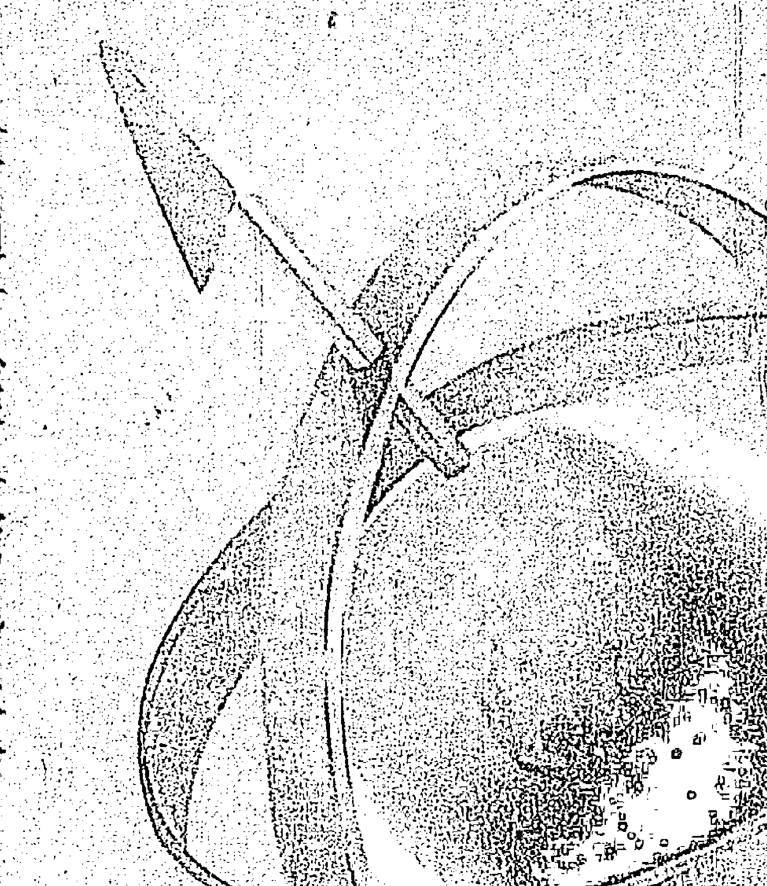

紫微斗数全书

徐曾生 著

进源书局

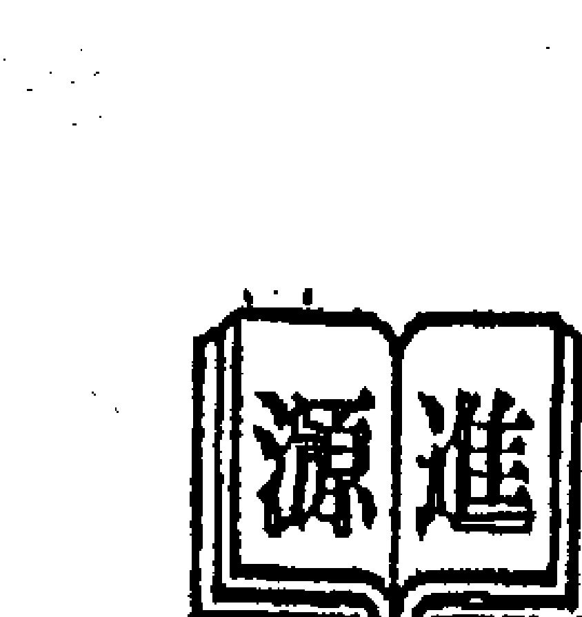

目录

作者的话 .................... 005

再版序 ...................... 009

第零章 如何学好紫微斗数 ........... 011

-   第一原则：学习斗数没有捷径
    .................... 011
-   第二原则：要能明辨真伪、虚实
    .................... 012
-   第三原则：活用命例，分类归纳建立规则
    .................... 013
-   第四原则：有命就算，不怕尝试，乐此不疲
    .................... 014
-   第五原则：善用工具，活用电脑
    .................... 014
-   第六原则：善用想象力、联想力
    .................... 015

第一章 飞星紫微斗数入门

绪言 .................... 017

-   一、干支、五行
    .................... 019
-   二、河图、洛书、八卦
    .................... 019
-   三、什么叫理气数象
    .................... 024
-   四、基本名词解释
    .................... 028

第二章 深入认识紫微斗数 .................... 030

第三章 紫微斗数命理学的组织架构 .................... 038

第四章 认识命盘十二人事宫

-   一、六共宗 .................... 066
-   二、七同道 .................... 071
-   三、八为朋 .................... 072
-   四、九作友 .................... 073
-   五、十同途 .................... 074

十一与一同宗 .................... 074

十一与二同位 .................... 075

第五章 解读命盘秘密的基本认识 .................... 077

第六章 宫位和人之个性的关系 .................... 088

第七章 何谓立向 .................... 095

第八章 斗数符号和人生事件 .................... 105

第九章 六亲对待关系 .................... 114

第十章 五行和星宿的庙陷利旺 .................... 123

第十一章 星宿组合对运势的影响 .................... 136

第十二章 格局精解 .................... 147

第十三章 天干和四化星的关系 .................... 183

第十四章 四化星入门 .................... 189

第十五章 四化星的应用 .................... 205

第十六章 忌星的涵义 .................... 217

第十七章 运势流转 .................... 222

第十八章 化出与化入之别 .................... 233

一、由我宫飞出之四化 .................... 234

二、由他宫飞出之四化 .................... 237

第十九章 天地人的观念 .................... 243

第二十章 四化对运势的影响 .................... 250

第二十一章 斗数命局的平衡 .................... 266

星宿组合 .................... 267

生年四化星 .................... 269

大限和本命盘局的冲照会入关系 .................... 270

应用 .................... 174

第二十一章 如何解命盘 .................... 177

第二十二章 气运流动说 .................... 193

第二十三章 命限化忌构成的角度 .................... 204

第二十四章 谈事件应验时间 .................... 226

第二十五章 四化飞星活用例解 .................... 233

第二十六章 从星性看事业适性 .................... 250

第二十七章 由命盘看创业运 .................... 262

第二十八章 十二宫对事业、财运的影响 .................... 277

第二十九章 推算婚姻的波动 .................... 293

命例一 .................... 404

命例二 .................... 410

命例三·外遇 .................... 415

命例四·外遇 .................... 421

第三十一章 如何推断适婚年 .................... 431

第三十二章 如何推算流年运 .................... 441

国运之推演 .................... 442

流年交友运 .................... 444

流年事业运 .................... 450

流年钱财运 .................... 453

今年的结婚运如何？ .................... 458

第三十三章 命运曲线 .................... 462

第三十四章 结语 .................... 481

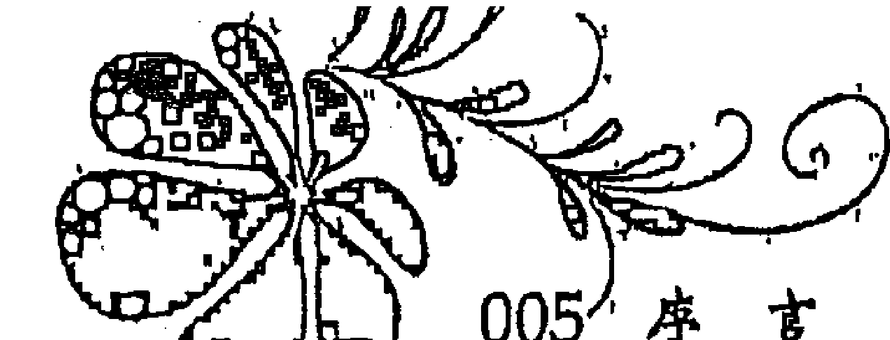

作者的话

本书适合那些想要深入学习紫微斗数，以了解个人变幻莫测命运的读者研读，命运是一段多变起伏不定的历程，需要藉助多项变量、通过多层次的筛选过析，才能抽丝剥茧地由模糊朦朧中，逐步对拢聚焦，最终得到具体形象的事件。了解个人命运，若只想了解个性而已，请参考笔者所写的紫微斗数格局篇，可以让您具体而全面的掌握个性，个性与命运的起伏转折之间的关系如何才是本书谈的问题。

我们怎么“想”会影响我们用什么角度来看一件事，从而决定我们如何来诠释一件事，所以我们一直在追求正确的知识，吸收有用的精华，才能了解宇宙间蕴含的奥秘，但是在探索的过程中，谁有足够的知识才能确认“正确”，命理学便是这么一个从古至今都在辩驳的主题，笔者只是想尽一己之力，建立一套健全的紫微斗数理论体系，成为后人研究的典范，但笔者才疏学浅、见识不足，若有不尽之处，尚请先进贤达不吝来文指正。

从笔者于七十四年，在台视家庭月刊写紫微斗数自己算专栏，至今已一十四年了，有很多读者写信来说笔者算得很准，尤其是第二十五章所讲的命例，当时已有很多命理界的朋友在书上或杂志上，以紫微斗数、四柱推命或姓名学，讨论其未来之途径如何？大体上都抱持乐观态度，认为他会在狱，并在家族扶持下，东山再起，只有笔者敢在七十五年公开出版的书上，提出和他们相反的观点——【死于狱中】，当七十六年四月此预测应验后，来访之朋友络绎不绝，对个人生活影响甚巨，只好搬家并谢绝访客，专心做其它事业，至今事业已略有成，稍有空暇，是想将自己的心得写出来，引导初学者进入紫微斗数的天地，所以本书的编辑像是一本理论实务兼顾的教科书，读者只要按步就班的研读，一定能达到自学自用的境界。

大凡一门学问或一个人的思想，都不是小小的一本书所能讨论得完的，本书只是笔者在研究紫微斗数的二十五载历程中，体会到的心得，用现代人的眼光，科学的角度来诠释古老的学术，当然，本书所谈内容集中在理念部份，理论于应用时需要揉合时代背景，用符合当代社会的语汇解释成评断语，而这些功夫有赖于对各种事件有深刻的认识。

书中不乏引用古圣先贤的部份，本来想略过，但其中有许多不可忽视的经验谈，由于古人用字遣词都相当深奥简略，有很多朋友反应看不懂或无法领悟其中玄谈，希望笔者加以解说，于是予以列入并加上笔者之注解，若曾经经验过的也加以注明，希望能帮助读者了解、吸收诸星问答或赋文等先贤经验。

由于任职公司的性质曾接触多位事业有成之老板，个人也藉工作之便，为各位老板用紫微斗数推算看看，果然其中运途起伏多符合斗数的推算结果，也因笔者义务推算，所以大家都能坦诚告之事情前因后果，建立许多完整的命例，再由其中统计、归纳出来许多的法则，才发紫微斗数的奥秘，回想以前买书自学或拜师学艺时，老师所阐述的原理规则，拿来应用总有一段差距，其中的问题症结在于欠缺案例的实战磨练，所以在本书中尽量实例来印证本书所讲之理论，希望读者确实能由本书学得正确的斗数理论和推命实务，当然内容就增加很多，所以分成两部分，另一本是分门别类的“命例解析篇”尚在赶工中，两者相辅相成。

各位可能会说市面上不是已有很多实例探讨的书吗？买来研究不就得了，决不是如此的简单，市坊现有书籍对于事件的记载总有缺漏之处，例如结婚，最常见的记述是“某岁结婚”，这种纪录对于探究紫微斗数的推理规则帮助不大，因为没有纪录促成结婚的原因是什么，也就无法在紫微命盘中找出立向宫位和推理符号之间的互动关系，故初学者要详细纪录事件的前因后果，才能掌握紫微斗数论命的诀窍，可以这么说：“详细纪录事件，是学习紫微斗数成功的第一步”！

对于初学者，笔者也建议应该多研究命例，因为命盘有二十六万种组合，且人生百态不可能都遇到过，因此知道理则却难下手推理，多看命例才能建立各种事件的立向，从而根据推理规则，解析出事件，这是相当耗时的过程，笔者是透过组织学习的技巧，大家交叉讨论、互相学习，才建立相当多的事件立向关系，这些都被视为不传之秘的，即使拜师也未必学得到，所以各位不妨多收集命例，建立自己的立向诀窍，能够“立向”代表您已经成功进入飞星紫微斗数的殿堂了。

若有疑问各位可以利用笔者的E-mail: ez.way@msa.hinet.net联系，或寄至台中邮政四五之二二号信箱。

再版序

自推出后，由于书中点出学习飞星四化的关键，让很多学斗数多年无法突破的读友，症结都迎刃而解，因而好评不断，甚至有网友推荐必读的中阶入门书，初版售完之后，仍有许多欲进入紫微斗数殿堂的读友求问于途，所以林老闆本服务读者及传承紫微斗数的理念，便积极邀稿并商请重新出版“紫微斗数命运分析”，虽答应但笔者工作忙，断断续续写来，事后读起来前后连贯性别扭，所以修了又修，所以一拖三、四年，今年十月中再度接到来电，却之即不恭了，刚好笔者正欲办理退休，心想退休后可以当个“玩命之徒”与同好切磋，就快马加鞭拼了，终于完成。里面增添了一些内容，把以前的解说内容补缀得更加完整，当然也修正了一些错误，不过仍一本初衷——知无不言、言无不尽，让钟情于飞星四化紫微斗数的朋友能更上层楼，彻底学好斯术。虽然，尽量以深入浅出，引经据典的解释，但飞星四化之学理与应用之间，因存有许多的界面需要时间与经验累积才能突破，所以很多读者问笔者有无办法说明会或演讲会，以前因上班不曾在江湖走动，当然没有办过，未来若有相当人数参加可办理，不过因家中不方便，请先和笔者联络，再承租场地办理。

虽然我一直推荐『紫微斗数全书』给入门者，但有很多读友向笔者问道有无谈星性的书，因为星曜太多写起来很花时间，虽然写了一些，但看到发达的网路带来的负面作用，让原本不高的意愿更低落，不过为了一蛮读友，笔者还有另外两本新书，一本专门讨论三合格局，因为在网路上看到很多人提问都会问到“我是什么格局？”或是“为什么我是××格命运却这么差？”所以该本书就专门讨论格局问题，厘清一些错误的观念，另一本是这本书的实例解说篇，因为本书有提到各种命限忌星形成的角度问题，但却没有实例解说或是举例太少，读者无法体会、领略应用手法，因而从搜集中寻找完整的实例，提供读友们充分的学习成长空间。

还有我也要呼吁读友们尊重智慧财产权，不要将书本扫描了摆在网路上供人下载，现代通讯邮递都很发达便利，没有书寄不到的地方，互相尊重才能让作者有源源不断的创作意愿，也能使学习更加活泼，最后，感谢大家的惠顾，并祝大家学习成功。

笔者
于民国九十八年十二月

第一章 飞星紫微斗数入门

## 第一原则：学习斗数没有捷径

这个原则，命盘有五十一万种组合，穷百年之生命，也无法将全部命盘一一推算，更加上人事现象数以万计，区区一张命盘，如何去涵括包罗万象的人生，只有不断的去验证星座组合、化曜、宫位、四化飞星等各种情况，利用类推、演绎、归纳之能力，建立各种四化飞星规则、星性之意义、意象（简称意象）等资料，才能解读独一无二之命盘。看完本书将为你建立正确学习紫微斗数的方向，不再如大海行舟一般，茫然无头绪和方向。

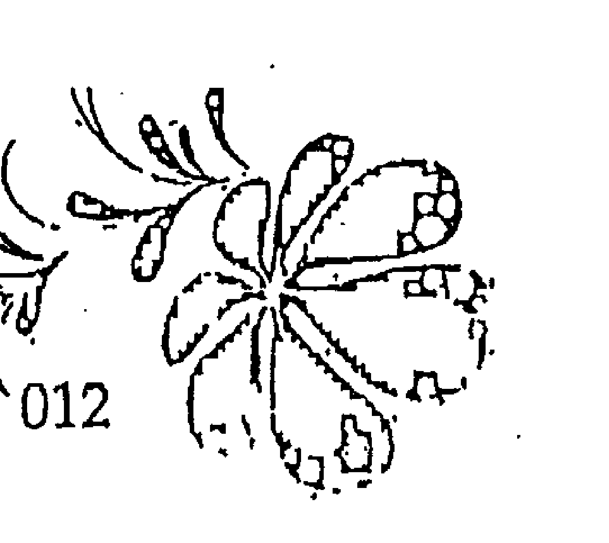

## 第二原则：要能明辨真伪、虚实

市面关于斗数之门派有：透派、占验派、四化飞星派、过宫派、小限派、昆仑派、洛阳派……等，每种门派论命法则，都不尽相同，有的要看小限而不论流年、有的要用流年飞星、有的纯看星宿组合而不论四化……等各种论调都有，如如果被某门派误导，一头钻进去，到最后发现是死胡同，再回首已浪费许多时间和金钱，得不偿失。最简单测试的方法，是拿自己的命盘去验证就可以了，若有准，代表该理论成立。不准，则不论该作者是否写了十多本紫微斗数论命专书，也不要耗费金钱去买他的书来看，浪费自己的时间，若是推命如神、料断神准的斗数专家，一定被登门求助的访客，把时间都耗光了，那有时间去写十几本专书？还有的人写书，只用化名，而书中又带了一大堆，所谓：“我的师父……”、“一、一市坊中的斗数奇人……”、“……等等，都是在预留后路，当某个名号幌不动时，再换一个轮流上场，其实，幕后写书的都是同一个人，古人说：“文章千古事，得失寸心知”，把著书立世看做非常神圣而庄严的事，能把自己的心血结晶公开出来，让天下同好都能同蒙其惠，对斗数研究理论基础，又更精进完备，是多么的具有创见智慧的先知，为什么不敢具名：……其中原因各位去深思吧！

## 第三原则：活用命例，分类归纳建立规则

一定要将算过的命历收集起来，建立类似医院病历卡的制度，将已发生的“事实”记录下来，日后好研究。活用资料管理，分析归纳的手法，演绎出推命规则，透过验证手续建立规则，就能掌握命盘解析的道理，从无因无果的条件下，推理出来因果关系。

当然建立的资料一定要完整的包含以下因素：

1.  性别
2.  出生年月日时辰
3.  事件
    - 事件的前因
    - 事件的结果
    - 事件发生的时间
    - 事件的严重程度

如：X年X月发生车祸死亡和X年X月因欢送朋友，喝酒醉开车，撞上电线杆，头部重伤死亡。

这两种“事件”的记录方式，当然以后者的方式更明确详细，在命盘上就可以根据：交友、酒醉、电杆、头部、死亡等要素来追查相对应的宫位、星宿组合、化星、四化的关系，而建立命盘符号和人生事件要素间的对应关系。

## 第四原则：有命就算，不怕尝试，乐此不疲

既已献身研究斗数，就不要怕“算命仙”的讥笑，有就算，并且要胆大心细地去推敲，提出预测，将已知的规则套进去用用看，看看是否经得起考验？若没规则可用时，就要发挥触类旁通的能力了。算得多，命例才会累积得多，经验、规则才能建立得快而完整（但先决条件是对方愿意提供正确的事件资料，供您建档追踪轨迹）。

## 第五原则：善用工具，活用电脑

人的智慧无可限量，但也有所限制，理解力虽随年龄渐长而增加，但记忆力却随年纪渐长而退化，而斗数的研究者，常会有此之遗憾——推命的规则虽一一被建立起来，却无法一一记在脑中，更遑论要拿来应用，所以必须借助外力来弥补人脑的不足。

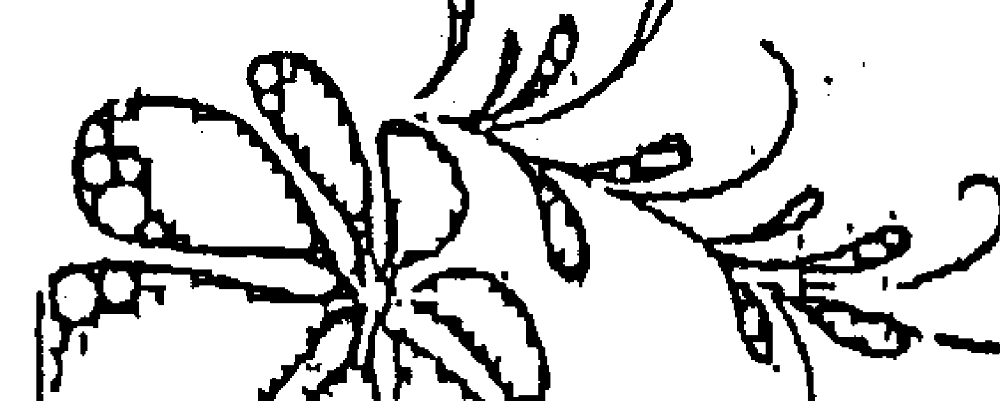

## 第六原则：善用想象力、联想力

电脑虽无智慧，但却有超强记忆力，只要是建进去的规则，一定会记住，而且运算速度快，几十万条之规则，一一去比对，不消几分钟便解决了，比人脑一一对要比快，且不会出错。只要将资料库、推命规则建立好了，配合人之智慧逐日增加规则，则电脑算命系统功能与日俱增，成为个人智慧结晶之专业系统。人就可全心全力去从事复杂度高的演绎归纳“推命规则”，而“记忆比对”的机械性工作，就全交给电脑去做。

人与自然界的关系，有的看似无关连，却是有密切关系的。如：风水和人之命，房屋之坐向用“既有科学理论”一下，实在验证不出来会和住在其中的人，有相互影响的关系？但深谙风水的先生，就能依来龙去脉、格局、坐向等因素，判断居住该宅的人，会遭遇怎么样的际遇。所以，对于命理不要固执一端，而忽略仿佛毫不相关的宫位，它们往往具有决定性的影响力。因此，详细记录事件的各个要素，可以帮助联想、或类推出来推命的“立向”宫位，从而演绎、归纳、推理出来新规则，联想力愈丰富，愈能领略斗数的精深奥妙之处。

不要死守残缺不全的古籍，食古不化地只会猛套用赋文推命而不知创新，要从根本来源处了解紫微斗数，才能打开紫微斗数的另一扇窗，开拓学习的新视野，提升斗数命理的新境界。

第一章 飞星紫微斗数入门

## 绪言

最近网路的调查显示，紫微斗数是被大家公认为最准确的命理学，因此深受各级知识分子的学习和探究，有的人以明朝进士罗洪先所著之“紫微斗数全书”当入门书，但是时空环境的差异，使得古书和今朝的大不同，让学习者研读起来颇感吃力，所以本章就将研究紫微斗数的基本知识做个讲解。

# 一、干支、五行

天干、地支合称干支，中国以之为记日法沿用千余年，直到近代才被阳历取代，所以很多人连何谓天干？何谓地支？都搞不清楚了，所谓天干，即：甲、乙、丙、丁、戊、己、庚、辛、壬、癸为十天干。其中甲、丙、戊、庚、壬为阳干；乙、丁、己、辛、癸为阴干。

地支

子、丑、寅、卯、辰、巳、午、未、申、酉、戌、亥为十二地支，其中子、寅、辰、午、申、戌为阳支；丑、卯、巳、未、酉、亥为阴支。

在斗数学中，地支为时间，其意义较单纯，但天干的职责就复杂了，它主掌各种影响人命运的能量的发作与敛藏，使事件呈现吉凶现象，它又贯联各宫位以代表那一种事件，因此它又是事件“显现时间”的导引，故天干是非常重要的符号，绝对不可忽略，有人论命从来不考虑天干或不用天干，这是不可原谅的致命错误。如此有了“事件”和“时间”才能满足清楚述说一件事的基本要求。

有人说：紫微斗数推命时，不用生克制化的关系；这是对的，但是五行对斗数学的影响，还是有其不可忽视的影响力，所谓五行即是：金、木、水、火、土，各代表不同的意义：

-   金：代表尖锐、激进的意义。
-   木：代表成长、向上的意义。
-   水：代表流动、自由、扩散的意思。
-   火：代表放射、奋发的意义。
-   土：代表内敛、凝聚的意义。

# 二、河图、洛书、八卦

应用在命理学上，可依涵义随所问事项解释，如论情绪：

-   水：象征哀愁，因水向下流。
-   木：象征喜悦，因木向上成长。
-   火：象征快乐，因有放射效果。
-   土：象征沉着，因有内敛凝聚的效果。
-   金：象征忿怒，因金为尖锐激进的表征。

所以，学习星性时，只要掌握住星曜的五行属性便可抓住星的特质，于记诵时提供类推演绎的基础。再配合地支的五行就能更精确的掌握星曜特性了。

很久以前，圣人伏羲氏时，有人发现龙马背负图案在孟河出现，所谓“龙马”者，据古人的说法长相如下：『乃天地之精也，马身龙鳞，高八尺五寸长，颈骼上有翼，踏水不没。』

這樣就將河圖賦予五行屬性與方位，各位可以看到每一組都是一奇數和一偶數所組成，單數為陽，偶數為陰，所以陰陽同組，代表「陰陽合而數生」的意思。河圖以一至十的數字分佈四正位與中宮，聖人以十為基本數，由此衍生其他數。

因龍馬背負圖案在孟河現身，故以出現之地名之、稱為河圖（圖一），河圖只有幾個空心或實心的圓點、呈現有規律的排列而已，古代經過許多先賢的解釋和陰陽家的沿用、引伸，漸漸引用在五術中，而有如下的解釋：

- 一六共宗，居北方水；
- 二七同道，居南方火；
- 三八為朋，居東方木；
- 四九作友，居西方金；
- 五十同途，居中央土；

數，而奇數為陽數、偶數是陰數，再以陽數為天數，陰數為地數，天生地成，陰陽交泰，衍生無數，萬物始生。至此，我們了解河圖蘊涵：數字、陰陽、五行、方位等的意涵在內，而五術也在探討方位、五行等的吉凶效應，因此河圖成為五術的核心，在紫微斗數命盤中，也寓含河圖的方位概念在其中，並藉由星化等遙感輝映，引致命運的起伏諸現象。八卦相傳是周文王發明的，將八卦分別賦予名稱：乾為天，坤為地，震為雷，巽為風，離為火，坎為水，艮為山，兌為澤。八卦的方位關係如圖二，命盤上也有方位間提，因此把八卦和地支結合而有了『方位』，解決紫微斗數命盤求問方位問題的解決方案。

再來看看洛書，洛書的出現也是頗具神話色彩，相傳大禹治水，有一隻大烏龜於洛水負文呈瑞而於背九數，故曰：

> 『戴九履一，左三右七，二四為肩，六八為足，五居中宫。』

圖三是謂洛書九數。以單數居四正位，偶數居四隅位，縱橫之和皆為十五，乃萬世不變的數，配上後天八卦：

### 圖三：洛書

坎一坤二震三巽四乾六兌七艮八離九，缺一個五，中五也，然後分列在十二地支中，

| 巳 火 東南 巽 | 午 火 南 | 未 土 南南西 | 申 金 西南 坤 |
|---------------------|----------------|--------------------|---------------------|
| 辰 土 東東南 |  | 姓名： 陰陽男女 年月日 時生 局 | 酉 金 西 兌 |
| 卯 木 東 震 |  |  | 戌 土 西西北 |
| 寅 木 東北 艮 | 丑 土 北北東 | 子 水 北 坎 | 亥 水 西北 乾 |

包括卦位的完整空白命盤

子坎，午離，卯震，酉兌為四正位，丑寅配艮，辰巳配巽，未申配坤，戌亥配乾，為四隅。（隅：角落之意）

經過河圖洛書的穿引，涵蓋了：天干、地支、八卦、方位、五行等因素在內，便將這些要素納入斗數命盤中，於是一張斗數空白命盤已包含八卦、方位、五行的關係在其中了。

# 三、什麼叫理氣數象

一看到這四個字，便想到易經，一提到易經，頭就大了，易經內文用辭艱澀難懂，不是國文底子很好的人，可能連其中用字都會唸錯，更甭談了解文意了，而易經中所談的理氣數象問題，又是命理學上很重要的觀念，看不懂易經，豈不是不能透徹了解命理學了嗎？其實大可不必強將理氣數象和易經綁在一起，將它們分開來，用現代人的觀點來對待、探討什麼叫理？氣？數？象？
我們用另一個角度來看，假如，你開一部車，在高速狀態下轉彎，是不是會因為離心力太大而轉不過去，必須要降低速度使離心力降低才能轉過去，若太快的話，勢必因離心力過高而將車子甩出去，砰然地撞在轉角處，現在甲先生以一旁觀者立場來看，乙先生以高速轉九十度的彎，且沒有減速，甲先生根據道「理」推斷，乙先生會發生撞牆事件（象），什麼時候產生呢？根據車子的速度和車子與牆之間的距離，可以推算出來，此敘述中明指車速和距離是決定發生時刻的因素，車速即是「氣」，距離可說是「數」，有了理氣數象的關係，我們不必親眼目睹乙先生撞牆，只要知道：

+   1. 他要轉彎。
    2. 車子速度。
    3. 到彎道的距離。
    4. 離心力定律。

就可推斷乙先生等一下到底會不會撞牆。 上段所述者，乃是物理之學，但人之心異於物理多矣—如何探討關於人之理氣數象問題？

### 圖四：理氣數象的圖解

我們可由人的行為上來分析，一個人的行為過程可以簡化為：接受外界刺激—思考、分析、判斷、修正—行動—結果。

我們受到「外界刺激」、引誘，便會勾起「心中的慾望」，想要滿足慾望就要付諸行動，但在行動之前，會「考慮自己的能力條件、法律、風俗習慣、社會潮流等因素」是否容許？是否有利？分析其中利害得失後，再「付諸行動」，有行動便會產生「結果」，「結果」才會顯示吉或凶的現象。對於人的行為而言：

> 理：就是各種道理，於物理學上我們稱為定理或原理，例如離心力定律指出離心力的大小和運動體的質量、迴轉的速度、迴轉的半徑等因素有關，所以我們根據此定律計算出離心力大小，再和車輪與地面之摩擦力比較，如果離心力大於摩擦力則車子就會被甩出去而翻覆；相同的做人處世也有一定的道理和法律的規範，這些道理因種族、國家、地域而有不同，如果違反這些道理或法律也會為個人帶來麻煩或挫折，影響人之命運，因此我們可以根據這些道理再衡量命盤。

> 氣：指的是心中慾望、信心、念力、感觸等代表心境的因素，形之於外的就是其行為，我們可以觀察一個人的行為舉止就可以知道他的喜怒哀樂情緒，所憑藉的就是他表現出來的「氣勢」。

題：在數學或物理學上來說，指是可以衡量的各種數據指標，而心理學上呢？指的是：外界誘因或刺激而引發心中慾念的強弱程度，此種因素是隱含有時間的因素，因為慾念的強弱會因外界的誘因或刺激的消長而變化，故其存在有時間的限制，其它如物理學上的：速度，根據物理上的定義就是在單位時間內行走的距離，各位可以根據此一物理上的定義去聯想其它在生活當中對應的「數」。

象：乃是指顯現的「現象」、事件、事故等，為行動的結果或結局，故有吉或凶的「現象」顯示，如：車禍是一個事件，為凶象，可能是駕駛人和妻子吵架，在憤怒（氣）之下開快車（數），結果車速太快，離心力太大（理）轉彎轉不過去而翻覆（象），造成傷亡，所以一個事件的發生必然經過理氣數象的各項因素，納入綜合考量或推理即可得知。

紫微斗數用來推斷一個人的吉凶禍福的時候，就要考慮到命盤和人的契合問題，人是活體，命盤是死盤，要將命盤「活化」以配合活生生的人，就要考慮理氣數象的問題。

# 四、基本名詞解釋

研讀本書或古籍時常有一些名詞出現，如沖、照、合、入等，到底是什麼意思，在此統一做個解釋。

沖：忌煞之星在本宮的對宮——即沖到本宮，代表不利，如本宮是財帛、忌星在福德，就叫「沖」財帛。或是煞曜、凶星在對宮對本宮產生威脅，也常以「沖」來稱呼，如：七殺相「沖」，廉囚相犯。

照：也是星曜落在本宮的對宮的現象，但常指吉星，如遷移宮坐太陽，即稱為太陽「照」命。也有以「會」來稱呼的，如：陽梁昌祿「會」。

會：星曜落本宮的三合方，如本宮是命宮，三合就是財帛、官祿，若有星曜落入該兩宮也會和命宮坐星構成某些特殊格局，就是「合」的角度。如：巨宿同梁沖且「合」。

入：A星在某宮內，即稱為A星「入」某宮，也可稱A星「坐」某宮。

犯：「犯」就是冒犯的意思，亦即對本宮的星曜有不好的影響了，所以殺星或惡曜危害到同宮的星曜時，有時以「犯」來稱呼，如：七殺相沖，廉囚相「犯」。

拱：拱有推舉、謙讓的意思，言下之意是輔佐之象，故有輔星由三合對本宮產生輔佐的效用時，就稱之為「拱」。

遇：本宮內又有其他星曜同宮，稱為「遇」，但由對宮照入有時也稱「遇」，如：忌「遇」貪狼，號曰風流彩杖——即是陀羅和貪狼同宮之意。

## 第一章

時常有朋友問我為什麼會去學紫微斗數？言下之意：「科學時代了，怎麼會去學算命這玩意兒！」其實和大部分初入社會的新鮮人一樣，筆者於年輕時也是對未來有遠大的抱負，和欲一展鴻圖的雄心，找過許多工作不是不符志趣就是毫無發揮，所以換了許多的行業，但挫折連連，開始對未來有了疑惑，想要尋求答案，當時有一位好朋友就介紹我去算命，從小接受的都是要破除迷信、講求科學、探索真理的教育，根植腦海中的科學思想也一直排斥算命，因此，對去算命前程的建議嗤之以鼻！

過了一年多吧！還是自覺有志難伸，抑鬱寡歡，好吧！反正正無聊的工作上都已耗去不少時間了，花個小錢去算算看，參考一下也無妨，突然請個假以避免朋友給算命師通風報信，直接到老師處去求教。

報上八字後老師很快的排好命盤，觀察了一下就在命盤上寫了一行文字：「八歲，不曉得他葫蘆裡賣的是什麼藥？老師第一句話就問：「你什麼時候搬家？」到去算命為止的時光裡，只搬過一次家就是八歲，老師就在八歲前勾了一下，又再問了第二個問題，也是切中核心，當時的感覺真是震驚，為什麼不曾向人提及的事情老師能夠透過命盤推理出來，心中雖然震驚但還是半信半疑，就將老師推算未來將發生的幾點大事紀錄下來，作為驗證之用，老師推算的未來事件只有數點而已，後來都應驗了。當時他還介紹我一本紫微斗數的入門書——記得是竹林書局出版的「紫微斗數全書」，要我回去看看。

因此，萌生好奇之心想要探討紫微斗數的奧秘，到底命盤蘊藏著什麼秘密，能夠解開人的命運，由於當時只看了紫微斗數的入門書而已，只知拿十二宮坐星組合來論命，距離那些神準的推斷還差得遠呢！——但是在想要解開謎團好奇心驅使加上老師的循循善誘之下，一步一步地進入研究紫微斗數的領域。

到底老師有哪些神準的推斷呢？讓曾經受教於他的我，在老師去世將近二十年時，還津津樂道，筆者就舉幾個例子來分享吧：

是一家照相館的老闆在嫁女兒之前，去問女兒結婚後是否幸福和未來的運途，等老師排好女兒的命盤時，還直想老師一定會講婚後會如何如何，哪知道老師的第一句話竟是：「你女兒一嫁過去，對方的阿嬤在三個月之內會過世。」將問命者嚇了一跳，他當時的想法和各位現在的想法一樣：「怎麼會這樣？」，女兒結婚和對方阿嬤的生死怎麼會扯上關係？為什麼對方阿嬤在她嫁過去三個月之內會去世？胡說八道嘛！因為按照一般的人情事理來推論，怎麼想都不可能將兩件事扯在一起！老師憑什麼下如此匪夷所思的推斷呢？當時大家的直覺是不可能！但是當對方阿嬤確實是在她嫁過去的三個月之內過世時，筆者不禁地毛骨悚然起來。

另一位朋友過完春節後，因為經營的圓編機代工生意業務不振，到老師那邊去求教，老師一看命盤就說：「你要搬家了，不過要到幾月幾日才搬得成。」朋友想只要有錢搬家哪需要拖那麼久，過了沒多久就看了一棟房子並繳了訂金，心想老師這下子破功了，等房子使用執照一拿到就搬進去，哪知道左等右等過了一個多月才接到建設公司打來的電話，說因為是軍事管制區，使用執照申請不准，所以要退訂金給他，趕緊去找房子，果然找到房子整理完畢要搬進去時，已經是老師所說的時間了，趕快去和老師報告，誰知道老師這時說出更神的解釋：「你一搬家錢就會進來。」搬家竟然和賺錢有關係！天下哪有這種事，只有搬家因為丟掉一些破舊的東西或添購新品補充而損財的，哪有搬家錢就進來的道理，他仍是半信半疑，搬家那天東西設備都打包好了等搬家公司來，這時突然電話響了，是一家貿易公司打來的，問他有一張訂單他要不要接，他是旺季報的價錢比較高，現在是淡季價錢較低，貿易公司還是以旺季的價格下單，當然要按下這張訂單，果然賺了一筆錢，和老師推斷的：『搬家錢就進來。』說法完全吻合，這位朋友就拿該筆訂單賺到的錢來拜師學藝。

這兩個命題的推斷內容，值得好好地探討——結婚和對方阿嬤之死、搬家和賺錢，在紫微斗數命盤上要如何顯現其中的關聯性？若以傳統的看法，搬家和田宅宮有關，而賺錢與財帛宮有關，到底是靠什麼機制鏈結兩個宮位之間的關係而做出神奇的推斷語——

當然，當時還有很多朋友談到關於老師事先推論出來，後來也應驗了的神奇推斷案例，假如只有一兩個案例可說是巧合，但是接二連三的出現就不能說是巧合了，尤其是他的推斷語中包括兩種不同事件間的因果關係都能講得清楚，就不是一派胡謅之詞所能為的了，當時，就將已經接受了將近二十幾年的『算命不科學』的觀點翻轉了過來，接受了紫微斗數算命，想要一探究竟到底為什麼會這樣？！

市面上現有關於紫微斗數的書籍，其中關於運途的推斷大部分是以宮內坐星組合和流年星落入宮等來判斷流年吉凶、少部分的書是以單一宮位的本命、大限、流年等的三階段關係中，由其中各階段的四化組成角度，形成沖照會入等關係，配合宮位和星宿代表的意象，形成含有「吉凶強烈程度及意象」的推斷語句。
但前述的兩個案例，由其中「你一搬錢就會進來」的語句來看，包含了紫微斗數的田宅宮和財帛宮，似乎在「本命、大限、流年」等的三階段關係中，並不限於單一宮位的「本命、大限、流年」縱向關係，還包括了不同宮位間的橫向關係，因為在推算運途過程當中，本命的A宮會成為大限的B宮【圖五】，是不是由此種橫向關係，因此可以在推斷用語中，結合A與B而得到兩宮位組成的意象轉化成推斷語，假如能悟透「你一搬錢就會進來」推斷語中隱含的訊息，進而衍申出來的紫微斗數研究空間是無可限量的，因為我還沒有看到哪一種推命術，可以如此神奇地結合兩種不同事物做出神準的推斷的。
各位會買這本書想必已經不是基本十二宮論吉凶就能滿足的高手了，因此提供當年跟隨老師學習當中，個人所見識到的神準推斷，和其透露出來的訊息供大家參考，供大家作為研究斗數的一個新思考課題。

## 035 第二章/深入解惑紫微斗数

這是一個紫微斗數命盤圖表。

| 天機權癸 七殺 壬 太陽梁 辛 武曲相 庚 命宮 | 流年命宮 田宅甲 大限官祿 天同祿 辛 兄弟 | 文曲 紫微 事業乙 乙 天機權癸 | 文昌科 破軍 丙 遷移 大限遷移 廉貞忌 戊 財帛 太陰 己 子女 | 天機權癸 大限財帛 疾厄 廉貞府 | 文曲化忌 文昌化忌 圖五 | 沖 大限命宮 大限兄弟 |
| :--- | :--- | :--- | :--- | :--- | :--- | :--- |
|  |  |  |  |  |  |  |

+   * 大限命宮和夫妻宮重疊代表什麼意思呢？
    * 它們之間靠什麼東西連結兩者之關係呢？
    * 兄弟化忌入遷移沖命宮＝入大限財帛，代表什麼意思？
    * 大限兄弟化忌沖夫妻＝沖大限命宮，表示什麼意義？他和前者形成什麼關係呢？

或許各位會說是筆者亂掰的，筆者可以再舉一個學紫微斗數的讀者都曾耳聞的例子：相傳陳希夷的某名弟子曾為一求問先生歸期的婦人算命，曰：「速速回去為先生準備後事。」婦人一聽大驚就哭哭啼啼的回家了，在路上遇到陳希夷，就問她為何如此傷心，因此將前因後果講給陳希夷聽，陳希夷一聽連說不要緊，照我計策即可，回家去趕快煮一大鍋粥，若有人問到就說先生要回來吃晚飯即可，果然是夜婦人的先生安然歸來。假如，陳希夷弟子的推算是正確的，該婦人的先生會死於外道，那麼為什麼煮粥就可以化解其厄運呢？煮粥和生還之間有什麼關係呢？這個是在紫微斗數圈流傳很久的故事，不知道其真或假，但和老師的推斷有異曲同工之妙。
筆者也曾拿由上述案例中領悟到的規則，來為朋友推理因為做了A之後引動發生了B的事件，雖然不是每一個人的命盤都會有相同的四化顯象，但有符合規則的命盤確實會發生兩個宮位間交互作用引起的事件，因此我可以很確切的說，紫微斗數確能解析出來兩個不同的宮位，相互激盪後產生的事件以及兩者間的因果關係。當然本書中也有探討這個命題，各位慢慢研究細讀自會有所發現。
有很多學紫微斗數的朋友，尤其是初學者，可能沒有經過大師級的老師推算過，因此，對於紫微斗數論命的框架仍舊停留在單一宮位來推命的境界，所以特別將筆者以前算命的經驗公佈出來，供大家思考紫微斗數推理法則的形成架構與應用極限，筆者希望透過本書各章節的說明，儘量將紫微斗數論命牽涉到的觀念、法則等做一全盤的探討，希望建立初學者正確認識紫微斗數的推命架構。

# 第二章 紫微斗数理论的组织与架构

不同地区、不同民族会衍生出不同的文化与社会风俗；即使同一民族在不同的时间也会产生不同的社会伦理规范和法规，因此凡是研究关于社会、心理的学者专家们，一定会因时因地之不同而修正其研究的角度，但是，学术本身的根组织架构是不变的，所修正者乃是枝叶而已，修正后，将专研之学术与区域特性相结合，使研究的结果更趋近于实际之现象，所以探讨人类心理、性灵的人文科学，如：社会学、心理学、经济学等必须随时空的不同而修正以因应实际状况，进而引导该社会往正确方向发展，假如不知道该学术的组织架构？将无法也不知道如何调和因应实际现况，所学到的也是死的知识，无法灵活变通运用。 同理来看飞星紫微斗数，它所探讨的是具有独立思考、自主行为的人类在某行为规范下，履行人生过程中产生的命运轨迹与趋势起伏状态。此种行为规范会因时空流转而变化，所以要在外部条件更迭不已与个人独立自主行为的动态变化的状态下，试图由无因无果的情况推理个人命运如何？实在是一件复杂又困难的工程，推理命运的人，除了须承受时空流转而修正推命法则外，尚须结合问命当下之时空环境和问命者之理气数象问题，以解释个人命运的转变，此种推理课题和心理分析比起来更复复杂，当然也更能引起有智之士的研究，它能够随着年龄的增长和日常生活结合在一起，日复一日、月复一月的研究、时时应证其学理，故深受大众欢迎。
兹以下棋为例，若你中途插入观棋，能准确地说出上一步是走那一支棋子吗？下一步又将走那一步棋呢？相信少有人具有这种能耐，不过，深谙棋艺之道的先生可以依据两军对峙的局势来推测，上手棋该落于何处才能造成如此紧张的局面，下手棋又该落于何处才能获致优势，棋盘上有纵横线、棋子、敌我两军、奕者，这些乃是参予奕棋过程的要素，这些要素交互作用，而以奕者之智慧为棋局胜败的关键，而不是棋子或棋盘。
我们常拿「世事一局棋」来形容人之命运，细加深入思考，何尝不是如此！只不过棋盘变成了我们生活的空间，棋子变成了自我和外部条件，棋子在棋盘上的走法限制变成了法规、伦理、风俗习惯等，奕棋者变成个人而已。奕棋者一定居于自己最有利的角度，移动棋子到某个位置以占取优势地位，有时候会为了保住将帅而牺牲某些棋子，返观人生经历中，是不是也时常做如此的判断或抉择呢！
欣赏一首诗有两种境界，一种人纯在文字词藻的优美上赏析，他所领略的只有詞藻之美而已；另一種人會深入揣摩詩人作此詩的境況與心態，以心領神會其中意境，和詩人的心境、文詞的意境相結合，引起心靈共鳴，此種境界高遠而意深，所以我們研究學問，欲領略其精髓，不能只理解文詞的意義而已，要深入探討創斯術者之心路歷程、考慮的角度、傳達的訊息、時代的背景文化等因素，予以整合性考量，才能了解其組織架構，能知其骨幹才能因時空因素演變之影響而修正其枝葉，賦予學術新生命。

由於千餘年前流傳下來的飛星紫微斗數至今仍保持很高的精確度，可見此種隨時空調整因應的作用，隨時隨地的在進行著，今日交通發達、科技進步，強勢文化很容易透過各種媒體滲透進來，傳統文化倫理、社會結構，面臨洋風的猛烈衝擊下，勢將崩潰得更迅速，如果依循農業社會的緩慢步調來修正命理，將無法追上一日十變的社會型態，到時候，將有很多命理法則被時間巨輪所淘汰，命理研究者必須設法克服命理演進速度與實際社會快速變遷的「時差」問題，才不會造成落差。

宗教或學術經過千年來的流傳，中間經過了不少名家的潤飾、添註，逐漸失去原來的風貌，紫微斗數也正是如此，以致於流派紛立，如：佛教分成大乘教派和小乘教派，傳入中國後又分為禪宗、淨土宗、華嚴宗……等，相同的紫微斗數流傳至今分成：飛星派、占驗派、三合派……等，造成各個門派理論分歧，使後學者莫衷一是，紫微斗數一代宗師陳希夷先生仙骨早歸塵土，無法站在各位前面指證原來的紫微斗數，不過我們仍可藉由揣摩的方式，來探討陳希夷祖師始創新術的構想，以發掘斗數真貌。

我們用心仔細地想一下，在人生過程當中，有那些因素構成人之命運：

- 一、人生是一連串的時間、空間（環境）、事件的連續過程，將每天、每分鐘在那裡？於什麼時間？發生了什麼事？連結起來，就構成人的命運，例如：你在今日此時（時間），於家中書房（環境）閱讀本書（事件）。
- 二、時間無法以人為方式控制，但空間可依個人意志隨時隨地的變換。
- 三、事件的型態會隨時間、空間的變化而轉變，例如：古代染上瘧疾，幾乎就是絕症，但在今日就可治療了，但是，因空難而亡的事件，在沒有飛機的古代不可能發生，故在命理上，事件無法詳細顯示具體象，只能以意象表現。
- 四、事件有嚴重與輕微之分，如賺錢，有的是小錢，有的是賺大錢，故事件有強弱、輕重之區別。
- 五、事件的形成有兩種方式：一種是漸進式形成的，如十載苦讀，方能一朝成名；另一種是突發事件，如被誤殺，中獎等。
- 六、每個人都具有獨立思考、自主行為的能力。
- 七、每個人都是在某種規範或社會倫理下，自由地履行人生過程。
- 八、有些例外因素，如：地震、颱風、洪水、酷寒、旱災等，會影響群體的命運。
- 九、人之命運深受外界因素影響，如：經濟不景氣，使失業率提高使個人之生活受到影響或節制消費，故人之運波深受外界大環境運波的左右。

有了以上的前提，要依據什麼「基準」以發展出一套能在「無因無果」的條件下，準確預測個人未來運途的技術。此「基準」綜合東西現存各種預測未來的方法，可分為：

- 一、依據人體特徵者，如：面相、手相、痣相、骨相、血型……等，再配合人之行為特徵，如：走路姿態、行為舉止等以推斷一個人的性格和流年運途，如麻衣相法、冰心賦等都是古人對於人相學的經驗之傳。
- 二、透過法術或靈媒的媒介以推算未來者，如靈通、扶乩等法術，多依附在宗教儀式中，透過集體的以某種頻率聲調唸頌經文，使和具有某些特質的人腦波頻率產生諧振，進入催眠潛意識狀態，在此狀態下做出預言，印第安巫師則是服用具有某種迷亂神經毒素的菇類後，錯亂時空關係以預言未來之事務。
- 三、利用人之出生年月日時辰，即所謂八字以做為基準者，如：紫微斗數、四柱推命等，西洋占星術分類基準更採用了出生的時分和經緯度等資料，具有更多的命盤類別，這些都是目前最受歡迎且具有高精確度的未來預知術。

### 四、超心靈透視術
如水晶球、催眠術等，世界各國中以印度、蘇俄的研究最出名，在超心靈學方面研究成果獨步全球，聽說蘇聯國安局訓練一批靈媒可以穿越時空遙控某一特定個人的意志。

其中尤以第三項具有最高的分類精度，而且有一定的演繹規則，只要接受相當訓練，人人都會使用，故能成為準確而實用的未來預知術。

中國人在一千多年前的宋朝，在物質條件和輔助工具極度欠缺的條件下，創造出一套歷經時空考驗而仍能維持高準確度的飛星紫微斗數，實在不簡單，我們應向古人的創造力致敬，還是棄之如敝屣呢！

### 開宗明義便道：
始創新術的先賢早已體認到前述九大前提的必然性，所以在飛星紫微斗數的斗數是重數以立家，取天干，行四化飛宮化曜，布空間垂象。

已明確指出紫微斗數的骨幹是由「時間、空間、事件」等三要素所構成，此句話中很明確地指出：地支—時間、天干—空間、星辰—垂象（事件）的關係，各位在研讀斗數書時，一定會看到：「四化是斗數的用神」這句話，知道其涵義嗎？又為何空白命盤上已印上「地支」了呢？這都是我常拿來問斗數初學者的問題，看他能不能悟透其中的意義，若欠缺時時事事存疑的態度，就無法深入了了解斗數學。因為地支代表時間，時間對你我都很公平，貴為總統的一天有二十四小時，而凡夫俗子的一天也是二十四小時，時間不因貧富貴賤而長短不一，時間恆以穩定不變的速度前進，無法以任何人為方式使時間停住或使時間回頭，因此在命理上它是一個不可以人力控制的變數，所以在空白命盤上便先將它印了上去。至於「用神」一詞，曾請教過許多斗數專家或子平名家，最常聽到的解釋是：「四化星是斗數變化的樞紐，命運的吉凶禍福皆其作用而在命盤上顯現，宛如在冥冥中主宰個人命運的神一般，故曰用神。」是否如此？就要費一番口舌才解釋得清楚。我們在小學都學過數學，應該知道什麼叫座標？我們就用座標的觀念來探討什麼叫做「用神」？我們用時間、空間、事件的三維座標表示某甲的運勢（圖六），圖中A點表示某甲於二十五歲（時間）於台中（空間）發生車禍（事件）的運，B點表示他在三十一歲於台北賺大錢的運，假如，他不在台中，會發生車禍嗎？不到台北會賺大錢嗎？也就是說空間條件不配合，A點和B點會存在嗎？顯然的，不會存在，若時間不對，則發生的事件可能不是車禍，也可能不是賺大錢，因為需要時間、空間的配合，才會產生事件。

假如我們將一個人在所有時間下、在每一個不同環境空間、經歷的每一件事情都填入座標內，就可以得到一條曲線，這條曲線就是個人的命運曲線，所以我們可以肯定的說命運是由時間、空間、事件的三要素所構成。我們每一個人都是活在時間的洪流中，過去的事物，我們看不到也摸不到，但感受得到，是靠記憶使往事歷歷在目；未來的事件也看不到、摸不著，靠想像存在腦海中，因是想像，所以未來存在許多可能的事件，都有可能會發生在你我身上（圖七），只有現在的事件有實體存在，可以讓我們看到、摸到，並且發生在某人的身上。

從過去到現在的這段時間所走過的命運是一條曲線，但現在到未來的命運曲線不只一條，可能有許多岔路和分歧點，每一條岔路都有可能是你未來的運，要走那一條路，我們一定會考慮國際局勢、政治情勢、科技進展、社會倫理、法規、親友、自我條件等因素後下判斷，以命盤的演繹規則，兩相配合以推理人之命運，所以紫微斗數的組織架構上來說是合乎科學性的。

但是人生活中常接觸到的「空間」有哪些呢？經過深思熟慮後將空間分為：命宮、財帛、遷移、福德、夫妻、田宅、父母、官祿、交友、疾厄、兄弟等十二個空間，以「宮」來代替「空間」的稱呼，所以稱為十二人事宮，定出十二宮後，其相互間的順序要如何安排呢？也頗傷腦筋，經過河圖洛書的規範——一六共宗、二七同道、……而定出：
- 命宮
- 兄弟
- 夫妻
- 子女
- 財帛
- 疾厄
- 遷移
- 交友
- 官祿
- 田宅
- 福德
- 父母

如：上班的場所、主管、等也會影響個人之命運，在命盤中要如何表現呢？就要透過「借宮」的觀念來衍生出這些空間，例如：疾厄為官祿的田宅宮，也就是工廠、店面、營業場所的宮位，透過它可以觀察上班處所的相關事項，有人可以推斷來服務的公司哪一年會搬家，其所依據的就是疾厄宮。

學過斗數的朋友都看過「立太極」的名詞，依據書中的句子——「宮宮可立太極」的意思是：要看見兄弟的命運，就以兄弟宮當命宮，原命盤的命宮就成了兄弟的父母宮，其它宮位皆可依序地轉變為兄弟的對等宮位，這就是宮宮可立太極的意思。但是大家往往忽略了身處何地？身居何種時代？的考量因素也是立太極之另一種意義，如果忽略區域、時代潮流的特性，只依命理規則在推演，仍無法提出合適的解說，道家人士說：「太極中有太極。」一已將立太極的意思說得明明白白了，譬如說：以台灣而言，可將境內種族分為山地同胞、客家人、外省人、閩南人等，這四個族群間，生活習慣、血統、語言、文化、風俗等皆不相同，難道推命規則的解釋相同嗎？以閩南人而言，嬰兒難養，有過房或拜義父母的習俗，而外省人則無，若不明此理必然出錯；像大陸雲南地區有些少數民族還是維持母系社會制度，這個地區的桃花現象又要如何解釋呢？所以紫微斗數專家不但精於命理，亦應嫻熟所處區域的民情風俗，並據以修飾調整解釋的內涵才能貼合事實。

圖六中的空間軸是可依個人意志變動的因素，你可以隨心所欲地去任何地方，所以此軸不是單純的指物理上所說的空間，而是有心理因素隱含在其中，也就是說在個人的意志導引下，可以任意地改變空間，因為空間的變換而發生不同的事件，所以自我意志能夠控制的自主性事件（如結婚）的斷驗率不高，因可自我控制，但無法自我控制的外發性事件，如被偷、被撞、被殺等，因決定權在「他」不由我，故斷驗率較高，此種外發性事件也要空間因素配合才成，假如能避免不利的空間因素，就能躲過不幸的外發性事件，所以說改運之道在改變空間，例如說：

## 第三章 / 紫微斗數命理學的組織架構
在某國投資，因民族性懶散，無法如期交貨，致使賠損累累，繼續做下去，勢必難逃倒閉命運，要如何改運呢？開廠或遷至他國吧！這是很淺顯的以改變空間來改運的事實。

此種改變物理上的空間——環境，以改運的方法，大家都會，可說是與生俱來的生物本能，就連其它的動物也會，例如秋天北方的雁子會隨冬季即將來臨而南飛以避寒冬，但是，心理上的空間——心境，卻非如此的單純，它和個人先天智慧與後天教養有關，我們日常生活中下判斷、做決定，所依據者乃個人之智慧，故智慧與才識是主宰個人命運的決定性因素，一九九八年在台灣有幾則企業集團跳票、週轉不靈的消息見報，這些主持大企業的負責人，在下決策之初，一定是以最有利於自己的條件做為決策的依據，誰能在他下決策之下指出他是在「自以為是」的狀態下，做了錯誤的決策呢？

這種遇到事情深思熟慮的能力，就和他的智識有關了，見識廣的人，一定考慮的更週全、更完備，除了先天智慧外，後天教養可以透過進修、深造來吸收各種新知、鍛鍊強化各種能力，以改善個人才識；對於那些暴戾之人，多行善事可以柔化戾氣，體認人生和諧之美，改善人際關係，進而改運，所以改運之道在於改變空間，而改變空間應心物合一，兩者並重，例如：某一不良少年為非作歹魚肉鄉里，想浪子回頭，金盆洗手，脫離黑社會，但是鄉親父老成見已深無法接納，而且道上兄弟還苦苦相逼或尋仇，留在故鄉除了難容於鄉親鄉外還怕被黑道滅口，怎麼辦呢？只有遠走他鄉、完全脫離原來的環境、徹底洗心革面，就可以改變命運；筆者曾經有個案例其出生年月日時辰都相同，一個生下來是單胞胎，另一個是同時辰的雙胞胎，這個單胞胎在台灣受教育，人很聰明，口才不錯，但不喜讀書，也不喜受到束縛，所以都自營事業，但事業做得零零落落；另一個雙胞胎兄弟兩位從小就受品力學，留學美國，目前是美國的大學教授，頗受學生愛戴。為什麼同樣的命局會有不同的命運際遇，其差別即在「空間」不同，能夠選擇命局中的強處此發展，當然成就非凡，所以空間實在是命運變化的主宰。

預言是透過某種機制的作用，穿越時空看到未來之景象而做出推斷，不管預言是採用哪一種方式，「意識」、「心境」、「環境」都是運勢變化的主宰，而天干乃是意識、心境、環境的統合代表並主掌其變化，這三者之中要依何者而解釋？全賴欲推理命運的主題而定，凡六親宮位多以「心境」而論，田宅、遷移則以「環境」解，命、財帛、事業、福德則以「意識」解，所以「心境、意識、環境」實乃人生變化之主宰。

為什麼斗數天干四化中以「化忌」為困頓不順、蹇滯災害的代名詞呢？因「忌」者乃「己心」之意，乃暗指自己的心是造成困頓不順、塞滯災害的主因，如果能改變己心，一心向善、奮發向上，便能趨吉避凶，佐以環境的變通，辨明困頓不順的原因，採行必要的改善措施，便可改善生存空間轉變命運。

很多人都說行善可以改運，其做法是濟助貧苦、關懷貧弱等方式，此乃對於「行善」一詞的狹義解釋，造成個人塞滯災禍的原因很多，這些原因未必可由濟助貧苦等方式而得超脫，有的人因子女不肖而感命運乖違……，有的人因性生活不和諧而覺得人生了無樂趣，有的人因貧窮而感不順，有的因性生活不和諧而覺得人生了無樂趣，有的因子女不肖而感命運乖違……，這些都可找到成因和解決的方法，行善是要針對這些成因將他們往好的方向導正的意思，行善的「意義」和行善的「做法」，各位要分辨清楚，沒錯！濟助貧苦是行善，但行善不全等於濟助貧苦，行善，有其他很多種行善的方式，這些「行善」的方式都可改運，有很多人說我時常行善，濟助貧弱關懷孤苦，為什麼老天總和他過不去，事業倒閉了呢？此種對「行善」的認識上的錯誤，相信很多人都存在，事不同、成因不同，怎可兩者互相牽扯在一塊而怨天，不去探究自己為何不行事業之善？將事業經營做好、勞資和諧、樂心公益、管理健全、財務完整、行銷通暢——這些都是經營事業必要之「行善」，不去「行事業之善」而做那些與企業毫無相關之「行善」，企業那能不倒閉！

至此已了解天干的權責功能了，但應用在運勢的推理時，其功用又是如何的呢？紫微斗數推命將運勢分為：本命、大限、流年、流月、流日等單位，亦即以時間為主軸將運勢格分為不同的時段：

- **本命**：主掌一生的大趨勢、命格、特性。
- **大限**：主掌十年的運勢，在此十年中發生事件的大概趨向，運波的起伏高低、重大事件的顯現。
- **流年**：為一年的運氣，在這一年中發生的事件、吉凶否泰的事件真象。
- **流月**：一個月份的運氣。
- **流日**：一天之中的運勢。

在命盤中十二地支代表時間，而大限為十年一運，配合十二地支故會多出二格，亦即本大限的寅年到下一個寅年時，已轉變為不同大限了，雖然流年都在寅宮，但大限不同、流年亦隨之不同，故不會重複。我們用數學的觀點來看，命的微分即是大限，大限再微分即是流年……，流日累積即成流月，流月積分即是流年……，至此我們了解命為運的積分而運為命的微分，故推理命運有時段的先後次序，不可省略或顛倒步驟（圖八）。將運勢以時間區隔為不同時段時，會遇到下列問題：

問題：
- 一、事件的發生和其它宮位有關聯，如錢財被倒，是我的錢財和朋友的關係；因田地而被殺，是我的田宅和朋友的關係，這些橫向關係，如何貫聯？
- 二、同一種人事現象在不同時段的縱向關係如何顯示？如本大限財帛和今年財帛之間的關係。
- 三、去年朋友欠我的老債，明年會不會還我？這個問題中，牽涉到不同時段、不同人事現象的橫縱向關係，此種橫縱向關係，要用什麼方式貫穿起來？（圖九）這三個問題牽涉到不同時段與人事宮位間的互動關係，用統計學的觀點來看，有沒有表達其相互間關係的方法？

當然陳希夷祖師也曾在為這三個問題頭痛過，左思右想地欲推敲出一個能連貫時間、人事宮位間關係與表達其互動關係的技術，這個技術終於被悟出來了，就是四化，我們飛四化星不是用某宮的宮干來飛四化的嗎？這顆化星由某宮干催化，落入另外一宮中，在這一起飛、一降落間的宮位便產生某種聯繫關係了，這個聯繫關係有深淺、有強弱、還有吉凶，就用四顆不同的化星表示其間關係的強弱（圖十）。

但是「化」與「不化」之間，要依據那一個因素而定呢？地支為時間因素，時間對每一個人都很公平，我今年是丁卯年，你的今年亦是丁卯年，如果用地支卯飛四化，豈不人人相同，故以地支掌四化，不合情理，而前已提過，天干代表意識、心境、環境等空間因素，而日常生活中的決策亦由意識、心境所左右，例如：因為今天心情很煩悶就到百貨公司去逛逛，結果巧遇還沒結婚的老情人，譜出另一段新戀情，假如那天不是因為心情煩悶會發生這一段戀情嗎？不會的，所以心境、意識為生活中變化的樞紐，掌控你要去哪裡的決定權，由於空間的不同當然遇到的事情也會不同，命運亦隨之改變，而四化者乃表現事件的顯現或隱伏、相關宮位間關係強弱等現象，此等現象和心境、意識有非常緊密的關係，故用天干主掌四化令其催動星性的「化」與「不化」，由於四化是意識、心境的表徵，可以如神一般穿越不同的時間、空間，故稱四化是斗數的用神。

四化應用在運勢的推理就好像是微分的功能，透過一次微分找出命運曲線的拐點，再第二次微分找出曲線上的極限值，而化祿就是極大值、化忌就是極小值，這個極限值就是事件發生的時點，我們在推理流年運時，是不是由本命盤飛四化，然後再由大限盤飛四化，然後根據本命盤和大限盤的四化在命局上分佈的相互作用態勢，判斷吉凶強弱以及在哪一流年發生，所以要判斷會發生什麼事件，最基本的四化要飛化幾次？其所依據的居然和微分的觀念很相似，這是巧合嗎？為什麼叫做紫微斗「數」而不是紫微斗「術」，這可能是古人早已預留伏筆了吧。

有人說四化是天授的，有一次陳希夷祖師神遊太虛，遇到呂純陽授以紫微大法，自此紫微斗數有了四化，所以四化是斗數的用神，因此很多山人、居士便想藉靈通神遊太虛之便，與呂道長學兩三招別步，余隨先師學斗數時，未曾聽他說過神遊太虛而領悟斗數精奧的故事，可見想藉通靈來突破瓶頸的想法是不通的，有人將

（註：原文至此結束，未完。以下為圖九相關內容的轉換）

| 關係類型 | 圖示 | 說明 |
| :--- | :--- | :--- |
| 橫向關係 |   | 同一時間點，不同宮位間的互動。 |
| 縱向關係 |   | 同一宮位，在不同時間點（運限）間的變化。 |
| 橫向+縱向關係 |   | 跨時間、跨宮位的複雜聯繫。 |

**圖九：不同運限不同宮位間關係如何聯結？**

**圖十：四化的功用——貫聯不同的宮位和運勢**宗教和命理结合在一起，并据此而著书立世，陷紫微斗数于怪力乱神之境界，这对于紫微斗数的发展将有负面的影响。意识是预言的媒介体，它可以不受时空的限制，自由地思索、纵贯古今、扭曲时空的关系，有很多预言方式透过催眠、迷幻药物等方式扭曲意识，突破常识性的束缚，跨越时空的障碍，看到未来的事件而做出预言，这些方式无常规、亦不合常理、也不是常态，不如中国的紫微斗数用天干代表意识、环境因素，只要人人都懂得天干四化的飞跃规则，任何人在常态下都可预言未来，古圣先哲在这方面的研究，实在令人佩服。有些人纯以宫内坐星来论命，这些论法根本连紫微斗数的门槛都未踏入，那能领会紫微斗数精奥，星宿只是代号而已，它的意义随问命的角度而异，如天机星在问财帛运和田宅运时的意义全然不同，我们又知道天干四化职掌事件的显现，星宿被「化」到时便会产生吉凶力量，没被化到时，只是静态物质而已，它所拥有的特质即是「星性」，被化到时星性会改变，故看到被化到的星宿时，解释星情会和原来的星性相差很大，此道理不可不知，譬如天机星为具有转动轴的机械，如：汽车（迁移）、车床（田宅）、四肢（疾厄）……等，这是其星性，假如一经化忌之催化就会显现凶相，变成：车祸（迁移）、机械故障（田宅）、四肢受伤（疾厄），相对地，若是化禄的话就变成：买车子（迁移）、买机械（田宅）、四肢复原（疾厄），因此星性需要通过四化的层层催化作用，才会发生质变而引发事件。有很多事情是积经年累月之功才发生的，同理，紫微斗数飞四化也得有层层显示，那么大限加上流年的双重力量，便会在流月中发生该事情了，当时间过去后，力量的强度即一层一层地卸下来，又回复到原来静态的星性。”

### 图十二：化星和事件的关系

这种一层层地增强、一层层地消褪的作用，和人世间的现像多不谋而合，人存在某种环境或意识下，终年累月地接受陶冶和变质，才能得到最终塑造的结果；孟母为何三迁？就是要寻找一处充满学术气氛的毓秀之地，使其子女在其中接受长期的陶冶，以至蕴育而成中国历史上的大思想家——孟子；所以并不是只要算个好命便待在家中，不去努力工作、坐等金山银山从天而降，算命的功能在指引你要往哪一个方向发展，最能发挥你的潜能，所获致的成果会最辉煌。

- 贯穿时间、空间，联结事件的相互作用。

了解天干四化的功用在于：经过如此冗长的叙述，各位应可明白。

- 使事件适时的显象（表现事件显象的时间）。
- 表示事件形成的因果关系。

所以通过天干四化的作用，我们可以查出时间、空间、事件的关系，进而查出显现的时间和成因，如果知道成因，就可以避免许多不幸事件了，此乃命理趋吉避凶的功能，但是一般人只能推算出1、2项，但第3项若非对斗数很了解，实在很难在十二宫与星宿之间找出成因来！

所以说四化具有「贯穿时间、空间，联结事件的相互关系」、「使事件适时的显象」、「表示事件形成的因果关系」的作用，宛如掌控事件发生的枢纽位置，且又能贯穿时间、空间作用命盘全局，好像「神」一般不受时空限制，因此称四化为斗数之用神。

陈希夷祖师架构了这麽复杂的术数，词句间隐涵了他的细心巧思，今人不查，动辄以神通之名敛财，反对的人，便以迷信之词加诸于身，反而淹没了初创新术先贤的真知灼见。

在九大前提的第五条中有道：事件有两类：

- 一、是渐进式事件。
- 二、是突发性事件。

这两种事件是不是都可用同一种方法推演？或是有所区别？这个问题，我们可看看下列赋文——「太阴、火铃同位，反成十恶」；贪狼与陀罗同位叫「风流彩杖」；「机梁擎羊会，早有刑而晚见孤」；……等，由这些星性的组合，即已知道它们的特性了，所以这些带有煞星的星宿组合，由于煞星的作用加强爆发力，在命途中多有突发性事件，如：被撞、误杀、中奖、横财……等，当然此种突发性事件的发生也需四化的层层催化作用才得以产生，只不过其发生是突如其来的，和渐进式事件的发生过程不同。

有些人说紫微斗数是占星学，和古代的天文学有密切的关系，斗数中使用的星宿就是天上的星垣，在命盘上布列的位置，因命造主人诞生时，诸星垣在天上的位置而成为对应的关系，星宿的性质便和古天文学家对于该星垣的认识程度而赋予星性，此说法实在有待商榷。

斗数中所用的星宿，只是假借的虚星，星宿的名称只是一个代号，像是代数学中的x、y代表未知数一般，借用其名称与所赋予的特性相匹配的关系而已（在「星性简介」中有说明），并不是命盘内各宫坐星和天上星有对应关系，若你愿意也可改称紫微为「帅」、天府为「将」、天机为「仕」……等，用棋盘的观念来解释命局，以前师父教学时常拿棋盘之术语来比拟命盘，其效果也是一样的，只不过大家习惯称呼紫微、天府……等为「星宿」而习以为常地惯用罢了。

坊间有百分之九十的书以星名来论命，使得很多读者以为星名不吉者，命运便不吉，完全忽略命运是由时间、空间、事件等构成的事实，星宿的吉凶显象，全赖星宿之「化」与「不化」、煞星的作用而展现，不只靠星名即可推断，星宿有更广泛的意義，其意象随问命的角度而有不同的解释，故不要太执着星宿名称的吉凶。

根据以上的解说对于紫微斗数的架构、四化的作用、推理的原则、星性的意义等，都有完整的解释，相信各位已能对紫微斗数的整体架构有一基本认识，所以关于斗数星宿是实星虚星之辨或斗数改造自西洋占星术之说就不要太在意了，命理架构、推理规则都不同，硬要辩谁是谁非或谁从己出只是庸人自扰罢了，那些问题交由考古学家去伤脑筋吧！

有了命运由时空、事件构成的骨干，四化的功用、天干地支的意义、星宿的涵义等观念建立后，要来和陈希夷祖师灵通才能心有灵犀一点通，否则一味以宗教、神鬼的思想来揣摩祖师爷心中的命理世界，连门都没有！

### 大限事业化忌入本命父母代表什么意思？大限事业和本命父母的坐星会产生怎么样的变化呢？

- 【天同、巨门】
- 【贪狼、擎羊】

> > 会不会产生反应，改变性质呢？

### 飞星四化？

欲揣摩陈希夷祖师首创紫微斗数的心路历程，不妨从当时的数理观念、宇宙观等着手，将会更了解飞星紫微斗数。

—作者—

## 第三章／紫微斗数命理学的组织架构

# 第四章 认识命盘十二人事宫

一张完整的命盘上面填满了天干、地支、星宿、十二人事宫、大限、各地支五行属性和方位等符号，到底这些布满命盘上的符号代表什么意思？在推演命理时又扮演什么功能？这些都是初学者碰到的问题，在这里就其代表的意义做个说明，而这些符号推演命理扮演的功能，则由本书后面的章节来解释。

地支是代表时间因素，而时间是无法人为控制的，故空白命盘中，已将地支印上了，代表地支是不可人为控制的因素，在方格边缘上可以加注地支五行、方向与所属卦位等资料，例如亥子属水、为北方、卦位为乾卦，这些符号在推演命盘时会发生作用，例如贪狼属水，又落入亥宫坐命，亥又属水位，水多则泛，若入命宫则代表感情丰富、情欲像决堤的河水一样到处氾滥成灾，故曰“贪居亥子，泛水桃花”，所以地支的五行会对星宿的特质产生作用，而卦位呢？则于问事时，可以以卦位和星宿结合来显示人事或物的形象，例如“亥”为“乾”位，贪狼落入亥位则是中年男子，因为这些符号都是不动的，故先在空白命盘印上去，方便大家应用。

排命盘宜求清晰明确，不可弄得肮污皱折不堪，标记要明确，当你俯瞰整个命盘时才能将垂象的因果关系，清晰地映入脑中，飞星紫微斗数注重全盘各宫的交互关系，而不是光靠某一宫的星宿组合评断吉凶，所以混杂不清的话，常会判断思路，影响思虑的完整性。

人生面对各式各样的环境、形形色色的人事等，组成日常生活中的各种构面，到底有哪些「构面」？要如何切割这些不同的构面？想必先贤曾经伤透脑筋，不过，我们知道紫微斗数十二宫，就是先贤为了配合十二地支而硬予划分，它代表一个人生活中接触到的各个领域，如父母、兄弟、子女、夫妻、交友等宫位表示人际关系，官禄、迁移、财帛表示一个人的事业行为，福德表示一个人的精神生活，命宫和疾厄就分别表示「精神的我」与「肉体的我」，但除了这些领域之外，每个人还会接触到不在这十二宫内的其他人事或物也会影响人之命运，例如叔伯、工厂、祖父母等等都不在十二宫之内，于推演命运时，可采用「借宫」的方式来论断。

## 一、命宫：

「精神层面的我」：代表一个人的个性、价值观、思想、长相、本身命格高低等，侧重在表征的现象而已，需要更广义的来定义这些人世宫名词的涵义。

「肉体的我」：命宫是整体的我，以象棋来比喻，命宫是「主帅」，虽无法过河斩将，但是一盘棋中的关键，主帅被拿下就没戏唱。

## 二、兄弟宫：

代表兄弟命格、手足间的情缘深浅、能不能得到兄弟助力？在社会上的人际关系与发展状况，有没有领导能力等都以此宫为表征，又可作父母的夫妻宫，亦即妈妈的位置；也是夫妻的父母宫，因此为公婆婆的位置（女命）、或代表岳父母。

## 三、夫妻宫：

显示一个人对于感情的态度，是开放或保守、是擅于沟通或木讷……等，婚前看男女的交往关系、喜欢对象的类型，婚后看夫妻感情生活好坏，有无触发外遇的潜因等现象，应以广义的【感情宫】看待，不应以狭义的夫妻宫看；若以财帛宫为本宫，夫妻为财帛的福德宫，是运用金钱来享福的位置，没有钱可享福，夫妻对待关系自然受影响。

## 四、子女宫：

代表子女的命格、亲子之情及本身之异性缘；以子女来看，它代表的是男孩而不是女孩；因为生儿育女和「性」有关系，因此又可以看一个人的生育能力或与性有关的事物、行为；也代表所管辖的直属下属或是下游的厂商；它又是事业的交友宫，因此代表事业上的合伙人。

## 五、财帛宫：

代表「流动的现金」，观察一个人和「财务」有关的能力、做那一行业赚钱、钱财的来源、理财能力的高低、对于金钱的态度等；没有钱了，夫妻关系也会起变化，所以也为观察婚后夫妻对待好坏的宫位。

## 六、疾厄宫

代表个人的体质、健康状态、疾病部位、外貌长相等，又为「劫数」位代表发自身体的灾难，例如长瘤、胃出血等，身体内在发生的疾病，表示「肉体的我」；又是事业宫的田宅宫，所以代表店面、上班的场所或工厂。

## 七、迁移宫

代表所有「涉外」的事务，例如交际应酬的能力、出外的际遇、能否展现自己的特质、对外的关系、旅行运及在社会中的发展情形；也代表一个人的外貌或谈吐给人的观感，是一个人「表现于外的我」。

## 八、交友宫

代表朋友、同事、部属之间相处状况，古代叫做【仆役宫】即表示是否能拥有得力助手的显示宫位，现代人可表示一个人选择交友的类型；也可观察一个人的领导能力。

## 九、事业宫

事业即运途，可以看出人的特性，这个特性适合什么行业，也代表运途状态，如学生就是求学运，出社会后就代表事业运，当官就是职位的升迁运等也叫【官禄宫】，所以不一定是「事业」而已。

## 十、田宅宫

代表不动产、住宅环境、适合居住的环境或座向、选择住宅能力的高低、处理家事的能力；也代表劫数、意外等，是突然而来的伤害，所以又叫【劫数位】，风水学上说屋宅不好，也会影响子女，所以也代表「子女」的外在表现带给别人的观感」。

## 十一、福德宫：

观察一个人是否能够享受的位置？或有什么兴趣？故又叫【嗜好宫】，也可看老年的运途，福德宫好，虽然没有家财万贯，也能知足常乐而能享福；福德宫不好，虽拥有亿万财富也是终日汲汲于谋财不得清闲；女性福德宫又为观察婚姻善恶的重要宫位，不可忽略。

## 十二、父母宫：

代表父母命格、与父母的缘份深浅、上班者为和上司的缘份、学生的老师缘等，也代表能够管制你的人，如法官、警察、政府机关等；因身体发肤受之父母，个人相貌也会遗传自父母，所以又叫【相貌宫】。

以上是基本的十二人事宫的含意，同时，也将「借宫」的运用，做了基本的演绎，各位可以举一反三地找出其它的借宫。

现在我们用河图洛书的观点，来解释十二人事宫的顺序安排和其间的相互关系。同时，也由这层关系了解体用关系，一件事有表象也有内因，譬如：生命依附在形体之上，而命宫就是无形的精神、气色、个性等看不到摸不到的部分，而形体时，这都是很重要的观念，如果不了解这层关系，往往无法正确立向，当然就无法推演盘局了。

体就是疾厄，身体是否健康就是看这宫，但是有些人很健康个性却很坏，但有些坏了；或有人身体瘦弱却很善良，众善奉行，广积阴德，却身体逐渐好转健康，如得道高僧很多都有此现象，因此疾厄和命宫是一体之两面，我们称之为「体用」或「表里」，每日生活所面临的各种构面也都有这种关系，在推演运途或事件时，要如何立

首先、我们假设有一张命盘已填上十二人事宫（图十三）以命宫填 1 ，兄弟宫填 2 ，夫妻宫填 3 ......依此类推 ，将 1、12 填入命盘内。

### 一六共宗。

命宫为 1 ，疾厄宫为 6 ，命宫代表人之精神、个性、命格等特性，而疾厄为一个人有形的躯壳，有了躯壳与精神才能构成一个生气活泼的人。所以一宫破了六宫又众煞汇聚，那就要小心以免一命归阴了，若是，有一宫还算强势、吉星汇聚，而另一宫位忌煞冲击或汇聚，可能只是小意外伤害或是精神不济而已。

### 二七同道。

兄弟为 2 ，迁移为 7 ，家中兄弟多了，就会往外求发展，当然就有迁移现象，到外地工作，离开祖居地，所以二七同道。对兄弟好的人，出外也比较有人缘，适合外出，如果迁移宫不好，出外没发展躲在家里，当然，兄弟看了都会瞧不起，因此，出外的发展性如何，也需要参照兄弟宫，看他出外能否得到众人的欢迎。一个是物的环境——迁移，一个是人的环境——兄弟，有了地利和人和，出外有发展，回到家里也才能让兄弟刮目相看。

### 三八为朋

夫妻为 3 ，交友为 8 ，交的朋友中有男有女，女的就有可能成为太太，男的可能成为先生，有交友才有夫妻，符合现代人先友后婚的观念。一个人的交友圈子是窄还是广，如果结交的朋友多，要由其中挑出终身伴侶当然容易，若是众煞汇集却也有可能交到「恐怖情人」，如果夫妻宫吉利，就能挑到真正的好人，故八宫是代表你广交朋友能力，而三宫却是要由一堆沙中挑出珍珠的能力，两者互为表里。

### 四九作友

子女为 4 ，事业为 9 ，我们常说成家立业，也就是结婚了成立新家庭，接着而来的就会有子女出生，就要承担家庭的责任了，因此要就业或创业来供妻女们生活所需的花费，故四九作友。做事业做得大吗？还是单打独斗的个人工作室，当然除了财帛、官禄要吉利之外，有没有得力的部属共同打天下，而部属就是四宫，有了得力助手，当然对于事业有莫大的助力，假如四宫其烂无比，员工离职打对台或扯烂污，再大的公司都会被搞垮，上班当主管也是一样，四宫差就要小心部下密告或在背后中伤你，四宫和九宫之间，对于干闯和主管的人是很重要的宫位。

### 五同途。

财帛宫（5）看赚钱能力，赚到了钱就要拿回家里，供应家中大大小小的生活所需，或买田置宅提供家人安居乐业之庇荫处所，或是将钱财拿回家裡去收藏，故田宅为财帛的库藏之位，田宅宫不美，表示库藏之处破裂了，守不住钱财；财帛宫为动态财运【动产】而田宅宫为收藏的静态财【不动产】。

### 十一与一同宗。

即命宫和福德宫同等看待，福德表示祖先庇荫，祖先有德或多积阴德就会改善个人的命，所以福德宫和命宫一样具有影响整体命局功能。祖先的庇荫是最难算的，同个八字的人，由于出生时的家族不同，也会对命运产生影响，有时候祖先的庇荫就是看福德宫，因此，具有看命宫同样的效力，当然他也代表一个人的精神状态，一个疯子、精神出了问题的人，即使命宫再强又有何用？所以十一宫具有和命宫同等的效力。

### 十一与一一同位

即父母宫和兄弟宫看做同位，因为有了父母生下我们，也会生下兄弟，又兄弟为父母的夫妻宫，是父亲或母亲的宫位，故父母和兄弟以同位看待。在还没成家之前，父母和兄弟都是家里最亲密的人，日夜生活在一起，因此，父母和兄弟的关系正反应父母对待子女的方式以及父母亲的关系。由以上解说，就瞭解阴阳和十二人事宫的关系了。例如：夫妻宫冲命宫，因为命宫较偏重个人精神层面，因此表示夫妻两者之间精神上处不来，或看不惯对方的作风等现象，而非人说的冲「剋」；假如夫妻来冲疾厄，表示夫妻之间由于有了性关系，将会使疾厄产生某种病变的意思，若有夫妻之名而无性关系，就不会产生这种疾病的起因是可以用命理推测的，因此要使用四化来推断命运，首先要分清楚宫位的阴阳与宫位间的交互作用关系，才能灵活运用命盘来推命。

### 图十四：十二宫的次序如何安排？

# 第五章 解读命盘秘密的基本认识

根据性别、农历出生年、月、日、时辰等基本资料，就可以排出一个人的命盘，在这张布满天干、地支、星辰、化曜、人事宫的命盘上，正隐藏许多秘密等待您去分析、解读，在无因无果的状态下，要确切说出一位陌生人已发生的特殊事件或身体上特徵，实在不是一件容易的事。拿到命盘，欲进入解读命盘阶段时，有些基本观念必须正确建立：

- 一、必须全盘观照，不可只看单一宫位就下论断
以论个性说，所有的斗数书籍，都说要看命宫的坐星、或化星、或地支来判断人的个性，这是错误的说法，不相信的话，各位可以拿一张亲友的命盘，配合市面上任何一本有关利用命宫坐星来论个性的书，照本宣科看看准不准？十之八、九不准。

人之个性是一个综合的表现行为，它集合了自我概念、与人相处、做事态度……等范畴，譬如有说：有些人喜欢疑神疑鬼，疑心特别严重，除了命宫坐巨门的人之外，福德有巨门的人，也有此种倾向。

有的人很霸道不讲理，反覆不定，只要命宫、福德、田宅……等有生年权忌挤入同一宫的人，都有此种特性，并非只看命宫而已。

又如，看夫妻相处的对待关系，除了夫妻宫是主角之外，还有其他因素，也会影响夫妻之间感情，如：管教子女的方式，也会引起口角，又如一方用钱不知节制，或嗜赌如命，也会引起夫妻之间的怨对。

又如：男主人失业，工作没有着落，也会使夫妻之对待关系劣化，以上这些现象，就不是靠夫妻宫一个宫位，就可一窥其中奥妙的了，必须要将子女、财帛、事业等宫位，整合起来判断，才能掌握夫妻对待关系。

所以，分析一张命盘不应只重视命、财帛、事业，而忽略子女、交友、父母等宫位，也不可只靠单一宫位之坐星组合来判断吉凶，必须「全盘观照」，才能「一窥全貌」。

- 二、必须注意时空流转，连绵不绝的特性
「冰冻三尺，非一日之寒」或「十年寒窗苦，一朝成名天下知」都说明了事情演化发展，不是霎那间的事，而是有其缘起—酝酿—成熟—发生—结束的程序而## 演化进展

例如：你在某年做某件事，经过二、五年后，才得到结果。像这种情形『某件事延续多年后，才得到结果』的现象，在你我的生命历程中时常碰到。这表示虽然时间流逝了，事情却会继续进行，直到有了结果为止，并不会因命盘的大限移位了，或流年宫位变动了而消失，它会延续下去。

所以一件『事件』会由『本命』显现某些细微徵兆，经过大限的更加具体化，而在某流年中『发生』。因此在推论事件时，必须要掌握：发生的时间、事件的前因后果等两大主题。而在命盘中，也有相当的宫位来显现这些现象。

> 「所以一件『事件』会由『本命』显现某些细微徵兆，经过大限的更加具体化，而在某流年中『发生』，因此在推论事件时，必须要掌握：发生的时间、事件的前因后果等两大主题，而在命盘中，也有相当的宫位来显现这些现象。」

兹举一例说明（命例一）：本命夫妻坐天机化禄和文昌、右弼等吉曜，但天机在戌子宫位，戌干使天机自化忌，本命上夫缘即有留不住的意味。当大限进入二十五～三十四岁的庚辰限时，大限夫妻和本命命宫（戊寅）重叠，天干戊又飞化天机忌入本命夫妻宫，将原来的天机阳除，使夫缘流逝更急。故该大限因为船难丧夫。本命夫妻宫垂象，经过大限夫妻宫的催化，重重加强化忌的凶力，而在流年中成事。因此本命夫妻宫的化忌，会随着大限的流转而延续下去，因为它是本命所化，故一生都有效用。如果是大限所化，则该大限有效，十年大限一过，效用即消失。

| 廉貞貪狼 辛巳 田宅 | 巨門 壬午 事業 | 天天相刑 癸未 交友 | 天天鈴同梁星 福 甲申 遷移 |
| :--- | :--- | :--- | :--- |
| 太陰擎羊 庚辰 福德 (大限命宮 25~34) | 命例一 陰女 乙酉年11月 日戌時 土五局 | 武曲七殺 乙酉 疾厄 | 太陽 丙戌 財帛 |
| 天府祿存 己卯 父母 (15~24) | 天機文昌右弼 戊子 夫妻 (祿) | 天姚 丁亥 子女 |  |
| 文曲左輔陀羅 戊寅 命宮 (大限夫妻 5~14) | 紫微破軍火 己丑 兄弟 (科) |  |  |

> 大限夫妻宮干戊使夫妻之天機化忌，叫大限夫妻化忌入本命夫妻

> 本命夫妻宮干戊使天機化忌，叫自化忌

## 命例一

### 三、事情有不同的嚴重程度

人之身上，第一次發生和第二次發生的嚴重程度絕不會相同。此種嚴重程度的表示符號要參考宮內坐的星的主星、煞星、化星的組合，才能判明其嚴重性。其中尤以化星表示嚴重性，煞星也可以加強其嚴重程度。

例如：巨門受化忌星沖勁易遭竊，但如果巨門、左輔、擎羊同宮，就會變成「偷不成用搶」的，甚至還變成動刀殺人，這都是帶有煞星：擎羊之故。

因此，在判別一件事的嚴重程度時，要靠：……等因素，予以全盤的考察，才能明確顯示事件的嚴重性。假如發生了某件事情，我們直覺地會有那些反應：

- 1. 發生了什麼事？……（事件）
- 2. 什麼時候發生的？……（時間）
- 3. 嚴重嗎？……（嚴重程度）
- 4. 為什麼會發生這種事？……（和什麼有關）

以上四個問題，是不是我們自然反應下常問的問題？！這些問題都是我們想要了解事件的四個主要內容。

在命例一中，天機生年祿逢自化忌成雙忌，再加上大限夫妻化忌進來，同時也帶入了文曲、左輔、陀羅等星宿，和原來的天機、右弼、文昌結合，而呈現了事件的影像和嚴重的程度。所以由一張命盤中，便可分析出我們要了解「事情」的各項要素了。

## 四、事情的發生，有些需要經過緩慢醞釀而成事，有些是晴天霹靂突然而來的。

所以事情的發生也有些區別，並不是「每件事都是需要經過醞釀發展的過程」。而這個區別全在於星宿之組合狀態。如果屬於極凶惡之組合，就易於發生突然而來的意外事件。這些極凶惡的組合有：

- 廉貞七殺，路上埋屍。
- 巨火擎羊，終身縊死。
- 貪巨破耗，水中作塚。

以上在古賦文中有提到的星座組合，據個人經驗，都有此種傾向，不可等閒視之。當然也有一些吉祥的組合，有讓人一夜致富的機會。但為了避免某些人，以為自己有了這些一夜致富的組合，而放棄了努力奮的工作，坐等天上掉下來的財富的想法，故不予以寫出來。所以，在推論時，對於事情的發生，其輕重緩急是有相對的干支星組合狀態來顯示的，必須明察秋毫，才能分辨出來。

## 五、一般人在日常生活中，最易碰到的決策問題有：

- ※什麼時候換工作？
- ※换那一種工作較好？
- ※創業好嗎？
- ※换房子好嗎？
- ※哪一科系好呢？

各位扣心自問，當您考慮上述事情，要下決定時，會考慮那些因素呢？以結婚為例：

- ☆ 两人想法一致
- ☆ 经济基础（房子、车子、现金、存款……）
- ☆ 事业基础（社会地位、行业前途、公司名声……）
- ☆ 对方人品……

假如上述条件或因素都能符合要求，则会下定决心，付诸行动实现它，做了就会有吉或凶的结果。

在斗数中，就是以禄、权、科、忌等四化星，来表示外在环境因素的对我有利与否？！而影响决心强烈的现象。注意禄、权、科、忌四化的组合状态是否呈：

- 1. 落入本命盘的三合宫的同一宫位？
- 2. 落入本命盘的三合宫的某一宫位？
- 3. 落入本命盘的三合方内？
- 4. 落入照本命盘的三合方内？
- 5. 不落入三合方内？

这些不同的四化组合，和落入命盘的宫位，是否呈三合冲照会入等情况，各會顯現不同的吉凶禍福、意圖強烈與否、行動力旺衰與否等徵兆。由四化星組合和落入命盤的宮位是否呈三合方的態勢，以便判斷決心強烈否？會不會付諸行動？結果會不會圓滿等現象？

四是衡量決心強烈程度的指標。

四化星組合方位和落入命盤的宮位是否呈三合方的態勢，便可判斷決心強烈程度。大限、流年宮干飛四化的演變催化，產生各種組合態勢，和本命、大限、流年等的交互作用，來判斷動態運勢的變化。

像此種屬於動態運勢的變化，就必須靠大限、流年宮干飛四化的演變催化，產生各種組合態勢，和本命、大限、流年等的交錯關係來判斷，不可只依靠宮內坐星之組合狀態來推斷。

## 六、星宿有在數和化氣兩種解說

星性之掌握是研究斗數的根基，而其入門的解說當屬宋版紫微斗數全書的諸星問答篇最完整。但各位在研讀諸星問答時，一定會看到「在數」和「化氣」兩種名詞，如：

> > 廉貞屬火，北斗第五星也，在斗司品秩，在數司權令，不臨廟旺，更犯官府，故化氣曰囚：……

到底「在數」和「化氣」各代表什麼意義？ 何謂星性的「在數」解？ 又何謂星性的「化氣」解？ 這些都是研究星性時，必須搞清楚的課題。

以「人」而言，每一個人都各有特性：對父母的態度、對朋友的態度、對兄弟的態度、對夫妻的態度、對子女的態度等，都有不同的態度。這些不同的態度，影響對六親關係的親密程度。

因為命盤中各個宮位的坐星不同，宮干不同，所以對於不同「人事宮」的態度也有所不同，而：

- **四星盤** ：代表該宮的特性，此為星斗的在數解。例如：天相在兄弟可說兄弟錦衣玉食。
- **官祿四化** ：此即為該宮坐星的化氣解，例如兄弟宮天相獨坐，而該宮干化飛四化，如果化忌沖命，則不可為兄弟作保，因為印星化忌來沖命，此為星之化氣解。

## 第五章 解讀命盤秘密的基本認識

| 宫位 | 天干 | 星曜 | 备注 |
| :--- | :--- | :--- | :--- |
| 仆役 | 癸 | 武曲破軍 |  |
| 遷移 | 甲 | 太陽文曲 |  |
| 疾厄 | 乙 | (模糊) |  |
| 財帛 | 丙 | 天機太陰文曲 | 權 科 |
| 官祿 | 壬 | 天同左輔 | 祿 |
| (空白) | 辛 | 田宅 |  |
| 福德 | 庚 | (空白) |  |
| 父母 | 辛 | 廉貞七殺天姚 | 忌 |
| 命宮 | 庚 | 天梁 |  |
| 兄弟 | 己 | 天相 |  |
| 子女 | 丁 | 紫微貪狼天刑 |  |
| 夫妻 | 戊 | 巨門右弼 |  |
|  |  | 丙年生人 | 己文曲化忌 (连线指向迁移宫) |

# 第六章 宫位和人之个性的关系

人之个性的形成，有很多错综复杂的因素，交互影响著，但是，先天因素占了很重要的地位。

有多位兄弟的读者，应有如下之体认：虽然是同一父母所生下来，但性格、想法、人生观、价值观、甚至习性都不一样。依照所谓科学的说法：小孩子一生下来，就如同一张白纸，小时候输入相同东西给他，经过小孩吸收消化处理后，就应该得到相同的结果。

但是，事实上却非如此。有的兄长，木讷寡言，而弟弟却口才便给等等不一而足。此种差异就是先天因素造成的，也就是说每一个人一生下来，上天就赋予了每一个人独特的特性。而这个特性可藉由后天的教养，给予稍许的改变，但是却无法彻底改变。古人不是说：「江山易改，本性难移」吗？

此种先天个性的差异和后天教养之不同，也会对人之命运产生多少的影响。如：同是蛮横不讲理的人，若经过良好的教养，可能成为开疆闢土、守土有责的卓越将领；如果，没有好的教养来引导，可能成为欺压善良、划分地盘、坐收保护费的流氓头子。

> 相似之處：個性蠻橫、不講理、開疆闢土、開擴地盤、指揮手下。
> 不同之處：開疆闢土、保國衛民的英勇將領；占地為王，劃分地盤，欺壓善良的流氓頭子。

能夠掌握命格特性，配合後天教養，在適合的行業上發展，日後所能成就之功勳或事業，也會受到影響。對於社會的貢獻和人們的評價也就莫基於此基礎上。所以協助子女認識自己，鼓勵子女適性發展，比用填鴨教育灌出來，對未來茫茫然，不知方向的「失心人」更重要，對子女更有幫助。

聽說朱元璋得天下之後，由於他受劉伯溫之影響，深信命理之說。對於大明江山，深怕會落入與他同年同月同日同時生的人手中，便大舉搜捕全國和他同時生的人，要將他們全殺掉。有天心血來潮，便從大牢中，提出待宰的同年，問他以何為生，答曰：「養蜂為生」，又問：「養了多少蜜蜂？」答曰：「九箱」。朱元璋聽了，心中想：「我得了天下，分九州而治，以育萬民，而這位養了九箱蜜蜂，和我豈不相仿！」於是慨然釋懷，將關在牢中之同年賞賜了些金錢，全都放了。

所以，雖然同年同月同日同時辰生人，由於受到祖德、父母、教育、鄰居、朋友、風水、信仰的影響，也會產生差異，而影響未來運途的走勢。好的命格若欠缺栽培，也無法獲致輝煌的成就，與草木同朽而已。故而，不要忘了進修以改造命運。

換另一個角度來看，「會產生這些差異的癥結，在於分類得不夠精細。一個時辰相當於兩小時，以現在的出生速率來說，同一時辰生的人太多了。假如將分類的精細程度，推進到「秒」的基準，則重複的機率降低很多，則推理命運的精密程度將大大的提高。但是經過幾千年了，科學進步得可以上太空了，現代人仍無法無中生有，創造一套更精密、能推演未來的命理之學，這是什麼原因呢？是不是現代人聰明才智不如古人？！」

人，具有多面性的行為。在理想中、家中、工作中、交際應酬中等領域或場合，都會表現出不同的行為舉止，以面對不同的人物或狀況。所以，人之個性也是由不同的宮位表現的，不能只根據「命宮」的坐星組合便可斷定個性。必須由命宮、「兄弟、夫妻、……」等十二宮位的星宿組合來論斷人之個性。

例如：財帛一可以看一個人對於錢財的掌握、調度、賺錢的能力之外，以及來財之源。也可以看一個人對金錢的態度，若有生年忌星，則比較保守、節儉、吝嗇；若有生年權逢自化權，則敢賺又敢花，比較不會守財，但會想盡辦法賺錢；而有生年權星坐守，又逢自化忌呢？則有「任性、率性而為」的傾向，因有生年權星管制著，個性上雖有偏執但不致逾矩。所以，財帛宮主「與財務有關的運途」，但會將其特性表現於行為上，成為「個性」的一項表徵。

所以，人之個性並不是只看某一宮即可判定的。對於斗數的初學者而言，必須打破十二宮的限制，亦即不要只看某一宮的星宿組合便據此而論命。如此，往往會以偏蓋全，無法一窺全貌。

像次頁的命盤，「太陽坐命」要如何來論其個性呢？當然命宮主星：太陽不可忽略，必然影響人之個性，展現豪邁大方的氣度。而遷移宮的「天梁祿」呢？也會賦予善於交際應酬、口才流利的特質，和命宮口舌便給的「文曲」會合更增添了「交際、口才」的表現能力。官祿宮的「巨門、右弼」，因為巨門主「暗、隱於內」的事務，因此表現於其個性上就是故弄玄虛、有所隱瞞或欺騙。但碰到命宮的「太陽」主坦蕩光明，因此，這種隱瞞或欺騙就會被太陽驅走陰暗面的性質，應該不是惡意的，帶點捉弄、開玩笑或善意的欺騙，不然就如同基於國家司法而必須調查晦暗的線索的司法調查性質。因此全盤觀照之後，就能掌握命盤主人的特性了。

| 乙 僕役 | 天梁祿 丙 遷移 | 廉七天 貞殺姚 丁 疾厄 | 戊 財帛 |
| :--- | :--- | :--- | :--- |
| 巨右 門弼 官祿 | 壬年生人 | 己 子女 |  |
| 紫貪天 微狼刑 權 癸 田宅 |  | 天左 同輔 科 庚 夫妻 |  |
| 天太 機陰 壬 福德 | 癸 父母 | 太陽 壬 命宫 | 武破 曲軍 忌 辛 兄弟 |

至於，命盘中的生年四化星會不會對個性產生影響呢？是絕對有影響力的，而且其作用力還很強呢！就上面命盤來說吧，遷移宮若只坐「天梁」而已，由於天梁帶有「自律」因此會節制行為、自我約束；而「化權」了之後呢？會「強化自律」的能力，連帶的也會要求別人遵從，而成爲「霸道、专制」的个性。因此星宿有没有化星同宫？对于其性质会有很大的变异，判断时不可不慎。

现在举几个例子，说明生年四化和化星在命宫之外的人事宫，影响人之个性的实例：

## 天梁权在兄弟

为人霸道，不管谁都要听他的。因为天梁是统帅，化权后，其权威更盛，不容侵犯，所以特别霸道。

## 巨门忌在福德

为人爱撒谎不诚实，但又信宗教，很虔诚，有善心、同情心。说起话来，颠三倒四。因为巨门主是非，化忌了，所以是非不分，没有了判断力、分析力，只有灵感、直觉，很容易陷入迷信的窠臼中。

## 廉贞权贪狼忌在田宅

这种结构因水火不相容，权忌不相射，故霸道、顽嚣、时而体贴、时而暴虐、个性反复不一、家人都要听他的、遵从他、迎合他，极难侍候的大脾气人物。

像上述例子，对人格影响极大的化星皆不在命宫之中，甚至连田宅宫内的坐星组合和化星，都对个性有重大的影响力。不能只靠命宫和福德宫坐星组合来论个性的基本常识是初学者要深记在心的。

## 必須綜合十二宮推論個性

它是一種對人、事、物、我、他、群体之間一個綜合的自然反應，表現在日常生活的行為、舉止和態度。命盤十二宮：每一宮內坐星組合、化星，對命造的個性都有或強或弱的作用力，不能只靠命宮、福德宮坐星組合來論個性。

# 第七章 何谓立向

人世间的事情，错综复杂，相互影响，而生吉凶。所以，推理运限吉凶，必须将十二宫的相互作用视同一体来处理，不可将各宫位分开来推理。

当我们拿到一张陌生人的命盘时，上面只有星宿、宫干、宫位、地支、四化等符号而已。如何从这些符号当中，解析出来从未谋面、对其背景资料完全无知的命盘主人的种种事迹呢？实在是大海捞针，茫无头绪。

所谓『立向』，就是立定方向的意思。在茫无头绪的状况下，其实在命盘上，已留下一些蛛丝马迹，供我们抽丝剥茧，找出其间的因果关系。在命盘十二宫和人间事件之中，找出相对映的宫位，以推敲吉凶祸福效应，便是『立向』。

在这里要呼吁有志学习紫微斗数的朋友，一定要放弃只靠单一宫位，便可论断事件的观点。当然单纯的事件，是可以由单一宫位，便可推理出来，但天下事并非如此单纯而易解。我们可以将可能发生的人生事件，予以列示如下：

- 1. 病亡、寿终正寝
- 2. 生病
- 3. 受伤
- 4. 被人杀害
- 5. 父亡、母亡、手足死亡、子女死亡
- 6. 自殺
- 7. 杀人
- 8. 亂倫
- 9. 弒父母、弒兄弟姐妹
- 10. 殺夫、殺妻
- 11. 被人強姦、志願失身
- 12. 離婚
- 13. 喪偶—凶死、病死
- 14. 兄弟鬩牆
- 15. 分居、分手、同居
- 16. 夫妻如寇仇
- 17. 夫妻吵架
- 18. 雙妻、雙夫
- 19. 冥婚
- 20. 同性戀
- 21. 交友
- 22. 撞人、被撞
- 23. 賣身者（男、女）
- 24. 遷葬
- 25. 留學
- 26. 派出國
- 27. 創業—自營、合夥
- 28. 賺錢
- 29. 買車
- 30. 買田宅
- 31. 賣田宅
- 32. 抵押
- 33. 借錢
- 34. 修屋、改建
- 35. 倒閉、倒店
- 36. 失業、離職
- 37. 被詐財
- 38. 搬家
- 39. 倒會
- 40. 收到空頭支票
- 41. 投資失敗
- 42. 水災、天災、火災
- 43. 漏水
- 44. 洪水、沖失田宅
- 45. 偷竊
- 46. 被貶職或免職
- 47. 記過
- 48. 貪污、犯法、坐牢
- 49. 天生殘廢
- 50. 活見鬼
- 51. 有人寄戶口
- 52. 失蹤
- 53. 發瘋
- 54. 住家鬧鬼
- 55. 外遇
- 56. 財務糾紛
- 57. 事業干涉
- 58. 性生活不協調

在上述事件当中，有的只靠单一宫位，即可评断途吉凶。但是，也有并不能只看单一宫位的人生事件。譬如：死亡，单就死亡一项而言，有可能的「致死原

- 疾病：含内脏病变、饮食中毒。

以上各种不同的形状，形成原因不同又怎能用单一个命宫或疾厄来概括呢？上述的原因，在命盘十二宫之中，各有不同的宫位显示，不要以为死亡，就只看疾厄或命宫而已，其它宫位也会有显示死亡的机会，所以说一定要将人生事件，和斗数命盘宫位间的对映关系，清楚的解析出来，才能立定方向，找出相关宫位，推理吉凶效应。像最近接连发生“恐怖情人”杀死要求分手的女朋友一般，如以“杀人”为记录重点，就会忽略“由爱生恨”的过程，加上报纸报道某位施暴者因先天有缺陷而受父母特别宠溺，养成性格缺陷，若能加上这些纪录，就能掌握立向宫位间的关系，做出更为细腻的论命评断，而这些断命的秘诀不在老师傅的身上，是在各位的手中，平时就要养成用心搜集、细心归纳的好习惯。

## 车祸
被撞或撞人、撞电线杆。

## 破杀
被流氓杀害、朋友杀害。

## 刑杀
判死刑枪毙。

## 意外
摔死、淹死、饿死、山难、窒息闷死。

## 自杀
喝农药、上吊。

## 第七章／何谓立向

在人生事件当中，由于“习以为常”的关系，往往不加以思索便归类而定出“立向”宫位，在一个已失去准头的宫位上飞化或宫星组合判读，又怎能切中核心呢？而这些都是没有了仔细分辨，而以概括性的称呼取代，就会将隐于其后的内涵忽略掉，也因此丧失可供了抽丝剥茧的线索，所以，养成详细记录事件前因后果的习惯，有了这些才能精准的归类事件的性状，这是学习斗数中很重要的基本功夫。

若是以为看生死，只看疾厄宫一个宫位而已，忽视其它有关宫位，就好比是瞎子摸象一般，以一概全往往无法得到正确之解答，因此，论命之前，一定要先确定方向——简称“立向”，立向正确，才能找出正确宫位，来推敲吉凶，立向不对，就不可能找到对应宫位，来论吉凶，算命师本身方向都搞不清楚，又怎能为人推算吉凶呢？！所以，在四化的运用上，立向找出正确宫位，是非常非常基本且重要的功夫。

再举一例来说吧！关于婚姻对象，古人 most 都是凭媒妁之言，奉父母之命结婚的，父母对子女的结婚对象和何时结婚有绝对的决定权，所以在古代看婚姻当以父母宫和夫妻宫为重，若父母关心子女的终生大事，当然就会找个理想的婚配对象，如果，碰到嗜财如命的父母，拿女儿幸福与人交换钱财者，此种买卖式婚姻又要看那些宫位来论断吉凶呢？像这种结婚对象由父母决定的情况，其婚姻好坏，当然父母宫有决定性的影响力。

由于社会开放，现代人这种盲婚哑嫁的例子已大为减少了，男女公开交往的机会也多了，对于未婚男女的正当交往，也不再有人指指点点了，奉父母之命结婚的机会少了，反而大部份是由当事人的自由意志决定嫁娶对象的。

因此现代人的婚姻过程是：先交友再结婚。如在交友阶段看不顺眼或个性不合，必会求去，因此“分手”的现代化名词，也就产生了。

在交友阶段，如果认为对方人品不错，个性也合得来便会继续交往，感情继续发展，而结为夫妻为止，所以现代人看婚姻是以交友、夫妻两宫为重，这是由于社会进化而产生与古人看命角度或重点完全不同的地方，这是初学者在看古本紫微斗数时要注意区别和现代环境不同之处，不要囫囵吞枣，死背古文而不知适应时代改变做调整。

> 由于新的政治制度、社会风潮、思想，影响改变人之思维模式和社会规范，从而改变人之命运。看命的立向宫位，要随时代改变适度修正对映宫，不可执着先贤赋文中的立论重点。

由此也可类推出来，有些人生事件在命盘上，确实不能以单一宫位来推断。交友宫好，吉星守护，由于交往对象不随便，所交的对象也比较正常，自然也能找到更好的对象，笔者也看过几位夫妻宫结构不错的未婚者，就是因为交友宫不好，而无法依现代人先交友后结婚的程序，而蹉跎婚姻的。

若孤星坐守，朋友没有两三位，那么此种人，一定要经由媒妁之言，奉父母之命强加撮合才容易成婚，否则任其自然发展一定是老姑婆终身，近年来许多高龄未婚小姐，笔者看过很多，都是孤星坐命或三方会入太多孤寡星宿的命局。

至于古书上所说“女命以夫妻、子女、福德三宫为强”这是古代的社会制度下的看法，现代人则必须修正看命的重点了。

在古人，男主外、女主内的观念下，加上古代经济不发达，古代妇女没有外出工作，在家专职家庭主妇的多，而且，古代又是大家庭，在家必须侍奉公婆，妯娌相处，教养子女，必须和睦慈祥，所以重视福德。现代妇女，出外工作的职业妇女，比比皆是，在经济上，有独立自主的能力，生活空间也宽阔得多，不再局限于家庭之内，再加上现在社会竞争激烈，大部份的男士，也都希望妻子能成为自己事业上的帮手或赚钱共同养家，所以现代人看女命的重点除夫妻、福德外，财帛、事业两宫也很重要。人说『贫贱、夫妻百事哀』，贫指的就是财帛，贱就是事业，如果没钱财，又没祖业可继承，从事的工作又是最卑微的工作，当然百事哀，所以配偶善于理财而且事业又高尚，职位受人尊敬，对于夫妻感情或多或少都有助益。反过来，我们来分析看看，现今造成婚姻不美满的因素有那些（参考鱼骨图），由上述因素可以了解，光从夫妻、福德等宫位来论婚姻是否幸福美满？是不是切实际的，因为造成婚姻不美满的因素，实在太多了，必须将命局全盘考量、运限是否平稳，才可以判定是否美满姻缘。由上述的分析，似乎要找到如意的另一半，难如登天，不要紧张，

> 只要交友、夫妻二宫佳美的，大都可以找到理想的另一半。

至于婚后，会遭遇如何的困顿，则须分析以后的运途才可确知，对于夫妻宫、命宫不好的朋友也不必太过伤心，在斗数中有很多的星曜是相辅相成的，有一命例命坐壬子武曲忌、天府星，命宫坐生年忌兼又自化忌，应该命很不好，但是其人却是全国知名的妇产科医师，而其妻宫七杀坐命在子，担任外科医师，两人平时交换心得，互相切磋，感情很好，结婚多年，尚未吵过架。

所以，交友、夫妻宫不好的朋友，用心寻觅也会找到你的绝配。心胸要开朗，视野要广阔，境界要深远，自然就会有更多的机会产生。

航海因有指南针才能掌握方向，航空因有陀螺仪才能在茫茫天际中立定方向，相同的拿到一张命盘在无因无果，又对当事人背景资料一无所悉的状况下，要找出因果关系很难，要在命盘上立向，最重要的就是多用心观察社会上千奇百怪的人生现象，再找出命盘上对应的宫位，要注意的是人生现象在命盘中并不是仅有单一宫位与之对应而已，否则区区十二宫，何能涵盖人间所有事象呢？因此要打破一个人世间的事件，只有一个宫位与之对映的想法，才不会漏掉了相关的宫位。找到人生事件和命盘上对应的宫位，就是“立向”，能立向才能抓住正确的宫位来分析命盘，不能立向，茫无头绪，只能依星宿之组合来论命，而无法推论动态的运势吉凶。

但是立向问题一向被斗数大师们视为独门秘诀，绝不轻易外泄，因此有很多人学斗数半辈子，仍只知基础论命而已，不过笔者建议同好，平时多收集命例，详细记录其发生事情的前因后果，就可逐渐归纳出来，像：田宅闹鬼、发疯、中毒等比较特殊事件的立向点，笔者就是经过十多年免费为辅导公司或个人看命而累积相当多的立向点，才知斗数的神妙之处的。

## 总结：
- 1. 立向是斗数推命的基础，能立向才能掌握头绪，分析命盘；所谓立向，就是找出事件和斗数命盘对应宫位的关系。
- 2. 人生事件和斗数各宫位间，并非一对一的关系，有些人生事件，在斗数命盘上，甚至有两个以上宫位与之对应。
- 3. 人生事件要予以细分化，不要因为涵括的、笼统的称呼而忽略隐含于其后因素；详细记录事件的来龙去脉、前因后果的关系，就能在命盘上找出对应宫位。
- 4. 古今之间，由于社会型态改变、习性改变，有很多立向宫位，已因此而改变，不要死套古文，不知变通活用。

# 第八章 斗数符号和人生事件

每一件事情的内涵上，具有许多要素，但是因为我们经过长久生活的历练，使我们遇到某些情况，便会产生自然地、直觉地反应，因此有很多“内涵”便在习以为常的状态下被忽视了。

或者，是由于习以为常的关系，将某些事情及其对象，自然而然地联想在一起，在我们脑海中也自然而然地浮现某些“影像”，而忽略其它内涵，如——吃饭，这件事它有分：在家吃饭、上饭店吃飯、……等多种状况，如果是上餐厅吃饭，在您脑海中，便会浮现不同于在家吃饭的“影像”，这代表同是“吃饭”这件事情，由于场合不同其内涵也会随之不同。

所以，事情的内涵上，具有人、事、时、地、物等组成要素，叙述一件事”，必须包含上列要素才属完整，才能根据其内涵之不同而找出对映之宫位。

当然，创造斗数的先贤，自然也想到这些要素是推理一件事情、或叙述一件事情的必须要素，如果欠缺了任一要素，将不知所云，或变成不确切的叙述，如：和女朋友在餐厅吃饭——什么时候，不知道——
事件
- 什么事？：如吃饭
- 什么地点或什么场合？：如在餐厅或在喜宴上。
- 和什么人？：如和国中同学
- 在什么时间？：如二〇〇九年十二月二十日中午
或一九九三年十一月二十三日中午在餐厅吃饭
和谁，不清楚！又为何会到餐厅吃饭呢？
都属于不明确的叙述。将一件事情的因果关系
述说清楚，对于研究斗数有莫大的帮助，可以
据此找出推演斗数的规则，若有时间笔者再将如
何根据命盘推演因果关系的诀窍公诸于世。
到底紫微斗数中，有那些符号和上述之要素
对应呢？回忆看看斗数命盘中，包含那些符号？

- 1. 天干：指甲、乙、丙、丁、戊、己……等十天干。
- 2. 地支：指子、丑、寅、卯、辰……等十二地支。
- 3. 星曜：指紫微、天机、太阳……等二十八颗主星。
- 4. 四化：指化禄、化权、化科、化忌等四颗化星。
- 5. 化星：指巨门化忌的巨门星。
- 6. 宫位：指兄弟、夫妻、子女、财帛、疾厄……等十二宫。

这些符号构成紫微斗数推理的基础，这些符号和人间事情的要素成对应的关系，只要能够精确解析出来，两者之间的关系，就能准确推断出来，事情的因果关系或吉凶祸福的效应。

所以，搞清楚现实生活中，所有的事件的组成要素，及紫微斗数中使用之符号意义，是研究斗数的基本功夫。再进一步则来探究两者之间的关系，予以融合起来，将“命盘”结合“我命”，就能“天人合一”，究命运之造化玄机了。

研究紫微斗数要确实搞清楚，现实生活中，所发生事件的组成要素和紫微斗数中使用符号之关系、意义，及它们之间的对映关系。到底斗数中之符号和人间事件的组成要素：

- 1. 原因：关系人、地、物。
- 2. 发生时段或时间。
- 3. 事情。
- 4. 吉凶严重程度。

四者之间的是呈何种对应关系的呢？笔者已理出一些规则了，希望读者也能费心寻找，大家群策群力，才能使五十一万种不同命盘的规则，整理完备，若能找得出，那么推命的功力，便能达到出神入化的境界了。

以前作者第一次接触紫微斗数的时候，便曾听到先师为一位朋友推断道：你一搬家，钱财就进来。果然，真如先师所言发生了，在这句推断中：搬家和田宅有关、钱财和财帛有关。田宅和财帛在命盘中分属两个不同的宫位，怎么能够推断出来那句话呢？假如，不搬家的话，钱财会不会进来呢？到底搬家和进财，两者之关系是靠什么符号联系起来的呢？这些问题都曾深深地困扰着我，他的推断层次，已超越市面所有书中所谈论的内容了。

据说，陈希夷的徒弟曾为一妇人推断其夫之吉凶，曰速速回家，为其夫准备后事，妇人一听，当然哭哭啼啼的赶回家，途中遇到陈希夷，便问她为什么哭啼？乃将事情禀告，陈希夷一算，便请她放心，只要照他的话，回去煮一大锅粥，定向邻居说他先生要回来吃饭，此劫便可解，果然，其夫安全归来。吃粥和对邻居说其夫会回来吃饭，与其夫之安危有何种牵连呢？是不是这两个故事之间，有异曲同工之妙？！看似无关之事物，却会产生密切的关连性，也由此可证明十二宫之中，没有所谓的闲宫，它们之间都有某种关系，且交互作用著，影响人之命运。

这些都表示斗数符号和人间事件之间有很紧密的关系，但是两者之间是什么样的关系呢？不清楚！也没有人讨论，所看到的只有凭赋文和宫内坐星组合来论命的书而已，关于讨论四化用法的书迟至一九八五年才公诸于世，但只知道飞来飞去，不知其规则和道理，有很多人看了，也是不知所云，直喊上当，其实是不了解“飞星”紫微斗数推命架构的关系，好像拿一堆爱因斯坦推演相对论的公式给幼稚园学童看一样，小孩子根本不懂这么复杂的东西，还以为是“废纸”一堆哩！
我试着以结合日常生活中的事件，和命盘结构符号的关系，用深入浅出的语句，剖析斗数理论架构，期能破解出来两者之间的关系，为研究飞星紫微斗数建立一套符合科学的理论架构，引导大家进入正确研究紫微斗数的殿堂。

每一门学术都有完整而严谨的理论架构为基础，才能历久不衰，经久而弥新，例如：流体力学理论基础，架构在探讨：温度、压力作用下，流体的体积、密度、流速的变化关系。历经多年的发展，已建立完整的理论，可以描述细微的流道改变或磁场作用下，引起流动变化的情形。

而紫微斗数的理论基础也是架構在：时间、空间、事件的要素上，探讨人、事、时、地、物的变动，和人之应对、进退，所产生吉凶祸福效应的关系，从宋朝廷用至今，已逾千年，仍广为知识分子，所乐于讨论与学习，足见有其存在的理由，如果不准，早就在时间的考验中，烟消云散了。

但是由古至今，从来没有一本紫微斗数书籍，讨论斗数理论架构的问题，所有的古书只是记载口诀、赋文、星宿组合的浮面现象及其吉凶效应，如果据之以论命，十之六七都是错误，但是很多紫微斗数大师料断如神，所用方法似乎不是如“紫微斗数全书”所记载的如此单纯，但都不知其所以然，以为是玄学，非有通灵之异禀，不足以学好斗数，这些都是古人凡事都留一手的恶习，影响了斗数的正常发展所造成的。古人和现代人的思维模式，因社会变迁、科学的进步等因素，有很大的改变，学习紫微斗数，除了熟读先贤遗留下来的赋文之外，对隐含于其中的科学性架构，也要予以挖掘出来，赋予新的诠释，不要人云亦云的落入食古不化的窠臼之中，更不要套用几句赋文，便自以为是的颐指气使，唯我独尊了。能创新、提出新见解、符合现代人思维模式的理论，才能赋予斗数新生命，才能创新、发扬光大。抱了一两本古书，死背赋文，不能代表懂斗数，要从根本、来源处了解紫微斗数，现代人要用新思维模式来学习紫微斗数。

看哪一宫众煞群集、该宫自化、有生年忌等，且依客户年岁订出大限、流年宫，观察星组合和四化关系，要注意对宫也有影响力。必须加以斟酌其效力。

详查本命、大限、流年的某宫位所坐星宿组合，是否煞星群集、禄忌同宫、权忌交战、羊陀夹忌、禄权夹命、三合煞星云集等；或构成凶恶的组合如：昌贪居命、泛水桃花、铃昌陀武、巨火擎羊等，以定大概，再取大限、流年的宫干飞四化，看四化的落点分布情况，看是否群忌聚集、相冲、交战等，配合忌星各种状况定吉凶，当然要以天地人盘的原理来取吉凶。

既已知凶象，再来就要判定征象和原因了。征象要看化星，即由前步骤飞四化时，看是那一颗星宿飞化所引起的冲照会入的关系，而取该星宿在该宫位所主的意象来解释，如贪狼星化忌来冲福德宫，可能就是好赌、好酒色的现象。

征象找出来后就要找原因，原因由宫位重叠的关系中定义出来，如大限田宅和本命迁移重叠再和化星之征象【贪狼化忌】组合在一起，就可以显现原因。

由四化的冲照会入的关系、流年某宫的坐星吉凶星汇集与否？决定应验年份。

# 第九章 八字与人际关系

有很多人推命时，只注重命、财帛、事业三局，忽略父母、兄弟、夫妻、子女、交友、疾厄、田宅、福德等宫位对全局命局的影响，这些宫位中，只要有一局，呈现极凶恶的征兆时，即使有再好的命、财帛、事业结构，也会产生大逆转的现象，例如：疾厄宫极差，命、财帛、事业虽然很好，但财多身弱的格局，既已成形，则多钱之后，便有凶死之兆，此时有再多的钱财又有何用？故推命时要全盘观照，才不会遗漏某些致命因素，即使是专家级的斗数大师也常有失算之处，其原因也就在此。

因为人是群居的动物，人际关系在日常生活中，是很重要的活动，无时无刻都在接触它，它也影响着我们的抉择判断以及行动执行，当然也就产生吉凶祸福的效应，譬如：买房子，您会请教对房地产有研究的朋友，何时是最佳买卖时机？要注意什么事情？什么地段比较好？增值潜力比较雄厚？……等，都会对个人的抉择产生相当程度的影响力，有好的建议就能产生吉祥的结果。

又如：搭乘公共汽车，此时您的生命安全，全都掌握在司机先生的手上，可以说此时他成了您命运的主宰，他若有闪失便车毁人亡了，像这种搭乘飞机、汽车、轮船的状况，您的命运已交给司机来主宰了，若是命宫坐有延寿极吉之星，且交友宫吉利，则容易找到负责尽职的司机先生来替您掌舵。

大部份的时候，命运的主人在自己，但有的时候命运主人，却非自我，不管是出于自愿或被迫，有所选择或不可选择，都由别人主宰命运时，六亲宫就变成很重要的宫位了，只要六亲宫对您有助，则可安渡难关，若是六亲宫不利，那么就必须小心因为该不吉的六亲宫带来的祸害了。

六亲指的是：(1)命、(2)兄弟、(3)夫妻、(4)子女、(5)交友、(6)父母等
六个宫位，以现代的术语来说，这六个宫位代表的就是人际关系，人与人间交往首重诚信，假如上述宫位坐星和谐无煞，则所交往对象，都是属于正当人士，假如忌煞重重，就容易交到损友或遇到坏人，并受其拖累、伤害。除了命盘中的六个宫位，表示人际关系外，在实际生活中，还有很多其它人际关系，如：

- 1. 部属、手下、员工。
- 2. 上司、主管。
- 3. 学生。
- 4. 客户、买主。
- 5. 政府机关：警察、户政、政府主管。
- 6. 供应商。
- 7. 老师长官……。

以上几种在命盘上，并未有与之对映之宫位来表示，但这些人物对我们的命运，却产生密切的影响，在推算命运吉凶时，绝对不可忽略它们的影响力，但是在命盘中如何表示这些人际关系呢？则要透过借宫的技巧。

大部分的人都会找气味相投的人成为朋友，同类会聚集在一起，非我族类者，则少往来，因此日常生活中交往的对象，皆有固定的层次与对象，有的人交往的朋友，都是属于比较斯文，有书卷气的，那么在家里的兄弟中也会和有性质的兄弟较亲密，这种人的交友宫一定坐文昌、文曲等，带有书卷气的星宿，才会有此倾向，由于有此种特性存在，便会限制我们发展人际关系时，交往的对象，因而影响未来的运途。

在针对创业成功人士，所做的调查统计资料显示，有相当高的比例，将丰沛的人际关系，列为成功的重要因素，所以在紫微斗数命盘中，即有六个宫位职掌命造和群体之人际关系，足见其重要性，并不低于命宫、财帛、事业等三个宫位，所以……## 第九章／六親對待關係

以祿、權、科最喜落入在六親宮內，代表可以得到親戚、朋友、兄弟、客戶、顧客的助力而成功發達，若是落入命宮的三合方之內，多屬在社會上清高、掌大權的人物，如校長、局長、法官等深獲敬重的人物。有的人很會賺錢，但也時常被倒錢，都是破在交友位。有的人能力平庸，卻為人四海、交際廣闊、眾人推舉為董事長，交友宮佳美者是。有的人才高八斗，卻人見人厭，避之惟恐不及，因而落寞寡歡，命坐孤僻之星而致太多太多的實例，讓我們不能否認六親宮對人之命運確實有深遠之影響。

六親宮所代表的是「你對我，我對你」的關係，至於要用什麼符號，代表「你對我，我對你」的關係呢？又要用什麼符號，表示該六親的特性呢？這兩個問題要區別開來談論，不要混淆了其間的差異。

之後出生的同胞，就帶有天相星的特性或者其命宮恰巧有天相星。六親宮內的坐星，代表該六親的特性。例如：兄弟宮獨坐天相星，代表於你而我與兄弟之間的對待關係，則要看兄弟宮的四化和我命盤三方的沖照會入的關係來決定，例如：兄弟宮干的化祿、化權、化科，都在我命宮的三方，那兄弟間一定志同道合、感情融洽、互相關係；如果是化忌沖命宮，一定話不投機、兄弟鬩牆、互不往來的情況（嚴重性則要配合生年四化和同宮煞星來決定）。

### 圖廿一：「我」与兄弟之对待关系宫位

- 兄弟对待关系
  - 命宫
    - 宫内坐星：我表现出来的特性，不仅限于兄弟，是综合的特性
    - 宫干四化：看命宫干飞四化落入兄弟的哪些宫位，决定兄弟情谊深浅
  - 兄弟宫
    - 宫内坐星：兄弟特性，尤指在你之后的弟弟或妹妹的特性，用星性来论断
    - 宫干四化：由兄弟宫干飞四化，看落入我盘的哪些宫位，看兄弟对我的关系

人生的每一個階段，生活的重心都不相同：

1. 孩童时期：以父母、兄弟为主，以学习、教养为主要活动。
2. 青年时期：以父母、兄弟、交友为主，以学习、开拓事业、扩展人际关系为主。
3. 壮年时期：脱离父母、兄弟的范围，建立自己的事业基础和家庭，重心摆在事业、赚钱、夫妻、子女、迁徙等上面。
4. 老年时期：已经老化，体能智力都衰退，逐渐将事业交棒给子女，利用余生享受這一生辛苦奮鬥的成果，生活重心擱在疾厄、交友、田宅、關心社會上面。

當然，這是一般化的歸類，可以提供我們推命時參考，在各個階段中，人際關係的綿延作用最為明顯，事業可以說換就換，行業要改就改，但人際關係就像一張錯綜複雜、牽扯不斷的網，時時刻刻作用，影響命運，可以說「決定成與敗命運的關鍵在六親，而非財帛、事業」，人失敗了，要朋友扶一把；鬱鬱不樂時，要知心朋友來發抒鬱悶；成功時，要有好友來扶助；有好機會到來時，要朋友來相報；這些都要由六親宮中來探尋徵兆，人要做什麼事業，賺什麼樣的錢，有很多都是靠六親的扶助而成功的；當然也有很多是被六親所破敗的。總之，不可忽略六親宮對自己命局的影響。

但是六親眾多，在十二宮中實難以一一表現，就以和我們最親近而影響力較大的六親就有：叔伯、翁姑、婆媳、岳父母、妻舅等，這些人對我們的命運影響力也很大，但是在十二宮之內如何找出他們映對的宮位呢？此時就要採取——「借宮」的觀念，其他如：合夥人、買主、上班的公司或工廠、上司、外遇對象……等等，也可由十二宮中透過借宮的技巧推演出其他欲推算事物的代表宮位。

所謂「借宮」，就是借用命盤的某一宮位，來代表其他不在命盤十二人事宮的現象，如兄弟宮它可借宮成為媽媽宮，因為以父母宮為命宮，其夫妻宮就是兄弟宮，故兄弟是父母的夫妻宮；又若以夫妻宮為命宮，則兄弟為夫妻的父母宮，亦即，女命的話就代表公婆，男命的話，就是岳父母的宮位。

又例如：要占卜上班公司的好壞或自營行號的營業狀況，可由疾厄宮代表，因其為事業的田宅位（即工廠、公司），若要看夫妻的行為（即性生活），就用福德宮代表，又因福德宮為夫或妻的事業宮，故也可說是配偶的事業宮，所以「閒宮」之說，每一宮位都很重要，其他的活盤變化應用，留待各位去想像了。

### 圖廿二：紫微斗數的借宮

| 父 | 福 | 田 | 事業 |
|---|---|---|---|
| 命 |   |   | 交 |
| 兄 |   |   | 遷 |
| 夫 | 子 | 財 | 疾 |

以事業宮為命宮
事業之父母即董事長
事業之福德即公司的聲譽
事業之田宅即工廠、店

現舉例來說（上圖）：兄弟宮坐星天相，沒見煞星，若以為「若人命逢之，言語誠實，事不虚伪。见人难，有恻隐之心。见人恶，抱不平之气」的天相与兄弟之间相处的关系也应如是——和谐亲密，那就大错特错了，或许兄弟本身具有该种特质，但是「我」与「兄弟」相处是两个宫位的相互关系，要看兄弟宫飞四化于我盘局分布形成的角度才知道，此例的兄弟宫干己，飞：

- 破军星入父母 →照兄弟：此乃兄弟善于交友，朋友多的意思。
- 贪狼星入子女 →照田宅：为兄弟很顾家也很会管小孩子，具有领导力。
- 天梁星入命宫 →照迁移：兄弟出外有人缘，对我还不错。
- 武曲忌入迁移 →冲命宫：兄弟喜欢往外跑，而和我之间并不融洽。

一个科和忌在相对宫位，形成「有情义又冲突」的结构，一旦平衡结构遭到破坏，兄弟之间还是会起冲突、不合，是個兄弟间有「可控制的争执」的意思，加上我命宫干庚，飞：

- 武曲禄照兄弟 →我也要「赢过、压制」兄弟，不愿意忍气吞声或妥协，当然这种结构就会起冲突，故而很明显的，要看相互的关系如何，需要由关系宫位起飞四化，看其分布角度有无构成特殊效应角度才能判断，宫内坐星只是表现该宫内人事的特质而已。

# 第十章 五行和星宿的廟陷利旺

紫微斗數全書中有所謂星宿「廟、陷、利、旺」的說法，說明某顆星落入某一地支宮是廟旺，故其吉祥的一面完全展露，而落入某一地支宮又為失陷，星性的正面性質受壓抑，甚至會表現負面特性，這表示星宿性質和所落入的地支宮位有很大的關係。本章就影響星性在各宮位轉變的決定性因素——陰陽五行的生剋制化的關係，予以說明。

古人認為是由五行而衍生萬物，透過天、地、山、澤、雷、電、風、水等八卦的交互作用而孕育、成長、消滅，世界上的一切事與物都是由這五種元素所組成，當然所謂的「事」之中已包括了人類的命運在內，因此演繹出一套以陰陽五行為基礎的哲學思想，引用於解釋自然界的現象，而山、醫、命、卜、相的理論基礎亦承襲了此一哲學思想。到底道五行是什麼呢？就是指：金、木、水、火、土等五種元素，這五種元素會相互作用，而產生：生、剋、制、化的作用，世上萬事萬物都是在五行交互作用過程中衍生，當然所有生物生存的環境也會受到五行變化的影響，故崇尚自然的古人也联想到人类的命运会受其影响，因此中国传统的命理学如：子平八字、紫微斗数、奇门循甲、太乙神数等莫不在五行生克制化的关系上，推求命运的吉凶祸福上下功夫。到底五行有什么特征呢？可由五行在自然界的形象做一个简单的解释：

- **金**：代表尖锐、激进的意思。
- **木**：代表成长、向上的意思。
- **水**：代表冷静、流动、扩散、自由的意思。
- **火**：代表耗损、放射、迅速的意思。
- **土**：代表内敛、厚重、兼容的意思。

在命理学的应用上，可取其涵义而随「事物」解释，比如说「情绪」：

- **水象徵哀怨**：因有向下、柔顺、逆来顺受的意思，如：水悠悠即有哀怨之意。
- **木象徵喜悅**：取其向上、成长、亮丽之意，如：目睹四、五月的青翠山脉是不是令您也感受到自然界成长的喜悦呢？
- **火象徵快樂**：因有放射、奔放的效果，如：似火般的熱情就用「火」來形容感情。
- **土象徵慾望**：因其有兼容并蓄之意，能承載所有事物。
- **金象徵憤怒**：因為金代表尖銳、激進的意思，如人生氣說話也會變得尖銳。

我們常聽說「生剋制化」這四個字，其實分別代表五行間的四種作用關係。

## 「生」的關係

- 木生火：用木柴來取火。
- 火生土：火焰燃燒完了，灰飛煙滅，變成塵土。
- 土生金：大地中蘊藏了各式各樣的資源，如金屬礦脈也是深埋土中的，好像是土中生金似的。
- 金生水：清晨起來，發覺露天院子裡的金屬物品上佈滿了水珠，好像是夜晚金屬物品生出了水珠，這點是古人誤解水珠產生的原因，不過應用上仍須借重。
- 水生木：樹木必須靠水來滋養，才能成長存活，開花結果，樹木不澆水必然枯萎。

## 「剋」的關係

- 木剋土：我們可用土來導引水流，也可築土壩擋水，以阻擋水之流動。
- 土剋水：水來土掩，以土堤或土壩可以擋水。
- 水剋火：發生火警了，消防隊用水澆火，以撲滅火源。
- 火剋金：利用熔鐵爐的爐火將金屬熔化。
- 金剋木：利用金屬製成的鋸斧等工具，可以砍伐樹木。

生剋的關係，可以用右圖來表示。實心線代表生的關係，點線代表剋的關係。紫微斗數命盤共有十二地支，各地支各有不同的五行屬性（請參考圖廿三的空白命盤），而每一地支也分陰陽，如子屬陽水，丑屬陰土，寅屬陽木，卯屬陰木……等依此類推，即可分出十二地支不同的陰陽五行屬性，再以之配斗數星宿，又由於星宿有不同的陰陽五行，故落入十二宮地支中會和該地支的陰陽五行產生生剋作用，若有數顆星宿同宮，數顆星之間也會有生剋關係，所以變化萬千，讓初學者頭痛，不過若能掌握「孤陰不長，孤陽不生」，「陰陽合，萬物生」，「陽剋陽無情，陰陽相剋有情」的原理，即能了解大半的生剋制化關係了。

### 图廿三

| 火东南巽 | 火南离 | 土南南西 | 金西南坤 |
| :--- | :--- | :--- | :--- |
| 巳 | 午 | 未 | 申 |
| 辰 | 姓名 男女 年月日时 局 | 紫微空盘与八卦 | 酉 |
| 卯 | | | 戌 |
| 寅 | 丑 | 子 | 亥 |
| 木东北艮 | 土北北东 | 水北坎 | 水西北乾 |

兹举「天机星」为例，天机为乙木是为阴木，故喜阳水来生，故入「子」位是庙旺之地，因「子」位属阳水来生天机阴木，天机星的吉祥面完全展现，「亥」位亦为水位，但属阴水，阴水来生阴木，阴气太重反而不妙，卯位阴木，天机星落入「卯」位，叫做一归位，即回到它原来的位置，故呈吉祥面的吉力，天机、巨门同宮在卯位就比在酉位來得吉利，因為酉位屬金會剋天機之木，因此不利。再來說明更深一層的五行生剋法則——制與化。

## 「制」的關係

- **木剋土得金制**：樹根深入土中，若用金屬剪除多餘之根莖，使樹生長之勢減緩，而土受木剋的局勢就會緩和下來。
- **土剋水得木制**：土剋水，而木又剋土，所以土剋水之凶力會因木剋土而受制。
- **水剋火得土制**：土可以阻擋水勢，水勢受制，則火苗不至於受水剋而熄滅。
- **火剋金得水制**：因火剋金，若得水來制火，則旺火會受抑制，而金被火剋之勢就變緩和了。
- **金剋木得火制**：因金剋木，若得火來制金，則金之凶性會受火壓制而不顯，凶力減少，使木不受金之剋而受傷。

## 「化」的關係

- **木剋土得火化**：樹根伸入土壤中緊抓泥土，以火燒灼樹身，使樹木必須修復受傷之枝幹，生長之勢受阻。
- **土剋水得金化**：土剋水又能生金，金又能生水，故為引通不滯，亦有節制不浮泛之意。
- **水剋火得木化**：水會澆熄火，但水又會去生木，因此水勢微弱不致使火勢熄滅。
- **火剋金得土化**：火可使金熔化，但火又可生土，因此火勢需分身去生土，故火勢轉弱而不至於害金過甚。
- **金剋木得水化**：以斧鉞剪了樹枝，再澆水助木成長，仍可長出新枝綠葉。

例如：天相為癸水屬陰水，入丑位的話，丑為陰土，故為土剋水之局，假如再有擎羊金星落入丑位，即呈「土剋水得金化」之局，因此，此時之星不以凶論，天相水反而因得擎羊之助而引通不滯。

陰陽五行生剋制化在紫微斗數推命學上，淺則可看星宿在各地支中的星性變化；深人的話，可引申觀察六親緣分、財帛事業的旺相休咎，故學者不可忽略陰陽五行的影響力，為便於讀者查閱，將二十八顆主星的陰陽五行及簡略的星性介紹表列如圖廿四。

由圖廿四和圖廿五的宮位五行和星性五行配合陰陽五行生剋制化關係，就能推知同一宮中，同時落入一顆星宿以上時的吉凶現象。

### 圖廿四：紫微斗數諸星五行及涵意一覽表

| 星宿 | 五行 | 涵義 | 星宿 | 五行 | 涵義 |
|---|---|---|---|---|---|
| 紫微 | 己土 | 尊貴、氣質 | 左輔 | 戊土 | 寬柔、輔佐 |
| 天機 | 乙木 | 聰明、精神 | 右弼 | 己土 | 剛直、輔佐 |
| 太陽 | 丙火 | 光明、博愛 | 文昌 | 辛金 | 文學、優雅 |
| 武曲 | 辛金 | 武勇、財富 | 文曲 | 癸水 | 文藝、優雅 |
| 天同 | 壬水 | 融合、溫順 | 天魁 | 丙火 | 男性助力 |
| 廉貞 | 丁火 | 圓滑、奸佞 | 天鉞 | 丁火 | 女性助力 |
| 天府 | 戊土 | 才能、慈悲 | 天空 | 丁火 | 劫財、不順 |
| 太陰 | 癸水 | 田宅、貞潔 | 地劫 | 丙火 | 劫財、不順 |
| 貪狼 | 甲木 | 慾望、物質 | 擎羊 | 庚金 | 勇猛、殺伐 |
| 巨門 | 癸水 | 口舌、疑惑 | 陀羅 | 辛金 | 陰險、損傷 |
| 天相 | 壬水 | 慈愛、服務 | 火星 | 丙火 | 火餃、專橫 |
| 天梁 | 戊土 | 恆常、領導 | 鈴星 | 丁火 | 危險、破壞 |
| 七殺 | 庚金 | 肅殺、激烈 | 祿存 | 己土 | 財福、節儉 |
| 破軍 | 壬水 | 破敗、損耗 | 天姚 | 癸水 | 風騷、斯文 |
|   |   |   | 天刑 | 丙火 | 孤剋、怪異 |

### 圖廿五

| 巳 (火阴) | 午 (火阳) | 未 (土阴， 有火餘氣) | 申 (金阳) |
|---|---|---|---|
| 辰 (土阳， 有木餘氣) | **圖廿五** | 酉 (金阴) | 戌 (土阳， 有金餘氣) |
| 卯 (木阴) |   |   |   |
| 寅 (木阳) | 丑 (土阴， 有水餘氣) | 子 (水阳) | 亥 (水阴) |

再說十二地支又依個人出生年的不同而有不同的干支的組合，此組合又產生不同的五行，如命宮為「戊子」屬陰火，夫妻宮是「丙戌」屬陽土，父母宮為「己丑」屬陰火……等，這是屬後天的，而圖廿五中命盤的五行爲先天五行，現有一命造天機星落入子的位置，由水來生木，故呈旺相，該宮干「戊子」屬火，奪水生木之氣，天機星優良的本性受抑制而不彰，在解釋时可喻为先天有清贵之资，惜因后天行运相悖，难得清贵之职、或难有发展。这是论本命格时的解释，但行运亦会影响人之成就，故实际应用时，要将两者区分。

1. 星宿阴阳五行……如图廿五所示。
2. 宫位先天阴阳五行……如图廿四所示。
3. 宫位后天阴阳五行……即是起寅首后，各宫地支配上天干的五行，如庚子即属土局。

各宫五行以清纯、相生为上局，最忌駁雜、混淆不清，則氣不明、神不清，不以吉論，如人之個性反覆不定。

四化星主宰斗數變化的樞紐，若某宮有四化星之一落入也會和原有的星性產生「生剋」的變化，而改變原有的性質，故有四化飛入的宮位，該宮的解釋不可純依原來星性解釋，這點要特別注意。在論六親時，該六親宮的五行與命宮之五行是生或剋的關係，如為相生則較投緣，相剋的話，則緣淺。這是看六親關係的應用，其他事業、財帛亦可仿此解釋。

結論：五行關係錯綜複雜，如何在宮位、星性、後天五行中，找出權衡比重，實在不是易事，所以，筆者只以宮位、星性的生剋制化關係，判別星宿的廟陷利旺即可，而後天五行的影響力，只是斟酌稍予加強或減弱星宿的特性而已，各位讀者在應用時，不妨測試看看其影響力，再決定用或不用。

根據作者經驗，各宮位之五行和星性五行交相作用，確實會影響星性，而有星性的廟陷利旺之說，但並不代表廟旺的星宿坐命，就擁有好命運；而落陷的星宿坐命就不好；星性不管在廟旺或落陷，都只代表一個人的特性而已，在以星性論人之特性時，這是不可忽略的參考因素。

## 主星的庙陷利旺对照表

|   | 子 | 丑 | 寅 | 卯 | 辰 | 巳 | 午 | 未 | 申 | 酉 | 戌 | 亥 |
| :--- | :--- | :--- | :--- | :--- | :--- | :--- | :--- | :--- | :--- | :--- | :--- | :--- |
| **庙** | 机府相梁破阴曲存 | 紫相杀昌府月曲武羊 | 紫相巨府梁杀禄马 | 日梁同巨禄铃 | 府梁贪武羊 | 同昌曲 | 紫机破梁禄 | 紫武破府贪羊陀 | 相廉巨杀 | 巨机昌曲 | 府梁贪杀武铃羊陀 | 月同 |
| **旺** | 同武巨贪羊 | 梁破 | 阴 | 紫机杀昌 | 日破 | 紫 | 府阳武贪巨杀 | 梁破曲 | 紫同 | 紫府阴杀羊 | 月破 | 紫巨曲 |
| **得地** | 昌 | 火 | 机武破禄 | 府贪 | 紫杀昌曲 | 府相禄 | 相 | 相阴阳 | 府阳武机昌曲 | 梁 | 紫相 | 府禄相 |
| **利益** |   | 廉贪 | 同 | 武曲火 | 机廉 |   |   | 廉昌 | 月 | 武贪 | 廉机 | 昌 |
| **平和** | 紫廉 | 廉贪曲 | 廉 | 相同巨 | 机梁武杀破 | 廉 | 巨 | 贪陀 | 日同廉 | 巨同 | 机杀武破 |   |
| **不得地** | 同日巨 | 陀 |   |   |   |   | 月 | 同 |   |   | 日 |   |
| **落陷** | 日火铃 | 机 | 昌月 | 相月破羊 | 月 | 月廉贪陀 | 同羊昌曲 |   | 梁 | 破相 | 昌曲 | 日廉贪梁 |

關於星性的轉變主因，除了五行的作用外，同宮的主星、輔星、煞曜也有很強烈的影響力，改變星宿的性質，所以在論星宿的性質時，不可拘泥於宮星之間的五行生剋制化關係而已，同宮坐星的影響力更應考慮！

# 第十一章 星宿組合對運勢的影響

以上所談的都是四化的起飛、降落和宮位、命盤的關係，似乎本派的論述主題都在四化，而不考慮星宿組合的狀態！

其實不然，各宮的星宿組合，也會有某種對映現象在「適當時機」表現出來，但是，這些現象都是屬於獨立的，和其它宮位不會產生交互作用關係，例如：武曲破軍同在流年疾厄宮，會有牙齒痛的現象。

## 實際案例

流年疾厄坐：武曲+破軍=牙齒痛

> ※注：並不是每隔十二年都會發生相同情況，仍要其它條件配合，但此雙星組合即主牙齒痛，【配合條件請詳閱本書說明】。

像這種依某宮內坐星組合，而會有某種現象產生的看盤方法，屬於統計歸納的層次，在紫微斗數全書中（竹林書局出版）有很多古人論命的經驗，如：太微賦、骨髓賦、諸星問答等，都有談到星宿組合的各種現象，足供參考。

所以，對於由宮位坐星組合的情形來看命（注意是看命而不是推命）的方法，也不可偏廢，兩者要互相參酌，交互為用，以使推理命盤更加準確。

由於觀星組合以顯事象的看法，屬於各宮獨立的形態，較單純，而且古書中又都有談到，所以，我們較少著墨於此，為了建立大家研究紫微斗數正確的認知和完整的體系概念，本章中將探討宮內坐星組合，對行運的影響。觀察星宿組合時，以下的情況所產生的影響力，一定要併入考量中：

- 對宮坐吉入的星宿：吉星有力，凶煞星則有害，最忌合成凶惡格局。
- 同宮坐吉入的星宿：吉星有助力，凶煞星則有害，最忌合成凶惡格局。
- 同宮坐凶煞星宿：吉星有輔佐、扶持之功，煞星有挾持、要脅之意。

大限變化，由原命盤的命宮過渡到隔壁宮時，移動後的命盤叫大限盤。以命宮為主，代表命盤的主人「我」，由於大限的變化，而使命宮也隨之移位，好像是人的生長環境一樣，因為時光的流逝，生活的環境或是心思、想法等，也會跟著改變，大限盤就是隨著歲月更迭而變化的成長環境。

由新聞報導的分析，犯法作姦的人，生長背景有很多是問題家庭，長大後變成殺人兇手的例子，這些都是由於成長環境的變遷而影響人之命運的實例。

相同的，如果大限命宮是個很爛的組合，如：貪狼在亥宮（不管該宮天干），在賦文中有道：貪狼居亥子，名曰泛水桃花。走進該大限時，就會受到此種壞組合的影響，而變成貪花戀酒好色（女生也一樣）之徒，這些轉變在大限渡過亥宮後會減輕，由於人之習性好逸惡勞，所以對於日後的心性，會產生或多或少的影響力，所以只能說減輕而已。假如，上述的桃花組合，有天空、天刑同宮，則會減輕，「想想」而已，如果再逢陀羅、天姚等桃花星沖入，則情況更加嚴重，而有：「廉貞、貪狼居亥子，泛水桃花，最忌四煞星同宮或沖入，若然，必主淫佚」之論斷，因此，在評論星宿組合之際，要特別留意紫微斗數全書中的各項評語，再參酌同宮煞曜、輔星的情況將其嚴重程度予以加減。請參考星性編諸星問答和斗數賦文中，古人提供很多的既成格局，和星宿組合評語，可以背誦下來以為用。如下頁之命盤，各位看看他的一、二個大限的心性產生何種變化？由本命宮來看，巨門化權獨坐午宮是標準的石中隱玉格，心性固執勤勞、為人誠實善良、樂於助人、處事積極等，這是天生的本性，也是由第一個大限（也就是本命盤）的生活環境下，造就出來的特性，也可以說是個人與生俱來之本性，有人說：「三歲定終身」，又說：「江山易改，本性難移」，可見此時期所養成的特性，會隨他一輩子，所以在看命盤時，本命宮和其三方四正的星宿組合（含生年四化）是非常重要的指標，代表一個人的天生本質。由於本造是陰男，所以第二個大限在丁巳宮（即兄弟宮），坐星廉貪、貪狼忌、火星，對宮亥宮有陀羅星獨坐，由於會照的星，也會對巳宮產生影響，所以就構成：貪狼忌和陀羅（陀羅化氣曰忌）相會，桃花泛水。雖然，貪居亥子才叫桃花泛水，但巳宮也會受到影響，而且亥宮化忌入巳宮，兩宮關係是很密切的，再加上會入亥宮陀羅後，就會有貪花戀色的習性了。

| 廉貪 火星 大限命宫 兄弟 丁巳 | 巨門 鈴星 6-15 命宫 戊午 | 天相 父母 己未 | 天同 天梁 福德 庚申 |
| --- | --- | --- | --- |
| 太陰 左輔 夫妻 丙辰 | 陰男 癸未年1月 日申時生 火六局 |  | 武曲 七殺 天刑 田宅 辛酉 |
| 天府 子女 己卯 |  |  | 太陽 右弼 事業 壬戌 |
| 文昌 陰煞 財帛 田宅 | 紫微 破軍 天姚 擎羊 疾厄 乙壬 | 天機 祿存 文曲 遷移 甲子 | 陀羅 交友 癸亥 |

> 「桃花泛水」格局

由於坐星和會入的星宿不高級，故可解釋：該大限會流連歌台舞榭、沉迷酒色，若會照到的皆屬於高級的星宿，則屬詩酒風流、長袖擅舞，交際廣闊而已。由於是在大限中遇到此種不利之組合，過了此大限便失去影響力了，故第二大限沉迷酒色，一天到晚上酒家，渡過第二大限後，該命造便改邪歸正，認真做事業了。

以上的說明都以命宮（本命宮或大限命宮）為主，其它的十一宮，也會隨著運限的變化，而使大限宮內坐星組合隨之改變，是否會產生類似的變化呢？

是的，其它的十一宮，也會隨著運限的變化，而使大限宮內坐星組合隨之改變，因而產生與其運限宮位坐星組合相對映的人生現象，例如：大限的遷移宮若是天機、太陰、天馬的話，由於天機主變動，太陰又是動星，而有：天機、太陰，浪走他鄉的說法，尤其又加了天馬，更是要「浪走他鄉」，因此該大限一定會離開故鄉，往外發展，不然也會長和外國發生關係，若是格局不錯，甚至有很多派赴國外受訓，或擔任外國公司員工而發達的機遇；格局較差的，可能只是由南部到北部去謀生而已。所以十二個大限宮也可以由其宮內坐星組合狀態，看出該運限的一些特殊現象，而這些現象，再配合四化的運用，就可做更精密的推理。大限宮內坐星和大限宮干四化的關係，可以做個比喻：運限的坐星組合，就好像土地一樣，而宮干四化就好像空氣、陽光、水等因素，如果土地貧瘠，雖然有很好的陽光、空氣、水等條件配合，長出來的作物，也不會很茂盛，如果土地肥沃，陽光、空氣、水等又搭配得宜，作物一定長得高大茂盛。到底大限宮內坐星組合和大限宮干四化要以何者為重呢？其實兩者是交錯互為用的，四化不可缺少星宿組合的代表影象，而星宿組合所代表的影象，又必須四化來催化顯象，故應用時不可偏執一方。四化執掌宮與宮之間動態交互作用關係，和貫聯不同時段的作用力量。而星宿組合代表人或事或物的影象，這些影象是否會「活動」起來，就要四化觸媒催化，才會使影象成真。例如前述之命例，第一個大限正坐【廉貪、貪狼、火星，並會入對宮的【陀羅】的格局，如果欠缺四化的催化和聯結貫聯，會不會產生貪花戀酒的變化呢？不會的！欠缺四化的作用，只是【隱象】而已，是想在心理，卻不敢付諸行動的現象，並不會明目張膽的追逐酒色，但是，一有四化的催動就【顯象】了。

如果兄弟和父母宮各有左、右、文昌、文曲、太陽、太陰或化祿、化權、化科等吉星來夾命，即表示本命或運限命宮有扶持，若命宮弱，也能扶持過關，故不要忽視「夾」的力量。

以往，都只注重同宮星宿組合的現象，而忽略了左右兩鄰宮夾持的力量，依據作者和同門師兄弟的測試，夾持的力量實在不可以忽視，如果左右兩鄰宮有吉星來夾，代表有扶持的作用，假如是煞星，就受挾持了，變成不好的意思。如：紫微星坐命，左右兩鄰宮逢羊、陀、火、鈴等四煞星挾持，則紫微欠缺左右、昌、曲等吉星相助，就有「君王受小人挾持，抑鬱寡歡，有志難伸」的遺憾了，若再逢其它煞星同宮，就會同流合污、狼狽為奸了。

因此，看星宿組合來論命時，其角度在於：

1. 本宮星宿組合。
2. 三方會入星宿組合的狀態。
3. 左右兩鄰宮夾持的力量。

以上，可以參考星性、賦文篇和格局篇的解說。

## 星宿來源

關於紫微斗數中，所使用之星宿，到底是不是古天文學中之二十八星宿？或是虛星？世面上有各種不同的說法，以筆者之研究，可以說這些星宿都是虛星，蒼穹之中並沒有與之對應的星星，它們只是一堆符號而已，如代數中之a、b、c、x、y、z……等代號是一樣的，但是a、b、c乍看之下，根本不知道代表什麼意思？用在命盤上便難以理解。

古人便拿古籍中，為人所熟知的名詞，來代替符號，讓人一看即知其特性，而不必再費心思去猜其中涵意，或花費心血去記憶，如：廉貞（出自韓非子五蠹篇）、七殺（因張獻忠的七殺碑而聞名）、也有一說借自八字學）等，俱已明白指出虛星的來源和星宿性質。

至於為何取二十八星宿，而非其它數字，應該和古天文學中的二十八星宿是一致的，相信古早時代的原始紫微斗數的星宿，應該也是沿用天文學中的二十八星宿的名稱，如：斗、牛、女、虛、危、室、壁……等，但是難意會星宿名稱所代表人生命運的意義，才有改良之舉，採用古文經典中深富涵意的名詞，來代替原來的二十八宿。先賢拿封神榜中的人物，和斗數星宿互相對映，因為封神榜是中國民間為人所熟知的故事，所以一看到星宿名稱和對應的封神榜人物，便可掌握其特性和意義，免去死背之苦，譬如說：為什麼廉貞、七殺的夫妻會有相視如寇仇的情形，只要拿封神榜中人物和對映的星宿關係即知，原來七殺代表人是黃飛虎；而廉貞的化身是費仲，黃飛虎之妻受費仲向紂王進讒，被設計赴宴，席間紂王欲強暴，黃飛虎之妻為免受辱，跳下摘星樓摔死，所以黃飛虎恨死費仲了，熟讀封神榜瞭人物間的恩怨情仇，就可以使初學者領略、掌握星性，這是很傑出的創意，我們要為先賢的苦心致最高敬意。相同的，我們也可以拿劉備取代紫微星、而孫權取代天府星，如此我們就很容易體會，他們位於同一宮位時、或在相對宮位時的意思了，對不對！因此若您喜歡也可拿別的稱呼，來取代二十八顆主星的名稱。故要了解斗數諸星星性質和星宿交互作用影響，一定要看封神榜。

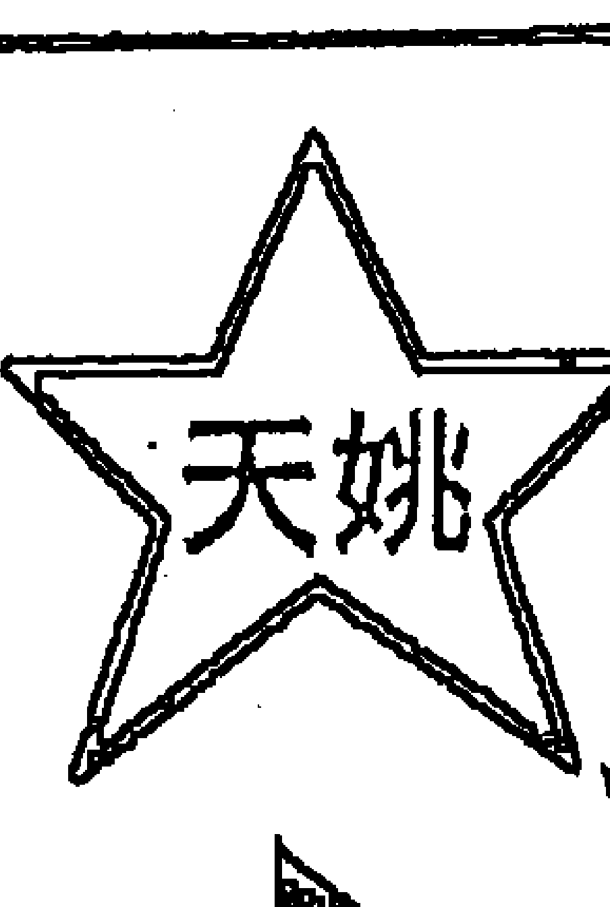

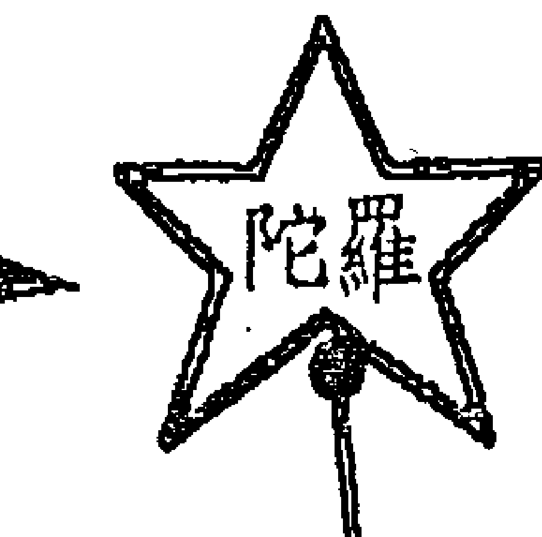

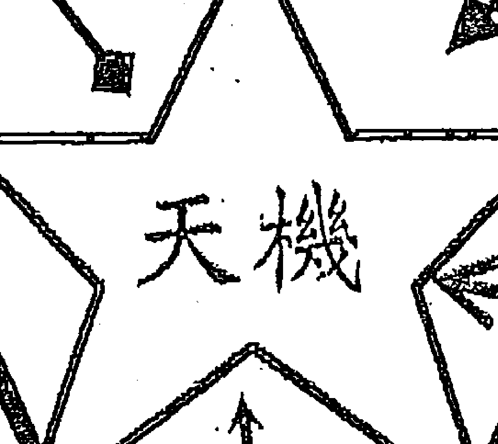

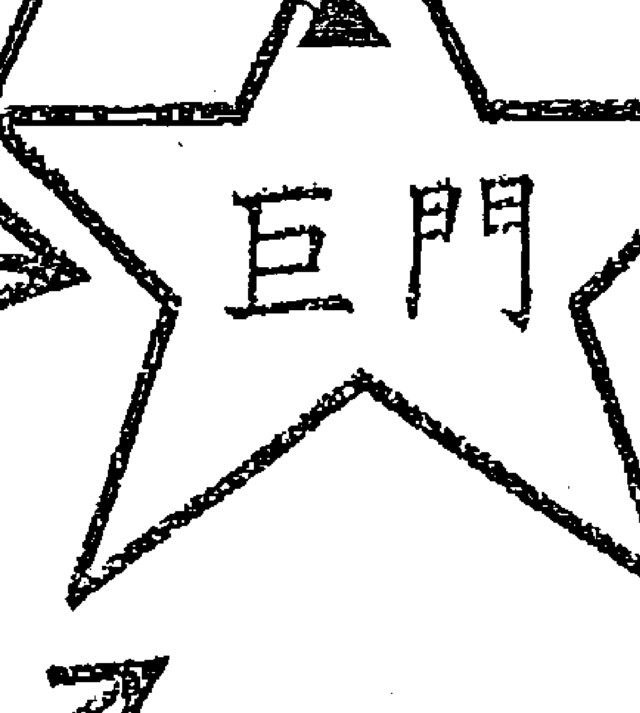

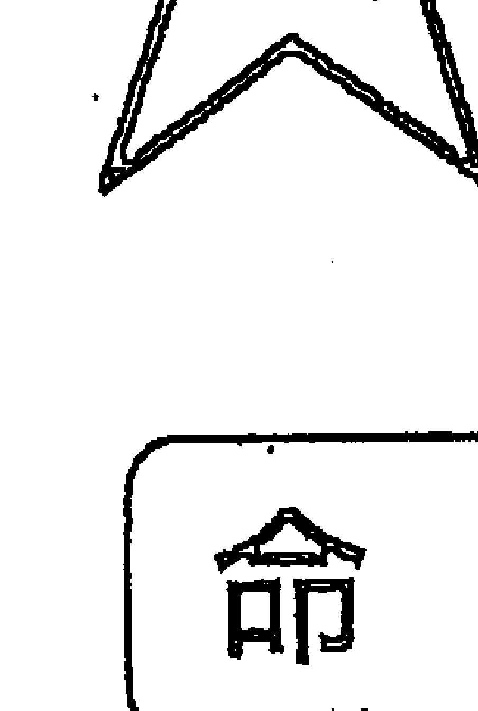

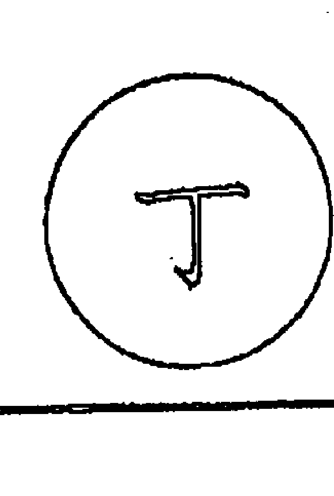

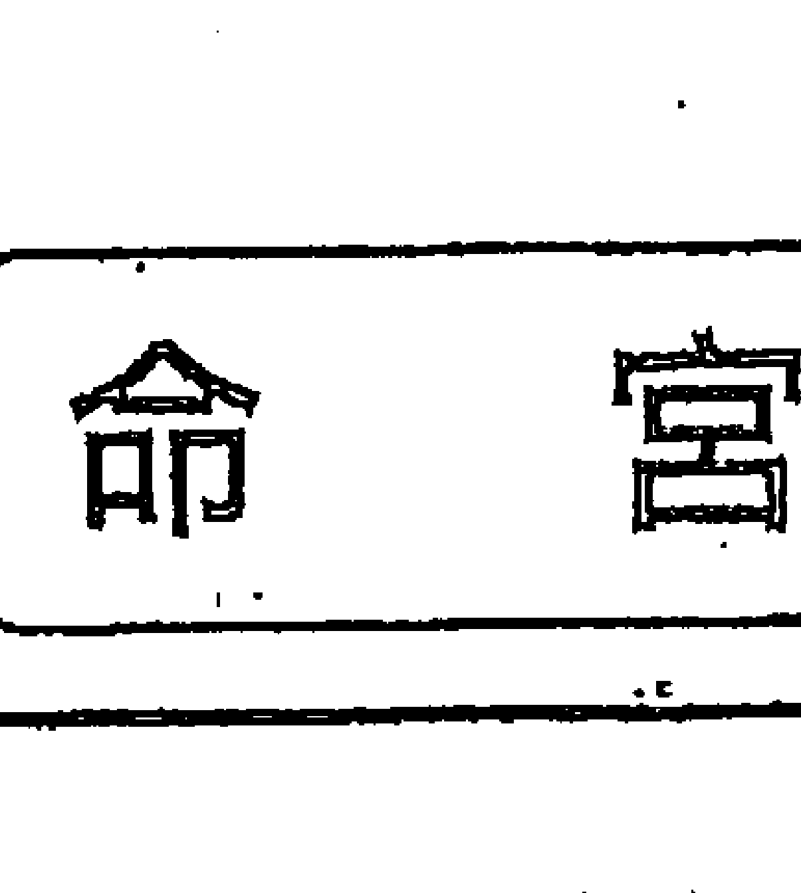

同宮星宿組合對命宮產生何種影響呢？

# 第十二章 格局精解

格局代表一個人總體形象，如「陽梁昌祿」格並非如斗數全書上說的一定都是「臚傳第一名」，它代表擁有此種格局的人有讀書的天分，反應靈敏，對於所學能消化並整理出條理脈絡，再參酌自己的意見，成為自己的一套東西，所以格局是一個參考指標而已，當我們排出命盤時就能了解命造的大概性格和特性。

所以，格局是分析命盤時，必備的參考指標，致於說大限、流年的運途都會和本命格局產生不可分割的關係，本命格局有先天垂象，大限盤局又有類似徵象出現，兩相重疊加強，就會發生變異，若逢流年又有某些條件配合，則會產生相關的事件，因此，本命格局是一個非常重要的參考指標，特精解如下，作為大家研究的參考：

## 一、紫府同宮格：（圖廿七）

紫微天府兩顆星同宮坐命在寅、申宮即為此格，由於紫微、天府兩星分別為南、北斗之帝星，兩星同宮太過旺盛而缺少有匹配協輔之星群，因此引申於人之特性有常感精神空虛、苦悶、孤寂的傾向，常不經意地為了小事傷感，或常有一手足無助，情份薄弱」的感嘆，不過此格之人個性保守敦厚，較安於現狀，物質生活豐足（以其安於現狀知足長樂的特性而言），只有在親情的領域略有缺憾而已。適合從事：財務工作、技術工作或幕僚人員、需要思慮精細的工作。最喜有左、右來輔，祿存昌曲同宮，則理財能力佳，為人也純厚謙沖，能成富翁，若只有祿存同宮沒有輔佐之星輔助，則為人孤獨，不以吉論。有羊陀火鈴來湊合，則被煞星引領往不吉之處發展，因此有：為人奸詐偽善、脾氣大、剛愎自用等特性。

## 二、府相朝垣格：（圖廿八）

女命有吉星加會，可得富貴，旺夫益子，知足常樂。

十一個基本命盤中，皆有一宮為府相朝垣格，如紫微在辰，天府在子，天相在辰，若命宮在申宮，則為府相朝垣格，此種格局之人與長輩、上司、師長的關係特別好，容易得到來自他們的精神或物質上的鼓勵、幫助、提拔或庇蔭，遇急難或困頓時，也常有貴人相助，安然渡過難關，此格之人常有交際應酬之機會，可說是最有食祿的格局了。

為人個性外柔而內剛，自我要求高，常以自我標準要求、衡量他人，故常有得罪同僚、部屬的情事發生，長相上，五官較深輪廓明顯突出。不管男、女命，婚姻皆要注意，此格之人夫妻宮坐七殺，所以婚緣較晚，早婚易生波折。有吉星來會，則易有成就，忌煞星會入，則有事業毀於一旦的暗示，要特別注意。

合乎府相朝垣格的命盤有：

1. 紫微星在子，命宮在午。
2. 紫微星在丑，命宮在未。
3. 紫微星在寅，命宮在申。
4. 紫微星在卯，命宮在酉。
5. 紫微星在辰，命宮在戌。
6. 紫微星在巳，命宮在亥。

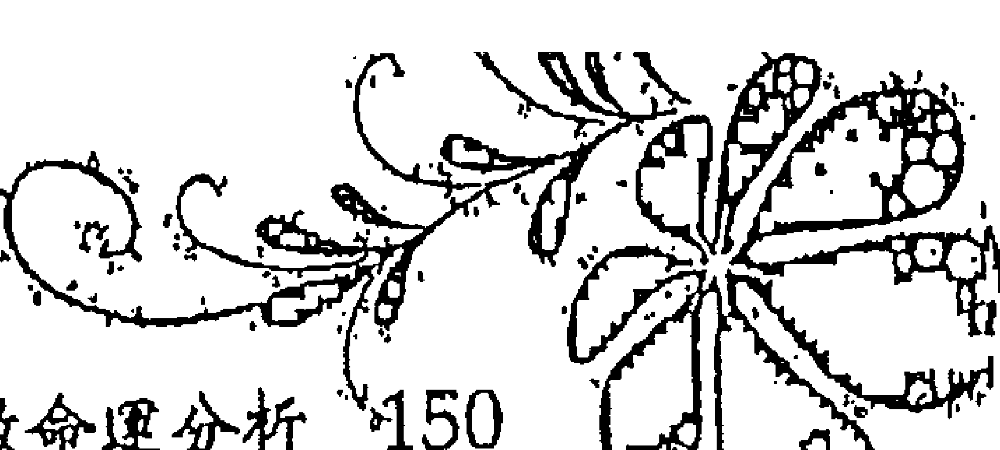

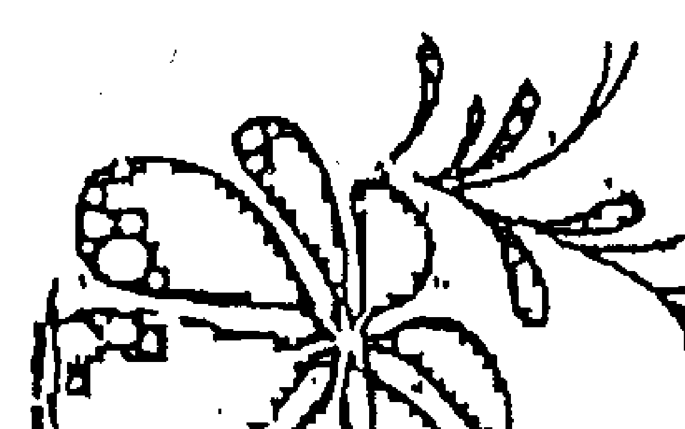

## 三、紫府朝垣格：（圖廿九）

以上皆屬府相朝垣格，吉星來會則吉利，使命宮之主星更能受紫府雙星之庇蔭，益增其行事之權令和順利，忌煞星不宜會入，有則破壞格局的佳美，往負面發展，藉勢為非作歹、好行不義。

合乎紫府朝垣格的命很多，此格之人一生常與政治、軍警、商業界中有成就的人來往，並且都得到他們之助而成功，是攀權附貴的格局，若忌煞星加會，則為平常人，但還是有攀附權貴的本性存在，往往予人逢迎巴結、狐假虎威的觀感，但也是有受到父祖或手足庇蔭的，但不管是外人或自己人庇蔭，只要行運吉利亦可發達，只是名聲欠佳；吉星加會則能富貴綿延，有良好名聲。此格不適宜女命，婚姻比較晚。以下皆合乎此格：

1. 紫微在子，命宮在申，紫微在寅，命宮在申。
2. 紫微在辰，命宮在申，紫微在戌，命宮在寅。
3. 紫微在未，紫微星在亥，命宮在丑。

| 巳 | 午 | 未 | 申 |
| --- | --- | --- | --- |
| 太陽 | 破軍 | 天機 | 紫微天府 |
| 武曲 | （空） | （空） | 太陰 |
| 辰命宮 | **圖廿九：紫府朝垣格** | （空） | 酉 |
| 天同 | （空） | （空） | 貪狼 |
| 卯 | （空） | （空） | 戌 |
| 七殺 | 天梁 | 廉貞天相 | 巨門 |
| 寅 | 丑 | 子 | 亥 |

以第一項較吉利，男命事業有成，掌財權，女命丈夫事業有成，旺夫益子，己年生人，因生年化祿、化權在命之三方，所以富貴吉美。第二項之人婚姻大都不吉、有波折，因夫妻宮坐七殺主孤剋，雖晚婚亦常會在婚後有意見不合，無話可說等情形存在，所以有先見之明的話，便可瞭然於心，不會耿耿於懷，增加婚姻的祥和。

| 天機 巳 | 紫微 午 | 命宮未 | 破軍 申 |
| --- | --- | --- | --- |
| 七殺 辰 |  |  | 酉 |
| 太陽 天梁 卯 |  | **圖三十：明珠出海格** | 廉貞 天府 戌 |
| 武曲 天相 寅 | 天同 巨門 丑 | 貪狼 子 | 太陰 |

## 四、明珠出海格：（圖三十）

「明」字為日月兩字之合成字，故須日月由旺地來會才成格，如太陰在亥，太陽在卯，日月分別在最亮或剛浮起海面之旭陽，為大地帶來一片光明，故立命在未位，而日月分別由卯亥等三合旺地來照，表示命造為人心地光明，充滿愛心，興趣廣泛、才學出眾，加會文昌、文曲更增加臨機應變和藝術方面的才能，容易在社會上成名。

在事業上最宜從事公益福利、慈善等服務業，從事教學工作亦能表現才華，經商則能掌握業務大權（但不宜太過於商業化之事業）。

女命沒有文昌文曲忌煞星同宮或三方會入，則財帛、官祿、夫緣皆吉，婚後宜從事職業婦女或有自己的事業較吉，否則易有家庭風波。

庚、丁年生人較差，由於生年化忌在丑位沖命，應注意口角是非，凡事多忍讓免得招來橫禍，從事研究、學術性的工作最好。

## 五、日月並明格：（圖卅一）

此格，如命在午，太陽在寅，太陰在子，即為此格，其作用與明珠出海格類似。
太陽、太陰兩星在廟旺之地，而命宮的三方四正皆會入日月兩顆星，即合乎此格。
若無煞星同會，則此格之人較懶散，尤其和化祿或祿存同宮時更嚴重，因此喜有煞星激發其鬥志，反能成就不凡志業，煞星不可多，一顆即可以，多了反而增加其奔波勞碌，反而忽略了家庭，增加其孤剋性質。
此格之人選擇的工作以服務或涉外業務性質的工作最好，曾見此格之人擔任鑄造設備公司的業務經理，國外的大小訂單都是尤其一手開發，同時也和國外買主建立深厚關係，衍生其它合作機會。如果命宮有擎羊或火星同宮，即成為「馬頭帶箭格」，陀羅或鈴星同宮的話，則不符此格。

| 紫微 七殺  巳 | 午命宮 | 未 | 申 |
| --- | --- | --- | --- |
| 天機 天梁  辰 |  |  | 破軍 廉貞  酉 |
| 天相   卯 | **圖卅一：日月並明格** |  | 戌 |
| 巨門 太陽  寅 | 武曲 貪狼  丑 | 太陰 天同  子 | 天府   亥 |

## 六、日照雷門格：

卯宮為雷門（以命盤配八卦，卯宮屬震卦，震為雷，故稱卯為雷門），所以太陽在卯位坐守命宮，叫做「日照雷門格」，由於卯為早上五至七時之間，初昇之## 图三十二：日照雷门格

| 天机 | 紫微 |  | 破军 |
|:---|:---|:---|:---|
| 巳 | 午 | 未 | 申 |
| 七杀 |  |  |  |
| 辰 |  |  | 酉 |
| 天梁 | 太阳 |  | 廉贞 |
| 卯命宫 |  |  | 天府 |
| 武曲 | 天相 | 贪狼 | 太阴 |
| 寅 | 丑 | 子 | 亥 |

太阳带来一片光明，又和天梁星同宫，主个性豪爽慷慨、随和，喜助人，好打抱不平，为人光明正大，诚实正直，责任心强，具有领导才能，在社会上会成为名望的人，有煞星冲破亦能成为社区中小有名气的长辈，是很好的格局。白天生人最佳。适合从事：慈善公益事业、服务业、教职等，担任民意代表之类公职人员也很恰当；有煞星冲破或忌星同宫，不宜创业，有惊险且利润不大，必事倍功半。女命甲年生人较不好，与夫、父较无缘，如聚少离多等情况。由于此格女命个性豪迈不拘，要注意不可太随和，以免予他人轻浮的感觉，而被居心不良者轻薄，丈夫官个性温和者较佳。

## 七、月朗天門格

（图三十三）
亥宫为天门，若太阴坐命宫在亥位，就称为月朗天门格。

| 天機 巳 | 紫微 午 | 未 | 破軍 申 |
|:---|:---|:---|:---|
| 七殺 辰 | | | 酉 |
| 天梁 太陽 卯 |  | | 廉貞 天府 戌 |
| 武曲 天相 寅 | 巨門 天同 丑 | 貪狼 子 | 太陰 亥命宫 |

亥为夜间九时至十一时，为月亮最明亮的时候，引喻为合乎此格者，男命相貌斯文，如明月一般予人天真无邪纯真的感觉，女命面貌身材均佳，不管男女个性都温和、不偏激，思虑深远，聪明异常，喜欢研究学问，文笔又好，心思细腻而体贴，为人谦恭有忍让之心，人缘佳，可因学术成名，适宜学者、专家，故合乎此格之人应往专业领域方面钻研，定有不凡成就。一生平稳，善聚财，异性缘特佳，所以婚后要注意交际状况。

乙年生人，因为太阴化忌的关系，多眼睛视力差或与母无缘，但不影响日后之发展。

最忌煞星、忌星冲破，尤其和火星、铃星成为“太阴与火铃同宫反为十恶”的格局，个性较强而自私自利，好施阴谋，嘴上又得理不饶人，欠缺容人之雅量，人生多波折，易遭挫败或孤独，宜修身养性，免得老来孤单。

## 八、巨机同临格

（图三十四）
巨门、天机两颗星只有在卯、酉两宫才会同宫，以在卯宫守命比酉宫好（因卯宫属木和天机的五行相同，而酉属金克天机木），此格之特征为富研究心，凡是存疑要待自己经验过后才会相信，口才好，个性略为固执，适合高度智慧性工作，有特殊艺术才能，早年辛苦，奔波劳碌成败大，中年后勃然而兴，自手起家之人，完全靠自己努力，善出计谋，财运好而不聚，一生中起伏大，多是非争执之事。女命不宜，如与生年忌同宫，婚姻多波折，身体较差，时常生病，否则财运即差。适合：顾问、外交(业务)、文化事业等工作。与煞星同宫纵遇财官亦不荣，适合：己、辛、癸年生人，财官双美，丁、戊年生人有成败，不稳定。

| 天機 | 七殺 | | 廉貞 |
|:---|:---|:---|:---|
| 巳 | 午 | 未 | 申 |
| 紫微天相 | | | 酉 |
| 辰 |  | | 破軍 |
| 天機巨門卯命宮 | | | 戌 |
| 狼 | 太陽太陰 | 武曲天府 | 天同 |
| 寅 | 丑 | 子 | 亥 |

## 九、机月同梁格

（图三十五）
合乎本格的命盘很多，凡是命宫、财帛、事业、迁移等宫有以上四星会入时皆合格，此格之特征为：具有企划之头脑与优秀之处事能力，做事有次序、思考有条理，最佳之幕僚人员，不适宜掌权或当管理人员，会追随强有力的人做事，协助他们创业，不管是军、政、商，都是上司的得力助手。现在高级官员或在野阵营中的高级干部中，很多是此格局，成就很高，并不能以小吏来断，治理一个太平盛世的国家正需要此格局之人才，而开疆辟土打天下的时候，此种人才只能做后勤支援、分析规划的幕僚工作，如当初的姜子牙之于周武王的关系。会左右、曲昌，文为清显，武为忠良，但机阴同宫在申寅宫合昌曲，为人反复易变，为求目的，不择手段，且会跋涉他乡，外出发达的命，女命不利感情，感情多波折，甚或有为求名利，以身相许的情况，宜注意。若会煞星，浪荡他乡事无成，吉星加会，多主富贵，衣锦荣归。此格之人不宜创业，企划能力强，但执行能力不足，但服务业可以，因为服务业有很多需要推陈出新的创意的企划案，其它生产事业较不好，有则亦是投机性的行业，不易持久。

| 巳 (破軍 武曲) | 午 (太陽) | 未 (天府) | 申 (天機 太陰 命宮) |
|:---|:---|:---|:---|
| 辰 (天同) |  |  | 酉 (紫微 貪狼) |
|  |  |  | 戌 (巨門) |
| 寅 (廉貞 七殺) | 丑 (天梁) | 子 (天相) | 亥 |

## 十、石中隐玉格

（图三十六）
凡巨门在子、午位坐命宫，称为石中隐玉格，顾名思义，隐藏在璞石之中的玉髓必须要经过琢磨才会显露光彩，故引喻此格之人的特性为理想高远，见解先进，难为常人接受，必须经过一番努力奋斗后，才会证明他是正确的，所以早年辛劳，中年后才会发达。最喜科、权、禄会，名声显扬，适合国贸、代理、业务、文化、教育等工作。会煞星、忌星同宫，则多是非口角；火星同宫，三合有杀凑，小心祝融之灾。兄弟、交友宫坐丁者，易遭盗窃，三合会火星，田宅宫又不吉者，小心火灾。此格之最佳，以辛、癸年生人因巨门化忌，常因言语不当而得罪人。

| 廉貞 狼 巳 | 巨門 午命宮 | 天相 未 | 天梁天同 申 |
|:---|:---|:---|:---|
| 太陰 辰 |  |  | 七殺武曲 酉 |
| 天府 卯 |  |  | 太陽 戌 |
| 寅 | 紫微破軍 丑 | 天梁 子 | 亥 |

## 十一、日丽中天格

（图三十七）
太阳守命垣在午，而午时之太阳最明亮，万物均分享其热量，故主人个性豪爽、随和大方，做事速战速决，喜欢帮助人，不喜与人计较，能从大处着手，不计较小恩怨，交游广阔，具领导统御能力，所以终其一生的财运、事业运均很好。个性虽然强，但能择善固执，会吉星适合国际贸易、开工厂、政治界、文化事业、服务业等，是个非常优秀的命格，以辛、癸、庚年生人最佳，甲年生人固执、不合群、自视甚高，易受他人排挤，一生中助力少，独立自主之命。

女命不利婚姻，若能以温柔的态度来调谐婚姻，则能减少波折，否则，妻夺夫权，难免婚姻因双方个性冲突而生风波。

以日间午时前出生之人最佳，申时前生之人，夜间生人，因太阳已西沉，毫无光芒，故吉力大失，宜趁早离乡出外奋斗。壬年生人，可为富商高贾或为著名之“师”级人物，如律师、会计师、技师、老师等。

| 太陽 已 | 破軍 午命宮 | 天機 未 | 紫微天府 申 |
|:---|:---|:---|:---|
| 武曲 辰 | | | 太陰 酉 |
| 天同 卯 | | | 貪狼 戌 |
| 七殺 寅 | 天梁 丑 | 廉貞天相 子 | 巨門 亥 |

## 十二、巨日同宫格

（图三十八）
巨门、太阳在寅、申位会同守命宫，但申时，太阳已快下山了，光芒渐弱，不足以照亮同宫巨门的阴晦，故寅宫比申宫吉利，此格特征为：个性强、口才好、操劳，因“巨日同宫，多竞争”所以事业上的对手很多，从事之行业也较热门，难免竞争激烈，不过都能持之以恒，卒获成功。热心公益，喜欢从事慈善事业或当义工，昔日竞争对手，今日亦能成为合作伙伴，一生中易受小人中伤，但不伤其事业上的发展力。适合：律师、国际贸易、旅游、医师、教师、外务等工作，例行性的行政工作较不适合。此命之人与海外有缘，宜早学习外语，以备明日之需；在中年之后会步入政治舞台，为民喉舌，当然命局要有吉化之星辅佐才可，辛、癸、庚年，日间出生的人合格，有煞星冲破不吉，多受小人之害。在申宫则吉力不彰，做事有头无尾，先勤后惰，好吹嘘，结局不好，宜改变个性，积极些。假如立命申而巨日在寅宫来照，比在寅宫巨日坐命更吉祥，发展性更强，为人能干、成名而得利，女命旺夫益子，是贵夫人格。若立命寅，巨日由申宫来照，吉力不显，因夕阳无力。

| 巳 | 午 | 未 | 申 |
|:---|:---|:---|:---|
| 紫微 七杀 巳 | 午 | 未 | 申 |
| 天机 天梁 辰 |  |  | 破军 廉贞 酉 |
| 天相 卯 |  |  |  |
| 巨门 太阳 寅命宫 | 武曲 贪狼 丑 | 太阴 天同 子 | 天府 亥 |

## 十三、月生沧海格

（图三十九）
天同、太阴守命在子，称为月生沧海格，又称“水桂澄萼，得清要之职”，可见此格之人心性光明磊落、爽朗、公正坦白，不要心机但却能预先了解危机所在而避祸，适合担任监察、评论（议）等方面的清高职务。此格之人长相斯文秀气，聪明反应好，具幽默感，人缘佳，多酒食应酬之事。在社交、娱乐、旅游等业都能出名，以丙、丁年中秋前后生人最佳，或以每月十五日夜生人入格，其他时间出生合此格者，吉力减弱。丁、戊、己、辛、癸年生人财官双美，与擎羊同宫，身体遭伤，女命较不利夫妻生活，如有同性恋倾向或排斥性生活等，情况不一而足。

| 紫微七殺 |  |  |  |
|:---|:---|:---|:---|
| 巳 | 午 | 未 | 申 |
| 天機天梁 |  |  | 破軍廉貞 |
| 辰 |  |  | 酉 |
| 天相 |  |  |  |
| 卯 |  |  | 戌 |
| 巨門太陽 | 武曲貪狼 | 太陰天同 | 天府 |
| 寅 | 丑 | 子命宮 | 亥 |

## 十四、日月照璧格

（图四十）
太阳、太阴两星在丑或未同位，丑未又恰为田宅宫，都叫日月照璧格，此种格局之人一生中多不动产，包括继承、自购、赠与等皆属之，并拥有大批田宅而成成为大富翁，是大地主的格局。庚、辛、丁、戊年生人合格，其他年生人较次。以丑宫优于未宫，因太阴为田宅主，在丑宫还是夜晚，月亮还能散发光芒，故较未宫为佳，而同宫之太阳不主田宅之事。

由于命宫坐破军的缘故，在辰戌位的破军有变动的意味，此变动有多种意思，如：远离家乡在异地发展、事业多变动或多变动等，因此，虽然有田宅却不是自己耕作，大都交给别人管理，所以要慎选信赖的托管之人，以免被侵占。因为不动产不易变卖，假如限运不吉，钱财都大部份投资在田地上，如果事业上欠缺周转资金，很容易一败涂地，此和命宫坐破军有很大关系，因为大凡“一杀破狼”者，大都有大起大落之运，尤其破军坐命者，一生多波动。

| 天梁 巳 | 七殺 午 | 未 | 廉貞 申 |
|:---|:---|:---|:---|
| 紫微 天相 辰 | | | 酉 |
| 天機 巨門 卯 |  | 破軍 |
| 貪狼 寅 | 太陽 太陰 田宅 丑 | 武曲 天府 子 | 天同 亥 |

## 十五、贪武同行格

（图四十一）
武曲、贪狼在丑或未位同守命宫时，称为贪武同行格，合此格之人：个性坚毅、不畏辛劳、精神旺盛，不继承祖业，为离乡背井，功成异域之命；武曲、贪狼都属财星，但同宫时有“贪武同宫不发少年人”之说，三十岁以前财来财去，辛劳奔波，虽有祖业亦难保有，但三十岁后会渐渐露头角，成为成功的生意人，若有火星或铃星同宫成为火贪格或铃贪格者，投机性强，往往由股票或期货市场获利，若是行运不吉，将败得一乾二净，是此格之人要注意的。

若贪武同行并有火星或铃星同宫，则适合军旅，必能冒险立功于边城，成为国家之栋梁而掌大权，不会火铃则欠缺杀气，无法成为威震边疆之大将，若再逢忌煞星，则富贵不长且身体遭伤寿元不长。

女命武贪守命，神经质、吝啬，有目的的大方，易流于斤斤计较之流，爱好自由，好强、不向人低头，一定要做成功给你看，女命疼爱丈夫但晚婚。最忌讳有羊、陀来冲，感情定不顺，亦为平常之技术人员或小公司、小商号的老板，成就较差点。有咸池、天姚同宫，则桃花性质重，容易有感情风波。

| 巳 | 午 | 未 | 申 |
|:---|:---|:---|:---|
|  |  |  |  |
| 天机 天梁 |  |  | 破军 廉贞 |
| 辰 |  |  | 酉 |
| 天相 |  |  |  |
| 卯 |  |  | 戌 |
| 巨门 太阳 | 武曲 贪狼 | 太阴 天同 | 天府 |
| 寅 | 丑命宫 | 子 | 亥 |

## 十六、日月夹命格

（图四十二）
太阳为官禄主，太阴为财帛主，若两星在旺地来夹命，主富与贵，易得长官提拔而成功，财官双美，如图四十二为一例，又若人立命丑宫，武贪守命，太阳在寅，太阴在子，两星皆在旺地夹命，亦为日月夹命格，主人一生财运丰足，成为雄踞一方的工商钜子。（与武贪同行格同论）。

天府坐命本已有富足之意，此种富足多是继承而来，而少部分是自己后天努力得来的，因为天府主保守、欠缺开创力，因此其后天努力得来的财富，大都是节俭的省下来的，而非投资做事业赚来的，加上天府星自视甚高的特性，实在不适合需要斤斤计较的商场，若要自营业事业也要属于清高或别人有求于己的事业，例如律师、顾问或会计师等行业为宜。

| 破軍 武曲 巳 | 太陽 午 | 天府 未命宮 | 天機 太陰 申 |
|:---|:---|:---|:---|
| 天同 辰 |  |  | 紫微 貪狼 酉 |
| 卯 |  |  | 巨門 戌 |
| 寅 | 廉貞 七殺 丑 | 天梁 子 | 天相 亥 |

## 十七、英星入庙格

（图四十三）
破军在子、午位为庙旺之地，若在命宫，且无煞星冲破，即合此格。此种命格之人：喜创新，喜新鲜事物，对任何事都抱著怀疑态度，凡事眼见为凭，实务求是，注重有形的事物，胆大，好投机冒险，时常变化改革，故是一位改革家，成功与失败常在一瞬间，所以对于此种格局之人，“变动”是形容他一生最适切的用语。此格之人宜外出发展，且与海外很有关系，如与海外有商业往来或时常出国等，故语文很重要宜趁早学好。若加煞星，为人重心机、阴险、好赌、自私重利，一生多官非，奔波劳碌。甲、丁、己、癸年生人福厚，丙、戊年生人不吉。此格之人可塑性大，宜文宜武。

| 太陽 已 | 破軍 午命宮 | 天機 未 | 紫微天府 申 |
|:---|:---|:---|:---|
| 武曲 辰 | | | 太陰 酉 |
| 天同 卯 | | | 貪狼 戌 |
| 七殺 寅 | 天梁 丑 | 廉貞天相 子 | 巨門 亥 |

## 十八、七杀朝斗格

（图四十四）
七杀在子、午、寅、申宫坐命，再加会吉星，必非等闲之辈，时而寡言，时而滔滔不绝，常有孤独感，重理智轻精神虚无，早年必历尽艰辛，一生中的工作环境与际遇变化很大，具有过人的坚强毅力，不怕辛劳，常在层层挫折之后成功立业，所做事业偏向生产事业，辛劳独创，成就辉煌。

有会昌、曲者，不管从政、从军或就职必当主管，从商则为老板，名声好，为人直爽，做人做事有原则，做事的信念是“船到桥头自然直”而不善于做计划，适合从事技术性或重新组合的工作。左、右、昌、曲俱会，则权名俱佳。

最忌讳和擎羊或铃星两星同宫，一生中易有官非诉讼之事，运途起伏变化大，若行运不吉，更有肢体伤残之事发生。

会入煞星多者，不宜自创事业，在大公司任职为宜，并要小心灾伤；昌、曲、魁、钺与煞星俱会者，公职为宜。此格不宜女命，主婚姻晚到或孤独、强悍，生育时较不顺利，若为职业妇女能独当一面，但在感情生活上不利，欠缺柔和的个性和调和的意愿，必须自我惕励改进。

| 太陽 | 破軍 | 天機 | 紫微天府 |
|:---|:---|:---|:---|
| 已 | 午 | 未 | 申 |
| 武曲 | | | 太陰 |
| 辰 | | | 酉 |
| 天同 | | | 貪狼 |
| 卯 | | | 戌 |
| 七殺 | 天梁 | 廉貞天相 | 巨門 |
| 寅命宮 | 丑 | 子 | 亥 |

## 十九、马头带箭格

（图四十五）
凡七杀、贪狼、破军或天同与太阴在午位坐命，再遇擎羊、铃星、火星者，为此格，一生多在外工作或创业，时常有出国机会，幼年多凶险之事，长大后，常遇肢体受伤之事件，事业亦是在惊险危难中开创，不过终能衣锦荣归。

此格之人，朋友多，经常外出，但会疏忽家庭，故在感情上较有缺憾，引起妻女的抗议，但本身并不在意。有拆解机械或其它设备研究的嗜好，而且能有始有终的重新组好，故亦适合从事技术性工作。其它如外务、推销等工作。女命不吉，感情易受打击，夫妻生活有缺憾，较孤独，若有自己事业较佳。此格以丙年生人最佳，丁年生人多是非，钱财较不顺。此格之人有开创之能力，不宜担任守成、内部管理的工作。

| 天梁 | 七殺 | | 廉貞 |
|:---|:---|:---|:---|
| 巳 | 午命宮 | 未 | 申 |
| 紫微 天相 | | | |
| 辰 |  | | 酉 |
| 天機 巨門 | | | 破軍 |
| 卯 | | | 戌 |
| 貪狼 | 太陽 太陰 | 武曲 天府 | 天同 |
| 寅 | 丑 | 子 | 亥 |

### 图四十六：三奇嘉会格

| 太阳[忌] | 破军[权] | 天机 | 紫微天府 |
|:---|:---|:---|:---|
| 武曲[科] | | | 太阴 |
| 辰 | | | 酉 |
| 天同 | 贪狼 | 卯 | 戌 |
| 七杀 | 天梁 | 廉贞[禄] 天相 | 巨门 |
| 寅 | 丑 | 丙 子命宫 | 亥 |## 二十、三奇嘉会格

三奇就是：生年干化禄、化权、化科三星，如果三奇在命宫、迁移、事业、财帛等宫会照进来，即合此格，若只有两颗化星力量较弱，假如命宫坐一化吉星，其它会照进入，则佳美，坐宫不坐化吉星，大限运无配合的话，也是落魄渡日；化禄主财，化权主掌权，化科主名声，故坐化禄而化权来会照较佳，较有实利，其它主名声而已。此格之人即使命宫不吉，亦有逢凶化吉之力，很容易成为名利兼收之人。此命格以命宫坐化科、事业坐化权、财帛坐化禄的命局最佳美，因为三吉化星分别落入其所主事之宫位。
像所举之例子由于命宫（在子位）宫干丙，是廉贞化忌，和原来之出生年天干所化之星交互作用，则会使命造行运蒙下不利的影响。

## 二十一、雄宿朝垣格

廉贞坐命在申宫合此格，为人个性强、脾气大、聪明伶俐、自我要求高、常以自我标准衡量他人，虽爸爸妈妈等长辈亦敢指正或责骂，是不顾后果的直肠子（口恶心善），遇文昌好礼乐，遇禄存有富贵，不加忌煞星，为富贵积善人家，以甲、戊、庚年生人最佳，己、丁年生人次之。

| 天梁 | 七杀 |   | 廉贞 |
|------|------|---|------|
| 巳   | 午   | 未 | 申命宫 |
| 紫微天相 |     |   | 酉   |
| 天机巨门 |     |   | 破军 |
| 卯   |      |   | 戌   |
| 贪狼 | 太阳太阴 | 武曲天府 | 天同 |
| 寅   | 丑   | 子 | 亥   |

由于此格之人都以自己的好恶作为行事之标准，即使违反了法律亦不顾，所以化忌同宫就容易触法犯忌，不得慎重，若是小孩子则可以选择就读与法律有关的科系，或从事与法律相关行业，以后在事业上也会有很大助益也能发挥所长。女命甲、乙、庚、癸年生人清白，助夫益子，会吉星，感情平稳，会化忌的话有纠纷，廉贞化忌的话，注意官非。会陀罗、火星等多脓血之灾，易看不开，有寻短之念头，若能突破心理症结，大有后望。

## 二十二、禄合鸳鸯格

禄存与化禄同守命宫或财帛宫者合格，禄存为明禄，化禄为暗禄，明禄暗禄合表示财禄广进、财运旺盛的意思，适宜向工商界发展，有成就，财富不小但不贵，若行运不吉亦会破败，故不可恃财而骄，宜多参与社会福利工作。

## 二十三、双禄朝垣格

禄存及化禄，一颗守命垣，另一颗守财帛宫，即为此格，财源广进，大富无疑，由三方会入者，吉力较次，但亦是富裕的格局，不过早年会省吃俭用的开创事业，中年后才会逐渐积沙成塔成为富翁，不过若奢侈浮华，以财傲人，运限不吉，易败得精光，不宜参与投机性事业。

## 二十四、禄马交驰格

禄存、化禄守命或财帛而天马在对宫会入，为禄马交驰格，表示此人有从事国际贸易或跨国企业赚大钱的机遇，而且常有外国贵人相助成就跨国事业，若天马由三方会入者也合此格，但力量不如迁移宫会入的强，且不宜逢忌煞星来冲，一冲即破。

## 二十五、左右同宫格

左辅右弼同宫在丑、未宫守身者合此格，若在命宫两侧来夹，吉力远逊，此命格之人，念书阶段即有相当名声，文采不错，并因此有特殊际遇而成功。为人聪明，反应机灵，有煞星会照，亦小有名声也有可能是坏名声，要看煞星的组合和主星的力量。

## 二十六、坐贵向贵格

天魁、天钺为贵人，若一在命，一在迁移即合此格，一生多得长辈之提拔与照顾，碰到危难时，亦常有贵人相助，事业上常有意外的助力，或有先见之明预先避开危难，如：别人的赠予或颁授奖章等特殊的荣宠，但中年以后就变成我要去庇荫他人了。男命坐天钺，女命坐天魁，要注意附有条件的异性助力，以免引起家庭纠纷，未婚者则不禁，当然，对方若已婚还是要避讳。

昌、曲同宫在丑、未守命为此格，由三方或迁移会照而入者亦是，此格之人，聪明好学，爱修饰，从小就能展露才华，宜向文学、艺术方面发展，将有名声，不过不一定能得很高之学位，曾见歌仔戏天王巨星杨丽花小姐就是此格。但是不可有忌星会入，恐有文书是非，故巳、辛年生人不利，早年有失学之痛或求学多波折，成年人则要防签约、票据、借据、租赁等之文书纠纷。

## 二十七、文桂文华格

命宫没主星时，要借迁移宫的星与父母宫的星来看，若有凶星坐守，大多代表与六亲的缘份薄弱或无助力、或从小就由别人带大、或年纪小小的就离开家乡，长大后就不忌讳，尤其命宫与父母皆无主星时，非常灵验。

## 二十八、命无正曜格

命无正曜并非坏命，因为命宫无主星协辅，变成父母、兄弟、福德等宫位的坏影响很大，只是幼年较多事而已，长大后多有异常成就者。尤其命在申，对宫（寅位）有巨门、太阳来照，煞星未会入者，虽然命宫无正曜也没关系，因为太阳来照命，甚为吉利，此生的际遇多会和国外会发生关系，宜趁早学好外语。

以上为各种常见的格局，它只代表命格的高低而已，并不能代表好命格即能财官双美，还要有运的配合才可以，所以看了命格好，不要太得意，若运限不扶还是不能发达，但命格可以让我们掌握一张命盘的特性，如一看是「马头带箭格」即知个性强、善拆修机器、在外发展等特性，然后再配合运势之流转，推断运势的吉或凶等更详细的细节，否则，如大海行舟，漫无头绪，何处是「定向」？格局就可以帮你定大概方向。

还有，要分清男女命之差别，有些格局对男命而言是吉利的，但对女命却不利，如【君臣庆会格】若是男命就会拥有很多好朋友，但是不利女命，因为朋友太多，这其中包括男朋友，因此交游复杂、层面又广，三教九流都有，让人有交际花的感觉，若不小心还会惹上感情纠纷，所以此格不利女命，其它还有很多命局都有相同情形，所以解释时男女命是有很大差异的。

至于要推断「运」，就要靠四化星了，四化是斗数变化的枢纽，不懂四化的用法，只能「算命」而已，不能「推运」，要了解命运的动态变化，不可忽略四化的作用。

# 第十三章 天干和四化星的关系

甲、乙、丙、丁、戊、己、庚、辛、壬、癸，十个天干，在紫微斗数中，它是代表空间的关系，在此所谓空间，所蕴含的意义有：

- 1. 生存的空间。
- 2. 活动的空间。
- 3. 活动的范围。
- 4. 不同时段的环境。
- 5. 心境。
- 6. 想法。
- 7. 存在的空间。

以人而言，在某一段时间内，占有一特定的空间，亦即，人在活着的时候，占有一定的空间，在这段时间内，他的心境、想法会支配他的活动，去交友、去约会、去赚钱，买房子、婚娶配偶、养育子女、侍奉尊长、随时注意健康、保养汽车等等，这些活动，构成生命生活的另一种空间，由于这些空间的存在，生存的环境才会多彩多姿，充实有意义。人们做一件事循着构思—执行—结果—收敛的次序在进行，而紫微斗数用：化禄—化权—化科—化忌与之对应。但是，人们在从事这些活动时，都是循着构思—执行—结果—收敛的次序在进行（和管理学所说的PDCA一样），有了想法、构思便会将它付诸实施，然后获得成果，之后便要享受了。

例如：买房子，在此之前，便会想买房子，房子的格局，附近的环境，价位等因素，都会在您构思时一并纳入考虑，经过一番深思熟虑和多方比较后，便会决定买那一幢房子，下订、付款，而后搬进去住，享受住自己房子的乐趣。

紫微斗数中，将此四个程序用化禄、化权、化科、化忌等四颗化星来代表，而它们所代表的涵义如下：

- 1. 化禄：缘起、构思。
- 2. 化权：行动、执行、约束、管制。
- 3. 化科：功成名就、收获。
- 4. 化忌：享受、潜藏、收敛。

这些过程几乎每一个入事宫都存在，所以每一入事宫，都配有天干以演四化，表示此四种过程的程序。

四化它有串联不同时段的同类宫位的作用，以及联系不同宫位，表示相互间的联结紧密程度。

每一入事宫的行为会持续下去，一年、两年、甚至十年、二十年……等，但有的构想却如昙花一现般的消失，根本未付诸行动，因此四化它有串联不同时段、空间的作用，如果遇大限转移了，便由不同大限的宫干演四化，以显示心态上的改变。下一个大限的宫干所演化之四化，和本大限的天干所演化之四化，有连续性，表示其构想或行动会持续下来。假如不连续，则有中途挫折或意兴阑珊的意思。

如大限宫干为乙干之命造其四化为：天机化禄，天梁化权，紫微化科，太阴化忌。

当大限过渡到丙天干的大限时，因丙干：天同化禄、天机化权、文昌化科、廉贞化忌。

因此，若是遇到「机月同梁格」的人，此两个大限，因为上述的化禄、化权在本命三方或照三方，所以考试功名、谋职创业，均可顺遂如意。

各位由十天干四化表中，也可观察出来，三方四正星宿构成的格局组合和十天干四化表，有很大的关系。为什么说「机月同梁格」的人，做事有计划、有步骤，而且是一步一步走向成功的格局？因为乙、丙、丁三个连续天干演化的四化星，不是在机月同梁的三方，就是来照三方。由本大限宫干所化飞之四化，与前一大限之四化有无连续性？可以知道命造属于暴起暴落或缓慢渐进成功的命格。

而武贪格的人就常有一夜致富，暴起暴落的命运，因为己干使武曲化禄、贪狼化权同在命宫或在命一迁线会合，故其发达也快，而过渡到下一个大限时，因为：

- 1. 贪狼化禄。
- 2. 武曲化权。

由于只有化禄入而已，或只有化权入而已，表示空有理想，无法付诸行动；或莽撞行事，胡搞瞎搅一番，毫无计划；虽然都对武曲、贪狼有所作用，但若化科星不在武贪格的三方，就易有暴起暴落的现象。由宫干的四化曜的组合形态和命格格局，我们就可以了解命盘主人是属于暴起暴落型的或属缓慢渐进成功型的。

至于靠什么而发达？或因什么而失败，则须看「化星」是那一颗星宿？每一颗星宿，代表一种意象，在不同的人事宫有不同的解释。

## 第十三章／天干和四化星的关系

- 电气业
- 家电
- 音响
- 自动控制
- 电脑
- 灯光照明
- 水电行

> 由于廉贞和同宫辅星、煞曜之不同而有不同行业

例如：廉贞化禄独坐在宫禄宫，因廉贞属丁火，是电能，在物品来说，是电气用品，如电视、洗衣机、电锅、冷气机等皆是，故适合从事电气相关之行业，再参考同宫坐之辅星、煞曜等，一起断定更细腻的事业项目。所以十干四化必须随人事宫之不同而改变解说，再参酌同宫主星、助星、煞星的组合状态，做更细致、精密的解说。因此，对于参予十天干四化的星宿所代表的意象要了然于心，才可活用。（关于十干化曜的意义参考第二十章四化飞星活用例解）

# 第十四章 四化星入门

所谓四化星是指化禄、化权、化科、化忌等四颗化星，古代以农立国，农为国之本，如果不依四时而作，致使农作物欠收，小则个人家庭产生饥荒，生活因而发生问题，扩大来看，民不聊生，饥民到处流窜，四处作乱，国家因而动乱不安，甚至因而灭国，因此，如果人之命运过程，不依人生四季之变迁，俟机而作，努力耕耘，也会如农作物生长一般，当教而不施，当奋斗而不为，只图安逸度日，及至老年一事无成，必然颠沛流离，每天仍要为三餐奔波筹谋，哪能颐养天年！？

先贤观察人生和四时的农作时序，体会到人生和农事耕作其实是有共同之处，小时候就要给予小孩子适当的教养，培养他日后所需做人处世的品德和知识；长大了就能依据所学技能或志趣发展奋斗；经过青壮年的努力，打下事业基础，子女家庭都已成立，体力与智力都已消退，这时就要凭据着年轻时打下来的基础，供给家庭所需；到了晚年就能颐养天年，而不虞生活匮乏。

再来我们看看日常生活或工作中的遭遇，一些事情的历程又是如何的呢？我们做一件事刚开始时是仅有初步想法的酝酿期，有了比较完整的轮廓与细节，就会进入执行期，将想法付诸行动，经过一番努力或折腾之后得到某些成果，这些成果会拿来和预期的目标比较，若没达到就会修正行动，以迄于达到预期的目标为止，就结束行动并拥有最后的结果，当然此结果就会有吉或凶的意义。

一个产品的寿命也是一样，有其导入市场期，成长茁壮期，成熟期，到最后衰退期以迄于完全退出市场的生命周期。大至一个国家也是有其草莽初创、开疆辟土、充满活力的开国时期；建国之后，进入政治稳定、经济增长、民生富足、国富民强的成长期；再经历几代成熟而稳定的守成时期；到最后由于新生代成长于安逸舒适的承平时期，欠缺磨练、习于安逸，丧失开疆辟土的冲劲又没有承平守成的智慧，乃逐渐步入衰退破败时期，终致于覆亡。综观中国五千年来的历史，各个朝代的更替，不也是如此吗？

所以透过观察一件事情、一件产品、一个人、一个家族、一家公司、甚至一个国家衰替兴亡的生命历程，和农作物依四时生长历程不谋而合，就将这一想法揉合到紫微斗数命理学中。

到底农作物的生长历程是什么呢？「春耕、夏耘、秋收、冬藏」即是，先贤乃将此过程加以引申，沿用到推理人命运的紫微斗数上，而创造出「四化」一词，隐喻人生历程的吉凶祸福与运途的转折兴替。

所以，四化就是紫微斗数先贤创造出来代表「春耕、夏耘、秋收、冬藏」的代名词，依据「紫微斗数全书」的记载：化禄属金，化权属火，化科属木，化忌属水，坊间大部分的书籍都是如此定义其五行属性，这些定义是错误的（不知道是否「紫微斗数全书」的作者故意写错），假如搞不清楚其定义，就无法确立四化相互之间的作用，当然就无法解释四化碰撞后的吉凶强弱程度或吉凶效应了。

飞星紫微斗数中的四化和「紫微斗数全书」中五行属性的定义是不同的，它将四化和四时的耕作时序做了一对一的对应关系：

- 春耕—化科
- 夏耘—化权
- 秋收—化禄
- 冬藏—化忌

现在来看看飞星紫微斗数对于四化星的方位、五行是如何定义的：

## 东方属木

：乃因东方草木扶疏，为生长教化的象征，又为春天之意，故以「春风化雨」比拟为师德，因此，化科主教化和功名，故化科属东方木位。

## 南方属火

：火之热力辐射四方，火苗昂扬上窜，有向上奋发之象，南方火位，又为夏季，一到夏季草木生机蓬勃、昂扬上窜、绿意盎然，代表成就、力争上游、奋发之意，故化权属之。

## 西方属金

：有肃杀之象，万物结果后，枝枯叶落，便要采收果实，以济养生命，故化禄属西方金，秋天也，秋主肃杀，主收获、得利也。

## 北方属水

：北方乃天寒地冻之所，草木凋凄，鸟兽齐绝，一切生物都已暂停活动，进入冬眠期，为隐伏收藏之象，故化忌在北方水位，主收敛、藏伏、凋蔽的意象。

一般来说，化禄、化权与化科属吉，化忌为不利，但是，有时候并非如此，如：化禄在疾厄宫就易受伤，老年人易有血压高、长瘤等情形，所以，是吉或凶的解释要看是以何宫来论事，再取星宿组合撷取其吉凶的意义。一般来说，四化星的通义为：

- 1. 化禄：人缘、财禄、情缘、才艺、享受。
- 2. 化权：成就、管制、霸性、自负、掌权、原则。
- 3. 化科：善缘、解厄、贵人、功名、珍惜、才艺。
- 4. 化忌：亏欠、道义、凶祸、粘住、变动、失去、获得。

关于四化的通义，运用时就依宫位别而撮取相近的意思配合宫星宿组合来解；如化科在疾厄，就要取「解厄」之义来解而不可以「功名」解。至于两颗以上化星同宫的话，其相互间的作用关系可由其五行属性了解，但是不能说是两颗化星同宫的吉凶，因为四化的吉凶解释是随宫位和星宿组合而变化的，这个观念要先建立起来：

- 1. 化禄属金，化忌属水，金生水加强化忌的力量，因此禄忌同宫，是加强化忌的力量。
- 2. 化禄属金，化权属火，火克金，火销金熔，也可熔铸金属成为有用之金属器具，所以，可以削弱火的力量，使金的能量适度地发挥，但也有可能过热而熔销金的作用力，引喻人命就有高度自信或刚愎自用的意思。
- 3. 化禄属金，化科属木，金克木，刀斧能砍伐树木，也能雕琢木头为器皿，所以，会加强科的力量，引喻人命就有评价极高的文采表现。
- 4. 化权属火，化科属木，木生火，则火势愈旺，加强化权的力量，引喻人命就表示会有专业成就。
- 5. 化权属火，化忌属水，水克火，因此，化权之力量削减，但水分亦会被蒸发，受火之伤害，所以成为互相战克之局势，权忌同宫就有自我冲突的意思。
- 6. 化科属木，化忌属水，水生木，木势更旺，木主学识，此种组合利于研究学问。

所以，四化的第一层意义，就是代表人或物的「出生—成长—结果—收藏」生命历程。当然这些生命历程一定要发生在相关的宫位才有意义，如官禄宫的四化，一定要落入命宫、财帛、官禄、迁移等四正宫位才好，因为我们一生努力追求的，现实的说法就是为了要「功成名就」，而「功成」代表的就是事业有成，家财万贯，而「名就」呢？就是权或科入迁移，名声显扬。假如，财帛宫的四化落入其他的宫位，那么因为财帛宫四化代表的生命历程，不在你身上发生，很明显地，你无法掌握控制，因此也无法拥有。所以，观察四化在命盘上的分布情况，可以知道某些事物与你的关系是紧密的或松散的或无关的，至于你化出去的落入宫对你的关系紧密与否，可以将该落入宫的宫干再飞四化，看其四化落在命盘上分布的盘局，来判断互相依存的程度，所以，四化的第二层意义，可以用来观察相关人事、与你关系的紧密程度，或你能掌控的程度。各位或许很奇怪，化忌的通义中，似乎有些矛盾存在，是的，在字面上的意义确有冲突存在，但配合四化的「化出」与「化入」之不同，就可知到是要采用那一种意义来解释，所以「化入」、「化出」是四化星的入门观念，在后面会有一章专门说明「化入」与「化出」的意义。再来要解释四化的第三层意义，这一层的意义和运途有关，也就是先天命盘和限运命盘的相互作用关系，这时就要考量四化「化出」与「化入」的关系，假如本命化入大限，代表本命与大限之间有密切关系，有获得或延续的意思；假如本命没有化入大限反而是化出的情况，代表大限与本命间关系不紧密，有中断或失去的意思，所以透过本命与限运四化的关系，可以将不同时段的人事物的关系贯穿连接在一起，并观察他们之间是「收敛」或「发散」，假如是「化入」就是「收敛」，「化出」或「自化」就是「发散」。四化为斗数变化之枢纽，斗数之用神；不知四化的运用，将无以推命，故飞星紫微斗数的开宗明义便说：斗数赖「时」以立命，步地支，散十二宫之中立极，应时间星辰；斗数重「数」以立象，取天干，行四化之飞宫化曜，布空间垂象。

很明显地指出，命运是由时间和空间所带动，而时间与空间的关系，即由地支与天干来配合，因此，不明四化之用，将无以推知时间和空间的关系，更无法了解在什么时间、什么空间下会发生什么事件？只能含糊笼统地以星宿组合特性来解说，无法精确掌握「事件、空间环境、时间」的关系。

所谓「化」者，乃是星辰之气化也，也是说将星性转化为吉凶休咎的能量，显示人世间的运途起伏，人事的悲欢离合；星辰各有本性，分阴阳，有阴阳而生五行，乃星宿之本性，故名星性，所以星性不单指以星宿表现人之个性而已，以其五行之特性配合不同宫位又有不同的运用，再佐以四化之变，则生生不息，变化万千，以之对应万事万物才不致捉襟见肘，所以要懂星性，更要会运用其气化，才能运用星宿而料事如神，所以四化的第四层意义，乃在转化星性成为表现对应的人事。

### 物之形象。

如斷人車禍（車子撞進屋來不算），必與外出有關、與車子有關；而外出與「宮位」有關；車子與「星性」有關；凶禍與「氣化」有關，所以三者在運用時是一體的，不可偏重某一項，斗數在應用時，並不分飛星派、四化派、星性派、小限派……的，分派別的都是不懂斗數的人，若是根據他們偏執某方面的理論來研究，就會被誤導方向，浪費時間生命，本書為讀者建立整體性的、系統性的研究紫微斗數的體系，不再陷入各門派的論戰漩渦中當犧牲品。

由第二章的說明，知道四化不是玄秘之物，而是具有貫聯時空的作用，有四化之牽引聯繫，才知道「因」與「果」的關係，當然推命要找出因果關係是上層功夫，並不是人人都能悟透此種關係的，但是推命的基本功夫全在四化、星性、宮位（立向）等三要素，而以四化為徵驗，四化在命盤上，依其由何所化可分：生年干四化、命宫干四化、大限宫干四化、流年宫干四化……（若推流月、流日時，亦可再細分下去）。

其中生年四化，只是垂象而已，無吉與凶，它是根據生年干而定，屬於靜態現象，但人自呱呱墜地後，即有動態運勢更迭，在一靜一動的流轉中，相互作用，織成人生的命運網而有起伏、成敗等現象。所以生年四化落入先天十二宮之中主垂象，無吉無凶，屬靜。生年四化與十二宮之四化相互作用，產生吉凶，屬動。

生年干四化入十二宮的意義，以下為生年化星入十二宮的意義淺說，其它有雙化星入宮的現象，其意義解釋另有解釋。較常見的雙化星組合有：
- 甲：廉貞、破軍。
- 乙：天機、天梁、太陰。
- 丙：天機、天同、巨門。
- 丁：天機、天同、太陰。
- 戊：天機、巨門、太陽。
- 己：武曲、貪狼。
- 庚：太陰、天同、太陽。
- 辛：巨門、太陽。

- 祿權同宮：財利、發達、名利雙收、有成就。
- 祿科同宮：成名後獲利、財平穩、有才幹。
- 科權同宮：。

現舉一例說明生年四化入宮的意義：（見下圖）

| 疾厄 | 財帛 | 子女 | 夫妻 |
| :---: | :---: | :---: | :---: |
| 遷移 (權) |  | 生年天干 | 兄弟 (忌) |
| 交友 |  |  | 命宫 |
| 事業 (科) | 田宅 | 福德 | 父母 |

[祿忌同宮]：子女聰明、人緣佳，日後會圖財利，平穩受薪為佳，不宜太貪。

[科忌同宮]：技術生財、能賺錢，做人做事有虎頭蛇尾之嫌。

[權忌同宮]：辛苦地以技術，因而成名，但不主有成就，本命也相當關心子女，將錢投資在子女的教養上。

[祿科同宮]：研究專業技術，名氣大而已。

[祿忌同宮]：雙忌論。

- 出外有成就，也能得到大家的讚賞與肯定，適合出外發展。
- 事業平穩，維持相當程度而已，急難時常有意外助力來助。
- 關心兄弟，雖兄弟之間較多爭執，不過關心之情不減，兄弟有急難也會拔刀相助，兄弟較不常在一起。

要注意的是生年四化只是垂象而已，無吉凶現象，需要有行運配合，逆行大運和順行大運的結果完全不同，必須參考行運四化和本盤四化的相互關係，才能推算動態的「運途」起伏。

## 生年四化入各宫之意象：

| 交友 | 迁移 | 疾厄 | 财帛 |
|---|---|---|---|
| 与朋友缘分深厚，对朋友慷慨，拿私财帮助朋友，对朋友关心，朋友也比较多。 | 在外顺利，易得贵人提拔，做事不专心，想往外跑，适合外勤工作处理公众事务，不宜枯坐办公室。 | 幼年多灾，会发胖，性欲比较强，面貌长得耐看有人缘，注意血压或额外的肿瘤。 | 财源旺盛，不匮乏，但以自创事业，白手成家，不喜依祖业者多，善于理财，以钱赚钱。 |
| 官禄 | 子女 |
| 有事业雄心，但行业不精，一天到晚想做这个又想做那个，易因此蹉跎时机，运途好也能成功。 | 子女聪明，有才华，疼爱子女，子女人缘佳，对外关系良好。 |
| 田宅 | 夫妻 |
| 顾家恋家，会拥有自己的住宅，也善于守财，节俭持家，但不一定会有遗产可得。 | 感情早发，多情体贴，能体量别人立场，对配偶感情深厚，配偶也较有人缘。 |
| 福德 | 父母 | 命宫 | 兄弟 |
| 有福可享，也能享福，有食禄，较有酒食应酬之事，或嗜吃零食，较安逸舒适，个性宽容。 | 与父母感情深厚，孝顺父母，父母也较有钱或善于理财，自己依赖性可能稍强，注意培养独立能力。 | 有人缘，说话得体不得罪人，有口福或对饮食较挑嘴，财源也比较旺盛或善于理财，运途较顺利。 | 兄弟感情深厚，兄弟亦较有财力或善于理财，自己对兄弟会提供金钱相助而不是精神支持而已。 |

交朋友挑剔，知心朋友較少，但對朋友忠心講義氣，所交往對象多較有成就者或老闆級人物。

對外能展現才華與能力，外表也給人有能幹的印象，為人直爽，講話較直，也希望別人尊敬。

身體壯碩或強壯不易生病，但是稍有碰撞就易有淤青，小病不生、一旦生病就是大病。

能掌握財權，或善於調度資金，或善於理財，具有支配金錢的權利，個人財務也旺盛。

事業心強有責任感，能掌權成為主管或自營公司，從小就能表現領導才能，事業定有成就。

子女調皮好動，才華高，個性固執，獨立，好支配別人，自己也善於教養子女，當孩子王。

為人很顧家，家中大小事情都由其打點，家中房子也較寬大，一定會有不動產，甚至經營不動產。

配偶能幹，刻苦耐勞，個性較強而有主見，掌管家中大小事務，有妻稍長或夫略小的配合。

同命宮。

父母能力強，親子間多爭執或對父母親的講話語氣較強而引起爭執，注意親子溝通。

個性強、獨立自主，主見深，才幹，凡事喜佔上風，支配別人或管人，易獲得權力或當主管。

對兄弟具有支配的意思，如排行老大或兄弟尊重自己，自己也會幫助成就兄弟，領導能力強。

### 化科入各宮意象：

**交友**
朋友多有學問的人，對朋友也很照顧，喜歡和有學問或談得來的朋友交往，不喜複雜的交往對象。

**迁移**
出外得貴人相助，自己也給人文質彬彬的印象，長相也較斯文而有理。

**疾厄**
身材適中勻稱，不胖不瘦，身體也不易生病，即使有病也較易痊癒或得良醫救治。

**财帛**
財源如細水長流，雖不多但不虞匱乏，從不缺錢，即使遇到難關也會有貴人救急度過。

**官祿**
事業上有貴人提拔或資助，容易發揮優點，做事不衝動，穩健踏實，理智分析。

**子女**
子女聰明懂事，好讀書，不須大人督促，做事自動自發，也有才華和名聲。

**田宅**
家中清潔舒爽，住宅適中，注重家庭生活，購屋置產易得貴人助力，地段好或價錢較合理。

**夫妻**
配偶清秀，知書達禮，溫文和藹，處世講理不亂來，夫妻溝通良好，心靈契合，默契好。

**福德**
有文藝嗜好，並在該方面具有相當成就或名望，精神開朗愉快，凡事看得開。

**父母**
父母是我的貴人，由父母處得到許多做人處世的智慧，影響你的一生。

**命宮**
為人講理，看得開，喜歡讀書和求知，利於考試和從事文藝事業。為人斯文有禮，個性和善明理。

**兄弟**
手足之間情深義厚，相互扶助，手足間心靈契合，默契十足，合作無間。

### 化忌入各宮意象：

#### 巨门

**交友**
朋友较少，对朋友很真诚，朋友有难，一定尽力帮忙，但和朋友间来往并不熟络。

**迁移**
一天到晚往外跑，不喜欢待在家里，为人坦白，有话直说，不矫情。

**疾厄**
身体较瘦弱或某部位较差，以至于终生都受到影响，对自己的身体也较注意。

**财帛**
节俭，凡事考量金钱，视钱如命，吝啬倾向，但钱财还是觉得不够用。

**官禄**
事业不稳定，会专精某项专业技术，敬业。不宜自己当老板（适合搞技术）。

**子女**
溺爱子女或子女晚得，但未必子女会常在身边，有早离家乡出外念书或就业的意思。

**田宅**
关心家庭，家庭观念重，处理家庭大小事情，一下班就待在家里（有可能是不得不留在家）。

**夫妻**
晚婚或疼爱配偶，多为配偶付出却难得回报，或聚少离多，相处有缺憾。

**福德**
心神不宁，常杞人忧天，无法安心享受，精神耗弱。

**父母**
与父母缘厚但因某些因素不能承欢膝下，而使得孝心无处使，有欠父母恩情之憾。

**命宫**
个性较内向，运途较不顺，砥砺坚忍意志，自我要求较高，应适度放松心情。

**兄弟**
相处有争执，但感情不错，为兄弟付出，或兄弟分处各地，因此感情特别好。对朋友很真诚。

紫微斗數用命盤來推算命運，命盤內應有體有神。到底什麼是「體」？什麼是「神」呢？簡單地說，命宮三合方為體，本命盤四化為神；前面已和大家談過格局，這就是命盤中代表命造主人之「體」，為何以三合方為體呢？道理很簡單，人活在世上，衣食住行四大民生需要，無一不和財帛發生直接關係，故財帛為養命之源，要財帛廣進，必然要事業好、運途吉祥，才能確保財源，沒有事業何處來財？故事業宮為財之源（財帛的財帛），經營事業，要有一「人」才能經營事業賺錢，故命宮為事業之源，其他的夫妻、子女、兄弟、朋友、福德等，是基於命、財帛、事業而產生依附之關係，事業不好，財運又破。何來福德可享？拿什麼買田宅？六親何以親切？此種賓主關係還在宋朝即已為人所深刻理解，明顯地，命、財帛、事業為人命之主體。

再從另一個角度來看，有許多事情，都是由心靈所發動的，再藉動作軀體來達成，例如：創業時，你會用心思考資金來源、技術能力、有哪些競爭者、市場滲透策略……等因素，見有機可趁才會放手去做，亦即是先由心中籌劃可不可行？再付諸行動，所以，是由「神」導引「體」而動，而不是「體」控制「神」，很明顯的，命運的主導在四化用神，格局居於副角，有四化的催動，才會付諸行動，並不是每一個擁有好格局的命造，都能成就偉大的事業，如何掌握最佳時機，俟機而起，成就偉業，命理的推導可提供參考。四化就是衡量決心強烈或外界因素影響強烈與否的指示器，觀察由本命、大限的四化在命盤中形成的是哪一種組合，便可判斷出來自我心力的強弱程度或外界因素影響力的大小，影響力的大小便可判定一個人遇到事件的吉或凶，至於到底是自我因素或外界因素？就要看是哪一個人事宮來判定。四化是依天干而決定化與不化，而天干有生年天干，再由生年天干定出十二宮的宮干，每個宮干又主宰不同的四顆化星，十二宮共飛出四十八顆不同的化星，這些由本命盤飛出的化星會和生年天干的四化碰撞而產生不同的吉凶現象，這就是本命盤的用神，當運勢一轉動，本命盤四化又會和大限、流年的四化發生作用，便顯出運途的吉凶了。

天干四化指的化祿、化權、化科、化忌，在財宮、感情、宅運等方面，各有不同的吉凶解釋，一般而言，化祿、化權、化科主吉利，但在看外遇時，則不主吉利了，相同的，化忌主不順，但在有些問題中，卻是吉利的現象，所以四化的吉凶

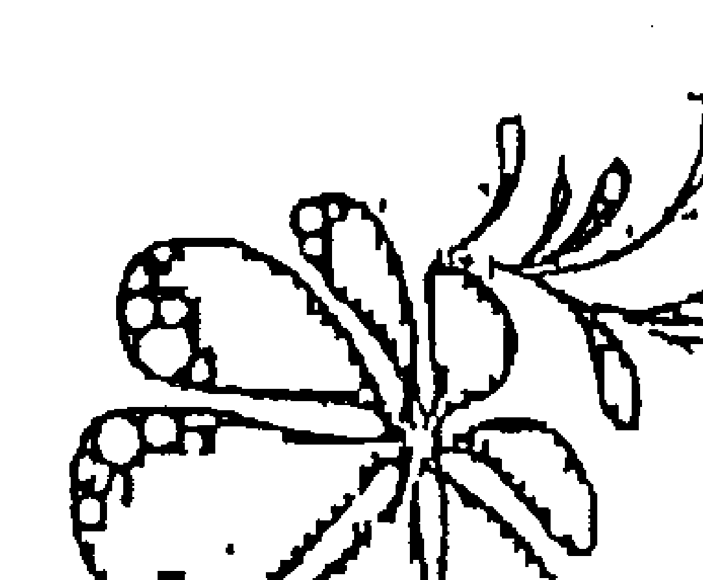

# 第十五章 四化星的应用

化祿：完全要看是哪一種事件而定，我們常看到四化的解釋為：

祿為福德之神，守身命官祿位，科權相逢，必作大臣之職。小限逢之，主進財入仕之喜。大限十年，吉慶無疑。惡曜來臨，併羊陀火忌沖照，亦不為害。女人吉湊作命婦，二限逢之，内外威嚴，般湊平常。

又說：

己土，掌福德，主財祿。守身命居官祿，逢科權作大臣與祿存夾，必主富貴。子午遷移，文章蓋世。祿縫弱地，或空劫陷，主不發財。休藏四墓，化祿無用。祿逢沖破，吉也成凶。女命吉湊，内外威嚴，可作貴婦。（註：四墓指辰、戌、丑、未四宮。）

化權：

權星掌判生殺之神，守身命，科祿相逢，出將入相，科權相逢，必定文章冠世，人皆欽仰，小限相逢，無有不吉。大限十年，必然得志。如逢羊陀耗劫空，聽纔貽累，官灾貶謫，女人得之，内外稱志，可作命婦。僧道掌山林，有師號。

甲木，掌生殺，主權貴。科祿相逢，出將入相，文章冠世。會武或巨，必掌大事，或握兵符。羊陀空劫，官災貶謫。權科雙夾，必主大貴。權祿重逢，財官雙美，煞星來湊，虛譽之隆。財帛福德，權祿來守，出世榮華。權祿奴僕，縱官也奔。女命化權，主人性剛，喜奪夫權，内外稱意。（註：權祿在交友官，縱然有官貴也為朋友奔波勞碌。）

化科：

科星上界應試、主掌文墨之星，守身命，權祿相逢，宰臣之貴。如逢惡曜，亦為文章秀士，可作群英師範。女命吉拱，主貴封贈，雖四殺沖破，亦為富貴，與科星拱照同論。

又說：
壬水，掌文星，主聲名。守身命宮，主人聰明。權祿相逢，宰臣之貴，如遇惡星，文章秀士，群英師範，但嫌諸空。三奇夾命，必為貴格，科權對拱，躍汲禹門，科祿逢命，威名壓眾。科明暗祿，位列三台。科名陷凶，陷於空劫，陷於羊陀，日月陷地，主曜陷地，苗而不秀，女命權祿，吉曜相拱，封贈主貴，四煞沖破，亦主富貴。

化忌：

忌為多管之神，守身命宮，一生不順。小限逢之，一年不足。大限十年悔吝。

又說：
壬水，嫉妒星，多管之神，主是非不順。二限逢之，斷然蹭蹬。文人不耐久，武人縱有官炎口舌，不妨。雖商賈技藝人，皆不宜，利加會紫府昌曲，左右科權祿與忌同宮，又兼四殺共處，即發財亦不佳，功名也不成就，如單逢四殺，耗使劫空，主奔波帶疾。僧道流移還俗。女人一生貧夭。

大家看到化祿、化權、化科坐命，便暗自心驚，糟了！被忌星盯註了，一定會不順、有是非。這些觀念與想法未必全對，因為如果忽略了「化入」與「化出」的區別，就無法分辨「出」與「入」，將不知化祿是「得」或「失」，化忌是「吉」或「凶」，宛如某位「斗數专家一批评所云：“四化满天飞，不知那颗星才是真正的四化”。此乃不知“化出”、“化入”及宫位、星宿组合的关系，而无法理解四化飞星的规则，致有此“理直气壮”的评语。

凡是由生年干飞出之四化，不管落入哪一个宫位都叫“化入”，若其落入宫位的宫干，不使宫内坐星自化，则叫“化中”，生年干三吉化星最好落入本命盘的命宫、财帛宫、官禄宫（或叫事业宫），而化忌星不可在迁移宫、福德宫、夫妻宫来冲三合，这就是所谓的“三吉嘉会格”，但是此格局一定要命宫坐化禄星才有效用；若是由三方会入者，命宫无三吉化星之一者，只主表面风光而已，虚而不实。

本门对于四化的解释，简示如下：
- 化禄主情缘、财禄；
- 化权主管制、威严；
- 化科主科甲、教化、斯文；
- 化忌主藏伏、悔吝。

因生年干四化都是化入，故其化入命盘的宫位中的意思可参酌解释。但是生年干化忌落入六亲宫是欠债的意思，若是落在田宅、福德、财帛、事业、迁移的话，则代表心在该处，因忌为自「己」的「心」的意思，故生年干化忌在田宅宫代表此人心在家庭，一下班便待在家中少外出，此为藏伏之象；若化忌在兄弟，则代表心在兄弟姐妹，因此会为手足多付出，故为欠债；当然，因化忌在兄弟，兄弟会较不顺利，此乃必然之现象。出生年的年干和命盘那一宫的宫干相同，则代表此人之一生运途起伏和活动都与此宫有紧密关系，例如：某人是甲年生，而甲干在命盘的财帛宫，则他一生的运势活动重点皆以财帛、赚钱为主，而且是属于自立更生格，如果生年干与其它五亲宫宫干相同，往往会和该六亲产生较紧密的关连性。命宫、财帛宫、事业宫、田宅宫称为我宫，其他称为他宫，四化有人我宫才好，入他宫则为化出，主损失、不利。如果我们要论一个人的本质特性，是否适合经商或该做什么事业？对于此问题，我们要由经商的特性先谈起，开公司或商号主要在营利，营利讲求的是利益极大化、成本极小化，若不斤斤计较，那能营利？而且商场如战场，竞争激烈，诡谲多变，若非有坚强毅力与斗志，很容易半途而废，故而有「计较性质、坚毅耐苦」的星宿坐命宫者则较适宜从商，而属于清高（如天梁）、雅士（如太阴或天同）的星宿坐命就比较不宜经营太商业化的事业，而宜从事服务业，这是从星性上来论，但是星宿碰到四化后，会变质而非本来的星性了，如天梁化禄坐迁移宫在斗数先贤的赋文中就有「巨商高贾」的说法，和清高的星性就完全不同了，因此，一遇到四化，星星的性质完全改了，所以星性和四化要交互为用。例如命例一，武曲、天相坐命在壬寅宫，照一般书上说的，此人富有正义感，喜打抱不平，个性正直刚强，三合又是「紫府朝垣格」，此人常与军政、财经界人仕交往，并得到他们的帮助而成功，成为富豪，一生多酒食应酬之事。

| 乙巳 田宅 | 丙午 事業 | 丁未 交友 | 戊申 遷移 |
|---|---|---|---|
| 天機科
陀羅
文昌 | 紫微
祿存 | 擎羊 | |
| 甲辰 福德 | | | 己酉 疾厄 |
| 七殺 | 命例一
男命
丁未年生 | | 文曲 |
| 癸卯 父母 | | | 庚戌 財帛 |
| 太陽
天梁 | | | 天府
廉貞 |
| 壬寅 命宮 | 癸丑 兄弟 | 壬子 夫妻 | 辛亥 子女 |
| 武曲
天相 | 天同權
巨門忌 | 貪狼 | 太陰祿 |

## 再看生年干四化

- 化禄落子女宫：此人疼爱子女，有钱就花在子女身上。
- 化权落兄弟宫：化权原亦主兄弟有成就，两星落入反成争吵，不相容的情形。
- 化科落夫妻宫：乃主田宅适中，不大不小。
- 化忌落命宫：武曲星自化忌，此为化出，表示自己的心化到外面去了，故比较不会为自己打算，宁愿自己吃亏也不占人便宜，而且心已化到外面了，对财富、名利多因无法藏伏而损失或让机会白白流失，故此格局经商往往不知把握机会，而遭受损失，实在不适宜在经商，若硬要做生意，亦宜做门市生意、或现金买卖的行业较佳。虽然是很漂亮的「紫府朝垣格」，但是四化用神不佳，仍无法成就伟大事业。

## 命例二

| 天梁 左輔 己巳 田宅 | 七殺 庚午 事業 |   | 廉貞祿 壬申 遷移 |
| 紫微 天相 戊辰 福德 |   |   | 右弼 癸酉 疾厄 |
| 天機 巨門 擎羊 丁卯 父母 | 女命 甲辰年二月十八日丑時 火六局 |   | 破軍權 天刑 甲戌 財帛 |
| 貪狼 祿存 天姚 丙寅 命宮 6-15 | 太陽忌 太陰 陀羅 丁丑 兄弟 16-25 | 武曲科 天府 丙子 夫妻 26-35 | 天同 乙亥 子女 36-45 |

再看命例二，是位甲辰年生的小姐，命宮也是在寅的位置，貪狼星、天姚星、祿存星坐命，二合是「殺破狼」的格局，根據貪狼星的特性，知道這位小姐的酒量不錯、好動擅交際、多酒食應酬，很容易和異性接近，再加上天姚星更加強此種傾向，幸有厚重的祿存為伴，否則不堪想像，另外，像是說話浮誇引人側目、注重物質享受、能不耐艱苦地賺錢、有投機冒險的傾向、喜變動不耐靜守的特質，都不應忽略。而且，三合又為「殺破狼」格，此格局之特性是不安現狀、喜改造創新、毅力堅強、不畏艱苦、喜變動出外、性子急、有開創的魄力、職業適性廣、能文能武。

## 再看生年四化

祿存星落在遷移宮：鋒頭很健，人際關係不錯，在交際上很慷概，而且化祿星又和命宮內的祿存星成對照的態勢，是種財源旺盛的格局。

化權星落入財帛宮：喜掌財權，自己支配錢財的運用，善用錢財投資生財。

化科星落入夫妻宮：代表感情生活中有逢凶化吉的助力，而且丈夫的長相身材也很勻稱適中。

化忌星落入兄弟宮：主此人欠兄弟債，會為兄弟姐妹多付出（物質或精神上的皆是），而化忌在兄弟，和陀羅星（化氣曰忌）重合，故兄弟宮應是雙忌，兄弟中應有折損，而且兄弟的運途也較差。

## 又再看三方

會入生年干化權與化祿，則此人面帶貴氣、有威嚴，此乃四化用神於人身上。

### 图五十：四化相互间关系如何？

表现出来的特质，化忌的话，则予人沉默寡言的观感；再者，财帛宫干为“甲”和生年天干相同，故知此人为自立格。

命宫坐丙：廉贞化忌在迁移宫，代表心在外头，所以此人很坦白、城府不深，好相处，可惜常忘记承诺；天机化权在父母，权星乃掌威严、权势之星，故对长辈说话当然不客气，有理定争到底，而且善辩，不过父母宫坐丁干，巨门自化忌，虽好辩亦无门，别人不用她。

将前述之特征综整起来，已可隐然了解此人的特质了，故而天干四化表要熟背，才能使斗数的用神——四化，运用如神。

# 第十六章 忌星的涵义

看到“化忌”一词，直觉地心中便起疙瘩感到不舒服，指责为“多管、悔吝之神”，谁被化忌缠到了谁就倒霉，几乎初习斗数的人，莫不为其名称所憾而不能释怀，为什么会这样？我们来看看紫微斗数全书是如何诠释“化忌”的意义：

> “化忌为多管之神，守身命一生不顺，小限逢之，一年不足，大限逢之，十年悔吝，二限太岁交临，断然蹭蹬。文人不耐久，武人纵有官灾口舌不妨。虽商贾技艺人，皆不宜利，如会紫府昌曲左右，利权禄，与忌同宫兼四杀共处，发不住财禄。苗而不秀，科星陷于凶乡是也。如单逢四杀耗使劫空，主奔波带疾，僧道流移返俗，女人一生贫夭。若太阳在寅卯辰巳化忌，太阴在酉戌亥子化忌，反为福论，其余诸星化忌，各审五行不同，如廉贞在亥化忌，是为火入水乡，又逢水命人，化忌也不为害。”

> “化忌阳水，为上界多管之宿，主是非口舌，又名计都星。化忌之宿，未必能破格，仅主多是非纠缠而已，必先考正星是否庙旺，若庙旺则有“旺地化忌不忌之说”，陷地主凶，再有金水之星庙旺化忌更是不忌，仍是兼有富贵，如太阴在亥化忌，及武曲化忌在巳宫长生之地等。如火木之星化忌，旺宫，若太阳居午，及天机化忌在卯等，多富而不贵，或贵而不富。属土之星不化忌，但化忌怕入四墓，主增凶。再如属火之星，于亥子水乡化忌加煞，凶恶异常，多是伤残、夭亡。此星入命，主一生是非多管，易遭人之嫉，性急躁，带疾病，多起伏成败。但武职反作吉论，行运亦是。女命得之，不论旺弱，易多口舌是非，旺地亦有富足，但不能贵，且晚年多病。陷宫加煞，六亲不和，多是非，亦贫贱。此星在十二宫之中，先看得地与否，及正星之性质，方定其吉凶。”

原来根据书上对于化忌星的叙述，化忌星所表征的都是不吉之象，因此引起大家恐慌，事实上是否如此呢？依照先师所传，不尽全然如此，虽然在大部分的情况下化忌星代表“不利、困顿、损伤”的意思，但是在某些情况下，化忌星也有吉利的一面。

化忌是一颗可爱又可怕的化星，在“不利、困顿、损伤”的意思之外，它还具有“黏性”，此黏性对于不吉或吉利的事情都有效用，因此，遇吉益吉而遇凶益凶，所以要懂得化忌星的作用机制，才能应用趋避之道，转化“化忌”为吉利。

化忌星的五行属水，水代表“智慧”，先贤有云：“大智若愚，上善若水”，均暗指化忌星有“随缘、顺势”之意，遇到化忌星的年限时不可强求与逆势而为、或

## 到底“化忌”星的意义是什么呢？

根据字面上来解释，“忌”是由“己”的“心”的意思，意指化忌星所主掌之“困顿、悔吝、不顺”等，都是由自己的心境所造成的，假如知所进退，不贪不取，不伎不求，一切随缘，顺势而为，自然而然化解化忌星的恶性，所以“化忌”之为祸或为福全在当事人之一念之间尔。

人都有一个生物本能——“闪避”灾祸的本能，若敌人刀劈来，我们一定会闪避刀锋；一部车子冲来，我们也会跳闪开来，所以闪避物理的空间避开灾祸的本能大家都与生俱来，是一种直觉地反射作用。

但是心理上的空间——“心境”就不是如此直觉地可改变以避凶祸，我们所学的所有知识均不足以判断世间所有之是非对错，例如：“我一直觉得这位对象不错，想嫁给他，即使大家反对，还是结婚了，在下决定的当下，完全是被自己的感情所蒙蔽，完全置众人之规劝于不顾”，在下决定的当下，甚至还有“众人皆睡我独醒的喜悦”呢？

由此可见牵涉到“心境”的问题并不是他人一句话就可更改或自己一念间可完全扭转的，往往是在“自以为是”的状况下，做了错误的决定，由此可见自己的心，是如何的难以掌握！所以说：“人的最大敌人在自己”。

基本上，每一个人对未来总是希望明天会更好，在此前提之下，每一个人在下决定前，一定会以自己最有利的条件来考量，但是为何有贫富之别？职务有高低之分？事业有大小之别？总归一句话——“心境”造成的，有的人考虑得比较深入广泛，所以命运走上风事事顺遂，而考虑浅薄粗暴的，命运走下风，事事不利，因此成就有高下之别，要使自己迈向更美好未来的秘诀就在改造心境而已。

因此，物理上的空间，大家都有闪避不利环境的生物本能，而心理上的空间“心境”，往往是在自认为“见解正确、决策无误”的情况下，犯下错误而不自知，要待成事实后，才会后悔，所以心境是命运变化枢纽，故主悔吝之化星“化忌”以“己心”两字所合成来暗示心境的重要。

在斗数中，化忌属水，水在平时柔顺，济养生物，但泛滥时，危害生灵，冲走田园，所以在化忌星的本意上，已暗示其可为善为恶，如果能顺“化忌”之性，就能转化逆境为顺遂，假如知“化忌”之性，则能转化“化忌”为有用，否则为祸不轻，故知“化忌”才能改运，再配合物理上空间的变换，以收趋吉避凶的效果。

所以“化忌”并非全凶，亦非全吉，端赖当事者能否改造心境与知道如何运用空间而定，智慧高、见识广的人，能直观内心的真如，反观宇宙万物；没有自我之心，以天地为心，所以其思虑也深远，其思想豁达，超越时空，所以，什么叫“改运”？改造心境即是。改运之道很多，但都是要靠自己，因为“心境”是别人无法捉摸与掌控的，重新塑造心境唯有靠自己持之以恒的力行，才能改造自己的命运。改造心境不必求神问卜，所有能充实自己人生的事务都可以，如“读书、参加义工组织、皈依宗教”等都可以转化心境，就看您所碰到困顿不遂的源头是什么，就往那方面改善就可以了，如因学历不住找不到好工作就去唸书吧！若因没事做东家长西家短惹事生非，就去担任义工陪孤苦无依的老人家聊天吧！改运就是这么简单。

# 第十七章 运势流转

有些人看到夫妻宫尽是：天同、紫微、天府、太阴等字面上看起来是吉利的星宿，便窃窃自喜，以为有一位好配偶了；也有的人看到财帛宫坐：紫微、武曲、天府等吉星，也在高兴以为一生就不虞匮乏了。事实上是否如此呢？相信曾排过自己命盘的人，心中都会在怀疑...为何不是如星宿字面上显示出来的吉祥呢？这是因为忽略了时间和空间的变化因素，仅从命格的高低来推命，所以发生和现状不符的推断，只有看星宿名称好并不代表就能拥有名声、地位或财富，而是由后天经年累月地努力，配合空间作用的淬炼，才能造就成功的人生，故命好不如运好，运好不如毅力勤奋好。有的人出生在富豪之家，幼年运不错，有家大业大的父亲庇荫，但是是否就能保证他一生就如此富贵呢？未必，有可能在父亲去世后，将遗留之祖业败坏尽净；但是也有小时困顿不遂而中年白手成家，成为富豪的命例，这些故事充满在各位周围，俯拾皆是，这些故事说明一点，人之命运是变动的，所以推命不可只推算本命而不推理运途的起伏，否则命运的好坏就差之毫厘而失之千里了。

### 图五—：命运是一条充满转折的曲线

若从命格的好坏来推命，则无法掌握动态运的变化，要掌握动态运的变化，便要了解活盘转换的意思。

命运是一条“时间、空间、事件”的三维曲线，假如我们以微观的观念来观察，就瞭解它不是一条平滑地曲线。例如将人一天中发生的事情、时间和空间等因素，点绘成线的话，一定是充满转折点、拐点的不连续曲线，但是将时段由一天扩大为一年或十年来观察的话，似乎是一条平滑曲线，而且就好像股票市场之股价线图一般，有一定的变化规律，这些变化的规律经由目前科学家的研究是由遗传基因所宰制，虽然在科学上还无法以基因或内分泌等因素来分析一个人的命运起伏，但是命理学可以透过某些工具分析命运的趋势，不过；在如此复杂的曲线下，来分析一个人一生的命运，也要将一生的命运，格分为一段一段的区间来分析，才能掌握更确切的事件形象，依现行的方式格分成：

- 1. 本命：一生的运。
- 2. 大限：十年运。
- 3. 流年：一年运。
- 4. 流月：一个月的运。
- 5. 流日：一天的运。
- 6. 流时辰：一个时辰的运气。

以上六种时段，其中流时辰的应用，还在印证的阶段，鲜有人能推断至流时辰之精密度者，大部分都在流月的精度，假如了解命理学的人，就会知道达到流月精密度的高难度了。其实常用的只有本命、大限、流年、流月等四个盘局而已，这四个盘局环环相扣，层层节制，若中间有一环节脱钩，则最终的结果便不能成立，所以推理命运也就在于解开这些环扣的作用关系。

| 天府 25-34 夫妻 | 天太 同阴 15-24 兄弟 | 武贪 曲狼 科 5-14 癸未 交友 | 太巨 阳门 忌 父母 |
| --- | --- | --- | --- |
| 35~44 子女 | 阳女 甲辰年 8月 日 寅时生 土五局 1997年时为35岁 图五二：先天命盘 | 天相 | 福德 |
| 廉破 贞军 禄权 财帛 |  | 天机 天梁 | 田宅 |
| 疾厄 | 迁移 | 交友 | 紫七 微杀 事业 |

### 图五二：先天命盘

大限是主十年运，若五行局是土五局的甲辰年生A小姐（属阳女大限逆时针转动），则第一大限为五～十四岁，超过十四岁命宫便跳入兄弟宫，此即第二大限宫，主掌十五～二十四岁的十年运，其它的十一宫亦依固定的顺序转动（图五二），而得到新的大限命盘，在实际应用时，并不将大限十二宫都填入盘内，以免紊乱，只注明重要的命宫、财帛、事业二宫而已。

| 大限父母 | 大限命宫 | 大限兄弟 | 大限夫妻 | 大限子女 | 大限财帛 | 大限疾厄 | 大限迁移 | 大限交友 | 大限事业 | 大限田宅 | 大限福德 |
| :--- | :--- | :--- | :--- | :--- | :--- | :--- | :--- | :--- | :--- | :--- | :--- |
| 天府 | 天同 太阴 | 武曲 贪狼 (科) | 巨门 太阳 (忌) | 天相 | 天机 天梁 | 紫微 七杀 | 廉贞 破军 (禄权) | (空) | (空) | (空) | (空) |
| 25-34 夫妻 | 15-24 兄弟 | 5-14 命宫 | 父母 | (空) | 福德 | 田宅 | 迁移 | 交友 | 事业 | (空) | (空) |
| 35~44 子女 | (空) | (空) | (空) | (空) | (空) | (空) | (空) | (空) | (空) | (空) | (空) |
| 廉贞 破军 (禄权) | (空) | (空) | (空) | (空) | (空) | (空) | (空) | (空) | (空) | (空) | (空) |
| 财帛 | (空) | (空) | (空) | (空) | (空) | (空) | (空) | (空) | (空) | (空) | (空) |
| 35 疾厄 | 迁移 | 交友 | 事业 | (空) | (空) | (空) | (空) | (空) | (空) | (空) | (空) |
| (空) | (空) | (空) | (空) | (空) | (空) | (空) | (空) | (空) | (空) | (空) | (空) |
| (空) | (空) | (空) | (空) | (空) | (空) | (空) | (空) | (空) | (空) | (空) | (空) |
| (空) | (空) | (空) | (空) | (空) | (空) | (空) | (空) | (空) | (空) | (空) | (空) |
| (空) | (空) | (空) | (空) | (空) | (空) | (空) | (空) | (空) | (空) | (空) | (空) |

### 图五三：大限命盘

大限之后再下分流年，流年和该大限的命盘息息相关，如A小姐今年【1998】为三十五岁，已进入第四个大限，所以三十五岁流年的运便和第四大限的各宫位产生关系，而和第三个大限脱离了（图五三），三十五岁流年命宫在寅，其它十一宫亦是依序填入，但为了避免命盘脏乱，只在寅宫角落注明35而已，表示三十五岁的流年命宫驻跸在此。
至于流月的起法规，

看流年时，大限为媒介，应验在流年

看流月时，流年为中介，应验在流月

则为：由流年命宫起算，逆时针数到生月，再由生月落入宫起子时，顺时针数至生时，就是流月1月的所在，其它十一个月，顺时针依序填入宫内即可。1月所在之宫称为斗君。（此例寅年斗君在未宫）
在推命时，一般都由大限命宫看起，有些人推算流年运，就用流年命宫来推算，这是不正确的观念，因为流年的吉凶会在流月应验，并不主流年的好坏，流年的吉凶要由大限来推算，否则每十二年就会重复一次，要区别其间之不同全靠大限，故大限是非常重要的一环。
本命、大限、流年、流月之间的关系如上图，在图上已将本命、大限、流年、流月的关系清楚的界定出来，他们之间有一层一层套合的关系，透过这种关系才能抽丝剥茧地找出事件和发生时间。
例如：要看流年财运，则先看本命财帛宫和大限财帛宫的四化在命盘分布的角度如何？是不是有形成特定的角度，若形成特定角度，就会产生吉凶的感应力，此时再根据星宿组合来推断流年财运吉凶，绝对不可以用流年财帛宫的四化或星宿组合便来推断该年财运吉利与否，必定出错，因为少了本命和大限两个环节相扣，事件就不会成立。所以，推断流年运时大限是推断流年的过脚石，而流年是承受本命和大限作用用后的结果，千万不可搞错次序。由此观念来看，断流年时，是“用”大限四化星，看其和本命盘“体”之间的关系，所以断流年时，以本命盘为“体”，大限盘为“用”，体用兼备才能推断运途。若断流月时，则大限盘为“体”，流年盘为“用”；“用”之化忌不可冲“体”，若冲到必有凶象发生。当然，“用”之化吉星入“体”或照“体”都主吉象，此乃推命的基本观念，不可不知！明瞭“体”与“用”的关系后，就能掌握四化飞星的基本规则了，不会有“飞来化去，不知所以然”的困惑。推算动态的运，最重要在流年，能掌握流年的吉或凶，便能承先启后，贯联时空的关系，因为流年是由本命和大限的作用而显征象，若流年有征象再来推算流月才有意义，若流年没征象就直接去推算流月是没意义的，因此推命时要按部就班地一步一步逐渐深入。

### 图五四：大限命盘（体用和四化飞星的关系）

当然，还要考虑大限盘和本命盘的相互关系，亦即要审视大限X宫是本命的什么宫位？
例如：大限命宫是本命夫妻宫，则男女性都较有结婚的倾向，
若大限财帛宫在本命交友宫，则钱财的好坏较和朋友有关，
这是一种粗浅的看法，实际的作用机制还要有的四化的牵连才知真正的关系。

## 先天盘局飞化进大限盘局

互相飞化的关系，表示两者之间的关系紧密抑或冲克不合的关系，如兄弟与我、父母与我、子女与我……等，而以四化在我命盘中分布的角度来判读是紧密还是冲突不合。

## 先天盘局飞化进大限盘局

代表先天盘局和后天盘局具有某种连结关系，换句话说就是一种持续亦或是短暂性的关系，假如有先天盘局飞化进来大限盘局，就表示有延续、绵延的意思。没飞化进来该大限，就不存在延续的问题，是该大限的现象。

## 大限盘局飞化进先天盘局

当然一定会飞进先天盘局，代表和先天盘局有关系，但是要看和哪一个先天宫位发生关系，假如不是同类宫位，这种关系薄弱甚至没作用，但如果进入同类宫位，因为性质相同当然力量就会加倍，因此关系就密切多了，引起的吉凶效应就比较强烈。

## 天限盘局飞进天限盘局

这是同一阶层的关系，也和“先天盘局飞进先天盘局”的看法相同，是观察该大限时各宫位间的关系，譬如这个大限子女和我的关系是否会起变化、和配偶之间会否对待关系生波澜……等，这是大限的现象，一旦度过了这个大限，这些化象就会消失。

至于，流年盘局当然也存在上述的关系，现象可以类推而获得，这三层关系就像节子一般，将“先天垂象、大限成象、流年成象”的关系透过“飞来化去”和“星曜化象”具体而微的把事件形象，表现出来。
因此运限流转之后，各人事宫的大限宫坐星也随之转换，是不是就会形成一种“崭新”的局面呢？是不是每十年就“除旧佈新”呢？不—不是如此的，因为还有四化的飞佈方式形成“先天与后天有没有关系”的脉络，而这些才是判断有没有“除旧佈新”抑或“旧瓶装新酒”的现象。
如前例的先天事业飞化天机禄、天梁权入大限事业，代表先天与后天发生关系了，会一直很努力的在功课上，能够延续前一阶段的学习态度而且能保有前个阶段的成果发扬光大，但是先天又飞出太阴忌入大限命宫，又对大限的事业产生干扰。而大限呢？大限官禄又飞化廉贞禄、破军权入先天财帛、武曲科进入命宫，大限盘局飞三吉化星都进入先天盘局内，这是好的、吉利的现象，和前段的叙述综合之后，吉祥的成分发现远多于凶的，因此是个很利于求学考试的运途，可以好好的在科名上求发展。所以运势流转不是只看大限宫内坐星即可判断，还需要辅以四化的飞化构成特殊的吉凶效应关系，才能够断定变动之后的运途是吉还是凶。

# 第十八章 化出与化入之别

本章要和大家谈谈什么叫“出”？什么叫“入”？这是飞星紫微斗数的入门观念，不明白“入”与“出”之用法，就无法进入飞星紫微斗数的核心，因为这些是四化的运转规则，假如基本规则都不懂那能运用飞星紫微斗数推理命运。各位在坊间其他书中可能曾看过：“逢忌冲或坐忌之年小心损财、事业失利、身体遭伤等事情发生”的推断，但是壹年过后仍活泼乱跳、平顺得很，为什么推理和实际会产生如此大的差异呢？就是忽略了“入与出”的差别！所以，化入和化出对于学紫微斗数的人而言是很重要的观念，但是什么叫“出”？什么叫“入”呢？假如将命盘十二个宫位，依照其与我关系之密切与否分成他宫和我宫，那么某宫【以X宫称之】化入我之宫位，即叫“化入”，化入我之宫位当然此X宫所主之事事务即“为我所得、为我所用”，是吉利的意思；而若X宫化入他之宫位，即为“化出”，顾名思义X宫所主之事事务即为他人所得、为别人所用，之于我是“损失、得不到”之意，因此区分清楚“出”与“入”之差别，才知道此X宫飞出之四## 一、由我宫飞出之四化

化于我而言是吉或凶的意义。飞星紫微斗数以命宫、财帛、事业、田宅、福德、疾厄等宫位，因为和我息息相关，所以为“我”之宫位，称为“我宫”，而交友、兄弟、夫妻、子女、父母、迁移等宫都不属于我，因此是为“他”之宫位，称为“他宫”。这些宫位飞出四化分别落入命局各宫，因其飞入之宫位有他宫、我宫之分，而起飞宫又有他宫、我宫之分，因此，可分别由四化的起飞宫和落入宫的关系判断“出”与“入”之差别，以及其吉凶的意义。

若论我之财帛运，则财帛为本宫，为与我有关者，而禄与忌皆由本宫飞出者，依飞出之禄或忌入我宫或他宫而判定吉凶，基本的型态有：

(1) 禄入我宫、忌入我宫 即指事件之吉与凶，皆由自己所承担，没有透过他人之媒介，如：“财帛化禄入命宫，化忌入事业”，即表示财帛之吉凶，全为个人之因素和别人完全无关，自己努力与否，决定自己财运的兴衰，也可说是自力更生的格局。

### 图五五：我宫飞四化入他宫

(2) 禄入他宫、忌入我宫

虽然化禄给了别人，自己好像得不到，但是化忌飞入我宫，依据“禄随忌走”的现象，此“化禄”会被“化忌”带回来我宫，仍为我所有，对于我先投资下去的精神或物质，都能有所回报，属于“先苦后甘”的型态，例如：“命宫化禄入交友，化忌入财帛”的飞化方式。

(3) 禄入我宫，忌入他宫 就是此型态。依“禄随忌走”的现象来解释，化禄虽入我宫，但会被化忌带出去到他宫，例如：财帛宫化禄入命宫，化忌入交友宫，此种飞化型态若和友人有金钱往来关系，则会有财务损失，避免与朋友金钱往来即可减少损失，也能保住友情。

(4) 禄入他宫、忌入他宫 不管好坏，统统给别人了，最凶之现象，例如：“财帛宫化禄入父母，化忌入交友”，乃将自己的钱财都给了朋友，自己当个过路财神而已。有的甚至一生中都是从事为人作嫁的工作，而自己一无所有，此种型态的人最宜从事金融业的上班族，不要贪图不当利益，知足常乐，就能平安渡日。

## 二、由他宫飞出之四化

亦即由他宫飞四化，看其入我宫或他宫而论吉凶现象。

- (1) 禄入我宫，忌入我宫

为吉利之象，例如：“父母化忌入事业，化禄入财帛”，化忌入我事业好像不利我事业，但是化禄入我财帛，根据“禄随忌走”之原理乃朋友之财帛入我的事业，是朋友拿财帛来资助、投资我的意思，有此化象的很多都和朋友合夥做生意，少数是朋友投资而不介入经营的型态。

- (2) 禄入我宫，忌冲我宫

凶象，主损失；此亦为“禄随忌走”的现象，禄虽入我宫，但忌来冲我宫，此化禄为虚禄，得到后，还要失去，甚至连老本都要倒贴下去，所以遇到此型态时不要以为先前获禄而误认为形势一片大好，扩大投资，往往此时就是盛极而衰的关键时刻。

| 他宫 | 巳 兄弟 | 午 命宫 | 未 父母 | 申 |
| :--- | :--- | :--- | :--- | :--- |
| 夫妻 | 禄 | | 忌 | 福德 酉 |
| 子女 辰 | 我宫 | | | 我宫 |
| 财帛 卯 | | | | 田宅 戌 |
| 疾厄 寅 | 迁移 丑 | 交友 子 | 事业 亥 | |

### 图五七：他宫化入我宫

(3) 禄冲我宫，忌入我宫
依“禄随忌走”之象解释，为吉象，例如：“交友化禄冲命宫，化忌入财帛”，乃是朋友不会投资或资助我的现象，但是化忌入我宫还是会给予精神或道义上的支持，此时我宫不可再自化，有则为损失之兆，此种现象不可再借钱予朋友。

### (4) 禄与忌同入我宫

他宫之好坏吉凶，全由我宫概括承受，遇我宫吉则随之吉，我宫凶则随之呈凶，譬如：“交友宫化禄入财帛宫，化忌入命宫”为朋友拿钱资助我之意，但是化忌也入我命宫，假如命宫为吉则呈吉象，不吉则会产生为害，就好像“朋友拿钱资助我其目的是引我上钩，然后再伺机吞掉我的事业”之意。

### (5) 禄与忌同冲我宫

凶象，主大损失，他宫之好处，我宫得不到，还要防他宫来冲我之财帛、事业。我们赚钱、做事业、交对象，一定会和他宫产生关系，如此化象即主得不到他的好处，还要提防被他宫冲破的危险。

### (6) 禄入他宫，忌冲我宫

亦呈凶象，既然禄已入他宫，已对我不利了，忌又来冲破我宫，此损失更大，此象即他的好处给别人，有问题或遇到难关时，才来找我之意，对我而言，我付出而得不到他的好处，因他已被别人揩油揩光了，才来找我济助。但财帛——福德线，则无此忌冲之型态，因忌入财帛或福德同属我宫，故不主损失，我自己把自己 的钱花在享受上，当然不是不吉之意，如果是我把别人的钱拿来挥霍享受，那可就是侵占罪了。

以上之规则可套入大限来论大限吉凶，若论配偶之吉凶，可拿夫妻当命宫，找出夫妻的我宫与他宫【例如：我之福德宫是夫妻宫的事业宫，为夫妻的我宫】，斟酌宫内坐星组合，并飞四化，即知好坏，此时，飞四化应归入我命盘来论吉凶。

【例如】例如：以福德宫干飞四化，入我之事业宫，代表配偶的事业和运途都不错，其原则同前述。至于行运又会产生“化入”与“化出”的关系，请参考相关章节。

财帛是“我宫”代表我所支配运用的钱财，但是这些动产可资运用的钱财，是否为我所用？或运用之后会不会产生更多的利益回收？就要看四化了，像此例财帛宫内坐了先天四化的禄和权，财禄非常旺盛，很有钱，可能是祖产很多或是继承得到的，因为他的宫干丁飞出四化：

### 太阴化禄入天同化权入兄弟：

父母也是他宫，钱财借给他宫，化忌又进入他宫，这种化象借出去的钱，易去难回，轻轻松松借出但要和朋友拿回来可就得不偿失，兄弟是他宫我的钱财都飞进入的兄弟身上，对兄弟朋友很慷慨？有借有还天经地义，但是………

| 己巳 夫妻 25-34 天府 | 庚午 兄弟 15-24 天同太阴 | 辛未 命宫 5-14 武曲贪狼 科 | 壬申 父母 太阳巨门 忌 |
|---|---|---|---|
| 戊辰 子女 35-44 |  禄权 → 兄弟宫 |  忌 → 命宫 | 癸酉 福德 天相 |
| 丁卯 财帛 45-54 廉贞破军 禄权 |  科 → 田宅宫 | 甲戌 田宅 天机天梁 |
| 丙寅 疾厄 文曲 | 丁丑 迁移 | 丙子 交友 文昌 | 乙亥 事业 紫微七杀 |

### 图五八：我宫、他宫的四化

所以，我宫财帛都飞入他宫内，此种先天化象绝对要小心钱财的调度，不然就是大破财的迹象，钱掉入别人口袋还帮人算钱。

而夫妻宫飞出武曲禄和贪狼权入命宫，就很不错，配偶虽然会管制、约束我，但是出于 关心而非无理取闹，这是一种出自真心的关爱，当然还要看化忌，文曲化忌在疾厄宫，可能是配偶关心我的身体健康而约束我，不要吃太多油腻食物，怕我得了慢性疾病，所以这是一种好的、吉利的他宫化入我宫的化象。

## # 第十九章 天地人的观念

在学斗数中常听到天地人的名词，有人将它冠在紫微斗数之上，成为天地人紫微斗数，似乎很神的样子，到底天地人代表什么意思？有很多书上解释说，本命是天盘，地盘是大限，而人盘就是流年，这就是天地人盘的意思，没错！但是却把天地人的观念局限在命盘的层次，如果以此偏狭的天地人盘，来作为推演命理的着眼点的话，往往失之偏颇而产生误差。

其实【天地人】是一种观念，它是推演命理的程序中，所考量的环环相扣的广域因素，所谓广域因素是由很多变数，如：时代、事情、物品、地区等要素构成，如将所处时代、环境当做广域因素，那么在这个广域因素中包括了：

- 政治制度：是专制政府、或是民主政治、或是共产制度，不同政治制度一定会有不同的命运。
- 医学程度：有些病在以前是绝症，如今已有药物可医治。
- 风俗习惯：原住民和汉族、或泰族和汉族之间有很多不同习俗。
- 社会风气：较保守的农业社会，夫妻感情不好，多忍辱负重，离婚少，如今工商社会，女性经济自主能力高，工作场合接触异性机会增多，外部诱惑也多，一有外遇或夫妻感情不洽，多诉诸离婚，故婚姻状态也改变了。
- 环境状况：黑道、金权横行，毒品猖獗，善良百姓的生活也会受到影响，企业投资意愿也会低落，经济不振，当然生活就较困窘，如果是在战争状态，那么个人的命运更是明显地被影响，甚至没有所谓的个人命运，国运具有绝对的影响力。
- 科技设备：电脑出现改变人的生活型态，如：上下班、买卖、购物、娱乐等都和以前不同了。

以上变数，都是影响一个人运程的外在因素。它们再和问命的当时所处环境做一比较，衡量问命者是否处于当时的环境下，再在解说上予以适度修正。如将大限盘当做区域变量，那么在这个大区域中包括了：

- 大限人事宫
- 大限盘人事宫和本命盘人事宫的重叠关系
- 大限盘坐星组合
- 大限盘天干
- 大限宫地支

以上变数，它再和本命盘的同类宫的冲照会入的关系，定义出事件的形象，就可以在流年盘中，显现事件的形象和吉凶的严重程度。

个人存在这个世界中，外界的种种变动，都会对人之命运产生或多或少的影响，对人而言，是无法自外于社会而独立遂行其个人命运过程的，所以『天地人』所揭露的是一个推理命运过程时的环扣，『天时、地利、人和』是其中第一环。

在推理一个人的命运时，千万不可忽视大环境变动的影响力，根据命盘推演出来的结果，只代表一个人的吉凶祸福而已，随着大环境的改变或演进，个人吉凶祸福程度也会随之而增减，譬如说：在台湾的贫民一定比处于内战状态的卢安达贫民生活得更好，至于天运变化和个人命运之间的关联性，在紫微斗数中又要靠什么东西或符号来联系起来呢？

古人用干支来记年，天干配地支，以六十年为一周期称为六十甲子，而十天干又构成一个小周期，每个天干又主掌四颗化星，利用此四颗化星所职掌的性质，可大略推算出来时局的状况，运用此一规则时，不可忽视地支的影响力。

例如：丙子年丙属火而子为水，水火相克，故是动荡不安，又丙是廉贞化忌，廉贞为丁火，主：官非、能（电）源、暗火（没有火焰但会发热的能源），故丙子年的司法事件会更多，而能源也会出问题，但丙干使天同化禄、天机化权都属于公众服务单位，因此政府在丙子年会积极奋发有所作为，扫除积弊，但水火相克，故事倍而功半，这是外在因素，假如推命时，遇到【机月同梁格】者，该年必有更多表现的机会，格局高的命局就有独当一面的机会，格局差的就要小心触法了，有了大环境的变化，配合个人的命局高低，再酌予增减其效力，那个人的吉凶成败，已可了然于胸了。由于机月同梁格的人，并非人人都是公务员，在推演时也要加入这个变量差异予以修正，方可精确知道运途好坏，如果命造是在建设公司上班的机月同梁格，于乙亥年碰到太阴化忌的天时，此年就要小心了，格局佳运途好的仍有表现机会，或能成功地改行换业，如格局差运途弱的，就要小心公司倒闭、失业的遭遇了。在早期，台湾有许多今日少见的习俗，如：童养媳、入赘等，如今因生活富裕了，这些习俗都渐渐消失，在命理上也可透过经验的累积，归纳出有那些格局的人易有上述遭遇，时至今日就必须予以修正，像这种因时空改变的因素，于推命时，也必须加入考量之变量中，这就是所谓【天时、地利、人和】所形成另一层次的天地人盘关系，也可称之为『天盘』。

于推演命盘时，推命者、问命者和命盘三者间，也形成天地人的关系，此三者之关系中，以问命者为天，因为一切活动的根源都出自于他的意念，并付诸行动，行动后产生结果，有了结果才有吉或凶的效应，而推命者为地，他承受问命者的意志或想法，衡量他所处的时空环境下的天时地利人和条件，参酌当事人的意志，推演分析命理，于命盘中根据四化、星宿组合、年限运途盘局等，定义出吉凶与事物象，并根据问命者所述，显示出具体的吉凶形象，所以命盘是处于人盘的角色，承受当事人的意志显示吉凶而已。所以，紫微斗数推命是一种讨论

## 以事件为核心的——天地人推理观念

学，在推命过程当中，由推命者和问命者一问一答而完成，它必须根据问命者的问题，在命盘中找出立向宫位，再根据四化的推理规则，定义出吉凶事物形象，假如推命者能明确地掌握住外在环境的变迁、问命者的心理、命盘的推理规则的话，即使如：心态转换、内心感受等细腻的活动，都可由命盘中显现出来，这是由问命者、推命者、命盘三者之间所构成的天地人关系，可以『地盘』称之。

至于第三道的天地人关系，就是命盘的本命、大限、流年等三盘所构成，俗称的天地人盘，它们的关系以及如何透过四化连系不同的年限命盘，并构成吉凶的关系，在本书其它章节中已有说明，请参考之，本章不再赘述，由命盘的本命、大限、流年三盘所构成的天地人命盘层次的关系又可以称为“人盘”。所以紫微斗数所说的天地人，并不意指狭隘的本命、大限、流年命盘的关系，而是含有一“天时、地利、人和”、【推命、问命、命盘】和【本命、大限、流年命盘】等三环套合的关系，它们之间透过天干、地支、四化的作用而连系，建立相互关系，所以推命者不要专注于命理的推演，而忽略大环境的变动，应该时时关心天下大事，才能料事如神，自古以来伟大的命理专家，也是对国家大事有深刻了解的，如：诸葛亮、刘伯温等。

诸葛亮、刘伯温等皆是，不要妄自菲薄地只钻研算命术而已。研究命的道理，推算个人运程的吉凶祸福，在天时、地利、人和的层次，所考量的因素，其实和治理国家所考量的是一样的，故古代佐国良相多精通命理之学的原因也就在此。

## # 第二十一章 四化对运势的影响

古星云爆炸，宇宙诞生的那一霎那起，便启动时间，开始计数，时间像一根长长的线，将我们这一刻和亘古相连，它虽然去了永不再来，但也为时光留下鲜明的刻画，当您感觉到这根线的存在，您便知道身在何处，亘古虽然遥远而模糊，但毕竟是时间的步履走过，沿着这根线，您便可以找出历史的轨迹，时间是历史的根源，生命的开始，是千古不变的恒常。而人的生命不过短短的百年岁月，有生命的存在，命运的变化是以年岁为单位计量，或以历法的时间单位计量呢？

**国历**：是由呱呱坠地开始到今天（一九九三年十一月三十日）的时间长短，如活了 四十岁三个月又十天。

**历法的时间**：如一九五二年八月二十日出生，到今天（一九九二年十一月三十日） 为止，共活四十年三个月又十天。

两者不相同的，人的命运是随岁数变化而改变的，而历法的时间，却会因历法的修订或不同的历法制度而改变，若历法制度有错，则全盘皆错。当我们在推算

## 应验时间：

流年、流月的运势时，各位所说的年、月、日是以历法时间为准或以岁数为准呢？历法时间和生命岁数，这两根计算时间的轴线相互之间有什么关系呢？两者又要靠何种关系紧密的联结在一起呢？为什么我们断流年、流月、流日的运气时，是以历法时间为准呢？这个问题的解答在于：

起寅首【寅宫天干】，一定是命造出生当年的正月天干。

所以命盘排定后各宫之宫干和阴历出生年的各月份天干相同，以它推断大限或流年或流月时的运途吉凶，而不采用当年流年的天干，再起寅首所求得的新宫干来演化四化，代表命盘的推理，一切以命造出生年的年干，所起的寅首天干为基准，这就表示命造的岁数和历法时间藉五虎遁起寅首天干而使两者合而为一，因 个月的每月天干，所以推理事情的应验期，决定权在天干而不在地支。配合四化在命盘的冲照会合状况，由四化的起飞宫宫干，定出应验流年的地支宫位。要推断是什么时候发生，一定要看是那一宫干化来的忌冲到而断应验期，起飞宫的宫干是应验的“时间”，为什么在前面有提到“地支”代表“时间”，是 不是前后互相矛盾呢？前已说过，地支因天干之变化，日影而有消长，它是承天干之后，不再变动，固定下来（因古人认为地不动，是天在绕地转动的），它对所有的人都是相同的，对命盘而言，它是没有作用的，是固定的，承天干之演四化而定应验期。

至于“应验期”是那一年呢？当然是以天干所在的地支为其应验年，如：酉宫——可能的天干有：乙、丁、己、辛、癸等五阴干，并不是所有的宫干都会发生事情，而是某一特定的天干，使化星变化，放射出吉、或凶的能量，才会发生事件，并不是到酉宫，只要坐星相同都会发生相同的事件，会不会发生的关键是在“天干”。所以“应验的时间”是以命盘某宫的天干，结合流年的地支找出事件应验流年。藉地支之媒介，天干的串联，将人生事件的应验时间和历法时间，合而为一，所以由命盘之推算可知。

因此，紫微斗数取流年而不用小限，藉命盘十二地支和流年地支相合，使“命”与“时”配合；借“干”适“星”假“象”合“支”应“时”。至于事情的原因和事情的影象，则由宫位重叠和化星所组成，亦即有了原因和影象，才能具体描述“事件”。

## 事件应验之天干和地支的关系

案例一：
现举一例来分析看看，如何在十二宫之中找出事件的影像和事件的原因？这个命例是由长住日本一位非常非常著名的紫微斗数大师所提供，很珍贵的命例。

然而，事件原因和事件影像两者之间的关系，并不能截然一分为二，它们两者交错互以为用：
事件的原因：由宫位重叠的关系，定义化星的影像。
事件的影像：由宫位重叠的关系和化星飞落的路径，找出对应的原因。

# 255 第二十章/四化对运势的影响

命造在○○岁○○年，会因○○○○，发生○○事。

时间
关系人地物
吉凶、严重性、影像

太阳（头部）
太阴（头发）→是为了头发的事而烦心

# 问题

在这个事件中有几件事要探讨：

命例主人在日本开一家礼品店，有事想找紫微斗数大师指引迷津，约好某日见面，前一日晚上十一时许，由礼品店坐电车回家途中，就在暗自思量：‘明天要去拜见大师，头发已好几天没洗了，不太好，回去马上洗，等弄干已很晚了，明天一大早要赶去大师处，可能会睡眠不足，或睡过头，若是明天一大早就洗，等弄干也很晚了，不然就要很早就爬起来准备，到底要怎么办呢？’就这个问题反复思考，第二天到大师处，命盘一排开，哪知大师第一句话劈头就问：‘你昨晚子时，是不是为了头发的事，在伤脑筋。’当场就把命例主人吓呆了，怎么能够把前几个时辰，心中所想的事给说中呢？！

# 事情的缘由

| 天梁 陀罗 | 七杀 禄存 火星 | 文昌 文曲 攀羊 天刑 | 廉贞 |
|---|---|---|---|
| 乙 财帛 | 丙 子女 (11月) | 丁 夫妻 | 戊 兄弟 |
| 紫微 天相 | 阴女 丁酉年11月 日卯时 土五局 | 己 命宫 |
| 甲 疾厄 | 庚 父母 |
| 天机 巨门 科忌 31岁 迁移 | 破军 | 癸 | 辛 福德 |
| 贪狼 左辅 | [模糊区块] | 武曲 天府 右弼 | 天同 天姚 权 大限命宫 |

子时福德宫

流日在此 本宫起算 子时

1.  流日和流时这位大师是怎么起的呢？一个月有三十天而命盘有十二格，每一格可能代表二天或三天，他是如何由其中找出正确日期来起流时呢？
2.  为什么是头发？为什么知道只是伤脑筋而已？

解析：(请各位先自我分析命盘看看)

31岁（丁卯年）的十一月○日子时为了头发的事在伤脑筋。

首先，我们要定出流年起飞宫的星宿群 + 落地宫的化星 = 影像（含生年四化星） （以化禄、化忌为主）

年之流月、流日、流时等宫位，根据规则定出来的宫位内已填入相关名称。流日子时的福德宫（内坐太阳、太阴）天干（癸）贪狼化忌入流时田宅宫冲流月福德宫（因为已知是烦恼事，故以福德宫为显象宫）；符合同类相冲的条件，故有烦心的事，没错。可知是洗澡水、洗衣服的水、洗饭菜的水等，由于太阳、太阴的关系，可引喻为「洗头发」，所以本例是为了洗头发的事而烦心。在此例中（见上图）由起飞宫和落地宫的干支、星宿、四化等状态或组合，予以综合考量，将这些符号映对到日常生活当中，找出对映的事物来解释，就能輙辟入里的断出令人咋舌的往事，以正确的预断未来。同一个宫位，可能会重叠好几层，在所有的层中，到底要抽出那一层来解释呢？于此例中，我们求某时辰烦心的事，故以流时的福德宫来飞四化，看化忌有没有冲流日的福德。所以，要抓取「宫位重叠」的关系来解释，解释时，因为福德是起飞宫，是问事宫，故以其为重点，田宅是落地宫，是接受问事宫干飞落下来的化星。只能辅助起飞宫来彰显其影像。落地宫中最重要的作用，在于其内由起飞宫干化四化飞落的化星（如本例中化忌的贪狼），它参考问事宫找出主事的「影像」。由于起飞宫的星宿群有很多组合形态，故飞星紫微斗数只用了二十八颗星宿即可代表人世间的万般现象，由于星少事多，所以一颗星必须依宫位之不同和同宫辅星结合而显现不同的影像，如本例中太阳、太阴各有所主的影像，由于两者同宫在福德，故取出「头发」的影像像来使用，又贪狼由于在田宅，故取出「水」的影像来使用，和「头发」合并解释为「洗头发」，当然也有可能是一「淋湿头发」，像如此细腻的推理；非研究斗数十年且方向正确者才能有此功力，若方向不对，纵使已投入百年心血，仍是不知所以然，只好寻求灵通、玄学中找答案。宫位重叠关系，是以天地人三盘的关系套合，以定义各宫位重叠，亦即：本命化给大限使用，故若本命事业化权入夫妻宫，若大限正好走到夫妻宫，则表示掌握事业权的威力，若已婚者，此大限对事业会认真，也会有成就，但若未婚者，其化权所主的斗志冲劲、奋发向上的雄心、所获得的成果等，也会逊色些，因为尚未结婚，夫妻宫是虚位之故，这是宫位虚实的道理，读者不可不知。天地人盘的关系，要分析的项目有：

1.  本命盘化给大限盘的四化，在大限盘中，是呈何种关系？
    *   冲 (忌星)
    *   照 (禄、权、科星)
    *   会 (入)
    *   合 (三合)
2.  大限盘再化给流年用的四化，考察下列关系？
    *   是否在本命盘的三合方？或忌冲？或忌入本命？
    *   大限盘的四化和本命盘的四化，呈何种关系？尤其化忌星，有没有星对冲？或两颗忌星都入同一宫内？

### 3. 本命盘的宫位和大限盘的宫位，是呈何种关系？

例如：本命盘的疾厄宫是大限盘的财帛宫，两者重叠在一起，这是宫位重叠，代表大限的财帛和本命的疾厄有关系，关系的紧密程度，则用四化来系结，前述1、2项目就是衡量系结的紧密程度，若是四化都「入」，代表紧密系结，则以懒散、不会努力去赚钱来解释。

### 4. 应验的时间？或应验的期限？

*   冲宫所受的伤害最大，流年过渡受冲之宫时凶。
*   三合之局，以权在流年事业的流年为吉。
*   同类不能相冲，如大限疾厄不可冲本命疾厄。
*   本命所化，应验在流年。
*   大限所化，应验在流月。
*   大限冲本命，十年不顺。
*   流年忌冲，一年悔吝。

同理：

*   大限三吉化星，会入本命三合，十年吉祥。

# 案例一：

### 流年三吉化星，会入，一年平顺、吉利。

兹由笔者搜集的命例中，再举一例供各位参考，各位先推理一下，看看此造在午限发生什么重大事件？各位在推理的时候，一定是用午限的各人事宫逐宫衡量，找出大限人事宫和本命盘同类宫的呈现「冲」的关系的宫位出来：

*   大限父母宫干有没有化忌冲本命父母宫？
*   大限福德宫干有没有化忌冲本命福德宫？
*   大限田宅宫干有没有化忌冲本命田宅宫？

# 结果发现

*   大限疾厄宫的宫干辛——化文昌忌冲本命疾厄宫（符合同类宫相冲）
*   本命疾厄宫干庚——又飞化天同忌「入」大限疾厄宫（表示此两宫关系紧密），由于两者之间关系紧密，所以冲本命疾厄宫的力量很凶。

到此一步骤，只知道疾厄有凶，但是，是什么样的「凶事」，并不知道，必须利用起飞宫和落地宫及星宿组合起来，才会显出「影像」。又在考虑起飞宫和落地宫的关系后，再决定星宿群的组合所幻化的「影像」。

| 天机 禄存 火星 摧 | 紫微 文曲 擎羊 科 | 铃星 天空 | 破军 文曲 天姚 |
|---|---|---|---|
| 2-11 癸 命宫 | 12-21 甲 父母 | 乙 福德 | 丙 田宅 |
| 七杀 天刑 陀罗 | | | |
| 壬 兄弟 | 丁 事业 | | |
| 太阳 天梁 右弼 地劫 | | | 天府 廉贞 忌 |
| 辛 夫妻 | | | 戊 交友 |
| 武曲 天相 | 天同 巨门 禄 | 贪狼 | 太阴 左辅 |
| 庚 子女 | 辛 财帛 | 庚 疾厄 | 己 迁移 |

阳男 丙午年8月 日辰时 (1996) 水二局

先天命宫天机权和火星同宫，构成「羊陀及火铃，血光灾不测」已经有先天垂象了，又是「机月浪迹天涯」的格局，喜欢到处跑来跑去，不喜欢静态的工作，三方有天同禄+天机权又有禄存，应该很有发展潜力，假如英年早夭就无法度了，是什么重大事件呢？其实先天命局已透露些许讯息了。

综合前述之各项分析：

1.  吉凶关系 —— 冲照会入 —— 忌冲，主凶兆
2.  事件的影像 —— 星宿组合依宫位幻化万象 —— 脑震荡
3.  关系人地物 —— 宫位重叠 —— 车祸
4.  严重程度 —— 辅星、煞曜 —— 羊、陀会入，禄、科星冲破，极凶
5.  应验时间 —— 同类相冲 —— 午限亥年

得到：此造在午限亥年发生车祸，脑震荡死亡。

由于，本命盘各宫是静态的，仅代表某些特性，而「运势」因有四化和星宿群的冲击，才有吉凶的效应，所以，运势的吉凶，要看大限盘的相互关系。此例中，是大限疾厄化忌入大限命宫冲大限迁移，而大限迁移又是本命疾厄，代表此运的疾厄和出外运有关系，因受化忌来冲，故是凶祸，因此再接下来，解释星宿组合的「影像」一时，便要循此方向，抓出对映的影像来解释。

## 本命疾厄化忌入大限疾厄代表关系密切

两者相结合，以展示事件之影象

因忌冲本命疾厄故呈凶象，解释时也往此方向

肾脏 肠胃 + 脑 车子=车祸脑震荡，肾，胃也受伤

故此造：因为车祸严重脑震荡，肾和胃也因撞击受伤，因为文昌的生年科被忌冲破，科星失去保护作用，属于致命的车祸。

再来，就要找出发生的「时间」了，因为前述的分析中，只知道该大限十年当中，会有重大的车祸发生，十年是一段漫长的时光，总不能叫人三百六十五天，天天都提心吊胆的过日子吧。所以，从命盘中，观察四化的冲照会入等关系，找出发生时间点，是很重要的程序，由于此命例是属于大限疾厄宫，化忌冲本命疾厄宫（同类相冲）的状况，所以当在流年的疾厄宫，故在该年出事。

流年走到午限亥年时，大限疾厄宫干化出的忌星，恰

本例是一个很典型的命例，各位除了要掌握推理的程序，以厘清思路明确之外，也要多收集命例，但是市面上有很多书籍的命例是凭空捏造的，甚至有人用陌生人发生车祸的时间，当做时辰八字排命盘来推演的，而且，关于事例的记录不详细，无法掌握前因后果，因此，无法循迹在命盘上找出对应的宫位，和四化起飞、落下的路径的关连性，所以想要增强功力，要多拿命例推演，多加体会才能深入了解。

# 265 第二十章／四化对运势的影响

# 第二十一章 斗数命局的平衡

人生的进行过程，可以比喻为一个人踩在不完全真圆的球上前进，在时间、空间所构成的崎岖凹凸不平的平面上滚动前进，外界又有随时转变风向的劲风吹拂，为了避免掉下来，必须依自己所拥有的一切可用资源（即脚下踩着的球），配合袭来的风向，避开地面的坑坑凹凹，因时因地的改变行进路线，时而前进，时而后退，时而向左，时而向右，以及不时地改变身躯的姿态，使重心稳定，时时刻刻都在找一个平衡点，不会从球上摔下来，再俟机而动，假如失去平衡，就会产生各种祸端，如：重病、失业、倒闭、离婚、车祸……等，所以在命局中，只要有一个（人事宫失去平衡，就会产生祸端。（先说明一下，不可从球上摔下来，摔下来就失去所有的资源，即表示死亡了）。子平八字是由四柱八字之天干地支的五行生克关系中，取用扶抑调候的用神，再和限运五行生克关系，衡量五行强弱平衡，判断运途吉凶变化，所以八字是以五行生克制化是否处于平衡，作为判断运途吉凶的基准。紫微斗数则完全不采用五行生克制化关系，作为判断平衡与否的基准，紫微斗数用来考量平衡的基准因素有三个：

1.  星宿组合。
2.  生年四化星。
3.  大限和本命盘局的冲照会入关系。

## 星宿组合

先来谈谈星宿组合的平衡关系，凡是命盘排定，先判断每一宫的星宿组合，以决定命局的高低好坏，假如某一宫中煞星群集，该宫一定是问题所在，命造主入的一生当中，定以该宫所主之人或事，引以为终生憾事，笔者看过许多夫妻宫坐双煞星者，配偶不是横死、就是混迹黑道、或凶蛮残暴，很奇怪的拥有此类组合之入，并非本身条件不好，但是择偶能力却不怎么高明，在众多的追求者当中，往往挑到最差的，当然也有的是被环境所迫，而不得不然的选择（如遭受强暴手段成婚的），所以星宿组合不佳，失去互相牵制的力量，即代表失去了平衡作用，该宫就会兴风作浪，产生祸害，阻逆人生了，而且由本命盘所显示的，代表影响一生的阻碍，不管过渡到那一个大限，都不会改变其对命造一生的不利影响；若是大限盘局的某一宫遇到上述组合，则该大限也会有不利的事发生，但渡过该大限又雨过天青了，此种大限祸害的力量只有十年的效力而已，这是由星宿组合的平衡关系评断吉凶的原则。

有人会问：假如同一宫内有吉星又有煞星又该如何来论呢？是的，这是很令人迷惑的问题，依据什么基准可以判定某一宫同宫坐星组合是否失去了平衡了呢？判断的法则很简单，可以归纳如下：

1.  同一宫中有二颗以上煞星聚集，如前面所述夫妻宫有双煞挤入同宫的说明。
2.  煞星虽只有一颗，但和主星构成恶劣格局者，如：【铃昌陀武，限至投河】、【巨火擎羊，终生缢死】、【太阴火铃，反成十恶】、【昌贪居命，粉身碎骨】等等皆是，各位读友可由太微赋、发微论、诸星问答等先贤留下的经验中，撷取可信的格局来用，假如笔者有时间，会发表这些古文的说明，现市面上有很多相关解释书籍，有些内容是错的，也有些作者是学八字的，用八字的思维模式来解说，发生偏差。
3.  温吞懒散之星，喜有一颗急燥之星激发，主奋发有为，但两颗以上煞星挤入的话，则失去平衡而逞凶了，如天同坐命主懒散、好享受，若有火星同宫就会激发斗志，又再挤入一颗煞星的话，就变成谨慎、犹豫不决，而白白浪费许多机会了。
4.  对宫和本宫的星宿组合，基本上紫府星系的主星组合是固定的，而辅星、煞曜的组合就比较不固定，假如有两颗煞星分踞本宫和对宫，则会产生下列效用：
    *   **[丙级煞星]**：两颗煞星互相牵制对方的力量，使凶力抵消，表现在人生的际遇上，就是横逆特多，必须耗费很多精力克服困扰，虽然都能达成目标，但已精疲力竭了，使成就减色不少。
    *   **[甲级煞星]**：相对的两颗星相互勾结，加强煞星的作用力，对本宫的主星产生危害或往坏方向发展。在人事现象上，就有个性浮动不稳、反复不定、思想怪异、性情粗暴、小人暗中破坏、牵制等现象，使所有的努力都付诸流水。

## 生年四化星

以上纯就星宿组合状态来论平衡关系，不过星宿组合若有生年化星落入的话，生年四化就会对星宿组合的吉凶力量产生消长效果，如果凶恶的组合遇化禄、化科同宫的话，就有逢凶化吉的力量，碰到困难时，总有转寰余地，使损失最小或保有既有的资源，若是化忌挤入的话，就有为虎作伥、助纣为虐之嫌，使凶恶的组合产生的破坏力更为强大，如果吉利的组合，遇到化忌同宫，就有阻逆的力量，但无损于成就，只不过成功的路途走得较辛苦罢了，当然，如果吉利的组合再遇化禄、化权、化科的话，就有锦上添花的效果，使成就更辉煌、更卓越。

况，两颗以上化星落入宫就有过旺之嫌，过旺就失去平衡了，反而不以吉论，怎么说呢？财帛、事业宫有两颗吉利的化星落入当然好，但像疾厄、夫妻等宫位，就不可过旺，如疾厄宫过旺，主身体易长肿瘤、而夫妻宫过旺，就有多重配偶的意思，所以过旺的组合也要视宫位，予以合理的解释，这是平衡的另一个考量点。

## 大限和本命盘局的冲照会入关系

行运平衡状态又是如何判定的呢？当然不外乎星宿组合、和四化组合两个要素，星宿组合已如前述，但四化的关系必须考量本命盘各宫四化、和大限盘各宫四化的组合关系才能知平衡与否！当然四化包括禄、权、科、忌等四颗化星要一起考虑，不可以只看某一颗化星而已，基本上化禄、化权、化科是吉利的，而化忌主不顺，在此我们只讨论本命盘化忌和大限盘化忌的组合关系，来决定其命与运的平衡状态。

好！到底本命盘化忌和大限盘化忌的平衡关系是如何定义的呢？记住下列几个

## 基本原则：

*   任何宫化忌来冲命宫都不好
*   本命某宫化忌冲本命某宫、或
*   大限某宫化忌冲大限命宫、或
*   本命某宫化忌冲大限命宫、或
*   大限某宫化忌冲本命某宫、或
都是不利的意思，代表某宫和命宫间的关系，有脱离、分开、失去的意思。
*   如果命宫化忌冲其它十一宫也是不利
*   本命宫化忌冲本命某宫、或
*   本命宫化忌冲大限某宫、或
*   大限命宫化忌冲本命某宫、或
大限命宫化忌冲大限某宫 这也是有冲开来、分离、脱开的意思。 本命的同类不可以化忌冲大限的同类宫

*   本命命宫化忌冲大限命宫
*   本命兄弟化忌冲大限兄弟
*   本命夫妻化忌冲大限夫妻
*   本命子女化忌冲大限子女
*   本命财帛化忌冲大限财帛
*   本命疾厄化忌冲大限疾厄
*   本命迁移化忌冲大限迁移
*   本命交友化忌冲大限交友
*   本命事业化忌冲大限事业
*   本命田宅化忌冲大限田宅
*   本命福德化忌冲大限福德
*   本命父母化忌冲大限父母

若由上列情况，则当事宫就会有不利情况发生，六亲宫的话就有生病、死亡、意外……等情事，而事物宫则有官非、变动、搬迁、失财……等现象发生。

大限的同类也不可以化忌冲本命的同类宫

*   大限命宫化忌冲本命命宫
*   大限兄弟化忌冲本命兄弟
*   大限夫妻化忌冲本命夫妻
*   大限子女化忌冲本命子女
*   大限财帛化忌冲本命财帛
*   大限疾厄化忌冲本命疾厄
*   大限迁移化忌冲本命迁移
*   大限交友化忌冲本命交友
*   大限事业化忌冲本命事业
*   大限田宅化忌冲本命田宅
*   大限福德化忌冲本命福德
*   大限父母化忌冲本命父母

若有上列情况，则该当事宫就会有不利情况发生，六亲宫的话就有生病、死亡、意外……等情事，而事物宫则有倒闭、变动、搬迁、失财……等现象发生。假如本命及大限某一宫位，都出现上述的任一状况，那应该宫位一定产生祸害。

## 应用

在推演时先查本命盘局，看那一宫化忌冲大限命宫，有冲时，即代表该宫在该大限已有肇祸的潜因了。再来查大限的同类宫，看看有无化忌冲到本命宫或本命同类宫，有的话，就表示大限和本命的该同类宫都已失去平衡，因此一定会肇祸，祸害的形象或情景，就以被冲到的同类宫星宿组合作为事物象的表征，如果有煞星或生年四化等星，就酌予增减其严重程度。

人在外在环境变动时，如何寻求最佳安身立命之道呢？

- 政治制度
- 科技发展
- 社会风气
- 民族风俗

- 疾厄
- 兄弟
- 财帛
- 夫妻
- 田宅

- 过去
- 现在
- 未来

- 可能1
- 可能2
- 可能3

### 图六一：命局的平衡

在本命盘所显示者，只是垂象而已，代表本命那一宫最弱或偏旺，失去平衡了，好像一个强盗拿刀抵住腰部一般，微缩下腹还可避开，在大限时就要加以注意，由本命盘的各个宫飞四化出去，如果某宫飞四化其中的化忌冲到大限的同类宫或大限命宫，就表示该大限要留意该宫的不利现象，如果大限又再碰到同类冲命宫的情况，那么该宫就会失去平衡，原本已被刀抵住，又再被推一把，失去平衡，一定会引发凶星肆虐，使人受伤，产生祸害了。

# 第二十二章 如何解命盘

紫微斗数的精髓可以用一句话来代表：借千遁星，假象合支应时。

这句话中已将紫微斗数的推命规则明确地点出来，但到底这句话的涵义是什么，这一章就来深入探讨一下。

拿到一张填好的命盘，上面有天干、地支、星宿、四化、大限、人事宫等符号，解析命盘时到底要根据哪一个符号来解析呢？这些符号都是组成命盘的必备要素，它们在解命盘时分别执掌不同之机能，市面上有很多书籍都以星宿组合为主，完全忽略其它天干、地支等符号的影响力，这是不对的！命运之遂行不是只有自我而能完成，它必须与父母、兄弟、夫妻、子女、财帛、事业、田宅等交互作用，才能演化出来多采多姿的命运过程，要表示他们之间交互作用的关系，就有赖其它符号来展现，由于不同的人事环境、社会环境的作用，和时光的消逝，造成时空环境的改变，人为因应时空环境的改变，必然会做一些改变或决策以因应之，在人与物与事之间互动的结果，就产生了吉凶的效应，于是命运于焉产生。

所以命盘当中，所使用之符号：天干、地支、星宿、四化都不可忽略，推演命盘时，必须综观全局，将命盘中所有符号及其交互作用关系纳入考量，才能明确解析其中之内涵，如果只拿星宿组合来论命，往往会出差错，这就是为什么以星论命，常会与事实不符的原因了。那么命盘中之符号，到底在推演命盘时扮演什么角色呢？首先就由地支开始说明，在空白命盘中唯一已印上之符号就是地支，它的功能就在表示时间，因为时间是不可控制的因素，它是恒常不变的变数，对于达官贵人下至贩夫走卒，它都是以不变步伐，一分一秒的走向未来，永不回头，无法用任何外力中止时间之进行，而紫微斗数是以人之出生时间为基准发展出来的推命术，因此时间是紫微斗数命盘和人之命运能够紧密系结在一起的共同基准，所以空白命盘上就将地支印上了，在紫微斗数中，将时间单位格成本命、大限、流月、流日、流时等单位，每个单位各管辖不同时段。本命主管一生的各种总体特性或与生俱来的特性，它是粗略的模糊影像，一般用含糊的形容词来形容本命各宫所代表的事物象，由于本命可能落于十二个地支中任何一支上，所以该地支即为本命之所在，由于此地支有其五行属性，这些五行属性也会和本命作用而改变其特性，因而影响其代表的事物象，所以地支除代表时间外，其隐含的五行属性也会改变本命代表的事物象或与生俱来的特性，市面上有很多以宫内坐星组合来论命的书，其所讨论的就属此范围，它所发挥的影响力是一生的。

本命命格代表一个人的整体特性，它是一个人总体命运的轮廓，就好像我们身体一样，有的人长得高高的、有的人长得矮一点、有的人长得很壮硕、有的人却长得干干瘦瘦的，由于体格的关系，对于日后能够承担多大的责任都已经定下型了，所以由本命命格可以了解一个人能够成就多大的功业。要分析一个人命格的高低，到底要衡量哪些条件呢？

- 1. 首先要看命宫的三方四正所会入星宿的好坏、有没有形成好的或恶劣的格局？
注意一定要看三方四正，为什么呢？以命宫为主，三方是官禄和财帛，如果官禄很好而财帛凶恶，就好比有人被合伙人推举为董事长，但公司业绩不佳，一天到晚忙着调头寸，或签发的支票被退票，由于是公司负责人的关系必须为公司背负债务，当董事长就是官禄宫好的意思而背负公司债务就是财帛宫结构凶恶之意，同样的其他各宫也要注意其三方的结构，不能只看本宫而已，如看田宅宫的好坏，就要参酌田宅宫三方会入的宫位：兄弟宫、疾厄宫和子女宫。
在太微赋、骨髓赋中都有相关的格局及其特征，或者本书也有专论格局的章节，可供参考。在论四化于命盘上形成角度的吉凶时，也要考量三方会入宫位的吉凶，才能了解该宫吉祥与否。

- 2. 如果与太阳、太阴有关的命格，要再查是白天生人或夜间生人，太阳喜欢白天生人，而太阴喜欢夜间生的人，当然太阴的命局还要查是否在月圆之夜出生？假如正逢月圆之日又是在夜间出生的人，其吉利的效力更强，更能发挥太阴星光明博爱的性质。

- 3. 命宫落在哪一个地支宫位？命宫主星和地支宫位的五行生克制化关系如何呢？
假如命宫在亥宫，坐太阴星，是太阴之庙旺之位，其吉利不言可喻，若命宫在午宫坐太阴星，晚上的星座在正午阳光正烈的宫位，会对太阴星产生不良的影响，而表现在人之命格上，如不明事理的刚烈倔强、对女性亲属不利等现象，此时再将男命或女命的条件加入，男命坐太阴星本有阴柔具有女性之行止的说法，但在进入午宫后，虽仍有上述之举止，但已淡化不少，解说时就可斟酌予以强弱不同等级之解释，其他诸星亦可仿此解释。

- 4. 本命各个宫位的四化作用：除了生年干的四化外，还要注意本命各个宫位的四化作用，观察每一个宫位和我宫之四化冲照会合入的关系，例如：兄弟宫化忌冲我命宫，一定兄弟之间多冲突不合之事，难得兄弟相助，各位可能会问：难到不用衡量兄弟宫内的坐星吉利与否吗？假如兄弟宫独坐天相，会不会有兄弟不和，无互相帮助提携之情形呢？在这里要分清楚两件事，兄弟可能在外人的眼中是相当和气友善的，但在家中两个人相处却不融洽，兄弟对外界的观感是由兄弟宫的坐星来表现，而他我之间的相处关系，却是由兄弟宫的四化来显征象，两者不可混为一谈，至于他我之间为了何事而争执呢？是和天相有关，天相有急公好义之特性，有些人是自己有能力，在自己能力所及的范围，出钱出力帮助朋友，但有些人却是拿家里的东西去帮助自己的朋友，因此而闹得兄弟不和，兄弟宫坐天相化忌冲命宫，就是这种现象。当然有些兄弟宫坐星组合也可显示兄弟之间感情融洽的，而此时兄弟宫化忌来冲命宫可能就不是对有问题而是兄弟分隔两地难得聚首或生死离别的意思了。

透过四个层次的分析，就能将一个命格的特性展现出来，不是如一般书上讲的只看宫内坐星和三方四正的会合状态，就可判读一个人的命格特征的。
但是命格好是不是就能够确保日后一帆风顺、飞黄腾达呢？那可不一定，由大限的转换，使运途产生顺行或逆行，进入的大限宫内坐星也会不同，所以运途产生了起伏变化，是什么因素使运途产生了起伏呢？进入不同的大限宫位，到底要衡量哪些因素来判读大限的吉凶呢？

## 接下来就一一的来解说衡量大限吉凶的因素：

运途就是一个人成长过程中，所有的遭遇和吉凶悔吝状态，因为十二个宫位无法代表每一年的运途吉凶，会产生每十二年重复的现象，所以将运途分为大限（十年）、流年（一年）、流月等单位，由于一个大限主管十年的运途，而命盘有十二地支，所以每一个大限都不会有重复的流年，由于命格中已经将一个人的先天体质定下型了，所以在运途中遭遇的吉凶现象，会因先天体质的强化或减弱的作用力，譬喻一个人的命格已经是三方煞忌重重拱冲了，运途又不吉利，那么一定凶性加强，若是本命命格三方吉星会聚，禄权科拱，假如运途遇到忌煞会集，虽然也会造成阻碍，但破坏力会被弱化，不致于造成大的伤害。由于阴阳男女的关系，会影响运途的顺行或逆行，同一张命盘由于男命或女命的关系，造成大限运途顺时针转或逆时针转，因此，其命运亦会产生不同的变化，所以要论断一个人的命运，一定要将本命和运途一并考量才可以。

大限由命宫之五行局数订定起讫年岁，主掌十年间运势之起落，比起本命，它可更精确描述事物的形象，也就是说透过本命、大限的层层解析，在大限阶段将可更精确地描绘出来人事务的形象，大限每十年转换一格，大限的影响力只有属于该大限的十年岁数内有效，一旦通过该大限后，该大限三方四正会入吉星、忌煞禄科……等星的影响力便衰微消失，但是该命造在该大限中养成的习性，却会随大限移转而延续下去，这种情况是不可忽视也不容否定的。

有些人本命盘的组合相当不错，但成长大限却遇到极恶劣的组合，在该大限就会受某些因素主导，养成了不好的习性，虽然渡过了该大限，也无法立即将感染的不好习性一刀两断地改头换面，这些习性也会影响下一个大限的运势，所以在推演大限时不可忽略此现象的影响力，所以，人才是需要培养的，成长过程中所接受的学校教育、家庭教育、交往的朋友、周围的环境、社会教育等都会塑造一个人的人格，这些一定会影响人的命运的，为人父母、师长、主管者能不慎乎？！

> 【有人说有的人命宫坐星不错但却有肮脏卑劣的行为，是因为身宫坐星太差或所谓地盘不吉而导致的说法，我是不赞成的。】

大限吉凶的判断所要考量的因素，比命格要复杂得多，大限会和本命交互作用，催化各项吉凶效应，因此，大限必须和本命命格一并衡量，才能知道吉凶祸福的走势。
所以推断大限的吉凶时，要将本命摆在第一位，我们可以做个比喻，本命是建筑的基地，大限则是上面盖的房子，如果地基稳固坚实，则可以盖高层大楼，如果是湿软的土地，则只能盖工寮而已，如果一遇豪雨便坍方造成重大灾害，而在坚实的地基上盖的大楼，虽然遇到连日豪雨，最多只是墙壁渗水而已，不会造成重大的危害，相同的，如果一个命格坚实稳固的命造，遇到大限不利只会造成小伤害；如果命格虚浮无力，一旦遇到大限不好，则造成的伤害就相当严重了，所以看大限运途一定要将本命的盘局纳入考量，才能精确衡量大限运途的好坏对命格产生影响力的强弱。
衡量大限运途吉凶的第一个要素，是大限四化的分布情形，看大限四化飞入大限各宫所形成的盘局，和大限盘命宫三方呈现的是「冲照会入」的关系吗？以及和本命盘局形成角度是「冲」或「照」或「会」或「入」的关系，假如有形成上述的关系，则吉凶的效应会比较强烈而明显，若不，则力量稍弱。
再来查看大限宫内坐星组合呈吉或凶的结构，这些星宿组合吉凶的结构在先贤赋文中多有阐释，可以参考，基本上，除了含有凶星而能成为吉利格局的组合（如铃贪格）外，只要一遇凶星进入星宿组合内，必然不好。流年主掌一年运气的好坏，其影响力只有一年而已，基本上它是承受本命、大限的催化演变而在流年中应验，在事件形成过程中，它是被动者的角色，我们不能拿流年的星宿组合或四化来判定流年会发生什么事，但是在推算哪一天会发生时，依据天地人盘的观念，流年可以推算事件发生的「日」，由于有十二地支配合十二个月，故由大限推算发生的「月」份较单纯，但一个月有三十天，命盘只有十二地支，有些地支就会有三个日子在其上过渡，在这个或三个日子中，要拿出哪一个日子来做事件应验的日子呢？这就要靠灵感了，笔者还未掌握其推算的运作机制，不过本书中收录了一位长住日本的紫微斗数高手提供的命例，就是用来说明推算发生流日的，各位可参考，其中将大限、流年、流月、流日的关系有一番说明。呼流年的地支就是该流年的称呼，如丙子年流年，命宫就在子位，地支就是验证验证一下其准确度。

星宿组合又代表什么机能呢？大家都知道描述一个事件时，人、事、时、地、物五要素是不可或缺的，相同的，在推理命盘时，我们也希望由其中撷取出来这五要素以形容事件，时间已如前述，是由地支来显现事件的发生时间的，其它的「人」、「地」、「事」、「物」和「宫干」、人事宫、星宿组合之间到底又成什么关系呢？

### 图六二：运算因素、运算子和人事时地物的关系

在分析这个问题的时候，遇到一些问题？它们不是一对一的关系，也就是说人事宫可能代表人，也可能代表物、星宿组合也可能代表人物、也可能代表物品，这些要素会交互作用，不像时间是单独地由地支来代表，而人事宫、宫干、星宿组合就必须复合交互作用，以显现人事地物。要如何复合交互作用呢？在这里面居于关键地位的是宫干，由其催化四化星，串联各个人事宫和星宿组合，引起催化作用，演化得出人事物之形象，因此，人事物之形象不是由单一的人事宫来表现的，这和各位以前所学的观点完全不同，市面上书上记载某宫坐某星，所以显现某象的解说是不同的；而经过复合交互作用的命运，是一种动态的运势发展，所以，在解释上就会有如：「你一搬家就会赚钱」或「嫁过去对方阿嬷二个月内会过世」等具体的复合作用的解说，在这些解说中，将紫微斗数的两个宫位——【田宅和财帛】、【夫妻和福德】予以结合在一起解释，就是利用田宅宫干飞四化进入财帛宫，将两者的关系连结起来，再衡量星宿组合状态而得到的解说。当然，审视大限某宫是本命的什么宫位的重叠关系也不可忽视，如果，大限财帛宫和本命交友宫重叠，该大限的财帛吉凶，就会和交友有很强烈的关连性，这是由本命大限命宫的重叠关系来解释事物象的看法。所以四化是斗数的用神，透过四化的作用，才能将各个独立的人事宫连结起来，使他们之间产生交互作用，透过本命、大限的四化层层强化或削减作用，才能使事件形成象、或使事件幻灭，因此我们用图六四来说明，由于夫妻宫「坐天同、天梁、天刑、陀罗」，而命宫是天同化忌入夫妻、官禄宫是天梁化禄进夫妻，形成夫妻宫同时接受不同两宫位的不同两颗星分别化禄和化忌进来，此种情况和同一颗星化禄又化忌的情形不一样，有「自我矛盾、内心冲突」之意，因为两颗星的「化性」都会同时存在于该宫位的缘故，这是在解盘时不可忽视的现象。

由人事宫的宫干飞四化入哪一个宫位，就代表起飞宫和降落宫已建立起化禄、化权、化科或化忌的关系，而且是由起飞宫主动而降落宫只是被动地承受化入的四化，例如：命宫干——戊，化贪狼禄入兄弟是由我主动地关心弟弟，资助兄弟，但兄弟会不会以同样之心回馈给我？就要看兄弟宫干飞四化入我命盘的哪些宫位来判定了。

在分析时，还要注意是哪一颗星参与四化？同样化禄就有廉贞（甲干）、天机（乙干）、天同（丙干）……等等，是不是每一颗星化禄都代表相同的意思呢？不！它们之间是有差异的，不同颗星化禄会展现不同的形象，而落入不同宫位也会有不同解释，在解释人事地物形象时，需要斟酌的其中之不同来幻化各种形象，在：

- 一、起飞宫和降落宫。
- 二、哪一颗星参与四化。
- 三、星宿组合。

第一、二项已如前述，第三项也是很重要的因素，如果星宿组合不美，虽然是化禄进来也是会产生负面作用，抵销化禄的吉力，譬如子女宫虽然化禄进入我命宫，子女孝顺我，但坐星却是火星、陀罗、化忌、天空等煞星，子女可能是流氓、太保，反而令我担心他会不会犯法坐牢，有些作奸犯科者，还是很孝顺的，请问这种情况是吉或凶呢？因此，在解释星宿意象时，四化和星宿组合两者应合并起来看才能确知吉凶，不是只看四化而已。

经过上述的步骤一一解剖，就能解出隐藏在命盘下的秘密，其他流年流月……的解法，仿此程序也可解出流年流月局之谜，当然不同时间单位的关系，一定要套入天地人盘的规则来解盘，请参考天地人盘。

| 大限命宫 | | | |
|---|---|---|---|
| 辛 | 壬 | 癸 | 甲 |
| 太阳 摩羊 | 女命 金四局 | 天府 左辅 | 交友 乙 |
| 武曲 禄存 | 化禄入 | 太阴 化忌 | 丙 |
| 己 | 天相 | 巨门 | 廉贞 |
| 夫妻 戊 | 己 | 财帛 戊 | |
| 丁 | | | |

本命宫化忌入夫妻，大限命宫又化禄入夫妻，夫妻承受一化禄一化忌之作用，就会有加强或抵销的效果，影响婚姻使之早婚或晚婚。

### 图六三：星宿组合的机能

火星擎羊坐子女宫，子女是流氓，为非作歹。【宫干一辛】巨门化禄

子女宫化禄入我命宫，子女孝顺我。

### 图六四：命运的方程式如何解

性别 出生年月日时辰(地点)

命运方程式
本命 mx+ny+hz=c1
大限 (m+d)x - nz=c2
流年 (n - m)x - (m + n*c3)y - dz=c3

# 第二十三章 气运流动说

「气」是一个很抽象的名词，在中国传统医学、相学中，都有很多地方谈到「气」，它看不到，也摸不到，更难用文字来叙述，所以，必须由文字解说中，揣摩意会，才会领略其奥妙，而后了然于胸，灵活运用其中。在斗数中，也有「气」的问题。

命盘中之天干、地支、星宿，可幻化为万事万物，蕴藏天地造化之精妙。但不明究理的话，只是潦潦数字而已，不知其中之奥妙，星宿依天干而化四化，落入各宫位中，幻化为万事万物之飞星四化，就是斗数「气」运转的问题，命盘上它可依各宫宫干而变化，落入别的宫位，再由别的宫位再飞化四化，又入别的某某宫，又可再转飞四化下去，这就是飞星紫微斗数的「气运流转」。

> 今兄弟被侵必攻者，廉也；知友被辱随仇者，贞也；廉贞之行成，而君上之法犯矣。（创造斗数先贤是很有学问的）

以前有说过星宿有「在数」与「化气」解之说法，这其中的「化气」就是星宿经过天干四化之作用以后所产生的变化，而影响它的性质，如：廉贞星，根据韩非子五蠹篇的解释是——

这是基本意，经过丙天干的催化的作用——廉贞化忌，廉贞星的特性如上所述或如「星性诠义与赋文篇」所讲的性质，透过丙天干催化而触犯国家的法律，就要关进监牢，囚禁起来，故「廉贞化气曰囚」；如果是「甲」天干使「廉贞化禄」，则变成维护法律，主持正义的执法人员了，这是廉贞星的「化气」解。

而其「在数」解：就要看是在哪一个宫位来决定其解释，如本例，是在「事业宫」和「命宫」等两个宫位来解释的，因此解释一颗星宿的影象，要分辨星宿在不同人事宫，各有所主意义。

星宿之「化气」解：星宿经天干四化作用而变化其质，可以分为：化禄、化权、化科、化忌等四种变化，经天干催化之后而反应，释放其吉凶的能量。之差别，而不同的人事宫有不同的影象解释。

尤其是很多初学者，将四化和化星合起来谈，很容易混淆不清，应将化星和四化分开来讨论，思路才会清晰、明确。另外，化星之变化可分为两种情形：

## (1) 化星由坐落之人事宫天干，化飞出去的四化

例如（图六六）命宫在子内坐天梁星，宫干为甲，甲干四化是：廉贞化禄在父母：孝顺父母。破军化权在交友：有领导能力，关心朋友。武曲化科在交友：是朋友之贵人，帮助朋友。太阳化忌在迁移：心中惦记著外面花花世界，喜往外发展。
以「命」而言，由命宫飞出去的四化，代表是由命造本身去「关心」他人或其他宫意思，故是本身的行为。由「气势」而言，由別的人事宮干化飛四化進來我宮。

當大限進入——父母、交友、遷移時，因為由本命宮飛四化進來，所以這三個大限的運途和本命宮四化息息相關。
如進入父母宮的大限時，因係命宮化祿落入之宮位，故該大限較順遂吉祥。
若進入交友的大限時，因係化權、化科坐守之位置，所以該大限比較有鬥志，奮發圖強，且多貴人相助，在朋友之間發言頗有份量，但步入交友宮為大限之時，已是五十四歲～六十三歲的大限，正是臨退休之時，故老運必然勞碌。
當走到六十四歲～七十三歲的大限時，因為是命宮化太陽忌落入的宮位，該大限必然不利，老年人慎防高血壓、心臟病、中風等疾病。
以上是由命宮化四化飛落入各宮對「命」和「運勢」之影響，當然，若是「照」各大限宮時，也可仿此解釋。

此種現象是別的人事宮的宮干。使某宮內坐的化星產生四化的變化的意思。

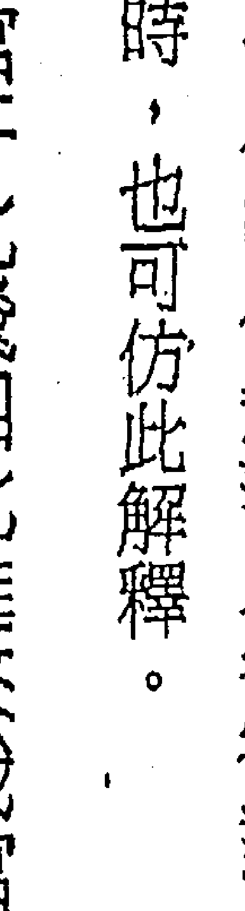

- 命宮在辰：貪狼自化祿，顧人緣，講人情（自己的事）。
- 父母宮：貪狼化權，父母、長輩關心、看重我。

| 巨門 | 廉貞天相 | 天梁 | 七殺 |
|------|----------|------|------|
| 己 父母 | 庚 福德 | 辛 田宅 | 壬 事業 |
| 貪狼 祿 (自化祿) (戊) 命宫 | 權 | 圖六七 | 天同 |
| 太陰 | 丁 兄弟 | 武曲 | 癸 交友 |
| 紫微天府 | 天機 | 破軍 | 太陽 |
| 丙 夫妻 | 丁 子女 | 丙 財帛 | 乙 疾厄 |

交友宫癸：貪狼化忌，朋友關心我，講義氣。
以「命」而言，凡是
他宫化入我命的，都是
别人給我的，施予我的，
而命造只是接受而已。
以「先天命局」而
言，命宮貪狼自化祿，
表示小時候就很有人緣，
頗獲眾人之喜愛，父母
飛化權入我命宫，代表
父母關心我，這個關心
是出於望子成龍的關心，
因此帶有嚴厲、約束
而不是溺愛，交友飛化
忌星入我命宮，朋友關心我，又是關心，不過這種關心，是不好的關心，貪玩的朋友分享玩具或過關秘笈，而不是關心功課關心健康，是有「帶壞」人的關心，這種化象要小心被朋友帶壞。

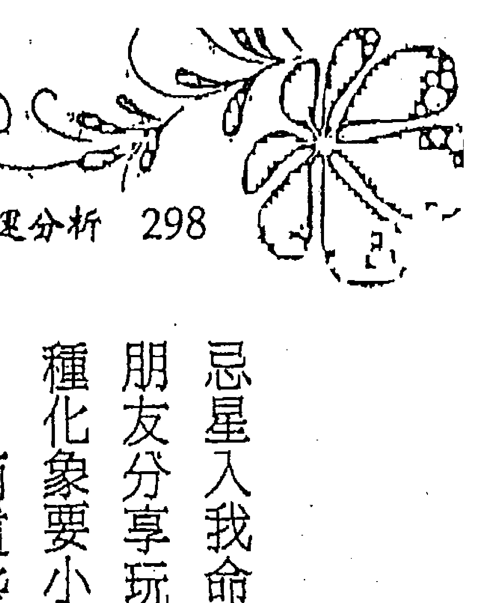

像上述兩種情況，都是屬於氣的流轉，人的一生中，運勢有強弱、有起伏，就是四化飛星的流轉所引起的，配合大限宮內星宿組合狀態來判定運勢強弱起伏，

至於交友宮化忌入我命宮，因為化忌主情義，精神層面的關心而已，不主物質，所以不可和朋友有金錢往來，有的話，往往損失是在自己，步入交友宮的大限時，因忌入本命宮所以該大限一定不順，身體多毛病，有病死之虞，因為本命宮已變成大限的疾厄宮，所以一個宮位隨著運限轉換也變成不同的人事宮，表徵著限運的環境、際遇也會改變，於是動態的命運變化現象就發生了。

壞朋友的影響而貪玩疏忽了功課，或是志向受到同儕影響而玩物喪志等。

## 就和四季的流轉一樣

- 春天到了，就要耕種、播種。
- 夏天到了，就要除草、施肥。
- 秋天到了，就要收割、曬穀。
- 冬天來了，就要保存食糧好過冬。

人之一生亦是如此，要隨時努力，吸收進取，伺機而起，創造成功，進而保存成果，永續經營，如果不依四時之順序循序而做，反而逆其道而行，則其失敗指日可期。像這種四化飛星的忌星，臨佈本命三合方的，必然是生涯蹭蹬、做事進退的困難運限，更有「忌星」來沖，一定失敗，所以忌星以沖最凶，飛佈在三合方之對宮次之。假如能順勢而為，蓄勢而發，就能事半而功倍。

法觀察，據之以下判斷了，而命盤則無此限制。

由于他宫化入我宫或我宫化入他宫，再由化入宫干再转飞四化入其他各宫，此种「某宫」化禄入A宫，A宫干再转化禄入B宫，B宫干又再化禄入C宫的飞化方式，就是代表某宫之「禄气」飞化给A宫、B宫、C宫等所用，因为是化飞出去，能不能回收？则要看转化后，有没有再回到「某宫」，如果有回到「某宫」，代表是「收敛状态」，化出去的禄星可以回收。
如果化出去A宫，A宫转化入B宫，而B宫干自化，则代表泄气，如果是「化禄」，表示「禄气」会在「B宫」泄露掉，这种是属于「发散状态」，化出去的无法回收，而呈现「凶」意，因为付出出去的没办法回收。
收敛作用与发散作用
四化的起飞与再转飞四化的起落路径，代表起飞宫和降落宫之间，具有某种连系作用，若经过路径没有自化，代表具有【收敛作用】，发出去的能再回收。若有化出或自化的宫位，就代表【发散作用】，发出气的会损耗掉，无法收回。
气运流转
像这种某宫起飞四化，落入某宫，再由落入宫再转飞四化的飞星方式叫【气

| 乙巳 遷移 天機 左輔 火星 | 丙午 疾厄 紫微 文昌 | 丁未 財帛 鈴星 | 戊申 子女 破軍 文曲 |
| 甲辰 交友 七殺 | | | 己酉 夫妻 右弼 |
| 己 太陽 天梁 祿 | | | 庚戌 兄弟 天府 廉貞 天刑 陀羅 |
| 壬寅 田宅 武曲 天相 天姚 | 癸丑 福德 天同 巨門 | 壬子 父母 貪狼 擎羊 | 辛亥 命宮 太陰 祿存 |

### 圖六八：氣運流動

自化洩氣 發散

起飛宮

## 【運流轉】。

命盤中某宮飛四化再轉化四化入某宮，又再轉化四化的飛化方式，表示氣之流轉，凡氣之所通之處，即與發射宮有息息相關的關連性存在，這就是命盤的氣勢，它可以藉此觀察命造一生的氣運強弱吉祥，不必再去看人的「臉色」有時間的限制，或「實體」的限制。

很多命例顯示：有些命盤三方會煞，格局有破，但卻是富甲一方或權傾一時之命，其中之差異，即在「氣勢之流轉」至於為何同命之人，成就有高低之別，即在有無掌握氣運之局勢，順勢而為。只要命盤沒有自化洩氣，則此種命造一生較吉祥。若有自化則比較不會掌握機會，或有機會降臨亦無能力把握，平白讓它流失而一生中氣運較占下風，必須要樂天知命，才能常保安樂。

針對氣運發散之命造，加倍努力並不是成功的絕對保證，反而抱持著「樂天知足」的生活態度，不要強求「名與利」就能常保康樂，因此，命盤雖有自化，破壞了「氣」之凝聚，也不會對命造產生不良之影響，若反其道而行必遭凶險與失敗。另外，解析命盤時，不要將子女、父母、疾厄、交友等宮，視為次要宮或閒宮，而只看重命宮、財帛、官祿（事業）三宮而已，疾厄宮一破，縱使財富有如金山亦無命消受，人在天堂錢在銀行，有什麼意義呢？所以，十二宮都不可忽視，每一宮位都很重要，而「氣化」之流轉，就是顯示「宮」和「宮」之間關係的強弱以及吉凶的表徵。推命時，十二宮都不可忽視，每一宮位都很重要。

> 圖六八的化象解是：我命宮飛化文昌忌入疾厄，關心身體健康，疾厄轉飛廉貞忌入兄弟，我會花錢買補藥或健康食品，照顧好自己身體，轉飛天同忌入福德，其實我把那些行為都以自己的養生觀點而當做是必須的行為，所以花些錢是必要的，當然還會關心父母的，因為有飛化貪狼忌入父母，但是父母卻認為沒必要，因為父母飛化武曲忌入田宅，田宅卻自化忌讓他流失了，所以，這個忌星的流轉遇到田宅就失去了，揮發掉不見了。

# 第二十四章 四化忌的转成的角度

化忌可说是四化中最重要的颗星，由名词上看起来，化禄化权化科都是好的化星，而只有一颗化忌总是不好的，仿佛四化中好与坏的势力分配得并不平均，吉利的化星有三颗而不吉的化星只有一颗而已，是不是如此呢？不是的，经过某一颗星的居间催化作用也会转变禄权科的吉祥性质，而这颗关键之化星就是——化忌。
想想我们日常生活中有很多事情，是不是有很多这种现象？
◎刚刚开始创业时业务应接不暇，生意好得不得了，赚了一点钱，但最后却赔得一毛不剩，还跑路了。
◎或刚刚开始时业务并不怎么样，但越做越顺手，事业越做越大。
一个是先吉后凶，另一个是先凶后吉，到底是属于哪一种状态？就要由四化的分布状态来分析，四化的分布状态要考虑本命与限运的问题，亦即要观察本命某宫和大限同一宫所飞出的四化在命盘上分布的状态，是呈现「冲」「会」「入」「合」的哪一个角度来判断吉凶，前面提过，四化中又以化忌为掌握吉凶变化的枢

大限财帛化忌入本命财帛曰忌入，当流年行至寅宫时，不主漏财而是收敛了，可以抓住机会赚钱，但冲到的月份钱财仍会紧一些。

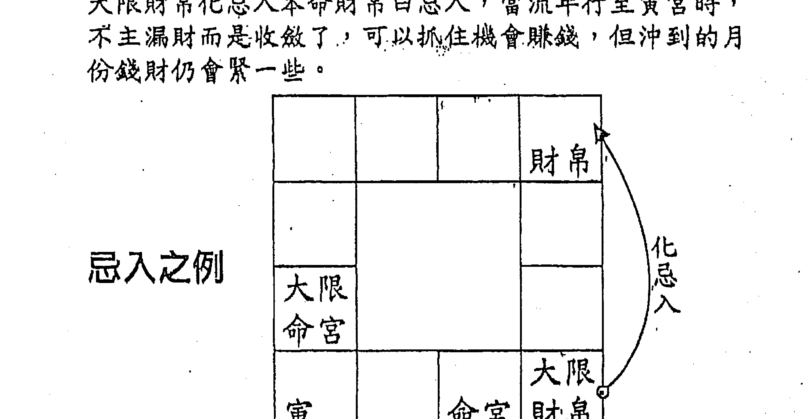

大限财帛化忌入本命福德即冲本命财帛，此即忌出，当流年至寅、申宫时，主漏财，会有钱财之损失，其严重程度要看星宿组合。

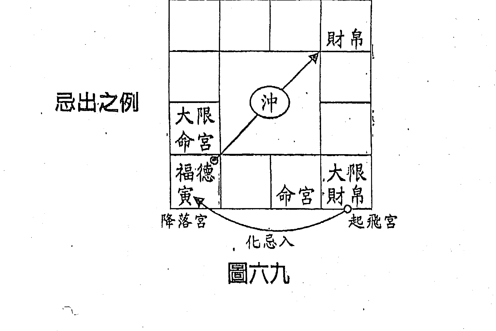

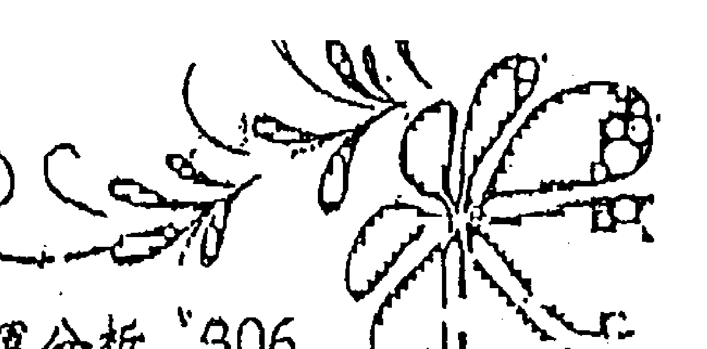

所以本章就本命與大限宮位化出來的忌星在命盤上構成的角度來分析其吉凶的意義。
要談化忌星不可忽略「忌入」與「忌出」的現象，這些都是運用化忌的基本規則，「入」與「出」是四化應用的基本要領，兩者呈現的吉凶現象完全相反，所以以碰到「四化」時，第一要緊的事是分辨「入」與「出」的現象，針對「化忌」而言：「忌入」是收斂的意思，
「忌出」有發散的意思。
我們用【圖六九】來解釋本命與大限宮位之間化忌的「忌入」、「忌出」差別，但在吉凶的意義上必須針對事物之不同而不同，不能一概地以「忌入」為吉、「忌出」為凶的簡單二分法來解釋，這是必備的基本認識。舉例來說，假如因為夫妻宮呈現忌入的命局而為同居的現象時，此種情況該視為「凶」象抑或為「吉」象呢？所以，只能以「忌入」為收斂，「忌出」為發散的意思來解釋，再佐以宮位、星性之不同來分辨吉凶之意。
若是本命盤局的某一宮有「自化忌」的情形（圖七十）也可說是「忌出」，本命宮局有忌出的情況，而大限「忌入」本命，此時該如何解釋此「忌入」呢？到底

|    |    |    | 財帛 |
|----|----|----|------|
|    |    |    |      |
|    |    |    |      |
| 寅 |    | 命宮 |      |

## 自化忌

財帛宮的宮干，使財帛宮的坐星化忌，叫做財帛自化忌，財帛自化忌有財帛掌握不住、流失之意。

### 圖七十

### 圖七一

財帛宮化忌到福德宮就叫做財帛宮化出忌。此種情況有錢財損失的意思。

|    |    |    | 財帛 |
|----|----|----|------|
|    |    |    |      |
|    |    |    |      |
| 福德 |    | 命宮 |      |

是收敛还是发散呢？这种情况也是发散的意思，因此本命盘局中有自化忌的人，一生中命运比较不利，往往掌握不住机会，甚至机会来了都还茫茫然不自觉，也由于当事人不自觉，反而有「既无所得，当然无所失」的豁达，这句话或许可作为解释「自化忌」者最为贴切的用词吧！这种忌出的情况，当大限化忌进本命的时候，就会将本命局该颗自化忌的星宿剔除，因此该星宿所主之人事物象会被排除掉，在解释时要注意此种现象。本命盘局化忌还有一种情况也是属于忌出的意思，也就是由本宫化忌到对宫的情况，此种情形称为化出忌，哪一宫有化出忌的情形，则该宫所主事物就有流失的意思，在解释命盘时也不可忽视此情况。大限盘局的化忌会和生年四化以及本命盘局的四化产生作用而引起某些变化，使效应加强或弱化，本命化忌和大限化忌形成的角度有同宫、三合、会照等，都会因为强化忌星的力量而引起吉凶效应，假如没有形成上述「同宫、三合、会照」等的特殊角度，就不会产生作用强化忌星的力量使事件发生。要应用四化推命时首先要有四化的「时效性」观念，本命的四化在一生中都会发生效用，大限四化则只有在该大限时会发生作用力，一旦离开该大限就会失去作用力，相同的流年四化亦同。

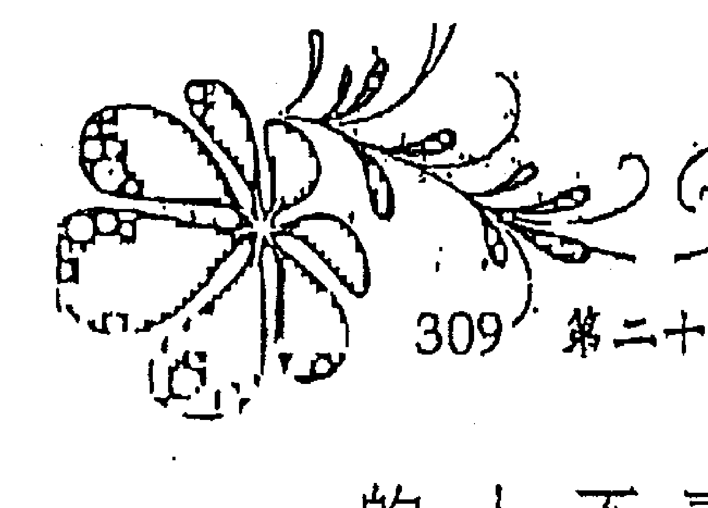

例如次頁命盤夫妻宮坐己——化武曲祿、貪狼權、文曲忌入命宮，夫妻化忌入命宮代表夫妻不利於我（在此先不論化祿化權），這顆忌星的效力會一直存在，會不會使當事人有所感覺呢？未必，因為它只是隱隱約約的作用而已，若沒有煞星配合，一般是不會感受得到的，它需要大限配合來引發它的凶性，大限要如何來配合呢？這時就要觀察大限的夫妻宮的化忌是不是與命宮內由本命夫妻宮化來的忌星形成某些特殊角度，若有，就會產生吉凶的效應，若沒有形成特殊感應角度，就不會有吉凶反應產生，假如舉例的這個盤局大限是逆行的，當大限命宮進入子女宮時，疾厄宮【丙申】就成為大限的夫妻宮，宮干丙化廉貞忌入財帛宮，和命宮的文曲化忌形成三合的角度，這時命與大限的夫妻宮化忌就會產生吉凶的效應了，由於是化忌星作祟，所以是呈現凶性的反應。

各位可能會問，命宮與財帛宮不是我宮嗎？為什麼他宮化入我宮會逞凶呢，要回答這個問題，大家先要了解婚姻失敗的成因有哪些，失業沒有錢財收入了，夫妻會不會吵鬧或離婚？錢財由財帛宮主掌嘛！夫妻化忌入財帛，就是暗示夫妻對待不吉的原因與財帛相關，所以雖然是他宮化入我宮亦是以不吉解，說到這裡想到有句常說：斗數易學難精，其癥結就在於沒有分清楚人情事故的道理，以為紫微斗數的規則一體套用，不必分六親宮或財帛田宅等物質宮的不同，這樣往往會誤判的，

| 紫微七殺 天刑 癸 事業 | 火星 甲 交友 | 鈴星 乙 遷移 | 陀羅 丙 疾厄 |
| 天機天梁 壬 田宅 | 辛卯年9月 土五局 （命宮位置） | （流年位置） 日酉時 | 廉貞破軍 祿存天姚 化忌 丁 財帛 |
| 天相 辛 福德 | 武曲貪狼 文昌文曲 化忌 化科 辛 命宮 | 天同太陰 左輔 庚 兄弟 | 天府 己 夫妻 |
| 太陽巨門 右弼 化祿 化權 庚 父母 | | | 擎羊 戊 子女 |

所以吉與凶的解讀需要考量宮位性質的不同而做合理的修飾。至於要如何推理出來哪一年會發生呢，就要一年一年地去推查流年了，推查時有幾個訣竅要掌握住：

哪一流年的夫妻宮化忌又再與本命、大限的夫妻宮化忌形成特殊角度？

哪一流年的命宮煞星匯聚成群？

## 第二十四章／命限化忌构成的角度

| 紫微七殺 天刑 癸 事業 | 火星 甲 交友 | 鈴星 乙 遷移 | 陀羅 丙 疾厄 |
| 天機天梁 壬 田宅 | 辛卯年9月 土五局 （命宮位置） | （流年位置） 日酉時 | 廉貞破軍 祿存天姚 化忌 丁 財帛 |
| 天相 辛 福德 | 武曲貪狼 文昌文曲 化忌 化科 辛 命宮 | 天同太陰 左輔 庚 兄弟 | 天府 己 夫妻 |
| 太陽巨門 右弼 化祿 化權 庚 父母 | | | 擎羊 戊 子女 |

本命、大限的夫妻宮化忌形成的三角點上，此時的化忌星為最重，被沖到的流年次之，再觀察當年夫妻宮的坐星組合是否煞星群集，有無科星化解？

哪一流年夫妻宮煞星匯聚成群？

哪一流年進入與...

...就可以知道哪

## 大限夫妻

| 列1 | 列2 | 列3 | 列4 |
|------|------|------|------|
| 紫微七殺天刑 癸 事業 | 火星 甲 交友 | 鈴星 乙 遷移 | 陀羅 丙 疾厄 |
| 天天機梁 壬 田宅 | 辛卯年9月 日酉時 土五局 | 推查 發生的流年 | 廉破祿天貞軍存姚 忌 丁 財帛 |
| 天相 辛 福德 | | | 擎羊 戊 子女 |
| 太巨右陽門弼 祿權 庚 父母 | 武貞文文曲狼昌曲 忌科 辛 命宫 | 天太左同陰輔 庚 兄弟 | 天府 己 夫妻 |

一年會出事了，假如推查出來的流年已經脫離該大限的範圍了，那麼該忌星形成特殊角度的效力就已經消失，於該流年不會產生凶性的。根據前述的訣竅我們來推敲哪一年會發生，生，三十五歲正好與本命宮重疊，且坐到夫妻宮化來的文曲忌，三方匯入大限夫妻宮的廉貞忌，構成了三合的感應角度，因此本年會有凶性產生，但嚴重性呢？由於夫妻宮也化武曲祿、貪狼權入流年命宮，代表今年雖有衝擊但情緣還在，故不致於太嚴重。

再來看三十六歲，流年夫妻宮雖然自化天同忌、但也自化太陰科，化忌與化科的力量抵銷，流年命宮坐祿權，又不與本命、大限夫妻宮的化忌形成三合角度，因此不至於生事。

三十七歲呢？流年命宮被大限夫妻宮的廉貞忌衝到，而流年夫妻宮又有本命夫妻宮化忌，且流年夫妻宮自化文昌忌，今年事情就嚴重了，自化忌有「一了百了、大不了不幹」等的意思，今年就有一股衝動想要徹底解決的想法了，因此是很嚴重的一年

再繼續一年一年的推查下去，可以發現四十一歲、四十二歲這兩年也很緊急，但是哪一年呢？就要去衡量找出來最有可能生事端的年份，哪一年最嚴重就以那一年為發生年，例如如此例就以三十七歲最為嚴重，所以該年要小心夫妻對待關係生變。

至於四十五歲之後的流年呢，因為已經是下一個大限（四十五～五十四歲）的年齡了，就必須先看該大限的夫妻宮化忌，有否和本命夫妻化忌形成吉凶角度，再去推敲流年的吉凶，若無特殊角度形成，流年吉凶祇是小是非而已。
所以，命與限的化忌除了要形成特殊的物理角度——「同宮、三合、會照」會產生強化忌星力量的作用，使事件發生之外，解釋時，還要衡量宮位所主意象與人情事故的關係，修飾吉凶的用語，不能一概以「他宮化入我宮為吉」或「我宮化入他宮為凶」等一般性的概念，來解釋所有人事或物質宮的吉凶，這是初學者必須了解的基本觀念。

## 圖七二：亘古不變的時間軸

曆法時間和生命時間兩軸線如何聯繫？

# 第二十五章 谈事件应验时间

牵连的线索，才能定出发生的时间，所以其过程是最复杂的，须按部就班地从命限盘、四化的冲照会入、星宿组合等关系中，抽丝剥茧理出头绪，定义发生的日期。

欲找出命盘中所显示事件的应验时间，要采取三个步骤，环环相扣找出其中指的是由本命盘、大限盘、流年盘或流月盘、流日盘中的那几个盘局所构成？就必须依其推理的细腻程度，定义出对映的天地人盘：

譬如要推算流年发生的事件，就以本命盘为天盘，大限盘为地盘，流年盘为人盘，再透过贯穿天地人三盘的四化层层加强作用、或吉星层层加强、或凶星重重叠叠肆虐，就会使事件在流年中发生。

相同的，欲推算发生的流月，就以大限盘为天盘，流年为地盘，流月为人盘，依四化和煞星的叠加、累积作用，使事件显像成形。时间是由地支来表示，如：寅月代表正月、卯月代表二月……等，由命盘中推算发生事件的时间，是由本命盘和大限盘的冲照会入等关系，找出发生事件的吉凶效应，并由星性和宫位重叠关系中，定义事件的形象，但会在那一年发生，这个时间因素是非常重要的，必须找出来才可以，不然大限十年都要防范了！

一般我们都以几岁到几岁之间为十年大限，而且是以虚岁为准，有人是十一月生的和一月生的都是同样的岁数，难道岁数和历法上的年数在命理学上是一致的吗？在八字学上有很明确的推算法则，规定某年某月某日为大运交脱日期，而斗数在这方面就很含糊，不够明确，依照笔者师承和经验判断，一切完全以历法时间为准，例如：某人农历五十年五月二十日某时出生，土五局，则二十五到三十四岁的大限，在民国七十四年的农历正月初一日起正式进入该大限，而流年的交接也是以农历历法的每年大年初一为交换点，譬如前命例二十岁的流年运途在民国七十九年的正月初一日开始，也就是说命盘上的流月：一月在农历正月初一日开始，而不是以出生日期起算实岁之后再起命局的正月。（流月的一月所在，其他十一个月顺行填入）。

在宫即称为斗君，用流年命宫为基准，逆数生月再顺算至出生时辰，即为该年一月之所在，其他十一个月顺行填入）。

前面曾提到事件是天地人盘之间环环相扣而定义出事件的发生时间、吉凶效应、事物形象和严重程度，那么到底是什么构筑起环环相扣的作用呢？在命盘中又是什么符号产生环扣作用呢？

简单来说，环扣作用是由本命、大限盘的坐星组合和天地人盘的四化贯联作用而架构起来这种立体的环环相扣的作用网，由其中的四化当触媒，层层加强、催化而使吉或凶的力量释放出来，使事件成形、发生，至于环扣作用中采用的运算符号，就是各宫之宫干飞四化，以宫干所化之四化为吉凶祸福的力量，冲照会入为运算子，就好像是加减乘除的符号一样，将吉凶祸福的力量予以加倍、抵消或减轻，使事件发生。

至于为了什么因素而减轻或加倍呢？则和天盘及地盘的宫位飞四化的起飞、落入宫有关系，例如：夫妻宫化科入子女宫，则表示配偶是子女的贵人，对小孩的教育很关心，并且会付诸行动，这是以本命盘来论断的解释，如果大限的夫妻宫又化科入大限子女，由于有了本命和大限的双重化科作用，则配偶对于子女的教养就有持续性，不会因故中断；如果大限夫妻化忌入子女，则会减轻本命夫妻化科入子女的力量，变成虽然先天上会关心子女教养，但在该大限时却有心无力、或忙于事业、或因环境所迫，无法亲自照顾，因此疏于教养。

那么此种经过减轻或加强之后所产生的转变会呈现怎样的形象，由什么展现出来呢？就由相关宫位的宫干飞四化看其冲照会入的关系定吉凶，而由当事宫坐星宿组合来显现其形象。

再来谈到应验时间，由天地人盘的冲照会入，或三方四正会入吉凶星煞的关系，定义出事件的影像，至于那一年会发生呢？这个问题的答案不只一个规则而已，根据笔者经验至少可以归纳如下：（当然应用时一定要考虑四化和三合方的作用）。

- 1. **同类相冲**：不管天盘化忌冲地盘、或地盘化忌冲天盘的同类宫，都属同类冲，以冲到人盘的同类宫时为应验年。如：大限财帛化忌冲本命财帛，就是财帛的同类相冲，当流年走到本命之迁移宫时，大限财帛化出来的忌星，恰在流年的财帛宫内，故该流年应验。当然，如果其它流年的财帛宫结构不吉利，也有可能在该流年发生财务之不利。
- 2. **流年命宫**：命宫是主帅、不管任何宫位都不可化忌来冲命宫，有冲到的话，就有脱开的意思，流年过渡到受冲的位置时，就要小心，会失去该来冲宫位所代表的人、事或物，例如：父母宫化忌来冲命，就有可能失去父母，严重时就是父母死亡之兆。
- 3. **互冲忌**：本命盘某宫化忌入A宫，而大限盘某宫化忌在A之对宫，即和本命所化的忌星对冲的态势，这就叫互冲忌，流年过渡到互冲线上时，就会发生。
- 4. **三重忌**：本命盘某宫化忌和大限盘某宫化忌都进入同一宫，这个宫位内便有两重忌星的作用力量，当流年步入该重叠忌的入宫或冲宫，都会发生事端。
- 5. **三合忌**：本命盘和大限盘的某宫化忌星呈现三合的角度，所谓三合就是：亥卯未、申子辰、寅午戌、巳酉丑等，例如：本命盘化忌在子，大限盘化忌在申，就构成申子辰的三合忌，当流年步入辰宫时就会发生祸害。
- 6. **反弹忌**：本命盘化忌冲大限盘，而大限盘化忌冲本命盘，这种你冲我、我冲你的现象，就是反弹忌，好像打篮球的擦板球一样，被冲到定有灾殃，是很凶恶的忌冲现象。
- 7. **忌入同类**：有人说忌入主收敛、得到的意思，不主凶险，这句话有语病，它有一些先决条件，如果有这些条件才如前解释，若没有先决条件配合，也是不利，尤其过渡到忌冲的流年，特别不顺，过了该流年后，才能否极泰来、转危为安。
- 8. **单忌**：本命盘和大限盘飞化的忌星不是以上的组合，就是单忌，单忌的情况要特别注意，本命盘和大限盘的忌星分踞流年命宫和流年同类宫时，所产生的凶力并不亚于上述各种情况。

以上各种忌星的组合，都主凶险、或损失，至于因何事？呈何种凶象？就必须配合宫位和星宿来幻化形象，也就是说四化的结构主吉凶，而星宿和宫位结合主掌事件的形象，各位可以拿已有详细记录事件因果关系的亲戚朋友命盘详加对照看，就可以领会上述说明的意义，笔者也是组织斗数研究社团，且个人工作又担任中小企业的顾问，藉工作之便，花费十多年的时间，记录很多详细命例，才由其中挖掘斗数四化飞星的奥妙之处。

有了吉凶和形象已能确定发生何种事件了，到底会在何时发生？就必须由忌星的各种组合去推断人盘应验时间，前面提到过，人盘只是承受天盘、地盘的结果，予以适时的显现出来而已，所以推算人盘的应验时间，一定要由天盘和地盘开始查起，天地两盘都有征象了，才会在人盘表现出明显的吉凶事象，假如只有天盘或地盘有垂象，因为力量较小，那么在人盘显现出来的事物象的吉凶效应，就较轻微。配合地盘飞四化，与天盘、人盘的关系，订定其应验时间，决定应验时间有下列规则可资参考：

- 1. 以受冲之宫最凶，当地盘转动，过渡到忌冲之宫时会生事件。
- 2. 地盘的同类宫星宿组合极恶劣时，再参酌天盘、地盘的忌星组合，若是又再受忌冲，则在该地盘应验。
- 3. 过渡到天盘忌星落入宫时，也有可能发生，此时须先从该大限开始的年岁开始查起，若流年先步入天盘忌星的起飞宫，而受冲之宫尚未走到，则要注意起飞宫的流年；若受冲之宫先到，则要注意过渡到受冲的流年，有可能为应验年。
- 4. 忌星冲入盘的事业宫时，因事业主动态运途，如果忌星冲事业，则会有不顺、阻滞的现象，再配合天盘地盘的忌星组合态势不佳，则在该人盘时应验。
- 5. 若是单忌的情况，则要注意人盘步入天盘化忌落入的宫位时，表示已踩到忌星凶力了（好像踩到地雷一般，踩住了不动就没关系，如果再有忌来冲，不得不动，就会爆炸），若人盘同类宫再有不吉之组合，则会爆发不幸之事件。

上述规则各位读者可拿命盘套看合不合用？但因牵涉到不同的化忌组合，所以刚开始用时一定很生涩，格格不入，一旦运用娴熟后，自然熟能生巧。

# 第二十六章 四化飛星活用例解

「四化飛星」是「四化」和「飛星」兩詞的複合句，兩者意思不同，不可混淆。有人以為「星辰落入何宮就叫飛星」或「流年星落入哪一宮就叫做飛星」，這些都不是真正的「飛星」本意，我們先來看看先賢關於四化飛星的解釋：

> > 「用者，乃以體賴上為用，神者，神無方，氣無體，生化變遷，高深莫測，處乎於機，唯心一契。故四化者，借干遁星，假象合支應時，氣化飛渡十二宮，以象明理，以星明物，休咎順理，應敷成局；司命占驗，富貴窮通，壽夭榮枯，均出氣化以為神也，數變以為用也。」

原來透過天干演化四化，使星宿本尊產生分頻使分身投射到相關宮位，再和投影出去落入宮位的坐星結合來顯示事物的形象，同時和地支配合表示應驗的時間，所以透過天干四化可以使星宿的化氣在十二宮之中飛遯，配合宮位代表的象和星宿結合以顯示事物形象，所以不可以光靠某宮落入某一星宿就可以論吉凶。吉或凶的現象，必須以「四化」飛遯催化「星性」使之顯象現形。

「四化」和「飛星」兩者配合才能推斷運勢的吉凶，所以「四化」和「飛星」不可偏廢，否則無法推運，故說『四化是斗數的用神』，飛星以數理引導，四化貫聯，而有了一定的規律，故有規則可循以之探素未知的未來，並不是靠鬼魂通風報信的法術。

至此，我們明瞭四化的功用，它是藉天干演四化以飛星，以星性和宮位結合表示的『事物象』和地支配合，來推算該『事物象』應驗的時間，如此一來，『時間、空間、事件』之間的關係便串聯起來了，可以推算在某空間中的某個時間會發生何事，如此『人、事、時、地、物』五要素便有了，可以將事件定義得更詳細，而不是含糊籠統的一句話：『一生小心車禍』。我們都已了解『星辰』在『宇宙』中，皆有與其對應的事物，這些事物可分成：

- 1. 物理面：實體的物質、事情或環境。
- 2. 心理面：無形的空間，心理所能感受到的虛無境界，或可說是心境上的問題。

兩者相輔相成；例如：不是命宮坐何種星辰，就代表一生的心性，而是配合生長環境和大限運勢變遷，心性也會隨之改變，若明瞭星宿之物理、心理面之應，便可藉星性之用而進修，變化氣質個性，質變影響機遇，改造運勢，所以紫微命理是一「術德兼修」的命理學。

在進入本章四化飛星活用之前，必須先理解天干四化、地支、星辰本性及意象的關係，才能解釋命盤中的星宿演化顯象的問題。

## 一、四化到宮理則詮釋

命盤起出共有十二宮，各宮有陰陽之別：

- 1. 陽宮：命、夫妻、財帛、遷移、事業、福德。
- 2. 陰宮：兄弟、子女、疾厄、交友、田宅、父母。

六陽宮主貴，六陰宮主富，因此六陽宮結構吉利的都屬於貴格，而六陰宮結構好則為富裕之命。

### （一）命宮：代表一個人命格高低。

以本命宮宮干飛四化，祿、權、科入本命三方，為貴格，主自力更生，若落入三方的對宮（夫妻、遷移、福德），為照命，也是貴格，能得到他人之助而成功。化忌入本命之三方，為坐忌，凶力較遜，成功的阻礙多，必須靠腳踏實地、勤奮地工作以至於成功，亦即無橫發資財之運氣。

若化忌冲三合，则一生命运较走下风，吉中带凶，成败不定，故冲三合者宜上班，领固定薪俸为宜，若强出头，自立创业，多半是过路财神，其成功过程充满艰辛，逢衰败之运途时失败也迅速而强烈。

### （二）財帛宮：代表賺錢能力，或賺何種行業的錢。

凡是財帛宮化祿、化權、化科入本命三方，表示能夠自立謀生，具有優秀的理財能力，因此比較容易致富。

若照本命三合，也是自立格，不過照三方者善於運用周圍之助力成功；而入三合者，為透過本身之努力而成功，兩者有些不同。

化忌不能冲本命三合，有冲则凶，适合上班，不宜创业，落入本命三合，吉利于財務之運用或投資較保守或吝嗇。

### （三）事業宮：代表事業、運途，又名學業宮。

祿、權、科入本命三合，為獨立自主格，理想高遠，有成功的機會。

入三合的吉力優於照三合，主事業順利，並往多方面發展，成就大。照三合表示外界環境好、時機對我有利，但自己有沒有能力把握、或有沒有意願親身參與，往往受制於本身的其他因素，例如：有的人頗受上級重用，但安排的職務，工作性质并不是他想要的，虽然在别人眼中他很红，但当事者却有说不出的苦，或志不在此的想法。

化忌宜入三合，表示关心事业、钱财、事业心强，若行运吉利有成功机会，但较辛劳，过程中较多阻碍，但并不影响成就。

若化忌冲三合，一定不利于事业，事业多变动，上班者多变换工作，或工作环境较差，或非志趣所在，但又不得不接受该项工作，也有不易升迁的微兆，宜采保守的态度熬下去，运途好转时再做图谋。

### （四）六亲宫：命、兄弟、夫妻、子女、交友、父母等谓之六亲宫。

凡六亲宫化禄、化权、化科入或照本命之三合，即主有情义，相处融洽。

化忌不可来冲，谁化忌来冲，就与该六亲无缘，代沟深、意见不合、想法不一致、常生口角。

若化忌入命之三合，则凶力较逊，代表关心该六亲，但因某些因素无法在物质上表示心意，只有精神上的关心而已。

### （五）福德宫：代表享受能力，或叫老运宫，又可说是祖父母宫。

平时推命当做自己的享受宫，可以观察一个人能不能享福，有些人很有钱，但仍忙碌的工作不知享受，也有的人没什么财富，但很知足，快快乐乐过日子，两者之差别即在福德宫。

福德宫之三化吉星入本命之三方，主晚运佳，有福可享，本身亦能得到长上的庇荫，本身也较有福可享或较能享福。照三方亦是有福可享之人。

化忌入本命三方，不凶，主因享福必须努力工作，赚钱供挥霍，是属于身体劳碌之人，但精神上较单纯，无牵无挂。

若冲三方，则一定为无福可享或无钱可享福之人，晚景孤独，须自己照料自己，最好早一点皈依宗教，求心灵超脱世俗之牵绊，免得再逢煞星冲激，看不开。

### (六) 田宅宫：主掌家运，又称为不动产宫。

赚钱回家存起来，故又称财库，若田宅宫破了，财库便有漏洞，耗子便来偷财了，虽财帛宫好亦无法储存下来，财神爷借钱予你看看而已，所以，田宅宫是非常重要的宫位。

田宅宫不能化忌星来冲，冲则库破，漏财不已。

田宅宫三化吉星入本命之三方合，则家运吉祥，守得住钱财。

田宅宫化出之飞忌不可冲命之三合，有冲，则容易遇到突如其来之意外，或田宅有变动。

### （七）疾厄宮：乃身體宮，又名相貌宮，主健康情形。

其四化星入本命之三方，較吉祥。化忌星不可沖本命三合，有沖則身體遭殃，花錢醫病或因疾病而事業荒廢，且服務之公司，也會營運狀況不佳。老年人忌諱疾厄宮之祿、忌沖本命疾厄宮或命宮，有沖，則凶險，因化祿為「多」之意，易有組織異常生長或高血壓等症狀，故老年人之疾厄宮不喜見化祿或受化忌來沖照，化忌入疾厄亦同論。

## 二、十天干化星的涵義

### （一）甲干：

廉貞化祿：職務升遷，電氣類生意好，在四馬地，外銷生意好，適合公務人員。

破軍化權：出外運強烈，有橫發現象，夫妻、朋友間多爭執，子女不聽話，很有主見，成就也不錯，但叛逆性強。

武曲化科：在銀行界上班工作平穩；一般人財務還不錯，不會有捉襟見肘的感覺。

### （一）乙干：

太陽化忌：不利男性六親，眼、頭易有疾痛，失眠、焦躁，與天刑同宮易有官非、牢獄之災，未婚者易失戀，驛馬動，但出外不順。夜間出生者，尤為不利，不管對自己或丈夫、兒子，都會有欠缺或不利的情況發生在其身上。

天機化祿：兄弟財、技術財、平穩財，較不屬橫財，多計劃易成功。以智慧生財者利。添購機器。

天梁化權：擇善固執，適合：法官、律師、調查人員、中醫師，公職人員為官清顯，有成就，得人緣。

紫微化科：重面子，有貴人栽培，不會吉星，四煞之一同宮，則易受挫，凡事拖延。

太陰化忌：不利女性六親，未婚者易失戀，家運有變，注意頭、目之傷，尤以月初、月末、白天生產最不利，對於妻子、女兒也會有不利之情事發生，但無法明確知道是何種不利之事。

### （二）丙干：

天同化禄：服务业、餐饮业、服务业佳，食禄好，多不劳而获之物，公务人员佳。

天机化权：有变动及升迁，主动、机智、事业多变化，实行力增强。

文昌化科：往文艺界发展能成名，文章驰名，利于学生之读书考试。

廉贞化忌：官非，花柳病，脓血之灾，桃花纠纷，与七杀、擎羊同宫在迁移宫冲命宫，会发生车祸，加忌星更险。

### （三）丁干：

太阴化禄：女性财禄好，田宅运吉祥，利于房地产或女性用品业。

天同化权：将天同的懒散转化为积极，适合服务、餐饮、服饰等业，合伙亦宜。

天机化科：来财平稳不多，朋友关系不错，不易与朋友闹财务纠纷。

巨门化忌：口舌是非多，言词不当惹祸，表达不良，小心阴庙、符咒、小偷。

> 曾有朋友就说了一句话：「你给我小心点！」

结果惹上官司，罪名是恐吓，其实只是气话，说说而已，其命盘上就有巨门化忌，且运途正走到该星之位置，有此星之朋友，嘴巴上宜得饶人处且饶人。

### （四）戊干：

贪狼化禄：有酒食，艺术财吉美，与武曲会合，横发财；人缘好，女性很嗲也很会撒娇。

天同化科：女性能力强过丈夫，男人动作女性化个性又强，利于房地产或家运。

天机化忌：不利于男性平辈、四肢遭伤，钻牛角尖想不开，车祸或机械压伤，有此化忌星者大多会在手脚留下疤痕。

天梁化权：贵人多，注意感情困扰，有上进心得名利。

### （五）己干：

武曲化禄：武贪会，巨商高贾，主横发，理财能力强，善理财源。

贪狼化权：好胜心强，个性急速，现实，酷劲强，不擅计划，敢于冲锋陷阵。

天梁化科：利于考试、医界、公职，平稳而升。

文曲化忌：文书是非，有赌必输，不利事业，神经有恙，车祸，收受契约、支票、经手之文书，小心因手续不全而招惹祸端。

### （六）庚干：

太阳化禄：奔波忙碌中得财，未必留得住，因为慷慨豪爽之故；女命颇有男性缘。

### （七）辛干：

武曲化權：活用錢財，主掌錢財大權，但未必是自己的錢，可能是銀行經理或公司的財務主管，與文曲同宮，文武全才，但孤獨，婚緣較晚。

太陰化科：揚名藝術界，家運平穩和諧，注意刀傷、有開刀、見血光的跡象。

天同化忌：守財不牢，有暗痣，頭暈、胸口悶悶地、氣鬱積不散、抑鬱不得志、有難言之隱。

巨門化祿：以口生財，財多是非，口才好，反應強，有說服力，喜太陽旺地或祿存來制化其是非本質，主福厚，適合以口為主之行業。

太陽化權：官祿主化權，主辛勞，益增能幹，奔波、勞碌，驛馬星強，有出國旅行的機會，在午宮不利，易剛愎自用，主觀太強，有吉星扶助吉利。

文曲化科：適合向文藝界發展，但偏向於：五術、藝術等偏門左道，學生利於考試、學習專心。

文昌化忌：文書是非，簽約、背書、作保要小心，易收受空頭支票，學生學習不專。

### （八）壬干：

天梁化禄：聪明、人缘好、受长辈之庇荫，於财帛属投机之财、不劳而获之财，收受红包易出事。

紫微化权：主观、自以为是、刚愎自用，宜见吉星辅佐，主大富大贵，受人推崇，掌权势，有威严。

左辅化科：主功名，名利双收、有上进心，易有感情困扰。

武曲化忌：不利财帛、周转困难，与天刑同宫，因财犯法；与擎羊同，因财持刀，若与七杀同宫更灵，也有身体遭受金属伤害的暗示。

心，課業低落，唸書中斷；於疾厄，筋絡有疾，和文曲化忌類似。

### （九）癸干：

破军化禄：典当之财、抵押之财、不是自己的钱，市场生意兴旺，在夫妻宫主破镜重圆。利於行船人、货柜运输业。

巨门化权：口才犀利，语言能力强，说话有权威性，说服能力强，官位易升迁，但防口舌之争，最利於业务人员、行政官员、老师。

太阴化科：主桃花，因桃花惹祸，此种桃花是异性主动的，其他同庚干太阴化科。

三、大限四化之用理则注释

依照天地人之说法：在天垂象，在地成形，在人成事。亦即推命分三段过程，天盘所看到的只是一个朦胧的影像而已，像刚受精的卵子，已有了生命的开始，经过母体之孕育逐渐成形（在地成形），越来越有独立生存的能力了，通过怀孕期后，呱呱坠地，便是一个活生生的生命体了（在人成事）。

一个事件的形成，用紫微斗数来推算亦是采用此种三段推理法，若推算流年的“事件”，则本命盘为“天盘”，大限盘为“地盘”，流年盘为“人盘”。亦即流年中的一个事件，会在本命盘中垂象，在大限盘中成形，于流年盘中显现为事件，由此看来，推算流年，大限盘是非常重要之一环，它负责孕育“天盘”之象，然后降生在“人盘”上，因此，推算流年运，流年盘只是承受大限盘的所孕育成形的“胎儿”而已，所以流年运应由大限盘的天干四化来推理，并配合本命盘之象，三环相扣才能垂象、成形、成事一脉相承，而无推理不准的疏失，欠缺大限的条件配合，事件便无法成形诞生。

所以斗数中说的“天地人”是一种推理程序的三步骤，以及与此推理过程中所牵涉的周边环境因素，并不是谈鬼说神、灵异现象的天地人；假如各位有读过类似书籍，相信会理解古人的用词，暗藏很多玄机，不理解的人，则以“装神弄鬼”来解释，误导方向，将正宗命理学和宗教或法术灵异现象结合，引入研究的歧途。

前面已介绍过体用之关系：

“用”冲“体”，灾害重大，大限十年不利。

以上是十干化星的意象浅解，须再和宫内其它的忌煞星参酌的解释，但是以化星的力量较强，其它未化之星力量较不显。至于大限、流年的应用亦可仿此解释。

贪狼化忌：因色情惹祸而破财，或引起官非，注意色欲、食欲等方面的欲望，以免身体受损或破财惹官非；出现的型态有仙人跳、干洗、情杀等不一而足，但都和色情、不正感情脱离不了关系，适宜偏门生意、现金生意。

“体”冲“用”，灾害较轻，受冲之流年不利。

现在举例说明“体”与“用”之关系，本命、大限、流年等三盘的推论关系。

这位先生曾是叱咤一时的大富翁，在甲子年开始崩溃，一发不可收拾，结果于乙丑年因所开支票无法兑现，正月即依违反票据法被捕入狱，转眼间，往日荣华富贵已成过去，我们来看看命盘如何显示和推理：

由格局上来看，可算是“紫府朝垣格”，依命格来解释：一生中常与政治、警、商业界中有成就的人士往来，并且得到他们之助而成功，交友宫坐化权星更加强这个倾向。

**本命交友宫**：
在癸巳，贪狼化忌被对宫（夫妻宫）之生年忌（廉贞忌）弹回，是个标准的回水忌结构，怪不得会成为大企业家。

**本命疾厄宫**：
在丙申，廉贞化忌在亥位（夫妻宫）。

**本命财帛宫**：
在丁酉，巨门化忌在子位（兄弟宫）。

**大限疾厄宫**：
在丙申，廉贞化忌在亥位（夫妻宫）。

当大限转移到壬辰大限时，子位变成大限财帛，亥位变成大限疾厄，已显示壬辰大限财帛转坏之外，身体也会变差。
开工厂从事制造业的人，不可忽略疾厄宫，因为事业的田宅宫即为疾厄宫，亦即工厂宫，很不幸此造的工厂宫丙申，廉贞化忌入夫妻宫冲事业宫；在本命盘上已有垂象显示，此人不可从事制造业，有则事业必败。

**本命父母宫**：
再来父母宫庚寅，内坐天同禄、天梁、文昌科，恰好庚干又使天同化忌，成禄忌同宫之状况，是为双忌，对宫疾厄，也会受到忌星冲击，
因此，在本命盘上已显示事业和疾厄两宫关系密切，且有不良征象。

| 禄存 | 天机天梁擎羊陀罗(权) | 紫微破军地劫 | 天姚 |
| 癸 事业 | 甲 交友 | 乙 迁移 | 丙 疾厄 |
| 太阳天刑陀罗 | 男 丙戌年8月 日申时 土五局 | 天府火星 |
| 壬 田宅 | 35-44 | 丁 财帛 |
| 武曲七杀右弼天空 | 太阴 |
| 辛 福德 | 图七四 本命盘 | 戊 子女 |
| 天同天梁文昌(禄)(科) | 天相 | 巨门文曲 | 廉贞贪狼左辅铃星(忌) |
| 庚 父母 | 辛 命宫 5-14 | 庚 兄弟 | 己 夫妻 |

四、四化飞星活用例解：（图七四）

|  |  |  |  |  |  |  |  |  |  |  |  |
|---|---|---|---|---|---|---|---|---|---|---|---|
| 祿存 |  | 天机 | 攀羊 | 权 | 紫微 | 破军 | 地劫 | 天姚 |  | 大限事业 |  |  |
| 癸 | 事业 | 甲 | 交友 | 乙 | 迁移 | 丙 | 疾厄 |  |  |  |  |  |
| 太阳 | 天刑 | 陀罗 |  |  |  | 图七五 大限盘 |  | 天府 | 火星 |  |  |  |
| 大限命宫 | 35-44 | 壬 | 田宅 |  |  |  | 冲 |  | 丁 | 财帛 |  |  |
| 武曲 | 七杀 | 右弼 | 天空 |  |  | 男 | 丙戌年8月 | 日申时 | 太阴 |  |  |  |
| 辛 | 福德 |  |  |  | 土五局 |  | 戊 | 子女 |  |  |  |  |
| 天同 | 天梁 | 文昌 | 科 |  | 天相 |  | 巨门 | 文曲 |  | 廉贪 | 左辅 | 铃星 |
| 禄 |  | 庚 | 父母 | 辛 | 命宫 | 5-14 | 庚 | 兄弟 | 大限财帛 | 己 | 夫妻 |  |

40岁

大限盘 壬辰大限，大限事业在丙申，大限财帛在庚子。 天同化禄入对宫，对宫又是天同自化忌，双忌忌出，事业将严重地损失。廉贞化忌冲本命事业，大限事业冲本命事业，“用”冲“体”，灾害必重。此大限事业必有大变动，廉贞主官非，也会招惹官非！ 天同化禄入大命（田宅宫），财有入库，但太阳非财星，财

我们知道“同类相冲”的禁忌、天地人盘的关系，知道人盘是承受“地盘成形”的事件，此事件会在同类相冲的流年呱呱坠地，亦即：

+   大限事业化出之忌冲流年事业，大限财帛化出之忌冲流年财帛时，事件便产生了。本造大限财帛化出之忌在寅宫冲申宫，当申宫变为财帛宫时，财帛便如洪水般流失了，流年甲子时，申宫变成甲子年的财帛宫，故甲子年财务问题爆发。

另外大限事业化出之忌在亥宫冲巳宫，当巳宫变为事业宫时，事业便崩溃了，流年乙丑年，巳宫变为流年事业宫，又合乎同类相冲的禁忌，再加上化星是廉贞，廉贞化忌主官非，故乙丑年被捕入狱。

第二十六章／四化飞星活用例解

40岁事业宫

| 禄存 | 天机羊权 | 紫微军劫 | 天姚 | 大限事业 |
|------|----------|----------|------|----------|
| 太天陀阳刑罗 |  |  | 天火府星 |  |
| 武七右天空 |  |  | 太阴 |  |
| 辛 福德 | 天相 | 巨文门曲 | 廉贪左铃辅星 |  |
| 天天同梁昌 |  | 大限财帛 | 忌 |  |
| 庚 父母 | 辛 命宫 | 庚 兄弟 | 己 夫妻 |  |

和本命宫重合

40岁流年命宫

图七六：流年盘

假如大家知道此命例事件来龙去脉的话，再看看命盘的显示，就会觉得太有意思了，有些更深入的问题恕笔者不能透露，不过有心的读者，不妨按部就班的将事实和命盘相关宫位，圈选出来去推敲，就能发现星、宫、四化和事件的相互对映关系。经过天地人盘分析，使垂象、成形、成事等步骤一一滤成析，终于成为真正的“事件”，也了解“时间、空间、事件”基本三要素之关系，

于是真正推算运势才算完成，我们也才了解到“天地人盘”的三段式推命法，和时、空、事件等三要素之间，是有相互依存关系的，故用紫微斗数推命，一定要依“天地人盘”的程序来解命盘。

推算命运中，既然已了解“垂象、成形、成事”三步骤，若能在垂象中即躲避不利因素，也不会弄得身系囹圄的下场，故算命的功用不在告诉你那一年会发生何事，而是告诉你避免做什么事或避免往某个空间，以避免不利之后果，在成形阶段，劝他不要做某件事，往往因如箭在弦而不得不发，改善效果较差。

各位至此，已知道如何由命盘上，依天地人盘的次序去推理，和在推理过程中，牵涉到的四化运用、宫位重叠、星宿显象等基本观念的應用。

至于以后的运途如何？市面上，已有很多大师推算出来，说他出狱后能受家族的庇荫，东山再起，甲午大限时还能再创业第二春。

但是本人的看法，却和他们大不相同，人必须要有活命才有运途。否则拿了一张死人命盘，还在猛拍胸脯，说保证他大富大贵，又有什么意思呢？有那么多大师会推算出如此结果，可能是看他家族是台湾数一数二的大财团，而想当然尔的必然反应吧！

钱财可以别人给你，事业可以砸钱创造出来，配偶可以用钱买来，但是，健康的身体，却不是用钱可以买到的，或是别人可以给你的，而本造就是出在致命的疾厄上，别人帮不上忙的宫位。

各位可能已知道是疾厄的问题了，对！就是疾厄出问题。癸巳大限的疾厄宫飞出之忌（天同忌）冲本命疾厄宫，合乎“同类相冲”的禁忌条件，这种情形还有甲午大限的事业吗？那年病发？那年最严重？什么病？这些全都可以推算得出，但笔者只能点到为止，各位可仿本章的讲解自行推理看看。

我只能说注意乙亥年（在壬申年已开始显象了），若各位有读过中医的相关书籍的话，该知道病因何在。

各位会说：“能不能预防呢？”恕笔者藏拙。

经过一张命例的分析后，大家已能掌握四化的运用，天地人盘的关系了吧！

当然，宇宙间的现象都有一个前提，有了这个前提，才会产生某种现象。例如：自由落体运动，一定要在有重力状态的星球才会产生，假如在无重力状态的太空，便无自由落体运动，所以，自由落体这个现象，是在有重力状态的前提下才会发生。

人生的运途也是一样，此章命例已显示不开工厂，若违反此前提，霸王硬上弓，便会得到如命盘中显示的现象。

套句数学用语：“若P则Q”是也，有人说是“条件输入法”，就是这个意思，推算事要之先决条件，才能推断吉凶！

推理时，不可忽略此种前提关系，若对象从事服务业，就未必会败得精光。同理推断未来运势时，亦须注意是否气数将尽，一位重病患还能创什么大业？所以在推演命理时，一定要研究其格局，再审四化之气所凝聚之处，便可了解轮廓，再分析运势就不至于太离谱了。故分析命盘时，一定要有“天地人”的分层次解析的观念，各位不要以为前述命例的分析中所用“天地人”盘即指此全部的观念，它运用在每一层次的推理中，不仅指命理推理过程而已，请参阅天地人观念章。（图七七）

以下是笔者于民国八十六年附加上来，关于该命造病死狱中的解说。

后记

该命例于七十六年因癌症在监狱内吐血而亡的事实被报纸报道出来后，即有许多朋友来拜访或来电称赞笔者算得神准，这可能是笔者盘看得比较细心，有注意到该命盘的缺陷吧！说真的，要如何俯看全局，掌握宫位相互关系，还不是朝暮之功夫！要许多历练才能捉住要领，有心研究的读者一定要结合同好，搜集社会各个阶层人士之命盘，共享搜集的命例，每个人用不同角度来分析命例，才会迅速累积心得，健全推命规则，若是闭帚自珍，由于封闭的研究方式往往无法突破学习的瓶颈，工程有各种期刊供工程师或科学家将心得发表，医学有医学期刊供各位医师将新案例或新疗法发表，供同业参考，当然这当中会有争议性的话题，不过经过大家的验证和筛选，留下来的都是确实可行的知识或技术，因此使得工程或医术都能日益进步，而命理何尝不是如此。

来函中有人问道：如何看出来会死于狱中的？其实很简单，可分为一步骤来解盘：
1.  本命父母太旺又坐化禄、化科，逢该宫干庚——使天同自化忌，自化后之忌结合原来之化禄即具有双重忌之凶力，故对宫——疾厄即受此忌之压迫，顶住，先天即有身体不利的显象。
2.  壬辰大限时，大限事业和本命疾厄宫干叠，本命疾厄宫干丙化廉贞忌入大限疾厄，原来大限疾厄内已有生年忌、和飞化来之廉贞忌结合即有双重忌之凶力，又大限事业和本命疾厄重合，而且又化廉贞忌来冲本命事业，此疾病之爆发和事业不利有关，在此一冲击的力量中，居于关键地位的星宿是——廉贞，廉贞为主血液、又为官禄主，廉贞化忌演化变成因官非而受囚禁，因此综合起来，会因事业不利惹上官司，各位也应该了解什么叫做【廉贞化忌囚】的意思了吧！当然此命的本命三方和大限三方都有冲破，故卯限运途极差，该大限若能沉潜涵养可以渡过难关，但本命例不图此举，反而大张旗鼓的藉特权大搞事业，实施五鬼搬运法将合作社资金挪为己用，窟窿越搞越大，还在担任立法委员期间大力推动利己法案，就是因为父母宫自化忌破了，难免得罪当权者，下令金检单位查办，引发来往顾客疯狂挤兑，终至一发不可收拾，事业一夕间灰飞湮灭，被政府下令接管，各位由命盘中发现此一线索了吗？！这是很有研究价值的命例，各位若有搜集这位主角的历史记录，在这张命盘上，还可以挖掘出其它很有价值的斗数规则。

### 附注

关于名人的命中，和这位先生具有相同【大限疾厄化忌冲本命疾厄】的情形而去世的著名命例，尚有某女影星【有黑市夫人之称】三十四岁时醉死朋友家中沙发上的实例，由此可证明本书中所说的理论，是可经得起反复验证的。

某影星小姐的命盘附在本章后【图七九】，读者可自行依照本章所说的规则自行推理看看。（该命例已收录在另本专集中）

这些规则都是先师遗留下来的，我只是应用他来推测而已，为什么会应验，真是令人纳闷，为什么可以透过此一规则，推理某人未来将发生之事呢？

第二十六章／四化飞星活用例解

| 列1 | 列2 | 列3 | 列4 |
| --- | --- | --- | --- |
| 天文 梁昌 太阴 25-34 己 夫妻 | 七火 杀星 庚 兄弟 | 天天 刑钺 辛 命宫 | 廉铃 贞星 禄 壬 父母 |
| 紫天 微相 戊 子女 | 某女影星 甲午年11月 日已时 土五局 图七九 | | 文曲 癸 福德 |
| 天巨擎 机门羊 丁 财帛 | 图七九 | | 破军 权 甲 田宅 |
| 贪禄左 狼存辅 丙 疾厄 | 太太天陀 阳阴魁罗 忌 大限 疾厄 丁 迁移 | 武天右 曲府弼 科 丙 交友 | 天天 同姚 乙 事业 |

> 先贤是怎么归纳、推理出来此一规则呢？隐藏在其后的理论基础是什么？希望有志者能发掘出来！到现在我们只是一用“紫微斗数而已，还未解开形成紫微斗数的根源，假如那一天能解出此一谜团，要想再发展更精确预测未来的学术将不是难事。

# 第二十七章 从星性看事业适性

斗数星曜主星有二十八颗，但行业却不止三百六十行，甚至有许多新行业在衍生中，所以，星曜难以代表所有的行业，只能说某些星性适合某些行业，所以，要决定真正适合何种行业，仍须参酌本身的专长或兴趣，再配合星性所代表的行业，比较可以发挥个人潜能。

利用斗数来看职业适性，除格局外，就是财帛宫和事业宫最重要了，到底用财帛宫还是事业宫来分析职业适性呢？有许多不同的看法。首先，要了解宫位的意义，财帛宫乃主流动钱财、赚钱的能力或来财的方向；而事业宫又叫行为宫，是一个人的行为、特性。

由宫位的差异可知，财帛宫较事业宫住者，可以自营生意，所做的行业，当以财帛宫的星宿来论其适合经营行业；而事业宫较财帛宫好的人，适合就职，其职业适当以符合事业宫内坐星的星性为佳。

所以，看适合从事何种行业，应先以格局为重，再审视事业宫、财帛宫之吉凶，以定是否适宜自创业？最后，以吉祥之宫位内坐之星性，选定合宜之行业。

当然，在事业宫或财帛宫的星性可以综合整理如下：

## 紫微星
：乃众星之主，喜发号司令而不喜受制于人，故宜从事管理、指导方面的工作，如教师、会计师、工程师、政界、民营企业的主管或自营事业等。

## 天机星
：心思细密、脑筋灵活的星宿，惜冲劲不足，可以担任设计、企画、艺术、宗教、出版、木器、设计等行业，如果，逢煞星激发，可因技术生财，此星不主横财，是稳扎稳打、终抵于成的星。

## 太阳星
：充满爱心、好动、不服管束，故适合政治界、自营事业、贸易等，如果落陷，则宜运输、代工、雇工等与迁移有关的行业，旺地可从事电气事业，临交友宫吉美，可步入政坛，为民喉舌。

## 武曲星
：是财星，又为寡宿星，个性强，故可任职金融事业、军警职、保险、财经界、五金业等，如果落陷的话，则宜一般五金代工、加工业。

## 天同星
：乃温文、融合的表征，故宜政教、公职、服务业、宗教、慈善、服饰等业，陷地加煞，较懒、成就不高，宜劳动界。

## 廉贞星
：为官禄主，性暴易怒、好争，故适合军警界、司法人员；文化气为桃花，故理容美发、美艺等行业亦合，其它如电气业、企业界亦能发挥所长。

## 天府星
：天府星个性强而不向人低头者多，故多自营事业，如土地掮客、银楼、百货、当铺等业适合，天府又为农产品，故农业、渔牧业、养殖业皆合适。

## 太阴星
：是田宅主，又是女人，故适合从事房地产、建筑、室内设计、庭园设计、园艺、美工、女装服饰、化妆品、厨具业等。落陷则宜上下班，亦以从事设计、美工方面的工作较佳。太阴加文昌或文曲星者，适合学紫微斗数。

## 巨门星
：人身中就是嘴巴这个门最大，故适合开口生财的行业，又本星具有疑惑、探究的特性，故研究、综整的工作亦可，如：律师、教师、出版、业务、行销、牧师、研究等工作皆可。

## 天机星
：是颗“鸡婆”星，热心服务，善衣食、喜聊天接龙，故：政治、律师、业务、外交、推销、餐饮、医药（为药星）、服饰等行业适宜，落陷宜注意，易落入不正当场所，再加擎羊、铃星、火星、陀罗更验，因其易受坏朋友唆使。

## 天梁星
：斗数全书有云：梁虽不陷亦不做敦厚之人，可见天梁星的本质乃带有吹嘘、破軍星：為破敗、消耗的現象，菜市場的混亂狀況與其星性相似，故屬菜市場生意，當然，出售商品複雜的雜貨店也是，收購破銅爛鐵或處理此類物資行業者亦是，另外，百貨批發、化學藥品等皆是。

文昌星：顧名思義乃帶有殺氣的特質，與金屬脫離不了關係，如五金加工、金属冶炼、机械制造等属之，又因杀气和军人、警察、医生、屠户等有关，故行业亦可列入，再加上文昌、文曲多是军训教官之类的文职军人，加四煞星的话多为屠户。其它渔牧业亦可算是。

文曲星：一看就知道带有文质彬彬的性质，故宜文不宜武，最好从事设计、艺术、文学、记者、文化出版、广告、教学等事业，又因口才不错，业务工作亦可，文曲星多会从事命卜、艺术事业。

火星：有火、有叮叮噹噹的地方，差不多会联想到锻造、铸铁、炼钢、拆船、热处理的工业，女性则为演艺、音乐、调音的工作，其它五金类技术性工作亦是。

> 擎羊·陀罗：擎羊是手术刀、武器，故与外科医生、军警最有关联，其它带‘金’性质的行业，如金属加工、五金制造皆是。

以上乃各星单象解，假如有两颗星同时排入，则要参看五行生克关系，以较旺的五行，做为事业的选择参考。

学紫微斗数的朋友应该听过‘立太极’这个名词，它所谓一宫宫可立太极的意思，例如：你要看交友如何？就以交友宫立太极，以其为命宫，原命盘的迁移宫就成了交友的父母宫，原命盘的事业宫变成了交友的兄弟宫，其它宫位可依次变换为交友的适当宫位，此乃立太极的本意，但是很多人忽略了，今天你处在什么地方？什么时代？也是立太极的意义之一，假若对时空条件的特性不深入了解，以与命运配合，光推算一张死的命盘是没有用的。

先考虑一下有那些因素会影响人之命运——政情、经济、教育程度、风俗习惯、文化、血统、语言等都会对你的际遇产生影响力，因这些因素的交互作用力是随时随地在变的，人的命运轨迹受其绝对的影响，以波浪来形容吧！人好像是浮在波浪上的小舟，这个浪头受到前面因素的作用而有高低之分，人本身亦有命运的破浪，但是深受外界浪头大小的影响（请看图八十）在景气不佳的时候，命运再好的人也会受到影响，在经济一片繁荣之时，命运再差的人也能沾个光，过过好日子。

想做事业、想赚钱的朋友，一定要有这个基本认识，不要以为命理上推理到很好的运，但外界景气却一片低迷，还能使你赚大钱，自古以来，少有创造时势的英雄，都是时势造英雄，所以要分辨时势是有利於我，还是弃我而去，以寻求最佳时机，才是真正会赚钱的人，如果一味相信命理而忽略时势影响，最好不要创业。

现在我们来分析一张命例：（请参考命盘一）这位女士在民国五十四年至六十二年间当密医，赚了五、六栋房子。虽然当时密医有时代背景，现在即使科学发达也有健保制度，但还是很多人会求诊於「密医」或是有人拿「祖传秘方」济世，所以不是时代进步就会消失的行业。她的命盘命宫坐「廉贞、破军禄」有「廉贞破军火铃同，狗肺狼心」和「卯酉宫和平，乙辛生人，癸生人破军同，吉」的说法，这个破军禄让她谷底翻身，有了吉祥的转化而不是狗肺狼心的「公骨无面官人」，财帛宫坐【紫微、七杀】是「帝降七杀为权」现象把七杀的冲劲转化成勇於赚钱的开创力，事业宫坐【武曲、贪狼、擎羊】又是个「与武曲同度，为人谄佞奸贪，每存肥己之心而无济人之意」的贪婪组合，三合是【杀破狼】的格局，职业的适性广泛，只要有赚钱的机会绝不放过，故不忌讳何种行业，唯其事业宫的属性如前述，更加上擎羊星成了「有钱就赚即拿刀子也无妨」的意思，和财帛宫的「化煞为权」组合起来，就不是「屠夫」了，而是比较高级的「拿刀子」的行业，故比较偏向类如：医检师、助产士、警察、军人的行业。

### 大运走到子限时（三三～四一岁）：

子限命宫坐星【天同、太阴科、禄存、天姚】是个相当吉祥的组合，就像得到充分的养分般，能有很好的发展、事业、财运有了坚实的基础，当然就能一帆风顺，更何况宫干甲，飞出——廉贞禄和破军权入命宫，又更加强化了先天命宫的破军禄，因此是个赚钱的运途。

大限的财帛在庚申，天同化忌入大限命宫——是钱财来给我的意思，当密医无法登广告的，都是别人主动登门求诊的，此化象就是此意。

大限的事业在丙辰，天同化禄又入大限命宫——指事业带来财禄给我之意。

大限命宫、财帛和官禄综合起来看，本大限事业会有所成就，而且是别人拿钱来给你，无法拒绝，当然先天官禄如此坐星也不会拒绝的，当然生意就一传十、十传百地散播开来，因此生意兴隆。

当密医也要有本事，如果没治疗效果，人们也不会上门求诊，更不会口耳相传了，尤其乡下地方老人家聚会不外乎聊些身体健康或保养，就会有人提到哪个地方有什么良方，当然为病痛所苦的患者，就会登门求诊了，而子限命宫的太阴科就是让她成为众人求助的对象，因为子位的太阴光芒四射普照四方，在黑暗中带来光明，所以成为「有病痛的疾患摆脱苦海的明灯」，就像渔船的灯光吸引鱼群聚集好大肆捕捞一般。

因大限命宫和田宅宫重叠，故房地增加（当然本造有其他条件配合——子限命宫甲子，飞化——廉贞化禄，破军化权入先天命宫，不就是田宅带财禄入命宫的现象，而且太阴又是田宅主，结合起来当然就是不动产增加了）。

财帛宫飞化太阴化禄和天同化权都同挤入子限命宫里，表示会为赚钱而在家中忙得不可开支，因禄权同宫，所以赚钱应该是在「很自然，没有刻意强求」的状况下，成就其事业的，所以都是没有刊登广告就有许多病患上门求助。

大限财帛为本命兄弟宫，此乃来财之源，兄弟朋友很捧场，大限事业又为本命疾厄，隐示从事的事业和身体健康会有关系，最重要的是两者都有化禄、权、科、忌进入大限命宫才会赚钱，如果大限财帛宫化忌入本命福德宫则意义就完全相反了。

所以她在甲子大限，当密医大赚钱。「密医」这两个字在官禄宫内可以找到解释，因为坐了颗【贪狼忌】，忌星是「招是非、惹官灾、横发横破、蹭蹬」的现象，想想看事业为何会「招是非、惹官灾」一定是做不法的事业嘛！贩毒、开赌场、开妓女户，当然依此命造的格局不像上述的行业，所以就是当密啰，被警察抓到一定是送法院究办那不就是「招是非、惹官灾」了吗？所以虽然古文中无法清楚点出现代社会的形象或「名词」，但是用点脑筋将古文意思转化就可找出现代对应的名称了。

现在给各位一个命例分析看看（参考命盘一）：

他在甲子年（七十三年）从事铝门窗事业可不可为？（在下一章分析）

每个人都有一个特质，这个特质是否适合从商？是在创业前要考虑的因素，根据多项行销、管理的杂志统计资料显示，以前所谓的老实人最不适合从商，因为缺少心机，容易在诡谲多变的商场中失足，缺乏洞烛阴谋的能力，心地太坦诚了，用紫微斗数来看，凡是命宫、迁移宫、父母宫坐生年忌星者，都比较老实、忠厚、不善於计较，故较不适合从事竞争性强的行业，宜上下班，若要自营亦以冷偏门的生意、门市生意（现金买卖）为佳。

有很多朋友问道忌星在迁移宫冲命，或流年命宫坐忌星，会发生什么事？ 一看到忌星便很害怕……，诸如此类的问题，仿佛忌星一出现，什麽都完了似的，其实大可不必如此紧张，各位曾仔细研究「忌」这个字是由什麽构成的吗？ 乃自「己」的「心」的「己」、「心」合起来的字，暗指自己的心是造成困顿、不顺的源头。古圣先贤不用「凶」、「杀」的名称而用「忌」来代表灾祸不顺，是含有很深刻的意义在里面的，今人不慎思明辨之，反以为见忌即见祸害，而不在己心上下功夫，不知忍让、不知足、不修身、不修心，当然困顿、不顺亦随之而来。

# 第二十八章 由命盘看创业运机

有朋友来电问道：『做那一种行业好？』这个问题真是令人难以回答，因为同一个行业，有的人经营得很出色，有些人来经营，却赔损累累，还有，再不景气的时候，还是有人经营得很赚钱，所以，并不是大家公认最好的行业，任何人来做都会成功，因为，每一个人有不同的特质，这些特质会影响事业的适性与企业经营理念，找工作或创业，当能以个人特质配合的行业最佳。

但是往往在世俗功利主义作祟下，大家都强迫子女往热门科系的窄门中挤，完全忽略个人特质对未来事业的影响，由此造成许多学非所用现象，假如大家都能秉持兴趣，从事志趣相投的工作，则此生当中所能达到的成就，应该比从事志趣不合的职业更高。

也有朋友问道：『财帛宫坐火星、铃星等煞星，是否意谓着钱财不利呢？』这种说法完全是以宫内坐星宿组合来论吉凶，以前已有辩正过，为了加强印象，特再举一个事例说明。

笔者小时候，有一位玩伴，在八岁时，得了小儿麻痹症，全身瘫痪，完全不能行动，他的活动天地，非常狭隘，出入要靠家人抱上电动车，他根本没有事业、没有钱财、没有夫妻、没有交友、没有迁移，与他命运息息相关者，只有父母、兄弟、田宅、疾厄、福德而已，所以推算他的财帛、事业的吉凶，毫无吉凶，因为这些对他而言，是静态的，静态的宫位就不会有吉凶，但父母、兄弟……每天都和他的生活产生动态互动关系，故才会有吉凶现象显示。

同理，钱财锁在保险柜里，除了被窃、被烧外，是不会吉凶的，如果借予别人，因为有了动态的关系，所以才会有吉凶，如一借不还、被倒等吉凶现象，所以，各位一定要记住，有变动、有交互作用才有吉凶，不动则无吉无凶。

曾经有人谈到许多宗教人士、修道人士的命运推算多不准确，原来应该很坏的命运，却还活得好好的，因此结论说宗教可以改运。这个说法笔者赞成，因为宗教人士的生活圈已摆脱钱财、事业、妻女等世俗事物的影响，他们是生活在一种平静的状态，故而能产生吉凶者，只有疾厄运而已。事实上信仰宗教是改运之道之一，「能够升华心灵，平抑心中之欲望，就是改运。

紫微斗数用「忌」星代表困顿不顺，已直指劫难唯己心自招的事实，所以化忌星所指的劫难，对那些无欲无求、或几乎没有生活空间（如前提全身瘫痪的朋友）的人是不会起作用的，因为他们的心境无欲、环境固定，是静态的运，故只有身体健康的状态会显现吉凶现象而已。因此，对那些财帛运不佳、事业运不好的朋友，往往会劝他打消变动的企图，维持原状较佳，就是因为一变动就会显出凶象的缘故，这些凶象有失业、倒闭、投资错误损失等。命理学谈「理」、「气」、「数」、「象」，这四个字即意指命理学本身，尚要有许多外界因素相互配合才成立，如果忽略外界因素，纯粹唯命理是瞻，则往往会失算。探讨命理学与外界时势关系的课题，用紫微斗数的说法叫「天地人」盘，有人以为流年命盘为人盘，大限命盘为地盘，本命盘为天盘，本命、大限、流年三者之关系就叫做天地人盘，这只是其中之一项观念而已。千万不要忘记「天时、地利、人和」，也是天地人，命盘只代表个人运，即是「人和」，但时势是否得助呢？这个时势就是「天时」，做生意有了天时、人和，却选个人迹罕至的地方开店，怎麽会生意兴隆呢？所以，天时、地利、人和三要素缺一不可，有了天时、地利、人和，再配合命理的天地人盘的推演，结合天人关系，寻求最佳立地点，才可说是完整的天地人观念的运作。

| 宫位 | 天干 | 星宿 |
|------|------|------|
| 交友 | 乙 | 天梁禄、火星、左辅科 |
| 迁移 | 丙 | 七杀 |
| 疾厄 | 丁 | 文昌、文曲、大限官禄 |
| 财帛 | 戊 | 天空、廉贞 |
| 官禄 | 甲 | 紫微权、天梁 |
| 子女 | 己 | 右弼 |
| 田宅 | 癸 | 天机、巨门、大限命宫 |
| 夫妻 | 庚 | 破军、陀罗、天刑 |
| 福德 | 壬 | 贪狼、天姚、地劫 |
| 父母 | 癸 | 太阳、太阴、铃星 |
| 命宫 | 壬 | 天府、武曲忌、擎羊 |
| 兄弟 | 辛 | 禄存、天同、大限财帛 |

**盘主信息：** 阳男，壬辰年2月？日卯时，木三局。命盘三。

上面这个命盘，请大家剖析看看：（参考命盘三）
他在甲子年创业做铝门窗事业好不好？
首先，我们要了解甲子年的时代背景，甲子年的经济的景气状况很差，年底又爆发十信挤兑事件，房地产业徘徊在谷底，选在此时踏入商界，於「天时」而言，是坏时机。
再看这位先生命盘，甲子年三十三岁，正好步入卯限（三十三岁至四十一岁），宫内坐天机、巨门，宫干为癸。

- 大限财帛宫：在亥宫，宫干为辛，巨门化禄入大限命宫。文昌化忌入大限事业，表示拿钱投资做事业的意思。
- 大限迁移宫：在未宫，宫干为丁，巨门化忌入大限命宫。

这种情况显示会有做生意的打算，但是，他适合不适合创业呢？我们可以由本命盘开始分析。

## 命宫

武曲、天府两星宿坐命，武曲、天府都是财星，此人重视钱财的心态，已昭然若揭了，可惜坐生年忌星再逢命宫干又为壬，武曲自化忌，生年忌在命又逢同一颗星自化忌，乃为人固执，难通权变之象，做生意有商场的待人处世之道，他的本性实在不适合自营，因为容易与客户或同行起冲突，如果采用合夥方式，负责技术、工程方面工作，而业务交由合夥人执行，则可截长补短，以致於成，此乃命格之分析而已。

## 财帛宫

廉贞虽然可论因技术生财，但天空却是一颗破耗的星，组合起来「廉贞同火曜耗劫於陷空之地，主投河自缢」，虽然没有火星，但空劫两颗星却会得工整，我们不能以「投河自缢」来评断财帛的现象，但也可想为何会自寻死路呢？不就是被逼得没办法了嘛！故而将之衍伸成「被钱财逼得无路可走了」的现象，而廉贞一旦化忌就成了官非，成了因为官非而破耗钱财的意思，搞不好还会因钱财的问题「投河自缢」喔，这不是好的财帛宫组合。

## 官禄宫

有紫微权，怪不得会一直想要创业当老板，本来已经是当老大的紫微星了又有此颗化权星的作崇催动，更想当事业上的老大就是「老板」，而天相也不坏，故先天官禄宫已经明显显示，此造亟欲创业当老板的雄心了，但是紫微星很重要的「无辅弼同行，则为孤君，虽美玉不足，更与诸杀同宫，或诸吉合照，君子在野，小人在位，主人奸诈假善，平生恶积」。明确点出需要有辅弼昌曲等辅佐，不然就是「一意孤行」、「自以为是」的孤君，看他事业宫的三合方没有辅弼还有「诸煞同宫」或「会照」不就成了「奸诈假善，平生恶积」的盘吗，这是个很不吉利的紫微权，欲望越高摔得越重。

综合命财官三局除官禄宫强外，其他两宫都不好，因此是个适合上下班能获得重要职务的盘局。命好也要有运扶才可成功，此造企图心旺盛，财宫却很破，想创业恐怕会大破财，现在分析他在卯限的运势如何：

## 大限财帛宫

辛亥，飞化——巨门化禄入大限命宫；文昌忌入大限官禄。这个就是拿钱投资事业的现象，但是先天财帛宫也化天机忌入卯限命宫，已经垂象卯限的财帛不利了，现在又投资做事业会好吗，因此不可忽视大限事业宫。

## 大限事业宫

丁未，飞化——巨门忌入大限命宫。自己一直想当老板，并欲一圆梦想，这个状况表面上看来应该是大赚钱的运途，其实不然，原因在於他本命宫坐生年忌，又是武曲星化忌，武曲乃财富的象徵，化忌就表示他赚钱的运途较不顺，再加上：

1.  大限事业化忌入大限命宫，已经有事业不利於命的徵象了。
2.  大限命宫——癸卯，又贪狼化忌冲本命财帛。
3.  先天事业飞出的太阳忌星冲击到大限事业。

三者综合起来更已经明显显示赔钱的结果了，所以看命不可一宫一宫的分开来看，要统整相关宫位才能看得比较清楚。

## 第二十八章／由命盘看创业运

再加上他的命宫千又坐壬，武曲再自化忌，根据定义「自化忌就是泄漏」的意思，财星自化忌更加强了财帛泄漏的严重性，创业往往是事倍功半，若没有丰厚的靠山，作为「学习失败的教育费用」，往往是轰轰烈烈开张，惨惨惨收摊。

本造选在甲子年开张，流年恰好在先天盘的命宫，在命理上来说，是最差的时刻，再加上大环境的不景气，双管齐下，纵有齐天大圣的本领也是注定要败，果然，不出所料，年底便收摊了，亏了数十万元。因为大限命宫飞化贪狼忌冲子年的财帛，不是个适合创业运途。

由于当初太太力劝不可创业，如今落得赔本的结果，当然夫妻的对待关系变差了，尤其夫妻宫内坐陀罗、天刑、破军等强悍的星宿，宛如在婚姻生活中，已有不良份子潜伏其中，只要时机一到，便出来捣乱，以前说过，财帛宫是夫妻的对待宫位，人说贫贱夫妻百事哀，钱赔掉了，煞星对婚姻的破坏力便爆发出来，加上破军星也不是等闲之辈，争争吵吵的结果，终于同意离婚了。

如果用大限夫妻冲本命夫妻的「同类相冲」规则去找离婚的原因，在这张命盘上是找不到的，此造成异成因在财帛（对待宫位）。

人的问题，若单以事件本身来说是单纯的，但其后的成因却是复杂的牵连许多因素才发生，原因与结果之间的关系，是学习紫微斗数上，非常重要的线索，在紫微斗数命盘中，可以清晰的追踪出事件的因果关系，是其他命理学无法达到的境界，所以紫微斗数成为最受欢迎的命理学，主要原因在此。

# 第二十九章 十二宮對事業、財運的影響

很多讀者來信問個人是否適合經商的問題。基本上，每一個人都適合經商，只是經商的型態要與個人的特質配合。例如：一位個性內向、不善交際的人，適合經營以個人技術見長的事業，如：畫畫、技術專精的修車業……等，人們是鑑於其個人風格或個人技術慕名而來；所以，對於那些內向含蓄的朋友，我建議他專精於某項以個人技藝見長的行業。擅長口才、交際應酬的朋友，則較適合買賣業；擅長於策畫，又長於交際應酬的朋友，應當從事製造買賣業；口才木訥但技術專精能靜下心來的朋友，則以代工的製造業為佳，所以，對於事業的選擇全在個人特質的匹配，而無某種特定命格的限制。有兩位八字完全相同的朋友，一位從事買賣業，至今仍經營得有聲有色，而另一位從事製造業，結果七十一年被倒五百多萬，只好放棄事業，吃人頭路，這兩位朋友雖有相同的八字，但運勢卻不相同，其差別主要在行業別的選擇得當與否。

命盤中共有十二宮，任何一個宮位失去平衡都會影響其他的十一宮，例如：事業失敗或失業了，會影響夫妻的對待關係；收入減少了，有病也不敢上醫院，能拖一天就拖一天，子女的教育費縮減了，敬養父母的養老金也不再寬裕了，所以，任何宮位相互間都有唇齒相依的關係，絕對不可以拿單一的宮位，以宮內星宿名稱的意義來論吉凶。

正因為紫微斗數命理學中，十二人事宮之間存在著牽一髮動全身的關係，所以，算命時要綜觀全盤命局的關係，才可以推論命，不可以僅套用幾句賦文口訣，如：「鈴昌羅武、限至投河」、「祿馬交馳、發財遠邑」、「天梁遇馬、女命賤而且淫」……等就以為可以論命了，十之八九會踢到鐵板。

舉一個例子來說，【巨門星】坐命者，古書謂：「在身命一生招口舌是非」，又云：「疑是多非、欺瞞天地、進退兩難。其性則面是背非、六親寡合、交人初善終惡，十二宮中若無廟樂照臨，到處為災，奔波勞碌，亥子丑寅巳申，雖富貴不耐久，會太陽則吉凶相半，逢七殺則主殺傷……。」給人的感覺巨門星就是多口舌是非、疑惑不明的表徵，巨門坐命的人，性格上也應有此特性。然而，從實際接觸中發現，有很多做學問、從事研究工作的朋友，雖巨門坐命，卻沒有上述特性，而且說起話來，見解透徹、滔滔不絕、且又剖析有理，令人為之折服，一點也沒有口舌是非的現象，為何根據先賢賦文的見解和實際人物表現出來的特質不同呢？原來，巨門星的口舌是非，主要是巨門星的人有點好表現自己，而且又善辯，因此招人嫌忌，假如，他的才華淵博，足以服眾，那麼招人嫌忌的特質便降低了。
若才學粗淺，又好多嘴，自然招惹人厭、人緣差，因此，巨門星坐命的人最宜進修深造，學能精湛，就不會「雖富貴不耐久」、「在身命，一生招口舌是非」了，由於古代的時空環境和現代大不相同，故不可以完全不考慮現代的時空條件修正古人的見解來論命。
每一顆星斗有優點也有缺點，並不是煞星就代表不好的事務而吉星就代表吉祥的意思，其吉凶的顯象，除四化星的催化作用使其產生吉凶效力外，另與個人的修養、抉擇的智慧有關，因為「十二宮不可能每一宮都不好，總有一二個宮位比較吉利，假如能往該宮發展也能趨吉避凶。
所以，不要全然相信宮位內坐何星便代表什麼意義，如能往星宿的「吉性」方面發展，就可以削減或避開其「凶性」，個人就能獲得更高的成就，如前述之巨門星，優點在於感覺敏銳、處處存疑、好發掘問題、分析深入，假如將此特性導引往好的方面發展，多進修深造，減弱口舌是非的凶性，便可以完全展現巨門星的吉祥性質，因此就可以改變一個人的命運，這種改運不是求神問卜，而是根據「星性」選擇日常生活中與自己關係最密切且最頻繁的活動領域去改造自己，一般人與自己關係最密切且最頻繁的活動領域就是「工作職場」，假如能夠選對職業就可改變自己的特性，因而改變家中的相處氣氛。就巨門星來說吧，其職業適性若將巨門的口舌是非，往正面發展，就是老師或研究人員，往負面發展就是裝神弄鬼的乩童或術數家，假如能當老師或研究人員，就可以減少或避免家中因口舌是非而衍生出來的衝突與不合等事，使家庭生活維持和諧。

因此，算命時對於職業性質的探察也很重要，假如職業配星性特質相吻合就可以相輔相成而改變命運之走向，相同的，其他宮位也是同樣的道理，必須探查其人是依該宮位星性的正面或負面發展，如此推論才會吻合切中。

有些朋友問道：「為何不見你們談到廟、陷、利、旺的問題呢？」其實，斗數的流派很多，有的門派專看流年飛星和本命盤星斗產生激盪關係論吉凶，有的門派專看四化流轉，有的流派專講廟旺關係，各派的推理規則不盡相同，至於廟陷的問題，只需考慮中天星斗，如太陽、太陰，而其它諸星的廟陷關係，則較不注重，因為人的生活深受太陽、太陰運轉時，向日、背陽、熾烈、寒冷、光明、黑暗等狀態的影響，古時候的作息、耕作無不以日、月的盈虧、寒熱為依據，故中天星斗的廟旺關係對命理的影響較重要，而其它諸星，只是假借的虛星，故其廟旺關係較不重要。

現在我們再來看一個命例：（取自楚皇著作）依據書中所載，此人從事建築業，二十九歲辛酉年時被倒一百萬，原書未解說，現在來分析看看：

- 假如只給大家一張只填寫了大限運途宮位的命盤，讀友要如何切入？
- 沒有了命與大限四化的衝照會入的關係，形塑發生事件的角度要如何找出發生的年份？
- 還是如只看星性三合組成般，拿命限年的宮位星曜組合一宮宮地比對推敲？那要花多少時間才能找出應驗流年？還有又要如何找出是哪宮的事件呢？

各位不妨以你所知，先看看命盤，思索思索如何切入？當然，正如乾隆皇說的，人類每天的生活不外乎汲汲於「名利」兩個字，而「名」以「官祿」宮為代表，一個人考試金榜題名或事業有成都是「名」的表現，而「利」呢？則是薪水收入豐厚或投資賺錢，這是「財帛」宮主掌的事務，至於有錢了再買資產，那是「田宅」的事了，從事建築業是否和田宅宮有關呢？或是還有其他宮位呢？要知道一建築業是蓋房子來賣，而田宅是個人擁有的不動產，包括田地和居住的房屋，兩者是不同的性質，又有人專門以買賣房子來賺錢，但是自己並沒有蓋房子，這又是一種「投資」行為，就和買賣股票或期貨的性質雷同，因此是「財帛宮」的事務，因此，同樣是與「田宅」有關，卻由於出發點的不同而執掌的宮位也不同，所以，要仔細區分人事現象的本質，再來找對應的宮位，不要一看到有「田宅」、「房屋」、「不動產」就盡往「田宅宮」裡找線索，尋求答案，往往會誤導。像此造從事建築業，這是他的「事業」，就像有人從事屠宰、有人當醫生、有人當老師……一般，是「官祿宮」主宰的事務，他又為何會從事建築業呢？由官祿宮內的坐星即可窺知，看看他的官祿宮坐星——太陰科，全書上不是說：「太陰乃水之精，為田宅主。」嗎？清楚點出事業和田宅有關，舉凡蓋房子、賣房子或設計房子都是，建築業不就是屬於其中嗎？而且又帶有科星怪不得會從事建築業。但是從事建築業會不會賺錢？就要看「財帛宮」，所以對於那些當老闆或想創業的人，命宮一定要強，氣勢才旺，不然「身弱何以任財」呢？一做下去就累死了，還有事業宮要強，才有旺盛的企圖心，而且財帛宮要沒有衝破才能賺得到錢，所以命宮三合是很重要的，絕對不可只拿單一宮來看。在意念上先釐清觀點再來看命盤找「立向」宮，有很多顧客坐下來就等著答，也不提供一些背景資料，或欲問命的主題，實在很難在短短會面時間內推敲出「立向」宮位，所以我一直強調紫微斗數是個討論式的命理學，問命與推命雙方透過互動而能更深入的推算命運。

## 先天命宮並不是個吉利的組合

因為太陽在落陷宮位，光芒四射的太陽到了晚上哪有光輝可言，光明坦白的心胸被黑暗遮蔽，成了「被骗被欺瞒」的現象，讓太陽官祿主成了被骗的对象，而陀羅、鈴星兩顆煞星就是小人壞人騙子，一旦時機成熟就會為禍作亂，而先天財帛【天梁、天刑】，一個逢凶化吉的星遇到天刑，錢財有官非又能逢凶化吉，是不是要「打官司要回錢財」呢？況且財帛宮干——己，又飛化文曲忌沖命宮，主「文書事物」的文曲化忌，代表錢財來往的文書有了問題，譬如：支票、借據、合作或買賣契約書等都是，做事業的人有了這個化象，就要小心上述事務出了問題，此化象更落實了先天財帛宮的官非意象，結合了命宮的垂象，對於先天命局有了「雖朦朧又具體的事物象」了。
二十九歲在二十一至三十一的辛酉大限，大限命宮和夫妻宮重疊。

- 大限命宮在辛酉宮，辛干，文昌自化忌，沖本命事業宮。
- 大限財帛在丁巳宮，丁干，巨門自化忌，沖本命宮。
- 大限事業在乙丑宮，乙干，化太陰忌入本命事業宮，沖大限命宮。

這些宮位都互相沖來沖去，如：

- 酉限命宮飛化文昌忌沖先天官祿。
- 酉限官祿飛化太陰忌入先天官祿。酉限官祿飛化太陰忌沖先天命宮。酉限財帛飛化巨門忌沖先天命宮。酉限官祿飛化太陰忌入先天官祿，叫做『忌入』，是『獲得』的意思，有加強、強化先天官祿的意思，所以會去從事建築業。然而酉限命宮和財帛卻是『沖』先天官祿或命宮的角度，這種運限代表財運衰弱、命宮也因被財帛沖倒而不利，是個「做事業不利於錢財命宮」的限運。

再來就是一年一年的推敲要注意的流年了，像此造大限都不吉了，每一個流年都要小心，尤其有大筆資金的投資的時候，更要好好推敲推敲。

要注意的是：先天財帛飛化文曲忌沖先天命宮了，後天運途的財帛宮雖是自化忌，卻也和先天財帛的文曲忌會合，成為雙忌沖擊命宮的態勢，一忌沖還好，雙忌沖就糟糕了。

又酉限財帛自化忌叫化出，此化象代表「漏出、流失」的意思，二十九歲恰好進入大限命宮，大限與流年命宮重疊吉凶力量加倍，所以在二十九歲辛酉年因投資建築業不利，被倒一百萬。投資應該會簽認股憑證或登記在股東名冊上，而被倒了不就是上述的文書登記是空話一場嗎！正符合文曲化忌的事物形象，當然後續的發展應該是「天梁、天刑」的形象了——上法院打官司，希望返還投資款了，各位也認為是吧！

這個命局的命宮一看就知道不妙了，兩顆煞星坐在一起，三十二顆主星煞星才六顆，就有兩粒在命宮裡，小人埋伏在命宮伺機為禍，對一生的命運都會產生破壞力，像他的辛酉大限命宮飛化巨門祿、太陽權、文曲科入照命宮——遷移線上，是很吉利的化象，想要力爭上遊、當老闆、追求成就，但是這兩顆煞星就來破壞，所以資金投資下去卻被坑了，好事變成了壞事，「吉象」成了「幻象」關鍵就在命宮裡的「陀羅、鈴星」。 至於要如何預防呢？只要不借錢予人便可以了，因為靜態的事物是無吉無凶的，要有變動才會生吉凶悔吝現象，錢財一定要和他人發生借貸關係才會產生被倒，如果存在郵局、銀行中，不和別人發生借貸，那裡會有吉凶出現，最多因貶值損失了一些而已，所以在漏財的年限最好將錢財看得緊一點，有人會的儘快標起來，借給別人的收回來，存入金融機關內，但是在商場中，往往是人在江湖，身不由己，明知道對方不穩，又無法確定對方會賴帳或倒閉時，為了確保生意，只好冒一點險，結果被倒了，所以，防漏財的道理很簡單，但是往往迫於時勢，無法完全預防。

動、靜是吉凶的變化樞鈕，命理上有跡象，但恰好當事人未與人發生借貸，所以不會呈「漏財」的事件，此例的財帛宮飛化文曲忌沖命宮加上酉限財帛又自化巨門忌，先天和大限都已經顯示「漏財」了，如果一動「即借錢予他人」，就會發生財務損失的事件，每個人處理這麼大的錢財一定是戒慎恐懼的，但為何會被倒了呢？就在於酉限命宮飛化的祿權科都在命宮遷移線上，讓他覺得穩當沒問題，放下的投資下去，這就是一直強調看命要看三合格局的關係，有很多人看初入門的書——某宮坐某星代表什麼意思又遇某星又有什麼現象等，只看單一宮的星組合而已，這是錯誤的，所以筆者寫了另一本專論「三合格局」的書，希望大家正確的觀念。

所以，為什麼算命運時，須要發問，而不像問神一樣，只要報上八字便可聽「神」講故事了，命理要靠推理，然後再根據命盤推理結果做吉凶的評斷，做為當事人的參考。

由於人生的事件錯綜百態，僅由十二宮難以涵蓋，必須運用借宮的關係靈活運用，以借錢予人來說，借出的對象，可能是兄弟、姐妹、親戚或朋友，借這些對象會不會漏財？便有不同的吉凶出現，有的是借給長輩被倒了，有的借給兄長做生意，結果倒閉了，往往為了顧及手足之情只好算了，而這些借款予不同對象在命盤中有不同的立足點，所以算命不是坐著聽講故事，而是一種互相討論的過程，當然負責任的命相師會應證一些以往的重大事件，表示揆諸以往，證諸未來，有憑有據的意思。

有人以「世事一局棋」形容人生，命相師只是觀棋者的角色，最好只能建議你走那一子棋較佳，至於該走那個棋，可能因你已有更好棋路，有了旁人的點醒而重做全盤的評估，若完全采信命相師的建議，那麼這局棋不是你在下了，而是旁觀者在幫你下棋了，失去了自我，只是個傀儡而已，故而不要忘了算命只是參考而已，人生的道路還是要自己掌握。

一般人用紫微斗數論命，僅僅以事業宮來推論事業的成敗或以財帛宮推論錢財運的吉凶，其實，這也只是分析事業和財運時最基本的著眼點，要將命盤分析看得周全，還必須綜觀全張命局才能定吉凶，絕對不是只看一兩個宮位就能評斷命局吉凶的。

為什麼常常說看命要看三合，就是這個原因，但是，只看三合就能評斷財帛或事業的高下了嗎？那也未必，接下來就為各位說明一下並舉例講解其論斷方式，希望各位讀友能舉一反三，活用推斷規則，不要侷限於一宮一宮的論斷方式，一定要綜觀全局。

財帛宮好，並不保證守得住錢財，有的朋友，事業做得轟轟烈烈，關係企業好幾家，但是每天仍到處調錢軋進銀行，手上擁有的現金卻無法買一棟舒適的家，因為錢財全拿出去做生意了，身上擁有的能自由運用的現金沒多少，看起來事業似乎非常龐大，但財務卻捉襟見肘，在週轉中的錢財是否會「眾鳥歸林」呢？誰也不敢保證，說不定有一天被倒了一張票子而影響公司資金的運轉，再龐大的企業也會崩潰，像民國八十七年好幾家倒閉的集團企業就是最好的例子，所以，週轉資金與手中掌握的現金是兩種截然不同的錢財，在紫微斗數中，財帛宮代表週轉、流動的錢財，也可說是調頭寸的能力或理財能力，所以，財帛宮好代表錢財的週轉順利、流動暢達而已，但是週轉順利並不等於能自由支配的現金充足。我們賺到錢財，要拿回家孝敬父母、養兒育女、購屋置產，多餘的錢財儲蓄起來，以備不時之需。假如家中已經很有錢了，六親也不必自己的養育，那麼所有的錢財便可自由支配運用了，所以田宅宮可以代表一個人的儲蓄能力，田宅宮吉利，就可以減少不必要或意外的支出。如果田宅宮煞星成群，錢財一拿回家，便如湯澆雪一般，花費在六親的應酬交際，宅屋的裝修上，根本無錢可存下來，所以，田宅宮的吉凶也會影響財帛的旺衰，故不可忽略財帛宮和田宅宮對資金運用所顯示的吉凶意義。財帛宮的煞星都代表小人、強盜或不利於你的人或物。田宅宮有煞星坐守，代表家中多意外的破耗，守不住錢財，如長輩生病要支付醫藥費，要供應弟妹的學費。甚至兄弟不成才，一天到晚來借錢花用，亦或是本身投資不動產失利的現象，這些都是煞星在田宅宮時，容易發生的不吉現象。當然，不可忽略某些雙星的組合也代表漏財，如：「武破同居財位，如湯澆雪，財到手而成空」；「賭凶照財帛、聚散無常」；……等。在所有紫微斗數的書中都提到，可自行買來參。接下來談到田宅宮和事業宮的關係。開工廠開商店，大家都會請風水先生看看房屋的座向是否吉利？什麼日子開張才不會犯沖？而看風水一定是拿主人的八字和宅屋配合，看方位是否吉利。在紫微斗數中，田宅宮和疾厄宮都是用來推斷店面坐向吉凶的關鍵宮位，如果田宅宮吉利，就可以住家闢為店面，若煞星成群，則最好另覓吉地。如果是租房子當作公司或營業用店面，則要配合大限流年疾厄宮，看疾厄宮是否吉利？如果吉星多，則可以用來當店面；如果諸煞雲集，就要比較疾厄宮和田宅宮，那一宮位較好，再下決定。為什麼要看疾厄宮呢？因為疾厄宮為【事業的田宅宮】，表示工廠的狀況或營業用店面的情況，由該宮位可以推斷公司的營業狀態、搬遷或變更裝潢的情形，或分析你與該營業場所合不合適？（例如有人在工作場所遭受有毒物質感染）……假如田宅宮和疾厄宮都吉利，則能兩全其美，店運吉利，財源滾滾而來，並且家中破耗少，所賺錢財涓滴不漏地存下來，很快地就能積少成富。田宅宮吉利，疾厄宮不吉，往往店中常遭宵小光顧，不良分子強收保護費或惡意破壞，如果坐火星、天刑、巨門等星的話，易遭祝融光顧；左輔、右弼常遭宵小，這是大家想不到的解釋，左輔、右弼不是吉星嗎？當然遇到吉利主星，可如此解釋，但是與之同宮者若是煞星，則能輔佐煞星為非作歹，故其吉與凶，全視同宮主星吉凶而定。做生意商譽很重要，如果商譽不佳，顧客不敢上門，生意一定不好，縱使佔盡了天時、地利，唯獨欠缺人和，遲早還是要關門的，人和是很重要的因素，有很多經營管理調查報告都指出：「企業最重要的資產是人財。」可見人是多麼重要，「人和」可分為「外部人和」與「內部人和」兩種，外部人和即是顧客與本店之親密程度，紫微斗數用交友宮和遷移宮來表示，兩個宮位合起來表示商譽和對顧客的吸引力。這兩宮位吉利，經營事業往往風險小，顧客會幫我們宣傳，如果宮內坐星儘是擎羊、陀羅、火星、鈴星、天空、地劫等煞星，則商譽不佳或有人故意破壞中傷，而影響經營。內部人和即是員工的向心力、忠誠度的高低，紫微斗數是用子女宮表示員工的忠誠度、向心力強弱，當然交友宮也要參看，因為交友宮表示一個人對人際關係的處理能力的高低，如果交友宮吉利，往往由其甄選的員工都比較優秀，反之，則往往會選用到扯後腿的員工。有些特殊的事例，並不是因自己才能特殊而發達或賺錢的，是因接受祖產或父母資助而成功，或因兄弟姐妹之扶助而立業的，這些個案就要由父母宮或兄弟宮來看了。

由此可見，做生意賺賠以及事業的成敗，有相當複雜的牽連關係，命盤十二宮都和事業成敗、財務起伏都有關係。其實，實際生活中也是這種情形，有的人，財帛、官祿兩宮俱破，理應傾家蕩產「跑路」去了才對，但卻做得好好的，因為他不是獨資，也不掌握公司決策大權，而且交友宮堅實有力或兄弟宮旺盛，所以與兄弟或朋友合夥就可補自己命局之不足，靠投資他們的事業而獲財利。

至於什麼叫吉星或凶星就很難界定了，依照一般的觀念而言，天同、天梁、紫微、天府、太陰、天相、太陽、武曲、天機等俱是吉星，廉貞、巨門、破軍、貪狼、七殺、擎羊、火星、鈴星、陀羅、天空、地劫等都是凶星，而文昌、文曲、左輔、右弼、天魁、天鉞等因同宮主星而異，與吉更吉，與凶更凶，因這些星宿都是助星，若獨守則呈吉性。

上述只是粗淺的分類，還要看星性與行業是否相合，如果相合，則能發揮星性的特長，如天同星，從事與餐飲、服務業有關的行業可以，如擎羊星來開外科醫院，當軍警、保全公司都可符合其性質，故能發揮其特長，應屬吉利，假如違反其特性，往往做起事來事倍功半。

## 紫微斗数命运分析 388

| 己巳 子女 | 庚午 夫妻 | 辛未 兄弟 | 壬申 命宫 (大限财帛, 4-13) |
| :--- | :--- | :--- | :--- |
| 巨门 | 廉贞(禄) 天天火星 | 天梁 | 七杀 铃星 |
| 贪狼 地劫 (大限官禄) | (箭头指向“冲”字) | | 天同 文昌 |
| 戊辰 财帛 | (大限流向，化武曲忌) | | 癸酉 父母 (14-23) |
| 太阴 左辅 | | | 武曲(科) |
| 丁卯 疾厄 | 阳男 甲戌年12月13日巳时 金四局 | | 甲戌 福德 (24-33) |
| 紫微 禄存 | 天机 陀罗 | 破军(权) 天姚 (大限命宫, 44-53) | 太阳(忌) 右弼 |
| 丙寅 迁移 | 丁丑 交友 | 丙子 事业 | 乙亥 田宅 (34-43) |

現在我們來分析一個命例：這位先生曾經多次獨資創業，但屢做屢敗，後來因為資金不足，不得不與朋友合夥，結果開始賺錢，並有餘錢置產購屋。命盤排出來是一殺破狼的格局，生年天干四化之化祿入夫妻，化權入官祿，化科入福德，三吉化星有入照本命三方，是個一科...

## 第二十九章／十二宫对事业、财运的影响

禄寻逢一格，属于具有事业雄心之格局，但是杀破狼的人大多早年辛勤，成败不一，虽有三吉化星会入命局三方，亦主外表壮观而已，若行运不吉，亦是起伏不定的运途，所以中年以前的成败不一和他的命局颇相称，不过，本命先天三吉化星会入命宫三方又会禄存星在迁移成「禄马交驰」格，形成多个吉祥格局，煞星表示会有障碍、影响成就，但是终有辉煌腾达的一天，并且走弱势运途的时候，也不会差到那里，还过得去。
田宅宫坐太阳化忌和右弼星，太阳在亥宫已无光芒，对宫又是巨门，表示财库多消耗，是非多，理财能力较差。
交友宫天机、天魁、陀罗，陀罗和天魁有狼狈为奸的意义，恰逢天机星，天机对煞星的抵抗能力很弱，所以交友宫综合起来，即主外部人和不佳，自营业，亲自出外洽接客户多不如意。
由于生意不佳，后来干脆放弃独自经营和朋友合伙，这个时候就要看哪一个宫位呢？合伙人是做「事业的交友」嘛！所以就以事业宫当命宫找出事业的交友宫，亦即本命盘的子女宫就是合伙人的代表宫位，本命子女宫为【己巳：坐巨门、文昌星】，做生意本来就会讲好话，东西才卖得出去，否则，「售」字怎么会用「隹口」凑起来，所以做生意业务要找巨门星的人，加上文昌星更能增加巨门星说话的内涵，使其更具有说服力；而且大限的子女宫【癸酉坐天同、文曲】，也是具有说服力的星。所以从星性的角度来看，本命和大限的子女宫都很吉利。

### 大限三方星宿组合结构

先天禄权科入照大限命宫三方，但也會入天空、地劫、火星、鈴星等四顆煞星。先天祿權科會入大限的三方內，代表會因為內在心智或外在環境等因素，而激發一個人的雄心，想要有一番作為，但煞星會入，則增加奮鬥過程中的阻礙。

### 大限命宫三方四化会照关系

大限命宮自化廉貞忌；大限財帛化武曲忌沖本命財帛；大限官祿自化祿在財帛宮之外，其他化權、化科都不入本命宮三方、化忌落入交友宮，大限命宮和事業宮的四化落入命局的角度都已經不佳了，加上財帛宮被大限財帛化武曲忌沖破，不但賺不到錢還會賠錢哩！

但是他卻從事國際貿易賺了不少錢，為什麼呢？除了先天命局「祿馬交馳」格，符合事業性質外，完全是拜夥人【子女宮】之賜，子女宮的星宿組合已如前述，現在來看看其四化的結構又如何？

【本命子女宮的星宿分布】：武曲化祿、貪狼化權入本命福德—財帛線上；
【大限子女宮的星宿分布】：破軍化祿入事業、貪狼化忌入財帛，

再加上本命與大限的子女宮星宿吉利，所以夥人幫我賺錢的跡象已經很明顯了。

各位可能會有個疑問——【大限子女宮化貪狼忌入財帛宮】不是代表不利嗎？為何說是合夥人為我賺錢呢？在這裡要和大家溝通一個觀點「化忌不完全就是不利」，它也有代表吉利的一面，這個差別就在於「忌入」、「忌出」，像這個案例【大限子女宮化祿入事業而化忌入財帛】，依據「祿隨忌走」的道理，化祿與化忌都入我宮，是「收斂、藏伏」之意，所以此化祿為我所得，為吉利之解釋，這一點是非常重要的四化運用規則，拜師學藝老師未必肯傳授的秘訣。

我們常說：「擷人之長、補己之短」，在命理上何嘗不也是如此？別人的運途好，可以藉其運勢彌補自己的衰頹，此乃不爭之事實，否則那有「一人得道，雞犬升天」的俗諺，假如讀者的交友宮吉利，恭喜你可以「擷人之長、補己之短」了，交友宫若不吉利呢？只好靠自己了。
同理，找工作时，能进入管理健全，财务完善的公司，如果又能跟随能力强又正直的主管做事，他的升迁往往是你的出路，更可以由他身上学到许多东西。所以，交朋友、选择主管、找合伙人都应慎重！

大致說來，只要命宮和夫妻宮的三方，沒有忌、煞星會入，都主夫妻性情相投，相處融洽，若會入太多的煞星或忌星來沖，皆主夫妻無緣、多口角、晚婚等，這是只由星性來判斷而已，並不能表達人生運途的動態變化。星宿只代表靜態的現象，並不一定會產生吉凶，例如有人嫁給好勇鬥狠的江湖老大，看似很不幸，但老大一回家卻對老婆言聽計從，溫馴得很，當事人並不覺得不幸福，這就是靜態的現象，要等到凶星被激發後，才會產生吉凶變化，例如打架被殺、或作姦犯科被入獄等才會對當事人產生吉凶效應。人的「運途」是動態的，會隨時、空間的變化而改變，有些人剛結婚時，夫妻倆甜蜜恩愛，令人羨慕，但是隨時光的流逝，由於事業的變動，子女的管教問題，婆媳相處問題，個人長期臥病在床，甚至受到外界的誘惑而出軌……等因素，使得夫妻間的感情出現了裂痕，因此導致夫妻分離。造成婚姻波動的原因，不勝枚舉，實在難以單靠命宮、夫妻等兩宮位就能一窺婚姻變動的玄機，必須對造成婚姻危機的各項可能因素，都了然於胸後，才能確實掌握相關宮位判吉凶，因此坊間（如張老師月刊）各項關於夫妻離異的分析報告，就有將相關因素完整地納入了，是很好的參考資料。

既然是看婚姻，當然【夫妻宮是基本宮】必看的，其它如：財帛、事業等，也會造成夫妻對待關係的變化，假如是婆媳問題，兄弟宮是父母的夫妻宮，也就是已婚者公婆或岳父母的宮位，也須一併考量，並非祇單純的看夫妻宮而已，這是基本的認識，這也是很多斗數學者忽略的盲點。

四化星是推算運途動態變化的媒介，以星性為源本，而以氣化為徵驗。所以紫微斗數的推命過程需將星性、宮位、四化、大限、流年、宮位重疊等因素包括在內，予以總合的考慮，才能掌握命運變化的玄機，本章就來說明本命限運宮位四化和婚姻變化的關係，若能掌握四化星的運用，才能夠了解婚姻運的轉變。

我們都知道訴說一個事件，必須包括人、事、時、地、物等五大要素，才算完整。

在斗數命盤中星宿、宮位、天干、地支、化星等已蘊涵了此五大要素，但要如何找出人事時地物和「星宿宮位天干地支化星」的關係，沒有下幾年的苦心研究，是無法瞭解其間關係的，簡單來說，其中變化的關鍵作用因素在於——四化，透過四化的起飛和降落建立兩宮之間的依存關係，再由此關係中，衍申涵括人事時地物等五要素的解說出來。能掌握四化星在命盤中的飛躍路徑的牽連關係，才能用紫微斗數推理命與運的變化。

## 第三十章/推算婚姻的波动

根據統計影響婚姻的因素中，佔比例較大者有：婆媳問題、翁姑相處、事業起伏、子女管教問題、交友扈雜、外遇、長年病痛、不良嗜好（賭博、暴力、酗酒）等，這些因素都不是單一的夫妻宮就能涵括，所以要透過對應的宮位和夫妻宮建立某種連結關係，才能得知是屬於哪一種因素影響婚姻。

首先，就來解釋四化星的作用，先從簡單的四化星意義說起。到底四化星在婚姻生活中，應如何解釋呢？可以簡單地說：

- 化禄：代表情意、緣分深濃、豐滿、人緣、情份。
- 化權：代表成就、才幹、霸道、管制、爭執、升遷。
- 化科：代表貴人、斯文、慢條斯理、清秀。
- 化忌：代表關心、爭執、無緣、虧欠、晚婚、收藏。

其中化忌並非完全不吉利，同理，化祿亦非全吉，其吉與凶的定義不是三言兩語能解釋清楚，必須和宮位結合才能表徵出它的吉凶意義。

天干四化所指之天干，有生年天干、十一宮干、大限宮干、流年宮干等，這些宮干都會飛出四化分佈在命盤內，依其起飛和降落宮位的關係，有「化入」、「化出」、「自化」的區別，「化入」有得到、獲得的意思，「化出」有心不甘、情不願地失去的意義，「自化」則為不知把握機會、白白地放棄之意。什麼叫做「化入」、「化出」、「自化」？以下就將這些名詞定義一下。先說「入」的定義。譬如命盤五，命宮干一辛，使巨門化「祿入」夫妻宮，對我而言是化祿入「禄出」给配偶，即我会付出爱心、关心我的配偶，对夫妻宫而言，是由我命宫化禄给它，是「禄入」的状态，亦即配偶能得到我的关心爱护，因为由命宫起飞，代表我化给配偶的。但是配偶领不领情？得到我的关爱接受不接受？则要看夫妻宫的四化分布情况，有没有自化？像本例中的夫妻宫（在丑）的宫干一辛，辛干使夫妻宫的文昌化忌（此情形叫文昌自化忌），自化忌有「流失、失去」的意思，和配偶的关系处于「发散」的状态，表示配偶并不领情，对我的关心疼爱，无助于衷，当然要更精确的解释出是哪一种型态就要由星宿组合来分析，此例夫妻宫坐「天同、巨门、文昌」，天同为忍让调和，巨门为暗星主口舌，文昌主文书学识，因此此三者组合起来就带有「误解、口舌是非」之意，可以解释为沟通不不良或不善于表达，使对方善意的关怀被误解而使双方对待关系蒙上阴影。又若我命宫化禄入夫妻宫，夫妻宫又化禄入我命宫，这种禄来禄去的现象，表示互相关怀的意思，化权具有相敬如宾、尊重的意思，化科则为爱你在心口难开的含蓄方式，再配以宫内星宿星性的善恶，即知婚姻好坏。首先，我们先由生年四化星入夫妻宫说起：化禄：比较有异性缘，双方情缘深厚，互相眷恋，所以婚缘较早，但不一定早结婚。

化權：對方很有才幹，會在業上居於掌權之職位，或是自創事業，或是相識時對方已有相當社會聲望或事業基礎。

化科：配偶長相或身材勻稱，文質彬彬，做事不疾不徐，遇急難有逢凶化吉的力量，比較屬於讀書人的類型（昌、曲化科更確）。

化忌：過度關心或不關心配偶，致生相處不順，又主虧欠，所以會為對方多付出，如對方帶疾延年或事業長期不順，必須長期獨自負擔家庭重任，是適合晚婚的運。

以上是生年天干四化入夫妻宫的解释，它和命宫干或夫妻宫干四化，又有可能碰撞在一起，产生不同的作用，此时又需另外解释相互作用后的现象。 如命盘六，生年干化忌入夫妻，表示会关心配偶或为对方付出心血，但争吵不免，现在我命宫干化禄入夫妻宫，表示我爱配偶，不过和生年忌星碰撞在一起，变成双忌，像此例是太阴化禄和太阳化忌互相作用，同一颗星就不会产生双忌效力，化禄和化忌两股力量会同时存在，变得「感情不稳」，由于生年忌带有亏欠的意思，且夫妻宫坐「太阳忌和太阴」，若是女命，由于太阳星化忌表示夫妻运有所欠缺之意，不是夫君条件較差、就是遲婚或不婚的意思，如果是男命，那麼老婆氣勢一定比男方強，男方要曲意奉承老婆的旨意，老婆可能佔有慾也比較強，使夫妻對待失去平衡，因此相處不融洽，時起爭執或怨對。

若命宮干化權入夫妻和生年忌碰在一起，因為我化權給配偶，我大聲，配偶會比我更大聲，可引喻為對方不可理喻且自己也堅持己見，而有互不相讓之意，化科的話呢？就會坐下來講道理，所以夫妻宮最喜有科星坐守。

论四化星，首重化忌星，化忌的力量以冲为最凶，而坐之凶力次之，故逢忌冲之状况时，夫妻双方都要注意调适。

凡六亲宫化忌来冲，即主与该化忌来冲我之六亲无缘，所谓六亲宫指：命宫、兄弟、夫妻、子女、父母、交友等六宫。

例如命盘七中，夫妻宫干化忌入我迁移宫，对我命宫而言，即成夫妻宫化忌「冲」我命宫之态势（「冲」就是「化出」之意），形成「冲」的角度即有「脱离、分开」之意，可以广义解释为夫妻无缘，以本命来说的话，就是夫妻聚少离多或无法静守家中之意；假如命宫化忌入事业冲夫妻宫，对我命宫来说化忌入事业，是我关心事业，对夫妻宫来说，是因为我为了事业而冷落了对方，所以此種无缘并不意指生离死别，而是指聚少离多之意，对方大都会适应此種生活，但若是大限、流年的夫妻宫都形成此「冲」的局势的话，就要特别留意了。

夫妻一定会产生「分离」的状态。假如，科星与忌星同宫，则忌星的凶力会被科星所化解，故有「科忌不忌」之说法，因此，夫妻宫坐忌星时，最喜有科星解救，可以度过难关，假如夫妻被忌星冲到的话，而夫妻宫坐科星，此夫妻宫之科星亦有化解忌冲之能力，但时效一过，科星之吉力会消失，若能掌握科星吉力有效涵盖的范围调适夫妻生活，也能挽救婚姻危机。相同的，化科与化忌是不同一颗星的话，有纠缠、拖延的意思，是无法化解忌的凶性的。

到底科星的效用有多长久呢？必须先知道此科星是本命或大限或流年所化，生年所化一生有效，本命所化一年有效，大限所化一月有效。科星解救的吉力消失后，若仍未脱离忌冲的影响范围，则忌冲的威力仍有再现的时机，此处所指之时机有二：(1) 流年坐宫内多煞星时；(2) 忌星冲或坐之流年。以上皆有发生婚姻变动可能。前面的解说，适用于大限和流年的推命，不过还有一种状况也颇为严重，参考命盘八。此命盘大限已步入本命的夫妻宫，而大限夫妻宫跑到本命财帛宫中，而且大限夫妻宫干化忌入本命事业冲本命夫妻宫（即大限命宫），这是一种极凶恶的情况。

| 天機 (丁) 夫妻 | 大限命宮 | 命宮 | 命宮 |
| :--- | :--- | :--- | :--- |
| | 命盤八 同類相衝 （冲） | | |
| | 大限夫妻 財帛 | | 太陰 事業 |
| | 天巨 同門 | | |

大限夫妻宮宮干—乙，使太陰化忌在事業宮即衝到夫妻宮，叫做「大限夫妻化忌沖夫妻」，此即同類相沖。注意，本命夫妻宮被衝到會引發其中星性蘊含的凶性為禍。

在紫微斗數推命學中，最忌諱同類相沖，一旦有這種情況出現，幾乎無法避免憾事的發生，例如：開工廠的人，有大限事業沖本命事業的情況出現的話，大部分會倒閉、關店，可想而知，有大限夫妻沖本命夫妻的情形出現的話，婚姻關係有極大可能破裂，若有科星還是可以解救此種危機，確保婚姻關係，不過不愉快的事件仍會出現，關係是保存了，但是是否和以前一樣能「真心對待」？很難說，故科星又有拖延的意思，過渡到另一個大限時，若限運不吉，也有可能「分離」。

前面所說的不愉快事件，包括外遇、畸戀、疾病、車禍、失財、失業、失蹤、死亡等；依來沖的星性及所在之宮位特性，而知輕重，若能預知且妥為防範，則能減輕嚴重性。

看到這裡，也不必為自己命盤上呈現上述同類相沖的情況而驚慌失措，因為衡量婚姻變動是要找出夫妻雙方的對待關係起伏消長因素，若夫妻雙方命盤的相關宮位皆呈現相同狀況，才會發生最嚴重的後果；若只有單方面出現同類相沖的狀況，那麼可能會以較輕微的型態出現，如：破財、失業、口角、聚少離多等。

所以，在論斷婚姻吉凶時，必須考慮雙方命造，才能定論。

造成同命不同結果的因素很多，如何突破此一瓶頸是命理學家的努力方向。

也顯示出在冥冥中運作的那隻手，留給人類很多自我選擇、發揮的餘地，命運的「善」與「惡」全靠自己的抉擇。

而是必須先了解造成婚姻波折的因素，再由命盤上找出在那些宮位中蘊涵了這些因素，再以該宮干之四化，看看有沒有沖到本命或夫妻，若有的話，則該宮位所代表的因素，就會成為婚姻波折的原因，再去推查星性以顯現「事情影象」，就可以找出「原因」和「事件」了。

## 命例二

## 推命步驟：

首先先看本命的相關宮位坐星組合和其宮干四化的飛佈狀態以定先天格局：

- 1. 命宮星性
  本命坐天梁、天刑，已有孤獨的傾向，在先賢賦文中有【天機天梁會天刑，早有刑而晚見孤】之說，再加上三方會入空、劫、鈴、火等煞星，益增孤獨的傾向，造成孤獨的原因很多，但不外乎是妻離子散，兄弟無情，朋友無義等現象。

| 宮位/天干 | 宮位 | 主星/輔星 | 四化 | 備註 | 備註 |
|---|---|---|---|---|---|
| 辛 | 交友 | 武曲、破軍、文昌、文曲 | 權 | | |
| 壬 | 遷移 | 太陽、火星、天機 | 祿 | | |
| 癸 | 疾厄 | 天府、左輔、右弼、陀羅 | | | |
| 甲 | 財帛 | 天機、太陰、祿存、鈴星 | 科 | | |
| 庚 | 事業 | 天同、天姚、地劫、地空 | 忌 | | |
| 乙 | 子女 | 紫微、貪狼、文曲、擎羊 | | | |
| 己 | 田宅 | | | | |
| 丙 | 夫妻 | 巨門 | | | |
| 戊 | 福德 | | 大限命宮 | 26-35 | |
| 己 | 父母 | 廉貞、七殺 | | | |
| 戊 | 命宮 | 天梁、天刑 | 大限夫妻 | | |
| 丁 | 兄弟 | 天相 | | | |

**生辰信息：** 男 庚寅年4月 日巳時 火六局

**圖表標註：**
- 中心箭頭標註：沖
- 中心下方文字：命例一
- 右側文字：大限夫妻化忌沖大限命宮
- 右下角注釋：33歲鬧離婚、34歲離婚

- 一、本命官祿【坐忌】又自化忌成雙忌，影響對宮夫妻。
- 二、夫妻宮坐【巨門】被官祿宮之自化忌沖到，已有變動之意。
- 三、大限夫妻化忌沖大限命宮，該大限夫妻關係也有變化。
- 四、流年進入夫妻宮，被官祿宮的雙忌沖到，且一流年夫妻宮化忌沖大限夫妻，因此該年離婚。但流年夫妻有化科坐會拖延一下。
綜合前述，命與限的夫妻都衝動了，一定會有變化。

## 二、本盤四化

生年忌星落入事業宮，事業宮為夫妻宮之對宮，此時生年化忌星之凶性就會影響到夫妻宮，即稱之為沖夫妻，那麼忌星在事業代表什麼意思呢？代表這個人是個事業心很重的人，將全副心思放在工作上而忽略了家庭，雖然如此，但在事業上獲得的回報並不是很理想，因此更會加深另一半的怨懟。

命宮權忌：太陰化權與天機化忌沖福德，福德為夫妻的事業宮（以夫妻宮當作命宮，福德宮即是夫妻的事業宮位），而事業又代表行為，被化權與化忌沖到，以前說過權忌同宮有衝剋不合之意，今命宮化權忌來沖到我福德，當然，此夫妻之間的對待關係一定不吉。

> 紫微斗數：天同化祿在事業宮，適逢生年忌星，故成雙忌返沖夫妻，婚姻波折難免。

## 三、大限四化

戊寅大限（二十六～三十五歲），為本命宮干戊化天機忌沖到的大限，所以此限會有夫妻對待問題爆發，再說大限夫妻宮坐戊子，又是太陰化權與天機化忌沖大限命宮，故可確定本大限會出問題。再看其大限夫妻宮和命宮重疊，星性的顯像又是孤獨，兩相對照已顯徵象了。

## 四、流年

現在來找那一年會發生風波？大限的遷移宮（本命財帛宮）有一顆生年科星照著，所以忌星的力量要在科星的影響範圍之外，才會發揮，如本命造在二十六（三十一歲間應沒問題，但三十三歲時流年命宮在丙戌，流年夫妻宮甲申，甲干太陰化忌沖大限夫妻，合乎同類相沖的條件，但流年夫妻宮仍有生年科在保護著，故今年會拖延下去，待三十四歲，流年夫妻在乙酉，生年科星的力量已無法保護夫妻宮了，且流年夫妻宮干乙一使太陰化忌沖大限命宮，所以終於在三十四歲那年分手，雖然紫微自化科，但流月一過，此科星就無保護之效力了，當然自化科是屬於發散的意思，此化科力量微弱。此命是因為獨子去世，夫妻兩個因傷心，最後導致分手，追究誰是非而爭吵，各位可看其子女宮：紫微貪狼文曲都還算吉星；雖然一桃花犯主，但也有讓這個主星應該調皮活潑有人緣，但是就有一顆刑煞之星擎羊，讓格局有污點，所以生小孩有困難要開刀，或小孩以後很容易遭受「意外傷害」，所以是個不利於「兒童階段」子女的宮位，宮干乙酉，天干乙使——飛化太陰忌沖大限命宮，所以子女的「意外傷害」應該發生在這個大限，而這個大限剛結婚沒多久，因此，明顯指向「嬰兒階段」的子女要注意。

而寅限子女在丁亥，天干丁使——飛化巨門忌入夫妻，寅限子女會影響夫妻關係，再配合先天子女飛化的是「太陰」忌沖，太陰就是老婆，夫妻宮當然是老婆，化星和宮位都指向「子女會帶來夫妻不利的影響」。

流年進入「戌」宮時，踩到大限子女宮化來的巨門忌星了，流年夫妻在「申」一位又有本命子女飛化而來的太陰忌星，因此，當年因為與子女有關的事，使得夫妻感情惡化，當然結合夫妻宮的飛化象之後，得知因子女的問題夫妻鬧離婚。

由於子女來沖命代表要分開了，這麼小的小孩不可能出去讀書而分開，很顯然是病死或意外死亡的，由於有擎羊星的為禍，所以可判讀為「子女意外死亡」而使得夫妻感情生變。

要找出那一流年會出事是很重要的推理程序，相信有很多讀者都曾有過嘗試從命盤推理未來會發生的事件，但抓不準確切的發生時間，上段所述各位可以當做是推理應驗時間的重要規則，其它推理應驗時間的規則，筆者若有時間再將蒐集的實例整理出來，以實例研討的方式，更能掌握命盤變化的脈絡，循此引發更多的聯想與發現。

## 命例二

一張命盤上只有二十八星宿、十二宮位、天干、地支等符號而已，要從無因無果的關係中，推理出事件的因果關係，實在不是件容易的事，由此命例中可知，本命夫妻宮雖壞，但仍會有結婚的機緣，只要流年、大限、本命的四化層層加入催化時，便會產生效應，是故婚姻生活的動態變化由四化顯示徵象。

- 再由命例二說明本命、大限夫妻宮四化的推算規則：
  - 一、星性
    本命坐天機、天姚，女命漂亮而有異性緣，具有文藝氣息。可惜三方會入天空、火星、陀羅等煞星，容易思想偏激，天空、地劫主虛幻不實的想法，有此星入命者，想法或觀念常會和現實社會脫節。
    夫妻宮坐太陽【權】、擎羊、地劫：主丈夫個性強，爭吵不免，其中地劫、天空對感情的破壞力也很強，常有莫明其妙的感情挫折，擎羊主剛強，在感情的追求上，她是獨立自主的，從來不會徵詢別人的意見，只要看對了眼，即使對方是聲名狼藉之徒，她也會不管家人朋友如何地反對，跟對方在一起。但是，一旦發現對方不是她理想的對象或無法相處了，馬上翻臉分手【這就是夫妻宮坐化權之意】。

## 第三十章/推算婚姻的波動

| 廉貞貪狼文曲 科 | 巨門 祿 | 天相 | 天同天梁陀羅天刑 |
| :--- | :--- | :--- | :--- |
| 癸 交友 | 甲 遷移 | 乙 疾厄 | 丙 財帛 |
| 太陰火星 | 命例二 | | 武曲七殺祿存文昌 忌 |
| 壬 事業 | 女 辛丑年12月 日丑時 土五局 | | 丁 子女 |
| 天府左輔 | | | 太陽擎羊地劫 權 |
| 辛 田宅 | | | 戊 夫妻 |
| 大限命宮 | 紫微破軍 | 天機天姚天空 大限夫妻 | 右弼鈴星 |
| 庚 福德 25-34 | 辛 父母 | 庚 命宮 | 己 兄弟 |

## 四化飛法：

- 一、本命夫妻化忌入大限夫妻，由於本命夫妻坐星【太陽權、擎羊、地劫】，本命夫妻已經暗示婚姻不美了。
- 二、大限夫妻化忌沖大限命宮，大限夫妻坐【天機、天姚、天空】，大限夫妻三合會入陀羅、火星等煞星，因此，夫妻衝突。
- 三、由於本命夫妻【坐權】化忌入命宮，命宮化祿入夫妻宮，我化祿給他，他卻化忌給我，是一種不平衡的對待關係，且對方帶有【化權】，有強迫意味，故因為被丈夫虐待而離異。

## 二、本盤四化

> 【命宮庚】

> 【夫妻宮庚】

生年干化權入夫宮，主丈夫在事業上有表現，但戌時的太陽已經是晚上七八點了，根本無任何光芒，隱晦不明，故其吉力不彰，可引喻為（對方）做人較霸道，佔有慾強，常無理取鬧。
太陽化祿入夫妻宮，表示此女疼愛丈夫。
天機化忌入命宮，和我化祿給他的情形不同，意謂我對他好，他卻怪我囉嗦，付出關懷卻遭白眼；或對感情有一份過度美好的憧憬，常陷入一廂情願的想法中，卻得不到對方的回報，因此，常為了追求理想中的感情，卻又逃不出現實的牢籠，弄得自己遍體鱗傷，加上天空坐命更加強此種虛幻不實的想法。像此種命宮化祿入夫妻而夫妻反而化忌回命宮的飛化方式，表示相互糾纏，活到老吵到老，難得好姻緣。

## 三、大限四化

庚寅大限（二十五～三十四），大限夫妻宮庚子，天同化忌沖大限命宮，大限命宮宮干——庚，亦使天同自化忌沖大限命宮，而且沖到大限命宮恰為本命福德宮，故表示夫妻間的對待關係在此大限一定不好，因是夫妻宮化忌來沖，故丈夫是我的克星，再由大限夫妻宮的坐星【天機、天姚、天空】來看，天姚坐大限夫妻有【若臨限，不用媒妁，招手成婚】之說，又加上煞星天空，因此，必因感情而有不利之事情發生，因為諸星間答中不是已說過：「會惡星，破家敗產，因色犯刑」嗎？婚姻起風波或許有人無法理解為何搭得上邊，其實結婚不就是「賀爾蒙」催動「情欲」而以「人類的法制」來約束不要亂搞，要有婚姻才可以嗎？所以根源還是「色」，因此「因色犯刑」也可解釋為「婚姻的官非」，不僅止於「強姦」、「重婚」、「性騷擾」等形象而已。
但是大限夫妻宮干——庚，使太陰化科照本命夫妻宮，故二十四歲以前，還能忍受對方的虐待，等科星的吉力消失後，家庭問題便表面化了。

## 四、流年

二十五歲時，流年（丙寅年）夫妻宮、福德宮，俱被忌星沖破，故在此年遭丈夫虐待後，「忍無可忍」一狀告到法院判決離婚，為了此事丈夫還被禁止出境，後來棄保潛逃，從此其丈夫主演的電影都被台灣禁演，各位有看到大限遷移宮的「天刑」嗎？這就是夫妻關係鬧到惹官非的關鍵星宿，其他的命理學能由盤局上看像這個命例的本命宮和夫妻宮裡祿去忌來的現象，又加上生年權坐夫妻宮，對於感情有「自做主張、自己掌控、任性」的意思，加上命宮坐天空很容易產生一廂情願的戀情或對感情有不切實際的憧憬，不會計較對象品德如何，只要覺得對方自己看的很順眼，便決定在一起了，在欠缺理智的分析下，生活在一起，很容易遭到婚姻波折，因此適合晚婚，或者待心智成熟些再結婚較吉利。

以上所舉的例子是屬於婚姻暴力或子女教養問題引起的，但根據統計外遇已成為婚姻波動最常見的型態，所以在此也舉幾個例子來看看外遇問題如何透過命盤來推理。

## 推理外遇問題

欲推理外遇問題，首先要界定外遇問題的相關宮位是哪些？才能夠有憑有據地來推理，若不能在十二宮中選定與外遇有關的宮位，又怎麼能推算外遇呢？這就是立向的問題，在茫茫大海中靠指南針來立向，在紫微斗數中解命盤也要立向才不會迷失方向，而紫微斗數的立向是和實際生活中發生事件的相關因素密切關聯的，以外遇問題來說，是朋友和我夫妻宮發生牽連，所以推理外遇首重夫妻宮和交友宮，當然外遇對象又有對方是已婚或未婚的差別，各位也可依此類推出其對映的相關宮位；又被朋友出賣的問題其顯現的相關宮位就是交友宮和事業宮……等等，各位可以仿此將常見的實際問題和紫微命盤關聯的宮位找出來，作為推理命盤的立向憑據，所以推理命盤不能只看一個宮位的原因也在此，而只有透過四化才能連結兩個宮位產生某種牽連，在解紫微命盤時就能根據此種牽連，判讀兩宮之間的作用力強弱和吉凶，所以運用飛星四化推理命盤的第一要務就是好好分析日常生活中發生事件的相關因素和命盤相關宮位之間的對映關係。現在就舉幾個外遇的案例來分析看看。

## 範例二：外遇

本命：命宮戊申【坐太陽、巨門忌】，是個日月同宮格，在申宮太陽已近黃昏了，光芒衰微無力，主為人先勤後惰，巨門為暗星主口舌是非，故命造能言善道分析能力強，但常因言語惹禍，引起是非，如挖人隱私、常因話不得體得罪他人、三姑六婆之喋喋不休等皆是，這種格局最宜從事動口之職業，將多話的不好性質在職場中消磨掉，可減少家庭是非。

## 本命夫妻宮

夫妻宮【坐天同、太陰加煞星】，可說是「馬頭帶箭格」，所以結婚對象應屬於軍警、船員、飛機機員、角頭老大等，因為工作性質必須時常出外、難得在家的人，再加上【生年祿、權】擠入同宮，有感情浮濫、多情的意思，故本命夫妻已有多夫的暗示了。

## 本命交友宮

再看交友宮癸丑，以前提到四化是用來實聯不同宮位間相互關係的中介物，外遇是朋友和我夫妻宮有關係。而聯繫兩宮位間的關係，就要靠交友宮干——癸來飛四化了，癸干四化是：

- 破軍化祿：入疾厄宮。
- 巨門化權：入命宮。
- 太陰化科：入夫妻宮。
- 貪狼化忌：入兄弟宮。

嘿！交友宮和夫妻宮已貫聯起來了，有一顆太陰化科飛進去了，化科不是貴人或逢凶化吉的作用嗎？這是不了解四化性質的迷惑，以為化祿、化權、化科皆呈吉祥面，化忌皆主沖剋、不順的凶惡面，這是不正確的觀念，關於四化的涵義請參考相關章節的說明。在這裡請各位翻閱「十天干化星涵義表」中，已註明癸干太陰化科帶有桃花性質，很明顯地，她會和交友之間會發生桃花的問題。再將夫妻宮和交友宮兩個宮位間的顯示的徵象合併起來看，此命造應該會發生外遇問題。這是由本命盤分析出來命格的特性。再來就要推理運勢，亦即發生的時間。

## 大限及流年

走到庚戌大限時，大限夫妻宮在戊申【坐太陽、巨門】，戊干四化：

- 貪狼化祿：入兄弟（大限兄弟）。
- 太陰化權：入夫妻（大限財帛）。
- 右弼化科：入交友（大限田宅）。
- 天機化忌：入福德（大限命宮）。

其中太陰化權入夫妻代表個人對於感情世界的自主能力加強了，右弼化科入交友也表示該大限她和交友之間，有某些瓜葛產生，再加上天機化忌入福德，恰好福德又是大限命宮，福德主精神狀態，被大限夫妻宮的化忌引動而有不穩定、干擾之意，引申解釋為感情困擾，加上大限命宮又化天同忌入本命的夫妻宮，將兩者之間的關係連結起來，夫妻宮便坐實了天機化忌的凶性；還有大限夫妻坐生年的巨門化忌也有「隱晦不明」的感情之意。

再看大限交友宮【癸卯】，其宮干又是癸，再飛一個太陰化科入本命夫妻宮，因此只要流年再化一顆科星進去事件便顯象了，不幸此造在壬戌年時，仍未脫離庚戌大限，三層癸干太陰化科的桃花能量加諸於身，怎堪空閨獨守？加上大限夫妻宮化來的忌星剛好又入流年命宮，由交友宮和夫妻宮四化綜合作用，可以歸納出來是為「外遇」事件，於是乎壬戌年爬牆會情郎去了。若前提條件P不成立的話，會有外遇的結果嗎？答案是否定的，若丈夫時常在家，讓寂寞的心靈有所依托，便不會肇致爬牆的結果，有的話則只是夫妻關係較冷淡而已，否則台灣至少有三十四人與她同命盤的小姐會「爬牆」了哦！事實上並非如此，因為結婚對象（空間）不同！可見算命的目的，不在推理結果如何？而在引導往吉利的空間發展，避免不幸的結局，若命格上有凶象垂示，及早創造吉利的環境與培養高雅內涵，當可避免凶象，故說改運必須是「心物合一」，透過心境和環境的改變轉化才可以化解凶厄。筆者的四化飛星觀念和大家的觀點可能大不相同，筆者認為三顆吉化之星與化忌星的吉凶解釋，要依問題（看命角度即立向問題）來分吉凶，而不是由四化的字面意義上分吉凶，這是非常重要的觀念，如本命例，夫妻宮【坐化祿、化權】不是很好嗎？不——這絕對是不好的四化結構，財帛宮這樣的結構當然很好，因為財源富足嘛！但是夫妻宮有此結構就表示有多重配偶了，古代男命可以納三妻四妾，現代有重婚罪伺候，也不能多重配偶，而女命更不用講了，哪個男人能忍受綠帽壓頂？故不能以吉來論。

又交友宮化科入夫妻宮，代表兩宮位間已有某種程度的繫結作用，繫結強弱程度屬「化科」級，由於癸干之太陰化科有桃花作用，因此，審視本命的夫妻宮「坐星組合、化星」和「夫妻宮、交友宮」之間的四化繫結作用後，就可知道已有外遇的垂象了。

## 命例四：外遇

現在我們再舉一個命例給大家研究（命例四），各位推理看看她到底發生什麼事？在何時？（注：感情問題）仔細瞧瞧，這張命例和前張相似，只不過主星位置互換，人事宮位不同而已。

## 本命宮和夫妻宮

由命格上看來，祿存獨守命宮，在諸星問答中有道；「若獨守命而無吉化，乃看財奴耳，逢吉逞其權，遇惡敗其跡，最嫌落於陷空，不能為福，更湊火鈴空劫，巧藝安身」，一，恰好在其遷移宮有火星會入，正符合此句之意，祿存少了吉化之星護持，又有火星沖激，當然增加其孤剋的本性。 本命造的三合對宮已符合這些條件，再看夫妻宮的坐星組合『天機、天梁科、天刑』，在賦文中有一：『天機、天梁、天刑，早有刑而晚見會天刑，早有刑而晚見』

## 命例四 夫妻宮四化

28歲流年命宮

本命夫妻自化忌

| 宮位 | 星曜 | 備註 |
|------|------|------|
| 兄弟 (己) | 紫微七殺陀羅 |  |
| 命宮 (庚) | 祿存 |  |
| 父母 (辛) | 文昌文曲擎羊 (忌) |  |
| 福德 (壬) | 天姚 | 大限 命宮 25-34 |
| 夫妻 (戊) | 天機天梁天刑 (科) |  |
| 田宅 (癸) | 廉貞破軍 |  |
| 子女 (丁) | 天相右弼 |  |
| 事業 (甲) |  |  |
| 財帛 (丙) | 太陽巨門 |  |
| 疾厄 (丁) | 武曲貪狼鈴星 (祿權) | 大限 交友 |
| 遷移 (丙) | 天同太陰火星 |  |
| 交友 (乙) | 天府左輔 |  |

## 第三十章 推算婚姻的波动

另一种说法，以夫妻宫来说，这也是孤克的组合。由命宫和夫妻宫的三合及星曜组合，已可看出此人是守财奴兼孤单的命局。至于“刑”、“孤”的现象，并不是将配偶刑剋得死死的意思，它的涵义很多：

*   配偶刑剋得死死的意思，它的涵义很多：
*   某方修炼道功，将对方冷冻守活寡。
*   因犯法被通缉，常年在外躲藏，难得聚首。
*   个性不合相视如寇仇。
*   受意外伤害，身体機能不全或长年卧病。
*   离家出走。

以上皆是符合“刑”、“剋”的意义。

## 本命交友宫

再看交友宫乙亥，乙干四化：

*   紫微化科：入兄弟宫。
*   天机化权：入夫妻宫。
*   天同化忌：入夫妻宫。

## 大限化忌·入迁移宫【即冲命宫】

其中天机化禄和天梁化权皆飞入夫妻宫，表示朋友和我夫妻宫有关系了，而此关系非常强烈，属“化禄”和“化权”等级的强度，亦是外遇的命格。就命宫而言，此人属孤克格局，但交友宫和夫妻宫的关系却又显示多采多姿的感情世界，此两者之间有互相矛盾处，应该予以注意。不过由前一命例来看，也是由交友宫化科飞入夫妻宫，造成当事者的外遇，此造亦应是外遇格局才对。

此造原拥有美满家庭，丈夫是笃实商人，一天到晚忙于事业，冷落了娇妻，命造不甘寂寞红杏出墙了，离家出走与情夫同居，当情夫厌腻了，便弃她而去，想回原夫家中，但家人与亲友的指责，令她无颜回去，只好自己赁屋独居，符合“孤”的条件。

## 大限运途

到底在运势上如何推理呢？壬申大限时，大限夫妻为庚午【坐禄存】，庚干天同化忌入大限官禄是为【化出忌】，表示该大限夫妻感情有流失之意。

大限交友丁丑，太阴化禄，天同化权在迁移宫照大限夫妻宫，巨门化忌冲大限命宫，也表示此大限交友会与我夫妻发生某种链结作用，而且因为是“巨门”化忌来冲大限命宫，巨门主暗昧不明，故是同居关系而已。由大限夫妻宫和大限交友宫的化忌在命盘分布的结构来看，该大限会发生感情的问题，感情问题的型态已由本命垂象了——外遇。

## 流年运途

在二十八岁时，本命交友飞出的化禄和化权流入流年命宫，大限交友飞出之禄和权在迁移照命宫，故出外很风光，男友的呵护体贴，使她更对家中那个只顾事业冷落娇妻的丈夫有了瑕疵，一时心理把持不住，便外遇了。直到现在笃实的丈夫偶尔还会在经济上予以济助，此乃夫妻宫有天梁化科坐守的缘故。

于感情问题来说，若双方在精神、生理上都能满足对方的需求，那有问题产生的瑕隙！最怕双方皆无法互相沟通，致使某方走上不归路，所以我一直强调要维持感情和谐，首重双方坦诚沟通，即可避免不幸，命虽由天定，但运却掌握在自己手上，运势的乖违顺逆，端视自己如何因应！

## 总结

分析感情的波动一定要掌握现实中造成婚姻波动的因素，再找出命盘中对应的宫位来推理，推理时分为本命和运途四化的结构，以及宫位坐星组合等两个层次，不可忽略任何一个过程，要经过层层四化作用力加强才能使事件显现，假如有一层次脱钩，四化和星宿组合构成的作用力就无法催化发生事件了。本章中举几个常见婚姻波动的型态来讨论婚姻暴力、子女教养、外遇等。由其中可以发现婚姻暴力可由夫妻宫的四化坐星组合来显现，子女教养引起的就可由夫妻宫和子女宫显出徵象。而外遇的形成因素有很多，但在紫微斗数来推论，主要看两个宫位，第一个是夫妻宫，如果夫妻宫内坐星都属桃花星，则有外遇的倾向，在诸星问答编中，即提到有多种外遇、多妻（多夫）的桃花格局，不可轻视；第一个要注意的宫位，是交友宫，本章所举外遇命例，都是由交友宫来的（当然，这两个命例的夫妻宫也有外遇的潜在影响），可见其关联性不容忽视，当然，除了看看这两个宫位之外，也有别种的相关宫，但这些都是属于比较少见的案例，读者可用心花时间去蒐集，也可仿此章的推理，找出其脉络规则出来。总之，外遇的主事宫就是夫妻宫和交友宫。以上就是推算婚姻变动的基础的手法，裡面谈到几个化忌飞化的方式各位可以将它当作定理，衍申应用到其他的宫位上的推算。

| 己 兄弟 紫七陀微殺羅 | 庚 命宫 禄存 大限夫妻 | 辛 父母 文文举昌曲羊 忌 | 壬 福德 天姚 25-34 大限命宫 |
| :--- | :--- | :--- | :--- |
| 戊 夫妻 天天天机梁刑 科 |  | 癸 田宅 廉破贞军 |  |
| 丁 子女 天右相弼 |  |  | 甲 事业 |
| 丙 财帛 太巨阳门 | 丁 疾厄 武贪铃星 大限交友 禄权 | 丙 迁移 天太火同阴星 | 乙 交友 天左府辅 |

## 命例四 交友宫的四化

### 后注

命例五是戴姓影星小姐的命盘，和港星结婚，不久便离婚，当时闹成大新闻，后来在台湾再婚又离婚，再嫁给日本医生，民国八十一年时台湾的前夫跑到日本，将她的日本丈夫杀死，又在日本闹成新闻事件，日本新闻记者追踪到她的多彩多姿的婚姻纪录，还以“魔女”之名称呼她，作者根据“禄来忌”的定义断定她绝没有好姻缘，果真应验，紫微斗数的规则确有其事，也可验证“四化是紫微斗数的用神”这句话。

为何夫妻宫如此凶恶呢？完全在于他的夫妻宫坐星组合，又是种凶恶的组合，又飞化天机忌星入命宫，“忌入”虽有人说“忌入”我宫是好的，但我却要提出此例来反驳这种说法，不错，化忌的说法，“忌入是吉，却也不是”完全如此，只能说此造“会有婚姻”的迹象，但却是一种“不吉利”的婚姻型态，让此造很伤脑筋，甚至想不开，因此，结了又离，离了又结，结了又再离，一直渴望有幸福的归宿，但是却难如愿，这就是夫妻“忌入”命宫的化象，更何况里面的坐星太阳加上擎羊，一颗落陷的太阳还能发挥什么光芒？所以就像在黑暗中追逐爱情一般，抓到一个就结婚了，婚后相处一段时间，才发现不是心目中的理想对象，因为对方都是具有很强烈的权力欲或掌控欲的人，落陷的太阳化权就是“掌控欲”强烈的人，假如是在庙旺之地，就是“权力欲”强烈的现象，这种社会体制已非以前封闭专制的社会了，妻妾都关在后院裡，现代人那能忍受得了，而且此造迁移宫坐巨门禄，是个很喜欢逛街、交朋友的，但一出去就会被掌控欲强的老公问东问西的，好像在抓姦似的，这种夫妻相处的模式当然难以共处，这时裡面的擎羊星，就展现“小刀”（最近流行金小刀）的锋锐，一刀两断，所以每段感情都切得像杀西米一般决绝，而且绝不留恋的又迎向下一段感情，所以从二十五岁到三十二岁之间就已经梅开三度了，一般人疗养情伤到接纳一段新感情结婚，非得花个三五年不可，而这颗擎羊星就有此种能耐，所以“化气曰刑”，此种“刑”的力量由此造的感情世界来看还真是猛烈，所以，绝不可忽视煞星的杀气，这颗星又还引发“前夫杀发现任丈夫”的事件，即使远嫁日本，台湾的前夫还搭飞机到日本去行凶，这个前夫的“掌控欲”还真强烈！而发生该事件的年份恰好在寅限夫妻飞化天同忌入的申宫流年，为什么呢？因为寅限夫妻飞天同忌星，正衝击到申限命宫，这是夫妻与我分离的迹象，天同有忍耐之意，化忌了就是“忍不住”的意思，所以每段婚姻都因“受不了”了而分开，当然离掉改远嫁日本也是要离开掌控欲强烈丈夫纠缠，那里知道前夫也是“忍不住、受不了”的驱使下，远渡重洋来“杀夫”，一颗“天同化忌”引发这么多的感情纠葛，根源就在于先天夫妻的坐星实在太烂了，经过这么多的婚姻与事件之后，终于看破了，皈依宗教当个平凡人，过平静的生活，命宫的天空与夫妻的地劫，遇到命宫的天机，不就是诸星问答中天机：“若逢冲杀亦必好善，孝义六亲，勤于礼佛。”的格局，所以，一个先天夫妻的化象，配合运限四化与宫内坐星组合，才能明确凸显事物的形象，不可以只靠“四化”的化象而已。

# 第三十一章 如何推断适婚年

紫微斗数由古流传至今，已有一千多年了，在此期间，政治制度的更迭、社会风气的改变、科技的进步等都会影响人命运，有许多古人的观念已不合时宜，故推命时的解释亦应配合时代变迁而修正，如：妻夺夫权、偏房侍妾等古代对妇女含有偏见的名词，在今日应有新的诠释，故阅读古本“紫微斗数全书”时，不要太在意其中赋文的字面意义而应吸取隐藏其中的深层涵意而随时调整。

在看婚姻时也是一样，古人大部分是凭媒妁之言、奉父母之命结成连理的，而在今日呢？大部分是先友后婚的，少部分才是凭媒妁之言的，但是也必须经过交往看看双方个性是否相契合的阶段，才会步入礼堂，故现代推断婚事何时可成？必须审视夫妻宫和交友宫，以推定婚缘时机。

由于婚姻是夫妻双方的事，难以以单方的命盘就来论断婚姻的好坏，除非命局拥有特别恶劣的格局，否则最好是拿双方的命盘“合盘”，推断两造婚姻的吉凶会比较准确，时常看到女性朋友因为夫妻宫不好而排斥婚姻，结果当结婚时不结，到已将近四十岁了，再随便找个人嫁，这种情况尤以高学历的女性居多，这实在是矫枉过正了，假如能开阔心胸，广交朋友，在其中也可能发觉『绝配』的对象，曾见夫妻宫坐『七杀、擎羊』的男命，娶命宫坐『七杀』的女生为妻，已经结婚十几年了，夫妻感情还很好，先生是某大医院的外科医师，而妻子则是妇产科医师，职业属性正符合『七杀、擎羊』的征象，所以成为『绝配』，其实每一个人都有其『绝配』对象存在，用心的寻找一定能从茫茫人海中找到如意对象的。

有人说结婚日期假如找高明的先生择过日子了，是不是可以确保婚姻吉祥呢？这是本末倒置了问题的核心，夫妻宫不佳的人，选个好日子结婚就一定成功啰！绝非如此，婚姻美好与否，决定在于配偶和自己的互动关系，夫妻宫不好，加上限运又是忌煞重重，那么，即使选在最佳的日子和最好的朋友结婚，也必然会有感情上的问题出现。

在紫微斗数中影响力最强的甲级星有二十八颗，凡是性质稳定、温柔、成熟的星宿或容易和异性接触的星宿，如：文昌、文曲、紫微、天府、天同、天相、太阳、太阴、廉贞、贪狼等坐命宫或夫妻宫的人都容易找到对象。

而孤寡之星或煞星坐命或夫妻的人，有晚婚的趋势，如：武曲、七杀、破军、天刑、天梁、巨门、擎羊、陀罗、火星、铃星等星即是，或三方会入太多的煞星亦同论。另外有两颗星也会造成晚婚：左辅、右弼落夫妻宫即是，这两颗星往往是因前缘未了，或忙于事业而忽略婚姻大事，所以简单地可由星性上判断婚缘的早晚。

这是姻缘来得早或晚的一般性看法，和以后婚姻吉凶与否没有关系，有的江湖好汉在家里却是老婆的乖老公，就是夫妻宫组合带煞星太重而其四化有入命局三方之故，假如行运的夫妻宫没有忌煞来冲或化忌冲动本命夫妻，还是可以恩恩爱爱地白头偕老，有的人初娶时，妻子贤淑顾家，哪知道日后身罹痼疾，一病弃世，就是夫妻宫星宿组合无煞，但行运夫妻宫不吉而造成夫妻生离死别的悲剧，所以要推算婚姻的吉凶，一定要衡量本命与限运的夫妻宫才知道吉凶，不要只看本命夫妻宫煞星重重便忧心忡忡。

## 现在我们看图八一的命例：

命宫在子，内有廉贞、天相、天刑，再加上三方会入天空、地劫、擎羊、陀罗、武曲、破军等孤寡星或煞星，故知此人性情孤僻，不易与异性相处，可推知为晚婚命。

以四化来看，生年禄星虽然落入夫妻宫，主姻缘早到，疼爱丈夫，但是，夫妻宫坐壬戌，使武曲化忌飞到事业宫，是流出忌，代表缘分留不住，白白地让机会流失，再看交友宫也是流出忌的格局，所以虽然在大学时代有男朋友，最后却未能结成连理，蹉跎婚姻至丁卯年止，已四十岁了仍未结婚。本命的命局是一个大方向，代表的是一个人的命运大致的情况，这个大方向会深深地影响大限和流年的运途，限运的小格局若无强力的因素，难有结婚的机缘，尤其女孩子是愈老愈难嫁，而对结婚的慾念也会随年长而衰退，不过我们可以由大限夫妻宫四化和其坐星组合来推理，到底什么时候会有婚姻。

| 太文禄阳昌存 | 破擎天空军羊空 | 天左火机辅弼星 忌 科 | 紫天微府 |
| :--- | :--- | :--- | :--- |
| 丁 交友 | 戊 迁移 | 己未 疾厄 | 庚 财帛 |
| 武陀天曲罗挑 |  | 太文阴曲权 | 34-43 辛 子女 |
| 丙 事业 |  | 贪狼禄 | 24-33 壬 夫妻 |
| 天铃同星 |  |  |  |
| 乙 田宅 |  |  |  |
| 七杀 | 天梁 | 廉天真相刑 | 巨门 |
| 甲 福德 | 乙 父母 | 甲 命宫 4-13 | 癸 兄弟 14-23 |

什么叫强力的因素呢？就是生年四化和限运四化的综合作用，产生强烈的意念才会付诸行动，以前已经讲过四化代表事情“意念初起——计划——行动——收获”的一个过程，假如四化有落入相关宫位的三方，就会有结果，假如没有进入相关宫位的三方四正内，就不会产生结果，意即不会有结婚的机会，四化之中以化禄、化忌的力量最强，但是只有化禄的话，没有什么作用，只有现象或幻想而已，无法实现，一定要有化禄化权化科化忌等四颗化星齐全，才能完成“意念初起——计划——行动——收获”的完整过程。

例如，有个王老五想脱离光棍生涯，但癞蛤蟆想吃天鹅肉，不扪心自问自己的条件，或心中顾忌太多，迟迟不见行动，当然无法如愿，以四化星来说，“想要结婚了”是化禄的现象，但会不会实行呢？就要看“化权”了，因为化权是“行动、成就”的意思，当“化禄”和“化权”会合后，才能将想法付诸行动。而化忌呢？它有粘住的意思，化忌进入婚姻相关宫位，才有粘住对象的机遇。

到底前面所说的四化，是由哪一宫所化的呢？当然看婚姻一定是以“夫妻宫”的宫干来飞化啰！在解释婚姻关系时，有婚姻之实而无法定婚约关系的同居也包含在婚缘之内。

现代人大都是先友后婚，所以想查那一年会结婚，须先看交友宫干的四化，有没有入命与夫妻宫，若化忌冲到夫妻宫，则不会结成连理的多，若没有冲到夫妻宫，再查流年夫妻宫的四化，都入本命三合或对宫的年份，即具备结婚的条件了。

现在请看图八二命例中，命宫坐甲子，太阳化忌在交友宫，因为是女命，所以交往的男友都不甚理想，再加上交友宫化忌自冲，更少异性缘，再来夫妻宫坐壬戌，武曲化忌自冲夫妻，会有因忙于事业忽略婚姻，或有对象但不擅把握（因武曲化忌）而分手的现象。

再看二十四、三十三岁的交友宫乙卯和夫妻宫庚申所化之太阴化忌和天同化忌在卯酉线上成对峙的状态，难有“先友后婚”的对象，若在奉父母之命结婚的时代恐早已出闺了，但崇尚自由恋爱的今天，就得晚婚了，这个命例在三十三岁以前恐不易成婚。

到了第四个大限（二十四、四十三岁），大限的夫妻宫在己未，宫干己飞四化，武曲化禄在事业，贪狼化权在夫妻，已显示强烈的结婚慾望了，再看看大限夫妻宫坐星组合【天机忌、左辅、右弼、科、火星】，表示有“虽不满意但中意”的对象出现，行年至民国七十五年和七十七年时夫妻宫的四化都入了本命的命宫和夫妻、事业等宫位，故在七十五年或七十七年有结婚的机会，但是大限夫妻宫化文曲忌在酉宫冲到卯宫，结婚年应该渡过受忌冲之卯年后，才有可能，因此结婚年应当在七十七年。所以在推理命运时，要有流年移动的观念，一年一年地推移，看看有没有被忌冲到或踩到忌，就可以推断发生的流年。（这个命例果然结婚了，各位可以推理看看，嫁给怎样的人？婚姻好不好？子女运又如何？以后有机会再深入探讨）再举一例（图八三），是“阳梁昌禄”格，有“膾传第一名”之说，但是这个命例因为家贫而没有接受高等教育，不过他在其服务的行业中成为其中的翘楚是可预期的，在七十八年开个教练场，专门教开货柜车和大货车，但在夫妻生活上可就无法享有互信互爱的生活了，因为他夫妻宫内坐着一颗主掌“口舌、是非、疑惑”的巨门星，再加上“生年忌”，其猜疑的本性更加强对婚姻的破坏力，所以此人老婆一天到晚唠唠叨叨，疑东疑西，搞得家庭乌烟瘴气，难得耳根清净。但本命造却很早【二十一岁】就结婚了，怎么看呢？先看本命夫妻宫坐甲辰，廉贞化禄入父母宫，破军化权入交友宫武曲化科入交友宫，当大限进入巳宫时，本命夫妻宫飞出来的三吉化星刚好在大限的三方，且大限夫妻宫坐【紫微、贪狼、天姚】是桃花性质极强烈的组合，故该大限会因为荷尔蒙作用而想结婚，21岁恰在三方的顶点，故该年结婚。

> 本命夫妻飞化禄权科入12-21大限的三合方内，21岁恰在三方的顶点，故该年结婚。

| 乙 (兄弟) | 丙 (命宫, 2-11) | 戊 (父母) | 庚 (福德) |
| :--- | :--- | :--- | :--- |
| 天相 陀罗 | 天梁 左辅 禄存 | 廉贞 七杀 擎羊 (禄) | 右弼 铃星 |
| 甲 (夫妻, 22-31) |  |  | 己 (田宅) |
| 巨门 (忌) | 男命 丁丑年3月 日戌时 水二局 | 飞禄入父母 飞权入事业 飞科入交友 | 地劫 21岁 结婚 |
| 癸 (子女, 32-41) |  |  | 庚 (事业) |
| 紫微 贪狼 天府 |  |  | 天同 (权) |
| 壬 (财帛) | 癸 (疾厄) | 壬 (迁移) | 辛 (交友) |
| 天机 太阴 文昌 (科)(禄) | 天府 天空 火星 | 太阳 文曲 (忌) | 武曲 破军 天刑 (科)(权) |

图八三：命例爾蒙作怪而結婚，因為本命夫妻宮化出的祿和權落入丑年或酉年的三合方中，當流年步入酉年時本命造已達適婚年齡，且流年夫妻宮坐丁未，宮干丁的四化星全入本命盤的三合內，且巨門化忌入本命夫妻宮為『忌入』，故在辛酉年完成終身大事。

各位可能有個疑問，本命夫妻宮不是化太陽忌沖本命宮嗎？應該姻緣晚到才對啊！不錯，姻緣晚到也是此種夫妻化忌沖命的解釋之一，也可以廣義解釋為夫妻無緣，再去衡量大限夫妻宮的坐星組合，如果大限夫妻如此造一般桃花星聚集，一定逃不過生理的衝動，而早早就結婚了，但是妻子一天到晚疑東疑西，夫妻倆並不融洽，這就符合化忌沖命的意義了。其實他若能考慮一下，在二十六歲結婚會更好，因該年夫妻宮干坐辛，巨門化祿入夫妻宮而非巨門化忌，所以巨門星的猜疑、是非的特性會減至最低，增加感情生活的祥和。（以本命例而言，只能減輕症狀而已，仍無法和諧相處，因為本命夫妻宮坐星太差了）。

看結婚的方法，除了前項方式以外，尚有其他脈絡可循，前例是淺顯的命造，在實際上的論斷時，還會牽涉到其他的宮位，如：

-   ☆ 奉兒女之命結婚的由何宮顯示？
-   ☆ 奉父母之命完婚的又由何宮顯示呢？

所以要理出一、二條推斷結婚年的規則很難，據歸納的結果顯示至少有十二條規則可資應用，在這些規則中又可歸納出來：「化祿要有化權才能由虛轉實，有化忌才能抓住。」的結論，否則那只有幻想而已。

是否一定會在紫微斗數推斷出來的年份結婚呢？根據經驗顯示，未必見得，我們只能說那年結婚較吉利而已，因為有時候牽涉到一些根深蒂固的習俗，如：孤鸞年或男命二十九歲不能結婚的習俗都會影響推斷的結婚流年。

如圖八三這個命例，很顯然太早結婚了，如能延到二十六歲結婚，感情生活會較為美滿，紫微斗數推斷婚姻年的作用主要在此。

# 第二十二章 如何推算流年運

本章以飛星紫微斗數的演繹法則，推論流年運勢運用作一說明。不過請各位讀者注意：流年運勢要透過天地人三盤的濾析作用才能顯象。

並就：國運、交友運、事業運、財帛運、婚姻運等做一推測，同時將推演之規則予以簡要之說明，各位可自行依規則推論自己今年的行運，因為牽涉到年干四化星的變化，所以請各位將生年干四化表找出來，和後面之說明，互相參照閱讀，才能收事半功倍之效。

## 國運之推演

為了讓大家了解天干四化和地支的關係，我們從七十三年開始說起。

民國七十三年，農曆為甲子年：一九八四年

甲年干是廉貞化祿、破軍化權、武曲化科、太陽化忌。

在斗數星性論中，太陽主男子、能源，官祿主，而且在「子」位是其最陰暗無光的時刻，故化忌的惡性很強，結果甲子年礦災連連，其他的大事情各位可拿舊聞套套看。

民國七十四年，農曆為乙丑年：一九八五年

乙天干是天機化祿、天梁化權、紫微化科、太陰化忌。太陰代表女人、財帛、田宅、女人用品等，在「丑」位已由極盛轉衰，故化忌對金融、建築等業不吉，所以七十四年國信案、十信案對國內金融造成很大的傷害。

民國七十五年，農曆為丙寅年：一九八六年

丙干之四化星為天同化祿、天機化權、文昌化科、廉貞化忌。天同化祿配天機化權，則七十五年技術性的服務業會有更佳的成長市場，例如：自動化設計改善、電腦軟、硬體銷售公司、室內設計等都是，若單以天機化權而言，化權主勞碌，天機為機械、汽車，故民國七十五年機械製造或汽車製造業會有好轉機。廉貞是官祿主、電化設備、桃花星，而「寅」宮又為諸宮之首，故廉貞化忌對電化設備製造業、娛樂業（不好聽一點是色情業）會有不利的影響，業績會掉下來。文昌化科的話，教育、出版等事業很平穩，雖競爭激烈，但餅還是夠分著吃。

在說明交友運的推算規則前，先說明在命盤中的顯象到底會在什麼時候應驗？在斗數學中有「天地人」三才，「天」之現象會在「人」中應驗，但要透過「地」為之中間媒介，而天、地、人和本命、大限、流年、流月的關係如下：要看流年會發生何事，須找本命盤的相關宮位，若配合之大限亦呈現相同的現象，那么本命盤中顯示的現象，便會在該大限的流年中應驗，流月的推算亦仿此。圖中有所謂「假借」，可比喻為踏腳石，由此岸到彼岸的踏腳石若很穩固，雖兩岸很崎嶇也能安然度過，若踏腳石不穩偏斜，則會摔倒而產生不吉的結果，因此運的好壞須透過天地人的三道濾析層次來推算。

假借
| 天 | 本命 | → | 大限 | 地 |
| 驗 | → | 流年 | 人 |

假借
| 天 | 大限 | → | 流年 | 地 |
| 驗 | → | 流月 | 人 |

交友運對今日的年輕人來說，有太多的交往機會了，所以看流年交友運，可以拿今年的交友宮來看即可，免去天地人的三道濾手續。到底戊寅流年【一九九八年】的交友宮在那裡呢？以命例一為例，戊寅年流年命宮在「寅」的位置，而交友宮在「未」的位置，其他的十一宮可依本命盤的相同順序填入，即得流年命盤，而大限命盤則先問自己是幾歲，若為四十三歲五局，則三十五至四十四的位置即為大限命宮所在地，如命例「卯」的位置即是他大限命宮，其他十一宮亦是依本命盤宮位順序填入即得大限命盤，如此，大限、流年命盤即算製作完成。

## 四化星對交友的影響

對於適婚而未婚的朋友，最關心的問題，可能就是對象何時會出現的問題，斗數可以推，但成不成呢？則在你之抉擇。看會不會成為結婚對象有其他宮位顯示，因牽涉太廣，容後詳述。如何推算今年交友運呢？請參照以下二步驟：

1.  標出流年交友宮。
2.  找出流年交友宮干之四化星各落入何宮位中。
3.  找出四顆化星有沒有進入命宮、夫妻宮、遷移宮、事業宮中？沒有的話，則與我無關，有進入上述宮位的話，則會發生與朋友有關的事件。

當然，今年命宮、遷移宮、交友宮的星宿亦和交友有關，若逢吉星則易交好朋友，若為凶星，則易爭執或交上壞朋友、遇上凶徒等。依四化星是由那一顆星宿所化，可推知朋友的型態，而依四化星可知感情的厚薄，我們先說四化星的感情型態：

化祿：不管什麼星宿化祿，皆主「郎有情，妹有意」，彼此情投意合的型態，雙方感情很自然均衡的進展，充滿柔情蜜意、羅曼蒂克的表現方式。

化權：則屬於「窮追猛打、死皮賴臉，不惜一切代價獲得友情」的方式，被迫的一方，心中會有受壓迫的感覺，在愛情溫度計上，一方可能已超過上限炸開了，而另一方呢？可能還停留在冰點。而結果又如何？好的可以獲得美滿的結果，最壞的情形是被霸王硬上弓，所以要「慎於始、謹而行」。

化科：雙方都很溫雅、文質彬彬地保持安全距離，一切慢慢熬，只是相看兩不厭而已，友情在理智中滋長，遇有不合時，分手也無刻骨銘心之痛。

### 化忌

可說是盲目的亂愛或飢不擇食的迷戀，往往是悲劇性的結果，所以奉勸有此情形的小姐，莫因一時的空虛沖昏了頭掉入陷阱中。激情很甜蜜，但要割捨時，卻得忍受椎心之痛，不過流年順利還是可以步向紅地毯的另一端。化忌不可沖命宮或夫妻宮（本命、流年同論），一沖即會有變化，如與老朋友分手或交友運不佳、時常起爭執等。

## 再以每顆星宿化祿，看看今年所交朋友的型態：

### 巨門化祿

巨門主「口才、辯論、研究」，所以今年所交的朋友，不是以「口」生財，就是口才不錯或是富有研究精神，說起話來滔滔不絕，很會自我推銷。個性較多疑、易惹事生非、富于研究精神。

### 破軍化祿

運動家的身材，是學校的運動健將，做事有膽識、有魄力，好勝心強，凡事有理爭到底，不管你是長輩或上司，所以要禮讓他一點。

### 天機化祿

這種人心思細密，才思敏捷，說起話來略急而令人有口吃的感覺，不善於擔任領導人物，適合幕僚、策劃、技術等方面工作，待朋友很好，一通電話，服務就到，是位重視友情的好朋友。

### 太陽化祿

心性溫和，動作斯文，略微女性化，而女性則為標準的傳統女性，多愁善感，感受纖細，略為內向，具有藝術方面的素養，男性頗懂得揣摩女性心理，是一位體貼的對象。

### 武曲化祿

個子不頂高，但壯碩，聲調尖而高亢嘹亮。做事果斷、堅毅，一經決定的事，絕不反悔，有理財能力，平時談天，也多和「錢」有關，雖欠缺戀愛的柔美氣息，但踏實的作風，令人有信賴感。

## 化忌沖命或夫妻宮時要注意什麼事情呢？

### 文昌化忌

注意書信、文書上之爭執、金錢借貸是非、文定之前多生波折。

### 太陰化忌

注意不要沉溺於情慾或嗜飲如命，無法自制，或因貪玩而忽略了配偶，因此引起爭執。

### 廉貞化忌

和文昌化忌的情況相同，但要注意感情糾紛、或已訂婚卻因某種因素分手的可能。

1.  大限疾厄宮有貪狼化忌，廉貞化忌坐守在對宮來沖，則易有偷吃禁果的潛因。
2.  夫妻宮化權入我今年疾厄宮，表示未婚夫或密友以強制手段佔據我之身體。
3.  遷移宮化忌入我疾厄宮，而宮內又有擎羊坐守，則易遭色狼、不良少年的挾持羞辱；因此請莫獨走夜路、莫單獨赴陌生人約會、團體活動莫落單、衣著舉止多注意，即可減少不幸事件發生。

現在，讓我們看看命例二今年的交友運如何？

> 按：庚年生人：文曲化科在申的位置，亦即戊寅年的遷移宮，表示出外會遇到一位文質彬彬、斯文的朋友，善於照顧別人，口才也很好，但有令人華而不實、不肯吃苦的感覺，雙方也維持君子之交而已，再說文昌化忌沖到流年夫妻宮【重要的本命宮】，會分手，今年是不可能交到好朋友的（假如已婚者，則不忌）。

## 流年事業運

看事業運須看大限事業宮干四化中的化祿，有沒有入今年命宮或事業宮（入本命盤同論），有入则表示今年在事業上的收入较旺，上班族有加薪的好预兆，再加上化权来会，则今年事业一定顺利畅旺，个人收入及权力也会提升。

化祿：表示事業只是做得風光而已，而內部結構並不平穩，上班族則表示只加薪或調升一個有名無實的虛位而已。

### 化權

那麼今年就要操勞些了。因化權表示掌權、成就的意思，但沒有化祿來合的話，則其效果不顯，只是工作分量增加，較忙碌而已，待時機好轉，即有掌權的機會。

### 化科

有不疾不徐、逢凶化吉、科甲功名的意義。故化科入命、事業，不管是企業家或上班族，業績維持穩定的發展，在危急時，可適時獲得意外助力，度過難關。學生或有心參加考試的朋友，只要平時有周全的準備，在考場上都能額外發揮，獲得良好成績。乙、庚年生人，文昌化科入命、事業者，最利於參加各種考試。

### 化忌

則表示心神全繫於事業上，難得有鬆懈的時刻，或是今年起有強烈的事業心，不比從前的鬆散，事不關己的態度。但是，化忌沖命或事業都不是好兆頭，若有話，會有下列之一種現象出現：

1.  失業（配合財帛宮而斷）、裁員。
2.  對現職有倦怠感，想換工作。
3.  覺得上司、同事難相處，工作挫折感加重。
4.  現任職公司營運不良或倒閉。
5.  跳槽。 但是有化科入命、事業時，則能發揮逢凶化吉之威力，雖對宮有化忌來衝，亦能度過危機或是「拖延、猶豫不決」的過下去。

再看看命例三的事業運如何？大限事業宮在戊戌。大限事業宮丁，巨門化忌沖本命事業，所以此十年中事業必不順利，當流年走到寅的宮位時，大限事業化出來的忌星變成在流年事業宮，此年的事業運會比往年更加不順，因是巨門化忌來沖，故可知莫名其妙的是非不斷、口舌紛爭、遭人誹謗中傷等事情發生，當年一定非常多事端。

## 流年錢財運

即錢財收入支出的情形，收入可分為：

1.  自營生意收入。
2.  薪資類的穩定收入。
3.  正職以外的兼差收入。

再以支出或損耗的原因可概分為：

1.  日常性支出。
2.  投資。
3.  借予銀行以外的第三者。
4.  儲蓄。

紫微斗數的財帛運推算規則，對穩定性的收入支出情形較難正確地掌握，對於投機性的損益狀況較能掌握，假如命格適當（如火貪格），又逢限運旺盛，當然可因投機致富。我們看財帛運，對於錢財的來源和去處必須加以探討，才能知悉財帛的波動狀態。紫微斗數可以交友宮代表與我有往來的客戶，所以財帛的變化與朋友有密不可分的關係，故探究財帛的波動狀態，必須將財帛與朋友兩個宮位的四化與星宿性質列入考慮。大限財帛宮之化祿雖有入命宮，但交友宮之化忌又入我命宮或財帛宮，就好像朋友伸手到我荷包，取我錢財來使用一般，無法積聚財富，或因友而損失錢財。如果交友宮化祿入我命宮或財帛宮，但該宮位又自化忌，就意謂著朋友很支持我、惠顧我之產品或拿錢資助我，但是自己卻因種種因素，無法善加利用資源而導致失敗。

### 先由財帛宮的四化說起：

[化祿]：入命宮代表有錢財收入、入事業代表拿錢投資事業，依何星化祿而知收入的來源。

[太陽化祿]：若為自營事業者，今年的生意競爭比去年要激烈，但能在群雄中脫穎而出，成為斯界權威。所從事之行業以電氣類、能源動力類的事業較佳。上班族的話，出差或靠口才賺錢的機會增加，有出國的機會。

### 從事設計者

若為藝術界的自營事業者，如室內設計、裝潢、髮型設計、服裝設計、攝影、傳播、廣告等，皆很不錯，可以好好計畫一下擴展業務。上班族呢？有調薪的機會，但工作負荷也會加重。

### 天同化權

對於服務業的朋友，今年將會有一個更好的競爭環境，讓你一展鴻圖，或者和公家單位的業績增加，減少經營的風險。若您是公司職員，今年也是一個權、財兩利的年度，不但收入增加、職位也上升，可以掌握實權。假如有煞星同宮，則會因懶散、因循苟且而喪失許多機會。

### 貪狼化祿

貪狼主「酒、色、財、氣」，說得文雅一點是指娛樂業和飲食業，所以貪狼入命，又是從事上述兩行業的朋友，今年很順手，不過貪狼的錢財有旁門左道的意味，有可能因此而損失錢財或因故而使四肢受傷或錢財被「兄弟」朋友「借」去了。公務人員莫貪紅包，免得東窗事發，身繫囹圄，因為貪狼主不正當的財源，但有「破」一象，公務人員最忌諱此象。若您是民營企業的職員，可能主管請你加班的加班費比往年要多，若能積少成多，也是一筆不小的收入。此命格之人，今年會有收入或工作上的轉機，如換工作或內部調動等。

### 天梁化祿：

「馬無野草不肥，人無橫財不富」，天梁化祿可能會使你得到一筆意外之財，如：中大樂透、撿到錢財、摸彩中獎……等意外之財，對生意人來說，可得投機之財，又可說是老人財，從事與老人有關之事業，可以賺到錢。化祿須有化權來合，才能由虛轉實，因此，若化祿入命宮、財帛、事業的位置，再配合化權，則能穩穩的抓住機會。

化忌不可沖命、事業、財帛，雖有化祿守在該宮，但一受到忌星的衝擊，化祿之吉力消失，反而成為大虧損的預兆。再說交友宮干的四化，化祿入我之財帛，前已述及，現在說「化忌」，交友宮的化忌若和我之命、財帛、事業成「沖」的態勢時，必須小心朋友來「劫」我之財，此「劫」之釋意為：

1.  借錢予朋友，有如肉包子打狗，有去無回。
2.  參加民間互助會，結果被倒了。
3.  商業往來，收到空頭支票。
4.  財被搶或被偷。

第四項的情形中，被偷以巨門和左、右同宮，而對宮有化忌來沖或本宮化忌，尤其巨門化忌最靈驗。而被搶呢？則須注意擎羊、七殺等煞星，有沒有隨化忌沖財帛，或在財帛宮而對宮化忌來沖，或在本宮自化忌等都易有被搶的機會，擎羊宛如一位不良份子，伺伏在你的財庫內，一遇到機會（化忌來沖或自化忌時），就會發生破壞性的影響力。

現在看命例四的今年財運：大限財帛宮干的四化，都有入流命的遷移、福德、財帛宮內，故今年的財運不錯，而且今年的財帛宮甲戌，太陽化忌入流年事業宮（庚午），所以今年會有拿出錢來投資事業的現象。【命例四之一】再看大限交友宮干之四化中之化忌（廉貞化忌）反沖大限命宮及本命財帛宮，故要小心朋友來害我之財，尤其是戊寅年。請看大限交友宮之四化圖解【命例四之二】

## 今年的結婚運如何？

對於想結婚的朋友，請依以下兩個步驟，看看今年結婚運好不好？

1.  先將大限夫妻宮和流年夫妻宮圈出，再看看裡面的星宿是何種星性，如碰到孤寡之星，如：武曲、七殺、煞星等。獨坐，或命宮三方會滿二顆煞星以上，那么今年要結婚的話，比較不好，或可說是情緣不深，難結成連理，或遇到對象是幫派份子（不代表婚姻一定不好，有破可能白首偕老）。所謂破，不一定指離婚，如不住在一起也可說是破，破得妙也可是好。

流年交友
| 天梁祿存 | 七殺羊 | 天刑 | 廉貞忌 [大限交友] |
| :--- | :--- | :--- | :--- |
| 癸 交友 | 甲 | 乙 疾厄 | 丙 |
| 紫微天相 文曲陀羅 | 男 丙申年11月 日子時 土五局 |  |  |
| 壬 事業 |  |  | 破軍文昌科 |
| 天機巨門 鈴星 [大限命宮] 權 35-44 辛 |  |  | 戊戌 |
| 貪狼左輔 天馬 | 太陰太陽 火星 | 武曲天府 右弼 | 天同空劫 天姚 祿 |
| 庚 福德 | 辛 父母 | 庚 命宮 | 己 |

87戊寅年
流年命宮

命例一

流年事業
| 子女 | 夫妻 | 兄弟 | 命宮 |
| :--- | :--- | :--- | :--- |
| 廉貪火祿 貪狼星祿存 囗忌 35-44 癸 子女 | 巨門天 羊刑 甲 夫妻 | 天相文 昌曲 科 乙 兄弟 | 天同梁 祿 丙 命宮 |
| 太陀 陰羅 干 財帛 | | 武曲七 殺 大限事業 丁 父母 | 太陽姚 戊 福德 |
| 天府 辛 疾厄 | | | |
| 庚 遷移 | 辛 交友 | 庚 事業 | 己 田宅 |

女 丙申年10月 日卯時 火六局
命例三

大限命宮
流年事業

命例四之一
| 男 己丑年1月 日卯时 火六局 | | | |
| :--- | :--- | :--- | :--- |
| 武破陀羅 曲軍羅 祿 66-75 己 遷移 | 太火祿 陽星存 庚 疾厄 | 天文文擎 府昌曲羊 忌 46-55 辛 財帛 | 天太 機陰 壬 子女 |
| 天左 同輔 戊 交友 | | 紫貪天 微狼刑 權 癸 夫妻 |
| | 大限 財帛 | 巨右 門弼 甲 兄弟 |
| 丁 事業 | | | |
| | 廉七天鈴 貞殺姚星 丁 福德 | 天梁 科 丙 父母 | 天相 乙 命宮 |
| 丙 田宅 | | | |
| | 大限 交友 | 大限 事業 |

流年事業
大限命宮

流年財帛

流年命宮

代表忌沖方向| 宫位 | 星曜 | 天干 | 年龄段 | 备注 |
|------|------|------|--------|------|
| 遷移 | 武曲、破軍、陀羅 | 己 | 66-75 | 祿 |
| 疾厄 | 太陽、火星、祿存 | 庚 | | |
| 財帛 | 天府、文昌、文曲、擎羊 | 辛 | 46-55 | 忌 |
| 子女 | 天機、太陰 | 壬 | | |
| 交友 | 天同、左輔 | 戊 | | |
| 夫妻 | 紫微、貪狼、天刑 | 癸 | | 權 |
| 兄弟 | 巨門、右弼 | 甲 | | |
| 事業 | (大限財帛) | 丁 | | |
| 福德 | 廉貞、七殺、天姚、鈴星 | 丁 | | |
| 父母 | 天梁 | 丙 | | 科, 大限交友 |
| 命宮 | 天相 | 乙 | | 大限事業 |
| 中心 | 命例四之二: 男, 己丑年1月日卯時, 火六局 | - | | 对角线: 權, 祿科 |

在一起生活。2. 若沒有如一所述的情形，則看大限夫妻宮干的化忌星，有無沖到流年夫妻宮，有的話也無望，須等到明年，假如，流年夫妻宮干四化中之三吉化星有入命、夫妻、福德、事業、財帛等宮位，皆有婚緣現象，希望好好把握。至於那一年結婚比較好，則請參閱「如何推斷適婚年」章。

此篇文章初作於民國七十五年刊載於臺視文化公司之家庭月刊第一一三期，距乙酉年已二十年，和七十四年之乙丑年有許多相似之處，茲將歷史列如下表供各位對照參考之：（讀者熟讀本書，也能掌握國家大勢之消長）

- ☆七十三年（甲子年）接連發生好幾次煤礦重大災變，使國內煤業自此後畫下句點。
- ☆八十三年（甲戌年）國內遭受電力嚴重不足的窘境，夏天多次跳電或分區限電，使產業蒙受重大損失。甲天干使能源化忌，故逢甲年，能源的供給會發生不利。
- ☆九十三年（甲申年）最聳動的就是總統選舉的「槍擊」事件，讓國內社會和政壇都震盪不已，餘波盪漾，當然該年不管是經濟、社會也大受影響，民怨無處宣洩，也埋下日後紅衫軍圍城的導火線，太陽就是領導人物，化忌了，所以政治人物造成了問題。
- ☆七十四年（乙丑年）發生好幾家金融機構擠兌、倒閉的風潮，如台北市士信、國泰信託、亞洲信託等，都在當年造成社會非常大的動盪。外銷產業也極不景氣，在經濟上是內外交迫的困境。

八十四年（乙亥年）彰化四信、國票案、中壢農會擠兌案、房地產業大衰退、僑銀超貸弊案等金融風暴，和七十四年簡直是同一模子翻版。但政治上、經濟上的困境較諸七十四年更加嚴峻、窘迫。民國七十四年正是乙丑年，八十四年又逢乙亥年，根據紫微斗數預測學的說法，乙天干就是田宅、不動產化忌，所以逢乙之年相關行業必會大受打擊，而引起金融風暴，不過乙丑年和乙亥年因地支不同，所以程度上也會有差距。

九十四年（乙酉年）也是個動盪的年份，各位自行去網路翻查舊報提點出重點大事吧。

八十五年丙子年是不是如七十五年的丙寅年，會有相同的復甦機會呢？復蘇的企機是什麼呢？

八十六年丁丑年是不是如七十六年的丁卯年，也會有房地產再度飛漲、復蘇的新聞呢。

八十七年戊寅年是否和七十七年的戊辰年相同呢？請各位讀者自行翻閱相關新聞吧。

## 第三十三章 命運曲線

細心觀察週遭的親戚朋友或公眾人物，他們人生的歷程，起起伏伏，宛如潮水一般，有高潮也有低谷，回顧自己走足跡是不是也如此呢？筆者經歷十多年來研究紫微斗數的心得，觀察長期合作的案例生命歷程，或深入訪談傾吐心路轉折，並綜合歸納以命盤來解釋這些現象，頗多契合之處，平時對於股票稍有涉獵，對於K線漲跌趨勢研判作為投資人決策之參考，深深覺得股票指數曲線和人之命運變化頗多相似之處，於是興起用指數曲線來表示人命運起伏的想法。

經過多年來的統計、歸納和演繹，將命理經驗、推算規則轉換成分析程式，並設定權值以判別輕重程度，建構分析模型，經過兩年的努力已經完成命運指數曲線程式設計。

完成後將蒐集到的案例，全部輸入電腦中跑一遍，花了三個月才處理完畢，再將結果和實蹟比對，並和經常保持聯繫、算過命的朋友追蹤訪談，確立命運曲線的判讀法則，不然的話面對一條條的曲線，實在無法了解其中代表的意義，到底有哪些判讀規則呢？首先要先體認：當下的決策有可能會遞延一段時間後才會產生吉凶效應，例如你在運勢低潮時下投資決策，可能當年不會發生破財情事，但有可能延後一、二年才爆發財務危機，這種情況在牽涉多人的大型投資案中，尤其明顯；而個人的小型投資也是如此，有的人在當年以比市價低的價錢買了房子，可是過了三五年後，卻因某些原因而使地價下跌，當初的投資變成損失；也有的是做了決定馬上就產生吉凶效應的；所以判讀時要先了解「實際」情況，才不會誤會曲線蘊含的意義，不管「實際狀況」如何，都可以確定人的命運是有起伏變化的，假如如同一個人，在不對的時機，做同一件事的決策，也會得到不同的結果，假如能掌握運勢最旺盛之時下決策，往往是正確的、成功的。

每一個人都有獨特的命運曲線，由於每一個人的生活中所面對的人事物，都會對命運產生影響，所以命運曲線不能用單一曲線來代表一個人的命運，而必須將生活中的十二個構面（十二宮）分別以不同曲線來表示，再分析各個曲線間的關聯性以探討不同構面對於人生的影響力大小，它所根據的學理是什麼呢？就是心理學，有很多心理學家探討人的壓力來源，研究結果發現，假如只承受單一的壓力源，例如失業，那麼一般的人還能忍受，除非是發生非常重大的改變，才會令人無法承受單一壓力源，假如有兩個壓力來源，即使不是很強烈的變化，也會逼使當事者難以承擔，例如：失業又加上離婚，往往會使人崩潰，上述兩件事一個由事業宮主管、另一個是夫妻宮掌管，故當兩個宮位都不吉時，其所產生的壓力令人難以承受；相反的，若有兩個宮位都是吉利的，那麼雙喜臨門的歡欣，也是令人欣喜若狂的，所以，透過命運曲線的分析，馬上就能簡單明確的掌握住命運的壓力區會落在哪些年份，可以預作心理調整；相對的，也可掌握命運的漲勢區，早做準備使成就更輝煌。十二個人生橫面不可能都是不吉的，總有一兩個是吉利的宮位，假如知道自己弱勢的、不吉利的宮位在哪裡，那麼就要儘速調整生命的重心所在，例如明明知道自己財運薄弱，就不應該汲汲於財利，此時該找出自己強勢或吉利的宮位，例如遷移宮吉利，那麼就應該好好的培養自己交際應酬、或公關、或表演、或服務大眾等興趣和範圍，好好發揮自己的涉外能力，如此就能彌補不吉利的財帛宮所帶來的缺憾，也能創造更美好的命運，所以筆者一直在強調，改運的秘訣在於改變空間，將生命中的十二個空間（宮位）一一的去評析衡量，找出最強勢的宮位，作為自己生命的重心所在，往該宮位所主掌的事物去發展，就能改變自己的命運，完全不必借助於法術，只不過大家不了解自己，因而橫衝直撞弄得筋疲力盡，還找不出生命的出處，誤了自己一生。累積分析兩千多份的案例之後，發現可以將命運曲線分成幾種型態，而透過

### 圖八四

這幾種型態對映到真實生活的案例，就可以很清楚的掌握一生中的際遇和變化。
圖八四的命運指數曲線事「先高後低」型態，代表在 t0 ~ t1 的時候，該曲線的運途還不錯，雖然過程中有相當幅度的上下震盪，但都維持在一種震盪向上攀升的態勢，因此，雖然過程中有些驚險、壓力或折磨，結果都能有相當好的成就，但是過了 t2 以後，曲線呈現震盪下跌的態勢，而且跌幅愈趨縮小，但是還是緩慢的向下走跌，好像人進入了晚年已經失去了鬥志，無力扭轉乾坤，只好一切隨緣，歸於平靜的心境。在這裡要注意的是 t2 ~ t3 之間曲線呈現非常大的振幅而且是向下的跌幅，代表這段時間有一個非常大的人生轉折事件會發生，假如是事業曲線就代表事業會面臨失業或倒閉的情勢，要小心應對，這是「一小時了，大未必佳」的命運型態。圖八五常見於「機月同梁格」的命盤上，小時候雖然條件不是很好，但是經年累月的努力奮鬥，一步一步地逐步攀升到人生的高峰，雖然過程中有些震盪，但幅度都不很大，代表沒有承受到多大的壓力或挫折、一步一步的邁向成功，為何說是成功呢？因為t1之前的指數都很低，但t4之後的指數都比t1之前來得高，可以說晚年擁有相當好的社會地位或財富，可以安享晚年，因此個人就將這種型態定義為成功的，或許各位會有不同的定義。在t2～t3之間，振幅向上攀升幅度相當高，若是事業曲線的話，就有創業或遭拔擢重用的機會，「這種型態的命運曲線可說是「倒吃甘蔗、越吃越甜」的命運模式，曾經算過許多的老師或公務人員，很多都是具有此種曲線，至於企業界人士也有少部分是此種型態曲線的。

【圖八六】是每況愈下的曲線型態，剛開始時還能攀登高峰（t0），但馬上又摔到谷底（t1），之後雖有振作，但都是震盪走低的格局，無法重振雄風，由t0、t1的這段時間，命造主人得承受相當大的壓力或挫折，但過了t2之後，曲線變化幅度趨於平緩，若是事業曲線其代表的意義是心境已經調適，看透了功名利祿，不再做無謂的拼搏，靜下心來過老年的現象；假如在t2、t3之間的曲線又呈現大幅度的向下震盪，這樣就有可能連老本都賠光了，以致於無法過一個安穩富足的晚年。以一個人的人生過程來說，老年時期要求的是平靜富足，不必為了揀一日三餐所需，還得拋頭露面東西奔波，因此在老年期的曲線應該是呈現收斂狀態，當然最好是震盪走高向上收斂的型態。

大部分的人都是如圖八七的型態，「先苦後甘」的命運曲線，年輕的時候家境不好，經過一段時間努力，在t1時終於掌握機會勃然而興，此後都一直維持在正指數區，因此t1～t2之間可說是事事如意，一直到了t2之後才進入小振幅衰退區，由於衰退幅度小而且延續時間長，是一種緩慢的變化，當事者不會感到沉重的、立即的壓力，可以說這一段期間是「守成區」，因為沒有大幅度的「向上的振幅」也沒有大幅度的「向下的振幅」出現，假如是財運曲線就適合採取保守的策略來從事理財行為，而在t1時，由於其後都是向上攀升的振幅區，因此，在t1那年可以採取積極開創的投資決策，必然會得到成功的機遇，至於t1和t2中間，也有兩個指數較高的年份，當然這也是利於做重大投資決策的年份，可以避免決策失誤。

當然，這些是單一曲線的判讀法則，前面提到「人」的生存空間是由十二種不同的構面所組成，各個構面之間會互相影響，因此，若是發現某一個構面的命運指數不是很高，最好不要將生命的重心擺在該構面上，譬如財運曲線指數很低，但事業曲線指數很高，就代表不要自己做生意或投資，而要上下班為宜，由於指數高可以在職場上獲得很好的發展，成為主管級的人物，甚至因為表現優異，獲得公司分配股票成為股東的機會呢！後面舉的例子中伊藤洋華堂的鈴木社長，由於表現優異獲得公司配發股票成為公司股東。

從分析這些命例的過程當中，還獲得一些心得，後面就以案例探討的方式和大家分享。

## 命運曲線的案例探討

### 例一：

下面例子是日本的流通業巨擘伊藤洋華堂創業主的命盤和命運曲線，到底伊藤洋華堂何許人也，讀者不一定會認識，若說他是台灣Seven-Eleven的日本技術合作對象，各位可能就了解其經管管理的卓越能力了。其創業主伊藤先生是次子，依照日本傳統習俗祖業是由長子來繼承的，所以學校畢業後就進入別家公司任職，二十二歲時母親將她召回協助大哥經營祖傳的小賣場，三十五歲時大哥因病去世，由其接手經營，在他戮力經營打破傳統的行銷手法擴展通路的策略之下公司業績突飛猛進，終於成為日本屬一屬二的流通業霸主，雖然它的規模比另一家集團來得小一點，但是其獲利能力卻遠高於對手，現在分析看看他的命盤和命運曲線有何巧妙之處？在三十歲以前財運曲線的指數都不高，有些甚至跌落到負數區，因此在這一階段伊藤先生不但在財務上沒有賺錢的機會，領的只是公司給付的固定薪水，連對外接洽業務或建立自己的人際關係的機會都沒有，只能當個沒沒無聞的上班族，協助哥哥處理店裡的生意。但是伊藤先生終非「池中之物」，我想他媽媽一定有先見之明，才會叫他放棄外面的工作，回到家裡來協助哥哥處理店務，同時學習經營的方法，對他日後能一飛沖天，打下深厚的基礎，三十歲後財運曲線明顯上升，而且都是在正數區，所以財運轉趨強勢，公司還是由哥哥主掌一切，自己呢？只是協助兄長處理一些進出貨管理、管管財務等工作，至於公司要如何經營、要如何擴展公

## 473 第三十三章/命運曲線

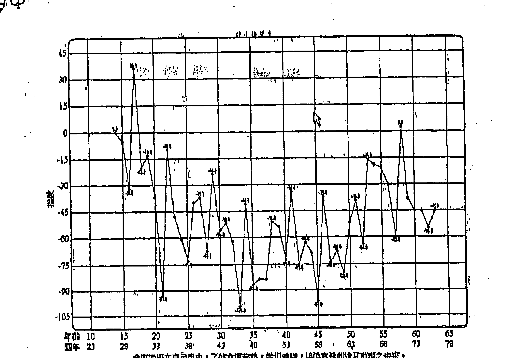

命運掌握在自己手中，了解命運走勢，掌握勝算，便是掌握自己命運之未來。

| 项目 | 内容 |
| :--- | :--- |
| 男-國曆 13年4月30日16時 | 聯絡處：台中郵政45之2號信箱或 E_mail：erl@hyu@ms2.hinet.net |

由哥哥處理，所以能夠彰顯其強勢財運的機會就這樣的埋沒了。三十一歲到三十五歲間公司還是在哥哥的掌理之下穩健的經營著，並沒有多大的進展，但是三十五歲哥哥去世，公司由伊藤先生接手，在他戮力經營、改變經營方針的強勢主導之下，公司業績開始大幅成長，該年他的財運曲線正處於高指數區，所以，在他領導之下業績呈現突飛猛進的成長。相同的，筆者也曾將這一發現用來觀察企業或公司營運狀況好壞，只要該單位是由財運指數處於強勢階段的人來當主管，該公司或部門一定是最賺錢的單位，當然當該主管的財運指數轉趨衰弱時，該部門或公司在其主管之下也會淪為賠錢的單位，此時應當立即調整職務，換上具有才幹且財運指數都處於強勢區的人當主管，才能改善困境。 在兩次石油危機期間，他的財運曲線也跌入負數區，而且跌幅不小，但是為什麼能渡過難關，直到目前為止都經營得有聲有色呢？就在於他能知人善任，這段期間他拔擢由基層幹起的鈴木先生擔任副社長，並放手地由他大力進行整頓與改革，並導入電腦化，終於將公司的經營體質徹底改善度過難關，並於景氣復甦時大展鴻圖，而他此時呢？只做一些大原則大方向的宣示，並不介入或干涉副社長的事務，放手由副社長進行公司經營體質的改善工程，於是公司業務仍是欣欣向榮。

在他命宮來看坐右弼星，對宮會入天同、天梁加文昌，右弼星主寬厚帶有點嚴厲，天同星亦主「寬厚、忍讓、融合」的力量，天梁星它是「領導、統帥」的表徵，具有先見之明、逢凶化吉和優秀領導能力，所以他能預見困難、並知人善任，讓富有才華、精明能幹的副社長來主宰公司事務，以彌補自己衰頹運勢帶來的經營困境，若不是他有這些星宿的特質來配合，能在自己運勢衰弱時，急流勇退交棒與財運指數正處於強勢時段的副社長，公司可能就在石油危機期間倒閉了。 前一陣子國內中部地區有許多財團發生經營危機，其企業主多是「殺破狼」格局，雖然能衝鋒開創新局，但自負之心也強，難以聽進專業經理人的建議或欠缺識人之能，無法拔擢重用具有互補性的秀逸才幹之士，在公司大家都習慣於服從最高領導的頤指氣使，在強勢主管之下人人都成了庸庸碌碌之輩，可能是個人在企業內的生存之道，卻也喪失了員工的創意自主性，無法有創意的員工出頭，一遇公司陷入困境大家便鳥獸散，無法從中找出如鈴木先生一般的卓越經理人來力挽公司的經營困境，所以，我一直建議那些殺破狼格的企業主，要晉用一些看起來很保守的「機月同梁格」之人，雖然這些人不善於開創，但掌握大大小小的細節卻很精準深入，公司經營瑣碎的事務都能掌控得很好，一個公司組織人事佈局得好，就是成功的一半，加上業主能聽得進建議就更十全十美了，但問題是「殺破狼格」的業主實在很難達到這個境界，即使能聽得進別人的話，他也無自知之明和預見困境之能力來分辨箴言和阿諛奉承之差別。

伊藤先生晚年因為經營事業成功，成為大家公認的流通業經營典範，在業界具有非常崇高的聲望，也獲得日本政府頒發獎章以表揚他卓越的經營事蹟。

再举一例屬於感情困擾的案例，此女原來在一家婦產科擔任護士，后来和裡

| 宫位区间 | 天干地支 | 星曜组合 | 其他信息 |
|----------|----------|----------|----------|
| 53-62 | 癸巳 | 右弼、天马、禄存、七杀、紫微 | 疾厄 |
| 43-52 | 甲午 | 天姚、擎羊 | 八座、天才 |
| 33-42 | 乙未 | 铃星、红鸾 | 天巫、三台 |
| 23-32 | 丙申 | 地劫 | 夫妻 |
| 13-22 | 丁酉 | 左辅、天钺、破军、廉贞 | 兄弟 |
| 3-12 | 戊戌 | 火星、天魁、天府 | 命宫 |
| 103-112 | 庚子 | 天同、太阴、龙池 | 福德 |
| 93-102 | 辛丑 | 武曲、贪狼、天喜、文昌、文曲 | 田宅 |
| 83-92 | 庚寅 | 太阳、巨门、凤阁、天刑、地空 | 官禄 |
| 73-82 | 辛卯 | (空) | 仆役 |
| 63-72 | 壬辰 | 天机、天梁、陀罗 | 身宫、迁移 |
| (其他宫位信息) | | | |

阳女
金四局
(平地木)
阴历丙申年6月18日酉时
生肖：猴

命主：贪狼
身主：天相

45丙申年

阴历虚岁

徐芷生
E-mail : ezway@msa.hinet.net
或 ziwi88@hotmail.com

月德

天壽

恩光
天貴與醫師談戀愛，於二十四歲結婚，當初結婚時，公婆就強烈反對，希望兒子能找一個女醫師為配偶，可以夫唱婦隨開家婦產科醫院，而且婦產科由女醫師來看診可以減少病患的顧慮，當然醫院就能業務蒸蒸日上，但兒子偏偏選上護士，在阻止不了的情況下，就伺機破壞兒子和媳婦間的感情，譬如三更半夜有孕婦臨產需要先生接生時，公婆必然會叫醒媳婦陪兒子一起看診，或鼓勵兒子看哪一個護士覺得不錯就去追，當父母親的不但不阻止還鼓勵先生亂搞男女關係，所以，婚姻生活一直在隱忍痛苦中渡過，由於丈夫接二連三的外遇，在家裡又得不到公婆的奧援，於是不得不於四十二歲離婚。

由她的命運曲線來看，在適婚年齡階段，她決定結婚的那一年雖然不是在婚姻指數最低的地方，但是也處於婚姻指數次低的時段，所以，於此種時段決定結婚，往往會有所託非人、愛不對人……等的缺憾，可能在結婚當下並不覺得，但過了一段時間問題才慢慢地浮現，也就是說，在婚姻曲線低的時段結婚，結婚當下就播下了婚姻失敗的種子，而且在十五～四十三歲的婚姻指數曲線都處於負數區，此種曲線結構下的婚姻，多半會存在不穩定的因素，如兩人個性不合、同床異夢、對方粗暴、對方沒有家庭責任或對方事業失敗等因素，一旦適當時候來到就會爆發出來使婚姻破裂，各位或許會問到底要哪一個時機結婚會比較好呢？由她適婚的年歲來看，婚姻指數都相當低，代表這一段期間找不到好對象，即使她在二十三歲是處於適婚階段，婚姻指數最高之點上，但還是處於負數區，即便是找到人人稱羨的金龜婿—醫師，也不能保證婚姻一定美滿，因為，此命格先甜後苦的感情生活。
再來看她離婚的四十二歲，正處於婚姻指數向上升的開頭段，其實他決定離婚是在四十一歲而於四十二歲簽署離婚證書確定，各位可以看到婚姻指數由四十歲到四十一歲間的下降幅度達一十五點的程度，代表這一段期間的感情有非常重大的轉折，由對婚姻還抱持一絲希望的心境轉換為絕望，而下定決心離婚，所以在曲線降幅大的時段下決定，往往會產生負面的、不利的、失敗的決策，因此而造成遺憾之事件，假如沒有預做調適或事先預防，往往會造成不可彌補的傷害，若能預見，早做因應之道就可避免或降低傷害的嚴重性。

而她在四十三～五十一歲間的婚姻指數都往上升，代表離婚後，她還蠻愛她先生的，尤其在離婚的當年婚姻曲線是屬於觸底反彈的時段，表示該年感情有加溫的趨勢，但可能雙方都拉不下臉留住對方，所以離婚了，但思念總在分手後，離婚後由於思念而使得感情日趨深厚，所以離婚時也沒有和先生要贍養費，她也還住在先生以女兒之名購買的別墅內，兩個人三不五時還會聚一聚像是朋友一般，問她為什麼不再嫁？她說沒有婚姻的束縛反而生活得更坦然自在，管他去和誰外遇！而先生這一邊呢？外遇漸漸少了，以迄於沉寂，也在冷靜的思考是不是要辦一次隆重的婚禮將前妻迎娶回來。

由命盤上來看，四十三～五十一歲的大限夫妻宮坐『天機權、天梁、陀羅』，天梁有逢凶化吉的力量、天機為善星逢化權的激發有往光明善良面發展的意思，所以雙方都有破鏡重圓的意願，但是陀羅星同宮作祟而有拖延、猶豫之現象，相信經過一段時間的培養，這對怨偶會破鏡重圓，恩愛更勝於以往。

命運曲線的應用

由命運曲線可以了解命運的起伏轉折，但是，是為了什麼原因發生轉折並不清楚；而命盤的宮位和星宿組合就可以顯現出事件的形貌，因此，命運曲線和命盤兩者互相參照，就可以了解是什麼事情引起命運的變化，以便即早因應之道。近來流行所謂的人格特質分析，透過心理學人格特質分析的手法，就可以發掘個人的人格特質、職業適性、決策風格、承受壓力強度……等，應用在協助學生選系、或企業人才進用的參考，人事單位可以根據這些特質，安排適才適所的職務，也可以避免因為「人」而引起的組織運作問題，對於提昇經營團隊的整體效率，有非常大的幫助。

定了公司從電腦界銷聲匿跡的命運；相同的，國內也有一家電腦公司原來經營的有聲有色，還發展成跨國公司，聽說最近又面臨了經營困局，老闆是同一人，人格特質也沒改變，為什麼當初眼光銳利的他能夠洞悉電腦的市場，白手成家，將一個資本額僅一百萬的小公司，經營成一個跨國企業，而在此一時，卻面臨大大小小的決策都受挫的窘境，這就是命運起伏造成了決策成敗的現象。

由於服務公司的業務關係，也曾利用紫微斗數來探討企業經營的興衰與企業主的命運起伏的關係，結果發現不管是企業家或是明星，假如能在命運曲線處於強勢區下決策，都能掌握運勢最強、最旺盛的時機發展成功的事業版圖，假如在命運曲線的弱勢區段，下重大事情的決定，一定是不得時、不得勢或錯誤的，導致公司挫敗，因此知道自己命運居於劣勢時，投資理財應當保守一點，避免損失。

假如，能活用命運曲線和命盤，就能很快的掌握命運強弱時機，對於個人生涯規劃、企業投資決策都有非常高的參考價值。

第二十四章 結語

市面上流傳的紫微斗數派別很多，大部份是後人妄自追加的，就好像當初釋迦牟尼佛祖初創佛教時一樣，後來由於有眾多優秀的弟子分別以不同的角度闡釋佛祖理念，因而衍生出不同的教派，紫微斗數也是如此，經過二千多年來的演繹發展也分成若干流派，市面上較流行的派別有：飛星派、占驗派、三合派、流年派、小限派、星化派等。

到底這些流派的推命規則是否符合紫微斗數初創時的面目？由於師承即是飛星派且對於其他派別所知不深（先師沒自稱過是飛星派），故就以師承之飛星紫微斗數論命之內涵和大家做一解釋，有人以為本派只以四化在命盤形成的角度來論命運吉凶，這是錯誤的，我們在衡量事件的面貌和其嚴重程度時，各個宮位星宿組合也是具有舉足輕重的影響力的，在「時間、空間、事件」三要素之間，「星宿、四化、宮位」等命盤符號各代表不同之意涵，不可偏廢某一符號在推演命盤時所擔當的機能，相同的，其他流派也應如是觀，因此，研究命理若偏執一宗，則往往誤入歧途，在初入門之時，如能建立正確方向，可以減少許多摸索時間，筆者有鑑於坊現有書籍，有些誤導同好研究方向，乃將個人心得公佈出來，盡量以教科書的方式來編寫，將推演命盤牽涉到各個相關的因素皆納入本書範圍，希望「萬流歸宗」，架構研究紫微斗數的原理和推演規則，以建立一個比較正確而健全的研究基礎，不再不同流派間眾說紛紜莫衷一是，但是命理之學浩瀚無涯，有掛一漏萬之處，還請各位讀者先進來函指正。

個人研究紫微斗數已經二十多年了，年少時之狂熱，及至中年學習面臨瓶頸的徬徨與困惑，甚至想放棄，到知天命之年豁然開通而堅持繼續斗數之絕學，一路走來顛顛仆仆，甘苦嘗盡，幸好有家人的支持與同事之切磋相輔相成，蓦然回首已是兩鬢飛白，時常上網觀察許多後起之秀，仍孜孜不倦地學習紫微斗數，乃興起將所學心得做完整的整理，供大家研討切磋的念頭，以使紫微斗數的研究日益精進。

當然紫微斗數並非唯一的預知學，尚有四柱推命術、西洋占星術等都是以個人出生時間為基準來推算命運的預知學，網路上有許多的爭辯到底誰準或誰是非等，筆者也曾研究過西洋占星術，並和斯界前輩討論推命之結構，發覺各有所擅也各有其缺憾，譬如紫微斗數就能精確地推算事件的因果關係，如你一搬家錢財就進來或你一嫁過去對方阿嬤三個月內去世等的推斷，但是描述一個人的內心想法或個性就不如西洋占星術來得精確細膩，至於紫微斗數共盤的問題在西洋占星術而言是不存在的，雖然紫微斗數也可解決此一問題，但比起西洋占星術只用一個盤就要繁複的多了。

還有一個問題是曆法制度的問題，四柱推命術與西洋占星術都是採用太陽曆，唯有紫微斗數採用太陰曆，就是俗稱之陰曆或農曆，由於歲差的關係每十七年要置七個閏月，閏月造成很多的困擾，到底出生於閏月者其出生月份是要算上個月或是次月呢？雖然紫微斗數界普遍地以閏月的十五日為分界點，十五日前算上個月，十五日後算下個月來論，但總是眾說紛紜，沒有一套令人信服的理由，只能由實務論命中去推敲「可能」的規則，假如在曆法問題上不能有清楚的定義，經年累月地累積起來的誤差，將會逐年增大，那麼紫微斗數就如會流沙之塔般，很快地被淹沒在歷史的長河中。

在命運是由「時間、空間、事件」三要素構成的基礎上，架構出命盤和其推算命運的結構，並將此三要素納入運算因子的只有紫微斗數，但是紫微斗數的排盤規則至今仍是個謎？為何有天府星系和紫微星系的順行逆行？起寅首的規則如何而來？五行局是如何訂定下來的？排星宿時為何要空一或隔一？……等等都是大可探討的題目，筆者相信這裡面含有紫微斗數形成的秘密，假如能破解其中的奧妙，那麼要精進紫微斗數的精確度將不是難題。

筆者深信以現代知識較之於古代更豐富多樣，輔助工具如電腦等也日新月異，應當可以拆解其中謎團，能知道其中原理，就能改進目前之缺失，或另行發展出一套能更精確預知個人命運的學術；現代有很多人提出批評紫微斗數，但是從未見其能發展出一套比古人更精準的命運推理系統，其中之癥結值得大家思考！

什麼叫科學？科學是人類運用智慧探索自然而得到經驗的累積，演化成各種學問，如：化學、物理學、統計學……等，是先有智慧才有科學，對大自然的萬事萬物都存疑，進而深入探索，才發明各種事物，而不是人類先以既有之知識將萬事萬物分類，指定哪一個是有益的要發展，哪一個是無益的要消滅，事實上證明，有很多有益於人類的發明都是由似乎無益的事物上找出來的，例如水蛭曾經是人見人厭，恨不得除之而後快的吸血蟲，但是從它身上卻提煉出來抗凝血劑，成為治療心血管疾病的藥方；所以，以科學的立場，任何探索未知的事物都是值得鼓勵的，預知人未知的未來也是一項充滿挑戰性的研究課題，經濟景況的預測沿用經濟學的觀念，氣象預報由觀察雲層、氣團的移動而推測，這些學術對改善人類生活發揮很大的作用，假如在當初萌芽階段就被斥為迷信停止研究，今日也就不會有「氣象預報」或「景氣預測」了。

所以，希望大家都能以「探討」、「求知」的心態來研究紫微斗數，面對問題時常以5W1H來探索，而不要凡事相信或凡事否定，抱持這種心態才能每一件事物獲得真善美的發展，否則有很多可能形成的知識就在萌芽中夭折了，這人類探索未知的損失。

我相信二十一世紀的科學研究將會加強探究「人」的世界，人類已花了太多時間、金錢於物質科學，但對於「人」卻了解得太少了，中共中央科學院在特異功能、意識傳感、行為預測等方面已有重大成就，記得曾在報紙上看過一篇報導，其大意如下：
在上海將具有圖像及文字的文件，利用具有意識傳感能力者發送，在北京也有一具有此能力者接收，即使他們都不懂上面所寫文字（俄文），但都能不過無線電或電傳的既有設備上正確的發送與接收。

在國內也有研究機構專門探究特異功能或超能力，人類具有意識超能力已被證實，且被科學界重視投入研究，不再以荒誕不經、怪力亂神視之，以前所謂的迷信或是靈異現象，未來將是熱門的研究主題，只要你具有洞悉未來的智慧，你就能成為未來科學研究的先驅者。
古人說得好：
欲窮千里目，更上一層樓。

而不是叫人砍去所有妨礙的事物，宇宙之所以偉大，在於它能兼容並蓄萬事萬物，讓所有都能各有發展的空間，而人類千年智慧之結晶，對於宇宙的所知仍如滄海之一粟；由歷史演進之軌跡來看，能融匯各種文化的朝代，一定是富強的朝代，如初唐時之盛世，反之清朝中期以天國自居、視歐美各國為蠻夷之邦，排斥西方事物，因此清朝末年國勢積弱不振，成為列強宰割凌虐的對象，何不讓我們敞開胸懷，接納萬事萬物，研究其中之道理、探索未解之謎呢？筆者深信，成功屬於那些「我相信，所以我將看得到」【I believe, I'll see!】的人。從古以來，那些探險家、科學家、創作者、發明家等，都是在「沒有既成事物」的道路上，找出嶄新的東西來，他們能孜孜不倦、鍥而不捨的在創新開發的漫漫長路上獨行，所憑藉的正是「一股堅毅的『我相信，所以我將看得到』信念，所以我們今日也才能享受他們所創造出來的事物，像張騫、蔡倫、哥倫布、愛因斯坦、愛迪生等，這些都是出類拔萃的創新型人物，對全人類的福祉作出偉大的貢獻。而那些「我看見，所以我才相信」【I see, Therefore I believe!】的人，永遠只能當個「追隨者」，在後面追逐『我相信，所以我將看得到』的人的足跡，享受先知先覺創造出來的成果。

> 【I believe, I'll see!】

> 【I see, Therefore I believe!】

所以希望看完本書後，您也能成為一位『我相信，所以我將看得到』的人，在所有可能探索的領域中，成為獨領風騷的『創新者』。最後謹以信命不如無命，唯有『創造』才能突破命運的束縛！獻給本書讀者作為結尾。

紫微斗數源自希臘印度？

> 〈詳情請閱:2001.10.31中國時報:紫微斗數源自希臘印度 陳希林／台北報導〉

民國九十年十月三十日在故宮博物院舉行的「蒙元文化與學術研討會」上，中央研究院院士何丙郁發表論文「蒙元科技的特色」文中指出，今日的紫微斗數探究其來源，其實來自希臘文化對星座的研究，後來並加入印度的影響。

何丙郁院士將台灣流行的紫微斗數推算方法和明代的「張果星宗」、元朝的天文研究成果，發覺推算出來的結果相同。他認為這樣證明了紫微斗數、張果星宗等都與元朝的方法同源。他即將於英國出版的新書「Reaching out to the Stars」裡也對此問題有詳細的討論。

進一步探求，也可以發現紫微斗數名詞裡有不少來自希臘、印度的星座名詞，例如「羅喉」就是印度發音。

在公元十世紀到十四世紀之間，中國的傳統科技發展達到高峰，而且一個領域的成就往往開啟另一個領域的新頁，例如數學、天文、曆算之間的關連。

天文、曆算等抽象思考的風氣為何興盛於金、元之際？何丙郁將這個問題放進社會因素中思考。在這個避亂的世代，十二世紀的李冶與十三世紀的朱世傑等人與道士的往來可能有利於抽象思考的形成。

其次，外來的文化在此時期湧入中國，人的遷徙大增，也有助於智識的交流。何丙郁說，穆斯林的天文學者在此時期來到中國的天文局工作，引進了穆斯林及希臘的天文與曆算學；中國的天文學者也被送到異邦進行國際交流。

另有學者對於元代學者與道家之間的關係提出不同見解。中央研究院歷史語言研究所研究員洪金富認為，在元代之前道學已有悠久的歷史，但在元朝道家的勢力並非鼎盛，因此元代學者與道家之間智識交流的關係應有再探討的空間。

國家圖書館出版品預行編目資料

紫微斗數命運分析／徐曾生著－初版．－臺北市：進源，2010.03

面；公分．－－（斗數叢書：7009）

ISBN 978-986-6253-02-7（平裝）

+   1. 紫微斗數

293.11 99003439

◎斗數叢書 7009

紫微斗數命運分析

+   - 作者: 徐曾生

+   - 出版者: 進源書局

+   - 發行人: 林莊橙樺

+   - 法律顧問: 黃沛聲律師

+   - 社址: 台北市華西街61-1號

+   - 登記證: 新聞局局版台業字第5783號

+   - 電話: (02)2304-2670・2304-0856・2336-5280

+   - 傳真: (02)2302-9249

+   - http://www.chinyuan.com.tw

+   - E-mail: juh3344@ms46.hinet.net

+   - 郵政劃撥: 台北50075331進源書局帳戶

+   - 電腦排版: 冠政（股）公司

+   - 印刷: 原振企業社（國利）

+   - 初版日期: 二○一○年三月

+   - 出版日期: 二○一四年八月(四刷)

+   - 定價: 平裝新台幣450元

著作權所有・翻印必究

◎本書如有缺頁破損或裝訂錯誤，請寄回本書局調換