命運分析
宮位論斷

徐曾生 著

## 地藏菩萨本愿经讲记

### 讲记

地藏菩萨本愿经讲记

台湾慧律讲堂恭印

## 作者序

自從紫微斗數命運分析一書出版之後，由於提出學習斗數的架構性觀點，成為海內外研習飛星四化紫微斗數的必讀，作者也陸續收到来自大陸、日本、馬來西亞、新加坡等地的同好捎来訊息，對於該書大為讚譽，幫助他們突破學習紫微斗數的困境，讓功力更加精進，甚至還成為教科書呢！

由於書中揭示要出實例篇一書，筆者也努力搜集案例作為編寫素材，由於筆者年紀大、中文輸入慢，2012年接近完成時，電腦突然掛了，不得以系統重灌，卻忘了加密檔案的金鑰沒備份，新系統看得到檔案名稱卻打不開檔案，心想必是天意不讓出版，於是停筆不寫了，但進源書局林老闆殷殷催促或同好網路來信、FB 留言紛紛詢問實例篇出版否？眼見眾多朋友的熱切期盼，又有先前與讀友宣告的訊息，不寫實有辜負讀友殷切之企盼，於是再度提筆斷續的寫，前後間銜接不是很順暢，還請見諒。

紫微斗數易學難精是公認的事實，隨研究時間前進接觸案例多樣化，會發現應用範疇超出十二宮事例，到底紫微斗數應用的極限在哪？希望讀者能發揮想像力突破應用框架限制，讓論命的功力更加精深！

命例講解可從多方面、多角度切入，才能面面俱到，筆者盡其所能，仍怕有所不足，更期盼各位先進不吝斧正。

筆者不想本書陷入一般分析案例的窠臼，又鑑於本書讀者必研究斗數多年，特設「命例測驗」章，將〔案例事蹟〕和〔命盤〕分開，讀者盡所學之能，看能否找出對映的事蹟與命盤（有附解答），之後再閱讀筆者之分析，想必經過〔思而後學〕的過程，必能加深學習印象。

書中命例已經隱去生日資料，若事跡與讀者有雷同之處，還請讀友海涵。

此書是筆者的經驗之談，希望能帶給有心深入研究四化飛星紫微斗數的愛好者有用的學習資訊，也祝福大家學有所成。

徐曾生
於2016-07-07

## 作者開班授課訊息

筆者退休可以兼做些副業，打發時間，開辦下列班次與讀者結緣，可斟酌程度選擇適當班次…

-   四化飛星紫微斗數：從基礎教起：排命盤、命盤元素解說（干支、生剋、方位）、十二宮職機能與變化、星性（含解釋紫微斗數全書的疑義之謎）、生年四化與各宮四化象、格局等。
-   飛星四化論命班：動盤四化象演繹變化、四化互動關係、如何解釋動態宮 - 星 - 化象成人事物象或樣貌，四化之轉化用法，元神宮之謎，十二宮的動盤變化（搭配案例解說）
-   案例研討班：純粹實際案例講解為主，參加者必須熟悉各種化象技巧，授課以探討各種事件的立象宮、與各種化象的關連為主。

如果您對上述班次有興趣，歡迎洽詢～
電話：0911-133639 或 04-22632397
E-mail: ez.way@msa.hinet.net ，
Line: ID:ziwishyu ，
WeChat: ID:ziwidoso 或 Facebook 徐氏飛星四化紫微斗數，都可留訊息給我。

## 目 錄

-   作者序 002
-   作者開班授課訊息 004
-   目錄 005
-   學好紫微斗數 008
    -   開場白 008
-   命理故事 035
-   星曜轉變幻化萬象之源 053
    -   何謂「星的質化」056
    -   何謂「星的異化」062
    -   何謂「星的類化」064
    -   星的氣化 066
-   四化飛星起手式 074
    -   命限運途和化忌角度關係 106
    -   同類忌沖 化象 125
    -   忌沖命宮 化象 129
-   紫微「抖」數 132
-   命例測驗 145
-   命例測驗一事蹟 146
-   命例測驗一命盤 155
-   解答 190
-   實例解說 192
-   【命例一】 192
-   【命例二】 202
-   【命例三】 208
-   【命例四】 216
-   【案例五】 228
-   【命例六】 238
-   【命例七】 246
-   【命例八】 252
-   【命例九】 258
-   【命例十】 264
-   【案例十一】 276
-   【命例十二】 288
-   【命例十三】 296
-   【命例十四】 302
-   【命例十五】 310
-   【命例十六】 316
-   【命例十七】 324
-   【案例十八】 334
-   【命例十九】 342
-   【命例二十】 348
-   【命例二一】 354
-   【命例二二】 360
-   【命例二三】 366
-   【命例二四】 370
-   【命例二五】 376
-   【命例二六】 382
-   【命例二七】 388
-   【命例二八】 394
-   【命例二九】 402
-   【命例三十】 408
-   【命例三一】 416
-   【命例三二】 420
-   【案例三三】 426
-   【命例三四】 436
-   【命例三五】 444

## 學好紫微斗數

### 開場白

學紫微斗數面對命盤，必須要清楚命盤中的符號代表的意義與機能，才能根據命盤來推命。

紫微斗數的命盤有各種符號，有：星曜、天干、地支、宮名、大限。初學者往往被這些符號搞得頭昏眼花，分不清楚這些符號各司何事？各司何種機能？

我們受語文訓練時都知道敘述一件事，必須有：人、事、時、地、物等要素才能明確，同理命盤用來推理人之命運，也應該從命盤中推理得出這些要素，具體的敘述命造發生之事件，因此命盤的：星曜、天干、地支、宮名、大限等元素分別表現：人、事、時、地、物等要素，以明確的描述事件。

學好紫微斗數 009

45~54歲大限 十年的命宮

流年未歲數

| 巳 (乙) | 午 (丙) | 未 (丁) | 申 (戊) |
|----------|----------|----------|----------|
| 陀羅 破軍 武曲 5月 35~44 乙 子女 巳 | 鈴星 左輔 祿存 太陽 6月 丙 夫妻 午 | 地劫 擎羊 天府 7月 15~24 47 丁 兄弟 未 | 右弼 太陰 天機 祿 科 限官祿 5~14 48 戊 命宮 申 |
| 天同 權 限命宮 45~54 4月 甲 財帛 辰 | 陰男 土五局 丁酉年☆申時生 星曜 化星 |       | 天鉞 貪狼 紫微 9月 49 己 父母 酉 |
| 地空 天姚 3月 癸 疾厄 卯 |  地支-辰 未年斗君 |       | 巨門 忌 10月 50 庚 福德 戌 |
| 文昌 天馬 限夫妻 2月 壬 遷移 寅 | 七殺 廉貞 1月 癸 交友 丑 | 文曲 天梁 12月 限財帛 壬 官祿 子 | 天魁 火星 天刑 天相 11月 51 辛 田宅 亥 |

未年2月

宮干-癸

人事宮-官祿宮

### 命盤上的符號

所以，命盤符號與事件五要素有關係，解命盤也就在找這些符號與要素間的關係，地支主掌時間，所以我們說子時、午時…等等，星曜結合宮位呈現人事物形象或樣貌，譬如廉貞在官祿代表法律，在田宅代表電氣用品，在夫妻代表夫君樣貌特徵，所以星曜會隨宮而改變形象，星曜要熟悉才能靈活運用，隨所問事項而轉化事物象說給顧客聽～這是關鍵喔。

而天干就比較複雜了，基本上它是表現空間關係，用「表現」一詞有些不妥，因為它還有貫聯時空因素的機能，因為運途是動態變化，十二個時辰時時在動，流年也在動，在大限流年流月的轉變當中，如何連結起中間的關係，需要藉助天干，而連結這些動態運的連結因子就是四化，所謂先天垂象就是本命飛化，譬本命財帛飛出化祿在戌位，財帛的垂象＿化祿在戌位，當大限盤轉動、戌位變成大限的財帛宮時，就應了先天財帛的化祿垂象，這就貫穿連結起了先天與大限的關係，才不會有亂飛之嫌，其它的化權化科化忌相同，同理大限也會飛出四化垂象，而和先天命局飛化的垂象搭配，而構成一張立體交叉的飛星網路，貫穿聯結起時空因素。

要解譯成人事物形象樣貌，必須嫻熟宮 - 星象意，如果向你的顧客說：你的疾厄被廉貞化忌沖到…健康有損，這種解釋讓聽者不清不楚，我們還要根據星＝廉貞，星化象＝廉貞化忌，化象＝忌沖－凶，宮名＝疾厄，解釋得出心血管之疾，用聽者熟悉或常用的語彙說明才聽得懂。

若是 廉貞化忌沖田宅，就是田宅被查封，因為廉貞＝司法，廉貞化忌＝官非，忌沖＝凶惡、不吉，田宅＝房屋田地，總合起來就得到房屋查封 或 田宅遭法拍 的現象，這樣，是不是把…星－宮－化象 的關係連結起來就得出人事物形象或樣貌？！因此，紫微斗數的精髓就在【借干遁星假象…】就可以精確的形容或表現出事物象。

還欠缺…時間 這個因素，因為這個事件何時會發生？凶事可以提早預防，好吉事也可早作努力，所以【時間】在推算得出【事物象】之後，是必須推算得出的重要因素，但是要如何推敲得出【什麼時候出事】呢？…假象合支應時…簡單一句話，把事物象要如何找出應驗的時間的關係點了出來，這個支就是地支，我們根據是何種化象？就可下判斷應驗的時支！

學習紫微斗數就在解開命盤裡的星曜、天干、地支、宮名、大限等元素，和四化飛星構築起來的立體交叉飛星網路之間的關係、有沒有構成特殊吉凶效應的角度（化象）？與地支（時間）構成的關係為何？再結合宮 - 星象解釋得出：什麼時間會發生何種凶禍或吉事。

### 星曜運用

在網路上流傳著多起周老師神奇論斷、令人拍案叫絕的事跡，各位可能是聽說而已，而我卻是身邊朋友的親身經歷，各位可曾想過為什麼周清河老師的學生都是一樣姓徐又都居住相近的鄉鎮，因為其中有人給周老師算過，拍案叫絕的論斷，於是藉著家族掃墓或年節聚會，向親友述說而一傳十、十傳百地傳播開來，其源頭就是那位開照相館的老闆，其後去被周老師算過的人回來也都會評論或傳述被算的神準趣事，聽者也會懷疑真有其事嗎？而欲一探究竟，像筆者就是這樣被吸引而投入研究紫微斗數的行列，為什麼周老師的學歷並不高，也不談什麼高深的易經或宋明理學，但卻能精準的斷命呢？有的人架構了臃腫的斗數理論，卻難以斷命呢？其中的關鍵癥結點就在於～

-   活用立象技巧
-   靈活運用星曜：含輔星煞曜
-   四化技巧

這些東西看起來很簡單，應用起來，卻有很多的玄機奧妙在其中。

### 立象技巧...

大部分的人都只會用同類忌入或同類忌沖的手法，拿到命盤就一個大限、一個大限、一宮又一宮的查起，看看有沒有同類忌入、同類忌沖的化象出現，若有，當然就可依照化象論斷吉凶，但若沒有上述化象，就不知道如何論命談運了！其實還有很多的人生現象不在於十二宮之內，卻實實在在的存在於你我身邊週遭，譬如：認養小孩、拜義父母、胚胎發育不良、風水導致生病、…等等，多到不勝枚舉，一定會有人認為認養小孩、不就是子女宮主宰的事務嗎？子女宮有坐巨門就是了啊，因為巨門是暗星，叫你爸爸卻不是你的小孩，不就是巨門暗星的星象嘛！而拜義父母也是看父母宮就好了，也是一樣，如果父母宮坐巨門，這顆暗星就意旨不是名正言順的生身父母，而是在戶籍謄本上沒有紀錄的父母，也就是義父母、乾爹乾媽之類的，不知道各位對於上述課題是不是也是這種看法呢！或是根本不會去在意這種事項！如果存有這種想法，就會失掉許多可供深入探索的線索，也掩蓋住通往精通紫微斗數之路，這些事項雖小而微，讓人幾乎要忽略了，但是也有因為重拜義父母而改變命運的實例，實在不能以等閒來視之，但要推敲這些事項的立象宮就不是單一宮位所能表現，而是還有其它宮位合併起來立象～這樣就跳脫了只有十二宮的範圍，因而能更精細、具體而微的推斷出來。

舉個實例來分享～曾經看過一個罹患癌症的案例，她是已經確診罹患癌症了，來算命是想看結局會如何？有沒有得救？抑或是來日不多？於是，就排出命盤來幫她推敲。

若是，各位聽說對方已經確診罹癌了，拿到她的命盤不知道會從何處查起呢？當然，我也是直覺地和大家一樣由疾厄位查起，但是左看右看、都沒有疾厄或命宮同類忌沖的凶恶化象存在？但人卻已經被醫生確診、宣判罹癌了，於是又從其它十一宮一宮一宮地審視，果然發現田宅宮化象頗為凶惡，但還不敢確定，於是根據田宅宮的星象，問他：「你家的環境如何？是不是有個什麼樣的東西放在何處？」果然是有所形容的東西放在該處，於是、建議他趕緊移除，此時與她同來的父親，卻頗不以為然地說道：「哪有這種可能？」

是啊！這種事～確實很抽象也很玄，完全脫離了「科學」的邏輯思考範疇之外，難怪老人家也質疑，此時只好解釋給他聽，這個東西～白色大石頭，是風水學上拿來鎮煞氣用的，又名《石敢當》，人們常在路沖之處立個大塊白石頭，阻擋、化解直沖而來的煞氣，保佑往來人們、車輛的平安。白色巨石本身就有很強烈的煞氣，藉著白石頭本身具有的能量，以毒攻毒遏制沖來的煞氣能量，在金門島上有很多《風獅爺》擋住北方凜冽的風勢，讓家宅平安、農作物收成好。

或去香港，也會發現許多大廈的基座柱子上也有《石敢當》的牌位，定時的祭拜，以保佑大廈內住戶平安。但是這些白石頭具有煞氣，為了使煞氣不會危害主人，都會以朱砂點紅，或是綁個紅布條來化解煞氣，若沒化煞就會傷害人，在白色巨石前後左右的人，就要注意受到傷害，輕則家宅不安頻生怪病，重則傷人性命。

聽我這麼一講，他才想起、並回應說大理石前方對街的住戶也是罹患肝癌，剛去世沒多久，也才相信風水也會傷人的說法。

其實，這也不是我發現的，和周清河老師學習時，就曾面見他為客人推斷祖先墓葬不佳而影響陽世家人健康的實例，命造自述家裡人事不安，不時生怪病也治不好，或是發生莫名怪事而受傷，使得全家人心惶惶，看醫生也沒法治癒，想來借助命理是否有解決之道？周老師瞧了瞧命盤才篤定的對他說：「你知否？你阿公在游泳了嗎？」「沒有啊，我阿公已經去世了。」老師抬起頭緩緩的：「我是說你阿公的骨骸在泡水了！」對方露出狐疑又難以置信的表情，老師看了就加強語氣說：「若不改善，家運問題會愈來愈嚴重！」當然也教他如何做，二個月後對方回報說確實如此，要請周清河老師幫他挑選良辰吉日再安葬。

當然各位會想…怎麼知道祖父墳墓泡水？而且與家運不安有關聯？大家想想看那一宮可以看出祖父泡水？家運與那一宮有關，果然經過處理之後，家裡人罹患的怪病陸續痊癒，而且家運也轉趨順遂平安。

在紫微斗數界堪稱奇人的康國典大師也有過類似的事蹟，他在一九七八年左右罹患胰臟癌，看遍台灣知名醫院都判定已剩沒多少時間了，某日作夢夢見三清道祖要他到日本傳他的宗教，他本來就打算赴日本就醫，因為當時日本醫界技術確實比台灣先進，在治癌方面也強了許多，但赴日治療費用可不便宜，為此猶豫中，此夢促成他下決定，於是到日本，經友人推薦名醫，果然病情得到控制，便如三清道祖的指示留在日本傳祂的教。

不久就以精準的論斷，名聞政商界，但日本東京都近郊土地可說寸土寸金，要買土地、建廟工程所需龐大資金，仍相差甚多，剛好此時崎玉縣有位大地主，家人輪流罹患怪病，花了重金、看遍各地名醫都無法治癒，糾纏甚久，在聽聞康大師的名聲後，就登門求治，康大師一看盤就問他、在某方向的窗戶下是否有塊大石頭？地主點頭稱是，於是，告訴地主只要把石頭移除之後，家人的怪病就會痊癒，地主回去照做，果然，三個月內家人怪病陸陸續續痊癒，於是對康大師頗為折服，交相往來不時請益，於聽說康大師的願望後，便捐了一片位於坂戶市的農田作為建廟的基地。

這個事例也曾上報，引起我回憶當年跟隨周老師親見的案例，啟發我的靈感來探究其中奧妙，而親見類似命盤時，終於轉化活用解了當事者的謎團與問題。

臨截稿前又遇到一個案例，也是位罹癌的女性，一樣～疾厄宮或命宮都沒有見到同類忌沖的凶象，卻罹患了惡疾，因為有先前經驗，就審查田宅宮，確實田宅位衝得很厲害，命與大限都衝破，再看坐星如何？一看文曲、陀羅同位，到底這是什麼東西？文曲是藝術地理等偏門之學術，陀羅就是陀螺轉個不停的物品，現在很多人家裡擺用水滾動的圓石頭，難道她家裡有擺類似的開運石磨擺飾，她說沒有！咦～難道我的解釋錯誤，就和她再詳細的解釋說：「你再想想家裡有沒有水、又有圓圓會轉動的東西？」她想了想說：「家裡有個水池，底下有太極的圖案算不算啊？」啊！賓果～就是了，太極圖像不像一個轉動的輪子？原來，她家是座有個庭院的別墅、屋主對於東方古文明的東西深感興趣，像是神祕的西藏、古印度、巴比倫、…等特殊的器物或古董都有蒐集，於是在自己蓋的房子修築了一個這麼一個水池，壁上還有龍頭的出水口，潺潺流水入水池，構想不錯，也頗有人文色彩，但在紫微命理來講卻是有礙屋主健康的設計，而且水池又設在別墅的右側，對風水有常識的人都知道：左青龍右白虎，很明顯違反了基本原則，又加上女主人命盤的田宅忌煞沖起，當然傷到女主人！趕緊叫她回去挑個良辰吉日把池子給拆了。

這個例子說明，有時候根據宮-星化象來解釋成事物形象或樣貌，會隨著目前習俗、流行、或新聞等訊息出現的人、事或物，搜尋合宜的適當解釋對象，有時候還是沒法完全貼近問命者的際遇，而出現落差。

請這些高手的實踐與自己的親身驗證，主要在說明立象不是只有單純的同類忌入/忌沖而已，還有需要兩宮以上來立象的事件。

在風水學上，是否也有屋宅擺設不對而引起家內人口不安的說法！因此，田宅與疾厄健康是有關係的。

不知道各位有沒有遇到無法懷孕或孕婦胚胎發育不全而流產的事例呢，各位有想想看這是什麼原因？因為現代人生得少，避孕藥又垂手可得，很多年輕夫妻想多過幾年甜蜜新婚生活，便藉助避孕藥避孕，結果，想要懷孕時，以為停止服用避孕藥就可順利受孕，卻發現難以受孕，除了求醫人工受孕，當然也還是有失敗的，於是轉而求助命理，前一陣子就遇到幾位懷孕遇到困難的男女，有的是根本無法著床，有的是胚胎發育不全，這兩種狀況於推理時，就分屬不同的宮位，前者可能是男生精蟲太少或是女方體質虛寒，精蟲沒遇到卵子就在途中陣亡了，這有的是男生問題，後一個狀態是女生的問題，假如都是受孕了的卵子發育出了問題，則應該是女生的體質出了問題，這是基本的醫學常識推斷，但是，紫微命理上，該從哪些宮位來找立象呢？假如疾厄宮有沖到子女宮、或反過來，是不是就是我的身體排斥胚胎、或是胚胎與身體不合呢？於是產生互相排斥的現象，既然胚胎孕育過程亟須母體的滋養，一旦命盤上出現上述化象，孕母就會出現如上述的情況。

學紫微最重要的就是找出正確的立象宮，方向對了，就能推敲得出正確的解答，而要探討各種不同事件的立象宮，需要生活經驗為背景資料庫、透過分析的技巧，定義得出對應事件的立象宮，命理不外乎人情事理，分析也就是把事件的人情事理解析、篩濾，得到與命盤十二宮關聯的宮位，然後據之以判斷吉凶禍福，所以，立象的技巧很重要，但要掌握其中關鍵卻不難～豐富生活經驗的累積與嫺熟人情事理。

其它還有很多事件的立象宮，都可因生活經驗豐富了、通透瞭解人情事理而可藉此分析找出來。
當然，還有論命時，除了基本的十二宮的論斷之外，像比較複雜牽涉到兩宮的立象問題時，最好是透過問答的方式來解比較好，不要坐在那就想聽故事，那只能分析基本的十二宮象而已。

### 活用星曜

紫微斗數是「以星性源流主本而以氣化為徵驗」的一種推測命理之學，星曜特性就是紫微斗數的根本，再透過四化的催化觸發而成為事件，所以，學好星性是學習紫微斗數的基本功，若基本功沒學好，後續的四化飛星或宮職轉換等技巧，就像無根蘭花般，無所依靠。

有人以「十八飛星」紫微斗數來稱呼飛星四化，因為十干四化表中，除了紫微、天府星系外，還有左輔、右弼、文昌、文曲等四顆星，其他的星曜，譬如天刑天姚，火星鈴星，祿存擎羊陀羅等都沒有參與四化，有人就認為不必使用這些星曜，而紫微星系六顆星，天府星系八顆星，6＋8＋4＝18，故而有了〔十八飛星〕來稱呼，因而有很多人就主張～沒有參與四化的其他星曜就略而不用，以精簡命盤，不會看了眼花撩亂，所以，所謂的小星～「三台、八座、恩光、天貴、鈴星、火星、地空、地劫、陰煞、…」等都被省略了。
到底這種精簡形式的命盤有沒有缺陷，或是問題？

首先，搞清楚紫微斗數的排盤規則：紫微、天府星系以生月、時辰，左輔右弼以生月而定，文昌文曲則以出生時辰排出，各位是否看出缺了出生日的星曜，有人會說紫府星系以生月時辰訂出命宮，再以命宮干支的五行局，結合生日求出紫微星的落宮位置，所以，沒必要排出日系星，但五行局定命盤12地支配一個月30天，以火六局而言，如果不考量日系星，約有五天會同盤，合理嗎？如果再更精簡成十八顆星的命盤，發生共盤的機率就會大幅提高，沒法區分更細膩或精確的事物形象樣貌。

況且不管從上海廣益版或台灣竹林書局紫微斗數全書等古書上，都把小星嵌入在解說文句中，各位在讀古書中是不是常讀到，如～

-   又嫌火鈴刑忌未免先剋其父...
-   七殺火星同宮，因財持刀，遇羊陀則孤剋...
-   七殺破軍專依羊鈴之慮。
-   若四殺忌星衝破巧藝平常之人
-   破軍羊鈴財祿位，沿途乞丐。
-   刑殺同廉貞於官祿，枷杻難逃。
-   ...

等等，都有羊陀火鈴等小星的身影，如果把前後句對照來看，有四殺忌星衝破與沒有衝破的，其評斷語中的成就表現相差甚遠，如：七殺「左右昌曲八廟拱照掌生殺之權」，但若「若四殺忌星衝破巧藝平常之人」，兩者成就差異甚鉅，從古籍中的評語中來看，要區分命格高低，這些小星是不可忽視的參考元素。

假如各位有電腦排盤的軟體，就可以試試看，如果不加入所謂的小星時，會發現共盤機會大幅增加，有人認為四化萬能，但即使把四化飛星都代入，由於宮干與生年干四化也還是一樣，大限宮干飛出四化也相同，沒有了小星根本無法區別其中差異，難道這些人的命運都一樣？假如代入小星之後，就會發現、可以清楚的區隔，原來的共盤現象沒有了。

紫微斗數全書的評語中，也顯示出如果欠缺這些小星陪襯，發生的事件樣貌或型態就會不一樣，怎可對小星視而不見呢？！

網路上流傳著周清河老師許多精妙的論斷，而引起許多斗數學者的好奇，為什麼在台灣同樣以四化飛星論斷命運吉凶的門派很多，卻以周清河老師的飛星四化獨樹一幟，以精準論斷而聞名，它不以精美的詞彙，引用眾多艱澀的典籍為包裝，只以世俗大眾熟知的棋局用語，詮釋斗數的奧妙，而其所用的星曜也不僅止於十八顆星而已，其它的地空、地劫、陰煞、天刑等也都常見於周老師所排的命盤當中，當然當年沒有電腦排盤，都是手寫排盤，對於排盤規則極為熟悉，即使沒記在命盤的小星也可在心中默默運用。

星曜在紫微斗數中扮演關鍵性的角色，要學好星性，再透過〔氣化〕來表徵為事件的人事或物的現象樣貌。星曜與宮位結合，表現事務的形象或事件樣貌，所以

## 022 紫微斗数命运分析—实例篇

星曜于命盘中扮演的角色，就是表现事件、事物的形象或样貌，很多人都问：我的夫妻宫坐什么星，我的配偶会是哪一种类的人，所有初学者刚认识斗数时，都是以星曜来论命的，因此市面很多书都是基于此种论调而写成的，是学习斗数的同好，初入门时，对于星性的认知，但是，日后看人论命、或是自我学习论命，却会发现星性的运用，远超过初入门时的认知，譬如：天机主智慧，代表转动的轴，因为智慧就是靠不停地动脑筋去思考、探究，在迁移就是车轮，因为车轮有轮轴，在财帛就是靠智慧生财，…等，又如太阳是能源、电灯、心脏、眼睛、或头脑等，随着应用的宫位而转化形象或样貌，一下子就把星性的应用又再往前扩充得更精确、更贴近生活中的人事或物的样貌了。

星曜它不是死的、不变的，它是具有活性、动态随时代进步而演化的，譬如太阳为什么市代表电灯？宋代初创紫微斗数时，并没有电灯，为什么我们知道它代表电灯，一旦太阳化忌了，家里的照明设备就容易故障，当场为客人断出这种现象，一定让他很讶异，其实懂得的人都知道这没什么了不起，但是却令人有〔讶异〕的效果，星曜具有随宫位而转换〔样貌〕的特性，就是〔类比演化〕现象，简称〔类化〕，这种现象是个进行式，与时俱进，譬如，现在有卡债族、流行改名字、偶像迷、爱美容、变性人…等新名词、新族群出现，各位也可设法去找出，哪一种人容易变成卡债族，哪一种人会成为变性人、……，这些都要靠各位紫微斗数的学习者共同努力去统计归纳出来，赋予紫微斗数新生命力。

### 这是学习星性的首部曲～〔类化〕现象

除了类化现象之外，星曜也会随落入地支位的不同而强化或弱化其本质，最明显的就是太阳、太阴，如果落入庙旺的宫位，它的本质或是正面的属性就会被强化，太阳在白天光芒万丈、普照四方，白天就是卯辰巳午未等五个地支位，譬喻成：光明、博爱、照顾众人之意，因此、太阳坐命落入上述宫位就会有此种特性，若是在陷落宫位坐命，则是黯淡无光现象，譬喻一生无法发光发热落魄之意，当然，太阳太阴还须参照出生时辰，是白天抑或是夜晚生人，尤其太阴还要再加一条件是否月圆之时出生，若是，生日在月圆之日又是夜生人，吉上加吉，太阳太阴的庙陷问题和其他的星曜不同，考虑的是白天或晚上，而其他的星曜庙陷问题则和五行的生克制化有关系。

五行的生克制化关系，我想各位很清楚，不再赘述，因为落入地支有五行，星曜本身也有五行，地支好像是土壤，星曜可比喻成种子，落入适合的土壤，会长成枝繁叶茂的大树，落入贫瘠的土壤，则会长成病厌厌、枝枯叶黄的小树，我们看起来凶恶的煞星，如落入庙旺之地也会发挥它的正面特质，而不会危害主人，吉星落入陷落之地也会危害人生，所以、星曜的庙陷问题不可等闲视之。

举擎羊为例来说吧！毫无疑问是颗煞星，“性粗行暴、孤僻，视亲为疏，翻恩为怨。入庙性刚果决，机谋好勇，主权贵。”又说“身旺形粗，破相刚强，果决勇狠，机谋矫诈，横立功名，能夺君子之权”，我的经验独坐的擎羊，脾气确实不好，很容易与人针锋相对，搞得不欢而散，但是、它是明着来的，不会放暗箭伤人，落入在辰戌丑未四个土位，五行是土生金，也可说是重重厚土把擎羊金给埋了，减少锋利的金来伤人，因此说话的语气不再那么锋利，多了些沉稳厚重，不会那么容易与人争锋相对，动不动就吵了起来、成为敌人，但是本质仍存在只是被掩盖住了，所以〔机谋狡诈、横立功名、能夺君子之权〕的特质还存在，机谋狡诈好理解，什么是〔横立功名〕呢？就是“抢功劳、夺取别人的成果”的意思，大家都在忙、辛辛苦苦的打拼，而他在旁观，在上级来视察的时候，竟然出面做个样子，就和上级邀功说这些都是它的功劳，能不令人气愤吗？而闷不吭声的君子的功劳是不是就被抢去了，甚至上级还以为真是他的功劳，还把他列入论功行赏的名单，当然这是指官禄宫的现象，落入其它的宫位也会在该宫所主的事务中表现出来，以后各位可以注意一下，公司或单位里面那些喜欢争功邀宠、抢功劳的人，是不是有擎羊？这是擎羊本质所呈现出来的现象，这就是“横立功名”在日常行为上的表现，若是在四墓位就会沈稳内敛些，不至于张牙舞爪、面目狰狞的表现出来。这种星曜特性随着落入宫位的五行不同而使星曜的特性或强化或弱化的表现，称为星曜的质化现象，亦即使星曜的特质强弱变化的现象，但是紫微斗数全书中，以庙陷旺落称呼，因此～学习星性不可不知庙陷利旺变化的枢纽因素～五行生克制化，各位可以去参考其它的书中解说。

前面讲过命理不像数理，数理 1 +（-1）= 0，但是紫微斗数命理，却不是一颗吉星和一颗凶星就会吉凶互抵，成为无吉无凶，反而是～吉凶事物会并存，这是学习紫微命理的重要观念，像是耳熟能详的“科忌不忌”也不是化科消弭化忌象于无形的意思！而是两种现象并存，譬如：有人人生重病（化忌）得到良医（化科）对症下药，药到病除解除危机，与“科忌不忌”等于“平安没事”的认知是不同的。

其实还有很多古代先贤传留下来的赋文，如太微赋、星性赋等或论命吉凶诀等，留下许多古人的断命经验口诀，譬如七杀火星，各位知道下句是什么？因财持刀嘛！但是要知道这句话是放在武曲星下的诸星问答里，也就是武曲七杀火星是合在一起才构成因财持刀，相信熟读“紫微斗数全书”的读者应该耳熟能详，但各位不知道会不会运用呢？因为有人反应古书和现代脱节太严重了，需要重新解释，否则古人的吉凶观点和现代人无法符合，导致很多人不愿意去钻研古书中蕴含的趣味，我只能说：紫微斗数全书是古人非常宝贵的经验结晶，是非常有研究价值的古书。因为现代人不懂得古文的意义，有些作者把它解释成白话文，又没解释得深入透彻，所以读起来像嚼蜡索然无味，像这句“因财持刀”的组合，很多人都未曾遇见过或验证过，总怀疑这句话是否有真实性？

我为什么拿这句话当解释呢？因为十几年前有位赴外投资的老板看了我的书而登门求教，一见面就问我“能不能说我今日出门途中遇到或发生的事？”令我当场傻眼，把我当神仙了！回说连神仙都不可能答得出啦，要命盘有象才能断啦，于是先讲命盘的命局，解说给他听，似乎难满足他的想法，他又抛出一句“能不能说出我现在心中最想做的事？”接二连三出招，不回答也不行，于是从大限运途查起，一看财帛宫冲得很紧，又是美国金融海啸过后，于是很笃定在命盘上写下…因财持刀四个字，他一看竟然微笑点头，后续对话就略了，为什么敢笃定的写下那四字呢？因为当年刚好限年重叠，而该年财帛宫正是武曲七杀在酉宫，还有最重要的煞星火星，组合起来正符合因财持刀的条件，当然还有化象也成立，于是发生钱财遭到侵占不还、造成财务周转发生困难，因此找命理师解疑，当时也劝他要冷静沉着，不要太冲动，否则捅下娄子，后果更加严重。这个武曲七杀的组合，加上火星就是因财持刀、加上擎羊是因财被劫、铃星同宫被劫因财…等各有不同说法，笔者一律以因财持刀来记诵减少记忆空间，因都和财务纠纷有关，若是没了那三颗煞星助纣为虐，就不会有那么强烈的财务纠纷。

关于武曲七杀加遇那三颗星的命例，还有一位大学生遇到诈骗集团，将他辛苦省吃俭用打工攒下来准备出国留学的一笔钱全骗光了。

各位会讲，两个事例的现象不一样啊！嗯、是有差异，请问一下各位～辛辛苦苦攒下来的钱一瞬间莫名其妙的就被骗一空，原来规划好出国留学的计划破灭，你会有怎样的反应？闷不吭声接受，自怨自艾地认了，还是恨得牙痒痒的、想把那些骗子抓出来狠狠地修理！我想大家都是想把骗子抓来狠狠地修理吧！这不就是因财持刀的心态表现，同样一句“因财持刀”的话，也可拿来说明混黑道的帮派人士的命运现象，帮派是不是时常与其他帮派间，为了抢夺地盘利益而动刀动枪、打架厮杀，这也是因财持刀的现象，所以相同一句话，拿来形容上述现象都适用，是不是很佩服古人的智慧！所以读古书要抓住词句的涵义，予以灵活运用。

七杀、破军不知道各位对这些星曜的特性看法如何？性急易怒、好搏禽捕猎、不成人之美…一堆负面特性，但实际上遇到上述主星坐命者的个性特质，却与上述不尽相符，为什么呢？因为每一颗星有正面也有负面特质，而其中关键就在于：坐落宫位是庙旺抑或是落陷，还有就是同宫的星曜，古书上说道：“七杀破军专依羊铃之虐。”

七杀 金
├─ 擎羊 金 ── 金旺盛 肃杀之气凝结、杀意深厚猛烈
└─ 铃星 火 ── 阳金经阴火冶炼锻造成兵器、杀人工具

破军 水
├─ 擎羊 金 ── 金生水旺 野心大、赌徒
└─ 铃星 火 ── 水火相克 野心大、赌徒、孤注一掷

这个字查辞海为《暴虐不仁，心性残忍、凶狠残暴》的意思，为甚麼会有这种现象呢？七杀五行属金，破军属水，七杀遇到擎羊金星，金气旺盛；金主肃杀，金势太旺，当然肃杀之气炙烈，动辄伤人，若是七杀遇到铃星，铃星的五行属甚麼呢，属火，火克金，把庚金的七杀槌打淬炼成锋利的刀，刀是杀人工具嘛，当然这两颗星曜坐命，当然个性如锋利刀一般会杀人，也就如前查词海的意思了。

这些斗数全书中的“词句”若是坐在命宫当然是此人的人格特质，就会有如上述的现象表现于日常生活习性中，若是在其它宫位出现，就不会表现在命主的行为特质上，但这一生中要慎防其出现危害命主，这时就需要“机缘”来触发，机缘就是时间因素～什么时候会发生因财持刀的事务象呢？

### 四化技巧

命盘排出，各宫星曜组合底定而得星象，提示一生中重要事件的样貌型态，但仅是预告片而已，何时会上映？只从星象上审视，是无法推知的。

这就需要化象来〔合支应时〕了，我们算命要算出的是～什么时候发生什么事？此时就需要引入“四化”的起伏飞化，找出发生吉凶效应的特殊角度化象，像上述的因财持刀，是上天垂象，并不是每天、或每年都会发生，需要本命_大限_流年形成特殊的角度，才会感应而逞凶！要如何飞四化呢？古人说：“借干遁星”，藉啥干呢？

当然是天干，也就是利用天干来飞出化星，遁星的含意不知道大家的认知是什么？遁这个字有看过封神演义的读者都知道土遁，也就是藉由土为介质而移动到另一个位置出发。

飞宫？

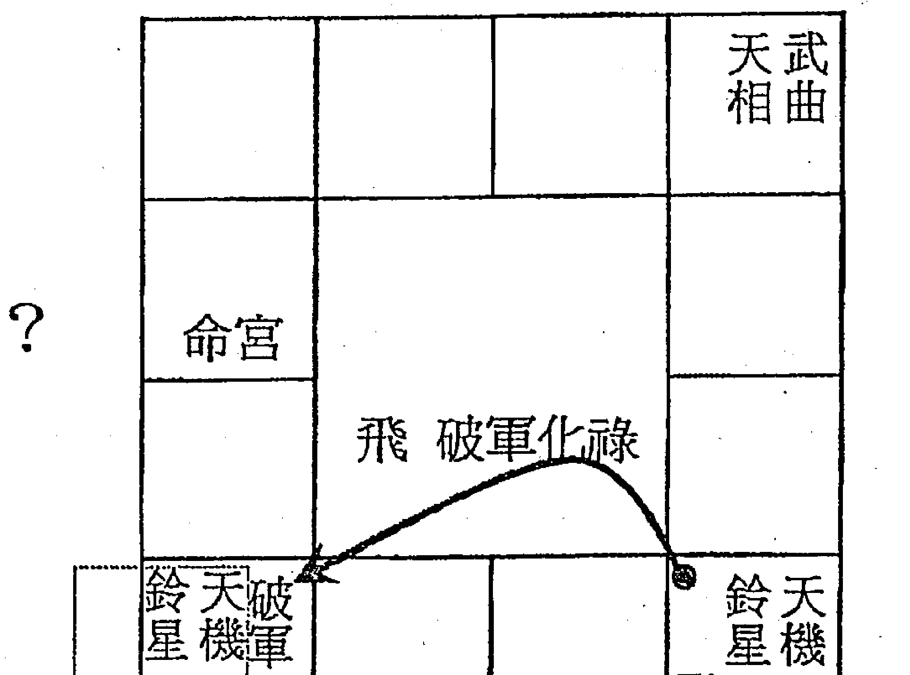

飞星？

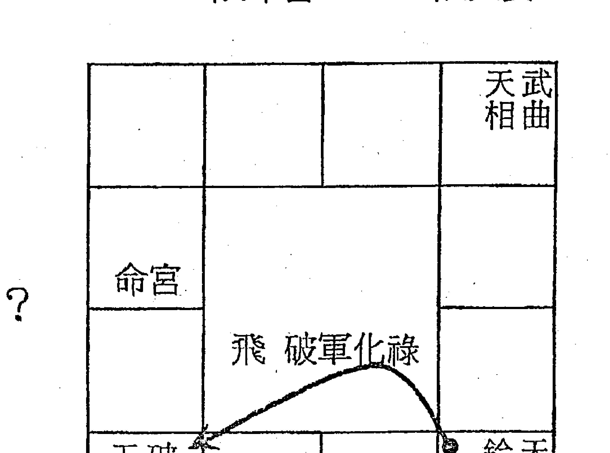The request was rejected because it was considered high risk

The request was rejected because it was considered high risk「沙灘狀」的那種土地，根本撐不起天機木，天機木種下會沉陷消失不見的，所以是落陷，因此天機的星性特質中的負面特質便會被強化，而正面特質被弱化。天機本屬神智清楚、機智靈敏的星曜，落在丑位就會變得神經過敏、神經衰弱，對任何事務或別人的舉止都會以負面的思考為主導而變得疑神疑鬼、或是對鬼怪之事物特別的敏銳。有的呢？則是思維欠缺條理、思路混亂，分不清輕重緩急、親疏遠近。若是在廟旺之地，如午位不但神智清楚、思路明晰、條理清楚，還很機智靈敏，對於研究、考試或做人處事都有莫大的幫助，當然也容易在社會上成為中流砥柱的人物。所以，星曜的廟陷利旺表內有些星曜的廟陷的定義有些和我們的想法有些出入的，這個就要靠記憶背誦的了。如天機木入酉宮金位，天機乙木不是被酉金剋制住了嗎？應該是呈「落陷」的狀態的啊！怎麼是「廟旺」呢？這個無法用五行生剋關係來解釋，只好用酉金譬如雕琢樹木的斧鑿，能把朽木雕琢成為價值大幅倍增的藝品或家具來意會在其位入廟的定義了。

#### 何谓「星的异化」

若有二颗星以上同入一宫时，需要先判断各星与宫的生克制化关系，再衡量星曜之间的生克制化作用，便可以知道某宫落入星组合的好坏。宮內坐星組合之間的相互「加強、衰減」作用，使星性轉變，是透過物理的、化學的作用而引起的，兩顆星落入同宮，並非簡單的以其五行生剋關係，加減其作用力即可，有些星曜組合會產生一些突變，使星性產生一百八十度的轉變，這個就稱為「星的異化」現象。

例如：太陰本主溫柔，但【太陰火鈴同位，反成十惡】，就是典型的異化組合，並非：太陰【水】被火星【火】所剋，僅主溫柔減色而已，而是完全改變成：擅耍心機、計較、善嫉、尖酸刻薄、不明事理的個性了。因此兩顆星以上之組合，要注意性質「異化」予以轉換合理的解釋，異化的組合各位可以在紫微斗數全書中找到。

如「天同戌宮化忌，丁人命遇反為佳。」丁年生人命宮在戌坐天同星時，天同為「平和」狀態，其宮干為「庚」，使戌宮內的天同星自化忌，而生年干一丁，又使戌宮內的天同化權，對面辰宮還有一顆巨門忌也在虎視眈眈與命宮的天同權的對峙著，原來權還有與忌硬拼的實力，但自化忌又被破壞掉了，天同星又是「平和」氣勢微弱，怎麼能「反為佳」論呢？這也是一種「異化」，但要與生年與宮干四化結合來看就知其中蹊蹺。具有這種命局的人卻往往「弱極返強」，展現超人一等的韌性與拚鬥精神，在逆境中力爭上游，獲得成功。

星曜的吉祥或凶惡，並不能僅以其字面的意思可以判定。如：天梁星並不因其音接近【天良】而很善良，相反的，它有時候卻嚴厲得令人無法忍受，因為它是統帥星為了領導眾人，必須不偏不倚、才能讓眾人信服，即使子女犯錯也要處置，故又帶有孤剋的意思。

所以每一顆星都有它正面的性質，也有負面的性質。如果煞星少，就會多表現其善良的一面；如果忌煞重重，就會展現其不良的特性。在解釋星性時，不可忽略每一顆星都有其光明面與陰暗面存在的事實，而其呈現的是哪個面向？則需要考量廟陷利旺表與同宮的辅星煞曜。

#### 何谓『星的类化』

星曜因為落入的宮位，有些是六親宮、有些是物質性的宮位、也有些是精神性的宮位，所以星性就必須因應宮位不同而幻化出不同的事物形象來解釋，叫做『類化』，以與現實生活中的人事物現象對映。

問命者提出的問題非常多樣化，絕非十二宮和星曜所能完全涵括，例如：曾碰到掉了一大筆錢而來問命是否有尋回可能的，師父告訴他可以在冰箱附近找一找看，果然找到了，請問冰箱是哪顆星代表？這就需要『類化』的功能了；又有人問我的指導教授對我好不好？能不能讓我順利畢業？請問指導教授以何宮或何星來表現？因此，需要先要知道如何『立向』或說『立象』，再由『立向』宮內取出星曜來類化得出事物形象，解釋給問命者知曉。這當然不是隨隨便便靠想像來類化，必須透過統計、歸納、分析找出來『星曜』與『類化』的對映物或事。例如很多人都知道「擎羊」是手術刀，這就是類化。但是何時是以此「類化象」來解釋，應用時就必須根據問命者的問題，在命盤中找出「立向」宮位，再由宮內坐星組合來「類化」成生活中的實際事物來解釋事物的形象。在紫微斗數這是最高級的技巧，也是最重要且常用到的技巧，算命靈不靈光就靠這一點的功夫。

最近遇到有位年輕的讀友「遭人恐嚇、劫取財物」，請問要如何從命盤中十二宮之中標定出事宮位呢？有人說看看有沒有「武曲七殺火星」的「因財被劫」組合，對！這是劫財的格局，但並不是唯一的劫財組合，有些是遇到流氓太保隨機尋找作案對象而遇到的，所以「遭人」指的是「遭遇流氓太保」。到底是哪些星星代表「流氓太保」呢？是羊陀火鈴、還是七殺、太陰火鈴組、破軍、天同遇火星、等等都有可能，還真不容易參透其中奧妙，找出流氓太保的星曜組合。不過若知道其中訣竅了，一下子就能「定」出宮位推算吉凶了，這時紫微斗數的功力就能大幅增長。

我們常用的星曜雖然只有三十二顆，配合十二宮來類化得出事物形象也有三百八十四種組合，但是再配合天地人盤的「垂象—成形—成事」的過程，還能幻化出更多的形象。因此，在算命時的沈吟不語往往就是在思索之間的關係，如何類化成符合生活形態的事物象。

#### 星的氣化

星曜經過天干四化的作用，引起星性的變化，叫做「氣化」。例如廉貞入命限吉凶訣中說道：『廉貞屬火，北斗，化次桃花，殺囚星，為官祿主…』，什麼叫「化次桃花」？就是說廉貞「化」後帶有桃花性質，沒有被「化」到之前，是沒有桃花的或桃花是隱隱約約的。到底廉貞因何而化呢？關鍵點就在於「天干」。「甲」天干使廉貞化祿，「丙」天干使廉貞化忌。「甲」和「丙」都會使廉貞星「氣化」而幻化出朵朵的桃花出來。假如在主掌感情的夫妻宮，廉貞化忌是偏向滿足肉慾的桃花，因此容易鬧出緋聞或官非，還說是『殺囚星』，這是援前句的，也是廉貞化忌後才有的現象。所以廉貞化忌除了桃花外，還會觸犯法律，搞不好還會被判死刑，所以此星化忌之後的惡性是很嚴重的。當公務員的容易遭遇撤職查辦的命運，尋常百姓也很可能一口氣隱忍不下而犯下大錯。所以廉貞化忌之後是個相當凶惡的氣化現象。而廉貞化祿是很有人緣的桃花，是屬於純潔而正當的桃花，不會引起官非或失貞的現象，反而是正直、剛正不阿的糾察隊、監察人或是執掌司法的檢警調人員。所以「氣化」現象若是「化祿」「化權」「化科」尚屬吉利，一旦遇到「化忌」的氣化作用，就會盡展現出「星曜」負面特性。為何說是「負面」而不以「惡性」稱呼呢？原來有些星曜的負面特性不為惡的，譬如天同星化忌就是懶散、隱忍、不積極的現象，但是並不為惡，因此，只能稱之為星曜的「負面」特性。這個「氣化」現象，其依據就是『天干』。看你要推斷是感情還是事業，就以其對應的人事宮宮干來飛四化，看是何星化祿、化權或化忌就可幻化為事件現象，因此要熟背『天干四化表』。還有「氣化」具有時效性，大限的氣化就在其主管的十年內有效，過了這個大限就失效，不像「質化」和「異化」沒有限制，終其一生有效，像是埋伏在人生路途上的地雷，一旦當事者「時機」到了，又踩到雷區就會引爆。

還有「氣化」具有層層加強的效應，本命、大限或流年主事宮宮干飛出來的四化會一層一層的強化作用力，吉力會被加強，凶力也會增強。因為「氣化」的力量會隨本命大限或流年主事宮的四化而增減其作用力，因此它會有特定的『發作期』，一旦力量減弱就不會發生。因此，可以用來斷定事件的發作日期，而其它的「質化」、「異化」就沒有這種功能。

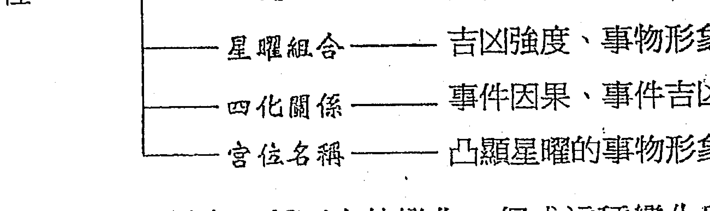

所以一顆星具有四種面向的變化，促成這種變化所牽涉到的因素，已如上敘述，還望讀者深思其中的訣竅，俾能應用得心應手。

現在舉一個命例來解釋推命時，星曜四化的應用情形，其他與此主題無關的暫時略去。

#### 案主自述：

三十一歲【戊子年】年初，交往十二年的男友莫名其妙地提出分手，情傷深重，一直想不開，於農曆年初五自殺，但被甲先生救起。就在那段心情低落的日子裡，甲先生一直在身邊鼓勵與照顧，有一天突然對我說：「很想一直照顧我。」

讓我有點兒心動，但他已婚，雖然他們夫妻之間相處不佳，卻仍有婚姻關係保障，我不在乎名分卻很怕再受傷害，不知道該如何是好？

像這個命例這麼詳細的述說心路過程，提供相當多的研究課題可供思考：

-   為何她會有段這麼長的戀情？一般人談個三年左右就有結果了，是什麼星曜或其他可供參酌的因素在命盤內來表現此一現象呢？
-   又是什麼星曜促使這段感情破裂呢？
-   又為何感情破裂竟然導致「自我毀滅」的行為產生？
-   而在自殺時為何能「有驚無險」的獲救？
-   獲救後怎麼又掉入另一個非法的感情「枷鎖」當中呢？

作者只是提醒各位針對命例，要從平凡的敘述中找出可資研究的引信來充實自己的功力。

| 迁移宫 | 疾厄宫 | 财帛宫 | 子女宫 |
|--------|--------|--------|--------|
| 文祿天昌存機 62-71 丁 遷移 巳 | 地火左擎紫空星輔羊微 天貴 52-61 戊 疾厄 午 | 天鉞 42-51 己 財帛 未 | 鈴右破星弼軍 32-41 庚 子女 申 |
| 仆役宫 | 身宫夫妻 | 兄弟宫 | 官禄宫 |
| 地劫 陀羅 七殺 三台 72-81 丙 僕役 辰 | 文曲 紅鸞 22-31 辛 身宮 夫妻 酉 龍天廉池府貞 | 八座 12-21 壬 兄弟 戌 | 天天太姚喜梁陽 82-91 乙 官祿 卯 |
| 田宅宫 | 福德宫 | 父母宫 | 命宫 |
| 天天武馬相曲 恩光 92-101 甲 田宅 寅 | 天巨天魁門同 102-111 乙 福德 丑 | 貪狼 112-121 甲 父母 子 | 天太刑陰 2-11 癸 命宮 亥 |

先說「質化」現象，所以先把生年四化略去。太陰居亥宮有「酉戌亥宮入廟，丙丁人財官格，吉星眾大貴」之說，但此人是「戊」年生人，並不合財官格，但是「此星屬水，為田宅宮主，有稱為福」、「命坐銀輝之宮，諸吉咸集，為享福之論。」雖然不符財官格，但是「享福」還是稱得上有一份的。而亥宮是水位，水星入水位，水勢更旺。「享福」是對古時候的男性來說的，因為古人有錢了就納妾，現代人不行，更何況是女性。因此，水旺則引伸為「感情浮濫」。至於「其為人也，聰明俊秀。其稟性也，端雅純祥。」當然無須諭了，這是單一太陰星居亥而論。但是、還有一顆重要的「天刑」星也屬主星，五行屬火。「火」星入水位，當然得減威。「天刑守命身，不為僧道，定主孤刑，不夭則貧。」又說「刑居寅上并酉戌，更臨卯位自光明，必遇文星成大紫，掌握邊疆百萬兵。」因此是顆主「武勇、孤剋」的星，不過沒有入「寅卯酉戌」廟位，「武勇」減分而「孤剋」性質加分了。天刑最忌諱與水曜同宮，更何況又落入水位！「火」星讓「水」星減去威力，又被清涼的「水」位完全消磨掉「武勇」成分。所以【太陰和天刑】組合產生「異化」作用而有「天刑居陷地縱得日月拱照，亦主父母棄養，二姓延生，為娼作婢，或為偏房為妾，正妻反而刑夫剋子。」的評語，與太陰入亥的性質已有很大幅度的變異。當然，我們拿古人的評語沿用於現代時需要予以適度的修正，但是基本的精神內涵是不變的。所以會有「與有婦之夫發生感情，欲不計名分的在一起」的過程和「或為偏房為妾」相合。再來看看「氣化」的行為，這時要看「生年四化」和「宮干四化」，所以先將生年四化帶入：

紫微斗数命盘表格：

| 宫位 | 星曜 | 年龄 | 天干 | 地支 | 宫位名称 | 备注 |
|------|------|------|------|------|----------|------|
| 遷移 | 文祿天昌存機 | 62-71 | 丁 | 巳 | 遷移 | 天貴 |
| 疾厄 | 地火左擎紫空星輔羊微 | 52-61 | 戊 | 午 | 疾厄 | |
| 財帛 | 天鉞 | 42-51 | 己 | 未 | 財帛 | |
| 子女 | 鈴右破星弼軍 | 32-41 | 庚 | 申 | 子女 | |
| 夫妻 | 文紅曲鸞 | 22-31 | 辛 | 酉 | 身宮 夫妻 | |
| 兄弟 | 龍天廉池府貞 | 12-21 | 壬 | 戌 | 兄弟 | |
| 命宮 | 天太刑陰 | 2-11 | 癸 | 亥 | 命宮 | 科 |
| 福德 | 天巨天魁門同 | 102-111 | 乙 | 丑 | 福德 | |
| 父母 | 貪狼 | 112-121 | 甲 | 子 | 父母 | |
| 田宅 | 天馬天相武曲 | 92-101 | 甲 | 寅 | 田宅 | 恩光 |
| 官祿 | 天天天太姚喜梁陽 | 82-91 | 乙 | 卯 | 官祿 | |
| 僕役 | 地鳳陀七劫閻羅殺 | 72-81 | 丙 | 辰 | 僕役 | 三台 |

化權星居於命宮「掌判生殺之神，守身命，…會巨門武曲，必專大事，掌握兵符，為人極古怪，到處人欲敬」、「女人得之，內外稱意。」基本上，化權星居命為人個性堅毅、自尊心強，所以「到處人欲敬」。若你瞧不起或貶低他的話、一定和你沒完沒了，但是「堅強的背後就是脆弱」，表面上要裝出「強勢」的面具，一旦遇到重大的打擊摧毀他的面具時，就會完全呈現脆弱面，如一時想不開自殺或衝動做出傻事等。因為「化權」也有行動、執行的意思，一想到就會劍及履及的去做，如她一遇到喜歡的男人就會死心塌地的跟著他十幾年也不變心。所以最怕它遇到壞事衝擊，因為「星的質化和異化」都顯示「負面」的星性，感情不如意就很容易想「摧毀自己」。何況夫妻宮干一辛，正好化文昌忌來沖到命宮，讓化權星轉變成為自我毀滅能量。為何如此說呢？因為此時命宮的化權星就有「死要面子」的意思，也使得她咽不下這口被拋棄的怨氣。而命宮的「太陰」就是她本人，命宮被沖很明顯的是要對自己不利。所以由「星的氣化」象來看，只要有感情（夫妻宮）不利就會引發命造摧毀自己的想法，是一個處理感情帶有偏鋒思維的命宮和夫妻宮結構。

命宮干是—癸，使太陰自化科。有人說「癸干的太陰化科帶桃花」性質，確實不錯，怪不得會引起「有婦之夫」的愛憐，但也不可忽略它也有「逢凶化吉」的作用。因此，自殺時被人發現救起。而且，化科星也有「紓解」化權星「緊張」的作用，讓緊繃的情緒得到舒緩。所以，會去尋求解答，不管是命理的、宗教的、還是心理學的，而不是悶聲不響的盡往牛角尖裡鑽。因此，此時的太陰自化科，對於她（太陰）自己是蠻有利的「氣化」星，讓偏鋒的處事想法有了舒緩的餘裕可供轉圜。

而星的「類化」呢？前段已經點出好幾次了，命宮的「太陰」星類化為女性，為母、為女，本造是女性，因此也可說是「她」自己。而太陰化科則明指是她自己「化科」解了自己的「危」，還帶來了「或為偏房為妾」的現象。

所以，在為人解說命盤時星曜佔了主角的光彩，而此光彩底下卻蘊含了星曜的不同層次的變化，才能活靈活現的展現人生活的多采多姿樣貌。星曜絕不是「命宮坐什麼星個性就如何」那麼簡簡單單的特性，那是初入門者對紫微斗數的初相識課題。而對於想深入研究紫微斗數者必須深刻體認星曜代表人生活的多采多姿樣貌，星曜就必須賦予他多種不同層次或不同種類的特性，如此才能貼近生活中的人事物件，解命盤時也能夠以生活中的行為或事物來詮釋，而不會像古人批的命：「破軍入廟勢汪洋，專權掌握振八方，七殺稜稜司正令，貪狼照合得相幫，分明有恃無偏黨，文武才能佐廟廊，…」般，文筆雖好，但意思卻令人費心猜，讓人霧煞煞、有看沒有懂。

星曜應用時，牽涉到「四種變化」，這也是另一種「四化」的關係，這是學習星曜賦性絕對不能忽視的。這四種變化「互為表裡」，不能只論一種「廟陷利旺」或「星曜組合」，還要兼顧「類化」與「氣化」的現象，才能讓「人事物件」形象清晰地「浮現」出來。而學習星性就在弄懂這四種變化：星曜的質化、異化、類化與氣化。

#### 四化飛星起手式

有很多讀友來電或信，表示買了「紫微斗數命運分析」，但是看了還不是很瞭解四化的飛化方式和其意義，所以現在用圖解方式一步一步來解釋。

四化星分成：生年四化、各宮四化、大限四化、流年四化、...等，每個階段的四化分層次掌管該時段的事件顯像與否，所以要先弄清楚這些四化的起飛方式和有效作用力延續的時間長短。

※ 生年四化

先從「生年命四化」說起，假設有一命造的命盤排出來如下，他是七十三年也就是甲子年出生，因此根據「甲子」年的「甲」天干，去查十干四化表知道—「甲」天干時：廉貞化祿、就找命盤中的廉貞在哪一宮（田宅），就在廉貞底下寫上祿（用框或圈都可），破軍化權、破軍在父母，就在父母宮的的破軍星底下寫上權，武曲化科在疾厄、就在武曲星底下寫科，太陽化忌、太陽在財帛、就在太陽星底下填入忌。注意四化和星曜的位置不能錯亂要對正，不然就不知道是哪一顆星參與四化喔，而且不同顆星的化星在意義上也有所差別，因此、化星需寫在正確的星曜位置下方才可以！

這樣就知道「生年四化」飛入了哪些宮位且是哪一顆星曜起了變化，因此我們說……

-   生年祿入田宅
-   生年權入父母
-   生年科入疾厄
-   生年忌入財帛

| 太陰 己 官祿 巳 | 火文貪星昌狼 庚 交友 午 | 右左巨天弼輔門同 辛 遷移 未 | 文天武曲相曲科 壬 疾厄 申 |
|---|---|---|---|
| 天姚府貞祿 戊 田宅 辰 | 月※日辰時生水二局 例 陽男七十三(甲子)年4 | 天梁太陽忌 癸 財帛 酉 | |
| 擎羊 丁 福德 卯 | 陀羅 | 天紫刑微 | 天機 乙 夫妻 亥 |
| 鈴祿破星存軍權 丙 父母 寅 | 丁 命宮 丑 | 丙 兄弟 子 | |

生年四化落入的宮位，對於該宮位和其內的坐星會產生「質變」的作用，星曜的特性會被「氣化」而蒸騰發出「吉」或「凶」的氣，在其燻蒸之下運途於是起了變化。針對上面舉例的命盤，根據生年四化落入的宮位，可以解釋為......

廉貞祿在田宅：表示此造很顧家，關心家裡大小事物。

## 紫微斗数命运分析——实例篇

### 破軍權在父母：
對父母講話比較直、比較土、比較大聲，沒加以修飾讓人覺得對長輩沒大沒小，不太禮貌。

### 武曲科在疾厄：
長得不胖不瘦之姿，體型勻稱，不易染患流行疾病，一旦生病也能找到好醫師對症下藥。

### 太陽忌在財帛：
心思都放在金錢上，如何存錢？如何省錢？如何賺錢？表現於行為上就是斤斤計較，花錢不大方，精打細算。

由出生年干飛出的化星具有恆久的影響力，一生都會對命造產生效力，雖然後天教養可以改變人之特性，但潛意識中仍深受先天四化的影響，表現於日常生活中的行為舉止，思維模式等等。

這是一般市面常見基礎的論法，還需要更深入的探討：

### 廉貞祿在田宅：
有天府、天姚同位，以田宅宮來論，廉貞、天府的組合是吉利的，天府是豐饒肥沃的農地，現代人做農的人很少了，可以說是擁有經濟效益高的田地，加上化祿更增加擁有或取得不動產的能力，可衍申為本造對於不動產投資有濃厚興趣，也可引伸為對出生的家庭具有深厚的感情、很顧家，這是以生年祿入田宅而言，「天姚」也入田宅，天姚為美好的事物、於田宅為美化或裝飾之物、代表將家裡布置得美輪美奐，花錢請最有名的設計師來設計、買最好的藝品或飾物點綴家中。至於會不會擁有許多田宅或因投資不動產而賺錢，因為牽涉到投資行為和財運好壞，就要另外參酌別的宮位了，不是只看田宅而已。這是生年化祿入田宅的意思。

而田宅宮干一戊，飛四化：
- 貪狼化祿在交友：貪狼是交際應酬，表示很樂於帶朋友到家裡來作客，當作招待所一樣談談股票或投資啦（貪狼火星），大家都互蒙其利（化祿）。
- 太陰化權在官祿：太陰為田宅主，化權是成就，因此會把家裡整理得乾乾淨淨、整整齊齊的，讓別人一看就推崇這家主人，很會照顧理家，把家裡整理得這麼好，自己聽了也會很得意（化權）。
- 右弼化科在遷移：右弼為人情，在遷移表示因自己家庭的關係而在外擁有相當好的名譽。
- 天機化忌在夫妻：天機為變動又有計較之意，因此夫妻雙方會因為家裡的事而斤斤計較，進而爭執或打架，因此引起一方外遇。

所以綜合上述，有的人為了面子，請同事或朋友來家裡吃喝玩樂，高談闊論，讓自己覺得很有成就，卻將清理善後的問題丟給配偶來處理，結果鬧得夫妻關係失和；甚至離婚，就是此種四化組合吧！

### 破軍權在父母：
和祿存、鈴星同宮，父母泛指能管束我的人，如老師、政府機關、公司的主管、父執輩的人等，因是破軍化權，破軍本有叛逆性，化權更加強化此種叛逆特性，所以和長輩對話，在語氣或氣勢上就想把對方壓下去，因此遣詞或用語就沒有尊卑、顯得沒大沒小，來一句頂一句、對長輩大小聲、引起爭執，因此和父母輩的對待關係並不好，破軍本主叛逆、自我意識強的星曜，即使父母親很嚴厲的要求，也敢於對衝，因此常有父子間或母女間的衝突。

| 宫干 | 宫位 | 地支 | 星曜（主星/辅星/杂曜/四化） |
| :--- | :--- | :--- | :--- |
| 己 | 官禄 | 巳 | 太阴 |
| 庚 | 交友 | 午 | 火星、文昌、贪狼 |
| 辛 | 迁移 | 未 | 右弼、左辅、巨门、天同、[科] |
| 壬 | 疾厄 | 申 | 文曲、天相、武曲、[科]、[忌] |
| 癸 | 财帛 | 酉 | 天梁、太阳、[忌]、[禄] |
| 甲 | 子女 | 戌 | 七杀 |
| 乙 | 夫妻 | 亥 | 天机 |
| 丙 | 兄弟 | 子 | 天刑、紫微、[权] |
| 丁 | 命宫 | 丑 | 陀罗 |
| 丙 | 父母 | 寅 | 铃星、禄存、破军、[权] |
| 丁 | 福德 | 卯 | 擎羊 |
| 戊 | 田宅 | 辰 | 天姚、天府、廉贞、[禄] |

（圖中示例文字：例男七十三（甲子）年生，月※日辰時生，水二局）

破軍、祿存、鈴星在父母宮，其父親就是很強悍又暴躁、獨斷獨行的人，但是小孩子還是敢對他頂嘴。

### 但其宮干—丙的四化：
- 天同化祿—落入遷移→照命宮
- 天機化權—落入夫妻→照官祿
- 文昌化科—落入交友
- 廉貞化忌—落入田宅

的化祿和化權都飛入「照」命宮的三合，因此，雖然父母對待此造比較嚴格，不過是出於愛之深責之切的心態而不是虐待，當然，此造以後和父母的關係也比較親近，不會因為父母對待此造嚴格而疏遠，這是吉利的現象。

### 武曲科在疾厄：
生年化科進入疾厄宮內，疾厄就是身體之意，代表這個人的身體長得應該很勻稱，不高不矮不胖也不瘦，而且不易生病，即使生病也能及時診治痊癒，瀕臨致命的危險時刻也能轉危為安，這是單一顆「化科」在疾厄的現象，至於同宮的坐星組合也會有影響，在此處：武曲科，武曲是氣管，因化科的緣故，所以氣管不易罹患毛病，同宮還有天相、文曲，具屬吉利的星曜，因此不容易遭受突如其來又難以治療的惡性疾病，但是泌尿系統會比較弱，彰顯於外的就是頻尿或是解尿時，感覺好像很難排乾淨、滴滴答答的，這是先天體質帶來的弱點。

疾厄宫干—壬，使疾厄宫内坐星武曲化忌，剛剛講過武曲為氣管，化忌了當然氣管就會弱化，有鼻子過敏或氣喘的現象，既然已有化科保護，是否不會罹患這些毛病呢？我的答案是—會，無法避免，因為武曲化科已經被武曲化忌破壞了，反而使病情更難醫治，這種四化的關係就是「拖延」的意思，好也好不了、壞也不到致死的境地，在可被控制的範圍內，帶疾延年，造成命造一生的困擾而已。

### 太陽忌在財帛：
生年忌星有欠缺、缺少或欲求不足之意，在財帛當然就會表現出這些特質，例如因為沒錢就很吝嗇、或欲求不滿而拼命的賺錢，但最終還是覺得自己沒什麼錢，這就是生年忌又叫「欠債忌」的意思，欠了「財帛」的債要努力賺錢來還債，因此搞得自己筋疲力竭，再看星性，太陽主博愛、天梁是善星，所以自己的錢財就心甘情願地花費在為人服務或行善事上面，叫做「抱私財益于他人」，而且，太陽又主男性，為夫星，而本造是男性，故自己賺的錢財不多或花掉了，自己能支配運用的錢財不多，也有可能是自己的錢財被男性的親屬所破，所以遇到男性的親屬來借錢，就要特別小心，量力而為，不要傷了自身的財力。

### 再看宮干癸的四化—
- ◎ 破軍化祿入父母宮
- ◎ 巨門化權入遷移宮
- ◎ 太陰化科入官祿宮
- ◎ 貪狼化忌入交友宮

化祿、權、科都沒有構成三合的角度，因此力量微小，幾乎對自己沒什麼幫助，而錢財化破軍祿入父母，父母是什麼呢？把交友當作命宮，那麽父母就是「交友的財帛宮」，我的財帛化祿進入朋友的財帛，就是「我的錢進入朋友的口袋」的意思，而貪狼化忌又在交友，也是錢財飛到朋友身上的意思，將這兩個四化象合在一起看，為什麼要一起看呢？因為「祿隨忌走」，錢給朋友有時候會提供豐厚的回報的、但是像比例的飛化祿和化忌都在交友宮和交友的財帛宮，很明顯的錢財都到了朋友那邊了，套句符合社會現象的解釋語—這就是「被倒」的意思，因此，與朋友之間的金錢往來要特別小心謹慎，免得錢財沒了、朋友也沒了。所以，有朋友來借錢就推拖掉，或是借出少一點，免得損及筋骨。

以上所講的是生年四化和先天宮位四化的關係，大限運途也會和先天宮位四化以及生年四化構成「效應」角度，產生某種反應，這就是「運途」的變化，先天命盤是「垂象」、是「與生俱來」的特質，小時候循規蹈矩的小孩子，長大後依然是奉公守法的多；小時候頑皮搗蛋的、長大之後大都成為違法犯紀的多，不過也不諱言，也有少數會轉變的，所以先天命就是觀察未來運途變化的指標，在斗數稱之為「垂象」。

### ※ 大限四化：
運途就是大限命宮移動而其他十一宮也隨之移動而產生各項事物的起伏消長現象，這就要透過大限命盤和先天命盤的關係來決定「起伏消長」的狀態，所以先要將先天命盤依大限轉動成大限盤局，要如何轉動呢？

- 決定是「陰男陽女」還是「陽男陰女」，陰男陽女逆時針轉、陽男陰女順時針轉。看出生年天干：甲丙戊庚壬是陽干、乙丁己辛癸是陰干，如果甲子年生男生，甲是陽干，則陽男的大限就要順時針轉。
- 決定大限開始與截止時間：看命盤是屬幾局的，如前例是水二局，故從二歲開始，每逢二就換大限，如二—十一歲是第一大限、十二—二十一歲是第二大限、二十二—三十一歲第三大限、...等依序類推。

如前例是甲子年（一九八四）出生，到戊子年（二〇〇八）已經二十五歲（虛歲），所以，大限命宮已經進入了「卯宮」，因此第三大限盤局變成右圖命盤。

| 宫位 | 星曜/内容 | 宫位 | 星曜/内容 | 宫位 | 星曜/内容 | 宫位 | 星曜/内容 |
| :--- | :--- | :--- | :--- | :--- | :--- | :--- | :--- |
| 己 官祿 巳 | 太陰 限福德 | 庚 交友 午 | 火星 文昌 貪狼 限田宅 | 辛 遷移 未 | 右弼 左輔 巨門 天同 限官祿 | 壬 疾厄 申 | 武曲 天相 文曲 科 限交友 |
| 戊 田宅 辰 | 天府 天姚 廉貞 祿 限父母 擎羊 22~31 限命宮 | 丁 福德 卯 | 祿存 破軍 權 限兄弟 鈴星 | 丙 父母 寅 | 陀羅 限夫妻 | 丁 命宮 丑 | 紫微 天刑 限子女 |
|  |  | 丙 兄弟 子 |  | 乙 夫妻 亥 | 天機 限財帛 | 甲 子女 戌 | 七殺 限疾厄 |
|  |  |  |  | 癸 財帛 酉 | 天梁 太陽 忌 限遷移 |  |  |
|  |  |  |  |  |  | 男 七十三（甲子）年生 月※日辰時生 水二局 二〇〇八年 二十五歲 例：陽男 |  |

為了能一目瞭然、減少複雜，大限命盤只保留大限命宮、大限官祿和大限財帛等三宮，其餘全略去不寫，但不是不採用，如看子女運途還是要借用大限子女宮。

### 大限盤各宮的四化：
首先說明大限盤局四化要配合先天盤局的四化，看其形成的角度來決定吉凶。為了化繁為簡只說明命宮，其他十一宮可仿此方式，參考本書或「紫微斗數命運分析」中揭蘗的技法，類推演練。

首先，先觀察大限命宮三合的星曜組合狀態、或有沒有生年化星進入，就可掌握大限的大概狀況。

如此命例的卯限格局：大限命宮坐擎羊，對宮太陽忌、天梁，命宮的擎羊就已經顯示大限將遭遇突如其來的災害了，又遇到太陽忌，太陽是男性又是官祿主，所以，這個大限事業上必然會遭遇挫折或阻逆之事，或與長官相處有問題，無法順利升遷、獲得重用；自身也要小心意外傷害，這兩件大事將會干擾到卯限運途的平順，尤其太陽忌因為是生年忌星，所以整個大限的十年運途都會被其影響，故十年運途的大局由星曜組合大概就可明瞭個五、六分了。

再來以大限命宮干丁飛四化—
- 太陰化祿入官祿（大限福德）
- 天同化權入遷移（大限官祿）
- 天機化科入夫妻（大限財帛）
- 巨門化忌入遷移（大限官祿）

這些化星飛入的宮位是先天命盤的某宮又是轉動後的大限宮位，到底要以哪個為準？

當然，要以先天命盤為準，但有些特例要以大限盤為準，先記住『大限四化要化入先天命盤』才好，此「化入」所指的對象包括祿、權、科、忌等四顆化星。只有祿、權化入先天命盤，氣勢較虛，經不起動盪波折，一遇到衰敗往往將所有都耗損掉，沒法留存。假如只有祿、科化入先天命盤，是「斯文錢」，如靠某項專業技藝的名聲來賺錢，或是出名作者等。

而化權、科入先天命盤，就是靠專業能力賺錢，但比起祿科的組合辛苦，而化祿、權、科的話，遇到挫折衝擊，因為有科星守護，可以化解危難，度過難關，若是財運，就不致於賠個精光、囊空如洗，至少還能保存元氣，期待未來的轉機、趁勢再起。

為什麼寫兩個祿疊在一起呢？因為剛好大限命宮和先天命宮的四化重疊在一起，具有「加乘」的作用，好壞都會加倍，先後天命宮的化忌都在遷移宮，就成「忌沖命宮」，也就是「大限命宮化忌沖先天命宮」的盤局，而「先天命宮也化忌入遷移宮」，構成「雙忌沖命」，因此，一顆忌沖命有點麻煩但還可忍受，但兩顆忌來沖命就要小心了，到底是「為了什麼事」要小心呢？既然是「沖命宮」，當然和生命交關囉，搞不好會有生命之危呢，而大限命宮是先天的福德宮，而福德是主宰一個人的精神狀態，所以、是因精神狀態而危及生命，例如自殺、發瘋、鬼附身、精神病等都是精神狀態的問題，現代人有很多憂鬱症的大概都是福德宮出了問題，像此造就是罹患憂鬱症而有輕生的傾向，不過此造還好的是化祿權科都還有入命局三方，因此，還有逢凶化吉的作用，接連兩次尋短都被人發現、或找人傾訴而獲得開導。

所以其他的「太陰化祿、天機化科」在官祿—夫妻線上會照、天同化權在遷移宮，都在命宮的三方四正內，代表命宮氣勢還蠻強旺的，所以雖然有巨門忌沖，還是有保護作用，假如沒有了這三顆吉化星入命宮的三方四正內，那麼這個人就很可能「回去」了。

這個命例為何會罹患憂鬱症呢？這就要看化星了，來沖命宮的是「天同化權和巨門化忌」，天同化權是想要「有表現、好強、處處都要求完美」，而巨門化忌就是「口舌是非、流言蜚語」，所以工作上都很努力認真，結果聽到的都是一些冷嘲熱諷，因此而罹患該症，經過藥物控制與心理調適才逐漸康復。

如此例的大限四化在先天命盤形成的角度能不能稱為「三奇嘉會」格呢？是可稱為此格，但是沒有先天的「三奇嘉會」格來互相輝映，只有大限成格而已、難稱得上是「吉祥」，只不過讓他在此大限平穩一些而已，所以罹患憂鬱症還會去求醫診治，不然大限命宮獨坐一顆擎羊煞星很可能會採取自我毀滅手段的。

所以，「大限四化要對映到先天命盤」看是否構成：
- 三奇嘉會
- 沖
- 照
- 會
- 入

等特殊角度，才會產生「吉凶」效應，當然還要參酌「星曜組合」等因素才可以，不能只看一項因素就武斷地下判斷，我一直強調要「綜觀全局」才能「一覽全貌」。

我曾看到有本書上寫說「大限四化要化入大限盤局」來觀察吉凶，這是錯誤的，大限盤是個「假借盤」一旦大限動移，整個大限盤也隨之轉換，再來，依據「天地人」盤的推理規則，大限盤凸顯的徵象會在「流月」應驗，故準確地說應該是「大限四化要化入流年盤局」才對，觀察大限四化是否有在流年盤局構成「三合、衝、照、會、入」等效應角度，才可據此來推斷應驗的流月，因此，若不知道其中的關係，一個宮有三層意義：先天盤宮、大限盤宮和流年盤宮，若不知其中的「從屬」關係，就不知道要剝離出哪一層來論斷吉凶了。

所以大限是個重要的關卡，它要向上承接先天垂象事物，而再後繫流年以顯事件的人事物像，假如這個關卡脫節了，就難以串連天、地、人盤的推理軌跡。

#### 流年命盤
例：陽男 甲七十三（甲子）年生 月※日辰時生 二〇〇八年二十五歲 水二局

| 宮位與星曜 | 宮位與星曜 | 宮位與星曜 | 宮位與星曜 |
| :--- | :--- | :--- | :--- |
| 太陰(祿) 己 官祿 午 | 火星 文昌 貪狼 庚 交友 午 | 右弼 左輔 巨門 天同(忌)(權) 辛 遷移 未 | 天相 武曲(科) 文曲 壬 疾厄 申 |
| 廉貞(祿) 天府 天姚 戊 田宅 辰 | （中宮：例：陽男 甲七十三（甲子）年生 月※日辰時生 二〇〇八年二十五歲 水二局） | 七殺 癸 財帛 酉 | 太陽(忌) 天梁 癸 財帛 酉 |
| 擎羊 丁 福德 卯 | （中宮：陀羅） | 七殺 癸 財帛 酉 | 天機(科) 乙 夫妻 亥 |
| 破軍(權) 祿存 鈴星 丙 父母 寅 | 陀羅 丁 命宮 丑 | 紫微 天刑 丙 兄弟 子 | 天機(科) 乙 夫妻 亥 |
| （下方標註：限財帛） | 22~31 限命宮 |  |  |節那麼「事件」就無法成形誕生，因此每十二年通過該宮時，不一定會發生「事件」，而是要大限條件配合才能成事，大限是個重要的承上啟下的盤局，發揮穿針引線的繫結功能，使事件由「垂象一成形一成事」一脈相承，事件於焉發生，因此，大限盤局的四化要觀察的重點為：

- 一、大限有沒有和先天盤局形成特殊角度？
- 二、若一項有構成特殊的應驗角度，則查大限盤局和流年盤局映對的關係，找出哪一年應驗。

## 流年：

那麼「流年」又在推演命盤時，扮演哪種角色呢？其四化是否有其效用呢？普通人在算命都在想瞭解流年的吉凶，根據紫微斗數的推演規則，是從「先天命盤」為起點，「大限命盤」為中間媒介以「衝照會入」等關係為觸媒、引發事件，而於「流年命盤」中應驗，所以流年盤是個「受體」，承受「先天」和「大限」命盤的特殊角度或星曜的性質演化而成的事件，因此，在流年階段主要是觀察先天和大限盤四化構成的角度而推斷應驗流年，因此，流年盤的角色已昭然若現。

然而，是否就全然如此，也未必，因為「先天」和「大限」盤的四化構成的角度，不全然只有簡單的「三奇嘉會、衝、照、會、入」等而已，還有一些未能完全歸納於此五種特殊角度的，此時就需要「流年四化」來凸顯其「事件」的映象了，此時也是一樣要由其「立象」宮的宮干起飞四化，看其在命盘分布的角度是否有和「先天」或「大限」盘或四化构成上述角度，来决定其吉凶现象。

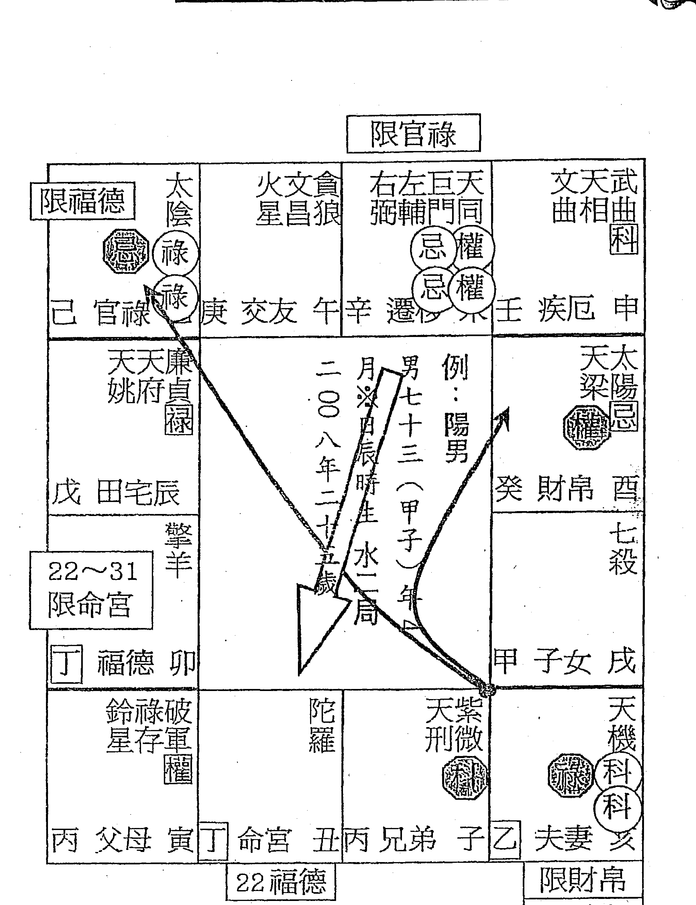

例：陽男 七十三（甲子）年生 二〇八八年二十三歲 水二局

## 飛布流年四化命盤

## 紫微斗数命运分析——实例篇

像上述甲子年的例子，二十二岁（亥年）正好走进天机化科和太阴化禄的线上，又是官禄—夫妻线，这代表什么意思呢？表示他心中想要在事业上有所作为、有所表现的一种思维，但是天同化权和巨门化忌在迁移宫就等于是冲到命宫了，刚好就是冲到亥年的福德宫，天同和巨门有自相矛盾之意，而命宫又坐陀罗星也是瞻前顾后、犹豫不决的星曜，想要「有所表现」却又「犹豫不决」那不是自寻苦恼吗？因此，在这种情况下罹患忧郁症。

于此例而言，亥流年只是承载了先天和大限的结果，而在亥年应验，完全不必去考虑亥年的四化到底是分布在先天盘局或流年盘局了。

若要飞布流年命宫四化也可以让盘局更加清晰：

用八角形框住的就是流年四化，由于命盘大小所以将天机禄、太阴忌的禄与忌写到旁边，加上去之后就更清晰的看出在夫妻—官禄的这条线上禄科忌纷陈，很多人会因此而搞不清楚要如何解释这种现象，首先，命宫是「我」内心的状态，先天与大限的「我」化禄权科忌在夫妻—官禄线上，表示此造很有事业心、责任感，而天同化权在迁移，主想要有所表现而赢得器重或尊重，却有一颗巨门化忌引来莫名其妙的中伤耳语或流言蜚语，让「我」耿耿于怀、对自己造成很大的压力，所以是个「追求表现却引來同事耳语中伤而导致精神压力困扰」的现象，现在流年的化祿權科忌也是飛入先天命盤的三合內，流年的天機化祿在夫妻、太陰化忌卻在官祿，構成「祿一忌交沖」的盤局使得前述的「精神壓力困擾」又添加了太陰化忌的觸媒更加深、加強其力度，因而「我」已經承受不了而爆發，此時就要求助醫生了，那麼流年盤局中可以看出這個「觸媒」是什麼東西嗎？當然可以，不然紫微斗數要如何幫人「趨吉避凶」呢，當然要找到「禍源」才可以針對目標來改善，不然盲目求助「開運戒」或「轉運石」那能收效！先說心理學的依據，根據統計一個人同時間承受兩種壓力源就會表現得很痛苦、瀕臨崩潰狀態，而承受三種以上壓力源時就會無法承受而崩潰，像此比例就是已經承受了兩種壓力：工作壓力和同儕間的人際壓力，這時候最需要外力來支持度過難關，可是太陰化忌卻扮演了「壓垮駱駝的最後一根稻草」角色，讓他崩潰了，太陰是女生在官祿即沖到夫妻，此造是男生，當然就是男女朋友分手的現象，原來寄以精神支撐厚望的女朋友求去，本來工作場合中遭到的種種壓力還有對像可傾訴、並獲得慰藉緩解沈重壓力，所以此造化天機祿入夫妻，表示該年對女朋友特別好，有心把女朋友當成最終的結婚對象，卻遭到背叛的結局，處在這種情境誰能不崩潰呢！

所以，增添流年四化是使「人事」映象更加「具體化」的一個指標，讓我們更能掌握的事件發生的關鍵點、而後方能據之以改善命運，而非亂改運一通，所以對於那些宣稱可以「改運、開運」的東西，實難以認同，沒找到癥結點何在怎能改運，就好像癌症用化療一樣散彈打鳥、把好的壞的細胞都殺死，也殺得病患自身都奄奄一息，不如用最新式的「標靶」療法來得有效確實。

出書後有些讀者來求問命理，有位醫生夫人就問先生的運途如何？一看就說要小心農曆年左右身體健康會出問題，並特別囑咐要陪伴在他身邊，對方卻答說我先生是醫生平時很注重身體保養，應該不會吧！但左看右看還是不對勁，於是在命盤上寫明該年一月注意事項，哪知道隔年元宵節前接到電話說出事了，還好她有陪伴在身邊，一見到不對勁趕緊自行開車送醫，不然就像未上任就去世的部長一樣，救都來不及了，而為什麼要提醒「她」無論如何都要陪伴在先生的身邊，就是在命盤上看出他的那一場劫數要由何人來解除而特別提醒，而她也能排除困難陪在身邊而解除危機。

舉一個命例來說明吧！

此造命坐武曲天府火星遇對宮的七殺，構成「武曲七殺火星」因財被劫的格局，似乎很不利於錢財，但假如出於善心將錢捐出去救人，自己變貧苦了哪有錢被劫呢？是否可破解此一「因財被劫」惡格，又他在「大學時即考上代書資格」是否與第二個大限官祿宮坐巨門讓他讀書有成呢？

在這裡只探討此造「考上公職赴任前，將多年積蓄捐給宗教慈善團體」的現象，大部分的人緊抱住辛苦賺來的財產捨不得放掉，怎能毫無私欲的就將辛苦工作所得捐了出去呢？這在命盤上是否有顯示？又是如何垂象顯現呢？是什麼因素「觸發」此種捐錢的行動呢？以下就由「四化」的觀點來討論此一行為的命理跡象。

### 解盤：

首先、從本命命格開始剖析：

| 宮位 | 天干地支 | 年齡 | 宮名 | 主星 | 輔星1 | 輔星2 | 輔星3 | 輔星4 |
| :--- | :--- | :--- | :--- | :--- | :--- | :--- | :--- | :--- |
| 子 | 甲子 | 4-13 | 命宮 | 天同、天梁 | 陀羅 | 天馬 | 左輔（科） | 天貴、恩光 |
| 丑 | 乙丑 | 114-123 | 父母 | 太陽、太陰 | 文曲、文昌 | 擎羊 | 地空 | 天刑、天馬 |
| 寅 | 甲寅 | 104-113 | 福德 | 貪狼 | 地空 | 紅鸞 | 限官祿 |  |
| 卯 | 乙卯 | 94-103 | 田宅 | 巨門、天機 | 右弼 | 天魁 | 天刑 | 天馬 |
| 辰 | 丙辰 | 84-93 | 官祿 | 紫微、天相 | 天刑（權） | 天姚、天刑 | 八座 |  |
| 巳 | 丁巳 | 74-83 | 僕役 | 天梁、天府 | 祿存（祿） | 龍池、天鉞 | 限財帛 |  |
| 午 | 戊午 | 64-73 | 遷移 | 七殺 | 身宮 | 限財帛 |  |  |
| 未 | 己未 | 54-63 | 疾厄 | 廉貞、天府 | 地劫 | 天姚 | 鈴星 |  |
| 申 | 庚申 | 44-53 | 財帛 | 天府、天府 | 地劫 | 天姚 | 鈴星 |  |
| 酉 | 辛酉 | 34-43 | 子女 | 破軍 | 天刑 | 天馬 | 限命宮 |  |
| 戌 | 壬戌 | 24-33 | 夫妻 | 天同、天梁 | 陀羅 | 天馬 | 左輔（科） |  |
| 亥 | 癸亥 | 14-23 | 兄弟 | 天機、天梁 | 右弼 | 天魁 | 天刑 | 天馬 |

## 紫微斗数命运分析——实例篇

既然已经知道他是「捐出大笔金钱」，我们就可以透过「逆向工程」来追踪其在命盘中显现的蛛丝马迹，此种「蛛丝马迹」不外乎存在于「星性组合」和「四化飞星」的轨迹上，细心关照必能寻迹找出隐藏的秘密。

其他门派推断法的朋友也不妨先暗算一下，比较其中异同。

命盘有十二宫，捐献的行为要看哪一个宫位呢？所以必须对于十二宫的职掌必须了解透测才能找出对应宫位，一般而言，「捐献」给不特定的大众的行为是看「福德」或「交友」，而拿钱给「家里的人」就由该宫来代表，拿给子女就看子女宫。

本造此种无私奉献的行为就和福德宫很有关系，贪狼本主欲望，入福德应该是爱钱财而且好享受的人，但是遇到了地空，将贪狼的欲望化解掉了，而转化为「悲天悯人、济助别人」的大爱想法，有很多修道人士都是贪狼化忌的，所以在全书中说得一无是处，不是迷花恋酒、就是破荡祖业，一旦化忌之后却成了「瞒人授学神仙之术」，因此贪狼化忌在福德，福德为精神的代表宫，化忌是缺少的意思，因此，「缺少精神状态」可解释为「精神状态空虚或无我」的意思，因为空虚就需要有精神食粮来弥补，或需要有宗教来加持，才不会心绪无依、漂泊无助，因此一旦有宗教信仰就会涉入极深，占据了他所有精神生活领域，因此种下他日后捐献大笔金钱的前因。

再看福德宫的四化，廉贞化禄入财帛，破军化权入夫妻，武曲化科入命宫，太阳化忌入父母，其中的化禄、化权、化科，不是入命就是照命，因此，福德宫对于本造而言，是他很关注的重点宫位。

而财帛宫坐【廉贞、天姚、地劫】，有两颗主星一主司法一主桃花，所以从事土地代书工作正符合廉贞的特性，廉贞也有「贪争」的意思，但又遇到地劫、和福德宫的地空照会，所以对于钱财的态度，就不会那么斤斤计较争钱财了，在紫微诸星中，天空、地劫入命宫或福德，代表命造有宗教的慧根，思想比较接近「空无、形而上」的佛家或道家思想，所以一经照会力量增强，不但廉贞「贪争」的特性消失，反而会以悲天悯人、慈悲为怀的胸襟，来处理财务，拿自己的钱财来济助他人，正符合「地空地劫」在「福德－财帛」线表现出来的特性。

再看田宅宫坐巨门权，表示他很顾家，也表示他在田宅中有权力或成就，而代书这个工作，在土地买卖过程中，是居于买卖双方互相信赖的关键位置，是买卖双方基于信赖而赋予他拥有的权力，和天机有关，因为天机为兄弟主，主同辈的人物，故天机化权可引喻为「因获得信赖被赋予此项权力来执行其工作」，巨门为口舌，也就是沟通协调，因此综合起来，此造还蛮适合担任代书的工作。

### 分析先天四化的关系

照理应该一宫一宫地去分析，为了节省篇幅只分析关联宫位，比例的「立象」宫因为是捐出积蓄所以是在财帛宫，先天财帛宫的天干一庚，飞出四化分布如下：

- 太陽化祿入父母
- 武曲化權入命宮
- 太陰化科入父母
- 天同化忌入兄弟

請問父母宮是什麼宮？不要忘記了，它是交友的財帛宮，現在我財帛化祿和化科入交友的口袋，是我的錢財進入交友的財帛，而化祿代表多、化科代表主動，所以此造「主動捐出一大筆錢」也就使此種現象。

為何會「給宗教慈善單位」呢？太陽和太陰都主光照四方、普天之下都得到其光與熱而滋長繁殖，所以是一種「普照眾生」的事或物，而父母宮也是可以管制或約束我們行為的人事或物，如警察機關、老師等，而宗教寺廟也可說是此種單位，由星曜和宮位這兩種因素組合起來，就可以把人事物「具體形象化」是「宗教慈善團體」，所以先天盤局就已經垂象會有「大筆錢捐給宗教慈善團體」的現象，把事件具體而微的顯現出來。

至於武曲化權入命宮，是種錢財成就的現象，表示日後在錢財上將會有相當成就，如擔任財務長、會計經理等都屬之，天同化忌入兄弟顯示和兄弟之間的金錢往來關係不佳、沒什麼金錢往來。

二十七歲進入壬戌大限，大限命宮正坐【破軍祿】，沒有其它主星，大限命宮的宮干—壬，使：

- 交友宮的天梁星化祿—此為對朋友親近、會拿錢財幫助朋友的意思，所謂「抱私財益與他人」之意。
- 官祿宮的紫微星化權—想在事業上有所作為，本大限會積極的、努力的在事業上，朝自己的目標努力奮鬥。
- 兄弟宮的左輔星化科—和兄弟相處本限會互相鼓勵、打氣，共同為考試、功名而有共同的話題，討論學業使感情更親密。
- 命宮的武曲星化忌—我們稱為「大限命宮化武曲忌入命宮」，命宮也是壬戌大限的福德宮，武曲為財星，既然化忌、武曲所主掌的錢財也就有了「損失」了，更何況命宮內還有祿存也是財星，兩顆財星一碰到武曲化忌就成了「羊陀夾忌」，大限福德的對宮也就是大限財帛，被武曲化忌遙控所影響—這個就叫做「沖」，稱為「大限命宮化武曲忌沖大限財帛」，因此，錢財會有「損失」，因為是由命宮化忌入福德而引起的，所以，是因為宗教信仰而心甘情願的付出，像：捐香油錢或捐給教會十分之一所得，都是此種性質，因此對命造來說不是損失而是精神上的「得利」，所以我用括號將損失兩字括了起來，就表示說那是我們世俗的觀點。

### 分析後天四化的關係

大限的財帛宮宮干是一戊，飛出四化如下：

- 貪狼化祿入財帛
- 太陰化權入父母
- 右弼化科入田宅
- 天機化忌入田宅

天機化忌在田宅宮，也就是卯年的命宮，而且先天財帛飛出的天同忌在卯年的財帛，所以，先天和大限財帛飛出的忌星已在卯年形成三合的角度，這和我前本害「紫微斗數命運分析」中「談事件應驗時間」章中的「三合忌」一樣，所以在卯年會有金錢的變動。

### 二十七歲流年

流年命宮在卯，宮干一乙，使：

- 流年命宮（田宅宮）的天機化祿：此象叫做「自化祿」，為「祿出」之意，也就是「錢財付出」的意思，而流年命宮又坐巨門權，權為「主動、付諸行動」的意思，因此他會自我主張將財祿付出，而不是被騙或被訛詐的、心不甘情不願的付出，所以，今年在自我決定的狀況下付出大筆錢財。
- 交友宮的天梁化權：權帶有成就、管制的意思，此為「我去成就交友」的意思，而大限四化又有「拿財祿來給交友」之象，所以大限和流年的命宮四化所顯示之象，很明顯的是「拿錢財來成就朋友」，怪不得會將多年積蓄捐出去，交友宮坐天梁，天梁星是貴人星、主掌「逢凶化吉」的力量，捐給慈善機關，就是要讓那些受苦受難的低收入戶，提供他們「逢凶化吉」的助力，脫離苦海，由星性和四化的結合，讓我們能更「具象」的解釋出其中的意涵。
- 官祿宮的紫微化科：科主掌「考試、功名」，進入官祿宮的話，參加國家檢定考試必定金榜題名，而且他大限又化紫微權來官祿宮，化科、化權兩相加強，一個主努力奮鬥、一個主考運吉祥，果然，他在經過一年苦讀的努力下，「參加高等考試上榜」，在赴任前，將多年的積蓄捐給慈善機關行善。
- 父母宮的太陰化忌：忌主困頓、不順，進入父母宮也主父母有此限象，但還好遇到太陰科守護，雖然有不順但不至於難過，當然考上高考得依上級指令分派到全省各處去工作，有時必須遠離父母，當然對於父母而言，有些不捨和難過，但是，考上高考是「光宗耀祖」的事，於父母而言，傷感中還帶些許的欣慰、驕傲呢！所以「忌」逢生年「科」就有此意吧。此處也同時糾正某些人對於「科忌不忌」的錯誤認知，「科忌不忌」並不是「化忌」所主的不吉利事，因為有化科的關係消弭無蹤，而是「好壞兩象並存」，結果是「好」象的成分多，蓋過「壞」象，如此例就是「既慶幸兒子高考及格又因要遠離家鄉服務而傷感」的現象。

### 總結：

先天財帛四化「垂象」—捐出一大筆錢到朋友的財帛，而且和大限財帛在卯年形成「三合忌」的盤局，已經構成透過大限「成形」的要件了，所以只欠個適當的時機來「成事」而已，而卯年就是「適當時機」，為何是卯年呢？因為「先天財帛化忌在卯年財帛、大限化忌在卯年命宮」，故卯年成事。

為何還要參入「命宮」呢？不要忘記命宮是總綱，是一切運途變化的樞紐，它牽繫著其他十一宮，所以，要放入立象宮之一，當然它以一宮要映對到其他十一宮，命宮內的坐星也同時扮演十一種象，要隨你分析的宮位而換象，才能對應到複雜的人事物象。

經過「本命、大限、流年」三個階段的一層一層篩選、濾析，逐步的將「事件」由朦朧形象而逐漸清晰、明確化，透過「星性」和「四化」的貫穿聯繫，將「本命大限流年」的關係連結起來，就能從命盤中提供的「宮位」、「星性」、「化象」等資訊中，擷取出蘊含其中的意義而能以更貼近生活「生活意象」的語彙，解釋給問命者聽。

所以，一件事情必須經過「本命」垂象、「大限」成形、而到了「流年」才能成事，這三個階段飛星派就以「天盤」、「地盤」和「人盤」的名詞來稱呼，這和「靈異」現象完全沒關係，不要被誤導了，而天地人盤的推演貫穿全局的就是天干四化，因此，必須熟悉四化的用法才能掌握飛星派的紫微斗數奧秘。

而從命盤中判讀事物的形象，就需要對星性很熟練，才能解讀出讓問命者能心領神會的語彙，說真的！這個功夫沒有對日常生活意象有深入瞭解或體認，是很難駕輕就熟的，當然，還有解盤人的生活歷練也很有關係，如果他不知道或未見識過，也就無法吐出如：「你一搬家就會賺錢」的充滿玄機的妙句了。

相信透過本案例的解釋，對於「宮位、星性、命限年化象」之間的關係和用法有初步而完整的概念，星性對於四化飛星派來說，實在是重要的環節，只是我們對於星性的運用和三合派的不同，而是另有運用的手法罷了！

### 命限運途和化忌角度關係

化忌可以說是四化中最重要的一顆星，由名詞上看起來，化祿、化權、化科都是好的化星，而只有一顆化忌是不好的，仿佛四化中好與壞的比重分配得並不平均，吉利的化星有三顆而不吉的化星只有一顆而已，是不是如此呢？不是的，經過某一顆星的居間催化作用也會轉變祿、權、科的吉祥性質，而這顆關鍵之化星就是一化忌。

想想我們日常生活中有很多事情，是不是有很多這種現象？

- 剛開始創業時業務應接不暇，生意好得不得了，賺了一點錢，但最後卻賠得一毛不剩，還跑路了。
- 或剛開始時業務並不怎麼樣，但越做越順手，事業越做越大。

一個是先吉後凶，另一個是先凶後吉，到底是屬於哪一種狀態就要由四化的分布狀態來分析，四化的分布狀態要考慮本命與限運的「時序」問題，亦即要觀察本命某宮和大限同一宮所飛出的四化在命盤上分布的狀態，是呈現「沖」「會」「入」或「合」四個狀態中的哪一個角度來判斷吉凶？前面提過，四化中又以「化忌」更是掌握吉凶變化的關鍵樞紐角色，所以本章就以「本命」與「大限」宮位飛化出來的「忌」星在命盤上構成的角度來分析其吉凶含意。

要談化忌星不可忽略「忌入」與「忌出」的現象，這些都是運用化忌的基本規則，明辨「入」與「出」是四化應用的基本要領，兩者呈現的吉凶現象迥異，所以碰到「四化」時，第一要緊的事、是分辨「入」與「出」的現象，針對「化忌」而言：

-   「忌入」是『收斂』的意思，事物能夠聚焦不會渙散，所以對於該事物不再掌握不住或任其流失，因而可以「為我所掌控擁有」，如果福德宮有此象、則是聚精會神、神采奕奕；若是財帛宮、則有錢財運用自如或財源匯聚象，引伸為「得到」、「獲得」的意思，故能賺到錢財。

-   「忌出」有『發散』的意思，事物渙散、掌握不住抓不著的現象，有的人精神渙散、所以學業不佳；有些則是錢財不得不拿來生意周轉用、無法自由運用，因此是「失去」、「損失」之意，至於更精確的「解釋用語」必須隨宮位而變化。

我們用【圖一】來解釋本命與大限宮位之間化忌的「忌入」、「忌出」差別，但在吉凶的意義上必須針對事物之不同而不同，不能一概地以「忌入」為吉、「忌出」為凶的簡單二分法來解釋，這是必備的基本認識；我們論命常以簡單的「吉」或「凶」來論事情，是不好的，似乎是對問命者的言詞恐嚇，因為人世間的現象，有社會倫理規範來定義，何者是合法的，何者是非法的，所以就以合法為吉、非法為凶來斷，但是有些是非法、但不為凶的，舉例來說，假如夫妻宮呈現是「忌入」命局的「同居」的現象時，此種情況該視為「凶」象抑或為「吉」象呢？雖是不合法的婚姻關係，但沒有妨礙家庭是默許的，其他尚有許多情況有類似的情況，而且隨著不同國家或同個國家而時間不同，法律或社會觀點也會發生調整的現象，原先不合法的終被社會接受，如「同性戀」，因此，只能以「忌入」為收斂，「忌出」為發散的現象來解釋，再佐以宮位星性之不同、與現實環境狀態來分辨是屬於「吉」或「凶」之意。

大限財帛化忌飛入財帛（即忌入財帛），此即「忌入」，當流年行至子、卯宮時主得財，會有錢財之收穫，其多少程度要看星宿組合。

## 忌入之例

### 圖一

大限財帛化忌入福德（即忌沖財帛），此即「忌出」，當流年行至寅、申宮時主漏財，會有錢財之損失，其嚴重程度要看星宿組合。

先天命局之於大限盤局會呈現「沖照會入」等四種情況，而大限的同類之於本命同類又有「沖照會入」的關係，共有多少種組合讀者自己去算算看，所以光一顆化忌星，因「本命對大限」和「大限對本命」就可演化出複雜的關係，初學者一看到頭就快炸掉了，所以，因此就簡化成「忌入」和「忌出」的關係來談「化忌」星。

首先，如果先天命盤對大限盤局是呈現「忌出」的關係，而大限盤局對先天命盤是形成「忌入」的現象，此時該如何解釋此「忌入」的現象呢？到底是「收斂」還是「發散」呢？

此種情況也是發散的意思，還有、本命盤局中有「忌出」的人，一生中命運比較不利，往往掌握不住機會，甚至機會來了都還茫茫然地不自覺，讓機會白白的流失的現象，也由於當事人不自覺，反而有「既無所得，亦無所失」的豁達，懵懵懂懂地過日子，這句話或許可作為解釋命局為「忌出」者，最為貼切的用詞吧！不過當事者年老時回顧一生或事發之後，細細回味時，當會發現從身旁流失的機會，所以，有此種盤局的人，我建議加強敏感度的訓練，如何從蛛絲馬跡中發覺蘊藏其中的機會，並緊緊抓住。

筆者有一同事負責教育訓練，時常接到洽詢電話問有沒有開什麼課、其中有些是未曾開辦過的課程，他接到就客氣的回答說沒有，然後掛掉電話，也沒有後續的動作或引發某些想法，就憨憨的好像什麼事都沒發生，當然績效表現就很差，就把他換掉。

後來換了另一位同事，遇到同樣的情況，就會問對方做什麼行業？為什麼要上這種課？在業界誰是權威學者或研究者？如此就開發出很多前所未開的課程，業績當然也提高很多，前者就是「忌出」的命局，不懂得把握機會，讓課源和客源都流失了，所以做得很累，因為無法達成公司要求業績年年成長的目標，所以引起筆者研究命局和公司組織與用人的關係。

由於服務單位是國內最大的企管顧問機關，當傳統的管理工具無法解決公司經營的問題時，也會向外求助一些領域外的解決方案，譬如「人格特質分析」的心理學工具，將人分成孔雀、老虎、啄木鳥、…等型態，配合人事、財務、製造…等組織部門特性來調整人事，也可解決部門間的爭執讓組織運作順暢，從而解決管理的問題。也曾引進「習慣領域」學說探討如何激發人的潛能，來面對因應十倍速變動的數位時代，由思維模式啟動人的習慣性反應，衍生化為行為模式因而逆推根源，如何從心靈革命促使思維模式改變，來使心智活潑面對變動劇烈的年代，當然筆者擔任部門主管也躬逢盛會接受相關訓練，也深思自己所學的「紫微斗數」要如何能結合組織特性和人力資源的選用育留策略，讓組織運作更順暢靈活、生產力更高，當然企業就更賺錢啦，當然，公司不能隨便亂搞？倒閉了可是大問題，所以經過七八年的摸索也歷經驗證，已有信心的說絕對比上述的工具來得更好。

這種忌出的情況，當大限「忌入」本命的時候，就會將本命「忌出」大限的現象更加強化，因此，該宮所主之人事物象會有「流失、損失、消失」的現象，在解釋時要注意此種現象。

這種現象就像是賭場的老千剛開始給你吃點甜頭，然後再痛宰、連本帶利的贏回去是一樣的現象，剛開始賺錢了，就擴大投資，結果錢沒賺到，前面賺的都吐回去還倒貼了一大把的金錢，是種大虧的現象，可說是「先甘後苦」、「先易後難」的運途型態。

假如、先後天盤局都是「忌出」不用講了，一定是「損失」的意思，不管怎麼付出、怎麼努力都是白費苦心、浪費力氣，還是要失去，是非常不好的格局，不過有時候，從頭開始都沒好日子過，習慣了還能甘之如飴，不像前述的四化型態，讓人家由雲端跌落谷底，那種苦楚是令人難以忍受的，所以，雖是不吉，但痛苦指數比較低。

譬如有人出生在貧苦家庭，長大也不努力打拼，一生都清貧度日，他反而能「安貧樂道」過得清苦自在、恬淡的日子，但他並覺得不吉利，因為習慣了。

如果本命盤局化忌還有一種情況也是屬於忌出的意思，像底下的圖例，財帛宮干丙使福德宮的廉貞化忌，福德宮恰好是財帛宮的對面，好像畫一條直線到對宮，特別稱為「化出忌」，其實就是財帛宮化「忌入」福德宮的意思，所以把所有由本宮化忌到對宮的情況，通通稱為化出忌，哪一宮有化出忌的情形，則該宮所主事物就有流失的意思，「流失未必是失」，譬如財帛化忌入田宅是買田宅置產的意思，對財帛來說是「流失」，對田宅而言卻是「得到」，只是將「動產」轉換成「不動產」而已，對「總財產」而言並無損失，所以此流失不以不吉論，只是「購屋置產」的現象；假如換個降落宮位，譬如「財帛化忌入交友」，我的財帛「流失」，卻到了「朋友」手中，當然是我的損失，此時就以「不吉」來解，所以得失之間需要依問題而解，不可拘泥文字詞義，而是需要看化忌起飛和降落宮位間的關係，才可判別吉凶，在解釋命盤時也不可忽視此情況。

財帛宮干丙化廉貞忌飛入福德，稱做「財帛化出忌」，也是「忌出」代表錢財流出去的意思，主「錢財損失」。

回過頭來看圖二，財帛宮化出忌到福德，福德是享受宮位，一有錢就花到享受上，有些人就是有錢的很愛花錢享受，對有錢人來說並不覺得痛，反而是種享受，對他們而言不是「不吉」之象，反過來說，若是個經濟不寬裕的人，花錢享受會心痛，但不享受又痛苦，就卡在兩者之間掙扎，當然這對他來說，這種慾念的掙扎就是「不吉」，所以有這種命局的上班族，我都建議他們定期儲蓄，不管是定存或買基金都可以，強迫自己儲蓄，而那些大老闆、或有錢人呢？只要不去花錢當老闆享受就好了，那些風花雪月的場所，一看到顧客上門都稱「老闆」長、「老闆」短的，伺候的舒舒服服、飄飄然的，有人就在享受這種虛妄的稱呼下賠了大錢的或被拐騙得一文不剩，此種例子多得很，所以，有此種命局的有錢人要戒這種虛妄的享受。

大限盤局的化忌會和生年四化以及本命盤局的四化產生作用而引起某些變化，使效應加強或弱化，本命化忌和大限化忌形成的角度有「同宫、三合、会照」等，这些都会都会因为强化忌星的力量而引起吉凶效应，假如没有形成上述「同宫、三合、会照」等的特殊角度，就不会产生强化忌星的作用使事件发生，虽是如此说，但是「小」的困顿或挫折还是会存在，因为只有一颗忌星的威力较小，还不到让人心痛留下深刻印象，所以人都不会去留意他，但有心学习命理的朋友留心去推断体会，还是能感受到「单忌」的威力效应。

要应用四化推命时首先要有四化的「时效性」观念，本命的四化在一生中都会发生效用，大限四化则只有在该大限时会发生作用力，一但离开该大限就会失去作用力；相同的流年四化只有在当年度能发生效力，一旦过渡到次年时，该流年四化效力即消失。

例如比例夫妻宫坐己一化武曲禄、贪狼权、文曲忌入命宫，夫妻化忌入命宫代表夫妻不利於我，这颗忌星的效力会一直存在，会不会使当事人有所感觉呢？未必会，因为它只是隐隐约约的作用而已，若没有煞星配合，一般是不会感受得到的，它需要大限配合来引发它的凶性，大限要如何来配合引发呢？这时就要观察大限的夫妻宫的化忌是不是与命宫内由本命夫妻宫化来的忌星形成某些特殊角度，若有，就会产生吉凶的效应，若没有形成特殊感应角度，就不会有吉凶反应产生。

假如举例的这个盘局大限是逆行的，当大限命宫进入子女宫时，疾厄宫【丙申】就成为大限的夫妻宫，宫干丙化廉貞忌入財帛宮（酉），而先天夫妻宮飛文曲忌入命宮（丑），巳酉丑三合，所以丑宮的文曲化忌和酉宮的廉貞化忌形成「巳酉丑」的「三合忌」，這時先天與大限的夫妻宮化忌就會產生比較強烈的吉凶效應了，由於是化忌星作崇，所以是呈現凶性反應。

各位可能會問，命宮與財帛宮不是我宮嗎？為什麼他宮化入我宮會逞凶呢，要回答這個問題，大家先要了解婚姻失敗的成因有哪些，失業沒有錢財收入了，夫妻會不會吵鬧或離婚？錢財由財帛宮主掌嘛，而且大家也稱呼夫妻宮是和夫妻對待關係的宮位！夫妻化忌入財帛，就是暗示夫妻對待關係不美滿、不和諧的原因與財帛相關，所以雖然是「他宮化入我宮」亦是以不吉解，以前曾聽人說「忌入」就是得到，夫妻宮化忌入財帛宮應該是「婚後變有錢或得配偶財」的意思，大概就是因為這樣認為，結果婚後才發現配偶只是門面好看而已，沒幾分財產而鬧得夫妻對待關係出問題，這就是「期待太高失望更深」的現象，以第三者來看，說不定他配偶還真是「有錢人」，因此像這種「夫妻化忌入財帛」的飛化方式，若沒點財產底子還是不要做「釣金龜」、「當乘龍快婿」的美夢，一旦遇到財務起伏變化，往往就是婚姻撕裂的開始，說到這裡想到有人常說：斗數易學難精，其癥結就在於沒有分清楚人情事故的道理，以為紫微斗數的規則一體套用，不必分六親宮或財帛、田宅等物質宮的不同，這樣往往會誤判的，所以吉與凶的解讀需要考量宮位性質的不同而做合理的修飾。

至於要如何推理出哪一年會發生呢？就要一年一年地去推查應驗流年了，推查時有幾個訣竅要掌握住：

-   哪一流年的命宮被特殊角度的化忌衝到？或流年命宮正坐形成特殊角度的化忌上？
-   哪一流年的命宮煞星匯聚成群？
-   哪一流年夫妻宮煞星匯聚成群？
-   哪一流年進入與本命、大限的夫妻宮化忌形成的三角點上，此時以坐到本命夫妻的化忌星為最嚴重，被沖到的流年次之，再觀察當年夫妻宮的坐星組合是否煞星群集？

就可以知道哪一年會出事了，假如推查出來的流年已經脫離該大限的範圍了，那麼該忌星形成特殊角度的效力就會隨著大限移轉而消退，於該流年就不會產生凶性。

根據前述的訣竅我們來推敲推敲哪一年會發生：

●   三十五歲正好與本命宮重疊，且流年命宮坐到夫妻宮化來的文曲忌，三方匯入大限夫妻宮的廉貞忌，構成了三合的感應角度，而且大限夫妻飛了一顆廉貞忌進入財帛宮，財帛是夫妻的對待宮，用以衡量夫妻之間的對待關係好壞，因此本年夫妻對待會有「凶象」產生，嚴重程度又如何呢？由於本命夫妻宮化武曲祿、貪狼權入命宮（流年命宮），祿主情緣、權主約束，代表今年雖有衝突但夫妻情緣還在，故不致於嚴重到撕破臉的地步。

●   再來看三十六歲：流年夫妻宮雖然自化天同忌、但也自化太陰科，化忌與化科的力量抵銷，流年命宮坐祿權，又不與本命、大限夫妻宮的化忌形成三合角度，因此，不至於生事。

●   三十七歲呢？流年命宮被大限夫妻宮的廉貞忌沖到，而流年夫妻宮又有本命夫妻宮化忌，且流年夫妻宮自化文昌忌，今年事情就嚴重了，自化忌有「一了百了、大不了不幹、豁出去了」的意思，今年就有一股衝動想要徹底解決的想法了，因此是很嚴重的一年，再繼續一年一年的推查下去，可以發現四十一歲、四十三歲這兩年也很緊急，但是哪一年呢？就要去衡量找出來最有可能生事端的年份，哪一年最嚴重就以那一年為發生年，如此比例就以三十七歲最嚴重，所以該年要小心夫妻對待關係生變。

至於四十五歲之後的流年呢？因為已經是下一個大限（四十五至五十四歲）的年歲了，所以就必須先看該大限的夫妻宮化忌，有否和本命夫妻化忌形成吉凶角度，再去推敲流年的吉凶，若無特殊角度形成，流年吉凶祇是小是非、小口角而已，對於先天命局的夫妻對待關係，不會產生影響。

所以，命與限的化忌除了要形成特殊的物理角度－「同宮、三合、會照」會產生強化忌星力量的作用，使事件發生，解釋時，還要衡量宮位所主意象與人情事故的關係，修飾吉凶的用語，不能一概以「他宮化入我宮為吉」或「我宮化入他宮為凶」等一般性的概念，來解釋所有人事或物質宮的吉凶，這是初學者必須了解的基本觀念。

由於是談論命限化忌形成的吉凶角度問題，所以不論其命與大限的星性和格局問題，但是實際應用時，還是要參酌這兩個很重要的參數，才不會漏氣。

欲推斷流年需要多加練習，多研究命例才能運用得心應手，不過如前所述，細心地逐年衡量評比的耐心是必要的功夫。

## ※ 小限一供參考用

有人問道：「有談到大限為何沒談小限呢？」這是常見到的提問，我們可將事件分成「內發」性的與「外來」的兩種，譬如別人開車來撞上的車禍就屬「外來」的事件，但是自己酒醉駕車而發生車禍，或是喝得醉醺醺的騎上高速公路被撞的車禍，就屬於「內發」性的事件，這兩種事件在命盤上「浮現」的跡象，是否都會相同？我們常見人問：「今年流年如何？」而不見人問：「今年小限好嗎？」，「小限」是自己之前做的種種事蹟而引起的後果「顯象」成事件，是自己所造業障的結果，當然有好有壞啦！像前後面所述的車禍現象即是，而「流年」則是外來的力量造成的事件，譬如前述的第一種「車禍」象，自己避之唯恐不及哪裡會故意去撞車呢？所以，小限論法的支持者就支持此種論調而主張小限也有其效用的。

初學者可以多方測試其論點是否成立，多蒐集具體案例加以驗證，就可知道「小限論法」的主張是否成立。

流年命宮在哪裡呢？如今年是「乙丑」年，流年命宮就落於「丑」位，簡單明瞭，那麼「小限」如何取呢？乃依循下列規則由「出生年支」來決定，起法如下：

-   寅、午、戌年：以「辰」起一歲
-   申、子、辰年：以「戌」起一歲
-   亥、卯、未年：以「丑」起一歲
-   巳、酉、丑年：以「未」起一歲

然後，再區分男女，男性順時針轉，如寅年生男性二歲為巳、三歲為午，而女性逆時針轉動，如寅年生女性，二歲在丑、三歲在子。

### 首先將大限的限祿（存）、限羊、限陀，排入命盤，例如此造大限命宮在子女宮，宮干是一戊，祿存入巳宮、擎羊入午宮、陀羅入辰宮（命盤內用方框注明的就是）。

### 再將大限轉換重新起五虎遁，把宮干填入各宮，例如戊限的天干為戊，重新以大限命宮的宮干戊起寅首，因此寅首天干為甲，依序把天干填入各宮（命盤內已用方框註明），這是很特殊的方式一要記住大限轉換後改用新的寅首天干來飛四化。

大限盤仍用生年干起五虎遁的天干，而小限呢？則用重新起五虎遁的各宮天干，由其飛四化看進入大限命盤的宮位落點，是否有形成效應角度？再決定吉凶事物現象。

至於要用哪一個宮位來飛四化呢？有很多書上都只寫用大限命宮或小限命宮飛四化而已，但是，我們每天面對各種不同的生活面向：家庭、事業、夫妻、子女、⋯等，每個面向都會有自己的吉凶現象，難道都是以一個命宮來代表全部？所以是不可能的，應該分不同事物定出執掌的事物宮飛四化來找吉凶才對。

所以，就用大限的主事宮飛四化看有沒有和小限的主事宮形成吉凶效應角度，來判吉凶，大限夫妻宮飛出的四化用圓角方框填入命盤內：

-   太陽化祿入父母
-   武曲化權入命宮
-   太陰化科入兄弟
-   天同化忌入兄弟

大限夫妻化太陽祿在大限官祿是「祿出」的現象，表示夫妻緣分流失了，而太陰科和天同忌沖到大限的財帛宮，夫妻的對待關係變差了，感情變淡又對待不佳，當然婚姻關係就容易生變化，哪一年呢？

結果一看，大限命宮被擎羊、陀羅等煞星由三方來聚拱摧殘，大限對待宮位又被天同忌沖擊，小限三十七歲坐到先天夫妻飛來的文曲忌、而三十九歲的小限夫妻宮坐先天夫妻化入的文曲忌星，這兩個年限都要注意，再來就要用小限夫妻去飛布四化看看（用新起的寅首天干），三十七歲小限的夫妻宮（亥）干：癸，貪狼化忌入命宮，因此確定今年開始夫妻對待關係轉壞，三十九歲小限夫妻宮（丑）干：乙，太陰化忌，太陰是女性主妻子或女兒，現在是男命論婚姻當然當作妻子來看，既然太陰星化忌了，與老婆的關係定然惡化，因此三十九歲夫妻關係變差，而且太陰化忌、老婆不願再退讓、忍氣吞聲、委曲求全了，當然夫妻就吵了起來，還有同時要審酌的大限擎羊、陀羅有否進來為虎作倀，像此例就還好沒有在上述兩個年歲的命宮和夫妻宮形成效應角度，因此，為禍之凶力稍減。

### 大限忌冲本命同类盘

大限财帛宫干一癸，使福德宫的贪狼化忌，此忌就冲到本命财帛，称为「大限财帛忌冲财帛」

| 降落宫 | 化忌 | 起飞宫 |
| :--- | :--- | :--- |
| 本命财帛 | 贪狼忌 | 大限财帛 |

当中注意三十九岁这年，因为流年和小限都指向这年，所以特需小心夫妻的对待关系，恐有争执、官非会发生。

所以、小限可以辅助流年论法，当两者都凸显得某种现象时，该年就需要特别小心。

还有人不是用四化而是用所谓的「流年将前诸星」等来推断流年事物的，是否有这么一回事？我没去实验，各位可以去验证验证，有空可写专书来讨论，因为只见有人輕輕點到卻未見有人純以「流年將前諸星」來論斷事件的，所以我推測這是「虛招」來引人入錯誤的研究方向，若我推測錯誤歡迎指正。

用不用小限在於個人習慣，因為依照推理程序「在天垂象，在地成形，於人成事」，既然流年盤或小限盤是居於最後一個環節、承受以先天命盤和大限盤垂象成形的事物，所以應該都會是相同的事物象，所以筆者個人為了簡化程序、免得填入太多元素混淆盤面、不知如何拿捏，所以只用流年而已。

## 同類忌沖 化象

在學習「飛星四化」紫微斗數的過程，學者第一個瞭解的應該就是「同類忌沖」，聽說有些大師就只學了這一招就可走遍江湖，有一位國外的讀友就說他在當地學的就是這一招，還很管用，大家一拿到命盤就開始找：有沒有大限同類宮化忌沖本命同類，若有，就很高興的為朋友解盤，應驗率還蠻高的，確實，「同類忌沖」在推理運途轉變是一個很重要的基本概念，就如同牛頓的萬有引力一般，可以說是飛星四化紫微斗數推理運途變化的第一定理，所以各位讀友一定要熟習、並能充分掌握其應用。

首先，將「同類忌沖」的定義如下：不管「先天宮化忌沖大限同類宮」或「大限宮化忌沖先天同類宮」都屬同類忌沖。

「同类忌冲」时该宫所主事务必会产生动荡、变化等现象，因而导致运途起伏、衍生出吉凶现象发生。

如：大限财帛化忌冲本命财帛，就是财帛的同类忌冲，当流年走到本命之财帛宫时，大限财帛化出的贪狼忌星，恰好在流年（申年）的迁移宫内，故该流年（申年）应验。当然，如果其它流年的财帛宫结构不吉利，也有可能在该流年发生财务之不利。

基本上，該大限財帛宮來沖到本命財帛宮了，該大限的錢財運一定不好，此十年中，不管：投資、理財、借貸、買賣等牽涉到金錢流動的事務都要小心、保守為是，而最兇惡的流年則需要在該大限的流年內、一年一年的去推敲哪一年的財帛宮被沖得最嚴重，或是哪一年的星宿組合最兇惡、或是最不穩定，那麼這些年份都要特別提高警覺，不單是一年的不吉利而已。

除了「大限忌沖本命」的「同類忌沖」之外，還有「本命同類宮化忌沖大限同類宮」也是「同類忌沖」，一樣也是代表該同類宮有動盪不安的現象，要特別注意！和前一個比較，這是由本命同類宮來沖的，這個忌沖的效力長達十年，亦即一整個大限都受到此忌沖之力作用，所以該大限與同類沖宮相關的事務都要保守謹慎為宜，能避則避，以免引發運途劇烈起伏，讓自己受到傷害。

至於哪一流年最嚴重呢？和前述之「大限同類忌沖本命同類」的情況有些許不同，不過也是遵循「同類忌沖」的規則，找一找本命同類宮飛出的忌沖到的是哪一年的命宮，則該年定要小心，如果，該受沖之宮無法成為該大限某年的命宮（有兩個宮），則需要注意該忌沖之宮是否轉換成為流年的同類宮了，該流年就是同類沖力最強烈的時機，如上圖之例子就要小心「亥年」財務會出問題，不然就是「卯年」。

若是要看事業運好不好？則是拿本命與大限的「事業宮」看其四化飛佈在命盤位置，有沒有形成「同類沖」的態勢，若有，該大限肯定運途乖違、凡事不順、志趣不合或受排擠等，再參照星宿組合就可知道事業上是遭逢哪一種現象，如困頓、挫折、失業、失學、倒閉或官非等不吉的現象。

其餘：夫妻、子女、財帛、田宅、疾厄、...等宮，都可由「同類忌沖」的規則來評斷是否有不吉利的事情發生。十二宮之中一有遇此種「同類忌沖」的盤局出現，就代表該命造的該宮事物將有變動，此種變動的幅度大小或強烈與否，就要看三方有無吉助之星或同宮的星宿組合狀態。

## 忌沖命宮 化象

命盤中的「命宮」好比象棋中的主帥地位，一旦被任何宮位化來的忌沖到就好比被「將軍」了，此時一定要「搶救」主帥，不然就倒棋沒得玩了，要救「主帥」就必須犧牲一些次要的棋子，損失很大的戰鬥力，命盤中出現此種現象，也代表命造主人會有很大的折損，因此，絕對不能忽視「化忌來沖命宮」的宮位。

首先，將「忌沖命」的定義如下：

不管「天盤A宮化忌沖先天命宮或大限命宮」、「地盤A宮化忌沖先天命宮或大限命宮」，都屬A宮忌沖命宮。
……主A宮所主導的人、事或物，對「我」會有不利之現象。

如：交友化忌沖命宮，就代表交友對我不利；財帛化忌沖命宮，此生錢財多有不利，這是先天垂象，需要限運的配合才知哪個大限會真正不利？如果大限的財帛宮結構也有不吉利的跡象時，先天垂象與後天運配合成形，就會發生財務不利，而此不利會影響到多個層面，因為命宮代表的是總體命運，所以一受到化忌衝擊，影響範圍甚廣：

### 先天A宮沖先天命宮 盤局

財帛宮化忌沖命宮，大限財帛化忌沖大限命宮，稱為「財帛忌沖命宮」代表錢財不利。

不是單一個宮位代表的事物象而已。基本上，財帛宮來沖到先天命宮，此命的錢財運一定比較走下風，有的是出生貧困家庭、有的是日後賺錢充滿艱辛、賺辛苦錢、有的是時常為錢周轉而傷腦筋等等情況不一而足，但都是先天財帛忌沖先天命宮所產生的現象，假如，大限財帛又化忌沖大限命宮，先後天命盤都有同樣的化象，就會使「錢財不利」的現象，明顯化，此大限金錢調度、周轉、投資必然失利，受薪階級也容易「失去收入」，如被資遺或離開職場等現象，遇到此種命局，本大限需特別小心「錢」的問題。

### 先天A宮沖大限命宮 盤局

> 財帛宮忌沖大限命宮，此大限錢財不利，稱為「財帛忌沖大限命宮」

除了「先天 A 宮忌沖本命宮」的「沖命」之外，還有「大限 A 宮沖先天命宮」也是「沖命」，一樣也是代表該 A 宮有不利於我的事情發生了，也要注意！

若是要看事業運好不好？則是拿本命與大限的「事業宮」看其四化飛佈在命盤位置，有沒有形成「沖命」的態勢，就可知道事業上會不會遭遇困頓、挫折或官非等不吉的現象。

其餘夫妻、子女、財帛、田宅、疾厄、…等，都可由「沖命」的規則來評斷是否有變動發生。一有此種「沖命」的命局出現，就代表該命造的該宮事物將有不利，此種不利的強烈程度，就要看星宿組合狀態了。

## 紫微「抖」數

把人的命運起起落落當作是條擺動起伏狀態的函數曲線，這個起伏的曲線，可分成四個大類：朝著既定目標收斂：人生有一定的目標而且其嘗試各種努力的命運軌跡也逐漸逼近他的目標，以迄於達成目標，獲得成功，例如有人從小就立志成為物理科學家，終其一生一心一意戮力心智都為其目標而奮鬥，終於發現新物質而成為頂尖的物理學家，愛因斯坦就是最卓越的例子，當然不是每一個人都如愛因斯坦那麼地卓越，但是在其立定的志向中，都能獲致滿足個人目標的最高成就；當然人之命格有高低，有的人立定志向遠大想成為大總統；有的人卻只想夢想擁有自己的小咖啡館而已，姑且不論其命格高低如何，擁有此一型態的人，終其一生經歷種種奮鬥所留下的命運軌跡都趨近於其人生所設定的目標，即使沒有達到完全一致的境界，但亦離目標不遠矣，此種是最理想的命運型態。

### 图一 朝既定目标收敛

偏離既定目標卻收斂：雖然有其人生的目標或志趣所在，但是成就卻在意料之外的領域，例如有人想要成為的環保專家，卻陰錯陽差地因為領導居民的環保抗爭而成為政治家；又如阿斯匹靈就是某位生物學家做實驗，意外發現青徽素而提煉出阿斯匹靈，發明新藥，我們常稱某人「東做西成」或「無心插柳柳成蔭」就是此種型態命運模式的最佳寫照，雖然不是在其目標領域中獲得成就，但在其他領域中得到比一般人更卓越的成就，足堪可慰。

朝向既定目標卻發散：雖然立訂目標了，也努力過，但是就是無法成就目標，而且目標似乎越來越遙遠，人生中充满无力感与挫折，例如有人喜爱乐器便立志要成为舞台上的音乐演奏家，一天到晚吹吹打打，但就是没有机会让他登上艺术殿堂表演，埋没一身艺术才华，最后沦落到葬仪队奏哀乐，随着年龄渐老，要登上表演舞台更难了，虽然没登上舞臺表演，至少还是玩自己喜欢的乐器做自己喜欢的音乐演奏工作，年轻时的理想就随风去吧！我们常说的「小时了了，大未必佳。」指的就是这类人生型态。

> >少年听雨画楼中，银烛昏罗帐，青年听雨客舟中，江阔云低断雁叫西风，如今鬓也星星，听雨僧庐下，一任阶前点滴到天明。

### 图三 朝既定目标却发散

偏离既定目标又发散：虽然有目标有理想，但就是有某些外在因素阻碍或自身条件不足，无法朝目标理想发展，而目前所拥有的也一无所成，人生过得一团乱，例如有人想当音乐演奏家，但是家贫买不起乐器和歌谱，必须工作貼補家用，毫無閒錢培養自己的志趣專長，而對目前粗重的泥水工又毫無興趣，只是出賣勞力賺錢罷了，等到年紀已老，根本沒機會再培養自己之志趣專長，體力衰退又無法再擔任粗重的工作，人生就在理想落空又兩手空空的嘆息聲中落幕了，是一「漫無人生目標、隨波逐流」的命運型態，那些在公園中、地下道中瑟縮乞討、無依無靠的遊民與流浪漢，可能就是屬於此種型態的命運吧！

### 图四 偏离目标又发散

以上這些人生型態在紫微斗數中也能由命盤中窺知，由命盤本命各宮位的化象型態就可判斷是哪種型態的命運走勢，如果命盤打開一看一堆自化宮位，一定是發散型態的命運，有方向卻拿不定主意，或有主意卻拿不準方向，就在遲疑、猶豫、思索、修歪中，原地踏步轉不出圈圈。

如果化象形成角度良好，就能展現特質，有目標有方向，很明確的朝既定人生目標前進，這只是大原則大方向的問題，這些還會受到內外干擾或是強化因素，產生過程的順逆阻礙等現象，這些和星象的組合型態有關，因此，化象与星象两者互相配合才能知道命局是否收敛或发散？断其吉凶的轻重程度如何？

自古以来，关于书籍或文章「命名」总是希望能贴近或精确的贴近文章或书籍的主题，让人一看就能正确掌握主旨议题，不至于偏离主题太远，譬如「四柱推命术」一看就知道是以出生的年-月-日-时辰等四个条件排出来的天干地支，年有年柱，月有月柱，日有日柱，时有时柱，构成人命运四根梁柱，以其干支之间的五行生克制化来推理命运的一种预测技术；「葬经」则是专谈墓葬的风水问题；而「紫微斗数」为什么要用「数」这个字，而不是用「术」这个字？如西洋占星术，又要什么要称为紫微「斗数」，而不是称紫微「推命术」、紫微「神术」或紫微「神算」？这个问题引起我思索、探究的念头。

紫微是古代对于星宿的北斗星的称呼，泛指天上的星辰，引喻芸芸众生就如天上的星斗般，如三国志诸葛亮观天象见一星陨落即预知个人命运将届，因此，藉由星斗来推算命运之想法由此发轫，故以「紫微」名之，「斗」是计算容量的单位，如一斗米，而「数」这个字呢？有：计算、如数一数；责备、如数落；命运、如气数；多少、如数量等等意思，故「斗数」表示人之命格高低程度、命运起伏吉凶可以用「斗」来「计量」，古代当官的俸禄以几斗米来衡量官阶高低、引喻一个人的成就高低或富贵贫贱的程度，这是一般人对「紫微斗数」一词的见解。

笔者另有看法，来解释为什么叫做「斗数」？各位可以看看前述幾個圖中的曲線，是不是好像將一條繩索抖動之後形成擺盪起伏如波浪的樣子？古人以中原為中心，交通又不方便，少有人見識過大海波浪起伏的樣貌，因此，當先賢們觀察芸芸眾生的命運起伏消長、起起落落，想必也聯想到人生的過程就好像抖動的繩索形成高低起伏的型態，於是就借用這種觀念來命名形容人生的樣態，但是，不知道該用什麼名詞來稱呼？所以稱為紫微「抖」數，但是「抖」這個字太俗不夠文雅，所以改為紫微「斗」數。

故～顧名思義—「斗數」就是求如擺動起伏的命運曲線上任一位置之「時間、空間、事件」關係的計算方法；根據生辰八字排出來的命盤好似一個方程式，人有先天的限制，譬如完全相同八字的人，有的出生富豪之家，有的出生在一般家庭，這個先天的差異就是邊界條件，這個條件框限了相同八字的人的成就範疇，方程式排出就需要透過計算，以求出方程式的曲線型態，是上升曲線？還是下降曲線？在上升與下降之間何處是上升和下降之轉捩點（拐點）？命運的起伏變化要如何計算呢？這個計算方法所採用的運算子就是「四化」，雷同加減乘除，參與計算的運算元就是「星宿」，如大家熟悉的 X、Y、Z、等，透過這個計算方法就能推算一個人的命運起伏變化，故名之為「紫微斗數」。

現在讓我們回想看看，運用四化推算運途時，到底本命與限運的四化要飛多少次、或要如何作用才會產生吉凶效應？要回答這個問題先講「天地人盤」的推理觀念一「在天垂像，在地成形，在人成事」，也就是說要推算流年運途，就由先天命盤的主事宮垂顯示象，經過大限盤的加強力量使之成形，那麼就會在流年命盤中成為事件顯示出來，假如沒有此三道推理程序，那麼就不會成為事件、蹦顯出來。

而本命盤、大限盤和流年盤的關係就好像是「微分」與「積分」的關係，運途是命的微分而運途的積分就是命，這怎麼說呢？

根據函數的定義：透過一次微分可以找出代表該函數的曲線斜率，由斜率的正值可以判定是上升曲線～好比運勢往上爬升，負值則是下降曲線～好比運勢走下坡了。而二次微分呢？可以找出該函數曲線的拐點，也就是該函數曲線的極大值或極小值的座標點，亦即命運開始翻轉的時點，由好運轉成壞運、或是壞運變成好運的轉折點、或稱轉捩點。

而人之「命運」以一生的時間來看，就好像是一條彎彎曲曲卻又平滑的曲線【參考圖五】，但是其中還有很多小的起伏曲線，這些小曲線的起伏必須透過放大鏡來觀察才能看得清楚，而此放大鏡就相當於微分機能，可以將命運曲線上這些起起伏伏的線段更清晰的顯露出來，若要更詳細觀察這些經過一次微分的小曲線上到底在哪一點發生轉折，此時就要將已經微分一次的命運曲線再微分一次，也就是「二次微分」，就可以找出這些命運曲線上哪一點是轉折點【拐點】，因此就可以知道命運在哪一時點上會發生轉變，透過一次微分找出命運曲線是上升趨勢還是往下坡走，再由第二次微分找出曲線的拐點，這個拐點就是事件發生的時點。

### 图五 命运曲线的微分关系

所以，常有斗數學者在問：「由命盤飛出的四化到底要幾個化星，才會發生翻天覆地的轉變或使事件顯象？」相信這是很多人的疑問，有人把：本命-大限-流年-流月-流日等五種不同層次動態運途的四化，發生同宮交疊現象的多寡來斷吉凶，說以雙化祿、雙化權、雙化科最吉，倘若三重化星相會，如三化祿、三化權、三化科，則反招祸殃，一样的道理变化忌可说是最凶，倘若会全了四化忌，反主否极泰来！

以数学微分求拐点或转折点观点来看，是以双层化象找寻转折点的发生时机，不管是好的吉利的转折点，或是转变成厄运的转折点都一样，飞星四化紫微斗数所说天-地-人盘的概念～天盘垂象，地盘成之，应验于人盘，也就是天盘飞出化星到哪一宫，就把先天的象放在那里，等待大限又有类似或相同化象来加强促使先天垂象成形，最后等待适当的人盘表现出来，这个过程与数学二次微分求拐点的观点很一致，怪不得陈希夷祖师以紫微斗“数”来命名。

要判断流年会发生什么事件时，应该根据：本命盘、大限盘、小限盘、流年盘、流月盘、流日盘...中的哪几个运势盘飞出的四化才会产生吉凶效应以催生事件？

回想一下，我们在推理流年运时【图六】，是不是由本命盘飞出四化，然后再由大限盘飞出四化，然后根据本命盘和大限盘飞出的四化，在命盘上分布的状态，有没有形成互相感应作用的角度，来判断吉凶效应与强弱程度，以及在哪一流年会发生，所以，流年运势需要透过本命垂象、大限成形才能在流年显示出来，就好像将命运轨迹对时间一次微分【本命四化】求极限值，二次微分【大限四化】求转折点的道理一样，可见四化要飞化二个阶段，并由「本命、大限、流年」三阶段关系才能使事件形成，其所依据的道理居然和微积分求斜率判断曲线是上升或下降曲线、和曲线何处是拐点的观念很相似，这是巧合吗？应该不是吧！不然为什么古人把它叫做紫微“斗数”而不是紫微“命术”！

### 图六 流年推理示意图

很多學者在問四化要如何判斷吉凶呢？前述的解說已經給了很明確的答案，一階的四化、不管是本命大限或流年飛出，看你要推斷大限流年流月吉凶而定，就能判斷是運勢往上攀升，還是往下風處走，如果要推斷何時是轉捩點則需要二階的四化來推斷，譬如看流年好壞，則要本命與大限的兩階四化關係來推斷。

紫微斗數中用了許多的符號，如：天干、地支、本命人事宮、大限人事宮、四化、星宿等符號，這些符號都是參予運算的因子，這些運算因素由於在命盤上分佈的角度，會產生加強、減弱、結合、分解等之作用，形成各種不同形式的吉凶感應與強弱程度的變化，再和實際的人事現象結合，因此，可以顯現人類運途起伏變化的現象。

但紫微斗數可以用加減乘除等簡單的算術計算來推算人之命運，所以創造出四化。

四化類比對應於數學的四則運算，就是一

| 四化 | 對應數學運算 |
| :--- | :----------- |
| 化祿 | 加           |
| 化權 | 減           |
| 化科 | 乘           |
| 化忌 | 除           |

這些參予紫微斗數運算的符號，個別的意義是什麼呢？他們之間的關係是什麼呢？靠什麼因素關聯在一起呢？到底是如何運算呢？運算子又是使用什麼符號呢？這些都是未解之謎題。

數學的運算是利用：加（＋）、減（－）、乘（×）、除（÷）等運算子來做兩個以上的數字或式子的運算，例如：5＋3＝8，就是很簡單的整數加法運算，而人世間的現象或事件就不是如此單純的運算結果，我們想要透過紫微斗數運算得到的結果，應該是什麼東西呢？是不是一個數字？不是，我們想要了解的是能夠明確形容事件的「人事時地物」等五個要素。

針對未婚者來說，算命最重要的可能是想要知道「哪一年和怎麼樣的人結婚」的推算結果，紫微斗數就能推算出類似的結果，在這句話中就包含了幾個要素——「人」《和怎麼樣的人》、「事」《結婚》、「時」《哪一年》等三個要素，如此就能給問命者清楚的答案，在推命的實務上，以前常聽到老師有令人拍案叫絕的推斷語句，如「你一嫁過去對方阿嬤三個月之內就會去世」或「今年你會搬家，而且你一搬家錢財就會進來」等，含有「人事時地物」且帶有「因果關係」的推論，在在都顯示透過紫微斗數命盤上的各式符號運算，就能推斷得出上述之結果。

那麼相對於加減乘除數學運算的命理運算子是什麼呢？答案就是四化的「沖照會入」關係，就是由出生年、本命、大限、流年等各宮化飛出來的四化星，在本命與限運的命盤上分佈的角度形成「沖照會入」的關係，使星宿組合的吉凶力量加強或弱化而使事件成形發生。

但是四化在命盘上形成「冲照会入」的关系，是不带有吉凶属性的，就好像「加减乘除」的运算一般，加法运算一定会得到「正数」吗？假如：3 + (-5) = -2 还是会得到「负数」啊！所以「冲」不一定「全凶」而「入」也不一定「全吉」，其是吉或凶的意象要看参与运算的两个变量的内涵而决定，就如数学的运算也是这样的。

问题是「冲照会入」和「加减乘除」的对映关系是否成立？若成立，相当于「加」运算的是「冲照会入」中的哪一个呢？又相当于「乘」运算的是「冲照会入」的哪一个呢？……，假如能解开其间的关系就能利用简单的「加减乘除」运算观念来推算紫微斗数。

要找出「冲照会入」和「加减乘除」的对映关系，在没有典籍资料可以依循之下，只能以实验或验证的方式透过众多的案例研讨，统计归纳出来其间的对映关系，要谈论斗数的运算之前，先将一些名词定义清楚，「加减乘除」的运算对象有：正整数、负整数等，和命局中起飞和降落宫的结构也可区分为：正数宫、负数宫等，假如：宫位内坐星纯正结构完整无煞星同宫，可视为正数宫；若是宫内坐星极差，忌煞重重，那就是负数宫；判别完毕宫内坐星组合的「强弱虚实」后，接下来就可以进入四化星关系的运算阶段，看有无形成特殊吉凶角度。

## 命例测验

本书读友必已经研习斗数多年，不管所学是何门派？或从哪位老师学习？甚至透过自学！建立自己论命、分析命盘的技巧或手法，到底利不利？实不实用？透过案例分析，即知虚实、或是发现错误、修正观念。

底下共有三十五个案例事迹叙述（命例一～三五），以及三十五张命盘（命盘 A～壬，有三张重复，但事迹不同），各位穷尽所学方法找出〔命例事迹〕与对映的〔命盘〕填入下表。

| 命例 | 一 | 二 | 三 | 四 | 五 | 六 | 七 | 八 | 九 |
| :--- | :--- | :--- | :--- | :--- | :--- | :--- | :--- | :--- | :--- |
| 命盘 |  |  |  |  |  |  |  |  |  |
| 命例 | 十 | 十一 | 十二 | 十三 | 十四 | 十五 | 十六 | 十七 | 十八 |
| 命盘 |  |  |  |  |  |  |  |  |  |
| 命例 | 十九 | 二十 | 二一 | 二二 | 二三 | 二四 | 二五 | 二六 | 二七 |
| 命盘 |  |  |  |  |  |  |  |  |  |
| 命例 | 二八 | 二九 | 三十 | 三一 | 三二 | 三三 | 三四 | 三五 |  |
| 命盘 |  |  |  |  |  |  |  |  |  |

### 命例测验一事迹

#### 命例一

在家开西药房，生意还不错，赚不少钱，交游广阔，为人也很热心，所以朋友要求作保或借钱，几乎都来者不拒，结果，朋友借钱不还又被作保拖累，三十岁终于撑不住、宣告倒闭。

### 命例二

男友出国唸书，此造在国内就业，与男友相约学成返国后就结婚，于卯年进入某公司服务，因系新进人员，公司男同事亲切教导，偶尔相约一起吃午餐，甚至，下班后讨论公务，虽知对方已订婚，日久竟生情愫…。

### 命例三

经营果菜批发生意，没有成本观念和理财能力差，辛苦支撑了几年都难以获利，四十一岁撑不下去宣布倒闭，连夜搬走，远走他乡，妻子此时也求去，家庭破裂妻离子散又身无分文，想寻短差一点自杀。

### 命例四

在甲公司上班因时常和客户接触，而被客户的主管所欣赏，未年将他挖角到客户的公司上班，并赋予管理职务、薪水也大幅调升，新官上任亟欲表现以报知遇之恩，便推行多项新措施，完全不用老员工的劝诫，果然，不到半年、新措施惹出许多麻烦，众叛亲离，在新公司成了孤伶伶的一个人，愧对挖他过来的主管，于是，只好离职。

### 命例五

是位妈妈，三十一岁巳年生下唯一的女儿，却是个脚部有缺陷的婴儿，可以走路却无法蹲下。

### 命例六

第三大限进入某大公司业务部，负责国外业务开发，专门接待国外买主，尤其日本买主来台都指定要她接待，帮公司接了很多国外客户的订单，成了公司接单的四大金钗，但是，因为游走这些国外买主之间，有的醉翁之意不在酒，真是很痛苦！

### 命例七

高中、大学阶段已经为情所困多次，二十一岁遭遇情伤，二十二岁因此而休学在家休养。

### 命例八

在外商公司工作，因为精明干练而获得公司重用，三十六岁时升任经理，表现一直都很沈稳，业绩亮丽，但四十岁时国外总公司派来一位老外担任地区负责人，不熟悉分公司特性，狂妄自大又不听建言、一意孤行，动辄对老员工颐指气使，以权势压迫就范，胡作非为，在在都令此造怨愤不平，于是四十二岁时愤而辞职。

### 命例九

在某大公司任职，奉公守法、尽忠职守、同事相处和谐，表现颇获主管的器重，但是，二十九岁年初单位合并，并调来一位新主管，而此造被调为闲差，新主管不信任前主管的旧部属，便一一的设法将他们逼走，然后安插新主管的人，而承接此造工作的新人因不熟业务还经常出错呢！表现称职却被撤换心中忿忿不平，虽和上上级主管关系很好，本想请他来「乔」，但是，想想又作罢，到了年底新主管终于对此造出手了，要逼退此造…

### 命例十

在某大食品企业任职，因表现优异，年纪轻轻的，约在三十岁便被拔擢为厂长，职务调升薪资当然也增加，过没多久便买了一栋楼房，新职务也做得有声有色，却也因为要求严格，部属敢怒不敢言、常打小报告，午年上级主管听信流言，将此造调为闲差，正值中年体能最佳，历练也丰富，正可大为发挥的时候，竟从此被打入冷宫。

### 命例十一

子年怀孕，却在连续两次的产前健检当中发现胎儿没了心跳，不得已施行人工流产，过了几个月竟然又意外怀孕了，但因为之前的事件伤心过度，吃了有碍胎儿发育的药物，因此，经过一段产前检查的确认，胎儿发育确实受到影响，也是以人工流产收场。

### 命例十二

二十岁就和人同居，期间极少出门，过了三年多闹分手，大吵大闹要求男友付分手费，还到警察局控告对方绑架和性侵害。

### 命例十三

由于公司组织异动，虽然此造自认奉公守法、尽忠职守，但二十九岁新主管却把此造被调为闲差，单单奖金一年就少掉近十万元。

### 命例十四

高商毕业即进入银行服务，生活不知检点，贪花恋色，所得皆挥霍在花天酒地上，三十一岁迷恋舞女，所得不敷开销，起歪念头侵占公款，事发入监坐牢三年，出狱后，积习未改，依然花天酒地。

### 命例十五

是位具有工程背景的企业管理硕士，退伍后即进入知名又蛮有规模的金融公司服务，表现优异颇受公司器重前程看好，由于耳濡目染，于是拿出积蓄投入股市，却在卯年投资失利，惨赔了几十万元，对刚出社会的年轻人，可谓伤得不轻！

### 命例十六

丑限时曾自营早餐店，三个月就收摊，又和朋友合伙做水果批发，勉强维持二年也是结束营业，改行自己摆水果摊也无法为维持生计，只好去上班，上班那两年才有存点钱，但被亲友倒会，损失一百多万，年已四十仍租屋而住，没有自己的房子。

### 命例十七

热爱唱歌，唸高职时好友帮他报名歌唱比赛，得到第二名，从此进入电视台当演艺人员，经过了十年的历练，又成为电影圈社会写实片的主角，以作风大胆暴露而成为当时的性感偶像，主演过二十几部影片，到第三个大限的后五年，社会写实片没落、演出机会也随之大减，不过明星的光环下，追求者众多，不乏多金之流，但婚姻之路却坎坷不顺，丑年未婚生子，隔了二年竟酩酊大醉死于朋友家中，生命停格于第三大限的最后一年。

### 命例十八

第三大限的午年顺利生下健康女儿，经过了三年的休养生息之后，打算生第二胎，就在第四大限的酉年再度怀孕，生产时却因无视医生的建议，坚持自然生产，发现情况不对、紧急开刀已来不及，母子均因难产而死。

### 命例十九

退伍后即进入知名企业服务，深受器重，前程看好，应当是人人看好的成龙快婿，但却在卯年被交往多年，论及婚嫁的女友抛弃、失恋了。

### 命例二十

在二十九岁的时候曾产下健康的女婴，后来又曾怀孕，但不幸流产了，之后就一直无法怀孕，看遍大小医院，医生检查后都说没问题，对于再度怀孕都抱持乐观的态度，那问题在哪里呢？

### 命例二一

个性温和，斯文有礼，与朋友交往重义气，二十八岁将机车借给朋友，竟被骑去行窃，警察一查是他的车子，被警局请去侦讯，被怀疑是共犯，无端惹来官非，很呕气……。

### 命例二二

退伍下来到二十八岁止，只有两年多的时间，就换了两三家公司，每次换工作都获得重用，在跨国公司上班，也曾派赴至大陆工作，为了多赚点钱也兼了几份工作，作息时间不固定，两头燃烧压力很大，肝肾脏都出了问题，还被最后这家公司拿掉管理职，到对岸出差时还认识当地女友，深爱着对方，回台后怕她分开，还继续汇钱给她当生活开销。

### 命例二三

大学毕业就担任高中老师，个性强又固执，时常得罪人而不自知，想法自私自利，又不喜欢被人家管，一直想创业，到三十一岁才透过亲友介绍认识妻子，隔年年初就决定结婚，交往期不到四个月，可谓速成婚姻。婚后一直想创业当老板，而妻子希望他继续留在教育界发展，又很大男人从不帮做家事，为此～夫妻俩时常发生争执，对待关系渐趋冷淡。

### 命例二四

婚后、夫妻合开一家做与营建相关的公司，创业初期对公司营运资金运用，夫妻时有是非口舌，有时甚至吵到要告上法院、闹离婚，还好都忍了下来，在四十一、二岁时，年营收还曾突破百万美金，目前还稳健经营中。

### 命例二五

一出生父亲就去世，被说成克父，受到家人排挤，得不到家庭温暖，很早就离家自求发展，其他兄弟不尽奉养母亲之责，而其所赚皆拿来孝养母亲，仍不得母欢心，还遭到兄姐排斥。

二十四岁创业开美容美发店，生意清淡，辛苦地经营了四、五年，欲结束营业，婚姻也没著落，没有家庭温暖、事业不振、经济困顿、又没有感情，人生过得很苦，想要寻短……。

### 命例二六

在公司上班期间，二十七、八岁就曾担任一个八人小组的领导，为了证明自己的能力，放弃稳定而高薪的工作，去当房屋仲介，苦撑半年才成交一件，由于是新人公司抽佣多，自己才分到少许佣金，低底薪的房屋仲介难以维持生计，所以就离开中介公司，但投寄数百封应征函都石沉大海，好不容易有公司愿意录用，试用期间也以无法支付他的薪水为由而资遣，找工作时有几家面谈时相谈甚欢也谈好条件，结果上班前却来电说找到人了。

### 命例二七

高中时还能兢兢业业于课业上，一上大学，升学压力顿时解除，就开始交男朋友进而同居，本来功课还不错的，但是同居之后，学业成绩直直落，差一点毕不了业，

### 命例二八

对朋友真心相待也很会照顾他们，相处时想说就直说，常在不知不觉中伤害到朋友。叫我坐办公室，处理些例行性的工作，那会闷死我的。

二十五岁戊年进公司，担任保安器材与系统的销售工作，努力跑了很多客户，但都没成交，真怀疑自己该做什么行业？

### 命例二九

三十二岁年初结婚，婚后夫妻努力「做人」多年，就是生不出来，所以听到哪里有医生专治不孕症就到处去求诊，甚至还去求神问卜，但都徒劳无功。

此造的学识素养与教学技巧，深得学生肯定，曾获得政府颁奖表扬优良教师。

### 命例三十

原来也是上班族，三十七岁被主管陷害丢了工作，在老婆的首肯之下就创业，开卖电脑软硬件的店，资金由父母和娘家挹注，子年店里小偷光顾，货被搬光，损失惨重，接着又遇到诈骗集团骗去一批货，重整旗鼓想把店经营得更好，再以好一点的价钱顶出去，哪知道三个月后附近竟开了一家大卖场，影响到生意，到八、九月时由美国引发的金融海啸又席卷而来，更是雪上加霜！

### 命例三一

在女友身上投资甚多，对她百依百顺，自己却省吃俭用，亥年因细故争执而与交往六年的女友分手了，此造仍惦记着女友，想要挽回。

### 命例三二

工作十年同学都已当上主管了，自身却还在原地打转，现在担任电脑程式设计师，我是否适合这个工作？为何？为何无法更上一层楼，承担更大的责任？

在服务单位无法和人打成一片，自认为择善固执，生活圈子较狭窄，有才华或专长，却难有发挥空间，无法崭露头角。

二〇〇四年曾遭到资遣，但随即找到工作，但丑年单位合并，又遭到资遣的命运！

### 命例三三

丈夫事业有成，是某外国商品的代理商，生意很好，但第四大限时，丈夫突然罹患恶疾，群医束手，短短几天便去世，仓促间接下丈夫的事业继续经营，做得有声有色，终生未再婚，辛苦拉拔子女长大。

### 命例三四

长得清秀美丽气质佳，在校就有许多男同学追求，年纪轻轻于第二大运就结婚了，但先生不事生产、不知上进，整天只知道花天酒地，为了生活离家出走，到外地工作，先生依然故我，于是第三大限初就离婚，离婚后曾与人同居，但同居人也离去，之后也没再婚。

### 命例三五

外向、性格急躁，言语欠缺内涵，常伤人而不自知，二十四岁在父亲的资助下，成立一家塑胶加工公司，初期经营还算略有成绩，有钱了就背着老婆纳小三，从此家庭不安，后来遇到第一次能源危机，公司遭到冲击经营不下去而倒闭，生活陷入困境，小三难耐困苦生活藉故开溜。

## 命例测验—命盘

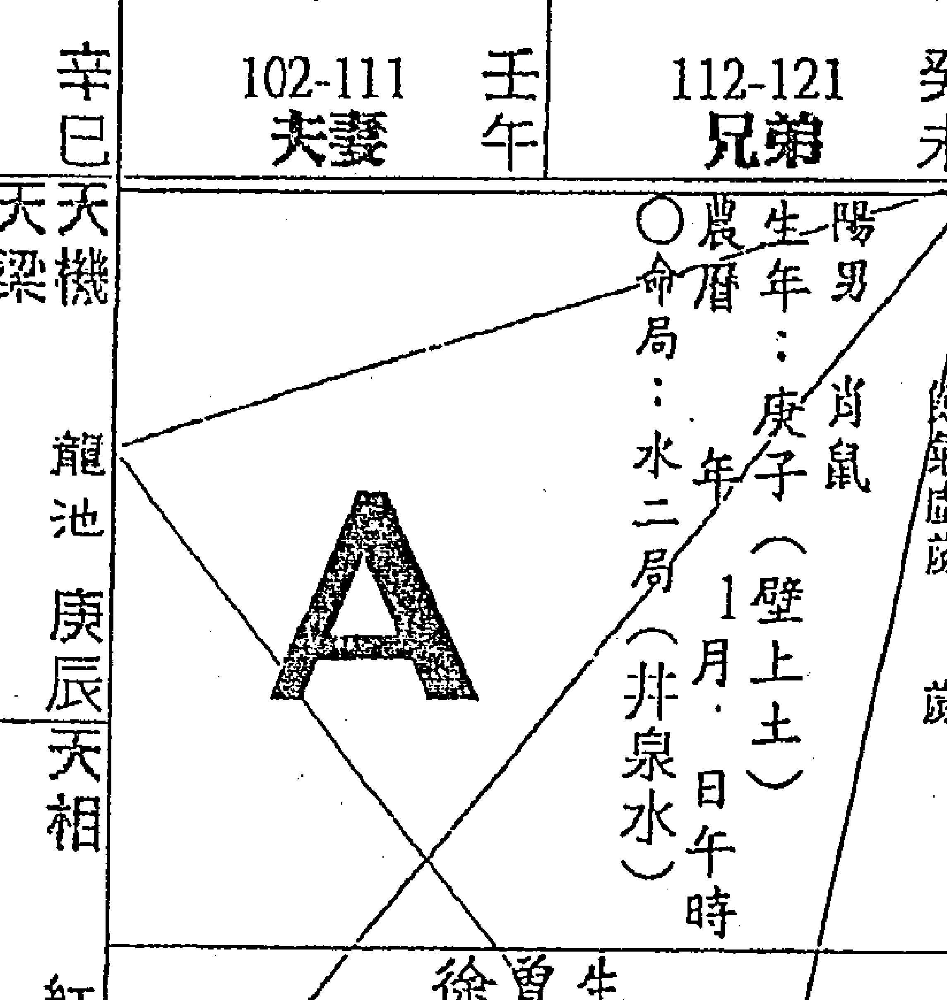

> 徐曾生
> TEL：(04)2263-2397，0911-133639
> E-mail：ez.way@msa.hinet.net 或 ziwi88@hotmail.com

| 宫位 | 年龄段 | 干支 | 主星 | 辅星 |
| :--- | :--- | :--- | :--- | :--- |
| 命宫 | 2-11 | 申 | 紫微、天府 | 禄存、天马、天姚、天刑 |
| 身宫 | 2-11 | 申 | 紫微、天府 | 禄存、天马、天姚、天刑 |
| 兄弟 | 112-121 | 未 | 天相 | 天钺、陀罗、天虚、天哭、截路、旬空 |
| 夫妻 | 102-111 | 午 | 天机 | 破碎、月德、旬空 |
| 子女 | 92-101 | 巳 | 巨门 | 天巫、地劫、天空 |
| 财帛 | 82-91 | 辰 | 天同 | 左辅、文昌、铃星、龙池 |
| 疾厄 | 72-81 | 卯 | 天梁 | 天刑、红鸾、天厨 |
| 迁移 | 62-71 | 寅 | 七杀 | 孤辰、阴煞 |
| 仆役 | 52-61 | 丑 | 天府 | 天魁、贪狼、台辅、天空 |
| 官禄 | 42-51 | 子 | 武曲 | 天官、天同、太阴 |
| 田宅 | 32-41 | 亥 | 破军 | 天府 |
| 福德 | 22-31 | 戌 | 天机 | 凤阁、寡宿、年解 |
| 父母 | 12-21 | 酉 | 天喜 | 右弼、天月、文曲 |
| （其他宫位） | - | - | - | - |

| 宫位1 | 宫位2 | 宫位3 | 宫位4 |
|-------|-------|-------|-------|
| 天福空劫月辅马钺官 年解凤闈 83-92 丁 巳 财帛 | 天机 旬天空空 93-102 戊 午 子女 | 破军紫微禄 蜚廉封诰 103-112 己 未 夫妻 | 天解巫神 孤辰 113-122 庚 申 兄弟 |
| 铃文太 星昌阳 寡天宿喜 73-82 丙 辰 疾厄 | B ○农生阴 命历年女 局：水年巳蛇三局 2长（流石榴木） 日午时 | 火右天 星弼府 破龙碎池 3-12 辛 酉 命宫 身宫 | 文天太 曲刑阴科 月红德惊 13-22 壬 戌 父母 |
| 天七武 魁杀曲 天姚梁同 63-72 乙 卯 迁移 | 犁天羊相 空天台亡哭辅 43-52 乙 丑 官禄 | 阴禄巨天 煞存门庙 截路 33-42 甲 子 田宅 | 陀贪廉 罗狼贞科 岁天破虚 23-32 癸 亥 福德 |
| 天天寿才 53-62 甲 寅 仆役 | 犁天羊相 空天台亡哭辅 43-52 乙 丑 官禄 | 阴禄巨天 煞存门庙 截路 33-42 甲 子 田宅 | 陀贪廉 罗狼贞科 岁天破虚 23-32 癸 亥 福德 |

### 命例测验—命盘 05 157

|  |  |  |  |
|---|---|---|---|
| 84-93 财帛 己 | 地空 地劫 天月 左辅 天马 陀罗 天梁 |  |  |
| 94-103 子女 庚 | 禄存 七杀 |  |  |
| 104-113 夫妻 辛 | 擎羊 天厨 |  |  |
| 114-123 兄弟 壬 | 廉贞 天钺 天刑 解神 天巫 封诰 截路 孤辰 红鸾 天空 |  |  |
| 74-83 疾厄 戊 | 紫微 天相 文昌 铃星 |  |  |
| 4-13 身宫 命宫 癸 酉 | 右弼 空亡 文曲 天刑 破军 |  |  |
| 64-73 迁移 丁 卯 | 巨门 天机 火星 年解 廉贞 凤阁 |  |  |
| 14-23 父母 甲 戌 | 天同 |  |  |
| 54-63 仆役 丙 寅 | 贪狼 天姚 天福 天喜 |  |  |
| 44-53 官禄 丁 丑 | 太阴 太阳 岁破 天虚 台辅 |  |  |
| 34-43 田宅 丙 子 | 武曲 天府 天魁 阴煞 旬空 月德 |  |  |
| 24-33 福德 乙 亥 | 龙池 天哭 |  |  |

徐曾生
TEL: (04)2263-2397, 0911-133639
E-mail: ez.way@msa.hinet.net 或 ziwi88@hotmail.com

- 命局: 金四局
- 农历年: 己未年
- 生年: 阴女
- 生肖: 羊
- 阴女: 天上火
- 日午时

| 廉贞 天同 天相 | 天府 紫微 破军 | 武曲 七杀 | 天机 天梁 |
|---|---|---|---|
| **父母宫** 116-125 乙巳 | **福德宫** 106-115 丙午 | **田宅宫** 96-105 丁未 | **官禄宫** 86-95 戊申 |
| **命宫** 6-15 甲辰 | **兄弟宫** 16-25 癸卯 | **夫妻宫** 26-35 壬寅 | **子女宫** 36-45 癸丑 |
| **财帛宫** 46-55 壬子 | **疾厄宫** 56-65 辛亥 | **迁移宫** 66-75 庚戌 | **交友宫** 76-85 己酉 |
| 阴男 丁未年生 天河水命 5月5日寅时 命局：火六局 (覆灯火) | **徐曾生** TEL : (04)2263-2397 · 0911-133639 E-mail : ez.way@msa.hinet.net 或 ziwi88@hotmail.com |  |  |
| 天官 | 铃星 | 天福 | 火星 |
| 封诰 | 地劫 | 解神 | 天魁 |
| 天刑 | 天虚 | 天机 | 天哭 |
| 破碎 | 月德 | 天才 | 龙池 |

## 命例测验一命盤 159

| 宫位 | 星曜 | 干支 | 年龄段 | 宫位 | 星曜 | 干支 | 年龄段 | 宫位 | 星曜 | 干支 | 年龄段 | 宫位 | 星曜 | 干支 | 年龄段 |
|------|------|------|--------|------|------|------|--------|------|------|------|--------|------|------|------|--------|
| 财帛 | 天地天地左天巨天 福空劫月輔馬門廚 | 癸巳 | 46-55 | 子女 | 天天康 魁相貞 天天紅 壽才鸞 | 甲午 | 36-45 | 夫妻 | 天梁 寡宿 封誥 | 乙未 | 26-35 | 兄弟 | 天解陀七 巫神羅殺 | 丙申 | 16-25 |
| 疾厄 | 鈴文貪 星昌狼 禒 裁路 | 壬辰 | 56-65 | (命宮核心信息) | ○農生陰 命厝年男 局：：辛肖 火年酉雞 六局2石 (山月榴 火下木) 日午時 | | | 身宮 | 天哭 | 丁酉 | 6-15 |
| 遷移 | 歲天 破虛 | 辛卯 | 66-75 | (聯繫信息) | 徐曾生 TEL : (04)2263-2397 , 0911-133639 E-mail : ez.way@msa.hinet.net 或 ziwi88@hotmail.com | | | 父母 | 天空 | 戊戌 | 116-125 |
| 僕役 | 天天天紫 姚鉞府微 月德 | 庚寅 | 76-85 | 官祿 | 天機 年鳳龍台 解闇池輔 | 辛丑 | 86-95 | 田宅 | 陰破 煞軍 旬天 空喜 | 庚子 | 96-105 | 福德 | 太陽 權 斐孤 靡辰 | 己亥 | 106-115 |

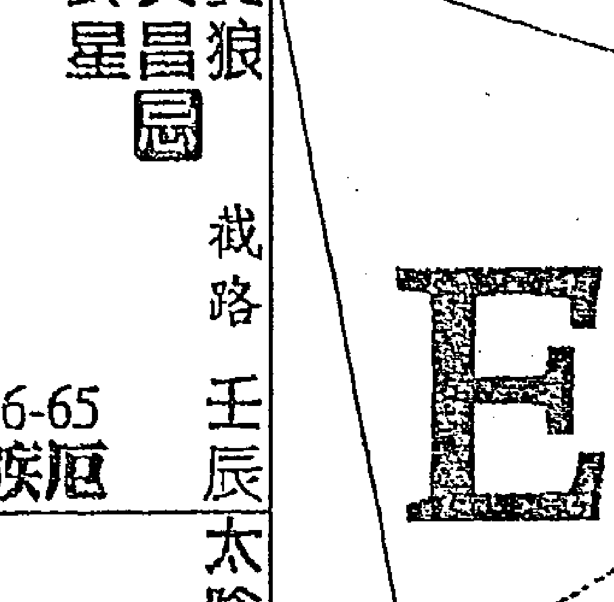

陰男
生年：辛酉（民國59年，西元1981年）
農曆：2月26日午時

| 天福 火星 天馬 天梁 天廚 空亡 破碎 86-95 財帛 巳 | 文曲 天月 天刑 天魁 七殺 天紅 才驚 96-105 甲 子女 午 | 寡宿 台輔 106-115 乙 夫妻 未 | 文昌 陰煞 天巫 陀羅 廉貞 忌 116-125 丙 兄弟 申 |
| --- | --- | --- | --- |
| 解神 天相 紫微 截路 76-85 壬 疾厄 辰 |  | 農曆 生年月日：辛酉年十月石榴木日寅時 命局：火六局（山下火） ○ 命宮 | 天官 6-15 丁 命宮 酉 |
| 巨門 天機 祿 歲天 破虛 66-75 辛 遷移 卯 |  |  | 地空 祿存 天哭 16-25 戊 父母 戌 |
| 天鉞 貪狼 月德 56-65 庚 僕役 寅 | 地劫 右弼 左輔 太陰 太陽 權 年解 鳳閣 龍池 46-55 辛 官祿 丑 | 鈴星 天府 武曲 旬空 天喜 36-45 庚 田宅 子 | 天同 斐廉 孤辰 26-35 己 福德 亥 |

徐曾生
TEL : (04)2263-2397, 0911-133639
E-mail : ez.way@msa.hinet.net 或 ziwi88@hotmail.com

| 宫位 | 星曜 | 年龄 | 宫名 | 天干地支 |
|---|---|---|---|---|
| 左上 | 左辅 天马 禄存 | 116-125 | 兄弟 | 丁巳 |
| 上中左 | 擎羊 天机 | | 命宫 | 戊午 |
| 上中右 | 龄星 鸾星 天钺 破军 紫微 解神 天寿 天巫 | 16-25 | 父母 | 己未 |
| 右上 | 地劫 | 26-35 | 福德 | 庚申 |
| 中左 | 陀罗 太阳 | 106-115 | 夫妻 | 丙辰 |
| 中右 | 右弼 天府 恩光 天贵 | 36-45 | 田宅 | 辛酉 |
| 下左 | 七杀 武曲 | 96-105 | 子女 | 乙卯 |
| 下中左 | 文曲 文昌 天喜 天魁 天相 | 76-85 | 疾厄 | 乙丑 |
| 下中右 | 龙池 巨门 | 66-75 | 迁移/身宫 | 甲子 |
| 下右 | 火星 贪狼 廉贞 | 46-55 | 官禄 | 壬戌 |
| 最下左 | 地空 天姚 凤阁 天梁 天同 天才 三台 | 86-95 | 财帛 | 甲寅 |
| 最下右 | 56-65 | 仆役 | 癸亥 |

**中间批注信息：**
阳男
生肖：猴（戊申年）
斗君：午（2大限）
五行局：火六局
命主：西时

陈先生
E-mail : cz.way@msa.hinet.net
或 ziwi88@hotmail.com

## 16203 紫微斗数命运分析—实例篇

| 第一列 | 第二列 | 第三列 | 第四列 |
|--------|--------|--------|--------|
| 天天馬同 （天月图标） | 文天紅天武昌刑驚府曲 （恩光图标） | 地火太太空星陰陽 （忌，恩光图标） | 文天貪曲鉞狼 （天倉 西煞图标） |
| 23-32 辛 夫妻 巳 | 13-22 壬 兄弟 午 | 3-12 癸 命宮 未 | 113-122 甲 父母 申 |
| 33-42 庚 子女 辰 | 34 34 乙酉年 10月10日 辰時 斗君：癸未年（甲申木） | 陰曆歲 （天貴图标） | 103-112 乙 福德 酉 |
| 43-52 己 身宮 財帛 卯 | 63-72 己 遷移 丑 | 73-82 戊 僕僕 子 天魁 天喜 七殺 孤辰 | 83-92 丁 官祿 亥 |

H

徐曾生
電話: (04)2263-
E-mail: ez.way@msa.hinet.net
或 ziwi88@hotmail.com
行動: 0911-

解神

天才

地劫存

祿存

三台

月德

天壽

蜚廉 八座

| 铃星 太阳 荫 56-65 僕役 辛巳 | 文曲 龙池 破军 66-75 遷移 壬午 | 天机 天梁 陀罗 天喜 天钺 76-85 疾厄 癸未 | 紫微 天府 天祿 天馬 鳳閣 文昌 86-95 財帛 甲申 |
| --- | --- | --- | --- |
| 三台 天巫 46-55 身宫 庚辰 | 陽男庚寅年 1月1日寅時生 (中心图形) |  | 太阴 擎羊 天刑 96-105 子女 乙酉 |
| 火星 天同 36-45 田宅 己卯 | 徐先生 E-mail : ez.way@msa.hinet.net 或 zivi88@hotmail.com |  | 天钺 廉贞 106-115 夫妻 丙戌 |
| 天阴 天才 26-35 福德 戊寅 | 地劫 天姚 红鸾 天魁 天梁 16-25 父母 己丑 | 天相 廉贞 6-15 命宮 戊子 | 巨门 116-125 兄弟 丁亥 |

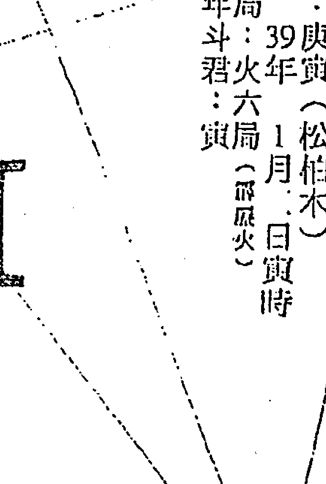

> 徐先生 E-mail : ez.way@msa.hinet.net 或 zivi88@hotmail.com

## 164 紫微斗數命運分析—實例篇

| 财帛宫 (84-93 己) | 子女宫 (94-103 庚) | 夫妻宫 (104-113 辛) | 兄弟宫 (114-123 壬) |
|-------------------|-------------------|-------------------|-------------------|
| 地空 左輔 天馬 陀羅 天梁 科 | 祿存 七殺 | 犁羊 天貴 | 紅鸞 天鉞 廉貞 |
| 疾厄宫 (74-83 戊) | **陰女 金四局** 農曆年10月11日午時 金四局 32歲起運 | 身宮/命宮 (4-13 癸) 文曲 天刑 破軍 忌 |  |
| 遷移宮 (64-73 丁) | **地址：台中市** 電話：(04)263-2397 手機：0911-133639 郵政信箱：台中郵政45之2號信箱 | 父母宮 (14-23 甲) |  |
| 僕役宮 (54-63 丙) | 官祿宮 (44-53 丁) 太太 陰陽 陰煞 | 田宅宮 (34-43 丙) 天魁 天府 武曲 祿 | 福德宮 (24-33 乙) |

## 命例測驗一命盤 165

|  |  |  |  |  |  |
| --- | --- | --- | --- | --- | --- |
| 天鉞 梁 綠 |  | 七殺 | 鈴星 右弼 左輔 綠 |  | 地劫 貞 |
| 八座 |  |  |  |  | 會煞 |
| 95-104 乙 子女 巳 | 105-114 丙 夫妻 午 | 115-124 丁 兄弟 未 | 5-14 戊 命宮 申 |  | 天喜 |
| 天姚 姚 池 相 微 祿 |  |  |  |  | 三台 |
| 85-94 甲 財帛 辰 |  |  |  |  | 15-24 己 父母 酉 |
| 紅鸞 鶴 戌 門 機 |  |  |  |  | 鳳閣 陀羅 破軍 |
| 75-84 癸 疾厄 卯 |  |  |  |  | 25-34 庚 福德 戌 |
| 地空 貪狼 | 文曲 文昌 太陰 太陽 | 天刑 擎羊 天府 武曲 祿 |  | 火星 天馬 祿存 天同 |
| 天恩 光貴 | 65-74 壬 遷移 寅 | 55-64 癸 僕役 丑 | 45-54 壬 官祿 子 | 35-44 辛 田宅 亥 |  |

OO庚辰生年干 庚午 命宫在午 61年10月4日生（男命）
地址：台中市東區 路 號
電話：(04)263-2397 手機：0911133639
郵政信箱：台中郵政45之2號信箱

## 166 紫微斗數命運分析—實例篇

| 宫位区域 | 星曜与信息 | 年龄范围与宫位 | 干支与备注 |
|----------|------------|----------------|------------|
| 第一列 | 地空、地劫、天姚、陀罗、天巫 | 72-81 僕役 己巳 | 天巫、72-81 僕役 己巳 |
| 第二列 | 右弼、禄存、天机、陰煞、限財帛 | 62-71 遷移 庚午 | 陰煞、限財帛、62-71 遷移 庚午 |
| 第三列 | 擎羊、破军、紫微、天厨、天月 | 52-61 疾厄 辛未 | 天月、52-61 疾厄 辛未 |
| 第四列 | 左辅、红鸾、天马、天钺、封誥、孤辰 | 42-51 財帛 壬申 | 封誥、孤辰、42-51 財帛 壬申 |
| 附加行 | 鈴星、文昌、太陽 | 82-91 官祿 戊辰 | 寡宿、82-91 官祿 戊辰 |
| 中心区域 | ○農曆年男命局：水二局（潤下水）、5月...日午時、節氣：虛戍... | （插图区域） | 天官、節氣虛戍... |
| 联系信息 | 徐曾生 TEL : (04)2263-2397, 0911-133639 E-mail : ez.way@msa.hinet.net | 限命宮 | 22-31 夫妻 甲戌 |
| 底部区域 | 火星、鳳閣、七殺、武曲祿 | 92-101 田宅 丁卯 | 天福、天喜、天梁、天同科、92-101 田宅 丁卯 |
| 底部右侧 | 文曲忌、太陰 | 32-41 子女 癸酉 | 文曲忌、太陰、32-41 子女 癸酉 |
| 最底行 | 解神、台輔、天刑、天相、巨門、天魁、龍池、貪狼、權、廉貞 | 102-111 福德 丙寅、112-121 父母 丁丑、2-11 身宮 命宮 丙子、12-21 兄弟 乙亥 | 限官祿、2-11 身宮 命宮 丙子、12-21 兄弟 乙亥 |

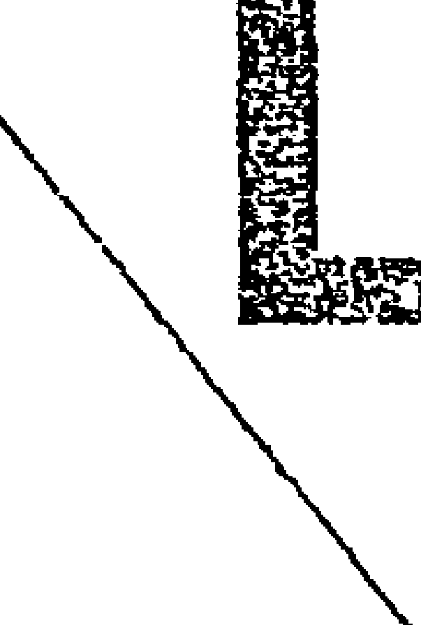

徐曾生 TEL : (04)2263-2397, 0911-133639 E-mail : ez.way@msa.hinet.net

| 宫位 | 内容 |
|------|------|
| 田宅宫 | 地空、地劫、禄存、太阳、天府 孤辰 32-41 丁巳 |
| 官禄宫 | 擎羊、破军 龙池 42-51 戊午 |
| 僕役宫 | 火星、天姚、天钺、天机 月德、天喜、封誥 52-61 己未 |
| 迁移宫 | 紫微、天府 年解、岁破、鳳閣、天虛 62-71 庚申 |
| 福德宫 | 武曲、陀螺、右弼、文昌 天壽、天才、天哭 22-31 丙辰 |
| 父母宫 | 天官、天福 天空 12-21 乙卯 |
| 疾厄宫 | 太阴、铃星 破碎 72-81 辛酉 |
| 财帛宫 | 贪狼、左辅、文曲 蜚廉 82-91 壬戌 |
| 命宫 | 七杀、天马、解神、天巫、阴煞 身宫 2-11 甲寅 |
| 兄弟宫 | 天魁、天梁 寡宿、红鸾、台辅 112-121 乙丑 |
| 夫妻宫 | 廉贞、天相 102-111 甲子 |
| 子女宫 | 巨门、天月 92-101 癸亥 |

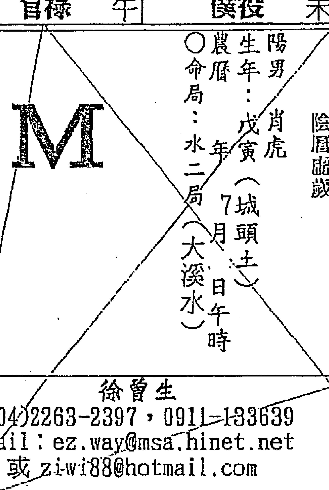

徐曾生
(04)2263-2397, 0911-133639
E-mail: ez.way@msa.hinet.net 或 ziwi88@hotmail.com

| 田宅 (35-44 辛巳) 火星 天同 天厨 年解 凤阁 | 官禄 (45-54 壬午) 文曲 左辅 天府 武曲 截路 空亡 身宫 | 仆役 (55-64 癸未) 太阴 太阳 天福 禄存 空亡 天才 妻廉 台辅 | 迁移 (65-74 甲申) 文昌 右弼 天钺 贪狼 孤辰 |
| --- | --- | --- | --- |
| 天官 封诰 福德 (25-34 庚辰) 天梁 擎羊 破军 天月 寡宿 天喜 禄存 天姚 | 命宫 ○ 命局：土五局 (城头土) 阴女 生年：乙巳 (覆灯火) 3月 日 寅时 肖蛇 节气：惊蛰 | 疾厄 (75-84 乙酉) 地空 巨门 天机 禄存 破碎 龙池 解神 天相 紫微 阴煞 月德 红鸾 | 父母 (15-24 己卯) 廉贞 陀罗 天马 天巫 旬空 |
| 兄弟 (115-124 己丑) 地劫 天哭 | 夫妻 (105-114 戊子) 铃星 天魁 七杀 | 子女 (95-104 丁亥) 天刑 天梁 禄存 天喜 天虚 天哭 | 命宫 (5-14 戊寅) 旬空 |

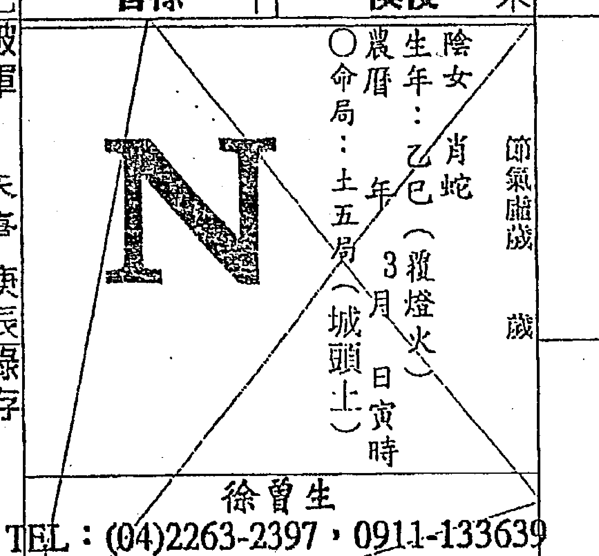

徐曾生
TEL : (04)2263-2397 , 0911-133639
E-mail : ez.way@msa.hinet.net
或 ziwi88@hotmail.com

命盘表格内容如下：

*   **命宫 (5-14, 戊申):** 天武相曲 (天机、天梁、天同、巨门、太阴、太阳、天府、武曲、天相)
*   **父母 (15-24, 己酉):** 火天钺太星梁阳 (火星、天钺、天梁、太阳)， 破碎
*   **福德 (25-34, 庚戌):** 铃文左七星昌辅杀 (铃星、文昌、左辅、七杀)， 寡天宿喜 (天喜)
*   **田宅 (35-44, 辛亥):** 紫天福微 (紫微、天府、天福)， 地地天天空劫月魁机 (地空、地劫、天魁、天机)
*   **官禄 (45-54, 壬子):** 天空， 年鳳解閣 (凤阁、解神、年解)
*   **仆役 (55-64, 癸丑):** 費廉 (蜚廉)
*   **迁移 (65-74, 壬寅):** 封誥， 截孤路辰 (截路、孤辰)
*   **疾厄 (75-84, 癸卯):** 天官， 陰天解天破煞巫神馬軍 (阴煞、天巫、解神、天马、破军)， 龍池空亡 (龙池、天空、劫空)
*   **财帛 (85-94, 甲辰):** 文右天廉曲弼府貞 (文曲、右弼、天相、廉贞)， 月紅德煞 (月德、红鸾)， 天刑
*   **子女 (95-104, 乙巳):** 天府， 陀太羅陰煞 (陀罗、太阴)， 歲天破虛輔 (岁破、天虚、天辅)， 台輔
*   **夫妻 (105-114, 丙午):** 祿貪存狼 (禄存、贪狼)， 向空 (旬空)
*   **兄弟 (115-124, 丁未):** 天擎巨天姚羊門同 (天姚、擎羊、巨门、天同)， 天天夭壽才哭 (天寿、天才、天哭)

**命主信息:**
○ 农历年：丁亥 (屋上土)
○ 生年：7月25日 子时
○ 肖猪
○ 命局：土五局 (大驿土)
○ 性别：阴女

**联系方式:**
姓名：徐曾生
电话：(04)2263-2397 · 0911-133639
邮箱：ez.way@msa.hinet.net 或 ziwi88@hotmail.com

| 丁巳 33-42 子女 | 戊午 23-32 身宫 夫妻 | 己未 13-22 兄弟 | 庚申 3-12 命宫 |
| --- | --- | --- | --- |
| 丙辰 43-52 财帛 | | | 辛酉 113-122 父母 |
| 乙卯 53-62 疾厄 | | | 壬戌 103-112 福德 |
| 甲寅 63-72 迁移 | 乙丑 73-82 仆役 | 甲子 83-92 官禄 | 癸亥 93-102 田宅 |

農曆生年：戊申年（猴），陽女，命局：木三局，五行：石榴木，月日時：月日時

徐曾生
(04)2263-2397，0911-138639
E-mail: ez.way@msa.hinet.net 或 ziwi88@hotmail.com

## 命例测验—命盤 171

| 宫位 | 星曜 | 干支 | 年龄段 |
|------|------|------|--------|
| 兄弟 | 天官、文曲、右弼、天马、禄存、空亡、孤辰 | 巳 | 14-23 |
| 命宫 | 天擎、天姚、天机、羊陀、龙池、台辅 | 午 | 4-13 |
| 父母 | 破军、紫微、月德、天喜 | 未 | 114-123 |
| 身宫/福德 | 天巫、天虚、天才、凤阁、岁破、天解 | 申 | 104-113 |
| 夫妻 | 铃星、阴煞、陀罗、太阳、截空、天哭 | 辰 | 24-33 |
| 子女 | 封诰、天刑、天马 | 卯 | 34-43 |
| 田宅 | 文昌、左辅、天府、天钺、破碎 | 酉 | 94-103 |
| 官禄 | 破碎、天刑、天马 | 戌 | 84-93 |
| 财帛 | 火星、天刑、天梁、天同、天马 | 寅 | 44-53 |
| 疾厄 | 天相、天福、天廚、寡宿、红鸾 | 丑 | 54-63 |
| 迁移 | 地劫、解神、巨门、天刑 | 子 | 64-73 |
| 仆役 | 天魁、贪狼、廉贞、旬空 | 亥 | 74-83 |
| 命局 | 金四局（砂中金） | - | - |
| 阳女 | 丙寅年（炉中火）6月丑时 | - | - |
| 生肖 | 虎 | - | - |
| 节气 | 虚岁岁 | - | - |
| 姓名 | 徐曾生 | - | - |
| 电话 | (04)2263-2397, 0911-133639 | - | - |
| 邮箱 | ez.way@msa.hinet.net 或 ziwi88@hotmail.com | - | - |

## 172 紫微斗数命运分析—实例篇

| 宫位 (天干地支) | 主星 | 辅星/杂曜 | 大限年龄 | 宫位 (天干地支) | 主星 | 辅星/杂曜 | 大限年龄 |
|---|---|---|---|---|---|---|---|
| 福德 辛巳 | 天梁 天喜 | 解神 蜚廉 八座 恩光 天贵 | 25-34 | 官禄 癸未 | 天刑 天钺 天马 陀罗 铃星 | 天才 三台 | 45-54 |
| 田宅 壬午 | 七杀 凤阁 | | 35-44 | 仆役 甲申 | 廉贞 禄存 天马 龙池 地劫 | | 55-64 |
| 父母 庚辰 | 紫微 天相 | | 15-24 | 迁移 (身宫) 乙酉 | 破军 擎羊 | 月德 | 65-74 |
| 命宫 己卯 | 天机 巨门 | | 5-14 | 疾厄 丙戌 | 天同 天姚 天马 火星 红鸾 | 天刑 | 75-84 |
| 兄弟 戊寅 | 贪狼 天马 左辅 地空 | 天巫 天寿 | 15-24 | 夫妻 己丑 | 太阳 太阴 天魁 文曲 文昌 | 科 权 | 105-114 |
| | | | | 子女 戊子 | 武曲 天府 右弼 | 科 | 95-104 |
| | | | | 财帛 丁亥 | 天同 天姚 天马 火星 红鸾 | 忌 | 85-94 |

阴男 阳年生：戊辰年十一月廿五亥时

命宫：在己卯

陈先生 E-mail : ez.way@msa.hinet.net 或 ziwi88@hotmail.com

### 紫微斗数命盘

| 宫位/年龄 | 天干/地支 | 主要星曜 | 备注 |
| :--- | :--- | :--- | :--- |
| **命宫** | 辛未 | 天刑、天钺、天空、封诰 | 5-14岁大限 |
| **兄弟宫** | 庚午 | 七杀、解神、阴煞、火星、地空 | 15-24岁大限 |
| **夫妻宫** | 己巳 | 破碎、旬空、文曲、天梁 | 25-34岁大限（身宫） |
| **子女宫** | 戊辰 | 紫微、天相、地劫、凤阁、寡宿、年解 | 35-44岁大限 |
| **财帛宫** | 丁卯 | 天机、巨门、擎羊 | 45-54岁大限 |
| **疾厄宫** | 丙寅 | 贪狼、禄存、天马、左辅、天巫、蜚廉 | 55-64岁大限 |
| **迁移宫** | 丁丑 | 太阳、太阴、陀罗、天魁、天才 | 65-74岁大限 |
| **仆役宫** | 丙子 | 武曲、天府、右弼、破碎、天虚、天哭、台辅 | 75-84岁大限 |
| **官禄宫** | 乙亥 | 天同、天姚、天喜、月德 | 85-94岁大限 |
| **田宅宫** | 甲戌 | 破军、天月、龙池 | 95-104岁大限 |
| **福德宫** | 癸酉 | 空亡、红鸾 | 105-114岁大限 |
| **父母宫** | 壬申 | 廉贞、贪狼、铃星、截路、孤辰 | 115-124岁大限 |
| **中心信息** | - | 命主：阳女，生年：甲午（砂中金），生肖：马，农历11月11日巳时，命局：土五局（路傍土），图中标有字母“S” | - |
| **联系信息** | - | 徐曾生 TEL：(04)2263-2397，0911-133639 E-mail：ez.way@msa.hinet.net 或 ziwi88@hotmail.com | - |

## 174 紫微斗数命运分析—实例篇

| 宫位 | 星宿信息 | 年龄范围 | 干支 |
|---|---|---|---|
| 天福 | 天巫、巨门、天厨（禄） | 73-82 | 癸巳 |
|  | 文昌（忌）、天魁、天相、廉贞 | 83-92 | 甲午 |
| 地空、天梁 | 天哭 | 93-102 | 乙未 |
| 文曲（科）、解神、天马、陀罗、七杀 | | 103-112 | 丙申 |
| 左辅、贪狼 | 截路、月德、红鸾 | 63-72 | 壬辰 |
|  | 空亡、天寿、岁破、天虚、封诰 | | |
|  | ○农历命局：木三局（平地木） | | |
|  | 生年：辛亥（阴女）肖猪 1月 剑锋金 日辰时 | | |
| 天官 | 天刑、禄存、天同 | | |
|  | 天才、破碎 | 113-122 | 丁酉 |
| 天右弼、武曲、擎羊 | 天月 | | |
| 天喜、寡宿 | | 3-12 | 戊戌 |
| 龙池、凤阁 | | | |
| 铃星、阴煞、天钺、天府、紫微 | | 43-52 | 庚寅 |
|  | 火星、天姚、天机 | 33-42 | 辛丑 |
|  | | 23-32 | 庚子 |
| 向空、孤辰 | | | |
|  | 蜚廉 | | |
|  | 天空 | | |
|  | 年解、凤阁 | 13-22 | 己亥 |
|  | 破军 | | |

徐曾生
TEL : (04)2263-2397，0911-133639
E-mail : ez.way@msa.hinet.net 或 ziwi88@hotmail.com

紫微斗数命盘表格，包含12个宫位：
- 子女宫：天机天梁、天福、月德、破碎、95-104、乙巳
- 夫妻宫：七杀、岁破、天虚、天哭、105-114、丙午
- 兄弟宫：铃星、右弼、左辅、115-124、丁未
- 财帛宫：天姚、天相、紫微、龙池、85-94、甲辰
- 父母宫：天喜、天才、廉贞、15-24、己酉
- 疾厄宫：天魁、巨门、天机、旬空、红鸾、75-84、癸卯
- 福德宫：年解、寡宿、凤阁、25-34、庚戌
- 身宫迁移：地空、天月、贪狼、截路、天寿、孤辰、65-74、壬寅
- 仆役宫：文曲、文昌、太阴、太阳、天空、55-64、癸丑
- 官禄宫：天刑、擎羊、天府、武曲、忌、45-54、壬子
- 田宅宫：火星、天巫、天马、禄存、天同、35-44、辛亥
- 中间区域：农历年、男、肖鼠、土五局、桑柘木、4月、酉时、大驿土

徐曾生
TEL : (04)2263-2397, 0911-133639
E-mail : ez.way@msa.hinet.net 或 ziwi88@hotmail.com

## 176 紫微斗数命运分析—实例篇

| 宫位 (年龄范围) | 天干地支 | 主要星曜 |
|---|---|---|
| 兄弟 (112-121) | 巳 | 天巫、天姚、天钺、天机、天福、孤辰、天喜、天空、台辅、文曲、七杀、天魁、天梁、太阳(禄) |
| 命宫 身宫 (2-11) | 午 | 紫微、右弼、阴煞、凤阁、年解、天厨、天巨天刑门同、寡宿、解神 |
| 父母 (12-21) | 未 | 天月、天喜 |
| 福德 (22-31) | 申 | 左辅(科)、龙池、天马、破军、天官、铃星、文昌、陀罗、天府、廉贞 |
| 田宅 (32-41) | 酉 | 廉贞、天府、陀罗、文昌、铃星、天官 |
| 官禄 (42-51) | 戌 | 天虚、破碎、天才、天寿 |
| 仆役 (52-61) | 亥 | 贪狼、擎羊、解神、太阴、禄存、地劫、地空 |
| 迁移 (62-71) | 子 | |
| 疾厄 (72-81) | 丑 | 巨门、天同、天刑、寡宿、破碎 |
| 财帛 (82-91) | 寅 | |
| 子女 (92-101) | 卯 | 火星、天相、武曲、封诰、截路、天哭 |
| 夫妻 (102-111) | 辰 | 天魁、天梁、太阳、空亡 |

○ 命局：水二局 (天河水) 农历：壬辰年闰5月日子时 生年：壬辰 (长流水) 阳男 肖龙

徐曾生
TEL: (04)2263-2397, 0911-133639
E-mail: ez.way@msa.hinet.net 或 ziwi88@hotmail.com

| 宫位 | 天干地支 | 年龄范围 | 主要星曜 |
|------|----------|----------|----------|
| 命宫 | 丁巳 | 5-14 | 铃星、凤阁、天钺、阴煞 |
| 父母 | 戊午 | 115-124 | 地劫、贪狼(忌) |
| 福德 | 己未 | 105-114 | 天刑、巨门、天同(权、禄) |
| 田宅 | 庚申 | 95-104 | 天相、武曲 |
| 兄弟 | 丙辰 | 15-24 | 地空、天喜、廉府、天贵 |
| 夫妻 | 乙卯 | 25-34 | 文昌、天魁(忌) |
| 子女 | 甲寅 | 35-44 | 左辅、天马、破军、禄 |
| 财帛 | 乙丑 | 45-54 | 擎羊 |
| 疾厄 | 甲子 | 55-64 | 右弼、禄存、紫微 |
| 迁移 | 癸亥 | 65-74 | 天机、陀罗、天姚、科 |
| 仆役 | 壬戌 | 75-84 | 火星、红鸾、七杀 |
| 官禄 | 辛酉 | 85-94 | 太阳、天梁、龙池、权 |

| 宫位/岁数 | 星曜 | 宫位/岁数 | 星曜 | 宫位/岁数 | 星曜 | 宫位/岁数 | 星曜 |
| :--- | :--- | :--- | :--- | :--- | :--- | :--- | :--- |
| 5-14 命宫 卯 | 铃星 天刑 禄存 天相 天贵 | 15-24 父母 辰 | 寡宿 地劫 右弼 天喜 擎羊 天梁 天机 (科) | 25-34 福德 巳 | 文昌 凤阁 七杀 紫微 (禄) 三台 天寿 | 35-44 田宅 午 | 地空 |
| 45-54 官禄 未 | 天姚 蜚廉 孤辰 天才 | 55-64 仆役 申 | 火星 天钺 | 65-74 迁移 酉 | 文曲 龙池 破军 廉贞 左辅 红鸾 | 75-84 疾厄 戌 | 天府 |
| 85-94 财帛 亥 | 天府 | 95-104 子女 子 | 天魁 太阴 天同 (恩光) (天月) | 105-114 身宫 夫妻 丑 | 贪狼 武曲 | 115-124 兄弟 寅 | 天马 陀罗 巨门 太阳 (解神) (天刑) (天马) |

X (图形标记)

阴历虚岁45岁
阴女：
生年：乙巳蛇
农历：54年7月9日巳时
国历：54年8月9日
命局：木三局
子斗：亥
(城头土)

徐曾生
电话：(04)2263-2397
行动：0911-133639
E-mail：ez.way@msa.hinet.net 或 ziwi88@hotmail.com

| 宫位 (年龄 天干地支) | 星曜与信息 |
|---|---|
| 命宫 (4-13 癸酉) | 地空, 太阴, 天姚, 贪狼 |
| 兄弟 (14-23 壬申) | 文昌, 龙池, 天府, 紫微, 天巫, 阴煞, 八座 |
| 夫妻 (24-33 辛未) | 天钺, 天机 |
| 子女 (34-43 庚午) | 文曲, 天刑, 凤阁, 破军(权), 三台, 天月, 蜚廉 |
| 财帛 (44-53 己巳) | 孤辰, 天寿, 天马(忌), 太阳 |
| 疾厄 (54-63 戊辰) | 解神, 火星, 武曲(禄), 擎羊, 天同 |
| 迁移 (64-73 丁卯) | 禄存, 七杀 |
| 仆役 (74-83 丙寅) | (此宫位信息在表格左下角) |
| 官禄 (84-93 丁丑) | 天才, 寅地, 右弼, 左辅, 天魁, 陀罗, 天梁 |
| 田宅 (94-103 丙子) | 铃星, 天相, 廉贞(忌), 思光 |
| 福德 (104-113 乙亥) | 红鸾, 巨门 |
| 父母 (114-123 甲戌) | (此宫位信息在表格右侧中部) |
| **命主信息** | 阳女, 命局: 金四局, 生年: 甲辰, 国历: 53年10月4日, 农历: 53年9月10日寅时, 阴历: 岁, 月德 |

徐曾生
电话：(04)2263-2397
行动：0911-133639
E-mail：ez.way@msa.hinet.net 或 ziwi88@hotmail.com

## 180 紫微斗数命运分析—实例篇

| 宫位 | 年龄范围 | 天干地支 | 主要星曜 |
|---|---|---|---|
| 财帛 | 42-51 | 辛巳 | 天梁、七杀、月三德台 |
| 子女 | 32-41 | 壬午 | 天钺、陀罗、龙池 |
| 夫妻 | 22-31 | 癸未 | 截空 |
| 兄弟 | 12-21 | 甲申 | |
| 命宫 身宫 | 0-11 | 乙酉 | 文曲、天刑、龙池、天相、紫微、阴煞、岁破、天才、天寿、天喜、擎羊 |
| 疾厄 | 52-61 | 庚辰 | 右弼、红鸾、巨门、天机、恩光 |
| 迁移 | 62-71 | 己卯 | 天魁、太阴、太阳、科忌 |
| 仆役 | 72-81 | 戊寅 | 火星、贪狼 |
| 官禄 | 82-91 | 己丑 | 阴煞、天刑 |
| 田宅 | 92-101 | 戊子 | 天府、武曲、权、地空、地劫、左辅、天马、忌 |
| 福德 | 102-111 | 丁亥 | |
| 父母 | 112-121 | 丙戌 | 寡宿、铃星、文曲、凤阁、破军 |

○○国农历生阳
子命府年女
年局：49 49 庚寅
斗：水年年干鼠
君：二 已局 8 骤 (井泉水) 月月土 土 日日 0-子 点时 (身宫 乙 酉)

电话 (04)2263-2397
E-mail : ez.way@msa.hinet.net
或 ziwi88@hotmail.com

命盘表格包含多个宫位，每个宫位有星曜、年龄范围和天干地支。例如：身宫（己巳，42-51岁）、命宫（丁丑，2-11岁）、迁移（辛未，62-71岁）等。表格中还有紫微、天府、太阳等星曜名称，以及相关符号和文字说明。

徐曾生
TEL : (04)2263-2397 · 0911-133639
E-mail : ez.way@msa.hinet.net 或 ziwi88@hotmail.com

## 紫微斗数命运分析—实例篇

一张紫微斗数命盘表格。中心区域标注命主信息：阳男，生肖狗，壬戌年（大海水）十一月十一日酉时生，命局为金四局（金箔金）。表格被划分为十二个宫位（命宫、兄弟、夫妻、子女、财帛、疾厄、迁移、仆役、官禄、田宅、福德、父母），每个宫位内列有该宫主星、辅星、干支、大限年龄范围（如4-13，14-23等）及其他神煞。宫位间有连线表示特定关系。

徐曾生
TEL：(04)2263-2397，0911-133639
E-mail：ez.way@msa.hinet.net 或 ziwi88@hotmail.com

| 宫位 (年龄范围) | 天干地支 | 主要星曜 |
|---|---|---|
| 身宫 命宫 (2-11) | 丙午 | 右弼、凤阁、紫微(权)、天巨天刑门同、寡宿、解神 |
| 父母 (12-21) | 丁未 | 天月、擎羊、贪狼 |
| 福德 (22-31) | 戊申 | 左辅(科)、龙池、天马、破军、天官、铃星、文昌、陀罗、天府、廉贞、地空、地劫、红鸾、禄存、太阴 |
| 田宅 (32-41) | 己酉 | |
| 官禄 (42-51) | 庚戌 | |
| 仆役 (52-61) | 辛亥 | |
| 迁移 (62-71) | 壬子 | |
| 疾厄 (72-81) | 癸丑 | |
| 财帛 (82-91) | 甲寅 | |
| 子女 (92-101) | 乙卯 | |
| 夫妻 (102-111) | 丙辰 | |
| 兄弟 (112-121) | 丁巳 | 天巫、天姚、天喜、天钺、天机、天福、孤辰、阴煞、台辅、文曲、七杀、天魁、天梁、太阳(禄)、火星、天相、武曲(忌)、封诰 |

农历 41年闰5月27日子时
命局：水二局（天河水）
阳男 肖龙 壬辰(长流水)
节气 虚成
天厨

徐曾生
TEL: (04)2263-2397, 0911-133639
E-mail: ez.way@msa.hinet.net

## 184 紫微斗数命盘分析—实例篇

### 紫微斗数命盘

| 宫位 | 天干地支 | 年龄范围 | 主星 | 辅星/杂曜 | 备注 |
|---|---|---|---|---|---|
| 命宫 | 癸卯 | 4-13 | 破军、天马、龙池、左辅、地空 | | 月德、天巫 |
| 父母宫 | 甲辰 | 14-23 | 廉贞、天府 | 天贵、恩光 | |
| 福德宫 | 乙巳 | 24-33 | 太阴、天钺、红鸾 | 解神、阴煞 | 三台 |
| 田宅宫 | 丙午 | 34-43 | 贪狼、擎羊 | 天寿 | 三台、八座 |
| 官禄宫 | 丁未 | 44-53 | 天同、巨门、天刑 | 天寿 | 化权、化忌 |
| 仆役宫 | 戊申 | 54-63 | 武曲、天相、天刑 | 地劫、八座 | 化科 |
| 迁移宫（身宫） | 己酉 | 64-73 | 太阳、天梁 | 化禄 | 阴煞、天姚、咸池 |
| 疾厄宫 | 庚戌 | 74-83 | 七杀、陀罗、火星 | | 天月 |
| 财帛宫 | 辛亥 | 84-93 | 天机、天梁、太阳 | 天姚、天喜、禄存 | 天马 |
| 子女宫 | 壬子 | 94-103 | 天同、巨门、天刑 | 铃星、右弼、凤阁、擎羊、紫微 | 孤辰 |
| 夫妻宫 | 癸丑 | 104-113 | 天相 | 文曲、文昌 | 蜚廉 |
| 兄弟宫 | 壬寅 | 114-123 | 天府 | 天才 | |

**命主信息**：
- 阳男戊戌年（71年次）生
- 命局：金四局（亥）
- 生月：十一月（大雪后）
- 生日：酉时
- 阴历：十一月十一日

徐先生
E-mail: ez.way@msa.hinet.net 或 ziwi88@hotmail.com## 解答

### 命例與命盤對照表

| 命例 | 一 | 二 | 三 | 四 | 五 | 六 | 七 | 八 | 九 |
|------|----|----|----|----|----|----|----|----|----|
| 命盤 | H | 壬 | A | L | O | B | N | I | J |
| 命例 | 十 | 十一 | 十二 | 十三 | 十四 | 十五 | 十六 | 十七 | 十八 |
| 命盤 | M | P | Q | C | R | K | D | S | T |
| 命例 | 十九 | 二十 | 二一 | 二二 | 二三 | 二四 | 二五 | 二六 | 二七 |
| 命盤 | U | X | W | E | V | Y | Z | F | 甲 |
| 命例 | 二八 | 二九 | 三十 | 三一 | 三二 | 三三 | 三四 | 三五 |  |
| 命盤 | 丁 | 丙 | G | 乙 | 戊 | 己 | 庚 | 辛 |  |

### 笔记栏：

### 实例解说

#### 命例一

| 宫位 | 星曜 | 宫位 | 星曜 | 宫位 | 星曜 | 宫位 | 星曜 |
|------|------|------|------|------|------|------|------|
| 夫妻 23-32 辛巳 | 天同、天马 （天月） | 兄弟 13-22 壬午 | 武府、天刑、天刑、红鸾、文昌 恩光 | 命宫 3-12 癸未 | 太阳、太阴、火星、地空 （恩光） | 父母 113-122 甲申 | 贪狼、天钺、文曲 （阴煞、天使） |
| 子女 33-42 庚辰 | 破军、擎羊 解神、天才 | H | 阴男 乙酉年生 民国74年10月8日辰时 农历74年9月10日8点 命局：木三局 | 103-112 乙酉 | 福德 | 巨门、天机 （天贵、天寿） |
| 财帛 43-52 己卯 | 廉贞、陀罗、铃星 三台 | 徐曾生 电话：(04)2263-xxx 行动：0911-xxx E-mail：cz.way@msa.hinet.net 或 ziwi88@hotmail.com | | 田宅 93-102 丙戌 | 紫微、天相、天姚 （科） |
| 疾厄 53-62 戊寅 | | 遷移 63-72 己丑 | 龙池、凤阁、左辅、右弼 | 僕役 73-82 戊子 | 七杀、天魁、天喜 孤辰 天寿 | 官禄 83-92 丁亥 | 天梁、天梁 （蜚廉、八座） （权） |

这位先生在家开个西药房，生意还不错，赚了不少钱，当然和财帛宫有关系，坐禄存又会入福德宫的天机禄，形成“明禄暗禄合”的格局，书云“明禄暗禄，位至公卿”、“明禄暗禄，锦上添花”，前者能掌大权，成为国家重要官员，而后一句是加官进禄之意，因此命盘财帛宫有此盘局，当然赚钱能力也比一般人高强，因此赚钱。

财帛宫独坐禄存，这颗星“若独守命而无吉化，乃看财奴耳”，落入财帛宫主此造也有此倾向，买东西斤斤计较、精打细算，是非常擅于“将本求利”的抠门一族，但却挤入一颗非常不利于钱财的地劫，有人说是“劫财”，因为“大抵二星，俱不宜见，定主破财，二限逢之必凶”很清楚的点出此特性，故辛辛苦苦、斤斤计较撑下来的钱，早晚也会被这颗“地劫”星所破，财帛宫的星组并不吉利，是个有钱后会破掉的星组合，真是“人算不如天算”。

不过命宫坐太阳、太阴，“日月守命，不如照合并不明。”是比较不好的，因为太善良、过于热心、又心地光明坦白，很容易中了小人的诡计，不过“丑宫陷，未宫得地，太阴同，加吉星财官格”只要能加吉星辅佐还是能以“财官格”论吉，除了迁移宫有左辅、右弼会入命宫扶助之外，没有其他吉祥的助星，何况命宫还有火星、地空在一起危害，使得命造的个性易冲动、做事也欠缺深思熟虑，而且想法常标新立异、与众不同，配上一颗自我主见强烈的太阴忌，对于别人的规劝，恐无法听得进去，又这颗化星又主不吉、困顿，此造一生很容易吃闷亏的。

又审视官禄宫坐【天梁禄】，具有掌控企业、或开创、创业的企图心，在大公司容易担任主管、不然就是自己开公司，所以有掌权、当老板的现象，故年纪轻轻就“自己开个开西药房”，创业当老板，所以从星宿组成三合格局来看，是个能经营事业赚钱的命局，只不过命宫星曜组合欠缺统御众多员工所需的有威严又果敢决断的气势、也没有择善固执、察纳雅言的宽宏大量，因此、经营个自己和家人就能应付得来的小型事业体是很适合的。

此造命宫三合会入地空、地劫、火星等三颗煞星，六煞会了三煞，实在太严重了，尤其空、劫两颗星的破坏力重点在物质方面，最明显的就是钱财上莫名其妙的破耗，不是此造不认真打拼、或乱花钱的破耗，而是被朋友借去不还、或是帮朋友作保而朋友弃保潜逃不得不帮朋友还债的破耗，所以财帛宫的【禄存】虽有：“大抵此星，诸宫降福消灾”之功能，但遇到地劫就把“北斗第三真人之星，主人贵爵，掌人寿基，帝相扶之施权，日月得之扬辉”的禄存破耗掉了，所以说禄存“最嫌落于陷空，不能为福”，何谓“陷空”？命盘有洞？陷指禄存坐落于落陷之宫位，但禄存星“十二宫中皆入庙”，没有落陷的问题，那么陷空意指为何？原来空指的是地空，该词是指禄存与地空或地劫这两颗对钱财不利的星在一起，就好像把财富倒入深不见底的坑洞一样，倒越多损失越大，此命例正是明证。

而财帛宫干_己：飞出武曲化禄入兄弟，贪狼化权入父母，天梁化科入夫妻，文曲化忌入父母，化禄和化权都飞入它宫，我财帛的好处都给了别人，也就是说会拿钱去帮助朋友的意思，但是兄弟宫接受了武曲化禄，会不会感恩图报或是提供回馈呢？就要看兄弟宫干_壬，飞出化星状态，飞化武曲化忌是自化忌状态，此造给兄弟好处却得不到回报，甚至钱财为兄弟所破的化象，兄弟看似手足，其实也可当作是亲密如兄弟的朋友，明显是个为他人而破财的财帛宫，更加上文曲化忌又落入父母宫，也是它宫，根据“禄随忌走”之道理，最后的结果是『钱财为他人所破』。

分析命盘时哪些宫位最重要呢？斗数骨髓赋中说：

斗数骨髓赋中说：“在人则命有格局。先明格局，次看吉凶。要知一生之荣枯，定看五行之宫位。立命便知贵贱，安身即晓根基。第一先看福德，再三细考迁移，分对宫之体用，定三合之源流。”、“若观男命，始以福财为主，再审迁移何如；”、“凡观女人之命，先观夫子二宫”

都已经点出男命要看重点宫位是：命宫、迁移、财帛和官禄，而女命的重点宫位在：夫妻和子女两宫位，这些称为“我宫”、而其它的称为“他宫”有“与我无关”的宫位之意，这是古人的观点，现代人或称现代紫微学者切莫沿袭古人的观点，因为时代进步到工商业社会了、男女地位也平等了，古老传统的思维框架要扬弃，命盘十二宫皆会对命造本人产生直接影响，若沿袭古人思维就会忽略了会影响我命运的他宫，

所以读者不要有将十二宫区分开我宫他宫，而我宫与我相关、他宫与我无关的想法，记住：十二宫都会对你的命运产生影响。

此例的交友宫坐【七杀、天喜】，“主于数，则宜僧道，主于身，定历艰辛，在命宫，若限不扶夭折，在官禄得地，化祸为祥，在子息而子息孤单，居夫妇而驾衾半冷”，七杀在诸星问答或先贤赋文中，对于“人事”方面的特性都已经明确的指出是“冷漠、孤单、无助、无情”等特征，当然落在交友宫时，此造所交的朋友也多属吃吃喝喝的酒肉朋友或是想利用命造而故意亲近的人，这是先天交友宫星曜点出来的交友特质，和这种特质的朋友交往未必会对命运产生破坏或重大危害，但此造不同，因为交友宫干戊：

飞出 天机化忌入福德宫
（即 冲到财帛宫）

交友化忌冲财帛代表朋友会对我的钱财不利，若有此象，一定不要和朋友间有下列行为：

-   - 帮朋友作保
-   替朋友背书
-   借钱给朋友

避免损失，若避免不了则量力而为，将风险控制在可承受的范围内，尽了朋友道义又可防止自己倾家荡产，当然，还有其他不常见的事实现象，也与此种忌冲方式有关，曾见某中古车行老板遭抢，而涉案者正是其离职员工，此造的交友宫和财帛宫都显示着相同的化忌象，很明显的会被亲戚朋友破耗财产。

当运限转动，大限命宫由未移到午、又由午宫转到巳宫，这时大限命宫落在夫妻宫（巳宫）、大限官禄在福德（酉宫）、大限财帛在迁移（丑宫）、大限交友宫在戌位，读友必须要熟悉这种动盘的转化技巧，才知道运限的变化关键。

这时候大限盘局三方的坐星状态，可以表现该大限的际遇特征，大限命宫坐【天同、天马】又在巳位，有“同梁巳亥位，男多浪荡女多淫”之说，浪荡一词有：无法专心事业、交往复杂、花天酒地的意思，而先天命宫的火星有“冲动、不假思索、欠缺考虑”的行为，概略得到巳限会有“浮动不安、福荫他人、冲动、欠缺深思熟虑”的现象，本来太阳太阴坐命者是深思熟虑的人，一旦遭遇煞星破坏、大限又是个单纯无知的天同星加入增强“福荫、服务、照顾他人”的现象，因此，很容易遭受煞星侵袭而受伤，又看大限官禄是个“天机禄、巨门”的组合，“巨机酉上化吉者，纵有财官也不终。”不就是说这个组合吗！这个运限事业上必然是业务兴盛获利也不错，但为了某些原因即使事业成功，赚进不少财富，最终、这些财富也不是此造的，还是会破耗掉，为了什么事破财呢？有化禄的天机是罪魁祸首，天机是善星喜欢拿自己的钱去帮助别人或捐钱给寺庙，故说“勤于礼佛，敬乎六亲，利于林泉，宜于僧道”就是“轻视钱财、重视精神”的现象，因此“为人也很热心，所以朋友要求作保或借钱，几乎都来者不拒”，而巨门则是“主于暗昧，疑是多非。欺瞒天地，进退两难。”简略言之“朦骗、欺瞒”的意思，故而这种运限，就会遭遇到“朦骗、欺瞒”的现象、导致破耗。

大限的迁移宫也是重要的宫位，独坐：天梁权，定然因之前的事业经营不错，在乡里间累积累相当声望，人缘风评都不错，当然婚丧喜庆场合，社会贤达是不可缺席的，不然会被朋友认为是看不起他而遭到朋友责难，看似吉祥却埋下祸根，种种的荣耀也使他成为大家求助的对象，因天梁正是“荫星”要来庇荫他人的，所以拜托作保证人的、来借钱周转的纷至沓来，又拉不下脸来拒绝，有求必应，众多求助者中难免有些居心叵测之徒趁虚而入，故实际生活中也是“朋友中难免有些信用不好或居心不良的，借钱不还，因此被拖累”，虚名空誉真是害人不浅，而大限官禄宫表征出来的行为模式特征，正是他破财的关键，所以“破财”之象虽然有个财字，却不能只看财帛宫而已。

而大限财帛宫正是先天迁移宫，内坐【左辅、右弼】看似吉祥的辅星，却是一群“帮助别人”的星，已经有要拿自己钱财去帮助别人的迹象，而其宫干_己，飞出的文曲化忌又入父母宫，构成：

##### 财帛 和 大限财帛 化忌聚集在父母宫

的盘局，双忌星汇集、此劫难逃，已经很明显的表现出“钱财会掉入他人手中”的征象了，由前述先后天财帛宫的星组看来，应该是损耗在朋友身上。

交友宫的属性又如前述的，人家得到好处了，当落难时那些曾受过帮助的人却袖手旁观，这就是七杀在交友的征象，七杀属金是颗冷酷无情的寡宿，若构成“武曲七杀火星同宫，因财被劫。”的格局，会为了钱财拿刀去把钱要回来，此造虽没煞星，但也可想像得知他在调头寸时，向那些赖债不还的人讨债、或向那些曾帮助过的人求助却遭冷眼对待时的心中恨意，因此各位读者就可深刻体会七杀的星性了。

同宫还有颗天魁星，虽说“魁钺二星限中强，人人遇此庆钱粮”又说是“天乙贵人星”，但它只是颗助星，凡事要听同宫主星的意见，而同宫主星凶，它也会成为帮凶，而此造就是去“当别人的贵人”害惨了自己，怎么说呢？因为是财帛忌冲同类的损财命局，而天魁贵人星性喜助人（当贵人），因此成为祸害的推手，所以遇到助星时要注意“与吉更吉，与凶更凶”的现象。

至于“应验流年”呢？就在被文曲化忌星冲击到的寅年发生了，“三十岁终于周转不灵，不得不宣告倒闭”，文曲化忌就是文书官非，此时就是法院查封财产的封条了，雖然看起來「文曲」柔弱無力，一旦化忌造成的傷害卻是比煞星來得嚴重。以此造來看，官祿和命宮甚或遷移宮都屬結構還算吉利的徵象，使得命造會有一種「志得意滿」的心態，而卸下「謹慎」的心防，造成重大損失，所以，官祿宮好財帛宮也要強才能守得住或撐得起事業財富，若是官祿宮好財帛宮破，只要涉及錢財的事少管，或推給配偶當黑臉，拒絕需索無度的求助，就可減少損失。

## 【命例二】

| 35-44 田宅 辛巳 火星 凤阁 天同 天厨 | 45-54 身宫 官禄 壬午 文曲 左辅 天府 武曲 | 55-64 僖役 癸未 太阴忌 太阳 天福 台辅 | 65-74 迁移 甲申 文昌 右弼 天钺 贪狼忌 孤辰 |
| :--- | :--- | :--- | :--- |
| 天官 天封 月诰 25-34 福德 庚辰 天喜 封诰 破军 擎羊 | 54乙巳蛇（覆灯火） 3月21日寅时 命局：土五局 ○农生阴 历年女 壬 衡 （城头土） 节气虚成 52戌 | 75-84 疾厄 乙酉 红鸾 天相 紫微科 |
| 天禄 姚存 15-24 父母 己卯 天马 陀罗 廉贞 徐曾生 TEL: (04)2263-2397, 0911-133639 E-mail: ez.way@msa.hinet.net | 地劫 | 铃星 天魁 七杀 | 解神 阴煞 85-94 财帛 丙戌 天刑 天梁权 |
| 天巫 5-14 命宫 戊寅 | 115-124 兄弟 己丑 | 105-114 夫妻 戊子 | 95-104 子女 丁亥 |

徐曾生
TEL: (04)2263-2397, 0911-133639
E-mail: ez.way@msa.hinet.net

現今社會人際網路已經相當發達，有平民嫁入達官貴人的，也有富家千金嫁入山村的，男女交往遠比民初或清朝更加開放，男女青年選擇對象的空間更加自由、也更加廣闊，旁人也難施加壓力限制交往的對象，卻也時常發生愛非所愛或所愛非人的新聞，可見愛情這個東西，絕非理智可主宰，也難怪自古以來愛情世界總充滿著不完美卻又令人盪氣迴腸的情節，讓人暗夜低徊、獨自惆悵。

三角戀情也是常上演的一齣愛情悲喜劇，到底什麼樣的星曜落夫妻宮會有如此的情節？抑或是化星飛化路徑織起這一片迷情之網呢？思索人間事切莫以簡單的、絕決的方式來判別，在是與非的中間必然還有事物的存在空間；就如近日死刑的存廢與否激起社會激烈的討論，每個人的觀點不同就讓這個是非題衍生出很多思索的新命題，三角戀情的命理徵象也不是一個簡單的規則就可通殺！

似乎命宮落在寅申位的人比較容易遇到友情與愛情的糾葛難題，此造是在申位坐命的貪狼和文曲，雖非【昌貪居命茲政事而顛倒】但也相去不遠，前者擁有的特質此造也秉承不少，深具桃花魅力的貪狼與口才表達的文曲，組成喜歡「喝咖啡、聊是非」的命局，若是沒有心防極重的心態，很容易就在觥籌交錯、口沫橫飛中，把政事顛倒迷亂了心智，誤了大事，這是一個充滿迷亂的格局。

如果只以單一個宮位來看，夫妻宮實在是個很強的組合【武曲權、天府、文昌】，化權坐守使她對於來往男性朋友當然是很挑剔，因她打從心眼裡已經把未來配偶的形象清楚的描繪好，若沒有相當的才幹、能力，文學素養與外貌儀表堂堂，她還未必瞧得起、何況搭理！是個對於婚姻對象很挑剔的人，所以她的男朋友是到國外唸書的留學生，若沒三兩三的能耐，怎能出國唸書呢？那麼如此強旺又挑剔的夫妻宮怎麼會陷入三角戀愛的境地呢？這關鍵都在於她命宮的迷亂星組合中，當然一個巴掌拍不響，要兩個巴掌才會拍得響，因此，交友宮的干擾也不容小覷。

怎麼說交友宮的干擾呢？如果只以星曜的組合來看，天魁獨坐的交友宮若以星性來看，天魁是男性的貴人星，只表示她很容易遇到男性的貴人伸出援手幫忙她或拉拔她，而會從純粹幫忙的朋友進展到談及婚嫁的男女朋友，只從星曜實在難以窺出端倪，而這個關鍵就在於四化的飛伏，星曜是個靜態象而四化的飛伏就是展現動態象的工具，其宮干＿己，飛出：

> 武曲祿入夫妻、貪狼權入命宮、天梁科入田宅、文曲忌入命宮

其中，交友宮飛化貪狼權入命宮乃是交友會來幫忙我的意思，怪不得異性朋友會來幫助他、教導他認識公司的組織、人事或作業程序等，下班了或是中午也會一起去吃飯、聊聊天，這是上班族習以為常的事，哪知道純粹的吃飯、聊天，同事情誼竟然變了質，讓此造不知如何是好，帶來了干擾也使自己難過，這不就是文曲化忌飛入命宮的現象，主口舌便給的文曲化忌了，兩人的閒聊竟然聊出了問題，讓曲貪組成的迷亂命宮竟然因這個化權和化忌的飛入擾動了思緒，讓已心有所屬的命造又陷入了迷亂中。

難道此造沒有心防嗎？當初一進入這家公司時，就知道該名同事即將步入禮堂了，而自己也已有了男朋友，只不過該名同事與未婚妻分隔兩地，自己呢？則是男朋友留學國外，讓兩個可說是「名主有花，名花有主」的兩人卻莫名的互動磨擦、燃起了愛情火花，除了前述先天命局的引動外，還需要後天運途的觸媒來催化、觸發。

發生事端的大限是壬午大限，恰巧坐在夫妻宮的位置上，而其宮干__壬，使其宮內的武曲權又自化忌，構成了自化忌流失的大限命局，已經顯示此大限感情有流失的現象，如前述面臨的處境不就是此化象的表徵，所以即使有【武曲權、天府、文昌】如此佳美的夫妻宮組合，一旦化象不吉利也難逃感情糾葛的折磨。

先天交友宮飛化的武曲化祿落在夫妻宮內，表示交友會介入我的婚姻，當然此造還沒結婚，只是把留學的男朋友當做是未來的婚姻對象罷了，此時仍應把該男友的地位擺在夫妻宮內，而另一個就以交友宮為立向宮，如此就能區隔內外了。

到了午限，午限交友在亥宮坐了【天梁、天姚和天喜】天梁具有名士風範，彬彬有禮又有幫助弱者的俠義風範，遇到了桃花灼灼的天姚，很容易就經由此種同事間的關心、幫忙而變質為感情的糾葛，更何況還有顆主婚姻、男女情事的天喜星，來加強天姚的桃花使往婚姻發展，所以此造就是进入新公司，老同事协助她认识环境而衍生出一段以「结婚」为目标的恋情。

午限交友宫干_丁，飞化：

> > 太阴禄入兄弟，天同权入子女，天机科、巨门忌入父母

都飞布在交友宫的三合方，依照「禄入他宫，忌入他宫」的说法，此乃吉凶与我无关的事，完全是他人的事，是不是这样论呢？这是犯了「只撷取一个时段」的现象来论命的毛病，紫微斗数有「天先垂象、大限成形、流年成事」的推理程序，上从先天命盘的交友宫已有交友介入婚姻的飞化象，此时，大限交友宫的飞化象就必须向上映合先天交友宫的化象，像此大限交友宫的化象等于是强化先天交友宫的力量，因此，朋友介入婚姻的迹象就很明确了。

当流年进入卯宫时，刚好被天机化科和巨门化忌冲照到，表示该年会有朋友对我不利，为何说是不利呢？感情困扰嘛！当然不是件容易处理的事，对于自己身心都是极为沈重的负担，有些人还为情自杀哩，像这种交友宫飞化进来的大都属于「横刀夺爱」的情缘，有些是开门见山的表明要来抢你的情人，而此造则是双方不经意、毫无戒心地慢慢堕入情网，待惊觉发现时，双方都难割舍，巨门星是颗暗星主欺瞒、朦骗，也有隐晦不明的意思，因此这段情缘就在隐晦不明中萌生，若对方没有婚姻对象不就正好「送作堆」，但是对方却是即将步入礼堂的人，却在结婚前夕發展出新一段戀情，平添雙方的折磨！

卯年交友宮坐星【貪狼、文曲和祿存】正好和命宮重疊，遇到和我命宮相同的朋友，興趣想法觀念都很貼近，怪不得這一年交往的朋友很投緣、很有話題可聊，甚至下班後都還相約吃飯聊天，這一聊不得了，把「心」都聊出去了，原本的同事情誼在默默中轉化成了戀情，這就在於該年交友宮干＿甲，飛化出來的：

廉貞祿入遷移，破軍權入財帛，
武曲科入夫妻，太陽忌沖交友。

破軍化權入財帛也等於是大限夫妻，而武曲化科入夫妻，有了化權和化科飛入了我的命與限的夫妻宮內，一個是帶有強制性質的權星，一顆是溫柔婉約斯文的化科星，把這段情緣的發展由相互的彬彬有禮、進退有禮有節的關係、演化成為如強力黏膠般，差點就被吸引捲入另一個人的情緣場域中，雖然極力抗拒卻又如此無力又不知如何是好，才會有此命例於此呈現。

婚前男女關係的交往，要從夫妻宮和交友宮來著手由前面幾個例子，就可看出來，是否還有不同的考慮點？當然有，那就是命宮，如果是個孤寡的格局，那麼即使有再好的夫妻宮或交友宮結構也無法進展這婚姻階段，因為孤寡格局者，不是清心寡欲、就是潛心向佛，根本不會積極地經營男女情緣，有很多俊男或美女，最後仍是孤單終身，就是格局的關係。

## 【命例三】

| 左列 | 中列 | 右列 |
|---|---|---|
| **地空 劫空 天巫 七杀 紫微 天福** 旬空 月德 破碎 92-101 辛巳 子女 | **天钺 陀罗** 裁 岁破 天虚 天哭 102-111 壬午 夫妻 | **火星 解神 天马 禄存** 天空 封诰 112-121 癸未 兄弟 |
| **铃星 文昌 左辅 天梁 天机** 龍池 82-91 庚辰 财帛 | ○ 農曆年男：庚子（壁上土） 命局：水二局（井泉水） 1月 日午時 生肖：鼠 節氣：小寒 歲 徐曾生 TEL：(04)2263-2397，0911-133639 E-mail：ez.way@msa.hinet.net 或 ziwi88@hotmail.com （大写字母A） | **廉贞 贪狼 破军 天刑** 天才 2-11 身宫 甲 命宫 甲申 12-21 乙酉 父母 天喜 文曲 天月 右弼 22-31 丙戌 福德 |
| **天厨** 陰煞 巨门 太阳 化禄 孤辰 72-81 己卯 疾厄 | **天姚 天魁 贪狼 武曲 化权** 天空 台辅 52-61 己丑 仆役 | **天府** 太陰 天同 化忌 天官 42-51 戊子 官禄 32-41 丁亥 田宅 |
| | | **年解 寡宿 鳳閣** 32-41 丁亥 田宅 |

觀察此造格局，命宮坐祿存會入遷移宮的太陽祿，構成「明祿暗祿合」、又有天馬同宮形成「祿馬交馳」的格局，這兩個都主賺大錢的格局匯集在一起，斗數全書的「太陽入命吉凶訣」中說：「寅申得地，巨門同，丁己甲庚人財官格」，而此造正是「庚」子年生，合乎財官格，因而讓他成為一位能夠經營大生意的商人，遷移坐太陽星這個就有趣了，因為「遷移宮其福，與身命不同，難招祖業，移根換葉，出祖為家，限步逢之，決要動移。」所以合乎財官格卻也一旦時機成熟，也難免要搬遷到外地，是個變動的星盤，又帶有天馬更增添變動之意，所以做事業的行業性質就要像天馬一樣要到處奔波的，例如國際貿易、貨運物流、批發等，而且【太陽、巨門】主競爭，經營的事業一定有許多競爭者參與，所以他經營果菜批發，算是合乎命局的行業，但是，命宮干一甲，飛出太陽化忌入遷移，此乃命宮的化出忌代表流失之象，並且破壞了原來的太陽祿，化祿所主之財祿被破壞，表現出來的現象就是金錢控制薄弱、理財能力差、沒有成本觀念等，因此，破壞主宰財祿的明祿暗祿合格局，尤其做大批發生意的人每天都是幾百萬在周轉，每公斤少賺個幾角，損失就是幾十萬元，像此造做果菜承銷生意，賺的錢都需要精確的控制成本，還要能預估會不會有異常天候的轉變，才能賺錢，而他因為格局破，所以，最後自承因為「沒有成本觀念和理財能力差」而失敗，其實由命盤裡的相關宮位、坐星和化星的關係或組合，已經透露出命造自己承認失敗的原因。

前段所讲是先天命局，理财能力差未必会倒闭跑路，有人资金调度或理财能力不好，但运途正旺盛的时候，大赚其钱的大有人在，我就曾看过一个贸易商，所做行业正逢经济发展的时段所需的商品，市场大卖，每月盈余数百万元，而他命盘的财帛宫非常不好、但事业宫却很强旺，所以会当老板，不过赚到钱了，却没有严谨地控管、投资也欠缺审慎评估，光靠朋友间的交情、一句话就是几百万的来往，结果，借出去的钱收不回来，原先吹得天花乱坠的投资却成了烫手山芋丢都丢不掉，后来钱财周转逐渐出问题，过几年终于宣布倒闭，该命造就是财帛宫弱，导致理财能力不佳，既然「你不理财、财当然也不理你了」因而失败，但其事业运还是很强旺的，倒闭时他的公司还在继续营业呢！只不过老板换了人，所以你说事业宫重要？还是财帛宫重要呢？

先天官禄宫坐【天同忌、太阴科】、没有其他煞星，这两颗化星构成【科忌不忌】的现象，而其宫干一戊：

- 一化贪狼禄入交友
- 一化太阴权入官禄（自化权）
- 一化右弼科入福德
- 一化天机忌入财帛

官禄宫化禄入交友，事业的好处都给了朋友，引伸成实际的现象就是好说话、不会精打细算、只要和朋友谈得高兴，即使赔本也成交了，所以他说不善控制成本，而事业宮自化權，代表喜歡當老大、很有主見、剛愎自用，一旦下了決定就一定做下去很難改變，至於天機化忌呢？就在財帛宮等待，一旦大限轉變它所處的宮位屬性也隨之變換，一旦有構成特殊角度時，就會發生效應。

先天的命宮雖合乎「財官格」，但財帛和官祿都不是吉象，這種人最好上下班，處理非關財務的涉外業務工作，可以避免因理財能力差而遭致失敗的命運，但往往擁有成格的命盤的當事人，在氣勢正強旺的時候，哪裡聽得下逆耳的忠告。

當大限進入亥宮（田宅）時，亥限的官祿宮（疾厄）宮干一己，化文曲忌入福德，此時天機化忌和文曲化忌就在「財帛一福德」線上互沖了，構成財帛宮的互沖忌，所以，此大限財帛會出問題。

還有我們看他的亥限官祿宮又化出祿權匯聚在交友宮內，先、後天官祿都有此化象，代表我事業的好處、財祿、成就，甚至事業都飛化給了交友，自己卻留了化科、化忌而已，朋友得到實質利益而我只是表面生意做得風光好看而已、因為沒賺到錢嘛，就如他所說「沒有成本觀念、理財能力差」！所以是「犧牲自己，成就別人」的現象，和這種人合作最好，因為他都會為別人著想、體貼別人，自己吃虧也沒關係。

還有這個命例很有趣的是，先後天官祿宮化科也在「財帛一福德線」保護著，使互沖忌的威力稍微減緩，而且先天官祿宮也有『科忌』，而且在先天（福德一財帛）線上，福德代表人的思想、心理、想法等精神思維的狀態，因此，互沖忌雖會釀禍，但有化科保護，還不致於山窮水盡走上絕路，所以命造說：「想尋短、差一點自殺」，還不致於付諸行動做出傻事，就是因為有「化科」能使他更理智的面對問題。

到了「四十一歲終於撐不下去了，宣告倒閉，連夜搬走、遠離家鄉到北部」，四十一歲流年命宮正好進入「天機化忌和文曲化忌」互沖線內，因此，錢財周轉不過來、宣告倒閉，除了官祿宮互沖忌的威力之外，還有流年的官祿宮坐【祿存、火星】也是不吉的組合，好像拿火星來燒錢（祿存）一樣，一下子化為灰燼，而且該年官祿宮宮干～甲，太陽化出忌沖破生年祿，生年祿被太陽化忌沖破，這可是大問題，代表損失慘重，所以由該流年官祿宮「星的組合」和「四化的關係」來看都不吉利，故一進入四十一歲就倒閉了，遠離家鄉到北部尋求東山再起之機，正和「遷移宮…，限步逢之，決要動移」的訣呼應，那個「決」字真是用得太妙了，有「不得不、必須」的意思，此造正也是為了躲避債主登門追討債務，而不得不舉家遷移。

事業倒閉、遠走他鄉，妻子也就趁勢求去，和夫妻宮有關，先看他大限的夫妻在酉坐星「廉貞、破軍、天刑、擎羊」，全書上說「廉貞凶酉宮加殺，公胥無面官人」，天刑主孤、擎羊主衝突，有衝突當然感情就不好，雙方沒話講，因此孤單寂寞可想而知，而把感情因素拿掉來處理夫妻之間的事不是「公胥無面官人」嗎？把配偶當做是「公堂之上無私交」的一個陌生人來處理，怎能共同生活得下去呢？又再用「同類忌沖」的規則，就可清楚的看出來，因為【亥限夫妻化太陰忌沖夫妻】，太陰是妻星化忌來沖，當然是妻子主動求去，但是，由他的敘述看是因為事業失敗所以才導致婚姻失敗的，在這裡就無法看出其間的因果關係，只知道夫妻緣分破了！

| 宫位信息 | 宫位信息 | 宫位信息 | 宫位信息 |
| :--- | :--- | :--- | :--- |
| 地空
地劫
七殺
紫微

92-101 辛
子女
巳

鈴星
文昌
左輔
龍池
天梁
天機
忌

天貴
41 命宮
財帛
庚
辰

紅鸞
天相

八座
限官祿

72-81 己
疾厄
卯

巨門
太陽
權

陰煞

62-71 戊
遷移
寅 | 天鉞
陀羅

102-111 壬
夫妻
午

（中间为命盘示意图，包含“互冲”标注、箭头、出生信息等）

地址：台中市東區
電話：(04)2263-2397 手機：0911133639
郵政信箱：台中郵政45之2號信箱

天天貪武
姚魁狼曲
祿

權
祿

52-61 己
僕役
丑 | 天鉞
陀羅

112-121 癸
兄弟
未

（中间为命盘示意图的一部分）

太陰
天同
忌
權

三台

42-51 戊
官祿
子 | 火星
天馬
祿存

2-11 身宮 甲
命宮 申

天天擎破廉
刑喜羊軍貞

12-21 乙
父母
酉

文曲
右弼
鳳閣
科

恩光
忌

22-31 丙
福德
戌

天府

限命宮

32-41 丁
田宅
亥 |

## 紫微斗数命运分析—实例篇

同理，此例也可將丁亥限的「流祿、流羊、流陀」等排入命盤內分析看看他的煞星匯集在大限的哪一宮位，就可推知該宮會是問題點，此造是破在財帛宮，各位不妨練習練習。

我時常講：「紀錄事件要翔實的把人事時地物因果關係都記錄下來，可以幫助我們瞭解紫微斗數四化的作用。」這個命例如如果只記錄：

- 四十一歲事業失敗，遠離故鄉到北部發展。
- 四十一歲夫妻離婚。
- 四十二歲有輕生念頭。

欠缺這些事件互動的關係，就會喪失許多可以觀察四化飛星奧秘的訊息，所以，做好「詳實記錄事件」的功夫，是學好紫微斗數的第一要務，想要靠別人餵你翔實的命例是「緣木求魚」，試想看看一個完整的命例是要靠長久時間和親密的互信交往才有可能獲得，讀友就可想而知其價值是何等的珍貴！也因此初學者從入門到成為「紫微達人」需要經年累月的功夫的原因也就在此，老師教的原理、原則從吸收到內化成為自己的東西，沒靠翔實的命例驗證是很難體會的，而靠第三者提供的案例，也要小心被誤導進入陷阱。

### 笔记栏：

## 【命例四】

| 宫位 | 星曜 | 年龄段 | 天干 |
|------|------|--------|------|
| 僕役 | 地空、地劫、天姚、陀罗 | 72-81 | 己巳 |
| 限财帛 | 右弼、禄存、天机 | 62-71 | 庚午 |
| 疾厄 | 擎羊、破军、紫微、天厨 | 52-61 | 辛未 |
| 财帛 | 左辅、红鸾、天马、天钺 | 42-51 | 壬申 |
| 官禄 | 铃星、文昌、太阳、寡宿 | 82-91 | 戊辰 |
| 命宫 | 天刑、天相、天魁、巨门、解神、台辅 | 2-11 | 丙子 |
| 子女 | 天府、天官、封诰、节气虚戌 | 32-41 | 癸酉 |
| 夫妻 | 文曲、太阴、忌 | 22-31 | 甲戌 |
| 田宅 | 火星、凤阁、七杀、武曲、禄 | 92-101 | 丁卯 |
| 福德 | 天喜、天梁、天同、科 | 102-111 | 丙寅 |
| 父母 | 天刑、天相 | 112-121 | 丁丑 |
| 兄弟 | 龙池、贪狼、廉贞、权 | 12-21 | 乙亥 |

徐曾生
TEL : (04)2263-2397，0911-133639
E-mail : ez.way@msa.hinet.net

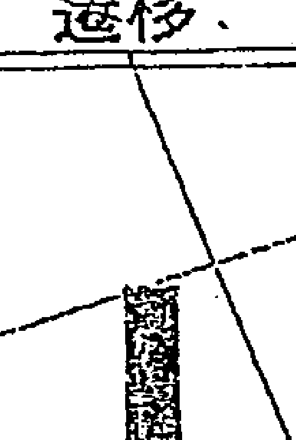

此案例巨门星坐命在子位，全书上说：「在身命，一生招口舌是非」、「在天司品万物，在数则掌执是非。主于暗昧，疑是多非。欺瞒天地，进退两难。其性则是面背非，六亲寡合，交人初善终恶。」已经清楚点出此种格局的命运特征了，到底什么原因导致如此呢？问题就出在「自己」身上，因为自己常起疑心且又偏向负面的思维、或是「昧于事实，自以为是」！因而为自己招来是非缠身，这颗巨门星具有喜欢探究隐晦的癖好，越是隐晦暧昧不明的事物，越能引起兴趣，总想要一探究竟，演化成实际的行为，就是爱打听八卦消息、对神秘事物如宗教、命理有兴趣、探究飞碟、幽浮、外星人等未知现象，说好听一点是探究是非，组合良好就会因为这些癖好而成功，一旦组合不好自己就会成为是非的源头，故说：「子午宫于身命，为石中隐玉格，更会禄科权福厚」，而且需要「丁己癸辛」生人才能称为「福厚」，若是「丙戊生人主困」此造是「己」年生人，禄存在迁移会入命宫的巨门，让「更会禄科权福厚」条件之一的「禄」条件成立，虽然欠缺「科权」的条件，但「禄」主财禄，因此还能符合「福厚」的格局，在本命盘格局上就已经占了先天优势，接下来就需要行运的扶持，看大限是顺行或逆是否能让他一展鸿图大志了？

命宫里还有一颗主贵人的〈天魁〉也不能忽略，它让此造很容易遇到贵人赏识而受重用的机遇，但贵人引进门，是否能承担重责大任、一展雄才？就需要看格局了，所以，还需要参考财帛、官禄和迁移才能确知是否〈才堪大任〉？

官禄宫〈太阳、文昌和铃星〉，官禄宫在辰，是早上七时至九时，旭日升起光芒四射，乃太阳星的庙旺宫位，光芒四射的阳光足以驱除命宫巨门的晦暗无光，对应于人之行为特质就是：行事作风光明磊落，太阳为官禄主正坐官禄宫，正是星落入正位，引喻于人生之现象就是有掌权、担任主管的机遇，只是此造有点可惜、有一颗煞星铃星同宫坏了大事，让他在事业的发展上蒙上阴影，这个阴影是哪一种现象呢？需要依同宫的星曜来解释，既然是官禄宫太阳又是官禄主，也就是担任主管或当老板的意思，只要担任上述职务就会有麻烦或不吉的事情伴随，例如担任主管时部属暗中扯后腿、或是处理公事出差错等，因此，是个吉中藏凶的官禄宫，幸好文昌使他处理公事比较细心、深思熟虑，还不至于鲁莽，可以弥补铃星朦着头、只顾猛冲，毫不顾虑后果造成的恶象，让事情有转圜空间或折冲的余裕，白话一点…不至于违法犯纪。

财帛宫没有主星，只有辅星或助星：〈左辅、天马和天钺〉，就已经显示此生要协辅他人赚钱，也就是上班族的意思，即使创业也多属于合伙性质，当然没有了主星坐镇，好像没有将帅一般，产生：拿不定主意或掌握不住要领的现象，也镇压不住阵脚而产生混乱，因此，是个「助人赚钱」的宫位，或是「赚服务财」的星象。

迁移宫的星曜组合就很不错，有〈天机、禄存和右弼〉，没有煞星破坏，可以展示才华、显露能力，引起别人注目或赏识，因而得到拔擢重用，天机主智慧、做事有谋略、有计划、严谨而不乱，禄存又主稳重厚实，右弼也是颗贵人星，和命宫的坐星正好形成相辅相成的作用，一是善于口语表达的巨门，一是做事有计划、步骤严谨的天机，使命造能够在众人之中突显出来，引人注目，因此，是个吉祥的迁移宫。

三方四正都已浏览过一遍，对于此造的格局大势已了然于胸。

外在展露的个人形象，若没有深厚的实力当后盾，只是个银样蜡枪头而已，定然马上被看破手脚，虽能得意于一时，却无法长久维系下去，假如以当偶像为业者，可能还可发挥效益，但是，被人挖角去当管理干部时，每天面对员工部属、客户，需要拿出真材实料来适切应对，此时，官禄宫就很重要了，能不能展现能力？让部属们心服口服，这就不是挖角此造过来的公司主管，所能造假掩饰的了，此造的官禄宫如前述有些瑕疵存在，庙旺的太阳星又是官禄主，在官禄宫可谓是正得其所，文昌的才智、足智多谋，正可加强太阳的执行力，可惜铃星的「胆大出众」又参杂有「性毒、性格沉吟」的性质，「沉吟」就是不擅讲通、反复沈思，就是刚愎自用的意思，和太阳组合在一起就成「自以为是，行事专横」的组合，管理众人的主管需要卓越的协调能力，需要透过说服技巧，协同课员们的想法、意志在共同目标努力才是，如果想以权威迫使部属们顺服遂行其意志，除非军队，开放社会的企业断难以如愿。

果然，此造被挖角到新公司任职，赋予管理职务，一走马上任必然暗自忖着：「一定是这批旧人都不行、我才会被挖角过来管理他们的。」的心态，又亟思有所表现以报知遇之恩，因此、心态颇为负又一意孤行，加上年轻气盛，得罪许多老员工，不愿提供建言或导引他熟悉公司组织运作，因而捅出许多错事，让当初挖角他过来的主管颜面无光，而此造也颇感愧疚、难以再厚脸皮恋栈下去，便伺机离开、换了新东家，检讨之前的缺失、调整心态，重新开始。

当然，本命盘是先天垂象，会在个大限的哪一年发生？需要命限年的盘局通过四化的牵引关系来定义出事件发生的年份和样态。

首先，来谈为什么会「得到客户赏识，被挖角到客户公司上班？」现时有很多上班族都在问能不能换工作？对上班族或公务员而言，假如能像此造一样被客户挖角该有多好！到底要看哪一个宫位呢？亦即要以哪一宫来立象呢？不然十二宫乱点一通，一定迷途，先来想想看，我们常问有没有贵人？贵人是什么？斗数中什么东西代表贵人？假如有熟读紫微斗数全书一定知道具有贵人特性的星是哪几颗：天魁、天钺和化科，一看命盘果然此造命宫坐天魁，全书中说道命宫有天魁「必得贵人成就扶助」，清楚点出贵人星就是天魁、天钺这两颗星，如果有落入命迁线上，构成坐贵向贵格局，贵人定然明显，或是分坐命身宫也很吉利，而此造天魁坐守子位的命身宫，天钺从财帛宫来合，

> 若魁临命，钺守身，更迭相守，更遇紫府日月昌曲，左右权禄相凑，少年必娶美妻，若遇大难，必得贵人成就扶助。

此造官禄坐太阳、文昌，财宫迁移有左辅、右弼从三方来拱照，惟欠缺权禄相凑，不过，众多条件中，已有日、昌、左、右等四星符合，是个贵人旺盛的命局，一生中定多贵人主动伸手来扶助或提拔。

到了戌限，会入戌限迁移宫的天钺，使得天魁、天钺的特性强化…得贵人来扶助增添成就的命运迹象。

戌限官禄又坐天梁科「主掌文墨之神，…，最喜逢魁钺，必中科第，如遇恶星，亦为文章秀士」，古人把化科当作是司科甲、功名的化星，现代的紫微斗数学者都把它当作是贵人星来看，三颗贵人星汇聚于戌限官禄，当然得到贵人提拔或挖角的征象很强烈了。

贵人可能是公司主管的提拔重用，而此造却是外面公司的主管因常接触而心生欣赏、爱才的心念而来挖角他，一般人对于业务接触对象也仅止于印象好、欣赏而已，要进展到动手挖角，背后实在是有很强烈的感情在支撑着，也由此可见对方对他欣赏的程度是如何的强烈！

何时呢？此时由大限命宫的所在位置…甲戌的天干飞佈魁钺就知道：甲干的天魁入丑宫、天钺入未宫，到未年时甲戌大限的魁钺又再一次加强贵人星的力量，因此，未年贵人力量达到最強旺境界；故而，他能遇到「受到客户赏识而被客户挖角到公司上班」的好机会，未年年初，别家公司的主管就把他挖角过去。

到新公司上班能不能称心如意，还需要观察整个大限的趋势如何？不能只看大限官禄宫，因为命宫是运途变化的关键枢纽，不管是看钱财、感情、健康…等，都不能忽视命宫的地位，是必须参考的宫位。

戌限命宫坐太阴、文曲忌，太阴在戌宫是庙旺之地，对宫有太阳、铃星，形成铃星冲会太阴的角度，而有：

> 二限偏宜见太阴，添财进屋福非轻，火铃若也来相凑，未免官灾多破悔。

的确，大限遇到庙旺的太阴确实能「添财进屋」，也就是财源旺盛的运途，却怕遇到火星或铃星来相凑，冲会也是相凑的一种型态，所以难免会遇到官灾多破悔之事，字面解释也只能到此而已，更细腻的运途，需要挑出立向宫搭配命宫合并来论才可以。

此例是探讨事业得贵人提拔的现象，所以在事业上的表现就要由官禄宫来彰显，由于是被挖角过去的，当然意气风发，走路有风，神气得很，这个在未年的官禄宫坐「廉贞、贪狼权、龙池」的星象就很明显的突显出来这种现象，尤其是一看星象就知道是掌权的意思，完全贴合实际情况，但是化权也有「为人极古怪，到处人钦敬」的怪癖，这个敬字有人把它当作尊敬，也可说是敬畏，前者有心服口服的意思，而后者有权势压人之意，到底此处要以何者来诠释，需要看主星，贪狼主好高吟浮荡、作巧成拙，又主欲望之星，把它应对到事业上，不就成了「想法怪异却又强要部属接受他的想法」的意思，果然，他一到新东家，不顾老员工的反对，一意孤行实施了许多、事后证明是荒谬、错误的政策，弄得天怒人怨，把自己搞得焦头烂额，难以收拾善后。

为何会发生翻天覆地的大逆转，由云端掉入十八层地狱呢？问题也出在未年官禄宫，前段诉说的是他到新东家的事业表现特征，而表现吉利不吉利，能不能为自己加分？还要看四化的关系，由其戌限官禄宫干…丙飞化…廉贞忌入兄弟：成了大限官禄宫化忌入亥宫，恰好是未年官禄宫，又是兄弟宫，兄弟乃〈人〉的宫位，此化象意味着，他在新东家会因为〈人和〉的问题而使得工作遭到挫败，果然，就是因为他倒行逆施的结果，导致众叛亲离，又因施政失策弄出一堆问题，大家袖手旁观，逼得他自己亲自来收拾自己捅下的漏子，由原来的意气风发变成了泄气的皮球，多难堪！员工部属在背后指指点点，哪里还有颜面再待下去？

但有烂摊子要收拾，至少要给挖他过来的主管留点颜面，把后续处理妥善，走得干干净净，至少还能留个好名声，终于在申年年初就辞去工作、转换到另一家公司。

戊限官禄宫化廉贞忌入未年官禄的同类忌入化象，所引发的凶性，不只表现在新工作上失误连连，也让他难以再继续待下去而必须换工作，在星命上，可从他大限命宫坐星太阴、文曲忌，探析此一事实，因为化忌星「大限相遇，十年悔吝」，又说「商贾技艺人在处不宜，难立脚」都说明这十年运途的现象，因此，在职场遭到同事的抵制讥笑，当然难立脚。因此，解释时须用语助词，如必须、铁定、不得不、...等来加强语气，成「必须、不得不换工作」真是应了忌星入限吉凶诀：

> 二限宫中见忌星，致灾为祸必家倾，为官退职遭赃滥，胥吏须防禁杖刑。

「为官退职」简单四字把他当主管后的际遇清楚点了出来。

离开该公司后，虽然薪水少了一大截，但是，精神上舒坦多了，痛定思痛，反省之前所犯过错，重新站稳脚跟再出发。

回到戊限命宫的星象来看，有「添财进屋」也有「官灾多破悔」的现象，从他自述中得知，挖角过去之后，职务也高升了，亦即当上管理干部，虽然是在民营企业，但也可以说「当官」了，因此，古书上的当官一词未必限定在公务体系的官职才是，在民间企业担任管理者亦具有同样的意义，因此有「官灾」发生，官灾与官非不同，如前所述，此造实施了许多谬误政策、下了无法执行的命令，不但没有提高效率，反而造成冲突或困扰，即是官灾之样貌，而官非是触犯法律而施以处罚，两者意义有所不同！。

又说薪水少了一大截，就可知道前个职务确实有「添财」事实，而自己把好机会给搞砸了，薪水也因此少掉许多，当然「多破悔」，这个「破」字就把他「挖角→升职→加薪」变成「捲扑盖走路→降职→减薪」的现象给全涵盖进去了，当然「后悔莫及」啦，古人简略一句「官灾多破悔」，我们透过这个实际案例的经历，才能活灵活现地展现出该句话的样貌，否则单凭古文词义解释，还真难从文字中理解实际样貌如何！

我们还可向上回溯到先天命宫的星象上，来探究为何一件美事却以几近撕破脸的方式离开，本命坐星巨门如前所述主「疑是多非，进退两难，面是背非，初善终恶」的现象，回顾案例的经历当初器重他而挖角，却闹得不欢而散，正是「初善终恶」的意思，而当初进来新东家时，不听劝强制实施错误政策，不就是「疑是多非」吗？对既有的「是」存疑、不信任，而改弦更张却多「非」错误、不对的，因管理失误、导致很多错误待补救，又无法一走了之，必须留下来收拾善后，又是「进退两难」的现象，当初挖角他过来的主管，和他到新东家之后的表现不相称，也就是「面是背非」。

好！前面所说的都是以命宫为主体来探究解析的现象，是不是只以星象的组合状态就可以论定？抑或是还有其他条件配合。

当然讨论至此几乎已经确定，发生的事实与命理推演的连结关系了。

底下所谈的也只是来补强化象与星象的漏失而已，或可当作是佐证，来加强化象与星象的解译功能。

大限命宫天干…甲，的流禄在寅，流羊在卯，流陀在丑，丑位的流陀和未宫的擎羊照会，而此造在未年年初跳槽，这个羊陀冲照的流年，对于变动是不利的，而且大限的官禄宫又被流羊、流陀夹制，虽然，大限事业宫吉祥，但一旦受羊陀包夹就会有「施展不开」的现象，不过有强旺的坐星组合，以更宽容的心态，摈弃前非，将迎来更好的工作机遇。

此造先天命局既已呈现贵人旺盛，所以，此次贵人提拔没能好好把握机会，依此命格贵人旺相的格局，多充实自我、磨练心智、个性再沉稳些，日后还是会有贵人提携的。

只不过根据魁钺贵人星的属性…四十岁前有贵人来提拔此造，四十岁过后反而换成此造要当贵人去提携后进了。

### 笔记栏：

## 228 紫微斗数命运分析—实例篇

## 【案例五】

| 天府 | 太阴(忌) 罗 陀 | 禄存 贪狼 | 天同 天梁 巨门(权) 姚 擎羊 | 天相 武曲 |
|---|---|---|---|---|
| | 岁破 天虚 台辅 | 旬空 | 天寿 天才 天哭 | 5-14 身宫 命宫 戊申 |
| 95-104 乙巳 子女 | 105-114 丙午 夫妻 | 115-124 丁未 兄弟 | 5-14 身宫 命宫 戊申 | 火星 天钺 天梁 太阳 |
| 文曲 右弼 廉贞 天府 | 月德 红鸾 | ○ 命局：土五局 (大驿土)  农历年：丁亥 (屋上土)  阴女 肖猪 7月7日丑时  节气：小暑 | 破碎 |
| 85-94 甲辰 财帛 | | | 15-24 己酉 父母 |
| 天刑 | | | 铃星 文昌 左辅 七杀 |
| 空亡 天姚 天刑 | 徐曾生  TEL: (04)2263-2397, 0911-133639  E-mail: ez.way@msa.hinet.net 或 ziwi88@hotmail.com | 寡宿 天喜 |
| 75-84 癸卯 疾厄 | | 25-34 庚戌 福德 |
| 天官 破碎 天马 解神 天巫 阴煞 | 紫微 天福 地空 地劫 天月 天机(忌) |
| 封诰 孤辰 截路 | 病符 天空 | 凤阁 年解 |
| 65-74 壬寅 迁移 | 55-64 癸丑 仆役 | 45-54 壬子 官禄 | 35-44 辛亥 田宅 |

徐曾生  TEL: (04)2263-2397, 0911-133639  E-mail: ez.way@msa.hinet.net 或 ziwi88@hotmail.com

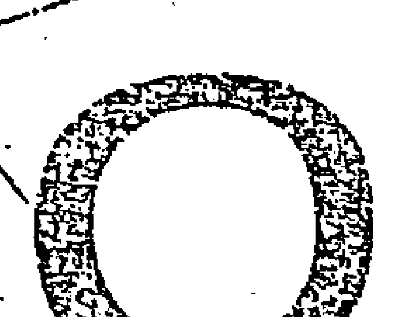

到底什么样的星曜组合会生下畸形胎儿，以前曾有服用某大药厂的感冒药产下四肢残缺的胎儿的案例，现代医学发达，但不代表良心也跟着进步，所以「黑心」食品、药品甚至日用品的新闻，三不五时的都还会出现，还未揭发前，不知道有多少人受到残害，因此，推断是否会生下畸形胎儿，并非全是命理，还带有孕妇是否接触或服用黑心食物？引起胎儿的病变，因此，这个问题是孕妇的疾厄、还是子女宫出了问题？一直是争论的重点，因为牵涉到「立向」的根据。

有的人身体排毒的机能强，可以化解毒素，当然传输至胎儿的成分就会降低，而解毒功能不强的，胎儿就得受毒害了，所以，孕母的身体是否强健对于胎儿能否健康孕育确实是有影响的。

这些都是简单的「人情事理」，但对于学习斗数的人来说也至关重要，因为研究命理不是闭门造车，也是要和世俗的人情事理结合，才能「合情合理」的审视命盘，定出关键宫位来，否则只是乱枪打鸟而已。

这个命例的子女宫坐太阴[?]、陀罗在巳宫，以星象来看：「巳宫是太阴的陷落之地，所以应该招软弱之子或虚花不成器且子少」，或全书上说的：「太阴女三男二先女后男，庙旺有贵子，陷地减半，招软弱之子或虚花不成器，太阳同五人，天机同二人，天同同五人，庙地无剋，陷宫有剋，加羊陀火铃空劫子少。」，太阴在巳是陷地遇到陀罗，应该女三男二减半且先得女之后生男，此造生了两个儿子一个女儿，可说贴近全书上的评断，儿子是否如所述的情形就不得而知了，但这个女儿却出了问题，让家人很痛心，为何是女儿出问题呢？因为太阴星是女性、在陷宫（巳）遇陀螺而且对面（亥）又有地空、地劫加入，子女宫遭受这些煞星冲击，「刑剋」现象相当严重，所以「生女儿」会出问题，是什么问题呢？难产、畸形或是胎死腹中等就不得而知了，故概括以「刑剋」名之，故由先天盘子女宫的星宿组合垂象得知：是个利于生男儿、不利于女儿的命盘。

又再以先天四化来看太阴禄会入天机科，还算强旺，所以、以当时的时空环境生下二子一女，还算是正常的生育数。

这只是以先天命盘子女宫来看的迹象，还要斟酌子女宫干的四化，看看它的分怖情况如何？乙干的四化：

-   天机化禄入田宅
-   天梁化权入父母
-   紫微化科入官禄
-   太阴化忌入子女（自化忌）

其中的太阴自化忌在子女宫，使原先的太阴禄转变为忌，成为「禄逢冲破」，又更加深了子女宫「女儿不吉」的迹象，对面又有天机化禄，和本宫的太阴自化忌，形成「禄忌冲照」的现象，禄是情缘、忌是不顺，两者形成冲照的角度，就是子女会让他造成「感情的冲突」，譬如：「想要抛弃却又舍不得」的现象。

以上是由先天子女宫及其宫干四化所获知的初步信息，帮助了解或掌握其轮廓，协助分析子女的运途，尤其是生育大限的子女运途，因为这是关键因素，先天子女不好，就需要观察大限子女是否有「扶助过关」的功能？还是「助纣为虐」？不是说「命好不如运好」吗！若「命不好运好」也不错！

此造生育期集中在第三个大限就完成了，所以该大限子女宫在未宫，里面的坐星组合：天同权、巨门忌、擎羊、天姚，由星组合来看：天同、巨门遇擎羊是「刑剋」的现象，天姚是美好的样子，子女应该长得蛮俊美的，而先天四化的权、忌在一起，也有冲突不合的意思，例如：唐氏症胎儿、畸形胎儿、发育不良胚胎…等而面临要不要人工流产时，就会面临「天人交战」的痛苦抉择，综合来看，此限生育子女有刑剋且会遇到冲突不合的现象。

又以大限子女宫的四化来看，宫干一丁飞四化，分布如下：

-   太阴化禄入子女
-   天同化权入兄弟（自化权）
-   天机化科入田宅
-   巨门化忌入兄弟（自化忌）

怪不得会赶紧在此大限生儿育女，因为太阴化禄入子女宫了，表示喜欢小孩，所以就赶紧生小孩了。

不过，却忽略了同宫自化权忌又遇到生年权忌都汇聚在同宫的问题，有人说生年权忌遇到自化权忌时，会把生年生年权忌给剔除掉，亦即生年权忌带来的冲突伤害也会被剔除、不会发生了，其实这是错误观念，生年天干四化带来的效力具有优先权，虽然自化权忌了，但生年权忌依然有其威力存在，只是因「自化」而「流失」了部分的威力，但余威犹存，也意指此限生育会有「流失」的现象，流失一词有的人会解释成流产，其实「流失」一词需要更广义的解释，像此造生下畸形的女儿，真想不要，但是亲生骨肉也得费尽心思照顾，就是怕她流失（早夭）了，当然若是产前检查得出来婴儿胚胎有问题，也可做人工流产让胚胎流失，这也是一种流失的现象，总之「流失」是哪一种现象还得细心推敲，而生下来先天残疾的婴儿之后，更需费尽心思照顾，当然弄得自己身心俱疲、成为终生不可推卸的负担或压力，这也就是权、忌在一起的现象。

经过，先天子女宫和大限子女宫的层层显象，使征象由先天子女宫的隐约朦胧中逐步到大限子女的明显浮现，而趋近生活中的「人事物」象，既已经知道凶险就要避免进入险境，才是趋吉避凶之道。此造，显然未经高人指点而生下畸形女婴，生下后才去求问如何趋避？时机实在太慢了，只能尽心去抚养她长大了，这种苦痛与遗憾将跟随身为母亲的她一辈子，生年太阴禄转成自化忌、和大限子女宫的天同权、巨门忌所代表的就是她一生的缺憾。

现代人生得少，加上食物里的化学添加物四处流窜，生活周遭到处是电波或辐射，假如运途欠吉，一不小心就生出畸形儿，但是，也有人生出聪明俊秀又健康的子女，生育小孩真是要慎重，但现代人只关心挑选出生的时辰，以为如此就能带给孩子一生的好运，这是绝对的错误，假如你在不对的时间孕育子女，在怀胎期间就已经种下结果，譬若胎儿已经是唐氏儿，难道挑个良辰吉时就能成状元才，各位读友一定要先确立「挑吉利的年怀孕才能孕育健全的下一代」的观念。

也曾见过子女成绩优异，念第一志愿的国立高中，成绩都在全班前三名之内，深得师长疼爱、父母欢欣，却为了一个流行性感冒医疗不慎、造成药物中毒，肾脏严重受损，而使得身体异常衰弱，连高中都念不完了，经查子女宫就像此造一样忌煞星冲起，进入大限的子女宫也是凶煞群集，只要流年一旦冲起激发凶性，很容易肇祸，一个小小感冒即毁掉一个资优生的身体健康，虽然该生家中富裕、但再多的钱也无法挽回健康的身体。

而这一切根源都在于子女宫，能够于生育大限慎重行事，便可以减少很多日后的缺憾发生。

也有朋友或同事久婚不孕，看遍妇产科医师或人工受孕都不成功，也曾求遍庙宇或偏方，也还是生不出来，就如古书上写的要有「招祀子嗣昌」的现象，就去展望会等类似性质的慈善机关领养弱势家庭的儿童，当然领养的方式有玄机喔！不然是没效用的，过了几年后，果然如愿得子，把同事命盘排出才知古人的论断玄机。

也有的人「好！还要更好」先天子女宫就已经不错了，但是，希望能生出「会读书成绩好，日后有能有远大发展」的子女，各位认为可不可能呢？当然可以！只要「时机」抓得好，就很容易达成，前面那个子药物中毒的案例，从父母盘就能看出小孩很会念书但有夭折迹象，所以改造命运除了「风水、积阴德、读书」之外，身为父母的还可以「掌握生育时机」改善小孩未来的运途。

当然，智商是会遗传的，不过学习态度却是命中注定的，报上不是报道过某摊贩的小孩，父母忙着做生意，小孩就自顾自的翻阅书籍报章，结果成绩斐然，才引起邻里的话题而上报，为什么所有的小孩都在玩玩玩具而她独对书本情有所钟？父母亲是教育程度不高的摊贩，忙于事业也少有时间陪读，那么是哪种力量让她能好读书？这些答案就在她的先天命格与父母生她的时机问题上！

传统的人认为子女宫只可看哪一年生育？会不会流产或是堕胎？或会否难产？等问题，其实现代人应该赋予子女宫更积极的角色，就如前所说的，选个吉利的时机生育好读书、有成就、灾难少、健康又听话的小孩，当然再强的命理师也无法十全十美，不过至少可以让不吉利的程度降低到最小，笔者有位同事看了某位作者的书：「天同化忌坐子女宫会生下弱智或先天残缺的小孩」而忧心忡忡的问笔者要怎么办？因为她的子女宫恰是如此，而且还加上一颗陀罗煞星，看了一下命盘就告诉她要如何趋避，目前已经念国中了，勤奋向学成绩还不错，根本没有弱智的现象，若勉强要挑出问题一只是有过敏体质的困扰而已，但不要靠近或玩弄「绒毛」玩具或宠物就可以了，让「先天残缺」以最轻微的方式存在，同时也可体会古文的夸张断语，确有其事、而应验的性状是严重或轻微，全赖命造夫妻能否选择适当的时机生育，处理的主权是控制在命造自己的手中。

| 陀羅 太陰 95-104 乙 子女 巳 | 祿存 貪狼 105-114 丙 夫妻 午 | 天同 巨門 擎羊 115-124 丁 兄弟 未 | 武曲 天相 祿存 5-14 身宮 命宮 戊申 |
| --- | --- | --- | --- |
| 廉貞 天府 紅鸞 右弼 文曲 85-94 甲 財帛 辰 | OO 屬生 陰 子命曆年女 年局：36丁酉 斗：五/亥 豬 君士局 7月(屋上土) ：火 土 日于 時 | 限命宫区域 | 太陽 天梁 火星 15-24 己 酉 |
| 天馬 破軍 75-84 癸 卯 | 中心信息 | 中心信息 | 七殺 天喜 左輔 文昌 鈴星 25-34 庚 戌 |
| 破軍 天馬 65-74 壬 寅 | 癸 丑 55-64 天刑 龍池 | 壬 子 45-54 紫微 | 天機 天魁 鳳閣 地劫 地空 35-44 辛 亥 |

笔者故意不让读友们马上就知道答案，是想引导大家先思考，把学了的方法试着去应用，才会越用越利，也可验证学的是真功夫还是假招式。

还可以用流禄、流羊、流陀的方法来探讨：一将它排上命盘就可清楚看出：流陀和生年干擎羊同宫，又有巨门忌汇聚在大限子女宫，忌煞重重叠起，也就表征大限子女有凶险之事发生，巨门在子女「损后方招」，擎羊有「克妻刑子」之意，一凑合起来必成了「刑剋子女」的星象，又加上先天子女坐陀罗，戌限子女又有流陀来助纣为虐，不就落实了损子女的征象，所以，从这个角度来看，也有损子女的现象，陀罗主进退犹豫，在先后天子女都有陀罗，就已经隐约显示小孩子的行动受到束缚、不便的现象，说得白话一点就是「子女残障」。

掀开谜底—她在三十一岁丁巳年生下唯一的女儿，却是个脚部有缺陷的婴儿，可以走路却无法蹲下，巳年正是先天的子女宫，正好又坐在子女宫干一乙的太阴自化忌上面，在这种年限生育，真的非常不恰当，先天子女不吉，大限子女又不吉，流年又踩到先天子女的化忌上面，这颗隐伏「子女不吉」的未爆弹，终于被引爆，生下来一看根本没有得女的喜悦，反而是忧心忡忡、压力沉重，这又对应了大限子女宫天同、巨门的有苦难言、苦衷尽往肚里吞的星象，像她这样压力沉重却又甩不掉、抛不开，一辈子都得照顾这名缺陷的女儿，不就正应了戌限子女的星象吗？

像生下畸形儿是否真能从命盘中瞧出来呢？一般像这种畸形胎儿或胎儿某些器官萎缩，脱不了某些化学药物的干扰，提供胚胎成长环境的羊水是非常复杂的，连目前科学技术都无法调配出羊水，所以才需要「代人孕育婴儿的孕母」，假如羊水受到「污染」，胚胎的发育必然会产生变异，现又回到此命例的开头，如果母体的排毒机能有障碍或不佳，胚胎就难逃被「污染」的命运。

紫微斗数中哪一颗星代表解毒机能呢？在诸星问答中有无提示？没有！在现代人的斗数教学资料中有无记载，少见！若有也是花了重金拜师三跪九叩成为入门弟子后，才会被告知的秘诀。

其实这颗星就是一太阴，于此造子女宫的组合紫微斗数全书中只有「陷宫有克，加羊陀火铃空劫子少」、「伤亲损目」、「酒色邪淫」评语而已，不见「子女残疾」，所以古文是可以当做学习参考、但资料太少也不够精细，就用「有克」一词，含括所有现象，但是我们可以从此命例中，领悟出其中更深层的意涵，古文言简意赅，需要细细体会、深思才能得其精髓。

## 【命例六】

| 宫位 | 星曜 | 年龄段 | 天干地支 |
|------|------|--------|----------|
| 財帛 | 天福空劫月辅马钺, 年解, 凤阁 | 83-92 | 丁巳 |
| 子女 | 天机, 旬空, 天空 | 93-102 | 戊午 |
| 夫妻 | 破军, 紫微, 禄, 蜚廉, 封诰 | 103-112 | 己未 |
| 兄弟 | 天巫, 解神, 孤辰 | 113-122 | 庚申 |
| 疾厄 | 铃星, 文昌, 太阳, 寡宿, 天喜 | 73-82 | 丙辰 |
| 命宫 | 火星, 右弼, 天府, 破碎, 龙池 | 3-12 | 辛酉 |
| 迁移 | 天魁, 七杀, 武曲, 天寿 | 63-72 | 乙卯 |
| 田宅 | 阴煞, 禄存, 巨门, 天厨, 截路 | 33-42 | 甲子 |
| 福德 | 陀罗, 贪狼, 廉贞, 忌, 岁破, 天虚 | 23-32 | 癸亥 |
| 仆役 | 天姚, 天梁, 天同, 天才, 天寿 | 53-62 | 甲寅 |
| 官禄 | 擎羊, 天相, 空亡, 天哭, 台辅 | 43-52 | 乙丑 |
| 父母 | 月德, 红鸾 | 13-22 | 壬戌 |

○农生
命局：木三局
阴历年：癸巳
生年：蛇（长流水）
2月
日午时

徐贸生
TEL : (04)2263-2397, 0911-133639
E-mail : ez.way@msa.hinet.net 或 ziwi88@hotmail.com

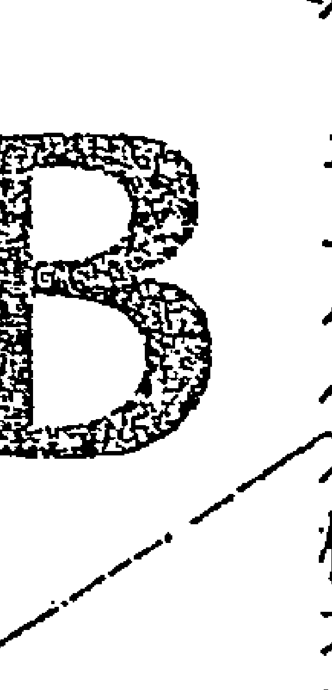

命宫所坐主星有「能制羊陀为从，能化火铃为福。主人相貌清奇，禀性温良端雅」、「女命得之，清正机巧，旺夫益子，虽见冲破，亦以善论」之说，而且「卯酉入庙，酉宫旺地」应该是天府星展现「延寿解厄，职掌财帛、田宅、衣禄之神」的威力，让命造衣食无缺、财富绵延如天府之国般的富裕，但要「乙丙辛生人」才合乎「财官格」，此造「癸」年生人，因此，禄存没入命宫迁移或财帛宫内，因此不合该格的条件，此造却如古文所述「相貌清奇」，确实长得「清秀美丽、又很有气质」，说起话来轻声细语、个性又温柔，举手投足很有韵味，加上做事情机伶又正直，因此获得老板器重，委以重任，只要国外买主来都由此造负责接待，要提供国外客户最好的服务，后续接单才会顺利，即使是高科技产业，同样的手法还是照常上演，做这种工作需要老板充分授权、提供必要的交际费，当然衣食无缺，订单没接成哪有财帛，她得使出浑身解数让买主下订，她可说是关键，因此薪水比起一般员工还来得高，也能直接面见公司高层，可说符合「职掌财帛、田宅、衣禄之神」，当然接单也需要和老奸巨猾的买主过招，不然订单没接成还赔了夫人又折兵，岂不亏惨了，因此也需要「羊陀火铃会合，好诈」的成分在命局内，才可在尔虞我诈的商场中胜出，虽然窘迫又破耗甚重的财帛宫让她没有资金自立门户，但却是公司的接单灵魂人物，外国客户来台洽公都要求公司派她当接待，可见受欢迎的程度。

大凡一个人适合做什么工作，都需要有特定的条件配合，此造担任「国外」业务开发专员，除了前述的个性、待人接物能力外，语文能力是必备条件，还有些不足为外人道的条件配合，如仪容姿态都要在标准以上，才能让外国客人喜欢，今天新闻报道有家饮料店请了两位年轻貌美的辣妹当试喝员，只是做端饮料请过客试喝的动作而已，引来许多醉翁之意不在酒的顾客上门，生意因此增加了三成，所以无可讳言的，派俊男美女做业务，绝对有加分的效果，还有酒量必须能「千杯不醉」才能应付得来，不然一杯就醉倒生意那能谈得下去，最好是买主都醉了你还保持清醒，赶快拿合约书给买主签了，这样就大功告成，而这些「潜藏的条件」到底是什么宫位显像呢？饮食、酒量、嗜好等是福德宫的职掌，她福德宫座落于「亥水」之地，又见次桃花的廉贞、和迷花恋酒贪狼，合在一起不正是「到酒家喝花酒」的星曜组合，加了一颗陀罗使成为「贪狼遇陀罗，风流彩杖」，正经场合应对进退要得体，而到酒廊谈生意绝不能还是正经八百的，说起话来还要能荤素不拘、做起事来也要能七手八脚，让「醉翁之意不在酒」的买主，在酒足饭饱之余心满意足地签下订单，福德宫遥遥相对的财帛宫如此残破，只好遥借福德宫来成就「赚钱之源」，虽然不是沦落风尘、执壶卖笑，试想一位才能美貌兼有的女生，处于这种工作情境，内心的郁闷、愁苦可想而知，我们由其中的贪狼忌和陀罗的组合，或可知晓命造的心境状态了。

但是迁移坐：武曲、七杀加天魁，外表初见面带点酷酷的、不是笑容可掬、很随和的人，是属于冷艳型的美女，但是很有男人缘，所以只要买主是男生大概就难逃※网了，而她的官禄坐天相擎羊，天相人称「衣禄之神」和衣服或饮食之是是有关，擎羊金星与刀子或金属器械有关，两者合并成象可能就是「做衣服、开餐厅」等有关的，果不其然，确实是在某大成衣公司上班而她的工作性质就是陪国外的买主吃饭谈生意，谈成订单就有丰厚的奖金可抽成，因此如何谈成？公司就不管了，放任个人发挥所能，难怪她的财帛宫坐星天马、地空、地劫加天钺，财帛带天马是不是就已经点出财源和国外有关，而地空、她劫主掌破耗，财宫有空劫，钱财常有不得已的破耗，如请对方上酒馆、饭店那能不花钱？民国七十三、四年企业抢订单，可说是施出浑身解数，而买家也懂得拿翘，多捞些好处，其他细节敬请读者自行想像…，所以，财帛宫的星宿不就点出要赚进财帛的颠辛过程了吗！

怎么是由迁移宫来看她事业的属性呢？事业不是要看官禄宫吗！当然事业宫也要看，不过你表现出来给外人看到的人格特质，往往是老板调整部属职务的一个重要考量指标，个人有时候也难以用自己的志趣取舍职务，而必须委从公司高层指派职位，尤其中年又学无专长的人更常遭遇此种待遇，因此「格局」是必须考量的因素，不能只审视单一个宫位，要合并参酌的才是。

官禄宫干～乙，飞化：

> 天机禄入子女、天梁权入交友、紫微科入夫妻、太阴忌入父母

化禄、化权人都没有命局的三合，这种组合代表事业运途不好、常有事与愿违之叹，不然就是「志趣不合」，不过该两颗吉化飞星入交友、子女内，都是「他人」的宫位，表示她的事业和「人」有关，即使在成衣工厂也是处理「人」的业务，而飞化太阴忌入父母，父母就是管理我们的长官、警察、老师…等，此处当老板解，依照「禄随忌走」的道理，事业和老板很有关系！

### 进入亥限后一

大限命宫正坐在「犯水桃花」加「风流彩杖」的宫位上，此运途的际遇很明显的和这些特性紧密相扣，因此，虽然在公司上班，但是豪迈的酒量、敢秀的本事，加上美丽的外貌与袅娜的身材，让主管不注意都不行，于是有宴请国外顾客的场合，老板就会找她协助接待，也学习应对进退的技巧，与熟悉顾客的习性，老板还鼓励他去学语文，逐步的培训她成独当一面的能力，当然，每次接待客户若有谈成生意，老板都会包个红包奖励奖励，让她高兴不已，所以，也很热衷地投入该项工作。

回过来，看看亥限事业宫又是如何呢？坐星【武曲、七杀】两颗金星同宫，武曲主财富、七杀是武将，武将要出征去征服财富了，接国外客户的订单也可说是！而其宫干—乙，飞化：

> 天机禄入子女、天梁权入交友、紫微科入夫妻、太阴忌入父母

又一次飞出和先天官禄宫一样的四化分布在三方，是去成就他人的现象，所以不是为自己接订单，而是帮人接洽业务，但是「杀耗囚会于震宫，必见木压雷伤。」震宫即是卯宫，七杀简称杀，亥宫的廉贞化气曰囚，代表她的事业有惊险，实际的情况是她确实做了很大的转变，由清纯的女生变成了饱经世故又油滑的接单老手，心态上做了非常大的改变，当然，造成她产生豁出去了的想法，是有一段曲折的过程，而其背后的关键就是父母宫。

先后天官禄宫飞化太阴忌都入父母宫，父母不只是父母而已，如前所述，它还代表服务公司的老板，而其宫干一壬，飞化：

> 天梁禄入交友、紫微权入夫妻、左辅科入财帛、武曲忌入迁移

飞天梁化禄入交友，交友是父母的官禄也就是老板的事业宫，因此，出发点是为了自己的事业好，所以，虽然飞出左辅化科入我的财帛，好像是我财帛上的贵人，其实老板吃大鱼大肉，我只喝汤而已，更何况飞化紫微权入我夫妻宫，影响或干涉到我的感情生活，事实是老板利用她、以佣金为饵，帮公司接订单，但也因而破坏了夫妻生活，所以武曲化忌冲到命宫，有利也有弊，成就了限运的事业却坏了感情世界，得失之间很难算得清楚，只有靠当事人智慧来取舍了。

## 244 紫微斗数命运分析—实例篇

| 宫位       | 年龄区间 | 天干地支 | 主要星曜                     |
|------------|----------|----------|------------------------------|
| 身宫/命宫  | 3-12     | 辛酉     | 天刑、红鸾、太阴、文曲、天同 |
| 父母宫     | 13-22    | 壬戌     | 陀罗、贪狼、廉贞、天姚、天梁、天同 |
| 福德宫     | 23-32    | 癸亥     | 禄存、巨门、天相、擎羊、天梁、天同 |
| 田宅宫     | 33-42    | 甲子     | 廉贞、贪狼、天姚、天梁、天同 |
| 官禄宫     | 43-52    | 乙丑     | 廉贞、贪狼、天姚、天梁、天同 |
| 仆役宫     | 53-62    | 甲寅     | 天才、天寿、天贵、天姚、天梁、天同 |
| 遷移宮     | 63-72    | 乙卯     | 天姚、天梁、天同、武曲、七杀、天魁、忌 |
| 疾厄宫     | 73-82    | 丙辰     | 天姚、天梁、天同、武曲、七杀、天魁、忌 |
| 財帛宮     | 83-92    | 丁巳     | 天姚、天梁、天同、武曲、七杀、天魁、忌、天马、天钺、左辅、天机、天相、天梁 |
| 子女宫     | 93-102   | 戊午     | 天机、天相、天梁 |
| 夫妻宫     | 103-112  | 己未     | 破军、紫微、孤辰、天巫、天恩、天姚、天梁、天同、武曲、七杀、天魁、忌、天马、天钺、左辅 |
| 兄弟宫     | 113-122  | 庚申     | 火星、右弼、龙池、天府、天姚、天梁、天同、武曲、七杀、天魁、忌、天马、天钺、左辅 |

刚刚说过，父母宫也飞化紫微权入夫妻宫，夫妻宫恰好是亥限财帛宫，也可说是老板来成就我的限运财帛，怪不得每接成一件订单，老板就会包个红包给她，让她的收入较诸于同侪丰厚许多，由于先天财帛宫的组合是个破财的结构，虽然收入丰厚但花起钱来也很大方，尤其美容保养品、衣饰，毕竟本身就是靠这些来维持业务长红的，而这些和亥限财帛的组合【紫微、破军禄】不谋而合，怎么说呢？该组合在夫妻宫，因「紫破贪狼为至淫，男女邪淫」是个桃花极强烈的星曜组，可见赚的钱就如前述的场景，带有强烈桃花现象，而「促成」此种现象的就是「父母宫」，有的人是被父母推入火坑，而此造不是父母，是老板用心栽培她成为公司的四大接单金钗，还受到公司的重用，就是因为有「破军禄」的作用，让她不至于沦落风尘。

## 【命例七】

| 宫位/大限 | 甲 | 乙 | 丙 | 丁 | 戊 | 己 | 庚 | 辛 | 壬 | 癸 |
|---|---|---|---|---|---|---|---|---|---|---|
| **迁移 (65-74) 申** | 文昌 右弼 天钺 贪狼 | 孤辰 | | | | | | | | |
| **疾厄 (75-84) 酉** | 巨门 天机 地空 | 龙池 破碎 | | | | | | | | |
| **财帛 (85-94) 戌** | 紫微 天相 解神 | 阴煞 | 月德 红鸾 | | | | | | | |
| **子女 (95-104) 亥** | 天梁 天刑 | 天虚 岁破 | 天寿 | | | | | | | |
| **夫妻 (105-114) 子** | 七杀 天魁 铃星 | | | | | | | | | |
| **兄弟 (115-124) 丑** | | 地劫 | 天哭 | | | | | | | |
| **命宫 (5-14) 寅** | 廉贞 陀罗 天马 天巫 | 旬空 | | | | | | | | |
| **父母 (15-24) 卯** | 天禄 存天姚 | | | | | | | | | |
| **福德 (25-34) 辰** | 破军 擎羊 天月 | 天喜 寡宿 | | | | | | | | |
| **田宅 (35-44) 巳** | 天同 火天 | 天厨 | 凤阁 年解 | | | | | | | |
| **身宫官禄 (45-54) 午** | 武曲 天府 左辅 文曲 | 天空 截路 | | | | | | | | |
| **仆役 (55-64) 未** | 太阳 太阴 | 天刑 蜚廉 台辅 空亡 | | | | | | | | |
| **中宫** | **命主：阴女** **生年：乙巳** **生肖：蛇** **命局：土五局 (城头土)** **生历：3月26日寅时** **节气：虚岁1岁** | | | | | | | | | |

徐曾生
TEL : (04)2263-2397 , 0911-133639
E-mail : ez.way@msa.hinet.net
或ziwi88@hotmail.com

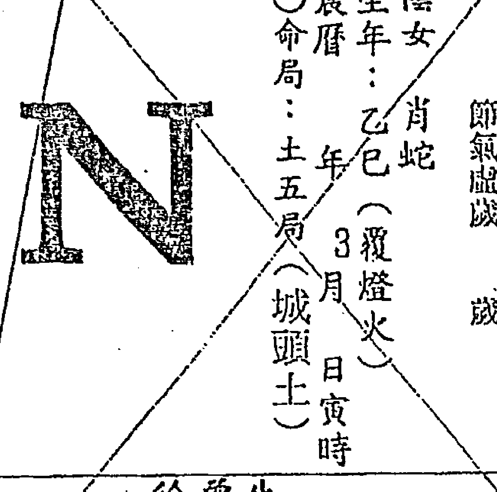年紀輕輕就已經為情所困多次，有的人感情發展得慢，年紀到了三十歲都還沒有戀情，有的卻如早開的春花般招蜂引蝶，問題出在哪裡呢？

命宮坐廉貞「主心狠性狂，不習禮儀」、「在身命為次桃花」又和「性剛威猛，作事進退，橫成橫破，飄蕩不定」的陀羅同宮，看起來敢作敢為的廉貞遇到了陀羅卻是猶豫折磨、成敗起伏的星曜組合，而廉貞又是顆桃花星，見到陀羅是否就成為「敢於追求桃花，卻得承受因此而來的折磨」的意思。

命宮三合見昌曲左右沖合會照，應該算是有學問、有才華的命局，怪不得在一九八四年時，當時還沒廣設大學，大學錄取率才百分之二十左右，能考上不錯的大學，「遇文昌好禮樂」確實如此。

但夫妻宮的星曜組合並不好，有兩顆殺氣甚強烈的七殺和鈴星坐守，已隱約透露出婚姻冷淡的徵兆，使得感情之路有了「刑克不清」的意象，就是感情出了差錯而遭受痛楚的折磨的意思。

進入卯限，大限命宮坐：天姚和祿存，天姚「若臨限，不用媒妁，招手成婚。」古書上這麼寫道，所以在十五—二十四歲的求學階段，正屬情竇初開時期，遇到主掌桃花的星曜坐守，定然散發濃烈的桃花，吸引著追求者接近，而自己也躍躍欲試、欲一嚐情愛的甜美滋味，感情世界定如春花般的燦爛亮麗，因此「高中、大學階段已經為情所困多次」。

再看卯限夫妻，獨坐一顆「地劫」而已，諸星問答上說此星「刑剋孤獨」、「遇吉則吉，遇凶則凶」，沒有吉星，所以該限的感情是個「刑剋孤獨」的星象。明顯和命宮呈現的現象不同，女方希望感情能收斂於夫妻，而她卯限的夫妻宮卻不如是，所以很明顯的，理想和實際差很大，當一個人面臨理想和實際落差很大的時候，將會帶來很大的精神壓力，若調適不好會產生精神官能症。

### 贪狼化忌冲命宮

現代人的結婚程序，是先交友後結婚的，因此交友宮在論婚姻時，不能忽視，以這個命盤的先天交友宮來看坐太陽、太陰忌，似乎不錯，但是太陰忌好似明亮的月光有了浮雲遮蔽、而引伸於命運上就是不吉利、不好的暗示，何況交友宮干一癸，使太陰自化科、貪狼化忌入遷移的化象（圖A），癸干的太陰化科並非是貴人之意，而是桃花象，且交友宮坐【太陽、太陰忌】兩顆星匯聚在一起就表示「朋友眾多」之意，而太陰忌一令此造交友會遇到問題，還化貪狼忌來沖命宮，綜合而言是交友不利。

進入卯限，大限交友坐【貪狼、文昌、右弼】是「落政事而顛倒」的格局，第二個大限是求學大運，「正事」所指當然是讀書求學，也代表著此限結交的朋友盡是些不愛讀書、貪玩的同學，此造也由於桃花星的擾動而無法安分守已讀書，幻想著甜蜜的戀愛滋味，這就是命宮的桃花星表現的現象。

又遇到卯限交友的誘惑，讓渴望愛情滋潤的廉貞、陀羅有了感情的出路，「郎有情，妾有意」兩個巴掌一拍就響，當然就棄正事（功課）於不顧、忙著談戀愛，這個卯限交友宮的桃花組合，也表示此限交往的對象，都是些貪玩、不愛唸書的酒肉朋友，他們只是存心玩玩而已，並不是以交「結婚」對象的心態在交往，男女朋友的交往要有結果就進展到夫妻宮管轄的範圍，但因此造夫妻宮不吉，正顯示朋友與我之間對於交往關係實在有很大的差距，要發展到結婚的程度實在很難，應該是個沒有結果的戀情。

順行運進入父母宮為第二大限，先天交友化出的貪狼忌就成為卯限交友宮內，恰好也是沖命宮，作用力加倍。

而卯限交友宮干—甲，飛出如圖 B 的結構，是個相當強烈的化象分佈，加上坐星屬於桃花極強烈的【貪狼、文昌和右弼】，因此，本大限一定會有很多向我示好、表白的異性，不過由於星曜組合的特性已如前述，這種人的示好或追求，雖然可滿足愛情的渴望，卻非可託付終身的良人，怎麼會如此說呢？因為卯限交友有一顆太陽星化忌入交友，此為忌入之意，代表會交男朋友一因為太陽化忌入的關係，使夫星的太陽蒙上灰塵，很容易遇到玩弄感情的騙子或不負責任的玩家，使自己陷入感情的糾葛而受到傷害一因為交友飛化貪狼忌沖命宮，已經明顯指出因為交友而傷害自己命宮的現象了。

十八歲剛上高二就交男朋友了，因為該年的交友宮內坐桃花強烈的天姚，雙方一拍即合，成了無所不談、互訴衷曲的小戀人，但、這年交友宮干一己，飛化文曲忌沖夫妻，已經顯示這年交往的對象無法成為夫妻了，但是情竇初開的小妮子，那裡知道隱藏其後的凶險，把全副的感情盡情投入，付出得越多傷害得也越深，像我們知道這種化象的意思，就會戒慎恐懼的對待這段情緣，免得期望越大、摔得越重。

當流年進入二十二歲寅年時，流年命宮在寅，正好被先天交友化來的貪狼忌沖到，又是「先天交友 化貪狼忌沖 流年命宮」的態勢，和先天交友宮的命局重疊，因此、此造的交友運要通過了貪狼忌沖的流年後才會吉利，假如她在二十一歲交男朋友，必然因為「丑年交友（午）自化武曲忌」主流失、無法掌握，注定此段戀情無法結成夫妻，又因忌沖命的關係，結果，交友問題卻對自己造成了重大傷害，因此「因感情問題休學在家休養」，不但戀情告吹，課業也受到連帶影響而休學，可見情況蠻嚴重的，這可由命宮坐陀羅、夫妻宮坐七殺、鈴星即可窺知一二，是個具有「殺」性的構造，於夫妻宮就會因感情不順而做出傻事，怪不得家人要辦休學帶回家裡修養，待感情創傷平復，精神狀態調整好之後，再評估辦理復學，這件事將對日後的人生產生莫大影響。

所以，此造的「失戀」問題也可由「交友宮」的四化飛佈狀態，判斷會否因為「交友不利」而受到傷害？像此造先天交友宮化忌入大限交友宮，以化象而言，〔忌入〕是得到之意，卻又呈現忌沖命宮之角度，所以，此忌入得到的戀人、反而變成痛苦的戀情之源。

## 【命例八】

| 宫位/年龄 | 星曜/天干地支 | 宫位/年龄 | 星曜/天干地支 | 宫位/年龄 | 星曜/天干地支 | 宫位/年龄 | 星曜/天干地支 |
| :--- | :--- | :--- | :--- | :--- | :--- | :--- | :--- |
| 56-65 仆役 | 太阳(禄) 天巫 三台 铃星 辛巳 | 66-75 迁移 | 破军 天马 天贵 天寿 壬午 | 76-85 疾厄 | 天机 陀罗 天钺 天虚 月德 癸未 | 86-95 财帛 | 紫微 天府 禄存 天马 天厨 文昌 恩光 甲申 |
| 46-55 身宫 官禄 | 武曲(科) 左辅 庚辰 | I | | 96-105 子女 | 太阴(忌) 擎羊 天刑 地空 八座 乙酉 |
| 36-45 田宅 | 七杀 己卯 | | | | | 106-115 夫妻 | 巨门 天月 蜚廉 丙戌 |
| 26-35 福德 | 天府 阴煞 天才 戊寅 | 16-25 父母 | 天梁 天魁 红鸾 天姚 地劫 己丑 | 6-15 命宫 | 廉贞 天相 戊子 | 116-125 兄弟 | 丁亥 |

阳男
生年：庚寅(松柏木)
身宫：庚辰(白蜡金)
命宫：戊子(霹雳火)
生肖：寅虎 (1)
阴历：1月1日寅时

徐曾生
E-mail : ez.way@msa.hinet.net
或 ziwi88@hotmail.com

能擔任外商公司經理職務者，較諸常人一定更具有過人能耐，才能在眾多競爭者中脫穎而出，這個命盤中的官祿宮坐武曲權，代表個人有威嚴、處事精明幹練、積極、勇於任事、有責任感、富有行動力，具有此種人格特質的人，若是上班族當然容易獲得上級賞識提拔，再從三方格局來看，「廉貞天相」坐命，使人具有深思熟慮、有衝勁卻不會衝動，會入文昌、文曲，強化他吸收外在資訊的能力，所以能精確的掌握外在環境的變化，做最好的決策或處置，而遷移的破軍和文曲，使他在處理業務工作時，能展現才華與表現出衝勁，假如只有這些條件，大概也只是個業務員層級而已，當個經理除了人事、業務外，還有財務問題，因此，還需看財帛宮好不好？此造的財帛坐：紫微、天府、祿存、天馬、文昌等吉星不就是「逢帝座執威權，遇祿存主富貴。」和「遇府相左右，有化權祿存同富貴」可惜的是「子午宮和平，天相同，丁己甲生人財官格」庚年生人沒列入財官格行列，氣勢就弱了些，但是有昌曲左右祿存等深具才識與財氣的星曜輔佐，所以財務調度或財源都屬穩定的星宿，減少財務的波動，能幹有衝勁、具有開創新局的氣魄，又能為公司賺錢，因此，受薪階級在公司，當然會受到老闆賞識賦予重任，因而能在事業上掌權，亦即擔任管理者的角色，所以他在公司內由基層職員逐步高昇，「三十六歲已晉升至部門經理職務」。

一個人能否擔當大任，格局是很重要的參考指標，格局佳沒有煞星沖破，又有科權祿星加持，昌曲或左右來輔佐，祿存加強其財氣，才能成為為公司賺錢的得力幹部，自己創業也才能承擔經營成功的重任，像此造命宮、財帛、官祿等三方，都沒有煞星，昌曲祿存會合，化權又入官祿正好可掌權，若是化祿入官祿，就變得懶散、缺少衝勁與幹練的能力了，所以，以星宿組合而言，可說是「各得其所」，在格局上已經相當強旺，定能白手成家、嶄露頭角，成為成功的高階經理人。

中年是人生中，承擔家庭與事業責任最重的時刻，以人之常情而言，一般人都很珍惜得來不易的職位與薪水，不會輕易地變換工作，但他又為何在歷盡一番打拼後，才獲得的權勢與地位，又變成食之無味的雞肋而欲棄之呢？

其實在紫微斗數的命盤上，已經很明確的顯示出他在該大限事業的不穩定現象了，請看他命與大限的官祿宮：

- 官祿宮干一庚，使天同化忌在卯宮，因此，大限（三十四一四十五）進入田宅時，就坐在天同忌的位置上，表示本大限事業有不穩定的徵象，再加上生年忌也是天同，等於是雙忌，更為不吉增添動盪不安的元素，同宮還有一顆火星，天同星本主「融合、溫馴」、但化忌了，表示他在工作上遇到了問題要以「融合、溫馴」的姿態來面對，火星主「火爆、蠻橫無理」，所以遇到了「頤指氣使、蠻橫無理、脾氣又不好」的總經理，怪不得需要以「忍讓」的姿態來面對，但是此造廉貞坐命「為人身強體壯、眼露神光、眉毛中大、吹骨亦露、性硬浮蕩、好爭」那能嚇得下這口氣？所以，由宮干四化配合星性，就能知道發生事情的現象，所以我一直強調學習斗數要將「人事時地物」和「干支宮星化」的對映關係，搞清楚弄明白，才會知道紫微斗數的精髓在哪裡，不要只會在古書上面打轉，說不定那是明朝皇帝派個進士寫本書來矇騙紫微斗數者進入死胡同的迷障。

- 再看卯限官祿，先看星宿組合「天機、陀羅」都是動態星，在官祿宮引伸為「忙碌、東奔西跑、奔波」的意思，人說「兵隨將轉」，當管理者指揮往東，當部屬的當然一定往東，往西當然往西了，若是能幹的將領指揮都打勝仗，論功行賞，吃香喝辣，當然樂得配合，但是，遇到一無是處的敗將，誰願意跟從呢？配合前述的「天同忌」，當然可窺知他在卯限的工作一定是「忙東忙西沒成果，卻又必須隱忍」的狀態，幹到經理職務還必須隱忍以對的，除了他的上級「總經理」之外還有誰呢？所以是總經理階層出了問題，當然幫人算命時，未知其職銜之前是無法直指「總經理」這個問題的，只能說是「上級」。

- 再看宮干一癸，貪狼化忌在夫妻，等於忌沖先天官祿，構成了「卯限官祿化貪狼忌沖官祿」的同類沖格局，這就加強了「官祿化天同忌入卯限命宮」的凶性了，因此，一進入卯限的辰年，因為被「貪狼忌沖」到，從此開始進入「同類沖」的影響力範圍，事業上的「困頓不順」就此開始，剛開始還調整配合，但是，上級決策偏離市場、一意孤行，提出建議不但不被採納還被打壓，因此，逐漸地失落、無力，進而想辭職他就，但是，他是一個「深思熟慮」的人，莽撞冒進不是他的行事風格，故而為了收入工作家庭，只好隱忍下去。

到了未年，未年官祿在亥宮，裡面有卯限官祿化來的「巨門權」，這個權星會使他具有「行動力、執行力」，宮干一丁，使未年官祿的巨門化忌，叫做自化忌，和化權星在一起就會有「不顧一切」的舉止或想法，而未年財帛宮還會入官祿宮化來的天同忌，未年三合會入兩顆官祿宮飛來的忌星，雙重忌的力量作用下，更加增添事業的不穩定性，在隱忍多年之後，終於憋不住了，「未年在還沒找好新工作的情況下，便不顧一切的遞出辭呈」又如果沒有這顆代表「圓融與忍讓」的天同星雙化忌，讓他無法忍讓下去了：會如此「不顧一切」嗎？

在網絡或書上看到很多朋友質疑「四化派」說：「只看四化飛來飛去，滿天都是四化，最根本的「星性、格局」都不用，不知道他們如何論命？」透過這個例子，清楚的告訴各位「四化、宮位、星性」的用法就是如此，假如不懂得飛星論命的「層次、架構與組成」，就如同前述所說的滿天都是飛星四化，不知根據什麼去論命！

## 【命例九】

| 宫位/年龄范围 | 星曜/干支 | 宫位/年龄范围 | 星曜/干支 | 宫位/年龄范围 | 星曜/干支 | 宫位/年龄范围 | 星曜/干支 |
| :--- | :--- | :--- | :--- | :--- | :--- | :--- | :--- |
| 84-93 己巳 财帛 | 地空、地劫、左辅、天马、陀罗、天梁 | 94-103 庚午 子女 | 禄存、七杀 | 104-113 辛未 夫妻 | 擎羊 | 114-123 壬申 兄弟 | 红鸾、天钺、廉贞 |
| 74-83 戊辰 疾厄 | 铃星、文昌、天相、紫微、三台 | 68年女 己酉年 阴历： 1月1日 午时 12点 | 命宫 癸酉 身宫 (4-13岁) 文曲、天刑、破军 | 4-13 癸酉 命宫/身宫 | 天贵、右弼、 文曲、天刑、破军 | 64-73 丁卯 迁移 | 火星、凤阁、巨门、天机 |
| 54-63 丙寅 仆役 | 天姚、天喜、贪狼、恩光 | 地址：台中市 电话：(04)2263-2397 手机：0911-133639 邮政信箱：台中邮政45之2号信箱 | 太太 阴阳 | 44-53 丁丑 官禄 | 天魁、天府、武曲 | 34-43 丙子 田宅 | 龙池、天同 |
| 24-33 乙亥 福德 | | 14-23 甲戌 父母 | | 4-13 癸酉 命宫 | | | |

命宮獨坐右弼未見煞星同宮「右弼守身命，文墨精通」，所以可以說是有學問受過相當教養的人，但遷移卻有顆火星沖照，「羊陀火忌沖合者，則福薄，亦不為凶」使她的福份受到削弱，增添運途坎坷不順、阻逆橫陳，而官祿宮：太陽、太陰坐守沒煞星，丑宮的太陽落陷無光太陰卻是廟旺，太陽「若隨身命之中，居於廟樂之地，為數中之至曜，乃官祿之樞機。後化貴化祿，最宜在官祿宮」因落陷地也可為「貴人門下客」在大公司任職，成為得力助手，但官祿宮三方會入左輔、右弼和陀羅、空劫，卻成利弊互陳之象，陀羅使她處事深思熟慮、做事有點拖泥帶水，同時也有事業因外力而拖磨的現象，空劫又使她常有突發異想、或脫離常軌的創見，對於講究創新的職務很有助益，但若是「依法行事」的職務可能就會「空有想法而不得重用」了，左輔、右弼讓他能捉住事務重心、心有定見，不會搖擺不定、有旁來的助力相助，使工作執行或推動順利不少，而本宮的太陽太陰表現出來的就是剛柔並濟、恩威并施、樂於助人卻也不是「好好先生」的爛好人，在工作上受到主管排擠時還能「找更上層來「喬」？」就在於這些星宿的組合，使他有此念頭，若是當主管也會出於「助人成長」給予不知上進的部屬鞭策惕勵，而不是出於想把人逼走的惡念。

官祿宮干__丁，使：

> > 太阴化禄在官禄，天同化权在福德，天机化科在迁移，巨门化忌在迁移。

其中巨門化忌在遷移就等於沖到命宮，因此是「官祿化忌沖命宮」的格局，所以，工作屬於「比較忙碌、競爭激烈、口舌是非多」的型態，此生的事業運途也比較有起伏、口舌、意氣之爭等而且會處於弱勢的一方，如：升遷、考績或受訓的機會等等，就比較吃虧，「官祿化忌沖命宮」就是此象，好的機會往往沾不上邊，壞的卻都有分。

還好「天機化科」和「巨門化忌」在同宮內，此化科可以消解化忌的不吉作用力，因此，雖然官祿化忌沖命宮，還不至於對命運產生很強烈的破壞力，不過稍許的不順、挫折、橫逆還是會存在的，所以她還能找更高層的主管來「喬」事情，使化忌的不利降至最低，這就是「科忌不忌」的作用。假如欠缺這顆化科吉化星來相助，可能就會被逼得走投無路了。

二十九歲已經是乙亥大限（二十四～三十三）了，大限官祿轉移到丁卯位（遷移宮），丁干使：

> > 太陰化祿在官祿，天同化權在福德，
> > 天機化科在遷移，巨門化忌在遷移。

大限官祿與本命官祿的宮干相同，又再飛一次相同的祿權科入照命宮的三方，吉化先天事業宮，表現出來的就是工作上有表現、能力受到肯定、也能積極進取、創造更好的業績，但是也巨門自化忌，和本命官祿的巨門化忌兩者重合，又再一次的強化「官祿忌沖命宮」的威力，因此，這個大限事業上雖有表現、但亦暗藏困頓波折，當二十九歲流年在亥宮，而亥年的官祿在卯宮，正是巨門化忌所在的宮位，所以「二十九歲年初換了一位女性主管，將我調到一個閒差」不過由於事業宮的化祿權科忌都在亥年三合，還能調到閒差上，對照其他的組員「新主管相信原來她帶的人，將原來不是她的部屬一一逼走」實在是好多了，不過此造也因「自認很稱職，接替的人和我同年卻沒經驗」當然做得不會比此造出色，因而忿忿不平，為何表現稱職又遭撤換呢？這就在於官祿宮三合的態勢對他極其不利的星宿組合了，因為擎羊、陀羅、火星、地空、地劫等五顆煞星全落在她亥年命宮的三合內，雖然亥年命宮坐天同化權，但形勢比人強也不得不低頭、屈就閒差，也由於亥年命宮坐天同化權，因此心中感到忿忿不平，想領完年終獎金之後就不幹了，但離職之後能找得到工作嗎？會有發展嗎？還是留在原位等待逆轉的機會？各位可以給她意見嗎？

#### 筆記欄：

## 【命例十】

| 地空 | 地劫 | 禄存 | 太阳 | 天府 | 擎羊 | 破军 | 火星 | 天姚 | 天钺 | 天机(忌) | 天府 | 紫微 |
|---|---|---|---|---|---|---|---|---|---|---|---|---|
| 孤辰 | | | | | 龙池 | | | 月德 | 天喜 | 封诰 | 岁破 | 天虚 |
| 32-41 丁巳 田宅 | | 42-51 戊午 官禄 | | 52-61 己未 仆役 | | 62-71 庚申 迁移 | |
| 文昌 | 右弼 | 陀罗 | 武曲(科) | | | ○命局：水二局（大溪水） | 阳男 肖虎 戊寅年（城头土）7月17日午时 | | 铃星 | 太阴(权) |
| 天寿 | 天才 | 天哭 | | | | | 陰曆生歲 | | 破碎 |
| 22-31 丙辰 福德 | | | | | | | 72-81 辛酉 疾厄 |
| 天官 | 天福 | 天刑 | 天同 | | | | | 文曲 | 左辅 | 贪狼(禄) |
| | | | | | | | | | 蜚廉 |
| 天空 | | 徐曾生 (04)2263-2397，0911-133639 E-mail：ez.way@msa.hinet.net 或 ziwi88@hotmail.com | | 82-91 壬戌 财帛 |
| 12-21 乙卯 父母 | | | | | | | 天巨 | |
| 阴煞 | 天刑 | 解神 | 七杀 | | 天魁 | 天梁 | 截空 | 天相 | 廉贞 | 日门 |
| | | | | | 寡宿 | 红鸾 | 台辅 | | |
| 2-11 甲寅 身宫 命宫 | | 112-121 乙丑 兄弟 | | 102-111 甲子 夫妻 | | 92-101 癸亥 子女 | |

徐曾生  
(04)2263-2397，0911-133639  
E-mail：ez.way@msa.hinet.net  
或 ziwi88@hotmail.com  

○命局：水二局（大溪水）  
阳男 肖虎 戊寅年（城头土）7月17日午时  

先看格局，是個命坐寅宮的「七殺朝斗格」，古人以一句「七殺寅申，一生爵祿榮昌。」來描述似乎太過於武斷，必須要參酌三方的星曜組合才可以確知，但是字句「爵祿榮昌」的語意中透露出些許訊息，有「相當的能力獲得器重而掌權、當然職位高、俸祿也相對豐厚。」再來審視三合之組成，此造財帛宮的貪狼祿、左輔、文曲，有如下之特性：「七殺寅申宮，西夷拱手服英雄，魁鉞左右文昌會，科祿名高食萬鍾。」但是官祿宮卻有擎羊衝會而且又和破軍同宮，擎羊屬於四煞之一，對於命宮而言，呈現吉凶參雜的星象，古書上有「七殺重逢四殺，腰陀背曲陣中亡。」的評語，只是四殺沒會齊，只有單一顆擎羊而已，因此、還不至於到達「陣中亡」或凶死之境，可說是有困頓、挫折、蹇滯的意味，因此，可以得知，此盤主人適宜武職，武職一詞現代人的解釋就是「當軍警」，視野也侷限在此，其實對「武職」應有寬廣的解釋，譬如在生產工廠任職，也是武職的一種，而此造格局還不錯，能讓「西夷拱手服英雄」，也就是連那些不習禮儀的蠻夷之邦都能心悅誠服的拱手稱臣，靠的是什麼？當然是軟硬兼備的實力、才會讓異族誠心地服氣，除此之外，具有輔佐能力的左輔會入，彷彿多了個幕僚，適時提供適切的建議，能調和七殺少根筋的衝動，使之能夠更為圓融的處理公務，成為有勇有謀、進退應對有理有序的幹部，因此，很容易成為大家心目中的領袖人物，當然，在服務單位就很容易嶄露頭角被拔擢為管理幹部，此造也確實在一九七〇年初，以三十一、二歲的年紀就幹上某食品企業的廠長職務，管理整個工廠的生產活動，讀者可拿目前職場上，當上廠長這個職務大概要多少歲數來和此造對比（筆者的經驗大約是四十歲），即可得知此造格局的強旺程度。

當然，也還有限運的機遇問題，如果沒有貴人賞識、提拔，可能還在擔任基層工程師呢？這個關鍵就在辰限命宮，一看！讀者們應該就明白了，為什麼呢？因為辰限命宮：武曲、陀羅、右弼科、文昌，其中有顆右弼科發揮關鍵性的作用力，在斗數全書中說：

> 科星二限遇文昌，士子逢之姓名香，  
> 僧道庶人多富貴，百謀百遂事英揚。

又對宮會入貪狼祿，斗數骨髓賦上說

> 科祿巡逢，周勃欣然入相。

尤其又遇到文昌同宮，正合乎條件，年紀輕輕幹上廠長職務，鄰里親友們聽到當然是豎起大拇指誇讚：「好厲害！年紀輕輕就幹上大食品廠廠長。」不就是「姓名香」嗎？而本尊在工廠裡，呈上啟下、任勞任怨、積極努力的工作，終於獲得上級的賞識器重，賦予廠長職務，也是「百謀百遂事英揚」和「欣然入相」的展現，當然，職務提升薪水當然也跟著水漲船高，據我所知，只要在大企業當上課長級以上，年終時老闆都還會包個分紅獎金，以現時某大企業集團的標準而言，廠長級的獎金大概可買一部頂級國產車，相信命造的那個年代也不遑多讓，「多富貴」是可想而知的，此造也確實在當上廠長後，沒多久就買了一間樓房。

難道只有命宮坐星有效用、其他的大限坐星就可忽略嗎？

當然，不可以忽略運限四化的作用，論運勢時，先後天命宮內各星都有其效用，需要一一的加以參照、斟酌。

武曲星入辰限命宮，辰是武曲星的廟旺之地，故而：斗數全書中說：

> 大小限逢武曲星，若還入廟主財興，更加文昌臨左右，福祿雙全得稱心。

由前面的說明也確實如此，就不再贅述。

辰地的文昌，只是「得地」而已，不能以廟旺論之，故：

> 限遇文昌不得地，更有羊陀火鈴忌，官非口舌破家財，未免刑傷多晦滯。

雖然此處是得地，但是有陀羅星同宮，符合此句話的條件，此時再拿陀羅星入限的現象來看：

> 限遇陀羅事亦多，必然忍耐要謙和，若無吉曜同相會，須教一夢入南柯。

確實當上廠長之後，定然公事增加，壓力也隨之增強，長期處於沈重壓力下，人的脾氣也會受到波及而變得急躁沒耐性，部屬沒達成就破口大罵，一個得理不饒人、聲色俱厲、咄咄逼人的廠長形象隱然浮現，正是陀羅星的現象，於是全書上勸說要「忍耐要謙和」，否則必然招來禍害，嚴重的甚至會「一夢入南柯」。

而且宮祿宮的破軍、擎羊組合，從星象而言，「七殺破軍專依羊鈴之虐」，「虐」字之意為「殘暴、侵害、殘忍、酷烈」的意思，也就是說，七殺或破軍單顆星還好，一旦和擎羊或鈴星合體之後，就會為「虐」，轉化成人之行為現象就是「強悍、聲色俱厲、動輒破口大罵、懲罰、且要求嚴厲苛刻、殘忍、心狠手辣」等現象。

所以綜合了，辰限命宮的坐星組合之後，幾乎可以準確的形容辰限的遭遇情況。

基層的幹部處理的事務約百分之八十是技術問題，到了廠長等級變成百分之八十是管理問題，管理除了落實上頭交辦任務外，就是要透過溝通、協調，讓部屬們能朝著設定目標，共同努力，達成任務，因此，統御部屬還需要溝通、協調的能力。

這種格局的特徵是沈著堅毅、能吃苦耐勞、一旦下定決心便會堅持到底，幹上主管時，也常會以同樣標準，嚴格地要求部屬遵守，上戰場時，主帥一聲令下，違令者斬！威風凜凜，誰敢不遵軍令，故能以武職而貴顯，但是，民間企業裡不服的部屬，既然你有老闆的授權，當然會曲意奉承、陽奉陰違一番，而暗中會以各種手段把主管拉下馬來、伺機取代，而老闆看的是績效，如果能達成或超出目標，老闆在有錢賺的狀況下，即使廠長倒行逆施，使得工人怨聲載道，老闆幾乎沒有不挺廠長的，當然日後若勞資糾紛爆發，把責任推到廠長身上撤職就好了，但錢已經賺進口袋裡了，所以，在這種情況下，這些小人也會視時務為俊傑，採取潛伏策略，伺機而動，不過，老闆挺廠長也是有條件的，廠長若是發生貪污、採購收回扣等牽涉到金錢的案件，對於這種吃裡扒外的劣行，幾乎每一位老闆都會痛下殺手、撤職查辦。

那麼，當老闆或管理者的命主，想要知道部屬中有沒有潛伏的破壞者時，部屬該以什麼宮位來「立向」呢？十二宮中沒有部屬一詞，只有奴僕，古代官宦人家奴婢一堆侍候生活起居，所以創造奴僕宮一詞，現代改為交友宮，在意義上有些差距，奴僕是供我差遣使喚的佣人，地位低下，而朋友是地位平等的，也不不盡然可供我使喚差遣，若要說兩者職能相等有點兒牽強，但若是把公司裡的部屬當成奴僕似乎同意義，但不是家裡的僕人。

交友宮坐星：天機忌、天姚、火星、天鉞，代表他的交友型態，不僅指所交朋友的型態，也可說是他對朋友的態度，天機是兄弟主，在交友宮，當然對朋友很忠心、開誠布公、心無私曲，如果朋友也能如此相待，當然，賓主盡歡，但就怕也些心懷貳志、伺機接近的小人，在背後搞鬼，斗數裡面煞星所代表的就是這種加害我的壞蛋，本造就有一顆火星在宮，代表「剛強、心狠、沉毒」，正是小人的形象，而天姚則是「心性陰毒，多疑恐，善顏色，風流多姊」和火星性質一拍即合，與我們常說酒肉朋友的定義不謀而合。

但這是先天交友宮的星象，還需要看四化形成的角度來推敲什麼時候會對我不利？

交友宮干…己，飛化：

- 武曲祿入福德（辰限命宮）：朋友會帶給我好處、財祿，當辰限時我的命宮坐在武曲化祿上，因此，得到朋友們的支持，
- 貪狼權入財帛（辰限遷移）：朋友們化權來照我大限命宮，這個大限朋友會來支持我、成就我，果然此造當上廠長、權柄在握。

上司賞識，部屬又挺他，故而輕輕鬆鬆就當上廠長一職，但是：

- 文曲化忌入財帛（辰限遷移）：等於是衝到辰限命宮的意思，「沖」的角度就表示不合、衝突的意思，亦即裡面有些人與他不合，伺機對他不利，但是，在大家都擁護他的大環境下又無法明目張膽地反對，只好暗中作對、散佈謠言中傷。

而且辰限交友坐星太陰權、鈴星，構成「太陰火鈴，反成十惡」的格局，這種人善耍心機、表面服從背裡陰狠狡詐，化權是能幹、有才華的意思，一旦構成「十惡格」，這個太陰權加上鈴星就成為自以為是、自大的心態，而其宮干…辛，又飛化文昌忌入辰限命宮，和文曲化忌呈互沖的姿態，以交友宮而言，就是「與人交惡」的化象，可以想像與同事互相競爭廠長職務的明爭暗鬥相當激烈，而此造勝出因而結下樑子。

為何是此造勝出呢？因為此造的生年權落入辰限交友宮內，是此造的權壓過對方，故此造勝出，但也讓對手不服！

在辰限時，由於其他同仁都支持此造，故辰限相安無事。

到了巳限，交友宮飛化的文曲忌進入巳限交友宮，與先天財帛宮同位，宮內坐星貪狼祿、左輔、文曲，賦文中說道「昌曲同度，必多虛而少實。」在財帛宮裡「多虛而少實」要如何解釋其意思？當主管當然有採購決定權和一定數額經費核銷的權限，有的人就可利用此等權限上下其手，說的直白一點就是：浮報經費、收取佣金回扣、以少報多、貪污等情況，此造正有此等行徑。

但以巳限交友宮的角度來看，就是散佈謠言、惡意中傷的行徑，此時左輔難道沒有發揮輔佐的功能嗎？是有！但卻是輔佐那些十惡小人，佈置或導演更嚴密、更具有殺傷力的流言來打擊此造，為何知道是攻擊此造呢？而不是像辰限般的和平共處呢？

其關鍵就在於，巳限交友宮宮干…壬，飛出武曲化忌入巳限兄弟，此乃射出忌的化象，有點像是「為了錢財豁出去了」、「連朋友關係都不顧了」的意思，又再配合前述的星象，事態的發展已經很具體的呈現了。

果然在四十一歲戊午年時，總經理聽信流言，將此造廠長職務拔除，調到一個冷門單位冰凍起來，大材小用，唉聲嘆氣！

如果依一般人的直覺，廠長職務被罷黜，一定是從官祿宮的角度來切入，結果，先後天官祿宮並沒有構成四化的兇惡角度，而官祿宮坐星是有呈現兇惡的格局，因為先天官祿是「破軍、擎羊」的凶局，巳限官祿又是「太陰火鈴成十惡」的惡局，都呈現兇惡的結構，表示巳限的事業充滿兇險，而導致他貶職的主因是小人陷害，一旦事業宮的星象不吉利，而交友宮又有忌煞重重沖起，很容易因為處理部屬或員工的問題而下台。

亦即這個案例的遭罷黜貶職的現象，和交友、官祿兩宮都有關連。

先天的官祿宮在午宮，：

> 破軍子午會文昌，左右雙雙入廟廊，  
> 財帛豐盈多慷慨，祿官昭著佐君王。

如果再有文昌和左輔、右弼同宮或三合來朝照，定然財官雙美，而此造有左輔和文曲由財帛宮會入，文曲雖不是文昌，但可勉強合乎上句詩訣中的條件，定然會成為老闆的得力助手，當然，財富也就跟著漲了起來。

然而、同宮的擎羊卻具有殺傷力，把吉美的英星入廟格給破壞了，因為：

> 破軍不喜在身宮，廉貞火羊陀會凶，  
> 不見傷殘的壽夭，只宜僧道度平生。

雖然，不是在身宮，而入官祿宮也具有等同效力，只不過吉凶效應略為遜色些，在事業宮裡自然不能以傷殘壽夭、只宜僧道來解釋，而需替換成合乎事業宮的詞彙，如罷黜貶謫、適合幕僚等，亦即先天官祿宮雖有強勢的格局、卻也會遇到罷黜貶官、事業運中輟的現象。一旦大限官祿宮又有惡煞衝擊或形成惡劣格局，就要小心了。

辰限官祿在申宮坐紫微、天府，同宮未見煞星，正是：

> 紫微垣內吉星臨，二限相逢福祿興，  
> 常人得遇多財富，官貴逢之職位陞

很清楚的詩句內提及職位高昇，果然年紀輕輕就高昇廠長職務。

進入巳限後，巳限官祿坐「太陰祿、鈴星」，太陰入限吉凶訣上說：

> 二限偏宜見太陰，添財進屋福非輕，  
> 火鈴若也來相湊，未免官災多破悔。

又是官災多破悔的現象，想必當上廠長之後也倒行逆施，推了很多不成熟的策略、搞得人仰馬翻卻又績效直直落。不然，怎會被罷黜呢？若是搞得有聲有色，廠務蒸蒸日上，老闆怎會把一個自己提拔上來的廠長給換掉了呢？必定是搞不好廠務，又加上小人中傷、補上臨門一腳，才讓老闆下定決心罷黜此造。

那麼交友宮又如何呢？先天的交友已如前的說明，到了巳限時，交友宮飛出文曲化忌入巳限交友，巳限交友再轉飛武曲忌沖財帛，亦即大限交友。

在午年時，午年官祿即等於是財帛宮，內有貪狼隊、左輔、文曲坐守，是個「多虛少實」的現象，也就是績效未達目標卻文飾太平或是虛灌業績被抓包，在民間企業待過的讀者應當理解整天被上級盯業績、盯產能、盯品質、盯利潤的場景，假如無法達成目標，有的人只好作假應付上級，被覬覦廠長之位的對手抓住弱點攻擊，終於被擊潰，調職閒差，由紫微斗數全書中的「古老詩訣」，我們可輕易地轉譯成符合當代的現象來解釋，還蠻符合事實的，所以不要小覷紫微斗數全書薄薄的一本，又賣得便宜就輕忽了它的價值，對懂斗數的人來說，它的價值較之叫價上萬的秘笈手抄本還有用呢！

所以，由宮位坐星的顯象、與四化連結起交友、事業宮的互動關係，讓我們「幾乎看得見」企業界職場裡面，勾心鬥角、爭奪職位的爭鬥現象，如果我們只單純地相信「因企業主聽信小人讒言而被調職閒差」，而不去深思實際的內涵或過程，就無法瞭解星象在命盤中凸顯的人事物象，進而失去學習的機會。相反的，如果能深思其中內涵與過程的曲折現象，讓你能在斷命時，深深打動問命者的內心，哪有不準的呢？

## 270 紫微斗數命運分析—實例篇

## 【案例十一】

紫微斗数命盘表格，包含十二宫位信息：
| 宫位 | 天干 | 年龄范围 | 主星及杂曜 |
|------|------|----------|------------|
| 命宫 | 庚申 | 3-12 | 天刑、贪狼、权 |
| 兄弟宫 | 己未 | 13-22 | 火星、红鸾、天阴、太阳、权、寡宿 |
| 夫妻宫 | 戊午 | 23-32 | 地空、擎羊、天武曲、封诰、解神、恩光 |
| 子女宫 | 丁巳 | 33-42 | 文禄、天同、天府、三台 |
| 财帛宫 | 丙辰 | 43-52 | 蛰廉、天阴、天才、铃星、左辅 |
| 疾厄宫 | 乙卯 | 53-62 | 天官、天福、凤阁、廉贞、天虚、岁破 |
| 迁移宫 | 甲寅 | 63-72 | 月德、天月、天寿、天解 |
| 仆役宫 | 乙丑 | 73-82 | 天喜、天魁、天空 |
| 官禄宫 | 甲子 | 83-92 | 天姚、龙池、七杀 |
| 田宅宫 | 癸亥 | 93-102 | 右弼、天马、天梁、天台、天巫、孤辰 |
| 福德宫 | 壬戌 | 103-112 | 天哭、天贵 |
| 父母宫 | 辛酉 | 113-122 | 紫微、天相、破碎、八座 |

中央信息：命局为木三局（石榴木），阳年女，生於戊申年（大驿土），月日巳时。

○農生陽 命曆年女 局：57戊肖猴 木年申（大驛土） 月日巳時  

徐曾生 (04)2263-2397；0911-133639 E-mail: ez.way@msa.hinet.net 或 ziwi88@hotmail.com  

平時是如何看命的呢？一般人當然是先觀察先天命盤，再看問命者年歲定其大限宮位，然後審視大限宮位的吉凶，否則面對一張無因無果，又面無表情、不發一語的顧客，還真不知如何切入的好呢？

所以我都會先說明：紫微斗數是一種討論學，是需要提供背景資料，據之以立向來推命或運勢，我的師傅曾經遇到某大公司經營層來問股票上市能否通過的課題，請問各位讀者要如何解析此種未曾見識過的問題呢？其實客人提出的問題千奇百怪，未必都是些老生常談的命題，遇到這種命題，假若沒提供些許背景資訊，還真是難立向推敲，當然還有些來踢館的，曾經遇到「你說說看今天我出門來這裡的路途中遭遇到什麼狀況？」的問題，我當場三條線，只好先解釋說紫微的推理規則，有些能理解就討論下去，還有些不死心的繼續提問：「我今天來這裡，最想問的問題是什麼？」當然這個就比較好解決了！

這張盤問命時是民國八十五丙子年，當時年齡二十九歲，大限在午，駐蹕在夫妻宮。

如果由十二宮一宮宮查起會耗費很多篇幅，就略而不談了，但實際看命時，是必須要一宮一宮逐宮查驗各種吉凶效應規則來推敲弱勢宮位何在？而此案例就直接點明要談生兒育女的問題，這個年紀的女性，很多面臨到生兒育女問題。

由先天命盤的子女宮切入，宮內坐：天同、文昌、祿存，都是很吉利的星曜，天同是顆福星，最喜遇吉曜，助福添祥。為人廉潔，貌棄清奇，有機樞無亢激，不怕七殺相侵，不怕諸殺同纏，而同宮的祿存也是顆：諸宮降福消災，雖然惟身命、田宅，財帛為緊，主富，居遷移則佳，但落在子女宮又不見惡煞同宮，還有主科甲功名的文昌，定然子女優秀，個性寬厚慈悲又喜歡讀書，擁有星曜組合這麼吉美的子女宮，真是前輩子修來的福份。

有人說不能這樣看，只看子女單一宮位，往往會忽略其他的影響，需要由子女的三合宮一併參酌，才能看得真切！好、再從子女宮的三合來看，子女的官祿〈父母〉坐天機忌、巨門和文曲；子女的財帛〈交友〉坐天魁、天喜；子女的遷移〈田宅〉坐天梁、右弼科和天馬，未見一顆煞星，還有右弼科、文昌、文曲等吉曜朝照，除了天機忌帶有不祥的意味之外，子女本宮與其三合宮以星曜組合來看可說是一片吉祥，為何她會來問子女的問題呢？這又與先天子女宮的星象不符，為什麼？

這就是只看星曜或只看三合，而不看四化的缺點。還有、就是先天命與後天運的差別。

雖然先天的宮位坐星吉祥，三合結構也未見殺煞忌星衝破，但是，大限宮位若有殺煞星曜衝破或匯聚，而且四化角度也構成逞凶角度，這時即使先天子女宮吉祥，也還是要小心後天子女運途的凶象，如果未生育，則有不易受孕、流產、早產等損胎兒現象，如果已經生育，就要小心幼兒遭逢意外而夭折。

試著先不看四化的影響，純就大限子女宮的星曜組合來探討子女運途的起伏、變故等。

此造午限子女在卯位無主星，只有：左輔、鈴星，鈴星是顆煞曜於卯為廟，於鈴星入限吉凶訣中說道：

- 鈴星一宿不可當，守臨二限必顛狂，
若無吉曜來相照，未免招災惹禍殃。

而左輔遇到火星同宮

- 左輔之星入限來，不宜殺湊主悲哀，
火鈴空劫來相湊，財破人亡事事衰。

把兩星碰撞之後的現象具體描述了一下，就是「財破人亡事事衰」，又該如何把這種現象透過類比或演繹的技巧套用在子女宮呢？當然，命理師詮釋時遣詞用句的技巧，與個人風格或修為有關，但總不脫該句的範疇。而且午限子女還有天機忌衝照，把原本已經不良的午限子女宮衝破，更加深「招災惹禍，財破人亡事事衰」的意象。一個大限十年，總不能叫此造在二十三歲…三十二歲之間都不要生兒育女，生育的黃金年齡可要好好把握，一旦錯過可能會生不出來，不過近日看到還有某大企業集團總裁的老婆於五十三歲生下龍鳳胎的新聞，真讓人大開眼界，醫學進步，讓很多古代認為不可能的事都成為可能。這也是不管是八字或紫微論命，必須隨時間前進而演化詮釋內涵的原因。

四化這個時候就要請出來、發揮功能了，因為由「借干遁星假象合支應時」一句話，就已經提點出四化是扮演什麼角色了，有人把四化機能無限上綱，炮製類如「子女宮化忌沖福德，轉化忌入田宅，是不旺家宅之象」的詮釋，是否如此呢？讀者可自行拿案例套用看看，是與否交由各位自行驗證來決定。

而筆者的四化用法一是以四化的沖照會入關係來決定星曜表徵的意象發生的時間，而源頭就是先天盤的子女宮，其宮干—丁，飛出：

- 太陰祿入兄弟，天同權入子女，
天機科、巨門忌入父母。

其中巨門化忌沖到疾厄宮，剛好又是午限子女宮，這個化象已經清楚的顯示「子女的身體健康會出問題而導致夭折」的徵象，再佐以本命、大限子女宮的星象，清楚的把午限時，子女宮的人事物象清楚的呈現出來了。

接下來還要更進一步探析，流年子女運如何？不過先決條件已定，也就是大方向已經確定，流年只是確認發生的時間而已，而解開這個問題的關鍵在於午限子女宮的四化，其宮干—乙，飛化：

- 天機祿入父母，天梁權入田宅，
紫微科入福德，太陰忌入兄弟

這樣看不出蹊蹺在哪？換個面貌：

- 天機祿入午限田宅，天梁權入午限交友，
紫微科入午限官祿，太陰忌入午限父母

很多人都有疑問一到底大限盤四化要歸入哪一個盤來斷呢？是先天盤？亦或是大限盤呢？其實，這牽涉到體用問題，也牽涉到天地人盤的角度，不是簡單的就能說清楚，總括一句話，都要兼顧。

### 先歸入先天盤來看一

天機祿入父母：此為想要當父母的象、亦即想要擁有子女的意思，

天梁權入田宅、相當於照子女的化象，也就是付之行動生兒育女，

紫微科入福德：是由子女宮飛來的化科，有了子女會使得此造精神上獲得無比的幸福或喜悅的意思，而太陰化忌入兄弟，太陰是女生，兄弟一般當作是男生解，此是女兒不利於兄弟，也就是說是生女兒、之後無法再生兒子的意思，因為女兒無兄弟，

### 從大限的盤來看一

天機化祿入午限田宅，等於照午限子女，也是渴望擁有子女的化象，因化祿主情緣嘛！

天梁權入午限交友，為了生兒育女到處求生兒子秘方或和朋友探討子女教養問題等，

包含紫微斗数星曜、宫位和四化符号的图表，中央标注‘图A’

### 本命與午限子女宮四化分佈圖

紫微科入午限官祿，把求子的慾念透過行為舉止表現出來，

化太陰忌入午限父母，懷孕或生育會遭遇問題而當不成父母。

當然上述的午限子女四化象，除了一併參考之外，還必須參酌子女宮內坐星適度修飾解釋語句。不要忘了和先天盤子女宮的四化合併起來觀察。

这是一个紫微斗数命盘表格，包含十二宫位、星曜、年龄大限及四化等信息。
表格主要内容为：
- 顶部一行：禄存、文昌、天同、天府、擎羊、地空、武曲、火星、红鸾、天钺、太阳、天刑、贪狼等星曜。
- 各宫位标注：命宫（庚申，3-12岁）、兄弟宫（己未，13-22岁）、夫妻宫（戊午，身宫）、子女宫（丁巳，33-42岁）、财帛宫（丙辰，43-52岁）、疾厄宫（乙卯，53-62岁）、迁移宫（甲寅，63-72岁）、仆役宫（乙丑，73-82岁）、官禄宫（甲子，83-92岁）、田宅宫（癸亥，93-102岁）、福德宫（壬戌，103-112岁）、父母宫（辛酉，113-122岁）。
- 中央区域：标注命主信息（阳女，57年生，肖猴，戊申，木三局，月柱石榴木，日巳时）。
- 中下部联系信息：徐曾生 (04)2263-2397，0911-133639 E-mail：ez.way@msa.hinet.net 或 ziwi88@hotmail.com。

把先、後天子女宮的四化盤分佈情況，標示如圖 A，是否可發現化祿、化權和化忌都分佈在子女宮的三合方內，而太陰化祿和太陰化忌併入兄弟宮內，化祿與化忌入同宮又是同一顆星，這是「祿逢沖破，吉處藏凶」之意，想要有子女卻會遭遇禍害！

天機化祿與天機化科同入父母宮卻遇到巨門化忌沖破，化科與化祿是吉象，卻被莫名其妙的巨門化忌沖破，原來想當父母的計畫，規劃得好好的卻遭遇意外而被破壞。學四化的讀友常有個疑問，單一個化象還好解釋，有時候遇到兩種化象同聚一宮時要如何解釋？尤其是不同運限的化象，這裡就把這種三種化象的關係，通過此案例的際遇生動的表現出來，提供給讀友們思考的「引子」。

此造，在進入子年時，連續兩次懷孕都因故而失敗，就在於子年子女宮在酉位，有子女宮飛來的巨門化忌坐守，該年正當沉醉於受孕、即將當媽媽的喜悅中，卻在連續兩次的產前健檢當中發現胎兒沒了心跳，不得已施行人工流產，過了幾個月竟然又意外懷孕了，但因為之前的事件傷心過度，吃了有礙胎兒發育的藥物，因此，經過一段產前檢查的確認，胎兒發育確實受到影響，也是以墮胎收場。

另一個角度來思考，子女化忌入父母宮，亦即子女與此造想當父母的期望，起了不吉不利的化象，也就是，如是懷孕初期有此化象，當然是無法受孕或胚胎發育不全而流產，午限子女又剛好是疾厄宮，正好被子女宮飛出的巨門化忌衝到，是同類忌沖的凶象，當然該限生兒育女必遭挫折或有意外，子年時，巨門化忌正好座落在子年子女宮內，把這些化象綜合起來，就可解釋得出「欲當父母遭到不利」的譯文，因而，子年接連二次懷孕都以胎兒發育不全而失敗。

假如，再以流祿、流羊、流陀的分佈狀態來探討行運吉凶，拿午限命宮干一戊，來飛佈：剛好流祿落入子女，流羊落入夫妻亦即午限命宮，流陀落在財帛宮，和生年天干的祿存、擎羊、陀羅位置重疊，這不就是「羊陀迭併」！擎羊、陀羅雙煞把先天子女宮重重夾制，還好子女宮有逢凶化吉的天同，及解厄制化功能的祿存同宮，合力抵禦羊陀迭併的雙煞夾制造成的破壞，不過，一旦再有忌星衝入子女宮內，便會破壞、削弱天同、祿存的合禦外侮的能力，哪裡還有逢凶化吉的能量去應付外來的煞星擠壓呢？

而此沖入毀壞天同、祿存逢凶化吉、解厄制化能量的必定是同類宮，不能隨便套用另類宮位，否則就如某位不懂四化的批評者說的四化滿天飛搞得他頭昏眼花，一旦抓住同類宮位這個原則，四化的運用才不會亂了套，亦即大限或流年子女宮才有此能量，如果非同類宮則不是。

依此條件來看，午限亥年和午限子年都符合條件，因為：

- 亥年子女在申，宮干為庚—飛化天同忌入子女。
- 子年子女宮干辛—飛化文昌忌入子女，

這兩年子女宮飛出的化忌都進入子女，把被羊陀所夾的子女宮形成「羊陀夾忌」的局面，故子女宮呈現兇惡的局面，所以，亥年懷孕到子年來生產，或是子年懷孕等到丑年來生產，以命理角度來看都不是適宜受孕生子的年份。

當然，我們不是婦產科醫師可以從醫理上探討為什麼「子宮的胎兒會沒心跳」？但從前述的分析當中，在紫微斗數命盤中的化象與星象的關係，也解釋得出極為貼近事實的現象，只不過化象和星象雖然已有象，但要解釋得出來，還真是需要一番真功夫。

因此，在這麼吉美的子女宮星曜組合，卻因四化的組合角度不吉，又選定在不對的流年來懷孕，當然會招致兇惡的結果，因此，看命不可以只看先天命盤的坐星組合，還需要後天運途的調整配合，才能得到吉美的結局，若能預先得知有凶象和應驗的時間，就能調整時間避開凶象，以收趨吉避凶之效。

後來，此命例也生下活潑健康的小孩，日後的發展也如同先天子女宮顯示的那樣，孝順貼心又活潑好動，一掃陰霾，但這段歷程想必會是心中永難磨滅的陰影。

### 笔记栏：

## 【命例十二】

| 列1 | 列2 | 列3 | 列4 |
|------|------|------|------|
| 天官 文曲右弼天马存 空亡孤辰 14-23 兄弟 巳 | 天机擎羊天姚权 龙池台辅 4-13 命宫 午 | 破军紫微 月德天喜 114-123 父母 未 | 天巫 天年岁凤天才解破阁虚 104-113 身宫 福德 申 |
| 铃阴陀太星煞罗阳 截天路哭 24-33 夫妻 辰 | ○農生陽命曆年女：金年寅肖虎 局四月6爐中火 （砂中金）日丑時 （插图区域） | （插图区域） | 文左天昌輔鉞府 破碎 94-103 田宅 酉 |
| 天七武月殺曲 封誥 天金 34-43 子女 卯 | 徐曾生 TEL: (04)2263-2397, 0911-133639 E-mail: ez.way@msa.hinet.net 或 ziwi88@hotmail.com | | 天妻番廉 84-93 官祿 戌 |
| 火天天天星刑梁同 44-53 財帛 庚 寅 | 天相天福廚 寡紅宿驍 54-63 疾厄 辛 丑 | 地解巨劫神門 64-73 遷移 庚 子 | 天貪廉魁狼貞 旬空 74-83 僕役 己 亥 |

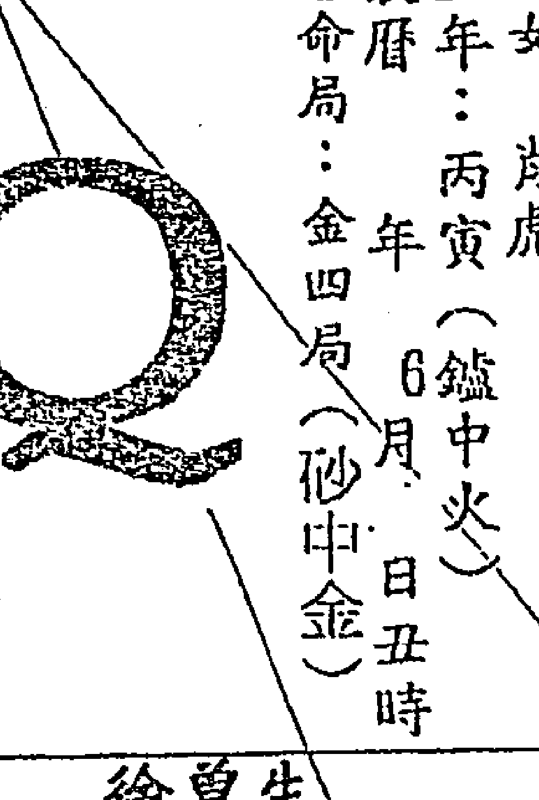

天機坐命：「女命遇之為福，逢吉為吉，遇凶為凶」就是破在那顆擎羊星，因此「天機遇凶即為凶」，而「擎羊守身命，性粗行暴、孤僻，視親為疏，翻恩為怨。」的特質一舉翻轉了天機「勤於禮佛，敬乎六親，利於林泉，宜於僧道。無惡虐不仁之心，有靈機應變之志。淵魚察見，作事有方。」的良善星性了，而且「子午宮入廟，丁己癸甲庚壬生人財官格」的條件中，缺少丙年生的條件，不符合「財官格」局，此造是女命還有一句「巨門見羊火忌沖合，淫賤偏房娼婢，否則傷夫剋子。」此造命宮三方四正正有「巨門羊火忌沖合」的現象，因此後段也成立，於是「孤僻，視親為疏，翻恩為怨，傷夫剋子」的整個具體的個性輪廓已然浮現！

天機可說是對於煞星最敏感的星曜了，一旦同宮引起極大的性質轉變；不是天機有化權嗎？在此先釐清一個觀念，在星宿組合與生年四化的判斷上，應該「先考慮星宿組合」再來「衡量四化」，絕不可以「只看四化」而已，因為有很多讀友或網友時常問：「我是三吉嘉會格，為何命運如此坎坷？」這就是只看生年化星不看星宿組合狀態的盲點，我一直強調「以星性源流為主本，而以氣化為徵驗。」主本是「星性」，徵驗才看「氣化」，而且是先「星性」後看「氣化」的，前面那句話不是寫得很清楚嗎！是有「先後程序」問題的一先探查星性，再飛化四化，探查出事情的樣貌和時間。

所以此例一天機遇擎羊、遇凶為凶之後，這顆化權就成為「幫凶」了「使兇更兇」，何況三方仍有火星、地空、地劫更增添為惡的凶性，天機那能展現善星之特質。更有一顆天姚「守身命，心性陰毒，多疑恐，善顏色，風流多婢，主淫。…。會惡星，破家敗產，因色犯刑。」配上天機擎羊的惡格已經合乎「破家敗產因色犯刑」的條件，又說「加紅鸞愈淫，加刑刃主夭。」雖同宮只有又名「羊刃」的擎羊，但三合財宮內坐天刑，與命宮遙相感應，讓「加刑刃主夭」的條件又成立，因此這個女命可說是「心性陰毒、風流好色、將因色犯刑且壽元不長」，並無法以天機善星為主體就可抑制或降低這些惡星的性質來論，怪不得「二十歲就和人同居，過了三年多才分手」。

一般年輕人雖有「賀爾蒙」催動情慾，但也是矜持自愛，循序漸進地發展感情，時機成熟才會進展至肌膚之親，但這顆星就是有「不用媒妁，招手成婚」的能耐，只要發情了，一見即可鍾情，鐵鍊都綁不住的要往外跑，當然，往外跑就要看田宅了。

田宅宮坐星不錯，但宮干一丁，飛化巨門忌沖命宮，形成：

田宅—化巨門忌沖—命宫

的局，所以先天就已經有在家待不住的徵象，即使其他三吉化星有入照命宮三合，只要遇到不吉的大限和流年來強化，即會離家出走。

癸巳大限的大限田宅在申，宫干—丙飞化廉贞忌冲到巳限命宫，和先天的田宅两象结合，就已经明确指出会脱离原先的住宅，亦即离家出走，因此这个大限定会离家出走。

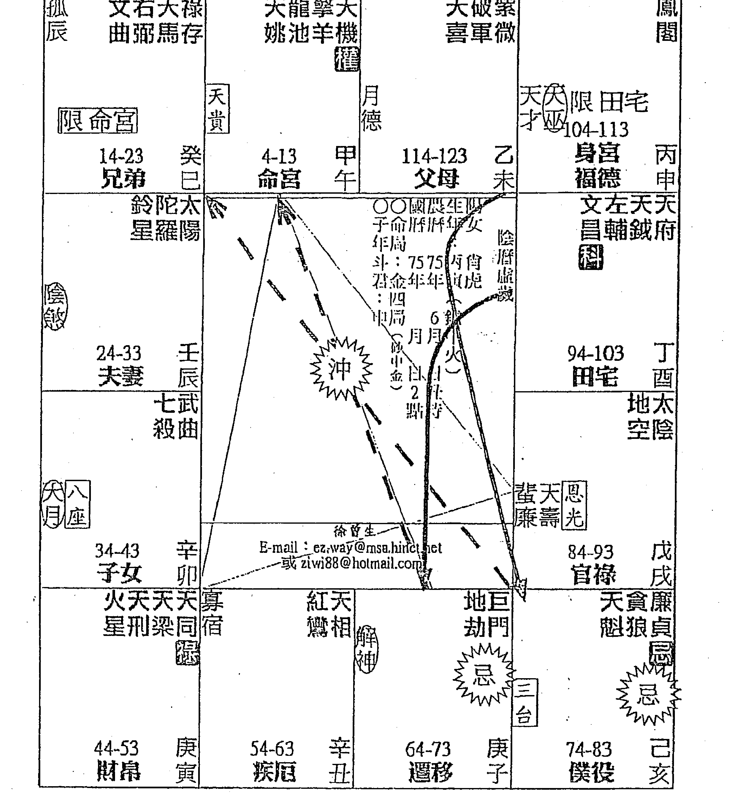

當然離開家有「推」的力量也有「拉」的力量，而這個拉力和限運有關，當進入癸巳大限時，命宮坐星祿存、天馬和文曲，天馬主變動，而寅申巳亥四馬地若坐有生年化忌就是「四馬忌」也是要出外奔波的化象，剛好此造的巳限遷移有廉貞忌坐守，一旦遇到天馬，不就強化「出外」的能量了，所以以大限來看也是個「出外」的運途。

夫妻宮就是個很兇惡的組合了：【太陽、陀羅、鈴星】雙煞坐守，正是「火鈴陀羅金，擎羊刑忌訣，一名馬掃星，又名短壽殺，君子失其權，小人犯刑法，孤獨剋六親」的現象，感情怎會吉祥呢？而且是她剋老公，「剋」有蠻橫無理的壓制的意思，和有情義的管制不同，遇到這種對象「閃」為上策。

而巳限的組合正是「文曲限遇廉陀羊，陷地非災若禍殃」的現象，遷移遇到又是「廉貪」的桃花組合。因此，巳限桃花紛飛，感情世界必然豐富，但是主婚姻的大限夫妻宮由不利於婚姻的【武曲、七殺】坐守，武曲：「妻宮吉聚，因妻得財，遇凶，因妻破財。」妻未必是妻，改成夫亦同，七殺是個不折不扣的凶星，當然就是「遇凶，因妻破財」了，夫妻之間會為了錢財的問題起爭執。何況加入先天夫妻宮的因素，很明顯的，此大限若有婚姻，必然因財務問題夫妻起衝突。而且七殺「居夫婦而駕衾半冷」也促使感情破裂。

先天交友坐星【廉貞忌、貪狼、天魁】，帶有主官非的廉貞忌，將與朋友發生官非，其宮干：己，飛化：

- 武曲祿入子女=巳限夫妻、貪狼自化權、天梁科入財帛、文曲忌入兄弟

明顯的交友飛入我的夫妻宮了，亦即有結婚的跡象，但是廉貞忌帶有官非的性質卻使得「武曲祿入巳限夫妻」不能成為真正的夫妻，而是帶有官非的夫妻，世俗的樣貌又是如何呢？底下都可說是：同居、重婚、當人家的小老婆、被人家包養等都屬之，

酉年正好被交友飛來的武曲祿正照，化祿主情緣，表示喜歡的男友出現了，而且該年的夫妻宮坐【紫微、破軍】是一桃花極強烈的組合，該年的交友宮又是【天同祿、天梁、天刑、火星】，又有天同祿，兩顆交友的化祿層層加強，果然在二十歲遇到一見鍾情的對象，由於【紫微、破軍】是一組肉慾強烈的桃花組合，於是就搬去和男朋友同居在一起。

但是這種年限是否適合婚配呢？有情緣未必能得到真幸福，因為～先天夫妻和大限夫妻已經顯示了這種感情不利的化象，很難擺脫先天與大限夫妻設下的框架，更何況酉年夫妻宮干乙，飛化：

> 太陰忌沖 先天夫妻

流年夫妻沖先天夫妻，這種衝擊對於婚姻絕對有影響，但是酉年命宮坐有文昌科，讓她當年對於雙方的種種差異，在強烈的桃花欲求下，被忽視了或「忍讓」而疏忽了，少了理智的盘算就得承受「同类忌冲」引发的后果。
后来的发展是…二十三岁时和同居人分手，二十三岁的夫妻宫正好是太阴，不就是酉年夫妻飞来的太阴化忌，在转变为「流年的同类宫」时，使「同类忌冲」的化象应验，故分开了，当然，由新闻报导中知道男女朋友或夫妻「分手」衍生出来的问题还真多，此造由于先天夫妻宫充满「孤独剋六亲」的煞曜，配合已限夫妻宫的「遇凶，因妻破财」和「鸳衾半冷」的特性，更显得她在处理感情纠纷时一不念旧情、采取偏激又火爆的手段，所以她去警察局控告对方绑架和性侵害，明明是自己心甘情愿的，不然怎么会同居长达三年之久呢？原来是其不甘白白同居了三年，夫妻离婚有赡养费，而同居分手什么也没有！目的是为了「要分手费」，因而出此下策！但也印证了「遇凶因感情破财」的星曜现象，只不过不是她破财而是要男方破财，同时此行径也印证命宫坐星擎羊的特性，枕边人多少的柔情蜜意在其中，竟一夕之间撕破脸，擎羊在紫微斗数全书上说「视亲为疏，翻恩为怨」真可谓贴切！又「同居三年多，期间极少出门」，有时候整天都不出门，窝在只有两人的甜蜜世界中，一两个月普通人大概还能忍受，她竟然能「憋」三年很少出门，这不是「孤僻」的现象吗！

从头论下来是否看得出来「星性」占很重要的角色，故说「以星性源流为主本」，碰到要推断应验年时，才需要「气化」来徵验了，因此学习紫微的读友要把这个核心问题牢牢记住，绝对不要有四化决定一切或星性至上论的想法，他们都只是推演紫微斗数命运分析过程中的运算子而已，有此认识才不会沦入「人云亦云」的洪流中灭顶。

## 【命例十三】

| 宫位 | 星曜 | 年龄范围 | 干支 |
|------|------|----------|------|
| 財帛 | 地左天陀天 劫月輔馬羅梁 | 84-93 | 己 |
| 子女 | 祿存七殺 | 94-103 | 庚 |
| 夫妻 | 擎羊天廚 | 104-113 | 辛 |
| 兄弟 | 天解天廉 巫神鉞貞 | 114-123 | 壬 |
| 疾厄 | 鈴文天紫 星昌相微 | 74-83 | 戊 |
| 命宫 | 天右弼 空亡 | 4-13 | 癸 |
| 遷移 | 年喜鳳 解廉閣 | 64-73 | 丁 |
| 官禄 | 太太 陰陽 | 44-53 | 丁 |
| 田宅 | 陰天天武 煞魁府曲 | 34-43 | 丙 |
| 福德 | 龍天 池哭 | 24-33 | 乙 |
| 僕役 | 天喜 | 54-63 | 丙 |
| 父母 | 天同 | 14-23 | 戊 |

徐曾生
TEL : (04)2263-2397 , 0911-133639
E-mail : ez.way@msa.hinet.net 或 ziwi88@hotmail.com

○農曆
命局：金四局
女
壬未年
2月天
火
午時

此例前已解釋過，但她還提出另一個問題，其解析之法則不同於前述，故在此就談她的另一個問題，與錢財有關，所以就直接切入主題，其它的不再贅述。

此造先天財帛宮的結構可說是最脆弱的，因為除了天梁科、左輔帶吉之外，其餘：地空、地劫、陀羅均非善星，尤其空劫對於錢財的破壞力更是強烈，陀羅最多是賺錢的過程多折磨，錢財要賺進口袋需要花費一番功夫，而天梁科也預告求財過程有驚險，需要貴人來相助，但是財帛宮的宮干～己，飛出：

- 武曲武曲祿入田宅，
貪狼權入交友，
天梁自化科，
文曲忌入父母。

其中化祿和化權都進入他宮（交友），亦即錢財去成就了交友，依照「祿隨忌走」的規則，要看飛出的忌星是否有入我宮？而此造飛化的文曲忌入父母，父母雖是至親之人，但是此時不可以「至親等同我宮」來解，而是需要把它當作「它宮」來解，財帛化忌入父母，是我錢財飛入他人的手中了，變成了他的錢，所以，不是拿去孝養父母了，而是我歷經辛苦打拼賺來的錢，最後變成了他人的錢財，是我損財的化象，當然天梁落入財帛有「抱私財益與他人」之說，也就是拿錢去濟助他人之意，而科也有拿自己錢財去幫助別人的意思，像最近遇到風災淹得很厲害，災民屋毀人亡，慘不忍睹，捐錢賑災是不是也是我財掉進朋友破财了？假如没煞星作怪，可能就是这种出自善心、心甘情愿的付出，一旦见到煞星就变成心不甘情不愿的损财，“捐”和“损”差一点，意义却完全不同，心中感受也完全改变，这是初学者要分辨有无煞星与主星同位的差异的一个关键。

紫微斗数命盘示例图，包含十二宫位、星曜分布、大限年限、四化（科、忌、禄、权）标注以及相互作用关系（如互冲）。

大限命宫移驻亥位时，大限财帛即在未宫，亦即先天夫妻宫，独坐一颗“作祸异殃，刑剋极甚”的擎羊星，顾名思义也可略知此大限钱财来源，带有冲突、需要费力争取才可得到的性质，因此，来财之源需要历经争取奋斗的辛苦过程，例如论件计酬的工作或低底薪看业绩量抽成的方式，皆属此现象。

### 大限财帛的宫干～辛，飞化：

- 巨门禄入迁移
- 太阳权入官禄
- 文曲科入父母
- 文昌忌入疾厄

其中，化禄和化权都入照命宫事业，代表此限薪水虽然辛苦、但付出即有收获且收入不错，不过，文昌化忌却和已坐在父母宫的先天财帛飞入的文曲化忌形成“在父母一疾厄线互冲忌”的态势，所以一旦流年步入父母宫时，便承受“坐忌又被忌冲”的破坏，既然钱财掉进别人口袋里了，财帛的忌星又来冲命，又是钱财不吉的现象，两者合并解释，不就是“钱财掉进别人口袋而不吉利”吗，因此：“二十九岁年初单位合并，被调闲差，单单奖金一年就少掉近十万元”。奖金不就是需要辛苦打拼一年后，根据业绩年度结算再来决定分得多少的吗？既然原来的业务被别人接过去了，当然，原本应该属于她的奖金也掉进别人的口袋里了。因此合乎“财帛飞化文曲忌入父母”的化象，其他还有：钱借人赖债不还、参加互助会被倒会钱等都属于此象。
为什么应验年是在亥年而不是在互冲线上的戌年呢？
没错，一般企业组织变动是以国历为主的，当年农历过年要到二月十八日才转入新年，因此，严格说来，是在二十八岁的农历年底工作调动的，但是二十八岁时的奖金收入已在新历年內兑现了，所以感觉上好像有时间差，其实是因企业运作是依据阳历而引起的误差。

### 笔记栏：

| 宫位/范围 | 辛巳 (25-34) 福德 | 壬午 (35-44) 田宅 | 癸未 (45-54) 官禄 | 甲申 (55-64) 仆役 |
| :--- | :--- | :--- | :--- | :--- |
| **主星** | 天梁、天喜 | 七杀、凤阁 | 天刑、天钺、陀罗、铃星 | 廉贞、禄存、龙池、地劫 |
| **辅星/杂曜** | 解神、蜚廉、阴煞、八座、恩光、天贵 | 天才 | 三台 | 擎羊、月德 |
| **宫位/范围** | 庚辰 (15-24) 父母 | 命宫 (中心区域) | 乙酉 (65-74) 身宫 迁移 | 破军 |
| **主星** | 紫微、天相 | (个人信息) | (个人信息) | 破军 |
| **辅星/杂曜** | (无) | (无) | (无) | (无) |
| **宫位/范围** | 己卯 (5-14) 命宫 | 丙戌 (75-84) 疾厄 | 戊子 (95-104) 子女 | 丁亥 (85-94) 财帛 |
| **主星** | 贪狼、天马、左辅、地空 | 武曲、天府、右弼 | 天同、红鸾、天姚、火星 | (无主星) |
| **辅星/杂曜** | 天巫 | 天寿 | 天刑、天哭 | (无) |
| **宫位/范围** | 戊寅 (115-124) 兄弟 | 己丑 (105-114) 夫妻 | (底部宫位) | (底部宫位) |
| **主星** | (无主星) | 太阴、太阳、天魁、文昌、文曲 | (无主星) | (无主星) |
| **辅星/杂曜** | (无) | 化科、化权 | (无) | (无) |

阳男
戊午年酉月戌日戌时
命宫在卯，身宫在酉
命主：贪狼
身主：天机
斗君：卯

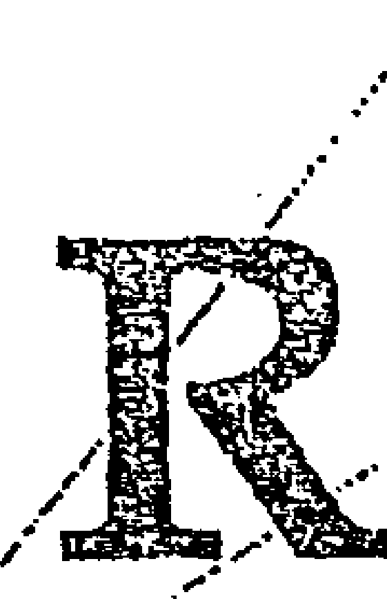

—徐兰生
E-mail: cz.way@msa.hinet.net
或 ziwi88@hotmail.com

根据资料，此造风流好色，在紫微命盘上如何得知呢？有的人说看“性”能力要看“子女宫”，其实“性”能力和“好色”并没关系，有的人性能力高强却对配偶很忠贞呢！贪花好色必须参看整体命局，“夫妻宫”是其中重要宫位，此造的夫妻宫坐【太阳禄、太阴科、文昌、文曲、天魁】，以星宿组合来看，没什么煞星，应该不至于“风流好色”才对啊！在紫微斗数中，最怕双星组合，如日月或昌曲，日月代表“感情开放、光明磊落”，太阳是男性太阴是女生入夫妻，此人很懂女人心理，有男生的阳刚也具有女性的细腻，当然容易以此优点游戏人间，左拢右抱享艳福，化禄和化科同宫就强化了“贪花好色”的象，昌曲有“自古名士多风流”的意思、也有人称之为细姨星，于男命夫妻就有风流倾向，怪不得他毫不忌讳别人的指指点点，光明正大的上酒家泡女人，加上“太阳禄、太阴科”两颗化星同位，更加强化此种倾向，因此“生活不检点，上酒家喝酒泡妞”。

还有必须参酌官禄宫，官禄宫除了代表一个人的事业之外，还可以说是“行为、品行”的宫位，像此盘的官禄坐【陀罗、铃星、天刑、天钺】，一看星组合就知道完蛋了，煞星一堆还能干出什么好事吗？古书上说“忌同日月，则伤亲损目。刑併桃花，则风流惹祸。”又加上天刑“二限逢之，主出家、官事、牢狱、失财。”写得那么清楚明白！官禄宫这么糟糕，一定很容易误入歧途，这些星宿有偏激、反社会的倾向，凡事都会往坏的方向倾斜，而天刑代表法律，坐在官禄代表与法律有关，若是吉星同宫可能是司法人员，如法官、检察官、警察或职司纪律的人员，但只有煞星同宫而无吉化之星，就有游走法律边缘或时有违法犯纪行为的意思，像此例的先天官禄宫已经有“学坏”的倾向，命宫三方“擎羊、陀罗、火星、铃星”四煞俱会齐全，这也是向“恶”方倾斜的影响力，这些四煞的影响力，表现出来有些是小时候多灾多难、不好养大；有些是成为小混混等，官禄宫就是看一个人能否透过“学习”成就人生的宫位。

财帛宫又坐【天同忌、天姚、火星】，天同是享受、天姚是酒色，尤其水星落在亥子水地“同梁巳亥位，男多浪荡女多淫”，更加强化钱财和“花天酒地、寻欢作乐”的性质有关，而火星助纣为虐，怪不得钱财都花费在“饮酒作乐、当火山孝子”之上，又是一个显示“生活不检点”的宫位，但更明确的指向“薪资挥霍一空，花在饮酒作乐、风花雪月”之上。

而命宫的“天机、巨门”，古文有说“巨机卯酉，纵遇财官也不荣”、也有“巨机卯酉，浪跡天涯”的说法，可见这是“飘荡、不荣”的不吉利组合，又没有化吉星来吉化改善，更见天同忌星来会，坐实“飘荡不荣”的倾向，表现在行为上就是“得过且过，醉生梦死，不求上进、随波逐流”的行为或人生观。

官禄宫有“天刑”易犯法，财帛宫有“天姚”，将钱财花费在花天酒地、甚至会为了享受花酒而触犯法律，这个命先天格局实在极为不吉，现在就要看看“就学阶段”的官禄运好不好，若好可以拉回来正途，若是不佳的组合或是被忌冲击，就会更往坏的方向转变！

| | 天喜、天梁 解神、蜚廉 25-34 福德 辛巳 | 凤阁、七杀 35-44 田宅 壬午 | 铃星、天刑、天钺、陀罗 45-54 官禄 癸未 | 地劫、龙池、禄存、廉贞 三台 限官禄 55-64 仆役 甲申 |
|---|---|---|---|---|
| | 天机、天相 限命宫 15-24 父母 庚辰 | 巨门、天机 5-14 命宫 己卯 | | 月德 65-74 身宫 迁移 乙酉 破军 |
| | 地空、左辅、天马、贪狼 忌 天寿 115-124 兄弟 戊寅 | 文曲、文昌、天魁、太阴、太阳 禄、权 105-114 夫妻 己丑 | 右弼、天府、武曲 科 限财帛 95-104 子女 戊子 | 火星、天姚、红鸾、天同 忌 75-84 疾厄 丙戌 85-94 财帛 丁亥 |

从先天命盘的三方格局来看，就很清楚他的先天命格的发展倾向，接下来就要看他的大限是走顺时针行运还是逆时针的行运，因为正逆转所遇到的大限坐星全然不同，运途也会有差异，此造假如行运能遇“扶正”之星，也还能浪子回头，否则就会沈沦下去。而学习阶段是学好或学坏，能否拉回正道？就要看第二大限的官禄宫——

先天官禄宫的宫干—癸，化贪狼忌冲辰限官禄，什么？这也叫同类冲，是的“先天官禄化 贪狼忌冲 辰限官禄”也是另一种符合“同类忌冲”的飞化方式，也代表“不稳、不吉”的意思，尤其先天官禄化出的是【贪狼忌】去冲到辰限官禄，所以在读书阶段心无法静下来专心求学，心思都用在学习不好的事物上，因此，在第二大限他就养成了好吃懒做、违法犯纪的恶习，而且：

辰限官禄宫干—甲，也化太阳忌冲先天官禄，构成“辰限官禄化 太阳忌冲 先天官禄”的同类忌冲，先天与大限官禄宫构成的双重同类忌冲，在这种大限行为一定会走偏差，有的人贪玩、有的忙着谈恋爱、有的忙着赚钱、像此造就“花天酒地、泡酒家女”，但共同特征就是“荒唐”，因此，限运不吉养成此造难以戒除的恶习，成为日后触法犯纪的根源。

进入辛巳大限（二十五—三十四岁），其余大限各宫也依序布列，巳限官禄进入迁移宫，宫干—乙，使太阴化忌在夫妻＝冲先天官禄，又是“巳限官禄化忌冲官禄”的同类忌冲，连续两个大限都是“同类忌冲”，这种命也真差，连走二十年的坏运，怪不得即使坐牢出狱后也不悔改，继续的花天酒地不知改过自新、努力向上，因为这两个大限积习的恶习，实在难改！让老父母继续为败家子伤心。

辛巳大限官禄（酉）独坐【擎羊】，擎羊有针锋相对、冲突、杀气、不顾一切的意思，因此在人的个性或行为上就容易冲动犯法、打架杀人等现象，先天官禄【陀罗、铃星、天刑、天钺】已经凶煞重重，再加巳限官禄【擎羊】凶星，层层加强，那能不作恶呢？因此，为了“花天酒地、泡酒家女，竟然挪用公款”，由于“巳限官禄忌冲官禄”，一做坏事马上就被查获，而且又逢主司法的“天刑”同宫的缘故，因此，这个大限会有“违法犯纪”情事的发生。

三十一岁命宫刚好过渡到巳限官禄（酉宫），因此抓住【擎羊】的凶性，而三十一岁流年官禄（丑宫），内有巳限官禄化来的【太阴忌】，所以，两相加强，在劫难逃“三十一岁入狱服刑”。

有人会问：“巳限三合会入生年太阳禄、太阴科，不是相当吉利的现象吗？”是的，三方会入生年禄权科星的大限，对于行运有吉化作用，可以让求学或谋事过程比一般人顺利，也能找到比较好的工作，在当时的时空环境下，进入银行界服务是很困难的，有些还要走后门、送厚礼才能获得“捧金饭碗”的工作呢！以此造官禄宫之凶恶，能进入银行服务，生年禄、科是有发挥作用力的，只不过也会入生年的天同忌在巳限的迁移宫，忌主“困颠、不顺、阻逆”等现象，也正预示了巳限会有生年化禄、化科和化忌等带来的现象并存，假如能趋禄科而避忌，就能趋吉避凶，不过由于先天官禄的忌煞重重，注定此造向“恶”的方向趋近，而避开“吉”方，所以触犯法律、遭法院判有期徒刑入狱服刑，矫正其作奸犯科的行为。

紫微斗数命盘示例：
- 限命宫：25-34 福德 辛巳，星宿：天喜、天梁、解神、蜚廉、阴煞、八座、恩光、天贵
- 凤七杀：35-44 田宅 壬午，星宿：凤阁、七杀、天才
- 铃天天陀星刑钺罗：45-54 官禄 癸未，星宿：铃星、天刑、天钺、陀罗
- 地龙禄廉劫池存贞：55-64 仆役 甲申，星宿：地劫、龙池、禄存、廉贞、三台
- 31命宫：65-74 身宫 迁移 乙酉，星宿：破军、天德、月德
- 疾厄：75-84 丙戌，星宿：火天红天星姚鸾同（火星、天姚、红鸾、天同）
- 财帛：85-94 丁亥，星宿：天同
- 子女：95-104 戊子，星宿：武曲、天府、右弼、天寿
- 夫妻：限财帛 己丑，星宿：文昌、文曲、天魁、太阴、太阳
- 兄弟：115-124 戊寅，星宿：地空、左辅、天马、贪狼
- 父母：15-24 庚辰，星宿：巨门、天机
- 命宫：5-14 己卯，星宿：紫微、天相
中心信息：徐曾生，E-mail: ez.way@msa.hinet.net 或 ziwi88@hotmail.com

但是此造出狱后，不痛改前非，依然故我，继续花天酒地，所得皆吃喝一空，此造命局太破实在是主因！

## 【命例十五】

| 第一列 | 第二列 | 第三列 | 第四列 |
|--------|--------|--------|--------|
| 子女宫 乙巳 95-104 天梁、天钺 八座 | 夫妻宫 丙午 105-114 七杀 | 兄弟宫 丁未 115-124 左辅、右弼、铃星 | 命宫 戊申 5-14 廉贞、地劫 天喜 |
| 财帛宫 甲辰 85-94 紫微、天相、天姚、龙池 | 地址：台中市东区 路 号 电话：(04)2263-2397 手机：0911-133639 邮政信箱：台中邮政45之2号信箱 文曲、文昌、太阴、太阳 | 父母宫 己酉 15-24 破军、陀罗、凤阁 | |
| 疾厄宫 癸卯 75-84 贪狼、地空 | 天刑、天羊、天府、武曲 恩光、天贵 | 福德宫 庚戌 25-34 天同、禄存、天马、火星 | |
| 迁移宫 壬寅 65-74 | 仆役宫 癸丑 55-64 | 官禄宫 壬子 45-54 | 田宅宫 辛亥 35-44 |

由命宫坐星来看，是个很有主见、自我要求标准很高的一个人，廉贞坐命“申宫入庙，甲庚戊生人为贵格，丙生人次之”他壬年生人没能符合“贵格”条件，这是可惜之处！又命宫和迁移正呈现“地空、地劫”对照的角度，正是如全书上说的：“空劫二星俱不宜见，定主破财，二限逢之必凶。”，虽然是讲空劫二星对运途的财运有不吉的影响，而在先天命局见到，对于财运也一样会有负面、不吉的影响，不幸的他二颗星都见到，必然对于财运产生破耗、损失等现象。

次桃花的廉贞会见到对宫号称风花雪月的桃花星贪狼，本来是个桃花旺盛的组合，可是空劫相会之后，把廉贪交会的桃花性质吸收掉，没了桃花星的吸引、心猿意马，当然就能专心在课业或事业上。

而且读书时期的酉限三合，日月昌曲汇集，是个很适合读书求学的大限，先天命局一自我要求高、而后天运程一适合读书求学，所以求学阶段，能够自我惕励又进入适合读书的运途，在相辅相成之下，拿到不错的学历，果然“是个具有工程背景的企管硕士”。

具有这种双料专长的硕士，以目前而言，都还是蛮受企业重用的，民国八十六年更是炙手可热，因此找工作应该不难，所以“退伍后即进入知名又蛮有规模的金融公司”。

戌限命宫虽然星组不佳，但是戌限迁移宫却是“紫微权、天相、天姚”，迁移有此星曜组合表征：出外就能接近有权力、有成就的人或企业，同时戊限迁移也是财帛宫，所以表现出来的个人形象是“很有理财的能力”，因而受到“金控公司老板欣赏”，像这种学历应征的职务绝非经副理层级决断的，定然是公司更高的层级如副总经理甚至总经理，如此佳美的大限迁移宫（先天财帛），怪不得会受到“一家知名又颇具规模的金融公司高层青睐而雀屏中选”，而此造财帛宫组合如此佳美，入金融业也正合乎星性，因而有此大好际遇“应该蛮有前途的”，但是，自己承担得起吗？就需回顾自己的命宫格局是否强而有力，刚讲过戊限命宫很烂，所以，虽得老板欣赏，但此造的命局却难承受——表现难达到老板的预期。

为什么呢？问题出在官禄宫，先天官禄【武曲忌、天府、天刑、擎羊】是个“劫财”的组合，金融机关不就是武曲、天府表征的人事物象！既然化忌了在金融机构上班还能顺利吗！很明显地，财帛宫和官禄宫呈现出背道而驰的意象，财帛展现的是他具有强烈掌控钱财、运用资金的意愿，如投资股票、基金或不动产等，而官禄宫是他工作上表现出来的特质，却是不善于理财或运用金钱，甚至会因而招惹官非——因为天刑和擎羊的关系，所以此造若是不小心谨慎地处理财务问题，小心招来官司缠身。

当然，如果是担任法务征信人员就很能发挥特质，武曲忌是资金缺乏的意思，企业缺资金周转才需要向银行贷款，而贷款需要抵押品，抵押品需要鉴价，评估核贷金额，如果是工厂拿机具设备抵押贷款，就需要对机具设备嫺熟、具有理工背景的人，才能胜任，而负责此种工作的人职称就是“征信人员”，所以官禄宫星象所表征工作的形象样貌就清晰地浮现出来。

在银行界服务，对于金融商品的行情起伏，多少也会涉及，耳濡目染之下，也开始注意理财资讯，在金融业内取得相关资讯应该比一般人要灵通的多，所以也拿出多年工作的积蓄，开始进入投资市场，一试身手！

财帛宫坐星：紫微权、天相、天姚，紫微在财帛宫，是掌管钱财大权之意，像他担任征信人员，企业能够贷得金额的大小完全掌控在此造手上，正应了星化象的意义，而应对到自身的财务运用，也是：“喜欢掌控金钱，灵活运用理财”的星象，所以，拿出积蓄灵活地投资以赚取钱财。

但是也不可忽略宫干四化的作用，虽然先天的财帛坐星吉利，若是四化配置不当也会招致损财，其宫干__甲，飞出～

- 廉贞化禄入命宫 ---- 此乃吉利象
- 破军化权入福德 ---- 此为化出权，固执己见之意
- 武曲化科入官禄 ---- 此乃吉象
- 太阳化忌入交友 ---- 此乃损财象

由四化象和星象来看，先天财运还不错，比起同辈的理财能力更好、更优。

运途起伏还要参看所处大限的财帛宫吉凶，先看戊限财帛宫星象，独坐七杀，杀破狼主变动起伏，隐喻戊限的财运起伏变动大，类似买股票或做期货等投机性的金融商品，而其宫干＿丙，飞出～

廉贞化忌入命宫，

有人说是“忌入”化象，为收敛、获得之意，但笔者认为这是谬误之见，应该是不吉、是凶象，断不可以吉来论。

综合星化象来看，先天财帛宫的廉贞化禄照戊限官禄、破军化权在戊限命宫、武曲化科照戊限财帛，算是吉利，而戊限财帛不吉，戊限的财运起伏动荡大，但财运总体来说还是吉祥的。

但是，还需要一年一年地去审视察看各流年的财运吉凶，其它的流年就不一一去推敲了，只提出重点流年，像是寅年就是不利于钱财之年，因为被廉贞化忌冲到，但有化禄化权化科在寅年三合会照，还不是破财之象。

卯年时，卯年的官禄宫被太阳化忌冲到，官禄是运途、运气好坏的宫位，受到忌冲当然理财的运气不好，挑到的都是赔钱货，果然当年，投资股票赔了几十万，年纪轻轻就赔了几十万是个蛮大的数字，前面说过财帛宫坐紫微权让他兴起运用钱财来赚钱的想法，而且依他命格来看，他的投资策略是比较大胆的，决不是菜篮族的保守心态可比拟的，但官禄宫的不吉组合，容易使他的投资决策产生失误，而卯年投资失利的原因整理如下：

- 一、财帛化太阳忌冲卯年官禄，
- 二、大限的财帛化廉贞忌入命宫─这是钱财不利于命造的意思，
- 三、卯年的命宫飞化贪狼忌冲先天命宫，先天命宫又化天机忌入卯年命宫，戌限命宫又化天同忌入卯年财帛。

所以，命宫、财帛等宫的忌煞星环伺，在卯年的三合围绕或冲击着先天命宫，故卯年投资股市，赔了数十万，但此造先天财帛宫组合旺盛，戌限的钱财运，还是旺盛有利的，卯年栽跟斗学个经验，对日后投资理财更加有利。

## 紫微斗數命運分析——實例篇

#### 【命例十六】

| 宮位/干支 | 星曜/數據 | 宮位/干支 | 星曜/數據 | 宮位/干支 | 星曜/數據 | 宮位/干支 | 星曜/數據 |
|---|---|---|---|---|---|---|---|
| 父母宮 (乙巳) | 天府、天巫、陀羅、貪狼、廉貞 年齡段: 116-125 | 福德宮 (丙午) | 文曲、陰煞、右弼、祿存、巨門(忌) 年齡段: 106-115 | 田宅宮 (丁未) | 天梁、擎羊、天相 年齡段: 96-105 | 身宮/官祿宮 (戊申) | 文昌、左輔、天馬、天梁、天同(權) 孤辰、紅鸞、天空 年齡段: 86-95 |
| 命宮 (甲辰) | 太陰(祿)、寡宿、天府 封誥 年齡段: 6-15 | (中間信息) | ○ 農曆生年：丁未（天河水） 陽曆生日：5月5日寅時 男命 命局：火六局（爐中火） 生肖：羊 節氣：虛歲 歲 | 僕役宮 (己酉) | 地空、天鉞、七殺、武曲 年齡段: 76-85 | 遷移宮 (庚戌) | 火星、天魁 年齡段: 66-75 |
| 兄弟宮 (癸卯) | 空亡、天壽、年解、鳳閣 年齡段: 16-25 | (聯繫信息) | 徐曾生 TEL: (04)2263-2397、0911-133639 E-mail: ez.way@msa.hinet.net 或 ziwi88@hotmail.com | 財帛宮 (壬子) | 鈴星、解神、天機(科)、天府 月德 年齡段: 46-55 | 疾厄宮 (辛亥) | 天才、龍池、天哭 年齡段: 56-65 |
| 夫妻宮 (壬寅) | 截空、旬空、天喜 年齡段: 26-35 | 子女宮 (癸丑) | 歲破、破碎、天虛 年齡段: 36-45 | | | | |

猛然一看，哇！好大的格局「三奇嘉會」，三方見文昌、左輔輔佐，除了一顆鈴星未見其他煞星沖破，可說相當吉利，依照先賢賦文或諸星問答的內容應該是「科權祿合，富貴雙全」、「科權祿拱，名譽昭彰」，不過，有顆煞星沖破無法成為富貴雙全，至少也應該擁有相當財富才對，但此造「年近四十仍租屋而住，沒有自己的房子」，問題出在哪裡呢？仔細看看先賢的經驗談中也有「祿主纏於弱地，命不主財」、「化祿還為好，休向墓中藏」的句子，說明三吉化星不是萬能、不必受到宮位的廟陷利旺的影響，它們還是必須隨著「氣化的主星」落入宮位是屬於廟陷利或旺的影響，而干擾其發光發熱的能量強弱，如此例：太陰在辰是陷地，也就是弱地，故雖化祿也不主命造將擁有許多財富，並且「辰」位也是「四墓」之地，將落陷的「太陰化祿」厚厚地埋藏起來，故此造命宮雖然坐太陰祿，其實是一個失去效力的化曜，主財富的化祿被破壞又深埋起來，也代表此人的財富也難以成為大富了。

再進一步來看，命宮的宮干—甲，飛出四化：

- 廉貞祿入父母，破軍權入子女，
- 武曲科入交友，太陽忌入遷移。

化祿權和科都飛入了父母、子女、交友等所謂的「他」宮，亦即本來「我」擁有先天太陰化祿的，結果「我」把化祿都飛化給了「他」宮，變成別人的化祿了，更慘的是飛出一顆太陽化忌在遷移宮，把化祿帶到了外面，「我」當然空無一祿了，所以命宮的先天化祿星根本毫無作用，若以為會「財源滾滾」來大肆投資，隨之而來的就是「賠損累累」，而且命宮飛出太陽化忌就已經暗示不適合當老闆，因為太陽是官祿主，既然化忌就已經破壞當老闆的運氣了，所以此造「曾自營早餐店，三個月就收攤，又和朋友合夥做水果批發，勉強維持二年也是結束營業，改行自己擺水果攤也無法為維持生計，只好去上班，上班那兩年才有存點錢」是不是已經說明此種現象，從小本的早餐店、水果攤到大一點的水果批發商，只要是自己當老闆就是「破財」，在命宮的星曜已經說明了這一切現象，這也證明「星曜組合」和「化氣現象」要一併參看，才能表裡合一、體用兼顧。

那麼為什麼會自己創業呢？就那官祿宮那顆的天同，表徵成一個人擁有旺盛的事業雄心，而且坐星組合沒煞星破壞，算是相當吉利的，假如當個上班族，一定會因主動積極的態度、工作能力強，獲得企業主重用，擔任有實權的主管。

而官祿宮干一戊，飛出天機忌入財帛宮，表示想要以「自己當老闆來賺進更多的財富」的現象，但是財帛宮的坐星【天機科、鈴星】是個好壞雜陳的現象，所以此時的化科雖然仍有化解危難的作用，可能就是「信用」還不錯，資金短缺時調度資金，還有人願意伸出援手的跡象，而不是擁有相當財富之意。

再看財帛宮干一壬，飛出武曲忌入交友宮，又是飛進他宮，錢財掉入別人口袋的現象，這種化象怎麼累積財富呢？都給別人破壞了嘛！所以：買賣、借貸等牽涉錢財往來的事務都需小心。故即使入「三奇嘉會」的格，若三奇入宮的四化沒有配合得好，也是一樣破功、不合格。

| 宮位（年齡/天干地支） | 主要星曜 | 附註 |
|---|---|---|
| 命宮 (6-15, 甲辰) | 天府、鳳閣 | |
| 兄弟 (16-25, 癸卯) | 天喜、天壽、蜚廉 | |
| 夫妻 (26-35, 壬寅) | | |
| 子女 (36-45, 癸丑) | 紫微、破軍、天刑、地劫 | 限命宮 |
| 財帛 (46-55, 壬子) | 天機、鈴星 | 天才 |
| 疾厄 (56-65, 辛亥) | 天魁、天鉞、火星、龍池 | |
| 遷移 (66-75, 庚戌) | | 三台 |
| 僕役 (76-85, 己酉) | 太陽 | 限財帛 |
| 官祿 (86-95, 戊申) | 天同、天梁、天馬、紅鸞、左輔、文昌 | 86-95 歲限；身宮 |
| 田宅 (96-105, 丁未) | 天相、擎羊 | |
| 福德 (106-115, 丙午) | 巨門、祿存、右弼、文曲 | 祿存忌；陰煞 |
| 父母 (116-125, 乙巳) | 貪狼、陀羅、天姚 | 天巫；限官祿 |

**圖表中心資訊**：
OO歲生陰
子命府年男
年局：
斗：56丁酉
戌局 (天河水)
5月 (山頭火)
丑日 (霹靂火)
戌時

**手寫註釋/箭頭**：
- 沖 (指向中心)
- 限官祿 (框在父母宮旁)
- 限財帛 (框在僕役宮旁)
- 限命宮 (框在子女宮旁)
- 陰煞 (在福德宮旁)

陳先生
E-mail: cz.way@msa.hinet.net
或 ziwi88@hotmail.com

當運勢流轉，大限推移前進到了丑位時，先天交友宮變成丑限財帛宮，也就是先天財帛宮飛出武曲忌進入之處，代表此大限錢財要慎防掉入他人的口袋中，回過來看星宿組合，丑限命宮【紫微、破軍、天刑、地劫】有「若遇破軍，在辰戌丑未，主為臣不忠，為子不孝之論」的說法，亦即此限會有如上之現象，如因破產跑路躲避債主，不敢回家；或是和家人調資金周轉，結果倒閉欠了家人大筆錢；甚或是家人向我借錢發生錢財糾紛，讓父母為難等都可說是「為子不孝」之象，若是上班族或公務人員就會有觸犯法律的行為，但是為了何事而產生「為臣不忠，為子不孝」的現象呢？丑限命宮並未顯示，而天刑「二限逢之，主出家、官事、牢獄、失財」，很明顯有看破紅塵出家、官非和損失錢財的跡象，當然這些跡象可能只出現一項、也有可能全都出現，而另一顆地劫星更強化了「失財」的現象，再配合前述的先天財帛宮星宿組合與化象，明顯指向錢財出問題。

丑限財帛坐星【武曲、七殺、地空】除了接近「因財持刀」格外，古文中就只有「遇廉貞破軍羊忌空劫沖破下局，破祖敗家。」的述句，此造丑限財帛宮的三方不正是符合此局嗎？又再配合武曲入命限吉凶訣中說道：「武曲之星主官人，公吏逢之刑杖來，常庶逢之還負債，官員值此有驚惶。」所以丑限財帛有此組合，應該是「破祖敗家、負債」的運途。

再來審視丑限官祿的【廉貞、貪狼、天姚、陀羅】的組合，有「逢財星耗合，祖業必破，遇刑忌，則膿血不免。」和「巳亥陷宮，棄祖孤單，巧藝、僧道、軍旅之流」之說，但此處是限運遇到，雖無法完全套入，但也可借用轉化成大限事業的現象，以「巳宮」為中心、三方不是有武曲（財星）、破軍（耗星），是不是符合「逢財星耗合」呢？所以祖業也在此限會彼此造破敗，本宮有顆陀羅（化氣曰忌）、三合又有顆天刑，又成「遇刑忌」，所以丑限運途不但要破敗祖業還有膿血之災，是個相當兇惡的組合，故從丑限命財官三局的星宿組合來看，都是呈現兇惡的局面，而且都指向「破財、傷身」的現象。

破財當然與財帛有關，所以再將丑限財帛宮干一己，飛四化在命盤分佈的情況如下：

> 武曲自化祿，貪狼權入父母，
> 天梁化科入官祿，文曲忌入福德。

化祿化權都入他宮，只有天梁化科入我宮，實質的利益和成就都飛入他人之宮位，是拿錢去成就他人之意，譬如借錢給別人周轉或開公司即是，到底會不會返還或回饋，就要看化忌星了，此造文曲化忌卻是與先天財帛形成：

> 大限財帛化 文曲忌沖 先天財帛

的同類忌沖盤局，主此限錢財不利、會破大錢，到底是自己投資失敗賠錢、或是被人倒會、或遺失了鉅款呢？當然由先天財帛宮飛忌入交友，就不可能是自己投資賠錢導致損財象，應該是「被人倒會」或「借錢不還」的現象，而且丑限財帛宮飛出的文曲忌也恰好落入丑限交友宮內，先後天財帛均飛忌入交友，明確地點出「損財與朋友相關」，結果實際情況是「被親友倒會，損失一百多萬」，交友宮和兄弟宮在命盤上是處於相對的位置，可以衍申成代表親戚和朋友的「親友」線，親友也是別人，常言道：「親兄弟明算帳」嘛！牽涉到錢財的事，即使是親如兄弟也還是要把帳算清楚，不然會發生糾紛的，所以，只要是「財帛飛化忌入他宮」都是我方損財之象，至於損給誰就由宮位來表示，但已知是損財象，是誰來損我財，知道了又能避免嗎？當然可以，但如是至親好友開口，就難以拒絕了，但可衡量能力量力而為，控制風險在可承擔的範圍內。

當然，因自己與親友之間的金錢往來而發生糾紛，父母與親友間關係也會緊張或起衝突，可能父母親並不知道雙方的錢財往來關係，但最後還是要承擔此種金錢糾紛的後果，因而陷父母與親戚之間的關係破裂，豈不符合「為子不孝」的評斷，所以論命時，要將「命財官」三局一併參看，才可掌握住比較細膩的事項，更真切、更逼真地解釋出星宿代表的事務形象。

由前述幾個例子可以知道，雖然不是「同類忌沖」或是「忌沖命宮」的盤局，而是「命限化忌同入一宮」的情況，也會因匯集了雙忌的力量而誘發禍害發生，因此，不能忽視此種「雙忌匯聚一宮」的現象。

#### 【命例十七】

○ 命局：土五局（路傍土）
生年：甲午（砂中金）
生月：11月
生日：日已時
陽女 肖馬

徐曾生
TEL : (04)2263-2397 , 0911-133639
E-mail : ez.way@msa.hinet.net 或 ziwi88@hotmail.com

| 宮位（年齡段/干支） | 對應星曜 |
|---|---|
| 命宮 5-14 辛未 | 天刑、天鉞、天空 |
| 兄弟宮 15-24 庚午 | 地空、火星、陰煞、解神、七殺 |
| 身宮（夫妻宮）25-34 己巳 | 天廚、文昌、天梁、旬空、破碎 |
| 子女宮 35-44 戊辰 | 紫微、天相、地劫、年解、鳳凰 |
| 財帛宮 45-54 丁卯 | 擎羊、巨門、天機、天喜 |
| 疾厄宮 55-64 丙寅 | 貪狼、祿存、天馬、左輔、天巫、蜚廉 |
| 遷移宮 65-74 丁丑 | 太陰、太陽、陀羅、天魁、天才 |
| 福德宮 75-84 丙子 | 武曲、天府、右弼、台輔、天哭、天虛、歲破 |
| 官祿宮 85-94 乙亥 | 天姚、天同、天月、壽德 |
| 田宅宮 95-104 甲戌 | 龍池 |
| 福德宮 105-114 癸酉 | 破軍、天月、紅鸞、空亡 |
| 父母宮 115-124 壬申 | 廉貞、鈴星、截路、孤辰、文曲 |

人的運途很奇妙，有時候不經意的一件事，卻會影響人之命運一輩子，報紙不是報導過有一位貨車司機開車時口渴，伸手拿飲料喝，放回去時，因為瓶蓋掉了，就伸手去撿瓶蓋，結果車子失控翻覆，司機也受了重傷，當然，工作也不保了，車禍後的復健又是一大筆開銷，撿瓶蓋的小動作卻嚴重影響他的下半輩，可謂影響深遠。

同樣的，每一個人都會有某個或某種機緣，引導你一輩子的發展趨向，這個案例就是在某個時段因為某人促成的某件事而影響她一輩子的命運趨向，觀察命盤看看能否找出蛛絲馬跡呢？

在課堂裡聽到有人提出「來因宮」一詞！與出生年天干同干的宮位就是來因宮，如果乙未年生者，就看命盤的乙天干在哪一個宮位，則該宮位就是來因宮，譬如：財帛宮的宮干是乙，與出生年天干相同，所以，財帛就是來因宮，因此一生的活動主軸都會以財帛宮的事務為主體，或說財帛宮是影響你一生最深遠的宮位，這個我相信，因為錢財之於一個人實在太重要了，但如果來因宮落在其他宮位是否如此，筆者就只能抱持著懷疑的態度了。

此造甲午年生，甲天干落在田宅宮，因此該宮位就是她的來因宮，也就是說主宰她此生運途起伏變化的關鍵樞紐就是田宅宮。

而此造第二大限時正踏入午位，也就是她的兄弟宮、來因宮成了午限的官祿宮，是否也暗示了在此大限會發生命運大轉變的變化呢？而這個大轉變之源頭又是否出自田宅宮呢？

命坐天刑、天鉞，天刑是個孤克之星，因為古書上說：「天刑守命身，不為僧道，定主孤刑，不夭則貧，父母、兄弟不得全。」但是「入廟名為天喜神」而未宮並非是其廟旺之地，加上對宮會入：太陽忌、太陰、陀羅、天魁，煞忌來沖會，又是太陽忌，太陽是父星、夫星、也是子星，既然化忌當然夫父子必有缺憾，回應到命宮的父母不得全，當然是父親有早逝或不顧家的意思，成年之後，也因為這顆星的關係，婚姻也會有問題，因而成為「孤刑、貧天」的格局，加上陀羅作虐，此種危害、困頓，如影隨形，一生都糾纏不去。

事實上此造的父母在經濟上還算相當寬裕，在當時經濟不發達的年代，還能維持不錯的生活條件，太陽忌、太陰遇到陀羅的父母兄弟不得全，應該不是在父母或兄弟身上，應該和夫君或是兒子身上。

那麼在「父母、兄弟不得全」命格大局之下，再看看此造的兄弟宮：七殺、火星、地空，這些星曜組合光看字面上的意義就很駭人了，如想知道詳細，古書上卻只有七殺入命身、夫妻、遷移、子女、田宅或疾厄的評斷，但是如果遇到古書上沒解說的，也可把該星主宰的內涵轉換成該宮的意義，它的特質是「主風憲，其威作金之霆，其性若清涼之狀，主于數，則宜僧道，主于身，定歷艱辛」、「遇火鈴，則為殺長其威」又說「七殺寅申子午宮，四夷拱手服英雄，魁鉞左右文昌會，權祿名高食萬鍾。」這時最好把火星一併納入考量，殺星遇到煞星性質轉變更為強烈，所以得合併考量，「火星南斗浮星，火，性剛強出眾，唇齒四肢有傷，毛髮生異，形容各別，諸宮不美」把午位的七殺和火星同宮特性描述得很具體，但兄弟宮也會承繼上述特質，兄弟必有上述特質之人或與此造的關係淡薄。

如果用四化來看，兄弟宮干…庚，飛化~

> 太陽化祿入遷移，武曲化權入交友，
> 太陰化科入遷移，天同化忌入官祿

其中太陽化祿和太陰化科都照命宮，是手足感情深厚的意思，化忌卻是落在我官祿宮內，對我的運途有不利之影響，到此為止、化象和星象有互相抵觸之處。

到底實際的情況是如何呢？

原來，家裡有傳統根深蒂固的重男輕女觀念，此造排行老么，故而不得父親疼愛也得不到母親的關心，因此從小就很獨立，心中未免有些不平衡，但當時手足眾多者，比比皆是，因此也就不會太放在心上，只是長大後離家各奔前程，難得聚首，也因此相聚時，手足情感仍深，原來兄弟宮內的坐星、化象，就是呈現此種現象。

進入兄弟大限時，正是女大十八變的年華，由於日月照命，此造長得身材姣好、婀娜多姿，但是天刑坐命不苟言笑，讓人覺得冷冷酷酷的，為什麼會有此特質呢？除了日月照命之外，官祿宮的天同、天姚，具有強烈的桃花特質，於是天同現出慵懶憨厚、天姚豔麗，天刑冷酷，糅合在一起成了慵懶、冷豔的形象，確實此造也表現此種特質，又在亥水之地，合起來成了「泛水的桃花」，桃花極旺、初中時惹來許多校內、校外的異性追求，成了校內風雲人物。

此造個性又好，同性朋友也多，很多男同學藉機請客欲接近此造，當然此造也都帶著死黨一起去，壯膽也有保護作用，當然，成了「有福同享，有難同當」的死黨，大家感情很好，初中畢業了，進入商業職業學校讀書，但對讀書沒興趣，反而對歌唱的興趣轉趨濃厚，所以在校的日子過得渾渾噩噩，有回某電台舉辦歌唱比賽，於是這些死黨慫恿她、拉著她去報了名，好~這些死黨到底是哪些宮位來代表呢？不用說定然是交友宮，此造的交友宮武曲科、天府、右弼，組成份子吉利，不用說，定然給此造提供正面能量，而且武曲科在大限遇到「科星二限遇文昌，士子逢之姓名香」，假如是科舉制度下進京考狀元，當然要文昌化科才利於考試名登金榜，現在是三百六十行，行行出狀元的時代，大限逢遇此種組合，也是有「行行出狀元」的機會，譬如參加選秀節目晉身演藝圈，或參加科展獲得青睞…等，當然報紙媒體一刊登出來某某人得獎的消息，誰不舉拇指稱讚：「好棒！」故說「姓名香」，到底是誰促成的呢！很明顯的是交友宮嘛！果然，被好友們半推半就的拱上台了，由於平時在學校就是風雲人物，常有上台的機會，有練過膽了，不會怯場，表現得還很平穩，得到第二名，有此激勵更增加自信、加上朋友的慫恿，於是乾脆輟學四處到歌廳或西餐廳去駐唱（當時很流行的），同時，又成為電視台的基本歌星，好朋友一個不經意的鼓動她去報名參加選秀比賽，竟為她開啟進入演藝圈的大門，從此人生大轉變。

如果沒有這些死黨的鼓吹、慫恿，說不定她終其一生還只是一位平凡的家庭主婦而已，這麼看來，影響她一生最大的是什麼宮位，不就浮現了嗎？

剛開始是在電視台發展，主演連續劇或上上歌唱節目，歷練了將近十年，苦無更上層樓機會，進入巳限時，終於被星探相中，遊說進入電影圈，在小螢幕正苦無突破機會，當然一拍即合，進入電影圈之後，作風大為突破，以暴露大膽的風格，盡情展露曼妙身材，電影廣告也用大幅的清涼照，因此成為當年男人心目中的偶像。

當然，年輕貌美的小女孩成為公眾人物，必定引來許多追求者，初入社會未識社會人心險惡，在午限末就遇到愛情騙子騙財騙色，而鬧過自殺，雖搶救回來，但自此對於感情心態上有了大幅度的調整，更加得放得開，也因此進入電影圈後，才會一改清純玉女形象，成為火辣的豔星。

這個改變已經是進入巳限的事了，巳限命宮坐天梁會遇對宮亥位的天同、天姚，古書上不是說：「同梁巳亥位，男多浪蕩女多淫」嗎？淫這個字的意思可當動詞、名詞也可當形容詞，此處是可當名詞或動詞解有「男女不以禮交，浸淫、惑亂，一般人都簡略地以「淫蕩」一詞而論；此造以大膽裸露、性感、清涼的風格，魅惑男人引起非分之想，擄獲男人的心而成為男人偶像，而且越多越好，是不是符合「女多淫」的意思呢？

果然，成為當時的男人偶像、風靡了一陣子，在電影圈也風光一時，但是青春總是會消逝，容顏也會隨之褪色，所以「女神」也早晚會走下神壇，早就定下的形象很難再以歌藝力挽狂瀾，果然，之後的運勢就一蹶不振，難以再登巔峰，幾乎完全退出演藝圈，此時家庭就成了最佳歸宿。

但此造的婚姻吉凶如何呢？巳限命宮也剛好是夫妻宮，星象具有上段所述的特質，遇到的婚緣對象也有該項特性，事實也是如此，演藝圈嘛總是有演藝記者報導她的多段感情史，傳得沸沸揚揚，都遭到命主否認，始終沒有結婚的消息，期間曾為了辦外國護照而與外國人結婚，取得國籍拿到護照之後又離婚了，她鄭重地否認雙方夫妻關係，因為當年還有出國管制，純粹是為了方便出國到東南亞表演而以假結婚方式取得外國護照，交往應酬的男性友人卻不少，整個大限都沒有正式發佈結婚的訊息，有媒體拿她曾主演過的電影「黑市夫人」來稱呼她，這一語詞確實道盡了她感情世界的特性，由她巳限的種種感情事蹟是否蠻符合「同梁巳亥位」的特性呢。

不過，雖然沒有婚姻關係卻也在乙丑年生下了一子，再回過頭來看看命宮遷移的組合，古人很多的命理論述……不管是八字或陰陽宅，都是以男性為主體，這些從遣詞用句中可以明顯的看出，所以「孤刑」應該是父母兄弟有缺，而女性呢？總是要出嫁，再與夫婿胼手胝足的為新家庭打拼，古人有「嫁出去的女兒如潑出去的水」來形容，所以，以女性的角度而言，「孤刑」應該指的是婚姻不美、子息有缺，沒有老公當然孤單寂寞，又沒有子女奉養或承歡膝下，當然以命理的角度看就是「刑剋」囉，當然她所生的是「非婚生子女」，於法律上是不承認的，太陽是官祿主，太陽忌當然是官非之意，非婚生子女不就是了，而她和沒有婚姻關係的男人生小孩，也是太陽忌的意思，故命宮＿遷移線天刑會照太陽忌，表現出來的命理現象就是如此，當然不知道她當年是否有去算紫微斗數，不然，怎麼會出現和紫微斗數星化象呈現相當吻合的程度呢！

大部分的斗數學者習慣區分成一宮一職掌的方式來論命，譬如看婚姻好壞就以夫妻宮為主體，而忽略了命宮，像此造夫妻宮坐天梁、文昌，全無煞星，以星象的字義來看蠻吉利的，天梁主逢凶化吉，文昌主才學才華，合併來看配偶應當是有才華又英俊具有相當社經地位的人，看似擁有良好的婚姻，但一回到命宮的結構卻又是孤刑的結構，因此，多段的感情史之中，對象均屬具有相當高社經地位的人，卻始終不能成為夫妻，其關鍵之一就是命宮的結構不利婚姻。

再來就是巳限夫妻宮不吉，因為：天機、巨門、擎羊在卯酉位是為破蕩格，當然大限夫妻就破蕩了，故而游走多位男友卻又沒婚姻關係，甚至還生下父不詳的小孩，這不是「破蕩」是甚么！

而且巳限夫妻自化巨門忌，自化忌化象主流失，因此使得她巳限的姻緣流失，難以完成法定程序的婚姻關係，而她為了取得外國國籍而結的婚，只是權宜之計，雙方毫無夫妻之實，一拿到國籍就離了，這和巳限夫妻的天機自化科有關，天機主智慧、天機自化科不就是權宜之計下成就了婚姻，卻又因巨門自化忌是暗中的婚姻關係，雙方說好了我付起多少錢假結婚，等拿到國籍就離婚，而且要低調不能公開對外喧喧嚷嚷，否則就取消交易，這種情境是否很符合巨門自化忌的形貌呢？

所以，透過命宮和命限運的夫妻宮就能呈現她的感情世界樣貌，在熒光幕前意氣風發，而感情世界卻又空虛破落，在事業正旺時閃閃的鎂光燈與掌聲，尚可驅走心中的空虛孤寂，一旦事業走下坡了，又沒有婚姻家庭的支撐，空虛落寞可想而知，因此於巳限末期，時常借酒澆愁，結果某次喝醉夜宿男性友人家中，竟一醉不醒上了新聞版面。

第三個大限還算是年輕，竟然於卯年就過世了，是否符合「夭折」的定義呢？而命宮的「不夭則貧」一句評語，雖然簡短卻道出其中的奧妙，各位回想她的歷程，應該是賺了不少錢吧！後期雖然沒了電影或電視台的演藝收入，但還有零星的建築工地促銷案的登台演出機會，只不過，這種案子少不了和業主交際應酬，博感情多爭取些案子賺錢，尤其台灣的拼酒文化，若不乾杯就會被視為對敬酒的人的大不敬，為了不得罪人只好乾杯了，對於酒量淺的人有時會致命的！

若是不拼命的想去多賺點錢，習慣過著較為淡泊儉樸、甚至清貧的生活，也就不必去交際應酬拼酒了，也不會醉死朋友家中的是發生了，古人「不夭則貧」的斷語，不就是點出了：暴飲暴食、貪圖享受而埋下高血壓、糖尿病或心臟病的致命因子，讓她早夭。

除了命宮預示的的訊息之外，大限當然也有顯示，各位也可其他宮位看出，這個就不再累述了。

至此，她一生的狀況可說都已底定了，各位認為影響她一生最重要的是哪一宮？

說真的，有時候若沒有一張紀錄完整一生的案例來對照或驗證，還真容易被新名詞給唬住！因為時常被人問到紫微斗數界流行的新創名詞，所以特別以此命例來回應。

## 【案例十八】

| 宫位 | 天干地支 | 年龄段 | 主星 | 辅星 | 杂曜 |
| :--- | :--- | :--- | :--- | :--- | :--- |
| 疾厄 | 癸巳 | 73-82 | 天福、天巫、巨门、天厨 | 天虚、天寿、天破、天哭、天虚 | 空亡、天刑、岁破、天虚、封诰 |
| 财帛 | 甲午 | 83-92 | 廉贞、天相、天魁、文昌 |  |  |
| 子女 | 乙未 | 93-102 | 天梁、地空 | 天哭 |  |
| 夫妻 | 丙申 | 103-112 | 七杀、陀罗、天马、解神、文曲 |  |  |
| 迁移 | 壬辰 | 63-72 | 贪狼、左辅 | 红鸾、月德、截路 |  |
| 兄弟 | 丁酉 | 113-122 | 武曲、擎羊、右弼、天月 |  |  |
| 仆役 | 辛卯 | 53-62 | 太阴、地劫 |  | 龙池 |
| 命宫 | 戊戌 | 3-12 | 天同、禄存、天刑 | 寡宿、天喜 |  |
| 官禄 | 庚寅 | 43-52 | 紫微、天府、天铖、阴煞、铃星 | 孤辰、旬空 |  |
| 田宅 | 辛丑 | 33-42 | 天机、天姚、火星 |  |  |
| 福德 | 庚子 | 23-32 | 破军 | 天空 |  |
| 父母 | 己亥 | 13-22 | 太阳、天梁 | 凤阁、年解 |  |

○命局：木三局（平地木）
阴女
生肖：猪
生年：辛亥（钗钏金）
农历1月1日辰时

徐曾生
TEL : (04)2263-2397, 0911-133630
E-mail : ez.way@msa.hinet.net 或 ziwi88@hotmail.com

關於女性的生育過程是充滿危機的，一不小心就有性命交關的劫難，因此古代很多婦女因難產而去世的，現代醫學發達，產前檢查通常可以發現胎兒異常或子宮異常，而提早處理避免生產時導致產婦或胎兒發生危險，所以很少聽到血崩或胎死腹中的的事例了，到底怎樣的情形是難產的現象呢？我想一定很多人想瞭解，所以就舉個案例來研究研究！

首先，思考看看「難產」是要看哪一個宮位啊？是疾厄宮？還是子女宮？甚至是命宮？！先思考看看「難產」這個現象，若處理不好是不是會危及兩個人的生命—母親和嬰兒哪，所以要從哪個宮位來「立向」，答案就呼之欲出了，先確定方向再來「標定立象宮」位，就不會東南西北亂指一通、暈船了！

先天子女的組合是不是「天梁廟旺，加羊陀火鈴空劫早剋」，所以有「早剋」的現象，什麼是「早剋」呢？是襁褓時期難養、不好帶、多病痛，還是懷孕期很多折磨加諸於母體或難產，以時程來講，當然是懷孕期和生產過程的期程比較早啊！所以「早剋」所指的就是這個階段的不利現象，天梁逢凶化吉的意象，在子女宮竟然變成「早剋」之象，如此才能彰顯其「逢凶化吉」的能耐，雖是吉利的主星落入不對的宮位還真是折磨人。

而其宮干一乙：四化飛入…

- 天機化祿入田宅
- 天梁化權入子女（自化權）

#### ※ 紫微化科入官禄

#### ※ 太阴化忌入交友

其中在子女一田宅线上有天机化禄、天梁化权，以「子女」的化象来看是生儿育女的想法强烈的命盘，只不过坐了一组主孤寡的天梁和天空的星象，是个刑克现象，但因为化象还蛮旺盛的，因此可说是「虽有刑克、还是能拥有子女」。

在庚子大限时，大限子女已经转移到兄弟（酉）宫，此限子女宫内坐星【天同、禄存、天刑】组合，「天同庙旺有贵，加羊陀火铃空劫见刑克，子少送终」虽然没见煞星，不过禄存和天刑都是些主「孤单」的星宿，还好有颗福星天同解化，因此会生子女，不过已经预示「子息孤单」的现象了，所以此造在庚子大限时，平安产下一子，又以四化来看先天子女宫飞出的太阴化忌进入午年的子女宫，所以该年平安产下第一胎子女。

经过了三年的休养生息之后，打算生第二胎，以常人经验来看，有了第一次的生育代表生殖功能正常、也有了生育经验，对第二次生育应该驾轻就熟，没什么困难才对，所以，就在酉年再度怀孕，由命理上来看，酉年三十五岁，这时大限已经由子限转移到丑限（三十三～四十二）了，大限子女宫在戌，看大限子女宫内的坐星【武曲、擎羊、右弼】查古人的见解「武曲加羊陀火铃空劫绝嗣」即知有「绝嗣」的现象，前面不是说「已生一胎，生殖系统功能正常」吗？又为何会「绝嗣」呢？这是大限的問題，當然不是指沒有子嗣的「絕嗣」，而是此大限「絕嗣」而已，現代的人工避孕就是「絕嗣」的手法之一，當然造成古人絕嗣的原因有很多，現代醫學發達有可能改善，如古代的難產、子宮外孕、長子宮肌瘤、妊娠性高血壓、輸卵管阻塞…等，都可藥物控制或手術治癒，但就怕隱忍或相信偏方而誤了治療時程，像此造這種運途的子女宮組合，以星性而言絕非吉兆，生兒育女更應該小心注意。

又以四化來看，丑限子女（戌）的宮干一戊，貪狼祿照命宮：與子女有緣，想要子女，所以丑限有再生兒育女的慾念。太陰權入交友宮：既然是以子女宮為主，則交友宮就成為子女的財帛宮，也在子女的三合宮內，也可說是將想得到子女的想法付之行動的意思右弼化科入命宮：有貪狼祿照命宮，再加上右弼化科入命宮，科祿交會當然加強生兒育女的慾念。最後…化天機忌沖子女宮：構成「大限子女忌沖子女」的同類忌沖，代表此限會有「子女」宮的問題，尤其是「生育」是女生最危險的時刻，如不謹慎處理就會出問題，偏偏此造就在此限懷第二胎，而且又很固執的、不顧醫生的警告要求「自然產」，大限子女宮恰是命宮，命宮的坐星組合都是「剛強、主見強烈」的星曜，因此，是自我主張而引起生育的問題。

結合前面星宿組合的現象和四化的「同類忌沖」，都指向極為兇惡的結局「絕嗣」，果然，生育時發生難產，等醫生介入協助時、為時已晚，母子均告回天乏術，若當初接受醫生的建議採剖腹產，就不會有此憾事發生了，所以對本造而言確實是「絕嗣」現象，正應了古人的評斷！
所以，雖然丑限子女飛化的祿、科都入照命宮，看似平吉祥如意，但是，一個兇惡的同類忌沖化象就把吉意給破壞了，所以說「祿隨忌走」，由此例中也可看出，即使化祿、化科都已呈現入照命宮的吉祥化象了，也敵不過「同類忌沖」的威力逞兇肆虐。
而酉年子女宮坐星【廉貞、天相、文昌忌】，生年的文昌忌在流年子女宮，已經顯示酉年的子女宮不吉，該年生兒育女一定不利，更何況先天子女宮還化了太陰忌沖酉年命宮，太陰是母親也就是此造一孕婦，因此，該年生兒育女對本造不利之象至為明顯。
由大限子女宮、流年子女宮的星宿組合狀態以及四化的沖照會入等關係來看，酉年對於生兒育女是個非常兇惡的年份，此造偏偏就在該年懷孕生育，故而劫數難逃，難產而死。
回到此命例的開頭，「難產」要看「命宮」和「子女宮」，現在只解釋了子女宮，而命宮還沒有解釋啊！不，筆者已經提到了，各位仔細看就會發現筆者已經解釋了，只是各位沒看清楚而已─各位回想看看「大限子女宮是不是原命宮，而其天機化忌是不是進入大限命宮？」這就已經代表本造的命運不吉利和子女宮有關係的化象，所以「命宮」其實已經隱含在「子女宮」的四化「沖照會入」關係裡面了，故而此造「因生兒育女而影響性命」，用比較通俗的話來講，這就是「難產」之象。

| 宮位與星曜 |
| --- |
| （此為一個紫微斗數命盤的完整方格圖，包含十二宮位、星曜分佈、年齡限數、地支及相關標註，因結構複雜且為圖表，無法以純文字表格完全重現，故以描述代表。內容涵蓋巨門、文曲、文昌、廉貞、天府、天相、天梁、七殺、破軍、太陽、太陰、天機、天同、紫微、武曲、貪狼、左輔、右弼、火星、鈴星、文昌、文曲、祿存、擎羊、陀羅、地空、地劫、天馬、天哭、天虛、天傷、天使、天刑、天姚、紅鸞、天喜、天貴、天壽、恩光、天官、三台、八座、台輔、封誥、龍池、鳳閣、蜚廉、破碎、天才、天壽、陰煞、旬空、截空、化祿、化權、化科、化忌等星曜，以及「限子女」、「限命宮」等大限標註和聯繫線條。） |
| 對應年齡段（如：3-12、13-22、23-32、33-42、43-52、53-62、63-72、73-82、83-92、93-102、103-112、113-122）及地支（戌、亥、子、丑、寅、卯、辰、巳、午、未、申、酉）。 |
| 中央有標註：「OO先生命盤 / 陰女 / 生年：辛亥豬 / 命局：六十甲子納音 / 金四局 / 辰時」。 |
| 聯繫線條和文字：「電話：(04)2263-2397 行動：0911-133639 E-mail: cz.way@msa.hinet.net ziwi88@hotmail.com」。 |

其實，各位博覽群書的讀者，也可用紫微斗數全書中提到的手法—利用子限及丑限命宮宮干「庚」和「辛」分別飛佈流羊、流陀和流祿，然後再來比較：為何庚子大限生育平安無事、而辛丑大限生育卻送掉了性命的差異？就可以驗證古書中所提到的推斷語是否具有徵驗度！

庚子大限時，庚干的祿存在申宮，擎羊在酉、陀羅在未，而未宮恰是先天子女宮，本宮有地空又會入田宅的火星，有雙煞衝激子女宮，子限子女宮也有庚子限的擎羊盤踞，因此，相信命造在此限生長子時，從懷孕到生產也是一段艱困的過程，只不過子限子女坐星「天同、祿存、天刑」還不算太兇惡，又有福星天同解化，故有驚無險。

但是，進入辛丑限之後，局勢完全不一樣，將該限的流祿、流羊和流陀填入命盤，很明顯的構成「羊陀迭併」的格局，何況「擎羊重逢在命宮」表示命宮會有突然而來的災禍，而擎羊化氣曰刑，就是傷害、意外、血光之災，因此，也代表此造會遭遇血光之災，而命宮又恰好是子限子女宮，意味著「生子女要見血光」才可以，譬如「剖腹產」就是，其實我們在推算命運要解釋得出事物形象全靠星宿來表現，要根據「星意」解出符合實際生活的現象，就要靠大師們的智慧了，這是題外話，回歸正題，「陀羅也重逢在夫妻宮啊」！各位可能會如此問道，是的！這宮也明示著有不吉利的現象，只不過同宮尚有文曲科在護衛著、延緩或緩衝「陀羅重逢」的兇性，因此，配偶尚不至於有重大危險，而此造就不同了，命宮沒什麼吉星來化解，而武曲星屬金，擎羊又是金，就成了金屬做的尖銳的物品，尖刀刺入命宮，這對命宮的傷害是很嚴重的，如果是專業醫師操刀，剖腹產見了血光也應了此局，就可破解此凶象，但是命主堅持要自然產，置醫生的專業建議於不顧，終於導致難產，緊急關頭才不得不緊急開刀取出嬰兒，但時機已晚，嬰兒因缺氧發紫而死亡、孕婦也喪命，假如早聽從醫生的建議，採取剖腹產的方式，就能避免這一悲劇。

由先後天的命宮宮干飛布「流羊、流祿、流陀」來推斷事件的方式，是有相當可信度的，不然不會寫到紫微斗數全書之中，只不過你要去判斷哪一種現象最兇？像此造遇到「羊陀迭併」的組合是所有情況中最兇惡的。再配合四化的「沖照會入」的關係，就能夠明確而快速的點出問題的癥結處。

生兒育女之大事，尤其現代人工作忙碌緊張，又多化學食品充斥，大家都希望生出健康活潑又勤奮好學的下一代，當然不希望如前提到的幾個案例般，有慘痛的生育經歷，當然就需要好好的挑選生育時間，能夠選到好的吉祥的時間來受孕生子，確實能改善命運，嗯！如何挑呢？恕作者藏拙了，原理原則如上，想必聰明的讀者能體會吧。

## 【命例十九】

| 天钺梁福 | 七杀 | 铃星弼辅 | 地阴廉劫煞 |
| :--- | :--- | :--- | :--- |
| 月德碎 | 岁天虚哭 | 破虚哭 | 天善才康 |
| 95-104 巳 | 105-114 午 | 115-124 未 | 5-14 戊申 |
| 天天姚紫相微 | 农生阳命唇年男局：壬肖鼠土五局：桑柘木4月日酉时 | 天厨 | 天官 |
| 龙池 | 大学 | 师气由 | 岁 |
| 85-94 甲辰 | 15-24 己酉 |  |  |
| 天巨天魁门机 | 徐曾生 |  | 解陀神罗军 |
| 空旬红亡空解 | TEL: (04)2263-2397, 0911-133639 E-mail: ez.way@msa.hinet.net 或 ziwi88@hotmail.com |  | 年寡凤解宿阁 |
| 75-84 癸卯 |  | 25-34 庚戌 |  |
| 地天贪空月狼 | 文文太曲昌阴陽 | 天擎天刑羊府曲 | 火天禄天星巫马存同 |
| 截天孤路寿辰 | 天空 |  | 封诰 |
| 65-74 壬寅 | 55-64 癸丑 | 45-54 壬子 | 35-44 辛亥 |

徐曾生
TEL: (04)2263-2397, 0911-133639
E-mail: ez.way@msa.hinet.net
或 ziwi88@hotmail.com

此命例在其它章節已談過財官相關問題，此處就只談「感情」問題。

現代人結婚是經過「先友後婚」的過程，不像古人憑「媒妁之言」便步入洞房了，因此，現代人看婚姻除了「夫妻宮」外，還要參酌「交友宮」，假如交友宮吉利，沒什麼孤獨星曜或煞星，而且沒有忌星來沖，就容易循序漸進的發展到「論及婚嫁」階段，但若是孤星坐守代表難以交到異性朋友，當然就無法發展出戀情了，又若主星尚可、但逢煞曜聚集，還是會交到異性朋友，可能就交不到「好的、優質的」異性朋友，不過不要以為這就代表婚姻不美，有些「大哥或大姊大」，還是很疼愛配偶的；一旦這些煞星又遭遇忌星來沖，這就不吉利了，就很容易談到一半就沒下文，或是交到「恐怖戀人」、心驚膽跳的四處躲藏。

曾見到一位朋友被莫名其妙的「恐怖戀人」騷擾，還到法院控告始亂終棄，法院明察秋毫才還他清白，後來對方又去騷擾某位有名的新聞主播，還鬧成新聞事件，這就是限運夫妻宮內坐星「忌煞重重」所引發的事件，當大限流年度過之後就會恢復平靜，所以奉勸有此困擾的配偶要冷靜面對，不要懷疑對方不忠而鬧自殺或離婚，實在是遇到「精神病」糾纏，有理說不清罷了！

像此造的夫妻宮七殺獨坐正是「殺臨三位，鴛衾半冷」的格局，何謂「三位」已經有講過了，就是夫妻宮，七殺「⋯，其性若清涼之狀，主於數，則宜僧道，⋯』七殺屬金，西方金當然清涼，於人情就是冷淡冷漠末，又說偏宜僧道，要入僧道大家都知道必須看破紅塵、拋家棄子，故七殺落在夫妻宮已經明顯提示「婚姻不美、感情冷淡」的現象，談戀愛時總覺得不夠浪漫、缺少激情，充滿了理性，往往是「情到濃時反為薄」，欠缺那一股作氣的激情讓感情昇華到最高點—結婚，因此總在情濃時，採了煞車毀掉長久經營的戀情，結婚後，也會因相處沒了濃情蜜意而平淡，很容易一遇衝突就鬧分手，曾遇此命局的夫妻相敬如「兵」、不是「冰」喔，一見面就吵架甚至推擠，但還是同住屋簷下，所以、有這種夫妻宮的人最好多培養些共同興趣嗜好，才不會駕騖半冷。

夫妻宮干一丙，又飛出廉貞化忌入命宮，更加深了婚姻不利的徵象，還沒結婚者，當然還沒有「夫妻」，這時候的夫妻宮就顯示命造「男女交往能否順利進展到婚嫁」階段的現象，而交友宮是順應時代「先交友後結婚」的潮流，而納入參考的宮位，所以「失戀、分手、情變、負心」等現代名詞底下的事件，就是要參考「交友宮」與「夫妻宮」。

而在戌限時，戌限夫妻坐廉貞、地劫，廉貞為次桃花也是桃花強烈的星曜，卻遇到地劫，此顆星雖然說主要不利於錢財，但在其它方面也會造成阻礙困頓，落在戌限夫妻內，當然戌限感情也會起伏不安，等於是把次桃花的現象給「空」掉了。

而夫妻宮飛出的廉貞化忌正好入戌限夫妻宮，此為「同類忌入」化象，當然會有交往深淺程度到達論及婚嫁的女友，確實也是如此，但由於本命和大限夫妻宮的坐星皆不利於桃花成形，因此會遭遇感情的挫敗！

還有此造的交友宮坐【太陽、太陰、文昌、文曲】，星宿組合甚吉利，交往對象男女都有，而且都是才智、斯文之士，他也能坦白、光明磊落的與交往，不會有背後的閒言閒語或道人是非等不當行為，因此，朋友蠻多的，不過知心卻不多，這只是他的交友象而已，互動關係如何就需要靠四化來表現。

交友宮干一癸，破軍化祿在福德，福德為嗜好、精神思想，所以代表朋友對我的嗜好很感興趣、或常談及精神層次的東西，具有相同的興趣等，而巨門化權在疾厄，三五好友會互相招呼去爬山、運動、打球等有益身體健康的活動，太陰化科在交友，交友本身屬斯文型的、功課上比較自利，不會分享，而貪狼化忌在遷移等於沖命宮，因為「祿隨忌走」的關係，所以，前面的林林總總化祿、化權、化科的吉象總結的結果，還是對我不利，對於朋友邀約投資、合夥、借貸等都要小心，免得錢財損失又失去了朋友。

二十五～三十四歲的大限命宮入福德宮，而原來的命宮就成了大限夫妻宮，因此，先天交友飛來的貪狼化忌就沖到戌限夫妻宮，貪狼是桃花星，和男女間因情慾催動的交往有關，既然化忌來衝代表桃花幻滅或破裂，這個大限「先友後婚」的過程就會被貪狼化忌沖破而無法順利進而成限交友宫（在疾厄宫）宫干一癸，还是贪狼化忌冲命宫，已经有两颗化忌星冲命宫了，双忌冲击得这么强烈，此限的感情运怎么能不破掉呢？人说贪狼是桃花星，桃花星冲命宫怎么能开花结果呢？更何况与夫妻飞来的廉贞化忌构成冲照的角度，可比喻成“与女朋友论及婚嫁时起冲突”，不正是“桃花破裂”之象，也就是所交女友无法顺利发展成为夫妻关系的意思，所以，此限注定要啃食失恋的苦果。

星化象的演绎转化成人事物象或样貌的过程已趋近完成，接下来就要推求发生的流年，流年需要一宫一宫地顺时针移动，审视盘局相关宫位有无构成特殊吉凶角度？当流年进入贪狼化忌的流年（寅年）时，交友运就进入贪狼化忌的影响力范围内了，而且寅年夫妻坐【武曲忌、天府、天刑、擎羊】，武曲、天刑是孤星，擎羊又是主针锋相对、破坏的星曜，更何况有一颗生年忌星，对宫恰好是先天夫妻宫，煞忌重重冲击着先天夫妻宫，流年命宫又正坐在交友飞来的贪狼化忌位置上，已经预示交友遇到挫折、阻碍，感情有冲突、冷淡、孤独的现象，因此，从寅年开始感情转趋冷却，到了卯年恰好是戌限交友宫的位置，而贪狼化忌正好冲到卯年交友宫（命宫），又是“同类忌冲”的命局，所以，卯年失恋。

| 子女宫（95-104 乙巳） 星曜：天梁（科）、天钺 八座 天相、紫微、天姚、天池 天钺（权） | 夫妻宫（105-114 丙午） 星曜：七杀 | 兄弟宫（115-124 丁未） 星曜：铃星、右弼、左辅 | 命宫（5-14 戊申） 星曜：廉贞、地劫 28交友 天喜、三台 |
| :--- | :--- | :--- | :--- |
| 财帛宫（85-94 甲辰） 星曜：巨门、天机、天同、天梁（权） | 【命宫标注区】 **冲** OO生年时 千命府年少 年局...：61... 4月（桑柘木） 时：卯时 | 【命宫标注区延伸】 | 父母宫（15-24 己酉） 星曜：破军、陀罗、凤阁 |
| 疾厄宫（75-84 癸卯） 28命宫 限交友 星曜：地空、地劫、贪狼（忌） | 【命宫标注区】 | 【命宫标注区】 | 福德宫（25-34 庚戌） 限命宫 星曜：天同、禄存、天马、火星 |
| 身宫迁移宫（65-74 壬寅） 恩光、天贵 | 仆役宫（55-64 癸丑） 星曜：文曲、文昌、太阴、太阳（科） | 官禄宫（45-54 壬子） 星曜：擎羊、天刑、天府、武曲（权） | 田宅宫（35-44 辛亥） 星曜：天梁、天机（忌） |

地址：台中市东区 路 号
电话：(04)22...2397
手机：09111133639
邮政信箱：台中邮政45之2号信箱

28命宫
限交友

28交友
限命宫

## 【命例二十】

| 宫位 | 年龄范围 | 干支 | 星曜 |
| :--- | :--- | :--- | :--- |
| 福德宫 | 25-34 | 辛巳 | 紫微, 七杀, 凤阁, 文昌 |
| 田宅宫 | 35-44 | 壬午 | 地空, 蜚廉 |
| 官禄宫 | 45-54 | 癸未 | 天姚, 孤辰 |
| 仆役宫 | 55-64 | 甲申 | 火星, 天铖 |
| 父母宫 | 15-24 | 庚辰 | 天机, 天梁, 擎羊, 天喜, 右弼, 地劫, 寡宿 |
| 迁移宫 | 65-74 | 乙酉 | 文曲, 龙池, 破军, 廉贞 |
| 命宫 | 5-14 | 己卯 | 天同, 太阳, 巨门, 陀罗, 天马, 解神, 天巫 |
| 身宫 | 105-114 | 己丑 | 贪狼, 武曲 |
| 子女宫 | 95-104 | 戊子 | 天魁, 太阴, 天同 |
| 财帛宫 | 85-94 | 丁亥 | 天府 |
| 兄弟宫 | 115-124 | 戊寅 | 紫微, 七杀, 凤阁, 文昌, 三台, 天贵 |

国历生年：54年（乙酉），女命，蛇年五.亥局，淑火，一眼月月日日，9巳点时。

徐曾生 电话：(04)226 行动：0911- E-mail：cz.way@msa.hinet.net 或 ziwi88@hotmail.com

由网路的求助者的讯息看来，不孕的夫妇似乎有越来越多的趋势，科学如此发达的今天，似乎还无法完全解决这个问题，当然也留给医学之外的如命理、风水等这些术数探讨此一问题的空间，这个例子不是不能怀孕，因为在二十九岁的时候曾产下健康的女婴，后来又曾怀孕，但不幸流产了，之后就一直无法怀孕，看遍大小医院，医生检查后都说没问题，对于再度怀孕都抱持乐观的态度，那问题在哪里呢？

生儿育女在命盘中要定位在哪一宫呢？不用说一定是“子女宫”啦！子女宫可说是生育系统和子女的代表，这个系统内包括子宫、长子、教养态度等，不单指子女而已，宫内坐“天同、太阴忌和天魁”，全书中有“女人逢杀冲破，刑夫克子。”但并非指“子女宫”，是不是具有相同效力才使得此造“难受孕得子”？而子女的三合又会入擎羊、地空、地劫和火星，可说是众煞汇集，对于正处于“生育”阶段的她而言，也表示说她的生育过程会有许多伤害和苦楚，想想看一天到晚上医院检查、抽血，甚至做人工受孕，听说这个过程是很痛苦的，这些星正表征着这些事项，太阴在庙旺的子位，化忌不是稍遮旺地月亮之光芒而已、无损其光亮吗？所以，能生出“女儿”，想生男孩就出问题了。

再看其宫干—戊，飞出的四化是：

* 贪狼化禄入夫妻，
* 太阴自化权，
* 右弼化科入父母，
* 天机化忌入父母→即忌冲疾厄

就聚焦在关键的“天机化忌冲击疾厄”这个化象，是子女不利于我身体健康的意思，子女宫的坐星是静态的现象，表示命盘主人的“趋势”，现在它又化忌冲疾厄，将静态展现的趋势转变成为动态的进行式，因此，就将“子宫出问题”的现象明确化了，所以此人会因子宫出问题而影响生育。

当运限转动，大限命宫由卯位移到辰宫、又由辰宫转到巳宫，这时大限命宫就定位在福德宫（巳）或称巳限命宫、大限官禄在迁移（酉）、大限财帛在夫妻（丑），读友必须要熟悉这种大限、流年动盘的转化技巧，也才能够掌握运限变化关键。

此时，巳限子女宫落在寅宫，内坐：太阳、巨门、陀罗，太阳主男性代表儿子，陀罗是拖延、犹豫不决，而巨门主掌是非口舌，而且此处的太阳还是陷落之地，因此综合这些星的意象，巳限要生育男儿会遭遇困难或挫折而无法如愿，并且这个原因是难以查明的，所以无法对症下药，怪不得到医院检查，医生都说没问题，对再度怀孕都很乐观，但此造的肚皮依然没有鼓起的迹象。

又看大限子女的三合宫，除本宫坐陀罗，对宫还有火星冲照，三方又见地空来合，火星、陀罗两相对照，使得此大限的求子过程充满挫折，和先天子女宫的征象一致，求子之路受到痛苦折磨之象，已经很明显了。

这时大限疾厄刚好在先天子女宫，因此一

大限疾厄　化天机忌冲　先天疾厄

形成同类忌冲的角度，所以“身体会出问题”，但是什么问题呢？这时就要看起飞宫是何宫？就与该宫有关，此例起飞宫是先天子女宫，因此身体出问题和子女有关，将这两个条件结合，再发挥想像力一下，就可得到“身体有生育的障碍”，但又为何生了一女呢？此时要注意“受冲之宫”是“戌”，也就是说从“戌”年开始就被天机忌冲击的威力所笼罩，已限要走到三十四岁才结束，所以从三十一岁到三十四岁止，都被天机忌影响，此一时区要受孕生育、会因身体的因素而无法如愿了。

以医学的检验来说是没问题的，而命盘上却有显示

若有人拿医学报告来质疑：疾厄同类冲为什么身体没毛病？原来它是以另一种型态的毛病展现。

或有人问难道“右弼化科”没有化解此问题的效力吗？当然有“解化凶厄”的作用，让毛病不至于太严重，只不过没完全解化掉恶性，相信假以时日调养，仍可获麟儿。

而巳限子女宫干一戊，飞出的化忌也是：

* 天机化忌入父母→即忌冲疾厄

该宫坐太阳巨门陀罗，又大限子女又忌冲到疾厄，不就表示生男孩需要“拖延”吗！将各种化象和星宿组合起来，就呈现出命主遇到的困扰现象。

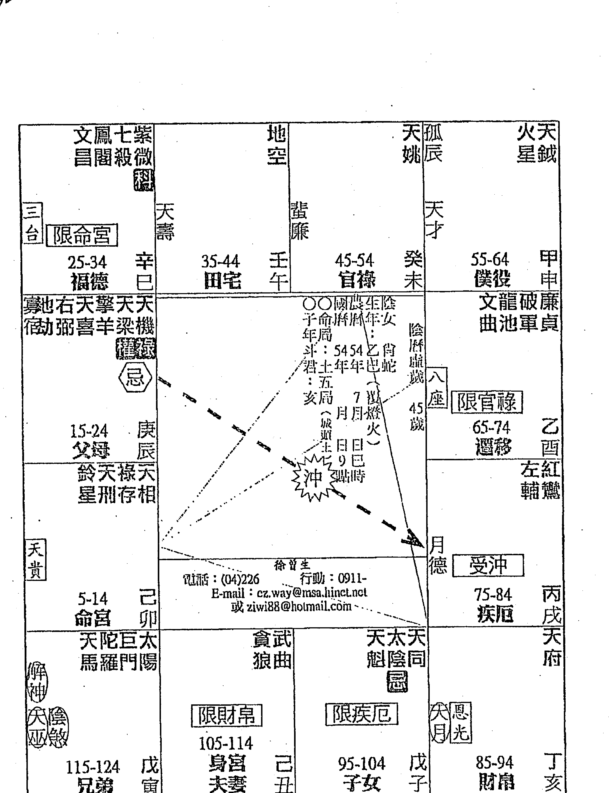

电话：(04)226 行动：0911-
E-mail : cz.way@msa.hinet.net 或 ziwi88@hotmail.com

### 笔记栏：

## 【命例二一】

该图片展示了一个典型的紫微斗数命盘，为方形十二宫格布局，中央有箭头连线表示四化关系（禄、权、科、忌），中间有一个大的“W”图案。每个宫位（方格）内包含：宫位名称（如命宫、父母宫等）、对应的天干地支（如丁巳、戊午等）、年龄段（如5-14， 115-124等）、以及落入该宫位的主要星曜和辅星（如太阴、天机、文昌、禄存等）。部分星曜旁标有“禄”、“权”、“科”、“忌”四化标记。图片中部偏右有竖排文字说明生辰、五行局等信息。底部有地址、电话等联系信息。

布局特点：
- 方形十二宫，顺时针或逆时针排列。
- 中心有交叉箭头，表示星曜间的四化关系。
- 各宫位内信息密集，包含主星、辅星、宫职、干支、年龄段等。
- 图案设计带有传统命理学的符号特征。

地址：台中市东区
电话：(04)2263-2397 手机：0911-133639
邮政信箱：台中邮政45之2号信箱

由于命宫坐【太阴科、天钺、铃星】，太阴遇铃星有【太阴火铃同宫、反成十恶】之说，因此命宫带有作恶的因子，所以遇到不吉的运限就会逞凶，以个性来说就有游走法律边缘的行为或与人相处多争执、冲突的现象，而这些冲突都是自己个性上带有尖锐、刻薄的特性所引起的，又会入迁移的陀罗星，命宫铃星主冲动而陀罗主犹豫不决，一快一慢互相牵扯，再加上财帛的擎羊也是冲动的星曜，所以个性上带有思虑欠周、冲动、不计后果、时而犹豫不决的行为举措，还好太阴科柔化其性格，使之温和、讲理、斯文有礼，让【太阴、火铃】加会【擎羊、陀罗】的恶性降低，遇到灾难也能“大事化小、小事化无”，使损失或伤害降低，而这个化科星也使他交朋友重义气，因为化科是讲道理的星曜，所以“个性温和，与朋友交往重义气”，而从小所学的都是“与朋友谋不忠乎”的交友之道，所以当然会以此作为行为准则，所以“化科”也是学以致用的化星，只要命宫三方有化科星，一定能学以致用，功课也比较好，此命造就是如此。

命宫三方会入【擎羊、陀罗、铃星】三颗煞星，必然对他的一生产生不利的影响，小时候容易受意外伤害、念书阶段容易交到不好的朋友、或常有运动伤害，出社会之后被人陷害、小人暗中破坏升迁等，因此，人的命宫三方会入煞星多的话，最好能看得开一点，不是能力不好而是运途太差的关系，让你有志难伸，空有一身的才华。

还有他的福德宫坐了颗化权星，代表个性主动、积极，也很有主见、自负，不易听从别人的劝告，做事有些霸道，但是福德宫干己，文曲化忌冲命宫，这个就不妙了，这显示他很容易在“刚愎自用”的情况下，产生对自己不利的事情，而且平时也会因“求好心切”、“争取绩效”而让自己陷入“精神困扰”的境界，所以，要懂得让自己放下、心中放宽才能使自己福份更深厚，不然，时常会因“福德化忌冲命”而失眠、精神紧张，得不到休息的机会。

父母宫坐【贪狼忌、地劫】代表父辈有问题，不是嗜酒如命就是贪花恋色、不顾家庭，还好有一颗“地劫”，可以将贪狼的桃花性质吸收掉而转变为对神仙之术的追求，所以，此造父母应该是虔诚的信徒，所以有些星宿的本性和另一颗星同宫之后，就会完全转变，使得征象完全不同；这个完全要看“星性”而非四化能展现的，所以星性是很重要的。

他的父母宫干戊，天机化忌冲命，而太阴化权入命宫，权忌对冲，就好像两个人在争执都想要压过对方一样，因此，父子间相处并不融洽，有冲突、意气之争等现象，感情冷淡，而父母化权入命宫代表父母管束我、约制我的行为之意，本应代表父母有关心、教育我之意，但却化忌来冲我命宫就改变其善意了，好事变坏事。

惹上莫名其妙的官非和官禄宫有关，先天官禄宫干辛，巨门化禄入财帛、太阳自化权（在官禄）、文曲化科入迁移、文昌化忌入夫妻，当大限（二十五~三十四）移到夫妻宫时，大限命宫正坐官禄化来的文昌忌，文昌顾名思义与文书、契约、支票等纸上有纪录的文件有关，因此，官禄会有文书是非，而官禄宫代表的除了事业之外，还有工作、个人行为的意思，这是先天垂象而大限命宫又正坐其上，代表“时间”已经“到了”，只等大限官禄宫的四化来衔接使之“成形”而已。

而其化禄、化权、化科入照命宫三方又是大限命宫三方，代表此大限的事业运还蛮吉利的，假如有官非也不会妨碍命造的运途，只是小干扰而已。

卯限官禄宫在未宫，宫干己，其四化分布如下：武曲化禄入田宅、贪狼化权入父母、天梁化科入官禄、文曲化忌入迁移。

其中，

> 大限官禄化 文曲忌冲 先天命宫，

本来大限命宫已经坐到先天官禄化来的文昌忌了，现在大限官禄又化忌冲到命宫，文曲又是文书类的东西，和文昌所主事务相似；先后天都是同样的化忌象，由“先天垂象、大限成形”的层层套叠的链结环节来看，已经构成密切衔接的作用力，更加强化“官禄有官非”的意象。

再审视大限官禄宫内的坐星【天同、巨门权、天刑】，巨门是“暗星”，代表的是莫名其妙的是非，带有“口舌”之意，需要花费唇舌解释，斗数全书上说：“巨门值羊陀，男盗女娼。”所以巨门也是“贼星”小心因偷窃而惹官非，而化权是“争斗、赢的、占上风”的意思，天同主“融合、温顺”，表示遇到困难、横逆时，还能“忍耐”而不会暴怒偾事，天刑的意思就很明显了，代表“法律、官非”，既然来冲命宫，当然代表这个大限将遭遇上上述事务象的干扰或冲突，因此，“二十八岁将机车借给朋友，竟骑去行窃，警察一查是他的车子，所以被警局请去侦讯啰”厘清和嫌犯的关系，无端惹了一身骚，真是倒霉！

申年命宫正好坐到交友宫化来的武曲忌星，交友宫内的坐星组合【七杀、火星、红鸾】，是因财持刀星象，杀煞星聚集已经隐喻交友不良的现象，它化来的忌星也就代表此不吉不利的交友宫之气运流入到申宫，当年限走入时，就被此不吉利的化忌气运沾上，因此，“事件”成事了。

至于二十九岁又惹官非就更明显了，因为：

> 先天官禄化 文昌忌冲 酉年命宫

还好，先天官禄宫化出的化禄权科也在酉年命宫的三合方，因此，官司以胜诉收场。

#### 【命例二二】

| 宫位 | 年龄范围 | 天干地支 | 主要星宿 |
| :--- | :--- | :--- | :--- |
| 财帛 | 46-55 | 癸巳 | 天福、空劫、月辅、马门、厨、空亡碎 |
| 子女 | 36-45 | 甲午 | 天魁、相贞、天天红、寿才惊 |
| 夫妻 | 26-35 | 乙未 | 天梁、寒宿、封诰 |
| 兄弟 | 16-25 | 丙申 | 天巫、神罗杀 |
| 疾厄 | 56-65 | 壬辰 | 铃文贪、星昌狼、截路 |
| 命宫 | 6-15 | 丁酉 | 天官、节无胎岁、身宫命宫 |
| 迁移 | 66-75 | 辛卯 | 天姚、天钺、天府、紫微、岁破、虚 |
| 官禄 | 86-95 | 辛丑 | 天机、年凤龙池、台辅 |
| 田宅 | 96-105 | 庚子 | 阴破煞军、旬空喜 |
| 福德 | 106-115 | 己亥 | 太阳、权、蜚廉、辰 |
| 父母 | 116-125 | 戊戌 | 天空 |

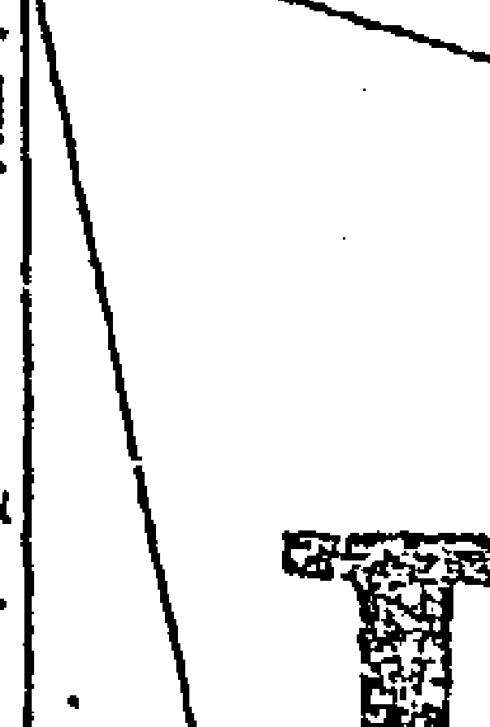

徐曾生
TEL: (04)2263-2397, 0911-133639
E-mail: ez.way@msa.hinet.net 或 ziwi88@hotmail.com

虽然古书上说天同“不怕七杀相侵，不怕诸杀同缠。”但事实却非如此，因为天同入命吉凶诀上又说：“更过羊陀铃忌冲合，则孤单破相目疾。”而酉宫的天同落陷，但是“卯酉宫：和平，乙丙辛生人财官格”，此人是“辛酉”年生人，因为禄存星落在命宫、巨门禄和太阳权在财帛～福德线互照，财帛宫甚为强旺，故虽然天同落陷还是属“财官格”，因此，是个工作能力强又很会赚钱的人，但有颗火星虽非羊陀，但也有类似“孤单破相”的实迹，而且迁移宫又遇到落陷的太阴符合“同月陷宫加杀重，肢体羸黄。”命局，有身体弱易患病的迹象，天同一一般是微胖、肉肉的样子，所以、不是瘦弱而是内脏病变或慢性的毛病，因此脸色或肤色偏黄、病态的颜色，而官禄坐天机没煞星，属于具有一技之长的专业技术人才，而且工作能力蛮强的，不过财帛坐星“巨门禄、地空、地劫、左辅和天马”是一个很会赚钱又破耗大的组合、天马也代表他的来财之源和国外有关，所以“在跨国公司上班，也曾派赴至大陆工作”，而且巨门是暗星，代表财源有些是见不得人或私底下的财源等，而此造是“兼好几份工作”，这也与巨门星性相符，综合起来，一张命盘大概就已经将此人的大概轮廓描绘出来了～

> 工作能力强，很会赚钱但破耗大，因此有兼差或佣金收入，不过会罹患慢性病。

年纪轻轻的他却在未限因为工作关系“身心俱疲而使健康出状况：肝肾脏都不好，为什么呢？”

所以笔者先聚焦在“健康问题”上？，他是因为兼差太多，饮食不正常、长期睡眠又不充足，因而“健康出状况，肝肾脏都不好”，当然命宫是个肢体羸黄的格，而他## 命例二三

的疾厄宫也不佳：「贪狼、文昌忌、铃星」，贪狼或可称之为贪吃的狼，昌贪又有政事颠倒的说法，当然在疾厄宫就不能以此来解释，可解释成：吃东西没节制，铃贪又是「突发资财」的组合，在疾厄位可解释成：暴饮暴食，以疾厄宫看就是「生活忙碌压力大，饮食又不正常而引发疾病」，但他是因为兼差太多而引起，怪不得官禄宫干一辛，飞出文昌忌入疾厄，综合宫-星-化象不就已经清楚显示「事业或工作会影响他的身体健康」吗！

接下来探究运途的变化，由未限的格局组合来看，大限命宫天梁会照天机，三合太阳、太阴分处陷地来照，未见煞星，而且官禄宫还坐太阳权，应该在事业上很有表现，年轻有为，所以「每次换工作都获得重用」，不过陷地的太阳有「先勤后惰、先盛后衰」的现象，晋用初期虽可藉工作努力或专业能力而获得器重，但有隐忧有不稳定的意思，因此「退伍下来到二十八岁止，只有两年多的时间，就换了两三家公司」，虽能获公司重用，但难以将个人优点持续下去、招致用人单位的好感消失或升迁之路中辍，因此再三的换工作，「还被最后这家公司拿掉管理职」被拿掉管理职，当然是上级主管，太阳虽然是落陷，但依然是官禄主，也表示官运黯淡欠佳之意，因为上级主管不欣赏嘛！

未限财帛坐太阴，也一样在陷地，太阴主财帛田宅，显示说财源与女性或田宅有关，或与海外有关，故此造被母公司派赴海外工作，当然赚来的薪水也比在国内工作来得高，因为，大限财帛宫干一辛，飞出巨门禄入财帛，太阳权照财帛，正表示此种现象，但是，飞出文昌化忌却入疾厄宫，也显示身体要花钱了，前述此造因兼差太多，身体不堪负荷而毛病丛生，当然花钱治病那是难免的啦！

既已知未限命局的轮廓，再来看未限官禄的宫干四化—己，飞出：

- 武曲禄入父母，贪狼权入疾厄，
- 天梁科入夫妻，文曲忌入父母

禄权入父母—疾厄线内，表示很有责任心，会身体力行的去执行工作，但文曲忌却和先天疾厄飞来的文昌忌在父母—疾厄线上呈现互冲的态势，表示工作会影响到身体健康，所以一进入该互冲线上，身体健康就受到工作的影响了，所以「兼好几个差，作息时间不固定，两头燃烧压力很大，肝肾脏都出了问题。」当然，事业化忌入父母也有可能是上级主管或政府机关的问题，像此造文昌和文曲化忌就很容易遇到罚单、判决书或降职命令等的文书，因此「被公司降级拿掉管理职」，更重要的是还触犯法律判赔一大笔钱，所以，官禄化忌在父母—疾厄线内要特别小心触法，违反政府的法律，赔钱事小抓进去监狱关了起来才亏大了，还好此造父母—疾厄线内还有武曲化禄和贪狼化权，因此只是赔钱而已，此造就是因为有此数额不小的罚款，才不得不拼命兼差赚钱偿还债务。

#### 笔记栏

#### 【命例二三】

| 天机天梁 天同太阴 天巫 天姚 天铖 孤辰 天喜 天空 台辅 112-121 乙巳 兄弟 | 紫微七杀 紫微权 右弼 阴煞 年解 斐廉 凤阁 身宫 丙午 命宫 2-11 | 天同太阴 天月 旬空 丁未 父母 12-21 | 破军贪狼 左辅 天马 破军 龙池 戊申 福德 22-31 | 文曲 文曲 七杀 甲辰 夫妻 102-111 | 天府 天相 天府 陀罗 文昌 铃星 廉贞 天官 己酉 田宅 32-41 | 天同天梁 天梁 庚戌 官禄 42-51 | 天府天相 禄存 太阴 地空 地劫 辛亥 仆役 52-61 | 武曲天府 武曲 火星 天相 天哭 截路 壬寅 财帛 82-91 | 天同巨门 天刑 巨门 天同 癸丑 疾厄 72-81 | 贪狼 贪狼 解神 擎羊 壬子 迁移 62-71 |
| --- | --- | --- | --- | --- | --- | --- | --- | --- | --- | --- |
| | | ○命局：水二局（天河水） | 农历年：壬辰（长流水） | 生月：闰五月日子时 | 阳男 肖龙 岁 | 0 节气 岁 | 天厨 饰气 监岁 | 月德 | | |
| | | | | | | | | | | |
| 封诰 | | | | | | | | 红鸾 | | |

徐曾生
TEL：(04)2263-2397，0911-133639
E-mail：ez.way@msa.hinet.net
或 ziwi88@hotmail.com

命宫坐紫微「若得府相，左右昌曲吉集，无有不贵，不然亦主巨富。」得到右弼和文昌坐命或相会，可谓已入「无有不贵」的格了，但午宫虽入庙要「甲丁己生人财官格」，可惜的是此造为壬年生人，不合格，更烂的是三合「羊陀火铃」四煞会齐，让有吉星辅佐的软耳朵紫微又受到煞星干扰，引伸为人生现象就有：耳根子软拿捏不定主意、听从坏主意而改变心意或自视甚高、恃才傲物、刚愎自用等行径，因此、此造实际情况是「大男人主义，个性强又固执，时常得罪人而不自知，想法自私自利」，虽然所用形容词不同，不过亦贴近事实了，还有命宫又坐了一颗心高气傲、个性霸道的紫微权，化权：「掌判生杀之神，守身命，科禄相迎，出将入相，…，为人极古怪，到处人欲敬，…，如遇羊陀耗使空劫，听说贻累，官灾贬谪。」，换做现代的语汇，就是想法高峰想当老大、管人、指挥人，不喜被人管，人若对他不尊敬就会很生气，好面子、装威风、耍派头等，所以他「一直想创业，不喜欢被人家管」就是这颗化星效力的呈现。

这些三合汇入的煞星也对运途产生破坏、干扰，就是因为脾气不好，朋友把他的劣行四处流传，影响到那有些没和他接触过、不知道他为人如何的人，也因「听说贻累」而对他印象不好，每次有机会都因形象太差、人际关系恶劣而吃闷亏，所以「官灾贬谪」，好机会到来却未获擢升就等于是变相的「贬谪」，此造实际情况是：年轻时曾有获得政府颁奖表扬的机会，即上述煞星的干扰而破坏掉了，足足延后了五、六年才得奖。

不过，比起一般人而言又好了许多，起码他在民国七十年就已经是国立高中老师了，收入稳定、工作社会地位也高尚，此乃命局三合有左右和昌曲，可以垫高紫微居于午宫的社会身份地位，但也会受到四煞的破坏，让命运充满许多不安和紧张，引伸于实际的人事现象，如以个性而言，虽然说起话来引经据典、头头是道，但也因个性太冲，在常学校被排挤，在家里又因大男人主义，不帮忙做家事又常吵要创业，闹得气氛紧张。

而夫妻宫坐星七杀、文曲，七杀在夫妻有：杀临三位，驾衾半冷之说，三位意指为何？如果以命宫为一，逆数，兄弟宫就是二，三位就是夫妻宫了，其它依序类推，驾衾就是夫妻两人合盖的棉被，如果少了配偶盖，当然一半是冷冷的没有体温，有的是失婚、有的是夫妻分房睡、分居、没结婚…等等，都有可能，可泛指婚姻不美、感情冷淡之象，还好有文曲星，尚可柔化七杀星的孤克，因此，此造有结婚，但先天夫妻宫的组合是孤克意思，即可窥知夫妻对待关系并不好，确实也是如此，婚后夫妻时常争吵，因此造想放弃教职去创业当老板，而妻子希望他继续留在学校教书，在教育界求发展，双方想法南辕北辙，因此时常冷战，相敬如冰，家庭本是一天辛苦工作后的避风港，但因此造坚持创业的想法，让家变成冷战场，命宫坐紫微星的强势性格可谓「性格决定了他相处」的模式，而夫妻宫坐星又非温柔敦厚的星曜，当然配偶的特质也属强势个性，命宫与夫妻宫的坐星更凸显此事实。

当然也由于夫妻宫主星属「冷静、理智」的构造，因此到了三十一岁才透过亲友介绍认识妻子，隔年年初就决定结婚，交往不到四个月，可谓速成婚姻，妻子也是国中老师，符合夫妻宫坐星【七杀、文曲】性质。

##### 申限的夫妻宫干一丙，飞化：

> 廉贞忌冲夫妻—夫妻宫的同类忌冲

所以申限实在不是适宜结婚的运途，冲击得这么严重，又夫妻坐星属于「驾念半冷」的组合，虽有文曲来柔化个性，热战可免冷战难逃，所以即使结婚了也常发生「夫妻个性不合、发生争执」的情况。为何三十一岁可结成婚呢？就在于该年的夫妻宫坐守一颗「逢凶化吉的左辅科」，减轻廉贞忌冲夫妻的恶性，里面还坐守一颗个性强又不服输的破军和命宫紫微权还真是相互媲美、互争辉耀，一天到晚吵个不停！

## 【命例二四】

| 孤辰 天寿 44-53 财帛 己巳 | 天天太阳 天马 国 国 天喜 天月 三台 蜚廉 34-43 子女 庚午 | 文天凤阙 破军 曲刑 国 24-33 夫妻 辛未 | 天天钺机 14-23 兄弟 壬申 | 文龙天紫 昌池府微 八座 天巫 阴煞 天刑 || 禄神 火星 武曲 国 54-63 疾厄 戊辰 | 天同 羊刃 | 阳女 甲辰年生 阴历10月4日寅时 农历：53年(甲辰)10月4日寅时 斗君：巳(一)月4点 || 64-73 迁移 丁卯 | 天才 | 天贵 | 红鸾 巨门 || 天才 丙寅 仆役 74-83 | 官禄 丁丑 身宫 84-93 | 铃天康 星相贞 国 丙子 田宅 94-103 | 乙亥 福德 104-113 | 甲戌 父母 114-123 |

阳女 甲辰年生 阴历10月4日寅时 农历：53年(甲辰)10月4日寅时 斗君：巳(一)月4点

电话：(04)226... 行动：091 E-mail：ez.way@msa.hinet.net 或 ziwi88@hotmail.com

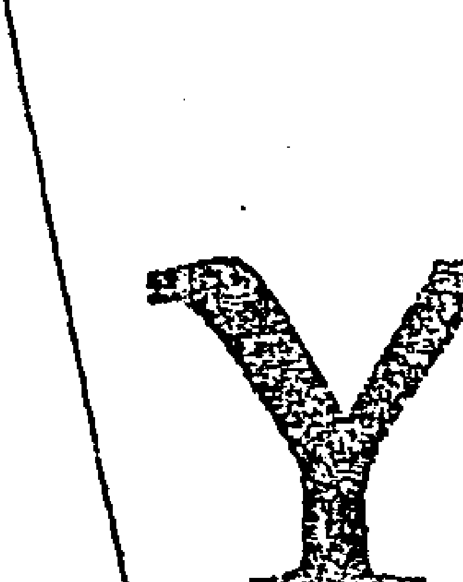

命宫坐太阴、地空，命坐太阴「其为人也，聪明俊秀，禀性端雅纯祥。」所以，此造也应符合此特质，又以命局来看，对宫天同擎羊冲照，三方会入陀罗地劫和忌星，煞忌重重，对命宫具有破坏力，让命局减色不少，本来太阴居酉可说是入庙得势，不过书说「酉为西山之门，为东潜之所。嫌巨曜以来缠，怕羊陀以同度。」此例有擎羊冲照算是破坏了命局的佳美，而且带空劫，使得心性偏向虚无或讲究精神享受，物质欲望较低，不过不要忽视「与天梁左右嘉会，丙生人于巳亥酉宫安命，财官双美，福非小可，」这句话，除了不是丙年生人之外，与「天梁左右嘉会」相符，所以无法财官双美、福非小可，至少也是个小企业主的格局，比起不入格者要好很多，但以「随遇而安、富贵于我如浮云」的心境面对人生，不会为了追求财富把自己逼得太紧，何尝不是「命坐银辉之宫，诸吉咸集，为享福之论」呢！

而财帛坐太阳忌，在庙旺之地，故此太阳忌其实不必忌讳，近午的太阳正是金辉灿烂，化忌了只有些许的阴影而已，无妨大局，所以婚后就和先生合开了一家公司，一直经营到现在，到四十一、二岁时还曾年营业额超过百万美金，可说已经扎下稳固基础了。

那奇怪了啊，创业年正落在辛未大限内，大限命宫与夫妻宫重合坐天机天钺，天机主智慧，表示配偶应该是个具专门技术的人才，而天钺也表征人缘不错，有贵人相助，开拓人际关系或推展业务时，都可获得不少助益，该大限财帛宫（卯），里面坐天同和擎羊，天同具有「身命值之，主为人谦逊，禀性温和。心慈耿直，文墨精通。」的特性，而在财帛呢？引伸其义有「坐享其成、享受」的现象，和成功创业者的特质有些不符，但是一遇到擎羊同宫，便一改「安逸、坐享其成」的特性，把落于平和之位的天同激发起斗志，处事积极进取，所以「和老公共同成立一家公司」。

但是其宫干一丁，飞四化分布如下：

- 太阴化禄入命宫（入大限福德）
- 天同化权入迁移（入大限财帛=自化权）
- 天机化科入夫妻（入大限命宫）
- 巨门化忌入福德=冲财帛（入大限官禄）

其中的化忌星，正是构成：

> 大限财帛化 巨门忌冲 财帛

的同类冲模式，在这个大限应该会有金钱方面的灾难，如周转不灵、钱财被倒等现象才对啊！
没错！是「大限财帛忌冲财帛」的格局，但是飞出的四化也不能只看化忌而已，其他三吉化星也需一并考量，这里最吉利的迹象就是「太阴化禄入命宫＋天同化权入迁移」，两相对照增加命宫求财过程的吉祥，而且大限财帛自化权，让他在处理公司钱财支出或家庭花用，都会「严加把关、节制浪费」而见到太阴化禄更可使他累积财富，而天机化科在夫妻也可说在钱财的运用上，老公也很理性精打细算，夫妻同心当然降低财务风险，不会过度扩张信用，以这种「同类忌冲」格局又有经营事业，因此为了周转调头寸或遇到财务困难，一定时常遇到，所以命主说「创业以来时有口舌是非，有时吵到快要告上法院」，回想前面是哪颗星化忌冲财帛呢？是巨门，它主掌口舌是非，怪不得会有命主所述的现象。

当然，她能创业，经营十几年站稳根基，还有其他条件配合，例如大限命宫正坐夫妻，且其宫干一辛：飞出「巨门禄照财帛、太阳权入财帛」就已经显示老公在此大限「钱财就会有成就」了，而大限官禄也是飞出「天机禄入夫妻、天梁权入官禄」是事业运旺盛，表示升官或创业的机会好，钱财、事业宫都好，命宫又展现旺盛企图心，于是，此大限夫妻合力创业。

最后附带提一下，她是做营建相关的事业，什么星与营建相关？太阴是也，斗数全书中不是提到「太阴乃水之精，为田宅主。化富，与日为配，天仪表有上弦下弦之用。黄道黑到，分势尚好，数庙定庙乐，…」，所以和田宅相关的事业如营建、装潢、旅社等都与此太阴星相关，大限的财帛宫飞出太阴禄入命宫，就已经显示「命主所赚钱财来自田宅」了，因此从事相关事业可谓符合太阴星性。

#### 笔记栏

## 【命例二五】

天梁 | 七杀 | 天钺陀罗 | 天禄廉贞存
月德三台 | （天月） | （蜚廉） |
42-51 辛巳 财帛 | 32-41 壬午 子女 | 22-31 癸未 夫妻 | 12-21 甲申 兄弟
文天龙天紫 曲刑池相微 |
52-61 庚辰 疾厄 | 〇〇国阴生阳 子命历年女 年局 ： 阴
斗 ：49 49庚肖 君水年年子鼠 ：二 8壁 8 巳局 月月土 0 非泉 日日土 于 水 时 天天 才寿 | 
右红巨天 弼鸾门机 | （身宫 乙酉 命宫）
寡宿 铃文凤破 星昌阁军 |
恩光 |
62-71 己卯 迁移 | （电话 (04)226
 E-mail ; ez.way@msa.hinet.net 或 ziwi88@hotmail.com） | 112-121 丙戌 父母
火贪 星狼 | 天太太 魁阴陽 | 天武 府曲 地地左天 空劫辅马同 区
72-81 戊寅 仆役 | 82-91 己丑 官禄 | 92-101 戊子 田宅 | 102-111 丁亥 福德

电话：(04)226
E-mail：ez.way@msa.hinet.net 或 ziwi88@hotmail.com

命宫没主星借用对宫的天机巨门，全书云「生于巳酉丑亥卯未宫，权禄不小，文武皆大贵极品」但要「乙辛己丙」年生人才是，她是庚年生人，因此无法以「位至公卿」的格局来论，又命宫独坐擎羊，没有吉星同宫正是「加巨门羊火陀忌，巳酉丑亥为下局，孤穷」，这是破格之处，而且命运特征是「孤穷」，三方虽有天魁右弼来扶助，但这些辅星要看命宫的主星是否富贵？若是「孤穷」格也无法扭转乾坤、反转大局，若有此能耐就不是助星啦！命造「一出生父亲就去世，被说成克父，受到家人排挤」，当然得不到家庭的温暖，兄弟姊妹也不和她玩，此是「孤」的现象，因此「离家自行发展，其他兄弟不事奉养母亲之责，而其所赚皆孝养母亲」搞得自己节衣缩食的不正是「穷」古人用两个字就道尽了此命格的独特之处，到最后还是「得不到母亲欢心，还遭兄姐排斥。」费尽心力仍无法扭转，这个先天命局带来的「孤穷」现象，恐怕穷其一生都无法改变，但是算命最忌讳再在伤口洒盐巴，要帮其找出「希望的出口」才是正道，还好官禄宫有太阳禄、太阴科来照合，可谓事业心强又可得贵人相助，算是吉利，因此年纪轻轻在没受到良好学校教育的情况下，能学得一技之长，自行开业，开创人生，但太阳禄、太阴科是虚浮的假象，因为欠缺禄存加入使化禄成为真的财禄，所以只是「好看样」而已，所以，开业经营得不是很好，维持生活开销罢了，因此「日子过得很苦」。除了上述宮位外，不要忽視福德宮，因為有沒有祖先或長上的庇蔭就看該宮，此造「天同忌、左輔、地空、地劫」在福德，天同在亥是個「飄盪」的現象，在福德也主其思想或精神飄盪如浮萍沒有依靠、沒有寄託，是個孤寂的現象，加上地空、地劫更增加「空虛」的傾向，思想上也因空劫作祟而有「出世」的想法，因此，將精神託付在宗教事務或探究心靈的事務等，如前述為了要讓家裡的長上兄姐接納，年紀輕輕就獨自外出、努力打拼，欲闖出一片天來，讓家人刮目相看，因此工作再苦都全力以赴，還盡心孝養不喜歡此造的老母，而其他兄姐都袖手旁觀，自己還得咬牙苦撐下去，可說是搞得身心俱疲，既然沒有親情的支持，就投身宗教來尋求心靈的慰藉！

福德宮如此不吉，其宮干丁，卻化巨門忌沖命宮，因此，此造常自覺活得非常痛苦，幸好，太陰化祿入官祿、天同自化權、天機化科入遷移，自化權的天同提供她一股堅強的、要出頭天、成功讓家人刮目相看的意志，支撐著身心俱疲的她，勇敢的走下去，而太陰化祿與天機化科供應樂觀的養分，讓她能面對加諸於身的種種橫逆。

若以三合的角度來看，除了命宮的擎羊煞星外，遷移、財帛和官祿都沒煞星，甚至有右弼天魁吉星、以及化祿、化科等吉星，豈非一片情勢大好，哪裡會有如她所述從小到大都過著長上不愛、爸媽不疼、兄姐弟排斥的孤寂童年呢。

癸未大限時，大限遷移坐祿、科來照未限命宮，人緣、口碑、擁護者很多，似乎外界的情勢一片大好，但是大限命宮獨坐陀羅煞星和先天命宮的擎羊星結合，增加運途的坎坷折磨，而大限官祿又與先天福德重合，也是星宿組合和四化都不吉的構造，所以雖然早在二十四歲就創業了，但是，因為天同忌又加上空劫的代表的是辛苦、忙碌又破耗的意思，果然生意不是很好，雖然戮力經營，苦心撐了三、四年都無起色，因此財務壓力很大。

大限的福德和命宮重疊，剛剛先天福德不是飛化巨門忌沖命宮嗎？當大限進入未限時，原先的命宮成為未限福德，而四化的關係就成為：

先天福德化 巨門忌沖 未限福德

的同類宮忌沖態勢，因此，加上又坐煞星擎羊，未限精神狀態也是處在「折磨、煩惱、操心、精神困擾」的狀態，毫無可資偷得浮生半日閒的機會。
而此時的大限福德宮干＿乙，飛化太陰忌沖大限命宮，和先天福德兩相結合來看，精神壓力一定相當大，在親情冷漠、事業不利的狀態又遇到感情受挫，而於「寅年極想自我了斷」，而寅年命宮正受到巨門忌和太陰忌所夾制，左右孤立無緣，而且流年命宮坐：貪狼、火星，是主突發資財的組合，因而有突發性的想法浮現，而三方有破軍、文昌遇鈴星的組合，這也是「貧士」的組合，可說是「已經無法可想了」的現象，三方是「殺破狼」匯聚火星鈴星等煞星，使偏向負面想法或往不吉的方向發展，因而有尋短念頭，一旦有觸發因素衝激，很容易引發尋短的念頭，而其夫妻宮的宮干＿癸，飛化貪狼忌入寅年命宮，使受夾制的的命宮又被忌衝激，因此，而此可知是因為主感情問題的夫妻宮引發尋短的念頭的，還好，這些福德宮的化吉星都有飛入命局三方，化解巨門忌沖命宮的凶性，所以，還不至於一時衝動魯莽行事，導致終身遺憾！

## 【命例二六】

| 天福 | 火星 天馬 天梁 天府 | 文曲 天月 天刑 天魁 七殺 | 廉貞 天羅 陀羅 天巫 陰煞 文昌 |
| :--- | :--- | :--- | :--- |
| 空亡 破碎 | 天才 紅鸞 | 寡宿 台輔 | |
| 86-95 癸巳 財帛 | 96-105 甲午 子女 | 106-115 乙未 夫妻 | 116-125 丙申 兄弟 |
| 解神 天相 紫微 | | ○ 農曆生年陰女 命局：火六局 辛酉年（雞）10月（石榴木） 日寅時 | 天官 |
| 封誥 截路 | | | 地空 祿存 |
| 76-85 壬辰 疾厄 | | | 6-15 丁酉 命宮 |
| 巨門 天機 (祿) | | | 天姚 擎羊 破軍 |
| 歲破 天虛 | 徐曾生 | | 天壽 天空 |
| 66-75 辛卯 遷移 | TEL：(04)2263-2397，0911-133639 E-mail：ez.way@msa.hinet.net 或 ziwi88@hotmail.com | | 16-25 戊戌 父母 |
| 天鉞 貪狼 | 地劫 右弼 左輔 太陰 太陽 (權) | 鈴星 天府 武曲 | 天同 |
| 月德 | 龍池 鳳閣 年解 | 旬空 天喜 | 孤辰 病符 |
| 56-65 庚寅 僕役 | 46-55 辛丑 身宮 官祿 | 36-45 庚子 田宅 | 26-35 己亥 福德 |

徐曾生
TEL：(04)2263-2397，0911-133639
E-mail：ez.way@msa.hinet.net
或 ziwi88@hotmail.com

命宮的祿存和遷移的巨門祿構成【明祿暗祿】格，財運氣勢強，又說官祿宮又坐太陽權，祿權相會，兼又左輔右弼坐守不正是「若會左右昌曲魁鉞太陰祿存守照官祿，財官昭著，极品之論」又說「得左右昌曲魁鉞太陰湊合，生於巳酉丑亥卯未宮，權祿不小，文武皆大貴极品」的局，是一個能力強、執行力旺盛、企圖心強又會賺錢的盤局，當然，因此，會在工作上力求表現、嶄露頭角，所以她年紀輕輕在二十七、八歲就「曾擔任一個八人小組的領導」，但是命宮的地空和官祿宮的地劫、財帛宮的火星似若符合「加巨門羊火陀忌，巳酉丑亥為下局，孤窮，縱有財官貴顯，亦不耐久，只宜經商巧藝之輩耳」，大部分人的命盤都是吉凶互見的多，像此造吉祥的部分已如前述，但空劫、火星卻仍會對此造產生如「浪裡行舟，半空折翅」的突如其來的挫折，而財帛宮天梁星也正提醒錢財上會有「逢凶化吉」的險象，因此這是個事業強而財運稍弱、起伏大的盤局，不過較諸於常人又勝色不少。

#### 官祿宮干一辛，飛出四化分別進入：

巨門祿照命宮，太陽自化權，
文曲科入子女，文昌忌入兄弟

祿權分別入照命宮和官祿，但是官祿已經有太陽權，又自化太陽權，就會把權的力量剔除，因此官祿雖有太陽權，卻無法對命運產生良好的影響力，反而有「恃寵而驕」、「高估自己能力」因而破壞太陽權的現象，此造「為了證明自己的能力放棄穩定而高薪的工作，去當房屋仲介」，句中「為了證明自己的能力」不就是太陽權的化象，而「放棄穩定而高薪的工作」也就是太陽自化權的具體展現，但是這種改變好不好呢？這就要由限運的官祿宮結構來說起。

大限官祿坐【巨門祿、天機】，沒煞星甚為吉祥，此大限事業有成，可獲得器重擔任要職，但是，大限官祿宮干一辛，飛出四化分別進入：

巨門自化祿，太陽權入官祿，
文曲科入子女，文昌忌入兄弟

又是生年化祿遇到自化祿的情況，將先天帶來的財氣全被破壞掉，讓巨門祿無施為，和太陽權遇到太陽自化權的化象整合起來，就呈現「自己決定放棄穩定而高薪的工作」的現象，高薪（化祿）當然要表現能力（化權）才能得到，但他卻為了證明自我能力而放棄。變成：工作成就比錢財收入重要，所以，此大限事業放在追求工作的成就，而不要太聚焦於賺更多的錢財之上，否則追求一個已經消風的祿逢自化祿，反而會把自己逼到困局裡。但是大限官祿飛出的祿、權這兩顆吉化之星在命宮三合內，也強化了他追求事業財富的想法，所以會有轉職去當「房屋仲介人員」的行動，但是這個行業的底薪很低，完全靠成交房屋的多寡來決定薪水高低，而官祿宮顯示的是個無用的化祿星，只有化權、不過這個化權也遇到「消風」的自化來破壞，就會變成「滿懷理想、卻一無所成，而且難以持續下去」的現象。

再看命與大限官祿宮的文昌化忌都匯聚在兄弟宮內，也就是說所有的好處或榮耀都歸於兄弟，兄弟宮可說是同儕、同事或同學的表徵，此造既然離職了，公司當然會派人來接續他的位置，而他帶得好好的組織或成果當然就被接收了，而進入仲介公司呢？也是「苦撐半年才成交一件，由於是新人公司抽佣多，自己才分到少許佣金」好處都給別人拿去了，正符合前述的現象，所以官祿的化權和化祿都入我宮，但化忌卻落入他宮的話，雖然，會有工作、但工作的成果或績效，最後還是落入別人的手中或別人獲利多、而自己得到的少，所以不要只看到化祿化權都入我宮就雀躍不已，只是為人作嫁裳罷了，若能看開一點，趁年輕汲取經驗，到運途好的年限換工作，才可脫離此種境地！

當然低底薪的房屋仲介難以維持生計，所以「就離開仲介公司，但投寄數百封應徵函都石沈大海」為什麼由意氣風發的小主管，一下竟掉入失業一族呢？

當然二〇〇八年七月之後，因美國的次貸風暴席捲全世界，台灣也進入經濟寒冬階段，一時百業直打哆嗦！所以，此造該年離職換工作，可說是時機不對，當然看他當年的官祿宮坐【紫微、天相】未見煞星，主大型企業或高級單位，應該找工作不難呀！所以「一離開甲公司馬上就到乙家公司上班」，但是新人有試用期，在試用期正是經濟風暴吹襲到台灣，引起全國大為驚慌的階段，產業界裁員風吹起，資淺的員工首當其衝，在剛試用期滿就遭公司以「無法支付她的薪水為由而資遣了」，當然資遣後本造也很積極的求職、投遞應徵函「有幾家面談時相談甚歡也談好條件，結果上班前卻來電說找到人了」，我想這是藉口啦，當時遭逢金融風暴衝擊，絕大部分企業為因應變局還減產裁員或休無薪假，哪敢晉用新人，在她命盤的子年官祿宮干—壬：

飛出武曲忌入子年命宮，
和申宮的文昌化忌成「申子辰三合」

三合代表外在的形勢，既然官祿宮的忌星在子年三合籠罩著，代表子年事業因外在環境不佳而不利，武曲星主銀行金融機構、武曲化忌不正意指這個源於美國紐約華爾街的金融機構爆發一連串弊案而吹起的全球性風暴，對她的謀職不順息息相關，當然這是事後諸葛才能把事件這麼明確的引入說明當中，若能事前說出「求職謀事會因錢財而不順遂」就已經是很高明的解盤專家了，因為她在辭去仲介工作後，還曾進入另一家公司，也是因為「錢財」的事而失業。

當然、該年申子辰三合見先後天官祿的化忌星，是形成該年謀職不順的命理成因，不能只看流年官祿一宮而已。

#### 筆記欄：

## 【命例二七】

| 火星 陀羅 | 鈴星 祿存 天機 | 地劫 天月 擎羊 破軍 紫微 天廚 | 天姚 天鉞 |
|------------|----------------|------------------------------|-----------|
| 42-51 身宮 官祿 己巳 | 52-61 僕役 庚午 | 62-71 遷移 辛未 | 72-81 疾厄 壬申 |
| 天太 刑陽 寡宿 戊辰 田宅 | 地右七武 空弼殺曲 年妻鳳 解廉廚 22-31 福德 丁卯 | 天相 歲破天 破碎虛 2-11 命宮 丁丑 | 文陰天巨 曲煞魁門 112-121 兄弟 丙子 |
| 天福 文解天天 昌神梁同 12-21 父母 丙寅 | 天喜 | 天相 | 文曲 陰煞 天魁 巨門 擎羊 | 天左天貪康 巫輔馬狼貞 102-111 夫妻 乙亥 |

○ 命局：水二局
農曆：己未年八月申時
女命：己未（天上火）
節氣：白露

徐曾生 TEL: (04)2263-2397, 0911-133639 E-mail: ez.way@msa.hinet.net 或 ziwi88@hotmail.com

這個案例讓大家思考看看「忌入」是否吉利？當然先不說是什麼事情，因為學而不思則惘，如果一路直述下去，一定會循著笔者的思路走下去，而無法自省自己的思路盲點，所以讓大家先摸摸頭、思考思考。

一提示：與感情有關

這樣大家可「聚焦」在重點宮位上。

這個女生看命宮坐星「女人主聰明端莊，志過丈夫，三方吉拱封贈。論若昌曲沖破，作侍妾」還好三合沒見到昌曲，又丑宮的天相入廟，全書上說「女命入廟，溫和，衣祿遂心」，大概約略得到長得清秀、身材勻稱、個性溫和的形象，三方欠缺吉星來拱照，還見到擎羊陀羅火星與地劫四煞，成了「羊陀殺湧，巧藝安身，火鈴沖破殘疾」、「破軍七殺來相會，羊陀火鈴最所忌，孤刑剋害六親無，只可偏房與侍婢」、破壞了一盤好棋，一點都沒有「吉拱封贈」的機會，甚至連「衣祿遂心」都有問題，所以不是吉祥的盤局，而感情部分也由前述資料中得到「孤刑、偏房、侍婢」等名詞，都不是有利於感情的語詞，這些古人的語詞轉換成為現代人的社會環境又成為什麼現象呢？

談到這裡，又不得不回過頭來看感情的主事宮—夫妻，坐了兩顆桃花星：廉貞、貪狼祿，在亥水之地的桃花星，有「貪狼遇廉貞也不潔」、「羊陀交併，必作風流之鬼」等說法，其實很多人都把先天夫妻宮當做配偶來看，其實與現實是有相當落差的，它是代表一個人的感情觀，是專情或濫情？是挑剔還是隨便？是理性抑或是感性？…等，像此造有個～

廉貞貪破曲相逢，陀火交加極賤傭，定主刑夫并剋子，只好通房娼婢容。

構造的夫妻宮，也就代表了她的感情世界也會有「類似」的情景，在講求貞潔的古代當然以不潔來形容，會見了官祿宮的陀羅正是「羊陀交併」又成了「風流之鬼」，在在已點出感情浮濫的行為會破壞她的命運、也無法有很好的事業運，只能擔任類如「侍婢、娼妓」的工作，其一生以「孤刑」為總結。 由先天盤已窺見大局，接下分析其大運，既然是感情，一般在國中階段已情竇初開，男女之情初萌，所以由第二個大限切入，先天有昌曲夾命，第二大限又坐天同、文昌、天梁科星，是很利於求學唸書考試的星組，所以功課唸得還不錯，也考上理想大學，但一旦遇到賀爾蒙催化就會蒙蔽理智，大限的紅鸞天喜主婚姻又見到天姚，更強桃花灼灼的風華，引人注目，自己也亟欲享受愛情的滋味，這些是大限命宮展現的特質，當然會吸引許多追求者，是吉還是凶？就牽涉到她「選擇判斷感情」的能力，判斷正確，當然會從眾多追求者中挑出真命天子；若判斷拙劣，遇到玩弄愛情的騙子就慘賠一生，這個就要看他的夫妻宮，她先天夫妻坐星已經顯示如前述之現象，哪裡能遇到良人呢？若是大限夫妻宮吉利或能改善些許，假如先天不良後天又失調，那就慘了。

第二大限的夫妻宮坐星【巨門、文曲忌、天魁】又是代表了什麼現象呢？「在夫妻，主於隔角，生離死別，縱夫妻有對，不免汙名失節。」「逢巨門共其度，和而喪志」淺顯的文言文一看就懂，但要領略內涵卻又似有關，古人的話要轉譯成現代社會的情狀要費番口舌，先看「縱夫妻有對，不免汙名失節」是什麼意思？有人說是「夫妻即使感情很好，外頭也會有某某外遇、風流好色或暗戀、有愛慕者啦等傷害夫妻感情現象」，是的！對於已婚者可以這麼解釋，像此造還未婚又要如何解釋呢？這就是「同居」的現象，是不是「有夫妻之實」而無「夫妻之名」—「縱夫妻有對，不免汙名失節」指的不就是此事現象嗎？又看寅限夫妻宮干一丙：

#### 寅限夫妻飛化廉貞忌入夫妻

成了「忌入」的化象，所以她在寅限會有「同居」的現象發生，高中時還能兢兢業業於課業上，一上大學升學壓力頓時解除，就開始交男朋友進而同居，本來功課還不錯的，但是同居之後，學業成績直直落，差一點畢不了業，不就是因為寅限夫妻宮「逢巨門共其度，和而喪志」的現象嗎？再說文曲是文書的意思，在夫妻宮代表的是「結婚證書、戶籍登記」既然化忌就是文書效力出問題，所以也可說是沒有戶籍登記的婚姻型態，也指向「同居」的婚姻形式，所以寅限夫妻坐星雖沒煞星，卻對她一生產生重大影响，因为后来双方还是分手了。

有些人分手会提升心灵，有的人却选择逃避或自毁，此造由于先天命局的关系选择「自毁」一自暴自弃，往「孤刑、偏房、侍婢」的道路前进。

像此造已有一段无名的婚姻，其实已经符合「偏房」的古词了，她的男朋友以后娶了正式的老婆，她不就踏实了「偏房」之名吗？所以读古文配合现代社会要转化还需要「脑筋急转弯」才可以。

#### 筆記欄：

## 【命例二八】

紫微斗数命盘
阳男 戊戌年七月十一日酉时生
命局：金四局
斗君：亥

宫位分布：
福德宫（巳）：24-33岁，乙巳，星曜：红鸾、天铖、太阴、解神、阴煞、三台
田宅宫（午）：34-43岁，丙午，星曜：贪狼、寡宿、天寿
官禄宫（未）：44-53岁，丁未，星曜：天刑、巨门、天同
仆役宫（申）：54-63岁，戊申，星曜：地劫、天相、武曲、化忌
父母宫（辰）：14-23岁，甲辰，星曜：天府、廉贞、恩光、天贵
命宫（卯）：4-13岁，癸卯，星曜：破军、天马、天姚、左辅、地空、天刑
兄弟宫（寅）：114-123岁，壬寅
夫妻宫（丑）：104-113岁，癸丑，星曜：文曲、文昌
子女宫（子）：94-103岁，壬子，星曜：铃星、右弼、凤阁、擎羊、紫微、孤辰
财帛宫（亥）：84-93岁，辛亥，星曜：天姚、天喜、禄存、天机
疾厄宫（戌）：74-83岁，庚戌
迁移宫（酉）：64-73岁，己酉，星曜：天梁、太阳、化权、火陀、七杀、星罗

陈曾生 E-mail: cz.way@msa.hinet.net 或 ziwi88@hotmail.com

這個命例有工作適性問題而迷惑，是否可以命理角度提供建議？而此時該看官祿？還是命宮？

「女怕嫁錯郎，男怕入錯行」幾乎每個社會新鮮人都會面臨「我適合的工作是什麼？」，當然市面有很多工具來測驗職業適性，從命理角度也可窺知職業適性，而職業適性有很多人說要看事業宮，那是狹隘的角度，探討終生的志業應該是以命局為重，如：「天同貪羊居午位，丙戊鎮禦邊疆」指的就是命宮和遷移形成的格局，具有「白手成家，開疆闢土」的能力，從事軍職定能成為國家開疆闢土的將才，這就是以「命局」的角度來論的鮮明事例。

此比例就來分析看看：

命宮無星借對宮落陷的太陽、天梁祿進來，太陽「遷移宮其福，與身命不同，難招祖業，移根換葉，出祖為家，」而且天梁是顆「聰明耿直，心無私曲，好施濟」的星星化祿之後成為「天梁化祿居遷移，巨商高賈」，八天梁不是清高的星曜加了太陽，不就更加強化「耿直，無私曲，好施濟」的特徵嗎，所以聽他說：「對朋友真心相待也很會照顧他們，相處時想說就直說，常在不知不覺中傷害到朋友。」就符合「清高又光明」的特性，但也因此太商業化的業務工作就不適合此種命局的人，當然談業務的方式有很多，高招的人會以專家顧問的姿態協助你解決問題，低招則是開門見山的擺明就是來賣東西的，當然，手法巧妙我想公司內部訓練一定會提到的，此造適合「顧問式推銷」的業務工作，而且天梁祿在遷移，喜歡到處跑。

跑、四處結交朋友，口才表達甚強，所以他說「叫我坐辦公室，處理些例行性的工作，那會悶死我的。」命宮和遷移就清楚的呈現一個人的內在和外顯的特質，這個是支配他選擇哪一種型態工作的關鍵宮位。

財帛宮居亥位【天機、天姚和祿存】坐守，是個飄盪的宮位，表徵其錢財來源會有段飄盪的過程，跑業務抽佣金的工作正是如此，不然就要遠離他鄉工作，祿存對他的聚財蠻有幫助，可以靠自己的力量累積相當財富，但是天姚星使得他的財源帶有桃花成分，如跑業務和客戶交際應酬的開銷，就屬天姚的性質，不然就是要去開酒店弄些花天酒地的生意，但這不符合「太陽、天梁」清高的性質，我想「跑了很多客戶，但都沒成交」除了賣的器材非「急迫性的物品」之外，也可能沒有以花酒買通具有「採購權」的人。

而官祿宮就很明顯的表徵工作需要經過口舌爭執、吵雜和激烈競爭的過程，因為【天同、巨門和天刑】也，而且天刑還帶有「官非」性質，「防盜器材」裝好，有外賊侵入一定會鳴叫或警示燈光提醒警衛處理、捉到竊賊送警法辦又與天刑相關，銷售該項產品蠻符合官祿宮星性。

從先天的命財官三局來看，目前從事的工作應該適合他的三合命局結構。但他會心中產生質疑「是否適合這個工作」一定是出了問題，而此問題的關鍵宮就在官祿，且看宮干一丁，飛出：

### 自化天同權、巨門自化忌

天同主融合忍讓、巨門主疑惑是非，這兩顆星在一起就是對事業起了疑惑，但為了薪水又不得不忍讓的現象，而權和忌又擠在一起成為「水火不容」的結構，綜合起來，對目前「忍讓中」的工作產生「是否適合」的質疑，內心「掙扎不已」使得「壓力很大」。

問題發生在乙巳大限，大限命宮坐太陰會入遷移的天機和祿存，這也是組「跋涉他鄉」的星組，故此大限也會有此情況，如跑業務、出國、到外地工作等都屬此象，所以此造第一份工作就是「跑防盜器材業務」，但是跑得好不好，就得看官祿宮了，而業務做得好佣金收入才會高，當然財帛宮也就旺旺旺了，已限官祿（酉）座【太陽、天梁祿】星組合不錯，太陽是顆「動星」又在遷移宮，因此，工作性質應該是「動態」的，又是「照耀眾生」引喻成「服務照顧」性質，而天梁主清高，因此找工作最好找：服務、照顧眾人、性質清高或指導、教育的工作，如當資源教師就很對位，純為賺佣金而跑業務的工作就性質合星性但味道就不對了，就出在天梁這顆星上。而財帛坐文昌、文曲這兩顆文學之星，不正是表示錢財的來源與此有關，例如「技術代表」自己需要先充實深入的技術或知識，再教導廠家使用，學習新技術或新知識需要研讀國外的新技術文件，而「技術代表」也需要巡迴各處教導客戶使用，如此大限命宮、財帛和官祿的星性全都符合了，就不會做得很累又沒成就感。

再看大限官祿宮干一己，飛出：

> > 武曲祿入交友，貪狼權入田宅，
> 天梁自化科，文曲忌入夫妻

除了天梁自化科可提供大限的事業助益之外，其他的化祿和化權都進他宮，對我沒幫助，因此「跑了好幾家企業都沒有成交機會」，而天梁自化科則給他「自我勉勵」的喘息空間，不至於在沒業績的情況下，給自己太大的壓力。

最不好的是文曲化忌，因為構成—

大限官祿　化忌沖
先天官祿　的同類忌沖盤局

所以，對於工作會充滿挫折、無力感，加上又形成—

先天官祿巨門忌　和
大限官祿文曲忌　的互沖忌盤局

配合星性，因此讓自己是否適合業務型態的工作起了懷疑，故而問命求助，其實先後天的官祿宮都呈現「動態、口舌、服務、照顧別人、指導」等特性，只要尋此原則去找到符合這些要素的工作，一定能勝任愉快，若不如此，以他先天官祿的組合型態和四化組成，即使再換工作也必然會再有「我適合這種工作嗎？」的質疑。

我想這是他的第一份工作吧！及早找出自己的職業適性為自己的人生做好定位，我想是每一位年輕人的重要課題，此例提供一個探討的方向，希望人人都能在自己事業的坦途上奮進。
不過我也要說確實有的人運氣超好，參加重要考試或換工作，正好是他最好的流年，因此佔了肥缺，事少錢多離家又近。此例以他進公司的戌年來看，流年命宮坐【七殺、陀羅、火星】，絕非好貨，容易衝動誤事、遇到不好的事，該年官祿又是【破軍、天馬、地空和左輔科】除了科星呈現吉祥之意，其它星宿都不是善星，找到不適合的工作或有問題的公司，因此該年的這份工作，會讓他有「適合這份工作嗎？」的疑問。

#### 筆記欄：

## 【命例二九】

紫微斗数命盘表格，包含十二宫位（命宫、身宫、父母、福德、田宅、官禄、仆役、迁移、疾厄、财帛、子女、夫妻、兄弟）、天干地支、岁数范围（如2-11、12-21等）及各类星曜（如紫微、天府、天机、天梁等）。

徐曾生
TEL : (04)2263-2397, 0911-133639
E-mail : ez.way@msa.hinet.net

結婚後、當然接下來就是生兒育女了，但現今的年輕人情願抱著小狗當寶貝，也不願意生小孩，怕負擔太大、養不起，想起當年剛從二次大戰後的廢墟中復甦，物質缺乏，環境衛生欠佳，家家戶戶幾乎都過得很辛苦，加上避孕方式貧乏，大家都「做出」許多人來，民國四、五十年代的人，還不是從艱困中成長！

這位先生還蠻喜歡小孩的，婚後夫妻雙方努力「做人」多年，就是生不出來，家族傳宗接代的壓力，一回家長輩都會問：「有沒有？」，令此造焦急的很！

一看此造子女宮不錯：「太陽、天梁祿」，太陽入子女是「男女宮得八座，加吉星在廟旺地，主生貴子，權柄不小」的「生貴子」的格，子女日後的成就非凡，當然太陽在卯初昇的太陽，陽光驅散黑夜迎向光明是旺地，所生男孩應該也是如此特質，心性光明坦白、有服務眾人之心，同宮的天梁祿也不可忽視，天梁還具有逢凶化吉的效力，日後小孩比較好養，雖有意外但可逢凶化吉，而化祿主人緣，小孩一定很有長輩緣，能得到長輩的提攜，當然也是此造疼愛子女的現象。

題外話～此天梁祿也是深具人緣之象，所以此造也很喜歡小孩，在學校裡將那些學生當作孩子一樣，所以子女宮除了是自己的小孩之外，也可說是晚輩的代表宮，當老師的要看子女宮好不好，像此造就非常有學生緣，大家都叫他「馬蓋先」__因為當時最風靡的電視影集主角就是馬蓋先，不但聰明機智、面臨險境，都能以所學科學知識化險為夷，引喻可見此造的學識素養，深得學生肯定，也能和學生打成一片，當然這些學生的日後成就，必然是可期待的，也因此曾報請教育部頒發國家級的獎狀。

但是，這些成就並無法掩蓋求子難的困境，婚後夫妻雙方努力「做人」多年，就是生不出來，所以聽到哪裡有醫生專治不孕症就去求診，甚至還去求神問卜，但都徒勞無功。

為什麼如此佳美的子女宮，竟然夫妻努力做人多年，依然膝下無子！子女宮雖然坐星吉利，但是該宮干一癸，

> 飛化貪狼忌沖命宮，

這個化象就是「子女與我無緣」的意思，無緣的意義比較廣義，父子隔閡、父子不住一起、…，當然此造正在求子階段，無緣也可說是子息薄弱甚至沒有意思，這是先天垂象，或許藉助現代發達的生殖醫學技術輔助，可以突破命理的限制。

此造是位晚婚族，各位由他本命與大限夫妻宮的結構，當可得知此現象，此造三十二歲年初結婚，已經進入酉限，此時酉限子女落在先天命宮的位置上，內坐：紫微、右弼，以星曜組合來看也是個吉利的組合，權也可說是行動力，所以一結婚就很積極地做人。

但是，酉限子女宮剛好被先天子女宮飛來的貪狼化忌沖到，成為：

| 宫位 | 年龄范围 | 干支 | 星曜 |
|------|----------|------|------|
| 兄弟 | 112-121 | 乙巳 | 天姚、天喜、天鉞、天機、天福 |
| 子女 | 2-11 | 丙午 | 右弼、鳳閣、紫微（祿） |
| 夫妻 | 12-21 | 丁未 | 天月 |
| 福德 | 22-31 | 戊申 | 左輔、龍池、天馬、破軍（科） |
| 田宅 | 32-41 | 己酉 | 天廚、天官、鈴星、文昌、陀羅、天府、廉貞 |
| 官祿 | 42-51 | 庚戌 | 地空、地劫、紅鸞、祿存、太陰 |
| 僕役 | 52-61 | 辛亥 | （图中未完全显示） |
| 遷移 | 62-71 | 壬子 | （图中未完全显示） |
| 疾厄 | 72-81 | 癸丑 | 天刑、巨門、天同 |
| 財帛 | 82-91 | 壬寅 | 天相、武曲（忌） |
| 子女 | 92-101 | 癸卯 | 火星、天相、武曲（忌） |
| 夫妻 | 102-111 | 甲辰 | 天魁、天梁、太陽（祿） |

+   先天子女化 貪狼忌冲 酉限子女

的「同類忌冲」角度，又是「子女忌冲命」角度，這兩種都是兇惡的角度，因此，具備兩種忌冲逞兇為禍的化象肆虜，當然吉凶的效應也就更加強烈。

而酉限子女宮的宮干__丙，飛出～

> > 天同化祿在酉限官祿，天機化權在酉限財帛，文昌化科和廉貞化忌在官祿。

其中的化祿和化權我們要把它歸入到本命盤的子女宮來看，此兩顆化星之於子女宮的角度構成天同化祿照子女的官祿，天機化權照子女的財帛，尚屬吉利的角度，但是，廉貞化忌卻落在子女的疾厄，也就是不利於子女的健康之意，但還沒有子女，也就沒有子女的疾厄，所以此化象不必參考，故而可判斷會有子女，但需要經過一番波折。

此造三十二歲結婚，經過三十三、三十四歲等三年的努力都沒有懷孕跡象，因為三十三歲流年命宮正坐貪狼化忌上，當然不利於受孕，三十四歲流年的子女宮有廉貞化忌坐守，亦是不利孕育子女之年，而結婚年的子女宮在申__宮干戊～飛出天機忌衝亥年命宮，當年也是無法受孕，當然，這是，因為有先天子女宮的凶象，搭配酉限子女的化象，所以得到如此的判讀結果。

所以，求子之路就如前述般的坎坷，但是，由於「天梁祿」有逢凶化吉的效力，繼續努力加上現代醫學的輔助還是能一圓子女夢。

因此，因為有「子女宮化忌沖命」的盤局，又加上「命宮」又轉換成為「大限子女宮」時，才來生兒育女，怪不得求子之路困頓不順，若能早在申限結婚，並在該限生育就不會如此恐慌了。

筆者遇到的、與此比例類似的案例，新婚時夫妻倆欲多享受甜蜜的婚姻生活，計畫婚後第二、三年後才生小孩，於是吃避孕藥，結果干擾到身體的內分泌系統，待想要生孩子時，雖停服避孕藥多年，仍然無法順利受孕，求助婦產科也解決不了問題，所以奉勸想避孕的讀友，儘量少用到會「干擾身體內分泌」的藥物，改採「物理性」的裝置，移除後的後遺症也比較少。

## 【命例三十】

这是一个紫微斗数命盘表格。

**顶部一行（从左至右）：**
- 兄弟宫 (丁巳)：左辅、天马、禄存。年龄范围：116-125。
- 命宫 (戊午)：擎羊、天机（庙）。年龄范围：6-15。
- 父母宫 (己未)：铃星、红鸾、天钺、破军（得）、紫微（庙）。年龄范围：16-25。
- 福德宫 (庚申)：地劫。年龄范围：26-35。

**第二行（从左至右）：**
- 夫妻宫 (丙辰)：天同、太阴、天梁、天机、天刑。年龄范围：106-115。宫位内还有“蜚廉”。
- 中央区域：有大的字母“C”和斜线，以及文字“○○先生…阴历虚岁”。
- 田宅宫 (辛酉)：右弼、天府（庙）。年龄范围：36-45。

**第三行（从左至右）：**
- 子女宫 (乙卯)：文曲、文昌、天喜、天魁、天相。年龄范围：96-105。
- 官禄宫 (壬戌)：火星、贪狼、廉贞（陷）。年龄范围：46-55。

**底部一行（从左至右）：**
- 财帛宫 (甲寅)：地空、天姚、天同、天梁、天机。年龄范围：86-95。
- 疾厄宫 (乙丑)：文曲、文昌、天喜、天魁、天相。年龄范围：76-85。
- 迁移宫 (甲子)：身宫。龙池、巨门。年龄范围：66-75。
- 仆役宫 (癸亥)：年龄范围：56-65。

○○先生
阳男
戊申猴
阴历年：
命局：
斗君：
火六局
2大限：
申酉时
（火土）
阴历虚岁

徐先生
E-mail: ez.way@msa.hinet.net
或 ziwi88@hotmail.com

命宮坐天機是顆善星「無惡虐不仁之心，有靈機應變之志。淵魚察見，作事有方」，卻遇到擎羊成了「落局羊陀火忌沖破，主下賤殘疾刑剋」，破壞了命局，又有顆天機忌，大家聯想到的不外乎是喜歡鑽牛角尖，綜合起來看，這種格局的人，一生中命運比較不順，適合當個學有專精的技術者，並以此專長謀生，並以鑽研技術為重心，若想以此技術自行創業，往往會事與願違，筆者之前工作單位內有一程式設計師，不善與人相處，動腦筋寫程式卻很厲害，因此老闆也很器重他，就是天機忌坐命，能發揮星性之長處，就能使命運更加順遂如意。

但偏偏官祿坐太陰權，不甘心只做個聽命於主管的部屬，喜歡掌權當老大，在公司要經年累月的努力往上爬，才能登上主管寶座，最快的方式就是自己當老闆，果然，在老婆的首肯之下～是不是太陰權發揮了威力！就開起「賣電腦軟硬體」的店來，但會當老闆不見得就會賺錢！因為主事的宮位不同，要看賺不賺錢就得審視財帛宮的吉凶，裡面坐【天同、天梁、天姚和地空】一看星性，怪不得他會想走服務業，因為天同和服務業有關，而且命宮的天機和動腦筋的專業技術相關，兩個特性匯合起來看，賣電腦週邊產品，以一般人眼光來看，需要相當的電腦硬體或軟體安裝調整的技術底子，而買賣產品又屬服務性質，故而從事的行業性質與命宮財帛的星曜屬性蠻貼近的，但貼近特質也不可忽略內坐對於金錢具有相當破壞力的地空星，一旦先天財帛帶有此種不利錢財的星，做生意往往在錢財收入或資金調度上，會出現捉襟見肘的窘迫狀況。

綜合命宮、財帛、官祿三個宮位的特性判斷，此造假如當個上班族，依此造官祿宮的星曜特性，干個基層主管應沒問題，偏偏命宮裡面坐了一顆難以勸化、固執己見的星曜—天機忌，若未經一番打擊，外人很難勸服他的。

不過、此人原來也是上班族，後來「被主管陷害丟了工作」，為何會有此劫呢？各位讀者細讀本書定能找出關鍵（已經提示過了喔），也由於此事件而引發自行創業的想法，在此僅討論自行經商之後的狀況。

進入酉限一看，三合不見空劫忌或煞星，還有一顆右弼科，昌曲左右等一干輔星來扶持，以星情而言，算是吉利的，但是不要忘記先天命局的限制，它是個大框架束縛住大限的反彈高度，所以，即使酉限吉利也難以突破束縛，自己做生意也是個雇活（Soho）族的型態，不是那種大開大闔經營企業的格局，當然，免不了要用四化看看酉限的財帛和官祿運是否如星曜組合顯示的如此吉祥？

#### 先看官祿宮：

先天官祿宮干一壬，飛出武曲忌，剛好衝擊酉限命宮，代表酉限事業多變動，而且武曲主宰「武勇、財富」，既然財富之星來沖酉限命宮，代表做事業想要能夠賺錢的想法要落空了，這個叫做「體沖用」，是大的格局沖到小的運途，這個酉限十年事業過程，將充滿不利錢財的關卡橫亘，幸好後天大限的官祿坐星還不錯，而且宮干一乙，飛出四化：

> 天機祿入命宮、天梁權入財帛、
紫微科入父母、太陰忌入官祿

其中太陰忌入官祿宮，這是「官祿宮的同類忌入」的化象，表示，此大運有事業運進來了，再一次強化太陰權的能量，表徵為旺盛的創業企圖心，因此，沒有再去找工作，就「自己當起老闆」來了。
而他的先天財帛宮干一甲，飛出四化：

> 廉貞祿入交友、破軍權入父母、
武曲科入子女、太陽忌入夫妻

其中有三顆吉化飛星把它更改為與酉限大運的關係時，就成了：入照酉限的命宮、財帛、官祿等宮的角度，有些人說這是先天財帛飛化三吉入大限命宮三合，應該是吉利之象，不過不要忽略先天財帛宮飛出的太陽化忌卻是「沖」先天官祿宮的角度，是錢財不利於事業的意思，硬要解釋成生活中的現象，可說是「做事業沒有錢」，所以，是「由父母或娘家挹注資金」才得以開店，這是先天垂象，需要大限運途的條件配合「成形」，才能以此象來解釋。
酉限財帛宮干一丁，飛出四化：

> 太陰祿入官祿、天同權入財帛、
天機科入命宮、巨門忌入遷移

## 實例解說 cs 411

太好了，太陰化祿入官祿=老婆或岳父母拿錢來投資我的事業，天同權入財帛=錢財有成就，天機科入命宮=錢關有貴人相助，或以專業技術入財，但這些均非財星，財運只能說是穩定而已，為何說是「穩定」呢？除上述之原因外，先天財帛飛出太陽化忌沖事業，現在大限財帛又飛出一顆巨門化忌沖命宮，雖然大限財帛的三吉化星有飛入先天命局內，不過也有兩顆忌星沖激著官祿和命宮，並非全是吉象，還隱伏著很多的凶險在裡面，尤其該兩顆忌星已分別佔據三合的兩個頂點了，只要流年財帛再飛入一顆忌星構成三合角度，就會引發禍害，當然，此時需要一年一年的去看命盤的流年財帛是否有此現象？不幸的是二〇〇八年一戊子年，剛好子年命宮坐酉限財帛飛來的巨門化忌，子年官祿宮內又坐先天財帛飛入的太陽化忌，在雙忌會合的情況下，子年的財帛又飛出一顆天同化忌入財帛，雖然不是「坐」在子年財帛宮內，但是也構成子年財帛「流出忌」的角度，於是形成「三合忌」的角度，該年一開始先是「店裡小偷光顧，貨被搬光，損失慘重」，接著又「遇到詐騙集團騙去一批貨」，由子年命宮三合的格局即可窺知此種現象，子年命宮坐巨門，希夷先生不是說：「值羊陀，男盜女娼」嗎？於子年遷移宮星正坐有顆擎羊，滿足希夷先生說的條件，結果不是此造去當盜賊，而是遇到竊賊和騙子，此乃是運途遇到的現象，而不是先天命格的現象，故一旦流年轉動又會消失，但是像此造這種格局的人很容易吃虧，因為命宮天機忌，因為天機是兄弟主，就代表此生中容易被平輩朋友欺騙或陷害而遭致命運不順，加上大限財帛又正好巨門化忌使「男盜女娼」的宮位產生效應，而遭小偷闖空門和騙貨一批，所以紫微斗數全書中所說的都是命局的現象，其實也可把它當作是運途遇到的「暫時」現象，只要條件配合得好就會產生具有雷同性質的現象發生。

遇到這種事當然會去報警，把被詐騙集團騙去的貨要回來，多少也能減低些損失，但是警察遇到這種詐騙集團的案子多半給予冷處理，因為不好破案，所以報案的急得要死、要去破案的卻推拖拉、慢得要死，讓命造真是急得如熱鍋上的螞蟻，卻又求助無門，讓我想起巨門入命限訣是如此說的：「巨門限陷最乖張，無事官非鬧一場，哭泣喪連終不免，破財嘔氣受淒涼。」把這年發生的禍害情境、當事者的心境，非常貼切又細膩的描述出來，真讓人發出會心一笑。

> 「巨門限陷最乖張，無事官非鬧一場，哭泣喪連終不免，破財嘔氣受淒涼。」

當然該兩事件給經營者增加很大的壓力，於是重整旗鼓想把店經營得更好，再以好一點的價錢頂讓出去，哪知道隔了三個多月又碰到「附近開了一家大賣場，影響到店裡的生意」，使得如意算盤幾乎都快撥不動了，那知道戊子年八、九月後由美國引發的金融海嘯席捲全球，引發一陣恐慌，大家莫不節衣縮食準備對抗金融風暴，緊縮消費更是讓已經奄奄一息的生意雪上加霜變成了急凍人。

而子年構成的財帛宮三合忌，使得影響他的財運收入因素，一項接著一項的浮現，處理完一個馬上又有一個出## 紫微斗數命運分析—實例篇

現，搞得焦頭爛額，到最後還是不敵大環境的經濟海嘯而崩壞，真是「螳臂難擋車」。

所以，三合忌是整個大環境加之於你的干擾破壞，雖然是綿延不絕的干擾，遲滯你事業的進程或發展，但若疏於因應或對策沒能對症下藥，還是難逃破敗的命運，像此造就是如此，還好的是由於其三顆化忌星都飛入三合內，一旦脫離了忌星的羈絆就馬上能東山再起。但是，往後的流年只要還在酉限的勢力範圍內，還是很容易再遇到三合忌的年份，如辰年就是，因此，東山再起並不意味著順遂，是種起伏動盪化象，依筆者看法，此造最好還是當上班族比較穩定。

| 宫位内容 | 宫位内容 | 宫位内容 | 宫位内容 |
| :--- | :--- | :--- | :--- |
| 左天祿 輔馬存 限財帛 116-125 兄弟 巳 | 擎天 羊機 忌 6-15 命宮 午 | 鈴紅天破紫 星鸞鉞軍微 解神 16-25 父母 未 | 地劫 天壽 天巫 年財帛 福德 申 |
| 陀太 羅陽 忌 蜚廉 年官祿 夫妻 辰 |  （中间区域，见下方图像/文字项） | 右天 弼府 科 恩光 天貴 限命宮 36-45 田宅 酉 | 天太 刑陰 權    |
| 七武 殺曲    |  （中间区域，见下方图像/文字项） |     |     |
| 地天鳳天天空姚閣梁同 | 文文天天天 曲昌喜魁相 | 龍池門 科 會八 煞座 | 火貪廉 星狼貞 祿    |
| 天才 三台 86-95 財帛 寅 | 月德 限官祿 76-85 疾厄 丑 | 年命宮 66-75 身宮 遷移 甲 子 |  56-65 僕役 亥 |

OO戊生年男命
命宫在午
生月：申（八月）
生時：酉時
火六局
（天土火）

徐曾生
E-mail: ez.way@msa.hinet.net 或 ziwi88@hotmail.com

#### 【命例三一】

| 宫位1 | 宫位2 | 宫位3 | 宫位4 |
| :--- | :--- | :--- | :--- |
| 天太天 鉞陰福 紅鶯 24-33 福德 巳 | 陰解貪 煞神狼 34-43 田宅 午 | 天巨天 刑門同 天壽宿 44-53 官祿 未 | 地天武 劫相曲忌 天哭 54-63 僕役 申 |
| 天廉府貞 歲天破虛 天魁 14-23 父母 辰 | ○命局：金四局（金箔金） 農曆生年男：壬戌（大海水） 11月日酉時 肖狗 節氣 | 天廚 天太梁陽忌 64-73 身宮 己 遷移 酉 | 火天陀七 星月羅殺 天官 74-83 疾厄 戊 |
| 地天左天破 空巫輔馬軍 截龍路池 114-123 兄弟 寅 | 文文曲昌 旬天破空才碎 104-113 夫妻 丑 | 鈴右犛紫星弼羊微 年斐鳳封解廉開誥 94-103 子女 子 | 天祿天 姚存機 孤天辰喜空 84-93 財帛 亥 |

徐曾生
TEL: (04)2263-2397, 0911-133639
E-mail: ez.way@msa.hinet.net 或 ziwi88@hotmail.com

此命例之前談過，但還有一件事也和此種忌星組合有關，就是他的夫妻宮，坐【文昌、文曲】應該是兩人都有文藝嗜好、夫唱婦隨的現象，台灣斗數界有人說昌曲是「細姨」星，也就是小老婆的星，個人認為這種說法太籠統了，需要另外的條件配合才是，而此造沒有煞星、代表此人對配偶很好、而且配偶長相斯文秀麗，由於太陽、天梁喜歡當老大照顧人的特質，加上天梁化祿之後更是愛面子，因此「在女友身上投資甚多，對她百依百順，自己卻省吃儉用」，但會不會修成正果，需要看行運有沒有忌煞連連來沖激？抑或是桃花星朵朵開？

後天運途走「乙巳」大限命宮正坐【太陰、紅鸞、天鉞】，太陰主妻子配上紅鸞，應該有紅鸞星動的跡象，不過其宮干一乙，卻使太陰自化忌，使得太陰妻星受到破壞，因此，會有失戀的現象出現。怪了？為什麼失戀不是看夫妻而是看命宮呢？

其實紫微斗數的命盤有宮位、也有星宿，這兩者是互為體用的關係，父母宮可以代表父母，太陽和太陰也可代表父和母，有時候星宿也可以彰顯某件事情的映象，而不必硬套入宮位內，而此造第三個大限，對一般人言，是談戀愛事業剛起步的階段，所以，筆者會以「失戀」現象來解，所以時常說學紫微斗數要打破十二宮的限制，其理由就在這裡。
當然，看感情的起伏變化時，夫妻宮是不能忽略的宮位，先天夫妻宮干一癸，飛出：

- 破軍祿入兄弟，巨門權入官祿，
太陰科入福德，貪狼忌入田宅

雖然權科都入我宮，是我積極追求、百依百順的現象，但是化祿和化忌都進入他宮，對方卻情繫他人、不在我身上，因此四化的結構來看，是個「落花有意，流水無情」的盤局，感情世界定然不順利。

而大限夫妻與卯位的命宮重疊，沒主星只見天魁，書云：「二星又為上界和合之神，若魁臨命，鉞守身，更迭相守，更遇紫府日月昌曲，左右權祿相湊，少年必要美妻。」天魁又在命宮見太陽，夫妻又坐文昌文曲，是不是「配偶斯文秀麗」？但是很不幸的，大限夫妻宮干——癸，飛出：

- 破軍祿入兄弟，巨門權入官祿，
太陰科入福德，貪狼忌入田宅

也是「我」追求殷切而「他」卻心繫他人的現象，先後天夫妻都化忌入田宅，亦即匯聚雙忌的凶力，交往的女朋友把情緣都飛往「他」了，「我」哪裡捉得住？因此「丁亥年因細故爭執而與交往六年的女友分手了」，筆者刻意強調「細故」，試想想看！交往了六年應該感情蠻深的，竟然會因小事分開，可見對方心不在我身上了嘛！找個細故了斷了這段情，心裡才不會產生愧疚感，而該年命宮的對面正是大限命宮，裡面一顆「太陰自化忌」沖射過來，是「太陰對我不利」的現象，太陰是母妻女，談戀愛已經把對方當做「妻子」在交往的也可歸類於太陰，因此是「女友離去而我傷心失戀」的現象。
但是此造仍然心繫對方，為什麼？因為大限命宮干一乙，飛出的天機祿在亥年命宮，正是此造用情最深的時候，竟被太陰忌破壞，遭遇情變，當然無法釋懷、心中難以平衡，亟欲挽回。
由星宿的組合來看，先天夫妻坐星不錯，而其對宮和三方除了主孤寡的天刑不利於感情外，其他落陷的太陽和太陰有暗昧和朦蔽的現象，大限夫妻的三合會入也是吉曜居多，因此，若以坐星組合來論「失戀」的年份，就難以拿捏甚或無法得到「失戀」的評斷，因此說：「四化的動態運途變化的樞紐」。推斷命運時，能找出事件的「轉捩點」所憑據的就是「四化」，而轉變後是什麼「景象」就需要搭配「星宿的組合」，兩者使用上是相輔相成、互為表裡的關係，再搭配先天和運途的變化，體用兼備才可論命。

#### 【命例二二】

| 巳 (命宮 6-15) | 午 (父母 116-125) | 未 (身宮/福德 106-115) | 申 (田宅 96-105) |
| :--- | :--- | :--- | :--- |
| 文曲 天姚 鳌閣 陀羅 天梁 天巫 | 右弼 祿存 七殺 陰煞 | 擎羊 孤辰 蜚廉 天刑 | 左輔 天馬 廉貞 |
| 辰 (兄弟 16-25) | （中央區域） | （中央區域） | 酉 (官祿 86-95) |
| 寡宿 火星 天喜 天相 紫微 | 陰煞 天虛 OO農生陰 子命歷年男 作局 ： 斗：66丁酉 君火年巳蛇 ：六 （沙中土） 西局 5月小 时 | 天貴 | 文昌 天鉞 龍池 |
| 卯 (夫妻 26-35) | （中央區域） | （中央區域） | 戌 (僕役 76-85) |
| 巨門 天機 | 徐曾生 E-mail : cz.way@msa.hinet.net 或 ziwi88@hotmail.com | 月德 天才 | 地空 紅鸞 破軍 |
| 寅 (子女 36-45) | 丑 (財帛 46-55) | 子 (疾厄 56-65) | 亥 (遷移 66-75) |
| 貪狼 | 天刑 太陰 太陽 解神 天壽 | 地劫 天府 武曲 | 鈴星 天魁 天同 |

天梁「於人身命，則性情磊落」、「見廉貞刑忌，必無災厄克激之虞。」是一顆很吉祥的星曜，而文曲「臨身命宮中，作科第之客，桃花浪煖，入仕無疑。」所以應該是一位富有學識的人，自古名士多風流，天姚更增添文采風流，可惜陀羅同宮，處事瞻前顧後、不夠明快，欠缺大開大闔的智慧，人生很多好機會就因此蹉跎掉了，他就是「工作十年同學都已當主管了，而自身還在原地踏步」而對命運起了一探究竟之心。

也不可忘記天梁和遷移亥位的天同構成「梁同巳亥位，男多浪蕩女多淫」的命局，此命局應該是「充滿文采又風流好色」的人，只從星宿的組合來看確實如此，但也常使人誤判，到底何時才符合前述狀況？何者不是？常困擾著初學者，像此例就有人說會「耽溺於肉慾，感情生活浮濫」，但主角卻是「很堅持要照程序來，想找一個真心相愛對我好的人，注著重思想上的滿足而非肉慾」，怎麼會差很大？一個浪蕩的格局配上天姚桃花星，不「沈溺於肉體交歡」才怪！注意了，問題出在哪裡？就在「化星」，此造遷移有天同權照命，化權主「管制、執行、成就」等象，在遷移來照命宮就會讓他很有「自我約制」的能力，故而不會亂來，再加上命宮干一乙，使命宮的天梁自化權，內外都有權星壓制著，讓他不會亂來，再來命宮坐陀羅，對面遷移坐鈴星，這兩個壞傢伙互相對峙著，勢均力敵時隨時都在防備著對方，引喻成行為現象一就是：謹慎、小心、慎重等，讓對方無隙可乘，所以不會「浪蕩多淫」反而成為「循規蹈矩」的個性。

官祿獨坐文昌，工作性質屬於動腦、運用智慧、文學等相關的，如教學、設計、創作等，「現在擔任電腦程式設計師」可說是合乎星性，而文昌和命宮的文曲會合，應該很有文采、文學素養不錯，而財帛座【太陽、太陰、天刑】太陽太陰主「服務他人」之象，一般電腦部門是屬於支援部門，協助公司各部門將管理制度和流程、表單等電腦化，所以可以說是「服務他人」正符合財帛宮的星性，怪不得他不會問「我是否適合這個工作？」而是問「為何無法更上一層樓，承擔更大的責任？」，天刑也是顆具有「自制」能力的星，遙制命宮的天姚桃花人緣，但也因而孤立自己，因此，雖然很熱心服務他人，別人卻感受不到的熱忱，總覺得他酷酷的，就在於天刑和遷移宮的天同權，所以「在服務單位無法和人打成一片，自認為擇善固執，生活圈子較狹窄」。

其實上班族面對多方面的壓力：同儕之間的競爭、同儕間的勾心鬥角、業務衝突、主管的管理方式、…等，像此造擔任「服務支援」部門的工作，理應積極主動出擊，協助別人，而此造卻「派赴支援部門，工作很閒，一點成就感也沒有」這就埋下他「工作十年了，都在原地踏步」的感嘆，當然遇到裁員時，想到的第一個裁員對象一定是被認為平時「尸位素餐」的單位或人物。

那麼為何他的同學都已晉升要職，而他卻原地踏步呢？其實答案就在他限運的格局內充滿太多拖延、不得志的星曜，如限命宮坐【天機科、巨門忌】就是個拖延、不得志的組合，天機科表示學有專長、巨門忌被遮蔽之象，因此合併解化成「有才華或專長，難有發揮空間，因此無法嶄露頭角」象，大限財帛【天同權、鈴星】雖然天同遇煞可以激起天同化懶散為奮發，權也是奮發圖強的現象，因此，會積極奮鬥賺更多的錢，能累積相當財富，所以他說「雖然薪水不是挺高的，但也累積相當的財富」，所以只要有祿星在財帛宮的，日常生活開銷都會精打細算的將金錢發揮最大的效益，當然對上班族而言，官祿宮就是他財富的來源了，雖然大限財帛還不錯，如果官祿宮不好也只能領些微薄的薪水而已，而此造卯限官祿獨坐擎羊煞星，這就是「無法出頭天」的關鍵，有「若九流工藝人辛勤」之說，但此造被指派的工作都「閒得發慌，想負擔更多責任，在工作中獲得成就滿足」，可見不是他沒意願承擔重任，而是上級分派的工作就是如此，可見擎羊對於事業途的破壞力是很凶悍的。

而卯限官祿宮干一丁，飛出：

- 天機科入夫妻、巨門忌入夫妻（即沖到，官祿宮）

形成一

- 卯限官祿 化巨門忌冲 官祿 的同類忌冲

由於還帶有天機科星，所以「二〇〇四年曾遭到資遣，但隨即找到工作。」因為化科有化解忌星凶性的作用力，不過忌星也糾結在一起，所以「吉凶相伴」，一失業就找到工作、工作很輕鬆但隨時都會被裁掉等都是此象，而卯限官祿獨坐擎羊，讓他難獲得重用，同類忌沖又使他事業變動，丑年時，先天官祿飛出的文曲忌星在丑年官祿，卯限官祿飛出的巨門忌星又沖丑年財帛，因此丑年的三合方都被官祿的忌星所牽制，形成工作不穩定象，這就像外在環境不好，即使自己再努力，也無法扭轉頹勢，因為此種「三合忌」化象是「外在環境牽制你的」現象，因此「丑年單位合併，遭到被資遣的命運」，這些都在官祿的化忌星在命盤上形成特殊角度表現出來，所以一張命盤上可能同時具有多種吉凶效應角度存在，假如都指向同一件事或非同一件事卻暗指同一件事—就好像失業沒了工作（事業），同時也會沒了收入（財帛），此時就要特別小心了，就看我們能不能參透其中的玄機，以貼近事實的語句說出來，筆者承認這是一個很有挑戰性的過程，從寥寥數顆星座與衝照會入關係要解析出事物的形象，還真不是一件簡單的事。

#### 【案例三三】

| 宫位 | 星宿 | 年龄范围 | 天干地支 |
| :--- | :--- | :--- | :--- |
| 子女 | 火星, 天鉞, 天梁, 天祿, 紅鸞, 解神, 陰煞, 封誥 | 35-44 | 乙巳 |
| 夫妻 | 文昌, 七殺, 天才, 恩光 | 25-34 | 丙午 |
| 兄弟 | 地空, 鈴星, 天刑, 寡宿 | 15-24 | 丁未 |
| 命宫 | 文曲, 廉貞, 天哭 | 5-14 | 戊申 |
| 身宫 | 天相, 紫微, 權, 歲破, 天虛 | 45-54 | 甲辰 |
| 父母 | 陀羅, 破軍, 天官 | 115-124 | 己酉 |
| 疾厄 | 空亡, 月德, 左輔, 貪狼, 科 | 55-64 | 癸卯 |
| 遷移 | 截路, 天壽, 龍池, 天馬, 天巫 | 65-74 | 壬寅 |
| 僕役 | 旬空, 破碎, 太陰, 太陽 | 75-84 | 癸丑 |
| 官祿 | 年解, 費廉, 鳳閣, 右弼, 羊刃, 天府, 武曲, 忌 | 85-94 | 壬子 |
| 田宅 | 孤辰, 天喜, 天空, 天姚, 祿存, 天同 | 95-104 | 辛亥 |
| 福德 | 天官, 八座, 台輔, 天月 | 105-114 | 庚戌 |

徐曾生 TEL : (04)2263-2397, 0911-133639 E-mail : ez.way@msa.hinet.net 或 ziwi88@hotmail.com

廉貞在申入廟的「雄宿朝垣」格，是個「武」格一「廉貞申宮入廟，甲庚戊生人為貴格，丙生人次之」，此造是「壬」年生者，無法進入「貴格」之列，可惜！不過加上文曲增添儒將的氣質，而有「遇文昌好禮樂，昌曲合照亦減凶」的說法，三合方有左輔、右弼來輔佐，把官祿宮的擎羊煞星的衝擊降低，因此，不但做事有衝勁、幹練而且有為有守、不會莽撞衝動，是個文武俱全的格局！

財帛坐：紫微權，帝星掌財帛大權，家中的經濟大權一定不假手他人，緊緊的握在自己手上，又有輔佐紫微的天相在一起，是一個善於管理錢財的組合，故說：「財帛、田宅，有左右守衛，又與太陰、武曲同度，不見惡星，必為財賦之官。」雖然財帛沒有左右守衛，但是命宮三合有也能符合條件，不一定在國稅局上班，即使在家裡也必是有「掌財權」的特徵。

而官祿宮坐：武曲忌、天府，是個剛強果斷的個性，但是擎羊加入後卻帶來操勞的現象，大小事一把抓、把自己累個半死，常忙於事業而忽略了其他休閒或進修，因為自「己」的「心」都放在事業上，還好右弼輔佐把擎羊尖銳鬥爭的特質柔化，使行事風格益增圓融，又不失爭強鬥勝的好勝心，是個忙碌中有所成的官祿宮組合。

夫妻宮如果只從星性的觀點來看，夫妻宮坐【七殺、文昌】，雖然有「七殺居於三位，駕衰半冷」之說，是孤單的結構，不過和文昌同位後，配偶應該屬於文武雙全，個性可剛可柔，有文藝才華的特性，和命宮的【廉貞、文曲】可以一搭一唱，是「鸞鳳和鳴、感情融洽、很登對」的神仙伴侶才對，再輔以「七殺朝斗，爵祿榮昌」之格，配偶的格局相當高，應該是社經地位蠻高的，所以由夫妻宮大概可以看出此造配偶有成就而且夫妻相處融洽，但是 一般人指「只看命不看運」，這樣就以為能夠擁有美滿的 婚姻了，先天夫妻宮只是指出婚姻的型態而已，故先天夫 妻宮星宿組合吉美，並不代表能夠恩愛到老，必須後天運 途的夫妻宮也要能配合、呈現吉利的結構，才能確保夫妻 攜手、能夠長長久久，而此造先天夫妻呈現兩個特性： 一、孤單鴛鴦半冷，二、配偶社經地位高，三、夫妻能夠 夫唱婦隨。

而此盤的夫妻宮干一丙，飛化廉貞忌入命宮，是什 麼現象呢？有人說這是他宮忌入我宮是「忌入」之象，主 我「得到」之意，當然以先天命而言代表一定會結婚的意 思，但「夫妻忌入命宮」也蘊含配偶不利於我的意思，夫 妻宮坐星組合卻又甚為佳美，所以應該不是夫妻吵架不合 的意思，應該是別種不利的徵象，把眼光放大一點來看， 夫妻的對宮坐了武曲忌和擎羊，和夫妻宮的七殺構成「武 曲七殺遇擎羊，因財被劫」的格局，當然夫妻宮有可能因 財而使夫妻對待不佳，不過財帛宮不錯不至於夫妻間因財 務而失和，因此另有因素，要注意夫妻宮「金」星匯集的 現象，擎羊又是刀星，因此先天夫妻宮有：夫妻因財鬧翻 臉、配偶被殺或開刀的隱象，所以不利於我的現象可能就 是上述之一，夫妻三合又見陀羅更加深了此種不吉的傾向。

| 宫位 | 天干地支 | 年龄范围 | 主要星宿 | 辅助星宿/备注 |
| :--- | :--- | :--- | :--- | :--- |
| 命宫 | 戊 申 | 5-14 | 廉贞、文曲 | 化忌 |
| 兄弟 | 丁 未 | 15-24 | 天刑、铃星、地空 | |
| 夫妻 | 丙 午 | 25-34 | 七杀、文昌 | 恩光 |
| 子女 | 乙 巳 | 35-44 | 天梁、天铖、红鸾、火星 | 化禄；限命宫；阴煞 |
| 财帛 | 甲 辰 | 45-54 | 天机、巨门、天魁、地劫 | 身宫；三台 |
| 疾厄 | 癸 卯 | 55-64 | 贪狼、天马、天钺、左辅 | 化忌；限夫妻 |
| 迁移 | 壬 寅 | 65-74 | 天同、禄存、天喜、天姚 | |
| 仆役 | 癸 丑 | 75-84 | 太阴、太阳 | |
| 官禄 | 壬 子 | 85-94 | 武曲、天府、擎羊、凤阁、右弼 | 化科 |
| 田宅 | 辛 亥 | 95-104 | 天同、禄存、天喜、天姚 | |
| 福德 | 庚 戌 | 105-114 | 天同、禄存、天喜、天姚 | 八座 |
| 父母 | 己 酉 | 115-124 | 破军、陀罗 | 天贵 |

**图示与标注**：
- 中央有星形爆炸图标注「互冲」。
- 有虚线箭头连接“命宫”、“夫妻”、“官禄”等宫位，示意三方四正关系。
- 图中嵌入文字：「女命」、「阴男」、「农历戊戌年（大海水）十一月十八日辰时生」。
- 图中嵌入联系方式：「地址：台中市东区」、「电话：(04)2263-2397」、「手机：09114133639」、「邮政信箱：台中邮政45之2号信箱」。

此造的夫妻運不錯，看命盤夫妻宮的星宿組合就知道了，這是淺而易見的徵象，而他適婚大限的夫妻宮一第三個大限夫妻宮（辰）的坐星組合【紫微權、天相】也很好，紫微是官祿主又有生年化權，官祿主化權當然是「掌權之人」，引伸為現實社會的現象，就是「老闆」或「重要官員」了，故她結婚的對象一定會符合上述的跡象，因# 紫微斗数命运分析——实例篇

而说她“丈夫事业有成”，故说只要先天夫妻和大限夫妻都星曜组合吉利的，都能找到“好”对象。

为何是第三个大限呢？而不看第二个大限的夫妻宫呢？他的先天夫妻宫的宫干为丙，廉贞化忌入命宫，此为“感情不利”的意思，未婚者感情会为了某些因素蹉跎，以此造的命局，文曲主口才也带有桃花性质，加上廉贞主桃花，两个桃花星加持之下，此造不是没有人追求，但就是难逢中意的对象；也有可能交友很多，但不会立即进入“情人”的境界，全部留待观察再从中择优交往，所以第二个大限就是这种迹象，有一堆追求者但没一个是固定交往的情人，而他先天夫妻宫的“七杀和文昌”也使他面对感情时会理智而冷静，因为都属“金星”等于“冰冷”嘛，因此，要进入第三个大限才会有结婚对象浮现，所以看第三个大限的夫妻宫（假如第二个大限夫妻宫桃花很旺的话，则要注意第二个大限的夫妻位），而且这个对象很强旺，让她“一见钟情”、以身相许—因为紫微权的关系。

“柔情蜜意、情投意合”不是婚姻幸福的保证，有很多未婚女生来问以后先生会不会温柔？会不会体贴？真不知如何回答，有很多其他因素和干扰婚姻或破坏婚姻，如生病、意外之灾等等，所以，婚配最重要的在看婚姻过程中，有没有意外、疾病、外遇和对待关系，至于选哪一天结婚也就是“择日”，个人认为那是枝微末节的问题，现代很多离婚的，难道他们婚嫁之时都没请人择日吗？

好！这个例子在第四个大限也就是巳限时，巳限夫妻为先天疾厄宫，宫干为癸，化贪狼忌冲命宫，和先天夫妻宫飞化入命宫的廉贞化忌，在命宫迁移线上互冲，命宫迁移线代表的是生命，很明显“配偶”的生命终止了，而巳限夫妻坐【天机、巨门、地劫、天魁】，古书上说“巨陷天机为破格。”机巨本就不是好的组合，还加入颗地劫星入大限夫妻成“太岁杀临多疾厄，官符星遇有官府。”更增加大限夫妻有“官符、疾厄”的现象，至于天魁助星是“与吉更吉，与凶更凶”，所以更增添巳限夫妻宫破荡的凶性，为何破荡呢？脱离不了“官符、疾厄”，而且巳限夫妻又是先天疾厄宫，因此这组先后天夫妻宫化来的互冲忌就带有“配偶生病”的意味，怪不得此限中配偶得了重症“急救无效、只短短几天就去世”了。

哪一年发生呢？注意流年进入互冲线内，也就是寅年或是申年就要特别小心，申年是三十五岁而该流年夫妻（和先天夫妻宫重叠）坐星组合不凶恶又自化文昌科，化解危机，该年应该不会逞凶，但是寅年四十一岁的夫妻宫（子）组合就非常凶恶了“武曲忌、天府、右弼、擎羊”，而且宫干为壬，使武曲自化忌，既已有生年忌又添了个自化忌，就成双忌，拥有两倍的破坏力量，此时对宫（夫妻宫）就要注意，这对先天夫妻宫而言形成“同类忌冲”的态势，因此，该年就是发生事件的应验年了。

所以先天夫妻宫的星宿组合算是吉利，但是限运夫妻宫不佳又再加上四化的结构不好，很容易造成婚姻的危机，这种危机不是选个良辰吉时来结婚就能避免！为了确保婚姻长久、平安顺利，最好还是一一比对限运的夫妻运途是否吉利？若有不吉，早做预防或心理建设，才是确保婚姻幸福的正道。

这个命例也拿来用“流羊、流陀、流禄”的手法来看看是否能推知丈夫得重症病死的现象？

乙巳大限的流禄、流羊和流陀填入命盘内，很清楚的看出先天夫妻宫，会入了先天擎羊和陀罗，而乙巳大限的陀罗也由寅宫加入夫妻的三合内，所以先天夫妻可说是忌煞重重冲起，让夫妻宫的【七杀、文昌】显得势孤力单，根本无法抵抗三合重重围绕的擎羊和陀罗，而且巳限夫妻宫内的坐星也非吉利的组合，更何况其三方也有天刑、铃星、地空、地劫等煞星汇集，又被乙巳限的擎羊和陀罗所夹，让原本已呈现处境危险的巳限夫妻更加危急，不过除了巳限夫妻与疾厄宫重叠提供了“与疾病”有关的讯息外，难以确知是何种形式的“处境危险”，因此采用“流禄、流羊和流陀”的方式，还需要斟酌大限当事宫是先天盘局什么宫，才会显出“症状”出来。

又在此已经提示是配偶的问题了，若没有的话，此时先天财帛坐流羊汇入福德的陀罗，会不会以为是财帛的问题？先天命宫此时汇入先天擎羊外，还加入流羊、流陀在三合冲会，会不会是命宫出问题呢？是不是很不明确？是不是难以捉摸？所以，推演命盘要宫宫立太极，因所问事项来立向。

丈夫病死后，家庭经济顿失支柱，因此，在不得已的情况下，接掌丈夫事业继续经营，而且做得有声有色，不让须眉，而且终生没再嫁，这和他事业宫坐“武曲忌、天府、擎羊、右弼”的组合大有关系，武曲是财星，化忌了表示缺钱，所以是要“撑起家庭经济才接手丈夫事业”的，刚开始一定手忙脚乱、跌跌撞撞的，此种现象是否和“擎羊”的星性类似，而接手丈夫事业、还能撑起来和命宫“雄宿朝垣”格与夫妻宫“七杀朝斗”格构成“夫唱妇随”的命局有关，只不过是夫死后再随，死后一直都未再嫁又和夫妻宫的“鸳丧半冷”的现象相符，通过这层层的解说和命造的实迹，想必读者对于星性的灵活运用又有一番新的认识！

当然，接手后能否经营得下去？就要看此造的能耐了，不然奉行丛林法则的商场是个“弱肉强食”的世界，同业或客户伺机吞下原公司，但此造由于先天命格的强势与圆融兼具、又具有坚强的斗性，加上巳限官禄宫无主星也无煞星，尚不能为祸，除了第一年跌跌撞撞亏钱外，站稳脚步后承继先夫的事业经营得可圈可点。

此造是在先天夫妻宫形成“众煞汇聚、三方包围”的态势，所以情势严重，而前命例一是在后天的福德和官禄构成众煞汇集，大限是过客、时间一过凶性即会消失，所以凶性稍弱而不至于丧命，但是若在大限形成“羊陀迭并”、“七杀重逢”等凶恶的格局时，也是有性命之忧，不可不慎。

对同一事件用不同的方法也能得到相同的结局，所以，多方探讨各种论命方式的可征验程度，可以累积个人深厚的论命功力，股票市场有各种手法探讨个股的涨跌趋势，每种手法都各有其局限性，因此必须综合各种线型来下判断，以使决定买卖的时机趋近于最佳化，同理，紫微斗数或其他命理亦同，也要如海之广纳百川，才能深植论命实力。

┌─────────────┬─────────────┬─────────────┬─────────────┐
│   火星      │   文昌      │   地空      │   文曲      │
│   红鸾      │   七杀      │   铃星      │   廉贞      │
│   天铖      │             │   天刑      │             │
│   天梁      │             │             │             │
│   ┌──┐      │             │             │             │
│   │限│      │   恩光      │             │             │
│   │命│      │   ┌──┐      │             │             │
│   │宫│      │   │贪│      │             │             │
│   └──┘      │   │狼│      │             │             │
│   35-44     │   └──┘      │  15-24      │   5-14      │
│   乙        │  25-34      │   丁        │   戊        │
│   子女      │   丙        │   兄弟      │   命宫      │
│   巳        │   夫妻      │   未        │   申        │
│             │   午        │             │             │
├─────────────┼─────────────┼─────────────┼─────────────┤
│   擎羊      │             │             │             │
│   天相      │             │             │             │
│   紫微      │             │             │             │
│   ┌──┐      │             │ OO甲生阳    │   天贵      │
│   │三│      │             │ 午命辰年女  │   ┌──┐      │
│   │台│      │             │ 局：        │   │八│      │
│   └──┘      │             │ 11壬戌狗    │   │座│      │
│   45-54     │             │ 戌年大海水  │   └──┘      │
│   甲        │             │ (大暑上)    │  115-124    │
│   身宫      │             │ 月日辰时    │   己        │
│   财帛      │             │             │   父母      │
│   辰        │             │             │   酉        │
├─────────────┼─────────────┼─────────────┼─────────────┤
│   禄存      │             │             │   陀罗      │
│   地劫      │             │             │   破军      │
│   天魁      │             │             │             │
│   巨门      │             │             │             │
│   天机      │             │             │             │
│   ┌──┐      │             │             │             │
│   │限│      │             │             │             │
│   │夫│      │             │             │             │
│   │妻│      │             │             │             │
│   └──┘      │             │             │             │
│   55-64     │             │  地址：台中市东区   │  105-114    │
│   癸        │             │  电话：-(04)2263-2397 │   庚        │
│   疾厄      │             │  手机：0911/133639   │   福德      │
│   卯        │             │  邮政信箱：台中邮政45之2号信箱 │   戌        │
├─────────────┼─────────────┼─────────────┼─────────────┤
│   陀罗      │   太阴      │   右弼      │   天同      │
│   左辅      │   太阳      │   凤阁      │   禄存      │
│   龙池      │             │   擎羊      │   天喜      │
│   天马      │             │   天府      │   天姚      │
│   贪狼      │             │   武曲      │             │
│   ┌──┐      │             │   ┌──┐      │             │
│   │科│      │             │   │忌│      │             │
│   └──┘      │             │   └──┘      │             │
│   65-74     │   75-84     │   85-94     │   95-104    │
│   壬        │   癸        │   壬        │   辛        │
│   迁移      │   仆役      │   官禄      │   田宅      │
│   寅        │   丑        │   子        │   亥        │
└─────────────┴─────────────┴─────────────┴─────────────┘

## 【命例三四】

| 宫位/星曜 | 天机天梁 83-92 丁巳 财帛 | 天机 93-102 戊午 子女 | 天机 103-112 己未 夫妻 | 天机 113-122 庚申 兄弟 |
|---|---|---|---|---|
| 天机 | 天机 | 天机 | 天机 | 天机 |
| 天梁 | 天机 | 天机 | 天机 | 天机 |
| 83-92 丁巳 财帛 | 93-102 戊午 子女 | 103-112 己未 夫妻 | 113-122 庚申 兄弟 |
| 天机 | 天机 | 天机 | 天机 | 天机 |
| 天梁 | 天机 | 天机 | 天机 | 天机 |
| 73-82 丙辰 疾厄 | 63-72 乙卯 迁移 | 53-62 甲寅 仆役 | 43-52 乙丑 官禄 |
| 天机 | 天机 | 天机 | 天机 | 天机 |
| 天梁 | 天机 | 天机 | 天机 | 天机 |
| 33-42 甲子 田宅 | 23-32 癸亥 福德 | 13-22 壬戌 父母 | 3-12 辛酉 命宫 |
| 天机 | 天机 | 天机 | 天机 | 天机 |
| 天梁 | 天机 | 天机 | 天机 | 天机 |

徐智生
E-mail：cz.way@msa.hinet.net
或 ziwi88@hotmail.com

命宫所坐主星天府有“能制羊陀为从，能化火铃为福。主人相貌清奇，禀性温良端雅”的能力、“女命得之，清正机巧，旺夫益子，虽见冲破，亦以善论”之说，而且“卯酉入庙，酉宫旺地”应该是天府星展现“延寿解厄，职掌财帛、田宅、衣禄之神”的威力，让命造衣食无缺、财富绵延如天府之国般的富裕，但要“乙丙辛生人”才合乎“财官格”，此造“癸”年生人，因此，禄存没入命宫迁移或财帛宫内，因此不合“财官格”的条件。

至于外貌正如古文所述“相貌清奇”—长得清秀美丽又有气质，做事情也“清正机巧”，因此获得老板重用，只要国外买主来都由此造负责接待，身系接单重任，老板充分授权，请买主吃饭老板买单、接待买主穿的衣服要体面，才显得出身份，老板也买单，当然衣食无缺啰，订单没接成老板那能赚到钱，而此造又那能成就其财帛宫呢！接得到订单否？她可说是关键，因此薪水比起一般员工还来得高，也能直接面见公司高层，可说符合“职掌财帛、田宅、衣禄之神”，当然接单也需要和老奸巨猾的买主过招，不然订单没接成还赔了夫人又折兵，岂不亏惨了，因此也需要“羊陀火铃会合，好诈”的成分在命局内，才可在尔虞我诈的商场中胜出。

但是迁移坐：武曲、七杀加天魁，外表初见面带点酷酷的、不是笑容可掬、很随和的人，是属于冷艳型的美女，但是很有男人缘，所以只要买主是男生大概就难逃情网了，而她的官禄坐天相、擎羊，天相人称“衣禄之神”和衣服或饮食之事有关，擎羊金星与刀子或金属器械有关，两者合并成象可能就是“做衣服、开餐厅”等有关的，果不其然，确实是在某大成衣公司上班，而她的工作性质就是陪国外的买主吃饭谈生意，谈成订单就有丰厚的佣金可抽成，因此如何谈成？公司就不管了，尽管个人发挥，难怪她的财帛宫坐星天马、地空、地劫加天钺，财帛宫带天马是不是就已点出和国外有关，而地空、地劫是需要破耗的，如请对方上酒馆饭店那能不出钱，民国七十年代企业抢接订单，可说是施出浑身解数、无所不用其极，而买家也懂得拿翘，多捞些好处，其他细节敬请读者自行想像…，所以，财帛宫的星宿不就点出要赚进财帛的辛苦和来源了吗！

她的夫妻宫坐“紫微、破军”，没有煞星，紫微居夫妻宫配偶应该是高贵、有社会地位的人，故说：“妻宫会吉，男女得贵美，夫妇谐老，亦要无破杀”结合命宫的天府“旺夫益子”，应该婚姻幸福美满才是，话虽不错，但也要“无破杀”才符合条件，但此造有颗“破军”星把紫微的好处完全破坏掉，不是有“紫破贪狼为至淫，男女邪淫”的说法吗？夫妻宫有此组合不正代表婚姻生活很乱吗？～未必是生性贪淫好欲、也有的是因环境逼迫而不得不然的选择，但古人统归于一句“男女邪淫”概括了所有不正常的男女关系，因而把破军所主的情缘，转换成多情又充满肉欲的桃花组合，从事的工作可说是有“以美色魅惑买主下单”的意涵，也蛮符合夫妻宫坐星性质，此造难道不想拥有“正常”的婚姻关系吗？其实有这种组合的夫妻宫的人，对婚姻关系是采取比较开放的态度，坚持“发乎情，止乎礼”的礼教观念对她而言才是不正常的，加上“紫微遇破军，在辰戌丑未，主为臣不忠，为子不孝之论。”，换成是“感情”也应如是观，所以老公不长进，只知呼朋引伴、饮酒作乐、酒场逞老大，不事生产、弃家庭于不顾，逼得本造不得不担任“国外业务开发专员”，夫妻也曾因此工作性质而吵架，之后夫妻离婚了，担任该项工作更是无后顾之忧而更加得心应手，但由于福德宫坐星组合不佳的缘故，夜深人静时，离婚前是为了不长进的老公而愁苦，离婚后却也为空虚寂寞而慨叹人生的折腾。所以，夫妻宫内坐星结构是引发感情不佳的先决条件，此为以“星性源流为主本”之意，接下来就要看“气化征验”的条件配合了。

气化当然要以夫妻宫干—己，来飞四化化：

> 武曲禄入迁移、贪狼权入福德、天梁科入交友、文曲忌入父母

一看化禄照命宫、化权照财帛，又以夫妻宫为主体，武曲化禄恰好在夫妻的财帛，贪狼化权在夫妻的官禄宫，都在夫妻宫的三合方，应该与配偶感情融洽甜蜜！

错！大错特错了，很多人学用四化飞星，就只抱着简单一以贯之的想法～四化只要入命局三方就是好的吉祥的，却忘了最核心的问题～星宿组合，假如是个不吉的组合，即使所有三吉都飞入命局三合还是不能以吉论。

像这个“邪淫”的夫妻宫组合又有飞化入照命宫的角度，会更强化她恣意追求满足情欲为主的感情，在别人认为是“淫荡无耻”行径，她却认为“男欢女爱自古以来皆如此，哪来可耻？是你们被礼教束缚得太死了”，早在国中阶段就已情窦点点开，成为众多男同学的追逐焦点，一把持不住很快就会落入情网，果然“二十出头就早早结了婚！”

而夫妻飞化忌入父母，等于是冲我疾厄，就是夫妻双方身体不合化象～说得直白一点，就是性生活不协调，老公又不负责任，所以，夫妻感情并不好。还有父母也是戊限命宫，既然夫妻飞化忌在此，亦即戌限的夫妻运欠佳，容易遇到不好的对象，而她的丈夫正是在此限遇到，也在戌限成婚，故埋下婚姻破裂的种子。

进入亥限，命宫成为亥限的夫妻宫，坐星同前述命宫特质，也不是个好的、吉利的组合，夫妻争吵不休比起前个大限还严重，而亥限夫妻宫干为辛，又飞出：

> 巨门禄入田宅、太阳权入疾厄、文曲科入父母、文昌忌入疾厄

禄权科都没进入我命局夫妻宫的三方，而且文昌化忌和先天夫妻的文曲化忌，在“父母—疾厄线上互冲”，夫妻感情已经面临冲破的局面了，流年一进入戌宫的互冲线上，就呈冲破之局，因此该年以“个性不合”的理由办理离婚。

離婚，離婚之後也沒再婚，過著自由自在又不受羈絆的感情生活，和大部分的女生要「找個依靠」的心情不同，天府本身就很富足也很自負，在經濟自立的情況下，她根本沒有為找依靠而再婚的想法，前次婚姻的經驗也讓她不願受到婚姻的束縛，一切自然隨性。

在全書中有說道：

> 火鈴擎陀來沖會，性格庸常多晦滯，
> 六親相背子難招，只好空門為尼計。

回顧此造的命局，命宮坐顆火星，官祿宮有擎羊，句中說到的四煞已見兩煞了，財帛宮還有地空、地劫，雖然不符合「羊陀火鈴來沖會」的要件，但亦可納入，所以此造很明顯的可以「庸常多晦滯，六親相背子難招，空門為尼計」作為命運的總結語了，唉！確實如此，前段婚姻沒生兒育女，又沒有再婚，更沒私生子女，男友因為另有婚約又棄她而去，因此剩下孤單一人，慢慢的，年紀大了看破紅塵俗事，也接觸一些善書，從中找到慰藉，看來「空門為尼計」早晚要兌現！

紫微斗數全書其實蘊藏了很多的先賢智慧在其中，現代人少讀古書或見書中遣詞用語太古老而未細讀體會，認為無參考價值，筆者以實例附以全書中的賦文對應講解，相信各位讀者更能體會先賢的智慧。

| 宮位/星曜 | 財帛 (丁巳) | 子女 (戊午) | 夫妻 (己未) | 兄弟 (庚申) |
| :--- | :--- | :--- | :--- | :--- |
| 主星 | 天鉞、天馬、鳳閣、左輔、地劫、地空 | 天機、蜚廉 | 紫微、破軍、孤辰、解神 | 天府、龍池、右弼、火星 |
| 輔星/雜曜 | 太陽、天喜、文昌、鈴星 (忌) | | 天巫、恩光 | 限夫妻 |
| 年齡段 | 83-92 | 93-102 | 103-112 | 113-122 |
| 備注 | 寡宿、八座 | | | |

| 宮位/星曜 | 疾厄 (丙辰) | 遷移 (乙卯) | 僕役 (甲寅) | 官祿 (乙丑) | 田宅 (甲子) | 福德 (癸亥) | 父母 (壬戌) | 身宮/命宮 (辛酉) |
| :--- | :--- | :--- | :--- | :--- | :--- | :--- | :--- | :--- |
| 主星 | 武曲、七殺、天魁 | 天同、天梁、天姚 | 天貴、天壽、天才 | 天相、擎羊 | 巨門、祿存 | 廉貞、貪狼、陀羅 | 太陰、紅鸞、天刑、文曲 (忌) | |
| 輔星/雜曜 | | | | 陰煞 | | 限命宮 | | 月德、三台 |
| 年齡段 | 73-82 | 63-72 | 53-62 | 43-52 | 33-42 | 23-32 | 13-22 | 3-12 |
| 備注 | | | | | | | | 身宮、命宮 |

**命盤信息**
癸巳蛇
陰曆虛歲42歲
陽曆42年次
斗君：三月
流月：午時

**關係標注**
互沖

徐曾生
E-mail: cz.way@msa.hinet.net 或 ziwi88@hotmail.com

#### 筆記欄：

## 【命例三五】

| 宮位/區域 | 星曜/信息 | 大限/干支 | 星曜/信息 | 星曜/信息 |
| :--- | :--- | :--- | :--- | :--- |
| 天官 | 右弼、天馬、祿存、天梁 | 天姚、擎羊、七殺 | 旬空、寡宿 | 天才、天哭、廉貞、天巫、地劫 |
| 空亡、紅鸞 | 73-82 疾厄 癸巳 | 83-92 財帛 甲午 | 93-102 子女 乙未 | 103-112 夫妻 丙申 |
| 陰煞、陀羅、天相、紫微 | 63-72 身宮 遷移 壬辰 | 身宮相關星曜 | 農曆年：丙戌（屋上土） 生年：6月 生肖：狗 節氣：驚蟄、芒種 命局：木三局（平地木） 申酉時 | 左輔、天鉞 |
| 截路、破碎、天機、巨門、月 | 53-62 僕役 辛卯 | 徐曾生 聯繫信息 | 命局標註 | 火星、破軍 |
| 43-52 官祿 庚寅 | 天壽、天壽池 | 33-42 田宅 辛丑 | 23-32 福德 庚子 | 13-22 父母 己亥 |
| 天魁、天同 | 3-12 命宮 戊戌 | 孤辰、天喜、天空 | 年解、鳳閣、封誥 | 地劫、天巫、廉貞 |
| 地空、天刑、天狼 | 破碎 | 年解、鳳閣、封誥 | 鈴星、解神、天府、武曲 | 天魁、天同 |

陽男
農曆年：丙戌（屋上土）
生年：6月
生肖：狗
節氣：驚蟄、芒種
命局：木三局（平地木）
申酉時

徐曾生
TEL：(04)2263-2397，0911-133639
E-mail：ez.way@mSa.hinet.net
或.ziwi88@hotmail.com

先從性格看起：命宮坐破軍和火星，破軍本來就是武將要衝鋒陷陣的星宿，當然不會講究什麼禮儀了，加上一顆火星，使破軍將星的性格更加強硬、急躁，因此說「外向、性格急躁」，而「說話土直」呢？一般不會講好聽話或與人講話都要佔便宜的大概和遷移宮有關，因為遷移主掌的是表現出來給人的印象或行為舉止，該宮干一壬，使該宮紫微自化權，紫微乃帝王星，一旦化權更加要表現自己的威風了，因此就在言語上壓制對方以炫耀自己的權位，再加上陀羅星會讓這種行為惡化，讓人更難以領受，所以加深人家對他的不良印象，配合命宮的火星又是急躁無禮的煞曜，怪不得會「言語欠缺內涵，常傷人而不自知」了！

命宮三合會入火星、陀羅、擎羊和天刑，四顆煞星會了三顆，鈴星也在福德，應該說四煞全都在命宮三合或會或照的方式全都進來了，「七殺破軍專依羊鈴之虐」這種破壞力可以表現在性格上、或是身體上，尤其命宮坐煞星者，先賢有「身體遭傷破相」之說，此造「身體衰弱」正是四煞在命宮三合匯聚造成的結果，還好疾厄宮有逢凶化吉的天梁，不然像這種「忌煞重重」的命局，在幼兒階段很容易夭折的，因此、看身體健康有時候不完全是從疾厄宮顯象，命宮也擔負起類似的角色。

除了煞星匯聚之外，還有天刑、天姚也會進來了，在剛強的面具底下多了一些桃花的需求，夫妻宮又坐了一顆主桃花的廉貞遇到化忌變成官非，已經暗示他的婚姻會帶有官非性質，例如重婚、同居、納妾等都不是法律所容許的婚姻型態，因此先天夫妻宮隱示之象，要等大限時機成熟來成之。

#### 以命宮干「戊」飛四化 —

- 貪狼化祿入官祿：表示對於事業有很濃厚的興趣，或有強烈的期望想要開公司，不過遇到天刑和地空，會有挫折或波折，基本上這個宮位並非強勢宮，以他的能力要經營事業或成立公司，是沒辦法的。
- 太陰化權入田宅：會成就家庭的象徵，如果是傳統大家族的家庭，會有強烈的責任感振興家業，假如是現今流行的小家庭就是有強烈的慾望買房子，令家庭能安居樂業，而且坐星不錯是個「日月照壁格」，怪不得父親擁有不少的家業，日後當然就會過繼給他啦！因此，會擔負起振興家業的責任。
- 右弼化科入疾厄：此限身體會比較健康，毛病會減少，身體的狀態進入穩定健康的階段，一遇毛病也容易治癒，和原先的天梁星結合使身體健康更加穩固，是個養病強身的良好時機，也降低「煞星匯聚」的衝擊。
- 天機化忌入僕役：和原來的天機權重合，讓權轉化為忌，這就是權忌交戰的意思，引喻為人際關係，就是爭執衝突的意思，因此先天命格就很容易和人發生衝突的現象。

先天命宮干「戊」與生年天干「丙」的祿存、擎羊和陀羅剛好同宮又是「羊陀迭併」，財帛宮擎羊重疊很明顯的是不吉之象，容易遇到突然的狀況而使財帛中斷，遷移宮陀羅重合，使他的涉外關係因不夠圓融而遭遇困難重重，欲經營事業的人具有這種命局實在不適合擔負此重大責任。

進入庚子大限「庚」干的祿存入申、擎羊入酉、陀羅在未，主掌財富的祿存和廉貞忌同宮，祿存逢化忌來沖破，當然，是破財現象。

#### 庚干的四化 —

- 太陽化祿入田宅、太陰化科也入田宅：和原來的文昌科會合，田宅宮相當旺，和先天命宮化來的太陰化權結合，因此會將對家族的責任轉化為財祿，因此父親拿錢給他投資事業，別人拿錢給他就是化科的意思，太陽是父星，因此綜合起來父親拿錢給他投資事業，希望他能光宗耀祖，振興家族榮光。
- 武曲化權入福德（大限命宮）：武曲星化權後會展現行動力去求財，蓋武曲是財星也，而且福德宮是想法、觀念的宮位，化權會使想法趨向積極、奮發，因此，此大限想法和行動都會積極進取的去追求財富，而不是只有「想」而已。
- 天同化忌入父母：把父母的天同祿沖破，此大限父母不利，是什麼不利？化祿主財富、被忌星沖破了，當然是使父母的財富不利，天同又是懶散的星，化忌了當然就會表現出懶惰、遊手好閒、貪吃懶做的習性，因此，本大限會因本造的上述現象而使父母的錢財不利。

綜合起來，本大限會因基於振興家業而在父親的資助下，成立事業，但是最終會因為突發的狀態而遭致失敗，而父母也會因本造的怠惰而損財。

雖然沒法完全貼近事實的現象，但是能推算到上述的「文句」已經難能可貴了，事實是：「該限經營事業初期還算略有成績，但遇到第一次石油危機便經營不下去而倒閉了，之後便遊手好閒，生活所需全靠父親資助。」

二十四歲的遷移宮有天機權來照，而二十四歲的官祿有先天命宮飛化而來的太陰化權，雙權會照讓他行動力十足、意氣昂揚，因此「該年在父親的資助下，成立一家塑膠加工公司」。

不過該限不是個開公司賺錢的運途，因為財帛坐了一顆廉貞忌，還化忌了成為官非，因此非但賺不到錢還會有官非纏身，加上子限命遷形成「武曲七殺遇擎羊」是個「因財持刀」的組合，可能為了錢財的問題還動刀動槍的呢！

果然，進入二十九歲（寅位）時，雖然左右鄰宮有科、權來夾，但對宮的廉貞忌遇到祿存構成的「祿逢沖破，吉處藏凶」和「羊陀夾忌」的敗局來衝激甚緊，因此是個極其嚴重的關卡，廉貞忌主官非，這個關卡不但要破財還有官非要纏身呢！甚至不小心還有牢獄之災等著，幸好有科權來夾，長輩出來收拾善後，躲過了官司，但工廠呢！就讓它倒閉了吧，各位可以想像看看一倒閉之時、債權人登門討債的兇狠氣勢，不就是「武曲七殺遇擎羊」的樣貌嗎？

當初開公司有賺錢的時候，業務上的交際應酬，還有一些趨炎附勢的小人圍繞身邊沾些好處，就會往酒家等聲色場所跑，在鶯聲燕語的溫柔鄉裡暈了船，犯了飽暖思淫慾的毛病，背著老婆納了小妾，當然也掀起一番家庭風波，家庭不和怎能萬事興呢？要照顧公司業務，還要費心思考如何妥善處理家庭風波，無法專心經營，一旦遇到經濟大環境的風暴襲來，公司便難逃倒閉之途了，結果在公司倒閉之後，小妾難耐困苦生活而藉故開溜了，不正是夫妻宮廉貞忌又自化忌的現象，子限的財帛宮該好和夫妻重疊，因此有錢了就納妾，但自化忌還是會流失，因此，沒錢了小妾自然就跑了。

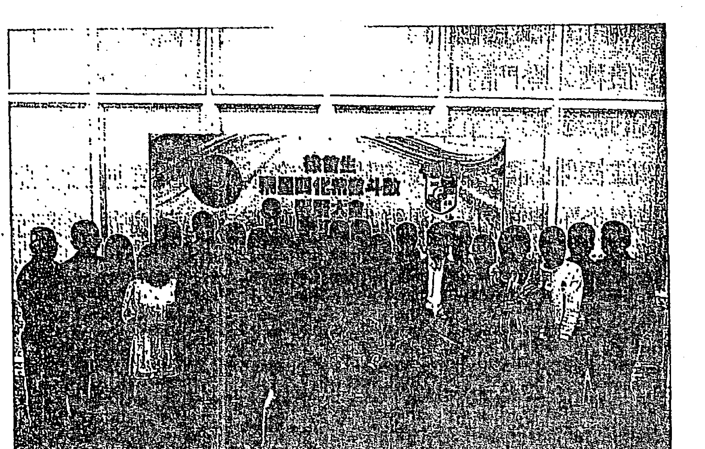

2016年8月27日～28日兩天在馬來西亞吉隆坡的 Royale Chulanda Mansara 大飯店舉辦【飛星四化紫微斗數研討大會】，由筆者主講，首次走出台灣，與馬來西亞、新加坡一帶的同好見面，互相切磋交流，參加者不辭舟車勞頓，遠從馬來西亞各州與新加坡來到吉隆坡，熱情參與大會。

參加本研討會的都是新馬一帶的紫微斗數界資深研究者或老師，經驗豐富、學養深厚，會中熱烈互動，為台灣和馬來西亞、新加坡紫微斗數界觀摩交流建立良好關係。

值此新書出版之際恰逢此盛會，謹以此書紀念此首次新、馬、台紫微斗數飛星四化界的盛大交流活動，圓滿成功、劃下完美句點。

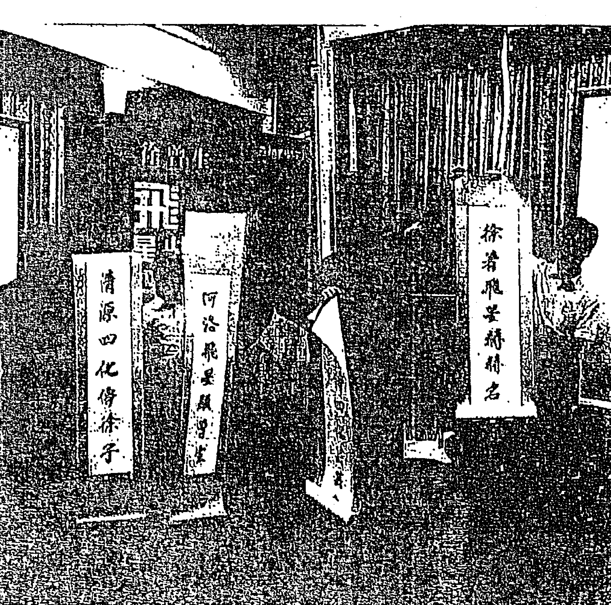

會後，主辦單位致贈兩幅對聯，【清源四化傳徐子，河洛飛星顯曾生】巧妙的將先師清河之名嵌入對聯內，也讓我對馬來西亞的華人中文造詣刮目相看！

另一幅【周傳四化芸芸眾，徐著飛星赫赫名】，細問之下得知，當地學習紫微斗數者唯一首選就是四化派，經過當地開放的學習環境驗證之後，清河飛星四化一脈以高度的驗證率，獲得當地研究者認可成為唯一選擇。筆者一九八七年出版【紫微探真】是當地認識飛星四化的啟蒙書，之後出版的【紫微斗數命運分析】更成當地學者深入學習飛星四化的必讀，因而知名於當地斗數界，致贈嵌入名姓的對聯以為紀念。

此次還有另一番震撼，在趨近飽和的台灣紫微斗數界都是往大陸發展，競逐中國市場，但隨著中國強大，中華文化的內涵也逐步為歐美各國接受，舉凡：中醫、風水、命理、紫微斗數、八字…等，也有許多歐美人士投入學習、研究。

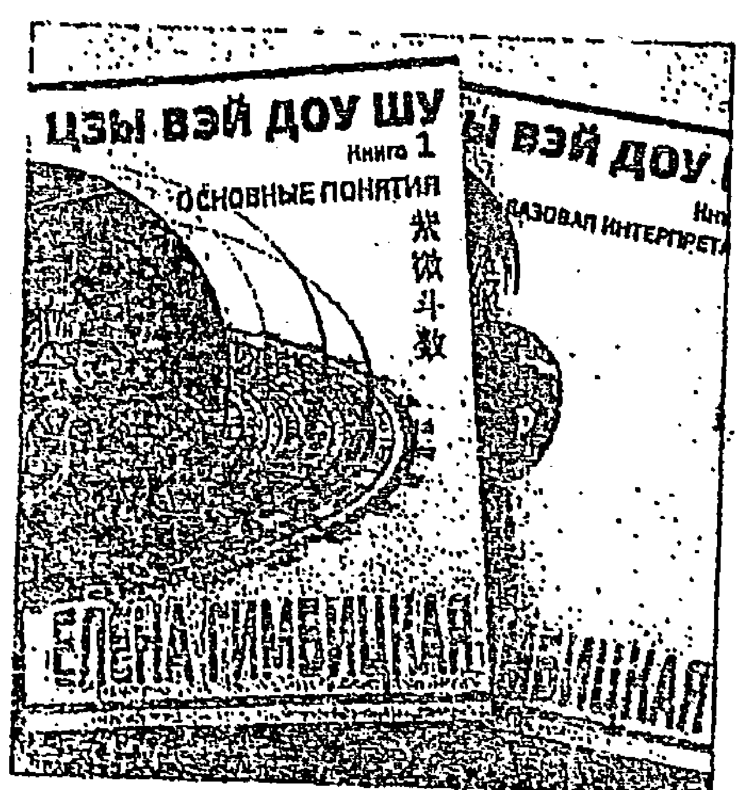

英文版紫微斗數書籍，市面上流通已經有十多本了，可說習以為常了，但筆者竟然在馬來西亞看到俄文版的紫微斗數書籍，頗為震撼，聽當地斗數老師說：「有老師遠赴澳洲、烏克蘭、法國等地教斗數，深受當地人喜愛」。

看來，台灣的紫微斗數界要加加油，努力創新維持領先地位。

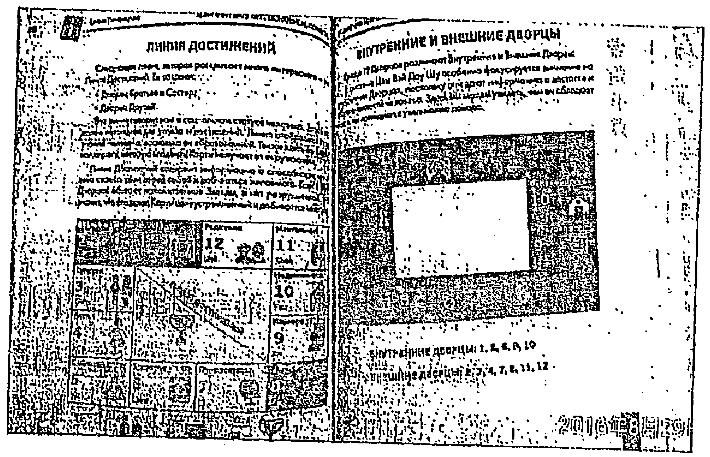

## ◎ 進源書局圖書目錄 ◎

### Zin Yuan Publishing Company Index

- 1001 陽宅傳薪燈 (鄭照煌著) —— 平裝 350 元
- 1002 大三元廿四山六十四卦秘本全書 (陳建利著) — 平裝 600 元
- 1003 大三元順子局逆子局秘本全書 (陳建利著) —— 平裝 600 元
- 1004 正宗三合法廿四山至寶全書 (陳建利著) —— 平裝 500 元
- 1005 正宗九星法廿四山至寶全書 (陳建利著) 平裝上下冊 800 元
- 1007 地理統一全書 (古本) —— 精裝 4 鉅冊 7000 元
- 1008 三元九宮紫白陽宅入神秘旨全書 (陳建利著) — 平裝 500 元
- 1011 陽宅大全 (周繼著・崇仰編集) POD —— 平裝 400 元
- 1012 風水二書形氣類則 [歐陽純] POD —— 平裝 600 元
- 1013 地學形勢集 <上，下> POD —— 平裝 1200 元
- 1014 地理捷徑秘斷 (張哲鳴著) —— 精裝 500 元
- 1015 廿四山造葬祈福便訣 (林靖欽藏書) —— 平裝 500 元
- 1016 天學洞機 (林靖欽藏書) —— 平裝 300 元
- 1017 正宗三元法廿四山至寶全書 (陳建利著) POD — 平裝 500 元
- 1018 正宗風水巒頭理氣至寶全書 (陳建利著) POD —— 精裝 600 元
- 1019 六十仙命廿四山安葬擇日入神秘旨全書 (陳建利著) POD —— 平裝 500 元
- 1020 陽宅佈局神位實例圖解 (姜健賢著) —— 彩色平裝 600 元
- 1021 陽宅寶鑑與水晶靈力應用 (姜健賢著) —— 彩色平裝 750 元
- 1022 陰宅墓相學與環境地質應用 (姜健賢著) — 彩色平裝 600 元
- 1023 地理名墓與斷訣 (姜健賢著) —— 平裝 450 元
- 1024 陽宅紫府寶鑑 (劉文淵著・金靈子校訂) —— 平裝 250 元
- 1025 三元三合簡易羅經圖解使用法 (天星居士著) — 平裝 500 元
- 1026 渾天星度與透地六十龍 (天星居士著) —— 平裝 400 元
- 1027 陽宅與寶石 (姜健賢著) —— 平裝 600 元
- 1028 三元玄空註解 (姜健賢著) —— 平裝 400 元
- 1029 耄擇講義註解 (天星居士著) —— 平裝 600 元
- 1030 陽宅個案發微 (陳彥樺著) —— 平裝 300 元
- 1061 乾坤國寶透析 (劉賁編著) ———— 平裝 600 元
- 1062 陽宅三要透析 (劉賁編著) ———— 平裝 650 元
- 1063 五術築基 (劉賁編著) ———— 平裝 400 元
- 1064 八宅明鏡透析 (劉賁編) ———— 平裝 600 元
- 1065 陳哲毅教你看陽宅技巧 (陳哲毅・陳旅得合著) 彩色平裝 350 元
- 1066 陽宅指南白話圖文注解 (蔣大鴻原著・陳龍羽注解) 平裝 300 元
- 1067 玄空大卦透析 (劉賁編) 上下冊不分售 —— 平裝 1200 元
- 1068 八宅明鏡 (顧吾虛原著、劉賁精校) ———— 平裝 250 元
- 1069 陽宅三要 (趙九峰原著、劉賁精校) ———— 平裝 250 元
- 1070 陽宅實務非看不可 (黃連池著) ———— 平裝 550 元
- 1071 精義秘旨評註-駱氏挨星透析 (劉賁評註) —— 平裝 800 元
- 1072 易經風水母法-國學經典 (沈朝合・謝銅菁合著) 平裝 350 元
- 1073 各派陽宅診斷現象、化解 (黃恒堉・李羽宸) 平裝 350 元
- 1074 陰宅造葬實務非看不可-墓碑斷法大公開 (黃連池) 平裝 550 元
- 1075 陽宅形家透析 (劉賁編) ———— 平裝 550 元
- 1076 陽宅形家透析-內巒頭 (劉賁編) ———— 平裝 500 元
- 1077 沈氏玄空學評註〈上冊〉 (劉賁評註) ———— 平裝 500 元
- 1078 沈氏玄空學評註〈下冊〉 (劉賁評註) ———— 平裝 700 元
- 1079 形家長眼法陽宅陰宅風水上課講義 [二] [劉寶卿著] 精裝 2500 元
- 1080 形家講堂非看不可 [黃連池/陳義霖合著] ———— 平裝 600 元
- 1081 七星打劫最終章 [秦連森/著] ———— 平裝 400 元
- 2051 卜卦傳薪燈 (鄭照煌著) ———— 平裝 320 元
- 2052 卦爻理用透析（一）一卦爻教科書 (劉賁編著) 平裝 500 元
- 2053 卦爻理用透析（二）一占卦例篇 (劉賁編著) 平裝 400 元
- 2054 卦爻理用透析（三）一占卦例篇 (劉賁編著) 平裝 450 元
- 2055 火珠林評註 (劉賁評註) ———— 平裝 450 元
- 2056 六爻神卦實證集錄 (劉臺坤著) ———— 平裝 450 元
- 2057 黃金策評註 (劉基原著・劉賁評註) ———— 平裝 450 元
- 2058 三才筮法 (閒雲老叟著) ———— 平裝 350 元
- 2059 承先啟後-卜藝 (一點青米著) ———— 平裝 400 元
- 2060 元昭老漢簡易錄-詳解 64 卦袖珍本 (楊典昭著) — 活頁本 400 元
- 2061 野鶴占卜全書 (劉賁整編) - 平裝 450 元
- 2062 卜筮正宗 (王洪緒原著，劉賁整編) - 平裝 350 元
- 2063 九天學算卦 (黎光，舒涵) - 平裝 500 元
- 2064 卜筮全書新編 (明 姚際隆/原著，劉賁/整編) - 平裝 500 元
- 2065 易隱新編 (清 曹九錫/原著，劉賁/整編) - 平裝 450 元
- 2066 卦爻歌訣集釋 [劉賁/編著] - 平裝 500 元
- 2067 卜卦真傳 (林琮學著) - 平裝 320 元
- 2068 黎氏，後天易數 (黎光著) - 平裝 450 元
- 2069 卦理說真-股票、財運篇 [石世明/著] - 平裝 320 元
- 2070 六爻三大技法 [客篇] 六爻知識入門 [黎光] - 平裝 600 元

### 符咒應用書籍

- 3015 符咒應用妙全書 (法玄山人著) - 平裝 500 元
- 3016 萬教指印神訣 (永靖大師著) - 彩色精裝 1000 元
- 3017 萬教宮壇符鑑 (永靖大師著) - 平裝 500 元
- 3018 閭山正宗科儀寶典 (法玄山人著) - 彩色平裝 800 元
- 3019 閭山正宗開光安神總解 (法玄山人著) - 彩色平裝 1000 元
- 3020 道法指印真傳秘笈 (法玄山人著) - 彩色精裝 1500 元
- 3021 閭山正法 (法玄山人編著) POD - 彩色平裝 1000 元
- 3022 道壇解冤救結科儀 (法玄山人著) - 彩色平裝 1000 元
- 3023 中元普渡科儀 (法玄山人著) - 彩色平裝 1000 元
- 3024 仙道活訣竹人寸 (法行士著) - 彩色平裝 800 元
- 3025 溫帥血脈家傳符法 (佚名著) - 平裝 300 元
- 3026 六甲附餘天遁神書 (佚名著) - 平裝 500 元
- 3027 抄本秘藏丁甲奇門符錄 (佚名著) - 平裝 300 元
- 3028 天心符法秘旨 (佚名著) - 平裝 300 元
- 3029 茅山符咒制煞秘笈 (華元大師著) - 平裝 500 元
- 3030 閭山法門秘旨 (永靖大師、真德大師編著) - 平裝 500 元
- 3031 安龍奠土科儀 (法玄山人著) - 彩色平裝 800 元
- 3032 祈安禮斗科儀 (法玄山人著) - 彩色平裝 800 元
- 3033 閭山八卦收魂法科 (永靖大師、真德大師編著) - 彩色平裝 600 元
- 3034 道門祭將關煞法科 (永靖大師、真德大師編著) - 平裝 500 元

## 擇日類書
- 5001 擇日秘本萬年通書(洪潮和著) ---------------- 平裝 230 元
- 5002 擇日講義(洪潮和著) ------------------------ 平裝 230 元
- 5003 日課秘論全書(蕭有用著)上下冊不分售 ------ 平裝 500 元
- 5004 葫蘆墩萬年曆 25開 ---------- (沈朝合著)彩色平裝 450 元
- 5005 葫蘆墩萬年曆 50開 ---------- (沈朝合著)彩色平裝 350 元

## 八字命理
- 6001 命理秘論全書(蕭有用著)上下冊不分售 ------ 平裝 500 元
- 6002 子平八字十神因果論(吳政憶著) ------------ 平裝 450 元
- 6003 子平真詮評註(徐樂吾評註) ---------------- 平裝 250 元
- 6004 八字煉丹爐・高手秘笈(陳哲毅著) POD ------ 平裝 350 元
- 6005 八字白話全記錄(陳昱勳著) ---------------- 平裝 300 元
- 6007 八字傳薪燈(鄭照煌著) -------------------- 平裝 300 元
- 6008 八字的玄機(謝武藤著) -------------------- 平裝 250 元
- 6009 窮通寶鑑(徐樂吾評註) -------------------- 平裝 200 元
- 6010 訂正滴天髓微義(徐樂吾增註) -------------- 平裝 300 元
- 6011 論命出奇招(沈朝合・謝翎合著) ----------- 彩色平裝 380 元
- 6012 四柱薪燈一八字傳薪燈續集（鄭照煌著） ---- 平裝 320 元
- 6013 正宗子平一博士論文(劉金財著) ------------ 平裝 350 元
- 6014 捉用神學八字一窮通寶鑑白話本(陳哲毅・陳力瀚合著)----- 平裝 550 元
- 6015 四柱推命學講義（鍾茂基著） --------------- 平裝 600 元
- 6016 八字傳薪燈三部曲一體系與宿命(鄭照煌著) - 平裝 350 元
- 6017 星平會海析義(張貴振・張智超合著) -------- 平裝 380 元
- 6018 四柱推命學（鐵筆子著） ------------------ 平裝 250 元
- 6019 八字應用學寶典一增訂版(陳天寶著) ─────── 平裝 420 元
- 6020 八字傳薪燈實例格局與調候(鄭照煌著) ──── 平裝 380 元
- 6021 滴天髓闡微(任鐵樵增注；袁樹珊撰輯) ── 平裝 300 元
- 6022 命理秘本造化元鑰(徐樂吾評註) ─────── 平裝 300 元
- 6023 增補淵海子平((宋)徐升編) ──────── 平裝 250 元
- 6024 三命通會(一)—專論子平神煞(明/萬民英撰) - 平裝 350 元
- 6025 三命通會(二)-十天干配十二時辰論斷(明/萬民英撰) 平裝 350 元
- 6026 三命通會(三)—看命口訣(明/萬民英撰) ── 平裝 350 元
- 6027 八字命學母法—淵海子平訣竅應用(沈朝合著)— 彩色平裝 300 元
- 6028 命理正宗-神峰通考(張楠著) ──────────── 平裝 300 元
- 6029 神秘盲派八字大解密(陳宥名。黃恒堉合著) ─ 平裝 450 元
- 6030 八字大解秘(光蓮先生著) ──────────────── 平裝 400 元
- 6031 八字正道-道破盲派新派八字論命之謎〈風鑑奇人〉 -平裝 350 元
- 6032 八字氣數基礎講義[上]{光蓮先生/著} ──── 平裝 350 元
- 6033 八字氣數基礎講義[中]{光蓮先生/著} ──── 平裝 350 元
- 6034 八字氣數基礎講義[下]{光蓮先生/著} ──── 平裝 400 元
- 6035 古今名人命鑑〔徐樂吾〕 ─────────────── 平裝 280 元
- 6036 名人八字與實際案例[施長江/著] ────── 平裝 400 元
- 6037 子平真詮評註新編[劉貴/著] ────────── 平裝 400 元
- 紫微演譯①斗數執法（翁福裕著） ──────── 平裝 600 元
- 紫微演譯②紫微神探（翁福裕著） ──────── 平裝 700 元
- 紫微演譯③斗數飛星解碼（翁福裕著） ──────── 平裝 800 元
- 7001 紫微演譯④斗數護法（翁福裕著） ──────── 平裝 450 元
- 7002 紫微演譯⑤斗數功夫（翁福裕著） ──────── 平裝 500 元
- 7003 紫微斗數婚姻總論（沈平山著） ──────── 平裝 380 元
- 7004 紫微演譯⑥斗數正眼（翁福裕著） ──────── 平裝 500 元
- 7005 紫微斗數古訣今鑑（張宏輔著） ──────── 平裝 420 元
- 7006 占驗紫微案例精選（范振木。黃素芳合著） ─ 平裝 300 元
- 7007 紫微斗數秘儀傳承（子陽著）——平裝 500 元
- 7008 紫微斗數技法洩天機（彭浚翊·陳玥澧合著） 平裝 550 元
- 7009 紫微斗數命運分析（徐曾生著）——平裝 450 元
- 7010 紫微斗數命運分析一格局篇（徐曾生著）——平裝 450 元
- 7011 紫微寶典（劉純市著）——平裝 350 元
- 7012 飛星四化紫微斗數點綴（葉易著）——平裝 500 元
- 7013 紫微斗數全書（陳希夷著）——平裝 250 元
- 7014 開館人紫微斗數(三)一星情論吉凶（方外人著） 平裝 300 元
- 7015 開館人紫微斗數(四)一同步斷訣實例（方外人著） 平裝 300 元
- 7016 紫微正道（風鑑奇人著）——平裝 400 元
- 7017 天地根斗數八字合參正見 [ 簡志昇.吳心慧/合著 ] 平裝 400 元
- 7018 紫微斗數之迷與悟 [ 張凱元/編著 ]——平裝 500 元
- 7019 當總統的命格與機緣（福耕著）——平裝 500 元
- 7020 由理氣原則學習飛宮紫微斗數 [江申/著]——平裝 500 元
- 7021 紫微斗數命運分析一實例篇 [徐曾生/著]——平裝 600 元
- 8001 十二生肖姓名學總論（陳哲毅·陳旅得合著）－平裝 300 元
- 8002 十二生肖姓名八字三合一總論（陳哲毅·陳力瀚合著）——平裝 350 元
- 8003 最新姓名學字典（陳哲毅·陳旅得合著）——平裝 350 元
- 8004 姓名學大公開【精華篇】（夏唯綱著）——平裝 350 元
- 8005 新十二生肖生剋姓名學總論（陳哲毅·陳力瀚合著）－平裝 400 元
- 8006 姓名學大公開—數字篇（夏唯綱著）——平裝 350 元
- 8007 生肖姓名學吉凶教科書 [陳宥名，黃恆埼合著]－平裝 350 元
- 9001 陳哲毅教你學面相技巧（陳哲毅·陳力瀚合著）－彩色平裝 400 元
- 9002 陳哲毅教你看手相技巧（陳哲毅·陳旅得合著）－彩色平裝 380 元
- 9003 陳哲毅傳授你面相精華（陳哲毅·陳旅得合著）－彩色平裝 380 元
- 9004 大富大貴相譜（蕭湘居士著）——平裝 250 元
- 9005 蕭湘相法全集一上冊—骨相面相之部——精裝 600 元
- 9006 蕭湘相法全集二下冊—手相體相之部——精裝 630 元

## 國家圖書館出版品預行編目資料
紫微斗數命運分析. 實例篇 / 徐曾生著. -- 初版. -- 臺北市 : 進源文化, 2016.10 面 ; 公分. -- (斗數叢書 ; 7021) ISBN 978-986-93471-1-2(平裝) 1. 紫微斗數 293.11 105016562

◎斗數叢書 7021

## 紫微斗數命運分析—實例篇
- 作 者/徐曾生著
- 出 版 者/進源文化事業有限公司
- 發 行 人/林 俊 廷
- 法律顧問/黃 沛 聲 律師
- 社 址/台北市華西街61-1號
- 電 話/(02)2304-2670 • 2304-0856 • 2336-5280
- 傳 真/(02)2302-9249
- http://www.chinyuan.com.tw
- E-mail: juh3344@ms46.hinet.net
- 郵政劃撥/台北 50075331 進源書局帳戶
- 電腦排版/旭豐數位排版有限公司
- 印 刷/和楹彩色印刷有限公司
- 出版日期/二〇一六年十月
- 定 價/平裝新台幣 600 元

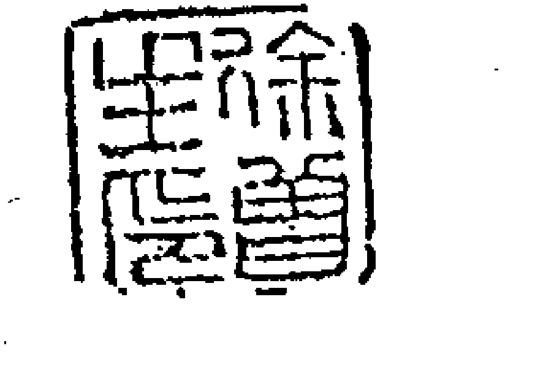

著作權所有 • 翻印必究 ◎本書如有缺頁破損或裝訂錯誤，請寄回本書局調換