# 紫微斗数
命运分析
秘图

徐曾生/著

| 右弼天機 | 天姚天魁 | 文曲文昌 | 破軍陀羅 | 右弼天機 |
|---|---|---|---|---|
| 12-21 父母 癸七殺 | 22-31 福德 | 32-41 田宅 | 42-51 官祿 丙左輔祿存 | 12-21 父母 癸七殺 |
| 2-11 命宮 壬天梁 龍天池 |  |  | 52-61 仆役 丁天廉 虛羊府貞 | 2-11 命宮 壬天梁 龍天池 |
| 112-121 兄弟 辛天武 劫刑鉞相曲 |  | 火貪 星狼 | 62-71 身宮 戊太 戌遷移 陰閤 | 112-121 兄弟 辛天武 劫刑鉞相曲 |

## 紫微斗数全书新评注局局

徐曾生 著

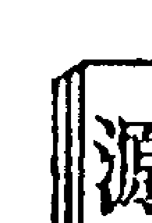

進源書局

## 目錄

- 作者序 006
- 第零章 認識命盤 006
- 人事宮 011
- 地支 009
- 官干 015
- 星曜 017
- 大限 020
- 第一章 紫微各流派的看法 032
- 第二章 命盤符號和人生事件的對映關係 072
- 第三章 解析命盤 082
- 第四章 談紫微斗數的規律性 101
- 第五章 三合格局重不重要？ 125
- 第六章 詳論格局特性 154
- 一、紫府同宮格 156
- 二、府相朝垣格 160
- 三、紫府朝垣格 169
- 四、明珠出海格 177
- 五、日月並明格 171
- 六、日照雷門格 183

## 目录

- 13. 月生滄海格……二一四
- 14. 日月照壁格……一二八
- 15. 貪武同行格……一二二
- 16. 日月夾命格……一二六
- 17. 英星入廟格……一三〇
- 18. 七殺朝斗格……一三四
- 19. 馬頭帶箭格……一三八
- 20. 三奇嘉會格……一四二
- 21. 雄宿朝垣格……一四六
- 22. 祿合鴛鴦格……一五〇
- 23. 雙祿朝垣格……一五四
- 24. 祿馬交馳格……一五八
- 25. 左右同宮格……一六二
- 26. 坐貴向貴格……一六二
- 27. 文桂文華格……一六三
- 28. 命無正曜格……一六六
- 29. 對面朝斗格……一六六
- 30. 科權祿主格……一七〇
- 31. 輔弼朝垣格……一七〇
- 32. 兼文武格……一七四
- 33. 貪狼遇火格……一七八
- 34. 財祿夾馬格……一八二
- 35. 輔弼拱主格……一八三
- 36. 君臣慶會格……一八六
- 37. 祿馬配印格……一九〇
- 38. 日月同臨格……一九四
- 39. 刑囚夾印格……一九四
- 40. 文星夾命格……一九八
- 41. 文星拱命格……一九九
- 42. 科明暗祿格……二〇二
- 43. 金輿扶駕格（偏格）……二〇六
- 44. 生不逢時……二〇六

- 四十五、禄逢两煞 ······ 三〇七
- 四六、馬落空亡 ······ 三〇九
- 四七、日月藏輝 ······ 三一一
- 四八、財與囚仇 ······ 三一六
- 四九、一生孤貧 ······ 三二〇
- 五十、小人據位 ······ 三二四
- 五一、兩重華蓋 ······ 三二八
- 五二、風雲際會 ······ 三二八
- 五三、錦上添花 ······ 三二八
- 五四、祿衰馬困 ······ 三二九
- 五五、衣錦還鄉 ······ 三二九
- 五六、步數無依 ······ 三三〇
- 五七、水上架屋 ······ 三三〇
- 五八、廉貞文武格 ······ 三三一
- 五九、貴星夾命 ······ 三三二
- 六十、三合火貪格 ······ 三三六
- 六一、貪鈴朝垣格 ······ 三四〇
- 六二、丹墀桂墀格 ······ 三四〇
- 六三、甲第登庸 ······ 三四四
- 六四、科名會祿 ······ 三四八
- 六五、權祿尋逢 ······ 三五二
- 六六、極聾離明 ······ 三五六
- 六七、文梁振紀格 ······ 三六〇
- 六八、輔拱文星格 ······ 三六〇
- 六九、機梁加會格 ······ 三六四
- 七十、化煞為權格 ······ 三六八
- 七一、壽星入廟格 ······ 三七二
- 七二、化星遇貴格 ······ 三七六
- 七三、將星得地格 ······ 三七七
- 七四、極居卯位格 ······ 三八〇
- 七五、殺拱廉貞格 ······ 三八一
- 七六、巨逢四煞格 ······ 三八四

- 七七、命裡逢空……三八四
- 七八、桃花犯主……三八八
- 七九、泛水桃花……三九二
- 八十、風流綵杖……三九六
- 八一、眾水朝東……四〇〇
- 八二、路上埋屍……四〇〇
- 八三、水中作塚……四〇四
- 八四、粉身碎骨格……四〇四
- 八五、離鄉遭配……四〇八
- 八六、鼠竊偷盜……四一二
- 八七、離宗庶出……四一六
- 八八、因財持刀……四一六
- 八九、因財被劫……四一六
- 九十、梁月飄蓬格……四二〇
- 九一、文星遇夾……四二四
- 九二、科星煞湊……四二八
- 九三、魁鉞凶沖……四三二
- 九四、官祿入煞……四三六
- 九五、巨機化酉……四三八
- 九六、月同遇煞……四三九
- 九七、四星遇貴……四四二
- 八、文星失位……四四二
- 九九、科星逢破……四四三
- 一〇〇、作戰陣亡……四四四

## 作者序

前一本『紫微斗数命运分析』推出后，很多读者来函或E-mail鼓励笔者再写些书分享心得，因平时就有搜集案例归纳分析、随手写写看法，存起来的习惯，但大部分是纸本的形式又分佈零散，读者们热切的询问下，乃兴起整理成书的想法，但也思考如何建构完整的紫微斗数系统，再切割成不同的区块，编写成书，我也遍览过市面书籍的写法，有些是把十二宫切割成一个一个主题来写，我自认为没那么多的时间，乃采取：星曜、格局、四化等主题式的讨论，因为星曜是紫微斗数的根本，虽然有古书谈论星曜，但总是切不进现代人的思维，读起来无法体会含意，当然更无法运用於推演命运上，星性部分以前学命时做过重点式的笔记，不易理解，故要写得流畅易懂不是容易的事，譬如：『逢凶化吉』吧！简简单单一句话，很多人都能够『望文生义』解释个头头是道，但是总觉得没有身历其境的切身感，如果命例的背景资料来映襯就会凸显该句话的意义，所以断断续续的写，都是卡在命例的背景值是否充分，所以修了又修，还在琢磨当中，当然盗版的行为也是我考虑的因素。

懂了星性、每一宮位的特質就能掌握，但這只是單一個「點」而已，進一步就需要以更高的高度來看「格局」了，到了這個程度已經跳脫單一宮位看命的境界了，雖然，紫微斗數以人為切割的方式，把生活環境分成十二種構面，但人並非活在單一宮內而已，活動範疇一直都在十二宮內打轉，譬如：有的人專心事業卻冷落了家庭，有很多事業上的「強人」卻是失敗的家庭「主人」；有的努力賺錢卻把身體搞壞了，所以，人生難有十全十美的，而格局就在探討這種關係，這是一種對於命局「全面」性瞭解的層次，如果只看單一宮位就會失之偏頗，無法綜觀全局，「紫微斗數命運分析格局篇」——就是探討全面性的命局關係。最後就是動態的運途變化了，「紫微斗數命運分析」一書主要就是在談運途的變化，由於大限的變動，人事宮移位了，宮內坐星也改變了，是不是代表大限的環境際遇也變更了呢？對先天命和大限之間又會產生什麼激盪呢？該書對於原理有充分解釋，但案例探討比較少。所以筆者又寫了一本書「紫微斗數命運分析實例篇」，補前本書之不足，因而從蒐集的案例中找尋適當的實例，分門別類的舉了許多案例，充分的探討解說，引領大家一步一步的進入動態命運分析的門廊，當然也參考了下列名家著作：

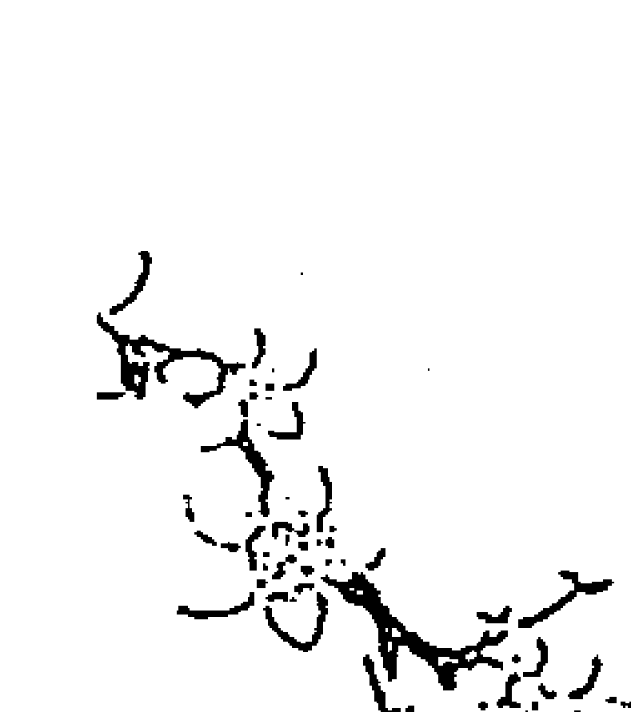

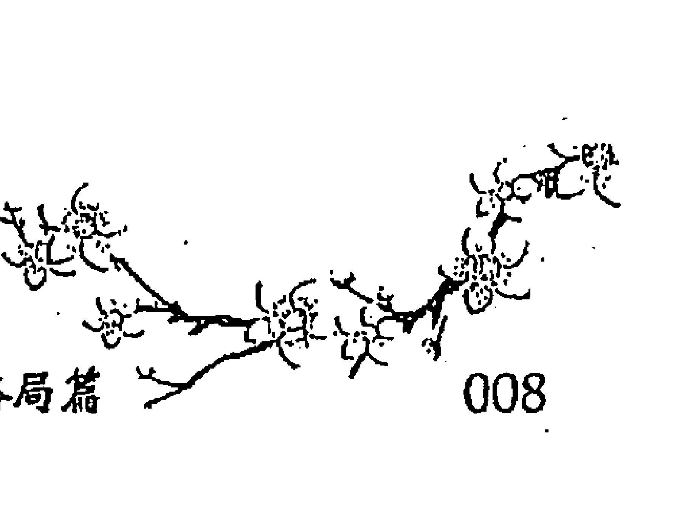

## 當代八字實務篇（蔡宗志，武陵出版社）

## 命理新論實例（吳俊民著）

上述書籍有豐富的實例，建議讀者買來練功，同時並向上述作者致上最高的敬意與謝忱。通過了上述三本書具有系統性的學習程序，相信各位讀者能充分體悟與運用。還有我也要呼籲請尊重智慧財產權，不要將書本掃描了擺在網路上供人下載，現代通訊郵遞都很發達便利，沒有書寄不到的地方，互相尊重才能讓作者有源源不斷的創作意願，也能使學習更加活潑，最後，感謝大家的惠顧，並祝大家學習成功。若有疑問各位可以利用筆者之E-mail: ez.way@msa.hinet.net或ez-way.myweb.hinet.net聯絡。

## 地支

代表「時間」，中國古代用十二地支來計時，所以每一時辰相當於兩小時，這十二地支就是「子、丑、寅、卯、辰、巳、午、未、申、酉、戌、亥」，由於時間因素無法人為改變，從太古時代宇宙爆炸開始，時間即被啟動，億萬年來它都以恆定速度前進，不因財富而變更，也不因威脅而停止，所以，空白命盤上就已經填入地支在十二宮之中，是一切人事和物的共同依據，萬事萬物對時間而言都只是個泡沫，時間到了，事件出現，時間一過，事件也隨之如泡沫消失，堅固如房屋也不過百年壽命，時間一到還是會崩塌腐朽消失，它就像一根由遠古向未來無限延伸的線，而個人存在宇宙間也只佔了一剎那而已，在那一剎那間也在我身上發生無數的事件，而這一切的基準線就是時間，個人的生命隨著時間前進，事件就像掛在前方的布幕一樣，一個「景象」一個景象的撲面而來又隨之消逝，雖說「隨之」也有時間延續長短之不同，隨著你的心念改變前進的方向、更換的工作……等，布幕景象也隨之更動，隨著景象的到來引起你的喜怒哀樂等反應而有了吉凶禍福，故算命就在推算你存活在世上時的事件何時會發生，時間是這一切事物的根本不變的因素。沒有了「時間」的存在，一切事物都不存在、成了幻影，埃及金字塔正是存在了五千年之久，才讓五千年後的我們看到了它雄偉的面貌，同時期還有巴比倫王國的「空中花園」卻變成了傳說，「亞特蘭提斯」是否存在更成了神話，所以「時間」是驗證一件事存在與否的關鍵！「地支」就扮演了「時間」的角色，它會因「事件」而改變，也會因人而變，所以，雖然你我都同在「戊子年」的這個時間場域中，但是，發生在你我身上的事件絕不相同，而它所依據的就是你我之間的「出生時間」不同，一切都是以時間為基準，它是生命之源，也是事件之始。

## 人事宮

代表我們日常生活中，面對的各種生活場域或層面，於「人」我們日常生活中會接觸到父母、配偶、兄弟、子女、同事、以及素昧平生的攤販、路人等，如和同事發生糾紛而動怒，影響事業想換工作，命運就會產生波動；配偶得力互助振興家業，贏得眾人尊崇，命運改觀；抑或被素昧平生的「會腳」倒錢，弄得貧病交加，難以度日；現代社會人與人之間互動日益頻繁，很難獨善其身而生活，要如何廣結善緣、累積人脈、得眾人助，闖出個人一片天，這是現代人的重要課題，所以這些「人」會對「我」的命運產生影響，「我」也有可能改變他「人」的命運，所以要納入「影響命運」的考量因素內。於「物」一方面有金錢、田地等，富在深山有遠親、窮在都市無人問，金錢、田地絕對是影響我們命運的因素，現實點說吧，大部分人一生的奮鬥都在換取財富，而财富的象征就是金钱与田地，有土斯有财，两者互为表里，有钱好办事，当然，可以追求更高的成就，没钱的人卖时间赚钱，有钱的人可以请一堆人帮他赚钱，或是买一堆机具设备帮他赚钱，更高级的是用钱来赚钱，放眼社会上，哪一个 人不是如此，得道高僧也难摆脱红尘世间的钱财羁绊，济业众生靠钱，众生得济 感念而益增其尊崇，何尝不是“金钱”也有份功劳，财富可以让人伟大也可令人堕 落，所以，端看你如何善用财富，身外之物“物”绝对会影响个人命运，摆脱不了也 无法了。

于“精神”方面也会影响命运，精神不济开车发生车祸、工作发生意外都是 常见的新闻，有些人就会将“失神”归责为“碰到鬼”，将精神萎靡延伸为“祖坟 出问题”，是耶非耶？有人却不这么认为，不过确实是有这些因素而干扰到人的命 运的现象存在；祖先的庇荫也无法忽视，政治受难家属度困苦的时光、有些人却 承继祖先的庇荫含着金汤匙出生，这些都是“无形”却又会影响命运的因素，也有 些人称之为“祖荫”，即使是受过科学教育的现代人也无法否认这些“无形”的事 物会对人生产生影响、干扰命运。

这些生活场域如前所述含括“人、物、精神”等领域，紫微斗数把生活场域 区分成十二种构面：

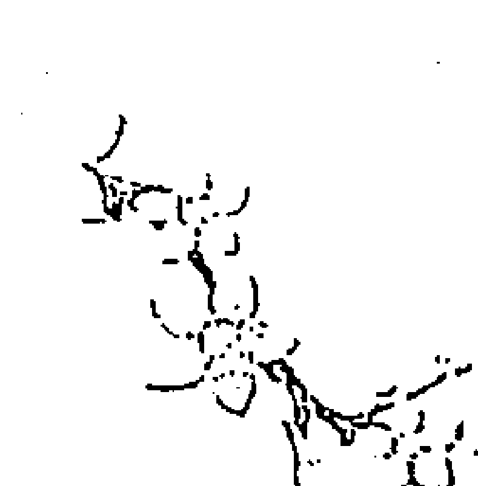

| 宫位 | 星曜 | 年龄 | 宫干 | 地支 |
|------|------|------|------|------|
| 命宫 | 天同、天梁、陀罗 | 6-15 | 丙 | 申 |
| 父母 | 火星、天刑、擎羊、太阳 | 116-125 | 丁 | 酉 |
| 福德/身宫 | 天机、天喜 | 106-115 | 戊 | 戌 |
| 田宅 | 未知 | 96-105 | 己 | 亥 |
| 官禄 | 未知 | 86-95 | 庚 | 子 |
| 迁移 | 天姚、天钺 | 66-75 | 庚 | 寅 |
| 疾厄 | 天府、文昌 | 56-65 | 辛 | 卯 |
| 财帛 | 太阴、地空 | 46-55 | 壬 | 辰 |
| 子女 | 廉贞、贪狼、天马、左辅、铃星 | 36-45 | 癸 | 巳 |
| 夫妻 | 巨门、天魁、红鸾、地劫 | 26-35 | 甲 | 午 |
| 兄弟 | 天相 | 16-25 | 乙 | 未 |

命盤十二宮各有所司，雖然宮位名稱字面上的意思很狹隘，如「夫妻」一宮顧名思義就是指婚配對象的品行優劣吉凶等現象，除了「配偶」之外，是否還有其他意義呢？這就需要深入探討了，因為，日常生中碰到的事情千奇百怪要如何簡化納入命盤十二個宮位內呢？深入瞭解宮位的意涵才能找出立象宮位推斷吉凶，每一宮都具有更廣義的內涵。 譬如命宮一般人都把它當作觀察一個人心性、價值觀、人生觀、個性的代表宮位，只要看到宮內坐了某顆星之後，就代表個性如何，其實這是粗淺的看法也是最吸引初學者興趣的主題，其實它還有更深層的用法，一個人會不會結婚？奮鬥一生之後能不能留下不動產給子女？對於錢財使用的態度是慷慨還是節儉？身體病了能不能經人介紹覓得良醫救治？出外是否有人緣？會不會和朋友發生肢體衝突？事業能否賺錢？是否適合和人合夥投資不動產？和祖父母的情緣？或是叔伯的關係等都要看命宮，所以它是多種事項的複合宮，紫微斗數的其他十一宮都具有相同的特性，這是需要再深入學習時，需要體認的事實，這樣才能更深入的分析個人周遭的人事物現象。 所以，對於命盤十二宮絕不可把它框死在十二種事物象之中，每一宮都是個具有『多面向人事物的複合宮』。 根據出生時辰排出來的命盤稱為先天命盤而其宮位則冠以『本命』或『先天』來稱呼，如本命夫妻或先天夫妻，這些宮位又是靜止不動的、故先天命盤又稱為『靜』盤，而大限盤會隨大限而移動、因此稱為『動』盤，這是在閱讀本書時要先瞭解的名詞。

到「財帛」和「官祿」兩個宮位，例如出了敗家子將祖產敗壞光了，關係到「子女」和「田宅」兩宮，要如何表示這兩者間的關係呢？而且有時候，我們對某件事只是想想而已，並沒有實際行動去執行，又要如何表現呢？這就要靠「天干」了，天干有：甲、乙、丙、丁、戊、己、庚、辛、壬、癸等共十個，每一人事宮內都有一個天干，故又稱為「宮干」，用了明顯的紅字表示它的重要，這個宮干根據「十天干四化表」的規定催化星曜飛出四化，譬：命宮干（丙）使官祿宮的天機化權，我們就稱為「命宮化權入官祿」，表示「對於事業很努力、很認真」，所以透過命宮干的四化有無入事業宮，就可幫助我們瞭解此人對於事業的態度是懶散、還是努力、是計畫一大堆卻懶於行動，抑或是劍及履及的去實行者，所以「宮干」是連結兩個宮位之間關係的媒介。剛才說過，「宮干」會使得宮位飛出四化——化祿、化權、化科、化忌，這四個化星分別代表一件事的緣起、動念或想法，任何事都需要有個起頭，不會無緣無故的憑空出現，最近樂透彩號稱幾億，但是很多人都沒有被誘惑而心動，當然沒有中彩券的事件，也有人被吸引而心動了，這就是化祿，當然就會東挪西湊找出點資金來，付諸行動買彩券，這就是化權的力量，要圈哪幾個幸運號碼呢？有人就會去求神問卜、或是拿出身分證找靈感、或用機率算算看哪幾個號碼、或是找家財星高照的投注站電腦選號，有些人果然就在這個過程中，如有神助般朦對了號碼，這就是化科的現象，當然，最後就是去銀行把鈔票搬回家享受，此即為結果，由化忌來表示，當然若是「槓龜」沒中了，就傷心難過，好幾天都要粗茶配淡飯了，因此，化祿代表想法，化權是行動，化科是貴人、靈感，最後是化忌就代表了結果，而有吉凶的結局，所以「宮干」也是控制事件是隱或現的開關。隨著大限的變換，人事宮位也會隨之移動，此時就有一個先天命盤（或稱靜盤）和大限命盤（或稱動盤），如各位看到前面的命盤就是先天命盤，要推算變動的運途變化時，就要考慮動靜盤之間的關係，這時的「宮干」也就成為貫穿動盤和靜盤、連結兩者之間關係的紐帶，讓事件形象更加清晰、明確化的浮現出來，而這一個紐帶就是四化。

### 星曜

各位或許會問「對事業的態度」不是要看事業宮內的坐星嗎！不是，所有宮內的坐星都表示該生活場域的情況而已，而無法表現兩個人事宮之間的狀態，有的人一生都在公家機關待、有的人不待在家鄉、寧肯單槍匹馬遠赴他鄉天下，有人卻喜歡待在家鄉，這就是事業宮這個場域宮內的坐星組合狀態所形成的特徵，是個自己所處的環境與際遇，當然你面對各種環境時，會有不同的面對之道，有的人積極開創、有的人退縮逃避、有的人歡喜做甘願受、有的人卻怨天尤人，而這就是命宮面對事業宮的心態反映或面對的態度與行動，後者是用兩宮的四化來表現，而前者純粹表現事業的生活場域就由星宿組合來表現。

各個宮位內的星曜組合，除了代表該宮生活構面的特性之外，星曜也會隨著天干而變化四種特質，展現不同的樣貌，譬如天同化祿、天同化權和天同化忌等三種不同的四化對象都是天同星，但各會展現不同的特性，而這些特性深深的影響著它所處宮位的樣貌或表現，具有關鍵性的力量。

大部分的人都把星性當作是看個性或人的特性的符號，譬如紫微坐命就是「紫微面紫色或白清，腰背肥滿，為人忠厚老成，謙恭耿直……」，這是基礎的看法，不過，也不能忽略了「星性」具有複雜的多種樣貌，來映對到日常生活中的人事物形象，今天債主要來討債，但籌不出錢來，不知道怎麼辦才好？「師傅仔細推算後就說：「放心，你找一位臉上有異痣的老先生借就有。「果然如是，這裡就有些問題可供探討，怎麼看出「臉上有異痣」？怎麼看出「老星」？其實這些都靠星性來表現「人、事或物」的形象。星曜也會因「冲照會入」等關係，伴隨著宮位而幻化為事件的形象，讓人能清楚點出事件，不然怎能說出「你女兒一嫁過去，對方阿嬤三個月內過世」的聳動斷語，而星曜在推斷的過程中扮演著事件形象的外衣，欲掀開這層外衣有賴「冲照會入」的關係，這些「冲照會入」的關係就好像颱風能夠吹走蓋住事件形象的披風一樣，讓一切都明瞭了然，認識「星曜」、透徹掌握每顆星的特性，是學好紫微斗數的根本，而學好星性最好的參考就是古本的紫微斗數全書，可惜沒標點符號，現代人絕對難以理解，筆者準備將它重新註解，讓學好紫微斗數最重要的基礎——星性，有全新的解釋。

同一顆星的星性並非單一，而是具有多樣性，隨著問題而幻化，所以我一直強調紫微斗數推命是個互相討論的過程，由顧客與命理師間的一問一答，就可以根據星性來幻化出解釋的事件形象，不然很難由同顆星眾多的形象中，抽出「正確的星象來解釋，不然就是用比較含糊的字眼帶過，如「文書是非」到底是交通罰單、還是法院傳票、抑或是查封財產的貼條，用字遣詞有深淺而這關鍵就在問題有無具體。

## 大限

紫微斗數只有十二宮，一宮格就代表一年、十二年就會重複同一宮格，為了區別而有「大限」產生，大限就是十年的運途，根據五行局數訂出大限的起迄年歲，大限移動，命宮、兄弟、夫妻……等宮位也隨之移動，產生新的盤局稱為大限盤，而命盤內的坐星並不改變，只有大限的人事宮位轉動而已，為使盤面簡潔只填寫三個主要宮位——大限命宮、大限財帛、大限官祿而已。

| 宫位（年龄）| 宫位（年龄）| 宫位（年龄）| 宫位（年龄）|
| :--- | :--- | :--- | :--- |
| **子女 (36-45)** 癸巳 铃星、左辅、天马、贪狼、廉贞 **三台** 地空、太阴 | **夫妻 (26-35)** 甲午 地劫、红鸾、天魁、巨门 **禄** **大限命宫** | **兄弟 (16-25)** 乙未 天相 | **命宫 (6-15)** 丙申 陀罗、天梁、天同 |

## 大限命盤

陰男
農曆年：70年酉雞 (石榴木)
生年月日時：2月25日未時

節氣：驚蟄
28歲

徐先生
電話：(04)2263-2397, 行動：0911-133639
E-mail：oz.way@msa.hinet.net 或 ziwi88@hotmail.com

如这张命盘在二〇〇八戊子年虚岁二十八岁，所以大限命宫在午（二十～三十五岁），其他的人事宫也顺时针转（阴男阳女逆时针转、阳男阴女顺时针转），就成了新的大限命盘，如此午宫原本代表十岁、二十二岁、三十岁、四十六岁…等流年，其中只有三十四岁流年是属于午限管辖，而二十一岁则属于未限（十六～二十五岁），四十六岁属于辰限的范畴，因此，结合大限之后，就不会有流年宫重复的问题发生，因为归属的大限不同就把重复问题解决了。“大限”是十年的运途和意味死亡的“大限”是不同意思；有顾客一听到大限就很紧张的问：“我的大限怎么那么快到来！”一番口舌解释清楚才让他释怀。

大限的运途要如何解读呢？首先、由大限宫内的坐星组合即可观察这个大限的运途情况，因此、星性是个重要的观察指标，它呈现出来这个大限是平坦大道、还是满布坑洞的烂路，走得辛苦抑或轻轻松，再来才是四化的作用，而四化展现的是什么现象呢？就是“收获”，辛苦走来是不是能欢喜收割、还是空忙一场；走来轻轻鬆鬆也许获得平淡无奇的结果、也有人却轻轻鬆鬆赚进大笔财富，过程相同结果却不一样，这就是四化的效用，所以，解读动态的命运时，要考量的除了大限盘局的“星性”之外，动盘与静盘之间的四化关系是观察“结果”的重要参数。

再以“事件显象”的角度来看，由静盘的朦胧隐约到流年的清晰明确，中间要靠一大限為觸媒來激發引動，使星性產生反應，讓先天和大限產生力量的「加乘」作用，欠缺這個環節就無法使之連貫，好像化學反應沒有完成、當然就無法呈現事件，所以，在推斷流年運途時，大限盤局具有樞紐的關鍵地位，搞清楚大限盤局具有哪些「有效」因素，和其「作用」方式，就能掌握動態的運途變化。
這就是所謂的天地人盤的推理程序，也就是說要讓一件事呈現，必須透過此三段式的推理程序才能得到結果，很多人不知道什麼是天盤、地盤和人盤，於是有人故弄玄虛說這是天機，要花很多錢財學得到，其實就是先天命盤、大限命盤和流年命盤，心理學家研究得到個結論：「思維模式決定你的行為模式，而行為模式會影響你的命運模式」，而思維模式就是我們的先天命局的反映，如命宮帶有貪狼陀羅的組合，一見即知「帶桃花」，而此局之人，在思維上男女關係不嚴謹，表現在行為上就是放浪形骸、感情氾濫，這就是思維影響到他的行為模式，而大限又予以加乘作用，必定形成如破壞人家家庭、濫交、甚至淪落風塵等事件，而流年只是承受「先天」和「大限」已然成形的事件而已，所以天地人盤的推理程序中，「大限」是個重要關鍵，不可輕忽其效用。同時，也可瞭解紫微斗數的三段式推理規則蠻符合心理或人類行為學家研究的結果，所以，欲改變命運唯有從頭「改變思維模式」開始才可以。雖然紫微斗數命盤中只有五種符號，但隱含在其中的尚有深淺層次不同的變化，這些變化就是推論命運的運算子，而不管是想為自己算命多瞭解運途變化或是想學好紫微斗數，第一層次就在瞭解這些參數的作用和內涵，如此方能掌握日後更深層次的討論內涵。接下來是幾個衍生性的名詞，先解釋以便讓讀者閱讀能有清晰概念，不然閱讀古書一看「拱」、「照」、「沖」、「會」等都傻了眼，不知道什麼意思。

### ◎對宮
命盤有十二宮位，而依排列會呈現一百八十度相對的位置會有一宮與本宮相對，此一宮位即稱為對宮。如財帛宮的對宮是福德、命宮的對宮是遷移、官祿的對宮是夫妻、或午的對宮是子……等，在解釋命盤時會常用到，要記住對宮的關係。

如以命宮為本宮，則父母和兄弟為鄰宮，該兩宮如果有吉星或煞星就會對命宮產生「夾」的現象，表示親近的人對你（命宮）的助力，吉星來夾當然有「輔佐得助」之意，而煞星來夾呢？就是「挾制」之象。如前頁下圖就是「羊陀夾命」，假如貪狼再化忌的話就成為「羊陀夾忌」是很兇惡的格局。其他各宮有會形成「夾」的現象，如果是重要宮位被夾，就會影響整體命運，受煞星「夾」之宮坐星不強，則無法抵抗夾制之兇力，當然呈現弱勢、不順。若「科權夾命」則又可使弱勢的命宮「反弱為強」，注意若是父母、兄弟宮來夾，一旦父母或兄弟去世，則「夾」的效力全失。

### 沖、會、照
常見「某宮A星會B星」、或「陽梁昌祿會」，臚傳第一名的詞句，到底「會」代表什麼意思？此乃指某宮內已坐A星而B星坐對宮，和A星遙相對照稱為「會」入。命宮的對宮就是遷移，下頁上圖即為「陽梁昌祿會」的盤局，一定要由遷移宮「會」入才合格。而文昌忌星在遷移之於命宮就是「沖」的角度，稱為「文昌忌沖命宮」，不必指明即知文昌忌是由遷移來沖。而「照」也是星曜在遷移宮對命宮的關係，像太陽、太陰等星在遷移宮，我們往往用「日月照命」來稱呼。

## ◎三合、拱
一般是指由命宮、財帛、官祿等三宮構成的角度，為觀察人命運最重要的角度，人一生奮鬥的目標都在此三者，所以是觀察一個人的一生成就的重要指標，稱為三合或「三方」。而在解說用語則有如「子羽才能，巨宿同梁沖且合」一句中有個「合」字，而「沖」已如前解，「合」即為三合宮內有天同、天梁，而遷移宮有巨門，如上盤即合上述文句的「子羽才能」。也有用「三合會入某星」的稱呼，專指除命宮之外的三合宮有某星，和命宮的主星會合的情況，如前頁下圖可說「三合會入火星」，此時雖用「會入」一詞但會加上「三合」以示區別。或用「拱」來形容三合會入的吉星，譬如「昌曲左右來拱」，就表示三合有上述星曜來與命宮的坐星形成「拱」，一般來說三方有其他吉星來幫助命宮的主星使之更加吉祥，就用「拱」字，用現代術語就是「挺」的意思。

### ◎ 四正
將三合和沖會宮遷移整合在一起，就成為四正，合起來簡稱「三方四正」，是現代觀察一個人成就的重要指標。

| 太陰 | 貪狼 | 巨門 天同 | 武曲 天相 |
|---|---|---|---|
| 財帛 | 天府 廉貞 | (三方四正) | 太陽 天梁 命宮 |
| 文昌 祿存 [忌] 遷移 | 火星 | 紫微 | 七殺 |
| 破軍 | (官祿) | 天機 | |

## 第零章/認識命盤

| 太陰 | 貪狼 | 天同 巨門 | 武曲 天相 |
| :---: | :---: | :---: | :---: |
|  |  | 官祿 |  |
| 廉貞 天府 |  | 太陽 天梁 |  |
|  | 逢 | 遷移 | 七殺 |
| 擎羊 |  |  |  |
| 命宮 |  |  |  |
| 破軍 祿存 | 陀羅 | 紫微 | 天機 |
|  |  | 財帛 |  |

現代工業社會的出外發展機遇非常重要，不像古代農業社會，受耕作土地、父母在不遠遊等觀念束縛，不重視遷移宮，現代人則是非常重要的一宮，因此「三方四正」是很重要的群組宮位，而前句「子羽才能，巨宿同梁沖且合」所講的就是「三方四正」構成的盤局，孔子弟子子羽是到外國才獲得重用的，可見該格局的遷移宮是個樞紐宮位，現代人不可輕忽遷移宮的效用，它不只是看交通而已，也是觀察一個人到外地有無發展的重要的宮位，因此現代人一定要重視「命宮、財帛、遷移和官祿」組成的三方四正宮位，假如這幾個宮位都吉利，運途就會比一般人順遂得多。

「逢」也是常見的解說字，如古書上說：「擎羊逢力士，李廣不封」，到底這個「逢」字是什麼情況呢？如命宮坐卯位的甲年生人，甲天干的擎羊在卯位，恰是命宫，即是武勇的将领也难封侯，此时用『逢』和『擎羊入命』是一样的意思，力士是流年星曜，我们不用这些小星星。

又有句话说『巨逢四煞，终身缢死』，这又是个『逢』，此时的『逢』是由三方四正宫构成的，亦即命宫坐巨门带了一颗煞星，其他三方四正又坐了其他三颗煞星，就构成『巨逢四煞』的盘局。所以这个『逢』字的定义比较宽松，上述两种情况都属『逢』的现象。

现再将空白命盘列出，解释几个少见的名词：

里面已经将命盘配上八卦的方位了，所以看到武曲星的问答：『会恶煞耗囚于震宫，紧防木压雷擎』，根据下页的命盘就知道『震宫』就是卯宫了，而『会破军贪狼于坎宫，难逃投河溺水』的『坎宫』就等于子位了。而文曲亦有『忌入土宫，限临地逼』的说法，由命盘上看即知『土宫』就是指辰、戌、丑、未等四墓宫，如此就能掌握古文的意思了。

再来就是何谓四墓宫？就是前述的辰、戌、丑、未等四宫，因为古人讲土葬嘛，墓土高耸，故而称之，命宫落于此处之人，比较厚重踏实如土的质地一般，而子、午、寅、卯称为四生之地，生乃活泼活跃的意思，代表此四生宫坐命的人，思想活潑、頭腦靈活、也比較好動，而寅申巳亥就稱為四馬位了，因為天馬星只落於這四個宮位，代表命宮落於四馬位的人比較有遠行或出外發展的機遇，不然也是如走馬燈般不在家。當然這只是概念而已，不能據之以論命，必須參酌坐星才可以，只是提供一個拿捏星情的參考而已。

古人雖寫下很多的賦文流傳下來，但是裡面的遣詞用字以現代人眼光來看，除非是中文系畢業的，實在很難理解文句的意思，當然也就無法領略其中更深層的含意了，像「七殺沉吟福不榮」一問了七殺坐命的同伴，述說當初談戀愛的遭遇與日後婚姻的狀況時，才猛想起這句話的意思，最重要的是一位同事正是女生，而該句話也是針對女命的，由此可見，古文言簡意駭，需要深思、再深思才能體會其內蘊涵的深意，同時，也才體悟為什麼道行高深的紫微大師都是班白頭髮的中老年了——沒經過歷練無法深刻體會古文的深意。

同時也給那些初學者一個忠告，紫微斗數全書的內容才是最好的入門讀本，諸星問答、太微賦等的內容有很多是需要深深體會的，蘊含的意義絕不是如字面般的簡單，只以解釋「文言文」的態度來看，將會喪失很多訊息，必須要以紫微斗數的觀念和角度再配合解釋文言文的功力，才能領略掌握其中的奧妙，所以同是解釋古本紫微斗数全书的书，不同作者就会有深浅不同的诠释内涵。

| 火 南 離 | 土 南南西 | 金 西南 | 坤 |
|---|---|---|---|
| 巳 | 午 | 未 | 申 |
| 辰 | 局 男女年月日時生 陰陽 姓名： | | 酉 兌 |
| 卯 | | | 戌 |
| 寅 | 丑 | 子 | 亥 |
| 艮 土 北 | 水 坎 | | 乾 |

## 第一章 紫微各流派的看法

如同佛教、基督教有各種宗派流傳一般，不管是八字或紫微，這些命理學經過千年來的傳承，已經演繹出相當完整的理論基礎，當然也衍生出許多流派，因此市面上充斥著各種流派的斷命方法，少見到宗教的宗派間惡意叫罵，卻常見命理界的互相謾罵，相較之下，修養高下立判，在人為區隔的流派問題上打轉，無非是想凸顯自己的與眾不同，卻對初學者沒幫助，為了讓年輕的初學者瞭解演化過程，特立此章。

紫微斗數論命法在以前並不流行，所以早期流傳的書籍很少，在清代紅樓夢裡有張命盤可供參考外幾乎沒有，早期學習紫微斗數者的入門書，不外乎宋版的「紫微斗數全書」和「十八飛星策天紫微斗數全集」而已，因此有些人奉為圭臬，也第一次出現「飛星」，但裡面提供的手法卻很粗淺，與大家印象深刻的「精準」有些差距，所以有人說是宮廷秘術因民國成立才由宮廷內流傳至民間，又隨著國民政府遷台，這些擁有宮廷秘術的奇人又輾轉到了台灣，因此紫微斗數在台灣特別發達，這有可能。大陸剛開放時就有同門到大陸尋根，卻不見斯術書籍，八字典籍卻一大堆，後來對岸還翻版台灣的紫微斗數書籍。
當然剛開始時紫微斗數比起八字學的興盛，在台灣可說是知之者甚微，但從六十年代卻逐漸盛行、七十年代爆紅，可謂百花齊放，有：三合派、占驗派、北派、南派、三元過宮法、飛星派……等等，此時市面開始出現幾本翻譯自日文的書，記得作者是張耀文先生，自承門派是「透派」，這是第一個出現於紫微斗數界的門派名稱，在書中首先提出來用「封神演義」中的主角和十四顆主星做對應，如紫微是文王長子伯邑、天機是軍師姜子牙、七殺是猛將黃飛虎、……等，讓我們在學習紫微斗數的星性時，能很清楚且簡易的掌握星宿特徵，再加上封神演義的故事穿雜其中，也讓紫微斗數帶有神秘的色彩，很佩服這些有意義的結合、很有創見。

後來，慧心齋主出現，寫了本「紫微斗數新註」，對於星宿在十二宮的組合做了完整而詳細的介紹，由於有星與星組合的意義解說，較諸於前一本張耀文先生只寫主星在命宮的解釋，又更能滿足大多數學者的需求，因而大賣，成為當時學習者必捧讀的一本好書。
但是，這些書都在解釋先天命盤的現象，而沒有涉入或深入的談到行運各種事件的推斷，所以，對於需求若渴的龐大學習者，還是有所欠缺。

談一個人的先天命格，或許還可依照紫微斗數全書中的「諸星問答」或「先賢賦文」中尋求靈感找出命局的適當詮釋，若推算大限、流年等事件，還要硬套上「諸星問答」或「先賢賦文」的內容就未免太「食古不化」了，試想現代人的生活環境、社會制度、價值觀等和古人大不相同，古人以登上金榜為光宗耀祖之事，現代人以成為成功的企業家為榮，古人當官可以威風八面、現代人哪敢！所以，任何命理學在解釋事件的人事或物的形象時，都必須隨時空環境而修正，才能貼近問命者的問題。當初，我們初學紫微斗數時，老師（還沒拜師時）就介紹「紫微斗數全書」，買來研讀才知道古文程度不好，沒標點符號又是文言文，何處分句逗都搞不清楚，讀起來真是點滴在心頭，一遍、兩遍的閱讀每次體會都不一樣，因為句逗號的位置調換了，又有不同的意思，對映到事實，才知道古文真是奇妙！後來民國七十一年左右時，吳情先生的「七段式斷命法」出現了，他的另一本書號稱千古秘笈的「紫微斗數精解速成」，提出「命宮無大限論」，風靡一時、造成轟動，筆者當時剛接觸紫微斗數不久，一看市面上有異於其他書本名稱的書，莫不趕緊兩本全買來拜讀，細讀之下才知道所謂「七段式」其實就是分析推斷命理事件的过程和次序的问题，和我们一般论命过程：先由大局起论（先天命格），次看中局大限，大限各宫，再细分流年、流月、流日、流时等是一样的，只不过取了一个很响亮的名词，又加上当时出版紫微斗数的书籍很少，一见到有『异』紫微斗书全书的观点出现，便造成风潮，可见当时学习紫微斗数的风气之热衷。

- 第一段：先论命局各宫的优劣评定。
- 第二段：大限各宫。
- 第三段：一年小限。
- 第四段：流年所落宫位。
- 第五段：看流月。
- 第六段：看流日。
- 第七段：看流时。

上述各段描述了分析命盘的程序、还有说明各阶段重要性：先天命盘比大限重要，大限比小限流年重要，小限流年比流月重要，流月比流日重要，流日比流时重要。

這是「推命的程序」，到現在還是沿襲著這個程序在推命，當然吳情先生未推出此書前，紫微斗數名家們也是透過上述的程序在推命，而對於「推命程序」中應採納哪些內涵，該書提出一些星性的徵象，如羊陀火鈴出現在遷移宮、命宮……等，有車禍、骨折、脫臼……等現象，可以當作解釋星象之參考，至於其他推演法則，很可惜的沒有涉及，不然依吳情先生的文筆一定可以寫出擲地鏗鏘的內容的。後來，正玄山人出了系列書籍，隱約有了四化飛星的影子也熱賣，但七十四年引爆的飛星紫微斗數秘儀事件，卻讓大家見識到以前書籍裡未見到的觀點，一下子又擴充了大家的視野，所以，「門派」只是還沒掀起面紗時，摸象的瞎子的見解罷了，當面紗一層層掀起時，才恍然大悟，原來如此——都是一家人，穿了不同的外套罷了。先不管這些是非非，因為各門各派能立足，讓人信服，還能延續下去，一定有其立論根據，也不是全然不可取的，所以初學者要多涉獵不同門派的論點，參透其中之奧妙，自然能由其中汲取精髓，充實學習的成果，當然，要如何才能「參透其中之奥妙？这就要靠个人的智慧了，不然把某些作者的作品集都看透还是参不透的，拿陌生生命盘仍是一个头两个大！ 现就拿张命盘看看，先从市坊书中找出各派的论点略述如下：

| 宫位 | 星宿 | 年龄范围 | 干支 |
|------|------|----------|------|
| 父母 | 太阳、巨门、天姚、文昌，辰限官禄 | 116-125 | 庚申 |
| 命宫 | 贪狼、武曲 | 6-15 | 己未 |
| 兄弟 | 太阴、红鸾、文曲 | 16-25 | 戊午 |
| 夫妻 | 天府、天钺、火星 | 26-35 | 丁巳 |
| 子女 | 廉贞、破军、天魁、右弼 | 36-45 | 丙辰 |
| 田宅 | 天机、天梁 | 96-105 | 壬戌 |
| 身宫/官禄 | 紫微、七杀、陀罗、天马、左辅 | 86-95 | 癸亥 |
| 仆役 | 禄存、天喜、铃星 | 76-85 | 甲子 |
| 迁移 | 擎羊、龙池、凤阁、地劫 | 66-75 | 乙丑 |
| 疾厄 | 三台、八座 | 56-65 | 甲寅 |

# 实例解说之一：

丙辰大限做国际贸易大赚，进入乙卯限便大张旗鼓，扩大投资，结果七十一年（壬戌）经济景气直转而下，被倒了一大笔钱，造成周转困难，咬牙苦撑，到了七十三年（甲子）终于支撑不下，宣告倒闭，潜逃国外，害了很多借钱给他周转的朋友、投资人。

# 某甲的观点

这个命例因为丙辰大限时的天干—丙，使辰限福德宫的天同化禄，和辰限财帛宫的禄存，形成『明禄暗禄合一』的格局，当然财源广招，这种局势不论经营哪一种行业，应该都能稳赚少赔，赢面居多。而天同是在先天兄弟宫，由于交友宫没有主星，所以兄弟和交友宫可以互通声息，代表该大限的钱财托朋友之福才可成事，如合夥即是此象之一，当然因为他的辰限官禄有『太阳巨门』，古籍上说『太阳、巨门多竞争─』，所以他自己也会做一些竞争性强的事业。基于以上理由：『丙辰大限』发跡，不过这个大限赚来的钱，恐怕难留下，因为丙辰大限的天干—丙，也使先天财帛宫的廉贞化忌，恰好会照辰限田宅宫（未），田宅又称财库，财库有忌冲破还能留得住钱财吗？

进入「乙卯大限」正好是先天财帛宫，三方形成「杀破狼」格，此格局主变动，代表命造会有想改变环境、欲大展身手的雄心壮志。这个运程的天干「乙」，使天机化禄（戊），和禄存（子）恰好夹辅先天的官禄宫（亥），也就是卯限财帛，先天的财帛都如此旺盛，怎能不跃跃欲试呢！先天财帛宫内没有忌煞混杂，确实很旺，但紫微论命不可只看一个宫位，还要参酌卯宫的二方四正—亥、未宫：

-   1. 亥宫有紫微七杀加左辅天马来朝，大吉大利，「禄马交驰」，发财远邑做国际贸易或批发，绝对财源滚滚，不过，「地空和贪狼忌」也会进来破坏，
    2. 未宫的两颗主星「武曲、贪狼」在流年当中都有化忌可能，另外廉贞也会化忌，只要有化忌引动，都会对卯限命宫和事业宫产生扰动，一旦遇到激扰破坏稳定，就会改行换业或破坏财务基础。

「壬」戌年使天梁化禄遇天机化禄，与流马会照又形成「禄马交驰」一局，和大限相同，吉上加吉。壬流年的禄存入亥，亥是卯限财帛，又是禄马交驰，层层加

强做国际贸易的人能不发财吗！

但是，化忌星带来的扰动不能等闲视之，戌年财帛宫（午）遇到大限命宫飞化来的太阴忌星，还加上铃星形成大败局「太阴加火铃，反成十恶」，所以戌年虽然大发财利，但进财中定有波折，贷款收不回来。而且戌年田宅会入贪狼忌星，戌年田宅（丑）又忌煞重重，一旦遇到都要吃败仗，幸好会入巳宫的火星构成「火贪格」，由于有它来牵制擎羊，所以戌年的田宅虽不破，故综合戌年福德、财帛、田宅三个宫位的破坏，进财不如想像中的顺利，反而有大笔支出的情形。「癸亥」年三方会入的禄星更多，又走先天官禄兼后天财帛的宫位，有天机和禄存夹辅，还会入破军双禄，主事业大吉大利，而且又是一「杀破狼」的组合，利于开创事业。所以对事业充满乐观期待，努力冲刺，但努力会有回报吗？「癸」天干也使贪狼化忌，把先先天事业与财帛连成一个系统，而且贪狼忌在先天命宫，成了双忌，有背水一战的气势，然此年的变动绝对不利财务，因为双忌缠命宫，怪不得一进入甲子年、便因钱财调度出了缺口而周转不灵，宣告倒闭，若没有癸亥年的过度乐观、大张旗鼓，扩张版图，便不会发生资金调度不过来的问题。

# 某乙的观点

命宫坐武曲、贪狼加忌星，『武贪不发少年人』所以拥有此格局的人，要发蓬也得等到中年才可，早发反而早破，父母和兄弟各有太阴科、巨门权，形成『科权夹命』的格局，并且该两宫坐星吉利没有煞星破坏，对他而言是相当有力的助益，命宫坐贪狼忌而左右邻宫强旺来夹辅，使得他在日后创业必须采取合伙、或找人投资的方式，自己独资力有未逮而且也不好，再加上又会入擎羊、地劫和陀罗，一颗煞星就已经令人发愁了，现在三煞汇聚具有相当强大的破坏力，增加命运起伏波动的幅度，好像坐云霄飞车一样，咻！的一声由天上掉到地上，故遇到这种组合，一旦遇到不吉利的限运，容易产生大起大落的现象，是其特征之一。

丙辰大限发达，因为大限天干『丙』禄存在巳、擎羊在午、陀罗在辰，午宫『天同、太阴科、文曲』本主柔弱、欠缺冲劲的组合，不过一旦擎羊加入后，就形成『马头带箭』格，变得具有冲锋陷阵、勇气十足的气势，而辰限财帛（子）没有主星，会入午宫『马头带箭』，威震边疆』的格局之后，使他对财帛具有积极强烈的进取心，开拓事业版图，想赚更多的钱财，而丙天干也使天同化禄，使得马头不带箭变成『马头带钱』了，凶煞之气转化为铜臭味，所以，做国际贸易赚国外的钱财，正符合『威震边疆』的意涵，再加上命宫天干己，禄存也在午宫更加强化了辰限财帛积极进取求财、开创财源的冲劲，难怪这个大限靠国际贸易起家，赚进大把钞票。

乙卯大限的禄存正好在卯限的命宫，和卯限命宫的破军化禄，形成“明禄暗禄合”的格局，本宫气势甚旺，不过也不可忽略－擎羊和陀罗在辰、寅两宫来夹卯限命宫，正如虎视眈眈的坏蛋，伺机而动，一旦卯宫内的坐星由禄转忌时，便成为“羊陀夹忌”的败局，这种“明禄暗禄合”的格局好看不好吃，投资更应保守才对，但是卯限三合形成“杀破狼”的格局，是个主开创的格局，本宫又那么旺盛，更何况尝过前个大限的成功滋味后，哪里听得下“保守为宜”的劝告，说不定还呛你一声：“我做事业的时候，你还不知道在哪里呢！”

紫微断命法一直强调三合，这也说明不能只看一个宫位而已，还要看事业和财帛，尤其做大生意的人，一定要命宫、财帛和事业三宫结构要强而有力才可以，而此造卯限官禄有颗贪狼忌星，卯限财帛又坐颗陀罗，卯限迁移又有颗地空，这些煞星在三方虎视眈眈，这些潜在威胁实在不能等闲视之，只要一遇流年再化入忌星破坏平衡便会逞凶，造成命运的波动起伏。

很可惜的，壬戌年、癸亥年这两年都使卯限官禄的武曲、贪狼分别化忌，使得卯限事业受到连续两年的冲击，如此恶劣的局势还能撑得下去吗？而且癸亥年又正好进入卯限财帛宫，形成大限与流年呈三合的态势，未宫的贪狼化忌与生年忌重成的双忌组合，对于卯宫的禄星产生破坏作用，引发左右虎视眈眈的擎羊与陀罗作乱，趁机捡便宜或侵吞财物，所以亥年的动荡太、破坏力也强，勉为其难的撑过癸亥年也难逃倒闭的命运，故甲子年因资金周转不灵，宣布倒闭。

# 第一章/紫微各流派的看法

### 小限派的看法

有的门派很重视小限，认为小限的力量大于流年，因此把小限纳入重要的参考指标。小限的起法一依生年支来决定哪宫是一岁的始点：

-   - 寅午戌：以辰宫开始，男顺行、女逆转。
-   申子辰：以戌宫开始，男顺行、女逆转。
-   亥卯未：以丑宫开始，男顺行、女逆转。
-   巳酉丑：以未宫开始，男顺行、女逆转。

上例是‘癸酉’一生，地支为‘酉’，因此以未宫为一岁起点，男命顺行，甲子年为五十一岁小限命宫落在戌宫。

#### 先天命宫（己）：武曲、贪狼忌

忌星在命，代表人很在意自己，凡是都会为自己想，和「武曲与贪狼会，悭吝之人。」庙乐桃花同月，利己损人」的性格很接近，武曲财星遇到化忌，变成「渴望（忌）赚钱（武曲）」，但是，财星武曲遇到化忌变成不利钱财，所以渴望钱财最终还是不利的结局，而其天干己，使命宫内的武曲化禄、贪狼化权，这本是好事一桩，但却遇到生年忌，虽然贪狼权让我排除万难、坚毅地努力打拼赚钱，但武曲化禄遇贪狼忌成

依据其「小限」论法，只要看宫内的坐星为何种组合就可以了，戌宫有「天机、天梁」——有天机而又化禄、化权或化科时，可以让理想实现，事业有成，交友顺利、得亲友助，若和化忌同宫，这个时间内会出现收不到货款，或借钱不还的损失，假如天机出现在大小限的对宫时，主此年事业不吉，对非法业者还会因政府强力取缔而遭逢严重打击。不过根据断命的程序，需先从源头本命开始查起，一層一層像剎洋葱一般，逐渐深入核心，而不可只看小限或流年便可评断像「倒閉」这么大的事件，所以我们小限派它要联繫本命、大限、流年、小限的关係时，还是需要透过四化来繫结。

乙卯大限呢？也一樣看星就可以了——
大限命宮有廉貞、破軍祿、右弼和天魁，廉貞在此代表轉機，運勢由弱轉強，也易遇到結婚對象，中年之後呢？要防疾病、怕生命之憂，女性也有難產之虞；若落陷時，一動不如一靜，遷移、轉業等能避則避，若有擎羊、化忌同位，凡是忍讓；寧可自己吃虧也不要強出頭，免招惹訴訟之災，和破軍星同、病情更嚴重。不過破軍化祿具強烈的作用效力，所以不能以單一破軍星來看，因為該星有化祿，代表有福臨門，加上天魁或天鉞，在事業上會有很大的成就，如落陷也表示這段時間是個人轉變的時候，在各方面都會有所改變。
而乙卯大限四化——天機化祿、天梁化權在田宅宮、紫微化科入官祿、太陰化忌入兄弟，其他的先不論，就看太陰化忌好了，和先天命宮飛出來的文曲化忌，進入同宮（午），等於衝擊著子位，所以進入子位時是最衰弱的流年，而且子午宮又構成「馬頭帶箭、威震邊疆」的武將格局，越是「衝鋒陷陣、死得越淒慘」，
雙忌帶走財祿流失，衍申成象就是辛苦賺來的錢財化成滾滾流水而消失，而化文曲忌入兄弟（午），表示會和朋友發生文書、契約方面的糾紛。

因为两颗忌星冲得紧嘛！
当然，此派的论法还兼顾流年，如甲子年则其流年命宫在「子」，断法需以流年四化星盘及小限所在宫，再配合本命盘看，不过其流年四化所采的天干，是农历的天干，如民国七十三年是甲子年，则天干是取「甲」而不是命盘上的「甲」（此命例恰是），甲干——廉贞化禄、破军化权在财帛，财帛又恰是卯限命宫，化禄权皆入其吉祥之意明显，武曲化科在命宫，又正好是卯限的官禄，今年事业上有贵人相助，太阳化忌在父母（卯限交友），今年不利之源头在交友，和朋友借贷金钱往来都要小心，所以单以流年来，是吉利的。
又从小限角度来看，太阴忌和文曲忌刚在五十一岁小限的财帛宫，也都显示该岁会有钱财的难关。
综合上述，还有大管小的论点，丙辰大限是个充满变动性的大限，有化禄和天魁，所以事业上会有很大的成就，钱财上由小限来看，会被朋友借钱不还或收不到货款的损失，尤其五十二岁时要小心，而从本命和大限命宫的四化来看，双忌汇午宫来冲子位，进入子位时正是五十二岁的流年命宫，该年被先天命宫和卯限命宫所化的双忌冲击，因此，该年一定会遭遇重大挫败，为什么说「一定」呢？因为「双忌」冲击的力量非同小可，而且子年命宫又坐【禄存、铃星】，禄存财星也被双忌冲破还能留得住钱财吗？铃星坏蛋也出来捣乱使破坏力更加严重，因此是个大败之象。

# 某丙的觀點

先天財帛廉貞破軍坐守，廉貞適合經商讓錢財流動，因為廉貞之財不易守住，而破軍呢？為耗星入財帛，這種人很敢花錢，用錢乾脆不囉唆，有時候花錢用過頭了，就要和金融機關質押借錢來週轉，因此，破軍在財帛又叫做「典當之財」

——因耗星化祿，現在又是一破軍化祿」在財帛宮，更明顯點出這個命造很會操作財務槓桿，以一元的資本做十元的生意，靠的就是「破軍化祿」來質押借錢，做生意人做事業當然需要錢財周轉的時候，遇到這兩顆星同守財帛宮時，做好財務規劃，穩健踏實地經營，當然不會因為大手筆的花錢而造成錢財無法周轉而倒閉的命運，但是一旦碰到不吉利的運限就很容易因為玩得太大了，而使財富泡沫破滅。

乙卯大限的祿存入卯宮，擎羊在辰、陀羅入寅，原本的乙卯大限命宮本已有破軍祿，又再加入乙卯限的祿存，構成「明祿暗祿合」的格局，這是主財富的格局，又剛好大限命宮是先天的財帛宮，坐在「明祿暗祿」的位置上，心理難免想法高峯、要攀越更高的山，代表命造主人在此大限會積極的追求財富，為了賺更多羊、陀羅一反噬，何況大限命宮三合還會入了陀羅、地劫、貪狼忌等煞星伺機為害，以星情而言不是個吉利的限運。

再看大限四化——天機化祿、天梁化權入田宅（卯限疾厄）、紫微化科入官祿（卯限財帛）、太陰化忌入兄弟（卯限田宅），祿權飛入田宅宮，而且是由先天財帛飛入的，很明顯的就是投資土地，買房地產的現象，而且也化了太陰忌入兄弟又恰是卯限的田宅，太陰為田宅主，明顯的也是買田地之象，故而乙卯大限應該買了不少土地或廠房，再配合先天財帛的破軍化祿，他一定拿不動產去抵押借錢，再將銀行借來的錢拿去投資，紫微化科入卯限的財帛，化科星雖然是貴人星，但在財帛宮有可能就是借錢給你的銀行家，紫微是尊貴之星，化科應該就是銀行主了，有貴人在撐腰：「需要錢就來借，不要客氣！」當然，心也就大了，擴大經營規模。

卯限的四十六歲（午）、五十一歲（亥），這幾年應該都還不錯，尤其五十歲（壬戌年）應該買了很多土地，為什麼呢？因為財帛化天機祿、天梁權都進入田宅宮，剛好是五十歲的命宮，這個時機投資不動產到底好不好呢？將能夠靈活調動的錢，變成不動產，一日遇到需要現金周轉時，往往因為變現不易而卡死導致倒閉，而太陰化忌正好在五十歲的財帛宮，很明顯的，他是過渡投資在不動產上面了，造成資金緊縮（太陰化忌）的效果，而且該年又會入卯限的擎羊、陀羅，更加不利，因此很明顯的今年投資十分不利。
五十一歲（癸亥年）該年坐陀羅又會入貪狼忌，而且癸干的陀羅在亥位，擎羊在丑，成為『羊陀迭併』，斗數全書中對於這個格局有『羊陀迭併命難逃』的說法，可見是非常兇惡的格局，衍申在事業經營上，就是資金調度周轉困難，每天都為了軋三點半而焦頭爛額，差點都不想活下去了，有人會說該年事業宮有破軍祿啊！沒錯，這種祿在此困頓環境下，只表示「樂觀的期待」而已，有紫微化科讓他還可撐過今年，不過樂觀的期待可能導致更大的損失。
五十二歲（甲子年），先看該年的小限宮（戊）宮干一壬，武曲化忌在命宮，武曲財星化忌表示今年的財務對他很不利，和先天的貪狼忌匯聚一起，作禍憂深，做事業的人很容易遭遇「倒閉」的命運，又以流年來看，流年命宮在子位，剛好是卯限宮干（乙）化太陰忌沖到的位置，更何況命宮干（己）也化文曲忌在午，成了（太陰和文曲）雙化忌來沖子年命宮，這種年限的運途一定極度不利，和小限顯示的跡象結合，可以判定子年事業倒閉，十餘年來的苦心和努力付諸東流。
但經過時間的歷練和驗證，某居士書中所標榜的「循古書、依古法」的論命觀點已難符合目前多元社會型態的事物象，也無法論斷細膩事物的形象，所以主張此觀點的作者已經不寫紫微斗數的書了，不過在書局仍然可找到，不妨買來增長見識。

到了一九八五年，號稱『四化飛星紫微斗數秘儀』的資料被洩漏出來，才讓那些只知套用『紫微斗數全書』格局粗淺論命格的人們，眼睛一亮，接觸到四、五十年代隨大陸撤退來台灣的奇人異士，為了在台灣落地生根而不得不拿家傳之秘，以秘密師徒制傳授的飛星四化紫微斗數，也才知道紫微斗數的另一片天空——『飛星四化』，早期在台灣以紫微斗數為人論命精準而聞名者，其所採用的就是『飛星四化』，而非紫微斗數全書裡面所講的那些簡單三合格局。

經過長時間的沈澱和洗禮，到目前碩果僅存而仍為人們所探索學習的，就是『飛星派』，但是飛星派的論命法則內涵，也因為博雜龐大，除非有名師引導，否則讓人難以深入探究，東南亞有人買我的書去當教材，開班授課就只教書內的內容而已，所以教出來的學生，一拿到命盤就找有沒有『大限沖本命同類』或『本命沖大限同類』？有就可論，沒有就不知道怎麼論，所以只學會『同類忌沖同類』簡單口訣是無法一招半式闖江湖的，命盤的星宿組合、宮位重疊、命限年四化的盤根錯節，構成很複雜的關係，實在不是只有『同類忌沖』的關係，試想以生活周遭發生的人事物現象是多麼的龐雜而多元，但是命盤就只有十二宮和區區三十一顆星要拿来和人事物现象映对，是多么的困难，决不是一个简单的“同类相冲”就可概括的，所以学习“飞星四化”论命法，是需要老师指引才能导入正确门槛的。不过先将上述命例以四化飞星的方式试论一下。

# 四化飞星派

在这里只补述前面那些观点未周全之处，因为有些看法实在雷同，我想各种门派能在竞争激烈的命理市场有一席之地，一定有其可信之处，古人说“三人行必有我师焉”，对于其他他们派的观点也不必可亦去排斥、去否定，不要学那些可悲的人尽拿些紧箍咒往自己的头上套、框住自己的头脑，还要强迫他人相信说：“这个好！这个好！”，做学问、搞研究就是求真善美，就是要豁达大度的雅量察纳雅言，融会贯通各门派之长处，去芜存菁，才能深入核心、求得正果。

> > 三人行必有我师焉

> > 这个好！这个好！

先从本命谈起，命宫坐贪狼忌又和武曲同宫，欲望之星化忌使得他更为饥渴，饥渴什么东西呢？当然是武曲啦！而武曲主财富，因此会积极的追求财富，当然命宫也是第一个大限，这个大限一定会遭遇到贫困的童年，因此积极可望发财致富。

要等到四十岁以后才能如愿，而且二方还有擎羊、陀罗与地劫，地劫有「浪裡行舟，半空折翅」的说法，所以要慎防突然的失败，书云「与武曲同度，为人谄奸贪。每存肥己之心，并无济人之意。」所以，对于钱财会贪得无厌，想尽办法赚钱，有些富豪会捐钱济助公益事业，但这种格局的一定不会，一心只想赚更多的钱，钱不够就借钱来玩更大的事业，一旦倒闭那些借钱给他的人，都将面临血本无归的状况，因为他只有「存肥己之心」，并无济人之意。」管你去死活勒，所以这种倒闭之后，很多的受害者的退休金或毕生的积蓄都付之东流，不知道老年生活要怎么办！

「丙辰大限发达，开贸易公司赚了不少钱也购屋置产」，由命盘看来，财帛宫干（乙）飞出天机禄、天梁权进入辰限迁移宫，代表先天财帛已经在迁移那边等着你了，你要跑出去迎回来，怎么跑出去呢？就是「跑业务或做国际贸易」之类的，这样就能将先天财帛的财禄赚进口袋里，所以开贸易公司又批发货物给全省的经销商，全省跑来跑去的，符合财帛宫的化星状态，又看辰限官禄，有巨门权，同宫的太阳是官禄主，遇化权加持，强化他当老板的气势，因此开公司当起了老板，巨门是口才，跑业务当然要靠嘴巴，化权了说话就有力、卖东西才顺利，以官禄宫星的组合来说也和「贸易、业务」有关，因此做对了行业，业务兴盛，钱财就滚滚而来。 那为何到了「乙卯大限」会以倒闭收场呢？从平面星组合来看，大限命宫有破军禄、廉贞、右弼、天魁，星情不恶还有化禄加持，大限命宫又是本命财帛，应该是个旺财之运，不过在诸星问答中，武曲的篇章有几句话点明武曲坐命之人进入破军大限的遭遇，「破军同财乡，财到手而成空。」又说「若陷囚会于震宫，必为破主淹留之举。」而贪狼星的篇章也有「遇羊陀主痔疾。」逢刑忌有瘢痕。二限为祸非轻。」 由于大限命宫又是财帛宫坐星廉贞和破军，是不是符合「破军同财乡，财到手而成空」的评断？所以，不管他以前累积了多少的财富，在这个大限都将像「如汤浇雪」的消失，而且这个限的运途也因「武曲与陷囚会于震宫，必为破主淹留之举。」而非常不好，「破主淹留」就是运途不顺遂又遭部属员工抛弃，陷入人财事业都败坏的穷途末路之境。而贪狼星会遇卯限迁移和官禄的擎羊与陀罗，身体也会出毛病，真是屋漏偏逢连夜雨！ 再以限运相关宫的四化来看看，而卯限官禄也是先天命宫坐了颗贪狼忌，而其宫干（己）使该宫的武曲化禄、贪狼化权，形成权禄同宫，应该是好预兆，不过这是自化禄自化权，凡是自化的东西都会流失掉，所以不能当作是吉祥的意思来解，反而是表示扩大事业规模必导致事业不利、要流失去了的意思。由于和先天命宫重叠的关系，会使命造自己陷入错误的判断而导致大败，尤其宫干又化了一颗文曲忌在午位，等待限年的条件成熟而生事，卯限命宫（也是先天的财帛宫）干（乙）使太阴化忌又进入午位，因此，午宫就有了两颗命宫飞化过来的两颗忌星在埋伏着，再加上和先天财帛宫重叠的关系，吉凶力量都会有加倍的作用力，一遇到流年条件成熟就会发生祸端，双忌带来的凶力不可小觑，平常人决难「全身而退」，好
像「螥蛇钻篱笆一样，不死也要脱层皮」。

先天的官禄宫干——癸，化贪狼忌入命宫（卯限官禄），此为「忌入」之象，
因此使他对于卯限的事业运有乐观的期待，因而，扩大经营规模。
而流年进入子年时，流年命宫被午宫的双化忌冲个正着，这个双化忌由
于大限与先天命宫三合重叠的关系，所以这个双忌有官禄的、有命宫的、还有财帛的，
因此这个双忌一冲击就会引起「三效合一」的反应，事业钱财都没了，甚至会连命
都不想要了的现象，幸好有太阴科照着子年命宫，能保有一线生机。

由于「飞星四化秘仪」事件一下子将台湾紫微斗数界的学习层次提升到更高
的层次，目前不管是大陆或港澳，谈飞星四化的莫不向台湾取经，出版的书籍也普
遍被大陆、东南亚的同好，奉为圭臬，但我一直说文字是个障碍，同样的文字每一個人體會不同就出現不同的詮釋，多讀些實際的案例分析，就可以逐漸釐清自己誤解的部分。

言歸正傳，由上面各門派的分析來看，似乎都言之成理，而且皆有所本，初學者很難區別真偽虛實的，除非擁有很多紀錄詳盡的命例才能依樣畫葫蘆來驗證真偽。

紫微斗數之所以成為大家樂於學習的命理即在於能很簡單入手，由各宮內坐星組合，也能論事業、錢財和婚姻等等，引發初學者興趣，再來就是它有一定的規則，照著這些規則，即能準確的推算運途發生何事，所以，這些規則用在 A 身上能成立，用在 B 身上也會準確才對，所以現在再舉個例子來驗證之前的各門派的說法是否能夠成立。

# 笔记册

陽男生年：49庚子（鼠）
生月：4月（辰上土）
生時：未時
命局：五局（辰上土）
斗君：辰（辰上土）

電話：(04)2263-2397
行動：0911-133639
E-mail：czway@msa.hinet.net 或 ziwi88@hotmail.com

疾厄宮（辛巳）：武曲、破軍、鈴星
年齡：75-84
數字：8 20 32 44 56 68

財帛宮（壬午）：太陽、地劫
年齡：85-94
數字：9 21 33 45 57 69

子女宮（癸未）：天府、天鉞、左輔、右弼
年齡：95-104
數字：10 22 34 46 58 70

夫妻宮（甲申）：天機、太陰、祿存
年齡：105-114
數字：11 23 35 47 59 71

遷移宮（庚辰）：天同、天姚、龍池、地空
年齡：65-74
數字：7 19 31 43 55 67

兄弟宮（乙酉）：紫微、貪狼、擎羊、天喜、火星
年齡：115-124
數字：12 24 36 48 60 72

僕役宮（己卯）：紅鸞、文昌
年齡：55-64
數字：6 18 30 42 54 66

命宮（丙戌）：天馬、天相、文曲
年齡：5-14
數字：1 13 25 37 49 61

官祿宮（戊寅）：天貴
年齡：45-54
數字：5 17 29 41 53 65

田宅宮（己丑）：廉貞、七殺、天魁
年齡：35-44
數字：4 16 28 40 52 64

福德宮（戊子）：天梁、天刑
年齡：25-34
數字：3 15 27 39 51 63

父母宮（丁亥）：天相、天馬、文曲
年齡：15-24
數字：2 14 26 38 50 62

## 實例解說之二

此例就談丑限運途就好，現在先不說問題，只提示發生的時段，讓大家能專注於相關限運宮位來推敲。 他原來合夥開公司，但是後來股東之間不合拆夥了，他拿出資金將其他股東的股份吃下，成為獨資經營，但是，生意一直無起色，勉為其難經營一年多後，終於支撐不住宣告倒閉。

將事件形象具體提出，但故意略去「時間因素」是想讓讀者動腦去推敲思考，如何推斷「應驗時間」。

### 以某甲的論法

人的運途面對各種不同層面的事物，雞毛蒜皮的小事，當然無礙於運途，但是，有些卻是影響命運深遠的大事，而這些不一定是財帛、官祿，還有六親傷亡、或是離鄉發展等，因此，在命盤上皆有相對應宮位來顯現這些事物象，以某甲的觀點來論此命時，就無法「聚焦」，怎麼說呢？因為他只論先天和大限「命宮」的天干四化和祿存、擎羊、陀羅，其他宮位的宮干四化完全被忽略掉，難道大限十年只有發生「大限命宮」所主管的事物嗎？如此命例先天命宮干——丙的：

+   ① 祿存在巳、擎羊在午（冲破太陽），陀羅入辰。
+   ② 天同化祿入遷移。
+   ③ 天機化權入夫妻。
+   ④ 文昌化科入交友。
+   ⑤ 廉貞化忌入田宅。

而己丑大限命宮幹的：

+   ⑥ 祿存入午（明祿暗祿合）、擎羊在未、陀羅入巳。
+   ⑦ 武曲化祿入疾厄。
+   ⑧ 貪狼化權入兄弟。
+   ⑨ 天梁化科入福德。
+   ⑩ 文曲化忌入父母。

這些只由先天和大限命宮幹飛出的祿存和擎羊、陀羅、四化在命盤中構成什麼角度呢？

只知道先天祿存（於疾厄）被丑限陀羅沖破、丑限祿存（於財帛）被先天擎羊沖破，到底要依疾厄宮來解釋、抑或是以財帛來論斷呢？這是初學者學習某甲論法的關卡——拿捏不住重點宮位。

不過，這時將先後天的四化代入盤局內，就會有比較明朗的盤勢，因為先天命宮化祿權入照命財官，而丑限命宮化祿權入丑限命財官三合，卻有文曲化忌沖丑限官祿，在先後天命宮都化祿權入照先後天命宮三合時，表示企圖心強，對於事業、錢財等都會積極、努力的去開創，但是，先天財帛的太陽祿被命宮的擎羊沖破，丑限運途卻使它構成「明祿暗祿」的格局，因此，這個大限會財源廣進、而且財源盛大，不過被先天命宮的擎羊沖破，又有一顆最不利於錢財的「地劫」同宮虎視眈眈要來劫財，使載滿黃金的「財帛號」船沈入大海，因此，丑限對於求財是個極好的機會但也潛藏極大風險，可以說這個大限賺來的錢只是借你「聞個香」而已，到時候還是會破耗掉。（筆者註：是可以如此解釋，但是「到時候」是什麼時候呢？）

又由丑限命宮三合來看，是個「殺破狼」的大限，這個大限已經有「大變動」的徵兆，變動是吉是凶就要看煞星匯聚的情況了，丑限命宮會入了先天盤的鈴星、火星和生年擎羊、陀羅，又加進了丑限命宮的擎羊和陀羅，可以說是煞星重重，這種大限賺錢要能守住實在很困難，因為這些凶神惡煞，早就等在那邊來搶錢了，又加上先天命宮化廉貞忌正好進入丑限命宮，丑限命宮已經蘊藏先天命宮飛來的忌神，雖然它也飛出祿權入丑限命宮三方，也無法以吉利的角度來看，就像一個人在火山口上蓋棟華麗的別墅誰敢住，只有無知的人才會去住！所以，從丑限命宮三方所會煞星、先天命宮又化忌進來等觀察，這個運程雖能賺大錢卻也是破大錢的運途，實在不可得而輕忽了潛在危機。

要如何切入到發生的流年呢？某甲的論述上沒講得很清楚，所以，靠各位去想囉，從丑限開始的三十五歲開始一年一年的去推敲吧，不過，根據某甲的說法，有幾個可能：

+   1.  財帛宮構成「羊陀迭併」的流年。
+   2.  羊陀火鈴空劫等煞星聚集的年份。
+   3.  構成「巨火羊，終生絞死」、「破耗同宮，如湯澆雪」……等惡格的流年。

當然，能有兩個以上的條件都成立，就更為兇惡，劫數難逃的年份就「浮」出來了。

三十五歲（戌年）沒有構成「巨火羊，終生絞死」的格局，不過對面有天同忌、地劫來沖，又有命宮化出的擎羊、陀羅由三合來會，不是個得意的年份，是不是這年？（筆者註：這年因股東不合拆夥，他將其他股東的股份吃下，不過事後證明是錯誤的決策。）

三十六歲（亥年）遷移宮有破軍和武曲同宮，是不是「破耗同宮，財到手成空」的格局？而且亥年命宮會入鈴星、己丑大限的擎羊、陀羅等煞星，看起來也是一堆煞星，很兇的樣子，不過又有武曲祿，應該是很賺錢的年份，……是這年嗎？還有己丑大限也化文曲忌進入亥年命宮，和己丑大限的武曲祿呈現對沖的態勢，將武曲祿沖破，主錢財的武曲化祿被沖破，定然要破財，更何況先天命宮飛出的廉貞忌也沖到了亥年財帛（未），未宮又有顆陀羅星，看起來都不是好的組合，應該是個「如湯澆雪、財到手而空」一年。（筆者註：不是這年，股東拆夥後這是獨資經營的第一年，書中沒提盈虧狀態。）

三十七歲（子年）今年有「明祿暗祿合」由於子年遷移來會，三合有生年祿、科、祿存，先天命宮的四化也在子年三方吉化流年運途，應該財源旺盛才對，所以雖然先天命宮化出的擎羊、陀羅於午和辰、以及地空、地劫來破壞，但是，祿、科加會強化「明祿暗祿合」的格局，使得錢財更加旺盛才對，今年不是個破敗之年！（筆者註：這年確是如所述的年份。）

三十八歲（丑年）呢？和丑限命宮重疊，如這個命例第一段所述，應該是吉祥如意的年份，而且年與限重疊，吉凶力量都會加倍，而前述是吉中帶凶的大限，所以今年应该是吉祥的，不过也隐藏了大败的种子。（笔者注：丑年确实是大赚钱之年。）

一年一年的论下去，篇幅佔太多了，我只点出此种论法要抓出哪一年发生会有点点存在，依其论法二十五和三十六岁都有可能是大败的年份，因此在推断流年的时机上，不够明快，要一宫一宫的去查核。

某乙的观点类似某甲，就不再论了。

### 以小限派的看法

命宫巨门独坐，且其宫干四化——天同禄入迁移、天机权入夫妻（照官禄），巨门为口才表现，因此，会展现巨门的才华，有利於业务开展或买卖、老师、议员等人物，因此是個善於运用语言优势扩展人生机遇的人，但是，会入迁移宫的天同忌，破坏了命宫的吉利，更何況「辰戌嫌陷巨门」，一有吉化就被天同忌冲破，这个居於陷宫的巨门就不是個好兆头了。

己丑大限命宫【廉贞、七杀、天魁】坐守、同宫无其他煞星，三方构成「杀破狼」格局，是个变动的大限，会积极的开创人生，一般都是以创业当老闆的多、有些是离家到异乡（国）发展等，而宫干四化也飞入丑限命宫三方，和先天命宫飞化祿權入先天命宮三方一樣，構成吉利的四化角度，先天和大限兩相加強，釋放吉祥的化星力量，但三方會入擎羊、陀羅、火星、鈴星等四煞，可說是紫微斗數中為禍最烈的四煞都會齊了，這種眾煞匯聚的運途容易遭遇突如其來的破壞，產生傷亡、倒閉、退祖破家等重大事故，實在沒有樂觀的理由。（筆者註：這裡也遇到同樣問題無法「聚焦」是哪一個宮位發生問題？它也只論命限「命宮」的坐星狀態與四化而已，要推斷是什麼宮位的問題，也需要些「靈感」。）

三十五歲小限命宮在申宮，坐星甚吉利還有化科星，是個不錯的年份，申宮干一甲，飛出四化入丑限命宮三方與丑限飛出的化祿、化權結合，使丑限的吉化之星曜力量強化，因此是個吉利之年。三十六歲小限命宮在酉宮，坐星是個變動的星系，又有擎羊，和大限的星系重疊，強化「變動」的力量，因此今年會有變動，剛好位在「兄弟宮」上，因此變動應該和「人」有關係，而不是事業、田宅或錢財，但是先天命宮飛出的廉貞忌在小限官祿，而丑限飛出的文曲忌也衝擊小限的財帛，今年的這兩個宮位都被忌星所衝擊，難免在事業和錢財上，會有事業上的困擾，搞不好有官非，而財帛上也會有文書方面的是非，如帳目不清、空頭支票等，所以不是個「吉祥」之年。

> 註：三十六歲確因股東不合而拆夥，當然帳目不清引起質疑也是原因，所以事業有動盪，也花費相當資金將股東的股份吃下來，所以這些推斷極為接近事實。

三十七歲小限命宮在戌宮，和本命重疊，被天同忌衝激之外，只是會入空、劫等星，而且小限財宮坐太陽祿，太陰科也照小限的官祿，應該是吉利的，像這種祿忌並存的場合，可說是「有吉有凶」，再看星宿組合才能判斷是「吉中帶凶」還是「凶中帶吉」，像這個例子應屬「吉中帶凶」，「吉」的成分多於「凶」的成分，只要注意遷移的天同忌即可，對外拓展業務會遭遇困難。

三十八歲小限命宮在亥宮，坐星【天相、文曲、天馬】，而且遷移宮有「武曲權、破軍、鈴星」，對於做外銷而言，武曲權入小限遷移是個適合對外開拓業務的現象，但是，先天命宮飛出的文曲忌和廉貞忌也在亥年三合宮產生衝突，使該年的財帛和外銷業務，產生動盪，小限命宮三合也有鈴星、陀羅等煞星加會，也有左輔右弼文昌文曲的吉祥輔星來抵抗煞星的衝擊，所以，應該吉多於凶，果然，今年業績還不錯。

三十九歲小限命宮在子宮，坐星【天梁、天刑】三合會人生年祿、科，和生年忌，還有地空、地劫，小限命宮左右分別有廉貞忌和文曲忌來夾制，使得祿、科帶來的吉祥意味中，隱含被夾持的不安，實非得意的跡象，這種年做重大決策，很容易聽到廉貞忌和文曲忌等代表的「害人精」的建議，可能不是有意陷害，但是非其專長亂給建議就是害人，所以如能趨其利，避其害，就能降低損失。

四十歲小限命宮在丑宮，坐星【廉貞、七殺、天魁】沒煞星，應該是「廉貞七殺，反為積富之人」的格局，何況該宮干飛出武曲祿、貪狼權都進入小限官祿和財帛宮，又和大限宮重疊，一顆吉化之星的力量加倍，而且武曲權和丑限化來的祿星結合，更利於事業求財，所以，但也遇到羊陀火鈴星匯聚來沖擊危害，這種構造很容易遇到像「半空折翅」一樣，突然而來的危害，而且又是一「殺破狼」變動的年，更加強化「突如其來」的危害，因此，四十歲由小限派的觀點來看，是個劇烈變動的年份。

### 用四化飛星派來看

本命格局除了前述派別的觀點外，補充一些看法，一個人適合當老闆嗎？或是適合做哪種行業？在先天命盤中，可以清楚掌握，像此造遷移宮有天同忌又自化忌，就不適合當老闆，又看田宅宮【廉貞、七殺、天魁】，為何看田宅宮呢？大家都說田宅是「財庫」一位，就把他當財庫好了，這樣的財庫好嗎？有人會說無煞星來破壞，應該是吉祥的，錯了！諸星問答有說：「七殺會刑囚於田宅，父母刑傷，父母產業難留。」該先天田宅宮的三合有化氣曰刑的擎羊，本宮又有廉貞星，就構成了「七殺會刑囚於田宅」，那麼第二句是個判斷語「父母刑傷，父母產業難留。」也將成立，而時機是在大限進入田宅宮的時候，所以此種命格，小時候父母定難兩全，長大後，也會將父母的產業敗壞，先天命格已定，假如能安分守己當個薪水階級或能避禍減少損失。

以命宮干四化來說，化出廉貞忌進入田宅宮，當大限進入田宅時，就表示該運途不吉利了——「父母產業難留」，投資失敗當然會賣盡祖產來還債或是被抵押的銀行拍賣，什麼原因會造成這麼嚴重的後果呢？不外乎：賭博大輸、做事業失敗、做期貨失利等，做股票要輸到「父母產業難留」的還真不容易，所以最大的可能就是「事業失敗」，因此可「專注」於評析財帛和官祿宮的吉凶現象。

丑限官祿化巨門祿入命宮，代表事業會帶財祿進來、太陽權入財帛，代表事業運蠻強、蠻旺的，但是卻飛化文昌忌沖丑限財帛，是事業不利於錢財的現象，自已當老闆的人最怕遇到這種「沖」的方式，忙個半死卻賺不到錢，不如上下班還能夠高升擔任要職呢！

而先天財帛化武曲忌入丑限官祿，這是事業上缺錢的意思，影響很大的，有的人是賣祖產來提供資金、有些是找有錢人來入股合伙、有的乾脆找投資公司來投資，我想此造遇到此種盤局想必上述三種方式都有使用過吧！但是這個武曲忌沖到亥年命宮，所以之前找來的合夥人，到了亥年因為被武曲忌沖到了，都要拆夥退出還股金，這年他應該賣田產來支應吃下其他股東股份的資金，而造成自己日後要再周轉時，已無籌碼的困境。

到了丙子年時，先天的官祿宮化天機忌，此為「化出忌」流失的意思，剛好飛入了子年財帛，子年要靠事業賺錢我想很難，事業都快守不住了，那能拿得出錢來周轉。

乙丑年，大限與流年重疊，也化了天機祿照官祿；太陰忌沖官祿、天梁權照財帛，是個「吉多於凶」的盤局，所以今年營業額衝到十二億，不過看財帛宮的四化狀況，利潤不多，只是營業額好看而已。最該注意的是卯年，為什麼呢？有幾個原因：

+   命宮化廉貞忌沖卯年官祿。
+   丑限命宮化文曲忌入卯年財帛。
+   財帛化武曲忌沖卯年財帛。
+   丑限官祿化文昌忌入卯年命宮。
+   卯年命宮會入羊陀火三顆煞星，而且羊火來沖。

所以，卯年是個大敗的年份，事業因周轉不靈而倒閉。而且這個跡象是倉促又難以預防的，因三顆煞星匯聚的緣故，為何說「事發突然」呢？因為在三十九歲「戊寅年」時，還為了準備上櫃在工業區蓋一座廠房，擴大經營，若是可預期的風險當然在蓋廠房這麼大筆的支出時，一定會列入慎重考量的。

透過不同宮位間的起飛與降落，牽引兩者的關係，讓事情的事物象更加明朗，配合先賢賦文的暗示，結合現代社會的各行各業百態，讓「星、宮、化」代表的事物象更貼近是現代社會的形象，這就是「四化飛星」派所具有的優越的地方，並非只有看起飛降落的沖照會入關係而已。

公司要申請上櫃，除了營業額要達到額度外，也要連續五年公司都是盈餘，才可以提出申請，當然這是基本條件，所以各位可想像此命例從三十三歲開始到三十八歲公司都是有盈餘的，所以才在二十九歲準備上櫃事宜，哪知道卻在此時栽了一個大跟斗，以他田宅宮如此破的盤局，難得再翻身的機會了，所以，先天命格是很重要的。

## 總結

「門派」都是「後代人」人為的方式在區隔，就好像產品為了做市場區隔而衍生「名稱不同內容卻一樣」的產品，就像「米」一樣，「爆米香」很傳統但也很土，有些人就不屑一顧，叫「仙貝」就很貴級、拜起神仙也很高興，信徒就很能接受，也有叫「雪果」的，讓人想起雪白的甜蜜滋味就想買來吃……，其實本質都是「米」，為區隔不同消費市場而命名並在產品表面做了些修飾罷了。
欲學好斗數先不要有門派之見，有了先入為主的門派之見就會陷入「窠臼」之內，失去探究其他門派「虛實」、「有無」的機會，當然，自己的功力也就受限制，永遠無法「青出於藍勝於藍」！

## 第二章 命盤符號與人事事件的對映關係

自從在「紫微斗數命運分析」書中揭櫫斗數符號和人生事件的關係後，由於沒有舉例說明，很多讀友都來信說還搞不懂怎麼一回事？希望能在下一本書中舉例來說明，所以本章就以實例來解釋：天干、地支、宮位、星曜和人事時地物之間的對映關係。

從紫微斗數高手算命時講出來的話語中，裡面所用的語詞和其中層次關係，讓我陷入深思事件的內涵與紫微斗數推命符號之間有何關係，例如：「你一搬家，錢財就進來。」這麼令人「百思不解」的斷語，就不是一般論命者的泛泛之論所能達到的境界，是對紫微斗數的活盤變化應用有深刻認識才能「講得出來」的一句話。

再說個實際的斷命例，讓大家瞭解紫微斗數的應用極限在哪好了，有位斗數高手，早年也是在台灣算命，後來罹患癌症久治不癒，有天三清道祖托夢要他到日本宣揚祂的教，就赴日本就醫，終於醫好了，由於他算命神準，馬上在日本聲名傳揚開來，埼玉縣有位大地主家人，罹患一種怪病，到日本各大醫院就診都治不好，後來聽說先生很厲害，就去問命，命盤排出就問地主家裡的某個方位的窗戶底下是否有一個大石頭？答：有，原來是大地主家中別墅和風式風格庭園造景的白色大石頭，在中國風水學上白色石頭最兇、是蚩尤的化身，必須經過制化後，於適當的時辰安座，擺置於「路衝」的位置，可擋煞化解穢氣衝擊叫做「石敢當」，如金門風獅爺就是，日本人不知其玄妙亂擺一通，招來了麻煩都還不知道，老師就說：「回去把那個大石頭移除，再將佈置如何……改一改，二個月內就好了。」地主想：一死馬就當活馬醫吧！反正已花了那麼多錢都治不好。一回去照做，果然痊癒，對大師信服得不得了，時相交往，聽說大師要蓋廟就捐了一塊地給他，蓋廟要政府出許可才可以蓋，日本又很排斥外來宗教，承辦的課長故意刁難說：「聽說你很厲害，我的手肘時常痛，看遍大小醫院都治不好，如果你能治好就蓋章核准！」也是樣排出命盤找出問題點，回去改改家中的佈置就不藥而癒，承辦課長賴不掉只好蓋章核准了，因此廟也蓋成了，成為當地的著名景點，是日本唯一的道教寺廟。這些事例要說明的是評斷語中所隱藏的玄機，如果你能深思就可體會「匪夷所思」中的深度智慧，這些事例都突破傳統的框架、開啟我們對紫微斗數的另一個視野，不再侷限拘泥於「科學的思維邏輯」範疇，而以更寬廣的態度來探討任何的現象。

可能都會對命運產生影響。當然，紫微斗數也不是萬靈丹；在甲命盤能看得出來的事情，在乙命盤卻未必是同一件事，而是「近似」的事件，因為要由命盤的星宮化等有限的符號、來表現人世間無窮盡變化的人事物，實在無法全部包括而只能以「概括性」的語彙來形容事件的人事物形象，有時候就會因此產生差距，是故與科學的精確度要求有差距而只能列入命理學之林。

現在就舉個例子來說明，此造在十五歲的時候發生「生死邊緣」的疾病，差一點小命就報銷了，還好醫生醫術高明也及早發現，救回一命，至今仍生龍活虎，還是一條好漢。

首先「立象」宮要怎麼取呢？是疾厄宮？還是其他宮呢！假如「立象」宮定錯了，就無法抓出裡面的星曜來定義「事物的形象」，不過這個例子單純，我和大部分的人的直覺地反應一樣——既然是身體健康出問題，當然立象宮就是疾厄，沒錯！是疾厄宮，先天疾厄還不錯啊，因而「命主身體一向健壯」，但是運途不佳也難逃病魔摧殘，不過，這只是其中之一宮而已，還有其他宮，是哪一宮呢？其實由敘述中知道境況緊急「生死一瞬間、幾乎沒命」，那麼「沒命」到底是什麼宮執掌呢？有人問紫微斗數如何看「壽元」？這個命例也可帶大家思考這個問題，「幾乎...（內容按圖中呈現提取）

## 第二章／命盤符號和人生事件的對映關係

沒命了！當然和「命宮」有關，因為有個「命」字嘛！所以，只要命宮和疾厄宮有「發生關係」，就顯示會因「身體健康」危及「生命」，這兩個宮位「如何發生關係」呢？靠的就是兩個宮位的四化有沒有產生「衝照會入」等會引發「吉凶效應」的角度，假如沒有，就表示這兩宮沒關係，若有，即表示該兩宮有發生「吉凶效應」的反應，而由掌管吉凶的「衝照會入」等去定義「是吉或凶」，再由相關宮位的星曜根據這兩宮位的屬性去定義「事物的形象」，如此就能將「事件的形象」精確的定義出來。
之後，就是推求「發生的時間」了，「時間」因素就是「地支」，有大限十年到底是「哪一個大限」？大限找出後還有「流年」，十二地支中哪一個是「應驗流年」，這就要依循「天地人」盤的程序，所以，解這個「時間」問題有兩道關卡要過——第一道是找出「大限」，大限關卡通過之後，才是去定義出「發生的流年」，而其順序就如上圖所示，所以，解命盤要先有方向、再來還要程序，不能沒方向、沒程序，在十二宮之內亂轉亂飛、會飛得滿眼金星的。確立了「立象宮」之後，就由各當事宮的宮干飛四化，審視在命盤中分佈的位置，有沒有形成吉凶效應的角度，若有，代表當事宮之間已建立吉凶反應的鏈結關係；若沒有，表示當事宮之間沒有吉凶的關聯性，當然，也就不會產生事件了，若已讀過「紫微斗數命運分析」的朋友，就知道會產生「吉凶效應」的特殊角度」是什麼東西，有了「特殊角度」的條件成立，還要天、地、人盤的「垂象」成形一事」的濾篩過程，不然有一環扣脫落，就不會成為顯形的事件了。所以，將命宮和疾厄之間的關係、藉著四化飛星「鏈結」起來，關於牽涉的「吉凶效應」又應如何定義呢？這個關鍵就在於「有沒有形成特殊角度？以「忌沖」最凶，「忌夾」次之，「忌入」又更次之，當然「三合會入」也有效力，還要參酌星情定強弱，因此透過四化當事宮就建立了「沖照會入」的關係了，將會引起「吉凶」的反應，不要看到「星曜」就不分青紅皂白以「星」象論，鐵定會踢到鐵板，這也是紫微斗數易學難精的地方，初學者不明就裡，一體適用，忘了精確體察差異而淪為囫圇吞棗，當然就無法更加精進功力的。再查是哪一顆星化忌：太陰化忌沖命，問題當然是「太陰」了，這顆主掌「清潔、住宅」的星化忌沖命了，就代表「不清潔」了，當然，吃了不潔的東西，身體必然會出毛病，而這些不潔之物進入體內，是用「肝臟」來排解毒素的，若毒素太多，肝臟負荷超載了，便會成為「疾病」，時下很多年輕人吃東西不知節制，很容易就傷害身體健康，所以，將兩者結合起來就具體呈現出「因肝功能失常而引起的毛病危及生命」的徵象，當然初學者要能進展到此一境界，需要時間和經驗的累積才能精確點出核心詞句，而關鍵則在多解命例，此造是「血液受到免疫系統感染」和推論很接近了，所以星曜和宮位合併職掌表現「事物的象」，所以搞清楚到底「星曜」具有哪些樣貌或能展現哪些事物，是學好紫微斗數很重要的功夫，而且「星曜」呈現出來的樣貌是與時俱進、不斷進化演進的過程，這是很有趣的現象，也是紫微斗數引人入迷的地方，但為何能「探知星曜演進後展現的形象呢？說個先師的趣事，此事由師兄弟告知我未親眼目睹，內容粗鄙不雅先請見諒：「有兩位風塵女子去算命，被點出來當日某時賣淫所得多少，還說另一位所得較多是靠「口交」而來，風塵女子點頭稱是。「因為沒有當事者命盤可供研究，至今我仍搞不懂是哪一顆星曜代表「口交」？師傅當年承包泥水工程，上酒家庭應酬就免費幫風塵女子算命，因為免費嘛大家也坦承告知事實，所以能夠靠經驗累積而「類推、演繹」出來新的「星曜」現象，以後各位也能在專精領域中、就像師傅專精「風塵界」一層次，演繹發展出自己的「星曜」徵象。

地址：台中市东区
电话：(04)2263-2397 手机：0911-133639
邮政信箱：台中邮政45之2号信箱

## 第二章／命盤符號和人生事件的對映關係

而發生的時間呢？根據「先天垂象一一大限成形一流年成事」的天地人盤推理規則，先天命盤的垂象會在流年應驗，而「先天命宮」就是先天垂象，而先天命宮是廉貞化忌，廉貞這顆星化忌看它落在哪裡就是代表此不吉事件的「應驗流年」，它落在「巳宮」所以應驗在「巳」年，而「酉限命宮化太陰忌沖先天命宮」就是「大限成形」的必要條件，鏈結「先天和大限」的關係，確定發生的大限在「酉限」，所以本造在：酉限的巳年發生。此造會差一點喪命也和大限命宮干一乙，所構成的「羊陀迭併」效應有關，乙干的祿存在卯、擎羊在辰、陀羅入寅，剛好和出生年天干飛入的祿存、擎羊、陀羅等同宮，這就是「羊陀迭併」的現象，主有「重大凶禍」之意，而這個由大限命宮干飛出的「祿存、擎羊、陀羅」稱為「流祿、流羊、流陀」，一般是不會寫在命盤上，但應用時卻會在心中暗算的流星，這是要注間的動態流星。一將這些流動星曜填寫上去之後，就很清楚的發現遷移宮匯集「太陰忌、擎羊（雙）」又剛好是大限的疾厄宮，一顆擎羊就已經對化忌又落限的太陰產生極大的衝擊力了，再加上大限的擎羊更使太陰無法招架，讓隱藏在太陰底下的病情明朗化，因此很明顯的會有突如其來的疾病來危及他的性命，同時擎羊在疾厄也有開刀的意思，因此也可由此隱藏的流星來觀察事件的「隱」或「現」。

此造一經全身大換血之後，從鬼門關繞了一圈回來，真是福大命大，「出院後好像沒事一樣，還曾經去當救生員哩」現代醫學發達早發現早治療都有很好療效，所以要算「壽元」，除非凶死的惡局，不然相當有難度的。
所以，飛星四化不是只注重四化的飛化路徑而已，反而是要「全盤關照」命盤中，所有組成符號的相互關係，並以其各司之職能，據之以淬取出評斷語，當然評斷語的「造句」能否貼近問命者的心事和推命者的功力大有關係，因為要從簡單的符號中，拼湊出一句貼合實際的斷語，需要絞盡腦汁才能得出來的，因此，我常講紫微斗數算命是一種互相討論的過程，需要算命師與算命者互動才能取得算命者的背景資訊，而據之以解出適切的事務象評斷語。
當然，重大的事件非僅單一宮位會顯現事件形象，有時候會在不同宮位同時出現，像此種情況，若是不吉的事件就要小心謹慎的應對，不然可能會造成無可挽回的遺憾，而好運吉運呢！也有如潮水般湧入，擋都擋不住的情況，因此，仔細推敲、細心審度，就會逐漸體悟，拋棄固執己見、單一的想法，廣納多元的訊息，才能開闊你的視野，豐富論命的層次，其實紫微斗數命盤中隱藏的訊息還蠻豐富的，要解碼命盤中的隱藏訊息就得清楚明瞭命盤中符號的意義和作用、相互間關係等，才能掌握這些符號工具去破解命盤密碼。

## 紫微命盘推理符号暨架构

再一次强调「紫微斗数」不是灵异法术，也不是神通，它是依据命盘中的「宫、干、支、星、化」透过「命、限、年」盘的时序转换而衍化出「冲、照、会、入」的关系，而有「吉凶」的出现，再参酌「宫位重叠」与「星曜组合」演绎出「事务的吉凶形象」，这个过程相当复杂，又需随时代演化而修改内涵，古代先贤能在辅助工具极为欠缺的状态下发展出来这套推命术，而现代工具发达却没法创造另一套命学，实在要为老祖宗深远的智慧拍拍手、鼓掌。

## 第十三章 解析命盘

命盤各宮可以代表一個人的個性、長相、外形、心性、想法、環境、財富、人緣等特徵，以及動態的運途起伏轉折等現象，必須對命盤的各項「符號」有清晰明確的認識，才能在眾多「符號」中，找出其中相互作用關係，並據之以推理命運，本章節就來談談命盤所使用的符號、這些符號代表的機能、它們相互間的作用關係、以及映對到生活中的事物關係。

但是拿到一張陌生問命者的命盤，完全不知到對方的底細背景等，如何能一語中的一切入問題、直指核心呢？在解析命盤之前，要釐清待推演問題的範圍和輪廓，並且了解待解之問題中：

- 那些事件是由本命盤的三方四正會合星宿組合來顯示的？
- 那些事件是由本命盤和大限盤之間，因四化衝激、引動、重疊加強而產生的？
- 那些事件是由大限盤三方四正會合之星宿組合而顯現的？

在這個過程中，要注意的是——同一事件，可能會由兩個以上宮位之間，因四化牽連而引發，或者雖然是兩位不同的命造，發生相同的事件經歷，有可能各由不同的宮位顯示，如：離婚這一事件有些人由夫妻宮展現、有些人是由財帛宮顯現，故對映於生活中的事件，在命盤中顯現的宮位是有可能不同的。
例如：八十四年三月有位朋友問事業運如何？根據命盤上父母、事業宮的關係，很明顯的，會因政府法令或和政府機關有糾紛而不得不搬遷，據實以告，果然如是，在這例子中，父母宮代表管理機關，又坐天機、太陰，顯然是政府機關，化忌沖到事業宮，當然會和政府機關有糾紛，又因大限疾厄宮和官祿宮重疊在一起，因疾厄宮乃事業的田宅宮，就是一上班的地方、經營的店面」，有忌煞來沖當然會有不穩定的現象，而且帶有兩顆煞星，破壞力蠻強烈的，因此原地已經待不住了，事件的，此例實際遇到的情況是：因工廠設在住宅區內，違反建築物分區使用規定——住宅區不能開工廠，被查到而不得不搬走。
紫微斗數並不是如市售書上所講的，只將人事現象簡單分成十二宮，再根據十二宮中的星宿組合來解釋錯綜複雜的人事現象即可，除了星宿組合之外，不要忘了四化飛星、宮位重疊等也是組成命運網的主體，若只想速成的找到人生的解答，往往誤導您的方向或抉擇。

筆者一位同學的夫妻宮在午，獨坐太陽，午宮正是太陽星廟旺之地，根據紫微斗數全書所說：「男命因妻而貴」，果然娶了一家企業老闆的獨生女，全家高興得不得了，減少了十年的奮鬥，將家裡財政大權都交給配偶掌管，可能是從小就耳濡目染吧！她從來不上班，都在玩股票，股票市場不好時就簽大家樂，反正都把老公的薪水和積蓄都拿來做投機理財就是了，結婚十多年來都這樣，結果辛苦上班賺來的薪水都被配偶賠得一乾二淨，老婆還想翻本就東家湊西家借，欠了一屁股債還翻不了本，最後東窗事發而離婚，離婚時，還幫老婆賠了八十多万的民間貸款，這就是誤信只要憑宮內坐星組合即可掌握命運動態變化而失算的事例。

單憑宮內坐星組合或三方四正會入星宿論斷而失誤的事例，多得不勝枚舉，這是不明瞭紫微斗數推理所用的符號之功能，及其相互間作用關係所導致，而大部份的人也誤以此管窺全豹，希望以速簡方式釐清錯綜複雜的命運過程，解析其心中的疑惑，結果卻導致更多的失誤與挫折，因此，必須釐清相關符號的作用與功能，才能正確掌握命運的推理規則。

在解釋時，命盤上的每一宮又含有下列符號：天干、地支、星宿、四化、人

## 第三章／解析命盤

### 步驟一

解析命盤的程序可以歸納如下：

- 命宮內的坐星組合是否吉利、有沒有忌煞星匯聚，有沒有吉利的輔星如昌曲左右等。
- 再查命宮的三合宮，有無殺煞刑忌等星或是昌曲左右魁鉞，經過審視三方四正的星宿組合就可明瞭這個人的性格特性。
- 由命宮干飛布「祿存擎羊陀羅」入先天命盤，看有沒有和生年天干的「祿存擎羊陀羅」又構成交會的角度，就可知道命宮的氣息強弱。

之後還要觀察的重點就是：

- 生年四化的分布，是否三吉化星有入本命三方？還是入別的宮位。
- 生年四化的落入宮有沒有自化？就可判別生年四化帶來的先天財祿、成就如此就可輕易拿捏住問題的核心在哪裡了。
- 由先天命盤飛布四化在各宮內，伺大限之機遇而發揮效用。
- 注意有無匯聚兩顆以上忌煞星的宮位，這個就是「最弱」的一環，容易發生禍害的宮位，當然，雙吉化匯聚的宮位就是命盤中最強旺的宮位，得意之所在。

接下來大限還有一些觀察重點：

- 大限命宮的宮干飛布「祿存、擎羊、陀羅」看進入先天命盤的什麼宮位，有沒有和先天命盤形成「羊陀迭併」或「明祿暗祿合」或......的格局？
- 大限命宮宮干飛布四化，看四化飛布在大限盤的角度有無形成吉利或是凶險的盤局，又查在先天命盤的角度如何？
- 詳查大限命盤命宮坐星組合和三合宮的主星形成哪種命局，以及有無忌煞星沖會激擾，干擾大限命宮的穩定，判別是屬於穩定、還是動盪、奮發、抑或沈潛的運途，
接下來，由大限各宮飛四化看看和先天的同類宮有無形成感應的角度？或是先天宮在大限同類宮構成特殊感應角度，若無則跳過去，若有則需要仔細審視該宮內的坐星組合是吉或凶、是動或靜，對於災情或吉事有「與吉更吉，與凶更凶」的效果。

運勢起伏的轉變要考量大限盤和本命盤的沖、照、會、入的關係，再參照宮內坐星的主星、煞曜等組合，以斷定吉凶和事物的形象。

若是來客已經提出問題，這時就需要：辨別問題種類？是可以由那些宮位顯現的，譬如：長相、個性、出生的環境、父母特徵等，都可由本命盤顯示。而婚姻起伏、事業興衰、財運旺弱、身體好壞等問題，也都有相關宮位可尋。

### 步驟三

由命盤中找出對映於問題的相關宮位，稱之為【立向】又稱【立象】。因為人生事件的成因有些雖然很單純又直接明瞭，有些卻由錯綜複雜又隱晦不明的關係所引動，完全跳脫科學性的邏輯思維關係。例如：有人因為子女事業不順、婚姻不遂，於是修改房子佈局，想藉風水來改運，在斗數中，這也能由命盤中推演出來的，那麼請問這個問題要由：田宅、夫妻、子女、事業中的那一個宮位來推算呢？若是因為看到修建房子，便單純地只對映於田宅宮來推演，就無法理解出來相關的因果關係。必須整合考慮田宅、事業、夫妻、子女等相關宮位的關連後，才能找出讓他下決心改建房子的動機或原因，一個事情的發生一定有原因和結果，它們可以分別由命盤中的不同宮位，透過四化的聯繫建立某種關係，交互影響而引發事件的。這些【立向問題】一向是命理學家的不傳之秘，絕不外洩的。讀者們也可透過大量命盤的驗證，找出問題的立向，但往往必須花費數十年光陰，而且，最重要的是要「找真人實蹟」的案例來驗證，因為坊間坊間很多書是憑空杜撰的案例，看多了反而會誤導思路，若能取得真人實蹟的命例來研究，要買時，一定要選真人實蹟、且詳實交待前因後果的命例，如果拿到憑空杜撰的時光，才能領略其中的奧妙，現在市面上有很多討論命例的書，各位不妨買來研究。

當然，若能透過大量親友的命盤來研究，記錄事件發生的前因後果，再對照命盤，是最詳實的研究命例，筆者也是費了十多年的時光，透過在中心服務擔任企業顧問的機會，免費為許多公司經營者、幹部或親戚朋友論命，並記錄其軌跡才摸索出其中的玄妙之處。

### 步驟四

定義發生「流年」，有幾個法則可循：

- 查哪一宮的命限年盤有構成特殊角度——「沖照會入」的，走到被沖的位置就是發生的年份，譬如忌沖子位，當進入子年時就要小心了；如果是小限呢？就看子位是哪一年小限宮所在，而決定發生年份，其他依此類推。
- 查哪宮三合有吉星匯聚或是忌煞重重，當流年或小限進入該宮時，就是事發之年！
流年或小限和大限命宮或先天命宮重合之時，吉凶力量都會加倍，定會有事發生，再來注意觀察四化與吉凶星的分佈配置，本局星組合旺弱吉凶，決定事情的嚴重程度如何！

綜合命格特性和行運運勢的變化，推理出來發生事情的形象和時間兩個因素。

形象：是由星宿組合和宮位重疊的關係來定義的。

譬如：命宮的坐星貪狼，大限又遇到陀羅、天姚等桃花星宿，構成【貪居亥子，氾水桃花】或【忌過貪狼，風流賤杖】的格局，就會有流連歌臺舞榭或招蜂引蝶的情況，若是陰男陽女逆時針走到第一個大限，遇到此種組合，往往是受到不良朋友所引致的【因為逆時針大限走到兄弟宮】，如果在第五個大限【財帛限】才逢上述組合，往往是飽暖思淫慾的現象【火山孝子】。

所以「星宿組合」和「宮位重疊」便定義出來「事件形象」。

假如是因本命星遇到大限星而組合成符合某種格局的運勢變化，因屬於細膩、深邃、長久的變化，就無法確切的推斷出來那一年發生，但可確定該大限一定會發生此類的事。

### 步驟五

事發生，再來注意觀察四化與吉凶星的分佈配置，本局星組合旺弱吉凶，決定事情的嚴重程度如何！

綜合命格特性和行運運勢的變化，推理出來發生事情的形象和時間兩個因素。

形象：是由星宿組合和宮位重疊的關係來定義的。

譬如：命宮的坐星貪狼，大限又遇到陀羅、天姚等桃花星宿，構成【貪居亥子，氾水桃花】或【忌過貪狼，風流賤杖】的格局，就會有流連歌臺舞榭或招蜂引蝶的情況，若是陰男陽女逆時針走到第一個大限，遇到此種組合，往往是受到不良朋友所引致的【因為逆時針大限走到兄弟宮】，如果在第五個大限【財帛限】才逢上述組合，往往是飽暖思淫慾的現象【火山孝子】。

所以「星宿組合」和「宮位重疊」便定義出來「事件形象」。

假如是因本命星遇到大限星而組合成符合某種格局的運勢變化，因屬於細膩、深邃、長久的變化，就無法確切的推斷出來那一年發生，但可確定該大限一定會發生此類的事。

### 步驟六：決定發生的流月

根據「在天垂象、在地成之、於人成事」的推理程序，「天」就是先天命盤，它會垂象顯示會發生的事項，因為它是影響一生的總局勢，所以只是個「模糊朦朧」的影像，譬如「貪居亥子」就是個先天垂象，因為它有這個特性，所以在大限行運遇到不吉之時，就會因桃花而惹禍上身，或是開酒家賺錢，當細查大限運途便知分曉，而大限呢？就是扮演「型塑成形」的角色，要如何型塑呢？就需要命限四化、祿存羊陀和限運的星情組合，就可知道會成為哪一種的形象了，一旦「先天命局與後天限運」都已然成形了，就要看是哪個流年應驗了，所以可以說先天命垂象之事件應驗於流年，而大限運垂象之事件應驗於流月，故要查發生流月，要先逆向推至大限，看看限運宮位的四化、祿存羊陀與星情組合，並佐以流年宮位使之成形，而後在流月表現出來，所以也和「在天垂象、在地成之、於人成事」的推理程序是一致的，只不過天盤是大限盤、地盤變成流年盤、而人盤就是流月了。

### 步驟七：決定發生的流日

也是依據「在天垂象、在地成之、於人成事」的推理程序，要定義發生的流日「天」就是流年命盤，「地」就是流月命盤，「人」就是承受天地盤已經型塑成形的事務的流日命盤，由於命盤只有十二格而每月有三十日，所以命盤十二格會有二～三日在同一格，因此會有二～三個可能應驗的流日，能夠算到這種程度已經是「紫微仙」了，連作者都還是在「驗證」階段而已。

前面七個步驟就是命盤的解盤推理程序，有人稱之為「七段式斷命法」，希望大家詳記，不要忘記或顛倒了相互間的關係，如「天地人盤」的次序搞混了，應用時就會搞不清楚「先天、大限與流年」四化相互作用的時序與輕重關係，因此失去了標準無法下評斷。只要能掌握上述七個步驟的精髓和命盤符號代表的意義，就可以解析命盤了。

當然理論和實務之間是有一段距離的，因為人事現象的成因和結果，千奇百怪，懂得命理的規則，推理出吉凶的結果，但是會發生什麼事，卻茫然不知，這就需要透過日常實務驗證和人生體驗，才能領略其中奧妙，欲精進斗數同好，不妨多多驗證。

記錄親友的發生事蹟，供您追蹤考核，就能知道為什麼紫微斗數能令知識份子折服的原因了。要如何剖析命盤與立向，唯一的要訣只有多看命盤。古人在建構紫微斗數時，使用了天干、地支、星宿、人事宮等符號，這些符號在命盤中，對映到日常實際的人生中又代表什麼意義呢？搞不清楚的話，在面對這些符號時，根本無從解釋命盤中蘊含的訊息，所以精確掌握命盤符號和映射到人生事件的關係，才能解讀命盤。

-   到底人生事件有什麼內容可以和天干、地支、星宿、人事宮成對應關係呢？
事件到底具有什麼內涵呢？要敘述一件事，必須包括那些內容才算完整呢？

簡單來說：人、事、時、地、物等五要素而已，在紫微斗數命盤中的符號和這五要素之間應對關係是如何鏈結的呢？若能解出來，紫微斗數高手就是你！不過請各位了解，這只是簡單的歸類而已，它們之間有更曲折的關係，在以後會更深層的剖析其中關連。

所謂本命星遇到大限星，就是本命宮坐星會隨著你一生，隨著大限移轉，它也會跟著過渡到次一個大限，和大限命宮的坐星交互作用而產生星宿性質的變化，所以斗數全書中有很多的格局，例如：「破軍暗曜同鄉，水中作塚」，「暗曜」所指何星有很多作者在探討，有人說是「文曲」，也有人反對，因為在諸星問答中已明確指出「巨門陰精之星，化氣曰暗」，故「暗曜」應該是巨門，然而依照紫微斗數排星規則，是不可能發生：巨門、破軍等兩顆星「同鄉」的，或形成三合會入的格局，但斗數全書為什麼會這樣子寫？其原因就在於本命星會隨著大限移動而轉移到大限宮，和大限宮內坐星產生作用，而使運途產生吉凶禍福的效應，此種變化視其星宿組合而有緩慢漸進的轉變，或突然而來的大變動都有可能。

# 命盤符號和事件人事物的關係

而那句話就是說若是破軍坐命宮的人，當你大限移轉進入到大限命宮內坐巨門星的限運時，就要小心「水患」了，不小心就會遭逢「溺斃」的事件，所以古人寫的文句好像是說靜態的破軍和巨門同宮，其實是指動態的限運移動而產生該項組合的現象。
筆者經過二十五年來的驗證已獲得證實，這是隱藏在紫微斗數全書中的秘密，卻不曾有人探討，甚至有人還質疑是古人於刻版印書時的筆誤，但一本書中有這麼多的筆誤也令人起疑，根據心理學者研究的結果：【三歲訂終生】，人一生下來就帶有先天的特性，在三歲前配合後天的教養，形成一個人的本性，這個本性會跟隨個人一生，少有改變，所以【江山易改，本性難移】，就是這個道理，不過大限移轉了，對應到實際的生活中，可能生活的環境，想法，作法，觀念也跟著改變了，這就引動了大限星和本命星會合後所蘊涵的事物象，在適當的時機便會顯象出來，產生吉凶禍福的效應。
學工程或搞技術的人都知道有了「程序」和「方法」，不一定會使用，需要反覆練習才會熟練，所以就舉幾個例子來說說明：

| 宫位 | 星曜 | 年龄范围 | 天干 | 地支 | 其他信息 |
|------|------|----------|------|------|----------|
| 疾厄 | 太阴、陀罗、凤阁 | 56-65 | 己 | 巳 | 八座 |
| 财帛 | 贪狼、禄存、文昌 | 46-55 | 庚 | 午 | 身宫 |
| 子女 | 天同、巨门、擎羊、火星、地空 | 36-45 | 辛 | 未 | 节气：小暑后、大暑前 |
| 夫妻 | 武曲、天相、天钺、天马、文曲 | 26-35 | 壬 | 申 | |
| 迁移 | 廉贞、天府、天喜、左辅 | 66-75 | 戊 | 辰 | 地劫 |
| 兄弟 | 太阳、天梁、天刑、龙池 | 16-25 | 癸 | 酉 | 科 |
| 命宫 | 七杀、红鸾、右弼 | 6-15 | 甲 | 戌 | 三台 |
| 官禄 | 破军、铃星 | 86-95 | 丙 | 寅 | 阴煞 |
| 田宅 | 天姚 | 96-105 | 丁 | 丑 | 天贵 |
| 福德 | 紫微、天魁 | 106-115 | 丙 | 子 | 恩光 |
| 父母 | 天机 | 116-125 | 乙 | 亥 | |
|  |  |  |  |  | 阴男命造：1989年己巳蛇年（大林木） |

Tel : (04)2263-2397 M-phone : 0911-133639
E-mail : czrway@msa.hinet.net ziwi88@hotmail.com

# 命例探討一：

這個命例「好賭又流連聲色場所尋歡買醉」為何會如此墮落呢？先讓讀者深思有哪些課題可供探索研究？因為「問題意識」是研究之母，假如憨憨的不能從案例中發掘問題來探討，是絕對無法學好斗數的，而且要能提出「核心」問題才能直指癥結點，由紫微斗數中不管是用飛星四化或流星、三合等手法，逆向推理得出命理的脈絡和線索、累積正確的經驗，否則，人云亦云是無法進步的。像最近看了紫雲大師的大作「斗數論財篇」有一個李大娘跳票的案例，大家可能只注意到跳票事件而沒注意到她在「申年」請紫雲老師為其看風水改店面布置的事，筆者就在思案其中蘊含的問題，各位可以去買該書來看看、自我挑戰一番。

此命例就讓筆者來一步一步的剖析，不過某些問題留供讀者自行研究。

為何年紀輕輕就流連賭場？一般來說這是先天的影響，第一、二個大限正是成長和學習的階段，假如，這二個大限坐星純正善良就比較能專心課業，若是動星聚集或是桃花星多，就無法靜下心專心向學，一天到晚交男女朋友，當然此造這個階段還在日據時代又是太平洋戰爭的年代，所以處於比較動盪不安的社會，求學可能就無法順利了，回歸命盤上的顯象，先天命宮七殺右弼，個性上就比較叛逆不服父母師長的管束，喜歡自己當家作主，又有左輔右弼會入，代表他還能受到別人的輔佐而往好的方面發展，若遇煞星可能就成為流氓太保了，先天命格是『殺破狼』的格局，這種命局做事衝勁十足，想到就去做，做了之後才知道條件不足或不可行，但是此格局的人還是很堅毅的會設法去完成它，所以『計劃之後再執行』對他來講，太慢了，『劍及履及、船到橋頭自然直』是他的處事觀，因此，在講究『程序、方法、規則』的公司裡，會變成問題人物，因此這種格局的人大都跳出來自己做生意，而他的財帛宮坐『貪狼權、祿存、文昌』，貪狼最忌和文星同宮形成『昌貪居命，粉身碎骨』或『昌貪政事顛倒』的格局，像他財帛宮有這種組合就代表他對理財的觀點，會捨正事不幹而去從事一些投機理財的事務，現代人可能就是股票、期貨和賭博，那個年代理財工具稀少，沒有前二者，所以就是『賭博』了，先天有此命格，很容易就對『賭博』情有獨鍾而栽進去賭場了，所以『十八歲起就進出賭場，在牌局上殺進殺出』。

先天官祿宮『破軍、鈴星』，組成『七殺破軍專依羊鈴之虐』破軍是顆武星，如果吉輔之星加持就成為『將軍』，如果『惡星』來幫襯就成為『流氓太保』，不幸他的官祿宮就是破軍遇鈴星，官祿為學業和事業的宮位，有此組合會使他的行為舉止往往壞方向發展、不學好，所以會成為問題人物，故而『不事生產，只知道賭博玩樂，過著放浪荒唐的生活』，這就是官祿宮坐星不吉引發他的行為產生偏差的現象，但從命宮的三合四正來看，命宮遷移吉利代表他的本質還不壞，需要時間來引導改正，而財帛、官祿不吉，使他的行為發生偏差、想投機致富。

命宮干一甲，廉貞化祿入遷移、破軍化權入官祿、武曲化科入夫妻、太陽化忌在兄弟（酉限命宮）。

-   廉貞化祿入遷移：代表他很愛出風頭，對外求表現，展現人緣，因此會出錢請客，因為他把財祿花出去了。
-   破軍化權入官祿：權星在事業就是老闆，所以它有想當老闆的念頭也會付之行動，而且也能克制、約束自己的行為，而不是擺爛、無拘無束、隨性而為的人。
-   武曲化科入夫妻：對配偶還不錯，只要配偶講得有道理他還是會聽配偶的話，所以對待關係還不錯。
-   太陽化忌入兄弟：這個就是他先天的弱宮，雖名為兄弟也可泛稱相近年紀的朋友，是他不利的所在。

進入第二個大限一癸酉大限時，先記住該大限命宮已坐有一顆先天命宮化飛

# ## 巨門化權入子女：

子女除了是子女之外，還主宰性慾或『性』生活，對於還沒結婚的人想在子女上有所『成就』是什麼呢？就是喝花酒嫖妓囉；假 如已婚的人就是在性生活上比較積極主動，想生小孩；生了小孩 的人就會嚴格管教小孩，更況且子女宮坐星：天同、巨門、擎 羊、火星、地空，有二顆煞星進入的宮位就是命造的弱宮，這個 有三顆煞星更加兇惡了，而且先天財帛成了酉限的子女，巨門是 暗星，貪狼是桃花星，兩者綜合起來考量『到酒家尋歡作樂』的 影像已經隱然浮現了。

# ## 破軍化祿入官祿：

酉限命造很想在事業上能賺到錢，但因為破軍化祿為典當、借款 之財或是賭博的錢的關係，故它會想往這方獲取錢財，而且破軍 又和鈴星同宮，代表這種事業是不合 法、有問題的，因此是一棲 身賭場賺不法之錢財」。

# ## 和祿存擎羊、陀羅：

垂象交友兄弟不吉，要如何『在地成之』呢？就以癸酉大限的天干『癸』飛布四化 之年就會有禍害發生，根據『在天垂象、在地成之、於人成事』的程序，先天已然 過來的『太陽化忌』，一進入癸酉大限就踩到太陽化忌的炸藥筒上了，再遇到不吉

# 太阴化科入疾厄

科星入疾厄表示这个大限身体比较不会出问题，身体也比较苗条，不会太胖也不会太瘦。

# 贪狼化忌入财帛

大限命宫化忌进入财帛宫，这个宫位就是本大限的弱势宫，代表本大限是钱财破耗的运途，为何说是破耗呢？忌星代表不利的意思，化忌在财帛就是钱财不利，而贪狼权、文昌、禄存等坐星构成「政事颠倒」的格局，正当的事不做而尽做些不正当的事，现大限命宫又化忌进来扰动，使「政事颠倒」命局更加紊乱，而贪狼主掌酒色财气，权星使得他更敢花大钱，禄存被化忌冲破，也是损财象，引伸在人事物映象上：「命造会因色赌等问题而耗费大笔钱财」，故而「赢钱了就到酒家庆功，一掷千金面不改色，因此赔损累累」。

再来，癸干的——

# 禄存在子

和先天财帛的禄存相会，应该是钱财旺盛的现象，年纪这么小、还没有事业基础就想要赚大钱，当然，就要想一步登天的招数啰，投机、赌博是最容易的方式，而且坐星又是「酒色财气」与「政事颠倒」的命局，

# 擎羊在丑

又遇到「立成巨富」的组合，当然就会进入赌场了。會未宮的擎羊、陀羅在亥：又會入巳宮的陀羅，生年和大限的羊陀交會，又是「羊陀迭併」的格局，虎視眈眈的「夾持」著午宮的財帛，現在進來一顆貪狼忌星，成為「羊陀夾忌」的宮位，所以這個命局不僅「偷雞不著蝕把米」而已，應該是倒了「一布袋的米」，一定慘輸慘賠。

運。因此綜合以上所述，此命造在癸酉大限是好賭、迷花戀酒、一事無成的破耗。各位可能會問：為什麼都是談癸酉大限的天干四化入先天命局的作用而沒有分析進入酉限各宮的影響呢？也不考慮酉限命宮坐星的作用呢？很好的問題！這也是一般初學者常感迷惑的地方——到底是要套入先天命盤？抑或是套進大限盤來評論呢？這個就是我們常說的「體用」問題！先天命盤是一個人的本體，終其一生都是不變的，他掌握著對人一生的影響力，後天大限盤只是十年過渡到此而暫時棲身的盤局而已，只是為了分析大限運勢而假借使用的盤而已已，過此十年即失效無用，本體最重要！所以要歸入先天命盤來分析利弊得失，而大限盤只是借用來探討此十年的際遇而已，遇到際遇變動，人往往是因先天具有的資質而採取相對應的處置對策，而這個就是先天盤的問題，由於採取了應對措施才有吉凶的效應出現，故大限盤所化應歸入先天命盤來解釋分析其利弊得失。

再來就是酉限坐星了【太陽、天梁、天刑】天刑在酉是廟旺之地，又有化科，應該不錯啊！對於求學大限有化科應該是有利於求學進修的現象，沒錯，的確只看宮內坐星該當如此，但不要忘記先天飛來的太陽忌星破壞了此吉象，讓天刑變成犯法的官非星了，所以一入此限便不學好，賭博不就是「犯法」的行為表現嗎！

那麼，為什麼一入「四十歲後在妻助之下，痛改前非，戮力營商，累積相當財富呢？！

這裡有個關鍵詞句要先抓出來，因為這是人生轉捩點的關鍵點，沒有了它可能一生都在渾渾噩噩中渡過：關鍵句「在妻子的協助下」。我們來斟酌、斟酌他的「辛未大限」是否吉利呢？依循著前述的程序：

# ## 首先，來看看「辛」干四化的分佈：

巨門化祿在子女：剛好是大限命宮所在，表示他此大限心情會比較開朗，因此也有財祿可得，子女有如上所述的功能，夫妻感情會比較甜蜜幸福，

# 太陽化權在兄弟

只不過同宮遇到擎羊、火星等也會遭到鞭策，但是因有化祿了而想得開，不會反其道而行，所以會使命造深思以前種種是否是對的行為？是否要繼續荒唐下去呢？所以化祿之後的煞星反而是個鞭策、惕勵的力量，讓人能夠深思、仔細反省。

原來先天命宮化太陽忌在兄弟，讓命造被這些壞朋友帶壞，變得貪花戀酒又好賭，現在化權進入兄弟了，化權代表奮發圖強、成就的化星，因此反映在行為上，就會和這些酒肉朋友劃清界線，不再和他們有瓜葛要好好地振作奮發了，故而我的氣勢壓過了朋友，讓我能力爭上游、奮發向上，而兄弟原來有天梁科也是善意的星宿，看到人家有心向上也就不會再勾勾纏纏，繼續拖人下水、荒唐下去。

更況且巨門化祿和太陽化權在未限命宮形成三合的角度，太陽化權又是大限福德，這表示「有想法（化祿）也會付諸行動（化權）」的現象，因此，是個吉利的現象。

# 文曲化科入夫妻

化科星是貴人，前面的化祿、化權使命造能奮勉向上，是誰促成的呢？就是化科，化科是主掌教化、考試、功名、理論的化星，

# ## 文昌化忌在財帛

進入夫妻宮表示夫妻雙方感情變好，爭執變少了，以互相扶持、互相打氣勉勵的行為，使得原來的文曲忌轉變性質，再加上原來的武曲祿，兩者互相結合發揮更強、更旺的效力，武曲星主宰「財富、武勇」現在又化祿了，又加上科星，配偶成為我的貴人，因此、配偶拿出錢來又參與事業、幫忙協助店務，讓老公能專心處理業務，戮力經營，不會被其他雜務干擾。四十歲（戊申年）的流年命宮正好是先天夫妻宮，所以這些吉星就發揮了效力，能說是巧合嗎？！也是不利錢財的意思，但是比癸酉大限化來的貪狼忌力量要減少了一半，為什麼呢？因為，化祿、化權都入照未限命宮三合，所以破壞力會被削弱，只要一過了午年之後，就不忌諱文昌化忌的力量了，因此三十八歲後，命造就積極籌畫或進修經營相關知識，準備做生意了，因此賭色酒對錢財的不利作用就不復存在了，當然做生意嘛！必要的交際應酬還是避免不了的，這個時候財帛宮的【貪狼權、祿存、文昌】的意涵就改變了，貪狼權正是發揮這種效用的關鍵星宿，讓在酒家喝酒成為談成生意賺大錢的觸媒，而不是花錢買醉、一無所獲的地方了。

再來就是「辛」一干的祿存入酉、擎羊在戌、陀羅入申，未限財帛在卯會入酉宮的祿存，使得太陽、天梁科加上些財祿的星，強化求財的力量，不過限財帛宮有顆地劫星，會對求財的過程產生破耗和干擾，但是，未限大局是良性、吉利的，這些干擾雖會造成損失，但並不會讓他一蹶不振。
而未限夫妻坐太陰，宮干「己」，飛化武曲祿入夫妻，貪狼權入財帛，太陰是妻子，飛出權入我的財帛，正是「妻子來成就我財帛」的現象，而且化權也有管制約束的意思，把他貪狼的惡習管管制約束住，往正途發展，因此是一在妻子的協助下經營商業，一改遊冶惡習，戮力經營日有進境」
至於擎羊和陀羅，雖然分別進入先天命宮和夫妻宮，剛好對先天的官祿或財帛產生三合沖會的角度，不過單顆星力量比較小，它要構成「羊陀迭併」一時，才會發揮強烈的凶性，此時，只能說是路上的小石頭，小干擾是有但無法成為巨人前進的絆腳石。
一張命盤寫起來落落長，其實分析時也就是在考量這些內容，只不過腦筋在轉而局外人看不出來而已，所以，很少看到學紫微斗數的老人家得老人癡呆症的，

## 第三章／解析命盤

因為分析命盤就是頭腦最好的運動。所以推論命盤一定要依循「在天垂象、在地成之、於人成事」的三段式推理法則，由先天命格的朦朧形象，進至大限而漸趨明朗，然後在流年呱呱墜地成為事件顯示出來。經過兩個命例的解說應該能掌握一些竅門吧，若還無法體會可能就要拜師學藝囉！再提醒【問題意識】很重要，可以讓你的思索如電光石火般的敏銳，也能讓你領略更多命盤中的奧秘，欠缺了它的指引，永遠無法突破庸俗，成為箇中高手。二〇〇八年總統大選時，有一個很玄妙的現象各位不知道有沒有注意到，也透過各項媒體大力播放，但少有人會被激起聯想其中奧妙而萌生欲一探究竟的好奇心，這個主題就是「謝陣營的逆轉勝、擊掌、逆風行腳」等活動，各位有沒有紀錄活動內容和時間？再把命盤找出來，因為這一定是隱藏幕後的命理高手所提出的改運策略，查一查一通書一就知道那個時辰好不好，但為何採用「逆轉勝」的戰略呢？擊掌、將帽子在特定時辰逆轉戴，注意由正戴旋轉反戴而不是拿起來再反戴下去，像偵探般的由有限線索，一層一層剝下去，就可發現實在有太多有趣又深入的課題可供思索，有興趣的朋友趕緊去網上搜尋相關紀錄和資料吧，書上我可無法深談，只能提出引子引發大家思索的樂趣！

# # 解析命盤的程序

看哪一宮眾煞群集、該宮自化、有生年忌等，且依客戶年歲訂出大限、流年宮，觀察星組合和四化關係，要注意對宮也有影響力。必須加以斟酌其效力

詳查本命、大限、流年的某宮位所坐星宿組合，是否煞星群集、祿忌同宮、權忌交戰、羊陀夾忌、祿權夾命、三合煞星雲集等；或構成凶惡的組合如：昌貪居命、泛水桃花、鈴昌陀武、巨火擎羊等，以定大概，再取大限、流年的宮干飛四化，看四化的落點分佈情況，看是否群忌聚集、相沖、交戰等，配合忌星各種狀況定吉凶，當然要以天地人盤的原理來取吉凶。

既已知凶象，再來就要判定徵象和原因了。徵象要看化星，即由前步驟飛四化時，看是那一顆星宿飛化所引起的沖照會入的關係，而取該星宿在該宮位所主的意象來解釋，如貪狼星化忌來沖福德宮，可能就是好賭、好酒色的現象。

徵象找出後就要找原因，原因由宮位重疊的關係中定義出來，如大限田宅和本命遷移重疊再和化星之徵象【貪狼化忌】組合在一起，就可以顯現原因。

由四化的沖照會入的關係、流年某宮的坐星吉凶星匯集與否？決定應驗年份。

所以由「問題意識」衍生出問題來探究，可以讓你學習紫微斗數時，時時充滿新奇、事事充滿好奇、每次解盤都能充滿驚奇，學習之路充滿樂趣和挑戰。

# # 第五章 紫微斗数命运分析格局篇

有些作者寫了一系列的書，或賦予靈通為名，將紫微斗數分門別類的來談，例如：「感情」、「事業」、「田宅」……等，這些都是很好的研究課題，我也很好奇的買來研究研究，結果發現針對不同的課題，所採用的推理規則也不盡相同，譬如：看婚姻關係就一定要將孤辰寡宿等小星代入命盤中，而看疾病災病就必須將父母生辰資料帶入命盤中，因為身體髮膚受之父母，當然有疾病臨身，向上追溯源頭，可能問題就出在父母親的遺傳基因，從遺傳學的角度來看，這種論點合情合理，我也很認同，但也擴大思考範疇，如生活習慣也會引起慢性病、某些時段流行感染力強的疾病也會使人致病，而這些「外患」未必和「內因」相關，所以強要拉攏兩者間的必然關係，有時候會陷入自我框架中，當然能和「科學」搭得上線，總是好事，不過命理還有很多無法從科學角度可解釋的現象，若一味欲向世俗的邏輯學靠攏、犧牲天馬行空的思索空間，豈不可惜，也無法另起爐灶找出新思路！就以疾病來說，若身體疾病是因遺傳而起，那麼父母親盤才是「主變數」而我盤只是「因變數」—因父母親的盤局而變化的，受控於主變數，那麼是否「我」的疾病應該看父母盤而非我命盤，這個課題各位可以拿父與子或母與子的命盤推理、看看我說的有沒有道理，相信也可找出另一條路喔，注意我並不否認帶入「變數」的方式！

又拜讀財帛的相關論述，結果招式又變了，只從命盤宮位的角度和星情的組合狀態來看，全不談「關連對象」了，譬如被倒錢，為什麼我的借貸對象有數個，卻偏偏被某一個對象倒錢，此時是不是要將金錢來往對象「代入我命盤內才能知道會不會被倒錢？沒有的話，是不是就無法推命呢？更何況「全台灣有可能二十六人同命，難道其他二十五個人，也都被倒錢嗎！當初師傅說不要隨便幫人算命，為什麼？因為顧客會走進門來求問事情，就是一種篩選的作用，沒事的就不會來問命啦，但是現在訊息流通快，一聽到哪裡有神準的大師，馬上就有很多人來試試，結果沒事的也來了。

不知道喜歡算命的讀友，有無此種「被確切的說中某件事」的經驗？當然我說「確切」兩字意味斷語中含有『人事時地物』中三要素以上，而非泛泛籠統的評斷語，既然這些師傅不用代入「關連要素」又如何能斷出如此靈驗的評斷語呢？這是一直藏在我心中的迷惑和自我突破的挑戰課題？假如一再以「二十六人同命」為由而硬將「關連要素」代入命盤來論斷吉凶，是不是會將「變數」無限增加而無法執簡馭繁呢？

舉個例吧！要斷人官非結果如何？是要代入對方的資料還是法官的資料？還是律師的資料？因為好的律師可幫我打贏官司啊！法官對我有好感也有可能翻案啊！甚至三者都要；或問合夥做生合不合適？一般合夥開「有限公司」規定股東需要七人，要看開公司業務好不好？是不是七個的資料都要代入，而且七人的相互關係，究竟要以誰為主呢？或是要考慮各股東在公司擔任不同的職務來論呢？又有些職務對於公司營運的影響輕重程度又如何呢？又有些職務只出資不經營、有的卻經營而不出資，這時又要如何拿捏七人在命盤中的影響力輕重程度呢？深思下去你會疑惑「到底要以何者為重呢？」

以「自動控制」的觀點看，三、四個變數還能輕易駕馭掌控，一旦增加到五、六個變數以上，就變得很複雜而難以控制了，命理也是一樣，代入的變數越多，到最后無法拿捏的因素也變多，因此更難下斷語；更何況又要如何說服別人哪些「課題」需要「帶入關連條件」而哪些則不必，取捨的標準又在哪？這些都是困擾著初學者，也困擾著半生不熟者，就像市面上的斗數門派一大堆，各有各的論點、各自的斷命法，到底哪一個才是真正的？哪些是虛偽的？也是個困擾！

所以學習斗數者，要能掌握正統、學到精髓，而不是那些殘渣餘屑，實在不是件容易的事，虽然「检验是唯一的真理」清楚明白，但这可不简单，你不见在网络上有些网友发表异于某门派的论点时，就招致其支持者的挞伐，好像搞政治斗争一样，说得有道理、没道理，实在没必要在言词上空耗，拿几个命盘断断看看，就知道虚实了嘛！何必吵来吵去呢？好像村夫村妇在吵架，靠声音大或人多势众就赢了嘛！假如研究学术可以这么搞，就不用研究了，找一堆愚夫愚妇来挺你就好了，是不是啊！

搞研究要从粗浅处深思其中的奥妙，要从平常处窥见其差异，或从旁务中引进来新观点，因为命理无法以科学常理来解释，假若以「科学思维」来引导学习的方向，反而会陷入某些框架而丧失发掘紫微斗数精微之处的探索之门，这些都要靠平日养成「慎思、明辨」的功夫，然后透过分析、演绎、归纳、推理等功夫得到结果，就可据之以评估是否真实或虚伪，是可行就留存，不可行就抛弃，这样才能日益精进。

因为常有读者来函或网友来信提问，当然问题涵盖面广，从早期紫微斗数在台湾蔓延开来、蓬勃发展的历史，或对其他派别的看法等都有，所以平日也喜欢买些其他派别的大作仔细研读，不过我都抱持着一个观点：「紫微斗数一定有其规律性，才能引起那么多人的学习，才能让学者不必假借灵通也能学好紫微命理」，假如需要靠灵感、天赋异秉才能学习的话，我想一定没有几个人能够学的，所以，也常拿各位作者书中揭露的招式来练功，看看是不是「神兵利器」？毕竟「检验才是唯一的真理」。

其实，紫微斗数的紫府星系的主星盘很固定，因此，构成了什么「紫府朝垣」一格、「紫府夹命」一格、「桃花犯主」一格、「英星入庙」一格……等，这些格局有什么用途呢？有读者来信问道，由主星构成的这些格局，实在没什么用处，不要以为自己沾上了个「三吉嘉会」一格，便得意忘形以为就可「富贵双全」了，不要忘记还有一句话「杀凑，虚誉之隆」而已，还有「紫府朝垣，终身福厚至三公」，一定要具备「活禄逢」的条件才能终生「终身福厚至三公」，不然实在太多人符合这些主星构成的格局了，因此，反而是那些辅星如左右昌曲、和生年四化及干系星禄存、擎羊、陀罗等，才是决定这些格局是否「合格」的条件，不然一堆人都成格好命了，所以，在古籍文件中就有一些限制条件，只不过将它和格局分开来放在不同位置，例如太微赋中说「太阳居午，谓之日丽中天，有专权之贵，敌国之富。」这是学过斗数者都能朗朗上口的格局，原文未设其他条件，让人以为只要太阳坐命午宫就合乎条件了，若你再翻到「太阳入命吉凶诀」中就可发现「子宫陷、午宫旺，丁己生人财官格，壬丙戊生人悔吝。」这句话将条件限缩了，指出出生年天干是「丁」或「己」的人才是财官格，为什么呢？因为丁和己天干的禄存星落入午位和太阳同宫，当然「丁」干的四化都入照命宫的三合，而己干四化只有天梁化科在子位来照命宫午位的太阳，增添其文采，其余都没入照三合，而己干的文曲化忌搞不好还入或冲到命宫的太阳，两相比较丁就比己年生者吉祥，至于「壬、丙、戊」年干生人为何会「悔吝」呢？就在于这些年干生者擎羊星进入午宫或子位，和太阳同在午宫或由子位来冲激午位的命宫，当然不吉，所以，虽然主星的排列很有规律，但是其他的辅星和年干系星，就可将这些呈现规律排列的主星格局区别出真正合乎「吉利」的格局，如前述的「日丽中天」格其实只有「丁、己」年出生的人合格。由前述的课题中知道，虽然「生年四化」在先天命局中具有相当的影响力，但是较诸于「禄存、擎羊、陀罗」等年干系星的影响力来得小，所以虽然都是「日丽中天」格，而「丙」年干生人竟然是「悔吝」的评语，查太阳在午位时，丙天干天同化禄在夫妻、天机化权入福德，都没有「入」命宫三方，而只是呈「照」命宫三方的态势而已，只是外表好看罢了、「虚誉之隆」，所以，也可得出另一个结论生年四化要「入」三合才有吉利的效用，若只是「照」三合，无法发挥效力，只是「外表风光」罢了，四化中除了昌曲、左右的位置比较不固定外，其他的都属紫府系星在命盘的位置都固定了，要思索其效用一定要考量主星和煞曜，不能只看四化就论断，因此「三吉嘉会」格虽有「财官大贵」的评语，但若有「煞曜」冲破则「虚誉之隆」，外表风光里面却是千疮百孔、捉襟见肘。

因此，审视先天命盘，首先要衡量有没有「入格」？看看是哪一个格局，再来拿「生年干」看看是否「合格」？是「财官格」抑或「悔吝、困顿」？最后才是年干四化的分怖情形，如此，才不会误判命局。

进入动态的运途分析时，大限是个很重要的关键，先天盘局有格局当然大限也有，大限得盘局就是你后天运途遭遇的环境，这个大环竟包括你周遭的人事或物、或是自己内在的心态等都属之，外在环境的改变很容易理解，如出外唸书碰到的人或事一定不同，而这些人或事会导致你心态或观念的改变，如遇到损友带引酒色昏迷、荒废课业；遇到好友则能互相惕励、共创未来，人生每阶段都会有不同的际遇，而这些就由大限的格局来呈现，当然，大限所遇到的主星格局也是呈现规律化排列的，因此要由规律中区分「吉」、「凶」就需要其他条件，此时大限天干四化的分怖就是个区分因素，看他们在命盘内分怖的情况就可知道吉凶，和先天命局一样的道理，除了四化之外当然还要参酌大限天干的「禄存、擎羊、陀罗」等的分怖情形，这个就称为限禄、限羊或限陀，而其重要性又优先于大限四化，如此就可至于先天和后天四化具有哪些规律性的关系？请看笔者另一本书「紫微斗数命运分析」不再赘述。

底下就举个例来说明，案主很早就认识先生，但「爱情长跑了十一年才结婚。现代人谈个两三年的恋爱就结婚了，到底是什么样的组合会那么专情能够爱情长跑十一年？这是个很好的问题，当然对方也应该是很专情的人，假如是花心大萝卜早就分开了是不？因此「配偶顾家，不交际不应酬，偶尔同事聚餐也吃完随返家，夫妻间几乎不吵架。」那又怎能遇到如此好的对象呢？很多人打着灯笼都找不到、她却能？但是结婚后也不是一帆风顺，但问题不出在夫妻之间，而是「家里发生很多事」为什么不结婚还好、一结婚就发生了那么多的事情？当然是是否因结婚而起抑或是时机已到？普通人当然会想寻求原因或解答，因此「接触宗教命理，开始学紫微斗数。」

前面说过，好对象很难找，当然好男人或好女人也很容易成为别人羡慕的对象，甚至想把他抢过来，据为己有，所以「有位已婚女同事特意接近配偶」还好经过十一年长跑的配偶像，果然经得起考验，「纠缠两年多没结果，才悻悻然退出」，虽然对方退却了，但也让命造吓出一身冷汗「身心大受影响」。

| 5-14 命宫 丁巳 | 左辅 天马 天钺 太阴(科) | 15-24 父母 戊午 | 天喜 贪狼(忌) 天贵 | 25-34 福德 己未 | 火凤星 龙池 巨门(权) 天同 | 35-44 田宅 庚申 | 铃星 武曲 天相 |
|---|---|---|---|---|---|---|---|
| 115-124 兄弟 丙辰 | 天梁 天府 廉贞 天魁 | O○子年局 | 斗君：酉(沙中土) | 癸卯年生 | 阴女 | 生年：金箔金 | 月：2月金 | 日：戌时 | 45-54 官禄 辛酉 | 地劫 天右弼 天梁 太阳 | 七杀 天刑 |
| 105-114 夫妻 乙卯 | 文曲 天姚 破军(禄) | 地空 擎羊 | 55-64 仆役 壬戌 | 陀罗 天机 |
| 95-104 子女 甲寅 | 85-94 身宫 财帛 乙丑 | 阴煞 | 75-84 疾厄 甲子 | 文曲 天红鸾 禄存 紫微 | 65-74 迁移 癸亥 | 三台 |

OO子年局
斗君：酉（沙中土）
癸卯年生
阴女
生年：金箔金
月：2月金
日：戌时

地址：台中市东区楽业路
电话：(04)2263-2397 手机：0911-133639
邮政信箱：台中邮政45之2号信箱

上面的叙述牵涉很多课题，我只说明几件事，其他的留给读者自行练功。首先各位想想看：

- 1. 「婚后发生很多事，寻求宗教支撑」怎么看？
- 2. 「她为何能找到如此好的丈夫？」
- 3. 「为何有人故意亲近她老公？」

当然论命要从先天开始剖析下去，才能「先天─大限─流年」一贯而下，脉络相连、因果相系，而不会「断章取义」，先天命宫坐「太阴科和左辅、天马」，没有其他煞星，光从命宫的星宿组合来看，这个人的心性大概掌握七八成，因为没煞星嘛！诸星问答上说：「其为人也，聪明俊秀。其禀性也，端雅纯祥」、「此虽纯和之星，但失辉受制则不吉」、「太阴羊陀，必主人离财散」，有好的也有坏的，巳宫的太阴是落陷的，迁移宫和财帛宫分别有擎羊和陀罗会了进来，符合「人离财散」的叙述，因没说到小时候的情况（第一个大限），不过也可由这些煞星的会入情况窥知，小时候必然多意外伤害，不过太阴科可以化解这些凶恶，履险如夷，又说：「又或与文曲同居身命，定作九流术士。」也点出会接近宗教或命理之学的特性，所以有此种命格的人先天对于「超心理学」或「玄秘事务」会充满探究的好奇心，因此一到适当机缘很容易载入学佛崇道或学命理的路途，故而有「寻求宗教慰藉」的事实。未限命宫进入福德宫，福德宫内坐：天同、巨门权和火星，既然巨门有生年权星，当然它的效力是被强化、凸显的，巨门是疑惑是非，也是暗星代表灵异或超科学现象等，而福德代表一个人的心理状态、精神思想等事务，也说是心理上有了科学上无法解释或理解的事物、造成精神困扰或疙瘩而兴起一探究竟的心理，配合先天的太阴星，因此、这个大限会接近宗教或命理等事物，所以，第一个问题很容易就从平面星和基本的四化就可知道未限会有「接近宗教」的机缘。

至于一促成一的动力来自于「婚后家里发生了很多事」，点出和「田宅宫」有关，各位可看田宅宫的宫干一庚，使福德宫的天同化忌，原来有颗巨门已经动摇了福德的精神状态，现在又再加一颗天同化忌进来，心理上更难以释怀或无法承担、需要求助于其他的心理支撑力量，如宗教或命理等皆属之，所以，是家里的事促成她接触上述的事务，这里有因果关系，可以让我们了解四化的运作，假如叙述中少了关键的「婚后家中发生了很多事」这句话，就无法发现田宅宫在推算这个事项中的关键地位。接下来就要谈很多人都关心的「如何找到「好」的另一半？未婚男女交朋友最关心的莫过于此了，基本上，夫妻宫的坐星无煞星来破坏，其三方四正也都是纯正良善的星组合，代表具有「优越」得择偶能力，在众多的选择中，很容易挑到「好」的对象，相反的，表示择偶能力拙劣，会遇到「坏」对象，像此造夫妻宫只坐了一颗辅星「天魁」，天魁是阳贵人，既然是男性的贵人就表示在「择偶」时能遇到男性贵人，当然，就容易找到好对象，因为没主星所以要借用对宫的主星，从她的官禄宫来看，「太阳、天梁、右弼、地劫」的组合，除了一颗地劫之外，其余的主星组合都不错，地劫于人的个性上而言代表独特又超脱世俗的想法、比较孤僻、不善与人交际，而其他主星是个性光明磊落的组合，所以她会找到一位「顾家、不交际不应酬，有事会先联络家里，夫妻争吵都会忍让「太太」的先生，至于，迁移的陀罗星和福德的火星，虽会对配偶的行为产生影响力，但不如官禄宫的主星来得有力，而那些宫位只是对先生的事业和赚钱理财能力产生干扰而已，与个性无关，所以，要评估未来对象的人品个性时，夫妻和官禄两宫是很重要的。在未限时结婚，未限夫妻正好是命宫，坐星组合已经相当不错了，在适合结婚的年限中也能遇到或选中「好」对象来成婚，因此，先天和大限的夫妻宫都配合的很完美，故本造能和如意郎君成婚。但又为何会有感情的困扰呢？这是动态的现象就要求助于四化飞星来解释，

夫妻宫的宫干乙，天机化禄入迁移、太阴化忌入命宫，「禄忌」刚好是相对的位置，有人说是「双忌」解，既然有忌在命宫—迁移线上，就代表会对本造产生干扰，当然，命宫也是未限的夫妻宫，所以先天夫妻宫飞了相当于「双忌」的力量进入未限夫妻，所以该限夫妻会有问题，怪不得婚后家里出了一些问题，因为未限夫妻有「双忌」在作怪。进入申限之后呢，申限夫妻坐了一颗桃花星贪狼，还有生年忌星，而且构成「桃花犯主」格，从星性上说已经预示「会有桃花来犯主（老公）」了，而「忌」代表不顺、阻碍的意思，也可说此限夫妻关系会有「阻碍或不顺」的事发生，何事呢？将「星」与「化」结合起来，已然得出「桃花引起感情的不顺」的影像了，申限夫妻的平面星只是「垂象」而已，要如何成形呢？就需要四化让事件「成形」，申限夫妻宫干：戊，使天机化忌入迁移（冲命宫），和先天夫妻化来的太阴忌，在命宫—迁移线上互冲，很明显的又是「互冲忌」的态势，因此，「借干遁星」让事件成形了，只要「假象合支」便能「应时」，让事件形象在适当时间「应验」出来，「象」已经如前述剖析出来的，现在要做的是「合支应时」，配合地支找出应验的时间，流年一年一年的过去，流年宫也一宫一宫的转换，所以要从申限开始的第一流年宫—也就是三十五岁开始查起，刚好三十五岁流年命宫在丑，丑年夫妻宫在亥，恰好在先天夫妻和申限夫妻化忌在互冲的（巳—亥）线上，很明显的，「桃花引起感情不顺」的事件在丑年会应验，于是一句「借干遁星，假象合支应时」的古语谜团终于得解，也果然「三十五岁「丁丑年」一位已婚女同事特意接近外子，干扰到我们：……」

所以，在紫微斗数全书中记载了很多的「征验」现象，用在推命时具有很高的灵验程度，只不过古代的时空背景所写下的评语，进入现代之后需要加以修正以贴近目前的时空环境现象，才不会食古不化，有空再将全书予以重新诠释，并加入事例注解会让人更明瞭「古文」的含意，而不会被文字所误导了。

由上述可知，紫微斗数的推命规则或断命程序所考量的要点，均是有本、也有规则可资依循的，绝不是很玄秘的东西，任何人只要遵照正常的方法、跟对正确的老师或买对正确的书，就能进入紫微斗数的殿堂。

而那些料断如神的紫微斗数专家，说不定就落在各位读者身上喔，为什么呢？因为要根据上述规则把「星曜、化象、宫位、限运盘关系」等糅合，解释成人事物形象就是一门带点：

生活经验的累积：见多识广，推演命盘时，可以抓住立向宫，迅速掌握重点。

◎灵机｜动的智慧：有时已看出命盘里的化象，但就是无法很贴切的解释出符合当事人的事件。

两者的综合体，两者兼具，看盘、解盘就能让人拍案叫绝。

而此命例的夫妻生活受到干扰，其产生吉凶征象的角度就在于互冲忌，如果读者不知道什么是互冲忌，可以看作者的『紫微斗数命运分析』里面就有说明，因此，只要能掌握这些有吉凶效应的特殊角度，就可判读命盘的吉凶现象，也可证明紫微斗数的推命规则，是具有规律性的，绝不是灵通或养小鬼的法术。

## 第五章 三合格局重不重要？

很多朋友问到「我是什么格局？」或「我有没有入格？」，也曾见网友问他是不是某个格局？会不会有成为大富翁的机会？仿佛一旦套入某个格局马上就身价百倍、信心十足，相信抱持同样想法的紫微斗数学者很多，不可讳言的「格局」在论命时，可以马上掌握大局、大方向，譬如看到「机月同梁格」就知道「心思细腻、善于筹谋、计画」等特质，看到「杀破狼格」就知道「处事有冲劲、干练、行勤力强」，所以一眼就可拿捏住问命者的轮廓，但对于「会不会赚大钱」是属于「运途」层次的东西，把两者混在一起问，可见一般人对于两者的认知是混在一起的！但学习紫微斗数时，就需要明确区分两者扮演的角色，才不会无法厘清命与运的推演区分，而问命时也才能问对题目。

用比喻来说明两者之间的关系，体格壮硕的人，一定能挑得重也能承受困苦的历练，但是身材瘦弱的人，无法挑重担，遇苦难也难以承受失败，一个人身体壮硕吗？显示的就是格局，格局好就表示一个人身体壮硕，格局不好就表示这人体力衰弱，而是遇到挑到重担还是轻装而行这就是运途，体力强遇到挑重担时，也能负重如履平地，体力弱者虽平顺路途也走来艰辛，所以格局好的人，遇到弱势运途也能如履薄冰地全身而退，但格局凶恶的人，一旦走入弱势运途，虽如履薄冰小心翼翼，还是无法度过难关；而遇到大好运途，格局好的人，一飞冲天，大展宏图；不好的人可能只是脱离贫困，过个衣食无缺的生活而已，所以两者不可同日而语，要明确区分开来。要如何区分呢？首先，两者所管的「时序」并不相同，「格局」没有的时间的概念，是一出生时先天赋予你的特质，有的人嫉恶如仇、有的人性情粗暴、有的人斯文有礼、有的好学不倦、有的看到书就头痛……等，这些大部分是先天格局所带来的特质，所以紫微斗数全书中说了很多，例如「机月同梁做吏人」，「吏」就是在官员底下办事的人，相当于现在的公务人员，但是，很多这种格局的人并没有担任公务相关的工作，但是，这种人具有一深思熟虑，谋定而后动一的特质倒是一致，遇到顺利的时运可能就高普考上榜去当「吏人」了，若考运不佳连试不中，也没机会了，所以有特质没机遇；而动态的「运途」则有时间因素参杂其中，为何说「参杂其中」呢？因为运途除了随着时间年年月月的消逝而前进外，还要考虑时运所处的「环境」，当然这里的环境不是我们居所的周遭人事物，而是在命盘上不## 第五章／三合格局重不重要？

不同的时运所处的宫位关系，这就是我们的年龄增长、心境转变、职位调动所遇到的事务、迁居后乡里周遭、结婚后的遭遇、投资理财的盈亏……等综合起来影响你的事物，不容否认的，一个人是否善于理财和格局有关、处事理公务是否干练也与格局有关。处本命格局，而“表”呢？就是限运的变化，应用时，不可偏颇，应该互为体用，相互参照以为用，才能作为推断命运的依据。再来，限运是否也有格局呢？当然，限运所处环境的特质，是变动？是稳定？是干扰？还是平顺？都和限运的格局有关，因此，原来安稳的“机月同梁”一旦进入动荡的“杀破狼”限，就会产生压力很大、难以应付的窘境，这是先天格局和后天运的特性相差太多而产生“格格不入”的现象，一旦限运转变就会逐渐舒缓，恢复平静，因此，限运和先天会不会产生“激荡”作用，“格局”也是一项观察指标。

最后，何谓格局呢？一张命盘印出来，十一个宫位其中命宫、财帛宫、迁移宫和官禄宫，就构成了这张命盘的格局，有人说“三方四正”。世俗社会什么最重要？钱财嘛，钱财虽非万能，但没钱却是什么都不能，所以财帛宫很紧要。但钱财要从哪里来呢？上班或自己做生意啊，这个就是事业，不管是哪一种事业：上班、开店、开工厂、摆路边摊，这些都是事业。有了这些事业才能赚钱，但是做生意还要看看人面熟不熟，而这是哪一个宫的职掌呢？就是迁移宫。上班老板要评估你是不是忠诚度够又认真，这就是你命宫的特性，当然也要能表现出来给大家看到，让人刮目相看，而显于外的特质就是迁移宫。

所以就构成看命重要的‘格局’，而其他宫位是不是就不用看该宫三方四正的格局了呢？不！任何宫的三方四正都可以形成格局，是代表该宫的特性，在观察该宫时也是不可忽略的角度，譬如：夫妻宫的三方四正等于我命盘的迁移宫、官禄宫和福德宫。

先贤在安排十二宫的次序关系时，考量很多因素，所以这十二宫的次序是很重要的，因此应对到三方四正的格局时，也颇能符合世俗的标准。想想看是不是“富在深山有远客，穷在城市无人问。”很明显的点出一张命盘中最重要的财帛和官禄，这两宫和命宫形成“富或贵的格局”了，朋友自然就多了也乐于常来走动，子女也能受好的教育，夫妻对待关系也能强化更加甜蜜，也能广置田宅。所以“命、财、官、迁”这四个宫位构成的格局强弱，对于命局的影响很大，而对于命盘的其他宫位都有影响力，所以，看命一定要注意三方四正形成的格局。

三方四正的格局如何观察呢？是否只看平面星就可以了呢？或是还要参杂哪些条件呢？只要一看到命宫坐有火星和贪狼就是“火贪格”呢？一看命宫三方四正有天机、太阴、天同、天梁四颗星就是“机月同梁格”呢？讲格局如果只论特性，当然只要看看平面星有没有构成星宿组合的条件就可以，假如要“入格”就需要更多的条件来配合了，不然“阳梁昌禄、皇殿朝班”不就一大票人了，皇帝都烦死了！

| 夫妻 | 兄弟 | 命宫 | 父母 |
| :--- | :--- | :--- | :--- |
| 子女 | 图一 三方四正 | | 福德 |
| 财帛 | | | 田宅 |
| 疾厄 | 迁移 | 交友 | 官禄 |

# 图二 癸年生人

| 子女宫 | 夫妻宫 | 兄弟宫 | 命宫 |
| :--- | :--- | :--- | :--- |
| 武曲破军 子女 | 太阳 夫妻 | 天府 兄弟 | 天机太阴 科 命宫 |
| 天同 财帛 | | | 紫微贪狼 父母 |
| 疾厄 | | | 福德 |
| 廉贞七杀 擎羊 迁移 | 交友 | 天梁 禄存 官禄 | 天相 陀罗 田宅 |

在紫微斗数全书中就很明确的点出来要参考哪些要素了！例如“天机入命限吉凶上说：寅申宫得地，太阴同，丁己甲庚癸生人财官格。”在寅、申宫一定是“天机、太阴”入命宫，财帛宫是天同、官禄是天梁。丁年生人—太阴禄入、天机科入命宫，天同权入财帛宫，构成“机月同梁”的三吉嘉会格，怪不得能成为财官格。

而这时又要区分命宫是在寅宫或申宫了，由于丁年干的禄存在午宫，所以命宫在寅位的人就更加吉利，命宫的太阴禄会入了午宫的禄存，形成一明一暗禄一会合的格局，使财禄更加兴盛。癸年生人—为何能入格呢？因为癸年的禄存在子位，而太阴科入命宫，所以假如命宫在申宫的话，就成为命宫坐了太阴科，而官禄宫有颗禄存三合会入命宫，所以也能成为财官格；己干也是同样的意思，只不过这时命在寅宫的人，才有会入官禄宫的禄存，又有天梁科同在官禄宫，来加强禄存的吉化力量，使财官格成立。

当然里面也有负面评价的：“太阳入命限吉凶：卯宫庙，酉和平，乙辛生人财官格，甲庚人困。”太阳星入卯一定和天梁同宫，又再加会入一颗“文昌”和一颗“化禄”，就形成了“阳梁昌禄”格，这种格局当然很会念书，但是念书会不会有成就？成为政府高官或是科技专家、甚至成功的科技新贵呢？就要看是哪一年出生的了！假如是“乙”年生的天梁权入命宫、天机禄入福德、太阴忌入财帛，最重要的，“禄存”也入卯宫，就成了“阳梁禄”的局了，只差了一颗“文昌星”，只要出生的时辰对了，就能成立“阳梁昌禄”的格局，这就有利于求取功名、经商致富或官场升迁了，这时只有命落在卯宫的人能成立，因为太阳在卯是处于庙旺之处；如果太阳入酉宫坐命，太阳处于落陷宫位，虽然会照卯位的禄存星，力量就比太阳入卯宫的格局气势弱得多；假如是“甲”年生的人，因为太阳星化忌进入命宫，因此不吉，再加上“甲”干的擎羊入卯，因此，虽然命在卯宫有太阳、天梁等星，但因为化忌和擎羊等煞星也进来，因此影响以后命运的走势困顿不顺，人生难得如意，即使再苦读十年也无法金榜题名。

所以，研究格局首先就要分辨有没有“入格”，更重要的是有沒有“合格”！

由上面的叙述可明确得知，格局不是只看平面星宿的组合而已，还要加入生年天干引入的禄存、擎羊、陀罗和四化的加强吉利力量才能入格又“合格”。当然也由“诸星问答”或“星入命吉凶诀”中知道，还有一个考量的因素—煞星有没有来冲破，有煞星冲破也会破坏格局的吉利程度或使恶格更加凶恶，所以“好的吉利的格局”很难成立，往往都被这些煞星破坏掉了，因此大部份的人只是有格局特性而无吉格带来的财富。

所以，“先天格局”用来判断你的体质是强是弱？是文是武？是刚是柔？是善是恶？

那么格局要观察哪些星宿呢？基本上紫微和天府星系构成的基本格局都很确定，而影响这些主星构成的格局最大的就是辅星，如：文昌文曲、左辅右弼、火铃羊陀、禄存和四化禄权科忌等，这些辅星的特性是“与吉更吉、与凶更凶”。左右昌曲基本上都是吉祥的、正面的、善良的力量，而火铃空劫羊陀都是凶恶的、暴虐的、负面的力量。所以主星格局若会入的吉星格局多，如同良相佐辅佐你治理好国家，让你的行为举止或运途都往良善、吉祥的方向发展，增添格局的吉祥；而凶星汇聚得越多，就好象一堆坏蛋在伺机破坏或牵引住坏的方向发展，使得命运充满困顿不顺或误入歧途。

# 图三 庚年生人命盘

| 宫位/星曜 | 第一列 | 第二列 | 第三列 |
| :--- | :--- | :--- | :--- |
| 顶部星曜 | 天机 | 紫微 | 破军 |
| 宫位 | 福德 | 田宅 | 官禄、交友 |
| 中间星曜 | 七杀 | | |
| 宫位 | 父母 | 迁移 | |
| 底部星曜（左） | 擎羊、天梁、太阳（忌） | | 天府、廉贞 |
| 宫位 | 命宫 | 疾厄 | |
| 星曜行1 | 禄存、天相、武曲 | 陀罗、巨门、天同 | 贪狼 | 太阴 |
| 宫位 | 兄弟 | 夫妻 | 子女 | 财帛 |

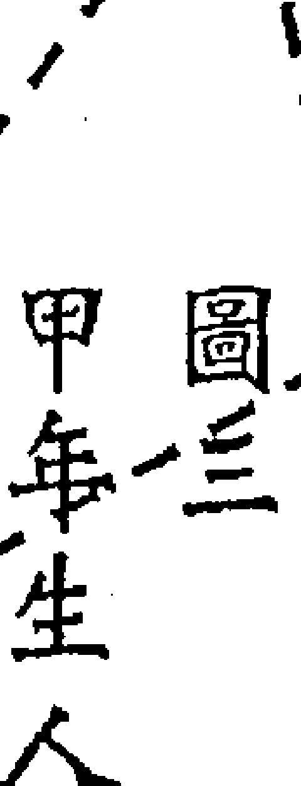

| 宫位信息 | 宫位信息 | 宫位信息 | 宫位信息 |
| :--- | :--- | :--- | :--- |
| **右弼 龙池 天马 陀罗 天梁** 104-113 乙 巳 福德 11 23 35 47 59 71 | **文昌 天姚 禄存 七杀** 94-103 丙 午 田宅 12 24 36 48 60 72 | **地空 火星 擎羊** 84-93 丁 未 官禄 1 13 25 37 49 61 | **文曲 天喜 廉贞** 74-83 戊 申 仆役 2 14 26 38 50 62 |
| **天相 紫微** 114-123 甲 辰 父母 10 22 34 46 58 70 | **阴男 生年：丁丑 (涧下水) 生月：卯月 生辰：辰时 金四局 26岁起运 斗君：亥** | **(连线交汇区域)** | **左辅 凤阁 天钺** 64-73 己 酉 迁移 3 15 27 39 51 63 |
| **地劫 巨门 天机** 4-13 癸 卯 命宫 9 21 33 45 57 69 | **(连线交汇区域)** | **(连线交汇区域)** | **破军** 54-63 庚 戌 疾厄 4 16 28 40 52 64 |
| **铃星 天刑 红鸾 贪狼** 14-23 壬 寅 兄弟 8 20 32 44 56 68 | **太阴 太阳** 24-33 癸 丑 夫妻 7 19 31 43 55 67 | **天府 武曲** 34-43 壬 子 子女 6 18 30 42 54 66 | **天魁 天同** 44-53 辛 亥 身宫 财帛 5 17 29 41 53 65 |

电话：(04)2203-3397 行动：0911-133639
E-mail：cz.way@msa.hinet.net 或 ziwi88@hotmail.com

如前页图的命例，如果只看单一宫会发现财帛宫不错，有“天同权、天魁”，而其宫干飞出巨门禄入命宫代表有财帛可享、太阳化权入夫妻，拿钱给配偶花用、文曲化科入交友，拿钱帮助朋友，文昌化忌入田宅，钱财投入在田宅上，应当是吉利现象。不过以全张命盘来观察的话，官禄宫的坐星组合，实在有够烂，一颗煞星就很令人讨厌了，他還三颗同宫，又没强力主星来压制，故“小时就不喜欢读书，小学毕业后学木工为生”。

因此，命盘主星构成的格局是“巨陷天机为破荡”的命局，虽然也有“财官格”之说，不过此命例不是“乙、辛、戊、癸生人”所以不合财官格，加上命宫坐巨门忌、地劫，三合会入地空、擎羊、火星，尤其事业宫三颗凶星汇聚，所以，行为举止都将往坏的方向发展，因此“有钱了就去赌博”，故是“巨陷天机为破荡”的格局而非“财官格”。因此一生的命运都将往“破荡”发展，也就是“破尽家产、浪荡天涯”。果不其然，此造“父母死后遗下大批田地，都被挥霍一空”，由于命宫坐星有欺骗之意，因此分得的财产都玩完了还“不知羞耻地向兄弟要钱翻本”，是不是人生发展和“破荡”格局的意涵很接近？说真的，我们很难精确的叙述人生现象，但是古人用“破荡”二字就已经言简意赅的点出了此命造的大局。

因此，很明显的格局不能只看单一宫位，要三方四正全盘关照才知道是吉还是凶。

当然也不是三方汇聚煞星就是不好，有些格局就是要有煞星才能成格，如“火贪格”就必须要有火星来和贪狼配对，才能逼使“贪花好色”的贪狼，成为“求财若渴”的贪狼、甚至“威震边疆”的贪狼。同理“马头带箭格”也是在午宫“温良恭俭让”的天同星要遇到“擎羊”或“铃星”才会变成“扬威异域、开疆辟土、立功边疆”的“马头带箭格”。所以，煞星并非都是凶意，若形成特殊格局，还是有其“吉祥”的含意存在的。

而有人问“我是禄马交驰格，能否赚大钱？”、“我是三吉嘉会格，能否赚大钱？”—格局是格局的问题，“赚钱”这就是“运途”的问题了。

运途也一样要衡量大限转变后，大限三方四正宫位内坐星曜所形成的星宿特性，再配合宫干四化来展现吉凶意义的。所以，看“星”也要顾“干”，两者兼顾才能内外合一，“星”是你处于该大限时外在遇到的环境，“干”是你身处该大限时引动你心境、心态变化的“触机”，两者要互相兼顾才会深入瞭解运途的变化。

大限星宿的会合状态可以表现这个大限运途的特性，如遇到“杀破狼”主变动的格局，该大限一定比较多变动，如远离家乡读书、工作、比较常换工作、或从事东奔西跑的业务工作、甚至投资事业、或从事比较投机的理财方式。而感情呢？也会变得动荡、对待关系起伏、或移情别恋……等情况。

到底是吉还是凶呢？最直接的观察指标就是大限命宫会入的凶星多寡！煞星汇集，则可以说是好的转变。又如大限遇到“机月同梁”的格局，这个大限一定多和政府机关、学校机构等公家机关接触，甚或他们有往来关系，而该格还有一“浪迹天涯”之说，先天命格可能就是“离乡背井，异地落地生根”之意，而在大限运途呢？就会常出国或是在国内出差，很少待在家里。大限星的组合状态代表他限运的大概现象，因此，大限也是要观察三方四正格局和煞星的汇集情形。

刚刚看先天格局的时候，是不是哪一年生人的“天干”很重要？是用来判别一个人是不是符合某格局吉利与否的依据！那么大限格局是否也要有个主管四化的天干来彰显大限格局的吉凶呢？扮演这个角色的就是大限命宫干，由其飞布四化和禄存擎羊陀罗等星，再观察这些大限星等分布于命宫三方四正来判断是否有利。配合前面的大限星格局与煞星的冲照强烈否？就可以知道大限运途是哪种情况。

# 图四 运途变化 男命癸年生人

| 宫位 | 星曜与标记 | 备注 |
| :--- | :--- | :--- |
| 丁 子女宫 | 武曲、破军、陀罗、禄 | 大限命宫 |
| 戊 夫妻宫 | 太阳、禄存 | |
| 己 兄弟宫 | 天府、擎羊 | |
| 庚 命宫 | 天机、科；太阴、科、禄 | |
| 丙 财帛宫 | 天同、权 | |
| 辛 父母宫 | 紫微、贪狼、忌 | 大限官禄 |
| 乙 疾厄宫 | 无星曜 | |
| 壬 福德宫 | 巨门、权、忌 | |
| 甲 迁移宫 | 无星曜 | |
| 乙 交友宫 | 廉贞、七杀、擎羊 | 大限财帛 |
| 甲 官禄宫 | 天梁、禄存 | |
| 癸 田宅宫 | 天相、陀罗 | |

看图四的例子，本来“癸”年生，命宫坐天机、太阴是合财官格的“机月同梁”，而机月同梁格的特性是“安逸、平稳、不喜变动”的，但是当进入到子女宫的大限时（简称巳限），三方就构成“杀破狼”的格局。但是他的这个格局，武曲、廉贞等相当强的主星，可以和“杀破狼”构成相辅相成的作用，使动荡幅度加大，因为有了强力的主星，使命造更大胆、或采取幅度更大的变动方式，因此会使得动荡更加剧烈。故此大限不管在事业、家庭或六亲关系等都会有重大的变动。

但是整个运途的变动或动荡，当然会给当事人造成相当的压力，因为机月同梁习惯了平稳，遇到要变动当然会有压力。假如先天就是“杀破狼”格局的人，可能就习以为常而不会感到有任何压力了。再来就是大限宫干“丁”四化的分布情况，太阴化禄、天机化科都入命宫、天同化权都入命宫，和先天的太阴科会合吉化命宫坐星的吉利；天同化权入财帛使追求财富的欲望更强烈、也会付诸行动而不是只有在“想”而已。巨门化忌入福德宫，不是只有计划没有行动的，这个运途的钱财，将具有相当紧张的关系，譬如财务拮据、调度金钱困难、或与人发生财务纠纷。因为巨门是口舌是非，此运途不管是求财或是财务调度都会呈现高度紧张的压力，因而引发许多口舌纷争，也容易被金光党、诈骗集团欺骗。

而且“丁”干的擎羊和陀罗在命盘上形成“对照”的角度，先天擎羊入丑、运限擎羊在未（巳限财帛）；先天陀罗入亥、运限陀罗在巳（巳限命宫），这种对照的情形比同入一宫的情形要好，怎么说呢？可以比拟成两个人拿武器互相对峙，势均力敌就不易受伤害，所以这个时候要看对峙的两宫内有无强力的主星给煞星撑腰，若一方有主星而另一方没主星只有煞星，则会有较大的祸害发生，而此例对峙宫内都有主星，所以为祸较微弱；而“入同宫”就会“聚党作祸”，会对于运途产生强力的冲突或重大破坏，需要小心因应。

举个实际的案例说明，会更清楚格局的影响力：

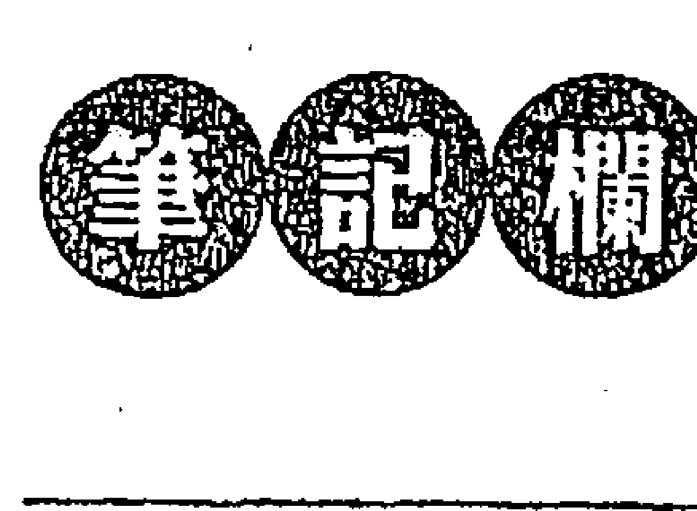

# 图五 阳男庚寅年5月5日未时生命盘

| 阳男庚寅年5月5日未时生 | 节气 芒种 59岁 |
| :--- | :--- |
| 命宫：卯 | 身宫：丑 |
| 命局：土五局 | 斗君：卯 |
|
| 宫位 | 大限年龄 | 天干地支 | 主要星曜 | 其他星曜 |
| :--- | :--- | :--- | :--- | :--- |
| 迁移 | 65-74 | 辛巳 | 天机、天姚 | 阴煞、恩光 |
| 疾厄 | 75-84 | 壬午 | 紫微、右弼、地劫、龙池 | |
| 财帛 | 85-94 | 癸未 | 天同、天钺、陀罗 | |
| 子女 | 95-104 | 甲申 | 破军、禄存、天马、凤阁、左辅、火星 | 擎羊 |
| 夫妻 | 105-114 | 乙酉 | 廉贞、天府、天姚、铃星 | |
| 兄弟 | 115-124 | 丙戌 | 太阴、文曲、科 | |
| 命宫 | 5-14 | 丁亥 | 贪狼 | |
| 父母 | 15-24 | 戊子 | | |
| 身宫/福德 | 25-34 | 己丑 | 天同、巨门、天机、天刑、红鸾、天喜 | 忌、三台 |
| 田宅 | 35-44 | 庚寅 | 武曲、天相、权 | 八座、天贵 |
| 官禄 | 45-54 | 辛卯 | 太阳、天梁、文昌、禄 | |
| 仆役 | 55-64 | 壬辰 | 七杀、地空 | |
|
| 中心信息 | 电话：(04)2263-2397 行动：0911-133639 E-mail：cz.way@msa.hinet.net 或 ziwi88@hotmail.com |

### 三合命例一：

这是网路流传马总统的命盘，我们不谈政治的是非，只从事实配合命理的观点来讨论：他从政以来一直给大众以“清廉自持，不贪不取，洁身自爱，奉公守法，谦恭为怀、知书达礼、温文儒雅，甚至要吐出一句尖酸刻薄的话语都难”的印象，怪不得每次面对对手用尖酸刻薄的话语攻击时，大家都想看他要如何采取“一针锋相对”的反击时，都只听到没刺激、无法让人分泌肾上腺激素的温吞调子的回应，还真令人觉得不够刺激。而且长相俊帅很有女人缘，所以竞选总统或为党内同志站台造势时，总是会引起一大群女粉丝的追逐，让对手吃味而被扣以娘娘腔之名，但无损于其声势。而其夫人由于穿着很平民化、个性也很独立、不苟言笑、对于媒体的追逐总是低调客气的默不回应，因此，媒体记者们给她冠上“酷酷嫂”的称号。

其实这些特质或现象在命盘上就已经清楚的展现出来，先从格局上来说：是标准的“月朗天门”格，有“登云职掌大权”或“月朗天门，进爵封侯”，而太阴入命限吉凶诀也有：“乙庚戍入亥宫立命，上格”的说法，出生年干是乙、庚或戍年生的人上格，而本例是庚年生，定能执掌大权而且是相当高的格局。再从三方四正来看，除了财帛宫有颗陀罗煞星来捣乱之外，没其他煞星，怪不得他会被担任台……The request was rejected because it was considered high risk我要求高，律己严谨，也常以自我标准要求他人，故常有得罪同僚、部属的情事，外貌五官较深、轮廓明显突出。

不管男、女命，婚姻皆要注意，因为夫妻宫坐七杀，所以婚缘较晚，早婚易生波折。

同理、有吉星来会则易有成就，忌煞星会入，则有事业毁于一旦的暗示，要特别注意。

|          | 禄存贪狼权 | 天同巨门擎羊 | 武曲天相禄 |
|----------|------------|--------------|------------|
| 廉贞天府 |            | 太阳天梁科   | 七杀       |
|          |            | 紫微在子     | 天机       |
| 破军     |            | 己年生人     |            |

- 1. 合乎『府相朝垣』一格的命盘有：紫微星在子，命宫在子，命宫在午。此格「喜丁己庚生人，壬癸人不耐久。」就是因为丁己庚干生人的禄存在命宫三合来会照命宫吉祥，其中尤以己年生人最吉利，因为己年生人化禄、化权又入三合朝照命宫，财官双美，甚为吉祥，因此，比起丁、庚生年的盘局来得更为吉祥，而未入列的生年者，虽然也构成『紫府朝垣』格，但因生年四化与禄存不构成吉利的角度，效用大减。而壬、癸年生者，因壬年生者武曲化忌、擎羊入子在命宫，癸年生者贪狼化忌、禄存入子命宫内，生年忌星不是在财帛宫就是在迁移宫，又有擎羊入命宫的禄存，对于命宫产生恶化的作用，因此以下格断！

- 2. 紫微星在丑，命宫在亥：紫微星在未，命宫在巳。命宫无主星，迁移坐廉贞贪狼，『入庙』，与破军同，甲乙丁己壬人财官格。『甲己年生人，主要是权科入命宫三方，故明显是属『财官格』，而乙丁壬三个出生年干者，主要是禄存入命宫或由迁移会入，所以也因此呈现吉祥的作用，而可列入财官格。

- 3. 紫微星在寅，命宫在戌：紫微星在申，命宫在辰。（如图二）甲庚丁己年生合财官格。甲己年生者，生年禄权科入命宫三方四正内，故吉利、尤其『甲』年生人禄存又在寅，更加具有富贵气象。庚年生者主要是禄存入申宫不是迁移宫就是命宫，而丁年生者禄存入（午）是官禄宫，也和命宫形成三合，增添命局的财气而归属吉利的盘局，但比起甲庚己年生者有生年三吉化星增添命局的吉利的盘局，又略微逊色些。

- 4. **紫微星在卯，命宫在酉：**
古文有道「紫微卯酉宫旺地，贪狼同，乙、辛生人吉，甲、庚生人，贵不耐久。」
因为乙年生禄存入卯、辛年禄存居酉，都来朝照命宫，故吉利，不愁吃穿。而甲、庚生人的擎羊、陀罗分别入命宫、夫妻，命宫主星被煞星挟制，对运途产生不利的牵制，因此富贵不耐久。

- 5. **紫微星在辰，命宫在申：**
紫微星在戌，命宫在寅。命宫一定是廉贞星独坐，是「雄宿朝垣」格，「申宫入庙，甲庚戊生人为贵格，丙生人次之」其中甲年生人最吉利，因为禄存在寅朝照申位的命宫，而和廉贞化禄构成「禄马交驰」的格局，一定是经营大事业的盘局，其他只是禄存入照命宫而已，也属吉利但格局气势弱多了，而命宫在寅的此格，也是吉利的气势远弱于命坐申宫者。

- 6. **紫微星在巳，命宫在未：**
紫微星在亥，命宫在丑。命宫是空宫、迁移有武曲、贪狼来照命，是个「武贪不发少年人」的格，少年辛苦积累家业，中年才会发达的盘局。

以上皆属「府相朝垣」格，吉星来会则吉利，使命宫之主星更能受紫府双星之庇荫，益增其行事之权令和顺利，忌煞星不宜会入，有则破坏格局的佳美，往往负面影响大于正面。

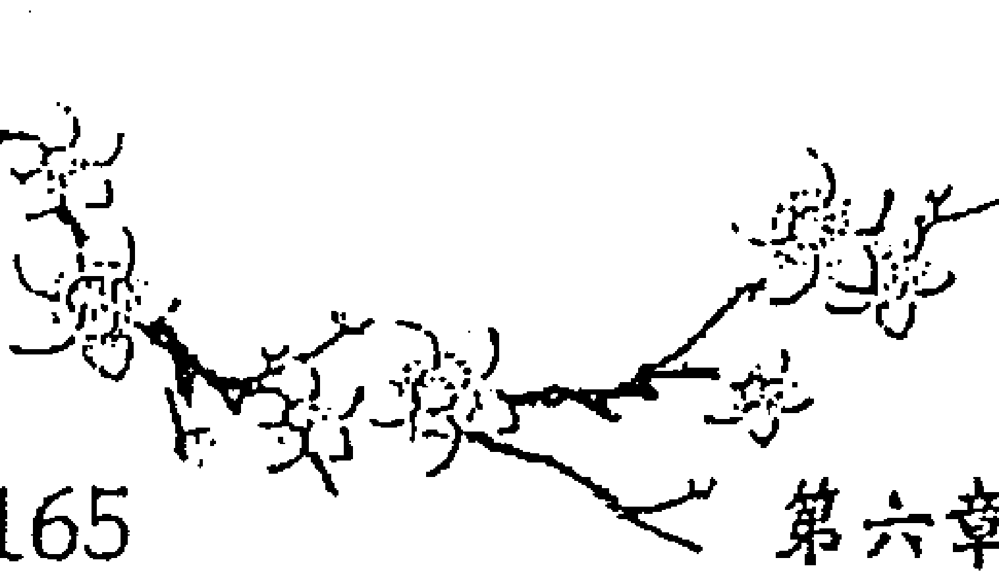

## 第六章／详论格局特性

面发展，如遇火星、擎羊则固执、硬脾气，或遇陀罗、铃星则懦弱、萎靡。

| 文天巨 曲马门 | 天天廉 刑相贞 | 天梁 权 阴煞 | 天七 钺杀 |
| --- | --- | --- | --- |
| 55-64 辛 疾厄 巳 | 45-54 壬 财帛 午 | 35-44 癸 子女 未 | 25-34 甲 夫妻 申 |
| 红擎贪 惊羊狼 恩光 | 阴男 乙亥（山头火） 生年：24 农历：10月丑时 节气虚岁 三台 | 阴男 乙亥（山头火） 生年：24 农历：10月丑时 节气虚岁 三台 | 文天 昌同 |
| 65-74 庚 迁移 辰 |  |  | 15-24 乙 兄弟 酉 |
| 龙禄太 池存阴 忌 |  |  | 地火天 空星姚 喜曲 |
| 75-84 己 仆役 卯 | 电话：(04)2263-2397 行动：0911-133639 E-mail：ez.way@msa.hinet.net 或 ziwi88@hotmail.com |  | 5-14 丙 命宫 戌 |
| 陀天紫 罗府微 科 | 右左天 弼辅机 禄 天贵 | 地天破 劫魁军 | 铃凤太 星阁阳 |
| 85-94 戊 官禄 寅 | 95-104 己 田宅 丑 | 105-114 身宫 福德 子 | 115-124 丁 父母 亥 |

## 命例解說：

武曲坐命火星、地空同宫，天府、天相分别由寅、午宫来会是一府相朝垣」格，三合陀罗、擎羊，六颗煞星会了四颗，凶煞汇聚，脾气大又冲动易怒，因此「怕事操心、多脾气，难任大事」，武曲本是「心直口快又勇敢」的主星，故「坦白、固执」，却遇到火星把勇猛的金星销熔掉了，只剩坦白，因此无法控制自己，脾气一来就爆发，加上地空行为疏狂、不明事理，当然无法承担大任、遇大事懦弱畏缩、小事发脾气逞英雄，所以做做小生意糊口过生活，最好是当上班族比较快活啦！武曲是颗孤星，而夫妻宫又是七杀，有「杀临三位，驾袭半冷」的说法，「婚后，配偶一直跟父母合不来，」加上「夫妻性格不合」所以婚后夫妻感情不睦，且怀疑「妻子婚前不贞，而抱恨不睦」这种婚姻现象，两人感情一定不会好的，因此符合古文的叙述。先天四化中只见「化科」在官禄宫，其他吉利的化星没进来三合内，禄存也在交友，人说「禄存居交友，纵有财官也奔驰」好处都给了朋友，即使自己当老板也要「老板兼撞钟」，什么事都要做，因为不会指挥部属做，或想「以身作则」、部属却「乐得轻松」看老板做，所以是个不合格的府相朝垣格。此格之人一定要有吉化之星来扶助才是合格的盘局，如此例是甲年生人，禄存在官禄，而甲年的廉贞化禄在财帛、破军化权在福德，武曲化科入命宫，此时的格局就非常吉利，明禄暗禄会合，又有权科相照，一定成就非凡，所以武曲入命吉凶诀「辰戌宫入庙，甲己生人才合财官格」就是四化和禄存在命盘形成的吉利角度有关，其他亦同。

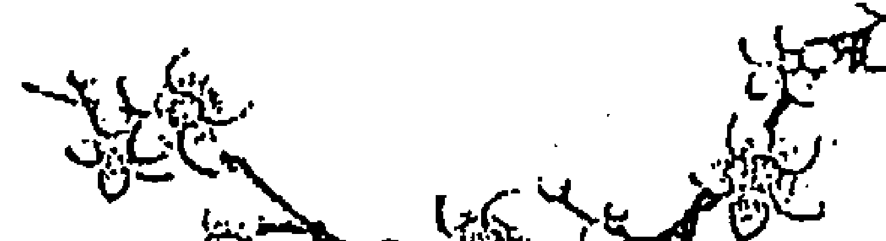

## 紫微斗数命运分析格局篇

### 三、紫府朝垣格：（图三）

| 太阳 | 破军 | 天机 | 紫微 天府 |
| 巳 | 午 | 未 | 官禄 申 |
| 武曲 |  |  | 太阴 |
| 命宫 辰 | 紫府朝垣格 | 酉 |  |
| 天同 |  |  | 贪狼 |
| 卯 |  |  | 迁移 戌 |
| 七杀 | 天梁 | 廉贞 天相 | 巨门 |
| 寅 | 丑 | 财帛 子 | 亥 |

合紫府朝垣格的很多，但要成富贵的条件严格，此格之人常与政治、军警、商界中有成就的人来往，因而得到此辈之助而成功，是攀权附贵的格局，若忌煞星加会，则为平常人，仍有攀附权贵的本性，但往往予人逢迎巴结、阿谀奉承的观感；但也有受到父祖庇荫，不管是因外人或父祖庇荫，一旦行运吉利可发达，只是名声欠佳；吉星加会则能得富贵且有良好名声。此格不适宜女命，婚姻比较晚。以下皆合乎此格：

1. 紫微在子，命宫在申，紫微在午，命宫在寅。命宫内坐星曜「武曲、天相」，甲丁己庚年干生人财官格，甲己年生人，生年禄权科入照命宫三方，而且禄存入命或由迁移，和命宫的武曲化禄构成「禄马交驰」格或是「明禄暗禄合」格，是非常吉祥的盘局。
2. 紫微在辰，命宫在申，紫微在戌，命宫在寅。（就是「雄宿朝垣」格，参考相关章节）

以第1.项较吉利，男命事业有成，掌财权，女命丈夫事业有成，旺夫益子。
己年生人，因为生年化禄、化权在命之三方，而且禄存在午宫居于福德位，所以富贵吉美，这时就要看文曲星落入哪一宫化生年忌，假使落入迁移宫或命宫就会破坏命局的吉美，而有了破绽。

第2.项之人婚姻大都不吉、有波折，因夫妻宫坐七杀主孤克，即使晚婚亦常会在婚后有意见不合、无话可说等现象，最需良善之星来柔化或是化禄、化科等化解孤剋性质，不然，就要有先见之明，知此格局的互相克制的性质，夫妻各有事业各忙各的，就可以增加婚姻的祥和，不然每天针锋相对，不离婚才怪。【命例同前】

### 四、明珠出海格：（图四）

太阴在亥时，太阳在卯时，从海平面升起的时刻光芒耀眼，为大地带来一片光明，好像两颗明珠由大海浮出一般，故称「明珠出海」格，此时命宫在未位，而日月分别由卯亥等三合旺地来照，主命造为人心地坦白、公正无私，充满爱心，加会文昌、文曲更增加智慧灵敏、反应机智、才学出众，容易在社会上成名。
事业上最宜从事公益福利、慈善等服务业，担任教学工作也能展现才华，虽可经商但不宜太过于商业化之事业。
女命没有忌煞星同宫或三方会入，则财帛、官禄、夫缘皆吉，婚后宜从事职业妇女或有自己的事业较吉，否则易有家庭风波。若文昌、文曲同宫或会入，不管男女命都容易有桃花。庚、丁年生人较差，由于生年化忌在丑位冲命，应注意是非，凡事忍让、免得招来莫名其妙的是非，从事研究、学术性的工作、少与人打交道的工作最好，减少是非争执。

| 宫位 | 星曜 |
|---|---|
| 巳宫 | 天机 |
| 午宫 | 紫微 |
| 未宫(命宫) | （空） |
| 申宫 | 破军 |
| 辰宫 | 七杀 |
| 卯宫 | 太阳、天梁 |
| 寅宫 | 武曲、天相 |
| 丑宫 | 巨门、天同 |
| 子宫 | 贪狼 |
| 亥宫 | 太阴 |

| 宫位 (年龄-岁数) | 干支 | 星曜 (主星/辅星/杂曜) | 备注 |
|---|---|---|---|
| 命宫 (4-13) | 乙未 | 天府、凤阁、龙池、天刑 | 乾造：辛卯年 (1951) 十一月十一日巳时生，阴男，生肖兔，松柏木命，金四局，节气：大雪/小寒 (虚岁1岁) |
| 兄弟 (14-23) | 甲午 | 紫微、天魁、天喜、地空 | |
| 夫妻 (24-33) | 癸巳 | 天机、文昌 (化忌)、天贵、阴煞 | 身宫在此 |
| 子女 (34-43) | 壬辰 | 七杀、地劫、八座 | |
| 财帛 (44-53) | 辛卯 | 太阳、天梁 (化科)、铃星 | |
| 疾厄 (54-63) | 庚寅 | 武曲、天府、天钺、天马、左辅、火星、恩光 | |
| 迁移 (64-73) | 辛丑 | 天同、巨门 (化禄) | |
| 仆役 (74-83) | 庚子 | 贪狼、红鸾、右弼、三台 | |
| 官禄 (84-93) | 己亥 | 太阴、天姚 | |
| 田宅 (94-103) | 戊戌 | 廉贞、天府、擎羊 | |
| 福德 (104-113) | 丁酉 | 禄存、文曲 (化科) | |
| 父母 (114-123) | 丙申 | 破军、陀罗 | |

**联系方式：**
电话：(04)2263-2397
行动：0911-133639
E-mail：ez.way@msa.hinet.net 或 ziwi88@hotmail.com

## 第六章／详论格局特性

命例解说：除了一「明珠出海」格之外，命宫三合还会入生年禄、权、福德一财帛线科、权相会又有禄存，是力量强旺的明珠出海格，像初升的旭阳光芒万丈，怪不得成为鉅富，不过命宫没主星只有天刑，因此「出身平凡」，而天刑星主司法，于运途不吉之时，就会触法坐牢，巳限坐生年忌星、辰限坐七杀地劫三合擎羊陀罗，这两大限都非常不吉利，故「日治时代，一再坐牢」，但是命格强不怕运限的挫折，反而是「天将降大任于斯人也先苦其心智」的磨练，一旦进入三合有禄、权、科会照的辛卯大限，遇到科、权和禄存加持之后「渐有起色」，开始蓬勃发展，财源广进，到「台湾光复时已成矿业鉅子」，二次大战末期，濒临战败的日本政府到处蒐罗能源应付战事需求，之后国共内战让台湾人口急速增加，对于能源也是需求迫切，日后反共无望、政府乃积极施政建设台湾，由农业社会转型工业社会，一连串的因缘际会成为「瑞芳镇矿业巨子」，家产庞大，乃当地一大家族」。太阳、太阴两颗星分处卯、亥旺地来朝照命宫，日月乃主掌光明之星曜，显现于个性：心地光明坦白、急公好义、也颇富爱心，因此「传闻阳明山中山楼就是其捐赠给政府的一」，而以星性来说太阳乃「能源」、太阴是「不动产」，而他往矿业发展，符合能源的性质，因此财帛与此相关，有钱了到处买土地，拥有一大片土地，又与太阴有关，真是贴合日月的星情展现。
有钱之后，捐献土地盖阳明山中山堂，若是现代人就可能以成立爱心基金会之类的行善机构、帮助弱势团体，因日月发光发热普照众生，此行径又符合星性，真是一切造化尽在盘中。
这格局和「日月并明格」有异曲同工之妙。

### 五、日月并明格：（图五）

| 宫位/星曜 | 巳 | 午 | 未 | 申 |
| :--- | :--- | :--- | :--- | :--- |
| | 紫微 七杀 | 命宫 | | |
| | 天机 天梁 | | | 破军 廉贞 |
| | 天相 | | 辰 | 酉 |
| | 卯 | | | |
| | 巨门 太阳 | 武曲 贪狼 | 太阴 天同 | 天府 |
| | 寅 | 丑 | 子 | 亥 |

太阳、太阴两星在庙旺之地，而命宫的三方四正会入太阳、太阴，即合乎此格，如命在午，太阳在寅，太阴在子，或命在丑，而太阳在巳宫旺地，而太阴在酉宫亦是旺地，来朝照丑宫的天梁，即为此格，和「明珠出海」格类似，心胸开阔如日月照耀世人，是非分明，嫉恶如仇。若无煞星同会，则此格之人较懒散，尤其和化禄或禄存同宫时更严重，因此喜有煞星激发斗志，反能成就不凡志业，煞星不可多，一颗即可，多了奔波劳碌，忽略家庭，增加其孤剋性质。工作以服务或涉外业务性质的工作最好，曾见此格之人担任机械设备公司的业务经理，开发国内外业务，同时也和国外买主建立深厚关系，衍生其它合作机会。如果命宫有擎羊或火星同宫，即成为「马头带箭格」，陀罗或铃星同宫的话，则不符此格。

# 笔记本

| 巳 (85-94 官禄) | 午 (75-84 仆役) | 未 (65-74 迁移) | 申 (55-64 疾厄) |
|-----------------|-----------------|-----------------|-----------------|
| 辰 (95-104 田宅) |                 |                 | 酉 (45-54 财帛) |
| 卯 (105-114 福德) |                 |                 | 戌 (35-44 子女) |
| 寅 (115-124 父母) | 丑 (5-14 身宫命宫) | 子 (15-24 兄弟) | 亥 (25-34 夫妻) |

阳女生肖龙
生历年：丙辰年
斗君：丑
（五局、沙中土、日午时）
电话：(04)2263-2397 行动：0911-133639
E-mail：ez.way@msn.hinet.net 或 ziwi88@hotmail.com

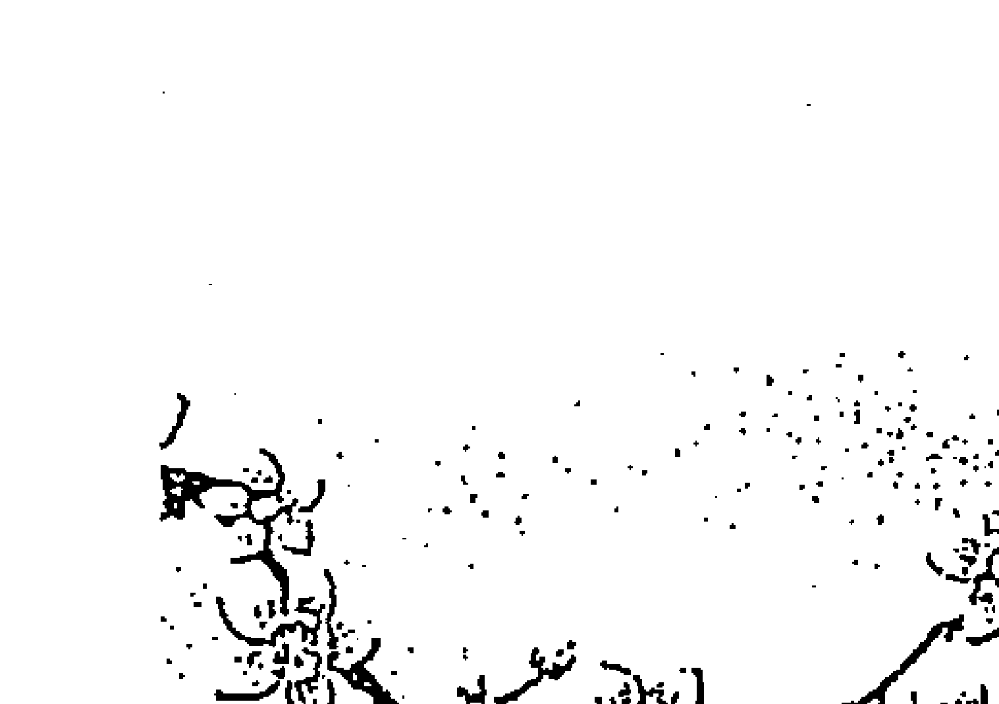

## 命例解说：

除官禄有煞星之外命宫、迁移、财帛、还有福德都是吉星汇集，何况福德宫还有生年禄星，因此「出身于富商之家」，日月分由巳、酉旺宫来照命，此人一定心胸坦白、行为端正、看不惯邪僻丑事又富有爱心，所以「终身未婚，但收有义子多人，帮助、培育他们出国留学」，空、劫在官禄宫使得他的事业有「浪里行舟，半空折翅」的凶险，像「情报人员」就是，因此「上海沦陷后，留在上海担任情报人员」，除此之外其他三合宫的坐星都纯正，因此引伸到心性也是秉性纯洁善良、嫉恶如仇、充满爱国情操「搜集日本情报，建有殊勋」（当然这是时代背景使然），由于三方四正都没有重大煞星，因此能够「为国家出生入死」而没有被破获，不然谍报人员被敌方捕获，刑求拷掠的惨各位可想而知，忠心为国终获得政府重用「抗战胜利，当选国民大会代表」，拥有权势之后也发挥像日月般燃烧自己照亮别人的心胸，收养培育义子多人，获得博、硕士者不乏少数。所以此格局之人，不宜涉入太利益导向的工作，应该投入以公益、服务社会为宗旨的工作，如青年活动中心、老人安养院、红十字会、慈济功德会等组织，最能发挥古道热肠、热于助人、扶弱济倾两腋插刀也在所不惜的特质，让救济工作做得有声有色，而且也不会将半毛善款污到自己口袋里，是能够让人信服的最佳慈善工作者，现代也有很多投入政治工作的，不过，此格之人可能无法适应现代的政治环境而退出政坛，改投入益民众生的行业。

### 六、日照雷门格：（图六）

| 地支 | 星宿 |
|------|------|
| 子 | 贪狼 |
| 丑 | 巨门 天同 |
| 寅 | 武曲 天相 |
| 卯 | 天梁 太阳 (命宫) |
| 辰 | 七杀 |
| 巳 | 天机 |
| 午 | 紫微 |
| 未 | |
| 申 | 破军 |
| 酉 | |
| 戌 | 廉贞 天府 |
| 亥 | 太阴 |

「太阳居寅卯为初升」、「日照雷门」，子辰卯地，昼生富贵声扬」、「卯宫庙，酉和平，乙辛生人财官格，甲庚人困。」 卯宫为雷门（以命盘配八卦，卯宫属震卦，震为雷，故称卯为雷门），所以太阳在卯位坐守命宫，叫做「日照雷门」，由于卯为早上五至七时之间，初升旭阳带来光明驱走黑暗，又和天梁星同宫，主个性豪爽慨、随和、正义感、为人光明正大、诚实正直、责任心强、具有领导才能，容易成为有名望的人，有煞星冲破，亦能成为小格局的清望之辈，是很很好的格局，但要白天生人才是。适合从事：慈善公益事业、服务业、教职、或贸易等事业，担任民意代表之类的公职人员也很恰当；有煞星冲破或忌星同宫，不宜创业，有惊险，必事倍功半。而且此格之人逢乙年生人，禄存入卯位，形成「阳梁禄」的盘局，一旦有文昌于酉宫相会或同入卯宫，就构成「阳梁昌禄」格，此时两种吉利格局成分加乘作用，定然富贵双全。而甲年生人因太阳化忌，且擎羊又入卯宫坏局，定然多灾多难、运途困顿、颠簸。庚年生人虽然太阳化禄居命宫，但是擎羊入酉宫冲击着卯位的命宫，官禄宫又坐陀罗，夫妻宫又有天同化忌遥感影响官禄，因此虽有太阳化禄也无功可施。女命甲年生人较不好，与夫、父较无缘，婚姻有波折。由于此格女命个性豪迈不拘，要注意男女之间不可太随和，以免予他人轻浮的感觉，而被居心不良者轻薄，丈夫宜选个性温和者较佳。
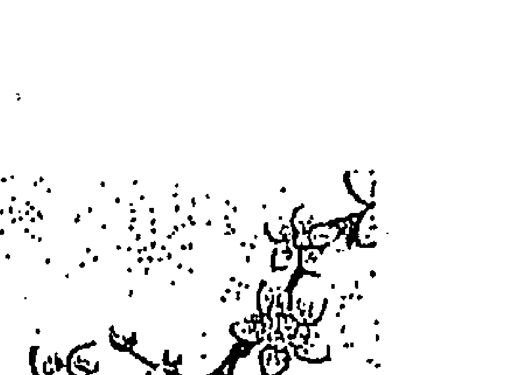

# 笔记簿

紫微斗数命盘表格：

| 宫位 | 年龄范围 | 天干地支 | 主要星宿 |
|------|----------|----------|----------|
| 福德 | 22-31    | 丁巳     | 铃星、禄存、天机 |
| 田宅 | 32-41    | 戊午     | 文曲、龙池、擎羊、紫微 |
| 官禄 | 42-51    | 己未     | 右弼、左辅、天喜、天钺 (身宫) |
| 仆役 | 52-61    | 庚申     | 文昌、凤阁、破军 |
| 父母 | 12-21    | 丙辰     | 天姚、陀罗、七杀 |
| 迁移 | 62-71    | 辛酉     | 天府、廉贞 |
| 命宫 | 2-11     | 乙卯     | 天相、武曲 |
| 疾厄 | 72-81    | 壬戌     | 太阴、天马 |
| 兄弟 | 112-121  | 甲寅     | 天贵 |
| 夫妻 | 102-111  | 乙丑     | 天同、巨门、红鸾、地劫 |
| 子女 | 92-101   | 甲子     | 天刑、贪狼 |
| 财帛 | 82-91    | 癸亥     | 天马、太阴 |

中心区域显示：阳男，生年戊寅，生肖虎，等命主信息。

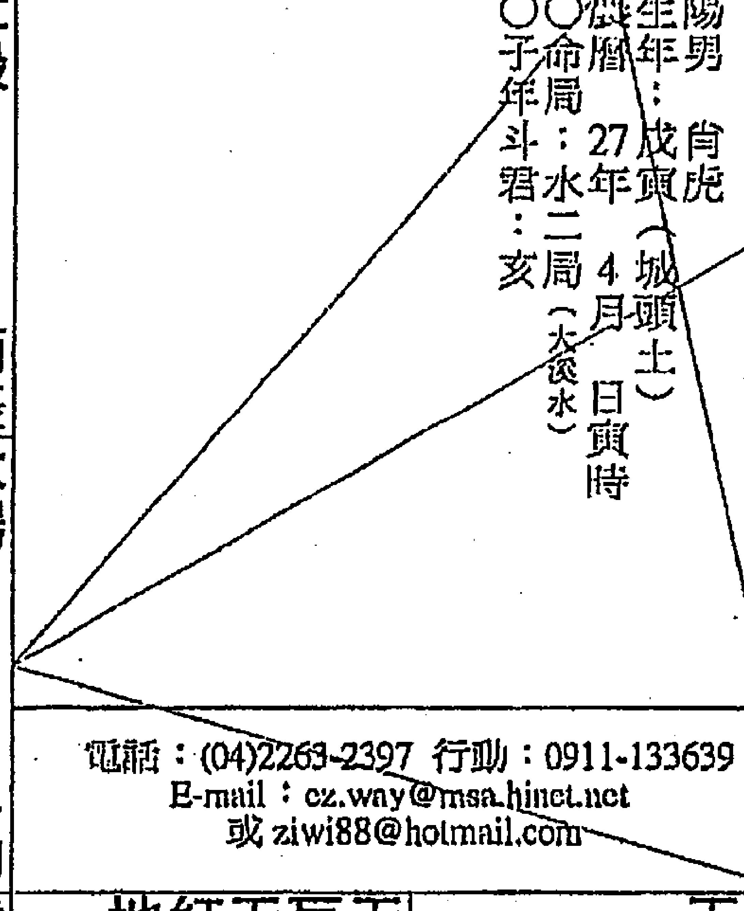

电话：(04)2263-2397 行动：0911-133639
E-mail：cz.way@msa.hinet.net 或 ziwi88@hotmail.com

# 命例解说：

受限于原著提供少许资料，不过也可从蛛丝马迹中来验证此格局的特性，福、德宫坐忌，因此『初年无父母财产可庇荫』，但是结婚后『得贤妻相助』，这个可由财帛宫的太阴权在庙旺的亥地，就可窥知此现象，而没父母财产庇蔭能考上大学，和他利于求学考试的『阳梁』格很有关系，在民国四十七、八年的时候，台湾人民普遍都处于战后复兴初期的贫穷阶段，所以，一定要奖学金、当家教等才能支应学费、生活费，所以虽不是很吉利的『阳梁』盘局，不过好读书的特质应该是与盘局俱来的，『结婚后得贤妻相助』而『从事国际贸易』和命宫的太阳、天梁特性相关，有日、月坐命者多和海外发生关系，尤其命宫又在四马地者，火星则在他第一个大运时发功，让他在一到十一岁时，定然充满艰辛，不过，经过艰苦的磨难、锻炼坚毅心智，相信对他日后的事业，能产生刻刻苦耐劳、勇往直前的斗志，迈向成功致富，而他有权、科会照命宫，使他能白手成家，积财致富，所以『三十岁之后日渐发达，经营国际贸易致富』。

### 七、月朗天门格：（图七）

| 天机（巳） | 紫微（午） | （未） | 破军（申） |
|----------|----------|------|----------|
| 七杀（辰） | 图七 月朗天门格 | （酉） | 廉贞天府（戌） |
| 天梁太阳（卯） |  |  |  |
| 武曲天相（寅） | 巨门天同（丑） | 贪狼（子） | 太阴（亥 命宫） |

亥宫为天门，若太阴坐命宫在亥位，就称为月朗天门格或称「月生沧海」格。亥时为夜间九时至十一时，月亮最明亮的时刻，因此，命宫入亥宫，又是亥时月亮最明亮的时候生的，当然最好，不然也要晚上时辰出生的才合格，如果白天生者，月全没光芒，又逢农历初一、二、九、三十日出生者，就没什么吉利的效

用了。

合乎此格者男命相貌斯文，如明月一般予人天真无邪纯真的感觉，女命面貌身材均佳，不管男女个性都温和、不偏激，深谋远虑，喜欢研究学问，心思细腻而体贴，为人谦恭、能忍让，人缘佳，可因学術名成，适宜学者、专家，此格之人往专业领域方面钻研，定有不凡成就。

一生平稳，善理财，异性缘特佳，所以婚后要注意交际状况。

乙年生人，因为太阴化忌的关系，多眼睛视力差或与母无缘，但不影响日后之发展。

最忌煞星、忌星冲破，尤其和火星、铃星成为「太阴与火铃同宫」，反为十恶」的格局，自我强烈、自私自利，工于心计，又无口德，欠缺容人之雅量，人生多波折，易遭挫败或孤独，宜修身养性，免得老来孤单。

> 古人说：「月朗天门于亥地，登云职掌大权」，是以乙、庚、戊年生人合乎「掌大权」的条件，生年不符合的，当然不合格，丁、戊年生人比较适合从商，可得财利。

| 天机 天姚 65-74 迁移 辛巳 | 地右龙紫 劫弼池微 阴煞 恩光 75-84 疾厄 壬午 | 天喜 天钱 陀罗 85-94 财帛 癸未 | 火左凤天禄破 星辅阁马存军 95-104 子女 甲申 |
| --- | --- | --- | --- |
| 地空 七杀 55-64 仆役 庚辰 | 阳男 生肖：虎 年龄：39岁 节气：虚岁 出生年月日：庚寅年 5月 28日 未时 命局：土五局 斗君：卯 | 铃星 天府 康贞 105-114 夫妻 乙酉 |  |
| 文昌 天梁 太阳 化禄 45-54 官禄 己卯 | 天武 相曲 化权 25-34 身宫 福德 己丑 | 天红天巨天 刑鸾魁门同 化科 15-24 父母 戊子 | 文太 曲阴 化忌 5-14 命宫 丁亥 |
| 八天 座贵 35-44 田宅 戊寅 |  |  |  |

电话：(04)2263-2397 行动：0911-133639 E-mail：cz.way@msa.hinet.net 或 ziwi88@hotmail.com

## 命例解说：

年轻时父母极注重教育，求学之路顺遂，在美国取得名校博士学位后，返国就担任领导人的翻译，后来历任各重要部会首长或政务委员，长得仪表出众，温文儒雅，而且个性清廉，一芥不取，有政治洁癖，获得广大粉丝爱戴（尤其女性粉丝），成为政治明星。

男命有这种格局，一看就知道很有女人缘，太阴化科坐命利于求学深造，并增添斯文有礼的高贵气质和风度，说话不疾不徐、礼貌得体，与那些言语咄咄逼人、强词夺理的民意代表比起来，实在是异类，也让某些草莽性格者认为个性太软弱、不够有魄力，说话太温和，没有攻击力，但是，运途的气势正处于强旺的时候，好运挡都挡不住，加上对手又历经数年的摧残已经弱不禁风，而这个命例日月都在庙旺宫，命宫又有化科、化禄会照，所以，整体气势强旺，是很好的命局，因此摧枯拉朽的打败对手，荣登总统大位，果真是一月朗天门于亥地，登云职掌大权。一又是「庚」一年生人符合「上格」的要件，因此，成为总统。

### 八、巨机同临格：（图八）

天梁 七杀 廉贞
巳 午 未 申
紫微天相 图八 巨机同临格 酉
辰 破军
天机巨门 戌
命宫卯
贪狼 太阳太阴 武曲天府 天同
寅 丑 子 亥

「天机巨门同一位，武职历边庭，亦要权逢杀，方可立功名。」一一一位」指的是命宫而不是同处一起的意思、「卯酉宫旺地，巨门同，乙辛戊癸生人财官财」巨门、天机两颗星只有在卯、酉两宫才会同宫，以在卯宫守命比酉宫好（因卯宫属木和天机的五行相同，而酉属金克天机木），特征为富有探究之好奇心，凡事存疑、要待自己经验过后才会相信，口才好，个性略为固执，适合高度智

慧性工作，有特殊艺术才能，早年辛苦，奔波劳碌成败大，中年后才能振兴家业、属白手成家之人，善于计划筹谋，财运虽好但难守成，一生中起伏大、多是非争执之事，故说『机巨卯酉，纵有财官也不荣』。

女命不宜，如与生年忌同宫，婚姻多波折，身体较差，时常生病，否则财运即差。

适合：顾问、外交（业务）、文化事业等工作。与煞星同宫，纵遇财官亦不荣。

乙、辛、癸年生人，财官双美，丁、戊年生人有成败，不稳定。因为乙年生人禄存入卯，且天机化禄同宫，构成『明禄暗禄』的格局，故合财官格，而辛年生者禄存入酉和巨门化禄又成财官格。癸年生者，巨门化权勉强算是合乎财官格，因为做生意很有说服力。

古文说戊年生人亦合财官格，应是笔误，天机化忌在命、禄存又没入三方四正形成吉祥格局，应该是困顿不利的盘局。

| 宫位 | 年龄段 | 天干地支 | 主要星宿 |
|------|--------|----------|----------|
| 福德 | 25-34 | 辛巳 | 天喜、天梁 |
| 田宅 | 35-44 | 壬午 | 凤阁、七杀 |
| 官禄 | 45-54 | 癸未 | 铃星、天刑、天钺、陀罗 |
| 仆役 | 55-64 | 甲申 | 地劫、龙池、禄存、廉贞 |
| 父母 | 15-24 | 庚辰 | 天相、紫微 |
| 迁移 | 65-74 | 乙酉 | 擎羊 |
| 命宫 | 5-14 | 己卯 | 贪狼、天马、左辅、地空 |
| 兄弟 | 115-124 | 戊寅 | 地空、左辅、天马、贪狼 |
| 夫妻 | 105-114 | 己丑 | 文曲、文昌、天魁、太阴、太阳 |
| 子女 | 95-104 | 戊子 | 右弼、天府、武曲 |
| 财帛 | 85-94 | 丁亥 | 火星、天姚、红鸾、天同 |
| 疾厄 | 75-84 | 丙戌 | 火星、天姚、红鸾、天同 |

阳男 庚辰年 白蜡金
紫微斗数命盘
节气惊蛰虚岁29

电话：(04)2263-2397 行动：0911-133639
E-mail：cz.way@msa.hinet.net
或 ziwi88@hotmail.com

## 命例解说：

这个虽然有入「机巨同临」的格局，但是并不合格，因为三方四煞汇聚构成「巨逢四煞」格、还有天同忌星冲破，一定不是吉祥的命局，李居璋前辈评曰：「风流破败，刑孤无妻儿，流离之造。」，不过命宫机巨没煞星，只是迁移有颗擎羊，命宫还算强势，因此「高商毕业后入银行服务」，当年要进银行可不容易，但是，不好好把握机会积极进取，因为三方的擎羊、陀罗、铃星牵引着命造往坏的方向发展，故而「生活不检，侵占公款，喝花酒，上舞厅泡舞女」，原来「机巨卯酉，纵有财官也不荣」指的就是这些侵占、欺骗、讹诈等方式得来的钱，而「贪花好酒的劣行也使得虽有财富也没好名声流传，怪不得「不荣」，而「贪花好酒」看看他的财帛宫天同水星又遇到天姚水星在亥水之地，水势如汪洋大海，而天姚是桃花星，而天同在巳、亥地乃「男浪荡女多淫」，所以虽有人人称羡的职业，还是「不安于室，侵占公款去花天酒地，此时官禄宫的天刑和一群煞星在一起，就是「违法犯纪」的征象了，终于东窗事发进去蹲苦牢了。

### 九、机月同梁格：（图九）

| 破军 武曲 巳 | 太阳 午 | 天府 未 | 天机 太阴 申 命宫 |
| :--- | :--- | :--- | :--- |
| 天同 辰 | 机月同梁格 | 紫微 贪狼 酉 |
| 卵 |  | 巨门 戌 |
| 寅 | 廉贞 七杀 丑 | 天梁 子 | 天相 亥 |

合乎本格的命盘很多，凡是命宫、财帛、事业、迁移等宫有以上四星会入时皆合格，此格之特征为：具有企划之头脑与卓越的沟通协调能力，做事有次序、思考有条理，为最佳之幕僚人员，会追随强有力的人做事，协助他们创业，不管是军、政、商，都是上司的得力助手。现在高级官员或在野阵营中的高级干部中，很多是此格局，成就很高，并不能以小吏来断，治理一个

太平盛世的国家正需要此格局之人才，而开疆辟土打天下的时候，此种人才只能做后勤支援、分析规划的幕僚工作，如当初的姜子牙之于周武王的关系。

会左右、曲昌，文为清显，武为忠良，但机阴同宫在申寅宫合昌曲，为人思虑多变，朝令可夕改，因此担任主管难贯彻命令，且会远涉他乡，是出外发达的命，女命不利感情多波折，甚或有为求名利，卖身的情况，宜注意。

若会煞星，浪荡他乡事无成，吉星加会，多主富贵，衣锦荣归。

此格不宜创业，企划能力虽强，执行力却不足，但服务业可以，因为服务业需要灵活应变、很多需要推陈出新的创意行销企划，而生产制造事业较不适宜。不然，就是那些「打带跑」的行业，一遇到衰退马上收掉、改行换业的小事业。

○○农历乙卯兔（大溪水）
○○命历年11月\子年局：64乙
斗：64乙卯
君木年卯
：三局11日午
申（杨柳木）时

| 星曜 | 天机 天喜 禄存 |
| :--- | :--- |
| 宫位 | 身宫·命宫 |
| 干支 | 壬午 |
| 年龄 | 3-12 |

| 星曜 | 紫微 破军 龙池 凤阁 天刑 八座 三台 恩光 |
| :--- | :--- |
| 宫位 | 父母 |
| 干支 | 癸未 |
| 年龄 | 113-122 |

| 星曜 | 天钺 |
| :--- | :--- |
| 宫位 | 福德 |
| 干支 | 甲申 |
| 年龄 | 103-112 |

| 星曜 | 天府 |
| :--- | :--- |
| 宫位 | （空） |
| 干支 | （空） |
| 年龄 | （空） |

| 星曜 | 太阴 文曲 化忌 |
| :--- | :--- |
| 宫位 | 田宅 |
| 干支 | 乙酉 |
| 年龄 | 93-102 |

| 星曜 | 廉贪 狼 姚 |
| :--- | :--- |
| 宫位 | 官禄 |
| 干支 | 丙戌 |
| 年龄 | 83-92 |

| 星曜 | 巨门 天魁 红鸾 右弼 |
| :--- | :--- |
| 宫位 | 迁移 |
| 干支 | 戊子 |
| 年龄 | 63-72 |

| 星曜 | （空） |
| :--- | :--- |
| 宫位 | 疾厄 |
| 干支 | 己丑 |
| 年龄 | 53-62 |

| 星曜 | 天同 天梁 陀罗 天马 左辅 天贵 |
| :--- | :--- |
| 宫位 | 财帛 |
| 干支 | 戊寅 |
| 年龄 | 43-52 |

| 星曜 | 武曲 七杀 禄存 火星 |
| :--- | :--- |
| 宫位 | 夫妻 |
| 干支 | 庚辰 |
| 年龄 | 23-32 |

| 星曜 | 太阳 擎羊 文昌 铃星 |
| :--- | :--- |
| 宫位 | 兄弟 |
| 干支 | 辛巳 |
| 年龄 | 13-22 |

| 星曜 | 地空 地劫 阴煞 |
| :--- | :--- |
| 宫位 | （空） |
| 干支 | （空） |
| 年龄 | （空） |

| 星曜 | 天相 |
| :--- | :--- |
| 宫位 | （空） |
| 干支 | （空） |
| 年龄 | （空） |

电话：(04)2263-2397 行动：0911-133639
E-mail：cz.way@msa.hinet.net
或 ziwi88@hotmail.com

## 命例解说：

是一位武职人士，以前都是担任副手或参谋，但在团体中要晋升必须要有担任「主官」的经历，终于被调派担任主官，不过个性温和、欠缺杀气和魄力，常常一个命令下去被部属七折八扣的、执行不够彻底，而常挨长官骂、盯得满头包，十分难受，想退当个平凡老百姓……。
由命局来看确实是个善于计划、按计划行事或听命行事的「机月同梁」幕僚格局，虽然财帛宫有颗生年天梁星却坐不对位置，应该要入官禄宫才好，在财帛不是威风凛凛、充满魄力的主官格局，而是斤斤计较钱财的小气财神格局，一般当主管、大格局的气魄，不是长袖善舞、就是深具威严魄力，长袖善舞要花钱，喝酒搏感情他斤斤计较，当然这招行不通，靠威严魄力吗！官禄宫又坐了【太阴忌】、文曲】一看就知道是温柔体贴的星星，哪里有霸气？更何况又有一颗瞻前顾后、犹豫不决的陀罗星，要下个命令就已经犹豫不决了、命令下下去了，人家一反弹或质疑，可能又三心二意的想收回了，没办法坚持下去建立令出必行的威严，久而久之，底下的部属也都吃定他的软弱、讲究人和、犹豫不决，故人家当主管一呼百诺、指挥若定，他却百呼无一诺、大呼小叫还未必叫得动，就在格局使然。

### 十、石中隐玉格：(图十)

| 廉贪 | 巨门 | 天相 | 天梁天同 |
|------|------|------|----------|
| 巳   | 命宫午 | 未   | 申       |
| 太阴 | 图十 | 七杀武曲 | 酉       |
| 天府 |      | 太阳 | 戌       |
| 卯   |      |      |          |
|      | 紫微破军 | 天机 | 亥       |
| 寅   | 丑   | 子   |          |

「巨门子午二宫逢，身命逢之必贵荣，更得三方科禄拱，石中隐玉是丰隆」。
『子午宫于身命，为石中隐玉格，更会禄科权福厚；『巨门子午二宫逢，局中得遇以为荣，三合化吉科权禄，官高极品衣紫袍。
『巨门子午科权禄，石中隐玉福兴隆。』、子午宫旺地，丁己癸辛生人福厚，丙戊生人主困。

由古籍文字中知，对于此格局几乎没有负面的评价，而且给予非常高的评语，因此是个相当吉利的盘局，是做大事业的

格，当官也是高官。
凡巨门在子、午位坐命宫，称为石中隐玉格，顾名思义，隐藏在璞石之中的玉髓必须要经过琢磨才会显露光彩，故引喻此格之人的特性为有才华、有见识，却常被埋没，必须经过一番努力奋斗后、或经贵人挖掘之后，才会登上大舞台，所以早年辛劳，中年后才会发达。

最喜科、权、禄会，名声显扬，适合国贸、代理、业务、文化、教育等工作。

会遇煞星、忌星，则多是非口角；火星同宫，三合杀凑，小心祝融之灾。兄弟、交友宫坐丁者，易遭盗窃，三合会火星，田宅宫又不吉者，小心火灾。

此格之人，以辛、癸年生人最佳，丁年生人因巨门化忌，常因言语不当而得罪人或使自身受到伤害，有禄存在午宫，依然是「富贵」格，平时应注意口才或口德，才能靠口舌打天下；三方有吉化星拱照的话，也能有相当高的成就。癸年生人禄存在子而巨门化权在命，形成「富」局；己年生人是因禄存入午宫而受惠，其他的三吉化星并没形成三合，故减色不少。而辛年生人是因化禄、权都入命宫和官禄，因而成为「富贵」格，不过擎羊入戌宫、陀罗居申位，对命局三合产生冲击，让运途增添不少阻碍，但也正符合此格须经一番磨练方能成功的过程。

网络上流传的，据说陈前总统就是这格局，青少年生活困苦，经过许多的奋斗才逐渐攀上人生高峰，正如此格的名称，要经过一番磨练才能显出光彩。
标准的「石中隐玉」格，三合还有文昌、文曲与右弼等吉星来会，命宫有化权星使他能更具魄力与执行力，虽然还有铃星，但是吉星多使导向正途，不致被凶星肆虐破坏命运，故不仅「入格」还「合格」—合财官格。

| 宫位 | 天干地支 | 星曜（主星/辅星） | 年龄范围 | 备注 |
| :--- | :--- | :--- | :--- | :--- |
| 兄弟 | 丁巳 | 廉贞(忌)、贪狼、天钺、火星 | 16-25 | 三台 |
| 命宫 | 戊午 | 巨门(权)、铃星 | 6-15 | 申宫（天火） |
| 父母 | 己未 | 天相、地劫 | 116-125 | 节气：小寒、大寒 |
| 福德 | 庚申 | 天同、天梁、天马、红鸾 | 106-115 |  |
| 夫妻 | 丙辰 | 太阴(科)、左辅、天刑 | 26-35 |  |
| 田宅 | 辛酉 | 武曲、七杀、天刑 | 96-105 |  |
| 子女 | 乙卯 | 天府、天魁、凤阁、地空 | 36-45 |  |
| 官禄/身宫 | 壬戌 | 太阳、右弼 | 86-95 | 八座 |
| 财帛 | 甲寅 | 天喜、文昌 | 46-55 | 阴煞 |
| 疾厄 | 乙丑 | 紫微(禄)、破军、擎羊、天姚 | 56-65 | 恩光 |
| 迁移 | 甲子 | 天机、禄存、文曲 | 66-75 | 天贵 |
| 仆役 | 癸亥 | 陀罗、龙池 | 76-85 |  |

**命主信息**
〇〇年生男，癸未年（杨柳木）
阴男
生肖：未
生年：32
斗君：申

**联系方式**
电话：(04)2263-2397
行动：0911-133639
E-mail：cz.way@msa.hinet.net 或 ziwi88@hotmail.com

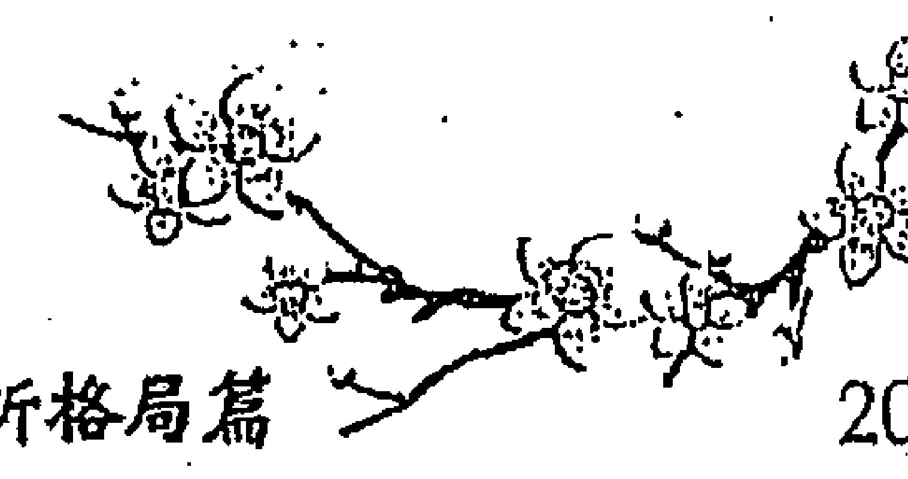## 命例解說

命宮坐巨門權，而遷移為「天機、祿存、文曲」等善星吉星，因此个性内剛外柔，外緣佳，三合又見文昌、文曲、右弼等吉星來輔佐，因此給人感覺「做事熱心耐勞，待人誠實有禮」，不過，讀書大限坐【廉貞、貪狼、火星】等桃花星，故而「讀書不專心」，且貪狼火星形成「火貪格」，為「橫發資財」格，故而腦海中就有「一夕致富」的投機想法，「退伍後即經商」，剛開始有得財利，不過由於大限的星曜不吉，都是一些桃花星還會入亥宮的陀羅，構成「忌遇貪狼，號日風流彩杖」的盤局，而且命宮的巨門又遇到鈴星，意志薄弱，經不起誘惑，因此「一染起上舞廳、賭博惡習」，荒廢經營本業，終因週轉不靈觸犯票據法，由於命宮的巨門權星，還讓他擁有約束力或克制力，因此「後來改邪歸正」，與兄弟合夥。

### 十一、日丽中天格：又叫「金燦光輝」（图十一）

| 破军 武曲 巳 | 太阳 命宫 午 | 天府 未 | 天机 太阴 申 |
| :--- | :--- | :--- | :--- |
| 天同 辰 | 图十一 日丽中天格 | 紫微 贪狼 酉 | 巨门 戌 |
| 卯 |  |  |  |
| 寅 | 廉贞 七杀 丑 | 天梁 子 | 天相 亥 |

在诸星问答或赋文中有：「有专权之位，敌国之富」、「若居庙旺，化禄、化权，允为贵论」、「若得左右昌曲，魁钺三合拱照财官二宫，富贵极品」、「在午为日丽中天，主大富贵」、「子宫陷、午宫旺，丁己生人财官格，壬丙戊生人悔吝。」都是关于太阳在午宫的评语。

太阳守命垣在午宫，而在「午」位之太阳最明亮，普照万物，故主人个性豪爽、随和大方，做事急速不耐久，喜欢助人，不善與人計較，能從大處著眼，不計較小事，交遊廣闊，具領導力，終其一生的財運、事業運均很好。個性雖然強，但能擇善固執，會吉星適合國際貿易、開工廠、政治界、文化事業、服務業等，是個非常好的命格，以辛、癸、庚年生人最佳，甲年生人固執、不合群、自視甚高，易受他人排擠，一生中助力少，獨立自主之命。女命剛強、不利婚姻，若能以溫柔的態度來調諧婚姻，則能減少波折，否則，妻奪夫權，難免婚姻生風波。以日間午時前出生之人最佳，申時前生之人，易先勤後惰，夜間生人，因太陽已西沉，毫無光芒，失去吉祥助力，宜趁早離鄉、出外奮鬥。壬年生人，可為富商高賈或為著名之「師」級人物，如律師、會計師、技師、老師等。

| 宫位 | 年龄范围 | 天干地支 | 主要星曜 |
| :--- | :--- | :--- | :--- |
| 兄弟宫 | 13-22 | 辛巳 | 武曲、破军、天马、天喜、文昌、恩光 |
| 命宫 | 3-12 | 壬午 | 太阳、凤阁、天刑、地空 |
| 父母宫 | 113-122 | 癸未 | 天府、陀罗、天钺、火星 |
| 福德宫 | 103-112 | 甲申 | 天机、太阴、禄存、龙池、阴煞 |
| 夫妻宫 (身宫) | 23-32 | 庚辰 | 天同、地劫、铃星 |
| (中央信息) | | | 阳女龙相 29庚辰 白蜡金 农历辰年10月14日巳时 斗君：木三局（极向辰明） |
| 田宅宫 | 93-102 | 乙酉 | 紫微、贪狼、擎羊、文曲、天贵、节气（虚岁） |
| 子女宫 | 33-42 | 己卯 | (无主星，对宫为天同巨门) |
| 官禄宫 | 83-92 | 丙戌 | 巨门、天姚 |
| 财帛宫 | 43-52 | 戊寅 | 廉贞、七杀、天魁、左辅、右弼、三台 |
| 疾厄宫 | 53-62 | 己丑 | (空宫，借对宫星)、八座 |
| 迁移宫 | 63-72 | 戊子 | 天梁 |
| 仆役宫 | 73-82 | 丁亥 | 天相、红鸾 |

陽女龍相 29庚辰 白蠟金
農曆辰年10月14日巳時
斗君：木三局（極向辰明）

電話：(04)2263-2397 行動：0911-133639
E-mail：ez.way@msa.hinet.net 或 ziwi88@hotmail.com

### 命例解说

女命命宫有太阳禄、天刑和地劫，所以评曰：“圆型脸，讲话声音像男人，有男子个性”，和两颗同属火性的太阳和天刑同宫让她“性急又刚强”，太阳坐命的女生常和男生在一起如哥儿们，而且要有话讲才可以，男女生的话题本就不尽相同，不然话不投机半句多，根本不会混在一起，而化禄主口才表达，“能与男士周旋”实在很符合“太阳化禄”的特征，命宫三合没遇上什么煞星，而且太阳又是“官禄主”，所以能够“夫妻共同经营公司”，这已经意味了，后来竟然和公司底下的主管发生奸情而和老公离婚，并牢牢地掌控公司，所以女命“日丽中天”格也能做事业，只不过婚姻不美而已，和一般女人“感情就是生命的全部”比起来，这格局的女人早就超越了这种框框，是个做大事的女强人，太阳星官禄主，化禄之后，当“老板”的气势还真强烈！

### 十二、巨日同宫格：（图十二）

| 巳 | 午 | 未 | 申 |
| :--- | :--- | :--- | :--- |
| 紫微 七杀 |  |  |  |
| 天机 天梁 | **图十二** 巨日同宫格 |  | 破军 廉贞 |
| 辰 |  |  | 酉 |
| 天相 |  |  |  |
| 卯 |  |  | 戌 |
| 巨门 太阳 寅 命宫 | 武曲 贪狼 丑 | 太阴 天同 子 | 天府 亥 |

「巨日命宫寅位，食禄驰名。巨日命立申宫，亦妙。」

寅申宫入庙，太阳同，庚癸辛生人财官格。
巨门、太阳在寅、申位会同守命宫，但申时，太阳已快下山了，光芒薄弱，无法照亮同宫巨门的阴晦，故寅宫比申宫吉利，此格特征为：个性强、口才好、操劳，因「巨日同宫，多竞争」所以事业上的对手很多，从事之行业也较热门，难免竞争激烈，不过都能坚持到底获致成功。热心公益，从事慈善事业或当义工，度量宽宏，昔日对手今日亦能成为合夥伴，一生中易受小人中伤，但不伤其事业上的发展力。适合：律师、国际贸易、旅游、医师、教师、外务等工作，例行性的行政事务不适合。
与海外有缘，宜早学习外语，以备明日之需，在中年后会涉足政治，为民喉舌，或为弱势团体发声，当然命局要有吉化之星辅佐才可，辛、癸、庚年日间出生的人合格，有煞星冲破不吉，多受小人之害。
在申宫则吉力不彰，做事有头无尾，先勤后惰，结局不好，宜改变个性，积极些、毅力坚强些。
如命申宫而巨日在寅宫来照，比在寅宫巨日坐命更吉祥，发展性更强，为人能干、成名而得利，是一「巨日同梁冲且合、子羽才能」的局。女命旺夫益子，是贵夫人格。若立命寅，巨日由申宫来照，吉力不显，因夕阳无力。

紫微斗数命盘：

| 宫位 | 主星 | 辅星 | 年龄 | 地支 |
| :--- | :--- | :--- | :--- | :--- |
| 命宮 | 文曲、巨門、太陽 | 天相、紅鸞 | 5-14 | 戊申 |
| 父母 | 天機、天梁 | 陀羅、龍池、天刑 | 15-24 | 己酉 |
| 福德 | 紫微、七殺 | 天祿、天姚、存 | 25-34 | 庚戌 |
| 田宅 |  |  | 35-44 | 辛亥 |
| 官祿 |  | 右弼、擎羊、八座 | 45-54 | 壬子 |
| 僕役 |  |  | 55-64 | 癸丑 |
| 遷移 |  | 左輔、天馬 | 65-74 | 壬寅 |
| 疾厄 | 廉貞、破軍 | 天魁、天喜、地劫、三台 | 75-84 | 癸卯 |
| 財帛 |  |  | 85-94 | 甲辰 |
| 子女 | 天府 | 火星、天鉞、恩光、陰煞 | 95-104 | 乙巳 |
| 夫妻 | 天同、太陰 | 文昌 | 105-114 | 丙午 |
| 兄弟 | 武曲、貪狼 | 鈴星、天刑、地空 | 115-124 | 丁未 |

陽男
農曆年：31年11月11日辰時
生辰：壬午年（楊柳木）
斗君：午局
命局：土五局
節氣：驚蟄

電話：(04)2263-2397 行動：0911-133639
E-mail：ez.way@msa.hinet.net 或 ziwi88@hotmail.com

## 命例解說

这个命例有左辅、右弼来扶持成为「左右同临」格，还有化科由迁移宫加入，命宫又坐文曲，应该是相当会读书的格局，故「考上大学、重考又上政治大学」，而官禄宫有擎羊一旦遇限运不吉即逞凶，酉限官禄无主星，被劣友趁隙而入带坏，故「因赌博被退学」也易遭受小人陷害而「为朋友作保遭连累，几乎破产」，就是命宫座星光明博爱，欠缺防人之心，平添运途的波折，若能懂得明哲保身之道，还能减少损失，三合只见颗擎羊星而已「易冲动，忠厚多情，多愁善感，责任心重」，剋害尚不严重，只可惜没有化禄、化权来加持，所以「一生名利虚浮，多成多败，小富之命」而已，若生于辛年的人，成就将远大于此。

### 十三、月生滄海格：（圖十三）

天同、太陰守命在子，稱為月生滄海格，又稱「水桂澄萼，得清要之職」，

| 紫微七殺 | 午 | 未 | 申 |
| :--- | :--- | :--- | :--- |
| 天機天梁 |  |  | 破軍廉貞 |
| 辰 |  |  | 酉 |
| 天相 | 月生滄海格 |  | 戌 |
| 卯 |  |  | 天府 |
| 巨門太陽 | 武曲貪狼 | 太陰天同 | 亥 |
| 寅 | 丑 | 命宮子 |  |

可见此格之人心性光明磊落、爽朗、公正坦白，不耍心机、但却能预先了解危机所在而避祸，适合担任监察、评论（议）等方面的清高职务。此格之人：长相斯文秀气，反应机敏，具幽默感，人缘佳，多酒食应酬之事。在社交、娱乐、旅游等业都能出名，以丙、丁年中秋前后生人最佳，或以每月十五日夜生人入格，其他时间出生合此格者，吉力减弱。

丁、戊、己、辛、癸年生人财官双美，与擎羊同宫，身体遭伤，女命较不利夫妻生活，如有同性恋倾向或排斥性生活等，情况不一而足。

当然古代当清要之职的谏议大夫，必然不是唯唯诺诺之辈，一定是个性有棱有角、有话直说的人，因此，引申于人之个性或处事态度也是如此，格局好还能衣锦荣归，格局会煞太多，恐怕就会因直言而惹祸上身了，不可不慎。

| 陀罗七杀紫微 | 禄存 | 擎羊天刑 | 空格 |
| :--- | :--- | :--- | :--- |
| 53-62 僕役 巳 | 63-72 迁移 午 | 73-82 疾厄 未 | 83-92 财帛 申 |
| 文曲红鸾天梁天机 | 空格 | 空格 | 火星天铖破军廉贞 |
| 43-52 官禄 辰 | 空格 | **OO女士生肖猪(属土)** **命局：丁亥年11月土五局** **斗君：36年子时** **寅卯** **（桑柘木）** | 93-102 子女 酉 |
| 龙池天相 | 空格 | 空格 | 铃星文昌天喜 |
| 空格 | 空格 | 空格 | 空格 |
| 33-42 田宅 卯 | 电话：(04)2263-2397 行邮：0911-133639 E-mail：ez.way@msa.hinet.net 或 ziwi88@hotmail.com | 空格 | 103-112 夫妻 戌 |
| 左辅天马巨门太阳 | 贪狼武曲 | 右弼太阴天同 | 地空地劫天姚凤阁天府天魁 |
| 天贵 | 三台八座 | 3-12 身宫 壬子 命宫 | 113-122 兄弟 亥 |
| 23-32 福德 寅 | 13-22 父母 丑 | 空格 | 空格 |

## 命例实例

此造性情颇为刚烈，为什么呢？“天同、太阴”不是温柔宽厚的星曜吗？是的，但是遇到成格局的时候，星性就会以“格局”为重，所以我一直强调“看命要看全盘”。

欲得“清要之职、成为忠谏之才”需要怎样的人格特质呢？和稀泥、两面讨好、柔弱的人，还是性格强烈、善恶分明的人才可以？既成“忠谏之才”所以此格的人一定“性情刚烈、有话直说”，男命还好，女命就不吉祥了，太过刚烈了，

所以此造不仅如此，还“妇夺夫权”，把丈夫押到市公所工商登记处“强将公司的负责人改为她”，丈夫的脾气实在不错，因为夫妻的坐星“文昌铃星”没有强力的星曜，因此丈夫“柔弱无力、气势不强”，让此造气焰嚣张，不过若没有命局有这种特质会做出如此这种令人侧目的事情来吗！至于“为人男性化，衣着男装，还同性恋”太阴禄在命，使她很有女人缘，天同权个性强，有魄力，行为举止男性化，

一不小心成为同性的大姊，搞同性恋也就不足为奇了。

### 十四、日月照壁格：（圖十四）

| 天梁 巳 | 七殺 午 | 未 | 廉貞 申 |
| :--- | :--- | :--- | :--- |
| 紫微天相 辰 | 圖十四 日月照壁格 | 酉 | 破軍 戌 命宫 |
| 天機巨門 卯 |  |  |  |
| 貪狼 寅 | 太陽太陰 丑 田宅 | 武曲天府 子 | 天同 亥 |

太阳、太阴两星在丑或未同位，丑未又恰为田宅宫，都叫日月照壁格，此种格局之人拥有许多不动产，包括继承、自购、赠与等皆可能，当然会否因拥有大批田地而成为大富翁，需要行运配合。庚、辛、丁、戊年生人合格，其他年生人较次。以丑宫优于未宫，因太阴为田宅主，在丑宫还是晚上月亮尚有光芒，故较未宫为佳，而同宫之太阳不主田宅之事。由于命宫坐破军的缘故，在辰戌位的破军有变动的意味，此变动有多种意思，如：远离家乡在异地发展、事业多变动或家庭多变动等，因此，虽有田宅却未必是自己耕作，有些交给别人管理，所以要慎选信赖的托管之人，以免被侵占。因为不动产不易变卖，假如限运不吉，钱财大部份押在田地上，如果事业上欠缺周转，很容易一败涂地，此和命宫坐破军有很大关系，因为大凡「杀破狼」

| 宫位 | 星曜（主星、辅星） | 年龄范围 | 天干地支 | 备注 |
| :--- | :--- | :--- | :--- | :--- |
| 命宫 | 右弼、陀罗、破军科 | 5-14 | 丙辰 |  |
| 父母 | 火星、禄存、天同 | 15-24 | 丁巳 |  |
| 福德 | 文昌、龙池、擎羊、天府、武曲、地空、铃星、天姚、天喜、天钺、太阴、太阳权 | 25-34 | 戊午 |  |
| 田宅 | 八座 | 35-44 | 己未 |  |
| 官禄 | 文曲、凤阁、贪狼忌 | 45-54 | 庚申 |  |
| 仆役 | 巨门、天机型 | 55-64 | 辛酉 |  |
| 迁移 | 左辅、天相、紫微 | 65-74 | 壬戌 |  |
| 疾厄 | 天梁 | 75-84 | 癸亥 |  |
| 财帛 | 七杀 | 85-94 | 甲子 | 身宫 |
| 子女 | 红鸾、天魁 | 95-104 | 乙丑 |  |
| 夫妻 | 天马、廉贞 | 105-114 | 甲寅 |  |
| 兄弟 | 天刑、地劫 | 115-124 | 乙卯 |  |
| 杂曜 | 天贵（兄弟宫）、恩光（夫妻宫）、阴煞（夫妻宫） | — | — | 分散于各宫位角落 |

### 命例解說

田宅宮有【太陽、太陰權、天姚、鈴星、地空】等星，是標準的「日月照壁」格，應該會擁有大量的不動產，故「父親雖耕農，但農地數甲，生活富裕。」很明顯的，此造日後也會繼承到這些田產，所以，正如格局所顯示的徵象，而性格和命宮坐星破軍、陀羅有關，該書上說「性格剛烈，性發亂暴，孤獨，心地善良，為人好義」就是這兩顆剛強又暴烈的星湊在一起，讓脾氣就像爆發的火山難以控制，幸好右弼科來柔化緩和，使得心地善良，而且也提供亂暴之時冷靜的能量，讓命造不至於做出無法承受的後果出來。雖然田宅宮還有「鈴星、地空」等煞星，代表田地會有田界糾紛或是土地貧瘠、不適合作等現象，日後也有改建房屋的現象，不會對「日月照壁」格產生多大的影響，是個「田產致富」的格局。

### 十五、貪武同行格：（圖十五）

| 巳 | 七殺紫微 |  |  | 午 | 未 | 申 |
| :--- | :--- | :--- | :--- | :--- | :--- | :--- |
| 辰 | 天機天梁 |  |  |  |  | 酉 |
| 卯 | 天相 |  | 圖十五 貪武同行格 |  |  | 戌 |
| 寅 | 太陽巨門 | 丑 命宮 貪武曲狼 | 子 | 太陰天同 |  | 亥 |

「武曲與貪狼會，悻吝之人。「武曲會貪狼，則少年不利，所謂貪狼守命福非輕，貪狼不發少年人是也，」丑未宮入廟，貪狼同，戊辛生人大貴財官格。武曲、貪狼在丑或未位同守命宮時，稱為貪武同行格，此格之人：個性堅毅、不畏辛勞、鬥志旺盛，不繼承祖業，為離鄉背井，功成異域之命。武曲、貪狼都屬財星，但有一「貪武同宮不發少年人」之說，三十歲以前財來財去，辛勞奔波，雖有祖業亦難保有，但三十歲後會漸漸露頭角，成為成功的生意人，若有火星或鈴星同宮，成為「火貪格」或「鈴貪」格者，投機性強，往往由股票或賭博致富，若行運不吉，將敗得一乾二淨，是此格之人要注意的。

若貪武同行並有火星或鈴星同宮，則適合軍旅，必能冒險立功於邊城，成為軍事將領，不會火鈴則欠缺殺氣，無法成為掌握大權的將領，若再逢忌煞星，則富貴不長且身體遭傷、壽元不長。

女命武貪守命，數字敏銳，精打細算，神經質、吝嗇，有目的的大方，易流於斤斤計較之流，愛好自由，不喜拘束，好強、不向人低頭，一定要做成功給你看，因此不適合上班族，最好自己經營生意；女命疼愛丈夫但晚婚。

最忌諱有羊、陀來沖，感情不順，平常之技術人員或小公司、小商號的老闆，成就較差。

有咸池、天姚同宮，則桃花重，易有感情風波，男女情事要注意。

| 紫微七杀、天钺、龙池 84-93 身宫官禄 丁巳 | 铃星 74-83 仆役 戊午 | 地劫 64-73 迁移 己未 | 天姚天喜 54-63 疾厄 庚申 |
| :--- | :--- | :--- | :--- |
| 天机天梁、天刑 94-103 田宅 丙辰 恩光 | 阴男 癸丑年（桑柘木） 金四局 8月28日申时 节气处暑 | 破军廉贞、凤阁 44-53 财帛 辛酉 禄 |  |
| 太阳巨门、文昌、红鸾 104-113 福德 乙卯 权 三台天贵 | 武曲贪狼、擎羊 忌 4-13 命宫 乙丑 八座阴煞 | 天同太阴、禄存 科 14-23 兄弟 甲子 | 天府天梁、火星、左辅、陀罗 24-33 夫妻 癸亥 |

## 命例解說：

命宮坐貪狼忌星又逢擎羊，因此幼年困頓「初運家境平凡、父母緣薄，送人做養子」，既然送人當養子就已經無法繼承祖業，也代表「武貪不發少年人」了，有很多出養他人的例子都是遠離故鄉，在異域落地生根，此例沒說不清楚，但已有出養他人之事實，符合命格了。武曲、貪狼忌遇到廟旺的擎羊，讓他在艱困中惕勵心志反而成為日後經營事業的鬥志，武貪格的人本來就有極強烈的創造財富的運氣，而且善於鑽營，因此一接近中年時，創設工廠，業務興隆大發財利」，而生年忌在命宮雖讓他幼年困頓，也使他養成一副好心腸，富有同情心，因此，當他成為成功的企業家之後，仍然時時捐款濟助社會弱勢團體「仁慈積德，待人忠誠，常捐助社會濟貧或教育貢獻甚大」，人說「陰騭延年」此造煞忌同宮命已衰微，出養他人移根換葉，獲得重生，事業有成之後，又懂得奉獻、幫助社會上弱勢族群，仁慈積德，因此福壽悠長。

### 十六、日月夹命格：（图十六）

| 宫位 | 星曜 | 地支 |
| :--- | :--- | :--- |
| | 破军 武曲 | 巳 |
| | 太阳 | 午 |
| 命宫 | 天府 | 未 |
| | 天机 太阴 | 申 |
| | 天同 | 辰 |
| | (空) | 卯 |
| | 廉贞 七杀 | 丑 |
| | 天梁 | 子 |
| | 天相 | 亥 |
| | 紫微 贪狼 | 酉 |
| | 巨门 | 戌 |
| | (空) | 寅 |

太阳为官禄主，太阴为财帛主，若两星在旺地来夹命，主富与贵，易得长官提拔而成功，财官双美，如图十六为一例，又若人立命丑宫，武贪守命，太阳在寅，太阴在子，两星皆在旺地夹命，亦为日月夹命格，主人一生财运丰足。（与武贪同行格同论）。

天府坐命本已有富足之意，此种富足多是继承而来，而少部分是自己后天努力挣来的，因为天府星保守、欠缺開創力，因此其後天努力來的財富，大都是靠節省下來或靠錢滾錢賺得的，而非做事業賺來的，加上天府星自視甚高的特性，實在不適合需要身段柔軟的商場，若要自營事業也屬清高或別人有求於己的事業，例如律師、顧問或會計師等行業為宜。

## 紫微斗數命運分析格局篇

| 宫位 | 年龄范围 | 天干 | 主星 | 辅星 |
|------|----------|------|------|------|
| 官禄 | 44-53 | 丁巳 | 天相，天禄存，天刑 | 天馬，天姚，天喜 |
| 僮仆 | 54-63 | 戊午 | 天梁，天擎羊 | 地劫，地空 |
| 迁移 | 64-73 (身宫) | 己未 | 七殺，天鉞，廉貞 | 鈴星 |
| 疾厄 | 74-83 | 庚申 | 天同，天馬 | 地劫 |
| 田宅 | 34-43 | 丙辰 | 紫微，貪狼，紅鸞 | 八座 |
| 财帛 | 84-93 | 辛酉 | 天同，天馬 | 鳳閣 |
| 福德 | 24-33 | 乙卯 | 天機，太陰，右弼 | 地空，地劫，天刑 |
| 子女 | 94-103 | 壬戌 | 武曲，破軍，火星 | 天貴，恩光，三台，陰煞 |
| 父母 | 14-23 | 甲寅 | 太陽，天機，右弼 | 地空，地劫，天刑 |
| 命宫 | 4-13 | 乙丑 | 天府，天魁，文曲，文昌 | 文昌，文曲 |
| 兄弟 | 114-123 | 甲子 | 太陽，左辅 | 太陽，左辅 |
| 夫妻 | 104-113 | 癸亥 | 武曲，破軍，火星 | 火星，破軍，武曲 |
| 个人信息 | 戊午年生陽男，37歲（庚午年），4月9日丑時生，四柱：庚午 辛巳 壬申 辛丑 | | | |

電話 (04)2263-2397 行動: 0911-133639
E-mail: cz.way@msa.hinet.net 或 ziwi88@hotmail.com

## 命例解說：

天府乃出自「天府之國」，代表充足富裕的意思，因此「生於富農之家」，而天府又有「自負」傾向，因此對於那些他心中瞧不起的人，當然懶得理，因此別人認為「有孤獨癖」，而三合沒有其他吉星來輔佐，讓命宮天府和昌曲被天刑、天姚、鈴星等星遙控，而使得個性「自少急性，多愁善感」欠缺踏實的安全感，而父母宮的星曜組合【天機忌、太陰權、右弼科】一堆化星聚集代表「父母勤儉卻嚴厲」的現象。昌曲同在命宮，利於學習，所以能「畢業於師範大學」，而昌曲是時系星，心思常變，故「脾氣不專時好時壞」，而對宮廉貞七殺鈴星煞氣甚重，因此、發起脾氣很凶悍。由於有日月夾命，所以父母從小就很嚴厲的督促其功課，使之難以懈怠，故而能考上當時許多人夢寐以求的知名大學，此種「夾命」的威力可想而知！

| 午 | 未 | 申 |||
|---|---|---|---|---|
| 太阳 | 破军 | 天机 | 紫微 |
| 巳 | 命宫午 | 未 | 天府 |
| 武曲 | | | 太阴 |
| 辰 | 图十七 | | 酉 |
| 天同 | 英星入庙格 | | 贪狼 |
| 卯 | | | 戌 |
| 七杀 | 天梁 | 廉贞 | 巨门 |
| 寅 | 丑 | 天相 | 亥 |

十七、英星入庙格：(图十七)

破军在子、午位为庙旺之地，若在命宫，且无煞星冲破，即合此格。此种命格之人：喜创新，喜新鲜事物，凡事存疑，眼见为凭，实事求是，注重有形的事务，胆大，好投机冒险，时常变化改革，故是一位改革的执行家，不是空头说说而已，成功与失败常在一瞬间，所以对于此种格局之人，「变动」是形容他一生最适切的用语。

## 第六章／詳論格局特性

此格之人多離鄉發展，且與海外有關係，如與海外有商業往來或時常出國等，故語文很重要，宜趁早學好。若煞星加會，為人心機深沈、陰險、好賭、自私重利，招惹官非，奔波勞祿。甲、丁、己、癸年生人福厚，丙、戊年生人不吉，因廉貞化忌、或擎羊同宮為禍，難免是非纏身。此格之人可塑性大，宜文宜武。

陽男
生年：壬子（桑柘木）
生肖：子鼠
農曆：八月廿六日卯時
命宮：申（水二局）
命局：水二局
斗君：申

電話：(04)2263-2397
行動：0911-133639
E-mail：cz.way@msa.hinet.net 或 ziwi88@hotmail.com

| 星曜 | 天干 | 地支 | 年齡段 | 宫位 |
| :--- | :--- | :--- | :--- | :--- |
| 火天太 鈹陽 | 乙 | 巳 | 112-121 | 兄弟 |
| 破軍 | 丙 | 午 | 2-11 | 命宮 |
| 文文天 曲昌機 恩光 天貴 | 丁 | 未 | 12-21 | 父母 |
| 地天天 紫空姚府微 | 戊 | 申 | 22-31 | 福德 |
| 天龍武 刑池曲 | 甲 | 辰 | 102-111 | 夫妻 |
| 天太 喜陰 | 己 | 酉 | 32-41 | 田宅 |
| 右紅天 弩鸞魁同 | 癸 | 卯 | 92-101 | 子女 |
| 鳳陀貪 羅狼 | 庚 | 戌 | 42-51 | 官祿 |
| 地七 劫殺 | 壬 | 寅 | 82-91 | 財帛 |
| 鈴天 星梁 | 癸 | 丑 | 72-81 | 疾厄 |
| 擊天廉 羊相貞 | 壬 | 子 | 62-71 | 身宮 遷移 |
| 左天祿巨 輔馬存門 | 辛 | 亥 | 52-61 | 僕役 |

## 第六章／詳論格局特性

命例解說：好投機、冒險、富有開創精神的「英星入廟」格，一般都不服長輩父母的管教、喜自行其是，因此「自小雖聰明，但失家督，不利讀書」，又受到三方匯聚的擎羊、陀羅、地劫的牽引，往歧途發展因此「說謊成性、無賴」，加上官祿的貪狼、陀羅又是：「忌遇貪狼，風流彩杖」的組合，故而先天就已蘊含：「風流」的性格，而破軍耗星雖入「英星入廟」格，顧名思義就是要「威震邊疆」，格局低的就要往異域發展，但因欠吉星或化吉星來扶助，結果異域也沒有好發展，變成流浪他鄉，靠手藝勉強過活，「異域發展」的特徵還在，但成就卻低了很多，故而「流浪他鄉，四海為家」，英星既然是「武星」因此一般都頗有運動員強健的身材，能夠「老年身體還健旺」，且有一技之長，能自食其力。「其夫妻宮又不好，故而「孤獨一身，無妻無子，大敗之命」。此造雖然入了「英星入廟」格，但由於出生年不是甲、丁、己、癸等年出生，因此不合格，又加上擎羊、陀羅、地劫由三合拱沖，讓英星破軍成了破耗之星，一生一事無成。出生年天干對於格局合格與否？實在是一項重要的指標，論斷格局時、不可忽視！

### 十八、七殺朝斗格 ：（圖十八）

| 巳 太阳 | 午 破军 | 未 天机 | 申 紫微天府 |
|---|---|---|---|
| 辰 武曲 | 圖十八 七殺朝斗格 | 酉 太阴 |  |
| 卯 天同 |  | 戌 贪狼 |  |
| 寅 七杀 命宫 | 丑 天梁 | 子 廉贞天相 | 亥 巨门 |

「七殺寅申子午宮，西夷拱手服英雄，魁鉞左右文昌會，科祿名高食萬鍾。」子午宮旺地，丁己甲生人財官格「七殺寅申子午，一生爵祿榮昌。」一七殺重逢四殺，腰陀背曲陣中亡。」上 述都是古文的註解，雖然是很吉利的武職格局，但是一旦遇到「四煞重逢」時，就成七殺在子、午、寅、申宮坐命，加會吉星，必非等閒之輩，時而寡言，時而滔滔不絕，常有孤獨感，重理智物質、輕精神感性，叛逆心強，年輕時歷盡艱辛，磨練心智，中年後才會穩定，一生中際遇變化很大，具有過人毅力，不畏辛勞，常在歷經挫折之後成功，所做事業偏向生產事業，辛勞獨創，成就輝煌。
昌、曲會合者不管從政、從軍或就職有當主管機會，從商則為老闆，名聲好，為人直爽，做人做事有原則，做事的信念是「船到橋頭自然直」、不善於也不做計劃，適合從事技術性或重新組合的工作。左、右、昌、曲俱會，則權名俱住。
忌諱和擎羊或鈴星同宮，易招惹官非、訴訟，運途起伏變化大，若行運不吉，更有肢體傷殘之事發生，甚至遇凶禍而暴亡。
會入煞星多者，不要自創事業，在大單位任職為宜，還要小心災傷；昌、曲、魁、鉞與煞星俱會者，公職為宜。
此格不宜女命，主婚姻晚到或孤獨、強悍，生育時較不順利；為職業婦女能獨當一面，在感情生活上不利，因欠缺柔和的個性和調和、退讓的意願，必須自我惕勵改進。
背曲陣中亡。
為非常兇惡的命局，所以雖可「爵祿榮昌」但一進入不吉利的運限時，則會「腰陀

阳男 庚午年四月酉时生
命局：水二局（井泉水）
斗君：午

电话：(04)2263-2397 行动：0911-133639
E-mail：cz.way@msa.hinet.net 或 ziwi88@hotmail.com

| | | | |
|---|---|---|---|
| **子女** 辛已 92-101 星曜：天姚、鳳閣、貪狼 | **夫妻** 壬午 102-111 星曜：天廉、相貞 | **兄弟** 癸未 112-121 星曜：右弼、左輔、天鉞、陀羅、天梁 | **命宫** 甲申 2-11 星曜：地劫、地空、禄存、七杀、红鸾、天喜、擎羊、天同、忌 |
| **财帛** 庚辰 82-91 星曜：天太、喜陰、科 |  |  | **父母** 乙酉 12-21 星曜：火龍、星池、武曲、權 |
| **疾厄** 己卯 72-81 星曜：地天、空府、紫微 |  |  | **福德** 丙戌 22-31 星曜：天太、馬陽、科 |
| **迁移**（身宫） 戊寅 62-71 星曜：恩天、光貴 | **仆役** 己丑 52-61 星曜：文文、天天、曲昌、魁機 | **官禄** 戊子 42-51 星曜：鈴天、星刑、破軍 | **田宅** 丁亥 32-41 星曜：天太、馬陽、科 |

## 命例解說：

地空、地劫雖為煞星，進入命宮、遷移這兩宮其破壞力偏向精神方面，譬如想法獨特難獲得他人共鳴，因此有「相交滿天下，知心有幾人」的缺憾，不過一為人仁慈正直，清高善言詞」，當然，要「得貴」不外乎靠考試和選舉，假如有此缺憾，當然無法擁有廣大的支持者，所以是「富而不貴之命」，三合又見刑姚故而「風流卻略怕妻」，祿存入命定然有「得祖業福蔭，並且幫父親經營祖業」，和田宅宮的太陽祿會合，明祿暗祿合己點出祖業庇蔭，因父祖遺下的田產或事業，或因不動產而致富，如土地重劃等，父母宮坐忌故而「待父母孝順」。但雙煞坐命遷線，刑姚鈴星三合沖會，自身開創力不足，頂多守成而已。讓一「衝鋒陷陣」、「開創」特色的格局氣勢憑空消散，而祿存雖入十二宮皆吉，但也讓七殺的勇猛敢為、開疆闢土的能量、轉換成穩重踏實，因而開創不足、守成而已。

### 十九、马头带箭格：（图十九）

| 巳 | 午 (命宫) | 未 | 申 |
|---|---|---|---|
| | 七杀紫微 擎羊 | | |
| 辰 | | | 酉 |
| 天梁天机 | **图十九** 马头带箭格 | | 破军廉贞 |
| 卯 | | | 戌 |
| 天相 | | | |
| 寅 | 丑 | 子 | 亥 |
| 巨门太阳 | 贪狼武曲 | 太阴天同 | 天府 |

凡贪狼或天同与太阴在午位坐命，再遇擎羊、铃星、火星者，为此格，一生多在外工作或创业，时常有出国开创业务机会，幼年多凶险之事，工作中，常遇肢体受伤之事，事业亦是在惊险危难中开创，不过终能衣锦荣归，丙、戊年生人逢之化吉，可以吉利论，可富贵只是不耐久。

## 第六章／详论格局特性

此格之人，朋友多交际应酬经常外出，因此会疏忽家庭，故在感情生活上较有缺憾，引起妻女的抗议，但本身并不在意。有拆机械或其它设备研究的嗜好，且能有始有终重新组好，故亦适合从事技术性工作。其他如外务、推销等工作亦适合。女命不吉，个性刚强，感情生活有缺憾，较孤独，若有自己事业较佳。此格以丙年生人最佳，丁年生人多是非，钱财较不顺。此格之人有开创之能力，不宜担任守成、内部管理的工作。古人说：「擎羊切忌入午位，若入限内祸灾殃，刑妻剋子生是非，残病中年寿不长」，虽然合格之人能「威震边疆」，但是「入格」却不「合格」的人就要小心和妻子或子女的刑剋问题、多官非缠身、以及多伤病恐寿年不永的问题，是个需要坚强毅力与奋斗意志突破命运枷锁的格局，也是惕励得到成功养分的淬炼历程。

这是一个紫微斗数命盘（星盘）的表格，包含十二宫位及其相关信息。

| 宫位 | 年龄范围 | 天干 | 地支 | 主要星曜 | 附注/杂曜 |
| :--- | :--- | :--- | :--- | :--- | :--- |
| 仆役 | 53-62 | 乙 | 巳 | 天府、天钺 | 恩光、天贵 |
| 迁移 (身宫) | 63-72 | 丙 | 午 | 天同、太阴、天机 | 龙池 |
| 疾厄 | 73-82 | 丁 | 未 | 武曲、贪狼、天喜 | 化忌 |
| 财帛 | 83-92 | 戊 | 申 | 太阳、巨门、天同、天梁、天机、天相 | 地劫、天姚、凤阁 |
| 官禄 | 43-52 | 甲 | 辰 | 廉贞、破军、天魁 | 右弼、三台 |
| 子女 | 93-102 | 己 | 酉 | 天机、天梁、天同、天相、天同、天梁 | 火星、陀罗、化禄 |
| 田宅 | 33-42 | 癸 | 卯 | (星曜未完全列出) | 地空 |
| 夫妻 | 103-112 | 庚 | 戌 | 七杀、紫微、天相、天梁、天同、天机、天梁 | 禄存、化科、化权 |
| 福德 | 23-32 | 壬 | 寅 | (星曜未完全列出) | (星曜未完全列出) |
| 父母 | 13-22 | 癸 | 丑 | 文曲、文昌、红鸾 | (星曜未完全列出) |
| 命宫 | 3-12 | 壬 | 子 | 擎羊、铃星 | (星曜未完全列出) |
| 兄弟 | 113-122 | 辛 | 亥 | 紫微、七杀、天相、天梁、天同、天机 | 左辅、天马、化权 |

阳男
生年：51壬寅 肖虎 (金箔金)
生月：8月
生日：酉时
命局：金四局 (桑柘木)
子斗：寅

电话：(04)2263-2397 行动电话：0911-133639
E-mail：cz.way@msa.hinet.net 或 ziwi88@hotmail.com

## 命例解說：

命宮坐雙煞很容易誤入歧途，一顆擎羊就構成格局了，兩顆就會產生危害，和遷移的天同太陰加會增加他的領導能力，「在高中時曾經混過幫派」應該是帶頭的「大哥」學生，不過這種格局的人善於把握時機，且一有機會馬上就衝過去，「大學時期，逐漸習正導入正途」，但也「開始沈迷於股市、期貨等投機商品」若不是有開創力的格局，懂得抓住機會，怎會沈迷於股市，不過沒有化吉星扶持，「曾幫人操作賺進不少錢，自己下海或和人合夥都賠損累積，」此格之人最好做苦幹實幹的製造業還比較能成功，做投機生意往往是以失敗收場，而財帛宮太陽巨門的組合多競爭，所賺的錢財是經過激烈競爭而得來的，官祿沒主星卻有一顆天刑，因此所做事業或多或少都有「遊走法律」邊緣的意思，而「混幫派」，「投資期貨」就是一種表徵。本造後來到國外發展，也獲得相當的成果，就在於格局使然，具有開創力的馬頭帶箭格者，在異鄉能很快的融入當地，建立人脈，進而發展自己的事業，是個「白手能起家」的格，但辛勞一些是難免的，把「吃苦當做吃補」是此種格局的人要自我體認的事實。

### 二十一、三奇嘉會格：（圖二十）

| | | | |
|---|---|---|---|
| 太陽 禁
巳 | 破軍 權
午 遷移 | 天機
未 | 紫微
天府
申 財帛 |
| 武曲 科
辰 宮祿 | (圖二十
三奇嘉會格
甲年生人) | 太陰
酉 | 貪狼
戌 |
| 天同
卯 | 天梁
丑 | 廉貞 祿
天相
丙命宮子 | 巨門
亥 |
| 七殺
寅 | 天梁
丑 | 廉貞 祿
天相
丙命宮子 | 巨門
亥 |

圖二十
三奇嘉會格
甲年生人

「科權祿合，富貴雙全。」「祿權壓眾相王朝」「權祿重逢，殺湊，虛譽之隆。

「三吉嘉會」格的優點，不過也補上一句「煞湊、虛譽之隆」，原來此格要合煞星來湊合，不然也只是表面好看而已。

三奇就是：生年## 第六章/详论格局特性

干化禄、化权、化科三星，如果三奇在命宫、迁移、事业、财帛等宫会照进来，即合此格，若只有两颗化星力量较弱，假如命宫坐一化吉星，其它会照进入，则佳美，命宫不坐化吉星，大限运无配合的话，也是落魄渡日；化禄主财，化权主掌权，化科主名声，故坐化禄而化权来会照较佳，较有实利，其它主名声好而已。
此格之人即使命宫不吉，亦有逢凶化吉之力，很容易成为名利兼收之人。
此命格以命宫坐化科、事业坐化权、财帛坐化禄的命局最佳，因为三吉化星分别落入其所主事之宫位。像前图之例子由于命宫（在子位）宫干丙，是廉贞化忌，和原来之出生年天干所化之禄星交互作用，则使命造行运蒙下不利的影响。
由于甲年和丁年生的人，很容易形成此格局，很多人都只看化禄、化权和化科形成的角度，而忽略煞星聚在三方四正内的杀伤力，让此格局者只有名声而无法得到实利，很多网友在辩论或纳闷，却没看到「煞凑、虚誉之隆」是此格是否「合

| 宫位 | 年龄区间 | 天干地支 | 主要星宿 | 次要星宿 |
| --- | --- | --- | --- | --- |
| 迁移 | 63-72 | 癸巳 | 太阴、禄存、天姚 | 八座、阴煞 |
| 疾厄 | 73-82 | 甲午 | 贪狼、擎羊、右弼、地劫 | 空劫 |
| 财帛 | 83-92 | 乙未 | 天同、巨门（禄） | 三台 |
| 子女 | 93-102 | 丙申 | 武曲、天相、天马、左辅、火星 | 火星 |
| 仆役 | 53-62 | 壬辰 | 廉贞（忌）、天府、天梁、陀罗、天刑、地空 | 地空、天刑 |
| 夫妻 | 103-112 | 丁酉 | 太阳、天梁、天钺、红鸾 | 红鸾、天钺 |
| 兄弟 | 113-122 | 戊戌 | 七杀、龙池、铃星 | 铃星、龙池 |
| 官禄 | 43-52 | 辛卯 | 破军 | 恩光 |
| 田宅 | 33-42 | 庚寅 | (同上格子为空) | (同上格子为空) |
| 身宫/福德 | 23-32 | 辛丑 | (同上格子为空) | 天刑 |
| 父母 | 13-22 | 庚子 | 紫微 | (同上格子为空) |
| 命宫 | 3-12 | 己亥 | 天机、天魁、文曲（权） | 天魁、文曲 |
| **中心信息** | - | - | 阳男 55年午月午日午时 生年：丙午（天河水） 命局：木三局（卯） 斗君：子 | 节气、临咸 |

電話：(04)2263-2397 行動：0911-133639
E-mail：cz.way@msa.hinet.net 或 ziwi88@hotmail.com

## 命例解析

确实是人格的「三奇嘉会」格，所以能在大机构任职而且还能表现得可圈可点，三合形成「天机、太阴、天同、巨门」会合的格局，因此「性急、做事却慢条斯理、喜研究进修」，也因此颇有分析能力，所以分析股市应该很有见地，加上天机权在命宫，很有权威性、能让人信服，故「若分析股市会颇准确」，不过，还不合「三奇嘉会」的格，为何说「不合格」呢？因为命宫干己使命宫的文曲自化忌。让他的天机权破了功，人家听他的分析去买股票都赚钱而自己下海却「举棋不定，输多赢少」，就是这颗文曲自化忌让他破了功，权星在命宫的人一定性子急切，说到做到，不会半途而废，而慢条斯理呢？则和他的命局有关系，因为整个命局是求慎重、稳扎稳打、讲究计划、步骤的人，没有了计划就无法在兵荒马乱中，好整以暇地从容应对了，所以面对瞬息万变的股市，需要当机立断的勇气时，这种命局的人往往慌了手脚，不知如何是好？因此除了「煞凑」这个条件外，先天四化有没有遇到其它的四化干扰，也是衡量三奇嘉会是否成立的条件。

### 二十一、雄宿朝垣格：（图二十一）

| 巳 | 午 | 未 | 申 命宫 |
|---|---|---|---|
| 辰 | 紫微 天相 | 图二十一 雄宿朝垣格 | 酉 |
| 卯 | 天机 巨门 |  | 戌 |
| 寅 | 贪狼 | 丑 太阴 太阳 | 子 武曲 天府；亥 天同 |

廉贞坐命在申宫 合此格，为人个性强、 脾气大、聪明伶俐、 自我要求高、常以自 我标准衡量他人，虽 爸爸、妈妈等长辈亦 敢指正或责骂，是不 顾后果的直肠子（刀子 口豆腐心），遇文昌好 礼乐，遇禄存有富贵， 不加忌煞星，为富贵 积善人家，以甲、戊、 庚年生人最佳，己、 丁年生人次之。

由于此格之人都以自己好恶作为行事依据，即使触法也不管，一旦化忌同宫就犯法了，不得加强法治观念，若是小孩则可以选择就读与法律有关的科系，或从事与法律相关行业，以后在事业上会有很大助益、也能发挥所长。女命甲、乙、庚、癸年生人能清白相守，助夫益子，会吉星，感情平稳，会化忌的话有纠纷，廉贞化忌的话，注意官非。会陀罗、火星等多脓血之灾，易想不开，有寻短之念，若能突破心理瘀结，大有后望。

阳男，生肖：戌狗，生年：壬戌（大海水），农历：4月11日酉时，命宫：午，斗君：午，子年斗君：午（大限土）

电话：(04)2263-2397 行动：0911-133639 E-mail：cz.way@msa.hinet.net 或 zivi88@hotmail.com

| 宫位与年龄 | 天干地支 | 主要星宿 | 次要星宿 |
| :--- | :--- | :--- | :--- |
| 命宫 申 (5-14) | - | 地劫、廉贞 | - |
| 父母 酉 (15-24) | - | 火星、陀罗、破军 | - |
| 福德 戌 (25-34) | - | 天同、天马、禄存 | - |
| 田宅 亥 (35-44) | - | 天喜、天马、禄存 | - |
| 官禄 子 (45-54) | - | 武曲、天府、擎羊、天刑、铃星、凤阁 | - |
| 仆役 丑 (55-64) | - | 太阳、太阴、文曲、文昌、八座、三台 | - |
| 迁移 寅 (65-74) | - | 贪狼、龙池、地空 | - |
| 疾厄 卯 (75-84) | - | 巨门、天机、天魁 | - |
| 财帛 辰 (85-94) | - | 紫微、天相、天姚 | - |
| 子女 巳 (95-104) | - | 天梁、天钺、红鸾、天官、天贵 | - |
| 夫妻 午 (105-114) | - | 七杀 | - |
| 兄弟 未 (115-124) | - | 左辅、右弼 | - |

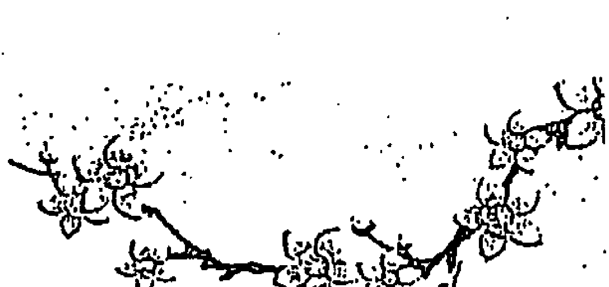

## 命例解說：

确实符合「雄宿朝垣」格，因此「小时候跟随父亲走江湖打拳卖药，练就一身高强武艺」特性，本来此格就已经带有叛逆、反社会的特质，命宫又再加会地劫、地空更加强想法异于常人，互相加强，更是「江湖任我行，目无法纪」的态度，把国家法律视为无物，凡事都靠自己的「江湖义理」来解决，一不小心就触犯法律，更何况擎羊、铃星和武曲忌星都在官禄，遇到冲突就会发挥这些星宿的「狠角色」出来，因此「在江湖界以勇猛敢为出名，也得罪不少江湖同道」，实在是这几颗煞星的功劳，也因靠此而「挣得相当财富」建立家业，赚进大把的财富，后来竟因「杀人而入狱坐牢」，「雄宿」就已经点明此格的特征了，一旦化忌就成了官非坐牢的恶星了。
因为走江湖打拳卖药，每到一个乡镇庙门口摆起摊来，若没和当地的老大打声招呼，江湖礼数也要周到才行，不然，摊子不给掀了才怪，当然一不小心动刀砍杀的场景也难保不会出现，此格的人生际遇也就和这些事物脱离不了！

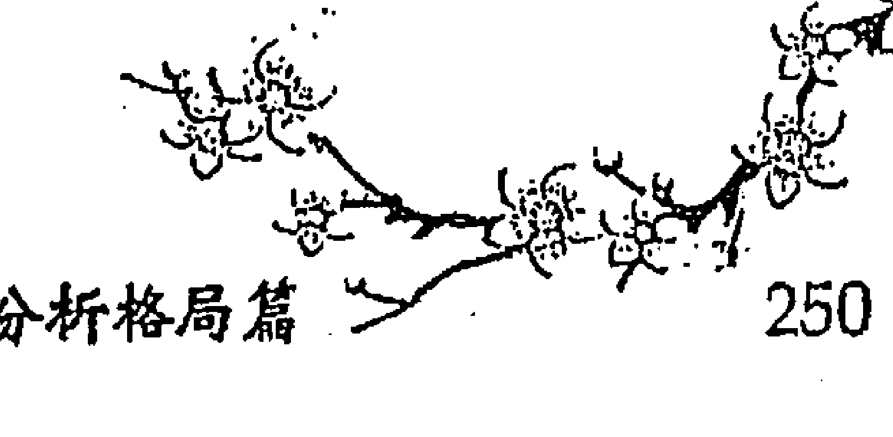

### 二十二、禄合鸳鸯格（又名：明禄暗禄格）

禄存与化禄同守命宫或财帛宫者合格，禄存为明禄，化禄为暗禄，古人对于此格有相当高的评价：

> 「明禄暗禄，位至公卿」、「明禄暗禄，锦上添花。」

「禄合鸳鸯福气高，斯人文武必英豪，堆金积玉富贵隆，官位高升紫袍」似乎富贵双全，其实明禄暗禄表示财禄广进、财运旺盛的意思，适宜向工商界发展，财富不小但不贵，所以堆金积玉是可期待的，但是「爵位高升紫袍」却不一定是此格代表的现象，需要合宜的主星、兼又主官贵的格局才会爵位高升，成为国家栋梁。

另外，命宫坐禄存而迁移宫有化禄、或命宫坐化禄而迁移宫有禄存，也可说是「明禄暗禄合」，能得富贵的格局，当然，遇到火、铃星、地空、地劫汇聚，则多意外破耗、漏财等，辛苦赚钱却莫名其妙损失，其征象有病痛、子女、意外之灾等不得不又不能不的花费或消耗，八字说的「身弱不堪任财」。

若行运不吉亦会破败，故不可恃财而骄，宜多参与社会福利工作。

## 会议请

| 宫位与年龄 | 天干地支 | 主要星宿 | 次要星宿 |
| :--- | :--- | :--- | :--- |
| 兄弟 未 (115-124) | 戊戌 | 七杀、龙池、铃星 | 铃星、龙池 |
| 父母 庚 (115-124) | 庚子 | 紫微 | - |
| 福德 辛 (105-114) | 辛丑 | 左辅、龙池、天马、天梁、禄存 | - |
| 田宅 壬 (95-104) | 壬寅 | - | - |
| 官禄 癸 (85-94) | 癸卯 | 七杀、三台、八座 | - |
| 仆役 甲 (75-84) | 甲辰 | 天喜、天钺、廉贞 | - |
| 迁移 乙 (65-74) | 乙巳 | 天贵 | - |
| 疾厄 丙 (55-64) | 丙午 | 右弼、凤阁 | - |
| 财帛 丁 (45-54) | 丁亥 | 铃星、文昌、天刑、破军 | - |
| 子女 戊 (35-44) | 戊子 | 地空、地劫、天同 | - |
| 夫妻 己 (25-34) | 己丑 | 天魁、天府、武曲 | - |
| 兄弟 戊 (15-24) | 戊寅 | 太阴、太阳、忌 | - |
| 命宫 己卯 (5-14) | 己卯 | 天姚、红鸾、陀罗、贪狼 | - |
| **中心信息** | - | 阴男：乙丑年（海中金）2月丑日子时 | - |

電話：(04)2263-2397 行動：0911-133639
E-mail：cz.way@msa.hinet.net 或 ziwi88@hotmail.com

## 命例解說

靠着天机禄和禄存同宫构成的「禄合鸳鸯」格威力，在年纪轻轻时就已深具敏锐的商业嗅觉，发觉创业机会，这正是禄存星的职能，同时有天机禄的相助，因此「甚具表达能力，年轻时就很会配药，甚受欢迎」，将个人特质尽情挥洒，深获顾客信赖与支持，建立深厚基础，由于财帛宫有地空、地劫两颗煞星会遇到主如「半空折翅、浪里行舟」状的惊险或突如其来的打击，因此、中途遇到两次石油危机，使扩张中辍，但经济一恢复常态又马上站起来，而长相呢？由其命宫的坐星天机禄的化禄代表人缘、气质，加上巨门又主口才，讲话一定很得体而且又会说话，所以「聪明可爱，长相俊秀，五官端正，轮廓鲜明，深受顾客欢迎」，所以虽然「年幼体弱多病」终不至于对身体产生致命的伤害，因为先天体质还不错。而父母宫有化科星也表示父母有靠，故一出身中上家庭」，创业之后虽遇到两次石油危机陷入经营困境，但先天格局具有强势的能量克服运途的挫折冲击，所以「创业之后一路扶摇直上，业务兴隆，蒸蒸日上，成为连锁药局的老板。「稳健经营至今，「年营业额约六十亿台币」命宫形成的「明禄暗禄合」的命局实在威力强大啊！

### 二十三、双禄朝垣格

禄存及化禄一颗守命垣，另一颗守财帛宫，即为此格，财源广进，大富无疑，由三方会入者，吉力较次，但亦是「富裕」的格局，年纪轻轻就会省吃俭用、辛勤的开创事业，中年后才会逐渐积沙成塔成为富翁，不过富裕之后，若奢侈浮华，以财傲人，运限不吉，易惹来觊觎之徒设局骗财、或投资不当败得精光，不宜参与投机性事业。

当然，若命宫没坐禄存或化禄，而是分由财帛、官禄来会入命宫也就是「朝垣」，一样的也是富贵的格局。

禄存和化禄甚怕煞星冲击，好像坏人在虎视眈眈的伺机偷抢财富一般，一旦遇到化忌冲击，或流年不利，就容易有遭抢或被设局侵占财产的事业发生，此时最喜有其它强势的格局帮衬，压抑住煞星的侵犯，减少损失。

若是又构成一「禄马交驰」格，财发远邑，做国际贸易或在国外成功的命，待在国内发展反而不利。

此种格局最喜主星的命局强旺，财富愈盛，若是谨慎保守的命局，成就当然减色不少。

## 备忘录

| 宫位与年龄 | 天干地支 | 主要星宿 | 次要星宿 |
| :--- | :--- | :--- | :--- |
| 命宫 (庚戌) 4-13 | 庚戌 | 武曲、破军、天魁、龙池、天姚、火星 | - |
| 兄弟 (己酉) 14-23 | 己酉 | 天同、護 | - |
| 夫妻 (戊申) 24-33 | 戊申 | 红鸾、天钺、地空 | - |
| 子女 (丁未) 34-43 | 丁未 | 廉贞、七杀、擎羊、天刑 | - |
| 财帛 (丙午) 44-53 | 丙午 | 天梁、禄存、文曲、陰煞 | - |
| 疾厄 (乙巳) 54-63 | 乙巳 | 天相、陀罗、恩光 | - |
| 迁移 (甲辰) 64-73 | 甲辰 | 紫微、贪狼、凤阁 | - |
| 仆役 (癸卯) 74-83 | 癸卯 | 天机、太阴、天马、天喜、左辅、化科 | - |
| 官禄 (壬寅) 84-93 身宫 | 壬寅 | 太阴、化权、天马、天喜、左辅 | - |
| 田宅 (癸丑) 94-103 | 癸丑 | 天府、地劫、三台 | - |
| 福德 (壬子) 104-113 | 壬子 | 太阳、右弼、铃星 | - |
| 父母 (辛亥) 114-123 | 辛亥 | 破军、武曲、天姚、龙池、天魁、火星 | - |

阴男
金四局
生于51年（天河水）
戌年11月
寅时

电话：(04)2263-2397 行动：0911-133639
E-mail：cz.way@msa.hinet.net 或 ziwi88@hotmail.com

## 命例解說：

在「诸星问答」里面有句话很妙「天同戌宫化忌，丁人命过反为佳」。丁年生人天同生人是天同化权，不是天同化忌，这个命例就在印证这句话，原来，丁年生人在戌宫安命的话，戌宫的天干恰为庚干，而庚干是天同化忌，原来的天同权却转为自化忌，一般说来，这是不吉利的现象，但这里却是一个特例「丁人命过反为佳」，因为禄存在午宫的财帛、太阴化禄在寅宫的官禄，形成「双禄朝垣」格，若是壬年生人天同坐命于戌宫，此时戌宫的宫干亦为庚，使宫内的天同自化忌，此时就不能以吉来论了，因为没成格！

> 「诸星问答」里面有句话很妙「天同戌宫化忌，丁人命过反为佳」。

而此造正是丁年生人，虽然巨门化忌来冲击，让他「出身贫寒，父母无遗产」，但是天同化权让他能在困苦中，坚毅其心智、奋发向上，力争上游，故「一日据时代，负责建筑淡水河岸」，若没学历又没专业何能承包如此重大的工程，之后就「日渐发达，积财至数十亿」，不过天同化气为福，因此本性善良宽厚，虽然已是大富翁，但「此人本性慈善，从不以财富骄人。」而巨门星又注重隐私，故而低调隐密，少有人知道此号人物，其实他当过「大※公司林※※董事长父亲的总经理」。

### 二十四、禄马交驰格

禄存、化禄守命或财帛而天马在对宫会入，即成为『禄马交驰』格，表示此人有从事国际贸易或跨国企业的机会，而且常有外国贵人相助、成就跨国事业。

若天马由三方会入者也合此格，但力量远不如迁移宫会入的强。天马星最怕和煞星同宫，如和火星同宫变『战马』、和陀罗变『折足马』等，因此，此格局不宜逢忌煞星来冲，一冲即破。所以要合此格的条件严格。

禄存不宜独坐，最喜有强力的主星同宫，不然亦只是『守财奴耳』，有了主星有能拿定主意，展开大开大阔的求财气势，不过因左右两宫有擎羊、陀罗夹制，一旦遇到同宫主星化忌，就成『羊陀夹忌』的败局，有损失、破败征兆，特别小心。

至于化禄形成的此格，创造财富的能量远逊于禄存，有强力的主星格局还好，若是保守、谨慎的主星、或是煞星汇聚的格局，恐怕钱还没赚到就已经蚀了一大把米，是最需要强力主星来撑持局面的格局。

> > 古云：『禄逢冲破、吉处藏凶』

一旦有忌星入局，不管是同宫或从对宫冲照、抑或是三合拱冲，往往有成败不一、起伏不定的过程，益增运途之坎坷惊险。

## 笔记簿

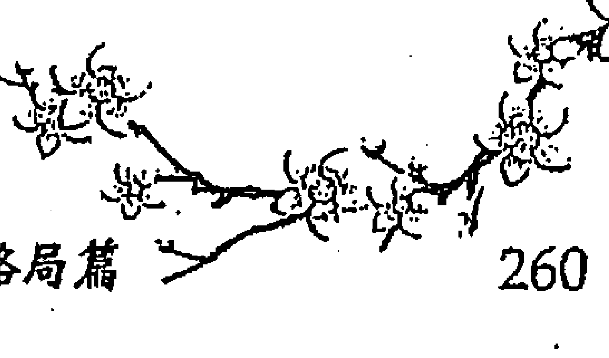

| 宫位与年龄 | 天干地支 | 主要星宿 | 次要星宿 |
| :--- | :--- | :--- | :--- |
| 命宫 (辛亥) 4-13 | 辛亥 | 太阴、天魁、阎罗 | - |
| 兄弟 (庚戌) 14-23 | 庚戌 | 巨门、天同、火星 | - |
| 夫妻 (己酉) 24-33 | 己酉 | 天府、天喜、天刑、廉贞 | - |
| 子女 (戊申) 34-43 | 戊申 | 右弼、天钺 | - |
| 财帛 (丁未) 44-53 身宫 | 丁未 | 擎羊、地空 | - |
| 疾厄 (丙午) 54-63 | 丙午 | 紫微、禄存、文昌 | - |
| 迁移 (乙巳) 64-73 | 乙巳 | 左辅、天机、陀罗、天马 | - |
| 仆役 (甲辰) 74-83 | 甲辰 | 天梁、天机、太阳、龙池、地劫 | - |
| 官禄 (癸卯) 84-93 | 癸卯 | 武曲、天相、天姚、铃星 | - |
| 田宅 (壬寅) 94-103 | 壬寅 | 天贵、八座 | - |
| 福德 (癸丑) 104-113 | 癸丑 | 恩光、三台、阴煞 | - |
| 父母 (壬子) 114-123 | 壬子 | - | - |
| **中心信息** | - | ○○○： 36丁亥（屋上土） 二月二日辰时 斗君：四 子命局：金四局 （钗钏金） 节气小寒后 | - |

電話：(04)2263-2397 行动：0911-133639
E-mail：ez.way@msa.hinet.net 或 ziwi88@hotmail.com

## 命例解說：

祿馬交馳格的人要和海外發生關係才會發達，譬如出國留學、海外就業、國際貿易等，天馬主掌奔波、而天機和太陰的組合有遠赴異鄉或他國之意，因此，此造年紀輕輕學有專精「取得針灸師資格後」即赴美行醫，外國人因對於針灸術的神奇剛好處於萌芽階段，致使求診者大排長龍，因此「日漸出名」，和命宮遷移宮的祿、科相會很有關係，所以，此命例是「祿馬交馳」和「科名會祿」格的組合，所以，有這兩個美好格局的加持，讓此造能夠少年得志，年紀輕輕就揚名異國成為名醫。 後回到國內開業，由於國外顯赫的資歷幫襯，而國人也深信遠來的和尚會唸經，因此「竟成良醫，業務興隆」。 這些全是「祿馬交馳」格帶來的運氣，假如他沒有出國去轉那一圈，就無法發揮該格局的氣勢，當然欠缺這層光環，只在國內行醫就無法成為門庭若市的良醫了，氣勢就弱多了。 有此格局的人，趁早學好語文，積極建立外國關係，打開機會之門！ 命局中有擎羊、陀羅拱沖，當然會增加命運的坎坷，使成就略顯遜色，不然兩種吉利格局的加持作用下，不是業務興隆的成就而已。

### 二十五、左右同宮格

左輔、右弼同宮在丑、未宮守身者合此格，若在命宮兩側來夾，吉力遠遜，此命格之人，唸書階段即有相當名聲，文采不錯，並因此有特殊際遇而成功，古云：「左右同宮，披羅衣紫」。

為人好讀書，反應機靈，有煞星會照，亦小有名聲也有可能是壞名聲，要看煞星的組合和主星的力量。

一般來講，這是個輔格也就是說要協輔某個主要格局的次要格局，如武貪同宮格又遇左右同宮就有吉上加吉之意，又如日月夾命格再加上左右同宮等。

有主格就以主格來看，沒主格搭配，純粹只是個「左右同宮」格，效用不大。（命例留待符合的主格一起說明）

### 二十六、坐貴向貴格（又叫：天乙拱命格）

天魁、天鉞為貴人，若一在命，一在遷移即合此格，一生多得長輩之提拔與照顧，碰到危難時，亦有貴人相助渡過難關，事業上也有意外的助力，或自己先見之明預先避開危難，如：別人的贈予或頒授獎章等特殊的榮寵，但中年以後就變成我要去庇蔭他人了，不過庇蔭他人反而能凸顯自己在公司的重要地位，當然，裁員是輪不到他的。

男命坐天鉞，女命坐天魁，要注意帶條件的異性助力，以免引起桃色糾紛，未婚者則不忌，當然，對方若已婚的話，還是要謹慎些。

這也是個輔格、是協輔主要格局的次要格局，有主格就以主格來看，沒主格搭配，純粹只是個「坐貴向貴」格，效用不大。（命例留待符合的主格一起說明）

### 二十七、文桂文華格

昌、曲同宮在丑、未守命為此格，由三方或遷移會照而入者亦是，此格之人，聰明好學，好衣飾美顏色，從小就能展露才華，宜向文學、藝術方面發展有名聲，不過不一定能得很高之學位，曾見歌仔戲天王巨星楊小姐就是此格。

但是、不可忌星會入，恐有文書是非，故巳、辛年生人不利，早年有失學之痛或求學多波折，成年後，則要防簽約、票據、借據、租賃等之文書糾紛。

這也是個輔格，有主格就以主格來看，沒主格搭配，就如前述。

| 宫位 | 天干地支 | 星宿 | 年龄范围 | 备注 |
|------|----------|------|----------|------|
| 官祿 | 丁巳 | 天祿天刑存相 | 44-53 | |
| 僕役 | 戊午 | 擎天羊梁 | 54-63 | |
| 遷移 | 己未 | 鈴天七廉星鉞殺貞 | 64-73 | 身宮 |
| 疾厄 | 庚申 | 地天劫馬 | 74-83 | |
| 田宅 | 丙辰 | 龍陀巨池羅門 | 34-43 | 八座 |
| 財帛 | 辛酉 | 天天姚喜 | 84-93 | |
| 福德 | 乙卯 | 紅貪紫鸞狼微祿 | 24-33 | |
| 子女 | 壬戌 | 鳳天閣同 | 94-103 | 陰煞三台恩光天貴 |
| 父母 | 甲寅 | 地右太天空彌陰機忌 | 14-23 | |
| 命宮 | 乙丑 | 文文天曲昌魁府 | 4-13 | |
| 兄弟 | 甲子 | 左太輔陽 | 114-123 | |
| 夫妻 | 癸亥 | 火破武星軍曲 | 104-113 | |

陽男 戊子年 37歲 (農曆9月11日酉時) 金四局 (海中金)

電話：(04)2263-2397 行動：0911-133639  
E-mail：ez.way@msa.hinet.net 或 ziwi88@hotmail.com

## 命例解說：

這是在前面「日月夾命」格的命例，除此格之外，還是「文桂文華」格與「坐貴向貴」格，所以，文墨精通、字跡端正豪放、有書法名家的架勢、學識淵博，雖然家中務農、不過是擁有相當田地的富農，在當時物質貧乏的年代，父母還能供給他上大學，加上父母坐權忌要求嚴格，還有化科則對此造的教育很重視。

所以能考上當時的名校「國立師範大學」，因此評曰「財星破，多成多敗多厄，福份減少。」在遷移的鈴星與官祿的天刑，都非主富貴的星宿，而且還有破壞命局美好的作用，但三個吉利的格局層層加強，所以「福蔭有餘，大貴福榮之造。」但卻是來自繼承得多，而自己開創的少，因天府的性格保守，所以投資理財以「田宅」居多，土地一重劃馬上躋身富豪之家。天府這個天生就有財富的星曜坐命，其實是繼承祖業而成富的格局，本身開創的成份較少，當然，若是大運吉利，也能把祖業發揚光大。

### 二十八、命無正曜格

命宮沒主星時，要借遷移宮的星與父母宮的星來看，若有凶星坐守，大多代表與六親的緣份薄弱，或從小就吃別人的水米帶大，或重拜父母、年紀小小的就離開家鄉，長大後就不忌諱，尤其命宮與父母皆無主星時，非常靈驗。

### 二十九、對面朝斗格

凡丁、己和癸年生人，祿存在午宮或子宮，此時祿存入宮若為遷移宮，則合此格，注意要子、午宮逢祿存才合格，其它不是，有詩曰：『祿有對面在遷移，子午逢之利祿宜，德合吉壞人敬重，富貴雙全福稀奇。』經商能致富，從政也能薪露頭角，或者商而優則從政，是很吉利的格局。但是要生年干要合乎『丁、己和』癸一且坐命在子、午宮者才是，因為這些年干出生的人，祿存落入午宮或子位，來朝照對面的命宮。同樣的，也不可以有化忌來破壞，例如：紫微坐命午宮的癸年生人，對宮遷移雖有祿存，但是貪狼也有生年忌星，破壞了此格局，因此也是不利求財、無法致富的，故雖然出生年干符合了條件，但主星格局不對也不能成格。

## 紫微斗数命运分析格局篇

| 天天刑鉞同 | 文天昌府曲 | 地太空陰陽科 | 文紅天貪曲鶯馬狼忌 |
| --- | --- | --- | --- |
| 三台 | | 八座 | |
| 16-25丁巳兄弟 | 6-15戊午命宫 | 116-125己未父母 | 106-115庚申福德 |
| 破軍 | | 節氣臨歲 | 天巨天姚門機權 |
| 26-35丙辰夫妻 | | | 96-105辛酉田宅 |
| 地鳳天劫閣魁 | | | 天紫相微 |
| 36-45乙卯子女 | | | 86-95壬戌官祿 |
| 鈴右天廉星弼喜貞 | 火擎星羊 | 左祿七輔存殺 | 龍陀天池羅梁 |
| 46-55甲寅身宮財帛 | 56-65乙丑疾厄 | 66-75甲子遷移 | 76-85癸亥僕役 |
| 天貴 | | 恩光 | |

○○生年：32癸未（楊柳木） 命宫：9月未 時 財帛：...

電話：(04)2263-2397 行動：0911-133639 E-mail：cz.way@msn.hinet.net 或 zlwi88@hotmail.com

## 命例解說：

此造癸年生人正符合「對面朝斗」格条件，而且命宫坐星武曲主财富、天府为富足之意，而文昌则使他好读书、吸收知识，累积深厚的经营财经理论，奠定经营事业的扎实基础，这些星皆属善星吉曜，故个性「多情笃实」，因此、能在家贫又无读书的恶劣条件下，靠自身努力白手成家，武曲遇禄存（财星遇禄）赋予节俭勤朴的刻苦性格，能累积创业基金，左右会照，广结善缘、得道多助，文昌坐命、能文能武，因此，从事文具制造业或就业也以纸业和文昌有关系的行业吉利，所以「就业纸业外务」，后自营文具制造业有得利」，靠自身努力奋斗成功。福德贪狼忌星，祖荫无靠、福荫不足，故而「初运家贫多病，无读书」故是白手成家之局，财帛宫有煞星铃星坐守，增添求财过程的艰苦又限缩其经营事业的格局，故「之后扩 大业务，营业扩大却无益获利」，由于财帛坐煞星铃星、又会遇到福德的贪狼忌星让他一生都会为了钱财的事情而操烦，因此「商业虽兴隆，但诸事不顺，多成多败，富而不久」，而妻宫坐禄，婚后得妻助，事业蒸蒸日上，步入坦途，渐入佳境。

综观全局，除一颗煞星铃星坏局之外，昌曲、左右均来会拱，甚吉利，只不过欠缺生年化禄、化权、化科加会，不然成就更大。

### 三十、科权禄主格

「禄权周勃命中逢，入相王朝赞圣功，迎合权星兼吉曜，巍巍富贵列三公」 「科权禄合，富贵双全」，此处的科权「禄」，所指的是「禄存」也可以是生年「化禄」，假如「化禄」再会「禄存」，富贵双全，非常吉利，假如会太阳、巨门化禄权相会，如命申而寅宫太阳权、巨门禄来照命宫，非常吉祥，有「巨宿同梁冲且合，子羽才能」之说，子羽是孔子弟子，后来成为宰相有经邦之志，治国之能，假如再有化科和天魁、天钺来加会，富贵显达，同在命宫极佳，若是在财帛、官禄来会次吉，若遇凶星凑合则不美，凶星愈多愈差，谓之美玉瑕疵，吉中带凶，恐怕能得善终、富贵如过眼云烟。 这个盘局和三吉嘉会格相似，只不过在命宫迁移这条线上有化禄和化权才合 格，命例就请参考「三吉嘉会」格。

### 三十一、辅弼朝垣格

「天星左右最高明，若在三方禄位兴，武职高登应显佐，文人名誉列公卿」。注意条件「禄位兴」才可成局，不管是「化禄」或「禄存」都可以，但禄位一定要在旺盛的宮位才可以。 這也是個輔格有主格就以主格來看，沒主格搭配，純粹只是個『輔』格，效用不大，完全要看主格是否有力，是個『與吉更吉、與兇更兇』的輔助格局，和兇惡格局在一起，會使命局更加兇惡、困頓不順，因此吉凶需視主格而定。

紫微斗数命盘表格，包含12宫位信息：
| 宫位 | 地支 | 年龄范围 | 天干 | 主要星曜 |
|------|------|----------|------|----------|
| 命宫 | 丑 | 5-14 | 辛 | 天府、地劫 |
| 兄弟宫 | 子 | 115-124 | 庚 | 太阳、铃星、权 |
| 父母宫 | 寅 | 15-24 | 庚 | 天机、太阴、天姚、天钺 |
| 福德宫 | 卯 | 25-34 | 辛 | 紫微、贪狼、龙池 |
| 田宅宫 | 辰 | 35-44 | 壬 | 巨门、红鸾、恩光 |
| 身宫官禄宫 | 巳 | 45-54 | 癸 | 天相、天马、左辅 |
| 仆役宫 | 午 | 55-64 | 甲 | 天梁、天魁、文曲、科 |
| 迁移宫 | 未 | 65-74 | 乙 | 七杀、廉贞 |
| 疾厄宫 | 申 | 75-84 | 丙 | 文昌、陀罗、科 |
| 财帛宫 | 酉 | 85-94 | 丁 | 天同、天刑、天喜、擎羊 |
| 子女宫 | 戌 | 95-104 | 戊 | 武曲、破军、凤阁、火星 |
| 夫妻宫 | 亥 | 105-114 | 己 | 天同、天刑、天喜、擎羊（根据布局推断） |

表格中还包含连线标注和中心信息：阴女、生历年、60年亥猪、2月金、日寅时等。

電話 (04)2263-2397 行動：0911-133639 E-mail：cz.way@msa.hinet.net 或 ziwi88@hotmail.com

## 命例解說：

天府坐命相貌清奇，因此『長相清秀，很耐看』，當然，天府是天生富裕的星曜，眼界高而且又負、能力高強，在外人看來真有『人很聰明、眼界高』的印象，當然由於從小就有多錢也培養出對『藝術和文學濃厚的興趣』。

這主格是『日月夾命』格，只不過是個毫無光芒的日月來夾，力量不大，而且地劫、地空分居命宮和財帛宮，命宮的地劫讓她具有異於常人的品味或見解，這對藝術家而言是很重要的星宿，有了它才能創造出不同於其他人的藝術品，而財帛的地空讓她的錢財破耗，不過她花在充實腦袋裡的東西有異於其他女人充實面皮或衣服，當然，也破了祿存的財祿，使得『祿位不興』，因此不致於『列公卿』，也不是個富翁的格局，但是靠藝術而成名是可期待的。

在這裡『左右朝垣』格，發揮了扶持之功，讓『日月夾命』格發揮效力，本來是黯淡無光的『日月夾命』，卻因此能提高生命的亮度，成為『名人』。

和『文桂文華』格的所舉的命例比較，此造缺了『文桂文華』格和『坐貴向貴』格的幫襯，使得格局的吉美程度稍遜一籌。

### 三十二、兼文武格

假如武曲和文曲同在命宮，則為此格，但是己干使武曲化祿卻也文曲化忌，形成祿忌同宮的遺憾，因此，此格最好是甲年生人，擁有此格之人文武精通，但現在要解釋成會讀書學問好、技術也精湛的意思，古云：「格名文武少人知，遇此須叫百事通」，更值命宮無殺破，滔滔榮顯是英雄」重點在於「百事通」，文的什麼都會，但是為什麼只有「文曲」才合此格，而未提到「文昌」呢？都是文星啊！原來是「五行生剋」的關係，武曲金可生文曲水，而水主智，故文武兼備，但文昌屬金與武曲金同一屬性，金旺易折，性質全屬金當然偏於一方——全文或全武，故文昌同宮不合此格。
  現代社會開放，女人當兵、唸理工的人很多，也表現不俗，不然依古人來論，此格是宜男不宜女的，但是女命得注意感情生活，因為太過陽剛了，男士們不把她當哥兒們對待，就是敬而遠之，一般婚姻生活是較孤單、空虛的。
  此格之人，不但會唸書、考試，說不定武術也很行，得過比賽獎牌哩，是個允文允武的人才。

### 笔记本

|  |
|---|
|  |
|  |
|  |
|  |
|  |
|  |
|  |
|  |
|  |
|  |
|  |
|  |
|  |
|  |
|  |
|  |
|  |
|  |

## 紫微斗數命運分析格局篇

| 宫位 | 星曜1 | 星曜2 | 星曜3 | 年龄范围 | 天干地支 |
|---|---|---|---|---|---|
| 田宅 | 天機 | 三台 | 陰煞 | 33-42 | 癸巳 |
| 官祿 | 紫微 | 天魁 | 天喜 | 43-52 | 甲午 |
| 僕役 | 龍池 | 鳳閣 | 天刑 | 火星 | 53-62 | 乙未 |
| 遷移 | 破軍 | 陀羅 | 鈴星 | 八座 | 63-72 | 丙申 |
| 疾厄 | 廉貞 | 天府 | 擎羊 | | 73-82 | 丁酉 |
| 身宮/財帛 | 太陰 | 天姚 | | | 83-92 | 戊戌 |
| 子女 | 太陰 | 天姚 | | | 93-102 | 己亥 |
| 夫妻 | 貪狼 | 紅鸞 | 右弼 | 文昌 (忌) | 103-112 | 庚子 |
| 兄弟 | 天同 | 巨門 | 地空 | 天同 (祿) | 113-122 | 辛丑 |
| 命宮 | 武曲 | 天相 | 天鉞 | 天馬 | 左輔 | 文曲 (科) | 3-12 | 庚寅 |
| 父母 | 太陽 | 天梁 | 天梁 (權) | 恩光 | 13-22 | 辛卯 |
| 福德 | 壬辰 | | | | 23-32 | 壬辰 |

OO農曆生女
子命曆年
斗：卯兔
君木年卯（松柏木）
：三月十一日
子局（松柏木）
戌時
節氣驚歲

電話：(04)2263-2397 行動：0911-133639
E-mail：cz.wty@msa.hinet.net
或 ziwi88@hotmail.com

## 命例解說：

家境清寒，在民國六、七十年代，女生不是唸商校就是護校，唸理工的少之又少，而這個格局讓她能突破時代的框架，唸幾乎是男生天下的工程科系，命宮有文曲化科，因此「知書達理，好學聽話，勵志向學」而同宮的武曲、天相使她具備「個性堅毅」的特質，也使她「大學畢業，欲一展所學」，和很多女生畢業後等嫁人的心態上，她就顯得積極勇敢得多，當然，由於命居四馬地又帶天馬，故「不獨女子從北部至南部某紡織廠應徵」，由於有貴人星文曲化科坐命，故「與眾男子競爭結果考取」，故而此格是個「文武兼備」的格局，此命例已提供充分的詮釋內涵。不過此造會入煞星太多──鈴星、擎羊、陀羅，日後將因個性過於剛強，影響感情，甚至……孤獨一生非吉象。

### 三十三、貪狼遇火格

火星、鈴星一般都不是帶有任何吉祥意味的煞星，不過當貪狼遇到火星就成為「火貪格」、遇到鈴星成為「鈴貪格」，此時的成就就非同小可了，故說：「貪遇火鈴四墓宮，豪富家資侯伯貴」，又說「火遇貪狼照命宮，封侯食祿是英雄，三方倘若無凶殺，到老應知福豐隆」，以辰戌宮最佳，丑未宮次之，若守照也可論吉。

注意，要三方無凶煞拱沖才可「到老應知福豐隆」，不然也會敗光家產，因為這種格局是「突發資財」的，如炒股票或炒房地產等投機致富的現象，若一遇煞星沖破，就會誤判時機，將到手錢財又賠個精光，所以以此格之人具有「賭徒」性格，成敗起伏迅速。

有幾個朋友，甚喜買賣股票，每次閒聊話題總脫離不了股票，一排出命盤，赫然一貪狼、火星或鈴星一不是在命宮、就是在命、遷線上遙相對應，果然是有「突發資財」的慾念，只不過還沒炒股發了大財就是了，但是個性好投機是可確定的。

### 笔记本

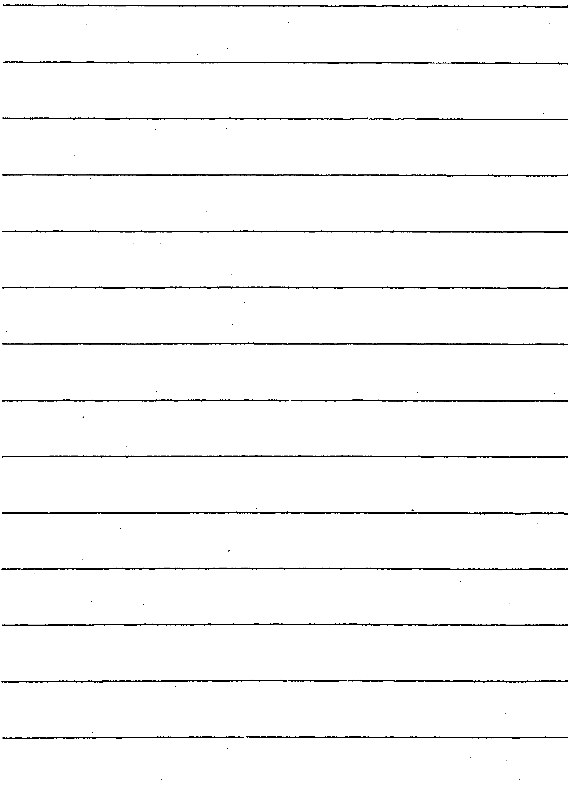

| 地空 地劫 七杀 紫微 | 龙池 | 火星 天喜 天钺 陀罗 | 天刑 凤阁 禄存 |
|-------------------|------|---------------------|----------------|
| 103-112 夫妻 己   | 113-122 兄弟 壬 | 3-12 身宫 命宫 癸未 | 13-22 父母 申 |
| 文昌 天梁 天机 阴煞 三台 恩光 93-102 子女 庚 |  |  | 铃星 擎羊 破军 廉贞 23-32 福德 酉 |
| 83-92 财帛 己     | 红鸾 天魁 贪狼 武曲 63-72 迁移 己 | 天姚 太阴 天同 53-62 仆役 戊 | 右弼 天马 天府 43-52 官禄 丁 |

阳男 庚寅年 39岁 松柏木 (杨柳木) 月日午时

電話：(04)2269-2397 行動：0911-133639 E-mail：ez.way@msa.hinet.net 或 ziwi88@hotmail.com

## 命例解說：

又是多種格局的複合體——「命無正曜」格、「風流綵杖」格再加上「貪狼遇火」格，故而「聰明、但性好投機」，「短短三年間所賺錢財就能購屋置產」，符合「暴發資財」的特性了，若只賺小錢就不是火貪格的人了！而且此人「平時不務正業、放蕩不拘」，後來「抓住時機創業」和此命局「火貪」格的「投機」性格很一致，做小事賺小錢沒興趣，一心只想作大事賺大錢，平日甘願閒閒沒事幹，卻是多方蒐集團資訊，一見機會立即撲上去狠狠賺一筆！

> 古書云：「左右單守照命宮，離宗庶出」

以本命例而言「庶出」，家境富裕，確實有其事！而家境富裕和父母宮有關係，父母坐「祿存」會照對宮的「太陽」「祿」構成「祿合鴛鴦」格，當然父母親這一輩定然擁有相當財富，因此「家境富裕」。

命宮坐陀羅和遷移的貪狼構成「忌遇貪狼，風流彩杖」的格局，因此「有錢之後大搞男女關係」，而夫妻宮坐紫微、七殺成為「化殺為權」的強勢格局，雖遇到地空、地劫，這組煞星讓他的感情世界不會平靜無波，老婆強勢又遇到煞星，所以「鬧得家庭雞飛狗跳」。加上此造命宮有紅鸞、天喜照合，長相頗有異性緣，兼又疾厄宮坐太陽祿，太陽是男性主此造本身，有人緣，因此『與五六個女性有關係，長得帥又有錢怪不得人人愛，情人一個又一個，若沒這些星推波助瀾，情人不會如此豐富。遷移宮的武曲權，讓他很愛面子、喜歡出風頭，所以，雖然感情世界豐富，卻不是那種來者不拒的型態，是很挑嘴的。不過福德宮太差了，此造老年得孤單、困苦度日。

### 三十四、財祿夾馬格

天馬守命，武曲、祿存來夾，若再加上生旺之地更妙，天馬只入寅申巳亥四個宮位，因為祿存不入四墓宮，所以命宮坐太陽星而武曲星在兄弟，才會形成此格局，此格未必是賺大錢的格局，也可能是管錢的格局，譬如負責公司的資金調度的財務人員，或是稅捐機關的公務員，或在銀行負責國外匯兌業務的人員等，而這些職業的特質就是『錢財像『馬』一樣跑來跑去』，所以是個管錢財的格而不是賺大錢。

### 三十五、輔弼拱主格

紫微守命而有左輔、右弼三合來拱。要合此格左輔右弼一定要在財帛和官祿宮內，而命宮就在丑、未坐紫微和破軍星，是個「桃花犯主」的格局，當然喜有「輔弼拱主」來使桃花收斂，變得乖乖的專心事業或學業，使行為端正，不會去亂搞男女關係，所以他的效用在此，而不是讓人變成大富翁的局，再來還要注意，不能再有桃花星來亂，譬如天姚星、文昌、文曲等，什麼！文昌、文曲也不行？是的，主格是個「水氾濫」的桃花格，又來個金水星來生水或助長水勢，不是更氾濫嗎？變得像豬哥或花痴一樣好嗎？因此，土質的左輔、右弼把氾濫的水勢堵住，方不至於情慾氾濫，此乃「輔弼拱主」格的作用。

| 铃星 | 天機文曲 | 紫微破軍陀羅天鉞 | 祿存天姚文昌 |
| :--- | :--- | :--- | :--- |
| 三台 | 103-112 辛巳 夫妻 | 113-122 壬午 兄弟 | 3-12 癸未 命宮 | 13-22 甲申 父母（八座） |
| 天刑鳳閣太陽（祿） | 93-102 庚辰 子女 | 男 肖馬 庚午年8月8日寅時 路傍土 節氣處暑 命宮未 木三局 子命斗君 | 23-32 乙酉 福德 |
| 火星右弼天喜七殺武曲（權） | 83-92 己卯 財帛 | 電話：(04)2268-2397 行動：0911-133639 E-mail：ez.way@msa.hinet.net 或 ziwi88@hotmail.com | 33-42 丙戌 田宅 |
| 恩光 | 天梁天同（科） | 天魁天相 | 地劫天貴 | 73-82 戊寅 疾厄 | 63-72 己丑 遷移 | 53-62 戊子 僕役 | 巨門 | 43-52 丁亥 身宮 官祿 |

電話：(04)2268-2397 行動：0911-133639
E-mail：ez.way@msa.hinet.net 或 ziwi88@hotmail.com

## 命例解說：

是個「桃花犯主」、「坐貴向貴」、「輔弼拱命」格的三合格局，三方四正有陀羅、火星、地空等煞星，煞星為禍，可能顯象於初運困苦，疾厄多災或意外顛仍等，所以「幼年家境清貧、身體瘦弱多病痛」，但由於有強力的輔格支撐不致天折，也能夠專心向學，成績不錯，終於「畢業於著名工專」，也由於輔格的作用把桃花犯主扶正，讓他不會桃花躲躲開、亂搞男女關係，「夫妻恩愛」，在職業學校教書，作育英才，誨人不倦。不然以桃花的能量來看，紫微破軍的組合，絕對是數一數二的強烈，更有一顆陀羅加入，宮祿又是廉貞、貪狼，猛一看還真是強烈的「桃花犯主」，卻被兩個輔格框正往正途發展，使不致於胡作非為，甚至進而「作育英才」，去協助青年學子習得一技之長，這又和「坐貴向貴」格早年得貴人提拔、中年得換由自己提拔後進的現象符合。

### 三十六、君臣慶會格

紫微守命宮得左輔、右弼或文昌、文曲由三合加會或同宮，使紫微帝星得遇昌曲左右輔佐，讓孤獨的皇帝有了良相忠臣的輔佐，可以好好地位國家人民作更多的事，為非常吉利的格局，有「君臣慶會」之說，所以不是個「雞腸鳥肚」的貨色，常以「國家興亡，匹夫有責」自我勉勵，當作奮鬥的目標，是有偉大胸襟與氣度的格局。
這種格局利於男命卻不利女命，因為女命的話，假如有這麼多的輔佐之星佳會，就變成了「男友」多，因為此局很容易成為「紫微貪狼的桃花犯主格」，再加上這些輔佐星又成「君臣慶會」格，各位想想會成為什麼局面，不否認曾看過此種格局的女強人，卻是婚姻不美，但是她並不以為意，認為自己的重心在事業上，所以，以男友一個交了又一個，所以，兩種格局並存時，這兩種格局特性也會同時存在，此時，就要看哪一種格局比較強能左右他的生活重心了，不然兩種格局互相拉扯，會令人陷入痛苦的情境中。
以後年輕的一代，可能就不會以「君臣慶會」格宜男不宜女來看待了吧，所以論斷命盤賦予吉凶的意義時，還參雜著時代背景的因素在裡頭，才能找出適切語彙來形容時空環境下的實際樣態。

## 备忘录

| 宫位 | 星曜（主星） | 星曜（辅星） | 宫干 | 年龄段 | 备注 |
| :--- | :--- | :--- | :--- | :--- | :--- |
| 兄弟宫 | 七杀 | 铃星、文昌、擎羊 | 辛巳 | 13-22 | |
| 夫妻宫 | 太阳、天梁 | 禄存 | 庚辰 | 23-32 | 权 |
| 子女宫 | 武曲、天相 | 左辅、天马、陀罗 | 己卯 | 33-42 | |
| 财帛宫 | | | 戊寅 | 43-52 | 天贵 |
| 疾厄宫 | 天同、巨门 | 龙池、凤阁 | 己丑 | 53-62 | |
| 迁移宫 | 贪狼 | 右弼、天喜、天魁 | 戊子 | 63-72 | |
| 仆役宫 | 太阴 | 天姚 | 丁亥 | 73-82 | 科 |
| 官禄宫 | | | 丙戌 | 83-92 | |
| 田宅宫 | 廉贞、天府 | 文曲 | 乙酉 | 93-102 | |
| 福德宫 | 破军 | 天钺 | 甲申 | 103-112 | 八座 |
| 父母宫 | | 天刑 | 癸未 | 113-122 | |
| 命宫/身宫 | 紫微 | 红鸾 | 壬午 | 3-12 | 恩光、三台、阴煞 |

阴男
乙酉年
（井泉水）
农历11月11日午时
命宫：木三局（杨柳木）
斗君：申

节气：处暑

电话：(04)2263-2397
行动：0911-133639
E-mail：ez.way@msa.hinet.net 或 ziwi88@hotmail.com

## 命例解說：

很標準的「君臣慶會」格，所以從年輕創業以來到卯限已累積相當財富，稱之為「億萬富翁」也不為過，有錢之後也常濟助貧困是個慈善家。不過感情生活卻發生嚴重問題，各位看其夫妻宮坐星，本來「殺臨三位」，已是駕鸯伴冷「了，再來兩顆煞星「擎羊、鈴星」，這種夫妻宮真是非常爛！不是配偶非善類就是剋妻之命，而此造是「君臣慶會」格，「君」當然要三宮六院才可以，而夫妻宮又如此差，當然，感情生活不好，男命會有多次婚姻，也算符合「多妻」象，但此造卻去糾纏一位曾經幫助過的年輕女生，欲納為小妾，為此還和該女哭訴夫妻相處的困境，希望能在她身上獲得夢想的愛情，但年齡相差懸殊，終未能成，殺臨三位果真是駕鸯伴冷。以我古板的眼光來看，此格宜男不宜女，或許有些人會反對為什麼只有男人可以？女人不行？所以是吉是凶？還參雜著個人價值觀的判斷吧！

### 三十七、祿馬配印格

天馬宮內有祿存或化祿，及天相同宮。這是在四馬地才有的命局，寅申是武曲、天相同宮，巳亥是天相一顆主星，甲、丙、戊、庚、壬年生人「祿存」分別落在寅申巳亥四個宮位內，壬年生人武曲化忌不合格，以甲年生人最吉利，此格最適合從事國際貿易或業務工作，能發揮能力、事半功倍，是適合經商的格局，假如是合夥公司此格之人適合擔任負責人或業務，千萬不要去負責生產製造的工作，和此格動中求財的特性不相符合，難發揮特質。

天相有一「印」星之稱，在古代官衙的印記即代表政府的威權，一拿出來，地方官員、百姓等莫不跪迎，謹慎對待，引伸於人也代表到處遊歷或經商能得到眾人的歡迎，業績頂盛的現象。

當然，從政也很適合，到處去宣揚政績，受到民眾愛戴，欲更上層樓決不是難事。

若一旦有忌星橫阻，就成了奔走無力，毀譽參半，更加上使天馬跛足的陀羅、鈴星、火星等，使奔走成了「愛作秀」的現象，反而不吉。

## 笔记本

紫微斗数命盘十二宫表格

| 宫位 | 星曜/内容 | 干支 | 年龄段 |
| :--- | :--- | :--- | :--- |
| 田宅 | 地空、地劫、红鸾、天机 | 辛巳 | 35-44 |
| 官禄 | 紫微 | 壬午 | 45-54 |
| 仆役 | 火星、天姚、天钺、陀罗 | 癸未 | 55-64 |
| 迁移 | 禄存、破军 | 甲申 | 65-74 |
| 福德 | 文昌、右弼、七杀 | 庚辰 | 25-34 |
| 疾厄 | 文曲、左辅、天府、廉贞 | 乙酉 | 75-84 |
| 父母 | 天刑、天梁、太阳 | 己卯 | 15-24 |
| 财帛 | (信息在中央) | 丙戌 | 85-94 |
| 命宫/身宫 | 龙池、天马、天相、武曲 | 戊寅 | 5-14 |
| 兄弟 | 天魁、巨门、天同 | 己丑 | 115-124 |
| 夫妻 | 凤阁、贪狼 | 戊子 | 105-114 |
| 子女 | 天喜、太阴 | 丁亥 | 95-104 |

命主信息：
阳男
生肖：属狗（庚戌年）
生辰：农历7月1日
节气：立秋后
命局：土五局
斗君：子

联系方式：
电话：(04)2263-2397
行动：0911-133639
E-mail：ez.way@msa.hinet.net 或 ziwi88@hotmail.com

## 命例解說：

遷移宮的祿存配合命宮的天馬和天相印星構成「祿馬配印」格，符合格局，武曲化權也在命宮，化權代表此造個性有些固執，但化權沒有化祿就不主財富、而是事業有成就，三合又沒有煞星匯入，個性就不會偏激或火爆，故「溫和懦弱，慈悲待人」，此造生年干的太陽祿在父母而天同忌在兄弟，所以好處都給別人拿去了，因此，先天四化的落宮分佈，就有「自己吃虧而成全別人」的意思，如果交友宮吉利，大家情意相挺，禮尚往來也就罷了，但此造的交友宮一堆煞星，好像「十大惡人」伺機為害，故而「大部份都被忘恩負義」，還好命局合「祿馬配印」和「紫府朝垣」格，算是強旺的命局，所以「生于望族，受父母福蔭」，不然被朋友一搞賠損累累，不去跑路才怪勒。既然有此命局就要交友謹慎些，不要朋友邀上酒家、賭場就跟着去，不然有再多財產難免會敗光，幸好命宮武曲坐權會節制些，有分寸。

### 三十八、日月同臨格

即是太陽和太陰同宮在丑、未入命宮內，即是此格局，此時需以命造是日或夜生人來決定是太陰星為旺還是太陽為強，基本上，此種格局讓命宮充滿了熱力和光明，引伸為人的特徵現象就是：個性開朗活潑，並具有感染別人的能量，或是出於主動善於照顧别人，任然感受到他的熱情或慈愛等，是個光明博愛的格局，當然不論男女，都會遭遇感情的困擾，付諸愛心忘了分寸或引起對方誤會而追求等等，最適合擔任「服務型」的工作，不宜「營利」事業，往往缺乏「斤斤計較」的個性，或不好意思談價錢而讓自己吃虧，造成損失，擔任公務人員、非營利機構僱員等或是格局佳美，無煞忌衝激甚至能經營類似「安養院」或「愛心基金會」等造扶人群。

### 三十九、刑囚夾印格

古書上註解「命坐天相，得擎羊、廉貞夾拱，主武勇之人」但是廉貞不可能在天相的前一宮或後一宮，因此無法成立註解所說的命局。應該改為命宮坐天相，而廉貞和擎羊分別由財帛或官祿來會合，就構成此格，廉貞和擎羊都非溫柔的星曜，天相星遇到此種組合，個性也會被牽引而剛強，當然，印星天相遇到犯法的廉貞囚星，當然會遭遇官非的問題，若是煞星匯聚可能就是自己個性太衝動而犯法，若沒遇煞星就要小心買賣簽約等文書惹來的官非，但還是會以哪種形式出現，不一而足，反正遇到上述事情時，先把文件看清楚、後果考慮透徹，才慎重的簽名下去準沒錯！

| 宫位/干支/年龄 | 星曜组合 | 宫位/干支/年龄 | 星曜组合 | 宫位/干支/年龄 | 星曜组合 | 宫位/干支/年龄 | 星曜组合 |
| :--- | :--- | :--- | :--- | :--- | :--- | :--- | :--- |
| 73-82 疾厄 癸巳 | 火星 祿存 天同 (化權) | 83-92 財帛 甲午 | 擎羊 天府 武曲 | 93-102 子女 乙未 | 文曲 文昌 太陰 太陽 (化科) | 103-112 夫妻 丙申 | 地空 天刑 貪狼 |
| 63-72 身宮 遷移 壬辰 | 龍池 陀羅 破軍 | **中央信息** 陽年男命 生肖：丙子鼠 生曆：25年12月 農曆：丙子年潤十二月初一卯時 斗君：辰局 (平地木) 節氣：虛歲 | | 113-122 兄弟 丁酉 | 鳳閣 天相 紫微 |
| 53-62 僕役 辛卯 | 地劫 廉貞 (化忌) | 聯繫信息： 電話：(04)2263-2397 行動：0911-133639 E-mail: ez.way@msa.hinet.net 或 ziwi88@hotmail.com | | 3-12 命宮 戊戌 | 右弼 天馬 天魁 天梁 |
| 43-52 官祿 庚寅 | | 33-42 田宅 辛丑 | 鈴星 | 23-32 福德 庚子 | 天姚 七殺 | 13-22 父母 己亥 | 恩光 天貴 |

## 命例解说：

一看到擎羊、陀羅、地劫就知道不好了，煞星來破局，故「出世家貧，性格剛烈」，由於財帛坐星「武曲、天府、擎羊」為人小氣、針鋒相對、斤斤計較，而巨門坐兄弟宮定然兄弟無義、交友宮則還不錯，因此「外緣佳，待友忠義，捨己為人，兄弟卻無情」，官祿更有主官非的廉貞化忌這麼嚴重的一顆官非星又遇煞星地劫來沖會，使得招惹「官非」的情形更加明確，所以在中年之時，投資友人事業兩百多萬被侵吞，差一點破產，只好上船當船員。「外緣佳、待友忠義」換來投資款被侵吞的後果，就在於兄弟宮的巨門作怪，把別人當兄弟看待，才會遭到此一侵吞事件。當然，「錢財被人侵占」難免訴諸法律、追討財物，這時候的「印」指的就是法院查封財產的封條上的印戳、或是判決文的章戳了，一旦這些「印」化忌了，代表封印生鏽了，沒有效力了，所以此格之人對於簽署文件要特別、特別小心。

### 四十、文星夾命格

昌曲由左右兩宮來夾命，此命局為坐命在丑未時，才有這種組合，而且一定是辰、戌時生人才可以，又叫做「文星暗拱」格，「文星夾命無煞侵」，得此多為荅洋人，借得風雲展翅翱，少年躍門成龍」，此格之人多無家業可依靠，而當人家奴婢，陪公子讀書，結果公子不學好陪讀的人卻一飛沖天，所以是「依人而貴」的命局，為貴人辦事，當他飛黃騰達後不忘記提攜一把，而魚躍龍門成公卿，現代政黨輪替也正有很多這種人，可惜沒蒐集到半個。參考「輔弼拱主」格，該例也合此命格，因此在民國四十年初國共內戰剛結束、台灣又剛光復，物質條件貧乏、家裡也很貧困的情況下，勵志向學，拼到知名工專畢業，後到職業學校教書。

### 四十一、文星拱命格

「文昌文曲最榮華，值此須生富貴家，更得三方祥曜拱，卻如錦上又添花」命宮三方四正內會入文昌、文曲兩顆星，未必生於富貴之家，要看煞星會合的情況來決定，古書上說「昌曲會合主華榮」是在無煞沖破的情況，不過有此格局文筆或才學都相當豐富，注意不一定學歷很高，像很多民間的藝師，因為長期浸淫某種藝術，所以他在這方面的知識連教授都難超越，所以，此格局未必主高學歷但是有學問倒是真的。這兩星要形成「拱命」的角度，命宮一定在未或丑宮，很容易和「武貪」格或「日月照命」、「日月同宮」格在一起，兩個吉格在一起，力量更加強旺，若再有化祿、化權、化科等吉化星在一起，財富定然旺盛。

| 宫位 | 星曜与天干地支 | 年龄范围 | 宫位 | 星曜与天干地支 | 年龄范围 | 宫位 | 星曜与天干地支 | 年龄范围 | 宫位 | 星曜与天干地支 | 年龄范围 |
| :--- | :--- | :--- | :--- | :--- | :--- | :--- | :--- | :--- | :--- | :--- | :--- |
| 官禄 | 文曲（科）、天梁、恩光、辛巳 | 86-95 | 僕役 | 七杀、壬午 | 76-85 | 遷移 | （空）、癸未 | 66-75 | 疾厄 | 紅鸞、天馬、天鉞、廉貞、甲申 | 56-65 |
| 田宅 | 左輔、擎羊、天相、紫微（祿）、庚辰 | 96-105 | **命主信息** 陰曆年男 乙酉年 丑月 （仲秋金） 丑時 （陰歷火） 節氣：虛歲 丑局 六 1 日 斗君：丑 子年斗君：丑 | | | | 文昌、天刑 | 46-55 |
| 身宮 / 福德 | 鳳閣、祿存、巨門、天機（祿）、己卯 | 106-115 | | | | | 地空、火星、右弼、破軍 | 36-45 |
| 父母 | 陰煞、三台、天貴、天喜、陀羅、貪狼、戊寅 | 116-125 | 命宮 | 天姚、太陰、太陽（權）、己丑 | 6-15 | 兄弟 | 地劫、天魁、天府、武曲、戊子 | 16-25 | 夫妻 | 鈴星、龍池、天同、丁亥 | 26-35 |
| **聯絡方式** | 電話：(04)2263-2397 | 行動：0911-133639 | E-mail：cz.way@msa.hinet.net 或 ziwi88@hotmail.com | 八座 | | | | | | | |

## 命例解說：

命宮坐太陽、太陰、天姚，本已主「文采風流」了，現在，文昌、文曲又分別由財帛、官祿來拱命宮，讀者一看就知道，此人應該相當好學或具有相當高的文學素養，所以前輩評曰「好讀書，成績優良，經常考第一名」，而且出社會後，由於命宮主星是以「服務、政治」等性質的主星又偏向「文學」類，以從事和「文昌、文曲」有關的事業，如：開書局、印刷廠或補習班等皆是，而命宮「太陽、太陰」也屬「燃燒自己、照亮別人」的星曜，當老師即是，當然要有學歷才可以當老師，而此造由於命宮坐太陰忌，讓格局蒙塵，無法盡情展現優勢，故「高中畢業而已」，因格局使然，讓他在選擇事業時仍偏向「文學、教育」等有關的行業，因此「退役後，在某地開印刷店」。

其後竟因「親戚訴苦為人所騙」，一時義憤填膺，自認為文筆還可以，又開印刷廠，印刷傳單為親戚出頭，那知卻「被告偽造文書，無端惹來官非纏身，甚為苦惱」。其命宮主星就有光明正大、好為人服務的特性，但一遇化忌之後，就容易受到蒙蔽而鑄下錯事，其財帛宮又坐天刑，所以，必然因官非而破財，賠錢消災。

### 四十二、科名暗祿格

命宮坐化科而化祿由遷移宮來會、或祿存在遷移，但有巨門暗星即合此局，是藉由「科甲成名而獲財富」的命局，以現在而言就是學者專家研究發明獲得專利，為其賺進大把鈔票的現象，也有可能高等考試登金榜而從政得肥缺之象，反正就是要先有「卓越專業能力」來獲得「財富」的意思，注意是要擁有「卓越專業能力」而不是「普通能力」而已。不過因有巨門暗星此時就已暗示要「隱暗其財富」了，若是以財富驕人或愛炫耀，就要注意損財了，自己的錢財就容易遭騙而損，若是貪污之財就會被揭開其中黑幕，繩之以法；辛苦考上高考當上主官，就是科名之象，當官嚴守官箴必能青雲直上，國家派赴擔任多個財團法人或外圍機構的董監事，領取額外酬勞，就是暗祿之象，所以不要藉由權位貪取財物，必然招惹官非。

### 四十三、金輿扶駕格（偽格）

古書上寫「紫微守命，前後宮位有太陽、太陰來夾命宮」為此格，經查紫微星的十二種基本盤局，完全沒有紫微星入宮，前後有太陽和太陰來夾的盤局，所以是古人失算了。

和「日月夾命」格相似，只不過此格命宮的坐星是紫微方能合格，若命宮坐星是其他星則為「日月夾命」格。

### 四十四、生不逢時

廉貞坐命遇到地空或地劫，廉貞乃「雄宿」但一遇到上述兩星，好比深具韜略、武藝高強的市井小民，處於昇平之世，一身的雄心抱負無處發揮，而變成江湖人物據地稱王，若是戰時可就成為橫掃敵軍的大將。

### 命例解說：

命例請看「雄宿朝垣」格，該例由於又是「生不逢時」格，所以雖然一勇猛敢為而聞名，但卻成為搶地盤的江湖賣藝人士，在當時的時空環境下，到他鄉異地的夜市或廟門口擺攤賣藥都要和當地的角頭打招呼，禮數也要足夠，人家才不會去鬧場，不然就要靠拳頭爭權益，壓得住地頭蛇，而該命造就有這個本事，所以，家族的打拳頭賣藝團到處行走江湖，幾乎無往不利，靠的就是他的「勇猛敢為」，讓別人也畏他三分，打下家族的藥廠生意，到現在都還業務興盛，可惜「生不逢時」，不然就是「威震邊疆」的大將軍了。不過，大將軍是成就國家聲威，他卻成就家族事業，永續經營得下去的話，獲得的實質利益，可能比「一世」將軍更有利。

### 四十五、祿逢兩煞

不管是化祿或祿存，如果再遇地空、地劫，這兩顆星象是無底洞一般把財祿完全吸得乾乾的，使原本主財富的祿星失去效力，在人生的現象即使能賺進大筆的財富也難逃被虧空、倒債或錯誤投資而流失，所以有此命格的人，最好將賺來的錢買些不動產，或可保留一些財產不至於敗得一乾二淨。

這兩顆星的想法迥異於常人，所以精神上常感孤單而會鍾情於宗教或玄學；當然若運程不好，會因想法獨特而大破財；運途好卻會因獨特而致富。

### 命例解說：

命例請看「七殺朝斗」格，也符合「祿逢兩煞」格，所以，他因家中不動產重劃而致富，假如能保守謹慎的理財態度，這些財富還能為我所有，假如野心太大，大投資開工廠必定大損失，不然，就要保留田產，讓它仍是以「不動產」的形式將「祿」能保留住。

該造由於「祿逢兩煞格」，所以不會積極的追求財富，故為人「清高」，因而把祿存財氣給浪費了，但祿存畢竟是財星，因此得「祖業福蔭」，不必自己汲汲營謀就有財富，哪朝一日想利用財富，賺進更多的財富時，此時「兩煞」必出來作亂為禍，把既有的財富敗得精光，有此格局在，遇重大投資時，實在要慎重行事啊！

### 四十六、馬落空亡

天馬星坐命遇到地空、地劫，天馬奔走四方不是求財、就是開疆闢土，結果這些成果全被天空或地劫的黑洞吸收光了，辛苦的奔走卻毫無所獲，即使是利於求財的「祿馬交馳」格，但是碰到空、劫兩星，就會使格局破壞，雖辛苦奔走，但也接不到訂單，財源不進，是個「奔波勞碌卻無所成」的格局，賺個小錢勉強為餬口而已。

不過壞的格局遇到天空、地劫卻也能把壞的能量給吸收掉，如同梁巳亥位又遇天馬和化祿，更使飄蕩好色的性質更加明顯猖狂，但有空劫就完全改觀，變得穩定成熟，讓飄蕩、好色之性收斂，未免不是一種「好」的現象。

### 命例解說：

命落於四馬地又坐天馬和天機、太陰的組合，因此生於中部往北部發展，乃離鄉背井之人，小學畢業，由於遷移宮坐天機祿，因此離鄉在外地能得財祿，故於四十歲左右時即發財數百萬元，不過命宮的太陰忌卻對自己產生破壞力，加上空、劫助紂為虐，因此賺錢之後，生意變差還得病，死前一年卻變成虧損近百萬元，祿、忌交沖的組合本已不利財運，又遇「浪裏行舟、半空折翅」的雙煞，所以呢？中年即如「半空折翅」般殞落，所以，這是不吉的格局。假如，另構成強旺有力的格局，如「祿馬交馳」和「祿合鴛鴦」的吉格，還能抵銷「馬落空亡」的傷害，雖然奔走辛苦但還能累積相當財富。像此命例呢？是有「祿馬交馳」格但是欠缺祿存星於命宮或遷移宮佳會，雖然是三合有主節儉的「祿存」，只能說會存到一些錢財而已，無法成「富」局，最差的是「太陰忌」坐命宮，帶給命造一生的挫折和苦難，最後還讓他有錢也享受不到，「馬落空亡」遇忌煞星的威力還真大。

### 四十七、日月藏辉

| 宫位 | 星曜 |
|:---:|:---:|
| 巳 | 廉贞贪狼 |
| 午 | 巨门 |
| 未 | 天相 |
| 申 | 天同天梁 |
| 酉 | 武曲七杀 |
| 戌 | 太阳 (命宫) |
| 亥 | 天机 |
| 子 | 无 |
| 丑 | 紫微破军 |
| 寅 | 命宫 |
| 卯 | 天府 |
| 辰 | 太阴 |

日月反背又遇到巨门暗星，譬如太阳坐命在戌宫为落陷之地，此即构成『日月反背』格，本已无光芒的太阳和太阴又遇到财帛宫的暗星巨门来遮蔽光芒，此即『日月藏辉』格，而太阴命坐辰宫则不是，因为三合不见巨门来蒙蔽光辉，所以『日月反背』格中以太阴命坐辰宫者比较吉祥，如蒋中正总统就是此格。

而太陽坐命於戍宮者較差，也未見有此格局成名者，其道理即在於此。此格局者最忌再遇到擎羊陀羅等煞星，有一「男剋妻，婦剋夫」的說法，不然父母也要注意不得全，日後也要離鄉背井、到異地發展，功成名就之後再返鄉。此種格局之人，因「日月反背」了，也預示第一個大限將處於黯淡無光的情境，如父或母早逝成孤兒、或家境困苦，從小就要幫忙扛起家計，也因此而養成堅毅刻苦性格，為日後奠定成功的基礎，人說：「靜海誕生不了偉大的水手」，目前很多父母呵護著心肝寶貝，捨不得放手讓他高飛，怪不得養成「依賴、沒責任感又無法吃苦」的新新人類，到底是害他還是愛他？值得人父、人母深思。

| 宮位 | 星曜 | 宮位 | 星曜 | 宮位 | 星曜 | 宮位 | 星曜 |
|:---|:---|:---|:---|:---|:---|:---|:---|
| 疾厄 (己巳) 天刑 貪狼 廉貞 祿 | 財帛 (庚午) 巨門 | 子女 (辛未) 天相 天鉞 | 夫妻 (壬申) 天同 天梁 天馬 |
| 遷移 (戊辰) 太陰 鳳閣 文曲 |  |  | 兄弟 (癸酉) 武曲 七殺 紅鸞 天姚 文昌 龍池 太陽 忌 |
| 僕役 (丁卯) 天府 擎羊 天喜 鈴星 |  |  | 身宫/命宫 (甲戌) 地空 地劫 |
| 官祿 (丙寅) 右弼 祿存 | 田宅 (丁丑) 紫微 破軍 陀羅 天魁 火星 | 福德 (丙子) 左輔 天機 | 父母 (乙亥) 恩光 |

○○陽年男 命局：四三甲午（砂中金） 斗君：火六局（山头火） 辰时

電話 : (04)2263-2397 行動 : 0911-133639 E-mail : cz.way@msa.hinet.net 或 ziwi88@hotmail.com

## 第六章 評論格局特性

### 命例解說：

是『日月藏輝』格沒錯！又是『文星拱命』格，一個利於讀書求學，一個卻是不利於事業運途的，湊在一起使得命運充滿起伏與轉折，年輕過得優渥自在，中年卻事業挫敗，債台高築。此時又再加了一顆太陽忌，太陽為男性，也可說是命造自己，命宮的太陽星化忌很明顯是對自己不利，在命宮造成的不利是全方位的，不僅只事業或錢財而已，昌曲相會讓她有深厚的文學素養或優秀的表達能力，可惜，被太陽忌破壞掉了。太陽讓她野心大，想創業當老闆，沒錢怎麼辦？拿祖產去抵押，有錢支撐野心更大，投資更多，但是化了忌的官祿主太陽最不利當老闆，雖然勤勞努力，也很節儉，奮鬥了三十年，仍然是兩袖清風，還背了一身債，這個失去光輝的『日月藏輝格』讓他當老闆的夢碎，即使已到中年了，仍然過著捉襟見肘的苦日子，到最後不免慨嘆：假如沒有那些祖產也不會負債如此沉重！田宅宮的破軍不就是『破耗』的意思嗎？當然上面的敘述中有些是運途的問題，各位可以自行練練功。

### 四十八、財與囚仇

武曲財星和廉貞囚星分守身命宮，武曲星坐命的話，財帛宮一定是廉貞星，或是命宮坐廉貞星而官祿宮即是武曲星，此時身宮又落在官祿宮，也合此命局。

假如身宮又是財帛宮就合此命局。

此命局屬於「為錢財而犯法」的格局，公務員小心因賄賂東窗事發而身繫囹圄，一般人也會有財務糾紛，所以借貸、買賣、作保、簽約、合夥等都要小心處理，免得因此犯法，花錢事小進去監牢裡蹲才難過。

除此之外，此格之人也會為了錢財而遊走法律邊緣，有時是迫於無奈，有些卻是靠此營生的。

本來就已強勢的星曜，若再有四煞沖入，個性即變得蠻橫無理、視法律於無物，因此容易成為黑道中人，小孩子要小心教養，免得一步錯步步錯，越陷越深！

題外話啦！看新聞報導有歹徒持刀搶劫超商，要店員報警，然後等著被送去關，為什麼呢？因為沒錢吃飯了，只好出此下策，可以吃免費的牢飯，我想這個歹徒可能就是「財與囚仇」格局的吧！

| 巳宫 (94-103) 己巳 子女 | 午宫 (104-113) 庚午 夫妻 | 未宫 (114-123) 辛未 兄弟 | 申宫 (4-13) 壬申 命宫 |
|:---|:---|:---|:---|
| 辰宫 (84-93) 戊辰 财帛 | 中央区域 | 中央区域 | 酉宫 (14-23) 癸酉 父母 |
| 卯宫 (74-83) 丁卯 疾厄 | 中央区域 | 中央区域 | 戌宫 (24-33) 甲戌 福德 |
| 寅宫 (64-73) 丙寅 迁移 | 丑宫 (54-63) 丁丑 仆役 | 子宫 (44-53) 丙子 身宫/官禄 | 亥宫 (34-43) 乙亥 田宅 |

天梁 天刑 陀罗 化忌
恩光

七杀 禄存 天喜 文曲 化忌

擎羊 龙池 凤阁

文昌 天马 天钺 廉贞
4-13 壬申 命宫

地空 天姚
14-23 癸酉 父母

破军
24-33 甲戌 福德

火星 天同
34-43 乙亥 田宅

铃星 左辅 红鸾 天府 天魁 武曲 化科
44-53 丙子 身宫/官禄

54-63 丁丑 仆役

右弼 贪狼 化权
64-73 丙寅 迁移

巨门 天机
74-83 丁卯 疾厄

紫微 天相 天贵
84-93 戊辰 财帛

94-103 己巳 子女

104-113 庚午 夫妻

114-123 辛未 兄弟

癸卯 己未 壬寅 庚子
命宫卯 金四局
兔（卯） 城头土
年28 女
电话：(04)2263-2397
行动：0911-133639
E-mail：cz.way@msa.hinet.net 或 ziwi88@hotmail.com

## 第六章 詳論格局特性

### 命例解說：

其實這張命盤還不錯，雖然是一「財與囚仇」格也是「雄宿朝垣」的格局，「雄宿」當然要男生才好，女命就「性急剛罵夫不休，奪夫權」了，三合是武曲財星化祿、「堅恪之人」的貪狼化權，故「儉積善理家」。除鈴星破壞命局外，沒其他兇惡之星，故「養母環境不佳」也帶來困苦難過的童年，煞星的破壞有可能是精神的、也可能是心裡的磨難或兩者兼具，當時很多貧苦家庭將女兒賣入娼寮或酒家的，現代的年輕人可能認為匪夷所思，民國四、五十年代卻是普遍存在的現象，像此造是養女又養父母家境不佳，難免也遭遇「欲將其賣入煙花界」的危急處境，況危急之際「幸得男友付聘金而結婚。」命宮的天鉞、文昌和三合的左輔、右弼正發揮扶助過難關的效力，又夫妻宮的「七殺、文曲忌、祿存」也發揮祿存的力量，若不是男友有錢還未必能度過此一難關。此命差一點成為「財與囚仇」的犧牲品——販賣人口，一旦進入人口販子手中，難免會被視為「搖錢樹」般的「拘禁」起來防止跳跑，哦！原來「財與囚仇」是這個意思，懂了吧！

### 四十九、一生孤贫

破军守命同宫星又落陷无依，破军耗星最需强而有力主星来扶助，既然无扶助之力的主星，还居于落陷之地，耗星更加虚弱无力，引伸为人命运就是「破耗连，难得救助扶贫过关，或陷于贫穷」的情境，有些人虽已自顾不暇了，还捐献救，人，真是安贫又乐道，这不是调侃，而是说此格局的人的心态，不因贫而苦，反而热心待人。

假如更有煞星同宫或冲破，那就更加贫困无依了。

人说：「十年风水轮流转，十年河东、十年河西。」、「乞丐也有三年好日子」，虽说：「一生孤贫」，走到吉利的运限、还是能过过好日子，但先天格局已束缚住了，再好的运限也只是图个温饱罢了！

| 星曜组合 | 空格 | 星曜组合 | 空格 | 星曜 | 空格 | 星曜组合 |
|:---|:---|:---|:---|:---|:---|:---|
| 天機 天梁 天同 化忌 | 陰煞 | 右弼 龍池 擎羊 | 三台 八座 | 天喜 | 空格 | 地劫 左輔 鳳閣 天馬 |
| **46-55** 財帛 癸巳 |  | **36-45** 子女 甲午 |  | **26-35** 夫妻 乙未 |  | **16-25** 兄弟 丙申 |
| 陀羅 天梁 天機 化權 |  |  | 陽女 命宮：酉 |  | 天鉞 破軍 廉貞 化忌 |
| **56-65** 疾厄 壬辰 |  |  | 生年：丙寅 | 節氣 虛歲 |  | **6-15** 命宮 丁酉 |
| 天相 |  |  | 命主：貪狼 |  |  | 火星 |
| **66-75** 身宮 遷移 辛卯 |  |  | 身主：天同 |  |  |  |
| 地空 巨門 太陽 | 文曲 文昌 天刑 紅鸞 貪狼 武曲 化科 | 鈴星 太陰 天同 化祿 | 恩光 天貴 | 天府 天魁 |
| **76-85** 僕役 庚寅 | **86-95** 官祿 辛丑 | **96-105** 田宅 庚子 | **106-115** 福德 己亥 | **116-125** 父母 戊戌 |

電話：(04)2263-2397 行動：0911-133639
E-mail：cz.way@msn.hinet.net 或 ziwi88@hotmail.com

### 命例解說：

酉宮對於廉貞星來講，是個不吉的位置，故說：「廉貞凶酉宮加殺，公胥無面官人」一再加煞星的話，就變成不看情面的執法人員，古代公堂之上執杖的衙役，即使要杖打的是親人也要執法，現代往往就是「依法行政」的官員，此造三合沒煞星還有昌曲在官祿，祿存在財帛正是得位之所，所以三方是不錯的，但是命宮坐廉貞忌就是她的弱點，陷落宮位再化忌就增加它的破壞力，又和官祿宮的天刑構成「刑囚」的局，好似犯法被囚禁在監獄的囚犯一般，財產被剝奪又孤單處於囚室內，引伸於人的命運就是破耗困頓難免，因此，「晴天霹靂夫君突發腦溢血病逝」，只「留下少許遺產供安身」而已，當時的社會環境女人往往依附在丈夫的事業上，一旦失去丈夫依靠，經濟就頓失支柱，還好還有「三十萬保險金和房屋一棟」免於餐風露宿之苦，正符合「一生孤貧」格的薄福勞苦之命。

### 五十、小人據位

紫微坐命沒有左右、昌曲來扶助，卻得羊陀火鈴四煞來會，宛如君子在野而小人盤據要職，又叫「君子在野」格，擁有此格之人，「忠言真逆耳、諂媚盡當道」非到「黃河之時心不死」，所以若知命局合此局，多聽聽眾人之意見，而不是某些特定人的說法，會對命運有改善的作用，不過，有此局之人，往往喜聽好話、奉承的話，而失去了趨吉避凶的機會。

斗數命盤中，煞星只有六顆，似乎和其他主星有二十七顆不成比例，但是這些煞星卻是功力超強，一旦和主星同宮，主星特質往往被挾持或扭曲，若兩顆在一起就非常危險了，這些煞星就是「小人」星，除紫微坐命者之外，其它主星坐命而有煞星匯聚危害的，也有相同的跡象。

有的是聽不進別人的勸、自以為是；有的是違法犯紀、混幫派——這也何嘗不是「不聽勸」的行為，總之，有好好的路不走，卻要選條顛跛的道路，一生坎坷是少不了的。

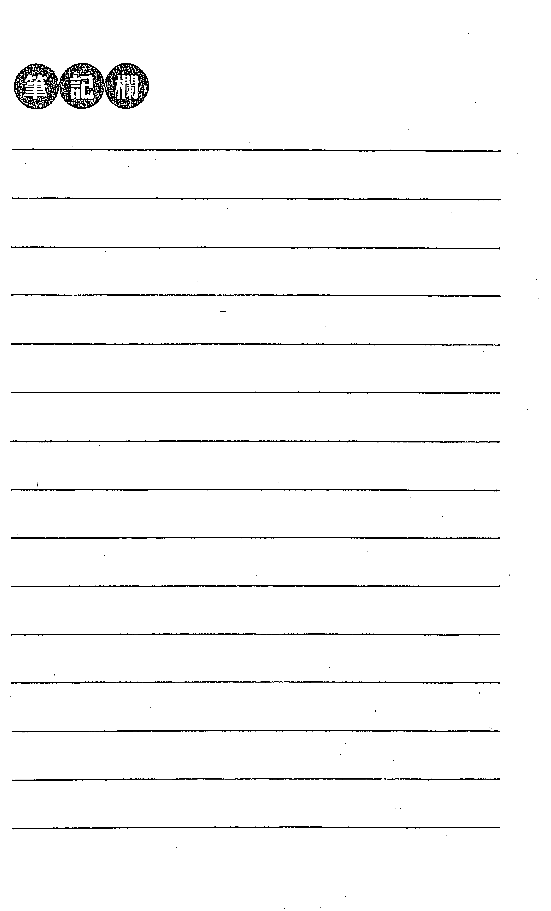

| 13-22 父母 己巳 红鸾 天梁 | 23-32 福德 庚午 七杀 | 33-42 田宅 辛未 天钺 | 43-52 官禄 壬申 廉贞 天刑 地劫 天贵 恩光 |
| :--- | :--- | :--- | :--- |
| 3-12 命宫 戊辰 紫微 天相 阴煞 | | | 53-62 仆役 癸酉 破军 火星 |
| 113-122 兄弟 丁卯 左辅 擎羊 巨门 天机 八座 | | | 63-72 身宫 迁移 甲戌 |
| 103-112 夫妻 丙寅 地空 龙池 禄存 贪狼 | 93-102 子女 丁丑 文曲 文昌 天魁 陀罗 太阴 太阳 化忌 | 83-92 财帛 丙子 铃星 天姚 凤阁 天府 武曲 化科 | 73-82 疾厄 乙亥 天同 天马 天喜 右弼 三台 |

阳男 戊戌年12月酉时生
生肖：狗（山头火）
甲年23岁
命局：木三局（大林木）
斗君：戊

电话：(04)2263-2397 行动：0911-133639
E-mail：ez.way@msa.hinet.net 或 ziwi88@hotmail.com

## 命例解說：

三合祿權科因此「出生富裕之家」，卻無昌曲左右來輔佐帝星，所以「行為不檢，與父母常鬧風波」，更加上火星鈴星地劫等煞星為虐，使得「善言詞，說話不實且誇大」一意孤行的住壞的方向發展，後來父親事業失敗乃自立，竟也因剛愎自用不聽勸而「錢財被侵占」、「又被告侵犯專利權而一時想不開自殺結束生命」，這些事件都是他人來加害，紫微帝星實在是需良相佐國，此造……就是帝星欠缺一千吉星來輔佐而剛愎自用、導致失敗，復因缺少輔佐不知如何因應困局而自殺，可惜！此造雖是「三吉嘉會格」，卻也是「小人據位」，好格局讓他生於富裕之家，也讓他當老闆，但這些都是陷阱，因為小人伺機吞噬、謀奪財富。

### 五十一、兩重華蓋

祿存、化祿坐命本是大吉大利之格局，卻逢空劫來破，減少了財富的福報，卻增加枯虛寂寞，因而版依宗教，有的甚至看破紅塵出家，青燈木魚為伴，因此，此格之人多成為富有之高僧或宗教大師，雖擁有財富，但是孤單、空虛不免。若是主星屬於殺破狼等星，就不會出家、遁入空門，而是在家修行，或是精神空虛的富翁，空虛寂寞度此生，因此，是「空虛寂寞」的格局。不要以不吉視之，此格之人以「渡化世人」為職志，是我們以世俗眼光看的論點——空虛寂寞，太偏狹了。

### 五十二、風雲際會

身、命宮都呈陷弱之局，而大限進入廟旺美限，如「祿馬交馳」或「明祿暗祿合一」之限運，定然財運勃發，發財於一時，如風雲際會，風起而雲湧，掌握機遇，趁勢而起。

### 五十三、錦上添花

大限進入吉地，又逢吉曜，本已吉祥，再得吉曜扶持，只不過增加限運的吉美而已，但对整个命盘没有积极助力，限运一过依然失去吉祥助力，不如吉曜入本命局相帮，更能给命造带来具有终生的助益。

### 五十四、禄衰马困

大限逢禄存、化禄、天马星于寅申巳亥四马地，又遇到地空、地劫，或忌星来冲激或三合交会，定然奔走无力，坐困愁城，尤其地空、地劫在四马地不是「同宫」就是「相会」，所以，空劫的力量加乘，发挥更大的破坏力，对于求财是很不利的，有禄存或化禄构成「禄合鸳鸯」格或是天马与禄星形成「禄马交驰」格，也会让财禄减分，事倍而功半，对于经商、或国际贸易、或跑业务的人，这都是不是吉祥的格局，碰到这种大限，最好能改行换业或是要「咬牙苦撑」过此大限。

### 五十五、衣锦还乡

少年运途不遂，及至中年之后，方才行大运，得富贵，衣锦荣归故里，如姜子牙随鬼谷先师习奇门遁甲，下山后不得志在渭水河畔钓鱼，及至周文王闻其贤名，慕名来访，礼聘至周，封坛拜相一样，荣归故里时已经七老八十了，此格局在第一个到第三个大运都不吉祥，要至第四大运之后才走吉祥旺运的，都是走中年运。「衣錦還鄉」的格局。其實，現代有很多知名企業家都是這種運局，像很多「白手起家」的企業家即是，少年困苦，中年後靠自身的才學與努力，創造人生的高峰，是很好的運途。

### 五十六、步數無依

前後大限運途沒有連貫，一起一落，一得一失，使得命運起伏不定，波折起伏，難得安定有依，最忌晚年仍是此局，定然晚景淒涼，孤苦無依，日日還得為三餐而奔波。

### 五十七、水上架屋

又比「步數無依」格局更為不堪，一年吉一年凶，一年得勢、隔年卻又失去，難有積蓄以備困窘之時，好像在水上架屋一般，再華麗美觀，也經不起波折，定然傾頹。

### 五十八、廉貞文武格

廉貞星和文昌或文曲同在寅、申宮坐命，廉貞為勇猛敢為的將星，在寅申是「雄宿朝垣」格，主藝高膽大、但個性衝動、有勇無謀，若有昌曲等文星同宮，增添其思考力，凡是能三思而後行，慎謀而後動，不至於只是個「四肢發達、頭腦簡單的莽撞武夫」而已，使之能文武兼備、深具韜略的軍事將才。此格之人宜往軍職發展，定能建立卓越功勳，若在私人企業，也宜擔任開疆開土型的工作。

### 命例解說：

命例請參考「財與囚仇」格，此造可惜是女命，受限於社會環境無所發揮，只好「馬夫出氣」，只不過有昌曲相會，即使是馬夫也罵得「有憑有據」而不是一潑婦罵街」的狗屁倒灶之事，所以，還能維持婚姻共同生活下去，她將「廉貞文武」格發揮在夫妻相處之上，家裡面「她」才是老大，一般人的想法，男友花錢將她從人口販子手中贖了回來，免淪於煙花，應該感激涕零，溫柔相待才是，但此造卻把文韜武略發揮在夫妻相處的「御夫術」上，把老公管得乖乖的，還有點怕她。

### 五十九、貴星夾命

丙、丁年生人坐命戌宫，壬、癸年生人坐命辰宫，就会构成天魁、天钺分别在父母和兄弟宫来夹命宫的盘局，此即「贵星夹命」格。代表有外来助力帮助命造，以先天命而言，可得父母兄弟的帮忙、或有家产庇荫，而以限运而言，在衰败的运途也可得贵人扶持度过难关，若是命局有强力的格局，也代表多外力帮忙，使成就益加辉煌，是个「助」格，遇急难得外助，畅旺之运也能得助。但是此等贵星一步入中年即消失效力，变得自己要去当贵人帮助其他人了，因此，此格局的朋友也要有此种体认，一旦步入中年就要去提携照顾后进了，自己也要去当别人的贵人，助他们成功，也是人生的一大乐事，不是吗？！

### 借据

| 丁巳 | 戊午 | 己未 | 庚申 |
| :--- | :--- | :--- | :--- |
| 115-124 父母 天钺 天梁 | 105-114 福德 火星 天喜 七杀 | 95-104 田宅 铃星 凤阁 龙池 | 85-94 官禄 地劫 天刑 廉贞 |
| 丙辰 |  |  | 辛酉 |
| 5-14 命宫 天相 紫微 左辅 天魁 巨门 天机 | 阴男 生年： 农历前9癸卯兔 节气： 酉时 |  | 75-84 仆役 破军 禄存 |
| 乙卯 |  | 壬戌 |
| 15-24 兄弟 贪狼 地空 |  |  | 65-74 身宫 迁移 天同 陀罗 天马 右弼 |
| 甲寅 | 乙丑 | 甲子 | 癸亥 |
| 25-34 夫妻 天贵 恩光 | 35-44 子女 太阴 太阳 擎羊 文昌 文曲 | 45-54 财帛 武曲 天府 禄存 红鸾 天姚 | 55-64 疾厄 |

电话：(04)2263-2397 行动：0911-133639
E-mail：ez.way@msa.hinet.net
或 ziwi88@hotmail.com

### 命例解說：

紫微居命有「若得府相，左右昌曲吉集，無有不貴，不然亦主巨富」的說法，此造有天相同坐命宮，卻缺少「左右昌曲吉集」所以是個孤君，喜歡老大又剛愎自用，故評曰「排行老大，性質剛烈多脾氣」，財帛宮又出現天姚，錢財都花在「風流好色，拈花惹草，揮霍無度」上，雖然有武曲財星天府和祿存，也只表示「天生富有」而已，如繼承祖產而非自己打拼來的，命局幸好有「貴星夾命」，讓此造「風流好色，揮霍無度」的頹廢生活，還能得到外力相助，如兄弟飛化紫微科入命宮，兄弟就是他的貴人，故此造「托兄弟之力，不然生活堪虞！」甚至後來鬧出「與同村有夫之婦有染」的桃花事件，也幸好「兄弟出力花錢，托人調解」才沒惹上大禍，這些都是「貴星夾命」格帶給他的吉祥助力，不然在當時風氣保守的農村，讓別人戴綠帽子的後果不是「坐牢就是被殺」，此造就是因兄弟調解有功而得以全身而退。這盤和「小人據位格」相似，只不過少了煞星匯聚，讓他少了外來的禍患，但是孤君格仍成立，因此自己胡作非為、惹來禍害，自己的人生之路也失去了理想，只能随波逐流的混下去。

### 六十、三合火贪格

如果贪狼入辰、戌、丑、未宫坐命，有「火星」由三方或迁移宫来会，就成为「三合火贪格」虽然没法和「火贪」格媲美，但是，仍然深具处事精明、善于掌握机会、趁势而起，从军或经商都有异军突起、建立勋业的机会，当然不管从事哪一行，都要从事和国外有来往的行业最好，因为这种格局是「扬威异域」的格局，商人当然就是国际贸易或在国外做生意了。常人具有「三合火贪」格，个性投机，举凡：彩券、股票、甚至期货等深具投机性质的理财方式，都能获得此种命局的人青睐，甚至有些胆大包天的样样都来，因此，好运时常能一夕致富，非得运之时，只好捐做爱心了。

### 登记册

| 宫位 | 年龄范围 | 干支 | 主要星宿 |
| :--- | :--- | :--- | :--- |
| 父母 | 12-21 | 癸巳 | 左辅、红鸾、天马、禄存、巨门 |
| 福德 | 22-31 | 甲午 | 擎羊、天相、廉贞 |
| 田宅 | 32-41 | 乙未 | 天梁、三台、八座 |
| 官禄 | 42-51 | 丙申 | 七杀 |
| 命宫 | 2-11 | 壬辰 | 天贵、陀罗、贪狼 |
| 仆役 | 52-61 | 丁酉 | 右弼、天钺、天同 |
| 兄弟 | 112-121 | 辛卯 | 铃星、天姚、龙池、天府、紫微 |
| 迁移 | 62-71 | 戊戌 | 文曲、天刑、地劫、武曲 |
| 夫妻/身宫 | 102-111 | 庚寅 | |
| 子女 | 92-101 | 辛丑 | 天机 |
| 财帛 | 82-91 | 庚子 | 地空、火星、凤阁、破军 |
| 疾厄 | 72-81 | 己亥 | 文昌、天喜、天魁、太阳 |

阳男狗（属土） 生年：35丙戊 斗君：二月三日 时 节气临岁

电话：(04)2263-2397 行动：0911-133639 E-mail: cz.way@msa.hinet.net 或 ziwi88@hotmail.com

### 命例解說：

這個命例主格是個「忌過貪狼，號曰風流綵杖」的格局特色是貪花好色，男女關係隨便，因此把女朋友搞大了才結婚，婚後也是酒色皆來，毫不收斂，妻又是醋勁極大且脾氣暴戾、剛愎之人，終至離婚再娶，三合又形成「三合火貪」格，性格中帶有強烈的投機性，心中只想「如何一夜致富」，對於上班朝九晚五的生活嗤之以鼻，不然上班時也是私心自用，作自己的投機生意，所以平時就玩玩股票、買買愛國獎券碰運氣，當時流行「炒地皮」也頗具心得，因此短短的三、四年間就賺進大筆財富，因此格局具有「暴發資財」的力量，所以能於短時間賺到大筆的金錢。

不過此格之人，到最後也是大敗收場的多，來得快去得也快，因三方四正會入地空、地劫，錢財破耗大，此格之人要懂得守成，才不至於老來一場空，但如此造的盤局，到老都還得操心，不得清閒享福。

### 六十一、贪铃朝垣格：（参考火贪格类，相似）

太阳坐命于辰巳，或太阴坐命于酉戌是也，因为该两星于上述宫位都属于旺宫，两颗明星分居命宫、官禄当然对于人生运途更加吉利，故说『一曜常明正得中，才华暨势是英雄，少年得风云际会，一跃天池便化龙』，日月两星照亮命运的坦途，让命造减少许多奋斗的过程，非常利于求学、做研究，职业以担任公职或需要到处奔波的工作最能发挥特长，如业务行销等，假如这两星反过来，就是『日月反背一格，对于武人就能成为『治乱世之能臣』，若在太平盛世反无所施，成就失色不少。但是，也要不逢煞星才能向吉祥的方向，若逢煞星也是成为带头为坏的格局，决不是跟着摇旗呐喊的小喽啰，所以，从小就要留意导正恶习歪念，才不至于成为大凶大恶之人。

### 六十二、丹墀桂墀格

| 宫位信息 | 天干地支 | 星曜组合 | 宫位信息 | 天干地支 | 星曜组合 |
| :--- | :--- | :--- | :--- | :--- | :--- |
| 命宫 (6-15) | 乙巳 | 太阳 陀罗 恩光 | 田宅 (96-105) | 戊申 | 紫微 天府 天姚 文曲 天贵 |
| 父母 (116-125) | 丙午 | 破军 禄存 文昌 | 官禄 (86-95) | 己酉 | 贪狼 天喜 |
| 福德 (106-115) | 丁未 | 天机 擎羊 地空 天刑 | 僕役 (76-85) | 庚戌 | 巨门 天魁 天马 凤阁 左辅 |
| 兄弟 (16-25) | 甲辰 | 天同 龙池 右弼 地劫 天钺 | 迂移 (66-75) | 辛亥 | 化忌 |
| 夫妻 (26-35) | 癸卯 | 七杀 铃星 | 疾厄 (56-65) | 壬子 | 廉贞 天相 |
| 子女 (36-45) | 壬寅 | 八座 | 财帛 (46-55) | 癸丑 | 天梁 火星 阴煞 三台 |

陰男 生于 丁亥年 8月 辰时 (屋上土)
命宮： 火六局 (覆灯火)
斗君： 36 丁酉

電話： (04)2263-2397 行助： 0911-133639
E-mail： cz.way@msa.hinet.net 或 ziwi88@hotmail.com

### 命例解說：

命局是利於學習、讀書的「丹墀桂墀」格，因此「自小聰明絕頂」，不過聰明不代表喜歡讀書，，此時就要看昌曲左右有沒來輔佐，若無，反而煞星聚會，會將一聰明才智，用於「歪途」之上，而此造陀羅坐命會遷移巨門忌，成為雙忌交會的格局，而陀羅天馬構成「折足馬」的命局，讓他不安於室，一天到晚想往外跑，而陀羅和忌星的組合，卻使奔走無力，讓他交到的都是一些狐群狗黨，故而「立性固執，好爭鬥，暴戾，好投機豪賭」，很明顯，學不到什麼好東西，因為巨門暗星化忌，讓他盡看到或學到陰暗、負面的東西，而陀羅星就將他的心和想法都導入「一黑一社會」，所以「呼朋引伴，為非作歹」，即使當兵回來，父親極力苦勵也只稍微收斂而已，真是「聰明反被聰明誤」、官祿主的太陽逢遇巨門忌，又會陀羅火星，事業運途都難有施為，故說：「一生破敗之命」。

### 六十三、甲第登庸

化科星入命，遷移宮有化權來會，即為『科命權朝，登庸甲第』，若再加化祿成為『權祿逢迎』格更佳，代表文章出名、名聲顯赫，因此而得重用；化科主科甲、文章、功名，因此衍申為學術研究或專業才華而成名，化權為成就名聲、建立事業也，會照即成為因文章出名獲得重用，擔當大任，因此『禹門一躍便騰空，頭角崢嶸浪花中，三汲飛騰顛風颶，風起雲湧化蛟龍』道盡了十年寒窗苦讀研究，一朝得遇重用，飛黃騰達的景象，所以是一個以專業能力而得『貴』的命局。

### 笔记

○○農生陽 子命曆年男 年局 ： 節氣盤歲 斗士年午屬 ：五 6楊 已局（木 柳 日 成侍）

電話：(04)2263-2397 行動：0911-133639 E-mail: cZWwY@msa.hinet.net 或 ziwi88@hotmail.com

85-94 身宮 乙巳 財帛
天相 天鉞 天馬 右弼
鳳閣 巨門

95-104 丙午 子女
天梁 天姚 溫

105-114 丁未 夫妻
廉貞 七殺

115-124 戊申 兄弟
八座 恩光

5-14 己酉 命宮
天同 天梁 龍池 陀羅

15-24 庚戌 父母
武曲 破軍 祿存 火星 文曲

25-34 辛亥 福德

35-44 壬子 田宅
太陽 文昌 擎羊

45-54 癸丑 官禄
天府 天鉞 地空 鈴星

55-64 壬寅 僕役
天機 太陰 天刑 文曲

65-74 癸卯 遷移

75-84 甲辰 疾厄
紫微 貪狼 天魁 天喜

### 命例解說：

命宮坐左輔化科星對宮有貪狼化權來朝照，是「登庸甲第一」格沒錯，化權讓紫微帝星更崇高，但有地空、地劫和鈴星破壞他成為高級官員登峰造極的格局，充其量是個高級的專業技術者——因化權者會「追求成就」，往往對某項技術深入研究，而建立深厚專業能力得到重用，所以此造在民國七十年便擔任海關電腦中心主任，微處理器六十六年發表，電腦技術初萌，而他在初萌芽階段就已深入該項技術，成為專家，擔任重要職務。
若沒該等煞星破局，成就定然不是一個海關電腦中心主任的層次而已。
這種格局最適合朝「研究」之路發展，一定會以「專業技術」成為引領風騷的先行者。

### 六十四、科名會祿

命坐化科星而遷移宮有化祿來朝照或反過來命坐化祿而遷移坐化科，即合此格，此種格局為利於求學、研究、考試的格局，日後定因具有深厚的素養，獲致豐厚的回饋。譬如通過律師考試而執業，成為業界的頂尖律師，當然收入就非比尋常啦。

假如是經商，也是會和海外市場發生關連的大企業，而不是小企業。

注意的是一定要先從累積深厚的技術、或獨特的見解之後，再從事相關事務，才會成功，不要只想投機取巧，賺那些不必經過一番刻苦研究而獲得的財富，往往是慘敗收場。

「化科」是學有專精、「化祿」是財富，此格是以「學有專精」而獲得「財富」，不是那種擺水果攤或菜攤的格局，適合：技師、律師、醫師、會計師等「師」字輩的專業人才。

### 笔记簿

| 武曲、破军、天钺（忌） | 太阳、左辅（科） | 天府 | 天机、太阴、右弼、铃星 |
| :--- | :--- | :--- | :--- |
| 112-121 兄弟 巳 | 2-11 命宫 午 | 12-21 父母 未 | 22-31 福德 申 |
| 天同、龙池 | | 陽男 庚午年 三月 戌時 男命 局：水二局 生肖：鼠（桑柘木） 年：61年 電話：(04)2263-2397 行動：0911-133639 E-mail：cz_way@msa.hinet.net 或 ziwi88@hotmail.com | 紫微、贪狼、天喜、地劫 |
| 102-111 夫妻 辰 | | | 32-41 田宅 酉 |
| 天魁、红鸾、天姚 | | | 巨门、陀罗、凤阁 |
| 92-101 子女 卯 | | | 42-51 官禄 戌 |
| 文曲、天马 | 廉贞、七杀、地空 | 天梁、擎羊、文昌、火星 | 天相、禄存、天刑 |
| 82-91 身宫 财帛 寅 | 72-81 疾厄 丑 | 62-71 迁移 子 | 52-61 仆役 亥 |

## 命例解說：
此命盤除了「科名會祿」一格之外，還是「昌曲拱命」、「陽梁昌祿」、「日麗中天」一格，一堆利於「探究學問、深入研究」且有所成的格局，而日麗中天格使他在藝文界能成為知名人士。不過三方會匯聚了「擎羊、陀羅、火星」來破局，因此，成名後總有一些負面新聞干擾著他、或是別人在背後指指點點，對他造成一些心理上的不快、或是人家邀請他主筆、或當代筆人時的顧忌，失去不少機會，而他同性戀史就是他的干擾源，不過隨社會開放也漸被接納。官祿宮的巨門加陀羅的組合就是「是非紛紜」的運途，還好命宮的科星終會有「柳暗花明」的時候，不會被逆境擊倒，遷移的天梁祿有逢凶化吉的力量，積極向外發展，突破是非紛紜的干擾，名聲更大，人氣更旺。

### 六十五、權祿尋逢
命宮坐權而遷移宮有化來會，或命坐祿而遷移宮化權來朝，就是「權祿尋逢」一格，具有專業能力又有經商的智謀，是個以「專業技術經商」的格局，只要深入鑽研某項技術或配方，必能因此而獲利，如施振榮先生深入研究微處理機，進而創業，將公司經營成為相當大的集團，擁有此格局的人一定要掌握天賦格局，深入某項技術，日後必可成為施振榮第二。當然後續發展，還要運途的配合才能知道能否成為大企業家？不過至少成為公司內舉足輕重的研發核心人物是不容置疑的，若是走服務業，也是營運的核心幹部。

## 筆記本

| 宫位信息 | 星曜组合 | 宫位信息 | 星曜组合 | 宫位信息 | 星曜组合 |
| :--- | :--- | :--- | :--- | :--- | :--- |
| 命宫 2-11 癸巳 | 太阳[禄] 武曲 | 父母 112-121 甲午 | 左辅 天魁 破军 | 福德 102-111 乙未 | 天机 三台 八座 |
| 兄弟 12-21 壬辰 | 文曲[科] 天姚 凤阁 天同 | 身宫 夫妻 22-31 辛卯 | 天喜 天马 天钺 七杀 | 田宅 92-101 丙申 | 紫微 天府 陀罗 红鸾 右弼 火星 |
| 子女 32-41 庚寅 | | 财帛 42-51 辛丑 | 天梁 | 疾厄 52-61 庚子 | 天相 廉贞 地空 恩光 | 官禄 82-91 丁酉 | 贪狼 擎羊 地劫 |
| | | | | 迁移 62-71 己亥 | 巨门[忌] 龙池 天刑 文昌[忌] | 仆役 72-81 戊戌 | 天府 阴煞 |

阴男
生年：辛未
生月：3月
生日：亥时
命局：水二局
斗君：酉

電話：(04)2263-2397 行動：0911-133639
E-mail：ez.way@msa.hinet.net 或 ziwi88@hotmail.com

## 第六章／詳論格局特性

## 命例解說：
遷移坐祿而命宮坐權，在巳宮四馬之地，心思靈活、刁鑽、說話面面俱到，圓融周到，交際手腕靈活，三教九流、五湖四海都交得來、吃得開，人面廣闊，所以擔任舞廳的經理，負責外場事務，在業界頗有名氣，遷移坐祿而有此響亮又豐沛的人脈關係，所以，即使是作「地下」的行業，黑白兩道都相安無事，生意興隆、財源滾滾來，分得紅利不少。

不過遷移宮的文昌忌加天刑星的組合也讓他常遇到官非的問題，從事這種行業難免出入份子複雜，警方傳去問話、偵訊是難免的，還好有化祿和化權的關係，只是一「問話」而已，不過也對他造成相當的困擾，而且此種情事時常碰到，這就是生年忌具有終生效用的後遺症。

巳、亥是很特殊的位置，各主星幾乎落入此宮都會「轉性」，具有一飄蕩」，像此造太陽生命已宮乃廟旺地，應該頗有「官貴」的命，他卻幹舞場經理，專門應付難纏的三教九流尋芳客，遷移的文昌忌、天刑，不就意指在法律邊緣的生活形態嗎？把祿、權相會的巨日格破壞了。

### 六十六、極向離明
紫微坐命居午宮，沒有煞星來湊熱鬧，更有昌曲左右等輔星來相助扶持又構成「君臣慶會」的才擅經邦的大格局，所以，不管是從政或者經商，都能獲得成功，是可富可貴的格局。古書云：「乘駟司諫肅威風，氣象堂堂立殿中，幾轉王庭分內事，終身富貴位王公」，現代人不可能當王公了，或可以轉變成重要幹部、企業家、或擔負重任的官員。

當然一有煞星沖破，格局的吉美程度就會減色不少，增添命運的困頓或不遂之意。

此格，最好唸政治、法律、財經等與治國安邦等有關的學識最吉祥，日後可一展鴻圖，說不定那天「氣象堂堂立殿中」呢！

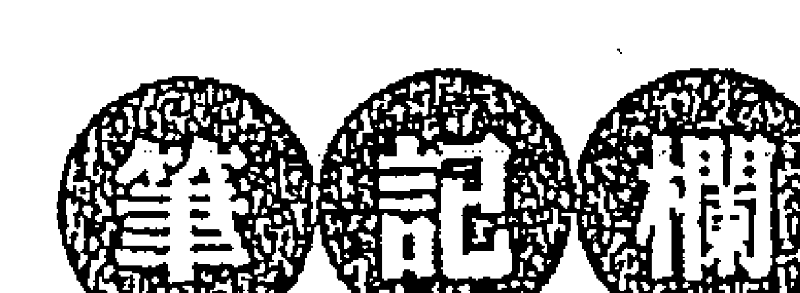

| | | | | | | | | | | | | | |
| :--- | :--- | :--- | :--- | :--- | :--- | :--- | :--- | :--- | :--- | :--- | :--- | :--- | :--- |
| 地空 | 地劫 | 天机 | 三台 | 阴煞 | 身宫 命宫 | 壬午 | 红鸾 | 紫微 | 天刑 | 恩光 | 天钺 | 破军 | 甲申 |
| 13-22 兄弟 辛巳 | 铃星 | 文昌 | 擎羊 | 七杀 | | | | | | | | | 火星 |
| 23-32 夫妻 庚辰 | 禄存 | 天梁 | 太阳 | 天马 | | | | | | | | | |
| 33-42 子女 己卯 | 左辅 | 天相 | 陀罗 | 天府 | 天贵 | | | | | | | | |
| 43-52 财帛 戊寅 | | | | | | | | | | | | | |
| | | | | | 凤阁 | 龙池 | 巨门 | 天同 | 右弼 | 天喜 | 天魁 | 贪狼 | |
| | | | | | 53-62 疾厄 己丑 | | | | 63-72 迁移 戊子 | | | 73-82 仆役 丁亥 |
| | | | | | | | | | | | | | 天姚 | 太阴 | 天同 |
| | | | | | | | | | | | | | | 丙戌 | |
| | | | | | | | | | | | | | | 83-92 官禄 | |
| | | | | | | | | | | | | | | 乙酉 | 文曲 | 天府 | 廉贞 | |
| | | | | | | | | | | | | | | 93-102 田宅 | |
| | | | | | | | | | | | | | | 甲申 | | | | 火星 |
| | | | | | | | | | | | | | | 103-112 福德 | |
| | | | | | | | | | | | | | | 癸未 | | | | |
| | | | | | | | | | | | | | | 113-122 父母 | | | | |

○○○辰生阴
子命历年男
年局：
斗君木年酉鸡
：申局11月泉（极卯水）日午时

電話：(04)2263-2397 行動：0911-133639
E-mail：cz.way@msn.hinet.net
或 ziwi88@hotmail.com

## 命例解說：
這也是『輔相朝垣』格局，還有『左右拱命』格又構成『君臣慶會』格，三個大格局加上現在的『極向離明』格等吉美的格局護持之下，在中年時期，就已經成為一位有錢又有聲望的企業家，由這裡也可推知，擁有吉美的格局越多，越能抵抗忌煞星的沖激或肆虐，而成為社會的菁英份子，若是煞星群聚來為禍，也是禍福參半、吉凶相倚，而不至於困窘到『衣不蔽體、無餐可食』的情境。

像此造也構成『桃花犯主』的命局，遷移坐水旺之地的桃花星貪狼，來引誘帝星紫微，所以，喜歡女色或容易被誘惑是必然的，加上一個奇差無比的夫妻宮，讓他的感情生活乏善可陳，夫妻不是相視如寇仇，就是話不投機半句多，因此內憂外患之下，這種命局的感情不向外發展，尋求心目中的理想伴侶，一生一世的細心呵護才怪，又妙在命宮有一紫微科，讓他不會亂來用強暴手段，或買賣式的婚姻關係，會用斯文有禮、羅曼蒂克的溫情攻勢來追求。

在卯限因為拿錢資助一位倒閉的朋友，也資助他的女兒完成學業卻愛上了她，苦苦追求，但女生認為此造已年紀半百了，又非喜歡的人就極力擺脫，惹得此造頗為苦惱，『金錢雖非萬能，沒錢卻萬萬不能』在此又得到了驗證。

### 六十七、文梁振紀格
文曲遇到天梁星坐命在旺宮，天梁為律己甚嚴的星（巳亥除外），尤其落廟旺之地子、午的時候更明顯，所以當官往往成為執掌「法律風紀」的官員，如監察委員、風紀股長、法官、檢察官等，此等人做事循規蹈矩、謹守份際，而天梁加文曲即有此特性，因此往此發展定能合命格之屬性，幹得有聲有色，一聲「威武」！牛鬼蛇神莫不皮皮挫！

### 六十八、輔拱文星格
命宮坐文昌或文曲，三合或對宮有左輔、右弼來拱照協輔，對於學生求學能專心向學、獲得好成績，而參加國家考試也能金榜題名，是個利於「科舉、考試、學習」的格局。

這也是個「輔格」來輔佐「主格」使其能「好學、科甲得名」，若主格無力...

所以雖然「才擅經邦」但還是「英雄難過美人關」，怪不得有那麼多社會名人、政壇要角栽在美人裙下，可能他們都是「才擅經邦」卻是夫妻宮「殺臨三位，定然夫妻不合」的格局吧。

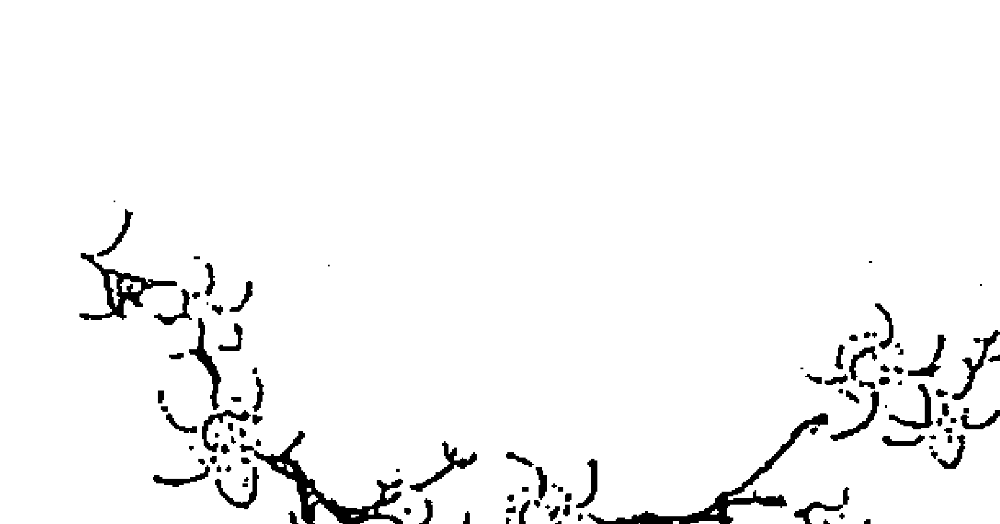
也只是「好學」而無「科甲成名」的份，更過文星化忌甚至有「失學」之憾呢！

| 己巳 94-103 子女 | 庚午 104-113 夫妻 | 辛未 114-123 兄弟 | 壬申 4-13 命宫 |
| :--- | :--- | :--- | :--- |
| 铃天红 星刑鸾 恩光 太阳权 | 文天 曲机 | 天破紫 钺军微 权 | 文天 昌马 |
| 天贵 84-93 戊辰 财帛 | | ○○農生陽 子命曆年男 年局： 甲戌狗 斗：23年戌 君金年（山 ：四9頭 午局（劍鋒金） 24火） 時 节气：白露 (9月7-9) | 14-23 癸酉 父母 太阴 |
| 八座 火擎七武 星羊杀曲 科 | | | 阴煞 24-33 甲戌 福德 |
| 74-83 丁卯 疾厄 | | | 天贪廉 喜狼贞 禄 三台 34-43 乙亥 田宅 |
| 右弼 龙池 禄存 天梁 天同 | 地劫 天魁 陀罗 天相 | 左辅 凤阁 巨门 | |
| 64-73 丙寅 迁移 | 54-63 丁丑 仆役 | 44-53 丙子 身宫 官禄 | |

阳男狗年生
甲戌年九月二十四日午时

电话：(04)2263-2397 行动：0911-133639
E-mail：ez.way@msa.hinet.net
或 ziwi88@hotmail.com

## 命例解說：
「蔭福聚不怕凶厄」的格局，都是良善星來照命宮，且三合不見惡煞星纏，表現於人性「為人仁慈，外緣佳」，而命宮坐文昌三合有「左輔、右弼」來加會，又形成「輔拱文星」格，雖然家貧沒有讀書，所以功名無望，但是很肯學習頭腦又靈活，又有人緣，朋友得助，所以，「就職某成衣加工廠，稱職並得東家器重」沒有什麼？由於這兩種吉祥格局的力量護持之下，所以一遇到困難時「貴人現，在調頭寸困難中常得友人資助渡過難關。」雖然此造最終還是失敗收場，但是以出身寒微、家無恆產的家庭，能以己身之力掙得相當基礎、再結合朋友之助創業，就已經不簡單了。

若只從交友宮的坐星組合來看，怎能看出「有人緣」、「在困難中常得友人資助」的現象呢？所以命格才是主角，交友宮另有其他用途。

### 六十九、机梁加会格
「机梁会合善谈兵」、「机梁会合、定有高艺随身」，在在说明这两颗星在一起时，拥有高超的智慧，成为像孔明或刘伯温般神机妙算的军师，遇事都能料想到三四步以后的局势而制敌机先，不然也能有卓越的专业技术，所以不是成为「国师」，就是「技师」，不过也有「天机天梁会、早有刑而晚见孤」的评语，可能是此格之人，智慧太高了，凡夫俗子的泛泛之见，已难起共鸣，而有「相交满天下，知心有几人」的感叹吧。由于智慧高妙，精于算计，一旦格局不佳就成了「斤斤计较」的人，不但朋友关系薄弱，甚至家庭之中也会因算计得太精而关系冷淡，要改正此种计较的人格特质，才会开展个人的人际关系、改善命运。试想卧龙先生孔明，没有人帮他传话、宣传，刘备那能知道隆中住了一个高人呢？当然就不会有三顾茅庐的千古佳话了，所以，有好格局，也要广结善缘，机会自然会找上门来！

| 天七紫 鉞殺微 | 鈴紅 星鶯 | 地天 劫刑 ||
| :---: | :---: | :---: |
| 16-25 父母 乙 巳 | 26-35 福德 丙 午 | 36-45 田宅 丁 未 | 46-55 官祿 戊 申 |
| 天天 梁機 || 申猴 (劍鋒金) 日酉時 || 破廉 軍貞 |
| 6-15 命宮 甲 辰 | || 56-65 僕役 己 酉 |
| 左天天 輔魁相 || || 陀羅 |
| 116-125 兄弟 癸 卯 | 文文天貪武 曲昌喜狼曲 忌 || 66-75 身宮 遷移 庚 戌 |
| 地鳳巨太 空閣門陽 | || 天龍犂太天 姚池羊陰同 | 火右天祿天 星弼馬存府 |
| 夫妻 壬 寅 | 子女 癸 丑 | 財帛 壬 子 | 疾厄 辛 亥 |

電話：(04)2263-2397 行動：0911-133639
E-mail：ez.way@msa.hinet.net
或 ziwj88@hotmail.com

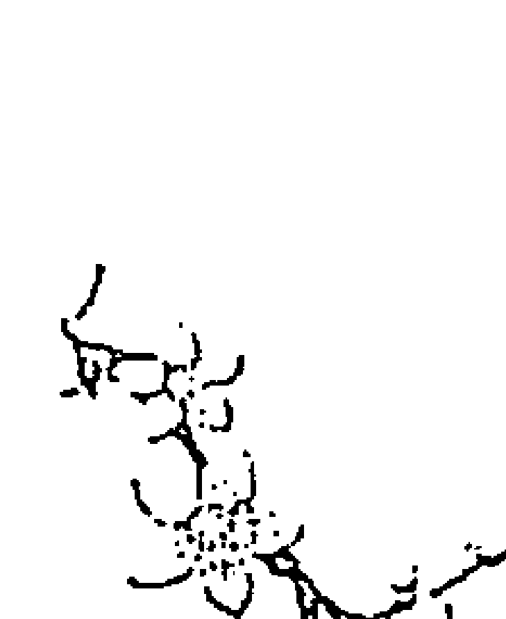

## 命例解說：
「機梁會合善談兵」加上天梁祿更加強「善談」的成分，編個故事把你要得團團轉，原來都是假的，以常人的智慧根本無法摸透機梁的心思，怪不得「早有刑而晚見孤」因為智慧高妙，常人難以瞭解摸透，獨上孤峰難有知心，當然孤獨，當然也由於這種特質此造能擔任「情治單位的處長」職務，幹「情報人員」被敵國捉獲，當然得接受殘酷的刑求拷掠，甚至處死，因而是種非常危險的行業，故符合「身陷險地平安過，威風凛凛逞英雄」的說法。若是擔當此種情報機構的頭目，沒有好幾把刷子還真壓不過這些深具智慧又謀略的情報人員，之前有某情治單位退休人員寫書，爆出台灣的種種樣態，爾虞我詐，互相傾軋，說真的，沒有「高藝隨身」可能三兩下就被搞下台了，此造三合見擎羊、陀羅和天刑是破局，因此，被內部鬥爭搞垮，還惹上官非坐牢。題外話，很多軍事情報員都有這種「天機天梁會」的命局，大概是這種人喜歡故弄玄虛、善於與人鬥智，又擅長隱藏心事，孤獨過活的特性有關吧！

### 七十、化煞为权格
一般人以为紫微遇七杀在巳亥宫就是「化煞为权」，其实擎羊火星坐命于庙地，也可说是此格局，「三煞加临庙旺宫，性情刚猛逞英雄，身陷险地平安过，威风凛凛逞英雄」，也就是此种命局之人定然「屡遇惊险」、「九死一生」之境，终于克服万难而归来，成为大家心目中的英雄，所以此格之人要「遇险而功成」，身体遭伤难免。

| 宫位 | 宫干地支 | 星曜 | 虚岁范围 |
| :--- | :--- | :--- | :--- |
| 命宫/身宫 | 丁巳 | 紫微、七杀、天钺、天马、地劫、地空 | 5-14 |
| 父母宫 | 戊午 | 天刑 | 15-24 |
| 福德宫 | 己未 | （无主星，对宫天机天梁） | 25-34 |
| 田宅宫 | 庚申 | 红鸾、天贵、阴煞 | 35-44 |
| 官禄宫 | 辛酉 | 廉贞、破军、天姚、文曲 | 45-54 |
| 仆役宫 | 壬戌 | 天府、陀罗、龙池 | 55-64 |
| 迁移宫 | 癸亥 | （无主星，对宫天同太阴） | 65-74 |
| 疾厄宫 | 甲子 | 天同、太阴、禄存、天魁 | 75-84 |
| 财帛宫 | 乙丑 | 武曲、贪狼、擎羊、左辅、右弼 | 85-94 |
| 子女宫 | 甲寅 | 太阳、巨门、天喜 | 95-104 |
| 夫妻宫 | 乙卯 | （无主星，对宫天机天梁） | 105-114 |
| 兄弟宫 | 丙辰 | 天机、天梁、天魁、凤阁、火星 | 115-124 |

陰女
生年：癸未
農曆：32年10月
命局：木三局
斗君：酉

節氣 虛歲

電話 (04)2263-2397 行動：0911-133639
E-mail : ez.way@msa.hinet.net
或 ziwi88@hotmail.com

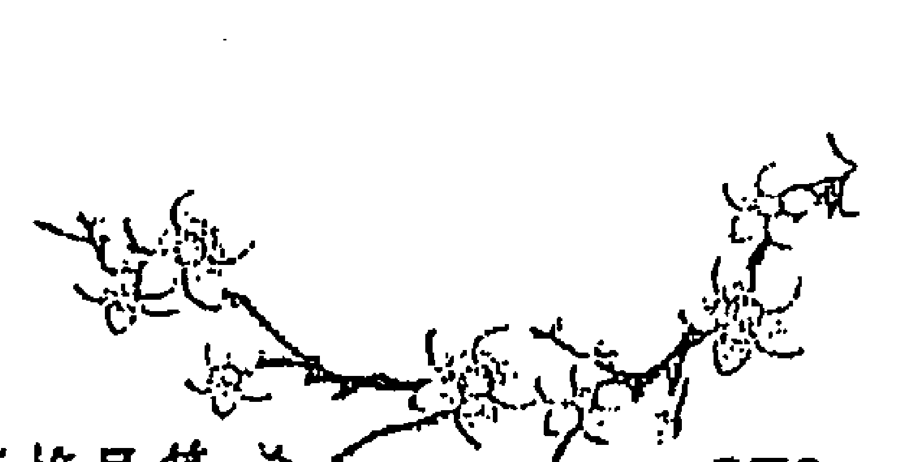

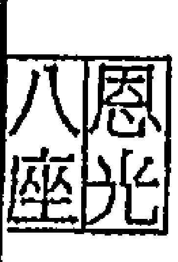

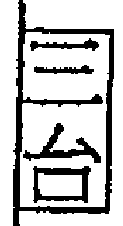

## 命例解説：
命宮「化煞為權」當然個性強、獨立自主，難聽得下別人的勸告，空劫使想法異於常人，此空劫幫凶破壞平衡，使運途更加困頓，所以必然容易遭遇凶險，故遭強暴失身，因格局使然，一切以己意喜怒而行，不顧眾人之觀感，三結三離，都是自己外遇或休夫。

當然，在事業上也會將開創力發揮，成立一家公司，能幹、強悍不輸男人，讓對手頗為緊張，處理公事也很專制，但公司經營得還不錯，此乃限運吉利，又其第三任丈夫乃其員工，小此造數歲，如果不是有此種「強勢」的化煞為權格局支持，一般的女人恐怕已被感情折磨得不想活了，此種格局早已跳脫性別的束縛，讓她成為成功的事業經營者，視野境界已跳脫一般人的範疇了，「化煞為權」的突破性能量決不能小看！

### 七十一、寿星入庙格
寿星即是天梁，若天梁守命在午宫就是此格，子宫虽也是天梁庙旺之地，但不合此格，心地光明、性情磊落、忠谏之臣也，所以「命遇离明拱寿星，一生容逹沐深恩，飞腾鸿鹄青霄近，气象堂堂侍帝旁」，重点在于「侍帝旁」，虽是高级主管但还是人上有人，「伴君如伴虎」，有朝一日忤逆老大的心意，马上打入冰箱冷冻，所以，是个「动口不动手」的格局，一旦遭到贬抑很怕无法因应困局而失败，所以此格之人不要太高傲、冷酷，免得日后遭仇家打落水狗。

| 宫位 | 星曜 | 年龄范围 | 天干地支 | 备注 |
| :--- | :--- | :--- | :--- | :--- |
| 兄弟 | 天相、陀罗、龙池 | 12-21 | 乙巳 | |
| 命宫 | 天梁、禄存、火星 | 2-11 | 丙午 | 忌 |
| 父母 | 廉贞、七杀、擎羊、文昌、文曲 | 112-121 | 丁未 | |
| 福德 | 天喜、天姚、天空 | 102-111 | 戊申 | 鳳閣、天鉞 |
| 夫妻 | 紫微、贪狼、右弼 | 22-31 | 甲辰 | |
| 子女 | 天机、太阴、红鸾、地劫 | 32-41 | 癸卯 | 科 |
| 财帛 | 天机、太阴、红鸾、地劫 | 42-51 | 壬寅 | 三台 |
| 疾厄 | 铃星、天府 | 52-61 | 癸丑 | |
| 身宫 | 阴煞、八座 | 62-71 | 壬子 | 遷移 |
| 仆役 | 武曲、破军、天马、天魁、左辅 | 72-81 | 辛亥 | |
| 田宅 | 天同、天机 | 92-101 | 己酉 | 權 |
| 官禄 | 武曲、破军 | 82-91 | 庚戌 | |

電話：(04)2263-2397 行动：0911-133639 E-mail：ez-way@msa.hinet.net 或 ziwi88@hotmail.com

# 命例解說：

三奇嘉會格又有祿存坐命化祿來合，年輕時間開家具工廠兼銷售，大賺錢，累積相當財富，而且又是一「壽星入廟」格，心地光明、坦白磊落，獲得眾會友的支持，曾擔任某工商會的會長職務，「機月同梁」格的人來擔任這種服務性質的工作，所以獲得會友的很高評價，但受限於會規無法連任，但也犯了男人都會犯的毛病——外遇，由夫妻宮的巨門忌，也可窺知婚姻不美的徵象，但也讓「官資清顯」的命局有了污點，影響了更上一層樓的機會。

前面不是說：「三奇嘉會、煞湊、虛譽之隆」嗎？果然，當了會長、雖然使社會聲望達到巔峰，但是對公司業務卻沒啥幫助，甚至還每況愈下，真的是「虛譽之隆」！就在民國八十年代台灣地產正蓬勃發展的時候收攤了，不然，可成就更鉅大的財富。

### 七十二、化星遇貴格

「天同戌宮化忌，丁人命遇反為佳」、「天同戌宮為反背，丁人化吉主大貴」或巨門星「巨門辰戌為陷地，辛人化吉祿崢嶸」，這是個特殊格局，只有上述條件合格才能成格，其他年份出生的則不合格，而且此格宜男不宜女。

其中，古人的論點有些混淆，說明如下：

丁年生人天同化權，而落入戌宮干為「庚」，使天同化忌，因此，天同權又自化忌，讓天同星破功了，但是此時卻是吉利的解釋，此乃特例。

辛年生人巨門化祿，而落入辰宮干「壬」，沒使巨門變化，也沒使對宮的天同變化，而太陽化權在其財帛宮，祿、權在命宮三合相會甚吉利，不過若在戌宮則不吉，因為擎羊也在命宮內，很容易形成「巨火羊」的格局，而命坐辰宮者，擎羊星在遷移宮戌，比起在命宮內當然要吉祥的多，因此，只有辰宮才合格，不過不是合此一化星遇貴一的格局。

所以，是「天同戌宮化忌，丁人命遇反為佳」才符合「化星反貴」格。

# 命例解說：

請參考前述「雙祿朝垣」格的命例，為什麼只有丁年生天同命坐戌宮的才合此格？即在於丁年生的祿存在午，而太陰化祿在寅，和命宮戌構成「寅午戌」三合的格局，在此局內有祿存、化祿、化權、化科等吉祥的化星，所以雖然對宮有巨門忌沖照，本宮天同又自化忌，也無損格局，這種忌沖又逢自化忌的角度，反而成為巨富之命。

### 七十三、將星得地格

紫微諸星宿中，武曲為周武王，當初起兵反商就由他擔任統帥一職，所以武曲是顆開疆闢土的「將」星，假如武曲星於廟旺宮位坐命，就是此格，而武曲星的廟旺之地是：丑辰未戌等四宮，真是「將星入廟最為祥，位正官高到處強，攻城掠地多妙策，威風八面鎮邊疆」。

「將」星當然要負責開疆闢土，所以有此格的人在人生運途上，也要開疆闢土建立屬於自己的人生，當然得歷經一番奮鬥，艱辛是難免的，婚姻生活可能就要晚婚或要忍受孤獨的感情了。

| 宫位（年岁·干支） | 主要星曜 | 宫位（年岁·干支） | 主要星曜 |
| :--- | :--- | :--- | :--- |
| 父母宫 丁巳 115-124 | 太陽、天鉞 | 福德宫 戊午 105-114 | 破軍、紅鸞、祿 |
| 田宅宫 己未 95-104 | 天機、鈴星 | 官禄宫 庚申 85-94 | 紫微、天府、天刑、地劫 |
| 命宫 丙辰 5-14 | 天同、天魁、左輔、武曲 | 仆役宫 辛酉 75-84 | 太陰、貪狼、忌 |
| 兄弟宫 乙卯 15-24 | 七殺、地空 | 身宫·遷移宫 壬戌 65-74 | 天貴、恩光、巨門、陀羅、天馬、右弼 |
| 夫妻宫 甲寅 25-34 | 三台、八座（旁注） | 子女宫 乙丑 35-44 | 天梁、擎羊、龍池、鳳閣、文曲、文昌 |
| 财帛宫 甲子 45-54 | 廉貞、天相、祿存、天喜、天姚、火星 | 疾厄宫 癸亥 55-64 | 巨門、陀羅、天馬、右弼 |

命主信息：阴男，生于癸酉年（剑锋金）十二月酉时，命局为斗君五戊局（沙中土）

联系方式：
電話：(04)2263-2397
行動：0911-133639
E-mail：cz.way@msa.hinet.net 或 ziwi88@hotmail.com

# 命例解說：

武曲獨坐命宮在辰，當然符合「將星得地」格，因此個性堅毅、剛強果斷、處事明快，故評曰「膽大敢為」，對宮有貪狼忌沖照，把一個好格局破壞，而此忌有「負面的、不好的」意思，而遷移是出外的宮位，因此「名氣不揚」，財帛宮也有主掌「剛強出眾」的火星來合，讓他在做事情時「性格急燥，操心寒酸」，而命宮——遷移線的武貪相會有「若與貪狼會，慳吝之人」、「貪狼與武曲同度，為人諂佞奸貪。每存肥己之心，並無濟人之意。」總之是對自己慷慨而對人刻薄吝嗇的組合，故前輩評曰「刻薄、寒酸」，所以我一直強調不要只看到命宮坐什麼星便論到個性如何如何，上述都是八字前輩的評語，對應到斗數來，有些就非命宮坐星的現象，所以，格局是論紫微斗數先天命局的依據，而不是只看命宮內的坐星而已。當然，沒有眾煞來壞局，又是一府相朝垣」格，因此能累積相當財富，「經營成衣加工業，大獲財利，部份得自地財」，由於有個貪狼忌星擾亂，財帛的火星使之減色不少、官祿的天刑和地劫破壞運途，因此「早年困頓」，要歷經一番奮鬥、白手成家，是個「富而不貴」的格局。

### 七十四、極居卯位格

紫微星入卯坐命就是「極居卯位」的格局，入命限吉凶訣說：

> 「極居卯酉劫空臨，為僧為道福興隆，樂亭山林有師號，福壽雙全到古齡。」

斗數骨髓賦說：

> 「極居卯酉，多為脫俗僧人。」

不但卯位，連在酉宮都屬此「天竺生涯」的格局，但是，要有空、劫駕臨命宮才是，不然就成為「桃花犯主」的格局了。

一個是看空世間名利、忘卻情慾，六根清靜的格局，另一個卻是追逐名利、貪慾多情的格局，所以面對卯酉紫微貪狼坐命的格局，實在要審慎面對，不然將錯得一萬八千里了。

有一命例才唸小學三、四年級時，就在母親的帶領下，成為證嚴法師的信徒，常隨母親到花蓮參拜，平時，還會教小朋友念阿彌陀佛，不過童心未泯，平時還是會打打鬧鬧，或開女同學玩笑，而其命宮就是坐紫微、貪狼、擎羊加地劫，雖有佛性，但攀羊爭鬥、貪玩的特性還是存在。

### 七十五、殺拱廉貞格

廉貞守命，而七殺由三合來會，能形成此格的一定是命宮在卯酉、或巳亥宮的盤局。
在卯酉位是「廉貞凶酉宮加殺，公胥無面官人」、「破軍與廉貞火鈴同度，則決起官方」的格局，但也「破軍遇文昌於震宮，遇吉可貴」震宮即是卯位，因此，要再有吉星輔佐、最好還要有化祿化權化科等化吉星來吉化，才能貴顯發達，成為合格的「殺拱廉貞」格，不然當個依法辦事的基層公務人員，最好不要收受賄賂或恃權而驕，不然很容易「決起官方」，被人一狀告上法院或媒體。
在巳亥宮守命，命宮一定是廉貞、貪狼的組合，此種組合在亥宮就是「泛水桃花」格，在水上漂的桃花當然「廉貞居巳亥，流蕩天涯」，而已宮為何也會「流蕩天涯」？貪狼的諸星問答中有道「遇廉貞也不潔」，有很多迫於生活無奈而淪落風塵者，難免也會為了生活而流蕩天涯，所以，也最喜有吉化之星來化解流蕩天涯的壞運。

| **福德** 105-114 辛巳 鳳閣天馬天府 | **田宅** 95-104 壬午 鈴天太天星刑陰同 | **身宮官祿** 85-94 身宮 官祿 癸未 地貪武劫狼曲 | **僕役** 75-84 甲申 天巨太鉞門陽 |
| :--- | :--- | :--- | :--- |
| **父母** 115-124 庚辰 天擎喜羊 | **陰男** 生年：乙巳 斗君：亥五（城頭土） 10月燈火 日申時 節氣虛歲 | | **遷移** 65-74 乙酉 龍天池相 |
| **命宮** 5-14 己卯 地祿破廉空存軍貞 | | | **疾厄** 55-64 丙戌 天紅天姚鸞梁機 |
| **兄弟** 15-24 戊寅 文陀昌羅 | **夫妻** 25-34 己丑 右左弼輔 | **子女** 35-44 戊子 文天曲魁 | **財帛** 45-54 丁亥 火七紫星殺微 |

電話：(04)2263-2397 行動：0911-133639
E-mail：ez.way@msn.hinet.net 或 ziwi88@hotmail.com

# 命例解說：

是個在卯宮坐命的廉貞破軍，遇到七殺由亥宮來拱，成了「殺拱廉貞」一格，可惜命宮有地劫、財宮有火星破壞命宮的祿存，成為「祿逢兩煞」一格有「廉貞破軍火鈴同，狗肺狼心」之說，讓命宮的祿存星完全失去效力，「殺拱廉貞」一格衝鋒陷陣的霸氣被破壞，故無法當高級軍警職務，要壞的暴躁脾氣倒是還存在，若論求財又被地空破局而求財無力，但「流蕩天涯」的性質還是有的，因此，在貨運公司當送貨司機，又財帛宮「紫微化科」只靠薪水收入尚勉強維持生活開銷。還好妻子手藝甚佳，擺攤賣些吃的，生意很好，貼補家用不無小補，夫妻坐左輔右弼無煞，能助夫局。命宮的祿存本可靠儉積而成家，但地空將財祿之氣「空」掉了，又遇到主「破耗」的破軍，使得這個祿存毫無作用，每個月的薪水領到沒多久就「如湯澆雪一般的消失了，沒有錢做膽，枉負英雄一身好身手，有很多的創業點子卻難以實現，為了生計只好繼續當司機，「殺拱廉貞」遇空劫，只好把理想高掛為五斗米而折腰了。

### 七十六、巨逢四煞格

巨門守身命逢羊、陀、火、鈴在命或三合匯聚，古云「巨火擎羊，終身縊死」，有兩顆煞星就已經很兇惡了，何況「四煞同宮」！是個相當兇惡的格局，幼年困苦奔波，童年階段甚至有出養他人或遭棄擲的機會，由於一生困苦，雖有高深學識或智慧高強，也是難得重用，所以常感人生無力而有尋短之意，此時，反喜有空劫來讓他將紅塵事看開、放空，讓生命有活下去的理由。
命例請參考「巨機同臨」格，該盤三方羊陀火鈴都會齊了，符合「巨逢四煞」格，因此，帶有「刑剋」的成分，所以「風流破敗，刑剋無妻兒，流離之造」，此造不是幼年遭棄擲，而是自己「貪財好色、又侵占公款坐牢」而把自己搞得眾親友避之唯恐不及，所以是自己的胡作非為，造成被眾親友「離棄」的後果，雖然樣態不同，但「離棄」的現象卻如一致。

### 七十七、命裡逢空

地空或地劫守身命，無主星相伴，空劫做事虛空輕狂，不行正道、成敗多端，想法獨特、行為異於常人，所以難得眾人理解接納，一生多孤苦無奈，老來無端，若是研習宗教有獨特之見解。宜走宗教、藝術創作等需要超脫世俗的想法的行業，也能獲得不凡的成就，像梵谷一樣一幅畫都要賣到上億美金，不過，要等到往生之後人們才會出高價來買，所以要告知子孫妥善保存。不過純粹的「命裡逢空」格局少見而多有主格，所以還是以主格來論，故嚴格的說，此格只是個「副」格而已，雖對命局有影響，但是力量還不是挺大的，在現代「想法怪異、見解獨特」的人還往往引領時代潮流呢！

# 第六章／詳論格局特性

紫微斗数命盘图，中心显示个人信息：
- 阴女
- 生肖：羊
- 生年：辛未（路傍土）
- 生月：十月
- 生日：午时
- 命局：金四局（二局？）
- 斗君：子
- 节气：立秋（？）

表格内容如下（按宫位排列，宫位名称在下，星曜和年龄区间在上）：

| 宫位 | 年龄区间 | 天干地支 | 主要星曜 | 佐曜/杂曜 |
| :--- | :--- | :--- | :--- | :--- |
| 命宫 | 2-11 | 癸巳 | 太阳、文昌、铃星 | 化禄（？） |
| 兄弟 | 112-121 | 壬辰 | 武曲、七杀、凤阁、火星 | 化权（？） |
| 夫妻 | 102-111 | 辛卯 | 天同、天梁、天钺、天喜 | 化科（？） |
| 子女 | 92-101 | 庚寅 | (星曜未详) | 恩光、八座 |
| 财帛 | 82-91 | 辛丑 | 天相、左辅、右弼 | 三台 |
| 疾厄 | 72-81 | 庚子 | 巨门 | 化禄 |
| 迁移 | 62-71 | 己亥 | 廉贞、贪狼、龙池 | 化忌（？） |
| 仆役 | 52-61 | 戊戌 | (星曜未详) | 化权（？） |
| 官禄 | 42-51 | 丁酉 | 太阴、擎羊、天姚、文曲 | 化科 |
| 田宅 | 32-41 | 丙申 | 天府、禄存 | 天贵、阴煞 |
| 福德 | 22-31 | 乙未 | 紫微、破军 | 化权（？） |
| 父母 | 12-21 | 甲午 | 天机、天魁、天刑 | 化禄（？） |

表格中心有对角交叉线连接命宫（巳）、夫妻宫（卯）、迁移宫（亥）、官禄宫（酉），表示“三方四正”。
表格底部附有联系信息：
电话 (04)2263-2397
行动: 0911-133639
E-mail: ez.way@msa.hinet.net 或 ziwi88@hotmail.com

## 命例解說：

故意找地空、地劫在命宮的例子，主格是「貪居亥子，泛水桃花」的命局，結果遇上空劫桃花性消失了，把廉貞、貪狼的桃花轉成深諳人情事故的現象，變成很有緣「勤儉，為利不怕吃苦，待人重信公平，聰明，外緣佳」，但是空劫對於運途還是有影響的，所以第一大限「自少年便體弱」，三合除了命宮有空劫外，都沒有煞星，而且又是「府相朝垣」格，故「經商比夫賢」，完全以她為中心掌權，故空劫坐命並非壞事，有獨特見解，在庸碌的凡夫俗子中能夠脫穎而出，從事「創業」最宜，經商也頗多新點子，只不過也破壞層次，無法達到社會所謂的「富貴」人士，頂多在市場擺攤子，維持家庭生計而已，不是大財富的格局。左右又由財帛來拱命宮，因此不是個心性偏狹、矯詐、唯利是圖的人，所以在顧客長久的接觸中，才能建立「待人重信公平」的評語，故「外緣佳、經商比夫賢」。

### 七十八、桃花犯主

命宮紫微、貪狼同宮，男女邪淫，多詐而善用計謀，最喜有左輔、右弼來夾帝星，而貪狼受制，則不合此論。或是有空劫同宮吸收桃花之性，而變得循規蹈矩、謹守禮教分寸，不會亂搞男女關係。

假使天姚、陀羅等星同宮或三方四正來會，又形成「忌過貪狼，風流綵杖」格，而貪狼本已桃花灼灼又加個天姚桃花星，不變得貪花戀色才怪。

有此格局者，男女觀念開放、界限鬆散，平時穿著新潮惹火，鮮豔大膽，吸引異性目光聚焦是其所長，而男生更是隨便，由於個性使然，很容易和異性打成一片，一不小心就情慾泛濫開來。

對於「美」有特殊品味，適合往「美」的行業發展，如：攝影師、美容師、造形師、服裝設計……等，報載有位攝影師連知名影星都要找他拍全裸專集以為日後紀念之用，這不是「桃花犯主」的現象嗎！用在正途也能成為傑出的藝術家。

武曲
破軍
天鉞
天姚
祿 | 太陽
天喜
天弼
火星 | 天府
龍池
鳳閣
鈴星 | 天機
太陰
天馬
左輔
地劫
科
--- | --- | --- | ---
丁巳
財帛
43-52
天同 | 戊午
子女
33-42 | 己未
夫妻
23-32 | 庚申
兄弟
13-22
丙辰
疾厄
53-62
天魁 | 陰男
農曆前 9 年 5 月 26 日酉時
生年：癸卯（金箔金日）
命宮：巳（砂中水）
斗君：木三局 | 辛酉
命宮
3-12
巨門
權 | 乙卯
身宮
遷移
63-72
天壽
恩光
八座
地空 | 廉貞
七殺
擎羊
天刑
文昌
文曲 | 甲子
田宅
93-102
天梁
祿存
紅鸞 | 壬戌
父母
113-122
天相
陀羅
甲寅
僕役
73-82 | 乙丑
官祿
83-92 | 癸亥
福德
103-112
三台

# 命例解說：

雖是一「極居卯酉」格，但沒遇到空劫，所以不是「脫俗僧人」，反而三方有遇到「天姚」桃花星，所以成為「貪花好色」之人，又命宮坐貪狼忌，什麼事都為自己想，故而「為人寒酸、風流好色」，又構成「昌曲拱命」、「魁钺拱命」格來輔佐紫微星成為「君臣慶會」格，雖然沒讀書、靠走江湖賣藝為生，但是相當有智慧，抓住機緣，終於設立藥廠，大發財，和財宮坐星組合吉利有關，不過三合也遇見擎羊和天刑等剛強的星，因此「性情剛烈、脾氣怪異」很難相處，加上夫妻宮坐星也是會煞的天府，不是溫柔的夫妻宮，所以夫妻不睦，命格貪花好色、夫妻感情、怎麼會有好呢？但此造格局強旺，老婆又制不住他，此造又有財富，在當時法律制度下，只能睜一隻眼、閉一隻眼，維持著大老婆的身份。現代人可能早就訴離婚要分一半家產了。

### 七十九、泛水桃花

「貪居亥子，號曰泛水桃花」也就是貪狼星坐命在亥、子水旺之地，讓本是水性的貪狼星，更加輕浮飄蕩，貪情愛慾而隨波逐流，不知廉恥、潔身自愛也，男女遇此格局難免如逐花而採蜜的蝴蝶，難以自拔。

這時最喜有地空、地劫來吸收貪狼桃花星性，反能克己復禮。若加遇文昌、文曲此種文星也無法脫離情慾的枷鎖，只不過是個高級交際花而已。

| 機
天馬
天輔 | 微
龍池
鈴星 | 羅
天鉞
天喜
文昌
文曲 | 軍
祿存
鳳閣
空 |
| :--- | :--- | :--- | :--- |
| 辛
76-85
僕役
巳
火七
星殺 | 庚
86-95
官祿
辰
天太
梁陽 | 己
96-105
田宅
卯
地天天
劫姚相
武曲 | 戊
106-115
福德
寅 |
| 壬
66-75
身宮
遷移
午 | 己
116-125
父母
丑
紅天巨天
鸞魁門同
忌
陰煞 | 癸
56-65
疾厄
未
恩光
天貴 | 戊
6-15
命宮
子 |
| 甲
46-55
財帛
申
八座 | 乙
36-45
子女
酉
天刑
天府
廉貞 | 丙
26-35
夫妻
戌
太陰 | 丁
16-25
兄弟
亥 |
| 陽女：39年寅虎（松柏木）
生曆：2月2日卯時
命局：火六局
斗君：寅 | 行動：(04)2263-2397 行：0911-133639
E-mail：ez.way@msa.hinet.net
或 ziwi88@hotmail.com | 節氣臨歲
右弼
擎羊 | |

命例解說：

貪狼在子位坐命合「泛水桃花」格，因此就有一視男女交往為兒戲」的行為，高中時代便與有妻的老師同居，生下一子，三合見鈴星、火星又成為「三合火貪」格，個性投機、為了目的什麼手段都使得出來，由於家貧，父親年紀又大，管教不動，所以為了錢財「十餘年交往隨便，幾無定夫」。

所以，此格之人沒有吉星來制化，真的是「情慾氾濫、肉慾橫流、視廉恥於無物」，當然其背後之目的也不相同，如此造是為了金錢，有的是為了「退慾火」，而此造地空在遙遠的財帛宮，無法來壓制命宮的貪狼星，所以記住要制化貪狼的桃花性，一定要同宮，三合來會沒有任何制化的效力。

當然此造夫妻坐廉貞，古有三度新郎之說，女命也是有數度婚姻的現象，命宮和夫妻宮合併參看就更明瞭。

### 八十、風流綵杖

「忌過貪狼，號曰風流綵杖」陀羅化氣曰忌，故而貪狼遇到陀羅星，多風流韻事，個人對於男女之事亦頗為熱衷，追逐如蝴蝶採蜜，亦無廉恥之心，若得厚重之星如左輔右弼，雖使行為收斂，但桃花糾紛也難避免，一生常陷男女感情困擾中。

這個「忌」到底是「化忌」、還是「陀羅」呢？爭論很多，其實化忌有收斂的意思，這個「忌遇貪狼」不是「貪狼化忌」，而是「陀羅遇貪狼」才是此格局，貪狼化忌了反而成為收斂起桃花性質的現象，一點都不風流，甚至還成為「宗教信徒」呢！

注意此格之人，雖然不去招惹異性，也會被異性糾纏，莫名其妙的惹上桃花，所以，也有可能是別人主動投懷送抱的，但是「因色惹禍」的事件卻是共同的特徵。是主動、還是被動？要命宮其他主星。

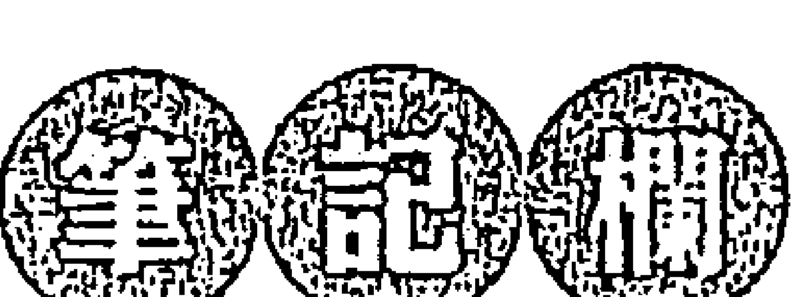

地地七紫 | 龍池 | 火天陀羅 | 天鳳祿
空劫殺微 | | 星喜鉞羅 | 刑閣存
--- | --- | --- | ---
103-112 辛 | 113-122 壬 | 3-12 身宮命宮 癸未 | 13-22 甲
夫妻 巳 | 兄弟 午 | | 父母 申
文天天 | | ○○陽生
昌梁機 | ○○生
命曆年男
子命 年男
年層：：39歲
斗：木年寅
者：三局
未（楊柳木）12月松柏木）
陰三恩 | | 午時
煞台光 | 節氣
93-102 庚 | | 驚蟄
子女 辰 | 23-32 乙
左天 | 福德 酉
輔相 | 文曲
83-92 己 | | 八座天貴 | 33-42 丙
財帛 卯 | 田宅 戌
巨太 | 紅天貪武 | 天太天 | 右天
門陽 | 鷺魁狼曲 | 姚陰同 | 弼馬府
73-82 戊 | 63-72 己 | 53-62 戊 | 43-52 丁
疾厄 寅 | 遷移 丑 | 僕役 子 | 官祿 亥
電話：(04)2263-2397 行動：0911-133639
E-mail：cz.way@msa.hinet.net
或 ziwi88@hotmail.com

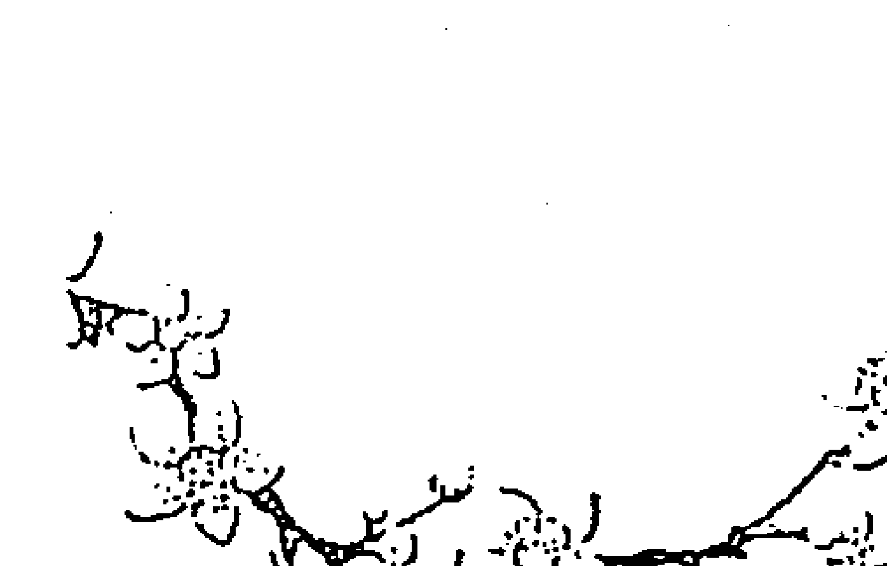

## 第六章／詳論格局特性

命例解說： 庶出，聰明但性好投機，家境富裕，放蕩不拘，不務正業，後抓住時機創業，短短三年間購屋置產，有錢之後大搞男女關係，與五六個女性有關係，鬧得家庭雞飛狗跳。 「命無正曜」所以是「庶出」之命，火星會貪狼構成「火貪格」能爆發資財，因此短時間能賺進大筆財富，陀羅又形成「風流綵杖」格，故有錢之後，接連和六七個女人發生關係，鬧得家庭起風暴，又是一「左右拱命」格，讓他能致富還守得住，不會破得一乾二淨，所以有時候是多個格局同在一盤，此時就要判定吉格多還是凶格多，才知道是「破敗」還是「成功」！

### 八十一、眾水朝東

「文耗居寅卯，謂之眾水朝東」，又說「破軍與文星同命，一生貧士」。凡命宮在寅或卯，破軍與文昌或文曲同坐，又有刑煞沖照，一生多起伏動盪，終生辛苦也難得富貴，勞心費力度一生，若有吉星助扶，則動盪減少，仍難免「一時不我予」之嘆，是個不利於「考試、研究」的命局。沒有適當命例可供解說，因為此格局一定要破軍和文昌同在寅卯宮才成立，條件比較嚴謹。

### 八十二、路上埋屍

身命宮中分別有七殺和廉貞坐守，或命宮落丑未宮有廉貞七殺同宮，逢煞曜匯聚，則多凶險之事，而死於外道，未必是車禍，也有可能是出外遭兇殺，所以此格之人，若是素行不良，很容易被仇殺而死於外道，應該修養心性，讓「暴怒」的心性緩解，讓一事緩則圓，曲則全」；而一般人就要注意開車和車輛保養、或開車注意行人，免得車禍意外。手上有幾個案例，大都有車禍紀錄，不然就是混幫派，不然也是長得壯碩，很會打架當地流氓都聞風喪膽，所以此格之人，除了意外之外，還是一勇猛」的局，有「開創」之能力，若是女命也是一樣具「開創」精神，多獨撐家計或一個人到國外留學。不過女命運途不濟時，也有很多淪落風塵的。所以」路上埋屍」格名太恐怖了，可能以古人要給不信邪的「廉貞七殺」格之人以「當頭棒喝」的效果吧！

## 紫微斗数命運分析格局篇

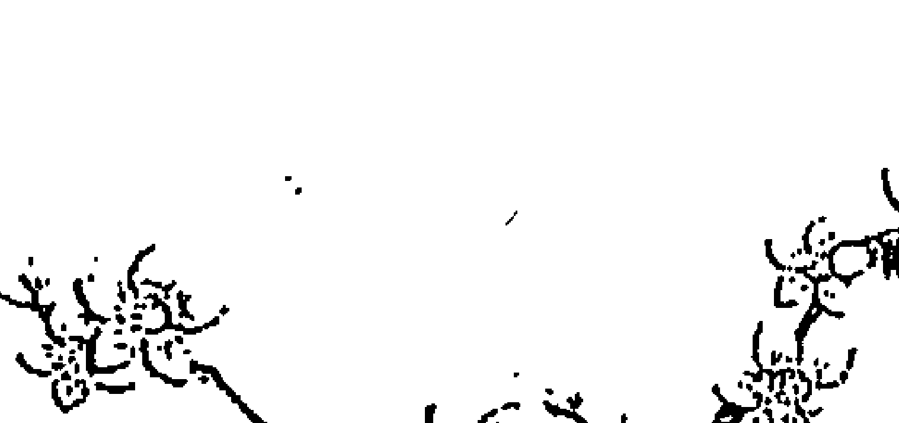

| 宮位 | 年齡段 | 干支 | 星宿 |
|------|--------|------|------|
| 官祿 | 42-51 | 己巳 | 陀羅、破軍、武曲(祿) |
| 僕役 | 52-61 | 庚午 | 祿存、太陽 |
| 遷移 | 62-71 | 辛未 | 擎羊、天府 |
| 疾厄 | 72-81 | 壬申 | 天刑、天鉞、太陰、天機 |
| 財帛 | 82-91 | 癸酉 | 鈴星、文昌、天喜、巨門 |
| 子女 | 92-101 | 甲戌 | 地空、地劫、右弼、鳳閣、天馬、天相 |
| 夫妻 | 102-111 | 乙亥 | 天姚、天魁、天梁(祿) |
| 兄弟 | 112-121 | 丙子 | 天姚、天魁、天梁(祿) |
| 命宮 | 2-11 | 丁丑 | 七殺、廉貞 |
| 身宮 | 同命宮 | 同 | 同 |
| 父母 | 12-21 | 丙寅 | 文曲、紅鸞、天同(忌) |
| 田宅 | 32-41 | 戊辰 | 文曲、紅鸞、天同(忌) |
| 福德 | 22-31 | 丁卯 | 左輔、龍池 |

○○陰女命厝生年：48己亥（平地木）子斗：二局（納音水）年月日時

電話 (04)2263-2397 行動 : 0911-133639 E-mail : cz.way@msa.hinet.net 或 ziwi88@hotmail.com

## 命例解說：

三合擎羊、陀羅、火星三煞匯聚，而和命宮的廉貞、七殺遙相感應，因此唸高中、大學時，接連發生數次車禍，不過本造都有驚無險，和命宮沒煞星助紂為虐，而能躲過劫難有關。以命局來說，此格之人都具有「武勇、剛猛、開創」的特性，雖然本造是女命，不過特質依然存在，所以大學畢業隻身赴美留學，追求更高深的學問，開創自己命運的新局，這和三合會入的武曲祿和貪狼權，讓她想法決不甘雌伏於平庸有關，也讓她有動力突破現狀，單槍匹馬赴美求學。

### 八十三、水中作塚

破軍暗曜同鄉，水中作塚」，破軍會過巨門，需防水厄，戲水釣魚小心，甚至遇暴雨或颶風天都要嚴防水禍致命。有人說暗曜是指化忌後文曲，因為文書化忌之後成為沒有效力的文書，就像沒報戶口的「幽靈人口」一般，所以是「破軍和文曲化忌同宮，水中作塚」。

### 八十四、粉身碎骨（或政事顛倒）格

昌貪居命，粉身碎骨」貪狼和文昌同宮，又有煞星沖破或三合來會，忌星相擾，小心墜樓或空中掉下異物砸死，出外遇到大樓或峽谷小心掉落物，遇吊車施工也要遠避之，儘量不要爬山、有墜谷或被落石砸到的機會。這個不單指先天命格而已，有時候大限或流年遇到此種格局，也都要小心上述狀況。有位朋友的命盤的大限宮坐星正是「貪狼、文昌忌」同宮，結果該限發生建築工地吊車，吊鋼筋時鋼索斷裂，整捆鋼筋掉下來，差一點被砸中的事件，當時他也嚇得腿軟要人攙扶才站得起來，所以命盤內有此組合的朋友，進入該宮位時，要特別留意有驚險事發生。

## 第六章／詳論格局特性

又說「昌貪居命，政事顛倒」這是指有此格局的人，常迷花戀酒而忘了自己該作的事，如當老闆一天到晚只知道交際應酬，美其名接業務卻讓公司內部控管出了問題，公司整個都被移花接木盜走了都不知道，就是這種命局的現象，所以，此格之人，頭腦先想清楚「什麼是重要的事、什麼是急迫的事」再去分輕重緩急次序來處理。

| 左上宫位 | 上中宫位 | 右上宫位 | 右上二宫位 |
| :--- | :--- | :--- | :--- |
| 地空 地劫 天刑 凤阁 天铖 巨门 (權) | 天相 天貞 (恩光) | 天梁 | 天马 七杀 |
| 115-124 丁巳 父母 | 105-114 戊午 福德 | 95-104 己未 田宅 | 85-94 庚申 官禄 |
| 贪狼 天喜 文昌 铃星 (恩) | (空) | (空) | 天同 天姚 龙池 火星 (陰煞 臨駝) |
| 三台 |  |  |  |
| 5-14 丙辰 身宫 命宫 |  |  | 75-84 辛酉 僕役 |
| 太阴 天魁 (台輔) |  |  | 武曲 文曲 红鸾 |
| (空) |  | 陰煞 八座 |  |
| 15-24 乙卯 兄弟 | (联系信息： 電話：(04)2263-2397 行動：0911-133639 E-mail：cz.way@msa.hinet.net 或 ziwi88@hotmail.com) |  | 65-74 壬戌 遷移 |
| 紫微 天府 右弼 |  天機 擎羊 | 破軍 祿存 左輔 (祿) | 太陽 陀羅 |
| 天貴 |  |  |  |
| 25-34 甲寅 夫妻 | 35-44 乙丑 子女 | 45-54 甲子 財帛 | 55-64 癸亥 疾厄 |

阴男
42年癸巳蛇（长流水）
生肖：
月日午时
戊局（沙中土）
土五局

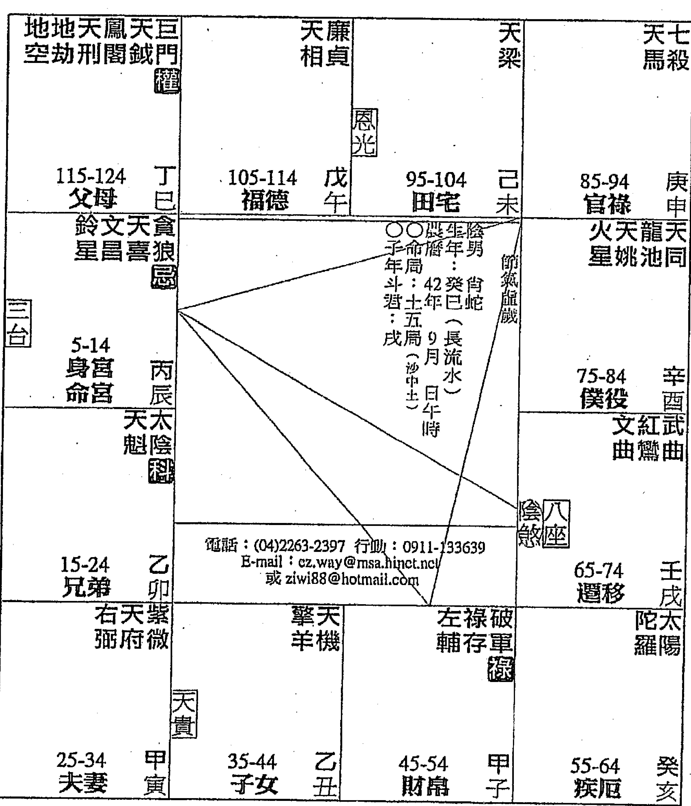

電話：(04)2263-2397 行動：0911-133639
E-mail：cz.way@msa.hinet.net
或 ziwi88@hotmail.com

## 命例解說：

貪狼的諸星問答中說：「昌曲同度，必多虛而少實。」、「與武曲同度，為人諂佞奸貪。每存肥己之心，並無濟人之意。」、「惟會火鈴，能富貴。」都在此命盤中看到，而且「昌曲相會」，應該是個精明善學吸收新知且又斤斤計較的人，所以雖然「昌貪格」成立，但也有好的格局，所以「心地雖善，遇事敢為，外表雖華美，內實空虛、操心」，是個複雜的人格，但是命宮有貪狼忌，使得吉祥的格局減色不少，因為「貪狼破軍居陷地，遇吉化忌終不利」，所以，雖然曾經做事業而大發，但是最終還是破敗光了，所以「鈴貪格」主橫發，但是遇到「昌貪格」做事凌亂、抓不住重點，中間雖經調解以分期方式攤還債務，但還是撐不下去倒閉了，也因為此而吃上官司，假如能早一點宣布倒閉，損失會更少，引起的反彈也不會那麼強烈，而這就是「昌貪居命，政事顛倒」分不清輕重緩急或利害關係的一種現象。

### 八十五、离乡遭配

流年迁移过廉贞和天刑坐守，官符又入，该年必定惹官符发配到远地监禁，如当年重刑犯远送绿岛监狱囚禁一般，现在只是就近发监执行，未必离乡。这是个「违法犯纪」的格局。

廉贞脾气刚直硬气、天刑又有此意，合在一起更是凡事任凭己意、恣意而行，因此而触犯法律，尤其丙年生者廉贞化忌，使祸害更加严重。

如果是甲年生的人，因为廉贞化禄，所以变成执法、维法纪的人，所以是完全不相同的。

假如没化禄、也没化忌则不为祸，只主脾气硬直、凡事凭己意一意孤行、不好相处而已，还不至于犯大错。

## 生活记录

| 宫位   | 年龄段  | 地支 | 主星及辅星                     |
|--------|---------|------|------------------------------|
| 官禄   | 85-94   | 癸巳 | 武曲、破军、禄存、天姚、文昌、科 |
| 仆役   | 75-84   | 甲午 | 太阳、擎羊、右弼、火星、天空、阴煞 |
| 遷移   | 65-74   | 乙未 | 天府、恩光                     |
| 疾厄   | 55-64   | 丙申 | 天机、太阴、天马、左辅、铃星、权 |
| 財帛   | 45-54   | 丁酉 | 紫微、贪狼、天钺、红鸾、文曲   |
| 子女   | 35-44   | 戊戌 | 天相、天魁、巨门、龙池         |
| 夫妻   | 25-34   | 己亥 | 身宮、天贵、三台               |
| 兄弟   | 15-24   | 庚子 | 天梁                           |
| 命宫   | 5-14    | 辛丑 | 廉贞、七杀、天刑、权           |
| 父母   | 115-124 | 庚寅 | 无                             |
| 福德   | 105-114 | 辛卯 | 天喜、八座                     |
| 田宅   | 95-104  | 壬辰 | 天同、陀罗、地劫、凤阁、科     |

阳女
生年：丙午（天河水）
生月：5月5日丑时（壁上土）
命局：五局
命主：55年次

電話 (04)2263-2397 行動：0911-133639
E-mail：cz.way@msa.hinet.net 或 ziwi88@hotmail.com

## 命例解說：

主格是個「路上埋屍」的凶格，並且廉貞化忌更加兇惡，女命擁有此格局必定「孤單、寂寞」，為什麼呢？天刑主孤剋、廉貞、七殺又是不好相處的組合，所以結婚後不滿六年夫君就病死了，若只看夫妻宮當然夫君很好，會有此劫全在命宮格局，夫死之後，由於廉貞配天刑的「離鄉遭配」格，因此「離鄉」到日本，擔任酒店女侍，三合又有「昌曲拱命」格，書說「楊妃好色」，三合文曲文昌。「又加上官祿宮的天姚，所以更加強化好色、淫慾的性質，財帛宮又是「桃花犯主」一格，不就表示她的錢財和「桃花犯主」有關嗎？當女侍只是幌子而已，隔年乾脆自己下海賣淫，當然賣淫是「違法犯紀」的行為，和命格屬性貼近。當然也和三合會入桃花星眾多有關，日後被警方查獲，遣送返台，又和命格之意。如果只以坐星組合來看，此例和「路上埋屍」格一樣，此造的三合看似吉利的坐星還比前者多，但後來的命運發展卻有天壤之別，因此，四化是很重要的。

### 八十六、鼠竊偷盜

貪狼守身命、官祿在廟旺之地，沒吉化又逢忌煞衝拱，主為人貧窮，淪為宵小之輩。「與七殺同守身命。男有穿窬之體，女有偷香之態。」穿窬就是穿過牆壁的小洞，可以說是偷香也可說是「賊頭賊腦」的小偷。

「廉貪殺破軍，逢武曲遷移，作貝戎。「貝戎合起來就是「賊」字，所以，凡是貪狼七殺破軍坐命，而遷移宮有武曲坐守的，都有成為小偷的傾向，當然是有煞星羊陀火鈴等星在命宮或遷移會入者更是明顯。

「天機加惡殺同宮，狗偷鼠竊」天機於陷落之地，再逢惡星同宮，就會變成手腳不乾不淨的宵小之輩，大都是貪小便宜心態的小賊，如看到人家菜園的菜，就隨手摘幾顆菜的貪小便宜的小偷。

「日月更須貪殺會，男多奸盜女多淫。「日月在陷落之地雖可成為「日月反背」格，但是逢煞星馬上破格，或破於生活無奈而淪落成盜賊。

以上都是容易成為盜賊的格局，如果本身命局吉祥，而大限遇到此格局也容易有「偷盜」行為，小者竊取財物，大者竊取國家，譬如美國總統編造伊拉克擁有大規模殺傷性武器而出兵，這也符合「欺騙、偷盜」的意思，所以要以廣義面來看格局。富而不久，一生貧困多禍之命。生性嫖賭飲齊全，懶惰說謊形成無賴漢

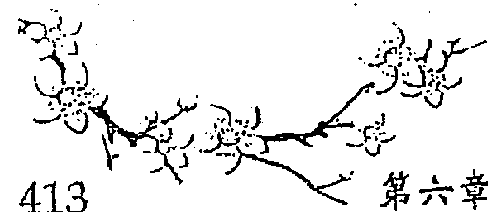

| 铃左龙天陀天 星辅池马罗机 | 地禄紫 劫存微 | 擎羊 | 天天破 喜钺军 |
| --- | --- | --- | --- |
| 34-43 己 巳 子女 | 24-33 庚 午 夫妻 | 14-23 辛 未 兄弟 | 4-13 壬 申 命宫 |
| 地空 七杀 | | | 凤阁 右弼 |
| 44-53 戊 辰 财帛 | | 陰陽男 38年丑月（霹靂火） 生時：未時 午局（劍鋒金） | 114-123 癸 酉 父母 |
| 文昌 天梁 太陽 | | | 火星 天刑 天府 廉貞 |
| 54-63 丁 卯 疾厄 | | | 104-113 甲 戌 身宮 福德 |
| 天姚 紅鸞 天相 武曲 | 天同 巨門 | 貪狼 天魁 | 太陰 文曲 |
| 64-73 丙 寅 遷移 | 74-83 丁 丑 僕役 | 84-93 丙 子 官祿 | 94-103 乙 亥 田宅 |

阴男 38年丑月（霹雳火） 生时：未时 午局（剑锋金）

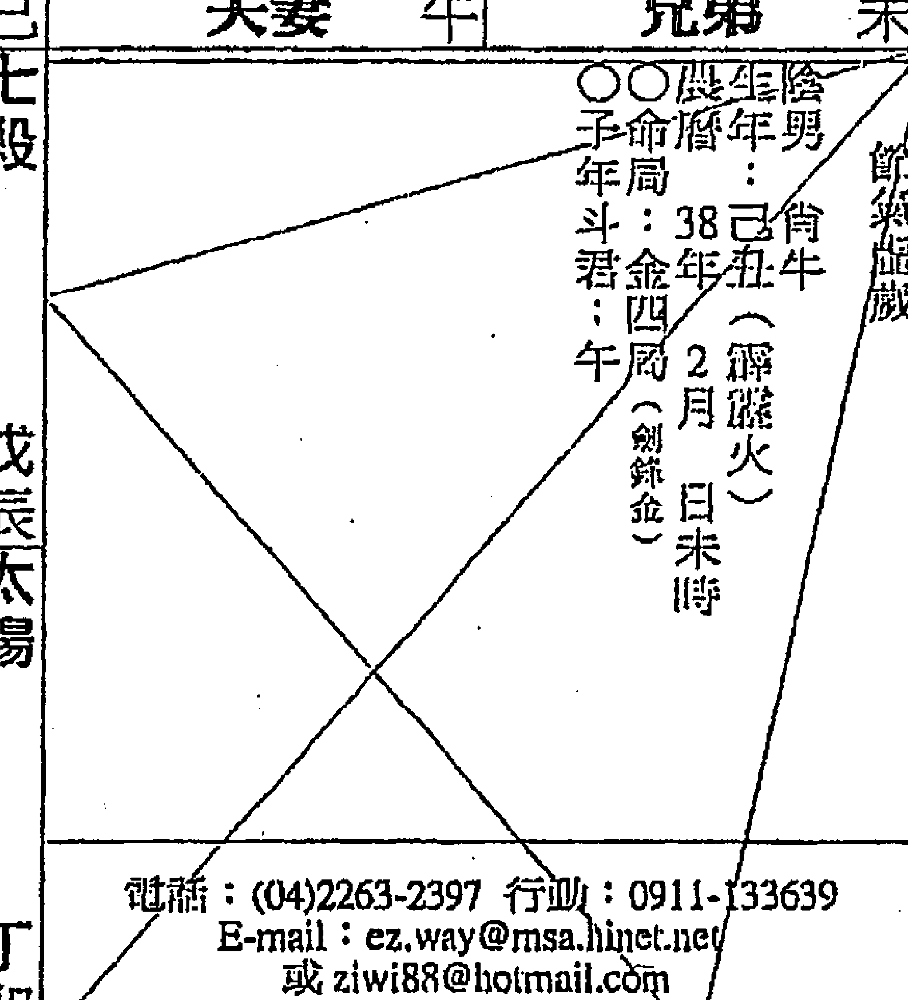

## 第六章／詳論格局特性

命例解說：命宮三合有化祿、化權來會，而且「魁鉞拱照」，除了地劫來破壞格局之外，都還不錯，因此「生在市郊農家，父親得自祖業，小富之家」，不過是個完完整整的「破軍逢武曲遷移作貝戎」格局，因而「自小懶做揮霍，初中畢業便輟學淪為太保，成群偷竊」，所以先天特性偏向和命宮破軍與遷移武曲構成的「賊」性，讓他十五、六歲便步入歧途，成為「成群偷竊的太保」，當然，這種太保行為「太超過」了，難免遭到「入獄受感化教育」的結果，這在他第二個大限的三合，除大限命宮有擎羊煞星外，並沒其他煞星，反而有科星守護，因此還抱著希望他能矯正惡習，成為社會的有用之人，而「輟學」和他第一個大限的官祿宮坐文曲忌有關，所以學業中輟，出獄後，因為未限財帛宮有「太陽、天梁科、文昌」科為貴人星而太陽是父親，因此「得父親資助購一台計程車營業」，雖然勤奮努力，但是末限官祿坐「太陰、文曲忌」而且宫干又是乙，使太陰自化忌，故決心不強，沒有堅決的毅力痛改前非，所以「嫖賭惡習不改，反而還輸掉一台計程車」，讓父親的苦心白費了。

### 八十七、离宗庶出

身命宫没有主星，只有左辅或右弼守命，或拱照，主偏房庶出，或是从小过继给别人或是弃祖离宗，但庶出者，三方众吉拱冲，有紫微、天府于财帛、迁移、官禄者，也甚为吉利，当然也曾见到为有出祖离宗之人，却以拜义父母或给亲戚认养的方式，贴近命局，却非离宗庶出，也可说是合乎此意。
参考「风流彩杖」的命例。

### 八十八、因财持刀

「武曲、七杀遇擎羊，因财持刀」，此武曲七杀同守于命宫，若有擎羊或是大限擎羊拱冲，则会因钱财之事与人发生纷争、或抢夺地盘利益而动刀枪，若再遇忌星刑冲，构成「七杀擎羊，阵中亡」的格局，往往因此而丧命，小心为是。

### 八十九、因财被劫

「武曲七杀遇火星，因财被劫」此武曲七杀同守于命宫，若有火星或是铃星拱冲，再遇大限擎羊、陀罗或忌星冲激，将因钱财遭抢或宵小侵入，为护财而发生打架，若再遇忌星刑冲，亦是构成「七杀擎羊，阵中亡」的格局，往往因此而丧命。

## 第六章/詳論格局特性

命，小心為是。上述兩個格局都是為了錢財而動刀或被搶現象，如幫派搶奪地盤就是「因財持刀」的現象，又如現在流行的「暴力討債」集團，強烈懷疑首謀即是此種格局者，除了先天命局構成的格局外，如果大限命宮或財帛有此種格局，也要注意，謹記「財不露白」、「低調」的原則，以保安全。

# 紫微斗数命运分析格局篇

| 宫位 | 年龄范围 | 干支 | 星曜（主星/辅星） | 其他标注 |
|------|----------|------|------------------|----------|
| 福德 | 25-34 | 辛巳 | 天刑、三台、地空、太阳、禄 | |
| 田宅 | 35-44 | 壬午 | 地劫、龙池、恩光、文曲、七杀、武曲 | |
| 官禄 | 45-54 | 癸未 | 天喜、天钺、陀罗、破军、紫微、红鸾、天魁、天相 | 阳男、庚寅年、松柏木、39岁、节气立秋 |
| 仆役 | 55-64 | 甲申 | 火星、凤阁、天马、禄存、天姚、擎羊、天府、八座 | |
| 迁移 | 65-74 | 乙酉 | 太阴、阴煞、铃星 | |
| 疾厄 | 75-84 | 丙戌 | 廉贞、文曲、贪狼 | |
| 财帛 | 85-94 | 丁亥 | 右弼、天梁、天同、天马 | |
| 兄弟 | 115-124 | 戊寅 | 天贵 | |
| 夫妻 | 105-114 | 己丑 | | |
| 子女 | 95-104 | 戊子 | 左辅、巨门 | |

电话：(04)2263-2397 行动：0911-133639 E-mail：cz.way@msa.hinet.net 或 ziwi88@hotmail.com

## 第六章／详论格局特性

## 命例解说：

是个允文允武的「兼文武」格，又合「紫府朝垣」格、「文星拱命」格都属吉利的格局，因此能毕业于大家都羡慕的医学院，念的也是要用到「器械」的科系，和「武曲、七杀」的「武」成分符合，但是当医生太无聊，恰好又遇到股市一片大涨的时期，而且财帛宫又坐「廉贞、贪狼和文曲」深具投机性质，所以，尽把家当投入股市，刚开始还有赚头，但后来却赔个精光，不得不和吸血的地下钱庄借钱，由于命宫「武曲、七杀」和迁移宫的「擎羊」也构成「因财持刀」的格局，所以不但股票失利、连医生执业丰厚的收入都还不出地下钱庄的贷款而被「黑道恐吓逼债，全家人都心惊胆跳」。

所以，假如能不贪图投机之财，努力靠他担任医师开业的收入，就可以维持全家过相当富裕的生活，哪知道一沾上地下钱庄，他就像被吸干鲜血的尸体一般，帮地下钱庄赚钱，全家都得勒紧裤带过苦日子，所以此种格局决不要贪图非份之财，靠自己努力赚钱就好。

### 九十、梁月飘蓬格

天梁坐命在落陷宫而太阴来拱照，或是太阴坐命天梁由三合来拱，就构成此格，主「飘荡、奔波」的命局，古云「天梁月曜，女淫贫。」、「梁宿太阴，却作飘蓬之客。」不管男女都没有好的评语。太阴和天梁很容易构成三合的盘局，位于巳亥宫的天梁构成的「天梁拱月」格，古书云：「梁月落陷最堪伤，必定飘篷落外乡，歌台舞榭终日醉，风流荡尽祖田庄」可用「淫贫飘篷」形容外，子午位天梁是庙旺也，构成「梁月飘蓬」格，可能就是「远涉他乡、出国留学、异地发展」的现象，所以，能成此格局所指的盘局是指巳亥宫坐命者才合此「梁月飘蓬」的格局。

# 笔记

# 紫微斗数命运分析格局篇

| 宫位 | 年龄段 | 天干地支 | 星曜 |
|------|--------|----------|------|
| 迁移 | 63-72 | 癸巳 | 文曲、天同、科 |
| 疾厄 | 53-62 | 甲午 | 红鸾、天魁、天府、武曲 |
| 财帛 | 43-52 | 乙未 | 天刑、太阴、太阳、权 |
| 子女 | 33-42 | 丙申 | 陀罗、贪狼、八座、天贵 |
| 仆役 | 73-82 | 壬辰 | 火星、破军 |
| 夫妻 | 23-32 | 丁酉 | 文昌、禄存、巨门、天机、科、禄 |
| 官禄 | 83-92 | 辛卯 | 左辅、天马、天钺、廉贞 |
| 田宅 | 93-102 | 庚寅 | |
| 身宫/福德 | 103-112 | 辛丑 | |
| 父母 | 113-122 | 庚子 | |
| 命宫 | 3-12 | 己亥 | |

阴男：丁酉年生 破军在卯 安命 三台（平地木） 日丑时

电话：(04)2263-2397 行动：0911-133639
E-mail：cz.way@msa.hinet.net 或 ziwi88@hotmail.com

## 命例解说：

天梁星坐命「主生人清秀温和，形神稳重，性情磊落，善识兵法。」所以是个聪明的格局「毕业日据时代高等科，当过小学教师。」但会入迁移宫的天同星成为「同梁巳亥位，男多浪荡女多淫」又加上天姚星，所以桃花性质强烈，而且亥宫为水地，不止贪花还好酒，故于「应酬中迷恋酒家女而同居，从此家中常闹风波」，原来从国外进口水果生意，一年可赚十幾栋洋楼，闹出家庭风波后兄弟分家各做各的，自营进口却「一败涂地、负债累累」，连以前赚的都吐了回去。做「国际贸易」合乎巳亥位四马地同梁坐命的「飘篷」性质，但有钱之后「歌台舞榭终日醉」，终于「风流荡尽祖田庄」，若能洁身自爱，不流连歌台舞榭迷恋酒女，还能保住经营的成果，成为富裕之家。

### 九十一、文星遇夹

文昌、文曲落入命宫，左右宫却被地空、地劫来夹制，使得文星无施为，读书不利或求学困顿、中辍，考试失利等，是不适合往学术研究或考公务人员的格局，宜学专门技术，在私人企业任职较能发挥所长。能形成此局的只有命落巳宫的巳、未时生人，和命落亥宫的丑、亥时生人，其他不是。当然这也是『辅格』，若是有『主格』当依主格来评断。

# 会议记录

+   

+   

+   

+   

+   

+   

+   

+   

+   

+   

+   

+   

+   

+

| 宫位 | 辰宫 | 午宫 | 未宫 | 申宫 |
|------|------|------|------|------|
| **星曜** | 天刑 天钺 天梁 | 七杀 | 红鸾 | 天马 廉贞 |
| **辅星/杂曜** | 八座 恩光 | | 三台 | |
| **大限** | 64-73 乙巳 (迁移) | 74-83 丙午 (疾厄) | 84-93 丁未 (财帛) | 94-103 戊申 (子女) |
| **宫干** | 乙巳 | 丙午 | 丁未 | 戊申 |
| **主星** | 天相 紫微 | | | 铃星 天姚 |
| **辅星/杂曜** | | | 陀罗 | |
| **生年四化** | | | | |
| **大限** | 54-63 甲辰 (仆役) | | | 104-113 己酉 (身宫/夫妻) |
| **宫干** | 甲辰 | | | 己酉 |
| **主星** | 文曲 天魁 巨门 天机 | | | 地劫 陀罗 破军 |
| **辅星/杂曜** | | | | |
| **大限** | 44-53 癸卯 (官禄) | | | 114-123 庚戌 (兄弟) |
| **宫干** | 癸卯 | | | 庚戌 |
| **主星** | 右弼 凤阁 贪狼 | 火星 天喜 太阴 太阳 | 地空 左辅 龙池 擎羊 天府 武曲 | 文昌 禄存 天同 |
| **辅星/杂曜** | | | 天刑 (科) | 天刑 (忌) |
| **大限** | 34-43 壬寅 (田宅) | 24-33 癸丑 (福德) | 14-23 壬子 (父母) | 4-13 辛亥 (命宫) |
| **宫干** | 壬寅 | 癸丑 | 壬子 | 辛亥 |

OO子年斗君：卯
命局：金四局
阳男：壬申年 (猴) 9月
生历：21年10月28日 (剑锋金)
生时：亥时
节气：立冬

电话：(04)2269-2397
行动：0911-133639
E-mail：cz.way@msa.hinet.net 或 ziwi88@hotmail.com

## 命例解说：

是个很漂亮的「禄合鸳鸯」格，因此能「从事建筑及塑胶有关生意，赚钱千万元」，又符合很会念书的「昌曲拱命」格，虽然有「文星遇夹」，但是主格强旺有力，故毕业于当时非常优秀的技职院校「台北工专」，若没「文星遇夹」相信可以念更出名的学校，虽然「同梁巳亥位」的「飘蓬」格，对于做产品外销的人，时常需要出国接订单或接触国外的买主，还算是合此格之意，而且和「禄合鸳鸯」格凑一起，是很适合接订单谈生意的格局，因为当年谈生意很多都是在酒家中谈成的，所以当年台北市中山北路一带灯红酒绿，很多外销的订单都是这样敲定的，所以「同梁巳亥位，男多浪荡」的性质若是发挥在这种场合，还蛮合乎格局属性的。

### 九十二、科星煞凑

化科星主「科甲功名」，遇到煞星来凑合就变成「不利科甲功名」了，现形的情况有两种，第一种是将煞星将化科绑架成为「贱状元」了，把头脑都拿去学「一为非作歹」的事物，不学好、满脑子都是坏点子，另一种情况是读书不专心，看到文字就头大，逃避学业只想玩，现代教改主张「快乐学习」倒是很符合此种命格的味道。

到底命造会以哪一种情形出现，可说不定，只能说「科星煞凑」，科名难成而已。故说：「化科坐命宫星显，煞星汇聚寒窗苦，纵然吉守也破局，悬梁苦读无功名」。

# 紫微斗数命运分析格局篇

紫微斗数命盘：
第一行：
- 宫位：官禄，星曜：陀罗、巨门，年龄：83-92，天干：乙巳
- 宫位：仆役，星曜：文昌、禄存、天相、廉贞，年龄：73-82，天干：丙午
- 宫位：迁移，星曜：地空、右弼、左辅、擎羊、天梁，年龄：63-72，天干：丁未
- 宫位：疾厄，星曜：文曲、七杀，年龄：53-62，天干：戊申
第二行：
- 宫位：田宅，星曜：天姚、红鸾、贪狼，年龄：93-102，天干：甲辰
- 中央信息：阳历：阴男，农历：丁亥年亥月，命局：木三局，生肖：猪，月上土，日辰时
- 宫位：身宫/财帛，星曜：天钺、天同，年龄：43-52，天干：己酉
第三行：
- 宫位：福德，星曜：地劫、龙池、太阴，年龄：103-112，天干：癸卯
- 宫位：子女，星曜：天喜、武曲，年龄：33-42，天干：庚戌
第四行：
- 宫位：父母，星曜：铃星、天府、紫微，年龄：113-122，天干：壬寅
- 宫位：命宫，星曜：火星、天机，年龄：3-12，天干：癸丑
- 宫位：兄弟，星曜：天刑、破军，年龄：13-22，天干：壬子
- 宫位：夫妻，星曜：凤阁、天马、天魁、太阳，年龄：23-32，天干：辛亥

电话：(04)2263-2397 行动：0911-133639
E-mail：cz.way@msa.hinet.net 或 ziwi88@hotmail.com

## 第六章／详论格局特性

## 命例解说：

天机本主机智灵敏，遇到化科而有「作育英才」的风范，也就是说有学问可当老师，教导下一代，但是同宫火星，对宫又有擎羊，形成「科星煞凑」格，所以一定对读书没兴趣，浪费「可为群英师范」的格局，和两位哥哥都在美国当医生的成就比起来，本造只有文化大学学历，相差真是天壤之别，还好「左右拱命」尚能混到大学毕业，在山上种水果。还好有天机科让他能看得开，虽成就远逊于兄长，工作又辛苦，但也甘之如饴。有人说看功课学业要看事业宫，但是此造却从命宫的「科星煞凑」格尽显「不爱读书、功名难成」的事实，所以，看命还是格局最重要。

### 九十三、魁钺凶冲

「天乙拱命」格遇煞星来冲破，主「功名无望，贵人不显」，人说「朝中无人莫做官」，正是指此格局的人，辛苦考上高普考，结果没长官或民意代表照顾，苦差事尽派你去做，或是设陷阱让你跳，尤其经手经费的事务，一不小心就触犯法律，所以，有此格局的建议安分守己在民营企业的上下班，就能避免是非非。

当然此格局也主学生时代，或缺少老师关爱或名师指点而不爱读书、荒废课业，或完全对功课没兴趣，老师上课只想打瞌睡，当然好老师上课有趣，又能带领学生进入佳境，会减少功课的排斥感，而此格局者就难遇到能引起他共鸣的「贵人」老师。

# 笔记簿

# 紫微斗数命运分析格局篇

| 宫位/内容 | 文昌、凤阁、陀罗、天梁 | 禄存、七杀 | 天刑、擎羊 | 廉贞 |
| :--- | :--- | :--- | :--- | :--- |
| **年龄段与宫位** | 64-73 岁 迁宫 巳 | 54-63 岁 疾厄 午 | 44-53 岁 财帛 未 | 34-43 岁 子女 申 |
| **星曜** | 火星、天喜、天相、紫微 | (无星曜标注) | (出生资讯文字块) | 文昌、龙池、天钺 |
| **年龄段与宫位** | 74-83 岁 仆役 辰 | (与「疾厄」宫连线) | (与「财帛」宫连线) | 24-33 岁 夫妻 酉 |
| **星曜与资讯** | 巨门、天机、天机忌 | 连线交汇处标注： OO庚生阴男年命局： 斗金四卯局（钗钏金） 丁酉年巳（沙中土） 11月丑日丑时 节气：处暑、寒露 | (连线交汇处) | 地空、红鸾、破军 |
| **年龄段与宫位** | 84-93 岁 官禄 卯 | (连线交汇处) | (连线交汇处) | 14-23 岁 兄弟 戌 |
| **星曜与资讯** | 左辅、天马、贪狼 | 太阴、太阳、太阴禄 | 地劫、右弼、天府、武曲 | 铃星、天姚、天魁、天同天同权 |
| **年龄段与宫位** | 94-103 岁 田宅 寅 | 104-113 岁 身宫 福德 丑 | 114-123 岁 父母 子 | 4-13 岁 命宫 亥 |
| **辅助标注** | 左侧框注：天贵、三台 | | 右侧框注：八座、恩光、节气处藏 | 底部横跨资讯： 徐先生 电话：(04)2269-2397 行动：0911-133639 E-mail：cz.way@msa.hinet.net 或 ziwi88@hotmail.com |

徐先生
电话：(04)2269-2397 行动：0911-133639
E-mail：cz.way@msa.hinet.net 或 ziwi88@hotmail.com

## 命例解说：

国小成绩中等，四年级后个性渐叛逆，以学坏让同学对此造产生恐惧，后来转学，又学会抽烟、偷机车，小学毕业，幸父母看管不至于走上歧路，此乃「同梁巳亥位，男多浪荡，女多淫」此造为男生，故而行为举止都偏向负面的、反社会的行为，而好的行为呢？都学不会，所以有上述的浪荡行为出现。

国三上被学校记满大过，勒令带回管束强迫转学，转学后、国三下因成绩尚可，加上在学校时，很少惹事生非，被老师推任为班长，还当选班上模范生，课后因恶习没钱用，做不法生意：：：，命宫坐枢使他成为带头的老大学生，既是模范生还做不法生意，这在宫禄的天机科遇到巨门忌的组合，不就表现这种表里不一的欺瞒现象。

命宫的天魁和铃星一凑合，又和官禄的巨门忌成拱冲态势，成了「魁钺凶冲一，结合了浪荡的天同，因此成为「带头」使坏的学生，当然「贵人」星性未消失，还能得到「贵人」老师「赏识」推他当班长，一步一步矫正偏差行为。

### 九十四、官禄入煞

命无主星或主星陷落无力，而官禄宫却是众煞汇聚，代表职场上多遭遇无情迫害，或小人作对破坏业务，致使多撤职、调职等莫名其妙之事，又或遇到天刑等星恐怕官非难逃，故说「官禄遇煞不利官」，即使居官也辛苦，虽得吉星得升迁，拔去三年四载循环」，官禄一遇升迁却又因案被掉职或查办，等调查完毕又不受重用坐冷板凳，是非常不利公务人员的发展组合。官禄除了代表事业外也称做行为宫，煞星汇聚于官禄宫，当然「行为」一定不良，煞星乃为祸作恶的星星，一颗遇到强力主星或可被压制恶性，两颗以上就难化煞，此时，必定素行不良、为非作歹，不然就是性格暴躁易怒、性发如雷，很容易暴怒下铸成大祸。

## 命例解说：

请参考「巨机同临」格，该命例的官禄宫坐「陀罗、天刑、铃星、天铖」，只有一颗天铖星发挥一点吉祥的力量，所以以高商学历，还能「混」到银行上班，但是「陀罗、铃星」都非善星，所以、不思好好把握机会、努力上进，获得晋升机会，反而风流好色，薪水都花在上酒家、泡酒女、寻欢作乐之上，又有「天刑」乃

### 九十五、巨机化酉

命宫坐巨门和天机在酉位，酉金之位来生巨门水，而水又来生天机木，但天机木在金位无着根之处，随水飘荡，再逢化忌水星，水势更旺，表征为一生飘荡无根、离乡发展，即使有吉化之星也是一「巨机酉上化吉者，纵有财官也不荣」而巨机化酉格却是有化忌星同宫，不管是巨门、天机或文昌、文曲，只要有化忌星同宫，即生人，禄权科都入照命宫三方，也是「兑位天机巨门同，遇忌辛苦奔波，心高气勇未曾歇，语言无情句亦讹」有时为了成功、为了利益，即使昧着良心做事、蒙蔽自己良心说谎，即使命得到了权势地位，也会被人瞧不起，所以有此格局的人不要忘了「诚意正心」的修身之道，俯仰方能无愧于天地之间。

命例解说：请参考「巨机同临」格。

### 九十六、月同遇煞

天同、太阴星落入陷宫，又逢煞星，该两颗星在子午宫同为，但午位是天同太阴的陷地，此时再有羊陀火铃来同宫，就会平添凶险，一生多灾多难，而健康也会出问题，而有「同月陷宫加杀重，肢体羸黄。」的评断，有时也为身体常受到意外血光之灾的迹象，所以「骨瘦体弱不堪言，添柴燃火几时旺，人间好事难同处，枝叶繁茂又遇凋」已经说明此种格局，需要困苦一生，即时遇到好运发达，也要小心灾祸即将临头，真是「一步一步凋零」难得得意之时。

# 笔记本

| 宫位 | 星曜 | 年龄 | 天干地支 |
|------|------|------|----------|
| 仆役 | 左辅、天马、七杀、紫微（科） | 76-85 | 辛巳 |
| 迁移 | 天喜 | 66-75 | 壬午 |
| 疾厄 | 文曲、文昌、凤阁、龙池 | 56-65 | 癸未 |
| 财帛 | 地空、天钺 | 46-55 | 甲申 |
| 官禄 | 擎羊、天机（权）、天梁（禄） | 86-95 | 庚辰 |
| 子女 | 右弼、破军、廉贞、三台 | 36-45 | 乙酉 |
| 田宅 | 地劫、天姚、陀罗、巨门、太阳 | 96-105 | 己卯 |
| 夫妻 | 恩光、天贵 | 26-35 | 丙戌 |
| 福德 | 铃星、贪狼、武曲 | 106-115 | 戊寅 |
| 父母 | 阴煞 | 116-125 | 己丑 |
| 命宫 | 天同、太阴、红鸾、天魁、火星、恩 | 6-15 | 戊子 |
| 兄弟 | 天府 | 16-25 | 丁亥 |

○○岁生阴男 年局：64乙肖 斗火年卯兔 君局2大溪水 寅时（卯时）

电话：(04)2263-2397 行动：0911-133639 E-mail：cz.way@msa.hinet.net 或 ziwi88@hotmail.com### 命例解說：

真是「同月遇煞格」，同宮的還有太陰忌更加深嚴重性，不過此造身高一百七十幾公分，體重也有八十六公斤，所以不是「肢體羸黃」，反而是「壯碩魁武」才對，但為何古文中信誓旦旦的如此說呢？當然身體的「病」有時無法以外表來斷定，有的外表強壯，其實內臟已經病灶橫生了，而此造獲公司重用派赴大陸，回台休假期間竟然腦幹出血陷入重度昏迷，古文上說的「人間好事難同處，枝葉繁茂又遇凋」至此才恍然大悟其意義，真是貼切啊！

### 九十七、四星遇貴

機月同梁四顆星在十二張基本盤裡，很容易形成「機月同梁」格，假如再逢貴星，如化科、天魁、天鉞等人星，多能得貴人相助或提拔，事業獲得開展，步步高升，有道是：「朝中無人莫做官。」只要跟對人往往能「一人得道，雞犬升天。」正是此種命局的寫照，但也往往會有「樹倒猢猻散」的危機，正是：「命星陷落功名迪，落入公門事蕩然，醫卜更兼為活計，貴人提拔買田莊」，慎記！得意之時，切莫盛氣凌人，謙沖為懷，提攜後進，造育人才。

### 命例解說

參考「科明祿暗」格的命例，也是「四星遇貴」格，所以能夠「年青得志，名顯一時」，但是巨門忌在遷移宮沖照命宮，所以只能「名顯一時」，時機一過就難逃破敗命運。

### 九十八、文星失位

文昌、文曲俱是溫文儒雅，機智靈敏的讀書之料，但是落在陷落之宮，如文昌在寅、午、戌宮，文曲在午、戌宮俱屬陷地，即使在命宮也難名登金榜，對於科甲考試甚為不利，除此之外，也頗多「長相俊秀、不讀詩書也可人」的俊年美女也多屬昌曲落於上述宮位者，但是，對於功課學業多有荒廢之處，或唸書不起勁的行為，當然科甲考試定然不利，抑或即使文章有聲名，卻也是考運不濟，落於孫山外，所以「虛有其表」而已，古云：「文星入命本為奇，陷落逢沖榜上空，任憑窗下勤苦讀，功名常於白頭時」，勤於應考或許能在中老年時，一償宿願，金榜題名。

## 第六章／詳論格局特性

### 九十九、科星逢破

化科雖然可解忌星的為患，但是卻對煞星沒有解制之力，所以遇到羊、陀、火、鈴、空、劫等煞星沖破，對於「考試、求學」都有破壞力，如：求學時期容易和壞同學混在一起學壞，而考試時遇此局，也都主考試不利或準備階段有突發意外，讓寒窗苦讀之功化為泡影，是對於「科甲、考試、讀書」很不吉的組合。

「化科功名細端詳，若逢惡煞難登榜，連年落在孫山外，只作文人雅士看」

- 命例參考：
  「科星煞湊」格。

### 一〇〇、作战阵亡

「七杀临于身命，逢擎羊战阵而亡」，身或命宫坐七杀（身与命同宫更忌），又与失陷擎羊同守，已经非常不吉，加上三合又是众煞汇聚，凶多吉少，四煞具见，而且大小限也都是恶星居陷地，刑与忌同时交侵，主当年凶险，重则当年战阵而亡，轻则则官非破财。

命宫有这组合代表性格「刚暴、易怒、一经刺激便怒不可遏」，对出生入死的军警应该胆大心细才不会中敌人圈套而丧命，所以此格之人容易「阵中亡」就在於性格的缺点，平常人也是此种性情，要多修身养性，不要动不动就以偏激的方式表达情感，才不会遭到横死的命运。

| 左侧 | 右侧 |
|------|------|
| 右弼 天馬 天機 | |
| 12-21 父母 巳 | 天姚 天魁 紫微 |
| 22-31 福德 午 | 文曲 文昌 禄存 忌 |
| 32-41 田宅 未 | 地空 陀羅 破軍 |
| 42-51 官祿 申 | |
| 紅鸞 七殺 | |
| 2-11 命宮 辰 | |
| 陰煞 | ○○陰女 |
| 年生：肖豬（60年亥） | |
| 命局：水二局（戊辰） | |
| 斗君：6月卯時 | |
| 節氣溫歲 | |
| 電話：(04)2263-2397 行動：0911-133639 | |
| E-mail：ez.way@msa.hinet.net 或 ziwi88@hotmail.com | 左輔 祿存 |
| 52-61 僕役 酉 | |
| 天貴 恩光 | |
| 112-121 兄弟 卯 | 鈴星 巨門 天同 祿 |
| 92-101 子女 丑 | 火星 貪狼 |
| 82-91 財帛 子 | 鳳閣 太陰 |
| 72-81 疾厄 亥 | |

### 命例解说：

命宫七杀会入身宫的擎羊构成「作战阵亡」的格局，三合又会入火星、陀罗、地空，带煞星甚重影响到她的人格，故「性格刚烈」，很多此格之人是一般平民百姓，因此「作战阵亡」可解释为「暴死、横死」的现象，此造「凡事不顺心则动口大骂、对公婆不闻不问」，不分亲疏远近，凡事恣意而为，就是此凶格的典型行为，由于凶格又有三合煞星聚集，因而在遇到夫妻争执时「常以死要胁」，搞得全家人「紧张兮兮」，搞不好哪一天假戏真作「死」字成真，也不必太遗憾——「狼来了！」叫多了，总是会碰到的，所以是个「凶死」的命局。

以上为各种常见的格局，它只代表命格的高低而已，并不代表好命格即能财官双美，还要有运的配合才可以，所以看了命格好，不要太得意，若运限不扶还是不能发达，但命格可以让我们掌握一张命盘的特性，如一看是「马头带箭格」即知个性性强、善拆修机器、在外发展等特性，然后再配合运势之流转，推断运势的吉或凶等更详细的细节，否则，如大海行舟，漫无头绪，何处是「定向」？格局就可以帮你定大概方向。

还有，要分清男女命之差别，有些格局对男命而言是吉利的，但对女命却不利，如「君臣庆会」格若是男命就会拥有很多好朋友，但是不利女命，因为朋友太多，这其中包括男朋友，因此交游复杂、层面又广，三教九流都有，让人有交际花的感觉，若不小心还会惹上感情纠纷，所以此格不利女命，其它还有很多命局都有相同情形，所以解释时男女命是有很大差异的。至于要推断「运」，就要靠四化星了，四化是斗数变化的枢纽，不懂四化的用法，只能「算命」而已，不能「推运」，要了解命运的动态变化，不可忽略四化的作用。

## 國家圖書館出版品預行編目資料

紫微斗數命運分析－格局篇／徐曾生著－－初版.－－臺北市：進源，2010.08
面；公分.－－（斗數叢書：7010）
ISBN 978-986-6253-07-2（平裝）
1. 紫微斗數
293.11
99014740

◎斗數叢書 7010

## 紫微斗數命運分析－格局篇

作　者／徐曾生

出版者／進源書局

發行人／林莊橙樺

法律顧問／黃沛聲律師

社　址／台北市華西街61-1號

登記證／新聞局局版台業字第5783號

電　話／(02)2304-2670•2304-0856•2336-5280

傳　真／(02)2302-9249

http://www.chinyuan.com.tw

E-mail：juh3344@ms46.hinet.net

郵政劃撥／台北50075331進源書局帳戶

電腦排版／冠玟（股）公司

印　刷／原振企業社（國利）

出版日期／二○一二年十二月（二刷）

定　價／平裝新台幣450元

著作權所有•翻印必究

◎本書如有缺頁破損或裝訂錯誤，請寄回本局調換