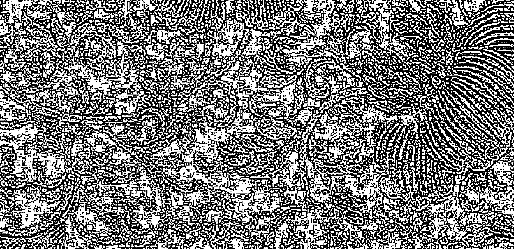
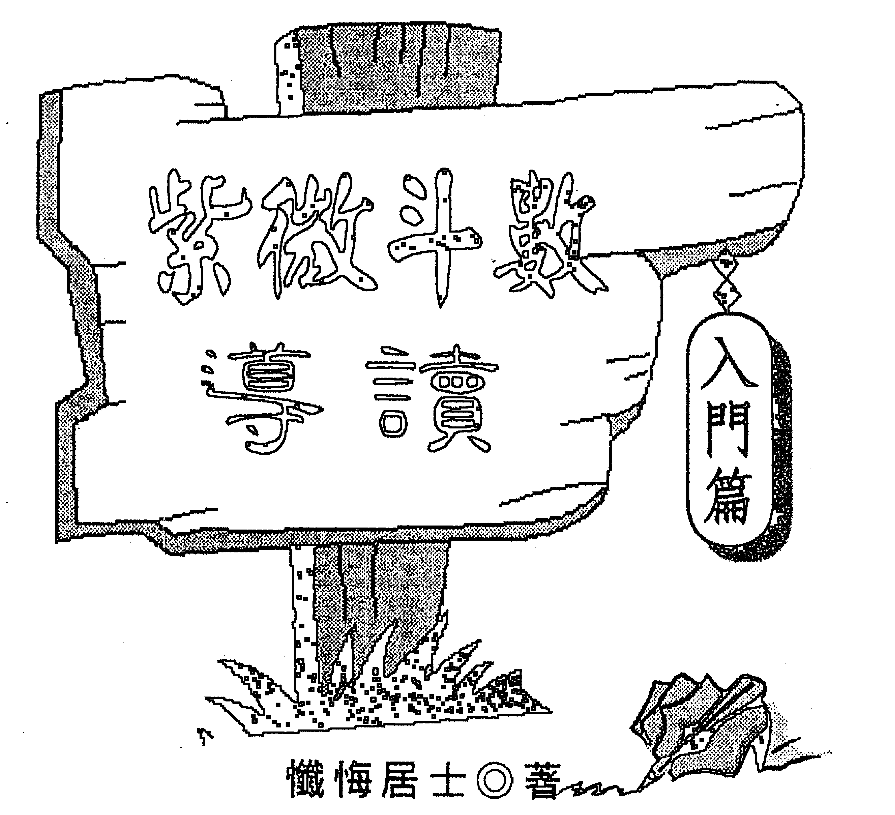
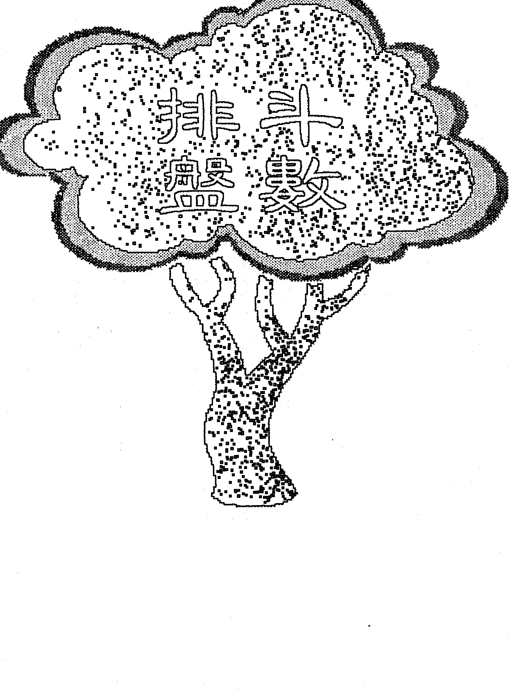
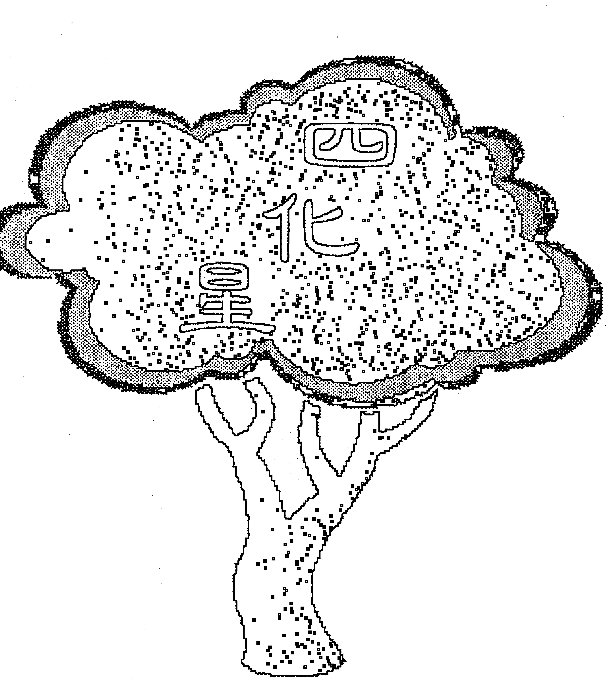
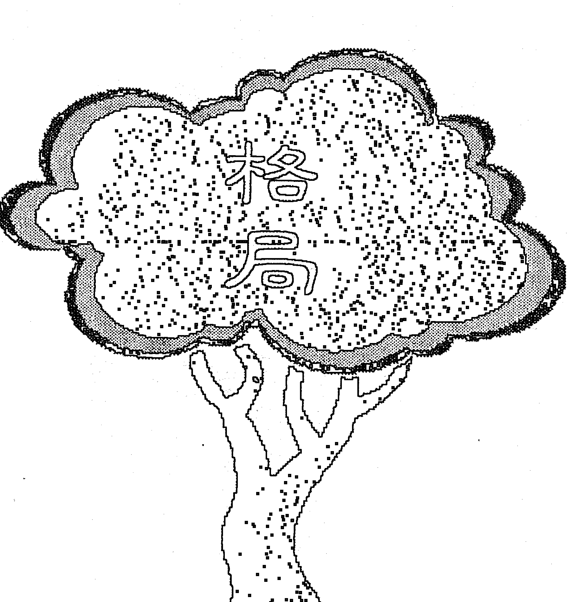
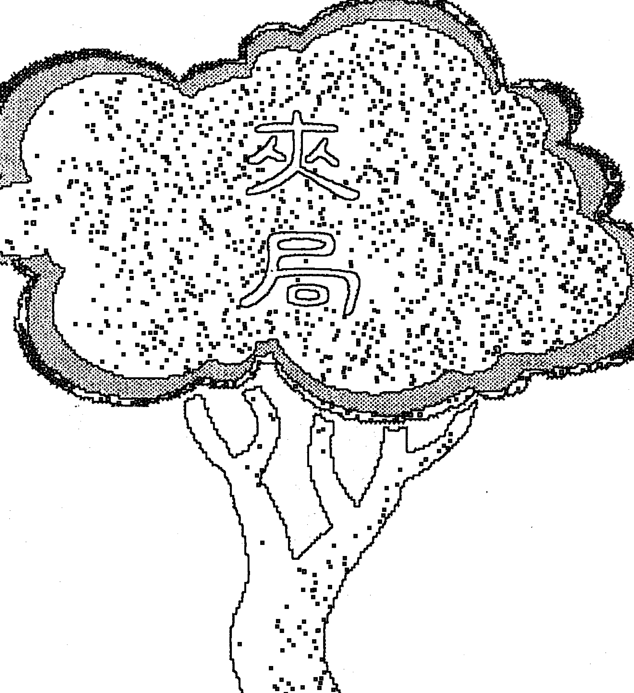

光绪二十四年
季春月
吉日造

## 紫微斗数导读

### 入门篇

懒悔居士◎著

## 自序

自八十年底首次出版《紫微斗数导读基础篇》暨《紫微斗数导读星曜解说篇》二书以来，转眼已过八年。承蒙诸位错爱及鼓励，其间陆续有《紫微斗数个案研究——为何不婚篇》、《紫微斗数导读命盘解说篇》、《紫微斗数个案研究——婚外情篇》及《斗数赋文精析》诸书问世。并曾筹组斗数研讨会于台北、台中、高雄，与诸有缘读者交换心得。

八十四年因机缘成熟皈依佛门，遂专心于佛法修持，著作、讲说等抛头露脸的杂务暂时止歇，仅与有缘者继续聊天论命，偶而于报章杂志接受读者「叩应」，亦尽量以笔名示之。

这段期间很多读者鼓励笔者再出书，笔者都以修持为重而婉拒，其实这与佛法反对星相卜筮有关，另佛法尚无头绪，无心于俗务亦是一因。

后因阅《印光大师文钞》曾开示：「世间有两种人，最易劝人为善念佛。第一，看相者，见好相，令极力修持，保全好相，否则相或变矣；见坏相，令极力修持，则相相当变好。医生尚须人请，方好说，看好相、相者，无论何人，一见面都好说，惜看相者无真本事，只知求利，弄到一生总是无所成，可不哀哉。」深悟佛陀反对相命是因一般人都将命作「命定论」、「宿命观」，不知万法唯心造，唯识现，只要能对治我们的习气，常生惭愧心、忏悔心、多发慈悲心、菩提心，命运就会随之而转。如果能从斗数命理的研习中了知，忌星无非是烦恼的结缚处，是心的意识在作用，能对境不起分别心，诸法平等，不随境转，烦恼即成菩提，所有顺逆境也只是业果之呈现，祸福本性如梦幻泡影，了不可得。如此斗数不失为方便法门，指引众生趋向涅槃彼岸，永离生老病死，忧悲苦恼。

1. 将基础篇较理论、技术的部份拿开，如阴阳五行概论、五术概说及排盘细节，代之以图表，并补充十二宫说明，以利初学者能立即排盘，马上进入状况。

2. 将星曜解说篇之赋文说明移开，并补充各宫说明至十二宫。于复星、格局、夹局部份更翔实解说，期初学者能清晰了解。

3. 将修订后的基础篇、星曜解说篇合为一书，名《紫微斗数导读入门篇》，专供初学

4. 原基础篇则保留阴阳五行概论、五术概说，并加入手排盘之介绍、易经卦位之应用、排盘过程中应注意事项，并透过实际命盘来解释十二宫，使理论与实务配合。研习斗数最大困扰在于理论满腹而实战经验不足，致临盘涕泣，不知所云。

5. 星曜解说篇部份，则加强赋文之说明，并佐以命盘解释命宫同、身宫不同时有何差异，及诸主星在十二宫中，因三方主星群不同，解释上有何异同，如此就不是一书所能道尽。

6. 修订后之基础篇、星曜解说篇仍保留原称《紫微斗数导读基础篇》、《紫微斗数导读星曜解说篇》，如此紫微斗数导读系列将有四书，即入门篇、基础篇、星曜解说篇及命盘解说篇。

著书并非有高人一等之见解，只是研习斗数的心得报告，诸君不用奉为金科玉律，毕竟笔者乃凡夫俗子，没有机缘亲炙大师受其调教，或有不传之秘得到密宣，只是一些实际经验，管窥之见难免，望祈先进不吝赐教。

入门篇先付梓，基础篇、星曜解说篇尚待努力，希望能早日完成以飨读者。在斗数研习过程中，要感谢的人真多，如父母、光宗、光园老师、家人、亲友、启明兄、健生兄，斗数研讨会之成员、诸位斗数先进，被算的「受害者」以及直接、间接完成此书的朋友，当然最重要的是您的支持。

己卯 小雪 懒悔居士 陈世兴于释心居

## 目录

自序 3

关于本书 13

前言 18

斗数回顾 18

斗数概述 19

斗数排盘 21

排盘前准备 22

排命盘 30

安命身宫表 31

定十二宫表 32

定十二宫之天干 34

起五行局 36

起紫微星 38

安十四主星 38

安时系诸星 43

安月系诸星 45

日系诸星 45

安年干系诸星 47

安生年支系诸星 49

其他杂曜 50

安命主身主 49

起大运大限表 50

△流年、小限 54

△流年斗君 54

△庙旺利陷表 55

十二宫緯曜 59

命与运之关系 61

命宫 63

身宫 64

兄弟宫 65

夫妻宫 66

子女宫 68

财帛宫 69

疾厄宫 71

迁移宫 72

仆役宫 74

官禄宫 75

田宅宫 76

福德宫 77

父母宫 78

十二宫总结 79

星曜解说 83

阴阳五行概说 85

星曜赋性组成要素 86

星曜关系 87

六吉星 91

左辅 92

天魁 95

文昌 97

文曲 97

天钺 95

右弼 92

六煞星 101

擎羊 102

陀罗 102

火星 105

铃星 105

- 十四主星 119
- 禄存星 115
- 紫微星 120
- 天府星 125
- 天相星 129
- 武曲星 133
- 廉贞星 136
- 贪狼星 141
- 七杀星 146
- 破军星 149
- 太阳星 154
- 太阴星 157
- 天机星 162
- 六吉星、六煞星总论 112
- 地空地劫 109
- 天梁星 166
- 天同星 169
- 巨门星 172
- 四化星 175
- 化禄星 178
- 化权星 181
- 化科星 184
- 化忌星 186
- 四化星之省思 190
- 副星（助星） 195
- 天马星 196
- 天刑星 197
- 天姚星 咸池星 197
- 红鸾星 天喜星 198
- 天哭星 天虚星 199

## 一、紫微在寅申宫

- ◎ 紫微、天府于寅申 202
- ◎ 廉贞、天相于子午 203

## 二、紫微在丑未宫

- ◎ 紫微、破军于丑未 205
- ◎ 武曲、七杀于卯酉 206
- ◎ 廉贞、贪狼于巳亥 207
- ◎ 天同、天梁于寅申 208

## 三、紫微在子午宫

- ◎ 武曲、天相于寅申 211
- ◎ 廉贞、天府于辰戌 212
- ◎ 太阳、天梁于卯酉 213
- ◎ 天同、巨门于丑未 214

## 四、紫微在巳亥宫

- ◎ 紫微、七杀于巳亥 216
- ◎ 武曲、贪狼于丑未 218
- ◎ 廉贞、破军于卯酉 219
- ◎ 天机、天梁于辰戌 220
- ◎ 太阳、巨门于寅申 221
- ◎ 天同、太阴于子午 221

## 五、紫微在辰戌宫

- ◎ 紫微、天相于辰戌 223
- ◎ 武曲、天府于子午 224
- ◎ 天机、巨门于卯酉 225
- ◎ 太阳、太阴于丑未 226

## 六、紫微在卯酉宫

- ◎ 紫微、贪狼于卯酉 228
- ◎ 武曲、破军于巳亥 230
- • 廉贞、七杀于丑未 231
- • 天机、太阴于寅申 232
- • 天机天梁擎羊会 236
- • 阳梁昌禄 237
- • 火阴、铃阴 238
- • 巨火羊 239
- • 火羊 240
- • 铃昌陀武 241
- • 火星、武曲 243
- • 刑囚夹印 243
- • 昌廉、曲廉 244
- • 火贪、铃贪 245
- • 昌贪、曲贪 246
- • 夹局 249
- • 紫府夹命 250
- • 日月夹命 251
- • 辅弼夹 252
- • 昌曲夹 252
- • 魁钺夹 253
- • 羊陀夹 253
- • 火铃夹 253
- • 空劫夹 255
- • 双禄夹 256
- • 双权夹 256
- • 双科夹 256
- • 双忌夹 257
- • 观方十喻 257
- • 空宫 259
- • 结语 263

## 关于本书

进入二十一世纪，随着科技日新月异、瞬息万变的创新，普遍充满不确定性和焦虑。当科技不再万能时，传统命理玄学就受到重视。紫微斗数由于浅显易懂、好入门，遂取代四柱推命而成为命理主流。

当您有兴趣翻阅紫微斗数书籍时，面对书架上琳琅满目、大同小异的秘笈时，恐会感到茫然；又有研习斗数多年之同好，心中还是有许多疑惑，不敢跟人解盘，似乎时准时不准，愈看愈不敢讲，若以赋文来套公式，恐怕会吓死人，如「空劫夹命为败局」、「生来贫贱，劫空临财福之乡」、「辅弼单守命宫，离宗庶出」、「七杀守身终是天，贪狼入庙必为娼」等等，斗数不是浅显易懂吗？怎会愈搞愈糊涂呢？究其因，不外是：

- 一、缺乏系统、架构，没有完整体系，就像一堆单字，缺了句型、文法，拼凑在一起，实在不知所云。
- 二、叙述不完整，常把前提、假设条件省略不谈，致前后矛盾，支离破碎。有人认为是「留一手」，其实可能是要「面授机宜」，防心术不正之徒，才不会遗祸人间。
- 三、年代久远，时空社会环境迥异，若食古不化，自然扞格。价值观在变，前是可能今非，不能随机制宜，就无法做出合理的诠释。若不相信，不妨问身边的斗数高手，或翻开坊间的斗数书籍，是否能回答下列问题：

1. 命身宫之作用有何异同？若命宫是先天，身宫是后天，看身宫时，命宫是否就不论？是否三十岁后才看身宫，三十岁前身宫没作用？命宫是紫微、身宫是七杀，与命宫是七杀、身宫是紫微有何异同？又命身同宫，紫微七杀共守，与前二者又有何异同？
2. 先天见禄星吉化，行运见忌星干扰，与先天见忌星干扰，行运见禄星吉化，何者为吉？也就是说命和运如何相互影响？或命归命、运归运？行运见吉就万事如意，还是命好不怕运来磨？
3. 经纪人、桩脚要看什么宫位？影歌星会不会红要看什么宫位？事业宫吗？为何唱片大卖，人气鼎盛，投资餐厅、经营事业反而亏大钱，是否宫位不同？健康状况是否一定看疾厄宫？精神疾病、妇女病、心脏病、撞邪是否有别？财帛、福德宫不佳，是否就沿路行乞？
4. 同一宫位见吉煞星，是吉还是凶？命宫、官禄宫、财帛宫分别见火星，都是三方见火星，笔者的学习过程，也是在黑漆桶里撞得头昏眼花，理不出头绪，然而撞久了也能撞出一丝裂缝，透些光亮，不敢自珍，遂陆陆续续写了紫微斗数导读、个案研究诸书，希望野人献曝，能提供读者系统性的学习，不要再走冤枉路。

正如本书名《紫微斗数导读入门篇》，是斗数的入门书，希望能导引您进入斗数的堂奥。全书分三大部分：

- 一、斗数排盘：因是入门书，笔者仅列图表，没有详细说明星曜如何排列出来。很多人都有电脑软件，输入生辰资料，完整的命盘就呈现眼前，不用排得满头大汗。但要把斗数学好，还是得把排盘法则弄清楚，这部份留待基础篇再叙述；另杂曜、小星也暂不介绍，免得满天星斗，看得您眼花撩乱煞煞。
- 二、十二宫涵释：笔者先扼要说明「命与运之关系」，再分别解释十二宫所涵盖的范围，对命身宫的作用有详细叙述。如果要清楚分辨命身宫，待星曜解说篇再佐以命盘就能体会。因为社会变迁，群伦关系不变，十二宫的定义有很大的不同，且重要性亦随之改变，如农业社会安土重迁，重视宗亲亲关系，所以田宅、父母、兄弟、子女会是人际重点宫位，工商社会离乡背井者多，出外靠朋友，迁移、仆役反而是重心。
- 一个人的财富，不一定取决于土地、不动产之多寡，握有高科技之股权可能是巨富，读者务必要细心浏览，不要轻忽。

## 三、星曜解说：这是本书的重点，所有宫位的解释，都是由其本宫星曜与三方（后文会介绍）星曜所组成的星群特性决定。一般书籍都记载了每颗星之基本特性，但有如下缺失：

1. 没有说明为何如此注解，只能靠死背。
2. 星性大都很八股，似乎与时代脱节，不够贴切。
3. 好坏差异很大，星曜是吉，就一面倒的好，若是凶星就一无可取。
4. 星曜会集时会产生不同的注解，这方面著墨太少，如天机遇火铃与空劫有何异同？
5. 星曜间如何互动，其角色扮演为何？当星曜聚集时，有吉有凶，甚至矛盾冲突，如何厘清？

笔者试着从「阴阳五行」、星曜之化气、主司，来解释每一颗星的基本性质，使读者能理解而不用死背，更进一步能随着时空的不同，而有不一样的阐述，尽量不用武断的价值衡量，如火星主活泼、活跃、积极、冲动、性急，在封建社会可能是叛逆、野、劳碌、三八之象征，不会有好评价，但在开放的社会反而有良好的表现。若在疾厄宫，

可能是急症、突发事故等等。

传统评价为「吉」的星曜，笔者试着从负面角度来思考，而凶的星曜，也试着提出其正面作用，做一平衡报道。如福德宫化禄，主享福，有福气，但亦可能过度安逸而没有忧患意识或责任感。擎羊星主刑伤，但亦有专注、贯彻的优点。

星曜间的关系，笔者试着以主菜、调味料、火候、佐料来说明主星、吉煞星、四化星、杂曜之可能角色扮演，希望读者能心领神会。

星曜的说明顺序，一般都以紫微星系与天府星系的顺序来安排，缺少对比性，无法给人深刻印象，笔者将性质相近者安排于前后文出现，如紫微与天府相近，廉贞与贪狼相近，在介绍上就先紫微再天府、天相……而非按紫微、天机、太阳的次序。

双主星会构成不同的星群，所以另文介绍。格局、空宫，一般书谈的较少或不显著，都独立章节说明。总之，本书的编排、叙述，与传统斗数书籍不同，期合乎系统性、时代性、可读性，使读者能易学易懂。

因是入门书，不能深入探讨者，留待基础篇、星曜解说篇、命盘解说篇……等等诸书再说明，希望有兴趣的读者能依序阅读，必有收获。

## 前言

### 斗数回顾

紫微斗数相传是由宋朝陈希夷道长所创，历经各代前辈如白玉蟾等增补而成。由于缺乏确实史料佐证，斗数是否真的出于陈希夷道长之手不得而知。不过，紫微斗数应是宋代之产物，也与道家渊源深厚。

### 斗数概述

紫微斗数是依据个人的农历出生年、月、日、时排出命盘，命盘中包括十二宫及一百多颗星曜，依所要问的事项，找出相关宫位，再观察这些宫位有关的星曜组合，以判断吉凶祸福或描述所呈现的表征。是一种推理过程，而非有秘不可宣之天机。

「紫微斗数的论命两大要察即宫位与星曜组合」，如果没找对宫位，就不可能作出

正确的推论，同理，不能分辨星曜的组合特质，就不能完整描述现状。本书是入门指南，

在星曜组合上先做重点提示，要深入了解，就要继续研读《星曜解说》诸书。

十二宫：命身、兄弟、夫妻、子嗣、财帛、疾厄、迁移、仆役、事业、田宅、福德、父母。

- 十四主星：紫微、天府、天相、武曲、廉贞、七杀、破军、贪狼、太阳、巨门、天机、太阴、天同、天梁。
- 六吉星：天魁、天钺、左辅、右弼、文昌、文曲。
- 六煞星：擎羊、陀罗、火星、铃星、地空、地劫。
- 四化星：化禄、化权、化科、化忌。

辅助星：禄存、天马、红鸾、天喜、咸池、天姚、孤辰、寡宿、天哭、天虚、天刑、阴煞、龙池、凤阁、恩光、天贵、三台、八座、十二长生、岁前、将前、生年博士三十六颗等等，真是「族繁不及备载」。

> 人当变故之来，只宜守，不宜躁动，即使万无解救，而志正守确，虽不可为，而心终可白，否则必致身败而名亦不保。非所以处变之道。

### 排盘前准备

紫微斗数是依据太阴历（农历）来排命盘，因此一定要把出生年月日时换成太阴历。

最简便的方法就是找万年历，或参考本书所附的「国农历简易对照表」。

- 如果只知西元不知民国年份，西元减一九一一即是。
- 斗数只把「出生年」换算成干支，月、日维持数字，不须换算成干支。
- 逢闰月一律当本月看，不管十五日前后，亦不考虑二十四节气。（八字是太阳历，

有命盘才能探讨命运得失，因此，排命盘就是第一步。排命盘有几个方法：

1. 利用现成的电脑排盘软件。优点是迅速详实，缺点是不能了解掌握星曜结构，斗数要深入就有瓶颈。
2. 查阅图表。优点是可以掌握星曜与生辰的关系，缺点则不免耗费时间。
3. 背诵口诀。优点是能了解星曜如何排定，其相关性如何，不用纸笔，掐指间就能运盘于心；缺点是花时间记诵，耗时书写。

对初学者而言，可能会选择用电脑或利用图表，但如果想要学好斗数，笔者还是建议您背诵口诀。本书写入门，以介绍第二种为主轴，待「基础篇」再说明口诀法。

以节气定月份。） 出生时间以当地时间为准，不须换算成中原时间。斗数原则上仅限于北半球，南半球因磁场、季节、冷热与北半球颠倒，故不适用。

## 表 国历简易对照表 (民国十年至三十九年) ☆·闰月

| 12/1 | 11/1 | 10/1 | 9/1 | 8/1 | 7/1 | 6/1 | 5/1 | 4/1 | 3/1 | 2/1 | 1/1 | 口口 | 口 | 干支 |
|------|------|------|-----|-----|-----|-----|-----|-----|-----|-----|-----|------|---|------|
| 12.29 | 11.29 | 10.31 | 10.1 | 9.2 | 8.4 | 7.5 | 6.6 | 5.8 | 4.8 | 3.10 | 2.8 | 10 | | 辛丑 |
| 1.17 | 12.18 | 11.19 | 10.20 | 9.21 | 8.23 | 7.24 | 5.27 ☆6.25 | 4.27 | 3.28 | 2.27 | 1.28 | 11 | | 壬戌 |
| 1.6 | 12.8 | 11.8 | 10.10 | 9.11 | 8.12 | 7.14 | 6.14 | 5.16 | 4.16 | 3.17 | 2.16 | 12 | | 癸亥 |
| 12.26 | 11.27 | 10.28 | 9.29 | 8.30 | 8.1 | 7.2 | 6.2 | 5.4 | 4.4 | 3.5 | 2.5 | 13 | | 甲子 |
| 1.14 | 12.16 | 11.16 | 10.18 | 9.18 | 8.19 | 7.21 | 6.21 | 4.23 ☆5.22 | 3.24 | 2.23 | 1.24 | 14 | | 乙丑 |
| 1.4 | 12.5 | 11.5 | 10.7 | 9.7 | 8.8 | 7.10 | 6.10 | 5.12 | 4.12 | 3.14 | 2.13 | 15 | | 丙寅 |
| 12.24 | 11.24 | 10.25 | 9.26 | 8.27 | 7.29 | 6.29 | 5.31 | 5.1 | 4.2 | 3.4 | 2.2 | 16 | | 丁卯 |
| 1.11 | 12.12 | 11.12 | 10.13 | 9.14 | 8.15 | 7.17 | 6.18 | 5.19 | 4.20 | 2.21 ☆3.22 | 1.23 | 17 | | 戊辰 |
| 12.31 | 12.1 | 11.1 | 10.3 | 9.3 | 8.5 | 7.7 | 6.7 | 5.9 | 4.10 | 3.11 | 2.10 | 18 | | 己巳 |
| 1.19 | 12.20 | 11.20 | 10.22 | 9.22 | 8.24 | 6.26 ☆7.26 | 5.28 | 4.29 | 3.30 | 2.28 | 1.30 | 19 | | 庚午 |
| 1.8 | 12.9 | 11.10 | 10.11 | 9.12 | 8.14 | 7.15 | 6.16 | 5.17 | 4.18 | 3.19 | 2.17 | 20 | | 辛未 |
| 12.27 | 11.28 | 10.29 | 9.30 | 9.1 | 8.2 | 7.4 | 6.4 | 5.6 | 4.6 | 3.7 | 2.6 | 21 | | 壬申 |
| 1.15 | 12.17 | 11.18 | 10.19 | 9.20 | 8.21 | 7.22 | 5.24 ☆6.23 | 4.25 | 3.26 | 2.24 | 1.26 | 22 | | 癸酉 |
| 1.5 | 12.7 | 11.7 | 10.8 | 9.9 | 8.10 | 7.12 | 6.12 | 5.13 | 4.14 | 3.15 | 2.14 | 23 | | 甲戌 |
| 12.26 | 11.26 | 10.27 | 9.28 | 8.29 | 7.30 | 7.1 | 6.1 | 5.3 | 4.3 | 3.5 | 2.4 | 24 | | 乙亥 |
| 1.13 | 12.14 | 11.14 | 10.15 | 9.16 | 8.17 | 7.18 | 6.19 | 5.21 | 3.23 ☆4.21 | 2.23 | 1.24 | 25 | | 丙子 |
| 1.2 | 12.3 | 11.3 | 10.4 | 9.5 | 8.6 | 7.8 | 6.9 | 5.10 | 4.11 | 3.13 | 2.11 | 26 | | 丁丑 |
| 1.20 | 12.22 | 11.22 | 10.23 | 9.24 | 7.27 ☆8.25 | 6.28 | 5.29 | 4.30 | 4.1 | 3.2 | 1.31 | 27 | | 戊寅 |
| 1.9 | 12.11 | 11.11 | 10.13 | 9.13 | 8.15 | 7.17 | 6.17 | 5.19 | 4.20 | 3.21 | 2.19 | 28 | | 己卯 |
| 12.29 | 11.29 | 10.31 | 10.1 | 9.2 | 8.4 | 7.5 | 6.6 | 5.7 | 4.8 | 3.9 | 2.8 | 29 | | 庚辰 |
| 1.17 | 12.18 | 11.19 | 10.20 | 9.21 | 8.23 | 6.25 ☆7.24 | 5.26 | 4.26 | 3.28 | 2.26 | 1.27 | 30 | | 辛巳 |
| 1.6 | 12.8 | 11.8 | 10.10 | 9.10 | 8.12 | 7.13 | 6.14 | 5.15 | 4.15 | 3.17 | 2.15 | 31 | | 壬午 |
| 12.27 | 11.27 | 10.29 | 9.29 | 8.31 | 8.1 | 7.2 | 6.3 | 5.4 | 4.5 | 3.6 | 2.5 | 32 | | 癸未 |
| 1.14 | 12.15 | 11.16 | 10.17 | 9.17 | 8.19 | 7.20 | 6.21 | 4.23 ☆5.22 | 3.24 | 2.24 | 1.25 | 33 | | 甲申 |
| 1.3 | 12.5 | 11.5 | 10.6 | 9.6 | 8.8 | 7.9 | 6.10 | 5.12 | 4.12 | 3.14 | 2.13 | 34 | | 乙酉 |
| 12.23 | 11.24 | 10.25 | 9.25 | 8.27 | 7.28 | 6.29 | 5.31 | 5.1 | 4.2 | 3.4 | 2.2 | 35 | | 丙戌 |
| 1.11 | 12.12 | 11.13 | 10.14 | 9.15 | 8.16 | 7.18 | 6.19 | 5.20 | 4.21 | 2.21 ☆3.23 | 1.22 | 36 | | 丁亥 |
| 12.30 | 12.1 | 11.1 | 10.3 | 9.3 | 8.5 | 7.7 | 6.7 | 5.9 | 4.9 | 3.11 | 2.10 | 37 | | 戊子 |
| 1.18 | 12.20 | 11.20 | 10.22 | 9.22 | 7.26 ☆8.24 | 6.26 | 5.28 | 4.28 | 3.29 | 2.28 | 1.29 | 38 | | 己丑 |
| 1.8 | 12.9 | 11.10 | 10.11 | 9.12 | 8.14 | 7.15 | 6.15 | 5.17 | 4.17 | 3.18 | 2.17 | 39 | | 庚寅 |

## 025◆斗数排盘

| 12/1 | 11/1 | 10/1 | 9/1 | 8/1 | 7/1 | 6/1 | 5/1 | 4/1 | 3/1 | 2/1 | 1/1 | 历长 國民 | 干支 |
| :--- | :--- | :--- | :--- | :--- | :--- | :--- | :--- | :--- | :--- | :--- | :--- | :--- | :--- |
| 12.28 | 11.29 | 10.30 | 10.1 | 9.1 | 8.3 | 7.4 | 6.5 | 5.6 | 4.6 | 3.8 | 2.6 | 40 | 卯辛 |
| 1.15 | 12.17 | 11.17 | 10.19 | 9.19 | 8.20 | 7.22 | 5.24 ☆6.22 | 4.24 | 3.26 | 2.25 | 1.27 | 41 | 戌壬 |
| 1.5 | 12.6 | 11.7 | 10.8 | 9.8 | 8.9 | 7.11 | 6.11 | 5.13 | 4.14 | 3.15 | 2.14 | 42 | 巳癸 |
| 12.25 | 11.25 | 10.27 | 9.27 | 8.28 | 7.30 | 6.30 | 6.1 | 5.3 | 4.3 | 3.5 | 2.3 | 43 | 午甲 |
| 1.13 | 12.14 | 11.14 | 10.16 | 9.16 | 8.18 | 7.19 | 6.20 | 5.22 | 3.24 ☆4.22 | 2.22 | 1.24 | 44 | 未乙 |
| 1.1 | 12.12 | 11.3 | 10.4 | 9.5 | 8.6 | 7.8 | 6.9 | 5.10 | 4.11 | 3.12 | 2.12 | 45 | 申丙 |
| 1.20 | 12.21 | 11.22 | 10.23 | 8.25 ☆9.24 | 7.27 | 6.28 | 5.29 | 4.30 | 3.31 | 3.2 | 1.31 | 46 | 酉丁 |
| 1.9 | 12.11 | 11.11 | 10.13 | 9.13 | 8.15 | 7.17 | 6.17 | 5.19 | 4.19 | 3.20 | 2.18 | 47 | 戌戊 |
| 12.20 | 11.30 | 11.1 | 10.2 | 9.3 | 8.4 | 7.6 | 6.6 | 5.8 | 4.8 | 3.9 | 2.8 | 48 | 亥己 |
| 1.17 | 12.18 | 11.19 | 10.20 | 9.21 | 8.22 | 6.24 ☆7.24 | 5.25 | 4.26 | 3.27 | 2.27 | 1.28 | 49 | 子庚 |
| 1.6 | 12.8 | 11.8 | 10.10 | 9.10 | 8.11 | 7.13 | 6.13 | 5.15 | 4.15 | 3.17 | 2.15 | 50 | 丑辛 |
| 12.27 | 11.27 | 10.28 | 9.29 | 8.30 | 7.31 | 7.2 | 6.2 | 5.4 | 4.5 | 3.6 | 2.5 | 51 | 寅壬 |
| 1.5 | 12.16 | 11.16 | 10.17 | 9.18 | 8.19 | 7.21 | 6.21 | 4.24 ☆5.23 | 3.25 | 2.24 | 1.25 | 52 | 卯癸 |
| 1.3 | 12.4 | 11.4 | 10.6 | 9.6 | 8.8 | 7.9 | 6.10 | 5.12 | 4.12 | 3.14 | 2.13 | 53 | 辰甲 |
| 12.23 | 11.23 | 11.24 | 9.25 | 8.27 | 7.28 | 6.29 | 5.31 | 5.1 | 4.2 | 3.3 | 2.2 | 54 | 巳乙 |
| 1.11 | 12.12 | 11.12 | 10.14 | 9.15 | 8.16 | 7.18 | 6.19 | 5.20 | 3.22 ☆4.21 | 2.20 | 1.21 | 55 | 午丙 |
| 12.31 | 12.2 | 11.2 | 10.4 | 9.4 | 8.6 | 7.8 | 6.8 | 5.9 | 4.10 | 3.11 | 2.9 | 56 | 未丁 |
| 1.18 | 12.20 | 11.20 | 10.22 | 9.22 | 7.25 ☆8.24 | 6.26 | 5.27 | 4.27 | 3.29 | 2.28 | 1.30 | 57 | 申戊 |
| 1.8 | 12.9 | 11.10 | 10.11 | 9.12 | 8.13 | 7.14 | 6.15 | 5.16 | 4.17 | 3.18 | 2.17 | 58 | 酉己 |
| 12.28 | 11.29 | 10.30 | 9.30 | 9.1 | 8.2 | 7.3 | 6.4 | 5.5 | 4.6 | 3.8 | 2.6 | 59 | 戌庚 |
| 1.16 | 12.18 | 11.18 | 10.19 | 9.19 | 8.21 | 7.22 | 5.24 ☆6.23 | 4.25 | 3.27 | 2.25 | 1.27 | 60 | 亥辛 |
| 1.4 | 12.6 | 11.6 | 10.7 | 9.8 | 8.9 | 7.11 | 6.11 | 5.13 | 4.14 | 3.15 | 2.15 | 61 | 子壬 |
| 12.24 | 11.25 | 10.26 | 9.26 | 8.28 | 7.30 | 6.30 | 6.1 | 5.3 | 4.3 | 3.5 | 2.3 | 62 | 丑癸 |
| 1.12 | 12.14 | 11.14 | 10.15 | 9.16 | 8.18 | 7.19 | 6.20 | 4.22 ☆5.22 | 3.24 | 2.22 | 1.23 | 63 | 寅甲 |
| 1.1 | 12.3 | 11.3 | 10.5 | 9.6 | 8.7 | 7.9 | 6.10 | 5.11 | 4.12 | 3.13 | 2.11 | 64 | 卯乙 |
| 1.19 | 12.21 | 11.21 | 10.23 | 8.25 ☆9.24 | 7.27 | 6.27 | 5.29 | 4.29 | 3.31 | 3.1 | 1.31 | 65 | 辰丙 |
| 1.9 | 12.11 | 11.11 | 10.13 | 9.13 | 8.15 | 7.16 | 6.17 | 5.18 | 4.18 | 3.20 | 2.18 | 66 | 巳丁 |
| 12.30 | 11.30 | 11.1 | 10.2 | 9.3 | 8.4 | 7.5 | 6.6 | 5.7 | 4.7 | 3.9 | 2.7 | 67 | 午戊 |
| 1.18 | 12.19 | 11.20 | 10.21 | 9.21 | 8.23 | 6.24 ☆7.24 | 5.26 | 4.26 | 3.28 | 2.27 | 1.28 | 68 | 未己 |
| 1.6 | 12.7 | 11.8 | 10.9 | 9.9 | 8.11 | 7.12 | 6.13 | 5.14 | 4.15 | 3.17 | 2.16 | 69 | 申庚 |
| 12.26 | 11.26 | 10.28 | 9.28 | 8.29 | 7.31 | 7.2 | 6.2 | 5.4 | 4.5 | 3.6 | 2.5 | 70 | 酉辛 |
| 1.14 | 12.15 | 11.15 | 10.17 | 9.17 | 8.19 | 7.21 | 6.21 | 4.24 ☆5.23 | 3.25 | 2.24 | 1.25 | 71 | 戌壬 |
| 1.3 | 12.4 | 11.5 | 10.6 | 9.7 | 8.9 | 7.10 | 6.11 | 5.13 | 4.13 | 3.15 | 2.13 | 72 | 亥癸 |
| 1.21 | 12.22 | 10.24 ☆11.23 | 9.2 | 8.27 | 7.28 | 6.29 | 5.31 | 5.1 | 4.1 | 3.3 | 2.2 | 73 | 子甲 |
| 1.10 | 12.12 | 11.12 | 10.14 | 9.15 | 8.16 | 7.18 | 6.18 | 5.20 | 4.20 | 3.21 | 2.20 | 74 | 丑乙 |
| 12.31 | 12.2 | 11.2 | 10.4 | 9.4 | 8.6 | 7.7 | 6.7 | 5.9 | 4.9 | 3.10 | 2.9 | 75 | 寅丙 |
| 1.19 | 12.21 | 11.21 | 10.23 | 9.23 | 8.24 | 6.26 ☆7.26 | 5.27 | 4.28 | 3.29 | 2.28 | 1.29 | 76 | 卯丁 |
| 1.8 | 12.9 | 11.9 | 10.11 | 9.11 | 8.12 | 7.14 | 6.14 | 5.16 | 4.16 | 3.18 | 2.17 | 77 | 辰戊 |
| 12.28 | 11.28 | 10.29 | 9.30 | 8.31 | 8.2 | 7.3 | 6.4 | 5.5 | 4.6 | 3.8 | 2.6 | 78 | 巳己 |
| 1.16 | 12.17 | 11.17 | 10.18 | 9.19 | 8.20 | 7.22 | 5.24 ☆6.23 | 4.25 | 3.27 | 2.25 | 1.27 | 79 | 午庚 |
| 1.5 | 12.6 | 11.6 | 10.8 | 9.8 | 8.10 | 7.12 | 6.12 | 5.14 | 4.15 | 3.16 | 2.15 | 80 | 未辛 |
| 12.24 | 11.24 | 10.26 | 9.26 | 8.28 | 7.30 | 6.30 | 6.1 | 5.3 | 4.3 | 3.4 | 2.4 | 81 | 申壬 |
| 1.12 | 12.13 | 11.14 | 10.15 | 9.16 | 8.18 | 7.19 | 6.20 | 5.22 | 3.23 ☆4.22 | 2.21 | 1.23 | 82 | 酉癸 |
| 1.1 | 12.3 | 11.3 | 10.5 | 9.6 | 8.7 | 7.9 | 6.9 | 5.11 | 4.11 | 3.12 | 2.10 | 83 | 戌甲 |
| 1.20 | 12.22 | 11.22 | 10.24 | 8.26 ☆9.25 | 7.27 | 6.28 | 5.29 | 4.30 | 3.31 | 3.1 | 1.31 | 84 | 亥乙 |
| 1.9 | 12.11 | 11.11 | 10.12 | 9.13 | 8.14 | 7.16 | 6.16 | 5.17 | 4.18 | 3.19 | 2.19 | 85 | 子丙 |
| 12.30 | 11.30 | 10.31 | 10.2 | 9.2 | 8.3 | 7.5 | 6.5 | 5.7 | 4.7 | 3.9 | 2.7 | 86 | 丑丁 |
| 1.17 | 12.19 | 11.19 | 10.20 | 9.21 | 8.22 | 7.23 | 5.26 ☆6.24 | 4.26 | 3.28 | 2.27 | 1.28 | 87 | 寅戊 |
| 1.7 | 12.8 | 11.8 | 10.9 | 9.10 | 8.11 | 7.13 | 6.14 | 5.15 | 4.16 | 3.18 | 2.16 | 88 | 卯己 |
| 12.26 | 11.26 | 10.27 | 9.28 | 8.29 | 7.31 | 7.2 | 6.2 | 5.4 | 4.5 | 3.6 | 2.5 | 89 | 辰庚 |
| 1.13 | 12.15 | 11.15 | 10.17 | 9.17 | 8.19 | 7.21 | 6.21 | 4.23 ☆5.23 | 3.25 | 2.23 | 1.24 | 90 | 巳辛 |
| 1.3 | 12.4 | 11.5 | 10.6 | 9.7 | 8.9 | 7.10 | 6.11 | 5.12 | 4.13 | 3.14 | 2.12 | 91 | 午壬 |
| 12.23 | 11.24 | 10.25 | 9.26 | 8.28 | 7.29 | 6.30 | 5.31 | 5.1 | 4.2 | 3.3 | 2.1 | 92 | 未癸 |
| 1.10 | 12.12 | 11.12 | 10.14 | 9.14 | 8.16 | 7.17 | 6.18 | 5.19 | 4.19 | 2.20 ☆3.21 | 1.22 | 93 | 申甲 |
| 12.31 | 12.1 | 11.2 | 10.3 | 9.4 | 8.5 | 7.6 | 6.7 | 5.8 | 4.9 | 3.10 | 2.9 | 94 | 酉乙 |
| 1.19 | 12.20 | 11.21 | 10.22 | 9.22 | 7.25 ☆8.24 | 6.26 | 5.27 | 4.28 | 3.29 | 2.28 | 1.29 | 95 | 戌丙 |
| 1.8 | 12.10 | 11.10 | 10.11 | 9.11 | 8.13 | 7.14 | 6.15 | 5.17 | 4.17 | 3.19 | 2.18 | 96 | 亥丁 |
| 12.27 | 11.28 | 10.29 | 9.29 | 8.31 | 8.1 | 7.3 | 6.4 | 5.5 | 4.6 | 3.8 | 2.7 | 97 | 子戊 |
| 1.15 | 12.16 | 11.17 | 10.18 | 9.19 | 8.20 | 7.22 | 5.24 ☆6.23 | 4.25 | 3.27 | 2.25 | 1.26 | 98 | 丑己 |
| 1.4 | 12.6 | 11.6 | 10.8 | 9.8 | 8.10 | 7.12 | 6.12 | 5.14 | 4.14 | 3.16 | 2.14 | 99 | 寅庚 |

表①—二（民国四十年至六十九年 ☆·闰月）

## 紫微斗数导读——入门篇 ◇026

表①一三（民国七十年至九十九年 ☆·闰月）

## 台湾地区实施夏令时间表

夏季诞生者，宜留意是否逢「夏令时间」，英美各国都曾实施「夏令日光节约时间」，时间大多调快一小时，以利用日照，所以须扣回一小时，如五时生者，实际为四时生。台湾地区出生者，请参考下表：

| 起迄日期 | 民國 |
| :--- | :--- |
| 26.10.01-34.09.30 | ☆ |
| 05.01- 09.30 | 30-40 |
| 03.01- 10.31 | 41 |
| 04.01- 10.31 | 42、43 |
| 04.01- 09.30 | 44、45 |
| 04.01- 09.30 | 46-48 |
| 06.01- 09.30 | 49、50 |
| 04.01- 09.30 | 63、64 |
| 07.01- 09.30 | 68 |

註(一)：51~62 及 65~67 年未實施。
註(二)：以上時間為國曆。
註(三)：26.10.01～34.09.30 僅台灣地區全年度實施。

## 時辰換算表

太陰曆以兩個小時為一時辰，因此須把出生時間換算成時辰，如下表：

| 時間 | 時辰 |
|------|------|
| 23～01 | 子 |
| 01～03 | 丑 |
| 03～05 | 寅 |
| 05～07 | 卯 |
| 07～09 | 辰 |
| 09～11 | 巳 |
| 11～13 | 午 |
| 13～15 | 未 |
| 15～17 | 申 |
| 17～19 | 酉 |
| 19～21 | 戌 |
| 21～23 | 亥 |

要注意的是，新曆以零時為一天的開始，農曆則以晚上十一點為交界，因此今天晚上十一點多出生者，新曆仍是今天，農曆已是隔日子時。凡是在時辰交界前後生者，如五點左右，最好排兩張命盤驗證一下，免得差之毫釐，失之千里。

## 干支簡介

天干有十：甲、乙、丙、丁、戊、己、庚、辛、壬、癸。地支十二：子、丑、寅、卯、辰、巳、午、未、申、酉、戌、亥。

奇數為陽，偶數為陰。

- 陽天干：甲丙戊庚壬
- 陰天干：乙丁己辛癸

- 陽地支：子寅辰午申戌
- 陰地支：丑卯巳未酉亥

陽天干配陽地支，陰天干配陰地支，天干在上，地支在下，由甲子、乙丑、丙寅、丁卯...依序配對至壬戌、癸亥，共六十對，因以甲子為首，又稱六十甲子。

- 子：鼠
- 丑：牛
- 寅：虎
- 卯：兔
- 辰：龍
- 巳：蛇
- 午：馬
- 未：羊
- 申：猴
- 酉：雞
- 戌：狗
- 亥：豬

- 寅：1月
- 卯：2月
- 辰：3月
- 巳：4月
- 午：5月
- 未：6月
- 申：7月
- 酉：8月
- 戌：9月
- 亥：10月
- 子：11月
- 丑：12月

與十二辟卦有關。想要深入探討斗數，若略懂易經八卦更佳。

年及時的開始均為「子」，月卻以「寅」為首，這也是夏曆（太陰曆）的特色。

## 排命盤

從現在開始要進入命盤的製作了，請準備一張空白紙，依左圖製作。（也有人繪成圓形，一般習慣是繪成方形。以後要談及方位、卦位，方形比圓形易看）十二地支的位置是固定不變的。

| 巳 | 午 | 未 | 申 |
|----|----|----|----|
| 辰 |  | 干支·庚辰 巳時 乾造民國89年1月28日 | 酉 |
| 卯 |  |  | 戌 |
| 寅 | 丑 | 子 | 亥 |

男命稱乾造，女命稱坤造。假設某人是男命，西元二〇〇〇年三月三日上午十時生，換算成農曆為...乾造庚辰年一月二十八日巳時生。

## 031◇斗数排盘

### △安命身宫表

| 12月 | 11月 | 10月 | 9月 | 8月 | 7月 | 6月 | 5月 | 4月 | 3月 | 2月 | 1月 | 生月/生时 |
|------|------|------|-----|-----|-----|-----|-----|-----|-----|-----|-----|-----------|
| 身 命 | 身 命 | 身 命 | 身 命 | 身 命 | 身 命 | 身 命 | 身 命 | 身 命 | 身 命 | 身 命 | 身 命 | 子        |
| 丑   | 子   | 亥   | 戌  | 酉  | 申  | 未  | 午  | 巳  | 辰  | 卯  | 寅  | 丑        |
| 寅   | 丑   | 子   | 亥  | 戌  | 酉  | 申  | 未  | 午  | 巳  | 辰  | 卯  | 寅        |
| 卯   | 寅   | 丑   | 子  | 亥  | 戌  | 酉  | 申  | 未  | 午  | 巳  | 辰  | 卯        |
| 辰   | 卯   | 寅   | 丑  | 子  | 亥  | 戌  | 酉  | 申  | 未  | 午  | 巳  | 辰        |
| 巳   | 辰   | 卯   | 寅  | 丑  | 子  | 亥  | 戌  | 酉  | 申  | 未  | 午  | 巳        |
| 午   | 巳   | 辰   | 卯  | 寅  | 丑  | 子  | 亥  | 戌  | 酉  | 申  | 未  | 午        |
| 未   | 午   | 巳   | 辰  | 卯  | 寅  | 丑  | 子  | 亥  | 戌  | 酉  | 申  | 未        |
| 申   | 未   | 午   | 巳  | 辰  | 卯  | 寅  | 丑  | 子  | 亥  | 戌  | 酉  | 申        |
| 酉   | 申   | 未   | 午  | 巳  | 辰  | 卯  | 寅  | 丑  | 子  | 亥  | 戌  | 酉        |
| 戌   | 酉   | 申   | 未  | 午  | 巳  | 辰  | 卯  | 寅  | 丑  | 子  | 亥  | 戌        |
| 亥   | 戌   | 酉   | 申  | 未  | 午  | 巳  | 辰  | 卯  | 寅  | 丑  | 子  | 亥        |
| 子   | 亥   | 戌   | 酉  | 申  | 未  | 午  | 巳  | 辰  | 卯  | 寅  | 丑  | 子        |

※闰月以本月计

## 定十二宫表

| 父母 | 福德 | 田宅 | 事業 | 僕役 | 遷移 | 疾厄 | 財帛 | 子女 | 夫妻 | 兄弟 | 命宫 |
|------|------|------|------|------|------|------|------|------|------|------|------|
| 丑   | 寅   | 卯   | 辰   | 巳   | 午   | 未   | 申   | 酉   | 戌   | 亥   | 子   |
| 寅   | 卯   | 辰   | 巳   | 午   | 未   | 申   | 酉   | 戌   | 亥   | 子   | 丑   |
| 卯   | 辰   | 巳   | 午   | 未   | 申   | 酉   | 戌   | 亥   | 子   | 丑   | 寅   |
| 辰   | 巳   | 午   | 未   | 申   | 酉   | 戌   | 亥   | 子   | 丑   | 寅   | 卯   |
| 巳   | 午   | 未   | 申   | 酉   | 戌   | 亥   | 子   | 丑   | 寅   | 卯   | 辰   |
| 午   | 未   | 申   | 酉   | 戌   | 亥   | 子   | 丑   | 寅   | 卯   | 辰   | 巳   |
| 未   | 申   | 酉   | 戌   | 亥   | 子   | 丑   | 寅   | 卯   | 辰   | 巳   | 午   |
| 申   | 酉   | 戌   | 亥   | 子   | 丑   | 寅   | 卯   | 辰   | 巳   | 午   | 未   |
| 酉   | 戌   | 亥   | 子   | 丑   | 寅   | 卯   | 辰   | 巳   | 午   | 未   | 申   |
| 戌   | 亥   | 子   | 丑   | 寅   | 卯   | 辰   | 巳   | 午   | 未   | 申   | 酉   |
| 亥   | 子   | 丑   | 寅   | 卯   | 辰   | 巳   | 午   | 未   | 申   | 酉   | 戌   |
| 子   | 丑   | 寅   | 卯   | 辰   | 巳   | 午   | 未   | 申   | 酉   | 戌   | 亥   |

命身宮是依出生月份及時辰來排定。身宮一定與命宮、夫妻、財帛、遷移、官祿、福德這六宮之一同宮。

## 身宮與六宮同臨之情形如下：

| 时辰 | 宫位 |
|------|------|
| 子午時 | 命宮 |
| 丑未時 | 福德 |
| 寅申時 | 事業 |
| 卯酉時 | 遷移 |
| 辰戌時 | 財帛 |
| 巳亥時 | 夫妻 |

命宮定好後，即依逆時鐘方向排出兄弟、夫妻、子女、財帛、疾厄、遷移、僕役、事業、田宅、福德、父母各宮。

| 宫位\年干 | 甲己 | 乙庚 | 丙辛 | 丁壬 | 戊癸 |
| :--- | :--- | :--- | :--- | :--- | :--- |
| 寅 | 丙 | 戊 | 庚 | 壬 | 甲 |
| 卯 | 丁 | 己 | 辛 | 癸 | 乙 |
| 辰 | 戊 | 庚 | 壬 | 甲 | 丙 |
| 巳 | 己 | 辛 | 癸 | 乙 | 丁 |
| 午 | 庚 | 壬 | 甲 | 丙 | 戊 |
| 未 | 辛 | 癸 | 乙 | 丁 | 己 |
| 申 | 壬 | 甲 | 丙 | 戊 | 庚 |
| 酉 | 癸 | 乙 | 丁 | 己 | 辛 |
| 戌 | 甲 | 丙 | 戊 | 庚 | 壬 |
| 亥 | 乙 | 丁 | 己 | 辛 | 癸 |
| 子 | 丙 | 戊 | 庚 | 壬 | 甲 |
| 丑 | 丁 | 己 | 辛 | 癸 | 乙 |

## △定十二宫之天干

定十二宫天干表

从出生年天干，找出各宫天干，其实这也代表着出生年之每月天干。本例是庚辰年生，所以在「乙庚」中查得寅宫之天干为「戊」，表示庚辰年一月之干支为「戊寅」，以此往下排出己卯、庚辰……等各月干支。

天干十位，地支十二位，所以「子」与「寅」、「丑」与「卯」的天干会相同，如不同就是排错了，请核对一下命盘：

## 035◇斗数排盘

| 辛巳 财帛 | 壬午 子女 | 癸未 夫妻(身) | 甲申 兄弟 |
| :--- | :--- | :--- | :--- |
| 庚辰 疾厄 | | 庚辰 乾造民国89年1月28日巳时 | 乙酉 命宫 |
| 己卯 迁移 | 局 | | 丙戌 父母 |
| 戊寅 仆役 | 己丑 事业 | 戊子 田宅 | 丁亥 福德 |

## △起五行局

定五行局表

由命宫干支查出五行局。注意！是「命宫」干支，不是出生年干支，不要弄错了。

| 天干\命宫 | 子丑 | 寅卯 | 辰巳 | 午未 | 申酉 | 戌亥 |
|----------|------|------|------|------|------|------|
| 甲乙     | 金四局 | 水二局 | 火六局 | 金四局 | 水二局 | 火六局 |
| 丙丁     | 水二局 | 火六局 | 土五局 | 水二局 | 火六局 | 土五局 |
| 戊己     | 火六局 | 土五局 | 木三局 | 火六局 | 土五局 | 木三局 |
| 庚辛     | 土五局 | 木三局 | 金四局 | 土五局 | 木三局 | 金四局 |
| 壬癸     | 木三局 | 金四局 | 水二局 | 木三局 | 金四局 | 水二局 |

水二、木三、金四、土五、火六是固定的，主要用在起紫微星、排大运及十二长生，与本人五行属性无关，这属四柱推命之范畴，斗数不谈个人五行属性，顶多是谈星曜五行。

本例命宫干支为「乙酉」，是水二局，亦是泉中水。

| 甲寅乙卯大溪水 | 甲辰乙巳覆灯火 | 甲午乙未沙中金 | 甲申乙酉泉中水 | 甲戌乙亥山头火 | 甲子乙丑海中金 |
| --- | --- | --- | --- | --- | --- |
| 丙辰丁巳沙中土 | 丙午丁未天河水 | 丙申丁酉山下火 | 丙戌丁亥屋上土 | 丙子丁丑涧下水 | 丙寅丁卯炉中火 |
| 戊午己未天上火 | 戊申己酉大驿土 | 戊戌己亥平地木 | 戊子己丑霹雳火 | 戊寅己卯城头土 | 戊辰己巳大林木 |
| 庚申辛酉石榴木 | 庚戌辛亥钗钏金 | 庚子辛丑壁上土 | 庚寅辛卯松柏木 | 庚辰辛巳白蜡金 | 庚午辛未路旁土 |
| 壬戌癸亥大海水 | 壬子癸丑桑柘木 | 壬寅癸卯金箔金 | 壬辰癸巳长流水 | 壬午癸未杨柳木 | 壬申癸酉剑锋金 |

甲子、甲午、庚辰、庚戌、壬寅、壬申虽都是金四局，细分起来还是有不同之名称：

## △起紫微星

紫微星是由「生日」及「五行局」定出。本例是28日生，五行局為水二局，由表得知紫微星在「卯宫」。

| 火六局 | 土五局 | 金四局 | 木三局 | 水二局 | 生日 |
|--------|--------|--------|--------|--------|------|
| 酉     | 午     | 亥     | 辰     | 丑     | 1    |
| 午     | 亥     | 辰     | 丑     | 寅     | 2    |
| 亥     | 辰     | 丑     | 寅     | 寅     | 3    |
| 辰     | 丑     | 寅     | 巳     | 卯     | 4    |
| 丑     | 寅     | 子     | 寅     | 卯     | 5    |
| 寅     | 未     | 巳     | 卯     | 辰     | 6    |
| 戌     | 子     | 寅     | 午     | 辰     | 7    |
| 未     | 巳     | 卯     | 卯     | 巳     | 8    |
| 子     | 寅     | 丑     | 辰     | 巳     | 9    |
| 巳     | 卯     | 午     | 未     | 午     | 10   |
| 寅     | 申     | 卯     | 辰     | 午     | 11   |
| 卯     | 丑     | 辰     | 巳     | 未     | 12   |
| 亥     | 午     | 寅     | 申     | 未     | 13   |
| 申     | 卯     | 未     | 巳     | 申     | 14   |
| 丑     | 辰     | 辰     | 午     | 申     | 15   |
| 午     | 酉     | 巳     | 酉     | 酉     | 16   |
| 卯     | 寅     | 卯     | 午     | 酉     | 17   |
| 辰     | 未     | 申     | 未     | 戌     | 18   |
| 子     | 辰     | 巳     | 戌     | 戌     | 19   |
| 酉     | 巳     | 午     | 未     | 亥     | 20   |
| 寅     | 戌     | 辰     | 申     | 亥     | 21   |
| 未     | 卯     | 酉     | 亥     | 子     | 22   |
| 辰     | 申     | 午     | 申     | 子     | 23   |
| 巳     | 巳     | 未     | 酉     | 丑     | 24   |
| 丑     | 午     | 巳     | 丑     | 丑     | 25   |
| 戌     | 亥     | 戌     | 酉     | 寅     | 26   |
| 卯     | 辰     | 未     | 戌     | 寅     | 27   |
| 申     | 酉     | 申     | 丑     | 卯     | 28   |
| 巳     | 午     | 午     | 戌     | 卯     | 29   |
| 午     | 未     | 亥     | 亥     | 辰     | 30   |

## △安十四主星

## 定十四主星表

主星就會隨之變動。請參閱紫微在子、丑……各宮之星曜圖。

本例紫微星在「卯」，天机星就在「寅」，或直接找紫微在卯的星曜盘抄写。

| 紫微位置 | 破军 | 七杀 | 天梁 | 天相 | 巨门 | 贪狼 | 太阴 | 天府 | 廉贞 | 天同 | 武曲 | 太阳 | 天机 |
|----------|------|------|------|------|------|------|------|------|------|------|------|------|------|
| 子       | 寅   | 戌   | 酉   | 申   | 未   | 午   | 巳   | 辰   | 辰   | 未   | 申   | 酉   | 亥   |
| 丑       | 丑   | 酉   | 申   | 未   | 午   | 巳   | 辰   | 卯   | 巳   | 申   | 酉   | 戌   | 子   |
| 寅       | 子   | 申   | 未   | 午   | 巳   | 辰   | 卯   | 寅   | 午   | 酉   | 戌   | 亥   | 丑   |
| 卯       | 亥   | 未   | 午   | 巳   | 辰   | 卯   | 寅   | 丑   | 未   | 戌   | 亥   | 子   | 寅   |
| 辰       | 戌   | 午   | 巳   | 辰   | 卯   | 寅   | 丑   | 子   | 申   | 亥   | 子   | 丑   | 卯   |
| 巳       | 酉   | 巳   | 辰   | 卯   | 寅   | 丑   | 子   | 亥   | 酉   | 子   | 丑   | 寅   | 辰   |
| 午       | 申   | 辰   | 卯   | 寅   | 丑   | 子   | 亥   | 戌   | 戌   | 丑   | 寅   | 卯   | 巳   |
| 未       | 未   | 卯   | 寅   | 丑   | 子   | 亥   | 戌   | 酉   | 亥   | 寅   | 卯   | 辰   | 午   |
| 申       | 午   | 寅   | 丑   | 子   | 亥   | 戌   | 酉   | 申   | 子   | 卯   | 辰   | 巳   | 未   |
| 酉       | 巳   | 丑   | 子   | 亥   | 戌   | 酉   | 申   | 未   | 丑   | 辰   | 巳   | 午   | 申   |
| 戌       | 辰   | 子   | 亥   | 戌   | 酉   | 申   | 未   | 午   | 寅   | 巳   | 午   | 未   | 酉   |
| 亥       | 卯   | 亥   | 戌   | 酉   | 申   | 未   | 午   | 巳   | 卯   | 午   | 未   | 申   | 戌   |

紫微斗数导读——入门篇◇040

| 巳 | 午 | 未 | 申 |
|---|---|---|---|
| 巨门 | 天相 廉贞 | 天梁 | 七杀 |
| 巳 | 午 | 未 | 申 |
| 贪狼 | 紫微 在寅宫 | 天同 | 酉 |
| 辰 | 西 |
| 太阴 | 戌 |
| 卯 | |
| 天府 紫微 | 天机 | 破军 | 太阳 |
| 寅 | 丑 | 子 | 亥 |

| 巳 | 午 | 未 | 申 |
|---|---|---|---|
| 太阴 | 贪狼 | 巨门 天同 | 天相 武曲 |
| 巳 | 午 | 未 | 申 |
| 天府 廉贞 | 紫微 在子宫 | 天梁 太阳 | 酉 |
| 辰 | 西 |
| | 七杀 |
| 卯 | 戌 |
| 破军 | 紫微 | 天机 |
| 寅 | 丑 | 子 | 亥 |

| 巳 | 午 | 未 | 申 |
|---|---|---|---|
| 天相 | 天梁 | 七杀 廉贞 | |
| 巳 | 午 | 未 | 申 |
| 巨门 | 紫微 在卯宫 | 天同 | 酉 |
| 辰 | 西 |
| 贪狼 紫微 | 戌 |
| 卯 | |
| 太阴 天机 | 天府 | 太阳 | 破军 武曲 |
| 寅 | 丑 | 子 | 亥 |

| 巳 | 午 | 未 | 申 |
|---|---|---|---|
| 贪狼 廉贞 | 巨门 | 天相 | 天梁 天同 |
| 巳 | 午 | 未 | 申 |
| 太阴 | 紫微 在丑宫 | 七杀 武曲 | 酉 |
| 辰 | 西 |
| 天府 | 太阳 |
| 卯 | 戌 |
| | 破军 紫微 | 天机 |
| 寅 | 丑 | 子 | 亥 |

## 041◇斗数排盘

巳 | 午 | 未 | 申
天机 | 紫微 |  | 破军
七杀 | 在午宫 | 紫微 | 
辰 |  |  | 酉
天梁太阳 |  | 天府廉贞 | 
卯 |  |  | 戌
天相武曲 | 巨门天同 | 贪狼 | 太阴
寅 | 丑 | 子 | 亥

巳 | 午 | 未 | 申
天梁 | 七杀 |  | 廉贞
天相紫微 | 在辰宫 | 紫微 | 
辰 |  |  | 酉
巨门天机 |  |  | 破军
卯 |  |  | 戌
贪狼 | 太阴太阳 | 天府武曲 | 天同
寅 | 丑 | 子 | 亥

巳 | 午 | 未 | 申
 | 天机 | 破军紫微 | 
太阳 | 在未宫 | 紫微 | 天府
辰 |  |  | 酉
七杀武曲 |  |  | 太阴
卯 |  |  | 戌
天梁天同 | 天相 | 巨门 | 贪狼廉贞
寅 | 丑 | 子 | 亥

巳 | 午 | 未 | 申
七杀紫微 |  |  | 
天梁天机 | 在巳宫 | 紫微 | 破军廉贞
辰 |  |  | 酉
天相 |  |  | 
卯 |  |  | 戌
巨门太阳 | 贪狼武曲 | 太阴天同 | 天府
寅 | 丑 | 子 | 亥

### 紫微在戌宫

| 巳 | 午 | 未 | 申 |
| :--- | :--- | :--- | :--- |
| 天同 | 天府 武曲 | 太阴 太阳 | 贪狼 |
| 辰 | 紫微在戌宫 | 酉 | 巨门 天机 |
| 卯 | | 戌 | 天相 紫微 |
| 寅 | 丑 | 子 | 亥 |
| 廉贞 | | 七杀 | 天梁 |

### 紫微在申宫

| 巳 | 午 | 未 | 申 |
| :--- | :--- | :--- | :--- |
| 太阳 | 破军 | 天机 | 天府 紫微 |
| 辰 | 紫微在申宫 | 酉 | 太阴 |
| 卯 | | 戌 | 贪狼 |
| 寅 | 丑 | 子 | 亥 |
| 七杀 | 天梁 | 天相 廉贞 | 巨门 |

### 紫微在亥宫

| 巳 | 午 | 未 | 申 |
| :--- | :--- | :--- | :--- |
| 天府 | 太阴 天同 | 贪狼 武曲 | 巨门 太阳 |
| 辰 | 紫微在亥宫 | 酉 | 天相 |
| 卯 | 廉贞 破军 | 戌 | 天机 天梁 |
| 寅 | 丑 | 子 | 亥 |
| | | | 七杀 紫微 |

### 紫微在酉宫

| 巳 | 午 | 未 | 申 |
| :--- | :--- | :--- | :--- |
| 破军 武曲 | 太阳 | 天府 | 太阴 天机 |
| 辰 | 紫微在酉宫 | 酉 | 贪狼 紫微 |
| 卯 | | 戌 | 巨门 |
| 寅 | 丑 | 子 | 亥 |
| | 七杀 廉贞 | 天梁 | 天相 |

## △安时系诸星

与生时有关的星曜为地空、地劫、文昌、文曲及火星、铃星共六颗。火铃星较复杂，除了生时外，还与出生年支有关。年支分成四组，即寅午戌、申子辰、巳酉丑、亥卯未。同组的年支称为「三合」，以后在星群组合上会用到。三合在八字论命很重要，因会合化出另一五行属性，西洋占星一百二十度的宫位就与三合宫相同。

| 生时 | 地劫 | 地空 | 文曲 | 文昌 |
|------|------|------|------|------|
| 子 | 亥 | 亥 | 辰 | 戌 |
| 丑 | 子 | 戌 | 巳 | 酉 |
| 寅 | 丑 | 酉 | 午 | 申 |
| 卯 | 寅 | 申 | 未 | 未 |
| 辰 | 卯 | 未 | 申 | 午 |
| 巳 | 辰 | 午 | 酉 | 巳 |
| 午 | 巳 | 巳 | 戌 | 辰 |
| 未 | 午 | 辰 | 亥 | 卯 |
| 申 | 未 | 卯 | 子 | 寅 |
| 酉 | 申 | 寅 | 丑 | 丑 |
| 戌 | 酉 | 丑 | 寅 | 子 |
| 亥 | 戌 | 子 | 卯 | 亥 |## 安火星、铃星表

生年支 | 生时 | 寅午戌火星 | 寅午戌铃星 | 申子辰火星 | 申子辰铃星 | 巳酉丑火星 | 巳酉丑铃星 | 亥卯未火星 | 亥卯未铃星
--- | --- | --- | --- | --- | --- | --- | --- | --- | ---
 | 子 | 丑 | 卯 | 寅 | 戌 | 卯 | 戌 | 酉 | 戌
 | 丑 | 寅 | 辰 | 卯 | 亥 | 辰 | 亥 | 戌 | 亥
 | 寅 | 卯 | 巳 | 辰 | 子 | 巳 | 子 | 亥 | 子
 | 卯 | 辰 | 午 | 巳 | 丑 | 午 | 丑 | 子 | 丑
 | 辰 | 巳 | 未 | 午 | 寅 | 未 | 寅 | 丑 | 寅
 | 巳 | 午 | 申 | 未 | 卯 | 申 | 卯 | 寅 | 卯
 | 午 | 未 | 酉 | 申 | 辰 | 酉 | 辰 | 卯 | 辰
 | 未 | 申 | 戌 | 酉 | 巳 | 戌 | 巳 | 辰 | 巳
 | 申 | 酉 | 亥 | 戌 | 午 | 亥 | 午 | 巳 | 午
 | 酉 | 戌 | 子 | 亥 | 未 | 子 | 未 | 午 | 未
 | 戌 | 亥 | 丑 | 子 | 申 | 丑 | 申 | 未 | 申
 | 亥 | 子 | 寅 | 丑 | 酉 | 寅 | 酉 | 申 | 酉

本例为「巳时」生，地劫在「辰」、地空在「午」，文曲在「酉」、文昌在「巳」。

本例为庚辰年生，查「申子辰」栏，是火星在「未」，铃星在「卯」。

## △安月系诸星

| 生月 | 左辅 | 右弼 | 天刑 | 天姚 |
|------|------|------|------|------|
| 1    | 辰   | 戌   | 酉   | 丑   |
| 2    | 巳   | 酉   | 戌   | 寅   |
| 3    | 午   | 申   | 亥   | 卯   |
| 4    | 未   | 未   | 子   | 辰   |
| 5    | 申   | 午   | 丑   | 巳   |
| 6    | 酉   | 巳   | 寅   | 午   |
| 7    | 戌   | 辰   | 卯   | 未   |
| 8    | 亥   | 卯   | 辰   | 申   |
| 9    | 子   | 寅   | 巳   | 酉   |
| 10   | 丑   | 丑   | 午   | 戌   |
| 11   | 寅   | 子   | 未   | 亥   |
| 12   | 卯   | 亥   | 申   | 子   |

## △日系诸星

与生月有关的星曜共九颗：左辅、右弼、天刑、天姚、解神、天巫、天月、阴煞、天马，常用的星曜为左辅、右弼、天刑、天姚，其余暂不排列，免得眼花撩乱。本例为一月生，左辅在「辰」、右弼在「戌」，天刑在「酉」，天姚在「丑」。

## △安年干系诸星

有三台、八座、恩光、天贵四颗，因作用不大，顶多增加贵显程度，可省略不排。与生年干有关的星曜为天魁、天钺、禄存、擎羊、陀罗、化禄、化权、化科、化忌。

## 安年干系诸星

| 年干 | 天钺 | 天魁 | 陀罗 | 擎羊 | 禄存 | 化禄 | 化权 | 化科 | 化忌 |
| --- | --- | --- | --- | --- | --- | --- | --- | --- | --- |
| 甲 | 未 | 丑 | 丑 | 卯 | 寅 | 廉 | 破 | 武 | 阳 |
| 乙 | 申 | 子 | 寅 | 辰 | 卯 | 机 | 梁 | 紫 | 阴 |
| 丙 | 酉 | 亥 | 辰 | 午 | 巳 | 同 | 机 | 昌 | 廉 |
| 丁 | 酉 | 亥 | 巳 | 未 | 午 | 阴 | 同 | 机 | 巨 |
| 戊 | 未 | 丑 | 辰 | 午 | 巳 | 贪 | 阴 | 右 | 机 |
| 己 | 申 | 子 | 巳 | 未 | 午 | 武 | 贪 | 梁 | 曲 |
| 庚 | 未 | 丑 | 未 | 酉 | 申 | 阳 | 武 | 阴 | 同 |
| 辛 | 寅 | 午 | 申 | 戌 | 酉 | 巨 | 阳 | 曲 | 昌 |
| 壬 | 巳 | 卯 | 戌 | 子 | 亥 | 梁 | 紫 | 左 | 武 |
| 癸 | 巳 | 卯 | 亥 | 丑 | 子 | 破 | 巨 | 阴 | 贪 |

本例生年干为「庚」，禄存在「申」，擎羊在「酉」，陀罗在「未」，天魁在「丑」，天钺在「未」。化禄在太阳，化权在武曲，化科在太阴，化忌在天同。一般直接将四化星记在该化星的下面，表示太阳在庚年时是化禄的。四化有很多不同的排法，尤其是庚年生者，笔者还是遵循古法排定，在实际论命中也多能吻合，初学者不妨先依此练习。

## △安生年支系诸星

与生年支有关的星曜，大都不是主星，也不参与四化，属参考性质，初学者不排也不会有大影响，往后有心得了，再排些常用的亦可。

- 天哭
- 天虚
- 红鸾
- 天喜
- 孤辰
- 寡宿
- 天马
- 咸池
- 龙池
- 凤阁
- 蜚廉
- 破碎
- 天才
- 天寿

等十四颗星。笔者习惯排前八颗星。论命中，不像古赋文所描述的那么重要，不用太在乎。天马星素有「月马」「年马」之说，笔者惯以「年支」排定。天马的作用，在实际

## 安生年支系诸星

| 天哭 | 天虚 | 咸池 | 天马 | 红鸾 | 天喜 | 孤辰 | 寡宿 | 生年支/诸星 |
| :---: | :---: | :---: | :---: | :---: | :---: | :---: | :---: | :---: |
| 午 | 午 | 酉 | 寅 | 卯 | 酉 | 寅 | 戌 | 子 |
| 巳 | 未 | 午 | 亥 | 寅 | 申 | 寅 | 戌 | 丑 |
| 辰 | 申 | 卯 | 申 | 丑 | 未 | 巳 | 丑 | 寅 |
| 卯 | 酉 | 子 | 巳 | 子 | 午 | 巳 | 丑 | 卯 |
| 寅 | 戌 | 酉 | 寅 | 亥 | 巳 | 巳 | 丑 | 辰 |
| 丑 | 亥 | 午 | 亥 | 戌 | 辰 | 申 | 辰 | 巳 |
| 子 | 子 | 卯 | 申 | 酉 | 卯 | 申 | 辰 | 午 |
| 亥 | 丑 | 子 | 巳 | 申 | 寅 | 申 | 辰 | 未 |
| 戌 | 寅 | 酉 | 寅 | 未 | 丑 | 亥 | 亥 | 申 |
| 酉 | 卯 | 午 | 亥 | 午 | 子 | 亥 | 亥 | 酉 |
| 申 | 辰 | 卯 | 申 | 巳 | 戌 | 亥 | 亥 | 戌 |
| 未 | 巳 | 子 | 巳 | 辰 | 酉 | 寅 | 戌 | 亥 |

## △其他杂曜

若依赋文所载，尚有很多星曜须排列，这些星曜大都在流月、流日，甚至流时才用得到，笔者并不鼓励初学者排这些星，除了聊备一格的安全感外，没有太多助益，可能会「误入歧途」，专在小星上征验。

还有哪些星曜呢？

- 生年博士十二神：博士、力士、青龙、小耗、将军、奏书、飞廉、喜神、病符、大耗、伏兵、官符。
- 五行局十二神：长生、沐浴、冠带、临官、帝旺、衰、病、死、墓、绝、胎、养。
- 流年将前诸星：将星、攀鞍、岁驿、息神、华盖、劫煞、灾煞、天煞、指背、咸池、月煞、亡神。
- 流年岁前诸星：岁建、晦气、丧门、贯索、官符、小耗、大耗、龙德、白虎、天德、吊客、病符。

天官、天福、截空、旬空、天伤、天使……等，就是没有「哈雷」。

## △安命主身主

命主、身主的作用，古赋文没有记载，或用于地理风水，或拜斗禳灾祈福，似乎与...

## △起大限

人生可以区分为几个阶段，斗数习惯以十年为一个运限，每个人的区隔年龄不同，五行局的局数就是区分点。水二局的人，虚岁逢二就换运限，同理，木三局的人，就是十三、二十三、三十三……等岁数换运限。

第一个运限从命宫起，阳男阴女顺时针方向排列，阴男阳女则逆时针排列。

| 命主 | 命宫 |
| :--- | :--- |
| 贪狼 | 子 |
| 巨门 | 丑 |
| 禄存 | 寅 |
| 文曲 | 卯 |
| 廉贞 | 辰 |
| 武曲 | 巳 |
| 破军 | 午 |
| 武曲 | 未 |
| 廉贞 | 申 |
| 文曲 | 酉 |
| 禄存 | 戌 |
| 巨门 | 亥 |

| 身主 | 生年支 |
| :--- | :--- |
| 火星 | 子 |
| 天相 | 丑 |
| 天梁 | 寅 |
| 天同 | 卯 |
| 文昌 | 辰 |
| 天机 | 巳 |
| 火星 | 午 |
| 天相 | 未 |
| 天梁 | 申 |
| 天同 | 酉 |
| 文昌 | 戌 |
| 天机 | 亥 |

## 051◇斗数排盘

| 火六局逆行 | 火六局顺行 | 土五局逆行 | 土五局顺行 | 金四局逆行 | 金四局顺行 | 木三局逆行 | 木三局顺行 | 水二局逆行 | 水二局顺行 | 宫位 |
|------------|------------|------------|------------|------------|------------|------------|------------|------------|------------|------|
| 6-15       | 6-15       | 5-14       | 5-14       | 4-13       | 4-13       | 3-12       | 3-12       | 2-11       | 2-11       | 宫命 |
| 16-25      |            | 15-24      |            | 14-23      |            | 13-22      |            | 12-21      |            | 弟兄 |
| 26-35      |            | 25-34      |            | 24-33      |            | 23-32      |            | 22-31      |            | 妻夫 |
| 36-45      |            | 35-44      |            | 34-43      |            | 33-42      |            | 32-41      |            | 女子 |
| 46-55      |            | 45-54      |            | 44-53      |            | 43-52      |            | 42-51      |            | 帛财 |
| 56-65      |            | 55-64      |            | 54-63      |            | 53-62      |            | 52-61      |            | 厄疾 |
| 66-75      | 66-75      | 65-74      | 65-74      | 64-73      | 64-73      | 63-72      | 63-72      | 62-71      | 62-71      | 移迁 |
|            | 56-65      |            | 55-64      |            | 54-63      |            | 53-62      |            | 52-61      | 役仆 |
|            | 46-55      |            | 45-54      |            | 44-53      |            | 43-52      |            | 42-51      | 业事 |
|            | 36-45      |            | 35-44      |            | 34-43      |            | 33-42      |            | 32-41      | 宅田 |
|            | 26-35      |            | 25-34      |            | 24-33      |            | 23-32      |            | 22-31      | 德福 |
|            | 16-25      |            | 15-24      |            | 14-23      |            | 13-22      |            | 12-21      | 母父 |

## 起大限表

一般习惯排到六十几个岁，也就是第七个运限，七十岁以后除了健康外，还有什么放不下呢？（放不下也得放下）

本例为男命庚辰年生，庚是奇数，为阳，所以是阳男，大运由命宫依父母、福德……顺序排列。

至此命盘已全部排妥，请检查一下是否排对了。

本例第一个运限在酉宫，干支为「乙酉」，又称为「乙酉运」；第二个运限在父母宫，又称为「丙戌运」，余类推。

命宫随运限而移动，第二个运限的命宫即先天的父母宫，第二运限的父母宫即先天的福德宫，各宫依序移动。

原命盘宫位，称先天或本命某某宫，大运宫位以大运某某宫加以区分，其代表的意义、事项不同，后会详述。

| 天喜 孤辰 | 文昌 天相 | | 地空 天梁 | 天钺 陀罗 火星 七杀 廉贞 | | 禄存 |
| 辛巳 | 财帛 | 壬午 | 子女 | 癸未 | 夫妻(身) | 甲申 | 兄弟 |
| 左辅 地劫 巨门 | | | 庚辰 | 乾造 民国89年1月28日巳时 | | 天刑 咸池 | 擎羊 文曲 |
| 庚辰 | 疾厄 | | | | | 乙酉 | 2-11 命宫 |
| 铃星 贪狼 紫微 | | | | | | 天虚 | 右弼 天同 天忌 |
| 己卯 | 62-71 迁移 | | 水二局 | | | 丙戌 | 12-21 父母 |
| 天马 天哭 | 太阴 天机(科) | 天姚 寡宿 | 天魁 天府 | | 太阳(禄) 红鸾 | 破军 武曲(权) |
| 戊寅 | 52-61 仆役 | 己丑 | 42-51 事业 | 戊子 | 32-41 田宅 | 丁亥 | 22-31 福德 |

水二局
庚辰 乾造 民国89年1月28日巳时

## △流年、小限

一个运限有十年，又可细分为十个「流年」或「小限」，代表一年之顺逆否泰。

流年派：依当年之年支（生肖）来定流年命宫，如辛巳年，生肖为蛇，即以「巳宫」为当年命宫，再依顺序排其余十一宫。

小限派：和排火铃星一样，年支也是分成寅午戌、申子辰、巳酉丑、亥卯未四组。寅午戌年生者，从辰宫起一岁；申子辰年生者，从戌宫起一岁；巳酉丑年生者，从丑宫起一岁；亥卯未年生者，从丑宫起一岁。男命一律顺时针方向算年龄，女命一律逆时针方向算年龄。斗数上的年龄都是虚数，即从怀孕开始算年龄。

笔者习惯用「流年法」来推算，读者可以试试那一种较符合现况。

## △流年斗君

斗君是用来找流年开始的月份，即元月。一般是以命盘之寅宫来寻找。如本例寅宫是「仆役宫」，流年之「仆役宫」即该年一月命宫，二月在流年迁移宫。以本例而言，庚辰年之斗君在酉宫，二月即在戌宫，请不要与寅宫表一月搞混。寅宫表一月是历法，现在找的流年一月，是随流年而变动。

另紫云先生进是以流年命宫当一月之始，不论寅宫是何宫，读者不妨验证看看。

## △庙旺利陷表

流日命宫，即从流月命宫起算一日，顺数至所欲知的日子。初学者不用急着细推流月、流日，能够掌握先天命盘及运限趋势就很不简单了。

星曜依其「亮度」强弱，可分为：庙、旺、得地、利益、平和、不得地及陷等七个等级。由于各方对星曜之旺陷有不同分类，且不知其所以然，初学者可以先放下，等了解星性及星曜组合后，就比较能够体会。

丑|子|亥|戌|酉|申|未|午|巳|辰|卯|寅
:---:|:---:|:---:|:---:|:---:|:---:|:---:|:---:|:---:|:---:|:---:|:---:
○|△|○|△|○|○|○|○|○|△|○|○ 紫微
×|○|△|△|○|△|×|○|△|△|○|△ 天机
×|×|×|×|△|△|△|○|○|○|○|○ 太阳
○|○|△|○|△|△|○|○|△|○|△|△ 武曲
×|○|○|△|△|○|×|×|○|△|△|△ 天同
△|△|×|△|△|○|△|△|×|△|△|○ 廉贞
○|○|△|○|○|△|○|○|△|○|△|○ 天府
○|○|○|○|○|△|×|×|×|×|×|○ 太阴
○|○|×|○|△|△|○|○|×|○|△|△ 贪狼
×|○|○|×|○|○|×|○|○|×|○|○ 巨门
○|○|△|△|×|○|△|○|△|△|×|○ 天相
○|○|×|○|○|×|○|○|×|○|○|○ 天梁
○|○|△|○|○|○|○|○|△|○|○|○ 七杀
○|○|△|○|×|△|○|○|△|○|×|△ 破军
○|△|△|×|○|△|△|×|○|△|△|× 文昌
○|△|○|×|○|△|○|×|○|△|○|△ 文曲
 |○|○| |○|○| |○|○| |○|○ 禄存
○|×| |○|×| |○|×| |○|×|  擎羊
○| |×|○| |×|○| |×|○| |×  陀罗
△|×|△|○|△|×|△|○|△|×|△|○ 火星
△|×|△|○|△|×|△|○|△|×|△|○ 铃星

## 庙旺利陷表（供参考）

弱陷：× 和平：△ 庙旺：○

## 庙旺利陷表(中州派)

| 丑 | 子 | 亥 | 戌 | 酉 | 申 | 未 | 午 | 巳 | 辰 | 卯 | 寅 | 星曜 |
|---|---|---|---|---|---|---|---|---|---|---|---|---|
| ○ | △ | ○ | × | △ | ○ | ○ | ○ | × | ○ | ○ | ○ | 紫微 |
| × | ○ | △ | ○ | ○ | △ | × | ○ | △ | ○ | ○ | ○ | 天机 |
| × | × | × | × | △ | △ | △ | ○ | ○ | ○ | ○ | ○ | 太阳 |
| ○ | ○ | △ | ○ | ○ | △ | ○ | ○ | △ | ○ | × | △ | 武曲 |
| × | ○ | ○ | △ | △ | ○ | × | × | ○ | △ | ○ | △ | 天同 |
| ○ | △ | × | ○ | △ | ○ | ○ | △ | × | ○ | △ | ○ | 廉贞 |
| ○ | ○ | ○ | ○ | × | △ | ○ | ○ | △ | ○ | △ | ○ | 天府 |
| ○ | ○ | ○ | ○ | ○ | △ | △ | × | × | × | × | △ | 太阴 |
| ○ | ○ | × | ○ | △ | △ | ○ | ○ | × | ○ | △ | △ | 贪狼 |
| ○ | ○ | ○ | × | ○ | ○ | × | ○ | △ | × | ○ | ○ | 巨门 |
| ○ | ○ | △ | △ | × | ○ | △ | ○ | △ | ○ | × | ○ | 天相 |
| ○ | ○ | × | ○ | △ | × | ○ | ○ | × | ○ | ○ | ○ | 天梁 |
| ○ | ○ | △ | ○ | × | ○ | ○ | ○ | △ | ○ | × | ○ | 七杀 |
| ○ | ○ | △ | ○ | × | × | ○ | ○ | △ | ○ | ○ | × | 破军 |
| ○ | △ | △ | × | ○ | △ | △ | × | ○ | △ | △ | × | 文昌 |
| ○ | △ | ○ | × | ○ | △ | ○ | × | ○ | △ | ○ | △ | 文曲 |
| ○ | ○ | ○ | ○ | ○ | ○ | ○ | ○ | ○ | ○ | ○ | ○ | 禄存 |
| ○ | × | ○ | × | ○ | × | ○ | × | ○ | × | ○ | × | 擎羊 |
| ○ | × | ○ | × | ○ | × | ○ | × | ○ | × | ○ | × | 陀罗 |
| △ | × | △ | ○ | △ | × | △ | ○ | △ | × | △ | ○ | 火星 |
| △ | × | △ | ○ | △ | × | △ | ○ | △ | × | △ | ○ | 铃星 |

弱陷：× 和平：△ 庙旺：○## 命與運之關係

命盤十二宮，每一宮都有其主司的事項和意義，正如醫院分科別診療一樣，如果找錯了宮，可能在推斷上就會有誤。因此，一定要弄清楚這十二宮到底涵蓋哪些事項。
一般人都以「字義」來定宮，如買賣房子看「田宅宮」，看財運就找「財帛宮」，職業選擇看「事業宮」，婚姻如何看「夫妻宮」等等，真的是這樣嗎？
又十二宮中無祖父母，該怎麼辦？有人以福德宮來看祖父，因是父母宮之父母宮，祖母就在「命宮」，因是祖父宮之夫妻宮，又老大看兄弟宮，老二看子女宮，以此類推。
各宮雖有其特定的含意，但各宮間並不是毫不相關的，為了解釋上方便才分為十二宮，真正論命還要就事項別、綜合相關宮位一起推論。如同臉可分為眉、目、鼻、顴、頰、口、下巴……等，各部位是獨立，但綜觀才能完整說明，又醫院各科雖獨立門診，但有時也要聯會診，才能真正看病痛，進而療治。
初學者大都單宮逐星演繹，有時真是神準而欣喜若狂，如獲至寶，等到盤看多了就會愈迷惘，好像似準似不準，愈算心愈慌，其實這樣是進步。人生百態，現象雖一，原因卻有別，有遠因有近因，有主因有助緣，要懂得剖析，不要冀求「秘訣」，久了自有心得。如夫妻失和鬧婚變，原因可能是外遇、婆媳失和、沒有感覺、金錢衝突、生活習慣不適應、性生活失調、子女管教態度不一、健康有問題等等，不是單一夫妻宮就能解釋，如果能了解人生的複雜性，就懂得如何定宮觀察推論。每一個宮位都有先天（本命）、大運、流年之分，各有不同之含意。先天：探討的是根基、結構、與生俱來的，或說人的習氣，也是一生之縮影，如婚姻觀、價值觀、內向、外向、體質、行為模式等等，基本上屬「命」的範圍，不容易改變，是「裡」。運限：大運、流年可以合稱為「運限」，是人生各個階段之展現，籠統的說，就是遭遇、運氣、環境、機會、緣份等等。「大運」是十年間的具體呈現，是「命」在這十年間的「表象」，對「命」有修正的作用，為「命」之延續，也是「流年」之根基。「流年」是一年間之吉凶禍福，將大運、本命具體呈現出來，是觸機。流年佳，大運、本命不吉，可能輝光不久，甚至種下禍因。論命以「本命」為根基，再看「大運」及「流年」。如果把生命當做是一首交響曲，「先天」就是整首曲子，由各個音符、旋律、樂章組成。「大運」即如每個樂章，有的激昂、有的舒緩，雖自成一個主題，還是整首曲子的部份。「流年」就像四處奔放的音符，時而上行，時而下行，高高低低，急急緩緩。以「流年」觀之，人生是變幻莫測的；以「先天」視之，生命本就如此抑揚頓挫，有起有落，有些樂章令人激情不已，有些樂章卻椎心刺骨，幾不可承受，但這就是整首生命交響曲。
當然，也有人以「車子」及「路況」來比喻，「車子」好比是先天命格，有豪華高級、普通陽春之分，路況好比是運限，有平坦、崎嶇之別。豪華高級名車行駛羊腸小道、崎嶇山路，亦不能發揮性能，反而有時不我予之慨嘆！普通陽春小車，若路途平坦，雖沒有炫耀外表，卻也能一路順暢，自得其樂。
有道是「命好不怕運來磨」，卻又有言「命好不如運好」，到底「命」和「運」何者為要？所謂「命好」，不是單指身強力壯、聰明絕頂，還包括行事穩重、冷靜理智，具備這樣的命格，運好固然可以隨心所欲，一飛沖天，即使運途困頓，也不致有亡身破敗之危，那就真的不怕運來磨了。若體質元氣不佳，根基不深厚，又冒險倖進，不循常軌，行「好運」也會有覆舟之虞，如車子只能開到一百四十公里之速度，卻因路況良好而超過極限行駛，輕則拋錨，重則毀車，這時「運好」就未必真的好，明白這個道理，由流年即可得知得失，延續性的事，就要回歸大運。

## 命宮

命宮是整張命盤之樞紐，定了命宮才有其餘之十一宮，在論及任何宮位時，一定要注意命宮的特性及消長，正如心臟、腦幹是生命跡象的指標，問診一定要先量心跳、血壓、體溫一樣，不然命都沒了，論其他還有意義嗎？

先天命宮會顯露出一個人的人格特質、體質強弱、氣質、人生觀、價值觀、行事風格、外表氣勢……等。身材高矮、胖瘦、膚色，則不能一概而論，還須兼看身宮、遷移宮及父母遺傳基因。同生辰八字，不一定有相同相貌，但可能有類似的「特質」或「味道」，命盤看多了就有體悟，這種心領神會的事，很難以筆墨形容。

大運命宮與該階段之體力元氣、信心、處事態度、氣勢強弱有關。不同的命格，走相同的運，也會有不同的行為特質。

流年命宮只與當年之體力、元氣、情緒、作為有關。看流年一定要看大運，大運不佳，流年好，也只是一時風光，若大運好，流年不利，也不一定會有大凶危。短暫的事，而不會惑於行運之好壞。

## 身宮

命宮可以說是內心世界的「我」，只有自己最清楚，親友、熟識亦可知其梗概，陌生人則難窺堂奧，所以命宮是內在的「我」，是「體」。

身宮這一個宮位的作用，在古書，甚至一般斗數書籍中，都沒有完整的敘述，當然就不知道如何對待了。一般都以命宮當先天，身宮為後天，或以三十歲為分界點，三十歲前看命宮，三十歲後看身宮。三十歲前的身宮及三十歲後的命宮是否就沒有作用，不用看了呢？我們先看古書對身宮如何陳述：

> 骨髓賦：「立命便知貴賤，安身即曉根基。命好、身好、限好，到老榮昌；命衰、身衰、限衰，終身貧賤。巨門忌星皆不吉，身命運限忌相連。

> 太微賦：「大抵以身命為福德之本，忌暗同居身命疾厄，沉困尷尬......

> 斗數準繩：「命居生旺定富貴，各有其宜。身坐空亡論榮枯，尋求其要。

> 斗數發微論：「命身相剋，則心亂而不閑。」

由以上賦文可知，古人並沒有把「命」「身」宮做清楚之界定，或許須當面授受吧！命身幾乎同等重要，兩者都不可受傷。
依筆者之經驗，命宮可以視為本體，是與生俱來之內在潛藏特質，如車子之基本性能、配備；身宮則是彰顯，是外表之行為模式、制約能力，如駕駛技術、習慣，是否循規蹈矩等等。命宮是「體」是「裡」，身宮則是「用」是「表」。
身宮關係著一個人的行為判斷、行事風格，對行運之成敗有絕大之影響，甚至比命宮重要，也可說是後天將面對的環境、運勢縮影。如一個人總是忙進忙出，心定不下來，或一生口舌是非多、好行驚險事等等，都可從身宮得知。
身宮是生活重心，因身宮必與命宮、夫妻、財帛、遷移、官祿、福德之一同宮，與身宮同宮之宮位，其行運順逆對本人具有關鍵性影響，可以說是一個人內心深處很在意的宮位。

## 兄弟宮

在農業社會，農作、治安都有賴壯丁，因此，兄弟的多寡與家族的興衰有關，兄弟就是個人的好幫手。女生要嫁人離家從夫姓，因此傳統兄弟宮只論兄弟不論姊妹。以前兄弟宮的論命重心在兄弟幾人，是否貴顯有助力。現在實施節育，大陸地區在一胎化政策下，不管兄弟宮星曜組合為何，都是無。先進國家生育費高漲，如果沒有國家政策補助，相信沒有多少人有勇氣多生多養，這樣兄弟宮就變得可有可無，幾乎可以不論了。現階段兄弟能探討的，不外是緣份深淺、是助力還是牽絆、互動方式如何，至於數量多寡則無法探討，因為有太多人為干預。兄弟宮只是概略描述手足親情，至於哪個貴顯、哪個無緣、哪個是頭痛人物，就要考量兄弟之出生年及生肖才能定奪。先天兄弟宮不佳，可能只有姊妹沒有兄弟，或兄弟不得力、失和、少聚，或有夭折。運限兄弟宮不佳，表示在該階段與兄弟緣弱，或兄弟減損、傷亡，令本人煩惱或破財。

## 夫妻宮

以前沒有自由戀愛，感情是結婚後才開始培養，因此，夫妻宮已概括婚姻狀況及感情生活，時下盛行「試婚」、「同居」，甚至同性戀也搬上檯面，可能以後還會爭取合法婚姻關係，面對這麼複雜的「情事」，夫妻宮該扮演什麼角色，該如何詮釋？其實只要涉及到「愛」，不管同性異性，不論名份或實質，都可以從夫妻宮探討。先天夫妻宮：主要在探討個人的擇偶心態、擇偶條件、感情表達處理能力、婚姻觀、結婚意願等等。絕非如坊間書籍所記載的，是未來另一半的身高、長相、職業、出生地、財富等等。喜歡、欣賞並不等於會遇上，遇上也不保證定能結婚或偕老。當然，喜歡而結婚的機率是比不喜歡而結婚高，因此，才會讓人誤以為先天夫妻宮就是未來另一半的藍圖。

宿命一點的說法，先天夫妻宮就是一生的婚姻感情狀況。夫妻宮好，能遇到好伴侶，享受婚姻之愉悅；不佳者，一生感情多波折，或不能結婚，或生離死別，或為情所困、所累，總之，感受不到幸福快樂。

當然，宿命並不能改變，透過個人思想、行為之修正，命運也常會峰迴路轉，端賴人怎麼努力。

## 運限夫妻宮：探討該階段之婚姻感情狀況，是否有好的姻緣？能否穩定發展？

選擇是否正確，結婚意願高低，婚姻滿意度如何，大都與先天夫妻宮有關，而實際婚姻狀況，如聚少離多、常吵架、另一半病痛等等，就與運限夫妻宮有關。有的人老是碰不上良人，可能是先天，也可能是運限夫妻宮出了問題。

探討婚姻感情的成敗得失，一定要注意本人命身宮之星曜特性，絕不是單一夫妻宮就可決定的。通常人格成熟者，懂得體諒包容，其婚姻感情就比較容易穩固，而太重視感覺，太浪漫，奮不顧身投入戀愛者，婚姻感情反而容易遭致波折、失敗。

## 子女宮

古人重視「添丁」，是否有壯丁幫忙，孩子能否貴顯光耀門楣，是否孝順可為晚年依靠？因此又稱為「子嗣宮」，代表香火傳承，宗祧的承嗣，如果沒有兒子，那是大不孝，無法對得起列祖列宗的。了解這個道理，就知道古人如何看重子嗣宮了。對本宮的探討，就集中在兒子幾人、是否貴顯孝順、能有幾子送終等等議題上，而女兒成年後總要嫁人，既不能在經濟上有直接貢獻，又不能傳宗接代，似乎沒有探討的必要。

現在提倡節育，大部分的人只生一兩個，研究孩子有幾人就沒有太大意義，且女男平等，女性經濟獨立，香火的觀念日趨淡薄，有必要探討是「生男」還是「育女」嗎？

小家庭興起，孩子少有意願或能力與父母同住，養兒防老的觀念已經落伍了。子女宮還能提供我們什麼訊息呢？我們還是以先天、運限子女宮來分別說明。

先天子女宮：關係著一個人的生育機能、生理需求、對孩子的教養態度、互動方式、緣份深淺等等，至於兒子多寡（是否有子嗣），是否好撫育，就要看男命之子女宮。如果男命子女宮不佳，生女機率高，生兒子就不好撫育，多困擾。

運限子女宮：探討該階段生兒育女之情形，如懷孕過程是否順利、能否生到健康之寶寶、緣份如何、是否為子女煩心等等。至於哪一個是問題人物，還是有賴孩子之出生年、生肖來判斷。運限子女宮也常反映出該時期之生育機能是否有病變。
醫學發達了，很多不可能或危險的事，都可有效化解，如人工受孕、剖腹生產、產兒的照顧等等，因此，看到子女宮有問題，也不要想得太嚴重來嚇自己。

## 財帛宮

財帛宮很容易讓人誤以為錢財的進出、獲取、支配都由此宮決定。財帛宮好，就是財源廣進、有錢人，財帛宮不佳，或沒有星曜，就要貧苦過活。事實上並非如此。
農業社會之經濟體系單純，經濟來源不外薪俸、農作、佃租、工資、營商，或許由財帛宮可知一個人的生財難易度，但是在商業社會裡，錢財的獲得多樣化，單一財帛宮是否能概括無遺呢？我們不妨來檢視一下各種生財方式：

-   薪資：隨行業別、職位、物價而調整。
-   業績獎金：底薪少，憑業績好壞抽取佣金、獎金。
-   作生意：依營業收入扣除管銷費用後之利潤決定。
-   投資股市：依買賣差價或配股、股利獲得。
-   互助會：依標會的利息高低決定。
-   儲蓄存款：由利率決定。
-   買基金：視基金經理人之績效而定。
-   合夥：依經營利潤而定。
-   投資不動產：視增值與否而定。
-   仲介：拉攏買賣雙方，促成交易，抽取佣金。
-   賭博：包含彩券、打牌等，憑運氣賺錢。
-   貪污索賄：非法獲取。
-   搶盜騙取：非法獲取。

還有很多生財方式，如買賣外匯、租賃、圍標分紅、版稅、拍戲酬勞等等，絕非前賢所能想像，生財方式不同，重點宮位也就會有差異。

先天財帛宮：探討一個人的求財心態、生財方式與能力，及錢財觀念等等。

後天財帛宮：顯示生財的機遇及難易。

基本上，領薪水的除了看財帛宮外，還要兼看官祿宮，經商營利當然要看財帛宮，非法獲取者也是看財帛宮，只是因星性不同，致採取非法手段，投資謀利者，要看福德宮：合夥、佣金、版稅、演藝酬勞等等，在後面有關宮位中還會探討。 一個人對錢財的看法及求財方式，除了深受財帛宮影響外，命宮、身宮更不可忽視。 若命身弱，財帛宮強，可能為錢驅使，輕者巧取豪奪，重者因財喪命。論命一定要注意這層關係，千萬不可獨立論斷。

## 疾厄宮

疾厄宮應包含兩件事，即「疾病」與「災厄」。「疾病」指一個人的健康狀況，大部份取決於遺傳，要論斷何種疾病其實很困難，需考量遺傳因子（父母之生年干支）、飲食起居、個性、工作環境等等。以前醫學不普及，命理或有參考價值，現今有病找中西醫把脈或健康檢查，一切都清清楚楚。命理能提供的，只是何時容易體弱會引發疾病，屬預防醫學，不應去論斷是否過得了關，即使命知道了，也不宜鐵口直斷，況且，透過宗教的力量也會有奇蹟出現，命理不宜扮演過多「預知」的角色。「災厄」屬意外事故，有的人一生多災多難，無從防起，知道而不能化解，只是徒增困擾而已，在人事上，也只有買個保險以備不時之需。從命理而言，健康除了與疾厄宮有關外，命身宮亦是重點宮位。如前言，命宮是一個人的體質元氣，當本命、運限命宮弱時，疾厄宮再不佳，健康就易亮紅燈。究竟會患什麼病，傳統是以星曜的陰陽五行及星性來論斷。其實命盤十二宮都是我們的身體，哪個宮位特別弱，就可能是那個部份有問題，筆者在「基礎篇」時會再說明。從佛教的因果論來看，多災多難、健康不佳，大都是殺業重，若要轉變業力果報，唯有懺悔多行放生護生、茹素，不再造殺業，並多念佛迴向給無始劫的怨親債主，自然會有改善，這種奇蹟很多感應錄都有記載，筆者也有很多見聞，近者如郭惠珍醫師之抗癌重生。

先天疾厄宮：可觀察一個人先天體質強弱，及是否容易逢意外事故。
運限疾厄宮：探討該人生階段的健康狀態，及發生意外事故之機率高低。

## 遷移宮

這也是容易令人誤解的宮位，從字面上看，似乎與遠行、搬遷有關，其實並不盡然。遷移宮實與一個人在陌生環境下之互動情形有關，如內向、外向、適應力如何、在外的行為表現等等。
在農業社會，宗親幾乎比鄰而居，人際關係的互動僅在六親上，兄弟、子女、田宅、父母宮關係著一生。現在商業活動頻繁，與非親屬關係者往來密切，資源的獲取，外人可能取代了親友，遷移宮的重要性真是今非昔比，一生的榮枯興衰也緊於此。

命宮可以說是一個人的內心世界，是「裡」，遷移宮就是「表」，是外在的行為表現、別人對你的印象。而人常常是表裡不一的，沒有深入瞭解，一般人的認知僅止於遷移宮。

先天遷移宮：顯示出一個人對環境的適應力、觀察力、內向外向、人際關係處理能力、出門在外的行為表現、給人的印象等等。
運限遷移宮：該人生階段所面臨的外部環境，如上班的環境、與主管之互動關係、遇貴人或犯小人、在外聲譽如何、旅遊或他鄉發展是否順遂等等。

一個人的工作如果與人群往來密切，如公關、旅遊、服務、諮詢、民意代表、發言人、老師、政府官員等等，遷移宮的好壞，就會影響其事業表現，甚至是收入的關鍵。
因此，佣金、業績獎金與本宮息息相關，業務人員的事業宮，也可以說是遷移宮。
遷移宮弱的人，可能識人不明，不善於人際溝通，凡事都得靠自己，甚至容易被誤解、陷害。

## 僕役宮

大部份的斗數書籍都把僕役宮改成朋友宮或交友宮，因為現在已沒有奴僕可役使了。依據筆者的經驗，雖然目前沒有奴僕這個名詞，但是有許多事情仍需透過他人才得完成，即有「役使」之實，如果把奴僕宮解讀為是否有得力之助手及與其互動關係，是否比朋友、交友宮更具體呢？

僕役可以是僱傭關係，也可能是合作夥伴，或僅是臨時幫手，筆者以為，凡是在您週遭，能為您做事的人，都可納入僕役宮的範圍。例如部屬、同事、同學、好友、下游廠商、經銷商、經紀人、樁腳、互助會腳等等。

基本上，遷移宮是指陌生人，或隔一層關係之上司、老闆，主管也可算，僕役宮是平行、下屬，或晚輩、學弟妹等等。
遷移、僕役宮都攸關人際關係，依熟稔程度及角色定位而有差別。

合夥最難定位了，因為合夥的情形很複雜，如出資不出力、既出錢又共事，或雖合夥但營運獨立等等。若地位相當又共同經營，遷移宮很重要，若僅出資不管事，僕役宮就要留意。

先天僕役宮：顯示與同事、同學、朋友、部屬之互動關係，是否有得力助手。
運限僕役宮：該階段與同事、朋友之交往情形，品質如何，是助力還是阻力。

先天僕役宮好，運限僕役宮差，反而易受其累；先天僕役宮差，運限僕役宮好，未必能知人善任。

## 官祿宮

俗稱「事業宮」。「官祿宮」聽起來比較封建官僚，似乎公務人員才能適用，其實不然，任何行業、職務都適用。

先天官祿宮：探討一個人的工作態度、處事方式、能力、行政管理能力、對專業知識或學問的求知慾、學習能力、工作穩定度及喜歡的工作類型等等。
運限官祿宮：該運限的工作機會、表現、職位升遷異動、工作穩定度、滿意度，是否因行政疏失而惹官非等等。如果是製造業，還可探討生產流程是否順暢、品質管制如何。求學階段則顯示出學習效果、考運、求學過程是否順利等等，當然也要兼看先天官祿宮。

職業的選擇是有很多考量因素，如內向外向、是否有錢財觀念、合群性如何、興趣、求財心態、行事風格、價值觀及後天之學經歷等等，這不是單一官祿宮就能說定，至少要考慮命身宮之星曜特性。

學歷的高低、考運之強弱，並非官祿宮就能窺知，上進心、求知慾、是否坐得住、有否鑽研精神、家境如何、大環境如何、錄取率高低等，都會影響，因此命身宮及相關宮位也要一併考量，可見論命不是想像中那麼容易。

總之，須要著重管理者，都要注意官祿宮。如倉儲管理、資訊、檔案管理等等。

## 田宅宮

在農業社會，土地是資產、財富的象徵，所以田宅宮又稱為「財庫」，一般人的理財方式就是置產，且不會輕易出售。當理財工具多元化後，土地已非財富之唯一指標，績優股票之擁有、投資基金，或擁有專利權、版權，都可能比土地值錢，且當土地國有化後，田宅宮是否還能視為財庫呢？

先天田宅宮：能顯示祖產、家運、與宗親之互動關係、繼承祖業之意願、與親人互動情形，置產之願意、資產之增減、是否離鄉背井或落葉歸根等等。
運限田宅宮：該人生階段之居住環境，是否常搬遷異動、居無定所、是否有修繕情形、與家人相處情形、家人是否平安等等。

應以先天田宅宮來觀察，流年田宅宮則與購屋時之居家環境有關。

祖業、祖產之厚薄興衰，有時要輸入父親之出生年次來綜合判斷。資產是否豐厚，遷移宮好，田宅宮不佳者，大都在家待不住，喜歡往外跑，或在外與朋友熱絡交往，或遠走他鄉發展，跟親人疏遠，反之，遷移宮不佳，田宅宮好者，大都不喜外出，樂於居家生活，不輕易搬遷，比較會整理家園。

## 福德宮

古人很重視福德宮，幾乎與命身宮等量齊觀，尤其是女命為要。福德宮通俗一點講，就是一個人的福報如何，包含精神和物質兩個層面。先天福德宮：樂觀、悲觀、興趣、嗜好、精神狀態、支配金錢的方式，是否有偏財、是否怕煩、好逸惡勞、是否崇尚名牌、投資利潤如何等等。後天福德宮：該人生階段之精神狀態、資金寬裕程度、理財得失等等。

論命一般是以命身、福德宮為中心，再去觀察欲探討之相關宮位。命身如果是肉體，福德宮則是靈魂。有人說從福德宮可知品性優劣高下，亦有人說壽元長短也與福德宮有關，讀者不妨驗證看看。

福德宮不能太好，福德宮愈好可能愈懶，愈沒有擔當，他有福，別人可就苦了。
但也有人福德宮好，樂善好施，福澤綿延，所以論事不能一概而論。至宗教家、公益人士、公眾人物等也如此，所以論命不能以偏概全。命好不好，存乎一心，沒有絕對的標準，肯定自我，感恩惜福者，就是好命人。

## 父母宮

人從誕生至成年，唯賴父母之照顧，一個人能否充分發揮稟賦、能否有正確人生觀及教養、甚至能否得父母提攜而平步青雲，與父母之良窳及互動關係有關。至少在第一及第二运限，父母宫都是观察重点。
先天父母宫：探讨与父母之缘份、互动关系，或体质遗传。若论父母亲之运势、健康，还是要考量他们的出生年次再定宫分析，不能单从父母宫论断。
运限父母宫：该人生阶段与父母之缘份，或父母之否泰，是否令本人挂心，仍须考量父母亲之生肖年次。
从本人命盘要推知六亲之荣枯，在技术上比较困难，除了相关宫位外，还要考量个人出生年次，对入门者而言，不妨先摆一旁，等熟悉论命技巧、星曜赋性，再参阅紫云前辈之大作，或拙著《婚外情》、《为何不婚》诸书。
又有人把父母宫当作与长辈、上司之互动关系，或是否会犯官司，因以前官司审判是在父母官——县老爷身上，对错留待读者自行验证。
不过，先天父母宫不佳，与自己父母亲互动不良之女性，嫁人后，与公婆也不易处得来。

## 十二宫总结

定宫错误，可能导致推论偏差，因此，在定宫前要考虑：
1.  所问的事项为何？
2.  发生的时间、何种事种的因？
3.  相关的人是谁？关系为何？生肖年次若干？
4.  命身、福德宫之特性。
5.  相关宫位何者为主，何者为从？

我们从十二宫的排列顺序中，或许可以看出一些寓意，或许您有更多的体会。从父母宫而逆时针方向排出命宫、兄弟、夫妻、子女、财帛、疾厄诸宫，正好代表一个人的生命历程及重点事项。人秉父母而生，幼年以父母为重心，一切以自我为中心，求学阶段与兄弟姊妹同学互动频繁，成年后就要成家、育儿，中年则以事业经济为重心，步入晚年后，健康成为重点事项，其余都是相对应宫位。

命宫——迁移宫：意味着人与环境息息相关，人不能独立于众人之外，随时受环境影响，有好的命格，也要有好的环境才能发挥；单是环境好，命格不好也是虚而不实。

兄弟——仆役宫：兄弟朋友都是我们的左右手，虽有亲疏之分，还是该情同手足，

夫妻——官禄宫：有道是家和万事兴，在和谐的婚姻下，事业方能蓬勃发展；另外不宜苛扣员工部属。

要小心的是，当忙于事业或事业有成时，婚姻可能造成危机。

子女——田宅宫：在农业社会，人丁也是另一项财富，是晚年寄托，而田宅是我们所继承庇荫，子女也将继承所有，两者刚好形成代代相传之脐带关系。

财帛——福德宫：一个是赚钱能力，一个是理财能力，相互影响，福德不佳，赚再多钱也是耗掉。宁可福德宫好，也不要财帛宫佳。

疾厄——父母宫：体质来自父母遗传，要有优秀健康的下一代，就要强健自己的体魄，且积善之家必有余庆，灾厄也与先人作为有关，为了子孙福泽，宜广积阴德，诸恶莫作，众善奉行，亦可为自己减免灾难。

另身宫与命宫、夫妻、财帛、迁移、官禄、福德同宫，是否意味着人离不开这些烦恼？能掌握的，也只有这几件事，其余的，烦恼不来，是因缘注定，尽力就是。

星曜都有其基本赋性，在不同宫位有不同之诠释，与不同星曜会合在一起，又产生不同意义，这些都是斗数研习者之瓶颈。如果不能掌握要领、原则，凭死背，除了累死人外，并不能有多大助益，反而令人退却。

星曜赋性之构成，不外阴阳五行、化气、主司为何，再从字面上去演绎，就能掌握其基本精神，在解释星曜赋性前，将略述阴阳五行。

星曜基本上可分为十四主星、六吉星、六煞星、四化星及辅助星，笔者在“星曜关系”文中，试着以烧饭做菜来比喻，希望读者能心领神会。

传统星曜之说明次序均是紫微、天机、太阳……天府、太阴、贪狼……至破军，再说明六吉、六煞星、副星、四化星，如此不易对照研究，笔者试着先由六吉、六煞星说明，再依星性相近者于前后文出现，如紫微、天府、廉贞、贪狼、太阳、太阴……等。前八颗星自成一系 统，后六大分类是：紫府相、武曲、廉贞、杀破狼，机月同梁、巨日。六颗星另成一系 统。

复星（双主星）依命盘的结构分类，同一张命盘的复星于前后文叙述，如此比较完整。

星曜会聚时，可能形成特殊组合，称为“格局”，如某些食物的组合会产生中毒现象一样。当有格局时，格局的性质优于单颗星曜。

## 阴阳五行概说

阴阳五行与易经思想，已是中华文化之特色，从文学、艺术、民俗到日常生活，无一不受其影响，何况是山、医、命、相、卜五术，不懂阴阳五行，则不能深入了解斗数。阴阳是一个相对又相倚的观念，凡事都可分为阴阳。最初应源自于对自然之观察，如昼夜、冷热、消长、男女等等，再引申为刚柔、快慢、明晦、聚散之类，读者可以引申其义，基本上阴阳具有下列特性：
阴：冷静、沉默、缓慢、阴柔、隐晦……等。
阳：冲动、躁进、快速、刚健、直率……等。
五行为木火土金水，与四季之变迁有关。
木：表春天，充满生机、学习欲望强，不停伸展触角，如幼年阶段。
火：表夏天，充满热力，喜欢表现、冲动、热情，如青年阶段，唯辉光不久。
土：四季都有土，木火金水均赖之以成，表稳重、固执、包容、厚实。
金：表秋天，成熟理性、刚毅、肃杀，如壮年阶段。
水：表冬天，亲和、圆融、善变，是智慧的象征，如老年阶段。

每一个五行都有阴阳，如此便有十位，恰好配置于十天干：
- 甲─阳木
- 乙─阴木
- 丙─阳火
- 丁─阴火
- 戊─阳土
- 己─阴土
- 庚─阳金
- 辛─阴金
- 壬─阳水
- 癸─阴水

五行尚表征五脏（肝心脾肺肾）、五常（仁礼信义智）、五方（东南中西北）等。

五行的相生相克，其实也是季节的交替。木生火、火生土、土生金、金生水、水生木，正好是季节的更动。金克木、水克火，均表木在秋天、火在冬天都失其宜。木克土、火克金、土克水，则是疏通、淬砺以成其用，也是自然现象。

## 星曜赋性组成要素

星曜赋性主要由四大要素组成，能够掌握其要旨，再参考社会背景及宫位含义，就能够迅速了解，不用死背或担心记错。
- 一、星曜之阴阳：如前所述，属“阴”者大抵较内敛、沉潜，不容易为人察觉了解，而属“阳”者较豪爽、直接、磊落。
- 二、星曜之五行：如前所述，“木”主学习成长，“火”主性急，重礼仪，“土”厚重，“金”主刚毅、肃杀，“水”主波动、善变。
- 三、星曜之化气：这是星曜所代表的抽象意义，如化权，表示尊崇感；化桃花，表示人缘情欲。
- 四、星曜之主司：星曜在哪一方面较易彰显其性质，如武曲为财帛主，在财帛宫作用较大。

## 星曜关系

斗数星曜繁多，如果不了解其主从、轻重关系，满天星斗就不知如何论断，我们不妨分成四组，以烧饭做菜来比喻，希望读者多加体会。
- 一、主星：十四主星，就像十四种主要原料，如鸡鸭鱼肉、青菜豆腐一般，关系着营养成份及菜名性质，又可分成荤菜、素菜两组：
    1. 荤菜：紫微、天府、天相、七杀、破军、贪狼、武曲、廉贞共八颗星。
    2. 素菜：天机、太阴、天同、天梁、太阳、巨门共六颗星。

荤菜、素菜本身并无好坏，只是菜色不同，好坏常随着时代变迁而变化，得其所就是好。

星曜之庙旺利陷，可视为大小、厚薄、新鲜度。

- 二、吉煞星：六吉、六煞星如同调味料，会影响主菜的口味，但不改变营养成份，除特殊组合外。

六吉星：如糖、味精，口味比较清爽、甘甜，个性较温和，多得外力帮助。

六煞星：如辣椒、胡椒，口味较辛辣、刺激，个性棱角分明，多波动辛劳。

素菜配上辛辣的调味料，往往会令人吓一跳，貌不惊人却劲道十足，常让人跌破眼镜。
荤菜配上清淡的调味料，会让人感觉徒有其表，口感不佳，做事不够积极有魄力。

- 三、四化星：四化星随着时间而异动，如“火候”一样。化禄星是恰到好处，把主菜之特色完全发挥出来，表示平顺如意；化权星表示企图心、权力欲望；化科星主聪明机智、应变能力。化忌星是半生不熟或烧焦了，表示挫败烦恼；

- 四、辅助星：其余的星曜都可算是辅助星，其作用如葱姜、芥末……，并不是每一道菜都用得上，能增加色香味，但不致喧宾夺主。此类星最多，很多江湖术士都拿这些星曜来论断吉凶，如见丧门、吊客，主家有丧事，见官符星，则有官非等等，真是惟恐天下不乱。

笔者再三强调，论命绝非单宫、单星推论，一定要整张命盘考量，至少要以“三方四正”之星群来分析，并注意两邻宫之作用。

所谓三方四正，就是本宫、对宫及前后第五宫。以圆盘来看，即一百二十度及一百八十度之宫位。各宫之三方四正宫位如下：
命宫、财帛、官禄一组，兄弟、疾厄、田宅一组，夫妻、迁移、福德一组，子女、仆役、父母一组，再加上本宫之对宫即三方四正。
若以地支来表示，三合宫即三方，加对宫即四正。
申子辰、寅午戌、亥卯未、巳酉丑即三方。

各星曜之基本赋性，是指在命身宫的特性，至于其他宫位请见“各宫说明”项下。

# 青苹果

### 左辅、右弼

左辅：阳土，化气“助力”，为紫微相佐之星，行善令。

右弼：阴水，化气“助力”，为紫微相佐之星，司制令。

## 甲、基本赋性
1.  从字面文义即知，左辅、右弼星即“辅弼”，化气为“助力”，表示具有辅佐之才能。
2.  左辅、右弼星通常合称为“辅弼星”，就像皇帝身旁的左右丞相，处事干练圆融，擅于沟通协调，斡旋技巧好，能整合众议，得到众人之帮助，因此，特别利于团队工作。
3.  辅弼星通常表示平行单位、同学、同事、朋友间的助力。
4.  辅弼星也有稳健、源源不绝、多的含意。
5.  辅弼星若同时会照，力量最强，两邻宫夹辅亦佳，若单见一颗，力量就小很多。
6.  紫微、天府、天相特别喜欢见辅弼，从事内勤工作、须要沟通协调者，亦喜见此星。
7.  两星均化气为“助力”，性质相近，若要区分，或可以阴阳五行来说明。左辅：阳土，秉性宽厚，随和大方，有包容性。右弼：阴水，婉转圆融，细腻体贴，有亲和性。

## 乙、各宫说明
- 夫妻宫：情感的表达、处理能力圆熟，有多情倾向（感情丰富），古人常言“主二婚”。右弼星属“阴水”，又较左辅星严重，须兼看命身、夫妻宫之主星而定。
- 财帛宫：财源稳定，或有多方进财之情形。
- 迁移宫：人际关系良好、朋友多。
- 官禄宫：行政能力佳，擅于折冲斡旋，有身兼数职之情形。
- 福德宫：精神稳定，有多方理财倾向，或兴趣广泛。
- 兄弟宫：手足多，或缘份深、互动和谐。
- 子女宫：子女缘佳，亲子关系良好，或子女多。尚须考虑子女生肖，及主星为何，是否见煞忌星等，方可定论。
- 疾厄宫：疾病或有复发，或灾厄连连。
- 仆役宫：多好友，互动关系佳，得周遭之助力。
- 田宅宫：与亲友关系良好，或居家安宁，或广置田宅，还是得看主星及三方星曜。
- 父母宫：与父母亲互动和谐，是否有干爹、义父或给神明做契子则有待验证。（见忌煞星较有可能）

### 天魁、天钺

天魁：阳火，化气“阳贵”，司才名之星。
天钺：阴火，化气“阴贵”，司才名之星。

## 甲、基本赋性
1.  天魁、天钺，通称“魁钺星”，俗称贵人星。
2.  天魁又称天乙贵人，天钺又称玉堂贵人。
3.  魁钺二星属“火”，火主礼仪，举止得宜，进退有方，利于官场、外交。
4.  魁钺化气为“贵星”，一生容易逢贵人相助。此处的贵人与辅弼星不同，通常指上司、长辈、陌生人或社会地位高者，而其提携、扶持，当事人不一定知道。
5.  命身坐魁钺者，也容易心肠软，好管闲事，成为他人之贵人。
6.  坐魁钺星者，易给人端庄稳重正直之印象，所以能得提携或陌生人相助。
7.  古代科举制度分五经取士，每经第一名称经魁，又殿试第一名称大魁或魁甲。魁钺星就主贵显。有魁钺星者，在面试时容易予人良好印象，殿试时容易被点中，脱颖而出。时至今日，在面试谋职、职位升迁，或洽谈业务方面都比别人占优势。魁钺既是贵人星，也易有异性缘，古书以天钺星为异性贵人，比较会引动感情。

## 乙、各宫说明
- 夫妻宫：重视对方形象、社会地位，或得贵妇、贤夫之助。
- 财帛宫：求正当之财，或得提携调薪、进财。
- 迁移宫：在外形像良好，多遇贵人相助。
- 官禄宫：工作环境是形象良好之机构，得逢上司提拔重用。
- 福德宫：有福泽，或享用名牌。
- 兄弟、子女、父母宫：亲人或有社会地位，或忠厚老实，须考虑亲人生肖及三方星曜。
- 疾厄宫：得逢贵人相助，转危为安。
- 仆役宫：可能好友、同学都是头角峥嵘的人物，社会地位或比自己高，能得其相助。
- 田宅宫：居住环境可能是政府机构，或高级住宅区。

### 文昌、文曲

## 甲、基本赋性

文昌：阳金，化气“科甲”，司文，为能文之士。文曲：阴水，化气“科甲”，司文，为舌辩之士。

1.  两星皆化气“科甲”，且司文，表示聪明颖悟，学习能力强，反应快，懂得现实，应考技巧佳。
2.  具昌曲星者，外表看起来颇有气质，俊雅清秀，似乎饱读诗书，很有才气。
3.  喜欢文学、艺术、大众传播文化、社会科学等等。
4.  文昌属“阳金”，较理性，偏向于文章之撰写、阅读，如论文、公文、诉状等等。
5.  文曲属“阴水”，较感性，偏向于感情之抒发，如戏剧、演说之类，口才比文昌星佳。
6.  文昌星可说利于刀笔功名，与国家考试有关。
7.  文曲星则倾向于音乐、舞蹈等艺术才华之表现。
8.  前人较喜文昌星，因重科举功名，现在就不一定了。
9.  前后两邻宫见文昌、文曲而形成“昌曲夹”，外表或许没有正坐昌曲之俊秀，然亦有昌曲之特性，如喜欢舞文弄墨、歌咏吟讽等等。
10. 文曲星属阴水，较浪漫感性，比文昌星多桃花。

## 乙、各宫说明
- 夫妻宫：浪漫感性，注重气氛，欣赏有才华又文质彬彬之异性，对方可能异性缘强，自己也要小心过度浪漫而危及婚姻、感情。
- 财帛宫：喜欢在文化气习重之环境谋财、工作。
- 迁移宫：在外谈吐优雅不俗，往来无白丁，多风雅之士。
- 官禄宫：可从事企划、文宣、写作，或教育、传播、文书……等工作。
- 福德宫：对文学、音乐、舞蹈等艺术有兴趣，兴趣广泛，多才多艺，精神世界多浪漫思想，重品味，也舍得在这方面消费投资。
- 兄弟、子女、父母宫：或亲人有教养，或多才多艺，视生年、生肖及三方星曜组合而定。
- 疾厄宫：不能据此判断疾厄。若化忌，或应在呼吸、肾脏泌尿系统，须视全盘忌煞星之分布而定。
- 仆役宫：好友或多才多艺，能力、学识佳。若与贪狼、破军同宫，不做此论。
- 田宅宫：居住环境或在文教区、学术机构、文化艺术机构旁。

> 有才而性缓，定属大才 有智而气和，斯为大智
> 有作用者，器宇定是不凡 有智慧者，才情决然不露

# 紫微斗数导读——入门篇◇100

# 树数 0.0.0.0

### 擎羊、陀罗

## 甲、基本赋性

擎羊：阳金（火），化气“刑”，主刑伤。陀罗：阴金，化气“忌”，主是非。

1.  羊陀五行属“金”，象征刚毅、坚忍，有恒心、毅力、持续，易学得专业技能。
2.  从负面来看，有任性、固执、凶狠、记恨、报仇之性质。
3.  擎羊属“阳金”，又有“火”藏于内，较刚烈、果断、大胆、明快。一般而言，轮廓较深，较酷，肌肉结实。女性则“冷艳”或露骨，有个性。又主刑伤，命身宫见擎羊星，或行运命宫逢擎羊星，易见刑伤、血光。
4.  陀罗属“阴金”，多犹豫不前，易钻牛角尖，心意既定，绝不更改，就像湖南驴子“倔死了”，利于研究工作。
5.  陀罗化气为“忌”，主是非，当组合不佳时，易记恨记仇、暗中报复、瞋心重。
6.  羊陀本质上都是压抑自己的情绪，当累积到一定能量时，再择时爆发，其力量是剧烈、极端的。
7.  主星如果强旺，适合从事精密技术、耗时耗力的工作，如刺绣、修理钟表、研发、工笔画、外科手术、建筑绘图、记账等等。

## 乙、各宫说明
- 夫妻宫：欣赏独立、有个性之异性。擎羊星拿得起放得下，陀罗则剪不断理还乱，易为情所困。组合不佳者，要小心另一半之健康，或生离、死别。
- 财帛宫：求财手段急切、大胆、执著。组合不佳时，赌性坚强、巧取豪夺、因财持刀、非法生财。擎羊星较果敢大胆，该断头就断头，陀罗星迟疑不决，逢高舍不得卖，逢低断不了头，不宜短线投资或博弈。
- 迁移宫：外出小心意外刑伤。擎羊星较干脆，陀罗星多保留、婉转，较不得罪人。
- 官禄宫：行事专注、全力以赴，工艺巧技随身。擎羊较干净俐落，陀罗则多犹豫反复，利于研发、学术。
- 福德宫：擎羊星理财大胆敢花，常大笔运用，陀罗星花钱不干脆，货比三家不吃亏。不利短期投资，精神上有钻牛角尖的倾向。
- 兄弟宫：关系冷淡，或健康不佳，有刑克。
- 子女宫：子女或有刑伤，折损，或生产不顺开刀，或生殖系统有病变。
- 疾厄宫：擎羊星易逢血光刑伤，陀罗星主慢性病或肿瘤，属暗中积累、耗损。
- 仆役宫：主星佳，三方组合好，主有得力助手，不然易逢凶狠损友、恶仆欺主。
- 田宅宫：家宅不安，或损人丁，或修缮屋舍。
- 父母宫：亲情冷淡，或健康不佳。

擎羊、陀罗是煞星，就有损耗的情形，如果命身宫主星不强旺，行事又全力以赴，废寝忘食，健康自然易损。又太固执、倔强、放不下，长期下来身心也会受创，与人相处总会磨擦，这样的人生就不算吉。如果想摆脱宿命，不妨改变自己的观念想法，凡事不求完美，随份随力即可，人生有得有失，所谓“物忌全胜，事忌全美，人忌全盛”，心常怀慈悲，予人方便，济人不便，凡事不要常以自己为中心，“毕竟人生如梦幻泡影，一切都是梦中做事，当真不得，恒观四季更替，寒暑往来，一瞬间垂髫孩童已成白发翁，往事尽付笑谈中，恩怨情仇到此还有何意义，多为身后事打算才是”，多行善、积德、念佛回向，命运自有转圜处，不然就随盘（业力）起舞。

### 火星、铃星

火星：阳火，化气“杀”，主性刚。
铃星：阴火，化气“杀”，主性烈。

## 甲、基本赋性
1.  火铃均属“火”，又化气“杀”，并主刚烈，似乎没有优点。火的基本性质是瞬间燃烧、爆发扩散产生光和热，不加入助燃物很快就熄灭。古人就以性急、暴躁、不耐静、三分钟热度来做评价。
2.  火铃也有热情、积极、主动、善表现的特性，只是古时喜保守稳重，故女命逢此星辄被视为多淫煞。可见星曜的好坏没有绝对标准，要考量时代背景及文化差异。
3.  火铃不逢擎羊、陀罗星，发完脾气就没事，来的快去的也快，但易得心血管疾病，如高血压、心律不整之类。
4.  火星属阳火，较刚暴猛烈，如狂风暴雨，骂人就咆哮、怒吼，行事如急惊风不能耽搁片刻。
5.  铃星属阴火，较缓和持续，如小雨不断打在头上，碎碎唸，发牢骚，或背地中伤。
6.  命身坐火铃，一生闲不住，典型的劳碌命。
7.  见火铃星，因性急，故讲话速度、行走步伐都快。
8.  利于忙碌、竞争激烈、多变动、开创、富挑战之工作，若太安逸反而心慌。
9.  主星阳刚又见火铃者，发、眉、髭、手脚毛可能多浓密或卷，因毛发乃血之余气；亦有少数是过稀、过淡，总之，毛发多“异”。
10. 火铃也主欲望，精力集中宜洩处，火铃所在宫位的变动起伏大，是观察重点。

## 乙、各宫说明
- 夫妻宫：欣赏能干、亮眼之异性。容易陷入热恋，或因小事而口角冲动的想分手，不易忍让。
- 财帛宫：梦想一夕致富，贪求高薪、高利润、高周转率。星群组合不佳时，易非法取财，财源暴起暴落，此时命身宫之星曜就是关键。

## 107◇六煞星

火星、铃星主刚烈、激进、易怒，心脏、血压迟早会出问题，一直踩油门，长期精神紧绷对身心更是无形伤害。但要劝人“忍”谈何容易？明知“小不忍则乱大谋”，当八风吹动时，“士可杀不可辱”。此时不妨缓缓深呼吸十口气，心中默念“南无观世音菩萨”或“南无阿弥陀佛”，如果忿怒尚不能平息，三字经几乎脱口而出时，就大声诵出佛菩萨圣号，对方听了也不致反目，时时练习，久之自能转化，表情就会慈祥。相由心生，运随心转，不要轻忽心的力量，所谓“是心作佛，是心是佛”。

迁移宫：在外活泼，积极任事，容易成为众人瞩目的焦点，难免也会因心直口快而影响人际关系。铃星亦主幽默风趣、诙谐，星曜组合不佳则成冷讽热嘲，中伤。

官禄宫：处事认真积极，恨不得赶快把事情办妥，适合忙碌之工作环境。

福德宫：精神不安逸，思绪纷飞，总有一堆念头在脑中窜来窜去，严重会神经衰弱，睡不安稳。在钱财支配上容易冲动，零散花费。理财倾向能短期获利者。

兄弟、子女、父母宫：沟通较直接，或口气不佳、嗓门大，外人听起来好像在吵架。

疾厄宫：大都属急症，突发状况，如中风、血崩、猛爆型肝炎、急性胃炎、盲肠炎……等突发性急病。

仆役宫：煞多吉少时，朋友、同事间多是非争吵。

田宅宫：居家环境嘈杂，家宅不安宁，如多见属火之星曜且化忌，要小心祝融光顾。

> 怒是猛虎
欲是深渊

## # 地空、地劫

地空：阴火，化气“空亡”，主多灾。
地劫：阳火，化气“劫杀”，主破失。

### ## 甲、基本赋性

- 1. 地空、地劫，简称空劫。在古赋文中，几乎一无是处，到处危害。其最大特性就是晃动不定，不能久安，这在事事追求安定的传统农业社会当然是不能见容。
- 2. 地空化气为“空亡”，表“空性”，本来就一无所有，一无所执，不在乎。
- 3. 地劫化气为“劫杀”，表“得失”，是得而复失，不停的追求也不停的放弃或失去。
- 4. 可以说是理想主义者，追求完美，行事但凭感觉、直觉，不易与现实妥协。
- 5. 不好听的说法，即喜新厌旧、不满现状、朝令夕改、不安于室。
- 6. 空劫、火铃虽都属“火”，但空劫常表现于想法上、观念中，未必诉诸行动，若
- 7. 空劫之原则性强，有丰富的想像力，不停地向自己挑战，利于研发、创作，是极佳的创意人。
- 8. 有空劫星者，喜欢探讨人生之究竟，对命理、宗教、哲学、心理学有兴趣。

夫妻宫：婚姻、感情完全跟着感觉、直觉走，若没有感觉，金钱、社会地位、长相就没有意义。问题是感觉不可能一成不变，婚前感觉好，婚后可能没有感觉，究竟哪里出了问题，却说不上来，因此容易不满；再者，带空劫星比较容易看到对方缺点，优点永远是理所当然，如果聚少离多，多一点新鲜感对感情可能较佳。若有火铃星引动，感情更不稳定，一有感觉就身陷其中，感觉不再感情也就幻灭，故易给人爱情不专、花心萝卜之印象。

财帛宫：财源收入不稳，理财但凭感觉，不爽的钱不想去赚，感觉好，钱财不会太计较。在古人看来那是很危险的事，现在反而可能凭创意生财。收入不稳定代表没钱。

迁移宫：与人交往凭第一眼印象，非吾类者就不会交往下去，不会因利害而勉强自己。

官禄宫：工作要有创意，多变化，不然很不稳定，一生工作多变，易有职业倦怠。

福德宫：花钱买感觉，不一定是实用考量，钱常常在不知不觉中耗散，不宜使用塑胶货币。精神上不安宁，尤其与火铃星同宫时更是。

兄弟、子女、父母宫：缘分淡薄，少聚，或手足、子嗣不多。于子女宫，女命生殖系统弱，或不易受孕、着床。

疾厄宫：病情不稳定、耗弱。

仆役宫：乏得力助手，朋友不多，少聚。

田宅宫：常居无定所，离乡背井，置产也多买卖异动，财库不易殷实。

> 肆傲者纳悔
讳过者长恶
贪利者害己
纵欲者戕生

## 六吉星、六煞星总论

吉煞星之个别赋性已於前文说明，在此我们提出一些综合看法。

- 1. 古人称六煞星为凶星，其实吉不皆吉，凶不全凶，吉凶视环境宫位、星曜组合而定，不要看到吉星就高兴，看到凶星就起烦恼，一定要依星曜性质及所处环境来综合分析，食古不化是行不通的。
- 2. 吉星之所以为吉，是因擅於沟通协调，处事圆融不亢激，乐於助人，机变稳重不躁进，出风头，特别利於官场文化或在大机构发展，稳定度高，人生较平顺。
- 3. 吉星的缺点是缺乏拚劲、干劲，安於现状，大多动口不动手，较依赖他人，不易创造新事业，很多公仆都是持有这种心态，行政效率自然不彰。
- 4. 吉星其实只能算左辅、右弼、天魁、天钺四颗，完全是得外力之助，且不会化忌。文昌、文曲还是要靠自己的才华、努力，但会化忌，并不皆吉。
- 5. 煞星之所以为凶，是因其冲动躁进、固执倔强、不妥协、好恶分明不稳定、不理性的率性而为、与人难相处与古人之礼法相背，故不利官场文化，会做事不会做人，
- 6. 煞星并非一无是处，工艺巧技、专业技术，都有赖煞星才能专精。创新搞怪有时则看煞星。
- 7. 擎羊、陀罗、火星、铃星才是真正的煞星，这四颗星会集，祸福立见，起伏很大。
- 8. 见吉不见煞、见煞不见吉，都属能量分布不平均，人生起伏落差大，如同八字五行见二行一样，没事就罢，一有事一定很严重。
- 9. 命身见吉不见煞，安定有余，开创不足，适合按部就班、随年资而升迁之工作，即使经商创业，也以传统产业或风险性低者较宜。
- 10. 命身见吉不见煞，煞星一定在兄弟、子女、父母、疾厄、仆役、田宅这六个宫位，可能六亲缘薄、亲情互动关系差，在外斯文，回家凶巴巴，亦可能比别人易逢意外事故，也算是一种吉处藏凶。
- 11. 命身见煞不见吉，不利安定之上班族生涯，尤其是行政幕僚工作，最好习得一技之长。
- 12. 命身宫见煞不见吉，甚至六煞全彰者，个性大都古怪，与人难相处，除了身体易遭刑伤外，婚姻感情、亲情关系也都困难重重。宜多修身养性才可解。
- 13. 在古赋文中不难发现，逢吉星就言人生顺遂、功成名就、登科封爵、秉性善良，是大好人；反之逢煞星就不免困顿疾苦多淫欲、为娼为婢、屠夫苦力，遁入空门方可解，是奸佞小人。其实要看命身宫之主星为何，是否庙旺，不能以吉煞星取人。
- 14. 吉星较“柔”，煞星较“刚”，大部份的人都是吉煞星混杂，刚柔并济，才能适应复杂多变的社会。

### 禄存星

阴土，化气“财禄”，司真爵，解厄制化。

## 甲、基本赋性

- 1. 禄存星非主星，亦非吉煞星，一定与擎羊、陀罗星前后排列。从字面上来看，“禄存”，就是把禄给存下来，古人视为吉星。
- 2. 禄存星属阴土，主稳重、谨慎，懂得保护自己，给自己留余地，不会冒然行事，当逢变故、灾危时，因谨慎、小心翼翼应变而脱困，可能因此而解厄。
- 3. 禄存星因具备保守、谨慎、拘谨之特质，颇适合官场文化，所以古人认为主司贵寿。
- 4. 禄存星一定要有强旺之主星同宫，才会进退得宜，若无主星，或主星陷弱，反而过度小心，放不开，一生感觉压力很大，不敢尝试任何机会，很多单身未婚者都有此种现象。古人凭媒妁之言成婚，个性内向有时是优点，但在自由恋爱的时代，
- 5. 禄存星的性质是累积、保存，一定要见到化禄，或三方星曜强旺，才有禄可存，否则反而是羁绊。
- 6. 命身、财帛宫之星曜若属财星，命身宫又见禄存，有时会是“守财奴”，或较自私。
- 7. 禄存星不单会把“禄”存下来，逢“忌”时，也会把忌紧紧抱住，造成痛苦、烦恼、无法释怀。因此，禄存不一定是吉星。
- 8. 禄存最喜禄星同宫或见财星，财有进不出，自然富甲一方，最怕忌星同宫，一生委屈，缺乏自信，忧郁，不满。

## 乙、各宫说明

夫妻宫：感情专注放不开，不敢轻易尝试爱情，结了婚也不轻言分手。若命身宫星曜稳重不活泼，也可能晚婚或不婚。

财帛宫：处理钱财小心翼翼，该自己的会尽力争取。

迁移宫：交友小心，不会轻易相信陌生人，懂得保护自己，对女性而言，算是吉星。

官禄宫：工作专注，投入，易学得一技之长。不轻易换工作，通常都学有专精。

福德宫：理财保守，懂得节流，严重时会悭吝。遇事易钻牛角尖，除非命身宫强旺。

兄弟、子女、父母宫：有吉星或庙旺主星同宫时，亲情深、感情好，若禄存单守，缘分淡薄或不多。

疾厄宫：病情在潜伏期中，见禄无恙，见忌已在暗耗，要特别小心。

仆役宫：无主星时，乏得力助手，主星旺，得有力、稳固之友人、同事相助。

田宅宫：最喜化禄及主星强旺，能广置田宅。

> 涵养冲虚便是身世学问
省除烦恼何等心性安和
不近人情举足尽是危机
不体物情一生俱成梦境

## # 紫微星

阴土，化气“尊”，官禄主。

### ## 甲、基本赋性

- 1. 紫微星排定，其余十三颗星才能依序就位。紫微具有马首是瞻、领袖群伦之意，不然斗数也不会称为“紫微斗数”。
- 2. 紫微星又名“帝座”，化气为“尊”，表示有“九五至尊”皇帝般的尊贵感及尊崇感。
- 3. 自尊心很强，宁为鸡首不为牛后，爱面子，不轻易服输，不习惯求助他人，总是表现出“我很好，没问题”，令别人想要伸手帮忙也不知从何帮起，还怕伤了自尊，彼此都很尴尬。
- 4. 由於是帝座，主观自然强，不易受他人影响，若化权，更有刚愎自用的现象。如果要有建言，一定要婉转，理性说明，不能直言过失或要求当场表态，也可说是
- 5. 因具备“尊崇感”，希望别人看重他、尊敬他，适时的赞赏鼓励，胜过金银财宝。吃软不吃硬。教育子女、领导部属、侍从主管、老板亦然。如果见空劫星，可能理性不足而听信谗言，因耳根软而误事。
- 6. 紫微属阴土，较深沉内敛，别人不易猜得着、摸得透，自尊心又强，不轻易泄露心事，予人距离感。
- 7. 土性厚重顽固、理性，因此不活泼、固执己见，又土无所不载，包容性强（至少表面上如此），广泛学习。
- 8. 帝王性格，喜欢领导他人，有领袖欲，又是官禄主，如果得到重用，确实能勇於任事。唯紫微星偏重於发号司令，不是带头冲锋陷阵者，除非命身宫坐七杀、破军星。
- 9. 因爱面子，绝对不能在大庭广众下批评紫微星，令他难堪下了台，或许当场会隐忍下来，但心结就此种下。煞星多见者，当下就会发出誓死保卫战。
- 10. 紫微是皇帝、董事长，一定要有左右丞相、文武百官才能发号司令、群策群力。因此，喜见辅弼、魁钺、昌曲诸星，尤以左辅、右弼为要，不然就是“孤君”，如同校长兼工友，事必躬亲，凡事自己来，事业愈大自己愈累，格局就不可能太高。
- 11. 紫微若不会辅弼，除了累死自己外，还会因缺乏圆融的沟通技巧及灵活之交际手腕，而予人自以为是的印象。若独立创业，或部属在十人以下，不逢辅弼也不一定就前途无“亮”。
- 12. 想要在公职、大机构、社团中取得较高之社会地位，魁钺星则不可或缺。
- 13. 单单一颗紫微星，并不能发挥开疆辟地之作爲，一定要逢七杀、破军、贪狼、羊陀、火铃这些星曜，才能大胆创新，不然只能守成，发挥其稳重之特性。以目前世局及潮流趋势，见煞星比较容易脱颖而出，只见吉不见煞，恐怕不讨好，跟以前不同了。
- 14. 紫微星是否能“制化解厄”，与三方星群及身宫星曜有关。身宫若没有形成恶格，又属天府、天相、武曲星群者，并多见辅弼、魁钺星，就有可能因行事稳重而化解危机。命宫同是紫微，身宫不同，行事风格必定迥异，笔者会在“星曜解说篇”说明。
- 15. 紫微星是帝王星，有大男人、大女人倾向，不够浪漫，缺少甜言蜜语，若见右弼、文曲星稍缓。见煞不见吉为孤君，女命尤不利婚姻。
- 16. 紫微星主“贵”不主“富”，较重名声、社会地位。
- 17. 紫微星不一定要面紫色，也非白皙细腻型，色较沉，有威仪。长相还是要配合身宫、迁移宫之星曜论断。

## 乙、各宫说明

夫妻宫：欣赏个性沉稳、行事干练之成熟异性，或年长，或少年老成。感情世界不够浪漫，有责任感。若多逢煞星，又是女命，婚姻不免波折，反主“孤”。

财帛宫：命宫为廉贞星，追求高而稳定之收入。若逢煞星心会变大，视身宫定吉凶。

迁移宫：在外处事予人稳重干练之形象，容易亲近逢官显要，或蒙其提拔擢升。

官禄宫：任事负责，行政领导能力佳，工作品质稳定。此时命宫为武曲星，不逢辅弼，或见权星，不习惯假手他人，也不喜欢别人插手。

福德宫：处理钱财稳重，但有可能要帝王般的高级享用，精神上不免殚思竭虑伤神，心不清净。

兄弟、子女、父母宫：不能说六亲贵显，若不逢辅弼，反见六煞星，主亲情淡薄、有损，如无兄弟、子嗣、父母不全等等。在父母宫，父母可能较严肃、威权。

疾厄宫：不一定主属土之脾胃病。行运逢之，不见恶格冲会，健康无恙。

仆役宫：命宫为天同星。组合多见吉星，主朋友、部属能干，得其助力甚多。过强时，可能奴欺主，部属凶悍、咄咄逼人，自己被架空。

田宅宫：命宫为太阳星。喜欢大门豪宅，或高级住宅区。不逢空劫，财库殷实。

> 尽能尽如人意
但求不愧我心

### 天府星

阳土，化气“贤能”，财帛、田宅主。

## 甲、基本赋性

- 1. 十四颗主星可分为紫微星系及天府星系，紫微、天府各领一星系，都是诸星之首，紫微更是众星之枢纽，如果紫微星是董事长、总统，天府星就是总经理、行政院长。
- 2. 不论董事长或总经理，均扮演发号司令的角色，一定要文武百官才能成事，因此天府也与紫微星同，喜见辅弼、魁钺，尤其是左辅、右弼，不逢辅弼亦是孤君。
- 3. 紫微与天府都属土，又居领袖，所以紫微星很多的人格特质天府星都具备，如：不求人、爱面子、自尊心强、稳重、理性、有领导欲、负责、刀子嘴豆腐心、耳根软、大男人等等。
- 4. 天府属阳土，紫微属阴土，因此天府比紫微开朗豪迈易亲近，不致太严肃。
- 5. 天府化气“贤能”，事业宫又坐天相，表示行事干练稳重，管理能力佳。
- 6. 紫微、天府都属土，稳重有余，开创力强弱视煞星多寡而定。天府星理性，谋定而后动，如果身宫是天府星，一生大多钱财不虞匮乏，除非财帛、福德宫形成恶格。
- 7. 天府，从字面上看，就是天上之帑藏、财库，是财星，主富，与紫微主贵不同。古人重贵，今人则重富，天府特别利於商业财经，有良好之经济概念，因此是财帛、田宅主。
- 8. 天府星在理财方面较理性保守，不会太冒险行事，笔者看到玩股票致富者，其身宫常见天府星，若身宫又在财帛、福德两宫更确。
- 9. 紫微、天府都适合在大型、有制度的机构发展，若见煞不见吉，反宜专业技术或个人事业。
- 10. 天府星坐命的女性，非常贤慧能干，不若紫微星那麼刚强，内外都能照顾得井然有序。煞星多见则偏刚。
- 11. 紫微、天府最怕地空、地劫同宫，会失去其稳重、理性之优点而陷入困境、危机中。
- 12. 天府的福德宫为贪狼，较紫微星懂得享受，锦衣华服、山珍海味，喜名牌、美味；兴趣广泛，易接触酒色财气。
- 13. 天府星易肥胖，紫微星则未必，恐怕与福德宫有关，所以要小心饮食过量所造成之疾病，如心血管、痛风、肠胃等等。
- 14. 天府星不参与四化，稳定度高，不化禄就是财星。

## 乙、各宫说明

夫妻宫：欣赏成熟稳重而干练之异性，如果对方经济状况佳更好。力求婚姻感情稳定，此时命宫为贪狼星。

财帛宫：命宫为天相。处理钱财理性、清楚、公平。财源稳定，想获取高薪。

迁移宫：命宫为七杀。在外应对得宜，行事稳重干练，易周旋於高官巨贾间而蒙其利。

官禄宫：处事练达有责任感，工作品质佳，是领导干部。学业事业都不会太差。

福德宫：命宫为破军星。胆量够，精神沉稳，有福可享，除非身宫太不稳定才有破财之虑。

兄弟、子女、父母宫：亲情缘分佳。兄弟宫为天府，命宫坐太阴，子女宫为天府，命宫坐巨门，不逢六煞总是吉，见空劫不免单薄或聚少离多，少助力。

疾厄宫：命宫为天梁，先天体质佳。行运疾厄宫逢天府，健康少灾厄。

仆役宫：朋友、部属关系和谐，或得其帮助。

田宅宫：资产丰厚，财库殷实，若得辅弼会照、夹拱，富不可挡，最怕空劫同宫，终有损耗。

## # 天相星

阳水，化气“印”，官禄主，能制廉贞之恶。

### ## 甲、基本赋性

- 1. 天相星化气为“印”，主掌印信、印绶、关防之职，是机要幕僚、秘书之绝佳人选。
- 2. 职掌印信虽非高官，却是要职，印信是权力行使之象徵，能够掌印信一定是亲信。
- 3. 印信的行使有其规定，印一定要方方正正，乾乾净净清清楚楚，所以天相星坐命身宫者，其人行事谨慎小心、保守、奉公守法，规规矩矩、忠诚度高。
- 4. 天相星的缺点是太正经八百，缺乏幽默感，规矩多而不知权变，凡事讲求公平标准原则，予人吹毛求疵，“龟毛”之印象。
- 5. 天相星注重公平性、原则，易演变成好管闲事，好打抱不平，甚至予人“计较”之不良印象，其实只是追求公平、正义、原则而已，或许会不近人情。
- 6. 天相星属阳水，亲和性高，谨守礼法，应对进退得宜。迁移宫坐破军星，在外大方认真负责，能发挥斡旋折冲之功能。
- 7. 天相星守礼法，好管闲事，自制力强，或许能化解廉贞性烈、善妒、桃花之负面性质。
- 8. 天相为官禄主，行政能力佳，负责干练。凡是官禄主的星曜都很爱面子。
- 9. 天相星通常能给人很好之印象，穿著打扮中规中矩，合乎身份场合，不是前卫华丽，言行举止落落大方，稳重端庄。
- 10. 天相星易粉饰太平，福德宫为七杀星，重隐私，不轻易透露心事，外表乐观坚强，内心独嗑苦闷。为了形象、面子，可能会说谎掩饰。
- 11. 天相星外表端庄，应对得宜，行事稳重负责干练，最重要的是口风紧，不会东家长西家短，所以是很好之机要秘书、贴身亲信。
- 12. 天相星坐命，夫妻宫一定坐贪狼星，在端庄稳重的外表下，却渴望浪漫的爱情，或许因重视对方之外表、谈吐，而易逢桃花之伴侣，终究困於情场。
- 13. 天相星最怕与文曲星同宫，理性会被浪漫多情所淹没，尤其身宫在夫妻、福德、迁移宫时更验。

### ## 乙、各宫说明

夫妻宫：对婚姻感情有责任感，要求公平，相对付出。欣赏端庄有礼而干练之异性，其命宫为七杀星。

财帛宫：钱财清楚，公私分明，该拥有的会去争取。若火铃同宫，或火铃夹制，可能贪赃枉法或者做假账。

迁移宫：此时命宫为破军星，与人交往有礼，应对进退得宜，给人良好印象。

官禄宫：命宫为天府星，行事稳重，条理分明，文书能力佳，容易获得肯定升迁。

福德宫：命宫为贪狼星，讲究穿着饮食，懂得享受，精神愉悦。

兄弟宫：命宫为天梁星，手足亲情缘分佳。

子女宫：关心疼爱小孩，孩子懂事不用烦恼。

- 14. 不论男女，吉多煞少，都是标准丈夫、贤妻良母，一生平稳，可以说吉人自有天相。
- 15. 若煞星多见，可能难相处或伪君子（落陷时）。
- 16. 天相星坐命身宫者，皮肤大都白皙，身材适中，不致太肥胖。

### 武曲星

陰金，化氣「財」，財帛主。

### 甲、基本賦性

1.  武曲星化氣為「財」，又是財帛主，很多人不假思索，以為見到此星就像遇上財神爺一般，一定財源滾滾，富甲天下。
2.  古人對理財的觀念，仍停留在量入為出及儲蓄之上，不贊同融資、借貸。因此，只要屬財帛主的星如天府、太陰等都有此特性。
3.  屬財帛主的星，基本上對錢財都有正確的概念，善於理財，雖然方式不同，都有較佳之經濟基礎。
4.  武曲屬陰金，個性至剛至毅，有稜有角，堅守原則，剛正不阿，重理性，處理錢財不假情面，如果是財經主管，放款授信帳目一定秉公處理。
5.  由於個性剛毅，不免予人不近人情之感，若見魁鉞、輔弼星可減緩。
6.  武曲又名寡宿，逢火星時，其剛毅堅銳的性質就很突顯，特別不利女性的婚姻感情。
7.  武曲亦是將星，若逢煞星，利於軍警武職或工業技術人員。較理性，論命機會較少。
8.  武曲星古有「形小、聲高、量大」之說法，精神、體力、膽識都佳。
9.  武曲星最怕三方見鈴星、文昌、陀羅，一化忌就很危險，後面談格局時再詳述。

### 乙、各宮說明

-   **夫妻宮：**不夠溫柔浪漫，缺乏溫馨甜蜜的感覺。欣賞個性獨立果斷之異性。倆人都忙碌，聚少離多對感情反而較好。若火星同宮，一定要多隱忍謙讓少開口，不然婚姻會陷入危機。
-   **財帛宮：**命宮為紫微星，處理錢財有為有守有計劃，是很好的財經主管或專家。
-   **遷移宮：**待人有原則，講義氣，肯拼搏，組合佳，見祿星，發財於外地，適合貿易工作。
-   **官祿宮：**命宮為廉貞星，處事認真負責，不循私，是理想的中堅幹部。
-   **福德宮：**理財手法穩健，精神上較孤單寂寞。
-   **兄弟、子女、父母宮：**緣份淡薄，或孤，或冷淡。
-   **疾厄宮：**呼吸系統或許較弱，頭暈等。
-   **僕役宮：**朋友能力強，不好溝通，或淡如水。
-   **田宅宮：**得祖產，亦能自置，與親友關係淡薄。

> 步步占先者 必有人以挤之
事事争胜者 必有人以挫之

### 廉貞星

陰火(水)，化氣『囚』，在身命為次桃花，在官祿為官祿主。

### 甲、基本賦性

1.  廉貞星雖屬火，但內藏水，平衡時是水火既濟，失衡時則火水未濟。不管平衡與否，在過程中倍感矛盾辛苦。
2.  從字面上來看，廉貞星有「廉潔忠貞」之義，有所為有所不為，堅守原則。
3.  廉貞星易鑽牛角尖，尤其是在情感上，當逢化忌星，又有陀羅、祿存同宮時更為嚴重，故化氣為「囚」，自己把自己關起來。
4.  廉貞星五行屬火，「火」主禮儀，故在外應對進退得宜。因為是陰火，較內斂克制，不是大方外向型，而是克盡厥職之禮貌應對，如空服員、飯店櫃檯人員之問候致意，與太陽星之陽火性質不同，帶著矜持。
5.  廉貞星既屬火，內心仍性急，處事積極主動、負責，盡忠職守，是優秀的工作夥伴。
6.  廉贞星有「水」的特性，古人逢水总是与桃花脱不了关系，「火」又彰显於外，容易吸引异性，因非主动表达，不若贪狼星，所以在命身宫时，本身重感情而成伴，感情内敛不形於色。若逢火铃星，则易激烈躁进造成冲突，对心脏、血液循环有不利影响。
7.  廉贞星阴火於外，谨守礼法，内心又受「水」之多情浪漫冲击，压抑克制不免，会给人距离感，想接触又不太敢，一时间令人摸不著状况。
8.  廉贞星外表不一定很抢眼，很吸引人，但是有另一种味道，愈接触会愈喜欢，属日久生情型。
9.  廉贞星不轻易接纳感情，外表较矜持，一旦投入情感却很专注，充分发挥廉洁忠贞之特性，烈女不事二夫用情之专令人咋舌，变得善妒，容不下一点不贞，对方若做出对不起的事，或背叛、抛弃，一定无法原谅，敢爱敢恨，且是此恨绵绵无绝期。轻者自伤，若逢诸煞会聚，小心演出「杀夫」情节，进而玉石俱焚，自己得不到的别人也别想拥有，嗔心重，误人误己。
10. 宜多修因缘观，诵心经、金刚经，持大悲咒、观世音菩萨圣号均可，确实了知万事万物都是因缘聚合，本来无一物，缘尽则散，都有因果及其时限，没有不散之筵席，懂得随缘放下，不要执著、不甘心，一切如镜花水月，梦中做事，认真不得。别人负我，就当还清旧债，宽恕对方，其实是善待自己。终日在怨、恨中，受伤的还是自己，近则吃不下、睡不著、无心工作，看什么都碍眼，弄得人见人畏，远则不相信别人，身体健康出现警讯。人活著不单是情感一事，还有很多责任，就算夫妻宫不好，还有十一宫可以发挥，希望有缘人能走出困境，不嫌笔者多言。
11. 廉貞星對色彩十分敏銳，懂得顏色調配，也重視色彩之搭配，很多畫家、設計師及與美有關的工作者，命身宮常見此星。
12. 廉貞適合從事與人應對之工作，如公關、招待、秘書、演藝人員、業務等等。若多逢紅鸞、天喜、天姚、咸池及羊陀、火鈴、空劫，反而可往繪畫、工藝、設計、美容、花卉……等應用美術領域發展。

### 乙、各宮說明

-   **夫妻宮：**愛情專注，易為情所困，留下刻骨銘心之情史，感情易吃醋。
-   **財帛宮：**命宮為武曲星，處理錢財沉穩幹練，認真賺錢，大多是憑本事，非投機獲得。
-   **遷移宮：**人際關係良好，應對合宜，適合接待、公關、業務等服務性工作。
-   **官祿宮：**命宮為紫微星，工作認真負責幹練，穩定性高，適合有制度之機構，可憑年資晉升為幹部，除非煞多吉少。煞多反宜往學術、專業領域發展。
-   **福德宮：**精神易想不開，不會找人紓解，悶在心裡頭，再逢陀羅、鈴星更難以自拔。解鈴還需繫鈴人，有宗教信仰最好，不然也要想辦法找人傾訴，只要自己願意伸出手，自然就有。
-   **兄弟宮：**手足不多，緣份淡薄，各自發展。
-   **子女宮：**子女少。女命宜注意子宮、卵巢疾病，或經血不調、淤積、多血塊等。
-   **疾厄宮：**氣血不順之疾病，血液毒素引起之癢、癩、潰爛、腫瘤等等，忌見陀羅星。
-   **僕役宫：**小心部属、同事、合夥人勾心鬥角，華而不實。
-   **田宅宫：**資產聚散不定，或主人多變動，裝修、佈置房舍。與親友關係淡薄。
-   **父母宫：**與父母緣薄，或父母離異，缺少助力。

> > 母以小嫌疏金成
> 母以新怨忘舊恩

### 贪狼星

阳木（水），化气「桃花」，主祸福。

### 甲、基本赋性

1.  贪狼属阳木，「木」之本性为不停的向上伸展，向左右延伸，不停的吸收成长。「阳」主明，显而易见，所以贪狼星有旺盛的求知欲，驳杂不精，只要是流行新知，都会想去了解，然后发现现实，古谓好学神仙之术也是一种好奇心。
2.  贪狼有「水」之性质，又化气「桃花」，情欲重，喜欢在人群中伸展、表现，建立人脉。因具备亲和力及主动性，所以人缘很好，易有异性缘，是天生的外交官、业务高手。
3.  贪狼即贪婪，表示物欲强烈，不会知足，要追求更多、更好。「狼」有狠、不择手段之意，因此很务实，懂得把握机会。若逢羊陀火铃煞星，更唯利是图，急功近利，不好听，而现实。
4.  貪狼的物慾、情慾都強，品味倒不一定高雅，有時予人庸俗厭包之譏，若逢地空、地劫反能習正，高雅脫俗，追求性靈、宗教，物慾、情慾、桃花都為之轉化。
5.  貪狼星因急於實現人生理想，較追求短期利益，所以會採取高風險，高報酬之生活方式，人生起伏很大，禍福不定。
6.  貪狼星投機性強，具有賭性，除了賭博外，期貨、股票短線交易、唱片業、新興行業高科技等等，有高利潤可期者都可能參與。
7.  貪狼星不耐靜，喜歡新鮮、生動、好玩之事物，行政庶務、坐辦公桌之工作就不適合。
8.  貪狼怕逢文昌、文曲，同宮最麻煩。貪狼本就聰明機變，再加昌曲，就易搞怪，政事顛倒，不按牌理出牌，不受法令規章及公序良俗之規範，只要喜歡，有什麼不可以，做事隨興。優點是點子多、創意十足，缺點是會惹來很多困擾，輕則破財，重則犯官司，甚至喪命。
9.  昌貪、曲貪，見於命身宮，絕不能擔任行政管理工作，簽約、簽名，凡是文書工作都要小心，最好從事創意性工作。其人生常是混亂、非常態。
10. 貪狼星指揮舞長袖，講話有時會自吹自擂，誇大其辭，易流於口惠不實或光說不練。
11. 貪狼星再會紅鸞、天喜、天姚、咸池，就是十足桃花星，酒色財氣皆有其蹤跡。
12. 貪狼星逢吉星多煞星少，風流不致斯文掃地。
13. 貪狼星居命身者，一般都長相俊俏、身材標準、眼大生光，為帥哥美女型、人見人歡喜。
14. 貪狼不是靠努力生財，是靠腦力、口才、人際關係來謀財利。
15. 貪狼落陷、身宮不佳，財福兩宮又見羊陀、火鈴者，有可能從事非法營生或為宵小。

### 乙、各宮說明

-   **夫妻宮：**喜歡帥哥美女、口才佳、活潑、年輕者。感情世界不穩定，命宮為天相星，也易碰上桃花重之異性。見火鈴，易天雷勾動地火，很快就熱戀，甚至閃電結婚，若不滿時，也可能說分手就分手。文昌、文曲同宮，結婚對象可能令人跌破眼鏡，感情更不穩定，易逢非常態之婚姻感情，如同性戀、亂倫、年齡懸殊、婚外情、非婚生子等等。
-   **財帛宮：**命宮為七殺。求財積極，逢火鈴有偏財，但來去很快，易暴起暴落。煞星多見，易走偏鋒。最怕昌曲同宮，又是身宮，一生在理財上容易判斷錯誤，或因不守交易原則而破財。
-   **遷移宮：**人際關係良好，長於溝通，予人良好印象，交遊廣泛，易置身聲色場所。
-   **官祿宮：**命宮為破軍星。喜歡創新、變動、富挑戰之工作，不善於守成，利於開創。見火鈴星，沒耐性，不宜擔任行政幕僚。一生職業多變，易學非所用。
-   **福德宮：**命宮為天府星。興趣廣泛，愛名牌、追求時尚，或搜集古董珍玩、奇石……等，重飲食、享受、娛樂，物質重於精神，喜追求財富。
-   **兄弟宮：**命宮為巨門。各自發展，沒有長幼之分。
-   **子女宮：**注意生殖系統之病變，尤其是不當之性行為。命宮為天梁星，若命宮陷弱（如居巳亥宮），子女宮見火鈴星，需防肉慾之禍。
-   **疾厄宮：**獨坐時，要小心肝臟腰腎之疾，若有昌曲，可能產生併發症，或罕見之疾。
-   **僕役宮：**朋友嚴雜或多酒肉朋友，要小心誤交損友，吃朋友、部屬之虧。與朋友關係良好。在第二個大運的僕役宮若見文昌、貪狼，父母要小心其交友。
-   **田宅宮：**在家比較待不住，或住所多變動。行運田宅宮見之，住家臨近聲色場所或熱鬧。
-   **父母宫：**命宫为太阴星，关系和谐，缘分较薄。

-   多静坐以收心
-   寡酒色以清心
-   去嗜慾以养心
-   诵古训以警心

### 七殺星

陽金（火），化氣「將星」，主肅殺，遇紫微化為權。

### 甲、基本賦性

1.  七殺星屬陽金，又有火之性質，個性剛毅果決，理性不囉嗦，講義氣，大膽，有企圖心、開創力。
2.  金火本相剋，金逢火煉，會增加其鋒銳及實用性，自我要求高，過度操勞易引起心臟、腸胃、肝膽之疾病，手腳筋骨也易刑傷。
3.  七殺星雖屬陽，可並不活潑，平時沉默寡言，行事不習慣麻煩他人，獨自任事，不免給人嚴肅孤傲的印象。
4.  外表看似堅強，內心卻常孤寂，還是需要人去關心慰藉，不必喋喋不休，陪陪他就好。
5.  七殺與武曲都屬金，均不利六親。不喜再多見擎羊、陀羅、火星、鈴星。
6.  七殺、武曲都具有理性、冷靜、嚴肅、守原則、幹練之特性，因七殺屬「陽金」，又有火的性質，比武曲更波動，具有冒險、開創性格，也比較狠，自我要求高。
7.  一般都不肥胖，屬結實、筋骨型，體力好，運動神經發達，日本忍者可以是代表。
8.  適合從事軍警武術、工藝技術等耗體力、壓力大、具危險性之工作，外科醫生即是。
9.  七殺星講義氣，富冒險性，成就差異很大，有好的環境誘導，可能是頂尖高手，不然易淪為黑道殺手，好勇鬥狠，作奸犯科。
10. 運限逢七殺，人生易起波動，若三方煞多，疾厄宮不佳，要防意外刑傷，主災厄。
11. 七殺星一般不視為吉星，三方見吉，尚不為禍，最怕擎羊、陀羅、火星、鈴星會齊，人生常有劇烈變動，起伏變化大。
12. 遷移宮為天府，財帛宮為貪狼，懂得運用人脈資源為自己謀利。如果財帛宮見火鈴、化權，身宮又同宮，凡事以利益為考量。

### 乙、各宮說明

-   **夫妻宮：**感情不夠浪漫，缺乏情調，配偶易感孤單，被冷落，欣賞獨立有個性之異性。若二方多見煞星，要留意另一半之健康。
-   **財帛宮：**命宮為破軍星。憑技術生財，或大膽投資、融資，財務狀況起伏很大。
-   **遷移宮：**命宮為天府星。在外冷靜，有威儀，勇於在陌生環境中開疆闢地，接受挑戰。
-   **官祿宮：**命宮為貪狼星。工作多變動，或內容多變化，沒有太大耐性，能在短期完成、看到成果者佳，一生職業多變，不利當行政管理者，除非身宮為紫微、天府星。
-   **福德宮：**命宮為天相。隱私性強，精神上多寂寞，自己默默承受困境壓力。
-   **兄弟、子女、父母宮：**人丁單薄，或緣份冷淡。
-   **疾厄宮：**命宮陷弱，健康要小心，或易逢意外。
-   **僕役宮：**朋友、部屬不多，助力不大，若二方煞多，小心朋友、部屬包藏禍心，為其所害。命宮為太陰星。
-   **田宅宮：**白手起家，不守祖業，與親人緣份淡薄。命宮為巨門星。

### 破軍星

陰水，化氣「耗」，主禍福，司夫妻、子女、僕役。

### 甲、基本賦性

1.  破軍屬陰水，筆者懷疑破軍具有「金」的性質，因七殺屬「火金」，貪狼屬「水木」，殺破狼獨破軍屬單「水」，頗奇怪；再者，屬水之星眾多，唯獨破軍星最剛猛，如果破軍星有金之性質，則金水奔流，其勢不可擋就能理解。
2.  若從字面上解釋，破軍就有破除現狀、衝鋒陷陣、冒險犯難、大將軍之意。
3.  破軍屬陰，行動剛猛，卻不擅於表達其想法及意圖，別人總是弄不清楚，而被認為個性古怪。
4.  古人有言「將在外，軍令有所不從」，破軍星就有這個味道，不理會別人的想法及建議，只要自己認為對的，就蠻幹到底，雖千萬人吾往矣！
5.  破軍有親者疏、疏者親之特性，與朋友可能無所不談，跟親人反而沒什麼話講，所以亲人不易了解其现况，讯息大概都是一手，如想要知道破军星之现况，不妨从其朋友下手。
6.  破军星嘴巴不甜，甚至不讲，令亲人误以为漠不关心而抱怨连连，古人对星之评价向来不佳，其实破军会默默地去关心、留意，真正需要帮助时，就会采取具体行动，不像有些星曜很会说，临事却跑光光，口惠而不实。但是人总是喜欢听好话，破军星在这方面就吃亏了。
7.  破軍化气为「耗」，表示一直在耗损能量、积著，历于建设前之必要破坏，有推陈出新、除旧佈新之意。古人重安定，看到这颗星就很头疼，现代快速变迀，很多事情还没有到不堪使用，就可能因过时或不符合经济效益而面临更新之命运，不一定就不好。
8.  破军星冒险性，胆子大，敢于一搏，大开大阖，为了希望、目的，可以用尽所有资源，如果不足，尚敢借贷、融资，寅吃卯粮，若运气不错，可能一飞冲天，反之就要跑路了。这种行径是古人所不许的，当然主祸福，一生起伏大，眼看他人楼起楼塌。
9.  杀破狼三星都主变动、开创，但还是有所不同。贪狼靠脑力、人脉理财而得，投机性强；七杀凭专业技能、理性判断，执行能力强；破军则是除旧布新，大开大阖，破坏后再建设。
10. 破軍星體力佳、骨架粗大，能扛重物，幹粗活沒問題，但不一定是老粗，要視三方星曜組合及身宮而定。
11. 破軍星不習慣規規矩矩、端正正地坐著站著，或斜靠，或倚臥，或抖腳，姿態不雅，坐沒坐相，站沒站相，要當官就不適宜。
12. 破軍星不一定像古書所描寫的那麼難看，如五短背厚、眉寬斜腰，但不若貪狼星之俊俏、好身材，七殺星之酷酷冷艷，可能只是顴骨稍大而已。
13. 女命七殺破軍星，可能是女中豪傑，但婚姻感情大都不佳，組織小家庭或當職業婦女可減緩。
14. 破軍星不太理會別人的看法，只要自己認可就好，所以古人講招手成婚、無媒自嫁，在現代「非婚生子」並非不可能。

### 二、各宫说明

-   **夫妻宫：**命宫为天府星。欣赏独立能干之异性，外表不是决定要素。感情多波动，尤其是女命。
-   **财帛宫：**命宫为贪狼星。财务状况不稳，采高风险、高报酬理财方式大胆投机，敢借贷、融资。
-   **迁移宫：**命宫为天相星。喜打抱不平，为人谋事积极负责，适合在竞争激烈的环境中工作。适应能力强。
-   **官禄宫：**命宫为七杀星，适合独立担纲、竞争、忙碌、紧张之工作。
-   **福德宫：**钱财运用大胆、起伏不定，视身宫而定。
-   **兄弟、子女、父母宫：**亲人稀少或各自独立，亲情冷淡。在子女宫逢煞星，有减损现象。
-   **疾厄宫：**命宫为巨门星。小心腰肾之疾及跌伤。
-   **僕役宫：**命宫为天梁星。朋友部属不得力，难驾驭。
-   **田宅宫：**弃祖业往外地发展，住所常变动，居家环境不幽静，杂乱或地貌不完整。

-   处难处之事愈宜宽
-   处难处之人愈宜厚
-   处急处之事愈宜缓

### 太阳星

阳火，化气「贵」，官禄主，为父为夫为男。

### 甲、基本赋性

1.  太阳星属阳火，就是「日」，燃烧自己，照亮别人，热情博爱，喜欢照顾别人，光芒四射，活力无限。
2.  个性光明磊落，不拘小节，性子急，脾气大，率直洒脱爱面子，十足男性化。
3.  太阳星象征男性，所以为父为夫为男，但不是太阳化忌一定剋父、刑夫、损子。
4.  男性命身宫坐太阳星，当然是男人中的男人，不免有大男人情结。女命见太阳星，则失去娇柔顺从之特质，反有女中豪杰、不让须眉之势，和男性相处容易被视为「哥们儿」，若再见火铃星，可能因脾气刚烈而损及婚姻感情。女同性恋中之“T”，也常见到太阳星居命身宫。
5.  太阳星化气「贵」，名重于利，希望得到他人之肯定、赞赏，容易成为公众人物、「T」，也常见到太阳星居命身宫。
6.  太陽星與紫微星都具領導性格，紫微星屬陰土，以職權發號司令，較有威儀；太陽星屬陽火，是行動領導，一向走在群眾前面，以行動獲得擁戴。
7.  太陽亮不亮很有關係，出生時辰從寅至午是為旺；未申酉不免先勤後惰、虎頭蛇尾；戌亥子丑則陷弱無力。廟旺者，企圖心強、理性、體力充沛；陷弱者，有心無力、非理性、濫好人，有時是非不明，常做胡塗事。
8.  太陽星所處的宮位也很重要，寅宮至午宮為佳，戌至丑為陷，如同時辰之分法。
9.  太陽星主貴，非無利，而是名先於利，先貴後富。
10. 太陽星居命宮，福德宮為天機星，當太陽陷弱又逢煞星時，易精神耗弱心神不寧。
11. 太陽星屬火，不喜再見火鈴星，除了脾氣暴躁、性子急外，還易引起高血壓、頭痛等心血管疾病。
12. 太陽星居命身宮，臉較方圓，皮膚略帶紅。吉星多可能較壯，見煞不見吉反而瘦，尚須視身宮為何決定。

### 乙、各宮說明

-   **夫妻宮·**命宮爲天機星。欣賞個性豪邁、有愛心、活潑大方之異性，可能碰上異性緣重之伴侶。
-   **財帛宮·**理財光明磊落，廟旺時財源豐厚，不重小細節，不斤斤計較。
-   **遷移宮·**樂於助人，落落大方，人面廣，人緣佳。
-   **官祿宮·**處事認真負責明快，能掌握重點，重視大原則，工作表現得到肯定。
-   **福德宮·**樂觀進取，怕瑣碎繁雜，花錢乾脆，有衝動消費的現象。
-   **兄弟宮·**手足互相照顧，親情緣份佳。
-   **子女宮·**命宮爲紫微星。廟旺子秀，陷弱子息少或緣淺。
-   **疾厄宮·**注意頭部、血壓、視力、心臟之保健。
-   **僕役宮·**命宮爲廉貞星。樂於幫助朋友、善待部屬，在朋友間風評良好，能獲助力。
-   **田宅宮·**居住環境常變動，或出差多在家時日少。陷弱採光不足。
-   **父母宮·**得父母親之關愛，出身不差，有好教養。命宮爲武曲星。

### 太阴星

阴水，化气「富」，为母为妻为女，财帛田宅主。

### 甲、基本赋性

- 1. 太阴星即月亮，与太阳星刚好相辅相成（虽性质相反），代表温柔沉静顺从，感情丰富，心细内敛，亲和性佳等等「阴水」之特性。
- 2. 太阳是「阳」的代表，所以为父为夫为子，太阴则表征「阴」，因此有为母为妻为女之说。如同前言，太阳化忌不会伤及家中男性，太阴化忌亦与家中妇女无关，不能因阴阳而直接论断。
- 3. 物各有性，男性逢太阴星，女性逢太阴星，即归正位。女性坐太阳星，一般评价不好，会刑夫克子，男命坐太阴星则伤妻损女，其立论基础在于夺「夫」或「妻」，事实是否如此，读者不妨观察身边亲友命盘看看。
- 4. 太阴星坐命之男士，较会帮忙分担家务，如洗手做羹汤、洗衣、拖地之类，在两性的风潮里，可能是新好男人之典范，与古人「君子远庖厨」之观念颇有差异。
- 5. 古时男主外女主内，家务琐碎事情几乎都由女性包办，女人要懂得量入为出、储蓄节约的道理，又必须把家里大小事情处理得井然有序，侍候公婆、姑嫂、伯叔又要曲意周备，如此就不难了解太阴星化气为「富」，为财帛、田宅主之意义了。
- 6. 太阴星坐命，田宅宫为天相星，其擅于处理家务与此星应有关，也有置产、重视居家生活之特性。
- 7. 太阳、太阴星都主光明磊落，只是太阴星不像太阳星那么主动豪迈，凡事喜欢走在群众前面，引人注目，而是予人温柔体贴、温馨、细腻、浪漫之感受。
- 8. 太阳重名，先贵后富，太阴主利，先富后贵，比较务实，不像太阳爱面子、重升迁，薪资、待遇、财富才是太阴的重点。
- 9. 太阴星亮不亮也是大有关系。月亮除了生时、宫位，还要看日子，大家都知道，十日至二十日的月亮较圆亮，十至十五日最强，其次为十五至二十日，五至十日、二十至二十五日又次之，最弱为二十五日至五日间。在酉、戌、亥、子、丑宫为旺，寅至午是弱陷，未申为平。

### 乙、各宫说明

- 10. 太阴星之正面赋性能否彰显，第一要看出生之时辰，第二要看出生的日子，第三才看所在的宫位。如果陷弱，可能较内向、倚赖、感情用事或体弱。
- 11. 太阴星浪漫多情又温柔体贴、善解人意，男命很容易有异性缘，一生多近女性，或工作环境多与女性接触，所以易惹桃花。
- 12. 太阴星大多长得文静、乾乾净净、皮肤细致，下围、大腿可能较粗（比例上）。
- 13. 男命若命身宫三方多见阴性星曜，且太阴陷弱者，较内向，严重有娘娘腔或成同志。
- 14. 日月运行有一定的轨迹及时序，因此，太阳太阴坐命身宫者（尤其是太阴），适合规律的生活，无法忍受变化无常，或临时赋予之工作，或长期加班，因此适合当上班族。
- 15. 太阴星坐命时，官禄宫为天梁星。太阴星因心思细腻有爱心，又喜欢规律，很适合老师、企划、幕僚、会计财务、心理医师、社工等工作。
- 夫妻宫：命宫为巨门星。感情丰富，欣赏温柔体贴而文静之异性。见火铃星，感情多变不稳，亦不喜与文曲同宫，感情会太浪漫而出问题。
- 财帛宫：命宫为天梁星。喜见吉星，不宜见火铃。主循规蹈矩、稳重保守、计划性生财，财源不虞匮乏。见火铃于财帛、福德宫，求财心态转趋急切，会冒险侥幸，终至亏损。
- 迁移宫：人际关系良好，应对进退谦让，不会直接冲突，乐于助人，与人交往和善，适合当社工或教职人员。
- 福德宫：理财稳健，不逢火铃星时，会以储蓄、上会等方式理财，能够愉悦享受人生。
- 官禄宫：处事细心，稳定度高，适合行政文书、财务会计、教育等工作。
- 兄弟宫：命宫为贪狼星。感情不错，但相聚时间少，因贪狼星太忙于交际了。
- 子女宫：命宫为天相星。亲子互动良好，重视孩子的教养，子女听话。
- 疾厄宫：命宫为七杀星。女命防妇科或腰肾之疾，若太阴陷弱又多逢煞星，小毛病较多。
- 仆役宫：朋友部属友好顺从，最怕见火铃星，小心朋友部属阳奉阴违或监守自盗。
- 田宅宫：命宫为破军星，大都弃祖业而自置田宅，虽不擅言辞，与家人相处少，但很关心家人。
- 父母宫：命宫为天府星。孝顺父母，父母慈祥，非权威领导。

> 临事须替别人想
> 论人先将自己想

### 天机星

阴木，化气「善」，兄弟主。

### 甲、基本赋性

- 1. 天机星与贪狼星五行俱属「木」，因此都有木的特性，如向上生长、向左右延伸、不停的吸收成长，有生生不息之意，都喜欢吸收、学习知识。
- 2. 因阴阳属性不同，化气及主司事项亦有别，天机星与贪狼星自有差别赋性。贪狼星是驳杂不精，对流行资讯、可成为茶余饭后话题及具实用性者，才会涉猎；天机星则着重于思考性、内省之知识，如哲学、心理学、宗教、命理、文学等等，能深入研究探讨。
- 3. 贪狼星属「阳」，较积极于「表」之延伸，如人际关系、名利、外表等等。天机星属「阴」，则是「里」之伸展，对精神、学术方面不停的探索。
- 4. 贪狼星化气「桃花」，天机星化气「善」，天机星不像贪狼星那么活泼奔放、追求世俗的酒色财气，除非身宫于财帛宫见羊陀火铃、化权、化禄，才会专注于财货之追求。
- 5. 从字面上看，天机的「机」，有机变、机智、机谋之意，擅长思考、分析、计划、谋略、评估、应变，是很好的企划幕僚、文牍、谋士。
- 6. 天机星惯于思考、观察捕捉身边之讯息，如同雷达感应器一般，所以直觉较为敏锐，第六感之超能力禀赋，难免会神经质、不易入眠、多梦，甚至有被压床之经验，易得偏头痛、肠胃之疾，是十四颗主星中能量最弱的一颗，体力元气不足。
- 7. 天机星虽化气为「善」，本质上是心地善良、待人和气，但陷弱又逢诸煞星时，可能就用尽「心机」了。观察重点在于财帛、福德两宫。
- 8. 天机星非常怕逢煞星冲击，尤其是地空、地劫、火星、铃星这四颗属火之煞星，思绪纷飞、情绪紧张，严重时会有精神上之疾病，如躁郁症或妄想症。
- 9. 天机星一化忌，思绪就无法整合，有时忘东忘西，有时漫无头绪，或钻牛角尖，不能做出明确、合理之思维结论。
- 10. 天机星坐命身宫，尤其是身宫，大都身材修长或手指细长，若中指第一节偏向无名指，较不能理性控制自我。
- 11. 紫微星坐命宫，兄弟宫定为天机星，财帛宫是武曲星、官禄宫是廉贞星，是否如此才主司兄弟、财帛、官禄呢？天机星是兄弟主，不代表兄弟之荣枯兴废。
- 12. 天机星入命身宫，若戌、亥两宫之曜化忌，易罹偏头痛之疾，因戌亥宫为「乾」卦，乾主头部，笔者有很多实证，读者不妨验证看看。

### 乙、各宫说明

- 夫妻宫：喜欢聪敏、智慧、内敛之异性。对另一半如果不放心就容易疑神疑鬼，是否有异味？有异物？最后关系大为紧张，不如「迷糊」一点才会幸福。
- 财帛宫：对钱财懂得计划分析，适合靠脑力赚钱，可能是精算师、财测高手，有时太「精」了会令人受不了。
- 迁移宫：对环境之变动很敏锐，慎于观察、分析别人，与人互动和善、机智应变。
- 官禄宫·命宫为天同星：追求稳定自由之工作，靠脑力、口才赚钱，适合企划、或自由业。
- 福德宫·命宫为太阳星：太阳若庙旺，精神上虽劳心忙碌，尚可承受压力，若太阳陷弱，精神就易紧张焦虑、再逢煞星，情形会更严重，除了常深呼吸外，最好能多运动，不能饮用咖啡及茶，无法改善时，一定要勇于找精神科医生就诊。
- 子女宫：子嗣不多，生育机能较弱。
- 兄弟宫·命宫为紫微星：兄弟不多，感情则和睦。
- 疾厄宫：四肢筋骨、神经易酸痛或受伤。（命宫坐廉贞星）。
- 仆役宫：与朋友交情不错，助力不大。若三方煞多，要小心朋友、部属机心算计。
- 田宅宫：财库不稳不丰，或多变动、搬迁。（命宫为武曲星），亦可自置田产。
- 父母宫：与父母缘薄，少在父母身旁。

### 天梁星

阳土，化气「荫」，主寿，父母宫之主宰，解厄制化。

### 甲、基本赋性

- 1. 五行属「阳土」，与天府星同，都有开朗、固执、稳重之特征。
- 2. 斗数属土的星不外紫微、天府、天梁、禄存、化禄，几乎都只有吉没有凶，且都能「解厄制化」，想必与其沉稳任事有关。
- 3. 属土的星都不是活泼，除了化禄星外，大都稳重有威仪，很符合「君子不重则不威」之说，外表稳重外，体重也常超重。
- 4. 天梁星化气为荫，又主寿，能否得到庇荫长寿还不一定，但颇有老成持重之特质，看起来会比实际年龄大。
- 5. 天府星重财富，天梁星有孤高不党之特质，喜欢闲云野鹤、纵情山林，活在自己的世界里。
- 6. 逻辑推理能力强，组织架构清晰，在数理、哲学、法律、学术研究领域有极佳表现。
- 7. 平常话不多，但涉及专业领域或有兴趣的话题可能就喋喋不休，很难改变其成见。
- 8. 固执于理念、看法，非关权力地位或财富，可以说是「老顽固」，所以碰上天梁星者，还是少抬杠比较好。
- 9. 因其重原则、不重名利，思路清晰，不为权势屈服，被古人视为御史大夫之最佳人选。
- 10. 最适合学术研究，当学者、顾问或专业技师，不利一般商业行为，喜欢古老、传统事物，如中医。
- 11. 天梁星可以说是理论专家，执行上则有很多问题，如不妥协、主观强、不求人等，不能群策群力，整体战力就不能发挥。
- 12. 天梁星也有大男人的特质，女命坐天梁星，个性亦偏阳刚，主见强。

### 乙、各宫说明

- 夫妻宫：欣赏稳重聪慧之异性，年龄稍长于己。对婚姻追求平稳，不会轻言离异，也希望有独立空间。对外人可能较温和、柔顺、关心，枕边人就比较感受不到。
- 财帛宫：天梁非财星，不利于营商或投机，帮人规划经营反能获利，适合领薪水或持。
- 迁移宫：待人沉稳持重，不会广泛交友，喜欢三五好友相聚，较孤高，可得贵人扶持。
- 官禄宫·命宫为太阴星：冷静多谋略，有耐性，适合行政幕僚或专业领域之工作。
- 福德宫·命宫为巨门星：精神沉稳，理财稳健，有福可享。喜欢哲学、古老、传统之事物。
- 兄弟宫：兄弟少或缘薄，各自发展难合作。（命宫为七杀星。）
- 子女宫：子嗣不旺，或女多，个性忠厚纯良。
- 疾厄宫：筋骨易损伤，或肠胃消化系统不调。
- 仆役宫·命宫为天府星：朋友、部属能力强，忠厚有力。
- 田宅宫·命宫为贪狼星：资产增减不定，与家人、亲友相处时间少。
- 父母宫·命宫为天相星：得父母庇荫照顾，父母管教或较严谨，缘份不深厚。

### 天同星

阳水，化气「福」，福德主，解厄制化。

### 甲、基本赋性

- 1. 天同五行属「阳水」，个性开朗随和，亲和性佳。
- 2. 天同化气为「福」，是标准的福星。试问谁最有福气，能被人呵护照顾又没有多烦恼？「小孩子」！大概没有人有异议吧。
- 3. 把天同星比喻为小孩子，天梁星比喻为老人星，就很容易掌握星性了。
- 4. 小孩子有哪些基本特性呢？好奇，情绪化，富同情心，没有耐性，喜欢吃喝玩乐，不受拘束、缺乏责任感，吃不了苦，乐观、不识愁滋味、健忘，天真而冲动，感性重于理性，倚赖等等。
- 5. 小孩子不小心（是其特质）闯祸了，别人也不忍苛责，有时自己也不知道哪里错了。
- 6. 天同是福星，他有福，周遭的人可就麻烦了，常要为其善后。
- 7. 行运走到天同时，行事比较冲动，如果本命、身宫是动星，又见大运化忌星，反而会判断错误。
- 8. 天同星本质上较懒逸，除非是自己感到兴趣，不然不会太拼。正如小孩子打电动玩具二、三小时不会累，要做功课就坐不住一般。
- 9. 天同星是动口不动手，粗活、太单调者不宜。能够在工作中得到乐趣者最佳。
- 10. 小孩子喜欢人群、热闹，天同星亦然。
- 11. 最适合自由业或与口有关之行业，如演艺、烹饪、导游、娱乐等等。
- 12. 人缘佳，不易老，有一颗年轻的心，有时好捉狭、开玩笑，也易带来桃花。
- 13. 天同星居命身宫，大都脸圆胖、皮肤白嫩、不喜欢剧烈单调之运动，女性更怕流汗，健康上新陈代谢较弱。

### 乙、各宫说明

- 夫妻宫·命宫为太阳星：喜欢年轻有朝气的异性，感情丰富，小心见异思迁而带来困扰。
- 财帛宫·命宫为天机星：不喜欢太辛苦，想赚轻松财，如买彩券、股票或合伙入股等等。煞星多，命身又弱时，易走偏锋。
- 迁移宫：与人交往和善，风趣幽默，人缘佳。
- 官禄宫：没有旺盛的企图心，不想当主管，若不得已被委以重任，也是不重细节，不善处理繁琐之行政工作。文书、档案、签呈可能疏于整理而常找不到。
- 福德宫：天同星为福德主，又居福德宫，人是很有福气，就怕太享福以致缺乏危机意识而致祸，命身宫是否强旺很重要。福德宫再化禄，男命会没有责任感，贪图享受。
- 兄弟宫：手足感情深厚，不太计较。
- 子女宫：疼小孩，女多男少，亲情和谐。
- 疾厄宫·命宫为紫微星：小心腰肾、新陈代谢之疾。
- 仆役宫：朋友、部属关系和善，但没有太大助力。
- 田宅宫：与亲人关系和谐，有家庭观念，能置产。
- 父母宫：与父母感情佳，可得到照顾，但相处时间少。

### 巨门星

阴水，化气「暗」，主是非，又名隔角煞。

### 甲、基本赋性

- 1. 太阴与巨门都属「阴水」，在古赋文中却有截然不同的评价，几乎一无是处。为何如此？实与「化气」及「主司」有关。
- 2. 凡属「阴」之星曜，大都内敛、隐藏不动声色，从外表不能一眼窥知，好处是阴柔、顺从，不正面冲突，缺点可能来阴的，在背后搞小动作，如写黑函、放冷箭、借刀杀人等等。
- 3. 如果太阴星代表女性温柔、善良、慈祥、娴淑、善于持家之善面，那巨门星就反应出女人善妒、猜疑、东家长西家短之负面，这就是化气为暗，是非之具体表现。
- 4. 从字面上来看，「巨」即大，「门」即嘴巴，故容易心直口快、脱口而出。对愈熟识之人用字谴词愈尖酸刻薄，教人无法承受，最后统统得罪光了，所以主是非。
- 5. 巨门化气「暗」，怀疑心超强，喜欢追根究底，很容易看到他人的缺点，且光说缺点不会赞美，这样的特质当然会树敌，毕竟没有几个人能有雅量接受批评。
- 6. 巨门星逢化禄，见吉星，讲话就和缓多了；若逢化忌、化权，并见火铃星，一生多为口舌是非所累。
- 7. 适合从事教学、学术研究、记者、民代、律师、社运等需口才及批判性质之工作。
- 8. 巨门亦属刚星，通常骨架会较大，不属温柔斯文型。
佛家所说十恶业包括身三、口四、意三，口业就占了四种，可见很难提防。虽然嘴巴只有一个，但很多问题都是由嘴巴造成的，如祸从口出、病从口入，如果不能改掉这个习气，不妨常口吐莲花，逆境、顺境开口就是“阿弥陀佛”，久了以后相貌会改变，人缘自然佳，命运就转换于无形。真正的高僧是多念佛、少说话，绝不要逞口舌之快。共勉之！

### 乙、各宫说明

- 夫妻宫·命宫为天梁星：欣赏口才佳之异性，唯凡事都要争辩，讲道理，可能赢了面子失了里子，最后夫妻失和，如果要婚姻和谐，一定要多看对方优点，不要尽挑毛病。再见火铃星，更是要忍，不然家里会显得火药味太重。
- 财帛宫：适合靠嘴巴生财，是非亦多。
- 迁移宫：习惯发表个人意见。见化禄星，因言谈得体而获得赞赏。化权星就会咄咄逼人，严重时会强词夺理，造成人际关系紧张。化忌时最糟糕，到处得罪人，因言贾祸，可能犯上，化解之道就是闭嘴。
- 官禄宫：可能习惯口头报告，较不喜欢诉诸文字。利于演说、教学、当顾问，工作内容能多动口最好。
- 福德宫·命宫为太阴星：可能有存私房钱之习惯，内心多忧虑，不安宁。
- 兄弟宫·命宫为天相星：亲情易因口舌而失和，不能同心协力。
- 子女宫·命宫为七杀星：亲子互动不良，多口舌冲突。子缘薄，女命妇科较弱。
- 疾厄宫：多肠胃或呼吸系统之疾病。
- 仆役宫：同事、部属间易耳语中伤，犯小人。
- 田宅宫：居家环境吵杂，或家宅不宁，或暗浊。
- 父母宫：亲情失和，易起口舌，讲话难入耳。

宇宙万事万物莫不迁流变化不已，中国思想之根源——《易经》，即说「变易」。佛家常说无常、生住异灭、成住坏空、生老病死等等，即使本体不易，其「相」、「用」却随着因缘、时空而生化不止。

前面诸篇所论及之星曜赋性，只是最基本之性质，不一定有得失成败，但随着时间的变迁则可能产生质变，吉凶、悔吝就与其息息相关。在运势的推估过程中，四化星占着关键之地位，请读者用心体会。

星曜可能受时间影响而产生变化，其影响因素为「天干」，即甲乙丙丁戊己庚辛壬癸十天干。「干」可以解释为干扰、影响，其四种变化为化禄、化权、化科、化忌，简称为「四化星」。如甲天干使廉贞星化禄、破军星化权、武曲星化科、太阳星化忌，也可反过来说，太阳星逢甲天干时，就会「化忌」。

不是所有的星曜都有四化，有些星是没有四化的，如七杀、天府、天相等，有些只有三化或二化，如文昌星不化禄、不化权，却见化科及化忌，希望读者能熟记四化星的变化规则，往后推论命盘才能迅速找到重点宫位，并知道其变化趋势。

出生年天干所影响的，称为「先天四化」或「本命四化」，大运命宫天干所影响的，称为「大运四化」；而流年天干所影响的，称为「流年四化」。当然，您也可以算出流月、流日、流时之四化，只是那样太繁琐了，对初学者而言，注意先天、大运、流年之三组四化星就够眼花缭乱了。这三组四化星环环相扣，「大运四化」居承先启后之枢纽。
「先天四化星」表示与生俱来之特质及潜能，「大运四化星」是对先天、本命之修正，及该人生阶段所面对之环境、机会，「流年四化星」是触机，是一年的得失际遇。
先天四化与大运四化星于三方四正或左右邻宫引动时，其性质方能彰显，作用强烈，若先天四化只与流年四化相遇，力量就小很多。只有先天四化星，无行运四化星引动，其作用不明显，除非三方见煞，形成恶格。
流年逢大运之四化星，仍受其影响。若流年仅见流年之四化星，其影响要看大运之结构才能论吉凶。

## 化禄星——阴土，化气「财禄」，掌福德，主财禄，喜见禄存。

### 甲、基本赋性

- 1. 不同星曜之化禄，其性质仍有差异，主要受其基本赋性影响。
- 2. 化禄是把星曜的正面赋性呈现出来，带来愉悦、平顺、财富等，可以比喻为火候恰到好处。
- 3. 化禄是「活禄」，要见到禄存才容易存下来。
- 4. 化禄星主要与财禄有关，所以最喜在财帛、福德两宫，田宅宫亦佳。

### 乙、各宫说明

- 命身宫：充满信心，乐观进取，身心平稳，体力元气佳。对自己好，不会苛责自己。
- **夫妻宫**：对婚姻充满希望，会善待对方，或找能力、经济状况比自己佳者。先天夫妻宫化禄，表示渴望婚姻爱情，容易谈恋爱，会做出正确抉择，对方条件不会太差，有了爱情，经济可能获得助益。行运夫妻宫化禄，比较有机会谈感情，或该运婚姻感情顺利，或能遇到心仪的对象。
- **财帛宫**：财帛宫最喜见化禄星，利于求财，或对生财充满希望。要看主星为何，才能分别生财之能力及方式。行运财帛宫化禄，表示该人生阶段，进财顺畅，有发财的机会，能得事半功倍之效。如果命身不佳，先天财帛宫不稳或非财星，大运财帛宫化禄未必就能广进财源，有时只是陷阱，辉光一时，终究断损。对上班族而言，财帛宫化禄或许是薪资较高，或有奖金、红利，或投资有利可得。先天财帛宫求财心态偏差时，可能会藉职位而谋取不当财利。总之，要看命身宫之星曜才能确定。
- **迁移宫**：人际关系良好，出外逢贵人而得利。乐于助人，相信陌生人，对陌生人不易有戒心，对外人比自己或家人还好，喜欢在外交游，利于贸易、业务、服务业，奖金、佣金收入丰厚。行运迁移宫化禄，容易找到好公司，或与上司互动良好，得到赏识提拔，亦利于陌生环境之拓展。公众人物如影歌星、政治人物最喜迁移宫化禄，可名利双收。
- **官禄宫**：事业平顺、工作内容满意、读书能吸收、考试可发挥。如以生产事业而言，表示生產順利、品質穩定、管理上軌道、公司制度健全。

- 福德宮：精神愉悅，懂得享受人生，樂觀沒有憂患意識、怕煩怕苦、缺乏責任感（視命身宮而定），或有偏財運。行運福德宮化祿，該階段煩惱少，現金充裕，利潤較佳。
- 兄弟宮：關心善待手足，樂於把「祿」給兄弟，或手足不用令本人擔心掛慮。
- 子女宮：疼愛小孩，生育過程順利，不用太操心，能夠享受性愛之歡愉。
- 疾厄宮：健康良好少災厄，即使有病也能迅速痊癒。（一要兼看命宮才能判斷健康情形。）
- 僕役宮：對朋友、部屬非常照顧，尤其是晚輩。容易相信好友、同事，當行運僕役宮不佳時，就會為友所累。行運僕役宮化祿才能得到助力。影歌星要紅，僕役宮很重要。
- 田宅宮：得到先人庇佑，家運不錯，財庫豐實，喜歡待在家裡，樂於置產，家人和睦。行運田宅宮化祿，居家環境佳，住所安定少搬遷。
- 父母宮：孝順父母，親情關係佳，或不用擔心父母安危。

## 化權星——陽木，化氣「權勢」，掌生殺，主權勢。

### 甲、基本賦性

- 化權星主企圖心、慾望及權勢。
- 主觀強，固執己見，會自我要求。
- 學業成績佳，或不斷自我充實。追求更高學歷者，不是先天命身見化權星，就是行運之化權星會入先天命身、官祿宮中。
- 能當主管、幹部者，不是先天就是行運見到化權星於官祿宮或遷移宮。
- 「權」與「顴」相關，見化權星者，顴骨亦較大。

### 乙、各宮說明

命身宮：有強烈之理想抱負，企圖心、主觀強，不易被說服。多見吉星，溝通技巧較好，在團隊中可居領導地位。見煞不見吉，剛愎自用，很難與人共處，最好走專業技術路線。見化權星，不會隨遇而安，大都有所建樹，在逆境中也會力爭上游。如果沒有煞星激發，常止於理想，未必能力行到底。見擎羊、陀羅就有鋼鐵般的意志力，人也更固執難馴。

夫妻宮：欣賞有企圖心、事業有成之異性。對感情執著，對方可能較大男人或大女人。

財帛宮：想掌握財政大權，不會把財務交給他人代管，對求財有旺盛企圖心，不易滿足。

遷移宮：在外言談想樹立威信，講話主觀，予人能幹、有企圖心之印象。主導談論，適合當主持人、律師、專家、談判代表，易給人咄咄逼人之印象。

官祿宮：很有事業心、上進心，追求更高學歷，在乎職位升遷、社會地位，不輕易授權，也不喜他人插手。行運官祿宮化權，易升任主管，掌握權柄。

福德宮：追求興趣之滿足，喜歡的一定想辦法弄到手。在理財上也易強烈追求財富。

賭徒之財帛、福德宮常見化權及擎羊、陀羅星。

兄弟宮、疾厄宮：見化權星作用不大。

子女宮：對子女管教較嚴厲，或生理需求強烈。

僕役宮：大權旁落，往好處看是授權，缺點不免被架空，同事之間彼此爭權奪利。

田宅宮：置產動機強烈，很想多置土地、房屋。

父母宮：父母可能較威權管教。

物忌全勝 事忌全美 人忌全盛

## 化科星

陽水，化氣「聲名」。應試主文之星，亦會魁鉞。

### 甲、基本賦性

- 化科星與科考有關，代表聰敏機智，學習能力強，懂得應考，能夠獲得聲譽。
- 古時候要有「功名」，除了參加科考外，幾乎沒有什麼好方法（捐錢也是一途），所以古人重視化科星。目前入學多元化，考試不是唯一途徑，有化科星雖主聰敏，但不保證一定能夠金榜題名，或得碩士、博士，化權星之實力常比化科星好。
- 小時了了大未必佳，有小聰明卻不認真常是化科星之毛病，如果主星廟旺，有擎羊、陀羅或化科星，就會比較認真，才有實力。
- 化科星與考試有關，能夠通過筆試未必口試就能順利，如果有魁鉞星來會，除了口試容易過關外，在職位升遷上也容易得到肯定提拔。
- 化科星亦主名望、聲譽，比賽得獎亦是。
- 化祿主財，化權主權，化科主功名，都是古人所樂見。所以化祿星喜在財帛，化權喜在官祿，化科星見於遷移，官祿或命身宮都不錯。

### 乙、各宮說明

命身宮：聰明伶俐，學習能力強，反應快，會考試。

財帛宮：在經濟、財務、會計方面有天賦，可能因上述專長而名利雙收，利於當財經專家，為人處理財務。

遷移宮：在外有聲譽，懂得機智應對，能化險為夷，或獲頒殊榮。

官祿宮：學習能力強，考試易發揮實力，處事機智，或因工作表現良好而受獎勵。

福德宮：精神愉悅，懂得調適情緒。

化科星於兄弟、子女、疾厄、僕役、田宅、父母宮作用較不明顯。於疾厄宮或許能找到好的治療方式，如選對醫院或醫師等。田宅宮見化科星，是否與名人同住，或在名校旁就不得而知了。總之，化科星有機智，能化解困難。

## 化忌星——陽水，化氣「多咎」，為嫉妒之星，主是非。

### 甲、基本賦性

- 化忌星就是把該星曜之負面性質呈現出來，令人事倍功半，甚至徒勞無功，致灰心喪志，倍感艱辛，與化祿星相反，所以古人言「唯有忌星最可憎」，到處為災。
- 化忌星雖令入困頓，但福福相倚，今日的挫折未嘗不是明日成功之基礎。佛家言「煩惱即菩提」，化忌星所在處可能就是生命覺醒點，如果能夠透過化忌星而省思成長，增加生命的韌度，學得更紮實，或懂得用不同之觀點來看萬事萬物，化忌星不全然是凶。
- 化祿星是生命的發揮，如開花一般，但也可能因此消耗精力。化忌星則是生命的沉潛，是韜光養晦、充實自我的最好時機。一直化祿，雖然名利雙收，可能沒時間休息，賠掉健康、親情，甚至會「祿死人」。研究命理就是要知所進退，化祿時好好表現，化忌就不要強出頭，如此祿忌都是好星，最後達到以心轉境，而非被境轉。

### 乙、各宮說明

命身宮：易對自己不滿，心生挫折、沮喪，缺乏自信，怕別人批評指責，精神體力可能較弱。身宮化忌時易判斷錯誤而做出糊塗事。命宮坐化忌星，常會責怪自己，甚至犧牲自我。行運命宮化忌，可能那段期間體力元氣較弱，人較沮喪，或情緒不穩沒耐性。

夫妻宮：對婚姻、感情缺乏安全感，不易感到幸福美滿，會挑剔對方，處理感情的能力差，易為情所累，可能選錯對象。行運夫妻宮化忌，可能該階段不易找到理想的結婚對象，或婚姻感情不如意，因對方而煩惱，甚至遇上麻煩之感情。

財帛宮：處理錢財不當而損失，或進財辛苦，或被跳票、倒帳、入不敷出等等。不經手錢財，不投資經商可免。

遷移宮：外出是非多，遇不到好公司、好主管，易識人不明，比較不喜歡往外攀緣，不利從事與人交涉應酬之工作。有時會迷路，或看不清路況而肇事。

官祿宮：求學過程可能多波折，利於學術研究，或從事除舊佈新之工作。事業不易滿意，工作多困頓，不停的修正、調整、變動。可能因行政疏失、管理不當而損失或去職，嚴重時有官非。在生產事業上，可能導致不良率偏高、生產流程不順、存貨不足或過期等等。

福德宮：易悲觀不樂，錢財耗損、投資失敗、資金緊俏，錢借出、跟會、投資可能有去無回。最怕見祿存、陀羅同宮，易想不開、鑽牛角尖，輕則焦慮失眠、精神疾病，重則輕生尋短，最不利天機及廉貞星化忌，天同星化忌較不嚴重。

兄弟宮：手足或有減損、緣薄，易造成本人煩惱，不得手足之助力。何者造成煩惱，要考量手足之生年干支，基本上，其生年化忌正好在本人兄弟宮者緣份最差。

子女宮：子嗣少或緣薄、減損。生殖系統弱或有病變。或子女難養，為其煩惱破財。大運子女宮忌煞交侵，常為子女擔心，或健康不佳，或難溝通，女性要小心婦科疾病。

疾厄宮：健康出現警訊，或易逢意外事故，依三方星曜及煞星來分辨。先天疾厄宮化忌，該運健康不佳，可能是先天性之疾病，或幼年難撫育，多病痛災難刑傷。疾厄宮最怕形成惡格或忌煞交沖，煞星愈多愈嚴重。火鈴星主急症、突發；擎羊主刑傷、血光；陀羅星主暗耗、慢性病。疾厄宮有忌煞星，趕快找醫師診療，斗數要判斷病情實非易事，且無力治療，不如就醫直接。

| 恕己之心恕人则全交 | 责人之心责己则寡过 |
|----------------------|----------------------|

僕役宮：沒有得力的助手或朋友，還可能因部屬朋友而煩惱受累，可以說是犯小人、交損友、逢惡僕。如果當會首，會腳可能倒會，經銷商，下包、下游客商可能出問題。如果事情委託他人、合夥不參與經營，都要小心，加強追蹤、稽核。先天僕役宮化忌，較不易相信朋友、部屬或不會善待他們，大運僕役宮化忌，才是所遇所託非人。

田宅宮：先天田宅宮化忌，可能祖業凋零不能庇蔭或家道中衰，與親友緣薄、交惡，不喜歡待在家鄉，家人煩惱多，家宅不寧，財庫損耗，質押、變賣家產等等。大運田宅宮化忌，可能常搬家，居無定所，整修屋舍，不易找到理想之建物，或居住環境不理想。

父母宮：與父母緣薄或互動不良，或擔心父母之健康、事業等等。行運父母宮化忌，父母之生年化忌星又會入，就要多擔心父母親。

## 四化星之省思

- 參與四化之星曜，除了十四主星外，只有左輔、右弼、文昌、文曲。主星中天府、天相、七殺又不起四化（中州派有不同看法），因此，十四顆主星中這三顆星性質最穩定，除非受吉煞星衝擊才會質變。
- 七殺一定在天府的對宮，天相必在天府的官祿宮，只要財帛宮不形成惡格，天府星守命身者，通常順境較多，能穩定發展，不易判斷錯誤而得享財富。
- 天機、太陰、武曲這三顆星四化俱全，是否變化最大，不易持盈保泰？
- 除了文昌、文曲外，有化忌就會化祿，可見人生是禍福相倚，沒有永遠的黑暗，也無法長勝不敗。
- 文昌、文曲只化忌不化祿，談不上是吉星，更非財星。但會化科，可見文昌、文曲的作用是名多於利，或先名後利，更可能因「名」賈禍，或聰明反被聰明誤。
- 天梁、破軍只化祿不化忌，永遠自信十足，依自己的意念去執行，不易中途變卦；但天梁、破軍均非財星，如果去經商理財，可能因過度自信而陷入險境，若是往...
- 紫微星不化禄也不化忌，基本上性质稳定，指挥若定，但是财帛宫武曲及官禄宫廉贞均会化忌，不若天府那么幸运，若三方再见文昌、文曲，那十干中就有四干在化忌，即有五分之二的时间受到逆境干扰，紫微星就不易悠闲。
- 左辅、右弼只有化科，不化禄权忌，因此只能视为助星，利于事情之推展，要得到功名利禄，还得看主星是否够力。
- 廉贞星只化禄、化忌，不化权、化科，作用极端。
- 天同、太阳、巨门、贪狼就是不化科，是否无助于功名，或对功名没兴趣？天同对功名没兴趣；巨门是口舌是非多，不利官场；贪狼星志在财禄，桃花重，不利官场形象，不化科可以理解；太阳星很重「名」偏不化科，除非本身就有科星的作用，读者不妨动动脑，或许有更好的见解。
- 一般人都说「杀破狼」很动荡不定，如果从四化角度来看其实很稳定，只有贪狼星会化忌，而破军星同时化禄，不易受化忌干扰，能依自己既定之决定勇往直前，别人看来是好行惊险事，他们内心却很笃定。
- 「机月同梁」的人，除天梁星不化忌外，太阳、太阴、巨门、天机、天同都会化忌，且一定在三方会照，换句话说，一半时间都受忌星干扰，如再会昌曲，不就十分之七都在「忌」吗？所以烦恼也多。或许正因如此，机月同梁的人创业少，或规模较小、成功率较低，易往哲学、宗教、命理上研究。
- 化禄、化权、化科大家都喜欢，如果三方同时会照，称为「三奇嘉会」，古赋文几平同聲譽，但在實際生活中不見得名利雙收、事業順利，為何如此？因其理想高、主觀強、自負，或許能力真的很好，但不易服從上司領導，不與同事溝通，甚至我慢心重，覺得別人都做不好，導致人際關係變差，即使很賣力，還是被排擠，除非從事專業研究、專技人員。
- 甲干能量最强，廉贞化禄、破军化权、武曲化科常在三方会照，如果命宫是廉贞星，那僕役宮就太阳化忌，不易得到同儕之認同、幫助。女命也會危及婚姻及與公婆之關係。
- 乙干天机星化禄，太阴星即化忌，天机星能量并不强，即使化禄作用亦不大，但太阴化忌却可能有重大损失，这两颗星容易会照在一起，尤其同宫时最弱，是为禄逢冲破，易举棋不定，不利创业经商，吉处藏凶。
- 丁干也易形成「三奇嘉会」，但巨门同时化忌，不全美。如果太阴庙旺，巨门化忌只不劳心而已，若太阴陷弱，巨门化忌于福德宫就可能破财，还是当专业人员如会计师、代书、精算师较佳。
- 戊干之化禄星为贪狼，会增加贪狼之冒险投机及桃花性质，不一定实际得到收获。
- 己干武曲化禄、贪狼化权，对「紫府相」「杀破狼」的人力量最强，最易追求财富，也是一生中的强运。
- 庚干武曲化权，也是利于「紫府相」命格，有好的企圖心，能得到权、禄。太阳坐命者，夫妻宫就见天同化忌，婚姻感情不免波折。
- 辛干也易形成「三奇嘉会」，巨门、太阳都是「动」星，个性十分刚烈，咄咄逼人，不利女性，利于竞争、靠嘴巴吃饭。
- 壬干紫微化权、武曲化忌，若命宫是紫微，财帛宫即化忌。紫微化权会独断专行，从事理财就危险了。
- 癸干破军化禄、贪狼化忌，身宫若是贪狼星比命宫坐贪狼糟糕。巨门化权、太阴化科还是利于学术、专业领域。巨门若是在命宫，贪狼化忌即在兄弟宫，讲话不饶人、不接受意见，确实会伤及亲情及友情。

> “衰后罪孽都是盛时作的
老来疾病都是壮年招的”

## 天马星——阳火，化气「驿动」，为司禄之星，主迁动。身命临之为驿马，主好动。

副星（助星）的星曜很多，大多为神煞。副星单独作用不大，需与主星配合才能显现出来。对初学者而言，除了会因星曜众多而不知如何汇整外，更怕望文生义而产生误解，故笔者仅列举一些常用且在前面排命盘中提及者，至于龙池、凤阁、恩光、天贵、三台、八座等等，与八股、科学有关之星曜就暂不提。如果读者已能掌握主星、吉煞星、四化星之个别星性及互动关系，想排出所有星曜以细推流月、流日亦无不可，只是笔者在细微处尚无心得，无法献丑，尚祈见谅。

古书把天马列入甲级星，以为逢天马人生就会起波折变动。天马一定在寅申巳亥宫，命身宫坐在上述四宫是否就一生动荡呢？不在这些宫而在辰戌丑未（墓库）宫就安定不动吗？其实未必，火铃空劫的波动、变动常大于天马星，读者不妨验证看看。

古人最喜天马与禄存同宫，谓之「禄马交驰」，又曰折鞭马。还有很多马，如战马（与火星同宫）、负尸马（刑杀同宫）、雌雄马（日月同宫）、扶舆马（紫府同宫）、死马（逢空亡）、折足马（遇陀罗）等等。其实禄马交驰，不若化禄星会火星那么迅速，顶多是守得住。

## 天刑星——陽火，化氣「孤剋」，主刑天，入廟掌兵，遇太陽武貴。

天刑星似乎與「刑剋」、法律有關，與擎羊同宮時最易產生刑傷。主星剛強逢之，不免孤傲、嚴峻，六親寡合。很多司法官、律師、警調人員，命身、官祿宮常見此星，並非見此星就與法律訴訟有關，要看主星為何。陳岳琦先生曾說：「旺地，或乘旺而逢巨門、天梁或天相等星，多主司法界成名。」

## 天姚星——陰水，化氣「風流」，入廟為風雅耗祿，陷地為淫佚。

## 咸池星——陰水，化氣「桃花」，入命身財福諸宮主好色。

長得嬌艷風流，也懂得妝扮自己，或有較佳之色彩感。是風流還是下流，要兼看身宮、福德宮之星曜而定，廟旺見空劫較佳。天姚、咸池都屬桃花星，易吸引異性，主星如果屬水、木，又帶桃花特質，人通常嬌艷風流。從事演藝、娛樂工作，或擔任公關、業務，有咸池、天姚星會有利於事業，但也易滋生煩惱，真是「水可載舟、亦可覆舟」。

### 天喜星

紅鸞、天喜是成對出現，一定在對宮遙遙相望。此兩星屬「正桃花」，天姚、咸池則屬「野桃花」。正桃花較端莊俊帥，野桃花容易引人遐想。若命身三方同時見此四顆桃花星，大多為美女俊男，成就高低則要看命身主星為何。

### 紅鸾

很多人都以為見紅鸞就會紅鸞星動，其實不然，因為十二年一定會碰到一次，不然六年也會照入，那就沒有「曠男怨女」了。戀愛、結婚涉及先天命格及運程，不是單一紅鸞所能決定。化祿見火星就比紅鸞有用，化忌、空劫與紅鸞同，縱有也難以善終。

又說天喜主添子嗣，亦不正確。唯夫妻宮見紅鸞、天喜會在乎另一半之容貌或穿著打扮，所以配偶大多長得不錯。

### 哭虛星

各家對天哭、天虛星說法不一，如左：

- 陳岳琦：天哭陽火，助巨門之凶。天虛陰火，助破軍之凶。
- 文源版：天哭屬陽金，主刑剋。天虛陰土，主空亡。
- 古賦文：哭虛為惡曜，臨命最非常，加臨父母內，破蕩費田庄，若教身命陷，窮獨帶刑傷，六親多不足，煩惱過時光，東謀西不就，心事總忙忙。

看來天哭、天虛好像很可怕，非善星。依筆者經驗，未必如賦文所載，果真刑剋六親，前提也要「身命陷」再逢煞星沖照才有可能。命身宮見天哭，或許較沒笑容，好像有什麼心事似地，造成誤解或疏離，只要提醒自己常面帶笑容，就會有完全不同之外貌，會亮麗動人且更有親和力。

總之，本宮陷弱，忌煞齊會，再見哭虛星，才會為惡。

### 孤辰星

孤辰属阳火，主孤；寡宿属阴火，主寡。

命身福德宫见孤寡者，可能较孤僻，享受孤独，不喜热闹。若主星形成「孤」格，如天机、天梁、擎羊星，或武曲、火星，或紫微不逢辅弼，才会六亲寡合，孤枕独眠。

父母、子女宫见孤辰，主星又是孤星，三方见空劫羊陀，也会造成父母不全或子嗣孤单。

寡宿星，顾名思义就是一个人睡，当然不利于夫妻宫。

> > 对失意人莫谈得意事
> 处得意日莫忘失意时

十四顆主星的分布，依紫微星而定。有的宮位沒有主星坐守，有的宮位則見雙主星並列。單星性質單純，雙星則可能因彼此賦性不同而產生更複雜之賦性，且三方所會之主星也不同於單星。筆者擬依紫微星所值的宮位來說明每一命盤之雙星結構。

如前文「排命盤」所介紹，基本命盤有十二種組合，但子午、丑未、寅申、卯酉、辰戌、巳亥是呈現鏡影對應關係，因此，基本盤可以說僅有六種。

單星之基本賦性如前所述，複星就不再逐宮講解，僅對差異或特殊賦性做重點敘述。

請讀者複習前文之基本命盤，我們從紫微在寅、申這張命盤開始講解。

### 紫微在寅申宮

紫微星在寅申宮，一定與天府星共守。這張命盤主星分佈最平均，沒有一個是空宮，要推論也比較單純。雙星的宮位僅有紫微、天府在寅申宮，廉貞、天相在子午宮。

因為沒有空宮，整張命盤就比較穩定，能依照自己既定的方向，逐運而行。

基本上，雙星的力量強過單星，個性、能力也較強烈。但要看其性質是相近還是相剋。

### 紫微、天府於寅申

紫微、天府都是帝王星，一主貴，一主富，似乎可以富貴雙全，其實不盡然。凡事過與不及都不佳，兩顆屬土的帝王星擺在一起，人易孤傲不馴，自尊心特強，彎不下腰，不能屈居人下，他是董事長兼總經理，是上司聽他的，還是他聽上司的？上起班來總覺得委屈。有專業技能最好，若學歷不足又無專長，眼高手低就很難謀職。紫微同宮主「孤」，不利命身、兄弟、父母、子女、夫妻等宮。尤其女命坐紫府者，因個性太強，婚姻容易有難關，除非找個好好先生，不與公婆姑嫂同住。紫府同守於財帛、福德、官祿、田宅、遷移，都比命身宮佳，主財富，事業有好進展，才能「爵祿榮昌」。紫府在申比在寅佳，因為太陽在巳、太陰在酉，都是旺地，成就較高，或運程較順。

### 廉贞、天相於子午

廉贞、天相星都是官祿主，很有責任感，講原則，行政管理能力佳。同宮時，在工作上能相輔相成，是很好的幕僚長人才。但若逢煞星，則易因堅持原則而與人衝突，或行政管理上出問題。廉貞化忌在子午宮，問題較嚴重，易有行政疏失、是非官司。天相化忌則較多變動、調整。

### 紫微在丑未宫

紫微星於丑未宫，必與破軍同宫，武曲、七殺同宮於卯酉，廉貞、貪狼同宮於巳亥，天同、天梁同宮於寅申，有二個宮位無主星。寅申宮雖無主星，但有紫微、天府二星夾輔；巳亥宮三方形成府相朝垣，不能說太弱。

紫破在丑未宫，三方星群結構很大，有武曲、七殺、廉貞、貪狼等六顆主星，行好運時，可能一飛沖天。星群結構大，心也大，很多白手起家或雄據一方者，都是這個命格。

「機月同梁」原本是安定的命格，當行運逢紫破、武殺、廉貞時，很可能更換職場，或吃了秤頭鐵了心，離職創業，是成是敗，當然要看命身結構及行運。

紫微原本冷靜、穩重、保守，是發號司令之領導者，破軍則是動盪、勇猛、不耐靜的開創者，兩個完全不同性質的星碰在一起，會使紫微動起來，也增加破軍的領導氣勢，結果是皇帝御駕親征，勇於開創，不會屈居業務主管而想自行創業。

每個主管都喜歡聽話、服從性高的部屬，當他們的野心太大，不甘臣服，產生『取而代之』的想法時，在古人看來是不忠的，『君臣不義』是要抓出去砍頭的。而現在這種命格大都會創業，除非三方不逢煞星，且身宮坐天府、天相星。

紫微、破軍是帶頭衝者，野心大，大開大闖，敢冒險，故人生起伏也大，不會繼承祖業，中年勃興置產。

紫微、破軍在丑宮比未宮佳。因其福德宮天府、田宅宮太陰都在廟旺地，且都是財星，只要身宮、田宅宮不形成惡格，大都能富甲一方。

破軍本就大膽，加上紫微更是我行我素，不理會他人的看法。在女命是女強人，也敢於向傳統挑戰，爭取女權，或不畏人言未婚生子。

紫微、破軍大體不錯，可以說是最強的組合，加上夫妻宮沒有主星，對宮卻見廉貞、貪狼這兩顆桃花星，感情世界不穩定。若身宮亦是武曲、七殺、廉貞、貪狼，則有可能如《斗數發微論》所言：『紫微愧遇破軍，淫奔大行。』

紫微破軍如同破軍星，不利六親宮位，官祿、遷移較佳。

## 武曲、七殺於卯酉

兩顆星俱屬「金」，過於剛毅、肅殺，不免帶有「孤剋」性質，尤其逢天刑、擎羊，不是自己容易有刑傷，就是六親緣份淡薄。很有韌性，不怕艱難，膽大心細，利於從事專業技術工作，如刑警、軍人、外科醫師等等。組合好者，講義氣，外表冷漠，內心熱情，組合不佳則可能是冷面殺手，自私自利。其財帛宮見廉貞、貪狼，福德宮無主星，田宅宮天機星並不是強星，如果投資、玩股票、經商，在資金調度上可能較弱，也不易累積財富，如果財帛、福德又見惡格，或火鈴星更危險，不如以專業技術生財（靠官祿宮）。武曲、七殺如同七殺星，不利六親宮位，在財帛宮、官祿宮較佳。行運逢武曲、七殺要特別留意，常是變動、否泰之關鍵。大運命宮及疾厄宮見煞忌星，要多行善事，多念佛，行放生護生，不要造殺業，或可解凶危。

### 廉貞、貪狼星於巳亥

廉貞、貪狼兩大桃花星同時見於巳亥宮，情慾特別重，若是逢空劫或為空劫所夾，則可淡化其情慾。優點是人際關係佳，善於交際，有很好的色彩美學概念，懂得自我表現。

不逢空劫，則會與昌曲會，同宮時更形成「昌貪」格，為人處事不循常軌，有顛覆、叛逆、反傳統的傾向，是很好的創作者，但人生常一團混亂，如理財、愛情、交友、處事等等。最不喜見於身宮、財帛、福德、夫妻、官祿等宮。
甲年生者，主觀過強，不會求人，且遷移宮無主星，僕役宮見太陽化忌，在交友上反而會吃虧。此時亥宮之廉貞、貪狼較巳宮佳，因太陽居旺地。
丙年生者，巳宮廉貞、貪狼形成「羊陀夾忌」格，個性易鑽牛角尖，最不利居福德宮。
廉貞、貪狼在遷移宮比在命宮還懂交際涉外，朋友也較多。身宮坐天府、天相比他宮佳。
廉貞、貪狼因巳亥（對宮）或寅申宮都無主星，三方見忌煞星，容易造成腸胃、呼吸系統疾病，尤其是冬天生者。
命宮坐廉貞、貪狼，身宮見紫微、破軍，或身宮為天相、文曲及身宮為廉貞、貪狼才會是情慾重之桃花。

### 天同、天梁星於寅申

天同是小孩星，天梁是老人星，很不协调，但还是有共通点，如不喜拘束爱自由、好清淡。天梁本主『孤』，有天同同宫可解其『孤』性，增加亲和力。天同星较没耐性，有天梁同宫则可增加稳定性及耐性，但都非体力劳动者。天同、天梁通常不喜欢剧烈、单调的运动，坐的时候居多，又不忌口，造成体态直线上升，不过他们倒不太在乎。古人说『福荫聚不怕凶危』，太乐观了。两星并存，两星之特性都会呈现，或隐或显。天同喜欢吃喝玩乐，谈这些事最快乐了，但天梁固执自己的理念，一提起话题可能就老气横秋，完全失去天同率真可爱的模样，刹那间变成另一个人，令人调适不及。天同、天梁三方正好是天机、太阴，是标准的『机月同梁』组合，利于安稳的工作或生活，从事个人工作或当专业幕僚都很适合。命宫见同梁，迁移宫无主星，不一定喜欢交际应酬，比较活在自己的圈圈里，和朋友的互动较密切。夫妻宫见同梁，感情较不稳定，因择偶条件颇为矛盾，既要天真率直，又要成熟稳重。

同梁坐福德宮比在財帛宮佳，較有福澤。在遷移宮、官祿宮也算平穩。

> > 自家有好處要掩藏幾分
> 這是涵育，心要深。
> 
> 別人不好處要掩藏幾分
> 這是渾厚，心要大。

### 紫微在子午宮

此盤之雙主星有武曲、天相於寅申宮，廉貞、天府於辰戌宮，太陽、天梁於卯酉宮，天同、巨門於丑未宮。

紫微在午又比子佳，因太陽、太陰都在旺宮。

紫微在午，命盤強宮為寅午戌三宮，其次為亥卯未、申子辰，最弱為巳酉丑三宮。

寅午戌、亥卯未都算穩定，命身居此大都有好表現，行運逢此也易有好發展，除非形成惡格。

紫微在子，強宮只有申子辰三宮，次為寅午戌之殺破狼結構，亥卯未、巳酉丑都算弱宮。

紫微在午，未、酉為空宮，手腳筋骨易刑傷，呼吸系統、腰腎較弱。

紫微在子，丑、卯為空宮，腸胃、腰腎、筋骨、脊椎較弱。

破軍星之左右鄰宮均無主星，沒有倚靠，行運逢此三宮都比較波動不穩定。

### 武曲、天相星於寅申宮

武曲、天相五行各屬金水，金生水性質穩定。兩星均重原則、理性，是很好的專業幕僚，很有責任感，工作品質佳，就怕太實事求是，太守規則而予人不講情面之抱怨。財帛宮有天府財星，官祿宮有紫微貴星，是紫府朝拱，財官雙美，利於當財經主管。天相之親和性可解武曲之孤寡性質，但僕役宮無主星，對宮天同、巨門可能影響同事、好友之情感。

基本上，十二宮見武曲天相，或行運逢之，都可視為吉利，除非形成「鈴昌陀武」惡格。

### 廉貞、天府星於辰戌宮

廉貞陰火，與天府陽土，五行也是相生。廉貞善妒之特性，逢天相可減緩；同理，天府星之理性、穩重，也可改善廉貞星之重感情。

廉貞獨坐，對宮為貪狼，外緣較強；廉貞、天府坐命時，遷移宮為七殺，就比較沉穩，也減低桃花色彩。廉貞與天府同宮，比與破軍、七殺、貪狼同宮為佳。

廉貞星的色彩感、繪畫天份不會因而消失，身宮好、行運佳，還可能成為藝術經營者。

### 太陽、天梁星於卯酉宮

廉貞、天府星坐命者，因兄弟宮、子女宮無主星，田宅宮天同、巨門又無力，可能六親緣份較弱。女命因夫妻宮坐破軍，左右鄰宮無力，感情可能較波折。

太陽屬陽火，天梁屬陽土，火生土，五行亦是相生。太陽本屬動星，性子較急躁沒耐性，有天梁同宮，可增加沉穩性。

兩顆都是陽星，性情剛直，男人是大男人，女人則不讓鬚眉。因夫妻宮為天同、巨門，稍見火鈴星，女命的婚姻就會有問題。

以命宮、夫妻宮相比較，命宮若在卯，比丑宮的星曜強，表示另一半未必有助益於本人。本人處理感情的能力也比處事差。

命宮在卯是「日照雷門」，表示光明、上進、磊落；在酉宮則為失輝落陷。

太陽、天梁大都有很好的學習能力，若沒有環境阻隔，身宮不太差，要有大專以上學歷是不難的。更逢文昌、祿存或化祿，讀書、應考都比別人輕鬆。

遷移宮無主星，且遷移宮三方星群弱於命宮三方，不太會求人，甚至不能很清楚明瞭他人的意向或環境變化，易在人事上吃虧。

太陽、天梁均非財星，雖財帛宮廟旺（太陰於亥），也不宜經商，以專業技能或靠投資來生財反而較佳。

### 天同、巨門星於丑未宮

天同、巨門在丑未宮均非強旺，三方星群只有官祿宮見天機星，遷移宮、財帛宮均無主星，即使天機星也是平陷，是相當弱的星群。主星強旺，三方群星拱照才能擔當重任，才會開創大局面。能量弱不是命不好，是格局較小，可能從事個人工作，領份薪水，沒有旺盛企圖心，所以很適合女命。

天同是小孩星、福星，本就沒有太大的事業心，希望自在、無拘無束。巨門擅於發掘問題，慎於口頭溝通，從事大眾傳播，如記者、公關、發言人、老師等都會稱心，當管理者、經營者就會感到繁瑣。

小孩子的優點是沒有心機、活潑風趣、幽默……等缺點是口風不緊、口不擇言，致口舌是非不斷。

天同、巨門都屬水，浪漫、情緒常混在一起，就怕逢火鈴星來激發致情緒失控戒之！

戒之！

天同、巨門都代表不穩定，行運逢之可能會有變化，要小心非理性的行為。

> > 面諛之詞有識者未必悦心
> 背後之議受感者常若刻骨

### 紫微在巳亥宮

本盤之結構最特殊、最不穩定，雙主星宮位有六個，而有四個宮位沒有主星。能量過度集中或流失，起伏落差很大，性格、體質、健康、事業、財運、婚姻等易隨著行運而變動，常見於變化急劇的行業，如廣告、業務、影視、股票金融人士。空宮多，影響因素就多，星曜會從對宮借入（投射），造成隱性夾局，一不小心就會誤斷，這也是初學者最難論斷的命盤。

紫微在巳宮，午未申戌均是空宮，星曜都集中在巳辰卯寅丑子亥諸宮，強弱差異懸殊，如果行運在左半部，氣勢雄壯；行右上半部運則變得很難主動掌握，人也會不安、浮動。大運不一定會走到空宮，但流年、流月、流日隨時都會遇上，除非本命身宮、大運強旺，不然總會感到不安。又因空宮是連續排列，行此大運或流年就不容易安定下來，如果工作本身多異動，如軍警、飛行員、船員等等，而機構是穩定的，就比較沒有大影響，能培養嗜好、宗教信仰，亦可減緩此種不安定感。

### 紫微、七殺星於巳亥宮

紫微陰土，七殺陽金，土生金，五行亦是相生流通。七殺雖屬陽金，其性偏陰，冷靜、沉默、剛毅，與紫微同宮，更是剛毅陰沉。紫微星較保守穩重，有七殺同宮就具備戰鬥力，勇於開創改革，七殺星有紫微星做倚靠，膽識、企圖心、謀略就更壯大。紫微七殺同宮，不免孤高，兄弟宮天機天梁是「孤」，父母、田宅宮無主星，福德宮亦是空宮，六親緣份相當弱，或稀少，或沒話講，或不全，或少聚等等。主精神狀態之福德宮本身及兩鄰宮都是空宮，內心之孤寂在堅毅的外表下，又有誰知。紫微、七殺與紫微、破軍是斗數星曜中最有戰鬥力的組合，三方共有六顆主星會集。紫破軍若喻為皇帝御駕親征，紫微七殺則可喻為元首兼元帥。紫破三方的星曜大多不相剋，如武曲、七殺均屬金，廉貞、貪狼是木生火，性質一致就能團結，步調統一，全力以赴，且福德、田宅宮天府、太陰都是財星，要累積戰果，享有福澤似乎不難，但六親不免寡合不親。紫殺三方的星曜則不是那麼協調，武曲、貪狼是金剋木，廉貞、破軍是水剋火，在矛盾衝突中前進，不免艱辛。福德、田宅均無主星，能否保住戰果，精神是否愉悅，大有問題。

紫微七杀者异常冷静、坚忍，能承受极大的精神压力，不易屈居人下，除非是部门主管，不然易创业或成为专业技术，外科医生、军、警、飞行员都是很好的选择。紫微、七杀的外表自然流露不怒而威，缺乏笑容及亲和力，很有领袖群伦之气质。紫微七杀主变动、孤剋，不利六亲宫位，喜在财帛、官禄、迁居，主开创，肯拚。行运逢紫杀，或换新职场，或自行创业。若逢擎羊、天刑、化忌於命身、疾厄宫，要小心刑伤、血光。

### 武曲、贪狼星居丑未宫

武曲阴金，贪狼阳木，虽金剋木，但贪狼具有水性，并不全然相剋。

武曲是财星，重理性、原则；贪狼有「贪婪」性，喜投机冒险，不喜规章。两者相同处是重钱财，追求现实生活之满足；不同处是行事风格不同，会产生矛盾冲突。

这两颗星都重财，逢化禄、化权，若财帛宫见煞星（羊陀火铃），身宫又居财福等宫，可能凡事以金钱、利益为考量，古书说「悭吝之人」或许就是指此。

武曲、贪狼很怕卯、酉时生人，因文昌、文曲会同宫，或自对宫照入，行事颠三倒四，将武曲理性、重原则之特性摧毁殆尽，更可能形成「铃昌陀武」格。

古書常說「武貪不發少年郎」，事實上很多影視圈名人都是武貪坐命，也都是三十歲前就發了。所以應該說，武曲、貪狼之人需要人生歷練，早發會守不住，且人的一生好運可能只有十年或二十年，若太早發，中年以後恐怕無法忍受絢爛後的平靜。武曲、貪狼可能很認真（官祿宮為紫殺星），但遷移宮、僕役宮均無主星，故不能確切掌握環境之變化，或真正了知周遭人事務，致遭誤會曲解仍不自知。如果命宮坐紫殺，身宮於財帛見武貪，有可能是經濟動物，一切向「錢」看齊。

### 廉貞、破軍星於卯酉宮

廉貞、破軍一般不視為吉星，一善妒，一個性古怪，且均屬陰，五行又相剋，加在一起，令人難以理解。而既屬陰，就有隱藏、壓抑特質，平常悶不吭聲，看在眼裏，放在心裏，好像很能容忍，其實通通記在心裡，發作時，破軍橫掃千軍的力量就無可阻擋。廉貞、破軍因水火相剋，又內心多壓抑，且左右鄰宮無主星，有事情時，尤其是感情，常令自己激憤不已，身心易受創，若多逢煞星，可能做出偏激行為。廉貞星本質上重感情，較壓抑，不造次；破軍星則膽大出眾，能接受挑戰，所以內心也常矛盾是否要接受挑戰，但決定後，就能很負責的執行。

廉貞、破軍大都很能幹，不一定很漂亮，但很有味道，顴骨也都稍大。廉破亦不利於六親及福德宮，若再逢四煞，親情不免有損，精神上也多煩亂。廉破屬陰，不喜再見鈴星、陀羅等陰煞星，會鑽牛角尖不易放下。嘆恨，其實受傷的是自己，別人受傷只是一時，自己可能無時無刻都在受折磨。健康欠佳者，大都不能心平氣和，嚴重還可能致癌，佛說「貪嗔癡是三毒」，真的很毒！人生氣的時候，血液會起變化，原諒別人就是善待自己，逞一時之快，後患無窮，如有來世，更是易於嘆恨，什麼動物最毒，諸君不妨想想看。

### 天機、天梁星於辰戌宮

天機陰木，天梁陽土，五行雖相剋，不致太衝突。天梁的厚重，適可化解天機思緒紛飛的動性，精神上可以得到安定，不會過度焦慮敏感。

天機、天梁均善於思考、謀略，有很高的智慧。天機星對事物很敏感，直覺力強，富神秘感。天梁星清高，喜玄學、哲學、理學、復古之事物，兩星相會，在思想方面易有獨特見解，對哲學、宗教自然易有所領悟。

天機、天梁本身帶「孤」，不喜歡人多吵雜，可以享受孤寂，故利於林泉清修。利

### 太陽、巨門星於寅申宮

太陽陽火，巨門陰水，水火相剋，但太陽之光明磊落，恰可祛除巨門之陰暗嫉妒。

兩星都屬『動星』，性躁不能忍，逢火鈴更易衝動，奪口而出。很適合在人羣中靠口才吃飯，愈是競爭忙碌的環境愈有好表現，如民意代表、節目主持人、大眾傳播、擴音員……等等。

因官祿、財帛、遷移都無主星，性子又急躁，不宜當政府官員、事業部門主管或創業經商。把語言學好、多吸收知識，事業自有好發展，先名後利。

太陽、巨門星之人大都臉大骨架大，較陽剛。

太陽、巨門利於官祿、遷移或身宮，寅宮又優於申宮。

### 天同、太陰星於子午宮

天同陽水，太陰陰水，兩星都屬「水」，感情豐富，很有親和力。女命坐天同、太陰應該很可愛、很甜，很有異性緣，但夫妻宮無主星，對宮天機天梁星又主孤，姻緣較弱。最怕逢火鈴、文曲，易因感情太豐富而做出糊塗事。喜居子宮，太陰廟旺，居午宮落陷，若是丁年或己年生人，因有祿存同宮亦佳，丁年尚有太陰化祿、天同化權，如往專業技能發展，易有好成績。天同、太陰都屬水，律動感佳，應該會喜歡音樂。命宮同陰，身宮於官祿宮見機梁，亦是「機月同梁」之組合，利於當上班族，或從事個人專業工作。

### 紫微在辰戌宫

本盤雙主星所坐落之宮位為紫微、天相在辰戌，武曲、天府星在子午，天機、巨門星在卯酉，太陽、太陰在丑未。

紫微在辰，則未、酉兩宮無主星，申宮廉貞星不免無依靠，精神上較孤寂，易往外發展，行運逢未、申、酉三宮，亦較不穩定，唯其三方有紫微、天相、天府、武曲來會，能量亦不弱。紫微在戌宮時，丑、卯兩宮亦無主星，但廉貞在申比在寅宮強，申宮為「雄宿朝元格」。

### 紫微、天相星於辰戌宫

紫微陰土較嚴肅，天相陽水恰可縮短距離，感覺可親多了。大凡雙主星陰陽不一時，通常會以陽星顯露於外，而陰星隱藏於內。天相給人服從性高、責任的印像，但紫微卻有帝王的優越感，並不是那麼甘於臣服，若逢化權及諸煞星於命宮、財帛、官祿宮，其內心世界更非外人所能洞察，可能別有所圖而外表謙遜服從，當機會來時，就會取而代之，或另謀發展，古稱為「君臣不義格」，政治的亂象、員工的叛離，都有可能是此星群之寫照。尤其當命身宮分別為紫相、破軍，命、財、官三宮又見諸煞星時，最要提防。紫微、天相若見諸吉星，如魁鉞、輔弼，而不見羊陀火鈴，不失為輔佐幹才，可當幕僚長、秘書長。

紫微、天相坐命時，財帛宮為武曲、天府，若見化祿、化權及羊陀火鈴煞星，反而會汲汲營營於財貨，不會安份當個機要參贊。紫微、天相都是自尊心強，好面子的星，穿著打扮都不會太隨便，有其堅持。或許因太愛面子，太重形象，所以不能過度幽默，有時也可能會說謊掩飾，如果知道了也不要去拆穿。

紫微、天相居官祿宮、身宮較佳，餘宮亦吉。

### 武曲、天府星於子午宮

武曲陰金財星，天府陽土亦是財星，雙財星同宮，很有經濟概念，重視錢財甚於事業名位，很務實，若身宮又同宮，或居福德宮貪狼星，是典型的經濟動物，長於投資理財。若身宮居武曲、天府又在財帛宮，只要不形成惡格，大都是富裕之人。

武曲、天府喜居財帛、福德、田宅、遷移等宮，都可獲財利。行運逢武府，除非是壬大運，大都會有斬獲，上班族表現佳，工作穩定；經商、投資者能有利得，逢己庚運都佳。

### 天機、巨門星於卯酉宮

天機陰木、巨門陰水，俱是陰星，內心思維深不可測。天機星長於思考、分析、觀察、籌畫，巨門星利於揭發弊端、發掘問題，言詞犀利。

兩星同宮，聰明善辯，從事學術研究，擔任社會觀察員、政論家、記者、稽核、監委、檢察官等等批判角色，都能獲得極高評價，但也會帶來爭議及口舌。

天機、巨門再見羊陀火鈴，更加鋒芒銳利，充滿批判、不滿時政性格，在古時候是要砍頭的，如果能夠對事不對人，言詞上少用情緒字眼，多些矜恤，或許更能令他人欣然接納。

因口齒太伶俐了，很容易得罪週遭的親友、同事，甚至上司，因此不利事業發展及經商（遷移、官祿都是空宮），甚至給人太計較的不良印象。若多逢吉星少見煞，就不致有太多口舌。

卯宮佳，酉宮陷弱，行運逢此宮要小心口舌是非，除居官祿宮較佳外，餘不甚美。

### 太陽、太陰星於丑未宮

太陽屬陽火，太陰屬陰水，一剛一柔，一熱一冷，能夠水火既濟最佳，不然會陰晴不定，性格多變。兩星同宮，無法俱旺，丑宮太陰旺、太陽失輝；未宮太陽尚旺、太陰還沒昇起。不如太陰在酉、太陽在巳，照會丑宮；或太陰在亥、太陽在卯，合照未宮，日月並明佳，所以古人說「日月守不如照合」。太陽、太陰都有博愛、利他、關心他人的特質，只是方式不同。白天生者，太陽之特質較顯著；反之夜間生者，太陰的性質較多。遷移宮無主星，雖滿腔熱血想幫助他人，卻因無法看清環境或需求而不能達到預期效果。財帛宮亦無主星，白天生者較不利於求財，因太陽主名不主利，不然也是先名後利。日月皆為動星，故不容易享受安逸。又因日月運行有其規律，日月坐命者，亦習慣於規律的生活，喜歡與人往來互動。

因惯于关怀他人，夫妻宫天同又属水，如果再逢火铃或文曲，就要小心感情困扰。
日月居夫妻宫，欣赏的对象要兼俱男性的刚强、大方、独立及女性的温柔、体贴、细腻，所以不容易碰到，或者不满足既有的婚姻感情。

> 终日说善言不如做了一件
终身行善事须防错了一桩

## 紫微在卯酉宫

紫微在卯酉宫，三方主星共有六颗，紫微贪狼、廉贞七杀、武曲破军，亦是能量十足，富波动性。空宫分别是申酉或寅卯。辰戌之天同非庙旺，除非见禄权、吉星，不然亦是连续三宫较不稳定。行运逢申酉戌，或寅卯辰，都不免浮动不安。此盘较好的宫位是天府在未宫，因午宫有太阳、申宫有太阴在旺地夹辅，若更见辅弼于邻宫夹辅或三方照合，都有好作为。天府在丑宫，因日月反背，夹辅力量稍逊，若有辅弼夹拱，亦不失富格。以紫微在卯宫而言，未宫廉贞、七杀主波动，申、酉两宫无主星，本就不定，戍宫天同属水重感性，亥宫武曲、破军星亦主波动，子宫太阳星陷弱，从未至子宫几乎都不稳定，本命、大运值此六宫，流年又逢此六宫，波动势必难免，且是连续引动，如果没有强旺稳健的命身宫，一路行来必是一番滋味在心头，能够有精神寄托或宗教信仰，身心才能安顿。

## 紫微、贪狼星于卯酉

紫微阴土、贪狼阳木，贪狼活泼、外向，擅于交际的特性，适可化解紫微严肃孤高的人际障碍，但亦破坏紫微稳重保守的行事作风，带往不可知的高风险领域。

贪狼本主投机，好行惊险，但心不一定很大，有紫微同宫则企图心、格局就不可同日而言。财帛宫是武曲、破军，再逢羊陀火铃及化权，只会玩大不会玩小，那是很危险的事。

贪狼本主桃花，再逢文曲、天姚、咸池、火铃诸星，就比较有异性缘，也较浪漫不理性，身宫再见桃花星或破军，就有可能异性缘不断，所以古人说「桃花犯主为至淫」。

如果有空劫同宫或会照，就可以解桃花物欲，而提升为精神层次的风雅。

紫贪坐命时，迁移、仆役均无主星，虽擅于周旋交际，却未必能真实掌握对方的意向，一不小心就会吃亏上当。

贪狼星较圆滑，没有太高姿态，与紫微同宫，外表可能不在乎，但内心还是有紫微星的尊崇感，希望被尊重。行运逢紫贪，除了多变化外，亦要小心桃花。

紫微、破军，紫微、七杀，紫微、贪狼，都主变动、开创，但紫贪较偏向于投资理财，或靠人际关系赚取佣金、奖金，不同紫破或紫杀可能以创建事业或凭专业技能生财。

### 武曲、破军星于巳亥

武曲阴金，是财帛主，本性冷静理智，不讲情面，是财务大臣，喜见于财帛宫。破军星阴水，勇于开创冒险，会孤注一掷，怕见于财帛宫，古人讲典当之财，也就是会借贷融资，财务状况起伏很大。两星同宫时，武曲稳健的特性就会被破军所遮掩。

武曲、破军都属阴星，且是刚星，金生水，形成金水奔流，将破军蛮干到底的个性发挥得淋漓尽致，一下定决心，任何人都不易改变，且吃软不吃硬。

武曲、破军充满战斗力，能接受挑战，在艰困、荒芜的环境最能发挥其特长，尤其是身宫见此二星时，一生大概都在开疆辟土，稍安顿好又要拔营另起炉灶了，不耐静是武将的特色，研发、专技人员最适合。

武破坐命，天府天相坐身宫，后半辈子反而较稳定，行事风格转趋保守稳重。

不利破军的宫位，武破亦然。行运逢武破，亦主波动，变化大，若是晚运，就要注意健康状况。晚运逢七杀、破军，过于刚猛劳碌，如果本命结构不是很强旺，怕会承受不住。最不喜六煞星来冲激，更增其动荡不稳。

### 廉贞、七杀星于丑未

廉贞阴火、七杀阳金，火克金，更极端、肃杀、锐利，若居未宫见吉星，亦是佳构，可能为「积富之人」；反之见诸煞星则易偏激，严重时可能「路上埋尸」。因此，吉煞星之分布及四化之照会，对本宫有极大的影响。廉贞阴火，优点是尽忠职守不变节，七杀的优点是独立胆大有谋略，讲义气，不啰嗦。两星同宫，不失为干材，官禄为武曲破军，能挑重担，冒险犯难，甚至鞠躬尽瘁，死而后已！

廉贞的缺点是善妒，易钻牛角尖，重感情，七杀的缺点是冷漠无情、狠，当感觉被骗时，外表会不动声色，内心则开始筹划如何报复，若三方又逢羊陀火铃，不出手则已，一出手可能玉石俱焚，是烈士、烈女。虽有说其情可悯，但未免太惨重了，且怨结积深，不知何生何世方可解脱。奉劝有此星曜者，多思考人生的无常及因果果报，心怀慈悲，能够宽恕他人正是厚待自己，才不会活在报复、惊惧阴影中，待人处事才能浑厚和气。

七杀不利六亲缘份，廉杀也是如此，于夫妻、兄弟、子女、父母、仆役宫都不佳。

行运或运限疾厄宫逢之，都要小心健康，并注意自身安全。

廉贞、七杀坐命时，从事专业幕僚或技术工作，或比创业经商、投资理财佳，因财帛宫坐紫微、贪狼，易投机、冒高风险，而福德宫无主星，田宅宫天同在辰戌又非旺地，流动资金（福德宫）、固定资产（田宅宫）均不强旺，经商利得或周转金可能有问题。

廉贞、七杀星居福德宫，精神上易苦闷，若再逢化忌、煞星，易陷入情绪低潮，放下面子问题，找人聊聊会好过些。

### 天机、太阴星于寅申

天机阴木、太阴阴水，都是阴星，闷葫芦，不易知悉其内心世界。总给人斯文、秀气、聪慧、文静之良好印象。

天机心思细腻，长于规划分析，太阴有耐心、细心顺从。三方又是『机月同梁为吏人』的组合，利于担任幕僚、机要参赞、文书行政或电脑系统、会计、研究等工作。

邻宫有紫微天府夹拱，一生容易亲近贵人，或担任其机要秘书。寅宫的机阴古称『采花格』，利于科考功名。

机阴在寅宫，子宫夫妻太阳便落陷，婚姻不免有瑕疵。如果命身宫三方强旺，见禄

权星，女命可能因聪明个性强而导致婚姻危机。若命身弱又见诸煞，尤其是火铃星，自己能力不佳，却又常周旋于紫府贵人之间，就有可能变成情人、小老婆。

迁移宫无主星，因此不会主动向外攀缘，也不一定能掌握人际脉动，只是埋首于上司交办的事项，或做自己想做的事，不一定和同事（仆役宫为廉贞、七杀）处得很融洽，可能闻言闻言一堆。

寅宫的天机较强，申宫的太阴较旺，两星同宫总无兼顾。乙年生者，命宫坐禄忌及陀罗，个性多反复迟疑，官禄宫见天梁化权，习得专业技术，慢慢浸淫才能有收获，上班反而较辛苦。丁年生者，科禄权三奇嘉会，官禄宫又坐禄存，主观强，有上进心，书读愈高愈好，上起班来比乙年生者更辛苦。戊年生者，因命宫见天机化忌、太阴化权，精神上压力较大，行运又见甲乙运，较辛苦。

## ## 格局

主星与吉煞星会合时，可能会产生特殊组合，而与原来星性不同，或激发其优缺点，我们称为「格局」。这种情形就像不同单词、介系词可能形成「片语」，又像不同食物同时烹煮可能造成食物中毒一样。有格局时要先论格局，大吉大凶关键也常在于此。

命盘中格局多者，一生的际遇也比别人多彩多姿，不小心分析就会失算。

主星与主星间的特定关系，如七杀朝斗格、雄宿朝元格、日月并明格、明珠出海格、石中隐玉格等，均与吉煞星无关，只是在描述主星坐落於十二宫的星群组合而已，以后在「星曜解说篇」说明。

### 天机天梁擎羊会

> > 增补太微赋云：「天机天梁擎羊会，早有刑克晚见孤。」

形性论云：「机刑杀荫孤星论。」

凶格逢忌星最凶，见禄星不致有立即危险，佳格逢化禄锦上添花，逢化忌不免失辉。

### 阳梁昌禄

太阳荫福集文昌，脑停第一名；「文昌会阳梁禄存，财官昭著。」

本格局以太阳、天梁居卯宫，三方见文昌、化禄、禄存为正格；或天梁在丑宫，太阳在巳宫（官禄），见文昌、化禄、禄存，主理解力强，博学强记，懂得应试技巧，容易金榜题名。以见于命身、官禄，且在庙旺之地才是正格。

其实会读书的星很多，如天梁、天机、太阴、天同、紫微、天府、天相都是，官禄宫见化权、擎羊、陀罗都可以钻研，不一定耍文昌、文曲、化禄，有的话，只是读书

天机天梁同宫最强，其次为分居命身宫，三方又见擎羊星，主其人不喜热闹，喜欢独处，与父母、兄弟、子女、夫妻关系淡薄，在自己的生活空间不能忍受有第二者在其中。 很多哲学家、艺术家、文学家、宗教家就具备此种特质，亦不适合婚姻生活。 「天机、天梁擎羊会」算是孤格，不利于兄弟、夫妻、子女、父母宫，主人丁单薄、不全、刑伤等等。

来较轻松而已，不保证一定是博士或状元。

### 火阴、铃阴

> 斗数准绳云：「太阴火铃同位，反成十恶。「太阴属阴水，本性温柔顺从，有火铃同宫或照会，即成「水火交战」，不再文静、温驯，虽然外表仍是斯文娟秀，但内心思维或行事风格已具反传统、反权威之叛逆特性，令人为之咋舌。

依据隋朝开皇定律，十恶是指：谋反、谋大逆、谋叛、恶逆、不道、大不敬、不孝、不睦、不义、内乱，严重者格杀无赦。在此应泛指以下犯上，不守伦常。在古时候是很严重，目前就未必如此。反主有个性，有创意。

于命身宫：太阴落陷，可能离经叛道，做糊涂事而倍尝苦果。若太阴庙旺，只是有独特见解，未必为祸。

于夫妻宫：易产生不正常之感情，如年龄悬殊、不归路、三角习题、同性恋等等。

于财帛宫：理财走偏锋，急于生财，方法可议。

于迁移宫：言谈幽默风趣，或犯上。

### 巨火羊

> 骨髓赋云：「巨火羊，终身缢死。」

巨门、火星、擎羊三星的五行是相克的，代表激烈冲突。巨门的缺点是讲话不修饰、咄咄逼人、恶口、专挑人毛病，不会称赞他人，再有火铃、擎羊，更加尖酸刻薄，不留情面，导致人际关系一团糟，如果巨门又化忌，那就口舌不断了。「终身缢死」只是个形容词，表示到处与人结怨，活得很惨卒，严重者可能因人言可畏而轻生。

命宫、身宫、迁移宫见此三星，一定要多修口德，能少讲话就不要讲话，谨记「闲谈莫论人非」之格言。仆役宫逢此三星，要忍得过，不要在乎闲言闲语，被冷箭射中也不要动怒，自然会逐渐平息，能够多念佛回向给中伤者解怨解结更佳。

兄弟、夫妻、子女、父母等宫见此三星，对亲人就不要恶言相向，如果亲人恶口

于官禄宫：适合设计、创意、企划之工作。

于福德宫：敢于花钱，理财采高风险、高报酬策略。

于疾厄宫：病情可能突然转恶。

于仆役宫：小心同事、朋友背叛。

### 火羊

不要回嘴，多生恻隐心，希望他们不要气坏了身体家里自然会平静与盛。

> 骨髓赋云：「擎羊火星，威权出众，同行贪武，威压边夷。」

> 女命骨髓赋云：「擎羊火星为下贱。」

火星、擎羊是「火克金」，非常刚猛锋锐，主星强旺就可化煞为权，定有一番建树；若主星陷弱或空宫，可能奋力一搏而陷入险境，健康也易因过度操劳而损耗，因此，主星强旺与否是关键。

火星积极，富爆发力，擎羊坚持，富持续力，两星同宫、会照力量最大，起伏甚巨。主星庙旺，或逢化禄，可一夕致富，一夜成名；若主星陷弱，或逢化忌星，可能一蹶不振，兵败如山倒，成败立见。

武曲、贪狼有火星、擎羊同宫、照会，形成「火贪格」，可能因行事积极大胆而建功立名、事业。

传统女命宜柔不宜刚，火星、擎羊俱属刚烈星，个性直来直往，任事积极执着，不免劳碌叛逆。主星好，可能是女强人，组合不佳，一生动荡劳碌，活像个婢女佣人，无

福可享，古人视为「下贱」，现在则未必。
于命身宫：要小心过度劳累而成疾，如肠胃、心血管疾病。再逢天刑，更易见血光、刑伤，能够放慢步伐，一切都会改善。
于财帛宫：求财心切，手段激进，风险过高。
于迁移宫：在外任事积极，出外一条龙，亦可能太性急而犯上，或与人起冲突。若是业务人员，业绩相当能冲。言谈大方或前卫、爱现，须视主星而定。
于官禄宫：工作狂，事情没做完不可能做其他事。
于福德宫：花钱、理财大胆、冲动。
于六亲宫：小心冲突、刑克。子女宫要注意流产、早产，或剖腹产，或血崩（主星若是太阳、廉贞化忌）。
于疾厄宫：常主意外刑伤或突发急症，见化忌时要格外留意。
于夫妻宫：冲突激烈，可能因热恋而闪电结婚，亦可能一言不合就决裂而去。大运夫妻宫若再见化忌星，要注意配偶的健康状况。

> 骨髓赋云：「铃昌陀武，限至投河。」

文昌、陀罗、武曲都属金，铃星阴火，火克金。因煞星性质属阴，其克害过程往往隐而不显，在暗中慢慢损耗，等到发现时已不可挽回。「限至投河」只是个形容词，表示已陷入绝境中。

此四星会集处，就有暗耗的情形，文昌化忌不一定马上见到祸害，到了武曲化忌凶险才会凸显出来。因文昌、武曲化忌是辛、壬干，有连续作用，到了癸干，贪狼化忌亦可能出现于三方，一个宫位连续受化忌星破坏，铃星、陀罗不断损耗，真的很严重。

武曲所居的宫位最要小心。如果没有陀罗，单见铃星、文昌、武曲这三颗星，逢武曲化忌时，此恶格仍会发挥作用，不可轻忽。

- 于命身宫：判断错误，体力或健康陷入危险状态。
- 于夫妻宫：婚姻濒临绝境，很难挽回，或生离死别。
- 于财帛宫：财源困窘，投资错误，没有获利可能。
- 于迁移宫：外部环境险恶，找不到好公司，工作不稳。
- 于官禄宫：事业遇到瓶颈，有失业之虞，或管理、行政上出了大纰漏，严重会有官司。
- 于福德宫：财务陷入困境，精神低潮。
- 于六亲宫：要小心亲人的健康，或某人运势低迷，而为其烦心。
- 于疾厄宫：健康陷入危险期，容易产生绝症，视宫位来判断可能之器官，不一定是呼吸系统或大肠。

## ## 火星、武曲

火星、武曲是『火克金』。武曲本性刚强，逢火星更刚烈，若居命身、夫妻宫，主「寡宿」，表示不够温柔感性，太过实事求是，致人际关系紧张或隔阂，对女命最是不利。即使结婚，精神上不免落寞。若武曲化忌于夫妻宫就更不利婚姻，可能不婚。 以火克金之理来看火星、七杀，其实也主某种形式的寡宿，只是七杀不会化忌罢了。

## ## 刑囚夹印

> > 太微赋云：『刑囚夹印，刑杖惟司。』

依中州派的说法，是『刑忌夹印』，印指天相，『忌』指巨门化忌，『刑』是天梁、擎羊同宫。真正的刑忌夹印是廉贞、天相坐午宫，丁年生人，禄存在午，巨门化忌在巳，

擎羊天梁于未宫夹制廉贞天相。
依紫云先进的说法，囚指廉贞星化忌，因廉贞不可能夹天相，所以说「刑囚会印」，均指兴讼、牢狱之灾。
何说为确，请读者验证。不过廉贞星化忌本就很烦恼，三方见煞或邻宫有「羊陀夹」，都易钻牛角尖。
命身、官禄宫见天相，坐会廉贞化忌星，都要遵循法律规章行事才不会有官非。

文曲亦是主艺术才华之星曜，当廉贞、文曲共会时，学习、创造能力很强，有巧艺，但也会过度重感情。
在古人心目中，唯有读书科考才有前途，艺术天赋是不能当饭吃的；又女人无才便是德，廉贞见昌曲，再有才华也无发挥之地。然在现代很可能是高明的艺术家，大有前

### 昌廉、曲廉

骨髓赋云：「文昌文曲会廉，只丧命英年。」
廉贞是颗艺术才华星，再见红鸾、天喜、天姚、咸池等桃花星，对颜色有独到的眼光及感觉，但不免太重感情而受其累。

途。
昌曲廉贞之组合最大缺点是太感情用事，这三颗星很容易化忌，廉贞星一化忌或逢忌星就易钻牛角尖，若在命身、福德、夫妻宫，很可能为情丧命。
昌廉、曲廉因三方易见贪狼星，也间接形成昌贪、曲贪格，行事不循常规，不依公序良俗，自然也会给自己带来麻烦。

### 火贪、铃贪

> 骨髓赋云：「贪狼火星居庙旺，名镇诸邦。」

贪狼属阳木，一逢属火之火铃立即被点燃，充分发挥贪狼投机、活跃、迅速获利的特质。

贪狼如同狼一般，时时在伺机寻找猎物，见火铃就会把握住机会，全力以赴，迅速出击，因此在变动急剧、竞争激烈的环境里，总能看准目标，获取战果。然而不是只赚不赔，其投机性常会带来巨大涨跌。当贪狼化忌时，很有可能从云端重重摔下，最怕再见昌曲，一输就不容易翻身。于命身宫．急功近利不耐静，横发横破。

于夫妻宫：易天雷勾动地火，闪电结婚。
于财帛宫：追求短利，投机，易有偏财。
于迁移宫：活泼外向，懂得自我表现。有好业绩。
于官禄宫：工作卖力，敢于创新，迅速获得赞赏。
于福德宫：投机性理财，易冲动花钱。

### 昌贪、曲贪

> 骨髓赋云：「昌贪居命，粉骨碎尸。」
又云：「文曲嫌遇贪狼，滋政事而颠倒。」
「昌曲同度，必多虚而少实。」

贪狼的学习能力很强，好表现、敢冒险、不耐静、有创意，昌曲亦有很好的学习模仿能力，当文昌、文曲与贪狼同宫或会照时，往往聪明过度而搞怪，老是跟别人不一样，逆势操作，好的时候是慧眼独具，天纵英明；一不小心「不听老人言，吃亏在眼前」，
昌贪、曲贪最不遵守法律规范、管理办法、游戏规则，惯于自以为是，总是，我行我我

素，在传统官场文化中一定『粉身碎骨』。昌贪、曲贪是很好的创意人，不适合当管理者、经营者，往大众传播、文化、艺术方面发展反而会有佳绩。

- 于命身宫：聪明，多才多艺，职业多变，起伏不定，一生际遇比他人精彩。
- 于夫妻宫：感情世界复杂，对象与己恐有巨大悬殊，令人跌破眼镜，不小心易所遇非良人。每次的对象可能都不一样，结局大都不美满。
- 于财帛宫：财务规划一团糟、求财方法、心态偏差，会带来大麻烦。
- 于迁移宫：交游广泛，三教九流皆有，误交酒肉朋友机率高。
- 于官禄宫：求学过程多波折，可能转学、转系，或学非所用，一生职业多变。管理能力差，易因违反规定而惹麻烦，一生签名、用印一定要很小心，毫无管理、制度可言。
- 于福德宫：兴趣广泛、古怪，不能正确理财。
- 于仆役宫：周遭都是酒肉损友，小心为友所累。
- 于子女宫：不正常的性行为可能带来恶疾。若是行运子女宫则要小心子女难教养。
- 于疾厄宫：小心医疗不当、误诊或引发并发症。

## ## 夹局

本宫星曜除受三方宫位影响外，左右两邻宫亦可能形成「夹局」，而产生无形、隐晦之作用，是吉是凶，视星曜而定。
夹局的影响力不若三方会照或坐守本宫那么明显强烈，自己隐约可以感受到，别人可就无从得知。好的夹局固好，不好的夹局，也常感无奈，无从防范或解决。
哪些星曜会形成夹局呢？基本上，星曜性质有雷同或成对出现者，如紫微天府、太阳太阴、六吉、六煞、先天、大运、流年之相同四化星等等。

## ## 紫府夹命

「紫府夹命为贵格」。紫微、天府夹命，命宫一定在寅、申宫。紫微、贪狼于卯酉，与丑未宫之天府夹天机、太阴，这情形已于「天机、太阴星于寅申」一节中说明。另一种情形是紫微、破军于丑未，与卯酉宫之天府夹无主星的空宫，对宫为天同、天梁星。
天机、太阴这一组较强，紫破这一组较弱，因为没有主星，能量不足，怕没有坚固

实力，只能依赖左右权贵提拔，若行运不济就会失势（失恃）。

如果身宫佳、官禄宫强，不失真才实学，不然只是受人庇荫，或懂得钻营的章小宝。

紫微、天府均是尊贵之星，侧身于达官显要、上流社会，自然也会随之贵显，但格局不一定很高，如机要秘书、特别助理、高级顾问等等。

### 日月夹命

太微赋云：「日月夹财，不权则富。」

太阳在午、太阴在申，夹未宫天府是正格，此时日月并明。天府本主财，很有商业头脑，又得邻宫日贵、月富夹扶，容易成名致富。居财帛、命宫、身宫均佳。

天府在丑宫，因日月反背，夹辅力量较弱。倘见左右会照或于邻宫夹辅，亦不失佳格。

太阳巨门在寅、天同太阴在子，夹丑宫武曲贪狼。武曲是财星，只要没有文昌、文曲同宫或会照，也是利于名利之组合。

最弱的是天同太阴在午、太阳巨门在申，夹未宫的武曲贪狼。若再见昌曲，或照会、夹拱，非但没有权富可言，还可能因好行惊险而陷入绝境。

### 辅弼夹

左辅、右弼所夹辅的宫位是丑未宫，三、五、九、十一月出生者，即会形成“辅弼夹”。

辅弼夹是不用主动出面，即能获得外来助力，亦有稳定本宫的作用，性质与同宫相近。

紫破、天府、天相甚喜辅弼夹，十二宫除夫妻宫外都喜见。夫妻宫形成辅弼夹则易多情，或有左右逢源、左拥右抱的现象。夫妻宫本身星曜若不稳定则更危险。

### 昌曲夹

文昌、文曲会夹辅的宫位亦是丑未宫，只要是寅、申、辰、戌时出生者，即形成昌曲夹。

地空、地劫与文昌、文曲本不可能相会，但可能形成昌曲夹地空星的情形，同时兼具空劫、昌曲之特性。

昌曲夹命、身、福德，可能有文学、艺术修养，但外表看不出来，在纯理想、纯艺术与应用间或能得到平衡。

昌曲夹命、身、福德、官禄都佳，最怕夹辅的宫位见贪狼星，即形成“昌贪格”，见天相、廉贞、天同、太阴，亦怕感情太丰富而误事。

### 魁钺夹

天魁、天钺会夹辅的宫位是辰、戌宫。丙、丁年生者，魁钺夹戌宫，壬、癸年生者，魁钺夹辰宫。

魁钺夹辅的作用与同宫相近，主得长辈、贵人提携、帮助，夹辅之贵人大都暗中相助，本人不得而知。

命、身、官禄、迁移喜魁钺夹，主贵、主官禄的星曜如紫微、太阳、天相更喜见。

### 羊陀夹

羊陀夹的宫位必见禄存星，请参阅“禄存星”篇章。

### 火铃夹

火铃夹制的组合，只有寅午戌年生者才有可能，也就是说生肖属虎、马、狗者，命盘一定有“火铃夹”的情形。

火铃夹是被动的反击，或迫于环境需要才会拼命。性质与同宫相近，只是外表看不出来。

### 夹命身宫
行事仍很积极，但常是身不由己，因情势急迫不得不加紧速度。会感觉常身处忙碌环境中，如同消防人员一般。

### 夹夫妻宫
不谈则已，爱苗一旦被点燃，可能热情十足，进展迅速。

### 夹财帛宫
内心求财心切，外表不动声色，命身若落陷，且命身财帛宫形成恶格者，有可能贪赃枉法而误触法网。

### 夹迁移宫
外表静默，但在热闹的场合也会被带动起来。若是巨门坐守，可能被激而怒言相向。

### 夹官禄宫
常不得不加班、赶工。

### 夹福德宫
精神不安宁，若是天机则易紧张焦虑。亦可能在朋友怂恿下冲动消费。

### 夹田宅宫
若是太阳、廉贞化忌，要小心左邻右舍失火而受波及。

火铃喜夹贪狼星，间接形成火贪格，亦喜夹化禄，加速禄之吉化，最怕夹太阴，形成火阴十恶格，亦不喜夹天相，易使天相偏离正轨，不能依法行事，尤其在财帛宫时。

### 空劫夹

“劫空夹命为败局”。丑、亥时生者，空劫夹亥宫，巳、未时生时，空劫夹巳宫。

空劫所夹的宫位必晃动不定，所以古人对此没有好评价，请参阅地空、地劫星一节。

空劫夹常是外部环境造成不定，不一定是本人躁动。

### 夹命身宫
思绪纷飞，有跳跃式思考，自己不能控制那股变动，有时是下意识想动，属不可名状，而找个理由来将它合理化。优点是创意源源不绝，若身宫稳定，庙旺，反而能善用此优点，未必会穷困潦苦，一生没有发展。夹身宫就不稳定多了，但从事业务、外勤工作或内容多变动者，亦可化解此种不安定。

### 夹夫妻宫
或因周遭因素不能常相聚。

### 夹财帛宫
财源不稳，遇上拦路虎、程咬金了。

### 夹迁移宫
朋友交不长久，常变动，或与主管、老板缘份薄。

### 夹官禄宫
工作常无预警地更换，变动不稳。

### 夹福德宫
口袋只要有钱就会散掉。严重的话晚上睡觉多梦，不安宁。

### 双禄夹

就像左右财神、护身保镖拱卫着，即使本宫陷弱，还可携持，不致溃败。双禄夹禄最佳，双禄夹忌，或有雪中送炭的情形。
双禄夹夫妻宫，有时是暗渡陈仓，地下情。双禄夹财帛宫，可能有暗财赠予。

### 双权夹

先天、大运之化权，或大运、流年之化权夹拱，力量较强，先天、流年之化权夹力量较小。主权力的获得非主动争取得来，可能是黄袍加身，或名无却有实权。
双权夹命身，也会激励一个人的上进心及企图心。

### 双科夹

化科星的作用较小，或主平顺，或偶得左右帮助而获得声誉。以官禄、迁移宫较有作用。

### 双忌夹

这是很糟糕的状况，如同腹背受敌，墙角被挖，倍感无奈、无力。
双忌夹忌最凶，使该宫陷入困境，四面楚歌，除非二方有吉曜来会，或可稍露曙光。
双忌夹禄，很想有作为，但被左右箝制，致不能全力发挥，结果大打折扣。

### 观方十喻（摘自文源版飞星紫微斗数）

> 斗数是依本宫与对宫、合宫、邻宫之星曜关系来推论吉凶，初学者对这些宫位之影响力及重要程度不易掌握，兹摘录“观方十喻”供诸位参考。

1. 本方吉，谓之由内自强。
2. 本方凶，谓之从根自伐。
3. 对方吉，谓之迎面春风。
4. 对方凶，谓之当头恶棒。
5. 合方吉，谓之左右逢源。
6. 合方凶，谓之左右受敌。
7. 邻方吉，谓之两邻相扶。
8. 邻方凶，谓之两邻相侮。
9. 方宫皆吉，谓之千祥云集。
10. 方宫皆凶，谓之四面楚歌。

### 十喻歌

> 吉凶最要细分明
四面楚歌终必败
自强才是好人家
若到逢源真境地
两邻相侮岂为灾
易躲当头一棍棒
千祥云集自然亨
邻舍惟添锦上花
春风只可感相差
自伐才教大可哀
难防左右袭兵来

## 空宫

当某个宫位不见十四颗主星之任一颗时，谓之空宫，并不是没有任何星曜才称空宫，只有辅弼、魁钺、昌曲六吉星，或羊陀、火铃、空劫六煞星，或禄存、天马等副星，仍是空宫。

在基本六张命盘中，紫微、天府坐寅申宫是每宫均有主星，其余都有两个宫位无主星，紫微、七杀坐巳亥宫甚至有四个宫位无主星。

空宫因三方星群组合不同而有所分别，这个部份留待《星曜解说篇》再详细说明，

我们先复习一下各种空宫，再解释其共性。

- 紫微破军在丑未·寅申宫无主星，对宫是天同天梁，巳亥宫无主星，对宫是廉贞贪狼。
- 紫微独坐在子午·丑未宫无主星，对宫是天同巨门，卯酉宫无主星，对宫是太阳天梁。
- 紫微天相在辰戌·卯酉宫无主星，对宫是天机巨门，丑未宫无主星，对宫是太阳太阴。
- 紫微贪狼在卯酉·寅申宫无主星，对宫是天机太阴，卯酉宫无主星，对宫是紫微贪狼。
- 紫微七杀在巳亥·子午宫无主星，对宫是天同太阴，丑未宫无主星，对宫是武曲贪狼。
- 寅申宫无主星，对宫是太阳巨门，辰戌宫无主星，对宫是天机天梁。

空宫本质就是弱宫，不管对宫星曜多强旺，就是不一样。弱宫并不代表没有发展，不能成大事，而有下列特质：

1. 体质、元气、生气力较弱，不管长得多高壮也改变不了这个事实。平时不一定察觉得到，但在生死交关时，缺乏生命韧度。即使生重病，要康复也比较迟，除非身宫强旺。
2. 被赋予重责大任时，会感觉压力很大，缺乏自信，希望得到外来的肯定及帮助，所以喜欢合夥、结伴而行。
3. 容易在乎别人的评价，尤其身宫在迁移宫时，朋友比家人重要，整天在外奔忙。
4. 善于察言观色，对环境的适应力强，严重的话会成为墙头草。
5. 行运、环境对本人有重大影响，不同的行运会有悬殊的行为差异，每个阶段都不同，此时身宫占著关键角色。身宫好，就能掌稳舵，即使稍有偏离也能导正。
6. 属“时势造英雄”而非“英雄造时势”，当行运迁移宫不佳时，就会不知所措，一筹莫展。
7. 人生起伏大，心情常受干扰影响，内心不安。
8. 所做所为不一定是为自己，而是为求肯定、掌声。表现好会更卖力，逢批评时更不服输，结果过度操劳自己而健康受损。
9. 行运逢空宫，会较茫然，没有安全感，健康状况亦可能较弱。若本命、行运命宫都是空宫，生活就像走钢索，胆颤心惊。
10. 空宫最怕三方忌煞交侵，或疾厄宫见忌煞星，表示先天体质耗弱，容易生病。因本宫无主星，可以参考对宫（迁移宫）的星曜性质，此时空宫就像一面镜子，会反射对宫星曜的性质，所以有相似的特性，但不完全相同。对宫要投射“空宫”时，已受三方（夫妻、福德）及两邻宫（疾厄、仆役）的星曜影响，因此很复杂，初学者很容易忽略空宫受对宫之影响，当照射到“空宫”时，即可能与隔宫又形成夹局。空宫因受环境影响太大了，在论命时，每一个阶段都要详推，或仔细闻问修正，才能做出合理的推论，初学者唯有多看命盘才能有心得。

## 结语

由于本书是针对初学者来做介绍，希望笔者之秃笔能帮助读者认识紫微斗数，进而有兴趣研修，若没时间或没兴趣，也能有所收获，不致道听途说，人云亦云，吓死自己。

如果想进一步探究紫微斗数的奥秘，除了拙著《命盘解说篇》《为何不婚篇》《婚外情篇》《赋文精析》诸书外，不妨参考下列古德先进之大作：

1. 紫微斗数全集或全书（古本，相传陈希夷道长所著）
2. 斗数宣微 观云主人著
3. 增订“正统飞星紫微斗数” 陈岳琦著
4. 王亭之先进之大作：紫微斗数讲义（二册）、王亭之谈星、太微赋与形性赋、骨髓赋与女命骨髓赋、八喜楼钞本古诀与斗数格局、斗数零谈等等。
5. 紫云先进之大作：斗数与人生、斗数论命、斗数论名人、斗数论求财、斗数论姻缘、斗数论事业、斗数看人际关系、斗数论疾病、斗数论子女、斗数论父母等等。
6. 了无先进之大作：紫微论命、紫微改错、紫微之路、现代紫微等等。
7. 慧耕先进之紫微斗数开运全集
8. 慧心斋主之紫微斗数新诠等书
9. 吴东樵之斗数新观念
10. 谢繁治先进之周易与紫微斗数

学斗数要有收获、心得，除了多看好书外，还要勤看命盘，毕竟所有的学理要能通过实证才成定论，抱着博学、审问、慎思、明辨、笃行之治学态度终必有成。古人言“尽信书不如无书”，自己要懂得归纳，只要每本书有一、二句受用，就该怀着感恩的心；另外也要多充实各方面的知识，了解政经、科技发展及各行各业现况，在推论上才不会打高空。

如果读者有疑问或建言，请来函或来电赐教：
地址：台北市中山区中原街22号2F之2
电话：（02）25812347

国立中央图书馆出版品预行编目资料

紫微斗数导读入门篇／陈世兴著；--一版.--
台北市：武陵，2000[民89]印刷
面； 公分

ISBN 978-957-351-142-7（平装）

1.命书

293.1 89009889

## 紫微斗数导读入门篇

著 者 陈世兴
发 行 人 林辉庆
出 版 者 武陵出版有限公司
社 址 台北市新生南路三段十九巷十九号
电 话 (02)23638329。23630730
传真号码 (02)23621183
邮拨帐号 01050635
E — mail woolin@ms16.hinet.net
网 址 http : //www.woolin.com.tw
法律顾问 王味爽律师
印 刷 者 名发美术印刷有限公司
装 订 者 忠信装订厂
登 记 证 局版台业字第 1128 号
一版六刷 2006 年 6 月
定 价 200 元
缺页或装订错误可随时更换
版权所有・翻印必究
ISBN 978-957-351-142-7