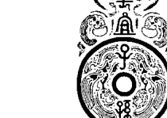
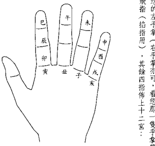
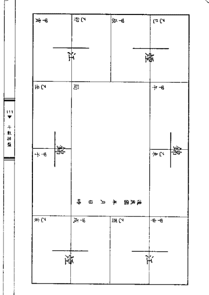
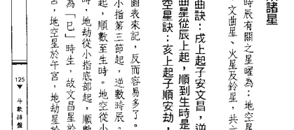
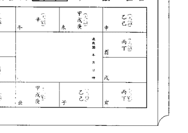
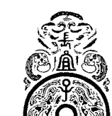
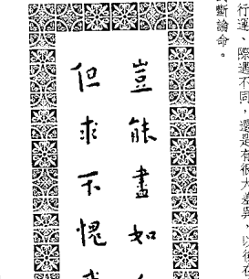

# 紫微斗数

# 进阶篇

陳世興著

# 【进阶篇】序

近幾年來數論命頗為風行，也帶動此類書籍之出版風潮，可以說是好現象，但對有心研習斗數者，還是有不少困擾，如：初學者大都在星曜上解釋，很少涉及星曜組合，且每本都差不多，就看誰會包裝，誰的知名度大，或誰的便宜，進階者對行運之好壞分辨，更是無從下手，是否運見化祿，就是好，遇見化忌，即為凶，那時見化祿及化忌呢？論運時，是否本命、先天就不用管？那看流年時，大運還看不看？這些問題，在坊間還是談的很少。

筆者使基礎篇、星曜解說篇、命盤解說篇、獨身篇、外遇篇一路寫下來，無非希望研讀者建立完整之斗數學習系統，雖然因學佛中斷了執業幾年，相信用心的讀者一定有些收穫。

藉此修訂之際，筆者將基礎篇、星曜解說篇重修編排，「入門篇」僅提供簡易排盤，對枯祿、繁瑣、難落伍之概論，五術概說及斗數排盤保留至「進階篇」，並擴充星曜之解說，以利初次接觸斗數者研習。

# 「進階篇」

醒思議，就是針對斗數有深厚興趣，想要學對斗數者所閱讀。讀者最好已研讀「入門篇」、「解盤篇」，甚至「觀身篇」、「外遇篇」，這條路數要學得好，除修五行一定要弄懂，甚至懂一些易經基本卦理，也都是必要的。因此，筆者花了很多篇幅介紹陰陽五行，希望讀者耐心閱讀。

五衛概說是概念性的介紹陰陽、醫、命、相、卜，不僅於僅斗數而針對其他術數完全不知，這樣會鬧笑話，筆者人不清楚。總之應該知道，所以您的程度既已到「進階篇」，對五衛有常識，也是必要的。

電腦排盤實在太方便了，不管某案或職業，幾乎都已人手一機，很少人在用人工排盤，甚至上課也不教排盤，直接按星性說起，甚至直接在手指上指出。因為一個個聽講解，希望每個人都能用手排盤，筆者為何還要費周章，舉實例，一個個講解，因為僅排盤，您就無法掌握星曜的分佈原則。例如天府在福德宮，一定是會紫星，七殺星一定在遷移宮，破軍星一定在夫妻宮，為何卯、酉時生人，身宮會在遷移宮同宮，寅、申時生人，身宮會與官祿宮同宮，會不會排盤，就像練習站樁、蹲馬步一樣，很強調乏

味，但功夫好不好，就在這裏，希望讀者不要偷懶，一分耕耘，必有一分收穫。

十二宮說明，是本書的重點，筆者將以實例說明。十二宮可能面臨的問題，每一年不限一個宮位，字數均以篇幅結束。第二節專談身宮，一般我們常會限於這些問題：同生辰八字，命運是否會相同？不如遲好？富貴、貧賤是否天命？雖然有很多立論，但沒有實例佐證，總缺乏說服力，所以筆者找了很多實例，試者從命宮特性，來說明命理之看法。

「同卵生子，命運卻相同嗎？」這兩個問題都有人說，筆者舉了幾個實例，不同父母又區分為同性別與不同性別；雙生子有同卵、異卵之別，同卵即幾乎相同，且實例較少，筆者也未探討。其卵生未造成血型、相貌、個性、命運之不同，命盤卻又相同。那麼如何推論？

「命不怕運來磨，或運來磨不如遲好？」這兩個問題都有人說，筆者舉了幾個實例，來說明一個好命的運來磨：「亦舉了行運不見化忌星，甚至化祿星，卻倒閉，散盡家產之實例，以佐證運許不一定成功。

「富貴、貧賤是天命決定？」在舊書方面，筆者舉了二位將軍，一位部長級官員

# 【目錄】

# PART I 基礎加強

- 壹：陰陽五行概論
- 陰陽五行統說
- 陰陽五行之由來
- 陰陽本義
- 五行本義
- 木之本義
- 火之本義
- 土之本義
- 金之本義

說明其書格所在：在有弊鬥風（賤狠難騷）方面，提供了三位因刑案入獄之男命個案，及二位大專女生從事情色工作之特例，以探討命理之看法；在長壽方面，筆者舉了虛雲老和尚（一百二十歲）及另一位財經長者（現齡九十歲）給讀者研究，為何他們長壽。在殘疾方面，則提供三位小朋友分別是出生三天即腦部開刀、母親腦血亡故，緊急搶救，因缺氧過久而智能不足，住在安養中心；及七歲得血癌，換了骨髓，又再復發之個案，他們命中是否注定如此？其餘各宮，筆者在論命，教學之暇，一定儘快完成。讀者若有寶貴意見，歡迎來函或來電指正，最後謝謝所有直接、間接幫助此書問世之貴人，及您的捧場。

- 地址：臺北市中山區中原街22號2樓之2
- 電話：(02) 2588 2347
- 懺悔斗室網址：home.PChome.com.tw/life/3Lotus

辛巳 毅雨 陳世輿於懺悔斗室

# 壹：斗數排盤

- 排盤前準備 七九
- 生年之干支換算 七九
- 生年干支之取法 八十
- 陰月問題 八一
- 國外出生之生辰 八四
- 生時定法 八五
- 排命盤 九一
- 換算農曆生辰 九一
- 安命宮 九二
- 安十二宮 九三
- 求十二宮之天干 九八
- 起五行局 一〇三
- 起紫微星 一〇五
- 起紫微星 一一三

# 貳：五術概說

- 何謂五術 六三
- 山 六四
- 醫 六五
- 命 六六
- 相 七二
- 卜 七六

- 水之本義 三八
- 五行相生相剋 四二
- 干支與五行關係 四六
- 地支之含意 五一
- 八卦簡介 五四
- 釋干支名 六十

## PART I 基础加强

## 壹、命身宮

同生辰八字，命運是否相同？

- 不同父母，但同性別 - 六一
- 案例一 - 七二
- 案例二 - 八三
- 不同父母，不同性別 - 八九
- 案例三 - 九五
- 案例四 - 九八
- 同父母之雙生子 - 一〇五
- 案例五 - 一二三
- 案例六 - 一二四
- 命好不怕運來磨，或命好不如運好？ - 一五八
- 案例七：（殷實） - 一五八
- 排紫微星系諸星 - 一一六
- 定天府星系諸星 - 一一九
- 排天府星系諸星 - 一二〇
- 安月系諸星 - 一二五
- 安日系諸星 - 一三一
- 安時系諸星 - 一三三
- 安年支系諸星 - 一三五
- 安年干系諸星 - 一三八
- 其他星曜 - 一四二
- 起大限 - 一四八
- 起小限、流年 - 一四九
- 小兒童限 - 一五〇
- 流年斗君 - 一五〇
- 顛旺利陷表 - 一五〇
- ▲案例八：（小康） - 一二八
- ▲案例九：（小康） - 一二三
- ▲案例十：（破産） - 一二六
- 富貴、貧賤、天壽、命定 - 一二六
- ▲案例十一：（朱建） - 一二七
- ▲案例十二：（吳榮） - 一二九
- 邪念女孩 - 一四〇
- ▲案例十三：（歐陽寶） - 一四〇
- ▲案例十四：（徐國） - 一四七
- ▲案例十五：（殺人） - 一四九
- ▲案例十六：（賭徒） - 一五一
- ▲案例十七：（掌權小人） - 一五三
- 青天無笑 - 一七三
- ▲案例十八：（虛雲和尚） - 一七五
- ▲案例十九：（高齡九十） - 一八八
- ▲案例二十：（陰部洞穴） - 一九〇
- ▲案例二十一：（婦病不定） - 一九四
- ▲案例二十二：（血痣） - 一九八

## PART I 基础加强



#### ※紫微斗数与阴阳五行

紫微斗数在中國傳統五術中，算是比較晚集構完成的。當時的命理主流是「八字」、「四柱推命」，僅懂數字，大都用來擇吉。當然對陰陽五行，易經八卦，河洛理數也都不陌生，因此，紫微斗數就借用了很多用語及觀念。例如五行相生剋，二長生，藏干，將前神煞星，甚至有奇門遁甲、地理風水之名詞，如天羅、地網、天門、雷門、命主、身主……等等。如果真有心於斗數研究探討，陰陽五行是不可不知的：對易經八卦，至少也要能有基本的認識，筆者會在適當章節中，為諸位介紹。

##### ※阴阳五行概说

中華文化可以說是不折不扣的「陰陽五行文化」。或許您會不以為然，但當您瞭解了陰陽五行，易經八卦之原理後，自會恍然大悟。原來中國天文學、音樂、美術、工藝、醫學、武術、建築、食、衣、住、行，乃至典章制度，無一不有「陰陽五行」之影子，可以說日用而不知。在「君權神授」的時代裏，掌握新政權者，希望能針對兩件時空改變替換，故至

## 壹、阴阳五行概论

很多人不解，紫微斗數才要懂「陰陽五行」，不是學八字、地理才要懂「陰陽五行」嗎？紫微斗數不是把星曜賦性弄懂，就可以知吉凶禍福嗎？正因為要瞭解星曜賦性，才須要介紹「陰陽五行」，蓋每一顆星曜都有其陰陽五行，星曜之賦性與其陰陽五行息息相關，只有清楚掌握陰陽五行，方能把住星曜賦性之要旨，且三方四星群會合之變化、格局之形成，也都與陰陽五行脫不了干係。如果不懂陰陽五行，光會背誦賦文，星曜性質就會死記死背，且會死在言下，不能活潑運用，在斗數上，有番見地，是很難的。筆者在導讀入門篇中，曾概論述陰陽五行之義，因為入門著，不便詳論，請諸者既有興趣再問進階書，就是有心人，希望耐心瀏覽，打好基礎。

# ※陰陽五行之由來

自民國十二年，梁啟超先生於東方雜誌第二十卷第十號，發表「陰陽五行說的來歷」一文以來，即引起學術界廣泛探討。根據王夢鶚先生所著「陰陽五行家說考」，對「陰陽五行」之由來與發展，我們可以提出如下的推論：

一、陰陽五行（易經八卦亦然）是先民觀察大自然現象、發現人爭與大道有某種程度的關聯、試圖建立一套天人關係，以對浩然未知的將來（或當蓄知識，）

有力的支持點，遂以「五德終始說」之五行相生、相勝（剋）原理，說明朝代更替是順天應而行的，如秦始皇就以秦朝屬「水德」；即至民國成立，也曾以象徵五行之五色旗當國旗。在順應天理方面，帝王必須順著天時，在明堂中穿著不同顏色的衣冠，使用不同顏色的器具，出外則搭乘有顏色的車馬，在同中不同的節令，禮拜與時令相應的神祇，如立春時，向東的地方，禮拜青帝青陽之神，並詔造祭李節應行之今令，您說影響深不深嗎？

知識份子無不通曉陰陽五行、易經八卦之理，董仲舒以陰陽之觀念治公羊春秋，諸葛孔明以太乙數著稱；隋朝國師蕭吉著有「五行大義」一書；唐李靖大將軍向太宗說：

> ……共讀古道也，托之以陰陽術數，則知變態，無不可厄也。

唐代為我國文化之鼎盛時期，術數人才輩出，如李淳風之於天文學，孫思邈之於醫學，楊筠松之於堪輿學；至宋朝則有陳摶（陳希夷）道長象徵微斗數；周敦著太極圖說；邵雍著皇極經世；朱熹等理學家亦專研之；元耶律楚材據傳亦深諳奇門易數；劉伯溫、清陳素庵、民國陳立夫先生，莫不是陰陽五行、易經八卦之名家。

在上行下效的推動助潤下，「陰陽五行」已深植民心，如「左青龍、右白

常識無法解釋之異常現象，提出預測或解決避免之道，以求得今生之富貴榮昌，或後裔之成功成風。此種觀天，進而研究之、順應之的情形，曾留存於於古文明文化中，如西洋巴比倫占星學、埃及法、馬雅文化、古印、皮卜達、古星……等。

> 易經繫辭曰「古者包羲氏之王天下也」，即仰則觀象於天，俯則觀法於地，觀鳥獸之文，與地之宜，近取諸身，遠取諸物，於是始作八卦，以通神明之德，以類萬物之情。

二、陰陽與五行本是兩個獨立的系統，肉眼所能看到的星體，除了日月外，就是金星、木星、水星、火星、土星，合稱七曜。日代表太陽，熱寒暑、虛夜……等，五行就代表五種基本元素，五種物種，又與五穀、五音、五味、五色、五官、五臟……產生相對關係。此七大星體在先秦時，決定了大部份的人關係。隨著科技的進步，人們所能觀察的星體就更多，因此，術數的重要卻還都在漢唐之後。

三、鄒衍將陰陽五行學說融為一體，並依氣候之更迭訂定曆法，創生相執之理，並進而提出「五德終始學說」，以說服國君行政愛民，查職儒家「仁義」學說與墨家「節儉」之理。

四、戰國燕齊海上之方士，將陰陽五行消息之理，融入自己之術數中，如巫現、龜卜、候星望氣、兵機聲光之流，成「八卦數」、「九宮數」，至此命理五術即以「陰陽五行」而發展出個別體系。

五、漢儒及後世儒者，亦都以「陰陽五行」之理詮釋古籍五經，其中以董仲舒之春秋繁露學者，而漢儒對此亦有如下之記載

> 「曆書者，序四時之位，正分至之節，會日月五星之辰，以考寒暑殺生之實。故祭立曆數，是以統服色之制，又以探知日月之星會，凶明之會，吉凶之義，此聖人知命之術也」

所以士大夫在論著中，亦常雜「陰陽五行」之理。

六、如前所述，古於上位者重陰陽五行之理，在下位者更受各方陰陽五行相生、相剋之法影響，於整個中華文化都深受其影響。

七、五四運動後，打倒孔家店，線裝書被丟去毛坑裡，說譯書，似乎康德、黑格爾、佛洛伊德、尼采、笛卡兒，才是王道。陰陽五行學說、孔子思想都落伍了，往好處看，陰陽五行被應用的情形得以改善，但陰陽五行行，易經中，安定人心、規範行為之效也一併淹沒。希望大家能正確認知陰陽五行，易經之理，恢復固有文化，重建倫理秩序，以渙除社會亂象。

# ※阴阳本义

> 「阴阳为天地间化育之两大力力，亦可说是两种相反相成之基本元素，视之不见，转之无物，在中国则称为「气」。（罗桂成著《唐宋阴阳五行论集》第二十页）。易经系辞云「一阴一阳之谓道」不管是天道、地道、人道，皆秉乎阴阳之互为作用，而生万物。易经系辞又云：「是故有太极，是生两仪，两仪生四象，四象生八卦。八封定吉凶。」

阴阳虽然是两对立之名词，却是「体」之两面，一直生生不息，不停的披消我长。表为阴，裏即为阳；表为阳，裏则为阴。此观为阴，彼观则为阳。所以「阴」「阳」是物象时之表徵，可以相对论视之，而非绝对的三个独立个体，分别说，只是方便了解而已。

1.  晨昏：「阳」表晨光、白天；「阴」表黄昏、夜晚。
2.  明暗：「阳」表光明、明亮；「阴」表黑暗、昏昧。
3.  冷热：「阳」表太阳、暑热；「阴」表月亮、寒冷。
4.  冬夏：「阳」表夏季、暖和；「阴」表冬季。
5.  南北：「阳」表南方、暖和；「阴」表北方、酷寒。
6.  奇偶：「阳」为奇数；「阴」为偶数。
7.  动静：「阳」表动作、发挥；「阴」表静守、蓄积。
8.  刚柔：「阳」表刚健、豪迈；「阴」表柔韧、婉约。
9.  表急：「阳」表急速、短皙；「阴」表缓慢、持久。
10. 表里：「阳」为表，为用；「阴」为里，为体。

当然阴阳还有很多表微，如：雌雄、大小、善恶、抑扬、虚实、顺逆、左右、先后、君子小人，凹凸、向背...皆是。总之，万物皆由阴阳构成，除开子、阳离子），且时在变化作用（变易）。阴盛则阳消，阳消则阴息（不易），能够仅阴阳消息作用，读者一定要熟记，凡是属「阳」者都有刚健、急速、明斗数星曜皆分阴阳消息，读者一定要熟记，凡是属「阳」者都有刚健、急速、明

# ※五行本義

前述陰陽五行學說之創立，是源自於先民對日月星辰運行之觀察，所以與五大行星及冷熱寒暑之季節變化有絕對關係，而其觀察地域不出中原地區（陰陽家始祖鄒衍為山東人，少數老祖陳希夷為河南人），因此，理論之建立自有其地域限制，諸者不可不察，如南半球北方溫暖，南方寒冷；冬季炎熱，夏季嚴寒，天上星象亦不同，故陰陽五行、易經、八字、斗數、紫微數，頂多適用於此半球。造化元鑰：「五行者，春夏秋冬之氣候也，流行於天地之間，循環不斷，故謂之行。」

董仲舒云：「天地之氣，合而為一，分為陰陽，判為四時，列為五行。」白虎通義：「五行者何謂也？謂金木水火土也。言行者，欲言為天行氣之義也。」五行起於寒暑冷熱變化，而後配合以地理五方（東西南北中），又以其抽像性質表五常（仁義禮智信），再類推為五臟（心肝脾肺腎）、五色（青黃赤白黑）、五味（酸苦甘辛鹹）、五音（宮商角徵羽）、五獸（眼耳鼻口舌）、五志（怒喜思憂恐）……等等。木火土金水，為五種常見之物質。我們依五物理特性及其常受前后變化，來說五行之本義及有關之星曜特性。

## ◆木之本義

說文解字：木，冒也。冒地而生，東方之行，從中，下象其根。」禮記：「春之為言，蠢也。蠢萬物者也，其位直方。」春天氣候陽和，萬物蠢動，樹木百卉破土而出，發芽吐穗滋長，所以「木」

就代表著『春天』，也象徵生命從呱呱墜地到青少年這個成長階段。
以中原地觀之，東方、南方林木相對繁盛，草木盎然生機，因此，又以『木』
配東方；另外太陽從東方升起，東方也充滿生機，所以『木』有生生不
思之『仁』意，有道是『草木不仁』。這足以說明『木』之『仁』性。
在中醫以『木』表肝臟、筋、爪及雙目，又表示酸味。黃帝內經素問：『東方生
風，風生木，木生酸，酸生肝，肝生筋，筋生心，肝主目。』又云：『神在天為風，在
地為木，在體為筋，在色為蒼，在音為角，在聲為呼，在變動為握，在竅為目，
在味為酸，在志為怒，怒傷肝，悲勝怒；風傷筋，燥勝風；酸傷筋，辛勝酸。』
肝臟之英文為（LIVER），是唯一有再生能力之器官，是否與生生不息、生
命力之木性相應呢？
總之，『木』代表生長、坐習、延伸。主星五行屬木者，有天機、貪狼兩
星，四化星中有化權星，這三顆星於命身、官祿宮，大都樂於學習新知，有求知

成
天樞屬陰木，是花草、灌木，不像貪狼屬陽木，是喬木、大樹。因此，貪
狼星坐命身者，通常較天樞星坐命身者高大，有體力。
天樞星屬『陰』，較沉靜、內斂、專注。其學習內容偏重思維、分析、較細
緻，神經質，如文學、哲學、理學、數學、心理學……等；三方見紫微、陀羅、化
權星，易成該領域之專家、學者。
貪狼星屬『陽木』，較活潑、外向、好表現，其學習內容偏重實用、新知、較
浮華，不夠踏實、對純理論、枯燥者沒有興趣；擅於活用、舉一反三，現學現
賣；不見紫微、陀羅、化權星，缺乏耐性、韌性，若不見天梁星主貴，所學無非求
名求利、圓滑世故、口說之資，見文昌、文曲星，可坐天地、地劫星災厄化解，或
精神領域發展。
化權星屬『陽木』，擁有強烈之上進心、企圖心，樂於學習成長、事業有
成，位居要津。能夠錢而不珍吝到頭上、博士，大都命身、官祿宮見本命化權
星，或見遷移之化權星，都是有權勢者，此時，化權星可解為『權星』，有授權之# ◆火之本義

說文解字：「火，熾也。南方之行，炎而上，象形。」《白虎通》：「火之為言，化也。陽氣用事，萬物變化也。」

炎炎夏日，氣候炎熱，萬物於夏季迅速茁壯，開花、結果，將大地妝扮得最璀璨，最光彩奪目。此時也是昆蟲、細菌活動力最強的時刻，所以「火」代表夏天，也象徵生命中最富活動力之青年階段。

由中原地區往南行，綠度愈高，溫度愈高，所以「火」主南方。

造化元鑑：「炎炎真火，位居南方，故火為明之理，輝光不久。」全要伏藏，故明無不照之象。火以木為體，無木則火無所附麗。「可知「火」性體本等，不斷燃燒，放出光和熱，如果不適時補充燃料，就立即瞬間失去其性。所以「火」有積極、活潑、熱情、短暫、不耐靜，喜歡自我表現，注重外在之表象，光明磊落之個性，有「禮」之象徵。

「火」燃燒起來一片通紅，所以表紅色。

中醫以「火」表心臟、血脈、舌、苦味……等。

> 《黃帝內經》問：「南方生熱，熱生火，火生苦，苦生心，心生血，血生脈，其主在熱。在地為火，在藏為心，在色為赤，在音為徵，在聲為笑，在變動為憂，在竅為舌，在味為苦，在志為喜。恐傷心，熱傷氣，寒勝熱，苦傷氣，鹹勝苦。」

主星中太陰屬陰火，寡宿屬陰火，都連禮儀，注意形象，利於服侍人。性格子也較急，三方不宜會火星、鈴星，否則易有心腦血管疾病。

太陽屬陽火，個性較直率，熱情大方，脾氣也較大，來得快，去得也快，喜歡在群眾中發出光熱，讓別人看得到，重名利於，是很好的領導幹部，或公眾人物。

寡宿屬陰火，與人應對進退有一定之禮儀，較能抑自己的感情，較意外表不平靜，內心可在乎的很低，重感情，易鑽牛角尖，不像太陽星那麼乾脆，會內心煎熬，適合常公關、或從事帳務工作，業務……等。

###### ◆ 土之本義

說文解字：土，地之吐生物者也。二，象地之下、地之中物出形也。「得居樞之正氣，含黃中之德，能育萬物。」

造化元編：土者，在四時交脫之際，春季木氣未盡，火氣已至；夏季火氣未盡，金氣已至；秋季金氣未盡，水氣已至；冬季水氣未盡，木氣已至；綜之，四季皆有土，為季節更迭之過程。

「土無定位，居中央而管四隅。」中原地區多是黃土，不管是黃土高原、華北平原、黃淮平原，黃河孕育了中華文化，所以「土」表中央，而自居「中土」人士。

「惟土至信，厚重寬博、無所不容，水附而行之，木賴土而生，火金得土而無自，火得晦而無明，水附而行之，木托土而生，柔得土而無自，火得晦而無明，故五行皆賴土也。」土的性質就是如此

地空、地劫、火星、鈴星也都屬火，亦有躁動、不安定的特質。地空、地劫星比較偏重於精神，思想上之浮動，好務是虛榮表現、巧思不斷、推陳出新……等，不好時會天馬行空、胡思亂想、朝令夕改、不安現狀、打高空、過度理想……等，或主觀、分離、如親情緒淡薄、工作不穩定、錢財不聚……等，視宮位而定之。總之，地空、地劫星沒有直向的衝擊，會具體呈現其力量。火星屬陽火，其力量最猛烈，如汽油瞬間爆發，表突發、衝動、性急、暴躁、視主星而有差異，可解釋為積極、主動、活潑、外向、閒不住、三分鐘熱度、急功近利、衝動……等，鈴星屬陰火，其力量略遜於火星，如炭火持續加熱，如果火星是狂笑、鈴星就是冷笑；火星是直接開罵，鈴星就是譏刺、中傷；火星是嚎啕大哭，鈴星就是暗自飲泣；火星是大量出血，鈴星就是微血管破裂……希望讀者能夠引申。現在運程自我表現，反應要快，才容易出人頭地，還容易見火星鈴星者，就比別人多了表現機會。天魁、天鉞星也屬「火」。不過不像火鈴星那麼活躍、躁動，反而表現出注重儀表、禮儀、威儀，這當然和星曜之主司何事有關。要上得了檯面，能被提拔、賞識、有主官架勢、儀表非凡，都有賴魁鉞星之會照。

# ◆金之本義

> 許慎云：「金者，禁也。陰氣始起，萬物禁止也。」

> 屍子云：「秋，肅也，萬物莫不肅敬恭止，禮之主也。」

高商巨賈類多。天梁星也屬陽土，但不主富或貴，個性磊落，很有理想性、多往學術、研究、專業領域發展，不專搞束嘮嘮不休論命。命宮見此星都有固執己見之特質，很難說服，尤其是天梁星，還會紫微。天府、天梁都屬陽土。紫微因屬「陰」，較內斂，有不怒而威之氣勢，個性也較不活潑，缺乏一股親和力，但多了些距離感、穩定，屬累積漸進型，除非見空劫刑曜。命宮見此三星，大都是國字、方臉、身材也多厚實。主事業化祿，祿存這兩顆星都是陰土，祿存星主財祿、保存；化祿則是進祿、主動出擊而獲得，一動一靜，只見祿存而無化祿，未必有「祿」可「存」；只見化祿星而無祿存星，可能留不住，所以喜歡「雙祿交馳」。

炎夏過後，天氣轉趨乾爽，陰消陽盛，萬物經過發芽、成長、茁壯過程，至此，大地呈現累積果實，大家忙著收成，也隱藏著生命由盛而衰，漸佈著凋零肅殺之氣。
其體剛健，已成形戒器，可大用而無法再生長，象徵著生命中最有作為之壯年時期。

中原以西是黃土高原，愈往西行，愈趨荒涼。「金」也代表著西方，與代表東方之「木」，一生機盎然，正好是對比，因此，東方吉祥，西方則令人敬畏，如紫氣是東來，驚鶴是西歸。
「金」以癸陰為體，中含至陽之精，乃能堅剛，獨異眾物。「金」以其性質剛毅、果決不疑，最虛而固執，故聖之以「義」，很講義氣，道義的意思。
「金」經光線照射後，其反射光為「白」，在五色中屬「白」而非「黃」。
中醫以「金」表肺臟、皮、毛、鼻及辛味……等。
黃帝內經問：「西方生燥，燥生金，金生辛，辛生肺，肺生皮毛，皮毛生腎，肺主鼻。其在天為燥，在地為金，在體為皮毛，在藏為肺，在色為白，在音為商，在聲為哭，
在變動為欬，在竅為鼻，在味為辛，在志為憂。喜勝肺，喜傷肺，熱傷皮毛，寒勝熱，辛傷皮毛，苦勝辛。」

「金」有剛毅、執著、殺戮……等特性，因此，不利六親緣份，不常見於父母、六親、疾厄、妻宮。行運逢「金」的星曜，都要特別留意，如變動或刑傷。
「金」性不活潑，大都冷靜、理智是冷酷，不熱於表達自己之情感，有堅抑之傾向，令人覺得生畏。行事膽大、果斷，利於消耗體力之工作，如軍警、技工、運動員……等，不好的組合，就是殺手、盜匪、大哥。
七殺屬陽金，武曲屬陰金，雖然有陰陽之別，但都具剛毅、不多話、不輕言自已之隱私。七殺比武曲有殺傷力及「孤剋」性，更主開創、變動、冒險。屬金與屬土之星曜都較固執己見，很難說服。
擎羊屬陽金，主刑傷、剛毅、果斷、陀羅屬陰金，主遷延、暗耗，陀羅屬陰金，擎羊、陀羅都可主刑傷、慢性病、疼痛則屬陀羅。擎羊陀羅可主刑傷、擎羊是禍、意外刑傷屬擎羊，但沒有孤剋，理還亂、放不下……等。
慧劍斬情絲：陀羅雖是剪不斷，理還亂，放不下……等，文昌星也屬陰金，但沒有孤剋，刑傷這特性，而有專注學習之特點，是最難

# ◆水之本義

> 白虎通義：「水位在北方，北方者，陰氣在黃泉之下，任養萬物，水之為言，濡也。」

> 戶子云：「冬，終也。萬物至此終藏也。」

> 春秋元命苞曰：「水之為言演也。陰化漚濡，流施行也。故立字，兩人交，一以中出者為水。一者，數之始；兩人，譬男女，陰陽交以起一也。水者，五行始焉，元氣之湊液也。」

西風轉為北風，故冷氣團直趨而下，大地龍蟄在暖的土壤中，萬物生機俱失，靜養以待來春，故「水」以寒性表冬。這是生命之最後歸宿，也是智慧圓融的象徵。

冬愈北方愈冷，北國天寒地凍，積雪經年不化，所以「水」主北方。

水性流動、波動、不穩定，沒有固定形狀；水性就下，適應力強，所以主「智」。水的不穩定性，在古視為不貞之表徵，因此有「水性楊花」之諺。水的表面清澈，但是水之極深處，卻是黝黑不見，故水主黑色。

中醫以水表腎臟、骨髓、髮、耳及鹹味。

黃帝內經素問：「北方生寒，寒生水，水生鹹，鹹生骨，生骨髓，髓生肝，肝生耳。其在天為寒，在地為水，在體為骨，在藏為腎，在色為黑，在音為羽，在聲為呻，在變動為慄，在竅為耳，在味為鹹，在志為恐，恐傷腎，思勝恐，寒傷血，燥勝寒，鹹傷血，甘勝鹹。」

土星中文屬「水」之星曜最多，如天府、破軍、陰、天同、巨門、佐輔之星之一難，可見人心多麼複雜。只是表達方式不同，陰陽五行中有一個法則，就是過與不及都是「病」，將會產生問題。所謂「過」，就是同一五行中的度曜太多，

五行所表徵之物象如左：

| 五行 | 五時 | 五氣 | 五風 | 五方 | 五色 | 五音 | 五聲 | 五味 | 五臟 | 五體 | 五榮 | 五竅 | 五志 | 五常 |
|------|------|------|------|------|------|------|------|------|------|------|------|------|------|------|
| 水   | 冬   | 寒   | 北風 | 北   | 黑   | 羽   | 呻   | 鹹   | 腎   | 骨髓 | 髮   | 耳   | 恐   | 智   |
| 金   | 秋   | 燥   | 西風 | 西   | 白   | 商   | 哭   | 辛   | 肺   | 皮肉 | 毛   | 鼻   | 憂   | 義   |
| 土   | 長夏 | 溫   | 中央風 | 中央 | 黃   | 宮   | 歌   | 甘   | 脾   | 血脈 | 唇   | 口   | 思   | 信   |
| 火   | 夏   | 熱   | 南風 | 南   | 赤   | 徵   | 笑   | 苦   | 心   | 筋   | 爪   | 舌   | 喜   | 禮   |
| 木   | 春   | 風   | 東風 | 東   | 青   | 角   | 呼   | 酸   | 肝   | 爪   | 目   | 目   | 怒   | 仁   |

丁，如太陽、廉貞屬火，就不宜再見火鈴星，七殺、武曲屬金，就不利會合羊、陀羅，同理，屬水之星，再多逢文曲、右弼，就易惹生感情困擾。屬水之星也不利會照火鈴星，都會產生衝激、變動，如衝突，情緒反應等。屬水的星曜，或有沉靜之外表，但內心多思慮，變動，就像平靜的水面，底部可能暗潮洶湧。

天相、天同均屬陰水，有較強之親和力，利於主動活絡人際關係，破軍、太陰、巨門屬陰水，卻比較內斂些，也不易表明意圖。文曲星多浪漫、感性，有濃厚之藝術色彩，文學、音樂、美術、才藝、多涉獵、放縱、多情宮，主感情豐富、多情。鈴星主親和性佳，多助力。右弼星特別利夫妻宮，主感情豐富、多情。天姚星，再逢紅鸞、天喜、咸池、天姚主多情，一生多感情事故。化科星主權智；化忌星主困頓，是真正的惡水，若不見擎羊、陀羅、火星、鈴星，就不致有大禍害。

###### 五行相生相剋

金木水火土五行，原本只是單純的表徵，以與天上之五星相呼應（即觀察的結果），五行間本無相生或相剋之理，後陰陽家將五行抽象化，形成術數之理論，陰陽五行之相生、相剋原理，始成為解釋宇宙萬物生滅之原動力及自然法則，集其大成者，即陰陽家始祖一行先生。

五行相生：木生火，火生土，土生金，金生水，水生木，木又再生火，依次循環不已。

五行相剋：木剋土，土剋水，水剋火，火剋金，金剋木，如此相互牽制、制衡。

我們可以簡單的圖來表示其相生、相剋關係：

外圍之圓形，即相生之次序；內圈成星狀之像，即相剋、相勝關係，彼此剛好隔一位，如金隔一位（水）後為木，所以金剋木，同理，火隔一位（土）後為金，因此火剋金。

五行的相生、相剋（勝）道理，一般都以物質之物理持性解釋，如下：

水生木：水為生命之始，有水處，即可見花卉樹木滋生，花卉樹木賴水面得生長、茁壯，因此，水生木。

木生火：火只是燃燒之現象，需要木來助燃。在遠古時代，沒有汽油、煤油，火的生成大都來自鑽木，或木炭，是故，木生火是極易理解的。

火生土：火是火焰之現象，當成為火焰時，終究回歸大地，土可以說是火的歸宿，如火山爆發後，岩漿冷卻，即成新生土壤。

土生金：金屬礦物大都蘊藏於地下，岩石中，透過開採、陶洗、冶煉即能「點石成金」。

金生水：「金生水」這個相生關係是比較不易理解的。春秋、戰國時期，冶煉技術已十分發達，從刀劍、青銅之出土，即可見一斑。金受高溫熔冶，即形成流動之液體，也可視為「金生水」。

「水」其實不一定就是指流水、湖水、江洋，只要物質呈現液體、流動之狀況，就是「水」。「金」也未必就是金屬，凡是固體，堅硬可攻物者，都可說是「金」，如此。「冰」也是某種程度的金，因此，冰融化成水，也頗符合，金生水之道理。

-   木剋土：植物之根莖，能夠輕易深入土壤中。
-   土剋水：俗語「兵來將擋，水來土掩。」土有阻絕、是防水水橫流功能。
-   水剋火：失火時，第一想到的就是水，無庸置疑的，水當然剋火。
-   火剋金：金再如何堅硬，總抵擋不住「火」之高溫熔冶。因此火勝（剋）金。

其實「剋」並非「克」，沒有置之死地之意，而是「一種規矩」的約束，運用得當，反有發揮本性而不至過甚之功效。如木得金之砍伐、鋸切，而成有用的木器；土得水之濕潤、而有耕耘灌溉之利；火得水之退火、降溫、而能得其所哉，不至一發不可收拾；金得火之冶煉，而成為有用的器具，刀劍等。

王黎鷗先生在《鄒衍遺書考》一書中，提出以氣候之變化，來解釋五行相生，相剋之理。鄒衍行本就精於律數與測候，所以用陰陽寒暑的季節變化，來解釋相生，相剋之理，是極自然的。

「我們仍可知，五德終始的循環，是一種「往而不復」的循環，所以無論相生或相剋，都只片面的生剋，並沒有反復的生或死。這種「往而不復」的循環，所根據的原理，則又顯然出於「時間」的觀念。唯有時間，才是往而不復的。冬天之後，春天隨即而來，所以象徵冬天的「水」，會生象徵春天的「木」。「木」、「生」就是季節次第變化。同理，象徵春天的「木」，自然會生象徵夏天的「火」。炎炎夏日將要轉為暑煞，清涼的秋天，就有賴土來降溫、收斂火氣，因此，火不能直接生金，而「火生土」、「土生金」之關係：秋天之後，冬天就不遠了，所以象徵秋天的「金」，會生象徵冬天的「水」。「木」到了秋天，無生機、成凋零之象，故金剋木。「火」到了冬天，陽氣全無，成寒凍之氣，故水剋火。

###### 干支與五行關係

古人以天干、地支來記時間。天干有十：甲乙丙丁戊己庚辛壬癸，地支有十二：子丑寅卯辰巳午未申酉戌亥，組合成六十對干支，俗稱六十甲子，即六十重複一次。年、月、日、時都可以干支表示，如八十九年五月五日午時（農曆），可稱為庚辰年、壬午月、乙未日、壬午時，共有四組干支，合計為八個字，傳統命理學家據此來推斷其陰陽五行之生、克、合、刑、“害”等，這種命理方法即稱八字或四柱論命。

紫微斗數只要把年份換算成干支即可，月、日均以數字表示，不用去管是否過節氣。日子的干支為何？時間只要換算為“二小時”一個時辰，完全依太陽的天干來起時辰的天干。（以後要精算流日、流時、方須考慮天干）如前面之生辰，我們記成庚辰年、五月五日、午時生即可。

民國或西元如何換算成干支呢？請看「六十甲子與民國對照片」。

1.  西元減一九一一即民國年份，如西元二〇〇〇年減一九一一，即民國八十九年。
2.  六十年重複一次，所以民國八十九年與民國二十九年同為庚辰年。
3.  納音是指該組干支之五行。斗數是以命宮之干支的「納音五行」來起五行局，而非以出生年干支。請留意：稍後會在排盤中說明。
4.  陽天干配陽地支，陰天干配陰地支，如甲子、乙丑不會有甲丑、乙寅之干支。

每一個五行都有陰陽之分，奇數為陽，偶數為陰。
陽天干：甲（木）、丙（火）、戊（土）、庚（金）、壬（水）。
陽地支：子（水）、寅（木）、辰（土）、午（火）、申（金）、戌（土）。
陰地支：丑（土）、卯（木）、巳（火）、未（土）、酉（金）、亥（水）。
十天干與十二地支之陰陽五行關係如下：

| 五行 | 五方 | 五色 | 地支 (陽) | 地支 (陰) | 天干 (陽) | 天干 (陰) |
|---|---|---|---|---|---|---|
| 木 | 東 | 青 | 寅 | 卯 | 甲 | 乙 |
| 火 | 南 | 赤 | 午 | 巳 | 丙 | 丁 |
| 土 | 中 | 黃 | 辰戌 | 丑未 | 戊 | 己 |
| 金 | 西 | 白 | 申 | 酉 | 庚 | 辛 |
| 水 | 北 | 黑 | 子 | 亥 | 壬 | 癸 |

###### 六十甲子與民國對照表

| 民國 | 干支 | 納音 | 民國 | 干支 | 納音 | 民國 | 干支 | 納音 |
|---|---|---|---|---|---|---|---|---|
| 13 | 甲子 | 海中金 | 14 | 乙丑 | 海中金 | 15 | 丙寅 | 爐中火 |
| 16 | 丁卯 | 爐中火 | 17 | 戊辰 | 大林木 | 18 | 己巳 | 大林木 |
| 19 | 庚午 | 路旁土 | 20 | 辛未 | 路旁土 | 21 | 壬申 | 劍鋒金 |
| 22 | 癸酉 | 劍鋒金 | 23 | 甲戌 | 山頭火 | 24 | 乙亥 | 山頭火 |
| 25 | 丙子 | 澗下水 | 26 | 丁丑 | 澗下水 | 27 | 戊寅 | 城牆土 |
| 28 | 己卯 | 城牆土 | 29 | 庚辰 | 白蠟金 | 30 | 辛巳 | 白蠟金 |
| 31 | 壬午 | 楊柳木 | 32 | 癸未 | 楊柳木 | 33 | 甲申 | 泉中水 |
| 34 | 乙酉 | 泉中水 | 35 | 丙戌 | 屋上土 | 36 | 丁亥 | 屋上土 |
| 37 | 戊子 | 霹靂火 | 38 | 己丑 | 霹靂火 | 39 | 庚寅 | 松柏木 |
| 40 | 辛卯 | 松柏木 | 41 | 壬辰 | 長流水 | 42 | 癸巳 | 長流水 |
| 43 | 甲午 | 沙中金 | 44 | 乙未 | 沙中金 | 45 | 丙申 | 山下火 |
| 46 | 丁酉 | 山下火 | 47 | 戊戌 | 平地木 | 48 | 己亥 | 平地木 |
| 49 | 庚子 | 壁上土 | 50 | 辛丑 | 壁上土 | 51 | 壬寅 | 金箔金 |
| 52 | 癸卯 | 金箔金 | 53 | 甲辰 | 覆燈火 | 54 | 乙巳 | 覆燈火 |
| 55 | 丙午 | 天河水 | 56 | 丁未 | 天河水 | 57 | 戊申 | 大驛土 |
| 58 | 己酉 | 大驛土 | 59 | 庚戌 | 釵釧金 | 60 | 辛亥 | 釵釧金 |
| 61 | 壬子 | 桑柘木 | 62 | 癸丑 | 桑柘木 | 63 | 甲寅 | 大溪水 |
| 64 | 乙卯 | 大溪水 | 65 | 丙辰 | 沙中土 | 66 | 丁巳 | 沙中土 |
| 67 | 戊午 | 天上火 | 68 | 己未 | 天上火 | 69 | 庚申 | 石榴木 |
| 70 | 辛酉 | 石榴木 | 71 | 壬戌 | 大海水 | 72 | 癸亥 | 大海水 |## 表：● 地支之含意

地支有十二，既可表十二时辰、十二月份、十二生肖，亦表八个方位，如左

| 地支 | 生肖 | 时间换算 | 月份 | 节气 | 季节 |
|------|------|----------|------|------|------|
| 寅 | 虎 | 03~05 | 1 | 立春 | 春 |
| 卯 | 兔 | 05~07 | 2 | 惊蛰 | 春 |
| 辰 | 龙 | 07~09 | 3 | 清明 | 春 |
| 巳 | 蛇 | 09~11 | 4 | 立夏 | 夏 |
| 午 | 马 | 11~13 | 5 | 芒种 | 夏 |
| 未 | 羊 | 13~15 | 6 | 小暑 | 夏 |
| 申 | 猴 | 15~17 | 7 | 立秋 | 秋 |
| 酉 | 鸡 | 17~19 | 8 | 白露 | 秋 |
| 戌 | 狗 | 19~21 | 9 | 寒露 | 秋 |
| 亥 | 猪 | 21~23 | 10 | 立冬 | 冬 |
| 子 | 鼠 | 23~01 | 11 | 大雪 | 冬 |
| 丑 | 牛 | 01~03 | 12 | 小寒 | 冬 |

地支之五行看起来似乎有点零乱，如果我们把它表示在命盘上，就清楚多了。

一个时辰有两个小时，子时为一日之始，依序为丑、寅、卯、辰、巳、午、未、申、酉、戌、亥，请大家把十二地支在命盘的位置记清楚。

| 月份 | 节气 | 中气 |
|------|------|------|
| 1 | 立春 | 雨水 |
| 2 | 惊蛰 | 春分 |
| 3 | 清明 | 谷雨 |
| 4 | 立夏 | 小满 |
| 5 | 芒种 | 夏至 |
| 6 | 小暑 | 大暑 |
| 7 | 立秋 | 处暑 |
| 8 | 白露 | 秋分 |
| 9 | 寒露 | 霜降 |
| 10 | 立冬 | 小雪 |
| 11 | 大雪 | 冬至 |
| 12 | 小寒 | 大寒 |

一年分十二个月份，二十四节气，十五日为一中气，如立春是二月中气，雨水即一月之中气，同理，惊蛰为二月之节，春分是二月之中气；清明为三月之节，谷雨是三月之中气……等。

子时为一日之始，寅月即一年之初。夏历是以寅为起首，这当然和易经十二辟卦有些关联，我们就简介一下易经八卦。

或直接用命盘来图示，会更加明了：

| 月份 | 地支 | 节气 | 季节 | 方位 |
|------|------|------|------|------|
| 1月 | 虎 | 立春 | 春 | 东北 |
| 2月 | 兔 | 惊蛰 | 春 | 东 |
| 3月 | 龙 | 清明 | 春 | 东南 |
| 4月 | 蛇 | 立夏 | 夏 | 东南 |
| 5月 | 马 | 芒种 | 夏 | 南 |
| 6月 | 羊 | 小暑 | 夏 | 西南 |
| 7月 | 猴 | 立秋 | 秋 | 西南 |
| 8月 | 鸡 | 白露 | 秋 | 西 |
| 9月 | 狗 | 寒露 | 秋 | 西北 |
| 10月 | 猪 | 立冬 | 冬 | 西北 |
| 11月 | 鼠 | 大雪 | 冬 | 北 |
| 12月 | 牛 | 小寒 | 冬 | 东北 |

###### 伏羲先天八卦

伏羲先天八卦为“体”，讲阴阳对立、五行相克之理；文王后天八卦为“用”，讲阴阳互根，五行相生之理。（见郑景峰先生之易学十讲“八卦的剖析”）

八卦两两相叠，即成六十四卦。卦是由下往上排出，一阳爻称“初九”，阴爻称“六”。第一爻称为“初”，若是阳爻称初九，二爻是阴爻，就称六二；第六爻称“上”，若是阳爻，称上九。一个卦有六爻，一、二爻象地，五、六爻象天，三、四爻象人，女人乘天地之气而生，天地人为三才之意。

八卦布列于命盘中，即为下图：

- 子一坎、丑、寅一艮、卯一震、辰、巳一巽。
- 午一离、未、申一坤、酉一兑、戌、亥一乾。

子午卯酉四宫，各属一卦，丑寅二宫合艮卦。辰巳二宫合巽卦。未申二宫合坤卦，戌亥二宫合乾卦。

请读者将八卦位置记牢，往后在疾厄宫会用到。

八卦本就是阴阳消息之变化现象，把十二月份之寒暑变化，以卦来呈现，即成十二辟卦：

- 坤卦，纯阴之象，阳气全无，表十月，立冬。
- 地雷复卦，一阳生于地下，表十一月，冬至一阳生。
- 地泽临卦，二阳生于地，阴气渐消，表十二月。
- 地天泰卦，三阳开泰，大地春回，表一月。
- 雷天大壮，阳气上升，春雷惊蛰，表二月。

###### 文王后天八卦

###### ◆八卦简介

易经是以“—”为阳，以“--”为阴。基本八卦各由三划构成，此“三划”称为“爻”。基本八卦如下：

- ☰：乾（三连），表天。
- ☷：坤（六断），表地。
- ☳：震（仰孟），表雷。
- ☴：巽（下断），表风。
- ☵：坎（中满），表水。
- ☲：离（中虚），表火。
- ☶：艮（覆碗），表山。
- ☱：兑（上缺），表泽。

以乾、坤、震、巽、坎、离、艮、兑八卦，表天、地、雷、风、水、火、山、泽八种自然现象。每一爻又有多层象征，如乾为天外，又表父、夫、男、首领、君子、龙、晴天、高楼、宫殿、头部、肺...等。

八卦之排列，有先天（伏羲）八卦与后天（文王）八卦之分别：

###### ◆释干支名

> 商吉五行大义有如下记载：“干支者，因日竿而立之。昔者天之时，大挠探五行之情，占斗构所建，始作甲乙以名，谓之干，作子丑以名月，谓之支。有事于天则用日，有事于地则用辰，阴阳之别故。”

> 又云：“甲者，拆也，轧也，春万物皆解孚甲，自抽轧而出也。丙者，炳也，夏万物炳然著见。丁者，亭也，物之长大皆丁壮也。戊者，訐也，生长讫极，物则成皆冒前体也。己者，纪也，物既始成，有条纪也。庚者，更也，谓万物改更，有华实也。辛者，新也，谓万物成代，改更复新也。壬者，任也，任者，癸者，揆也，揆然萌芽于物也。”

> 又云：“子者，孳也。阳气既动，万物孳萌。丑者，纽也。组者，厘也。续萌而蛰长也。卯者，冒也。物牙稍吐，引而申之，移出于地也。申者，身也。物皆长大，覆冒于地也。酉者，老也。物皆熟也。戌者，灭也。物皆灭也。亥者，核也。闰也。十月闭藏，万物皆入核藏。”

由上文可知，不论十天干，或十二地支，都与四季农事变化有关。先民以农立国，自然以农作物之萌芽、出土、成长、开花、结果来领会，说明。读者如想多研究易经，阴阳五行，不妨参阅下列书籍，由于笔者才疏学浅，挂一漏万一免，名山大作若有遗漏，尚祈见谅。

###### 参考书目

- 易经杂说（南怀瑾先生著）
- 白话本易经（石川雅章先生著）
- 易学十讲（郑学嘉先生著）
- 易经的奥妙（王光汉先生著）
- 老古文化出版
- 武陵出版
- 千华出版
- 时报出版

#### ◆ 何谓五术

### 贰、五术概说

- 山、医、命、相、卜谓之五术，其功能如下：
- 山：求“神仙之术”以延年益寿，达到长生不老之理想境界。
- 医：治疗身心所患通之病痛，以恢复原有机能，遂往人生之里程利其职责。
- 命：透过生辰月日时之推断，以了解自己之优缺点，并配合五行型态之认识知所进退。
- 相：经由“观察”物象，而推知吉凶祸福，或反之（不为维破生灭八字）。
- 卜：用以决疑，并采取适当之作业，以一事一主预测吉凶或成败、得失。

- 易经与现代生活 刘君祖先生著 牛顿出版
- 神秘的八卦 曾舜光 姚伟钧 王玉德著 书泉出版
- 五行大义 萧吉撰 武陵出版
- 唐宋阴阳五行思想研究 罗桂成先生著 文源出版
- 阴阳五行家思想之述评 王震晖先生著 台湾商务印书馆出版
- 三命通会 郭为先生著 复文出版
- 穷通宝鉴 万民英著 武陵出版
- 滴天髓阐微 徐乐吾评注 武陵出版

#### ◆ 山

山就是求神仙之术，为什么叫做“山”呢？因为“仙”乃人在“山”中，古来求神仙之术者，大都往“山”中修炼。“山”就是神仙之术的代名词，有关“山”之学则大都见于道家经典中，大致可归纳为三：养生、玄典、修宝。

1.  **篇基法**：又叫天丹法，即以静坐呼吸之方法为之，类似“禅定”、“瑜伽”。
2.  **房中术**：又叫人丹法，透过异性交接之通当作为，以调和先天阴阳二气，如“素女经”所云。
3.  **食膳法**：又叫地丹法，是根据体质之强弱虚实，配合适当之饮食调理，以强健体魄，如目前流行之药膳、生槌饮食……等。

玄典是参阅“老子”、“庄子”之典籍，从中体会虚、静、无之定义，以蒙园修养之基础。修宝是修习拳法，以活动筋骨、畅通血腋为主，如太极拳、太极剑等，皆

#### ◆ 医

中医之神奇功能，虽在西风东渐之初，为知识分子所冷落，但却一直盛行于民间。直到目前中医总算抬头了，中医亦可纳入健保，广受慢性病患者在饱受西药副作用两难之余，亦有转向中医诊问之趋势，身为中国人而不接触中医，可说少之又少。

中医在治病之前，总要先诊断病情一番，即“望闻问切”四诊。“望”即先观察病人的生理表征，“闻”听病人对病情之陈述，“问”再对若干疑点询问病人，“切”最后直接触摸患者，并把其脉象，以了解“表裡”“虚實”“冷热”，根据四诊归纳出病因，再对症下药。

当然，在问诊与治疗过程，仍不脱阴阳五行之理，有兴趣之读者可自行参阅后汉张仲景所著之“伤寒论”，或“黄帝内经”。

治疗方法可分为三：

1.  方剂：即使使用药物，以药草与动物之阴阳五行属性调配，用水煎服或研磨成外敷之方法。 注重表裡、虚实、冷热，或许真的头痛医头、脚痛医脚呢！
2.  针灸：强调的是穴道，透过“金针”或“艾草”之灸烧，为以刺激调整其所司之神经系统或内分泌，负伤替麻醉药物，使开刀过程顺利并降低风险；另外以针灸来减肥、戒毒、减压均有例可考，看来中医不致湮没于科技洪流中。

其中中原以子平四柱流传最广，论述最多，近因紫微斗数漫显易懂入门容易，反有取代之势；至于果老星宗，其法类似于紫微斗数而星曜较少，语意隐晦，习者甚少，有被淘汰之虞；此法又名“星平会海”或“七政四余”（清参照明·余春台编纂之《增补月髓金书全集》一文，据李文华注释）铁板神数由于仅家传，所以外人无法一窥其奥秘，自然无法发扬光大，可叹。

#### 命

根据生辰八字，来推测人一生荣枯祸福的方法有四：

- 子平四柱
- 紫微斗数
- 果老星宗
- 铁板神数

#### 命

在明清两代之谓命者或习数理，多少都涉及到一二；因此论述及比较数多；并在明清代之谓命者或为官者，多少都涉及到一二；因此论述及比较数多；并在此基础之下衍生出斗数，所以把它当成一个数学函数亦可。
紫微斗数，亦是依出生之年、月、日、时四项因素来推算，由于斗数注重“数”，所以把它当成一个数学函数亦可。

##### 1 定十二宫

从中排出一个命盘，其顺序如下：1 定十二宫：命宫、兄弟宫、夫妻宫、子女宫、财帛宫、疾厄宫、迁移宫、奴仆宫、官禄宫、田宅宫、福德宫、父母宫、以探讨人一生所可能面对的问题。

##### 2 排星群

斗数有十四颗主星，由紫微星领头，分别为天机星、太阳星、武曲星、天同星、廉贞星及天府星系之太阴星、贪狼星、巨门星、天相星、天梁星、七杀星、破军星；另有六吉星（左辅、右弼、天魁、天钺、文昌、文曲）六凶星（火星、铃星、擎羊、陀罗、天空、地劫）相佐、及其他助星（红鸾、天喜、天姚、咸池、天刑……）

##### 3 起四化星

斗数最特殊的是，有质变之观念，星的性质会随时间之递嬗而呈现化禄、化权、化科、化忌四种修正作用，而非等颗星都有四化，于是四化星随着时间的不同就有先天四化、大运四化及流年四化组（当然指斗月、流日、还可起流月四化、流日四化，此四化就星质的改变更替，如不能把握住化化间的关系，斗数只能在平面星性上打转，不能有进步之心得。

##### 4 看格局

斗数的每一宫位代表着其特定的宫意，但是在推命时切忌单一宫位论断，它是一个结构，需两两组合（三方四正）来辅，这如同是H代表氢、O代表氧，=0，就变成“水”，有格局时，就需以格局论断，一般习斗数者，或电脑排盘，就是照本宣科，把每一颗星的赋文全部罗列下来，而没有经过组合，就形成四不像，不知该如何解说。

##### 5 定宫位

斗数虽然号称十二宫位，但是时代变迁太大，如领薪水的财与靠创业赚钱的财，定在同一宫吗？上班族的事变与自己当老

```
『(年、月、日、时) = 8 年 9 月 1 日 时 + 6 年 2 月 3 日 + ...
```

类似于：f(X, Y, Z) = ∂X/∂Y * ∂Y/∂Z * ∂Z/∂X ...

```
f(X, Y, Z) = ∂X/∂Y * ∂Y/∂Z * ∂Z/∂X ...
```

从中排出一个命盘，其顺序如下：1 定十二宫：命宫、兄弟宫、夫妻宫、子女宫、财帛宫、疾厄宫、迁移宫、奴仆宫、官禄宫、田宅宫、福德宫、父母宫、以探讨人一生所可能面对的问题。

##### 子平与斗数异同：

1.  子平法是太阳历（非阴历）重二十四节气，斗数是太乙神数，不觉节气。
2.  子平法每月的开始，是从节气之交接，而斗数是从每月初一日子时开始。如八十八年三月七日，为太阳历戊寅年正月二十一日，但正月二十日即交二月惊蛰之节气，因此，在子平法属第二月（辛卯），在斗数则以一月排定。
3.  年序之交替：斗数以正月一日子时为一年之始，而子平法即有二派之说，一为冬至日交年，因太阳从此日开始北移，另一派则为立春次年，因立春是一月之节气。
4.  子平法是宝藏，斗数是虚藏。
5.  子平法重后的机率低，斗数之同发机率高，因此，子平法说法人数之精密度，但是，相命造之命运结果还是不同。 究竟是左是不会运之因素？真的只有日月时四个时间间因素吗？
6.  论理方法不同：子平法依节气、阴阳五行相生相克来断论，而斗数是依星群组合之星、格局、四化来推论。

铁板神数：相传非常准确，可以精推至几时几分出生，并依此推一生之遭遇，如同水晶球般的精确预言，其剧本已排列成册，如该编号资料库，坊间皆可买到，但是其输入之程式软件却半不公开，因此即变得该资料库亦无法使用。 其推命法是持弄一只算盘，推论出二、三件事以求得该生之受苦分，如此按序依序推出该文之号码，而将该条文叙述进来，即个人之生死影、哥哥只能得其神技，却无法习得。可惜！因此，我们不禁思考一个问题，算命的目的是在？如果把一个人的来历，如她的描述，人的信他何在？人的容容何在？这能坦然的面对人生之种种难题吗？有兴趣者，不妨看看“了凡四训”，自有领悟。

#### ◆ 相

“命”既然是依照出生年月日时所推出，那么同时辰出生的人有什么是相同的？又有什么是不同？可能完全相同吗？至少长相不会一样，寿命不会一样，那完全不相同吗？如果是，命理也不用研究了，所以，“命”存在着那些相同的因素？又是那些因素造成同命不同结果？能够思考这些问题，才不会在命理中迷失。

“相”是对某一个特定的人、事、物观察，而根据以往的经验，归纳出其吉凶祸福，一般常见的有面相、手相、骨相、宅相、墓相……等至于姓名学、印相学，笔者类推怀疑，如果从心理建设的角度去看，则尚有可观之处；若过度膨胀，想靠吉祥印鉴，或大吉大利名字而坐享其成，是不可能的。姓名学若从机理上去演绎，或有可观之处，但卦的基础是“随机”，怎可任意设定次序？

面相：由来最久的观人术，孟子不是说：“观其眸子，人焉廋哉！”由于古时生辰缺乏正确的计时，所以无法求得精准，只能说是鸡鸣时中，或者吃饭时且要到对方的生辰八字也非易事，而“脸”是最直接最观察的，故此部分类似西方研究之“肢体语言”（BODY LANGUAGE），从举手投足间去了解其内心世界。

人确可靠相，只要您懂得其法则，最近北京中医药学院为光、张震顺二位先生通过科技学院文献出版社重庆分社发行了“一人貌看相——您的心理、生理、疾病「预测」一书，从临床经验中发现一些值得可信的现象，另辕文锁先生亦编著有“洞察疾病的面相学和手相学”，可见传统命理，已结合科学，实可为人类提供更多的服务。

代先圣君王将相用人，特重察言观色，这也说明了为何“面相”在中国的人才聘用上，有其特殊的地位。

传统面相三流派：

麻衣相法、神相关刀及金面玉掌，大抵将“面相”视为人身的缩影，面部亦区分为许多细小单位如印堂、山根、人中……等每一部位有相对应的物象，相对应的形状、气色……等判断吉凶，如清神铁卷二所述“人之主人心性，亦主子孙，深直而广者忠信，有子孙，中基而短者，天命孤陋薄，有风声，女人当自嫁。且观察面相，尚须注意其言谈举止，此部分类似西方研究之“肢体语言”（BODY LANGUAGE），从举手投足间去了解其内心世界。

人确可靠相，只要您懂得其法则，最近北京中医药学院为光、张震顺二位先生通过科技学院文献出版社重庆分社发行了“一人貌看相——您的心理、生理、疾病「预测」一书，从临床经验中发现一些值得可信的现象，另辕文锁先生亦编著有“洞察疾病的面相学和手相学”，可见传统命理，已结合科学，实可为人类提供更多的服务。

面相看似浅显，但所欲意包含太多抽象意义，若非名师指导，就得自行研究对照体会，否则不易学成。如气之清浊、端正、形之厚薄轻重...等，都称是令人似懂非懂。

手相：根据手掌之大小、厚薄、色泽、形状及掌纹之变化，以推断一个人的性格及遭遇，目前在台湾能看见的手相书籍，大多从日本翻译进来，亦有五行概念，如太阳丘、太阴丘、土形、金形...等，以消除为佳。难免及鸟丘为凶。原上，当北风雨时，是令人受不了的，因此古人注重藏风纳气。“背山面水”透过水来降温，所以“风水”是先人与环境不断调适的结晶，有其科学根据，绝非迷信。如：厨房不应对着灶，有卫生问题；床不要对门，免得受惊扰...；床勿置于樑下，因有压迫感...；等等些是。

阳宅相：在农业社会里，水是财富，有了水才能发财万物。而在平地时草

阳宅派别多有三合、三元及三联...等，各派各的统，而以三元派较繁复，运用了“奇门遁甲”中的“天干、地支、九星、八门、九宫”，去配合房屋的朝向、门向以及房间数，以断吉凶。

阴宅：又叫“风水”，前进“阳宅”又叫“地理”，“墓相”是根据“龙、穴、砂、水、向”，来断吉凶。“龙”指地势、“穴”指坟墓的位置、“砂”指环境的地质、“水”指水流向、“向”指坟墓的方向，其中“龙头”与“理气”亦是相争不下。以前只注重“墓相”，因为坟塋影响后世子孙荣枯，既演其说，前人总以子孙为念，今人也不甚富贵，总寄望于后代，希望光宗耀祖，今人却以急功近利相求，冀望通过“地理”之玄奇作用，而能“飞冲天，富贵来攀，所以影响家人现世兴衰的“阳宅”反而逐渐取代“阴宅”，当然，火葬的兴起及佳地难寻，也是“阴宅”式微的原因。

其实，福地福人居，地理风水的好坏，取决于不可控力的外环境因素多，即使再大富大贵的佳地，也可能因为地貌之改变，而呈现截然不同的状况，因此，与其汲汲营营于外力追求富贵，不如自求多福，自有天助人助。

#### 卜

卜卦的基本原理不脫『易經』六十四卦爻，可分為占卜、選吉、測局三項。

占卜：在台灣最常見的有金錢卦、米卦、骰卦，在商周出土之甲骨中可知，龜卜乃古代國家之事的卜斷，而一般尋常百姓以牛骨代之；另有大六壬依從古事物之辰十二地支與月份，及卜時之下當天干支，所排出之『六壬課式』去占斷。

選吉：有「奇門遁甲」，主要用於選擇適當的時間，在自己最有利的方位從事、另外有擇日：以選擇良辰吉期從嫁、動土、遷徙、修絡……等。

測局：「太乙神數」為其代表，以時間方位與干支為基準，占卜天下國家之大勢的視數雜占，因為預測世局變化，所以又叫『測局』。

中國地大物博，奇異異士家多，在春秋戰國時即百家爭鳴百花齊放，一時蔚為大觀。『算命』（或稱命理）一途亦如此，除上述山、醫、命、相、卜五衛外，尚有各式各樣的算命法，有的是假借「命理」之外衣而行「鬼神」或「超能力」之實，如水鏡看前世因果、紅線頭算命、牒童、乩童、牽亡魂、養小鬼、嬰靈……等，另有如表演魔術般的算命，或不能成為學問的「鳥占」……等皆是。

『生命』本就是神奇，「人命」依目前的科技是無法全盤了解和掌握的，因此，我們不能否認異能異士的存在，只是他們都因屬於「幸運」，所以不必透過學習，即能暢通過去，或預言未來；但這對平凡的去謀生是無益的，唯有透過系統化而能為任何人學習時，才可能流傳廣泛久遠，也才可稱為「命理」，如果一個「方法」是因人而異，不能重複學習的，就不能稱為學問。

八字、斗數、堪輿、易占等五衛都可經由學習而知。

或「食古不化」之傳統，使五衛在令人望而卻步的情形下，因不解而歧異業，希望有志者能建立正確的觀念，以「大膽假設，小心求證」的治學態度，在博學、審問、慎思、明辨、篤行的過程中，使五衛恢復其原貌，而大用於生活中。

### 參、斗數排盤

#### ※排盤前準備

在「紫微斗數導入篇」一書中，筆者是以圖表方式來介紹紫微排盤，並沒有深入說明。因該書是針對初入門者撰寫，如探太繁複之敘述，可能會造成學習上之障礙。諸位能進一步研究「進階篇」，表示對斗數真有興趣。若可望學好斗數，最好能清楚明白，十二宮及諸星曜是如何排出，能夠掌握排盤，才能掌握星曜，請大家耐心閱讀。

##### ◆生年干支之換算

紫微斗數是依太陰曆（夏曆、農曆）排出，所以先要說出生年月日時，換算成農曆。紫微斗數與八字推命不同，不用考慮節氣問題，直接依據新曆（陽曆）換算成農曆。

##### ◆ 閏月問題

四柱八字推命，是依節氣來定月份，因此沒有「閏月」之困擾，即使經過六十年，日子的天干、地支，也不會相同，不像紫微斗數有閏月爭議，且命盤極易重複（六十年一定完全相同），故習八字者，總認為斗數不精確，或斗數沒有八字之精密（結構上），但各有長處，不須相貶，能夠融匯，取長補短最妙好。況且，即是生辰八字完全相同者，命運還是有許多分歧，諸君不妨思考一下，決定命運的關鍵因素，是什麼？生辰八字又扮演什麼角色？這樣才不會在命...

| 順序 | 天干 | 地支 |
|------|------|------|
| 1 | 甲 | 子 |
| 2 | 乙 | 丑 |
| 3 | 丙 | 寅 |
| 4 | 丁 | 卯 |
| 5 | 戊 | 辰 |
| 6 | 己 | 巳 |
| 7 | 庚 | 午 |
| 8 | 辛 | 未 |
| 9 | 壬 | 申 |
| 10 | 癸 | 酉 |
| 11 |  | 戌 |
| 12 |  | 亥 |

算成農曆即可。生年干支之取法如下：

1. 查表法：查萬年曆，或參閱前文「六十甲子與民國對照表」，或入門篇之「國曆農曆轉換對照表」。
2. 代公式：

###### ▲天干求法：

民國年份之個位數加「8」，取個位數即天干數，1 為甲，2 為乙，依序排列。如89年，個位數9加8，即17，取個位數7，天干第七位為庚，因天干與民國紀年都是10進位，凡是民國尾數為9者，如19、29、39、49……都是庚年出生。
為何要加8？因為民國元年是壬子年，「壬」是天干第九位，正好差8。
若是西元年份，個位數加7，取合數之個位數即是天干數，如2000年，個數0加7，得7，亦是庚。

###### ▲地支求法：

地支是十二進位，民國元年恰好是「子」年，因此以民國年份除12之餘數，即地支數，民國89年，除以12，餘數為「5」，地支第五位即是辰，龍年。

目前斗数对「闰月」的排法，有下列几种：

- 1. 一律当月：因为闰月已超越当月，不同于本月，所以5月，就以6月排。采用者少，因为闰月，还不是下月，且与下月无区别。
- 2. 以15日区分前后月份：如闰5月10日排，而闰5月16日便依6月16日已排定。如此将闰月一分而二，问题还是不能解决。「5月10日与闰5月10日真的完全一样吗？」6月16日与闰5月16日又有何异？此法流传最广，坊间几乎都采此法。为何会以15日来区分呢？应该是与八字之节气观念有关，但节气不一定在15日上，所以还是有问题重重。
- 3. 以节气区分：此法以节气区分，看似合理，却与斗数系统相连。如79年闰5月16日，因已过六月小暑节气，故依本法，应以79年6月16日排定。但斗数总诀云：「希夷观天星上，不依星系运转，只论年月日时生。」已说明了斗数不考虑节气，不能拿八字系统（太阳历），套在斗数上（太阴历）。
- 4. 仍当本月，但需加上闰月之日子：因紫微星是排定，与出生日有关，闰月仍当本月，但日子不一样，即可区分开来。如79年闰5月16日，仍以5月来排命宫，及系诸星，但日子要加上闰月，即5月十六加三十四为四十六，以四十六去取紫微星之位置。如命宫在五行局为土五局，闰5月16日之紫微星在「酉」（方法请参阅后面一面「起紫微星一节」）；而5月16日之紫微星在「卯」，如此即可区分。
- 5. 一律当月：用此法者甚少，摸索所有忌，是斗数前辈紫微先生及了无居士所倡等。近人谢济源先生于《周易与紫微数》一书中，亦以星象来主强「闰月以本月视之」，再依前后三时辰来验证、修正。

姑且不论何法为确，同生辰八字都会因生辰八字外，而与所处之四时空大环境息息相通，如：造成命理迥异之因，除了生辰八字外，而与所处之四时空大环境息息相通，如：风俗习惯、法律、遗传、文化、宗教、价值差异及血缘、血统、传承。……

##### ◆生時定法

目前孩子大都在醫院出生，出生證明均明確記載出生時間，即時有誤差，頂多是排前後兩時辰，驗證看看即知。在民國五十年以前，計時器並不發達，一

- 1 須換算成中原時間：其理由不外是，斗數是以中原地區為探討對象，自應以中原時區為準。如此，在美加地區出生者，白天大約就變成晚上，晨昏剛好顛倒，希夷老祖若是仰觀星斗推命，不就有問題嗎？中原地區晚上八點的星象，在美加地區也早上八點的星象一樣嗎？人若依天地之氣而生，如換算是合理嗎？
- 2 以當地的時間：只要將生日換算成農曆，時辰就以當地時間為準，直接排命盤，如此，早上就是早上，不用管此時中原地區為何？不同經度不同時辰，所看到的星象自然不一樣，何必強依中原地區呢？

筆者採第二法，直接以當地時間排盤，不管是日本、美國、中東、歐洲等地區出生者，都符合命盤所顯示之命理特徵，請者不妨排一張命盤比較看看。

##### ◆國外出生之生辰

由於斗數是從中原地區發展出來，當時根本未考慮到『外地』出生者，所以有人主張，斗數只能推算中原時區出生者，應該都適用，因為氣候相近，星象相同，至於南半球出生者，理論不可準算，因為氣候迥異，星象完全不同。北半球夏天，南半球為冬天，且星象完全相同。請者若有南半球出生之命例，不妨研究看看。

目前對國外出生之時辰，有二種說法：

筆者及大子都是閒月生，以本月排盤，似乎較符合人格特質及運程之轉化，希望讀者多驗證看看，畢竟盡信書不如無書。

業，何時結婚、生子、甥男甥女，何時生什麼病，幾歲驚鴻西跨，命理是人生的可能，而非必走。同理，一樣是董事長，也會存在不同的命格，要富與統，也不一定非是什麼構機不可，太平盛世與亂世之領導者，皆曾相同，論命一定還要得活用。

「養生」，「助產士」接生嬰兒，誰知道那隻公雞有沒有準時叫呢？「田裏回來，要吃飯時生。」「元宵賞花燈回來時就已生了。」「大概是半夜」，等，有說等於沒說，但總比兩手一攤「不知道」好，至少還有個範圍，不至於十二時辰通排，那就是頭大了。

- 1 按頭上之髮旋區分：「子午卯酉單頂門，或偏左邊二三分，寅申巳亥亦準頂，偏居右去始為真。辰戌丑未是雙頂，胞胎發定正時辰。」上文大意是，長成丑未時生者，頭髮頂上有雙旋；單旋偏左是子午卯酉時生，單旋偏右是寅申已亥時生。此法不甚可靠，驗證看即知。
- 2 依據痣的顏色區分：「文昌文曲有痣，寅卯辰時痣黑；巳午天時痣紅；申酉戌時痣赤；寅卯辰時痣青；平而的是現痣的彩色是否一定與時辰有關？寅卯辰時為何選青？其理論應是五行中五色，寅卯辰屬東方木，所以【青】；已午未屬南方火，所以【紅】；
申酉戌，亥子丑亦是如此，但真有關係呢？筆者很少看到憑白吶，您看過嗎？
- 3 按照小孩兒睡姿相決定：「子午卯酉面向天，寅申巳亥側身眠，辰戌丑未俯伏地，臨盆當試用心堅。」此法應用在無計時器可確實定時辰，即供參考用，目前並沒有太大用途。
- 4 規其落地時，手掌之伸屈判斷：「子午卯酉一把抓，寅申巳亥手開花，辰戌丑未一把抓。」此法目前也沒有太多參考價值。
- 5 依日出落定時辰：「半夜子時雞鳴丑，平旦寅時日出卯，食時辰時已隅中，已中午時日中午，日映未時日跌申，哺時酉時日入酉，黃昏戌時晚人亥，人定子時雞鳴丑。」此段文字比較不容易懂，筆者不打算解釋一下。

古人由於缺乏精確之計時設備，便以日常生活作息為思考，為參考依樣畫葫蘆，如清晨、黃昏、用樂……零來推估時間，請注意！這是農業社會的生活形態。一夜分為五更，三更半夜的晚上十一時，即子時，所以稱「半夜子時」。第一聲雞鳴，約在凌晨一、二、三點鐘，為丑時，故稱「雞鳴丑」。「平旦」是指清晨之

意，天色已明而尚未日出，為寅時。太陽破曉而出，約在五至七點，為卯時。吃飯時間分別為辰、巳、中時，農村社會可能一大早便下田工作，告一段落後回家吃早餐或午餐，晚飯問題提早在四、五時解決。日正當中為午時。日已開始偏西，是未時。太陽下山，或沉入地平線是酉時。太陽下山，天色尚未全暗，是黃昏，為戌時。九點到十一點大都已上床就寢，為亥時。

大陸幅員遼闊，太陽出、日落之時間，會隨著經度、山區、平地、季節而不同；吃飯、睡覺時間，更會因風俗民情而有差異。

十二時辰之命盤，逐一檢證，或採下卦法取命時辰，方法如下：

心裏默祷「弟子□□，想要測知正確的出生時辰，請賜示：「如此靜心默想三次，隨手翻閱書冊，看得第幾頁（須決定左頁、右頁），以十除頁數，餘數即時辰。如得一百二十一页，除十二，餘數為一，即子時，便以子時來命盤，再驗證看看是否吻合，若有得出，即不應（或心恩不尊故），就不宜再卜。

雖然出生日在目前可正確得知，但在實際論命中，仍須注意下列事項：

- 1. 生命的開始：究竟是依頭顱破裂而出之時刻；或全身脫離母體，並斷臍帶時；抑或嬰兒初試啼聲，開始獨立呼吸時，當然三者可以在同一時辰內完成，但也可能跨足兩個時辰。再者，以前助產士接生時，一心忙著照顧產婦，又要替嬰兒剪帶、除衣服、替嬰兒洗澡等，這些手續先後，再看時辰，時辰可能帶有出入，所以遇到如九點零二分，七點正生者，最好排兩張命盤仔細推敲。筆者認同了無居士之看法，以嬰兒初啼聲，獨立呼吸為命之起點，因為法律也是如此認定。
- 2. 早子、晚子：有人以十二點至一點為隔日子時，看似合理，卻又莫名其妙了。始，沒有早子、晚子之分，壓史不同，不宜混為一談，因此，8晚上十一點多，就要排9日子時，請注意。
- 3. 日光节约时间：從民國三十四年起，至民國六十八年止，我國曾不斷頒布日光节约時間，或稱夏令時間，其目的在於節約能源。因為夏日長夜短，太陽升起得早，為了充分利用陽光，遂將時鐘提早，撥快一小時，大家早點起床、工作，就可減少能源之耗費。因此，在論命時，須留意是

#### ※排命盤

從現在開始我們要進入一般單調乏味的排盤作業，希望大家細心，仔細研讀，相信對你的斗數通盤，一定有深造之助益。

您是否曾在電影中看到，奇人異士掐著手指，口中唸唸有詞，便神準出一個『天機』，這不是演戲，厭惡效果，而是他已把要訣諳於胸，掐指是在手指間佈星成卦象，如果您熟悉排盤之要訣，在二、三分鐘內，純可手上排

- 4. 其他：有時候我們會發現，所報的生辰與本人之人格特質，際遇差異很大，經再次詢問，對方才說：『父母再三叮嚀，算命、合婚時，要報這個時辰。』很顯然這是一個假八字，有時是怕八字不好，以後孩子知道了，有不好之影響，才刻意隱瞞，待報上照八字時，一切就吻合了。這種情形還好，有的是根本不知道父母給錯的八字，因此，遇到這種情況，一定要問清楚，不然就不要論斷。

不出生於夏令時間，目前我國已不再實施夏令時間，但是美國仍有採用，其它地區是否有實行，還是要多留意；另外，台灣地區於民國二十六至三十四年間，因受日本方統治，全年調整與東京時間，也是撥快一小時，亦應調整（即扣一小時）。請參考下表：

| 民國 | 起 迄 日 期 |
|------|--------------|
| ★ | 26.10.01 -- 34.09.30 |
| 34-40 | 05.01 -- 09.30 |
| 41 | 03.01 -- 10.31 |
| 42-43 | 04.01 -- 10.31 |
| 44-45 | 04.01 -- 09.30 |
| 46-48 | 04.01 -- 09.30 |
| 49-50 | 06.01 -- 09.30 |
| 63-64 | 04.01 -- 09.30 |
| 68 | 07.01 -- 09.30 |

註(一): 51-62 及 65-67 年未實施。 註(二): 以上時間為國曆。 註(三): 26.10.01-34.09.30 僅台灣地區全年度實施。

我們仍以入門篇之範例：男命西元二○○○年三月三日上午十時生，來起命盤。

##### ◆換算農曆生辰

西元二○○○年減一九一一年為民國八十九年。天干：九加八等於十七，取「七」，天干第七位為庚。地支：八十九除以十二，餘數為「五」，地支第五位為辰。因此，年的干支為庚辰。三月三日查萬年曆，或入門篇中「國農曆簡易對照表」得知為農曆二月二十八日。上午十時，為巳時。本範例之生辰為：乾造（男命）庚辰年一月二十八日巳時生。

盤，神奇嗎？一點也！學會了，您也是個「活神仙」。首先翻開您的左手掌（右手掌亦可，看您那一隻手拿筆，空著的，就打開來），以拇指當飛指（掐指用），其餘四指佈上十二宮：



##### ◆ 安命身宫

命身宫是依出生之「月份」及「时辰」排定，请记住这一层关系，所依口诀：

「寅正顺数正月逢，生月起子两头通，逆至生时为命宫，顺到生时即安身。」

这段话在说明，命身宫是从寅宫起一月，顺数至出生月份，再依辰时对，逆时针数至生时（由子时依序数），逆数者是命宫，顺数者为身宫。

本范例是一月巳时生，寅宫即一月，从寅宫起子时，逆时针数至巳时，为酉宫，酉宫即命宫所在；顺数时辰至巳时，为未宫，未宫即身宫所在。如图示：

| 卯时 | 辰时 | 巳时 | 午时 | 未时 | 申时 | 酉时 | 戌时 | 亥时 | 子时 | 丑时 | 寅时 |
|---|---|---|---|---|---|---|---|---|---|---|---|
| 辰 | 巳 | 午 | 未 | 申 | 酉 | 戌 | 亥 | 子 | 丑 | 寅 | 卯 |
| 寅时 | 卯时 | 辰时 | 巳时 | 午时 | 未时 | 申时 | 酉时 | 戌时 | 亥时 | 子时 | 丑时 |
| 寅时 | 卯时 | 辰时 | 巳时 | 午时 | 未时 | 申时 | 酉时 | 戌时 | 亥时 | 子时 | 丑时 |
| 身宫 | 申时 | 未时 | 午时 | 巳时 | 辰时 | 卯时 | 寅时 | 丑时 | 子时 | 亥时 | 戌时 |
| 巳时 | 申时 | 未时 | 午时 | 巳时 | 辰时 | 卯时 | 寅时 | 丑时 | 子时 | 亥时 | 戌时 |
| 中 | | | | | | | | | | | |
| | | | | | | | | | | | |
| 命宫 | | | | | | | | | | | |
| 巳时 | | | | | | | | | | | |
| | | | | | | | | | | | |
| | | | | | | | | | | | |
| | | | | | | | | | | | |

|   | 正月 | 二月 | 三月 | 四月 | 五月 | 六月 | 七月 | 八月 | 九月 | 十月 | 十一月 | 十二月 |
|---|------|------|------|------|------|------|------|------|------|------|--------|--------|
| 午 | 命身 | 午 | 未 | 申 | 酉 | 戌 | 亥 | 子 | 丑 | 寅 | 卯 | 辰 |
| 未 | 午 | 未 | 申 | 酉 | 戌 | 亥 | 子 | 丑 | 寅 | 卯 | 辰 | 巳 |
| 申 | 未 | 申 | 酉 | 戌 | 亥 | 子 | 丑 | 寅 | 卯 | 辰 | 巳 | 午 |
| 酉 | 申 | 酉 | 戌 | 亥 | 子 | 丑 | 寅 | 卯 | 辰 | 巳 | 午 | 未 |
| 戌 | 酉 | 戌 | 亥 | 子 | 丑 | 寅 | 卯 | 辰 | 巳 | 午 | 未 | 申 |
| 亥 | 戌 | 亥 | 子 | 丑 | 寅 | 卯 | 辰 | 巳 | 午 | 未 | 申 | 酉 |
| 子 | 亥 | 子 | 丑 | 寅 | 卯 | 辰 | 巳 | 午 | 未 | 申 | 酉 | 戌 |
| 丑 | 子 | 丑 | 寅 | 卯 | 辰 | 巳 | 午 | 未 | 申 | 酉 | 戌 | 亥 |
| 寅 | 丑 | 寅 | 卯 | 辰 | 巳 | 午 | 未 | 申 | 酉 | 戌 | 亥 | 子 |
| 卯 | 寅 | 卯 | 辰 | 巳 | 午 | 未 | 申 | 酉 | 戌 | 亥 | 子 | 丑 |
| 辰 | 卯 | 辰 | 巳 | 午 | 未 | 申 | 酉 | 戌 | 亥 | 子 | 丑 | 寅 |
| 巳 | 辰 | 巳 | 午 | 未 | 申 | 酉 | 戌 | 亥 | 子 | 丑 | 寅 | 卯 |

如果是八月酉时，命身宫又在何宫呢？您试著用左拇指，从食指下指节起，八月在酉宫，即小指第三节。由此分两路，顺数至酉时，在午宫，即中指第一节，为身宫所在；从酉宫逆数至酉时，在子宫，即无名指基部，为命宫所在。命宫之起法，是否了然于胸？或参考下表：

|   | 正月 | 二月 | 三月 | 四月 | 五月 | 六月 | 七月 | 八月 | 九月 | 十月 | 十一月 | 十二月 |
|---|------|------|------|------|------|------|------|------|------|------|--------|--------|
| 子 | 命 | 身 | 命 | 身 | 命 | 身 | 命 | 身 | 命 | 身 | 命 | 身 |
| 丑 | 身 | 命 | 身 | 命 | 身 | 命 | 身 | 命 | 身 | 命 | 身 | 命 |
| 寅 | 命 | 身 | 命 | 身 | 命 | 身 | 命 | 身 | 命 | 身 | 命 | 身 |
| 卯 | 身 | 命 | 身 | 命 | 身 | 命 | 身 | 命 | 身 | 命 | 身 | 命 |
| 辰 | 命 | 身 | 命 | 身 | 命 | 身 | 命 | 身 | 命 | 身 | 命 | 身 |
| 巳 | 身 | 命 | 身 | 命 | 身 | 命 | 身 | 命 | 身 | 命 | 身 | 命 |
| 午 | 命 | 身 | 命 | 身 | 命 | 身 | 命 | 身 | 命 | 身 | 命 | 身 |
| 未 | 身 | 命 | 身 | 命 | 身 | 命 | 身 | 命 | 身 | 命 | 身 | 命 |
| 申 | 命 | 身 | 命 | 身 | 命 | 身 | 命 | 身 | 命 | 身 | 命 | 身 |
| 酉 | 身 | 命 | 身 | 命 | 身 | 命 | 身 | 命 | 身 | 命 | 身 | 命 |
| 戌 | 命 | 身 | 命 | 身 | 命 | 身 | 命 | 身 | 命 | 身 | 命 | 身 |
| 亥 | 身 | 命 | 身 | 命 | 身 | 命 | 身 | 命 | 身 | 命 | 身 | 命 |## ◆安十二宫

不论男女命，一律从“命宫”依逆时钟次序排列：兄弟（昆），夫妻（偶），子女（嗣），财帛（财），疾厄（疾），迁移（迁），仆役（仆），官禄（官），田宅（田），福德（福），父母（亲），请看下图：

| 巳 财帛 | 午 子女 | 未 夫妻（身） | 申 兄弟 |
| :--- | :--- | :--- | :--- |
| 卯 迁移 |       |               | 酉 命宫 |
| 寅 仆役 |       |               | 戌 父母 |
| 丑 官禄 | 子 田宅 | 亥 福德       |         |

似乎不是很好记，如果我们如此联想：有了父母才有本人（命宫），接着兄弟姐妹诞生，也是幼年玩伴（兄弟宫）。进入青春期，满腔愁情，终踏上红毯那一端（夫妻宫）。小孩随侍而来（子女宫）。年纪大了，老胳膊老腿，对健康与意外要小心（疾厄宫）。

迁移宫：命宫，迁移宫是一个人在外的表现、遭遇，是“表”；命宫是一个人的内在属性、特质，是“里”。
官禄宫：兄弟宫：两宫都是本人之左右手，都是生命中的帮手、倚靠，一个有血亲关系，一个则无。所谓在家靠父母，出外靠朋友、同事、同学等。
有夫妻宫：以前女人的事业，就是婚姻，嫁对老公，一生就有保障。现在虽然夫妻可能各有事业，但婚姻、事业还是息息相关。事业没了，可能危及婚姻。事业垮了，婚姻也可能没了，真是难为。

##### 田宅宫—子女宫

子女宫是下一代，是晚年之依靠，（古人云养儿防老）也是香火之传承、绵延；田宅宫是上一代，祖先是庇佑，是有家业、地产可继承。此两宫扮演着承先启后之作用，亦可藉此观察家道之兴衰。

##### 疾厄宫—父母宫

疾厄宫与健康、灾厄有关，对应：身体。疾厄亦可能与父母有关，所谓“积善之家，必有余庆，积不善之家，必有余殃。” 因为因果的事情很细微，很难讲清楚，关系也错综复杂，总之“自作自受”，不能单以“福延子孙”视之，没有共同的事业力量是不可能聚在一起，成为眷属或好友。“从属关系”解因果，就会如临深渊，如履薄冰，尽量广结善缘，随缘消旧业，不要怨天尤人。

##### 福德宫—父母宫

疾厄宫与健康、灾厄有关，对应：身体。疾厄亦可能与父母有关，所谓“积善之家，必有余庆，积不善之家，必有余殃。” 因为因果的事情很细微，很难讲清楚，关系也错综复杂，总之“自作自受”，不能单以“福延子孙”视之，没有共同的事业力量是不可能聚在一起，成为眷属或好友。“从属关系”解因果，就会如临深渊，如履薄冰，尽量广结善缘，随缘消旧业，不要怨天尤人。

为何要父母、命宫、兄弟、夫妻、子女：如此连袂排列呢？在易经说卦传中提到“数往者顺，知来者逆，是故，《易》逆数也。”命宫、兄弟、夫妻、子女：这些都是出生以后，才会陆续面对的，属于未来，故依序排列。父母、田宅、仆役、甚至官禄，可能生下来就已注定、发生。因此，是顺时针排列，在命宫之左。

【过去式】：仆役宫与家仆有关，在古代是否能有仆随侍，是可以知的，甚至六亲都能独立存在，出身卑微，要富即贵，身宫与命宫必与父母、妻子、财帛、迁移、官禄、福德这六宫之一同宫。身宫有加强作用，亦是生活重心所在。努力方向以求实用的，其余六宫似乎与当事人所能掌控、改变，若能解悟，就不用太强求。

身宫与何宫同临，与时辰有关。子时生于命宫，辰戌时于财帛宫，寅卯时于官禄宫，己亥时于夫妻宫，卯酉时于迁移宫，丑未时于福德宫。奇数时辰之身宫，必在命、财、官三宫之一宫；偶数时辰之身宫，必在夫妻、迁移、福德外三角之三宫，这意味着什么？请读者深思！

##### ◆求二宫之天干

每年之一月都在寅宫，但天干是随着年干而改变。求寅月天干的方法，叫做

> “五虎遁月”法：
> “甲己之年起丙寅，乙庚之年起戊寅，丙辛之年起庚寅，丁壬之年起壬寅，戊癸之年起甲寅。”

这段话说明，甲年、己年之一月天干为丙，乙年、庚年之一月天干为戊，丙年、辛年之一月天干为庚，丁年、壬年之一月天干为壬，戊年、癸年之一月天干为甲。这五组求寅月天干的方法，就称“五虎遁月”。寅月即虎，所以称为“五虎”。“遁”是躲藏。

在八字论命中，甲己是合化土，乙庚合化金，丙辛合化水，丁壬合化木，戊癸合化火。

寅月天干定出后，其余月份之天干，就依序排出，如下图：

由于天干有十位，地支有十二位，少了二位。因此，子丑两宫共寅卯宫同天干，即一月、十一月是同天干，二月、十二月同天干。如果不同，就是排错了。

庚辰年之寅月天干为戊、卯月即己。

| 己 戊 | 庚 辛 | 空   | 财帛 |
| :--- | :--- | :--- | :--- |
| 空   |      | 己 戊 | 庚 辛 |
| 疾厄 | 迁移 | 子女 | 夫妻（身） |
| 兄弟 | 命宫 | 父母 | 福德 |
| 官禄 | 田宅 | 民国四十九年一月二十八日申时 | 空   |

##### ◆起五行局

五行局由命宫之干支决定，分别为水二局、木三局、金四局、土五局、火六局，为何是水二、木三、金四、土五、火六，解释得很多，或以生数、成数注解，如《黄吉五行大义》“天以一生水，地以二生火，人以三生木，鬼以四生金，神以五生土”，但阴阳五行说，水为坎，为阳，居北方，故水为一，火为离，居南方，故火为二，木居东方，故木为三，金居西方，故金为四，土居中央，故土为五。《谷梁春秋释例》云：“五行生数未能变化，各成其事，水湿而未能流行，火有形而未生光，木精破而体坚，金精而而，土困而厚，于是以五色归之，记其化之，传曰：配以五，成所以用。”

又为何是海中金，炉中火：《唐宋阴阳五行论丛》第53页“陶宗仪曰：甲子乙丑海中金者，子属水，又为湖，又为水旺之地，兼金死于子，墓于丑，水旺而金死墓，故曰海中金也。丙寅丁卯炉中火者，寅为三阳，卯为四阳，火既得地，又得寅卯之木以生之，此时天地开炉，万物滋生，故曰炉中火也。”

其余的解释，请自行参阅。这些与斗数论命没有直接关系，所以笔者不深入探讨。

五行局是由命宫之干支纳音求得，若采背诵六十花甲子纳音歌，却是太繁，

###### 六十花甲子纳音歌

每一个天干地支都共有三个“纳音五行”，而且相邻的天干共用一个“纳音五行”。古人为了便于记忆，将这六十甲子，编成歌诀：

甲子乙丑海中金。丙寅丁卯炉中火。戊辰己巳大林木。
庚午辛未路旁土。壬申癸酉剑锋金。甲戌乙亥山头火。
丙子丁丑涧下水。戊寅己卯城头土。庚辰辛巳白蜡金。
壬午癸未杨柳木。甲申乙酉泉中水。丙戌丁亥屋上土。
戊子己丑霹雳火。庚寅辛卯松柏木。壬辰癸巳长流水。
甲午乙未沙中金。丙申丁酉山下火。戊戌己亥平地木。
庚子辛丑壁上土。壬寅癸卯金箔金。甲辰乙巳覆灯火。
丙午丁未天河水。戊申己酉大驿土。庚戌辛亥钗钏金。
壬子癸丑桑柘木。甲寅乙卯大溪水。丙辰丁巳沙中土。
戊午己未天上火。庚申辛酉石榴木。壬戌癸亥大海水。

###### 什么是“纳音”？

请参阅前文“六十甲子与民国对照表”。《唐宋阴阳五行论》（61页）“义纳音者，以干支分为五音，而本音生之五行，即为其干支所纳之音也。”

初一，宫商角徵羽，纳甲丙戊庚壬，系以五子，而随以五丑，宫得甲子，商得庚子，角得戊子，徵得庚子，羽得壬子。

“宫为土，土生金，故甲子乙丑纳音金。”
“商为金，金生水，故丙子丁丑纳音水。”
“角为木，木生火，故戊子己丑纳音火。”
“徵为火，火生土，故庚子辛丑纳音土。”
“羽为水，水生木，故壬癸属五纳音木。”

“次”商音羽也，纳甲丙戊庚壬，系五寅而配以五卯。商金得甲寅庚卯，纳音水。角木得丙寅丁卯，纳音火。徵火得戊寅己卯，纳音木。羽水得庚寅辛卯，纳音木。宫土得壬寅癸卯，纳音金。余纳亦是如此得之，笔者不再赘录，有兴趣者，请自行参阅罗桂成先生所著之《唐宋阴阳五行论丛》。

> “甲乙锦江烟，丙丁没谷田，戊己虿堤柳，庚辛挂杖钱，壬癸林钟满。”

也不太方便了，笔者在此介绍简便之口诀如下：

| 地支 | 子丑 | 午未 | 寅卯 | 申酉 | 辰巳 | 戌亥 |
| :--- | :--- | :--- | :--- | :--- | :--- | :--- |
| 天干 | 甲乙 | 江   | 丙丁 | 谷   | 戊己 | 柳   |
|      | 丁   | 营   | 己   | 蓠   | 辛   | 钱   |
|      | 壬癸 | 林   | 庚辛 | 杖   | 癸   | 满   |

- 路：金四局
- 柳：木三局
- 江：水二局
- 荣：土五局
- 灯：火六局
- 杖：木三局
- 没：水二局
- 钱：金四局
- 谷：火六局
- 林：木三局
- 田：土五局
- 钟：金四局
- 秽：火六局
- 满：水二局
- 堤：土五局

口诀中，以字之部首，或部分字形，来代表五行。如：“锦”字，表金四局。“江”字，以水部表水二局。“烟”字，以火部表火六局。“谷”字，以谷表火六局。“田”字，中间有土，表土五局。“柳”字，以木表木三局。“提”字，以土部表土五局。“林”字，以木部表木三局。“钱”字，以金部表金四局。“满”字，以水部表水三局。在使用上，先找出命宫之天干，再诵出相关之口诀，记法如下：



##### ◆起紫微星

紫微星是依“出生日”及命宫之“五行局”来决定，其公式如下：
出生日子除以五行局数，视余数为奇数或偶数，来与商数相减或相加，其结果就是紫微星所在。

命宫若在甲辰，即“炉”火六局；若在乙未，即“锦”金四局；若在乙卯，即“江”水二局。
本范例的命宫在乙酉，即“江”水二局。
此“水二局”，并不限“水”命，与八字采日子天干五行不同，斗数是不谈属木命、火命、土命……等。
为了让大家熟练五行局之起法，我们再来练习几个例子。若命宫在丙子、丁丑、丙辰时，五行局为何？这时就要请出“丙丁没谷田”之口诀：
在丙子时，为“没”水二局；在丁酉时，为“谷”火六局；在丙辰时，为“田”土五局。

| 丁丑 | 丙子 | 乙亥 | 甲戌 |
| :--- | :--- | :--- | :--- |
| 命   | 没   |      |      |
|      | 田   |      |      |
|      |      | 波   | 谷   |

如整除，商数即紫微星之位置，如三十日生，五行局为土五局，30除以5，商数为6，从寅宫起算1，数至6即未宫，紫微星便在未宫。
不能整除时：除数与商数的积数要大于生日数，如26日，逢水二局，商数差运10，不能运9，因为3×9＝27，小于29。

● 余数为偶数：余数加商数，即紫微星的位置。如25日生人，逢水二局，商数为9，余数为2，9加2等于11，紫微星即在戌宫。
● 余数为奇数：商数减余数，即紫微星的位置。如29日生人，逢木三局，商数为10，余数为1，10减1等于9，紫微星即在亥宫。
● 商数减余数为零，或负数时：“丑宫”即零，“子宫”为负一，“亥宫”为负二，余类推。

本范例生日为28，五行局为水二局，28除以2，商数为14，紫微星即在卯宫。或参考下表：

| 五行局 | 水局 | 木局 | 金局 | 土局 | 火局 | 五行局 | 水局 | 木局 | 金局 | 土局 | 火局 |
| :--- | :--- | :--- | :--- | :--- | :--- | :--- | :--- | :--- | :--- | :--- | :--- |
| **生日** | **丑** | **寅** | **卯** | **辰** | **巳** | **十六** | **酉** | **戌** | **亥** | **子** | **丑** |
| 一 | 丑 | 寅 | 卯 | 辰 | 巳 | 十六 | 酉 | 戌 | 亥 | 子 | 丑 |
| 二 | 寅 | 卯 | 辰 | 巳 | 午 | 十七 | 戌 | 亥 | 子 | 丑 | 寅 |
| 三 | 卯 | 辰 | 巳 | 午 | 未 | 十八 | 亥 | 子 | 丑 | 寅 | 卯 |
| 四 | 辰 | 巳 | 午 | 未 | 申 | 十九 | 子 | 丑 | 寅 | 卯 | 辰 |
| 五 | 巳 | 午 | 未 | 申 | 酉 | 二十 | 丑 | 寅 | 卯 | 辰 | 巳 |
| 六 | 午 | 未 | 申 | 酉 | 戌 | 二十一 | 寅 | 卯 | 辰 | 巳 | 午 |
| 七 | 未 | 申 | 酉 | 戌 | 亥 | 二十二 | 卯 | 辰 | 巳 | 午 | 未 |
| 八 | 申 | 酉 | 戌 | 亥 | 子 | 二十三 | 辰 | 巳 | 午 | 未 | 申 |
| 九 | 酉 | 戌 | 亥 | 子 | 丑 | 二十四 | 巳 | 午 | 未 | 申 | 酉 |
| 十 | 戌 | 亥 | 子 | 丑 | 寅 | 二十五 | 午 | 未 | 申 | 酉 | 戌 |
| 十一 | 亥 | 子 | 丑 | 寅 | 卯 | 二十六 | 未 | 申 | 酉 | 戌 | 亥 |
| 十二 | 子 | 丑 | 寅 | 卯 | 辰 | 二十七 | 申 | 酉 | 戌 | 亥 | 子 |
| 十三 | 丑 | 寅 | 卯 | 辰 | 巳 | 二十八 | 酉 | 戌 | 亥 | 子 | 丑 |
| 十四 | 寅 | 卯 | 辰 | 巳 | 午 | 二十九 | 戌 | 亥 | 子 | 丑 | 寅 |
| 十五 | 卯 | 辰 | 巳 | 午 | 未 | 三十 | 亥 | 子 | 丑 | 寅 | 卯 |

| 戊 | 己 | 庚 | 辛 | 壬 | 癸 |
| :--- | :--- | :--- | :--- | :--- | :--- |
| 父母 | 福德 | 田宅 | 官禄 | 迁移 | 疾厄 |
| 兄弟 | 夫妻 | 子女 | 财帛 | 康贞 | 天相 |
| 田宅 | 男女 | 夫妻 | 兄弟 | 父母 | 命宫 |

##### ◆排紫微星系诸星

紫微星系的星有天机星、太阳星、武曲星、天同星和廉贞星，共六颗，其位置是固定的，口诀如下：

> 【紫微逆去天机星，隔一太阳武曲辰，连接天同空二宫，廉贞居处方是真。】

或简化如下“紫微逆去天机星，隔一太阳武曲天同，空三是廉贞。”

本范例命盘如下：

##### ◆定天府星

起天府星之口诀很饶舌，难背，不如用图表明确：

| 宫位 | 子 | 丑 | 寅 | 卯 | 辰 | 巳 | 午 | 未 | 申 | 酉 | 戌 | 亥 |
| :--- | :--- | :--- | :--- | :--- | :--- | :--- | :--- | :--- | :--- | :--- | :--- | :--- |
| 天府 | 天府 | 天机 | 紫微 | 天同 | 太阳 | 武曲 | 天梁 | 天同 | 天机 | 太阳 | 武曲 | 天府 |

由于星跟星之间有固定的相对位置，对照时就有特别含意，请读者自行体会：

如：

紫微坐命，兄弟宫必为天机星，子女宫为太阳星，财帛宫为武曲星，疾厄宫为廉贞星，父母宫为紫微星。

天同坐命，夫妻宫为天同星，子女宫为武曲星，财帛宫为天同星，疾厄宫为廉贞星，田宅宫为太阳星，福德宫为天机星，父母宫为天机星。

太阳坐命，兄弟宫为武曲星，夫妻宫为天同星，疾厄宫为廉贞星，田宅宫为天机星，福德宫为天机星，父母宫为太阳星。

武曲坐命，子女宫为天机星，财帛宫为廉贞星，疾厄宫为紫微星，父母宫为武曲星。

天机坐命，子女宫为太阳星，财帛宫为天机星，疾厄宫为紫微星，父母宫为天机星。

天同坐命，子女宫为武曲星，财帛宫为天同星，疾厄宫为廉贞星，田宅宫为太阳星，福德宫为天机星，父母宫为天机星。

天机坐命，子女宫为太阳星，财帛宫为天机星，疾厄宫为紫微星，父母宫为天机星。

这些固定关系，是否影响命宫之星曜赋性呢？如果靠电脑排盘，您是不会注意到这层关系，要深入了解命宫之星性，就有点困难。

左页紫微斗数命盘表格：
| 财帛 | 子女 | 夫妻（身） | 兄弟 |
| :--- | :--- | :--- | :--- |
| 命宫 | 父母 | 福德 | 田宅 |
| 官禄 | 迁移 | 疾厄 | 仆役 |
| 相貌 |      |      |      |

##### ◆排天府星系诸星

天府星系的星曜有：太阴星、贪狼星、巨门星、天相星、天梁星、七杀星及破军星，共八颗星，其口诀如下：

> “天府顺行有太阴，贪狼而后巨门临，随来天相天梁继，七杀空三是破军。”

紫微星系是逆行排星，天府星系是顺行，且依次排列，只有最后破军星，要空三位，天府星系似乎比较好记。

紫微与天府对应地支表：
| 紫微 | 子 | 丑 | 寅 | 卯 | 辰 | 巳 | 午 | 未 | 申 | 酉 | 戌 | 亥 |
| :--- | :--- | :--- | :--- | :--- | :--- | :--- | :--- | :--- | :--- | :--- | :--- | :--- |
| 天府 | 辰 | 卯 | 寅 | 丑 | 子 | 亥 | 戌 | 酉 | 申 | 未 | 午 | 巳 |

希望读者多注意星曜间之关系，如：

1.  天府星之对宫一定是七杀星。
2.  天府星坐命，福德宫必为贪狼星。夫妻宫为破军星，这又意味着什么？
3.  七杀、破军、贪狼一定空三个宫位，三方必照会。
4.  太阴坐命，福德宫为巨门星。官禄宫为天梁星，又代表何意？
5.  巨门星坐命，疾厄宫见破军星。田宅宫为七杀星，有何寓意？

本范例之二十四主星分布如下：

如同紫微星系一般，天府星系各星间，亦形成特殊关系，影响彼此之互相照应，性，兹整理如下：

|      | 命宫 | 兄弟 | 夫妇 | 子女 | 财帛 | 疾厄 | 迁移 | 仆役 | 官禄 | 田宅 | 福德 | 父母 |
| :--- | :--- | :--- | :--- | :--- | :--- | :--- | :--- | :--- | :--- | :--- | :--- | :--- |
| 破军 | 空   | 空   | 空   | 空   | 空   | 空   | 空   | 空   | 空   | 空   | 空   | 空   |
| 七杀 | 空   | 空   | 空   | 空   | 空   | 空   | 空   | 空   | 空   | 空   | 空   | 空   |
| 天相 | 空   | 空   | 空   | 空   | 空   | 空   | 空   | 空   | 空   | 空   | 空   | 空   |
| 天梁 | 空   | 空   | 空   | 空   | 空   | 空   | 空   | 空   | 空   | 空   | 空   | 空   |
| 天府 | 空   | 空   | 空   | 空   | 空   | 空   | 空   | 空   | 空   | 空   | 空   | 空   |
| 天同 | 空   | 空   | 空   | 空   | 空   | 空   | 空   | 空   | 空   | 空   | 空   | 空   |
| 天机 | 空   | 空   | 空   | 空   | 空   | 空   | 空   | 空   | 空   | 空   | 空   | 空   |
| 太阳 | 空   | 空   | 空   | 空   | 空   | 空   | 空   | 空   | 空   | 空   | 空   | 空   |
| 武曲 | 空   | 空   | 空   | 空   | 空   | 空   | 空   | 空   | 空   | 空   | 空   | 空   |
| 天府 | 空   | 空   | 空   | 空   | 空   | 空   | 空   | 空   | 空   | 空   | 空   | 空   |
| 廉贞 | 空   | 空   | 空   | 空   | 空   | 空   | 空   | 空   | 空   | 空   | 空   | 空   |
| 紫微 | 空   | 空   | 空   | 空   | 空   | 空   | 空   | 空   | 空   | 空   | 空   | 空   |

##### ◆安時系諸星

與出生時辰有關之星曜為：地空星、地劫星、文昌星、文曲星、火星及鈴星，共六顆，均為吉煞星。

- 1. 安昌曲訣：戌上起子安文昌，逆到生時是壽鄉，文曲星從辰上起，順到生時是本鄉。
- 2. 安劫空星訣：亥上起子順安劫，逆去便是地空鄉。

我們用圖表來記，反而容易多了。如下：



| 財帛 | 疾厄 | 遷移 | 子女 | 夫妻(妻) | 父母 |
|------|------|------|------|----------|------|
| 命宮 | 兄弟 | 田宅 | 福德 | 官祿    | 身宮 |

「寅午戌月起·子辰丑寅戌起，巳酉丑月卯戌始，亥卯未月酉戌陽，再從始處來起子·順至生時是炎鄉。」

| 年支 | 火星 | 鈴星 |
|------|------|------|
| 寅午戌 | 丑 | 卯 |
| 巳酉丑 | 寅 | 辰 |
| 亥卯未 | 卯 | 巳 |
| 子辰丑 | 辰 | 午 |

寅午戌月生者，火星從丑宮起子，順數至生時，鈴星從卯宮起子，再順數至生時。巳酉丑月生者，火星從寅宮起子，鈴星從辰宮起子，順數至生時。亥卯未月生者，火星從卯宮起子，鈴星從巳宮起子，順數至生時。子辰丑月生者，火星從辰宮起子，鈴星從午宮起子，順數至生時，即是火鈴星位置。

請注意下例特徵：

- 1. 文昌星在未午宮安守，生時為卯，於丑宮亦同守，生時為酉。換句話說，卯時出生者，文昌星會同宮。
- 2. 寅時、辰時生者，昌曲時夾未宮；申時、戌時生者，昌曲時會夾輔丑宮。
- 3. 地劫、地空星於亥、巳宮共守，生時分別為子、午。也就是說，子午時出生者，空劫星會同宮。
- 4. 丑、亥時生者，空劫星夾亥宮；巳、未時生者，空劫星夾巳宮。
- 5. 文昌星與地空星永遠緊鄰，不會同宮。
- 6. 奇數月出生者，文昌、文曲星一定在命、財、官、遷、偶、福這六宮。
- 7. 偶數月出生者，地空、地劫也一定入命、財、官、遷、偶、福這六宮。

如果昌曲一定是吉星，空劫終究是凶星，似乎應該選擇奇數月出生。那偶數月生人一定命運坎坷嗎？

- 3 安火鈴星訣：火鈴星的排法比較複雜，除了考慮時辰外，還要依「年支」分類，共分四組。

這裡面也有不同主張：

- ● 某派認為，「火鈴星不隨時異動，寅午戌年生者，火星固定在丑宮，鈴星則在卯宮。
- ● 集文版「紫微斗數全集」之安火鈴訣，卻有如此記載：子丑辰未年火成鈴，寅午戌年火丑鈴卯，亥卯未年火戌成，巳酉丑年火鈴星安法，正好相反。
- ● 龍洪先序言之「紫微斗數全書」中安火鈴星訣，亦有相同記載：寅午戌人丑卯方，亥卯未人寅戌揚，巳酉丑人寅成亥，亥卯未人酉戌房；並未提到要起子順數生時，巳酉丑年之火鈴星排法。
- ● 今人謝繁治先生於「周易與紫微斗數」一書第101頁，提出巳酉丑年生者，火星在戌宮，鈴星在卯宮；寅午戌年、申子辰年、亥卯未年之火鈴位置同慣用，但都不再起數生時，又與書慣不同。

誰是誰非？還是請諸君以實際命例驗證看看。筆者習慣於常用法，似乎還合乎現狀。

從火鈴星的排法，我們可以發現：

- ● 寅午戌年生者，最容易受火鈴星影響，為何？因火星與鈴星隔一宮，成為夾局，不是三方見火鈴星，就是受火鈴星夾。如果火星在丑，鈴星在卯，當流年到了丁丑、戊寅、己卯，這三年都受火鈴星影響，即使行運至庚辰、流年夫妻宮仍受火鈴星夾制，八字命理論之三合成局，火數是火較金之排列似有異曲同工之妙，是否如此觀察者寅午戌年生者，沖勢是否夠大、較烈了？依筆者之經驗，寅午戌年生者，生在寅、巳、未時，似都較躁。命身宮主星若為動星，如七殺、破軍、貪狼、太陽、巨門……等，節間不住。
- ● 申子辰年生者，火星一定在三合方，火鈴星同時會見，力量迅速、楊幅立見，起伏大，可能今年三方不見火鈴星，風平浪靜，第二年火鈴星可能就同時會集，平地一聲雷，整個人忙碌、異動起來。申子辰年生者，火鈴星之三方，最好不要再見擎羊、陀羅星，不然，四殺同時齊會，震盪起伏過巨，如坐雲霄飛車，易有凶厄。申子辰在八字命理中，三合為「水」，主流動，與寅午戌之「火」都是不走、變動。主星屬水，屬火，於寅午戌年、申子辰年生，都要留意是否情緒不穩。
- ● 巳丑、亥卯未年之火鈴星，不可能在三方會見，力量較分散，但可能更持頑，如今年見火星，明年見鈴星，此時，就要注意與擎羊、陀羅會合之宮位。
- ● 寅午戌、申子辰都是奇數年份，奇數為陽主動。巳丑、亥卯未則是偶數年份，偶數為陰主靜。若以生肖觀之，奇數年次之動物，是否較剛健、凶猛？偶數次之動物則相反，這是否又與火鈴星之配置有關呢？

與時辰最有關之星曜，尚有台輔、封誥，因作用不大，可以省略不排。若讀者不放心，膽怯一格較安心，不妨依下列入訣排定：

##### ◆安月系諸星

與出生「月」有關之星曜，有左輔、右弼、天刑、天姚、天巫、天月、解神、陰煞及天馬，共九顆星。天馬有兩派排法，一以出生月排，另一以出生年支排。慧心俞用「月」排「紫微諸數全集」以年支排，筆者慣用月支排法，其實天馬並非甲級星，作用力不像古書寫得那麼「神」，不同花太多精神在學習上。

- 1 輔弼星排法：左輔星從「辰宮」起「一月」，順數生月即是，右弼星在對宮。
- 2 天刑星排法：從「酉宮」順數至生月。
- 3 天姚星排法：從「丑」宮順數至生月。天刑與天姚亦在三合宮。本教例火刑星在酉，天姚星在丑。
- 4 陰煞星排法：從寅宮起「一月」，陽一宮逆數，二月在子，三月在戌，四月在申，永遠在奇數宮位。

讀者可先略排：天巫、天月、解神、陰煞之作用較不顯著，或在特殊情形下，方有顯著價值。

##### 曲前一位星台輔 曲後一位星封誥

台輔星在文曲星之前二宮，封誥星綴在文曲星之後二宮，或台輔星從午宮順數生時，封誥星從寅宮逆數生時，台輔、封誥一定在三合方。

| 已 | 左辅 | 6月12月阴煞 | 卯 | 7月阴煞 | 寅 | 丑 | 天姚 | 辰 | 午 | 未 | 5月11月阴煞 | 申 | 酉 | 天刑 | 亥 | 戌 | 右弼 | 3月9月阴煞 | 亥 | 戌 | 中 | 4月10月阴煞 |
|---|---|---|---|---|---|---|---|---|---|---|---|---|---|---|---|---|---|---|---|---|---|---|---|

##### ★ 安日系诸星

与生日有关之星曜为：三台、八座、恩光、天贵，似乎很封建、八股，作用不大，学者常略而不排。

- 1 三台八座诀：三台从左辅上起初一，顺行至生日即是；八座从右弼上起初一，
- 5 天马排法：寅午戌月在申，申子辰月在寅，巳酉丑月在亥，亥卯未月在巳。天马永在寅申巳亥这四个宫位。
- 6 解神星排法：正二解申三四戌，五六解于七八寅，九月十月解在辰，十一十二午宫。
- 7 天巫星排法：寅午戌月在巳宫，申子辰月在寅宫，巳酉丑月在亥宫，亥卯未月在申宫。
- 8 天月星排法：正月在戌，二月在巳，三月在辰，四月在寅，五月在未，六月在卯，七月在亥，八月在未，九月在寅，十月在午，十一月在戌，十二月在寅。

##### ◆ 安命宮系诸星

与安命宫有关的星曜为：禄存星、擎羊星、陀罗星、天魁星、天钺星及化禄、化权、化科、化忌四化星。

- 1 安禄存星口诀：甲寅乙卯丙戊巳，丁己年禄在午宫，庚禄居申辛禄酉，壬禄在亥癸禄子。辰戌丑未四宫没有禄存星，丙戌年禄存均在巳，丁巳年禄存都在午。如下图所示。

我们只要知道一个人的禄存星在何宫，即可知道他是哪个年干生的。

- 2 安擎羊、陀罗星：禄存前一位为擎羊星，后一位为陀罗星。禄存星永远被擎羊、陀罗星夹，如甲年禄存在寅，擎羊星即在卯，陀罗星即在丑。

|  | 戊己禄在午 | 庚禄居申 | 辛禄居酉 | 壬禄在亥 | 癸禄在子 | 丙戊丁己禄在午 | 甲寅乙卯禄在寅 |  |
|---|---|---|---|---|---|---|---|---|
| 子 |  |  |  |  | 禄存 |  |  | 子 |
| 丑 |  |  |  |  |  |  |  | 丑 |
| 寅 |  |  |  |  |  |  | 禄存 | 寅 |
| 卯 |  |  |  |  |  |  |  | 卯 |
| 辰 |  |  |  |  |  |  |  | 辰 |
| 巳 |  |  |  |  |  | 禄存 |  | 巳 |
| 午 |  |  |  |  |  | 禄存 |  | 午 |
| 未 |  |  |  |  |  |  |  | 未 |
| 申 |  | 禄存 |  |  |  |  |  | 申 |
| 酉 |  |  | 禄存 |  |  |  |  | 酉 |
| 戌 |  |  |  |  |  |  |  | 戌 |
| 亥 |  |  |  | 禄存 |  |  |  | 亥 |

### 4 安四化星口诀：

| 化星 | 甲 | 乙 | 丙 | 丁 | 戊 | 己 | 庚 | 辛 | 壬 | 癸 |
|------|----|----|----|----|----|----|----|----|----|----|
| 化禄 | 廉贞 | 天机 | 天同 | 太阴 | 贪狼 | 武曲 | 太阳 | 武曲 | 天梁 | 破军 |
| 化权 | 破军 | 天梁 | 天机 | 天同 | 天机 | 天梁 | 太阴 | 太阳 | 紫府 | 巨门 |
| 化科 | 武曲 | 紫微 | 文昌 | 天机 | 右弼 | 文曲 | 天府 | 文曲 | 左辅 | 贪狼 |
| 化忌 | 太阳 | 太阴 | 廉贞 | 巨门 | 天机 | 文曲 | 太阴 | 文曲 | 武曲 | 巨门 |

四化星之排法，亦是家喻户晓，每个人都背得烂熟，还是有劳诸君，当件验。

### 3 安天魁、天鉞星诀：

丑、寅、申、亥四宫一定没有紫微星，子、午、卯、酉四宫一定没有破军星。本范例為庚辰年生，因此祿存星在申，擎羊星在酉，陀羅星在未。

| 年干 | 天盘 | 地盘 |
|------|------|------|
| 甲 | 戊 | 未 |
| 庚 | 丑 | 申 |
| 己 | 巳 | 寅 |
| 辛 | 午 | 卯 |
| 丙 | 丁 | 酉 |
| 壬 | 癸 | 巳 |



##### ◆安年支系诸星

与年支系有关之星曜，均非主星或甲级星。作用较微，参考性居多。因此，笔者惯于排在宫位之左侧，以资区分，甚至很多是八字之神煞星。常见到的有：天哭、天虚、红鸾、天喜、孤辰、寡宿、天马、龙池、凤阁、蜚廉、破碎、天才、天寿……等等，这些星曜，只有在特殊情况下，才予陪衬烘托之效，笔者习惯仅排前八颗星。

- 1. 庚辰武同府：认为紫微天同为福星，不应化忌，而让太阴再二次化忌。採此法有慧心派。
- 2. 庚辰武府同宫：认为太阴不应两次化科，以天府居之，採用此法有斗数真微、中州派王亭之先生用。
- 3. 庚辰武同相：陈岳琦先生採用。
- 4. 壬梁紫府武：陈岳琦及王亭之先生偏爱。
- 5. 戊贪阴右机：王亭之先生採用。

- 1 安哭虚星诀：「天哭天虚起午宫，午宫起子两分踪。哭逆巳行虚顺未，生年到便命中中」。天哭、天虚星均从午宫起子，天哭星逆数，天虚星顺数。本例是庚辰年，故天哭星在寅，天虚星在亥，数至亥宫即知。

红鸾星是从卯宫起子，逆数行至生年，天喜星则是顺数至生年即对宫。如本例庚辰年，由卯宫起子，数至亥宫即知。

- 2 安红鸾星诀：红鸾、天喜永远相对，对宫相望。红鸾星排法，天喜星即可得知。
- 3 安孤辰星诀：年支依寅卯辰（东方木、春天）、巳午未（南方火、夏天）、申酉戌（西方金、秋天）、亥子丑（北方水、冬天）分成四组，前一位是孤辰星，后一位是寡宿星。如寅卯辰年组之星在亥，前一位「戌」为寡宿，后一位「丑」为孤辰。巳午未年组之星在辰，前一位「丑」为寡宿，后一位「辰」为孤辰。申酉戌年组之星在子，前一位「亥」为寡宿，后一位「丑」为孤辰。亥子丑年组之星在辰，前一位「丑」为寡宿，后一位「辰」为孤辰。孤辰星永远在寅申巳亥四宫。寡宿星永远在辰戌丑未四宫。两星一定差四宫，在三方会照。

| 寅 | 卯 | 辰 | 巳 | 午 | 未 | 申 | 酉 | 戌 | 亥 | 子 | 丑 |
|----|----|----|----|----|----|----|----|----|----|----|----|
|    |    | 龙池(旁寄) |    | 孤辰 | 天哭 | 天虚 |    | 凤阁 |    |    |    |

### 4【咸池星诀】

咸池就是八字中的「沐浴」，也就是桃花煞。「寅午戌煞从地裏出，申子辰嫌見乱人伦，亥卯未鼠子當頭忌，巳酉丑躍馬南方走。」咸池星一定在子午卯酉四宫，因此，八字上稱為四大桃花之地，或稱四败地。記法就是該組首字之次宫，如寅午戌组，首字为寅，次宫即卯，申子辰组，首字为申，次宫即酉，亥卯未组，首字为亥，次宫即子，巳酉丑组，首字为巳，次宫即午。本範例庚辰年，屬申子辰组，咸池即在酉宫。

### 5【安天马星诀】

前面介绍过依「月份」起天马，现在是依「年干」，方法也是分申子辰、寅午戌、巳酉丑、亥卯未四组。「申子辰，馬居寅；寅午戌，馬居申；亥卯未馬居巳；巳酉丑馬居亥。」天馬星是永遠地從年干組起四宮，所以之稱驛馬之地，亦為四生地。記法：就是該組首字之對宫。安天马星，即申子辰组之首字为申，對宫即「寅」，天馬星便在寅宫。寅午戌组之首字为寅，天馬星即在對宫「申」。本範例之天馬星，在申子辰组，故在寅宫。

### 6【安龙池、凤阁星诀】

龍池起子順行辰，生年便是福元真，鳳阁戌上逆數子，遇至生年是吉神。

##### 其他星曜

斗数星曜何其繁多，前面已介绍之星曜，足供论命依据，若以绘画来比喻，前面述已能明白问题，能掌握上述诸星特性，就不致指鹿为马，又在模糊诸星，又不分轻重大小，不明星曜关系，单以某星诠释，可能见树不见林，有瞎子摸象之危；若读者已了然诸星，想要再发挥，多些红花绿叶，笔者亦不反对。

先知道题。天官贵人诀：甲未乙禄天官，丙猪丁虎己蛇宫，戊癸庚马，辛合逢蛇猪遊长，天福贵人。天官、天福都依生年干排出，不过没有魁钺星那么「贵」！如果命身见到天官，天福不一定就受老天眷顾。

- 安天官天福诀：甲未乙禄天官，丙猪丁虎己蛇宫，戊癸庚马，辛合逢蛇猪遊长，其人贵。
- 安年生博士十二神煞：不论男女命，寻禄星起博士星，阳男阴女顺行，阴男阳女逆行，顺序如下：1博2力3士4青龙5小耗6将军7奏书8飞廉9喜神10病符11大耗12伏兵13官符。（甲丙戊庚壬为阳年，乙丁己辛癸为阴年）
- 定天伤天厨诀：天伤必在疾厄宫，天厨必在仆役宫。
- 安天寿：申酉戌年生人在申酉宫，卯辰巳年生人在巳午未宫，午未申年生人在寅卯辰宫，亥子丑年生人在亥子丑宫。
- 安破碎：子年在酉，丑年在亥，寅年在寅，卯年在卯，辰年在未，巳年在巳，午年在午，未年在辰，申年在申，酉年在酉，戌年在亥，亥年在寅。
- 安天空：子年在戌，丑年在亥，寅年在子，卯年在丑，辰年在寅，巳年在卯，午年在辰，未年在巳，申年在午，酉年在未，戌年在申，亥年在酉。
- 安天哭：子年在酉，丑年在亥，寅年在寅，卯年在卯，辰年在未，巳年在巳，午年在午，未年在辰，申年在申，酉年在酉，戌年在亥，亥年在寅。

定命宫空亡诀：甲子旬中空戌亥，甲戌旬中空申酉，甲申旬中空午未，甲午旬中空辰巳，甲辰旬中空寅卯，甲寅旬中空子丑。天干十位，配地支十二位，故有二位地支配不上天干，即稱「空亡」。庚辰年到己未年，甲申旬中即无天干可配，甲申是另外一组十年天干之中，申酉宫即是空亡星，这是八字的观念，斗数不作如是观。

###### ●定盘空亡诀

甲己之岁戊申旬，乙庚之岁午未求，丙辛生人空辰巳，丁壬寅丑最堪忧，戊癸生人空子丑，命犯空亡万事忧。又有正空、傍空之说。甲年生人，申宫为正空，酉宫为傍空。己年生人，酉宫为正空，申宫为傍空。即阳年阴宫为空亡，阴年阳宫为傍空。

###### ●安五行局十二长生神诀

依五行局定长生星，后依序排。水二局、土五局长生在申，木三局长生在亥，火六局长生在寅，金四局长生在巳。十二长生神顺序如下：长生、沐浴、冠带、临官、帝旺、衰、病、死、墓、绝、胎、养。这亦是八字之用法。

###### ●安劫煞星诀

申子辰兮蛇开口，亥卯未兮猴连走，寅午戌兮猪面黑，巳酉丑兮虎啸吼。

###### ●安华盖星诀

申子辰人辰上是，巳酉丑人丑上藏，亥卯未人未上是，寅午戌人戌上当。辰戌丑未四土，四墓、四库之地。这亦是八字看法。

###### ●安命主诀

此安法亦有二种，一般是以命宫所在地之支宫而决定。「紫微斗數全集」，以年支取斗君星。口诀如下：子属贪狼丑亥门，寅戌存星卯酉文，辰申廉贞破军位，巳未武曲坐中堂。于子午卯酉宫起，顺逆皆按贪狼、巨门、禄存、文曲、廉贞、武曲、破军顺序排列：如下左图

| 武曲 | 破军 | 武府 | 廉贞 |
|------|------|------|------|
| 巳   | 午   | 未   | 申   |
| 武曲 | 破军 | 武府 | 廉贞 |

###### ●安身主诀

亦是由生年支决定，口诀如下：「子午贪狼丑未机，寅亥天梁辰酉同，巳亥天机辰戌宫，卯酉天同身主是。如下图：」

本范例是「辰年」生，故身主为天同星。

###### ●安生年太岁十二神诀

不论男女，一律从生年支所在之宫位，依序一宫、一宫排定。

生年支所在之宫位安太岁，依序为太岁、太阳、丧门、太阴、官符、死符、岁破、龙德、白虎、福德、吊客、病符。这十二神煞，很多书称与生年博士十二神相似，甚至太阳、太阴还与主星相同，不能分辨清楚，不知不排，以免混淆。

###### ●安流年岁前诸星诀

「太岁一年一替换，岁前首先是晦气，丧门贯索及官符，小耗大耗岁福德，白虎天德并吊客，病符居后须牢记。」由流年地支宫位起岁前。

###### ●安流年文昌星诀

「甲乙马报君知，丙戌申宫丁己鸡，庚猪辛鼠壬逢虎，癸人见兔步云梯。」流年文昌星由流年天干取出，文昌星在辰戌丑未四宫。

###### ●定流年灾煞诀

也是八字之用法，其诀如下：「寅午戌煞在北方亥子丑，亥卯未煞在西方申酉戌，申子辰煞在南方巳午未，巳酉丑煞在东方寅卯辰。」

| 巳 | 午 | 未 | 申 |
|---|---|---|---|
| 天机 | 太阳 | 天机 | 天梁 |
| 辰 | 酉 | 天同 | 天同 |
| 文昌 | 天同 | 文昌 | 文曲 |
| 卯 | 戌 | 天机 | 天机 |
| 天梁 | 天梁 |  |  |
| 寅 | 丑 | 子 | 亥 |
| 天相 | 天相 | 孤辰 | 寡宿 |## 起大限
一般都由命宮起第一個大限（筆者慣用大運代替大限，大限給人無形壓力），但亦有主張從兄弟或父母起，筆者都從命宮起大運，驗證起來，也符合實際狀況。陽男陰女順行，陰男陽女逆行。由五行局決定交運年，如水二局人，命宮即為12歲前大運命宮，陽男12歲至21歲大運命宮在先天父母宮，22至31歲大運命宮在先天福德宮。大運宮位移動，大運迁移宮依序移位，如本範例，22至31歲命宮在先天福德宮，大運夫妻宮即先天命宮。

##### 起小限、流年
筆者習慣以「流年派」推算流年，即流年地支宮位當該年之命宮，流年各宮，依兄弟、夫妻、子女……次序排定，因此某宮可能含幾個宮位事項，可能是先天疾厄宮、大運遷移宮、流年命宮……等。如庚辰年，流年命宮即在「辰」宮。
小限派由年生支分類。寅午戌年，辰宮起一歲；申子辰年，戍宮起一歲；巳……宮，餘類推。另紫微斗數，有以流年命盤起一月，不用斗君。何者為是？您不妨驗證看看。流月天干，由流年天干，依五虎遁方法推得。

##### 小兒關限
新生兒的抵抗力本來就是較弱，在發育不普遍，醫術、藥物不發達，衛生條件差之古代，或落後地區，嬰幼兒之死亡率就相對偏高，若嬰兒罹患重症，除了找神明，民俗療法外，就束手無策，故斗數云「童限如水土之匯，老人限似風中之燭。」災滿無方局。
-   如：
    - 百日關
    - 短命關
    - 鬼門關
    - 閻王關
    - 埋兒煞
    - 斷腸關
    - 急腳關……等

禁止孩齡前進寺廟，不能見喪事，或不能稱親生父母為爹、娘，反而要稱叔叔、阿姨，或認義父母，或給神明作子嗣……等。其實佛家有一套方法，如懷孕時，父母就誓小孩三皈依，並多念念佛菩薩聖號（能吃素最好），從懷孕至生產就會吉祥、順利，不致流產或難產。

##### 流年斗君
斗君就是一年的開始月份，即一月要定在何宮。一般都是以先天盤之寅宮為何宮，流年該宮即是斗君。如本範例，寅宮為先天使役宮，故每年之使役宮即流年之斗君，如庚辰流年之使役宮，在先天命宮（圖），該宮起一月，二月即在戍宮，餘類推。
我們習慣不採用童限說法，生下來即在第一大運，再兼看流年吉凶即可。

##### 顯旺利陷表
星曜依其亮度強旺，可分為：廟旺、得地、利益、平和、不得地、陷落七級。為何該星曜宮會顯露廟陷諸現象，除了日月有規則可循外，其他四曜則例外。大抵日月明時，三方星曜穩定，就不會太差；平陷之星曜則相反。廟旺之星光，通常能發揮該星曜之長處，能正確、合情合理，適時做出判斷或反應；陷弱之星曜，易暴露該星曜之短，做出來財事、尋謀事，再逢煞星，輕則傷己，重則損人。
茲提供一段常用及中州派之不同論述如一二實例：排盤至此，告訴一段落，希望大家能學會看盤，至少知道星曜是如何排出，並照著四化星之口訣，這樣在往後應用推演中，才不會跟不上，反應不過來。

> 有真才子必不矜才 有真學子必不誇學

茲將本範例：男命戊辰年元月二十八日巳時之命盤，完整排列於廿五頁：命、身、兄弟、夫妻、等十二宮，所涵蓋的範圍，已於「入門篇」中介紹，請讀者細心複習，在此筆者不再贅述。

##### 廟旺暗表（常用）

|      | 紫微 | 天機 | 太陽 | 武曲 | 天同 | 廉貞 | 天府 | 太陰 | 貪狼 | 巨門 | 天相 | 天梁 | 七殺 | 破軍 |
|------|------|------|------|------|------|------|------|------|------|------|------|------|------|------|
| 紫微 | ○    | ○    | △    | ×    | ○    | ×    | △    | ○    | ×    | △    | ○    | △    | ×    | ○    |
| 天機 | ○    | ○    | △    | ×    | ○    | ×    | △    | ○    | ×    | △    | ○    | △    | ×    | ○    |
| 太陽 | △    | △    | ○    | △    | △    | △    | ○    | △    | △    | ○    | △    | ○    | △    | △    |
| 武曲 | ×    | ×    | △    | ○    | ×    | ○    | △    | ×    | ○    | △    | ×    | △    | ○    | ×    |
| 天同 | ○    | ○    | △    | ×    | ○    | ×    | △    | ○    | ×    | △    | ○    | △    | ×    | ○    |
| 廉貞 | ×    | ×    | △    | ○    | ×    | ○    | △    | ×    | ○    | △    | ×    | △    | ○    | ×    |
| 天府 | △    | △    | ○    | △    | △    | △    | ○    | △    | △    | ○    | △    | ○    | △    | △    |
| 太陰 | ○    | ○    | △    | ×    | ○    | ×    | △    | ○    | ×    | △    | ○    | △    | ×    | ○    |
| 貪狼 | ×    | ×    | △    | ○    | ×    | ○    | △    | ×    | ○    | △    | ×    | △    | ○    | ×    |
| 巨門 | △    | △    | ○    | △    | △    | △    | ○    | △    | △    | ○    | △    | ○    | △    | △    |
| 天相 | ○    | ○    | △    | ×    | ○    | ×    | △    | ○    | ×    | △    | ○    | △    | ×    | ○    |
| 天梁 | △    | △    | ○    | △    | △    | △    | ○    | △    | △    | ○    | △    | ○    | △    | △    |
| 七殺 | ×    | ×    | △    | ○    | ×    | ○    | △    | ×    | ○    | △    | ×    | △    | ○    | ×    |
| 破軍 | ○    | ○    | △    | ×    | ○    | ×    | △    | ○    | ×    | △    | ○    | △    | ×    | ○    |

##### 廟旺暗表（中洲派）

|      | 紫微 | 天機 | 太陽 | 武曲 | 天同 | 廉貞 | 天府 | 太陰 | 貪狼 | 巨門 | 天相 | 天梁 | 七殺 | 破軍 |
|------|------|------|------|------|------|------|------|------|------|------|------|------|------|------|
| 紫微 | ○    | ○    | △    | ×    | ○    | ×    | △    | ○    | ×    | △    | ○    | △    | ×    | ○    |
| 天機 | ○    | ○    | △    | ×    | ○    | ×    | △    | ○    | ×    | △    | ○    | △    | ×    | ○    |
| 太陽 | △    | △    | ○    | △    | △    | △    | ○    | △    | △    | ○    | △    | ○    | △    | △    |
| 武曲 | ×    | ×    | △    | ○    | ×    | ○    | △    | ×    | ○    | △    | ×    | △    | ○    | ×    |
| 天同 | ○    | ○    | △    | ×    | ○    | ×    | △    | ○    | ×    | △    | ○    | △    | ×    | ○    |
| 廉貞 | ×    | ×    | △    | ○    | ×    | ○    | △    | ×    | ○    | △    | ×    | △    | ○    | ×    |
| 天府 | △    | △    | ○    | △    | △    | △    | ○    | △    | △    | ○    | △    | ○    | △    | △    |
| 太陰 | ○    | ○    | △    | ×    | ○    | ×    | △    | ○    | ×    | △    | ○    | △    | ×    | ○    |
| 貪狼 | ×    | ×    | △    | ○    | ×    | ○    | △    | ×    | ○    | △    | ×    | △    | ○    | ×    |
| 巨門 | △    | △    | ○    | △    | △    | △    | ○    | △    | △    | ○    | △    | ○    | △    | △    |
| 天相 | ○    | ○    | △    | ×    | ○    | ×    | △    | ○    | ×    | △    | ○    | △    | ×    | ○    |
| 天梁 | △    | △    | ○    | △    | △    | △    | ○    | △    | △    | ○    | △    | ○    | △    | △    |
| 七殺 | ×    | ×    | △    | ○    | ×    | ○    | △    | ×    | ○    | △    | ×    | △    | ○    | ×    |
| 破軍 | ○    | ○    | △    | ×    | ○    | ×    | △    | ○    | ×    | △    | ○    | △    | ×    | ○    |

○：廟旺 △：平和 ×：陷弱

## PART II

## 十二宫说明



| | | | |
|---|---|---|---|
| 天機<br>智慧<br>己<br>財帛 | 文曲<br>文昌<br>丑<br>子女 | 地劫<br>天空<br>未<br>夫妻 | 天魁次己亥<br>龍德星現後 |
| 庚<br>廉貞 | 天機巨門<br>相魁門 | 天梁 | |
| 乙<br>遷移 | 鈴貪癸<br>星癸丑 | 水局 | |
| 天機天梁癸<br>破軍<br>辰<br>財帛 | 天機天梁<br>大限<br>12-21 | | 天機天梁<br>四化<br>庚 陽武府同 |
| 子<br>戊<br>田宅 | 32-41 | 天相<br>武曲 | 大限<br>42-51 |
| | | | 天機天梁<br>己 陰武食同 |
| | | 天成<br>大限<br>52-61 | 甲<br>兄弟 |
| 丁<br>福德 | 天機天梁<br>己 武破武貪 | 庚<br>命宮 | 紫微<br>文曲 |
| | 山 | 72-81 | 廉相 |
| | | 乙巳 | 祿存 |

> > 守分身无辱
> 知几心自闲
>
> 善 辞

命、身、兄弟、夫妻……等十二宮，所涵蓋的範圍，已於「入門篇」中介紹，請讀者反覆複習，在此，筆者不再贅述。
學習命理與醫學，有很多地方是相通的，要有深厚、紮實、正確的學養，才能舉一反三、融會旁通，更須要豐富的臨床經驗，方不致臨陣磨槍，不知取捨，延誤診療。
筆者在研習斗數的過程中，深感縱橫紛紜，實際驗證又使不上力，沒有系統的整理，總覺「拿捏」，無法放諸四海皆準，又有很多人從邏輯學來推翻傳統之論斷，似乎斗數能談的，只有命、財、官、偶，但事實則不然。
究竟問題出在哪裏？愚以為：所有的理論、學說，總要透過實證檢驗，能夠存在，適用者，就有參考價值，不宜苛求百分之百正確，因為凡事皆有例外，有些例外以外可以找出原因，有些則限於智慧不足，只好存疑待考；因此，多看命盤是學習斗數不二法門。
民國七十九年正式坐館，為人「談心論命」，匆匆已屆十載，累積之命造應有成千上萬，正好可以檢驗各種學說。今依十二宮別，提供部份個案，扼...

### 壹、命身宫
「命宮、身宮可以說是論命的重心，不知命宮的作用，而能正確推論運限之起伏、吉凶，可以說是瞎貓碰上死耗子。筆者已於「入門篇」中，敘述、分析了兩者的異同及作用，如果想逐一解說命宮與星曜的關係，勢必非一、二本書所能盡述，待「星曜解說篇」重新修訂時，再以個案，配合歌訣一併說明。
讀者不妨先留意一下，命理上常被糾結的幾個問題：命宮即是給命重點，我們在此不妨探討一下。命宮坐紫微，身宮坐貪狼，與命宮坐貪狼，身宮坐紫微星，及命宮同宮坐紫微、貪狼星，這三者有何異同？
同生辰八字，命運是否相同？
同生辰八字，命盤星曜之分佈一定相同，大家一定很好奇，他們命運是否相同？

#### ※同生辰八字，命運是否相同？
同呢？如果不同，是否命理就是騙人，胡謅呢？研究科學，慣以理則學、邏輯學分析事項，一定以此來檢驗命理。
命者以為：命運只是描述、反映人生部份事實及可能是概括式的敘述，而非全體、完整之必然。除非擁有宿命通，否則很難精確診斷。命理也可以說是，在既有的基礎上（性格特質、實際經驗），對未來做趨勢分析。
人秉天地之氣而生，處於時間、空間而變，命理所顯示的，也只是「時間」的流轉。至於「空間」的影響，一般都以為是東西南北方位，其實「空間」應包括所處之大環境，如政治、文化、風俗民情、科技...等，及個人之父母、宗親、親朋好友...等，因此，「空間」環境因素，對命理之推論有不可忽視之重要性，論命者要多觀察「空間」因素，才能做出合理、有意義之推論及建議。
古時論命為何遭人質疑、垢病？因為時空不同，解讀自然會有差異。以前社會單純，論命其實較容易，今人際關係錯綜複雜，大環境變遷太快，職業多樣化，希望同生辰八字的人，有相同的職業、財富、子女數...，根本不太可能，而不覺得不可思議。

##### 案例：

| 項目 | 甲小姐 | 乙小姐 |
|------|--------|--------|
| 身高 | 一百六十九公分 | 一百六十四公分 |
| 體重 | 五十公斤 | 六十公斤 |
| 學歷 | 大學 | 大專 |
| 職業 | 秘書 | 無 |
| 手足 | 二個妹妹 | 一個哥哥 |
| 婚姻 | 離異 | 未婚 |
| 子女 | 一女 | 無 |
| 父 | 35年次 | 29年次 |
| 母 | 38年次 | 31年次 |

同生辰八字可分為兩種情形，一是父母均不同，二是同父母之雙生子。

###### ◆不同父母，但同性別
由於父母不同，長相就不可能雷同，但有相似處，成長背景、家庭教育、父母之栽培、要求有別，學業、技能、職業，也就不可能一致，但還是有異曲同工之妙。總之，個人能主導、掌控者，會有其共性；受環境因素支配者，就有差異性。以佛家的觀念，阿賴耶識(第八識)含藏無量種子，每個人都是獨立的個體，沒有兩個人完全相同，同八字出生者，或有較多相似處；但每個人的機緣(業力) 並不相同，所以結果仍有出入。

單從簡歷來看，似乎兩人命運完全不同，命理的功用，值得懷疑，但他們卻仍有很多相似處：
-   1. 都屬高大型，乙小姐比較壯些。
-   2. 甲小姐曾重達六十七公斤，約83、84年吃素，體重降至五十公斤左右。乙小姐曾重達八十七公斤，約自85年開始吃素，體重降到六十六公斤。最近看中醫，已降至五十五公斤左右。
-   3. 個性均剛毅、獨立，不似傳統女性。
-   4. 很會胡思亂想，心思不定，不安於現狀，又不致於盲動、躁動，想歸想，距離行動還有段差距。
-   5. 大學聯考均失利，甲小姐赴國外升學，乙小姐則讀夜二專，也都是大專程度。
-   6. 個人都曾習鋼琴，甲小姐從小學習，有十年琴齡；乙小姐則在高職時，學了三年。
-   7. 均曾拜師學繪畫，甲小姐以前常揹著畫架四處寫生；乙小姐則平日喜歡塗塗抹抹。
-   8. 與日本文化有緣。甲小姐赴日求學，亦在日商公司上班；乙小姐則喜歡看日劇，日製書、文具、漫畫。
-   9. 與父母緣薄。甲小姐父母均在國外；乙小姐在家待不住，與父母溝通不良。
-   10. 兄弟緣弱。甲小姐無兄弟，只有二位妹妹；乙小姐雖有兄長一名，但感情淡薄，沒太多交集。
-   11. 感情世界不如意。甲小姐結婚、離異，也有幾次機緣，終究家累人；乙小姐較不敢嘗試交往，愛在心裏口難開，但個人都曾有五十九年次之對象。
-   12. 子女緣薄。甲小姐姐有一女，但隨父母旅居國外，很少聚首，似有若無；乙小姐姐目前尚未結婚，談不上子女緣如何。

對於這些異同點命理該如何解讀？
-   1. 命身宮坐紫微、七殺星，主星都很剛強，因此個性剛毅，紫微星自尊心強，七殺星獨立而有行動力，此兩星都有冷靜、不屈不撓的奴僕特性，擁有較多之隱私，一般人不易了解其內心世界，有不怒而威之氣質。
-   2. 命身宮坐紫微、七殺星，是否一定高大？不一定，還要考慮其他因素，不過筆者的案例中，不乏高大、體健者。所謂『一分精神、一分事業』要開創事業，擔重責大任，沒有強健之體魄，是不可能的。
-   3. 女命坐剛星，一般而言較勞碌命（勞而有獲，或庸庸碌碌不論），不利婚姻、六親緣份，尤其是七殺、破軍星居命身宮時，古言『七殺朝斗福不樂』，其實男命亦同。
-   4. 命身宮居紫微、七殺星，是否一定高大？不一定，還要考慮其他因素，不過筆者的案例中，不乏高大、體健者。所謂『一分精神、一分事業』要開創事業，擔重責大任，沒有強健之體魄，是不可能的。
-   5. 地空、地劫星同居命身宮（內三角）除了空劫星外，並無羊陀、火鈴四煞星沖激，或化權星強化，骨子裏還是不夠積極，才會想得多、做的少。
-   6. 命身、財帛、官祿這三宮（內三角）除空劫星外，並無羊陀、火鈴四煞星沖激，或化權星強化，骨子裏還是不夠積極，才會想得多、做的少。

##### 案例二：

- 丙小姐
- 身高：一百五十九公分
- 体重：五十五公斤
- 近视：四、五百度
- 学历：大学管理学院
- 职业：老师
- 手足：兄弟各一
- 婚姻：己卯年结婚
- 置产：己卯年置产
- 父：33年次
- 母：34年次

- 丁小姐
- 身高：一百六十一公分
- 体重：五十一点五公斤
- 近视：四、五百度
- 学历：大学商学院
- 职业：民营企业上班族
- 手足：一个妹妹
- 婚姻：己卯年结婚
- 置产：己卯年置产
- 父：26年次
- 母：39年次

| 天干 | 地支 | 神煞 | 数字范围 | 神煞名称 |
|------|------|------|----------|----------|
| 甲   | 子   | 天马 | 16-25    | 丧门     |
| 乙   | 丑   | 地驿 | 26-35    | 吊客     |
| 丙   | 寅   | 丧门 | 36-45    | 白虎     |
| 丁   | 卯   | 吊客 | 46-55    | 天哭     |
| 戊   | 辰   | 白虎 | 56-65    | 天刑     |
| 己   | 巳   | 天哭 | 66-75    | 天刑     |
| 庚   | 午   | 天刑 | ...      | ...      |
| 辛   | 未   | ...  | ...      | ...      |
| 壬   | 申   | ...  | ...      | ...      |
| 癸   | 酉   | ...  | ...      | ...      |

从简历中可发现，两者相似处颇多。兹补充说明如下：

1. 身高五十九公分差六、六公分类似，但丙小姐说差异较大，较有肉，偏向同天星之性格，偏土机、太阳星之体态，不过俩人在臀部及大腿比例上较大。就如前面所逃，身高、长相、体重与遗传有关，很难求得一致，所以，只能从命身之星曜里推论，唯有内在之性格，反而有较多之互通性。
2. 倆位均是命宫无主星，易受环境影响，在不同环境下，可能发展出截然不同之生命特质，因此，要特别注意父母、亲友、同侪团体（仆役宫）、交友宫、行运对本人之影响。
3. 丙小姐所呈现的人格特质，身宫较显著（天机、地空、火星、紫微），脾气大，易闹情绪；丁小姐受迁移宫（因命无主星，迁移宫之星曜相对重要）之影响较大，较敏慧、神经质，想较多。这是程度上之差异，倆人还是都命身宫星曜所呈现之特质，如追求安定、烦恼、不喜约束、重视精神层次、兴趣、爱好…等。
4. 近视都四、五百度，可以说是巧合。台湾地区之近视率，也是一项资讯，不知是否算世界纪录。没有戴眼镜，可能配戴隐形眼镜，或手术治疗，跟太阳落陷、化忌是否有关；如果要探讨视力问题，应针对高度近视、先天弱视、斜视、色盲…来研究，而非一般近视。
5. 丙小姐之英数、理化较佳，丁小姐则是数学较佳，理化稍弱，因宫害日本，日文自然不错；一般而言，天同较于身宫，见太阳给星，语言能力都不会太差。学习是一种选择，丙小姐因家境较差，所以选择师范大学，丁小姐家境较丰沃，因此能留学日本；其实读商科，数学也不能太差。
6. 职业虽有差别，但都符合“机月同梁为吏人”之上班族特性：规律、安定。同样是上班族领薪水，老师与上班族仍有不同，老师只要把学生教好（仆役宫很重要），即使做官僚宫或迁移宫化忌，不一定就会有事业危机，除非法纪；但上班族就可能面临工作内容变动、升迁受阻、志趣不符，工作不愿，遇上好主管、好环境等境遇而郁郁寡欢。89年流年逢迁移宫，大运命宫、事业宫均见大运、流年双化忌（天机、天同），丁小姐就上班上得很辛苦，想异动，丙小姐则无此现象，故敢预断，还是要看工作性质，及要做什么事，丁小姐才能判断。
7. 个人都喜欢音乐，丙小姐于同龄与学琴环境相同，地空、火星、擎羊有关。天同宫如小孩子，什么都有兴趣，都想尝试，容易见异思迁。除非命宫强旺，不然不易专精。
8. 丙小姐曾在名师下学习书法，丁小姐之父亲，在书法上亦有很好的造诣，本人亦曾加入书法社。丙小姐真是多才多艺，笔者认为与身宫在福德宫，见天同、地空、火星、擎羊有关。天同宫如小孩子，什么都有兴趣，都想尝试，容易见异思迁。除非命宫强旺，不然不易专精。
9. 手足虽然不同，丙小姐有一兄弟，丁小姐则只有一姊妹，因此，单以兄弟宫之星曜，要断定几位兄弟姊妹，恐怕有困难。兄弟宫，古人只论兄弟，不论姊妹，他们的兄弟宫坐廉贞、七杀星、煞星只见一颗铃星。基本上，廉贞、七杀星与手足关系是淡薄的，不易共同奋斗，各忙各的，尤其其一个运限两甲，大运化
10. 她们都在88年结婚，但对象生肖年次不同，丙小姐之夫君为57年次，丁小姐为58年次，巧合的是，开始都为父母亲所反对，个兄都不高，偏合本命巨门化禄星，行运夫妻宫见陀罗星，并有大运天机化忌冲照，亦会合在命理上又如何解释？
28至35岁走戊戌运，大运夫妻宫见陀罗星，并有大运天机化忌冲照，亦会合在命理上又如何解释？

见戊申年、己酉年夫君之生年化禄星（贪狼、武曲），在己卯年，丙、丁小姐都容易受到夫君的好，特别容易“茫”（闽南语），流年忌亦未引动大运夫妻宫，虽流年夫妻宫见本命文昌、流年文曲化忌，但没有星曜冲激，又是隔代引动（没有大运化忌星）力量弱，且流年夫妻宫天府星稳定、强旺，可以承受忌星干扰。这些忌星，顶多是在结婚的安排、喜宴之规划，有一些争议，或有些状况而已。

庚辰年，流年夫妻宫见大运天同化忌星、地空、火星、擎羊星，似乎婚姻感情上会有问题。丙小姐之夫君，因生年天同化忌星正坐在流年夫妻宫上，丙小姐对夫君特别不满，容易磨擦冲突，己卯年的甜蜜不见了，甚至闹离婚，幸好丙小姐学佛，藉境炼心，用心转境，化解了危机。丁小姐则无此烦恼，只是扛着先夫的债，有些喘不过气来，丁小姐要小心的年份，反而在90、91、92三年，因为流年行辛、癸、化忌星均干扰酉宫，或酉宫之夫妻宫、福德宫，财务问题不容再出差错。流年夫妻宫虽然都不好，但因对象不同，烦恼的因素、情况也有别。

异现象，所以遭父母亲反对。父母亲会反对，通常都有客观的理由，如身体不够强健，未能来能否付出终身，或经济能力不佳，女儿是否会吃苦受累……等。当事人大都主观看待一半，不会认知客观，或他人的看法，除非他有无缘的无明。

是否有关？读者请勿误会“太微赋”还是需要用“太易入卦法”说明（请参阅“独身篇”）。57年次肖猴、庚申年生人，以“申宫”当做重点宫位，或肖猴之命宫。因三方会来本命巨门化禄星，才会接纳他，故仍结婚，不满意，算其凶吉得失，幸好三方没有太忌星冲命宫，讲话会刻薄，勉强凑和，己酉年生人，“酉宫”即观察重点，坐着本命文昌化忌星，但对宫亦有紫微、贪狼化禄星会照，亦是相忌冲的情形，故57、58次之生年化禄星冲不命宫，讲起话来会刺耳，勉强凑和。58年次因酉宫形成“羊陀夹忌”且是“昌贪”恶格，58年次之行为容易偏、闘税，经营起来会很辛苦，无力路，且文昌化忌是本命生年忌，影响既久且长。他们又为何在88年结婚？88年（己卯），流年命宫坐大运贪狼化禄星，且照

- 11. 她们都在88年置产，巧合吗？或有命理因素？是否有置产的动机，一般都以亥宫，当作置产的位置，若行运是禄星，化禄星入，只要经济能力允许，她们都可以考虑置产，或换屋。尤其在逢甲、戊、己、庚这些年。能否看中如的房子，或买的房子好不好，则要看流年田宅宫。丙小姐则全靠自己之力，不需合贷款买屋；丁小姐则在市区中心，房租、负担不一样。
- 12. 同样的命盘，父母宫都化忌星，为何家境不一样？受到的照顾、栽培有异？还是因父母出生年、生肖不同造成的？因此，单要依命盘直断，虽然有可能七成、八成算准，但亦有二、三成会踢到铁板，最好还是考虑父母之出生年次，再仔细推论，不要逞一时之快。
- 13. 丙小姐在大学时期即参加佛社，目前吃长素，又因佛化结婚因缘，父母亦皈依三宝开始学佛。丁小姐则尚无此缘分。单从命盘上看来，两小姐、丁小姐，身宫均在福德宫，见地空星，可以说有“佛缘”，不会排斥宗教、玄学、命理，但不一定在某时期一定可以皈依学佛，这就涉及环境与机缘，因缘成熟，就容易进入。丁小姐从小家境较差，比较能体会苦、空、无常之道理，学校又有佛学社，受、似乎有点强人所难，周遭又无学佛之因缘，所以学佛之种子，不知何日方得萌芽。有道是富贵学道难，得失之间，实在很难评断，您以为如何呢？

###### 不同父母，不同性別

不同父母而同生辰者，命运有同与不同处，此案例一、二中，相信您已有所领悟，不致太相信或昧的合定命理。接下来亦要提供二张命盘供大家研究，他们是同生辰八字，但性别不同，在命运的开展上，是否仍有异同处？与同性别是否有较大差异性？
同生辰八字又同性别，其命盘、行运均同，理论上，应该有较多之相同点；而不同性别者，其行运一顺一逆，所行大运之星曜组合不同，四化对命宫之作用亦别，应该会有明显之差异点，剩下的问题是：他（她）们是否还有共同点？

##### 案例三：

| 阳历 年 月 日 时 | 农历 年 月 日 时 | 星座 | 紫微斗数 命盘 |
|---|---|---|---|
| 阴历 壬午年 八月 十八日 申时 | 民国 91年 9月 24日 申时 | 天秤座 | 紫微斗数命盘 |
| 命宫在申 | 身宫在辰 | 命主文曲 | 身主天机 |
| 五行局：土五局 | 紫微在戌 | 天府在辰 | |

###### 己小姐

中等身材，略方型脸，配偶51次，贸易公司业务人员，85（丙子）曾离职与友赴大陆合资工厂，后因进展不顺，于二十五年底回原公司任职。

从历史上可见人生际遇有别，婚姻状况不同，事业起伏亦有异，这与行运有莫大关系。

- 1. 命宫无主星，随环境、行运会有显著之自我修正、调整、个性、观念会不同。
- 2. 因迁移宫为廉贞、贪狼星，又会见火星、陀罗星，在外活泼、进取，人际关系良好，是很好的业务、公关人才，虽然职业别不同，但都与人有密切互动。
- 3. 身宫于财帛宫，见天相星、擎羊星；福德宫又有紫微、破军、地空、火星，穿着、打扮、品味、消费都花费不赀，当然希望有好一点之收入，航空业地勤人员，加上驻外津贴，确实比一般上班族高薪，业务人员有业绩奖金，总比薪水好。

###### 戊先生

中等身材，略方型脸，配偶51次，贸易公司业务人员，85（丙子）曾离职与友赴大陆合资工厂，后因进展不顺，于二十五年底回原公司任职。

- 1. 命宫无主星，随环境、行运会有显著之自我修正、调整、个性、观念会不同。
- 2. 因迁移宫为廉贞、贪狼星，又会见火星、陀罗星，在外活泼、进取，人际关系良好，是很好的业务、公关人才，虽然职业别不同，但都与人有密切互动。
- 3. 身宫于财帛宫，见天相星、擎羊星；福德宫又有紫微、破军、地空、火星，穿着、打扮、品味、消费都花费不赀，当然希望有好一点之收入，航空业地勤人员，加上驻外津贴，确实比一般上班族高薪，业务人员有业绩奖金，总比薪水好。
- 4. 命宫无主星，迁移宫见廉贞、贪狼星，身宫为天相星者，大多端庄俊秀，身材不致走样；然星多见，轮廓较深，都有迷人之外表。
- 5. 为何戊先生曾会试创业，而己小姐却紧守岗位呢？因戊先生运行己酉、戊申之禄权星在照先天夫、大运命宫。禄权星表希望，信心，权星则主企图心。戊申运时（34~43岁），大运贪狼化禄星照先天夫，大运命宫又见大运太阴化权星，加上本来身宫为财帛宫，才会想要多赚钱创业。丙子流年，天同化禄，天机化权星又在大运，流年命宫三方会照，先天、大运、流年三代化权星，并形成“羊陀夹忌”之困境，外部环境不利，困难重重，很难突破、发挥，甚至所遇非人，没贵人相助。流年仆役宫亦非佳构，虽有大运贪狼化禄星，但亦见流年廉贞化忌星（于丙子流年）流年禄存在己宫，也是“羊陀夹忌”，并有陀罗、地空、地劫、火星照会，合伙或人事上多纷员。

###### 6 己小姐为何丧夫？戊先生则倖免？

争。丁丑年，流年巨门化忌星再次冲破丙子流年之迁移宫，终因人事、环境因素而拆解。

单从夫妻宫之星曜来分析，确实不佳：天哭星主刑伤，泪淋淋。主产武曲、七杀俱属金，不利夫妻。地劫星有得有复失，浪里行舟，聚散无多之现象；三方又见火星来会，形成“火灾格局”。加身命宫见辰、戌宿星，似乎真的狠
这与行运及对象之生肖年次有关。

己、小限逢四十年之化忌星都在冲先天夫婦宫，戊先生则否，在结婚之际
（24至33岁），戊先生之大运夫妻宫为天相、擎羊星，三方未见化忌星，往后
之行运亦未见逢化忌星；而己小姐之大运夫妻宫却见大运天机化忌及擎
羊、陀罗煞星会，往后行运却都间接（壬寅运时，武曲化忌巳宫会按亥宫，
直接（癸卯运时，贪狼星再化忌）干扰，轻则怨恨、争执、分离，重则疾病、
刑伤、死别。

再者，己小姐之先生为乙未年（肖羊），未宫是观察缘份的重要宫位，亦
可当先天夫婦宫之命宫来推论，先生本命太阴化忌星与己小姐命宫之巨门
化忌星，正好夫婦制己宫（先生之夫妻宫），表示婚姻、感情有不可抗拒之阻碍，受知
把婚期考虑进来，癸五运之贪狼化忌星，就不形成“双忌夹”之环境构成于
己宫，即是与先生互动之感情宫位，又冲大运夫婦宫，表示这段姻缘已与先生
星曜来分析，其先生太有责任感、认真、积极，酉宫即其福德宫，一直受行运忌
星干扰，精神压力很大，或因此而得癌症。

6. 宫禄宫见禄存星，对于学业、技术等学习有稳定作用，而且工作的更动，也会较谨慎，不然命宫见空亡星，屁股还未坐热，就会想动。因此，甲小姐可以待三年未变，且能安于秘书工作。（已于辛未年离职。）
7. 紫微、七杀星本质上不是求人，宁为鸡首，不为牛尾，不能忍受颐指气使，所以常是专业技术师，或个人工作、自行创业。三方不见忌煞，或煞星，缺少强烈的企图心、动力，对工作状况还不错，无压力，因此在家偶而暂帮忙，乙小姐经商失败，身为长女，一肩挑下重担，除了正职外，还盘算着打工作兼差，颇符合财帛宫见左辅、右弼星，多方生财之特性。古书云『七杀破军，依羊铃』为虚，意指七杀星须要羊陀、火星铃来淬炼，才能激发生活本能，当然过程中不免艰辛或带危险性。如果本命三方不见诸煞，也要行运触发（被环境逼到了，不动不行），『有道是『刀不磨不利』，甲小姐逢生命中的困顿，反而成就了事业：乙小姐相对之下，就好命多了，但也可能没在成就感，失去奋斗方向，所以，一得一失，很难评断，端看你是否善用运势，放诸于境界，面对一切，感念、惜福，善用生命中的每一分钟，生命自然丰富而有意义。
8. 工作是一种选择，也要看生命过程中的学习情形，人有很多潜能，不一定都有相同环境培养训练，还有生活是现实的，有很多条件限制我们，如果二人正在开放完全自习及自由选择的情况下，或许才有可能相同的职业倾向。甲小姐未业于秘书工作，如果有更好的选择，而且没有经济压力，她可能不会做。命理上可以这么说，可能与行运走空宫，先天命宫又形成『双突空劫』的情形有关。
虚无不可测领域富于趣味，命理亦然。但不能说她们必定在此运限中伤、吃素，并瘦了十公斤，（两个人都曾研斗数。）（每个人都命在乙未运
关乙未运 太阴化忌居于子宫，投射、借入无主星之午宫，遂与辰宫之先天天昌
化忌夹制命宫。行运走到空宫，人易感茫然、不安，先天命宫又受双忌星
夹，无形的压迫会令人喘不过气来，而先天命宫易就往玄学找出路，如果有机
缘接转宗教 是比较容易入信的。所谓『顶礼即菩提』。
9. 命身宫福德宫坐空劫星者，通则规则、心理学、哲学、宗教，形而上
虚无不可测领域富于趣味，命理亦然。但不能说她们必定在此运限中伤、吃素，并瘦了十公斤，（两个人都曾研斗数。）（每个人都命在乙未运
10. 喜欢日本文物，就非命理所能具体描述。斗数中应该没有哪一颗星是与日本有关的。紫微、七杀逢空劫，对于新鲜、新奇之事物，较勇于尝试，或许与这绽

## 第一册

## 二

兄弟宫坐先天文昌化忌星，又形成「天机、天梁、擎羊会」，早有刑剋，晚见孤」之组合，主兄弟缘弱。故甲小姐无兄弟，乙小姐亦是没啥话讲。

13. 紫微、七杀坐命宫者，其父母、福德、田宅宫一定无主星，人行运再逢化忌星，缘分就很薄弱。通常我们论到六亲宫的互动关系，最好都要考虑其生年前，年次。单以行运来看，乙未运之太阴化忌星正好冲会先天及大运父母宫，不是缘薄就是多为父母操心。乙小姐之父亲35年次（丙戌年、肖狗），太阴化忌于其父母宫，正好冲其父之命宫，太阴化忌于子
14. 紫微、七杀均属刚星，于女命特别不利婚姻，其原因可能是无法扮演传统对女性之「柔顺」要求，会与先生争执是非，有自己之意见，不易委曲求全，个性

年东洋风、「哈日」盛行有关。甲小姐会留学日本，是因为地理之便，甲小姐可能受漫画、卡通影响。若说命盘巨门（东北方）坐者为「门曜化权、太阴化禄，」这样的演绎就太有想像力了。依佛家的因果观念，凡事都有其因缘，过去世她们是在与日本有
11. 在台湾的升学制度下，她们不能顺利进入大学，应该和她们命身、官禄宫不见化权及煞星有关（不拘拚命认真）甲子运命宫弱，又见先天、大运化忌星冲大运事业宫，先天官禄宫也间接形成「双忌夹」的情形。虽大运禄权星入先天官禄宫，或或许有心力争上游，但行运太弱，可能无法专心于课业。乙小姐因为中小学段，父母不盯紧一点，就可能混过去。在困境中，也会想办法更上一层楼，反之在羊陀、火铃煞星，自我会要求，即使在逆境中，也会想办法更上一层楼，反之在

本有关，就不得而知了。

## 紫微斗数全书

劫星于楼太多，甲小姐就好一点，且那时家境允许，方可能出国深造，不然也只

乙小姐应就是这种情形，受空

## 结论

从简叙中可发现，两者相似处颇多。兹补充说明如下：

1.  身高五九公分差六，六公分类似，但丙小姐说差异较大，较有肉，偏向同天星之性格，偏土机、太阳星之体态，不过倆人在臀部及大腿比例上较大。就如前面所逃，身高、长相、体重与遗传有关，很难求得一致，所以，只能从命身之星曜里推论，唯有内在之性格，反而有较多之互通性。
2.  倆位均是命宫无主星，易受环境影响，在不同环境下，可能发展出截然不同之生命特质，因此，要特别注意父母、亲友、同侪团体（僕役宫）、交友宫、行运对本人之影响。
3.  丙小姐所呈现的人格特質，身宫较显著（天机、地空、火星、紫微），脾气大，易闹情绪；丁小姐受迁移宫（因命无主星，迁移宫之星曜相对重要）之影响较大，较敏慧、神经质，想较多。这是程度上之差异，倆人还是都命身宫星曜所呈现之特質，如追求安定、烦恼、不喜约束、重视精神层次、兴趣、爱好…等。
4.  近视都四、五百度，可以说是巧合。台湾地区之近视率，也是一项资讯，不知是否算世界纪录。没有戴眼镜，可能配戴隐形眼鏡，或手术治疗，跟太阳落陷、化忌是否有关；如果要探讨视力问题，应针对高度近视、先天弱视、斜视、色盲…来研究，而非一般近视。
5.  丙小姐之英数、理化较佳，丁小组则是数学较佳，理化稍弱，因宫害日本，日文自然不错；一般而言，天同较于身宫，见太阳给星，语言能力都不会太差。学习是一种选择，丙小姐因家境较差，所以选择师范大学，丁小姐家境较丰沃，因此能留学日本；其实请商科，数学也不能太差。
6.  职业虽有差别，但都符合「机月同梁为吏人」之上班族特怪：规律、安定。同样是上班族领薪水，老师与上班族仍有不同，老师只要把学生教好（僕役宫很重要），即使做官僚宫或迁移宫化忌，不一定就会有事业危机，除非法犯纪；但上班族就可能面临工作内容变动、升迁受阻、志趣不符，工作不願，遇上好主管、好环境：等境遇而抑鬱寡欢。89年流年逢迁移宫，大运命宫、事业宫均见大运、流年双化忌（天机、天同），丁小姐就上班上得很辛苦，想异动，丙小姐则无此现象，故敢预断，还是要看工作性质，及要做什么事，丁小姐才能判断。
7.  個人都喜欢音乐，丙小姐于同龄与学琴环境相同，地空、火星、擎羊有关。天同宫如小孩子，什么都有兴趣，都想尝试，容易见异思迁。除非命宫强旺，不然不易专精。
8.  丙小姐曾在名师下学习书法，丁小姐之父亲，在书法上亦有很好的造诣，本人亦曾加入书法社。丙小姐真是多才多艺，笔者认为与身宫在福德宫，见天同、地空、火星、擎羊有关。天同宫如小孩子，什么都有兴趣，都想尝试，容易见异思迁。除非命宫强旺，不然不易专精。
9.  手足虽然不同，丙小姐有一兄弟，丁小姐则只有一姊妹，因此，单以兄弟宫之星曜，要断定几位兄弟姊妹，恐怕有困难。兄弟宫，古人只论兄弟，不论姊妹，他们的兄弟宫坐廉贞、七杀星、煞星只见一颗铃星。基本上，廉贞、七杀星与手足关系是淡薄的，不易共同奋斗，各忙各的，尤其其一个运限两甲，大运化
10. 她们都在88年结婚，但对象生肖年次不同，两小姐之夫君为57年次，丁小姐为58年次，巧合的是，开始都为父母亲所反对，个兄都不高，偏合本命巨门化禄星，行运夫妻宫见陀罗星，并有大运天机化忌冲照，亦会合在命理上又如何解释？
28至35岁走戊戌运，大运夫妻宫见陀罗星，并有大运天机化忌冲照，亦会合在命理上又如何解释？

见戊申年、己酉年夫君之生年化禄星（贪狼、武曲），在己卯年，丙、丁小姐都容易受到夫君的好，特别容易「茫」（闽南语），流年忌亦未引动大运夫妻宫，虽流年夫妻宫见本命文昌、流年文曲化忌，但没有星曜冲激，又是隔代引动（没有大运化忌星）力量弱，且流年夫妻宫天府星稳定、强旺，可以承受忌星干扰。这些忌星，顶多是在结婚的安排。喜宴之规划，有一些争议，或有些状况而已。

庚辰年，流年夫妻宫见大运天化忌星、地空、火星、擎羊星，似乎婚姻感情上会有问题。丙小姐之夫君，因生年天化忌星正坐好在流年夫妻宫上，丙小姐对夫君特别不满，容易磨擦冲突，己卯年的甜蜜不见了，甚至闹离婚，幸好丙小姐学佛，藉境炼心，用心转境，化解了危机。丁小姐则无此烦恼，只是扛着先夫的债，有些喘不过不来，丁小姐要小心的年份，反而在90、91、92三年，因为流年行辛、癸、化忌星均干扰酉宫，或酉宫之夫妻宫、福德宫，财务问题不容再出差错。流年夫妻宫虽然都不好，但因对象不同，烦恼的因素、情况也有别。

异现象，所以遭父母亲反对。父母亲会反对，通常都有客观的理由，如身体不够强健，未能来能否付出终身，或经济能力不佳，女儿是否会吃苦受累……等。当事人大都主观看待一半，不会认知客观，或他人的看法，除非他有无缘的无明。

是否有关？读者请勿误会「太微赋」还是需要用「太易入卦法」说明（请参阅「独身篇」）。57年次肖猴、庚申年生人，以「申宫」当做重点宫位，或肖猴之命宫。因三方会来本命巨门化禄星，才会接纳他，故仍结婚，不满意，算其凶吉得失，幸好三方没有太忌星冲命宫，讲话会刻薄，勉强凑和，己酉年生人，「酉宫」即观察重点，坐著本命文昌化忌星，但对宫亦有紫微，贪狼化禄星会照，亦是相忌冲的情形，故57、58次之生年化禄星冲不命宫，讲起话来会刺耳，勉强凑和，己酉年生人，「酉宫」即观察重点，坐著本命文昌化忌星，但对宫亦有紫微，贪狼化禄星会照，亦是相忌冲的情形，故57、58次之生年化禄星冲不命宫，讲起话来会刺耳，勉强凑和，58年次因酉宫形成「羊陀夹忌」且是「昌贪」恶格，58年次之行为容易偏、闘税，经营起来会很辛苦，无力路，且文昌化忌是本命生年忌，影响既久且长。他们又为何在88年结婚？88年（己卯），流年命宫坐大运贪狼化禄星，且照

- 11. 她们都在88年置产，巧合吗？或有命理因素？是否有置产的动机，一般都以亥宫，当作置产的位置，若行运是禄星，化禄星入，只要经济能力允许，她们都可以考虑置产，或换屋。尤其在逢甲、戊、己、庚这些流年。能否看中如的房子，或买的房子好不好，则要看流年田宅宫。丙小姐则全靠自己之力，不需合货款买屋；丁小姐则在市区中心，房租、负担不一样。
- 12. 同样的命盘，父母宫都化忌星，为何家境不一样？受到的照顾、栽培有异？还是因父母出生年、生肖不同造成的？因此，单要依命盘直断，虽然有可能七成、八成算准，但亦有二、三成会踢到铁板，最好还是考虑父母之出生年次，再仔细推论，不要逞一时之快。
- 13. 丙小姐在大学时期即参加佛社，目前吃长素，又因佛化结婚因缘，父母亦皈依三宝开始学佛。丁小姐则尚无此缘分。单从命盘上看来，两小姐、丁小姐，身宫均在福德宫，见地空星，可以说有「佛缘」，不会排斥宗教、玄学、命理，但不一定在某时期一定可以皈依学佛，这就涉及环境与机缘，因缘成熟，就容易进入。丁小姐从小家境较差，比较能体会苦、空、无常之道理，学校又有佛学社，受、似乎有点强人所难，周遭又无学佛之因缘，所以学佛之种子，不知何日方得萌芽。有道是富贵学道难，得失之间，实在很难评断，您以为如何呢？

###### 不同父母，不同性別

不同父母而同生辰者，命运有同与不同处，此案例一、二中，相信您已有所领悟，不致太相信或昧的合定命理。接下来亦要提供二张命盘供大家研究，他们是同生辰八字，但性别不同，在命运的开展上，是否仍有异同处？与同性别是否有较大差异性？
同生辰八字又同性别，其命盘、行运均同，理论上，应该有较多之相同点；而不同性别者，其行运一顺一逆，所行大运之星曜组合不同，四化对命宫之作用亦别，应该会有明显之差异点，剩下的问题是：他（她）们是否还有共同点？

##### 案例三：

| 阳历 年 月 日 时 | 农历 年 月 日 时 | 星座 | 紫微斗数 命盘 |
|---|---|---|---|
| 阴历 壬午年 八月 十八日 申时 | 民国 91年 9月 24日 申时 | 天秤座 | 紫微斗数命盘 |
| 命宫在申 | 身宫在辰 | 命主文曲 | 身主天机 |
| 五行局：土五局 | 紫微在戌 | 天府在辰 | |

###### 己小姐

中等身材，略方型脸，配偶51次，贸易公司业务人员，85（丙子）曾离职与友赴大陆合资工厂，后因进展不顺，于二十五年底回原公司任职。

从历史上可见人生际遇有别，婚姻状况不同，事业起伏亦有异，这与行运有莫大关系。

- 1. 命宫无主星，随环境、行运会有显著之自我修正、调整、个性、观念会不同。
- 2. 因迁移宫为廉贞、贪狼星，又会见火星、陀罗星，在外活泼、进取，人际关系良好，是很好的业务、公关人才，虽然职业别不同，但都与人有密切互动。
- 3. 身宫于财帛宫，见天相星、擎羊星：福德宫又有紫微、破军、地空、火星，穿著、打扮、品味、消费都花费不赀，当然希望有好一点之收入，航空业地勤人员，加上驻外津贴，确实比一般上班族高薪，业务人员有业绩奖金，总比薪水好。

###### 戊先生

中等身材，略方型脸，配偶51次，贸易公司业务人员，85（丙子）曾离职与友赴大陆合资工厂，后因进展不顺，于二十五年底回原公司任职。

- 1. 命宫无主星，随环境、行运会有显著之自我修正、调整、个性、观念会不同。
- 2. 因迁移宫为廉贞、贪狼星，又会见火星、陀罗星，在外活泼、进取，人际关系良好，是很好的业务、公关人才，虽然职业别不同，但都与人有密切互动。
- 3. 身宫于财帛宫，见天相星、擎羊星：福德宫又有紫微、破军、地空、火星，穿著、打扮、品味、消费都花费不赀，当然希望有好一点之收入，航空业地勤人员，加上驻外津贴，确实比一般上班族高薪，业务人员有业绩奖金，总比薪水好。
- 4. 命宫无主星，迁移宫见廉贞、贪狼星，身宫为天相星者，大多端庄俊秀，身材不致走样；然星多见，输廓较深，都有迷人之外表。
- 5. 为何戊先生曾会试创业，而己小姐却紧守岗位呢？因戊先生运行己酉、戊申之禄权星在照先天夫、大运命宫。禄权星表希望，信心，权星则主企图心。戊申运时（34~43岁），大运贪狼化禄星照先天夫，大运命宫又见大运太阴化权星，加上本来身宫为财帛宫，才会想要多赚钱创业。丙子流年，天同化禄，天机化权星又在大运，流年命宫三方会照，先天、大运、流年三代化权星，并形成「羊陀夹忌」之困境，外部环境不利，困难重重，很难突破，发挥，甚至所遇非人，没贵人相助。流年仆役宫亦非佳构，虽有大运贪狼化禄星，但亦见流年廉贞化忌星（于丙子流年）流年禄存在己宫，也是「羊陀夹忌」，并有陀罗、地空、地劫、火星照会，合伙或人事上多纷员。

## 6 已小姐为何丧夫？戊先生则倖免？

争。丁丑年，流年巨门化忌星再次冲破丙子流年之迁移宫，终因人事、环境因素而拆解。

单从夫妻宫之星曜来分析，确实不佳：天哭星主刑伤，泪淋淋。主产武曲、七杀俱属金，不利夫妻。地劫星有得有复失，浪裏行舟，聚散无多之现象；三方又见火星来会，形成「火灾格局」。加身命宫见辰、戌宿星，似乎真的狠
这与行运及对象之生肖年次有关。

己、小限逢四十年之化忌星都在冲先天夫婦宫，戊先生则否，在结婚之际
（24至33岁），戊先生之大运夫妻宫为天相、擎羊星，三方未见化忌星，往后
之行运亦未见逢化忌星；而己小姐之大运夫妻宫却见大运天机化忌及擎
羊，陀罗煞星会，往后行运却都间接（壬寅运时，武曲化忌巳宫会按亥宫，
直接（癸卯运时，贪狼星再化忌）干擾，轻则怨恨、争执、分离，重则疾病、
刑傷、死別。

再者，己小姐之先生为乙未年（肖羊），未宫是观察缘份的重要宫位，亦
可当先天夫婦宫之命宫来推论，先生本命太阴化忌星与己小姐命宫之巨门
化忌星，正好夫婦制己宫（先生之夫妻宫），表示婚姻、感情有不可抗拒之阻碍，受知
把婚期考虑进来，癸五运之贪狼化忌星，就不形成「双忌夹」之环境构成于
己宫，即是与先生互动之感情宫位，又冲大运夫婦宫，表示这段姻缘已与先生
星曜来分析，其先生太有责任感、认真、积极，酉宫即其福德宫，一直受行运忌
星干扰，精神压力很大，或因此而得癌症。

##### 举例四

| 宫位 | 天机 | 天同 | 天梁 | 化禄 | 太阴 | 天机 | 天梁 | 化禄 | 天府 | 紫微 | 天相 | 化科 | 化权 | 化忌 | 贪狼 | 廉贞 | 天府 | 紫微 | 天相 | 化科 | 化权 | 化忌 | 贪狼 | 廉贞 |
|---|---|---|---|---|---|---|---|---|---|---|---|---|---|---|---|---|---|---|---|---|---|---|---|---|
| 天机 | 天机 | 天同 | 天梁 | 化禄 | 太阴 | 天机 | 天梁 | 化禄 | 天府 | 紫微 | 天相 | 化科 | 化权 | 化忌 | 贪狼 | 廉贞 | 天府 | 紫微 | 天相 | 化科 | 化权 | 化忌 | 贪狼 | 廉贞 |
| 六三~七二 | 迁移 | | | | | | | | | | | | | | | | | | | | | | | |

戊先生之配偶为壬寅年，寅宫虽无主星，三方只见铃星冲照，两邻宫有紫微、天府夹辅，其本天梁化禄照寅宫，且夫星宫（子宫）见本命太阴化禄及天机化科、天同化权星，缘分虽比己小姐之先生强多了。当然，酉宫有大太太年武曲化忌星（疾厄宫），健康难免有小恙，只是戊先生之行运化忌星，并未引动，才未现凶象。

巧合的是，己小姐再婚的对象，亦是壬寅年生，这与大运（壬寅运）天梁化禄照寅宫有关，而其先生天梁化禄星也照入己小姐之大运命宫及夫妻宫，意味着在此运限，己小姐容易接纳壬寅年之先生，也会感受到爱意，但本命化忌星终究在先夫夫妻宫，相处久了，或者到了癸卯运还是会有问题，好一点的是，先生与其相忍时少，或或许可化解；另外要注意的是，壬寅年生之命宫在寅，疾厄宫即在酉，而他又从事飞行工作，飞行还是要小心。（太岁宫位之运用如果不熟虑，可能会不知所云，建议先熟看解盘篇、独身篇、外遇篇）

###### 庚先生

中等身高（不到一米七），脸圆，曾中广，后瘦了一、二十公斤。游科毕业，曾于化工厂服务基层干部，当教职往外交，即转行到金属加工业，事业发展并不顺利，配偶甲午年生，育有二女，无子。以男性而言，身材算高挑（约一米六五），肩复朗好，大学毕业，赴美取得硕士学位，即往教育界发展，曾派任校长，于应届校长遇选届法后，即自动退任教职，曾有一次婚姻纪录，先生为辛卯年生，育有一子。从性上述简史中可见，学经历、婚姻、子女，甚至身材数子完全不同，命理上如何解释？

1 身材、长相不同，与父母遗传有关，亦可能受行运四化影响。江慧星先生曾提出由疾厄宫、良命、主管权、体格、背相等及命身宫四星来担悟场之看法。通常第二运限主生长、发育，庚先生第二运限为了酉，大运使本命巨门四化忌星转为化忌星，三方又受羊陀、火星、地空冲照，自然不利经营。辛女士第二运限为己亥，行运化忌星并未干扰到寅宫，反而受先天巨门禄，太阴化权之照入，因此，有好的发育机会。对否，请诸君多验证看看。

2 命宫化权，基本上都有强烈上进心，只是庚先生第二运限逢「羊陀夹忌」，似乎有志难伸。辛女士第二运限之命宫虽有「空劫来制」，但三方府相朝垣，官禄宫为天府星，性智稳定，利于读书，往後行运戊年、辛丑、庚寅、辛卯，行运化禄星，直吉化先生天命宫，行运之吉凶者也都未化忌星，因此，学业、事业都较庚先生顺利。庚先生除丙申限较好外，乙未、甲午、癸巳运之事业宫都不佳，乙巳之宫禄宫见「空劫星来制」，甲午运之事业宫则坐大运太阳化忌星，并有地空、火星、擎羊坐守，升迁不易，不能换工作就很好了。癸巳运，大运命宫自坐大运贪狼化忌星，大运事业宫又有先天文昌化忌星，很难再有第二春，或更上一层楼，算是一生运迹。

3 基本上太阳星坐命者，都乐于助人，热心公益，迁移宫见太阴星者，人缘很好，善于照顾他人。辛女士从事教育，可以说「走对路」。庚先生就有点可惜，他倒很热心寺庙的有关活动，若做义工，一定很称职。

###### 辛女士

以女性而言，身材算高挑（约一米六五），肩复朗好，大学毕业，赴美取得硕士学位，即往教育界发展，曾派任校长，于应届校长遇选届法后，即自动退任教职，曾有一次婚姻纪录，先生为辛卯年生，育有一子。从性上述简史中可见，学经历、婚姻、子女，甚至身材数子完全不同，命理上如何解释？

-   1. 身材、长相不同，与父母遗传有关，亦可能受行运四化影响。江慧星先生曾提出由疾厄宫、良命、主管权、体格、背相等及命身宫四星来担悟场之看法。通常第二运限主生长、发育，庚先生第二运限为了酉，大运使本命巨门四化忌星转为化忌星，三方又受羊陀、火星、地空冲照，自然不利经营。辛女士第二运限为己亥，行运化忌星并未干扰到寅宫，反而受先天巨门禄，太阴化权之照入，因此，有好的发育机会。对否，请诸君多验证看看。
-   2. 命宫化权，基本上都有强烈上进心，只是庚先生第二运限逢「羊陀夹忌」，似乎有志难伸。辛女士第二运限之命宫虽有「空劫来制」，但三方府相朝垣，官禄宫为天府星，性智稳定，利于读书，往後行运戊年、辛丑、庚寅、辛卯，行运化禄星，直吉化先生天命宫，行运之吉凶者也都未化忌星，因此，学业、事业都较庚先生顺利。庚先生除丙申限较好外，乙未、甲午、癸巳运之事业宫都不佳，乙巳之宫禄宫见「空劫星来制」，甲午运之事业宫则坐大运太阳化忌星，并有地空、火星、擎羊坐守，升迁不易，不能换工作就很好了。癸巳运，大运命宫自坐大运贪狼化忌星，大运事业宫又有先天文昌化忌星，很难再有第二春，或更上一层楼，算是一生运迹。
-   3. 基本上太阳星坐命者，都乐于助人，热心公益，迁移宫见太阴星者，人缘很好，善于照顾他人。辛女士从事教育，可以说「走对路」。庚先生就有点可惜，他倒很热心寺庙的有关活动，若做义工，一定很称职。

女命坐太阳星，又见羊陀火铃煞星，大都不让娇眉，缺乏女人传统约束、柔顺之特性，脾气大、率直，要维持婚姻之和谐不易，在旧社会，婚姻注定要失败的。夫妻宫坐天同星，通常先夫较「安乐」，太夫就辛苦了。

先天子女宫坐天相星，虽见铃星来会，也不致于笔无子息，但从行运看来，就不这么乐观了。

丁酉运起，连续三十年之大运子女宫都见煞忌坐守。丁酉运时，巨门化忌，并见四煞冲照；丙申运时，廉贞化忌，会照本命文昌化忌。双忌引动，又有诸多忌格（铃昌陀武、曲贪）；乙未运时，太阴化忌，逢五煞照会。

依据笔者之经验，大运子女宫见忌星多，孕育或养育都很辛苦，如害喜严重（指女性），不易受孕育生产，有流产、早产现象或难产，夭折，或健康不佳、个性难驯……等等，总之会带来麻烦、困扰，若流年之化忌星又在大运子女宫三方引动，就要更小心，生女孩问题还比较小，生儿子就更头痛、严重。

###### 5 庚先生为何没有子女，只有千金？

辛女士本命宫之曜大都是阳星（太阳、火星、擎羊），行事刚烈、果决，夫君如果不够阴柔、包容，而是大男人，可能很难圆满，另外逢交友运前后，特别容易起伏变化，况且辛丑运之文昌化忌星又冲照卯宫，夫妻宫更不佳，终于在庚子运最后一年分手。

辛女士与夫君认识于求学时期，毕业后即结婚。先天先生辛卯年生，以「卯宫」为观察重点，己亥运之武曲化禄星照入卯宫，但本命文昌化忌星及大运文昌化忌星亦会入丑宫（卯宫当命宫，丑即夫妻宫），与先生之感情互动仍有吉处藏凶之现象。乙未运，庚子运结婚，但大运子女宫呈现先生之太阳化禄，但星曜落陷，又逢地空、火星、擎羊共守，并不稳定。辛酉、壬戌年之文昌、武曲化忌星均冲照卯宫，而流年命宫，夫妻宫更不佳，终于在庚子运最后一年分手。

丙申运之天同化禄星，亦会入寅马之夫妻宫（辰宫），所以才有缘分为大妻，从乙未、甲午运起，因行运太阴、太阳化忌星都在中度挥持，感情处于不和谐状态中，因午宫巨门化禄星未被运转化为忌星，故尚能维持。先天先生辛卯年生，以「卯宫」为观察重点...

###### 4 庚先生是透过介绍结婚

配偶甲午年生，命盘午宫正坐天巨门化禄星，丙申运之天同化禄星，亦会入寅马之夫妻宫（辰宫），所以才有缘分为大妻，从乙未、甲午运起，因行运太阴、太阳化忌星都在中度挥持，感情处于不和谐状态中，因午宫巨门化禄星未被运转化为忌星，故尚能维持。

庚先生之小孩，分别是丁巳、庚申、癸亥年生，幸对都未引动大运子女宫之化忌星。癸亥年之小孩，因在乙未运生，大运子女宫煞忌太多，是早产儿，体质较弱。
从案例三及案例四中，相信读者已能体会行运对命格之影响，即使命相同，行运、际遇不同，还是有很大差异，以后在讲完命理时，就不致显此失彼，或武断论命。



同父母之双生子

不同父母而同生辰八字，命运发展不同，或许可以归诸父母不同，家庭教育有别，底蕴有厚薄；但同父母之双生子，却不一定有相同之人格特质、兴趣、嗜好、专长、职业、顺逆、吉凶、寿元也都未必一致，这论命的，是否就踢到铁板，这命理甲投降了呢？命理是否还可信？
传统命理对此没有探讨，也没有交待该怎么办，若是同性别之双生子，同样是龙凤胎，尚可以男女命不同，行运逆顺则来区分；若是同性别之双生子，真的双胞胎，尚有提出老大以原命盘推论，老二以兄弟宫推断，有时伪人明明就长得很像，如此推论似乎不合情理。
双生子应该分二种情形来探讨：一为同卵双生，一为异卵双生。

-   1. 同卵双生：自同一受精卵分裂而成，性别、血型、长相一致，容易有心电感应，兴趣、嗜好、人格特征相差无几，健康状况雷同。人生的起伏有共通性。很多国外文献所记载的，如同同时结婚，同年命终，可能都是同卵双生。此种情形大都又自父系遗传，如果分裂不完整，就可能形成连体婴，针对这种相同双生之...

> > 以镜自照见形容 以心自照见吉凶
> 图词

命盘，业者以不需分别，同盘推论即可，唯在论命过程中，要注意与他人之互动，如交往对象几次年，何时引动，或何时换工作，或何时创业、投资、或合伙人几时...等。
2. 异卵双生：由两个不同受精卵发育而成，性别、血型、长相可能相同，亦可能差异悬殊，如胖瘦、高矮不等，没有心电感应，兴趣、嗜好、人格特征、职业、婚姻等，完全不相同。一般双生子大都属异卵双生，一部分是服了排卵药而造成。只要是龙凤胎、血型不一、两个胚胎，一定是异卵双生。即使外表很像，血型一样，也不一定是同卵双生。因此，遇到双生子，一定要小心辨别。

同卵双生是同源理论，异卵双生却如何同中取异呢？许老师（命居士）张震南策划提出了：命盘星曜不变，宫位对调之创见，即以老大之迁移宫当老二之命宫，老大之仆役宫为老二之兄弟宫，余依此变动，老二之行运从老大之迁移宫起，如此行运之四化、宫位都与老大不同，但都在对宫，有呼应、襄之作用。至于身宫是否该变动，则未见明示，依笔者之心得，在此笔者提供两个案例供各位研究。

##### 案例五：

兄弟八人...但他们亲口告诉笔者，他们确实是异卵双生。因为有两对双胞胎。辛未年哥哥失恋了，弟弟在当年结婚，不过这段婚姻并没有维持太久，就分手，目前两人处于单身。我们先从哥哥的命盘来探讨，为何辛未年会失恋。哥哥：哥哥命坐武曲化科，天相地空坐三方见紫微、天府辅拱，而无吉星相辅，或煞星冲激，内心沉稳、性情温和，没有很强烈的企图心，如果没从事演艺工作，也是老实的上班族。身宫于迁移宫，见廉贪化�权星，应有开创、冒险之行事风格，惜禄存星共守，仅限于破军星之勤奋性，人反而趋于谨慎、保守，或许因命身宫之星曜都有稳健、保守之特性，因此，没有什么花边新闻，千人正派、规矩、健康的象征，常是公益活动之代言人。由于缺乏火铃星之冲激，人就不够活泼，现场舞台效果就差了点，在演艺生涯中，尚未成为超人气偶像巨星。

| 天干 | 宫位 | 地支 | 星曜 |
|------|------|------|------|
| 例如 | 命宫 | 子 | 天机 |
| ... | ... | ... | ... |

# 第第：

| 命宫 | 父母 | 兄弟 | 夫妻 | 子女 | 财帛 | 疾厄 | 迁移 | 交友 | 事业 | 田宅 | 福德 | 父母 |
|------|------|------|------|------|------|------|------|------|------|------|------|------|
| 34-43 | 44-53 | 54-63 | 64-73 | ... | ... | ... | ... | ... | ... | ... | ... | ... |

辛未年，虚岁二十八，正值甲戊运，原甲生年干之四化再四化一次，大运夫妻宫见廉化忌机会照，应该很有机会，且先天夫夫妻宫三方未见化忌星，理应结婚，怎会辛未年失恋呢？

由于没有女友之出生年资料，我们只好从流年、大运来观察。庚辰年之夫妻宫，正坐先天、大运廉化禄星，故有机会认识女友。辛末夫妻宫形成「火阴十格」，三方又有铃星、陀罗及先天之化忌星，似乎暗藏来历洩满机，稍一摩擦，便会激烈冲突。流年命宫走流年巨门化忌星，但亦有流年文昌、文曲，都是属水或属金，并陷弱宫位，容易情绪失控，若女友又是偶数次年，如丁未、己酉年，就更容易分手。

大运夫妻宫虽会见廉化禄星，但本宫见地空星，并不稳定，古人有「半空折翅」之寓意，且两邻宫（未、酉）流年很容易形成「双忌星」之情形，如逢丁、己、庚、辛年，未宫之星曜即化忌，便与酉宫之太阳化忌，夹制大运夫妻宫，造成姻缘路上之困碍，「双忌星」通常都令当事人很无力感。

错过了甲戊成，往後乙亥、丙子运限，夫妻宫都见化忌星干扰，姻缘路上更是良人难见，或婚姻起来倍感辛。

如二说明，弟弟之命发紫微同哥哥，只是宫位对调，身宫仍与迁移宫同宫。如此十二宫之星曜唯合与四化不全同，哥哥命宫为武曲、天相星；弟弟命宫则是破军星；另外逢行之四曜曜合也四化不全同。

弟财帛宫坐武曲化权、地劫、禄存星，内心较有开创性格，勇于尝试，只是因禄存星守坐，不致过于冲动、跃动，但综论比哥哥多一层险。

夫妻宫坐紫微星，不见辅弼、魁钺星，虽有化禄、化科会照，不乏美中不足，对婚姻的企盼，或择偶条件，却又比哥哥强。哥哥夫妻宫三方不见化禄星）哥哥比较欣赏活泼亮丽型，弟弟则喜欢成熟稳重型。

弟第24至33岁行戊辰运，大运夫妻宫见禄星分照大运及本命夫妻宫；哥哥先天夫妻宫并未见禄星会照，唯有大运夫妻宫见禄星会入，相较之下，弟之姻缘比哥哥强多了。

弟夫妻宫虽比哥哥强，但大运夫妻宫仍非纯佳无瑕，主星破军并不利婚姻，又有地劫星同宫，或有得而复失之现象。再者，丑、卯两宫无主星，酉、水两宫星曜一并入丑、卯宫，即可能形成「双忌夹」大运夫妻宫的情形。哥哥因太

弟夫妻宫三方见太阳、天机化忌星，有些波折（据开卜方家人士对综癸人有见解），还是比哥哥的流羊有阻。再者，丑、卯两宫无主星，酉、水两宫星曜一并入丑、卯宫，即可能形成「双忌夹」大运夫妻宫的情形。哥哥因太

现两情相悦，相互吸引。（我的大运、流年本命化禄星亦入我流年、大运、先天夫妻宫）

弟是在戊贰年，认识戊申次年女友，戊辰流年之夫妻宫会见贪狼化禄星，而本人先天夫妻宫亦照申宫（女友肖猴），大运流年夫妻宫见贪狼化禄星入我宫，逢三方见太阳、天机化忌星，有些波折（据开卜方家人士对综癸人有见解），还是比哥哥的流羊有阻。

命宫之大忌化禄星在年宫，正是「猴」之夫妻宫（以申宫当命宫，午宫即夫妻宫），本命化禄星猴之宫位及猴之夫妻宫，有大运贪狼化禄及本命廉贞化禄星夹辅，虽三方见太阳、天机化忌星，有些波折（据开卜方家人士对综癸人有见解），还是比哥哥的流羊有阻。

阴、大运或大运、流年之命照、火制，本命，一起会或武曲最严严重重，此为流年忌制最严严重重，此为流年忌制之化忌星，非大运忌星，这种代化忌星之影响比较小。（本命、大运、流年三

# # 案例六：

这对姐妹与案例五之兄弟，有截然不同的命运开展。姊姊较瘦弱。于大学时皈依佛法，后出家，并留日取得硕士学位，致力于佛学之研修。妹妹则体态壮硕，高中毕业后即北上创业，从事全属贸易，后转型健康食品，亦学佛，当佛法之外护。姊妹从小对事业发展，完全不同，而俩人八字却完全相同，传统命理至此就束手无策，难怪有怀疑命理之功用。我们还是用「新方法」，看是否能够说明这种特例。

年大运夫妻宫强，在火铃星的推波助澜下，终步入礼堂。辛未年结婚，虽有禄马交驰夫妻宫，犹（申）之命宫，夫妻宫亦见本命、大运昌化星，但流年文昌化忌与本命太阳化忌星亦夹制（申宫），并间接夹制夫妻宫（寅宫），还是有阴藏潜伏其中。从子申流年起，癸酉、乙亥、丙子都不太好。壬申年，武曲化忌于申宫；癸酉年，贪狼化忌于午宫，对象均不良之互动；乙亥年虽太阴化忌没有直接影响，但太阴化忌却在辛亥年结婚之夫妻宫上，对这段婚姻当然有体认，且乙亥流年夫妻宫亦不佳，在处理感情方面，恐怕会冲突；丙子年、廉贞化忌亦会入申宫，这段婚姻没有维持太久，还是分手了。笔者认为，周遭亲友的影响，应该是主要原因。

命宫坐太阴、左辅星：身宫于财帛宫，见天机化权、擎羊星。命宫坐主星皆为阴性，性格较内敛、阴柔、好静，典型之传统女性特征。天机、太阴星属于思想、谋划，是很好的行政或专业僚。命身、官禄宫形成「机月同梁」之组合，利于朝九晚五之上班族生活。喜欢安定、有规律、秩序性之生活型态。命宫见官禄星、科星，行运化科星又在强化命宫，通常有自我要求，有完美倾向，在学业上，会克服万难，争取较高学历，读硕士或博士都有可能；在事业掌上，也会显示强烈的企图心，把事情做好，甚至追求更高的职位（视星曜性质而定）。姊姊一直在学术上专研，感与命宫身宫之星曜有关，如果不出家，也是学有专精之专业人士。常有人好奇的问「什么样的人会出家？」或「何时会皈依学佛？」或「何时会出家？」或「是否有佛缘？」或「何时会皈依学佛？」如果从体性上来说，众生皆有佛性，心、佛、众生无有差别，从事相上看来，贤、愚、善、恶千差万别，每个人的过去（前世）只有「佛」才能彻底了知，过去种了什么种籽，只要因缘聚会，就有可能开花结果。因此，可以说每个

| 紫微 | 天机 | 太阳 | 武曲 | 天同 | 廉贞 | 天府 | 太阴 | 贪狼 | 巨门 |
|------|------|------|------|------|------|------|------|------|------|
| 在命宫 | 在命宫 | 在命宫 | 在命宫 | 在命宫 | 在命宫 | 在命宫 | 在命宫 | 在命宫 | 在命宫 |
| 天相 | 天梁 | 七杀 | 破军 | 天马 | 天魁 | 天钺 | 左辅 | 右弼 | 文昌 |
| 在命宫 | 在命宫 | 在命宫 | 在命宫 | 在命宫 | 在命宫 | 在命宫 | 在命宫 | 在命宫 | 在命宫 |

命宫坐太阴、左辅星：身宫于财帛宫，见天机化权、擎羊星。命宫坐主星皆为阴性，性格较内敛、阴柔、好静，典型之传统女性特征。天机、太阴星属于思想、谋划，是很好的行政或专业僚。命身、官禄宫形成「机月同梁」之组合，利于朝九晚五之上班族生活。喜欢安定、有规律、秩序性之生活型态。命宫见官禄星、科星，行运化科星又在强化命宫，通常有自我要求，有完美倾向，在学业上，会克服万难，争取较高学历，读硕士或博士都有可能；在事业掌上，也会显示强烈的企图心，把事情做好，甚至追求更高的职位（视星曜性质而定）。姊姊一直在学术上专研，感与命宫身宫之星曜有关，如果不出家，也是学有专精之专业人士。常有人好奇的问「什么样的人会出家？」或「何时会皈依学佛？」或「何时会出家？」或「是否有佛缘？」或「何时会皈依学佛？」如果从体性上来说，众生皆有佛性，心、佛、众生无有差别，从事相上看来，贤、愚、善、恶千差万别，每个人的过去（前世）只有「佛」才能彻底了知，过去种了什么种籽，只要因缘聚会，就有可能开花结果。因此，可以说每个## 妹妹

都可以可能學佛，但學的狀況如何，又與過去有關。命盤可以說是這個人的生命特性，當然是根於過去的習氣。「運」是生命中的可變遭遇，雖有軌跡可尋，但「心力」也會改變業緣，瞭解這些道理，才能談上述問題。

『什麼樣的人容易學佛？』基本上，學佛是在靜思、反省、覺照，要有堅忍之信念，所以好靜者容易學佛，不然就是在生命中遭遇重大變故，困境或生死關頭，亦可能因為接觸宗教而『不一定學佛』，這就要在行運中觀察。

天機星化氣為『善』，心思敏銳，纖細，容易體認惻隱人生之悲歡離合，當行運福德宮見化忌星時，很容易煽動心弦，若有機緣接觸佛法，就可能因而學佛。因此，天機星命宮身宮者，可以說較有宗教緣。

每個人學佛的初發心（動機）不同，所以，各種命格的人都可能去皈依學佛，但要有成就就不是那麼容易。總之，『放得下』是基本要求，財帛、官祿、夫妻、子女這些宮位不能太強，太強就會是障礙。

丁酉運時，大運命宮坐地劫星，先天、大運福德宮均見化忌星，確實是一個...緣起，但我們不能保證非學佛不可。一般人總以為「出家」是適世，是逃避，一定遇到什麼打擊，不幸，才會走向這條路。不錯，是有某些人有這種情形，但不是全部。相反地，很多高僧卻是從小就喜歡佛法而童真入道，他們出家是為了探索人生真理，求解脫，不是為了掩飾什麼不得志，而是從宏法利生而割愛辭親，是有理想抱負的。

姑姊從丁酉、丙申至乙未三個大運之田宅宮均見化忌星，又代表什麼意義？

| 宮位 | 星曜 | 備註 |
|------|------|------|
| 父母 | 天府 | 穩重 |
| 命宮 | 3-12 | 性格剛強 |
| 遷移宮 | 巨門 | 口才佳 |
| 其他 | ... | ... |

我們還是用妹妹的命盤來探討，只是宮位做一些調整，妹妹之遷移宮是妹妹之命宮，即妹妹之遷移宮即妹妹之命宮，妹妹之命宮即妹妹之遷移宮，其餘宮亦是對調，身宮亦調整至新的財帛宮。妹妹之命宮主星為太陽，身宮則是巨門星，與妹妹之遷移宮之星曜——太陽，正好是一剛一柔之強烈對比，或許這樣子可以說明，妹妹長得清秀、飽滿，而妹妹較柔弱。依筆者之經驗，命宮為太陽、巨門者，大都個性剛強、率直，體態較壯碩，女命則有女中丈夫之氣概。妹妹之命宮，女命宮僅見擎羊一顆煞星，妹妹之身宮，官祿宮卻見火星、鈴星、陀羅三顆煞星。擎羊星本質較冷漠、凝聚（金之特性），火星鈴星則是活躍、浮動、擴散（火之特性），妹妹、命身、官祿宮之星曜偏動，與妹妹偏靜之星曜亦是完全不同。所謂「一分精神，一分事業」，要創業或扛重擔，必須具備強健之身心，耐磨耐操，所以事業有成者，大抵都身宮都強旺（主星能量大），要創業更要有煞星催化。

#### ◆命好不怕運來磨　或命好不如運好？

筆者曾於《入門篇》「命與運的關係」一節中提及，所謂「命好」，不是單單指身強力壯，還包括事業穩定、冷靜理智，正如堅固的車身、強勁的引擎、邊賴良好之駕駛技術，如此才是真正的「命好」，具備這樣的格局，運好固然是錦上添花，即使運途困頓，也不致有身亡敗之危，那「命好」就不怕逢逆境；但如果體質元氣不佳，根基不深厚，又冒險僥倖進，不循軌道，行「好運」也會有覆舟之虞。

上段文字其實就在強調命、身宮之重要性。古人講話、下筆常為了工仗、押韻而有很多省略，如果依文解義，會走很多冤枉路，甚至有些時候，身宮的表徵比命宮強過命宮，因此，談到「命好」時，包括命宮及身宮，一定要「好」，不然命宮好，只是好看而已，人生未必定「好」！

- 接下來我們舉幾個實例，讓您體會，什麼樣才是命好，運好是否一定發。

妹妹命宮坐太陽星，太陽星是官祿主，有領導慾，重視名聲、成就感；身宮於財帛宮見火星，亦積極於求財，只是巨門非財星，是否能精確做好財務管理，否則恐怕會衝過頭而財務吃緊。

妹妹之先天命宮、福德、財帛一直見忌星照會，若不妹妹在戊戌、丁酉運時福德宮見化忌星，諗本性主靜、善思維、內省，逢化忌時，或許較容易思生命之重課題，妹妹本性主動，福德宮一直會照忌星，反而易往功名利祿、享受、消耗位能。化忌是得亦是失，化祿亦是得亦是失，只是世人偏愛化祿而不知善用化忌星。

姐妹同生辰八字，竟然有如此懸殊的命運走向，如果不透過這種發宮法，妹妹之運程及命理特徵，實在無從分析起，在此謹向前輩致敬，許老師深深致意，或許您有更好的解讀，歡迎您不吝指正。

透過前面六個案例，您對「同生辰八字之命運是否相同？」這個議題，是否已有一番見解呢？下次當您碰上這個話題，或是案例時，希望您能掰清楚，不要再打迷糊戰。

于先生生命宮武曲化祿、破軍、鈴星、官祿宮見紫微、貪狼化權星、財帛宮有廉貞、七殺、擎羊星，三方會合六顆主星，又有祿、化權星，能量不可小覷，是一大作為。命、財、官三方也形成「鈴貪」格及「鈴羊」格，因行事積極、果決，又有企圖心，時來運轉可能一飛沖天，橫立功名，這種人通常很難靜坐。

但古賦又提到「空劫夾命為敗局」，于先生之命宮正好有空地、地劫星夾於兩鄰宮來制，是否就「破格」了呢？我們要先了解「空劫星」之作用，才能判斷是否為「敗局」。

空劫星主波動起伏不定，空劫星夾命，思緒紛飛不止，意怒、想法、腦子此起彼落。優點是創意源源不絕，時時推出新賣點，則是到今多發，生涯規劃不定，受情緒影響等，率性決定，不拘理性沉著。空劫星夾命不一定就是不好，一定非敗不可，要看「身宮」是否穩健強壯而定。若「空劫星夾身宮」可能比「空劫星夾命宮」嚴重，因身宮與行事風格，制約能力有關，當「空劫星夾身宮」時，其行事可能搖擺不定，工作穩定性不高，決斷亦失於嚴謹，自然可能導致事業無成。

##### 案例七

| 宮位 | 星曜 | 天干 | 年齡 | 天干 | 年齡 | 天干 | 年齡 |
|------|------|------|------|------|------|------|------|
| 乾宮 | 天機 | 丙 | 65-74 | 己 | 55-65 | 辛 | 45-55 |
| 坤宮 | 巨門 | 戊 | 55-65 | 庚 | 45-55 | 壬 | 35-45 |
| 艮宮 | 左輔 | 己 | 45-55 | 辛 | 35-45 | 癸 | 25-35 |
| 兌宮 | 天刑 | 庚 | 35-45 | 壬 | 25-35 | 甲 | 16-25 |
| 離宮 | 天姚 | 辛 | 25-35 | 癸 | 16-25 | 乙 | 6-15 |
| 坎宮 | 火星 | 壬 | 16-25 | 甲 | 6-15 | 丙 | 命宮 |
| 震宮 | 地空 | 癸 | 6-15 | 乙 | 命宮 | 丁 | 身宮 |
| 巽宮 | 地劫 | 甲 | 命宮 | 丙 | 身宮 | 戊 | 夫妻 |
| 中宮 | 天馬 | 乙 | 身宮 | 丁 | 夫妻 | 己 | 子女 |
|      | 祿存 | 丙 | 夫妻 | 戊 | 子女 | 庚 | 財帛 |
|      | 擎羊 | 丁 | 子女 | 己 | 財帛 | 辛 | 疾厄 |
|      | 陀羅 | 戊 | 財帛 | 庚 | 疾厄 | 壬 | 遷移 |
|      | 文昌 | 己 | 疾厄 | 辛 | 遷移 | 癸 | 交友 |
|      | 文曲 | 庚 | 遷移 | 壬 | 交友 | 甲 | 官祿 |

壬先生在甲戌運時，即半工半讀，肩負計書擔，還要跑法院為家中負責打官司，事業後，工作也換了幾個，都在財經、證券行業，若以癸酉運來看，大運財帛宮見本命文昌化忌星，還有陀羅、天馬形成[跛足馬]，大運遷移宮則有大運之貪狼化忌星，且形成[昌貪]格忌，他不三餐不繼，跑三點半就不錯了，怎麼可能償還父債，還在證券理財上頗有斬獲呢？辛未、壬申、癸酉三年剛好是壬先生之身宮在福德宮，坐天府星，天府星屬土，主理性，穩重，又是財帛主，很有經濟概念。兩鄰宮又有左輔、右弼星夾輔，天府星最喜輔星會照，同宮或夾輔，會增加其穩動性，也使財源不絕，或多萬方財有成。命宮三方能量強而衝勁十足，算不穩定，可以跑馬、職馬跑比命；身宮則十分穩健，理性，是很好的賽車手，快慢之間，拿捏得宜，如此命身宮之搭配，就是靜如處子，動如脫兔，如果不能掌握住身宮之作用及特性，很可能會判斷錯誤。成，或一敗塗地，可以視為[敗局]。筆者以為[空劫夾命為敗局]，應是[空劫夾命身為敗局]，至少是[空劫夾身為敗局]！若[空劫夾命]應留意身宮是否穩定。

發西運限之最後三年，本命、大運、流年幾乎三代化忌星都在引動，且形成諸多惡格，絕對沒有人敢看好，壬先生卻平安無事度過，真是跌破大家的眼鏡。壬申運財帛宮未見化地星，福德宮坐地、火星，福德坐地交沖，一般人即使不論破產財源廣進嗎？況且大運田宅宮見擎羊、鈴星，形成煞忌交沖，壬先生卻連買兩間房子，工作也辭掉不幹了。因為他半輩子的錢已經夠，即使三餐吃觀凱悅飯店也都夠用，何必上班受氣，不如退休好好料理財理，多念佛儲備往生資糧。您對壬先生的人生際遇，如何從命盤上來解釋呢？您是否還在大運、流年上打轉呢？建議您不妨注意他的福德宮與田宅（本命），不要被運限給唬住了？壬先生這樣的命盤，算不算[命好不怕運來磨]呢？

##### 案例八

發先生生命坐廉貞、天相、文昌、左輔星、身宮於財帛宮見紫微、天府、鈴星；官祿宮為武曲星；廉貞、天相、紫微、天府都是穩重、小心、謹慎之星曜，喜見輔弼、魁鉞這類吉星，利於行政管理，是很強的管理人才，可惜未見魁鉞星，不然可當財經官員。通常身宮於財帛宮，主星天府又是財星，求財還跡求於名，也就是求富不求貴。發先生如果沒有鈴星於財帛宮，理財手段，速度就不夠積極，明快、果決，財富的累積就慢多了，可見煞星不一定為禍。發先生雖然命身宮不見先天之祿權科星，但從庚戌運起，己酉、戊申三個大運之化祿或化權星就在加強命身或福德宮，會激起他的事業心，應該說求財心。通常命身宮見微徵、天府星，不易屈居人下，除非遇上伯樂、老闆、主管充分授權，不然很可能走向創業。庚戌運起，發先生就投入證券金融業，那時證券市場方興未艾，市場小多了，機會自然也較大，三方不見四化星，就是僕役宮較差，初期在台証，市場小多了，機會自然也較大，三方不見四化星，就是僕役宮較差，

| 天太 | 刑陰 | 天府 | 天相 |
|------|------|------|------|
| 地天 | 天機 | 天梁 | 天同 |
| 人相 | 天相 | 天府 | 天太 |
| 天機 | 天梁 | 天同 | 地天 |
| 天相 | 天府 | 天太 | 人相 |

說「九五曰：飛龍在天，利見大人。」上九，亢龍有悔。何謂也？子曰：「貴而無位，高而無民，賢人在下位而無輔，是以動而有悔也。」。發先生的命盤中，有哪些宮位較弱？請注意忌煞交沖處，或許您可以發現到，所以不要羞辱他人，自已知足、惜福，才是最大的幸福。

可能會吃點虧，但命身強旺，自有能力化解。已酉運起，事漸略有起色。戊申運是全盛時期，目前是鑽業公司董事長，財產上百億，亦有好幾億。 發先生的命盤，行運就容易斷些。庚戌運，財帛宮見祿存星，官祿宮也不差，一般以平順論。已酉運自坐太陰化祿又在旺地，三方亦不見化忌星，雖大運福德宮有巨門化忌星，因無大運命宮忌星於三方引動，引動，引動，引動，所以也多煩心而已。 戊申運之福德宮正坐貪狼化祿，財帛宮又是武曲化財，且大運命宮紫微、天府見輔弼星來會，最易大張旗鼓，擴張版圖。丁未運時，大運福德宮太陰星有命宮及大運之雙重化祿，沒有理由不好，丙午、乙巳之財帛，福德宮都沒有直接見化忌星，真是幸運。 發先生這種命盤結構，就很符合古人所說的「命好、身好、限好，到老榮昌」。 但凡事，得必有一失，所謂「物忌全勝，事忌全美，人忌全盛」，人家最不要事事足意，常有些不足處方好，才事事足意，便有不好事出來。」易經亦如是

##### 案例九：

A先生坐貪狼、文曲星，是標準的「曲貪格」，聰明伶俐，口才佳，就是不照常理行事，易為橫為禍，身宮於官祿宮，見七殺、右弼、陀羅星、七殺主動變動。命宮之福德宮、財帛宮都不佳，不經商、創業、投資，還不致太危險，不然就會闖禍，為何這樣說？其財帛宮坐破軍星，兩鄰宮約形成「空劫夾」之將形（西面寅宮、卯宮借入酉宮則與未宮之地支星形成空劫夾制的宮），除可能收入不穩外，更易衝動，非理性性理財問題。福德宮吉凶不結。有武曲、天相、文昌化科星，又有紫微、天府來會，但亦有鈴星、擎羊、火星三顆煞星沖照，並有『鈴昌陀武』組破格局。綜合命身，財帛、福德、官祿諸宮星曜組合，我們可以這樣描述A先生：在外數拚殺御，懂得表現，很有老闆架勢，但在財務、庶務、行政……等管理上沒有上軌道，能攻不能守，只要任一環節稍有閃失，即可能滿盤皆輸，若要專心務實開發，內務管理委由他人處理，或上班當業務主管，都比自己當老闆來得佳。

| 宮位 | 星曜 | 數字 | 備註 |
|------|------|------|------|
| 命宮 | 貪狼 | 55.64 | 祿存 |
| 身宮 | 文曲 | 45.54 | 學堂 |
| 夫妻 | 天機 | 35.44 | 帝旺 |
| 子女 | 天同 | ... | ... |
| 財帛 | 破軍 | ... | ... |
| 疾厄 | ... | ... | ... |
| 遷移 | 武曲 | ... | ... |
| 交友 | 天相 | ... | ... |
| 事業 | 文昌 | ... | ... |
| 田宅 | 紫微 | ... | ... |
| 福德 | 天府 | ... | ... |
| 父母 | 鈴星 | ... | ... |

庚寅運失敗，從行運來看，不難理解，大財帛宮先見天梁與煞忌星，三方不見行化權星，當文昌、武曲，或貪狼、文曲化忌，即可能引動雙忌及諸煞與惡格。辛未、壬申年間開工廠，此時已在辛卯運，大運財帛宮並未見化忌星，太陰星且在旺地，大運命宮坐大運化權星，且與先天祿權星夾拱身宮，可能是化權星在作祟，才想東山再起。辛未年之流年命宮三方見三代祿星，看似有大好機會，但別忘了，文曲化忌只在本命福德宮，年年問題就來了。「運好」比較重要，大運、流年命宮三方均見祿不見忌，您說是不是「好運」嗎？但先天結構已經受傷，可以說根基不穩，是浮沙建塔。接下來壬申、癸酉年就是見三代忌會照或夾制，最後還是失敗，於乙亥年跑路。經營事業不是一、二年，辛未年好、壬申年壞就是見三代忌在遷移宮，癸酉年是流年福德、官祿宮都受雙忌星夾制，若根基深厚，兩年逆境是可以撐過來，反之，是寅吃卯糧，飲鴆止渴。以A先生先天天結構來看，是屬於不穩定者，行運即使再好，也可能風光一時而已，甚至行運好，是個陷阱，令他毫無戒心，肆無忌憚的擴充、衝刺，當流年忌星破壞本命身宮及財帛、福德時，就在暗中闖禍、誤判，流年三方再不吉，所有的弊端、錯誤，就全部浮現出來。

A先生之田宅宮現太陽、天梁、地空星，雖太陽、天梁星在旺地，但田宅宮最忌見動星，尤其是地空星，表示財庫不豐，或資產不易累積，如果不亂投資，安份上班，也不一定有危機；但創業、當老闆，就會常常在調頭寸以短期資金挹注長期事業，最後不是週轉不靈，就是利息壓垮。A先生之命身宮屬非理性者，運好不如運穩好嗎？您還堅持，命好不如運好嗎？千辰運起，大運武曲化忌星又在本命福德宮，如果A先生仍執迷不悟，壬午年又要焦頭爛額，且會很嚴重，因本命、大運、流年三代化忌星齊會，且都影響福德宮。最可能埋下禍根的年份，卻是庚辰、辛巳，為什麼？請您好好想一想。

B小姐很早就走運，己巳年尚不滿三十歲，即開貿易公司從事紡織外銷，幾年下來，房子是有游泳池的別墅，出入也有司機服務，真是年輕有為。曾幾何時，丙子年即因貨品觀感退票，一時周轉不啻就連鎖反應應退票，最後變賣家產，結束營業，沿路亦隨之破滅，倒等的事總是接踵而至，丁丑年更投苦生涯詐歎，於己卯年入獄服刑，真是情何以堪，換成是您，您會怎樣看待人生際遇呢？B小姐發生重大挫折的時間是在戊己運，以大限命宮來看，命宮正坐破車星，大限官祿宮有大限貪狼化忌沖事業，三方形成「火貪」一火貪格局，事業看不出有任何危機，應該是事業亨通，「貪狼忌」(台語諧音：貪狼忌)才是大，大限福德宮坐金星，天府，天厨尚有左輔星同宮，這是一組姻緣結構，大限田宅宮先天太陽及大限太陰化權星，兩都宮又有鈴貪星來拱，以這樣的大限結構，誰敢說財運不佳，閉門，有天獄之災，那B小姐為何遭此波折呢？是否生辰有誤？

##### 例十

| 天干 | 地支 | 天同 | 天梁 | 天府 | 天相 | ... |
|------|------|------|------|------|------|-----|
| 甲 | 子 | ... | ... | ... | ... | ... |
| 乙 | 丑 | ... | ... | ... | ... | ... |

機化忌星借入酉宮，即與未宮之命宮文昌化忌星形成「忌夾煞忌」之凶格，真的可能財源受阻，週轉不靈。丁丑年之福德、遷移宮同時見先天、後天化忌星，忙於處理財務，又被控詐欺、算是犯小人。也是求助無門。到己卯年，流年命宮坐著大運天機化忌星，流年官祿宮又有先天、流年文昌、文曲化忌星，真是到谷底了，官司打敗，入獄服刑也就毫不意外（並不是說流年如此，就比她官司不可，而是打起官司，腦袋不大...）

B小姐大運很好，流年不利，真的會這麼「衰」嗎？較不是說，六運好，流年不佳，只是一時不順，怎會如此，其實要看這個「忌」是否形成惡格，是忌煞交侵，如果命盤任一宮形成惡格，都要留意，另外要先看先天命身宮結構如何？

B小姐命宮無主星，有文昌化忌、文曲化忌科星同宮，算是命弱，雖有巨門化祿及太陰化權星會入，畢竟是空宮，對外界的承受力不足。身宮在遷移宮，見太陽化祿、太陰化權，比命宮強多了，在對外反而顯得很強勢，能幹、積極、相當在乎別人之評價，她又生在卯時，個性上太陽星之特質較顯著，太陽星是很愛面子的，很重視成就局的，像這種命宮無主星，身宮於遷移宮，又見太陽星者，常會太過投入事業，而讓身體健康亮出紅燈。B小姐就有胃潰瘍之宿疾。

身宮雖比命宮強，又有輔弼星夾拱，但形成「鈴陰格」，算是不穩定之結構，加上先天福德宮見巨門化祿及祿存星，養尊處優識，稍一不慎，遇到逆境就可能應變不及。

丁酉運是事業之緣起，其實基礎並不穩固，因大運命宮只有祿存星獨坐，對宮巨門由先天化祿轉為化忌星，戊戌運之大運天機化忌星正沖破酉宮之命宮，丁酉運所建立之事業，很有可能在戊戌運就有問題。而公司正式結束，也是在丁丑、戊寅年，又是天機、巨門化忌時。

若以戊戌運來觀察，大運事業宮、財帛、福德、田宅等宮看似沒有問題，但從丁丑、戊寅至己卯這三年，引動先天化忌，只要巨門化忌，就是三忌星引動。B小姐雖曾是因大運僕役宮坐天機化忌星，流年官祿宮、財帛、福德、田宅等宮看似沒有問題，但協力廠商而遭訟累，吃上官司，吉的也是協力廠商，算是「犯小人」

B小組會如此慘敗，除了是流年不利外，最主要是先天命身、福德、財帛都在機化忌星借入酉宮，即與未宮之命宮文昌化忌星形成「忌夾煞忌」之凶格，真的可能財源受阻，週轉不靈。丁丑年之福德、遷移宮同時見先天、後天化忌星，忙於處理財務，又被控詐欺、算是犯小人。也是求助無門。到己卯年，流年命宮坐著大運天機化忌星，流年官祿宮又有先天、流年文昌、文曲化忌星，真是到谷底了，官司打敗，入獄服刑也就毫不意外（並不是說流年如此，就比她官司不可，而是打起官司，腦袋不大...）

B小姐大運很好，流年不利，真的會這麼「衰」嗎？較不是說，六運好，流年不佳，只是一時不順，怎會如此，其實要看這個「忌」是否形成惡格，是忌煞交侵，如果命盤任一宮形成惡格，都要留意，另外要先看先天命身宮結構如何？

B小組命宮無主星，有文昌化忌、文曲化忌科星同宮，算是命弱，雖有巨門化祿及太陰化權星會入，畢竟是空宮，對外界的承受力不足。身宮在遷移宮，見太陽化祿、太陰化權，比命宮強多了，在對外反而顯得很強勢，能幹、積極、相當在乎別人之評價，她又生在卯時，個性上太陽星之特質較顯著，太陽星是很愛面子的，很重視成就局的，像這種命宮無主星，身宮於遷移宮，又見太陽星者，常會太過投入事業，而讓身體健康亮出紅燈。B小姐就有胃潰瘍之宿疾。

身宮雖比命宮強，又有輔弼星夾拱，但形成「鈴陰格」，算是不穩定之結構，加上先天福德宮見巨門化祿及祿存星，養尊處優識，稍一不慎，遇到逆境就可能應變不及。

丁酉運是事業之緣起，其實基礎並不穩固，因大運命宮只有祿存星獨坐，對宮巨門由先天化祿轉為化忌星，戊戌運之大運天機化忌星正沖破酉宮之命宮，丁酉運所建立之事業，很有可能在戊戌運就有問題。而公司正式結束，也是在丁丑、戊寅年，又是天機、巨門化忌時。

若以戊戌運來觀察，大運事業宮、財帛、福德、田宅等宮看似沒有問題，但從丁丑、戊寅至己卯這三年，引動先天化忌，只要巨門化忌，就是三忌星引動。B小姐雖曾是因大運僕役宮坐天機化忌星，流年官祿宮、財帛、福德、田宅等宮看似沒有問題，但協力廠商而遭訟累，吃上官司，吉的也是協力廠商，算是「犯小人」

B小組會如此慘敗，除了是流年不利外，最主要是先天命身、福德、財帛都在## 富貴、貧賤是否命定？

壽命長短、健康情形，富貴貧賤是否從命盤中就一覽無遺，可以鐵口直斷呢？筆者以為，健康長壽，富貴吉祥，在先天命盤上一定有某種結構，但還是要考慮後天環境之影響，不能遽下結論：同理，貧夭、疾厄者一定有命理特徵，但也不要小看後天個人之努力，及後天醫藥、福利政策之影響，其實命理僅僅掌握的是先天結構。

##### 資格

富有的命格如案例七、八之壬、癸先生，筆者就不再舉例，資格應泛指高官、律師、高階公務人員、政務官之類。一般要取得這些資料很難，除非是親朋好友、機要幕僚，就算獲知，也很少公佈於世，這也是研究命理之一大限制，筆者就重點陳述，希望不要造成當事人之困擾，筆者也不舉真實姓名，只要知道命理特徵就好。

C 先生是中將退役，似乎還不是演而優則教，且以官科、軍職而言，那已是最高職位，這也是環境之無奈，如果服役過役，您就知道，要昇一『階』，大概要行運中化忌為債，大運難好，也是意料中事，如果本命會諸格穩定如壬先生，B 小組就不會因流年不順而哀嘆。丙子年雖是弱轉不盡之意，筆者以為乙亥年應早就埋下敗因，為什麼？讀者想想看，運劣而事業失敗的例子不計其數，筆者皆於大成易象發表的十四個事業失敗之個案，可上『鳳麟斗數』網站看看。

> 書有未曾經我讀
> 事無不可對人言

甲　圓

官、海官、空官事業，技術官科，幹上中將就已是頂樓，要再更上一層樓，微乎其微，這是客觀環境限制，論命必需了解實際狀況，才能合理推論。

以命盤來看，C先生命宮坐天梁、文昌、文曲、天魁星；身宮落遷移宮，天機、鈴星、陀羅星；官宮坐太陰化祿星，命宮這些星宿並不太像個軍人，倒比像是學者、專業人士，事實上，他是文官、幕僚，所以，從命盤上，我們不能說他非從軍不可，更不可能直斷是將軍，他曾從軍，應與父親是將軍有關，這也是客觀環境影響，除非您有神種，否則很難預測。

從身宮、官宮之星組合及逆行來看，C先生即使不從軍，在事業上也會有一番建樹，並在該領域有其崇高地位，說不定比中將更能經理。

命宮有諸多好組合，如「陽梁昌祿」利於諸書考試，學術研究之博士命格。

「坐貴向貴」有貴人提攜，自己也知積極爭取有主星官之氣勢。「日月照命」太陽、太陰分別自旺宮照入，財官雙美。「輔弼夾命」一生多得暗助。該科星亦會入，增加其靈活、應變力。

命、財、官三方星曜流徑宮內敏；身宮遷移宮三方星曜靈活機靈，圓融，可以

##### 案例十一

| 甲 | 申 | 庚 | 子 | 壬 | 辰 | 寅 | 午 | 卯 | 戌 | 己 | 亥 | 丁 | 丑 |
|---|---|---|---|---|---|---|---|---|---|---|---|---|---|
| 飛廉 | 長生 | 沐浴 | 冠帶 | 臨官 | 帝旺 | 衰 | 病 | 死 | 墓 | 絕 | 胎 | 養 | 墓 |
| 病符 | 將星 | 攀鞍 | 歲驛 | 忘神 | 晦氣 | 喪門 | 貫索 | 官符 | 小耗 | 大耗 | 龍德 | 白虎 | 天德 |

| 戊 | 酉 | 乙 | 午 | 戊 | 辰 | 丙 | 丑 | 癸 | 亥 | 甲 | 戌 | 庚 | 寅 |
|---|---|---|---|---|---|---|---|---|---|---|---|---|---|
| 官符 | 小耗 | 大耗 | 龍德 | 白虎 | 天德 | 病符 | 將星 | 攀鞍 | 歲驛 | 忘神 | 晦氣 | 喪門 | 貫索 |

| 己 | 卯 | 丁 | 未 | 乙 | 巳 | 甲 | 辰 | 壬 | 寅 | 庚 | 丑 | 戊 | 子 |
|---|---|---|---|---|---|---|---|---|---|---|---|---|---|
| 大耗 | 龍德 | 白虎 | 天德 | 病符 | 將星 | 攀鞍 | 歲驛 | 忘神 | 晦氣 | 喪門 | 貫索 | 官符 | 小耗 |

| 丁 | 亥 | 乙 | 酉 | 癸 | 未 | 壬 | 午 | 庚 | 辰 | 戊 | 寅 | 丙 | 子 |
|---|---|---|---|---|---|---|---|---|---|---|---|---|---|
| 龍德 | 白虎 | 天德 | 病符 | 將星 | 攀鞍 | 歲驛 | 忘神 | 晦氣 | 喪門 | 貫索 | 官符 | 小耗 | 大耗 |

| 丙 | 申 | 甲 | 午 | 壬 | 辰 | 辛 | 卯 | 己 | 丑 | 丁 | 亥 | 乙 | 酉 |
|---|---|---|---|---|---|---|---|---|---|---|---|---|---|
| 白虎 | 天德 | 病符 | 將星 | 攀鞍 | 歲驛 | 忘神 | 晦氣 | 喪門 | 貫索 | 官符 | 小耗 | 大耗 | 龍德 |

| 乙 | 未 | 癸 | 巳 | 辛 | 卯 | 庚 | 寅 | 戊 | 子 | 丁 | 亥 | 丙 | 戌 |
|---|---|---|---|---|---|---|---|---|---|---|---|---|---|
| 喪門 | 貫索 | 官符 | 小耗 | 大耗 | 龍德 | 白虎 | 天德 | 病符 | 將星 | 攀鞍 | 歲驛 | 忘神 | 晦氣 |

| 甲 | 午 | 壬 | 辰 | 辛 | 卯 | 己 | 丑 | 丁 | 亥 | 乙 | 酉 | 丙 | 戌 |
|---|---|---|---|---|---|---|---|---|---|---|---|---|---|
| 病符 | 將星 | 攀鞍 | 歲驛 | 忘神 | 晦氣 | 喪門 | 貫索 | 官符 | 小耗 | 大耗 | 龍德 | 白虎 | 天德 |

| 壬 | 巳 | 庚 | 卯 | 己 | 丑 | 戊 | 子 | 丙 | 戌 | 乙 | 酉 | 甲 | 申 |
|---|---|---|---|---|---|---|---|---|---|---|---|---|---|
| 貫索 | 官符 | 小耗 | 大耗 | 龍德 | 白虎 | 天德 | 病符 | 將星 | 攀鞍 | 歲驛 | 忘神 | 晦氣 | 喪門 |

| 辛 | 卯 | 庚 | 寅 | 戊 | 子 | 丁 | 亥 | 丙 | 戌 | 乙 | 酉 | 甲 | 申 |
|---|---|---|---|---|---|---|---|---|---|---|---|---|---|
| 大耗 | 龍德 | 白虎 | 天德 | 病符 | 將星 | 攀鞍 | 歲驛 | 忘神 | 晦氣 | 喪門 | 貫索 | 官符 | 小耗 |

| 庚 | 寅 | 己 | 丑 | 丁 | 亥 | 乙 | 酉 | 丙 | 戌 | 甲 | 申 | 壬 | 午 |
|---|---|---|---|---|---|---|---|---|---|---|---|---|---|
| 龍德 | 白虎 | 天德 | 病符 | 將星 | 攀鞍 | 歲驛 | 忘神 | 晦氣 | 喪門 | 貫索 | 官符 | 小耗 | 大耗 |

| 己 | 丑 | 丁 | 亥 | 乙 | 酉 | 甲 | 申 | 壬 | 午 | 庚 | 辰 | 戊 | 寅 |
|---|---|---|---|---|---|---|---|---|---|---|---|---|---|
| 白虎 | 天德 | 病符 | 將星 | 攀鞍 | 歲驛 | 忘神 | 晦氣 | 喪門 | 貫索 | 官符 | 小耗 | 大耗 | 龍德 |

| 戊 | 子 | 丁 | 亥 | 乙 | 酉 | 甲 | 申 | 壬 | 午 | 庚 | 辰 | 己 | 卯 |
|---|---|---|---|---|---|---|---|---|---|---|---|---|---|
| 病符 | 將星 | 攀鞍 | 歲驛 | 忘神 | 晦氣 | 喪門 | 貫索 | 官符 | 小耗 | 大耗 | 龍德 | 白虎 | 天德 |

| 丁 | 亥 | 丙 | 戌 | 甲 | 申 | 壬 | 午 | 庚 | 辰 | 己 | 卯 | 戊 | 寅 |
|---|---|---|---|---|---|---|---|---|---|---|---|---|---|
| 龍德 | 白虎 | 天德 | 病符 | 將星 | 攀鞍 | 歲驛 | 忘神 | 晦氣 | 喪門 | 貫索 | 官符 | 小耗 | 大耗 |

| 丙 | 戌 | 乙 | 酉 | 甲 | 申 | 壬 | 午 | 庚 | 辰 | 己 | 卯 | 戊 | 寅 |
|---|---|---|---|---|---|---|---|---|---|---|---|---|---|
| 病符 | 將星 | 攀鞍 | 歲驛 | 忘神 | 晦氣 | 喪門 | 貫索 | 官符 | 小耗 | 大耗 | 龍德 | 白虎 | 天德 |

| 乙 | 酉 | 甲 | 申 | 壬 | 午 | 庚 | 辰 | 己 | 卯 | 戊 | 寅 | 丁 | 丑 |
|---|---|---|---|---|---|---|---|---|---|---|---|---|---|
| 龍德 | 白虎 | 天德 | 病符 | 將星 | 攀鞍 | 歲驛 | 忘神 | 晦氣 | 喪門 | 貫索 | 官符 | 小耗 | 大耗 |

##### 陽德十二

| 戊 己 | 庚 辛 | 壬 癸 | 甲 乙 | 丙 丁 |
|---|---|---|---|---|
| 田宅 天梁 相徵 | 巨門 | 天機 陷地 祿科 | 廉貞 天府 | 天相 麗地 |
| 天府 陷地 | 庚午年生 62-71 歲遷移 | 己巳年生 52-61 歲病死 | 戊辰年生 42-51 歲身 | 丁卯年生 32-41 歲妻 |
| 天機 陷地 | 廉貞 天府 | 天相 麗地 | 天梁 相徵 | 巨門 |
| 天相 麗地 | 天梁 相徵 | 巨門 | 天機 陷地 祿科 | 廉貞 天府 |
| 天梁 相徵 | 巨門 | 天機 陷地 祿科 | 廉貞 天府 | 天相 麗地 |
| 巨門 | 天機 陷地 祿科 | 廉貞 天府 | 天相 麗地 | 天梁 相徵 |
| 天機 陷地 祿科 | 廉貞 天府 | 天相 麗地 | 天梁 相徵 | 巨門 |
| 廉貞 天府 | 天相 麗地 | 天梁 相徵 | 巨門 | 天機 陷地 祿科 |

說靜如處子，動如脫兔，剛柔並濟，動靜自如，很合現今之官場文化，如果當校長或文官也會有好表現。

C 先生行運之官祿宮均未見化忌星，遷移宮亦未見化忌星，可以說一路官運亨通，尤其在庚辰、辛巳運，命宮均坐化權星，十分強勢。壬午運之遷移宮見大運武曲化忌星會入，或許因這而不再高昇，自己也體認到官運已屬高峰而萌生退念。

綜觀C先生之命身，行運，也頗符合「命好、身好、限好、到老榮昌」之說法。

D先生是戰鬥部隊之主官，乙亥年接任將官，卸於丙子年就被調離職，最後退役，為什麼呢？
其命宮坐太陽、太陰星，又有左輔、右弼吉星同宮，文昌、文曲星於兩鄰宮夾輔，亦是不錯之星曜組合，但也有地空、火星煞星同宮，三方尚見擎羊、陀羅、空劫煞星，綜合共有五顆煞星會命宮身宮。身宮於財帛宮無主星，地劫星獨坐，這樣的命宮與C先生有什麼不同呢？
古訣云「日月同宮，不如照合」，C先生之日月分別在財帛、官祿宮，且是旺宮，在財務或行政管理上都有好表現，可稱「財官雙美」。日月同宮，不是在丑宮，即在未宮，日月無法俱旺，丑宮之太陰較強，未宮則是太陽較強，兩顆星曜性質相反，要調和得宜不易，常會陰陽不定，不能發揮日月之優點，反而會暴露其缺點。所以在基本結構上，C先生之命宮就比D先生強而穩當。
D先生之煞星多，會增加其奔勞、波動，C先生就比較「好命」，也因這些煞星之激發，D先生才能在戰鬥部隊帶兵，也有好的表現。C先生之命宮是天梁、天機星，較內斂，屬思維型，所以是文官；D先生命宮有太陽，身宮見巨門星，這兩星屬「動」星，再逢火星激發，就適合當武將。
古人對煞星似乎沒有好感，其實只要命宮主星強旺，煞星不要形成惡格，適度的煞星能激起生命的潛力，如果又有吉星相輔，就能動靜自如，中道而行；若主星陷弱，吉星不現，煞星交侵，甚至形成惡格，當運勢走黴時，禍福立見，且行好運時也未必能持盈保泰。
D先生之命宮算弱，雖有左輔、右弼星同宮，文昌、文曲星夾拱，畢竟煞星太多，且形成「火鈴」忌格，遇到重大抉擇時，可能脫離常軌，顛倒行事；命身宮弱者，對自我的掌控差，煞星一多，不免亂了方寸，或為情所累，或為財不擇手段，或過度擴張事業而失控，或為色而誤蹈法網：……
D先生乙亥、甲戌、癸酉三個大運之命宮均見化祿星，尤其中戊運時最強，因此頻受長官器重。D先生確實也很認真，賣命工作，一休假就回家與家人相聚，難忙碌，日子倒簡單，是大家心目中的標準先生。
癸酉運的命宮，即先天身宮宮，無主星，地劫星獨守，與甲戌運相比，就弱了許多。乙亥年，三方見大運巨門化權、流年天機化祿及大乘化權星，正式接主官，依慣例，只要不出差錯，就有機會上升中將，算是重點栽培對象，甚至有可能出任軍種總司令，真是前途不可限量。

誰知接掌官後，慢慢地影響到公務，長官好意提醒、警告，D先生卻執迷不悟，從命理上如何解釋呢？

發生了婚外情，日子不再像以前那麼單純，在舉杯酬酢中，不愛江山愛美人。丙子年即遭撤換，最後提前退伍，真是令人扼腕嘆息，

要交上酒肉朋友，吃喝嫖賭一番，是很容易的事。

斗數上最叛逆、最混亂的組合，就是「八殺」及「昌食」。D先生的命宮運、官祿宮、僕役宮、夫妻宮俱備此二大凶格，走這類運一定要小心交往女色，可是先天命身不穩，大運命宮又不吉，流年再走弱運，D先生就會沉迷一時糊塗，令人不禁懷疑，是否天定了命，D先生就是這種人。以前，如果不能長期修行，嚴守戒律，當行這種運時，人就會自然而然跟著業力走，迷失了本性，就是佛菩薩現前，也未必能喚醒。

丙子年下台，也只是乙亥年走遷移，往後幾年都走忌星或行「火陰」「曲貪」，更是執迷難回頭。壬申年走官祿宮，遷移宮均見化忌星，一生事業就此中斷，如果不是命身太弱，D先生也不致如此糊塗。可惜！可惜！

乙亥流年及癸酉運之夫妻宮均見主星，諸然忌星，伴隨「火陰十惡」，辭扣情關，不識感情則已，一碰一定是滿頭包，絕非善類，不易善了。再者，大運疾厄宮坐先天文曲化忌及大運貪狼化忌星，並構成「曲貪」顛倒行事忌格，這段期間成「火陰十惡格」已有吉處藏凶現象，行為易偏差。流年命宮天同星主浪漫、安逸、享受，是感情重於理性。乙亥年特別容易感情用事。當先天、大運、流年命宮均陷弱，且逢浮動之星曜，對事情就很難理性處理，出差錯的機率自然就高。

##### 案例十三

E先生原本在大專院校教書，擔任校長，於丙寅年受到提拔從政，後擢升至政務官。因戮力從公，遂積勞成疾，於癸酉年病歿，真是國家的一大損失，在命理上如何解釋呢？命身同宮位於戍，坐七殺、文昌星，官祿宮見破軍化權、右弼、祿存等星，三方沒任何煞星來會，似乎缺乏七殺星應有的開創、波動、奮鬥等特性，所以E先生沒有往軍警、武職或創業謀商發展，而擔任行政主管出任政務官，又與其他的官祿宮意息相合。七殺，破軍星主開創、堅毅、動盪，但沒有羊陀，火鈴這四顆煞星激發，總嫌爆發力不足；雖有羊陀、火鈴煞星會沖，又怕衝過頭，人生起伏不定。E先生的官祿宮有破軍化權星，強化其上進心、企圖心，會在事業、學業上力爭上游，但也可能放不下權力，而無法充分授權。兩鄰宮有火鈴星夾制，若處在繁什之工作環境中，他就會逼自己一根蠟燭兩頭燒，行政效率是很快，身體就在無形中損耗。E先生雖然命身三方不見羊陀、火鈴四煞星，但官祿宮有火鈴星夾，也會令他忙得不可開交。

##### 案例十三

| 天红 用神 | 己 巳 病死 | 天機 潛龍 用神 | 戊 辰 遷移 | 海 祿 7-15 用神 | 丁 卯 聲優 86-95 |
|-----------|------------|----------------|------------|-----------------|------------------|
| 命宮 | ... | ... | ... | ... | ... |
| 兄弟 | ... | ... | ... | ... | ... |
| 子女 | ... | ... | ... | ... | ... |
| 夫妻 | ... | ... | ... | ... | ... |
| 財帛 | ... | ... | ... | ... | ... |
| 疾厄 | ... | ... | ... | ... | ... |
| 遷移 | ... | ... | ... | ... | ... |
| 交友 | ... | ... | ... | ... | ... |
| 官祿 | ... | ... | ... | ... | ... |
| 田宅 | ... | ... | ... | ... | ... |
| 福德 | ... | ... | ... | ... | ... |
| 父母 | ... | ... | ... | ... | ... |

若沒有祿存星坐守官祿宮，E 先生也不可能安安份份，老老實實當個公務人員，在學歷上亦沒辦法定下心來專研，對「殺破狼」結構而言，殺星是有安定作用，亦比較能夠學有專精。 七殺星本就是孤獨之星宿，凡事自己來，不習慣假手他人，再逢煞星激發，會常不眠不休的工作，最後容易勞垮身體。 七殺星守命身的人，很會忍耐，不輕易訴苦，或延醫就診，等到發現時，大都已錯過治療之黃金時機，難怪古賦文有「七殺沉吟，福不榮」之說法。 七殺星守命身的人，除了四肢筋骨容易有意外傷外，更會因過度操勞、飲食不正常，而產生腸胃、肝臟...等消化系統之疾病，或心血管之病變；當然，一個人體力耗查時，免疫力一定大減，身體最弱的器官，就最容易發病，而且會發生多重併發症，很難推斷何者才是主因，等疾厄宮一節我們再來探討。

##### E 先生為何丁卯運會染惡疾而辭世？

健康與命宮，疾厄宮有些關連，有些是急症，還與大運或流年有關；有些是慢性病，這就要回到先天結構，或前後運限來觀察。

E 先生之先天命宮三方，見吉不然星，一般都會顛首稱慶，直呼「吉樣」，那煞星都到哪兒去呢？父母、兄弟、子女、夫妻、疾厄、僕役、田宅這些宮位可就六親全彩，輕則六親緣薄，重則不免刑剋。是否傷及六親，尚要看六親宮之支生克，另外，自己要發生凶危的機率也比別人高，原因是煞星群集，不災而已，一來一定重創，就像強烈地震，超級颶風一般，算是能量分佈不均之結構，一生又有火鈴夾星夾制。破軍星主開創、變動，革新鼎新，當運限逢破軍星時，比較容易有變動的機會，或較敢於嗜試改變，火鈴煞星一夾制，似乎是趕著鴨子上架，也易處於忙碌的工作環境。大運移宮見武曲化科、天機星、三方有廉微、天府、朝拱，又有輔弼星相會，這是一個大好結構，雖有廉貞星忌星於大運福德宮，終無然星化忌，當逢庚申、甲子年時，武曲化權，掌握權柄。

##### E 先生丙丁運為何策文從政？

為何得到提拔？丙丁運破軍化權於大運命宮，

##### 起伏也大。

先天疾厄宮主星太陰於巳宮陷弱，三方見火星、陀羅、化忌星，且有天刑同宮，算是不好的星群組合。

> 「火陰」十格，在疾病方面也極凶險，不發病則已，一發起病來就不易痊癒。

當本宮無主星，或主星孱弱，見煞忌星來會（羊陀火鈴），是抵擋不住的，古人以疾厄宮來推斷，若再形成「廉貞殺局」、「鈴昌陀武」、「火陰」......等格局，就像凶神惡煞星坐鎮家中。

丁卯運命宮無主星，鈴星、擎羊共守，對他的身體愈是貧瘠，丁丑、丙子、丁卯三個運限皆逢羊陀火鈴星，真是把他給「燒光」了。

丙寅運坐破軍化權星，三方星群強，氣勢足，還可以撐。到了丁卯運，命宮無主星，坐鈴星、擎羊，對宮有落陷的太陽化忌星沖照，大運官祿宮有大運的巨門化忌星來會，是雙忌引動，幾乎沒有什麼吉星照射，是一個很弱的運程，嚴格說起來，三方主星均陷弱無力，就像落日餘暉，還被雲團隔，怎麼還有多少餘溫呢？

壬申年，虛歲59，流年命宮坐流年武曲化忌星，兩鄰宮又有太陽巨門化忌星，形成「雙忌夾命」之凶險格局，本命宮若浮絲，再受夾煞逼近，真是走投無路。

癸酉年命宮三方煞星皆逢羊陀火鈴星，真是把他給「燒光」了。丙寅運坐破軍化權星，三方星群強，氣勢足，還可以撐。

癸酉年命宮三方煞星皆逢羊陀火鈴星，真是把他給「燒光」了。丙寅運坐破軍化權星，三方星群強，氣勢足，還可以撐。到了丁卯運，命宮無主星，坐鈴星、擎羊，對宮有落陷的太陽化忌星沖照，大運官祿宮有大運的巨門化忌星來會，是雙忌引動，幾乎沒有什麼吉星照射，是一個很弱的運。

E先生身宮於戌宮，有人說辰戌兩宮為天羅、地網。當先天命宮，或行運命宮值此二宮時，將受困無法發揮。E先生從大專院校考入關務政務官，您能說他陷入天羅地網中嗎？

##### 案例十四

| 天干 | 地支 | 人元 | 藏干 |
|------|------|------|------|
| 甲 | 寅 | 甲丙戊 | ... |
| 乙 | 卯 | 乙 | ... |
| 丙 | 辰 | 戊乙癸 | ... |
| 丁 | 巳 | 丙庚戊 | ... |
| 戊 | 午 | 丁己 | ... |
| 己 | 未 | 丁己乙 | ... |
| 庚 | 申 | 庚壬戊 | ... |
| 辛 | 酉 | 辛 | ... |
| 壬 | 戌 | 辛丁戊 | ... |
| 癸 | 亥 | 壬甲 | ... |

#### ◆男盗女娼

接下來我們看幾組不能「光宗耀祖」之案例，是否生下來就是注定令家人煩惱，注定「無解」呢？

> > 母以小嫌疏王戚，母以新怒忘旧恩

- 命宮天府星坐命，地劫星夾制。命宮天府星屬土，主理性、穩重，最忌見空劫星同宮，或空劫星夾制，會失去理性及穩定性，易天馬行空，胡思亂想，心意不定，如果身宮穩定，尚可發揮空劫星之後點，不然人生就會飄浮不定永遠在變動中，所謂『滾石不生苔』，就是如此，要學一樣專業技能，也就是緣木求魚，毫無可能。
- 廉貞、破軍都是陰星，行事悶著來。不易敞開心胸溝通。尤其廉貞破軍星與視人之溝通更是不良。形成「三奇嘉會」只會更我行我素，任誰也左右不了，尤其身宮是天府星也是帝星，自然自視甚高，寡為魁首，不為牛後，加上身宮是「三奇嘉會」，就更自視甚高，要當衣袖領袖，如果沒有涵養，就會眼高手低，放不下身段，身宮與行事風格有關，當破軍星於身宮時，易衝鋒陷陣，勇往直前，具開創性格，聰明過人，但亦有思慮不周之可能，人生除了奔忙碌碌外，也會起伏不定。
- 福德宮三方形成「三奇嘉會」，欲念亦大。化祿星是有福沒錯，但也可能過度享受，沒有危機意識，吃不了苦，最後是要吃大虧。福德宮有火鈴星夾制，身宮是動盪之星曜，命宮又有空劫星夾制，不容易剋制自己之欲望，當欲望升起時，會想辦法去達成，當行運、流年之星曜又是非理性之組合時，就可能『一

#### 時間差」

如果君家不富有，不是獅子，從小就養成勤儉、惜福之習慣，或許可以減緩欲望之衝動。但命宮格局大，要做到平淡，談何容易。

再者，破軍星的人，不習慣依賴家人，家裏赤手空拳打天下，家裏所供給的，他不一定會拿，更何況伸手向家人要錢，開口即是釘子，還會被家人『破軍星是命宮，與家人本就緣薄，田宅宮形成「羊陀夾忌」，遷移宮回到紫微星科星。在家待不住，喜歡往外跑，交友就格外重要。

幼年成長階段與家人的互動情形，會影響著他的人格養成。其父母宮見天同、太陰、左輔星，本應有良好的互動關係，但亦有地空、火星同宮，地空星可能造成疏離，煞少廟多，不一定是衝突，真正有問題的是「火星」。火星與太陰星組成「火陰」十惡格，相處起來可能水火不容，以下看上。第一個大運為乙亥運，大運太陰化忌星即在於父母宮，從小與父母關係就不佳，其父親又是乙酉年生的，化忌星直接落在父宮，從小與父親緣薄，關係可能更惡化，其性格叛逆，與家人互動不佳之情形，不用等到青春期，就已經引爆。

F君丙子運逢天同化祿入大限命宮，天機化權於官祿宮，行運見祿權星，一般都說是好運；但大運廉貞化忌星卻在財帛宮，一化忌就容易發凶，行事魯莽莽撞，常形成那種，就更危險。F君大運見祿權星，身宮見化忌，就會忘了本份，讀書本該可能還在創造，進而追尋該段之興趣嗜好。天同星本就喜歡吃喝玩樂、享受、安逸自在，一化祿，更會玩得不亦樂乎，所以丙子運的好運是「好好玩的運」。設「破軍」組合於身宮的人，很容易走天同運，尤其是丙運，最容易衝動行事而肇事。如同開車喝酒、開車的時候亂罵，任由小孩子駕駛、狂奔，不出事才怪。

丙子運的交友宮為紫微、七殺星，三方見大運廉貞化忌星，所往來之朋友，

#### 第二個運限」

一般是由中學邁入大學之階段，能否打好基礎，端賴這個運限是否平穩，而此階段亦是青春叛逆期，對好動、外向者而言，交友宮，遷移宮都不宜見煞忌、惡曜，煞曜然一衝動，叛逆性就強，好一點在社團活動出人頭地，糟糕的話，就成了街頭小霸王，無心於課業與學習。

F君丙子運逢天同化祿入大限命宮，天機化權於官祿宮，行運見祿權星，一般都說是好運；但大運廉貞化忌星卻在財帛宮，一化忌就容易發凶，行事魯莽莽撞，常形成那種，就更危險。F君大運見祿權星，身宮見化忌，就會忘了本份，讀書本該可能還在創造，進而追尋該段之興趣嗜好。天同星本就喜歡吃喝玩樂、享受、安逸自在，一化祿，更會玩得不亦樂乎，所以丙子運的好運是「好好玩的運」。設「破軍」組合於身宮的人，很容易走天同運，尤其是丙運，最容易衝動行事而肇事。如同開車喝酒、開車的時候亂罵，任由小孩子駕駛、狂奔，不出事才怪。

個性大都叛逆、大膽，易受朋友拖累之機率頗高。F君在丙子大運應該識了...所以福德宮過度強旺，未必是好事。

屬水，但較文靜，含蓄。乙亥運受空劫星夾，丙子運坐火星夾，地空星，均是動盪...火、鈴星、地空、地劫五行均屬火，是動星；太陰、天相星雖亦

G君在監獄中剛少年時，因殺人入監服刑，六、七年後更生出獄。丙申年天因攜帶刀械而入獄，戊寅年年底出獄後，從事水電之安裝、修護，他為何會有此人生際遇？是家庭因素？是本性（命）？因此？能教改頭換面，浪子回頭嗎？ 您是否注意到F君與G君之命運很相似呢？紫微、七殺雖於巳宮，十四正曜之主星分佈相同，家庭受地空、地劫星夾制；紫微、七殺雖於巳宮，十四正曜之主星分佈相同，家庭受地空、地劫星夾制； 運限表什麼？純巧合嗎？ 紫微、七殺在巳宮，星曜組合，是十二基本命星中最不穩定者，因巳宮 三宮均空宮主星，會照即是六親主星，能量相當大而變化多端（較辰戌宮更 動）；子辰寅三宮亦是雙星主星，從申宮來看，亦是會照六親主星，只是沒有巳宮 丑宮那麼強大，但更不穩定（空宮於申，三方空宮多）。進取命基四個宮位設 主星（午、未、申、戌），而主星的宮位又能能量過大，能量分散極不平均，人 生所際遇，情慾波動很大，如果命宮不穩定，行運變動星，又多見煞星，凶吉 禍福立見！ G君雖坐命於「未」，無主星，但三方見天府，天相來會，父母宮作

星，大運交友宮三化忌星會齊，又有鈴星天刑制，確實容易因朋友而惹麻煩，且身宮亦受三化忌星干擾，易做出錯誤行為。流年命宮無主星，地空星坐守；流年迁移、福德宮均見三化忌星，是玩的亦不樂平。身宮受三化忌星干擾，大運、流年命宮均無主星，行為缺乏制約能力，有狀況，最易失控，何況在血氣方剛時，如何能「忍」。損友，俗稱「犯小人」。丙子年流年化忌星，正好與先天化忌星同宮，亦照會身宮。那年太歲為「鼠」，正好對沖生肖屬「馬」的「G 君」，一般會以「犯太歲」來解釋此次厄運，其實未必如此。「犯太歲」而有事，是巧合，真正的原因為身宮受忌星干擾，大運交友宮又忌星交沖。G 君似乎逢干，丙子年就特別有問題，為什麼？因干年逢化忌，與丙年忌交沖，這是造成變化的原因。會照身宮，干擾他的判斷力。丙子年入獄，據說是因單車的朋友攜帶了管制刀械，有些資料的人，遇到這種事總是很難說，所以，人不能一步走錯，更要小心交友，不然

跳到黃河也洗不清。34 歲起行戊戌運，行交友宮不再見忌煞星，身宮亦不會照大運忌煞化祿星，希望G君能夠重新出發，與昔日損友劃清界線，展開新的人生。G 君是否家庭環境不好而結友反目，誤入歧途？有很多青少年誤蹈法網，確實是因家庭破碎、單親家庭，但G 君並不是如此，G 君家境可稱富有，弟弟還是醫生呢！若不考慮父母親之生肖輸入條件，純以父母宮這三方來看，先天化祿、化權均照入，乙未、丁酉兩個大運的化祿星均會入先天父母宮，可以說家境不差，家裏不會給他帶來麻煩，那問題出在那裏？

- 第一：七殺坐命身宮者，一般都與家人疏遠，緣薄。七殺星不習慣罵他人，凡事自行解決。其個性自尊、主觀均強，不容易聽進別人的意見，間他也問不出所以然來。父母宮權奴星照射，恐怕不易收斂，尤其在叛逆期時，會更我行我素，家人也不知能在外面幹什麼。
- 第二：六煞星均照入六親宮，與家人互動冷淡，甚至衝突，在家是個獨行俠。

##### 案例十八

| 底限 | 承限 | 長限 | 天相 | 天同 | 天梁 | 天馬 | 案例十八 |
| --- | --- | --- | --- | --- | --- | --- | --- |
| 子 田宅 | 子 刑傷 | 子 事業 | 寅 官祿 | 卯 兄弟 | 辰 夫妻 | 巳 子女 |  |
| 庚寅 稜漢 | 癸丑 八度 | 壬子 長生 | 辛亥 沐浴 | 庚戌 冠帶 | 己酉 臨官 | 戊申 帝王 |  |
| 天府、祿存、天魁、天鉞 | 天府、祿存、天魁、天鉞 | 天府、祿存、天魁、天鉞 | 天府、祿存、天魁、天鉞、青龍、小耗、將軍、喪門、貫索、官符、小耗、天府 | 天府、祿存、天魁、天鉞、青龍、小耗、將軍、喪門、貫索、官符、小耗、天府 | 天府、祿存、天魁、天鉞、青龍、小耗、將軍、喪門、貫索、官符、小耗、天府 | 天府、祿存、天魁、天鉞、青龍、小耗、將軍、喪門、貫索、官符、小耗、天府 |  |

第三：先天父母宮固然見化祿、化權星，但火星、鈴星、地空、陀羅也會入，尤其對宮是巨門、太陽、鈴星，一講起話，可能就依「衝」，易摩擦。
第四：行運之父母宮亦見化忌星，尤其是丙申運時，大運父母宮坐先天、大運兩重廉貞化忌，又有破軍同宮，親子關係顯然出了問題。
G君命宮無主星固然弱，只要遷移宮沒有火星鈴星夾制，官祿宮無地空、地劫星夾制，身宮不在「殺破狼」，G君就不至於如此浮動，個性心浮躁不安是不能安心好好讀書，更遑論工作穩定，少壯不打基礎，往後如何安身立命？最後就是從事動態性之工作，或個人工作、自由業了。

H小姐是家中掌上明珠，父母送她一部小汽車，給她應考上国立大学之桂冠。

H小姐在學業上，也沒讓父母煩惱過，但谈起就讀什麼「系」呢，甚至於畢業未到就「摸索茶」上班，圖的是什麼？父母知道傻，既痛心又不解，該如何整她。癸酉年還與她二十一歲的有緣夫之天往來，總之，兩人入父母，或被男朋友欺騙，常常理解來說，她並不喜歡，為何會如此「糊塗」？父母寄望子女如此，也是難以啟齒。最不甘的是「男盗女娼」，世風日下，沉淪式微，遏止子女如此，也是難以啟齒。最不甘的是「男盗女娼」，世風日下，沉淪式微，遏止子女如此，也是難以啟齒。最不甘的是「男盗女娼」，世風日下，沉淪式微，遏止子女如此，也是難以啟齒。最不甘的是「男盗女娼」，世風日下，沉淪式微，遏止子女如此，也是難以啟齒。

命宮有「雙祿交馳」固然不錯，但天梁屬陰木，巨門化祿、祿存星，兩星於酉宮，素有「木死水敗」之論，也就是說，依八字十二長生理論（長生、沐浴、冠帶、臨官、帝旺、衰、病、死、墓、絕、胎、養），天梁於酉居「死地」，巨門於酉宮為「沐浴」（即「敗」），天梁、巨門於酉宮是落陷，不及卯宮旺，落陷之星曜，逢化忌星時，非理性，糊塗行事。很不幸地，H小姐走酉、戊戌兩個運限，正好都使先天命宮化忌，而此兩大運，又是身心成長最重要的階段。

- 一、命宮有「雙祿交馳」固然不錯，但天梁屬陰木，巨門化祿、祿存星，兩星於酉宮，素有「木死水敗」之論，也就是說，依八字十二長生理論（長生、沐浴、冠帶、臨官、帝旺、衰、病、死、墓、絕、胎、養），天梁於酉居「死地」，巨門於酉宮為「沐浴」（即「敗」），天梁、巨門於酉宮是落陷，不及卯宮旺，落陷之星曜，逢化忌星時，非理性，糊塗行事。很不幸地，H小姐走酉、戊戌兩個運限，正好都使先天命宮化忌，而此兩大運，又是身心成長最重要的階段。

再者，其身宮無主星於官祿宮，而鄰宮有文昌、文曲星夾輔，三方又見巨門化祿、太陽化祿星，隱形成「陽梁昌祿」格，增加其學習能力，若命宮進財佳，但身宮無主星，但官祿宮之強，靜動，就會影響行為表現，身體穩健，身宮無主星，尚可執行運之變化。H小姐身宮無主星，對於見太陽、太陰星，三方會火星，亦形成「火貪」一級格，反傳統性格，對道德、禮法、法律……等未必遵守。

三者，其先天交友宮坐廉貞、文昌化忌，三方又見鈴星、擎羊、陀羅諸星，要談交損友（兼負次生桃花）之機會大增。其先天遷移宮無主星，地空星獨守，對陌生人之評價、取捨、互動，是依直覺的。H小姐命宮有雙祿交化祿，自以為很聰明，得保護自己，但遷移宮、交友宮皆不佳，事實上，對人的認知很容易誤判的，尤其是周遭的朋友。

四者：其夫妻宮有太陽化權、太陰、地劫、左輔、右弼星，能發紫微斗數的，表示她在感情的執著，追求也是很強烈。左輔、右弼夾於夫妻宮，感情豈能不易滿足，嚴重的話，有多多益善的傾向。太陰主感性，太陽化祿主者，她既要溫柔體貼，又要陽剛果決，有威權的男士，現實生活很少有這樣的人，而她的夫妻宮，容易令她喜新厭舊，感情可能會是她的要害。

五者，戊戌運坐紫微、天相星，看似沉穩、嚴守分際、懂禮、聽話，但擎羊星亦同宮，鈴星亦會見，就形成「君臣不義格」，講明白一點，就是嘴巴說一套，骨子裏做的又是另一套，有道貌岸然，表裡不一的情形。此時之大運福德宮見文曲化科星，加深浪漫感性情懷。最麻煩的是，大運夫妻宮見貪狼化祿星談情說愛，形成「昌貪格」後，感情可能很混亂，顛倒行事，俗稱「爛桃花」。

> (大運戊)三方見文昌化忌，形成「昌貪格」，戀愛得人財兩失，或生活、事業、學業大亂，得不到大家之認同。大運天機化忌星於本命宮，大運夫妻宮見貪狼化祿星，惹得人財兩失，或生活、事業、學業大亂，得不到大家之認同。大運天機化忌星於本命宮，大運夫妻宮見貪狼化祿星，惹得人財兩失，或生活、事業、學業大亂，得不到大家之認同。

於本命宮，大運夫妻宮見「貪狼化祿」，天機星化忌，就像電子「短路」、「鏽住」，容易糊塗，失去其靈敏之特性，變得笨拙，跳不出來。當然戊戌之交友宮亦不佳，地空星獨守，對宮是羊陀夾天機化忌，也交不到好朋友。

六者，其先天子女宮結構頗大，有鈴星、擎羊星照，夫妻宮在戊戌運時又見雙權星，如此，先天、大運子女宮及夫妻宮都強大下，生理、心理需求也大，命宮弱或不穩，就無法駕馭、控制這股內需，最後被慾望征服、誤導。若非先天命宮尚見「雙祿交馳」，大運命宮為紫微、天相，可能連學業都保不住，追求愛情去了。

辛卯年，芳齡二十一，正是豆蔻年華，她竟然去找援交坐檻，所圖何事？就是愛情的滋潤。她長得很高，身材也很好，總覺自己不夠美，所以去割了雙眼皮。希望有人愛；沒有人追，就自己「下海」。辛卯年，流年夫妻宮見天同、天機星，本命夫妻宮見三顆權星，真是「情多處，熱如火」。而流年交友宮七殺、文曲、貪狼諸星會聚，要誤交損友，是很容易的。

癸酉年，她為何會喜歡上大她二十一歲之「老男人」呢？若以大運來觀察，癸酉年之化忌星為貪狼，正好是大運夫妻宮，大運夫妻宮見文昌、貪狼雙化忌，最容易交往。庚寅年生之太陽化祿星，容易感受到「愛意」。庚寅年生肖「虎」，寅宮命宮，夫妻宮在「子宮」，三方亦會照大運

##### 案例十七

| 地支 | 主星 | 宫位 | 辅星 | 其他 |
|------|------|------|------|------|
| 寅 | 天机星 | 用神 | 天同 | 巨门 |
| 卯 | 天梁星 | 官禄 | 天相 | 空 |
| 辰 | 紫微星 | 子女 | 七杀 | 空 |
| 巳 | 天府星 | 夫妻 | 空 | 空 |
| 午 | 太阴星 | 迁移 | 空 | 空 |
| 未 | 贪狼星 | 疾厄 | 空 | 空 |
| 申 | 巨门星 | 田宅 | 空 | 空 |
| 酉 | 天相星 | 福德 | 空 | 空 |
| 戌 | 天同星 | 父母 | 空 | 空 |
| 亥 | 廉贞星 | 命宫 | 空 | 空 |
| 子 | 武曲星 | 兄弟 | 空 | 空 |
| 丑 | 破军星 | 身宫 | 空 | 空 |

貪狼、流年破軍化祿，容易對她好感，但因貪宮坐著先天文昌化忌，又有「空劫夾」，子宮亦是祿忌沖，且有「曲格」，都不是正常之感情交往，亦不可能持續下去。
以H小姐之先天，大運財帛宮見火，鈴星來看，她對賺錢也是很有興趣，但她也不缺錢，多賺些錢，也是在襯托自己。
幸好H小姐只是好奇而已，交到男朋友後，也就離開，未再沉淪下去，父母親也鬆了一口氣，這還是歸功於祿存星坐命，畢竟她不是那麼大膽，H小姐也終於順利完成學業，只是她的感情生涯註定不安定。

> > 静能制动 沈能制浮
宽能制褊 缓能制急I小姐本人並未見過，此案案例是由讀者提供，故無法詳細勾勒I小姐，只知道她是國立大學生，曾經在補習街、至KTV坐檯，既然不熟悉，為何要提出來討論？只是因為I小姐的命盤與行運多類似。兩位小姐之主星分佈是相同的，紫微、天相均在戌宮，太陽、太陰均在未宮，十四顆輔星的排列，均相同，但因命宮不同，還是會有異。命宮亦分別在官祿宮與疾厄宮，三方亦形成「鈐陰格」或「火陰格」，主叛逆、反傳統、不遵守法律、道德規範。身宮主掌一個人的行為約束，個性與身宮類似，難怪會有相似之行為。第二大運之太陽化忌星均在先天命宮，而大運的祿權星均見於大運遷移宮之三方容易貪玩，或談戀愛而影響學業，不能盡本份，甚至於產生偏差。H小姐之天府星見文昌化忌，並有諸煞照會：I小姐之本命僕役宮則是坐七殺火星，三方見擎羊、地空星，兩者一生中均容易遇上損友，為友所累，甚至是與算計、損友不利己型，H小姐是地空星獨守，對宮有「羊陀夾天機化忌」沖照；I小姐則是鈴星獨坐，對宮有先天太陽化忌，及大運太陽化忌沖照，均表示在此人生階段，特別容易交到「壞朋友」。兩人之遷移宮都無主星，對環境的觀察不夠敏銳；H小姐命宮坐雙祿星，是自信過度而低估（錯估）；I小姐則因命宮坐太陰化忌，化祿星照入遷移宮，且身宮與遷移宮同，I小姐缺乏自信、易對朋友（含陌生人）好，容易相信他人，沒有戒心，不願意得罪朋友，較重視朋友，易受朋友影響。H小姐與I小姐誰較穩定，誰較能逢魔厄？H小姐尚有祿存星自保，I小姐就門戶洞開，完全不設防，比H小姐危險多了。第二個運限，H小姐是紫微、天相星坐守命宮，還算穩定，不至於荒廢學業，尚盡本份；I小姐是貪狼、地空星坐大運命宮，三方又見火星、擎羊、地劫、陀羅諸煞星，可以說是活潑、動盪、貪玩、叛逆之過程，在心態上，或行事上，H小姐比I小姐還大膽、叛逆。H小姐雖然先天命宮有戊干天機化忌；但尚有本命巨門化祿星與祿存星坐守；而I小姐就沒有如此幸運，第二運限為甲申運，大運太陽化忌星與先天太陰化忌星同時在先天命宮，亦沖破身宮，命身宮同時見變化忌，又引動『鈴貪』格局，學業易於享受，繳情於享樂，歡愉。大運貪狼星在本宮遷移，其人最重遷移宮，因此玩得不亦樂乎，環境一引誘，因命身宮均受創，完全沒有自制能力，不知自己在做什麼。當然，其先天子女宮時有大運破軍化權星，又會火星、擎羊星；先天夫妻宮即照本命天機化祿星，於情、慾自有一番兩齡，經則廣泛交友，縱慾愛，重則出入聲色場所，尋求刺激，I小姐到KTV當坐檯小姐，也就沒有什麼好驚奇的。第三個運限為乙酉運，命身宮忌須坐化忌星，要幡然悔悟不易，這緣總須勸馬，感情恐還有一番折磨，希望她有機會因宗教而留習正。

#### ● 彌天殘疾

接下來我們要探討長壽、短天、殘疾之命理特徵，是否有其表徵，或根本不能論斷。依古人的醫學環境、醫療服務網，一個急症就可能逃不了關，真可說是『人生七十古來稀』。現在拜醫技發達之賜，活到八十歲已是平均數，所以談到健康長壽，必需考慮時代背景及環境因素。不管時空如何，能夠健康活到九十歲以上，真可謂長壽了。古人能夠活到此成數就不多見了，有此『福祿』者，大都是修行人（含佛、道），如趙州和尚、百丈禪師、張三豐等，或是練武術者，或是樂善好施之『大善人』。近代名人中長壽者，如宋美齡女士、陳立夫先生、蕭鐵良先生、素食專家 東初上師 都是；在家佛門長老中，超過九十歲者，就不勝枚舉了，如：聖嚴老和尚、廣欽老和尚、印順長老、成德長老、悟明長老……等，在家居士亦有不少數，如雪廬老人李炳南老居士、朱鏡宙居士、屈映光老人、蕭維新居士、林子青老居士……等，可見健康長壽固與先天體質有關，後天之修持亦大有奇功，心理健康，身體才能真正健康長壽，古人說「仁者壽」或許真有其道理。由於正確生辰八字很難獲得，尤其在那個計時不精確的年代裏學者難以應用，以老和尚為代表，因其有自述年譜。

> 大著肚皮容物
立定脚跟做人
妙時 四

| 申 | 己 | 庚 | 乙 | 丙 |
|-----|-----|-----|-----|-----|
| 丙辰 | 壬申 | 辛未 | 庚午 | 己巳 |
| 83.92 | 73.92 | 53.72 | 53.62 | ... |

雖然虛雲老和尚有自述年譜，亦記載了生辰八字，但日子仍有爭議，依米學呂居士所編之「虛雲和尚年譜」一天華出版公司發行，一開始即記載道光二十年（西元一八四○年，庚子）七月二十九日寅時生；據老和尚另一弟子蘇芬居士所講述之「虛雲老和尚十四十八奇」，卻有不同的記載，在第一雜生篇肉球中，寫著「老和尚是在清道光二十年（歲次庚子）七月三十日寅時誕生於福建泉州府衙門丙」，頭有一日之差，其命盤如下：

| 星曜位置 | 星曜组合 | 宫位 | 年龄范围 |
|----------|----------|------|----------|
| 辛己 | 天府 | 兄弟 | 13-22 |
| 庚戌 | 右弼 强座 | 夫妻 | 10-12 |
| 己酉 | 刑忌 天红 | 子女 | 9-12 |
| 戊申 | 鞭财 天马 | 财帛 | 8-12 |
| 丁未 | 天地 魁勋 | 疾厄 | 7-12 |
| 丙午 | 天鑫 | 迁移 | 6-12 |
| 乙巳 | 天机·天同·天梁·天太 科忌 | 交友 | 5-12 |
| 甲辰 | 紫微·武曲·贪狼·破军 权 | 事业 | 4-12 |
| 癸卯 | 廉贞·天府·七杀·天相·辅门 机 | 田宅 | 3-12 |
| 壬寅 | 天胞 | 福德 | 2-12 |
| 辛丑 | 红姚 | 父母 | 1-12 |
| 庚子 | 太天 | 命宫 | 0-12 |

##### 一難 生為肉球

父親在泉州府做官，父母年逾四十仍無子，母處觀音寺祈子，寺後及橋梁，後父母同夢長鬚青袍長者，頂觀音跨虎而來，不久便有身孕，隔年却生下圍肉球，母親看了，大感驚駭哀痛，以為這下沒有指望，便氣絕身亡。隔日家人正準備將肉球丟棄時，正好來了一位賣藥的老漢，取出刀剖開肉球，老和尚才得以存活下來。

##### 二難：醜寒雪掩

老和尚十九歲（戊午年）於福建鼓山湧泉寺出家，至壬午年四十三歲，已過了二十多年，自願道業無成，難以報答父母恩，於是發心三步一拜朝普陀法華庵起香，目的地為山西五台山文殊菩薩道場，以此懺拜功德，祈求菩薩加被，願父母脫苦，早生淨土。第二年（癸未年）十二月過黃河至膠州，大雪漫漫，無人跡，無路可行，饑寒交迫，枯坐念佛，漸入昏昏迷，過了六天，來了一位乞丐，以團棚草烤火，煮黃米粥，吃後，煖氣復生，才救回一命，不然就凍死雪中。

##### 三難：珂疾待殤

##### 四難：口流鮮血

甲申年四月十八日，星夜向太原府拜香前進，心急如火，第二天厥熱，即鼻孔流血不止，到簧土溝白雲寺掛單，因口流鮮血拒絕，在外勉强過一宿，二十一日早進太原城極樂寺，勉強受驚，不得掛單，二十二日遇齊年僧文賢，每見拜允行辛，請進寺內伏養，身體方得康復。

##### 五難：失足墮水

光緒二十一年（乙未年，五十六歲），攜相高旻寺住持《剛法師》和老和尚赴高旻寺參加寺事，因無錢搭船渡河，沿河岸而行，忽一失足落水，救浮救沉二晝夜，流至采石磯附近，被打漁的人網起來，救了一命，但口、鼻、大小便諸孔都流血，休息幾天即赴高旻寺，月和尚請代職，老和尚沒接受，又不解釋因落水體病，誤以為晝夜精進，於是刷打香板，致病情加重，流血不止，小便請膚，以死相待，在禪堂上書夜精進，澄清一念，不知身是何物，經二十餘日，大病即痊癒，亦因此大病因緣，得在禪堂精進，萬念頓息，工夫「落堂」，晝夜如一，行動如飛，一夜開水發於手上，茶杯落地，一聲破碎，頓斷疑根，慶快平心，如從夢醒，得到大開悟。

##### 六難：大病頓發

光緒二十三年（歲次丁酉，五十八歲）往阿育王寺禮佛舍利，燃指供佛，超度慈親，每日定三千拜，不能拜佛，病勢沉篤，藥石罔效，大家以為不好了，就把老和尚搬進如意寮，準備後事。十七日預定燃指供佛，眾人攙扶老和尚上殿禮佛，經種種儀節禮誦，及念懺悔文，老和尚一心念佛，超度慈母，初尚覺痛，繼而心漸清定，念至「法界藏身阿彌陀佛」時，全身八萬四千毛孔，齊豎起，指燃舉，即可自立禮佛，不用人扶，也不知自己有病，於是步行酬謝大眾，並退出如意寮。

##### 七難：索斷浸水

光緒二十八年（歲次壬寅，六十三歲）老和尚抵峨嵋山，登金頂，觀佛光，下山過流沙河，正欲過船時，繩索突然斷裂，跌入水中，老和尚以右手掌住船舷，不敢稍動，怕打翻船，如此浸在水中，從流而下，到傍晚，船靠岸了，才被眾人牽上來，衣褲、兩足都被小石頭刮破。

##### 八難：隊道剖腹

光緒三十一年（歲次乙巳，六十六歲）老和尚到仰光，遊金塔，參觀各聖境，取道檳榔嶼返國，船到港口，十天都已離去，獨留老和尚，因船上有人患疫病而死，故全船要移往遠離山上檢驗，十天過後，人都走了，獨留老和尚，人心焦急，病情就更加重，漸不能吃東西，第十八天醫生要老和尚移往一間無人居住的淨室，不一會兒全身枯木

##### 九難 全身枯木

光緒三十三年（歲次丁未，六十八歲），在曼谷入定九天，出定後發脾氣，開始只是行動不便，後來就全身如枯木一樣，不能拿東西，要人喂食。中西醫診治，針灸服藥，都無效，最後口不能言，眼不能見，醫師也束手無策。老人來巡視，告知「這個房間是給快死的人住，準備後事解剖用。」老和尚告訴老者要前往極樂寺，老人設法煮藥，並煮神秖茶一碗，吃了兩天，好一些，老人又說：「醫生拿藥給您，您千萬不要吃！」醫生來後，強迫進食，只好吃了。老人來後，老和尚坐在地上，睜眼不見人。老把老和尚抱起來。見滿地是血，老人又拿藥來吃下，急忙幫老和尚換衣，洗好地板，嘆氣說：「別人吃了非天的藥水，不等開刀就開了，你不死，佛有護也。」後送些錢給醫生，才得放行。

##### 十難 遭匪毒打

民國四年（歲次辛卯，一百一十二歲），二月二十四日百餘人圍攻覺門山大覺寺，三月初三日，有十名大漢用木棒，繳槍毒打老和尚，打至頭面流血，筋骨折斷，齒間私藏之黃金白銀、槍枝，老和尚沒有即跌坐入定，任其毒打，挪地，該日連打四次，以為必死無疑，涕泣而去。初五日聽說老和尚未死，又來室察看，看老和尚結坐入定，更生氣，再以大木棍毆打，並以皮鞋踢至五瘋來室察看，看老和尚結坐入定，更生氣，再以大木棍毆打，並以皮鞋踢至五瘋... 和尚並不感覺痛苦，一切事情都放下。心裡歡喜遇善業者加被 後夢一老僧如遊葉尊者，坐在老和尚身邊，以右手摩老和尚的頭說：「比丘！衣鉢試勿離身次不須要，以衣鉢作枕，就好了！」聽完，就取衣鉢作枕，回頭一看，已不見尊者，全身汗，當下的喜悅快樂，無法言說。老和尚稍有講話，就要人喂食，大小便通暢，但污穢如黑漆，漸漸有了知覺，能知痛癢，最後能爬起行走，前後也經過二十多天。流血，倒臥地上，這下子旁人想一定活不成了，又呼哨而去。侍者抱老和尚端坐楊上，至十渐渐言吉臥，但身體猶溫，顏色安怡，至十七日清晨，老和尚微微吟，侍者才趕快扶起老和尚安坐，但傷勢沉重，眼看不著，耳朵也重聽了，直到五月上旬，北京政府派人調查，才解細故。

其實老和何多災多難，一生難，從四川入西藏，經丹到孟加拉，無一處不是高山峻嶺，湍急大河，積雪經年，稍一不慎就有性命之危。庚子年，六十一歲，欲入終南山隱修，因義和團作亂而回北京，最後隨慈禧太后，光緒皇帝等王公大臣入山西雁門開關亂，日夜趕路，遍地錢荒，途中仍多兇險。壬寅年於終南由芽蓬入定時，虎跡滿棚外，終未入茅蓬吃人；等等都是苦難也是奇蹟。老和尚經歷了這麼多苦難，終能平安渡過，直到一百二十歲才享辭固寂，真是一位傳奇人物。古識文：「立命便知貴賤，安身即曉根基。」老和尚命宮武曲、天府、文曲星，身宮見紫微、天相、左輔星，星群結構強旺，又無煞星來會，福德宮且有祿存星、文昌星、貪狼星共守，難移宮見火星、鈴星，在外奔波勞波，内心可是氣定神閒，加上六十三歲起有四十年大運之化祿星都在先天命宮及福德宮，直到辛已運，文昌化忌星才入福德宮，形成「昌貪」及「羊陀夾忌」格局，在命理上或許如此解釋，老和尚為何這麼「命硬」。但是，筆者相信，換成另一個人也有相同之生辰八字，是否能夠如此幸運，可能就未必，這與老和尚修行有絕對關係，那麼多的奇蹟，不是幸運，而是老和尚之善心、悲心，為法忘軀，勇猛心感動佛菩薩及諸護法神，於冥冥中庇佑，所以修行絕對會影響行運。老和尚又為何有這麼多苦難，這與疾厄宮有關，也涉及行運之否泰，這個部分留待後面疾厄宮再來探討。

##### 案例十九

丁先生诞生于民国前一年，即西元一九一一年，到西元二〇〇〇年，虚岁正好九十，目前身体硬朗，行动自在，一生投资事业，大多挂名董事，顶多副董事长，很少当董事长、经营者或自居，一生也累积上百亿之资产，福、禄、寿可谓俱全，在命理上有何特色呢？丁先生命宫同宫在卯，坐天相、右弼、火星，官禄宫无主星，财帛宫为天府、左辅星，命身同宫于卯，天相星喜见左辅、右弼，虽天相星于卯宫不很强，但三方也未成格局，所以一生行事保守、小心。命身宫三方四正见化权星，官禄宫无主星，财帛宫见天府、左辅星，天府是财星，有良好之理财能力，又有左辅、右弼星相助，可以说财源广进，多方生财，财帛宫虽然比官禄宫强，命身宫之天相又是主幕僚，没有很强烈的领导性格，加上迁移宫见禄存星，三方亦无火铃星催化、激荡，丁先生行事低调，不喜欢强出头，所以才选择担任金主，当幕后老板，不愿亲自经营。一般都说地空、地劫不喜见于财帛、福德、田宅，主一生财来财去，不聚集，丁先生之福德宫同时见地空、地劫星，为何还能累积如此庞大资产，是因为

| 宫位 | 天干 | 地支 | 五行 | 十神 | 长生 | 帝旺 | 墓库 |
|------|------|------|------|------|------|------|------|
| 命宫 | 甲 | 子 | 水 | 正印 | 沐浴 | 帝旺 | 墓 |
| 兄弟宫 | 乙 | 丑 | 土 | 偏印 | 冠带 | 衰 | 墓 |
| 夫妻宫 | 丙 | 寅 | 木 | 比肩 | 长生 | 临官 | 墓 |
| 子女宫 | 丁 | 卯 | 木 | 劫财 | 沐浴 | 帝旺 | 墓 |
| 财帛宫 | 戊 | 辰 | 土 | 食神 | 冠带 | 衰 | 墓 |
| 疾厄宫 | 己 | 巳 | 火 | 伤官 | 长生 | 临官 | 墓 |
| 迁移宫 | 庚 | 午 | 火 | 偏财 | 沐浴 | 帝旺 | 墓 |
| 交友宫 | 辛 | 未 | 土 | 正财 | 冠带 | 衰 | 墓 |
| 事业宫 | 壬 | 申 | 金 | 偏官 | 长生 | 临官 | 墓 |
| 田宅宫 | 癸 | 酉 | 金 | 正官 | 沐浴 | 帝旺 | 墓 |
| 福德宫 | 甲 | 戌 | 土 | 正印 | 冠带 | 衰 | 墓 |
| 父母宫 | 乙 | 亥 | 水 | 偏印 | 长生 | 临官 | 墓 |

乙未运，大运太阴化忌星于先天子女宫，大运仆役宫，即使有问题，也是在这两方面，大运命宫虽无主星，三方却有天府、天相、左辅、右弼星来会，大运疾厄宫亦未见化忌星，还有命身宫亦受双夹辅，应不至有大问题。甲午运，命宫三方会入太阳太阴在旺宫，体力尚可支撑，大运疾厄宫形成化禄、化权、化科【三奇嘉会】，应可平安渡过，唯一要担心的是，先天命身宫受双忌星夹制，于丙戌、辛卯、子辰连要注意小心。至此人生过百，已是古来稀，没什么可以遗憾了。老年行七杀、破军总非善事，大运疾厄宫又有铃阴格，状况似乎会比较多。【贪狼得正】吗？其实，命身宫是重点，天相星本是「衣禄之神」，又无恶格；再者，地空、地劫星见羊陀、火铃会四煞星，才会造成真正的「空」或「劫」，不然顶多是想法多，没有实法。若以天相星当财帛、进财，福德宫是理财、享用，「丁先命的财帛宫福德宫强，可以说赚钱比花钱容易，只要他应该很勤俭才是。若杀星摆到福德宫，结论就会完全不一样。还有，先天田宅宫虽然空宫无主星，三方并无恶格，且有化禄、化权、化科三奇嘉会，日月也都会照。行运之化禄星都在古吉先天田宅宫，且己巳、戊戌、丁酉三个大运之田宅宫也都见化禄星，真是挡都挡不住。丁先命盘较弱的宫位应是父母宫及子女宫。先天文昌化忌星即坐在父母宫，又形成「天机、天梁擎羊会」之孤刑格局，主与父母缘薄，最重可能克背。子女宫同阴虽处旺宫，铃星会手，亦形成「铃阴格」，且行运之化忌星一直见于子辰两宫（辛卯、辛丑运文昌化忌；庚寅、庚子运天同化忌），如此就会引动恶格，亲情不免有损（后面子女宫再深入分析）。

##### 案例十

前面我们看了两位长寿之命例，接着要探讨体弱、残疾之命盘。K小弟出生三天，就因全身抽搐而急诊，发现脑血管破裂，需紧急开刀，且风险很高，即使手术成功，也可能伤及脑神经，原本是喜获麟儿，突然就要面临生死关头，父母、长辈真是寝食难安！他能安然脱离险关吗？他为何这么命运多舛呢？K小弟命坐七杀、地空、陀罗，身宫见紫微、地劫、擎羊，三方会火铃星，六煞全彰，怪可怕的。我们一直强调命、身宫是全盘的枢纽，命宫主掌一个人的体质、元气、生命力，当命宫身宫见陀罗、火铃这四颗煞星，又有刑同宫时，一生血光、凶险难多，若命身宫主星无力、陷弱，可能体弱多病，或夭折、残疾，古赋有如下记载：

> > 「七杀临于命宫羊刃，战阵而亡。」——太微赋

> > 「身命最嫌羊陀七杀，遇之未免为凶。」——增补太微赋

> > 「七杀临身宫，加恶杀必定死亡。」——太微赋

> > 「羊陀七杀限运莫逢，逢之定有刑伤。」——斗数发微论

七杀星属金，擎羊、陀罗亦属金，「金」在五行本义中有刑克、肃杀、孤绝之特性，当这些属金的星，群聚一起时，就可能产生刑伤，K小弟正好是这种情况。以这套命盘来说，吉煞星之分佈很不平均，煞星全见於命身宫三方，吉星却都在餘六宫，能算分佈不均匀，就是偏颇，一路走来，会落差很大，某些宫位、时期很平稳，风和日丽；下个宫位，马上风狂雨骤，驚濤駭浪，命身宫不够强，行运再差一点，又不能任\。吉星，除了充沛危险外，一生大多奔波，動。土五局生人，一般都以五岁才上运，笔者倒同意无居士之看法，生下来即起大运，因此，K小弟有廉貞化忌星，自遷移宮沖照。若以卦位来说，戊、亥宮屬乾卦，乾卦象徵頭部，亥又主血液（屬火），另鈴星亦與之同宮，是否火過旺而血管破裂，就不得而知了。K小弟之病情，若在一百年前，或偏遠，醫療設施不完善處，即可能如賦文所述，必定死亡。K小弟之母親為了搶救心肝寶貝，發願吃長素，並虔誠念佛迴向，祈求佛菩薩庇佑，終於平安出院。若依命理顯示，其已宮很弱，有一羊陀夾忌之現象，巽卦主風、行，容易在關節、腳踝處受傷，或行動不便，醫生原本也是懷疑心臟會傷及運動神經，幸好目前一切正常，只不過是，一個頭顱，可見，命格夠強，命運還是有可能轉變，就看您的「心力」大，還是「業力」大。如果以古人的講法，K小弟與父母無緣，很難擁育成人，因父母宮太弱了，形成「羊陀夾忌」「空劫夾忌」，最好送人，或認義父，或給神做契子，甚至有人稱父為叔叔，無非希望孩子平安長大。在佛法上，不妨令其皈依三寶，父母代為念佛、懺悔過向，等到會開口說話，即可教其念佛，若能長時茹素，或長途程會更順些。

##### 案例十二

L小姐出生就是在生死邊緣，母親在臨盆前，突然大量血崩，緊急送到醫院，已無生命跡象，醫生趕快剖腹救胎兒，終因缺氧過久，而傷及腦部神經，出院後卻在安養中心，接受特別照顧，這一生已無法過正常的生活。像L小姐這樣的案例，在往昔是母女都要西歸，現在才難搶回一條小命，終究無法承擔父母膝下，甚至會被視為剋死父母之禍首，其理特徵為何？論命重點，就在命宮、身宮、福德宮，命宮是生命的基礎，身宮是生命之表現，福德宮可能就是靈魂、精神之指標，所以有人說從福德宮，可以看一個人品味之高低。骨髓賦云：「命宮無主星，安身即晚根基。」第一看福德，再三細考量，分對宮之星用，定三合之流年，命無正曜，天折孤貧。命宮無主星，大多體質不夠強健，一生病，或發生意外，就可能撐不過去，在古時候，頭骨容易養不大，目前則未必如此；又因體魄不夠強健，自然無法扛下重大責任，縱論創下豐功偉業，亦有可能身宮還不錯，所以尚有建樹，倘行運不清，就不容易突破逆境，或東山再起，或有可能孤貧於晚年，這不是定論，不過一分精神，一分事業，命身強旺，是比別人有成功之條件。

| 甲 | 乙 | 丙 | 丁 |
|----|----|----|----|
| 命宮 | 天機 | 天梁 | 廉貪 |
| 身宮 | 天同 | 天相 | 天府 |
| 福德宮 | 太陰 | 天府 | 貪狼 |
| 父母宮 | 天機 | 太陰 | 天同 |

「小妹命宮、身宮、福德宮，都沒有主星，可以說先天不良，三方雖不見煞星，仍有天機化忌會沖命身、福德宮。這張盤不太容易看，乍看之下，六煞星都不在命宮三方，且有一「坐貴向貴」之佳格，縱然是空宮，也沒這般弱，頂多平穩，沒有大企圖心。您得留意「夾局」，就會發現，其夫妻宮有羊陀夾，財帛宮是火鈴夾，官祿宮為空劫夾。因此，表面上不見六煞星，其實六煞星也都間接衝擊命身宮，尤其是火鈴夾天機化忌最嚴重，又沖破身宮、福德宮，且有天刑星同宮。

從行運來看，己未運之文曲化忌星即與先天的天機化忌星，同時會照身宮，且都是煞夾忌星，很不好的組合。從身宮看來，連續三十年行運之化忌星，都引動本命天機化忌星，造成雙忌星齊會，對本人是很嚴重的破壞及干擾。當流年再不住時，就很危險，如壬午、癸未這兩年。流年七殺見擎羊，流年武曲化忌星又與流年擎羊同宮，是為羊陀迭併。容易又有刑傷、血光。癸未年即本命宮，是成命同途，流年貪狼化忌星正好在疾厄宮，命宮弱，疾厄宮又忌煞交侵，抵抗力很差，稍一病菌感染，就有危險。」

「小妹之六煞星都在六親宮位，也是一張能量分佈不均勻的命盤，一生發生凶險的機率比別人高，因為命身宮弱，所以存活力也偏低。另外六煞星都在父母、兄弟、田宅、子女宮之三方，與他們緣份也弱，依傳統命理說法，算是剋六親。

單從命盤上，我們是否可直接斷小妹是殘疾、短夭之命，也會剋死母親呢？答案是否定的，應該考慮父親母親之出生年干支，這樣才夠嚴謹，不然我們只能說，其體質虛弱，不能承擔重任，一生沒什麼事業，與六親緣薄而已。其父親為癸酉年，母親是乙巳年，您能否看出端倪，後面疾厄宮，父母宮時再向各位解說。」

M小弟七岁前尚称健康，己卯年身体不适，就诊时才发现得了血癌，做了一次骨髓移植手术后，病情得到控制，庚辰年又状况不对了，确诊又再复发。他是否能够再次平安度过危机呢？其命，身宫亦是无主星，三方四正太阳、巨门於申宫，天同、太阴於午宫，天机、天梁於戌宫，都不算是旺宫，三方不见吉星，有地空、地劫星会入，尤其身宫无主星，火星独坐，先天体质也是「水中泡温」。命宫弱，疾厄宫就不能受伤，其疾厄宫坐紫微、七杀、文曲、陀罗星，三方会见贪狼化忌，破军化禄、文曲、魁钺、左辅诸星，似乎吉凶参半，究竟是吉还是凶呢？七杀星於疾厄宫本非吉兆，又有陀罗星同宫，表示易得沉痾、慢性病、不易痊癒。文昌看似吉星，五行亦属金，与贪狼星，尚形成「昌贪格」，以疾病而言，贪食见陀罗，或「铃昌陀武」，都易得恶性肿瘤，会产生转移併發症，或罕见之病例。疾厄宫「金」似乎过重了，且两邻宫有地空、地劫星牵制，也会造成病情不稳定。禄忌同时会入，就看行运是会化禄或化忌。M小弟很不幸地是行丙辰运，大运廉贞化忌星於兄弟宫，引动贪狼化忌、双忌星会於疾厄宫，才会爆發疾病。即使見祿，還是有隱憂，因為未形成「昌貪格」。只要行到惡運限，一動就很驚險。魁鉞這些貴人星，或者會有貴人相助，但能幫到什麼程度，還要視行運而定。己卯年發病，可能與流年命宮走大運廉貞化忌，及流年四化忌星有關，三化忌星同時見到，亦會移疾成功。武曲化祿並沒有先天、流年福德宮尚佳，且有鈴星，時到見到，亦能移疾成功。文曲化忌星即引動先天、大運之化忌星，故凶象大於吉象。還有身宮受雙忌夾制，亦是一大隱憂。庚辰年命宮與本命宮重疊，体力、元氣依舊耗弱，流年天同化忌星於福德宮，太陽化祿星於官祿宮，分照命身宮，落陷之太陽化祿，其雖略睽暖，多少有些助益。命宮天魁、天鉞星夾輔，應該可安然度過。從辛巳年未起，壬午、癸未之流年化忌星，分別是文昌、武曲、貪狼，都會入先天疾厄宮，且是三代化忌星齊會，力量非常兇猛，隨時都有性命之危，M小弟終於辛巳年壽終。

| 宮位 | 命宮 | 父母 | 福德 | 田宅 | 官祿 | 遷移 | 疾厄 | 財帛 | 子女 | 夫妻 | 兄弟 |
|------|------|------|------|------|------|------|------|------|------|------|------|
| 天干 | 丁   | 丙   | 乙   | 甲   | 癸   | 壬   | 辛   | 庚   | 己   | 戊   | 丁   |
| 地支 | 巳   | 辰   | 卯   | 寅   | 丑   | 子   | 亥   | 戌   | 酉   | 申   | 未   |
| 主星 | 天機 | 天梁 | 巨門 | 天同 | 太陰 | 武曲 | 貪狼 | 廉貞 | 破軍 | 紫微 | 七殺 |
| 輔星 | 文昌 | 文曲 | 左輔 | 右弼 | 天魁 | 天鉞 | 祿存 | 擎羊 | 陀羅 | 火星 | 鈴星 |

論命至此，已是很無奈，明知如此，能有回春，再造生機之方嗎？個人因素，除了醫學的努力外，唯有當事人，或其父母，盡力為其懺悔宿業，廣修福德，多行放生、濟世，看冥冥中是否有轉機。生命是值得珍惜，但活得有意義，佛家重視的是，如何透過生命的歷練，來圓滿福德、智慧，能了知真理，「朝聞道，夕死可也！」人死後要到那裡去，才是更重要的課題。

人死後，是否一了百了，還是有死後的世界。是誰主決定死後？實際臨終最後一念，就決定了去處，只是一般人面臨生死關頭，都是妄念紛飛，一生的所作所為，還有過去去的習氣種子，此時都跑出來了如同作夢一般，一瞬間就渡了千百萬個念頭，若平時夢中作不了主，臨終也難作不了主，隨著惡業去輪迴。所以佛家注重平日念念之省察，一諸惡莫作，眾善奉行，自淨其意，是諸佛教。」日有所思，夜有所夢，平日所想的盡是貪瞋，臨終注定與佛無緣，就輪迴過去。是故

明，所以又需在旁助念，以提起正念，這才是對臨終者最大之助益。印光大師曾開示：『念佛人有病，當一心待死，若世壽未盡，則能速癒，以全身放下念佛，最能消業，業消則病癒矣！若不放下，欲求好，倘不能好，則決定無由往生，以不願生故。』真是值得我們深思！

> 日日行不怕千萬里　　常常做不怕千萬事

圓　哲　月