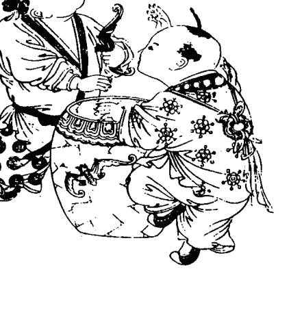
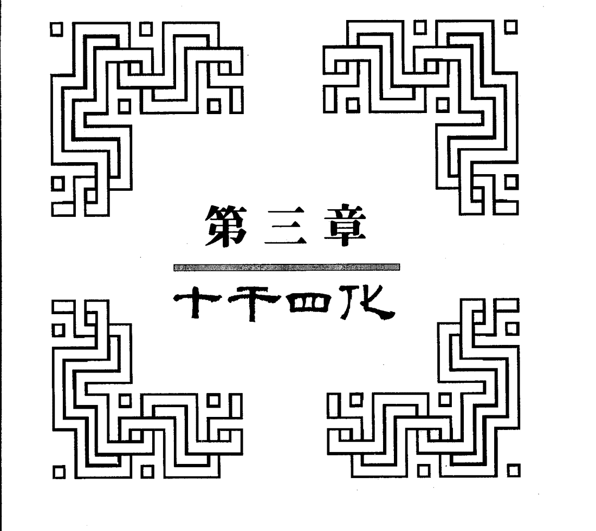
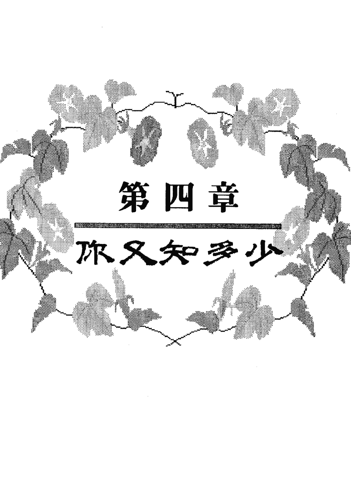
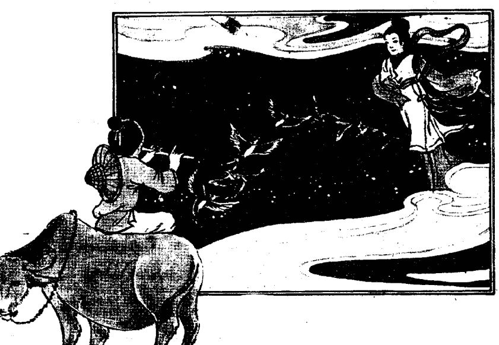
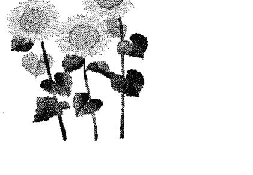
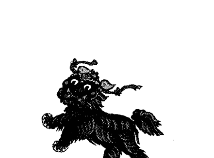
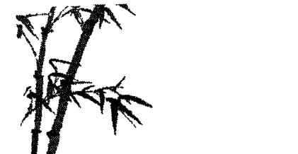

## 紫微斗数精奥

作者◎潘子渔

## 三人行，必有我师
——孔子

孔子学问渊博，但他虚怀若谷，肯虚心学习，甚至说：「三人行，必有我师。」可见吾人凡事不可自满自骄，宜多向人学习，以充实自己。

## 赠我一言，堪为我师
——潘子渔

自从拙作《紫微斗数心得》出版之后，很多读者来信来电鼓励指谬，深感荣幸，其中很多人对十干四化、闰月计算方法等等问题，都提出很宝贵意见，尤以十干四化，经我找出以前古老笔记，及请教几位老前辈，综合意见（请参阅十干四化之更正），谨此应予更正。
附此谢谢读者及诸位前辈。

## 目 录

10 序

# 第一章 紫微斗数来龙去脉

17 黄道十二宫近代与古代名称对照

18 闰月算法理论根据

20 节气

22 太岁概说

24 简易推算年干支方法

26 “宫”与“地”之区别

27 命主／身主

31 毛头

32 文曲安法有异议

33 桃花煞

34 影响算命准头之因素

35 算命先生的道德与修养

37 我有我的苦衷

# 第二章 诸星个别与组合时之特性

39 紫微星

47 天机星

52 太阳星

58 武曲星

62 天同星

67 廉贞星

73 天府星

74 太阴星

78 贪狼星

80 巨门星

83 天相星

85 天梁星

86 七杀星

87 破军星

88 左辅／右弼

89 天刑星

91 天姚星

92 陀罗星

94 羊刃星

96 白 虎

98 五行长生十二星之特殊意义

# 第三章 十干四化

102 十干四化之更正

103 怎样看四化

104 化禄概说

108 化权概说

109 化科概说

110 化忌概说

118 有关四化～～必须懂得星宿之性质再配合诸然来论断

# 第四章 你又知多少？

- 121 何知你是劳禄命？
- 122 何知此人有水厄？
- 123 何知此人有残疾？
- 124 何知此人目有伤？
- 125 何知此人有破相？
- 126 何知此女配良夫？
- 128 何知你是白发人送黑发人？
- 129 何知你有失恋之悲？
- 130 何知此人会走私？
- 132 何知此人因财惹祸？
- 133 何知此人会迷花恋酒？
- 134 何知此人遭小偷？
- 135 何知夫妻不和？
- 136 何知此人贪小失大？
- 137 何知此人长得美？
- 138 何知此人有同父异母或同母异父的兄弟姐妹？
- 139 何知你是“一香插两炉”？
- 140 何知此人性生活不正常？
- 142 何知此人非君子？
- 143 何知此人会坐牢？

# 第五章 外貌和心相

- 145 简易相术
- 149 如何看心相？

# 第六章 深入研究

- 156 一语惊人
- 158 请细看奴仆宫和疾病宫
- 159 大限／小限与生月的关系
- 160 为何同年同月同日同时生各人命运却不同？
- 161 如何分别外柔内刚抑或外刚内柔？
- 162 如何看“暗合”？
- 163 如何看“对地”？
- 164 同样星宿在对地，仍然有很大差别
- 165 同是落陷或庙旺，还要细考其制化
- 167 大小限如何配合推算
- 170 五局人行限不吉之地
- 171 怎样看婆媳关系？
- 172 不知命，何以为君子？
- 179 如何断人生死？
- 181 你会得什么病？
- 183 你会发财吗？！
- 185 如合逢凶化吉？
- 191 请勿走火入魔

# 第七章 古文白话解说

- 194 太微赋
- 197 增补太微赋
- 199 斗数骨髓赋
- 210 女命骨髓论
- 211 形性赋
- 215 斗数准绳
- 216 斗数发微论
- 218 重补斗数彀率

## 第八章 实例分析

- 221 羊刃天空／财产空空
- 223 天相羊刃／受女人拖累
- 225 错将鸳鸯当夫妻
- 228 未来大富翁
- 230 夫妻武曲地劫／因妻破财
- 232 廉贞贪狼加煞当吧女
- 234 太岁冲命化忌入命死于脑震荡
- 236 预言某名人终必破败
- 238 婚姻趣谈
- 239 长相趣谈
- 241 身不由己
- 243 万物相生相克
- 245 上帝待人一律平等
- 246 努力工作
- 249 运逢羊刃／东作西成
- 250 夫妻缘分
- 252 从鬼谈起
- 256 先贱后贵／先贵后贱
- 258 人定胜天
- 260 天下本无病／庸人自找之
- 262 广行善事

## 第九章 《紫微斗数参悟》简介

- 266 你适合经营纺织或布商？
- 285 何知此人短命死？

## 序

紫微斗数所列诸星，宛如吾人一样，各星有各星特殊个性、特征、优点和缺点，此外，一个星宿和另一个星宿同宫，或称组合，又会形成另一种形态，可能更好，也可能更坏，所以，研究紫微斗数必须深入研究、分析、统计、印证，明瞭各星个别时的状况，也要明瞭它和别的星宿组合时的状况，例如：某星在什么宫（如命宫、夫妻宫、财帛宫……）会有怎样现象？而它在什么地（如子地、丑地、寅地……）又有什么现象？而某星与某星同宫又有怎样变化？如此一来，就很错综复杂了，所以，必须有相当了解，才能判断正确。惟其如此，也使紫微斗数更令人着迷，盖因其变化无穷，引人入胜。

我们中国人，自古迄今，传统上有一种缺点，那就是我所知道的，不肯轻易告诉别人，秘而不宣，以致紫微斗数发明至今，已有三千多年，仍然没有一套完整的理论，残缺不全，而且各人有各人不同的看法与意见，无法统一。本人不嫌简陋，愿将先师所教，以及个人数十年经验与心得，一点一滴，提出讨论，所谓抛砖引玉，但愿大家都能将其研究心得，公开研究讨论，这样，会群众之力，来推动，来发扬光大，这样才有进步，才会有更新的发现或更确实的印证。这样做法，才不愧为炎黄子孙。因为，今日我们在科学上、太空上，固然落后，比不上人家，但我们也希望在另一方面，能强过人家，这样，才不辜负我们有五千年历史与文化，使我们仰俯无愧于天地之间。愿读者诸君共勉之。

# 第一章 紫微斗数来龙去脉

紫微斗数乃源自天皇氏首创天干地支，所谓天干，即甲、乙、丙、丁、戊（读音“务”极易与地支的「戌」读音“须”相混淆），己（读音“几”，极易与地支的「巳」读音“似”相混淆），庚、辛、壬、癸共十个，故又称十干，地支即子、丑、寅、卯、辰、巳、午、未、申、酉、戌、亥共十二个，故又称十二支。

至黄帝时，又将天干地支相配，称为“甲子”。如甲子、乙丑、丙寅、丁卯……每六十次又循环一次。

东汉以前，甲子只作为日期之用，很单纯，惟自建武后，才被扩大应用在记年份、月份、日期、时辰之用。

至五代，有人将吾人出生之年份、月份、日期、时辰，作一排列游戏，来预言此人之未来，这就是算命术之起源，以后慢慢地有人又将八卦理论，即五行理论，所谓金、木、水、火、土再加五行之相生相克，渗入研究。所谓八卦，乃古代包牺氏仰观天上诸星之变化，俯察地上万物之生克，并考察鸟兽生活状态、地理之形状等等，而研究出八卦，古人对八卦非常尊重，称为「通神明之德，以类万物之情」，八卦之发明对我国文化贡献极大，至深至远，而紫微斗数与八卦关系很密切，经云：「八卦定吉凶。」古人凡事喜用八卦来卜，能预知其结果，对八卦最有研究，且最有成就的，就是周文王，故时至今日，有人乃称「八卦文王」，事实上，八卦并非周文王所发明，乃古人累积前人的点点滴滴而成。犹如紫微斗数今日有人称紫微斗数乃陈希夷所发明是一样的错误，陈希夷、孙思邈等人乃当时研究紫微斗数较有成就的人而已。

## 北极、北极星、紫微星

世上多谓北极星乃指天之真正北极者，此乃概略而言，若精确说法，北极星绝非北极，实际与其他各星相同，亦围绕北极之周围而运行，约每日一周，但其周转之圆周，比其他各星点滴而已。

北极星在正北方时，即其通过子午线之时，北极星一日通过子午线两次，一在北极之稍上，而由东向西通过子午线，一在北极之下，则由西向东通过子午线也，北极星在子午线时，即其高度暂时不变之时，故若观测其高度，即能简单测定纬度也。

北极星与北斗七星相混淆者有之，实际上二者显然有别，北斗七星即大熊座之α（天枢）、β（天璇）、ζ（天玑）、δ（天权）、ε（玉衡）、ζ（开阳）、η（摇光），七星也，联结天枢与天璇两星并延长之，约在两者间距离五倍之处，有一颗二等星，即小熊座之α星，亦即北极星而北极即在其侧，当大熊座近地平线时，此法不能适用，则利用仙后座，即北极星在于联结仙后座α星（王良四）与ζ星（王良二）之延长线上。

如斯真正之北极，移动于恒星之间，乃岁差之现象，所谓岁差即春分点在黄道上每年退行约五十秒之现象，盖地轴以垂直于黄道面之方向为轴，约以二万六千年之周期，插一圆锥之结果，在天球上，北极插一小圆于黄极之周围，以日月加力于地球赤道肿胀部份之结果为主，与黄道上分点移动之原因相同，此结果依时代而异，例如距今四千年前，北极星在天龙座δ星（右枢），前二千年在小熊座β星（即帝，紫微斗数称为紫微星），今后八千年将在天鹅座α星（天津四），一万二千年时在天琴座α星（织女星），二万六千年后又回复今日之位置，今后120年即公元2102年，北极星极近于真正之北极，二者之角距离仅 27" 37"。

古代圣贤，仰观天象，将大熊星、小熊星诸星，加以太阳太阴之位置之变化，用来代表人生之造化，用空间与时间之配合，来推算一个人之个性与命运，而都能吻合，可见宇宙之中确有某种定律在支配着，例如：牛顿用万有引力来解说潮汐现象和苹果落地现象，耶稣则归功于有神在支配一切，中国人传统的说法则说有玉皇大帝在掌管一切。

我国由于有五千年悠久之历史，其间圣贤辈出，综合先人与自己研究，而创造出许多理论，紫微斗数就是其中最有趣、最成功的一种哲学，虽然，其所用星名，除紫微星尚有历史的根据之外，其他星名与古代天文学所用星名无一相同。不过，这对紫微斗数并无影响，因为星名可用代号或别名来代表。倒是紫微斗数的理论与公式，确有一套令人佩服的排列，不知古人根据什么，能够创造出这种理论和公式。

我 对这方面曾加追讨，迄未得到更满意的结果。

## 黄道十二宫近代与古代名称对照

| 近代名称 | 古代名称 | 太阳过宫月份 |
| :--- | :--- | :--- |
| 春 | 白羊宫 | 降娄戌宫 | 四月 |
| | 金牛宫 | 大梁酉宫 | 五月 |
| | 双子宫 | 实沉申宫 | 六月 |
| 夏 | 巨蟹宫 | 鹑首未宫 | 七月 |
| | 狮子宫 | 鹑火午宫 | 八月 |
| | 室女宫 | 鹑尾巳宫 | 九月 |
| 秋 | 天秤宫 | 寿星辰宫 | 十月 |
| | 天蝎宫 | 大火卯宫 | 十一月 |
| | 人马宫 | 析木寅宫 | 十二月 |
| 冬 | 摩羯宫 | 星纪丑宫 | 一月 |
| | 宝瓶宫 | 元枵子宫 | 二月 |
| | 双鱼宫 | 娵訾亥宫 | 三月 |

## 闰月算法理论根据

自拙作出版之后，有关闰月算法，曾引起学者一番争论，有一位读者打电话来说到，闰月算法，应不是上半月移上月，下半月移下月。我就问他，以你的高见，应如何算法？他又答不出所以然。也有一位读者到舍下，谈论这问题，我画出太阳轨迹来证明。他说，历法也不一定以太阳为准，可用太阴来算。言虽有理，可惜他又画不出太阴轨迹来。

现在，我以太阳轨道（详如附图）来说明，就以去年（民国七十一年）闰四月为例：可以看出闰四月初一出生的人，应以五月初一来计算，四月与闰四月，不但时间不同，空间也不同，凡对天文稍有常识的人，就很容易接受我的观念。

现以去年（七十一年）为例，去年闰四月，在正四月初一，太阳在A点，五月初一在B点，但因闰月关系，闰四月初一，在B点，故闰月应移下月计算。

## 节气

太阳每移黄经十五度是为一气，太阳每年移动三百六十度，故一年分为二十四气，自冬至起每隔三十度遇一中气，自小寒起每隔三十度一节气，但今俗则通称曰节气，兹将中气、节气及太阳黄经度列表于下（其中月份均指阴历）：

| 节气 | 节或中 | 太阳黄经度 |
| :--- | :--- | :--- |
| 立春 | 正月节 | 315° |
| 雨水 | 正月中 | 330° |
| 惊蛰 | 二月节 | 345° |
| 春分 | 二月中 | 0° |
| 清明 | 三月节 | 15° |
| 谷雨 | 三月中 | 30° |
| 立夏 | 四月节 | 45° |
| 小满 | 四月中 | 60° |
| 芒种 | 五月节 | 75° |
| 夏至 | 五月中 | 90° |
| 小暑 | 六月节 | 105° |
| 大暑 | 六月中 | 120° |
| 立秋 | 七月节 | 135° |
| 处暑 | 七月中 | 150° |
| 白露 | 八月节 | 165° |
| 秋分 | 八月中 | 180° |
| 寒露 | 九月节 | 195° |
| 霜降 | 九月中 | 210° |
| 立冬 | 十月节 | 225° |
| 小雪 | 十月中 | 240° |
| 大雪 | 十一月节 | 255° |
| 冬至 | 十一月中 | 270° |
| 小寒 | 十二月节 | 285° |
| 大寒 | 十二月中 | 300° |

## 太岁概说

所谓太岁，据古书所载：「太岁有三，一为年太岁，左行二十八宿，十二年一周天，始于海外南经一为月太岁，二月起卯，三月子，四月酉，五月午，六月复至于卯」。

紫微斗数所称太岁，即年太岁，亦名太岁阴，青龙，天一。

太岁每年移动一宫，例如今年，民國七十二年为癸亥年，太岁在亥，明年，太岁在子，后年太岁在丑。

太岁功用有三：

1.  据以算出流月，虽然每人今年太岁都在亥地，但每人流月不一样，例如，潘子渔是二月生，则以亥地为起点，逆时针方向，以亥地为一月，戌地为二月，（如是三月生，再向上推一宫，四月生，又向上推一宫），在戌地为起点，再以顺时针方向，算到出生的时辰，潘子渔是寅时生，则以戌地为子，亥地为丑，子地为寅，则潘子渔今年斗君在子，亦即以子地为正月，丑地为二月，寅地为三月……，每月运气如何，就看该地所坐星宿如何，就可知其吉凶变化。
2.  太岁每人都在亥地，但每人亥地之宫并不同，例如有人亥地为父母宫，有人为夫妻宫，有人为子女宫，有人为财帛宫等等，那么，太岁与该宫关系密切，如在夫妻宫，则今年夫妻关系很重要，如夫妻宫星宿吉，夫妻和睦，星宿凶，夫妻不和，或有灾难甚至有克。如今年太岁在财帛宫，遇吉星发财，逢凶煞，破财。
3.  看当年运气，乃以小限为主，太岁为辅，例如今年太岁在亥，以亥为命宫，则夫妻宫在酉，酉地所坐星宿吉，夫妻和睦，星宿凶，夫妻不和，财帛宫在未地，未地所坐星宿吉，今年财运佳，星宿凶，有破财。

但必须注意者，整个批命，还要参考大限、小限、太岁，以及三方四正，以及四化（包括生年四化、大限四化、小限四化、太岁四化等等综合研究）。

太岁怕逢命宫，若命宫星宿吉，则无妨，星宿凶，此年必有灾祸发生。

太岁怕行天伤天使所夹之地，（如天伤在巳，天使在未，太岁在午，称併夹），怕行地空地劫之地，怕行羊刃陀罗之地，亦怕羊陀冲照，怕逢凶限，亦怕脱凶限。

太岁逢奏书，将军，病符，天伤，天使，羊刃，陀罗，火，铃，空劫，化忌，主人离财散，疾病，哭泣悲伤。公教人员恐受行政处分，女人流产。本人若已有病在身，此年有死亡之事。

本文请参阅：“紫微斗数参悟”——『太岁』一文，会有更完整的认识。

## 简易推算年干支方法

子平四柱算命法须将年、月、日、时化为干支，紫微斗数只要将年化为干支，即使没有万年历，也可以很快推算出年干年支。

其法是用出生年代第二位减 2 ，所得数即为年干数，如民国卅八年生即
3 8 － 2 ＝ 6 （其十位不算，只要个位）
6 就是天干第六位，如下表（第一表）

| 1 | 2 | 3 | 4 | 5 | 6 | 7 | 8 | 9 | 10 |
| :--- | :--- | :--- | :--- | :--- | :--- | :--- | :--- | :--- | :--- |
| 甲 | 乙 | 丙 | 丁 | 戊 | 己 | 庚 | 辛 | 壬 | 癸 |

年支算法将出生年份减去其 12 的最大公倍数。

例如：民国 38 年生，38 最大公倍数是 36 ，则
3 8 － 3 6 ＝ 2
    3 8
 － 3 6
 ______
    2
2 就是年支列表如下（第二表）

| 1 | 2 | 3 | 4 | 5 | 6 | 7 | 8 | 9 | 10 | 11 | 12 |
| :--- | :--- | :--- | :--- | :--- | :--- | :--- | :--- | :--- | :--- | :--- | :--- |
| 子 | 丑 | 寅 | 卯 | 辰 | 巳 | 午 | 未 | 申 | 酉 | 戌 | 亥 |

例如：本人民国 19 年生，19 用 12 的最大公倍数减 2 ，其最大公倍数 12 ，则
1 9 － 2 ＝ 7 （其十位不算，只要个位）
根据上表 7 是午，本人年干就用 19 － 2 ＝ 7

根据第一表 7 是庚，故本人生年干支是『庚午』。
再举一例：

民国 45 年生：		4 5 － 2 ＝ 3
4 5
－ 3 6……这 36 是以 12 的最大公倍数，以不超过 45 。
______
9

则其生年干支为丙申。
再：

民国 38 年生：		3 8 － 2 ＝ 6
3 8
－ 3 6
______
2

查第一表 6 为己，第二表 2 为丑，故其生年干支为己丑。
再：

民国 49 年生：		4 9 － 2 ＝ 7 （只要个位，不要十位）
4 9
－ 4 8……这 48 是 49 之下的 12 最大公倍数
______
1

查表 7 为庚，1 为子。
故民国 49 年生的人其生年干支为庚子。

## “宫”与“地”之区别

紫微斗数中，有两种“宫”，一种为“命宫”、“身宫”、“子女宫”、“夫妻宫”、“财帛宫”……等，一种称“子宫”、“丑宫”、“寅宫”、“申宫”……等，有时会混淆不清。

现在，我将它加以区别，凡“命宫”、“子女宫”、“财帛宫”之「宫」，用『宫』。凡“子宫”、“未宫”等「宫」，改用『地』来区别，故本书皆用“子地”（即以前惯用之“子宫”）、“丑地”、“申地”等以代之。

## 命主 身主

有很多读者来信询问，紫微斗数中有命主身主，而诸书均未解说明白，究竟身主命主之重要性及其关系如何？请指教。

所谓命主，是指先天的，身主是指后天的。

命主星宿，以命宫在何宫来安排，身主星宿，以年支来安排。

命主星宿与身主星宿均喜在吉地，主一生荣华富贵，若在凶地，宜轻财益寿，否则，财多寿损。

命主星宿在财帛宫、田宅宫、子女宫、夫妻宫、官禄宫、福德宫较吉。

命主星宿在奴仆宫、疾厄宫、迁移宫、父母宫则欠佳。

命主星宿若与四煞空劫同宫则不吉。

身主星宿喜落入财帛宫、田宅宫、子女宫、夫妻宫、官禄宫、福德宫则吉；

身主星宿亦喜在长生、帝旺之地。

身主星宿若落入兄弟宫、奴仆宫、疾厄宫、迁移宫、父母宫，则欠佳。

身主星宿亦忌与四煞空劫同宫。

现以潘子渔为例：

潘子渔命宫在子，故命主是贪狼，本生年支是午，故身主星火星。

贪狼在疾厄宫，主此人有先天性肾亏，性神经衰弱，幸好貪狼在未，居廟旺之地，故得祖傳秘方，所以迄今尚能保持旺盛精力。

火星在官祿宮，惜在陷地，故官場不得志，爲官不夠尊嚴，沒有魄力。

因此，潘子漁可謂先天不足，後天失調。易言之，潘子漁既無祖產，而且六親無靠，一生坎坷，只靠自己努力，屬於壞命。

身主、命主，逢到空劫，主一生衣食不足！

## 命主落入諸宮之現象
- 命身宮：旺地榮華富貴，陷地貧苦。
- 兄弟宮：旺地可得兄弟之助，陷地兄弟無助。
- 夫妻宮：旺地夫妻感情好，陷地夫妻緣薄。
- 子女宮：旺地得子女之力，陷地與子女緣薄。
- 財帛宮：旺地發財，陷地財不聚。
- 疾厄宮：旺地身體健康，陷地多病。
- 遷移宮：旺地凡事遂順，陷地勞苦。
- 奴僕宮：有桃花，在外有私生子，或有繼室。
- 官祿宮：旺地吉，陷地不吉。
- 田宅宮：旺地置產。
- 福德宮：旺地享福，陷地勞碌辛苦。
- 父母宮：旺地得父母餘蔭，陷地與父母緣薄。

## 身主入諸宮之現象
- 命宮：旺地富貴，陷地貧苦。
- 兄弟宮：旺地兄弟和睦，陷地兄弟不和。
- 夫妻宮：旺地夫妻和好，陷地夫妻不和而且有剋。
- 子女宮：旺地子女孝順，陷地子女忤逆。
- 財帛宮：旺地生財，陷地破財。
- 疾厄宮：肢體傷殘，或受疾病折磨。
- 遷移宮：在外多不遂順。
- 奴僕宮：不論旺地或陷地，均作不吉論之。
- 官祿宮：旺地官場得意，升官快，陷地貶謫。
- 田宅宮：旺地買不動產，陷地賣不動產。
- 福德宮：旺地諸事吉利，陷地勞心費力。
- 父母宮：旺地與父母緣深，陷地與父母緣薄。

## 毛頭
此書版本，因係毛邊紙抄寫，加以年久日腐，多已破損不堪，現只憑記憶及片片段段中去整理，記得該書中有『毛頭』個總稱名詞，而諸書未載，經查『毛頭』只在飛星斗數中有此名詞，故知今日紫微斗數尚甚混亂，各門各派參雜太多！

“毛頭”之安法如下：

| 小時 | 丑 | 寅 | 卯 | 辰 | 巳 | 午 | 未 | 申 | 酉 | 戌 | 亥 |
| :--- | :--- | :--- | :--- | :--- | :--- | :--- | :--- | :--- | :--- | :--- | :--- |
| 地位 | 辰 | 巳 | 午 | 未 | 申 | 酉 | 戌 | 亥 | 子 | 丑 | 寅 | 卯 |

## 文曲安法有異議
本人整理筆記時，發現文曲安法，有兩種，一時尚難分辨，故提出以供大家共同研究。

按照今日台灣所有紫微斗數所載，文曲安法如下：

| 生時 | 子 | 丑 | 寅 | 卯 | 辰 | 巳 | 午 | 未 | 申 | 酉 | 戌 | 亥 |
| --- | --- | --- | --- | --- | --- | --- | --- | --- | --- | --- | --- | --- |
| 地位 | 巳 | 午 | 未 | 申 | 酉 | 戌 | 亥 | 子 | 丑 | 寅 | 卯 | 辰 |

現在，本人早年筆記中，因紙張發黃，字跡潦草，幾乎對，似乎其安法如下：

| 生時 | 子 | 丑 | 寅 | 卯 | 辰 | 巳 | 午 | 未 | 申 | 酉 | 戌 | 亥 |
| --- | --- | --- | --- | --- | --- | --- | --- | --- | --- | --- | --- | --- |
| 地位 | 申 | 酉 | 戌 | 亥 | 子 | 丑 | 寅 | 卯 | 辰 | 巳 | 午 | 未 |

## 桃花煞
桃花煞以生年為主，其安法如下：

| 年支 | 子 | 丑 | 寅 | 卯 | 辰 | 巳 | 午 | 未 | 申 | 酉 | 戌 | 亥 |
| --- | --- | --- | --- | --- | --- | --- | --- | --- | --- | --- | --- | --- |
| 桃花 | 酉 | 午 | 卯 | 子 | 酉 | 午 | 卯 | 子 | 酉 | 午 | 卯 | 子 |

按：桃花煞不是人人都會發生，一定要此人命盤中，小限逢桃花煞，才發生作用。

例：本人生年午，根據上表應在卯地按桃花煞，本人因命宮有太陽太陰沖照。二福德宮有太陽太陰沖照對宮同宮。四天姚在福德宮。）本人四十八歲時，走卯地，有沐浴、桃花煞，對宮紅鸞，結果與某小姐一見鐘情，犯上了桃花煞！

## 影響算命準確之因素
有人說紫微斗數很準、很靈，也有人說斗數不靈，事實上，紫微斗數很準很靈，所以然會發生錯誤者，其因素有下列數點：

1.  生時是否正確：很多人的生時記不清楚，連他的父母都不記得，或只記得「大約是天快亮的時候」或是「吃晚飯以後」等等，這裏時間的相差很大，如不弄明白就無法算得很準。
2.  當事人並不知道其幼時家庭狀況：例如我父親曾娶兩妻，但父母從未與子女談及此事。又如某小姐的母親曾被其丈夫拋棄，這位母親只好帶著幼小的女兒再嫁他人，但她未對女兒談及此事（恐會影響其心情）！
3.  有的父母在女兒出生之後就請算命先生來算命：若命不好，有剋夫等，怕將來不好找到好婆家，就將生辰八字亂改。

## 算命先生的道德與修養
儒師在教中醫時，曾引述祖師孫思邈的話（請參閱千金要方），這些話不但是身為醫師必具備之道德與修養，也可引作算命先生的修養。

無欲無求，淡薄名利，先要有大慈大悲之心，側隱之心，視人如己之觀念，發誓要救普天之下蒼生痛苦。

凡有人前來求我，不可問其貴賤、貧富、年齡或種族觀念，或地域觀念，必須一視同等。即使來者與我有宿怨，也不可拒絕。

若是有女性，不可存有非非之想。

不可存有顧惜自己名譽，顧忌太多或不敢直言或知而不言。

宜點迷津，勸人懸崖勒馬，回頭是岸。

不可斤斤計較潤金之多少，錢財乃身外之物，不值得賢者重視。

不可見異思遷，見色心動，見財心喜之念頭。

不可阿諛貴權，或卑視貧人，不可有勢利眼光，此皆有失大將風度。

宜循循善誘，勸人向上，盡忠盡孝，努力奮鬥，棄邪歸正，廣積善德與陰德。

總而言之，上述諸點理論，不但是醫師，算命先生應有修養，即任何人任何行業都應有修養，惟醫師與算命先生尤為注意，以免一念之差，或一句無心戲言而造成不幸後果，可不慎哉乎！

，说得太明白，恐怕当事人受不了，会闹离婚，甚至自杀，则我虽不杀伯仁，伯仁却因我而死，岂非罪过？

做人多难呀？！

## 我有我的苦衷
有人说：干一行，怨一行，我现在也深深有此同感，今日为着生活，不得不以算命来糊口，而算命又有什么苦衷呢？请听我道来：

有一位甲先生和乙小姐结婚，乙小姐是富家千金，换了别人巴不得攀龙附凤，可是甲先生认为乙小姐自幼娇生惯养，难侍候大小姐的脾气，不好伺候，宁愿与另一位丙小姐有感情，因...他父母，因为乙小姐有丰富的嫁妆令人垂涎，甲先生终于在父母压力之下，与乙小姐结婚，但对丙小姐依然藕断丝连。甲先生与乙小姐结婚后共生了三个千金，可是没有儿子，乙小姐总觉得非常遗憾，到本馆来算他先生的命，我说：甲先生应有一子，而且是贵子，乙小姐听后感到莫名其妙，有一个儿子是贵子，这一个儿子在那裏？你们夫妻也不是七老八老，可以再生一个儿子呀！

第二天甲先生独自一人跑来跟我说：我的确有一子，但不是和乙小姐生的，是和丙小姐生的。我淡淡回答他：这个我早知道，昨天我一直不敢明说，深怕你太太听后会发生家庭风波。甲先生说：何止风波，马上家庭破碎，谢谢您的好意，我很感激！

这就是我的苦衷，如果直话直说，做太太的知道自己丈夫在外和人生了一子，你能想像得到后果吗？！
类似这种事情还很多，说得不明白，又被人笑为算命不准。

## 紫微星
紫微星是尊贵星宿，虽然我们每人命盘中都有紫微星，但要看它坐在什么宫，就可知道此人命运之大概，例如：紫微星在命宫，或兄弟宫或交友宫，或父母宫的话，就表示此人不论其事业如何？财富如何？都属于“劳碌命”，所谓劳碌命，就是要辛劳奔波。

紫微星又被尊为帝座即皇帝，皇帝需要一批随从跟班人员，以显出皇帝的威风和神气，所以紫微星喜有左辅右弼来帮助策划、保护，天相、文昌文曲，来作它的随从，天魁天钺作为仆人，替它宣读圣旨，禄存，来伺候它的饮食起居，天府，来替它管理财库，如果皇帝身边没有这班人才，那么它有时脾气暴躁，古书形容它是“暴君”。

但紫微若与左辅、右弼、文昌、文曲，或禄存同宫，又有种特殊现象，即桃花多有艳遇、风流、妻妾、姘妇，古代皇帝所以有三宫六院，这也是原因之一。

皇帝身边也怕有小人，所谓近朱则赤，近墨则黑，这些小人就是火星、铃星、羊刃、陀罗，紫微若与四煞组合，古称为「煞星小人而孤寒」，就是说这个人没有远大的眼光与抱负，而且孤陋、贫苦。

紫微坐命宫或身宫的人，皮肤比较白皙，身材和体态都很良好，外表就令人有良好印象，举止高雅、仪态端庄，将来会有意想不到的发展与成就。惟一缺点此人“耳软”，人家说东他就东，人家说西，他就西，只要有人在他旁边嘀咕几句，马上改变主意，更喜欢戴高帽子、好受人阿谀、不爱听人忠告苦劝、一意孤行。

常和紫微组合的星宿，计有：

1.  紫微天府
2.  紫微贪狼
3.  紫微天相
4.  紫微七杀
5.  紫微破军

现在分别讨论如下：先说【紫微天府】：

这两个星的组合真美，尤利女命，凡女命有紫微天府的人，都会旺夫益子，紫微、天府同宫只在寅、申两地，若在寅宫就会发生下列状况：

1.  做事先勤后惰。
2.  劳碌奔波，寡合召非。
3.  视力不好或眼目有伤。
4.  因太阴在卯地为落陷，若有四煞同宫，又会发生下列情况：
    (1) 此人感情用事，缺乏理智。
    (2) 劳碌奔波，肢体会伤残。
    (3) 会有桃花（会有不正常恋爱），性生活不正常。
5.  因太阳在亥地亦为落陷，亦不吉，若再加四煞则有下列情况发生：
    (1) 身体上会有某种缺陷，眼睛多病痛。
    (2) 会失败。
    (3) 若为女人则遇人不淑。

紫微、天府同宫在寅地，女命虽吉，旺夫益子，但亦有其缺憾：

若紫府在寅坐命宫，则夫妻宫为破军，婚姻不美满，遇人不淑，会离婚，否则死别。

若紫微、天府同宫在寅地坐夫妻宫，则命宫在辰地，贪狼坐宫易有感情波折，也是遇人不淑，若夫妻宫有右弼，或左辅，则始乱终弃。若命宫又有文昌同宫，虽长得眉清目秀，人见人爱，但会死于飞机失事，或被人分尸，或从高楼摔死，或投河自杀。

若紫微、天府同宫坐田宅宫在寅地，则命宫太阳坐守在亥地为落陷，亦会遇人不淑。而且父先死、夫先亡，加煞尤忌，劳碌奔波，眼目有伤。

紫微、天府组合若在申地，那就比在寅地要好得多，盖因太阳、太阴均在旺宫，女命婚早夫贤（不会遇人不淑了），端庄、有福气，一生快乐。

但不论紫微、天府在何地，午或子都有廉贞天相之组合，若丙年或壬年生人必有羊刃与廉贞、天相之组合就形成「囚刑夹印」之局，所谓「囚刑夹印」，囚指廉贞，刑指羊刃，印指天相，此三星之组合，会发生下列情况：

1.  身体伤残或刀伤。
2.  诉讼官司。
3.  犯法受刑。

若再加白虎同宫必有牢狱之灾。

### 【紫微贪狼】
古书对紫微贪狼的组合，评语甚坏，说是“桃花犯主为至淫”，那是因为这两个星的组合，会使人性生活过度或不检点，故女命若无左辅或右弼同宫，会沦落风尘，即使有吉星同宫也会有桃花。这是因为她是天生尤物，需要男性多方安慰。

女命紫微、贪狼同宫，如在卯地则太阳落陷，会遇人不淑，而且天机、太阴在寅宫不双美，如果紫微、贪狼在酉地则太阳居午在庙地，则此人端庄，婚早夫贤，但其性生活需求多，天性如此。

如果女命紫微贪狼在命宫对男性务必慎重，这种人多会发生意外事件，一生为情苦恼，加煞则因色，前途尽毁。

紫微贪狼若在夫妻宫，配偶年长则吉。若有六煞或桃花之星，如左辅右弼则会因自己荒唐而伤害到配偶，或是肉体与精神两方面均被对方蹂躏、虐待，对方对性方面很霸道。

紫微贪狼坐子女宫，必须对子女教育多加留心，子女虽有才华，父母宜善加诱导，以防在性方面有不正当行为。

紫微贪狼坐财帛宫，先贫后富。

紫微贪狼坐疾厄宫，会因纵欲以致体力消耗太多身心受损伤，会得肾病、阳萎、神经衰弱等，宜清心寡欲，多运动，多培养正当嗜好，如游泳、打球、集邮、音乐等等。

紫微贪狼在福德宫，一生忙碌。

紫微贪狼组合的另一特色就是若与六煞同宫，将来会看破红尘而出家，或献身宗教，或做慈善事业。

### 【紫微天相】
紫微天相的组合最显著的特色就是对父母未尽孝道，凡对父母未尽孝道者都有三种解释：

1.  有忤逆父母的话，伤了父母的心。
2.  父母死时不在身边送终。
3.  会赚钱孝敬父母时，父母已不在人世了。

（紫微破军同宫亦为对父母未尽孝道）。

紫微天相坐命宫的人一生不愁食、不愁穿，生活优裕，只要命宫无煞同宫，会变成“富屋贫人”或“清高学者”，因为他虽有名声、身份、地位，可惜两袖清风。

紫微天相坐夫妻宫配偶宜年轻，如果再加文昌、文曲的话再好不过了，夫妻两人相敬如宾。

紫微天相在子女宫，子女优秀。

紫微天相在财帛宫，发财亿万，而且名利双收。

紫微天相在官禄宫，做官清廉、正派。

值得注意一点的是天相此星最怕煞星，如果有煞星同宫，凶兆锐减。

紫微天相在福德宫，一生幸福。

女命紫微天相在戌地坐命之人，有一特殊情况：此女人为贵妇人型，皮肤白皙，气质高雅，体型优美，长得漂亮。

可是此人必是七杀独坐福德宫，古书说：女命七杀独坐福德宫，贱无疑，经我多次求证，发现凡有此命格的女人喜欢找刺激性爱情，宁愿抛夫弃子，在外放荡，在灯红酒绿的地方找乐子，或钓凯子，找个有钱的人以供其挥霍。

### 【紫微七杀】
紫微七杀同宫的人必是天机、天梁同宫，天同、太阴同宫，如果紫微七杀在亥地则天同、太阴在午地落陷，吉兆锐减，如果紫微七杀在巳地，天同、太阴在子地，吉兆增加。（详情参阅天机、天梁与天同、太阴）。

古书说：紫微能化七杀为权，故紫微七杀坐命宫的话，此人一生大权在握，那就是说：他一定当大官，如果有七吉同宫锦上添花，如果有六煞同宫这个人会因公殉职，或为国牺牲，或因救人而死，死得非常有价值、有光荣。

紫微七杀若在巳地，此人必娶一贤慧妻子，可得贤妻之助，而且有政府公认资格，有绝艺在身，仁慈厚福，不怕凶危，逢凶化吉是个优良军事参谋人才或医师或某专家。

紫微七杀若在亥地，与紫微七杀在巳地大体相同，惟一不同的是：天同太阴在午地落陷，则太太不够温柔体贴，也没有多大助力，而且此人做事先勤后惰。

紫微七杀不论在何宫，女命都长得很漂亮，但宜偏房，且其性生活需求多。

紫微七杀在夫妻宫，夫妻不能白头偕老，什么原因不能白头偕老，要将夫妻两人命造拿来研究才能明白，可能有剋，宜晚婚。

紫微七杀在财帛宫发横财。

### 【紫微破军】
此两星组合，最显著现象是，对父母未尽孝道。若与羊陀同宫，切不可吃政治饭，宜经商。

此两者在丑地，比在丑地要好命多多，尤其是女命。

女命端庄，夫妻夫贤，在丑地因太阳落陷，太阳代表夫君，所以代表遇人不淑。而且劳碌奔波，苦命人。不过，好命也有的，好命也好，其共同一点都是偏房命（如果不是偏房命就得付代价补过）。

不论紫微破军在何宫何地，因此命必有廉贞贪狼同宫，必有生活过度，若廉贞贪狼加煞就有下列情况发生：

1.  做相或残废。
2.  偏落风尘。
3.  有羊刃会犯法被捕。
4.  有名誉。

紫微破军坐命宫的人要抱着「知足常乐」的心理，以及「比上不足，比下有余」的乐态度。

紫微破军在夫妻宫的人，夫妻会离婚。

紫微破军在子女宫的人，子女有三，个性好、坏各半。

紫微破军在疾厄宫，呼吸系统不好，女命月经不调。

紫微破军在迁移宫，会有贵人帮助提升。在官禄宫会出名，在福德宫早年辛劳，晚年享福。

紫微星坐身宫，不喜受人约束，尤以紫微天府在寅地坐身宫者。

紫微星坐命，有解厄之功。

紫微最喜化科、化权。

紫微星化权坐官禄宫，主掌权，宜自己创业，凡事自己作主，财务自己掌握。

紫微星化科坐官禄宫，很得人缘，为人随和。

紫微星化科坐奴仆宫，能与部下同甘共苦，打成一片，深得下人爱戴。

紫微星化科入子女宫，父子情深，一家随和、温馨、幸福、快乐。

紫微星化科入财帛宫，重义轻财。

紫微星化科坐夫妻宫，夫妻如水乳交融、幸福恩爱。

## 天機星
天機星屬木，屬陰木，此星盡善盡美，是個智慧益壽之星，在身命宮，聰明、英俊（女命則有古典美），性急，喜行善事，對宗教信仰很虔誠，一生從不做不仁不義之事，善於應付或遷就環境之變動。

身宮有天機的人，必是藝術造詣很深，或有巧藝在身。

女命不論天機在何宮，只要坐子午兩地，都是福壽雙全的人，而且很會管家，會將家中整理得漂漂亮亮，整劑乾淨，並掌權。

天機最怕化忌在巳亥丑未坐命，即使有錢，都會破盡財產，而且壽不長，只好看破紅塵，到深山做和尚或尼姑。此命之人，尤需戒酒。

天機也怕四煞同宮，會有偷竊不良習慣，但若其他星宿好，其長大後，亦都能力求上進，知過必改，否則，終有一天，會惹禍生災。

女命最怕天機在丑地，則太陽在亥地為落陷，必遇人不淑，非禮成婚，始亂終棄，而且，勞碌奔波，眼目有傷。若命宮在辰，則財帛宮在子地有破軍坐守，尚有發財的一天。但若坐兄弟宮，則夫妻宮破軍獨守在子地，必離婚。即使天機不在兄弟宮，但大限在寅地時，其命盤夫妻宮在子地，逢破軍，夫妻乃有生離之兆。

女命天機在未地，比在丑地要好命多多，則此人婚早夫賢，旺夫益子，不致遇人不淑，也不致始亂終棄，也不會勞碌奔波，也不會眼目有傷。

與天機組合星宿，計有：

1.  天機太陰
2.  天機巨門
3.  天機天梁

茲分述如下：

天機太陰，只在寅申兩地有同宮機會，若天機太陰在寅，必有下列狀況發生：

1.  易出車禍。
2.  女命若有昌曲同宮，會犧牲色相，或淪為高級妓女或交際花之類，男命則不易出人頭地，只能做下級職員。
3.  勞碌命。
4.  若坐兄弟宮，則財帛宮武曲破軍坐守，主財來財去。
5.  只宜經商，不可參加議員選舉。

在申地比在寅地要好得多，女命端莊，婚早夫賢，不會勞碌奔波，也不會眼目有傷，寡合召非。但其性生活需求多，一如在寅地一樣，而且一生口舌是非多。

天機巨門，只在卯酉兩地有同宮機會，不論男女，都有一段傷心戀愛史，而且，家道中落再興。

女命最忌天機巨門坐兄弟宮在酉地或卯地，則七殺獨居福德宮，此等女人即使有再好的家庭和丈夫，却喜歡在外找刺激性戀愛，或想找個有錢的人供她揮霍，致一生都在歡場打滾，殊不知歲月無情，到了人老珠黃，乃找不到理想歸宿，結局必然不佳。

天機天梁，只在辰戌兩地有同宮機會，在辰地比在戊地要好命多多，男命天機天梁在辰，則天同太陰在子，必娶一位賢良的太太，再則，可習醫師，有政府公認資格，有絕藝在身，仁慈厚福，不怕凶危，但卻要在卅歲以後才能發達，大器晚成，先貧後富，機智現實。

天機天梁同宮，則武曲貪狼亦同宮，則此人必會被女人迷亂。

天機星，為智慧之星，主為人聰明，多才多藝，宜動頭腦去策劃、設計，尤喜與天梁同宮，為一最佳軍事參謀人才，對案情的分析，特別精細週到，處事圓滑，也可習醫、藥、科技、電腦等尖端科學，能成專家、醫師、律師、工程師………，參加公家機關考試，能金榜題名，而且不怕凶危，但忌空劫諸煞，若命宮又有天刑，晚年宜獻身宗教。

天機星不宜落陷（如丑、未），落陷又加煞，小時會有不良習慣，宜習一技之長，或經商。

天機在巳、亥，不可酗酒，加煞尤忌，會因酒誤事。

天機星坐子女宮的人，會和已有子女的配偶姘居。

天機星既不是財星，故不宜坐財帛宮，亦不宜坐田宅宮，若坐福德宮，則此人精神生活重於物質生活。

天機怕煞，也怕化忌，天機星宜口才，但此口才是正道，不是邪道，凡事據理而爭，不是無理取鬧，故適合外交人事、交涉、外務………。

若逢天刑、羊刃、地劫，宜牙醫、工程師、技師………。

女命尤喜天機在子午兩地，不論何宮，均主福壽雙全，善於管家，能為家勞而無怨，為一典型的賢妻良母，故娶妻，當娶天機在子午者，較有幸福，妻子較能伺候丈夫。

天機化忌入六親宮，如父母、夫妻、子女、兄弟、奴僕，均不以吉論之，其所損六親，係男性，而非女性（太陰、羊刃同宮，則損女性，而非男性）。

限逢天機家不寧，若又有化忌、諸煞，家中定有不祥之事發生，如妻子潛逃，家中祖父或父親亡故………。

田宅宮天機化忌，會搬家，或住宅被拆除………，又主家中口舌特多，不是父子吵，就是夫妻鬧，或是兄弟爭，或是母女鬥………。

女命天機化忌，最易跌倒、摔交，故在浴室，或是樓梯，宜特別小心。

夫妻宮有天機者，主配偶聰明、英俊，若化忌，男命主太太之六親不全，或父母不雙全，或有兄弟無姐妹，或有姐妹無兄弟之類。

天機坐父母宮加煞：若非養子，亦被招贅。

## 太陽星

太陽屬火，又屬陽火，故忌坐亥地之陰水，大小限逢之，非常不吉利，又主官祿，故喜在旺地坐官祿宮，命當大官。若坐身宮或命宮，主人聰明、慈祥、博愛、度量大、福大、壽長。

在紫微斗數中，太陽代表：
- 父親
- 眼睛
- 夫君
- 個性

故太陽與四煞同宮，剋父，眼睛多病痛，女命太陽在旺地，即卯、辰、巳、午均主婚早夫賢（但並不保證夫妻會白首偕老），亦主旺夫益子。

女命太陽在陷地，主遇人不淑，或「非禮成婚」，即先行交易，擇吉開張（太陽與大耗小耗同宮，亦作此解），尤忌太陽在亥，主不利夫君。

太陽在未地或申地，稱為偏坦，主人作事先勤後惰，亦主人個性隨和，不計得失，心情愉快。

太陽在酉戌亥，主人在中年之後，開始惰怠，凡事不積極進展，得過且過，或沉迷酒、色、賭。

太陽化忌，亦主目有傷，如散光、生翳等。

女命最喜太陽坐夫妻宮在廟旺之地，不但婚早夫賢，而且夫長仕英俊，因夫得貴，亦喜坐福德宮，一生享福快樂。

太陽在酉地，必與天梁同宮，不論坐何宮，均代表此人懷才不遇，滿腹牢騷。

命宮在丑，太陽在巳，太陰在酉，古書稱為「蟾宮折桂」，意為可中進士，古代以八股取士，十年寒窗，只靠中進士以作進身之階，一切榮華富貴，皆繫於考試，故比今日吾人尤重科舉同理，命宮在未，太陽在卯，太陰在亥，亦作「蟾宮折桂」論之。

太陽與祿存同宮，雖會發財，但亦辛苦奔波。

太陽在旺地坐官祿宮，平步青雲。

太陽在身宮，有吉星，主在貴人或大官門下作參謀。

男命太陽坐夫妻宮在旺地，必因裙帶關係而富貴，陷地加煞，傷妻不吉。

太陽居田宅宮，可得祖上產業。

太陽居子女宮，若加入八座同宮，必生貴子。

太陽不宜坐遷移宮，大小限逢之，會賣不動產，或出家為僧，或有異動。

大小限逢太陽在旺宮，有突然興旺之兆。

大小限逢太陽與四煞同宮，必有下列狀況發生：
- (1) 有憂愁煩惱之事發生。
- (2) 若當官，則官場不順遂。
- (3) 父母有傷亡之兆。
- (4) 有官司之煩。
- (5) 有疾病之苦。
- (6) 吃苦不少。

與太陽組合星宿，計有：
1. 太陽太陰
2. 太陽巨門
3. 太陽天梁

現分述如下：

太陽太陰只在丑未同宮，在未宮，有下列狀況：
- 一、作事先勤後惰。
- 二、若加煞，主人離財散。
- 三、命宮在此，加化科化祿，可當縣長。
- 四、不論男女，性生活過度。
- 五、女命為貴夫人格。
- 六、女命有一段傷心戀愛史。
- 七、對父母未盡孝道。

太陽太陰在丑宮，有下列狀況發生：
- 一、加吉星，一生快樂。
- 二、加化科化祿可當縣長。
- 三、女命長得很漂亮。
- 四、坐福德宮，或子女宮，則大富。

太陽巨門只在寅申兩宮有同宮機會，若在寅宮，有下列現象：
- 一、無四煞空劫同宮，會出名。
- 二、卅歲前運不好，先貧後富，機智現實。
- 三、有政府公認資格。
- 四、仁慈厚福。
- 五、會娶到一位好內助。
- 六、宜習醫師。
- 七、女命宜偏房。
- 八、有高藝隨身。
- 九、會有桃花。
- 十、坐遷移宮，可作大商人。

太陽巨門在申宮，有下列狀況：
- 1. 作事先勤後惰。
- 2. 為人個性隨和。
- 3. 可習中醫。
- 4. 卅歲前運不好，先貧後富，機智、現實。
- 5. 有桃花。
- 6. 有政府公認資格。
- 7. 有絕藝在身。
- 8. 仁慈厚福。
- 9. 女命長得很漂亮。
- 10. 坐疾厄宮，可吃公家飯，一生食國家俸祿。
- 11. 坐福德宮，必因有某學術成就，而周遊各國。

太陽天梁只在卯酉兩地有同宮機會，若在酉地，則有下列狀況：
- 1. 懷才不遇，滿腹牢騷。
- 2. 宜早離家背井，到外地去發展。
- 3. 外柔內剛。
- 4. 口舌是非多。

若坐卯地，比坐酉地更佳：
- 一、女命端庄，婚早夫賢，旺夫益子。
- 二、一生快樂。
- 三、外柔內剛。
- 四、坐遷移宮，大商人。
- 五、若有天馬在寅，宜早離鄉背井，到外地去奮鬥，將來會衣錦榮歸。

### 太陽在諸地之吉凶

| 巳 | 午 | 未 | 申 |
|---|---|---|---|
| 太陽吉 | 太陽吉 | | |
| 太陽吉 | | | 酉 |
| 太陽吉 | | | 戌 |
| 寅 | 丑 | 太陽凶 | 太陽凶 |

女命太陽在卯、辰、巳、午，均主此人婚早夫賢，在戌、亥、子，均主遇人不淑。

太陽與文昌同宮坐官祿宮在廟旺之地，可當行政院長。

請讀者諸君，對照自己命盤，若太陽在亥地或子地，民國七十三、八十五年，會有眼睛病痛，勞碌奔波，或父親有病，女命則父親或丈夫有病或不吉利。

## 武曲星

武曲在紫微斗數中，屬金，又屬陰金、化財，為財帛主，故喜坐財帛宮，但一個人若要發財，還要祖上有德，即使命中有武曲坐財帛宮，還要看有無其他星宿來搗蛋？吾人在世，只求不愁衣食，若妄想發大財，也要先看看有沒有這種命，如果命中貧窮，妄求何益？即使財來，不是病痛也有災禍，故聰明的人，但求有福，不必財多，財多反易惹禍生災。

吾人但能量入為出，節流開源，俗云：「小富由儉」，若能勤奮節儉，何愁不富？!

武曲最喜與祿存同宮，必在遠方發財，然後衣錦還鄉。（尤喜在田宅或財帛宮）

武曲坐遷移宮，可為巨商大賈。

武曲天府同宮，主有高壽。

武曲最怕與空亡同宮，財被破光，這時要看武曲在何宮，例如武曲在奴僕宮加空亡，會因下人拖累而破產。在夫妻宮，會因配偶而破產。在子女宮，會因子女而破產。

武曲與煞同宮，主孤剋，若坐夫妻宮，夫妻不能白首偕老，必有一方先死（或離）。

武曲怕四煞，尤忌與四煞中之羊刃同宮，會因財持刀。

武曲坐命遇空亡，因財丟命。

武曲與天乙貴人（即天魁、天鉞）同宮，宜掌管財務，如會計、出納，或在財務單位或銀行服務。

武曲與文昌或文曲各坐身宮與命宮，主人文武全才，一生富貴榮華。

武曲喜化權，主凡事得意，怕與化忌同宮，主破財，或被倒帳。

武曲坐命的人，有一特徵，即其志氣高，有節操（蘇武有節），是一個優良，超凡人物，剛毅果斷，心地正直，但此星若與他星組合，很容易受到感染，可能更好，或更壞，或福或禍，不一定。

武曲與破軍，或貪狼之組合：怕水，逢惡運，可能投水自盡，或有水難。

常與武曲組合之星宿，計有：
1. 武曲天府
2. 武曲貪狼
3. 武曲天相
4. 武曲七殺
5. 武曲破軍

武曲天府只在子午兩地有同宮機會。

武曲天府同宮，其特徵是「壽比南山」。

武曲天府在子或午，女命都長得很漂亮，但性生活需求多。

武曲天府與祿存同宮，必發大財。

武曲天府與天乙貴人同宮，宜在財經機構服務。

武曲天府加煞，則此人個性比較不厚道，為富不仁，也會因財被劫。

武曲天府同宮，則紫微天相也同宮，故知此人對父母未盡孝道。

武曲天府在子，則天梁在巳，故知此人愛浪蕩，女命宜偏房。

武曲天府在午地，則太陽太陰在未，故知此人作事先勤後惰，女命必有一段傷心戀愛史。

武曲貪狼，只有在未丑有同宮機會，必有下列狀況發生：
- 一、卅歲前運不好，先貧後富。
- 二、會有桃花，會被某人迷得死死的。
- 三、可當醫師，或專家。為人機智、現實。
- 四、武曲貪狼在丑宮比在未宮更好，男命會娶一個有力的賢內助，女命則宜為人偏房。

武曲天相只在寅申有同宮機會，在寅地比在申地要好命多多，若有祿馬同宮，宜到外地發展，將來會發財，然後衣錦還鄉，光宗耀祖。亦喜與文昌文曲同宮，主聰明，有巧藝，最怕四煞同宮，必有殘傷，亦會因財被劫。

武曲天相在寅，則太陰在亥，故知此人一生快樂。

武曲天相同宮，則廉貞天府亦同宮，故知此人外柔內剛。

女命武曲天相在寅，則太陽天梁在卯，故知此人婚早夫賢。

武曲天相在申地，則太陽太陰反背，此人宜早離鄉背井，到遠方去發展。

武曲天相在申地，則太陽天梁在酉地，此人懷才不遇，因而滿腹牢騷。

但不論武曲天相在何地，因其天同巨門同宮，却是一生口舌是非特多，是其特徵。

武曲七殺，只有在卯酉兩地有同宮機會，因武曲七殺同宮，因而造成廉貞貪狼也同宮，故知此人性生活過度，甚至酒色傷身。但武曲七殺若在卯地，比在酉地的人要好命多多，因在卯地，太陽與太陰均在廟旺之地，尤其是女命，有下列優點：
- 端庄，婚早夫賢。
- 很會管家。
- 福壽雙全。
- 一生快樂。
- 丙丁生人，有富貴。

也有下列缺點：
- 宜為人偏房。
- 性生活需求多，需知節制。
- 對父母未盡孝道。

武曲破軍，只有在巳亥兩地有同宮機會，在巳地又比在亥地好命多多，因在巳地，則有太陽太陰均在廟旺之地。在亥地，太陽太陰反背，不但勞碌奔波，寡合召非，而且眼目有傷。

武曲破軍同宮，也會造成廉貞七殺同宮，故這種人要加倍小心車禍。古書說：「會死于半路上」（但須廉貞七殺加煞，常廉貞化忌才驗。）

女命武曲破軍在亥，宜潔身自愛，恐會淪落風塵，即使不當妓女、酒女，其與男人發生肉體關係的人，至少也會在三人以上。

武曲化忌，不宜坐夫妻宮，也不宜坐官祿宮，蓋因兩者對沖之故，主婚姻不吉、事業困苦。

## 天同星

天同是福星，它在紫微斗數中，和天梁有一共同特性，即大小限逢之，即使病危而不死，能延壽，幼運和老邁逢天同均作吉利論之，惟獨中年運逢天同，則此人僅知安享，無吃苦奮鬥精神。

天同坐命的人，都是理想很高，抱負很大，惜實現者不多，或是說其幻想多，不合實際。惟其個性都十分善良、溫順、隨和、處事和平、不走極端。

天同最怕與羊陀同宮，易受外傷。

女命天同坐命在廟旺之地，不但長得很漂亮，而且，旺夫益子，一生享福，但不宜坐丑、未、酉三地，加煞，會淪落風塵，加吉，先賤後貴。

不論男女，在卯酉二地坐命之人，若是庚年生人，多是早夭或凶死，蓋因庚年生人，羊刃在酉，不是坐命必是對沖，女命不是細姨命，必是桃花身。

天同在紫微斗數中，引起爭論的是：庚年四化，時至今日，庚年四化竟有四種說法：
- 一、陽武同陰
- 二、陽武陰同
- 三、陽武府相
- 四、陽武府同

孰是孰非，尚無定論。

與天同組合星宿，計有：
1. 天同太陰
2. 天同巨門
3. 天同天梁

茲分述如下：

天同太陰只在子午兩地同宮，在子地比在午地強得多，有下列狀況：
- 一、男命會娶一位賢內助。
- 二、可習醫師。
- 三、有政府公認資格。
- 四、壽比南山。
- 五、不怕凶危。
- 六、會迷花戀酒。
唯女命宜為偏房。

若在午地，則有下列狀況：
- 一、作事先勤後惰。
- 二、會迷花戀酒。
- 三、太太不夠溫柔，或母、妻先死。
- 四、可習中醫。
- 五、不怕凶危。

天同太陰在午地加羊刃，名「馬頭帶箭」，可立功邊疆。

天同太陰坐命，男命易受女色誘惑，所謂「英雄難過美人關」，女命必長得很漂亮，一樣會被男人迷死。

天同巨門這兩個星組合，最顯著特徵，是口舌是非多，若再加羊陀同宮，則性生活不正常，若與火鈴同宮，將來必死在外地（如旅遊途中等）。

天同巨門只在丑未同宮，在丑地比在未地好得多，因在未地，日月反背之故也。

天同天梁，此兩星只在申寅兩地有同宮機會，天同天梁組合，不怕凶危，聰慧有成，但天同天梁同宮的人，必造成廉貪狼同宮，則此人必會酒色過度。

天同天梁在寅地，比在申地好得多，女命必婚早夫賢，但以偏房為吉。

中國人最要不得的一種心理，是見人不如己，卑而笑之；見人強過己，嫉而恨之，這種心理不健全，我們不但自己努力，見人不如己，應該助之；見人強過己，應該效之。

嫉妒之心不可有，是因為一個人有了嫉妒就不知上進，一個人要寬宏大量，才能容納百川而匯成大海，而將來的成就也就不可限量！

## 不是細姨命，便是樹身

甲太太，命盤如下：
- 此人天同在酉坐命：
  - (一) 寧靜環境。
  - (二) 喜遊山玩水，讀名勝古蹟。
  - (三) 為人長得很漂亮。
  - (四) 心地慈善，無激亢，精文墨。
  - (五) 小時過着幸福愉快生活。
  - (六) 酉為沐浴之地，女命多為人細姨諸嫁，或桃花。
- 夫妻宮天梁羊刃，夫為名人（律師或醫生），惜因只生一女，迄未生男，一直未得公婆寵愛，致婆媳感情不好，一直到卅五歲生一子，此時夫妻感情又合好更得公婆寵愛。
- 小限卅五歲，父死。
- 四小限卅五歲在酉，酉為桃花之地，三夭姚，故紅杏出牆，調一富商，在她身上花過大把鈔票，此人將此款給于先生，在外國開業。
- 財帛宮巨門文昌陀羅，故財不聚，到即空，曾買黃金積蓄，惜金價大跌，損失不少。
- 此命太陽落陷，故為人勞碌奔波，卅歲心情欠佳。
- 太陰落陷加煞，為人感情用事，肢體受傷。
- 肺病。（太陰加煞）
- 疾厄宮貪狼地劫，腎臟不好，晚年不良於行。
- 會出一次車禍。
- 太陰在遷移，宜商旅生財。
- 紫府同宮，女命旺夫益子。（故能助夫開業）
- 骨研究人生哲學（巨門文昌同宮）。

| 宮位 | 主星/輔星 | 備註 | 數字 |
|---|---|---|---|
| 財 (己巳) | 巨門、文曲、陀羅 | 長生 | 31527395163 |
| 子 (庚午) | 天相、廉貞 | 祿存、地空、沐浴 | 21426385062 |
| 夫 (辛未) | 天梁 | 羊刃、冠帶 | 1132537496173 |
| 兄 (壬申) | 七殺 | 天馬、天喜、火星、臨官 | 12243648607284 |
| 疾 (戊辰) | 貪狼 (權) | 左輔、地劫、養 | 41628405264 |
| 命 (癸酉) | 天同、文昌 (忌) | 天刑、帝旺 | 11233547597183 |
| 遷 (丁卯) | 太陰 | 鈴星、胎 | 5172941536577 |
| 父 (甲戌) | 武曲 (祿) | 右弼、衰 | 10223446587082 |
| 友 (丙寅) | 天府、紫微 | 紅鸞、絕 | 6183042546678 |
| 官 (丁丑) | 天機 | 墓 | 7192143556779 |
| 田 (丙子) | 破軍 | 死 | 8203244566880 |
| 福 (乙亥) | 太陽 | 病 | 9213345576981 |

## 廉貞星

廉貞陰火，化氣曰囚，又名囚宿，此星最怕與白虎同宮，恐有牢獄之災，若與羊刃同宮，恐有官司，與火星在陷地會自殺。

廉貞羊刃同宮在官祿宮或大小限逢之，有牢獄之災。宜防患于未然，或可避之。此限不可以身試法，不可作任何衝動之事。凡事忍耐、退讓，退一步海闊天空，並儘量廣行善事。

廉貞與文昌或文曲同宮，可吃公家飯，並主此人好禮樂。

廉貞不論有否與其他星宿同宮，只要沒有煞星同宮，都會積少成多，成為富翁，這是廉貞很特殊的現象。

廉貞七殺同宮，若不逢煞，可以發財，若逢四煞同宮，可能發生車禍或得癆病。在遷移宮化忌，尤驗。

與廉貞組合星宿，計有：
1. 廉貞天府
2. 廉貞貪狼
3. 廉貞天相
4. 廉貞七殺
5. 廉貞破軍

現分述如下：

### 【廉貞天府】

廉貞天府只在辰戌兩地有同宮機會，此兩星組合，有一特徵，即此人必外柔內剛，除非他身宮或命宮有紫微的話，就變成外剛內柔。

廉貞天府在戌比在辰要好得多，因為，廉貞天府在戌，則太陽天梁在卯，太陰在亥，均在廟旺之地，不論這些星宿在什麼宮，都好命多多。女命必是旺夫益子，男命必是富貴，反之，若廉貞天府在辰，則太陰在巳，男命必有不正常桃花，而且，不論男女，因太陽天梁在酉，必是懷才不遇滿腹牢騷。

### 【廉貞貪狼】

廉貪狼，只在巳亥兩地有同宮機會，在巳比在亥更為嚴重，不論男女，均是酒色過度，加煞，女命落風塵，男命有損聲譽，若又逢羊刃在酉拱照，必犯法坐牢。

廉貪狼之組合，尤忌坐遷移宮，主此人喜到風月場所找刺激。

廉貪狼在巳，又造成太陽落陷在戌，主此人勞碌奔波，寡合招非，若太陽加煞，又造成眼目多病痛。且太陰在辰，會有不正常桃花，若太陰加煞，則此人感情用事，肢體傷殘，下賤邪淫之人，甚至有夭壽之虞。

廉貪狼在亥，則太陽在辰為廟旺之地，女命婚早夫賢，不過，可能多是偏房更好。又因太陰在戌，不論男女，均主一生快樂。

廉貪狼不論在巳在亥，此人對父母未盡孝道。

廉貪狼在亥，若卯宮有羊刃，主此人必犯法坐牢。加煞，女命落風塵。

### 【廉貞天相】

廉貞天相只在子午兩地有同宮機會，廉貞天相兩星之組合，極怕再與羊刃同宮，古書稱「囚刑夾印」，必有牢獄之災，非訟亦是非太多。

廉貞天相之組合，若再有祿存同宮，必有富貴。

廉貞天相若在午地坐福德宮，則破軍在子地坐財帛宮，若加吉星，會發一次大財。

廉貞天相若在子地，則女命婚早夫賢，旺夫益子，蓋因其太陽在巳地之故也。

### 【廉貞七殺】

廉貞七殺只在丑未兩地有同宮機會，廉貞七殺之組合，亦有此特殊現象，若無四煞同宮，必會積少成多，成為富翁，而且富貴聲揚，若有四煞同宮，上述吉兆就沒有了，而且會得殘廢、癆病、天折或死于車禍。

廉貞七殺同宮，必造成紫微貪狼同宮，主此人性生活過度，女命易落風塵。

### 【廉貞破軍】

廉貞破軍只在卯酉有同宮機會，再加煞，宜公教人員，或商賈。廉貞破軍坐命的人，都有傷殘夭壽之虞，但若不坐命，卻屬好命，因為廉貞破軍同宮，必造成天機天梁同宮，機梁同宮的人，壽比南山，有政府公認資格，不怕凶危，有絕藝在身，也造成天同太陰同宮，若天同太陰在子，則男命會娶一賢慧而且有助力的太太。

不過，廉貞破軍組合的人，武曲貪狼也湊成一對，則此人恆有下列狀況：
- 卅歲前運不好。
- 二、大器晚成。
- 三、先貧後富。
- 四、機智現實。
- 五、會被異性迷得死死的。

但其優點，是：
- 一、可學醫術。
- 二、桃李滿天下。
- 三、仁慈厚福。
- 四、不怕凶危。
- 五、有絕藝在身。
- 六、有政府公認資格。
- 七、壽比南山。

### 廉貞在諸地之吉凶

| 地支 | 描述 |
|------|------|
| 午 | 廉貞在此坐命，或死後被人分屍，從高樓摔死。若與昌曲同宮，會飛機失事或。 |
| 未 | 廉貞在此必與天相同宮加羊刃，是非多，或有牢獄之災。 |
| 申 | 廉貞在此必與七殺同宮，若無四煞，可積少成多，成為富翁，加煞死于車禍。 |
| 酉 | 廉貞在此無劫空四煞，富貴名揚。與卯地同。 |
| 戌 | 與卯地同。 |
| 亥 | 女命在此坐命吉。 |
| 子 | 與巳地同，比巳地更凶。 |
| 丑 | 與申地同。 |

廉貞與火星刧空同宮，會投河或上吊自殺。廉貞怕羊刃，若坐官祿宮，有牢獄之災。廉貞尤怕白虎（請參閱白虎）。廉貞坐命與破軍或四煞同宮，主此人嫉妒心很重，又多猜疑，心胸窄小，凡事迷惑，決斷力不夠，尤易與異性發生糾紛、困擾。

請讀者諸君，對照自己命盤，若廉貞在巳地，民國七十三、八十五年，不可嫖妓，或與來路不明女人發生肉體關係，會得花柳病。民國七十五、八十七年，宜小心車禍、官司、桃花。

廉貞在巳地加煞，若未被槍斃，亦有長期牢獄之災！

| 巳 | 午 | 未 | 申 |
|----|----|----|----|
| 貪狼 廉貞 陀羅 | | | |
| 辰 | 蛇頭帶箭，大小限逢之，名譽有損，女命防落風塵或被人強暴。 | | 酉 |
| 卯 | | | 戌 |
| 寅 | 丑 | 子 | 亥 |

## 天府星

天府南斗第一星，屬土、屬陽土，又名令星，為財帛之主宰，在斗數中司福權之星，與吉星同宮，皆作富貴之論。

此星功能延壽解厄，主財帛，田宅衣祿之神，為紫微星之左右手，能化制羊陀之惡，也能化制火鈴為福，坐身命，主人得俊雅，天性溫和，與太陽昌曲三方四正會合，乃狀元命，與祿存武曲同宮，乃巨富之命。

天府與空劫同宮，主孤立。

與天府組合星宿，有：
1. 紫微天府
2. 武曲天府
3. 廉貞天府

已在上述各篇中述論之。

## 太陰星

太陰星在紫微斗數中代表女性，即母親、妻子、女兒，代表吾人身體內部之肝臟，故太陰與羊刃同宮或對宮沖都會有肝病。

太陰是個純潔的星宿，故太陰在身宮或命宮的人都愛乾淨，有潔癖。

太陰在身宮的人有下列狀況：

- 堂上有二母之稱。
- 隨母過繼。
- 拜義父母。

太陰在遷移宮的人宜商旅生財、口才生財、宜推銷、批發、跑單幫等。

太陰在陷地，小限逢之，有桃花。

太陰在陷地加煞，此人感情用事，肢體會有傷殘，而且酒色過度、性生活過度，勞碌奔波，宜早離鄉背井到外地去發展。

太陰在陷地拱照命宮，男命所遇女性不夠溫柔體貼。

太陰坐命的人對母親、妻子不利，故母先死、妻先亡。

太陰（或太陽）喜與三台八座或祿存同宮可增光輝。

太陰與文昌、文曲同宮有預感，第六感很敏銳，可學算命、超心理學。

太陰與天同同宮在子地，男命可娶一位賢內助（但並不能保證夫妻能白頭偕老），女命都長得很漂亮，惟宜偏房可得寵愛。

太陰與天同同宮在午地，若有羊刃同宮，古書稱為“馬頭帶劍”，可立功邊疆，但亦辛勞，而且有刑剋。

太陰在紫微斗數中，主財主富，故宜坐財帛宮或田宅宮，廟地大富，陷地亦主小康，亦宜居福德宮，在廟旺之地，主一生幸福快樂。

### 太陰在諸地之吉凶

| 巳 | 午 | 未 | 申 |
|---|---|---|---|
| 太陰凶 | 太陰凶 |  |  |
| 辰 |  |  | 酉 |
| 太陰凶 |  |  |  |
| 卯 |  |  | 戌 |
| 太陰凶 |  |  | 太陰吉 |
| 寅 | 丑 | 子 | 亥 |
|  |  | 太陰吉 | 太陰吉 |

請讀者諸君，對照自己命盤，若太陰在卯、辰、巳、午四地，有四煞之一同宮，則主此人感情用事，肢體會受傷，尤其是民國七十四、八十六年，很不吉利，謀事不成、破財、勞碌、憂愁苦悶，男命慎防桃花。 太陰在戌、子、亥，民國七十二、八十四年，考試會金榜題名。

### 順名。

太陰在身命宮，又在廟旺，民國七十六年、八十八年會發財，有享受，心情愉快，萬事如意。

男命太陰在子，主娶一賢內助。

| 太陰 | 天同太陰 | | |
|---|---|---|---|
| | 午 | 未 | 申 |
| 太陰 | 一不論男女易得單相思。 二易得腺質病。 三勞碌命。 四女命內向，對男人心想而不敢做，膽小。 五經不起打擊。 | | 酉 |
| | | | 戌 |
| 天機太陰 | | | |
| | 丑 | 子 | 亥 |

## 貪狼星

貪狼星在紫微斗數中，是一個很特殊的星宿，可爲吉祥，可爲禍根。因爲它氣屬木，根屬水，化氣爲桃花，因此，它和其他星宿組合時，有很多特別花樣發生，很有趣。在紫微斗數中，很值得大書特書。

貪狼在命宮的人，都是慾望很大的人，女命多不能保持貞節，因爲她對貞節觀念比較淡薄。但也有特點：此人比較節儉，能夠耐勞喫苦，只是愛恨無常，情緒不穩定。

貪狼星有一種其他星宿沒有的特性，在紫微斗數中所有星宿，都怕與四煞同宮，惟獨貪狼不怕火星與鈴星，反而最喜與火星或鈴星同宮。在貪狼化祿的那一年，會有突然興旺之兆，甚至買愛國獎券，也有中獎機會。

貪狼在命宮或身宮，而破軍又在身宮或命宮的話，男命淪爲偷竊，女命無媒自嫁，甚至淪落風塵。

諸星均怕空劫，惟獨貪狼不怕空劫，反而能知過必改，浪子回頭，但會貪小失大。

廉貪狼同宮的人，都會酒色過度，加煞同宮，有損聲譽，女命若不淪落風塵，也要另有男人來安慰，才能滿足。

貪狼與武曲同宮，也有很多狀況發生，請參閱武曲貪狼。

貪狼與陀羅（或羊刃）同宮的人，性生活過度，古書說：“必作風流之鬼”。男人會死在女人肚皮上，那女人呢？也會因性過份興奮而死。

- 貪狼與文昌文曲同宮，會有下列狀況發生：
- 會有骨傷。
- 凡事不甚計較。
- 事過不記仇。
- 外美內虛。
- 政事顛倒（這一點提醒吃公家飯的人，大小限逢上貪狼文昌文曲，會因行政錯誤，被記過降級，甚至丟官罷職）。
- 有水危（大小限逢上，勿出海，勿到海邊游泳）。

貪狼與文昌或文曲同宮坐命，會死于飛機失事，或死後被人分屍或自高樓摔下而死（包括意外或自殺）。

貪狼不宜在陷地坐官祿宮，會貪污，加煞會因貪污受審。

貪狼坐疾厄宮加陀羅，即使不坐疾厄宮，只要命盤上有貪狼與陀羅同宮，不論何宮何地，此人均會因性生活過度或少時手淫過度，而得性神經衰弱，亦即腎虧，其症狀是舉而不堅、早洩、性無能，宜及早醫治（本人有祖傳秘方），以健全夫妻性生活，保障家庭幸福。

## 巨門星

巨門此星有幾種特性：

- 一 口舌是非多。
- 二 暗瞞。
- 三 疑惑心重。
- 四 對任何人先有不信任態度。
- 五 凡事決斷力不夠。
- 六 與人不能坦誠相見。
- 七 表面虛偽。

熟悉巨門星的特性之後，那末巨門在何宮就會大略瞭解會發生什麼情況。

例如：在六親之宮即父母宮、兄弟宮、夫妻宮必會發生如下情形：

- 一 多吵嘴。
- 二 有代溝、有成見。
- 三 有暗瞞之行為。
- 四 不說真心話。

在財帛宮：

- 一 口舌競爭。
- 二 財務帳目不清。

在子女宮：子女會頂嘴。

在福德宮：杞人憂天。

女命巨門坐命，若在廟旺，此人福如東海，壽比南山，但若在陷地，刑夫剋子，尤忌丁年生人，蓋因其天生尤物，性生理需求高。

凡巨門坐命之人，好的方面說：此人口才好，目光銳利，觀察仔細，記憶力好。壞的方面說：女命屬三姑六婆之流，男人神經兮兮。

巨門在丑、未兩地坐命之人，官場不得志，事業不能一帆風順。在辰、巳、戌、亥坐命是個偽君子，其中尤忌辰、戌，做事顛三倒四，若加四煞必是感情受過很深創傷或受人閒言閒語，甚至自殺夭亡或聰明短命。

巨門最忌與羊陀同宮，古書稱為“邪淫”，即性生活不正常。

大限（即活盤）前三宮有巨門的話，夫妻有離婚之兆。

巨門最喜化權、化科、化祿。

巨門化權表示其才幹有發揮機會，而且能善用口才，辯論是非，適合當老師或外交官員。

巨門化祿或化科若有文昌文曲、紅鸞、天喜、咸池、天姚同宮會在電視台或電影界或藝術界成名。

### 巨門在諸地之吉凶

| 巳 | 午 | 未 | 申 |
| :---: | :---: | :---: | :---: |
| 辰 | 巨門 凶 | 酉 | 巨門 凶 |
| 卯 | 巨門 凶 | 戌 | 巨門 凶 |
| 寅 | 丑 | 子 | 亥 |

巨門與羊陀同宮，主此人性生活不正常。

請讀者諸君注意，對照自己命盤，若巨門在辰、戌兩地，民國七十六、八十八年很不吉利，勿與人打官司，會敗訴，做生意會倒店，並防家中有人喪亡、破財。

若巨門在寅、卯、申、酉坐財帛宮，民國八十、九十二年會發財。

## 天相星

天相星在紫微斗數中是一個很正派的星宿，它在身宮或命宮都表示此人好客，有正義感，愛打扮，愛世上漂亮東西，古書說：它是正印，即當主官，不當副主官。

天相在命宮喜逢天府在身宮，或天相在身宮喜逢天府在命宮，主此人一生福壽安康，物質生活享受豐富。

天相最忌與四煞同宮，表示此人會有殘疾（如割盲腸、手腳殘傷）。

女人天相坐命有文昌文曲同宮或三方拱照，宜為人偏房或有桃花。

天相坐命的人有幾種特徵：

- 一講話誠實。
- 二樂于助人。
- 三相貌穩重。
- 四個性厚道。

天相若坐命逢煞星，則此人對藝術有特殊而敏銳感受，宜習畫家、藝術家。不過，切不可與來路不明的女人鬼混，會上當受累，被弄得身敗名裂或受刀傷。

天相喜與右弼同宮，猶如天府喜與左輔同宮，主吉利。

天相若與羊陀同宮，宜習一技之長。

### 天相在諸地之吉凶

| 巳 | 午 | 未 | 申 |
|---|---|---|---|
| 辰 | 天相在此，怕有牢獄之災，逢羊刃 |  | 酉 (天相凶) |
| 卯 (天相凶) |  |  | 戌 |
| 寅 | 丑 | 子 (與午地同) | 亥 |

天相逢煞，會受人欺騙、破財、刀傷、遭小偷，或有殘疾。

天相在卯酉兩地，庚年生人，大小限逢之，不吉利、凡事不順、財務困難，除非有左輔右弼，但表示作事是東作西成。民國七十九、九十一年，會有退票，財務困難等事發生。

## 天梁星

天梁屬土，化氣曰蔭，大小限逢此星，即使病危乃不死，身命有天梁，財宮有昌曲，福德宮有太陽，主此人聲望極佳，必當監察委員。天梁天機同宮加煞，即使僧道，亦受政府誥封。

此星不怕白虎，不畏火鈴，不怕羊陀。命宮有天梁，或命宮對宮有天梁，主壽比南山。

此星與昌曲左右同宮，必當省主席。

此星與奏書同宮，有意想不到之喜訊與榮耀。

天梁天機在辰、戌兩地同宮，主此人福壽雙全。

天梁在巳，天同必在亥，天梁在亥，天同必在巳，男主浪蕩，女主性生活需求多。

天梁加煞在陷地，必有失戀之悲，女命愛情不專。

## 七殺星

七殺屬陽金，南斗第六星，坐命宮，若大限不吉，有天折之虞，在官祿宮得地可化禍為祥，在子女宮，子女孤單，在夫妻宮，經常配偶不在而獨眠，此星坐遷移宮或疾厄宮加羊陀，有殘廢之虞，身宮有七殺，命宮有廉貞，或身宮有廉貞，命宮有七殺，必有腿傷或股傷，或癆傷。

廉貞七殺坐遷移宮，死于車禍。惟紫微星能化七殺，反作吉祥，遇火鈴，更助長其凶惡。

七殺在陷地坐命，乃英雄豪傑，能為國爭光，名高祿厚。

女命最忌七殺單居福德宮，必會拋夫棄子，淪落風塵。

七殺在子地坐命的人，切勿到海邊游泳、嬉戲，亦不宜作漁民、船員、海軍，因為最易溺水。

| 巳 | 午 | 未 | 申 |
| :--- | :--- | :--- | :--- |
| 夫 加煞 七殺 | 夫 加煞 七殺 廉貞 | 夫 加煞 七殺 |
| 辰 | 夫 加煞 七殺 | | 夫 加煞 七殺 武曲 |
| 卯 | 夫 加煞 七殺 武曲 | | 夫 加煞 七殺 |
| 寅 | 夫 七殺 | 丑 夫 加煞 七殺 廉貞 | 子 夫 加煞 七殺 |
| | | | 亥 |

表格下方注释：
1. 男命三婚猶鰥
2. 女命三嫁猶寡
3. 一壺配三杯

## 破軍星

破軍特性是好冒險，善于投機，孤注一擲，在所不惜，性殘忍，喜捕捉小動物，缺乏悲天憫人之心，尤其是它有一種劣根性：「助人惡，不助人善」！

與紫微同宮，為子不孝，凡與破軍同宮星宿，即使吉星，也會變成凶兆，可見其何等孤剋，例如：文昌文曲是吉星，與破軍組合，亦成刑剋勞碌，會有水難（宜避免到海邊游泳），若在陷地加煞，會有殘疾。

破軍坐六親之宮，如父母、夫妻、兄弟宮，均作不吉論，其中尤忌坐夫妻宮，凡破軍在夫妻宮，夫妻必離婚。

坐父母宮，未能受到家庭溫暖和父母的恩惠與照顧。

坐兄弟宮，則兄弟感情淡薄。

坐夫妻宮，會受丈夫虐待，終必離婚。

破軍與陀羅同宮，大小限逢之，會破財（甚至破產）。活盤之事業宮逢之，亦作破產論，若有傷殘可免。

惟一能控制破軍狂妄之性的星宿，為祿存。此外天府亦能化解其凶焰。

破軍逢天馬，男命浪蕩，女命性生活需求多。

破軍坐財帛宮在子午兩地，加吉星，會發一次大財。

## 左辅 / 右弼

左辅属阳土，右弼属阴水，此两星最好同宫，更有力量，也是紫微星最得力的左右手。这两星顾名思义，就知道它是吉星，故列入六吉星，可惜它却有很怪异特性，也是研究紫微斗数时最令人不解，例如：它在夫妻宫，必有二度婚姻，即使在活盘前三宫，也会导致夫妇生离死别。

尤其是右弼在夫妻宫者，会因某种原因，夫妻分居或离异，或是夫妻之间，彼此都很痛苦。

更令人不解的，左辅或右弼，与廉贞这个星，好像有深仇大恨似的，廉贞逢上左辅右弼，会发生下列状况：

- 一是非多。
- 二官司不断，甚至坐牢。
- 三被人盗劫财物。
- 四遭官刑。
- 五奸滑巨恶。
- 六女命刑夫克子。

如果流年小限遇巨门同宫，或白虎相冲更凶。

左辅或右弼，单守命宫，必系庶出，宜早离乡背井到外地去发展。

左辅或右弼在子女宫，表示子女孝顺，或有贵子。在兄弟宫，表示兄弟有情有义。在任何宫均吉，惟独不宜在夫妻宫。

## 天刑星

有好多位读者来信询问，天刑此星，一般市面上所售紫微斗数书籍中，都未能叙述更详细，希望我对天刑此星，再作一点更具体的说明。

以我个人经验，天刑此星，力量甚大，古人将它列入乙级星，其实可列入甲级星，而毫不逊色。

此星在庙旺之地，又名天喜神，庙旺之地，係指寅卯酉戌四地而言，若在陷地，宛如四煞一样，其祸不可当。

天刑在陷地坐命之人，个性孤独、高傲、有才幹、劳碌命，对六亲刑剋甚重，且易有伤残、官司、火灾，常有看破红尘而出家当和尚或尼姑之思想，尤忌与天哭同度在命，必六亲无缘，且有刑剋，一生孤贫灾疾，出家则吉。

又因天刑属火，火能剋金，故凡天刑坐命之人，不宜与五金店、打铁店、银楼等为邻，易惹火灾。

天刑坐命之人，徒有虚名而已，晚年宜献身宗教。

天刑在夫妻宫，配偶先死。

天刑在疾厄宫，手足伤残，或小儿麻痹症，或脑炎后遗症、或麻疯、或动手术，易得流行性疾病，对肺经不利，或体弱多病。

天刑在子女宫，子女有夭折。

天刑在父母宫，有刑剋。

天刑在财帛宫，财有损。

天刑与巨门同宫，宜习法律。

天刑与太阳同宫，宜当刑警、侦探、特务。

天刑与天梁或天相同宫，宜潜心研究学术或哲学，会成名。

天刑怕煞，或正星落陷（即与其同宫之星在陷弱之地），均作刑克灾病论之。

天刑与文曲同宫，主人文武全才，宜到边疆去发展！

| 已 | 午 | 未 | 申 (子 化忌) |
| 天刑 |  |  | 酉 |
| 辰 |  |  | 戌 |
| 卯 |  |  | 亥 (命) |
| 寅 | 丑 | 子 |  |
| 何知此命无子女？ |  |  |  |

## 天姚

大小限逢天姚，古书说：‘招手成婚’，其意为不用媒人，或亲友介绍，自己认识，一见钟情，马上结婚。

> 古书说：‘招手成婚’

天姚要入庙才好，则在寅卯戌酉四地则吉。

此星亦怕四煞，大小限逢天姚加煞，必有色情之事发生，但结果欠佳，如恋爱失败，甚至因色惹祸而生灾。

- 行限天姚在疾厄宫，有亲人丧亡之兆。
- 天姚坐命之人必好色。
- 行限天姚，不可到海边游泳。
- 天姚坐财帛宫，此人不可赌博、玩女人，会破财。
- 天姚坐福德宫的人，易与异性一见钟情，而且身忙心乱。
- 天姚与红鸾同宫，性生活需求多。
- 天姚坐父母宫，其父母之一，必再婚。

## 陀羅星

陀羅是煞星，又名馬掃煞，化氣曰忌。它和羊刃，在紫微斗數中，堪稱一對惡煞，故吾人最怕命宮有陀羅，身宮有羊刃，或身宮有陀羅，命宮有羊刃，則此人刑剋六親，孤苦不堪言。

陀羅亦忌與破軍同宮，會大破財。

陀羅在疾厄宮的人，不但暗病纏綿，而且，小限逢時，必有官災，是指吃頭路的人，會因行政錯誤，被記過、降級，或丟官罷職。

考其原因，乃因天使永在疾厄宮，天使怕與陀羅同宮之故也。

身宮與命宮，若有三煞同聚，必是彎腰駝背之人，所謂三煞，就是指陀羅、羊刃與火星或鈴星。

女命有陀羅坐命的人，個性固執，不喜常規，很現實、孤獨，晚婚則吉。

陀羅與貪狼同度，不論在何宮何地，都會因性興奮過度而死，也會因女人爭風吃醋。

陀羅在官祿宮的人，不必參加議員選舉，因為，必定落選。

遷移宮有陀羅，再加破軍或七殺，會遭亂兵搶劫或盜賊之害。

陀羅在那宮，那宮不吉，但上至帝王，下至走卒，每人命盤中都有陀羅，但看它在何宮有何現象，故吾人凡事不可怨天尤人，上帝創造人類，是最平等的、最公平的，因為，你有陀羅，我也有陀羅，你有煞微，我也有煞微。誰也不必去羨慕他人，或嫉妒他人。

陀羅與天同同宮，會發胖（經我考證，曾發生例外）。

陀羅在財帛宮，一生貧苦。

任何很美好的星宿或宮位，只要有陀羅加入，就等於一粒老鼠屎，攪壞一鍋粥，可見它是何等令人討厭。

陀羅在身命的人，必會因某種錯誤的選擇，而後悔，以致傷心流淚，也可能受命運捉弄，或運氣不好，以致“暗地常常傷心流淚”。

女命不論陀羅在何宮，只怕陀羅在陷地，即寅、申、巳、亥，都屬下賤，而且多有刑剋。故批命時，先看陀羅在何地，便知大概。

## 羊刃星

羊刃，紫微斗數中稱“擎羊”，又名天壽煞，化氣曰刑。它是紫微斗數中，第四名壞蛋（這只是個人意見），以我看法：紫微斗數中壞蛋排次序如下：

- 第一名 地空
- 第二名 地劫
- 第三名 陀羅
- 第四名 羊刃
- 第五名 火星或鈴星

羊刃雖與陀羅同列為煞星，它比陀羅強一點，那就是它若與天同太陰同宮在午地，名曰“馬頭帶箭”，可立功邊疆。
羊刃在身命宮的人，宜習外科醫生、針灸、修理汽車、機車、大廚師、理髮師、裁縫師，或與五金有關行業。
羊刃逢力士，勞而無功。

天相、武曲、貪狼、廉貞、七殺、天同、太陰等諸星都怕與羊刃同宮，其狀況如下：

| 組合星宿 | 現 象 |
| :--- | :--- |
| 天相 羊刃 | 身體有傷殘。 |
| 武曲 羊刃 | 因財被劫、因財動刀。 |
| 貪狼 羊刃 | 性生活過度、腎虧。 |
| 廉貞 羊刃 | 是非多、官司、災難、被竊。 |
| 七殺 羊刃 | 災難、脊椎骨會受傷。 |
| 天同 羊刃 | 易受外傷。 |
| 太陰 羊刃 | 肝病、神經衰弱。 |
| 紅鸞 羊刃 | 為情傷心。 |
| 力士 羊刃 | 勞而無功。 |
| 太陽 羊刃 | 克父或克夫。 |
| 巨門 羊刃 | 性生活不正常、傷殘惹禍。 |
| 破軍 羊刃 | 殘疾、破敗。 |
| 天機 羊刃 | 個性不良或染上不良習慣。 |
| 天空 羊刃 | 破產。 |

## 白虎

白虎在紫微斗數中，雖然只是一個微不足道的戊級星而已，事實上，它卻是一個凶險異常的凶星，尤其是它若與廉貞同宮，是年宜小心官司，甚至有牢獄之災。

白虎是隨流年安法，例如：今年（民國七十二年）是癸亥，今年白虎在未地，若您命盤上廉貞在未地，則今年要特別小心，切不可以身試法！

### 流年白虎

| 民國82 94 | 民國83 95 | 民國72 84 96 | 民國73 85 97 |
|---|---|---|---|
| 民國81 93 |  |  | 民國74 86 98 |
| 民國80 92 |  |  | 民國75 87 99 |
| 民國79 91 | 民國78 90 | 民國77 89 | 民國76 88 100 |

請讀者諸君，對照自己命盤上，看那一年白虎與廉貞同宮，是年務必小心！

## 五行長生十二星之特殊意義

五行長生十二星即長生、沐浴、冠帶、臨官、帝旺、衰、病、死、墓、絕、胎、養。

凡立命在臨官、帝旺，有富貴。

立命在衰、敗、死、絕，是貧苦。

立命墓、絕、胎、養，平凡之命。

再看身宮，身宮坐生旺之地，即長生。帝旺，吉。身宮在死，絕之地，貧苦。

一般人研究紫微斗數的人，很少注重這十二個星宿，其實，這十二個星宿，與吾人一生富貴貧苦有很深很妙的關係。

根據古書：長生十二星行運歌訣如下：

> 老怕長生與帝旺。
> 少怕衰。
> 壯怕墓、絕、胎。

意思是說：老運即老年大限，不宜走到長生與帝旺，少年運不宜走到衰，壯年運不宜逢到墓、絕、胎。

現在，將這十二個星宿特性解釋如下：

「長生」是表示孕育生氣，像樹枝萌芽，惟老運走長生，適為相反，有剋子、孫現象，有些老人身體強健，也不是什麼好現象，因為他的子孫早亡，即因其老運走長生或帝旺。

長生若與天機同宮，則能相生相長吉利論之。

長生怕與空亡同宮，凡事有花無果。若與咸池同宮，小限逢之，有桃花。

「沐浴」是桃花，喜坐夫妻宮，表示夫妻恩愛甜蜜，不喜坐命、身宮、財帛宮或田宅宮，尤不宜坐四敗之地，會常因情苦惱。（按四敗之地即子、午、卯、酉，又為桃花地，小限逢之有桃花。）

「冠帶」含有喜慶、吉祥，居命宮則有貴，會因事業有成而得意。

「臨官」亦含有吉慶，十二宮中皆吉利，行限逢之必有得意之事。

「帝旺」表示開始蓬勃、壯大，諸宮皆吉，惟老年大限不宜在此。

「衰」開始走下坡，凡事提不起精神、墮落、頹廢、不求上進，行限逢之，功敗垂成。

「病」表示衰弱，沒有精神，行限逢之，心有餘而力不足。

「死」表示沉寂，毫無生氣，行限逢之，凡事消極，自暴自棄。

「墓」意為暗中開始醞釀，有好的開始，喜入財帛宮，表示有財運，或官祿宮，表示事業已在暗中發展，若入疾厄宮，表示某病已在作怪，亦不宜入身宮或命宮。

「絕」表示孤獨、消滅，故喜入疾厄宮，表示此病會痊癒。但不宜入命、身宮及子女宮，凡事宜藏拙，不可強出頭。

「胎」主喜表示凡事有希望，惟不宜入夫妻宮及子女宮與疾厄宮，壯年大限亦不宜。

「养」表示此事已有形式，开始培养，宜努力以赴有希望，诸宫皆吉，独忌入疾厄宫及壮年大限。

# 第三章 十干四化

## 十干四化之更正

拙作出版之后甚获读者热烈反应，其中十干四化引起很多读者询问与意见。本人只得将早年所抄笔记（早已破损不堪），找出核对时发现确有错误，正确十干四化如下：

| 年干 | 化禄 | 化权 | 化科 | 化忌 |
|---|---|---|---|---|
| 甲 | 廉贞 | 破军 | 武曲 | 太阳 |
| 乙 | 天机 | 天梁 | 紫微 | 太阴 |
| 丙 | 天同 | 天机 | 文昌 | 廉贞 |
| 丁 | 太阴 | 天同 | 天机 | 巨门 |
| 戊 | 贪狼 | 太阴 | 右弼 | 天机 |
| 己 | 武曲 | 贪狼 | 天梁 | 文曲 |
| 庚 | 太阳 | 武曲 | 天府 | 天相 |
| 辛 | 巨门 | 太阳 | 文曲 | 文昌 |
| 壬 | 天梁 | 紫微 | 左辅 | 武曲 |
| 癸 | 破军 | 巨门 | 太阴 | 贪狼 |

## 怎样看四化

四化有生年四化，有大限四化，有小限四化，有流年太岁四化，有流月四化。
看四化有两点，首先看四化在甚麽宫，如在夫妻宫、或财帛宫……，再看四化在甚麽地，如子地、丑地……，这样才能看出四化吉凶。
例如：甲年四化，廉破武阳：
先看廉贞、破军、武曲、太阳在甚麽宫。
再看廉贞、破军、武曲、太阳在甚麽地。
廉贞若在命宫身宫化禄，主升官，在财帛宫化禄，主发财（但要庙旺，陷地则无现金收入，多是支票或欠账）。
再看廉贞在何地？也就是看化禄在何地？若在寅申两地，其功效倍增，若在巳亥，也会有其显著效果，至于其他八地，即辰、戌、丑、未、子、午、卯、酉，即使化禄亦无用。
太阳化忌，也要看太阳在何宫？又在何地，太阳最怕在子地或亥地，若化忌，犹如火上加油。

## 化禄概说

命宫有化禄，要先看正星，即何星化禄，亦称禄之基之性质，而能看出其人相貌及个性。

女命旺地化禄坐命，旺夫益子，能干，物质享受多，有福气，若在陷地，此人虚荣心重。

同是庚年生人，同是太阳化禄，但与年支乃有分别，例如庚午生人，比庚子生人有福气，因午为火，有利于太阳化禄，子为水，不利于太阳化禄，故研究紫微斗数，更深更精时，就应注意这些细节。

### 化禄在诸宫之现象

| 宫位 | 现象 |
|------|------|
| 身命宫 | 一生可吃国家俸禄，一生不愁金钱，陷则作爱慕虚荣。 |
| 兄弟宫 | 感情好，彼此能互助。 |
| 夫妻宫 | 在旺宫吉，在陷地凶。 |
| 子女宫 | 同上 |
| 财帛宫 | 会发财，大富之命。 |
| 疾厄宫 | 多病。 |
| 迁移宫 | 宜早离乡背井到外地去发展，会发达。 |
| 奴仆宫 | 须看所化之星之性质而定，不能一概而论。 |
| 官禄宫 | 有小贵。 |
| 田宅宫 | 会买不动产。 |
| 福德宫 | 享福、享受、快乐。 |
| 父母宫 | 可得父母财物、遗产。 |

### 化禄在诸地之吉凶

| 吉 | 凶 | 不得力 | 吉 |
| 不得力 |   |   | 凶 |
| 凶 |   |   | 不得力 |
| 吉 | 不得力 | 凶 | 吉 |

化禄最好在寅地，而亥地有禄存来合，或在巳地有禄存，申地有化禄来合，均作锦上添花论。
化禄在子、午、卯、酉，不发财。
化禄亦怕与劫空同宫，亦主不聚财。
化禄在四墓之地，无效、无力。

根据上述，化禄在十二地之中，只有在申寅巳亥为最吉，可是，若又逢劫空，亦无力，由此可见，很少人能得到有力的化禄，故这世界上，有钱的人少，穷人多。

## 化权概说

化权阳木，主权威，守于身命，三奇拱照（即命宫有化权，三方四正有化科化禄）必有一番得意与成就，古书说：会“出将入相”（但仍须参考其他因素，不能一概而论），惟化权在身命，有化科拱照，（虽缺少化禄）称“科权巡逢”，必定文章冠世，得人钦仰。

紫微斗数中，以巨门武曲两星最喜化权，文官必掌大权，武官必掌兵符。

小限逢化权，一年吉利，大限逢化权，十年得意。

化权最忌与羊刃、陀罗、地空地劫、大耗、天使同宫，主因被小人说坏话，致受行政处分，如记过、降级，甚至丢官罢职。（本人小限五十二岁，化权逢陀罗、天使，又因贪狼文昌文曲同宫，故丢官罢职，可见古人所言，信之有徵，令本人对紫微斗数五体投地，佩服得哑口无言）。

女命化权在身命宫，个性刚烈，有男子志气，凡事称心如意，喜夺夫权，大小限逢之，会因锋芒过露，而遭人嫉妒，陷地逢煞冲破，恐有孤寡之虞或受贫贱之苦。

化权并不是好星，它必须看所化之星在庙旺之地，抑或陷弱之地，如某星在陷地，已不吉，再加化权或化禄，亦无济于事，例如太阴在辰、卯、巳、午，即使化禄化权，反凶，其化解之法，宜早离乡背井，到他乡去发展，即外来命，且又属劳碌命。

## 化科概说

化科属水，属阳水，主名声，最喜与禄存、天魁、天钺这三个星同宫，最怕与空亡同宫，主虚名而贫寒。

命坐亥宫，有化科，寅宫有禄存，此禄“科名禄暗”，必当大官。

古书说，化科最宜在身命宫，三方四正有化权化禄，可当大官。

如逢恶曜，虽不能当大官，也会当老师，文章写得很好。

化科与天魁或天钺同宫大小限逢之，有桃花。

化科亦喜禄存同宫或对照。

## 化忌概说

化忌属阳水，主是非多，为嫉妒之星。
怎样看化忌？必须先看其所化之主星在庙旺之地，抑或在陷弱之地，若在庙旺之地，古书说：“旺地化忌不忌”，陷地化忌则凶，惟金水之星不怕化忌，故下列星宿对化忌较有抵抗力：

- 武曲
- 太阴
- 巨门
- 天相
- 文昌
- 文曲

化忌在何‘地’？甚有关系，如太阴在亥化忌，反而能使太阴因化忌而知有所奋发作为，经过一番韬光养晦，他日更能放出异彩，且含“因祸得福”之意。
武曲在卯化忌，或在“长生”之地，亦不怕化忌。
天机在卯化忌，太阳在午化忌，与上述太阴在亥化忌，有同工异曲之妙。只是富贵不能双全，或富而不贵，贵而不富。
化忌怕入四墓之地（辰戌丑未），主加倍凶恶。
太阳、廉贞如在亥地或子地化忌，再加煞，多有伤残或夭亡之虞。

- 大限化忌……十年倒霉。
- 小限 化忌……一年不顺。
- 流月化忌……一月不遂。
- 流日化忌……一日倒霉。
- 水局人，不怕化忌。
- 辛年生人，巨门在辰化忌，反佳。

化忌在身宫或命宫，事多不能称心遂意，正如俗语所云：“人生不如意事，常十之八九”。
女命尤忌化忌在身命宫，古书称为“三姑六婆”，长舌利口，晚年多病，六亲不和，口舌是非特多，一生贫苦。
实例说明：本人今年四月，三化忌会合，不但支票被人骗去而遭退票记录，而且，感情方面，受到伤心断肠之痛。古书说：“三忌会合，苦闷异常”，如又加煞，是非官司不免。

### 化忌吉凶之地

> ◎吉 √尚可 ×凶

| 巳 | × | 午 | × | 未 | √ | 申 | × |
| 辰 | √ | 酉 | × |
| 卯 | ◎ | 戌 | × |
| 寅 | × | 丑 | ◎ | 子 | ◎ | 亥 | × |

化忌之星，本身已在陷地，再加化忌，最凶。
化忌之星，本身在庙旺之地，不怕化忌。
化忌坐命之人，一生多不能遂意称心。
水局之人，对化忌较有抵抗力。
天同是否化忌，现在尚未确定。
巨门在辰化忌，辛年生人亦吉。
太阳或太阴在庙旺之地化忌，称“变景”，不作不吉利论。（但太阳不论在庙旺或陷地化忌，均作眼目有伤论）。
天相、廉贞，在陷地化忌，更不好。
化忌最忌在夫妻宫，表示夫妻不能坦诚相见，夫妻是非多，同床异梦，疑虑暗猜，盘问诘询，试问夫妻既彼此不能信任，岂有幸福可言？

### 化忌在诸宫之现象

| 宫位 | 现象 |
|---|---|
| 命身宫 | 凡事不顺。 |
| 兄弟宫 | 兄弟有克。 |
| 夫妻宫 | 夫妻感情不稳，彼此猜忌。 |
| 子女宫 | 子女有克。 |
| 财帛宫 | 不聚财，财多暗耗，破财。 |
| 疾厄宫 | 暗病缠绵。 |
| 迁移宫 | 在外不顺，凡事不利。 |
| 奴仆宫 | 下人不得力。 |
| 官禄宫 | 时而升官，时而降级。 |
| 田宅宫 | 不守祖业。 |
| 福德宫 | 心多忧闷。 |
| 父母宫 | 父母不双全。 |

#### 天机化忌在诸宫之现象

命身宫 凡事不顺。

兄弟宫 兄弟有克。

夫妻宫 夫妻有克。

子女宫 有克。

财帛宫 借钱不还、呆账、被欠、破财。

疾厄宫 多病，病情恶化。

迁移宫 在外不顺。

奴仆宫 下人不得力。

官禄宫 官场不稳。

田宅宫 卖祖业。

福德宫 心烦、心忧愁。

父母宫 父母不全。

#### 太阳化忌在诸宫之现象

命身宫 必须经过一段努力奋斗、辛劳，方有成就。

兄弟宫 兄弟不和

夫妻宫 夫妻不和

子女宫 子女忤逆

财帛宫 须经一番口舌竞争才能得到，陷地破财。

疾厄宫 眼目有病痛，或生翳。

迁移宫 在外不顺。

奴仆宫 下人背主。

官禄宫 凡事不易成功，陷地一事无成。

田宅宫 不动产有纠纷。

福德宫 凡事操心。

父母宫 父事业不利或身体不适。

#### 太阳化忌在诸地之现象

- 子 若加煞、有眼病。女命对夫不利。
- 丑 与父母无缘，眼目有伤。女命不利夫君。
- 寅 口舌是非多。
- 卯 与父无缘，女命不利夫君或公公。
- 辰 与父无缘，女命不利夫君或公公。
- 巳 眼目有伤。
- 午 与父母无缘，女命不利夫君或公公。
- 未 作事先勤后惰，事多不成。
- 申 作事先勤后惰，事多不成，且有竞争。
- 酉 与父无缘，女命宜晚婚。
- 戌 眼目有伤。
- 亥 与父无缘、眼目有伤，女命妨夫。

#### 武曲化忌在诸宫之现象

- 命身宫 凡事不顺，财运不佳。
- 兄弟宫 兄弟感情因财务而反目。
- 夫妻宫 夫妻感情因财务而闹得不愉快。
- 子女宫 子女有夭折。
- 财帛宫 财多纠纷、破财、惹气。
- 疾厄宫 有血光之灾。
- 迁移宫 在外不顺利。
- 奴仆宫 下人怨主。
- 官禄宫 先败后成。
- 田宅宫 不动产有变卖。
- 福德宫 劳心、操心。
- 父母宫 与父母无缘。

## 有关四化，必须懂得星宿之性质，再配合诸煞来论断

首先分别四化在何宫，例如：文曲化忌在财帛宫，再会合天相化忌，必有退票或伪造文书或感情波折等，若化忌在疾厄宫和病符同宫，主诊断证明书，若与死符同宫，主死亡证明书，若在六亲宫，可断六亲所有，若在本人疾厄宫，则指本人所有。

又如文曲或文昌化忌，必有官非之事，若再加丧门、吊客、白虎等凶煞同宫，在迁移宫或交友宫者，乃有外来之讣闻，若化忌在田宅宫，主本家有丧事。

化忌在六亲宫乃是六亲某一人之事，如昌曲化忌和贯索同宫，主有被通缉或被拘捕，若断何人之事，再看化忌在何宫，若化忌在财帛宫或事业宫，再逢天相化忌，乃是因支票退票被法院通知或通缉。

倘化忌和贯索同宫，逢大耗，主其人有被盗之事，化忌在田宅宫，主家中被小偷光顾，化忌在迁移宫，则主在外面逢扒手或强盗。

四化很玄奥，也很有趣，但光谈四化就可以写一本书，古书“飞星琼林”上下册就是讨论四化，待将来本人有时间准备写一本「紫微斗数之四化」，以飨读者。

如果能参考子平法与真传奇门遁甲来论断，则更加高级、更加精彩。例如：一般人断斗数，只知四化之重要，却不知配合神煞、子平、奇门、九层演卦及九遁变化，所以未能看出更重要更深入之事，例如化科主消息，但有变化多端之不同，化忌、化禄、化权亦同，如会合奇门遁甲之丁奇、丙奇、乙奇、朱雀、景门等，可知此消息是好消息或坏消息。例如景门主文书，作战则用火攻，若再加深研究能更为精彩，若景门在震，为噬嗑卦，多主请帖，宴会之消息，在巽，有紧急事，演卦为鼎，有革故鼎新之事，在离，为伏吟，该动未动，多主因故延误，若犯天盘玉女守门者，主妻离人散，或闹离婚，在坤，主当官有高升之消息，若系作家，主文笔进步，出书畅销，工商人士，主事业有进展，或出国考查。景门到兑，演卦为睽，凡事不顺，多与愿违，二人不同心，拆夥、分散，若属夫妻宫，则夫妻离婚。景斗乾宫，逢吉神，大有收获，工商人士获利百倍，凡事皆吉，钞票滚滚而来，遇凶煞，谓之火烧天门，有火灾，若在子女宫，遇凶煞，子女不孝，并打老父，到坎宫，凡事不济，或失落文件等，逢凶煞，一事无成，在疾厄宫，必得心肾不交之症、健忘、失眠等，要尽速找中医师服药。在艮宫，有旅游、出国之兆，或奔波，加煞，有车祸。

总之，学哲学的人，一则要有慧眼，再则，要领悟力强，三则要有耐心，哲学总有一点深奥，但不是“故弄玄虚”。

## 第四章 你又知多少

## 何知此人劳碌命？

所谓劳碌命，就是辛苦奔波，凡是下列星宿组合，或星宿所在宫或地，均作劳碌命解。

- 一太阳在陷地（戌、亥、子）。
- 二紫微星坐疾厄宫，或兄弟宫，或交友宫，或父母宫。
- 三命宫天同，身宫天梁，或命宫天梁，身宫天同。
- 四太阴坐迁移宫在陷地。
- 五武曲坐福德宫。
- 六七杀坐迁移宫。
- 七天马坐迁移宫。
- 八天梁在巳、亥两地。
- 九破军加煞或与昌曲同宫。
- 十廉贞破军与昌曲同宫。
- 十一紫微破军加煞。
- 十二武曲破军加昌曲，或四煞。
- 十三命宫在寅申巳亥四地。

## 何知此人有水厄？

水厄是指此人被水淹死，故命盘上有水厄的人，不可到海边游泳，不可到海边钓鱼，或嬉戏，恐会落水，不可坐船，不可以英雄姿态去救落水之人。

但吾人也不能一生不坐船，需请有经验的算命先生，算出那一年有水厄，那一月有水厄，则此月就要特别小心，船员不可出海，居住地方不可靠近海边、河边，怕有突来飓风所带来意外水灾等。

- 凡下列星宿均有水厄：
- 一、天姚坐命宫，大小限逢之。
- 二、破军与文昌，或文曲同宫。
- 三、武曲贪狼同宫加昌曲。
- 四、贪狼文昌文曲同在丑未两地，若不骨折，也有水厄。

## 何知此人有残疾？

古人所谓残疾即身体上有缺少某一部分，如肉、骨、肢体，以今日时代而言，凡割盲肠、手脚骨折受伤，或动过手术，均论有残疾。

- 凡下列星宿之组合均作残疾论：
- 一、七杀与羊刃或陀罗同宫。
- 二、廉贞七杀坐命宫或身宫。
- 三、七杀坐陷地（丑、卯、巳、未、酉、亥）。
- 四、巨门加煞。
- 五、天相与火星或铃星同宫。
- 六、贪狼与文昌或文曲同宫。
- 七、羊刃或陀罗在子、卯、午、酉、寅、巳、申、亥。
- 八、武曲天相与火、铃同宫。
- 九、太阴在陷地加煞。
- 十、破军与羊刃或陀罗同宫。
- 十一、廉贞贪狼同宫加陀罗。

## 何知此人目有伤？

眼睛乃灵魂之窗，不论男、女，只要眉清目秀，就会给人一个良好印象。尤其是女人，女人的眼睛一转一笑都会使男人神魂颠倒，古书称：“会摄人心魂”，其魔力之大可想而知。

如果眼睛有所损伤，不但深受失明之苦，同时也失去对异性魅力，故吾人对眼睛当善加保护。

紫微斗数可以预知此人眼睛是否会受到损伤？凡有下列星宿组合，均作目有伤。

- 一、太阳与火、铃同宫。
- 二、太阳在陷地（戌、亥、子）加煞。
- 三、巨门与羊刃同宫。
- 四、太阳或太阴与羊刃同宫。
- 五、巨门与羊刃或陀罗同宫。
- 六、贪狼铃星或火星在疾厄宫。
- 七、天机坐疾厄宫在陷地加羊刃或火星。
- 八、太阴在陷地加煞。
- 九、太阳天梁坐疾厄宫在酉地。
- 十、太阳太阴坐疾厄宫加煞或化忌。
- 十一、太阳化忌。
- 十二、武曲破军坐疾厄宫。
- 十三、太阳或太阴与陀罗同宫。

## 何知此人有破相？

所谓破相即面部或五官有伤，或手脚伤残。

凡下列星宿所在宫、地，或组合均作破相解：

- 一、身宫有七杀，或破军。
- 二、父母宫有煞。
- 三、身宫有煞。
- 四、身宫之对宫有煞。
- 五、廉贞贪狼同宫加陀罗。
- 六、武曲天相加煞。
- 七、火星或铃星坐命。

## 何知此女配良夫？

女人一生幸福都关系在丈夫身上，因为丈夫贤良，家庭必定美满幸福。

凡下列星宿都表示此女会嫁良夫。（经我考证，女人最重要的一点就是要在小限有红鸾的那一年认识男性并结婚的人，都比较幸福。在小限有红鸾的那一年，或在有红鸾拱照的小限，否则夫妻多不能白首偕老，但红鸾在丑、寅、卯、辰、戌、亥则吉，失陷则凶）。

凡女命：

- 一、太阳在庙旺之地，如卯、辰、巳、午。
- 二、福德宫有太阳坐守在庙旺之地。
- 三、夫妻宫紫微坐守加曲昌。
- 四、夫妻宫紫微或紫微天府。
- 五、夫妻宫天同加昌曲。
- 六、夫妻宫天府坐守。
- 七、夫妻宫太阴在庙旺。
- 八、夫妻宫天相。
- 九、夫妻宫天梁或天机、天梁。
- 十、夫妻宫文昌或文曲（只可一个，若昌曲同宫则有桃花）。
- 十一、红鸾在丑、寅、卯、辰、戌、亥或坐命。
- 十二、天机坐命在庙旺。
- 十三、天府守身命。
- 十四、太阴坐命在庙旺。
- 十五、天相坐命在庙旺。
- 十六、天梁坐命在庙旺。
- 十七、破军坐命在子、午两地。
- 十八、左辅或右弼坐命。
- 十九、天魁、天钺坐命或守于身宫。
- 二十、禄存坐命三方吉星拱照。
- 二十一、化科、化禄或化权坐命。
- 二十二、天梁、天同坐夫妻宫。

## 何知你是白发人送黑发人？

人生有三大不幸，早年丧母或亡父，中年死配偶（丧妻或丧夫），晚年丧子。

紫微斗数能知道你是否白发人送黑发人？那就是说，你的子女是否比你先死？

凡下列星宿组合，都作白发人送黑发人：

- 一、子女宫有煞。
- 二、子女宫有空劫。
- 三、子女宫天机坐守在陷地加煞。
- 四、你子女的命盘中，其父母宫中有巨门。

## 何知你有失恋之悲？

人生最甜蜜的是恋爱，最痛苦的就是失恋，没有经历失恋的人，实在不能体会出失恋的人，内心之痛苦，很多人失恋后经不住痛苦，悲伤而自杀，但是，虽然痛苦，却不可自杀，失恋只是一时不得意，如果你能化悲愤为力量，力图振作努力奋斗，仍然还有很多机会享受到美好的人生。所以，我竭诚奉劝各位，失恋虽痛苦，人生更可贵，留得青山在，不怕春不来。

凡有下列星宿组合，都会有一段伤心恋爱史：

- 一、天机巨门同宫。
- 二、红鸾羊刃或红鸾天姚同宫。
- 三、化忌逢红鸾、咸池、天姚。
- 四、文曲化忌。
- 五、紫微贪狼同宫又与咸池天姚、沐浴、红鸾、六煞同宫。
- 六、女命巨门陷地坐命或加陀罗。
- 七、女命廉贞贪狼在巳、亥加煞。
- 八、女命天相加煞坐命。
- 九、女命文昌文曲陷地坐命加煞。
- 十、女命火铃陷地坐命。
- 十一、女命天姚加煞守身命宫。
- 十二、天梁陷地加煞。

## 何知此人会走私？

这个走私不是货物走私，不是夹带违禁品闯关，而是爱情走私，在外有姘头，生私生子之类。

- 凡下列星宿组合必有爱情走私：
- 1. 天姚坐命宫在陷地。
- 2. 天姚红鸾坐命宫或不在命宫，在他宫亦然。
- 3. 贪狼、红鸾同宫。
- 4. 铃星 坐命在陷地。
- 5. 天相加煞在子女宫。
- 6. 紫微加煞在子女宫。
- 7. 紫微、贪狼同宫。
- 8. 贪狼、陀罗同宫。
- 9. 武曲、贪狼同宫。
- 10. 贪狼、羊刃同宫。
- 11. 紫微与左辅或右弼。
- 12. 男命太阴在陷地。
- 13. 廉贞、贪狼加煞或坐迁移宫。
- 14. 天姚在福德宫。
- 15. 化忌在福德宫。
- 16. 红鸾与天魁或天钺同宫。
- 17. 武曲破军坐夫妻宫。
- 18. 七杀坐福德宫。
- 19. 天梁在巳、亥加煞。
- 20. 女命化忌坐命。
- 21. 贪狼加煞。
- 22. 子女宫有化忌或四煞。
- 23. 天机在子女宫加六煞。
- 24. 武曲、天相在子女宫。
- 25. 天相在子女宫加煞。
- 26. 天梁在子女宫。
- 27. 破军独坐子女宫。
- 28. 命主星宿在奴仆宫。

## 何知此人因財惹禍？

金錢如水，人如魚，魚無水不活，人無錢亦死，但金錢既如水，水能載舟，亦能覆舟。俗云：「鳥爲食亡，人爲財死」，多少人因金錢送命。故吾人對金錢處理，必須慎重，對金錢觀念，必須正確，須知即使腰纏萬貫，死時不帶分文。

例如最近報載，合江街滅門血案，死者四人，再加上凶手畏罪自殺，僅爲區區十萬元，令人多麼可怕？可惜？！

凡下列星宿組合，都會因財惹禍：

- 一 武曲在申寅兩地，必與天相同宮，若再有煞星同宮，（尤怕羊刃、空劫同宮亦然）會因金錢而斷送人命（可能因金錢殺人或被殺）。
- 二 武曲貪狼同宮加煞。
- 三 武曲加煞。

由上述可知，只有武曲加煞（尤忌羊刃），會有財務糾紛，若處理不當，會發生生命危險。

## 何知此人會迷花戀酒？

所謂迷花戀酒，係指此人易被異性所迷惑，或整天酗酒來麻醉自己，例如有人的太太很漂亮、很賢淑，但他在一次偶然的機會中，認識了一位舞女或酒女或妓女或馬殺雞女郎，兩人一見鍾情，相見恨晚，因而拋妻棄子，金屋藏嬌。至於女人，也許她也有一個美滿家庭，但卻被某個男人的花言巧語所欺騙，而致紅杏出牆或與人私奔。

凡下列星宿之組合，都會使人易被異性弄得神魂顛倒，情不自禁：

- 一 武曲貪狼同宮。
- 二 太陰在陷宮。
- 三 太陰在陷宮又加煞。
- 四 貪狼紅鸞同宮。
- 五 紅鸞羊刃同宮。
- 六 天姚坐命宮或福德宮。
- 七 廉貞貪狼在遷移宮。
- 八 貪狼陀羅同宮。
- 九 紅鸞天姚同宮。
- 十 天梁在巳亥加羊陀。
- 十一 巨門與陀羅或羊刃同宮。
- 十二 天同巨門加羊陀。天同天梁加羊陀。
- 十三 紫微貪狼同宮。
- 十四 武曲破軍在巳亥逢天馬。

## 何知此人遭小偷？

讀者諸君恐怕很多都有過這種不愉快經驗——被小偷光顧，或被扒手走財物，或被金光黨騙去財物，或被壞人搶去財物。

凡下列星，都會被小偷光顧，或被人搶劫：

- 1. 大耗在田宅，即使大耗不在本命的田宅宮，但若大耗在活盤的田宅宮家中有被小偷光顧之兆。
- 2. 右弼逢煞。
- 3. 小限天使逢。
- 4. 大小限逢劫。
- 5. 武曲逢煞。

## 何知夫妻不和？

人生最幸福者，莫過於夫妻和好，反之，人間最不幸者，也是夫妻不和，但今日社會上，卻有很多家庭，發生夫妻不和，想當初兩人卿卿我我，恩恩愛愛，才會情同意合，終結婚，何以今日夫妻反成仇人，非離不可？其原因何在？這就是命，凡不相信命運的人，碰上這種事，也只好默默承認是命運在操縱我們。

- 1. 凡有破軍、七殺、廉貞、貪狼、巨門在夫妻宮者。（其化解方法有二：(1)晚婚。(2)夫妻年齡相差愈大愈好。）若其中再加煞同宮，不但夫妻不和，而且夫妻必生離死別。
- 2. 夫妻宮中有左輔或右弼者。
- 3. 夫妻宮中有化忌者。
- 4. 夫妻宮中武曲破軍、廉貞貪狼，坐守者。
- 5. 大限夫妻宮中有巨門、破軍、左輔、右弼。
- 6. 夫妻宮中有四煞之一者。

## 何知此人長得美？

- 1. 文昌或文曲坐命宮或身宮，此人眉清目秀，身材苗條，人見人愛。
- 2. 文昌文曲與天魁或天鉞同宮，古書云：「文昌文曲天魁會，不讀詩書也可人。」
- 3. 天府坐命宮或身宮，此人必唇紅齒白。
- 4. 太陰坐命宮或身宮。
- 5. 天姚坐命宮或身宮。
- 6. 天府坐命宮。
- 7. 龍池鳳閣坐身命宮。
- 8. 女命天同在巳亥兩地。
- 9. 女命天同太陰在子地。

## 何知此人貪小失大？

吾人凡事精打細算，量入爲出，節儉，這是對的，對金錢觀念，不該吝嗇，也不該浪費，該用的，一毛不省，該省的，一毛不花，但有人往往眼光狹小，只顧眼前，不考慮後果，以致在小地方節省了數十元，卻沾沾自喜，殊不知在別的地方反而損失了數百元，得不償失。

還有一種人，容易受人欺騙，其心理就是貪心，像社會上經常出現的金光黨之類，就是利用人類貪心弱點，以逞其狡詐。

凡命盤中有下列星宿組合，均會“貪小失大”：

- 1. 凡在巳地坐命之人。
- 2. 貪狼與空劫同宮。
- 3. 天同加六煞。
- 4. 廉貞與空劫同宮。

## 何知此人有同母異父或同父異母兄弟姊妹？

凡下列星宿組合均有異父同母或異母同父之兄弟姐妹：

- 1. 紫微破軍在兄弟宮。
- 2. 巨門坐兄弟宮在陷地。
- 3. 父母宮有破軍。
- 4. 父母宮有煞。
- 5. 天梁在兄弟宮。

## 何知你是“一香插兩爐”？

所謂“一香插兩爐”，可能原因：

- 1. 父親娶過兩房女人，如母先死，父再娶。
- 2. 父先死，母再嫁。
- 3. 從小送人爲養子或養女。
- 4. 過繼。
- 5. 拜義父母。

凡下列星宿均作“一香插兩爐”：

- 1. 身宮有太陰。
- 2. 父母宮天機坐守，又在陷地加煞。
- 3. 父母宮天府坐守加煞，太陽、太陰反背。
- 4. 父母宮太陰坐守，又在陷地加煞。
- 5. 火鈴坐命宮。

## 何知此人性生活不正常？

所謂性生活不正常，以今日時代而言：

- 一 同性戀。
- 二 雞姦。
- 三 性生活亂七八糟。
- 四 不正當性生活（如手淫過度，或用其他方法代替性器具等）。

【實例研究】：

本人在軍中服役時，竟聽到一件不可思議之事，有一位部隊長，其學問、修養均佳，甚受部下愛戴，而且，其家庭生活美滿，子女成群，僅知其在公餘之暇，愛打小麻將而已，此外，煙酒不染。豈知此公竟然“寡人有疾”，嗜好「玩屁股」，他看到一位充員士兵，年青英俊，皮膚白皙，竟然在其辦公室，以“長官命令”式，硬要雞姦這位士兵，後被告到上級，才爆發此一醜事，全體官兵，幾乎不敢相信，本人由於好奇，轉託其親屬，採得其生辰八字來研究，發現其命盤上確有巨門與陀羅之組合，乃恍然大悟，古人所謂『邪淫』之含義。

凡下列星宿組合，男女均犯『邪淫』：

- 一 太陰在陷地（卯辰巳午）加煞。
- 二 巨門與羊或陀同宮。
- 三 天同巨門與羊或陀同宮。
- 四 天同天梁與羊或陀同宮。
- 五 天梁在巳亥與羊或陀同宮。
- 六 天機巨門與羊或陀同宮。
- 七 太陽巨門與羊或陀同宮。

## 何知此人非君子？

所謂君子和非君子之別，就是凡不講信用，說話不算數，騙人等等，都屬非君子，亦稱小人，古書稱爲“奸詐”，凡人奸詐的後果，古書也說得很明白，必是“孤寒”。孤寒的意義，就是沒有親戚朋友，而且貧窮，今日吾人在世，要靠朋友互相幫忙，所謂「魚幫水、水幫魚」，如果一個人只知如何騙人，要手段，終有一日被人看破、看穿，到那時，衆叛親離，結果以“孤寒”而終。故爲人宜厚道，待人誠懇，將心比心。有句話說得很玄奧：“吃虧就是福”，蓋其中含有很深哲學，凡自作聰明的人，必自食其果，頭上三尺是青天，天理昭然若揭。

凡下列星宿組合，都屬非君子：

- 一、紫微與四煞之一組合。
- 二、天府與四煞之一組合。
- 三、天府廉貞與四煞之一組合。
- 四、天機在巳亥陷地加煞。
- 五、紫微天府與四煞之一組合。

## 何知此人會坐牢？

- 一、廉貞貪狼在巳，羊刃在酉或丑。
- 二、廉貞貪狼在亥，羊刃在卯或未。
- 三、廉貞與白虎同宮。
- 四、官祿宮天機巨門加煞。
- 五、廉貞與左輔或右弼同宮。
- 六、官祿宮廉貞羊刃或煞星。
- 七、廉貞被羊陀相夾。
- 八、廉貞天相加羊刃。
- 九、遷移宮官符加煞（活盤遷移宮加煞同論）。
- 十、廉貞在巳地加煞。
- 十一、貪狼坐官祿宮在陷地加煞（會因貪污罪受審）。
- 十二、羊鈴在命宮，或命宮三會有羊鈴，小限或流年太歲遇白虎，不但坐牢，而且被槍斃。

## 第五章
### 外貌和心相

## 簡易相術

相術包括看人之外表、面貌、體型、言語、氣色等等，也是一門很深學問，時至今日科學發達，更能證明相術不是迷信，確有一套因果關係，例如各國學者已發現某種體型或身體上某部份特徵，而會有某種犯罪傾向。

我國歷代聖賢輩出，各人都有一套研究心得大同小異，茲據本人數十年閱歷（身為算命師所逢三教九流人士特多），綜合所得用簡單方法列敘於下，以供讀者諸君參考研究。

- 眉頭長：心胸狹小。
- 眉尾長：個性慢，凡事不急，心地善良。
- 眉頭亂：心多疑，會做出凶惡之事。
- 眉尾亂：懶惰，安逸懶做。
- 眉大：膽大，度量也大。
- 眉小：膽小，心細。
- 眉骨高：固執，女命剋夫。
- 眉內有痣：聰明，有志氣。
- 眉相連：度量小，凡事偏激。
- 眉含抱：膽怯。
- 眉粗眼圓：心術不正。
- 眉清目秀：心地善良。
- 眉短：性急躁，缺乏耐性。

- 眼長秀：聰明、機智。
- 眼圓帶怒：凡事無成。
- 眼細長：機智、慈愛、長壽。
- 眼短小：命運不好。
- 眼藏秀：機智，有富貴。
- 眼長大：個性直爽，膽大。
- 眼棕色：有急智。
- 眼浮露：愚笨下賤。
- 眼正覷：正人君子，說話算數，心無邪惡。
- 眼有水：好淫。
- 單眼皮（又名桃花眼）：好色。
- 雙眼皮：感情含蓄。
- 眼白多黑珠小：心不正，多災禍。
- 眼上三白：高傲。
- 眼下三白：狠毒。
- 眼視不正：小人，說話不算數。
- 鼻軟：仁慈。
- 鼻歪：自私，心不正。
- 鼻準斜：陰險小人。
- 鼻準垂：貪心不足，好淫。
- 鼻低小：膽小，感情豐富。
- 鼻無骨：意志薄弱。
- 鼻無肉：剛愎自用。
- 鼻堅直：做人正直。
- 劍鼻：薄情寡義。
- 凸樑鼻：爲人自私，思想怪異。
- 三彎鼻：性格多變，剋妻，孤獨。
- 塌鼻：狡猾。
- 口太濶：知進不知退。
- 口常閉：意志堅定，老謀深算。
- 上唇薄：狡詐。
- 下唇薄：貧困。
- 上下唇薄：出言刻薄。
- 口肥大：貪淫。
- 口開露齒：不能守秘密，多惹人嫌。
- 口常不閉：意志薄弱，沒有心機。
- 上唇尖凸：心懷不正。
- 口小而眼大：壽命不過五十歲。
- 口小而頭大：短壽，運蹇。
- 口小眼亦小：膽小、度量小。
- 口小撮：虛偽、貪淫。
- 口闊：吉（應和面型相稱）。
- 口大舌寬：財帛富足。
- 耳特高無垂珠：持才傲物，一生潦倒。
- 耳特低：智能低。
- 耳尖露廓：殘忍、怪異。
- 耳厚而大：可當大官。
- 耳白於臉：會出名。
- 耳厚高過眉毛：當大官，享長壽。
- 耳貼腦有垂珠：享福。
- 女人額高額凸：剋夫。
- 男女額低：父母不雙全。

## 如何看心相？

看相有兩種：一種看外貌，即五官、面貌、骨、肉、頭髮等等，另一種比較更深一層，那就是看“心相”，所謂心相，就是根據此人一言一行，而知其一生大概。

心雖隱藏於體內，吾人無法窺見，但古書云：「心者，貌之根，審心而善惡自見，行者，心之發，觀行而禍福可知」。

下列就是根據吾人累積經驗而得結果：

- 一 財錢出入不公平，這種人雖善於揩油，其子孫不會發財。
- 二 說話反覆無常，沒有知心的人。即使最親的人，也會離散。
- 三 凡事心平氣和，子孫必定會發達。
- 四 個性固執，不是遭到大禍，也會受到窮困。
- 五 過河拆橋的人、忘恩負義的人，一定貧苦短命。
- 六 時常懷念舊交的人，不但會有富貴，而且可享長壽。
- 七 欺負貧窮、巴結有錢的人，不可以認作好朋友。
- 八 對老人尊敬，對幼小慈愛的人，必然會榮華富貴。
- 九 吹牛皮說大話的人，會短命。
- 十 忘恩負義，而且懷恨在心的人，不會金榜題名。
- 十一 有了一點錢或是事業小有成就，就神氣活現的人，必有刑災。
- 十二 有了大富大貴，而能沉著氣的人，才能享福。
- 壹 貪污、要詐、舞弊的人，縱然發財，但其兒子也享受不到。
- 貳 凡是公平正直的人，即使沒有子女，可是，死後會被封爲神。
- 壹 一開口就說要爲國犧牲的人，實際上是最怕死，一到了緊要關頭，必然逃避。
- 貳 見人就稱兄道弟，宛如知己好人，其交友之情，也很平常。
- 叁 碰到重要或煩雜之事要處理時，能夠不辭勞苦，任勞任怨的人，才算是棟樑之才。
- 肆 逢到小事就嫌避的人，不可以交朋友。
- 伍 凡事不能盡心盡力去做的人，必會意外災難，甚至害了子女。
- 壹 對人寬厚，會意外得福，而且延壽。
- 貳 在外面亂搞女人，夫妻必然不和。
- 叁 凡事只知損人利己，自私的人，子女必定不孝。
- 肆 想盡方法用便宜價錢買人田地的人，必生敗家子女。
- 伍 尊敬老師的人，必生孝子。
- 壹 說話尖酸刻薄，愛挖苦他人，不但窮苦而且損壽。
- 貳 說話木訥，心存厚道的人，必然一生安康。
- 叁 患難時能不變心志的人，才可擔任大官職務。
- 肆 安樂時就荒廢功課的人，怎能金榜題名？
- 伍 勤勞的人，亦有大富小康之別，要看其人度量如何？
- 壹 奢侈浪費的人，要看他才能如何？
- 貳 切不可有一點點成就，就心滿意足，這樣不但不會有更大成就，而且會惹禍破家。
- 壹 不要將惜福錯認爲小氣，輕財仗義會有更多祝福。
- 貳 處事穩當，不慌不忙，必然大器晚成。
- 叁 能當機立斷的人，必定能力高強而且早年得志。
- 肆 有學問、本領、技術的人，却捨不得傳授他人，這種人不但自己成就有限，就是他的兒子也成就有限。
- 伍 見人之過，能在私下勸導的人，可以作爲知心好友。
- 壹 知足與自滿不同，一則驕傲惹禍，一則謙虛而享福。
- 貳 小才與大才有別，一則吹牛而失敗，一則踏實而成功。
- 叁 恩怨分不清的人，一定短壽。
- 肆 斤斤計較的人，發達有限。
- 伍 性情過於剛毅，雖然會有成就，但難免有災傷。
- 壹 柔弱的人作事難成，但卻能平安享福。
- 貳 該快樂時，卻一臉憂愁的人，註定一生辛苦。
- 叁 生氣時反而笑臉的人，一生奸詐。
- 肆 好吹自己才幹的人，一生沒有功勞。
- 伍 歡喜批評他人，或譏笑他人人才不如己的人，必會惹禍生災。
- 壹 不要以爲相貌忠厚深情的人，很難交朋友，其中一定會有品德高尚的人。
- 貳 不要譏笑柔弱的人沒有用，有時可能幫上你的忙。
- 叁 對別人嚴格責難，對自己寬恕，找出很多理由來原諒自己的人，不能成大器。
- 肆 有功推給他人，有過自己承當的人，可以救急，可以患難共當。

善在家孝順父母，慈愛弟妹的人，必定一生都是當官的。能與他人共患難的人，後代必定能榮昌。委屈自己，成全他人的人，必有後代。任性驕傲虛偽激動的人，不能善終。歡喜與人爭執，不知謙虛禮讓的人，這種人度量小故前程有限。常常能自我檢討、自我反省的人，必定會有積蓄，而且事業有發展。少年時過份神氣，必定短命。壯年不知振作勤奮的人，到老年必定孤苦無依。喜怒不擇輕重，一事無成。笑罵不辨是非的人，朋友都會遠離。衣服亂拋，吃東西時食屑撒滿地的人，會餓死。罵天罵地怨天尤人的人，一定連住的地方都沒有。受人欺負而能奮發的人，其子孫必定能發達。常常想到退讓的人，一身安閒。舉動正常的人，即使不貴也富。喜怒不形於色，不但會成名而且還會立大功。遇到大事倉皇不知所措的人，不會有成就。能面對現實，解決面臨困難的人，一生安若泰山。廣行善事的人，會有好報。廣積陰德的人，數代榮昌。我們可以看看今日社會上新聞，我們周圍人物的境遇，就知道天道不爽。

若男子沒有才能，一受到挫折，或女子一時氣憤，只好投河上吊。爲什麼會夭壽？因爲他出言刻薄，做事刻薄，存心不良。爲什麼會受到災難？因爲他作事陰毒，暗地做過虧心事。爲什麼會突然暴病而死？因爲他色慾過度，身體虧空，以致毫無抵抗力。爲什麼會得毒瘡而死？因爲他飲食不得法。爲什麼他到老沒有子嗣？因爲他性情孤僻。爲什麼他在中年喪子？因爲他暗中做過虧心事。爲什麼他常受到火災或盜賊？因爲他刻剝別人財物。爲什麼會有官司？因爲他作事調停失當。爲什麼他會當大官？因爲他心懷救人濟物之心。何知此人能拜相封侯？因爲他有蓋世氣概。何知此人會當官？因爲他行動從容，相貌清秀。爲什麼此人外表不錯，卻未能飛黃騰達？因爲他的作爲不高尚。談論女人，最貴的是她靜默，並不在她的才華，只偏重裝飾，必定富婆，好勝心切，一天到晚嘮叨不停的女人，必定傷及身體。對公婆孝順的女人，一定旺夫益子。貧苦時沒有怨言，依然勞動操作，勤奮的女人，將來一定會享福。有錢有勢的人，不浪費飯粒的人，一家人都榮昌。下人很多，忠心爲主的人，必定待人寬厚。

勤儉持家的女人，終必發財。不一定要到寺廟，去求神明保佑，凡能潔身自愛的女人，自然天會降福到她身上。知道善事而能堅守，知道壞事不去惹它，自能轉禍爲福。

## 第六章
## 深入研究
## 一語驚人

紫微斗數很準確，這已由很多讀者及顧客給我的反應，我也往往因一句話，贏得顧客的驚奇，我稱爲『一語驚人』，例如：

- (一)「小姐，你適合去學做裁縫！」（此時她已決定到日本去學裁縫，經我一說，她不禁與她同來的男友作一會心之微笑）此人因命宮有羊刃，學裁縫或理髮或大廚師等，可化解其凶。
- (二)「先生，你一直是在大企業公司任職」（這位先生說：的確，我真佩服您，我是在台灣數一數二的大企業公司當經理）。
- (三)「小姐，我說話很直，請你不要見怪！」「不會，請您直說」「好，我判斷你會因暗病開刀，例如，你是石女或是………」「對，佩服，算得很準，我開過刀」（羊刃在命宮暗合疾厄宮巨門）。
- (四)「太太，你先生是養子又被招贅？是不是？！」「是的，你怎麼會知道？爲什麼以前算命先生都沒有算出來呢？！」這位先生父母宮天機在巳地坐守加煞。
- (五)「小姐，你是偏房命」「什麼叫偏房命？」「是人家小老婆呀！」（凡女命天同太陰在子地或天機太陰同宮加昌曲，或天梁在巳亥等）。
- (六)「小姐，你會淪落風塵」，（凡女命紫微貪狼同宮加煞或貪狼陀羅同宮或七殺單居福德宮，昌曲陷地坐命加煞）。
- (七)「太太，你是三姑六婆之流」（女命廉貞貪狼坐遷移宮，古書稱爲“三姑六婆”，不過除非很熟悉的人偶而可用，否則宜避免）。
- (八)「你會得肝癌」（太陰羊刃同宮或羊刃沖太陰）。
- (九)「你會得肺癌」（破軍加煞坐疾厄宮）。
- (十)「你將來會死于車禍」（廉貞七殺加煞）。
- (十一)「你先生年齡要大十歲以上」（巨門坐夫妻宮）。
- (十二)「你與宗教有緣」（天機天梁加空亡或羊陀）。
- (十三)「你做珠寶或開銀樓最好」（財帛宮或田宅宮有紫微）。
- (十四)「你走單幫最好或批發商」（太陰坐遷移宮）。
- (十五)「你當老師或推銷員最好」（財帛宮巨門坐守）。
- (十六)「你當外科醫生最好」（命宮有羊刃、天機天梁同宮）。
- (十七)「你當中醫師最好」（天機天梁同宮。）。
- (十八)「你對父母未盡孝道」（紫微天相或紫微破軍同宮）。
- (十九)「這個男人對太太不忠」（凡男命貪狼武曲同宮或天姚坐命或夫妻宮有左輔右弼等）。
- (二十)「你會破產」（破軍陀羅同宮）。
- (二十一)「你子女會天折」（子女宮有煞）。

實例很多，不勝枚舉。

古人將算命先生稱爲“走江湖”，但“走江湖”還是需要一套本領，如果你沒有本領，不要說走江湖，走一步都不行。

## 请细看奴仆宫与疾病宫

官场得意不得意，事业顺利不顺利，不仅看官禄宫，还要细看疾厄宫和奴仆宫，这也是紫微斗数中很玄的地方。

原因是天使永在疾厄宫，天殇永在奴仆宫，故凡疾厄宫中有巨门、羊刃、陀罗、火星、化忌、化权、天机诸星，太岁，大小限逢之，必有官灾、丧亡、破败之虞。

同理：凡奴仆宫有巨门、羊刃、陀罗、火星、化忌、化权等星，太岁、大小限逢之，亦有官灾、丧亡、破败之兆。

总而言之，古人对吾人行限至天殇天使，或天殇天使所夹之宫，都很谨慎，原因就是疾厄宫与奴仆宫若有坏星，不惟与疾厄或奴仆有关，而是与官运、灾难等有关，研究紫微斗数，要特别注意这一点！

## 大限、小限与生月之关系

有读者来信询问大限、小限的日期，与实际发生日期有差误，有时会差六个月，这是什么原因？我对这位读者的细心研究甚感钦佩，因为多年来只有一位读者提出这个问题。

这里关系着一个密诀，不论大限、小限，其实际开始日期不以正月初一为开始，而以你生月生日开始计算，那么就更为准确。

例如：大限三十六~四十五岁走巳宫，如果你是八月初六日出生者，此三十六岁那年八月初六日才开始走入巳宫，不论巳宫星宿是好、是坏都要以八月初六日算起。

再如：小限三十九岁走入亥宫，这不是说你三十九岁的这一年的正月初一就开始走亥宫的星宿，要以你生月生日来算，如你是三月十七日生，则小限每年以三月十七日作为开始起点来推算。

紫微斗数中有很多小小问题，并不引人重视，但却关系着很多重要关键，不能不重视。

## 为何同年同月同日同时生，各人命运都不同？

很多人问我同年同月同日同时生的人，他们的命运相同吗？为什么有人会当总司令，有人当士官长呢？

同年同月同日同时生的人，命运确有相同，现在美国也发现，凡同一星座出生的人，其命运、个性都有相同之处，但为什么有人当总统，有人当平民呢？

其中有很多因素影响：

- 一、祖墓、祖德、祖荫即祖先风水有关。
- 二、父母交合之空间和时间。
- 三、胎教。
- 四、怀孕日期有多有少，有人三百天者，有人二百九十天者。
- 五、出生地点、环境，有在船上者、有在车上者。
- 六、怀孕在南，而到北出生者，或怀孕在北，而到南出生者。
- 七、双胞胎以先出生者命好。
- 八、姓名与生肖有禁忌者。

## 如何分别外柔内刚抑或外刚内柔？

人类个性，个个不同，但归纳起来，可分为两大类：

- 一、一种称外柔内刚。
- 二、一种称外刚内柔。

如何来分别这个人是属于外柔内刚？还是外刚内柔呢？

- 一、凡身命宫中有紫微星者，都属于外刚内柔。
- 二、凡有廉贞天府组合者，都属于外柔内刚。
- 三、若有廉贞天府组合，但其身命宫中有紫微者，仍判作外刚内柔。

## 如何看“暗合”？

所谓『暗合』，即寅与亥、巳与申、辰与酉、卯与戌，这暗合很微妙，举例说明：

- 一、某小姐命宫在卯，羊刃坐命单守，疾厄宫在戌（暗合），有巨门，这种关系若非对紫微斗数有数十年功力的人，很难看出什么关系，因为这位小姐天生石女不能人道，需开刀动手术。
- 二、某女士事业宫在巳、天梁、禄存、红鸾坐守，疾厄宫在申，廉贞化忌、地空、右弼，这种关系代表什么？她常会头痛、神经衰弱（这可由疾厄宫看出），那为什么会头痛呢？因事业而起。（官禄宫在巳与申暗合）。

因此，一个命盘排出之后，绝不是今日台湾坊间所售紫微斗数书中所说，根据命宫就看出这个人命运，根据夫妻宫就看出夫妻关系，根据疾厄宫就看出会得什么病？其中暗合玄机深不可测，而且也“妙不可言”。

## 如何看“对地”？

所谓『对地』，就是指子地是午地的对地，未地是丑地的对地（以前的人都习惯称“对宫”），如果本地没有主星，就以对地主星移来本地来看，这里就必须注意一点，若此星在午地是落陷，在子地是庙旺，那么被移到子地，仍以庙旺来看，不以落陷来看，举个实例来说：某君父母宫在丑地，只有某煞星坐守，无主星，那未，就以未地主星移到丑地来看，未地主星是太阳、太阴，现在请问以你高见，某君是父先死？还是母先死？

在未地太阳得地，太阴落陷，现在被移到丑地来看就不能再用太阳得地，太阴落陷来看，因在丑地，适其相反，是太阳落陷、太阴得地，故判为父先死。

其他类似情形很多，如廉贞、贪狼在亥地比在巳地好，天同太阴在子地比午地好，太阳、天梁在卯地比酉地好，太阳巨门在寅地比申地好，若被移行对地来看时，要以当地情况来判断，不以原地情况来判断。

## 同样星宿在对地，仍然有很大差别

今日台湾坊间紫微斗数书籍，多未注意星宿在地之分别，例如天同太阴，在子地与午地就有很大差别，廉贞贪狼，在巳地与亥地亦有很大差别，太阳太阴，在未地与丑地，亦有很大差别。

另有一种情况，如果本地无主星，以对地主星移到本地来看时，更要特别注意，例如：太阳太阴在未地，若丑地无主星，将太阳太阴移到丑地，未地无主星，将丑地太阳太阴移到未地，也要颠倒来看，未地太阳得地，太阴不得地，在丑地则相反。

廉贞贪狼在亥地，比在巳地更坏，尤其是当廉贞化忌时，更显出其凶兆，盖因巳地为火，亥地为水，廉贞为火，火入水乡，主有凶险之事发生。

天同太阴在子地，为旺地，吉，在午地为陷地，凶，除非加羊刃，反成“马头带箭”格，可立功边疆，但仍然辛劳万分。

类似情况还很多，端赖读者诸君细心去研究，不可能想看看几本书就能够成为紫微斗数专家。

## 同是落陷或庙旺，还要细考其制化

如果你对紫微斗数有更深的兴趣与好奇的话，我在这里再叙述一些更玄更妙的理论。

同是旺地或陷地，也有生克制化之变化，例如：太阴在卯、辰、巳、午同属落陷，但因太阴属水，故在上述四地中，尤忌辰地，因辰为土，土克水，故太阴在辰地比在卯、巳、午三地情况更加严重。

例如：疾厄宫太阴坐守在辰地，则土克水，此人必因肾脏不健康，精子冷而稀薄致难令妻成孕，故无子息。

同理，太阳在戌、亥、子均为落陷，亥地为水，子地亦为水，火入水乡受制，故太阳在亥子比在戌尤忌，凡太阳在子、亥两地，行限逢之，特别不利。

再更进一步研究之，子、亥虽同为水，乃又分阴水与阳水，亥为阴水，子为阳水，故太阳在子、亥又有分别，即亥比子尤为不利。

廉贞贪狼在巳、亥同属陷地亦有分别，巳火弱且系金之长生，金泄火气，火气被泄，力量不足。在亥为水，贪狼属木而水生木，力量亦强。故古书虽称廉贞、贪狼在巳、亥，酒色丧身，经我考证：廉贞、贪狼在亥地尚能自我克制，不致酒色过度。

他如天同、太阴在午与天同、太阴在子其情况亦有显著差别，因前者其妻不够温柔体贴，而后者则可娶一贤淑而有内助之太太。

紫微斗数中像上述这种关系很多，其微妙玄奥之处，端赖吾人细心研究，才能融会贯通。

更有微妙的是紫微星，紫微星虽在十二地无陷弱，但它在何地与女命或男命有关，凡女命不论紫微星在何宫只要它在午、申、寅、未四地者都属好命，旺夫益子，婚早夫贤。紫微星在戌、巳、卯者属苦命，紫微星在未，此人很能干，很会管家，男命紫微星在丑、子、寅、卯四地者，此人多感情用事或肢体伤残或劳碌奔波，或眼目有伤或酒色过度。紫微星在午、申、巳地者命较好，紫微星在亥者，男命所遇女人欠温柔体贴，女命对母亲及自己不利。

当然批断一个人的命运没有这么简单，还要参考的资料太多，这只是提醒各位注意这些细节。

## 大小限如何配合推算

古书云：贪狼文昌同宫，政事颠倒，又云：贪狼文昌在未丑，有水厄，那我们有好几次小限会逢上，那又是那一年会发生呢？这就有很大学问了。主要要配合大限，换句话说，大限与小限要配合推算，这就是紫微斗数中很精奥的地方。

- 一、大限有地规或地空，小限逢地空或地规，则此年宜注意下列诸事：
    - （一）不可大量投资，恐有亏本之虞。
    - （二）不可坐飞机。
    - （三）不可到高楼或高山去。
    - （四）大限有四煞之一，小限亦有四煞之一，则此年凡事不利。
    - （五）大限有四煞之一，小限有贪狼文昌，则须小心下列状况：
        - （一）会有车祸或骨折。
        - （二）吃头路的人（包括公家机关或私人公司），须小心行政上之错误，致被记过、降级，甚至丢官罢职。
        - （三）不可到海边游泳、玩耍，船员不可出海。
- 二、大限前三宫，即活盘之夫妻宫，有左辅、右弼、破军、巨门、铃星、空规等，夫妻有生离死别之兆。
- 三、大限在夫妻宫，小限有红鸾、天姚，有桃花。
- 四、小限走到左辅与右弼相夹之宫，很吉利，可能会买不动产，或发财。
- 五、小限走禄存，三方四正有天哭天虚，会出名。
- 六、小限逢太阳化禄，会出名。
- 七、大限或小限有廉贞七杀加煞，又逢丙年廉贞化忌，有车祸。
- 八、贪狼与火星或铃星同宫，逢戊年贪狼化禄，有勃兴现象，或发横财。
- 九、财帛宫有天姚，在癸年时，若赌钱必输，或因玩女人破财。
- 十、生年逢庚年，大限或小限又逢庚年四化，会有退票之事发生。
- 十一、流昌人身宫、命宫、或大小限，考试会金榜题名，官员有高升之喜。妇女必得佳儿。
- 十二、流马与禄存同宫，或在小限，或在命宫，则宜出国、搬迁、旅行、远游、官员高升、商人发财。
- 十三、天机在生年迁移宫，或活盘迁移宫，逢戊年天机化忌，会有迷路，有凶星同宫，会出车祸。
- 十四、流年逢文曲化忌，考试名落孙山。
- 十五、财帛宫有天梁，大小限及流月流日逢天梁化禄，赌钱大赢。
- 十六、流年大耗，入田宅宫，会有小偷光顾，加煞损失惨重。
- 十七、大小限有红鸾逢大耗，或在财帛宫，会有破财受气之事发生。
- 十八、大小限廉贞逢左辅或右弼，会有牢狱之灾。
- 十九、贪狼坐官禄宫在陷地加煞，大小限逢之，会因贪污罪受审。
- 二十、生年或活盘福德宫或财帛宫有红鸾或天喜，会因投机或赌博而破财。
- 二十一、生年或流年文昌或文曲化忌，不可作保。
- 二十二、贪狼在身命宫，或疾厄宫，逢病符同宫，又逢贪狼化忌，会因玩女人而得花柳病。
- 二十三、贪狼坐财帛宫在陷地，逢癸年贪狼化忌，会因酒、色、赌，大破财。
- 二十四、破碎在命宫或大小限，凡事将成功之际，发生意外风波，或机缘不巧。
- 二十五、华盖与孤辰或寡宿同宫，大小限逢之，配偶不利，有死亡之兆。

## 五局人行限不吉之地

| 局属 | 不吉利之地 | 现象 |
|------|------------|------|
| 金   | 丑         | 身体受伤 |
| 木   | 未         | 惹祸生灾 |
| 水   | 卯         | 凡事不顺、倒霉，考试名落孙山 |
| 火   | 亥         | 惹祸生灾 |
| 土   | 辰、午     | 开刀、惊心之事 |

## 怎样看婆媳关系？

女人出嫁后，最关心的是，丈夫会不会爱她多久，和公公婆婆相处如何？

要看这个媳妇与婆婆关系，就要看这位媳妇盘中太阴的位置，不论太阴在何地，加煞，就表示与婆婆相处好。

如果您是媳妇，上有公婆，而你太阴加煞，那，你最好成立一个小家庭，不要和婆婆住在一起，就好了！

凡女命有紫微破军或紫微天相同宫的人，与婆均无法相处！

## 不知命，何以为君子!?

读者诸君谅尚记得在七十一年初，中国时报曾报导一篇新闻，说是美国学者发现凡同一星座出生的人，其命运、个性、遭遇等，都有类似的地方。这和中国古老紫微斗数不谋而合，所谓同一星座，宛如紫微斗数所指之十二地，即子地、丑地、寅地………，凡同在子地、或丑地、或寅地出生的人，其个性都有类似的地方。例如凡坐命巳宫的人，都喜欢吹毛求疵，顾小失大，凡坐命未宫的人，都不肯轻易接受他人意见。

事实上，我们出生时，也就是说，一离开母体，就受到当时天地正气之禀赋，日月星辰之余气，潮汐气候之变化，环境之影响（例如出生在铁道旁边，或湖水之旁等），等等因素之不同，故人人各有贤愚之差别，富贵贫穷之不同，美艳丑陋之分别，故就造成各人有各人之命运。

所以，我们出生后，就知道我们未来之命运！古人云：『不知命，何以为君子？』，现在请您自己查看下列所述，那么，你就有自知之明，就知道如何去走人生旅途。

### 一、看生时

| 出生时辰 | 适合职业 |
| --- | --- |
| 子 | 农林、电器、电气、工程、艺术、建筑、科学、政治 |
| 丑 | 商、矿、地质工程、技师、老师、公教人员、学者、加工、饮食 |
| 寅 | 老师、医学、法律、经济、音乐、艺术、社会服务工作 |
| 卯 | 艺术、哲学、化工、机械、土木、文学、戏剧、宗教 |
| 辰 | 书画、音乐、政治、老师、装饰、雕刻金石、矿业 |
| 巳 | 文科、文化教育、矿、加工 |
| 午 | 政治、产科护士、商科、明星、技艺、航海、流动工商 |
| 未 | 商、流动工商、产科、护士、土木、电器、木器 |
| 申 | 文化、金融、银楼、钟表、五金 |
| 酉 | 文艺、画家、政治、老师、音乐、戏剧、金石、装饰、加工 |
| 戌 | 理科、作家、诗人、化工机械、农林、土木、五金、米粮 |
| 亥 | 经济、法律、外科、五金、公共事业、宗教、慈善事业 |

### 二、看命宫

| 组合星宿 | 适宜职业 |
| --- | --- |
| 贪狼、铃星 | 宜当军人，可升将官，立功边疆。 |
| 紫微在午坐命 | 有富贵，文武皆宜。 |
| 太阳在卯坐命 | 同上，早年就出人头地。 |
| 太阴在亥坐命 | 同上 |
| 太阳太阴在丑未坐命 | 宜研究学问。 |
| 太阳巨门在寅坐命 | 会出名，一生衣禄无缺。 |
| 巨门坐命在子午 | 有富贵。 |
| 武曲坐命在子午 | 文武全才，官高禄厚。 |
| 天府坐命在戌地 | 国家栋梁。 |
| 太阳太阴坐命 | 文武双全，富贵之命。 |
| 天同太阴在子坐命 | 宜医师、专家、老师。 |
| 太阴在卯坐命 | 宗教、算命、特殊技术。 |
| 武曲在辰戌坐命 | 财经、政治。 |
| 天机坐命在申 | 可吃政治饭。 |
| 武曲贪狼化忌加煞 | 艺术或巧艺。 |
| 太阴、贪狼、巨门加煞化忌 | 经商。 |

### 三、看财帛宫

| 组合星宿 | 适宜职业 |
| --- | --- |
| 武曲七杀 | 白手起家，经商吉。 |
| 天同巨门 | 白手起家，经商吉。 |
| 禄存 | 宜与金钱有关工作、贷款、票贴、介绍 |
| 文昌文曲加煞 | 学者、教授、老师。 |
| 破军在子午 | 银楼、高贵五金。 |
| 破军在子午加左右 | 买奖券之类，会中大奖。 |
| 紫微 | 银楼、珠宝。 |
| 天同 | 饮食店、手工艺、娱乐界。 |
| 巨门 | 算命、推销员、拉保。 |
| 武曲天相加煞 | 技术人员。 |
| 天梁天同 | 白手起家。 |
| 廉贞天相 | 经商吉。 |
| 紫微七杀 | 房地产、股票。 |
| 紫微 | 宜金融界。 |
| 羊刃 | 宜水产、收破铜烂铁。 |
| 天相 | 开当铺、票贴、放高利贷。 |
| 武曲天府 | 宜金融、财务、税赋。 |
| 武曲贪狼 | 财务、税赋。 |

### 四、看官禄宫

| 组合星宿 | 适宜职业 |
| --- | --- |
| 廉贞七杀 | 可经商，宜与政府机关打交道。 |
| 天同太阴 | 宜文职。 |
| 天同在陷地 | 小职员。 |
| 武曲 | 宜财务、金融界、运输界、会计师、税吏。 |
| 七杀加煞 | 土木建筑、营造业。 |
| 文昌文曲 | 宜作家、广告、编辑、画家摄影、学者。 |
| 破军 | 批发商、推销员、外务员。 |
| 巨门 | 出版界、印刷界、法律、政治、军警。 |
| 天相 | 医师、药剂师、医学器具、财政、政府官员。 |
| 天梁 | 出版界、医疗。 |
| 天机天梁加煞 | 宜政治。 |
| 天机 | 宜文艺、艺术、教育、宗教。 |
| 紫微 | 可吃政治饭。 |
| 紫微七杀 | 宜民间企业。 |
| 太阳在旺地 | 军警，可升将官。 |
| 七杀 | 军警。 |
| 贪狼 | 娱乐界。 |
| 廉贞、天府、禄存 | 工商、电气。 |
| 太阳文昌在旺地 | 行政院长。 |

### 五、看迁移宫

| 组合星宿 | 适宜职业 |
| --- | --- |
| 太阴在迁移宫 | 商旅生财、跑单帮、摆地摊。 |
| 天梁 | 大商人。 |
| 武曲 | 大商人。 |

### 六、看星宿组合（不论何宫何地）

| 组合星宿 | 适宜职业 |
| --- | --- |
| 身宫在财帛宫 | 宜经商 |
| 紫微破军加煞 | 宜经商 |
| 紫微天相加煞 | 宜经商 |
| 太阳在福德宫 | 吃政治饭 |
| 廉贞贪狼加煞 | 女命宜妓女、吧女 |
| 天梁天机 | 艺术、学术、医学 |
| 天梁或天相加天刑 | 某艺术专家 |
| 太阳天刑 | 刑警、宪兵、警备 |
| 紫微天府加羊刃 | 经商 |
| 武曲贪狼加煞 | 宜经商或技艺 |

## 如何断人生死！？

- 一、你不是阎罗王，岂可轻易断人生死？但若你对紫微斗数研究透彻，则能断人生死如神。
- 二、文昌文曲在奴仆宫或疾厄宫，大小限逢之，有死亡之兆。
- 三、廉贞七杀加煞坐迁移宫，在丙年有死亡之兆。
- 四、贪狼文昌坐命宫，大小限有煞，化忌，有飞机失事，或从高楼摔死之兆（或死后被人分尸）。
- 五、巨门与天哭天虚同宫，流年丧门同度，有丧服。
- 六、贪狼文昌文曲在丑未，大小限逢之，有淹死之兆。
- 七、大限在迁移宫，小限羊刃陀罗冲照，是大不吉。
- 八、巨门、火星、羊刃同宫，大小限不利，有自杀之兆（上吊自杀或服农药）。
- 九、武曲、铃星、文昌、陀罗，在辰宫，大小限不吉，恐会投河自杀。
- 十、廉贞贪狼同宫，必因酒色过度而死。
- 十一、贪狼陀罗同宫，必因性兴奋过度而死。
- 十二、陀罗与火星或铃星同宫，会得流行性皮肤病或流行性瘟疫而死。
- 十三、疾病宫有天姚，大小限逢上，家中有丧事。
- 十四、大小限有化忌、加煞、在陷地，轻者家中有人伤亡，重者本身伤亡。
- 十五、大小限逢劫空，轻者破财，生病，重者致死。

凡大小限逢煞，即大限有煞，小限又有煞，凡事不顺，苦闷异常，刑妻伤子，或自己刑伤。

凡大小限有空劫，或天伤、天使，或加煞，轻者破财、丢官、灾病，重者死亡。

凡大小限有天马、加空劫，轻者灾病，重者致死。

凡大小限有天姚、加煞、落陷，因色惹祸。

详情请看『紫微斗数参悟』：第卅四页——潘子渔第二定律。

## 你会得什么病？

你会得什么病？不是光以疾厄宫星宿来判断，这一点也是紫微斗数精奥的一部份，会看紫微斗数的人，除了疾病宫星宿来判断其疾病外，还可以从其他星宿的组合或大限（即活盘）所走疾厄宫的星宿来判断其疾病。

吾人是吃五谷长大的，没有一个人敢说他不生病，能够知道自己容易得什么病，就可以事先加以预防，这也是研究紫微斗数的价值，俗称：「穷好挨，病难过。」一个人一旦生病其肉体与精神所受折磨与痛苦，非笔墨所能形容，所以我们日常生活中就要经常注意卫生、摄取适当营养，不可偏食或挑食，常常要保持“心理健康”和“身体健全”，以及“愉快心情”、“乐观”的人生观。

现列表如下：

- 太阳火星 目伤（左目伤）
- 太阳陀罗 目伤（右目伤）
- 太阳化忌 目伤
- 太阴加煞 肝病、眼病、神经衰弱
- 太阴陷地 肾脏不健康、精冷稀薄故难得子
- 太阴陷地加煞 肝癌、四肢伤残、神经衰弱
- 紫微加煞 神经衰弱、糖尿病、头痛
- 紫微贪狼 肾病

| 左列 | 右列 |
|------|------|
| 武曲贪狼加煞 | 肾病 |
| 贪狼陀罗（或羊刃） | 肾病、痨病、阳痿 |
| 贪狼文昌文曲 | 肾病、性神经衰弱、骨伤 |
| 七杀（在生年疾厄宫或大限疾厄宫） | 胃肠不好、痔疮 |
| 廉贞贪狼 | 肾病、性神经衰弱 |
| 廉贞贪狼加煞 | 肾病、破相、残疾 |
| 廉贞天府加煞 | 血光之灾 |
| 廉贞七杀 | 痨病、残疾 |
| 廉贞七杀加煞 | 死于车祸 |
| 紫微天相加煞 | 残疾 |
| 紫微破军 | 神经衰弱、心脏衰弱、呼吸系统衰弱 |
| 武曲天相加煞 | 残疾 |
| 紫微七杀 | 四肢无力、身心疲乏、元气不足 |
| 天府加煞 | 神经衰弱、齿早坏 |
| 天机加煞 | 眼疾 |
| 天机落陷 | 外伤 |
| 武曲加煞 | 外伤 |
| 天相加煞 | 残疾 |
| 天同天梁 | 心脏衰弱 |
| 天同加煞 | 外伤 |
| 七杀加煞或羊刃加煞 | 脊椎骨受伤、弯腰驼背 |
| 疾厄宫文曲 | 雀斑 |

## 你会发财吗！？

俗云：大富由命，小富由俭。不过很多人即使他每天只吃一个馒头，他一生也不会发财，由此可见发财的确还是由命。

怎样才能发财？有人命中财帛宫很好，故一生有钱。而紫微斗数的功用就是能告诉你，你要从事那一行才能发财？

- 天相坐财帛宫：宜经营当铺、支票期。
- 天梁在财帛宫（旺地）：赌博会赢钱。
- 太阳在财帛宫：庙地大富，陷地劳碌。
- 贪狼在财帛宫：宜饮食店、餐厅、咖啡、色情、茶室、妓院。
- 天机在财帛宫：宜批发商。
- 天同在财帛宫：宜继承父母产业。
- 廉贞在财帛宫：宜与公家机关做生意加工。
- 破军在财帛宫：庙地大富。
- 巨门在财帛宫：宜拉保、推销、老师。
- 羊刃在财帛宫：三合武曲七杀，紫府会大富。
- 左辅右弼、天魁、天钺因人而得，诸方便。
- 文昌文曲在财帛宫：宜经营文具、纸张、图书、艺术、画廊、金石、刻印、装饰、成衣。
- 铃星有偏财，但不宜单守。
- 七杀暴发暴败。

除看财帛宫外，田宅宫乃藏财之所，故田宅宫也要列入参考，其关系如下：

1. 命宫、财帛宫、福德宫均佳，田宅宫不佳，财虽旺终难留。
2. 福德宫旺、财帛宫弱，而田宅宫旺，主赚钱辛苦，但尚可积少成多，有积蓄。
3. 福德宫弱、财帛宫旺，田宅宫佳，终会勤俭成业。
4. 福德宫与田宅宫均弱，虽财帛宫旺，终是穷人命。
5. 财帛宫与田宅宫均弱，福德宫旺，虽然到手终成空，乃过路财神。

财帛宫与福德宫不欢迎红鸾天喜，盖因若有此星，喜投机、赌博，结果财久不留。

孤辰寡宿入财帛宫终乃破败。

福德宫与财富关系如下：

一 福德宫旺，财帛宫吉……大富。
二 福德宫旺，财帛宫不吉……财不存。
三 财帛宫旺，福德宫不吉……来财虽多，终不成大事业。
四 福德宫不佳，财帛宫不旺……贫苦。

## 如何逢凶化吉？

人类有个共同的爱好，那就是——算命，有人说只有中国人或东方人喜欢算命，那就大错特错，德国的希特勒就是最喜欢算命，至于吉卜赛人、印度人都喜欢算命。

尽管算命的方法不同，但每个人都想知道自己的将来，如婚姻、财富、官运等等，其目的则相同。但有很多人算出自己命运不好时又耿耿于怀，心情闷闷不乐，忧愁、苦恼，那就大可不必，我们虽不能改造命运，但的确有一种方法能使我们命运趋吉避凶，那就是广行善事，有人一生把钱财看得太重，所谓：拔一毛而利天下，不为也，这种人他即使家财万贯，也不能享受到幸福，也只能说他一生衣食无缺而已，到死时也不能带走一毛钱。

所谓广行善事不在乎金钱之多少，而在乎你的“良心”与“诚意”，有人说：等我发财时，我就大做善事，这种观念完全错误，如果今天我身上只剩二百元，我看到一个急需帮助的人，即使我只给他一百元或二百元统统给他，这比起那些有钱的老爷捐献五百斤大米的功德还大，所以上天是看你的“心”，而不在于你的“财”。

广行善事的好处就是使我们会逢凶化吉，遇难呈祥，或是荫及子孙或是自己祛病延年。

拾到他人失落财物要物归原主，也是广行善事之一，因为你可能挽救了一场悲剧的发生。

乐于助人，助人脱困，助人一臂之力，救人之急等等都是善事。避免杀生也是善事、夫妻失和能劝其和合也是善事。反之，替人写卖身契、离婚书之类都有损阴德。其实在今日社会上处处都可以做好事，随时都有机会，只怕你一念之差错过了机会或舍不得做善事，那就太可惜了。

### 一、大小限破军文昌（或文曲）同宫

- (一) 不可到海边（或游泳池）游泳或钓鱼，或嬉戏。
- (二) 不可坐船。
- (三) 居家地方，不可在海边、溪边。
- (四) 船员不可出海。

### 二、大小限因刑夹印

所谓因刑夹印，即廉贞天相同宫加羊刃，恐有牢狱之灾。

#### 其化解方法：

- (一) 不可作任何犯法冒险之事，如走私、盗窃、或卖淫。
- (二) 不可以身试法，自找苦吃。
- (三) 不可作任何违反政府法令之事。

### 三、官禄宫廉贞加煞

- (一) 不批评政府、不攻击政府。
- (二) 不作任何犯法之事。
- (三) 不替任何人作保。

### 四、迁移宫有官府加羊刃

- (一) 不作任何犯法之事。
- (二) 不可沦入黑道。
- (三) 不可无事生非。
- (四) 不可乱说话、吹牛皮。

### 五、廉贞七杀加煞在迁移宫

- (一) 尽量避免外出。
- (二) 不骑机车。
- (三) 乘车小心。

### 六、命宫有羊铃

- (一) 不可作犯法之事。
- (二) 不可抢劫。
- (三) 不可叛乱。
- (四) 如为现役军人，尤其是在前线服役，不可擅离职守、岗位，不可违反军令。

### 七、武曲七杀坐命加煞

- (一) 闪电时不可在树下。
- (二) 不可湿手插电。
- (三) 在家中修理电器时，应先关闭电源。
- (四) 不可在堆集木材地方行走。

### 八、武曲与贪狼加煞坐命

- (一) 不可与任何人有金钱纠纷。
- (二) 不与任何人借钱，也不借钱给任何人。

### 九、贪狼文昌（或文曲）坐命

- (一) 不坐飞机。
- (二) 不到高楼去玩。
- (三) 不到高山去玩。

### 十、身宫有七杀刃同宫

### 如巨门火星羊刃坐命

- (一) 勿受刺激。
- (二) 不可轻言自杀。
- (三) 培养乐观奋斗精神。
- (四) 爱惜生命，一人生死事小，全家大小伤心事大。死者已矣，生者何堪?!

### 如铃昌罗武同宫

- (一) 勿游泳、戏水。
- (二) 勿轻言自杀。
- (三) 应知生命可贵。

### 如天梁在巳亥

- (一) 切勿见色起淫心。
- (二) 切勿与近亲发生感情问题。
- (三) 凡事克制自己。
- (四) 凡事先考虑后果。
- (五) 不受任何女人诱惑。

### 如廉贞贪狼在巳亥加空劫

- (一) 家中安全须注意，财物妥为保管，家中每天都要有人看守，如全家远行，宜请亲友住家看守。

### 如四煞中有二煞同宫，或七杀与四煞之一同宫

- (一) 打球，运动时均小心，脊椎骨易受伤。
- (二) 不可用力搬运货物。
- (三) 走楼梯特别小心。

### 如廉贞贪狼在亥，羊刃在酉

- (一) 切勿以身试法。
- (二) 切勿作犯法企图。

### 如武曲加煞

- (一) 到银行、邮局领款或存款，要特别注意扒手、强盗。
- (二) 勿与人有金钱往来。（不借钱与人，也不向任何人借钱）。

### 如太阴在卯辰巳午加煞

- (一) 骑机车、开车都要特别小心。
- (二) 勿感情用事，凡事经理智分析。

### 天同天梁与羊陀同宫

- (一) 不可与近亲发生感情问题。
- (二) 勿见色起淫心。

### 其武曲或七杀破军在交友宫，或禄存加空劫

- (一) 不可太信任任何朋友、工友、合夥人、部下、职员。
- (二) 切不可与人作保。
- (三) 切不可叫你的朋友、工友、职员、合夥人到银行存款或是提款。
- (四) 经常注意部下私生活。
- (五) 不可与部下结怨成仇。

### 其廉贞七杀坐官禄宫加煞或天机巨门加煞

- (一) 须尽忠职守。
- (二) 谨慎处理任何案件。
- (三) 勿乱说话，时时记什：“祸从口出”！
- (四) 小心眼睛保养。
- (五) 将名利看得清淡。（切勿热心名利）

### 其太阳落陷加煞

## 请勿走火入魔

紫微斗数很深奥，也很微妙；当然也很有趣味。但可惜的是——我们中国人传统有一种毛病，不肯轻易告诉别人其中之秘诀、窍门。因此，古人流传下来的紫微斗数，残缺不全，其实，这其中有很多的难言之隐，现在就让我坦白告诉你们！

紫微斗数搞通的话，你可以欲作所为，如果你对人或应用在好的方面，那没有话说，如果你是坏人或应用坏的方面，那后果就不堪设想了。

现在我略举几个例子：

我有一位学生，他的哥哥，身上只有五十元美钞，就根据紫微斗数，走遍美国东北部六大洲。

有一个商人开出廿五张支票，可是眼看支票就到期，而银行中并没有这么多存款，那怎么办？

到时退票，还要吃上官司，还要罚款，甚至坐牢，他就根据紫微斗数到债权人家中说些好话，将一张一张支票收回来。

上述两例，你们可能不敢相信。

再说，如果有位某先生想要追求某位小姐或别人的太太，她不答应，根据紫微斗数，可以算出何时能够追到手但这种方法若被坏人学到，那就糟糕了！

如果一个小偷也利用紫微斗数算出何时出手吉，何日不宜出动，则岂不影响到社会治安问题？！

所以，我希望读者诸君对紫微斗数有点趣味即可，不必要求学到某种程度，否则就容易“走火入魔”，到那时恐怕“害人亦不利己”，岂非罪过？这一点务请读者诸君三思而行啊！

# 第七章 古文白话解说

## 太微赋

紫微斗数很玄很深，它的理论很难解释得很清楚，虽然在各篇文章中有说明，但都感到言而未尽。

至于星宿的分布，各星不同，长寿或短命，聪明或愚笨，富贵或贫贱，不可一概而论，星宿分布在十二宫，主星共有卅六个，在最光亮的地方最好，在黑暗的地方就没有力量，大概以身宫命宫作为福德之根本，再看它的生克制化而知其如何变化，星宿和另一星宿组合在一起，就会形成另外一种现象，可以看出它的吉凶，要知道星宿的生克制化，更要知道星宿所坐方位。

首先要看紫微星，因为它是诸星的代表，使各星有一定的排列方式而成一位命盘，紫微星在何地，就形成某种固定式命盘。武曲星代表财富，最怕与劫空同宫，紫微星若有变动，则诸星也跟着变动，贪狼与劫空同宫，财来财去，各星有各星特殊现象，不可弄错，若不细察其玄妙，又忘其变化，那么，就永远不能瞭解紫微斗数了。

例如，禄存被对宫化忌冲破，称为“吉处藏凶”，意即乐极生悲，或是在大意或得意之后，受到意外变化，天马与空劫同宫，一生劳禄奔波，命宫在不好地位，即使发财也会败光，命不好而运好，必会兴旺不致失败。星宿在庙旺之地，再察其生克制化。命宫好，也要看其生克制化。太阳太阴最怕在不光亮的地方，禄存最喜与天马同宫，如果与空亡同宫，要看它坐什么方位，若逢败绝之地，要靠吉星来帮助，紫微天府全靠左辅或右弼来帮助，七杀破军与羊刃铃星同宫，刚凶恶。好星在一起，逢到一二凶星，还是好，坏星在一起即使再加吉星，还是坏。

紫微星前后两地有左辅右弼相夹，必是状元或大官，紫微与贪狼同宫，其人性生活需求太多。紫微星禄，天相天府左辅右弼同宫或相夹，可当省主席或行政院长，官有天魁，身宫有天钺，必当大官。禄存文昌文曲在命宫，四正拱命，此人贤良而且当大官。财帛宫前后有太阳太阴禄，不是大官也是大富之人。羊刃太阴天同在午宫，曾在边疆立功，廉贞天相同宫加羊刃，会有牢狱之灾。天机天梁同宫，必为长者，天魁天钺在身命宫对照，必有富贵。

武曲居财帛宫，必是有钱的人，太阳在巳地，称为“日丽中天”，掌大权，而且富可敌国。太阴居子，称为“水澄桂萼”，必当监察委员，而且必是忠臣之人。紫微左辅或右弼同宫，一声令下，万人臣服。破军文昌或文曲在卯两地，称为“众水朝东”（刑剋而且财物不聚）。太阳禄守命不如对照，天同天梁同宫，不怕凶危。贪狼在亥地或巳地，称为“泛水桃花”（意为色情很重），羊刃与贪狼同宫，称为“风流彩仗”，廉贞七杀同宫，死在半路上，破军昌曲禄，死在水中。禄存在奴仆宫，纵然当官也是东奔西跑。紫微与凶星同宫，为人不厚道，紫微星坐命宫，必定享福，福德有昌曲，安闲快乐，太阳与文昌坐守官禄宫，必当行政院长，富贵双全，太阴会文曲于夫妻宫，必是文章甚好，参加考试定金榜题名。

禄存在田宅宫或财帛宫，家中必有很多金银财宝，天梁坐迁移宫，可做大商人，破军在官禄宫，沿途求乞。贪狼坐子午，有不良习惯，七杀在绝地，会短命，贪狼坐长生，会长寿。

巨门陀罗同坐命宫、身宫或疾厄宫，必是暗病缠绵，身体瘦弱。父母宫或迁移宫有凶星，必有刑伤或破相。羊刃或四煞与廉贞同坐官禄宫，必犯法坐牢。迁移宫有官府加羊刃四煞，必送外岛管训。天机天梁同宫加空劫，宜献身宗教。左辅或右弼独坐命宫，若不过继亦庶母所生。七杀坐身宫或命宫，加恶星，必定短命。羊刃铃星坐命又与白虎同宫，会被枪毙。官府与吉星同宫会有突发之兆。破军怕逢流年杀星，羊铃随太岁运算，官府病符都有灾祸发生，奏书博士流禄都是吉利，力士将军青龙，升官发财，童限不好，宛如水上起泡，老人限不好，就像风中燃烛。流年最怕逢到煞星又没有制化。

人生荣辱，系因大小限星宿好坏的关系。一生孤苦贫穷，是因为命与限星宿很复杂，紫微斗数研究到这种程度，就知道其如何奥妙了。

## 增补太微赋

命宫前后两宫星宿不好，尚不致大害，炉与坏星同宫，灾祸难防，火星忌与天马同宫，必有灾祸，羊重叠，则禄存失其助力。命宫有劫空，六亲无靠，命宫有化化禄最佳，命宫有天魁或天钺，必是正人君子，命宫有羊刃火铃，必是小人。坏星不见得很坏，好星不见得很好。主强，附星弱，一生平安，主星弱，附星强，灾凶立见。主星附星要互相制化，行限时命宫身宫都能拱照才好。身宫命宫嫌羊刃、陀罗、七杀，逢上时会有灾伤。大限小限最怕贪狼、破军、巨门、廉贞，逢上时必有祸害。命宫有天魁、或天钺或文昌文曲，必会当官，大小限有紫微天府，必定发财。看命好坏之要诀，先看她的夫妻宫与子女宫，若有四煞，会有度婚姻，或有羊刃陀罗，必有伤心之事，以致终日伤心，泪不干。看男命要诀，先看福德宫与财帛宫，再研究其迁移宫大限与小限星宿如何，就知道吉凶。大小限有吉星，用钱不愁，而且出门作事皆吉利。命在陷弱之地，一生求事困难，廉贞禄存在身宫，女命系贞节淑女。天同天梁在命宫，男命系人君子。即使当官的人，命中也有羊陀火铃，一般市井小民命中也有化科化权化禄。要看这些星宿在庙旺抑或在陷弱之场。若论小孩的命，要详细推算他的童年大限与小限。小儿经凶乡，三岁到五岁就夭折。文昌文曲天魁同宫，即使不是读书人，也长得很斯文，很可爱。羊刃若逢空劫或煞星，此人多少成，太岁若逢官府，这个人就喜欢告状，研究命理，要熟悉星宿变化，紫微斗数的理论很深奥，要细详研究格局之兴衰。紫微星若与煞星同宫，宜献身宗教，羊刃陀罗若与恶星同宫，不能出人头地。命宫有武曲、破军、廉贞，固然有富贵，而且深谋善算，但若有羊刃空劫同宫，反而变成没有远大志气的人，而且孤独寒酸。大小限星宿庙旺，运虽弱却不弱，命在吉地，命虽凶，但也不致太坏。大小限最怕地劫地空截空。卯酉二地有空劫，聪明发福，身宫命宫有紫微天府，必定有钱，身主命主逢劫空，衣食不足，命宫或大小限有羊刃，谋事不遂，身宫或大小限有天相，左辅，东作西成。化权化科化禄拱照身命宫的人，必定荣华富贵，空劫羊铃在命宫的人，不宜吃公家饭，宜自由职业。文昌文曲在身宫或命宫的人，这个人心怀畅，性情豪放。羊陀在陷地坐命的人，诡诈浮虚。天机天梁加羊刃同宫，早年刑剋父母妻子子女，以致晚年孤苦伶仃。贪狼武曲或贪狼廉贞同宫的人，少年贫苦而晚年享福。这些都是紫微斗数之奥妙，研究的人要记得很熟。

## 斗数髓赋

天地未分之前，元气混而为一，称为太极，乃是星宿主要发源地，以后才有天地，有了天地，就有星宿，有了星宿，才有运气和年数，古人就根据这些天然造化来推算吾人命运。

这些星宿在天上运行不止，用这些星宿来算命，就形成各种形式的命盘。先要瞭解命盘，再看命盘是好是坏。

要知道这个人这一生是好是坏，要看五行的宫位来决定。

知道命宫在何地，就知道他这一一生是好是坏，身宫在何宫，就知道他的先天条件是好是坏。

首先要看福德宫星宿如何?然后详细研究迁移宫。

命宫的对宫，对命宫影响大，财帛宫、官禄宫和迁移宫是命宫的三合，故对命宫也有很大影响。

命宫无主星，多是寿命不长，而且孤独贫苦的人。

命宫虽好，若有坏星在，就像一块美好的玉，上面有一点缺点。

命宫要吉星坐守，则根基坚固，财帛宫和官禄宫及迁移宫的星宿要五行互生互长。命宫根基坚固的人必定寿命长，而且有钱，事业做得很好，如果是加上财帛宫、官禄宫和迁移宫的星宿的五行是相生而不相剋的话，则他必是当官当的很大，钱也很多。

命宫、身宫和大限的星宿都好，那么，这个人这一生都没有什么波折，一直是荣华富贵。

- 命宫、身宫和大限的星宿都不好，那么，他这一生都是贫穷。
- 命宫前后有贵星夹着命宫，必定富贵。
- 命宫被化权、化科所夹，这是好命。
- 命宫前后有太阳太阴，是贵格，很少人能逢上。
- 命宫前后两地有文昌文曲，必为大官。
- 命宫前后有空劫，必定贫苦。
- 命宫前后有羊刃陀罗，求乞为生（但若禄存在庙旺之地，不作此断）。
- 廉贞七杀同宫，能积少成多成为富翁。
- 凡命宫有天梁、太阴坐守的人，必是到处浪荡的人。
- 命宫廉贞坐守在陷地（巳亥），必定孤独贫穷，太阴在庙旺之地守命（戌亥子），一生都很快乐。
- 身宫或命宫有武曲贪狼坐守，先贫后富，卅岁前都很辛苦贫穷，过卅岁后就会发财。
- 先有钱而后贫穷的人，那是因为大限中有坏星。
- 财帛宫和福德宫有化权、化禄，必是出生在有钱的人家。
- 财帛宫、福德宫有地劫地空，出生在贫苦家庭。
- 文昌文曲在命宫，必定聪明，有艺术天赋。
- 左辅右弼在命宫，天性厚道，度量宽大。
- 命宫有天府或天相的人，一生不愁食、不愁穿，而且事业如意，官位步步高升。
- 化科与坏星在一起，或是在不好地位，一生不能飞黄腾达。

禄存或化禄在不好地，不会发财。
命宫在申地，七杀坐守，紫微天府在寅地，称为“七杀朝斗格”，一生吃国家俸禄，荣华富贵。
命宫紫微天府坐守，一生快乐，有福气、有享受、没有灾难。
命宫在午地紫微坐守，没有煞星，必当院长或部长。
命宫在亥地天府坐守，有吉星同宫，当大官。
命宫三方有化科、化权、化禄拱照，一生名声好，扬名四海。
命宫武曲坐守在庙旺之地，宜为军人、声威响亮。
命宫化科，化禄暗合，当大官。
命宫太阳、太阴坐守，可当县长、省主席。
天梁、天马同宫又在陷地（巳亥）必定到处流浪。
廉贞坐命在寅、申两地，不加四煞，不但富贵，而且很有名声，海内外知名。
太阳坐命宫在卯地，称“日照雷门”，一生富贵荣华。
太阴坐命宫在亥地，称“月朗天门”，当大官，又连连升官。
天府或天相坐命宫在寅地，可当五院院长。
命宫有左辅右弼在卯、辰、酉、戌四地，当高官。
天梁坐命宫在午地，必当国大代表或立法委员或监察委员。
天梁与文曲同宫，赠省主席。
周勃汉朝人，少时贫，无以为生，只得替出丧的人吹箫。

（猶如今日之樂隊），但他的命宮太好，是天同、太陰同宮坐子地，又有化科、化祿，故行限到時，佐漢高祖平天下，貴為宰相，後平諸呂之亂。

命盤中太陽和太陰都在最光亮的地方，必是在政府機關中當大官。

命宮三方有天府、天相拱照，一家人都是在政府機關擔任公職。

命宮有太陰在旺地拱照，參加政府考試，必定金榜題名。

凡命宮有七殺或破軍坐守的人，要早年就離鄉背井到外地去發展。

凡命宮有天機或太陰天同天梁同宮或在三方拱照，都可在省級或縣市機關當公務員。

命盤中凡紫微星、天府星、太陽、太陰都在最亮地方，可當縣長、市長或省主席。

命宮太陽、太陰坐守，又有化科、化祿同宮，可當縣長、市長。

命宮天機巨門坐守，可當大官。

貪狼鈴星坐守命宮，宜先當軍人，可升將官，然後入閣當行政院長。

命宮有天魁或天鉞坐守，會寫很好文章。

命宮有祿存天馬，參加考試必定金榜題名。

命宮左輔文昌再加吉星坐守，必當院長或部長。

命宮貪狼火星坐守，宜為軍人，將來可以在邊疆立功，名聲遠播。

太陽巨門坐命宮，一家父子孫三代都是官，都吃國家的俸祿。

命宮三方有紫微天府拱照，可當大官。

化科、化權在三方拱照命宮，當官連連升。

賈誼命盤中是文昌、文曲在對宮照命，故年少登科，漢文帝時拜為右丞相。

命宮有擎羊火星，宜為軍人，必有成就。

貪狼武曲在命宮，少年不利，三十歲以後才發達，先貧後富，將來可在邊疆立功。

漢朝李廣將軍，有偉大軍功，惜不能得勳賞，這是因為他的命宮有羊刃，逢到力士，終於自殺身亡。

顏回短命，只活到卅二歲就死了，原因文昌與天殤在陷地而致夭折。

仲由即孔子的弟子，字子路，勇敢猛烈，其廉貞入命在寅地遇將軍同宮。

子羽孔子的弟子，面貌很醜，但是，他雖才幹，所以，孔子曾說：「以貌取人，失之子羽」，他是巨門守命，天同天梁拱照。

天同、天梁最好在寅、申兩地會合，主聰慧有成。

巨門在辰、戌兩地為陷地。

祿存天馬同宮，為祿馬交馳，可是若與祿、地劫同宮，則不吉利，逢太歲過宮，稱祿倒馬倒，必有凶。

大限、小限雖不好，其三方若有紫微，則化解。

孤獨貧窮的人反多長壽，而富貴的人則短命。

綠珠長得非常美豔，晉朝富豪石崇用明珠一斗聘納爲妾，孫秀慕其名，向石崇求之，石崇不許，孫秀遂假傳聖旨，沒收石崇全家，綠珠跳樓自殺，這是因爲綠珠命中有貪狼文昌，行限逢弔客喪門相夾，故跳樓而死。

流年太歲逢上官符，公治先生受到牢獄之災。

行限到天羅地網（即辰、戌兩地），屈原投江自盡（但仍以命宮星宿或其他資料來判斷，因爲人人都會行限至天羅地網，豈不人人都投江自盡？！）

晉朝阮孚（今日台灣市面書本均誤作阮籍），持一布囊遊會稽，有人問他這囊中存有什麼東西？阮孚回答說：「只有一枚錢而已」，現在有人身上沒有錢，自稱“阮囊羞澀”，這是因爲他行限到地劫、地空，故貧窮如此。

廉貞和文曲、文昌同宮，英年夭折。

命宮有地劫或地空，行限又逢地劫或地空，參加考試必定名落孫山，若已當官者行限至此，有丟官失勢之虞。

命宮有地空，凡事快成功時會突然發生意外波折，就像一隻鳥在半空中斷了一隻翅膀飛不起來了。

命宮有地劫，一生波折很多，時起時伏，就像船在浪中。

項羽少有奇才，力能扛鼎，滅秦，自稱西楚霸王，後與劉邦爭天下，因行限天空，兵困垓下，在烏江自刎。

石崇晉朝人因到海外經商發大財，曾用明珠一斗聘美女綠珠爲妾，後將軍孫秀慕綠珠之名，欲求石崇將綠珠送給他，石崇當然不肯，孫秀就在趙王面前說石崇壞話，假傳聖旨抄斬石崇全家，綠珠聞訊跳樓自殺，石崇一門皆死，蓋因石崇大限逢地空天殞，小限逢天使，又兼太歲逢地劫，享壽四十四歲而已。

漢高祖呂后生惠帝，惠帝卒，立少帝，少祚幼，呂后臨朝，又殺少帝，分王諸呂，專權獨霸，漢家天下亂，一個女人，能夠有此權力，乃因呂后雙祿守命垣，兼左右昌曲加會，故不但貴爲皇后且能專權。

楊貴妃命盤是坐貴向貴，故得貴人寵愛，以文昌文曲拱照，故又聰明，多才多藝，而且天生國色，惟賜妃有紅鸞天姚拱命，故性生活需求多。

天梁和天馬同宮的女人，都是性生活需求的人。（這是天生的，各人稟賦不同，不可藉此批評女人，比男人比較自私，只有大男人主義，今日時代不同，看法亦同。）

文昌、文曲夾命，男命必當大官。

紫微在卯、酉兩地，宜獻身宗教。（仍須空劫同宮或四煞同宮，宜爲和尚、尼姑、神父、修女等。）

廉貞在卯、酉兩地，多爲公教人員。

左輔、天府同宮，必爲主官。

廉貞、七殺同宮，勞碌命，到處奔走。

鄧通漢朝人文帝最寵信他，官拜士大夫，有相的人告訴鄧通說：「你臉上騰蛇鎖口，將來會餓死。」鄧通害怕就向皇帝哭訴，皇帝聽後笑而嗤之。竟將四川嚴道銅山賜給鄧通，以便自己鑄銅錢，於是大富，豈知文帝死後，景帝將銅山收回，不久，鄧通果然餓死，蓋其限行至大耗敗也。

孔子率領諸子弟周遊列國，到了陳國竟餓沒有飯吃，蓋因其行限到天殤（還要參考其他資料才可判斷，因爲人人都會行限到天殤，豈不人人都沒有飯吃？）

鈴星、文昌、陀羅、武曲同在辰地或戌地對照，行限到此，投水而死。

巨門、火星、羊刃同宮，必吊死（或服毒自殺）。

命宮有天空，不是到處漂流，即受貧苦。

天同午地加羊刃，稱“馬頭帶箭”，會立功邊疆，但亦多英年天折或刑剋傷殘。

命宮破軍坐守在子地或午地，必定高官，且連連高陞。

文昌貪狼在命宮，必會在高處摔下而死，故不可坐飛機，或在高處工作。（潘子漁考證：死後被人分屍，亦因昌貪居命。）

七殺坐命在申地，對地紫微天府，稱朝斗，七殺坐命在寅地，對宮紫微天府，稱仰斗，必是當大官。

文昌、文曲在命宮、身宮、官祿宮或福德宮，都會當大官。

文昌、文曲夾太陽、太陰，早年就青雲得志。

命宮有祿存，三合有化祿，必是國家棟樑。

太陽太陰和文昌文曲同宮，出生在有錢人家，或是他在社會上一直都很順利。

財帛宮或官祿宮有左輔右弼，也是當大官。

古書在這裏有一句：「巨梁相會廉貞併」，有錯誤，巨梁不可能同宮，必是同梁同宮之誤，而且可能又漏一句。

夫妻宮化祿又有祿存在三方拱照，一生榮華富貴。

武曲在巳亥兩地爲閒宮，只許習技藝，不能當官。

貪狼在陷地，只宜屠宰業、餅、肉類加工，或打鐵、鐵工廠工人。

命宮三合有祿存拱照，事業有成就。

天魁或天鉞坐命，必當大官。

武曲戌亥上，最怕逢貪狼，據古書說的，經我考證這句話有錯，應改爲：武曲巳亥，怕破軍。

巨門坐命在子、午兩地，名“石中隱玉”，富而且貴。

命宮化祿在寅、亥地有祿存或命宮在巳，申地有祿存，一生財源不斷，錦上添花。

紫微破軍在辰、戌同宮，富而貴，切勿叛亂，會被受審。

破軍與文昌或文曲同宮，會意外災害，多係水難或懷才不遇，而且勞碌刑剋。

貪狼、武曲同宮爲人機智、擴、先貧後富，大器晚成，卅歲前運不好。

天同在戌宮爲閒宮，但丁年人加吉星主大貴。

巨門在辰、戌爲陷宮，辛年人加吉當大官。

酉地巨門、天機同宮，家道廢再興，古書又說：「縱遇財官也不榮」，以我經驗，女命有一段傷心戀愛史。

太陽在戌、亥、子、丑，太陰在卯、辰、巳、午、未，都沒有光輝，稱爲反背。

身宮、命宮要詳細研別，恐差錯。

凡做了善事，積了陰德，能增加壽命，增加福份，即使行限走到陷地也不會受到傷害。

命宮星宿好，行限星宿也好，就是久旱得雨，受到滋潤。

命宮星宿不好，行限星宿也不好，就像剛長出的嫩草，經不起風霜摧殘。

研判命運要研究星宿性質，是否吉星，還是惡星。

凡巨門、破軍、擎羊在命宮的人，其個性倔強。

天府、天相、天同、天梁在命宮的人，其性情溫順。

凡有地劫、地空、貪狼等星坐命的人，其性情是喜怒無常。

文昌、文曲、祿存、天機在命宮的人，都長得清秀、聰明。

太陰、太陽左輔右弼在命宮的人，其性情慈祥。

古書在這裏又說一句：「武破廉貞沖合曲全固貴」，其字義含混不清。

命宮或三方有羊刃、陀羅、七殺沖照，多傷殘。

貪狼、廉貞、破軍、七殺羊刃、陀羅坐命的人，命都不好。

火星、鈴星在命宮的人，最會惹禍生災。

行限逢到劫、空、天傷、天使，災禍多多。

行限逢到巨門、化忌都不吉。

身宮的大限或命宮的大限，怕逢到身宮的小限或命宮的小限。

更怕太歲逢到官符，必有官司口舌。

若又逢到吊客喪門夾地，不但官司口舌，還要加上病痛。

身宮七殺坐守，壽元不長。

女命貪狼坐守為娼妓。

命宮星宿雖不好，只要我們心存善良，亦會增壽添福。

命宮星宿雖好，可是存心害人，也會橫命而死。

即使命有富貴，但其運氣已去，命亦不長久了。

紫微斗數包含很多理論，學習的人必須仔細研究。

女命骨髓賦

女命命宮有天相或天府，必定子女孝順，有出息，有成就，而且丈夫賢良、體貼，廉貞或天同坐命的人，也是一樣的好，若是紫微星或太陽星坐命，此人必是端莊淑女，而且婚早夫賢，命盤上太陽星不論在何宮，只要在寅、卯、辰、巳、午地的女人，都是婚早夫賢，好命的人。左輔右弼天魁天鉞坐命的人，都是福壽雙全，祿存在命宮的人，一生衣食無缺，爲人厚道，有志氣，很能幹。天府或天相朝拱命宮的人，一生榮華。紫微天府和左輔右弼同宮或拱照的人，有福氣。天機巨門同宮的人，會有一段傷心戀愛史。天梁在命宮，太陰在身宮，或是太陰在命宮，天梁在身宮的人，不但貧窮，而且性生活需求多。羊刃、火、鈴坐命的人下賤。文昌文曲同宮福不全（有了這個又缺少了那個），武曲坐命的人，雖然能幹，但多守寡。破軍坐命的人性格很複雜。貪狼坐命的人，慾望很大，而且嫉妒心很重。七殺坐命的人，性格不穩定。

化祿坐命最佳，女人逢之大吉祥，如果又有祿存同宮或三合，旺夫益子，享福不盡。最怕四煞、空劫巨門、貪狼、七殺、廉貞、武曲這些壞星在命宮或三方四正沖照，而夫妻宮有煞更不好，若夫妻宮無正星，夫妻必定生離死別。

形性賦

凡紫微星坐命的人，必定相貌端莊厚道、不輕浮，做事踏實。

天機坐命的人身材中等、不高不矮，喜歡做善事，樂於幫助他人。

太陽坐命的人臉型方形帶圓、聰明、慈祥、度量寬大，不與人斤斤計較。

武曲在命宮的人個性剛強、果斷、說做就做，說得到也做得到。

天同在命宮的人體型豐滿，眉清目秀，長得秀氣。

廉貞坐命的人眉寬、口大、面寬、個性暴躁，容易生氣，喜歡與人抬槓、吵嘴，嘴巴不饒人。

天府坐命的人聰明、英俊（女命漂亮）、唇紅齒白、清秀，學什麼就會什麼，個性溫和、品性優良。

太陰坐命的人個性善良、隨和、度量大、學識豐富廣博、能力強。

貪狼在命宮的人可好可壞，在丑、辰、未、戌，廟地個子高大，在巳、亥陷地愚笨頑劣。古書稱“頑礪”，但今日台灣市面上紫微斗數書本均誤抄爲“頑囂”。

巨門在命宮的人是非口舌甚多，做什麼事都有人批評不對，往往與人吵嘴，但在寅、申、卯、酉，廟地則此人敦厚溫良。

天相在命宮的人做事謹慎、公平、穩重、厚道、講話誠實、有正義感，樂於幫助別人，忠心耿耿、任勞任怨、勤勞、熱心、誠懇、溫和，一生衣食豐足。

天梁在命宮的人心地善良、做事穩重、清白、超然，古書稱為：「玉潔冰清」。

七殺在命宮的人，眼睛大、性急躁，喜怒無常，獨斷專行，善於籌謀，當軍人尤佳，但必受盡辛苦，才有成就。

破軍在命宮的人喜捕捉小動物，勇敢，喜歡冒險、膽大，有開創精神、有領導力，性急，好動，閒不住，坐也坐不正，走路也不正，鬼主意很多，尤其是他有一種最不好習慣，就是叫他做好事他不去，叫他去做壞事他就欣然答應，古書稱：「助人惡，不助人善」！

文昌在命宮的人眉清目秀，英俊文雅，人見人愛。

文曲在命宮的人能言善道，善於吹牛、拍馬屁，古書稱“徒佞”，被人誤抄“便佞”。但文曲在命的人宜多幻想、研究發明，可成為發明家。文曲在廟地身上必有不平常的痣，在陷地則臉上有斑痕。

左輔右弼在命宮的人必是秉性溫和善良，一表人材、正派、好善，肯幫助他人肯施捨。

天魁天鉞在命宮的人相貌端正，有威嚴，如果再和三台同宮或拱照，必是十全十美，堪為人模範。

祿存在命宮的人個性和藹可親，相貌穩重。

羊刃、陀羅在命宮的人長相不美，有故意矯揉造作。（例如喜歡作個鬼臉或用嘴層動作來形容等等）。

火星在命宮的人性情剛強，毛髮與眾不同，臉部、手、腳在小時因頑皮而受傷。

鈴星在命宮的人面部有破相或過繼、大膽，敢做出別人不敢做的事，心中常存害人之心。

星宿要在廟旺地方最怕與空亡同宮，七殺有威若與空亡同宮就失去威力。

化權化祿在命宮的人五官必有特殊地方。

破軍與空劫同宮一生沒有福氣。

祿存與天梁同宮此人樂善好施，肯將自己財富救助他人。

陀羅、貪狼同宮會偷偷摸摸發生畸戀，台灣市面上諸書均誤作“耗遇貪狼”，破軍不可能與貪狼同宮，必是“忌遇貪狼”。

貪狼坐命宮的人很容易變成好人，也很容易變成壞人。

壞星與好星同宮的話，這個人性情時好時壞。

財帛宮有空劫的人經常鬧窮。

文曲在卯、未、亥宮的人領悟力很強。

男命最好立命在長生與帝旺。

女命若立命在死絕之地就要看她福德宮。

命宮最怕在不好地方。

財帛宮最怕逢劫空。

天機、羊刃、七殺、天梁屬強剋之星，若再加惡星如化忌，破軍等在子女宮，子女不吉。

父母宮有陀羅、破軍、廉貞必定會將祖業賣光，對父母有剋。

小孩的命要看根基。

- 紫微在命宮的人身材肥胖，天府在命宮的人精神飽滿。
- 祿存在命宮的人爲人老實（獨坐命宮受人欺負）。
- 太陽、太陰、文曲、天相、天同、天梁、天機、文昌在命宮的人都是長得很英俊漂亮，上額高、下顎短，眉清目秀。
- 貪狼、武曲在命宮的人個子小、聲音宏大。
- 天同、陀羅同宮（不一定要在命宮）會發胖，眼睛一大一小。

行限逢到不好宮地就要更加詳細推算，如果碰上空劫，必須仔細研究。

請你將全付精神來研究紫微斗數，就不怕不會像神仙所說的話那樣準確。

斗數準網

命宮坐長生或帝旺，一定會富貴，身宮有空亡，一生有成有敗，紫微在午地，沒有功力，天府坐午地，却能降福，天機和四煞同宮，也好三分，太陰火鈴同宮，反成十惡。貪狼雖稱惡星，在廟旺之地則不凶，門也算惡星，在廟旺之地尤美，這些壞星最好能有剋制。擎羊身宮或命宮，孤獨之命，若見煞星倒限最凶，除非有天刑天梁同宮，尚可化解。

要辨明生剋制化以定窮通，也要看星之好壞以及廟陷才能知其禍福。紫微星或太陽星居於廟旺之地，都會和大官在一起，而且會發財，天同坐官祿宮，只知貪圖享受，不求上進。身宮命宮要有吉星才好，大限小限有吉星更佳，若問有無子女？就看擎羊破軍火鈴，逢上這些凶星，子女若不夭折，亦不得力，夫妻宮也不可有煞星，若非妻不和，則必生離死別。父母宮有凶星，會有破相，疾厄宮陀羅，暗病纏綿，或是瘦弱。

紫微斗數有一定道理，可以看出它的玄妙，紫微斗數也有原則，可以作爲批命之根據。

斗數發微論

紫微斗數與五星之術不同，它微妙的地方是與三方四正的星宿的沖照有很大關係，沖照的星宿好，一定有富貴，事實上任何人一定也會有煞星沖照，但要愈少愈好，對地（例如午地即子地的對地）的星宿好則吉，凶則不吉，拱照（每隔三地，例如申地是子地的拱照）的星宿，可以看出其是榮或是賤。

吉星在廟旺為吉，凶星落陷為凶，命宮有紫微天府，不但壽比南山，而且一生榮華富貴，身宮有煞星，不但貧苦而且下賤。紫微天府若與左輔右弼同宮，會當大官，化科化權落陷，考試每次名落孫山，大小限在陷弱之地，必能享福，大小限不宜逢羊刃、陀羅、七殺、劫空、天殇、天使，逢之必有刑傷，也不宜逢上天哭喪門，逢上會有破財。行限南斗之星，先生男孩，北斗之星，必先生女。化科落陷的人，要深夜勤讀，文昌文曲落陷的人，要加倍努力，以求取功名。紫微破軍同宮的人，鬼主意特別多，貪狼和紅鸞同宮，先上車後補票。命宮與身宮有尅的話，心忙身亂，夫妻宮有天姚的人，會沉迷酒色。夫妻宮有煞，夫妻不和。巨門在兄弟宮，兄弟無情無義，子女宮有煞，晚年不得子女奉養，財帛宮三方四正有凶星，財來財去，不易積聚，疾厄宮有羊双陀羅，眼目昏盲，遷移宮有火星鈴星，一生中有一段很長時間是孤苦伶仃。貴星在落陷之地，一生勞碌，奴僕宮有惡星的人，部下不得力。官祿宮有紫微天府，富貴堪期。田宅宮有破軍，先破後成。福德宮有劫空，奔走無力，父母宮有煞，不但破相，而且有刑尅。

研究紫微斗數的朋友，若根據上述的理論來批命的話，絕對萬無一失。

重補斗數彀率

（潘子渔註：彀率，指古人拉開弓箭時應有之度數，度數太小，射之無力，度數過大，弓被拉斷，故斗數彀率，意指紫微斗數之準則或範圍來解說）。

紫微斗數中的星宿，不論坐何宮，其吉星多，即使逢到凶星，也是好的，壞星多，即使逢到吉星，也是壞的，看星宿要看它在什麼地方？是最亮還是不亮，最亮的地方稱為廟旺，不亮的地方稱為落陷，也要看這些星宿所在地生剋制化，就可以分出它的命是好是壞。

論人禍福窮通，大概以身宮命宮的星宿來批斷。紫微星坐命宮又有左輔右弼同宮，必定富貴，武曲天相夾命，太陽太陰夾財，一定發財。天梁天同同宮，能逢凶化吉，太陽太陰同宮，不如在三方四正拱照。貪狼在子地，稱為“泛水桃花”，天刑貪狼同宮，因風流受刑罰。紫微坐命稱為“金輿捧轎”（等於今日出門必坐高級轎車）。

（註：乃須太陽太陰夾命方作貴論）

官祿宮有文昌文曲，稱為“玉袖添香”，（意為官高安閑）。夫妻宮有太陰文曲同宮，必定金榜題名，入主翰林院（等於今日之中央研究院），官祿宮有太陽文昌，為狀元命，而且，將來入閣拜相（等於今日行政院長）。田宅宮或財帛宮有祿存，必發大財，遷移宮有武曲或天梁，必是大商人。破軍在陷地，沿途求乞。貪狼在旺宮，淪為小偷。七殺在絕地，就像頭同一樣只活到卅二歲，太陽在旺地，壽比彭祖。巨門在身宮、命宮或疾厄宮，身體羸弱。壞星坐父母宮或遷移宮，面部有破相。廉貞大耗在官祿宮，犯法坐牢。官符與羊刃坐遷移宮，送外島管訓。七殺在陷地，流年有凶亡之兆。大耗火鈴不可逢破軍，火鈴不可逢太歲，奏書博士在官祿宮，這是吉祥現象。行限逢力士將軍青龍，顯威權。小兒小限不好，就像水上起泡，短命而死。老年運衰，就像風中燃燭，瞬即熄滅。行限逢煞，必有驚心之事發生。

流年小限最重要，此生是否能飛黃騰達，最怕行限一浮一沉，一生運命不好，是行限所逢星宿很複雜，研究紫微斗數到此，就可看出它的奇妙。

天相羊刃，受奴拖累

第八章 實例分析

本人今年小限在酉，有天相、羊刃、紅鸞、右弼。而天相、羊刃、紅鸞均落陷，故今年運氣不佳。首先，因天相羊刃同宮，必有下列狀況發生：

1. 身體有傷殘。
2. 會受女人欺騙。

本年四月，果有認識不深之鄰居朱太太，來借支票兩張，言明何時將款奉還，以便軋入銀行。本人一向守信重諾，即開出支票兩張，屆時該太太未將款送來，本人又沒有錢代墊，致被退票。本人對這個女人，恨之入骨，恨不得生啖其肉。唉！夫復何言？怨誰來？！命中該有此劫，認命了吧！

因此，請各位讀者注意，請問你不相信命運嗎？！我自己天天替人算命，而自己卻不能躲開此劫，可見凡事命中註定，半點不由人。

| 項目 | 內容 |
|------|------|
| 姓名 | 吳先生 |
| 命宮 | 天相羊刃，曾被某女人誣告強姦，弄得一身騷臭，身敗名裂。 |
| 巨門 | 二小限庚午（去年），卅六歲，退票一千多萬元。（大限有空，小限有劫。） |
| 其他 | 見紫微斗數命盤圖表 |

羊刃天空，財產空空

王先生，44歲，此人于廿六歲開始，做鐵皮生意，賺錢千萬餘元，此早在廿歲時就結婚，不意在廿九歲時，其妻將家中所有財產，全部捲逃，小限卅歲時，走羊刃天空，家中窮得一毛不剩，真慘。

其夫妻宮有劫，故會發生婚變。

此人好酒，飲酒後發生車禍，或胡言亂語，本人曾再三告誡其必須戒酒，王先生表示願接受勸告，儘量戒酒。

王先生要在46~55歲又走大運，仍有發財機會。

惟王先生子女宮欠佳，不得子女孝養之力。子女可能早夭或死時子女不在身邊送終。

王先生脾氣時會暴躁。

王先生壽比南山，福如東海。

會得胃病（曾動過手術）。

口舌是非多。

與父母有代溝。

## 错将鸳鸯当夫妻

鸳鸯是一对水鸟，它雌不离雄，雄不离雌，因此，一般人将恩爱夫妻比做鸳鸯。

斗数骨髓赋中有一句「合禄鸳鸯一世荣」，是指命宫有禄存，身宫有化禄，或身宫禄存，命宫有化禄，一生荣华富贵，可是台北有一位算命先生说，夫妻宫有化禄和禄存同宫，夫妻感情很好，错将鸳鸯字，当作夫妻来解释，由此可知任何一门学问，都不是那么浅，小小一点错误，会造成大大一场笑话。

事实解说，有一位长得跟漂亮的洪小姐，她花了八百元曾到台北某紫微斗数算命先生算命，她什么都不要紧，只关心夫妻关系，所以她也只问一句话：「我的夫妻宫如何？」，这位算命先生好像很有学问地竟然引经据典说：“合禄鸳鸯一世荣”，你夫妻宫有禄存，和化禄同宫，所以，你夫妻很恩爱，呀！洪小姐听后，几乎皱肚皮，因为，自她与先生结婚后，屡受先生无理殴打、虐待，她没有花过先生一毛钱，反而她每月所得，统统交给先生！唤来的却是一顿殴打，打得她眼冒金星，昏昏沉沉而不知方向，她再三要求离婚，而她先生却百般刁难，不肯盖章，只好分居，不久，她实在受不了先生无理虐待，不惜服药自杀，幸好及时发现，送到医院急救，才免一死，此时其公婆深怕她还会自杀，只好怂恿其子与其离婚。

她是因为看到新光人寿月刊上，我登过几篇文章，认为说的都很有道理，才慕名来拜访，并要求替她算命，她也只问一句：「我的夫妻如何？」，我说：「必离婚」，她说为什么有一位算命先生说我“禄合鸳鸯一世荣”呢？我说：「化禄必须先看其所化主星，才能论其吉凶，破军坐夫妻宫者，必离婚，即使化禄又有何用？何况禄存在夫妻宫，因其前有陀罗，后有羊刃，其婚姻必受人挤！」（其公婆亦多方欺负此女）。洪小姐听我解析后，非常钦佩，愿意拜我为师，学习紫微斗数。

兹将洪小姐部份命盘，排列如下：

| 宫位 | 星曜配置 |
|------|----------|
| 命宮 | 紫微天府 |
| 兄弟宮 | 空 |
| 夫妻宮 | 破軍祿、祿存、陀羅 |
| 子女宮 | 空 |
| 財帛宮 | 空 |
| 疾厄宮 | 空 |
| 遷移宮 | 空 |
| 交友宮 | 空 |
| 事業宮 | 空 |
| 田宅宮 | 空 |
| 福德宮 | 空 |
| 父母宮 | 空 |

- 编号：
- 姓名： 洪小姐
- 出生年月日：

## 未来大富翁

何知此人为大富翁？

因其财帛宫武曲贪狼坐守，武曲为财星，财坐财宫，发财无异，惟其贪狼同宫，须到中年以后，其大限42～51岁，在丑地，故知其必在此大限中发财。

再进一步研究，发现其财帛宫前后有左辅右弼相夹，又有太阳太阴相夹，其财产当在百亿以上。

此人姓姚，其全家大小、父母姐妹，都在本馆算过命，以其命最富。

兹将姚先生命盘排列于下：

|  |  |  |  |  |  |  |  |
|---|---|---|---|---|---|---|---|
| 命 | 文昌天刑 |  |  |  |  |  |  |
|  | 紫微七杀 |  | 天机 |  | 天相 |  | 铃 |
|  | 2～11 | 己1123354759 |  | 12～21 | 辰102234465870 | 夫 | 22～31 | 卯92133455769 |
| 父 | 天空天钺 |  |  |  | 水 | 局 |  |
|  |  |  | 本11325374961 |  |  |  |  |
| 福 |  | 申21426385062 |  |  | 官 | 西31527395163 | 奴 |
|  |  |  |  |  |  |  |  |
| 田 |  |  |  |  |  | 戊41628405264 | 迁 |
|  |  |  |  |  |  |  | 62～71 |
|  |  |  |  |  |  | 火 | 天喜 |  | 文曲 | 禄存 |  | 羊刃 |  |
|  |  |  |  | 天马 | 陀罗 |  |  | 破军 |  |  |  | 天府 |  |
|  |  |  |  |  |  |  |  |  |  |  |  |  | 亥51729415365 |
|  |  |  |  |  |  |  |  |  |  |  | 左辅 |  |  |
|  |  |  |  |  |  | 疾 | 52～61 | 子61830425466 | 天同 | 太阴 |  |
|  |  |  |  |  |  |  |  |  |  |  |  |  |
|  |  |  |  |  |  |  |  |  | 武曲 | 贪狼 |  |  |
|  |  |  |  |  |  |  |  | 财 | 42～51 | 丑71931435567 |  |  |
|  |  |  |  | 右弼 | 天钥 |  |  |  |  |  |  |
|  |  |  |  | 太阳 | 巨门 |  |  |  |  |  |  |
|  |  | 子 红鸾 | 32～41 | 寅82032445668 |  |  |  |

## 夫妻武曲地劫 因妻破财

某君，其夫妻宫武曲七杀，地劫右弼，必有下列状况发生：

- 一、武曲七杀坐夫妻宫，配偶个性倔强。
- 二、武曲七杀坐夫妻宫，夫妻必定生离死别，必克配偶。
- 三、最坏是有地劫同宫，武曲地劫同宫，会破财，据其夫称，其妻每月无缘无故要花五、六万元，故结婚不到半年，只好离婚。
- 四、夫妻宫有右弼，必有二度婚姻。

如果武曲地劫不在夫妻宫，而在子女宫，则必因子女生病，或子女败家而破财。

总而言之，武曲地劫，不宜同宫，若同宫必有破财之事发生，在何宫，何宫不利，大不利于财帛宫，会破产。

| 命 | 父 | 天机 | 文昌 | 福德 | 紫微 | 铃星 | 天钺 | 田 | 文曲 |
|---|---|---|---|---|---|---|---|---|---|
| 4~13 | 14~23 |  | 24~33 |  |  | 34~43 |  |  |
| 已 | 午 | 未 | 申 | 酉 | 戌 | 亥 | 子 | 丑 | 寅 |
| 21426385062 | 31527395163 | 沐浴 | 41620405264 |  |  | 51729415365 |  |  |  |
| 兄 |  |  |  |  |  | 官 |  |  |  |
| 火 | 天刑 | 天同禄 |  |  | 天空天喜 |  | 天府 | 羊刃 |  |
| 孤辰 |  |  |  |  |  |  |  |  |  |
|  |  |  |  |  | 破军 |  |  |  | 禄存 |
|  |  |  |  |  |  |  |  |  | 天姚 |
| 命宫 |  |  |  |  |  |  |  |  |  |
| 丑 |  |  |  |  |  |  |  |  |  |
| 11325374961 |  |  |  |  |  |  |  | 6180425466 |  |  |
| 夫 |  |  |  |  |  | 奴 |  |  |  |
| 武曲权 |  |  |  |  |  |  |  | 太阴忌 |  |  |
| 七杀 |  |  |  |  |  |  |  |  |  |
| 地劫 |  |  |  |  |  |  |  |  |  |
| 右弼 |  |  |  |  |  |  |  |  |  |
| 胎 |  |  |  |  |  |  |  |  |  |
| 卯 |  |  |  |  |  |  |  |  |  |
| 122436486072 |  |  |  |  |  |  |  | 71931435567 |  |  |
| 子 |  |  |  |  |  | 疾 |  |  |  |
| 天同科 |  |  |  |  |  |  |  | 康贞 | 左辅 |  |
| 天梁 |  |  |  |  |  |  |  |  |  |
| 绝 |  |  |  |  |  |  |  |  |  |
| 辰 |  |  |  |  |  |  |  |  |  |
| 112335475971 |  |  |  |  |  |  |  | 82032445668 |  |  |
|  |  |  |  |  |  |  |  | 天马 | 贪狼 |  |
|  |  |  |  |  |  |  |  | 64~73 |  |  |
|  |  |  |  |  |  |  |  | 亥 |  |  |
|  |  |  |  |  |  |  |  | 死 |  |  |
|  |  |  |  |  |  |  |  |  |  |  |
| 姓名： 某先生 |  |  |  |  |  |  |  |  |  |  |
| 出生年月日： |  |  |  |  |  |  |  |  |  |  |
| 廿四 辰 男 阳 3 岁 |  |  |  |  |  |  |  |  |  |  |
| 庚寅 |  |  |  |  |  |  |  |  |  |  |
| 金 局 |  |  |  |  |  |  |  |  |  |  |
| 身宫 丑 |  |  |  |  |  |  |  |  |  |  |
| 命宫 已 |  |  |  |  |  |  |  |  |  |  |
| 财 |  |  |  |  |  |  |  |  |  |  |
|  |  |  |  |  |  |  |  |  |  |  |
|  |  |  |  |  |  |  |  |  |  |  |

### 廉贞贪狼加煞当吧女

陈小姐，其命盘上因贪狼廉贞加煞，古书说，会沦落风尘，经询之，果当吧女。

此人太阳在旺宫，表示婚早（廿二岁结婚），惜有陀罗，表示其夫个性顽固。

活盘大限23～32岁，夫妻宫走右弼，果离婚。

此女天马坐身宫，先上车后补票。

根据陈小姐命盘来研究，吾人可获得一个结论：「古人不会骗我们」。

其实际命运与紫微斗数所言，均“丝丝入扣”。

| 宫位 | 年龄段 | 主星 | 辅星 | 数字 |
|------|--------|------|------|------|
| 兄   | 13~22  | 天钺 | ...  | ...  |
| 夫   | 23~32  | ...  | ...  | ...  |
| 子   | 33~42  | ...  | ...  | ...  |
| 财   | 43~52  | ...  | ...  | ...  |
| 疾   | 53~62  | ...  | ...  | ...  |
| 迁   | 63~72  | ...  | ...  | ...  |
| 官   | ...    | ...  | ...  | ...  |
| 田   | ...    | ...  | ...  | ...  |
| 福   | ...    | ...  | ...  | ...  |
| 父   | ...    | ...  | ...  | ...  |

## 太岁冲命化忌其人死于脑震荡

某君，现年卅三岁，四十一年一月廿日卯时生，其命盘如下：

此人好色，喜寻花问柳，性生活过度，今年太岁冲命，大限丙申，廉贞化忌入命，小限天府禄存应甚吉，惜大限天马遇陀罗，加以丙申，廉贞化忌入命，竟于本年四月七日，死于脑震荡。

此人于某工厂服务，由工作台摔下受伤，其工作台离地不过及二楼高，且正值卅三岁之壮年，又戴有安全帽，不可能会摔死，盖因其平日好色，身体掏空又喝酒，当时有呕吐现象，医判其有脑震荡，腿骨折伤，送医急救，延至深夜死去。

故吾人平日宜自爱，珍重自己身体！

| 宫位 | 年龄范围 | 数字 | 星曜 |
|------|----------|------|------|
| 迁 | 63~72 | 51729415365 | 破碎孤辰 |
| 疾 | 53~62 | 61830425466 | 天机 |
| 财 | 43~52 | 71931435567 | 紫微 破军 |
| 紫微 | 33~42 | 文昌忌 | 文曲科 |
| 天空 | 33~42 | 中82032445668 | 天刑 |
| 夫 | 23~32 | 丙92133455769 | 禄存 |
| 兄 | 13~23 | 戊102234465870 | 右弼 羊刃 |
| 命 | 3~12 | 亥112335475971 | 廉贞贪狼 |
| 父 |  | 子122436486072 | 天姚 |
| 田 |  | 丑11325374961 | 天马 |
| 福 |  | 寅21426385062 | 天同 天梁 |
| 官 |  | 卯31527395163 | 武曲 七杀 |
| 奴 |  | 辰41628405284 | 太阳 左辅 |

## 预言某名人终必破败

某名人，某大学哲学系毕业，擅写文章骂人，却被捧出名，曾侵吞友人财物二千多万元，被告坐牢，曾与某名女人结婚，旋即离婚，而成为新闻人物与笑话。此人因紫微与羊刃同宫，实乃十足小人，且武曲天魁天府坐命，不但寿比南山，而且文章冠世，可惜有地空同宫，故知此人不走正道，终必破败，吾人可拭目以待。

此人生于廿四年三月某日某时，其命盘如下：凡不相信命运的人，看了本人对此君批命，堪称入骨，不由得你不相信紫微斗数了！

本人对此君毫无一面之缘，其生辰八字乃其好友亦即被侵权人所提供。

| 武曲 | 右弼 | 天喜 | 天同 |
| 廉贞 | 天钺 | 破军 | 天同 |
| 财 46~55 | 子 36~45 | 夫 26~35 | 兄 16~25 |
| 疾 56~65 | 文昌 左辅 | 七杀 | 天马 |
| 运 | 牛 | 身宫 申 | 命宫 子 |
| 奴 | 巳 | 官 | 辰 |
| 田 | 福 | 寅 | ... |

## 婚姻趣谈

古时有一位武将，终年随军南征北战，以致年已卅岁，尚未成亲，一日在路边看到一位算命先生，就问算命先生说，我几岁才能结婚？老婆在何方？算命先生算一算说，四十六岁结婚，尊夫人就在后面，这位武将转身一看，只看到一个才六岁的小女孩，不由得怒气冲天，抽出宝剑，一剑砍去，幸亏小女孩眼明手快，闪了过去，就跑开了，但眉间仍被剑尖削了一道伤痕。

光阴过得很快，转眼之间，这位武将到了四十六岁，经媒人介绍，与一位年轻貌美的小姐结婚，新婚之夜，武将发现这位新娘的确长得很漂亮，但不知何故竟然在眉边有一道疤痕，忙问其故，新娘说，当她小时候，被一个官兵，无缘无故，用剑划伤，若不是她躲得快，早就被砍死了。

武将听后，才记起往事，始信婚姻乃三生注定，心中感到非常欢欣，故多方曲意爱护其妻，以冀补偿，虽夫妻年龄悬殊，却恩爱异常。

## 长相趣谈

紫微斗数可以看出其人之长相如何，最近我发现一个很有趣的实例，我认识一位朋友，范先生，他生了一个儿子，请我替他算一命并取个名字，范先生是个长型脸，照相书上说，属于马脸，可是，他的儿子是太阳坐命，我说你这个儿子，脸型不像你，他是圆型脸，很可爱，他不禁作个会心微笑。根据遗传学，他的儿子应该也像他爸爸一样，是马脸型才对，幸亏我不是一个走江湖郎中，如果我自作聪明，根据江湖上惯用那一套术语说：「呀，你的儿子好像你啊！」，那就砸锅了。

> 该怎样来研究这个人的长相呢？

必须根据下列步骤：

- 一、必须根据他的命宫和身宫的星宿来研判。
- 二、必须根据命盘上父母宫的星宿来研判（古书将父母宫称相貌宫）。
- 三、必须根据命盘上星宿的组合来研判。
- 四、必须根据命盘上星宿的方位来研判。

凡下列星宿在命宫或身宫，或父母宫者，此人必长得很英俊、洒脱、眉清目秀、唇红齿白：

- 一、太阳、太阴、天同、天相、天魁、天钺、紫微、文昌、文曲、左辅、右弼、天机、天府、禄存、天姚、红鸾、天喜、天马、天贵、天才。
- 二、凡文昌文曲和天钺或天钺同宫，古书称为：「不读诗书也可」

- 三、凡女命天同太阴在子地者。
- 四、凡女命天同在巳亥两地者。
- 五、天机太阴同宫在寅申两地者。

## 身不由己

许多人说，我要这样，我要那样，结果都不是那回事，为什么呢？因为有很多的事，都会出意料之外的变化，犹如俗语说：『养熟的鸭子飞了！』，究其原因，冥冥之中，似有主宰在左右我们。

以我来说，我在民国六十八年内壢买了一间房子，我花了很多心血来设计、布置，例如窗帘布先用白纱，再加白底印上翠绿竹子的图案，使人感受到一股清鲜的气息，而且还可消除疲劳，我本想好好得在这里安居几年，那知天不如人愿，却于七十一年初搬来台北，暂时住在内弟家中，每天看报纸、广告，找房子，有的地点不好，有的环境不好，有的房租太贵，有的又没有电话，找了一个月，没有找到，古人说：『长安居不易』，今天我才知道：『台北居不易』。

有一天，我看到广告，就到镇南路二段十二巷来看房子，原来是一家营造商的办公室，虽因业务结束，要整个连办公桌椅、电话一齐顶让，押金三万元，房租九千元，共需十万元，我心中犹豫不决，这时一齐看房子的人还有二家，心中又怕被别人租去，而自己租的话又太贵，但二房东竟然以命令式的口吻对我说：『那就租给你好了！』，我只好付了定金，第二天就搬进来了。

搬进来后才发现此地与大安工对面，心想，这下糟糕了，会被对面学生吵死，但既来之，则安之，合约已订一年，只好先住下来再说。

有一天，我无意中将我命盘拿出来研究，才发现我大限田宅宫，有文昌文曲，注定要住在学校附近，使我哑口无言，人生遭遇竟这么怪异，自己买了房子不住，却跑到台北来租房子，我只好怨叹一声：「身不由己」！

更有趣的问题是，我下一大限56～65岁走天府左辅，其活盘田宅宫是太阳巨门，看来又要搬家了，这次一定会住在高楼或山边或火车道边。人生就像船在水上流动，你无法撑住桨，它是随着水流在漂流。

由此可见，我们一生，凡事都有一定的安排，不是你自己可以作主的。

◎事实证明，我果于这个大限56～65岁，搬到板桥市22073 馆前东路96号九楼之一，就在板桥后火车站，欢迎旧雨新知，光临指教！

## 万物相克

宇宙万物，彼此相生相长或相克，“克”乃克制之意，我举几则奇怪现象来说明：

- 1. 蛇见蜈蚣，就会自动张开嘴巴让蜈蚣从口中爬进去。故蛇虽可怕，惟蜈蚣能克之。
- 2. 青蛙见蛇，就被蛇一口“吸”进去，请注意，蛇吃青蛙，是用“吸”法。
- 3. 蛇死后，其骨不易腐烂，但蛙就喜欢在蛇骨上撒尿，蛇骨见蛙尿即化，为什么牛尿、狼、人尿、猪尿都不易化，独蛙尿即化，何故？盖蛙尿克骨也。
- 4. 吾人若被蜈蚣咬伤，只要涂鸡的涎液，即愈。为什么涂上鸭的涎液不愈，人的涎液亦愈，何故？盖鸡涎克蜈蚣。
- 5. 鼠在梁上，猫在梁下，猫在下作一个吼叫的姿势，鼠就吓得四肢发抖而掉下来。这种势我称它为“猫威”，为什么人或狗也作同样的姿势，鼠不掉下来呢？因为，猫克鼠。

再如，我们怕流氓、怕黑人物，因为这些亡命之徒，凶狠残暴，我们不敢惹他，但是为什么桃园老大、三重老大，都个个被人干掉呢？可见也会人克流氓。

有人怕吃肥肉，有人偏偏吃肥肉。

一物怕一物，一物忌一物，一物克一物，这就是宇宙万物生克原理。

## 夫妻相克实例

我伯父和伯母订婚前，按照风俗，先请算命先生排八字合婚，算命先生说，这两个人的命倒能相配，不过，廿五年后，夫妻相克，必死一个，这时双方父母，认为既然相配，就结婚罢，那管它廿五年后的事呢？
光阴过得很快，有一年，我伯父喉头烂了，请中医，也请西医，也治不好，而此时，我伯母不知得了什么病，全身浮肿，躺在床上，也天天服药，都不见痊愈。如此两人拖了一个多月，伯父终于病逝，说也奇怪，伯父一死，伯母的病就好了，她竟然能够下床料理伯父的丧事。事后一算，果然是结婚后廿五年，你说奇怪不奇怪？！

## 上帝待人一律平

有人发牢骚：「这世界最不公平！你看，这个人这么丑，却讨一个这么漂亮的太太，或是你和他算什么？学历、经历，都不如我，现在他却当科长了，气气不气人？」

其实上帝对任何人都是一视平等例如，上帝给每个人，一天都是廿四小时，即使你再有钱，不可能用钱多买一小时，那么，大家都在同样时间内生活、调、工作、创造、努力，现在就要看谁懂得利用时间，努力工作、上进、奋斗，谁就成功。

增补太微赋中，有一句话，说得极公道：「君子命中亦有羊陀火铃，小人命内岂无科权禄星」

俗语说得 好：「命中只有九尺长，帝王无力加一分」

孙子兵法：「知己知彼，百战百胜」

恕我套用一句：「知命知运，安份守己」。算命的好处就是想预先知道自己命运，有了自知之明，就可不必过份贪，安贫乐道，努力工作，力争上游，人生过得快乐，就是福，并不在乎金钱之多少、官位之高低，有很多有钱的人，痛苦恼也很多，有的当大官的人，他的烦恼也不少，所以，但求幸福、愉快、知足常乐。

如果命中有富贵，只是时机未到，那么必须养晦待时，努力自修，充实自己，将来终有一日，一鸣惊人，平步青云，如果妄想妄求，知法犯法，虽可侥幸，逞一时之快，终遗憾终生。

要知自己适合做那一行？要从他的命宫、身宫、事业宫、财帛宫和迁移宫来综合研判。

命宫、身宫、事业宫有紫微、太阳、天机、天府、天魁、天钺、禄存，或有文昌、文曲、化权、化科、化禄拱照，可从事政治，必高官厚禄，若文昌文曲在命宫，宜教育界，若有七杀，巨门在命宫，宜当军警，若系廉贞在卯酉两地，或是天机太阴、天同等同宫，也适合吃公家饭，宜军公教人员。

如迁移宫有太阴，宜流动工商、推销员。

天刑与巨门、天机、天梁同宫，宜研究学术，可成为专家。

天机天梁同宫，宜研究医学。

巨门在财帛宫，宜当老师、广播、歌星、艺人、拉保等行业。

禄存在财帛宫，宜作贷款中介人、地下钱庄，或与金钱有关行业。

天相在财帛宫，宜开当铺、票贴、地下钱庄。

太阴与文昌或文曲同宫，宜学算命。

武曲在财帛宫，有天魁、天钺等星，宜银行、财务、会计、出纳。

迁移宫有天梁或武曲，可当大商人、贸易。

如果武曲和禄存或天马和禄存同宫，宜到外地或国外去经营，将来发财衣锦还乡。

凡命宫、身宫、事业宫有煞星，此人切不可去选举议员，必落选。

自己知道自己命之后，就不必去羡慕他人，也不必怨叹自己，凡事认命，但求得心安理得，如果你不相信命运，你偏要这样、偏要那样，不听忠告、不听指点，结果必是：白费心机、浪费时间，亏金钱，一无所成。

## 努力工作

不管命运如何，一个人努力奋斗，乃人生在世惟一原则，我们试看蚂蚁、蜜蜂，他们一天到晚，忙碌工作，所为何事？古人说：「当一天和尚，敲一天钟」，不管将来成就如何，努力奋斗，力争上游，乃是人生基本生活原则。

最不能谅解的事，就是我们自己糟蹋自己、作践自己，不知自爱，不求上进，例如：熬夜赌博，不但浪费时间，且如果一个人不知如何爱惜自己身体和生命，就等于他不知如何发展他的事业与前程，也等于他没有什么光明的前途，这一生他与富贵无缘，注定他贫苦一生。

一个人只要肯吃苦、肯努力，虽命中没有大富大贵，但也能求得平安快乐，小康之命，愉快的过这一生，于愿足矣，夫复何求？！

## 运逢羊刃，东作西成

紫微斗数有一句：「运逢羊刃，东作西成」，现在先解释，所谓‘东作西成’，就比如说，我和张小姐谈恋爱，结果却和吴小姐结婚，或我和成衣厂打交道，生意谈不成，却和皮鞋工厂做交易。固然，我们希望‘东作东成’，或‘有作有成’，但是东作西成比‘有作无成’要好得多。

「东作西成」义虽不佳，但却鼓励我们要努力，再接再励，不要灰心，即暂时失败，仍有成功希望。

本人今年小限十四岁，在酉地走天相、右弼、羊刃、红鸾，我早就担心这个‘羊刃’，对我很不利，果然，我花了半年时间与心血在奔跑一件事，终不成功，令我非常失望、痛心，我几乎想要自杀，我实在没有勇气活下去，但我经几考虑，古书既说‘东作西成’，也许在这一方面或这一家公司不成，可能会另一方面或另一家公司可成，于是，我又鼓起勇气，又在东奔西跑。

有一句俗话：「有心栽花花不发，无心插柳柳成荫」，虽然，我们在某加失败了，可能会因其关系，在别的地方成功了。

所以，谋事在人，成事在天，不论如何，努力去做，成败不计，乃是处事基本原则。

## 夫妻缘分

俗云：「同舟共渡，乃五百年之缘份」，何况夫妻？夫妻乃三生注定，「一夜夫妻百日恩」，但今日有此观念者，少之又少，反而说：「不是冤家不聚头」，由夫妻关系变成仇人者，多如过江之鲫，究其原因，不外下列诸点：

- 彼此个性倔强，不懂体谅对方或不肯迁就业方。
- 不能虚心检讨自己，反而处处责怪对方。
- 卑视对方，或虐待对方。
- 只看到对方缺点，忽视对方优点。人非圣贤，孰能无过？应多赞美对方优点，忍让对方缺点。

在紫微斗数中，很容易看出夫妻关系：

凡夫妻宫中有贪狼、破军、巨门、左辅、右弼、铃星、火星、陀罗、羊刃、地劫、地空，或天机巨门、武曲破军、武曲天相、廉贞七杀、廉贞破军、廉贞贪狼等，夫妻均作不能白头偕老论。又大限之前三宫，有上述星宿者，亦作此断。

如果夫妻已到非离不可的地步，那末，长痛不如短痛，早离早好，以免彼此互相拖累，盖『天下无不散之筵席』，彼此及早各奔前程，自求幸福。

我们自己的牙齿，有时也会咬到自己的舌头，所以，夫妻吵嘴，原属难免，但要靠彼此的修养，与忍让的功夫来缓冲化解，下列就是夫妻双方应有之认识：

- （一）吵嘴时，不可愈吵愈凶，应有一方装聋作哑，或到附近公园徘徊一下，或躲进书房闭门读书，或跑去看一场电影，如是「雨过天晴」之后，就没有事了。
- （二）不可挖苦对方，或取笑对方。
- （三）不可动粗。
- （四）不可用脏话骂人。
- （五）遇到对方无理取闹时，应检讨原因，例如有很多太太，在性方面不能得到满足时，就会发脾气，做丈夫的若有九丑之疾，应找可靠医师，服食中药。女人在性方面不能满足丈夫需求时，也需要运用各种方法技巧，使丈夫不致暴躁或在外拈花惹草。
- （六）夫妻双方需培养各种正当嗜好，如集邮、看小说，或打小麻将之类（但绝不可大赌或沉迷，要有分寸）。
- （七）如果夫妻久婚不育，应速找医师诊断，或领养小孩，因为有个可爱的小宝宝，可增加家庭不少乐趣，并可增加夫妻对家庭的责任感与向心力。

## 从鬼谈起

在今日科学时代，往往有人不愿谈鬼，认为那是“落伍”、“迷信思想”，甚至问你：「你说有鬼，怎么我没有看过？」或是：「你说有鬼，抓来看！」之类的话，驳得你无话可说，哑口无言。

其实今日美国、苏联，他们一方面研究科学，一方面也极力研究“灵魂”，所谓“灵魂”，也就是“鬼”。

为什么本书要谈到“鬼”呢？因为，江湖上有人用“鬼”来作算命的技术，但美其名曰“摸骨”或“神数”，或“密宗”等等名堂，甚至用“紫微斗数”作招牌，真是挂羊头卖狗肉了。

现在，我先叙述两则故事：

- 一我亲自见到半身的鬼：
这是我亲眼见到的鬼，虽时隔四十多年，我依然未能忘怀。那是民国卅四年，我在福建顺昌，有一日下午放学回来，时已傍晚，我一进门，就听到我的父亲和母亲，不知何故，在厨房里大吵大闹，这是根本不可能发生的事，竟然发生了，因为，我母亲受旧时代教育，虽然没有读过什么书，但对女人从四德、夫唱妇随，嫁鸡随鸡等这种观念很深，她不敢与丈夫顶嘴，一切以丈夫唯命是听，这次那来胆子，竟敢与丈夫吵架，岂非咄咄怪事？可是，这一次，竟然不顾一切，吵得惊动右邻舍，我也不知如何是好？一个人独自坐在门口石阶上纳闷，好不容易，里面吵架声音没有了，我正庆幸，想站起来的时候，忽然看见有一个男人穿黑布鞋、黑袜、黑长裤、蓝色长袍，由屋里走出来，我想知道他是谁？往上，可是只看到半腰，头部、背部都看不到，一直看了八、九步，才消失了。我回到家里，就问父亲的母亲，你们刚才为什么吵架？他们两个还莫名其妙：「吵架？！」「谁和谁吵架？」，刚才发生这一切事情，他们两个都是主角，现在竟然不承认吵架？据邻居说，我父亲还拿菜刀要杀母亲（这也是一种反常现象，因为，父亲不是粗鲁之人）。我就是将刚才看到“鬼”这件事，向他们说明，他们才恍然大悟，原来他们两个“被鬼捉弄”一番。这是因为他们两人运气不好，才碰上“鬼”，又被捉弄，父亲为了此事，闷闷不乐好几天。

- 二鬼会骗人：
这件事发生在抗战胜利后才二年，在福州流行花会，所谓“花会”就是一种赌博，以卅六个古人的姓名让人押注，押对的一赔卅。此时也，福州人被花会弄得神魂颠倒，废寝忘食。且说我的岳父林老先生（那时他是我的堂舅），和我堂弟（此人现在亦在台湾）一起住在南门魁，有一天傍晚，林老先生在天井中摆下香案拜土地公，忽然我的堂弟，一直在跳个不停，宛如乩童乱跳（鬼喜欢附在人身上乱跳），然后说话了，我是××神明下降，告诉你们，你们要发财了，因为，后天……

花会押的名字叫“张飞”，你们明天赶快去押，愈多愈好，后天就可以带个麻袋去装钱回来。这时林老先生千谢万谢，随即将家中一切变卖成现金，又将家中所有买米、买菜的钱，统统集中起来，赶到花会上押在“张飞”名下，这一夜林老先生一家人兴高采烈，盘算明天发财后，第一件事全家每人做一套新衣服，买一双新鞋，然后上馆子好好吃一顿，然后到金店（今日称银楼）买金戒子，买……。

由于兴奋过度，一夜不能入眠，天一亮林老先生果然带了一个麻袋到花会去等领奖金，那知道这天开押的不是“张飞”，而是“李霸”，林老先生几乎当场昏厥。

可是，隔了二、三天，这个“鬼”又来了，附在我堂弟身上乱跳，林老先生就问他：「我和你无怨无仇，你为何必叫我押“张飞”，而开押又是“李霸”，害得我倾家荡产？」，小鬼回答说：「因为花会主人拜了一个大鬼，这个大鬼叫我们这些小鬼，到处去骗人，我受人指使，也没有办法（真是骇人听闻，如果此事不是发生在我岳父和堂弟身上，连我都不相信）。

以后这个小鬼，竟然每隔两、三天就来一次，每次来都会恶作剧，例如将家中馒头放在门后面，或是将食盐藏起来，害得林老先生一家人到处寻找，不胜其烦，于是，林老先生就向他拜托：「以后请你不要再来了，好不好？」，小鬼说：「不行，除非你到于山请王天君来，我才走！」，于是林老先生又到于山请王天君来，此后这个小鬼才不敢再上门捣乱。

据悉，在这一段期间好多福州人，被鬼骗弄得破产，甚至神经分裂，或自杀，以后政府看到闹得太不像话，才强力制止！

## 先贱后贵 先贵后贱

很多人对于有吉星与坏星同宫时，就不知道该如何来分别是好是坏？命宫有好星又有坏星时，就表示此人先贱后贵，或是先贵后贱。

那又如何来分别先贱后贵，还是先贵后贱呐？

那就要看他以后大限所走星宿是好是坏？若以后大限星宿是好，那就是先贱后贵，若以后大限星宿是坏，那就是先贵后贱。

女人的福德宫，也可以看出贵贱，命宫不好，福德宫好，先贱后贵，福德宫不好，先贵后贱。

下列一位先贵后贱的某女人命：

此命紫微天相右弼坐命，是贵夫人格，皮肤白，身材好，爱漂亮，崇尚时髦，女人尤喜右弼坐命，惜在此命无禄，煞星守福德宫，古书云：“贱无异”，且其贪狼守夫妻宫，必然生离死别，虽有美满家庭，依然不能满足，在外钓凯子，找一个有钱的老爷，供其挥霍，殊不知岁月无情，日月如梭，年复一年，现已卅六岁，即将人老珠黄，屡易情人，同居一段时间，就喜新厌旧，或嫌人穷，想找一个更有钱的人，而其每个大限，都有煞星，例如32～41岁有铃星、天空，42～51岁有羊刃，52～61岁有火星，62～71岁有陀罗，由此可知，此女人将来愈来愈糟糕，终必人财两空，晚景可怜。

又：女命最忌夫妻宫与子女宫有煞，必有伤心事而泪不干，此人夫妻宫虽无煞，但子女宫地空铃，故知其与子女缘份甚薄，且武曲天府坐财帛宫，必发财千万，惜有羊刃同宫，致财多不聚而且因财动刀。

此女想找一个男人，其条件如下：1.必须在台北市大安区以她名义买一栋四十坪房子。2在银行以她名义存款一百万。则做小老婆、午妻、情人，都可以，请问那个有钱男子会答应？因为他们都怕同居数月或数年之后，感情破裂，那又怎么办？谁都不能保证两人必能白首偕老？

## 人定胜天

如果老天爷或是自己父母没有给自己一张漂亮的面孔，而你不要灰心，漂亮也可以由后天的方法来补救。

- （一）常以微笑对人，微笑就是天下最漂亮的面孔，如果你长得天生丽质，美若天仙，可是你的面孔一直是冷冰冰，那么给人的印象也不会很美。
- （二）在谈吐姿态上求改进，如果外表不美，可是她的声音优雅，自然而然也会给人美感。一个人去判断另一个人的美是多方面的，并不在乎脸上的美，身材和姿态也要讲究，古人说：「站有站相，坐有坐相」，吾人一举一动、一颦一笑都会给人永久的印象。
- （三）讲究皮肤保养，一个人的青春与气息可以从皮肤表达出来，皮肤老化就发生皱纹，给人印象就是苍老，所以皮肤保养也是美的先决条件。很多女人为了漂亮喜擦化妆品，殊不知很多化妆品对皮肤都有副作用。我看过很多喜欢浓妆艳抹的女人，她的皮肤都比较早有皱纹，皮肤保养方法很多：
- 1. 不可熬夜，熬夜最伤皮肤，使皮肤容易起皱纹，加速衰老。
- 2. 不可抽烟，抽烟易使人『烟容满面』，有一次我碰到一对母女，这位小姐年方廿六岁，但我把她看作卅多岁，我不知她何以如此苍老，后来打听才知道她妈妈爱打牌，往往熬夜打牌到天亮，她跟在她妈妈身边，有时打毛线，有时轮流打牌，而且又抽烟，因此年方廿六岁的未嫁闺女，外表已苍老得像是五个妈妈的老母亲了，可见熬夜与抽烟确是美容的最大敌人！
- 3. 使皮肤营养的食物是水果，尤其是番茄，还有本文介绍一种既不花钱又极有效果的美容食物，那就是『吃皮喝皮』。中国古医本来就有一套理论，说是『吃脑补脑』，这『皮』是指猪皮、鸡皮、鱼皮以及水果之皮。

有些水果之皮不能吃，那就『喝皮』吧！例如：当你吃柳丁、桔子之后，请不要将柳丁、桔子之皮随便丢掉，把它放在一个茶杯中加放一、二粒方糖用开水冲泡三分钟后，你会闻到有一股清香芬芳的气味跑出来，你就把这杯『柳丁皮水』或『桔子皮水』喝下，久而久之，你的皮肤就会白皙娇艳，若不相信请你自己试试，若如此我们又何必怨天尤人。即使上帝不给你造成一个美女，你自己就会『人定胜天』造出一个美女来。

## 天下本无病，庸人自找之

本人喜欢研究医学，曾在某西医月中看到一篇报道，说是所谓“胆固醇”，即使吾人不吃含有“胆固醇”的食物，我们体内也会自制胆固醇，今天社会上有很多的人，看过报纸上某某博士说，不可吃鸡蛋，不可吃什么，因为它的胆固醇含量很多，吃后会得高血压等病，本人看后，嗤之以鼻，本人今年五十四岁，身高175公分，体重90公斤(最高曾重99公斤)，每日嗜食猪脚、鸡蛋、蚵子、鱿鱼、虾这些食物，却是今日一般人士所不敢吃，但本人迄未知高血压为何物，迄今五十四年的岁月中，未进医院，不知何谓之“病”，不知什么叫做打针、打预防针、打点滴，看到医院内人满为患，实不解这些人平时如何保养身体？有一年，我在桃园空军眷区，曾闹出一则笑话，有一位同事，时年亦五十岁出头，终日浑身不舒适，也不知得了什么病，也看过不少医生，终于送进空军总医院作全身检查，检查结果，医生告诉他每天多吃一些肥肉就可以了。原来此公，每日看报，报上说某某专家说，鸡蛋不可吃，此公就不敢吃鸡蛋，某某医师说，虾不可吃，此公就不可吃虾，而猪肉，也只吃一点点瘦肉，肥肉更不敢沾口，他看到我什么都敢吃，还对别人说，我将来一定会得高血压，而今日我不但血压正常、精神愉快、身体健康。我对他们说，所谓病，都是自己惹出来的，例如胆固醇，你不吃含有胆固醇的食物，你自己体内也会制造胆固醇，中药有一句名言：“以毒攻毒”，即使胆固醇是毒物，我们吃胆固醇，就可防止体内自制胆固醇。

因此，我的结论：“天下本无病，庸人自忧之”。根据先师训示：一般保养身体方法，很简单：

- 1. 早餐熬点稀饭最益身体，不但健康，而且益寿。
- 2. 不抽烟、不喝酒、不熬夜、不打牌、不生气。
- 3. 早起运动，中午午睡，晚饭后散步。
- 4. 至于食物，不忌口，爱吃什么，就吃什么，但不可偏食。
- 5. 运动后不可马上冷饮。
- 6. 充分睡眠。
- 7. 永远保持乐观的精神和愉快心情。
- 8. 不问年龄，年龄不是健康与长寿的绊脚石，有人往往用年龄作借口，说，我老了，请问什么叫“老了”，五十岁？六十岁还是十岁算“老了”？它根本没有标准，只要你认为不老，就不老，你把它当老了，它就老了。

## 广行善事

人类有个共同的爱好，那就是算命，有人说：只有中国人或东方人喜欢算命，那就大错特错，德国的希特勒就是最喜欢算命，他在军事行动之前，都要算命来决定，至于吉卜赛人、印度人都是喜欢算命。

算命的好处就是能够预先知道自己有什么不好，如何改，而自己将来会有怎样境遇或应该升大学，还是去从军？还是从商？

尽管算命方法不同，外国有巫婆或用水晶珠，中国人传统是用生辰八字，其中分两派：一种是子平四柱，一种是紫微斗数。

但有很多人算出自己命不好，又耿耿于怀，心中不乐，那就大可不必，我们虽不能改造命运，但确有一种方法能使我们命运趋吉避凶，那就是『广行善事』，有人将金钱看得比生命还重，甚至拔一毛而利天下而不为，这种人即使家有万贯财富，也不能享受幸福，任何人死时都是两手空空，未能带走一文钱。

所谓广行善事，不在乎金钱之多少，而看在他的良心与诚意，有人说：「等我发财了，我就大做善事」，这种观念完全错误，如果今天我身上只有二百元，我遇上一个急需帮助的人，即使我只给他一百元或二百元统统给他，这都比那些有钱的大爷捐献五百斤大米的功德还大，因为上天是看你的『心』，而不在乎你的财的多少。

广行善事也就是积德，有钱的人可以积阴德，没有钱的人可以积口德，所以我们管有钱、没有钱，口德也是阴德的一种，我们不要随便乱说，尤不可揭人隐私，凡事隐恶扬善就是口德。

不管阴德也好、口德也好，它的好处就是能使我们逢凶化吉，遇难呈祥或是荫及子孙或是自己祛病延寿。

捡到他人遗落的财物要设法物归原主，这也是积阴德之一，因为你可能挽救了一悲剧的发生。

乐于助人，或助人一之力，或救人脱困、救人之急，这都是善事。

避免杀生也是善事；

夫妻失和能劝其和合也是善事，反之，替人写卖身契、离婚书之类，是有损阴德。

其实，在今日社会上处处都可以做好事、积阴德，随时都有机会，只怕你一念之差错过了机会或舍不得花钱，那就可惜了。

# 第九章 紫微斗數參悟 簡介

本書乃潘子漁一生心血結晶，內容介紹燈下術及飛燕瓊林（飛盤四化），資料豐富聞所未聞，值得一看！

## 內容概要

- 一、何知此命一壺配三杯？
- 二、何知此命一壺配五杯？
- 三、羊刃帶箭逢羊年太歲一敗塗地。
- 四、諸星參悟。
- 五、今年會賺錢嗎？
- 六、四化參悟。
- 七、批命參悟。
- 八、民國七十四年至八十三年四化狀況。
- 九、何知此人會做賊？
- 十、何知此女為落翅仔？

身懷此書可邀遊江湖、不怕餓死。
予漁著作，與眾不同，值得一看。
不看此書，遺憾終生；看了此書，便成專家。
研究紫微斗數，最棒的課本。
算命師最好的參考書。
請大家告訴大家。

## 你適合經營紡織或布業？

| 年支 | 月份1 | 月份2 | 月份3 |
|------|-------|-------|-------|
| 子   | 正    | 七    | 八    |
| 丑   | 二    | 八    | 九    |
| 寅   | 三    | 九    | 十    |
| 卯   | 四    | 十    | 十一  |
| 辰   | 五    | 十一  | 十二  |
| 巳   | 六    | 十二  | 正    |
| 午   | 七    | 正    | 二    |
| 未   | 八    | 二    | 三    |
| 申   | 九    | 三    | 四    |
| 酉   | 十    | 四    | 五    |
| 戌   | 十一  | 五    | 六    |
| 亥   | 十二  | 六    | 七    |

若非上述年支月份者，不宜經營紡織、布業，以及養蠶業！

燈下術紫微斗數，對於應宮有什麼星，會有什麼現象發生之外，很重視其兩鄰相夾。例如：天府星坐夫妻宮，一般紫微斗數都作——『夫妻感情』，因天府星是吉星，但燈下術則要更進一步來看，在未地被太陽太陰相夾（正夾），的確好，但在丑地，也被太陽太陰相夾（反夾），夫妻感情仍算好，但還加上一句：『夫妻有實，或有實無名』！

女命忌夫妻宮在丑地，論何星坐守，均作夫妻有實無名，或有名無實。

茲將女命坐丑地之夫妻，分析如下：

- 一、天府在丑地坐夫妻宮：
  - (一)此人勞碌奔波。
  - (二)外表（或外人）看來夫妻美好，事實上，夫妻有名無實，或有實無名。
  - (三)遇人不淑，夫君不是酗酒、好賭，就是體弱多病，丈夫不能出人頭地。
  - (四)若對宮（廉貞七殺）祿沖：
    - (1)防車禍。
    - (2)防病。
  - (五)此命一壺配好幾杯（驗微貪狼同宮在卯，卯為桃花之地，故可能淪落風塵）。
- 二、武曲貪狼在未坐夫妻宮亦如太陽太陰反夾：
  - (一)此命先貧後富。
  - (二)宜晚婚、有桃花。
  - (三)有名無實，或有實無名。

夫妻宮在四馬之地，或夫妻宮有破軍，或有巨門，或有輔、右弼，有人離婚，有人不離婚，又如何斷法？

- 一、夫妻宮中有天魁，或天鉞者。
- 二、夫妻宮所在之“地”，適為配偶之“肖”。
  例：甲先生之夫妻宮在“巳”地，巳為蛇，若其配偶為“蛇”，則可白頭偕老。
- 三、夫妻宮中有地劫、地空者，必離婚，不論在何吉星。（可見地劫地空，破壞力多強！）

甲小姐，生於民國五十一年十二月二日巳時，其命盤如下：

- 命坐申地：
  - (一)有時充滿自信，有時自我矛盾。
  - (二)心靈機警。
  - (三)心口如一。
- 太陽巨門鈴星天刑坐命：
  - (一)此命先貧後富，辛苦勞力，一生須經大風大浪，與人競爭激烈。
  - (二)與佛有緣，晚年宜獻身宗教。
  - (三)防火災。
- 夫妻宮天同太陰、火、地劫：
  - (一)必有一段傷心戀愛史，夫妻必離。
  - (二)第二次婚姻吉，夫體貼。
- 父母宮天相在酉：
  - (一)父親愛要面子。
  - (二)父親固執。
- 子女宮天府文昌天鉞：
  - (一)子女有五。（今日提倡節育另論，二～三亦吉。）
  - (二)子女聰明。
  - (三)子女有出息。
- 兄弟姐妹無助力。
- 財帛宮地劫獨守：
  - (一)財來財去。
  - (二)一生受金錢拖累，甚至因財犯法。
- 田宅宮紫微七殺天馬祿存右弼：
  - (一)可投資不動產。
  - (二)宜早離開出生地到外鄉去發展，會發財。
- 福德宮天機天梁陀羅：
  - (一)精神生活重於物資生活。
  - (二)心情陰晴不定。

## 十 此命值得提出研究者請讀者諸君注意：

- (一) 羊刃在子，稱鼠頭帶箭，故五歲時，因三方鈴、火、劫、空，有車禍，幾喪身，腿部開刀，但因未逢上『潘子漁第二定律』，故不死。
- (二) 大限甲辰，45~54歲，本宮有地劫，三方有鈴、陀、羊，小限五十四歲，本宮有陀，三方有地劫、地空、火，正走入『潘子漁第二定律』，故壽終。
- (三) 此命死於肝癌（因太陰對宮有羊刃）。
- (四) 小限21、33、45，太陽巨門天刑：(1)可能犯官司。(2)破財。（已知廿一歲時被人倒會十七萬元）
- (五) 小限廿二歲在未，有天喜，三方紅鸞、咸池，是年與男友先上車，並有孕，因父親反對，打胎，分手，未補票。
- (六) 此命曾經落風塵。（官祿宮天姚羊刃）
- (七) 何知此命壽不長？（命宮鈴、刑、地劫、羊，身宮火、地空、羊、陀）

| 宮位 | 星曜 |
|------|------|
| 命宮 | 太陽巨門、天刑 |
| 兄弟宮 | 武曲忌、貪狼 |
| 夫妻宮 | 天同、太陰 |
| 子女宮 | 天府、文昌天鉞、孤辰 |
| 財帛宮 | 地劫 |
| 疾厄宮 | 廉貞、破軍 |
| 遷移宮 | 左輔天魁 |
| 交友宮 | 地空 |
| 事業宮 | 天喜 |
| 田宅宮 | 天梁 |
| 福德宮 | 天機 |
| 父母宮 | 天刑 |

- 一、看此命，便知此人一生桃花：
  - (一) 太陰落陷。
  - (二) 命坐沐浴。
  - (三) 命有紅鸞，三方天喜咸池天姚。
- 二、此命最糟者，乃廉貞天相火星地空，根據潘子漁理論，此命犯白虎，會坐牢或自殺。
- 三、此命四十八歲，必犯桃花。
- 四、此命若能遁入空門，皈依我佛，修心養性，尚能安渡餘年。
- 五、此命因生年干壬，天梁化祿，在夫妻宮，夫妻宮干丁，丁巨門化忌入財，巨門坐財帛宮又落陷，本主賺錢不多，口才生財，財有是非。而宮干乙，太陰化忌入遷移宮，遷移宮又是夫妻之財帛宮，故知此人夫妻常因財吵架。
- 六、如果你知道甲先生此人德性，你就不必嫁給他，但天下有怪事，甲先生外表英俊，他是一盞燈，不怕沒有蛾，自有女人會送上來，豈非命耶？！
- 七、甲先生七十一歲，就走入“潘子漁第二定律”，三煞兩空加一刑，非死非牢即破產，大限癸卯，三方有天刑，小限七十一，本宮有羊刃，三方有鈴、火、地空、地劫之故也。

| 宮位 | 天干 | 地支 | 主星 | 輔星/雜曜 |
|---|---|---|---|---|
| 命 | 庚 | 申 | 天府 | 化科、化權、天馬、天哭、天虛 |
| 父 | 辛 | 酉 | 紫微、貪狼 | 天姚、紅鸞、天才、天刑 |
| 福 | 壬 | 戌 | 巨門 | 化權、天鉞、火星、寡宿 |
| 田 | 癸 | 亥 | 天相 | 天魁、天喜、恩光、天官 |
| 官 | 甲 | 子 | 天梁 | 化祿、文昌、文曲、天壽 |
| 奴 | 乙 | 醜 | 廉貞、七殺 | 化權、鈴星、天傷、天使 |
| 遷 | | 寅 | | 天機、天同、太陰 |
| 疾 | 乙 | 卯 | | 化祿、化科、天馬 |
| 財 | 丙 | 辰 | 天同 | 化祿、天馬 |
| 子 | 丁 | 巳 | 武曲、破軍 | 化科、化忌、天魁、天刑 |
| 夫 | 戊 | 午 | 太陽 | 化權、天哭、天虛、天月 |
| 兄 | 己 | 未 | 天府 | 地空、地劫、天官、天壽 |

何知此命被人倒賬？

## 何知此人缺錢用？

財帛宮宮干化忌飛入官祿宮。

## 何知你有意外之災？

遷移宮宮干戊，天機化忌入子女。

## 故 小兒麻痺症

| 天干 | 星曜 | 宮位 |
|---|---|---|
| 甲 | 貪狼 | 亥 |
| 乙 | 天機 | 卯 |
| 丙 | 天同 | 辰 |
| 丁 | 太陰 | 亥 |
| 戊 | 太陽 | 午 |
| 己 | 武曲 | 巳 |
| 庚 | 天府 | 未 |
| 辛 | 巨門 | 戌 |
| 壬 | 天梁 | 子 |
| 癸 | 破軍 | 酉 |

| 宮位 | 十二長生 |
|---|---|
| 子 | 帝旺 |
| 丑 | 衰 |
| 寅 | 病 |
| 卯 | 死 |
| 辰 | 墓 |
| 巳 | 絕 |
| 午 | 胎 |
| 未 | 養 |
| 申 | 長生 |
| 酉 | 沐浴 |
| 戌 | 冠帶 |
| 亥 | 臨官 |

| 宮位 | 天干 | 地支 | 主星 | 輔星/雜曜 |
|---|---|---|---|---|
| 命 | 戊 | 子 | 武曲、天府 | 天魁、天刑、天馬、天哭、天虛 |
| 父 | | 丑 | | 天機、天梁 |
| 福 | | 寅 | | 太陽、巨門 |
| 田 | | 卯 | | 天同、天相 |
| 官 | | 辰 | | 七殺 |
| 奴 | | 巳 | | 破軍、天姚 |
| 遷 | | 午 | | 紫微、廉貞 |
| 疾 | | 未 | | 貪狼 |
| 財 | | 申 | | 武曲、天府 |
| 子 | | 酉 | | 太陰 |
| 夫 | | 戌 | | 破軍 |
| 兄 | | 亥 | | 天機 |

- (一) 破軍逢煞，不論坐何宮何地，此人自幼得“跛腳”之疾。
- (二) 夫妻宮破軍羊刃及地劫，夫妻感情愈走愈冷漠。
- (三) 此命將來會上吊自盡或投水自殺。(廉貞在申，有火星同宮)
- (四) 此命犯白虎，慎防官司。

## 例一 疾厄详解

| 宮位 | 天干 | 地支 | 主星 | 輔星/雜曜 |
|------|------|------|------|------------|
| 命 | 庚 | 申 | 天府 | 化科、化權、天馬、天哭、天虛 |
| 父 | 辛 | 酉 | 紫微、貪狼 | 天姚、紅鸞、天才、天刑 |
| 福 | 壬 | 戌 | 巨門 | 化權、天鉞、火星、寡宿 |
| 田 | 癸 | 亥 | 天相 | 天魁、天喜、恩光、天官 |
| 官 | 甲 | 子 | 天梁 | 化祿、文昌、文曲、天壽 |
| 奴 | 乙 | 醜 | 廉貞、七殺 | 化權、鈴星、天傷、天使 |
| 遷 | | 寅 | | 天機、天同、太陰 |
| 疾 | 乙 | 卯 | | 化祿、化科、天馬 |
| 財 | 丙 | 辰 | 天同 | 化祿、天馬 |
| 子 | 丁 | 巳 | 武曲、破軍 | 化科、化忌、天魁、天刑 |
| 夫 | 戊 | 午 | 太陽 | 化權、天哭、天虛、天月 |
| 兄 | 己 | 未 | 天府 | 地空、地劫、天官、天壽 |

何知此命被人倒賬？

## 何知此人會短命？

甲先生，生於民國四十九年六月十九日子時，其盤如下：

- 1. 此命坐未地：
  - (一)不肯輕易接受他人意見。
  - (二)外表隨和，內心剛執。
- 2. 太陽太陰化忌，陀羅天鉞坐命：
  - (一)陀鉞相剋，恐會夭折。
  - (二)做事一意孤行。
  - (三)喜出風頭。
  - (四)有隱疾。
- 3. 疾厄宮廉貞化忌火星天刑：
  - (一)會得癌症。
  - (二)心氣不足。
- 4. 小限廿四歲，走天喜，是年結婚。
- 5. 小限乙酉（廿三～卅二歲），疾厄宮廉貞雙化忌，去年（民國七十三年）甲子，太陽化忌沖命，時年僅廿五歲，於期初七日，死於心臟麻痺。

姓名：某先生

出生年月日：四十九 六 十九 子 男 女 庚子 陽

| | | | | | | | |
|---|---|---|---|---|---|---|---|
| 夫 辛 辰 | 天同科 右弼 天馬 | 兄 壬  | 武曲權 天姚 天哭天虛 | 命 3～12 | 太陽祿 陀羅 太陰忌 天鉞 | 父 13～22 甲 中 絕 | 貪狼 祿存 |
| 財 己 卯 | 紅鸞 帶旺 | | | | | | |
| 疾 戊 寅 | 廉貞忌 天刑 63～72 | | | | | | |
| 奴  | 七殺 53～62 | 官  | 天梁 地劫 43～52 | | | | |
| | 戊子 3152739516375 冠帶 | | 丁亥 2142638506274 長生 | | | | |

太陽在巳，有太陽，會出國。二大限在亥，有太陽，勞碌奔波，配偶有忌，或父有危，自己眼睛也不好，尤忌甲午年干，或遇宮干甲。

| 卯 | 太陽化忌 | 巳 |
|----|----------|----|
| 寅 | | 太陽化忌 |
| 醜 | 太陰化忌 | 午 |
| 子 | | 未 |
| 亥 | | 太陽化忌 太陰化忌 |
| 戌 | | 酉 |
| 酉 | 太陰化忌 | 申 |## 紫微斗數精奧

條分縷析盡洩天機・研究紫微最佳參考書

| 巳 | 午 | 未 | 申 |
|----|----|----|----|
| 辰 | 此命可以當老闆？ 宜自己創業，今年(乙丑)及民國八十一年、八十二年、八十三年、八十四年(凡逢紫微化權、化科或破軍化祿、化權均佳)。 |  | 酉 |
| 卯 | 命(身) 紫微 破軍 |  | 戌 |
| 寅 | 丑 | 子 | 亥 |

| 命 廉貞 文曲 貪狼 |  |  | 申 |
|----------------------|--|--|----|
| 辰 | 何知此人短命死？ 只可當飛行員、空中少爺、空中小姐。 |  | 酉 |
| 卯 |  |  | 戌 |
| 寅 | 丑 | 子 | 命 廉貞 文曲 貪狼 |

| 夫 武曲 破軍 |  | 命 天府 |  |
|----------------|--|---------|--|
| 辰 | 一洗上車後補票。 二三方四正有火、鈴，會離婚。 三無火、鈴，有桃花。 四一壺配二杯。 | 酉 |  |
| 卯 |  |  | 戌 |
| 寅 | 命 天府 |  | 夫 武曲 破軍 |

| 巳 | 午 | 未 | 申 |
|---|---|---|---|
| | | 官 廉貞 羊刃 七殺 | |
| 辰 | | 犯法被捕 | 酉 |
| | | | |
| 卯 | | | 戌 |
| | 官 廉貞 羊刃 七殺 | | |
| 寅 | 丑 | 子 | 亥 |

| 巳 | 午 | 未 | 申 |
|---|---|---|---|
| 田 武曲 破軍 | 田 武曲 天府 | 田 武曲 貪狼 | 田 武曲 天相 |
| 田 武曲 | | | 田 武曲 七殺 |
| 辰 | | | 酉 |
| 田 武曲 七殺 | | | 田 武曲 |
| 卯 | | | 戌 |
| 田 武曲 天相 | 田 武曲 貪狼 | 田 武曲 天府 | 田 武曲 破軍 |
| 寅 | 丑 | 子 | 亥 |

一、何知此人子女少？
二、做爸爸（或媽媽）晚。

| 巳 | 午 | 未 | 申 |
|----|----|----|----|
| 夫 武曲 破軍 壬 巳 |  |  |  |
| **辰** | 夫妻自化忌，先上車後補票，會離婚，一壺配三杯。 |  | **酉** |
| **卯** |  |  | **戌** |
| **寅** | **丑** | **子** | 亥 夫 武曲 破軍 壬 亥 |

| 巳 | 午 | 未 | 申 |
|----|----|----|----|
| 夫 武曲 破軍 癸 巳 |  |  |  |
| **辰** | 因破軍化祿，主因配偶有財運，夫妻恩愛。 |  | **酉** |
| **卯** |  |  | **戌** |
| **寅** | **丑** | **子** | 亥 夫 武曲 破軍 癸 亥 |

| 巳 | 午 | 未 | 申 |
|----|----|----|----|
|  |  |  |  |
| **辰** | 女命夫體弱，或剋夫、離婚。 |  | **酉** 夫 太陽 戌 |
| **卯** |  | 未 夫 太陽 | 亥 夫 太陽 |
| **寅** | **丑** | **子** |  |

| 巳 | 午 | 未 | 申 |
|----|----|----|----|
|  |  |  |  |
| **辰** | 一你的另一半死定了。 二此命勞碌命。 三女命尤忌遇人不淑（夫好賭、好色或體弱多病）。 |  | **酉** 夫 太陽化忌 羊刃 戌 |
| **卯** |  | 子 夫 太陽化忌 羊刃 | 亥 夫 太陽化忌 陀羅 |
| **寅** | **丑** | **子** |  |

遷 天機 | 疾 紫微 | 財 | 子 破軍
丁巳 | 戊午 | 己未 | 庚申
奴 七殺 | | 夫 |
丙辰 | | 辛酉 |
官 太陽 天梁 | | 兄 廉貞 天府
乙卯 | | 壬戌 |
田 武曲 天相 | 福 天同 巨門 | 父 貪狼 | 命 太陰
甲寅 | 乙丑 | 甲子 | 癸亥

一、此命防車禍（民國七十七年）。
二、最忌乙年生人，下人不忠，造反、誣告。

子 天機 | 子 天機 | 子 天機 |
戊巳 | 戊午 | 戊未 | 申
| | |
辰 | | | 酉
| | |
卯 | | | 戌
| 子 天機 | 子 天機 | 子 天機
寅 | 戊丑 | 戊子 | 戊亥

一、子女不好養育，宜將子女拜神為誼子。
二、加煞，子女中有得癌症而夭折者。

| 巳 | 午 | 未 | 申 |
| --- | --- | --- | --- |
| 疾 紫微 七殺 | 疾 紫微 | 疾 紫微 破軍 | 疾 紫微 天府 |
| 疾 紫微 天相 | 此命勿自己創業 一即使有心想創業，心有餘而力不足。 二即使勉強開業，終必倒店。 三、故吾人當知命，勿太勉強，以免自討苦吃。 | 疾 紫微 貪狼 |
| 疾 紫微 貪狼 | 疾 紫微 天相 |
| 疾 紫微 天府 | 疾 紫微 破軍 | 疾 紫微 | 疾 紫微 七殺 |

## ●相學·姓名學系列

- 1. △精華開運姓名學／陳檉霖
   怎樣選用提升感情・財運・事業及增進親子關係的好名字
   平裝／25開／232頁／220元
- 2. △易經姓名學／張啟書
   融入陰陽消長而成姓名卦象，進而剖析現象
   平裝／25開／216頁／230元
- 3. △手相一點通／施俊雄
   圖文並列，感情・事業・健康・財運一目瞭然
   平裝／25開／224頁／200元
- 4. △手相和手掌醫學／范廷燦
   從手紋、指甲、丘位氣色看身體健康狀態
   平裝／25開／256頁／280元
- 5. △名字義學／李孟達
   先天命盤配合五行及適當格局來篩選好名
   平裝／25開／320頁／250元
- 6. △神相證驗錄／湯德偉
   引證相理與人的際遇因果，融合趣味與相理
   平裝／25開／216頁／230元
- 7. △姓名數理闡微／悟德法師
   以五行生剋及河洛理數為主的數理運用
   平裝／25開／256頁／230元
- 8. △新易經皇極卦數姓名學／馮嚴筑
   開館專用姓名學
   平裝／25開／520頁／350元
- 9. △配合八字行運的姓名開運秘書／王士文
   配合八字行運之玄易門姓名學
   平裝／25開／248頁／280元
- 10. △中華相典／韓雨墨
   圖文解說各部位運勢與衰，值得保存參考
   平裝／25開／720頁／500元
- 11. △看相傳真／宋春迎
   編彙命相閱歷經驗與教學演講精要
   平裝／25開／160頁／150元
- 12. △易經251數姓名學／楊鴻明
   含萬數歸宗靈動劃數、字體靈意五行明暗等
   平裝／25開／296頁／250元

| 巳 | 午 | 未 | 申 |
| --- | --- | --- | --- |
| 命 紫微 天相（破軍） | 為臣不忠，先貴後敗。 | 身 破軍 （紫微） 命（天相） |