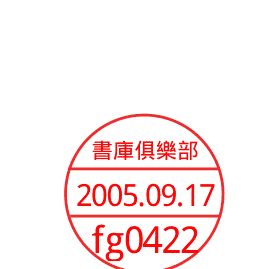

梁湘潤著

## 紫微斗數考證

文源書局有限公司印行

# 序言

書曰：「不知命無以爲君子。」

人在一生之中，不免有着各種窮通禍福，莫可預計之各式遭遇。際或「有心種花花不發，無心插柳柳成蔭」等時有意外之境遇，或又因禍得福，因福得禍：……世態萬千俱皆難以一言而盡。此無它皆係五行生化大道之所洪範，非人力所以能更改者也，故韓信失時之際，乞食於漂母得意封侯之時，又見遭凶。鄧通富可敵國而至餓死。今人或以爲際此科學時代焉能取信此虛無縹渺之五行命理，實則命理之學，乃是最符合科學邏輯之法則。最客觀之統計，以人出生時之年月日時註以五行之符號以最合理之方程式。歷千年以來之人物統計而累積所得之命理公式，並無絲毫迷信之色彩成份，據此而論人一生之吉、凶，其精確性恆常十不離其八九誠爲我國學理上之一大成就。

命理之學，垂今已千餘年，歷代帝王、公侯、將相……，俱皆深信其命之所在，當不是迷信之近如裕隆汽車廠廠長毛永深、「精武門」之李小龍等，在其生前即已可推算出其不祥之兆。

沙門 梁湘潤

民國六十四年乙卯春書於東方精舍
台北市虎林街一六四巷六○弄八號

# 目錄

# 序言

# 前言

# 緒論

# 斗數承繼之五行背景

# 紫微斗數與唐宋二代論命之異同

# 紫微斗數與起之本因

# 紫微斗數沿革

## 五行局述微

# 命宮論

# 紫微星論述

## 十二宮論述

## 「紫」「府」星系

## 年、月、日、時、諸星系列

## 地盤

- 「大限」「小限」論證………………六六
- 「四化」述微………………八一
- 命主與身主………………八五
- 流年星座與「神煞」………………八七
- 紫微斗數與陰陽宅風水………………九四
- 斗君………………九八
- 天盤論………………一〇〇
- 「大限」與十二宮………………一〇三
- 「四殺」與「加殺」………………一一六
- 小限地支順序論………………一一三
- 「地劫」「天空」論考………………一二三
- 賦文星座差別………………一二五
- 比判註釋………………一二八
- 陳希夷傳………………一三〇
- 風水九星與斗數………………一三二
- 星「病」論考………………一三九
- 「星座」與陽宅各別含義………………一四三
- 蕉窗雜問………………一四六
- 命例………………一五四
- 名作家臥龍生命造………………一五五
- 名作家蕭逸命造………………一五九

附：紫微斗數與子平法重要例表比判………………一六二

# 前言

紫微斗数是「命理」学术中属主要派别的一种，论深则可以极尽其五行之理，论浅则人人皆可体会，「斗数」可以依自己之独立理则论命，可以与「子平法」合论，可以与「七政四余」合论，亦可以与堪舆风水合而言之，职是之故「斗数」之所以谓「会」或「懂」之一字就难下定论矣。
故此，某人能依地盘十二地支填妥所有星座，只须依照任何一种赋文，如太微赋、千金诀等仿照活用，即可以说他懂紫微斗数，或者又只仅仅把十二宫填妥，加大限、小限、随意查照十几个星座另外加一个子平式之四柱，完全又照星座之定义纯以四柱上冲、刑、会、合来下断语，也同可以说已懂「紫微斗数」。

反之，若有人，除了起局、取星座、大限、小限、流年、流月、「廟、旺、利、陷」等等皆十分了达例如：

一、「博士」与「禄存」为同位，「博士」与「禄存」其相同之处与相异之处是在如何区分
二、「博士」十二星中之「大耗」，与年支十二星之「大耗」。区分「大耗」是相同或有不同之处，其理则以何为准。

# 緒論

三、紫微、天府、十二個星座之中，有九個與堪輿名稱相同，試問其同名之中，斗數與堪輿是否有相通的點或只是巧合，二者之主論取法於何根源。

四、何以水稱「二局」、木稱「三」局，其不可以稱水「三局」木「二」局之根據為何？

若未能一明瞭其根源，也可以稱此人，並不懂「紫微斗數」。

故此「紫微斗數」敘介其起局之方式，問吉凶之準繩易，而考其之起源，其沿革所使用之五行規範為繁瑣。本文是著重於理性之資證，對起局論吉、凶方面不作詳細之引介，因為相信，凡讀本文之讀者，十、九皆已經對紫微斗數之使用方法業頗為了解，故之中以引述五行之依據，時代之差異，因而星座神煞之繁複，以及與子平與其間相互影響之關聯，以及斗數與堪輿「三元」方面之源流異流之引介，乃著重其論證之一方面，其有關吉凶之處只是以行文提及之處，方涉及之書後附有命理方面之諸家表例，以供讀者評判參考。

「紫微斗數」首創於何年代，此一問題迄今尚未能有極肯定之定論。由於凡有關「紫微斗數」之書。「四庫全書」之中並未有此項之資料可資循考，然而以「斗數」之五行立場，及其起局使用之格式規範。比照李虛中、徐子平、……等大師之規範，相互比判之下，其間同異之處，亦可以衡量出與此二人之理論關聯之處。

「斗數」與「李虛中、徐子平」均有相同之處，亦有不同之處，如研究「斗數」之起源，及與原有命學之關聯，必須先了解命理學上之初創時期及其沿變之過程。命理在我國有千餘年之歷史，歷代大師雖亦不乏其人，然而真正奠定命理規範者，只有少數幾個人，其間又有少數，不知其姓氏，或為佚名或為他人之所記述。如命理之五行為繼承洛書五行，而非「河圖」之五行，最初期間與八卦有直接關聯，後來只留存「方」之基本聯繫，如「寅、卯、辰」為東方木，（震卦）等等，所有各種論命方式，不論「李虛中、徐子平、紫微斗數、鐵版神數乃至奇門遁甲……」等等，俱皆相同，皆以「寅、卯、辰」之卯為正東，作震卦，「巳、酉、丑」之酉為「兌」卦……等等。

斗數之起局方式，與循查星座，神煞之方法甚易，而探討其與原有諸家規範，則較為繁雜，

由於「斗數」是雜取諸家之立論以及其中又有各人按自己的觀點而刪改或是增添，且又因「斗數」之作者不是一個人，且又多是佚名，尤其以詩詞賦文之中，大都藉口於陳希夷……等等之名士。因此「斗數」除了基本規範範圍相似，其中所下之定義亦互相有不相同之註釋，以及有二個以上相同之星煞，如「博士」十二星中之「大耗」，而神煞之中另有一個「大耗」以及有「火、土」同長生者，亦有水、土同長生者，相混而併處，若只以查表填星座神煞則並無甚觸目之處。若以理論根據而言，則顯然徘徊在唐、宋二代五行之間，故此詳考紫微斗數之根源，必先從有命理之初 期而觀其沿革方能了解。

# 斗數承繼之五行背景

斗數既屬命理之一種，「斗數」即是命理，而命理不一定以斗數為主。查命理之最早起源，可能在春秋戰國之時代，其時之範圍大抵皆以諸侯之大事而論，雖然觀之亦與今日之命理相似，其實並不是一樣，而且相去甚遠。今日吾人查閱漢代此前之五行書籍，同樣亦為「甲乙丙丁戊己……」「子丑寅卯……」干支完全皆一樣，然而其時代在實用上根本迥異，干支大都用於音律，天文星宿之中，如史記二十五卷律書所載「應鐘者，陽氣之應，不用事也，基於十二子為亥，亥者該也。」歷書載曰：「夏正以正月，殷以十二月，周正以十一月，蓋三王之道若循環，又以天官書所載「歲陰在酉，星居午，以八月與柳七星張晨出」等等，都是以五音之律，二十八宿，以干支配屬。」以簡化其詞語。

+   五行相勝之道，則遠在周代以前即有。但並不牽涉至有何論個人吉凶之事，五行之配屬干支，各有各種之立場，如：

1. 以甲乙配木。丙丁配火。戊己配土。庚辛配金。壬癸配水。
2. 以寅卯配木。巳午配火。申酉配金。亥子配水。

而辰、戌、丑、未，配屬之於「土」最為難考，今日「土」旺四季之說，乃是宋代以後之立

論，其間有二、三百年之無定論時期。

至於地支之配屬天干並配屬給五行之規範則較為複雜，漢書之三統曆中記載之十二節氣，未用干支，相配屬，然而在漢代未遠時，史記律書之中已有干支之配屬。

| 漢 書 |
| （律曆志三統曆） |
| 十二次 | 各宿初度 | 中度 | 節 | 中 |
| 星紀 | 斗十二度 | 牽牛初 | 大雪 | 冬至 |
| 玄枵 | 婺女八 | 危初 | 小寒 | 大寒 |
| 取訾 | 危十六 | 營室十四 | 立春 | 驚蟄 |
| 降婁 | 奎五 | 婁四 | 雨水 | 春分 |
| 大梁 | 胃七 | 昂八 | 穀雨 | 清明 |
| 實沈 | 畢十二 | 井初 | 立夏 | 小滿 |
| 鶉首 | 井十六 | 井三十一 | 芒種 | 夏至 |
| 鶉火 | 柳九 | 張三 | 小暑 | 大暑 |
| 鶉尾 | 張十八 | 翼十五 | 立秋 | 處暑 |
| 壽星 | 軫十二 | 角十 | 白露 | 秋分 |
| 大火 | 氏五 | 房五 | 寒露 | 霜降 |
| 析木 | 尾十 | 箕七 | 立冬 | 小雪 |

在這二個表之中，三統曆只有建月，與中氣，雖亦與命學有關而對「斗數」則無關聯，以「斗數」取月，不問「建月」或「中氣」，這一點在「閏月作下月論」一節之中，另有說明，但與「子平法」「大雪」建「子」月有關聯。

只指二十八宿與氣節之關聯，唯獨史記之律書所載與命理有直接關聯：

一、「大雪」之氣節作為十一月之建月，為命理常用之共同法則。
二、地支配天干則大為有異。

| 史記律書 |
| 十二支 | 十干 |
| 子 | 壬、癸 |
| 丑 | |
| 寅 | |
| 卯 | 甲、乙 |
| 辰 | |
| 巳 | |
| 午 | 丙、丁 |
| 未 | |
| 申 | |
| 酉 | |
| 戌 | 庚、辛 |

律書以：亥子一配壬、癸，
丑寅卯一配甲、乙，
辰巳午一配丙、丁，
未申酉戌一配庚、辛。

## 命理常法以：

亥子—配壬、癸
寅卯—配甲、乙
巳午—配丙、丁
申酉—配庚、辛
辰戌丑未—配戊、己
卯、酉」為四「正」。若依史記律書，則為
甲、乙旺於—卯
丙、丁旺於—午
庚、辛旺於—酉
壬、癸旺於—子

、尤其另有一項與命理重要之不同，即四「正」地支之位亦有差異，所有命理皆以「子、午、

若以「戌」為庚、辛、金旺之地，則非但四「正」之位有不同，連帶「辰、戌、丑、未」為

四「庫」之基本立論，亦有變異。

紫微斗數在四「正」與四「墓庫」之立論與子平相同。以史記律書而言，即由此可以證明，

「紫微斗數」之五行理論，決不會在漢代以前而是漢代以後。命理論形成之階段如下

### 甲、

考學首具有五行論命之事，以干支推論者，大約是在東漢末年，或魏初之時。後漢至中，

載有管輅傳，其中有局部論到干支，及歲星類似今日之命理初步形式，其所稱之歲星，書指

太歲，或流年之太歲而是指「木」星為歲星。

乙、自東漢至隋代，其間演變資料極為缺乏，大抵命理至隋代所已經完成之理論其最重要之成就

乃是五行有「長生、沐浴、冠帶臨官。……衰、墓、死、絕」等，天干對地支比照其強弱，

此「生、旺、庫」表對命理為最有決定性之重要。如果沒有「生、旺、庫」之十二支表位，則「

子平法」即不能論命，隋代之十二生、旺、庫表與現在「子平法」所用的，有小處不一樣程

序上之差異。

### 子平式：

長生。沐浴。冠帶。臨官。帝旺。衰。病。死。墓。絕。胎。養。

### 隋代之命式：

受氣。胎。養。生。沐浴。冠帶。臨官。旺。衰。病。死。葬。

| 宋代子平 | 隋代 |
|----------|------|
| 帝旺     | 旺   |
| 墓       | 葬   |
| 絕位     | 受氣 |

這些小枝節為不重要之處，而觀其五行生、旺之位，可以看出隋代「土、火」同「受氣」位，同一「葬」位。唯獨「土」無長生，「土」只有「宿行」位。「宿行」是所有五行中，「土」行有特有之位置，也可勉強作「长生」代用，也就是子平法「火、土」同長生，「斗數」之「生、旺、库」位，有三種使用法。唐代李虚中以「水、土」同长生，「斗数」之「生、旺、库」位，有三种使用法。依此而言，斗数五行局之「长生、沐浴、冠带……」十二位是依李虚中命书，唐代之论式。B、年干之「长生」位是「火、土」同长生。A、五行局之「长生」位是「水、土」同长生。而年干之「生、旺、库」是依「隋代」之论式。C、重视年干优于日主天干，亦为依唐代之论式。综合而言，则知紫微斗数，非但不是汉末之作品，而且还在唐代以后，与徐子平时期相同，无非是二者各有见地，故可以说「子平法」与「紫微斗数」二者皆是李虚中一脉分裂出之一种不同系统，比较上又以「斗数」大多还有格局显然继承李虚中之理论。

## 紫微斗数与唐宋二代论命之异同

甲、相同之处为：
(一) 全部继承唐代原有神煞，并加以扩大，为使十二地支对十二宫，无一有缺乏之情况，加入比原有之神煞有八十种。此中神煞有局部为完全相同，如「孤辰、寡宿……」等。
(二) 俱皆以年干为主。
(三) 水土同「长生」。
(四) 四十十六旬空亡位俱皆相同。

乙、类同之处：
(一) 如甲见「卯」羊刃「斗数」改称之谓「擎羊」。
(二) 如甲见「寅」临官（干禄）「斗数」改称之谓「禄存」。
(三) 如甲见「丑、未」为天乙贵人「斗数」改称之谓「天魁天钺」。
(四) 「五虎遁月」法，用于「命宫」，以「命宫」取代月柱之组合。

丙、不同之处：
(一) 兄弟、父母、子女、财帛等，不以六神上之分论，也不取以年柱主长辈……等之常法，俱

皆固定在地盤十二宮之中。
(二)五行局取「納音甲子」如「甲子乙丑」海中金，不取年干之河圖正五行。
(三)以命宮時支為主基，立出紫微，連屬一十三位「天府」主星。
(四)年、月、日、時均可取星座。
(五)火星、鈴星，各以地支五行「三合」分別取出。
(六)紫微星所屬一十三位主要星宿，分別以雜用天官書之星名代入，所化入之星座，不用生、庫、而用「廟、旺、利、陷」。
(七)大運改為大限，為固定之起限年歲，非是三日拆一年之常法。
由此三種相同之處，類同之處、不同之處。比判之下，便了解紫微斗數產生之時代，當在唐代末葉至宋代中葉之期間。
紫微斗數所取用之一十三位主要星座。
紫微。天機。太陽。武曲。天同。廉貞。
天府。太陰。貪狼。巨門。天相。天梁。七殺。破軍。
其中之取於天官書中之星宿名詞，不可認作可能是漢代之作品，由於其中一則命主星座所組
合上有一明顯之說明，安命主之星座為

| 命主 | 命宫 |
|------|------|
| 貪狼 | 子 |
| 巨門 | 丑 |
| 祿存 | 庚 |
| 文曲 | 卯 |
| 廉貞 | 辰 |
| 武曲 | 巳 |
| 破軍 | 午 |
| 武曲 | 未 |
| 廉貞 | 申 |
| 文曲 | 酉 |
| 祿存 | 戌 |
| 巨門 | 亥 |

其所取用之星名，雖為天官書之星名，但卻是堪輿風水方面三元九星之次序，只證明立此
表之人，是風水方面之造詣遠超過於命理或者是「堪輿家」客串於命理，這並不是重要之問題，
而其關鍵堪輿九星法之間世，是在唐代末年方有此說，因而旁證出紫微斗數為唐代末葉之產品，
「斗數論命」之法式早於「子平法」約一二百年。

## 紫微斗数兴起之本因

唐代原论命之方式为三元论命，「三元」这个名词，有点与风水相似，风水取「三元」之名，而另有解释，三元论命，为天元、地元、人元。

天元—天干五行
地元—地支五行
人元—纳音五行

论命也只以年、月、日为三柱，不须时柱。

例如：
乙酉
甲申

依纳音五行，甲申、乙酉、泉中水」水「长生」在「申」，故以纳音五行之中「人元」得「天元」、「地元」一气所归即为好命。
然而能得如此配属巧合之人命太少，不免其中干、支五行。每每有与纳音五行不易调停，
而且这种方式，绝非是略识之无者所能使用。
命理在创始之大师皆为道家修士，李虚中即是道士，凡道学修士恒常以研究命理作消遣之道
。李虚中所制述之法理不论文才与涵义，自然俱皆可以称得上是空前之巨著，一代宗师当之而无
愧，不过在道长之眼光下，却另有衡量。
因为李虚中命式亦以十二「生、旺、库」为主要原则之一。如前面所举之这个命例，其所以
论作好命，主旨只在「水长生在申」。
若不是「水长生在申」，即不能使甲乙木与申酉金共同归纳于「人元」。泉中水之取「长生」
为好命之结论。这个命式并无理论上之不妥。然而道长们都知道，金、木、水、火四种五行之长
生易明，而「土」之长生难论。
由于汉代以前五行理论取「盖天派」之天文立场，以天是圆形，地是半形，故东、南、西、
北有对冲之方位，唯独「戊、己」土在中央，无对冲之方位。故在西汉武帝以前之天文书上记载
，即使是司马迁注释十干配十二支，「戊己」二干并不配属地支，是独立超然之境地，直至汉代
张衡创「浑天派」宇宙说，乃以圆的概念来解释地形、如此则「圆」之地形，并无所谓固定之
心点，处处皆可以称之为「中」这一观念，顿使「戊己」土之超然立场，失去立足点。由天文与
命理皆使用五行及十干十二支，然而命理是依附于天文。「命理」是「五行」，「五行」并不仅
仅是命理。五行之基本理哲与配属在天文之中，命理只是取已成定则之天文五行顺序以论人命。故天

文上五行干支，發生變化，命理即莫知所從。基於「渾天派」論定「地」是圓的概念，命理方面之大師對此大為困惑，便由「戊己」天干不統地支之立場而改變為，在十二地支中，每隔二位取一位，取出「辰、戊、丑、未」四地支，兼併入「戊、己」天干，於是有了「金、木、水、火」四種五行中，各居一「庫」位。這個觀念始於何人？至今尚是一個迷題，但觀隋代蕭吉所著之「五行大義」所論之「戊、己」土，在隋代已經有明確指出，「戊己」天干配屬「辰、戊、丑、未」，不過在隋代對「戊、己」之類別的命理形式，皆奉此「法則」，定出「孤辰，寡宿」之神煞……因而願承認「水土」同長生之一說。然而在博學道長之心目中並不如是觀。他其餘哲思之高明，並不由隋代蕭吉至唐代李虛中之間不知幾經修改，終於由李虛中所制定「水、土」同長生而成定論。所謂「定論」。並非是事實上即是如此。而是大都數人願意採用李虛中之「水、土」同長生之一說而已。無非是李虛中在其他方面之成就令人佩服。如他所開闢之所謂「論一方之氣，不可過角。過角則孤，退角則寡」。千年以來，不能任何系別之命理形式，皆奉此「法則」，定出「孤辰，寡宿」之神煞……因而願承認「水土」同長生之一說。然而在博學道長之心目中並不如是觀。他其餘哲思之高明，並不

書）。由隋代蕭吉至唐代李虛中之間不知幾經修改，終於由李虛中所制定「水、土」同長生而成定論。所謂「定論」。並非是事實上即是如此。而是大都數人願意採用李虛中之「水、土」同長生之一說而已。無非是李虛中在其他方面之成就令人佩服。如他所開闢之所謂「論一方之氣，不可過角。過角則孤，退角則寡」。千年以來，不能任何系別之命理形式，皆奉此「法則」，定出「孤辰，寡宿」之神煞……因而願承認「水土」同長生之一說。然而在博學道長之心目中並不如是觀。他其餘哲思之高明，並不

初創之時，不得不全皆列入，以免有為人所不能接受之感。

紫微斗數興起之另一原因即是「以李虛中論命以「年」為本，一年所生之人太多了，縱或月、日相扶，加諸天干、地支、河圖五行、納音五行之複式分類開演，仍覺不夠精密。

這個觀點於「徐子平對李虛中之看法相同，所不同的是二者所用輔助方法上之不同。

紫微斗數以「年」加五行局及時支。

徐子平以「日」加六神生剋兼時柱。

紫微斗數比子平法為早，徐子平當然對「李虛中」以及「斗數」俱皆認不盡理想。

基於上述之原因，而導致紫微斗數之分歧，然而唐末宋初時代之紫微斗數。與今日之「斗數」是多少有些不同。由於命理是自由研究，並無集合共同交換意見之可能，流傳至今日之斗數。

實際是一種「子法式」註解之「斗數」。

其次，紫微斗數能在李虛中與徐子平之間，尤以在明、清二代子平法大盛之期，仍能佔命理上之一席重要之位置，其關鍵為查對例表，其方法簡便，某些觀點比「子平法」亦大為簡便。其

## 顯然之處

一、為不必排列四柱。
二、不須以二十四氣節，從建月上推算月令之地支。
三、每週閏月作下月推論。

四、「廟、旺、利、陷」表分列十二地支之旺衰，只以「廟、旺、得地、利益、平和、不得地、陷」七位分列，比十二「生、旺、庫」中之如「養、胎、冠帶」等字義難以作有何區別，且「廟、旺、利、陷」並不指天干強弱，而指主要星座之力。對於主要星座之性質，俱有固定之解釋易於辨出命格之徵兆。

五、六親、官爵、財帛，不必依子平式，以「官殺」或偏財作父，正印作母，等如此複雜辨認。只須在十二宮中詳核所坐之星座即可知曉。

六、即使沒有萬年曆亦可論命，只須記住六十甲子，順背流年即可。

基於以上諸項之優點，深為一般職業論命者所喜好，即使是原習「子平法」者，亦多兼用「斗數」，明、清二代「子平法」之人士，又再度以「子平法」之長處融入「斗數」之中，不斷補增詞賦，如「增補太微賦……」等等，皆為以「子平法」融入「斗數」中之作品。

以下附隋代蕭吉所著「五行大義」所述，五行「生、死」之註釋，詳見拙作「命學大辭淵」第一輯，「五行大義」之中。

## 论生死所

五行体别生死之处不同，遍十二月，十二月辰而出没生死。

- 木：受气申、胎酉、养戌、生亥、沐浴子、冠带丑、临官寅、旺卯、衰辰、病巳、死午、葬未。
- 火：受气亥、胎子、养丑、生寅、沐浴卯、冠带辰、临官巳、旺午、衰未、病申、死酉、葬戌。
- 金：受气寅、胎卯、养辰、生巳、沐浴午、冠带未、临官申、旺酉、衰戌、病亥、死子、葬丑。
- 水：受气巳、胎午、养未、生申、沐浴酉、冠带戌、临官亥、旺子、衰丑、病寅、死卯、葬辰。
- 土：受气亥、胎子、养丑、生寅、沐浴卯、冠带辰、临官巳、旺午、衰未、病申、死酉、葬戌。

辰土：受气申酉、胎戌、养亥、生子、沐浴丑、冠带寅、临官卯、旺辰、衰巳、病午、死未、葬申。未土：受气亥子、胎丑、养寅、生卯、沐浴辰、冠带巳、临官午、旺未、衰申、病酉、死戌、葬亥。戌土：受气寅卯、胎辰、养巳、生午、沐浴未、冠带申、临官酉、旺戌、衰亥、病子、死丑、葬寅。丑土：受气巳午、胎未、养申、生酉、沐浴戌、冠带亥、临官子、旺丑、衰寅、病卯、死辰、葬巳。

> 孝经援神契云：五行土出以利治天下。龟经云：土木动为辰，火动为未，金动为戌，土水动为丑。

又云：甲乙寅卯为辰土，丙丁巳午为未土，庚辛申酉为戌土，凡五行之旺，各七十二日，土居四季，季十八日，并七十二日以明土有四方生死不同。易曰：西南得朋、东北丧朋，此明土旺定在“未”，墓定在“辰”，土得于“未”终于“丑”。

## 紫微斗数沿革

“紫微斗数”在唐、宋之时代，不是今日所见之“斗数”，今日所用之“斗数”，大约只有二分之一，是当时之形式，由于“斗数”经过三个阶段之考验，第一阶段是唐末至宋末，其过程与“子平法”相同，即是必须与原有论命方式，以年柱为本，只取三奇六仪、神煞之论命方式方可竞争“之正。”斗数与子平法亦同时经历此一理论上蔑争。

第一阶段是元代之大宗师，耶律楚材所制述“七政四余”，以“正五行之变”兼“变五行”。

第三阶段一为“斗数”与“子平”融合之时期，即在明、清二代，“斗数”为了适应一般研究者之方式，由于其时，李虚中，及七政四余，纯学术理论式之命理已属少数，多为“子平法”或者仅是江湖式之论法。子平法既已可以执命理界之多数地位，便亦不得局部用子平法之术语、口吻来注释“斗数”，平添不少新著之诗赋。

然而“紫微斗数”与“子平法”对五行基本上之立场不同，斗数虽与李虚中有异，但皆为

注：阴阳五行，即五行各分阴阳，如阳死阴生，阴死阳生……等，与八卦阴阳有不同、八卦之阴阳主旨为“负阴而抱阳”五行阴阳指金、木、水、火、土各有阴阳。

依据隋代“五行大义”为蓝本，子平法依阴阳五行、四时五行为依据。

于宋代以后相存而并行不悖。

考诸“斗数”在最早之形式，为有十干阴阳五行之格但理哲上却崇尚易卦为主冒。以干支五行所属配属八卦作原始之规范，天干为天盘，地支为地盘，及河洛理数。

甲、地盘：其方格易排，其形式即为今日所见之紫微斗数地盘表。
乙、天盘：即天干排列成九宫格形。
丙、河洛理数：即干、支所属其在河图，洛书上之数字。相互加减，综合而取之数字，以定其吉、凶所示。

第一种地盘，即是今日之紫微斗数。
第二种天盘，“紫微斗数”有关天盘一说，但很少见有使用天盘之实例，天盘实际上演变为“奇门遁甲”单独发展，可以脱离“斗数”自列一系，而且发展至脱离“斗数”之范围。
第三种河洛理数之数字以显微兆，也另行发展为“铁版神数”。

“紫微斗数”在原始应包括以上全三项，然而三项中之任何一项，不论只用地盘、天盘、或河洛理数，均可以论命，今日所用者“飞星斗数”是纯用地盘，而“铁卜子”之斗数，即三项俱全，但因目前所流通有关三种全面合论之典籍，大都为散佚不全，不易联贯而研究之，如有时间与志趣，也不难把三种方式依然可以联贯为一个立体之系则。

## 五行局述微

『紫微斗数』除了十天干十二地支之五行与常法相同外，其另有『局』之五行，如何能称之为『局』其方法甚易，只须一查五行局表即可明瞭，若问五行局何以有『水二局』……等之数字上之加添便不易明瞭，然而吾人既知『紫微斗数』为命理与易卦相结合之产品当可信知，凡遇命理常例以外之理哲，大都是依易卦，河洛理数为加添之理哲。

五行局列表

| 出生年干 | 命宫 | 子丑 | 寅卯 | 辰巳 | 午未 | 申酉 | 戌亥 |
|----------|------|------|------|------|------|------|------|
| 甲己     |      | 水二局 | 火六局 | 木三局 | 土五局 | 金四局 | 火六局 |
| 乙庚     |      | 火六局 | 土五局 | 金四局 | 木三局 | 水二局 | 土五局 |
| 丙辛     |      | 土五局 | 金四局 | 水二局 | 火六局 | 木三局 | 金四局 |
| 丁壬     |      | 金四局 | 木三局 | 火六局 | 水二局 | 土五局 | 木三局 |
| 戊癸     |      | 木三局 | 水二局 | 土五局 | 金四局 | 火六局 | 水二局 |

其中共有五局为『水二局』。木三局。金四局。土五局。火六局。

水在天为一、在地为六。火在天为七、在地为二。木在天为三、在地为八。金在天为九、在地为四。土在天为五、在地为十。

按『五行局』之『二、三、四、五、六』之五行数乃为取于隋代之五行理论『五行大义』所载五行生成数为：

另以礼记月令篇云：木八、火七、金九、水六、土五，此皆言其生数，而紫微斗数用的是『成数』故

成数故
木一为三数之局
金一为四数之局

土为五数之局

水、火二局，乃以易卦之理“水火既济”之理，故水用火数，火用水数，坎离交换使用而成

其象故：

- 水—为火之二数局
- 火—为水之六数局

根据此而定出五行局之数，此数为五行成数，而非指生数。

## 命宫论

按紫微斗数乃道家修士，兼而研治命学，并非是纯粹之命理大师。其所使用之术语，多有道家气息，道家居之处所衡常皆以“宫”之二字以冠盖其名，故以“支命”称之谓“命宫”。依此而论“命宫”一词引用于命理之中，是始于“斗数”之大师，而非“徐子平”然而何以“子平法”中亦有“命宫”一词，盖以“子平法”之“命宫”，尽人皆知，其重要性并非“斗数”之“命宫”可比，以“斗数”若无“命宫”则根本不能论命。而“子平法”中不提“命宫”并无任何妨害，“子平法”中之“命宫”推法，虽也是以“时支”取出，其定义则简单得多矣，无非是当初“斗数”与“子平”平行于世之时，后代“子平法”之论师，一种通俗观念，即是（彼有此一说，我亦有此一说），换了一种编组方式加一“命宫”之说，聊备一格而已。（附子平命宫取用法于本节之后）“身宫”一说则“子平法”所不取。“命宫”与“身宫”能有机会併聚一宫之条件，只有出生在“子”“午”二个时辰，这一个重视“子、午”二支之概念，乃受唐代李虚中概念直接秉承南、北为“坎、离”之地，水、火，既济之家，至明代万育吾氏仍重视此说。三命通会，亦以“子为帝座、午为端门”。斗数命宫重

### 附斗数“命宫”、“身宫”表及子平法“命宫”表，以供相互对照比例。

| 月份 | 正 | 二 | 三 | 四 | 五 | 六 | 七 | 八 | 九 | 十 | 十一 | 十二 |
|------|----|----|----|----|----|----|----|----|----|----|------|------|
| 子   | 子 | 丑 | 寅 | 卯 | 辰 | 巳 | 午 | 未 | 申 | 酉 | 戌   | 亥   |
| 丑   | 丑 | 寅 | 卯 | 辰 | 巳 | 午 | 未 | 申 | 酉 | 戌 | 亥   | 子   |
| 寅   | 寅 | 卯 | 辰 | 巳 | 午 | 未 | 申 | 酉 | 戌 | 亥 | 子   | 丑   |
| 卯   | 卯 | 辰 | 巳 | 午 | 未 | 申 | 酉 | 戌 | 亥 | 子 | 丑   | 寅   |
| 辰   | 辰 | 巳 | 午 | 未 | 申 | 酉 | 戌 | 亥 | 子 | 丑 | 寅   | 卯   |
| 巳   | 巳 | 午 | 未 | 申 | 酉 | 戌 | 亥 | 子 | 丑 | 寅 | 卯   | 辰   |
| 午   | 午 | 未 | 申 | 酉 | 戌 | 亥 | 子 | 丑 | 寅 | 卯 | 辰   | 巳   |
| 未   | 未 | 申 | 酉 | 戌 | 亥 | 子 | 丑 | 寅 | 卯 | 辰 | 巳   | 午   |
| 申   | 申 | 酉 | 戌 | 亥 | 子 | 丑 | 寅 | 卯 | 辰 | 巳 | 午   | 未   |
| 酉   | 酉 | 戌 | 亥 | 子 | 丑 | 寅 | 卯 | 辰 | 巳 | 午 | 未   | 申   |
| 戌   | 戌 | 亥 | 子 | 丑 | 寅 | 卯 | 辰 | 巳 | 午 | 未 | 申   | 酉   |
| 亥   | 亥 | 子 | 丑 | 寅 | 卯 | 辰 | 巳 | 午 | 未 | 申 | 酉   | 戌   |

视“子、午”安立身命同宫于“子、午”这是受八卦正南、正北之影响。然而命宫，身宫，这两个字之起源于何时，子平法论命虽有“命宫”一说，其间有人采用命宫，亦有人不重视命宫，此皆为个人之随喜爱好，不过子平法亦有命宫一说而是可以征信的，若推问二者之间究竟“命宫”是先创于“斗数”。抑或“命宫”一说创于“子平”此点若有结论，便能知晓“斗数”与“子平”孰先孰后。

按“命宫”一词其名词之取用乃出于史记天官书。载曰：“斗魁戴匡六星曰文昌宫。一日上禄，二日次禄，三日贵相，四日司命……命宫之原始取名脱胎于此，然而当时称之为“司命”。至唐代李虚中（韩愈同时代人士）其著述之“命书”（详见拙作“命学大辞渊”五二九页李虚中命书，第一〇九节）。原文谓：“元命胜负，三元者，干禄、支命、纳音身，各分衰旺之地。”

史记天官书为西汉时代之作品，原文为“司命”。至唐代李虚中，取为“支命”，既称之谓“支命”当然是以地支为立，其所以又改称之谓“命宫”。“支”是依据李虚中所说之“支命”。命宫一词，其含义易明，斗数之所以用“命宫”按时支，应以地支为主。其基本之观念与“子平”相似，皆以认为但依年干为本，不足以概括细节，以同年出生之人太多，纵有月、日综合而言，仍有不足之嫌，“子平”取“六神”之观点，“斗数”重时支之命宫加以复式识别星座，以辅年柱之不足。

### 斗数身宫例表

|    | 正月 | 二月 | 三月 | 四月 | 五月 | 六月 | 七月 | 八月 | 九月 | 十月 | 十一月 | 十二月 |
|----|------|------|------|------|------|------|------|------|------|------|--------|--------|
| 丑 | 子   | 亥   | 戌   | 酉   | 申   | 未   | 午   | 巳   | 辰   | 卯   | 寅     | 〃     |
| 寅 | 丑   | 子   | 亥   | 戌   | 酉   | 申   | 未   | 午   | 巳   | 辰   | 卯     | 〃     |
| 卯 | 寅   | 丑   | 子   | 亥   | 戌   | 酉   | 申   | 未   | 午   | 巳   | 辰     | 〃     |
| 辰 | 卯   | 寅   | 丑   | 子   | 亥   | 戌   | 酉   | 申   | 未   | 午   | 巳     | 〃     |
| 巳 | 辰   | 卯   | 寅   | 丑   | 子   | 亥   | 戌   | 酉   | 申   | 未   | 午     | 〃     |
| 午 | 巳   | 辰   | 卯   | 寅   | 丑   | 子   | 亥   | 戌   | 酉   | 申   | 未     | 〃     |
| 未 | 午   | 巳   | 辰   | 卯   | 寅   | 丑   | 子   | 亥   | 戌   | 酉   | 申     | 〃     |
| 申 | 未   | 午   | 巳   | 辰   | 卯   | 寅   | 丑   | 子   | 亥   | 戌   | 酉     | 〃     |
| 酉 | 申   | 未   | 午   | 巳   | 辰   | 卯   | 寅   | 丑   | 子   | 亥   | 戌     | 〃     |
| 戌 | 酉   | 申   | 未   | 午   | 巳   | 辰   | 卯   | 寅   | 丑   | 子   | 亥     | 〃     |
| 亥 | 戌   | 酉   | 申   | 未   | 午   | 巳   | 辰   | 卯   | 寅   | 丑   | 子     | 〃     |
| 子 | 亥   | 戌   | 酉   | 申   | 未   | 午   | 巳   | 辰   | 卯   | 寅   | 丑     | 〃     |

命宫之加盖天干，是使由原有之“五虎遁月”法，此法为“子平”用于月柱天干。斗数用“命宫”之地支加盖“五虎遁月法”，即是“命宫”作为实际上之“月柱”使用，故玉照神应

> 经曰：『三犯月胎、祖宗、尤祸』

即是“胎”指命宫之同义，“月”即月柱，合而言之，视命、胎、与月柱相等之观念。

- “甲己”丙作首
- “乙庚”戊为头
- “丙辛”从庚起
- “丁壬”从自流
- “戊癸”甲为首

“斗数”只以“月”之地支，换用为“命宫”之地支。

### 子平法“命宫”表

| 生时 | 十二月 | 十一月 | 十月 | 九月 | 八月 | 七月 | 六月 | 五月 | 四月 | 三月 | 二月 | 一月 |
|------|--------|--------|------|------|------|------|------|------|------|------|------|------|
| 23-1 | 辰     | 巳     | 午   | 未   | 申   | 酉   | 戌   | 亥   | 子   | 丑   | 寅   | 卯   |
| 1-3  | 卯     | 辰     | 巳   | 午   | 未   | 申   | 酉   | 戌   | 亥   | 子   | 丑   | 寅   |
| 3-5  | 寅     | 卯     | 辰   | 巳   | 午   | 未   | 申   | 酉   | 戌   | 亥   | 子   | 丑   |
| 5-7  | 丑     | 寅     | 卯   | 辰   | 巳   | 午   | 未   | 申   | 酉   | 戌   | 亥   | 子   |
| 7-9  | 子     | 丑     | 寅   | 卯   | 辰   | 巳   | 午   | 未   | 申   | 酉   | 戌   | 亥   |
| 9-11 | 亥     | 子     | 丑   | 寅   | 卯   | 辰   | 巳   | 午   | 未   | 申   | 酉   | 戌   |
| 11-13| 戌     | 亥     | 子   | 丑   | 寅   | 卯   | 辰   | 巳   | 午   | 未   | 申   | 酉   |
| 13-15| 酉     | 戌     | 亥   | 子   | 丑   | 寅   | 卯   | 辰   | 巳   | 午   | 未   | 申   |
| 15-17| 申     | 酉     | 戌   | 亥   | 子   | 丑   | 寅   | 卯   | 辰   | 巳   | 午   | 未   |
| 17-19| 未     | 申     | 酉   | 戌   | 亥   | 子   | 丑   | 寅   | 卯   | 辰   | 巳   | 午   |
| 19-21| 午     | 未     | 申   | 酉   | 戌   | 亥   | 子   | 丑   | 寅   | 卯   | 辰   | 巳   |
| 21-23| 巳     | 午     | 未   | 申   | 酉   | 戌   | 亥   | 子   | 丑   | 寅   | 卯   | 辰   |

### 十二宫地支加盖天干表

| 十二宫位 | 出生年干 | 甲 | 乙 | 丙 | 丁 | 戊 |
|----------|----------|----|----|----|----|----|
| 寅       |          | 甲 | 丙 | 戊 | 庚 | 壬 |
| 卯       |          | 乙 | 丁 | 己 | 辛 | 癸 |
| 辰       |          | 丙 | 戊 | 庚 | 壬 | 甲 |
| 巳       |          | 丁 | 己 | 辛 | 癸 | 乙 |
| 午       |          | 戊 | 庚 | 壬 | 甲 | 丙 |
| 未       |          | 己 | 辛 | 癸 | 乙 | 丁 |
| 申       |          | 庚 | 壬 | 甲 | 丙 | 戊 |
| 酉       |          | 辛 | 癸 | 乙 | 丁 | 己 |
| 戌       |          | 壬 | 甲 | 丙 | 戊 | 庚 |
| 亥       |          | 癸 | 乙 | 丁 | 己 | 辛 |
| 子       |          | 甲 | 丙 | 戊 | 庚 | 壬 |
| 丑       |          | 乙 | 丁 | 己 | 辛 | 癸 |

### 子平法命宫简释

例如三月生人、生时八点即“酉”宫。

- 子宫：天贵星、志气不凡、富裕清吉。
- 丑宫：天厄星、先难后吉、离祖劳心、晚年吉。
- 寅宫：天权星、聪明大器、中年有权柄。
- 卯宫：天赦星、慷慨疏财、得权时须谦逊。
- 辰宫：天如星、事多翻覆、机谋多能。
- 巳宫：天文学、文章振发、女命有好夫。
- 午宫：天福星、荣华吉命。
- 未宫：天驿星、一生劳碌、离祖始安。
- 申宫：天孤星、不宜早婚、女命妨夫。
- 酉宫：天秘星、性情刚直、时有是非。
- 戌宫：天艺星、必性平和、艺道有名。
- 亥宫：天寿星、心慈明悟、克己助人。

命宫与四柱有冲刑者不吉。

以上为“子平法”之命宫，查此种说法，并非是可采信之词，原则上是聊备一格而已。

## 紫微星论述

“紫微斗数”但以名称上而言，也看出“紫微”是一个重要之名词。紫微星是以生日对五行局而定出紫微，李虚中以“年为本，日为主”。子平舍弃年干之观念，连带取神煞也有大半改用日支，不用年支，虽是舍“年”取“日”，仍为“李虚中”范围之中，紫微斗数，虽已把重点移往命宫，而“紫微”仍以“日”为主这是合乎“李虚中”之观点。

“紫微”是北斗星之相同含义之星名，史记称曰“紫宫”。

史记天官书第五：
中宫、天极星，其“明者，太一常居。

唐代国子博士弘文馆学士司马贞注史记索隐，注解“中宫”一句曰：“吕氏春秋元命包云，宫之为言，宣也……春秋合诚图云，北辰其星五，在“紫微”中。”

此为“紫微”在天文上之根据。

至于“紫微”可以作言之为吉、凶所用者，见

一、唐、司马贞史记索隐曰：“案天文有五官，官者星官也，星座有尊卑，若人之官曹列位故曰天官”。

此句與李虛中命書所謂「九限」中之「天官」限相同，其實「天官限」即是紫微限。

### 唐諸王侍讀率府長史張守節註「史記正義」所引用漢代名天文師張衡所述

「文曜丽天，其動人者有七。日月五星也，日者陽精之宗，月者陰精之宗，五星者五行之精。众星列布，體生於地，精成於天。列居錯峙，各有所屬，在野象物，在朝象官，在人象事。其以神著有五列矣。是以有三十五名，一居中央，謂之北斗，四布於方各七，為二十八宿。日、月運行，歷示吉凶，五緯躔次，用告禍福。」

此為「紫微」可以論禍福之正史記載。取紫微星之法甚易，但以生日對五行局，照下列表對查即知，然而何以水二局，初一紫微為丑，初二為寅……。此有一法則，此法則為：

#### 水二局

坎水宮二歲行，初一起「丑」，初二起「寅」，順行一步進一步一日，陰陽雖異行則同。

#### 木三局

生逢木宮三歲遊，初一騎龍初二牛，逆進一宮安二日，順回四步一辰求，順二宮頭牛地逆進，二步二辰求。

#### 金四局

紫微金宮四歲行，初一尋豬二歲龍，順進二步逆退二，先陰後陽是真宮，惟有初二辰上起，進三退四逆循跡。

#### 火六局

離火宮中六歲知，初二騎馬初一雞，進退退二各一日，逆回三步桑生期，另有初二各其位，先陽順行逆退之，退一安一退二日，順進五宮是其基。

#### 土五局

戊土五歲居其中，初一午上二亥宮，逆行三宮安一日，惟有九日不能同，二宮一日順二次，退二三次又逆從。惟有六日與正位，逢四對宮去尋蹤。

按口訣而推算，其事甚繁，今列出表式，則懟之，即甚為簡易。

紫微表有三種表式，一為飛星表，一為鐵朴子式表，今俱皆附列於後，以供參考之。

（飛星表）

| 巳 | 午 | 未 | 申 |
| :---: | :---: | :---: | :---: |
| 初八 初九 | 初十 十一 | 十二 十三 | 十四 十五 |
| **辰** | | **酉** | |
| 三 十六 十七 | **水二局** | 十六 十七 | **戌** |
| 十八 十九 | | | |
| **卯** | | | |
| 初四 初五 初八 廿九 | **丑** | **子** | **亥** |
| 十四 廿一 廿五 初十 | 廿三 廿二 | 二十 廿 |
| **寅** | **午** | **未** | **申** |
| 初二 初三 初六 初七 初八 廿九 | 初五 初七 十 十 | 初十 十八 二 | 十一 十三 廿 廿 廿三 |
| **巳** | | **酉** | |
| 初四 初十 十 | **木三局** | 十六 廿四 | **戌** |
| 十九 廿 廿七 | | | |
| **辰** | | | |
| 初一 初九 十一 | **丑** | **子** | **亥** |
| 初八 二 | 廿五 | 二十三 三十 |
| **卯** | | | |
| 初六 初八 | | | |
| **寅** | | | |
| 初三 初五 | | | |

（鐵朴子式表）

| 火六局 | 土五局 | 金四局 | 木三局 | 水二局 | 五行局 | 生日 |
| :---: | :---: | :---: | :---: | :---: | :---: | :---: |
| 酉 | 午 | 亥 | 辰 | 丑 | 一初 |
| 午 | 亥 | 辰 | 丑 | 寅 | 二初 |
| 亥 | 辰 | 丑 | 寅 | 寅 | 三初 |
| 辰 | 丑 | 寅 | 巳 | 卯 | 四初 |
| 丑 | 寅 | 子 | 寅 | 卯 | 五初 |
| 寅 | 未 | 巳 | 卯 | 辰 | 六初 |
| 戌 | 子 | 寅 | 未 | 辰 | 七初 |
| 未 | 巳 | 卯 | 卯 | 巳 | 八初 |
| 子 | 寅 | 丑 | 辰 | 巳 | 九初 |
| 巳 | 卯 | 午 | 未 | 午 | 十初 |
| 寅 | 申 | 卯 | 辰 | 午 | 一十 |
| 卯 | 丑 | 辰 | 巳 | 未 | 二十 |
| 亥 | 午 | 寅 | 申 | 未 | 三十 |
| 申 | 卯 | 未 | 巳 | 申 | 四十 |
| 丑 | 辰 | 辰 | 午 | 申 | 五十 |
| 午 | 酉 | 巳 | 酉 | 酉 | 六十 |
| 卯 | 寅 | 卯 | 午 | 酉 | 七十 |
| 辰 | 未 | 申 | 未 | 戌 | 八十 |
| 子 | 辰 | 巳 | 戌 | 戌 | 九十 |
| 酉 | 巳 | 午 | 未 | 亥 | 十二 |
| 寅 | 戌 | 辰 | 申 | 亥 | 一廿 |
| 未 | 卯 | 酉 | 亥 | 子 | 二廿 |
| 辰 | 申 | 午 | 申 | 子 | 三廿 |
| 巳 | 巳 | 未 | 酉 | 丑 | 四廿 |
| 丑 | 午 | 巳 | 子 | 丑 | 五廿 |
| 戌 | 亥 | 戌 | 酉 | 寅 | 六廿 |
| 卯 | 辰 | 未 | 戌 | 寅 | 七廿 |
| 申 | 酉 | 申 | 丑 | 卯 | 八廿 |
| 巳 | 午 | 午 | 戌 | 卯 | 九廿 |
| 午 | 未 | 亥 | 亥 | 辰 | 十三 |

（火六局表）

| 巳 | 午 | 未 | 申 |
| :---: | :---: | :---: | :---: |
| 廿九 廿四 初十 | 三十 十六 初二 | 廿二 初八 | 廿八 十四 |
| **辰** | | **酉** | |
| 廿三 十八 初四 | **火六局** | 二十 十一 | **戌** |
| **卯** | | | 廿六 初七 |
| 廿七 十七 十二 | | | |
| **寅** | **丑** | **子** | **亥** |
| 廿一 十一 初六 | 廿五 十五 初五 | 十九 初九 | 十三 初三 |

（府紫宮同表）

| 巳 | 午 | 未 | 申 府紫 宮同 |
| :---: | :---: | :---: | :---: |
| 紫 | 紫 | 紫 | |
| **辰** | | **酉 府** | |
| 紫 | | | **戌 府** |
| **卯** | | | 紫 |
| **寅 府紫 宮同** | **丑 府** | **子 府** | **亥 府** |

（金四局表）

| 巳 | 午 | 未 | 申 |
| :---: | :---: | :---: | :---: |
| 廿五 十九 十六 | 廿二 三十 初十 | 廿七 廿四 | 十八 廿八 |
| **辰** | | **酉** | |
| 廿一 十五 十二 | **金四局** | 廿二 | **戌** |
| **卯** | | | 廿六 |
| 十七 十一 | | | |
| **寅** | **丑** | **子** | **亥** |
| 初七 十三 | 初九 初三 | 初五 | 三十 十一 |

（土五局表）

| 巳 | 午 | 未 | 申 |
| :---: | :---: | :---: | :---: |
| 廿四 十八 | 廿九 十五 三一 | 三十 十六 | 廿三 十一 |
| **辰** | | **酉** | |
| 廿七 十九 五三 | **土五局** | 廿八 十六 | **戌** |
| **卯** | | | 廿一 |
| 廿二 四十 | | | |
| **寅** | **丑** | **子** | **亥** |
| 十七 初五 初九 | 十二 初四 | 初七 | 廿六 初二 |

居于卯矣
丑则天府
如紫微居
填补作对
余宫俱各
紫府金宫
寅申二宫
安紫府图

## 十二宮論述

十二宮者即每一地支佔一宮位，每一宮位有一個固定所示，即：一、命宮。二、兄弟。三、夫妻。四、子女。五、財帛。六、疾厄。七、遷移。八、僕役。九、官祿。十、田宅。十一、福德。十二、父母。

斗數之論父母、兄弟、財帛，不是以『六神』相論，定位宮位，但以宮中所聚之星座吉、凶為吉凶。

例如：

夫妻宮中坐『七殺』『廉貞』，皆以不吉之論。

以十二宮定位而論人生多方面之際遇，其結論並不一定絕對可靠，以只依地『盤』論個人之福業，尚不致太有距離，用之於多方面，則尚須有些增補之處。

茲列十二宮之表格於後，取法依『命宮』為準。

紫微星在『五行局』中各佔生日之地支分配數額如下：

- 紫微在『子』 — 七位
- 紫微在『丑』 — 十一位
- 紫微在『寅』 — 十五位
- 紫微在『卯』 — 十五位
- 紫微在『辰』 — 十七位
- 紫微在『巳』 — 十五位
- 紫微在『午』 — 十三位
- 紫微在『未』 — 十一位
- 紫微在『申』 — 十位
- 紫微在『酉』 — 九位
- 紫微在『戌』 — 十一位
- 紫微在『亥』 — 十一位

數位自『子』之七位，至『辰』之十七位，差額數為『十』。

自命宮至兄弟，十二個地支之中，各有一屬，與「子平法」所論之常法，大抵以「妻、財、子、祿、壽」取簡精為要。「斗數」雖詳分出兄弟、夫妻……等等之事項，而僅以星座之吉、凶而解釋，其範圍只在於是好是壞，對兄弟之數字，則不甚詳明。

又以僕役宮而論，若原本為貧困家庭之人士，根本無僕役，則此一「宮」中其所聚之星座，不論其為吉為凶，皆為戲論之事。尤以大限在「僕役宮」，則當不可指十年皆與僕役有關。更以若論命之本造自己即是大戶人家之僕役，則益為不足以論取。故此十二宮之定下固定之項目，非屬五行之定則，是後代人士，依據當時之客觀形態，而自行填入，其所示之微兆，局部可以取信，非是完全依據五行或易卦之組合理則。

### 十二宮表

| 身宮 | 父宮 | 福宮 | 田宮 | 官祿宮 | 僕役宮 | 遷移宮 | 疾厄宮 | 財帛宮 | 子女宮 | 夫妻宮 | 兄弟宮 | 命宮 |
| :---: | :---: | :---: | :---: | :---: | :---: | :---: | :---: | :---: | :---: | :---: | :---: | :---: |
| 丑 | 寅 | 卯 | 辰 | 巳 | 午 | 未 | 申 | 酉 | 戌 | 亥 | 子 | 丑 |
| 寅 | 卯 | 辰 | 巳 | 午 | 未 | 申 | 酉 | 戌 | 亥 | 子 | 丑 | 寅 |
| 卯 | 辰 | 巳 | 午 | 未 | 申 | 酉 | 戌 | 亥 | 子 | 丑 | 寅 | 卯 |
| 辰 | 巳 | 午 | 未 | 申 | 酉 | 戌 | 亥 | 子 | 丑 | 寅 | 卯 | 辰 |
| 巳 | 午 | 未 | 申 | 酉 | 戌 | 亥 | 子 | 丑 | 寅 | 卯 | 辰 | 巳 |
| 午 | 未 | 申 | 酉 | 戌 | 亥 | 子 | 丑 | 寅 | 卯 | 辰 | 巳 | 午 |
| 未 | 申 | 酉 | 戌 | 亥 | 子 | 丑 | 寅 | 卯 | 辰 | 巳 | 午 | 未 |
| 申 | 酉 | 戌 | 亥 | 子 | 丑 | 寅 | 卯 | 辰 | 巳 | 午 | 未 | 申 |
| 酉 | 戌 | 亥 | 子 | 丑 | 寅 | 卯 | 辰 | 巳 | 午 | 未 | 申 | 酉 |
| 戌 | 亥 | 子 | 丑 | 寅 | 卯 | 辰 | 巳 | 午 | 未 | 申 | 酉 | 戌 |
| 亥 | 子 | 丑 | 寅 | 卯 | 辰 | 巳 | 午 | 未 | 申 | 酉 | 戌 | 亥 |
| 子 | 丑 | 寅 | 卯 | 辰 | 巳 | 午 | 未 | 申 | 酉 | 戌 | 亥 | 子 |

## 「紫」「府」星系

「紫微」作基準而直接取出之星座有六位。

「天府」作基準而間接取出之星座有七位。

1. 天機
2. 太陽
3. 武曲
4. 天同
5. 廉貞
6. 天府

1. 太陰
2. 貪狼
3. 巨門
4. 天相
5. 天梁
6. 七殺
7. 破軍

脫離出常法論命之拘束。十四個星名，大都俱可以稱之為吉星，除「武曲、廉貞、貪狼、七殺、破軍」則作「不一定」之含義，可吉可凶，但以其餘同宮合併之星座而調配而言之，其中尤以「紫微」與「天府」合併同一宮中，尤其身命宮中者為吉。

天傷、天使，雖亦為「命宮」之所對照取出，而這二個星座實際不必查對表列，由於「天傷」固定在「僕役宮」，天使固定在「疾厄宮」。亦屬聊備一格之例。

茲附列「紫微」「天府」二星座之表式於後：

### 「天府星」列表

| 天府 | 紫微 |
| :---: | :---: |
| 辰 | 子 |
| 卯 | 丑 |
| 寅 | 寅 |
| 丑 | 卯 |
| 子 | 辰 |
| 亥 | 巳 |
| 戌 | 午 |
| 酉 | 未 |
| 申 | 申 |
| 未 | 酉 |
| 午 | 戌 |
| 巳 | 亥 |

### 紫微所屬主座

| 紫微 | 天機 | 太陽 | 武曲 | 天同 | 廉貞 |
| :---: | :---: | :---: | :---: | :---: | :---: |
| 子 | 丑 | 寅 | 卯 | 辰 | 巳 |
| 丑 | 寅 | 卯 | 辰 | 巳 | 午 |
| 寅 | 卯 | 辰 | 巳 | 午 | 未 |
| 卯 | 辰 | 巳 | 午 | 未 | 申 |
| 辰 | 巳 | 午 | 未 | 申 | 酉 |
| 巳 | 午 | 未 | 申 | 酉 | 戌 |
| 午 | 未 | 申 | 酉 | 戌 | 亥 |
| 未 | 申 | 酉 | 戌 | 亥 | 子 |
| 申 | 酉 | 戌 | 亥 | 子 | 丑 |
| 酉 | 戌 | 亥 | 子 | 丑 | 寅 |
| 戌 | 亥 | 子 | 丑 | 寅 | 卯 |
| 亥 | 子 | 丑 | 寅 | 卯 | 辰 |

### 天府所屬主星

| 破軍 | 七殺 | 天梁 | 天相 | 巨門 | 貪狼 | 太陰 | 星座 |
| :---: | :---: | :---: | :---: | :---: | :---: | :---: | :---: |
| 戌 | 午 | 巳 | 辰 | 卯 | 寅 | 丑 | 子 |
| 亥 | 未 | 午 | 巳 | 辰 | 卯 | 寅 | 丑 |
| 子 | 申 | 未 | 午 | 巳 | 辰 | 卯 | 寅 |
| 丑 | 酉 | 申 | 未 | 午 | 巳 | 辰 | 卯 |
| 寅 | 戌 | 酉 | 申 | 未 | 午 | 巳 | 辰 |
| 卯 | 亥 | 戌 | 酉 | 申 | 未 | 午 | 巳 |
| 辰 | 子 | 亥 | 戌 | 酉 | 申 | 未 | 午 |
| 巳 | 丑 | 子 | 亥 | 戌 | 酉 | 申 | 未 |
| 午 | 寅 | 丑 | 子 | 亥 | 戌 | 酉 | 申 |
| 未 | 卯 | 寅 | 丑 | 子 | 亥 | 戌 | 酉 |
| 申 | 辰 | 卯 | 寅 | 丑 | 子 | 亥 | 戌 |
| 酉 | 巳 | 辰 | 卯 | 寅 | 丑 | 子 | 亥 |

> 註：天傷永在僕役宮。天使永在疾厄宮。

### 天傷、天使表

| 天傷 | 天使 | 命宮 |
| :---: | :---: | :---: |
| 未 | 巳 | 子 |
| 申 | 午 | 丑 |
| 酉 | 未 | 寅 |
| 戌 | 申 | 卯 |
| 亥 | 酉 | 辰 |
| 子 | 戌 | 巳 |
| 丑 | 亥 | 午 |
| 寅 | 子 | 未 |
| 卯 | 丑 | 申 |
| 辰 | 寅 | 酉 |
| 巳 | 卯 | 戌 |
| 午 | 辰 | 亥 |

紫微、天府以至於天梁、破軍等，每一個星座所代表之是非禍福，這是較為其次之事。一般斗數書中所舉出之解述亦大致相同，理論性之探討，不在於吉凶之含義，而在此中十四位星座與不在此十四位中之星座，其二大系列之間有何種差別。紫、府十四星之特點，不在於它所指之顯然屬吉，其他星列之中亦不乏吉星，如「天魁、天鉞、左輔、右弼…等亦皆為吉星，故此「紫、府」十四星之性質是在於它有一種特殊之「強弱」衡量法則。 一般五行，皆以「長生、沐浴、冠第、臨官…死、胎養」作天干之強弱區分。但「紫府」十四星非是屬一干一支所取定出之星座，乃是二三層次複式所取出，故地支十二生旺庫不足以衡量其強與弱而是另有一種方法。

這種「斗數」所特有之方法為「廟、旺、利、陷」。而分作七位等級。 紫微、天府，二星座之冠於群位，其主因之一，即是紫微、天府在「廟、旺、利、陷」之七等級之中，全在前四位，不論在十二宮，任何宮中之「紫府」，俱皆不會居於「平和、不得地陷」之位置，即是無處不旺之徵兆。

「廟、旺、利、陷」表是用作衡量星座之強與弱。然而並不是任何一個星座皆可適用此表，只有少數星座方可用之，其所屬之星座是多是少，亦以年代之差別，略有增減，不過其幅度不大。其最易區別者為「飛星斗數」與「鐵卜子斗數」二者之間各有一則「廟、旺、利、陷」表，二者者表式一比對便可見其差異之處，然而其差異並不太大，僅此也足以資證「斗數」之基本理則，並非一人之所制迹，而是累積而成，其中所以會有些許差异之不同，即此之故也。

1. 「子」宮－「廟」位「明」及「山」二個星座。
2. 「巳」宮－「平和」位「末」之一星座。
3. 「子」宮－「陷」位「大」之一星座。
4. 「巳」宮－「陷」位「庇」之一星座。
5. 「巳」宮－「得地」位之「廠」之一星座。
6. 「辰」宮－「廟」位之「合」之一星座。

其中之明、山、未、大、庇、廠、合之字義，究指何星皆不可考據，這幾個名稱，均非常見「紫微斗數」星表之中所可查得出其組合法，這原因可能是一者是鐵朴子之版本，本來即比飛星法為廣，二者可能是刻版之錯誤。 二星法之「博士」同位，“博士”雖未明目列入此表，事實上「博士」與「祿存」是必定為併隨之星座，故「博士」在實際上亦在此表之中。 其餘「月系」、「日系」、「年支」系、「年將」、「年前」所屬一共有四十九個星座，併「身主」。

（飛星法「廟、旺、利、陷」表，簡稱“甲”）

| 位置 | 子 | 丑 | 寅 | 卯 | 辰 | 巳 | 午 | 未 |
| :--- | :--- | :--- | :--- | :--- | :--- | :--- | :--- | :--- |
| **廟** | 機府陰相梁破 | 殺府巨相梁殺 | 祿府巨相梁殺 | 陽巨梁祿 | 陀府貪梁殺羊 | 同曲昌祿 | 紫機相梁破祿 | 陀紫府貪殺羊 |
| **旺** | 巨殺同貪 | 梁破 | 紫陽陰 | 紫陽殺 | 陽破 | 紫陽巨 | 貪巨祿陽武府 | 梁破曲 |
| **得地** | 昌曲 | 火鈴 | 機武破 | 府 | 紫相昌曲 | 府相火鈴 | (空) | 陽相 |
| **利** | 廉 | 廉 | 同 | 火武貪昌 | 機廉 | 殺機武破 | 鈴廉昌火 | (空) |
| **益** | (空) | (空) | 貪曲 | (空) | (空) | (空) | (空) | (空) |
| **平和** | 紫廉 | 曲 | (空) | 同廉 | (空) | (空) | (空) | 同陰巨 |
| **不得地** | 陽同巨 | (空) | (空) | (空) | (空) | (空) | (空) | (空) |
| **陷** | 陽羊火鈴 | 機 | 昌陀 | 陰相破羊 | 陰巨火鈴 | 陀廉陰貪梁 | (空) | 機 |

今日如此之法，基本之星只在紫、府十四星及祿存、擎羊、陀羅、文昌、文曲、火星、鈴星為二十一個星座，容或仍有少數星座可添入在內，其餘近一百則星宿之名，不乏是隨意採用當時已流通之神煞名稱，或者稱為更改而加蓋之，或者為了填補十二支之空位而增列之，不可全認作所有星座之名皆為「斗數」之正流。茲列出飛星法與鐵朴子之二種「廟、旺、利、陷」表，並附二式之比例。在這二個表中就可以明白看出「斗數」主要星座在「廟、旺、利、陷」表中各有差別之處，斗數論命者，難以確定究竟是二種表式之中那一種為正確，因此論命批示吉凶之兆不兔會有局部不準確之事發生，對此一困惑容或是無法再彌補之缺憾，吾人只能指出其間因年代之差異，而有局部之不同，但不能指出誰者為真，誰者為非。鐵朴子簡稱為「乙」。比判表中，飛星法簡稱為「甲」。斗數不甚重視沖、刑、會、合之五行關聯，唯「飛星斗數」法則加用三合對沖照之位自「命宮」為基準，以三合之力來彌補「廟、旺、利、陷」表式中之各別星座，即是有一混合式之中和論斷為一大優點，使用上亦較為有廣義之效果。

| 午 | 巳 | 辰 | 卯 | 寅 | 丑 | 子 |
| --- | --- | --- | --- | --- | --- | --- |
| 梁紫机存破 | 昌同曲 | 武府羊梁七合 | 巨日星梁令同 | 梁紫相巳马府 | 府紫曲武吉羊星 | 破曲山梁府机存 |
| 贪府巨日杀武 | 紫日 | 月破 | 杀紫机昌 | 日 | 梁破 | 同武已食羊 |
| 相 | 瘫相存 | 杀紫昌曲 | 府贪 | 机武破 | 火 | 昌 |
| 贞 | | 机贞 | 曲武火 | 同 | 贞贪 | 紫贞 |
| 贞 | 破机武未 | 相同巨 | 贞 | 曲贪贞 | | |
| 月 | | | 陀 | 同日巨 | 同日巨 | |
| 羊同昌曲 | 月贞贪庇 | 月 | 相月破 | 昌月 | | 日大铃 |

「鐵朴子」之「廟、旺、利、陷」表

| 亥 | 戌 | 酉 | 申 |
| --- | --- | --- | --- |
| 司阴禄 | 陀火铃 武府 贪梁 杀羊 | 巨昌曲禄 | 廉巨相杀禄 |
| 紫巨曲 | 阴破 | 阴紫阴府 | 紫同 |
| 府相 | 紫相 | 梁火铃 | 破机机昌阳曲武府 |
| 昌火铃 | 机廉 | 武贪 | 阴 |
| 破机武杀 | 同 | 阳同廉 | 贪 |
| | 阳 | | |
| 陀阳廉贪梁 | 巨昌曲 | 相破羊 | 梁陀火铃 |

| | 寅 | 申 | 戌未 | 乙 | 陀罗 |
|---|---|---|---|---|---|
| 已寅申 | | | 戊丑戊 | 甲 | 太阳 |
| 子 | 丑 | | 已午酉 | 乙 | 天府 |
| 子 | 戌 | | 已 | 甲 | 天梁 |
| 午戌 | 寅 | 卯 | 辰 | 未亥 | 丑子酉 | 乙 | 文曲 |
| 午戌 | 寅 | | 辰申子 | 未亥卯 | 丑酉已 | 甲 | 文昌 |
| 戊寅午 | | | 未亥 | 辰子 | 卯酉已 | 乙 | 七杀 |
| 戊寅午 | | 未卯 | 辰申子 | 丑酉已 | | 甲 | 贪狼 |
| | 亥 | | 辰 | 卯午 | 寅未申戌 | 乙 | 天同 |
| | 已亥 | | | | 子午卯 | 甲 | 天相 |
| 陷 | 平和 | 利益 | 得地 | 旺 | 庙 | 星座 |

| | 亥 | 戌 | 酉 | 申 | 未 |
|---|---|---|---|---|---|
| 庙 | 月同 | 府梁羊陀木 | 巨机昌曲 | 相 | 贪紫武破同 |
| 旺 | 紫曲巨 | 月破 | 杀紫府日 | 紫同 | 梁破曲 |
| 得地 | 府相存 | 机贞 | 梁 | 武府日机巨同 | 相月日 |
| 利益 | 昌 | 紫相 | 武贪 | 月 | 贞昌 |
| 平和 | 机杀武破 | 巨同 | 日同贞 | 贪陀 | 巨 |
| 不得地 | | 日 | | | 同 |
| 落陷 | 梁贪大贞 | 昌曲 | | 破相 | 梁 |

| 星曜 | 乙 | 甲 | 乙 | 甲 | 乙 | 甲 | 乙 | 甲 | 乙 |
|------|----|----|----|----|----|----|----|----|----|
| 天梁 | 辰子寅午戌 | 卯寅辰子午 | 酉 | 丑未 | 酉 | 丑未 | 辰子寅午戌 | 卯寅辰子午 | ... |
| 太陰 | 卯寅辰 | 午 | 申 | 未 | 戌 | 卯 | 乙 | ... | ... |
| 天機 | ... | ... | ... | ... | ... | ... | ... | ... | ... |
| 天相 | ... | ... | ... | ... | ... | ... | ... | ... | ... |
| 貪狼 | ... | ... | ... | ... | ... | ... | ... | ... | ... |
| 星曜 | 陷 | 不得地 | 平和 | 利益 | 得地 | 旺 | 廟 | ... | ... |

| 星曜 | 乙 | 甲 | 乙 | 甲 | 乙 | 甲 | 乙 | 甲 | 乙 |
|------|----|----|----|----|----|----|----|----|----|
| 天府 | 子寅辰丑未 | 寅子辰丑未 | 卯申 | 卯酉 | 卯申 | 酉 | ... | ... | ... |
| 武曲 | 丑巳辰酉 | 丑未辰戌 | 寅申 | 卯 | 巳亥 | 卯 | ... | ... | ... |
| 紫微 | 丑午未 | 丑午未 | 卯申巳亥 | 卯申巳亥 | 戌 | 辰 | ... | ... | ... |
| 祿存 | 子午卯酉 | 子申寅卯酉 | ... | ... | ... | ... | ... | ... | ... |
| 廉貞 | 寅 | 丑未 | 戌 | 辰丑未 | 卯亥申巳酉 | 卯亥申巳酉 | ... | ... | ... |
| 星曜 | 陷 | 不得地 | 平和 | 利益 | 得地 | 旺 | 廟 | ... | ... |

## 年、月、日、時、諸星系列

在紫、府十四個主星之外，尚有年、日、月、時四個系別之星座，四種之中最為其次者為月系諸星。

其中星座三十二個，而實際常使用者為：

- 月系—左輔、右弼、天馬。
- 時系—文昌、文曲、火星、鈴星、地劫、天空。
- 年系—祿存、擎羊、陀羅、天魁、天鉞、及「四化」。
- 日系—雖有「三台、八座、恩光、天貴」，並不具重要地位，按此中四個系統之星座，除年系之星有局部為原有命理中之神煞改變而來，如：

1. 甲見卯為羊刃—改稱謂「擎羊」。
2. 甲見寅為干祿—改稱謂「祿存」。

其餘皆為逐漸隨年代而加增，不具重要性之影響力，故「斗數」在「地盤」之中只須填註十個左右主要星座即可，不必全部一百多個均可填滿。

| 天同 | 火星 | 巨门 | 破军 |
|------|------|------|------|
| 乙   | 甲   | 乙   | 甲   |
| 卯亥辰巳 | 卯亥辰巳 | 寅 | 申 |
| 卯亥辰巳 | 卯亥辰巳 | 卯 | 丑 |
| 乙   | 乙   | 丑   | 子未 |
| 午   | 午   | 寅   | 寅   |
| 午   | 亥   | 卯   | 卯酉 |
| 午   | 甲子辰 | 甲子辰 | 卯酉 |
| 酉戌卯辰 | 酉戌卯辰 | 丑未 | 巳亥 |
| 丑未 | 丑未 | 丑未 | 丑未 |
| 寅   | 寅   | 辰戌 | 卯酉 |
| 寅   | 卯   | 寅   | 卯酉 |
| 卯酉 | 卯酉 | 巳亥 | 陷地 |
| 陷地 | 陷地 | 陷地 | 陷地 |

|   |   | 未卯亥 |
|---|---|---|
| 封诰 | 台辅 | 天空 | 地劫 | 铃星 | 火星 |
| 寅 | 午 | 亥 | 亥 | 戌 | 酉 |
| 卯 | 未 | 戌 | 子 | 亥 | 戌 |
| 辰 | 申 | 酉 | 丑 | 子 | 亥 |
| 巳 | 酉 | 申 | 寅 | 丑 | 子 |
| 午 | 戌 | 未 | 卯 | 寅 | 丑 |
| 未 | 亥 | 午 | 辰 | 卯 | 寅 |
| 申 | 子 | 巳 | 巳 | 辰 | 卯 |
| 酉 | 丑 | 辰 | 午 | 巳 | 辰 |
| 戌 | 寅 | 卯 | 未 | 午 | 巳 |
| 亥 | 卯 | 寅 | 申 | 未 | 午 |
| 子 | 辰 | 丑 | 酉 | 申 | 未 |
| 丑 | 巳 | 子 | 戌 | 酉 | 申 |

| 丑酉巳 | 辰子申 | 戌午寅 |   |   |   |   |   |
|---|---|---|---|---|---|---|---|
| 铃星 | 火星 | 铃星 | 火星 | 铃星 | 火星 | 文曲 | 文昌 |
| 戊 | 卯 | 戌 | 寅 | 卯 | 丑 | 辰 | 戌 | 子 |
| 亥 | 辰 | 亥 | 卯 | 辰 | 寅 | 巳 | 酉 | 丑 |
| 子 | 巳 | 子 | 辰 | 巳 | 卯 | 午 | 申 | 寅 |
| 丑 | 午 | 丑 | 巳 | 午 | 辰 | 未 | 未 | 卯 |
| 寅 | 未 | 寅 | 午 | 未 | 巳 | 申 | 午 | 辰 |
| 卯 | 申 | 卯 | 未 | 申 | 午 | 酉 | 巳 | 巳 |
| 辰 | 酉 | 辰 | 申 | 酉 | 未 | 戌 | 辰 | 午 |
| 巳 | 戌 | 巳 | 酉 | 戌 | 申 | 亥 | 卯 | 未 |
| 午 | 亥 | 午 | 戌 | 亥 | 酉 | 子 | 寅 | 申 |
| 未 | 子 | 未 | 亥 | 子 | 戌 | 丑 | 丑 | 酉 |
| 申 | 丑 | 申 | 子 | 丑 | 亥 | 寅 | 子 | 戌 |
| 酉 | 寅 | 酉 | 丑 | 寅 | 子 | 卯 | 亥 | 亥 |

下面附载年、月、日、时四系星座表。

### 生时星座表

### 博士十二星宿

| 博士 | 祿存 |
|------|------|
| 力士、青龍、小耗、將軍、奏書、飛廉、喜神、病符、大耗、伏兵、官府 | 不論男女命，尋祿存星起博士，陽男陰女順行，陰男陽女逆行。 |

### 日系星座

| 星座 | 三台 | 八座 | 恩光 | 天貴 |
|------|------|------|------|------|
| 從左弼上起初一，順行，數到本生日。 | 從右弼上起初一，逆行，數到本生日。 | 從文昌上起初一，順行，數到本生日再逆後一步。 | 從文曲上起初一，順行，數到本生日再逆後一步。 | 從文曲上起初一，順行，數到本生日。 |

### 生月星座表

| 月份 | 陰煞 | 天月 | 天巫 | 解神 | 天馬 | 天姚 | 天刑 | 右弼 | 左輔 |
|------|------|------|------|------|------|------|------|------|------|
| 正月 | 寅 | 戌 | 巳 | 申 | 申 | 丑 | 酉 | 戌 | 辰 |
| 二月 | 子 | 巳 | 申 | 申 | 巳 | 寅 | 戌 | 酉 | 巳 |
| 三月 | 戌 | 辰 | 寅 | 戌 | 寅 | 卯 | 亥 | 申 | 午 |
| 四月 | 申 | 寅 | 亥 | 戌 | 亥 | 辰 | 子 | 未 | 未 |
| 五月 | 午 | 未 | 巳 | 子 | 申 | 巳 | 丑 | 午 | 申 |
| 六月 | 辰 | 卯 | 申 | 子 | 巳 | 午 | 寅 | 巳 | 酉 |
| 七月 | 寅 | 亥 | 寅 | 寅 | 寅 | 未 | 卯 | 辰 | 戌 |
| 八月 | 子 | 未 | 亥 | 寅 | 亥 | 申 | 辰 | 卯 | 亥 |
| 九月 | 戌 | 寅 | 巳 | 辰 | 申 | 酉 | 巳 | 寅 | 子 |
| 十月 | 申 | 午 | 申 | 辰 | 巳 | 戌 | 午 | 丑 | 丑 |
| 十一月 | 午 | 戌 | 寅 | 午 | 寅 | 亥 | 未 | 子 | 寅 |
| 十二月 | 辰 | 寅 | 亥 | 午 | 亥 | 子 | 申 | 亥 | 卯 |

取洛书八卦方位配属十二地支为固定之支位

## 地盤

年干星系表

| 天 | 天 | 化 | 化 | 化 | 化 | 天 | 天 | 陀 | 擎 | 祿 |
|---|---|---|---|---|---|---|---|---|---|---|
| 福 | 官 | 忌 | 科 | 權 | 祿 | 鉞 | 魁 | 羅 | 羊 | 存 |
| 酉 | 未 | 太陽 | 武曲 | 破軍 | 廉貞 | 未 | 丑 | 丑 | 卯 | 寅 | 甲 |
| 申 | 辰 | 太陰 | 紫微 | 天梁 | 天機 | 申 | 子 | 寅 | 辰 | 卯 | 乙 |
| 子 | 巳 | 廉貞 | 文昌 | 天機 | 天同 | 酉 | 亥 | 辰 | 午 | 巳 | 丙 |
| 亥 | 寅 | 巨門 | 天機 | 天同 | 太陰 | 酉 | 亥 | 巳 | 未 | 午 | 丁 |
| 卯 | 卯 | 天機 | 右弼 | 太陰 | 貪狼 | 未 | 丑 | 辰 | 午 | 巳 | 戊 |
| 寅 | 酉 | 文曲 | 天梁 | 貪狼 | 武曲 | 申 | 子 | 巳 | 未 | 午 | 己 |
| 午 | 亥 | 天同 | 太陰 | 武曲 | 太陽 | 未 | 丑 | 未 | 酉 | 申 | 庚 |
| 巳 | 酉 | 文昌 | 文曲 | 太陽 | 巨門 | 寅 | 午 | 申 | 戌 | 酉 | 辛 |
| 午 | 戌 | 武曲 | 左輔 | 紫微 | 天梁 | 巳 | 卯 | 戌 | 子 | 亥 | 壬 |
| 巳 | 午 | 貪狼 | 太陰 | 巨門 | 破軍 | 巳 | 卯 | 亥 | 丑 | 子 | 癸 |

### 「大限」「小限」論證

「紫微斗數」之「大限」與「小限」在排列上方法不難其口訣：

### 大限：

- 大限初行起命宮 十年一度換行宮
- 陽男陰女順方行 陰男陽女逆行蹤
- 若問行限何歲起 五行局中為其宗

#### 小限：

- 小限一度逢 男女順逆各不同
- 申子辰人自戌起 寅午戌人辰為蹤
- 巳酉丑人未宮內 亥卯未人由丑宮

依此口訣列成表式，對查一個命照之「大限」與「小限」是簡易之學，按「斗數」之大限小限與唐宋二代之命學理論有相似與不相似之處。茲先列出大限對查年、宮之表式。

#### 陽男陰女：

#### 陰男陽女：

- 甲、丙、戊、庚、壬年之男命。乙、丁、己、辛、癸年之女命
- 乙、丁、己、辛、癸年之男命。甲、丙、戊、庚、壬年之女命

按「限運」之說起源甚早，「限」之一字與「運」是同時並存，在唐代中業，李虛中命書中已明白載有「九限」。

「九限」之道，有天官限、得勢限、龜藏限、波浪限、風雨限、布素限、失所限、破碎限、災位限。

「限」之一字，原意為五行之「限」，如甲限於「申」即終止之意。「限」字本與「運」字有別，「限」只在一一「支」一一「位」，運則循流而行，命理自唐後皆有大運流年以補本運之不足。

斗數基本觀點是以時柱取代月柱原有之位，常法大運起於月柱，故斗數起運於時柱為基，時柱取出「命宮」，因此運以命宮為主，時支與命宮之間有一間接關聯，亦稱之謂「運」則有所不妥因而改為「限」，「限」在唐代已有「限」與「小限」之分，在其時此「大限」改稱「運」，亦並無大不可之處。

大限自月柱，陽男陰女順推，陰男陽女逆推。
大運自時柱（間接引聯於命宮）仍依起大運之方式相同，陽男陰女順推，陰男陽女逆推。

| 列1 | 列2 | 类别 |
|-----|-----|------|
| | 二十一至三十一 | 父母 |
| | 二十一至三十一 | 福德 |
| | 三十一至四十一 | 田宅 |
| | 四十一至五十一 | 官禄 |
| 七十二至八十二 | 五十一至六十一 | 仆役 |
| 六十二至七十二 | 六十一至七十一 | 迁移 |
| 五十二至六十二 | 七十一至八十一 | 疾厄 |
| 四十二至五十二 | | 财帛 |
| 三十二至四十二 | | 子女 |
| 二十二至三十二 | | 夫妻 |
| 二十二至三十二 | | 兄弟 |
| 一十二 | 三十一至十二 | 命宫 |
| 阴男女阳女 | 阳男阴女 | 大限性别 |
| 木三局 | 木三局 | 五行局 |

| 列1 | 列2 | 类别 |
|-----|-----|------|
| | 二十一至三十一 | 父母 |
| | 二十一至三十一 | 福德 |
| | 三十一至四十一 | 田宅 |
| | 四十一至五十一 | 官禄 |
| 七十一至八十一 | 五十一至六十一 | 仆役 |
| 六十一至七十一 | 六十一至七十一 | 迁移 |
| 五十一至六十一 | 七十一至八十一 | 疾厄 |
| 四十一至五十一 | | 财帛 |
| 三十一至四十一 | | 子女 |
| 二十一至三十一 | | 夫妻 |
| 一十一 | | 兄弟 |
| 一十一 | 一十一 | 命宫 |
| 阴男女阳女 | 阳男阴女 | 大限性别 |
| 水二局 | 水二局 | 五行局 |

| 类别 | 数字1 | 数字2 |
|------|-------|-------|
| 父母 | 十四一二三 |       |
| 福德 | 二十四三十四 |       |
| 田宅 | 三十五至四十四 |       |
| 官禄 | 四十五至五十四 |       |
| 僕役 | 五十五至六十四 | 七十五至八十四 |
| 迁移 | 六十五至七十四 | 六十五至七十四 |
| 疾厄 | 七十五至八十四 | 五十五至六十四 |
| 财帛 |       | 四十五至五十四 |
| 子女 |       | 三十五至四十四 |
| 夫妻 |       | 二十四三十四 |
| 兄弟 |       | 十四至二十四 |
| 命宫 | 五十四 | 五十四 |
| 大限性别 | 阳男阴女 | 阴男阳女 |
| 五行局 | 土五局 | 土五局 |

| 类别 | 数字1 | 数字2 |
|------|-------|-------|
| 父母 | 十四一二三 |       |
| 福德 | 二十四三十四 |       |
| 田宅 | 三十四至五十四 |       |
| 官禄 | 四十四至五十四 |       |
| 僕役 | 五十四至五十四 | 七十四至八十三 |
| 迁移 | 六十四至七十三 | 六十四至七十三 |
| 疾厄 | 七十四至八十三 | 五十四至六十三 |
| 财帛 | 四十四至五十三 |       |
| 子女 | 三十四至四十三 |       |
| 夫妻 | 二十四五十三 |       |
| 兄弟 | 十四二十三 |       |
| 命宫 | 四一三 | 四一三 |
| 大限性别 | 阳男阴女 | 阴男阳女 |
| 五行局 | 金四局 | 金四局 |

#### 合而论之即是

一、以时柱为限（运）之主基，不过通过命宫之干支序。
二、认为命宫即为月柱之动能，虽不排限之干支，而以十二宫之宫名代替顺逆之干支。
三、只用「五虎遁月」不用「五鼠遁月」，因「斗数」只用生日数字，如初一、初二……。而不必查干支，故时支之天干无法排出而以「命宫」之支加「遁月」之天干。
四、既不用万年历舍去建月之节气，则按常法即不可能以三天算一岁起限，故此起限之法，则，改取河洛理数之五行生成数，如水成于二，故水局二岁入大限，木局三为成数，故三岁起大限。

由此而论，便知「斗数」大限即常法大运，其不同之处为：
一、大限之「限」字不作李虚中之「九限」五行限之解释，只以「限」字作「运」字用，大限即大运。
二、大限虽以「命宫、兄弟、夫妻」等宫位而表明，实际此是取用十二宫之「干支」而不是，取十二宫之名词含意，例如命宫为戊子，三岁入大限。

| 五行局 | 大限宫位 | 阴男阳女 | 阳男阴女 |
| :--- | :--- | :--- | :--- |
| 火六局 | 命宫 | 一十五 | 一十五 |
| | 兄弟 | 十六一二十五 | 十六一二十五 |
| | 夫妻 | 二十六至三十五 | |
| | 子女 | 三十六至四十五 | |
| | 财帛 | 四十六至五十五 | |
| | 疾厄 | 五十六至六十五 | 七十六至八十五 |
| | 迁移 | 六十六至七十五 | 六十六至七十五 |
| | 仆役 | 五十六至六十五 | 七十六至八十五 |
| | 官禄 | 四十六至五十五 | |
| | 田宅 | 三十六至四十五 | |
| | 福德 | 二十六至三十五 | |
| | 父母 | 十六至二十五 | |

即命宫一戊子
父母一己丑
福德一庚寅
二十一至三十三田宅——辛卯
官祿——壬辰
43 33

卯
假如論吉，指本人之吉。不是指田宅之吉，若大限在僕役宮，不論吉凶皆指本人，不是指其僕役，十二宮名字上之解釋，只用於「地盤」，如其人福德宮中聚「紫、府、祿存、化祿……等」吉星只指此人命有福業並不一定指爲入大限之中始有福業。
所以有出生於富貴，而實際上決無其初限在「福德宮」之事。

論吉凶之際只以戊子、己丑之干支對照原有星座以論徵兆。若三十三一四十二爲「田宅——辛卯」
即是指二歲大限爲戊子…十三歲大限爲己丑。

|   |   |   |   |   |   |   | 巳 | 卯 |
|---|---|---|---|---|---|---|---|---|
| 84 | 72 | 60 | 48 | 36 | 24 | 12 |   |   |
| 83 | 71 | 59 | 47 | 35 | 23 | 11 | 午 | 寅 |
| 82 | 70 | 58 | 46 | 34 | 22 | 10 | 未 | 丑 |
| 81 | 69 | 57 | 45 | 33 | 21 | 9 | 申 | 子 |
| 80 | 68 | 56 | 44 | 32 | 20 | 8 | 酉 | 亥 |
| 79 | 67 | 55 | 43 | 31 | 19 | 7 | 戌 | 戌 |
| 78 | 66 | 54 | 42 | 30 | 18 | 6 | 亥 | 酉 |
| 77 | 65 | 53 | 41 | 29 | 17 | 5 | 子 | 申 |
| 76 | 64 | 52 | 40 | 28 | 16 | 4 | 丑 | 未 |
| 75 | 63 | 51 | 39 | 27 | 15 | 3 | 寅 | 午 |
| 74 | 62 | 50 | 38 | 26 | 14 | 2 | 卯 | 巳 |
| 73 | 61 | 49 | 37 | 25 | 13 | 1 | 辰 | 辰 |
|   |   |   |   |   |   |   | 女 | 男 |
| 出生年支戊午寅 | 小限 | 之年歲 |   |   |   |   |   |   |

| 84 | 72 | 60 | 48 | 36 | 24 | 12 | 申 | 午 |
|---|---|---|---|---|---|---|---|---|
| 83 | 71 | 59 | 47 | 35 | 23 | 11 | 酉 | 巳 |
| 82 | 70 | 58 | 46 | 34 | 22 | 10 | 戌 | 辰 |
| 81 | 69 | 57 | 45 | 33 | 21 | 9 | 亥 | 卯 |
| 80 | 68 | 56 | 44 | 32 | 20 | 8 | 子 | 寅 |
| 79 | 67 | 55 | 43 | 31 | 19 | 7 | 丑 | 丑 |
| 78 | 66 | 54 | 42 | 30 | 18 | 6 | 寅 | 子 |
| 77 | 65 | 53 | 41 | 29 | 17 | 5 | 卯 | 亥 |
| 76 | 64 | 52 | 40 | 28 | 16 | 4 | 辰 | 戌 |
| 75 | 63 | 51 | 39 | 27 | 15 | 3 | 巳 | 酉 |
| 74 | 62 | 50 | 38 | 26 | 14 | 2 | 午 | 申 |
| 73 | 61 | 49 | 37 | 25 | 13 | 1 | 未 | 未 |
| | | | | | | | 女 | 男 |
| | | | | | | | 丑酉巳 | 出生年支 |
| | 岁 | 年 | 之 | 限 | 小 | |

| 84 | 72 | 60 | 48 | 36 | 24 | 12 | 支 | 酉 |
|---|---|---|---|---|---|---|---|---|
| 83 | 71 | 59 | 47 | 35 | 23 | 11 | 子 | 申 |
| 82 | 70 | 58 | 46 | 34 | 22 | 10 | 丑 | 未 |
| 81 | 69 | 57 | 45 | 33 | 21 | 9 | 寅 | 午 |
| 80 | 68 | 56 | 44 | 32 | 20 | 8 | 卯 | 巳 |
| 79 | 67 | 55 | 43 | 31 | 19 | 7 | 辰 | 辰 |
| 78 | 66 | 54 | 42 | 30 | 18 | 6 | 巳 | 卯 |
| 77 | 65 | 53 | 41 | 29 | 17 | 5 | 午 | 寅 |
| 76 | 64 | 52 | 40 | 28 | 16 | 4 | 未 | 丑 |
| 75 | 63 | 51 | 39 | 27 | 15 | 3 | 申 | 子 |
| 74 | 62 | 50 | 38 | 26 | 14 | 2 | 酉 | 亥 |
| 73 | 61 | 49 | 37 | 25 | 13 | 1 | 戌 | 戌 |
| | | | | | | | 女 | 男 |
| | | | | | | | 辰子申 | 出生年支 |
| | 岁 | 年 | 之 | 限 | 小 | |

「小限」之詞唐代即有，其時甚為重視，子平法中漸漸取捨小限之使用，「小限」在斗數之中，仍以輔助「大限」之中，不過其推算之方式有所不同。
按「小限」又稱小運，運限本可為通用之詞。

白虎通謂：男三十筋骨堅強為人父，女二十肌膚充盛為人母，合為五十應大衍之數，以生萬物陽奇而舒故三終，陰偶而促故再終。
（男十月能於寅，女十月毓於申，故男起丙寅，女起壬申。）唐宋二代起小限亦有幾種不同之說法，除醉醒子以外皆以「寅」「申」為男女小限之基，今「斗數」之小限不同，但觀上列四則列表，則大為相異。

- 一、男、女二命，並不只以「寅、申」二支而起。
- 二、命造以年支取「三合」而區別。
- 三、小限亦有男順女逆之立場。

查其何以有如此差別，其原因為：

- 甲：對唐宋取小限之立場諸家紛歧，沒有定論，有此六旬起小限者。如：甲申旬中男起丙寅，女起壬辰，甲午旬中男起丙申女起壬寅……醉醒可以男、女皆以生時，如陽年甲子時，出生小限即乙丑，二歲丙寅，順此而行……等等，故斗數全皆如此。
- 乙：斗數不用「天干」坐星，故大小二限重點均在地支，基本理則在易卦，萬物之始在四庫，故

| 子 | 亥 | 戌 | 酉 | 申 | 未 | 午 | 巳 | 辰 | 卯 | 寅 | 丑 |
|---|---|---|---|---|---|---|---|---|---|---|---|
| 寅 | 卯 | 辰 | 巳 | 午 | 未 | 申 | 酉 | 戌 | 亥 | 子 | 丑 |
| 12 | 11 | 10 | 9 | 8 | 7 | 6 | 5 | 4 | 3 | 2 | 1 |
| 24 | 23 | 22 | 21 | 20 | 19 | 18 | 17 | 16 | 15 | 14 | 13 |
| 36 | 35 | 34 | 33 | 32 | 31 | 30 | 29 | 28 | 27 | 26 | 25 |
| 48 | 47 | 46 | 45 | 44 | 43 | 42 | 41 | 40 | 39 | 38 | 37 |
| 60 | 59 | 58 | 57 | 56 | 55 | 54 | 53 | 52 | 51 | 50 | 49 |
| 72 | 71 | 70 | 69 | 68 | 67 | 66 | 65 | 64 | 63 | 62 | 61 |
| 84 | 83 | 82 | 81 | 80 | 79 | 78 | 77 | 76 | 75 | 74 | 73 |
| 女 | 男 | | | | | | | | | |
| 出生年支 | 未卯亥 | 小限 | 之年 | 歲 |

四庫之「辰、戌、丑、未」為小限之基本，以三合四正之方而分為四組小限，不論男、女只有一「辰」、「戌」、「丑」、「未」方為共聚一限之地。
故此若小限在「辰」，其年歲可能為「十三、二十三、三十三、四十三……」俱皆為單純一個「辰」字，但觀本造「辰」宮有何星座而論，比照大限之地支、命宮、三方沖照：調節其相互關聯以明吉凶。
小限雖為諸家命理人士所共同取用，論其實際又是共同所不甚重視，蓋「小限」與「流年」之性質極為相似，流年為命造之出生年所順干支而認取，與命造本人有一種直接親近感，小限雖亦以五行推算其順序，不過在心理上普遍有一種小限還不及流年之重要之感覺。
斗數雖有「小限」表例，亦與常法相同，流年比小限為重，以實際而言，大限或大運人皆甚重視，對「小限」而言一般皆是以有此一說，聊備一格而已。

## 「四化」述微

四化：即是化祿、化權、化科、化忌。
四化是「紫微斗數」最為具特色之一點，所有星座神然之取法，皆為干支五行對五行或五行對一星座，唯獨「四化」每一個「化星」可以獨對十干，但並不是每一種星座皆可列入四化之中，其取用之星曜為：

- 一、紫微表式－紫微、天機、太陽、武曲、天同、廉貞。
- 二、天府表式－太陰、貪狼、巨門、天梁、破軍、
- 三、文曲、文昌、左輔、右弼。
- 註：天府、天相、七殺、不入四化。

- 註：此四星不「化祿、化權」，化忌者為「文昌」。
- 此十五個星座其「四化」之關聯，乃在於先識別星座之五行，對照十干四行五時之位而論其為化祿、化權、化科或化忌。各星座之五行所屬如下：

- 一、紫微：屬土，廟丑
- 二、天機－屬木、火，廟、旺、子午、卯、酉

- 三、太陽——屬火，陷子
- 四、武曲——屬金，廟、巳、酉、丑
- 五、天同——屬水，陷午
- 六、廉貞——屬火，廟寅
- 七、貪狼——屬木、火，廟戌
- 八、巨門——屬金、水，廟申
- 九、天梁——屬土，廟辰、戌
- 十、天梁——屬土，廟辰、戌
- 十一、破軍——屬水，廟子
- 十二、文曲——屬水，廟子、丑
- 十三、文昌——屬金，廟丑、酉
- 十四、左輔——屬土
- 十五、右弼——屬水

此十五個星座中「左輔、右弼」是沒有「廟、旺、利、陷」之位，此二個星座可以輔、弼任何一位吉星，故不論旺、衰之位，四化之組合則為不定形、分別述之。

- 一：甲見廉貞，廉貞廟「寅」，「寅」為甲之祿故為「化祿」。
- 甲——破軍，破軍「廟」在子，水為木長生位，故為「化權」。
- 甲——武曲，武曲「廟」在「酉」金為「官、殺」故為科名而「化科」。
- 甲——太陽，太陽陷於「子」壞了長生之氣故為「化忌」。
- 乙——天機，天機「廟」在「寅子」長生位「化祿」。
- 乙——天梁，天梁「廟」在「寅、子、戌」為長生旺位為「化權」。
- 乙——紫微，紫微廟「丑、未」為天乙中貴人為「化科」。
- 乙——太陰，太陰為「月」太陰廟「子」亦為「貴人」以乙干與太陰屬水陰之位。

十干取「四化」之原則大抵均如此，有些類似子平法之喜忌，取捨之間只改以星曆之「廟、旺」與「陷」位，正適合于十干之共同喜忌而定之，「科、權、祿、忌」，科、權、祿之意義並不是一定即有科，有祿、有權使集「福德宮」「官祿宮」中坐「科、權、祿」，亦不一定是吉，這一點頗似于平式之「四干旺」或「官星旺」即為吉命，同饒要旺而有依，如有化祿而無「祿存」即不甚明顯其吉兆。
「化權」之「權」字亦非是指「權力」，亦似子平式之「化殺為權」之概念相同，「權」字可以作「權力」之說其概念上是「權宜」變通其原有之力量變為數種力量之化用。
「化科」是較傾向於「科名」，指向官貴之一種示兆，大都與貴人有點關聯，「貴人」在「

斗數」為天鉞、天魁、或左輔、右弼，化科有此四星扶持，始能有「化科」之效力。
「化忌」則多在「陷」位，或陰陽偏枯之象。

四化之說併列在年、干、諸星系表中，此表以「火、土」同長生是標準之宋代化五行理論，
不同於「五行局」之長生位，信知不是「斗數」之原始列表，按十干、臨官、帝旺（羊刃）俱為
常法之所有，其間不過是以臨官干祿改名祿存。羊刃改名擎羊……等，依附於表之中加列四化乃
是比照星座與五行相似性質者歸類於同類之中。

「四化」是顯然之喜忌，故此可以適用在「流月」之中，甚至一年之中分論十二個月之吉、
凶亦可以「四化」為基準而批導命造。

## 命主與身主

「斗數」之中既已有「命宮」「身宮」又加此命主、身主，觀之似有重複之感，然而「斗數」
「乃是以八卦易理為準則，命理可以用八卦，而用八卦易理者並非是只有命理堪輿風水亦與命理
相同用八卦易理。

「斗數」中之貪狼、巨門、祿存…等均為風水三元所用之沿革名稱，其中顯然有可通用之基
本原理存在，若問是否可以把命理與風水融合在一個法則之中答案是可以的，其間只須用一個媒
介：即以「斗數」論命基點在「命宮」，風水基點在九星與身主。

故此加立一「命主」之名，以「命宮」換算為「命主」，即可溝通命理與風水二者融合而為
「一，即是在「紫微斗數」論命之時，若此人為一家之長，則可以在同一則「地盤」用原有「地盤
「之相同星座神煞，可以同時一併論斷此一命造之陽宅（住宅）喜、忌與禍福，故於命主與身主
若不是要論命與風水一併使用，則在十二支地盤表中可以填寫，也可以不必註明，因為論命即以
「命宮」為主不以「命主」為主。

譬如純粹論命，若命宮在「子」只以「子」之基準依一般常則取紫微、天府：等等以及大、
小限中論其吉凶，若兼論「風水」，命宮「子」在命理方面批畢之後即依「命宮」在「子」命主

八五

八四

## 流年星座与「神煞」

流年者每一年顺序之干支，如去年甲寅年，今年即乙卯年……等，地盘十二宫位所论之象征只指本命之富贵夭等，但应在那一年则未有肯定之论，「大限」固然定出十年之范围，也认为过于疏阔，若付诸一年一度论断则较为详细，此则称为流年。

流年必有地支，流年之干支也自成五行局，地支对五行局亦可成一复式之地盘，诸多星座之内容互相重叠，则必有觉得过于庞杂之感，故「斗数」之星座虽有一百字种，其范围是各有长处，以前各个所述者为命盘及大限所用。

流年本位所属者有二十四位星座其中有一半数即为原有子平法之「神煞」。故「斗数」在以「地盘」上观人命贵、贱，命理在初期之论命之时要求并无如此之细节繁锁，今日之论命，概括妻、财、子、禄等，父、母、兄、弟、富贵行业，穷通夭折，以至每年逐年论断且至六十年按七百二十个月细论，更至重大事项逐日论时辰之轻重，古代在唐、宋之时，大致只论个一生重点，这些微细论法多成于「子平法」以后，但以喜、忌、用神而论断之。斗数论喜忌只在「四化」，故流年方面仅取原有之「神煞」作辅助其不同之处，一是取日支，一是取年支，取支虽不同，亦有其可用之处。

「贪狼」。

易以「坎二」百贪狼木」为基准，复比照地盘三方合照之五行，只是改以「三元」洪范五行而论风水。

命主之设立只为命理与风水贯通之所用。

附命主、身主表于下。

| 身主 | 星座 |
| :--- | :--- |
| 星火 | 子 |
| 相天 | 丑 |
| 梁天 | 寅 |
| 同天 | 卯 |
| 昌文 | 辰 |
| 机天 | 巳 |
| 星火 | 午 |
| 相天 | 未 |
| 梁天 | 申 |
| 同天 | 酉 |
| 昌文 | 戌 |
| 机天 | 亥 |

| 命主 | 星座 |
| :--- | :--- |
| 狼贪 | 子 |
| 门巨 | 丑 |
| 存禄 | 寅 |
| 曲文 | 卯 |
| 贞廉 | 辰 |
| 曲武 | 巳 |
| 军破 | 午 |
| 曲武 | 未 |
| 贞廉 | 申 |
| 曲文 | 酉 |
| 存禄 | 戌 |
| 门巨 | 亥 |

### 流年建歲表

| 病符 | 吊客 | 天德 | 白虎 | 龍德 | 大耗 | 小耗 | 官符 | 貫索 | 喪門 | 晦氣 | 歲建 | 星名 | 年支 |
|------|------|------|------|------|------|------|------|------|------|------|------|------|------|
| 亥 | 戊 | 酉 | 申 | 未 | 午 | 巳 | 辰 | 卯 | 寅 | 丑 | 子 | 子 | 子 |
| 子 | 亥 | 戌 | 酉 | 申 | 未 | 午 | 巳 | 辰 | 卯 | 寅 | 丑 | 丑 | 丑 |
| 丑 | 子 | 亥 | 戌 | 酉 | 申 | 未 | 午 | 巳 | 辰 | 卯 | 寅 | 寅 | 寅 |
| 寅 | 丑 | 子 | 亥 | 戌 | 酉 | 申 | 未 | 午 | 巳 | 辰 | 卯 | 卯 | 卯 |
| 卯 | 寅 | 丑 | 子 | 亥 | 戌 | 酉 | 申 | 未 | 午 | 巳 | 辰 | 辰 | 辰 |
| 辰 | 卯 | 寅 | 丑 | 子 | 亥 | 戌 | 酉 | 申 | 未 | 午 | 巳 | 巳 | 巳 |
| 巳 | 辰 | 卯 | 寅 | 丑 | 子 | 亥 | 戌 | 酉 | 申 | 未 | 午 | 午 | 午 |
| 午 | 巳 | 辰 | 卯 | 寅 | 丑 | 子 | 亥 | 戌 | 酉 | 申 | 未 | 未 | 未 |
| 未 | 午 | 巳 | 辰 | 卯 | 寅 | 丑 | 子 | 亥 | 戌 | 酉 | 申 | 申 | 申 |
| 申 | 未 | 午 | 巳 | 辰 | 卯 | 寅 | 丑 | 子 | 亥 | 戌 | 酉 | 酉 | 酉 |
| 酉 | 申 | 未 | 午 | 巳 | 辰 | 卯 | 寅 | 丑 | 子 | 亥 | 戌 | 戌 | 戌 |
| 戌 | 酉 | 申 | 未 | 午 | 巳 | 辰 | 卯 | 寅 | 丑 | 子 | 亥 | 亥 | 亥 |

- 一、可能某一命造年、日二地支為相同。
- 二、可能年為午，日為戊，二支雖不同，但三合之五行相同。
- 三、可能年、日地支不同，而年支坐空亡，而年干與日支為相同之五行。
- 四、可能年、月、地支六合，相同於日支之地支。
- 五、如此則可以通用之機會甚高，雖然「斗數」不排四柱，不過四柱之排與不排其實際之存在之干支無非是寫與不寫而已，事實上是存在的。

二十四個流年星座其中：

- 一、將星
- 二、歲驛
- 三、華蓋
- 四、劫煞
- 五、咸池
- 六、亡神
- 七、大耗

是完全與原有「神煞」相同，稱之為「星座」或「神煞」俱皆是在文字上之不一，其實際示兆吉、凶則相等，其餘之十幾個星座亦為聊備一格「斗數」有一種習俗之傾向，即是星座神煞往往往盡按十二地支壞滿為止，這可能由於於是一種習慣，茲附列流年神煞星座及次要星座表。

| 星名 順逆 五行局 | 長生 | 沐浴 | 冠帶 | 臨官 | 帝旺 | 衰 | 病 | 死 | 墓 | 絕 | 胎 | 養 |
| :--- | :---: | :---: | :---: | :---: | :---: | :---: | :---: | :---: | :---: | :---: | :---: | :---: |
| 水 二局 (陽男 陰女) | 申 | 酉 | 戌 | 亥 | 子 | 丑 | 寅 | 卯 | 辰 | 巳 | 午 | 未 |
| 木 三局 (陽男 陰女) | 亥 | 子 | 丑 | 寅 | 卯 | 辰 | 巳 | 午 | 未 | 申 | 酉 | 戌 |
| 金 四局 (陽男 陰女) | 巳 | 午 | 未 | 申 | 酉 | 戌 | 亥 | 子 | 丑 | 寅 | 卯 | 辰 |
| 土 五局 (陽男 陰女) | 申 | 酉 | 戌 | 亥 | 子 | 丑 | 寅 | 卯 | 辰 | 巳 | 午 | 未 |
| 火 六局 (陽男 陰女) | 寅 | 卯 | 辰 | 巳 | 午 | 未 | 申 | 酉 | 戌 | 亥 | 子 | 丑 |
| 水 二局 (陰男 陽女) | 申 | 未 | 午 | 巳 | 辰 | 卯 | 寅 | 丑 | 子 | 亥 | 戌 | 酉 |
| 木 三局 (陰男 陽女) | 亥 | 戌 | 酉 | 申 | 未 | 午 | 巳 | 辰 | 卯 | 寅 | 丑 | 子 |
| 金 四局 (陰男 陽女) | 巳 | 辰 | 卯 | 寅 | 丑 | 子 | 亥 | 戌 | 酉 | 申 | 未 | 午 |
| 土 五局 (陰男 陽女) | 申 | 未 | 午 | 巳 | 辰 | 卯 | 寅 | 丑 | 子 | 亥 | 戌 | 酉 |
| 火 六局 (陰男 陽女) | 寅 | 丑 | 子 | 亥 | 戌 | 酉 | 申 | 未 | 午 | 巳 | 辰 | 卯 |

| 星名 年支 | 將星 | 攀鞍 | 歳驛 | 息神 | 華蓋 | 劫煞 | 災煞 | 天背 | 指背 | 咸池 | 月煞 | 亡神 |
| :--- | :---: | :---: | :---: | :---: | :---: | :---: | :---: | :---: | :---: | :---: | :---: | :---: |
| 寅午戌 | 午 | 未 | 申 | 酉 | 戌 | 亥 | 子 | 丑 | 寅 | 卯 | 辰 | 巳 |
| 申子辰 | 子 | 丑 | 寅 | 卯 | 辰 | 巳 | 午 | 未 | 申 | 酉 | 戌 | 亥 |
| 巳酉丑 | 酉 | 戌 | 亥 | 子 | 丑 | 寅 | 卯 | 辰 | 巳 | 午 | 未 | 申 |
| 亥卯未 | 卯 | 辰 | 巳 | 午 | 未 | 申 | 酉 | 戌 | 亥 | 子 | 丑 | 寅 |

### 空亡表

| 旬空 | 年支 | 年干 |   |   |   |   |
| :--- | :--- | :--- | :-: | :-: | :-: | :-: |
| 子   | 丑   | 寅   | 卯  | 辰  | 巳  | 午  |
| 丑   | 卯   | 辰   | 巳  | 午  | 未  | 申  |
| 寅   | 辰   | 巳   | 午  | 未  | 申  | 酉  |
| 卯   | 巳   | 午   | 未  | 申  | 酉  | 戌  |
| 辰   | 午   | 未   | 申  | 酉  | 戌  | 亥  |
| 巳   | 未   | 申   | 酉  | 戌  | 亥  | 子  |
| 午   | 申   | 酉   | 戌  | 亥  | 子  | 丑  |
| 未   | 酉   | 戌   | 亥  | 子  | 丑  | 寅  |
| 申   | 戌   | 亥   | 子  | 丑  | 寅  | 卯  |
| 酉   | 亥   | 子   | 丑  | 寅  | 卯  | 辰  |
| 戌   | 子   | 丑   | 寅  | 卯  | 辰  | 巳  |
| 亥   | 丑   | 寅   | 卯  | 辰  | 巳  | 午  |

### 年支星座表

由身宫起子，顺行，数至出生年支，即安天寿星。

| 星名 | 年支 |   |   |   |   |   |   |   |   |   |   |   |   |
| :--- | :--- | :-: | :-: | :-: | :-: | :-: | :-: | :-: | :-: | :-: | :-: | :-: | :-: |
| 天寿 | 天才 | 破碎 | 蜚廉 | 寡宿 | 孤辰 | 天喜 | 红鸾 | 凤阁 | 龙池 | 天虚 | 天哭 |   |   |
| 命宫 | 巳   | 申   | 戌   | 寅   | 酉   | 卯   | 戌   | 辰   | 午   | 午   | 子   |   |   |
| 父母 | 丑   | 酉   | 戌   | 寅   | 申   | 寅   | 酉   | 巳   | 未   | 巳   | 丑   |   |   |
| 福德 | 酉   | 戌   | 丑   | 巳   | 未   | 丑   | 申   | 午   | 申   | 辰   | 寅   |   |   |
| 田宅 | 巳   | 巳   | 丑   | 巳   | 午   | 子   | 未   | 未   | 酉   | 卯   | 卯   |   |   |
| 官禄 | 丑   | 午   | 丑   | 巳   | 巳   | 亥   | 午   | 申   | 戌   | 寅   | 辰   |   |   |
| 仆役 | 酉   | 未   | 辰   | 申   | 辰   | 戌   | 巳   | 酉   | 亥   | 丑   | 巳   |   |   |
| 迁移 | 巳   | 寅   | 辰   | 申   | 卯   | 酉   | 辰   | 戌   | 子   | 子   | 午   |   |   |
| 疾厄 | 丑   | 卯   | 辰   | 申   | 寅   | 申   | 卯   | 亥   | 丑   | 亥   | 未   |   |   |
| 财帛 | 酉   | 辰   | 未   | 亥   | 丑   | 未   | 寅   | 子   | 寅   | 戌   | 申   |   |   |
| 子女 | 巳   | 亥   | 未   | 亥   | 子   | 午   | 丑   | 丑   | 卯   | 酉   | 酉   |   |   |
| 夫妻 | 丑   | 子   | 未   | 亥   | 亥   | 巳   | 子   | 寅   | 辰   | 申   | 戌   |   |   |
| 兄弟 | 酉   | 丑   | 戌   | 寅   | 戌   | 辰   | 亥   | 卯   | 巳   | 未   | 亥   |   |   |

## 紫微斗数与阴阳宅风水

紫微斗数原始创造之时即溶纳入不少“风水”方面之术语，其时不论紫微斗数或风水都是初成未久，都以洛书八卦为第一理哲所在，干支六十甲子均为配属之用，故是二者间有基本上可通之处，由于风水自身亦依年代而分裂出不同之五行立场。如：

1.  河图五行定方位。
2.  八卦五行定行局。
3.  洪范五行穷山音。
4.  四经五行不论土。
5.  三合五行只取势。
6.  四生五行分阴阳。
7.  双山五行取纳音。
8.  元空五行重克出入。
9.  向上五行水口定长生。

命理亦分：

1.  李唐中法。
2.  徐子平法。
3.  紫微斗数。
4.  铁版神数。

其二者之间可以直接沟通命理与风水者只有李唐中“三元九宫”之飞宫吊度以外即是“紫微斗数”。

“斗数”之接合风水其首要为星座之“五色”配五行，经“色”之职实而可以用地盘论命兼风水，其星座“色”属如下：

- 紫微 — 红黄
- 贪狼 — 青白
- 天相 — 青黄
- 太阳 — 红黑
- 天同 — 青白
- 天机 — 青黄
- 破军 — 青黄
- 文昌 — 青白

- 天府 — 黄白
- 武曲 — 青白
- 天梁 — 黄黑
- 太阴 — 青黑
- 巨门 — 青黑
- 廉贞 — 红黄
- 七杀 — 红黄
- 文曲 — 青白

- 化禄 — 青黄
- 化权 — 青黑
- 禄存 — 青黄
- 铃星 — 红黄
- 天魁 — 红黄
- 空亡 — 青白
- 化科 — 青黄
- 化忌 — 青白
- 火星 — 青红
- 擎羊 — 青黑
- 天钺 — 黄白

### “斗数”地盘以堪舆“风水”例一：

若生寅年十二月二十七日卯时男命金四局。用壬山丙向兼子午三分，按地盘核查巨门、擎羊、坐子，本方冲照天机在午，南方多干燥之象，亦无拱照，论不利二门，祖上亦不吉，手足论四，东方气旺，长门吉，三、四门中，得“未”木库紫微、天府、破军当有想不到之发迹，但与破军同位，有表面之伤，天府见大耗亦有小阻，申方看内眷，官位有魁，申宫观兄长，午方论弟，天机对方巨门擎羊对冲照，以太阴、坐命、喜老庄佛禅之机。

### 阴宅例二：

如巳亥年正月初四日午时：子山午向兼丙三分，坐空朝满，东北艮方来龙为长生，西北戌方亦为水库，子方坐空延长至西北，皆为低地，乃破军之水处出，主孤并妨二房，各门东北高处，即紫微天府长门初吉，中北有低地，乃太阴、火星，东南青龙高低不平，水道低夹，即巨门地劫，天空、陀罗之指不利，墓前之树为禄存、廉贞与共，南方山龙朝来为七杀，坐向正北，可以论佳……以此而论知“斗数”与“风水”有可通用之处，但只与风水“三元”系统可通用，若以“三合”……等之五行则不能通。以三元斗数在风水方面只可与三元沟通，据此，亦为资论“斗数”亦为唐代末叶之佐证。

## 斗君

“斗君”是专用于流年，唐代紫微斗数并无“斗君”一词，由于排算流年有所不便既称之谓“紫微斗数”，流年之数亦称之谓“斗君”，含义与子平法之“太岁”相同，也即是指为“紫微斗数”流年之“君”。

“斗数”神煞星座过多过繁，是为一显然之事，这一点无非在最初之时。以新面目之形式以论命，由于兴起之时代离徐子平时代不远，有一种并行相存之客观形式，未几，即采取子平法之理则，改变名称以符“斗数”，纯粹以洛书八卦之立场，渐渐由“天盘”开演“奇门遁甲”，河洛理数亦脱离为铁版神数而成三分之势。以后有不少子平法兼习“斗数”之人士，又添列此赋文诗词，如太微赋……等，此皆已经是用“子平法”来开辟斗数矣。

所有赋文之中俱皆不重视“斗君”，既已有“小限”为“流年”之联贯“斗君”亦为具备一格之形式之列表。

下列斗君表式：

| 生月/生时 | 正月 | 二月 | 三月 | 四月 | 五月 | 六月 | 七月 | 八月 | 九月 | 十月 | 十一月 | 十二月 |
| :-------- | :--- | :--- | :--- | :--- | :--- | :--- | :--- | :--- | :--- | :--- | :----- | :----- |
| 子        | 丑   | 寅   | 卯   | 辰   | 巳   | 午   | 未   | 申   | 酉   | 戌   | 亥     | 子     |
| 丑        | 寅   | 卯   | 辰   | 巳   | 午   | 未   | 申   | 酉   | 戌   | 亥   | 子     | 丑     |
| 寅        | 卯   | 辰   | 巳   | 午   | 未   | 申   | 酉   | 戌   | 亥   | 子   | 丑     | 寅     |
| 卯        | 辰   | 巳   | 午   | 未   | 申   | 酉   | 戌   | 亥   | 子   | 丑   | 寅     | 卯     |
| 辰        | 巳   | 午   | 未   | 申   | 酉   | 戌   | 亥   | 子   | 丑   | 寅   | 卯     | 辰     |
| 巳        | 午   | 未   | 申   | 酉   | 戌   | 亥   | 子   | 丑   | 寅   | 卯   | 辰     | 巳     |
| 午        | 未   | 申   | 酉   | 戌   | 亥   | 子   | 丑   | 寅   | 卯   | 辰   | 巳     | 午     |
| 未        | 申   | 酉   | 戌   | 亥   | 子   | 丑   | 寅   | 卯   | 辰   | 巳   | 午     | 未     |
| 申        | 酉   | 戌   | 亥   | 子   | 丑   | 寅   | 卯   | 辰   | 巳   | 午   | 未     | 申     |
| 酉        | 戌   | 亥   | 子   | 丑   | 寅   | 卯   | 辰   | 巳   | 午   | 未   | 申     | 酉     |
| 戌        | 亥   | 子   | 丑   | 寅   | 卯   | 辰   | 巳   | 午   | 未   | 申   | 酉     | 戌     |
| 亥        | 子   | 丑   | 寅   | 卯   | 辰   | 巳   | 午   | 未   | 申   | 酉   | 戌     | 亥     |

斗君列表

## 天盘论

紫微斗数常用者为地支故称为“地盘”，由于斗数并是一个个人之作品，有人同意用地支，但有认为不取天干、总也不妥，然而取用天干，又有困难发生，由于“斗数”不用万年历，不查日柱不排四柱，其天干又如何取法？ 再以“地盘”为四、四十六格，中空四方格恰为十二之数，天盘并不能如此整四、四十六式改用，三三得九亦为困难，以天干有十位，有一位无格可容纳若以戊己土为中央，戊己二千共估一宫，则又失其“用”，以无法变动，一有变动则“戊己”不能共占其余之宫位，故历修改为“体、相、用”三种……逐步化变为上元、中元、下元，以至演变成后世之“奇门遁甲”。

天盘之用

| 乙 | 戊 | 辛 |
| :--- | :--- | :--- |
| 丙 | 己 | 壬 |
| 丁 | 庚 | 癸 |

天盘之相

| 甲 | 丁 | 辛 |
| :--- | :--- | :--- |
| 乙 | 戊巳 | 壬 |
| 丙 | 庚 | 癸 |

天盘之体

| 乙 | 丙 | 丁 |
| :--- | :--- | :--- |
| 甲 | 戊巳 | 庚 |
| 癸 | 壬 | 辛 |

天盘之用缺于“甲”干，这不是不用“甲”之意义，第三个盘中缺一个“甲”字，这是“例”之样式，并不是所有天盘皆不用甲，九格之中对十干而言，必然缺了一干，缺此一干者不一定是那一干，而是坐空亡之一干。

所谓“空亡”在“天盘”而言与地支相反。

如地支空亡：（六旬空亡）

“甲子、乙丑、丙寅、丁卯、戊辰、己巳、庚午、辛未、壬申、癸酉、甲戌、乙亥”

而天干空亡为（五旬空亡）如：

甲子、乙丑、丙寅、丁卯、戊辰、己巳、庚午、辛未、壬申、癸酉、甲戌、乙亥。

十二地支全顺序之中见出二个甲、乙。甲、乙为空亡位，如年支为阳，“甲”为空亡，年支为阴“乙”为空亡。

凡入空亡之天干，不列在九宫格中。

斗数天盘为不常用之法式，邵康节对“天盘”有所发扬，不过留存之籍典很少也不齐全，由其是天盘之组合法俱未加以说明，而使用方式有局部记载，这些局部记录也只似举例式的象征，若干例式其所举之例，只是以天干配六十四卦，其范围又见复杂其列式有多種：

甲：盘局式如

- 甲辛庚
- 甲乙丙
- 庚巳戊
- 丙丁戊

| 甲 | 辛 | 庚 |
| :--- | :--- | :--- |
| 乙 | 壬 | 巳 |
| 丙 | 丁 | 戊 |

大限大“戊子”
甲辛庚戊甲
乙壬己戊乙
丙丁戊戊丙

| 甲 | 辛 | 庚 |
| :--- | :--- | :--- |
| 乙 | 壬 | 巳 |
| 丙 | 丁 | 戊 |

以为另再配属六十四卦复又合以地支，以致触目之下似是谁乱无章，又复以五行变值之序为

### 乙：大限局式如：

“大限”在“戊子”
甲辛庚戊
乙壬己戊
丙丁戊戊

| 甲 | 辛 | 庚 |
| :--- | :--- | :--- |
| 乙 | 壬 | 巳 |
| 丙 | 丁 | 戊 |

### 配流度（即流年）如：

#### 金木局之“庚”年流度

- 甲甲甲甲戊甲（年）
- 甲甲月壬戊乙（丑）
- 甲甲月戊甲（辰）
- 甲甲甲甲戊庚（卯）
- 甲甲甲甲戊丙（寅）
- 甲甲甲乙戊丁（巳）
- 甲甲庚甲戊甲（申）
- 甲甲庚子戊乙（未）
- 甲甲辛戊戊庚（戊）
- 甲甲戊壬戊乙（酉）

等等，其与“地盘”取对等方向，地盘以十二支为主，天盘以十天干为主。

> （注：用六十四卦而非八卦）

卦中更分六爻，如：

- 水爻
己壬乙壬
辛己乙戊

以及更有二卦重叠而言，但取二卦年支相同，其编列名目杂多如：

#### 甲：卦与五行

- 乾屯艮生
日月同屯
坤木同屯
丙木同卦

#### 乙：卦与爻

- 乾初屯爻
坤初屯爻
明飞屯支
比火爻贵

#### 丙：宫卦（大限）

#### 丁：断卦

#### 戊：流度（流度）

木宫流度 甲木流度

如“金”大限“甲”流年即为“金宫甲流度”…… 其法甚为繁复通常皆少用“天盘”，此之故也。

## “大限”与十二宫

“大限”为十年所立之限运，子平法以建月三日作一岁上运；“斗数”以五行局生成数上运，二种虽有不同，无非是对五行立场观点不同。今就“斗数”之大限而言，论实际是一限主十年休囚，论名称乃是以“宫”之命称为主。

前以土五局五岁入限（或上运）十五——二十四岁在父母宫、干支为丙子，则应知“父母宫”这三个字在大限之上与父母毫无关之处，父母宫中所聚之星辰是吉是凶，对父母有关，而“大限”在父母宫，实际上之观察，只在“宫”中之干支，前干支为“庚辰”，只以“辰”字为重。

常法大运干支一组主十年运气，一干支可以应作各为五年，或前五年干为重，后五年支为重，大抵皆以支为重，“斗数”之“大限”干支究竟以干为重或支为重，或也是天干五年，地支五年，并无详论。并且凡懂斗数者大半皆懂“子平”，至少起四柱排大运为当然必懂之事，这个答案子平法尚无定论，“斗数”对原有法则未确定者，恒常不重作定论，俱皆是新的法则取代，对原有之法则，其基本是，可取即取，不可取则舍之。

故“大限”之论有五点倾向：

1.  不可以宫名为主旨，如“父母宫”之大限，不能以“父母”二字为重。
2.  不可以一干或一支而分五年。
3.  亦可认干支之纳音五行对五行局主生克而作论点。
4.  亦可取干或支，重照星座神煞表现其与命造之关联。
5.  对照“小限”、“流年”综合而论。

以上五点俱皆为自由心证式，有范围而无例定细节可资遵循。

再者有一点尤须明了，大限顺行命宫，父母、福德……运行命宫、兄弟、子女、……。虽各有十二宫位每一宫位为十年，理论上，限运各有一百二十岁可推，事实上人命超过八十五岁者为少数，即或有八十五岁以上之高寿，以九十至一百二十岁之人，亦无所谓“凶”限，最“凶”者莫过于死亡。九十岁以上人遇死亡，亦为应有之事，不可作凶论。故此实际上之限宫，只有八宫。

阳男阴女一八十岁以后为“财帛、子女、夫妻、兄弟。”阴男阳女一八十岁以后为“官禄、田宅、福德、父母”，由于此，便知“大限”之吉、凶，不依十二宫之名称，若依“宫”名称而言。

阴男阳女生人，岂为在八十岁以后始有财帛、子女宫位之事？

尤以一〇〇岁入父母宫，有何“父母”之事可论，另外一项即是不论阳男阴女或阴男阳女，六十一七十余岁之“限”位，皆在“迁移宫”，故迁移宫之一宫而言，就无所谓顺行逆行，而“大限”之干支因人命造各有不同，虽居同一迁移宫位，而干支是不同的，以此而言，尤足证“大限”但取“宫”中之干支不取十二宫之名称。

| 命宫 | 兄弟 | 夫妻 | 子女 | 财帛 | 疾厄 | 迁移 | 仆役 | 官禄 | 田宅 | 福德 | 父母 |
| :--- | :--- | :--- | :--- | :--- | :--- | :--- | :--- | :--- | :--- | :--- | :--- |
| 五一—十四 | 十五—二十四 | 二十五—三十四 | 三十五—四十四 | 四十五—五十四 | 五十五—六十四 | 六十五—七十四 | 七十五—八十四 | | | | |
| | 五一—十四 | 十五—二十四 | 二十五—三十四 | 三十五—四十四 | 四十五—五十四 | 五十五—六十四 | 六十五—七十四 | 七十五—八十四 | | | |

附一列表，以作参考：

## 小限地支顺序论

小限之查明其地支比大限更易，虽分“寅午戌”人、“亥卯未”人、“巳酉丑”人、“申子辰”人，其小限皆取地支，其地支亦以“宫”位之地支而言，故此有其考证上观点。
甲、虽称之为是宫位引查，其使用上之重点，亦与大限相同，不用“宫”之名位，而且亦不问是何天干，但以地支之所有关系星座神煞而与大限配合而论之。

- 如：
一岁在“辰”
二岁在“巳”
三岁在“午”
四岁在“未”
五岁在“申”
六岁在“酉”
七岁在“戌”
八岁在“亥”
九岁在“子”
十岁在“丑”
十一岁在“寅”
十二岁在“卯”
十三岁在“辰”
……

乙、干支全论：
但只以地支而论，不问天干。

## 附命造地盘以参考：

十三岁

- 一岁甲子
- 二岁乙丑
- 三岁丙寅
- 四岁丁卯
- 五岁戊辰
- 六岁己巳
- 七岁庚午
- 八岁辛未
- 九岁壬申
- 十岁癸酉
- 十一岁甲戌
- 十二岁乙亥

| 己 巳6 | 庚 午7 | 辛 未8 | 壬 申9 |
| :--- | :--- | :--- | :--- |
| 戊 辰5 | | 癸 酉10 | |
| 丁 卯4 | | 甲 戌11 | |
| 丙 寅3 | 乙 丑2 | 甲 子1 | 乙 亥12 |

十三岁之“小限”，若以干支全论有三种立论：A、即以六十甲子十二岁为乙亥十三岁丙子…… B、仍以地盘循环，依然为十三岁甲子、乙丑…… 小限为了避免干支全用时之天干顺序之因素，大抵只论地支，着眼於星座及三方会照为重点而不论天干之重点。

## “四杀”与“加杀”

“斗数”之论，吉、凶经常所见所论凶之一方，恒常以“四杀”或“加杀”这“杀”之一字，当然是是指“七杀”，按“七杀”为主要星座，可以在表式中查到，属“天府”星系，不过“七杀”一词含义与“子平”不同。

子平法之七杀，乃取理数，以天地之数，逢七而绝。

- 甲乙丙丁戊己庚——庚为七杀
- 乙丙丁戊己庚辛——辛为七杀
- 丙丁戊己庚辛壬——壬为七杀
- 丁戊己庚辛壬癸——癸为七杀
- 戊己庚辛壬癸甲——甲为七杀

等之皆以第七位为“七杀”。

斗数之七杀不在天干，而在地支，地支之数，依河洛理数，地支不取数理，而取八卦方位，四正对冲，四生对冲，四库对冲，若以数位而言是在第六位，而非第七位。故“斗数”之七位，

- 天府在“子”——“午”为七杀
- “丑”——“未”为七杀
- “寅”——“申”为七杀
- ...
- “亥”——“巳”为七杀

是取子平法式之“天冲”。然而以那个基数作冲位。“斗数”冲位，不取“命宫”、“紫微”而取“天府”为基。故凡“天府”星所坐之位，地支对冲者为“七杀”，故

“一词在“斗数”以前即有存在，大致是作过删或者命造在“绝”地虽有作用之意，而“斗数”之“七杀”是一种概念式之观点。

承取原有天干“七杀”之词及概念用之于地支，其使用法也是以概念式之转用，譬如有“子平法”以七杀食神制，或羊刃加七杀。斗数无“食神”，乃以五行之位比照，制杀者，如“七杀”在午，“太阴”在丑，丑水能制午火，故以太阴并七杀则不作凶论。

一直接法：七杀在午，贪狼在寅，寅木生午火，即以七杀，贪狼为不佳。

二間接法：天府在「子」，七殺在「午」，天府之在「子」紫微必在「辰」，因此，七殺則紫微、天府皆不作凶論。

論式之「斗數」論命大抵是保存「斗數」之論式，而用子平法來解釋之，其解釋法是間接的，不用干支主星之名，而以干支所取之星座神煞為代用詞，其餘之星座神煞都不甚明顯，唯對「七殺」之一詞，很容易令人以子平法之觀點來論斷，恆常視之為凶神。

子平法之「七殺」，可以易於用食神及羊刃制殺，「斗數」無食神，雖有擎羊（擎羊即是羊刃）卻未見有「擎羊駕殺」一語，由於知道斗數之「七殺」非子平式天干所取之「七殺」。年數「七殺」非是制日主之物，而只是沖「天府」之星，故「七殺」並非以凶神而論，故此二種觀點而形成詩賦上有不同之立場。如：

- （一）太微賦：七殺廉貞同位，路上埋屍。
- （二）骨髓賦：廉貞七殺，反為積富之人。

其所以有如此之巨大差異，即是對「七殺」之定義有異，太微賦純粹以子平式之觀點來解釋以

- （一）七殺一與五行制日主之殺相同論之，把廉貞視作「桃花」為同一含義，七殺廉貞併合一宮作子平常法之「七殺桃花走天涯」之凶論。
- （二）七殺視作沖天府之星，如七殺在午、天府在「子」，則紫微「辰」，廉貞必在「申」，則「七殺」雖沖「天府」，但天府之「子」紫微之「辰」再加廉貞之「申」則申子辰，三合，故稱為「反為積富之人」，此說雖異於前一項之觀點，傳基本仍是子平法之原理，無非是取「先沖後合又論沖」之觀點，優於「桃花七殺走天涯」之觀點而已。

「四殺」之二詞，出於「斗數總訣」，托名為陳希夷先生所著，該訣文之第一句即是「希夷仰觀天上星，作為斗數推人命」其中有「四殺」一說。

- 紫微總訣以「羊陀火鈴」為四殺，即
  - 一、擎羊——如甲見「卯」
  - 二、陀羅——如甲見「丑」
  - 三、火星——如「子」時見「丑」……等
  - 四、鈴星——如「子」時見「寅」……等
  稱之為四殺，而無異七殺，此四殺之「殺」與七殺之「殺」是不有關聯，斗數文之中提到「殺」之一詞。

- 一、如「斗數發微論」曰：「相貌加刑殺，刑剋難免。」
- 二、如「斗數準繩」曰：「若見殺星例限最為凶」。

此二種賦文，一日「加殺」一日「殺星」，究竟是專指「七殺」而言，抑或是依「四殺一羊、陀、火、鈴」而言。就不易下定論，由於「斗數發微，斗數準繩，斗數總決」此三篇賦文，不是同一個人所作，都有相似之觀點，所謂相似之觀點，不在於字義上之解釋，而是原則上之立場，皆有默認四點原則。

- 一、「斗數」已經擺脫了天盤與河洛理數，單以地盤之格式規範，不是以詳論人命吉凶可以隨意引取，凡屬唐、宋等任何一家之理則，只須用「斗數」之術即可。
- 二、認為「斗數」之星座名詞，稍作增減並無不妥之事。
- 三、「斗數」星座之定義不妨可以用「子平法」來解釋之，無非只須保持術語上之傳統。
- 四、「斗數」只須維持地盤形式、起局、星座大小限之原有名目，其餘一切均可自由發展。

故此凡屬「斗數」之詞賦皆有以上四種之基本觀念而作賦文，因此再見賦文中之所謂「加殺」一「見殺」之「殺」字，恆常既可作「七殺」又可作「擎羊、陀羅、火星、鈴星」。

- 即或二種均可通用，單以「七殺」則又單純，若「見殺」之「殺」專用之於「四殺」，其究竟是「四殺」全聚一宮或者只見一個即可用之為「見殺」。亦復難有定論。「紫微斗數總訣」雖已明白說明「羊、陀、火、鈴為四殺」。並未把這四個星座之凶性說明，其間可能。
  - 一、羊、陀、火、鈴四者均為一般之凶星，並無輕重。
  - 二、可以四者之中，各有各的特質凶頑之處。
  其各別之說明可以在各種詞賦之中片斷以作觀察。
  - 一、形性賦—七殺目大凶狠，火星剛強出眾，毛髮多異，唇齒有傷鈴星性毒破相，膽大出眾。陀耗囚之星，守父母之纏，決然破祖。
  （以上四種觀之亦似相差無幾）

- 二、斗數準繩—七殺、天機、同宮、也善三分，火、鈴、太陰、同位、反成十惡。擎羊在身命之位，卻受孤單，若見殺星，倒限最凶。（此賦文卻以「二星合併以言吉凶，卻未見陀羅之說，可能斗數準繩之四殺，不包括「陀羅」，只以「七殺、擎羊、火星、鈴星」為「四殺」）

- 三、發微論—羊陀七殺運限莫逢。羊陀疾厄（當指在疾厄宮）眼目昏盲。火星到遷移（當指遷移宮）長途寂寞。
  （此賦文以「四殺」只應在疾厄宮，遷移宮而已，以及運限之中，範圍與凶惡，則小得多）

- 四、星垣論—陀羅金在於四墓之所，苟得擎羊相會，以土為金墓，則全通不凝，加以天府土，天同水生之，是為金趁土肥。
  （此說益為純粹子平法之四時五行，調候之說，乃明代子平法之觀點，雖然為最晚期之斗數、賦文、立論觀點與滴天髓之作者，任鐵樵相同，把四殺解釋成「四殺」自身無吉凶，只在調候五行生洩之上以論之。）

## 「地劫」「天空」論考

「斗數」中之大忌者，並不在於「四殺」，而在於「地劫、天空」與化忌，化忌之不吉，尚不及「地劫」。「天空」，故其組合之法，是以常法所結合，不涉天文星座之道，故易於述論。

「地劫」「天空」皆以時支為基準，「時支」之重要性有二：

- 一、「命宮」是以時支所取出斗數以命宮作基準。
- 二、時支即子平法屬人生晚年之歸宿，務必要穩健。

故「地劫」「天空」所構成之原理即凡屬足以影響時支者，即論之為凶，非可所能挽回者故稱之為「空」與「劫」，至於「天」與「地」之加冠則為文字上修潤之事，不足重視。

「地劫」之組合：

- 子時見亥：亥為十二支之尾，首尾各一端，「地劫、天空」俱皆同論。
- 丑時見戊：為「刑」位，為刑晚年之「天空」，子丑合為合「天空」之地劫。
- 寅時見「丑酉」均為五行反位之處，為「地劫、天空」。
- 卯時見寅、申，寅即半會，申卯地支六合，「寅申」本為對沖，作「地劫」「天空」。
- 等之皆以常法沖，刑會所組合，人命遇「地劫、天空」並非是大凶之事，若論其吉凶，但忌

據以上所學四則賦文之例註，則知「四殺」與「七殺」其間之關聯並無絕對性之定義，誠如「斗數準繩」所謂：「辨生剋制化以定窮通，看好惡正偏以言禍福」，果若如此，則「紫微斗數」已為子平法之斗數矣。

分聚於身宮、命宮、大忌守命宮，以「命宮」與時支關聯最為密切，在限運中遇之，並非重要之事。

賦文之中，並非每一種皆載有地劫、天空之星座。

- 一、紫微斗數總訣，百字千金訣中，有「空、劫」一說，然而其原文，「總訣」謂：「劫空、傷使、天魁、鉞」。「千金訣」謂「局中最嫌空、劫」。雖然俱皆有「空、劫」二字但不一定是指「地劫、天空」空亡亦稱之謂「空」，劫煞亦稱之為「劫」。
- 二、太微賦中，則完全沒有道及「地劫」、「天空」。
- 三、增註太微賦，以「空、劫」須以擎羊、陀羅合，方為凶。
- 四、骨髓賦中是有明白指出，「地劫」「天空」原文謂「運遇地劫天空」阮籍有貧窮之苦，是指在「大限」之地，骨髓賦子平式之氣息最重有時已不再顧慮及行文必符「斗數之術語」、斗數本無「運」之說，只有限文中以「運遇」以代「大限」可資證明，已不甚看重斗數之立場。

總而言之，「地劫、天空」並不足以指之為重大之星，所以過度重視之因，乃因受「子平法」之影響耳。

## 賦文星座差別

## 斗數總訣：

- 紫微
- 天府
- 劫煞
- 空亡
- 天傷
- 天使
- 天魁
- 天鉞
- 天馬
- 天祿
- 擎羊
- 陀羅
- 紅鸞
- 天喜
- 火星
- 鈴星
- 天刑
- 斗君
- 文昌
- 文曲
- 太陽
- 太陰
- 七殺
- 破軍
- 廉貞
- 貪狼
- 喪門
- 弔客
- 白虎

共二十九個星座。

童子限、老人限

共三十一個星座。

## 骨髓賦：

命宮、身宮、祿存、化權、化科、太陽、太陰
廉貞、七殺、天梁、武曲、財帛宮、福德宮、地劫
天空、文昌、文曲、左輔、右弼、天府、天相
紫微、巨門、天機、鈴星、天魁、天鉞、火星
破軍、天馬、擎羊、力士、天傷、將軍、吊客
喪門、大耗

共三十七個星座。

以上為主要常見之賦文，斗數之賦文為論命之實際依據，對每一星座之吉、凶各別之解釋易明，若同時聚會一宮，其論吉、凶之法，但皆以賦文為主要之依據，這並不是說賦文為絕對可靠而是指賦文以外，沒有其他更可靠之方法，然而「斗數」星座數字，在賦文上所能列出者最高者也只有三十七個，大約只佔二分之一，這一點，不免令人關心究竟一百多個星煞之中，是否果真是有徒具其名而無其用之實際存在。

觀於以上所註出之三種賦文，各各所重視之星座神煞重點、賦文之詞句雖有異，大致立場皆相同，其結論之觀點皆相同。

- 一、保持「斗數」之形式，而在解釋之時，全依子平法而取喜忌。
- 二、除了紫微十二個主星，其餘之星座是自由式取用，所謂「吉星」亦以概念之觀點，如紫微、天府、天同等，總是遇之皆吉，而化忌、地劫、天空、必作凶論其餘之星座，無非是以附隨吉星則吉，隨凶星則凶，可以自行憑經驗而定奪。

## 比判註釋

考紫微斗數之起源早於子平法，原為輔助李虛中命書之過於艱深之一種速簡論命法，由於不久即子平法問世，子平法與斗數孰優孰劣，乃是見仁見智，各人所好而定。不過「斗數」在明代以後深受「子平法」之影響則是不爭之事實，基於「斗數」理則過繁，使用雖比「子平法」為易學，但理論則要比「子平式」龐雜。

- 一、斗數重洛書八卦，所用之主要星座，旁通於堪輿風水，原本為希冀把命理與風水合而為一，而事實能到達此境界之人不多，以致曲高而不易全面為人所了解，其基本理則，通常只學一個地盤之架式，依三數卷賦文而論命。

- 二、對主要星座以外之次要星座，大量取用原有之「神煞」，可能當時之立場，只是基於一種「無所不包」之廣博心理所使，以致有相同名稱之星煞並存於斗數之間。
  如流年歲前星煞之中有「大耗」，而「博士」十二星中亦有「大耗」，此二個大耗所指是否絕對相同或略有不同，俱未加以明確說明，這一現象，即間接指出，次要之星煞並很重要，多一個或少一個，並不足以重視。

- 三、「斗君」之與流年相有重疊之現象，若一個星座在對「斗君」及與「流年」有相反觀點之時，便難以究竟以「斗君」為重，抑或以「流年」為重。

- 四、賦文之立場不一，通常是取同共所說者為標準，常使一些賦文中之未曾提及之星座，使用標準不明，甚至有二種賦文，各有一詞之說，更難判究竟孰去孰從。

## 陳希夷傳

紫微斗數推崇陳希夷先生，故列出其簡略小傳。

陳摶字圖南，號扶搖子，亳州真源人，初生之時不能言。至四五歲戲渦水，水濱有一青衣老媼引置懷中而乳之，其後即能言。敏悟過人，及長，經史一覽無遺，先生曰：所學只足記姓名而已，吾將之遊泰山與安期，黃石、輩論出世之法。安豈能與世脂韋，汩沒出入生死輪迴人間哉。已，吾盡散其家業。惟攜一石鑢而去，梁唐士大夫，挹其清風得識其面，如觀景星慶然先生皆莫與交。明宗親為手詔，召之先生至長揖而不拜，明宗待之愈謹，以宮女三人賜先生，先生賦詩賦曰：「雲為肌體玉為腮。」多謝唐王送得來，處士不輿巫峽夢。空煩雲雨下陽台。」遂遯去，隱武當山石巖，服氣辟穀，凡二十餘年，復移居華山，時年已七十餘矣。常閉門臥數月不起，周世宗顯德中，有樵於山麓見遺駁生塵，迫而視之。乃先生也。良久起曰：睡酣矣，為擾我，後「世宗」召見賜號曰雲先生。一日乘驢遊華陰，聞宋太祖登極，拍掌大笑，曰：天下自此定矣，太祖召不至，再召辭曰：九重仙詔休教丹鳳銜來，一片野心，已被白雲留住，太宗初年始赴召，惟求一靜室，乃賜居於建隆觀為戶。熟睡月餘方起，辭出，賜號希夷先生。一日遣門人鑿石，處於張超谷既成，先生往造而曰吾其死於此乎，遂以左手支頭而終。數日容色不變，肢體尚溫，有五色雲封谷口，彌月不散。年一百一十八歲。初兵紛亂太祖之時，挑太祖太宗於籃以避亂，先生遇之即吟曰：「莫道當今無天子，却將天子上挑担。」一又遇太祖太宗與趙青，遊長安市，入酒肆坐，太宗太宗左右，先生曰：汝紫微垣一小星爾，軌處上次可乎。乃放初從先生。先生曰：汝當逢明主馳名海內，但惜天地間無宗及子名將起必有物敗。決可戒也。放晚年意衰，皆如其言，有郭沆者，少居華陰，嘗宿觀下，中夜先生呼令速掃地，且與之俱往一二里有人號呼報其母卒。先生遺以藥使急去可救，既至，灌其藥，遂甦，華陰令王睦謂先生曰：先生居溪巖寢於何室。先生且笑且吟曰：「華山高處是吾宮，出即凌空跨曉風，台榭不將金鎖閉，來時自有白雲封。」一日有一客過訪先生，適值其睡，見傍有一異人聽其息聲以黑毫記之莫辯，客怪而問之，其人曰此先生華胥調混沌也。先生嘗遇山女，山女贈之詩，詩曰：藥苗不滿淺，又更上危嶺面壁，去路將相不能入，太宗聞先生善相人，遣詣南山，見真宗及問亟，還問其故。曰：厮役皆將相也。何必見王乎於是建儲之議遂定。先生以易數授穆伯長穆授李挺之，李授邵康節，以象學授种放，放授盧江許堅，堅授范諤：至今糟粕猶存也。

## 风水九星与斗数

斗数二十三个主要之星座与风水、九星有完全相同者为九个，即是『文曲、左辅、右弼、巨门、破军、武曲、贪狼、廉贞、禄存』，这九个星之星名相同，但在五行方面，则有不同之处，往往因「斗数」有九个星座与风水相同，以为此九个星座与风水亦相同之见解，或以为可能是「斗数沿袭风水」或是「风水沿袭斗数」。

对这个问题如能对此有较深之探讨，便是「斗数」与「风水」并非是互相沿袭，乃是原始创造为同一系统，这并不是说「斗数」与「风水」为同一人所作，而是同属一个时期之同一研究五行派系人士之集体作品。

风水之九星有三种列式，一是三元法，二是斗数七杀截运法，三是洛书飞宫法。

一、三元法九星：

其五行特点为：
- 一、色|三个『白』，赤、碧、黑、紫、绿、黄、各一。
- 二、五行|三个『金』，三个『土』，水、火、木各一。

其特點為東、西、南、北四正位不動，餘四位則不同五行不是「正五行之變」而是「變五行之正」為七政四餘。（此項可參閱拙作命學大辭淵第一輯「乾元秘旨」。）七政四餘，組合在五行之中變為十一個名稱，為使讀者易於明瞭，列出五行，七政四餘天干對照表。

- 月生氣又生水 (未) (辛) (壬)
- 孛生金又生水 (乙) (丁) (丙)
- 氣生癸又生計 (辛) (癸) (壬)
- 計生火又生孛 (壬) (甲) (乙)
- 土生氣又生水 (戊) (辛) (庚)
- 金生月又生土 (丁) (巳) (未) (戊)

三、中宮一色上取五行土黃、及「土」為五數居中，但五行以「火」為「中」。

二、斗杓七政截還式：

一三四

一三五

此法雖亦為「巨門、破軍、武曲、貪狼、左輔、祿存、文曲、右弼」而其五行配屬完全不同於「斗數」。故知觀其「九星」名稱相同，而實際完全不同，以此可證「斗數」之星座與「斗數七政」、「全無關聯，自然也不可能有沿襲之淵源。
「七政四餘」之五行法則，盛行於「元代」，而「斗數」則起於唐末宋初，故「斗數」比「斗杓九星」為早。
三、洛書飛宮數：
又稱排山掌。此式以八卦可以納入手掌之中，推算有所方便，惟亦取九星，但與斗數相差不同之處，尤為「不相涉。

飛宮表如下：

| 武曲 | 五戊癸從五 | 四巽計都 |
| 破軍 | 乙庚從七兌金 | 三丙辛從三震木 |
| 貪太陽 | | 二坤太陰 |
| 右弼 | 丁壬從九離 | 一甲己從一坎水 |

九星在風水之中所推論之時代在唐末，以唐末堪輿大師曾求己楊益等據稱。于瓊林庫獲玉函得「天機」書。（天機一詞已採用於斗數之中）
會求已授陳摶，摶授吳景鸞父子：……
其時代正值唐、宋之間，斗數之推崇陳希夷與以九星之名詞為「斗數」之主要星座，其時代，人物、術語俱皆符合。
陳摶兼通風水，斗數其傳人各有不同。

風水方面為：楊曾傳陳搏——吳景鸞——吳克誠——劉秉忠——徐昇——廖瑀——丁應星——劉師文......。

「斗數」則為：陳傳穆伯長——李挺之......

「四庫提要」子部叢刊中此亦有載曰：「唐，楊賴諸家借天星以干支、字面，如「亥」曰紫微，「兌」曰少微，而至有所誤，而離方位......

故「神數」之推崇邵康節，本為一系所承。

所謂「風水」是指唐代之三元，而非指元代以後之「平沙玉尺」所形成之三合法，「三元」「三合」與命理均有影響。 三元：以天星來解釋命理或「斗數」。 三合：以子平法之三合，祿、馬、貴人來解釋風水，二者與命理均有千年之淵源，各有各種之時代結合相互影響之力。

## 星「病」論考

五行原為與醫家之所通論所取「斗數」既以「星座」取代干支，五行之名詞，故以「星座」之名，亦可與醫家五行所通用而並論之，茲分註於下：

- 一、紫微——陰土，主脾胃之疾，脾胃寒弱濕熱膨脹或嘔吐瀉痢之症，紫微星為北斗星，無所不為，無所不至，忌廉貞，則有色勢之虞。
- 二、天機——陰木，主肝旺，性燥、驚恐、胸堵之症。
- 三、太陽——陽火，主肺、大腸及陽明之疾，目赤風寒等。
- 四、武曲——陰金，主肺、咳嗽、肺傷、吐血之疾。
- 五、天同——陽水，主肺、膀胱水道之疾病。
- 六、廉貞——陰火，主心，心性急、失眠、風邪等。
- 七、天府——陽土，主胃病、浮腫、濕熱等。
- 八、太陰——陰水，主虧損、上火下寒、腎冷之疾。
- 九、貪狼——陽木，主胆肝虛氣，目昏氣閉之疾。
- 十、巨門——陰土，主脾胃不合，憂鬱、濕熱之疾。
- 十一、天相—阴水，主膀胱水道先天不足等。
- 十二、天梁—阳土，主胃、肺、肝、胃膈之疾。
- 十三、七杀—阴金，主肺、暴怒、胁肋之疾。
- 十四、破军—阴水，主下寒、上火、水瀉等。
- 十五、左辅—阳土，主脾胃，参看天府。
- 十六、右弼—阴土，上火下寒、经水不足等。
- 十七、文曲—阴水，主胆水、班痣等参照右弼而论。
- 十八、文昌—阳金，主大肠、肺、肝胆、湿热等症。
- 十九、天魁—阳火，主肝气阳明之症。
- 二十、天鉞—阴火，主暗疾，脾胆湿疾之症。
- 二十一、地劫—主气血、腿脚之疾。
- 二十二、火星—阳火、火症、湿毒、目疾。
- 二十三、铃星—主虚火头部之疾。
- 二十四、化禄—阴土，主脾胃之疾（禄存）。
- 二十五、化权—主肝旺之疾（贪狼）。
- 二十六、化科—主水亏（文曲）。
- 二十七、化忌—肾寒、漏经、赤肾等。
- 二十八、天伤—阳火，主痨疾、腿疼之疾。
- 二十九、天使—阴火，失神、不宁。
- 三十、禄存—阴金，主大肠、疗口、歪斜之症。
- 三十一、擎羊—阳金，主大肠、吐血之疾。
- 三十二、陀罗—阴金，主肺疾、水鼓之疾。
- 三十三、天马—赤、白带、下寒之疾。
- 三十四、红鸾—伤寒、湿热之疾。
- 三十五、天喜—主湿热、头部之疾。
- 三十六、天姚—膀胱、湿热之疾。
- 三十七、天刑—心急、脾、胃之疾。
- 三十八、三台—阳明湿热之疾。
- 三十九、八座—皮肤、脾等之疾。
- 四十、华盖—主肝气之疾。
- 四十一、大耗—心、气、耳、目等疾。
- 四十二、劫煞—主肝疾。

以上為比照醫家五行之所論，但不一定即以此而證病，此說盛行於清末民初之時期。然而不取

## 「星座」與陽宅各別含義

- 此是指星座坐「身、命」宮而言。
- 紫微——宜高地、衙門房宅，亦宜牆略高。
- 天機——宜家與林處，與林木、電杆、橋木、破屋、堆積物近為入局。
- 太陽——不宜入亥子丑宮之宅。
- 武曲——與廟宇、道觀、高煙筒、石山為入局。
- 天同——宜與水溝、渠井、泉、湖、山澗近為入局。
- 廉貞——宜與草籬、瓦礫、林木、土塊近為入局。
- 天府——土岡、高地為入局。
- 太陰——水坑、水池、微凹之處為入局。
- 貪狼——近公共場所為入局。
- 巨門——小道、水道近處為入局。
- 天相——二水適會合處，近木器之處為入局。
- 天梁——獨院之方為入局。
- 七殺——公共場所或有小損破之大宅為入局。
- 破軍——地面稍不平整之林、街為入局。
- 右弼——水塔、水道近處為入局。
- 文曲——衙署、學校近處為入局。
- 文昌——夫子廟、學校近處為入局。
- 天傷——不宜近醫生、病院之處。
- 天使——不宜與官署近。
- 天鉞——宜大院大宅為入局。
- 天魁——山岡、亭台為入局。
- 祿存——對門山岡或高樓為入局。
- 擎羊——分水道處或交叉路口為入局。
- 陀羅——邊地或彎道邊為入局。
- 火星——宜近宗教建築為入局。
- 鈴星——以牆帶眼窗、脊背為入局。
- 天馬——不宜養動物。
- 天姚——地下暗溝不宜明露。
- 天刑——不宜與金屬商號近。
- 三台——宜居中間之位。
- 八座——有亭台小石者入局。

以上亦不取十二宮之名位。

# 蕉窗雜問

一、問：「斗數」是否優於子平法。

答：「斗數」之優點有三種說明。

（一）以初學者而言，易於學成，高中程度者，只須一個月時間。

（二）若以精深者而言，可以旁通地理風水，及鑑別唐、宋、命理之沿變史跡。

（三）若以「斗數」之立場而言，若覺得僅依起局、星座、十二宮、大限一等不足以細觀命造之微兆，欲進一步者，則應在易卦本旨，河洛理數，加用天干，而深入研究。反之取用「子平法」以四柱輔助，單以命理、吉、凶而言，並無不當，若以「斗數」本身立場而言，即失去自身之立場，文理即為子平法所同化，故邵康節等論斗數，必依河洛之理，不取四時其缺點為中間之階段，即是只知起局查表，仿照三、五篇賦文以論命，而不深入，則反不及「子平法」之調候用神。

二、問：「斗數」是否可以亦加排四柱與子平法互為參考以論命？

答：排四柱之與否，端在其主旨為何？

（一）若只以輔助觀吉、凶之一端而論，則為理論前用是可如此。

（二）若以「斗數」之立場而言，若覺得僅依起局、星座、十二宮、大限一等不足以細觀命造之微兆，欲進一步者，則應在易卦本旨，河洛理數，加用天干，而深入研究。反之取用「子平法」以四柱輔助，單以命理、吉、凶而言，並無不當，若以「斗數」本身立場而言，即失去自身之立場，文理即為子平法所同化，故邵康節等論斗數，必依河洛之理，不取四時其缺點為中間之階段，即是只知起局查表，仿照三、五篇賦文以論命，而不深入，則反不及「子平法」之調候用神。

三、問：「斗數」星座眾多，其中是否已有把「子平法」之神煞改名稱而用之。

答：有此現象，如擎羊、天魁、天鉞即是明顯之例。

四、問：「斗數」之主要星座有九個與三元法之風水相同，如此則以斗數之地盤兼論風水與否？

答：斗數雖有九個星座與三元法之風水相同，如只用此論命時，略作風水之參考則可，由於不明瞭風水概念之人士，無法以斗數地盤詳論風水，若對堪輿有研究認識者，則又不必另行以斗數地盤以論風水。

五、問：「斗數」若只以地盤而論命其可驗準確如何？

答：在四「六成」，這不是說只能論準一半左右，而是指範圍，如果單以地盤問其命造是好是壞，則與「子平法」法效果相似，但在流年、妻、財、子、祿等，各別而言則略不足，若再以流月、某年、某月如何吉、凶，則又為減低其效驗性。

六、問：何以「斗數」論流月較為狹窄。

答：（一）由於「斗數」所有星座賦文，皆無「流月」之確定論式，雖然有月支星座表，其範圍過狹不足以全面論之，通常皆以「四化」作為重點之流月。

（二）「斗數」本身無四柱之立說，「五虎遁月」只用於命宮，若論「流月」不加天干，只問支，則年年流月皆相同，雖有大限，流年加以區分，畢竟年、年同一地支而無天干

## 五行之變。

（一）由於「斗數」所有星座賦文，皆無「流月」之確定論式，雖然有月支星座表，其範圍過狹不足以全面論之，通常皆以「四化」作為重點之流月。

（二）「斗數」本身無四柱之立說，「五虎遁月」只用於命宮，若論「流月」不加天干，只問支，則年年流月皆相同，雖有大限，流年加以區分，畢竟年、年同一地支而無天干。

## 七、問：「斗數」賦文有多少種，又以那些為最標準？

答：「斗數」賦文，散佚在「道藏」中為多，而流通性之賦文，則多屬「飛星斗數」，按純粹紫微斗數只以「地盤」、「天盤」、「河洛理數」配納音，洪範五行而論之，具有典籍，而無賦文，「賦文」為「文」，過於「義」，為求對答工整粉飾詞藻有時會失去其真義，以及賦文大都為「子平法」之人士代為所撰，以致形似斗數實為子平，在諸學賦文中，不能以那一最為最佳之立場而推論，而是以最為流通廣泛，最為世人所用者為推論之立場，當以「太微賦」與「骨髓賦」為主。

## 八、問：斗數之長生位，「五行局」水、土同長生，年干以「火、土」同長生，究以何者為是？

答：這個問題對「子平法」是甚為重要，而對斗數並非重要之事，並且「斗數」以主要「星座」為吉凶，依據其主要之星座，如「紫微、天府、太陰、天機、天同、……」皆另有「廟、旺、利、陷」表作強弱之依據，所謂「火土」同長生，或「土水」同長生，非為必要之事，而且這個問題亦為終極無定論之事。

## 九、問：賦文如太微賦、骨髓賦為重要流通之賦文，其內容是否為全有事理可憑？

答：賦文之事理，每一種均各有所長，各有所偏，主旨乃在研讀之人的所好而定。然而賦文之內容可採信性，約在八成，何以故，試以骨髓賦中所云？

「呂后專權，兩重天祿天馬」

這句話初看似甚易懂，然而以學理一考證，便有不同之差異。

（一）呂后為劉邦之元配，其時之曆法，仍因秦曆，查古代之曆法，「建月」有每個時代之不同。
周代——「子」為正月。殷代——「丑」為正月。夏代——「寅」為正月。
秦代——「亥」為正月。漢武帝——「寅」為正月。
故呂后時代，應以「亥」月為正月。則為「月序」上根本有不同之處。

（二）兩重天祿、天馬——二重即雙重之意，「地盤」之中能稱之謂二重天祿、天馬之可能有好幾種。

（1）星座之中只有天馬，而無「天祿」，首先須假定「天祿」可以隨意通用為「祿存、化祿」或天馬居福德宮或官祿宮。

（2）大限宮中有「祿」，小限在天馬。

等任何一種皆可稱之兩重天祿、天馬，故不可以文字作定論，但以意會，大抵是指「祿存、化祿、福德宮、官祿宮」等喜見天馬之意。

十、問：斗數十三個主星，除了用「廟、旺、利、陷」表以外，是否仍有其他法則可以活用。

答：活用是有，法則卻無，只有在賦文中，可以見到如賦文中以

（一）寅、申，同喜天梁。
（二）極（紫微）居卯、酉，多為脫俗僧人。
（三）貞（廉貞）居卯、酉，定是公門胥吏。
（四）武曲「戌、亥」上，最怕逢貪狼。
（五）子、午、「巨門」石中隱玉。
（六）貪狼星坐（辰、戌、丑、未）中居，三十而發福。
（七）天同「戌」宮為反背。
（八）巨、機、「酉」上化吉者，縱遇財官也不榮。

等，皆是一種經驗之談，不作理論之法則。

十一、問：「斗數」對女命有何特殊之說明？

答：「斗數」對女命，使用為易，因其所涉及之主星，比男命為少，

一、紫微、廉貞、太陽、左輔、右弼、天魁、天鉞、祿存、天府、天相、巨門、天機、天梁」為吉。

十二、問：吉星之中有南北斗之分，是否南、北斗之吉星均相同？

答：吉星不論南、北斗皆吉，唯有「吉」與「更吉」之分。

一、陽男陰女喜南斗吉星。
二、陰男陽女喜北斗吉星。

十三、問：小兒之命造在未上大限以前當以何法論之？

答：四小兒限訣為：

一命二財三疾厄。四歲夫妻五福德。
六歲官祿順流行。七八九歲無間隔。

十四、問：「斗數」是否有不必詳究理則而以累積之經驗所得之較為肯定之吉凶答案。

答：以經驗所求出之答案並沒有多雜亂無章，重點一說亦不無所益，大致以

一、女命「巨門」守命宮，不吉。
二、女命「太陽」或「天機」同命宮，是非多。
三、紫、府、武曲，主有財。
四、紫府「申、寅」宮中守身命，六親得力。
五、官商二界人，大限入官祿宮，均以吉論。
六、太陽守命，多孤獨。
七、廉貞、貪狼聚宮，多女緣，兄弟少。
八、昌、曲、祿、機聚會，性格靈巧機智。
九、太陽、太陰會左輔、右弼，性慈祥。
十、天魁在命宮有文才之益。
十一、昌、曲見破軍多勞碌。
十二、廉貞會七殺不吉。
十三、巨門、天機者吉。
十四、天同、天梁會，一生和諧（並不主貴）。
十五、紫微、七殺，先難後易。
十六、紫微、天府大吉。
十七、武曲、天府，先難後易，機智得財、名。
十八、武曲、貪狼，先難後易。
十九、武曲、天相，多是非。
二十、天同、太陰，得妻助。
廿一、太陽、太陰，兄弟多。
廿二、武曲、七殺，防刑傷。
廿三、武曲、破軍，有疾。
廿四、太陽、巨門，奔波勞心。
廿五、太陽、天梁吉。
廿六、天同、天梁吉。
廿七、天同、太陰吉。
廿八、天機、巨門，心不定。
廿九、紫微、天相，有權。
三十、天同、太陰，吉。
卅一、天同、巨門，晚年大吉。
卅二、廉貞、天相，有權。
卅三、太陽喜午地吉。

大致吉、凶星座，皆依於十三個主要星座而論定，化祿、化權、化科，雖吉，若宮中本無吉星調配得宜，縱有此三個吉星，亦難有大器可能，反之若吉星配屬得宜，即有化忌、地劫、天空也只減些福耳，亦無大礙，運用之法端在一心，非是文字所可盡言。

# 命例

（以姓名筆劃爲序）
下附二造命例，述明紫微斗數，星座雖多，實際上在論徵兆之時，所取用者，三分之一即足論命，其餘星座加増之使用，端視個人使用之習慣，可以自由取捨。
若不加開「天盤」及干支數之「河洛理數」，斗數論命之範圍大致如此。

# 紫微斗數論式

民國十九年五月初五日寅時

## 名作家卧龙生命造

| 武曲天相文昌化權 | 天同巨門陀羅 | 貪狼文曲右弼 | 太陰鈴星化科 |
| :--- | :--- | :--- | :--- |
| 祿存左輔 | 化祿擎羊 | 華蓋七殺 | 天機劫煞 |
| 甲申官祿 | 乙酉僕役 | 丙戌遷移 | 丁亥疾厄 |
| 庚寅夫妻 | 己丑子女 | 戊子財帛 | 大耗丁亥疾厄 |

### 大限：

| 年龄范围 | 宫位 |
| :--- | :--- |
| 四—十三岁 | 命宫—辛卯 |
| 十四—二十三岁 | 父母—辛巳 |
| 二十四—三十三岁 | 福德—壬午 |
| 三十四—四十三岁 | 田宅—癸未 |
| 四十四—五十三岁 | 官禄—甲申 |
| 五十四—六十三岁 | 仆役—乙酉 |
| 六十四—七十三岁 | 迁移—丙戌 |
| 七十四—八十三岁 | 疾厄—丁亥 |

流年：桃花、火星。

本年乙卯年，小限在「丑」。

一、命宫虽居「天府」可以论吉，但与廉贞会，好在天府在「庙」位远比廉贞为势旺，并无四杀加凶，出身根基论中庸。

二、身宫则极佳，会聚「化权、文昌、天相、武曲、左辅、禄存」共在官禄宫中，全部为吉星，无一凶星，可惜未带「化禄」，文昌得文才天资化权得其实名，左辅有贵人，若带「化禄」则千万之富，以不带「化禄」，虽有「禄」而难化为己之所用。

三、紫微星在财帛宫，本可主「财」，但有三个凶星，大为耗散财势，一为天虚，二为天哭，三为大耗。

其格整齐之处为「命宫、天府、紫微、身宫」巧合为申子辰三合之方，全藉身宫、众吉星在调停，乃属后天努力，始克享名利。

初限至三十三之三十年大限，均非所宜，三十四—四十三入田宅宫，五个星座之中三吉，「凶，尤以「化忌」为甚，屡成屡败。

四十四—五十三岁入官禄宫，乃「身宫」众吉所聚之位，平生最佳之运程，大限虽好，初入此限。

| 年龄/运势 | 状态 |
| :--- | :--- |
| 四十四岁 大限 | 甲申—全吉。 |
| 小限 | 在亥—在疾厄宫，遇劫煞、天机 |
| 流年 | 癸丑—贵人遇劫 |
| 吉中虚花 | |
| 四十五岁 大限 | 甲申—全吉。 |
| 小限 | 在子—紫微又遇天虚、大耗 |
| 流年 | 甲寅—在夫妻宫遇破军 |
| 美中不足 | |

| 甲 命宫 | 乙 父母 | 丙 福德 | 丁 田宅 |
| :---: | :---: | :---: | :---: |
| 天机 天梁 化权 | 火星 七杀 | 天同 铃星 左辅 | 武曲 地劫 |
| **甲申** | **乙酉** | **丙戌** | **丁亥** |
| 廉贞 天相 | 文昌 太阳 | 天府 紫微 化科 | 天破 天空 魁 |
| **甲午 夫妻宫** | **乙未 兄弟** | **丙申** | **丁酉** |
| 贪狼 擎羊 | 太阴 文曲 化忌 | 紫微 天府 化科 | 天机 天梁 化权 |
| **壬辰 财帛** | **辛卯 疾厄** | **庚寅 迁移** | **己丑 仆役** |
| 右弼 天门 | 巨门 | 天相 | 廉贞 |
| **癸巳 子女** | **甲午 夫妻宫** | **乙未 兄弟** | **甲申 命宫** |

## 名作家萧逸命造

民国二十四年六月初三日亥时

四十六岁 大限 甲申——（全吉）

小限 在「丑」—贵人遇劫

流年 乙卯—桃花、火星

慎女性合作事业

四十七岁 流年值、天府、廉贞、坐命宫、三合「官禄、财帛」之力始见论吉。

一生巅峰事业在五十一、五十二岁。

### 大限：

| 年龄 | 宫位 | 干支 |
|---|---|---|
| 二十一岁 | 命宫 | 甲申 |
| 十二—二十一岁 | 兄弟 | 乙未 |
| 二十一—三十一岁 | 夫妻 | 甲午 |
| 三十一—四十一岁 | 子女 | 癸巳 |
| 四十一—五十岁 | 财帛 | 壬辰 |
| 五十一—六十一岁 | 疾厄 | 辛卯 |
| 六十一—七十一岁 | 迁移 | 庚寅 |
| 七十二—八十一岁 | 仆役 | 己丑 |

小限在「己」天机、化禄。
本年流年乙卯 冲照 疾厄宫

一、命宫坐七杀、火星，为不大恰当，幸有天钺、贵人托扶，便有转机。

二、身宫在夫妻宫，夫妇恩情重，惜见「廉贞」，以二十二—三十一岁大限亦在夫妻宫，以「身」在本宫之中，有遭累之事。

三、紫微、天府二个主要吉星，同聚迁移宫，同聚四星，三吉、一凶，居远方则更吉。

四、官禄虽带贵人，但併坐破军、天空，则不论官宦之途。

五、子女坐巨门、右弼，吉。
六、文昌、太阳居田宅宫，居家可得文名。

三十二—四十一岁

大限在「子女宫」巨门、右弼为吉。

三十九岁

大限 子女宫 癸巳 吉

小限在「卯」 太阴、文曲、禄存、化忌（三吉一凶）。
流年 癸、丑 化禄、天机、天伤
吉中有忌

四十岁

大限 子女宫 癸巳 吉

小限在「辰」 贪狼 擎羊、在财帛宫（二凶）
流年 甲寅 紫微、天府、化科、陀罗（三吉一凶）
慎於理财

四十一岁

六月以前大限 癸巳 六以后大限 壬辰

小限在「己」 吉

流年 乙卯 在疾厄宫，三吉一凶

下半年小损财

紫微、天府同聚迁移宫，远方发达。

- 一、五行—即金、木、水、火、土。
- （甲）相生—金生水、水生木、木生火、火生土、土生金。
- （乙）五行相剋—金剋木、木剋土、土剋水、水剋火、火剋金。
- 二、天干地支：十天干—甲乙丙丁戊己庚辛壬癸。十二地支—子丑寅卯辰巳午未申酉戌亥。
- 三、四季方位（天干配屬地支並配屬五行）

# 納音甲子

| 甲子乙丑海中金 | 丙寅丁卯爐中火 | 戊辰己巳大林木 | 庚午辛未路旁土 | 壬申癸酉劍鋒金 |
| :--- | :--- | :--- | :--- | :--- |
| 甲戌乙亥山頭火 | 丙子丁丑澗下水 | 戊寅己卯城頭土 | 庚辰辛巳白蠟金 | 壬午癸未楊柳木 |
| 甲申乙酉泉中水 | 丙戌丁亥屋上土 | 戊子己丑霹靂火 | 庚寅辛卯松柏木 | 壬辰癸巳長流水 |
| 甲午乙未沙中金 | 丙申丁酉山下火 | 戊戌己亥平地木 | 庚子辛丑壁上土 | 壬寅癸卯金箔金 |
| 甲辰乙巳覆燈火 | 丙午丁未天河水 | 戊申己酉大驛土 | 庚戌辛亥釵釧金 | 壬子癸丑桑柘木 |
| 甲寅乙卯大溪水 | 丙辰丁巳沙中土 | 戊午己未天上火 | 庚申辛酉石榴木 | 壬戌癸亥大海水 |

## 附：紫微斗數與子平法重要例表比判

## 六十甲子

| 甲子 | 甲戌 | 甲申 | 甲午 | 甲辰 | 甲寅 |
| :--- | :--- | :--- | :--- | :--- | :--- |
| 乙丑 | 乙亥 | 乙酉 | 乙未 | 乙巳 | 乙卯 |
| 丙寅 | 丙子 | 丙戌 | 丙申 | 丙午 | 丙辰 |
| 丁卯 | 丁丑 | 丁亥 | 丁酉 | 丁未 | 丁巳 |
| 戊辰 | 戊寅 | 戊子 | 戊戌 | 戊申 | 戊午 |
| 己巳 | 己卯 | 己丑 | 己亥 | 己酉 | 己未 |
| 庚午 | 庚辰 | 庚寅 | 庚子 | 庚戌 | 庚申 |
| 辛未 | 辛巳 | 辛卯 | 辛丑 | 辛亥 | 辛酉 |
| 壬申 | 壬午 | 壬辰 | 壬寅 | 壬子 | 壬戌 |
| 癸酉 | 癸未 | 癸巳 | 癸卯 | 癸丑 | 癸亥 |

## 四、沖刑會合：

東方、甲乙、寅卯、木（春）
南方、丙丁、巳午、火（夏）
西方、庚辛、申酉、金（秋）
北方、壬癸、亥子、水（冬）
中央、戊己、辰戌、丑未土。

天干五合：甲己合土、乙庚合金、丙辛合水、丁壬合木、戊癸合火。
天干相沖：甲庚沖、乙辛沖、壬丙沖、癸丁沖。天干相剋：丙庚剋、丁辛剋。
地支六合：子丑合土、寅亥合木、卯戌合火、辰酉合金、巳申合水、午未合火。
地支六沖：子午沖、卯酉沖、寅申沖、巳亥沖、辰戌沖、丑未沖。
地支三刑：申刑寅、寅刑巳、巳刑申。戌刑未、未刑丑、丑刑戌。子刑卯、卯刑子。
地支自刑：午刑午、酉刑酉、辰刑辰、亥刑亥。
地支三合：申子辰三合水、亥卯未三合木、寅午戌三合火、巳酉丑三合金、辰戌丑未成「四庫齊全」即土局。

# 安南北斗星訣

紫微天機行道旁 隔一陽武天同當
又隔二位廉貞地 空亡復見紫微郎
天府太陰與貪狼 巨門天和及大染
七殺空亡破軍位 人星須數細推詳

# 安文昌文曲星訣

子時戊上起文昌 逆至生時是貴鄉
官曲數從辰上起 順到生時是本鄉

# 安左輔右弼星訣

左輔正月起壬辰 順逢生月是貴方
右弼正月宮尋戌 逆至生月便調停

# 安天魁天鉞訣

甲戊庚牛羊 乙巳鼠猴鄉
六辛逢馬虎 壬癸兔蛇藏
丙丁豬雞位 此是貴人方

二星主科甲 身命若逢之 金榜題名客

# 安天馬星訣

寅午戌人馬居申 申子辰人馬居寅
巳酉丑人馬在亥 亥卯未人馬在巳

# 安祿存星訣

甲生祿存在寅宮 乙生在卯丙戊巳
丁巳祿存停午方 庚祿居申辛祿酉
壬祿在亥癸祿子

# 安擎羊陀羅二星訣祿前擎羊後陀羅

大限逢凶禍患多

歲限逢之多不利

人生遇此莫蹉跎

此二星隨祿存之祿前安擎羊祿後安陀羅假如癸祿在子丑宮安擎羊亥宮安陀羅餘倣此。

## 安火鈴二星訣

寅午戌人丑卯方

申子辰人寅戌場

巳酉丑人卯戌位

亥卯未人酉戌方

## 安祿權科忌羅星變化訣

甲廉破武陽為伴

乙機梁子月交侵

丙同機昌廉貞位

丁月同機巨門尋

戊貪月弼機為伴

己武貧梁曲報平

庚日武同陰為首

辛巨陽曲自至臨

壬梁紫府武宿是

癸破巨陰貪狼尋

## 安天空地煞訣

亥上起子順安煞

逆回便是天空鄉

## 安天傷天使訣

命前六位是天傷

命後六位是天使

要知天傷安在奴僕宮

天使安在疾厄宮

## 安十二宮太歲殺祿神位

吉凶從此尋禍福

博士力士青龍續

小耗將軍友奏書

飛廉喜神病符錄

大耗伏兵至安符

要知不拘男女命尋祿存星起陽男陰女破推

陽男陰女逆行

## 安天刑天姚星訣

天刑星從酉上起正月順至本生月安之

天姚從丑上起正月順至本生月安之

## 安天哭天虛星訣

天哭天虛起午宮

午宮起子兩分蹤

哭逆巳分虛順位

數到生年便居中

## 安長生沐浴冠帶臨官帝旺衰病死墓絕胎養

火局命寅起長生

木局命亥起長生

土局命申起長生

金局命巳起長生

水局命申起長生

男順女逆

## 安截路空亡訣

甲己申酉宮

乙庚午未宮

丙辛辰巳宮

戊癸子丑宮

丁壬寅卯宮

## 安大限訣

陽男陰女從命前

一宮起是父母宮

陰陽女從命後

一宮起是兄弟宮

## 安小限訣

不論陰陽男論數

不論陰陽女逆數

寅午戌人起辰

申子辰人起戌宮

巳酉丑人起未宮

亥卯未人起丑宮

## 安十二宮例

一命宮 二兄弟 三妻妾 四子女 五財帛 六疾厄

七遷移 八奴僕 九官祿 十田宅 十一福德 十二父母

甲乙錦江烟 丙丁没谷田 戊己營堤柳 庚辛桂杖钱

壬癸林鐘滿 花甲納音存

子丑寅卯辰 巳午未申酉 戌亥

| 星名 | 行五 | 主 | |
| :--- | :--- | :--- | :--- |
| | | 病符 | |
| | | 吊客 | 火 |
| | | 天德 | |
| | | 白虎 | 金 |
| | | 龍德 | |
| | | 大耗 | 火 |
| | | 小耗 | 火 |
| | | 官符 | 火 |
| | | 貫索 | |
| | | 祿門 | 木 |
| | | 晦氣 | |
| | | 歲建 | 火 |
| | | 亡神 | |
| | | 月煞 | |
| | | 咸池 | |
| | | 指背 | |
| | | 天煞 | |
| | | 災煞 | |
| | | 劫煞 | 火 |
| | | 華蓋 | 木 |

| 星名 | 行五 | 主 | |
| :--- | :--- | :--- | :--- |
| | | 息神 | |
| | | 歲驛 | |
| | | 攀鞍 | |
| | | 將星 | |
| | | 天使 | 水 |
| | | 天傷 | 水 |
| | | 旬空 | |
| | | 截空 | |
| | | 養 | |
| | | 胎 | |
| | | 絕 | |
| | | 墓 | |
| | | 死 | |
| | | 病 | |
| | | 哀 | |
| | | 帝旺 | |
| | | 臨官 | |
| | | 冠帶 | |

沐浴 | 水 | 喜神 | 神 | 主 | 化分 | 斗五行 | 星名 | 主 | 化分 | 斗五行 | 星名

長生 | 火 | 廉飞 | 祿 | 化分 | 斗五行 | 星名 | 主 | 化分 | 斗五行 | 星名

天壽 | 土 | 書奏 | 貴天 | 光恩 | 座八 | 台三 | 陰煞 | 月天 | 巫天 | 神解

天財 | 木 | 軍將 | 八座 | 三台 | 陰煞 | 月天 | 巫天 | 神解 | 天馬 | 天姚

破碎 | 火 | 耗小 | 龍青 | 力士 | 博士 | 天福 | 天官 | 化忌 | 化科 | 化權

蜚廉 | 火 | 龍青 | 力士 | 博士 | 天福 | 天官 | 化忌 | 化科 | 化權 | 化祿

寡宿 | 火 | 土力 | 博士 | 天福 | 天官 | 化忌 | 化科 | 化權 | 化祿 | 天刑

孤辰 | 火 | 土博 | 天福 | 天官 | 化忌 | 化科 | 化權 | 化祿 | 天刑 | 右弼

天喜 | 水 | 土福 | 天官 | 化忌 | 化科 | 化權 | 化祿 | 天刑 | 右弼 | 左輔

紅鸞 | 水 | 土官 | 化忌 | 化科 | 化權 | 化祿 | 天刑 | 右弼 | 左輔 | 誥封

鳳閣 | 土 | 水忌 | 化科 | 化權 | 化祿 | 天刑 | 右弼 | 左輔 | 誥封 | 台輔

龍池 | 水 | 水科 | 化權 | 化祿 | 天刑 | 右弼 | 左輔 | 誥封 | 台輔 | 天空

天虛 | 土 | 木權 | 化祿 | 天刑 | 右弼 | 左輔 | 誥封 | 台輔 | 天空 | 地劫

天哭 | 金 | 土祿 | 天刑 | 右弼 | 左輔 | 誥封 | 台輔 | 天空 | 地劫 |

官符 | 火 | 鐵天 | 天刑 | 右弼 | 左輔 | 誥封 | 台輔 | 天空 | 地劫 |

伏兵 | 火 | 魁天 | 右弼 | 左輔 | 誥封 | 台輔 | 天空 | 地劫 |

大耗 | 火 | 陀羅 | 左輔 | 誥封 | 台輔 | 天空 | 地劫 |

病符 | 水 | 羊擎 | 誥封 | 台輔 | 天空 | 地劫 |

主 | 化 | 斗五行 | 星名 | 主 | 化 | 斗五行 | 星名 | 主 | 化 | 斗五行 | 星名

祿存 | 土 | 北 | 化分 | 斗五行 | 星名 | 主 | 化分 | 斗五行 | 星名

天貴 | 土 | 化分 | 斗五行 | 星名 | 主 | 化分 | 斗五行 | 星名 | 主

恩光 | 火 | 化分 | 斗五行 | 星名 | 主 | 化分 | 斗五行 | 星名 | 主

座八 | 土 | 化分 | 斗五行 | 星名 | 主 | 化分 | 斗五行 | 星名 | 主

台三 | 土 | 化分 | 斗五行 | 星名 | 主 | 化分 | 斗五行 | 星名 | 主

陰煞 | 化分 | 斗五行 | 星名 | 主 | 化分 | 斗五行 | 星名 | 主 | 化分 | 斗五行

月天 | 化分 | 斗五行 | 星名 | 主 | 化分 | 斗五行 | 星名 | 主 | 化分 | 斗五行

巫天 | 化分 | 斗五行 | 星名 | 主 | 化分 | 斗五行 | 星名 | 主 | 化分 | 斗五行

神解 | 化分 | 斗五行 | 星名 | 主 | 化分 | 斗五行 | 星名 | 主 | 化分 | 斗五行

天馬 | 火 | 南 | 化分 | 斗五行 | 星名 | 主 | 化分 | 斗五行 | 星名

天姚 | 水 | 南 | 化分 | 斗五行 | 星名 | 主 | 化分 | 斗五行 | 星名

天刑 | 火 | 化分 | 斗五行 | 星名 | 主 | 化分 | 斗五行 | 星名 | 主

右弼 | 水 | 南北 | 化分 | 斗五行 | 星名 | 主 | 化分 | 斗五行 | 星名

左輔 | 土 | 南北 | 化分 | 斗五行 | 星名 | 主 | 化分 | 斗五行 | 星名

誥封 | 土 | 化分 | 斗五行 | 星名 | 主 | 化分 | 斗五行 | 星名 | 主

台輔 | 土 | 南 | 化分 | 斗五行 | 星名 | 主 | 化分 | 斗五行 | 星名

天空 | 火 | 南 | 化分 | 斗五行 | 星名 | 主 | 化分 | 斗五行 | 星名

地劫 | 火 | 化分 | 斗五行 | 星名 | 主 | 化分 | 斗五行 | 星名 | 主

鈴星 | 火 | 南 | 北 | 金 | 水 | 南 | 北 | 化分 | 斗五行 | 星名

火星 | 火 | 南 | 北 | 金 | 水 | 南 | 北 | 化分 | 斗五行 | 星名

文昌 | 金 | 南 | 北 | 水 | 金 | 南 | 北 | 化分 | 斗五行 | 星名

文曲 | 水 | 南 | 北 | 水 | 金 | 南 | 北 | 化分 | 斗五行 | 星名

破軍 | 水 | 南 | 北 | 水 | 金 | 南 | 北 | 化分 | 斗五行 | 星名

七殺 | 金 | 南 | 北 | 水 | 金 | 南 | 北 | 化分 | 斗五行 | 星名

天梁 | 土 | 南 | 北 | 水 | 金 | 南 | 北 | 化分 | 斗五行 | 星名

天相 | 水 | 南 | 北 | 水 | 金 | 南 | 北 | 化分 | 斗五行 | 星名

巨門 | 水 | 南 | 北 | 水 | 金 | 南 | 北 | 化分 | 斗五行 | 星名

貪狼 | 木 | 南 | 北 | 水 | 金 | 南 | 北 | 化分 | 斗五行 | 星名

太陰 | 水 | 南 | 北 | 水 | 金 | 南 | 北 | 化分 | 斗五行 | 星名

天府 | 土 | 南 | 北 | 水 | 金 | 南 | 北 | 化分 | 斗五行 | 星名

廉貞 | 火 | 南 | 北 | 水 | 金 | 南 | 北 | 化分 | 斗五行 | 星名

天同 | 水 | 南 | 北 | 水 | 金 | 南 | 北 | 化分 | 斗五行 | 星名

武曲 | 金 | 南 | 北 | 水 | 金 | 南 | 北 | 化分 | 斗五行 | 星名

太陽 | 火 | 南 | 北 | 水 | 金 | 南 | 北 | 化分 | 斗五行 | 星名

天機 | 木 | 南 | 北 | 水 | 金 | 南 | 北 | 化分 | 斗五行 | 星名

紫微 | 土 | 南 | 北 | 水 | 金 | 南 | 北 | 化分 | 斗五行 | 星名

主 | 化 | 所 | 分 | 斗五行 | 星名 | 主 | 化分 | 斗五行 | 星名

### 「子平」神煞表（二）

| 辰元 | 寡宿 | 孤辰 | 年柱地支 |
|------|------|------|----------|
| 巳   | 未   | 戌   | 子       |
| 午   | 申   | 戌   | 丑       |
| 未   | 酉   | 丑   | 寅       |
| 申   | 戌   | 丑   | 卯       |
| 酉   | 亥   | 辰   | 辰       |
| 戌   | 子   | 辰   | 巳       |
| 亥   | 丑   | 辰   | 午       |
| 子   | 寅   | 未   | 未       |
| 丑   | 卯   | 未   | 申       |
| 寅   | 辰   | 未   | 酉       |
| 卯   | 巳   | 未   | 戌       |
| 辰   | 午   | 戌   | 亥       |

| 红艳 | 十干禄 | 羊刃 | 文昌 | 天乙贵人 | 日柱天干 |
|------|--------|------|------|----------|----------|
| 午   | 寅     | 卯   | 巳   | 未       | 丑       | 甲       |
| 午   | 卯     | 辰   | 午   | 申       | 子       | 乙       |
| 寅   | 巳     | 午   | 申   | 酉       | 亥       | 丙       |
| 未   | 午     | 未   | 酉   | 酉       | 亥       | 丁       |
| 辰   | 巳     | 午   | 申   | 未       | 丑       | 戊       |
| 辰   | 午     | 未   | 酉   | 申       | 子       | 己       |
| 戌   | 申     | 酉   | 亥   | 未       | 丑       | 庚       |
| 酉   | 酉     | 戌   | 子   | 寅       | 午       | 辛       |
| 子   | 亥     | 子   | 寅   | 卯       | 巳       | 壬       |
| 申   | 子     | 丑   | 卯   | 卯       | 巳       | 癸       |

### 「子平」神煞表（一）

| 月德 | 天德 | 月柱地支 |
|------|------|----------|
| 壬   | 巳   | 子       |
| 庚   | 庚   | 丑       |
| 丙   | 丁   | 寅       |
| 甲   | 申   | 卯       |
| 壬   | 壬   | 辰       |
| 庚   | 辛   | 巳       |
| 丙   | 亥   | 午       |
| 甲   | 甲   | 未       |
| 壬   | 癸   | 申       |
| 庚   | 寅   | 酉       |
| 丙   | 丙   | 戌       |
| 甲   | 乙   | 亥       |

| 桃花 | 亡神煞 | 驛馬 | 華蓋 | 將星 | 日柱地支 |
|------|--------|------|------|------|----------|
| 酉   | 亥     | 巳   | 寅   | 辰   | 子       |
| 午   | 申     | 寅   | 亥   | 丑   | 酉       |
| 卯   | 巳     | 亥   | 申   | 戌   | 午       |
| 子   | 寅     | 申   | 巳   | 未   | 卯       |
| 酉   | 亥     | 巳   | 寅   | 辰   | 子       |
| 午   | 申     | 寅   | 亥   | 丑   | 酉       |
| 卯   | 巳     | 亥   | 申   | 戌   | 午       |
| 子   | 寅     | 申   | 巳   | 未   | 卯       |
| 酉   | 亥     | 巳   | 寅   | 辰   | 子       |
| 午   | 申     | 寅   | 亥   | 丑   | 酉       |
| 卯   | 巳     | 亥   | 申   | 戌   | 午       |
| 子   | 寅     | 申   | 巳   | 未   | 亥       |

中華民國六十八年一月再版

行政院新聞局版台業字第一〇九九號

# 版权所有 翻印必究

## 紫微斗數考證

實售新台幣五十元

- 編著者：梁湘潤
- 發行人：陳錦芳
- 發行者：台灣文源書局有限公司
- 地址：台北市重慶南路一段七十八號
- 郵政劃撥儲金戶第一八〇五號
- 印刷者：遠大印刷廠
- 經銷處：全省各大書局

