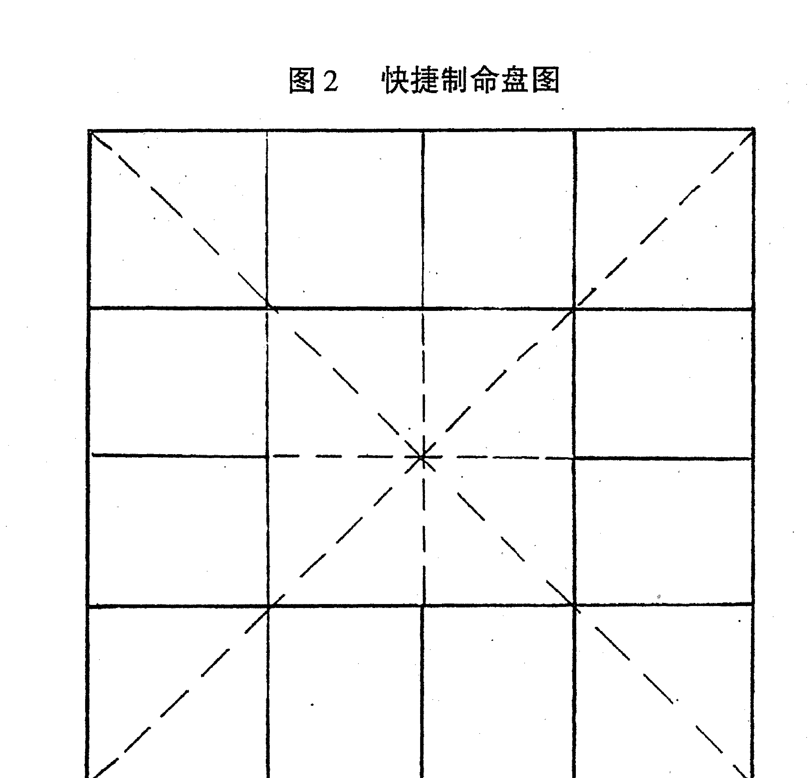
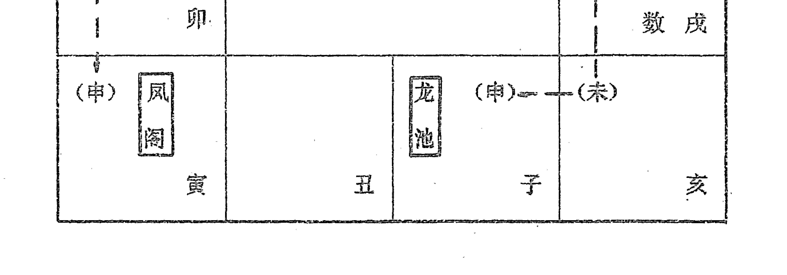

## 最新修订版
## 图解易经白话全译
（清）王道亨 编纂 （宋）陈抟 著 李非 白话释义

# 周易与堪舆经典文集
中国华侨出版社

## 最新增订版
# 周易与堪舆经典文集
# 紫微斗数解密
（清）王道亨 编纂 （宋）陈抟 著
李非 白话释义
中医古籍出版社

## 图书在版编目（CIP）数据
周易与堪舆经典文集/（清）王道亨编纂，（宋）陈抟著，李非白话释义。北京：中医古籍出版社，2010.6（紫微斗数解密）
ISBN978-7-80174-860-7
I. 周… II. ①王… ②陈… ③李… III. ①风水 - 中国 - 古代 - 文集 IV. ①B992.4 - 53
中国版本图书馆 CIP 数据核字（2010）第 083634 号

## 周易与堪舆经典文集（紫微斗数解密）
- （清）王道亨编纂 （宋）陈抟著 李非白话释义
- 责任编辑：杜杰慧
- 封面设计：五星设计
- 出版：中医古籍出版社
- 社址：北京东直门内南小街16号（100700）
- 印刷：新乡市三木奇印务有限公司
- 开本：700×1030 1/16
- 印张：全套240印张
- 字数：3600千字
- 版次：2018年1月第2版 2018年1月第3次印刷
- 印数：3001-5000套
- 书号：ISBN978-7-80174-860-7
- 定价：360.00元（全套）

> 版权所有 翻印必究·印装有误 负责调换

## 最新增订版
## 《紫微斗数解密》出版前言
《紫微斗数》名例五大术数之首，它既具有道家宇宙观的色彩，又注重人文环境、人际关系的和谐。《紫微斗数》预测法是不同于四柱预测法的另一门以星象为主的预测方法。此方法在港台地区及东南亚广为流行。

此书汇集了南北两派及玄易派的理论精髓，博大精深、森罗万象。由于此书成书于宋代，对于今天的读者来说，不免艰涩难懂。为破疑解惑，我们特聘请国内及港台的资深的研究者，对此书进行了深入细致的研究，并由浅入深地对此书进行了解读，终于推出了此本《紫微斗数解密》。

紫微斗数预测法，不同于四柱预测法，但其预测的准确度更优于四柱预测法。而且一旦掌握了这种方法，比四柱预测法更简单、更灵活、更实用。那么，紫微斗数预测法从哪里开始呢？正如邵雍所说：

> “凡看命，先定身宫。并身者，上系太乙之神。若好星为禄旺相见得地，颇成天气，则是清贵之命。然后却推命宫及时候深浅，不安则无力，纵有力星辰，为福亦轻。须得地时正，方得荣显福德，田宅官禄。六宫好恶，断其存亡贵贱，定其祸福，方有应验。”

学紫微斗数预测学，首先要学会制作命盘。命盘制作很简单，本书有详尽说明。命盘制作完后，就可以逐步按要求去排列命宫、父母、福德、田宅、事业、交友、迁移、疾厄、财帛、子女、夫妻、兄弟等宫了。本书由浅入深，环环紧扣，只要读者能静下心来学习，一定可以步入紫微斗数预测学的殿堂。

毋容置疑，当今这个时代人心浮躁，物欲横流，能潜心读书的人已是凤毛麟角，但没办法，你要掌握这门学问，你必须潜心学习，深入研究，如果做不到这点，你只能和幸运擦肩而过。

为弘扬传统文化，我们出版此书，以飨读者。

## 《紫微斗数》导读
《紫微斗数》——也称“紫微术”。它根植于阴阳五行学说，牵系《周易》卦爻，吸收《周易》卦象之论，融合道家义理，以天文、历数、地理、中医、音律等为其思想资料，可谓博大精深，义理充蕴、逻辑严密，体系谨严，并特别注意数理的关系。它的产生是以数学的演绎法和归纳法为基础，而绝少诡秘玄虚的神学气息。

紫微：我国古代天文学家将天体恒星分为三垣、二十八宿及其它星座。紫微星是三垣（太微垣、紫微垣、天市垣）的中星，是北斗星系的主星。星相学称它为“万星之主”，代表至高无上的权威，主管生育、造化。

斗数：星在天为斗，在地为数。以星的运转判断人的命运（气数）的意思。

《紫微斗数》既具有道家宇宙观的色彩，又具有注重人文环境、人际关系的现代意蕴，在中国传统文化中卓立特出。《紫微斗数》、《铁板神数》、《邵子神数》、《南极神数》、《北极神数》号称中国五大数术，其中《紫微斗数》名列五大数术之首。

作者陈抟（？—989年）五代末、宋初道教大师，字图南，自号扶摇子，亳州真源（今河南鹿邑）人。举进士不第，隐居武当山。后迁居西岳华山。宋太宗赐号“希夷先生”。民间称他为“陈抟老祖”。陈抟又是一位易学大师，他精研易学易理玄机，务求宇宙造化之秘，创制《太极图》、《先天图》等。

据南宋易学家朱震说：“陈抟以《先天图》传种放，放传穆修，穆修传李之才，之才传邵雍。放以《河图、洛书》传李溉，溉传许坚，许坚传范谔昌，谔昌传刘牧。穆以《太极图》传周敦颐，敦传程颢、程颐。”（《宋史·朱震传》）据此，陈抟实为宋代象数易学即图书学的开山鼻祖。其学以图式说易，寓阴阳消长之数与卦之生变。其易学包括《先天图》、《河图、洛书》、《太极图》三类图式，分为“数”学与“象”学两方面的内容。这些图式经北宋邵雍和周敦颐等人的演化发展，对于宋代乃至整个宋明时期的易学以及理学的内容都发生了深刻的影响。

紫微术分为南北两派。

南派紫微——紫微斗数的一个流派。说见张耀文所注的《紫微阐微录》。南派紫微是讲求实际斗数的。南派紫微的推法是：先定紫微，即以命宫纳音以定紫微躔宫，然后依次逆布：紫、阳、武、贞、狼、臣、破北斗七主星，再顺布：府、阴、相、梁、杀、机、同南斗七主星，更有若干副星，列出星盘，按庙、旺、陷失及各星所躔宫位，论人吉凶。本书前四卷属于南派紫微。

北派紫微——紫微斗数的另一个流派。说见徐良弼校订的《十八飞星策天紫微斗数》一书。此书所载北派紫微十八飞星为：虚、贵、印、寿、空、鸾、库、贯、文、福、禄、杖、异、毛、刃、哭、刑、姚。北派紫微的推法是：先取紫微命宫，即子年紫微在子，每年一位，按生年顺取。再用十八飞星加紫微共十九星，所躔宫位之庙、乐、旺，以论吉凶。

道教典籍《续道藏》中收有三卷本的《紫微斗数》，原书题作宋陈抟撰，实为后人假托。本书后三卷，所载命宫顺序与北派相一致，其十八飞星也与北派紫微相一致，只是中间缺少了空和哭二星，可能是古人抄写疏漏。本书后三卷属于北派紫微。

我们将《紫微斗数》一书作为附录收入《康节说易全书》，以供读者研究之用。

读者应以辩证的、科学的态度研读《紫微斗数》，取其精华，弃其糟粕，让中国古老而宝贵的文化遗产发扬光大。

## 目录
| 章节 | 页码 |
| :--- | :--- |
| 最新增订版《紫微斗数解密》出版前言 | (1) |
| 《紫微斗数》导读 | (3) |
| **紫微斗数推命法基础知识** | (1) |
| 第一章 简单易行的紫微斗数推命法 | (1) |
| 推命术必备的基础知识 | (1) |
| 命盘制作的方法 | (1) |
| 紫微斗数推命术以命盘为论命基础 | (3) |
| 怎样找出命宫、身宫 | (5) |
| 怎样让十二宫就位 | (7) |
| 怎样配宫干 | (8) |
| 诸宫就位后的基本命势分析 | (9) |
| 怎样定五行局 | (13) |
| 第二章 怎样看宇宙运转中的人生 | (14) |
| 星系总现 | (14) |
| 怎样找紫微星 | (18) |
| 紫微星入宫对命运的影响 | (24) |
| 怎样寻找紫微六星 | (25) |
| 怎样寻找天府八星 | (35) |
| 生辰四时的星系 | (52) |
| 时系星系共有多少 | (53) |
| 月系星系共有多少 | (62) |
| 日系诸星共有多少 | (71) |
| 年干系例诸星有多少 | (72) |
| 年支系诸星 | (79) |
| 其它星曜有多少 | (90) |
| 怎样定命主和身主 | (96) |
| 第三章 命运的多项组合 | (99) |
| 论命几何法 | (99) |
| 一、组织观察各宫吉、凶星的多寡，星级的强弱 | (100) |
| 二、怎样分析各星所在位置的庙旺失陷 | (107) |
| 三、根据纳音五行结合命宫干支看吉凶 | (110) |
| 四、结合其它星、宫综合分析命盘 | (111) |
| **第四章 对历代名人的命盘分析及对各种人物命运的分析** | (114) |
| 庞涓命盘 | (115) |
| 乐毅命盘 | (116) |
| 颜回命盘 | (117) |
| 张良命盘 | (118) |
| 文昌、文曲星命盘 | (119) |
| 鄢王命盘 | (120) |
| 马周命盘 | (121) |
| 马援命盘 | (122) |
| 耿弇命盘 | (123) |
| 和尚命盘 | (124) |
| 百里溪命盘 | (125) |
| 晏平仲命盘 | (126) |
| 刘伶命盘 | (127) |
| 杨孔目命盘 | (128) |
| 刘都衙命盘 | (129) |
| 魏豹命盘 | (130) |
| 李斯命盘 | (131) |
| 王珪命盘 | (132) |
| 曹参命盘 | (133) |
| 周勃命盘 | (134) |
| 贾谊命盘 | (135) |
| 白起命盘 | (136) |
| 一生难成名的命盘 | (137) |
| 廉贞入庙命盘 | (138) |
| 李白命盘 | (139) |
| 吕后命盘 | (140) |
| 富翁命盘 | (141) |
| 进士命盘 | (142) |
| 僧人命盘 | (143) |
| 武安王命盘 | (144) |
| 郦生命盘 | (145) |
| 宁萃命盘 | (146) |
| 张侍郎命盘 | (147) |
| 宝坛僧命盘 | (148) |
| 终身劳碌者命盘 | (149) |
| 威武英勇者命盘 | (150) |
| 都督命盘 | (151) |
| 赵高命盘 | (152) |
| 惊恐不安者命盘 | (153) |
| 风流放荡者命盘 | (154) |
| 有职无权者命盘 | (155) |
| 林御史命盘 | (156) |
| 进士命盘 | (157) |
| 昙花一现者命盘 | (158) |
| 蟾宫折桂者命盘 | (159) |
| 娼妇命盘 | (160) |
| 婚姻波动的女命盘 | (161) |
| 杨贵妃命盘 | (162) |
| 水性杨花的女命盘 | (163) |
| 旺夫益子的女命盘 | (164) |
| 福寿荣昌的女命盘 | (165) |
| 幸福人生的女命盘 | (166) |
| 吉祥如意的女命盘 | (167) |
| 不贫则淫的女命盘 | (168) |
| 刑克贱夭的女命盘 | (169) |
| 孤独淫佚的女命盘 | (170) |
| 淫欲无度的女命盘 | (171) |
| 终不能贵的女命盘 | (172) |
| 命无正曜的女命盘 | (173) |
| 先富后贫的命盘 | (174) |
| **第五章 基础知识与紫微斗数速查表** | (176) |
| 公元纪年干支速算法 | (182) |
| 五虎遁月天干表 | (184) |
| 命宫身宫表 | (185) |
| 定十二宫表 | (186) |
| 五行局速查表（以生年干和命宫支定） | (187) |
| 五行局速查表（以命宫干支定） | (188) |
| 紫微星表 | (189) |
| 紫微五星表 | (190) |
| 天府星表 | (191) |
| 天府七星表 | (191) |
| 年干星座表 | (192) |
| 年支系星座表 | (193) |
| 月系星座表 | (194) |
| 时系星座表 | (195) |
| 日系星座表 | (196) |
| 截路空亡表 | (196) |
| 天殇天使表 | (196) |
| 旬空表 | (197) |
| 十二生旺库表 | (198) |
| 命主表 | (199) |
| 身主表 | (199) |
| 十二宫庙旺表 | (200) |
| 十二宫独守吉表 | (201) |
| 十二宫独守吉凶不定表 | (201) |
| 十二宫拱合速查表 | (202) |
| 紫微天府二星系过宫会遇图 | (203) |
| 双星同宫宫位表 | (209) |
| **玄易紫微斗数** | (215) |
| 一、五行局与易经河图所演化的生气 | (215) |
| 二、易经的数、象、理与紫斗的数、象、理 | (217) |
| 三、紫微斗数格局与阴阳五行生克制化 | (218) |
| 四、紫微斗数论命法则 | (230) |
| 五、紫微斗数实例解析 | (235) |

# 紫微斗数推命法基础知识
## 第一章 简单易行的紫微斗数推命法
### 推命术必备的基础知识
干支历法是中国传统文化的基础，推命所遇到的第一个问题就是熟悉天干地支，并能将出生时间换算为干支。这类知识其它书籍已有详尽介绍，这里不做赘述。本书第五章附有干支知识及换算的速捷法，不懂者可做参阅。有此简明附表，收集出生资料就可以不查万年历。

其次是五行生克制化。五行，是我国古代对物质的朴素归纳。古人认为宇宙万物都由金、木、水、火、土五种基本元素构成，称为五行。它们之间有着复杂的相互作用关系，被阴阳家们归纳为生、克、制、化。然后将干支与五行搭配，甲乙木、丙丁火、戊己土、庚辛金、壬癸水，等等。以找出天地万物的互相影响的因果关系。

在紫微斗数的命盘里，五行被规定了五局，它们是：
- 水二局、木三局、金四局、土五局、火六局。

掌握了以上的基本知识，就可以排命盘了。
### 命盘制作的方法
命盘是紫微斗数论命的基本依据。为了认识紫微斗数命盘，我们将继述堂藏版的陈希夷先生著《紫微斗数全书》中诸葛亮的命盘绘出，以便分析它的结构。（见图1）

从这张命盘上我们可以看出紫微斗数命盘的基本结构由三大部分组成。

1. 宫：命盘周边的十二格称为宫。各宫分别以命宫、兄弟宫、夫妻宫、子女宫、财帛宫、疾厄宫、迁移宫、交友宫、事业宫、田宅宫、福德宫、父母宫命名，一般写在各宫的下边。宫内的庚寅、辛卯等是指各宫所含干支，一般写在各宫的右下角。

图1 诸葛亮命盘

| 夫妻宫 (癸巳) | 兄弟宫 (甲午) | 命宫 (乙未) | 父母宫 (丙申) |
|---------------|---------------|-------------|---------------|
| 天空、机亡 | 紫天红、微钺鸾、小耗 | 左右寡、辅弼宿 | 破陀阴铃、军罗煞星 |
| **子女宫 (壬辰)** | 姓名:诸葛亮(字孔明) 阴男 辛酉年四月初十日戌时生 金四局 命主:武曲 身主:天同 | | **福德宫 (丁酉)** |
| 七天截、杀姚路 | | | 禄地天、存劫哭 |
| **财帛宫 (辛卯)** | | | **田宅宫 (戊戌)** |
| 太天天、阳梁虚、流(权)、羊 | | | 廉天擎天、贞府羊空 |
| **疾厄宫 (庚寅)** | **迁移宫 (辛丑)** | **交友宫 (庚子)** | **事业宫 (己亥)** |
| 武天文天、曲相曲魁、大太天(科)、限岁使 | 天巨华火、同门盖星、流(禄) | 贪文天天、狼昌刑喜、天(忌)小、殇限 | 太天孤、阴马辰 |

2. 星：星分九个系列。除流年星系讲大限、小限、流年等运的问题外，其它八大系列六十四颗星煞均讲命，应写在各宫的上部由左向右排列。如疾厄宫中的武曲、天相、文曲、天魁。流年星和“四化星”写在各宫的中间部分。如交友宫中的小限、天殇、忌（忌是四化星之一，又叫化忌）。

3. 盘的中心部分填写问命人的名字、阴阳、出生年月日时、五行局、命主、身主等。

紫微斗数以各星入何宫及其所发生的关系来论命，依照出生资料，以一定的规则将各星排入各宫，对照关判词加以推断，是看得见的东西，故而，对有文化的人就比较好学易懂。从诸葛亮这张命盘上，我们可以看到左辅星和右弼星坐在命宫、太阳（亦称阳）人身宫，太阴（亦称阴）入事业宫，三方拱照形成日月并明即明珠两照之格局，即可断为一生富贵，多才多能。

然而诸葛亮五十四岁寿终，应当算是英年早逝。在他的命盘上，紫微术士们也做了批讲，以证明紫微术的准确和灵验。按照大限的运转，诸葛亮五十四岁正值疾厄宫。疾厄宫里大限、太岁、天使相聚，流羊、流陀又在丑卯二宫夹疾厄宫，与丑相邻的子宫又居小限、天殇、忌星。凶星相聚，是寿终的征象。尽管我们在《三国演义》里看到他煞费苦心打算以祭星方式延年益寿，以便使恢复中原的宏愿完成，但终究还是未能如愿。

## 紫微斗数推命术以命盘为论命基础
命盘正方形。四边等分为四，做出四个正方形，周边相连，成为十二宫。中间如一口方井，注上问命人的姓名和出生年月日时（农历）及其它出生资料。

快捷的办法，一纸以一角斜折，找出正方形，竖边对折再对折，横边对折再对折，即成。中间折出的四个正方形做一体使用。（如图2）

填制命盘的顺序是：
1. 将十二宫的地支注定。这是命盘的基本数据。按顺序固定排列，暗合一年十二个月的地支。从左下角起首，顺时针排列。第一宫为寅，下边当然就是卯、辰、巳、午、未、申、酉、戌、亥、子、丑。
2. 在方井中填注问命人姓名、出生农历年月日时。将年换算为干支，时换算为支。

这样，命盘的基盘就制好了。

图2 快捷制命盘图

图3 十二支的位置

| 巳 | 午 | 未 | 申 |
|----|----|----|----|
| 辰 | | | 酉 |
| 卯 | | | 戌 |
| 寅 | 丑 | 子 | 亥 |

## 怎样找出命宫、身宫
要让十二宫就位，以确定问命人命运的基础格局。十二宫的位置以命宫为基点。命宫和身宫同是根据问命人的出生月份和出生时辰决定的。

命宫和身宫的找法：

命盘中的寅位是正月。问命人出生年的月份是几月，就把那个位置当作子时。如某人生于七月，申位就定为子时。某人生于十一月，子位就是子时。某人生于三月，辰位就是子时。以子时为基点，逆时针数到出生时辰的位置就是命宫所在处；顺时针数到出生时辰的位置就是身宫的位置。

图4 生月与地支对照表

| 正 | 二 | 三 | 四 | 五 | 六 | 七 | 八 | 九 | 十 | 十一 | 十二 |
|---|---|---|---|---|---|---|---|---|---|---|---|
| 寅 | 卯 | 辰 | 巳 | 午 | 未 | 申 | 酉 | 戌 | 亥 | 子 | 丑 |

例如一个人叫宋福。生于一九八0年农历四月三日六时。

先把他出生的年份化为干支。

据第七章附表公元干支计算法如下：

年干 80 - 3 = 77

7 的序号是庚。

年支 (80 + 1) ÷ 12 = 6 …… 9。

图5 干支序号对照表

| 1 | 2 | 3 | 4 | 5 | 6 | 7 | 8 | 9 | 10 | 11 | 12 |
|---|---|---|---|---|---|---|---|---|---|---|---|
| 甲 | 乙 | 丙 | 丁 | 戊 | 己 | 庚 | 辛 | 壬 | 癸 | | |
| 子 | 丑 | 寅 | 卯 | 辰 | 巳 | 午 | 未 | 申 | 酉 | 戌 | 亥 |

9 的序号是申。一九八0年干支为庚申。

再把他出生的时间化为支。

六时支为卯。

将他的名字、出生干支年、月、日及支时填入井中，他出生于四月，巳位就作为子时，逆时针数子、丑、寅、卯，数到卯时，在命盘的寅位，这个地方就是他的命宫；顺时针由于时（巳位）数到卯时，在申位，这里就是它的身宫。

图6 找出身宫，命宫图

| 逆数定命 | 顺数定身 (子) | (丑) | (寅) | 数到生时 (卯) |
| :--- | :--- | :--- | :--- | :--- |
| (丑) | 巳 | 午 | 未 | 身宫 申 |
| (寅) | 辰 | 姓名:宋福 阳男 庚申年巳月三日卯时生 | | 酉 |
| 数到生时 (卯) 命宫 寅 | 卯 | 丑 | 子 | 戌 |
| | | | | 亥 |

阳男、阴男、阴女、阳女的确定：
男女的阴阳是以其出生年的天干决定的。
天干的奇数甲、丙、戊、庚、壬为阳年；偶数乙、丁、己、辛、癸为阴年。阳年生的男性，为阳男，阴年生男为阴男。同样，阳年生女为阳女，阴年生女为阴女。
宋福生于庚申年，庚为阳，故为阳男。

## 怎样让十二宫就位
有了命宫，十二宫就以它为基点，男女命一样，均为逆时针填写，按照十二宫的规定次序入位，它们的次序已如前述：

1. 命宫 2. 兄弟 3. 夫妻，
4. 子女 5. 财帛 6. 疾厄，
7. 迁移 8. 交友 9. 事业，
10. 田宅 11. 福德 12. 父母，

这个排列次序近世紫微术比较统一。明代的南派、北派各有不同。但一般都是以命宫为基点起首，而父母宫断后，为尾。再以宋福的命盘为例。他的命盘在寅位，逆时针找出十二宫。如图：

图7 十二宫就位

| | | | |
|---|---|---|---|
| 田宅 巳 | 事业 午 | 交友 未 | 迁移(身) 申 |
| 福德 辰 | 姓名：宋福 阳男 八0年四月三日六时生 庚申年巳月三日卯时生 | | 疾厄 酉 |
| 父母 卯 | | | 财帛 戌 |
| 命宫 寅 | 兄弟 丑 | 夫妻 子 | 子女 亥 |

## 怎样配宫干
每宫的地支是规定的，两天干则因人而异。要点是以出生年干为起点。
五虎遁月法为：
甲己之年丙作首，乙庚之岁戊为头，
丙辛便从庚寅起，丁壬壬寅顺行流，
唯有戊癸何处寻，正月始从甲寅求。

宋福出生的年干为庚，因此，从戊起，顺时针标注十干。由于宫为十二，而干只有十个，所以命盘上的天干必然有两宫相重，是十干周而复始造成的。

图8 配宫干

| | | | |
|---|---|---|---|
| 辛巳 | 壬午 | 癸未 | 甲申 |
| 庚辰 | 姓名:宋福 阳男 庚申年巳月三日卯时 | | 乙酉 |
| 己卯 | | | 丙戌 |
| 戊寅 | 己丑 | 戊子 | 丁亥 |

天干地支相配一周为六十对，称六十甲子。

- 甲子 乙丑 丙寅 丁卯 戊辰 己巳 庚午 辛未 壬申 癸酉
- 甲戌 乙亥 丙子 丁丑 戊寅 己卯 庚辰 辛巳 壬午 癸未
- 甲申 乙酉 丙戌 丁亥 戊子 己丑 庚寅 辛卯 壬辰 癸巳
- 甲午 乙未 丙申 丁酉 戊戌 己亥 庚子 辛丑 壬寅 癸卯
- 甲辰 乙巳 丙午 丁未 戊申 己酉 庚戌 辛亥 壬子 癸丑
- 甲寅 乙卯 丙辰 丁巳 戊午 己未 庚申 辛酉 壬戌 癸亥

## 诸宫就位后的基本命势分析
我们在第一章介绍过各宫的基本意义，而在上一节介绍了十二宫就位的安排，经这样安排后，十二宫所处的位置，即可看一个人的基本命势：

1. 命宫位置的影响：
    (1) 出生年与命宫相同者：
        A: 阳年生人，命坐阳宫（即命宫地支为阳）。
        B: 阴年生人，命坐阴宫（即命宫地支为阴）。
        这一类人，命宫吉则加吉，凶则减凶，二者相合，起有利作用。
    (2) 出生年与命宫不相同者：
        A: 阳年生人，命坐阴宫（即命宫地支为阴）。
        B: 阴年生人，命坐阳宫（即命宫地支为阳）。
        这一类人，如命宫吉则减吉，凶则加凶，二者相会，起不利的作用。
    (3) 命宫在十二宫中所处的三种类型：
        A: 命宫在四生宫（寅申巳亥）任何一宫的人：
        寅申巳亥为“四生”也称“四马之地”，凡命宫在这四宫任何一宫的人，主一生奔波，喜动不喜静。“寅申巳亥生四马，性不耐静福动中。”这里的动不仅是指身动，而是指灵动。就是说，这些人聪明勤劳，对人慷慨，容易获得成功。
        B: 命宫在四库宫（辰戌丑未）任何一宫的人：
        辰戌丑未是“四库”也即“墓”。凡命宫在这四宫任何一宫的人，主一生忙碌，勤俭节约。“辰戌丑未四墓处，为人刚直忠厚诚。”他们的成功不靠投机取巧，全凭踏实努力，既能任劳任怨，又善积蓄。
        C: 命宫在四败宫（子午卯酉）任何一宫的人：
        子午卯酉是“四败”也是“四桃花”之地。凡命宫在子或午宫的人，善机变，喜投机，容易获得成功，也容易失败。命宫在卯酉宫的人生性乐观，处事随便。“子午卯酉为败地，男女多变不明情。”是说，这些人热情开朗，多情，在男女相处上比较随便。

2. 最容易获得成功的两个宫位：
亥为要地，寅为山头。凡命宫在此二宫的人最容易获得成功。“男子居要地，女人在山头，富贵皆双显，香闺足优游。”

3. 兄弟宫宫位的影响：
    (1) 兄弟宫有吉星在位，能受兄弟之助；兄弟宫有凶星在位，会使兄弟遭受不幸，或因兄弟而受害。
    (2) 如兄弟宫比命宫强并逢吉，则兄弟能力比本人强，且能得兄弟之助；如逢煞则兄弟失和不得助，命宫比兄弟宫强则吉，本人能力在兄弟之上，而且能教育帮助兄弟。
    (3) 兄弟宫有太阳居旺地，则兄弟多姊妹少。太阴居旺地，则姊妹多兄弟少。南斗星多为兄弟，北斗星多为姊妹，观看兄弟姊妹又需参看父母宫、子女宫。

4. 夫妻宫：
    (1) 夫妻宫比本命宫强。因受“男尊女卑”观点的影响，故在命理上说，男命夫妻宫比命宫强，而且煞多者，阴盛阳衰，家庭失调。女命夫妻宫比命宫强则有依靠，家庭谐和。
    (2) 夫妻宫有红鸾星或天喜星坐，逢吉，为男俊女美。逢煞，夫妻不和，有凶星主晚婚。
    (3) 夫妻宫若有左辅右弼星单守或冲照，代表有二度婚姻。但如有其它主星在位，则当别论。
    (4) 夫妻宫若有贪狼化禄加桃花，表明爱情不专，重感情，多变化。

5. 子女宫：
    (1) 子女宫若比命宫强，则说明子女能力比自己强，如子女宫比命宫弱，则说明子女能力不如自己。同时，也暗示出繁衍能力的强弱。
    (2) 子女宫吉，则与父母谐和。逢煞与父母无缘。
    (3) 子女宫内多南斗星，先得男；多北斗星，先得女。中天星入宫，看星性。太阳为男，太阴为女，但须旺地。
    (4) 子女宫逢色星，暗示一个人的性能力，强而多求。再有煞星，则贪恋男女私情。

6. 财帛宫：
    (1) 财帛宫有吉星同宫，当然财源滚滚。如：紫微星、天府星、廉贞星这些本身就是掌握金钱之星的，又坐财帛宫，象征财源旺盛。如太阳星、太阴星、贪狼星这些守财之星坐财帛宫，那就真如《红楼梦》中描写贾府一样“贾不假，白玉作堂金作马”了。总之，吉星入财宫，一生有钱用。即是凶星七杀人宫，也不以凶论，却以小吉论断。因为七杀星起到守财库的作用。
    (2) 天机星本来是吉星。坐财官却是邪恶之星，常有算计是非，不作吉论。
    (3) 若财帛宫强旺，事业官陷弱，宜与人帮忙或合伙，不宜独立去干。

7. 疾厄宫：
    (1) 疾厄宫最喜坐空或宫中无其它星曜，这样，一生身体健康，无病，但也需配合命宫和迁移宫综合分析。
    (2) 如命宫也无疾病之象更好，但应结合大限流年来看。
    (3) 如命宫有疾病之象再遇大限疾厄时，身体危厄。
    (4) 紫微星和贪狼星与疾厄同官或廉贞星和贪狼星同官都主酒色。

8. 迁移宫：
与命宫、财帛宫、事业宫形成“四正方”，是给于命宫巨大影响的重要宫位。命宫无主星就看迁移宫星曜如何。因此，迁移宫也是决定人一生命运的主要宫位。可以看出人的一生际遇。

9. 交友宫：
    (1) 交友宫强且吉星多，预示人际关系的活跃，可以受到朋友及部下的尊崇与爱戴。交友宫比命宫强，却暗示被朋友或部下耍弄。
    (2) 交友宫无主星则知己少。
    (3) 交友宫有左辅右弼，当然意味着朋友得力，四煞在交友宫，提醒人对朋友不可轻信。
    (4) 交友宫多逢酒色之星，或则异性朋友多，或则与人交往多遇放荡之徒。

10. 事业宫：
    (1) 事业宫有天机星守且逢煞，出世的征兆多与宗教有缘。逢财星，宜经商，逢煞宜武。太阳星或文曲星坐事业宫，前程远大，事业发达。
    (2) 事业宫如有廉贞星入宫加煞刑，一生多波折。

11. 田宅宫：
田宅也可看成是财库，田宅吉，财多，反之为散财。
    (1) 太阳加吉在田宅宫，必有巨富。太阴加吉在田宅宫，必得祖产。
    (2) 禄存加吉且有主星同宫，财旺。

12. 福德宫：
    (1) 禄存星、左辅右弼入宫，终身福厚，乐而忘忧。
    (2) 女命福德宫为强宫，喜欢吉坐，最怕遇煞，尤其七杀独坐，对女命大伤。
    (3) 男命如逢七杀独坐福德宫，则贪恋男女之情。
    (4) 若天姚星坐福德宫，主品性不拘。
    (5) 若贪狼、廉贞、桃花逢煞在福德宫，是福德不存的象征。

13. 父母宫：
排在命盘的最后一宫，紧邻命宫，相当于辅佐命宫的存在。
    (1) 若吉坐自小受父母宠爱，与父母感情深厚。
    (2) 陷煞且冲破，幼年不得父母荫庇照顾，亦与父母欠缘。
    (3) 人的身体状况与突发性灾难与父母宫有密切关系。

14. 身宫：
所谓身宫，是承受命宫的场所。命宫弱而身宫强，则无法实施行动而为空强。命宫强身宫弱，则无从实施，为“无用武之地”。因此，必须命强身强才好。

因身宫是代表后天的运势，虽然极其重要，但决不能独居一宫，必得与它宫同居而发挥作用。与其他宫同宫，吉则吉上加吉，凶则凶上加凶。并且根据不同宫位发生不同效力。身宫与哪一宫同宫，预示一生的倾向性。

## 怎样定五行局
人在人世间所受社会人际关系的制约、影响，由十二宫的排定而定位。他还要受自然物质环境的影响。这就需看他命宫的干支。由此，定出五行局。

例如宋福的命宫干支是戊寅。我们由第五章表可查知命宫干戊和支寅的交叉点是土五局。把它填入方井，命盘的第一个段落就完成了。

找出了人在人际社会中的位置，他在自然环境影响下的定局，那么宇宙对人世的影响如何呢？这就要看星的安入。

以命宫干支定五行局，其原理来源于六十花甲子纳音（也叫纳音干支，是将干支与五行搭配的口诀）。纳音共分六组，其歌诀为：

- 甲子乙丑海中金，丙寅丁卯炉中火，
戊辰己巳大林木，庚午辛未路旁土，
壬申癸酉剑锋金。
- 甲戌乙亥山头火，丙子丁丑涧下水，
戊寅己卯城头土，庚辰辛巳白腊金，
壬午癸未杨柳木。
- 甲申乙酉泉中水，丙戌丁亥屋上土，
戊子己丑霹雳火，庚寅辛卯松柏木，
壬辰癸巳长流水。
- 甲午乙未沙中金，丙申丁酉山下火，
戊戌己亥平地木，庚子辛丑壁上土，
壬寅癸卯金箔金。
- 甲辰乙巳覆灯火，丙午丁未天河水，
戊申己酉大驿土，庚戌辛亥钗钏金，
壬子癸丑桑柘木。
- 甲寅乙卯大溪水，丙辰丁巳沙中土，
戊午己未天上火，庚申辛酉石榴木，
壬戌癸亥大海水。

## 第二章 怎样看宇宙运转中的人生
### 星系总现
如前所述，紫微术各派采用的星系有繁有简。而近世通用的星曜为六十四颗。港台有些术士以主星为主进行论命，忽略或不介绍辅星杂曜，这当然容易造成疏漏。为概括了解紫微斗数的全貌，我们仍采用六十四星之说而加以论述。

命星共分八个系列。紫微星系六颗，天府星系八颗，时系八颗，日系四颗，月系九颗，年干系十一颗和年支系十四颗，其它星曜四颗。现分系介绍如下：

- 紫微六星：紫微星、天机星、太阳星、武曲星、天同星、廉贞星。

紫微星：五行属土。是最主要的星座，故名帝座。中天星主，为众星之枢纽，人命之主宰，掌五行，育万物，有化解凶星的功效。（命学中有三种紫微。1、紫微斗数，2、道藏斗数，3、星盘流年）

天机星：五行属木，南斗第三星。智慧，机算之星，像转轴一样不停地运转。

太阳星：五行属火，日之精。官禄宫的正主，权贵之星，主功名事业。

武曲星：五行属金，北斗第六星。财帛宫主。有三种表现形式：1、威武，2、财帛，3、孤寡。

天同星：五行属水，南斗第四星。福德宫主，敦厚宽容，解危降福。

廉贞星：五行属火，北斗第五星。既代表心地偏狭的权炳，又有第二桃花星之称，司男女情爱。

- 天府八星：天府星、太阴星、贪狼星、巨门星、天相星、天梁星、七杀星、破军星。

# 卷之一

- 天府星：五行属土。南斗第一星，为南斗令主，简称令星。为禄库，重金钱和事业功名。
- 太阴星：五行属水。水之精。田宅宫主。清洁之神。
- 贪狼星：五行属水。北斗第一星。欲望之神。又称第一桃花星。
- 巨门星：五行属水。北斗第二星。是非口舌之星。
- 天相星：五行属水。南斗第五星。是帝座（紫微星）之辅佐。奉仕之星。
- 天梁星：五行属土。南斗第二星。父母宫主，恒常之星，司寿禄。
- 七杀星：五行属金，又属火。南斗第六星。肃杀之星。
- 破军星：五行属水。北斗第七星。破耗之星。

时系八星：文昌星、文曲星、天空星、地劫星、台辅星、封诰星、火星、铃星。

- 文昌星：五行属金。南北斗星，科甲之星，偏重文采。
- 文曲星：五行属水。北斗第四星，科甲之星，偏重才艺。
- 天空星：五行属火。空亡，多灾之星。
- 地劫星：五行属火。劫煞，破失之星。
- 台辅星：五行属土。显贵之性。掌台阁。
- 封诰星：五行属土，显贵之星，掌封章。
- 火星：五行属火。南斗浮星，又称杀神。性烈，刚暴之星。
- 铃星：五行属火。南斗助星，又称从神。暴躁，刚强之星。

日系四星：三台星、八座星、恩光星、天贵星。

- 三台星：五行属土。紫微之辅佐星，贵星，权力之星。
- 八座星：五行属土。紫微之辅佐星，科甲功名，权力之星。
- 恩光星：五行属火。天魁之辅佐星，殊恩之星。
- 天贵星：五行属土。天钺之辅佐星，大贵之星。

月系九星：左辅星、右弼星、天刑星、天姚星、天马星、解神星、天巫星、天月星、阴煞星。

- 左辅星：五行属土。紫微之辅相。贵人星，圆巧，稳重，风流，大方，随和之星。善令的使者。
- 右弼星：五行属水。紫微之辅相。贵人星，机智，宽宏，清秀之星。制令执行者。
- 天刑星：五行属火。孤克之星。
- 天姚星：五行属水。又名玄冥星，太阴之精。桃花，风流之星。
- 天马星：五行属火。奔驰之星。有人将天马分为命马和月马。命马动中有财，月马主迁移。
- 解神星：消灾解厄星。
- 天巫星：宗教之星。主升迁。
- 天月星：疾厄之星。
- 阴煞星：邪祟之星。

年干系十一星：禄存星、擎羊星、陀罗星、天魁星、天钺星、化禄星、化权星、化科星、化忌星、天官星、天福星。

- 禄存星：五行属土。北斗第三星。又名天禄，大吉星。主人贵爵，掌人寿基。
- 擎羊星：五行属金。北斗助星，又名羊刃，刑伤凶厄之星。
- 陀罗星：五行属金。北斗助星，是非，灾晦之星。
- 天魁星：五行属火。南斗助星，又名天乙贵人星，才名之星，主白昼贵人。
- 天钺星：五行属火。南斗助星，又名玉堂贵人星，才名之星，主夜间贵人。
- 化禄星：五行属土。福德之神，财禄，贵人星。（化禄星也有五行按金断的。）
- 化权星：五行属木。生杀之神，权势，刚强之星（化权星也有说五行属火的。）
- 化科星：五行属水。主文之星，斯文，科名之星（化科星也有说五行属木的。）
- 化忌星：五行属水。多管之神，嫉妒，灾晦之星。
- 天官星：五行属水。显达，官贵之星。
- 天福星：五行属土。天同之辅助星，福寿，贵爵之星。

年支十四星：天哭星、天虚星、红鸾星、天喜星、龙池星、凤阁星、孤辰星、寡宿星、蜚廉星、破碎星、天才星、天寿星、华盖星、咸池星。

- 天哭星：五行属火。刑克，是非之星。（天哭星的五行有说属金）
- 天虚星：五行属火。虚耗，空亡之星。（天虚星的五行有说属土）
- 红鸾星：五行属水。婚姻喜庆之星，主禀性温良，聪明秀丽。
- 天喜星：五行属水。婚姻喜庆之星，主容貌俊美，婚姻早发。
- 龙池星：五行属水。福贵，科甲之星，主口福。
- 凤阁星：五行属土。福贵，科甲之星，主优雅。
- 孤辰星：五行属火。孤独之星，阳孤。
- 寡宿星：五行属火。寡居之星，阴孤。
- 蜚廉星：五行属火。孤克之星。
- 破碎星：五行属火。损耗不全之星。
- 天才星：五行属木。才能之星。
- 天寿星：五行属木。长寿之星。
- 华盖星：五行属木。孤高，文章，宗教之星。
- 咸池星：五行属水。又曰败神，桃花，淫邪之星。

其它星曜：截路空亡星、旬空星、长生十二神、生年博士十二神。

- 截路空亡星：截路空亡星有分成两个的即：截路星和空亡星，也有合并为一个的。落空的意思。

# 紫微斗数解密

- 旬空星：在六十花甲子中，十个天干与十二个地支两两相配成完整的一旬，总和为六十对。十个天干与十二个地支相配又为一小旬。在小旬中，十二个地支与十个天干相配剩余的两个地支为旬空。旬空星也是空的意思。
- 长生十二神：长生十二神同“四柱”中的长生十二神一样，是表示生命变化阶段的。
    - 长生：初生的生命，活力旺盛。
    - 沐浴：情欲升发。
    - 冠带：长大成人，主升迁或喜庆。
    - 临官：初入仕途，前途远大。
    - 帝旺：运势达到极盛，成为转衰的临界。
    - 衰：由盛转衰，境况日下。
    - 病：运势衰弱而多病。
    - 死：死亡。结束了运势的活力。
    - 墓：超脱而宁静的境界。

### 怎样找紫微星

也许是 为了显示紫微星的尊贵，也许是为了给紫微斗数初学者以深奥莫测的入门教训，制定寻找紫微星法则的术数家可谓煞费苦心，使人生第一颗星辰藏于繁难的迷宫，非有诚心难以觅得。

从现有资料可以看出，寻找一个人的紫微，各家使用了各种手段，各家有各家的口诀，他们都力图给初学者以方便简捷，但又常常使学者更加迷惑。这便是中国五行、干支搭配的深奥、复杂。其实，紫微星的定法只有两个系数搭配，一是这个人命宫的五行局，二是这个人的生日。学推命的人都知道，日干支是最难推算的一柱，不查万年历就得背会一些算命人视为秘诀的口诀。紫微术避去日干，使用生日直接与五行局相配，这当然又得有另一套方法。最便当的方法是查一张简表，在这张简表里，注明了五行局与一月三十天中的任意一天相遇，紫微星应该在哪个宫位。（见第五章附表）这种设想，意味着人生下的时候与外在物质世界的每个交流，决定了星辰对他照临的角度。

分析一下这张表，我们可以找出如下规律：

1.  由于五行局从水二局起，没有第一局，因此，水二局的初一便从第二支丑开始，以丑开头。木三局初二在丑宫，金四局初三在丑宫，土五局初四在丑宫，火六局初五在丑宫，这是基点。
2.  它把一月三十天编成不同日数的小组。基本上是二局二日一组，三局三日一组，四局四日一组，五局五日一组，六局六日一组。将十二支穿插于各组，各依各的顺序和位置运行，造成穿插中的花样，整个表就像图案的四方连续，看无规律，实则暗自有序。这种设计几乎在哲学观念上符合无序的有序的自然法则。
3.  这样，我们就能比较直观地理解以下口诀：

    > 水二局中初一丑，初二之后顺行流。
    > 一宫两日排下去，辰宫落在三十头。

    命宫五行局是水二局的人，初一生，紫微星在丑宫。以后，每两天轮一宫，即：初二初三在寅，初四初五在卯，初六初七在辰……直到廿八、廿九为卯，三十在辰。

    > 木三局头是辰宫，每隔二日顺宫行，
    > 初二丑宫向后去，两宫一宫插花重。

#### 图9 木三局紫微星定局

| 1 | 4 | 7 | 10 | 13 | 16 | 19 | 22 | 25 | 28 |
|---|---|---|---|---|---|---|---|---|---|
| 辰 | 巳 | 午 | 未 | 申 | 酉 | 戌 | 亥 | 子 | 丑 |
| 2 | 5 | 8 | 11 | 14 | 17 | 20 | 23 | 26 | 29 |
| 丑 | 寅 | 卯 | 辰 | 巳 | 午 | 未 | 申 | 酉 | 戌 |
| 3 | 6 | 9 | 12 | 15 | 18 | 21 | 24 | 27 | 30 |
| 寅 | 卯 | 辰 | 巳 | 午 | 未 | 申 | 酉 | 戌 | 亥 |

命宫为木三局的人，初一生，紫微在辰；初二生，紫微在丑；初三生，紫微在寅。然后每宫两日，以两日一组插花重复。只要记住初一从辰，初二从丑，初三从寅起首，即可每隔两日按十二地支顺序顺排，直到月底。

    > 亥头亥尾金四局，辰丑二三寅初四。
    > 四日一组插花走，各顺各数有次序。

命宫金四局的人，出生日就变成四组宫支循环。初一生，紫微星在亥宫；初二生在辰宫；初三便是丑宫；初四寅宫。四日一组，四组穿插并行。

这里有两个概念：一是以四个地支起首，初一亥，初二辰，初三丑、初四寅。二是每隔三日，即四日一组组成一排地支。

#### 图10 金四局紫微星定局

| 1 | 5 | 9 | 13 | 17 | 21 | 25 | 29 |
|---|---|---|---|---|---|---|---|
| 亥 | 子 | 丑 | 寅 | 卯 | 辰 | 巳 | 午 |
| 2 | 6 | 10 | 14 | 18 | 22 | 26 | 30 |
| 辰 | 巳 | 午 | 未 | 申 | 酉 | 戌 | 亥 |
| 3 | 7 | 11 | 15 | 19 | 23 | 27 |  |
| 丑 | 寅 | 卯 | 辰 | 巳 | 午 | 未 |  |
| 4 | 8 | 12 | 16 | 20 | 24 | 28 |  |
| 寅 | 卯 | 辰 | 巳 | 午 | 未 | 申 |  |

    > 土五局是五日组，午亥辰丑寅作初。
    > 各依次序并肩去，顺数到底未不误。

命宫土五局，以五日一组顺推。只要记准第一组午、亥、辰、丑、寅是初一、初二、初三、初四、初五的紫微宫位，其余均顺流而得。

#### 图11 土五局紫微星定局

| 1 | 6 | 11 | 16 | 21 | 26 |
|---|---|---|---|---|---|
| 午 | 未 | 申 | 酉 | 戌 | 亥 |
| 2 | 7 | 12 | 17 | 22 | 27 |
| 亥 | 子 | 丑 | 寅 | 卯 | 辰 |
| 3 | 8 | 13 | 18 | 23 | 28 |
| 辰 | 巳 | 午 | 未 | 申 | 酉 |
| 4 | 9 | 14 | 19 | 24 | 29 |
| 丑 | 寅 | 卯 | 辰 | 巳 | 午 |
| 5 | 10 | 15 | 20 | 25 | 30 |
| 寅 | 卯 | 辰 | 巳 | 午 | 未 |

    > 火六局是六日巡，酉午亥辰加丑寅。
    > 初七以后对应走，各走各便到午尽。

命宫火六局的人，六日一组找紫微星，知道了第一组一、二、三、四、五、六是酉、午、亥、辰、丑、寅，其余便可推知七、八、九、十、十一、十二是戌、未、子、巳、寅、卯。（见图12）

4.  归纳以上要点，紫微星的找法并不困难。只要找出命宫的五行局，按规律数到生日，即可在此宫位定紫微星。而各局的规律是以局数给日子编组。记准开头一组的宫干，然后顺推，即可准确无误。

#### 图12 火六局紫微星定局

| 1 | 7 | 13 | 19 | 25 |
|---|---|---|---|---|
| 酉 | 戌 | 亥 | 子 | 丑 |
| 2 | 8 | 14 | 20 | 26 |
| 午 | 未 | 申 | 酉 | 戌 |
| 3 | 9 | 15 | 21 | 27 |
| 亥 | 子 | 丑 | 寅 | 卯 |
| 4 | 10 | 16 | 22 | 28 |
| 辰 | 巳 | 午 | 未 | 申 |
| 5 | 11 | 17 | 23 | 29 |
| 丑 | 寅 | 卯 | 辰 | 巳 |
| 6 | 12 | 18 | 24 | 30 |
| 寅 | 卯 | 辰 | 巳 | 午 |

从图12、13、14、15，我们还可以看出以下规律：

1.  横看数字是有规律的循环。
2.  竖看数字从左至右相连是月初至月尾的日期。
3.  横看地支均为顺推。

找出了如上规律，可以看出，无论查表还是背口诀，比起四柱推命还是省劲多了。

找紫微星的方法还有商除法。

商除法公式如下：

1.  生日被局数除，如整除，以寅宫起1，顺数至商数，所落宫位即为紫微星所在宫位。
2.  生日被局数除，不能整除，在生日上加一个数，使其整除。
    *   所加数为单数，则用商减其数，再以寅宫起1，顺数至所得之数，定紫微星。如得负数，则逆数。得零，紫微星落丑宫。
    *   所加数为双数，则用商加其数，然后以寅宫起1、顺数至所得之和数位，即紫微星。

列成公式：(生日 + X) / 局数 = Y
若 X 为奇数，则 Y - X = Z （如 Z > 0，寅宫起 1，顺数至 Z，即为紫微星位。如 Z < 0，寅宫起 1，逆数至 Z，即为紫微星位）。
若 X 为偶数，则 Y + X = Z 寅宫起 1，顺数至 Z，即紫微星位。

如宋福生于三日。城头土五局，按公式求：(3 + 2) / 5 = 1
2 为偶数，故 1 + 2 = 3，寅起1，2 为卯，3 为辰。
那么，宋福的紫微星便落座辰宫、福德宫。
如口诀求，宋福土五局，“土五局，五日组，午亥辰丑寅作初。”
宋福生于初三，紫微星就在辰宫。
查第五章表，土五局初三生人，紫微星也在辰。

如能用手掌来表示，则更利于应用。

把命盘十二宫排在掌中，食指和小指的四个关节各为四宫，加上中指和无名指上下两个关节各两宫，合计为十二宫。中指和无名指的第二、三节空白，如命盘中的方井。地支的排法和命盘的排法一样，命盘以左下角为寅，手掌法以食指与掌连接处为寅宫，酷似命盘。反复应用，只要一伸出左手，就如同看到命盘一样。

找紫微星的方法，是以丑为基点，作零。顺数寅处为1，卯为2……。逆数子为-1，亥为-2……

如上面公式求出宋福紫微星在3，看手掌便知在辰宫。
综上所述，找紫微星看似很难，只要找出规律，实则非常容易。如宋福命盘，无论用那种方法，紫微星均在辰宫（福德宫）。

### 紫微星入宫对命运的影响

紫微星五行属阴土，专门管理福禄，是中天星主，又名帝座，故为官禄主。如能和事业宫同位，即为得位，其星能发挥应有的力量。

1.  紫微星和命宫同宫，显示出一个人的形象。此人形貌厚重，气质高雅，态度从容。脸色青白者，出生在富贵人家；面带棕紫者，出生在普通人家。喜欢掌权，略带傲气，为人忠厚老实，谦虚耿直，有多种爱好及兴趣。
    如不得辅弼，则不能大贵。如天府同宫或会照都很好。天府、天相、左辅、右弼，文昌、文曲都是它的部下。天魁，天钺是他的使佐。如这些星能和紫微星同宫，叫做“君臣庆会”，必定名声显赫。
    紫微星宫内无其它星则为“孤君独坐”，是孱弱晦暗的象征。
2.  紫微星坐兄弟宫，对兄弟有利，兄弟们能互相照顾，逢煞星为吉中藏凶。
3.  紫微星坐夫妻宫，如男命则得贤妻，如女命则因其丈夫有本领而显得高贵。
4.  紫微星坐子女宫则子女不多，但子女中有很能干的人，可能因孩子而显贵。
5.  紫微星坐财帛宫的人喜欢管理钱财，但不一定有很多钱。
6.  紫微星坐疾厄宫的人大多贪恋异性，如桃花星与之同宫，更是风流之兆。
7.  紫微星坐迁移宫的人活动能力强，变换环境多，得助多方，并可得到长辈提携。
8.  紫微星坐交友宫的人人际关系活跃，热情开朗，能广交朋友。
9.  紫微星坐事业宫的人为之得位，一生事业发展顺利，会有大的成就。
10. 紫微星坐田宅宫的人喜欢购置固定资产，不惜精力、财力，为产业而奋斗终生。
11. 紫微星坐福德宫的人勤奋好学，颇有涵养。但如无其它星曜而独坐其宫，则内心空虚，精神孤独。男命为陷地，女命为庙旺。女命入福德宫为之夫入人福宫，有较好的生活环境。
12. 紫微星坐父母宫的人幼年生活较好，能得到父母较多照顾和恩惠。

综上所述，紫微星入各宫呈三种基本情况：

1.  紫微星入于午卯酉四败之地：
    紫微星独坐于午宫中，其对宫一定是贪狼星，贪狼星是欲望之神，如节制声色，则能化不利为有利。
    古人把紫微星坐卯酉它称为淫帝，但从一些论命资料看，紫微星入四败之地，决不都是浪荡公子，风流女子，也有升官发财，大有作为的人。
2.  紫微星入寅申巳亥四马之地：
    紫微星入巳亥宫则天府在对宫；紫微星入寅申宫则天府与其同宫。这些人一生如马一般奔波不息，个性较强，吃苦耐劳，在外有人扶持，容易获得成功。入亥宫懒散，如能化权则权力极大，如逢空星、忌星，权名皆虚。
3.  紫微星入辰戌丑未四库宫：
    紫微星入丑未二宫与破军星同宫，而天相星在对宫。憎恶分明，性格单纯，喜欢创新，具有独立见解，对喜欢的事能全力以赴，对喜欢的人无限信赖，对不喜欢的不迁就妥协。紫微星入辰戌二宫，天相星与其同宫，而破军星在对宫。爱恶易变，易得易失。

以上简要地介绍了紫微星入各宫的基本情况。但是，往往各宫不止一星加以干扰，其宫中干支不同所起作用不同也造成很大差异。所以，并不能只根据紫微星的宫位就可以简单地片面论命，还要作综合分析，参考多种因素。

### 怎样寻找紫微六星

紫微星是紫微斗数排盘的第一颗星曜，一旦确定了此星的宫位，则“帝（指紫微星）居动则列宿奔驰”。其它星曜的位置也就安排好了。

紫微星系有六颗主星，除紫微星外还有天机、太阳、武曲、天同、廉贞诸星，安紫微星系的口诀是：

> 紫微天机星逆行，隔一阳武天同情，
> 又隔二宫廉贞位，空三便是紫微星。

意思是说：紫微星决定后，按逆时针方向紧挨紫微星排天机星，然后隔一宫接着依次排太阳星、武曲星、天同星，再隔二宫排上廉贞星，最后再隔三宫便回到了紫微星的宫位。诸星排完后，看最后一个廉贞星与紫微星空几个宫位，如果空的是三个宫位，说明排法正确，如果空的是二个或四个及其它数，则说明排错了，应当重排。下面我们看一下宋福的命盘紫微星系所处的宫位。(见图15)

#### 紫微星系各主星简介：

- 1、天机星：天机星的代表人物是姜太公，姜尚。是周文王的军师。姜太公为“智慧”“运筹”之神，益算之星。
    南斗第三星，蓝色。入命身材中等，入庙肥胖，陷地瘦弱，精明多机算，勤劳谨慎，重亲情，孝道。加魁钺昌曲表示多学多能；逢擎羊冲破加空劫，会陷于奸诈。女命一般婚姻不稳定。会天同、天梁，有高寿。

##### A：天机星入各宫的情况：

- (1) 天机星入命宫的人：
    男命天梁合太阳，常人富足置田庄。
    天机化忌落闲宫，财多官大终为空。
    女命更宜吉星扶，运筹帷幄过丈夫。
    太阴同宫必巧容，看似富贵终不足。
- (2) 天机星入兄弟宫：
    坐宫兄弟心不齐，若逢凶煞手足稀。
- (3) 天机星入夫妻宫：
    夫妻天机不相宜，太阴在位恩爱齐。
- (4) 天机星入子女宫：
    聪明伶俐好儿女，逢煞同宫父母则异。
- (5) 天机星入财帛宫：
    机关巧布用心计，成败波浪有高低。
- (6) 天机星入疾厄宫：# 卷之一

图 15 紫微星的位置

| 辛 (巳) 田宅 | 壬 (午) 事业 | 癸 (未) 交友 | 甲 (申) 迁移(身) 廉贞 |
| :--- | :--- | :--- | :--- |
| 庚 (辰) 福德 紫微 | 姓名:宋福 阳男 八0年四月三日六时 庚申年巳月三日卯时 城头土五局 | | 乙 (酉) 疾厄 |
| 己 (卯) 父母 天机 | | | 丙 (戌) 财帛 |
| 戊 (寅) 命宫 | 己 (丑) 兄弟 太阳 | 戊 (子) 夫妻 武曲 | 丁 (亥) 子女 天同 |

天机坐在疾厄宫，勤加调理防疾生。

(7) 天机星入迁移宫：
迁移宫坐天机星，一生动荡如卷蓬。

(8) 天机星入交友宫：
朋友才华均显荣，彼此相交心不同。

(9) 天机星入事业宫：
用脑动笔展宏图，名扬天下众人服。

(10) 天机星入田宅宫：
离家独自闯天下，禄存金玉吉相加。

(11) 天机星入福德宫：
先劳心力后享荣，喜见天梁忌陀铃。

(12) 天机星入父母宫：
生家富裕双亲恋，凶星加杀刑伤现。

B、天机星因地支不同所起的作用也不同。

(1) 天机星入子午卯酉四败之地。

天机星在子午宫，巨门星在它的对宫。只要不化忌，有能力，有口才，不看重金钱，但与人交往常有是非。

天机星在卯酉宫，巨门必同宫。其人思路敏捷，有很好的语言表达能力，善于分析问题，富有顽强的研究精神。女命难免倔强多变。

## (2) 天机星入辰戌丑未四库之地：

天机星在丑未宫，天梁星在对宫。

甲己之年生人，婚姻不美满。

乙庚之年生人，财不易守。

丙辛之年生人，财和官双美。

丁壬之年生人，一生主奔波。

戊癸之年生人，易有疾变。

天机星在辰戌宫，天梁星必与其同宫。

甲丙戊己辛年生人，算处有失。

乙庚年生人，财难守。

壬年生人，好夸言。

其它年生人平平。

## (3) 天机星入寅申巳亥四生之地，宜交游，宜在外地谋生。

### 2、太阳星：太阳星是比干死后被封的星辰，光明之神，掌“光明”，“博爱”。

橘红色，主功名，教育，官禄。喜白日生人，聪明笃厚，有魄力，爱助人，此星最喜禄存、三台、八座同宫，增光添色。人命旺地，中等身材，壮硕刚强。女命有男子气概，喜居夫妻宫庙旺之地，早婚夫贤。坐太阳则威势过盛。太阳在寅，有巨门同度作旺论；在卯，为日出扶桑；在辰巳，为升殿；居午，谓日丽中天，富贵美满。旺宫有天刑同度，利武职。

#### A：太阳星入各宫的影响：

##### (1) 太阳星入命宫的人：

面如满月体格雄，急公好义量宽宏。

魁昌左右凑男命，富贵双全无灾星。

日月丑未命中逢，三方无化福难丰。

太阳正照女命身，姿貌殊常富贵人。

陷地须防会杀铃，辛勤度日免家贫。

##### (2) 太阳星入兄弟宫的人：

旺守兄弟中有伟，一旦失守内藏弱。太阴同宫兄弟伍，陷宫不和仔细歌。

##### (3) 太阳星入夫妻宫的人：

天梁同宫贤妻有，太阳同宫夫妇谬。妻有男志固守旺，虽强尊夫共携手。

##### (4) 太阳星入子女宫的人：

太阳在此吉星照，子女大器能显曜。需防加煞破前程，家教严处指正道。

##### (5) 太阳星入财帛宫：

太阳不是财帛星，善理钱财有声名。如若行到倒霉运，吉星不吉反为凶。

##### (6) 太阳星入疾厄宫：

阳刚之气不宜盛，平生需忌肝火生。庙旺心躁脑生病，失辉化煞防失明。

##### (7) 太阳星入迁移宫：

生于白昼最相宜，出外得贵百事吉。太阴同宫难施展，祸中有福多别离。

##### (8) 太阳星入交友宫：

热情好客朋友多，你来我往如穿梭。有热有冷意如何，还看宫中杂星说。

##### (9) 太阳星入事业宫：

出人头地命不凡，刚愎自用不消闲。若有凶星来相会，起落坎坷终向前。

##### (10) 太阳星入田宅宫：

太阳旺守承祖业，寅卯辰宫富不缺。若从申宫过，两手空空自创业。

##### (11) 太阳星入福德宫：

入庙忙中发福多，太阴同宫享快乐。费力欠福巨门位，天梁来临福不薄。

##### (12) 太阳星入父母宫：

出生巳午两宫收，不是官家也富有。申酉宫中平凡走，父母先去把尔留。

### 3、武曲星：武曲星的代表人物周武王。“财富”之神，专管“财富”“武勇”。
北斗第六星，青白色。入命体型中矮壮硕，气宽宏。财帛、田宅为得地。喜与文曜同宫。若与火贪同度或会照，主大富贵。若与七杀逢火铃，有因财伤身之凶。

##### (1) 武曲星入命宫：
武曲男命化为权，吉曜来临福寿全。
若加耗杀来冲破，任是财多也枉然。
女命禄存来相逢，双全富贵美无穷。
将星一宿最刚强，女命逢之性异常。

##### (2) 武曲星入兄弟宫：
文昌文曲能碰巧，兄弟相帮情意好。
破军七杀同宫中，孤立无助难相交。

##### (3) 武曲星入夫妻宫：
吉星同宫举眉齐，凶星介入生是非。
倘得男儿能展志，还需内助有贤妻。

##### (4) 武曲星入子女宫：
武曲独坐退诸星，子女不多大有成。
不宜凶星来相会，火铃羊陀劫又空。

##### (5) 武曲星入财帛宫：
武曲为财入财宫，无吉不妨财也丰。
七杀同宫白手挣，贪狼三十以后行。

##### (6) 武曲星在疾厄宫：
幼小多灾病缠绵，陷地羊陀七杀添。
庙旺贪狼来相制，方能一生保平安。

##### (7) 武曲星在迁移宫：
一生变动不安宁，天生注定劳碌命。
武曲会禄马驰骋，贪狼同行作富翁。

##### (8) 武曲星在交友宫：
寡宿之星去交友，皆能得力不必愁。
唯有破军惹祸端，不能同道争休咎。

##### (9) 武曲星在事业宫：
武职峥嵘功名来，主财发福一生恺。
贪得无厌是贪狼，主财有财惹祸灾。

##### (10) 武曲星在田宅宫：
天相同宫不可怕，先破后有也发达。
天府同宫祖业守，七杀同宫无繁华。

##### (11) 武曲星在福德宫：
心有方正不屈园，天相贪狼荣晚年。
火星能与铃星配，一生福随无祸端。

##### (12) 武曲星在父母宫：
父母家教多威严，如遇凶星亲不全。
谦恭人子尽孝道，终成栋梁耀门垣。

### 4、天同星：天同星的代表人物是周文王姬昌。文王制八卦而周易传。“温顺”之神，掌“温和”“协调”。

南斗第四星。白色或淡黄。入命长方脸型，入庙肥胖，陷弱矮小。温和恬直，精文墨，喜文艺，较软弱懒散。女命属水性之星，易动感情。在巳亥，加吉为贵，丑未加煞为吉，有吉不作全美。忌单守卯酉逢擎羊。坐福德宫为得地。

##### (1) 天同星在命宫：
聪慧天同性温良，福禄悠悠寿更长。
天梁机月来相会，空门自渡超尘境。
女命更喜昌曲来，既有福寿又有财。
天同若与太阴逢，人面桃花红又衰。

##### (2) 天同星在兄弟宫：
入庙兄弟有四五，凶星在位不和睦。
太阳巨门七杀兴，能托兄弟朋友福。

##### (3) 天同星在夫妻宫：
神仙眷侣美夫妻，男长女少相配宜。

巨门四杀刑克重，同床异梦枝节生。

##### (4) 天同星在子女宫：
庙旺后嗣皆显贵，午宫陷地减半亏。
申宫不是吉利处，送终会聚多阴晦。

##### (5) 天同星在财帛宫：
天同本身不主财，衣食无虑钱自来。
白手起家晚年发，天梁同宫机遇乖。

##### (6) 天同星在疾厄宫：
天同照临灾病少，心宽体健多勤劳。
巨门天梁小有变，调理心气自逍遥。

##### (7) 天同星在迁移宫：
天同本身不喜动，在外又把贵人逢。
太阴在位劳奔波，巨门同宫不安宁。

##### (8) 天同星在交友宫：
天同交友重友情，上下左右皆融融。
巨门是非铃陀劫，费尽心机孤零丁。

##### (9) 天同星在事业宫：
入庙文武皆适宜，不见火铃羊陀吉。
太阴昌曲科权禄，天资权贵难比拟。

##### (10) 天同星在田宅宫：
太阴入庙产业广，巨门同宫田园荒。
火铃羊陀陷空劫，天梁宫中自奔忙。

##### (11) 天同星在福德宫：
天同本是福德星，百事无忧万事亨。
吉星入座火添柴，凶星来临不作凶。

##### (12) 天同星在父母宫：
父母福寿皆双全，巨门同宫家欠安。
火铃羊陀又劫空，父母一人早归天。

### 5、廉贞星：廉贞星的代表人物是佞臣费仲。“邪恶”之神，掌“邪乱”惨妄。
北斗第五星，黄色。入命身材中等，高颧宽眉，性狂傲。喜与天同同宫，以制其恶。会帝座无煞冲主权威，建禄存为富足。与擎羊会，主是非讼诉。亥宫为绝处逢生，加吉显贵。不喜与昌曲同处，行限遇之凶险。

##### (1) 廉贞星在命宫：
廉贞守命有兼性，左右天相能成功。
贪破擎羊火更盛，吉曜相逢也有凶。
女命廉贞内政清，诸吉拱照贵有封。
廉贞贪破曲相逢，陀火交加极贱庸。

##### (2) 廉贞星入兄弟宫：
贪狼同宫又陷落，陀铃空劫难相搁。
天府左右曲宫坐，兄弟相帮多又和。

##### (3) 廉贞星入夫妻宫：
白头偕老天府功，贪狼七杀不安宁。
火铃羊陀成反目，陷地夫妻克女星。

##### (4) 廉贞星入子女宫：
贪狼破军不吉祥，天府天相兆旺强。
火铃羊陀会空劫，命中孤苦无依傍。

##### (5) 廉贞星入财帛宫：
廉贞之财不易守，天相同宫钱到手。
横破横发贪狼在，闯中取财杀申酉。

##### (6) 廉贞星入疾厄宫：
疑难杂症大不了，男女之疾需防早。
行限遇之有凶险，天相同宫百病消。

##### (7) 廉贞星入迁移宫：
外出多助家居难，需防羊陀会三元。
午位火位风波起，亥子水乡多缠绵。

##### (8) 廉贞星入交友宫：
入庙朋友部下多，落陷孤身路磋跎。
贪狼同宫难同心，七杀需防暗石落。

##### (9) 廉贞星入事业宫：
入庙武职权威威，天相同宫同富贵。

若在陷地见火星，昌曲同度不展眉。

##### (10) 廉贞星入田宅宫：
廉贞七杀居庙旺，无煞无冲置田庄。
擎羊同宫不吉祥，辛苦劳碌空奔忙。

##### (11) 廉贞星入福德宫：
廉贞独坐为福忙，天相同宫福寿长。
破军搅乱心不宁，铃陀一现难安详。

##### (12) 廉贞星入父母宫：
性情乖戾难捉摸，双亲与我缘何薄。
盼得禄存来相救，父子携手富贵多。

紫微星系的六颗主星就位，带给十二宫以新的变化因素。通过以上简要口诀，大致可以看出它们对一个人命运的影响。

现在宋福命盘上反映出的情况进一步复杂化，也进一步向细致处发展。

宋福的命宫在戊寅，属阳年生人命坐阳宫。这样，如宫吉则加吉，凶者减凶。再看命坐寅宫，寅为四马之地。凡居四马之地的人喜静不喜动，这里的动不仅是身动，更重要的是指心动。指人的头脑意识，思考分析判断能力。各星曜进入命中各宫积极活动，情况就会发生变化，其变化如下：

- 1、紫微星进入福德宫：由本节紫微星入宫的影响11可知：宋福勤奋好学，颇有涵养。又从本节紫微星入各宫三种基本情况3可知：宋福有极强的开创力，但爱恶易变，易得易失。
- 2、天机星进入父母宫：由本节天机星进入各宫的情况12可知：宋福出生在一个很富裕的家里，父母亲对他视为掌上明珠但又不溺爱，结合紫微星进入福德宫，看天机星进入父母宫为宋福干事业打下了较好的基础。
- 3、太阳星进入兄弟宫，可以说宋福的兄弟们中间，应当出一个很有出息的人，或是性情强悍的人。
- 4、夫妻宫进入的是武曲星，这就是说宋福将可以得到一个令他非常满意的妻子。但是，这里有两个条件：一是年龄大小差异不大，二是晚一点结婚。这样，才能夫妻和睦，白头偕老，以免阳刚过旺而至不和。
- 5、天同星在子女宫，其子女有出息，聪明、贤良、宽厚。
- 6、廉贞星进入迁移宫。命宫在寅为四马之地，主到外地去。现在廉贞星进入了迁移宫，又身宫也在此，(身宫代表后天) 也就是说无论从先天讲还是从后天看，宋福都处在四马之地。由此可知，宋福能够到外边干一番大事业，前途无量。但这只是在无其它星曜干扰的情况下宋福的命运，如果其它星曜进入各宫，那将发生什么变化呢？我们还须继续观察其它星系的运转。

### 怎样寻找天府八星

既然紫微星是星君，其它各星系便都以它为圭臬，各成群体。天府八星包括：天府、太阴、贪狼、巨门、天相、天梁、七杀、破军；以天府为一系之首。只需找到它的位置，其余便可排出。天府星系的安位分为两个步骤。

1、找出天府星。

天府的位置在紫微星的对宫。命盘的地支是固定的。顺向看，卯的对宫是丑，辰对子，巳对亥，午对戌，未对酉。我们可以引一段口诀来找天府星：

- 天府南斗令，常对紫微君。
- 丑卯相更迭，未酉互为根。
- 往来午与戌，穿梭子和辰。
- 巳亥互为对，同位在寅申。

所谓同位在寅申，就是说，紫微在此二宫，则天府与它同宫。

2、以天府为出发点，推出其它七星：

天府顺行是太阴，贪狼而后有巨门。
天相天梁挨次过，七杀空三是破军。

各星顺时针方向按顺序就位。七杀星后空三宫，然后才是破军。我们仍以宋福为例，宋福的紫微星在辰宫，天府星便在子宫。按顺序，太阴在丑，贪狼在寅，巨门在卯，天相在辰，天梁在巳，七杀在午，然后空三宫，破军在戌。

图16 天府星的位置

| 宫位/星曜 | 紫微天府 |
| :--- | :--- |
| 巳 | 紫微 天府 |
| 午 | 紫微 天府 |
| 未 | 紫微 天府 |
| 申 | 紫微同宫 天府 |
| 酉 | 天府 紫微 |
| 戌 | 天府 紫微 |
| 亥 | 天府 紫微 |
| 子 | 天府 紫微 |
| 丑 | 天府 紫微 |
| 寅 | 紫微同宫 天府 |
| 卯 | 紫微 天府 |
| 辰 | 紫微 天府 |

> 又有口诀为：
> 天府太阴顺贪狼，巨门天相与天梁，
> 七杀空三破军位，隔宫又见天府乡。

这口诀的最后一句用来核对天府星系的安排是否对。意思是各星就位后，破军星隔一宫就又看见了天府星。现在我们再来看一下天府各星的情况和入宫的影响。

#### 1、天府星：天府星的代表人物是纣王之妻姜皇后。心地慈悲，富有同情心，有才华，善理衣食，死后被封为“天府星”为“才艺之神”。

天府星属阳土，南斗第一星也称南斗令主，又号令星，掌管延寿，解厄和权力，故又叫做“司命上相镇国之星”，因在数掌财帛和富贵，又名禄库。

##### (1) 天府星入命宫：
此星入命的人形貌清秀，长方脸型，中等身材，微微发胖，心地温良，聪明而富有智慧，灵动而安分守己，性格外和内刚，为人保守厚重。文昌文曲会命，贵不可言。武曲禄存同宫必有万贯资产。秘经云：天府是禄库，命逢总是富。所以即使与天相星会合，火铃入命宫，虽说天府能制羊陀为从，化火铃为福一生还按吉论。但不免为人奸诈，处处想着自己，难免投机取巧。

图17 天府星系的安法

| 宫位 | 星曜 | 备注 |
| :--- | :--- | :--- |
| 巳 | 天梁 | 田宅 |
| 午 | 七杀 | 事业 |
| 未 | | 交友 |
| 申 | | 迁移(身) |
| 辰 | 紫微 天相 | 福德 |
| | 姓名:宋福 阳男 八0年四月三日六时生 庚申年巳月三日卯时生 城头土五局 | |
| 酉 | | 疾厄 |
| 卯 | 巨门 | 父母 |
| 戌 | 破军 | 财帛 |
| 寅 | 贪狼 | 命宫 |
| 丑 | 太阴 | 兄弟 |
| 子 | 天府 | 夫妻 |
| 亥 | | 子女 |

如是女命天府星入命宫或身宫，则清正机巧，旺夫益子。

- 男命：
  - 天府魁昌喜攀龙，左右相会显贵荣。
  - 空劫同垣不为佳，火铃羊陀奸诈生。
- 女命：
  - 天府紫微三合宫，左右相助禀气盛。
  - 夫贵妻荣耀门庭，六亲相背四煞冲。

##### (2) 天府星入兄弟宫。

天府星在兄弟宫，贪狼星一定在父母宫，这样贪狼星为天府星所使。兄弟得益自己难以享受父母恩庇，如果与紫微同宫的话兄弟多，并能得到兄弟的相助。羊陀空劫忌星入宫，也有兄弟两个。

##### (3) 天府星入夫妻宫：

如温暖的阳光照临着绿茵，夫妻恩爱，家庭幸福。
如有凶星同宫，免不了男盛女炽，常有感情危机，宜晚婚。

##### (4) 天府星入子女宫：

天府星入此宫后嗣旺盛。与廉贞同宫或是加空劫火铃羊陀也无大碍。子女天真活泼可爱，并且孝顺，有出息。但有凶星入宫，则子女不驯，容易惹事生非。

##### (5) 天府星入财帛宫：

天府星是财帛主，为禄库，入财帛宫财源亨通。如有廉贞和武曲同宫的话，聚钱权一身，居要位掌财库。唯有火铃羊陀劫入宫，有成有败，多受波折。

##### (6) 天府星入疾厄宫：

天府星入此宫一生疾病少，即使有点疾病也会很快康复，但如遇廉贞同宫再加劫杀空亡，中年多灾。

##### (7) 天府星入迁移宫：

天府星是衣食住的吉星。因此，无论搬家、调动、迁移，都有吉利的征兆。是喜动不喜静的命运。

##### (8) 天府星入交友宫：

交友广，可得到朋友帮助，也爱帮助朋友，遇较强的上级，可为忠诚能干的助手，上下左右关系谐合，能靠自己的奋斗取得部下和朋友支持，使事业成功。但部下或朋友一般忠厚而智慧平平，需勤加点拨。

##### (9) 天府星入事业宫：

可受赏识提携，而出人头地，在事业上大获成功。工作安定，收入可观。与紫微星同宫则名扬于世。如有吉星会照，可经商理财，握一定权柄。诸星不吉，则有做不切实际的幻想和举动。

##### (10) 天府星入田宅宫：

天府星也为田宅主，故能继承祖业，同时自己也能购置资产，家境富足。唯有见火铃陀劫空于陷地，祖业少而成败不一。

##### (11) 天府星入福德宫：

福德深厚，天性乐观，冷静。紫微星同宫，终身幸福。廉贞同宫身心多受干扰。武曲同宫，早年辛苦，中年以后安乐直到晚年。火铃羊陀忌空劫入宫则终日劳碌，难以安闲。

##### (12) 天府星入父母宫：

父母慈祥，关系融洽，能得父母扶持。如加杀劫空落陷，则双亲中会有灾祸。

#### 2、太阴星：

太阴星的代表人物是纣王的大将黄飞虎之妻贾夫人。死后被封为“太阴星”，成为“贞洁”之神。

太阴星为阴水，中天主星，青色。为田宅之主宰，化气为富。又为贞洁之神，代表女人，细致，温驯。因此又称人之母宿，男又以为妻星，滴水成川的财星。

##### (1) 太阴星入命宫所起的作用：

太阴星入命宫看其上弦，下弦，再看其白天生人还是夜晚生人。

上弦，每月的八日左右为上弦月，然后月亮由上弦逐渐向圆发展至十五日为望日，月亮达到了圆则最光明，然后再慢慢地由圆向下弦发展，至下月初一为朔，失辉。月中生人，白天生人，上弦月生人，中秋生人为吉。夜间生人面色白皙微黄，白天生人脸色较黑。月中生人，一生快乐、贪图享受，衣着讲究，人缘较好，异性喜欢。但失辉，则男命有女态，女命娇小玲珑，渴望异性却又不敢接近。这种人胆小怕事，懒散不喜动。好干净而又不勤快。上弦月生人会越来越好，下弦月生人则会由好而衰，失辉生人，人生晦暗，家室不谐。

太阴星入命宫如会禄存及三台八座，则能增其光辉。聪明清秀，心性温良，宽宏大量，博学多才，外貌文静，内心伶动，感情丰富，热情有余则会显得轻佻。

命宫太阴庙旺，则夫妻荣，一生多有艳遇。如再有文曲星入宫则可事业腾达。

此宫怕羊刃，主破财，女人有灾。

- 男命：
  太阴原是水之精，酉戌亥垣福自生。寅上机昌曲月逢，陷地冲杀到老穷。
- 女命：
  三方吉拱必丰盈，陷地逢煞人财空。
  日月财命主富贵，火铃同位有灾星。

##### (2) 太阴星入兄弟宫：

太阴入酉戌亥为庙地，强旺，兄弟多而有助；入卯辰巳为失陷，兄弟难以互助。遇曲昌左右和睦；遇羊陀空劫不和。

##### (3) 太阴星入夫妻宫：

对家庭有利，配偶互相体贴，男命主得贤妻。女命嫁给喜欢艺术，体贴细腻的丈夫。

与太阳星同宫，夫妻生活美满。与天机星同宫更是幸福。若是下弦月生人，太阴星坐夫妻宫夫妻关系先好后坏。若再坐失辉宫位，又加煞，则配偶早夭。凶星同宫，有夫妻离异的可能。

##### (4) 太阴星入子女宫：

太阴星入庙旺子女，中出贵人，如落陷地则子女减半，并且虚浮不成器。白天生人或失辉宫位再加煞，子女少。

##### (5) 太阴星入财帛宫：

太阴星也主财帛，放入财帛宫为得位。与太阳同宫家道日盛。与天机同宫，白手起家终成富翁。与天同同宫财源旺盛，加禄存，是大富豪。如若陷宫则不聚财。失辉宫位则财来自女人又被女人散尽。若化忌则财暗破。

##### (6) 太阴星入疾厄宫：

庙旺无灾，太阳同宫生灾少。陷地灾多，有伤劳之症。女命旺地有妇科病；男命易染阴水肾亏之疾；如与凶星同宫易患五官疾病。

##### (7) 太阴星入迁移宫：

男命在外有女缘，并能多得女性的助益。入庙出外能遇贵人相助。与太阳同宫最好。与天同同宫并且在庙旺地，可白手致富。与天机星同宫多劳碌，多费心神，多烦恼。

##### (8) 太阴星入交友宫：

庙旺或与太阳同宫朋友部下多助。男命喜交女友，多得女性帮助。与天机同宫，提防算计。

##### (9) 太阴星入事业宫：

入庙多贵，太阴星在此事业平稳，加权禄，反多浮沉，入陷地气傲。

# 卷之一

### （10）太阴星入田宅宫：
与天机星或天同星同宫可白手致富。与太阳同宫或与左右权禄及禄存同宫，产业旺盛。

### （11）太阴星入福德宫：
太阴星入此宫一生幸福，风流倜傥，与异性有缘，物质精神并重。与天机同宫财运好，心不闲。与天同同宫不善机敏，敦厚寡言。

### （12）太阴星入父母宫：
太阴星象征母亲，入父母宫能受母亲的照顾。父母温和善良重情意，处陷地而加火铃羊陀，则克母。

#### 3、贪狼星：
贪狼星的代表人物是妲己。欲望之神，司“贪欲”和“声色”。

贪狼星有两种属性，外五行为阳木，内五行为阴水。北斗第一星，青白色，祸福之主，化气为桃花。木性代表寿命、财星、启蒙。水性代表桃花，欲望，人缘和情感。入命主聪伶、漂亮，多数放荡。

##### （1）贪狼星入命宫：
此星入命生命旺盛蓬勃，有两种不同境遇。遇吉，则主富贵，男人表现出刚强气概，女人标致能干，争胜要强，富有智慧。贪狼星代表主动，不屈服于命运，不安于现状，能在恶劣环境中积极进取，创造和改善环境。即使在很好的情况下也不停止追求，不满足已有的一切。从学习、工作、事业、家庭、交友、财富等各方面来说均不称之为吉星。

如遇凶星同位，则欲望强烈而偏于邪恶，往往为私欲不顾一切，不择手段。或者好高骛远，贪图虚荣，为人轻浮，与异性交往强旺而易变。

贪狼在命宫，七杀在身宫或破军在身宫，再加凶星，主无德淫乱。

##### （2）贪狼星入兄弟宫：
与廉贞同宫，兄弟感情淡薄。贪狼星入兄弟宫，天相星一定在父母宫。贪狼星能束管天相星。孩子管父母实则大逆不道，故易造成父母与子女关系不谐。与廉贞同宫兄弟感情淡薄。

##### （3）贪狼星入夫妻宫：
贪狼在此主桃花，男女情浓。紫微星同宫，女方宜年龄稍长。廉贞星同宫有刑克，不宜早婚，再加羊陀火铃易离异，落陷则婚姻多变，各有外遇。

##### （4）贪狼星入子女宫：
贪狼星在此，子女不驯，性格倔强，幼年多是非。一旦成人，则有独创精神。

##### （5）贪狼星入财帛宫：
贪狼星在此宫可谓饿狼扑食，一生不择手段地赚钱，财运相当不错，晚年成巨富。庙旺易发横财。与紫微星同宫能白手创业，中年发财，晚年财源旺盛。如见火星，而立之年以前有成有败，三十岁以后发横财。不喜化忌，化忌则花钱多挣钱少，落陷则贫穷。

##### （6）贪狼星入疾厄宫：
贪狼星在此宫，一般来说身体比较健康，且能安度一生。凶星同宫，主桃花病、眼疾。

##### （7）贪狼星入迁移宫：
喜新厌旧，爱交际，多变异。职业变动大，不断有新的追求爱好。

##### （8）贪狼星入交友宫：
交友广泛，生活放荡，多得异性朋友。人缘好而无知己。如有凶星，为人孤僻。紫微同宫则呈吉兆。

##### （9）贪狼星入事业宫：
有强烈的事业心，有超人的毅力和开拓的精神，容易出人头地。但又善于自作主张，不易和人合作，不爱接受别人的意见，最好经常变动工作。

##### （10）贪狼星入田宅宫：
贪狼星本来与田宅无缘，但因其有贪婪的本性，故与紫微星同宫，则有祖业。与武曲星同宫，中晚年可以置产业。见火星铃星庙旺祖业多。最怕与廉贞星同宫或落陷。

##### （11）贪狼星入福德宫：
贪狼星在此无福份，只有紫微星同宫才能有所好转，晚年才能幸福。

##### （12）贪狼星入父母宫：
与双亲感情比较复杂，特别是与母亲缘薄。与紫微星同宫，父母双全关系和谐。

#### 4、巨门星：
巨门星的代表人物是姜子牙的妻子马千金。是非之神，掌“口舌”和“猜忌”。

巨门星属阴水，青色。为北斗第二星，在数主是非，化气则为暗。主管口舌，是非，口才，食禄，多疑。也是宗教星。

##### （1）巨门星入命宫所起的作用：
巨门星入命宫的人，口才好，头脑机敏，有城府，给人一种捉摸不定的感觉。心地善良，靠智慧而不靠感情处理问题。有敏锐的洞察力，有强烈的研究心，有良好的记忆力。多为动口生财的职业，只要善于把握，能够获得成功。缺点是敏感多疑做事犹柔寡断，为人不够坦率真诚，易造成不信任的朋友关系，有善交而无善终。虽善于学习，但因多学而少精，结果没有专一技能。也有一种人把巨门星的性格全部暴露出来，说话不负责任，善于吹牛拍马。如入陷宫，则作事颠三倒四，若再加煞，易受感情与忌妒心折磨，精神痛苦。女命与天机星同宫，虽然富贵，却因心地偏狭而惹是非，无幸福，多烦恼。

##### （2）巨门星入兄弟宫：
巨门星在此，兄弟不和睦，且兄弟中有能言善辩之人。与太阳同宫虽有兄弟但感情冷淡。加左右曲星则有兄弟二、三人，且能和睦相处。落庙旺有兄弟二个。陷地则同父不同母，应该分居。与天机星同宫也有兄弟二个，但不成器。

##### （3）巨门星入夫妻宫：
巨门星入夫妻宫于家庭不利，婚姻状况不佳，主多烦恼，多口角是非。如老少配，家庭可安稳。

##### （4）巨门星入子女宫：
巨门星不宜入六亲宫。因此，入子女宫也会带来不利影响。子女少，或有波折，关系也不谐。但一般子女多辩才，宜从事演艺、教师之类职业。

##### （5）巨门星入财帛宫：
巨门星的口才好，靠一张嘴巴能挣钱，不需下苦力，并且能在竞争中得来钱财，不需继承祖业。化忌不好，容易因钱财而惹是非，生烦恼。化禄也不好，虽然化禄钱更多，但是来路不正。如加火铃羊陀空劫，则经常破财。

##### （6）巨门星入疾厄宫：
巨门星在此易有不正常疾患和胃病，应加以注意。

##### （7）巨门星入迁移宫：
巨门星不易变动，凡事皆需忍耐，安分守己适应环境，外出则劳力劳心，奔波受难，徒惹灾祸。

##### （8）巨门星入交友宫：
巨门星入此宫，交友三教九流，往往受朋友牵害。吉星入宫，能在困难的时候得朋友帮助。

##### （9）巨门星入事业宫：
巨门靠口舌生活，事业可以向教师，影视，娱乐，动口不动手的方面发展。巨门星心胸狭窄而多疑不善领导，不易处好上下级关系，可以根据喜欢挑毛病的特性从事执法执纪工作。

##### （10）巨门星入田宅宫：
巨门星在子午亥宫，科权禄，家道富裕，可有产业。羊陀化忌，惹是生非，邻里不和，产业败落。

##### （11）巨门星入福德宫：
小福易得，大福难保。逢吉星在旺地能以机巧胜人，与人为善。天机同宫，虽富贵也多烦恼。

##### （12）巨门星入父母宫：
此星此宫不吉利，父母贪心。又爱斤斤计较，待人太苛刻，与双亲缘薄。

#### 5、天相星：
天相星的代表人物是纣王的忠臣闻太师、“奉仕”之神，掌“慈爱”和“奉献”。

天相属阳水，南斗第五星，青黄色，在数管司爵，为善福，有衣食享受之数，化气为印，为官禄之主宰。

##### （1）天相星入命宫：
天相星是帝座（紫微星）之辅佐星，如同皇帝身边的宰相，一生常扮演有权有势的二老板角色，言行谨慎，思虑周详，任劳任怨。威严中藏有媚相，福气里含有仰人鼻息的苦衷。善于处事，上下圆通，看似严厉，实则为人和气，肚量宽。说他孤单，其实很有人缘；看他无事，整日为闲事操劳。吃讲究，穿讲究，举止高雅却无独立建树，入丑未亥宫不贵，子午卯酉少福。

##### （2）天相星入兄弟宫：
天相星入兄弟宫，兄弟情同手足，你帮我，我助你，兄谦弟恭。与紫微同宫，兄弟三、四个，且有为。

##### （3）天相星入夫妻宫：
男子可得到一个相貌出众、贤淑的女人为妻；而女子则能找到一个有独特个性，具有男人气魄称心如意的丈夫。与紫微星同宫，直到晚年也不会互相厌倦。与武曲星或廉贞星同宫，口角不可避免。

##### （4）天相星入子女宫：
子女有福份，诚实可爱，环境顺利，不必为前途担心。但贪吃爱漂亮，虚荣心强，不思大的进取。

##### （5）天相星入财帛宫：
人很富裕，与紫微星同宫，财路安稳。与武曲星同宫有致富的可能。与廉贞星同宫，经商获富。

##### （6）天相星入疾厄宫：
天相星是个大吉星，胸怀开朗，身体健康。与紫微星同宫更吉。天相星属水，应注意泌尿或皮肤之类疾病。

##### （7）天相星入迁移宫：
此星适应性强，随遇而安，人缘好。与紫微星同宫更吉，迁移必有高迁。与武曲星同宫，宜在外发财。火铃同宫庙地无事，陷地外出遇祸。

##### （8）天相星入交友宫：
有很多趋附者，但好友并不多，到中晚年方能得到朋友的帮助。宽宏，爱管闲事，善于调解。与武曲星同宫，为人孤独，对朋友貌似恭顺，内心冷淡。

##### （9）天相星入事业宫：
职业相当稳定，喜欢名利，爱出风头，不甘寂寞。无论是政治、军事、工商、农业、教育等职业均合适，而且做得不错。与廉贞星同宫，官位较显要。与武曲星同宫，宜掌兵权，在卯酉陷地遇凶星有大的挫折。

##### （10）天相星入田宅宫：
有祖业可依，与紫微星同宫，可以自置产业。与廉贞星同宫会败失祖产。

##### （11）天相星入福德宫：
此星在此最有福。与紫微同宫富贵、发财。与武曲星同宫则忙中有乐，幸福来自繁忙。

##### （12）天相星入父母宫：
双亲开朗，对人生持乐观态度；对社会持谦容态度；对子女持和蔼可亲的态度。在这样的环境中生活，童年少年幸福愉快，而且能获得很多有益的知识和教养。如有廉贞星、武曲星在位，和双亲不谐。

#### 6、天梁星：
天梁星的代表人物为托塔李天王。“恒常”之神，掌“持恒”和“统率”。

天梁星属于阳土，黄色，南斗第二星，为父母之主宰，是延寿之星宿，能逢凶化吉。化气为荫。

##### （1）天梁星入命宫：
天梁星在命宫，有福寿，有帅才，性格豪爽，行事有节制。会昌曲左右，大贵。即便行限逢之有惊险也能化险为夷。女命温柔不足，豪气有余。虽然天梁星能统领千军，却仍是文星，与天机同宫，多才多艺，文笔成名。落陷逢煞，劳而无获，女命多沦落。

##### （2）天梁星入兄弟宫：
兄弟之间能和睦相处，如兄弟在三人以上则不谐。

##### （3）天梁星入夫妻宫：
主美满家庭，与天同星或天机星同宫吉上加吉。无吉逢煞，家败落。

##### （4）天梁星入子女宫：
子女聪明孝顺，有文艺才能。昌曲同宫子女多而有出息。如在巳亥，会天同，子女防沦落。

##### （5）天梁星入财帛宫：
一生富足，但对钱财看的并不重，与天同星同宫，则远离双亲，靠自己的双手闯荡江湖。与天机星同宫劳心费力，收获不佳。财帛宫如在巳、申、亥宫内，虽富而终穷。

##### （6）天梁星入疾厄宫：
天梁星入此宫，代表着此人一生中疾病很少。但是，如果疾厄宫位于巳、申、亥之宫则应注意消化系统疾病。

##### （7）天梁星入迁移宫：
在外有贵人相助，宜动。与天机星同宫则文艺上有发展。陷地多飘流。

##### （8）天梁星入交友宫：
重情义，有忘年交，能得友人助，入子午庙地朋友多而有用。在巳亥失地，交友寡而庸碌，与凶星会，象征着不和。

##### （9）天梁星入事业宫：
头脑清晰，有才能，无论干什么事情都能发挥才能。就业路子很宽，文、体、政、商均能做好。遇火铃空劫在庙地妨碍不大，在陷地诸事不遂。

##### （10）天梁星入田宅宫：
可以得到祖业，与天同星同宫则先难后易。与天机星同宫则有小小曲折。需应付是非，可步入坦途。

##### （11）天梁星入福德宫：
主寿之星入福德宫，福寿绵长。在庙地有吉星，更是福份超人。在陷地加煞，需防行限有险。

##### （12）天梁星入父母宫：
双亲健康慈祥，无论精神，感情或物质上都会给子女以照顾，与父母关系和谐。逢吉更吉，逢凶不凶。如有凶星在巳亥宫，父母有失，亲情有断。

#### 7、七杀星：
七杀星的代表人物是武将黄飞虎。战斗之神，代表“威猛”和“肃杀”。

七杀星属火化之金，黄色，南斗第六星。主战争多威严，司权柄，亦是成败孤辰。

##### （1）七杀星入命宫：
七杀星是个威武之星，喜辅佐王位。因此，如能与紫微星同宫则发挥才能，且有福气。如不与紫微星同宫，则为有成有败之星。喜变动，爱冲杀，能够创造局面，可以化不利为有利，也可以把有利化为不利。所以成，功劳归它；败，罪过也归它。

七杀星入命宫的人急公好义，喜怒无常，敢打敢冲，不畏困难。但做某一项持久的工作，却未必能做得圆满。在寅、申、子、午为庙地，无其它凶星就可一生富贵。

七杀星入命宫的女性如果再无其它星，则一生不太乐观，由于先天性格属宁静寂寞者，也可能孤独地渡过一生。如颇富情调，也可能渡过多变的人生，庙旺之地加权禄，则旺夫益子。

##### （2）七杀星入兄弟宫：
七杀星是凶星，兄弟不太多并且缘份很薄，只有吉星会照时，兄弟才会团聚。

##### （3）七杀星入夫妻宫：
七杀星入夫妻宫，夫妻不和，如有吉星，老年美满；有凶星，多离异，一生婚姻多波折。

##### （4）七杀星入子女宫：
七杀星入此宫对子女不利，或绝嗣、或病夭、或有缺陷。与紫微星同宫，可以化解，不仅有子女，而且子女健康温驯。

##### （5）七杀星入财帛宫：
七杀星入此宫，代表一定的金钱运，但却是横发横破，暴得暴失，可以一举成为富翁，也可以一夜破败。

##### （6）七杀星入疾厄宫：
七杀星入此宫是疾病之星，从小容易得病，成年后又容易患痔瘘、心脏等疾病。与廉贞同宫易患眼疾。如是辛年生人或流年辛岁防灾伤。

##### （7）七杀星入迁移宫：
七杀星入迁移宫为吉。有能力，喜欢交游外出。与武曲同宫动中有吉，与廉贞同宫，可以致富。与紫微同宫，在外处处遂心。逢四煞防刑伤。

##### （8）七杀星入交友宫：
所交朋友大多性烈偏狭，好友多在军、警、或匪、黑道中。与武曲同宫，与人面和心不和或者直接抗争。与廉贞同宫，部下是无能之辈，办事不得力。

##### （9）七杀星入事业宫：
七杀星在此最能发挥作用，因为它是权力之星。在旺地无凶星，从武，一生荣昌。从事变动性大的工作亦能出人头地，声名显赫。与武曲星或廉贞星同宫，能充分展示聪明才智。

##### （10）七杀星入田宅宫：
先败后成，最后常能获得成功。

##### （11）七杀星入福德宫：
干什么事总是急急躁躁，不能按部就班。对自己，对别人都要求苛刻。对社会现象也多有不满，难以过平静生活。目光挑剔，超越现实，难以适应环境。与廉贞同宫，以辛勤劳动为快乐，但却终日不闲。与紫微同宫先劳后安逸，随着年龄增长，肝火渐退，心志也销磨了，晚年也就遂心如意。唯女子独有七杀星入福德宫不吉，不是婚姻不理想，就是任性无操守。

##### （12）七杀星入父母宫：
双亲中起码有一个性格比较暴躁或比较固执的人，父子常起冲突，得吉星，到晚年紧张关系有所缓和。

#### 8、破军星：
破军星的代表人物是纣王。“破耗”之神，司“毁损”和“消耗”。破军属水，北斗第七星。青黄色，在数为杀星，又名耗星，化气为耗，不利六亲之星。也主权令。

##### （1）破军星入命宫：
破军星入此宫显示出喜争好斗，随心所欲，狂傲多疑。遇禄存，事业能发达。在子、亥、旺地能创业逞英名。逢六煞半途而废。庙地矮胖，陷地瘦高。女命破军星不易入命宫。庙旺多冲克，丧节离家。陷地为淫荡，操贱业，如有吉星可缓解。

##### （2）破军星入兄弟宫：
兄弟缘薄，互为东西，多损少益。与紫微武曲廉贞同宫可稍好。

##### （3）破军星入夫妻宫：
破军星是夫妻宫的主星，入夫妻宫为得地，但其性质是破耗，入此宫则更能充分发挥破耗之力，主家庭不安宁，婚姻不美满。与紫微星同宫，配偶年龄拉开一些，女子年龄大，男子年龄小，婚姻可以安稳。夫妻宫如能在子、午宫中，破军星即使进入此宫也无妨。特别是女子，在职业、家庭两方面都能有建树。

##### （4）破军星入子女宫：
破军星入子女宫也能起破坏作用，与儿女无缘，不是无子女，就是有子女缺管教或子女多败家。对女命尤不利。如与紫微星同宫则可以化凶为吉，孩子稳重。或者子女宫坐子、午宫中，皆能避其凶险。

##### （5）破军星入财帛宫：
财运不佳，因为破军星的性质是破坏，因此，无论钱多少最终还是破完耗尽。唯有与紫微星同宫方能制其凶，后半生将会积蓄小财。

##### （6）破军星入疾厄宫：
破军星主阴水，故除心脏发生疾病外，男女生殖系统易发生毛病，而女子易流产。唯有在子、午宫有吉星，方能平安。

##### （7）破军星入迁移宫：
四处奔波，出洋入海。逢火铃，主刑伤。阴水得地，能有吉利。前半生劳碌，晚运较好。在四马之地，坎坷多。在子、午宫宜安宁。

##### （8）破军星入交友宫：
所交朋友各有特长，思想，见解不同流俗，往往独树一帜，干一些别人不可理解的事情。好事少，坏事多，因此朋友越多，麻烦越大，常惹是非受牵连。与紫微星同宫，将得到朋友或部下的帮助。

##### （9）破军星入事业宫：
破军星是威武之星，适宜从事军警之类具有威严的工作，或流动性大的工作。

##### （10）破军星入田宅宫：
破军星不利于不动产。即使有荣禄有财富也多被挥霍。有吉星在庙旺地，晚年会积蓄。

##### （11）破军星入福德宫：
因为太追求享受反而失去福德。与廉贞星同宫，辛勤劳动还能有一定的收获。与紫微星同宫，可以积福。

##### （12）破军星入父母宫：
与双亲的缘份薄。且双亲脾气古怪，喜怒无常，没有家庭温暖。离家外出才会发挥才能。

以上我们对天府星系诸星作了简单的介绍，下面就根据诸星入各宫所起的作用来分析宋福的命盘。

1.  贪狼星入命宫。在学习了紫微星系列诸星后我们对宋福的命盘可作如下分析：

    紫微星入福德宫，宋福是个有福之人，贪图享受不思进取。然而，廉贞星入迁移宫，再者身宫又在此宫，又可看出宋福不会安于现状，而必须努力奋斗。现在命宫又进入了贪狼星，又居四马之地的寅宫。可以肯定地说：宋福是奋斗型的。

    四马之地本来就是奔波的象征，喜动不喜静，与命宫相对的身宫既是不安份的迁移宫，又同居在四马之地之一的申宫，可想而知，宋福有自己的理想追求，在人生道路上不断追求。

    命宫居寅，寅为木，在东方，也就是原始根本的意思，纯朴而茂盛，具有消灾的功能。从这里我们可以看出宋福生命力强旺，求知欲、创造欲很强，不顾一切地朝自己的目标奋进，必能做出显著的成绩而出人头地。

2.  太阴星与太阳星共同进入兄弟宫，宋福应该有众多的有为兄弟。这种分析也可看出他父母也是精力旺盛，身体健康的人。他的家族兴盛，而且能够团结互助，成功希望很大。

3.  武曲星与天府星共同进入夫妻宫。本来武曲星进入夫妻宫，证明宋福的婚姻已经是相当不错了，现在天府星又进入夫妻宫，宋福将娶上一个象姜皇后那样温淑又贤良的妻子。妻子不但很会料理家务，而且有见解有智慧。婚姻美满，家庭和谐。由于武曲星的刚勇，宜晚婚，以免少年气盛，有碍情感。

4.  破军星进入财帛宫，宋福命宫虽有贪狼而变得贪得无厌，这只是指工作事业而言。对于金钱，宋福却不在乎。生活上大大咧咧，花钱出手大方，毫不吝惜，甚至会捐助别人或捐助社会公益事业。

5.  七杀星进入事业宫，宋福将从事军政职业。他的事业宫又在午，恰好是七杀的庙地，主多辛苦但爵禄荣昌。这颗星便使宋福的事业辉煌。

6.  天梁星进入田宅宫，这一宫的宫支是巳，正月陷地，加上破军星进入财帛宫，宋福这个人不会有太多的资产。

7.  天相星与紫微星同时进入福德宫，辰又是天相星的旺地，宋福的福寿就非常好。品德高尚，为人尊崇，胸襟开阔，性情坦荡。由于重事业轻金钱，也便很少烦恼，所以福寿延年。

8.  天机星进入父母宫（又是卯位，天机的旺地）的时候，我们看到宋福出生在一个十分富裕而且很会筹谋的家庭。现在巨门星又进入父母宫，卯是巨门星的陷地，情况就起了很大变化。巨机同在卯位，一旺一陷。又好又坏。也许会有丧亲之痛，也许会有祖业败落的危险。

    他的交友、迁移、疾厄、天同四宫没有新星进入，也就没有新的变化。

### 生辰四时的星系
人出生的年、月、日、时，各有值月值日值时的星辰，这是人自身的宿命的标志，与宇宙运转交织，影响到人的命和运。

#### 时系星共有多少

时系星共有八颗，分别是：文昌星、文曲星、天空星、地劫星、台辅星、封诰星、火星、铃星，其中火、铃二星还需参照生年的地支。

- 1. 文昌星、文曲星的安法及认识：

戌上起子逆时常，数到生时安文昌。
文曲需自辰宫起，顺数生时是故乡。

这两句口诀的意思是，安文昌是以命盘上的戌宫为起始的子时，逆时针数到出生的时辰即是。安文曲则以辰宫为子，顺数至出生时辰。

宋福生于卯时，他的文昌星从戌逆数：子（戌）、丑（酉）、寅（申）、卯在未宫，未宫就安文昌星。文曲星以辰为子，顺数丑（巳）、寅（午）、卯也在未，文曲星也安在未宫。

实际上，这种情况不多见。只有卯时生人和酉时生人文曲和文昌才能同居一室。

（1）文昌星：（文桂星）主科甲、功名、文书。五行属阳金，为文魁之星，司科甲。

文昌入命宫：形貌伟岸，眉目清秀，男俊女俏，磊落大方，博学多才，聪明机巧，能说能写，闻一知十，特别对文学、艺术方面具有天赋。且精力充沛，性能力强旺，女命表现尤为明显。在申、子、辰为庙地；在巳、酉、丑、亥、卯为旺地，如有吉星相会，功名显贵。在寅、午、戌宫孤苦，与羊陀同宫短寿，女命在陷地会廉贞羊火，主沦落。

文昌入兄弟宫：兄弟中有艺术才能的人，而且能够互相帮助。遇羊、陀、兄弟不睦。

文昌入夫妻宫：夫妻恩爱，虽然配偶可能有外遇，但不妨碍家庭。如与太阳星或天机星同宫更和谐。但如遇羊陀火星，夫妇常因异性关系而失和。

文昌入子女宫：子女非常聪明，子女中有文才，父母与子女的关系也十分融洽。加左辅右弼，必能光耀门庭。羊陀同宫，子女不旺。

文昌入财帛宫：以文生财，先穷后富，在旺地财源丰广。在陷地寅、午、戌宫一生贫困。再遇煞，更为潦倒。

文昌入疾厄宫：一生少疾少病。有凶星，需防肺疾。

文昌入迁移宫：出外能得到提携，适应流动性工作或经常改变工作环境。羊陀同宫表示飘泊不稳。

# 紫微斗数解密

文昌入交友宫：如果宫中只有文昌一星，可以得到朋友的大力帮助。唯有在寅、午、戌宫中，与朋友的关系容易起变化，甚至在关键时刻为朋友所累。

文昌入事业宫：文昌星是主宰学问之星，对从事研究、著述及其它文职工作来说均为吉星。

文昌入田宅宫：有祖业，并能坚守而增扩。入寅、午、戌宫不富。有凶星，多产业纠纷。

文昌入福德宫：快乐无忧，能享受福德且寿命长，无论处于什么环境或发生什么事情，都能泰然处之。但是如果在寅宫和卯宫，就容易与别人发生冲突。

文昌入父母宫。双亲有艺术修养，有学识，与双亲关系融洽，能得到好的教育。羊陀同宫，父母健康会受到影响。

（2）文曲星：（文华星）主功名、才艺。北斗第四星。五行属阴水，文雅风骚，身命主桃花。

- 文曲星入命宫：性格外向，多辩才，医卜星相，博学多才，尤有文学才华，少年即有文名。其命主圆长脸型，中等身材。巳、酉、丑为庙地；申、子、辰为旺地；寅、午、戌，为陷地。逢太阴温柔敦厚，逢太阳个性孤傲。男女命均风流多情。与天同、天梁、武曲同宫，聪明果断，与羊陀及天姚同聚，多伤于酒色，沦于放荡。
- 文曲入兄弟宫：兄弟之间能和睦相处，多有文才，能共同相互扶助，切磋学问。但在寅、午、戌宫则孤单。有凶星主兄弟不和。
- 文曲星入夫妻宫：早熟而早婚，夫妻情笃意切，家庭尚文风。与贪狼同宫，多有外遇；与武曲、太阳同宫。男女常有摩擦，但不影响感情。在陷地，家庭常有危机。
- 文曲入子女宫：与文昌星基本相同。所不同的是文昌星的子女有才偏于正统，而文曲星的子女则重口才和非正统，不拘小节。不宜与贪狼、铃星、陀罗诸星同宫，否则将失之放荡。
- 文曲入财帛宫：财源茂盛，而且财路正当，有名有利，但不会暴发，要靠勤奋积累。如煞多冲破，则清贫散淡。
- 文曲入疾厄宫：一生中没有大灾大病。
- 文曲入迁移宫：爱静不爱动，能坐得住，能在固定的岗位潜心研究，干出成绩。一生安稳，少动荡。外出郊游也能受益。如有凶星同宫，外出不利。
- 文曲入交友宫：有良师益友，并能得异性帮助。在寅、午、戌地朋友少。与廉贞、贪狼会，容易引起桃色纠纷。
- 文曲入事业宫：与文昌星基本相同，唯不同的是文昌主文笔，而文曲主口才，再者就是干什么事计划得非常周密，爱幻想，多热情。在庙地有左辅右弼，是将相之才。居陷地，则一生辛勤，化忌逢煞，因文而得祸。
- 文曲入田宅宫：大多经过个人奋斗而致富，有产业。与武曲贪狼会，产业多有灾变。
- 文曲入福德宫：一生稳定快乐，有福份，感情上也有寄托。不重视传统道德，而有自己的生活方式。大多能够长寿。与擎羊、羊铃聚，无德放荡。
- 文曲入父母宫：与父母关系很好，父母是多才艺，性格开朗，重感情的人。但不宜在陷地会凶煞。

# 卷之一

2、天空星、地劫星的安法及认识：

安法：天空地劫起亥宫，子丑寅卯相背行。

这意思是说。天空地劫都从亥宫为子时，逆时针数到生时是天空星的位置，顺时针数到生时是地劫星的位置。

宋福卯时生，从亥宫数起，逆向到卯，是申宫。他的天空星就在这儿。顺时针数到卯，是寅宫，他的地劫星在寅。

图19 天空星、地劫星的安法

二星均为恶星，主祸不主福，主枯不主荣。劫杀之神，又名断桥煞。天空是阴水，地劫为阳火。天空为空地命主，主空亡，多灾，使万事皆空。地劫为低地，主动煞，破失，破坏一切。为人申字脸型，天庭不满，地阁不圆，性顽劣，作事轻疏，且易喜易怒，不行正道，一生飘泊。加煞劫孤贱。天空地劫入任何一宫都起着消极破坏作用，冲破吉星带来的吉利，加重凶星带来的恶运。所不同的是，天空主精神，地劫主物质，从不同方面制约人的荣华富贵，功名利禄。只有通过化解，才能使它失去作用。

3、台辅星、封诰星的安法及认识：

安法：台辅起午诰起寅，顺时而下见生辰。这两颗星的安布就比较简单了。

图20 台辅星、封诰星的安法

|   |   |   |   |
| :--- | :--- | :--- | :--- |
|   | 子 → 丑 → 寅 → |   |   |
|   | (子) — — — (丑) — — (寅) → 顺时 |   |   |
| 巳 | 午 | 未 | 申 |
|   | 台辅 (卯) ↓ |   |   |
| 辰 | 宋福: 庚申年四月三日卯时生 |   | 酉 |
| (丑) |   |   |   |
| 卯 |   |   | 戌 |
| (子) |   |   |   |
| 顺时 | 丑 | 子 | 亥 |
| 寅 |   |   |   |

宋福的台辅星从午起子，顺数到卯，在酉宫。而他的封诰星，由寅宫起子，顺数到卯，在巳宫。

台辅星和封诰星都是贵星，主人显贵，在各宫都主福不主祸，辅助吉星遏制凶星。

台辅为正直刚强之星，果断有魄力。封诰为精明强干之星，睿智，有气度。

4、火星、铃星的安法比起上三种时星都稍复杂，它要参照生年的地支，然后才能按生时寻找。

图21 火星、铃星的安法

| 火星 |     |     |     |
|------|-----|-----|-----|
| (卯) 巳 | 午 | 未 | 申 |
| (寅) 辰 | 宋福： 庚申年四月三日卯时生 |     | 酉 |
| (丑) 卯 |     | 顺数 (子) | 戌 |
| (子) 顺时 寅 | 铃星 (卯) ← -- (寅) -- (丑) | 子 | 亥 |

分为四组：生年在寅、午、戌年，火星从丑宫起子时，铃星从卯宫起子时，依生时之支顺数。生在申、子、辰年，火星从寅宫起，铃星从戌宫起。生在巳、酉、丑年，火星从卯宫起，铃星从戌宫起。生在亥、卯、未年，火星从酉宫起，铃星从戌宫起。

生年生时找火铃，找到子时顺推成；
寅午戌年丑卯时，申子辰年寅戌行；
巳酉丑年卯戌始，亥卯未年酉戌宫。

再看宋福，他生于庚申年，应该用“申子辰年寅戌行”这句诀，火星从寅起，数至生时卯，在巳宫。而铃星自戌起，数到卯，在丑宫。

（1）火星：也叫炎星，为南斗浮星，五行属阳火。在数主凶厄，又名天杀星，号杀神。刚烈，火暴，破坏力极强。火星说吉不吉，说凶不凶，主要看点燃何物。在身命六亲中多刑伤，不吉。最喜贪狼会旺地，主富贵。寅午戌宫入庙，发挥好的作用；申子辰宫为陷地，主恶，行限逢之无吉。

命宫：性格刚强，在旺地掌握权柄，威严专断。得文曲文昌声名震。得天魁，左辅右弼有权力和资财。入陷地多凶险，多波折，有刑伤。

兄弟宫：兄弟脾气暴躁，在庙旺有吉星兄弟能给予帮助，却常失和。

夫妻宫：闪电式婚姻。在庙旺地夫妇不和。

子女宫：子女少，如有子女性格也很暴躁，与父母关系不和，经常惹麻烦。

财帛宫：闹中取财，意外得财也意外破财。

疾厄宫：多见炎症，阳症。

迁移宫：如只有火星单独在迁移宫，主外出不吉，在外不安。且又一生动荡。

交友宫：火星在寅午戌宫可得到朋友帮助，在申子辰宫受朋友牵害。

事业宫：早年不顺，易暴成暴败。在旺地中晚年可遂其志。与紫微星、贪狼星同宫，事业大成。

田宅宫：挥霍祖业，而后自立创业，渐成中产。

福德宫：由于性情不宁，难有福分。

父母宫：家庭情况复杂，常受父母谴责，关系时好时坏，或本人妨父母，或父母克子女。

（2）铃星：南斗助星，五行属阴火。在数主凶厄，也是杀神，与火星同为大杀星。铃星是内心刚硬，铁石心肠，固执倔强。也如火星一样，以寅午戌为庙地，申子辰为陷。

- 命宫：入命和六亲之宫均不吉利。凶星来会尤为凶险。火铃夹命为败局；在庙地有吉星扶，可以刚强而成功。女命无吉解则孤贫。
- 兄弟宫：兄弟少而各有打算。
- 夫妻宫：夫妻不和。
- 子女宫：独守宫中无子女。如对宫吉则有。
- 财帛宫：横发横破。
- 疾厄宫：有虚火、内火，易患高血压，心脏及肝病。
- 迁移宫：在旺地有吉星，外出可以消灾。在陷地不利远行。
- 交友宫：铃星对所有人际关系的宫位都不吉利，交友少，勾斗多。
- 事业宫：与贪狼紫微会，事业大成，在陷地与凶星合宫多凶险。
- 田宅宫：流年，小限逢吉，可置产，遇凶煞则能置能败。
- 福德宫：辛勤劳苦福不多。
- 父母宫：孤独，过继给人或认干父母，与父母互克。

以上我们对时系星诸星作了简单介绍，下面就根据以上诸星入各宫所起的作用再看一下宋福的命盘。

- 1. 地劫星入命宫：本来宋福命宫中贪狼在位。主发奋进取一生有成就，现在地劫星进入使他的命势变得不那么乐观。在奋斗中有起落成败，不能一帆风顺。再结合命宫的宫位看，寅宫是贪狼的陷地，陷地加铃星，宋福的命势就更差。从性格上看，为人欲望强烈而愤世嫉俗，容易在坎坷中生出忌恨，既有发奋的一面又有阴鸷的一面。心灵容易感到失望空虚。在小限流年经过时，尤要控制自己，以免做出危害自己的事来。
- 2. 铃星入兄弟宫：在丑宫陷地，本不吉利，但由于与太阳、太阴同宫，稍加调整谐和。兄弟关系差强人意，弟兄为数不多，但性情平和。
- 3. 台辅星进入疾厄宫：台辅是吉星，主刚强果断，入疾厄宫，主身体很好，体格健壮，一生少疾病。
- 4. 天空星入迁移宫：宜静不宜动，动则有灾。小限和流年经过此宫时，出行不利，尤应小心防止车祸和外出遇灾。

这里更重要的暗示是：迁移宫也是身宫。天空、地劫两大凶星恰恰进入宋福的命、身两宫，遥遥相对，照临他整个命盘，使我们在上一节对他命势的乐观分析罩上浓重的阴影。既有可能毁坏他后天的种种努力和吉祥，也有可能破坏他灵魂和内心的美好。

（5）文昌星和文曲星同时进入交友宫：这对宋福有两重意义：一是可以得到有权势有名望的朋友的帮助；二是他们有可能带给他友谊温暖，使他受到较好的影响，而增长才干和智慧。

（6）封诰星和火星在田宅宫相遇，可以说吉而又不吉。巳宫对于火星来说是不庙不陷的平地，封诰星带来的祖业会被他消耗挥霍、尔后有一定的建树，中晚年不致无家可归。

这一节我们看到宋福的命运有了较不利的变化，似乎阴影四起，使人担忧，但这仍不可作定论，因为还有一些星尚未介入。

图22 三论宋福命盘

| 天梁 | 火星 | 封诰 | 七杀 | 文昌 | 文曲 | 廉贞 | 天空 |
|---|---|---|---|---|---|---|---|
| 田宅 | 辛巳 | 事业 | 壬午 | 交友 | 癸未 | 迁移(身) | 甲申 |
| 紫微 | 天相 |   |   | 台辅 |   |   |   |
| 福德 | 庚辰 | 姓名:宋福 阳男 八0年四月三日六时 庚申年巳月三日卯时 城头土五局 | 疾厄 | 乙酉 |   |   |   |
| 天机 | 巨门 |   |   | 破军 |   |   |   |
| 父母 | 己卯 |   | 财帛 | 丙戌 |   |   |   |
| 贪狼 | 地劫 | 太阳 | 太阴 | 铃星 | 武曲 | 天府 | 天同 |
| 命宫 | 戊寅 | 兄弟 | 己丑 | 夫妻 | 戊子 | 子女 | 丁亥 |

### 月系星系共有多少

月星系有九颗星，是以生月来排定的星曜。分别是：左辅、右弼、天刑、天姚、天马、解神、天巫、天月、阴煞。

- 1. 左辅星和右弼星的安法及认识:
    (1) 安法:
    左辅正月起辰宫，顺到生月便安星;
    右弼正月起于戌，逆数生月坐宫中。

图23 左辅星和右弼星的安法

| (二) —— | (三) —— | 左 辅 右 弼 | (四) ←—— (三) |
| :--- | :--- | :--- | :--- |
| 巳 | 午 | 未 | 申 |
| 顺（正）数 |   |   | (二) |
| 辰 |   |   | 酉 |
|   |   |   | 逆（正）数 |
| 卯 |   |   | 戌 |
| 寅 | 丑 | 子 | 亥 |

左辅以辰宫作正月，顺数到所生之月。右弼把戌宫作正月，逆时针数到生月即是。

宋福生于四月。左辅从辰宫数起，正辰、二巳、三午、四未，未宫，即为左辅之位。右弼从戌宫反数。正、二、三、四，又是未宫。左辅右弼出现了同坐一宫的现象。

#### （2）左辅星和右弼星入各宫所引起的作用：

- ①左辅星：左辅星属阳土。在数为善，最喜与右弼星同宫。是帝星（紫微星）的辅相，故与紫微星同宫最好。左辅星和右弼星皆属贵星，象征着扶持和帮助。
- ②右弼星：右弼星属阴水。与左辅星同属辅佐之星，喜与左辅同宫佐帝座，在身宫和命宫同左辅相会，则大福大贵。

这两颗星无论在何宫都只有旺弱之分，而无失陷。命主性格善良，敦厚，形貌端庄，善文墨。右弼比左辅更多柔性，为人坦白宽宏，有同情心。左辅右弼会命大贵。逢贞羊防刑盗。与天相同宫，福寿双全。安命辰戌旺，三方吉化拱照，大福大贵。与诸煞同宫福薄命浅，兄弟，父母，夫妻失和。

图24 天刑星和天姚星的安法

| 巳 | 午 | 未 | 申 |
| :--- | :--- | :--- | :--- |
| 辰 | | | (正)顺时 酉 |
| 卯 | | | 戌 |
| 寅 | 丑 顺时 | 子 | 亥 |
| (二)---← | o(正) 顺时 | 天刑(四)←---(三) | |
| 天姚(四) | | | |
| (三) | | | |
| (二) | | | |

### 2、天刑星和天姚星的安法及认识：

（1）安法：

天姚起五天刑酉，顺流生月各相守。天姚天刑都是顺数生日，前者从丑起，后者从酉起。

现在宋福的命盘上又升起两颗月辰星。宋福生于四月，以丑为正月，顺数到四，天姚星在辰宫。从酉顺数到四是子宫，系天刑星。

（2）天刑星和天姚星的认识：

天刑星：天刑星属阳火，孤克之星，主刑夭孤独。在寅卯酉戌旺地，刚强有为，在陷地孤苦。在六亲人际关系各宫表现不睦。在事业宫有吉星会聚，可有成就。

天姚星：天姚星在数主爱慕、风流。在酉、戌、亥、卯地有机谋，有学识，有文采。陷地阴毒。加红鸾星落宕不羁，好淫欲，因色惹祸。

### 3、天马星的安法及认识：

（1）安法：

天马星的位置可以说是固定的，在四马之地即寅申巳亥四宫。

- 寅午戌月马居申，申子辰月马居寅，
- 巳酉丑月马居亥，亥卯未月马居巳。
- 也就是说，寅午戌月生人天马在申宫，
- 申子辰月生人天马在寅宫，
- 巳酉丑月生人天马在亥宫，
- 亥卯未月生人天马在巳宫。

（2）认识：

天马星属火，其性格好动，心绪不宁，逢吉则吉，逢凶则凶。

天马入命宫；性格善动，看宫中所坐各星吉凶论断。逢善则善，遇恶则恶。最喜与禄存，紫微，天府，太阳，太阴同宫。

与禄存同宫：谓之“禄马交驰”，主一生大吉大利，但是如再有七杀，擎羊，火星，截路，空亡等星入命，则主一生奔波。

与紫微，天府同宫，谓之“扶权马”，主一生功成名就，但也忌截路，空亡等星入命，为徒有虚名，并无实绩。

与太阳同宫：谓之“雄马”。主一生富贵荣华，遇事积极主动，显示出英雄本色。即使从事企业文学等工作，也能出人头地。

与太阴同宫：谓之“雌马”。主一生财源茂盛，性格柔中有刚。

与火星同宫：谓之“战马”，勇往直前，有锐气，遇吉更吉，遇凶更凶。如遇凶无吉相救，则有客死外乡的可能，特别要注意行旅之祸。

与擎羊（羊刃）同宫：谓之“负尸马”凡事白费心力，奔波无成。

与陀罗同宫：谓之“折足马”。主好事多磨，在曲折是非中前进。

逢空亡：谓之“死马”。主灾病不利。

天马星在六亲宫一般都属吉兆，对夫妻宫，子女宫尤为有利。在财帛宫宜动中取财。在事业宫与吉星会，事业发达。与凶星会，主漂泊奔忙。

### 4、解神星的安法及认识：

- 1. 安法：解神星的安法比较简单，它有固定的规律。按出生月份，正、二月生人在申，然后顺行，隔一宫，安两个月。即：三、四月生人解神在戌，五、六月在子，七、八月在寅，九、十月在辰，十一、十二月在午。

图26 解神星的位置

|   |   |   |   |
| :--- | :--- | :--- | :--- |
| 巳 | 十一 十二月 解神 | 未 | 申 |
| 辰 | 九月 十月 解神 |   | 酉 |
| 卯 |   |   | 戌 |
| 寅 | 七八月 解神 | 丑 | 五六月 解神 | 亥 |

寅宫七月八月人，九月十月解在辰。
十一十二午宫找，正月二月定在申。
三四戌位五六子，正好一周要记真。

（2）认识：解神星顾名思义是化解的意思。主要是化解凶星，化解危厄，冲减灾祸，而不是化解吉星。故在命宫、身宫、疾厄宫和福德宫能发挥很好的作用，在其它宫用处不大。而且它的化解只是大凶化小，小凶化无，而不是大小凶均化解为乌有。

### 5、天巫星的安法及认识：

（1）安法：天巫星和天马星都在寅申巳亥四宫，每三个月占一个宫位。寅宫同天马星一样安三月、七月、十一月生人的天巫星，亥宫也同天马星一样安四月、八月、十二月生人的天巫星，其它巳申两宫却恰好与天马星相反，正月、五月、九月生人的天巫星安在巳宫，二月、六月、十月生人的天巫星安在申宫。

三十一月天巫寅，二六十月巫在申，
正五九月坐巳中，四八腊月亥宫寻。

# 卷之一

#### 图27 天巫星的位置

|        |        |        |        |
| :----- | :----- | :----- | :----- |
| 天巫 正月 五月 九月 巳 | 午     | 未     | 天巫 二月 六月 十月 申 |
| 辰     |        |        | 酉     |
| 卯     |        |        | 戌     |
| 天巫 三月 七月 十一月 寅 | 丑     | 子     | 天巫 四月 八月 腊月 亥 |

(2) 认识：天巫星主宗教，是信仰之星，在有吉星的情况下能加快事物的发展，处在四马之地，如同快马加鞭一样。自身无抵抗凶星的能力，只能看同宫其它星来定其发展。如会禄存、天马谓之天巫赶马，使应该成功的事情更加顺利快捷。如会天机星、天梁星，则表明一个人重宗教信仰，喜爱哲学、文艺，并有献身精神。

### 6、天月星的安法及认识：

(1) 安法：
戌宫正月和十一，未宫五八亥宫七。
四月九月十二月，寅宫一座三位齐。
辰三巳二午有十，六月天月卯宫凄。

也就是说正月和十一月生人天月星在戌宫，五月、八月生人天月星在未宫，七月生人天月星在亥宫，四月、九月和十二月这三个月生人天月星都在寅宫，三月生人天月星在辰，二月生人天月星在巳，十月生人天月星在午，六月生人天月星在卯。从图31可以看出，天月星不入申、酉、子、丑四宫。

(2) 认识：天月的加入对吉星占主导的宫位没有多大影响，而对凶星占主导的宫位则发挥助纣为虐的作用。命主主烦躁不安。

#### 图28 天月星的位置

| 巳         | 午         | 未             | 申   |
| :--------- | :--------- | :------------- | :--- |
| 天月二月   | 天月十月   | 天月五月八月   |      |
| 辰         |            |                | 酉   |
| 天月三月   |            |                |      |
| 卯         |            |                | 戌   |
| 天月六月   |            |                | 天月正月十一月 |
| 寅         | 丑         | 子             | 亥   |
| 天月四月九月腊月 |            |                | 天月七月 |

### 7、阴煞星的安法及认识：

#### （1）安法：

阴煞星同解神星一样，把十二月生人全部安在子、寅、辰、午、申、戌这六个阳宫里。安法比较简单，把上半年的头一个月正月和下半年的头一个月七月生人阴煞安在寅宫，然后逆时针依宫依月的顺序依次类推。二月和八月生人阴煞在子，三月、九月生人阴煞在戌，四月、十月生人阴煞在申，五月、十一月生人阴煞在午，六月、十二月生人阴煞在辰。
正月七月星在寅，二月八月子宫寻，
三月九月戌宫星，四月十月必坐申，
五月十一午位找，六月十二一周辰。

#### 图29 阴煞星的位置

| 巳   | 午   | 未   | 申   |
| :--- | :--- | :--- | :--- |
|      | 阴煞 五月 六月 |      | 阴煞 四月 十月 |
| 辰   |      |      | 酉   |
| 阴煞 六月 腊月 |      |      |      |
| 卯   |      |      | 戌   |
|      |      | 阴煞 三月 九月 |      |
| 寅   | 丑   | 子   | 亥   |
| 阴煞 正月 七月 |      | 阴煞 二月 八月 |      |

(2) 认识：阴煞星的性质是隐藏的，属潜伏性的，多以小人及邪祟为代表，其作用在于挑动内心的阴暗情绪，当然与六亲人际关系的宫位不利，容易诱发感情隔阂和矛盾。对财帛宫和迁移宫也有消极影响，人命主多疑而心胸狭小。

以上月系九星都已介绍完毕，也都找到了其位置，为了方便快捷，第五章附有查找的简捷表。

下面我们看一下宋福命盘中月系星所在的宫位及入宫后宋福命盘的变化。

(1) 天月星入命宫：在三论宋福的命盘中我们已经谈到，由于地劫星进入命宫破坏了宋福的好命势，现在又进入一个天月星，无疑是雪上加霜，因此，在大小限及流年经过此宫时就需更加小心。

(2) 天刑星进入夫妻宫：我们在二论宋福命盘中已经对宋福美满的婚姻作了肯定，但是宋福并不满足。天刑星入夫妻宫，天姚星一定入福德宫，宋福不但有艳福，而且不注意德行。天刑阳火，入夫妻宫表明宋福大丈夫主义严重，虽有美满婚姻而并不珍视家庭，对妻子常怀外心，而配合天姚星在福德宫的猎艳风流。宋福对妻子不忠，在外贪惹桃色是非。

(3) 天马星天巫星同时进入子女宫：子女宫的主星是天同星，代表博学多才。再有贡献卓著的天马进入，命主才华横溢。天巫同宫，有宗教信仰，预示宋福的子女不但有信仰而且能充分发挥聪明才智。它的另一层意义也说明宋福精力充沛，生育能力旺盛。

#### 图30 四论宋福命盘

| 辛巳 田宅 | 壬午 事业 | 癸未 交友 | 甲申 迁移(身) |
| :----------- | :----------- | :----------- | :--------------- |
| 天刑 火星 天梁 化科 诰存 | 七杀         | 文昌 文曲 左辅 右弼 | 廉贞 天空 天阴 阴煞 |
| 庚辰 福德 |              |              | 乙酉 疾厄     |
| 紫微 天相 天姚 |              |              | 台辅             |
|              | 姓名:宋福 阳男 八0年四月三日六时生 庚申年巳月三日卯时生 城头土五局 |              |                  |
| 己卯 父母 |              |              | 丙戌 财帛     |
| 天机 巨门     |              |              | 破军 解神        |
| 戊寅 命宫 | 己丑 兄弟 | 戊子 夫妻 | 丁亥 子女     |
| 贪狼 地劫 天月 | 太阳 太阴 铃星 | 武曲 天府 天刑 | 天同 天马 天巫 |

(4) 解神星入财帛宫：对宋福来说很吉利，因主星是破军星，要把宋福的财帛破光，现在有了解神，可以化解破军星的破败力，使他的财产不致败落。

(5) 阴煞星入迁移（身宫）：在三论命盘中我们已经清楚地对宋福移动时的情况作了分析，现在阴煞进入迁移宫，进一步恶化了运动的不吉，也许注定了宋福要安于现状。

(6) 左辅星和右弼星同时进入交友宫：三论宋福命盘时我们对宋福交友的前景是肯定的，现在左辅星和右弼星又同时进入交友宫，看来宋福一生将处处得益于朋友的帮助，结合天姚的动向和爱情宫的现状，宋福将得到女性朋友很大的帮助。

### 日系诸星共有多少

日系星共有四颗，是以生日来排定的星曜，分别是：三台、八座、恩光、天贵。

1、安法：

- (1) 三台星的安法：以左辅星为初一，顺行，数到生日，即是三台星位。
- (2) 八座星的安法：以右弼星为初一，逆行，数到本人生日。
- (3) 恩光星的安法：从文昌起初一，顺行，数到本人生日前一天。
- (4) 天贵星的安法：从文曲起初一，顺行，数到本人生日前一天。

2、认识：

三台属阴土，主贵主权，为紫微星的辅佐星。八座属阴土，主名誉权势，也是紫微星的辅佐星。恩光、天贵均属阳火。恩光主得到贵人特殊的恩宠，是天魁星的辅佐星。天贵星主能得到贵人的扶植，为天钺星的辅佐星。再以宋福命盘为例。三台八座入疾厄宫和田宅宫意义不大，这里主要谈一下恩光和天贵同时进入迁移宫的情况。迁移宫又是宋福的身宫。本来他的迁移宫进入了天空、阴煞，其对宫的地劫、天月又破坏了宋福的前程，一再显示出宋福外出不利需多加小心，谨防暗算和突发祸端，现在因为有了恩光和天贵，迁移宫的不利局面将大大改观。这就是福中有祸，祸中有福的道理。这种改观意义重大，不仅影响到他旅行和外出谋业，更重要的是这是身宫所寄，能够得到贵人、要人的恩宠，得到赏识、提拔。虽然仍会遭遇坎坷挫折，在曲折中终能冲出困境。结合刚才我们分析宋福的命盘，愈来愈明显的看到交友宫的好运势。他的一生，可以说由于恃才放浪和不拘小节，风流韵事不断，所以，既有坎坷的经历和不佳的名声，但又得才子佳人的赞赏，终能得到多方面朋友的帮助和贵人要人的恩宠、提携，前程并不困穷潦倒。

#### 图31 五论宋福命盘

| 辛巳 田宅 | 壬午 事业 | 癸未 交友 | 甲申 迁移(身) |
| :----------- | :----------- | :----------- | :--------------- |
| 天刑 火星 天梁 八座 | 七杀         | 文昌 文曲 左辅 右弼 | 廉贞 天空 天阴 阴煞 恩光 天贵 |
| 庚辰 福德 |              |              | 乙酉 疾厄     |
| 紫微 天相 天姚 |              |              | 台辅 三台       |
|              | 姓名:宋福 阳男 一九八0年四月三日六时生 庚申年巳月三日卯时生 城头土五局 |              |                  |
| 己卯 父母 |              |              | 丙戌 财帛     |
| 天机 巨门     |              |              | 破军 解神        |
| 戊寅 命宫 | 己丑 兄弟 | 戊子 夫妻 | 丁亥 子女     |
| 贪狼 地劫 天月 | 太阳 太阴 铃星 | 武曲 天府 天刑 | 天同 天马 天巫 |

### 年干系列诸星有多少

年干系列诸星共有十一颗，由命主出生年干决定星曜位置，分别是：禄存、擎羊、陀罗、天魁、天钺、化禄、化权、化科、化忌、天官、天福。其中以禄存、擎羊、陀罗以及四化（化禄、化权、化科、化忌）星最为重要，现分述如下：

#### 1、禄存、擎羊、陀罗星的安法及认识：

(1) 禄者，养命之源，在人一生中此星极其重要，亦称“天禄”或“禄神”。放在禄前禄后加上擎羊和陀罗作卫士保镖。只要确定了禄存的位置，擎羊和陀罗也就确定了。禄存的位置以天干甲始，从寅宫起顺行到戊己年干时，在巳午位置重复一下。作为养命之源的禄存星不能入墓地，所以在安禄存时，遇到辰戌丑未四墓地要跳过去。

- 甲年生人禄存在寅宫，乙年生人禄存在卯宫，
- 跳过辰宫，
- 丙年生人禄存在巳宫，丁年生人禄存在午宫，
- 下面重复一下：
- 戊年生人禄存在巳宫，己年生人禄存在午宫，
- 跳过未宫，
- 庚年生人禄存在申宫，辛年生人禄存在酉宫，
- 跳过戌宫，
- 壬年生人禄存在亥宫，癸年生人禄存在子宫。

丑宫也是墓地，故不入也空着，跳过去就又是甲年生人的寅宫，循环一周。

找出禄存星之后，擎羊、陀罗二星随之即至，以顺时为序，禄存前一位护卫是擎羊，禄存后紧挨陀罗。

口诀是：寅宫起甲禄，乙禄居卯府，
丙戊安巳处，丁己就在午，
庚禄定居申，辛禄酉上补，
壬禄亥中藏，癸禄子宫位，
羊陀有次序，顺在禄前后。

宋福命盘中禄存、擎羊、陀罗的位置如图：

#### 图32 禄存、擎羊、陀罗的安法

| 辛巳 田宅 | 壬午 事业 | 癸未 交友 | 甲申 迁移(身) |
| :----------- | :----------- | :----------- | :--------------- |
| 天刑 火星 天梁 陀罗 八座 | 七杀         | 文昌 文曲 左辅 右弼 | 廉贞 天空 天阴 阴煞 恩光 天贵 禄存 |
| 庚辰 福德 |              |              | 乙酉 疾厄     |
| 紫微 天相 天姚 |              |              | 台辅 三台 擎羊 |
|              | 姓名：宋福 阳男 一九八0年四月三日六时生 庚申年巳月三日卯时生 城头土五局 |              |                  |
| 己卯 父母 |              |              | 丙戌 财帛     |
| 天机 巨门     |              |              | 破军 解神        |
| 戊寅 命宫 | 己丑 兄弟 | 戊子 夫妻 | 丁亥 子女     |
| 贪狼 地劫 天月 | 太阳 太阴 铃星 | 武曲 天府 天刑 | 天同 天马 天巫 |

(2) 认识：

A: 禄存星：北斗第三星，属阴土，养命之源。掌寿机，为财禄之星。处庙旺之地，聪明机敏，博学多才。与化禄、天马交驰，财禄双美。与紫微星在天相同度主增威权。天府武曲会，巨富。天机同宫，有高艺。以身宫、命宫、财帛宫、田宅宫为旺。单守命宫不吉，忌处陷地，忌逢火铃、空劫，处陷地孤独无依。性孤傲，六亲宫无助。

B: 擎羊（羊刃）星，具有攻击力，杀伤力，如同一把大刀，披荆斩棘，主要起保护作用，但有时也会伤害无辜。

擎羊入命，易遭刑伤。吉星多且强，则可发挥强大的作用，能迅速出人头地。但吉中有凶，如遇天空、地劫，不是夭折就是贫困一生。如能会天梁，则可能先败后成，苦尽甘来。女命忌此星入命，主热情轻信，感情多变，性格乖张。此星与六亲宫相遇不利，多为不和。

C: 陀罗星：同擎羊星一样勇猛凶悍，具有保镖的狠毒、机警和铁石心肠。擎羊星在表面，而陀罗星在内心。擎羊是明枪，陀罗是暗箭，忠心保护禄存，不惜伤害无辜，这样的星辰不宜入命宫，不宜六亲，但却适宜武职和纪检的职业。

#### 2、天魁星和天钺星的安法及认识：

(1) 安法：
天魁星和天钺星是两颗贵人星。有人把天魁星说成天乙贵人，天钺星说成玉堂贵人。安法各派略有不同，而大致不变，一般都采用子平命术中推天乙贵人星的口诀。
甲戊庚牛羊，乙己鼠猴乡，丙丁猪鸡位，
壬癸兔蛇藏，六辛逢虎马，此是贵人乡。

#### 图33 天魁、天钺星表

| 年干 / 星名 / 宫位 | 甲 | 乙 | 丙 | 丁 | 戊 | 己 | 庚 | 辛 | 壬 | 癸 |
| :---: | :---: | :---: | :---: | :---: | :---: | :---: | :---: | :---: | :---: | :---: |
| 天魁 | 丑 | 子 | 亥 | 亥 | 丑 | 子 | 丑 | 寅 | 卯 | 卯 |
| 天钺 | 未 | 申 | 酉 | 酉 | 未 | 申 | 未 | 午 | 巳 | 巳 |

(2) 认识：既然天魁星和天钺星同是贵人星。天乙为阳贵，玉堂为阴贵。也就是说，天魁星值阳年，值白天出生的人，因而命中多得男性的帮助；而天钺星则是值阴年值夜晚出生的人，代表了尊贵的阴阳二体，因而命中多得女性的帮助。二星同时入命宫或身宫，是很明显的尊贵之兆。无论是男是女均是一表人才，男俊女雅，端庄大方，形貌清秀，仪态脱俗，气质高雅，外俊内秀，博爱仁慈，胸襟开阔，聪慧博学。如仅有一星入宫，凡天魁星在阳年白天出生的人，或天钺星在阴年夜晚生的人，均为贵命。流年星在四十岁以前遇此星也好，四十岁之后遇此星反而不作吉论，如再有煞星会聚则有灾病发生。天魁更利于财帛、事业、田宅；天钺更利于六亲。

#### 3、天官星、天福星的安法和认识：

(1) 安法：
A、天官星的安法：
甲未乙龙壬犬宜，丙蛇丁虎己辛鸡，戊兔庚猪癸宜马，其人天官可先知。

B、天福星的安法：
甲爱金鸡乙爱猴，丁猪丙鼠己寅头，戊寻玉兔庚寻马，辛癸逢蛇天福代。

#### 图34 天官、天福星表

| 星名/年干 | 甲 | 乙 | 丙 | 丁 | 戊 | 己 | 庚 | 辛 | 壬 | 癸 |
|-----------|----|----|----|----|----|----|----|----|----|----|
| 天官      | 未 | 辰 | 巳 | 寅 | 卯 | 酉 | 亥 | 酉 | 戌 | 午 |
| 天福      | 酉 | 申 | 子 | 亥 | 卯 | 寅 | 午 | 巳 | 午 | 巳 |

(2) 认识：天官星和天福星也是两个贵人星，吉星。天官星是显贵之星，属阳土，做事稳重，胸有成竹，聪明耿直，不超越权限，喜欢安静舒适的工作环境。

天福星入宫，无论男女均有福。特别是女命，仪态万方，心底坦荡，乐于助人。他们的共同弱点是喜安逸恶劳作，惰性较大，安于官位，缺乏奋斗精神。

#### 4、四化星的安法及认识：

(1) 安法：四化星是以出生年的天干依附在宫中的其它星上。

其口诀是：
甲廉破武阳，乙机梁紫阴，
丙同机昌廉，丁阴同机巨，
戊贪阴右己，己武贪梁曲，
庚阳武府同，辛巨阳曲昌，
壬梁紫左武，癸破巨阴贪。

这是什么意思呢？拿第一句来说：“甲廉破武阳”，就是说，甲年生的人，廉贞化禄，破军化权，武曲化科，太阳化忌。第二句“乙机梁紫阴”，乙年生的人天机化禄，天梁化权，紫微化科，太阴化忌。以此类推，这里有个规律，就是四化的顺序是化禄、化权、化科、化忌。出生年干不同，四化所依星辰不同，四化的安法便有十种情况。按口诀的顺序排出，第一个星化禄，第二个星化权，第三个星化科，第四个星化忌。我们看一下图表就会一目了然。（图35）

(2) 认识：四化就是化禄、化权、化科、化忌，表示变化的趋向。虽然它们不是正星，实际上，却具有其它星所没有的能力。四化中化禄、化权、化科，三化为化吉，向吉的方向变化；化忌为化凶，向凶的方向变化。

#### 图35 四化表

| 年干 | 化禄 | 化权 | 化科 | 化忌 |
|------|------|------|------|------|
| 甲 | 廉贞 | 破军 | 武曲 | 太阳 |
| 乙 | 天机 | 天梁 | 紫微 | 太阴 |
| 丙 | 天同 | 天机 | 文昌 | 廉贞 |
| 丁 | 太阴 | 天同 | 天机 | 巨门 |
| 戊 | 贪狼 | 太阴 | 右弼 | 天机 |
| 己 | 武曲 | 贪狼 | 天梁 | 文曲 |
| 庚 | 太阳 | 武曲 | 天府 | 天同 |
| 辛 | 巨门 | 太阳 | 文曲 | 文昌 |
| 壬 | 天梁 | 紫微 | 左辅 | 武曲 |
| 癸 | 破军 | 巨门 | 太阴 | 贪狼 |

如宋福的命盘，生年干为庚，口诀为庚阳武府同。以庚为基础，查太阳星在兄弟宫，那么就是太阳在兄弟宫化禄；再查武曲星在夫妻宫，那么就是武曲星在夫妻宫化权；再查天府星也在夫妻宫，就是天府星也在夫妻宫化科；最后查天同星在子女宫，那就是天同星在子女宫化忌。

增加了四化，宫中的态势不再是静止的吉凶祸福，而显示出变化和流动的趋势，使一个人的命运随时空的变化而变化，这就增加了论命的辩证性，使情况更加微妙复杂。

现在结合宋福命盘将年系十一星安入，分析一下他命运的变化。

#### 图36 六论宋福命盘

| 辛巳 田宅 | 壬午 事业 | 癸未 交友 | 甲申 迁移(身) |
| :----------- | :----------- | :----------- | :--------------- |
| 天刑 火星 天梁 八座 | 七杀 天福   | 文昌 文曲 左辅 右弼 陀罗 天钺 | 廉贞 天空 天阴 阴煞 恩光 天贵 禄存 |
| 庚辰 福德 |              |              | 乙酉 疾厄     |
| 紫微 天相 天姚 |              |              | 台辅 三台 擎羊 |
|              | 姓名:宋福 阳男 八0年四月三日六时生 庚申年巳月三日卯时生 城头土五局 |              |                  |
| 己卯 父母 |              |              | 丙戌 财帛     |
| 天机 巨门     |              |              | 破军 解神        |
| 戊寅 命宫 | 己丑 兄弟 化禄 天魁 | 戊子 夫妻 化权 化科 | 丁亥 子女 化忌 天官 |
| 贪狼 地劫 天月 | 太阳 太阴 铃星 | 武曲 天府 天刑 | 天同 天马 天巫 |

先找他的禄存星，宋福生于庚申年，庚禄居申，他的禄存星在申宫，迁移宫，也是身宫，那么擎羊在前（酉疾厄），陀罗在后（未交友），根据口诀，天魁入丑（兄弟），天钺入未（交友），天官入亥（子女），天福入午（事业），他生于庚年，太阳化禄在丑（兄弟），武曲化权（夫妻），天府化科（夫妻），天同化忌（子女）。

(1) 太阳在兄弟宫中化禄。说明宋福一生中如有兄弟，则为贵人。本人有当老板的命，却不能掌老板权，不爱操心，是个心地善良极易相处的人。宋福是阳男，白天生人，天魁星入兄弟宫，则会得到兄弟的大力帮助。
(2) 武曲星和天府星在夫妻宫化权和化科，再次对四论宋福命盘作了肯定。宋福的妻子虽然很美，但他并不满足，爱在外猎艳偷情。虽然妻子不管他的事，但从心理上说，他还是怕妻子的。如果妻子跟他大吵大闹，把他管得很严，说不定他也不会怕她，但妻子忍让，他反而理亏、内疚。
(3) 天同星在子女宫化忌和天官星进入子女宫。这是对以上的再次肯定，有了钱他并不在家享受，而是在外玩乐。
(4) 擎羊星进入疾厄宫：宋福一生虽然病少，但也需注意意外的事情发生，提防外伤。
(5) 禄存星进入迁移宫：本来宋福的迁移宫并不好，在外有麻烦事。现在禄存星进入，虽然起到了保护他的作用，但并非在外无灾难，禄存只能起到一定的保护作用而不能把灾难全部消除，最理想的也只是大事化小，小事化了。因此，他还是不外出为好。
(6) 陀罗星进入交友宫，所交朋友鱼龙混杂，虽然大多数忠厚，也难免有居心叵测的人，天钺星进入此宫，说明有女友相助。
(7) 天福星进入事业宫：宋福在事业上肯定能遇到贵人相助，加上本来事业宫就有七杀星在位，毕生一定声名显赫，能成就一番事业。

### 年支系诸星

年支诸星是以生年的地支为标志入宫的一组星系，各说不一。有火星说。分别是：天哭、天虚、红鸾、天喜、龙池、凤阁、孤辰、寡宿；有十二星之说，加上蜚廉、破碎、天才、天寿，又有十六星之说，再加命马、华盖、天空、咸池。我们取十四星作介绍，因为命马与月支的天马作用雷同。天空与时系星中天空如出一辙。有论者为使分工更详，分命马为命马、月马。天空为天空、地空，细而过琐。在十二星中加上华盖。

盖，咸池为十四星，组成年干系。

#### 1、天哭星和天虚星的安法和认识：
以午宫起子，逆数至生年支的宫位安天哭星。
以午宫起子，顺数至生年支的宫位安天虚星。
看一下宋福命盘中天哭星和天虚星的位置：

#### 图 37 天哭星、天虚星的安法

|      | 起子逆转 |      |      |
| :--- | :------- | :--- | :--- |
| 巳   |          | 未   | 申   |
|      | 起子顺数 |      |      |
| (寅) |          |      | (卯) |
| 辰   | 宋福:庚申年生 | 酉   | (辰) |
| (卯) |          |      | 天哭 |
| 卯   |          |      | 戌   |
| 天虚 | (辰)     | (巳) | (午) |
| (未) | (申)     | (未) | (午) |
| (巳) |          |      |      |
| 寅   | 丑       | 子   | 亥   |

以午起子，逆数到巳（巳）、辰（辰），一直到生年支申，在戌宫（财帛）此处即宋福的天哭星位。而顺数，自午起子，未（丑），申（寅），酉（卯）一直数到生年支申，在寅宫（命宫），为天虚星位。

> 其口诀是：
> 天哭天虚起午宫，午宫起于两分踪；
> 哭逆巳分未虚顺，数到生年便居中。

> 天哭星和天虚星是两个非常不吉利的星辰。希夷先生曰：
> 哭虚为恶曜，临命最非常；
> 加临父母内，破荡卖田庄。

若教身命陷，空独对刑伤；
六亲多不定，烦恼过时光。
东谋西不就，遇事忽忙忙；
丑卯申宫吉，遇禄名显扬。
二限若逢之，哀哀哭断肠。

也就是说，天哭、天虚二星是两个丧门星。在丑宫、卯宫、申宫中遇上禄存星才能化为吉祥，大限、小限逢上多需小心，有不利于自己的事发生。

#### 2、龙池星和凤阁星的安法及认识：
- 从辰宫起子，顺行至生年支的宫位安龙池星。
- 从戌宫起子，逆数至生年支的宫位安凤阁星。

宋福生支为申，从辰宫起子，顺数，龙池星在子（夫妻宫），而自戌宫起子，逆数至申，凤阁星在寅（命宫）。

#### 图38 龙池星、凤阁星的安法

#### 其口诀是：
龙池顺数起辰宫，凤阁戌上逆推行。

从星名可以看出，这两颗星均为福贵之星。男命遇之可攀龙附凤，跻身于上流社会。女命遇之荣华有加，旺夫益子。二星如在同一宫出现，龙凤呈祥，贵不可言。如果宋福生于辛酉年，这种情况就会出现。

#### 3、红鸾星和天喜星的安法及认识：
卯上起子逆数之，数到当生太岁支。
坐守此宫红鸾位，对宫天喜不差移。
年少婚姻喜事奇，老人必主丧其妻，
三十岁前为吉曜，五十岁后不相宜。

#### 图39 红鸾星、天喜星的安法

| 巳 | 午 | 未 | 申 |
| :--- | :--- | :--- | :--- |
| 辰 |    |    | 酉 |
| 卯 | 宋福庚申年生 |    | 戌 |
| 寅 | 丑 | 子 | 亥 |

从卯上起子逆数到生年支的宫位，安红鸾星，知道了红鸾星的宫位，天喜星就在他的对宫。所谓对宫就是子午相对，丑未相对，寅申相对，卯酉相对，辰戌相对，巳亥相对。这与紫微星和天府星的相对不同，应注意。

后四句话是说：两颗星的性质。这两颗星年少时遇之有婚姻喜庆之事；中年遇之有生儿育女之喜；晚年遇之却不吉利，主克配偶。

宋福命盘中红鸾星和天喜星所在的宫位（见图 39），从卯上起子，逆数到申，在未宫（交友宫），这就是红鸾星的位置，那么，天喜星就在它的对宫（兄弟宫）里。

#### 4、孤辰星和寡宿星的安法和认识：
寅卯辰年巳宫孤，丑宫里边寻寡宿；
巳午未年孤在申，寡宿在辰不用问；
申酉戌年孤辰亥，未中寡宿准存在；
亥子丑年寅孤辰，寡宿戌宫冷落存。

| 年份   | 孤辰位 | 寡宿位 | 年份   | 孤辰位 | 寡宿位 |
| :----- | :----- | :----- | :----- | :----- | :----- |
| 寅卯辰 | 巳     | 丑     | 巳午未 | 申     | 辰     |
| 申酉戌 | 亥     | 未     | 亥子丑 | 寅     | 戌     |

孤辰星和寡宿星的位置是一定的，孤辰永远在寅申巳亥的四马之地。寡宿永远在辰戌丑未四库之地。
分为四种情况：
寅卯辰年在巳丑，巳午未年申辰留，
申酉戌年亥未坐，亥子丑年寅戌收。
宋福年支是申，就口诀第三句，孤辰在亥（子女），寡宿在未（交友）。

孤辰星和寡宿星从星名即可知其二星，是不吉利的。孤寡之星，又称“隔角煞”，孤辰永远在寅、申、巳、亥四个角宫。寡宿也永远从孤逆查，处于紧挨四角的邻宫里。孤寡对于六亲的宫位和命身宫都有不吉利的影响，孤辰更多地影响男命，而寡宿则更多地影响女命。

#### 5、蜚廉星和破碎星的安法和认识：
破碎星的安法是：
子午卯酉巳，寅申巳亥鸡，

#### 图41 破碎星的安法

| 子午卯酉年 | 巳 | 午 | 未 |
| :--- | :--- | :--- | :--- |
|      | 辰 |    |    |
|      | 卯 |    | 酉 |
| 寅申巳亥年 |    |    |    |
|      |    |    |    |
| 寅 | 辰戌丑未年 | 丑 | 子 |
|      |      |    | 亥 |

辰戌丑未牛，犯之财不宜。
子、午、卯、酉四年生的人，破碎星在巳宫；
寅、申、巳、亥四年生的人，破碎星在酉宫；
辰、戌、丑、未四年生的人，破碎星在丑宫。

（2）蜚廉星的安法是固定的，不必推算。

#### 图 42 蜚廉星表

| 星名\宫位 | 年支 | 子 | 丑 | 寅 | 卯 | 辰 | 巳 | 午 | 未 | 申 | 酉 | 戌 | 亥 |
| :--- | :--- | :--- | :--- | :--- | :--- | :--- | :--- | :--- | :--- | :--- | :--- | :--- | :--- |
| 蜚廉   |      | 申 | 酉 | 戌 | 巳 | 午 | 未 | 寅 | 卯 | 辰 | 亥 | 子 | 丑 |

当然，分析此表也不难找出便捷的规律，那就是将年十二支分为四组，子对申，卯对巳，午对寅，酉对亥，各自顺数，即得。
蜚廉星主克害，破碎星主损耗。破碎星又叫“白衣煞”，对人的身命，健康威胁很大，流年逢此二星，多有伤亡，丧事。

#### 6、天才星和天寿星的安法和认识：
天才天寿是吉星，才从命起寿身宫：
皆依钟表顺时走，数到年支二星定。
由命宫起子，顺数到生年支，安天才星；从身宫起子，顺数到生年支，安天寿星。
天才星是才智之星，入命宫、身宫、主思想敏捷，聪明能干；天寿星是长寿之星，待人处事谦恭礼让，喜安静而厌嘈杂。
宋福庚申年生，命宫在寅，以寅宫为子，卯宫为丑，寅宫为辰顺数到生年支申在戌（财帛），即为天才星；身宫在申，以申宫顺数，申为子，酉为丑，戌为寅，数到生年支申在辰，即为天寿星。

#### 图43 天才、天寿星的安法
宋福命宫在寅 身宫在申

| 巳位（田宅宫） | 午位（事业宫） | 未位（交友宫） | 申位（迁移宫/身宫） |
| :--- | :--- | :--- | :--- |
| **天寿**（巳位安入） | | | **(未)(丑)** |
| **福德宫（辰位）** | | | **疾厄宫（酉位）** |
| **父母宫（卯位）** | | | **天才**（戌位安入） |
| | | | **财帛宫（戌位）** |

（表格说明：此图展示了紫微斗数中天才、天寿星的安法。图中标明了十二宫位及对应的地支（如寅、卯等），并显示了从命宫（寅位）起子顺数安星的方法。天寿星安入田宅宫（巳位）。天才星安入财帛宫（戌位）。图中注明此为“宋福”命盘，命宫在寅，身宫在申。）

#### 7、华盖星的安法和认识：
此星只在辰戌丑未四宫出现。也把年分为四组；其口诀是：
申子辰人辰上是，巳酉丑人丑中藏。
亥卯未人未里找，寅午戌人戌宫当。
这是说申、子、辰三年生的人华盖在辰宫；
巳、酉、丑年生的人华盖在丑宫；
亥、卯、未年生的人华盖在未宫；
寅、午、戌年生的人华盖在戌宫。

> 运交华盖欲何求，未敢翻身已碰头。

如果我们熟知鲁迅的诗句：“运交华盖欲何求，未敢翻身已碰头”。便以为华盖必是不吉利的星，其实并非如此。华盖对于青年人是科名星，有利于功名前程，尤其对于以文为生的人，可以振兴文运。但到了五十岁以后为孤独忧愤之星，多烦恼苦愁，运气不好，流年不利。鲁迅指的就是岁入中年，遇文坛纠葛，因文得祸，运交华盖，难以驰骋才思，天马行空，而又动辄得咎。

#### 图44 华盖星的位置

| 巳 | 午 | 亥卯未年华盖 | 申 |
| :--- | :--- | :--- | :--- |
| 申子辰年华盖 | 辰 | 宋福:庚申年生 | 酉 |
| 卯 |    | 寅午戌年华盖 | 戌 |
| 寅 | 巳酉丑年华盖 | 丑 | 子 | 亥 |

#### 8、咸池星的安法和认识：
此星只在子午卯酉四宫中出现，也把出生年支分为四组：
咸池酉宫申子辰，巳酉丑人午宫寻，
亥卯未人子地在，卯宫咸池午戌寅。
这就是说申年子年辰年生人咸池星在酉宫，
巳年酉年丑年生人咸池星在午宫，
亥年卯年未年生人咸池星在子宫，
寅年午年戌年生人咸池星在卯宫。
咸池星是桃花星，也叫“败神”。身宫、命宫、福德宫逢之则风流痴狂，感情用事，因男女私情而不顾一切。

#### 图45 咸池星的位置

| 巳 | 午 巳酉丑年咸池 | 未 | 申 |
| :--- | :--- | :--- | :--- |
| 辰 | | | 酉 申子辰年咸池 |
| 卯 寅午戌年咸池 | | | 戌 |
| 寅 | 丑 | 子 亥卯未年咸池 | 亥 |

年支星系进入宋福的命盘以后，他的命运有了什么样的变化呢？

1. 天虚星和风阁星同时进入命宫；天虚星使宋福命势变得不吉，而风阁星这颗贵星却又带来吉祥富贵。这样对宋福命运的格局没有大的改变，但使流年小限增加了凶兆，宜多加小心。
2. 天喜星进入兄弟宫，宋福姐妹中有佼佼俊秀，而且能够给他以助益，兄弟姐妹婚姻爱情和感情上的相处都很美满，但五十岁以后的流年不宜。
3. 龙池星进入夫妻宫：再次说明宋福将娶一个非常漂亮贤淑的妻子。
4. 孤辰星进入子女宫：说明宋福命中孩子不多，而且性格孤傲不群。
5. 天哭星和天才星同时进入财帛宫：靠聪明才智去挣钱而终不会有太多积存。虽有解神在宫，因有天哭和破军两个凶星，免不了因钱财而生是非，或因是非而化去钱财。
6. 破碎星和咸池星同时进入疾厄宫：本来宋福身体不错，一个擎羊星进入则说明本人将有意外伤病。现又进入破碎星，使这一劫难预兆更加明确。劫难的缘由因何而起，从咸池星的进入可以看出，惹祸根源在于男女私情，因为咸池主桃花，征象便很明显。
7. 红鸾和寡宿同时进入交友宫：说明宋福的异性朋友很多，而堪称知己的又很少，大多不过是短时贪欢，为貌为财一时情爱。
8. 蜚廉星、华盖星和天寿星三星同时进入福德宫：再次说明宋福有寿有福，有文才而卓然不群，而蜚廉带来流年凶克，印证了宋福将有突发变故，难以逃脱因情感纠葛而导致的伤害。

#### 图46 七论宋福命盘

| | | | |
| :--- | :--- | :--- | :--- |
| 天梁 田宅 辛 巳 | 七杀 事业 壬 午 | 文昌 文曲 左辅 右弼 天钺 陀罗 红鸾 寡宿 癸 交友 未 | 廉贞 天空 阴煞 恩光 天贵 禄存 甲 迁移(身) 申 |
| 紫微 天相 庚 辰 福德 | 天相 姓名:宋福 阳男 八0年四月三日六时生 庚申年巳月三日卯时生 城头土五局 | | 天府 台辅 三台 擎羊 破碎 咸池 疾厄 乙 酉 |
| 天机 父母 己 卯 | | | 破军 解神 天哭 天才 财帛 丙 戌 |
| 贪狼 命宫 戊 寅 | 太阳 化禄 己 丑 兄弟 | 武曲 化权科 戊 子 夫妻 | 天同 化忌 丁 亥 子女 |

周易与堪舆经典文集
紫微斗数解密

### 其它星曜有多少
截路空亡星：截路空亡有分为两个也有合并为一个星的，实际上空亡二星均为落空的意思，故可并称为截空星。它的安法是以年干为依据：

- 甲己年生人，截空星在申酉二宫。
- 乙庚年生人，截空星在午未二宫。
- 丙辛年生人，截空星在辰巳二宫。
- 丁壬年生人，截空星在寅卯二宫。
- 戊癸年生人，截空星在子丑二宫。

> 甲己之年空申酉，乙庚之岁午未求，
> 丙辛生命空辰巳，丁壬寅卯最堪忧，
> 戊癸之人空子丑，命犯空亡万事休。

#### 图47 截空星的位置

| 丙辛年截空 巳 | 乙庚年截空 午 | 乙庚年截空 未 | 甲己年截空 申 |
| :--- | :--- | :--- | :--- |
| 丙辛年截空 辰 | | | 甲己年截空 酉 |
| 丁壬年截空 卯 | | | 戌 |
| 丁壬年截空 寅 | 戊癸年截空 丑 | 戊癸年截空 子 | 亥 |

从图47我们可以看出，截空星不入戌亥二宫，其它宫位每两宫为一组截空年。宋福是庚年生人，那么，他的截空星应在午未二宫即交友宫和事业宫。

截空星的吉与凶看主何宫，入身宫和命宫都不好，最喜入疾厄宫。

**旬空星：**
旬空星是指在六十甲子相配小循环中的空位。我们看一下天干和地支相配的情况：

- 天干：甲乙丙丁戊己庚辛壬癸
- 地支：子丑寅卯辰巳午未申酉戌亥

第一组是甲子为始，就称为甲子旬，地支戌亥无天干与其相配，就称为旬空。这就是甲子旬中空戌亥。十天干到癸后又从甲始起，而地支则排到了酉，就从戌排，故接下来应是：

- 天干：甲乙丙丁戊己庚辛壬癸
- 地支：戌亥子丑寅卯辰巳午未申酉

这就变成甲戌为始。称为甲戌旬。地支申酉无天干与其相配，申酉就成这一旬的旬空。这就是甲戌旬中无申酉，以此类推，一共六组，六个小旬，构成一个大旬。

- 甲子旬中空戌亥，甲戌旬中空申酉，
- 甲申旬中空午未，甲午旬中空辰巳，
- 甲辰旬中空寅卯，甲寅旬中空子丑。

由此我们可知庚申年宋福命盘中的旬空是子丑两宫。

旬空星同截空星都属于落空的星宿，代表干支运转不谐造成的缝隙，是天地旋转中的周期差，在这个周期差里，必然出现短暂的黑暗。入身宫和命宫不吉。入疾厄宫吉，特别在光阴运转的小限流年中标志着不吉祥不和谐的年头。论命的意义不如排运的意义更大。

**长生十二神：**
长生十二神：标示人生的生命状态的神，按照长生、沐浴、冠带、临官、帝旺、衰、病、死、墓、绝、胎、养的顺序依次排列。代表人的生命由盛而衰的循环过程，因而代表了人的运势。长生、冠带、临官、帝旺是四强运，衰、病、死、绝是四衰运；沐浴、墓、胎、养是四常运（平运）。

它们的位置取决于长生，只要找到长生的宫位，其余按次序排。阳年（天干奇数甲、丙、戊、庚、壬）出生的男性，阴年（天干偶数乙、丁、己、辛、癸）出生的女性，顺时针排；阴年生的男性，阳年生的女性，逆时针排，即得。长生的定位，取决于五行局。

火局长生在寅宫，木局长生在亥宫，
金局长生在巳宫，水土二局在申宫。
其口诀是：
五行局定十二神，长生沐浴依次轮。
阴男阳女逆时数，阳男阴女顺时寻。
火局长生定在寅，木局长生亥宫找，
金局长生在巳宫，水土长生均在申。

让我们看一看宋福命盘中五行十二神的位置。宋福是城头土五局，水土长生均在申，可知宋福命盘中的长生神应在申宫。又因为宋福是庚年生人，属阳男，阳男阴女顺时寻，宋福命盘中十二神的位置应这样排列：

#### 图48 长生十二神的安法

| 绝 辛 田宅 巳 | 胎 壬 事业 午 | 养 癸 交友 未 | 长生 甲 迁移(身) 申 |
| :--- | :--- | :--- | :--- |
| 墓 庚 福德 辰 | 姓名:宋福 阳男 八0年四月三日六时 庚申年巳月三日卯时 城头土五局 | | 沐浴 乙 疾厄 酉 |
| 死 己 父母 卯 | | | 冠带 丙 财帛 戌 |
| 病 戊 命宫 寅 | 衰 己 兄弟 丑 | 帝旺 戊 夫妻 子 | 临官 丁 子女 亥 |

- **长生**：代表生命力强旺，在十二宫均吉。特别是入命宫、身宫、财帛宫，事业宫最吉。入命宫和身宫说明寿命长，生命力强。入财帛宫代表财源旺盛。入事业宫表示事业发达。
- **沐浴**：又叫败，主桃花。入何宫，何宫即为桃花地。入夫妻宫最好。夫妻恩爱，感情深厚。因沐浴主邪荡，破败，入其它宫最好能与空亡同宫，这样方能克制桃花。
- **冠带**：顶冠束带，是长大成人的标志。如以前当官的顶戴，表示升迁或有喜庆，入各宫均吉。
- **临官**：冠带代表初入仕途，临官代表已有高就，事业兴旺，冠带入各宫均吉。
- **帝旺**：代表人生最辉煌显达的阶段，入各宫均吉。特别是入命宫，表现出不凡的气魄和博大的胸怀。
- **衰**：物极必反，过了帝旺的高峰，运势开始衰落。衰入各宫都不好，特别是入命宫，身宫和疾厄宫更为不吉。
- **病**：冠带、临官、帝旺是三个兴旺时期，与此相对的是衰、病、死。冠带到帝旺是由弱到强，自衰至死是由强到弱。
- **死**：入各宫均不吉，特别是入命宫和身宫。在少年大小限遇之则多病或有意外灾祸，到老年大小限遇之多疾病，官司。主破财，刑伤等。
- **墓**：就如同农民到了秋季把果实收藏起来的意思。入各宫情况不同。入财帛宫和田宅宫为正官最好，能够积聚财富。入事业宫，福德宫均吉。
- **绝**：是近于虚空，消灭的阶段，入疾厄宫吉，入其它各宫均不吉。
- **胎**：一元复始，旧生命灭绝，新生命开始孕育，从无中生出有来，代表生命的萌发，入夫妻宫和子女宫为最吉。
- **养**：新的生命已在茁壮成长，最终将不可阻挡地降临人世。主福，入各宫均吉。

**十二神关键看什么？**
我们介绍了十二神的基本表现形式，但根据各宫的星曜来综合分析，从变化运动的趋势中掌握，而不能静止片面看见旺就以为吉，看见衰就断为凶。“老怕生旺少怕衰，中年只怕墓绝胎”。人生是由少到老，由弱到旺，再由旺到弱，这是自然规律，违反这个自然规律，人到老年处于旺，并不好，也就是需要奔波奋斗，老而不息，难得安逸。人老了应当退休，以“养”为最好。

人在少年时运行衰地，无论从事业或学习来说都不能算是吉事。

“中年只怕墓、绝、胎”。中年正是一生最宝贵的时候，急急忙忙的归墓，收藏或是刚开始萌生某些新念头，不是什么可庆贺的事，不作吉论。十二神更重要的是借以观察判断人的运势发展，大限的趋势。

**生年博士十二神：** 生年博士十二神也有称生年太岁十二神的，也有将生年博士分为十二神，又将生年太岁再分为十二神的。生年太岁十二神是：太岁、晦气、丧门、贯索、官符、小耗、大耗、龙德、白虎、福德、吊客、病符。生年博士十二神是博士、力士、青龙、小耗、将军、奏书、飞廉、喜神、病符、大耗、伏兵、官府。它们的意义与作用大致相近，为避繁琐，我们仅取博士十二神加以介绍。

先找出博士所在的宫位，然后按博士、力士、青龙、小耗、将军、奏书、飞廉、喜神、病符、大耗、伏兵、官府的顺序依照阳男阴女顺行，阴男阳女逆布的原则排列。

博士所在宫位依年干系星禄存星的宫位而定，禄存在哪儿，博士就在哪儿。我们看一看宋福生年博士十二神所在的位置。宋福命盘中禄存星的位置在申宫，博士星的宫位就在申宫。又知宋福是阳男生人，根据阳男阴女顺布的原则，我们即可列出生年博士十二神所在的宫位。

**歌诀：**

> 博士力士青龙出，小耗将军接奏书，
> 飞廉喜神病符至，大耗伏兵后官府。

**又曰：**

> 博士聪明力主权，青龙吉气小耗钱，
> 将军威武奏书福，飞廉主孤喜神延，
> 病符带疾耗破产，伏兵官府口舌添，
> 生年坐守十二煞，方敢断人祸福源。

- **博士聪明**：入各宫均吉。
- **力士主权**：主权贵，特别入命身宫和事业宫最吉，入各宫也当吉断。
- **青龙喜气**：入各宫均吉。

#### 图49 博士十二神的安法

| 大耗 辛 田宅 巳 | 伏兵 壬 事业 午 | 官府 癸 交友 未 | 博士 甲 迁移(身) 申 |
| :--- | :--- | :--- | :--- |
| 病符 庚 福德 辰 | 姓名:宋福 阳男 八0年四月三日六时 庚申年巳月三日卯时 城头土五局 | | 力士 乙 疾厄 酉 |
| 喜神 己 父母 卯 | | | 青龙 丙 财帛 戌 |
| 飞廉 戊 命宫 寅 | 奏书 己 兄弟 丑 | 将军 戊 夫妻 子 | 小耗 丁 子女 亥 |

小耗损钱：是说小耗主破财，故不宜入身宫、命宫和财帛宫，入其它宫也不作吉断。

将军威武：入身宫，命宫和事业最吉。但利武不利文。

奏书福禄：福即福禄，故入命宫，身宫和事业宫，福德宫为最吉，入其它宫也作吉断。

飞廉主孤：是说飞廉主孤克同奏书相反，入命宫，身宫和福德宫为不吉。入疾厄宫吉。入其它各宫均不作吉断。

喜神延寿：除入疾厄宫不作吉断，入其它各宫均作吉论，延寿延福。

病符带疾：主疾病，灾难。入命宫，身宫，疾厄宫和福德宫为不利。

大耗破产：是说大耗破败产业。入各宫均耗财，特别忌入命宫，身宫，财帛宫和田宅宫。

伏兵官府口舌添：是说伏兵和官府这两个神煞都主口舌是非，不是有官司发生就是自己惹是生非。故入各宫均不作吉断。

### 怎样定命主和身主

#### 命主：

子属贪狼丑亥门，寅戌命宫属禄存，
卯酉属文巳未武，辰申廉宿午破军。

命主星以命宫所在地支来决定哪一颗星曜为命主星。命宫在子则命主星属贪狼，在丑宫和亥宫均属巨门，在寅宫和戌宫属禄存，在卯宫和酉宫属文曲，在巳宫和未宫属武曲，在辰宫和申宫属廉贞，在午宫则命主属破军。

图50 命主表

| 命主地支 | 子 | 丑亥 | 寅戌 | 卯酉 | 辰申 | 巳未 | 午 |
| :--- | :--- | :--- | :--- | :--- | :--- | :--- | :--- |
| 命主星 | 贪狼 | 巨门 | 禄存 | 文曲 | 廉贞 | 武曲 | 破军 |

宋福命宫坐支在寅，那么，宋福的命主星应为禄存星。

#### 身主：

子午生人火星身，丑未天相梁寅申，
卯酉天同巳亥机，辰戌身主文昌君。

定身主是以生年地支来决定的。子年和午年生人身主星是火星，丑年和未年生人身主是天相，寅年和申年生人是天梁，卯年和酉年生人是天同，巳年和亥年生人是天机，辰年和戌年生人是文昌。

图51 身主表

| 生年支 | 子午 | 丑未 | 寅申 | 卯酉 | 辰戌 | 巳亥 |
| :--- | :--- | :--- | :--- | :--- | :--- | :--- |
| 身主星 | 火星 | 天相 | 天梁 | 天同 | 文昌 | 天机 |

宋福是庚申年生人，身主星应是天梁星。命为先天，身为后天，命主星表示一个人的命势之星，而身主星则表示一个人的运势之星。

#### 图53 宋福命盘

| 田宅 | 事业 | 交友 | 迁移(身) |
| :--- | :--- | :--- | :--- |
| 天封火八 梁诰星座 绝大 耗 辛巳 | 七杀福空 伏兵 壬午 | 文昌红鸾 官寡截养 癸未 | 廉贞天贵 天禄长生 博士 甲申 |
| 紫微天相 华盖符寿 福德 庚辰 | 姓名:宋福 阳男 八0年四月三日六时 庚申年巳月三日卯时 城头土五局 命主禄存星 身主天梁星 | 台辅三台 咸池沐浴 擎羊力士 破碎 疾厄 乙酉 |
| 天机巨门 死符神 父母 己卯 | 解神天哭 天才 冠带 龙德 财帛 丙戌 |
| 贪狼地劫 凤阁飞廉 命宫 戊寅 | 太阴太阳 铃星天刑 化禄天喜 兄弟 己丑 | 武曲天府 龙德天刑 化科将军 夫妻 戊子 | 天同天马 化忌官符 小耗 子女 丁亥 |

现在我们终于完成了宋福命盘全部资料的输入，关于人际的、星际的、社会的、自然的，全都一目了然，呈现出组合运动而又定格定局的图象。这是诸多运动数据天地合契而构成的复杂画面，几乎包容了陷伏在宋福其人的先天、后天各方位，各时期的变化和来自各方面的影响。以后我们会专讲流年运势，这里略去起大限、小限流年的各节。

## 第三章 命运的多项组合

### 论命几何法

从前几章我们介绍了《紫微斗数》各星在人的命运中基本位置。十二宫的设置包罗了人在社会生活的方方面面，人不能逃脱这个由亲疏不一的人际关系编织的网。人受这种关系所影响所制约。而命运之星又包括吉星、凶星、辅佐之星、护卫之星，它们统统进入你的命盘，无法逃避。这样，我们就不得不承认，没有完美的人生，没有至善至吉的命运。你不可能只要吉星不要凶星。如果吉星发挥过大，又会带来负面影响，而再恶的人，也照样有人人都有的吉星照临。在这个意义上，人的命运是由同样多的宫和星构成。因而显示出千变万化的状态，由于是宫与星的组合方式不同。所以，古代人把命运占卜都称为术数是很恰切的。一切术和数，都由主观、客观和各种不同因素进行排列组合而显示出特性来。

紫微斗数的大体结构分为三个层次：第一层次，由宫和星的配合来分析一个人的命势，这是对人一生的总体观照，宏观的分析和把握；第二个层次，运的分析，则把人生划分为大的阶段（大限），再分为以年为单位的小阶段（小限、流年）以便更深入更细致，在运动和变化中考察人生；为了把握运动中有利因素与不利因素的消长，又有第三个层次，研究化合，对命和运的综合分析，那是力图找出动态变化中人的命运如何运转更替的轨迹。

由于篇幅所限，本人将分三部分分别介绍。《紫微论运》一书是专门讲运的问题。《紫微论命》一书则是将命和运揉合在一起，立体地进行叙述。本书仅仅是介绍各星在命盘中的基本位置，使人们对紫微斗数有个初步的了解。具备前几章的知识，得到了命盘的全部状况，（除了大限、小限）。一个人命运的大体态势已经可以看出结论。这里的命盘，每个宫都进入了几个星，加上所处的地位，呈现出复杂的组合。分析各宫内的组合，再分析各宫相互的影响，就能为一个人论命（只能依稀可见，却不能洞察一切）。这种初步分析，大致分为以下几点：

- 仔细观察各宫吉、凶星的多寡，星级的强弱。
- 分析各星所在的位置的庙旺失陷。（即看它所占宫位对立而发挥的影响）。
- 星与星的配合关系，是相谐，相制约，相辅佐还是相矛盾？
- 对各宫的大概状况有个明确认识。
- 分析各宫的关系，从中看出各种吉凶喜忧交织的混合状态。

这种以宫位及星曜相配合的论命方法称“几何论命法”。

#### 一、组织观察各宫吉、凶星的多寡，星级的强弱

当完成一张命盘的制作后，看见上面密密麻麻布满无数星曜，一个宫中会出现几个乃至十几个星曜，感到不知从何着手。实际上，在整个命盘中起主导作用的正星曜只有十九颗。天魁、天钺、天马等星（见下详述），虽为吉星，但不是正星，只能配合正星加以分析。这就是说首先要知星的强弱。十九颗正星曜分到十二个宫中，各宫中以何星为主导便一目了然。十九颗星是：

- 一紫微二天机三太阳四天同
- 五廉贞六武曲七天府八太阴
- 九贪狼十巨门十一天相十二天梁
- 十三七杀十四破军十五禄存十六文昌
- 十七文曲十八左辅十九右弼

知道了星的强弱，又知道了各星的吉凶，在各宫所起的作用，一张命盘进行解析便有了基本参数。

命宫，是命盘关键的宫位，我们就以此它来阐述一下各主星进入命宫后所起的作用。（因单星进入各宫所发生的作用在前两章已讲过，这里不再赘述）：

紫微星和天府星同宫，大吉之命。紫微星是帝座，天府星是南斗令主，又是财帛之星。此二星如在寅申二宫相会，其命势更为明显。《斗数骨髓赋》云：“紫府同宫，终身福厚”。但，《太微赋》又曰：“紫微天府，全依辅弼之功”。也就是说，紫府同宫如果没有辅弼亦非十全十美。这里含隐着紫微术的基本辩证法，即吉星强星太过，缺乏谐调，缓冲，反呈孤独之势，由强旺而导致颓弱，这也是太极图反映出的阴阳转化的哲理。

紫微星与贪狼星在命宫相会，异性缘份特佳。因贪狼星有贪婪的本性，对一切事物抱着强烈的欲望，助长了紫微的威势。故其命势是奋斗拼搏型的，性格刚愎坚韧，精力极其旺盛。但是，如果恣意放任，就会奔逸不羁，导致野心膨胀，不惜手段。如能调整自由放肆的心，为某项目的坚定意志，最终能取得胜利。

紫微星与天相星同在命宫，能享受欢乐愉快的一生。在任何情况下，都能保持轻松愉快的心理，性格开朗，不拘小节，处事不斤斤计较，因而能干成事业。如果福德宫吉利，可以说是福寿安康。

紫微星与破军星同宫，是一个威严肃杀的命势，一生重权柄，重武职。七杀英勇好斗，与紫微同宫，为强权威势，如勇将得其主，无坚不摧。

紫微星与七杀星同宫。性格正直豪爽，能建功立业，扬名显威。有敏锐的洞察力。特别适应于奔波周旋困难重重的工作。

紫微星与昌曲同宫，才华横溢，文章振发。文昌和文曲都是科甲之星，不受凶星影响，是特别坚韧的吉星，能逢凶化吉。主文才功名。利于学问和脑力劳动的职业，在紫微的威力下，能光芒四射，大有所成。

紫微星与禄存星同宫，是福贵之命。命主形貌和悦，为人厚道。男有济世之才，女聪慧贤明。均利于事业。

紫微星与辅弼星同宫，如虎添翼，预示人生顺利，多有所助。

天机星和太阴星同宫，不但长于谋划，功于心计而且性格内向，柔韧多思，能够吃苦耐劳，利于文职。这种命势，古称“吏命”，大抵心胸不够开阔，无显要的威势。

天机星和巨门星同宫，以能言善辩取得成功。赋云“巨机同宫，公卿之位。”这种命势的人要经常保持戒心，躬行慎事，冷静多思，不动情感。女命不吉。女命骨髓赋云：“巨门天机为破荡。”

天机星与天梁星同宫，能从事有决断权的工作。天机星管发迹，天梁星管寿命，由此可以推断，这种命式的人将从事政府、人事、司法、公证等关系到人转换命运的要害部门的工作。

天机星与昌曲星同宫，能从事文学艺术及科学技术工作。

天机星与辅弼星同宫，能出人头地。特别是与右弼星同宫，更主心想事成。

太阳星与太阴星同宫。《太微赋》曰：“日月守，不如照。”日月同宫虽然表示形式不错，并不如相对照，各守旺处为好。如同宫，太阳生辉则太阴失辉，太阴生辉则太阳失辉，含有吉中藏凶的意思。

太阳星与巨门星同宫，才能卓越，衣食丰足。古赋云：“巨日同宫，官封三代”。可说是世代荣华。但却难免操劳并且喜欢与人争论而生是非，先勤后惰，无持久性，故应经常变换工作。

太阳星与天梁星同宫，有很强的领袖意识和表现欲望。锋芒毕露，性格豪爽，乐于助人，能赢得群体的拥护。

太阳星与禄存星同宫，兆示勤奋不息，以个人奋斗而取得成就与财富。

太阳星与昌曲星同宫，是文治武功，均能显达的预兆。

太阳星与辅弼星同宫，其人既有大志，又有多助。“太阳星周天历度，轮转无穷，喜辅弼而佐君”。

武曲星与天府星同宫，权高位重。武曲星虽有权无势，天府星却是它的辅佐，这样配合起来，助长了武曲星的威势。

武曲星与贪狼星同宫，太阳星和太阴星一定在其两侧，这种命势文武皆能，财禄双吉，但发迹较晚。若早年得志，有盛极而衰的可能。古籍有云：贪武不发少年人。

武曲星与天相星同宫。有一技之长或者善于经营。

武曲星与七杀星同宫。性情虽然急躁，心地却很慈善。有胆有识，敢作敢为，刚直坦率。

武曲星与破军星同宫。按陈希夷之论为“武破相遇难显贵”。刚强果断，积极进取，小有所成，易受挫折。

武曲星与昌曲同宫，标志具有儒雅风范，却又刚勇好胜。虽文武兼具，也难免鲁莽。

武曲星与禄存星同宫，武曲属金，喜禄存而同政。

武曲星与辅弼星同宫，襟怀坦荡，正直仁慈，能成就武职，福寿吉祥。

天同星与太阴星同宫，在子同官，拜太阳之赐，得清要之位。在午同宫，火旺之地，无法清闲，在商界可一举成名。

天同星与巨门星同宫，善计划，细筹算，胸有韬略，也会交际，无奈识者渺渺，往往怀才不遇。

天同星与天梁星同宫，形貌厚重清秀，随遇而安，气质高雅却待人热诚。这种命势的人所到之处，大受欢迎。

天同星与昌曲星同宫，幽闭儒雅，博文广记，不是在职业岗位上受器重而为一方的主管人才，就是在文学艺术上一举成名。

天同星与禄存星同宫，把世上的一切事都看的十分美好，即是处在十分危险的境地中也泰然处之，不免有“东郭先生”之嫌。办事不主动、无耐心，只能在安稳中求福。

天同星与辅弼星同宫，福寿吉祥的一生。

廉贞星与天府星同宫，天府制伏了廉贞。此命造的人处事稳安，有家庭责任心，是一把理家的好手。事业上，少年不得志，中年始亨通。

廉贞星与贪狼星同宫，志向远大，四海为家，勇于冒险，有独创精神。青少年时期有成有败，易向政界，财经界及向外发展，青少年时期虽不得志，中年后必成果显赫。

廉贞星与天相星同宫，为人忠诚老实，作事原则性很强，适应做管理工作，是非多来自异性。

廉贞星与七杀星同宫，此二星均属动性，表现趋势比较明显：不甘寂寞，四处奔波。与廉贪同宫十分相似。“贞逢七杀实堪惕，十载淹留有祸殃。运至虽求多不遂，钱财胜似雪流汤”。历尽无数艰难，终成为富足之人。

廉贞星与破军星同宫，性格刚毅，白手起家，独立创业，有主观能动性，但疑心重，破坏力强。不仅善于破坏一切，又富有创造精神，靠坚韧不拔的意志取得十分满意的成果。

廉贞星与禄存星同宫，思想与环境相适应，事业一帆风顺，一生比较富有。

廉贞星与辅弼星同宫，权威显赫，红极一时，武断专横，矜持骄蛮。

有时我们也会遇到命宫无正曜的情况，如下边这个命盘。

#### 图54 陆贾的命盘

| 太左禄铃 阴辅存星 癸 巳 事业(身) | 贪文擎 狼曲羊 甲 午 交友 | 天巨 同门 (禄) 乙 未 迁移 | 武天文天 曲相昌马 (科) 丙 申 疾厄 |
| :--- | :--- | :--- | :--- |
| 天廉陀 府贞罗 (忌) 壬 辰 田宅 | 姓名陆贾 | | 太天右天天 阳梁弼魁空 丁 酉 财帛 |
| 火 星 辛 卯 福德 | 阳男 土五局 | 丙戌年二月七日寅时 | 七 杀 戊 戌 子女 |
| 破 军 庚 寅 父母 | 地 劫 辛 丑 命宫 | 紫 微 庚 子 兄弟 | 天天 机魁 (权) 己 亥 夫妻 |

这是汉楚人陆贾的命盘。命宫不但没有正星，而且地劫入宫，前景极不明朗。遇到这种宫无正曜的情况，按一般紫微术的规矩，就以对宫的正曜来做判断。命宫的对宫是迁移宫，在这个宫中，天同星与巨门星同宫，处乙未地，命相显示出不顺利的征兆。但陆贾却是刘邦的重要幕僚，多智谋善才辩，是汉初稳定局面的决定性人物。官拜太中大夫，周勃就是在他的谋划下剪除吕后私党，巩固了西汉政权。

如果仅以命宫及对宫吉凶判断一个人的一生，就难免偏颇。可是，联系其它宫的情况看陆贾的命势就大不一样了。他的事业宫有禄存左辅，是飞黄腾达的景象。迁移宫天同化禄，在辗转动荡中施展才能显现身手，能借助乱世而发达自己。财帛宫聚集了最得力的右弼星与炙手可热的太阳、天魁，预示着因权而得财。由于命宫地劫、事业有铃星干扰，财帛见天空，紫微不在要地。因此，陆贾只能作幕僚，助人借力而实现抱负，很难独领风骚，显达于世。

从陆贾这张命盘可以看出，决定人基本命势的宫位除命宫外，还有三宫。命宫、事业宫和财帛宫为三合方，称为三方或三合，加上迁移宫，称为四正。

为什么这四宫构成论命的基本骨架呢？迁移宫是命宫的对宫，是命宫的另一个参照面，两者相辅相成，相当于命盘的对角线主干架。懂五行的人都知道，十二地支有四组地支可以组成三合，即亥卯未、巳酉丑、申子辰、寅午戌。在命盘上这四组分别为：命宫、事业宫、财帛宫三合；兄弟宫、田宅宫、疾厄宫三合；夫妻宫、福德宫、迁移宫三合；子女宫、父母宫、交友宫三合。命宫是紫微斗数论命最关键宫位，是命盘主角；它与其它二宫组成的三合基本左右人一生命势。

我们看一下汉光武帝刘秀的命盘：
命宫在亥，居要地，位极显。命宫主星贪狼，廉贞，应是身长体健，外表精壮，浓眉阔颌，有彪悍气质的人。贪狼标志雄心勃勃，大志不息，廉贞又添智谋机警。其性格刚柔相济，勇武多谋，善察人意，知人善任。

三方四正中紫微高照，左辅、右弼会临，天马、禄存吉星为使，显示出人君帝王之根，最后能以武功与强力取得成功，是三方四正中武曲，七杀，火铃会照廉贞，贪狼的体现。

我们再看一下身宫和福德宫。
身宫寄附在田宅宫里。两大主星天同和天梁共吉，天梁化权，田宅之大，包容天下，其身所在的位置是为地广宅阔，无比优越。

福德宫有天相星入宫为吉，但却逢地劫。看来刘秀虽成了光武帝，却是费尽奔波劳碌，一生注定耗心血，而且为达目的不惜手段，谈不上有德有福。这与廉贪入命相对，武力征伐，难免伤害无辜，地劫不但标出了一定的无德无行，而且预示福寿不长。

#### 图55 刘秀的命盘

| 宫位 | 天干 | 星曜 | 宫位 | 天干 | 星曜 | 宫位 | 天干 | 星曜 | 宫位 | 天干 | 星曜 |
| :--- | :--- | :--- | :--- | :--- | :--- | :--- | :--- | :--- | :--- | :--- | :--- |
| 迁移 | 辛 | 铃星 | 疾厄 | 壬 | 天机、文曲（禄） | 财帛 | 癸 | 紫微、破军（科） | 子女 | 甲 | 文昌 |
| 交友 | 庚 | 太阳、擎羊 | 夫妻 | 乙 | 天府、天空 | 兄弟 | 丙 | 太阴（忌） | 事业 | 己 | 武曲、七杀、火星、左辅、禄存 |
| 田宅(身) | 戊 | 天同、天梁（权） | 福德 | 己 | 天相、地劫 | 父母 | 戊 | 巨门、天魁 | 命宫 | 丁 | 廉贞、贪狼、右弼、天马 |
| 姓名:刘秀 阳男 乙卯年十二月六日寅时 土五局 | | | | | | | | | | |

既然三方四正构成了人一生命势的基本构架，为什么还要看身宫和福德宫？

身宫不能独居一宫，但却是承受命宫的场所，是先天的宿命在后天的表现和寄托，所寄托的宫位也正是先天施展抱负的地方。

福德宫是无形之体，反映人的精神面貌。中国古代论命看相都很重视人自身的人格修养，认为人心灵道德比外在的运势更重要。这是中国哲理的论理核心。相术有条重要理论是相心重于相形。在紫微斗数论命中很重视福德宫的状况，也是这种基本传统观念的反映。

三方四正和身宫、福德宫虽说是论命关键的宫位，却不能说是仅看这几宫就能完全表明一个人的命势，其它各宫的因素不可忽略。有些命盘甚至不看三方四正，就能一下子看出其基本命势。

我们看一下这张命盘：

| 宫位 | 星曜/内容 | 地支 | 干支 | 宫位 | 星曜/内容 | 地支 | 干支 | 宫位 | 星曜/内容 | 地支 | 干支 | 宫位 | 星曜/内容 | 地支 | 干支 |
| :--- | :--- | :--- | :--- | :--- | :--- | :--- | :--- | :--- | :--- | :--- | :--- | :--- | :--- | :--- | :--- |
| 交友 | 天机、天府、文曲 | 辰 | 甲 | 迁移 | 天同、太阴 | 巳 | 乙 | 疾厄 | 武曲、贪狼 | 午 | 丙 | 财帛 | 太阳、巨门 | 未 | 丁 |
| 事业 | 姓名: * * *   阳男   壬申年十一月初一日丑时   金四局 |  |  |  |  |  |  | 子女 | 廉贞、破军 | 申 | 戊 |  |  |  |  |
| 田宅 | 左辅、火星、天马 | 寅 | 壬 | 福德(身) | 癸 | 丑 | 父母 | 右弼、擎羊、地劫 | 子 | 壬 | 命宫 | 紫微、禄存、七杀 | 亥 | 辛 |
| 兄弟 | 天机、天梁、铃星、天空、陀罗 | 戌 | 庚 |  |  |  |  |  |  |  |  |  |  |  |  |

按正常三方四正来看，紫微星和禄存星入命，且居要地，三方四正中又有强烈的欲望之吉星，应该是前途远大，大有作为。但是，我们看一下身宫和福德宫，此二宫合为一宫，无一正曜，一片空白。先天命势再好，无施展的场所等于无用。

命宫相邻的两宫，擎羊、陀罗夹命，天空、地劫助纣为虐，非夭折即贫。如果再分析大限，流年，更可以确定他的灾凶短命，九岁天亡。

这是看人一生基本命势，如细看六亲，朋友等需结合其它各宫看。

#### 二、怎样分析各星所在位置的庙旺失陷

庙旺与失陷，也是紫微斗数论命的一个条件。具体分为庙、旺、得地、不得地、陷。这是根据各个星曜的性质和五行来分的。如太阳星，早上初升的时间一般为卯时，卯属木，太阳属火，木生火。在命盘上，太阳星入卯宫就为庙，发达，兴旺。在出升前已透出其光，冲破黎明时黑暗的寅时虽光线不足，因寅属木，也为相生，就处于旺。太阳出升后一直到午时，都是处于上升期，辰时至午时就也是旺。午时是太阳最旺的时期。未时太阳虽然光芒四射，却已开始向西山趋落，未属土，火生土，属反生，泄气。仅能称为得地，从未时到日落前的申酉二时，太阳均为得地。亥时和子时是一天结束和开始，这时期的太阳处于最不利的地位。亥和子均属水，水克火，相克关系为陷。在亥与子前后两个时辰的戌和丑时，太阳即不得时，又需生戌、丑二土为不得地。由此，我们可以看出一个星曜因处的宫位不同所发生的效力也不同。

#### 图57 范丹贫命

| 交友 | 迁移(身) | 疾厄 | 财帛 |
| :--- | :--- | :--- | :--- |
| 左辅、天相、禄存   癸巳 | 天梁、擎羊、铃星   甲午 | 廉贞、七杀、文昌、文曲   (忌)(科)   乙未 | 天马、天空   丙申 |
| 事业 | **姓名:范丹**   阳男   丙午年二月十日卯时   土五局 | | 子女 |
| 巨门、陀罗、火星   壬辰 | | | 右弼、天钺   丁酉 |
| 田宅 | | | 夫妻 |
| 紫微、贪狼   辛卯 | | | 天同   (禄)   戊戌 |
| 福德 | 父母 | 命宫 | 兄弟 |
| 天机、太阴、地劫   (权)   庚寅 | 天府   辛丑 | 太阳、天哭、天虚   庚子 | 武曲、破军、天魁   己亥 |

这个命盘，因太阴在子入命宫，为陷地，使威力很强的主星不能发挥作用，天哭天虚成为主力，命宫形势变得很不利。加上迁移宫擎羊、铃星逞凶、财帛宫座天空，事业宫里火星、陀罗攻巨门，虽然田宅宫里有紫微贪狼，看起来发达，实际仍不免一生贫穷，从根源看，命宫太阳处陷地使大局阴暗不明了。

庙旺与失陷还可以看出一些其它东西。太阳如处在庙旺地，人的相貌魁伟，仪表堂堂，声洪气朗，性格光明磊落。这里，范丹却是聪明坦诚，因性格坦率，不合流俗而功名利禄无望，而且因耿介而得祸，但他在下层民众中有威望。交友宫里左辅天相又加禄存，朋友广而得人心。他是汉代有名望的才学之士，不与达官贵人同流合污，遭党锢之祸，一生仅在底层漂泊，安于贫穷，卖卜为生，死时几千人为他送葬。

一般来讲，处在庙，旺，得地为吉；处在陷、不得地为凶。这个庙旺与失陷直接影响一颗星发挥的能力，因而影响人一生的命势。

这是从时间方位上讲的庙旺，庙旺还有另外一层意思。根据方位上宫名不同吉凶不一。仍以太阳星来说，进入酉宫为得地。酉为命宫则秀而不实，为夫妻宫，虽得地，但太阳火克酉金，夫妻不和，如果酉位是财帛宫，见左右月禄巨者大富贵。

诸多因素，使本来的吉星会变成凶星，凶星转变为吉星。在十二宫中，紫微和天府两大星系双星相会只能在两个宫中。我们综合分析一下：

-   寅申二宫紫微天府，天机太阳，太阳巨门，武曲天相，天同天梁等五组双星进入。
    -   紫微星在寅申二宫均旺。天府星在寅为庙，在申为得地。天机星在寅申二宫均为得地。太阳在寅为旺，在申为得地。巨门星在寅申二宫均为庙。武曲星在寅申二宫为得地，天相星在寅申二宫均为庙。天同星在寅为得地，在申为旺地。天梁星在寅为庙，在申为陷。

-   卯酉二宫紫微贪狼，天机巨门，太阳天梁，武曲七杀，廉贞破军等五组双星进入。
    -   紫微、天机、七杀在卯酉二宫均为旺，贪狼、廉贞在卯酉二宫为得地，巨门在卯酉二宫为庙，太阳天梁在卯为庙，在酉为得地。武曲在卯为旺，在酉为庙。破军在卯酉均为陷。

-   辰戌二宫紫微天相，天机天梁，廉贞天府三组双星进入。
    -   紫微、天相、天机、廉贞在辰戌均为得地。天梁天府在辰戌二宫均为庙。

-   巳亥二宫紫微七杀，武曲破军，廉贞贪狼等三组双星进入。
    -   紫微在巳亥二宫为旺。七杀、武曲、破军在巳亥二宫为得地。廉贞，贪狼在巳亥二宫均为陷。

-   丑未二宫紫微破军，太阳太阴，武曲贪狼，天同巨门，廉贞七杀等五组双星进入。
    -   紫微、武曲、贪狼、七杀在丑未二宫为庙。太阳在丑为不得地，在未为得地。太阴在丑为庙，在未为不得地。天同，巨门在丑未二宫均不得地。廉贞在丑未二宫均为得地。

-   子午二宫武曲天府，天同太阴，廉贞天相等三组双星进入。
    -   武曲在子午二宫为旺。天府在子庙，在午为旺。天同在子为旺，在午为陷。太阳在子为庙，在午为不得地。廉贞在子午二宫为得地。天相在子午均为庙。

分辨星位宫位的庙旺失陷是紫微术较复杂细致而变化多端的学问，关系又很重大。为了化繁为简，第五章列有简明表，可以查找。

#### 三、根据纳音五行结合命宫干支看吉凶

这是将论命向细致分析的一种方法。我们看图58这个命盘：

纳音五行属金，命宫干为木，金克木，相克的不如相生的好。命宫干乙为木，支丑为土，上克下也，为头克脚，也是相克关系。这样看来此命造不太好。至少是喜欢同别人争高低，喜欢护短，不易接受别人意见，情绪变化大，因处理不好错综复杂的人际关系引起是非以致失败。

把命宫中主星的五行也拿来分析，发现又是相生关系。纳音五行属金，两个正曜天同和巨门均属水。命势表现为一生顺利，万事和顺，举止端仪，先困后泰。但是，五行应以平衡为紧要，弱应生扶，强需制伏。现在命宫中两主星均属水，太多，应制伏，恰恰相反却相生，以致泛滥成灾。幸喜命宫地支丑为土。但是，这个土太小，只是淤泥，无法阻挡滔滔大水。天干乙木被水所生，泄了水部分之气，仍不能减其威风。这样分析，贾谊一生轰轰烈烈，最终却因过分强烈而走入极点。结合大限来看，二十八岁寿终。这是从五行生克制化的道理论命。

#### 图58 贾谊的命盘

| 宫位 | 星曜/内容 | 地支 | 干支 | 宫位 | 星曜/内容 | 地支 | 干支 | 宫位 | 星曜/内容 | 地支 | 干支 | 宫位 | 星曜/内容 | 地支 | 干支 |
| :--- | :--- | :--- | :--- | :--- | :--- | :--- | :--- | :--- | :--- | :--- | :--- | :--- | :--- | :--- | :--- |
| 事业 | 天机、天钺、天马 | 巳 | 丁 | 交友 | 紫微、左辅 | 午 | 戊 | 迁移(身) | 文昌、文曲 | 未 | 己 | 灾厄 | 破军、右弼   (禄) | 申 | 庚 |
| 田宅 | 七杀 | 辰 | 丙 | **姓名:贾谊**   阴男   癸卯年三月十日卯时   金四局 | | | | 财帛 | 天虚 | 酉 | 辛 |  |  |  |  |
| 福德 | 太阳、天梁、天魁 | 卯 | 乙 | | | | | 子女 | 天府、廉贞 | 戌 | 壬 |  |  |  |  |
| 父母 | 天相、武曲、地劫 | 寅 | 甲 | 命宫 | 巨门、天同、擎羊、铃星   (权) | 丑 | 乙 | 兄弟 | 贪狼、禄存、火星   (忌) | 子 | 甲 | 夫妻 | 太阴、陀罗   (科) | 亥 | 癸 |

#### 四、结合其它星、宫综合分析命盘

除十九颗星曜，六个主要宫外，其它星也不可忽视，结合正星和其它宫综合分析，才能看出一个人的命势。下面我们用几何论命法最后综合分析宋福的命盘。看命宫主星：

贪狼星在寅宫人命为得地，也为平和。即不是处于庙旺，也不在陷地，对于可以作祸也可以作福，贪婪与创造开拓并存的贪狼星，处在平和的地位起码减少了我们对它为害为灾的担忧。

看命宫其它各星与贪狼星的关系：

天月、飞廉、天虚、凤阁、病，这五颗由于是弱星，对辐射力强的贪狼星的影响不大。地劫星本属恶煞，起破坏作用，使一切落空，使本该成功的归于失败。但与贪狼星同入命宫却起了反作用，扼制了贪狼星凶的一面，使其向吉的一面发展。就像数学中两个负数相加成为正数的道理一样。

### 从命宫看宋福相貌、性格。

以贪狼星为主，结合天虚星和凤阁星可以看出宋福是中等身材，面色微黄，长园脸型，声高量大，讲究仪态，风度翩翩。精力过剩，多思多动。难免言过其实，感情不专。

六十花甲子中命宫在戊寅，喜“申子辰寅午戌”六阳时生人，宋福生年支为申。纳音五行属土，命宫干也属土，为比和，为助，为吉。命宫干寅为木，木克土为下克上，不吉。有吉，有不吉，这需要再列条件对比。“亥为要地，寅为山头”，寅转化为土、不是尘土，也不是淤泥，而是高高的一座大山，纳音五行故曰城头土。这里有两层意思：一可为君。城头土可为京城，盘龙卧虎；一可为止。八卦中艮为山就是止的意思，停止不前。宋福究竟命势如何，在命宫模棱两可，需配合其它宫才能决定。

### 从对宫看承受力。

身宫的对官迁移宫中，以廉贞星为正曜来承受先天贪狼星所发生的一切力量。贪狼星是桃花星人命宫，廉贞星是次桃花星人身宫。从性质来看，二星均属桃花星是动星，可吉可凶之星，喜好异性，风流倜傥。从官位来说，均处四马之地。从副星看，命宫中地劫星制贪狼星凶的一面，身宫中天空星制廉贞星凶的一面，均起到负负为正，向好的方面转化的效果。由此看来，宋福的城头土不代表止，而是大有建树的意思。

再看其它副星，除阴煞星表示在一生中将有小人作乱外，禄存、恩光、天贵、长生、博士均为吉。禄存和博士又是寿星，宋福寿命长。终究多长看大限。禄存代表财，财人身体必富，博士是有才能的象征，长生又是生发，向上的意思，恩光将受到特殊的恩赐，天贵又是贵人星，并且是大贵之星。众吉星相会在身宫，宋福能够在人世的奋斗中施展抱负和才能，发挥命运给他的优势，一生快乐无忧。虽然不断变化，虽然有小人作乱，难免有小小忧烦，但总趋势是逢凶化吉。

三合方寿命、财、事业均无恶煞相侵。破军星和七杀星分别独居财帛宫和事业宫。

> 古论：“七杀寅申子午宫，四夷拱手服英雄。”这不仅说七杀星在此四宫中能成为武职，而且象征权力，成功。（七杀星是成败不一之星，在这四宫表示成功）。无论干任何事情都有一股勇往直前的冲劲，为达到目的不择手段。喜欢在恶劣的环境中，困难中发挥聪明才智，尤喜干别人认为很危险的，难以成功的工作，从而一鸣惊人。

宋福财帛宫中破军星独居，代表着极强的金钱运，这不仅从三方四正中可以看出，就自身宫中天才的才智，冠带的喜庆和青龙所显示的喜气进财均能表示破军星会诸吉星，能给宋福带来一笔十分可观的财富。先决条件是努力奋斗，从无到有，积小流以至成江河。由于贪狼、廉贞、破军、七杀均以勇猛贪婪著称，不免会带来突发厄运。结合流年，可以推知有短暂事非，有牢狱之虞。（阴煞小人，伏兵是非，天哭刑灾）。但从福德宫可见有贵人相助，必能遇难呈祥，化险为夷。

从福德宫看福德：紫微星与天相星同宫，在前章已作分析，是大吉大利光明欢乐的征兆。预示了宋福是有福有寿的人。

把此前各章对宋福命盘的由浅入深，由局部到全局的分析资料集中起来，在矛盾的地方加以深入剖析，把吉与不吉的征兆互相参照，运用三方四正、庙旺失陷的观念加以调整，即可得到他的较为全面、细致的命势的总印象。然后结合排大限，流年，将会很详细地推断出宋福人生各阶段的情况。

# 第四章 对历代名人的命盘分析 及对各种人物命运的分析

第五章在前几章的基础上进行了总结、归纳，理顺了星、宫、五行等关系以及论命的初步方法，步骤。要知道一个人一生总命运，需参看《紫微论运》和《紫微论命》二书，才能完整、系统、细致地分析一个人命与运的各个阶段兴与衰。简介的论命方法，用一二句话即可定一生总的格局。这是先贤长期实践经验的积累。最知名的有：“斗数总诀论”“形性赋”“诸星在命身形性论”“太微赋”“增补太微赋”“斗数骨髓赋”“女命斗数骨髓赋”“星垣论”“斗数准绳”“斗数发微”“百字千金诀”等。本章将绘出六十个命盘解释这种方法：

对历代名人的命盘分析及对人物各种命运的分析，主要看命盘各主星的配合关系，所在宫位五行的生克制化。斗数骨髓赋一开始便点出这种方法：

> >先明格局，次看吉凶。要知一世之荣枯，定看五行之宫位。立命便知贵贱，安身即晓根基。第一先看福德，再三细考迁移，分对宫之体用，定三合之源流。

#### 庞涓命盘

| 宫位与天干 | 星曜与宫位 | 星曜与宫位 | 星曜与宫位 |
| :--- | :--- | :--- | :--- |
| 武曲、破军   事业 己巳 | 太阳   交友 庚午 | 天府   迁移(身) 辛未 | 天机、太阴   疾厄 壬申 |
| 天同   田宅 戊辰 | **庞涓命盘**   生于甲辰年九月十六日酉时   水二局 | 紫微、贪狼   财帛 癸酉 | 巨门   子女 甲戌 |
| 禄存、左辅   父母 丙寅 | 廉贞、七杀、文昌、文曲   命宫 丁丑 | 天梁、右弼   兄弟 丙子 | 天相   夫妻 乙亥 |

骨髓赋云：“廉贞七杀，反为积福之人。”太微赋云：“廉贞七杀同位，路上埋尸。”有人同意前者，有人同意后者，甚至有人认为此二说相互矛盾。其实不然。前者是与星性相连，廉贞五行属火，七杀属金，火克金为制，故有此说。但必须在旺火强金的巳午未三宫才能发挥作用。庞涓二星在丑会命，正应了后者，在一次战役中自刎与马陵道，有人说是万箭穿心而死。此二星在迁移宫会也应此结局。

#### 乐毅命盘

| 宫位 | 星曜/内容 | 地支 | 干支 | 宫位 | 星曜/内容 | 地支 | 干支 | 宫位 | 星曜/内容 | 地支 | 干支 | 宫位 | 星曜/内容 | 地支 | 干支 |
| :--- | :--- | :--- | :--- | :--- | :--- | :--- | :--- | :--- | :--- | :--- | :--- | :--- | :--- | :--- | :--- |
| 事业 | 紫微、七杀 | 巳 | 己 | 交友 | 禄存 | 午 | 庚 | 迁移 | | 未 | 辛 | 疾厄 | | 申 | 壬 |
| 田宅 | 天机、天梁 | 辰 | 戊 | **乐毅命盘**   己酉年十月初八日戌时生   水二局 | | | | 财帛(身) | 廉贞、破军 | 酉 | 癸 |  |  |  |  |
| 福德 | 天相 | 卯 | 丁 | | | | | 子女 | | 戌 | 甲 |  |  |  |  |
| 父母 | 太阳、巨门、文曲 | 寅 | 丙 | 命宫 | 武曲、贪狼、左辅、右弼 | 丑 | 丁 | 兄弟 | 天同、太阴、文昌 | 子 | 丙 | 夫妻 | 天府 | 亥 | 乙 |

“先贫后富，武贪同身命之宫”同“贪武不发少年人”一样，是说武曲星和贪狼星同守命宫或身宫，中年以后可以为富翁。这是指财富，指经商而言。乐毅的命盘虽入此格，却不以此来看。三方中贪狼、破军、七杀会齐，成为三合局，应了杀、破、贪变动格。从武则威镇边陲。乐毅是战国时燕国名将，率燕楚韩魏赵五国伐齐，攻下七十余城，被封为昌国君。后奔投赵国，又被封为望诸君。正应了此格。

#### 颜回命盘

| 宫位 | 星曜/内容 | 地支 | 干支 | 宫位 | 星曜/内容 | 地支 | 干支 | 宫位 | 星曜/内容 | 地支 | 干支 | 宫位 | 星曜/内容 | 地支 | 干支 |
| :--- | :--- | :--- | :--- | :--- | :--- | :--- | :--- | :--- | :--- | :--- | :--- | :--- | :--- | :--- | :--- |
| 田宅 | 天府 | 巳 | 癸 | 事业 | 天同、太阴 | 午 | 甲 | 交友 | 武曲、贪狼、左辅、右弼、文昌、文曲 | 未 | 乙 | 迁移(身) | 太阳、巨门、天空 | 申 | 丙 |
| 福德 | | 辰 | 壬 | **颜回命盘**   辛酉年四月二十二日卯时生   木三局 | | | | 疾厄 | 天相、禄存 | 酉 | 丁 |  |  |  |  |
| 父母 | 廉贞、破军 | 卯 | 辛 | | | | | 财帛 | 天机、天梁 | 戌 |  |  |  |  |  |
| 命宫 | 地劫 | 寅 | 庚 | 兄弟 | | 丑 | 辛 | 夫妻 | | 子 | 庚 | 子女 | 紫微、七杀 | 亥 | 己 |

颜回为孔子最得意的弟子。因命宫无主星，仅有地劫星，而与此遥遥相对的迁移宫（身宫）又有天空星进入。故而颜回安贫乐道，陋室空房，简食瓢饮。如果天空星和地劫星在财帛宫和福德宫相对，情况更遭。赋云：“生来贫贱，劫空临财帛之乡。”多出在贫穷之家，一生也无大的金钱。纵然中年发达，晚年也很难不受贫穷之苦。故不宜做大生意，以免事业未成中折腰。

太微赋云：“二主逢劫空，衣食不足。”二主，即命身宫。

#### 张良命盘

| 宫位 | 星曜/内容 | 地支 | 干支 | 宫位 | 星曜/内容 | 地支 | 干支 | 宫位 | 星曜/内容 | 地支 | 干支 | 宫位 | 星曜/内容 | 地支 | 干支 |
| :--- | :--- | :--- | :--- | :--- | :--- | :--- | :--- | :--- | :--- | :--- | :--- | :--- | :--- | :--- | :--- |
| 田宅 | 巨门 | 巳 | 己 | 事业 | 廉贞、天相、右弼、文昌 | 午 | 庚 | 交友 | 天梁 | 未 | 辛 | 迁移 | 七杀、左辅、文曲 | 申 | 壬 |
| 福德 | 贪狼 | 辰 | 戊 | **张良命盘**   甲午年五月初六辰时生   火六局 | | | | 疾厄 | 天同 | 酉 | 癸 | 财帛(身) | 武曲 | 戌 | 甲 |
| 父母 | 太阴 | 卯 | 丁 | | | | | 兄弟 | 天机 | 丑 | 丁 | 子女 | 太阳 | 亥 | 乙 |
| 命宫 | 紫微、天府、禄存 | 寅 | 丙 | | | | | 夫妻 | 破军 | 子 | 丙 | | | | |

> “紫府同官，终身厚福。”如三方四正中再有左右昌曲拱照，乃天赐之福，必主大富贵。

张良的命盘基本上应此格局，实际上张良的命运和命盘的显示相吻合，张良一生富有，家资颇丰。是战国末韩国人，秦始皇灭掉韩国后，张良便用重金收买他人击杀秦始皇，后来助刘邦定天下，尔后隐居。一生富贵悠悠。

#### 文昌、文曲星命盘

| 宫位 | 星曜/内容 | 地支 | 干支 | 宫位 | 星曜/内容 | 地支 | 干支 | 宫位 | 星曜/内容 | 地支 | 干支 | 宫位 | 星曜/内容 | 地支 | 干支 |
| :--- | :--- | :--- | :--- | :--- | :--- | :--- | :--- | :--- | :--- | :--- | :--- | :--- | :--- | :--- | :--- |
| 子女 | 天机 | 巳 | 辛 | 夫妻 | 紫微 | 午 | 壬 | 兄弟 | 陀罗 | 未 | 癸 | 命宫 | 破军、禄存、文昌 | 申 | 甲 |
| 财帛 | 七杀 | 辰 | 庚 | **文昌、文曲星命盘**   庚寅年九月初十日寅时生   水二局 | | | | | | | | 父母 | 擎羊 | 酉 | 乙 |
| 疾厄 | 太阳、天梁 | 卯 | 己 | | | | | | | | | 福德 | 廉贞、天府 | 戌 | 丙 |
| 迁移 | 武曲、天相、右弼 | 寅 | 戊 | 交友 | 巨门、天同 | 丑 | 己 | 事业(身) | 贪狼、左辅、文曲 | 子 | 戊 | 田宅 | 太阴 | 亥 | 丁 |

“文昌文曲天魁秀，不读诗书可也人。”文昌、文曲、天魁、天钺均属文星。凡命中有此四星入内，必有文学细胞。进入文星越多，文学细胞愈浓。即是不向文学方向发展，或没有高深的学问，也必有儒雅的风度，文人的气质。或者为人和善，善于调整人与人之间的关系。此命盘命身二宫均有文昌、文曲入命，故有文学成就。

# 紫微斗数解密

#### 鄢王命盘

| 宫位 | 星曜/内容 | 地支 | 干支 | 宫位 | 星曜/内容 | 地支 | 干支 | 宫位 | 星曜/内容 | 地支 | 干支 | 宫位 | 星曜/内容 | 地支 | 干支 |
| :--- | :--- | :--- | :--- | :--- | :--- | :--- | :--- | :--- | :--- | :--- | :--- | :--- | :--- | :--- | :--- |
| 父母 | 太阳 | 巳 | 己 | 福德 | 破军、文昌 | 午 | 庚 | 田宅 | 天机 | 未 | 辛 | 事业 | 紫微、天府、文曲 | 申 | 壬 |
| 命宫 | 武曲、右辅 | 辰 | 戊 | **鄢王命盘**   甲申年七月二十一日辰时生   木三局 | | | | 交友 | 太阴 | 酉 | 癸 | 迁移 | 贪狼、左辅 | 戌 | 甲 |
| 兄弟 | 天同 | 卯 | 丁 | | | | | | | | | | | | |
| 夫妻 | 七杀、禄存 | 寅 | 丙 | 子女 | 天梁 | 丑 | 丁 | 财帛(身) | 廉贞、天相 | 子 | 丙 | 疾厄 | 巨门 | 亥 | 乙 |

辰戌丑未四宫为四库，武曲乃英勇刚强之星，入四库宫（在四库宫守命）为收藏。如有吉星同宫或拱照，必能名声大振。辰戌二宫是武曲星庙旺之地，表现更为明显。

> “武曲庙垣，威名赫奕”。

鄢王命盘正合此局，故一生坐享富贵，名声显赫。武曲星人身命宫中，主人胜格刚强，作事果断，豪爽气质，为人耿直。与文昌、文曲会，文武双全。

# 马周命盘

| 宫位 | 星曜/宫位 | 星曜/宫位 | 星曜/宫位 | 星曜/宫位 |
|---|---|---|---|---|
| 福德(身) 己巳 | 天梁 | 田宅 庚午 | 七杀、禄存 | 事业 辛未 | 交友 壬申 | 廉贞 |
| 父母 戊辰 | 紫微、天相 | 命宫 己卯年九月十八日未时生 火六局 | 迁移 癸酉 | 疾厄 甲戌 | 破军 |
| 命宫 丁卯 | 天机、巨门、文昌 | 夫妻 丁丑 | 太阳、太阴 | 子女 丙子 | 武曲、天府、左辅 | 财帛 乙亥 | 天同、文曲 |
| 兄弟 丙寅 | 贪狼、右弼 |  |  |  |

“机巨同宫，公卿之位”。天机星和巨门星在卯宫或酉宫同守命宫，遇文昌、文曲、左辅、右弼等诸星为上格，必定出人头地，一举成名。

马周本来出生在贫寒之家，然而博学多才。后遇帝召见，尽述治国之道，一跃而成为监察御史，被提升为中书令，全赖巨机同宫。巨门靠的是一张能言善辩的嘴，天机靠的是一个聪明智慧的大脑。

# 马援命盘

| 宫位 | 星曜/天干 | 宫位 | 星曜/天干 | 宫位 | 星曜/天干 | 宫位 | 星曜/天干 |
|---|---|---|---|---|---|---|---|
| 疾厄 (巳) | 太阳 己 | 财帛 (午) | 破军 庚 | 子女 (未) | 天机 辛 | 夫妻 (申) | 紫微、天府 壬 |
| 迁移 (辰) | 武曲、文曲 戊 | 中央 | 马援命盘 甲辰年九月十四日子时生 火六局 | 兄弟 (酉) | 太阴 癸 | 命身同宫 (戌) | 贪狼、文昌、铃星 甲 |
| 交友 (卯) | 天同 丁 |  |  |  |  |  |  |
| 事业 (寅) | 七杀、禄存、右弼、火星 丙 | 田宅 (丑) | 天梁 丁 | 福德 (子) | 廉贞、天相、左辅 丙 | 父母 (亥) | 巨门 乙 |

“贪铃并守，将相之名”。贪狼星和铃星在辰戌丑未四库中入命宫，如遇吉星相扶持，必定能出相入将。贪狼星和铃星均为动星，不宜静守。如按现在的社会分析，适合于外交、部队、运动员等职，均能成名。如经商，可做大买卖。也可搞运输业等。但不宜开饭店、商店等相对静的事业。

马援，东汉名将，英勇无比，屡建战功，以动而成名。

# 耿弇命盘

| 宫位 | 星曜与天干 | 宫位 | 星曜与天干 | 宫位 | 星曜与天干 | 宫位 | 星曜与天干 |
| :--- | :--- | :--- | :--- | :--- | :--- | :--- | :--- |
| 交友 | 巨门 丁 | 迁移 | 廉贞 天府 左辅 文昌 戊 | 疾厄 | 天梁 己 | 财帛(身) | 七杀 右弼 文曲 庚 |
| 事业 | 贪狼 丙 | 耿弇命盘 | 癸丑年三月初四日辰时生 | 金四局 |  | 子女 | 天同 辛 酉 |
| 田宅 | 太阳 乙 卯 |  |  |  |  | 夫妻 | 武曲 壬 戌 |
| 福德 | 紫微 天府 甲 寅 | 父母 | 天机 乙 丑 | 命宫 | 破军 禄存 甲 子 | 兄弟 | 太阳 癸 亥 |

“七杀破军宜出外”。寅申巳亥四马之地本身就是动宫。七杀破军二星属动星。命身宫有此二宫，再居四马之地，应从事在外的工作。这与马援命盘同属动的命运。所不同的是，马援命盘在当地如从事动的工作也能有大的发展，而此格却需背井离乡，到外地去发展。

耿弇，字伯昭，东汉茂陵人，官位大将军，常年在外抗敌，无一停息时间，屡立战功。

# 和尚命盘

| 宫位 | 星曜与天干 | 宫位 | 星曜与天干 | 宫位 | 星曜与天干 | 宫位 | 星曜与天干 |
|---|---|---|---|---|---|---|---|
| 财帛宫（己巳） | 武曲、左辅、破军、天空、地劫 | 子女宫（庚午） | 太阳、禄存 | 夫妻宫（辛未） | 天府 | 兄弟宫（壬申） | 天机、太阴 |
| 疾厄宫（戊辰） | 天同、文昌、铃星 | | | | | 命身同宫（癸酉） | 紫微、右辅、贪狼、火星 |
| 迁移宫（丁卯） | | | | | | 父母宫（甲戌） | 巨门、文曲 |
| 交友宫（丙寅） | | 事业宫（丁丑） | 廉贞、七杀 | 田宅宫（丙子） | 天梁 | 福德宫（乙亥） | 天相 |
| **中心** | **和尚命盘** 己巳年二月二十二日午时生 金四局 | | | | | | |

“贪狼火星居庙地，名镇诸邦。”贪狼星和火星同居命宫，称火贪格。如居庙旺之地，必然威振边陲。贪狼的庙地是辰戌丑未四库之地。火星的庙是寅戌二宫。这里的庙以贪狼为主。此命盘虽也是火贪格，但不居庙地，故不能贵。分析出家的原因，三方四正中会齐七杀、破军、天空、地劫、直入空门。身命同宫、迁移宫，中无主星，一片空白，种种星相表明应为出家之人。

## 百里奚命盘

| 宫位 | 主星 | 备注 | 宫位 | 主星 | 备注 | 宫位 | 主星 | 备注 | 宫位 | 主星 | 备注 |
|---|---|---|---|---|---|---|---|---|---|---|---|
| **田宅** 辛 巳 | 紫微 七杀 | | **事业** 壬 午 | 右弼 文曲 | | **交友** 癸 未 | | | **迁移** 甲 申 | 禄存 左辅 文曲 |
| **福德** 庚 辰 | 天机 天梁 | | **百里奚命盘** 庚戌年五月二十日辰时生 土五局 | | | **疾厄** 乙 酉 | 廉贞 破军 |
| **父母** 己 卯 | 天相 | | | | | **财帛(身)** 丙 戌 | |
| **命宫** 戊 寅 | 太阳 巨门 | | **兄弟** 己 丑 | 武曲 贪狼 | | **夫妻** 戊 子 | 天同 太阴 | | **子女** 丁 亥 | 天府 天喜 |

“巨日同宫，官封三代。”太阳和巨门同守命宫，三方四正中无天空，地劫及四煞星。不仅本人福寿无疆，并能封妻荫子。在寅申二宫中，尤以寅宫为最佳，申宫次之。这种格局虽然很好，但本人少年时期诸多不顺，到中年后逐步向好的方面发展。属大器晚成之象。

百里奚，春秋虞人。三十五岁得志做官，直到七十一岁寿终，一帆风顺。后子孙几代均有官职。

# 晏平仲命盘

| 宫位 | 星曜 | 宫位 | 星曜 | 宫位 | 星曜 | 宫位 | 星曜 |
|---|---|---|---|---|---|---|---|
| 父母 辛巳 | 天机 壬午 | 紫微破军 癸未 | 禄存 事业 甲申 |
| 太阳文曲 庚辰 | **晏平仲命盘** 庚申年九月二十四日午时生 金四局 | 天府 乙酉 | 太阴文曲 丙戌 |
| 武曲七杀 己卯 |  | 巨门左辅 戊子 | 廉贞贪狼 丁亥 |
| 天同天梁 戊寅 | 天相 己丑 |  |  |

“三合明珠生旺地，稳步蟾宫。”指的是太阳、太阴拱照命宫，一生将有大作为。诸葛亮的命盘正合此局。

此命盘太阳坐辰（命宫）属旺，太阴坐戌属旺，二星同旺互照，虽不是三合明珠，却也为日月争曜，可以与“三合明珠生旺地，稳步蟾宫”同论。

晏平仲，春秋时齐国夷维人。先后任齐卿、灵公、庄公、景公，主张减轻刑罚及税赋，其主张均为君王采纳，深得民心。

# 刘伶命盘

| 宫位 | 星曜 | 宫位 | 星曜 | 宫位 | 星曜 | 宫位 | 星曜 |
|---|---|---|---|---|---|---|---|
| 事业 己巳 | 天相 | 交友 庚午 | 天梁 | 迁移 辛未 | 廉贞、七杀、天钺 | 疾厄 壬申 |  |
| 田宅 戊辰 | 巨门 | **刘伶命盘** 甲辰年十月初四日戌时生 水二局 | | 财帛(身) 癸酉 |  |
| 福德 丁卯 | 紫微、贪狼 | | | 子女 甲戌 | 天同 |  |
| 父母 丙寅 | 文曲、天机、太阴、禄存 | 命宫 丁丑 | 天府、天魁、左辅、右弼 | 兄弟 丙子 | 太阳、文昌 | 夫妻 乙亥 | 武曲、破军 |

“天魁天钺，盖世文章。”如命宫中有天魁星，其对宫迁移宫又有天钺星，必主其人以文惊世。命坐丑未二宫，其二星遥遥相对谓之“坐贵向贵”。再有吉星拱照，必定贵不可言。

刘伶，晋沛国人。文笔豪放，不拘一格，被称为竹林七贤之一。

# 杨孔目命盘

| 宫位 | 星曜 | 宫位 | 星曜 | 宫位 | 星曜 | 宫位 | 星曜 |
|---|---|---|---|---|---|---|---|
| 田宅 癸巳 | 禄存、天相 | 事业 甲午 | 天梁 | 交友 乙未 | 廉贞、七杀 | 迁移 丙申 |  |
| 福德 壬辰 | 巨门、左辅、文曲 | **杨孔目命盘** 丙申年正月初八日子时生 木三局 | | 疾厄 丁酉 |  |
| 父母 辛卯 | 紫微、贪狼 | | | 财帛 戊戌 | 天同、右弼、文昌 |
| 身命同宫 庚寅 | 天机、太阴 | 兄弟 辛丑 | 天府 | 夫妻 庚子 | 太阳 | 子女 己亥 | 武曲、破军 |

“机月同梁作吏人。”三合中会齐天机、太阴、天同、天梁四星的人，一生文笔驰名，宜文不宜武，应选择动脑或动笔的工作，不宜经商或从武。如三合方有诸多煞星会聚，不但不贵，反而心胸狭窄，以文惹祸。

此命盘三合无煞星，故能一生平步青云，名能显贵。

# 刘都衙命盘

| 宫位 | 星曜 | 宫位 | 星曜 | 宫位 | 星曜 | 宫位 | 星曜 |
|---|---|---|---|---|---|---|---|
| 福德(身) 己巳 | 天府 | 田宅 庚午 | 天同、太阴 | 事业 辛未 | 武曲、贪狼 | 交友 壬申 | 太阳、巨门、火星 |
| 父母 戊辰 |  | **刘都衙命盘** 甲午年九月初三日未时生 火六局 | | 迁移 癸酉 | 天相 |  |  |
| 命宫 丁卯 | 廉贞、破军、擎羊、文昌 | | | 疾厄 甲戌 | 天机、天梁、铃星 |  |  |
| 兄弟 丙寅 | 禄存、右弼 | 夫妻 丁丑 | 陀罗 | 子女 丙子 | 左辅 | 财帛 乙亥 | 紫微、七杀、文曲 |

“廉贞杀不加，声名远播。”廉贞星在卯、丑、未三宫坐命，三合中有众吉星拱照，且命宫中无擎羊、陀罗、火星、铃星四杀者，声名远扬。

此命盘廉贞在卯宫入命，三合中又有吉星拱照，本应声名远播。但因擎羊入命，不能大贵。然，古有“贞破卯酉作公卿”之语。廉贞破军在卯酉入命宫，可作官，却一生难遂己志，无非是有职无权，徒有其名而已。

# 魏豹命盘

| 宫位 | 星曜 | 宫位 | 星曜 | 宫位 | 星曜 | 宫位 | 星曜 |
|---|---|---|---|---|---|---|---|
| 福德 巳 辛 | 天机、文昌 | 田宅 午 壬 | 紫微 | 事业 未 癸 |  | 交友 申 甲 | 破军、禄存 |
| 父母 辰 庚 | 七杀、右弼 | **魏豹命盘** 庚申年七月二十五日巳时生 土五局 | | 迁移 酉 乙 | 文曲 |
| 命宫 卯 己 | 太阳、天梁 | | | 疾厄 戌 丙 | 廉贞、天府、左辅 |
| 兄弟 寅 戊 | 武曲、天相 | 夫妻(身) 丑 己 | 天同、巨门 | 子女 子 戊 | 贪狼 | 财帛 亥 丁 | 太阴 |

“日照雷门，富贵荣华”。有人认为只要太阳在卯宫入命就为日照雷门，其理解陷于片面。魏豹太阳星虽入卯宫，但三方四正中无吉星拱照，不能大贵。

三方四正中应有左辅、右弼、文昌、文曲、天魁、天钺等诸吉星相会，才能称日照雷门。严格说来，也只有甲乙庚辛四年生人才能有日照雷门，其它年生人均不能成此格。

# 李斯命盘

| 宫位 | 星曜 | 宫位 | 星曜 | 宫位 | 星曜 | 宫位 | 星曜 |
|---|---|---|---|---|---|---|---|
| 事业 癸巳 | 太阳、禄存 | 交友 甲午 | 破军 | 迁移 乙未 | 天机 | 疾厄 丙申 | 紫微、天府 |
| 田宅 壬辰 | 武曲 | **李斯命盘** 丙申年十月十一日戌时生 土五局 | | 财帛(身) 丁未 | 太阴 | 子女 戊戌 | 贪狼 |
| 福德 辛卯 | 天同 | | | | | 夫妻 己亥 | 巨门 |
| 父母 庚寅 | 七杀、文曲 | 命宫 辛丑 | 天梁、左辅、右弼 | 兄弟 庚子 | 廉贞、天相、文昌 |  |  |

“墓逢左右，尊居八座之贵。”辰戌丑未四宫为墓库，左辅右弼在此四宫入命宫，或逢财帛宫，迁移宫均为此格，主人一生大富贵，或此三合方会左辅、右弼，各宫中主吉星处于庙旺之地，无煞之类，也可按此断。

李斯，秦朝大政治家。官居相位，制定出许多新制度辅佐秦始皇定天下。“秦始皇焚书坑儒”，就出自李斯之手。

# 王珪命盘

| 宫位 | 星曜 | 宫位 | 星曜 | 宫位 | 星曜 | 宫位 | 星曜 |
|---|---|---|---|---|---|---|---|
| 兄弟 乙巳 | 天相 | 命宫 丙午 | 天梁、禄存、文曲 | 父母 丁未 | 廉贞、七杀 | 福德 戊申 | 文昌 |
| 夫妻 甲辰 | 巨门、右弼 | **王珪命盘** 丁巳年七月初四日寅时生 水二局 | | 田宅 己酉 |  |
| 子女 癸卯 | 紫微、贪狼 | | | 事业(身) 庚戌 | 天同、左辅 |
| 财帛 壬寅 | 天机、太阴 | 疾厄 癸丑 | 天府 | 迁移 壬子 | 太阳 | 交友 辛亥 | 武曲、破军 |

“梁居午位，官资清显。”天梁在午宫安命，将为官清廉。天梁庙于午，午为火，天梁五行属土。丁年生人禄存在午为最吉。癸为水，水克火为财，癸年生人将是大富之命。己年生人也吉。但，不如丁、癸年生人吉。

王珪是丁年生人，天梁，禄存同在午宫守命，正应此局。官居礼部尚书，为太宗所器重。

# 曹参命盘

| 宫位 | 星曜 | 宫位 | 星曜 | 宫位 | 星曜 | 宫位 | 星曜 |
|---|---|---|---|---|---|---|---|
| 兄弟 己巳 | 天机 | 身命同宫 庚午 | 紫微、禄存 | 辛未 |  | 福德 壬申 | 破军 |
| 夫妻 戊辰 | 七杀、文昌 | **曹参命盘** 己酉年十一月二十五日午时生 土五局 | | 田宅 癸酉 |  |
| 子女 丁卯 | 太阳、天梁 | | | 事业 甲戌 | 廉贞、天府、文曲 |
| 财帛 丙寅 | 武曲、天相、左辅 | 疾厄 丁丑 | 天同、巨门 | 迁移 丙子 | 贪狼、右弼 | 交友 乙亥 | 太阴 |

“紫微居午无杀凑，位至公卿。”是说紫微星在午入命宫，命宫中无杀、劫等凶星，三方四正中也无杀星拱照，能做大官。曹参命盘中紫微、禄存同居午（命宫身宫均在此更吉）。三方四正中又有天府、右弼、左辅诸星相会。曹参身居相位，辅佐刘邦定天下，功名显赫，为后人称颂。

## 周勃命盘

| 宫位 | 星曜 | 宫位 | 星曜 | 宫位 | 星曜 | 宫位 | 星曜 |
|---|---|---|---|---|---|---|---|
| 交友 乙巳 | 紫微、七杀、陀罗 | 迁移 丙午 | 禄存、文曲 | 疾厄 丁未 | 擎羊 | 财帛 戊申 | 文昌 |
| 事业(身) 甲辰 | 天机、天梁(科)、左辅 | **周勃命盘** 丁巳年正月十二日寅时生 木三局 | | 子女 己酉 | 廉贞、破军、天钺 | 夫妻 庚戌 | 右弼 |
| 田宅 癸卯 | 天相 | | | 命宫 壬子 | 天同、太阴(权)(禄) | 兄弟 辛亥 | 天府、天魁 |
| 福德 壬寅 | 太阳、巨门(忌)、天官 | 父母 癸丑 | 武曲、贪狼 | | | | |

“科禄巡逢，周勃欣然入相”。周勃为汉时沛人。辅佐刘邦打天下，被封为绛侯。吕后死以后，周勃平乱有功，官升右丞相，“斗数骨髓赋”分析周勃能成为丞相的原因是命盘中“科禄巡逢。”即：命宫，财帛宫，事业宫三合中吉星庙旺，又化科，化禄。人命逢此格局均为吉星。

# 贾谊命盘

| 宫位 | 星曜 | 宫位 | 星曜 | 宫位 | 星曜 | 宫位 | 星曜 |
|---|---|---|---|---|---|---|---|
| 事业 丁巳 | 天机 | 交友 戊午 | 紫微、左辅 | 迁移(身) 己未 | 文昌、文曲 | 疾厄 庚申 | 破军、右弼 |
| 田宅 丙辰 | 七杀 | **贾谊命盘** 癸卯年三月初十日卯时生 金四局 | | 财帛 辛酉 |  | 子女 壬戌 | 廉贞、天府 |
| 福德 乙卯 | 太阳、天梁 | | | 命宫 乙丑 | 巨门 | 兄弟 甲子 | 贪狼、禄存 |
| 父母 甲寅 | 武曲、天相 | | | | | 夫妻 癸亥 | 太阴 |

“文星暗拱，贾谊允矣登科。”贾谊为汉代著名学者，文帝封其为博士。博古论今，无所不通。先贤们认为，贾谊年少登科，全赖命盘中迁移宫（又是身宫）文昌、文曲二星拱命。其实，在三方四正中，只要以吉星为主，会文昌、文曲二星均能少年科第。文昌人身命中，自身就是清秀儒雅之士；文曲人身宫，文笔流畅，有艺术才能，何况贾谊二星同人身宫暗拱命宫。

# 白起命盘

| 宫位 | 星曜 | 地支 |
|---|---|---|
| 夫妻 | 陀罗 | 己巳 |
| 兄弟 | 天机、天禄、文存、昌 | 庚午 |
| 命宫 | 紫微、破军、擎羊、火星 | 辛未 |
| 父母 | 文曲 | 壬申 |
| 子女 | 太阳 | 戊辰 |
| 福德 | 天府 | 癸酉 |
| 财帛(身) | 武曲、七杀 | 丁卯 |
| 田宅 | 天机 | 甲戌 |
| 疾厄 | 天同、天梁、铃星 | 丙寅 |
| 迁移 | 天相、左辅、右弼 | 丁丑 |
| 交友 | 巨门 | 丙子 |
| 事业 | 廉贞、贪狼 | 乙亥 |
| 中央 | 白起命盘 己丑年十月三十日辰时生 土五局 | |

“擎羊火星，威权出众。同行贪武，镇压边夷。”擎羊，火星在辰戌丑未四库中同时入命，将是威武骁勇之将。会吉星，文武双全。武曲，贪狼二星入四库中，也同此论。白起是战国时名将，熟读兵书，善用兵法，智勇双全，曾打败韩、赵、魏等国。为秦灭六国奠定了基础。在长平战役中，坑埋了赵国兵卒四十万人。被封为武安君。命宫中有擎火二星，三方四正中会齐贪武。

# 一生难成名的命盘

| 宫位 | 星曜 | 宫位 | 星曜 | 宫位 | 星曜 | 宫位 | 星曜 |
|---|---|---|---|---|---|---|---|
| 福德 己巳 | 天府、小耗 | 田宅 庚午 | 天同、太阴、文曲、将军 | 事业(身) 辛未 | 武曲、贪狼、左右、奏书、辅弼 | 交友 壬申 | 太阳、巨门、文曲、飞廉 |
| 父母 戊辰 | 青龙 | **一生难成名的命盘** 甲子年四月三日寅时生 火六局 | | 迁移 癸酉 | 天喜、相神 | 疾厄 甲戌 | 天机、天梁、病符 |
| 命宫 丁卯 | 廉贞、破军、擎羊、力士 | | | 子女 丙子 | 伏兵 | 财帛 乙亥 | 紫微、七杀、大耗 |
| 兄弟 丙寅 | 禄存、博土 | 夫妻 丁丑 | 陀罗、官符 | | | | |

这是一个一生难成名的命盘。虽然论命一般看主星，有时副星也起很大作用。骨髓赋云：“李广不封，擎羊逢于力士。”我没有查到李广的生辰日期。据史载：李广英勇非凡，所向披靡，打了不少大战，一生却未讨得一官半职，大抵就是擎羊，力士同入命宫的结果。（女命不同此论）

# 廉贞入庙命盘

| 子女 巳 | 夫妻 午 | 兄弟 未 | 身命同宫申 |
| :--- | :--- | :--- | :--- |
| 天喜 梁神 丁 | 七飞 杀廉 戊 | 奏 书 己 | 廉将 贞军 庚 |
| 财帛 辰 | 廉贞入庙命盘(男命) 癸酉年七月初一日子时生 木三局 | | 父母 酉 |
| 紫天右文病 微相弼曲符 丙 | | | 小 耗 辛 |
| 疾厄 卯 | | | 福德 戌 |
| 天巨大 机门耗 乙 | | | 破左文青 军辅昌龙 壬 |
| 迁移 寅 | 交友 丑 | 事业 子 | 田宅 亥 |
| 贪伏 狼兵 甲 | 太太擎官 阳阴羊符 乙 | 武天禄博 曲府存士 甲 | 天陀力 同罗士 癸 |

廉贞在申宫庙处入命，又会破军，必定武职显要，勇猛顽强。昔日武将钟由的命盘就会此格局。

> 仲由猛烈，廉贞入庙遇破军。

廉贞人命宫在庙地，有远大的志向，勇于创造新局面，最终能美名远扬，留芳百世。如坐闲宫，会贪狼、破军、擎羊、火星则不作美论，即是有财有官，心中也不坦然。如人陷宫，再有恶杀相侵，不残则亡。

# 李白命盘

| 天禄地天 机存劫空 癸 身命同宫巳 | 紫擎 微羊 甲 父母午 | 乙 福德未 | 破火封 军星诰 丙 田宅申 |
| :--- | :--- | :--- | :--- |
| 七陀文铃 杀罗昌星 壬 兄弟辰 | 李白命盘 丙辰年十月初十午时生 水二局 | 丁 事业酉 | 廉天文 贞府曲 戊 交友戌 |
| 太天 阳梁 辛 夫妻卯 | 天巨左右 同门辅弼 辛 财帛丑 | 贪台 狼辅 庚 疾厄子 | 太 阴 己 迁移亥 |
| 武天 曲相 庚 子女寅 | | | |

> “生逢天空，犹如半天折翅。命中遇劫，恰如浪里行船。”李白命盘正如此局。李白，唐代大诗人，世称诗仙，非常有才华。只因命宫中有天空星，犹如鸟正在半空中飞折了翅膀，喻少年发迹，中年寅然摔落。命宫中有地劫星，恰如船在大海中行走，突遇大浪，有船翻人亡的危险。或人生多大起大落。李白虽才华横溢，一生却不得志，最后提酒吟歌，人江捉月，结束了生命。

# 吕后命盘

| 天铃 同星 己 田宅 巳 | 武天左文 曲府辅曲 (科) 庚 事业(身) 午 | 太太天天 阳阴钺官 (忌) 辛 交友 未 | 贪右文台 狼弼昌辅 壬 迁移 申 |
| :--- | :--- | :--- | :--- |
| 破天封 军月诰 (权) 戊 福德 辰 | 吕后命盘 甲寅年三月初七日寅时生 火六局 | 天巨天天 机门福空 癸 疾厄 酉 |
| 攀天火 羊姚星 丁 父母 卯 | 紫天解阴 微相神煞 甲 财帛 戌 |
| 廉禄天天 贞存马巫 (禄) 丙 命宫 寅 | 陀天地 罗魁劫 丁 兄弟 丑 | 七 杀 丙 夫妻 子 | 天天 梁刑 乙 子女 亥 |

“吕后专权，两重天禄天马”。命中有禄存和天马星共守，将一生掌大权。吕后命中不权有天禄、天马，廉贞星又化禄，其命势更加明显。

如有天空星、地劫星化忌星在命中，或三万四正中相会，则不以吉断。太微赋云：“禄逢冲破，吉处藏凶。”

# 富翁命盘

| 天梁 己 兄弟 巳 | 七杀 庚 身命同宫 午 | 辛 父母 未 | 廉贞 壬 福德 申 |
| :--- | :--- | :--- | :--- |
| 紫微 天府 文昌 相 戊 夫妻 辰 | 富翁命盘 甲午年十一月廿七日午时生 土五局 | 癸 田宅 酉 | |
| 天机 巨门 擎羊 丁 子女 卯 | | | 破军 文曲 甲 事业 戌 |
| 贪狼 禄存 左辅 丙 财帛 寅 | 太阳 太阴 陀罗 丁 疾厄 丑 | 武曲 天府 右弼 丙 迁移 子 | 天同 乙 交友 亥 |

“禄存守于田财，堆金积玉”禄存星是财富星，而财帛宫和田宅宫又是两大财宫。财星入财宫，前有擎羊，后有陀罗相夹，如同两个了卫兵站在库房和住宅门口保护一样，使所得财产和田宅只进不出，由少到多，最终必成巨富。

# 进士命盘

| 宫位信息 | 宫位信息 | 宫位信息 | 宫位信息 |
| :--- | :--- | :--- | :--- |
| 禄天存官 癸 田宅巳 | 擎天羊机(权) 甲 事业午 | 紫破微军 乙 交友未 | 迁移 丙申 |
| 太陀阳罗 壬 福德辰 | 进士命盘 丙申年润十二月初十日亥时生 木三局 | 天天府钺 丁 疾厄酉 | |
| 武七左文曲杀辅曲 辛 父母卯 | | 太阴 戊 财帛戌 | |
| 天天同梁(禄) 庚 命宫寅 | 天相 辛 兄弟丑 | 巨天门福 庚 夫妻(身)子 | 廉右文贪天贞弼昌狼魁(忌)(科) 己 子女亥 |

> > “同梁守命，男得纯阳中正之心。”

寅申最喜同梁会。天同、天梁二星只有在寅申二宫才能相会。此二星相会命宫则得天地纯阳中正之气。主人行为端正，貌善心美，大有作为。此命盘天同化禄，三方中又有天机化权，必显大贵。

# 僧人命盘

| 庚午 子女 | 辛未 夫妻 | 壬申 兄弟 |
| :--- | :--- | :--- |
| 太禄 阳存 | 天擎 府羊 | 天太封 机阴诰 |
| 己巳 财帛 | 戊辰 疾厄 | 丁卯 迁移 |
| 武破陀左地天 曲军罗辅劫空 | 天文铃 同昌星 | （空） |
| 丙寅 交友 | 丁丑 事业 | 丙子 田宅 | 乙亥 福德 |
| （空） | 廉七 贞杀 | 天台 梁辅 | 天相 |

太微赋云：“桃花犯主为至淫”是指卯酉二宫。贪狼、紫微同宫，男女生活不检点，私生活随便。骨髓赋却云：“极居卯酉，多为脱俗僧人。”极是比极，即紫微星入卯、酉二宫的人，一般不拘小节，似看破红尘。

这张命盘虽紫贪同宫，不仅不犯桃花，却做了和尚，这里有个辨证关系。桃花多了，反而无桃花。这大抵是物极必反的道理。三方四正空劫杀破相会更明显。

**紫微斗数解密**

# 紫微斗数解密

# 武安王命盘

| 交友丁巳 | 迁移戊午 | 疾厄己未 | 财帛庚申 |
| :--- | :--- | :--- | :--- |
| 巨门 禄存 | 廉贞 天相 擎羊 右弼 | 天梁 | 七杀 左辅 |
| 贪狼 陀罗 文昌 事业丙辰 | 武安王命盘 戊午年五月十三日午时生 金四局 | 天同 子女辛酉 |
| 太阴 田宅乙卯 | 武曲 文曲 夫妻壬戌 |
| 紫微 天府 福德甲寅 | 天机 父母乙丑 | 破军 命身同宫甲子 | 太阳 兄弟癸亥 |

破军人命本不做吉论。唯有在子、午两宫入命可以吉断。子、午两宫是帝座之地。破军坐守有吉星同宫或拱照，能掌大权。“子午破军，加官进禄。”但，如破军独守命中，吉凶不定，需看三方四正，逢吉则吉，遇凶则凶。武安王虽破军独坐命宫，但三方四正中会齐七杀、廉贞三星。古云：“杀破廉贞俱作恶，庙而不陷，宜掌三军。”

# 郦生命盘

| 廉贞贪狼 文昌 命宫 巳 | 巨门 父母 午 | 天相 福德 未 | 天同梁 田宅 申 |
| :--- | :--- | :--- | :--- |
| 太阴 兄弟 辰 | 郦生命盘 癸巳年九月初四日巳时生 土五局 | | 武曲七杀 文曲 事业 酉 |
| 天府 夫妻(身)卯 | | | 太阳 交友 戌 |
| 右弼 子女 寅 | 紫微破军 擎羊 财帛 丑 | 天机禄存 左辅 疾厄 子 | 陀罗 迁移 亥 |

“昌贪居命，粉身碎骨”。贪狼星和文昌星在巳亥两宫入命，宜发生意外灾难而不能善终。因处在驿马之地，又有主死它乡的预兆。如果在事业宫遇此二星，则最终死于事业，或因事业而亡。

郦生一生虽凭三寸不烂之舌，下齐七十余城，功绩显赫。但，不免一生奔波，终因昌贪同宫在巳，而被齐王烹杀。

# 宁萃命盘

| 廉贞 贪狼 子女 辛巳 | 巨门 文曲 夫妻 壬午 | 天相 陀罗 兄弟 癸未 | 天同 天梁 禄存 文昌 命宫 甲申 |
| :--- | :--- | :--- | :--- |
| 太阴 财帛 庚辰 | 宁萃命盘 庚寅年九月初一日寅时生 水二局 | 武曲 七杀 擎羊 父母 乙酉 | |
| 天府 疾厄 己卯 | | 太阳 福德 丙戌 | |
| 右弼 迁移 戊寅 | 紫微 破军 交友 己丑 | 天机 左辅 事业(身)戊子 | 田宅 丁亥 |

“天禄朝垣，身禄贵显” 命宫中有吉星（主星），再会禄存，谓之天禄朝垣。这种人将荣华富贵。或身宫逢此，也当同论。宁萃命盘合此局，一生事业显达。天机星虽是吉星，却不宜于禄存同会命宫，有福不会享。如命宫或身官无正曜，则走向反面，以孤论之。三合中再有火星、天空、地劫会合，热爱宗教艺术，或过清闲孤独的一生。

# 张侍郎命盘

| | 天机迁移午 | 紫微破军疾厄未 | 财帛申 |
| :--- | :--- | :--- | :--- |
| 太阴文曲事业辰 | 张侍郎命盘 癸巳年十一月十四日子时生 金四局 | 天府子女酉 |
| 武曲七杀田宅卯 | | 太阴文昌夫妻戌 |
| 天同天梁左辅福德寅 | 天相擎羊父母丑 | 巨门禄存右弼身命同宫子 | 廉贞贪狼陀罗兄弟亥 |

“子午巨门，石中隐玉”子、午两宫巨门守命，有吉星会，或三方四正中会诸吉星，按吉论断。表现形式，一般为年青时辛劳，中年硕果累累。巨门在午，为正隐玉，巨门在子为暗隐玉。午宫比子宫更吉。
张侍郎巨门子宫人命，禄存，右弼同宫，属石中隐玉，官至谏臣。

# 宝坛僧命盘

| 天相乙巳 | 天文梁昌丙午 | 廉七贞杀丁未 | 文曲戊申 |
| :--- | :--- | :--- | :--- |
| 巨门甲辰 | **宝坛僧命盘** 壬申年十月初四日辰时生 水二局 | 福德己酉 |
| 紫贪微狼癸卯 | 田宅庚戌 |
| 天机太阴壬寅 | 天府左辅右弼癸丑 | 太阳擎羊壬子 | 武曲破军禄存辛亥 |

> “七杀守身终是夭，贪狼守命必为娼。” 七杀星独守命宫和身宫，
> 三万四正中再会凶星，无吉星相扶，将夭折。此命盘虽七杀守命，但，
> 三方四正中有诸多吉星相扶，不能以此来断。虽不夭折，终不能贵，只
> 能遁入空门，清凉孤独一生。

贪狼如果独守命宫，男女感情随便，不注意影响。唯遇天空、地劫二星反制其性。

# 终身劳碌者命盘

| 天文 梁昌 己 兄弟 巳 | 七火天 杀星空 庚 命宫 午 | 封 诰 辛 父母 未 | 廉铃 贞星 壬 福德 申 |
| :--- | :--- | :--- | :--- |
| 紫天地 微相动 戊 夫妻(身)辰 | 终身劳碌者命盘 甲午年十月初三日巳时生 土五局 | 文曲 癸 田宅 酉 | |
| 天巨擎 机门羊 丁 子女 卯 | | 破军 甲 事业 戌 | |
| 贪禄 狼存 丙 财帛 寅 | 太太陀左右 阳阴罗辅弼 丁 疾厄 丑 | 武天 曲府 丙 迁移 子 | 天台 同辅 乙 交友 亥 |

“马遇空亡，终身奔走。”这句话有三层意思。一是午年生人，属相马，命宫坐午。天空，地劫，或截空等诸空亡之星入命，谓马遇空亡。如同此命盘。

二是天马星入财帛宫，见空亡星。此星主财富，在财帛宫见空亡星也属马遇空亡。

三是在寅申巳亥四马之地遇空亡星也同此论。马遇空亡，一生劳碌奔波不停。

# 威武英勇者命盘

| 天禄右文 梁存弼曲 癸 兄弟 巳 | 七杀 擎羊 甲 命宫 午 | 乙 父母 未 | 廉贞 丙 福德(身)申 |
| :--- | :--- | :--- | :--- |
| 紫天陀 微相罗 壬 夫妻 辰 | **威武英勇者命盘** 丙寅年六月初七日丑时生 水二局 | 左文 辅昌 丁 田宅 酉 |
| 天巨 机门 辛 子女 卯 | | 破军 戊 事业 戌 |
| 贪狼 庚 财帛 寅 | 太阳 太阴 辛 疾厄 丑 | 武曲 天府 庚 迁移 子 | 天同 己 交友 亥 |

“马头带剑，威镇边疆。”在斗数论命中，唯有太微赋有其说。属马生人，命坐午宫，有擎羊同宫，谓马头带剑。也有人认为，命宫中必须有天同星或贪狼星同入命宫，才能称马头带剑。这种格局只有丙戌年生人才会碰到。虽威武，却富贵不耐久。

也有人认为命宫在寅申巳亥四马之地，擎羊人命宫，调马头带剑。这种情况在实践中也多有验证。

# 都督命盘

| 天同 辛 子女巳 | 武曲 天府 文曲 壬 夫妻午 | 太阳 太阴 (忌) 癸 兄弟未 | 贪狼 文昌 天钺 天福 甲 命宫申 |
| :--- | :--- | :--- | :--- |
| 破军 擎羊 天官 庚 财帛辰 | 都督命盘 乙亥年九月十八日寅时生 水二局 | | 天机 巨门 (禄) 乙 父母酉 |
| 禄存 己 疾厄卯 | | | 紫微 天相 (科) 丙 福德戌 |
| 廉贞 陀罗 右弼 戊 迁移寅 | 己 交友丑 | 七杀 左辅 天魁 戊 事业子 | 天梁 (权) 丁 田宅(身)亥 |

> “贵入贵乡，逢者获禄。”斗数的贵人是指天魁、天钺二星。事业宫在以前称官禄宫为贵宫。凡天魁星或天钺星入官禄宫即为贵人贵乡。这种命盘的人主人官界，吃俸禄。

天魁星或天钺星入命宫，有吉星相助，也与富贵有缘，也可同前论。

# 赵高命盘

| 天同 丁 父母 巳 | 武曲天府 戊 福德 午 | 太阳太阴 (科) 己 田宅 未 | 贪狼 (忌) 庚 事业 申 |
| :--- | :--- | :--- | :--- |
| 破军左辅 (禄) 丙 命宫 辰 | 赵高命盘 癸卯年正月廿一日戌时生 土五局 | 天机巨门 (权) 辛 交友 酉 |
| 兄弟 乙 卯 | 紫微天相右弼 壬 迁移 戌 |
| 廉贞文曲 甲 夫妻 寅 | 擎羊 乙 子女 丑 | 七杀禄存文昌 甲 财帛(身) 子 | 天梁陀罗 癸 疾厄 亥 |

“财居财位，遇之者富”。武曲，禄存，化禄为财星。此三星任何一星入财帛宫，均属财居财位。如无煞凑，主一生大富贵。

赵高，秦朝宦官，为中车府令，享一生福禄。除应了财居财位外，财帛宫又是身官所在地，与命宫破军化禄相互接应为禄合，其福禄富贵更加深厚。

# 惊恐不安者命盘

| 太阴 丁 田宅 巳 | 贪狼 戊 事业 午 | 天巨 同门 己 交友 未 | 武天 曲相 庚 迁移 申 |
| :--- | :--- | :--- | :--- |
| 廉天 贞府 丙 福德 辰 | 惊恐不安者命盘 癸丑年十一月廿二日戌时生 水二局 | 太天 阳梁 辛 疾厄 酉 | |
| 父母 卯 | | 七杀 壬 财帛(身)戌 | |
| 破左文 军辅曲 甲 命宫 寅 | 擎羊 乙 兄弟 丑 | 紫禄右文 微存弼昌 甲 夫妻 子 | 天陀 机罗 癸 子女 亥 |

> “文耗居寅卯，众水朝东。”文指文曲非文昌，耗指破军非大小耗。文曲星和破军星同在寅、卯二宫人命，谓众水朝东。这是按五行的道理。寅、卯属木在东方。破军和文曲均属水，水生木在东方为泄气，故为不吉，有成有败之命。不时有惊恐事件及意想不到的事情发生。特别要防止水灾或本人意志消沉。

# 风流放荡者命盘

| 天相 己 福德 已 | 天文 梁曲 庚 田宅 午 | 廉七左右 贞杀辅弼 辛 事业(身)未 | 文昌 壬 交友 申 |
| :--- | :--- | :--- | :--- |
| 巨门 戊 父母 辰 | 风流放荡者的命盘 甲子年四月十二日寅时生 火六局 | 迁移 癸酉 |
| 紫微贪狼 擎羊 丁卯 命宫 | | 天同 甲戌 疾厄 |
| 天机太阴 禄存 丙寅 兄弟 | 天府 陀罗 丁丑 夫妻 | 太阳 丙子 子女 | 武曲破军 乙亥 财帛 |

刑遇贪狼，号曰：“风流采杖”。刑，即擎羊。命身宫中贪狼与擎羊同位，为刑遇贪狼。这种人十分灵动，心性风流，不是纵欲无度而染病，便是因色而惹祸。

又有一种说法是刑指寅巳申三刑之宫。在此三宫贪狼与擎羊会才称“风流采杖”。而擎羊星永远不入此三宫，就有了陀罗即“刑”之说。即在此三宫贪狼会陀罗与命身宫，谓“风流采杖”。

# 卷之一

# 有职无权者命盘

| 天陀 府罗 事业(身)己 | 天太禄 同阴存 交友 午 | 武贪擎 曲狼羊 迁移 未 | 太巨 阳门 疾厄 申 |
| :--- | :--- | :--- | :--- |
| 田宅 戊辰 | 有职无权者命盘 己巳年八月十三日申时生 火六局 | 天相 财帛 酉 |
| 廉破右 贞军弼 福德 丁卯 | 天天 机梁 子女 戌 |
| 文昌 父母 丙寅 | 命宫 丁丑 | 文曲 兄弟 丙子 | 紫七左 微杀辅 夫妻 乙亥 |

> “禄居仆役，纵有官也奔驰。”禄指禄存，化禄。仆役乃交友宫，原为奴仆宫。此句是说，权柄之星落入仆役之手，虽然也作吉论，因命宫无正星或无吉星，仅交友宫有权柄，纵有官也是个跑腿的，有职无权。

# 紫微斗数解密

# 林御史命盘

| 太阳 己巳 子女 | 破军 右弼 庚午 夫妻 | 天机 辛未 兄弟 | 紫微 天府 左辅 壬申 命宫 |
| :--- | :--- | :--- | :--- |
| 武曲 戊辰 财帛(身) | 林御史命盘 甲子年五月廿八日戌时生 金四局 | 太阴 癸酉 父母 |
| 天梁 同羊 丁卯 疾厄 | 贪狼 甲戌 福德 |
| 七杀 禄存 文曲 丙寅 迁移 | 天同 陀罗 丁丑 交友 | 廉贞 天相 文昌 丙子 事业 | 巨门 乙亥 田宅 |

> “帝坐命库，则曰金举棒檛。”帝指紫微，命库即命宫，金举棒檛，指文昌文曲二星。意思是紫微星入命宫，有文昌文曲二星会，或三方四正中有此二星则主当大官，掌重权，犹如古代大官手中捧的棒檛一样伴君左右。

此命盘虽可用紫府同宫论，又可以帝坐命库论。二者不相矛盾，结论一样。

# 进士命盘

| 天陀 梁罗 乙 迁移(身)巳 | 七禄 杀存 丙 疾厄 午 | 擎文文 羊昌曲 丁 财帛 未 | 廉 贞 戊 子女 申 |
| :--- | :--- | :--- | :--- |
| 紫天左 微相辅 甲 交友 辰 | **进士命盘** 丁亥年十月廿一日卯时生 金四局 | | 己 夫妻 酉 |
| 天巨 机门 (科)(忌) 癸 事业 卯 | | 破右 军弼 庚 兄弟 戌 |
| 贪 狼 壬 田宅 寅 | 太太 阳阴 (禄) 癸 福德 丑 | 武天 曲府 壬 父母 子 | 天 同 (权) 辛 命宫 亥 |

> “福安文曜，谓之玉袖天香。”

福指天同星，文曜指文昌、文曲二星。意思是天同星在庙旺地入命宫，有文昌、文曲二星会，或三方四正中见此二星，则官职显要，福德隆厚，职大权重，快活一生，如同古代大官们穿的官服，天然飘香。

此命盘也可用科权拱照，昌曲暗拱来论。同是当大官之命。

# 昙花一现者命盘

| 武破陀曲军罗 己 田宅 | 太禄右文 阳存弼昌 庚 事业 午 | 天擎 府羊 辛 交友 未 | 天太左文 机阴辅曲 壬 迁移 申 |
| :--- | :--- | :--- | :--- |
| 天同 戊 福德 辰 | 昙花一现者命盘 己亥年五月二十日辰时生 火六局 | 紫贪 微狼 癸 疾厄 酉 | |
| 父母 丁 卯 | | | 巨门 甲 财帛(身) 戌 |
| 命宫 丙 寅 | 廉七 贞杀 丁 兄弟 丑 | 天梁 丙 夫妻 子 | 天相 乙 子女 亥 |

此命宫虽无主星，却应了“太阳会文昌于官禄，皇殿首班之贵。”太阳在庙旺处入事业宫又有文昌星与此同宫，必是有权有势之人，如古代百官之首，一呼百应，是个大富大贵之命。

因命宫无主星，谓先天无官命，身宫仅有巨门人坐，无论从先天，还是后天来讲，均无官职，仅事业官太阳会文昌，入庙，也只能显赫一时，昙花一现而已。

# 蟾宫折桂者命盘

| 已 | 午 | 未 | 申 |
| :--- | :--- | :--- | :--- |
| 天相 父母 | 天梁 福德 | 廉贞七杀 田宅 | 事业 |
| 戊辰 巨左门辅 命宫 | 蟾宫折桂者命盘 甲辰年正月初六日戌时生 木三局 | 癸酉 交友 | |
| 丁卯 紫贪擎微狼羊 兄弟 | | 甲戌 天右同弼 迁移 | |
| 丙寅 天太禄文机阴存曲 夫妻 | 丁丑 天陀府罗 子女 | 丙子 太文阳昌 财帛(身) | 乙亥 武破曲军 疾厄 |

> “太阴同文曲于妻宫，蟾宫折桂，文章令盛。”

这是指男命而言，太阴与文曲同居庙旺之地夫妻宫，无煞凑，能娶一个知书达理、温柔贤慧的女子为妻，或娶一个出身名门世家，旺夫益子的女子。

这句话有两层意思，不仅指男子将娶一个漂亮标致的女子为妻；也指本人能涉足文坛，以文扬名，且文笔细腻，特别对人物的刻划惟妙惟肖。

# 娼妇命盘

| 巨门 丁 田宅 | 廉天 贞相 戊 事业 | 天左右 梁辅弼 己 交友 | 七天 杀空 庚 迁移(身) |
| :--- | :--- | :--- | :--- |
| 贪红 狼鸾 (忌) 丙 福德 | 娼妇命盘 癸亥年四月二十六日卯时生 水二局 | 天同 辛 疾厄 | |
| 太阴 (科) 乙 父母 | | 武天 曲喜 壬 财帛 | |
| 紫天地 微府劫 甲 命宫 | 天擎铃截 机羊星空 乙 兄弟 | 破禄火截 军存星空 (禄) 甲 夫妻 | 太陀 阳罗 癸 子女 |

此命盘与张良命盘同属紫府同宫在寅人命，应为终身富厚，实际上张良大贵，此命盘人却成为娼妇。这是男女论命的不同。古有“七杀临身终不美，天空地劫更无良”之说。身命二宫居此三星，已经兆示此女轻薄，淫荡，而夫妻、子女二宫诸星也不美，福德宫贪狼化忌，更预示了人伦颠倒。女命先看身命二宫，次看夫妻，子女宫，再看福德宫。身命要贞洁，夫妻、子女、福德宫要正强。

# 婚姻波动的女命盘

| 宫位/星曜 | 午宫 (甲) | 未宫 (乙) | 申宫 (丙) |
| :--- | :--- | :--- | :--- |
| **巳宫 (癸)** 天禄文天天 相存曲官刑巫 财帛 | **子女** 天擎 梁羊 | **夫妻** 廉七 贞杀 (忌) | **兄弟** 天马 |
| **辰宫 (壬)** 巨陀解 门罗神 疾厄 | **婚姻波动的女命盘** 丙申年九月十二日丑时生 火六局 | **命宫** 文天天 曲铖姚 (科) 丁酉 | |
| **卯宫 (辛)** 紫贪 微狼 迁移 | **父母** 天阴 同煞 (禄) 戊戌 | | |
| **寅宫 (庚)** 天太右天 机阴弼月 (权) 庚寅 | **事业** 天 府 辛丑 | **田宅** 太左天 阳辅福 庚子 | **福德(身)** 武破天 曲军魁 己亥 |

> 增补太微赋云：“凡观女人之命先观夫子宫，值煞星定三嫁而不足。或遇羊陀，啼哭而泪不干。”

男女命看法不一样。女人命盘除命身宫外，以夫妻、子女二宫为主，夫妻宫如煞聚或廉、破、杀、贪遇化忌星，其人婚姻难得美满，如有天刑星同宫，则更趋明显，易再度婚姻。若命宫弱，福德宫又欠佳，则婚姻易变。擎羊、陀罗在夫妻宫，则“斑竹一枝千滴泪”。

# 杨贵妃命盘

| 列1 | 列2 | 列3 | 列4 |
| :--- | :--- | :--- | :--- |
| 太阴 己 夫妻 巳 | 贪狼 庚 兄弟 午 | 天巨 同门 辛 命宫 未 | 武天 曲相 壬 父母 申 |
| 廉天 贞府辅 戊 子女 辰 | 杨贵妃命盘 甲子年正月初七日未时生 土五局 | | 太天 阳梁 癸 福德(身) 酉 |
| 擎文 羊昌 丁 财帛 卯 | | | 七右 杀弼 甲 田宅 戌 |
| 破禄 军存 丙 疾厄 寅 | 陀罗 丁 迁移 丑 | 紫微 丙 交友 子 | 天文 机曲 乙 事业 亥 |

女命骨髓赋云：“文昌、文曲福不全”。文昌、文曲二星宜男不宜女。此二星无论在命宫中相遇，或是夹命，三合中相会均不宜女命。中国两个美女，杨玉环（唐玄宗宠妃，即杨贵妃）和貂蝉。一个是三合中会文昌、文曲，一个是昌曲夹命，虽长的都很漂亮，但难免淫乱。故，“杨妃好色，三合文曲、文昌”。

# 水性杨花的女命盘

| 廉贞贪狼刑己 子女 巳 | 巨门 庚 夫妻 午 | 天相 辛 兄弟 未 | 天同梁马 壬 命宫 申 |
| :--- | :--- | :--- | :--- |
| 太阳解神 戊 财帛 辰 | 水性杨花的女命盘 甲寅年九月初三日寅时生 金四局 | 武曲七杀天姚 癸 父母 酉 | 太阴阳煞 甲 福德 戌 |
| 禄存右弼天月 丙 迁移 寅 | 紫微破军陀罗 丁 交友 丑 | 天机左辅 丙 事业(身)子 | 乙 田宅 亥 |

> > “天梁遇马，女命贱而且淫”。

寅申巳亥四马之地，安命宫遇天梁星和天马星共守，或命宫坐天马，三合方中见天梁均为女性婚姻不美满，感情丰富而且多变。在求职上静不下心，易公关、社交等工作。在公关及社交中虽能发挥其优势，却难免因色因貌引起种种非议。杨花水性很难维持原有的家庭，水流动大，而杨花则随风飘扬。

### 旺夫益子的女命盘

| | | | |
| :--- | :--- | :--- | :--- |
| 巨门 己 兄弟 巳 | 廉天 贞相 (禄) 庚 命身同宫 午 | 天梁 辛 父母 未 | 七杀 壬 福德 申 |
| 贪文 狼昌 戊 夫妻 辰 | 旺夫益子的女命盘 甲戌年十一月初五日午时生 土五局 | | 天同 癸 田宅 酉 |
| 太擎 阴羊 丁 子女 卯 | | | 武文 曲曲 (科) 甲 事业 戌 |
| 紫天禄左 微府存辅 丙 财帛 寅 | 天陀 机罗 丁 疾厄 丑 | 破右 军弼 (权) 丙 迁移 子 | 太阳 (忌) 乙 交友 亥 |

> > “府相之星女命缠，必当子贵与夫贤。”

女命甲年生人午宫安命，有天府星或天相星坐守，将旺夫益子。给家庭带来幸福和睦的气象。本人是贵夫人。俗话说：男人有福不算福，女人有福带满屋。因女人古称内人或内室，故女人命的好坏对丈夫、子女及整个家庭起很大作用。己年生人，子宫安命；庚年生人，申宫安命遇天府，天相坐守，均可以此论断。

### 福寿荣昌的女命盘

| 廉贞狼禄存 (禄) 事业 巳 | 巨门文曲羊昌 戊 交友 午 | 天相左辅右弼天钺 (科) 己 迁移 未 | 天同天梁文曲 庚 疾厄 申 |
| :--- | :--- | :--- | :--- |
| 太阴陀罗 (权) 丙 田宅 辰 | 福寿荣昌的女命盘 戊午年四月初三日辰时生 金四局 | 武曲七杀 辛 财帛(身) 酉 | |
| 天府天官天福 乙 福德 卯 | | 太阳 壬 子女 戌 | |
| 父母 寅 | 紫微破军天魁 乙 命宫 丑 | 天机 (忌) 甲 兄弟 子 | 夫妻 亥 |

> > “左辅天魁为福寿，右弼天相福来临。”

此四星在十二宫均为吉祥，命身宫中有四星或三方四正中会齐四星的女命，将是一个非常好的命，将会福寿吉祥一生。

左辅是尊贵之星，能给人带来幸福，对女人则代表贤良，又有豪爽的气概。右弼是聪明机智之星。天魁不仅是贵人星，又在眼中主运气星。天相对女人来说代表财富、富有。此四大吉星相会，一生遇福呈祥。

# 紫微斗数解密

# 幸福人生的女命盘

| 宫位与星宿 | 宫位与星宿 | 宫位与星宿 | 宫位与星宿 |
| :--- | :--- | :--- | :--- |
| 武破陀 曲军罗 兄弟 己巳 | 太禄文 阳存昌 命宫 庚午 | 天擎 府羊 父母 辛未 | 天太文 机阴曲 福德 壬申 |
| 天 同 夫妻 戊辰 | 幸福人生的女命盘 己亥年九月二十八日辰时生 土五局 | 紫贪 微狼 田宅 癸酉 | 巨 门 事业 甲戌 |
| 右弼 财帛(身)丙寅 | 廉七 贞杀 疾厄 丁丑 | 天左 梁辅 迁移 丙子 | 天相 交友 乙亥 |

“太阳寅到午，遇吉总是福。”太阳星在寅卯辰巳午五宫处于庙旺。命宫在此五宫，太阳入宫，有吉星相扶或三方四正中有众吉星相会的女命，将是个有福的人。太阳在亥子丑三宫入命不作吉论，在其它宫属正常。

阳为男，阴为女，太阳为男人，太阴为女人。太阳在寅到午，是取其得时而言，故对女人，遇吉总是福。实际上，太阴得地，对女人则更有利。

# 吉祥如意的女命盘

| 天左天府辅钺(科)乙命宫巳 | 天太天同阴福丙父母午 | 武贪曲狼(忌)丁福德未 | 太巨阳门戊田宅申 |
| :--- | :--- | :--- | :--- |
| 兄弟 甲辰 | **吉祥如意的女命盘** 壬申年二月十三日戌时生 火六局 | 天右相弼己事业酉 | |
| 廉破天贞军魁癸夫妻卯 | | 天天陀天机梁罗官(禄)庚交友戌 | |
| 文曲壬子女寅 | 财帛(身)丑 癸 | 擎文羊昌壬疾厄子 | 紫七禄微杀存(权)辛迁移亥 |

此命盘廉贞、破军均在夫妻宫，本为女性不良的命盘，婚姻将十分不美满。但是，命宫天府星及命宫的对宫、夫妻宫的三合宫，紫微星遥相互应，均又吉化。左辅、天钺同坐命宫，又有右弼在夫妻宫对宫暗拱。应了“紫府巳亥互辅，左右扶持福必生”。情况发生了根本的转变。此命盘女性为内桃花，不仅有吉祥如意的一生，也有快乐和谐的性生活。夫妻恩爱，互不分离。

### 不贫则淫的女命盘

| 己巳：天梁 命宫 | 庚午：七杀、左辅 父母 | 辛未： 福德 | 壬申：廉贞、右弼 田宅 |
| :--- | :--- | :--- | :--- |
| 戊辰：紫微、天相 兄弟 | **不贫则淫的女命盘** 甲申年三月初九日亥时生 木三局 | | 癸酉： 事业 |
| 丁卯：天机、巨门、擎羊、文曲 夫妻(身) | | | 甲戌：破军 交友 |
| 丙寅：贪狼、禄存 子女 | 丁丑：太阴、太阳、陀罗 财帛 | 丙子：武曲、天府 疾厄 | 乙亥：天同、文昌 迁移 |

“天梁，月曜女淫贪” 天梁守命与巳亥二宫为陷。如命宫中无吉星相扶持，则一生贫穷或者以淫欲来满足生活的需求。天梁对于男命是个吉星，入命宫则有辉煌的一生，对女命则相反。如再有破军相侵，将淫欲无度。

月曜即太阴，太阳在卯辰二宫为陷。如太阴在此二宫安命亦同前论。

天梁入陷宫无吉星扶，不贫则淫。否则将有凶兆。

# 刑克贱夭的女命盘

| 夫妻 己巳 | 兄弟 庚午 | 命宫 辛未 | 父母 壬申 |
| :--- | :--- | :--- | :--- |
| 陀罗  太阳  武曲七杀 地劫 财帛(身)丁卯 | 天机天禄 文昌文曲 封诰      | 紫微破军 擎羊 火星 天空     | 文曲  天府  太阴 天辅 田宅甲戌 |
| 天同天梁 铃星 疾厄丙寅 | 天相 左辅 右弼 迁移丁丑 | 巨门  交友丙子 | 廉贞贪狼  事业乙亥 |

此命盘虽有紫微人命，对宫又有左辅、右弼相照应，因破军、擎羊、火星、天空诸凶星人命，廉贞、贪狼、七杀、地劫又在三合方，此命盘女性不贫贱，则有刑克。命宫如无紫微坐守，仅擎羊、火星独守与命，就更为麻烦。女命骨髓赋有：“擎羊、火星为下贱”一断语。是说女命盘中擎、火独守在陷地则下贱，加煞则夭亡。如在旺宫，也有刑伤，不作吉论。

# 孤独淫佚的女命盘

| 太阳 兄弟 己巳 | 破军 命身同宫 庚午 | 天机 父母 辛未 | 紫微天府 福德 壬申 |
| :--- | :--- | :--- | :--- |
| 武曲文昌 夫妻 戊辰 | 孤独淫佚的女命盘 甲戌年十一月十一日午时生 土五局 | 太阴 田宅 癸酉 | |
| 天同擎羊 子女 丁卯 | | 贪狼文曲 事业 甲戌 | |
| 七杀禄存左辅 财帛 丙寅 | 天梁陀罗 疾厄 丁丑 | 廉贞天相右弼 迁移 丙子 | 巨门 交友 乙亥 |

> “子午破军，加官进禄。”子、午二宫破军人命对男命来说是吉利的。对于女命却恰恰相反。破军独守命宫，为孤独淫佚之星。不是孤独的一生，就是淫佚的一生。如在陷宫加煞，表现更为激烈。实践中总结：有因好情而杀夫害子的，有因孤独而了却一生的。当破军星独坐命宫时，请参照三方四正、夫妻、子女、福德诸宫论断。

# 淫欲无度的女命盘

| 田宅 巳 | 事业(身)午 | 交友 未 | 迁移 申 |
| :--- | :--- | :--- | :--- |
| 天梁 丁 | 七杀 左辅 文曲 戊 | 己 | 廉贞 右弼 文昌 庚 |
| 福德 辰 | 淫欲无度的女命盘 癸丑年三月初七日寅时生 水二局 | | 疾厄 酉 |
| 紫微 天相 丙 | | | 辛 |
| 父母 卯 | | | 财帛 戌 |
| 天机 巨门 乙 | | | 破军 壬 |
| 命宫 寅 | 兄弟 丑 | 夫妻 子 | 子女 亥 |
| 贪狼 甲 | 太阴 太阳 擎羊 乙 | 武曲 天府 禄存 甲 | 天同 天陀罗 癸 |

“贪狼多淫倍”贪狼星是第一大桃花，忌入命宫，独入命宫无它星来制，其星性表现十分强烈。贪狼在《封神榜》中的人物表现是狐狸精苏妲己。可以看出贪狼星的内狠外淫的性格。在实践中也发现了许多现实例子。符合此盘的女性大多长的标致，意欲将天下男子归己所有，淫欲无度，内外不分，情愿为娼为妾，不惜用丈夫的钱养情夫，严重者因淫欲而杀夫灭子。

# 终不能贵的女命盘

| 太禄 阳存 丁 田宅 巳 | 破擎左文 军羊辅曲 戊 事业 午 | 天 机 己 交友 未 | 紫天右文 微府弼昌 庚 迁移 申 |
| :--- | :--- | :--- | :--- |
| 武陀 曲罗 丙 福德 辰 | 终不能贵的女命盘 戊午年三月十五日寅时生 水二局 | | 太 阴 辛 疾厄 酉 |
| 天 同 乙 父母 卯 | | | 贪 狼 壬 财帛 戌 |
| 七 杀 甲 命宫 寅 | 天 梁 乙 兄弟 丑 | 廉天 贞相 甲 夫妻 子 | 巨 门 癸 子女 亥 |

“七杀沉吟福不荣。”七杀在寅宫为庙，入命宫，男子英勇，女子也能成为武将。虽然容貌俏丽，虽然一身胆略，但却有难言之隐，终不能显贵。古诀云：“七杀寅申女命逢，恶煞加之巧淫容。便有吉化终不美，偏房侍奉主人翁。”

七杀是个大杀星，无论在何宫独守命宫，对女性来讲皆不以吉论。

# 命无正曜的命盘

天左 相辅 | 天 梁 | 廉七 贞杀 | 陀 罗
子女 巳 | 夫妻 午 | 兄弟 未 | 命宫 申
巨 门 | 命无正曜的命盘
辛卯年二月十二日未时生
火六局 | 禄右 存弼
财帛 辰 | 父母 酉
紫贪文 微狼昌 | | 天擎 同羊
疾厄 卯 | 福德(身)戌
天太 机阴 | 天 府 | 太 阳 | 武破文 曲军曲
迁移 寅 | 交友 丑 | 事业 子 | 田宅 亥

命无正曜的命盘
辛卯年二月十二日未时生
火六局

“命无正曜折孤贫，吉有凶美玉瑕玷。”命宫无正曜，属于特殊命盘，应看对宫及三方四正。如无吉扶又有凶，大多六亲疏远，自身孤独，或过继给别人，或入空门为僧为道。一生困苦且寿命不长。如三方四正中吉星相会则当别论。如有吉有凶，一般也不作吉断。因命中无此福，再好的星如同一块美好的玉石掉到黑洞一样，不能显示其美。

周易與堪輿經典文集
紫微斗數解密

# 先富后贫的命盘

| 文曲 天同 辛 巳 财帛 | 天府 武曲 壬 午 子女 | 太阴 太阳 癸 未 夫妻 | 贪狼 甲 申 兄弟 |
| :--- | :--- | :--- | :--- |
| 擎羊 破军 庚 辰 疾厄 | 先富后贫的命盘 乙酉年九月十八日丑时生 水二局 | 文昌 巨门 天机 乙 酉 命宫 | |
| 天相 紫微 丙 戌 父母 | 存禄 己 卯 迁移 | | 七杀 左辅 戊 子 田宅 |
| | | | 天梁 丁 亥 福德(身)亥 |

> “先富后贫，只因运逢劫煞。”此命盘不算太差。无论从命宫看，还是从三方四正看，均有吉星相会照。然而，如仔细将此命盘排出，这是一个先富后贫之命。这与运有关系。行运中逢绝地，星曜又在陷弱之地，再遇空劫煞破等凶星，此运必定破失，待冲出陷地，自己已是白发苍苍，日落西山，心有余而力不足，似这种命盘就为先富后贫。

以上列出了六十个命盘来判断一个人一生总的格局，最后以先富后贫作结，意在告诉读者，下一本书将讲运的问题。命坚运强，一世荣昌；命衰限弱，一辈遭殃。命好运蹇，姜尚也有卖面日，命乖运畅，人生谁无得意时。

阅完此书，你能对紫微斗数发生兴趣，便达到了此书的目的。如以此书论命，“盲人摸象”而已。“命之理微，熟察星辰之变化。数之理远，细详格局之兴衰。”命是先天的，而一个人的行为则可以改变命运的安排，很有影响的斗数骨髓赋最后也阐明了“人定胜天”的道理。“心好命微亦主寿，心毒命固却夭亡。今人命有千金贵，运去之时岂久长。数内包藏多少理，学者需当仔细详。”

## 第五章 基础知识与紫微斗数速查表

五行生克制化:

五行: 金、木、水、火、土。

五行相生:

金生水，水生木，木生火，火生土，土生金。

五行相克:

水克火，火克金，金克木，木克土，土克水。

生克制化:

金赖土生，土多金埋。土赖火生，火多土焦。
火赖木生，木多火炽。木赖水生，水多木漂。
水赖金生，金多水浊。
金能生水，水多金沉。水能生木，木多水缩。
木能生火，火多木焚。火能生土，土多火晦。
土能生金，金多土变。
金能克木，木坚金缺。木能克土，土重木折。
土能克水，水多土流。水能克火，火多水热。
火能克金，金多火灭。
金衰遇火，必见销熔。火弱逢水，必为熄灭。
木弱逢金，必为砍折。水弱逢土，必为淤塞。
土弱逢木，必遭倾陷。
强金得水，方拙其锋。强水得木，方泄其气。
强木得火，方化其顽。强火得土，方止其焰。
强土得金，方制其害。

五行旺相休囚绝:

春季: 木旺，火相，水休，金囚，土绝。

夏季: 火旺，土相，木休，水囚，金绝。

秋季: 金旺，水相，土休，火囚，木绝。

冬季：水旺，木相，金休，土囚，火绝。
四季：土旺，金相，火休，木囚，水绝。

### 五行生克精义

| 五行 | 木多 | 火多 | 土多 | 金多 | 水多 |
|------|------|------|------|------|------|
| 木   |      | 焚   | 折   | 断   | 浮(腐) |
| 火   | 炽   |      | 晦   | 熄   | 灭   |
| 土   | 倾   | 焦   |      | 泄(变) | 流(荡) |
| 金   | 缺   | 熔   | 埋   |      | 沉   |
| 水   | 缩   | 干(沸) | 淤   | 浊   |      |

十天干：

甲乙丙丁戊己庚辛壬癸。

阳干：甲、丙、戊、庚、壬。

阳年生人：男为阳男，女为阳女。

阴干：乙、丁、己、辛、癸。

阴年生人，男为阴男，女为阴女。

天干五行：

甲乙木，丙丁火，戊己土，庚辛金，壬癸水。

天干五合：

甲己合化土，乙庚合化金，丙辛合化水。

丁壬合化木，戊癸合化火。

天干冲克：

甲庚冲，乙辛冲，壬丙冲，癸丁冲，丙克庚，丁克辛，甲克戊，乙克己，戊克壬，己克癸。

# 紫微斗数解密

### 十二地支：

子丑寅卯辰巳午未申酉戌亥。

阳支：子、寅、辰、午、申、戌。

阴支：丑、卯、巳、未、酉、亥。

地支五行：亥子水，寅卯木，巳午火，申酉金，辰戌丑未土。

### 十二地支与生肖：

子鼠、丑牛、寅虎、卯兔、辰龙、巳蛇、午马、未羊、申猴、酉鸡、戌狗、亥猪。

### 十二地支与月建：

正月建寅，二月建卯，三月建辰，四月建巳，五月建午，六月建未，七月建申，八月建酉，九月建戌，十月建亥，十一建子，十二建丑。

### 地支三会：

寅卯辰一三会木，申酉戌一三会金。

巳午未一三会火，亥子丑一三会水。

### 地支六合：

子丑合土，寅亥合木，卯戌合火，辰酉合金，已申合水，午未合火。（日月）

### 地支冲照：

子午冲照，丑未冲照，寅申冲照，卯酉冲照，辰戌冲照，已亥冲照。

### 拱夹：

子寅夹丑，丑卯夹寅，寅辰夹卯，卯巳夹辰，辰午夹已，已未夹午，午申夹未，未酉夹申，申戌夹酉，酉亥夹戌，戌子夹亥，亥丑夹子。

### 十天干与十二地支配合方位四季：

东方一甲乙寅卯木，春季。

南方一丙丁已午火，夏季。

西方一庚辛申酉金，秋季。

北方一壬癸亥子水，冬季。

中央一戊己辰戌丑未土，四季。

### 六十甲子纳音五行生克：

-   金：沙中剑锋两般金，若居震上莫相侵，外有四金须忌火。沙剑无火不成金。
-   木：松柏杨柳双重木，大林五木忌金刃，唯有坦然平地木，无金不得上青霄。
-   水：水见天河大海流，二者不怕土相酬。外有四水需忌土，一生衣禄且难求。
-   火：覆灯炉内与山头，三火原来怕水流，外有三般不怕火，一生衣禄尽王侯。
-   土：城头壁上与屋上，三土原来怕木冲。外有三土水怕木，一生清贵步蟾宫。

### 三才在十二宫的位置

| (人) 已 | (天) 午 | (地) 未 | (人) 申 |
|---------|---------|---------|---------|
| (地) 辰 |         |         | (天) 酉 |
| (天) 卯 |         |         | (地) 戌 |
| (人) 寅 | (地) 丑 | (天) 子 | (人) 亥 |

### 地支三方拱合

| 巳 | 火旺 | 午 | 未 | 申 |
| 辰 | 寅午戌 | | | 酉 |
| 卯 | 三合火局 | | 火死 | 戌 |
| 火生 | 寅 | 丑 | 子 | 亥 |

| 巳 | 午 | 未 | 水生 | 申 |
| 水死 | 辰 | 申子辰 | | 酉 |
| 卯 | 三合水局 | | | 戌 |
| 寅 | 丑 | 水旺 | 子 | 亥 |

| 巳 | 午 | 未 (木死) | 申 |
| 辰 | 亥卯未 | 三合木局 | 酉 |
| 木旺 (在卯) | 卯 | 戌 |  |
| 寅 | 丑 | 子 | 木生 (在亥) |

| 巳 (金生) | 午 | 未 | 申 |
| 辰 | 巳酉丑 | 三合金局 | 酉 (金旺) |
| 卯 | 戌 | 金死 (在丑) |  |
| 寅 | 丑 | 子 | 亥 |

### 公元纪年干支速算法

1、年干支的换算：

用年的最后两位数减去3，其余数的最后一位数即可对照天干序数求得天干，无余数为10。

天干的序数

| 1 | 2 | 3 | 4 | 5 | 6 | 7 | 8 | 9 | 10 |
|---|---|---|---|---|---|---|---|---|---|
| 甲 | 乙 | 丙 | 丁 | 戊 | 己 | 庚 | 辛 | 壬 | 癸 |

如：一九八0年生人，其年干应为：

80 - 3 = 77

与7对照的序数是庚，那么，一九八0年的年干即为庚。

2、年支的换算：

用年的最后两位数加1，然后除以12，其余数即可对照地支的序数求得地支，无余数为12。

#### 地支的序数

| 1 | 2 | 3 | 4 | 5 | 6 | 7 | 8 | 9 | 10 | 11 | 12 |
|---|---|---|---|---|---|---|---|---|----|----|----|
| 子 | 丑 | 寅 | 卯 | 辰 | 巳 | 午 | 未 | 申 | 酉 | 戌 | 亥 |

如：一九八0年生人，其年支应为：
(80+1)÷12=6……9
与9对照的序数是申，那么，一九八0年的年支应为申。
年干支相合：庚申即为一九八〇年的干支。”
也可将此法用于掌中：
计算方法同前。天干最后两位数减3，即逆时针查3。如一九七九年，用9（壬）位逆时针查3位，辛、庚、己，己即为亥年的天干。
地支最后两位数除以12，即拿中一周，回到原位。所得余数向前顺查一位。如一九七九年，79除以12余7（午）顺查一位，未即亥年地支。
干支相合己未即为一九七九年干支。

| 干支配合\年干 | 甲己 | 乙庚 | 丙辛 | 丁壬 | 戊癸 |
| :--- | :--- | :--- | :--- | :--- | :--- |
| 寅 | 丙寅 | 戊寅 | 庚寅 | 壬寅 | 甲寅 |
| 卯 | 丁卯 | 己卯 | 辛卯 | 癸卯 | 乙卯 |
| 辰 | 戊辰 | 庚辰 | 壬辰 | 甲辰 | 丙辰 |
| 巳 | 己巳 | 辛巳 | 癸巳 | 乙巳 | 丁巳 |
| 午 | 庚午 | 壬午 | 甲午 | 丙午 | 戊午 |
| 未 | 辛未 | 癸未 | 乙未 | 丁未 | 己未 |
| 申 | 壬申 | 甲申 | 丙申 | 戊申 | 庚申 |
| 酉 | 癸酉 | 乙酉 | 丁酉 | 己酉 | 辛酉 |
| 戌 | 甲戌 | 丙戌 | 戊戌 | 庚戌 | 壬戌 |
| 亥 | 乙亥 | 丁亥 | 己亥 | 辛亥 | 癸亥 |
| 子 | 丙子 | 戊子 | 庚子 | 壬子 | 甲子 |
| 丑 | 丁丑 | 己丑 | 辛丑 | 癸丑 | 乙丑 |

### 命宫身宫表

| 宫位 | 类型 | 正月 | 二月 | 三月 | 四月 | 五月 | 六月 | 七月 | 八月 | 九月 | 十月 | 十一月 | 十二月 |
|------|------|------|------|------|------|------|------|------|------|------|------|--------|--------|
| 子 | 命身 | 寅 | 卯 | 辰 | 巳 | 午 | 未 | 申 | 酉 | 戌 | 亥 | 子 | 丑 |
| 丑 | 命 | 丑 | 寅 | 卯 | 辰 | 巳 | 午 | 未 | 申 | 酉 | 戌 | 亥 | 子 |
| 丑 | 身 | 卯 | 辰 | 巳 | 午 | 未 | 申 | 酉 | 戌 | 亥 | 子 | 丑 | 寅 |
| 寅 | 命 | 子 | 丑 | 寅 | 卯 | 辰 | 巳 | 午 | 未 | 申 | 酉 | 戌 | 亥 |
| 寅 | 身 | 辰 | 巳 | 午 | 未 | 申 | 酉 | 戌 | 亥 | 子 | 丑 | 寅 | 卯 |
| 卯 | 命 | 亥 | 子 | 丑 | 寅 | 卯 | 辰 | 巳 | 午 | 未 | 申 | 酉 | 戌 |
| 卯 | 身 | 巳 | 午 | 未 | 申 | 酉 | 戌 | 亥 | 子 | 丑 | 寅 | 卯 | 辰 |
| 辰 | 命 | 戌 | 亥 | 子 | 丑 | 寅 | 卯 | 辰 | 巳 | 午 | 未 | 申 | 酉 |
| 辰 | 身 | 午 | 未 | 申 | 酉 | 戌 | 亥 | 子 | 丑 | 寅 | 卯 | 辰 | 巳 |
| 巳 | 命 | 酉 | 戌 | 亥 | 子 | 丑 | 寅 | 卯 | 辰 | 巳 | 午 | 未 | 申 |
| 巳 | 身 | 未 | 申 | 酉 | 戌 | 亥 | 子 | 丑 | 寅 | 卯 | 辰 | 巳 | 午 |
| 午 | 命身 | 申 | 酉 | 戌 | 亥 | 子 | 丑 | 寅 | 卯 | 辰 | 巳 | 午 | 未 |
| 未 | 命 | 未 | 申 | 酉 | 戌 | 亥 | 子 | 丑 | 寅 | 卯 | 辰 | 巳 | 午 |
| 未 | 身 | 酉 | 戌 | 亥 | 子 | 丑 | 寅 | 卯 | 辰 | 巳 | 午 | 未 | 申 |
| 申 | 命 | 午 | 未 | 申 | 酉 | 戌 | 亥 | 子 | 丑 | 寅 | 卯 | 辰 | 巳 |
| 申 | 身 | 戌 | 亥 | 子 | 丑 | 寅 | 卯 | 辰 | 巳 | 午 | 未 | 申 | 酉 |
| 酉 | 命 | 巳 | 午 | 未 | 申 | 酉 | 戌 | 亥 | 子 | 丑 | 寅 | 卯 | 辰 |
| 酉 | 身 | 亥 | 子 | 丑 | 寅 | 卯 | 辰 | 巳 | 午 | 未 | 申 | 酉 | 戌 |
| 戌 | 命 | 辰 | 巳 | 午 | 未 | 申 | 酉 | 戌 | 亥 | 子 | 丑 | 寅 | 卯 |
| 戌 | 身 | 子 | 丑 | 寅 | 卯 | 辰 | 巳 | 午 | 未 | 申 | 酉 | 戌 | 亥 |
| 亥 | 命 | 卯 | 辰 | 巳 | 午 | 未 | 申 | 酉 | 戌 | 亥 | 子 | 丑 | 寅 |
| 亥 | 身 | 丑 | 寅 | 卯 | 辰 | 巳 | 午 | 未 | 申 | 酉 | 戌 | 亥 | 子 |

### 定十二宫表

| 命宫 | 兄弟 | 夫妻 | 子女 | 财帛 | 疾厄 | 迁移 | 交友 | 事业 | 田宅 | 福德 | 父母 |
|---|---|---|---|---|---|---|---|---|---|---|---|
| 子 | 亥 | 戌 | 酉 | 申 | 未 | 午 | 巳 | 辰 | 卯 | 寅 | 丑 |
| 丑 | 子 | 亥 | 戌 | 酉 | 申 | 未 | 午 | 巳 | 辰 | 卯 | 寅 |
| 寅 | 丑 | 子 | 亥 | 戌 | 酉 | 申 | 未 | 午 | 巳 | 辰 | 卯 |
| 卯 | 寅 | 丑 | 子 | 亥 | 戌 | 酉 | 申 | 未 | 午 | 巳 | 辰 |
| 辰 | 卯 | 寅 | 丑 | 子 | 亥 | 戌 | 酉 | 申 | 未 | 午 | 巳 |
| 巳 | 辰 | 卯 | 寅 | 丑 | 子 | 亥 | 戌 | 酉 | 申 | 未 | 午 |
| 午 | 巳 | 辰 | 卯 | 寅 | 丑 | 子 | 亥 | 戌 | 酉 | 申 | 未 |
| 未 | 午 | 巳 | 辰 | 卯 | 寅 | 丑 | 子 | 亥 | 戌 | 酉 | 申 |
| 申 | 未 | 午 | 巳 | 辰 | 卯 | 寅 | 丑 | 子 | 亥 | 戌 | 酉 |
| 酉 | 申 | 未 | 午 | 巳 | 辰 | 卯 | 寅 | 丑 | 子 | 亥 | 戌 |
| 戌 | 酉 | 申 | 未 | 午 | 巳 | 辰 | 卯 | 寅 | 丑 | 子 | 亥 |
| 亥 | 戌 | 酉 | 申 | 未 | 午 | 巳 | 辰 | 卯 | 寅 | 丑 | 子 |

### 五行局速查表（以生年干和命宫支定）

| 局数 命宫支 | 甲或己 | 乙或庚 | 丙或辛 | 丁或壬 | 戊或癸 |
|------------|-------|-------|-------|-------|-------|
| 子或丑 | 水二局 | 火六局 | 土五局 | 木三局 | 金四局 |
| 寅或卯 | 火六局 | 土五局 | 木三局 | 金四局 | 水二局 |
| 辰或巳 | 木三局 | 金四局 | 水二局 | 火六局 | 土五局 |
| 午或未 | 土五局 | 木三局 | 金四局 | 水二局 | 火六局 |
| 申或酉 | 金四局 | 水二局 | 火六局 | 土五局 | 木三局 |
| 戌或亥 | 火六局 | 土五局 | 木三局 | 金四局 | 水二局 |

### 五行局速查表（以命宫干支定）

| 命宫干支 | 甲或乙 | 丙或丁 | 戊或己 | 庚或辛 | 壬或癸 |
| :---: | :---: | :---: | :---: | :---: | :---: |
| 子或丑 | 金四局 | 水二局 | 火六局 | 土五局 | 木三局 |
| 寅或卯 | 水二局 | 火六局 | 土五局 | 木三局 | 金四局 |
| 辰或巳 | 火六局 | 土五局 | 木三局 | 金四局 | 水二局 |
| 午或未 | 金四局 | 水二局 | 火六局 | 土五局 | 木三局 |
| 申或酉 | 水二局 | 火六局 | 土五局 | 木三局 | 金四局 |
| 戌或亥 | 火六局 | 土五局 | 木三局 | 金四局 | 水二局 |

### 紫微星表

| 生日 | 水二局 | 木三局 | 金四局 | 土五局 | 火六局 |
|------|--------|--------|--------|--------|--------|
| 初一 | 丑 | 辰 | 亥 | 午 | 酉 |
| 初二 | 寅 | 丑 | 辰 | 亥 | 午 |
| 初三 | 寅 | 寅 | 丑 | 辰 | 亥 |
| 初四 | 卯 | 巳 | 寅 | 丑 | 辰 |
| 初五 | 卯 | 寅 | 子 | 寅 | 丑 |
| 初六 | 辰 | 卯 | 巳 | 未 | 寅 |
| 初七 | 辰 | 午 | 寅 | 子 | 戌 |
| 初八 | 巳 | 卯 | 卯 | 巳 | 未 |
| 初九 | 巳 | 辰 | 丑 | 寅 | 子 |
| 初十 | 午 | 未 | 午 | 卯 | 巳 |
| 十一 | 午 | 辰 | 卯 | 申 | 寅 |
| 十二 | 未 | 巳 | 辰 | 丑 | 卯 |
| 十三 | 未 | 申 | 寅 | 午 | 亥 |
| 十四 | 申 | 巳 | 未 | 卯 | 申 |
| 十五 | 申 | 午 | 辰 | 辰 | 丑 |
| 十六 | 酉 | 酉 | 巳 | 酉 | 午 |
| 十七 | 酉 | 午 | 卯 | 寅 | 卯 |
| 十八 | 戌 | 未 | 申 | 未 | 辰 |
| 十九 | 戌 | 戌 | 巳 | 辰 | 子 |
| 二十 | 亥 | 未 | 午 | 巳 | 酉 |
| 二一 | 亥 | 申 | 辰 | 戌 | 寅 |
| 二二 | 子 | 亥 | 酉 | 卯 | 未 |
| 二三 | 子 | 申 | 午 | 申 | 辰 |
| 二四 | 丑 | 酉 | 未 | 巳 | 巳 |
| 二五 | 丑 | 子 | 巳 | 午 | 丑 |
| 二六 | 寅 | 酉 | 戌 | 亥 | 戌 |
| 二七 | 寅 | 戌 | 未 | 辰 | 卯 |
| 二八 | 卯 | 丑 | 申 | 酉 | 申 |
| 二九 | 卯 | 戌 | 午 | 午 | 巳 |
| 三十 | 辰 | 亥 | 亥 | 未 | 午 |

### 紫微五星表

| 紫微 \ 官位 \ 星名 | 天机 | 太阳 | 武曲 | 天同 | 廉贞 |
| :--- | :--- | :--- | :--- | :--- | :--- |
| 子 | 亥 | 酉 | 申 | 未 | 辰 |
| 丑 | 子 | 戌 | 酉 | 申 | 巳 |
| 寅 | 丑 | 亥 | 戌 | 酉 | 午 |
| 卯 | 寅 | 子 | 亥 | 戌 | 未 |
| 辰 | 卯 | 丑 | 子 | 亥 | 申 |
| 巳 | 辰 | 寅 | 丑 | 子 | 酉 |
| 午 | 巳 | 卯 | 寅 | 丑 | 戌 |
| 未 | 午 | 辰 | 卯 | 寅 | 亥 |
| 申 | 未 | 巳 | 辰 | 卯 | 子 |
| 酉 | 申 | 午 | 巳 | 辰 | 丑 |
| 戌 | 酉 | 未 | 午 | 巳 | 寅 |
| 亥 | 戌 | 申 | 未 | 午 | 卯 |

## 天府星表

| 官位 | 星名 |
|------|------|
| 子   | 辰   |
| 丑   | 卯   |
| 寅   | 寅   |
| 卯   | 丑   |
| 辰   | 子   |
| 巳   | 亥   |
| 午   | 戌   |
| 未   | 酉   |
| 申   | 申   |
| 酉   | 未   |
| 戌   | 午   |
| 亥   | 巳   |

## 天府七星表

| 官位 | 天府 | 太阴 | 贪狼 | 巨门 | 天相 | 天梁 | 七杀 | 破军 |
|------|------|------|------|------|------|------|------|------|
| 子   | 丑   | 寅   | 卯   | 辰   | 巳   | 午   | 未   | 戌   |
| 丑   | 寅   | 卯   | 辰   | 巳   | 午   | 未   | 申   | 亥   |
| 寅   | 卯   | 辰   | 巳   | 午   | 未   | 申   | 酉   | 子   |
| 卯   | 辰   | 巳   | 午   | 未   | 申   | 酉   | 戌   | 丑   |
| 辰   | 巳   | 午   | 未   | 申   | 酉   | 戌   | 亥   | 寅   |
| 巳   | 午   | 未   | 申   | 酉   | 戌   | 亥   | 子   | 卯   |
| 午   | 未   | 申   | 酉   | 戌   | 亥   | 子   | 丑   | 辰   |
| 未   | 申   | 酉   | 戌   | 亥   | 子   | 丑   | 寅   | 巳   |
| 申   | 酉   | 戌   | 亥   | 子   | 丑   | 寅   | 卯   | 午   |
| 酉   | 戌   | 亥   | 子   | 丑   | 寅   | 卯   | 辰   | 未   |
| 戌   | 亥   | 子   | 丑   | 寅   | 卯   | 辰   | 巳   | 申   |
| 亥   | 子   | 丑   | 寅   | 卯   | 辰   | 巳   | 午   | 酉   |

周易与堪舆经典文集

紫微斗数解密

## 年干星座表

| 宫位/年干 | 甲 | 乙 | 丙 | 丁 | 戊 | 己 | 庚 | 辛 | 壬 | 癸 |
| :--- | :--- | :--- | :--- | :--- | :--- | :--- | :--- | :--- | :--- | :--- |
| 禄存 | 寅 | 卯 | 巳 | 午 | 巳 | 午 | 申 | 酉 | 亥 | 子 |
| 擎羊 | 卯 | 辰 | 午 | 未 | 午 | 未 | 酉 | 戌 | 子 | 丑 |
| 陀罗 | 丑 | 寅 | 辰 | 巳 | 辰 | 巳 | 未 | 申 | 戌 | 亥 |
| 天魁 | 丑 | 子 | 亥 | 亥 | 丑 | 子 | 丑 | 午 | 卯 | 卯 |
| 天钺 | 未 | 申 | 酉 | 酉 | 未 | 申 | 未 | 寅 | 巳 | 巳 |
| 化禄 | 廉贞 | 天机 | 天同 | 太阴 | 贪狼 | 武曲 | 太阳 | 巨门 | 天梁 | 破军 |
| 化权 | 破军 | 天梁 | 天机 | 天同 | 太阴 | 贪狼 | 武曲 | 太阳 | 紫微 | 巨门 |
| 化科 | 武曲 | 紫微 | 文昌 | 天机 | 右弼 | 天梁 | 天府 | 文曲 | 左辅 | 太阴 |
| 化忌 | 太阳 | 太阴 | 廉贞 | 巨门 | 天机 | 文曲 | 天同 | 文昌 | 武曲 | 贪狼 |
| 天官 | 未 | 辰 | 巳 | 寅 | 卯 | 酉 | 亥 | 酉 | 戌 | 午 |
| 天福 | 酉 | 申 | 子 | 亥 | 卯 | 寅 | 午 | 巳 | 午 | 巳 |

## 年支系星座表

| 宫位/年支 | 子 | 丑 | 寅 | 卯 | 辰 | 巳 | 午 | 未 | 申 | 酉 | 戌 | 亥 |
| --- | --- | --- | --- | --- | --- | --- | --- | --- | --- | --- | --- | --- |
| 天哭 | 午 | 巳 | 辰 | 卯 | 寅 | 丑 | 子 | 亥 | 戌 | 酉 | 申 | 未 |
| 天虚 | 午 | 未 | 申 | 酉 | 戌 | 亥 | 子 | 丑 | 寅 | 卯 | 辰 | 巳 |
| 龙池 | 辰 | 巳 | 午 | 未 | 申 | 酉 | 戌 | 亥 | 子 | 丑 | 寅 | 卯 |
| 凤阁 | 戌 | 酉 | 申 | 未 | 午 | 巳 | 辰 | 卯 | 寅 | 丑 | 子 | 亥 |
| 红鸾 | 卯 | 寅 | 丑 | 子 | 亥 | 戌 | 酉 | 申 | 未 | 午 | 巳 | 辰 |
| 天喜 | 酉 | 申 | 未 | 午 | 巳 | 辰 | 卯 | 寅 | 丑 | 子 | 亥 | 戌 |
| 孤辰 | 寅 | 寅 | 巳 | 巳 | 巳 | 申 | 申 | 申 | 亥 | 亥 | 亥 | 寅 |
| 寡宿 | 戌 | 戌 | 丑 | 丑 | 丑 | 辰 | 辰 | 辰 | 未 | 未 | 未 | 戌 |
| 蜚廉 | 申 | 酉 | 戌 | 巳 | 午 | 未 | 寅 | 卯 | 辰 | 亥 | 子 | 丑 |
| 破碎 | 巳 | 丑 | 酉 | 巳 | 丑 | 酉 | 巳 | 丑 | 酉 | 巳 | 丑 | 酉 |
| 华盖 | 辰 | 丑 | 戌 | 未 | 辰 | 丑 | 戌 | 未 | 辰 | 丑 | 戌 | 未 |
| 咸池 | 酉 | 午 | 卯 | 子 | 酉 | 午 | 卯 | 子 | 酉 | 午 | 卯 | 子 |
| 天才 | 命宫 | 父母 | 福德 | 田宅 | 事业 | 交友 | 迁移 | 疾厄 | 财帛 | 子女 | 夫妻 | 兄弟 |
| 天寿 | 由身宫起子顺行数到本生年支。 | | | | | | | | | | | |

## 月系星座表

| 宫位/生月 | 左辅 | 右弼 | 天刑 | 天姚 | 天马 | 解神 | 天巫 | 天月 | 阴煞 |
| :--- | :--- | :--- | :--- | :--- | :--- | :--- | :--- | :--- | :--- |
| 正月 | 辰 | 戌 | 酉 | 丑 | 申 | 申 | 巳 | 戌 | 寅 |
| 二月 | 巳 | 酉 | 戌 | 寅 | 巳 | 申 | 申 | 巳 | 子 |
| 三月 | 午 | 申 | 亥 | 卯 | 寅 | 戌 | 寅 | 辰 | 戌 |
| 四月 | 未 | 未 | 子 | 辰 | 亥 | 戌 | 亥 | 寅 | 申 |
| 五月 | 申 | 午 | 丑 | 巳 | 申 | 子 | 巳 | 未 | 午 |
| 六月 | 酉 | 巳 | 寅 | 午 | 巳 | 子 | 申 | 卯 | 辰 |
| 七月 | 戌 | 辰 | 卯 | 未 | 寅 | 寅 | 寅 | 亥 | 寅 |
| 八月 | 亥 | 卯 | 辰 | 申 | 亥 | 寅 | 亥 | 未 | 子 |
| 九月 | 子 | 寅 | 巳 | 酉 | 申 | 辰 | 巳 | 寅 | 戌 |
| 十月 | 丑 | 丑 | 午 | 戌 | 巳 | 辰 | 申 | 午 | 申 |
| 十一 | 寅 | 子 | 未 | 亥 | 寅 | 午 | 寅 | 戌 | 午 |
| 十二 | 卯 | 亥 | 申 | 子 | 亥 | 午 | 亥 | 寅 | 辰 |

## 时系星座表

| 星名 | 子 | 丑 | 寅 | 卯 | 辰 | 巳 | 午 | 未 | 申 | 酉 | 戌 | 亥 |
|------|----|----|----|----|----|----|----|----|----|----|----|----|
| 文昌 | 戌 | 酉 | 申 | 未 | 午 | 巳 | 辰 | 卯 | 寅 | 丑 | 子 | 亥 |
| 文曲 | 辰 | 巳 | 午 | 未 | 申 | 酉 | 戌 | 亥 | 子 | 丑 | 寅 | 卯 |
| 寅午戌 火星 | 丑 | 寅 | 卯 | 辰 | 巳 | 午 | 未 | 申 | 酉 | 戌 | 亥 | 子 |
| 寅午戌 铃星 | 卯 | 辰 | 巳 | 午 | 未 | 申 | 酉 | 戌 | 亥 | 子 | 丑 | 寅 |
| 申子辰 火星 | 寅 | 卯 | 辰 | 巳 | 午 | 未 | 申 | 酉 | 戌 | 亥 | 子 | 丑 |
| 申子辰 铃星 | 戌 | 亥 | 子 | 丑 | 寅 | 卯 | 辰 | 巳 | 午 | 未 | 申 | 酉 |
| 巳酉丑 火星 | 卯 | 辰 | 巳 | 午 | 未 | 申 | 酉 | 戌 | 亥 | 子 | 丑 | 寅 |
| 巳酉丑 铃星 | 戌 | 亥 | 子 | 丑 | 寅 | 卯 | 辰 | 巳 | 午 | 未 | 申 | 酉 |
| 亥卯未 火星 | 酉 | 戌 | 亥 | 子 | 丑 | 寅 | 卯 | 辰 | 巳 | 午 | 未 | 申 |
| 亥卯未 铃星 | 戌 | 亥 | 子 | 丑 | 寅 | 卯 | 辰 | 巳 | 午 | 未 | 申 | 酉 |
| 地劫 | 亥 | 子 | 丑 | 寅 | 卯 | 辰 | 巳 | 午 | 未 | 申 | 酉 | 戌 |
| 天空 | 亥 | 戌 | 酉 | 申 | 未 | 午 | 巳 | 辰 | 卯 | 寅 | 丑 | 子 |
| 台辅 | 午 | 未 | 申 | 酉 | 戌 | 亥 | 子 | 丑 | 寅 | 卯 | 辰 | 巳 |
| 封诰 | 寅 | 卯 | 辰 | 巳 | 午 | 未 | 申 | 酉 | 戌 | 亥 | 子 | 丑 |

## 日系星座表

| 星名 | 推算方法 |
| --- | --- |
| 三台 | 从左辅上起初一顺行，数到生日。 |
| 八座 | 从右弼上起初一，逆行，数到生日。 |
| 恩光 | 从文昌上起初一，顺行，数到生日前一天。 |
| 天贵 | 从文曲上起初一，逆行，数到生日前一天。 |

## 截路空亡表

| 宫位\年干 | 甲 | 乙 | 丙 | 丁 | 戊 | 己 | 庚 | 辛 | 壬 | 癸 |
| --- | --- | --- | --- | --- | --- | --- | --- | --- | --- | --- |
| 截空 | 申酉 | 午未 | 辰巳 | 寅卯 | 丑子 | 申酉 | 午未 | 辰巳 | 寅卯 | 丑子 |

## 天殇天使表

| 宫位\命宫 | 子 | 丑 | 寅 | 卯 | 辰 | 巳 | 午 | 未 | 申 | 酉 | 戌 | 亥 |
| --- | --- | --- | --- | --- | --- | --- | --- | --- | --- | --- | --- | --- |
| 天殇 | 巳 | 午 | 未 | 申 | 酉 | 戌 | 亥 | 子 | 丑 | 寅 | 卯 | 辰 |
| 天使 | 未 | 申 | 酉 | 戌 | 亥 | 子 | 丑 | 寅 | 卯 | 辰 | 巳 | 午 |

注：天殇永在交友宫；天使永在疾厄宫。对整个命盘影响不大。故，未列入星曜。但此二星大小限遇到很有威力。大限小限逢二星，便知它是活阎王。

## 旬空表

| 旬空 \ 年干 | 甲 | 乙 | 丙 | 丁 | 戊 | 己 | 庚 | 辛 | 壬 | 癸 |
|---|---|---|---|---|---|---|---|---|---|---|
| 戌亥 | 甲子 | 乙丑 | 丙寅 | 丁卯 | 戊辰 | 己巳 | 庚午 | 辛未 | 壬申 | 癸酉 |
| 申酉 | 甲戌 | 乙亥 | 丙子 | 丁丑 | 戊寅 | 己卯 | 庚辰 | 辛巳 | 壬午 | 癸未 |
| 午未 | 甲申 | 乙酉 | 丙戌 | 丁亥 | 戊子 | 己丑 | 庚寅 | 辛卯 | 壬辰 | 癸巳 |
| 辰巳 | 甲午 | 乙未 | 丙申 | 丁酉 | 戊戌 | 己亥 | 庚子 | 辛丑 | 壬寅 | 癸卯 |
| 寅卯 | 甲辰 | 乙巳 | 丙午 | 丁未 | 戊申 | 己酉 | 庚戌 | 辛亥 | 壬子 | 癸丑 |
| 子丑 | 甲寅 | 乙卯 | 丙辰 | 丁巳 | 戊午 | 己未 | 庚申 | 辛酉 | 壬戌 | 癸亥 |

周易与堪舆经典文集

紫微斗数解密

## 十二生旺库表

| 五行局 | 阴阳男女 | 宫位(生长) | 沐浴 | 冠带 | 临官 | 帝旺 | 衰 | 病 | 死 | 墓 | 绝 | 胎 | 养 |
| :--- | :--- | :--- | :--- | :--- | :--- | :--- | :--- | :--- | :--- | :--- | :--- | :--- | :--- |
| 水二局 | 阳男阴女 | 申 | 酉 | 戌 | 亥 | 子 | 丑 | 寅 | 卯 | 辰 | 巳 | 午 | 未 |
|  | 阴男阳女 | 申 | 未 | 午 | 巳 | 辰 | 卯 | 寅 | 丑 | 子 | 亥 | 戌 | 酉 |
| 木三局 | 阳男阴女 | 亥 | 子 | 丑 | 寅 | 卯 | 辰 | 巳 | 午 | 未 | 申 | 酉 | 戌 |
|  | 阴男阳女 | 亥 | 戌 | 酉 | 申 | 未 | 午 | 巳 | 辰 | 卯 | 寅 | 丑 | 子 |
| 金四局 | 阳男阴女 | 巳 | 午 | 未 | 申 | 酉 | 戌 | 亥 | 子 | 丑 | 寅 | 卯 | 辰 |
|  | 阴男阳女 | 巳 | 辰 | 卯 | 寅 | 丑 | 子 | 亥 | 戌 | 酉 | 申 | 未 | 午 |
| 土五局 | 阳男阴女 | 申 | 酉 | 戌 | 亥 | 子 | 丑 | 寅 | 卯 | 辰 | 巳 | 午 | 未 |
|  | 阴男阳女 | 申 | 未 | 午 | 巳 | 辰 | 卯 | 寅 | 丑 | 子 | 亥 | 戌 | 酉 |
| 火六局 | 阳男阴女 | 寅 | 卯 | 辰 | 巳 | 午 | 未 | 申 | 酉 | 戌 | 亥 | 子 | 丑 |
|  | 阴男阳女 | 寅 | 丑 | 子 | 亥 | 戌 | 酉 | 申 | 未 | 午 | 巳 | 辰 | 卯 |

## 命主表

| 命宫 | 命主 |
|------|------|
| 子 | 贪狼 |
| 丑 | 巨门 |
| 寅 | 禄存 |
| 卯 | 文曲 |
| 辰 | 廉贞 |
| 巳 | 武曲 |
| 午 | 破军 |
| 未 | 武曲 |
| 申 | 廉贞 |
| 酉 | 文曲 |
| 戌 | 禄存 |
| 亥 | 巨门 |

## 身主表

| 年支 | 身主 |
|------|------|
| 子 | 火星 |
| 丑 | 天相 |
| 寅 | 天梁 |
| 卯 | 天同 |
| 辰 | 文昌 |
| 巳 | 天机 |
| 午 | 火星 |
| 未 | 天相 |
| 申 | 天梁 |
| 酉 | 天同 |
| 戌 | 文昌 |
| 亥 | 天机 |

## 十二宫庙旺表

| 星名/宫位 | 庙 | 旺 | 得地 | 不得地 | 陷 |
|---|---|---|---|---|---|
| 子宫 | 机府阴相梁破禄 | 武同贪巨杀 | 昌曲紫廉 | | 阳羊火铃 |
| 丑宫 | 紫武府阴贪相杀昌曲羊陀 | 梁破 | 火铃廉 | 阳同巨 | 机 |
| 寅宫 | 廉府巨相梁杀禄火铃 | 阳紫阴 | 机武破同贪曲 | | 昌陀 |
| 卯宫 | 阳巨梁禄 | 紫机杀曲 | 府武贪昌火铃同廉 | | 阴相破 |
| 辰宫 | 武府贪梁杀羊陀 | 阳破 | 紫相昌曲机廉同 | | 阴巨火铃 |
| 巳宫 | 同昌曲禄 | 紫阳巨 | 府相火铃机破杀武 | | 廉阴贪梁陀 |
| 午宫 | 紫机相梁破禄火铃 | 阳武府贪巨杀 | 廉 | 阴 | 同昌曲羊 |
| 未宫 | 紫武府贪杀羊陀 | 梁破曲 | 阳相廉昌火铃 | 同阴巨 | 机 |
| 申宫 | 廉巨相杀禄 | 紫同 | 机阳武府破昌曲阴贪 | | 梁陀火铃 |
| 酉宫 | 巨昌曲禄 | 紫机府阴府 | 梁火铃武贪阳同廉 | | 相破羊 |
| 戌宫 | 武府贪梁杀羊陀火铃 | 阴破 | 紫相机廉同 | 阳 | 巨昌曲 |
| 亥宫 | 同阴禄 | 紫巨曲 | 府相昌火铃机武杀破 | | 阳廉贪梁陀 |

## 十二宫独守吉表

| 星名 | 宫位 |
|---|---|
| 太阳 | 父母宫 |
| 太阴 | 父母宫 |
| 紫微 | 父母宫 |
| 文曲 | 父母宫 |
| 天同 | 疾厄宫 |
| 右弼 | 疾厄宫 |
| 廉贞 | 迁移宫 |
| 破军 | 迁移宫 |
| 贪狼 | 迁移宫 |
| 文昌 | 交友宫 |
| 铃星 | 事业宫 |
| 铃星 | 财帛宫 |
| 左辅 | 疾厄宫、子女宫、交友宫、父母宫 |
| 魁钺 | 夫妻宫、子女宫、福德宫、父母宫 |

## 十二宫独守凶吉不定表

| 星名 | 宫位 | 吉凶 |
|---|---|---|
| 紫微 | 子女宫 | 不吉 |
| 天梁 | 子女宫 | 不吉 |
| 七杀 | 福德宫 | 不吉 |
| 擎羊 | 福德宫 | 不吉 |
| 铃星 | 交友宫 | 不吉 |
| 铃星 | 父母宫 | 不吉 |
| 火星 | 迁移宫 | 不吉 |
| 火星 | 田宅宫 | 不吉 |
| 火星 | 父母宫 | 不吉 |
| 贪狼 | 疾厄宫 | 不定 |
| 武曲 | 夫妻宫 | 不定 |
| 陀罗 | 事业宫 | 不定 |
| 天府 | 夫妻宫 | 不定 |
| 天府 | 迁移宫 | 不定 |
| 天梁 | 福德宫 | 不定 |
| 天梁 | 疾厄宫 | 不定 |

吉凶不定：三方拱照。加吉则吉，加凶则凶。

## 十二宫拱合速查表

| 星曜 | 地支 | 子 | 丑 | 寅 | 卯 | 辰 | 巳 | 午 | 未 | 申 | 酉 | 戌 | 亥 |
| :--- | :--- | :--- | :--- | :--- | :--- | :--- | :--- | :--- | :--- | :--- | :--- | :--- | :--- |
| 土 | 紫微 | 子 | 丑 | 寅 | 卯 | 辰 | 巳 | 午 | 未 | 申 | 酉 | 戌 | 亥 |
| 木 | 天机 | 亥 | 子 | 丑 | 寅 | 卯 | 辰 | 巳 | 午 | 未 | 申 | 酉 | 戌 |
| 火 | 太阳 | 酉 | 戌 | 亥 | 子 | 丑 | 寅 | 卯 | 辰 | 巳 | 午 | 未 | 申 |
| 金 | 武曲 | 申 | 酉 | 戌 | 亥 | 子 | 丑 | 寅 | 卯 | 辰 | 巳 | 午 | 未 |
| 金 | 天同 | 未 | 申 | 酉 | 戌 | 亥 | 子 | 丑 | 寅 | 卯 | 辰 | 巳 | 午 |
| 火 | 廉贞 | 辰 | 巳 | 午 | 未 | 申 | 酉 | 戌 | 亥 | 子 | 丑 | 寅 | 卯 |
| 土 | 天府 | 辰 | 卯 | 寅 | 丑 | 子 | 亥 | 戌 | 酉 | 申 | 未 | 午 | 巳 |
| 水 | 太阴 | 巳 | 辰 | 卯 | 寅 | 丑 | 子 | 亥 | 戌 | 酉 | 申 | 未 | 午 |
| 木 | 贪狼 | 午 | 巳 | 辰 | 卯 | 寅 | 丑 | 子 | 亥 | 戌 | 酉 | 申 | 未 |
| 水 | 巨门 | 未 | 午 | 巳 | 辰 | 卯 | 寅 | 丑 | 子 | 亥 | 戌 | 酉 | 申 |
| 木 | 天相 | 申 | 未 | 午 | 巳 | 辰 | 卯 | 寅 | 丑 | 子 | 亥 | 戌 | 酉 |
| 土 | 天梁 | 酉 | 申 | 未 | 午 | 巳 | 辰 | 卯 | 寅 | 丑 | 子 | 亥 | 戌 |
| 金 | 擎羊 | 戌 | 酉 | 申 | 未 | 午 | 巳 | 辰 | 卯 | 寅 | 丑 | 子 | 亥 |
| 水 | 破军 | 寅 | 丑 | 子 | 亥 | 戌 | 酉 | 申 | 未 | 午 | 巳 | 辰 | 卯 |# 紫微天府二星系过宫会遇图

## 紫微在子，天府在辰

| 巳 | 午 | 未 | 申 |
| :--- | :--- | :--- | :--- |
| 太阴 | 贪狼 | 巨门天同 | 天相武曲 |
| 廉贞天府 | (中央格) | 紫微在子 天府在辰 | 天梁太阳 |
| 卯 | | | 擎羊 |
| 破军 | 丑 | 紫微子 | 天机亥 |

## 紫微在丑，天府在卯

| 巳 | 午 | 未 | 申 |
| :--- | :--- | :--- | :--- |
| 贪狼廉贞 | 巨门 | 天相 | 天梁天同 |
| 太阴 | (中央格) | 紫微在丑 天府在卯 | 擎羊武曲 |
| 天府 | | | 太阳 |
| 寅 | 破军紫微丑 | 天机子 | 亥 |

# 紫微斗数解密

| 巳 | 午 | 未 | 申 |
| :--- | :--- | :--- | :--- |
| 巨门 | 天相廉贞 | 天梁 | 擎羊 |
| 贪狼辰 | 紫微在寅 天府在寅 | 天同酉 | |
| 太阴卯 | | 武曲戌 | |
| 紫微天府寅 | 天机丑 | 破军子 | 太阳亥 |

| 巳 | 午 | 未 | 申 |
| :--- | :--- | :--- | :--- |
| 天相 | 天梁 | 擎羊廉贞 | |
| 巨门辰 | 紫微在卯 天府在丑 | 酉 | |
| 贪狼紫微卯 | | 天同戌 | |
| 太阴天机寅 | 天府丑 | 太阳子 | 破军武曲亥 |

| 天梁 巳 | 擎羊 午 | 未 | 廉贞 申 |
| :--- | :--- | :--- | :--- |
| 紫微 辰 | 紫微在辰 | 天府在子 | 酉 |
| 巨门天机 卯 | | | 破军 戌 |
| 贪狼 寅 | 太阴 丑 | 天府 子 | 天同 亥 |

| 擎羊紫微 巳 | 午 | 未 | 申 |
| :--- | :--- | :--- | :--- |
| 天梁天机 辰 | 紫微在巳 天府在亥 | 破军廉贞 酉 | |
| 天相 卯 | | | 戌 |
| 巨门太阳 寅 | 贪狼武曲 丑 | 太阴天同 子 | 天府 亥 |

| 天机 巳 | 紫微 午 | 未 | 破军 申 |
| :--- | :--- | :--- | :--- |
| 擎羊 辰 | 紫微在午 天府在戌 | | 酉 |
| 天梁太阳 卯 | | | 廉贞天府 戌 |
| 天相武曲 寅 | 巨门天同 丑 | 贪狼 子 | 太阴 亥 |

| 巳 | 天机 午 | 破军紫微 未 | 申 |
| :--- | :--- | :--- | :--- |
| 太阳 辰 | | | 天府 酉 |
| 擎羊武曲 卯 | 紫微在未 天府在酉 | | 太阴 戌 |
| 天梁天同 寅 | 天相 丑 | 巨门 子 | 贪狼廉贞 亥 |

| 巳 | 午 | 未 | 申 |
| :--- | :--- | :--- | :--- |
| 太阳 | 破军 | 天机 | 天府紫微 |
| 武曲 辰 | | | 太阴 酉 |
| 天同 卯 | 紫微在申 天府在申 | | 贪狼 戌 |
| 擎羊 寅 | 天梁 丑 | 天相廉贞 子 | 巨门 亥 |

| 巳 | 午 | 未 | 申 |
| :--- | :--- | :--- | :--- |
| 破军武曲 | 太阳 | 天府 | 太阴天机 |
| 天同 辰 | 紫微在酉 天府在未 | | 贪狼紫微 酉 |
| 卯 | | | 巨门 戌 |
| 寅 | 擎羊廉贞 丑 | 天梁 子 | 天相 亥 |

| 天同 巳 | 天府武曲 午 | 太阴太阳 未 | 贪狼 申 |
| :--- | :--- | :--- | :--- |
| 破军 辰 | 紫微在戌 天府在午 | 巨门天机 酉 | |
| 卯 | | 天相紫微 戌 | |
| 廉贞 寅 | 丑 | 擎羊 子 | 天梁 亥 |

| 天府 巳 | 太阴天同 午 | 贪狼武曲 未 | 巨门太阳 申 |
| :--- | :--- | :--- | :--- |
| | 紫微在亥 天府在巳 | 天相 酉 | |
| 破军廉贞 卯 | | 天梁天机 戌 | |
| 寅 | 丑 | 子 | 擎羊紫微 亥 |

# 双星同宫宫位表

| 紫微天府 寅申 | 天机太阴 寅申 | 太阳太阴 丑未 | 武曲天府 子午 | 天同太阴 子午 | 廉贞天府 辰戌 |
| :--- | :--- | :--- | :--- | :--- | :--- |
| 紫微贪狼 卯酉 | 天机巨门 卯酉 | 太阳巨门 寅申 | 武曲贪狼 丑未 | 天同巨门 丑未 | 廉贞贪狼 巳亥 |
| 紫微天相 辰戌 | 天机天梁 辰戌 | 太阳天梁 卯酉 | 武曲天相 寅申 | 天同天梁 寅申 | 廉贞天相 子午 |
| 紫微七杀 亥巳 | | | 武曲七杀 卯酉 | | 廉贞七杀 丑未 |
| 紫微破军 丑未 | | | 武曲破军 巳亥 | | 廉贞破军 卯酉 |

# 五行相生相克图

# 河图与五行关系图

# 紫微斗数解密

# 附录：玄易紫微斗数

《古本周易参同契集注》中太极顺生图

# 序

玄易门“玄易诀”中有云：“玄易紫斗，易数为根，吉凶罗列，四象借斗，方便红尘，理本易明，庸人反惑。”又云：“冷眸无情观因果，六根六尘个中求；脱胎须瞭河洛数，便利众生笑无忧。”

简而言之，玄易紫微斗数是以易数为骨架，以斗象为表征，以易理明斗象组合四化之吉凶祸福、成败悔吝、进退得失之道。所以在本书中会有一些相当有深度的问题出现，例如书中第二单元有一个较尖锐的问题：紫斗取象中为何北斗星系助星要取羊、陀、辅、弼？南斗星系中助星要取火、铃、魁、钺？这问题看似平凡，卻也考倒不少自称紫斗大师的人士。

本书讲解了“玄易紫微斗数”，和“玄易八字学”。而玄易八字学和子平八字有什么不同呢？和唐朝李虚中的禄命法又有什么相异之处呢？在“玄易八字学”中有相当的比较说明。此外，本书亦提到玄易八字学男女命多胞胎秘法，对易经有深研者当有所体悟。

玄易门是一个秘密门派，向来是不传外人，但今社会形态早已进入天市垣贪狼主道的行运，故将玄易门中的紫斗数学说粗浅介绍给同好，若本书能对你有些许帮助，则吾心慰矣！

# 一、五行局与易经河图所演化的生气

问：为何紫微斗数五行局的架构是水二局、木三局、金四局、土五局、火六局？

答：易经河图演化五行生成之数，即水生一成六、火生二成七、木生三成八、金生四成九、土生五成十，是谓质数；今以先天八卦为体，后天八卦为用，以坎坤离乾先后天体用之变，以先天坤位为后天坎位，先天坤位的后天九宫洛数寄二，故以坎水二数成水二局；以先天乾位为后天离位，先天乾位的后天九宫洛数寄六，故以离火六数成火六之局；亦即水二局、火六局为后天八卦洛数之用，木三局、金四局、土五局为先天八卦河图之体。

问：为何紫斗中的紫微星系是由紫微、天机、太阳、武曲、天同、廉贞诸星逆行排列呢？

答：盖因紫斗的原始理论，以紫微、太阳、太阴、南北斗为主要架构，在十二支宫中有二大双星系统，即紫微（北斗中天星主）、武曲（北斗六星）、廉贞（北斗五星）三星，与破军、天府、贪狼、天相、七杀五星，在十二支宫中有顺序的以双星组合的方式罗布着。

同样的，南斗星系中也有同样的系统，即天机（南斗第三星）、太阳（白昼之中天星主）、天同（南斗第四星）三星，与太阴、天梁三星，在十二支宫中有顺序的以双星组合同宫的方式罗布着。也就是说，北斗中的紫微、武曲、廉贞，与南斗中的天机、太阳、天同，均是双星同宫系统中的上卦星曜，故在逆排此星系中，先取北斗紫微，再取南斗天机，而后因太阳为中天星主，故为尊先取用，而以空宫代表原本当取之北斗星，随后由南斗转北斗取武曲，由北斗转南斗取天同，由南斗转北斗取廉贞，空宫取空一、空二、空三天人三数。

问：为何紫微斗数中的天府星系是由天府、太阴、贪狼、巨门、天相、天梁、七杀、破军顺行排列呢？

答：双星同宫系统中，紫微、武曲、廉贞三颗北斗上卦星曜所引出的下卦星曜为天府、贪狼、天相、七杀、破军五星；而天机、太阳、天同三颗南斗上卦星曜也引出太阴、巨门、天梁三颗下卦星曜；故以北斗上卦星曜所引出的下卦星曜为先，即天府而后转南斗上卦星曜所引出的下卦星曜太阴，再转贪狼，再转巨门，以此星转罗布下卦群星。

### 紫微斗数解密（附录）

# 二、易经的数、象、理与紫微斗数中的数、象、理

问：紫斗取象中为何北斗助星取羊、陀、辅、弼？

答：阴中寄阳　北斗一取贪狼水木阳、二取巨门水阴、三取禄存土阴、四取文曲水阴、五取廉贞火木阴、六取武曲金阴、七取破军水阴。

阴数配象，五行皆备，坎水为重。

北斗主星土金火弱，故辅以土金火助星，故北斗助星擎羊为火金阳、陀罗为金阴、左辅为土阳、右弼为土阴。

问：紫斗取象中为何南斗助星取火、铃、魁、钺？

答：阳中存阴　南斗一取天府土阳、二取天梁土阳、三取天机木阴、四取天同水阳、五取天相水阳、六取七杀火金阴、七取文昌金阳。

阳数配象，五行皆备，木单火弱，水土均重。

南斗主星火弱，故辅以火之助星，故南斗助星火星为火阳、铃星为火阴、天魁为火阳、天钺为火阴。

# 三、紫微斗数格局与阴阳五行生克制化

问：为何贪狼星居亥宫或子宫坐命成“泛水桃花”格时，易生淫佚之事、风流之债？

答：贪狼、廉贞这二颗北斗主星，均带有相当重的桃花气息；贪狼的五行属性为水木阳，水阳为贪狼桃花之性、木阳为贪狼解厄之息。亥宫为水临官之位，子宫为水帝旺之位。在亥宫立命，贪狼与廉贞同宫，亥宫水旺木生，贪狼桃花之性大壮。廉贞的五行属性为木火阴，木阴为桃花之息、火阴为官囚之正，亥宫为木长生、火囚之地，是以贪狼廉贞在亥宫桃花之性重，而解厄、官正之息轻。

贪狼在子宫为独坐，子宫为水帝旺、木沐浴之地，因而子宫的贪狼水阳的桃花习性旺到极点，而其解厄的木阳习性也恰逢沐浴之地，故其解厄的人事物，不免和异性桃花有所牵连。

## “泛水桃花”之一般通论

-   (1) 贪狼居亥子之宫，易生淫佚之事、风流之债。
-   (2) 贪狼在子宫为独坐，口才佳，会做人；因对宫为紫微坐守，形成桃花犯主的外格，看似有文艺修养，但外在桃花之患不免常生。
-   (3) 壬年生之人禄存在亥宫、擎羊在子宫，子宫贪狼不但是泛水桃花，亦形成贪狼擎羊风流彩杖之格，桃花尤重。
-   (4) 贪狼在卯酉二宫和紫微同宫，是为桃花犯主；在丑未二宫和武曲同宫，是为武贪之格；在巳亥二宫和廉贞同宫，盖因贪狼均是大桃花，今又同坐亥宫，故桃花之牵引力甚大。
-   (5) 贪狼廉贞在亥宫，不喜遇文昌、文曲、红鸾、天喜、天姚、沐浴、咸池等桃花星，易生桃花纠纷；也不喜化禄星，反主有感情困扰，或易生金钱、性方面的纷扰。
-   (6) 贪狼廉贞在巳宫同坐，不遇文昌、文曲、红鸾、天喜、天姚、沐浴、咸池等桃花诸星，也不逢四化星，主贵显，乃一有理想抱负，能在辛苦中有一番作为，且有独特的政治见解，利于从政的格局。若逢甲生人廉贞化禄，反主喜好经商，但恐多波折。
-   (7) 巳亥宫贪狼廉贞逢四化，主有特殊才艺。不喜逢左辅、右弼、天魁、天钺、擎羊、陀罗、地劫、地空，逢辅、弼、魁、钺是为“玉面狼人”，貌慈而心邪淫，亥宫尤害；逢羊、陀、空、劫，实为“邪妄匪人”。巳宫逢之，为宗教中之罪人；亥宫逢之，为社会上之匪人，若无救助，其根性自烈自毁。
-   (8) 喜逢火星、铃星，格成火贪、铃贪杂局。主有特殊技能，行事多走偏锋，在事业上能有所表现。
-   (9) 贪狼在子宫，对宫为紫微坐守，财帛坐破军、官禄坐七杀、福德坐武曲天相，夫妻坐天府廉贞，主有文艺修养；若逢火星、铃星，格成火贪、铃贪之正、杂横发之格，戊、巳、庚年生人，或大限逢之，有横发资财之美事。

盖戊干贪狼化禄在子宫，巳干禄存在午宫，武曲在福德化禄，贪狼化权，庚干禄存在财帛宫，武曲在福德化权，以巳干最有力量，但桃花之事不免常生。

问：为何贪狼和擎羊同宫坐命，格成“风流彩杖”，易生情欲、风流之事？

答：一般而言，从事政治工作者不喜擎羊、陀罗，盖擎羊五行为火金阳，火金相克性冲击，以阳入星，其冲击之性外显；陀罗金阴，其性蹉跎，易生困顿之事。是以在风流彩杖这个格局中，以擎羊火金阳冲击之性，去引动贪狼水木阳桃花之性，以火阳冲水阳，以金阳克木阳。金克木，水克火，金胜生水，木去水荡，解厄之木气被克去，故知此格局贪狼解厄之力完全无用，为最易生桃花灾害之格局。

## “风流彩杖”之一般通论

-   (1) 贪狼与擎羊同宫，聪明而风流，最易生桃花之灾害。
-   (2) 甲干禄寅羊卯，乙干禄卯羊辰，丙干戊干禄巳羊午，丁干己干禄午羊未，庚干禄申羊酉，辛干禄酉羊戌，壬干禄亥羊子，癸干禄子羊丑。
-   (3) 即风流彩杖只会发生在四正（子午卯酉）及四墓（辰戌丑未）之地，不会发生在四马（寅申巳亥）之地。
-   (4) 风流彩杖发生在四正（四桃花）之地，较四墓之地来得明显。
-   (5) 贪狼、擎羊于辰戌丑未四墓之地同坐命宫，生年支又为辰戌丑未年，虽然依旧有风流彩杖的习性，但已杂入“擎羊入庙”的杂格，其凶煞之性受到土地之化而有所制，赋云：“擎羊入庙，富贵声扬。”若再逢会火星、铃星，大发异路功名富贵。

## “桃花滚滚”之一般通论

-   (1) 命宫在戌宫，独坐文曲，巨门、太阳在寅宫守官禄，财帛无主星，妻宫无主星，福德太阴、天同守。
-   (2) 此格局惟午时生人方有可能发生。此格局之人易生感情困扰之事，一波未平一波又起，女命逢之尤验。
-   (3) 盖因文曲乃北斗四星水阴之星，乃一科名、艺术、桃花之星，在戌宫独坐，其科名艺术的力量徒有其名，华而不实，因戌宫属土阳，又是火库之地，是以文曲水阴之星受宫土之克而无力，实乃附庸风雅之徒而已。
-   (4) 女命逢此格局，因文曲坐命，故口才、文艺、风雅之习有之，但官禄坐巨门太阳二星，男缘太甚，当福德宫之太阴天同逢化忌飞入时，感情上的困扰特别多。
-   (5) 逢乙干太阴化忌，属于情感上的困扰；逢庚干天同化忌，属于性生活上的困扰；逢甲干太阳发生化忌，乃上司所引动之桃花；逢丁干巨门化忌，有介入他人家庭的桃色事情，口舌是非特多。若本命、大运、流年、流月再逢化科星飞至三方四正并福德、夫妻诸宫，其桃花之事自露。

## “月同遇煞”之一般通论

-   (1) 天同、太阴二星在午宫守命，逢会煞星，易生情色之灾。
-   (2) 太阴水阴，为夜空之中天星主，天同为水阳之性，在午宫同坐均为不得地利的状况，且星宫水火冲击，再逢会煞星，自是不利。并且午宫为四桃花之地，月同均带桃花之习性，当其火水未济逢煞，自然多色情之灾。
-   (3) 戌宫天机、天梁守官禄，有机月同梁的格局；福德巨门、太阳守，财帛、迁移、夫妻均无主星。
-   (4) 天同水阳是颗福星，对六煞之凶气原本可以自然化解，但在午宫火帝旺之地，火水相激自是动荡不安，加上太阴又是水阴之性，增其火水之冲突，故徒增情绪上的困扰与迷惑。
-   (5) 太阴在午宫虽为失辉，但其温柔、感情丰富、聪明而擅思考的特性并未全盘改变，与天同同坐、有蒐集事物的嗜好，喜欢文艺，注重生活情趣及享受，喜欢过悠闲的生活。
-   (6) 正因月同有上述的习性，故易吸引异性的关注；但若逢煞星会入（擎羊除外），易生情色之灾。
-   (7) 逢地劫、地空，因桃花破财；逢火星、铃星，因桃花招来伤害；逢陀罗，剪不断理还乱，小心感情上钻入死胡同；逢擎羊，为马头带箭格，丙年生人合格。

## 巨、日、曲、月、同，与桃花滚浪、月同遇煞之补充批论

-   (1) 在桃花滚浪格中，巨日在寅宫守官禄，女命逢之，易遇到稳重、谨慎且颇有风度、能言善辩的男人，因为寅宫为火之长生地，太阳坐宫象征着太阳将要升起的状况，有志向远大、正待开拓的习性，加上巨门暗曜同宫，能言善辩，喜欢研究学问及艺术的性格加强。对于文曲在戌坐命的女性而言，其夫妻宫并无主星，财帛宫亦为空宫，管心性、享乐的福德宫又逢太阴天同入，在本身夫缘及财利和自己所期待的有一大段差异的同时，官禄（工作事业）上的巨日，无疑是一个有力的桃花陷阱。
-   (2) 在“桃花滚浪”格中，太阴天同在子宫福德同度；在“月同遇煞”格中，太阴天同在午宫同坐。太阴天同在子宫不遇煞，有好享乐、耽于安乐，虽心慈、精通文墨，但常有各种不着边际的构想和远大计划。而本命命宫文曲坐戌宫，财帛又空，惟求取官禄巨日之助，故桃花自生。
-   (3) 太阴天同在子宫福德遇煞，易生在安定中寻找刺激的心态及行动。
-   (4) 在“月同遇煞”格中，丙戊年生人，擎羊在午宫，形成“马头带箭”的杂格。此格局因天机天梁同守官禄，形成官禄宫的“机月同梁”格；丙年生天同天机文昌廉贞，合格。戊年生天机化忌，破格。
-   (5) 在“马头带箭”格中，虽辛苦备尝，但会有大成就，但若再逢煞星则破格，会增加其辛苦及坎坷，也难有大成就，且须防夭折及刑伤。

## “桃花犯主”之一般通论

-   (1) 又称“极居卯酉”格，即紫微、贪狼在卯酉同宫坐命。
-   (2) 逢咸池、天姚、沐浴等桃花星，桃花纠结不免常生。
-   (3) 逢地空、地劫、擎羊、陀罗、火星、铃星，有宗教、哲理方面的缘份及天赋。
-   (4) 逢文昌或文曲，不遇六煞，尚有可为。如加逢桃花星，科忌再会，恐声名大坏。
-   (5) 卯宫之紫微贪狼，紫微土阴之气衰困无力，贪狼解厄木阳之气帝旺，利宗教安身，再逢左辅右弼、天魁、天钺，一宗教主也；行限、流年逢之，易近宗教之事，若逢六煞，行运又不顺，易生出家之事。
-   (6) 酉宫之紫微贪狼，紫微临沐浴之地，贪狼桃花水阳之气亦入沐浴之宫，实一桃花甚重的格局，纵入空门，桃花难弃。
-   (7) 此格局利从事演艺、公关、表演、情色、艺术、中介等方面。

的工作。

## “天机巳亥格”之一般通论

+   （1）天机于巳宫或亥宫守命垣，财帛天同巨门同坐，迁移太阴落陷。
（2）天机巳亥宫，为人性似弓，商贾多精诈，机谋远离宗，自性作经营，贪饮机见，远新、变异偏多。
（3）此格局怕六煞来冲会，或化忌星来会，乙干阴忌，丁干巨忌，戊干机忌，庚干同忌。
（4）巳宫天机坐命，机善入病位，再逢戊干天机化忌，思想多偏激，六煞星再冲会，手脚易生麻痹萎缩的疾病。
（5）巳宫天机坐命，不逢会六煞，仅亥宫太阴化忌，不为忌。
（6）亥宫天机坐命，生年干，大限宫干，流年干逢乙干太阴化忌，最忌，盖巳宫太阴失辉，亥宫太阴强旺不同之故。

## “巨机酉格”之一般通论

+   （1）即巨门、天机在酉宫同守命垣，三方四正再逢会化忌，大限、小限、流年同论。
（2）兑位天机巨曜入，化忌辛苦受奔途，心高意勇不曾歇，语话无情句亦讹。逢丁干巨门化忌，戊干天机化忌也。
（3）酉宫为天机之胎位、巨门之沐浴位，天机化忌，心思高远无穷，但世态炎凉，事与愿违，心有余而力不足也。
（4）巨门化忌，主奔波且带飘荡性的气运。女命或行运流年逢之，易生淫佚之事，加逢天姚、咸池特验。
（5）巨机酉上化吉，纵有财官也不吉。盖因天机在酉金之宫乃入胎位，又逢克制之宫，故很难有所突破，加上酉宫之巨门又坐沐浴之位，桃花的问题亦是一大阻力之因。

## “日月反背格”之一般通论

+   （1）太阳在申酉戌亥子宫，太阴在寅卯辰巳午宫入命垣，丑未两宫日月同宫，另有其他格局论之。
（2）日月反背为标准的劳碌命，无福享受清闲之乐。
（3）此格之人，劳苦相随不离，父母缘较薄，事业须靠自力开创，到异地打拼较有成功的机会。
（4）此格局逢六吉六煞时，论断上须注意，太阳坐命垣逢火铃，若火铃宫位得宜，若非英雄人物，也当枭雄一方。逢地空地劫，失位入空门，得位有慧根，可在命理玄学上争得一席之位。逢会擎羊，刑伤难免；会陀罗，生暗疾，五脏肺经有伤。
（5）辰阴戌日，为反背格最辛苦的架构。若太阴坐命，个性较柔弱，想像力丰富，有命理玄学方面的天赋，逢会六吉六煞小心论断。
（6）此格三方四正逢会天姚、咸池、红鸾、天喜诸星，桃花不断。

## “梁马飘荡格”之一般通论

+   （1）即天梁在寅申巳亥四马之地守命垣，命马同宫相会谓之。
（2）天马为中天火阳之星，司禄，主迁动；天梁为南斗土阳之星，化为荫星，主延寿，清贵之星。今四马地清贵，荫星逢驿禄之星，五行火阳生助土阳于四马波动之宫，破坏了天梁星原先清高的习性，使其原先不贪钱财、乐于助人、逢凶化吉、遇难呈祥的力量有所转化。
（3）清高之星最忌自力经商，尤其私谋财利太重的行业尤忌。一般而言，本格局若三方四正逢会化禄、禄存星，较易有意外之财，但也往往隐藏着难以处理的问题，烦忧不宁在所难免。
（4）逢六吉星同宫会照夹拱，较易化解，逢六煞星则会因钱财而有惊险与波折。

## “梁同巳亥格”之一般通论

+   （1）即天梁在巳宫或亥宫守命垣，天同在对宫朝拱谓之。赋云：“梁同巳亥，男多浪荡女多淫，天梁月曜女淫贪。”盖因天梁土阳在亥宫入临官位，则天同水阳之气在巳宫入绝地。反之亦然。
（2）天梁在亥宫坐命垣，天同之缺点尽现；反之天梁在巳宫，则天同的缺点尽现。天梁在亥，被环境所引动，在巳宫，则系本身的问题。
（3）天梁在亥宫时，天同在巳宫坐绝位，其喜好享受、并且疏懒成性的习气很重，女命特别容易受到外界的引诱而出卖感情或肉体，盖月在未宫财帛失辉。
（4）天梁在巳宫时，入绝位，为落陷失辉的宫位，在遭遇困难时，化解能力甚低，故易生辛劳和波折；大忌命马会入或同坐，恐男命浪荡、女命多淫，再三会桃花星尤烈。

## “杀拱廉贞格”之一般通论

+   （1）即廉贞坐命垣，七杀在官禄、财帛、迁移三宫拱照谓之。诗云：“贞逢七杀实堪惕，十载淹留有祸殃；运至虽求多不遂；钱财胜似雪流汤。”
（2）杀、破、狼、廉、武，基本上是在三方四正、福德、夫妻六宫中互动甚大的组合，而此格局中，廉杀多有波动，此乃双五行之特色，故其基本上是一不安定的组合，易生流浪天涯的人。
（3）廉贞在辰戌，迁移宫为七杀，在巳亥官禄宫为武杀，在卯酉财帛宫为紫杀。此格局当七杀在迁移宫，容易过着流浪的生活，祸殃频生。其问题不在环境，而在廉贞本身，女命有此，感情上易遭挫折，宜迟婚。
（4）七杀在卯酉官禄宫，赋云：“廉贞羊杀官禄，枷锁难逃。”又云：“廉贞白虎，刑杖难逃。”
（5）七杀在巳亥财帛宫，应该戒惧谨慎，有时看似好运已到，却是硬求不来，纵勉强得到钱财也好像雪球碰到热汤，须臾即消。
（6）廉贞为木火阴、七杀为火金阴，故七杀在辰戌宫为火入金出，廉贞火泄木蹇，自克愈重（星宫自克）；七杀在卯宫，木生火，火金自克；七杀在酉宫，金得此助，逢金煞刑戮、逢火煞浪荡；七杀在巳宫，火得此助克金；七杀在亥宫，金泄火弱，虽有紫微同宫居财帛，但五行宫位生克无常，求财自是困难，每每欲成而败。

## “廉杀同宫格”之一般通论

+   1. 即廉贞、七杀在丑未宫守命垣，廉贞木火阴、七杀火金阴，与五行南北斗星系波动的星曜同宫，原本应当异常冲突的，盖因木生火克金，为火金相克的格局，火旺金销，但其同居丑未土宫，火入宫中反生金。
+   2. 故此格局运筹帷幄，甚有主见，不过六煞、化忌，能因积存而致富，惟本身具有冲突性和波动性，艰辛不免。
+   3. 从政或在公家机构服务，初虽辛苦，而后多有表现。甲年生人甚吉，丙年廉贞化忌不宜；戊年生人贪狼化禄在财帛，须防贪污事情；癸年生人破军化禄在官禄宫、贪狼化忌在财帛宫，易为女色、贪污事情所败。
+   4. 廉杀坐命垣，有喜欢文艺、注重精神及物质享受的倾向，有多种嗜好，若逢煞星，恐有不良嗜好。
+   5. 廉杀同坐命垣，可与人合伙经商，若独资创业较会遭遇艰难的运程，营运上容易发生周转资金不足的现象。此命格也可能担任财经机构的经理人，终能有所发展。
+   6. 甲、戊、己年生人，或行限逢甲、戊、己干，适合经商，癸年生或行限、流年逢癸干，易从事桃花、情色、地下暴力的行业。此格局逢六煞星颇为麻烦。

## “刑囚夹印格”之一般通论

+   （1）即廉贞囚与天相印在子午同守命垣，再逢羊刑。丙戊年生人禄在巳、羊在午，与囚印同宫；壬年生人禄在亥、羊在子，与囚印同宫，命宫在卯酉，廉贞与天相互相守照，加遇擎羊，壬年生人羊在迁移冲命宫亦应注意。
（2）刑囚夹印主武勇，但刑灾伤重，不足取武勇之格，易生争讼，是非不断，若加会昌曲左右，尚能在工作上有所作为，增加好礼乐的性情。女命刑囚夹印易流产，有开刀之厄。男命刑伤亦是难免。此命格不宜再会煞星，否则凶危不免。逢化忌亦不宜，易生官非。
（3）若羊不入命垣，而廉相加临禄存，主富贵，逢煞星横发横败，逢化忌因财生咎；廉相不遇羊，水木火顺生，不会煞星，有平步青云，事业有成之运程，加逢禄存水木火土顺生，财官双美；廉相羊、水木火克金，在子宫易生是非、讼争，在午宫刑伤、刀厄不免。

## 紫微斗数格局通论

+   1. 巨逢四煞格：巨门在身宫，四煞冲命或身。
例如二月丑时生人，命宫在寅、身宫在辰，水二局人，生日在初四、初五、廿八、廿九日；木三局人，生日在初六、初八；金四局人，生日在初八、十一、十七日；土五局人，生日在初十、十四、廿二日；火六局人，生日在十二、十七、廿七日，紫微星起卯宫逆排，天府星起丑宫顺布，则辰宫身宫入巨门。丙年生人禄入巳宫，陀罗在辰宫与巨门同度，午宫官禄坐擎羊，寅午戌生年支，火星在时下一支宫，铃星在火星下二支宫，形成夹宫，即火星在寅宫（命宫），铃星在辰宫（身宫），如此命身三方会全四煞，若无吉星救解，将生避罪逃亡之流刑。
诗云：“巨门流陷在身宫，四煞偏遇命理逢；若是吉星无救解，必遭流配远方中。”又云：“巨门四杀陷而凶；巨火铃星逢恶限，死于外道；巨门羊陀于身命疾厄，羸黄困弱盗而娼；巨火擎羊陀罗逢恶曜，防缢死投河；巨门陀罗，必生异痣。”
+   2. 小人在位，君子在野格：命、身宫无主星，六煞偏入命身宫。
煞星坐命身宫，较常见的是不顺利的人生旅程，波折困扰多。除了陀罗星之外，其它煞星独坐命宫，虽然幼年少年行运较为坎坷，但女命多生艳丽容貌，男命宫星配合适当的话，也可在辛苦中成功立业。要注意的是，此格局的人个性独特刚强暴躁，行限、流年遇之，行为思想易生偏邪之念，往往因一时冲动而做出违反法律之事。
+   3. 羊陀夹忌格：禄存坐守命宫，化忌星入，形成前羊后陀夹化忌的格局。
赋云：“羊陀夹忌为败局，禄逢冲破，吉也成凶。” 擎羊性冲击、陀罗性蹉跎，父母宫擎羊入、兄弟宫陀罗入，则左右亲人均难有助益，反生辛劳困扰之事。而本命宫禄存逢化忌会入，对钱财大为不利，易生孤贫刑克之事，因财生祸害，运限流年逢之，钱财方面多生悔吝之事。
+   4. 空劫夹命格：即地空、地劫于巳亥夹命宫。
合宫在巳宫，未时生人，地空在辰、地劫在午；巳时生人，地劫在辰、地空在午；命宫在亥，丑时生人，地劫在子、地空在戌；亥时生人，地空在子、地劫在戌。
空劫夹命宫，易因父母、兄弟姐妹的问题而生波动损失。赋云：“夹空夹劫主贫贱，劫空夹命为败局。”此一格局最大的问题，是容易被父母亲及兄弟姐妹所拖累，若本命格局好尚无妨，否则大不利；若逢本命、大限、流年化忌星飞入，必生凶祸且难有救助之力，家人亲戚若有经商之人，宜防之；尤其于大限流年化忌飞入尤忌。
+   5. 文星失位格：文昌或文曲在寅午戌三宫守命，逢羊陀火铃四煞或破军星。
诗曰：“文星入命本为奇，冲陷反教事滞凝；任是灯窗勤着力，功名须等白头时。”文昌金阳、文曲水阴，入寅午戌三合火局之境，局星相克，文星之聪明才华较难发挥，今再逢四煞破军同坐或会照，纵有才学也很难发挥得很好。此格局有个特点为，纵辛勤独创事业，然外表一时风光，基业却不稳固，晚年较易有所作为。此格局昌曲逢破军再会四煞，防水厄及心脏、血管、肾脏、膀胱、食物中毒之灾厄；不会四煞反逢命马，男性易浪荡情事，女性易生淫荡之事。
+   6. 科星逢破格：命宫化科飞入坐守，三方四正地空、地劫、四煞冲入。
赋云：“科星陷于凶神，苗而不秀。”
诗云：“细把科名仔细详，若逢恶煞贵名难；运年居在孙山外，只作高明一士看。”
此格局不利考试从政，但若是从事宗教、艺术、命理五术、玄学哲理之事，较易有所成就。此格局行事易为贵人所误，易生助力反成阻力的运气，故凡事靠自己为上，行限流年逢之易生拖延、纠缠不清之麻烦事。三方若会逢咸池、天姚、沐浴、红鸾、天喜、贪狼、廉贞、太阴、天同诸星，易生桃色纠纷。

# 四、紫微斗数论命法则

### （一） 限行得数

水二局、土五局生人，大限进入申、亥、子三宫；木三局生人，大限进入寅、卯宫；金四局生人，大限进入申、酉、戌宫；火六局生人，大限进入寅、巳、午宫，为“宫”来生旺“局”，是为限行得数，为一生中相当得有力的行运，为运来帮身的大好行运。

限行得数，在水二、土五、火六三局中取长生、临官、帝旺，木三局只取临官、帝旺，不取长生，盖木三局长生位在亥，亥宫为天门（乾门）所在，为宫克局，故不取用；金四局取临官、帝旺、衰位，不取长生，盖长生为巳火地，为宫克局，故不取用，衰位为戌宫，乃土生金之地，故取用之。

### （二） 限行反背

水二局、土五局生人，大限行运进入辰、巳宫；木三局生人，大限行运进入申、酉宫；金四局生人，大限行运进入丑、寅宫；火六局生人，大限行运进入戌、亥宫，是为“局”陷墓绝地（宫），行此大限易生灾难、伤害、动荡不安之情事，若星曜格局四化不美，危亡。

限行反背，在水二、土五、金四、火六中，陷入墓、绝宫；在木三局中陷入绝胎申酉金旺之宫，取宫克局故。

### （三） 紫微斗数星曜组合三大系统

+   - （1）杀、破、狼、廉、武。
- （2）机、月、同、梁。
- （3）紫、府、相、阳、巨。

### （四） 逆六、顺八星曜组合

+   - （1）逆：紫→武→廉；机→同；阳。
- （2）顺：杀→破→狼；府→相；阴→梁；巨。

### （五） 四化星——依序化禄、化权、化科、化忌

| 左列 | 右列 |
|------|------|
| 甲干——廉、破、武、阳 | 己干——武、贪、梁、曲 |
| 乙干——机、梁、紫、阴 | 庚干——阳、武、阴、同 |
| 丙干——同、机、昌、廉 | 辛干——巨、阳、曲、昌 |
| 丁干——阴、同、机、巨 | 壬干——梁、紫、左、武 |
| 戊干——贪、阴、右、机 | 癸干——破、巨、阴、贫 |

+   - （1）四化均有：太阴、天机、武曲。
- （2）十四正曜中，天府、天相、七杀无四化星。
- （3）十一正曜中无化禄：紫微。
- （4）十一正曜中无化权：廉贞。
- （5）左辅、右弼只论化科。
- （6）文曲、文昌只论科、忌。
- （7）无化科之星曜：太阳、天同、贪狼、巨门、廉贞、破军。
- （8）十三化曜主星中，无化忌者有：紫微、天梁、破军。
- （9）天梁独缺化忌，廉贞只有禄、忌，破军只有禄、权，紫微只有权、科。

### （六） 紫微论命概要

+   （1）命宫：“先天命造”，和“性格”、“因果”、“格局”有关。
（2）身宫：“后天环境”，其表现为“给人的直接印象”、“现实环境的状况”、“中年起会有相当程度的影响力”。
（3）命宫 + 大限：十年中内心性格、观念、因果等因素所呈现的格局状况。
（4）身宫 + 大限：十年中现实环境所给予的冲击和考验。
（5）命宫 + 大限 + 身宫：十年中内心情境与外在环境在十年中互动生变，所产生对个人的吉凶、祸福、是非、成败。

### （七） 命宫、身宫基本论断

命宫为本命之“常”，身宫为本命之“变”；就命身两宫而言，命宫为“体”、身宫为“用”，其体用常变定局有五：

+   （1）旺局：命身宫比助定局，分“同舟共济”、“朋比为奸”。
（2）泄局：命宫生助身宫定局，分“布施积德”、“泄气伤身”。
（3）制局：命宫克制身宫定局，分“乘风破浪”、“自断已路”。
（4）伤局：身宫伤克命宫定局，分“炼铁成钢”、“落井下石”。
（5）生局：身宫生助命宫定局，分“生逢运助”、“助纣为虐”。

### （八） 斗数论财帛——大限、流年、小限看财帛

+   （1）看三方四正、福德四化星转化引动及星曜格局组合。
（2）大限明十年之行业，流年则先观福德、财帛，再审迁移、田宅、官禄。
（3）看南北斗分前后限、前后年。盖北斗主前、南斗主后。
①贪狼虽是北斗，反应在限后、年后，盖因其为北斗“阴中寄阳”之阳。此外廉贞为双系五行，故其影响力是整年或整个大限。
②天机、七杀虽是南斗，但反应在大限、流年的前半，盖因其为南斗“阳中存阴”之故。
③太阴；惟七杀为双系五行，影响的时间为全面性。
（4）看星情明暗。太阳、太阴、天府、天机、七杀为明曜，贪狼、巨门、廉贞、破军为暗曜。
（5）看财星。不可化忌或三会化忌，紫微、天府、武曲、太阴、化禄、禄存为主要财星。其他如，廉贞逢会化忌，不利偏财；天机逢会化忌，不利借贷；太阳逢会化忌，防先前之财而不留；杀、破、羊、陀逢会化忌，横破财利；左辅、右弼逢会化忌，财源自断；魁、钺、曲、弼逢会化忌，不利中介之财；巨、日逢会化忌，恐因口舌破财运；鸾、喜逢会化忌，大忌投机赌博，准输。

### （九） 斗数论婚姻

+   （1）女命本命、大限、流年、小限命宫，有下列情况者，当注意沟通协调，以防婚姻触礁。
（2）命宫坐巨门、太阳、天府、破军、武曲、巳亥天同天梁、廉贞七杀、武曲破军、紫微天府、天机巨门、太阳天梁、武曲贪狼、太阳巨门、廉贞天相、天同巨门、日月等诸星，又逢化忌及其他煞星同宫，或会照，易生婚姻上的纠纷。
（3）巨门在卯酉与天机同宫，在寅申与太阳同宫，在丑未与天同同宫，在子午、辰戌、巳亥独坐。巨门化忌或三会忌煞之星，易生麻烦之事，却又特别爱管闲事，所以婚姻是非麻烦不断。
（4）太阳在丑未与太阴同宫，在寅申与巨门同宫，在卯酉与天梁同宫；在子午、辰戌、巳亥为独坐，太阳化忌，易使性子、耍脾气。
（5）在婚姻上，上述诸星遇到化忌，有时主分开，有时主无缘，有时主前世债，今世忌合。
（6）太阴忌易生难言之情事，住宅风水有问题；廉贞忌易生逆叛情事，且易生刑讼官非；天机忌欲成事反弄巧成拙；文曲忌易表错情、感情生困扰；天同忌有福难享，身心常感矛盾；文昌忌易自生苦闷；武曲忌固执孤寡；贪狼忌空想，活在自己的世界里。

### （十） 斗数论桃花——大限、流年、小限论断桃花

+   （1）看大限命宫、夫妻宫、福德宫是否有落入桃花的格局，如：
①贪狼、擎羊在四败、四墓同坐，形成“风流彩杖”格，聪明而风流韵事或是祸事不断的大限。
②贪狼居亥、子之宫，形成“泛水桃花”格，主此大限易生淫佚之事、风流之债。
③文曲在戌宫独坐，巨日在寅宫守官禄，形成“桃花滚浪”格，主此大限感情困扰特多，一波未平，一波又起。
④太阴天同在午宫守命逢煞星，形成“月同遇煞”格，主此大限有情色之灾。
（2）先看小限命宫是否落入天姚、咸池、沐浴、红鸾、天喜等五星宫中，再考同宫主星是否具有桃花特质，或形成桃花格局，由此来断定内心对桃花动煞所引起的力量大小。
（3）由流年命宫及对宫来判断是年现实状况中，桃花发生演变的情况，吉凶祸福利害关系，配合斗君流月可知何月为桃花运起。
（4）男女命皆由小限夫妻宫看自己希望遇到的桃花之长相及性情，由流年福德宫来看，是年真正遇到的桃花之长相及内涵性情。

# 五、紫微斗数实例解析

### 阴女：乙巳年六月七日未时生

+   1. 命宫在子宫，三方合局为水二局（人局）；身宫在寅宫，三方合局为火六局（地局）；五行局为火六局（天局）。
2. 人局为体，地局、天局为用；乃体克用之局，表示一生充满挑战与磨练。
3. 命宫七杀坐守，乃开创性甚强的杀破狼格局，将有助于本命局（人局）挑战天时地利种种困境之运程。
4. 命宫三方四正逢地劫、地空、擎羊；身宫三方四正逢陀罗、火星、地劫；命身宫煞星逢会过多，宜走宗教、命理、哲学、理化、艺术创用，特殊技艺等路线，可安身立命；行限佳，有异路功名，富贵可得；行限凶，恐灾劫难过。
5. 本命四化为天机化禄、天梁化权、紫微化科、太阴化忌。天机在子女宫化禄，表示对子女的教育相当舍得投资，子女在其一生中有显著的影响力，特别是在钱财的互动上。
6. 子女宫在酉宫，三方合金局，对本造命宫（人局）有生助之力，但这种生助之力乃是属于精神层面、心理层面的助益，对本造现实状况的帮助显得无力。盖天局为火六局、地局为火，均属克制子女宫三合金的五行，而天局与地局仍是现实环境中的天时与地利。
7. 天梁在兄弟宫化权；兄弟宫是财帛宫的田宅，乃藏财之财库，今化权，可知权柄推在兄弟的手中，又天梁乃是荫星，故知家产分配之权尽推于兄弟之手，也就是说，在其一生中，兄弟姐妹掌权，自己也可因兄弟姐妹之助而得到掌握权柄的机会。
8. 兄弟宫在亥，三方合木局，对本命造有泄气之害，并且增加天局、地局之力，加强了现实环境的阻力，造成本命造遇重大之事欠缺担当的勇气及毅力。

### 紫微斗数解密（附录）

| 右弼(2科)、铃星(4权忌)、天同 56-65 辛巳 (仆役宫) | 地劫、天府、武曲(3权) 66-75 壬午 (迁移宫) | 太阴(-1权禄科)、太阳(2禄) 76-85 癸未 (疾厄宫) | 贪狼(0禄) 86-95 甲申 (财帛宫) |
| --- | --- | --- | --- |
| 擎羊(3)、地空、破军 46-55 庚辰 (官禄宫) | **阴女·乙巳年六月七日未时生** **火六局** **占年：三十三岁** **岁次：丁丑年** | 左辅(4忌)、巨门(3忌科)、天机 96-105 乙酉 (子女宫) |  |
| 禄存(1)、文昌 36-45 己卯 (田宅宫) |  | 火星(4)、天相(2)、紫微(2) 106-115 丙戌 (夫妻宫) |  |
| 陀罗(4)、廉贞 <大限><流月> 26-35 戊寅 (身)(福德宫) | <流年> 16-25 己丑 (父母宫) | 七杀(3) 6-15 戊子 (命宫) | 命马(3)、文曲、天梁(-2) 116-125 丁亥 (兄弟宫) |

九、紫微在夫妻宫化科，在选择对象时易因眼界过高而晚婚。此外，在选择另一半时，有太过重视对方家世、外表、学历、地位的倾向，恐陷于华而不实的婚配陷阱中而不能自拔。

夫妻宫在戌宫，三方合火局，增强了天局、地局火旺之势，这也表示增强了现实环境中蹇阻的力量，故知此造在择偶上应该朴实一点较好，太重视外表的风光，婚后所受的苦恐将不足为外人道，其特色是易为丈夫所累。

十一、太阴在疾厄宫化忌，一生中易因妇女病而导致内分泌失调，易生贫血、忧郁、精神耗弱、失眠等症状的毛病。

十二、疾厄宫在未宫，三方合木局，对本命人局有耗泄之害，每每因身体及精神衰弱等毛病，影响本身开创性的本能。行运不佳时，宜防因身心失调而导致危害自身生命的行为发生。

### 大限批论

#### 一、戊子大限：6～15岁（命宫）

-   (1) 四化星为贪狼化禄、太阴化权、右弼化科、天机化忌。贪狼化禄在财帛星，暗示着这一个大限深深影响这个小孩未来的理财观念和手段，特别是后面两三年更是贪狼化禄发挥强大力量的关键所在。要注意的是，13、14岁的少女在子女宫天机化禄、财帛宫贪狼化禄，三方会局又是金生水的状况下，产生不正确赚钱念头的机会将是很在的，若流年牵动力不佳时，恐有不良的金钱交易行为产生，不可不防。
-   (2) 太阴化权在疾厄宫，天梁化权在兄弟宫，暗示着这一个时期已经受到兄弟姐妹所给予的压力，盖因权星三会木局，伤泄本命之气，故而容易受到兄弟姐妹或同学朋友的欺负。
-   (3) 右弼化科在仆役宫三合金局，先天化科在戌宫，三合火局，火金相克，暗示这一时期的功课并不好，父母亲总受拿别人家小孩的成绩和自己做比较，因化科合局相克的关系，所以容易产生相当大的排斥心理和嫉妒的情绪，又因为是先天夫妻宫三合火局克制大限仆役宫右弼化科，因此在他小小的心灵里，会斯盼未来的男朋友或另一半，在各方面高人一等。
-   (4) 天机化忌在子女宫，和本命太阴化忌共夹财帛宫，暗示着这一时期容易有抽筋或皮肤毛病、内分泌失调、筋骨酸痛等问题，也因此在治疗方面的花费不少。

#### 二、巳丑大限：16～25岁（父母宫）

-   (1) 四经星为武曲化禄、贪狼化权、天梁化科、文曲化忌。武曲化禄在本命的迁移宫、大限的仆役宫，且大限命宫（本命之父母宫）为空宫，暗示这个时期父母亲的运势蹇阻，且母亲的身体多病，和父母亲的缘薄，聚少离多，感情不太融洽。大限的财帛宫在酉，本命天机化禄坐守，因此这一时期会频动脑筋寻找赚钱的机会，但因天机化禄在本命的子女宫，所以要小心误入歧途，像KTV、卡拉OK、酒吧、舞厅等，容易使人迷失价值观的工作，特别不适合此造，但又特别容易接触到此类工作，且暗示着有被包养的倾向。除此之外，本大限仆役宫武曲化禄在本命迁移宫，又见地劫同守午宫，暗示着20岁以前即受到朋友的影响外出赚钱，因逢地劫之故，此时期容易欠下债务，又恐因债务之故而有出卖身体感情赚取金钱的倾向与运程。
-   (2) 贪狼化权在本命财帛宫、大限的疾厄宫，暗示这个大限，特别是在23、24、25岁三年中，容易染上性病，若是走上出卖肉体的行业，这三年特别危险。
-   (3) 此时期的夫妻宫在亥宫，大限文曲化忌三会本命太阴化忌在大限迁移宫，又亥宫天梁本命化权、大限化科，可知此时期结交的男友，大多是年纪较大的男士，是些喜掌权、好面子、华而不实、附庸风雅、自命有品味、有家室的已婚男人。此时期的感情生活相当不安定，会增加心理上的不安及内分泌的失调，引起严重的失眠、忧虑而导致脑神经衰弱、记忆力减退。此时期不宜结婚，否则麻烦必定相当大。流年科忌会合时，恐被抓奸在床。
-   (4) 大限子女宫紫微化科在本命夫妻宫，三方四正会火星、地劫、地空、擎羊、陀罗，三方合火局刑克大限命宫三方合金局，暗示着这一个大限容易有难产、开刀、流产之厄，若流年、流月不佳，化忌又会合，恐凶危。

#### 三、戊寅大限：26~35岁（福德宫）（身宫）

-   (1) 四化星为贪狼化禄、太阴化权、右弼化科、天机化忌。贪狼化禄在本命财帛宫、大限的迁移宫，暗示这一时期外出求财有相当的收获，可积存相当的财富，贵人也较为实在。此一时期较易从事投机行业而获大利，但桃花频生仍不可避免。此造若是从上一个大限（己丑）就从事演艺、投机生意，在此时期将是有大收成的时刻。
-   (2) 大限疾厄酉宫，本命四化天机化禄、大限天机化忌坐守，暗示这一个时期有肝功能和筋骨容易疼痛的毛病，而且恐怕有加剧的现象。又大限天机化忌和本命太阴化忌共夹大限迁移，而此时期的迁移宫有本限最重要的贪狼化禄落入，暗示着影响本时期财运最大的不利因素，乃是身体毛病和部属共同引动的阻力所造成的，所以此时期特别要注意身体的保养和防患手底下之人暗地搞鬼，特别是在本大限后三年贪狼猖狂的时刻。总之，本大限小人特多，身体状况不佳是影响进财的最大阻力。
-   (3) 太阴化权在大限仆役宫，三合亥宫天梁化权，乃木局生助火局之大限，手下之人颇为能干，但宜防权柄被拿，手下的人得了便宜还卖乖，此外，女性部属的个性强悍，不易妥协是此时期用人上最头痛之事。
-   (4) 右弼化科在大限田宅宫、三命的仆役宫，大限财帛宫有本命夫妻宫紫微化科，暗示此一时期有婚配之缘，对方为一有名无实之男士。应该注意的是，此时期的夫妻宫三方会地劫、地空、擎羊、化禄，恐因对方之故而使金钱蒙受重大损失。此外，对方当是一位能言善道之士，而且有宗教、命理、哲学、艺术等方面之爱好。不过，会有好高骛远、不切实际的倾向，重视门面而无实学，并且有暴力倾向，宜事先有心理准备。

#### 四、己卯大限：36~45岁（田宅宫）

-   (1) 四化星为武曲化禄、贪狼化权、天梁化科、文曲化忌。大限财帛文曲化忌三会大限官禄太阴化忌，暗示此一时期会因为兄弟姐妹朋友而损失金钱，特别是文书契约上的问题更是麻烦。此时期容易吃上官司、背黑锅、遭人陷害，千万不可帮人做保，这个时期新朋好友的连累特别厉害，不管是有意或无意，害自己的总是自己相信的那些人。
-   (2) 大限田宅武曲化禄、大限迁移本命天机化禄，暗示前五年可开店，可在自家卖些金饰、珠宝、金的餐具、家具等产品。但因有地劫星同宫，住家风水恐不聚财，且有大破财利的不利因素存在，最好请风水师来勘定一下。后五年宜外出求财，或从事贸易、外销事业为宜，以服饰、出版、花卉、大宗物资、纺织、园艺设计工程等行业为选择对象。
-   (3) 大限人仆役宫贪狼化权、大限财帛宫本命天梁化权，暗示兄弟姐妹亲朋好友，表面上好像对自己很热心、很有帮助，但麻烦一来大多拍拍屁股走人，反而是手底下的人对自己有所助益，特别是最后几年，最能令人体会到路遥知马力，日久见人心的真理。但是，此时期因仆役宫化权，可想而知，手底下的人还真是很难带。
-   (4) 大限财帛宫天梁化科、化权、文曲化忌，会合官禄宫太阴化忌，大限疾厄宫紫微化科，暗示此一时期对那些主动帮助自己的人要特别注意，切忌自己以老大姐的姿态热心助人而遭致相当不利于己的后果。这时期钱财的波动相当大，容易在宗教团体的游说下捐出大量金钱，最好笑的是，在宗教的催眠下，如此的损财自己反倒乐此不疲。另当防买到物非所值的宗教器具或玉石宝器。

### 阴男：乙巳年七月二十二日辰时生

一、命宫在辰，三方金局为水（人局）；身宫在子，三方合局为水（地局）；五行局为金四局（天局）。

二、人局为体，地局、天局为用；此造地局比助人局、天局生助人局，乃用比助、生助体之形局，表示本造一生充分得到天时、地利之助，有时乘六龙、平步青云的好运程。

三、本造为机月同梁的格局，三方财官不见六煞星，命宫、迁移宫又有右弼、左辅照守，身宫落在财帛宫，有本命天梁化权，三合官禄天机化禄，形成善荫朝纲格，实商场上厉害的高手。

四、本命天机化禄、太阴化忌在官禄宫，天梁化权在财帛宫，紫微化科在仆役宫。由本命四化星所在的宫位可以得知，此造一生中，财帛、官禄、仆役三宫应详加注意。也就是说，综观本造一生，独此三宫有独特的表现。

五、官禄宫因有化禄及化忌同时化入，应该特别小心，因有太阴化忌，面相上下停恐较不理想，地阁、地库恐生凶痣。

### 大限简批

#### 一、庚辰大限：4～13岁（命宫）

-   (1) 太阳化禄在福德宫，武曲化权在父母宫，太阴化科在官禄宫，天同化忌在命宫。
-   (2) 命宫、官禄、福德、父母宫是本大限重点所在，因武曲化权入父母宫，可知自四岁起父母亲的事业即快速起飞，但管教较为严格，因会酉宫紫微化科，可知父母对自己的期盼有点过高。
-   (3) 天同化忌在命宫，三会官禄宫太阴化忌、科，可知自己在此时期的学习压力过大，学习成绩也不理想。
-   (4) 财帛宫三会天机化禄、太阳化禄、天梁化权，这段时期压岁钱和零用钱倒是不少。

### 紫微斗数解密（附录）

| 破军 0 权 武曲 0 114-123 辛 (父母宫) 巳 | 文曲 -2 太阳 3 禄 104-113 壬 (福德宫) 午 | 地空 1 火星 天府 4 94-103 癸 (田宅宫) 未 | 文曲 2 权 禄 科 太阴 1 忌 科 天机 2 84-93 甲 (官禄宫) 申 |
| --- | --- | --- | --- |
| 擎羊 0 科 忌<右弼 权天同1-13 庚(命宫) 辰 | 阴男·乙巳年七月二十二日辰时生 金四局 占年: 三十三岁 岁次: 丁丑年 | 贪狼 1 禄 紫微 3 74-83 乙 (仆役宫) 酉 |  |
| 地劫 禄存 14-23 己 (兄弟宫) 卯 | 左辅 巨门 -2 忌 <流月> 64-73 丙 (迁移宫) 戌 | 陀罗 4 铃星 24-33 戊 (夫妻宫) 寅 | 七杀 4 廉贞 1 <流年> 34-43 己 (子女宫) 丑 |
| 天梁 4 44-53 戊 (身) (财帛宫) 子 | 命马 天相 2 54-63 丁 (疾厄宫) 亥 |  |  |

#### 二、巳卯大限：14~23岁（兄弟宫）

-   （1）武曲化禄在福德宫，贪狼化权在迁移宫，天梁化科在子女宫，文曲化忌在仆役宫。
-   （2）仆役、子女、迁移、福德宫是本大限的重点所在。大限命宫有地劫三会地空，并且擎羊、陀罗夹命，可知这时期会花掉家里很多的钱。
-   （3）福德宫武曲化禄，三会迁移宫贪狼化权、紫微化科，形成三奇嘉会逢桃花犯主加杀破狼廉武之格，此时期已经显现经商的天赋，可惜路有点走偏，成败得失很快也很大。
-   （4）文曲、太阴化忌在仆役宫，三会擎天羊、陀罗、化科，暗示着损友特多，有令女友怀孕的现象。

#### 三、戊寅大限：24~33岁（夫妻宫）

-   （1）贪狼化禄在疾厄宫，太阴化权在迁移宫，右弼化科在福德宫，天机化忌在迁移宫。
-   （2）命宫无主星，六煞铃星、陀罗坐守，乃一小人在位、君子在野的格局，行事恐机谋奸诈，多走偏门。
-   （3）大限疾厄宫有贪狼化禄、紫微化科三会地劫，暗示着此时期情色伤身，容易染上性病。
-   （4）迁移宫天机化禄、化忌，太阴化忌、化权，三会化权、化科、擎羊、陀罗，表示这时期外出求财、行事不正、成败反覆多端，每每欲成而败，或事成后留有重大的后遗症。

#### 四、己丑大限：34~43岁（子女宫）

-   （1）武曲化禄在官禄宫，贪狼化权在财帛宫，天梁化科在兄弟宫，文曲化忌在疾厄宫。
-   （2）本大限为杀破狼廉武三会禄、权、科，形成三奇嘉会的美格，可惜迁移宫逢地空、火星，但并不妨碍本大限暴发的运程，此时期横发财富势所难挡。
-   (3) 兄弟宫天梁化权、化科，三会天机化禄、太阴化忌、文曲化忌，表示时期的朋友兄弟多有一定的社会成就和名声，对自己有一定的助力。
-   (4) 疾厄宫有文曲化忌、太阴化忌暗示着泌尿系统有碍，性能力减退。

#### 五、戊子大限：44~53岁（财帛宫）

-   (1) 贪狼化禄在子女宫，太阴化权在财帛宫，右弼化科在官禄宫，天机化忌在财帛宫。
-   (2) 贪狼化禄在子女宫，逢本命紫微化科，表示这个时期儿女的表现可圈可点，特别是在大限最后三年，子女可以在事业上帮上大忙，但对宫有地劫，子女在外的花费亦是可观。
-   (3) 大限三方四正会全禄、权、科，可惜财帛宫天机化禄、化忌，太阴化忌、化权，破坏三奇嘉会之局，但命宫天梁化权，权柄在握，虽然财运上起伏大些，事业上化科又会右弼、左辅，名气倒是有增无减。

#### 六、丁亥大限：54~63岁（疾厄宫）

-   (1) 太限化禄在子女宫，天同化权在仆役宫，天机化科在子女宫，巨门化忌在兄弟宫。
-   (2) 本大限三方四正格成禄马佩印三会之局，可惜被地空、地劫、火星冲破，吉中藏凶，有大破财之兆。
-   (3) 大限兄弟宫巨门化忌，三会陀罗、擎羊、铃星，兄弟中有人官司诉讼缠身。
-   (4) 子女宫太阴化禄、化忌，天机化禄、化科，三会天同化权，表示此时期子女已经可以完全接手自己的事业，而且经营得有声有色。
-   (5) 大限夫妻宫为巨门化忌、太阴化忌所夹，此时期妻子多忧、多咎。

### 阴男．癸卯年十一月十九日子时生

一、命宫在子，三方合局为水（人局）；命身同宫，身宫合局为水（地局）；五行局为金四局。

二、人局为体，地局、天局为用；此命造命身同宫，地局比助的力量相当大，天局生助本命，表示此造深得天时地利之助。

三、本造为机月同梁格，又逢会右弼、禄存、文曲，三方四正不见煞星，本是一个大有可为的格局，可惜财帛、迁移空宫，走公职之路较易有成就，否则为人作嫁衣罢了。

四、本命破军化禄在子女宫、巨门化权在福德宫、太阴化科在命宫，贪狼化忌在父母宫。擎羊同宫坐守，格成风流彩杖，表示其父性贪酒色，若大限流年化忌落入命宫，形成羊陀夹忌则大不利矣。

五、兄弟宫有地劫、地空、陀罗，父母宫又成风流彩杖格，可知一生中难得父母、兄弟姐妹友人之助，而且反遭其害。

六、福德宫巨门化权、命宫太阴化科，表示此造脑筋相当好，能言善道，研究心强，一表人才，作公共事务、教授等工作相当有利。子女宫破军化禄，可知子女的个性和自己相当不同，子女属于开创型的冒险人物。

### 大限简批

#### 一、甲子大限：4～13岁（命、身宫）

-   （1）廉贞化禄、破军化权在子女宫，武曲化科在父母宫，太阳化忌在福德宫。
-   （2）大限武曲化科、本命贪狼化忌在父母宫，三方会破军化禄、化权，廉贞化禄，禄、权、科、忌会全，又三合火贪，表示这个时期父亲经常不在家，有在外面养女人的暗示，不过父母亲的事业倒是经营得不错，其性质较走偏门或军警事业。
-   (3) 母亲在此时会信仰宗教，父母亲感情不好，甚至有离婚或死别的暗示，很早就对性有强烈的兴趣，功课很好，但心情颇为苦闷。

### 紫微斗数解密（附录）

| 宫位 | 内容 |
|------|------|
| 命宫 | 命七紫 马杀微 0 3 74-83 丁 (仆役宫)巳 |
| 官禄宫 | 文天 天 曲梁机 2 4 1 科 科 84-93 丙 (官禄宫)辰 |
| 田宅宫 | 天相 -2 94-103 乙 (田宅宫)卯 |
| 福德宫 | 左巨太 辅门阳 4 3 禄权 忌禄 <流月> 104-113 甲 (福德宫)寅 |
| 迁移宫 | 64-73 戊 (迁移宫)午 |
| 疾厄宫 | 54-63 己 (疾厄宫)未 |
| 财帛宫 | 44-53 庚 (财帛宫)申 |
| 子女宫 | 火破廉 星军贞 2 -20 <大限> 34-43 辛 (子女宫)酉 |
| 夫妻宫 | 铃文 星昌 4 -2 忌 24-33 壬 (夫妻宫)戌 |
| 兄弟宫 | 陀地地天 罗空劫府 2 14-23 癸 (兄弟宫)亥 |
| 父母宫 | 擎贪武 羊狼曲 4 4 权 <流年> 114-123 乙 (父母宫)丑 |
| 身宫/命宫 | 禄右太天 存弼阴同 4 3 禄权 科忌 4-13 甲 (身)(命宫)子 |
| 中央信息 | 阴男·癸卯年十一月十九日子时生 金四局 占年: 三十五岁 岁次: 丁丑年 |

#### 二、癸亥大限：14~23岁（兄弟宫）

-   (1) 破军化禄在夫妻宫，巨门化权在田宅宫，太阴化科在父母宫，贪狼化忌在福德宫。
-   (2) 夫妻宫破军双化禄，为早婚的格局，24岁以前就会结婚，或与女方同居。因大限命宫坐地劫、地空、陀罗三煞星，财帛又落空宫，故知本时期财运甚差。而福德宫贪狼双化忌，且成风流彩杖格，又有辅弼夹、三会破军双化禄，表示女方家很有钱，流年不顺时，恐会出卖感情以换取金钱。
-   (3) 太阴于父母宫双化科、巨门于田宅宫双化权，表示女性长辈有助于己，住家风水对己有利。

#### 三、壬戌大限：24~33岁（夫妻宫）

-   (1) 天梁化禄在迁移宫，紫微化权在疾厄宫，左辅化科在官禄宫，武曲化忌在田宅宫。
-   (2) 大限田宅宫里武曲化忌、贪狼化忌，暗示此时期的住家风水相当不利，前五年不利财运，后五年因桃花破财、招灾、生意外有血光之灾，不可不慎。
-   (3) 官禄宫左辅化科、巨门化权，表示此时期在工作上得心应手，有权柄，口碑佳，深得上司重视。紫微化权在疾厄宫、暗示着肠胃有毛病，恐怕有胃疼之疾。

#### 四、辛酉大限：34~43岁（子女宫）

-   (1) 巨门化禄、太阳化权在仆役宫，文曲化科在疾厄宫，文昌化忌在父母宫。
-   (2) 大限仆役宫巨门化禄、化权，太阳化权，三会化忌、铃星，暗示此时期的部属相当能干，但有争权、争利的风险，并且有人借工作之便，行贪污之实。有文书官讼之忧。
-   （3）疾厄宫文曲化科逢化忌，小心得风流之性病；官禄宫本命贪狼化忌，工作上桃花频生，有对女性下属图谋不轨的倾向；父母宫文昌化忌，不是父母有文书官讼，即父亲逝世。

#### 五、庚申大限：44~53岁（财帛宫）

-   （1）太阳化禄在迁移宫，武曲化权在仆役宫，太阴化科、天同化忌在官禄宫。
-   （2）本大限命宫无主星，迁移宫太阳化禄、巨门化权，宫三方会全禄、权、科、忌，且三合左辅、右弼、文曲，暗示此时期会被调到海外，担任相当重要的管理工作，乃一高升的行运。
-   （3）官禄宫太阴双化科、天同化忌同宫坐守，在名望日旺的同时，不利的中伤谣言亦随之而生。
-   （4）大限仆役宫武曲化权、贪狼化忌，三会破军化禄，暗示有重要的部属自立门户，对自己的事业产生一定的负面影响。

#### 六、巳未大限 54~63岁（疾厄宫）

-   （1）武曲化禄、贪狼化权在迁移宫，天梁化科、文曲化忌在子女宫。
-   （2）大限命宫无主星，迁移宫武曲化禄、贪狼化权、化忌，三会破军化禄，又有左辅右弼、化权、化科夹，表示此时期在国外有财富、权力、名气、人脉、地位。当然，婚外情也难免。
-   （3）子女宫天梁化科、文曲化忌，三会太阴化科、文昌、铃星、右弼，表示此时期儿女已经崭露头角，有一定的名气了，不过在思想观念上仍有些困扰。疾厄宫巨门化权，暗示这个时期最大的毛病就是牙痛。

### 阴女：癸卯年十月五日酉时生
- 一、命宫在寅，三方合局为火（人局）；身宫在申宫，三方合局为水（地局）；五行局为水二局（天局）。
- 二、人局为体，地局、天局为用；本造乃用水旺刑克火体之格，一生行运将受到天时、地利的影响，而本命属机月同梁的格局，开创性较为不足。又化科入命宫，三方四正逢六煞之地空、地劫、火星乃科星逢破之格。
- 三、本造科星逢破，不利考试或从政，行事易为贵人所误，助力反成阻力。诗云：“细把科名仔细详，若逢恶煞贵名难，连年居在孙山外，只作高明一士看。”
- 四、赋云：“科星隐于凶神，苗而不秀。”本造若从事宗教、艺术、工艺、术数、玄学哲理之行业，较易有成就；而且巨门化权在福德宫，有能言善道的天赋。
- 五、破军在子女宫化禄，三合化忌、陀罗、铃星、命马、天魁、天钺，表示在教育子女方面有所偏差，又宠爱太过，以致子女的思想、价值观、处事方面表现出不利的一面。
- 六、贪狼化忌在父母宫，三合逢铃星、陀罗，暗示父亲的个性阴沉，父女间关系处得不好，并会深深影响自己以后教育子女的观念。

### 大限简批
- 一、甲寅大限：2～11岁（命宫）
    - (1) 廉贞化禄在仆役宫，破军化权在子女宫，武曲化忌、太阳化忌在夫妻宫。
    - (2) 夫妻宫太阳化忌、父母宫贪狼化忌，暗示此时期对父亲有强烈的仇视情结，将会影响其未来的婚姻，对于男人有不信任、不想结婚或同性恋的倾向。
    - (3) 仆役宫、子女宫、父母宫会齐禄、权、科、忌，除了易生纠缠不清的麻烦事外，此时期有被性侵犯的潜在危机，若流年会咸池、天姚、沐浴，更当小心为妙。

- 二、乙卯大限：12~21岁（父母宫）
    - (1) 天机化禄、太阴化忌在兄弟宫，天梁化权在田宅宫，紫微化科在大限命宫。
    - (2) 大限命宫紫微贪狼同宫，局成桃花犯主格，又化科、化忌，表示此时期已经长得相当标致艳丽，追求者众多。
    - (3) 财帛宫破军化禄乃本命的子女宫，三合紫微化科，贪狼化忌，且三合铃贪，大限命宫又有禄、权、科、忌夹，暗示这个时期桃花型的贵人颇多，但有与人因金钱利害而发生性关系的倾向。
    - (4) 兄弟宫太阴化科、化忌，表示此时期易受同性友人或姐妹中伤。

- 三、丙辰大限：22~31岁（福德宫）
    - (1) 天同化禄在迁移宫，天机化权在夫妻宫，文昌化科在子息宫，廉贞化忌在田宅宫。
    - (2) 大限田宅宫廉贞化忌，三会贪狼化忌，表示此时期所住的房子对运势颇为不利，特别是在身体、人际关系、钱财等方面。
    - (3) 夫妻宫天机化权、太阴化科，三方会天同化禄，又逢地劫、地空、火星，有强烈的结婚牵引力，对方可能是从事宗教、命理、艺术方面的职业。
    - (4) 巨门化权于命宫，迁移天同化禄、财帛宫逢禄存、官禄逢地劫，当以宗教命理等职业获得相当的财富。

### 紫微斗数解密（附录）
（命盘图示：阴女·癸卯年十月五日酉时生 水二局 占年：三十五岁 岁次：丁丑年）

## 四、丁巳大限 32 ~41 岁 (田宅宫)
- (1) 太阴化禄、天机化科在子女宫，天同化权在仆役宫，巨门化忌在兄弟宫。
- (2) 迁移宫破军化禄，三会贪狼化忌、天魁、天钺、命马、铃星，为外出求财之运，虽有家人之助而得利，但属横发横破之运程。
- (3) 兄弟宫巨门化权、化忌，对宫又逢权，表示此时期容易受到口舌之灾，特别是兄弟及同行，也应防属下之人造谣生事。
- (4) 子女宫太阴化禄、化科，天机化科，三会化权，禄、权、科三奇嘉会，表示此时期当生贵女。

## 五、戊午大限：42 ~51 岁 (官禄宫)
- (1) 贪狼化禄在子女宫，太阴化权，天机化忌在财帛宫，右弼化科在疾厄宫。
- (2) 财帛宫太阴化权化科、天机化忌，三会地空、地劫，此时期求财当小心聪明反被聪明误，恐与人有金钱纠纷，若从事宗教命理方面的工作，恐有被告诈骗或妖言惑众之嫌，若从事其他行业则有破财之虞。
- (3) 子女宫贪狼化禄化忌，三会仆役宫破军化禄，显示这个时期子女已开始在开拓事业，但野心过大；疾厄宫右弼化科擎羊同坐，暗示着膀胱及肾脏有问题，恐有膀胱结石。

## 六、己未大限：52 ~61 岁 (仆役宫)
- (1) 武曲化禄在官禄宫，贪狼化权在财帛宫，天梁化科在兄弟宫，文曲化忌在迁移宫。
- (2) 大限为杀破狼廉武的格局，又逢官禄宫武曲化禄、破军化禄，三会财帛宫贪狼化权、忌，此时期可说是本命主一生事业的顶峰，有横发财富的可能。
- (3) 本命迁移宫及财帛宫会文曲化忌、贪狼化权、忌，暗示着此时期易在外生诉讼之事，特别是兄弟、朋友所引起的争议最为严重。
- (4) 疾厄宫太阴化科，三会天梁化科，泌尿系统及内分泌系统恐有问题。

### 阳女：甲辰年十二月二十五日子时生
- 一、命宫在丑，三方合金局（人局）；身命同宫，地局比助人局；五行局为水二局（天局）。
- 二、人局为体，天局、地局为用。本造人局泄气于天局，属于得地利不得天时之造，谋事吉中藏凶，有事难两全之憾。
- 三、廉贞化禄在官禄宫，破军化权在命宫，武曲化科在财帛宫，太阳化忌在子女宫。
- 四、子女宫在戌太阳化忌，暗示生殖能力有问题，性生活不协调，纵能生育也仅得一子，但子恐难以养育或个性怯弱。
- 五、本造三方四正逢廉贞化禄、破军化权、武曲化科，乃三奇嘉会兼坐贵向贵格，又是一开创性甚强之杀破狼廉武格，一生中不让男儿，是标准的女强人。
- 六、个性太过刚强、固执，是本命主的致命缺点，可见其婚姻必定相当麻烦，夫妻宫坐右弼、地空、地劫，三方会左辅、擎羊、天魁、化禄，表示婚姻多波折，有晚婚及不婚的倾向。
- 七、眼界过高、能力太强、男缘旺盛，而感情上其实是一名弱者，夫妻宫暗示着若有幸步上红毯的那一端，也要防老公有暴力的倾向。

### 大限简批
- 一、丁丑大限：2~11岁（命身宫）
    - (1) 太阴化禄在田宅宫，天同化权在疾厄宫，天机化科在兄弟宫，巨门化忌在仆役宫。
    - (2) 田宅宫太阴化禄，三方会化权、化科，乃三奇嘉会格，表示这个时期所住的房子相当大，但因太阴、太阳反背又逢对宫太阳化忌，一则表示家中男主人恐于此限身故，再则表示房子的风水恐有问题。
    - (3) 疾厄宫天同化权，天会科、禄，暗示泌尿系统和生殖系统有毛病；兄弟宫天机化科逢巨门化忌，此时期容易和兄弟姐妹、朋友争辩吵架。

- 二、丙子大限：12~21岁（兄弟宫）
    - (1) 天同化禄、天机化权、文昌化科、廉贞化忌。大限会成机月同梁格，官禄中又逢文曲，文昌化科，而命宫天机化权，财帛天同化禄同会官禄宫，表示此时期学业成绩优良，拿奖学金是家常便饭。
    - (2) 夫妻宫太阳化忌，文昌化科又逢会火星、铃星，易有感情上的困扰。
    - (3) 仆役宫廉贞化忌、化禄，暗示这个时期的人际关系不太好，问题恐怕是自视过高所引起的，若参加校内各项民主选举，恐因失人和及同学扯后腿而马失前蹄。

- 三、乙亥大限：22~31岁（夫妻宫）
    - (1) 天机化禄在父母宫，天梁化权在子女宫，紫微化科在福德宫，太阴化忌在仆役宫。
    - (2) 大限仆役宫太阴化忌、兄弟宫太阳化忌，此时期的人际关系差到了极点，周遭的朋友大多是超级大损友，此时容易交错朋友，被朋友出卖。
    - (3) 迁移宫廉贞化禄三会权、科，此时期会向外发展或到国外求学，但对周遭的朋友还是得提防。
    - (4) 夫妻宫武曲化科三会紫微化科、破军化权、廉贞化禄，在国外或外地将会遇到心仪的对象。

### 紫微斗数解密（附录）
（命盘图示：阳女·甲辰年十二月二十五日子时生 水二局 占年: 三十四岁 岁次: 丁丑年）

- 四、甲戌大限：32~41岁（子女宫）
    - (1) 廉贞化禄在疾厄宫，破军化权在田宅宫，武曲化科在兄弟宫，太阳化忌在命宫。
    - (2) 太阳双化忌在大限命宫（本命子女宫），又疾厄宫廉贞双化禄，暗示着难产导致第一胎的儿子夭折，否则必定是丈夫凶亡，若未结婚以同居人论。
    - (3) 武曲坐兄弟宫三会禄、权、科，表示在这时期所交的朋友，才是对自己有利的朋友，要用心去珍惜。
    - (4) 田宅宫破军双化权，住家虽大而华丽，但恐阴阳失调，过犹不及，最好请风水师调整一下。

- 五、癸酉大限：42~51岁（财帛宫）
    - (1) 破军化禄在官禄宫，巨门化权在子女宫，太阴化科在疾厄宫，贪狼化忌在财帛宫。
    - (2) 财帛宫贪狼化忌、廉贞化禄，三会破军化权、化禄、武曲化科，乃一吉处藏凶的组合，特别是在48岁到51岁这三年，容易因性交易而破财。
    - (3) 巨门化权在子女宫，三会化忌，此时期易成为性纵欲者。
    - (4) 疾厄宫太阴化科，暗示本时期内分泌失调、精神易出现亢奋及沉郁两种完全不同的情绪。

- 六、壬申大限：52~61岁（疾厄宫）
    - (1) 天梁化禄在大限命宫，紫微化权在仆役宫，左辅化科在疾厄宫，武曲化忌在父母宫。
    - (2) 大限命宫天梁化禄，迁移宫禄存来照，格成双禄交流，为保守式的进财利，可惜福德宫太阳化忌，恐投资策略上易出重大错误。
    - (3) 仆役宫紫微化权、破军化权，表示部下相当能干，但恐有夺权之忧；且三方会武曲化忌，可能有重要的属下贪污公款。
    - (4) 疾厄宫左辅化科，对宫武曲化忌会照，肺脏及呼吸系统有病，若有抽烟习惯最好戒掉。

### 阳男：甲辰年十一月三日未时生
- 一、命宫在巳，三方合金（人局）；身宫在未福德宫，三方合木（地局）；五行局为木三局（天局）。
- 二、人局为体，天局，地局为用，乃体克用之局，表示本造需正面迎接环境的阻挠，乃一先苦后成之造。
- 三、命宫在巳，地空、地劫，在辰宫、午宫来夹，格成空劫夹命，容易被父母及兄弟姐妹情所拖累，若逢本命、大限、流年化忌星飞入，心生凶祸且难有救助之力。
    - > 赋云：“夹空夹劫主贫贱，劫空夹命为败局。”
    - 迁移宫有太阳化忌在失辉的亥宫，实一内外皆蹇阻之命。
- 五、廉贞化禄在父母宫、破军化权在疾厄宫、武曲化科在仆役宫、太阳化忌在迁移宫。
- 六、父母宫三方四正化禄、化权、化科三奇嘉会，并且三合禄马佩印、左辅、右弼三方来朝，由此可知其家世非同小可。可惜地劫、地空夹命宫，又太阳于迁移宫化忌，暗示其一生和父亲相处不融洽，兄弟姐妹之间也缘份甚薄。
- 七、疾厄宫破军化权三会地空、地劫，有精神上的毛病，肾脏和泌尿系统也有问题。

### 大限简批
- 一、巳巳大限：3~12岁（命宫）
    - (1) 武曲化禄在仆役宫，贪狼化权在兄弟宫，天梁化科在福德宫，文曲化忌在迁移宫。
    - (2) 大限迁移宫为太阳化忌、文曲化忌所引动，强烈暗示有被父亲带到外地旅行而失踪的倾向，此时期切忌到宗教圣地、寺庙等处游览，特别是东方及西北方。切记！
    - (3) 身宫与福德同宫，天梁化科坐守，天钺、天魁坐贵向贵，有逢凶化吉，遇险后得贵人救助的暗示。因有此劫，故其兄弟宫会全禄、权、科而地空同守，盖有一兄弟独享父母之宠。

- 二、庚午大限：13～22岁（父母宫）
    - (1) 太阳化禄在仆役宫，武曲化权在官禄宫，太阴化科在子女宫，天同化忌在田宅宫。
    - (2) 大限田宅宫天同化忌，三方四正逢会火星、铃星、擎羊、陀罗，并且本命及福德宫分别有地空、地劫坐守，表示此时期居无定所，居所风水于己不利。
    - (3) 大命廉贞化禄，迁移宫破军化权，财帛宫禄马交驰，官禄宫武曲化权、化科，且左辅、右弼来朝，暗示这个时期已经开始努力赚钱，并且贵人频遇。子女宫太阴化科逢天同化忌、擎羊、火星、天钺，表示此时期已和人同居了。

- 三、辛未大限：23～32岁（福德宫）（身宫）
    - (1) 巨门化禄在夫妻宫，太阳化权、文曲化科在官禄宫，文昌化忌在财帛宫。
    - (2) 大限命宫坐贵向贵，田宅武曲化科，三会禄、权、空、劫，暗示此时期已分期付款买了房子，虽然不是很大，但住家风水不错，不过对土地公不要忘了祭拜，否则会有财利损失。
    - (3) 夫妻宫巨门化禄，对宫文曲化科、太阳化权、忌来照，暗示本大限就会结婚，其妻有旺夫运且家世不错。
    - (4) 财帛宫文昌化忌，逢擎羊、火星、太阳化忌，恐生文书诉讼之灾。

### 紫微斗数解密（附录）
（命盘图示：阳男·甲辰年十一月三月未时生 木三局 占年：三十四岁 岁次：丁丑年）

- ## 四、壬申大限：33 ~42 岁（田宅宫）
    - (1) 天梁化禄在兄弟宫，紫微化权、左辅化科在迁移宫，武曲化忌在福德宫。
    - (2) 大限命宫格成七杀朝斗，迁移宫禄马交驰，权、科同守，暗示此时期在外面可创出一番事业，也在这个时期有了名气。
    - (3) 福德宫武曲化科、忌，逢会地劫、地空，赚钱手段稍嫌自私，致福报受损，有大破财之劫，并且殃及夫妻感情。
    - (4) 兄弟宫天梁化禄且会贵向贵，周遭不乏朋友抬轿，但以女性贵人较有实益，男性贵人华而不实，反生麻烦，且有文书官讼之害。

- ## 五、癸酉大限：43 ~52 岁（官禄宫）
    - (1) 破军在田宅宫化禄，巨门在财帛宫化权，太阴在迁移宫化科，贪狼在疾厄宫化忌。
    - (2) 疾厄宫贪狼化忌，地空同坐，易染上性病及肝胆的毛病。又大限福德宫太阳化忌，眼疾亦难免，此外，也有高血压和糖尿病的倾向。
    - (3) 田宅宫破军化禄、权，对宫廉贞化禄来朝，表示此限的屋宅大而华丽，气派非凡，惟风水上略有不足。
    - (4) 财帛宫巨门化禄，迁移宫太阴化科，名气大增，动动嘴巴就财源滚滚。

- ## 六、甲戌大限：53 ~62 岁（仆役宫）
    - (1) 廉贞化禄在财帛宫，破军化权在福德宫，武曲化科在命宫，太阳化忌在父母宫。
    - (2) 父母宫太阳双化忌，此限父亲恐将去世，另疾厄宫巨门、铃星逢对宫太阳双忌来冲照，牙齿毛病亦特别严重，左边下门牙断掉。
    - (3) 本时期因财帛宫、迁移宫逢会地空、地劫，故在国外的生意会出问题，导致财富有相当大的损失。此外，若逢流年、流月、流日不利时，恐易生空难之灾；但大体上本限凶中藏吉，且在财富的累积与事业的拓展上大有可为。

### 阴女：丁酉年十二月十三日酉时生
- 一、命宫在辰宫，三合水局（人局）；身宫在戌宫，三合局为火（地局）；五行局为火六局（天局）。
- 二、人局为体，地局、天局为用，乃体克用之局，一生艰辛难免，天时、地利会压得自己喘不过气来。
- 三、本造命无主星、人局无力，偏偏地局、天局比助火旺来碍，三方又逢会地劫、火星，辛苦无疑。
- 四、本命太阴化禄、天同化权在福德宫，天机化科在迁移宫，巨门化忌在官禄宫。
- 五、官禄宫巨门化忌，地劫、地空、火星三方四正来会，若从事一般行业必定不成，最好从事宗教、命理或特殊技艺才可安身立命，不过人际关系并不好，特别是常常出口伤人这个坏习惯一定要改掉。
- 六、福德宫太阴化禄、天同化权，三会天机化科、地空、火星，会全禄、权、科三奇嘉会，暗示前世所积之福报甚多。但水星在午火地乃冲突之态，有损原先的福报，故每每凶中藏吉，吉中藏凶，徒增精神上的困扰。
- 七、此造宜外出，可在外地有所发展，名利看淡些反而财自来。

### 大限简批
- 一、甲辰大限：6~15岁（命宫）
    - (1) 廉贞化禄、破军化权在兄弟宫，武曲化科在田宅宫，太阳化忌在官禄宫。

### 紫微斗数解密（附录）
（命盘图示：阴女·丁酉年十二月十三日酉时生 火六局 占年: 四十一岁 岁次: 丁丑年）

#### 一、癸丑大限：3~12岁（命宫）

- (1) 破军化禄在仆役宫，巨门化权在夫妻宫，太阴化科在财帛宫，贪狼化忌在子女宫。
- (2) 夫妻宫巨门化权、化忌，暗示此时期命主已经有女朋友，属于青梅竹马型，然此女强悍，也是前世的债。
- (3) 子女宫贪狼化忌，暗示此时期对性欲已有相当的欲求和困扰。
- (4) 太阴在财帛宫化禄、化科，这时期的压岁钱不少，也懂得赚钱的小门道了。

#### 二、乙巳大限：16~25岁（父母宫）

- (1) 天机化禄、天梁化权在仆役宫，紫微化科在迁移宫，太阴化忌在父母宫。
- (2) 大限父母宫太阴化忌，格成羊陀夹忌大凶之格，幸三方四正会全禄、权、科，母亲于本大限必有一大劫难。
- (3) 大限迁移宫紫微化科逢命马，此时期可小有名气。又财帛宫文昌、文曲同坐，三方又逢会天铖、天魁，暗示着此时期成绩、人际关系特别好。
- (4) 仆役宫天机化禄、化科，可经由朋友介绍而得到财利。

#### 三、丙午大限：26~35岁（福德宫）

- (1) 天同化禄在命宫，天机化权在官禄宫，文昌化科在疾厄宫，廉贞化忌在子女宫。
- (2) 大限财帛宫地空坐守，福德宫巨门化忌，暗示本大限的前五年财运相当蹇阻，宜以退为守较佳。
- (3) 大限命宫太阴化禄、天同化禄、禄存同宫坐守，格成双禄交流，又官禄宫天机化权、化科，三方四正禄、权、科三奇嘉会，表示后五年龙虎得势，旺运锐不可挡。
- (4) 廉贞化忌在子女宫，夫妻宫无主星，恐生私生子。

#### 四、丁未大限：36~45岁（田宅宫）

- (1) 太阴化禄、天同化权在兄弟宫，天机化科在田宅宫，巨门化忌在父母宫。
- (2) 大限父母宫巨门双化忌，又逢地空、地劫、火星，此限前五年父母亲恐有一人有凶祸，或者与人争讼而招来大灾殃。
- (3) 大限命宫乃风流彩杖之格，又会迁移宫的文昌、文曲，表示此时期贪求情欲，桃花不断，恐遭情色之殃。
- (4) 田宅宫天机双化科，三方会全禄、权、科，住家风水有利本身的运势。

#### 五、戊申大限：46~55岁（官禄宫）

- (1) 贪狼化禄在兄弟宫，太阴化权在夫妻宫，右弼化科在田宅宫，天机化忌在福德宫。
- (2) 大限父母宫为巨门化忌、天机化忌所夹，暗示父母的坟墓或塔位不对，会影响自己的气运、财利、健康。
- (3) 命宫巨门化忌又逢会地空、地劫，财帛宫无主星，表示本大限将比前一大限更难挨，有出家的倾向，但纵使出家也是非不断。
- (4) 和上一个大限一样，这十年多依靠兄弟姐妹的救助才勉强生活。

#### 六、己酉大限：56~65岁（仆役宫）

- (1) 武曲化禄、贪狼化权在夫妻宫，天梁化科在父母宫，文曲化忌在官禄宫。
- (2) 大限官禄宫文曲化忌三方会铃星、擎羊、陀罗，暗示此时期老公或同居人经营偏门行业，而自己则成了代罪羔羊，有官司缠身。
- (3) 大限父母宫天梁化科、天机化科，此时期能得到父母阴灵的保佑。
- (4) 夫妻宫武曲化禄、贪狼化权，表示此时期丈夫的事业拓展很快，但所行之事非正途，对宫文曲化忌照入，易生诉讼。

### 阴男：丁酉年十一月二十一日亥时生

- 一、命宫在丑，三方合金（人局）；身宫在亥，三方合木；五行局为木三局（天局）。
- 二、人局为体，地局、天局为用，乃体克用之局，乃属拼搏奋斗之命。
- 三、太阴化禄在财帛宫，天同化权在福德宫，天机化科在迁移宫，巨门化忌在夫妻宫。
- 四、夫妻宫为身宫所在，是影响一生最大的宫位，可惜巨门化忌、文昌、天魁、命马同守，三方会擎羊、陀罗，表示其限口舌是非不断。
- 五、地劫、地空夹夫妻宫又逢巨门化忌，成为空劫夹忌格，夫妻感情必定不和，且有离异可能。
- 六、财帛宫太阴化禄、对宫化权、文曲朝照，原本应当大利财利，可惜为煞星之铃星、陀罗所败，乃吉中藏凶的财利运程。
- 七、福德宫天同化权，对宫化禄来朝，原本应该是很有福气的人，可惜三方会化忌、擎羊、铃星，所以福祸各半。
- 八、迁移宫天机化科、擎羊同守，三方会化忌，表示在外虽然有声名，但因夫妻宫化忌引动，所以怕老婆。

### 大限简批

#### 一、壬子大限：13~22岁（兄弟宫）

- (1) 天梁化禄在父母宫，紫微化权在财帛宫，左辅化科在福德宫，武曲化忌在官禄宫。
- (2) 大限兄弟宫巨门化忌，官禄宫武曲化忌，此时期所结交的朋友，大多于已有损。
- (3) 官禄宫武曲化忌，三方逢会地劫、地空，有大破财之象。此时期年纪尚小，天梁荫星于父母宫化禄，且三方逢会太阴化禄之双禄交流格，所以可从父母处得到不少金钱；又因财帛宫有化权会入，又多会财星，所以才会在这么小的年纪亏掉一笔不小的钱。

#### 二、辛亥大限：23~32岁（夫妻宫）（身宫）

- (1) 巨门化禄、文昌化忌在命宫，太阳化权在迁移宫，文曲化科在官禄宫。
- (2) 夫妻宫太阴化禄，对宫文曲化科、天同化权，暗示在这个大限就会结婚。
- (3) 大限命宫巨门化禄、化忌，文昌化忌，吉凶驳杂，是非不断，加上地劫、地空夹忌，三方又逢会擎羊、陀罗，会以不正当的方式取得财富，但也会因此惹上口舌诉讼、文书官司。
- (4) 本时期格式三奇嘉会，逢会煞、忌所破，是吉是凶，全凭一心，切记是非只因多开口。

#### 三、庚戌大限：33~42岁（子女宫）

- (1) 太阳化禄在疾厄宫，武曲化权在迁移宫，太阴化科在兄弟宫，天同化忌在仆役宫。
- (2) 大限仆役宫天同化权、化忌，三会巨门化忌，手下的人经常给自己惹麻烦。
- (3) 父母宫劫空夹忌，三方又逢会天同化忌、擎羊、陀罗，此时期父母亲恐危亡。
- (4) 疾厄宫太阳化禄、陀罗同守，眼疾严重，心脏和脑神经也有伤。
- (5) 迁移宫武曲化权，出外求财易有所获。兄弟宫太阴化禄、化科，可得姐妹及女性贵人之助。

#### 四、巳酉大限：43~52岁（财帛宫）

- (1) 武曲化禄在疾厄宫，贪狼化权在父母宫，天梁化科在官禄宫，文曲化忌在迁移宫。
- (2) 疾厄宫武曲化禄，三方地空、地劫冲照，易有气喘疾病。
- (3) 福德宫巨门化忌逢会文曲化忌，当小心在外头惹上官司。
- (4) 命宫化禄，三方逢会化权、化科、化忌，格成三奇嘉会，父母宫贪狼化权，对宫武曲化禄来朝，可在稳中进财，并可得到祖上的丰硕遗产。

#### 五、戊申大限：53~62岁（疾厄宫）

- (1) 贪狼化禄在福德宫，太阴化权在父母宫，右弼化科在官禄宫，天机化忌在兄弟宫。
- (2) 兄弟宫天机化忌、擎羊同坐，三会巨门化忌、文昌、文曲、天梁，父母宫又太阴化禄、化权，暗示会和兄弟姐妹为祖上遗产争论。
- (3) 福德宫贪狼化禄、地劫同守，官禄宫右弼化科、地空同守，大限命宫紫府同坐，财帛宫武曲镇守，表示在事业拓展上会有相当大的动作，但结果和预期尚有距离。
- (4) 疾厄宫天同化权，三会巨门化忌、天机化忌，暗示性能力会有下降。

### 阴男：癸卯年二月十七日未时生

- 一、命宫在申，三合人局为金；身宫在戌，三合地局为火，天局为木三局；乃一天局生助地局刑克本命人局之格。
- 二、破军化禄在命宫，巨门化权在仆役宫，太阴化科在田宅宫，贪狼化忌在官禄宫。
- 三、此造乃大成大败之格。本命为杀破狼廉武格，破军化禄逢行限佳，则双禄交流的力量会发生作用，但因财帛宫逢会地空，官禄宫贪狼化忌成泛水桃花，且又有擎羊、陀罗夹，形成羊陀夹忌，可知其必走偏门而求利，但少成多败。

### 大限简批

#### 一、庚申大限：3～12岁（命宫）

- (1) 太阳化禄在疾厄宫，武曲化权在迁移宫，太阴化科在田宅宫，天同化忌在仆役宫。
- (2) 疾厄宫太阳化禄，三方逢陀罗，此时期脾气不好，容易生气，且有染上慢性肝疾之倾向，此外，罹患眼疾的机率亦颇高。
- (3) 仆役宫巨门化权、天同化忌，兄弟宫无主星，若不是独生子就是自小就与兄弟姐妹分开，此时期容易被朋友带坏。
- (4) 武曲化权在迁移宫，官禄宫贪狼化忌，暗示着此时不爱读书，并且会离家出走。

#### 二、己未大限：13～22岁（兄弟宫）

- (1) 武曲化禄在疾厄宫，贪狼化权在仆役宫，天梁化科在财帛宫，文曲化忌在官禄宫。

#### 三、戊午大限：23~32岁（夫妻宫）

- (1) 贪狼化禄在迁移宫，太阴化权在仆役宫，右弼化科在田宅宫，天机化忌在兄弟宫。
- (2) 迁移宫贪狼化禄、化忌，三会破军化禄、地劫、地空，表示在外面混得不错，惟宜防纵欲过度，此外开销亦很大，赚得多花的更多。
- (3) 仆役宫太阴化权、化科，女性朋友对自己很有帮助，特别是年纪比自己大的女性。
- (4) 在外虽有所发展，但所行之事恐非正途，此限最后三年有横发资财的倾向，但恐怕留不住。

#### 四、丁巳大限：33~42岁（子女宫）

- (1) 太阴化禄在迁移宫，天同化权、巨门化忌在财帛宫，天机化科在命宫。
- (2) 疾厄宫贪狼化忌、擎羊、陀罗夹忌，三方会见地劫、地空，恐罹患严重的性病，或性器官障碍导致性能力严重衰退。
- (3) 大限三方四正逢会禄、权、科、忌，虽然此时期会有大发展，但吉中藏凶，背后流言中伤不少，好在外面异性贵人多助，且大限命宫天机化科，增加了自己聪敏诡诈的智慧。
- (4) 本命遭空劫所夹，成败多端，住家风水大而无当，人气不足，恐致阴邪所侵。

#### 五、丙辰大限：43~52岁（财帛宫）

- (1) 天同化禄在子女宫，天机化权在父母宫，文昌化科在兄弟宫，廉贞化忌在迁移宫。
- (2) 迁移宫廉贞化忌，三方逢会地空、地劫、火星，格成三方空劫夹忌，事业上恐会失败，损失惨重，并且惹上官司，特别是投机性强和非法生意要远离。
- (3) 大限父母宫天机化权，但逢地空、地劫所夹，此时父母亲的麻烦特别多，但也惟有父母、妻子和子女会对自己有所帮助，盖因大限命宫有天魁、天钺、化权、化科所夹，故可望凶中藏吉。

#### 六、乙卯大限：53~62岁（疾厄宫）

- (1) 天机化禄在福德宫，天梁化权在大限命宫，紫微化科在田宅宫，太阴化忌在财帛宫。
- (2) 田宅宫紫微化科、地劫同宫，对宫贪狼化忌来朝，表示这个时期的住家风水，特别是外在的环境对自己和子女的运势有相当不良的影响。
- (3) 财帛宫太阴化禄、化忌，加上天机化禄在福德宫，暗示此时期会频频动脑筋，想要大赚一场。可惜非但美梦难圆，还亏了祖宗留下来的田产。此时，要特别小心女性，莫被女人所骗。

### 阴女：己酉年四月三日申时生

- 一、命宫在酉，三合人局为金；身宫在丑，三合地局为金四局。天人地三局比旺，天时、地利、人和均备，大有作为之造。
- 二、武曲化禄在命宫，贪狼化权在财帛宫，天梁化科在兄弟宫，文曲化忌在田宅宫。
- 三、父母宫太阳失辉，田宅宫文曲化忌，福德宫火星，命马格成战马，知其家道中落，一生虽然能成大业，但奔走劳累不免，且住家风水及祖坟恐不甚理想。
- 四、本命造虽女命，然有男儿之志，可在人生中开拓出一番事业。

### 大限简批

#### 一、癸酉大限：4～13岁（命宫）

- 1. 破军化禄在官禄宫，巨门化权在子女宫，太阴化科在疾厄宫，贪狼化忌在财帛宫。
- 2. 大限命宫三方四正禄忌杂会，且地空对宫朝照，表示此时期因受到环境的影响，导致对金钱的欲望相当强烈，因此会直接影响未来的人生。
- 3. 疾厄宫太阴化科，三方逢会文曲化忌，且子女宫巨门化权，暗示着此时期对性及自己的性器官有迷惑、困扰的问题产生。

#### 二、甲戌大限：14～23岁（父母宫）

- 1. 廉贞化禄在疾厄宫，破军化权在田宅宫，武曲化科在兄弟宫，太阳化忌在大限命宫。
- 2. 大限父母宫无主星，只六煞火星坐守，格成小人在位，又为太阳化忌、文曲化忌所夹，三方又逢会地劫、地空、擎羊、陀罗，暗示这个时期父亲会逝世，若进入空门或许有一线生机。
- 3. 兄弟宫武曲化禄、化科，三方逢会破军化权、贪狼化权，表示兄弟姐妹助力多。
- 4. 疾厄宫廉贞化禄、贪狼化权，三方会禄、权、科，表示内分泌过多，月经失调。

#### 三、乙亥大限：24~33岁（福德宫）

- (1) 天机化禄在父母宫，天梁化权在子女宫，紫微化科在福德宫，太阴化忌在仆役宫。
- (2) 大限夫妻宫武曲化禄，三方逢会紫微化科、贪狼化权，格成三奇嘉会，表示在大限的前五年就会结婚，而且结婚的对象在社会上有相当的实力和地位。
- (3) 子女宫天梁化权，三方逢会天机化禄、文曲化忌、太阴化忌，表示第一胎会在大限的后五年出生，而且会生男孩，但会有难产的问题发生。
- (4) 疾厄宫太阳化禄，三方逢会化忌，又大限命宫三方六煞星大会，暗示本大限相当不利外出，但偏偏又会经常外出，肾脏和子宫的问题要多加小心。

#### 四、丙子大限：34~43岁（田宅宫）

- (1) 天同化禄在财帛宫，天机化权在大限命宫，文昌化科在福德宫，廉贞化忌在仆役宫。
- (2) 福德宫文昌化科，三方逢会太阳、天梁、禄存，格成阳梁昌禄，表示这个时期会通过相当重要的国家考试，或者出国继续深造。
- (3) 大限命宫三方四正逢会禄、权、科、忌、天魁、天铖，形成三奇嘉会逢忌破并坐贵向贵格，容易对文艺、命理、宗教等等玄学产生浓厚的兴趣，因此而削减自己正在进取的运程。
- (4) 仆役宫廉贞化忌、贪狼化权、陀罗同坐，容易认识一些对自己不利的人。

#### 五、丁丑大限：44~53岁（官禄宫）（身宫）

- (1) 太阴化禄在田宅宫，天同化权在疾厄宫，天机化科在兄弟宫，巨门化忌在仆役宫。

### 紫微斗数解密（附录）

### 阴男：辛亥年一月三日子时生

-   一、命宫在寅，三方合人局为火；身宫地局亦合火；天局为木三局，乃一天局生助地局数之命。
-   二、巨门化禄在田宅宫，太阳化权在子女宫，文曲化科在福德宫，文昌化忌在财帛宫。
-   三、财帛宫文昌化忌，福德宫文曲化科、贪狼同守，难在正式官场上取得功名，反而会在命理、玄学、艺术上有所成效。
-   四、田宅宫巨门化禄、命马同守，对宫太阳化权来朝，三方禄存来会，表示其祖先的风水对本造有相当大的助益，一生以动产为多。

### 大限简批

#### 一、庚寅大限：3～12岁（命、身宫）

-   (1) 太阳化禄在子女宫，武曲化权在财帛宫，太阴化科在父母宫，天同化忌在疾厄宫。
-   (2) 大限格成七杀朝斗、坐贵向贵，可惜逢会擎羊、陀罗、化忌，乃吉中藏凶之运势。因三方文昌化忌，故知此时期功课相当不好。
-   (3) 父母宫太阴化科，三方逢会太阳化禄，可知其父母亲均为社会上的名人或地方上闻人。
-   (4) 疾厄宫天同化忌，子女宫太阳化禄、地空、地劫同守，此时期性能力比一般小孩要来得早，但有生殖器受伤的可能。

## 二、辛丑大限：13～22岁（兄弟宫）

-   (1) 巨门化禄在官禄宫，太阳化权在夫妻宫，文曲化科在田宅宫，文昌化忌在子女宫。
-   (2) 大限三方逢禄马交驰，官禄宫巨门双化禄，对宫太阳双化权来朝照，表示此造早年继承父亲的事业，为家人刻意栽培的对象。
-   (3) 夫妻宫太阳双化权、地劫、地空同守，对宫巨门双化禄来朝，容易和同性朋友走得近，恐怕会在无意间产生同性恋情结。
-   (4) 文昌双化忌在子女宫，对宫文曲双化科来朝，易有不正当的性接触，极有可能是和同性间的性接触。

## 三、庚子大限：23～32岁（夫妻宫）

-   (1) 太阳化禄在兄弟宫，武曲化权在夫妻宫，太阴化科、天同化忌在子女宫。
-   (2) 大限格成杀破狼廉武，是相当活跃的时期，但因三方四正惟化科入官禄宫，而且财帛宫逢会陀罗星，故虽有名望但无实利。
-   (3) 夫妻宫武曲化权、文昌化忌，三方四正六吉、六煞杂会，感情生活杂乱而痛苦。
-   (4) 兄弟、仆役两宫太阳、巨门化禄、化权，表示此时期兄弟朋友多有助力。

#### 四、巳亥大限：33～42岁（子女宫）

-   (1) 武曲化禄在兄弟宫，贪狼化权、文曲化忌在仆役宫，天梁化科在财帛宫。
-   (2) 大限命宫地劫、地空、太阳化权坐守，三方逢会天梁化科、巨门化禄，格成三奇嘉会，可因宗教、命理、术数、玄学等学问而名利双收。
-   (3) 兄弟宫武曲化禄、文昌化忌，仆役宫文曲化科、化忌，表示兄弟虽然对自己有帮助，但也会为自己招来文书官讼；手下人则会惹来官司。
-   (4) 迁移宫巨门化禄、命马同坐，对宫太阳化权、禄朝照，表示本时期会经常在外面或国外演讲。

#### 五、戊戌大限：43～52岁（财帛宫）

-   (1) 贪狼化禄在迁移宫，太阴化权在仆役宫，右弼化科在命宫，天机化忌在田宅宫。
-   (2) 大限田宅宫天机化忌，住家风水不佳，特别是大门开门犯煞，最好请风水师调整一下。
-   (3) 迁移宫贪狼化禄、文曲化科，大限最后三年有横发资财、商场得意的情况，又大限命宫右弼化科、文昌化忌，科忌同守，故外出或到国外发展反而容易成功。
-   (4) 疾厄宫巨门化禄、命马同守，对宫太阳化权、地空、地劫冲照，牙齿容易发炎、疼痛。

#### 六、丁酉大限：53～62岁（疾厄宫）

-   (1) 太阴化禄在迁移宫，天同化权在命宫，天机化科在官禄宫，巨门化忌在财帛宫。
-   (2) 大限财帛宫巨门化禄、化忌，格成三奇嘉会逢忌、禄马交驰、双禄交流，又对宫地劫、地空来冲照，暗示这段时期暴起暴落、横发横破、吉中藏凶、凶中藏吉。
-   (3) 大限命宫天同化权，对宫太阴化禄来朝，格成双禄交流、禄马交驰、三奇交会，在外面或国外可有相当大的发展。
-   (4) 官禄宫天机化禄，三方会禄、权、忌，表示事业虽有大发展，但也有口舌之灾。

### 阴男 · 辛亥年五月二十三日辰时生

-   一、命宫在寅，三方合人局为火；身宫在戌宫，三方合地局为火，天局为木三局。为一天局生助人地局数之命。
-   二、巨门化禄在子女宫，太阳化权在田宅宫，文曲化科在迁移宫，文昌化忌在官禄宫。
-   三、为杀破狼廉武格，可惜三方四正逢会铃星、擎羊、陀罗，冲破了天魁天钺的坐贵向贵格，又官禄宫文昌化忌，在事业上易生官讼是非。
-   四、田宅宫太阳化权，对宫化禄来朝，表示其祖上风水佳，有助后代子孙。

### 大限简批

## 一、庚寅大限：3～12岁（命宫）

-   (1) 太阳化禄在田宅宫，武曲化权在福德宫，太阴化科在疾厄宫，天同化忌在父母宫。
-   (2) 官禄宫文昌化忌，此时期功课相当不好，父母宫天同化忌，三方逢会地劫、地空，表示父母亲的性生活不协调，有分房、分居的倾向。
-   (3) 田宅宫太阳化禄、化权，住的房子颇大，而且住家风水对自己也有好的影响。
-   (4) 疾厄宫太阴化科，对宫天同化忌冲照，恐因父母亲失和而导致自己不利。

## 二、辛丑大限：13～22岁（兄弟宫）

-   (1) 巨门化禄在夫妻宫，太阳化权在官禄宫，文曲化科在疾厄宫，文昌化忌在仆役宫。
-   (2) 大限仆役宫文昌双化忌，三方会铃星、擎羊，此时期会被朋友带坏，又大限子女宫贪狼、擎羊同宫，格成风流彩杖，恐会花钱找女人，尝试鱼水之欢。
-   (3) 夫妻宫巨门化禄，会有要好的女朋友，且有可能走向婚姻殿堂。
-   (4) 官禄宫太阳双化权，对宫巨门双化禄来会，三方格成禄马交驰，表示这时期开始闯荡社会。

## 三、庚子大限：23～32岁（夫妻宫）

-   (1) 太阳化禄在仆役宫，武曲化权在财帛宫，太阴化科在子女宫，天同化忌在田宅宫。
-   (2) 大限迁移宫有文昌化忌，三方会铃星、擎羊，容易在外与人结仇，并且会有官讼文书之害。
-   (3) 田宅宫天同化忌，三会地空、地劫，表示目前住的房子有问题，最好找地理师看一下较好。
-   (4) 官禄宫武曲化权，财帛宫文曲化科，在事业上已经可能独立了，兄弟、仆役宫巨门化禄、太阳化禄、化权，表示可得兄弟姐妹、朋友、下属之助而成功。

#### 四、巳亥大限：33～42岁（子女宫）

-   (1) 武曲化禄在仆役宫，贪狼化权在兄弟宫，天梁化科在福德宫，文曲化忌在子女宫。
-   (2) 大限财帛宫天机、地空守，三方会地劫、火星，又有文曲化忌及文昌化忌在邻宫来夹，虽然大限命宫巨门化禄，恐亦难免大破财。
-   (3) 此限惟有离开原先开创事业之地，到国外或外地重新创业，方得免大破财之运。
-   (4) 仆役宫武曲化禄、兄弟宫贪狼化权，兄弟、朋友、下属于己有助。惟兄弟宫格成风流彩杖，又子女宫文曲化科、化忌，羊陀夹夫妻宫，恐会因兄弟的桃花惹来麻烦。

#### 五、戊戌大限：43～52岁（财帛宫）（身宫）

-   (1) 贪狼化禄在大限命宫，太阴化权在兄弟宫，右弼化科在财帛宫，天机化忌在子女宫。
-   (2) 子女宫天机化忌，三方会地空、地劫、火星，易和子女发生摩擦，性生活上也有问题。
-   (3) 大限财帛宫文昌化忌、右弼化科，有赚钱的策略，但手段上容易弄巧成拙。
-   (4) 大限命宫贪狼化禄、擎羊同坐，格成风流彩杖，风流桃花特多，且有可能在外头养女人。兄弟宫太阴化权，表示可得年长的异性，或自家姐妹之助。

#### 六、丁酉大限：53～62岁（疾厄宫）

-   (1) 太阴化禄在大限命宫，天同化权在迁移宫，天机化科在夫妻宫，巨门化忌在福德宫。
-   (2) 夫妻宫天机化科、地空同守，三会巨门化禄、化忌、化权、地劫，有再娶的可能。
-   (3) 大限命宫太阴化禄、禄存同守，格成禄马交驰、双禄交流，财星化禄、权星双会，为有所发展的时期；惟福德宫巨门化禄、化忌，是非口舌谣言不断。
-   (4) 迁移宫天同化权、地劫同坐，三方逢会地劫、地空、化忌，在外多生是非，而且易破大财。

### 阳男：壬寅年二月八日子时生

-   一、命、身同宫卯地，人地局数三合木，天局为金四局，为一受天时克制之命，生不逢时，且财帛宫禄存逢地空、地劫，若非走异途，一生财利多蹇阻。
-   二、天梁化禄在田宅宫，紫微化权在命宫，左辅化科在福德宫，武曲化忌在财帛宫。
-   三、田宅宫天梁化禄，天示有祖产可继承，但三方逢会擎羊、陀罗，恐祖先的风水有问题。
-   四、此造乃一有权柄、破祖产之命，宜从事政治、宗教、慈善事业，不利从商。

### 大限简批

#### 一、癸卯大限：4～13岁（命、身宫）

-   (1) 破军化禄在财帛宫，巨门化权在父母宫，太阴化科在兄弟宫，贪狼化忌在命宫。
-   (2) 大限命宫紫微化权、贪狼化忌，格成桃花犯主，会有许多小女朋友，而且性欲很强，有性侵的倾向。
-   (3) 父母宫巨门化权，又有天魁、天钺夹，兄弟宫太阴化科，此造若非老么就是独子，父母亲和姐姐对自己有过度宠爱、放纵的倾向，并且可知其家境很好，零用钱很多，但也很会乱花钱，对以后不善理财有影响。

#### 二、甲辰大限：14～23岁（父母宫）

-   (1) 廉贞化禄在田宅宫，破军化权、武曲化科在疾厄宫，太阳化忌在财帛宫。
-   (2) 大限命宫文曲，对宫文昌来会，学习成绩很好，能言善道，但爱钻牛角尖。
-   (3) 疾厄宫武曲化忌化科、破军化权，禄存、地空、地劫同守，主伤肺脏，有明显的气喘现象及肾气不足、遗精、频尿等毛病。
-   (4) 财帛宫太阳化忌、擎羊同守，田宅宫廉贞化禄，父母宫受对宫化忌、空劫冲照，若非父亲事业失败，就是父逝自己继承家产。
-   (5) 此时期命宫邻方有天魁、天钺夹，幸有家人帮助，否则自己不善理财的问题得不到解决。

#### 三、乙巳大限：24～33岁（福德宫）

-   (1) 天机化禄、太阳化忌在子女宫，天梁化权在父母宫，紫微化科在夫妻宫。
-   (2) 大限天机化禄、太阴化忌在子女宫，三方逢会天梁化禄、化权于父母宫，表示此时期未婚生子，只好奉父母之命结婚。
-   (3) 大限命宫左辅化科，对宫武曲化忌并空劫、禄存来照，表示这个时期会高估自己的能力，想要到外面闯荡，其结果一败涂地。
-   (4) 夫妻宫紫微化权、化科，三方逢会化忌，夫妻感情很好，但也很容易争执。

#### 四、丙午大限：34～43岁（田宅宫）

-   (1) 天同化禄、文昌化科在官禄宫，天机化权在财帛宫，廉贞化忌在父母宫。
-   (2) 大限父母宫廉贞化忌、七杀同坐，为廉杀同宫化忌格，三方逢会武曲化忌、地空、地劫、火星，暗示本大限父母亲会有一人在路上或旅游途中身亡。
-   (3) 大限命宫天梁化禄，三方逢会化禄、化权、化科，格成双禄交流、三奇嘉会，可惜逢会擎羊和陀罗，为美中不足之兆，但仍可得到大的发展。
-   (4) 子女宫紫微化权，子女于此时尚已经表现得很出色了，有领导的才华。

#### 五、丁未大限：44～53岁（官禄宫）

-   (1) 太阴化禄、天机化科在疾厄宫，天同化权在田宅宫，巨门化忌在子女宫。
-   (2) 大限子女宫巨门化忌，三方逢会擎羊、陀罗，易和子女起争执、摩擦。
-   (3) 兄弟宫天梁化禄，可得兄弟之助。又夫妻宫左辅化科，对宫武曲化忌冲照，恐因事业上的不顺利，导致和妻子之间的感情冲突。
-   (4) 疾厄宫太阴化禄、天机化科，易得到脑神经衰弱的毛病，此外肝功能也不太好。

#### 六、戊申大限：54～63岁（仆役宫）

-   (1) 贪狼化禄在疾厄宫，太阴化权、天机化忌在迁移宫，右弼化科在父母宫。
-   (2) 田宅宫武曲化忌、地空、地劫同坐，暗示此时期的住家风水极端不利财运。
-   (3) 迁移宫太阴化禄、天机化忌，暗示此时期在外欠了一屁股债。
-   (4) 疾厄宫紫微化权、贪狼化禄，容易罹患胃病、性病。
-   (5) 夫妻宫天梁化禄，子女宫左辅化科，父母宫右弼化科，此时期最大的助力惟有家人。

### 阴女：辛亥年六月十七日巳时生

-   一、命宫在寅，三方合人局合火；身宫在子，三方地局合水；天局为木三局。乃一得天时不得地利之命。
-   二、巨门化禄在兄弟宫，太阳化权在父母宫，文曲化科在疾厄宫，文昌化忌在田宅宫。
-   三、田宅宫文昌化忌，一生中易惹上土地、房屋官司，此外祖坟和住家风水也有碍。
-   四、命宫为父母、兄弟化禄、化权所夹，表示一生多得父母、兄弟姐妹之助。

### 大限简批

## 一、庚寅大限：3～12岁（命宫）

-   (1) 太阳化禄在父母宫，武曲化权在大限命宫，太阴化科在子女宫，天同化忌在兄弟宫。
-   (2) 父母宫太阳化权、化禄，三方逢会太阴化科、文曲化科、禄存，父亲的事业大有发展，对自己也有相当的帮助。
-   (3) 兄弟宫巨门化禄、天同化忌，易和兄弟姐妹争吵，尤其是兄弟间争吵尤烈。
-   (4) 大限命宫武曲化权，表示此时期已经养成良好的理财观念。

#### 二、辛卯大限：13～22岁（父母宫）

-   (1) 巨门化禄在夫妻宫，太阳化权在命宫，文曲化科在迁移宫，文昌化忌在福德宫。

#### 六、丙寅大限：54～63岁（仆役宫）

-   (1) 天同化禄在迁移宫，天机化权在夫妻宫，文昌化科在大限命宫，廉贞化忌在田宅宫。
-   (2) 大限田宅宫廉贞化忌、贪狼化权，表示住家风水大有问题，犯了出卦及火水未济的凶兆，最好请风水师调整一下较佳。
-   (3) 夫妻宫天机化权、文曲化忌，容易和丈夫起争执，若流年不佳，恐有离异的危机。
-   (4) 大限格成阳梁昌禄，可在专业领域获得相当的名声，并且有得国家级重要荣誉的可能。
-   (5) 迁移宫天同化禄、天梁化科，对宫文昌化科来朝，三方化权来会，在国外将享有盛名。

(注：文档中包含的多个星盘表格，其内容以文字形式散见于各案例分析中，此处从略。)

### 紫微斗数解密（附录）

(2) 大限夫妻宫巨门化禄，三方逢会文曲双化科、文昌双化忌，有订婚后解除婚约的倾向，而主动解除者恐怕是自己。

(3) 大限命宫太阳双化权，个性太强是优点也是缺点。

(4) 大限福德宫文昌双化忌、地空、地劫来夹，格成空劫夹忌格，潜藏着相当大的危险，除了家中不安宁外，自己也容易发生意外。

#### 三、壬辰大限：23 ~ 32 岁（福德宫）

- (1) 天梁化禄在兄弟宫，紫微化在福德宫，左辅化科在仆役宫，武曲化忌在夫妻宫。

- (2) 大限命宫七杀、地劫同守，三方逢会陀罗、擎羊，此时期麻烦事恐怕不会太少。

- (3) 父母宫文昌化忌又被邻宫地空、地劫所夹，形成空劫夹忌格，父母亲容易招惹官司，恐怕是非不断，祸害不绝。

- (4) 夫妻宫武曲化忌，三方逢会擎羊、陀罗、地空，本来不利隐姻，但偏偏又会在本大限结婚，盖因格成坐贵向贵，又有太阳化权、天梁化禄、巨门化禄、紫微化权夹会扶拱，但夫妻间容易争吵。

#### 四、癸巳大限 33 ~ 42 岁（田宅宫）

- (1) 破军化禄在田宅宫，巨门化权在财帛宫，太阴化科在迁移宫，贪狼化忌在疾厄宫。

- (2) 大限命宫文昌化忌，邻宫地空、地劫夹，格成空劫夹忌。又夫妻宫太阳化权、天梁、铃星同坐，表示老公专制，争吵难免，暗示着此时期会离家出走，或到国外发展自己的事业。

- (3) 财帛宫巨门化禄化权，官禄宫文曲化科、禄存、左辅同坐，迁移宫太阴化科，在国外可有相当的发展，也惟有外出才能免除空劫夹忌所带来的不利影响。

#### 五、甲午大限：43~52岁（官禄宫）

- 1. 廉贞化禄在官禄宫，破军化权在福德宫，武曲化科在财帛宫，太阳化忌在子女宫。

- 2. 大限子女宫太阳化权、化忌，兄弟宫文昌化忌，夫妻宫七杀、地劫坐守，又为太阳化忌、文昌化忌所夹，三方又逢会擎羊、陀罗，表示这个大限会和丈夫正式离婚。

- 3. 大限命宫坐贵向贵，三方逢会廉贞化禄、武曲经科，专业拓展快速，但实际获利并不大。

- 4. 田宅宫文曲科，三方逢会文昌化忌、太阳化忌，表示正东方和东南方风水有碍。

#### 六、乙未大限：53~62岁（仆役宫）

- 1. 天机化禄在夫妻宫，天梁化权在财帛宫，紫微化科在兄弟宫，太阴化忌在官禄宫。

- 2. 大限夫妻宫天机化、文昌化忌，三方逢会巨门化禄、文曲化科、太阴化忌，此限会再婚，而且对方的年纪比自己小。

- 3. 官禄宫太阴化忌，对宫 夫妻宫天机化禄、文昌化忌冲照，新婚的对象很有可能是自己的属下，且婚姻受到非议，婚后感情并不和睦。

- 4. 财帛宫太阳化权、天梁化权，有打肿脸充胖子的倾向。本限是快速走下坡的运程。

### 阳女：丙午年八月二十六日亥时生

- 一、命宫在戌宫，三方人局合火；身宫在申宫，三方地局合水；天局为木三局。得天时不得地利。

- 二、天同化禄在迁移宫，天机化权在夫妻宫，文昌化科在父母宫，廉贞化忌在田宅宫。

- 三、田宅宫廉贞化忌、七杀同守，为廉杀化忌格，表示祖坟风水有碍自家运势，住家风水也不佳，邻宫有火星、铃星夹，为火铃夹忌格，易生火灾。

- 四、三命巨门、地劫坐守，三方逢会铃星、擎羊、陀罗，邻宫有天钺、天魁夹，为一凶中藏吉的格局。

### 大限简批

#### 一、戊戌大限：3~12岁（命宫）

- (1) 贪狼化禄在兄弟宫，太阴化权在夫妻宫，右弼化科在仆役宫，天机化忌在夫妻宫。

- (2) 大限仆役宫右弼化科、文曲同坐，三方逢会文昌化科、左辅、天魁、天钺，不见六煞星冲会，表示可结交许多好朋友，会有要好的死党。

- (3) 大限夫妻宫天机化忌，太阴化权，感情早熟，在这么小的年纪已经会有感情上的困扰。

- (4) 兄弟宫贪狼化禄，很得兄长疼爱。

#### 二、丁酉大限：13~22岁（兄弟宫）

- (1) 太阴化禄、天机化科在兄弟宫，天同化权在疾厄宫，巨门化忌在父母宫。

- (2) 大限命宫紫微、贪狼同守酉宫，为标准的桃花犯主格，官禄宫又逢廉贞化忌，表示这个时期已和异性发生婚前性行为。

- (3) 大限父母宫巨门化忌、地劫同守，三方逢会铃星、擎羊、陀罗，这个时期会和父母亲吵得很厉害。

- (4) 疾厄宫天同化禄、化权、陀罗同坐，三方逢会化禄、化科、化忌、地劫、地空、火星，恐会未婚生子，兄弟姐妹有助，父母则大为震怒。

### 紫微斗数解密（附录）

|      |      | 天   | 命太天 |
|------|------|------|--------|
| 禄破武 | 擎太 | 府   | 马阴机 |
| 存军曲 | 羊阳 |      | 1 2    |
| 0 0  | 3    | 4    | <大限> 权 禄科 科 |
| 权   | 禄   |      |        |
| 53-62 癸 (疾厄宫)巳 | 43-52 甲 (财帛宫)午 | 33-42 乙 (子女宫)未 | 23-32 丙 (身)(夫妻宫)申 |
| 陀天 | 天贪紫 |      |        |
| 罗同 | 钺狼微 |      |        |
| 0 禄 权 忌 | 1 3  |      |        |
| <流月> |      |      |        |
| 63-72 壬 (迁移宫)辰 | 阳女·丙午年八月二十六日亥时生 木 三 局 占年：三十二岁 岁次：丁丑年 | 13-32 丁 (兄弟宫)酉 |        |
| 右文 | 地巨 |      |        |
| 弼曲 | 劫门 |      |        |
| 3    | -2 忌 |      |        |
| 73-82 辛 (仆役宫)卯 | 3-12 戊 (命宫)戌 |      |        |
| 铃星 | 七廉 | 地火天 | 天左文天 |
| 杀贞 | 空星梁 | 魁辅昌相 |        |
| 4    | 4 1 忌 | -24  | 1 2 科 |
| <流年> |      |      |        |
| 83-92 庚 (官禄宫)寅 | 93-102 辛 (田宅宫)丑 | 103-112 庚 (福德宫)子 | 113-122 己 (父母宫)亥 |

#### 三、丙申大限：23～32岁（夫妻宫、身宫）

- (1) 天同化在财帛宫，天机化权在大限命宫，文昌化科在田宅宫，廉贞化忌在仆役宫。

- (2) 大限仆役宫廉贞化忌，火星、铃星相夹，容易交错朋友而损失钱财。

- (3) 大限命格为机月同梁格，且事业宫和命宫火星会命马，是为战马格，故知此大限必定是在外奔波求财，而且所从事的行业必定和宗教、命理、玄学、艺术有关。

- (4) 财帛宫天同双化禄，大限的后五年财运相当好，很多赚钱的机会不请自来。

#### 四、乙未大限：33～42岁（子女宫）

- (1) 天机化禄、太阴化忌在父母宫，天梁化权在仆役宫，紫微化科在福德宫。

- (2) 大限父母宫太阴化忌、天机化禄、化权，三方逢会天梁化权、天同化禄、火星、铃星、地空、陀罗，母亲恐多灾难，但每每能逢凶化吉，转危为安。

- (3) 官禄宫文昌化科，三方多会六吉星，不见煞星冲破，可通过重要的国家考试，对自己的事业有很大的帮助。

- (4) 子女宫天同化禄、仆役宫天梁化权，朋友和子女对自己有很大的帮助。

#### 五、甲午大限：43～52岁（财帛宫）

- (1) 廉贞化禄在疾厄宫，破军化权、武曲化科在兄弟宫，太阳化忌在大限命宫。

- (2) 大限命宫太阳化忌、擎羊同坐，三方逢会地空、地劫、火星、铃星，父亲或丈夫恐于此时期逝世，自己的眼睛和心脏也有毛病。

### 紫微斗数解密（附录）

- (3) 大限疾厄宫廉贞化禄、化忌，有染上性病之尤。

- (4) 兄弟宫破军化权、武曲化科，对宫仆役宫文昌化科，兄弟朋友对自己有所帮助，特别是兄弟姐妹。

#### 六、癸巳大限：53~62岁（疾厄宫）

- (1) 破军化禄在大限命宫，巨门化权在仆役宫，太阴化科在田宅宫，贪狼化忌在官禄宫。

- (2) 大限命宫破军化禄、武曲、禄存共守，三方会见廉贞化忌、贪狼化忌、文昌化科，不见六煞冲，表示此时期因不法勾当致富，不离搞赌、诈欺、色情行业等等。

- (3) 田宅宫天机化权、太阴化科，房子经高人调整过，有助本身之运势。

- (4) 兄弟宫天同化禄、仆役、巨门化权，三方逢会煞星甚多，表示兄弟及属下助纣为虐，帮助自己大搞非法的勾当。

### 阴女：辛亥年二月八日丑时生

- 一、命宫在寅，三方人局合火；身宫在辰福德宫，三方地局合水；天局为为木三局。为一得天时不得地利之命格。

- 二、巨门化禄在福德宫、太阳化权在夫妻宫、文曲化科在田宅宫、文昌化忌在疾厄宫。

- 三、本命疾厄宫文曲化忌，暗示着呼吸系统易有毛病，而且有过敏的问题，大忌抽烟，或居住的环境空气太差，如此则易患气喘的疾病。

- 四、本命三方陀罗、擎羊、地空、火星诸煞逢会，而三命为机月同梁兼坐贵向贵格，为一吉凶驳杂命造。

### 大限简批

## 一、庚寅大限：3～12岁（命宫）

- (1) 太阳化禄在夫妻宫，武曲化权在子女宫，太阴化科在大限命宫，天同化忌在财帛宫。

- (2) 大限命宫太阴化科，又兼天钺、天魁坐贵向贵，可知这个时期已经是大家公认的小美人了，并且由于有天机同坐、聪敏的性情配上福德宫的巨门化禄的影响，更彰显其才貌双全的小美女模样。

- (3) 夫妻宫太阳化权、化禄，暗示着此时期异性的缘份相当浓，非常有男性缘，但可看出这个时期有恋父情结。

#### 二、辛卯大限：13～22岁（父母宫）

- (1) 巨门化禄在父母宫，太阳化权在子女宫，文曲化科在福德宫。文昌化忌在迁移宫。

- (2) 大限紫微、贪狼同宫，格成桃花犯主。迁移宫文昌双化忌动，恐会离家外出，因文昌化忌，学业成绩必定不佳，而且大限命宫格成桃花犯主，逢会右弼、禄存，容易被人引诱往演艺界发展或误入风尘。

- (3) 大限子女宫太阳化权、地劫同守，三方陀罗、天魁、化禄来会，易和年纪大自己很多的男性发生性关系而怀孕。迁移宫羊陀夹昌忌逢文昌忌逢文曲化科，表示在外声名太坏。

#### 三、壬辰大限：23～32岁（福德、身宫）

- (1) 天梁化禄在福德宫，紫微化权在兄弟宫，左辅化科在父母宫，武曲化忌在疾厄宫。

### 紫微斗数解密（附录）

| 命左文天马辅曲相 4 2 科 33-42 癸 (田宅宫) 巳 | 天天魁梁 4 禄 43-52 甲 (官禄宫) 午 | 七廉杀贞 4 1 忌 53-62 乙 (仆役宫) 未 | 陀罗 63-72 丙 (迁移宫) 申 |
|---|---|---|---|
| 巨门 -2 忌 <大限> 23-32 壬 (身) (福德宫) 辰 | 阴女·辛亥年二月八晶丑时生 木 三 局 占年: 二十六岁 岁次: 丙子年 | | 禄右文昌存弼 4 科 |
| 贪紫狼微 1 3 权 13-22 辛 (父母宫) 卯 | | | 地擎火空羊星同 4 0 禄权 83-92 戊 (财帛宫) 戌 |
| 天太天钺阴机 3 2 权禄科 3-12 庚 (命宫) 寅 | 天府 4 113-122 辛 (兄弟宫) 丑 | 地太劫阳 -2 <流年> 103-112 庚 (夫妻宫) 子 | 铃破武星军曲 1 0 0 忌 <流月> 93-102 己 (子女宫) 亥 |

阴女·辛亥年二月八晶丑时生
木 三 局
占年: 二十六岁
岁次: 丙子年

## 周易與堪輿經典文集

## 紫微斗數解密

### 紫微斗数解密（附录）

- (2) 大限命宫巨门化禄，福德宫天梁化禄，三方逢会太阳化权、地劫、地空、火星、擎羊、陀罗，此时期会接近宗教、命理、玄学，也会由宗教、命理、玄学上获得财富，惟虽依托宗教，但灾难亦是不减分毫。

- (3) 疾厄宫武曲化忌被地空、地劫夹，形成空劫夹忌，肺藏有大毛病。

- (4) 父母宫双化科又被双禄所夹，兄弟宫也化权夹命，家人的感情相当好。

#### 四、癸巳大限：33 ~42 岁（田宅宫）

- (1) 破军化禄在迁移宫，巨门化权在兄弟宫，太阴化科在子女宫，贪狼化忌在夫妻宫。

- (2) 大限夫妻宫贪狼化忌，三方逢会破军化禄、文昌化忌，会在此大限后五年结婚，但结婚的对象乃一华而不实、巧言令色、贪花好酒之徒。

- (3) 太阴化科于子女宫，有奉子女结婚之象，此女儿有助夫妻的感情。

- (4) 迁移宫破军化禄，外出求财有横发横破之兆，三会夫妻宫贪狼化忌，会被丈夫拖累而破财，吃上官司。

#### 五、甲午大限：43 ~52 岁（官禄宫）

- (1) 廉贞化禄在父母宫，破军化权、武曲化科在仆役宫，太阳化忌在迁移宫。

- (2) 大限命宫坐天梁，格成坐贵向贵，可惜三方逢会煞星过多，福德宫又陀罗得坐，前五年必多艰苦挫折。

- (3) 夫妻宫巨门化禄，三方逢会太阳化忌、化权、地劫、地空、火星、擎羊、陀罗，会因钱财的问题和丈夫争吵，并且被殴打成伤。

- (4) 父母宫廉贞化禄，兄弟宫文曲化科，仆役宫破军化权，格成三奇嘉会，表示此时期能大力帮助自己父母和兄弟姐妹。

### 紫微斗数解密（附录）

#### 六、乙未大限：53～62岁（仆役宫）

- 1. 天机化禄、太阴化忌在疾厄宫，天梁化权在兄弟宫，紫微化科在财帛宫。

- 2. 大限疾厄宫天机化禄、太阴化忌，三方逢会火星、擎羊、地空、陀罗，内分泌严重失调，神经系统也有损伤，膀胱、肾脏、肝功能也不好。

- 3. 财帛宫紫微化科，对宫文昌化忌冲照，表示好打肿脸充胖子。

- 4. 夫妻宫文曲化科、福德宫文昌化忌在三方逢会，有和丈夫离异的倾向。

### 阳男：庚戌年十一月十四日卯时生

- 一、命宫在酉，三方合人局为金；身宫在卯，三方命地局为木；天局为水二局。为一天时有泄、地利有阻之命。

- 二、太阳化禄在财帛宫，武曲化权在疾厄宫，太阴化科在命宫，天同化忌在迁移宫。

- 三、木命太阴化科，为一标准的美男子，惟对宫天同化忌，科忌冲会，又是身宫来冲，同性的中伤是不会少的。而财帛宫太阳化禄，同性的长辈对自己倒颇有助力，同时也暗示着可走演艺界，可以藉此谋求财利。

### 大限简批

#### 一、乙酉大限：2～11岁（命宫）

- 1. 天机化禄在夫妻宫，天梁化权在官禄宫，紫微化科在兄弟宫，太阴化忌在大限命宫。

### 紫微斗数解密（附录）

- (2) 大限命宫太阴化科、化忌，此时期易神经过敏，并且在体态、神情上有女性化的倾向。

- (3) 兄弟宫紫微化科，很得兄姐的照顾，但迁移宫天同化忌，对宫太阴化忌、化科冲照，表示在外面容易受到同学欺侮。

- (4) 官禄宫夫人化权，财帛宫太阳化权，暗示此时期很受长辈疼爱。

#### 二、丙戌大限：12~21岁（父母宫）

- (1) 仆役宫天同化禄，天机化权、文昌化科在子女宫，廉贞化忌在福德宫。

- (2) 大限子女宫天机化权、文昌化科，三方逢会巨门化忌、化禄于仆役宫，表示此时期会被同学朋友带坏，特别爱看色情小说、女性裸体照及性暴力的影片，并且在此时期发生了婚前性行为。

- (3) 大限贪狼独坐，对宫武曲化权来朝，会有想出外赚钱的冲动，而且三方逢会火星、铃星，格成火贪、铃贪格，走演艺界倒是不错的选择。但因福德宫廉贞化忌，官禄宫又有地劫逢地空，恐会走上歧路，出卖肉体和感情。

#### 三、丁亥大限：22~31岁（福德宫）

- (1) 太阴化禄在夫妻宫，天同化权在官禄宫，天机化科在财帛宫，巨门化忌在大限命宫。

- (2) 大限命宫巨门化忌，表示是非麻烦完全是因为自己祸从口出惹来的，怪不得别人。

- (3) 夫妻宫太阴化禄、化科，表示这个时期会结婚，对象美丽又有帮夫运。

- (4) 财帛宫天机化科、文昌、文曲、天钺、陀罗同守，官禄宫天同化权、化忌，迁移宫太阳化禄，仆役宫武曲化权，表示这个时期的工作作为文职，有贵人提拔。

### 紫微斗数解密（附录）

| | <流月> | | | |
|---|---|---|---|---|
| **星曜/宫位** | **太阳3** 禄 82-91 (财帛宫) 辛巳 | **铃星4、破军4** | **天钺3、陀罗3、文昌1、文曲1、天机-2** 科、科 102-111 (夫妻宫) 癸未 | **地空、命马、禄存2、天府3、紫微** 112-121 (兄弟宫) 甲申 |
| | **火星、武曲-2** 权 72-81 (疾厄宫) 庚辰 | **阳男・庚戌年十一月十四日卯时生** 水 二 局 占年：二十八岁 岁次：丁丑年 | | **擎羊3、太阴3** 禄、禄、科 2-11 (命宫) 乙酉 |
| | **天同0** 权、权、忌 62-71 (身)(迁移宫) 己卯 | | | **贪狼4** 12-21 (父母宫) 丙戌 |
| | **地劫4、左辅4、七杀4** | **天魁3、天梁3** <流年> | **右弼4、天相4、廉贞0** | **巨门3** <大限>、忌、忌 22-31 (福德宫) 丁亥 |
| | 52-61 (仆役宫) 戊寅 | 42-51 (官禄宫) 己丑 | 32-41 (田宅宫) 戊子 | |
| **备注** | 表格展示了紫微斗数命盘，包含十二宫位（命宫、兄弟宫、夫妻宫、子女宫、财帛宫、疾厄宫、迁移宫、交友宫、官禄宫、田宅宫、福德宫、父母宫）及其对应的星曜、干支、年龄范围。中心区域标注了命主的基本信息：阳男，庚戌年十一月十四日卯时生，水二局，占年二十八岁，岁次丁丑年。图中标注了“<流月>”、“<流年>”、“<大限>”等运势阶段。 |

#### 四、戊子大限：32~41岁（田宅宫）

- (1) 贪狼化禄在夫妻宫，太阴化权在子女宫，右弼化科在命宫，天机化忌在疾厄宫。

- (2) 大限天机化忌于疾厄宫，三方逢天同化忌，恐肝脏有大问题，手脚筋骨也容易酸疼，性能力也大幅衰退。

- (3) 子女宫太阴化权、化科，暗示生一贵女。又夫妻宫贪狼化禄，此时期夫妻间的感情很好，妻子对自己的财运很有帮助。

- (4) 本命右弼化科、天机、廉贞同守，财帛宫星多见且禄马交驰，形成三合禄马配印格，可惜逢会地空与福德宫地劫冲照，过路财神而已。

#### 五、己丑大限：42~51岁（官禄宫）

- (1) 武曲化禄在田宅宫，贪狼化权在子女宫，天梁化科在大限命宫，文曲化忌在迁移宫。

- (2) 大限命宫天梁化科、天魁同守，坐贵向贵，右弼、左辅左右夹贵，三方逢会太阴化科、太阳化禄，是一个相当清高的时运。

- (3) 迁移宫文曲化忌冲命，三方又会福德宫天同化忌，暗示外面有人造谣，甚至挑起官讼是非。

- (4) 子女宫贪狼化权，性能力恢复，且子女成材，并有中年再得一子的希望。

#### 六、戊寅大限：52~61岁（仆役宫）

- (1) 贪狼化禄在财帛宫，太阴化权在疾厄宫，右弼化科在夫妻宫，天机化忌在仆役宫。

- (2) 仆役宫天机化忌、文昌、文曲、陀罗同守，暗示此时期手下人会捅下大篓子，并有文书官讼纠缠不清之害。

- (3) 田宅宫太阳化禄、福德宫武曲化权、财帛宫贪狼化禄而且三合

### 紫微斗数解密（附录）

火贪、铃贪格，表示这个时期会独立门户，并且会发大财。但因本命有地空，对宫有地劫，虽然格成七杀朝斗、禄马交驰，恐有被欠债的危机。

### 阴女：丁未年一月二十四日酉时生

- 一、命宫在巳，三方合人局为金；身宫在亥，三合地局为木；天局为火六局。本造天局克伤本命，甚不利已。

- 二、太阴化禄、天同化权在疾厄宫，天机化科在兄弟宫，巨门化忌在子女宫。

- 三、疾厄宫太阴化禄、天同化权，表示有先天性的疾病，泌尿系统有毛病，内分泌系统也失去平衡，容易失眠、神经过敏，若手掌中金星带过于发达，更是敏感善愁。子女宫巨门化忌，表示一生与子女多口舌争吵。

### 大限简批

#### 一、乙巳大限：6~15岁（命宫）

- (1) 天机化禄、天梁化权在兄弟宫，紫微化科在大限命宫，太阴化忌在疾厄宫。

- (2) 大限疾厄宫太阴化忌、化禄、天同化权，三方会地劫、火星，暗示这个时期内分泌和泌尿系统严重失调，影响情绪的稳定。

- (3) 大限财帛宫为太阴化忌和巨门化忌所夹，可知因病花了家里不少钱。

- (4) 兄弟宫天机化禄、化科、天梁化权，禄、权、科共守，表示兄弟姐妹对自己有帮助。

### 紫微斗数解密（附录）

| 宫位/范围 | 天干地支 | 主要星曜 | 辅星/四化 | 备注 |
| :--- | :--- | :--- | :--- | :--- |
| 命宫 | 巳 (6-15) | 紫微、七杀、陀罗、火星、驿马 | 03 | 乙 |
| 父母宫 | 午 (16-25) | 禄存、火星 | 4 | 丙 |
| 福德宫 | 未 (26-35) | 擎羊、铃星 | 1 | 丁 |
| 田宅宫 | 申 (36-45) | 地劫 |  | 戊 |
| 兄弟宫 | 辰 (116-125) | 天机、天梁、左辅、右弼 | 4, 1 | 科，科 |
| | | 阴女·丁未年一月二十四日酉时生 | | 火六局 |
| | | 占年：三十一岁 | | 岁次：丁丑年 |
| 官禄宫 | 酉 (46-55) | | | 己 |
| | | 天钺、廉贞、破军 | -20 | |
| 夫妻宫 | 卯 (106-115) | 天相 | -2 | 癸 |
| 子女宫 | 寅 (96-105) | 巨门、太阳、地空 | 4, 3 | 忌，忌 |
| 财帛宫 | 丑 (86-95) | 文昌、文曲、贪狼、武曲 | 4, 4, 4, 4 | |
| 疾厄宫 | 子 (76-85) | 太阴、天同 | 4, 3 | 禄权，禄权科忌 |
| 迁移宫(身) | 亥 | 天府、天魁 | 2 | |

## 二、丙午大限：16~25岁（父母宫）

- (1) 天同化禄在迁移宫，天机化权在夫妻宫，文昌化科在疾厄宫，廉贞化忌在田宅宫。
- (2) 大限田宅宫廉贞化忌，三方会文昌化科，表示住家风水不好，容易引起疾病并影响记忆力，不利考试运程。
- (3) 夫妻宫天机化科、化权，三方逢太阴化禄、天同化禄、化权，暗示会结婚，而且会嫁到远方，对方家业颇大，但与公婆同住，大权掌握在婆婆手中。
- (4) 疾厄宫文昌化忌，呼吸系统不佳；儿女宫巨门化忌地空、地劫照会，财运不佳且多生口舌。

## 三、丁未大限：26~35岁（福德宫）

- (1) 太阴化禄、天同化权在仆役宫，天机化科在子女宫，巨门化忌在疾厄宫。
- (2) 大限命宫无主星，六煞星之擎羊、铃星共守，格成小人在位。迁移宫武曲、贪狼、文昌、文曲，会有想要外出学习的愿望。
- (3) 子女宫天机双化科、三方逢会太阴双化禄、天同双化权，暗示此时期会怀孕，而且会是一男一女的双胞胎。
- (4) 疾厄宫巨门化忌，最大的疾病就是口腔的毛病，特别是牙疼。

## 四、戊申大限：36~45岁（田宅宫）

- (1) 贪狼化禄在仆役宫，太阴化权在官禄宫，右弼化科福德宫，天机化忌在财帛宫。
- (2) 大限命宫无主星，地劫独守，对宫地空、巨门化忌冲照，在外面多口舌是非，而且有大破财的兆头，此外也会对宗教、命理、玄学产生相当浓厚的兴趣。
- (3) 财帛宫天机化忌、化科，投资上易发生大的错误而赔钱，此外也暗示着因赌博而输了不少钱。
- (4) 疾厄宫为天机化忌、巨门化忌所夹，形成双忌夹印的格局，容易有头昏、失眠、内分泌失调的问题。

## 五、巳酉大限：46 ~55 岁

- 1. 武曲化禄、贪狼化权、文曲化忌在官禄宫，天梁化科在疾厄宫。
- 2. 大限官禄宫武曲化禄、贪狼化权、文曲化忌，事业延续上个大限的运势继续往上挺进，但多采取非法行为。
- 3. 疾厄宫天梁化科、天机化科，容易罹患胃疾和皮肤的毛病。
- 4. 仆役宫巨门化忌，用人不当，有把柄落在属下手中。

## 六、庚戌大限：56 ~65 岁 (仆役宫)

- 1. 太阳化禄在官禄宫，武曲化权在田宅宫，太阴化科、天同化忌在福德宫。
- 2. 田宅宫文曲化权，此时期所居住的房屋大而华丽，增值的潜力很大，因为贪狼同宫又对宫铃星来朝，形成三合铃贪格，由此可知房价的增值空间很大。
- 3. 田宅宫左右官禄宫有太阳化禄、巨门化忌，福德宫有太阴化禄化科、天同化权化忌所夹，暗示这个时期的宅运，在事业上虽利财禄，但易招口舌官非，并且不利家庭和谐，增加奔波的运程。

### 阴男·癸卯年一月十六日巳时生

一、命宫在酉，三方合人局为金；身宫在未，三合地局为木；天局为木三局。为一人局克制天、地局，必须战胜天时、地利的命格。

二、破军化禄在财帛宫，巨门化权在父母宫，太阴化科在兄弟宫，贪狼化忌在命宫。

三、命宫紫微、贪狼同居酉宫为标准的桃花犯主格，今加上本命四化贪狼化忌、文曲同宫，三方逢会文昌、化禄、擎羊，暗示着本命造一生离不开酒、色、赌。兄弟宫、父母宫化权、化科夹拱，表示一生得到兄弟、父母的帮助甚多。

### 大限简批

## 一、辛酉大限：3 ~12 岁（命宫）

- (1) 巨门化禄、化权，太阳化权、文曲化科在大限命宫，文昌化忌在财帛宫。
- (2) 大限命宫文曲化科、贪狼化忌，脑袋里想的都是一些稀奇古怪的事情，好神仙之事、小小年纪就心有大志，惟容易养成做白日梦的习惯。
- (3) 财帛宫文昌化忌、破军化禄，表示不喜欢读书，学校成绩相当不理想。
- (4) 子女宫太阳化权，有太早熟的倾向，很早就对性充满好奇。

## 二、庚申大限：13 ~22 岁（兄弟宫）

- (1) 太阳化禄在夫妻宫，武曲化权在子女宫，太阴化科在大限命宫，天同化忌在财帛宫。
- (2) 大限命宫太阴双化科，表示头脑开窍了，记忆力和理解力都很好，成绩优良而且多才多艺，并且开始对创作、艺文、命理、星座学有兴趣。又官禄宫有天梁星，故有年长贵人提携。
- (3) 夫妻宫太阳化禄，对宫禄存来朝，形成双禄交流，感情特别丰富，有早婚的倾向。
- (4) 子女宫破军化禄、武曲化权，三方逢贪狼化忌，有未婚生子，奉子成婚之兆。

## 三、巳未大限：23~32岁（夫妻、身宫）

- (1) 武曲化禄在夫妻宫，贪狼化权、文曲化忌在福德宫，天梁化科在仆役宫。
- (2) 大限夫妻宫武曲化禄，破军化禄、文昌、命马、天钺同守，三方逢会贪狼化权、化忌，文曲化忌于福德宫，有再婚之象，女方家资颇丰，有为钱而结婚的倾向。
- (3) 福德宫贪狼化忌化权、文曲化忌，易做出有损阴德之事。
- (4) 田宅宫巨门化权，三方逢地劫、地空、火星，暗示会因外面新的建筑或其它因素，改变自家宅院原先的旺气。

## 四、戊午大限：33~42岁（子女宫）

- (1) 贪狼化禄在田宅宫，太阴化权、天机化忌在福德宫，右弼化科在官禄宫。
- (2) 福德宫太阴化权、化科，天机化忌，专爱动歪脑筋，想尽各种方法图谋他人的财利，特别是女性朋友及亲人。
- (3) 本限太阳、地空同守，官禄宫右弼化科、巨门化权，易以宗教、命理、玄学为业，有会很好的发展，所图谋的金钱也大多能到手。
- (4) 田宅宫贪狼化禄、化忌，表示会在家中赚进不少不义之财，不但藉此劫财也大劫其色。

## 五、丁巳大限：43~52岁

- (1) 太阴化禄、天机化科在田宅宫，天同化权在兄弟宫，巨门化忌在仆役宫。
- (2) 大限命宫为杀破狼廉武格，属于开创性的运势。而且破军化禄、命马同守，乃一禄马交驰的格局，惟一可惜的是地空、地劫于邻宫相夹，若流年遇壬年武曲化忌、辛年文昌化忌，成空劫夹忌格则大为不利。
- (3) 仆役宫巨门化权、化忌，兄弟、父母宫又有空劫来夹，六亲无力，用人不当。
- (4) 官禄宫贪狼化忌，格成桃花犯主，所从事的行业不离情色、赌博。

## 六、丙辰大限：53~62岁（疾厄宫）

- (1) 天同化禄在大限命宫，天机化权在来业宫，文昌化科在父母宫，廉贞化忌在子女宫。
- (2) 贪狼化忌在仆役宫，三方逢廉贞化忌、破军化禄、文昌化科，暗示这个时期自己的属下尽是一些吃喝嫖赌之辈，并且还会为自己惹来官讼是非。
- (3) 大限命宫有天魁、天铖双贵夹禄，除了本命天同化禄外，三方又逢会巨门化权、天机化权、太阴化科，格成三奇嘉会，乃一生精华所在。
- (4) 子女宫为廉杀、擎羊同守，廉贞化忌三方逢贪狼化忌，儿女易惹祸，恐有生离死别之事。

### 阳女：庚戌年十月四日巳时生

- 一、命宫在午，三合人局为火；身宫在辰，三合地局为水；天局为木三局。本造为地利伤克自己，惟赖天时之助。
- 二、太阳化禄在财帛宫，武曲化权在疾厄宫，太阴化科、天同化忌在迁移宫。
- 三、命宫无主星，六煞火星、地空坐守，系一小人在位君子在野的格局，财帛太阴化禄、巨门同守，表示将来会以宗教、命理、玄学获取财富。
- 四、迁移宫太阴化科、天同化忌，在外面名声极差，臭名彰显于世。

### 大限简批

## 一、壬午大限：3~12岁（命宫）

- (1) 天梁化禄在夫妻宫，紫微化权在兄弟宫，左辅化科、武曲、化忌在疾厄宫。
- (2) 大限疾厄宫武曲化权、化忌，左辅化科，三方逢擎羊、陀罗，此时期脾脏不好，胃口不佳，肺脏及鼻子也不好，有鼻塞、呼吸不顺、容易咳嗽的毛病，此外也有皮肤过敏的现象。
- (3) 夫妻宫天梁化禄、天机、支劫同守，第六感特别灵，有神佛缘、容易和宗教人士接近，也会得到宗教人士的关爱。

## 二、辛巳大限：13~22岁（兄弟宫）

- (1) 巨门化禄、太阳化权在子女宫，文曲化科在官禄宫，文昌化忌在大限命宫。
- (2) 大限命宫文昌化忌，官禄宫文曲化科，表示不爱看学校的教科书，成绩也不是很理想，但是才艺上则高人一等，有特殊的天赋。
- (3) 大限命宫文昌化忌，左右地空、地劫相夹，形成空劫夹忌，家人对自己难有帮助。
- (4) 财帛宫武曲化权，表示已经开始赚钱了。疾厄宫太阴化科、天同化忌，子女宫太阳化禄、化权，巨禄，有生子之象。

## 三、庚辰大限：23~32（夫妻、身宫）

- (1) 太阳化禄在夫妻宫，武曲化权在子女宫，太阴化科、天同化忌在财帛宫。
- (2) 大限夫妻宫太阳双化禄，对宫禄存来朝，格成双禄交流，会在这个时期结婚，丈夫在社会上有一定的地位和钱财，但属于大男人主义，霸道，而且年纪比自己大很多，很可能是自己工作岗位的上司或老板。
- (3) 子女宫武曲双化权，性生活不谐。
- (4) 财帛宫太阴化科、天同化忌，三方逢地空、地劫、禄存、命马，很会花钱，因此会欠下很多债务而拖累老公。

## 四、己卯大限：33~42岁（子女宫）

- (1) 武曲化禄、贪狼化权在夫妻宫，天梁化科在父母宫，文曲化忌在迁移宫。
- (2) 大限夫妻宫武曲化禄、化权，贪狼化权，三方会文曲化忌、文昌，会离婚后再婚，对方对自己有金钱上的帮助，是一位贪利的商人。
- (3) 子女宫太阴化科、天同化忌，子女最是无辜，精神上极度苦闷和不安。
- (4) 大限命宫为邻宫天梁化科、太阳化禄所夹，父母和兄弟有助于己。

## 五、戊寅大限：43~52岁（财帛宫）

- (1) 贪狼化禄、右弼化科在兄弟宫，太阴化权在夫妻宫，天机化忌在福德宫。
- (2) 大限命宫太阳化禄、巨门同坐，财帛无主星，官禄宫火星、地空同守，迁移宫禄马交驰，必以宗教、命理、玄学谋取财利，而且大发其财。
- (3) 福德宫天机化忌，可知其心术不正，藉宗教、命理、玄学迷惑无助众生。
- (4) 夫妻宫太阴化权、化科，天同化忌，三合天机化忌，可知女方作孽导致婚姻破裂。

## 六、巳丑大限：53～62岁（疾厄宫）

- (1) 武曲化禄、贪狼化权在大限命宫，天梁化科在田宅宫，文曲化忌在财帛宫。
- (2) 大限命宫为武贪格廉坐贵向贵，又有三奇嘉会逢忌破，三方不逢地空、地劫，表示这个大限必定横发财利。
- (3) 财帛宫有文曲化忌，三方逢会化权、化禄、文昌、擎羊，会因为金钱纠纷而缠上官司刑讼，而且得小心刀光之灾。
- (4) 田宅宫天梁化科，三方逢天同化忌在兄弟宫，和兄弟间有祖产上的纠纷。

### 阴男：辛亥年三月五日寅时生

- 一、命宫在寅，三合人局为火；身宫在午，三合地局为火；天局为木三局。三造为得天时地利生助的命格。
- 二、巨门化禄在田宅宫，太阳化权在子女宫，文曲化科在官禄宫，文昌化忌在迁移宫。
- 三、本造紫微、天府同守命宫，三方四正逢左辅、右弼、文昌、文曲、天魁、天钺六吉星，武曲财星坐财帛宫，逢廉贞官星、天相印星于官禄宫，迁移宫坐七杀，为七杀朝斗格，成大事立大业之格局。

### 大限简批

## 一、庚寅大限：3～12岁（命宫）

- (1) 太阳化禄在子女宫，武曲化权在财帛宫，太阴化科在父母宫，天同化忌在疾厄宫。
- (2) 大限父母宫太阴化科，三方逢会太阳化禄、化权，天同化忌，家世不错，但父母亲的关系并不和睦。
- (3) 田宅宫巨门化禄、命马同宫，三方会禄存、化禄、化权、化忌、地劫、地空，住的房子虽大，但人气不足，阴气太重，有碍健康。
- (4) 子女宫太阳化禄、化权，疾厄宫天同化忌，泌尿系统有毛病。

## 二、辛丑大限：13～22岁（兄弟宫）

- (1) 巨门化禄在官禄宫，太阳化权在夫妻宫，文曲化科在仆役宫，文昌化忌在疾厄宫。
- (2) 文昌化忌的大限功课不会很好，又化忌在疾厄宫，表示因肺脏和呼吸系统的毛病，导致精神无法集中。
- (3) 仆役宫文曲双化科，所结交的朋友大都不错。
- (4) 夫妻宫太阳双化权，情感的表达能力强，对性相当好奇，且性能力很强。
- (5) 官禄宫巨门双化禄，口才很好，演艺能力很强。

## 三、庚子大限：23～32岁（夫妻宫）

- (1) 太阳化禄在兄弟宫，武曲化权在夫妻宫，太阴化科在田宅宫，天同化忌在子女宫。
- (2) 天同化忌在子女宫，三方会地空、地劫，易发生婚前的性行为，且有染上性病的征兆，应小心为妙。
- (3) 财帛宫文昌化忌，因钱财问题而惹上文书官讼。
- (4) 夫妻宫武曲化权，感情生活不如意，又子女宫为羊陀夹忌，若在此时期结婚，其后必定会离婚。

## 四、己亥大限：33～42岁（子女宫）

- (1) 武曲化禄在兄弟宫，贪狼化权在仆役宫，天梁化科在财帛宫，文曲化忌在疾厄宫。
- (2) 大限田宅宫天机化忌，地劫同坐，三方逢地空，住家风水有问题，容易使人感觉到屋子有异样鬼魅般的活动。
- (3) 夫妻宫右弼化科、文昌化忌，三方逢贪狼化禄，有离婚另结新欢的倾向。
- (4) 迁移宫贪狼化禄，三方会铃星，为三合铃贪格，又两邻宫巨门化禄、太阴化权相夹，此时期在国外可发大财。

## 五、戊戌大限：43~52岁（财帛宫）

- (1) 贪狼化禄在迁移宫，太阴化权在仆役宫，右弼化科在夫妻宫，天机化忌在田宅宫。
- (2) 大限田宅宫天机化忌，地劫同坐，三方逢地空，住家风水有问题，容易使人感觉到屋子有异样鬼魅般的活动。
- (3) 夫妻宫右弼化科、文昌化忌，三方逢贪狼化禄，有离婚另结新欢的倾向。
- (4) 迁移宫贪狼化禄，三方会铃星，为三合铃贪格，又两邻宫巨门化禄、太阴化权相夹，此时期在国外可发大财。

## 六、丁酉大限：53~62岁（疾厄宫）

- (1) 太阴化禄在迁移宫，天同化权在大限命宫，天机化科在官禄宫，巨门化忌在财帛宫。
- (2) 大限财帛宫巨门化忌、化禄，三方会太阳化权、天同化权、天机化科、命马、禄存、地空、地劫，财运驳杂，吉凶相伴，是非不定，口舌不免，由口成事，由舌坏事。
- (3) 空劫会化忌于财帛宫，星情为北斗二星，前五年必有一大劫，非破财消灾不可。
- (4) 本大限成三奇嘉人、双禄交流，三合禄马交驰，虽前五年有空劫夹忌的破坏，但随后择优龙腾虎跃，前程锦绣。

### 紫微斗数解密（附录）

| 宫位 | 内容 | 年龄范围 | 干支 | 宫位 | 内容 | 年龄范围 | 干支 |
| :--- | :--- | :--- | :--- | :--- | :--- | :--- | :--- |
| 田宅宫 | 命马3忌 巨门 | 93-102 | 癸巳 | 身/官禄宫 | 天左文天廉 魁辅曲相贞 -2 4 0 | 83-92 | 甲午 |
| 仆役宫 | 天梁 3 | 73-82 | 乙未 | 迁移宫 | 陀右文七 罗弼昌杀 2 4 | 63-72 | 丙申 |
| 福德宫 | 贪狼 4 | 103-112 | 壬辰 | 中心信息 | 阴男·辛亥年三月五日寅时生 木 三 局 占年：二十七岁 岁次：丁丑年 | - | - |
| 疾厄宫 | 地禄天 空存同 0 忌 权 忌 | 53-62 | 丁酉 | 父母宫 | 太阴 -2 科禄科 | 113-122 | 辛卯 |
| 财帛宫 | 擎武 羊曲 4 权 权 | 43-52 | 戊戌 | 命宫 | 天钺4 府3 微 | 3-12 | 庚寅 |
| 兄弟宫 | 地劫 -2 科 | 13-22 | 辛丑 | 夫妻宫 | 天机 <流年> | 23-32 | 庚子 |
| 子女宫 | 火星 1 阳-2 禄 禄 | 33-42 | 己亥 | 铃破星军 | -2 4 <大限><流月> | - | - |

| 宫位1 | 宫位2 | 宫位3 | 宫位4 |
| :--- | :--- | :--- | :--- |
| 文七紫 昌杀微 4 0 3 13-22 辛 (兄弟宫) 已 | 地火星 空 4 3-12 壬 (命宫) 午 | 天陀 钺罗 113-122 癸 (父母宫) 未 | 命禄 铃星 马存 -2 103-111 甲 (福德宫) 申 |
| 地天天 劫梁机 4 1 23-32 庚 (身)(夫妻宫)辰 |  |  | 擎文破 羊曲军 贞 4 -2 0 93-102 乙 (田宅宫) 酉 |
| 天相 -2 | 阳女·庚戌年十月四日巳时生 木三局 占年：二十八岁 岁次：丁丑年 |  |  |
| 巨太 门阳 4 3 禄忌 禄 43-52 戊 (财帛宫) 寅 | 天右左贪武 魁弼辅狼曲 4 权 权 53-62 己 (疾厄宫) 丑 | 太天 阴同 4 3 科忌 禄权 科忌 63-72 戊 (迁移宫) 子 | 天府 2 73-82 丁 (仆役宫) 亥 |

**命盘基础信息**：阴男·癸卯年一月十六日巳时生，木三局，占年：三十五岁，岁次：丁丑年。

# 周易与堪舆经典文集

# 紫微斗数解密## 紫微斗数解密（附录）

阴男·丁未年二月五日寅时生

-   一、命宫在丑，三方合人局为金；身宫在巳，三合地局为金；天局为木三局。为一得地利不得天时之命。
-   二、太阴化禄在福德宫，天同化权在财帛宫，天机化科在本命宫，巨门化忌在官禄宫。
-   三、本命造天机、地劫，三方多见六煞星、化忌，为科星逢破格，惟一可喜的是重见左辅、右弼，虽不乏支持者，但亦无法成大事。
-   四、官禄宫巨门化忌、陀罗同位，一生事业难逃口舌之害、口业之败。

### 大限简批

#### 一、癸丑大限：3~12岁（命宫）

-   (1) 破军化禄在兄弟宫，巨门化权在官禄宫，太阴化科在福德宫，贪狼化忌在田宅宫。
-   (2) 大限命宫天机坐命，羊陀空劫来会，有宗教缘份，虽多灾难，但自有贵人解救。
-   (3) 官禄宫巨门化权、化忌，兄弟宫破军化禄，和兄弟姐妹处得不好，虽然口才不错，但常恶语伤人，易与人闹矛盾。
-   (4) 田宅宫贪狼化忌，住家风水不佳，可能犯到暌卦、讼卦、小过等卦位。

#### 二、壬子大限：13~22岁（兄弟宫）

-   (1) 天梁化禄在疾厄宫，紫微化权在福德宫，左辅化科在仆役宫，武曲化忌在夫妻宫。
-   (2) 大限命宫成杀破狼廉武格，三方逢会文昌、文曲，这个时期比上一个大限活跃多了，功课也多能名列前茅。是多才多艺的时期。
-   (3) 夫妻宫武曲化忌，恋爱相当不顺利，失恋被甩是免不了的，源于自己在此时期不善于处理感情问题所致。
-   (4) 疾厄宫天梁化禄，三方逢会太阴化禄、天机化科、地劫、火星、擎羊，此时期埋下了身体诸多毛病的种子。

#### 三、辛亥大限：23~32岁（夫妻宫）

-   (1) 巨门化禄在迁移宫，太阳化权在命宫，文曲化科在疾厄宫，文昌化忌在子女宫。
-   (2) 大限夫妻宫天同化权，三方逢会巨门化禄化忌、太阴化禄、天机化科，暗示这个大限会结婚，而且很有可能是奉命结婚。
-   (3) 子女宫有文昌化忌，疾厄宫有文曲化科，夫妻天同化权，迁移巨门化忌、化禄，由此可知此段姻缘乃是由子息所撮合，也就是婚前发生性行为而后奉命结婚，故子女文昌化忌而迁移巨门化忌，虽有喜，不免口舌是非不断。

#### 四、庚戌大限：33~42岁（子女宫）

-   (1) 太阳化禄在父母宫，武曲化权在命宫，太阴化科在仆役宫，天同化忌在兄弟宫。
-   (2) 大限兄弟宫天同化忌化权，三方四正逢巨门化忌、地空、地劫、陀罗，这个时期兄弟间矛盾不断。
-   (3) 大限命宫武曲化权，三方官、印、财星多见，无六煞星冲破，此限会有相当大的发展。
-   (4) 父母宫太阳化禄，仆役宫太阴化禄、化科，此时期父亲和下属对自己的帮助相当大；田宅宫为双化忌会夹，又见地劫、地空，也有兄弟争祖产之兆。

#### 五、巳酉大限：43 ~ 52 岁（财帛宫）

-   (1) 武曲化禄在父母宫，贪狼化权在疾厄宫，天梁化科在夫妻宫，文曲化忌在子息宫。
-   (2) 大限命宫天同化权，三方会巨门化忌、太阴化禄、天机化科，会全禄、权、科、忌，又有地劫、地空、右弼、左辅、陀罗，宜以宗教、命理、玄学谋生，但因巨门化忌在财帛宫，是非口舌不断。
-   (3) 疾厄宫贪狼化权，子女宫文曲化忌，恐会因太过好色而染上性病。
-   (4) 夫妻宫天梁化科，夫妻间的感情淡而有味，有升华的倾向。

#### 六、戊申大限：53 ~ 62 岁（疾厄宫）

-   (1) 贪狼化禄在财帛宫，太阴化权在疾厄宫，右弼化科在父母宫，天机化忌在仆役宫。
-   (2) 大限命宫七杀、文昌坐守，对宫紫微、天府会照，为七杀朝斗格；财帛宫贪狼化禄，官禄宫铃星来会，格成三合铃贪格，此大限有暴发的运势。
-   (3) 子女宫巨门化忌，亲子间经常发生口角争执，幸有夫妻及财帛宫双禄来夹，和家人的关系紧张，但不至于成仇敌。
-   (4) 仆役宫天机化忌，三方四正逢会地劫、地空、擎羊、陀罗，此时期朋友会加害自己。

| 宫位（年龄/天干地支） | 星曜1 | 星曜2 | 星曜3 | 星曜4 | 数字 | 四化 |
| :--- | :--- | :--- | :--- | :--- | :--- | :--- |
| 83-92 (身)(官禄宫) 已 | 命马 | 陀罗 | 左辅 | 巨门 | 3 | 禄忌 |
| 73-82 (仆役宫) 午 | 禄存 | 文曲 | 天相 | 廉贞 | -24 | 科 |
| 63-72 (迁移宫) 未 | 擎羊 | 天梁 | | | 3 | |
| 53-62 (疾厄宫) 申 | 文昌 | 七杀 | | | 24 | 忌 |
| 93-102 (田宅宫) 辰 | 贪狼 | | | | 4 | |
| 43-52 (财帛宫) 酉 | 地空 | 天钺 | 右弼 | 天同 | 0 | 权忌 |
| 103-112 (福德宫) 卯 | 太阴 | 禄科 | | | -2 | |
| 33-42 (子女宫) 戌 | 武曲 | | | | 4 | 权 |
| 113-122 (父母宫) 寅 | 天府 | 紫微 | | | 43 | |
| 3-12 (命宫) 丑 | 地劫 | 天机 | | | -2 | 科 |
| 13-22 (兄弟宫) 子 | 铃星 | 破军 | | | -24 | |
| 23-32 (夫妻宫) 亥 | 天魁 | 火星 | 太阳 | | 1-2 | 权禄 |
| **中心信息** | **阴男·丁未年二月五日寅时生** | **木三局** | **占年：三十一岁** | **岁次：丁丑年** | **<大限>** | **<流年>** **<流月>** |

### 紫微斗数解密（附录）

阳女。丙午年九月十六日卯时生

-   一、命宫在未，三合人局为木；身宫在丑，三合地局为金；天局为金四局。为一受到天时地利克制的命格。
-   二、天同化禄在仆役宫，天机化权在子女宫，文昌化科在命宫，廉贞化忌在福德宫。
-   三、昌曲坐命，三方四正不见六煞冲破，且命宫文昌化科，原本是相当不错的女命格局，惟一美中不足的是福德宫廉贞化忌，父母兄弟无力，夫妻宫主星的性格与本身的性格相差过大，而且又为羊陀所夹，一生运势并不好。

### 大限简批

#### 一、乙未大限：4~13岁（命宫）

-   (1) 天机化禄、天梁化权在子女宫，紫微化科，太阴化忌在仆役宫。
-   (2) 命宫文昌化科、文曲同守，三方不见煞星；长得自是小美人的模样，聪明乖巧、成绩良好，在才艺的学习上也很有天赋。
-   (3) 仆役宫天同化禄、太阴化忌，和同性朋友、同学间处得不好。
-   (4) 夫妻宫紫微化科，子女宫天机化禄、化权，天梁化权，身心发育太过早熟。

#### 二、甲午大限：14~23岁（兄弟宫）

-   (1) 廉贞化禄、破军化权在田宅宫，武曲化科在疾厄宫，太阳化忌在财帛宫。
-   (2) 大限命宫无主星，六煞星擎羊、铃星坐守，格成小人在位君子在野的格局，这个时期受到环境的影响而改变以前的观念。
-   (3) 迁移宫天同化禄，大限后五年离家谋生，多得贵人之助。
-   (4) 财帛宫太阳化忌，地空、地劫又相互朝照，恐父亲会经常来要钱，有不胜其烦之扰。
-   (5) 田宅宫廉贞化禄、破军化权，所住的房子对自己的运势很有帮助。

| (第四列) | (第三列) | (第二列) | (第一列) |
| :--- | :--- | :--- | :--- |
| 地命 空马 | 文文 曲昌 3 1  &lt;流月&gt; | 擎铃 羊星 4 | &lt;大限&gt; 禄七紫 存杀微 0 3 |
| 114-123 丙 (父母宫) 申 | 4-13 乙 (命宫) 未 | 14-23 甲 (兄弟宫) 午 | 24-33 癸 (夫妻宫) 巳 |
| 天破廉 钺军贞 -20 禄 | | | 陀火天天 罗星梁机 -24 1 科 |
| 104-113 丁 (福德宫) 酉 | | 阳女。丙午年九月十六日卯时 生 金四局 占年：三十二岁 岁次：丁丑年 | 34-43 壬 (子女宫) 辰 |
| | | | 天相 -2 |
| 94-103 戊 (田宅宫) 戌 | | | 44-53 辛 (财帛宫) 卯 |
| 天天 魁府 2 | 左太天 辅阴同 4 3 科 禄权 科忌 | 贪武 狼曲 4 4 忌 权 | 地右巨太 劫弼门阳 4 3 权忌 禄 &lt;流年&gt; |
| 84-93 己 (官禄宫) 亥 | 74-83 庚 (仆役宫) 子 | 64-73 辛 (迁移宫) 丑 | 54-63 庚 (疾厄宫) 寅 |

#### 三、癸巳大限：24 ~ 33 岁（夫妻宫）

-   (1) 破军化禄在官禄宫，巨门化权在子女宫，太阴化科在疾厄宫，贪狼化忌在财帛宫。
-   (2) 命宫禄存三方会破军化禄，为双禄交流，可惜廉贞亦化忌于官禄宫，而且财帛宫贪狼化忌。
-   (3) 财帛宫为武贪格，原本武贪不发少年人，但因此女做事的手段异于常人，且不讲道德，又有双禄交流的格局，因此可知此时期赚的钱倒也不少，只不过从事色情行业而已。
-   (4) 子女宫巨门化权，疾厄宫天同化禄、太阴化科，恐未婚生子。

#### 四、壬辰大限：34 ~ 43 岁（子女宫）

-   (1) 天梁化禄在大限命宫，紫微化权在父母宫，左辅化科在财帛宫，武曲化忌在子女宫。
-   (2) 大限命宫天梁化禄、天机化权，三方四正会天同化禄、左辅化科，格成三奇嘉会。惟火星、陀罗、地空、命马亦在三方四正逢会，因此，会以宗教、命理、玄学、文艺、艺术、工艺等相关行业获取财利。
-   (3) 官禄宫无主星，命马、地空坐守，可知大限命宫和财帛宫之财禄，仍是依靠公司或他人求来的。
-   (4) 子女宫武曲化忌，三方逢廉贞化忌，与子女的关系相当差，有分开的倾向。

#### 五、辛卯大限：44 ~ 53 岁（财帛宫）

-   (1) 巨门化禄、太阳化权在兄弟宫，文曲化科、文昌化忌在官禄宫。
-   (2) 大限官禄宫文曲化科、文昌化忌、化科，科忌交会，暗示此限，特别是大限的后五年，一定会吃上官司。
-   (3) 迁移宫廉贞化忌，官禄宫文昌化忌，表示此文书官讼是由外面引来的，虽然有天魁、天钺来救，恐亦无济于事。
-   (4) 大限命宫为天机化权、巨门化禄、太阳化权所夹，唯有自家兄弟姐妹能助已一臂之力。

#### 六、庚寅大限：54~63岁（疾厄宫）

-   (1) 太阳化禄在大限命宫，武曲化权在兄弟宫，太阴化科、天同化忌在夫妻宫。
-   (2) 夫妻宫天同化禄化忌、太阴化科，不是离婚，就是丈夫过世继承遗产。
-   (3) 财帛宫无主星，官禄宫六煞星坐守，三方四正逢地空、地劫、擎羊、铃星，惟太阳化禄在大限命宫而夫妻宫又科、禄、忌杂会，故知此财利若非丈夫遗产，就是离婚的赡养费。
-   (4) 这个时期外出游览必须相当小心，若流年不佳，恐有生命危险。

### 紫微斗数解密（附录）

阳男·壬寅年四月二十六日巳时生

-   一、命宫在子，三合人局为水；身宫在戌，三合地局为火；天局为木三局。本造天时有泄、地利有阻，乃一受阻于现实的命格。
-   二、天梁化禄在命宫，紫微化权在子女宫，左辅化科在疾厄宫，武曲化忌在仆役宫。
-   三、本造为机月同梁被六煞冲破的格局。本命三方四正逢会擎羊、火星、铃星、地空、地劫，一生宜从事宗教、命理、玄学相关的工作，或学习特殊技艺以安身。

### 大限简批

#### 一、壬子大限：3~12岁（命宫）

-   (1) 天梁化禄在大限命宫，紫微化权在子女宫，左辅化科在疾厄宫，武曲化忌在仆役宫。
-   (2) 命宫天梁双化禄，此时期甚有长辈之缘，但大限前五年不免多灾难。
-   (3) 仆役宫武曲双化忌，邻宫又有地空、地劫来夹，易被朋友带坏。
-   (4) 子女宫紫微双化权，发育得太快，有早熟的迹象。
-   (5) 疾厄宫左辅双化科，脾胃有胀气的毛病。

#### 二、癸丑大限：13~22岁（父母宫）

-   (1) 破军化禄在官禄宫，巨门化权在子女宫，太阴化科在疾厄宫，贪狼化忌在财帛宫。
-   (2) 廉杀同宫，三方不见煞星冲破，又有文昌、文曲、左辅、右弼、天钺来会；官禄宫有化禄，在学校很活跃，文武全才，很有领导才能。
-   (3) 本限三方有财帛宫的贪狼化忌和官禄宫的武曲化忌夹会，又财帛宫为桃花犯主的格局，恐会做出出卖感情，以身体换取金钱的事来。
-   (4) 巨门化权在子女宫，疾厄宫有太阴化科，此时期恐已有性经验。

#### 三、壬寅大限：23~32岁（福德宫）

-   (1) 天梁化禄在夫妻宫，紫微化权在疾厄宫，左辅化科在仆役宫，武曲化忌在田宅宫。
-   (2) 大限命宫无主星，三方逢陀罗、地空、火星、铃星、命马，表示此时期外出谋生并不顺畅，阻力很大。
-   (3) 田宅宫武曲双化忌，这个时期的住家风水相当不利，而且也会引起意外灾难，最好找风水师调整一下。
-   (4) 疾厄宫紫微化权，胃会有毛病；夫妻宫天梁双化禄，表示会娶年长女子为妻。

| 天钺文昌破军武曲 4 0 0 禄 权 53 -62 乙 (仆役宫) 巳 | 地空火星太阳 4 3 禄 63 -72 丙 (迁移宫) 午 | 右弼左辅天府 4 73 -82 丁 (疾厄宫) 未 | 命马铃星太阴天机 -2 1 2 科禄科 科 83 -92 戊 (财帛宫) 申 |
| --- | --- | --- | --- |
| 地劫天同 0 权忌 43 -52 甲 (官禄宫) 辰 | 阳男·壬寅年四月二十六日巳时生 木三局 占年：三十六岁 岁次：丁丑年 | 文曲贪狼紫微 4 1 3 忌 93 -102 己 (子女宫) 酉 | 陀罗巨门 -2 权忌 103 -112 庚 (身) (夫妻宫) 戌 |
| 天魁 <大限> 33 -42 癸 田宅宫 卯 | 七杀廉贞 4 1 <流年> 13 -22 癸 (父母宫) 丑 | 擎羊天梁 4 3 -12 壬 (命宫) 子 | 禄存天相 2 113 -122 辛 (兄弟宫) 亥 |
| <流月> 23 -32 壬 (福德宫) 寅 | | | |

#### 四、癸卯大限：33～42岁（田宅宫）

-   (1) 破军化禄在福德宫，巨门化权在疾厄宫，太阴化科在仆役宫，贪狼化忌在迁移宫。
-   (2) 大限福德宫为地空、地劫所夹，虽有破军化禄飞入，但本命的武曲化忌形成空劫夹忌的格局，故福份来得快去得也快。
-   (3) 疾厄宫巨门化权、陀罗同守，三方逢地劫、地空、火星，牙齿损坏严重。
-   (4) 迁移宫格成桃花犯主，又有化忌星飞入，三方又逢武曲化忌，易因贪饮好色，而严重影响夫妻间的感情，有离婚的倾向。

#### 五、甲辰大限：43～52岁（官禄宫）

-   (1) 廉贞化禄在子女宫，破军化权、武曲化科在父母宫，太阳化忌在福德宫。
-   (2) 福德宫太阳化忌，三方逢会火星、地空、陀罗、擎羊，而且父母宫为空劫夹忌，此限恐父亲会过世。
-   (3) 命宫为机月同梁逢煞格，若从事宗教、命理、玄学等相关行业较为合适，其他行业恐辛劳而无成。
-   (4) 田宅宫左辅化科，表示住家风水平顺；仆役宫紫微化权，朋友、晚辈有助力。

#### 六、乙巳大限：53～62岁（仆役宫）

-   (1) 天机化禄、太阴化忌在田宅宫，天梁化权在疾厄宫，紫微化科在官禄宫。
-   (2) 大限命宫武曲化忌，地劫、地空来夹，形成空劫夹忌格，为一生之生死劫所在。
-   (3) 田宅宫天机化禄、太阴化忌，暗示着住家地下原来为阴邪不洁之地，虽能招来财富，但恐有损寿命福份。
-   (4) 疾厄宫天梁化禄、化权，三方四正逢会擎羊、铃星、火星、地空、地劫、太阴化忌，有生恶性肿瘤之兆。

### 紫微斗数解密（附录）

阳女：庚子年四月二十二日卯时生

-   一、命宫在寅，三合人局为火；身宫在申，三合地局为水；天局为土五局。本造人局泄气于天局，地局克制人局，难得天时、地利之助，而且心情也不愉快。
-   二、太阳化禄在夫妻宫，武曲化权在子女宫，太阴化科在命宫，天同化忌在财帛宫。
-   三、科星逢破，坐空向空，禄马交驰逢空破，而财帛宫又化忌，从事宗教、命理、玄学相关行业尚能养命。而从事其他行业，将一事无成。

### 大限简批

#### 一、戊寅大限：5～14岁（命宫）

-   (1) 贪狼化禄在父母宫，太阴化权、天机化忌在大限命宫，右弼化科在仆役宫。
-   (2) 大限父母宫贪狼化禄，田宅宫天相、火星同守，表示家境中上，因父母宫为桃花犯主的格局，又有化禄星飞入，这个时期父母亲对自己疏于管理，放任自流。
-   (3) 大限命宫太阴化权、天机化忌，三方逢财帛宫天同化忌，表示很会花钱，经常觉得钱不够用，特别是大限的后五年尤甚。

#### 二、巳丑大限：15～24岁（兄弟宫）

-   (1) 武曲化禄在夫妻宫，贪狼化权在福德宫，天梁化科在仆役宫，文曲化忌在迁移宫。
-   (2) 大限子女宫天同化忌，夫妻宫武曲化禄、化权，三方逢文曲化忌、贪狼化禄，异性缘重，有未婚生子的迹象，要注意难产、早产、流产、堕胎的问题。
-   (3) 仆役宫天梁化科，贵人以年长的朋友为主。大限命宫受父母宫太阴化科、兄弟宫太阳化禄所夹，兄弟和母亲对她的帮助很大，尤其是兄弟的帮助更大，但因父母宫三方逢会到子女宫天同化忌，由于其生活不检点，因此造成父母亲的困扰。

#### 三、戊子大限：25～34岁（夫妻宫）

-   (1) 贪狼化禄在田宅宫，太阴化权、天机化忌在福德宫，右弼化科在疾厄宫。
-   (2) 大限夫妻宫天同化忌，三方逢右弼化科、太阴化权、天机化忌，非常不利婚姻，若于此时期结婚，婚姻必多风波。
-   (3) 大限命宫太阳化禄独守，财帛宫见禄存，形成双禄交流，可惜财帛宫与福德宫逢见地空、地劫、天机化忌，故易横发横破，甚至于超前消费，寅吃卯粮。
-   (4) 田宅宫贪狼化禄，三方逢化权、化科，住家风水不错，但多异性纠缠。

| 宫位/大限 | 天干 | 星曜配置 | 备注 |
| :--- | :--- | :--- | :--- |
| (田宅宫) 95-104 | 辛巳 | 火星2, 天相2 | |
| (官禄宫) 85-94 | 壬午 | 天梁4, 天钺, 陀罗, 右弼, 文曲3, 文昌1, 七杀4, 廉贞1 | |
| (仆役宫) 75-84 | 癸未 | 地空, 禄存 | |
| (身) (迁移宫) 65-74 | 甲申 | 擎羊 | |
| (疾厄宫) 55-64 | 乙酉 | 天同0, 天机, 太阴, 天府, 破军0, 武曲0, 太阳-2, 天梁, 铃星2, 天魁4 | 流月: 禄, 权 | <大限> |
| (财帛宫) 45-54 | 丙戌 | 贪狼1, 紫微3 | |
| (父母宫) 115-124 | 己卯 | 地劫, 命马, 太阴, 天机, 禄存, 科, 禄存, 科, 科 | <流年> |
| (命宫) 5-14 | 戊寅 | 天机, 太阴, 天府, 天梁, 铃星2, 天魁4 | |
| (兄弟宫) 15-24 | 己丑 | 巨门-2, 天机, 太阴, 天府, 天梁, 铃星2, 天魁4 | 忌 | <流月> |
| (夫妻宫) 25-34 | 戊子 | 天机, 太阴, 天府, 天梁, 铃星2, 天魁4 | 禄 | <流月> |
| (子女宫) 35-44 | 丁亥 | 破军0, 武曲0, 太阳-2 | 权 | <大限> |
| **中心信息** | **阳女 · 庚子年四月二十二日卯时生** | **土五局** | **占年: 三十八岁** | **岁次: 丁丑年** |

周易与堪舆经典文集

紫微斗数解密## 四、丁亥大限：35～44岁（子女宫）
- （1）太阴化禄、天机化科在田宅宫，天同化权在兄弟宫，巨门化忌在仆役宫。
- （2）大限仆役宫巨门化忌，朋友及下属晚辈，容易在背后造谣生事。
- （3）田宅宫太阴化禄、化科，天机化科，住家环境大体上有助于本身的运势，但会因家具电器床位等摆设不当而留不住钱财。
- （4）大限命宫武曲化权，邻宫天同化权、太阳化禄来夹，父亲和兄弟对自己很有帮助。

## 五、丙戌大限：45～54岁（财帛宫）
- （1）天同化禄在大限命宫，天机化权在官禄宫，文昌化科、廉贞化忌在子女宫。
- （2）大限子女宫文昌化科、廉贞化忌，子女有学习障碍。
- （3）大限命宫天同化禄、化忌，官禄宫天机化权、太阴化科，可以凭写作、宗教、命理、玄学、艺文、传播等相关的工作谋得相当的发展与成就。
- （4）福德宫太阳化科，夫妻宫禄存来会，格成双禄交流，而且子女宫又有文昌化科、廉贞化忌，本命天同又化禄、忌，暗示这个时期有再婚的可能。

## 六、乙酉大限：55～64岁（疾厄宫）
- （1）天机化禄、太阴化忌在仆役宫，天梁化权在子女宫，紫微化科在迁移宫。
- （2）大限命宫无主星，擎羊独守，为小人在位，君子在野的格局。
- （3）仆役宫天机化禄、太阴化忌、化科，三方四正逢会天同化忌、天梁化权、地空、地劫、禄存，此时期很不稳定，做事有成有败。
- （4）田宅宫太阳化禄、福德宫武曲化权，住宅大，人气少，孤寡之气甚重。

### 紫微斗数解密（附录）

### 阴男：己亥年十一月二十二日子时生
- 一、命宫在子，三合人局为水；身宫在子，三合地局为水；天局为水二局。人局、地局、天局三者，地局、天局为助，为一天时地利命造。
- 二、武曲化禄在财帛宫，贪狼化权在迁移宫，天梁化科在子女宫，文曲化忌在官禄宫。
- 三、官禄宫文曲化忌、天府、廉贞同坐，一生易犯文书官讼，特别忌讳替人作保。
- 四、父母宫、兄弟宫无力，本命坐贵向贵，财星坐财帛宫，迁移宫三合铃贪又兼化权、禄存星飞入，一生的成就全靠自己开创。

### 大限简批

#### 一、丙子大限：2～11岁（命宫）
- （1）天同化禄在疾厄宫，天机化权在兄弟宫，文昌化科在夫妻宫，廉贞化忌在官禄宫。
- （2）大限官禄宫廉贞化忌、文曲化忌，学习能力差，成绩也不理想。
- （3）夫妻宫文昌化科，邻宫天机化权、天梁化科来夹，小小年纪已经有了对异性的冲动，会有谈恋爱的事情发生，但因对宫文曲化忌、廉贞化忌冲破，这段爱恋将随着大限而结束。
- （4）疾厄宫天同化禄、巨门、擎羊同坐，三方逢地空、地劫、化权，易生便秘毛病。

| 宫位 | 星曜与数字 | 大限/流年 | 备注 |
| :--- | :--- | :--- | :--- |
| 仆役宫 (己巳) | 命陀太 马罗阴 -2 科 禄 科 72-81 | | |
| 迁移宫 (庚午) | 禄贪 存狼 3 忌 62-71 | | |
| 疾厄宫 (辛未) | 擎巨天 羊门同 -1-1 权 忌权 忌 52-61 | | |
| 财帛宫 (壬申) | 天天武 钺相曲 4 2 权 42-51 | | |
| 官禄宫 (戊辰) | 文天廉 曲府贞 2 4 1 82-91 | | |

阴男·己亥年十一月二十二日子时生
水二局
占年：三十九岁
岁次：丁丑年

| 宫位 | 星曜与数字 | 备注 |
| :--- | :--- | :--- |
| 子女宫 (癸酉) | <大限> 禄 32-41 | |

| 宫位 | 星曜与数字 | 备注 |
| :--- | :--- | :--- |
| 夫妻宫 (甲戌) | 铃文七 星昌杀 4 -24 22-31 | |

| 宫位 | 星曜与数字 | 备注 |
| :--- | :--- | :--- |
| 田宅宫 (丁卯) | 92-101 | |

| 宫位 | 星曜与数字 | 大限/流年 | 备注 |
| :--- | :--- | :--- | :--- |
| 福德宫 (丙寅) | 左破 辅军 2 禄 <流月> 102-111 | | |
| 父母宫 (丁丑) | <流年> 112-121 | | |
| 命宫/身宫 (丙子) | 天右紫 魁弼微 0 2-11 | | |
| 兄弟宫 (乙亥) | 地地天 劫空机 0 科 12-21 | | |

#### 二、乙亥大限：12～21岁（兄弟宫）
- (1) 天机化禄在命宫，天梁化权在夫妻宫，紫微化科在父母宫，太阴化忌在迁移宫。
- (2) 大限迁移宫太阴化忌、陀罗、命马同坐，三方会地空、地劫、火星、天机化禄、天梁化权化科于夫妻宫，感情生活随意，会同时结交数个女友，造成感情上的困扰。
- (3) 子女宫武曲化禄，三方逢文曲化忌于仆役宫，疾厄宫贪狼化权，此时期已偷尝禁果，女方年纪应比自己大。

#### 三、甲戌大限：22~31岁（夫妻宫）
- (1) 廉贞化禄在迁移宫，破军化权在官禄宫，武曲化科在夫妻宫，太阳化忌在兄弟宫。
- (2) 大限夫妻宫武曲化禄、化科，三方逢廉贞化禄、左辅、右弼、天魁、天钺，表示会在本大限的前五年结婚，是一门不错的婚姻。
- (3) 兄弟宫太阳化忌，三方有两空宫来夹会，若流年不利，父亲有危亡。
- (4) 财帛宫贪狼化权、禄存同侍，三方逢铃星，为三合铃贪格。又迁移宫廉贞化禄，三方逢武曲化禄、化科，官禄宫又有破军化权，财利事业必大发特发，为横立功名的大限。

#### 四、癸酉大限：32~41岁（子女宫）
- (1) 破军化禄在仆役宫，巨门化权在夫妻宫，太阴化科在财帛宫，贪狼化忌在子女宫。
- (2) 命宫在酉，太阳坐守，财帛太阴坐巳，为日月反背的格局，辛劳中得财，并且多情色之灾。
- (3) 子女宫贪狼化权、化忌，疾厄宫文曲化忌，夫妻宫巨门化权、擎羊同守，肾脏有毛病，性生活失调，小心染上性病。又子女宫为羊陀夹忌格，子女也毛病多多，且夫妻间多生口舌争吵是非。

#### 五、壬申大限：42 ~ 51 岁（财帛宫）
- (1) 天梁化禄在父母宫，紫微化权在财帛宫，左辅化科在迁移宫，武曲化忌在大限命宫。
- (2) 大限官禄宫紫微化权，天梁化禄、化科在父母宫，暗示着有祖产可继承；但因三方逢会武曲化禄、化忌，文曲化忌，恐怕会有相当大的纠纷。
- (3) 大限命宫三方四正逢会化禄、化权、化科、化忌，格为三奇嘉会逢忌破，特别是财帛宫文曲化忌，易因钱财问题吃上官司。
- (4) 田宅宫地空、地劫，三方逢擎羊、陀罗、命马，住家风水于己不利。

#### 六、辛未大限：52 ~ 61 岁（疾厄宫）
- (1) 巨门化禄在大限命宫，太阳化权在福德宫，文曲化科在子女宫，文昌化忌在田宅宫。
- (2) 大限田宅宫文昌化忌，对宫文曲化忌冲照，住家风水对子女的学业有相当不利的影响。
- (3) 命宫巨门化禄，邻宫武曲化禄、贪狼化权，原本是有所发展的大限，可惜三方财帛、迁移为空宫，宫禄有地空、地劫、天机坐守，故只宜做靠嘴巴挣钱的买卖，不宜做大投资的生意。

### 阴女：乙巳年四月一日寅时生
- 一、命宫在卯，三合人局为木；身宫在未，三合地局为木；天局为土五局。地利有比助之功，天时不兔有多阻之害。
- 二、天机化禄在福德宫，天梁化权在命宫，紫微化科在田宅宫，太阴化忌在财帛宫。

### 紫微斗数解密（附录）
- 三、本命太阳、天梁化权、禄存同守，个性上有好管闲事，喜欢当老大的倾向。而财帛宫太阴化忌，幸太阴在亥宫为月朗天门格，可把化忌的力量降到最小，若兰台、廷尉两鼻翼无夹合之势，一生财利不顺。

### 大限简批

#### 一、巳卯大限：5~14岁（命宫）
- (1) 武曲化禄在兄弟宫，贪狼化权在子女宫，天梁化科在命宫，文曲化忌在田宅宫。
- (2) 大限田宅宫文曲化忌、紫微化科，住家环境于自己不利，甚至会严重影响自己的学业。
- (3) 大限命宫天梁化权、化科，天方四正逢会禄存、命马、太阴化忌、左辅、右弼、地空，而且子女宫贪狼化权，夫妻宫又被邻宫武曲化禄、贪狼化权所夹，有早熟的迹象，性和感情上的困扰较多，喜欢多管闲事，不利远行。

#### 二、庚辰大限：15~24岁（父母宫）
- (1) 太阳化禄在兄弟宫，武曲化权在夫妻宫，太阴化科在疾厄宫，天同化忌在子女宫。
- (2) 大限命宫七杀、擎羊同坐，三方逢天魁、天钺、文昌、福德宫紫微化科、文曲同守，邻宫有天机化禄、太阳化禄、三梁化权来夹，这时期人也变漂亮了，而且贵人多助，学业成绩也很好，父母亲和兄弟对自己也帮助很大。
- (3) 子女宫天同化忌、地劫同守，三方逢会地空、火星，疾厄宫太阴化科、化忌，夫妻宫武曲化权，性需求强烈，有未婚生子的倾向。

### 紫微斗数解密（附录）

| <大限> 火 天 星 机 2 0 科 25-34 辛 (福德宫) 巳 | 文 紫 曲 微 -24 科 35-44 壬 (田宅宫) 午 | 右 左 弼 辅 45-54 癸 (身) (官禄宫) 未 | 天 文 破 钺 昌 军 2 2 忌 55-64 甲 (仆役宫) 申 |
| :--- | :--- | :--- | :--- |
| 擎 七 羊 杀 4 15-24 庚 (父母宫) 辰 | | | 地 空 65-74 乙 (迁移宫) 酉 |
| 禄 天 太 存 梁 阳 4 4 权 禄 5-14 己 (命宫) 卯 | | | 天 康 府 贞 4 1 75-84 丙 (疾厄宫) 戌 |
| 陀 天 武 罗 相 曲 4 2 权 115-124 戊 (兄弟宫) 寅 | 地 巨 天 劫 门 同 -1 -1 禄 权 忌 忌 <流年> 105-114 己 (夫妻宫) 丑 | 天 铃 贪 魁 星 狼 -2 3 95-104 戊 (子女宫) 子 | 命 太 马 阴 4 禄 科 <流月> 85-94 丁 (财帛宫) 亥 |

阴女·乙巳年四月一日寅时生
土五局
占年：三十三岁
岁次：丁丑年

#### 三、辛巳大限：25~34岁（福德宫）
- (1) 巨门化禄在财帛宫，太阳化权在夫妻宫，文曲化科在父母宫，文昌化忌在田宅宫。
- (2) 大限命宫天机化禄、火星同坐，三方逢财帛之巨门化禄、地劫、官禄之地空，迁移宫之太阴化忌、命马，可靠口才在社会上争得一席之地，但因地空、地劫夹会，虽赚得多花的更多。此外，有动歪脑筋，或借助宗教、命理、玄学相关知识骗取钱财的动机。
- (3) 田宅宫文昌化忌，住家风水不好，并且有土地房屋买卖契约的官司纠纷。

#### 四、壬午大限：35~44岁（田宅宫）
- (1) 天梁化禄在子女宫，紫微化权在大限命宫，左辅化科在父母宫，武曲化忌在财帛宫。
- (2) 大限夫妻宫七杀、擎羊同守，三方逢贪狼、铃星、天魁、天钺、文昌，邻宫又有天梁化禄、化科，天机化禄来夹，暗示此时期将会结婚，并且是先有孩子再举行婚礼。
- (3) 大限命宫紫微化权、化科、文曲同守，财帛宫武曲化忌、陀罗同住，迁移宫三合铃贪格来朝，田宅宫地空独守，此限将致力于求取财利，但始终财运蹇阻。仆役宫有太阴化忌，部属和朋友对自己也多害而少助。

#### 五、癸未大限：45~54岁（官禄、身宫）
- (1) 破军化禄在父母宫，巨门化权在迁移宫，太阴化科在官禄宫，贪狼化忌在仆役宫。
- (2) 大限命宫左辅、右弼同守，邻宫破军化禄、紫微化科来夹，仆役宫贪狼化忌，表面上助力很多，但实际上害多于利。
- (3) 财帛宫天梁化权、禄存、太阳同坐，迁移宫巨门化权、天同、地劫同守，官禄宫太阴化科、化忌、命马同守，劳碌中求财，每每因爱管闲事而招惹是非。

#### 六、甲申大限：55~64岁（仆役宫）
- 1. 廉贞化禄在福德宫，破军化权在命宫，武曲化科在迁移宫，太阳化忌在疾厄宫。
- 2. 父母宫地空独守，疾厄宫太阳化忌，田宅宫太阴化忌，这个时期恐父母双双离世，自己患高血压，视力也不好，估计住家风水和祖坟大有问题。
- 3. 大限命宫破军化权、文昌同坐，天钺、天魁在命宫和官禄宫，格成坐贵向贵。又官禄宫有贪狼、铃星，格成铃贪格，迁移宫武曲化科、天相同守，三方逢会福德宫之廉贞化禄、天府星，故此时期虽然财运较差，但声名不错。

### 阳男：壬寅年一月二十八日未时生
- 一、命宫在未，三方合人局为木；身宫在酉，三合地局为金；天局为水二局。乃一得天时不得地利的命格。
- 二、天梁化禄在兄弟宫，紫微化权在财帛宫，左辅化科在子女宫，武曲化忌在官禄宫。
- 三、财帛宫为桃花犯主的格局，而且三方四正又逢文昌、文曲、天魁、禄存、化权、化忌，一生财利离不开酒色与赌博相关的行业。但因福德宫为空宫，官禄宫又有擎羊、陀罗夹武曲化忌，形成羊陀夹忌之大败格，到头来事业难存。

### 大限简批

#### 一、丁未大限：2~11岁（命宫）
- (1) 太阴化禄、天机化科在疾厄宫，天同化权在田宅宫，巨门化忌在子女宫。
- (2) 大限子女宫左辅化科、巨门化忌，三方四正逢地空、擎羊、陀罗、火星、铃星、天同化权等，口德不好，性方面有早熟的倾向和困扰，容易养成不正常的性观念。
- (3) 疾厄宫太阴化禄、天机化科，暗示有内分泌失调、自恋和洁癖的行为。
- (4) 田宅宫天同化权，三方会六煞星甚多，而且对宫巨门化忌来冲，显示这个时期的住家风水不理想。

#### 二、戊申大限：12~21岁（父母宫）
- (1) 贪狼化禄在疾厄宫，太阴化权、天机化忌在迁移宫，右弼化科在福德宫。
- (2) 大限命宫火星坐守，为小人在位，君子在野的格局，三方四正逢命马、擎羊、地空、左辅化科、太阴化权、天机化忌，此时期开始踏入社会，但行事恐怕和法律相抵触。此外，田宅宫武曲化忌，房子也相当不利财运。
- (3) 夫妻宫天梁化禄，三方四正逢右弼化科、太阴化权、天机化忌、地劫、铃星、陀罗、擎羊，此限后五年会结婚，女方年纪大男方很多。

#### 三、己酉大限：22~31岁（福德、身宫）
- (1) 武曲化禄、文曲化忌在禄德宫，贪狼化权在迁移宫，天梁化科在子女宫。

## 紫微斗数解密 (附录)

| | 天钺 天相 2 | 地劫 天梁 4 | 七杀 廉贞 4 1 | 命马 火星 -2 |
| :--- | :--- | :--- | :--- | :--- |
| | | | **<流月>** | |
| | 102-111 乙 (夫妻宫) 巳 | 112-121 丙 (兄弟宫) 午 | 2-11 丁 (命 宫) 未 | 12-21 戊 (父母宫) 申 |
| | 地空 左辅 巨门 -2 忌 92-101 甲 (子女宫) 辰 | | | |
| | | **阳男·壬寅年一月二十八日未时生 水 二 局** | | 22-31 己 (身)(福德宫)酉 |
| | 天魁 文昌 贪狼 紫微 1 1 3 82-91 癸 (财帛宫) 卯 | **占年：三十六岁 岁次：丁丑年** | | 陀罗 右弼 铃星 天同 4 0 **<大限>** 忌 权 忌 32-41 庚 (田宅宫) 戌 |
| | 太阴 天机 3 2 科 禄科 科 72-81 壬 (疾厄宫) 寅 | 天府 4 **<流年>** 62-71 癸 (迁移宫) 丑 | 擎羊 太阳 -2 禄 禄 52-61 壬 (仆役宫) 子 | 禄存 文曲 破军 武曲 3 0 0 权 权 42-51 辛 (官禄宫) 亥 |

阳男·壬寅年一月二十八日未时生 水 二 局 占年：三十六岁 岁次：丁丑年
- - <流月>
- <大限>
- <流年>

### 紫微斗数解密（附录）
- (2) 大限福德宫武曲化禄化忌、文曲化忌、破军、禄存同守，邻宫有擎羊、陀罗夹忌，暗示此大限做了很多亏心事，属九死一生的格局。
- (3) 大限命宫无主星，三方逢天府、天相、天魁、天钺、文昌、紫微化权、贪狼化权，不见六煞星，因此虽然福德宫羊陀夹双忌，仍然能死里逃生。又迁移宫桃花犯主、生年大限的双化权飞入，暗示这个时期在特殊行业可拥有一席之地。

#### 四、庚戌大限：32~41岁（田宅宫）
- (1) 太阳化禄在福德宫，武曲化权在父母宫，太阴化科在官禄宫，天同化忌在大限命宫。
- (2) 命宫天同化忌，三方四正逢天梁化禄、左辅化科、太阴化科、铃星、陀罗、地劫、地空，辛劳异常，有想进入空门的强烈念头，也有以宗教、命理、玄学等行业谋生的迹象，但败事者往往是自己，行运如此，怪不得他人。
- (3) 父母宫武曲化忌、化权，福德宫太阳化禄于子宫，父母有在本限去世的预兆。

#### 五、辛亥大限：42~51岁（官禄宫）
- (1) 巨门化禄在仆役宫，太阳化权在父母宫，文曲化科在大限命宫，文昌化忌在官禄宫。
- (2) 大限命宫文曲化科、武曲化忌，科忌逢又被擎羊、陀罗夹，为羊陀夹科忌，三方会财帛宫之七杀、廉贞，官禄宫之文昌化忌，若流年不利冲之，必于本限身亡。
- (3) 子女宫火星、命马同守，三方逢会太阳化权、擎羊、左辅化科等，子女已经可以独立了，属于白手起家的子女运。