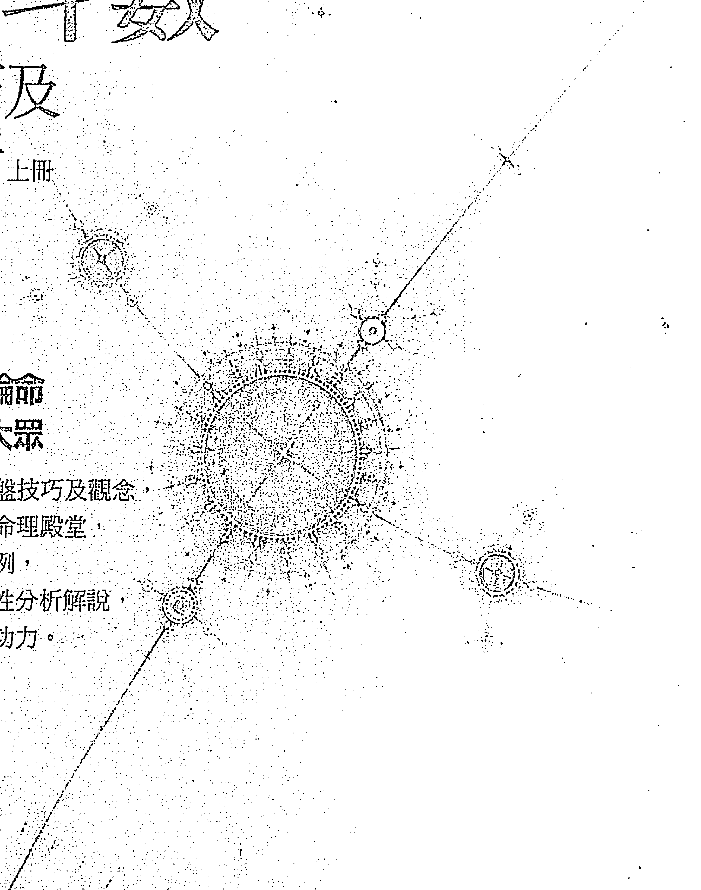
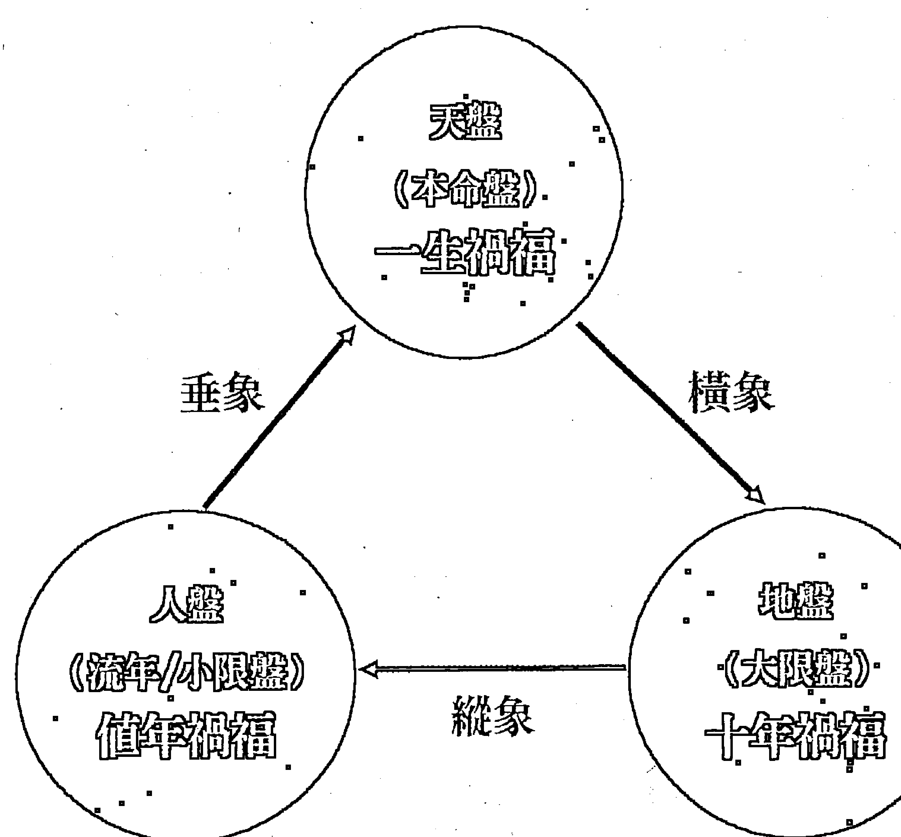
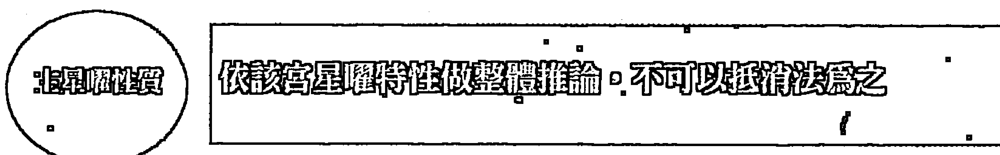
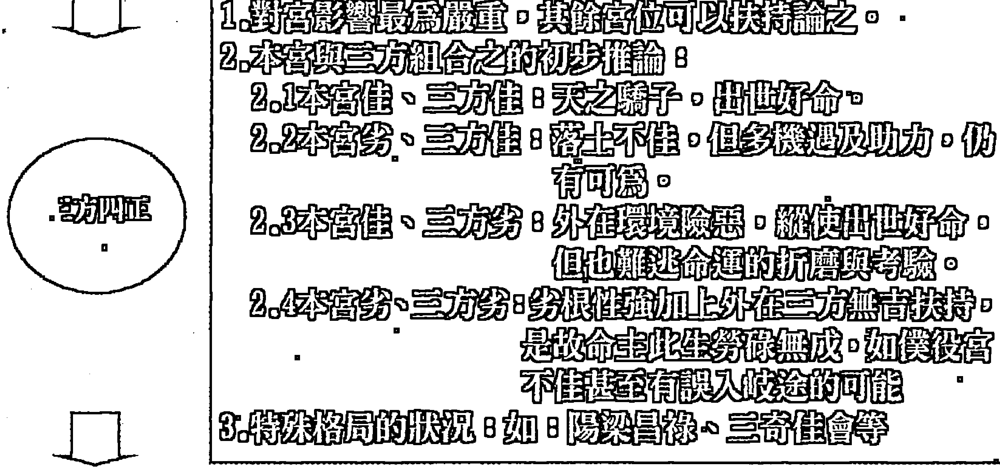
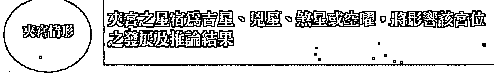
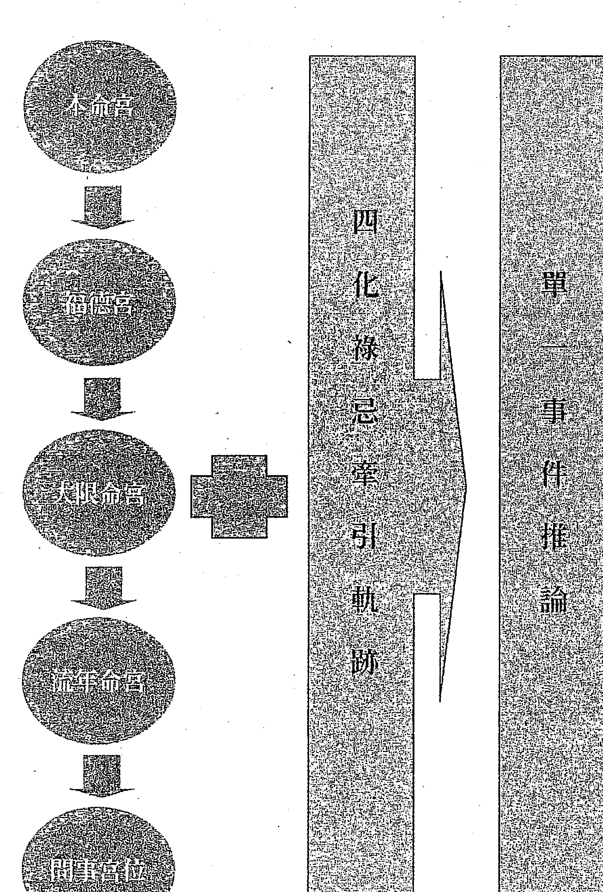
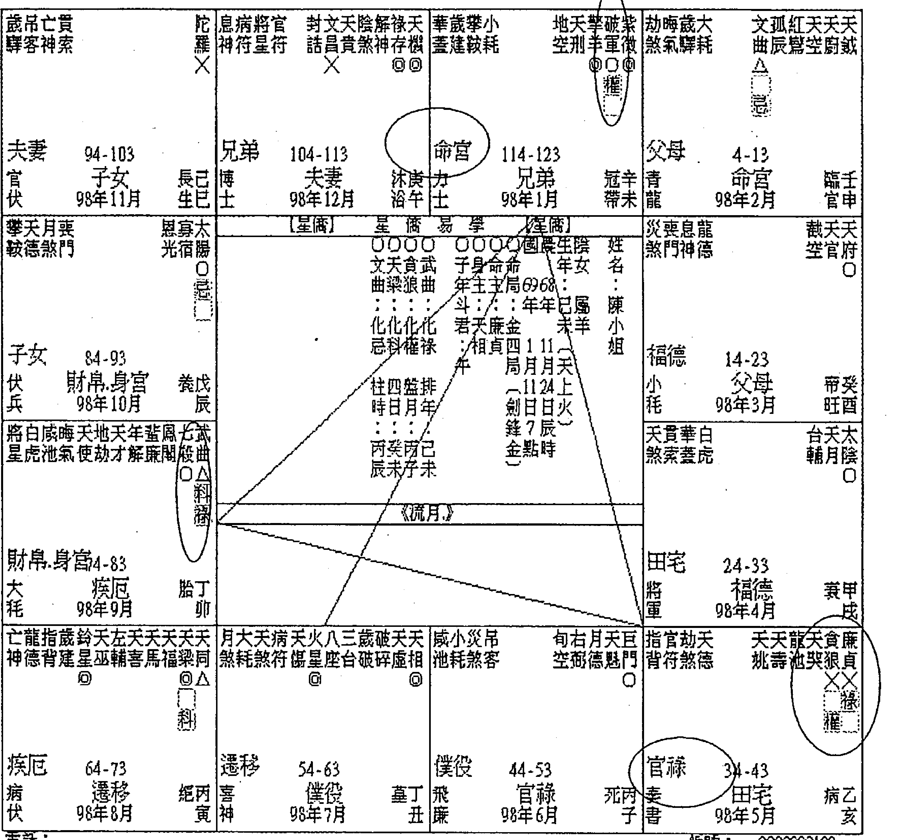
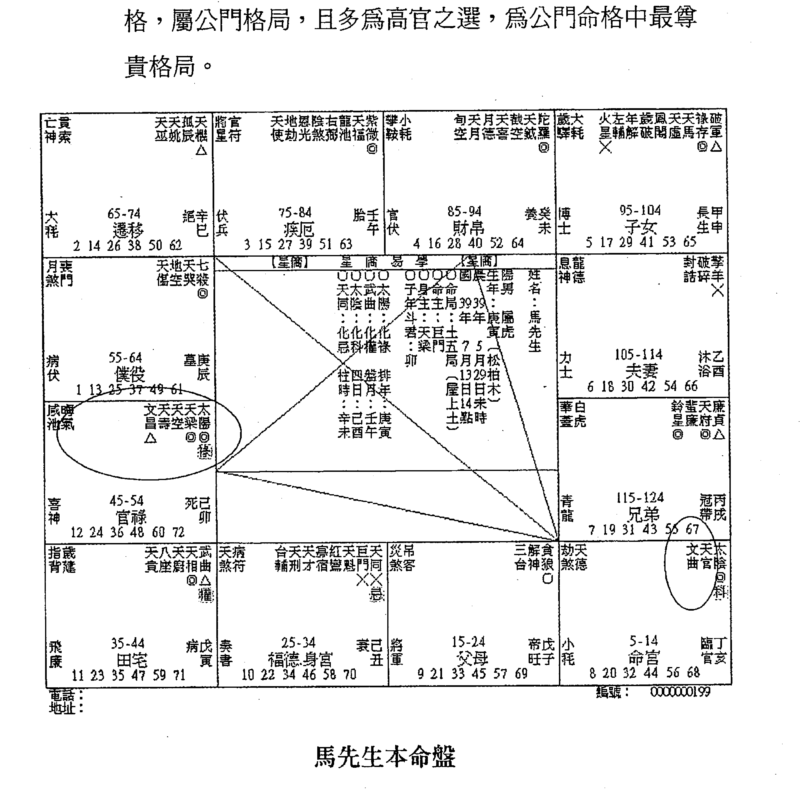
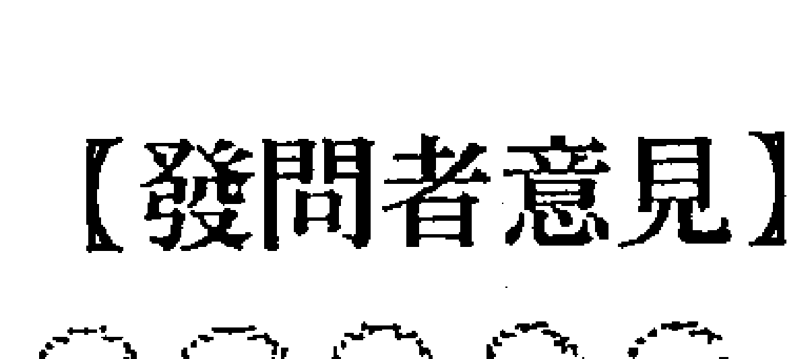
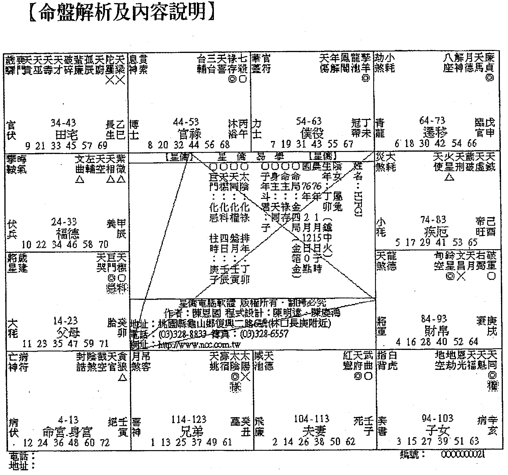

## 紫微斗数

了然山人一編著

論命技巧及實例解析 上冊

深入淺出 實例論命
白話講古 享宴大眾

白話闡述紫微斗數論盤技巧及觀念，
帶領讀者進入深奧的命理殿堂，
系列書籍彙集百餘命例，
輔以圖文並茂及系統性分析解說，
輕鬆提升論命經驗與功力。



## 紫微斗数

### 論命技巧及實例解析(上册)

了然山人 編著

## 自序

命理之說，乃為人欲探究生命奧秘所研發的一門專業學問，在西洋為占星學，在中國則有五術之論，各有其所長。而紫微斗數，又被尊為五術之首，因其內容除涵蓋了子平八字的要義之外，尚有天體運行的理論。至於一個人的命運是否從出生的那一天就註定了呢，答案恐怕是的。山人研究命理多年，論盤無數，得到一個很重要的經驗法則：如果此人一生沒有自造大善或大惡的情況，基本上人生的運程與命盤顯現的情形，不會有太大的差異。古曰：「禍福無門，唯人自招。」所以只要勤加行善，不作惡事，自然命運就有改變的機會，不需要花錢請人祭改或作法，寧願把此金錢來救濟佈施，我想命運必定會轉變的，就像山人常說的，如果你勤加行善積德，自然就會發現命理老師說的越來越不准了，不是他不准，而是你的命運已經改變了。這也是山人習命卻不願意認命的原因。

山人習命理十年有餘，總感嘆中國人的自私心態，導致許多的學問失傳甚至顛三倒四，也難怪當西洋的占星學得以研發出完整的理論基礎，風行世界。而中國五術，卻仍被視為迷信。紫微斗數亦是如此，據傳自陳摶（希夷祖師）發明此術以來，一直藏於深山中而未發表，直至明朝羅洪先狀元發現，此門學術才得以流傳於世，在長期的收藏，許多內容因紙張或竹簡腐壞導致文字難以辨識，所以古籍部分多殘缺不全，讓許多有心的後學者因此望而卻步。縱此學說有再好的學理基礎，仍有許多矛盾之處，加上後人穿鑿附會，與中國師徒制習慣留一手的陋習，所以此門學說難以像西洋十二星座一樣普及風行於世界，這豈非憾事一樁。

山人習命理多年也發現此情形，因此在網路錄製相關教學課程，內容係以古籍為主，輔以各家的部分理論，以補足原卷載之諸多缺漏處，期能讓此學說如西洋占星學一般，簡單易懂，風行世界。

山人主張紫微斗數的學習重視的是推理與理解，而非一般死記死背或翻書論之。山人曾經嘗試將斗數組合星系部分以化學方程式的模式寫出，但確實難如登天，因凡原則必有例外，且相關星宿間微妙的變化確非死板的方程式所能替代，所以僅研究出「生命曲線的判識原則」，期能將大限、行運的複雜性給簡化，利於學習。

紫微斗數首重星曜特性，因星曜的特性及組成來判識後天運途的窮通禍福，尤其紫微斗數絕對都以組合星系居多（如：殺破狼、機月同梁等格局），絕非單宮單星能論得出來，為利於學者，山人特將各宮判識重點以條列式寫出，讓讀者能夠輕易的上手。故本書重視的就是判識原則及理論的闡述，同時搭配生動活潑的實例分析，增加同學的實戰經驗。紫微斗數的精要是以論盤而非排盤，故建議學者僅需知道安星規則及基礎的方法即可，排盤問題就交給電腦處理（至於選用何種軟體較為適合論命者使用？山人強力推薦同學可選購星橋易學的斗數排盤軟體，簡潔明瞭易上手，專業度相當足夠，故本書便採用該軟體進行排盤，同學可自行上網下載，網址如下：
http://www.ncc.com.tw/soft/

有感於許多斗數學者因缺少豐富的案例分析而無法進階，故才疏學淺的山人斗膽將多年研究心得及論盤經驗，一五一十的載於此書，仍期盼命理界先進不吝賜教指正。

本書在編撰時，尤其要特別感謝母親大人的全力支持與照顧，還有王詩媛同學的改版建議，得以讓此書問世。如有任何疑問歡迎 e-mail 給山人，將儘速回覆：
kzf0910@yahoo.com.tw
也歡迎同學至山人的 Facebook 粉絲團打卡按個讚喔。
https://www.facebook.com/kzf0910

了然山人
民國 102 年 8 月 8 日

## 目録

- 自序......................3

### 第一章 斗數推演理論基礎.................9
- 第一節 三才理論.........................10
- 第二節 三強理論.........................13

### 第二章 各宮位判識原則及方法...............17
- 第一節 各宮位判識原則.....................18
- 第二節 單一事件之判識順序.................20
- 第三節 各宮位判識重點.....................22
- 第四節 命盤判識原則及順序.................27
- 第五節 四字格局組成及現代解義.............31

### 第三章 生命曲線判讀...............43

### 第四章 實例解析...............57
- 第一節 前言...............58
- 第二節 十二宮解析實例...............60
- 第三節 大限解析實例...............68
- 第四節 流年解析...............70

### 第五章 常见四大类问题实例解析……………73
- 第一节 姻缘问题实例分析…………………75
- 第二节 事业问题实例分析…………………88
- 第三节 考运及公门格局问题实例分析………103
- 第四节 财运问题实例解析…………………114

### 第六章 雅虎知识+命理分析实例说明………123
- 案例1、想问感情与事业…………………124
- 案例2、关于紫微斗数，我想问事业（创业）…134
- 案例3、是否命中無姻缘呢？……………141
- 案例4、请问武貪適合的工作……………145
- 案例5、2011年运势……………………151
- 案例6、適合開店當老闆嗎？以及適合店面方位？.155
- 案例7、无法存錢又常遇到小人…………166
- 案例8、何時才有姻缘？…………………172
- 案例9、能幫我算算2010年的運勢嗎？……184
- 案例10、七殺和擎羊坐命的女生，請大師幫幫忙..192
- 案例11、我的命格適合從軍嗎？…………203
- 案例12、七殺獨坐女性，請教創業跟財運……214
- 案例13、急問紫微命盤達人有關事業發展狀況…222
- 案例14、情路受挫：命格註定情關難過嗎？……229
- 案例15、很想創業但不知我是否適合？………242

## 第一章 斗数推演理论基础

### 第一節 三才理論



### 第一章 斗數推演理論基礎

說明： 三才指的就是天、地、人，命理及萬物的範疇不脫此三才，是故在斗數的運用上亦可以此理解。何謂天，即為本命盤，本命盤的管轄範圍為當事人一生各面向的優劣程度，故稱之為天；地即為大限盤，大限盤管轄範圍即為當事人十年間的各面向的優劣程度，故稱之地；人即為流年（小限）盤，流年（小限）盤管轄範圍即為當事人於該年各面向的優劣程度，故稱之為人盤。由天應地，以知橫象；由地應人，以知縱象；由人應天，以知垂象，三才並用，以推人命。

三才理論為何如此重要？因為論命單靠本命盤來推導，過於死板且缺少變化，唯有利用三才理論輔以觀察四化牽引軌跡，才能夠把此三盤組合成為立體星盤，並利用四化祿忌互轉串出其間的變化，以觀全貌。

舉例來說，如果命主想知道一生財富的狀況，就須觀察其財帛宮，如該宮星宿組合看起來應相當富裕，但實際上目前卻是十分窮困潦倒，其因為何？問題就是出在論命者沒有善加運用三才理論，就整體走勢來進行綜合推論所造成的誤判。雖然說財帛宮象徵一個人一生的財運，但人生有如波浪，起起落落。也許剛好在這個大限（或流年）命宮煞忌齊臨，所以財難聚且辛勞，但下個大限（或流年）也許雙祿馬交馳，發財得意於他鄉，正好完全符合本命盤呈現的狀況。

這也就是三才理論所表達的重點所在。人生不也如此，今朝他人胯下過，他日官拜大將軍。斗數易學難精，就是因為其中包含了此些人生哲理，畢竟它是推演一個人一生的際遇，不可能永遠順風，也不可能永遠逆風。所以要建立起一個立體的星盤概念，觀其縱向、垂象、橫向來綜合研判，因此只要理解此點，相信日後不再會有如此感慨。

### 第二節 三強理論

| 單元 | 解釋 |
| :--- | :--- |
| 強宮 | 以人為思考點所判斷出之強勢宮位 |
| 強星 | 以事為思考點所判斷出之強勢星曜 |
| 強盤 | 以時為思考點所判斷出之強勢盤位 |

*（注：以上三个单元共同指向）* **綜合推論命運**

### 說明：

何謂強？指的就是對命主有著重要或直接影響之宮位，是故三強指的就是此強宮、強星、強盤，古代論命者非常的簡單，因男女大有不同，在那個男尊女卑的年代，女生就是足不出戶，遵守三從四德，所以看女性的宮位，僅需注意夫、子二宮，因家庭即為女性的一切，而男性就是財、官、田等三個部分，倒也是充分的演繹了中國傳統上男主外女主內的通則。

現今社會，女性往往比男性還強勢，因此古代的論命法則，也有修正的必要。但星盤如此的廣泛，到底要如何才能夠給當事人一個最正確的建議呢？因此充分針對當事人的需求來做整體式的論斷，這才是運用三強理論的最高造詣，茲分述如下：

### 一、強宮理論（以人為思考點）

強宮指的就是對命主而言最重要的宮位，一般而言，男生多以事業為重，故以官祿宮為強宮；女生則多以家庭為重，故以其夫妻宮為強宮；從事業務公關者，當以遷移宮為強宮；經商者，當以財帛（財源）、田宅宮（財庫）為強宮；一般上班族，以升遷為主要目的，是故其官祿宮為強宮；從政者，必須得到群眾擁戴及朋友屬下的助力，是故強宮為僕役宮，其餘皆類推。是故強宮理論，係針對當事人背景或需求做分析推演，分析該強宮之優劣處（如：見煞、吉星數量、星曜間影響及四化牽引軌跡等），自然能夠提供當事人正確且中肯的建議。

### 二、強星理論（以事為思考點）

依據當事人的需求來研判相關星曜的落宮位置、廟旺程度及三方四正的組成優劣與否來做是非好壞的判識。如為投機事業者，則須先視其是否有偏財運的格局星曜組合（如：火貪、鈴貪）及座落宮位；而經商者，首重利潤財帛的豐厚，是故以財星（如：武曲、天府、祿存、化祿等）為主要判識星曜；如準備升學考試者，首重文星（如：文昌、文曲等），是故強星理論就是針對當事人最重視處之星曜狀況來做綜合判識。

### 三、強盤理論（以時為思考點）

強盤指的就是大限、流年、流月、流日乃至於流時盤，而大限盤或流盤所代表的意義就是時間，因此強盤理論是依據時間的長短對於當事人的影響而定，如：從事長期投資（房地產等）者，應以大限盤為強盤；短期投資（股票、期貨等）者，應以流盤為強盤來推論；應試者亦應以流盤為強盤來推論，是故強盤的依據就是事件的時限，如投注樂透彩或賭牌時，強盤就是流時盤，依此類推。

## 第二章 各宫位判识原则及方法

### 第一節 各宮位判識原則







### 說明：

在判識各宮位時，牢記此三步驟，按部就班，自然不會掛一漏萬。首先要對宮內星曜屬性充分了解，然後針對三方四正星宿對本宮的影響來推斷整體架構，再觀察是否形成特殊格局。舉例來說，如本命宮坐紫微星，首先就是要看是否見左輔、右弼，形成君臣慶會的格局，如不構成，則縱使本宮組合再佳，也難逃孤君單打獨鬥的命運。至於特殊格局（又稱四字格局），其組成及現代解義收錄於後章節，學者需詳加研究。

在完成上述兩個步驟後，最容易被忽略的就是夾宮的情形，例如：紫殺坐命，因七殺直接受命於紫微帝座，故此組合表徵為掌權，但其左右卻遭火星、鈴星來夾，則此組合反使權力受限。又如同表示財貨的祿存坐財帛宮，就判定這個人必定錢多到花不完，但卻忘了左右還有擎羊、陀羅來夾。諸如此類，若忽略觀察夾宮，則論盤謬誤勢必難逃。學者需謹記此三大步驟，逐步推演，自可清楚掌握各宮位所演化出的情況。

### 第二节 單一事件之判識順序



### 第二章 各宫位判识原则及方法

### 说明：

星性掌握了，判識原則確立之後，接下來就要進展到推演的部分，我們都知道，本命宮表達的是一個人一生整體的表現，因此如要論及單一事件，首先要從本命宮來判讀。爾後福德宮、大限命宮、流年（小限）命宮等判讀推演，建立整個立體星盤概念，再來觀察問事宮位，如此自然能清楚且正確的進行判識。舉例來說：一個人想知道是否適合創業當老闆，首先看命宮星曜，如果會煞忌太多或是天相星坐命這種濫好人加員外的個性，是不可能有成功的機會。接下來就福德宮再看是否有相對應的福氣，倘福德宮星群組合不佳，則該人於福澤有損，且福德宮亦可視為命主思考模式的表現，倘結構不佳，表示該人容易思緒煩亂，甚至有不安易怒等缺點，自然不會有太好的結果；然後進展到大限命宮，流年命宮（此時需注意祿忌互轉的情形）。

也許本命不適宜創業，但在大限或流年命宮卻是雙祿馬交馳之局，這就是標準的「風雲際會」之勢，當然是先炒個短線再說，但切記因本命不宜，因此見好就必收，否則難逃敗亡之運。這些了解之後，再針對命主問事的宮位單獨研判優劣，輔以之前的推論，自然可以得到正確的方向與解答。

### 第三節 各宮位判識重點

| 宮位名稱 | 判識重點 |
| :--- | :--- |
| 兄弟宮 | 1. 煞星或對宮煞星沖時則兄弟較少或多爭執糾紛，感情不睦。<br>2. 宮內正曜性質穩重（如：紫微、天機、太陽、天同、天府、太陰、天相、天梁），且不見煞，則容易得到兄弟幫助，如在見魁鉞或輔弼在此同會，則表示助力及貴人多由兄弟而來。<br>3. 如正曜帶孤剋性（如：武曲、廉貞、巨門、七殺、破軍、貪狼）表緣分淺薄或難以得到助力，如再見煞則表示兄弟不合或相互間鬥爭嚴重。<br>4. 如兄弟宮得廟旺之日月齊照，則兄弟之間必有成就卓越之人。 |
| 夫妻宮 | 1. 見煞忌或獨坐，表夫妻間易有生離死別或相處不睦，感情不佳之問題。<br>2. 單見左輔、右弼，在遇煞忌，則容易發生第三者問題，尤其是右弼。<br>3. 見孤辰、寡宿、陀羅只宜晚婚，早婚易導致生離死別。<br>4. 見天馬、解神則為離婚的組合，若值煞忌諸曜沖起尤確。<br>5. 夫妻宮遭空、劫夾制，多與異性有緣無份，以單戀狀況居多，感情不易有結果。<br>6. 夫妻宮暗合位倘見祿存、化祿或桃花星曜，則命主易有「偷吃」的情況發生，須特別注意。 |
| 子女宮 | 1. 古曰：「凡觀子息之有無，四煞空劫逢之則害。」見煞忌則子女數量少甚至無子或早夭（如火、鈴、空、劫）或子女難以奉老，叛逆等問題。<br>2. 如正曜陽剛氣息重（如紫微、天機、太陽、武曲、廉貞等）先生男，見正曜陰柔氣息重（如：太陰、天府、巨門、天相、天梁等）先生女；又研判小孩性別時，須以母親命盤的子女宮星曜為準。<br>註：斗數無法推論子息之數量，尤其是科技發達的今日，不孕症亦可得子，故僅列於參考。 |
| 財帛宮 | 1. 見武曲、化祿等財星正坐或日月齊照且不見煞，古曰：「堆金積祿。」<br>2. 財帛宮遇煞忌或空劫，縱有財亦難聚，財來財去一場空，或象徵命主必經一番勞苦而得財。<br>3. 凡斷人的財貨多寡，除財星正坐財宮之外，更需注意天府、天相、祿存是否三合，如府相不見祿，為空庫一座，亦不可為富人之斷。<br>4. 如天府、天相與祿存係暗合關係，則此人多業外之財。<br>5. 財帛宮只宜見化祿而不宜見祿存，因祿存必遭羊陀夾制，財宮遭夾，吉則轉化為守財奴，不吉則財亦難聚。或主其財多係穩定細水長流之財，難有偏財。<br>6. 倘見鈴貪、火貪格局，表示該人財常橫發，亦可視為偏財運的象徵。<br>註：此組合出現於命、福德、田宅宮亦同，主偏財。 |
| 疾厄宮 | 1.紫微、天府：絕對吉星，逢疾亦可得良醫。<br>2.見下列星曜則易患相對疾病，須特別注意：<br>(1) 頭疾（如：中風、偏頭痛等）：太陽<br>(2) 皮膚、腫瘤類疾病：天機、廉貞、天相<br>(3) 呼吸系統（心、肺或氣管等）：天同、七殺、破軍、武曲<br>(4) 血液循環或代謝系統：太陰、巨門、天梁<br>(5) 腎臟、肝臟或泌尿系統：貪狼<br>(6) 破相：火鈴<br>3.如坐上述星曜再遇四煞（羊、陀、火、鈴）：<br>(1) 四肢有殘：天機、天相、天梁、七殺、巨門<br>(2) 目疾：太陽、貪狼<br>(3) 痔瘡或暗瘡：武曲 |
| 遷移宮 | 1.遇六煞星，主出外多是非糾紛或競爭且容易發生懷才不遇的情形。<br>2.遇天魁、天鉞則多貴人提攜，機遇多，遇左輔、右弼則易得朋友助力。<br>3.見祿存且不見煞，宜外地求財。 |
| 僕役宮 | 1.正曜性質穩重（如：紫微、天機、太陽、天同、天府、太陰、天相、天梁），且不見煞，表與朋友及下屬關係良好，見正曜帶孤剋性（如：七殺、廉貞、貪狼、巨門、破軍），則容易因友而生是非或難以結交益友。如正曜帶孤剋性且見煞忌，則易遭朋友、下屬背叛出賣或因此導致災禍。<br>2.僕役宮絕對不宜見祿存或坐、會，表示易因友而破財，或命主爲重義不惜財之人。如再遇空劫，則易遭朋友欺騙破財甚至傾家蕩產。古曰：「祿落僕役，縱有官也奔馳。」即爲此意。 |
| 官祿宮 | 1.遇煞忌齊臨或夾制，則此生在職場上必多波折起伏且奔波勞碌。<br>2.遇吉星會照，則多機遇及貴人提攜，較易有所成，但仍須視命主本命宮表現出的個性模式來整體判斷。 |
| 田宅宮 | 1.遇武曲、化祿或日月齊照且不逢煞忌空劫，表命主多有祖產或不動產。<br>2.由於田宅宮可爲財庫的表徵，遇空劫，則爲庫破，此生難有積蓄或無法自置不動產，如有祖產則多爲破敗之結局。<br>3.遇破軍結構佳者先有後無爾後又有，結構不佳者敗家。<br>4.遇煞忌齊臨，則爲難有不動產或家宅易發生意外（如：火災、遭法拍等狀況）。 |
| 福德宮 | 1.遇煞忌齊臨者，則人生多勞碌且多起伏波折，其人生難有享受清閒之時，通常亦爲較無趣之人。<br>2.紫微或天同、天梁坐福德宮，則此人個性較爲懶散不積極。<br>3.福德宮星曜帶孤剋（如：七殺、破軍、貪狼）性質，除增加此生奔波勞碌之外，其 || 左列 | 右列 |
| :--- | :--- |
| 父母宮 | 1. 遇煞忌齊臨，表與父母關係不佳或相剋，宜過房重拜父母可免刑剋。<br>2. 空劫雙煞臨，表與父母緣淺或自小離家遠行，或寄養等。<br>3. 父母宮見化祿或吉星拱照，且不見煞忌，則此人家世背景及成長環境必佳，如父母宮逢廟旺之日月齊照，其父母多為社會有名望（如：民意代表、醫生、地方仕紳等）之人。 |

## 第四節 命盤判識原則及順序

| 左列 | 右列 |
| :--- | :--- |
| 天馬、祿存或化祿交會情形 | 祿馬交馳為研判命主是否適宜創業的觀察點，如結構不佳（如折足馬或拆馬忌等），則此人只宜穩定收入上班族。 |
| 六吉星分佈狀況 | 六吉星交會處通常是個人的助力（如輔、弼）及貴人（魁、鉞）所在。如此類星曜組合不佳，則命主亦難有所成就。 |
| 看日月及紫微星組合狀況 | 太陽、太陰及紫微星群的組合是古人評斷命主富貴貧賤的主要點，因此超強的大格局多是此類組合，如命主此處組合不佳，則人生難免走得辛苦，且難有成就。 |
| 命宮、身宮的星宿組合 | 命宮判識原則詳前章，暫不贅述；身宮位置通常是一個人最重視的點，如身居夫妻，表示重視夫妻（男女）關係，又身宮表後天，因此身宮帶煞，其人易有外傷，且常感失落。 |

# 紫微斗數
# 論命技巧及實例解析（上冊）

## 命、身強弱

命身宮強弱影響命主的壽元，如命弱身弱者，格局不佳或流年星曜組合不吉，且福德及田宅會空或無正曜時，特別容易出現重大意外，其判斷原則有二：

- 1. 命、身宮正曜數量，如無正曜或會空系星曜，可視為命弱身弱局，反之則反。
- 2. 命、身宮三方四正吉曜數量，如見吉星多，則視為為強命或強身，反之則反。

基於命身強弱情形，亦可判定四種狀況：

- 1. 命身皆強：於大限行進遇較兇惡的情況得以平安度過，如遇到好的大限可望得到好的際遇及成就。
- 2. 命身皆弱：於大限行進遇較兇惡的情況難以度過，如本命格局不佳，易有早夭的情形，如遇到好的大限也難以把握。
- 3. 命強身弱：於大限行進遇較兇惡的情況雖傷害難免，但至少可以度過，遇到境遇較佳的大限，容易產生挫敗。
- 4. 命弱身強：於大限行進遇較兇惡的情況小意外可望度過，但過於兇惡亦難以全身而退，遇較好的大限，偶有好的際遇及成就，但因命為根基，基礎不穩，再強勢也是曇花一現，故為風雲際會之局勢。

## 本生四化星的分佈狀況

四化星中其星性設定為三吉一凶，因此化忌星所沖、坐宮位往往是人生最容易發生挫折之處，化祿星位置亦須特別注意，因其表一生的財富多寡。

# 第二章 各宮位判識原則及方法

## 其他十一宮位

- 其他宮位判識有幾項重點，茲分述如下：
  1. 主星曜性質佳否？穩定？孤剋？浮動？煞星？空星？
  2. 三方四正對本宮星曜的影響及變化。
  3. 夾宮情形如何？如：雙祿夾財、刑囚夾印等。
  4. 是否成特殊格局？如日月照壁等。
  5. 是否見煞？煞星的性質為何？見煞數量是否超過兩顆以上？

## 大限與流年

- 推演大限與流年時有幾項重點，茲分述如下：
  1. 於判識大限、流年時，需考量命主本身的特質，在此大限可能發生的情況將如何應對。
  2. 大限行進應從第二大限起，看各個大限的起落吉凶，並參照大限宮干四化之情形(原則上僅需注意化忌與化祿即可)，如大限宮位星曜組合不佳，且逢煞又遇化忌，尤其本命盤化祿轉化忌時更是人生重大波折起伏之時。
  3. 大限、流年行進遇到良好格局時，又逢大限宮干化祿或流年化祿照會入命宮且不見煞侵，則該大限或流年必為開運或轉運之時。
  4. 大限、流年行進時，起伏不宜過大，最忌前後兩個大限差異太大，蓋人難以承受兩個完全不同的十年。最好的行進方式是平穩，不宜大起大落。

# 紫微斗數
論命技巧及實例解析（上冊）

## 說明：

許多人對於星性背得滚瓜爛熟，但一看到星盤就全亂了套。看到這裡，就漏了那裡，結果功力仍然是鴉鴉烏，論自己不準也就算了，最怕學藝未精，就貿然與人論命，倘因此導致因果錯置，那可就真是害人不淺了。

究其因是在於缺乏正確且有系統的判識步驟，因此山人除針對各宮位判識法及順序描述如上，更綜合了山人多年論命經驗得到的判識原則及論斷順序，供學者靈活視現實狀況交互運用。

學者僅需依據上列順序逐步推敲，輔以對星性的確實掌握，自能進行命盤論斷推演，進而給問命者最中肯貼切的建議。

在此透露個山人論命的小訣竅（或稱為經驗法則亦可），如想得知論命者的來意，基本上只要注意其流日化忌宮位，即可得知困擾之處，準確度高達 75% 以上，如是流月化祿於當日轉化忌，則準確度高達 90% 以上。例如流日化忌落於財帛宮，且又是流月化祿轉化忌，則此人必因金錢問題所擾，餘依此類推。

# 第五節 四字格局組成及現代解義

| 類型 | 格局名稱 | 星曜組合 | 解義 |
| :--- | :--- | :--- | :--- |
| 富貴之命格 | 財蔭夾印 | 謂天相落命或田宅宮，見化祿或祿存與天梁夾謂之 | 容易得到上司、父母或其他長輩的提攜幫助，得到財富或地位。 |
| 富貴之命格 | 日月夾財 | 武曲落命或財帛宮，遇日月來夾 | 財星坐財宮，又逢日月夾，爲得盡天時之力獲取財富。 |
| 富貴之命格 | 財祿夾馬 | 天馬落命，逢武曲、祿存來夾 | 天馬爲動中求財之意，逢財星及財來夾，則可於動中獲取財富。 |
| 富貴之命格 | 蔭印拱身 | 身在田宅宮，三合或對宮有天梁天相 | 身居田宅宮，又逢天梁、天相來照護，故能得到長輩助力獲得不動產或因不動產而巨富。 |
| 富貴之命格 | 日月照壁 | 日月齊照或共度於田宅宮 | 蓋田宅宮爲財庫之意，得日月吉星來照，表示其人不動產或財庫豐厚之意。 |
| 富貴之命格 | 日麗中天 | 太陽坐命守在午宮 | 太陽屬火，午宮又爲火旺之地，加上太陽於午時最爲炎烈，又太陽表富貴，故有富可敵國之譽。 |
| 富貴之命格 | 積富之人 | 廉貞、七殺均廟旺謂之，若均落陷則反為下賤之命 | 爲善於累積財富之人。 |
| 富貴之命格 | 先貧後富 | 武曲、貪狼居命宮 | 爲中年(40 歲)之後方有成富人機會，年輕時亦有窮途潦倒之勢，古曰：「武貪不發少年人。」即爲此意。 |
| 富貴之命格 | 日月夾命 | 命宮逢日月來夾 | 日、月爲萬物造化之主，命宮如能逢此相夾，則自然是貴不可言。 |
| 富貴之命格 | 日出扶桑 | 太陽在卯宮坐命 | 太陽在卯宮正值東昇之時，又稱日照雷門格，爲貴命之格。 |
| 富貴之命格 | 月落亥宮 | 命坐亥宮，太陰獨坐 | 太陰主一生之快樂，亥宮正值月出之時，爲貴命。且太陰表財富之意，故得財容易。又名月朗天門，爲富貴雙全之造。 |
| 富貴之命格 | 月生滄海 | 太陰在命宮或田宅宮，且居子宮 | 太陰主富，子宮正值太陰廟旺，太陰屬故易得財富之表徵，且太陰爲貴氣，亦爲富貴雙全之命造。 |
| 富貴之命格 | 君臣慶會 | 命坐紫微，三方四正中見左輔、右弼、天府、天相、天魁、天鉞等吉星會照稱之 | 紫微爲帝座，得群臣來朝拱，政事自然得以順利推展，古曰：「才善經邦。」得此局則此人必能有所成。 |
| | 輔弼拱命 | 於命宮之三方四正或夾宮中見左輔、右弼 | 紫微爲帝座，而輔弼又爲助星，帝能得助自然在多助力的情況下得以成就。若命宮坐紫微，又稱輔弼拱主。 |
| | 財蔭夾祿 | 祿存落財帛宮，又見天梁武曲來夾 | 祿存爲財帛之意，自然喜歡坐落財帛宮，而財居財位且又逢蔭及財星來夾，自然輕易能有豐厚之財。 |
| | 祿馬交馳 | 祿存、天馬於命宮之三方四正相會或於四生地對拱均稱之 | 得以在奔波中求取財富有此格者利於外地求才或從事商賈生意，必有所成。 |
| | 祿馬佩印 | 祿存、天馬、天相三星入命宮 | 與祿馬交馳情況相同，但又見天相星，蓋天相化氣爲印，故較僅有祿馬交馳的人，進財更爲容易。 |
| 富貴之命格 | 坐貴向貴 | 天魁天鉞坐命或在三合相會 | 此格又稱蓋世文章，魁鉞均為貴人星之意，亦即可以得到貴人扶助或是本身文采蓋世，此格又稱為公門格。 |
| 富貴之命格 | 七殺朝斗 | 七殺坐命，其對宮為紫微天府 | 由於紫微天府均為主星，而七殺為帥，直接受命於主，故其才能必能全力發揮。此格為富貴雙全之格，擁有此格的人通常工作能力強，也因此成功的機會大。 |
| 富貴之命格 | 日月並明 | 命宮與日月在三合相逢或太陽居辰、巳宮，太陰居戌、酉亦可 | 此組合日月皆居廟旺之地，又稱丹墀桂墀格，古曰：「早遂青雲之志。」意即少年有成之意。 |
| 富貴之命格 | 科權祿拱 | 命宮三合見化科、化權、化祿 | 又稱為三奇佳會，蓋權祿科為成功的要件，此三化入命表示天生即擁有此成功的優勢，家世通常不錯，且容易成功，無論在何行業均能出類拔萃。 |
| 富貴之命格 | 三合火貪 | 命宮見火星貪狼 | 火貪格為奇格，在煞曜中有詳細述明，在此不贅述，此為橫發格局，亦為橫財格。 |
| 富貴之命格 | 巨日同宮 | 巨門太陽同居命宮又坐寅宮 | 蓋巨門為陰暗之意，太陽為光明之意，故得以改善巨門陰暗性轉化為光明，利於求取功名與利祿，古曰：「官封三代。」 |
| 富貴之命格 | 紫府朝垣 | 紫微、天府於三方四正照命 | 雙主星拱命，故其富貴自不可言。 |
| 富貴之命格 | 府相朝垣 | 天府、天相在命宮三方四正相會 | 此格局人通常能力都很強，所以容易貴顯。 |
| 富貴之命格 | 雙祿朝垣 | 化祿、祿存同照命宮 | 祿存與化祿均為財帛之意同照命表財富可觀，故亦為富貴雙全之局。 |
| 富貴之命格 | 祿權巡逢 | 化祿、化權同照會入命宮 | 祿為財，權為貴，表此人功名利祿，一蹴可及，富貴雙全之局。 |
| 富貴之命格 | 極響離明 | 紫微居午謂之 | 紫微為帝座，又五行屬土，午宮在五行上屬火，火來生土，極旺也，帝座得以居旺地，自然貴不可言。 |
| 富貴之命格 | 輔拱文星 | 文昌居命宮，得左輔、右弼來拱謂之 | 文昌星為文職之星，得輔弼來拱，自然得以顯貴。 |
| | 英星入廟 | 破軍居午且守命宮 | 破軍屬火，午宮亦為火旺之地，自當貴不可言。 |
| | 石中隱玉 | 巨門守命宮且居子午者謂之 | 必經過一番磨難方有所成，如同藏於石中的美玉，必經嚴苛磨煉方可展露光芒。 |
| | 雄宿乾元 | 廉貞在申或寅宮守命 | 此格局能力強，必位居要津獲成就大事業。 |
| | 陽梁昌祿 | 命宮或官祿宮之三方四正見太陽、天梁、文昌、祿存四星 | 此為公職顯貴格局，利於典試，古以官為貴，此局亦為公門命格，且多為高官，古曰：「金殿傳臚。」 |
| 文人之命格 | 文星暗拱 | 命坐化科星，且三方四正見文昌、文曲。如命不坐化科，得為文星拱命 | 文昌文曲均為文職顯貴之星，同來拱命及表示此人多才多能，必能以文職顯貴。 |
| | 昌曲夾命 | 命宮逢文昌、文曲來夾 | 同上。 |
| | 多學多能 | 昌曲居命坐辰戌亥卯酉宮 | 昌曲坐上述宮位均為廟旺之地，故利於文職顯貴。 |
| 文人之命格 | 機月同梁 | 命宮的三方四正中見天機、太陰、天同、天梁四星交會 | 此組合穩定性強，但積極度不足，故只宜文職或穩定的工作。此局又為公門命格，古曰：「機月同梁作吏人。」 |
| 武人之命格 | 將相之名 | 即鈴貪格是也 | 蓋此兩星互煉，故利於武職顯貴。 |
| 武人之命格 | 威權出眾 | 即火貪格是也 | 蓋此兩星互煉，故利於武職顯貴。 |
| 武人之命格 | 聲名遠播 | 廉貞居命不見煞侵，且居廟旺 | 廉貞本有雙重個性，在不見煞曜影響且居廟旺之地，反吉，利於武職顯貴。 |
| 其他之命 | 秉性寬厚 | 左輔右弼同居命宮謂之 | 輔弼乃斗數中重要的輔助星曜，凡善於輔佐者，其性必好，故以秉性寬厚称之。 |
| 其他之命 | 出外從雲 | 破軍、七殺同居命宮 | 七殺及破軍的組合過於劇烈，容易衝動誤事，難有大成，故只宜習專門技藝行走天下謂之。 |

# 紫微斗數
# 論命技巧及實例解析（上冊）

| 類型 | 格局名稱 | 星曜組合 | 解義 |
| :--- | :--- | :--- | :--- |
| 夭折短壽之命 | 喪命天年 | 命宮見廉貞會昌曲，即爲昌廉或昌貪格（但若加武曲、天相則掌權而貴顯） | 廉貞不喜與昌曲同度，因性質過於接近，且廉貞具雙重個性，過剛則折，過柔亦同，又有粉身碎骨之稱。 |
| 夭折短壽之命 | 鈴昌陀武 | 鈴星、文昌、陀羅、武曲四星於三合相會 | 此格爲斗數的極惡格，又有鄧通餓死之稱。 |
| 夭折短壽之命 | 終身縊死 | 身命宮見巨火羊三星獲大限遇之，再見煞星謂之，或稱巨逢四煞 | 蓋巨門爲暗曜，火羊雙煞雖成格卻逢暗曜所破，則其凶更巨。此格又稱巨火羊格，爲斗數的惡格之一。 |
| 夭折短壽之命 | 殺拱廉貞 | 七殺、廉貞化忌於命、遷移宮對拱，逢羊、陀又落羅網中（辰、戌二宮） | 七殺廉貞組合過於剛克，又落於命遷宮，且落天羅地網中，如有意外將難以突破，爲橫遭不幸之意（如車禍等），古曰：「半路埋屍。」 |
| 夭折短壽之命 | 陣中亡 | 七殺獨坐逢四煞齊臨 | 七殺爲剛克之星，又逢四煞侵襲，過剛則折，因此容易遭遇意外不幸。 |
| 夭折短壽之命 | 馬頭帶劍 | 擎羊在午、卯守命或陀羅在寅申巳亥宮守命謂之 | 羊陀皆煞忌，在此宮位爲落陷之勢，凶星落陷，其威更甚，故曰：「非夭折即主刑傷。」 |

# 第二章 各宮位判識原則及方法

## 貧賤之命

| 類型 | 格局名稱 | 星曜組合 | 解義 |
| :--- | :--- | :--- | :--- |
| | 生不逢時 | 命宮見廉貞、地空或其它的空曜 | 廉貞逢空，則難有發揮餘地，故曰：生不逢時。 |
| | 祿逢兩殺 | 命宮有化祿或祿存而四煞齊臨 | 祿存及化祿均為財帛之意，財帛逢煞侵則不易守，自然為貧賤之局。 |
| | 馬落空亡 | 天馬與地空地劫同宮，如於三方四正再遇羊陀，則為折足馬 | 蓋馬為求財之器，器逢空，自然奔波勞碌，難有所獲，又於三方四正遇煞，則如同折足般，更難有成。 |
| | 日月藏輝 | 日月反背居命，對宮見巨門落陷 | 日月反背問題，再十四正曜之太陽一節有詳細介紹，不贅述。 |
| | 財與囚仇 | 武曲、廉貞同居命宮 | 武曲為財星，廉貞化氣為囚，蓋求財必易生官非糾紛。而財為生活之必需，故為貧賤格局並不為過。 |
| | 一生孤貧 | 武曲廉貞同居命宮 | 此兩星素組合易導致求財不順利（過於剛克且缺乏謀略），故論之。 |
| | 兩重華蓋 | 祿存、化祿、天空、地劫四星同在命宮 | 蓋祿存與化祿均為財帛之意，財遇空劫，自然財難留。又稱倒祿，女命逢之，感情路易有不順遂及遇人不淑之嘆。 |
| | 下賤孤寒 | 廉貞居命，命身分居巳亥宮，三合對宮又無吉星 | 凡廉貞坐命大部分出現惡格，須特別注意，無吉星扶持的廉貞，因無制，故易肇致禍事。 |
| | 飄蓬之客 | 太陰落陷，見天梁 | 蓋此兩曜均有孤傲的本質，兩星相會大有千山我獨行的特性，故飄蓬江湖實難避免。 |
| | 生來貧賤 | 身、命、福德宮見地劫、地空且宮內無吉星又均陷落 | 身、命、福德為本，無吉星自然命身皆弱，再逢空劫，福報更是難有，故評為貧賤。 |
| | 極居卯酉 | 紫微、貪狼同在卯或酉坐命 | 此格局對於在情感或事業方面難有成就，古曰：「多為脫俗之僧。」 |
| | 梁馬飄蕩 | 天梁與天馬相會謂知 | 蓋天梁已有不安定的本質，在會天馬更是變本加厲，難以安定。 |

# 第二章 各宮位判識原則及方法

| 類型 | 格局名稱 | 星曜組合 | 解義 |
| :--- | :--- | :--- | :--- |
| 貧賤之命 | 命無正曜 | 命宮裡不見十四正曜謂之 | 此格局人較無主見，比較沒有特色，易隨波逐流或意志軟弱，因無主星之故。 |
| | 命裡逢空 | 地劫、地空二星守命 | 空劫雙煞可喻爲盜匪，命身逢之，則遭其剝削奪取，無論在精神或實質的金錢上都難有結餘，故爲貧賤之論。 |
| | 空劫夾命 | 地劫、地空二星夾制命宮 | 空劫雙煞可喻爲盜匪，命身逢之，亦遭剝削之意，在金錢上都難有結餘，亦爲貧賤之論。 |
| | 羊陀夾忌 | 化忌坐命，擎羊、陀羅於兩鄰宮相夾 | 羊陀及化忌均爲煞曜，兩曜夾忌且居命宮，則其難有成就。 |
| | 羊陀夾命 | 命宮見羊陀來夾制 | 羊陀均爲煞曜，命宮遭夾制，亦難有成就，古曰：「夾羊夾陀爲乞。」 |
| | 火鈴夾命 | 命宮見火鈴來夾制 | 火鈴均爲煞曜，命宮遭夾制，則易因衝動導致災禍，亦難有成就。 |

# 紫微斗數
論命技巧及實例解析（上冊）

| 類型 | 格局名稱 | 星曜組合 | 解義 |
| :--- | :--- | :--- | :--- |
| 貧賤之命 | 風流彩杖 | 擎羊與貪狼同於寅宮守命 | 貪狼屬木，寅宮為木生之地，加強貪狼喜酒色財氣之惡習，加上擎羊化氣為刑，故多因色招致災禍。 |
| | 泛水桃花 | 貪狼於子、亥宮坐命 | 子、亥宮均為水生旺之地，貪狼或廉貞均為桃花星，桃花遇水自然朵朵開，故此局人風流且易招惹桃花劫，須慎之。 |
| | 吉處藏凶 | 祿存、化祿坐命三方四正見地劫、地空 | 與祿逢兩殺雷同，此局人應有居安思危之意識。 |
| | 刑忌夾印 | 天相受化忌和天梁於左右鄰宮相夾；或天相受化忌和擎羊於左右鄰宮相夾均称之 | 此部分於天相星一節以詳述，不贅述，此局人易進退失據，導致破敗刑傷或災厄。 |
| | 文星遇夾 | 文星（文昌、文曲）守命，遇空劫或火鈴或羊陀等煞曜來夾制 | 文星為個人才華的表現，遭煞夾制則易有懷才不遇的跡象。 |
| | 眾水朝東 | 身命居寅卯宮，遇昌曲破軍 | 寅卯宮位木生之地，破軍及文昌屬水，故称之眾水朝東，如同水上行舟，一生辛勞。 |

## 第三章 生命曲线判读

紫微斗数
论命技巧及实例解析（上册）

人生，就像是海面上的波浪一般，有起也有落，绝大部分的众生都在这生命的大海里，载浮载沉，起起落落。正与道家最重要的思想，祸福相倚的概念不谋而合。如能在适当的时机做正确的事，自然事半功倍，无往不利。

中国人常说：天时、地利、人和，三者缺一不可，地利与人和，可以靠自己努力，而天时，往往是最难掌握的一环，如同赤壁之战，孙刘联军纵使占尽地利与人和，如果缺少了那阵关键的东风，也难形成后来的三国鼎立。因此，能掌握天时的人，其成功的机率，自然高得多，这也就是命理术数会如此蓬勃发展的原因。

在斗数的理论中，后天行运看大限，每个大限以十年为度，由大限宫位星宿组合来研判吉凶，尔后再以数个大限的吉凶情形研判整体起伏。基本上而言，行限最好的状况就是起伏不大，最坏的状况就是前一个大限极佳，而下一个大限极差，盖人绝对无法承受两个完全不同的十年。也因此大限行进的判识，实为斗数的精华所在。

俗谚有云：乞丐也有三天的好运，在斗数里也是如此，此大限纵使凶恶非常，但毕竟是十年的总和，总会有那么一段时间是好运的。如能掌握此时之玄机，得以知所进退，自然可以避免许多波折起伏，这也就是命理术数之说最重要的观念与作用。

由于大限行进的判识颇为复杂，因此山人为了让学者能在最短的时间学习如何掌握命运，因此研发了「生命曲线」理论，曲线的判识及绘制方法虽然简单，却包含了许多斗数的精要，由于山人是注重推理与理解，所以此部分不多做叙述，只希望学者能在运用之余，得以思考其背后的意义，才是研究学问的方法。

生命曲线其实就是推算大限与流年、月、日行进的方法，而推算行进之时，最重要的是要注意四化星的变化，本命盘有四化、大限盘有四化，甚至流月、流日、流时都有四化产生，如单就此五个盘来计算，5×4=20，等于多出20颗化星，搞得满天星斗，难以判读。加上四化部分的派别立论众多，各有其特色与所长，初学者往往十分容易混淆。以山人的观点，其实只要注意化禄与化忌的转变情形即可，至于相互之间牵引的轨迹，亦一并简化，在判断大限时，只要注意本命盘与大限四化之间的牵引，在判断流年时，只要注意大限与流年间的变化，流月四化则看流年，流日四化看流月，举例来说，本命盘如武曲化禄，在大限行进时，武曲化忌，便表示原本武曲化禄的优点在此大限反转成化忌周转不灵的缺点，依此类推，便可明确掌握四化变动的轨迹。

生命曲线的制作方法与判识十分简单，只要注意一些判识原则，便可轻易绘出，可利用此法绘制大限的起伏，更可以绘制出流年、流月甚至是流日的生命曲线，相互对照，自然可掌握天时之机，得以知所进退，无往不利。如以大限、流年曲线对照来看，大限虽不佳，但可找出流年运势强的时候全力冲刺，如大限情况良好，更可提前预知流年运势较弱之时，稍做歇息，待强运时再战江湖，如此纵使在凶恶的大限来临时，也能找到最佳的时机来冲刺前进，这不也是命理之说最迷人的地方吗？所以若说此节是本书的最重点精华所在，实不为过。兹就判识原则及绘制步骤分叙如下：

## 一、判识原则

1.  如三方四正吉凶互见时，给分标准如下：
    a. 煞星≥吉星，以煞星数量为准；相等时亦然。
    b. 吉星≥煞星，纵本宫性质再佳，仍以-1表示。
2.  如三方四正无吉无煞，则以本宫星曜组合性质给予代表分数；星曜组合佳为+1，星曜组合不佳为-1。
3.  如本宫见煞星，须一并计入三方的煞星总数量给予代表分数。
4.  各大限行进的四化以宫干四化为主，按上章所述四化互转的原则进行判读。
5.  如三方四正逢两煞，需注意是否成「火羊、铃贪、火贪」格，如形成则需注意是否逢巨门、廉贞或其他煞曜（如：陀罗、铃星等），如逢之则仍为-2，如不逢则为+3。

## 二、绘制步骤

1.  先看该宫位三方四正的吉星或煞星数量，并依数量与性质给予代表分数（如附表 6-1 生命曲线评分表及 6-2 各星曜吉凶表）。
2.  将代表分数填入该宫位，依大限顺序逐宫给分（如命主为土五局，阴男；则其命宫第一大限为 5～14，第二大限在兄弟宫 15～24，第三大限在夫妻宫 25～34，依此类推）。
3.  依各宫的分数描绘于曲线表里，即完成大限生命曲线。
4.  绘制流年、流月、流日亦以相同手法绘制即可。

| 区分 | 星曜分布情形 | 代表分数 |
| :--- | :--- | :--- |
| 三方四正 | 六吉齐聚或见四吉以上加化禄 | 4 |
| 三方四正 | 见三吉星以上 | 3 |
| 三方四正 | 见两吉星或化禄单见 | 2 |
| 本宫 | 正曜组合佳但不见六吉星 | 1 |
| 本宫 | 正曜组合计算值为0 | 0 |
| 本宫 | 本宫正曜组合不佳但不见六煞星 | -1 |
| 三方四正 | 见两煞以内 | -2 |
| 三方四正 | 见三煞以上 | -3 |
| 三方四正 | 六煞齐聚 | -4 |

**表 6-1 生命曲线评分表**

| | |
| :--- | :--- |
| 正曜性质佳(+1) | 紫微、天府、太阳、太阴、天相、天同、天梁、天机 |
| 正曜性质不佳(-1) | 武曲、廉贞、七杀、贪狼、破军、巨门 |
| 六吉星(+1) | 文昌、文曲、左辅、右弼、天魁、天钺、（化禄） |
| 六煞星(-2) | 擎羊、陀罗、火星、铃星、地空、地劫、（化忌） |

**表 6-2 各星曜吉凶表**

例：某甲命盘如下：

| 天梁×<br>陀罗<br>火星<br>-1<br>【财帛】<br>乙巳 45~54 | 七杀○<br>禄存<br>铃星<br>-1<br>【子女】<br>丙午 35~44 | 擎羊<br>左辅<br>右弼 -1<br>地劫<br>【夫妻】<br>丁未 25~34 | 廉贞◎<br>+3<br>【兄弟】<br>戊申 15~24 |
| :--- | :--- | :--- | :--- |
| 天相△<br>紫微△<br>-1<br>【疾厄】<br>甲辰 55~64 | 阴男<br>土五局 | | 天钺<br>-3<br>【命宫】<br>巳酉 5~14 |
| 天机○科<br>巨门◎忌<br>地空<br>-3<br>【迁移】<br>癸卯 65~74 | | | 破军○<br>-1<br>【父母】<br>庚戌 115~124 |
| 贪狼△<br>文昌<br>-1<br>【仆役】<br>壬寅 75~84 | 太阴◎禄<br>太阳※<br>-3<br>【官禄】<br>癸丑 85~94 | 天府◎<br>武曲○<br>文曲<br>-1<br>【田宅】<br>壬子 95~104 | 天同◎权<br>天魁<br>-3<br>【福德】<br>辛亥 105~114 |

### 1. 命宫（第一大限）

经检视三方四正及本宫，煞星*4（陀罗、化忌、火星、地空）；吉星*2（天钺、化禄）；煞星>吉星；又煞星数量4颗，查表6-1，故以-3表示。

### 2. 兄弟宫（第二大限）

宫干为戊，贪狼化禄、天机化忌。
吉星*3（化禄、文昌、文曲）；三方四正不见煞但有吉星，查表6-1，故以+3表示。

### 3. 夫妻宫（第三大限）

宫干为丁，太阴化禄、巨门化忌。
三方四正吉凶互见，虽吉星>煞星，依判识原则第一点，仍以-1表示。

### 4. 子女宫（第四大限）

宫干为丙，天同化禄、廉贞化忌。
三方四正吉凶互见，虽吉星>煞星，依判识原则第一点，仍以-1表示。

### 5. 财帛宫（第五大限）

宫干为乙，天机化禄、太阴化忌。
三方四正吉凶互见，虽吉星>煞星，依判识原则第一点，仍以-1表示。

### 6. 疾厄宫（第六大限）

宫干为甲，廉贞化禄、太阳化忌。
三方四正吉凶互见，虽吉星>煞星，依判识原则第一点，仍以-1表示。

### 7. 迁移宫（第七大限）

宫干为癸，破军化禄、贪狼化忌。
三方四正吉凶互见，吉星＝煞星，依判识原则第一点，以煞星数量为准，计有3颗（地空、地劫、擎羊），查表6-1，表示分数为-3。

### 8. 仆役宫（第八大限）

宫干为壬，天梁化禄、武曲化忌。
三方四正吉凶互见，虽吉星>煞星，依判识原则第一点，仍以-1表示。

### 9. 官禄宫（第九大限）

宫干为癸，破军化禄、贪狼化忌。
三方四正吉凶互见，且煞星＞吉星，依判识原则第一点，以煞星数量为准，计有4颗（地劫、擎羊、陀罗、火星），查表6-1以-3表示。

### 10. 田宅宫（第十大限）

宫干为壬，天梁化禄、武曲化忌。
三方四正吉凶互见，吉星＝煞星，依判识原则第一点，以煞星数量为准，计有1颗（铃星），查表6-1，表示分数为-1。

### 11. 福德宫（第十一大限）

宫干为辛，巨门化禄、文昌化忌。
三方四正吉凶互见，且煞星＞吉星，依判识原则第一点，以煞星数量为准，计有5颗（地劫、地空、擎羊、陀罗、火星），查表6-1以-3表示。

### 12. 父母宫（第十二大限）

宫干为庚，太阳化禄、太阴化忌。
三方四正吉凶互见，虽吉星＞煞星，依判识原则第一点，仍以-1表示。

从此曲线除可看出命主在整体运势的走向之外，更可以一并检视各宫的吉凶状况，兹就各宫的优劣及曲线的意义简述如下：

## 一、曲线意义判识

如由此曲线判断，命主在人生的精壮时期（25～54）整体看来无太大的波折起伏，虽行运颇为艰辛（其代表数值为-1），但因无大起大落的情形，故仍尚算平顺。

又看此曲线起伏在第二及第三大限差异甚大，经观察原命盘检视其间差异，研判命主学历应该不差，盖第二大限正值求学时期，且有昌曲文星拱照。但自走入社会迈入第三大限之后，整体并不是很平顺，对照其实际经历，此命主出生于民国十六年，学历为某知名国立大学毕业，在那个录取率只有不到1%的年代，能考取国立大学是很不容易的事，除了该大限文星拱照的加持之外，自己也有相当的努力，但毕业后第一个工作却仅是小学的代课老师，正好呼应了第二大限与第三大限这个起伏的过程。

较大的起伏应该是在第六大限开始至第十二大限，虽说此时已垂垂老矣，造成的影响不大，但命主却于第七大限时竞逐总统大位，本命宫天生欠佳，加上行运如此不顺的情形下，如何能够与对手来比较呢？落败并非意外的事，尔后命主便退隐政坛，含饴弄孙，安渡天年。如以接下来曲线的走势研判，回归田园确实也不是件坏事，否则以接下来大起大落的走势来看也是难逃「老歹命」的命运。

## 二、各宫优劣判识

命主的第一大限本命宫代表分数为-3，表示其若非出身不佳幼年坎坷，便是有过继之兆，且本命宫三煞齐临，人生的路途本来就会走得比较辛苦，波折起伏也较一般人大。就其曲线及实际经历交叉对照研判，确实也是如此。

尔后观察其六亲宫位（夫妻、父母、子女）代表分数均为-1，所以其与六亲缘浅也是事实，尤其命主为某知名政要，观察其官禄宫，代表分数为-3，亦即在公职生涯中会走得比较辛苦，对照其实际状况确实也是如此。时也、运也、命也，怎能让人不长叹呢？

## 第四章 实例解析

## 第一节 前言

终于进展到实例解析了，相信各位同学研读完前面的章节，对于斗数论命及星性掌握，应该有了更深切的认识，但这样仍然不足，因斗数论命需要的是丰富的实战经验及对于人生起伏与无常的体会，所以本书特增加实例解析，针对整体星盘分析及常见问题做一详细分析解说，期待同学能得到更多的经验值。

为利于学习，在进入实例分析前，山人将研究斗数十余年之余经验浓缩成论命精要口诀，若说此口诀是本书最重要的一部分并不为过。因此山人衷心的希望同学能熟背牢记，且辅以实例分析，细细咀嚼个中奥妙，相信必定能有所收获。

## 了然山人之斗数论命精要

斗数之说，源于天体运行之理，以星宿为表，各赋其意，令其排列分布，以推人命。

斗数推命，首看命宫，先明格局，后看煞忌。倘不成局，又逢煞临，贩夫走卒尔，难成大器。命虽成局，加会煞忌，成中有败，不可一而定论。命坐吉星，三方扶持，煞忌不见，纵不成局，亦为佳构，断事易成，运势亨通。命坐凶星，三方煞忌互见，定然多败，行运多舛。

次看财宫，财星得位，三方禄会，定然财多，财宫坐凶煞，三方见空劫，财难聚首，到手成空。余十一宫均依此推，可窥堂奥。

再者需掌握星性，观吉煞星分布，宫限不见煞，又有吉星照，定为强宫位。细查禄忌牵引，限遇佳构逢禄引动，定有喜事临。恶局逢忌牵，此限多灾厄，谋事必难成。本命盘定终生，大限不过十年之势，流年仅主当年之运。三才并用，可断起伏，辅以四化，能察吉凶。

故斗数精要，不过在掌星性，辨吉凶，明格局，以三才为用，四化寻迹，观察消长，学者执此而推，无有不验。

## 第二节 十二宫解析实例

吴先生，农历 58 年 7 月 29 日申时建生，其命盘如下：

（命盘图示略）

### *命宫

#### 1-1 本宫星曜

太阳、文曲（忌）、天魁

#### 1-2 三方星曜

右弼、巨门、天铖、天梁、禄存、铃星

#### 1-3 分析

太阳主外向开朗博爱；文曲主口才或才艺，但文曲化忌表示易因言语惹祸，三方加会巨门是非星，且太阳落陷，照度不足，造成双暗局面，更助长文曲化忌威力，是故其人必多口舌是非之扰，且多因己身失言造成。三方见魁铖来拱，古曰：「天魁天铖，盖世文章。」故此局多为公门格。亦可表机遇及贵人多，魁铖入命拱照，亦主人具名士风度，个性谦和气宇不凡，对宫天梁，化气为荫，是故其人喜欢照顾他人，扶助弱小，加上魁铖，此人之贵人多为长辈，但可惜右弼单入，是故其人为孤军，只能独力奋战。三方煞星只见铃星，仅表示其人略有脾气，但双暗会命宫，铃星属放射型星曜，可略补巨门太阳之暗，因此铃星属激发性质，是故煞星并非不佳。又命迁线见天喜、红鸾来拱，其人异性缘必佳，整体而言见煞少，又逢魁铖来拱，是故可以贵格论之。

### *身宫

身居官禄，是故此人事业心重，追逐功名利禄为人生职志。命身皆不逢空，故可论断为命强身强之造，加上魁钺来拱，此人多机遇且颇具前瞻性，以贵格论之无误。

### *兄弟宫

武曲正坐，此曜不宜落六亲，因带孤克决绝之特性。故命主与兄弟间缘分浅薄，对宫陀罗来冲，表兄弟不睦多内心痛苦，武曲化禄坐兄弟宫，禄居奴仆本不佳，因对兄弟太讲义气，会禄则有重义不惜财的情事，再会空劫双煞，财逢土匪坐兄弟宫，借钱定是有去无回，且极易遭兄弟给拖累破大财，充分反映了本命宫太阳天梁的个性，且孤辰寡宿同入兄弟宫，加上煞星汇聚，故命主极有可能并无兄弟，如有，命主须特别提防遭朋友拖累之情事。

### *夫妻宫

天同正坐，天同为福星，是故配偶带有孩子气，聪明带点懒散，逢太阴红鸾会照，故气质端庄，但同时会照天机，是故妻较易钻牛角尖，疑神疑鬼。禄存会照，命主对夫妻关系颇为重视，夫妻间感情和睦。逢辅弼来拱，是故能得妻助力，且天同坐妻宫，多为贤内助，是位宜内宜外的好伴侣。但逢天空同度，是故以晚婚为宜。

### *子女宫

无主星，借对宫紫微贪狼化权来论，紫微阳刚性重，是故应为男生，因坐紫微星，故小孩个性刚强，有主见，且天才正坐故聪明伶俐，但会地空、截空双空，所以多为聪明但不认真的小孩，迷糊又有点散仙。煞星陀罗会照，又会双空；因此如非与子女缘浅晚得子女，便是与子女聚少离多，但因本宫星宿组合不与煞忌同度，尚算稳定，是故亲子间感情尚佳。

### *财帛宫

无主星，借对宫太阴天机来论，太阴主富，最宜坐财宫，惜为落陷宫位，借星本较正坐威力较弱，虽会照太阳，惜亦为落陷，日月均无力扶持财宫，又与天马同度，又本命文曲化忌会照入财宫，是故得财必须辛苦奔波，宜外地发展较有利基，且会阴煞，多小人觊觎，比照兄仆一线，反证命主亦遭有拖累财务的状况，故此处阴煞之意应为兄弟朋友。

### *疾厄宫

主星曜为廉贞、七杀、擎羊再会空劫，基本上命主须特别注意呼吸系统及皮肤或肿瘤（癌症）类疾病，又廉贞七杀同位为著名的路上埋尸格，又会擎羊大煞，但命强身强，对宫会天寿，因此虽不至于路上埋尸，但成长过程中意外伤害难免（如：车祸、伤残、血光之灾等），虽不至于影响寿元，但伤害仍不小。又见野桃花天姚，是故意须特别注意性功能障碍或风流病的发生，戒之在色。

### *迁移宫

坐天梁化科，天梁化气为荫，因此在外多机遇及长辈提携，又会禄存，可得长上之财，此点由财宫会照天巫可反证，因天巫主升迁及受赠之财，且禄存坐迁移，以向外求财为宜。又逢鸾喜对拱，因此人缘、社交能力均佳，异性缘亦佳。

### *仆役宫

天相陀罗正坐，会照对宫武破及火星，是故朋友多脾气暴躁且阴险，但因与天相同度，化气为善，优化了本宫的煞忌之气，是故仅为朋友无相助之力且多是非困扰，但因化禄亦照入，故对朋友亦为重义不惜财者，交友须特别谨慎。

### *官禄宫

巨门正坐，职场上多是非之扰，且本宫文曲化忌会照，因口生灾之情事难免，但见辅弼、魁钺四吉星来拱，因此在工作上能得到同事帮忙及长官照顾，故是非影响程度降低，且只要能够避免口舌生是非，谨言慎行，在不会煞星的情况下，仍能期待成就。又太阳虽落陷无力扶持巨门暗曜，但仍宜从事以口为业之职，如：教师、业务员、律师、仲介、服务业等。

### *田宅宫

田宅亦可为财库的表征，财库最怕的就是空劫双煞，谓之守不住财，命主财宫地劫正坐会地空，因此财库有损，难有积蓄或不动产，对照兄仆一线的状况，便得知其最大之破耗处。而本宫紫微、贪狼化权正坐，此二星为主导及欲望，是故命主对于家宅的欲求非常高，居住讲究豪华气派。武曲化禄会照，是故命主喜投资不动产，而非自住。但逢空劫同袭，故以投资亏损居多，加上对朋友重义轻利，所以纵有财也难守。尤其武曲化禄虽是好事，但如逢大限流年武曲转化忌时，自然会有周转问题产生，空劫双煞助威，因此田产须特别注意先有后无，切莫过度操作财务杠杆，亦不宜投机，因库位不稳，纵然发也必横破，甚至一败涂地，建议命主以守成不贪求为宜。

### *福德宫

天机太阴正坐，天机太阴为想多做少，钻牛角尖且多自寻烦恼之星曜组合，又天机主精神操烦，因此坐福德宫表此人心灵上多有空虚落寞感，亦可为急躁之意，而本宫坐天马，因此一生落于劳碌奔波免不了，而本宫坐解神，会照天同福星，是故做事情多虎头蛇尾，因此劳碌奔波多导因于此，不可不慎。且福德宫仅见左辅单入，证明了缺少助力而孤军奋战的问题。

### *父母宫

天府正坐，天府为库，因此父母对命主定当照护有佳，且逢昌曲夹宫，故父母亲职业应颇为高尚（如教师、律师等）。但对宫逢七杀孤剋特性及擎羊燥烈相映射入，为当头棒喝之意，因此与父母无论是在个性、观念及思考模式不尽相同，亦常发生争执与不合。

## 综合评断：

命主个性开朗乐观，有正义感具同情心，能照顾弱小，有原则，口才好但经常因此惹祸、气度佳，异性缘不错，能得到长辈提携或出门在外多机遇，但因过度重视朋友关系，因此造成自己的破财或劳累，且朋友对自己无助力，同事之间的合作关系也仅限于职场，在助力不足的情况下，往往是孤军奋战，也增加了一生的辛苦劳碌。父母职业应该颇为高尚，且应为独子，能得到父母的全心呵护，但与父母常发生意见不合的状况。求财辛苦奔波劳碌，且库位亦不稳，横发便横破，偏偏喜欢投资，因此破财主要在投资及朋友两方面，家庭部分尚算美满，但极可能膝下无子或与子女聚少离多，值得庆幸的是关系仍不差。

## 紫微斗数

### 论命技巧及实例解析（上册）

## 第三节 大限解析实例

同上例，以民国99年庚寅年，命主年纪为42岁，大限落在申宫（42～53），兹以大限盘命宫分析如下：

| 宫位   | 星曜与内容                 | 年龄范围 | 其他信息     |
| :----- | :------------------------- | :------- | :----------- |
| 子女   | 指背、白虎、劫煞、天德     | 72-81    | 力士、仆役   |
| 夫妻   | 天恩、破碎、陀罗、天相     | 62-71    | 博士、迁移   |
| 兄弟   | 铃星、红鸾、禄存、天梁     | 52-61    | 官禄、疾厄   |
| 命宫   | 亡神、病符、指背、岁建     | 42-51    | 伏兵、财帛   |
| 父母   | 将星、岁建、咸池、晦气     | 32-41    | 大耗、子女   |
| 福德   | 华盖、晦气、月煞、丧门     | 22-31    | 病符、夫妻   |
| 田宅   | 封诰、左辅、天空、天同     | 12-21    | 喜神、兄弟   |
| 官禄身宫 | 天年、凤阁、龙池、天府     | 2-11     | 飞廉、命宫   |
| 仆役   | 华盖、攀鞍、小耗、官符     | 112-121  | 哭害、父母   |
| 迁移   | 蜚廉、指背、天煞、天刑     | 102-111  | 将军、福德   |
| 疾厄   | 灾煞、大耗、息神、龙德     | 92-101   | 小耗、田宅   |
| 财帛   | 天官、龙德、华盖、白虎     | 82-91    | 青龙、官禄身宫 |
| ...    | ...                        | ...      | ...          |

### 大限分析说明：

大限命宫无正曜，借对宫太阴天机来论，此为自寻烦恼的组合，且天马正坐加会解神，是故此十年大限仍难避免奔波劳碌，甚至更为辛苦，且多空虚与落寞感。但值得庆幸的是辛苦奔波后能有升迁或得到奖赏（天巫）的机会，不会劳而无获。且三合不会煞，整体而言应尚称稳定。

依三才理论推导，大限四化与本命盘四化相牵引，在此大限中本命文曲忌入大限命宫，会照巨门，故十年间仍是因口惹祸，大小是非不断，又流年命宫重叠本命财帛宫，文曲化忌带有保人遭倒之意味，加上大限仆役宫星宿组合极为险恶，加上大限田宅宫逢空劫来袭，因此切莫过度重义轻利，否则多年累积心血极有可能一朝化为乌有，远离损友为上策。

而大限命宫逢魁钺来拱，是故此段时间贵人及机遇仍多。大限疾厄宫组合亦颇为险恶，加上大限福德逢空，需提防意外受伤或是急性疾病（如肠胃炎、盲肠炎等）。更需戒之在色，切忌搞七捻三，看来有因色致严重灾祸的迹象。

## 紫微斗数 论命技巧及实例解析（上册）

## 第四节 流年解析

同上例，以民国 99 年庚寅年来看，流年地支为寅，故流年命宫落在寅宫，兹以寅宫为流年命宫排列出流年盘分析如下：

```
田宅 72-81
官禄身宫 62-71
仆役 52-61
迁移 42-51
福德 82-91
疾厄 32-41
父母 92-101
财帛 22-31
命宫 102-111
兄弟 112-121
夫妻 2-11
子女 12-21

注：此为简化表示，实际包含星曜符号和更多细节。
```

### 流年分析说明：

流年命宫逢天机太阴，在会天马解神，因此今年会更加的辛苦劳累，奔波不定，且天同化忌流入年命宫，故常有精神空虚的感觉，且情绪方面亦有不稳定的迹象，天马亦有调动或工作环境改变的味道，会照天巫，对照官禄宫逢三叠禄加会科权，非常漂亮。是故今年如在职场上必有升迁调动机会，如跳槽亦可望得到较好的工作机会，而流年田宅宫（财库）由武曲化忌转化权，因此周转不灵的状况略有好转，但因陀罗正坐，而陀罗主慢，因此仅为表面好转，实际上仍颇为艰困，又流年仆役宫非常凶险，今年需特别提防与朋友合伙或深交，否则必然大破财。

至于婚姻方面，如未婚则可望有好的对象或正缘出现，应为长辈介绍或相亲认识，需好好把握。但如已婚的话可要好好把持自己，因夜路走多必会见鬼，尤其本命盘夫妻宫逢天同化忌正坐，极有可能发生奸情曝光的情形。又会见天马解神这组离婚组合，已经很忙了，别再因感情问题让自己的婚姻出现无法挽回的状况，尤其此大限因桃花惹祸的问题仍然存在未爆发（依照流年走势，奸情曝光至少是在两年后，但今年是种下远因的一年）。趁早制止此桃花的发生，提前知悉预警，这也是命理迷人之处。

但可惜，以山人多年经验，纵使给命主预警，但最后预测的事情与结果却总是会发生，且屡见不鲜。不是因为命主不提防，而是业力因果牵引造成，该来的躲不掉，实非命理这般世间法所能透彻。

举例来说，山人的某位朋友于 30 岁结婚，以其命盘分析后，山人苦劝其成婚至少要在 33 岁之后，因 30 岁结婚，必难过 33 至 35 岁间的关卡。但婚终究结了，33 岁时因男方外遇而离婚作收，造成一对怨偶产生。早听老夫言，也许现在还是恩爱的夫妻，怎不令人长叹。但因果业障的力量就是这么大，任凭谁都改变不了。这才是残酷的事实，因此老夫依数十年论命经验，看过无数悲欢离合，人生不过如此尔尔。在此奉劝大家：众善奉行，诸恶莫作；多行善业，必得善果。

## # 第五章 常见四大类问题实例解析

## 紫微斗数
论命技巧及实例解析（上册）

山人论命数十载，论盘无数，以经验法则而论，一般人最常问的问题莫过于下列四类：

- 姻缘：结婚，离婚，姻缘，桃花
- 事业：机遇，工作类型，跳槽时机，升迁异动
- 考运：考运优劣
- 财运：横财，财运，富裕程度

兹就此四类问题，以实例方式，分析如后。望学者据此多加揣摩推演，命理学好无他法，就是增加自己的实战经验。

## 第五章 常见四大类问题实例解析

## 第一节 姻缘问题实例分析

例：刘先生农历34年10月9日丑时建生，本命盘如下：

| 指背 白虎 | 天文八破天官 咸池德 | 旬天空月刑 銖天天 双相月 | 月吊煞客 | 台天辅 寡才宿梁 | 亡病神符 | 阴天天七 煞天府煞 |
| :--- | :--- | :--- | :--- | :--- | :--- | :--- |
| 伏兵 55-64 大耗 临官 天魁 星德 | 火星解官星 天官 贪狼 ◎◎◎ | [星徽] | 星 徵 易 学 | [星徽] | 将岁 星建 | 文三天天 昌台寿哭同 ◎ ◎ △ |
| 官伏 65-74 帝旺庚 迁移 10 22 34 46 58 70 | 天封岁天禄太 伤诰破虚存阴 ◎※※ ※ | 柱四监排 时日月年 己丙丁乙 丑戊亥酉 | 子身命命 年主主局3434 斗：：年年乙 君天禄土 酉鸡 辰 0000 0000 局月月并 139泉 厉日日水 上2丑 土点时 | 姓 名 ： 男 年 鸡 | 飞廉 15-24 养乙 西 3.15 27 39 51 63 | 地天夫武 星姚空曲 ◎ |
| 灾大 煞耗 75-84 哀己 仆役 9 21 33 45 57 69 | 月陀天紫 华官 德罗府微 益符 X◎◎ ◎ 科 | 右左年凤龙天 葫辅解开池机 X 禄 | 息胃 神索 | 地夫天破 劫页喜魁军 ◎ | 岁夷 门 | 铃紫孤太 星廉辰阳 △ ※ |
| 力士 85-94 病戊 官禄 寅 灶 | 95-104 死巳 田宅 丑 灶 | 105-114 墓戊 福德身宫 子 将 | 115-124 绝丁 父母 亥 |  |  |  |

## 紫微斗数
论命技巧及实例解析（上册）

### 分析：

姻缘看鸾喜，鸾喜对照入大限命宫，主该大限内必有姻缘可成，但如仅单入，则仍不甚稳固，如流年行运不佳，则有离婚的可能。以此比例而言，刘先生本命坐天姚野桃花，三方会廉贪，三大桃宿汇聚命宫，为标准的桃花格局，25～34 大限见天喜单入，有姻缘可成，至于确定时间，需看大限流年化禄或桃宿引动而定。但以刘先生本命夫妻宫来看，七杀正坐，对宫陀罗、擎羊会照，理应晚婚。是故单以命盘推算，正确的婚期应在 45～54 大限，反证 25～34 大限之姻缘无力，如在此大限成婚，必定以离婚作收。

## 第五章 常见四大类问题实例解析

### 现再就其25-34 大限命宫来分析：

指背白劫天 天文八破天巨 咸天炎吊旬天 月吊天病 台天寡天 亡病指藏 隕天天天七
背虎煞德 便曲座碎马门 池德煞空月刑驾狂厨相贞 煞客煞符 辅才宿梁 神符背建 煞巫福缀
子女 夫妻 兄弟 命宫
伏兵 55-64 疾厄 临辛 官已 大耗 45-54 财帛 冠壬 带午 病伏 35-44 子女 沐癸 洛未 喜神 25-34 夫妻 长甲 生申
11 23 35 47 59 71 12 24 36 48 60 72 1 13 25 37 49 61 2 14 26 38 50 62
天龙华白 火恩解天擎贪 煞德盖虎 星光神官羊狼 X 夫妻 [星仪] 星仪易学 [星仪] 将岁咸晦 昌台寿笑同 父母
65-74 帝庚 迁移 旺辰 10 22 34 46 58 70
天封岁天禄太 仪诘破虚存阴 疾厄 福德.身宫 科
75-84 己 仆役 卯 9 21 33 45 57 69
月陀天紫 华官孽小 右左年凤龙天 息贯将官 地天天空破 岁丧亡贯 铃鳌孤太
德罗府微 盖符鞍耗 弼辅解凤池机 神索星符 劫贫喜魁军 辉门神索 星廉辰阳
迁移 仆役 官禄 田宅 X △
85-94 病戊 青 95-104 死己 小 105-114 墓戊 将 115-124 绝丁
官禄 寅 龙 田宅 丑 祓 福德.身宫 子 军 父母 亥
8 20 32 44 56 68 7 19 31 43 55 67 6 18 30 42 54 66 5 17 29 41 53 65
电话： 编号： 000000198
地址：

## 紫微斗数
论命技巧及实例解析（上册）

## 说明：

以此大限而言，大限命宫见天喜会照，大限夫妻宫逢鸾喜对照，又大限廉贞化禄入大限夫妻宫引动，故此大限必定成婚。但别忘了，以基本盘而言，命主宜晚婚，故命宫同时会照羊陀双煞，加上天喜单入大限命宫力量过于单薄，再三反证此时纵有姻缘可成，但也难过此大限。

至于命主结婚的年纪呢？以流年命盘逐年分析，推论是在 26 岁或是 30 岁之时，实际成婚在 26 岁，其流年命盘如下：

## 第五章 常见四大类问题实例解析

| 宫位 (年龄) | 疾厄 (55-64) | 财帛 (45-54) | 子女 (35-44) | 夫妻 (25-34) |
| :--- | :--- | :--- | :--- | :--- |
| **主星/辅星** | 指背 白虎 亡神 龙德<br>天文八破天巨<br>使曲座碎马门 ◎ □ | 咸池 夫将 白旬 天天 红截 天天 廉<br>池徳星虎空月刑鸾空厨相 贞 ◎ △<br>禄 | 月吊 擎天<br>煞客鞍德 | 台天寡天<br>辅才宿梁 ◎<br>亡病 岁吊<br>神符 驿容 |
| **长生十二神** | 病 | 冠带 | 沐浴 | 长生 |
| **大限** | 伏兵 66年 33岁 | 官巳 耗 67年 34岁 | 病 伏 68年 35岁 | 喜神 69年 36岁 |
| **宫干支** | 辛巳 | 壬午 | 癸未 | 甲申 |
| **其他星曜** | 天龙月大<br>煞德煞耗<br>火星恩解天擎贪<br>星光神官羊狼 X ◎◎ | [星俪]<br>太紫天天<br>阴微梁机<br>：：：<br>化化化化<br>忌科权禄<br>柱四盘排<br>时日月年<br>：：：<br>己丙丁乙<br>丑戌亥酉 | 易学 [星俪]<br>○○○○<br>○○○○○ 国历生阴<br>流子身命命<br>年年主主局 34 34<br>斗斗：：： 年年乙属<br>君君天禄土 酉鸡<br>：：同存五 11 10<br>寅辰 局月月井<br>-13 9 泉<br>屋日日水<br>-2 丑-<br>土点时 | 将岁息病<br>星建神符<br>文三天天天<br>昌台寿哭同 ◎ △<br>忌 |
| **备注** |  |  | 《流年》<br>连线至兄弟、命宫 |  |

| 宫位 (年龄) | 迁移 (65-74) | 兄弟 (15-24) | 命宫 (5-14) |
| :--- | :--- | :--- | :--- |
| **主星/辅星** | 灾大岁小<br>煞耗池耗<br>天封岁天禄太<br>伤诰破虚存阴 ◎ X | 擎晦华岁<br>驳气盖建<br>地天天空<br>空姚空曲 ◎ 科权 | 岁丧劫晦<br>驿门煞气<br>铃蜚孤太<br>星廉辰阳 △ X 忌禄 |
| **长生十二神** | 帝旺 | 养 | 胎 |
| **大限** | 官伏 65年 32岁 | 飞廉 70年 37岁 | 奏书 59年 26岁 |
| **宫干支** | 庚辰 | 乙酉 | 丙戌 |
| **其他星曜** |  |  |  |
| **备注** |  |  |  |

| 宫位 (年龄) | 仆役 (75-84) | 官禄 (85-94) | 田宅 (95-104) | 福德身宫 (105-114) | 父母 (115-124) |
| :--- | :--- | :--- | :--- | :--- | :--- |
| **主星/辅星** | 劫小指官<br>煞耗背符<br>月花天紫<br>德罗府微 X ◎ O | 华官天贵<br>盖符煞索 | 右左年凤龙天<br>弼辅解阁池机 X | 息贯灾丧<br>神索煞门<br>地禾天天破<br>劫党喜魁军 ◎ 权 | 岁丧劫晦<br>驿门煞气<br>铃蜚孤太<br>星廉辰阳 △ X 忌禄 |
| **长生十二神** | 衰 | 病 | 死 | 墓 | 绝 |
| **大限** | 博士 64年 31岁 | 力士 63年 30岁 | 青龙 62年 29岁 | 小耗 61年 28岁 | 将军 60年 27岁 |
| **宫干支** | 己卯 | 戊寅 | 己丑 | 戊子 | 丁亥 |
| **其他星曜** |  |  |  |  |  |
| **备注** |  |  |  |  |  |

*注：表格中心有星曜连线及标注“《流年》”、“科”等。*

## # 紫微斗数

### 论命技巧及实例解析（上册）

26 岁流年命宫见天姚，对宫见咸池（均为野桃花或烂桃花）（或廉贞、贪狼等桃花星宿都是触发的时机点），而财福一线见鸾喜对拱，又化禄星同时引动福德宫正桃花及命宫野桃花整体格局，因此推论命主 26 岁时走桃花而成婚。

但因夫妻宫星宿组合不佳，故姻缘虽成难过 31 岁。而 31 岁如何推断？就是逐年检视夫妻宫情形。此例中，命主 27、28、29 岁夫妻宫均逢化忌（如下图），表示夫妻感情十分不融洽，已频临破碎边缘，但因没有格局引动，是故仍维持同床异梦的生活。

## # 第五章 常见四大类问题实例解析

| 指背 大耗 白虎<br>迁移<br>55-64<br>伏兵<br>疾厄<br>66年33岁<br>辛巳 | 天使 破碎 八座<br>文曲<br>◎<br>科<br>禄<br>65-74<br>官伏<br>迁移<br>65年32岁<br>庚辰旺 | 天刑 截空 天哭<br>红鸾 天月 空亡<br>旬空 龙德<br>天德<br>咸池<br>疾厄<br>45-54<br>大耗<br>财帛<br>67年34岁<br>壬午冠带 | 白虎 华盖<br>月煞<br>吊客<br>◎△禄忌<br>财帛<br>35-44<br>病伏<br>子女<br>68年35岁<br>癸未沐浴 | 天梁 寡宿<br>台辅<br>天才<br>◎<br>子女<br>25-34<br>沐癸<br>禄神<br>夫妻<br>69年36岁<br>长生甲申 | 天德 病符<br>亡神<br>劫煞<br>◎<br>兄弟<br>15-24<br>飞廉<br>70年37岁<br>养乙酉 | 七杀 天钺<br>天厨 天哭<br>天<br>阴煞<br>◎<br>命宫<br>5-14<br>奏书<br>命宫<br>71年38岁<br>胎丙戌 | 太阳 孤辰<br>铃星  <br>忌权\X<br>田宅<br>85-94  <br>力士  <br>官禄  <br>63年30岁  <br>病戊<br>青龙寅 | 紫微 天府<br>月德 罗网<br>X◎O<br>福德.身宫<br>95-104<br>田宅<br>62年29岁<br>死己<br>丑耗 | 破军 天魁<br>天喜 贪狼<br>◎禄<br>父母<br>105-114<br>福德.身宫<br>61年28岁  <br>墓戊<br>子将军 | 戌指背<br>岁驿<br>◎禄<br>命宫<br>115-124  <br>父母<br>60年27岁<br>丁亥 |
| :--- | :--- | :--- | :--- | :--- | :--- | :--- | :--- | :--- | :--- | :--- |

刘先生27岁大限／流年四化盘

## 紫微斗数
论命技巧及实例解析（上册）

紫微斗数命盘。表格包含多个宫位（命宫、兄弟、夫妻、子女、财帛、疾厄、迁移、交友、官禄、田宅、福德、父母），每个宫位内列有星曜、干支、年龄范围（大限）及流年等信息。表格中央有手绘线条连接部分宫位，并有“流年”等标注。表格右下角有编号：0000000198。

刘先生 28 岁大限／流年四化盘

电话：
地址：

## 第五章 常见四大类问题实例解析

| 宫位/内容 | 指白指官背虎背符 | 天文八硕天巨使曲座碎马门◎○ | 威天威小旬天天天红几天庚池德池耗空月刑端空爵相真◎△ | 月吊月大紫容热耗 | 台天寿天才宿梁○ | 亡病亡龙神符神德 | 阴天天天七煞巫福钺煞◎ |
| :--- | :--- | :--- | :--- | :--- | :--- | :--- | :--- |
| 官禄 55-64<br>伏兵 | 疾厄 66年 33岁<br>临辛官巳 | 大耗 | 仆役 45-54<br>财帛 67年 34岁 | 冠壬病<br>带午伏 | 迁移 35-44<br>子女 68年 35岁 | 沐癸<br>浴未 | 疾厄 25-34<br>夫妻 69年 36岁 | 长甲生申 |
| 天龙天贯<br>煞德煞索 | 火恩解天擎贪<br>星光神官羊狼X◎◎ | 【星仪】 太阴微梁机 化化化化忌科权禄 柱四盘排 时日月羊 : : : : 已丙丁乙丑戌亥酉 | 【星仪】 流子身命命 年年主宫男 34 34 斗斗：： 年年乙属 ：酉鸡 局月月并 (13 9 泉 屋日自水 上丶丑 土点时) | 姓名 : 国农生陈 年男 | 将岁将白<br>星建星虎◎ | 文三天天天<br>昌台诗癸同◎△ |
| 田宅<br>官伏 | 迁移 65-74<br>65年 32岁 | 帝庚<br>旺辰 | 灾大灾袭<br>煞耗煞门 | 天封岁天禄太<br>伪诸破虚存阴◎╳ | （流年） | 财帛<br>飞廉 | 兄弟 15-24<br>70年 37岁 | 养乙酉 |
| 夭晦天<br>较气较德 | 地天天天武<br>空娥空曲◎科 | 
| 福德.身官<br>博士 | 仆役 75-84<br>64年 31岁 | 衰己<br>卯 | 劫小劫晦<br>煞耗煞气 | 月陀天紫<br>德罗府微╳◎○ | 华官华岁<br>盖符盖建 | 右左年凤龙天<br>弼辅解开池机X | 息贸息病<br>神索神符 | 地天天天破<br>劫贫喜魁军◎ | 岁灾岁吊<br>屏门屏客 | 铃昌孤太<br>星廉辰阳△X◎ |
| 父母<br>力士 | 官禄 85-94<br>63年 30岁 | 病戊<br>寅 | 青龙 | 命宫<br>田宅 95-104<br>62年 29岁 | 死己<br>丑耗 | 兄弟<br>小耗 | 福德.身官 105-114<br>73年 40岁 | 庄戊<br>子军 | 夫妻<br>将星 | 父母 115-124<br>72年 39岁 | 赶丁<br>亥 |
| 电话： |  |  |  |  |  |  | 编号： 000000198 |
| 地址： |  |  |  |  |  |  |  |

刘先生 29 岁大限／流年四化盘## 紫微斗数
## 论命技巧及实例解析（上册）

| 指背亡贯 白虎神索 | 天文八破天巨 使曲座碎马门 ◎ □ | 威天将官旬天天 池德星符空月刑 ▲ 红鸾天马 ◎ | 天机天相 天梁 ◎ △ 禄存 | 月吊攀小 煞客辇耗 | 台天寡天 辅才宿梁 □ | 亡病岁大 神符驿耗 | 阴天天天七 煞巫福钺杀 ◎ |
| :--- | :--- | :--- | :--- | :--- | :--- | :--- | :--- |
| **田宅** 55-64 伏兵 渊厄 66年 33岁 临辛 官巳 | 天龚月庾 熟德煞门 | 火恩解天孛贪 星光神官羊狼 X ◎ ◎ | **【星仪】** 星仪 易学 **【星仪】** 太阴 化忌 紫微 化科 天梁 化权 天机 化禄 流年斗君：午 身主：天梁 命主：贪狼 四化排盘 年 月 日 时 己 丙 丁 乙 丑 戌 亥 酉 | 流年：00000 固农生辰 年男 姓名： 年干支：34年乙酉 命宫：丑 命主：天同 身主：火 | 将岁息龙 星运神德 □ | 文三天天天 昌台寿哭同 □ △ |
| **福德.身宫** 65-74 官伏 迁移 65年 32岁 帝庚 旺辰 | 炎大咸晦 煞耗池气 | 天封岁天禄太 伪诰破虚存阴 ◎ X | | **《流年》** | **疾厄** 15-24 飞廉 70年 37岁 养乙 酉 | 攀晦牵白 较气羞虎 | 地天空武 姚曲 ◎ 科科 |
| **父母** 75-84 博士 仆役 64年 31岁 衰己 卯 | 劫小指岁 煞耗背莲 | 月陀天紫 德罗府微 X ◎ □ | 华官天病 盖符煞符 | 右左年凤龙天 郑辅解关池机 X | 息贯灾吊 神索煞客 | 地天干天破 劫赏喜魁军 ◎ 权 | 戊庚劫天 门煞德 | 钐蚩孤太 星廉辰阳 △ X 忌忌 |
| **命宫** 85-94 力士 官禄 63年 30岁 病戊 贵/能 | | **兄弟** 95-104 田宅 74年 41岁 死己 丑/花 | | **夫妻** 105-114 福德.身宫 73年 40岁 壹戊 子/重 | | **子女** 115-124 父母 72年 39岁 绝丁 亥 | | | | | | | | **电话：** **地址：** | | | | | | | **编号： 0000000198** |

刘先生 30 岁大限／流年四化盘

## 第五章 常见四大类问题实例解析

30 岁流年夫妻宫逢化禄触动鸾喜格局，身为命理老师，理应建议于此时成姻缘而非于 26 岁，因此时本命紫微正曜稳定而非野桃花触动，夫妻宫又鸾喜对照，故刘先生如要姻缘稳定理应在此时，但可惜成于 26 岁，是故此时的缘分对已婚的人来说就是外遇，但因本命宫星曜颇为稳定，是故没有东窗事发，但在此时有外遇迹象 (注：夫妻宫连 3 年化忌，关系已至冰点，此时又有对象出现，不爬墙也难)。

## 紫微斗数
## 论命技巧及实例解析（上册）

| 宫位 | 星曜/内容 | 年龄段 | 备注 |
| :--- | :--- | :--- | :--- |
| 福德身宫 | 指背岁丧, 天文八破天直, 威天忌官, 旬天天红截天天廉, 其吊华官, 台天寡天, 亡病劫小, 阴天天七 | 55-64 | 疾厄, 66年 33岁 |
| 田宅 | 咸天忌官, 旬天天红截天天廉, 其吊华官 | 45-54 | 财帛, 67年 34岁 |
| 官禄 | 其吊华官 | 35-44 | 子女, 68年 35岁 |
| 仆役 | 台天寡天 | 25-34 | 夫妻, 69年 36岁 |
| 父母 | 天龙攀晦, 煞德鞍气 | 65-74 | 迁移, 65年 32岁 |
| 迁移 | 文天天天, 昌台寿哭同 | 15-24 | 兄弟, 70年 37岁 |
| 兄弟 | 动小亡病, 煞耗神符 | 85-94 | 官禄, 75年 42岁 |
| 夫妻 | 华官月吊, 盖符煞客 | 95-104 | 田宅, 74年 41岁 |
| 子女 | 右左年凤龙天, 郊辅解开池机 | 105-114 | 福德身宫, 73年 40岁 |
| 财帛 | 息贯咸天, 神索池德 | 115-124 | 父母, 72年 39岁 |
| 疾厄 | 地天天天破, 劫贯喜魁军 | 5-14 | 命宫, 71年 38岁 |
| 命宫 | 岁丧指白, 辞门背虎 | 75-84 | 仆役, 64年 31岁 |

刘先生 31 岁大限／流年四化盘

## 第五章 常见四大类问题实例解析

31 岁流年盘命宫大限流年均化忌，为化双忌十分险恶之年，前提过天马解神为离婚的组合，此流年夫妻宫亦见天马与年解（意同解神），加上流年夫妻宫化禄引动，故在此时离婚作收不意外，因夫妻宫星曜颇为稳定，对宫天梁化权射入，是故应是在长辈介入协调下，且本宫逢辅弼，故必在平和状况下离婚，算是不幸中的大幸。但大限廉贞化禄落田宅重叠本命财帛宫，又见鸾喜对拱及咸池三方会照天姚，所有正野桃花汇聚，是故必定因此付出不少赡养费。

## 第二节 事业问题实例分析

例1: 周小姐，农历74年1月27日戌时瑞生，问创业合适否？及适合方向？

| 指官背符 | 天天龙天威小 亚才池癸池耗 | 三月截天天台德空府机 | 月大煞耗 | 岁天破紫虚军微神德 | 亡龙神德 | 铃八解天天天座神喜马福德 |
| :--- | :--- | :--- | :--- | :--- | :--- | :--- |
| 青龙 14-23 父母 辛巳长生小耗 3 15 27 39 51 63 | 沐壬午 24-33 福德 裕午 2 14 26 38 50 62 | 将军 34-43 田宅 冠癸未带帝书 1 13 25 37 49 61 | 奏书 44-53 官禄 临甲申官申 12 24 36 48 60 72 |
| 天贯煞索 台左天擎太辅辅官羊阳 ○○ 力士 4-13 命宫 义庚辰 4 16 28 40 52 64 | （星摇） 星伤易学 （星德）○○○○○○○○ 太紫天天 阴微梁机 ：：：： 化化化化 忌科权禄 子身命命 年主主局 年：年乙属 74：74 斗：：：年丑牛 局月月海 成~1827中 114-123 兄弟 胎己卯 5 17 29 41 53 85 | 姓名：周小姐 白日日金 钱20戌 金点时 | 将白星虎 天地天年辈凤 伤劫刑解廉阁府 ○ 飞廉 54-63 仆役 帝乙旺酉 11 23 35 47 59 71 |
| 灾夷煞门 天禄七武贰存禄禄曲 ○○△ | 举天较德 旬天右寡太空月弼宿阴 ○忌 | 喜神 64-73 迁移 衰丙戍 10 22 34 46 58 70 |


## 第五章 常见四大类问题实例解析

创业与否看禄马是否交驰，及本命宫是否逢禄，其中以禄马交驰最为重要，本命盘如无禄马交驰格局，不宜创业。以此例来说，天马居申宫，三方四正会照陀罗，为标准的折足马格局，且本命宫并不逢禄，是故必不宜创业。财宫会禄三方颇为稳定，宜上班族。至于适宜工作类型，本命宫坐太阳会辅弼，是故领导能力强，又命宫虽坐擎羊，但三方与铃星会照，反形成铃羊格，适宜以武职显贵，此局为女强人命造。领导者局，适武职如军、警、或专技人员，因具领导格局，亦可担任主管职或带领团队，官禄宫见天梁及文昌，因此适宜从事公共服务、教育、法律事务或内勤文职发挥企划执行力。

## 紫微斗数
## 论命技巧及实例解析（上册）
### 例2:张小姐，农历73年7月2日戌时瑞生，问创业合适否？及其适合方向？

| 宫位 | 星曜/数字（年龄） | 备注 |
| :--- | :--- | :--- |
| 命宫 | 将军、封诰、文星... | 6-15岁 |
| 兄弟 | 素书、月吊... | 16-25岁 |
| 夫妻 | 指背、白虎... | 26-35岁 |
| 子女 | 天姚、官杀... | 36-45岁 |
| 疾厄 | 大耗、劫煞... | 56-65岁 |
| 财帛 | 天寿、天破... | 46-55岁 |
| 迁移 | 伏兵、息神... | 66-75岁 |
| 仆役 | 官伏、宫伏... | 76-85岁 |
| 官禄 | 博士、博士... | 86-95岁 |
| 田宅 | 将军、地空... | 96-105岁 |
| 福德 | 将军、封诰... | 106-115岁 |
| 父母 | 小耗、病神... | 116-125岁 |

电话: 地址: 编号: 0000000169

### 张小姐本命盘

## 第五章 常见四大类问题实例解析

此盘势宜探讨，创业首重禄马交驰，以张小姐例，天马禄存同度是否成立？答案是否定，首先禄存必遭羊陀夹制，且禄马同度而非交驰，但三方四正中，天马与本命宫化禄交驰，是故仍宜创业，且本命宫逢化禄，故亦适合创业，但廉贞化禄主流动之财，所以创业宜从事流动性高之行业必有利基，如百货业、小摊贩、贸易类等。廉贞善于交际应酬，公关、商业买卖、娱乐等均适合，以官禄宫看之，财星正坐，适宜从事银行业或财务规划操作等。

## 紫微斗数
## 论命技巧及实例解析（上册）
## 例3：余小姐，农历66年11月9日卯时瑞生，问创业合适否？
## 适合方向？

| 指背岁建 | 封诰年解凤阁天厨陀罗天梁 | 咸池晦气 | 火星八座阴煞解神天空天禄七杀 | 丧门月煞 | 文曲文昌天刑蜚廉擎羊 | 亡神贯索 | 地空天台天寿廉贞 |
| :--- | :--- | :--- | :--- | :--- | :--- | :--- | :--- |
| 官符伏兵 | 85-94 财帛 绝乙巳 | 博士 | 95-104 子女 胎丙午 | 力士 | 105-114 夫妻 养丁未 | 青龙 | 115-124 兄弟 长生申 |
| 天煞病符 | 3 15 27 39 51 63 | 2 14 26 38 50 62 | 1 13 25 37 49 61 | 12 24 36 48 60 72 |
| 天使 | 天机天同天梁紫微 | [星曜] ◎ ◎ ◎ ◎ | 星盘易学 ◎ ◎ ◎ ◎ | [格局] 国历生阴 姓名： 姓： 年女 名： 丁酉 蛇 小姐 | 将星官符 | 台辅破碎天池天钺 |
| 伏兵 | 75-84 疾厄 墓甲辰 | 巨门天机 ◎ ◎ | 化忌化科化权化禄 | 柱四盘 时日月年 ：：：： 己庚壬丁 卯申子巳 | 君士文土 ：机曲五1211 一巳 局日月抄 2019年 大日日土 驿8卯一 土点时 | 小耗 | 5-14 命宫 沐浴酉 |
| 吊客煞客 | 4 16 28 40 52 64 | 巨门天机 ◎ ◎ | 化忌化科 | | 攀鞍小耗 | 天月红鸾破军 |
| 大耗 | 65-74 迁移.身宫 死癸卯 | | | | | 将星 | 15-24 父母 冠带戌 |
| 劫煞天德 | 5 17 29 41 53 65 | 天地未左天天截天贪 机煞劫辅才马坐官狼 | 华盖白虎 | 铃星天哭太阴太阳 | 息神龙德 | 旬空天贵天荫右弼天相天府武曲 | 岁驿大耗 | 天姚天煞天虚天福天魁天同 |
| 病符伏兵 | 55-64 仆役 病壬寅 | 喜神 | 45-54 官禄 衰癸丑 | 飞廉 | 35-44 田宅 帝旺子 | 奏书 | 25-34 福德 临官亥 |
| 6 18 30 42 54 66 | 7 19 31 43 55 67 | 8 20 32 44 56 68 | 9 21 33 45 57 69 |

余小姐本命盘

## 第五章 常见四大类问题实例解析

盘中天马居寅宫，逢空劫拱照，谓之死马，四处奔波亦无所获，赚到的只有劳碌与不顺心，是故只宜上班族生活。以本命宫来看，命无正曜，本身就较弱势，借对宫天机巨门论之，又巨门化忌，故一生是非不断，且巨门虽会太阳，但落陷，仍宜以口为业工作（如：教师、业务、讲师等），而天机又具策划规划特质，是故亦可从事规划类工作。又从官禄宫来看，坐日月会昌曲，但逢羊陀双煞，表职场上多波折起伏，对照本命宫巨门在会化忌，即可得知。故只宜稳定中求发展，亦利于内业文职工作。

## 紫微斗数
## 论命技巧及实例解析（上册）

例4：陈小姐，农历 68 年 11 月 24 日辰时瑞生，97 年 9 月遭资遣，问新工作着落。

（此处为紫微斗数命盘表格，包含十二宫、星曜、干支、大限、四化等信息。图片中具体格位文字如“紫微”、“天府”、“天相”、“巨门”、“天机”等，以及“命宫”、“兄弟”、“夫妻”、“子女”、“财帛”、“疾厄”、“迁移”、“交友”、“官禄”、“田宅”、“福德”、“父母”等宫位名，还有“化禄”、“化权”、“化科”、“化忌”、“流年”等标记。）

### 陈小姐 97 年本命／大限四化盘

## 第五章 常见四大类问题实例解析

找工作，当然以化权来看，如命宫及官禄宫本命盘、大限盘、流年盘均逢化权会照形成叠权，则谋职能成，以此例来说，97 年流年官禄宫见太阳化忌正坐，三方在会本命文曲化忌，形成叠忌的凶恶局面，初判职场上多有不顺心，而文曲化忌主文书或口舌失误，太阳化忌又主名声受损，故各位看官，让我们再继续看下去吧。

## 紫微斗数
## 论命技巧及实例解析（上册）

| 戊癸亡龙 | 陀罗 | 息病符白虎 | 封文天阴解禄天 | 华岁孽天 | 地天孽破紫 | 劫晦岁吊 | 文孤红天天 |
| :--- | :--- | :--- | :--- | :--- | :--- | :--- | :--- |
| 辞客神德 | X | 神符星虎 | 诏昌贯熬神存机 | 罩建挽德 | 空刑羊军微 | 熬气辞客 | 曲辰鸾空厨钺 |
| | | | X | ◎◎ | ◎◎◎ 权 | | △ |
| | | | 虚 | | | | |
| 田宅 94-103 | | 官禄 104-113 | | 仆役 114-123 | | 迁移 4-13 | |
| 官伏 | 子女 长巳 博士 | 夫妻 沐庚 力士 | | 兄弟 冠辛 青龙 | | 命宫 临壬 |
| | 97年12月 生巳 | 97年1月 浴午 | | 97年2月 带未 | | 97年3月 官申 |
| 华天月大 | 恩寡太 | [星征] | 星备易学 [星冲] | | | 灾息病 | 截天天 |
| 辅德煞耗 | 光宿阳 | | 〇〇〇〇 〇〇〇〇国庆生阴 | | 姓 | 熬门神符 | 空官府 |
| | ◎权 | | 文天贪武 子身命命 年女 | 名 | | O |
| | | | 曲梁狼曲 年主主局6968 | ： | | |
| 福德 84-93 | | | ：：： 斗 ：：：年年已属 陈 | | | 疾厄 14-23 |
| 伏兵 | 财帛身宫 养戊 辰 | | 化化化化 忌科权禄 君天廉金 未羊 小 | 姐 | | 父母 帝癸 |
| | 97年11月 | | ：相贞四111 ～ | | | 小耗 97年4月 旺酉 |
| 将白咸小天地天年蜚凤七武 | | | 午局月月天 | | | 天贯华岁 |
| 星虎池耗便劫才解廉关发曲 | | | 柱四盘排 1124上 | | | 熬索盖建 |
| O △ | | | 时日月年 ：：： 剑日日火 | | | O |
| 科 | | | ： ： ： 年 7辰 | | | 权 |
| | | | 丙癸丙己 金点时 | | | |
| | | | 辰未子未 ～ | | | |
| 父母 74-83 | | | 《流月》 | | | 财帛身宫 4-33 |
| 大耗 | 疾厄 胎丁 卯 | | | | | 将军 福德 衰甲 戌 |
| | 97年10月 | | | | | 97年5月 |
| 亡龙指官铃天左天天天天天 | 月大天贯天火八三岁破天天 | 咸小灾张 | 旬右月未巨 | 指官劫晦 | 天天龙天贪廉 |
| 神德背符星巫辅喜马福梁同 | 煞耗煞索伤星座台破碎虚相 | 池耗煞门 | 空弱德魁门 | 背符煞气 | 姚寿池哭狼贞 |
| ◎ | ◎△ | ◎ | ◎ | ◎ | 科 | O | XX |
| | | | | | | | 权 |
| 命宫 64-73 | 兄弟 54-63 | 夫妻 44-53 | | 子女 34-43 | | |
| 病伏 | 迁移 绝丙 喜神 | 仆役 台丁 凤廉 | | 官禄 死丙 奏书 | | 田宅 病乙 |
| | 97年9月 寅 | 97年8月 丑 | | 97年7月 子 | | 97年6月 亥 |

### 陈小姐 97 年 9 月流年／流月四化盘

## 第五章 常见四大类问题实例解析

以此盘而论，97 年 9 月流月命宫见天马及天巫，本有异动或升迁的机会，此时如逢化权或化禄会照即有引动机会，但可惜逢天机化忌引动，且正坐官禄宫，因此此变动转化为不良。以盘势推估，应为自行离职而非资遣。因流月官禄宫天机化忌，表计划或工作上发生失误，而阴煞为小人之意，对宫是非星巨门正冲，推论为工作上发生失误，因小人及口舌是非纷扰而自行离职。经山人实证命主无误。反证了前述流年命宫显现之职场状况，至于几时能找到适合工作，咱们就继续给他看下去吧。

## 紫微斗数
## 论命技巧及实例解析（上册）

紫微斗数命盘

### 陈小姐 97 年 10 月流年／流月四化盘

以此盘而论，97 年 10 月流月命宫会空劫，本有奔波劳碌无成之意味，流月官禄宫逢财宫贪狼禄转忌会照，也会空劫，是故此时没有求职成功机会。

## 第五章 常见四大类问题实例解析

| 父母 94-103 | 福德 104-113 | 田宅 114-123 | 官禄 4-13 |
| :--- | :--- | :--- | :--- |
| 命宫 84-93 | 仆役 14-23 | 迁移 24-33 | 疾厄 34-43 |
| 兄弟 74-83 | 夫妻 64-73 | 子女 54-63 | 财帛 44-53 |

陈小姐 97年11月流年／流月四化盘

以此盘而论，97年11月流月命宫逢化忌，流月官禄宫亦会化忌，是故纵有异动格局出现仍然没有机会。

## 紫微斗数

### 論命技巧及實例解析（上册）

| 崴吊指官 辟客背符 | 陀羅 X | 息病威小 神符池耗 | 封文天陰解祿天 詔昌貫煞神存機 X 〇〇 | 華歲月大 蓋建煞耗 | 地天擎破紫 空刑羊軍微 〇〇〇 | 劫晦亡龍 煞氣神德 | 文孤紅天天 曲辰驚空廚鉞 △ |
| :--- | :--- | :--- | :--- | :--- | :--- | :--- | :--- |
| 命宮 94-103 官伏 子女 97年12月 | 長己博生巳士 | 父母 104-113 夫妻 97年1月 | 沐庚力浴午士 | 福德 114-123 兄弟 97年2月 | 冠辛帶未青龍 | 田宅 4-13 命宮 97年3月 | 臨壬官申 |
| 寧天貴 辟德索 恩寡太 光宿陽 〇 | | \[星儀\] | \[星傷\] 易學 | \[星商\] | | 災奚將白 煞門星虎 | 崴天天 空官府 〇 |
| 文天貴武 曲梁狼曲 ：：：： 化化化化 忌科權祿 | 子身命命 年主主局00000 ：：：： 斗 ： ： 年年已屬 君天廉金 未未 小姐 ：相貞四1 11 午 局月月天 （1124上 剋日月火 鋒7辰 金點時） | 柱四盤排 時日月年 ：：：： 丙癸丙己 辰未子未 | \[流月\] | 官祿 14-23 小秤 父母 97年4月 | 帶癸旺酉 | 天貴華天 敗索鞍德 | 台天太 輔月陰 〇 祿忌 |
| 兄弟 84-93 伏兵 財帛.身宮 97年11月 | 養戊辰 | | | | | | |
| 將白災喪天地天年蜚鳳七武 星虎煞門使劫才解廉闓殺曲 〇△ | | | | | | | |
| 夫妻 74-83 大耗 疾厄 97年10月 | 胎丁卯 | | | | | 僕役 24-33 將軍 福德 97年5月 | 衰甲戌 |
| 亡龍劫晦鈴天左天天天天天 神德煞氣星巫輔喜馬福梁同 〇 〇△ 祿 | 月大華歲天火八三歲破天天 煞耗蓋建傷星座台破碎虛相 〇 〇 | 威小息病 池耗神符 | 旬右月天巨 空弼德魁門 科 〇 | 指官崴吊 背符辟客 | 天天龍天貪廉 桃壽池哭狼貞 XX 祿 | |
| 子女 64-73 病伏 遷移 97年9月 | 艶丙寅 | 財帛.身宮4-63 喜神 僕役 97年8月 | 墓丁丑 | 疾厄 44-53 飛廉 官祿 97年7月 | 死丙子 | 遷移 34-43 秦書 田宅 97年6月 | 病乙亥 |

### 陈小姐 97 年 12 月流年／流月四化盘

以此盤而論，97 年 12 月，流月命宮見煞星陀羅獨坐，陀羅主慢，遲滯，且官祿宮及命宮均不逢化權，故仍然沒有機會。

## 第五章 常見四大類問題實例解析



電話： 地址：

編號： 000000190

### 陳小姐 98 年 1 月大限／流年四化盤

最後，陳小姐在 98 年 1 月找到工作，雖說不甚滿意，但景氣不好，還是多擔待。

## 紫微斗数

### 論命技巧及實例解析（上册）

前有提到，找到工作的首要條件是本宮及官祿宮在大限、流年、流月均逢化權，形成疊權，故先以98年1月大限流年四化盤來看，命宮逢大限破軍化權，流年逢貪狼化權，且逢化祿構成祿權巡逢局勢坐官祿宮會照入流月命宮形成疊權又疊祿。以流年流月四化來看，流月官祿宮化權會照入命，形成大限、流年、流月均於本命宮化權，是故求職能成，但同時會照化忌且逢煞及空劫，因此工作不論是在待遇或職階方面均不讓人滿意，不過時機不好，只有忍耐為上。

## 第五章 常見四大類問題實例解析

### 第三節 考運及公門格局問題實例分析

例1：張小姐，農曆74年1月14日亥時瑞生，三方昌曲廟旺拱照命宮，為文星暗拱格屬公門格局。

| 區域 | 內容 | 年齡範圍 | 備註 |
|------|------|----------|------|
| 指背<br>青龍 | 3 15 27 39 51 63<br>福德 | 25-34 | 摧辛巳 |
| 左天<br>輔才 | 4 16 28 40 52 64<br>父母 | 15-24 | 墓庚辰 |
| 文曲<br>祿存 | 5 17 29 41 53 65<br>命宮 | 5-14 | 死己卯 |
| 火星<br>天壽 | 6 18 30 42 54 66<br>兄弟 | 115-124 | 病戊寅 |
| 截空<br>天廚 | 2 14 26 38 50 62<br>田宅 | 35-44 | 胎壬午 |
| 星宿 | 1 13 25 37 49 61<br>官祿 | 45-54 | 養癸未 |
| 七殺<br>破軍 | 12 24 36 48 60 72<br>僕役 | 55-64 | 長甲申 |
| 鈴星<br>八座 | 11 23 35 47 59 71<br>遷移 | 65-74 | 沐浴乙酉 |
| 天空<br>地劫 | 10 22 34 46 58 70<br>疾厄 | 75-84 | 冠帶丙戌 |
| 封誥<br>天姚 | 7 19 31 43 55 67<br>夫妻身宮 | 105-114 | 衰己丑 |
| 息神<br>病符 | 8 20 32 44 56 68<br>子女 | 95-104 | 帝旺戊子 |
| 太陽<br>天空 | 9 21 33 45 57 69<br>財帛 | 85-94 | 臨官丁亥 |

### 張小姐本命盤

## 紫微斗数

### 論命技巧及實例解析（上册）

例2：陳小姐，農曆68年11月24日辰時瑞生，三方見魁鉞拱照命宮，爲魁鉞拱命格，屬公門格局。

| 宮位 | 星曜 | 數字 | 干支 | 神煞 |
|------|------|------|------|------|
| 子女 | 歳吊解客 | 94-103 | 長己博 | 伏兵 |
| 夫妻 | 陀羅 | 104-113 | 沐庚力 | 官符 |
| 兄弟 | 息病神符 | 114-123 | 冠辛青 | 大耗 |
| 命宫 | 封文天陰解祿天 | 4-13 | 臨壬 | 小耗 |
| 父母 | 地天擎破紫 | 14-23 | 帝癸 | 將軍 |
| 福德 | 劫晦煞氣 | 24-33 | 衰甲 | 指背 |
| 田宅 | 文孤紅天天空厨 | 34-43 | 病乙 | 亡神 |
| 官禄 | 天姚壽池哭狼貞 | 44-53 | 死丙 | 龍德 |
| 僕役 | 月大煞耗 | 54-63 | 墓丁 | 白虎 |
| 遷移 | 鈴天左天天天天星 | 64-73 | 絕丙 | 貫索 |
| 疾厄 | 亡龍神德 | 74-83 | 胎丁 | 吊客 |
| 財帛身宫 | 將白星虎 | 84-93 | 養戊 | 天刑 |
| 電話： | 地址： | 編號：0000000190 | | |

陳小姐本命盤

## 第五章 常見四大類問題實例解析

例3：馬先生，農曆39年5月29日未時建生，命宮三方見太陽、天梁、文昌、化祿（祿存亦可）會照命宮，且居官祿宮，加上本命坐文曲，故此盤屬陽梁昌祿加文星暗拱格，屬公門格局，且多為高官之選，為公門命格中最尊貴格局。



### 馬先生本命盤

## 紫微斗数

### 論命技巧及實例解析（上册）

例4：陳小姐，農曆68年11月24日辰時瑞生，問98年己丑年公職考試之考運。

| 官伏 | 博 | 力士 | 青龙 |
|------|----|------|------|
| 94-103 子女 | 104-113 夫妻 | 114-123 兄弟 | 4-13 命宫 |
| 9 21 33 45 57 69 | 8 20 32 44 56 68 | 7 19 31 43 55 67 | 6 18 30 42 54 66 |
| 攀天 辙德 | 恩光 宿陽 | [星傷] | 星 傷 易 學 [星傷] |
| | | 文曲 化忌 | 天梁 化科 | 貪狼 化權 | 武曲 化祿 |
| | | 身主 年 | 命主 年 | 命局 金四局 | 年上 火星 |
| | | 子身命命 | 年生月日 | 年支 時 | 姓名：陳小姐 |
| 伏兵 | 義辰 | | | | 小耗 |
| 84-93 財帛宮 | | | | | 14-23 父母 |
| 10 22 34 46 58 70 | | | | | 5 17 29 41 53 65 |
| 將星 白虎 | 天地天年聖恩七武 | 使劫才解官閣殺曲 | | 天貫 煞索 | 台輔 太陰 |
| | | | | | |
| 大耗 | 胎丁 卯 | | | 將軍 | 衰甲 戌 |
| 74-83 疾厄 | | | | 24-33 福德 | |
| 11 23 35 47 59 71 | | | | 4 16 28 40 52 64 | |
| 亡神 龍德 | 鈴天左天天天天月大 | 天火八三歲破天天 | 旬右月天巨指官 | 天天龍天貪廉 | |
| | 星並輔喜馬福梁同煞耗 | 傷星座台破碎虛相池耗 | 空德魁門背符 | 姚壽池哭狼貞 | |
| 病伏 | 絕丙 寅 | 喜神 | 喜丁 丑 | 飛廉 | 死丙 子 | 妻害 |
| 64-73 遷移 | | 54-63 僕役 | | 44-53 官祿 | 34-43 田宅 |
| 12 24 36 48 60 72 | 1 13 25 37 49 61 | | 2 14 26 38 50 62 | 3 15 27 39 51 63 | |
| 編號：0000000190 |

陳小姐本命盤

## 第五章 常見四大類問題實例解析

判識公職考試，首須注意命主本身是否具此格局，相對而言，如具公門格局，考取自然較不具備者來的容易。此盤逢天魁天鉞拱照，古曰：「天魁天鉞，蓋世文章。」故以本命盤看來，命主具公門格局無誤。但可惜本命盤文昌、文曲均落陷，又化忌，古曰：「昌曲在弱鄉，林泉冷淡。」看來要多考幾次了。

姓名： 陈小姐
年女： 6968：
年年己属
未羊一

【星俪】
0000 文天武
曲梁曲
：：：
化化化
忌科权禄
柱四盘
时日月年
：：：：
丙癸丙己
辰未子未

【星俪】
0000 國農生際
子身命命
年主主局
斗：：：
若天廉金
相貞四
午 局月月火
1124上
鍊日日辰
金點時

| 宮位 | 星曜 | 數字 | 宮位 | 星曜 | 數字 | 宮位 | 星曜 | 數字 | 宮位 | 星曜 | 數字 |
|---|---|---|---|---|---|---|---|---|---|---|---|
| 疾厄 | 岁吊亡龍
寡客神德
陀羅
× | | 財帛.身宫 | 息病將白
神符星虎
封誥
× 文昌
天馬解祿天
貴煞神存機
◎◎ | | 子女 | 華歲攀天
蓋建殺德 | | 夫妻 | 地天攀破紫
空刑羊軍微
◎◎◎ | 劫晦歲吊
煞氣廳客 | 文曲
忌 | 文曲紅天天天
辰鸞空厨鉞
◎ | |
| 官祿 | 攀天月火
較德煞耗
恩光
宿陽
◎
忌 | | 子女 | 94-103
生巳
9 21 33 45 57 69 | 夫妻 | 104-113
沐浴午
8 20 32 44 56 68 | 兄弟 | 114-123
冠帶未
7 19 31 43 55 67 | 命宮 | 4-13
臨官申
6 18 30 42 54 66 | | | |
| 遷移 | | | 財帛.身宫 | 84-93
養戌
10 22 34 46 58 70 | | | | | 兄弟 | 14-23
帝旺酉
5 17 29 41 53 65 | | | |
| 僕役 | 將白歲小天地天年星鳳七武
星虎池耗使劫才解廉殺曲
◎△
禄科 | | | | | | | | 命宮 | 24-33
衰甲戌
4 16 28 40 52 64 | | | |
| 大耗 | 74-83
胎丁卯
11 23 35 47 59 71 | | | | | | | | | | | |
| 官祿 | 亡龍指官鈴天左天天天
神德背符星巫輔喜馬福梁同
◎
◎△
科 | 田宅 | 月大天貫天火八三歲破天天
煞耗煞索傷星座台破碎虛相
◎
◎ | 福德 | 咸小災要
池耗煞門 | 父母 | 旬右月天巨
空前德魁門
◎ | | 指官劫晦
背符煞氣 | 天天龍天貪廉
姚壽池哭狼貞
××
權
禄 | |
| 病伏 | 64-73
絕戊寅
12 24 36 48 60 72 | 僕役 | 54-63
墓丁丑
1 13 25 37 49 61 | 官祿 | 44-53
死丙子
2 14 26 38 50 62 | 田宅 | 34-43
病乙亥
3 15 27 39 51 63 | | | |

《大限》

電話：
地址：
編號： 0000000190

### 陳小姐本命／大限四化盤

## 第五章 常見四大類問題實例解析

陳小姐年紀31歲，故大限命宮走24～33，官祿宮逢化科，且三方四正昌曲拱照，加上本命具公門格，是故如參加考試確有上榜機會，但可惜盤中昌曲皆落陷，又逢文昌化忌，因此可能要考多次一點，正所謂：「昌曲居弱鄉，林泉冷淡。」正好反證了本命盤昌曲落陷的事實，如從流年逐年分析便可得知。

## 紫微斗数

### 論命技巧及實例解析（上册）

| 戲吊指官
驛客背符 | 陀驥
X | 息病戚小
神符池耗 | 封文天陰解祿天
誥昌貴煞神存機
X ○○ | 華歲月大
蓋建煞耗 | 地天擎破紫
空刑羊軍微
○○○
權 | 劫晦亡龍
煞氣神德 | 文孤紅天天天
曲辰驚空爵鉞
△
忌 |
| --- | --- | --- | --- | --- | --- | --- | --- |
| 官祿
94-103
官
伏
子女
102年 35歲
長己
生巳
擎天恩寡太
轅德宿陽
○
忌 | 僕役
104-113
博
士
夫妻
103年 36歲
沐庚
浴午
恩寡太
光宿陽
忌 | 遷移
114-123
力
士
兄弟
104年 37歲
冠辛
帶未
（星牖）
文天貞武
曲梁狼狼
：：：：
化化化化
忌科權祿
柱四盤排
時日月年
：：：：
丙癸丙己
辰未子未 | | 疾厄
4-13
命宮
105年 38歲
臨壬
官申
災喪將白
煞門星虎
截天空官府
○ | | |
| 田宅
84-93
伏
兵
財帛身宮
101年 34歲
養戊
辰
將白災喪天劫地天年蜚恩七武
星虎煞門使劫才解廉貪祿曲
○△
忌科 | | | （星牖）
國農生陰
年年主寶局6068
：：：：
年年己丑
未羊一
小
姐
未井
局月月天
一11 24上
劍日月火
鋒7辰一
金點時）
（流年） | | | 財帛身宮
14-23
父母
106年 39歲
帝癸
旺酉
天貫舉天
煞索較德
台天太
輔月陰
○ |
| 福德
74-83
大
耗
疾厄
100年 33歲
胎丁
卯
亡龍劫晦齡天天左天天天天天
神德煞氣星亞輔喜馬福梁同
○
忌科 | | | | | 子女
24-33
將
軍
福德
107年 40歲
衰甲
戌 |
| 父母
64-73
病
伏
遷移
99年 32歲
絕丙
寅神 | 命宮
54-63
僕役
98年 31歲
墓丁
丑廉 | 兄弟
44-53
官祿
109年 42歲
死丙
子書 | 夫妻
34-43
田宅
108年 41歲
病乙
亥 |
| 電話：
地址： | | | | 編號： 0000000190 |

### 陳小姐 98 年大限／流年命盤

## 第五章 常見四大類問題實例解析

98 年爲己丑年，流年命宮居丑，流年官祿宮不見化科，本命宮又不逢昌曲拱照，因此上榜機率比較小，考運也比較差。

## 紫微斗数

### 論命技巧及實例解析（上册）

| 田宅<br>官伏<br>94-103<br>子女<br>102年 35歲<br>長巳 生巳 | 官祿<br>博土<br>104-113<br>夫妻<br>103年 36歲<br>沐庚 浴午 | 僕役<br>114-123<br>兄弟<br>104年 37歲<br>冠辛 带未 | 遷移<br>4-13<br>命宮<br>105年 38歲<br>臨壬 官申 |
| :--- | :--- | :--- | :--- |
| 福德<br>伏兵<br>84-93<br>財帛.身宮<br>101年 34歲<br>養戊 辰 | 星儀<br>易學<br>星儀<br>流子身命命<br>年年主主局6968<br>斗斗：：：年年巳屬<br>君君天廉金未羊<br>：：相真四111～<br>申午局月月天<br>柱四盤排1124上<br>時日月年創日日火<br>：：：：蜂7辰<br>丙癸丙巳金點時<br>辰末子未<br>（流年） | 疾厄<br>小耗<br>14-23<br>父母<br>106年 39歲<br>帝癸 旺酉 | 截天空官府 O<br>天貴華白<br>煞索蓋虎<br>台天太輔月陰<br> O |
| 父母<br>大耗<br>74-83<br>疾厄<br>100年 33歲<br>胎丁 卯 | | 財帛.身宮<br>24-33<br>福德<br>107年 40歲<br>衰甲 戌 | 天姚壽池哭狼貞<br>XX 祿<br>□ |
| 命宮<br>病伏<br>64-73<br>遷移<br>99年 32歲<br>絕丙 寅 | 兄弟<br>喜神<br>54-63<br>僕役<br>110年 43歲<br>墓丁 丑 | 夫妻<br>廉康<br>44-53<br>官祿<br>109年 42歲<br>死丙 子 | 子女<br>34-43<br>田宅<br>108年 41歲<br>病乙 亥 |

陳小姐 99 年大限／流年命盤

## 第五章 常見四大類問題實例解析

99 年爲丙寅年，故流年宮位在寅宮，流年命宮見昌曲拱照，且太陰化科會照入流年命宮及官祿宮，是故 99 年考運較佳，但昌曲依然落陷，是故只要多努力一點，應該有上榜的機會，畢竟考試論的是實力，所以此解盤僅供問命者參考，有好命格不肯讀書，也是惘然，沒有好命格，肯努力讀書，誰說他沒格局考不上公職，是故論命者不應太過於宿命論，否則台灣數十萬名公務員，豈不每個人都有公門命格嗎？

### 第四節 財運問題實例解析

例1：王先生農曆62年6月2日未時建生，本命盤如下：

| 宫位 | 星曜（主星） | 星曜（辅星） | 年龄范围 | 干支 | 神煞 |
|------|--------------|--------------|----------|------|------|
| 命宫 | 天府、天相 | 破军、七杀 | 4-13 | 壬寅 | 力士 |
| 兄弟 | 文曲、天机 | 天同、太阴 | 14-23 | 癸亥 | 病符 |
| 夫妻 | 青龍、天姚 | 天喜、天機 | 24-33 | 壬戌 | 死 |
| 子女 | 封誥、左輔 | 天機、天梁 | 34-43 | 辛酉 | 墓 |
| 财帛 | 天歲、天使 | 天機、天梁 | 44-53 | 庚申 | 絕 |
| 疾厄 | 天機、天梁 | 天同、太阴 | 54-63 | 己未 | 胎 |
| 迁移 | 地劫、天姚 | 天機、天梁 | 64-73 | 戊午 | 養 |
| 奴仆 | 天鈴、右弼 | 天機、天梁 | 74-83 | 丁巳 | 長生 |
| 官禄 | 文昌、天魁 | 天機、天梁 | 84-93 | 丙辰 | 沐浴 |
| 田宅 | 旬空、天刑 | 天機、天梁 | 94-103 | 乙卯 | 冠帶 |
| 福德 | 伏兵、臨官 | 天機、天梁 | 104-113 | 甲寅 | 臨官 |
| 父母 | 台輔、破碎 | 天機、天梁 | 114-123 | 乙丑 | 帝旺 |

### 王先生本命盤

## 第五章 常見四大類問題實例解析

一生有錢與否，首看府祿相三合且庫（田宅）不逢空，本例中，祿存坐命，基本上此類型屬小氣財神，加上府（庫）、祿（財）、相（印）三合，有府有庫，又於財宮相會，如不考量星宿影響，基本上此人擅於存錢，加上田宅宮雖不見祿，但亦不會煞，尚算穩定。見化權表示掌握錢財的主導權，反證了本命宮看來小氣財神的特性，所以應該頗為富裕。但可惜的是三方亦會地空、地劫，所以求財辛苦波折，而且自己雖然很會存錢，但總是存不下來，不是被騙就是投資失利，這都是地空地劫帶來的影響。而且以此人小氣成性來看，必定是省小錢賠大錢。以夫妻宮組合來看，桃花匯聚再會空劫，必定因女色而破大財，而雙祿夾兄弟宮，因此對親兄弟照顧有加，往往也是導致破財的原因。故命主只要不要亂投資，戒之在色，避免地空、地劫兩顆土匪星的影響，以本命盤田宅宮看來，雖無大富之有，但小富可也。

### 例2：沈小姐，農曆69年1月17日午時瑞生，本命盤如下：

此為一個紫微斗数命盘表格，包含命宫、兄弟宫、夫妻宫、子女宫、财帛宫、疾厄宫、迁移宫、交友宫、官禄宫、田宅宫、福德宫、父母宫等十二宫位，每个宫位内标注了主星、辅星、干支、年龄段及流年数字等信息。表格中心有交叉线连接，并注明了姓名、生辰、五行局等基本信息。

沈小姐本命盤

## 第五章 常見四大類問題實例解析

本例中，祿存入命，援例亦爲小氣財神，但府相不會祿，無大富可言，財宮又逢天同化忌正坐，天同爲福星，故錢大都花在自己享樂身上，如買名牌包、名牌衣等。而田宅宮（財庫）又逢對宮空劫射入，更是財來財去空歡喜。加上雙祿夾兄弟宮，表示命主除了捨得花錢在自己身上外，對兄弟的照顧也不遺餘力，此盤最可惜的就是太陽化祿，古曰：「太陽居午無煞湊。」爲富甲一方的格局，但可惜太陽化祿並不表示財，有時反主破財。

> 「太陽居午無煞湊。」

# 紫微斗数
論命技巧及實例解析（上冊）

例3：某先生，農曆39年2月19日丑時建生，31歲中愛國獎券第一特獎，32歲又連莊中頭獎，本命盤如下：

某先生本命盤

所謂橫財格，就是指火貪、鈴貪組合入命、財、田三宮，此立命主本命三方四正火貪格成立，又會本命祿存，且本命宮三方四正見天貴、恩光，此兩雜曜主獎賞獎勵性質，搭配本命宮火貪格，更是橫財運無人能敵，所以連中獎也能連莊。但逢地空來襲，故得中有失，此點從其田宅宮（財庫）煞忌齊臨，但又會本命化祿的精采情形，可見一斑。不過橫財嘛，不都是怎樣來就怎樣去嗎？別眼紅呦。命裡有時終須有，命裡無時莫強求。話不多說，咱們來檢視 31 歲中大獎時的命盤吧。

| 宫位 | 星曜 | 年龄段 | 备注 |
|------|------|--------|------|
| 命宫 | 天府、天钺、天魁、天姚、天刑、天虚、天哭、天月、天伤、天使、天厨、天福、天寿、天官、天贵、天恩、天印 | 65-74 | 69年31岁 生申 |
| 父母 | 天梁、天同、天机、天相 | 75-84 | 70年32岁 沐浴 |
| 福德身宫 | 贪狼、廉贞、天府、天相 | 85-94 | 71年33岁 冠带 |
| 田宅 | 天机、天同、天梁、天相 | 95-104 | 72年34岁 临官 |
| 官禄 | 武曲、七杀、天魁、天钺 | 105-114 | 73年35岁 帝旺 |
| 仆役 | 天机、天同、天梁、天相 | 115-124 | 74年36岁 衰 |
| 迁移 | 紫微、贪狼、天刑、天姚 | 5-14 | 75年37岁 病 |
| 疾厄 | 太阳、巨门、天刑、天姚 | 15-24 | 76年38岁 死 |
| 财帛 | 武曲、天府、天魁、天钺 | 25-34 | 77年39岁 墓 |
| 子女 | 天同、天梁、天魁、天钺 | 35-44 | 78年40岁 绝 |
| 夫妻 | 紫微、天府、天魁、天钺 | 45-54 | 79年41岁 胎 |
| 兄弟 | 天机、太阴、天魁、天钺 | 55-64 | 80年42岁 养 |

某先生 31 岁流年盘

此时流年命宫位于申宫，对宫火贪横财格射入，三方四正又构成铃贪格，双横财格局出现于流年命宫，又逢财星武曲化双权会照，加上流年命宫逢天巫、恩光，迁移宫逢天贵、恩光互拱，为出外发财之局，且命宫又逢天巫，此类杂曜均主受赠之财。又本命禄存引动此无敌横财格局，是故中第一特奖。记得爱国奖券第一特奖是两百万，在当时而言可是一笔大钱。但田宅宫化双忌，没错的话，大概也是怎样来怎样去啊，反证了本命盘显现的状况。有财无库，可叹。

# 第六章 雅虎知识+命理分析实例说明

# 紫微斗數
論命技巧及實例解析（上冊）

## 案例 1、想問感情與事業

【提問時間】2011-09-17 02:03:36

【提問內容】

最近感情不順
總覺得自己卡住了
不知道自己做的決定對還是不對
我想直接分手 他卻想分開一陣子
加上最近想要考取「芳療師」資格
有點蠟燭兩頭燒
想請專業人士來幫我解答

-   1. 斬斷這段感情會更海闊天空嗎？
-   2. 芳療師這個行業適合我嗎？（如果不適合可以往哪個方向？）

女生 (71.12.10 寅時) 農曆

回答得越詳細越好

謝絕廣告文

2011-09-17 12:43:32 補充

了然山人您好：

小女子想再請教您幾個問題：

-   1. 我在學習芳療過程適合在目前的居住地（高雄），還是要去外地（如是要往何方）？
-   2. 我何時會再有新戀情？（感情方面真的想重新開始，畢竟週遭的親友沒有一個人支持）
-   3. 我生命中的貴人是家人還是朋友？亦或是自己的另一半？

我覺得很多命理師都算不準我的命運，真不知道要開心還是難過。最後再次感謝您的回答！

#### 【回覆內容】

看來你的異性緣應該還蠻好的吧，應該是屬於氣質型的女孩。本命宮會雙祿，除了是個小氣財神外，更是會捨得對自己好一點的新時代女性。

整體而言，你的命宮結構很漂亮，整體運程上應該不會有太大的挫折出現，唯一會出現的大概就在男女關係上。

就本命盤夫妻宮而言，無主星且會空劫星，以至於感情上易開花，但不容易有結果。因此只是會走得比較辛苦，比較累。

你的命盤最漂亮在官祿宮，所以考取芳療師發展事業對你是比較有利的，加上你本命雙祿馬交馳，又落於四生地，因此芳療師此類的技術人員對你還頗為適合的。尤其你是太陰坐命，心思細膩有標準女性特質，從事美容類工作，確實很適合。客服或企劃類工作，你也可以考慮嘗試看看。

至於感情問題，山人幫你用流年看看。這個流年夫妻宮逢空劫加會孤寡，且逢巨門是非星坐，想來你們應該是口角爭執糾紛蠻嚴重的。嚴格說來，今年夫妻宮並不是很好，建議你專心往工作方面發展，至於感情就盡量順其自然。因今年流年夫妻宮不佳，分開一陣子，讓彼此可以冷靜思考，也不見得是件壞事。正好你可以利用這段時間準備考取專業人員資格。

建議你可以跟他溝通，先分開一陣子，讓你專心準備考試，等到你考試合格後再試著相處，重新開始，或許可以避開今年的尷尬也說不定。

2011-09-17 17:45:33 補充

一個人適合哪類型的工作，不能全賴五行決定。應該要考慮命主個人特質，不同的人有不同個性。如機月同梁格局的人去做業務工作，或是殺破狼加煞格局去做內勤行政工作，斷然是不合宜。故命主適合工作應以其人格特質、個性、思考模式及個人強項來做思考。

#### 【發問者意見】

感謝您的回答！

# 第六章 雅虎知識+命理分析實例說明

#### 【命盤解析及內容說明】

本命盤

命主本命宮坐太陰，凡見本命宮坐太陰的人，不管男女生，都幾乎是俊男美女型，且太陰為女性表徵，故通常具有心思細膩、浪漫、愛幻想的特性。加上三方四正會紅鸞天喜，基本上表示此人的異性緣極佳，因紅鸞天喜這兩顆屬桃花星，入命不會煞表示異性緣佳（落福德宮亦同）。加上貪狼星居子，古曰：「泛水桃花。」兩相加乘下，命主桃花定然相當旺盛。

但命宮同時會照孤辰、寡宿星，因此命主為情所困，並不讓人意外，此點可由夫妻宮星宿組合狀況得到反證。

命宮三方四正不見煞，又日月均在廟旺處，且構成明珠出海局，又身宮正曜多，為命強身強之局，故命主就結構上而言，相當漂亮，命強者，大限行進縱使有風浪，多能安然度過，只是稍微辛苦點。因此古人說，落土命七分，此言不虛啊。

本命宮坐天馬，又落於四生地，故命主喜動不喜靜，三方四正形成祿馬交流格局，故命主適宜外地經商求財。加上命主身居官祿，且祿馬在官祿宮相會，因此對於事業成就的追求上，會較為注重，就此而言，建議命主朝事業發展方向，應該是最符合他的需求。

由於命主問的是男女關係，以論命而言，記得山人在三才理論裡談到的，論命要從遠觀到近觀，這樣才能夠盡覽全貌，避免發生見樹不見林，見林不見樹的兩種極端狀況，此點在論命時需謹記在心。

另外從事芳療工作是否適合，這點要從本命宮來看，本命宮不會昌曲，所以適合以技藝為生，加上太陰坐命心思細膩，故從事美容芳療相當適宜。

# 第六章 雅虎知識+命理分析實例說明

無論命主提什麼問題，都要從本命宮、福德宮來判定大方向，然後再針對命主的問題，逐漸 zoom in。基於此論命原則，本命宮、福德宮看完了，現在我們看他的夫妻宮。上節提到，本命宮見孤辰寡宿，常出現感情困擾，此困擾是喜歡的人不見得會喜歡你，但不喜歡的卻死纏爛打，甩都甩不開。命主夫妻宮三方會地空及地劫，對宮會寡宿，因此提出感情困擾問題，並不意外，因此局人經常會「為情所困」。

至於這段感情是否應該斬斷？首先看大限盤，確認此姻緣為正緣或桃花，再來研究流年盤，這就是運用三才理論的方法。

# 紫微斗数
论命技巧及实例解析（上册）

命主大限盘如下：

| 宫位/项目 | 内容/数据 |
| :--- | :--- |
| **核心格局** | 武曲天府、紫微天相、天机太阴等星曜组合，标注有化科、化权、化禄、化忌等四化，以及禄存、天马等。 |
| **命宫相关** | 命宫主星、身宫主星、命主、身主、生年天干地支、五行局等。 |
| **大限信息** | 各个年龄段的大限宫位、起止年龄、宫干、长生十二神等。例如：4-13岁在命宫（辛亥），14-23岁在兄弟宫（庚戌）等。 |
| **宫位分布** | 包含十二宫位：命宫、兄弟、夫妻、子女、财帛、疾厄、迁移、交友（仆役）、官禄、田宅、福德、父母。每个宫位内列有主星、辅星、杂曜、流年神煞、干支、长生状态等。 |
| **星曜与符号** | 列出了大量星曜名称，如天机、太阴、天同、天相等，并使用三角形（△）、圆形（○）、叉（X）等符号标记特殊关系或状态。 |
| **底部信息** | 星僑電腦軟體 版權所有．翻拷必究<br>作者：陳愿國 程式設計：陳明遠．陳慶鴻<br>地址：桃園縣龜山鄉復興二路6號(林口長庚附近)<br>電話：(03)328-8833 傳真：(03)328-6557<br>網址：http://www.noc.com.tw |
| **编号** | 編號：000000011 |

24～33大限盤

# 第六章 雅虎知識+命理分析實例說明

從大限盤來看，大限命宮會紅鸞，福德宮見鸞喜對拱，逢本命祿引動，大限夫妻宮會天喜，故本大限應有正緣出現，倘流年結構佳者，應爲命主成婚之時。現在我們再來看看流年命宮：

# 紫微斗数
论命技巧及实例解析（上册）

| 宫位 | 年龄范围 | 流年 | 星曜与备注 |
|------|----------|------|------------|
| 福德 | 64-73 | 102年 32岁 | 飛廉, 遷移, 乙巳 |
| 田宅 | 54-63 | 103年 33岁 | 奏書, 疾厄, 丙午 |
| 官祿身宮 | 44-53 | 104年 34岁 | 將軍, 財帛, 丁未 |
| 僕役 | 34-43 | 105年 35岁 | 小耗, 子女, 戊申 |
| 父母 | 74-83 | 101年 31岁 | 喜神, 僕役, 甲辰 |
| 命宮 | 84-93 | 100年 30岁 | 病符, 官祿身宮, 癸卯 |
| 兄弟 | 94-103 | 111年 41岁 | 大耗, 田宅, 壬寅 |
| 夫妻 | 104-113 | 110年 40岁 | 伏兵, 福德, 癸丑 |
| 子女 | 114-123 | 109年 39岁 | 官符, 父母, 壬子 |
| 財帛 | 4-13 | 108年 38岁 | 病符, 命宮, 辛亥 |
| 疾厄 | 14-23 | 107年 37岁 | 力士, 兄弟, 戌 |
| 遷移 | 24-33 | 106年 36岁 | 青龍, 夫妻, 酉 |

100 年流年命宮

# 第六章 雅虎知識+命理分析實例說明

流年夫妻宮逢空劫對拱加會寡宿，孤辰會照流年命宮，且逢巨門是非星坐，因此應該雙方常有口角紛爭，又夫妻宮見空劫對拱，故有分隔兩地或是聚少離多的情況，所幸流年化祿穩定住格局，因此並不會對雙方造成太大的困擾，命主只對於感情上認爲有點卡卡的，並沒有太過於嚴重的不悅感。

加上流年命宮頗爲漂亮，故建議命主專心準備考試，感情部分困擾難免，但不致於有太大狀況，因此順其自然即可，不需要刻意斬斷。

另補充的部分，山人認爲一個人適宜的行業，不應該光看五行而定，應該就命主的命宮三合組成的特性來討論，才能夠找到最佳的方向。

## 案例2、关于紫微斗数，我想问事业（创业）

【提问时间】2011-05-11 13:58:20

【提问内容】

我是国历69年4月2日晚子时出生，我想问事业（创业）的问题，请老师们为我解答，感恩。我是女生。

【回复内容】

是否适宜创业这个问题确实要好好评估，山人帮你看看好了。单从命盘看来，你应该是属于气质型的女生，应该外型很秀气，但是一路走来确实是蛮辛苦的，感觉整个环境好像都不是很有助力，而且你思考应该也带点反传统、固执、坚持己见，也带点迷糊散仙才是，一直感到是属于劳碌命。还有你应该是对朋友很讲义气的，如果真要做合伙生意，最好提防生肖属猴的朋友。从本命盘看来，缺少适宜经商的格局，辅以财帛宫状况来看，聚财不易，怎来怎去，不过财库还算稳定，保守点会较适合你。

今年流年本命天馬會祿落福德宮，財宮又祿權交流，有點閒錢，難怪會有創業念頭，但同時會空劫，所以應該是表面看起來一片大好，但實際不如預期，甚至有被騙的可能。因此只怕到頭來是白忙一場，不宜爲之。本命盤沒有創業格局，流年亦不佳，真心建議你不要輕易嘗試。

#### 【發問者意見】

謝謝你

# 紫微斗數
論命技巧及實例解析（上冊）

#### 【命盤解析及內容說明】

本命盤

太陰坐命，循前例，為氣質型的漂亮女生，三方會空劫，空劫入命者，古曰：「浪裡行舟。」糟糕的是此浪，並非天意所致，大都是自己個性上的缺陷造成的。

而此局外在表現為迷糊散仙，且勇於反潮流反社會，常常因此招致失敗，但此局人的想像力豐富，創作能力強，故空劫入命者，適合往研發、創作或企劃等方向，善用此優點，讓自己有一片天空。

# 第六章 雅虎知識十命理分析實例說明

已有更廣闊的空間。

命身同宮，基本上表示命主個性較為固執，堅持己見，有點頑固。加上空劫入命，可以斷定命主是一個相當鐵齒的人，有時候想法不一定正確，或是與大家認知有相當差異，但堅持己見，常會讓人感到是為反對而反對，故此格局者經常會招致非議且充滿是非，此是非並非口舌，而是為人處世態度造成的問題。

故單就此點來看，命主確實不適合創業，因此個性常常會導致嚴重的挫敗。且命宮匯集四煞，所幸命身皆強，足以抵禦，但三方為外在環境的展現，命雖夠強但外在危機四伏，不利於己，縱使英雄也只能徒呼負負。所以雖然這麼簡單直接就可以斷定命主不適宜創業，但為了慎重起見，還是必須針對財帛宮及田宅宮來做分析。

創業首看是否帶有祿馬交馳格局，或是雙祿在命宮交流，命主天馬星居巳，對宮直接空劫來沖，此局又稱為半空馬，不但追不到財，還累得半死。再來看看她的祿星坐宮，祿存坐僕役宮，古曰：「祿落僕役。」縱有官也奔馳，故命主定然是那種重義不惜財，相當願意資助朋友的人，所以縱使賺錢，也會因朋友義氣而轉手成空，剛好呼應她的半空馬格局（山人註：交朋友，選這種就對了，吃香喝辣好不愉快）。

財帛宮逢化祿本是美事一樁，但偏逢空劫同度，到手亦成空，另外也叫做倒祿的格局，祿星在斗數裡表徵為財貨之意，偏偏空劫是土匪之星曜，財遇土匪，定然難留，再多都不夠，故稱之為倒祿。

田宅宮是難得好一點的組合，三方雖不會祿，無大富可言。但田宅宮三方會天府，紫微及武曲，且不見煞忌，故尚稱穩定，所以建議命主，只要好好守成，不圖非分之想，仍然不會窮到哪裡去的。（註：有同學會問，武曲不是財星嗎？會照應該也是表示有財之意，此點容山人說明如下：武曲是財星沒有錯，但武曲之財，需要靠自己努力而得，與祿星為天賜之財，在基本星性上，有相當的差異，故此處絕對不能搞錯。好的論命者與一般論命者，差異就在對於基本星性的掌握程度，此點同學須牢記，確實掌握星性，絕對是學好斗數的不二法門，因為斗數就是星群組合，連星曜的基本特性都掌握不住，又何來學好的一天？）

好了，基本盤看完了，我想大家都應該知道跟怎樣跟命主作建議了吧。但我們還是要秉持研究精神，因為雖然本命不適合，但若流年運勢正旺時，倒是可以建議命主來炒個短線，不過千萬要見好就收，否則難逃本命盤的詛咒啊，所以來看看她問命當年100年的流年盤。

# 紫微斗數
## 論命技巧及實例解析（上册）

| 劫天歲喪 煞德虜門 | 八天左天 座月輔馬門 | 戌吊息貫 煞客神索 | 台天天康 輔福相貞 | 天病華官 煞符蓋符 | 天寡紅截天陀天 貴宿鴛空煞羅梁 | 指截劫小 背遣煞耗 | 天天解祿七 傷巫神存殺 |
|---|---|---|---|---|---|---|---|
| 福德 105-114 小耗 福德 102年 34歲 臨辛 官巳 能 | 田宅 95-104 田宅 103年 35歲 冠壬 带午 士 | 官祿 85-94 官祿 104年 36歲 沐癸 浴未 土 | 僕役 75-84 僕役 105年 37歲 長甲 生申 |
| 華白麥晦 蓋虎较氣 | 文曲 貪狼 △ ◎ | [星僃] 星 僃 易 學 (星僃) | 咸池 晦氣 火煞 三台 右弼 破碎 天空 擎羊 天同 X△ |
| 父母 115-124 將軍 父母 101年 33歲 帝庚 旺辰 | 太陰 X | 化科 權祿 : : 樂曲五 寅亥 局月月石 (2 17榴 城日日木 頭23子 土點時) | 遷移 65-74 遷移 106年 38歲 養乙 西 |
| 息龍將歲 神德皇建 | | | 月煞天龍 煞門煞德 ◎X | 天鈴文天天武 使星昌刑哭曲 ◎ | |
| 命宮.身宮 5-14 奏書 命宮.身宮 100年 32歲 衰巳 卯 | 《流年。》
星僃電腦軟體 版權所有・翻拷必究
作者：陳思國 程式設計：陳明遠・陳鹿鴻
地址：桃園縣龜山鄉復興三路6號(林口長庚附近)
電話：(03)328-8833 傳真：(03)328-6559
網址：http://www.ncc.com.tw | | 疾厄 55-64 伏兵 疾厄 107年 39歲 胎丙 戌 |
| 歲大上明天年歲鳳天天天紫 廟耗祿建跳解破閑虛廚府微 ◎ ◎O | 華小月吊 較耗煞客 | 旬恩月天天天 空光德喜魁機 X | 將官咸天 星符池德 | 陰龍破 亡貫指白 煞池軍 神索背虎 | 地地天天孤天太 空劫壽才辰官陽 X□ 權 |
| 兄弟 15-24 飛廉 兄弟 111年 43歲 病戊 喜寅神 | 夫妻 25-34 夫妻 110年 42歲 死己 病丑 伏 | 子女 35-44 子女 109年 41歲 墓戊 大子耗 | 財帛 45-54 財帛 108年 40歲 絕丁 亥 |
| 電話：
地址： | | | 編號： 0000000012 |

### 100 年流年命盤

先看流年命宮，三合會空劫及擎羊陀羅四煞齊臨，此時出征鐵定是沒有好結果。但命主為何有此衝動呢？先看看福德宮，天馬會流年化祿及化權，福德宮是人思緒的判識處，流年福德宮這麼漂亮，難怪會有這種想法，加上流年官祿宮大限化科，流年化權會照，相當不錯。流年財帛宮祿權交流，手上應該有些閒錢才是。所以在工作上相當不錯，手頭上又有點餘裕，會想在事業上有所進取，並不讓人意外。

# 紫微斗數
## 論命技巧及實例解析（上冊）

但吉處藏凶啊，看到空劫星落在此三合之處，故推論目前的機會只是表面感覺不錯，私底下卻暗潮洶湧，只怕貿然投入後，白忙一場，賺到的也是經驗而已。

再觀其僕役宮亦是權科交會，加上本命祿落僕役，故推論必定是朋友部屬邀集合股或投資。

綜上所述，命造除本命不宜創業外，流年也不佳，所以炒短線看來也不必了，還是回歸田宅宮的狀況，不要想東想西，把錢存下來。因命局不佳，加上所有情況均不利於己，縱是掌握好機會，也難逃到手成空，風雲際會的宿命。因此建議命主好好在職場上發展，把錢守好，自能安享晚年生活。

## 案例3、是否命中無姻緣呢？

【提問時間】2011-03-13 16:45:56

【提問內容】

我的生日資料

西元1984年6月7日晚子時出生。性別男性。

1. 請問本身是否命中無姻緣或者只有同居的命呢？
2. 如果命盤中是有姻緣的話，大概是幾歲左右較有成家可能？
3. 是否可指點未來另一半大概是什麼類型或從事哪方面職業？

【回覆內容】

1. 應該不太可能會沒有姻緣，以這個盤來看，本命宮無主星，借對宮太陰天同論，通常太陰坐命的都是屬於氣質型的帥哥或美女，況且你夫妻宮尚稱穩定，也不會煞忌，怎樣看都不像是沒姻緣的，不用想太多，你還年輕。
2. 沒錯的話，這個盤勢姻緣成得比較晚，照判斷應該成於35～44 這個大限，因命遷線逢鸞喜對照且化祿引動，不過如果這段時間遇到好對象，要提前結婚也未嘗不可。
3. 以夫妻宮星宿來論，夫妻宮坐天機天梁，基本上年紀應該會比你稍長或是比你成熟得多，可得賢妻，唯個性頗為剛烈，又會照太陰，因此會是屬於氣質型的女生，總論還不差就是。

#### 【發問者意見】

謝謝山人的細心回覆^^

# 第六章 雅虎知识+命理分析实例说明

### 【命盘解析及内容说明】

| 劫小煞耗 | 天天月破天七紫巫姚德碎厨杀微△○ | 灾大煞耗 | 台阴右天天岁天天辅煞弼才破虚哭 | 天龙煞德 | 天天天月官钺 | 指白背虎 | 左蜚天截辅廉马空 |
|---|---|---|---|---|---|---|---|
| 小耗兄弟8 20 32 44 56 68 | | 纪己巳 | 将星命宫.身宫9 21 33 45 57 69 | 胎庚午 | 奏书 | 父母10 22 34 46 58 70 | 养辛未 | 飞廉 | 福德11 23 35 47 59 71 | 长生壬申 |
| 华盖官符 | 文恩龙天天曲光池梁机△ ◎ | | [星衔] | 星 倍 | 易 学 | [星俪] | 咸池天德 | 天天破廉喜福军贞×△权禄: |
| 青龙夫妻7 19 31 43 55 67 | | 墓戊辰 | | 田宅12 24 36 48 60 72 | 沐浴癸酉 |
| 息神贯索 | 三红攀天台将羊相×× | | 0000太阴武曲破军贪狼::: : 化忌化科化权化禄 | 0000国历生阴子身命命年主主局7373:: : 年年甲属斗:: 子鼠 | 星君火军五 6 5月 月 海局中7 8中路日日金傍23子土点时 | | 月吊煞客 | 铃文天年寡凤星昌贵辉宿阁◎× |
| | | | 四柱排盘年月日时::: : 甲庚壬壬午申子子 | | | | |
| 力士子女6 18 30 42 54 66 | | 死丁卯 | | | 官禄1 13 25 37 49 61 | 冠带甲戌 |
| | | 封火孤禄巨太攀诰星辰存门阴晦◎ ◎◎○忌 | 海气 | 天天天天陀贪武将岁使刑空魁罗狼曲星建◎◎科 | 解太天神阴同◎○ | 亡病神符 | 天旬地地八天空空劫座府△ |
| 博士财帛5 17 29 41 53 65 | | 病丙寅 | 官伏 | 75-84 疾厄 | 衰丁丑 | 伏兵 | 65-74 迁移 | 帝旺丙子 | 大耗 | 55-64 仆役 | 临官乙亥 |
| 电话：地址： | | | | | | | 编号： 000000013 |

本命宫无主星，界对宫太阴天同来论，循前例，通常太阴坐命的都是气质型的帅哥美女，外表条件不会太差。至于一生的姻缘，当然看本命盘的夫妻宫。

本命盘夫妻宫呈现机月同梁加昌曲对拱的星群组合，机月同梁格局的稳定性很高，古曰：「机月同梁当吏人。」此格局出现在夫妻宮，基本上表示命主喜歡的女孩類型屬於穩定，乖巧簡單的女生。加上會見龍池、鳳閣等星宿，故有才藝才華的女生也是能夠吸引他的重要因素。又命主夫妻宮坐天梁，因此婚配對象有可能年紀比他長，而夫妻宮坐天機應屬賢內助型的女生，加上三合不會煞忌，整體而言尚稱穩定。

至於姻緣成於幾時，此時就必須看鑾喜的分布宮位，從本命盤看來，鑾喜會照於 35～44 這個大限宮位，故推論命主最遲應在這個大限內成婚，以現代的概念，這應該是適宜晚婚的命局，至於哪一年，就必須要一年一年的逐步搜尋。（註：不一定要等到鑾喜對拱的大限才能成婚，只要流年行進時夫妻宮組合穩定且逢祿沖起，亦為結婚的時機。且鑾喜屬正緣，天姚、咸池等雜曜屬野桃花，大限流年遭沖起時亦有婚配的可能。所以各位同學千萬別斷章取義，認為只有鑾喜入大限命宮才適合結婚，如此誤了自己或他人的好姻緣，這也是造口業呢。）

所以山人在回覆時只是告訴命主最有可能的成婚時機，讓他能夠安心，不會因為一時的失落而誤解自己。因此最後再附註說，如有遇到好姻緣，亦可成婚，以免命主誤會，認為非得在這個時間才能成婚，白白耽誤自己的好姻緣。

所以好的論命者要有正確的觀念，畢竟會來尋求命理協助的人，大都在十字路口徘徊，身為命理老師應該給他們正確的方向與專業的建議，協助他們盡速走出陰霾，重拾信心迎接人生的下一個挑戰，這不也是功德一件嗎！

## 案例4、請問武貪適合的工作

【提問時間】2011-10-25
【提問內容】

您好，想請問一下紫微命盤
本人是1974年農曆9月20日卯時生，男性
最近換了工作，想找工作但是都沒下文，不然就是沒聯絡，快要慌死了。
有找作業員、包裝員、超市等，但都沒消息耶，是不是有年紀了都不用了，不知道從命盤中到底適合什麼工作？請給意見好嗎？感激不盡。
補充：家庭代工適合做嗎？

【回覆內容】

古曰：「武貪不發少年人。」基本上武貪屬晚發格局，而且你的武貪會陀羅，陀羅主慢，遲滯，不過有四吉星會照，表示你蠻有才華，貴人與機遇都不差，其實你比較適合武職文做。

忌遇貪狼又稱之為風流杖綵，男女之間我想對你是很困擾的問題吧。先就流年幫你看看，流年文昌忌坐官祿宮會雙煞，可謂煞忌交馳。

# 紫微斗數
## 論命技巧及實例解析（上冊）

而且流年命宮重疊財帛宮，又逢刑囚夾印的格局，文昌忌又坐官祿沖本命宮，今年慎防在工作上因財務問題或誤當人頭而惹上財務上的官非，自己真要多加小心。

祿落僕役又逢空劫，對朋友介紹工作或機會自己要特別當心。至於幾月比較找得到工作，沒錯的話應該在農曆4~5月間，只是這工作帶有些問題存在，自己多加注意，苗頭不對就快閃吧。

做家庭代工是可以，但不要牽涉到上游的營運問題，做好自己應該還可以。因為看來會有這方面的糾紛產生，文昌忌多屬文書問題，如支票被跳票或被倒貨款等，總之自己多注意，尤其你對朋友要特別注意。

#### 【發問者意見】

謝謝您

# 第六章 雅虎知識+命理分析實例說明

#### 【命盤解析及內容說明】

| 己巳 將軍 (105-114) | 庚午 奏書 (115-124) | 辛未 養廉 (5-14) | 壬申 飛廉 (15-24) |
|---|---|---|---|
| 夫妻宮 | 兄弟宮 | 命宮 | 父母宮 |
| 2 14 26 38 50 62 | 3 15 27 39 51 63 | 4 16 28 40 52 64 | 5 17 29 41 53 64 |
| 月煞 戍門 (95-104) | 喜神 (25-34) | 華蓋 白虎 (35-44) | 病符 (45-54) |
| 子女宮 | 福德宮 | 田宅宮 | 官祿宮 |
| 1 13 25 37 49 61 | 6 18 30 42 54 66 | 7 19 31 43 55 67 | 8 20 32 44 56 68 |
| 咸池 海氣 (85-94) | 天刑 (75-84) | 伏兵 (65-74) | 大耗 (55-64) |
| 財帛宮 | 疾厄宮 | 遷移·身宮 | 僕役宮 |
| 12 24 36 48 60 72 | 11 23 35 47 59 71 | 10 22 34 46 58 70 | 9 21 33 45 57 69 |

**中央信息区：**
姓名：男
生年：甲寅
生月：甲戌
生日：甲申
生時：乙卯

**底部信息：**
星僑電腦軟體 版權所有·翻拷必究
作者：陳思宏 程式設計：陳明遠·陳慶鴻
地址：桃園縣龜山鄉復興二路5巷(林口長庚附近)
電話：(03)328-8833 傳真：(03)328-6557
網址：http://www.noc.com.tw
編號：000000017

#### 本命盤

命主命無主星，借對宮武曲貪狼來論，本命宮坐昌曲對照魁鉞，為文星拱命及坐貴向貴格局，古曰：「天魁天鉞，蓋世文章。」且魁鉞為貴人的表徵，故推論命主除了有才華之外，也有不錯的貴人運才是。

且命主身宮坐紅鸞，外型頗佳，且魁鉞入命的男生，通常是體格魁武，相貌端正，氣度恢宏，所以推斷命主應屬於帥哥型的型男才是，廟旺日月及左輔右弼夾身宮且逢本命科祿權拱。府祿相三合又會財宮，整體而言，倘不會煞，此局人應有相當的作爲。

但可惜命宮三方會擎羊，陀羅雙煞，同時也沖福德宮，而擎羊大煞正坐財宮，所有好格局都被破壞光了，因此命主應有懷才不遇及諸事不順的感覺，此盤因煞星落宮不當，導致人生起伏不定，容易有暴起暴落的情況，確實相當可惜。

命無主星的人，通常較沒主見，因外在三方較本命強勢，家裡沒大人的情況下，故易隨波逐流。

而命星坐武貪屬晚發格局，古曰：「武貪不發少年人。」所以運勢晚發，身坐貪狼遇陀羅煞星，謂之風流綵杖，多因男女之間的桃花起糾紛。

命局如此，命主應於福澤有損，故建議命主宜多行善事，勤加佈施，期能改變命運。至於此局人適宜哪類型工作，山人建議武職文做，畢竟命主本身還是才華洋溢的，只是時不予我罷了。所以命主提及家庭代工事業，是相當適宜的，只要不要牽涉到上游的財務問題，專心做好自己分內工作，最多就是上游付不出貨款，最後賠上工錢而已，故應可保平安無虞。

既然談到找工作，那就應該用流年來看，命主提問當年爲民國 100 年，其大限／流年命盤如下：

# 第六章 雅虎知識+命理分析實例說明

| 年馬福德 105-114 小耗 夫妻 102年 40歲 癸巳將軍 | 年馬魁喜 115-124 田宅 兄弟 103年 41歲 甲午書 | 年空官祿 5-14 命宮 104年 42歲 乙未廉 | 年陀僕役 15-24 父母 105年 43歲 丙申生 |
|---|---|---|---|
| 亡貫歲吏 神索辭門 對天天孤天七紫 話巫刑辰廚殺微 △○ | 將官息貫 星符神索 | 鈴龍 攀小華官文文八三月天天天 星池 鞍耗蓋符曲昌座台德喜官敘 ○△ 科忌 | 歲大劫小 辭耗煞耗 地年歲鳳天天截 空解破關虛馬空 |
| 月吏擎晦 煞門較氣 | 火解天天天 星神哭梁機 X ○ | 【星僑】 易學 ○○○○ 太武破廉 陽曲軍貞 ： ： 化化化化 忌科權祿 拄四盤排 時日月年 ： ： 乙戊甲甲 卯申戌寅 | 【星僑】 ○○○○○ 流子身帝命 年年主主局6363： ： 君君天武土 ： ：梁曲五119 戊未 局月月大 ～ 320溪 路日日水 傍6卯～ 土點時 | 姓名：呂○○ 生年：民國63年 甲寅虎 | 息龍災大 神德煞耗 台天天破天破廉 輔姚才碎福軍貞 X△ 權祿 | 年年 福德 遷移身宮 25-34 喜神 福德 106年 44歲 沐癸 浴酉 華白天龍 蓋虎煞德 陰煞 煞廉 |
| 父母 95-104 青龍 子女 墓戊 辰 | 咸晦將歲 池氣星建 | 天天擎天 壽空羊相 X X | 年癸命宮 85-94 力士 財帛 100年 38歲 死丁 卯 | 《流年》 星僑電腦軟體 版權所有 翻拷必究 作者：陳恩風 程式設計：陳明遠・陳慶鴻 地址：桃園縣龜山鄉復興三路5號(林口長庚附近) 電話：(03)328-8833 傳真：(03)328-6557 網址：http://www.noc.com.tw | 年癸疾厄 35-44 病伏 田宅 107年 45歲 冠甲 帶戍 | 指背建神符 亡病 羊天火右祿巨太 月劫月弼存門陽 紅天陀貪武 煞宿煞貴光宿忌魁羅狼曲 | 天左太天 劫天指白 傷輔陰同 煞德背虎 天府 △ | 災吊咸天 煞客池德 天病月庫天巨寡紅天陀貪武 煞符煞蓋頁光宿忌魁羅狼曲 科 年年年 鼎火壽 |
| 年年 算曲 兄弟 75-84 博士 疾厄 111年 49歲 病丙 寅伏 | 隱祿權 年鈴 夫妻 | 夫妻 65-74 遷移身宮 衰丁 伏兵 110年 48歲 丑 | | 僕役 帝丙旺子 55-64 僕役 109年 47歲 旺子 大耗 | 財帛 45-54 官祿 108年 46歲 臨乙 官亥 | 編號：0000000017 |

### 大限／流年命盤

命主流年命宮重疊本命財帛宮，對宮會廉貞，廉貞化氣為囚，擎羊化氣為刑，天相為印信，故構成易導致官非的「刑囚夾印」格局，加上流年文昌化忌坐官祿宮且沖命宮，頗有即將引動的感覺，而文昌化忌表文書失讖，如支票開錯金額，或是文件亂簽，誤當保人等狀況，且文昌忌落於官祿宮，因此在職場上需相當的小心，看來極有可能發生因此惹上官非的狀況。

# 紫微斗数

# 论命技巧及实例解析（上册）

故提醒命主要多加注意。

而此流年化禄及本命禄落流年兄仆一线，且逢地空地劫来拱，本有劳碌无成的味道，加上双禄皆落仆役宫，故除在职场上要特别注意外，更须提防因太过于相信朋友或太重义气而招来是非困扰。

综上所述，整体推论，感觉上很有可能今年工作上相当不顺利，另有朋友介绍工作或事业，看起来很乐观，但暗地里危机四伏，结果很有可能因力挺朋友，到头来白忙一场，甚至因此吃上官司是非。所以山人建议命主特别提高警觉，一见苗头不对，应即刻离开，方为最佳的明哲保身之道。毕竟流年凶险，确实不要去冒任何的风险为宜。

## 案例 5、2011 年运势

【提问时间】2011-03-01 19:07:49

【提问内容】

女性，72 年农历 2 月 29 日卯时，属猪，请教 2011 年运势。谢谢。

【回复内容】

命造民国农历 72 年 2 月 29 日卯时瑞生。

今年流年看起来会很有发挥，多贵人与助力，整体流年命宫看来尚称平顺，但文昌化忌直冲流年命宫，故今年不可为人作保或是背书。如从事文字工作或创作者，需注意因文字惹上麻烦或官司，从事会计财经类工作，对于商业文书类的要特别注意，如收到空头支票等，或误填标单等文书上的失误。如你尚在念书，则学业部分恐有挫折与不顺利。尤其你的文昌忌又坐官禄宫，在职场上可得特别注意与小心。

在工作上因化忌干扰且会双煞，因此会感到有志难伸或是挫折感很重，仆役宫看来危机四伏，吉处藏凶，慎防因友破财，对朋友要特别提防。尤其你今年文昌忌直冲命宫，所以不要轻易与朋友有太多的金钱往来才是。

不过就迁移宫来看，辅弼魁钺四大吉星汇聚，因此今年多助力与贵人相助，但自己还是要特别小心文昌忌引来的麻烦事。

至于钱财部分不会有太多的进展，得中有失，尤其文昌化忌也冲财宫，对于山人提醒你的财务部分，要特别注意。

> 【发问者意见】

+ ○ ○ ○ ○ ○

谢谢大师解惑

# 第六章 雅虎知识+命理分析实例说明

### 【命盘解析及内容说明】

命盘图表

### 大限／流年命盘

命主问命当年为民国 100 年，以流年命宫观之，太阳会照太阴，为日月并明之局，流年命宫大限化禄，流年化权，三方文曲流年化科，文昌化忌入命，且本命宫逢天魁正坐，故整体而言尚称稳定，在工作上虽不一定有好的发展，但至少努力会被看见才是，此点从官禄宫逢庙旺日月齐照可证。而迁移宫逢辅弼魁钺四吉星会照，故命主当年的贵人运颇强，机遇也多，且可得到朋友部属的助力。

此盘流年缺陷为文昌化忌冲命且坐官禄宫，文昌化忌表文书失识，如在学阶段则有中辍的可能，如在职场上则容易有误填报表资料，误填标单，或因为文字（例如常用的博客、FACEBOOK等），而惹上麻烦，尤其是文字工作者逢文昌化忌时须特别注意。

流年仆役宫逢大限武曲化忌又会空劫，故为吉处藏凶之局，故提醒命主对于朋友要更加注意，尤其是生肖属老鼠及属狗的朋友，看来有因友而奔波之累。

至于财运部分，流年文昌化忌冲财宫，且陀罗正坐，故须特别注意金钱的运用，不宜跟会或进行相关的理财投资，尤其是朋友间的借贷类型。

## 案例 6、适合开店当老板吗？以及适合店面方位？

### 【提问时间】

2011-02-26 15:08:09

### 【提问内容】

我想问大师们，有人会算我的紫微斗数或者用其他方式算我适合创业开店吗？
我71年（1982年）10月24日生，出生时间下午1点～3点。
希望大师们可以回答我的所有问题和算出我的紫微斗数！！！感谢大师^^

### 补充 1:

我农历9月初八，男性

### 补充 2:

我想在今年的夏天开早餐店，最好早餐之外，下午开始可以卖别的，譬如药炖排骨等，但点对我来说很重要，资金也有了，所谓天时地利人和，缺一不可。所以期盼各位大师可以给我点意见！！感激不尽。

### 补充3：

忘了补充，我有一位合伙伙伴（他男性），顺便给他的生辰八字，麻烦各位大师帮我算看看跟他的组合！他国历民国71年（1982年）11月5日生，农历9月20日，出生时间早上6~9点。（PS：我和他都是修行者，打坐参禅已经数年，虽然清楚明白个性会改变一生遇到的人事物，平常也有在做善事、定期捐血、定期买米去捐给孤儿院，我本身在早餐店经验已经有5年左右，基本上是熟手。我是知道人一生当中有固定不能改变的命格和能改变的，我想就是运吧）……想清楚知道自己命格和合伙人的搭配……所以请各位大师能帮我算看看！！好让我参考，感谢大师^^

### 补充4：

至于财务方面和企划部分，我都是交给我女友去规划。我女友67年生，农历8月11日，国历9月13日；出生时间接近中午。（烦请帮我算算我们3人的组合）可以的话顺便帮我算我女友跟她家人的缘分，还有她的财运，工作适不适合转换跑道（换工作）。目前她在LED产业担任工程师。

# 第六章 雅虎知识+命理分析实例说明

### 【回复内容】

命造民国农历 71 年 9 月 8 日未时建生。

嗯，难怪你会想当老板，紫微坐命的人都比较有自己做主的企图心，而且这颗紫微还化权，你本身很有才华，只是桃花会很重，紫微贪狼的组合为桃花犯主，加上会天姚，命宫三方四正桃花星齐聚，福德又见銮喜对照，但本命化忌冲入，就整体而言，当心因桃花破财。

紫微坐命是很好，但不见辅弼来拱，不构成大格局，充其量也是孤军，缺乏助力，创业时会比较辛苦。

而且你的本命盘财帛宫见武曲，武曲为财星，本应该是好事，但偏偏武曲化忌，财星化忌表示周转不灵之意，又落财帛宫，表示你平常在财务调度上容易出现问题。加上本身并没有出现利于经商禄马交驰格局，反到形成半空马，其意为空忙一场之意。且缺乏得力的助手，往往是一个人孤军奋战。

你的财帛宫坐禄存，禄存基本定义是财货，乍看之下非常好，财落财位，但可惜禄存必遭羊陀夹制，因此你的财帛多属于稳定之财，而且财库煞星汇集，难以聚财，从哪个角度看来，创业对你都很不适宜。

又以这个大限（24~33）来看，本命武曲化忌冲大限命宫，本来就容易发生周转问题，大限命宫又逢空劫夹制，本来就有奔波无获之意。且子田线又是煞忌交驰，在本命及大限均不利的情况下，良心建议你不要轻易尝试，去找工作会比较实际，也不至于让自己白忙一场。况且现在早餐店一堆，景气也不是很好，食材成本一直上飙，大环境也不是很好，天时就不佳，且你本命不宜创业，加上你的大限运势不利创业，真的不建议你贸然尝试。大概这样吧，希望对你有帮助，朝职场发展，对你会比较好。而且你本命宫带公门格局，可以朝这方向发展。

### 补充回复：

你命盘本缺得力助手，紫微落命不逢辅弼，就像是包公审案不遇王朝马汉来帮忙查案，纵有再大的理想也不容易实现。

而且你这朋友比你更不适宜，首先他的命盘和你一样，都出现半空马的格局，你们两个都喜欢掌权管事，如果两个一起创业，那要听谁的呢？你们都很有才华，整体命宫星宿组合也有许多的相似之处，所以很合得来，但合伙做生意是两回事。建议你们两个好朋友还是在职场上发展，会比较适合。

### 【发问者意见】

无。

# 第六章 雅虎知识+命理分析实例说明

### 【命盘解析及内容说明】

| 宫位 | 年龄段 | 干支 | 星曜 |
|------|--------|------|------|
| 命宫 | 4-13 | 胎癸卯 | 天官、天空等 |
| 兄弟 | 114-123 | 绝壬寅 | 等等 |
| 夫妻 | 104-113 | 盖癸丑 | 等等 |
| 子女 | 94-103 | 死壬子 | 等等 |
| 财帛 | 84-93 | 病辛亥 | 等等 |
| 疾厄 | 74-83 | 衰庚戌 | 等等 |
| 迁移 | 64-73 | 帝己酉 | 等等 |
| 交友 | 54-63 | 临戊申 | 等等 |
| 官禄 | 44-53 | 冠丁未 | 等等 |
| 田宅 | 34-43 | 沐丙午 | 等等 |
| 福德 | 24-33 | 长乙巳 | 等等 |
| 父母 | 14-23 | 养甲辰 | 等等 |

### 本命盘

命主本命宫坐紫贪，对宫加会天姚，命宫三方四正星曜桃花齐聚，故此状况更加严重，为标准的桃花犯主格局，加上本命武曲化忌会照，故必须特别小心因桃花而破财。但因组合尚称稳定，故应不至于构成“桃花劫”的状况。因此命主叙述由女友掌财务大权并不意外，想来对女友应该也是言听计从才是。

另本命宫紫微化权，基本上代表权力欲望相当重，所以应该是不太习惯上班受制于人的生活，故想自己创业不让人感到奇怪。但紫微坐命最重要必须会合左辅右弼，形成君臣庆会的大局，但本命宫三方四正不见辅弼，为孤军一名，单打独斗，因缺少助力故难成大业。综合来说，此局人大都败在过于高傲自负及女性朋友身上，故山人提醒他必须特别注意桃花且不宜贸然创业。

而创业首重禄马交驰，命主天马星居申宫，三方四正不会禄，且会地空星，为标准的半空马格局，奔波劳累，难有所获。再来看看财宫，武曲及禄存正坐，财星得位，本应主财多，但可惜就是因为禄存星作怪，此话怎说？禄存不是代表财货，坐财宫不也是好事一桩？此言差矣，山人常说，禄存是表示细水长流之财，例如上班族领的死薪水，因凡见禄存，必遭擎羊，陀罗夹制，加上武曲虽是财星，但于财宫化忌，反倒转化为财务周转不灵的问题，且于财宫形成羊陀夹忌的格局，古曰：“羊陀夹忌为乞。”此局出现在财宫虽不如命宫严重，但可确认的是，命主确实只适合稳定之财，且因本命武曲化忌坐财宫，易有周转问题产生，对于创业求财的人来说，否则确实相当不适宜。此点刚好反证命主的半空马格局，东奔西走，赚到的只有经验罢了。

左看右看，都不适合创业，倒是命宫会昌曲，为文星拱命之局，亦可称为公门格局，加上天魁坐命宫，天钺坐福德，横看竖看此局人都宜往公门发展，或许能有不错的机会呢。

不过山人曾说过，倘本命不适宜创业，但流年大限相当漂亮，不妨抄个短线，但切记见好就收，切莫恋栈，否则运势一过，一切都会归回原点，此点需谨记。现在我们就来看看问命当年的本命大限盘吧。

# 第六章 雅虎知识+命理分析实例说明

紫微斗数命盘表格
| 宫位 | 星曜组合 | 年龄段 | 数字序列 |
|------|----------|--------|----------|
| 命宫 | 亡龙指背神德背建 | 24-33 | 2 14 26 38 50 62 |
| 父母 | 天红天天巫刑惊钺相 | 34-43 | 3 15 27 39 51 63 |
| 福德身宫 | 地天天劫福乐 | 44-53 | 4 16 28 40 52 64 |
| 田宅 | 擎天月丧驳德煞门 | 54-63 | 5 17 29 41 53 65 |
| 官禄 | 八三寡七廉座台宿杀贞 | 64-73 | 6 18 30 42 54 66 |
| 仆役 | 岁吊亡贵驿客神索 | 74-83 | 7 19 31 43 55 67 |
| 疾厄 | 天火天天伤星哭马 | 84-93 | 8 20 32 44 56 68 |
| 财帛 | 天右龙太天月魁池阴机 | 94-103 | 9 21 33 45 57 69 |
| 子女 | 天贵华白煞索盖虎 | 104-113 | 10 22 34 46 58 70 |
| 夫妻 | 旬台天破天空辅才碎府 | 114-123 | 11 23 35 47 59 71 |
| 兄弟 | 癸庚庚壬未辰戌成 | - | - |
| 其他 | 化忌化科化权化禄 | - | - |

### 本命／大限命盘

这个大限 (24～33) 天相坐命，本命武曲化忌直冲，本来在财务上就容易发生周转问题，加上大限命宫逢空劫夹制，大限田宅亦逢忌冲，田宅为人财库的象征，逢忌冲表示不甚稳定。大限仆役宫状况相当凶险，加上大限不见禄马交驰，倒是形成拆马忌的状况，此时出师征战，只怕凶多吉少。

既然大限不宜，那咱们再来看看流年好了。

# 第六章 雅虎知识+命理分析实例说明

| 单元格内容 | 单元格内容 | 单元格内容 | 单元格内容 | 单元格内容 | 单元格内容 | 单元格内容 | 单元格内容 |
|---|---|---|---|---|---|---|---|
| 亡龙岁东 神德驿门 年年 马 铃 马 福德身宫 24-33 飞廉 102年 32岁 | 天天红天天 贤巫刑鹧钺相 年年 魁喜 田宅 34-43 田宅 103年 33岁 | 地天天 劫福梁 年空 官禄 44-53 官禄 104年 34岁 | 挚天华官 教德盖符 八三寡七廉 座台宿杀真 岁吊劫小 群客煞耗 年陀 仆役 54-63 仆役 105年 35岁 | 天火天天 伤星哭马 封恩天天 诣光姚爵 年年 禄库 迁移 64-73 迁移 106年 36岁 | 华截天龙 盖逵煞德 天铃阴天陀天 使星煞官罗同 年羊 疾厄 74-83 疾厄 107年 37岁 | 劫晦指白 煞气背虎 文孤天天禄破武 辰喜空存重曲 财帛 84-93 财帛 108年 38岁 | 指官亡病 背符神符 天右龙太天 月孤池阴机 年年 铃曲 兄弟 114-123 兄弟 111年 41岁 |
| 咸小将岁 文天月截天贪紫 池耗星建 昌寺德空魁狼微 父母 14-23 父母 101年 31岁 | 天右龙太天 月孤池阴机 夫妻 104-113 夫妻 110年 40岁 | 旬台天破天 空辅才碎府 子女 94-103 子女 109年 39岁 | 灾罢咸天 煞门池德 | 左年耸凤肇太 辅解廉阎羊临 | | | |
| 星历电脑软件 版权所有·翻印必究 作者：陈恩国 程式设计：陈明远·陈庆鸿 地址：桃园县龟山乡复兴三路6号(林口长庚附近) 电话：(03)328-8833 传真：(03)328-6557 网址：http://www.ncc.com.tw | | | | | | | |

### 大限／流年命盘

以此局来看，流年文昌忌坐命宫，化忌入命表波折起伏大，而文昌忌表文书失识，再观其兄仆一线亦为禄忌交驰，显示朋友或合伙人对命主并无太大助益，倒有可能对合伙事业有所妨碍。流年田宅宫三煞齐聚再会化忌，库位已破，又如何能奢望创业成功呢？

至于命主提供合伙人生辰八字，经山人排盘后，两人的星盘组合颇为相似，通常星盘组成相似的人与人之间，有种特殊的吸引力，因此两人相处确实会相当契合，但其命星都是属于喜欢掌权的人，一山不容二虎，此两人合伙的结果如何，我想不需要再多说了吧。而此现实状况，不也反证了这个大限流年命盘表示出来仆役宫的状况吗？

# 紫微斗数
论命技巧及实例解析（上册）

## 案例 7、无法存钱又常遇到小人

+ 【提问时间】2011-02-26 14：18：44

【提问内容】

大师：
我想请问我总是无法存钱，常常无法控制自己的购物欲，还有我很喜欢到处交朋友，但是常常交到的都是对我别有心机，甚至会暗中调查我陷害我的小人。
而我桃花运很好，但是常常遇到追求我追不到就很歇斯底里的男人。
我是 1987 年 2 月 12 日子时生，属兔，女性。我想请问，我是不是命中注定没有带财，只会把钱花光光？因为我每次想存钱，但过没几天钱就花光了。
还有，我是不是该斩小人？因为我觉得大家认识就是缘分，也分不清楚谁好谁坏，但常常因为交友不慎惹一堆麻烦给自己，我命中是否带烂桃花？因为追求不到就歇斯底里的男人我遇到好多次，真的搞到出门都很害怕！也怕自己的手机被监听，是否有解决的方式？
麻烦大师们帮我解答，我真的很苦恼……

# 第六章 雅虎知识+命理分析实例说明

补充 1：
你说的这个方法我有用过，但每次叫爸妈帮我存钱，过没多久
家里就需要帮忙，钱又拿出来花光了。

补充 2：
唉……我是未婚妈妈喔，我本身感情走得并不是很顺遂，除了
家人总是对对方身家不满意之外；不然就是到最后往往不断起
争执，还有出轨，常常被追求，但几乎都是会造成恐惧的烂桃
花。我宁可过稳定的生活，但不要有烂桃花，甚至连好桃花都
不要也无所谓，就在网络上发表文章，我都害怕是不是有人
在监视我，请大师开示了。

### 【回复内容】

杀破狼格局的人通常人生路途比较会有大起大落，这点可
能也要请你多担待。

至于桃花，你本身桃花颇旺是事实，贪狼坐命会廉贞，大
小桃花汇聚，又会天喜，福德宫也会红鸾。加上你命立四马地
加会天马，本身你就是有点过动的倾向，也可说是活泼过头，
加上异性缘强，桃花旺，难免遇到的男生很多，当然其中有一
些怪咖，难以避免，所幸命宫三方四正星宿组合尚称稳定，否
则引发桃花劫就很麻烦。

# 紫微斗数

# 论命技巧及实例解析（上册）

至于你的钱存不下来，这也难怪，财库逢煞星正坐，加会空劫这两颗土匪星，本来就聚不了财。财帛宫虽逢辅弼来拱，又会禄存，可惜破军正坐，破军星基本涵义就是先破后立，控制力往往不佳，容易有随性所致乱花的情形。辅以你财库的状况，钱财部分，真的会蛮辛苦的。还是要做好理财规划，慎用金钱，否则财库不佳又不善理财，真担心你。

你的夫妻宫逢左辅单入，本来就容易有另一半出轨不忠现象，加上鸾喜对拱，所幸整体星宿组合尚称稳定，好好协调，应该不至于走到多难堪的地步。

至于小人部分，本命宫见阴煞，确实有犯小人的现象，至于去斩小人，我想不必了，平常多行点小善事，我想会比你花钱去斩小人来得有用的多。以你财库的状况，建议你要多补财库，并不是拿钱请人帮你补，而是多行善事，多积福报，利用善事的方式来补你的财库，才是最有用的。

### 【发问者意见】



大师～谢谢您

您说得非常详细。

# 第六章 雅虎知识+命理分析实例说明

### 【命盘解析及内容说明】



### 本命盘

命坐贪狼会廉贞，大小桃花均到齐，且加会桃宿，夫妻宫又见鸾喜对拱，追求者难免，而暗合位又见本命化禄及天姚，暗恋仰慕者也多，可谓之桃花盛开，明的暗的都来了，但相对麻烦事也一堆，比起没有桃花运的女生而言，这到底是该喜还是该悲呢？只能说，过与不及均为灾，凡事持中道而行为宜。

# 紫微斗数

# 论命技巧及实例解析（上册）

所幸本命宫星宿组合不见煞忌，整体而言尚称稳定，也因此不会产生桃花劫的状况，因此对于怪咖的追求者应不需多虑，仅是遇到怪叔叔类型的追求者，徒增自己的困扰罢了，只能说，桃花太旺，也是一个错吧。

而命立四生地，对宫又见天马，可想而知是个喜动不喜静的人，而本命盘化禄入兄弟宫，古曰：“禄入兄仆，纵有官也奔驰。”因此命主相当重视朋友，也对朋友相当讲义气，会有重义不惜财的状况，而太阳太阴坐兄弟宫，故命主应有颇有成就的兄弟姐妹才是。

我们都知道，本宫表示自己的状态，而外在三方对应的是外在环境的影响，例如以兄弟宫为命宫时，则对宫就是兄弟宫的迁移宫，表示命主在外的交往对象，再观其三方，擎羊陀罗双煞均到齐，故朋友难有知心，且须慎防“真心换绝情”的状况，甚至有可能误交损友而导致自己人生的挫折与拖累，从命主自述的状况，反证了命盘显现的状况。故建议命主对于交友部分，须特别谨慎才是。

再来看命主的财务问题，田宅宫为财库的象征，陀罗正坐，加会地空、地劫这两颗土匪星，财难免破耗难留，其财宫会禄存、昌曲及辅弼对拱，四吉星会照，虽坐破军，但影响不大，因此钱不会缺，但财库已破，导致存不下钱。至于花到哪去？除自己因贪狼坐命，福德宫坐紫微，所以对于物欲的需求较大之外，另外因禄落仆役，故遭友拖累而破财的状况，在命宫的三方也显现出来，故建议命主对于朋友的金钱往来，要特别谨慎，否则财去人不和，得不偿失。

## 第六章 雅虎知識+命理分析實例說明

命主身上應該經常發生才是（註：所以交朋友，就要交祿落僕役的人，因爲好康多多）。因此建議將錢存在父母兄弟或是可信任的人身上，應可解決此問題。

至於夫妻關係，由於暗合位見祿，除表示命主暗地裡的追求者多之外，同時也暗示了男女關係之間容易有「偷吃」的癖好，以命主夫妻宮星曜穩定不會煞忌的狀況看來，研判應該是男朋友出軌情況居多。

至於小人問題，因本命宮帶陰煞，所以難以避免，此點只能靠命主多加提防了。至於補財庫的問題，山人建議凡事皆由因果而起，須知今生一切不順遂的果報均是由前世或累世種下的惡因所致，因此多行善事，累積資糧與福報，自然可以改善財庫狀況，甚至解決長期以來困擾命主的問題。如《了凡四訓》中的袁了凡居士，就是因爲持續行善持咒，結果完全改變了既定的命運。所以只要勤加行善，廣結善緣，自然命運就會改變。

## 案例 8、何時才有姻緣？

【提問時間】2010-10-03 23:35:40

#### 【提問內容】

本身已經 34 歲，身邊的朋友一個個都成家了，想請問自己何時才有姻緣？
性別男
陽曆 66 年 2 月 7 日
晚上 7 點生
謝謝！

#### 補充 1 :

- 1. 愛的人不愛你，不愛的卻死纏著你這句真是一針見血啊，從以前就常出現這狀況。
- 2. 28～29 歲那段時間真的情路不太順，真的在幫人家養老婆，不過到這年紀了，難免會擔心自己的婚姻，該不會一生都沒姻緣吧，還請了然大師指點迷津，謝謝。

#### 補充2：

- 1. 想請問大師，我的夫妻宮中有主星天相星，夫妻宮中有天相星的是否比較好？還是也要對應其他星才有用？煩請解答，謝謝。

#### 補充3：

夫妻宮坐天相星算是很好的一顆星，卻因組合不佳而影響到夫妻宮，了然山人解釋得很詳細，小弟萬分感謝，以後定多做善事、佈施的。綜合見解，小弟並不是沒有姻緣，應該會晚婚對吧？可以看出大約幾歲會結束單身漢生活嗎？問題繁多還請見諒。無限感激！

#### 【回覆內容】

這問題確實蠻苦惱的～山人幫你看看出了什麼問題。命造國曆66年2月7日戌時建生。以本命盤夫妻宮的狀況，要有好姻緣，只怕是有些困難。其一除了命主的眼光頗高外，空劫臨夫妻宮，不易有好姻緣，得亦復失，更何況總是愛錯人。祿存會照，加上空劫，形成倒祿格局，匯聚於夫妻宮，因此到最後大概都是別人的，幫人家養老婆吧，辛苦了。

## 紫微斗數

## 論命技巧及實例解析（上冊）

鑾喜會於福德宫，身宮又坐紅鑾，照理來說異性緣不差，而且你應該長的還蠻帥的吧。可惜，愛錯對象，愛的人不愛你，不愛的卻死纏著你。我想你的困擾大概如此。

建議你，其實被愛是比較幸福的。與其去追求那不確定的可能，倒不如珍惜身邊的對象。嘗試接受，我想是比較好的途徑。

26～27 歲那年應該有不錯的緣分出現，只是這個緣分看來走得很辛苦。28～29 時大概是情路最不順的時候吧，又以整體大限走勢來看，實在是完全忠實反映了夫妻宮顯現的狀況。

以你的狀況，對象應該不缺，只是自己不喜歡，看來這狀況會一直延續。該怎麼做？只能勸你珍惜身邊的人，牢記被愛比愛人幸福。

#### 補充回答1：

夫妻宮表現的是配偶之相貌、體型、個性、所從事的行業，即結交異性朋友的方式是屬於浪漫主義或速戰速決型的。處理感情的態度與方法；賞識的異性類型等。所以以夫妻宮的星當然可以推論出另一半的個性與外貌，如果不考慮三方四正的影響，你的夫妻宮坐天相星，以你是男性而言，配偶漂亮、乖巧、賢慧有氣質。天相在夫妻，對象比較可能傾向與周邊較熟悉的對象成婚，但可惜你的夫妻宮組合不佳，大限與流年行進四化牵引均不利於夫妻關係。

#### 補充回答 2：

以整體組合而言，如果你持續保持現在的原則，那未來的狀況可能就會和命盤顯現的狀況差異不大，不容易有姻緣。

山人的建議已經告訴你了，既然天相星坐夫妻宮，至少表示你的對象與你喜歡的類型，且應該是你已經認識或是身邊的人。

被愛比愛人更幸福，嘗試改變，多去看看愛你的人之優點，也許你會有不同的體會。

要改變命運，首先要改變自己，運由性生，自己都改變不了自己，那運又如何能改？其二要多做善事，多積福報。

#### 【發問者意見】

感謝大師您的詳細解答，謝謝！

## 紫微斗数

## 論命技巧及實例解析（上冊）

#### 【命盤解析及內容說明】

| 宮位/內容 | 巳 (23-32) | 午 (33-42) | 未 (43-52) | 申 (53-62) |
| --- | --- | --- | --- | --- |
| **主星/雜曜** | 劫煞、晦氣<br>天機、天梁 | 孤辰、天哭、天虛、天空、天官、祿存<br>天同、天相、天梁（權）<br>解神、年解、蜚廉、擎羊、天馬 | 天機、天梁（科）<br>封誥、天刑、天姚、天壽、天虛、天哭、天虛、天哭 | 天機、天梁（科）<br>天鉞、天刑、天姚、天壽、天虛、天哭、天虛、天哭 |
| **大限/流年** | 病符、力士<br>8, 20, 32, 44, 56, 68 | 死符、青龍<br>9, 21, 33, 45, 57, 69 | 墓庫、小耗<br>10, 22, 34, 46, 58, 70 | 絕命、白虎<br>11, 23, 35, 47, 59, 71 |
| **歲建/博士** | 華蓋、博士 | 台輔、八座、陰煞、截空、火星、太陽<br>輔弼 | [星曆]、星曆易學<br>0000、0000<br>廉貞、文曲、天機、天同<br>化忌、化科、化權、化祿 | 易學<br>0000<br>天機、天同<br>身宮命主 |
| **命主/身主** | 壽星、將軍<br>13-22<br>7, 19, 31, 43, 55, 67 | 喪門、吊客<br>左輔、天壽、七殺、武曲<br>O, △, 權 | 官符、伏兵<br>3-12<br>6, 18, 30, 42, 54, 66 | 將星、月煞<br>63-72<br>12, 24, 36, 48, 60, 72 |
| **流年/大限** | 歲驛、攀鞍<br>文曲、天月、天梁、天同<br>△, ○, ○, 祿 | 天煞、息神<br>有地、破碎、寡宿、天相<br>空亡 | 將星、白虎<br>封誥、火星、文曲、天姚、天機、天官、巨門<br>X, △, 科 | 月煞、亡神<br>天巫、右弼、紅鸞、天馬、貪狼、廉貞<br>X, X, 忌 |
| **大限/流年** | 貪狼、大耗<br>113-122<br>5, 17, 29, 41, 53, 65 | 天喜、病符<br>103-112<br>4, 16, 28, 40, 52, 64 | 咸池、桃花<br>93-102<br>3, 15, 27, 39, 51, 63 | 長生、飛廉<br>83-92<br>2, 14, 26, 38, 50, 62 |
| **備註** | 地址：桃園縣龜山鄉復興二路30號(林口長庚附近)<br>電話：(03)328-8833 傳真：(03)328-6557<br>網址：http://www.ncc.com.tw<br>編號：0000000022 |

#### 本命盤

命主本命坐武曲，三方紫微與輔弼會照入命，形成君臣慶會大局，想來命主在事業上應該頗有成就才是。身宮坐紅鸞星，故命主應屬於帥哥型的男生，外型應該不錯。（通常女命身宮坐紅鸞，外表大都屬豔麗型的女生，而身宮坐天喜，表示命主為俏麗型的女生，各位同學不妨自行比對，相當準確）

## 第六章 雅虎知識+命理分析實例說明

身坐財宮，對金錢非常看重，官祿宮又形成君臣慶會大局，因此命主應該在工作上是相當肯打拼衝刺的人，但事業與感情難兩全，人一天只有二十四小時，很難在其間求取平衡點，所以命主應該是對事業的重視程度更勝於感情。

此點可從其夫妻宮地空、地劫會照可見一斑，空劫會夫妻，基本上表示多與喜歡的異性有緣無份，或是感情難以開花結果，而祿存與空劫相會，形成「倒祿」格局，通常此局出現夫妻宮，容易產生遇人不淑或是感情上遭欺騙的狀況。所以命主在男女關係上頗為坎坷，確實是有跡可循。加上夫妻宮會照紫微，通常夫妻宮遇到紫微星，表示命主眼光頗高，經常是難有姻緣的主因。

綜上所述，命主身坐紅鸞且逢廉貪、貪狼兩大桃宿，所以應該不是缺少異性緣的人，只是因為眼光較高，會比較去追求自己喜歡的對象，但通常條件好的女孩，追求者眾，所以也因此常有失落的感覺吧。所以建議命主把眼光放低一點，娶老婆，賢慧就好，其實命主身邊應該也有一些女性的仰慕者，只是他不願意去接受而已。被愛比愛人還輕鬆，與其苦苦去追求那構不著的湖上倒影，倒不如珍惜身邊的景物，試著去接受身邊的事物，這樣會實際多了。倘命主能依此而行，感情路也就不會再那麼崎嶇了。

每個人命盤的吉星與煞星的數量都一樣，差別只在排列組合不同，當吉星都到了事業宮位，那煞星自然就會落入六親宮位。也因此，命無兩全，通常事業方面優秀的人，與家庭關係通常不佳，而家庭關係好的呢？事業通常不是很優秀。因為當你注重事業時，自然就忽視家庭；重視家庭的人，便無暇兼顧事業，因為人的一天總共也只有二十四小時，當你大部分時間給了工作，那家庭的時間就少了，所以命無兩全，人亦無兩全啊。

> 古曰：「數內包藏多少理。」學者需當仔細端詳，其意便在此，命理是描繪一個人的一生起落，倘習命者對人生沒有一定的體認，又怎能成為一個好的論命者呢？

另命主補充內容提到夫妻宮坐天相星，由於天相星化氣為善，所以單以此曜來看，應該是心地善良且乖巧的賢內助才是，也暗示了命主喜歡的女性類型。一般此曜出現在夫妻宮時，表示另一半是身邊已熟識的朋友或是鄰居同學等，常常會是從朋友變成情人的狀況呢。

至於山人為何斷定命主在26~27歲那年應該有不錯的緣分出現，而28~29時大概是情路最不順的時候呢，這就要從命主的本命／大限盤來看了，命盤如下：

## 第六章 雅虎知識+命理分析實例說明

劫煞指背 天煞 天刑 天哭 災煞 咸池 廉貞 天機 天梁 天同 天相 天府 天壽 白虎 貪狼 巨門 天相 天梁 天同 天府 天壽 白虎 貪狼 巨門 天相 天梁 天同 天府 天壽 白虎
命宮 天鉞 病符 力士 死符 青龍 吊客 大耗 小耗 貪狼 巨門 天相 天梁 天同 天府 天壽 白虎
23-32 福德 巳 33-42 田宅 午 43-52 官祿 未 53-62 僕役 申
8 20 32 44 56 68 9 21 33 45 57 69 10 22 34 46 58 70 11 23 35 47 59 71
華蓋 天刑 病符 台輔 八座 陰煞 陀羅 太陽 廉貞 文昌 天機 天同 子身命命 年男 姓名 戊辰 年男
兄弟 天喜 衰壬 辰 13-22 父母 龍德 貪狼 巨門 天相 天梁 天同 天府 天壽 白虎
7 19 31 43 55 67 12 24 36 48 60 72
息神 病符 災煞 吊客 左輔 天壽 七殺 武曲 月煞 大耗 小耗 天使 三台 破碎 太陰
夫妻 天魁 旺卯 3-12 命宮 旺卯
6 18 30 42 54 66 1 13 25 37 49 61
歲建 吊客 劫煞 天德 文曲 天月 天哭 天梁 天同 紫微 天府 天壽 白虎 破軍 貪狼 巨門 天相 天梁 天同 天府 天壽 白虎
子女 天馬 庫丙 113-122 兄弟 官寅 103-112 夫妻 帶丑 93-102 子女 沐浴 83-92 財帛.身宮 生亥
5 17 29 41 53 65 4 16 28 40 52 64 3 15 27 39 51 63 2 14 26 38 50 62
電話： 編號： 000000022
地址：

#### 23∼32 歲本命／大限盤

23∼32 這個大限，大限命宮鑾喜對照，大限夫妻宮會紅鑾及大限破軍化祿，故引動姻緣格局，此時命主應該有成婚的打算，但廉貪化雙忌入，形成祿忌交馳的局面，姻緣需要桃花，而命盤大小桃花廉貞與貪狼雙化忌會照入命，由祿忌交會而引動的姻緣，多半是夾雜著許多不利因素，怎會有好結果呢？所以命主在那段時間應該是真心換絕情，正好反證了命主本命盤夫妻宮顯現出的狀況，加上官祿宮空劫對照，雖三方尚稱穩定，但可預見到的是命主為了事業而奔波勞碌，加上感情如此艱辛，真是辛苦了。咱再看看命主 26 歲的流年盤：

## 第六章 雅虎知識+命理分析實例說明

（此处原文提到一个命盘表格，但OCR文本混乱，无法直接整理为清晰表格，故保留原始文本段落）

#### 26 歲大限流年盤

命主 26 歲流年盤，夫妻宮會紅鸞，命宮鸞喜對照，看來此時應有正緣出現，但大限貪狼化忌及破軍化祿同時入夫妻宮，形成祿忌交馳的狀況，對宮又逢地劫來沖，所以這個姻緣間問題應該是相當的多，以整體組合加上子女宮的狀況來看，若不是碰到離過婚有小孩的女生，就是個性非常公主病的小女生，總之是個相當不穩定的對象。所以山人推論孽緣由此時而造啊，那結束在幾時呢，山人推測應該在 28 歲那年，命盤如下：

| 宮位 | 歲數 | 年份/年齡 | 星曜與註解 | 其他信息 |
|---|---|---|---|---|
| 命宮 | 3-12 | 100年 36歲 | 紫微, 天府, 文昌, 文曲, 化科 | 帝辛, 旺卯 |
| 兄弟 | 113-122 | 99年 35歲 | 天同, 天梁, 天哭, 天虛 | 臨庚, 官寅, 伏 |
| 夫妻 | 103-112 | 98年 34歲 | 天機, 巨門, 天月, 天姚, 大耗 | 冠辛, 帶丑, 神 |
| 子女 | 93-102 | 97年 33歲 | 天相, 天府, 白虎, 咸池, 小耗 | 沐庚, 浴子, 康 |
| 財帛/身宮 | 83-92 | 96年 32歲 | 天梁, 紫微, 天魁, 天鉞, 文昌, 文曲, 祿存 | 長己, 生亥 |
| 疾厄 | 113-122 | 95年 31歲 | 天機, 太陰, 天刑, 天虛, 天傷 | 養戊, 戌 |
| 遷移 | 63-72 | 94年 30歲 | 天機, 太陰, 天刑, 天虛, 天傷 | 胎丁, 酉 |
| 僕役 | 53-62 | 93年 29歲 | 天機, 太陰, 天刑, 天虛, 天傷 | 絕丙, 申 |
| 官祿 | 43-52 | 92年 28歲 | 天機, 太陰, 天刑, 天虛, 天傷 | 墓乙, 未 |
| 田宅 | 33-42 | 103年 39歲 | 天機, 太陰, 天刑, 天虛, 天傷 | 死甲, 午 |
| 福德 | 23-32 | 102年 38歲 | 天機, 太陰, 天刑, 天虛, 天傷 | 病癸, 巳 |
| 父母 | 13-22 | 101年 37歲 | 天機, 太陰, 天刑, 天虛, 天傷 | 衰壬, 辰 |

*表格說明：此為紫微斗數命盤，包含十二宮位、星曜分布、大限歲數與流年等資訊。*

#### 28 歲大限流年盤

28 歲流年夫妻宮，鑾喜雙拱又逢貪狼化雙忌引動，加會地空、地劫，空劫雙煞本有得而復失的味道，而鑾喜逢化忌引動，轉化方向不良，因此有可能是分手的一年，原因應該就是對方另結新歡或遇到其他的對象而分手，所以推測命主28歲那年會是在感情路上走得最辛苦且最感到挫折的時候。（註：推論單一事件時，由於命盤顯現狀況會有些許時間上誤差，因此倘由命盤推定應該狀況出現在28歲，以山人多年論命經驗而言，應以27~29歲的期間來敘述（前後各加1歲），會比較客觀及正確。畢竟命理屬於統計學的範疇，要加上一些誤差值才是。千萬不可過於武斷，切記！）

## 案例 9、能幫我算算 2010 年的運勢嗎？

【提問時間】2010-01-06 19:52:53

#### 【提問內容】

我國曆 1978 年 4 月 20 日凌晨 4 點 55 分生，想問 2010 年運勢及感情有著落嗎？

#### 【回覆內容】

沒說性別，山人幫你用男性來看看明年的流年。
命造國曆 67 年 4 月 20 日寅時建生。
如果以流年夫妻宮來看，朋友會介紹對象。但看起來不容易有結果，因流年夫妻宮逢雙煞，雖會輔弼及昌曲，但會走得蠻辛苦的，要很努力。
沒錯的話。這個十年大限（32～41）結束前會有紅鸞星動，所以不要太著急，緣分會來的。沒錯的話應該是在 35 歲前後，這段時間就多看看，多走走，多參加朋友間的聯誼活動，不要整天待在家裡當宅男，縱使有緣分也是碰不到呢。
在工作上應該會有異動升遷的機會，也會有表現自我的機會，但因競爭者眾，所以會蠻辛苦的就是。

以整體看來，明年應該在職場上會有所發揮。雖然會比較奔波勞碌，但會有好的結果出現。畢竟你應該是個天生的領導者，所以不用太擔憂。

#### 【發問者意見】

謝謝

## 紫微斗数

## 論命技巧及實例解析（上冊）

#### 【命盤解析及內容說明】

| 宮位 | 星曜及信息 | 年齡範圍 | 干支 | 其他信息 |
|------|------------|----------|------|----------|
| 田宅 | 亡神病符喪門、鈴星破碎祿存太陰星 | 32-41 | 壬寅 | 姓名：王（部分）<br>地址：桃園縣...<br>電話：(03)328-8833 |
| 官祿、身宮 | 文曲天機左輔破軍、天鉞華蓋官符 | 42-51 | 癸卯 | 姓名：易學（部分）<br>姓名：（部分） |
| 僕役 | 紫微天府右弼天機、天虛天鉞天機 | 52-61 | 甲辰 | 姓名：（部分）<br>年齡範圍：62-71（相鄰宮位） |
| 父母 | 火星天哭天喜官符 | 22-31 | 辛巳 | 姓名：（部分）<br>年齡範圍：12-21（相鄰宮位） |
| 命宮 | 咸池天將劫煞、火星天哭天喜官符 | 12-21 | 庚辰 | 姓名：（部分）<br>年齡範圍：2-11（相鄰宮位） |
| 兄弟 | 指背亡神符、天巫七殺 | 2-11 | 己卯 | 姓名：（部分）<br>年齡範圍：112-121（相鄰宮位） |
| 夫妻 | 匈地天劫、天刑天刑天刑 | 112-121 | 戊寅 | 姓名：（部分）<br>年齡範圍：102-111（相鄰宮位） |
| 子女 | 大耗咸池、天刑天刑天刑 | 102-111 | 丁丑 | 姓名：（部分）<br>年齡範圍：92-101（相鄰宮位） |
| 其他 | 作者：陳思國<br>程式設計：陳明達、陳庭鴻<br>地址：桃園縣龜山鄉復興三路30號（林口長庚附近）<br>電話：(03)328-8833<br>傳真：(03)328-6557<br>網址：http://www.ncc.com.tw<br>編號：0000000023 | - | - | - |

#### 100年大限／流年盤

由於命主僅提問100年的運勢及感情發展，故以流年命宮來推論。流年命宮三方不見煞忌，且逢大限祿權科會照與流年化祿對照，因此今年對命主來講，是相當順心如意的一年，而大限命宮見天姚星，天姚星為野桃花的象徵，加上流年化祿引導，故今年應該也會有很強的桃花運才是。

## 第六章 雅虎知識+命理分析實例說明

既然問運勢，大概也是工作方面的問題，命主流年官祿宮逢大限化科及化權會照，以及流年化祿，除在工作上有所進展外，還有可能被加薪呢，另逢魁鉞對拱，輔弼夾宮；故當年在工作上想來除了貴人與機遇多之外，談起業務來，應該也是相當稱心如意，但流年文昌化忌坐僕役宮，因此特別需要注意朋友或部屬拖累自己的工作或是財務狀況。

又命主提到感情的發展情況，按照三才理論，此時應該要對照大限盤後，方可正確的進行推論，其大限盤如下：

#### 本命／大限命盤

| 命宮 | 兄弟 | 夫妻 | 子女 | 財帛 | 疾厄 | 遷移 | 交友 | 官祿 | 田宅 | 福德 | 父母 |
|---|---|---|---|---|---|---|---|---|---|---|---|
| 亡病指歲<br>神符背建<br>○天火<br>32-41 田宅<br>2 14 26 38 50 62 | 月吊天病<br>煞客煞符<br>諸月解宿開闢曲<br>22-31 福德<br>1 13 25 37 49 61 | 咸火災吊<br>池德煞客<br>星姚喜福官同<br>△<br>12-21 父母<br>12 24 36 48 60 72 | 指白劫天<br>背虎煞德<br>天煞天七<br>巫廉馬殺<br>2-11 命宮<br>11 23 35 47 59 71 | 鈴破祿太<br>星碎存陽<br>○<br>將歲咸晦<br>星旌池氣<br>3 15 27 39 51 63 | 文天左擎破<br>曲貴輔羊軍<br>X X◎<br>攀晦月要<br>鞍氣熬門<br>4 16 28 40 52 64 | 天八三天天天<br>傷座台空廚戲機<br>○<br>5 17 29 41 53 65 | 喪亡貫台文恩右天孤天紫<br>葬門神索輔昌光菊才辰府微<br>◎科 ◎○<br>6 18 30 42 54 66 | 息貫將官<br>神索星符<br>官祿身宮<br>鉞昌<br>7 19 31 43 55 67 | 劫小歲天<br>煞耗解耗<br>遷移<br>驛馬虛<br>8 20 32 44 56 68 | 炎大息龍<br>煞耗神德<br>疾厄<br>鈴<br>9 21 33 45 57 69 | 天龍華白<br>煞德蓋虎<br>◎<br>10 22 34 46 58 70 |

目前命主走的是 32～41 這個十年大限，大限命宮坐太陽會照太陰，為日月並明之局，且逢大限祿會照，故在整體運勢上，是相當強旺的十年，在工作上表現能被看到，也是開創新契機的一段好時間。唯對宮巨門化忌來沖，故須特別注意謹言慎行，以免造成自己困擾。

而夫妻宮結構相當漂亮，逢鸞喜對拱，大限四化在三方四正匯聚，引動此局，加上夫妻宮正曜星性穩定，故婚姻必成於此大限，且同宮會照天姚星，故命主應正緣及桃花皆有，感情運勢應該相當順利，令人羨慕呢。既然問的是流年感情運勢，大限看完了，讓我們再微觀至流年盤吧。

## 紫微斗數 論命技巧及實例解析（上冊）

#### 100 年大限流年盤

| | 鈴破祿太 年年 | 文天左擎破 年 | 天八三天天天年 | 台文恩右天孤天紫 |
|---|---|---|---|---|
| 年 馬 亡歲 神羣 | 星碎存陽 魁喜 絡息 △ ◎○ 權 星神 | 曲貫輔羊軍 空 × ×◎ 科 | 偽座台空廚機 陀 華 蓋 × 科 威劫 罩煞 | 輔昌光菊才辰府微 △ ◎○ 忌 |
| 福德 | 田宅 | 官祿.身宮 | 僕役 |
| 32-41 | 42-51 | 52-61 | 62-71 |
| 絕博病喪 田宅 丁 | 胎力成菊祿.身宮 戊 | 養青晦官 僕役 己 | 長小裹小 遷移 庚 |
| 土符門02年 36歲 巳 | 土達菊03年 37歲 午 | 龍氣待04年 38歲 未 | 生死門05年 39歲 申 |
| 封天年寡鳳陀武 | 【星滿】 星 偏 易 學 【星滿】 | 年年 祿虛 | 天地紅太 |
| 誥月解宿閻羅曲 月擎 煞鞍 父母 | 0000 00000 國曆生陽 天右太貪 流子身命 年男 慈菊陰狠 年年生主局 6767 斗斗 ： ： 年年戊歷 ： ： 化化化化 君君火祿水 午馬 忌科權祿 ： ： 星存二 4 3 桂四盤排 卯子 局月月天 時日月年 ： ： ： 2014上 大日日火 壬壬丙戊 溟 4 寅 寅子辰午 水點時 《流年》 星儀電腦軟體 版權所有・翻拷必究 作者：陳國恩 程式設計：陳明遠・陳慶鴻 地址：桃園縣龜山鄉復興三路6號(林口長庚附近) 電話：(03)328-8833 傳真：(03)328-6557 網址：http://www.ncc.com.tw | 使空鷺陰 ◎○ 權 忌 息災 神煞 | 遷移 72-81 沐將貫天 疾厄 辛 沐軍索菊06年 40歲 酉 |
| 22-31 | | | |
| 墓官吊晦 福德 丙 | | | |
| 伏客菊01年 35歲 辰 | | | |
| 年哭 | 火天天天天 星姚喜福官同 △ △ 權 | | 年羊 陰解龍貪 煞神池狼 ◎ 華天 蓋煞 | 疾厄 |
| 咸將 池星 | | | |
| 命宮 | 12-21 | | | |
| 死伏天歲 父母 乙 | 兵德達00年 34歲 卯 | | 冠奏官龍 財帛 壬 菊壽符德07年 41歲 戌 |
| 年年 鈍曲 | 天醫天七 巫廉馬殺 ◎ 天月 煞煞 | 旬地天天 空劫魁梁 年年年 昌鈴鴦 ◎○ 災咸 煞池 | 天歲天天截天廉 壽破虛哭空相貞 ◎ △ 年火 劫指 煞背 | 天月 刑德門 ◎○ 忌 權 |
| 指背 神 | | | |
| 兄弟 | 2-11 | 夫妻 112-121 | 子女 102-111 | 財帛 92-101 |
| | 病大白病 命宮 甲 | 衰病龍吊 兄弟 乙 | 帝喜大天 夫妻 甲 | 臨飛小白 子女 癸 |
| | 耗虎符11年 45歲 寅 | 伏德窩10年 44歲 丑 | 旺神耗德09年 43歲 子 | 官廉耗虎08年 42歲 亥 |
| 電話： | | | 編號： 0000000092 |
| 地址： | | | |

民國 100 年流年夫妻宮雖見日月齊照，且逢魁鉞對拱，又會紅鸞，但同時遇到地空、地劫，故當年的感情運應該是看得見但吃不到，而且天梁正坐，該對象極有可能較命主年長許多，而且應該是頗有成就的女強人。由於流年感情運不是很好，故山人對於流年感情運勢的主題僅輕輕帶過，改以大限來鼓勵命主，畢竟流年僅主當年運勢，而大限是 10 年的總和，故不需要太過於介意，因大限看來是相當順利且美好的呢，而且以流年走勢來推估，命主極有可能在 35 歲前後成婚，所以一年的不順利，不算什麼的，不是嗎？

## 案例 10、七殺和擎羊坐命的女生，請大師幫幫忙

【提問時間】2011-08-08 22:03:38

【提問內容】
今年我遇到最大的困難點，因爲本來工作待遇還不錯，因聽信友人的建議選擇跳槽，但是非常不理想，待遇上也是。目前背負許多經濟上壓力，請各位大師能幫忙指點。女，65年農曆8月15日卯時生。想知道未來這幾年的工作運和財運，在此由衷感謝大師。

【回覆內容】
從你的敘述來看，你的命格頗爲強勢。基本上個性是愛恨分明的女生，三方四正形成殺破狼格局，因此你會有跳槽的想法是很正常的。因爲殺破狼格局的人本來就充滿冒險犯難精神，不喜歡太悶的工作環境，勇於接受挑戰。七殺在斗數裡算是帥星，勞心勝於勞力。加上財福一線被空劫拱掉了，雙祿又落兄僕，註定會爲友破大財，且錢財守不住。加上七殺坐命會擎羊，因此頗爲勞碌辛苦，聚財也不易。

## 第六章 雅虎知識+命理分析實例說明

既然你問的是這段時間的工作運，先幫你用大限看看吧！

34～43 這個大限，大限官祿宮適逢日月昌曲等吉星拱照，大限化祿引動，看來有機會在工作上得到升遷或加薪機會，也可望能獲得適當的發揮舞台。

但可惜大限忌亦落於此宮，祿忌交馳，因此受到影響。化為現狀狀況就是看起來很好，但可惜暗潮洶湧，不如所想，因此發生你現在的狀況並不意外。

再以今年流年來看，大限流年同宮干，形成雙忌雙祿落官祿宮，我想今年應該會感到更大的不順遂及壓力吧，雖說有日月拱照，但勞碌難免。

明年的話官祿宮又逢空劫，財宮化忌會照，應該是要到 102 年時會稍微轉好，這兩年就當作磨練吧。

【發問者意見】
⊕⊕⊕⊕⊕
感謝您的解析

## 紫微斗數 論命技巧及實例解析（上冊）

#### 【命盤解析及內容說明】

#### 本命盤

| | 封誥 火星 孤辰 天喜 天空 天官 祿存 天梁 △ ◎X | 劫煞 破軍 飛廉 開陽 祿馬 七殺 XO | 天煞 天機 真武 鈴星 | 指背 天府 天相 天梁 天同 文曲 文昌 科 △ | 紫微 天府 天相 天梁 天同 文曲 文昌 科 △ | 地空 天馬 屬猴 天刑 龍池 廉貞 ◎ 廟 |
|---|---|---|---|---|---|---|
| | 14-23 兄弟 長生癸巳 6 18 30 42 54 66 | 4-13 命宮 養甲午 5 17 29 41 53 65 | 114-123 父母 胎乙未 4 16 28 40 52 64 | 104-113 福德 絕丙申 3 15 27 39 51 63 | 94-103 田宅 墓丁酉 2 14 26 38 50 62 | 84-93 官祿 死戊戌 1 13 25 37 49 61 |
| 華蓋 七殺 開陽 ◎△△ | 天刑 天空 陀羅 紫微 截空 七殺 ◎△△ | 沐浴壬辰 夫妻 7 19 31 43 55 67 | 【星盤】 | 星 財 易 學 【星盤】 | 咸池 天刑 破軍 |
| 息神 右弼 巨門 天機 ◎○ 權 | 34-43 子女 冠帶辛卯 8 20 32 44 56 68 | 星儀電腦軟體 版權所有 翻拷必究<br>作者：陳恩國 程式設計：陳明遠 陳慶鴻<br>地址：桃園縣龜山鄉復興二路8號(林口長庚附近)<br>電話：(03)328-8833 傳真：(03)328-6557<br>網址：http://www.ncc.com.tw | | | 月煞 天喜 |
| 歲驛 貪狼 地解 天哭 劫神 ◎△ | 攀鞍 天旬 鈴星 八座 三台 破軍 貪狼 太陰 ◎ ◎X | 將星 陰煞 天廚 天福 天府 武曲 ◎○ | 亡神 天傷 天巫 左輔 紅鸞 天馬 天魁 天同 ◎ 祿 |
| 品花 44-53 財帛 臨官庚寅 9 21 33 45 57 69 | 54-63 疾厄 帝旺辛丑 10 22 34 46 58 70 | 64-73 遷移 身宮 衰庚子 11 23 35 47 59 71 | 74-83 僕役 病己亥 12 24 36 48 60 72 |
| 電話：<br>地址： | | | 編號： 000000030 |

本案例中，命宮坐七殺，七殺坐命，個性剛毅果斷，愛恨分明，三方形成殺破狼格局，又會擎羊煞星，古曰：「七殺破軍，專倚羊鈴之虐。」倘命主三方四正加會鈴星，倒形成鈴羊奇格，加上殺破狼的衝勁，我想其爆發力不可小視，在任何行業中應可很輕易的成為佼佼者，但可惜沒有會照。

## 第六章 雅虎知識+命理分析實例說明

殺破狼格局的人，本來就是因爲自身個性過於積極及決絕，常常會衝過頭而導致自己的失敗，因七殺、破軍兩曜本性均帶強烈的孤剋性，加上貪狼這顆象徵慾望的星曜會同，故會對於自己的慾望，例如事業、錢財等，表現的更加積極進取與發揮冒險犯難的精神。這就是殺破狼命格大起大落的原因，衝勁十足是件好事，但手段過於激烈或思慮不周時，太過躁進經常會引起反效果。

此局雙祿均於兄僕宮交流，古曰：「祿落僕役，縱有官也奔馳。」故命主對朋友相當的好，願意爲朋友付出與犧牲，且重義不惜財，故此局人經常因友而破財，所幸僕役宮三方四正尚稱穩定且會四吉星，故命主亦可獲得朋友助力而成事。

觀其財帛宮與福德宮一線，恰逢地空、地劫對拱，而福德宮除表示命主的福報之外，更可反映出命主的思考模式及邏輯，空劫臨福德，表示命主想法較爲新潮，想像力豐富，勇於創新等，但此優點同時也是缺點，因過於前衛，較易有反潮流，反社會的傾向，故古曰：「空劫入命者，疏狂。」其意便在此。

財福一線遭空劫拱掉，而財帛宮爲人一生財富多寡的表徵，地空、地劫套句山人的形容詞是：土匪星曜，經常是賺不夠花的情況（以此例而言，看來是花在朋友身上才是），因此必須更加努力去賺錢，所以較爲辛勞但無所獲，故經常被視爲勞碌命。再從其財庫（田宅宮）看來，雖會祿存，但三方會火鈴，更是反證了命主財務狀況容易有大起大落的情況，正好對應目前面臨的狀況，真的是相當符合。

觀其夫妻宮，紫微正坐，表示命主對於另一半的要求頗高，加上陀螺，故命主以晚婚為宜，古曰：

> 武曲加煞為寡宿。

又以夫妻宮三方的組合狀況看來，要有好的姻緣，看來是相當困難。

基本盤大概分析完了，看來是不甚理想。但山人常說，本命盤主的是人一生的總和，雖然總和不好，但當大限或流年狀況甚好時，尚有一拼的機會，只是必須見好就收，否則難逃敗亡的命運。又因命主問的是未來幾年的事業與財運，所以現在我們就把它拉近，到大限盤來看：

## 第六章 雅虎知識+命理分析實例說明

#### 本命／大限盤

命主提問時，運勢走的是 34～43 這個大限，大限官祿宮逢日月齊照，四吉加臨，三方不見煞星侵擾，而六吉星全於三方四正拱照，故本大限應是命主最應該有機會在職場上發光發熱的最佳時間點才是。

三方天馬天巫同會官祿宮且逢祿引動，是故應有相當的異動升遷甚至加薪的機會，但可惜大限文昌化忌正坐，所以在職場上發展受到此忌星干擾，故此10年間，在職場或事業發展上，都是乍看之下一切都很好，包含待遇及升遷等，但其間暗潮洶湧，好看但不是很好吞得下去，這就是祿忌交馳的威力啊。

因此命主目前遇到的困境與挫折的情況，以大限來分析其實並不讓人意外。至於未來幾年的運勢，就必須看流年盤的走勢，先從問命當年來看：

## 第六章 雅虎知識+命理分析實例說明

#### 100年大限／流年盤

以100年流年盤來看，大限與流年同宮干，因此造成了雙祿雙忌的狀況，好的會更好，但不順遂之處，其威力也是加乘，故流年官祿宮文昌化雙忌，看來當年在工作上，真的會是非常的有無力感。至於幾時狀況能轉好呢？這就要從流年盤逐年檢視，命主101年及102年大限／流年盤如下：

## 紫微斗數 論命技巧及實例解析（上冊）

#### 101 年大限／流年盤

| 宫位 | 大限年龄 | 大限年份 | 十二长生 | 宫干 | 备注 |
|---|---|---|---|---|---|
| 兄弟 | 14-23 | 102年 38岁 | 长生 | 癸巳 | 指背、劫煞、晦气 |
| 夫妻 | 24-33 | 113年 49岁 | 沐浴 | 壬辰 | 华盖、咸池、劫煞 |
| 子女 | 34-43 | 112年 48岁 | 冠带 | 辛卯 | 恋爱、灾煞、月煞 |
| 财帛 | 44-53 | 111年 47岁 | 临官 | 庚寅 | 戏劫、岁刑、劫煞 |
| 疾厄 | 54-63 | 110年 46岁 | 帝旺 | 辛丑 | 攀鞍、华盖、岁驿 |
| 迁移.身宫 | 64-73 | 109年 45岁 | 衰 | 庚子 | 将星、息神、月德 |
| 仆役 | 74-83 | 108年 44岁 | 病 | 己亥 | 亡神、岁驿、攀鞍 |
| 官禄 | 84-93 | 107年 43岁 | 死 | 戊戌 | 月煞、华盖、劫煞 |
| 田宅 | 94-103 | 106年 42岁 | 墓 | 丁酉 | 咸池、将星、小耗 |
| 福德 | 104-113 | 105年 41岁 | 绝 | 丙申 | 指背、亡神、岁驿 |
| 父母 | 114-123 | 104年 40岁 | 胎 | 乙未 | 天月、煞、贵 |
| 命宫 | 4-13 | 103年 39岁 | 养 | 甲午 | 年解、廉、阖羊杀 |

#### 102 年大限／流年盤

先從 101 年命盤看起，流年財帛宮武曲化忌正坐且會照流年命宮，武曲化忌表財務周轉易出現問題，看來命主的財務狀況在 101 年會更加惡化，可以說是挖東牆補西牆的狀況，官祿宮逢地空，地劫對拱，工作上依然勞碌且不容易有所收穫，所以流年運勢看來也是不佳。

## 紫微斗數 論命技巧及實例解析（上冊）

至於102年流年命盤，日月齊照，且逢魁鉞來拱，三方架構尚稱穩定，在工作及財務上均有好轉的跡象。但財務方面仍是相當辛苦，因流年財宮逢對宮文昌化忌影響，還是要特別當心因商業文書（例如支票、採購合約等）造成財產的損失。另官祿宮部分，大限流年均化權，形成疊權，又逢日月齊照及天鉞正坐（通常天鉞星表女性貴人，天魁星表男性貴人），故在職場上會有不錯的發展與表現，也應該能得到長輩的賞識提攜才是。

## 案例 11、我的命理适合从军吗？

**【提问时间】** 2009-10-01 21:01:09

**【提问内容】**

1985 年 02 月 05 日（凌晨 05:00～06:00，妈妈说的）出生的女生

今年犹豫是否要离职（伤脑筋），我预计明年要报考军官班考试（想趁年轻时冲冲看），所以想了解自己的命理适不适合当兵。请问：

1.  整体命格如何？事业如何？
2.  适不适合当职业军人？有没有官运？
3.  顺便问个小问题，真命天子何时出现？几岁结婚比较好？（有点开始担心自己嫁不嫁得出去～呵呵，目前没有出现喜欢的人，该不会独身一辈子吧～）题外话啦！！

**【回复内容】**

山人帮你用西元（国历）生日看看。
以官禄宫看来，武曲坐命，允文允武，尤其颇适合担任武职，或是从事财经之类的工作，担任职业军人是不错的选择。因为官禄宫逢空劫来拱，所以在一般行业中发展，只怕是多起伏波折。职业军人颇为稳定，可以克服这问题，以本命盘官禄宫来看，只怕加薪的机会比升迁的机会还高。

本命坐天府会紫微，双主星坐命，再会双禄，府禄相三合入命，但可惜会劫煞，所以财总是得中有失。

命会七杀，紫杀化权，以命格来看，你是一个很容易就会接近权力核心的人，而且你的领导欲应该也蛮强的，但可惜不会辅弼，所以常常都是孤军奋战。但如果从军就不同了，因为小兵一定要接受长官领导。

而且你的本性有点反传统，反潮流的思维，所以如果要当职业军人，服从是天职，自己要有心理准备。

至于嫁不嫁得出去，我想这个问题要问你自己了，如果老是当宅女，纵使天给你绝佳的缘分也是错过，对不对，所以命理只能提供作参考。

以本命夫妻宫来看，只怕情场这条路会走得很辛苦，我想你可能会有遇人不淑的问题发生，以整体星宿组合来看，以晚婚为宜。如果单以大限来看，这个大限（26～35）情路会走得辛苦，虽然不乏有对象出现，且大限命宫三方会桃宿，所以结婚的机会是有的。

至于独身一辈子，看来不会啦，这个大限纵没有结成婚或错过，下个大限也会有机会，所以不要想太多。倒是对象要慎选，不然很容易出现双方争执口角，吵闹分手的结果。不过如果要当职业军人，我想你的选择会很多的。只要特别注意对方的品行及素行，还有重视双方的沟通协调，我想应该还有转危为安的机会。毕竟命由性生，一个人的命运好坏，由个性来决定。所以希望夫妻关系好，自然就要彼此尊重多沟通，这样姻缘才会长久。

> **【发问者意见】**
> ○○○○○
> 非常感谢了然山人的回答！！！！谢谢您的解惑！！！！！
> 小女子会铭记在心的！！！感激不尽！！！

**【命盘解析及内容说明】**

紫微斗数命盘（十二宫位图）。包含星曜分布（如紫微、天府、太阳、太阴等）、宫位（命宫、兄弟、夫妻、子女、财帛、疾厄、迁移、交友、官禄、田宅、福德、父母）、大限年龄（如56-65，46-55等）、生年四化（化禄、化权、化科、化忌）、干支、以及中间的个人信息（姓名、出生年月日时等）。

**本命盘**

由于命主首问是事业发展，正所谓本命盘观全象，所以从她的官禄宫看起，这个官禄宫，虽逢双禄交流，且天府、天相、禄存加上化禄三合会官禄，倘不考虑煞星影响，此局也应该是事业有成之人，但可惜被空劫拱掉，加上擎羊陀罗夹宫，煞星汇聚，故命主倘在职场上发展，恐怕是劳而无获，无论是在工作或事业上，都相当的辛苦，故从事军职，谋个铁饭碗，给国家养，应该是最佳的选择。

毕竟，以命主官禄宫星曜的组合状况，想要在社会上混口安稳饭吃，看来是相当的艰难。

再来看命主的本命宫结构，命坐廉贞，三方七杀紫微会命，紫杀化权，故命主相当容易就能够接近权力核心，加上廉贞星的外显，应为女强人的命造，可惜地空、地劫落宫不当，否则命主应是相当有成就的女强人才是。

循例，紫微入命，首先要看是否有会合左辅、右弼这两颗星曜，形成君臣庆会大局，古曰：「君臣庆会，才善经邦。」在斗数中，紫微为帝星，倘架构良好者，通常会以贵格论之。但可惜紫微单入会命，表示为孤军一人，缺少助力的状况下，必须单打独斗，也格外的辛苦，此点不也反证了官禄宫显现出的状况吗？

且紫微星由于为帝星，所以领导欲相当的强，因此从事担任军士官，完全符合命主的个性，加上三方会合星曜阳刚性过重，故建议从事军职，将是命主最佳的选择。至于官运问题，我想各位看倌看过山人上述的分析后，也知道结果了吧，应该不需要再赘述才是。

回到另一个感情问题，命主夫妻宫为破军坐命，对宫又有武曲会照，加上地空、地劫来拱，孤辰寡宿亦同会照，以此种结构看来，我想姻缘不给他来个两、三回，很难有个好结果，建议以晚婚为宜，因此目前没有对象，其实反而是件好事呢。虽然结构不佳，但会不会没有姻缘呢，看来是不大会，因命坐廉贞，廉贞是斗数里的第二桃花星，加上大限逆行，在16~25岁时就见銮喜于命宫对拱，此组合主姻缘。只是须参照四化牵引轨迹而定，目前只是初判命主不太可能会没有姻缘，只是较容易会遇人不淑或感情路坎坷罢了。现在从最有可能产生姻缘的第二大限来看。

**命盘表格（16～25大限／本命盘）**

| 宫位/项目 | 天使 | 詰 | 火星 | 月德 | 破碎 | 天爵 | 天禄 | 三台 | 解神 | 岁破 | 天虚 | 紫微 | 文曲 | 文昌 | 天官 | 天钺 | 地空 | 八座 | 天刑 | 銮廉 | 截路 | 破军 |
| :--- | :--- | :--- | :--- | :--- | :--- | :--- | :--- | :--- | :--- | :--- | :--- | :--- | :--- | :--- | :--- | :--- | :--- | :--- | :--- | :--- | :--- | :--- |
| **主星/杂曜** | 财帛 | 劫指 | 背 | | | | | | 子女 | 灾廉 | 煞池 | | 夫妻 | 夫月 | 煞煞 | | 兄弟 | 指背神 | | | | |
| **大限年龄** | 56-65 | | | | | | | | 46-55 | | | | 36-45 | | | | 26-35 | | | | | |
| **流年/小限** | 6 | 18 | 30 | 42 | 54 | 66 | | | 5 | 17 | 29 | 41 | 53 | 65 | | 4 | 16 | 28 | 40 | 52 | 64 | 3 | 15 | 27 | 39 | 51 | 63 |
| **长生十二神** | 阴 | 天 | 能 | 七 | 煞 | 寿 | 池 | 微 | | | | | | | | 台 | 天 | 恩 | 天 | 天 | | | 病 | 壬 | 申 |
| **宫位/其他** | 疾厄 | 华盖 | 煮 | | | | | | | | | | | | | 辅 | 贡 | 光 | 善 | 福 | | | | | |
| **大限/流年** | 0000 | 0000 | | 国 | 属 | 生 | 阳 | 姓 | | | | | | | | | | | | | | | 16-25 | 兄弟 | 酉 |
| **备注** | 宫 | 龙德 | | | | | | | | | | | | | | 太 | 武 | 破 | 康 | 名 | | | | | |
| **主星/杂曜** | 天左红擎天太 | | | | | | | | | | | | | | | 阳 | 曲 | 军 | 贞 | 年 | 主 | 主 | 局 | 74-73 |
| **流年/小限** | 7 | 19 | 31 | 43 | 55 | 67 | | | | | | | | | | ： | ： | ： | ： | 年 | 年 | 甲 | 属 |
| **长生十二神** | 天 | 才 | 年 | 解 | 宿 | 府 | 贞 | | | | | | | | | 子 | 鼠 | 艮 | | | | | | |
| **宫位/其他** | 伤 | 辅 | 鸾 | 羊 | 梁 | 阴 | | | | | | | | | | 6-15 | 命宫 | 戌 | | | | | | |
| **大限/流年** | X | @@ | 化 | 化 | 化 | 化 | | | | | | | | | | 1 | 13 | 25 | 37 | 49 | 61 | | | |
| **备注** | 迁移 | 身宫 | | | | | | | | | | | | | | 旬 | 天 | 右 | 太 | | | | | |
| **主星/杂曜** | 恩 | 火 | 神 | 煞 | | | | | | | | | | | | 空 | 巫 | 弼 | 马 | 阴 | | | | |
| **宫位/其他** | | | | | | | | | | | | | | | | @ | 科 | | | | | | | |
| **大限/流年** | 卷 | 大 | 案 | 耗 | 8 | 20 | 32 | 44 | 56 | 68 | | | | | | | | | | 福德 | | | | |
| **备注** | | | | | | | | | | | | | | | | | | | | 化 | 喜 | | | |
| **主星/杂曜** | 地 | 天 | 孤 | 禄 | 天 | 武 | | | | | | | | | | | | | | | 神 | | | |
| **宫位/其他** | 劫 | 月 | 辰 | 存 | 相 | 曲 | | | | | | | | | | | | | | | | | | |
| **大限年龄** | 僮役 | | | | | | | | | | | | | | | | | | | | | | | |
| **备注** | 属 | 劫 | 驿 | 煞 | | | | | | | | | | | | | | | | | | | | |
| **长生十二神** | | | | | | | | | | | | | | | | | | | | | | | | |
| **宫位/其他** | 喜 | 小 | 门 | 耗 | | | | | | | | | | | | | | | | | | | | |
| **大限/流年** | | | | | | | | | | | | | | | | | | | | | | | | |
| **备注** | 工 | | | | | | | | | | | | | | | | | | | | | | | |
| **作者信息** | 作者:陈恩国 程式设计:陈明远·陈庆鸿 | | | | | | | | | | | | | | | | | | | | | | | |

山人常说，銮喜主姻缘，故见銮喜之大限，有成婚或正缘的机会，但仍须视三合及四化牵引而定，此大限命宫虽见銮喜对拱，惜系由本命忌冲起，故此缘分会走得相当辛苦，加上大限夫妻宫煞忌交驰，由整体星群结构看来，对象应该是蛮有才华的男生，会走得如此辛苦，推想应该是由命主自己及外在环境（例如双方父母反对等，以山人的经验推测，应该是父亲的问题机率最高）所造成的。故此大限纵然成婚，也难逃分手的命运，这不也反证了本命盘夫妻宫所显现出来的状况吗？不过往事已矣，毕竟已经过去了，再痛再苦的经历，我想就留给回忆吧。人总是要往前走的，所以现在就来分析目前这个大限吧。

**26~35大限／本命盘**

这个大限命宫及夫妻宫三方会贪狼及天姚，正野桃花星汇聚，故在此大限，姻缘不会是问题，只是结果应该仍然不尽人意而已。大限夫妻宫逢本命禄冲起，但同时也会大限武曲化忌，仍然是禄忌交驰的状况，加上天姚为野桃花星，所幸三合尚称稳定，否则桃花劫状况难免。又其本命夫妻宫坐破军，以此大限星群结构推论，对象极可能是有妇之夫，事业上颇有成就且应该相当富裕，所以此大限命主极可能成为所谓的小三，被金屋所藏的「娇」啊。以命主的本命夫妻宫结构而言，未尝不是一条较为好走的路，只是，必须要取得原配的同意才行呦。

否则最好还是不要这种姻缘，因这种恋情，相当辛苦与无奈。而且女人是有赏味期限的，等青春年华飞逝，容颜逐渐老去时，又怎能再讨得花心男的欢心呢？最后大都是孤单终老，且破坏他人家庭，自造恶业，为了短暂的欢愉，换来终生的无奈与叹息，这又是何苦呢？

山人有个好友，也是同时拥有原配与小三，最不简单的是，这两个女人彼此知道对方的存在，且达成共识与协议，一周七天，哪几天属于小三，哪几天属于原配都分配好了，乍看之下，原配相当的有气度，应该是相当好的情况。但可惜山人的朋友寿元不长，因大肠癌于 52 岁病逝。记得出殡的那天，元配名正言顺的拒绝小三进入灵堂及协办后事，只见那位小三在灵堂外痛哭失声，却碍于自己的身分，无法见到挚爱最后一面，送他最后一程，我想，这也许就是「大老婆最后的复仇」吧。看到这里，各位青春正茂的女孩们，你们真的还愿意当小三吗？

好了，也该回到正题，因上述的分析，所以山人相当赞成命主投身军旅，除可获得安稳的工作外，更有机会得到不错的姻缘，改变自己的命运。此话怎说？因为部队里男女比例悬殊，所以女生的选择机会相当的多，加上军人生活通常较为规律，只要不去找有妇之夫，真的给他当了小三，其实，是有逆转胜的机会呢。

这也是命理之所以迷人的地方啊。只是，纵然你知道可能的状况，就不会发生吗？以山人十余年的论命经验来说，答案是否定的，往往提前预告命主，却怎样都避不掉，这就是因果业力的牵引，绝非命理这种世间法能改变的。故老夫再度奉劝各位看倌，众善奉行，诸恶莫作，多行善业，必得善报。

## 案例 12、七杀独坐女性，请教创业跟财运

**【提问时间】** 2009-10-26 17:41:33

**【提问内容】**

生日：国历1971年3月11日下午17：46出生

想请问：

1.  目前工作运势？
2.  何时有机会创业？大约是什么性质的事业比较有利？
3.  创业获利好吗？可持续多少年？
4.  我育有两个儿子，跟儿子未来关系如何？儿子未来是否会有成就？
5.  我是否可留下不动产？为数多吗？

以上，请赐教，非常感谢。

**【回复内容】**

看起来你应该算是职场上的女强人吧，个性颇为强势，而且偏财运应该也不差，聪明有才华，多贵人及机遇，只是能者多劳，所以会比较辛苦与奔波，这也是难免的。

好了，接下来就针对你的问题来回答：

1.  以今年流年来看，会有不小的财富收入，但慎防因为言语招惹麻烦，甚至是莫名奇妙收到空头支票等，不过今年看起来蛮顺利的，虽说很奔波，但多少会有收获，所以还算平稳。明年的话，慎防因失误而破大财。
2.  创业的话，本命盘见禄马交驰，确实颇适合于外埠经商求财。从你的财宫来看，钱财不容易守住。不过只要当心点，不要被骗财就可以了。整体而言财库尚称稳健，加上财帛宫会双禄，所以如果保守点，能留下的不动产应该还不少。
3.  以创业时机来说，这个大限（34~43）颇为合适。只是要比较注意朋友或合伙人甚至是部下的操守，因看来会在这里伤得蛮严重的。建议你以独资为宜，不过这段时间景气不是很好，所以说命格颇为合适，但还是保守行事比较好。毕竟天时是最重要的，天时不佳，再强势的命都得低头的，这点你要切记。另第4和第5问题回答同上。

> **【发问者意见】**
> 谢谢您的指点

**【命盘解析及内容说明】**

| 宫位 | 星曜组合 | 年龄范围 | 长生十二神 |
| :--- | :--- | :--- | :--- |
| 兄弟 | 天月、左辅、天才、天破、虚、马、空、福、乐 | 114-123 | 长生、癸巳 |
| 命宫 | 火星、天厨、天魁、七杀 | 4-13 | 沐浴、甲午 |
| 父母 | 铃星、八座、三台、哭 | 14-23 | 冠带、乙未 |
| 福德 | 地劫、天巫、解神、陀罗、廉贞 | 24-33 | 临官、丙申 |
| 夫妻 | 月德、红鸾、天相、紫微 | 104-113 | 养、壬辰 |
| 子女 | 台辅、龙池、巨门、天机 | 94-103 | 胎、辛卯 |
| 财帛 | 旬空、天空、天恩、天姚、天钺、天贪 | 84-93 | 绝、庚寅 |
| 疾厄 | 天使、文曲、文昌、蜚廉、太阳、太阴 | 74-83 | 墓、辛丑 |
| 迁移 | 阴煞、天虚、天官、武曲 | 64-73 | 死、庚子 |
| 仆役 | 天刑、封诰、年解、凤阁、天同 | 54-63 | 病、己亥 |
| 田宅 | 右弼、破军、天官、禄存 | 34-43 | 帝旺、丁酉 |
| 官禄 | 天刑、天喜、擎羊、破军 | 44-53 | 衰、戊戌 |

**本命盘**

命主七杀坐命，逢天魁，天钺拱命，故一生多机遇贵人且非常的聪明有智慧，古曰：「天魁天钺，盖世文章。」其意便在此。三方形成杀破狼格局，表示命主个性积极，开创性十足，事业的冲劲更是没话说。且三方构成两个斗数奇格铃贪、铃羊格局，古曰：「威权出众。」表示命主能在职场上出类拔萃。同时铃贪局又被视为偏财的象征，故命主的偏财运应该相当的不错才是。此命局为标准的杀破狼加煞局，且煞星均成格，故命局的冲击性极强，适宜在职场或事业上发光发热，整体而言是一个聪明能干的女强人命局。可惜紫微不逢辅弼，架构稍弱，为孤君奋战格局。

本命化禄落子女宫，基本上相当重视子女关系，也愿意牺牲奉献，会是一个相当称职的好母亲。只是事业心如此强的女生，还要兼顾家庭关系，我想真的会是很辛苦。

田宅宫见双禄交流，又逢辅弼拱，且日月齐照，形成「日月照壁」之局，格局相当大，整体结构相当漂亮，故命主应喜以购置不动产做为理财的方式。可惜财帛宫见地空地劫对拱，加会擎羊陀罗双煞，因此财务起伏相当的大，此类型煞曜带来的影响，就是钱怎么来就怎么去。但财库看起来相当稳健，到底钱会到哪去了呢？以此局研判，应是替人作保或背书等所造成的财务损失，或因投资不动产造成的。因本命文昌忌会田宅，而文昌忌表文书失识之意，且多由他人所造成，观其兄仆一线，本命禄会兄弟，化禄会仆役，故命主应当也是相当照顾兄弟朋友，有可能因此产生财务上的损失；又田宅宫会太阳太阴，故命主购置不动产投资时，大都喜欢豪华气派类型的房子（也就是俗称的豪宅），但此类不动产交易金额颇高，一个闪失可能就赔上一生的积蓄，加上本命忌星干扰判断，亦极有可能系因购置不动产造成的损失。故命主基本上能够留下财产给孩子，但前提是不能与兄弟朋友有太深入的金钱往来，且不宜贸然投资豪宅类型不动产，否则以本命盘来研判，可能留下债务会大于资产呀，不可不慎。

本命盘见禄马交驰，相当适宜创业，以财帛宫及田宅宫的状况来研判，通常山人都建议创业以小本生意，流动性佳的买卖业或小吃业为主，而且只宜独资，不可合伙。总之，以其田宅宫稳健的状况来看，不管创业或投资理财，只要保守谨慎，我想虽无大富之有，但小富可也。

通常七杀武曲坐命的女生，感情路向来不是很顺利，古曰：「武曲加煞为寡宿。」因此类型星曜过于孤克及决绝，尤其命主三方构成的大格局，更表示是一个相当强势的女生，此点可从其夫妻宫察觉出来。紫微坐夫妻宫，基本上表示命主择偶条件相当高，三方会煞过多，故此生要有一段稳定的婚姻，我想是非常辛苦的。以整体命盘推论，命主极可能是已离婚独立扶养小孩的职业妇女才是。而空劫会福德宫，基本上可以劳碌命论之，蜡烛两头烧，真的要好好保重身体啊。

至于小孩未来的成就，从本命盘看来，子女宫坐天机巨门，三方星曜结构尚称稳定，故小孩聪明，好动，活泼，口才不错，但好的时候嘴巴甜，坏的时候爱顶嘴。且命主与小孩较容易产生代沟，看起来与小孩的相处时间不多，至于小孩未来的成就，我想还是要针对孩子的命盘来看会比较准确。不过单以此命盘看进来，应该不会太差才是。

至于目前运势及创业问题，就从命主目前的大限状况看起。

**命盘表格说明（26~35大限／本命盘）**

此为一张紫微斗数命盘表格，核心内容如下：

**中心信息区**：
-   年女：辛酉年（民国60年次）
-   姓名：（空白）
-   命主：破军
-   身主：天机
-   命局：木三局（甲）
-   生日：农历11月17日酉时
-   排盘信息：星盘易学（星仪）
-   版权信息：星儀電腦軟體 版權所有・翻印必究
-   作者：陳恩國 程式設計：陳明遠・陳慶鴻
-   地址：桃園縣龜山鄉復興二路6號（林口長庚附近）
-   电话：(03)328-8833 传真：(03)328-6557
-   网址：http://www.pncc.com.tw

**十二宫位分布（逆时针顺序）**：
1.  命宫（申宫）：主星-天机、巨门；辅星-文昌、文曲、左辅、右弼、天魁、天钺、禄存；杂曜-恩光、天贵等。大限年龄：4-13。
2.  兄弟宫（未宫）：主星-天同、天梁；辅星-铃星、八座、三台、天哭。大限年龄：14-23。
3.  夫妻宫（午宫）：主星-天府；辅星-地空、旬空、天刑、天姚。大限年龄：104-113。
4.  子女宫（巳宫）：主星-太阳、太阴；辅星-红鸾、天喜、天德、月德。大限年龄：94-103。
5.  财帛宫（辰宫）：主星-武曲、贪狼；辅星-地劫、天伤、天使。大限年龄：84-93。
6.  疾厄宫（卯宫）：主星-天相；辅星-天马、天厨、天哭、天虚。大限年龄：74-83。
7.  迁移宫（寅宫）：主星-天机、太阴；辅星-天马、天姚、天刑。大限年龄：64-73。
8.  仆役宫（丑宫）：主星-天同、巨门；辅星-天哭、天虚。大限年龄：54-63。
9.  官禄宫（子宫）：主星-太阳、天梁；辅星-文昌、文曲。大限年龄：44-53。
10. 田宅宫（亥宫）：主星-天机、太阴；辅星-天马、天姚、天刑。大限年龄：34-43。
11. 福德宫（戌宫）：主星-天同、天梁；辅星-铃星、八座、三台、天哭。大限年龄：24-33。
12. 父母宫（酉宫）：主星-天府；辅星-地空、旬空、天刑、天姚。大限年龄：14-23。

*注：表格内包含大量紫微斗数专用星曜符号、神煞、长生十二神、大限流年数字等信息，此为主要内容概述。*

## 第六章 雅虎知识+命理分析实例说明

在这个大限（34～43），大限命宫逢辅弼来拱，又见本命禄与大限化禄交流，且财宫见双禄马交驰，三方稳定不会煞忌，基本上表示此大限财多，故此大限确实是创业的好时机。但大限田宅宫逢空且会地劫，库位已破，形成有财无库的状况，赚再多，也只是空欢喜而已。

至于最大的漏财处在哪里呢，从本命盘来看只有两个原因，其一是兄弟朋友造成，其二是自己投资误判，以此盘来看，兄仆一线遭空劫拱，且仆役宫亦同会擎羊、陀罗两大煞星，故可推断此处必为命主的破财处。

所以此大限投资创业相当适合，故山人建议创业的话只宜独资，不宜合伙，赚到钱可以购置不动产或是从事稳健的投资上，同时注意朋友兄弟甚至是部属的财务状况，不要轻易相信他人，谨慎行事，以守成为主要目标，倘能如此，将此大限的财给守住，应能留给下一代相当的财富才是。

### 案例 13、急问紫微命盘达人有关事业发展状况

**【提问时间】** 2009-10-12 18:06:36

**【提问内容】**

农历 67 年 6 月 13 日辰时男性命盘解析，拜托大大一下。事业一直不顺！

**【回复内容】**

看来你的偏财运还不差，但可惜总是横发横破，怎来怎去。其实事业会感到不顺，多少与你自己也有点关系。如以此局来看，你是个观念很新潮、前卫、反传统，很有自己品味及个性的人。

加上武曲坐命会贪狼化禄，基本上你对于财务很有概念，也对赚钱很有兴趣，但可惜空劫临命，又拱财宫，此局若贸然投资或投机，绝对是败局居多，而且极有可能因为烂桃花而破大财，自己要特别注意。其实以你的命格来看，如果能从事研发、创作方面的工作，是很适合你的。记得，虽然你的偏财运不差，但只适合脚踏实地，千万不要太过于投机，否则很容易晚节不保。

如果以你整体盘势来看，做生意也不错呢。但是切忌不要太过度操作财务杠杆，因当武曲化忌那年，你铁定出现大问题。以你福德宫情形来看，稳扎稳打的来做，应该是前景还不错。

再以大限来看（32～41），命宫天机化双忌，表示这段时间你的计划常常会出错，而且应该有失眠或脑神经衰弱这方面的问题；再加会煞星，所以这段时间尽量以谨慎保守为宜。大限不佳，就不要硬冲，否则只会越陷越深。财宫虽见暗禄，但仍难抵挡仆役宫的损耗，如属下、朋友、股东或合伙人等的拖累与纠纷，这段时间朋友对你是弊大于利。我想你会出问题与狐群狗党脱不了太大关系，以你的盘势来看，其实得财还蛮容易的呢。因府禄相三合会福德，财宫亦会双禄，禄马亦见交驰。只要注意好自己的行为，避免因思虑不周或闪神造成的失误，倘能稳扎稳打，切莫投机，事业会有不错的发展。尤其这个大限整体星宿组合不佳，故整体而言不是很顺利，所以更要保守应对。

**【发问者意见】**

我不求发财，只求温饱。衷心的感谢您的解答！今后我将会多努力、多注意、多小心、多关心。

## 紫微斗数
论命技巧及实例解析（上册）

**【命盘解析及内容说明】**

| 火恩八右天破天禄 | 封文天擎天 | 地铃天天天天破紫 | 天文天孤 |
| --- | --- | --- | --- |
| 星光座前寿碎马存 | 话昌姚羊机 | 空星页空府钺军微 | 忧曲巫辰 |
| △ 科 ◎ | × ◎ 忌 华盖 | △ ◎ ◎ | △ |
| 亡神 | 将星 | 岁驿 | 岁建 |
| 寿 | 龙德 | 白虎 | 天德 |
| 22-31 绝丁 福德 巳 | 32-41 胎戊 田宅 午 | 42-51 养己 官禄 未 | 52-61 长庚 仆役 申 |
| 2 14 26 38 50 62 | 3 15 27 39 51 63 | 4 16 28 40 52 64 | 5 17 29 41 53 65 |
| 阴年寡凤陀太 | 【星侨】 星 侨 易 学 /【星侨】 | 三台左辅天马红鸾天府 |
| 煞解宿间罗阳 × ◎ | 〇〇〇〇 〇〇〇〇 国庆生阴 姓 名 | 台辅才鸾府 ◎ |
| 月煞 | 天右太贰 耗都阴狼 子身命命 年男 | 息神 |
| 晦气 | 化化化化 年生主局6767\ | 丧门 |
| 12-21 墓丙 父母 辰 | 忌科权禄 斗：：年年戊属 年马 | 62-71 沐辛 迁移 酉 |
| 1 13 25 37 49 61 | ：星曲二7 6 | 6 18 30 42 54 66 |
| | 往四盘排 亥 局月月天 | 天台龙太 |
| 地天天天天七武 | 时日月年 1713上 使辅池阴 ◎ |
| 劫月喜福官杀曲 ◎ △ | ：：：： 大日日火 ◐ |
| | 辰辰未午 涣8辰时 水点 | 华盖 |
| 咸池 | | 官符 |
| 天刑 | | |
| 2-11 死乙 命宫 卯 | 星侨电脑软件 版权所有・翻拷必究 | 72-81 冠壬 疾厄 戌 |
| 12 24 36 48 60 72 | 作者：陈恩国 程式设计：陈明远・陈庆鸿 | 7 19 31 43 55 67 |
| | 地址：桃园县龟山乡复兴三路68号(林口长庚附近) | |
| 天梁天天 | 电话：(03)328-8833 传真：(03)328-6557 | 月德 |
| 刑廉梁同 ◎ △ | 网址：http://www.ncc.com.tw | 贪狼 ◎ |
| | 旬天天空魁相 ◎ | 破碎 ◎ |
| | | 解神破碎天哭空亡 |
| | 灾煞 | 神破虚哭空亡 ◎ |
| | 七杀 | 劫煞 |
| 指背 | | |
| 白虎 | | |
| 112-121 病甲 兄弟 寅 | 102-111 衰乙 夫妻 丑 | 92-101 帝甲 子女 子 | 82-91 临癸 财帛.身宫 亥 |
| 11 23 35 47 59 71 | 10 22 34 46 58 70 | 9 21 33 45 57 69 | 8 20 32 44 56 68 |
| 电话： | | 编号： 0000000033 |
| 地址： | | |

**本命盘**

此盘相当可惜，倘地空、地劫落宫得宜，此人应为事业有成的企业家之局才是，但可惜落于命身三合这个重要区域，命、身、财、官都被拱掉了，真不是普通的衰。难得双禄于财福一线交流，又双禄马交驰，且府禄相三合于福德宫（最惨的还是双禄呢），被弄成所谓的倒禄，看得到，吃不到。又官禄宫逢魁钺拱且有文昌文曲来夹，但因此两曜影响，在事业上难有好的发展，整体而言所有好格局都破光了。加上财库星宿组合不佳，本命盘天机化忌正坐，再会擎羊与天梁，注定与富贵无缘，所幸命主不积极追求财富，否则求之不得，徒增人生困扰罢了。

本命宫坐武曲会禄，加上三合铃贪成局，古曰：「威震边疆。」又此组合人，财常横发，故又被称谓偏财局，但都被空劫给搞成所谓的「两重华盖」、「浪里行舟」，真是令人相当的惋惜。

其实空劫星对命主造成的影响，多是在自己身上，地劫入命，为人疏狂，想法较为激进，不被人所接受，加会地空，地空入命者，想多做少，个性糊涂散仙，故命逢此两曜干扰，又怎能期待功成名就之时呢？故空劫入命者通常被称为劳碌命，因平常人努力后尚有收获，但此两曜却是再怎样努力都成空，财遇盗匪，又怎能有余呢？故以劳碌论之。

此两曜虽不佳，但其缺点同时也是优点，想法激进前卫，因不守旧，勇于推翻，故利于研发创新，想多做少，故想象力丰富。因此空劫入命者反倒非常适合从事研究、发明、企划、创作等，将其缺点转化为优点，这才是论命者应该给命主的建议与方向。并非看到什么组合就不好，组合不佳已是事实，该怎样帮助他人重新发现自己的长处，重新设定人生方向，且给予信心与鼓励，这才是命理老师应有的作为。

这也是山人论命十余年，一直抱持的心态，许多同学因此而重新出发，找到新的方向，开创新局面，拥抱另一个人生，这，不也是累积善业的一种方式吗？

好了，回到正题吧，既然事业不顺，聚财不易已是事实，故建议命主修身养性，可以去打坐、参禅，磨练自己的心，不再轻浮疏狂，把空劫带来的影响减到最低，并善用此两曜的想象力与创新力，重新选择自己人生的定位，或许还能有逆转的机会呢。

本命盘分析完了，依据三才理论，现在我们就转进大限盘来看看。

## 第六章 雅虎知识+命理分析实例说明

| 宫位 | 主要星曜 | 年龄范围 |
| --- | --- | --- |
| 兄弟宫 (巳) | 火星、恩光、八座、右弼、天寿、破碎、天马、禄存 | 22-31 |
| 夫妻宫 (辰) | 阴煞、年解、寡宿、凤阁、陀罗、太阳 | 12-21 |
| 子女宫 (卯) | 地劫、天月、天喜、天福、天官、七杀、武曲 | 2-11 |
| 财帛宫 (寅) | 天刑、蜚廉、天梁、天同 | 112-121 |
| 疾厄宫 (丑) | 病符、龙德、天煞 | 102-111 |
| 迁移宫 (子) | 喜神、大耗、天伤 | 92-101 |
| 仆役宫 (亥) | 截空、天虚、哭虚、巨门 | 82-91 |
| 官禄宫 (戌) | 官符、天寿、华盖、盖盖 | 72-81 |
| 田宅宫 (酉) | 贪狼、天姚、文昌、封诰 | 62-71 |
| 福德宫 (申) | 三台、左辅、天马、红鸾、天官 | 52-61 |
| 父母宫 (未) | 地空、铃星、天马、天刑、天厨、破军、紫微 | 42-51 |
| 命宫 (午) | 文曲、天巫、孤辰 | 32-41 |

**本命／大限盘**

这个大限命宫势逢天机化双忌，天机化忌表计划失误和策略不当，又表现在身体健康上，表示此大限命主易有失眠或脑神经衰弱问题，命宫组合为天机擎羊会天梁，又逢化忌带动，是相当险恶的星宿组合，故此大限会是相当辛苦的一段时间。而财宫会暗禄，表示多业外之财，但前提是必须是合法之财，正所谓君子爱财，取之有道。否则天梁与天刑同坐财宫，且三合天机化忌虎视眈眈，走险路的话可得小心吃牢饭。而其大限仆役宫凶险异常，故建议命主此段期间特别小心朋友兄弟，避免让自己的运程更加崎岖。

### 案例 14、情路受挫：命格注定情关难过吗？

【提问时间】2009-09-30 18:55:18

【提问内容】

女，生辰：民72年农历3月23日子时出生，今年初与一名大我八岁的男性交往（民64年农历6月6日出生，时详）。因少女时期算命紫微斗数老师曾提及我姻缘会在26岁左右出现，我相信此位是我良人，无奈造化弄人，年中两人因争吵分手。

分手一个多月后听说对方已有心仪对象（追求阶段，确定不是因为第三者而分手，是分之后才认识），我该挽回此位男性吗？我是真心喜爱，也懊恼自己交往期间性格的顽劣。这位注定与我无缘吗！？结果何时会出现在？我的心现在非常痛苦……

若不是他，那我命中的缘分何时会出现？

另外，小时候曾经被一名略懂命相长辈看过后，对我家人说我会有堕入风尘命。后来看过我命盘的老师也说我不宜在北方，会有「泛水桃花众人妻」的疑虑（我住台北）。

我目前工作遇到瓶颈，但身边有人一直建议我可以去做个人精油推拿工作室，我担心这当中是否有何陷阱！不知道自己能不能全身而退！
也请大师帮忙解惑，感激不尽，感激感激……

**【最佳解答】**

精油推拿，算是专门技术，但是如果是还要做特殊的服务，建议你还是不要。如果是单纯技术服务的话，也还不错。至少一技在身，比较不用担心失业，如果能在专门技术类做得好，甚至获利会更多呢。

唉，何谓堕入风尘呢？如果照这样说，那每个在赚的女生，不就都是同年同月同日生的吗？因为命理是用出生年月日来看，相同时辰出生的那样多，以共盘的观念来看，就会觉得这真的是胡言乱语。人要从事什么行业，决定在于自己，凡自由意志能选择的事情，就不能用命理来论，因过于武断甚至害人入歧途，造业不浅。

所以不要想太多，好吗？堕入风尘的原因有很多，绝对不是单靠命盘就可以判断得出来的。

在斗数中，之前老师帮你说的泛水桃花格局，看来并没有，我想可能是因为贪狼化忌加上你命坐武曲，三合会昌曲，所以才会有容易堕入风尘的推论，但那是古代的说法。

## 第六章 雅虎知识十命理分析实例说明

凭什么女生命会昌曲就是淫荡，男生就是文星拱命，可当高官？这完全是中国古代男尊女卑的大男人想法，不提也罢。因为文昌、文曲代表的是才华及聪明智慧，所以有才华又有聪明智慧的人参加科举考试，多会有上榜的希望。你想想，古代女生讲究三从四德，足不出户，没有考试受教育的权利，如果很有才华又聪明的话，自然就会让很多男人仰慕，而男生叫做「风流」，何以女生叫做「淫妇」呢？这就是中国的大男人沙文主义作祟，不是吗？

到了现代，女生也有受教参加考试的权利。与古代的环境大异其趣，女生有才华，可以当作家，可以考公务员，甚至在职场上女生都比男生还强。这古代的观念，到了现代可以淘汰，所以不需要想太多。

倒是你异性缘不错，人应该也长得不差，又具备有聪明才智。所以自己要把持好，虽说古代的观念可以淘汰，但是自己还是要多注意才是。

以你本命夫妻宫来看，可能在感情路上比较波折，因为呈现禄忌交驰的情形，加上七杀坐夫妻宫，三方型成杀破狼，而且你本命坐武曲，基本上武曲不宜坐女命，古曰：「妻夺夫权。」因武曲本性决绝，如果落田宅之类的宫位还不错，但落命或六亲宫位，自然就过于孤克，所以你的个性应该也是如此。以你夫妻宫的情况来看，晚婚并不是一件坏事，错过就错过吧，早婚对你而言反而不好呢。

记得，命由性生，一个人的命是由他的本性所造成，所以只要改变自己的个性，自然命运也会改变。要夫妻关系好，首先就要放下主导权，多让让男生，而且女生本来就应该要温柔一点，这样对于你感情发展会比较好，毕竟没有男生喜欢「恰北北」的女生。

至于对象是不是你的良人，我想这问题取决于你自己手上，命理顶多提供你对象的参考。如果你自己不肯改变，纵遇到了良人，也难逃不好的结果，对不对？

以大限（25～34）来看，这个大限结束前，就会有婚姻了，因大限命宫会照次桃花，大限夫妻宫又走桃花且逢大限化禄引动，没有姻缘都难呢。

专心发展自己的事业，至于感情的事，正好可以趁此时间好好的修自己，等到下个缘分到了，你自己也改变了，不就更能够珍惜得来不易的缘分了吗？祝福你。

**【发问者评价】**

谢谢

## 第六章 雅虎知识+命理分析实例说明

**【命盘解析及内容说明】**

| 宫位 | 星曜 | 年龄范围 | 数字序列 |
| --- | --- | --- | --- |
| 父母 | 荫干天天太 破虚福钺阴 | 15-24 | 9 21 33 45 57 69 |
| 福德 | 台左天破 辅辅官军 | 25-34 | 8 20 32 44 56 68 |
| 田宅 | 恩天光哭怼 | 35-44 | 7 19 31 43 55 67 |
| 官禄 | 右天紫微 府微 | 45-54 | 6 18 30 42 54 66 |
| 命宫身宫 | 文三天月红武 曲台月德弯曲 | 5-14 | 10 22 34 46 58 70 |
| 兄弟 | 天天天龙天天 姚寿才池魁同 | 115-124 | 11 23 35 47 59 71 |
| 夫妻 | 封天孤天七 诘巫辰马稷 | 105-114 | 12 24 36 48 60 72 |
| 子女 | 天蜚截擎天 贵廉空羊梁 | 95-104 | 1 13 25 37 49 61 |
| 财帛 | 旬天禄天廉 空空存相贞 | 85-94 | 2 14 26 38 50 62 |
| 疾厄 | 天地地天年凤天花巨 使空劫刑解开厨厨门 | 75-84 | 3 15 27 39 51 63 |
| 迁移 | 铃文八阴解算天狸 昌座煞神宿喜狼 | 65-74 | 4 16 28 40 52 64 |
| 仆役 | 天火破太 伤星碎阴 | 55-64 | 5 17 29 41 53 65 |

**本命盘**

命主身宫坐红鸾，一般而言，身宫表后天，红鸾入身宫，通常是属于艳丽类型的女生，天喜入身宫，通常属于俏丽类型的女生，加上此两曜在命迁一线对拱，故其异性缘必定非常好，且命见三台八座，通常此两曜入命，命主外型会给人有贵气的感觉，但此两曜入命对女生而言并非好事，因过于贵气，给人冰山美人的印象，配合命主的自述看来，应该是外型相当抢眼的女孩，但仰慕者多于追求者，加上命主命坐武曲，个性应该比较激烈，也比较自我，因此要求一份好的归宿，真的要好好调养自己的个性。

山人经常引用古书说：武曲加煞为寡宿，但此局三合并不会煞，故只表示命主脾气较刚烈，仍有改进空间，因此山人才会苦口婆心的劝告命主要改自己的脾气。

以此命盘看来，三合不会煞，又有吉星拱，财福线双禄交流，又禄坐财帛，基本上表财多，田宅宫逢辅弼来夹，父母宫逢庙旺日月对照，主父母亲在社会上有一定的地位，家境应该颇为良好，加上人又漂亮，应该是很好命的才是，会这样想，我想应该是本命盘贪狼化忌在作怪。因贪狼化忌主较易有情绪问题，表征其外就是心神不宁及胡思乱想的情况。所以当命主听到其他的算命老师说的话，也就疑神疑鬼的，倘命主真的如他们所说的堕落风尘，我想这些老师真的造了极大的口业及恶业，此点系专业论命者须特别谨慎的地方。命理是为人解惑，经常要扮演心理辅导师的角色，正确的论命，是依据命主的特性，替他选择最好的路，趋吉避凶，走出困境，迎向新的人生，这才是命理老师最应该做的，可惜像山人一样心态的老师很少，因为许多老师以赚钱为目的，不说的耸动点，吓死你，怎让你心甘情愿掏出大把钞票给他呢？所以山人习命及为人解命服务以来，一直相当清贫，其因便在此。不过钱财乃身外之物，为了赚那黑心钱导致自己背上了恶业，打入地狱道，绝对是划不来的。

基本上，人要选择何种行业，是自己的自由意志，并非由命决定的，倘真有沦落风尘这种格局的话，那只要看到同样生辰的人，管他三七二十一，全部都直接去当「海底鸡」了吗？所以坊间的这些老师，看着古书，囫囵吞枣，语不惊人死不休，真是害人不浅，因此山人针对这些老师所说的情况，逐一破解，主要是要让命主安心，他的命格并没有那么差。

至于命主适宜做哪个行业，以命局来看，昌曲文星拱命，带公门格局，适宜从事文职工作，对宫铃贪成局，为威权出众之意，亦宜武职显贵，另武曲为财星，是故命主亦宜从事金融行业。此文武双全，实为难得一见之奇局也，因此命主无论从事何种行业，都能够出类拔萃。

至于命主最关心的感情问题，从夫妻宫来看，七杀正坐，三合铃贪成局会照，对宫逢紫微来拱，表命主眼光颇高，整体而言，尚称稳定，惟因七杀孤克性太强，加上孤辰、寡宿同会，加上本命贪狼化忌会照，因此感情方面易因情绪及个性问题而造成自己的挫败，故山人建议以晚婚为宜，与现任男友分手，其实也不算坏事，早婚对命主并不好呢。既然谈到姻缘成于何时，我们就从大限盘来看：# 紫微斗数

# 论命技巧及实例解析（上册）

| 宫位 | 主要星宿 | 年龄范围 | 宫干 | 对宫 |
|------|----------|----------|------|------|
| 兄弟 | 破军、贪狼、太阳、太阴等 | 15-24 | 丁巳 | 父母 |
| 命宫·身宫 | 天机、天梁、破军、左辅等 | 5-14 | 丙辰 | 命宫 |
| 父母 | 天同、天机、恩光、天哭等 | 35-44 | 己未 | 田宅 |
| 福德 | 紫微、天府、右弼、天钺等 | 45-54 | 庚申 | 官禄 |
| 田宅 | 太阴、火星、破碎、天刑等 | 55-64 | 辛酉 | 仆役 |
| 仆役 | 贪狼、文昌、八座、阴煞等 | 65-74 | 壬戌 | 迁移 |
| 迁移 | 巨门、陀螺、天马、天厨等 | 75-84 | 癸亥 | 疾厄 |
| 疾厄 | 天相、禄存、天空、天康等 | 85-94 | 甲子 | 财帛 |
| 财帛 | 天梁、截空、华盖、天巫等 | 95-104 | 乙丑 | 子女 |
| 子女 | 七杀、孤辰、封诰、天哭等 | 105-114 | 丙寅 | 夫妻 |
| 夫妻 | 破军、龙德、天刑等 | 115-124 | 丁卯 | 兄弟 |

## 本命/大限盘

# 第六章 雅虎知识+命理分析实例说明

此大限命会天喜，且夫妻宫逢銮喜对拱，又逢大限贪狼化禄引动，是故在此大限结束前，必定能闻到喜讯无疑，所以命主真的不需要去想太多呢。至于命主提到26岁的正缘，咱就看看当年的命盘，看看其他的老师怎样论解的。

# 紫微斗数

# 论命技巧及实例解析（上册）

| 宫位 | 年龄范围 | 干支 | 星宿 |
|------|----------|------|------|
| 父母 | 15-24 | 丁巳 | 岁破、天虚、天福、天钺、太阳 |
| 福德 | 25-34 | 戊午 | 台辅、左辅、天官、破碎 |
| 田宅 | 35-44 | 己未 | 恩光、天哭、天刑 |
| 官禄 | 45-54 | 庚申 | 右弼、天府、天科、天寿 |
| 命宫 | 5-14 | 丙辰 | 攀鞍、华盖、白虎、官符 |
| 兄弟 | 115-124 | 乙卯 | 将星、息神、吊客、病符 |
| 夫妻 | 105-114 | 甲寅 | 亡神、岁驿、青龙、小耗 |
| 子女 | 95-104 | 癸丑 | 月煞、攀鞍、晦气、丧门 |
| 财帛 | 85-94 | 壬子 | 咸池、将星、晦气、岁建 |
| 疾厄 | 75-84 | 辛亥 | 指背、亡神、病符、岁破 |
| 迁移 | 65-74 | 庚戌 | 天月、煞煞、女客、兵 |
| 交友 | 55-64 | 己酉 | 灾煞、威池、吊客、耗 |

## 26岁大限流年盘

# 第六章 雅虎知识+命理分析实例说明

看到这个命盘后，各位看官应该知道为何其他老师会说正缘成在26岁了吧。流年命宫坐廉贞次桃花星，会照红鸾，又夫妻宫见銮喜对拱且逢大限及流年化禄引动，命宫三合稳定不见煞，故此年应有婚配情况。但为何发生命主目前的情况呢？其实是因为这个老师所言有误，错得相当离谱，这又是命理害人的例子。

因此状况是落在“夫妻宫”，主婚配，为开花结果的时刻，解释成正缘出现时机，确实相当勉强，因为除非闪婚，否则怎可能当年认识就马上结婚呢？况且命主夫妻宫不见火铃对照，完全没有闪婚的迹象，因所遇非人，所以两人分手并不让人意外。其实以山人的论点来看，正缘应该是出现在24岁，倘当初命理老师没有这样跟命主说，也许26岁那年已经成婚了，而非目前面临的困境啊。山人举此例，就是要让大家知道，胡乱推论的结果，是会影晌其他人的一生。命主就是遵照那位老师说的26岁正缘来交往与发展，结果对象错误，弄得好好的姻缘被破坏，这真是造了极大的口业啊。

至于山人为何认为正缘应该出现在24岁呢？我们就从命主24岁的大限流年盘来看。

# 紫微斗数

# 论命技巧及实例解析（上册）

| 年龄范围/宫位/宫干 | 年龄范围/宫位/宫干 | 年龄范围/宫位/宫干 | 年龄范围/宫位/宫干 | 年龄范围/宫位/宫干 | 年龄范围/宫位/宫干 | 年龄范围/宫位/宫干 |
|---|---|---|---|---|---|---|
| 15-24<br>父母<br>丁巳<br>102年 31岁 | 25-34<br>福德<br>戊午<br>103年 32岁 | 35-44<br>田宅<br>己未<br>104年 33岁 | 45-54<br>官禄<br>庚申<br>105年 34岁 | | | |
| 5-14<br>命宫.身宫<br>丙辰<br>101年 30岁 | | | 55-64<br>仆役<br>辛酉<br>106年 35岁 | | | |
| | | | 65-74<br>迁移<br>壬戌<br>95年 24岁 | | | |
| 115-124<br>兄弟<br>乙卯<br>100年 29岁 | 105-114<br>夫妻<br>甲寅<br>99年 28岁 | 95-104<br>子女<br>乙丑<br>98年 27岁 | 85-94<br>财帛<br>甲子<br>97年 26岁 | | 75-84<br>疾厄<br>癸亥<br>96年 25岁 | |

## 24岁大限流年盘

## 第六章 雅虎知识+命理分析实例说明

夫妻宫表男女关系，逢禄引动的情况就是婚配，并非缘分。所谓缘分天注定，所以应该要看的是命宫，此流年命宫，变喜会照入命，三合稳定，主有正缘可期待。但可惜因命理老师的话，我想错过了这个缘份，也注定错过了26岁成婚的机会，导致目前情场失意的状况，这都是自己所做的选择所造成的结果，怎能令人不长叹呢？

所以习命者切莫学艺未精，心态未正确，就贸然与人论命，也不宜太过于武断，因这都会造成因果错乱的结果，因果关系无疑的存在这个世界上，如今因果乱序，因人为因素遭到破坏，除苦了命主之外，最后会是谁遭殃呢？这问题就留给大家自己去思考吧。

### 案例15、很想创业但不知我是否适合？

【提问时间】 2009-10-26 18:58:45

【提问内容】

出生年月日：农历民国65年正月28日早上五点整出生
性别：男

多时来我一直打算创业，希望经营属于自己的事业，但更不想因为一时的冲动而作出莽撞的决定，三年前也已经有过一次和朋友合作创立工作室的失败经验，所以关于创业的想法更是谨慎。
在家道中落前我的生活上堪称优渥，但在职场上则是跌跌撞撞。学生时开进口双门跑车上下学代步，自我傲慢、为所欲为、光鲜亮丽、不可一世，父执一门堪称望族（凡45岁以上长辈必闻，说这并不是不想补充什么）。家道中落后同侪朋友的冷眼，早期亲戚看我大不中用完全表露无遗，切身应验俗话说的：“一块钱，逼死一条壮汉”的道理（至此是期望有朝重振的动力）。所幸自己属于敢说敢作，所以不管对手公司大小，更不知这样是成或者是不成，只求赢得客户，所以即便再微薄的利润，我依然竭尽所能的去拼搏。前辈总是说我：初生之犊不畏虎……

# 第六章 雅虎知识+命理分析实例说明

固然想完成自己的梦想，也让我的辛苦能转化成家人更优渥的生活品质，更希望仅剩的母亲能安养晚年（63岁），不必再到旅馆辛苦打零工。

所以我真的很想要知道何时适合创业，和合适的创业模式，工作性质？还有我的财运如何？

现在的方向朝网际网路发展，创造一个交易、娱乐、传媒的虚拟平台。现职综合广告公司：举凡预算规划、电视、平面创意的工作内容。

### 【回复内容】

创业并不是每个人都适合的，先前已经失败一次了，以命盘看来，山人建议你不要尝试。

虽说你的府禄相三合入命宫，表示你是一个对事业充满冲劲且很善于存钱的人。但可惜天马星虽会化禄，但也同时会陀罗及空劫，加上你的财库不甚稳定，看来你应该是赚多，但花出去的也多，且本命无正曜的人，本来就比较没有主见，不过你的工作能力与冲劲倒是蛮强的。

整体看起来，为命弱身强的格局，纵使成功也因根基薄弱，为风云际会，难以持久。要赚钱，不一定要创业，创业有可能会成功，但也可能会失败。尤其现在台湾景气不是很好，加上你的本命盘及大限显示出的情况均不适合创业。建议你还是放弃，否则钱没赚到，只怕会更糟。以你的整体格局来看，保守点，以福德宫的组合看来，应该还有机会可以安享晚年。

以大限来看，这个大限（33～42），空劫同入命宫，财宫会双煞，财库化忌，加上你的本命不宜创业，此时冒险，只怕是肉包子打狗，有去无回。为了家人着想，建议你还是在职场上发展。

# 紫微斗数

# ## 论命技巧及实例解析（上册）

### 【发问者意见】

感谢山人您的热心，主要对于未来的无法预测，所以希望透过行善的方式尽量的做到趋吉避凶，山人的提醒我会好好注意。

# 第六章 雅虎知识+命理分析实例说明

### 【命盘解析及内容说明】

### 本命盘

命无正曜，借对宫廉贞贪狼论之，贪贞巳亥化忌加煞，富贵不长久，以其命身宫星曜组成看来，为命弱身强之造，纵使创业有成，仍因根基不甚稳固，而风云际会一场，以此比例看来确实如此。

府禄相三合会命，又逢昌曲拱照，魁星正坐，父母宫禄权交流，是故命主少时家境定然不差，且其三方逢羊陀双煞且同梁及天马会照父母宫，是故与父母相处定然多有争执不睦的情况，且与父母亲缘分较浅，以此结构看来极有可能为庶出或非婚生子女，不易得到父执辈太多的庇荫。纵使家道未中落，祖产得亦不多。至于家道中落部分，仍须以父母亲命盘论断。（话虽如此，以此盘大限走势而言，家道中落时间应落在23∼32这个大限，以流年看来应在24岁前后才是。）

再观其命盘架构，紫微不逢辅弼，格局不高，田宅宫虽会化禄，但逢空劫对拱，形成“禄倒”，财逢盗匪，得亦复失，可惜了这个府禄相三合局呀。不过至少表示命主善于理财且运用得当，只是财库破耗难留，赚再多也不够呀。否则以其财帛宫逢昌曲拱照，得财容易来看，还真可以富命断之呀。

至于创业，山人常说首重“禄马交驰”，而贪贞坐命，适宜以公关或服务類性质进行创业，故命主欲从事网际网路服务虚拟平台，是相当不错的方向呢。但可惜天马与空劫同度加会陀罗，为标准的“半空马”格局，加上田宅状况不佳，倘贸然创业，由于财宫尚称漂亮，倘大限或流年星曜组合佳时，应能有不错的收获，但因财库已破，最后大概都以割地赔款作收。是故此局人定然不宜创业，此点从命主自述内容可见一斑。

而其官禄宫天府正坐又逢魁钺昌曲四吉星会照，且不会煞忌，故倘能全心在职场上发展，定然有一番作为才是。

创业成功固然是日进斗金，扬眉吐气。但倘若不幸失败，又过度扩张，只怕是惨惨落魄。其实吃人头路也是个不错的选择，至少没有跑三点半的压力，且以其官禄宫漂亮的程度看来，如专心在职场上发展，应该也能有不错的收入及成就才是。且其母亲高龄63岁，经济并不宽裕且须由命主奉养的情况下，实在无法承受创业失败的结果，况且其本命相当不宜开创事业，故建议命主在职场上好好发展。

至于命主适合行业，由于命会昌曲，又逢魁星，适宜从事文职类工作，故目前从事广告宣传企划工作，是相当适才适性的。

紫微斗数论命技巧及实例解析（上册）

建议售价：380元

## 国家图书馆出版品预行编目资料

> 紫微斗数论命技巧及实例解析／了然山人 编著.
—初版.—台中市：白象文化，民103.02
面： 公分
ISBN 978-986-5780-60-9 （上册：平装）

1.紫微斗数
293.11 102027900

+   - 编 著：了然山人
- 校 对：了然山人
- 编辑排版：黄丽颖
- 编辑部：徐锦淳、黄丽颖、林荣威、吴适意、林孟侃、陈逸儒
- 设计部：张礼南、何佳谊、赖澧淳
- 经销部：焦正伟、庄博亚、刘承薇、刘育姗
- 业务部：张辉潭、黄姿虹、庄淑静
- 营运中心：李莉吟、曾千熏
- 发 行 人：张辉潭

白象文化事业有限公司
402台中市南区美村路二段392号
出版、购书专线：（04）2265-2939
传真：（04）2265-1171

印 刷：现代美印刷股份有限公司
版 次：2014年（民103）二月初版一刷
          2014年（民103）九月初版二刷

※缺页或破损的书，请寄回更换。※版权归作者所有，内容权责由作者自负

## 设计编印

## 白象文化｜印书小铺

网 址：www.ElephantWhite.com.tw
邮 箱：press.store@msa.hinet.net