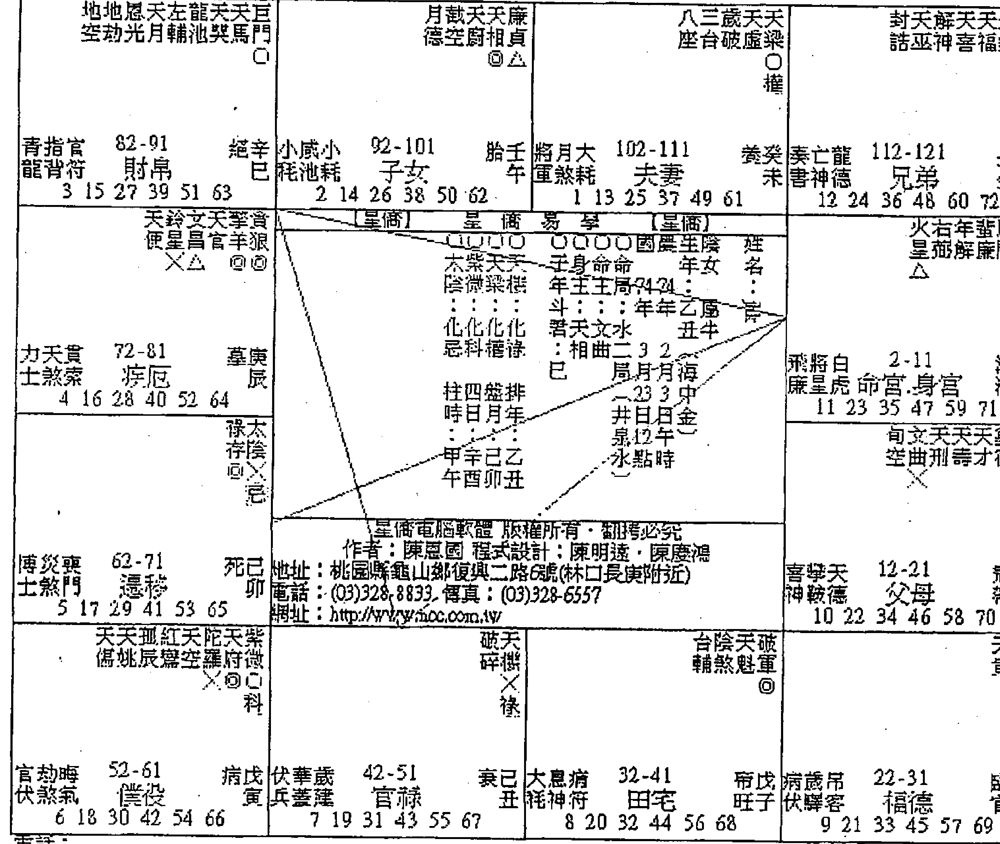
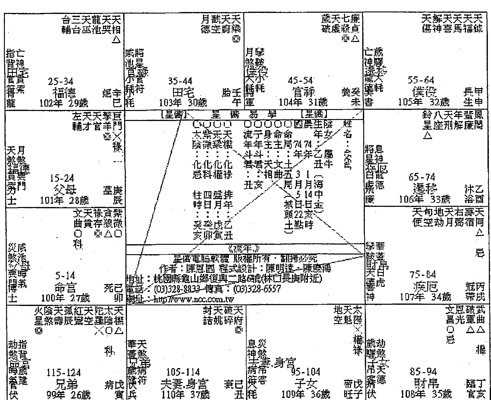
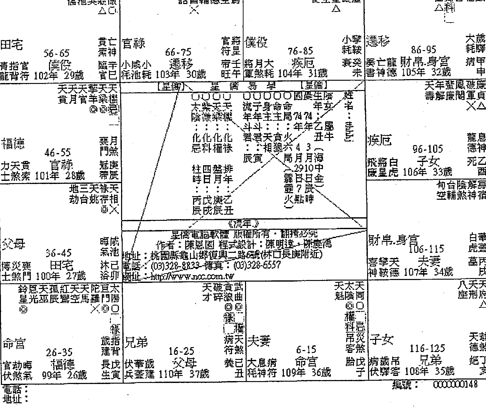

# 紫微斗数
了然山人—著

# 论命技巧及实例解析 下册

# 深入浅出 实例论命

# 白话讲古 享誉大众

白话阐述紫微斗数论盘技巧及观念，
带领读者进入深奥的命理殿堂，
系列书籍汇集百余命例，
辅以图文并茂及系统性分析解说，
轻松提升论命经验与功力。

# 自序

常言道：紫微斗数易学难精，许多斗数学者学到一定程度时，由于缺少实战经验而苦于无法升级，加上市面上相当缺乏此类型书籍。回想十年前开始学习斗数时，便面临此困境。有感于此，山人自民国101年起便着手整理这几年来的相关稀奇古怪的案例，希望能以此实例分析系列书籍来分享更多同好，提升自己的经验与功力，不但能为自己也能为身边朋友指点迷津，迎向新生。

由于此实例分析连载合计百例，页数超过千页以上，故区分为上、中、下册出版，也要感谢同学长期的支持，使得本系列书籍均能登上各大书局畅销排行版。此段期间，山人经常接到同学反映，由于许多派系对星曜的解说与组成有相当差异之处，因此在研读此系列书籍与阅听录影课程时，有许多混淆不清之处，希望山人能提供授课讲义，相辅相成，以达到最佳的学习效果。由于此书为本系列之最终回，为避免混淆，故本次山人将十余年经验浓缩而成的《轻松学五术：紫微斗数图解》书籍内容，将以赠阅方式分享给各位同学，如有需要可e-mail山人索取电子档。也欢迎同学传阅分享同好，让更多的人能透过图解方式轻松学习此术，进而掌握命运，改变人生。

而《轻松学五术：紫微斗数图解》，系以陈希夷（抟）道长原著之《紫微斗数全书》为主体，但此古籍因长期收藏，竹简纸张难免因腐蚀而难以辨识，加上后人对斗数认知不足，导致各赋文内容相当混乱，错别字相当多，难以研读。加上各派宗师体认与理解均有不同，也因此造成了同学反映对于星曜认知各有所属的状况。斗数流派相当多，建议同学可以专心学好一个派别的理论后，再另行进阶，会是最好的学习方法，千万不要这个派别学一点点，那个系列学一点点，结果弄成四不像，这就不应该了。

因此《轻松学五术：紫微斗数图解》，是才疏学浅的山人，辅以各门各派（如王亭之大师的中洲派）之精华，来补足原古籍缺漏或语焉不详之处，并以浅显的解释、生动的图解说明，加上多年经验累积所编撰而成，特此分享各位同学。

以山人多年研究各派别理论的经验，认为中洲派对于星曜特性的解说与认知，是最详细且精确的，尤其王亭之大师的斗数推演理论，更是一绝，碍于未经授权无法刊载说明。也希望有兴趣的同学能自行购买书籍或上网搜寻资料研究，定能有所收获。

由于紫微斗数的精要是在论盘而非排盘。故建议学者仅需知道安星规则及基础的方法即可，排盘问题就交给电脑处理（至于选用何种软件较为适合论命者使用？山人强力推荐同学可选购星桥易学的斗数排盘软件，简洁明瞭易上手，专业度相当足够，故本书便采用该软件进行排盘，同学可自行上网下载，网址如下：

`http://www.ncc.com.tw/soft/`

历经8年多的酝酿及2年多的筹划准备，终于完成此系列书籍，期间经历爱子诞生及许多的点滴，感谢母亲大人的照顾，让山人能在无后顾之忧的状况下，专心著述，完成此系列书籍。也感谢王诗媛同学的改版建议。同时真心希望各位同学能因此套书籍得到更多的经验，提升功力，一起推行此中国传统术数，期能像西洋12星座学一般，风行世界。

如有任何疑问欢迎e-mail给山人，将尽速回覆。

`kzf0910@yahoo.com.tw`

也欢迎同学至山人的facebook粉丝团打卡按个赞欧。

`https://www.facebook.com/kzf0910`

了然山人
103.2.21 岁次甲午年・于北投自宅

# 目录

自序.............................................3
案例 57、姻缘何时来？.........................9
案例 58、请老师帮我解命盘（现逢人生最低点）......14
案例 59、请老师指点感情与事业问题..............22
案例 60、请大师解惑：家庭、事业蜡烛两头烧.........27
案例 61、我的命中真的就缺钱吗？...............33
案例 62、前途茫茫，想创业不知道合适与否？.........41
案例 63、事业老是不顺，请大师用紫微斗数指点.......48
案例 64、想知道我的「命」如何？...............52
案例 65、请达人为小女子解命..................58
案例 66、待业中，请高人帮我解紫微找方向.........66
案例 67、想换工作，请教紫微达人...............70
案例 68、好想结婚，请大师指点迷津...............78
案例 69、我的命格属于机月同梁吗？...............84
案例 70、想以紫微斗数看感情婚姻...............89
案例 71、未来就职往哪方面发展好？...............96
案例 72、算命 & 工作运势 ………… 101
案例 73、请帮忙分析整体命格与运勢 ………… 105
案例 74、我的命不好吗？ …………………… 109
案例 75、请问我的五行属性较适合哪一类型的工作？ … 117
案例 76、请指点待人行事的注意事项 ……………… 124
案例 77、請問我今年或明年的結婚運到了嗎？ ……… 130
案例 78、人稱「鐵掃把」，請大師幫我解惑好嗎？ …… 138
案例 79、關於婚姻與小孩請協助解盤 ……………… 144
案例 80、一切就任它「順其自然」嗎？ ……………… 151
案例 81、想問此人的財務狀況與工作運途 …………… 157
案例 82、此女命盤未來婚配對象的條件會很糟嗎？ …… 164
案例 83、從命格看事業、財運 & 中年或晚年能享福嗎？ . 168
案例 84、兩人的命盤是否適合結婚？ ………………… 174
案例 85、困惑之人請紫微高人解命 ………………… 178
案例 86、算命老師說 31 歲之前有個死劫，嚇死人了！ .. 185
案例 87、感情困擾請老師解惑 ……………………… 192
案例 88、我是一個沒福氣的人嗎？ ………………… 198
案例 89、想成家立業但苦無另一半 ……………… 205
案例 90、請幫忙算算夫妻宮 ……………………… 209
案例 91、家裡陰盛陽衰，而我會是同性戀嗎？ ……… 213
案例 92、諸事不順、挫折磨難不斷，求老師論命贈言 … 218
案例 93、即將消逝在感情宮位的對象，紫微如何破解？ .224
案例94、為何命理師告訴我這番話？ .................. 226
案例95、命中缺木，請問如何讓運氣變好？ ........... 229
案例96、關於感情的問題 ........................... 235
案例97、紫微可否看出有無功名？何時考運佳？或運勢何時撥雲見朗？ .................. 242
案例98、正緣會出現在何時？對方大概會是怎樣的人？ 248
案例99、請高人指點工作迷津 ....................... 254
案例100、請教是否適合外出創業？ .................. 262

# 案例 57、姻缘何时来？

【提问时间】2009-08-15 14:53:31

【提问内容】

姻缘何时来？对象大概是什么样子？会幸福吗？自己的财运又如何？还有什么要注意的？谢谢！

女 1980-06-21（农）am2：15

【回复内容】

如果以本命盘夫妻宫来论，基本上你比较适合晚婚，这样比较容易遇到好对象，且最好与同年龄的男生交往为宜。

个性部分有点糊涂与散仙，做事情有时候又过于激进，基本上不宜投机。想像力颇为丰富，但有时候太过于前卫，反而会让人无法理解。三方四正形成杀破狼格局，所以你的个性较为急躁，不适合太稳定的工作，因此在人生的路上会感到起伏波折，多奔波劳碌。而工作部分建议你可以从事研发、创意发想的工作，如：企划、行销或专门技能的工作，比较可以发挥你的长才。

建议你最好能够改改自己的个性，正所谓命由性生，命运的起伏与个性脱不了关系。杀破狼格局的人为何起伏较大？就是因为投机冒险的本性所致，投机冒险行为，固然有成功的机会。但相对而言，失败的机会也高，所以才会有大好大坏的情况，要改变此格局，就是要谨慎不要急躁，切莫投机。尤其你的本命逢空劫齐临，更是不宜从事投机或投资事业。

至于财运部分，因为库逢煞星正坐。所以钱财难聚，多来来去去空欢喜。建议你要做好财务的管理，除了不投机，更要把钱给守住。我想小富是没有问题的呢！

【发问者意见】

很实用喔，谢谢！

# 案例 57、姻缘何时来？

### 【命盘解析及内容说明】

### 本命盘

命宫破军正坐，故三方势必形成杀破狼格局，因七杀与破军永远在两方遥遥相对。而杀破狼局虽然稳定性较差，但倘破军能会到化禄或禄存，对破军来说，反而转化为稳定的杀破狼局。七杀坐命，则需会到天刑或化权，亦是转化特性的组合。

山人常说，斗数星群，吉无纯吉，凶无纯凶，端看会照的星曜而定，千万不要一看到杀破狼局的就直接评断这个是不好的格局。况且杀破狼加煞，是个相当利于武职显贵的格局呢！

此例杀破狼并未见禄，因此为标准的杀破狼格局，冲劲十足，喜爱冒险刺激，愿意接受挑战等，但同时三方亦会空劫星，山人常说，空劫为土匪星曜，所以也表示了这个杀破狼局的优点被劣化，空劫会命，徒增劳碌，难有所成，以杀破狼激进冒险的个性而言，确实会成为命主苦闷的根源。

而空劫会命者，大都属于迷糊型的傻大姐，且想法常常不为人所理解，又莫名的坚持，因此古曰：空劫入命者，疏狂。但此两曜却因充满丰富的想像力，是故相当适合从事企划，研发或专技人员等类型工作，恰巧能将此两曜缺点转化为优点呢，是故煞曜入命并非全然不佳。

命宫天姚正坐，三方加会廉贪，亦为桃花格局，只是多为野桃花非属正缘。此点可从其夫妻宫同会地空地劫的状况可得反证，表男女关系之间多是有缘无份，聚少离多甚或是易有生离死别的状况。而夫妻宫武曲正坐，古曰：妻夺夫权，又曰：武曲加煞为寡宿，以命主杀破狼的命宫组合加上夫妻宫的星曜组成，我想，此生倘希望有段稳定的感情，只怕是相当困难。

所以山人在回复时一直苦劝命主要改变自己的个性与习性，正所谓命由性生，倘能改善自己冲动，易怒，得理不饶人的个性，我想除了在命主最在乎的姻缘路上之外，对于其未来的发展也有相当帮助，倘能如此，我想此命局仍有可为之时。

至于财运部分，先从田宅宫（财库）看起，太阴擎羊同度，古曰：人离财散，又逢天空正坐，聚财不易，虽得昌曲来拱，但财库破耗严重，所以钱财大概都是怎么来就怎么去。此点亦可从财帛宫会地空且呈现杀破狼的组合可得反证。至于最大破财处在哪里呢？应该就在兄弟朋友身上，命主本命化禄落仆役宫，表示对朋友相当重义气，常会有重义不惜财的行为，但可惜仆役宫逢空劫夹制，表朋友难有知心，加会化忌与陀罗，我想应该是经常发生「真心换绝情」的状况。加上身居福德又逢紫微，因此也是个很重视享受与生活品质，也就是很舍得对自己好的人，钱也大多耗费在此吧！所以命主要做好财务管理，因昌曲拱田宅，主得财容易，倘能谨慎保守，我想未来仍是可期待的。

# 案例 58、请老师帮我解命盘（现逢人生最低点）

【提问时间】2008-12-15 23:17:11

【提问内容】

小弟我现逢人生最低点，也曾去算过命，老师都说我的命不好让我对人生感到很沮丧，每晚都睡不好。短短时间也瘦了十多公斤，感到很烦。

工作方面：原本我在前任公司待了五年，因为和好友讲好要去大陆发展才辞掉工作。之后去了大陆才发现不适合合伙投资生意又回到台湾。自从回到台湾后（去年十月）找工作才感到很吃力工作难找啊！陆陆续续在七月、十月都做了一个月的工作又不适合又没做了，我自己也很不想要这样不稳定的！

金钱方面：回台湾之后我就将2/3的积蓄投入股票，因为想要赚钱增加收入。没有想到反而套牢更惨。

感情方面：和女友交往半年，我很爱她，但感觉她好像要离我远去，因为她告诉我：她年纪也不小了，想要有稳定的未来，我没有办法给她经济上的安全感，所以我感到很无奈。

我的资料：国历63年7月22日下午1:30生。台北县出生。

我想请问各位老师的是：
1. 工作何时才能够稳定？何时才能找到适合的工作？
2. 我的女友会和我有结果吗？会是我的正缘吗？

她的资料：国历 67 年 3 月 13 日早上 8:00 出生。台北市出生。

【回复内容】

看来你确实是很低潮，今年尤其是。流年不甚佳，煞忌齐临。好在流年仅主1年之运，眼看今年就要过去了，明年看来你会满顺利的，多忍耐吧！

如果可以的话，明年是结婚的好日子，倘双方有愿意就结婚吧！姻缘运很强，你这个女朋友看来也不错呢，至少在妳苦的时候不离弃你，明年开始转好后，得对人家好一点。

明年己丑年，整体看来不错，有外出或调动的机会，也会有助力出现，同时贵人与机遇都还不少呢，应该也会有至外地工作的机会，且明年应该会赚到钱，耐心点，人总没有一直平顺的吧，好好展望明年，你会很不错的。

如果真的没方向的话，建议你可以去考公务员，明年你的流年命宫正逢魁钺入命，考上的机会不小。努力点会有金榜题名的机会的，可以走这方向。反正没工作，刚好专心读书，考上后，工作稳定了，也就可以结婚了，女朋友也不会在没有安全感了，对不对呢？况且考运正好，不去尝试看看，真是很可惜呢！

你的本命盘看来并不适合经商，而且容易被骗，主因在你的个性有点散仙，常常会因判断错误或误信他人，导致破财。由于财库不佳，甚至是好不容易存了点钱，却又发生意外，如：家里修缮、修车等意外支出，导致你再赚都感到不够，因为总是存不下来，虽然自己很节省了，但莫名的意外支出总是很多，对不对？

大概这样吧，忍耐点，今年要过去了。山人是不知道你找哪个老师帮你看，说你的命盘不佳。整体而言你的命格并不差，只要改掉你那散仙的个性还有不要太相信人或太投机，导致破财，换言之，不要再轻易投资，因为你相当不适合。

你的人缘好口才佳，只是口舌纠纷多了点，适合以口为业的工作。个性开朗，喜欢照顾人。直来直往的个性，也常常会得罪人。不过这是个性坦率人的通病，不要介意。

大概这样吧，其实危机也是转机，但看你怎样看待，此时命理可以作为未来方向的参酌。山人依你的命盘来，只能告诉你未来最好的方向，但要怎样做是看自己的呢！千万不要山人跟你说明年考试上榜机会大就不读书，这样还是没用的。看来你后来几年都没有这样的好机运了。加油！

【发问者意见】

谢谢！

# 案例58、请老师帮我解命盘（现逢人生最低点）

### 【命盘解析及内容说明】

| 位置 | 星曜与宫位信息 |
| :--- | :--- |
| 命宫 | 天机 天梁 廉贞 七杀 (△) |
| 兄弟 | 紫微 破军 武曲 太阳 (△) |
| 夫妻 | 天相 文昌 文曲 天府 (○) |
| 子女 | 太阴 擎羊 禄存 天同 (△ ○ ×) |
| 财帛 | 贪狼 陀罗 地空 天空 (△ ×) |
| 疾厄 | 七杀 廉贞 火星 铃星 (△ ×) |
| 迁移 | 破军 武曲 天府 天马 (△ ×) |
| 仆役 | 太阳 太阴 天魁 天钺 (△ ×) |
| 官禄 | 天机 天梁 天巫 解神 (◎ △) |
| 田宅 | 太阴 擎羊 禄存 天同 (△ ○ ×) |
| 福德 | 紫微 破军 武曲 太阳 (△) |
| 父母 | 贪狼 陀罗 地空 天空 (△ ×) |

**化权：武曲　化科：天机　化禄：太阳　化忌：天同**

**身宫：福德宫 (紫微、破军、武曲、太阳)**

**大运(52-61岁)：仆役宫 (太阳、太阴、天魁、天钺)**
**大运(62-71岁)：迁移宫 (破军、武曲、天府、天马)**
**大运(72-81岁)：疾厄宫 (七杀、廉贞、火星、铃星)**
**大运(82-91岁)：财帛宫 (贪狼、陀罗、地空、天空)**
**大运(92-101岁)：子女宫 (太阴、擎羊、禄存、天同)**
**大运(102-111岁)：夫妻宫 (天相、文昌、文曲、天府)**
**大运(112-121岁)：兄弟宫 (紫微、破军、武曲、太阳)**

### 本命盘

本命盘太阳正坐，通常太阳坐命的男生，个性开朗，有正义感，个性较为急躁，经常因为过于直来直往而得罪人不自知，但做事积极主动，其实整体而言，由于太阳除为中天星曜外，更作为男性表征，男命得之，相当适宜。倘结构佳者，其成就更是不可限量呢！

此盘由于太阳居子位，为落陷宫位且本命化忌，加上三方会照地空，地劫。为「浪里行舟」的格局，空劫入命，除为人较为迷糊散仙外，也暗示了命主此生难逃劳碌奔波无所成的味道。故此局又称为劳碌命。而此两曜系自三方会照，表示外在环境对命主相当不利，但因太阳坐命者，通常事业心强。但由命盘构造看来，并非命主不努力，而是外在环境强于本命所致，也因此倍感失落吧！且一颗坐落于官禄，一颗坐落于迁移这两个对男人最重要的宫位，我想这应该是其他命理老师会说命局不好的主因。

而本命宫三方巨门火星会照，当流年擎羊出现于值年命宫三方位置时，就构成巨火羊的恶局，此局山人称为，祸必自招，意思就是因为自己的问题导致严重的错误结果。

三方会照巨门，巨门为暗曜，子位太阳又照度不足，暗上加暗，且空劫双曜除让人奔波劳碌外，同时也会让人容易胡思乱想，综合此两因素，我想命主遇到困境会失眠加上暴瘦，是有他的原因的。但太阳巨门结构本质尚称不错，所以命主仍然适宜从事以口为业的工作，如业务员，讲师等。

而其盘中天马会陀罗，为标准折足马格局，是故此局人不宜创业也因空劫入命，故不宜从事投资或投机的事业，必然遭逢重大挫败。再观其财帛宫，虽逢本命禄，但三方会照双空，主与财无缘，空欢喜一场罢了。此点可从命主自述经历可反证此结果。但其田宅宫逢科禄权三奇佳会又逢文昌文曲来拱，主得财容易，相信命主家境应该也还不错才是。故若命主能够专心在职场上发展，不轻言创业或从事投资及投机事业，我想以## 案例58、請老師幫我解命盤（現逢人生最低點）

其田宅宮穩健的狀況，雖無大富之有，但小富卻是沒問題的。以命主尚未滿40歲，還算年輕，人生還有很長的路要走，倘能聽進山人所勸，穩紮穩打，謹守本分不踰矩，我想還是亡羊補牢，猶時未晚的。這也是命理最可貴之處，就是能依據本命缺陷，指導命主趨吉避凶，改變人生。

而命主問命當年為戊子年，流年命宮居子，與其本命宮坐落宮位相同，星曜組合相當差，又上節曾提過命主本命宮逢巨門火星會照，而戊子年適逢流羊於流年遷移宮，整體三方四正構成巨火羊惡局，所以當年的不如意，必是由於自身的因素所造成的，此部份可從命主自述內容得到反證。不過流年畢竟只主1年之運，發生的事就已經發生，逝者如斯，重點是要把握好未來才是，所以我們就來看看民國98年己丑年的命盤吧！

紫微斗數論命技巧及實例解析（下册）

| 宮位 | 天恩右孤天天天 傷光微辰馬廚相 △ | 地天龍天 劫桃池梁 ⚬ | 天月天天天七廉 使德喜官钺幾貞 ◎△ | 火天年嵐風天截 星巫解破闇虛空 × |
|---|---|---|---|---|
| 官祿 | 年年年年官指<br>52-61歲 | 僕役 | 年小歲<br>62-71歲 | 遷移 | 年年年大月<br>72-81歲 | 疾厄 | 年年龍亡<br>82-91歲 |
| 田宅 | 42-51歲 | 青月更龍煞門<br>101年 39歲 | 00000 00000<br>國農生陽<br>姓名<br>太武破廉<br>陽曲雲貞<br>化化化化<br>忌科權祿<br>柱四益排<br>時日月年<br>辛甲辛甲<br>未子未寅 | 財帛 | 92-101歲 | 喜息龍神神德<br>106年 44歲 | 封左破天<br>詔輔碎福 |
| 福德.身官 | 32-41歲 | 力嵐晦土池氣<br>100年 38歲 | 《流年》<br>星僑電腦軟體<br>版權所有・翻拷必死<br>作者：陳思國<br>程式設計：陳明遠・陳慶鴻<br>地址：桃園縣龜山鄉復興二路6號(林口長庚附近)<br>電話：(03)328-8833<br>傳真：(03)328-6557<br>網址：http://www.cc.com.tw | 子女 | 102-111歲 | 病幸白伏蓋虎<br>107年 45歲 | 年天擎火德鞍<br>冠甲帶戌 |
| 父母 | 22-31歲 | 博指嵐福德.身宮<br>士背達<br>99年 37歲 | 命宮 | 12-21歲 | 官天病伏煞符<br>98年 36歲 | 兄弟 | 2-11歲 | 崴華隆蓋襄丁<br>伏災兵煞客<br>109年 47歲 | 夫妻 | 112-121歲 | 年病息匙符神<br>帝丙旺子<br>大劫天耗煞德<br>108年 46歲 | 年吊嵐馬客臨<br>臨乙亥 |
| 電話： | 地址： | 編號：000000104 |

### 大限流年盤

正所謂柳暗花明又一村，人生不可能永遠逆風，也不可能永遠順風。在命主身上得到證明，民國98年流年命宮逢天府正坐，三方會照天魁天鉞及左輔右弼，四吉星匯聚，雖坐陀羅煞星，但此曜入墓不兇，故98年當年可會是相當順利的一年。天魁天鉞表機遇及貴人，屬天助型吉曜，而左輔右弼表助力，為人助型吉曜。是故98年在事業發展上，應會有相當成就才是。

又此年逢紅鑾天喜會照流年命宮，且夫妻宮武曲化祿，看來有結婚的跡象，所以建議命主是個很適合結婚的時機呢！加上流年看來會有一番新氣象，故要求婚，此時最爲適宜。而魁鉞入命，基本上亦可表示考運頗佳，是故山人建議倘命主一時之間找不到方向，也賦閒在家，不如趁流年魁鉞會命時，專心衝刺國家考試，當個公務員，也是很不錯的選擇呢！

## 案例59、請老師指點感情與事業問題

### 【提問時間】

### 【提問內容】

小弟在奇摩知識家與blog看見您，抱著感恩的心想請您指點迷津，

生辰年為:國曆72年2月8日子時,今年才剛於軍中退伍,(已退伍3個多月餘),當兵前邊唸書邊從事導遊工作,現今退伍回到旅行業,事逢過渡期想轉換跑道,並猶豫是否該轉換工作地點,加上年紀近三十而立的關係,對事業與婚姻(單身許久)皆有很多的迷惑! 特請山人能撥空解迷論命,小弟再三感謝! 定會多行善並持感恩之心!

### 【回覆內容】

如果就你的本命盤來說,本命坐廉貪會貪狼,且落於丑宮,從事娛樂業頗為合適。旅遊業導遊也可算是娛樂業,所以我想你從事這工作應該還滿有樂趣才是呢! 而且你的異性緣應該也不錯,從事這行業應該不錯,如真要轉行,建議你多多考慮。

至於婚姻關係,由於你的本命夫妻宮星宿好,雖逢鑾喜對拱，但也會空劫與孤寡，且對宮本命忌直衝。所以你應該是異性緣很不錯，認識的女生也不少，但是都很難有結果，喜歡的對象不是有男朋友，就是感情一直出現停滯不前或是單戀的情況，感情路應該頗為波折才是。

以你的本命盤來看，比較適宜晚婚，早婚對你並不是好事，所以別想太多。男生專心衝事業才比較對，有錢了，還怕沒有女人嗎。

這個大限命宮及福德宮逢地空，地劫來拱，因此會常常感到勞累疲倦，奔波來去，卻不太會有收穫，也難怪你會有想轉業的想法。建議你就當成磨練，這樣下個大限轉好時，會有你上場的機會的。

### 【發問者意見】

感謝老師。

紫微斗數論命技巧及實例解析（下册）

### 【命盤解析及內容說明】

| 宮位 | 紅天破武 鴦煞軍曲 △△ | 天台解天太 傷輔神福陽 □ | 寡天 宿府 ⊙ | 天天天太天 使刑哭陰機 △△ |
|---|---|---|---|---|
| 飛亡龍 43-52 病乙<br>喜將白 53-62 死丙<br>病攀天 63-72 墓丁<br>大歲吊 73-82 絕戊 | 神星虎<br>僕役 午<br>伏數德<br>遷移 未<br>耗購客<br>疾厄 申 |
| 文天三陰歲天天<br>曲貴台煞破虛同 △ △ | 星儀 星儀<br>易學 【星儀】 |
| 袁月大 33-42 袁甲<br>君煞耗 田宅 辰<br>1 13 25 37 49 61 | 伏息病 83-92 胎己<br>兵神符 財帛 酉<br>6 18 30 42 54 66 |
| 鈴左月武天<br>星輔德空魁 △科 | 文昌八天陀耳<br>昌光座官羅門 × ⊙× |
| 將咸小 23-32 帝癸<br>軍池耗 福德 旺卯<br>12 24 36 48 60 72 | 宮華歲 93-102 養庚<br>伏蓋遊 子女 戌<br>7 19 31 43 55 67 |
| 封天龍 話月池 | 旬火破七廉<br>空星殺貞 ⊙ ⊙△ |
| 天年翌鳳華天<br>姚解廉開羊梁 | 地地天右天天孤天天天祿天<br>坐劫巫弼壽才辰喜空馬存相 ×⊙ ⊙△ |
| 小指官 13-22 臨壬<br>青天貫 3-12 冠癸<br>力災哭 113-122 沐壬<br>博劫晦 103-112 長辛<br>耗背符 父母 官寅<br>龍煞索 命官.身宮 華丑<br>士煞門 兄弟 浴子<br>士煞氣 夫妻 生亥 |
| 電話: | 編號：0000000105 |

### 本命盤

本命宮廉貞正坐加會貪狼又落丑宮，加上鸞喜入命，因此從事娛樂業或是公關交際類工作相當適宜，因此從事導遊工作，相當適性。正所謂，男怕入錯行，我想在導遊工作上，命主應該是相當得心應手才是。

三方火貪成局，因此命主除偏財運強之外，也表示了其衝勁十足的本質，故倘命主於運限恰當時，應會有相當成就。尤其此局利於武職顯貴，對於在外打拼的命主而言，更是如虎添翼呀。因此山人建議命主繼續留在原工作上，會有一番成就的。倘要轉換跑道，仍是以娛樂休閒產業為最佳，當然，公關行業亦是不錯的選項。

至於感情部份，本命宮三方加會鸞喜，基本上表示此人異性緣甚佳，照理說伴侶應該不缺才是。問題在於對宮寡宿正衝，夫妻宮逢地空地劫正坐加會本命祿，形成倒祿格局，此局出現於夫妻宮，經常會有遇人不淑的感慨，在感情路上會是相當的挫折，以男生而言，大都是只有幫人家養老婆的份。加上又會照孤辰寡宿這兩顆星曜，且對宮本命忌衝，縱使成婚或有穩定對象，也難逃生離死別、聚少離多或貌合神離的狀況。我想命主應該經常碰到喜歡的人不喜歡她，而不喜歡的人，卻黏著不放的情況。但因夫妻宮天相正坐，表示配偶應該都是身邊熟識的人，例如同學，鄰居等。因此建議命主要好好把握珍惜身邊現有的女生，與其辛苦去追求那湖中月影，倒不如把握住身邊的花朵。倘真能如此，我想命主的情路應該會感到順多了。畢竟被愛比愛人還幸福呀。

至於命主提到事業問題，那我們就轉進這個10年大限，看看該怎麼給他建議吧！

紫微斗數論命技巧及實例解析（下冊）

| 宮位 | 星宿信息 | 大限年龄 | 备注 |
|---|---|---|---|
| 福德 | 紅天破武、蠻斂重曲 | 43-52 | 飛亡龍廉神德 2 14 26 38 50 62 |
| 田宅 | 天台解天太、傷輔神福陽 | 53-62 | 病乙 喜將白 神星虎 3 15 27 39 51 63 |
| 官祿 | 寫天宿府 | 63-72 | 死丙 病擎天 伏赦德 4 16 28 40 52 64 |
| 僕役 | 天天天太天、使刑癸陰機 | 73-82 | 丁未 大歲弔 耗辭客 5 17 29 41 53 65 |
| 遷移 | 天貪紫、廚狼微 | 83-92 | 伏息病 兵神符 財帛 6 18 30 42 54 66 |
| 疾厄 | 文恩八天陀巨、昌光座官羅門 | 93-102 | 官華歲 仗蓋蓮 子女 7 19 31 43 55 67 |
| 財帛 | 天年蚩鳳擎天、地地天右天天孤天天天祿天、姚解廉闖羊梁坐劫巫煞壽才辰喜空馬存相 | 103-112 | 沐壬 博劫晦 土煞氣 夫妻 8 20 32 44 56 68 |
| 子女 | 旬火破七廉、空星碎殺貞 | 113-122 | 冠癸 力災喪 帶丑 土煞門 兄弟 9 21 33 45 57 69 |
| 夫妻 | 封天龍、諾月池 | 3-12 | 臨壬 青天貫 龍煞索 命宮.身宮 10 22 34 46 58 70 |
| 兄弟 | 小指官、耗背符 | 13-22 | 父母 官寅 11 23 35 47 59 71 |
| 父母 | 表月大、書煞耗 | 33-42 | 衰甲 辰 1 13 25 37 49 61 |
| 命宮.身宮 | 鈴左月截天、星輔德空魁、△科、歲將、建星 | - | - |

### 本命大限盤

此大限命宮逢地空地劫會照，本有勞而無獲之味道，加上財宮空劫正坐與天馬共度，田宅宮會照羊陀雙煞，庫位亦破，官祿宮亦同。是故此大限無論在事業或是財務上都會相當呈現相當辛苦的狀況。且大限破軍祿與本命祿雖於財宮，但被空劫搞成「倒祿」格局，加上鸞喜對拱，只怕此大限難逃因桃花而破大財的狀況。但盼命主慎之呀。

## 案例60、請大師解惑：家庭、事業蠟燭兩頭燒

### 【提問時間】

### 【提問內容】

小弟在知識家上有看過大師為網友回覆的文章，不瞞大師，小弟最近因工作及家人健康上的問題煩心，是標準的夾心族，家庭事業兩頭燒，真是身心俱疲。小弟覺得事業運不是很順，忙東忙西，但賺不到什麼錢。又要三天兩頭往醫院跑（父母，小孩），加上年紀也不小了，對於未來有很大的不確定感，所以附上小弟的生辰八字，煩請大師抽空幫小弟解惑。國曆64年3月11日早上2點40分出生。感激不盡！

### 【回覆內容】

投胎人世間，本來就很苦。以佛家來說，會成為一家人只有4種因緣：欠債，還債，報恩，報仇。所以辛苦點也就當作是來還債的，心情也會好多了呢！你的本命坐武曲貪狼，且落於四墓地中，為晚成格局，古

日：武貪不發少年人，便是此意。想想，早發對你的命局而言並不是件好事，因通常都沒有太好的結果。因此你年輕時候比較辛苦，並不是件壞事。所以別想太多。

你的命宮三方無煞，表示一路走來雖然辛苦，但沒有太大的挫折與不順，最多就是感到失落。命不會煞雖然很好，但相對而言，個性也比較不具衝勁（殺氣），無法成就太大的事業。

你本命宮逢日月夾又會昌曲，爲文星拱命及日月夾命局。想來你應該也是滿有才華的人，家境也還不錯才是。整體個性比較偏向文人方面。

就本命盤看來，你應該不會有太大的挫折與不順利，只是這個十年大限（36-45），大限命宮逢雙煞侵襲，福德宮又逢空劫拱，所幸有輔弼兩大助星對拱，因此縱是有不順利或挫折，最後總是會關關難過，關關過。

至於事業部分，因逢祿馬交馳且會祿權，因此環境會迫使你不停奔波賺錢，但可惜大限官祿宮坐陀羅，陀羅主遲滯，打轉。因此祿馬交馳會陀羅，便構成了折足馬的格局，表現在現實上，就是忙的要死，煩的要死，卻賺不到什麼錢，運氣差一點，還會賠錢坐收呢！不過到下個大限就會開始轉進大運了，此時定然會有相當的成就才是，正所謂柳暗花明又一村，不是嗎？

因此在目前這個十年大限建議你不要輕易嘗試去做需長期經營才能生意或創業，因為最終賺到的祇有經驗。如非得要做生意，建議你可以跑跑短線，打打游擊。趁流年運勢轉好時來做，運勢轉差時馬上收，這樣也許還有獲利守成的機會。但因你本命太過平穩順利，加上上個10年大限還算平順，因此遇到這個不是很吉祥的大限，會感到無力與挫折感，這是難免的，所以不要想太多。學著鍛鍊自己吧，一切的勞累就當作磨練與還債。等到這個大限走完，狀況會好多的。畢竟人生總不會一直順風，對不對。

【發問者意見】
謝山人在忙碌之餘撥空回答我的問題，山人的回答讓我明白自己面對到的處境，再麻煩山人了，萬分感謝。

紫微斗數論命技巧及實例解析（下冊）

### 【命盤解析及內容說明】

```
[命盤圖示]
天八天夭截天
八座壽喜空廚

台年鳳龍
輔解開池

天天三解月天天天
使貫合神德馬福鉞

伏歲喪
兵孽門  86-95 官祿
5 17 29 41 53 65

大息貴
耗神索  76-85 僕役
6 18 30 42 54 66

病華宮
伏蓋符  66-75 遷移
7 19 31 43 55 67

喜劫小
神煞耗  56-65 疾厄
8 20 32 44 56 68

官晦
伏鞍氣  96-105 田宅
4 16 28 40 52 64

飛災大
廉煞耗  46-55 財帛
9 21 33 45 57 69

博將歲 106-115 福德.身宮
士星蓮 3 15 27 39 51 63

妻天龍
書煞德  36-45 子女
10 22 34 46 58 70

力亡病
士神符  116-125 父母
2 14 26 38 50 62

青月吊
龍煞客  6-15 命宮
1 13 25 37 49 61

小廉天
耗池德  16-25 兄弟
12 24 36 48 60 72

將指白
軍背虎  26-35 夫妻
11 23 35 47 59 71

文天破貪孤七紫
曲巫碎廉辰殺微
○
△口 科

左天天天擎天天
輔才空官羊梁機
◎◎祿 權

封天祿天
詔獎存相
◎X

陰陀巨太
煞曜門陽
X◎◎

文天煞天破廉
昌刑煞虛重貞
○ X△

地火天右
空星月弼
○

鈴天
星府
△△

[星曜] 星 備 易 星 [星德]
太紫天天 年身命命
陰微梁機 年主主局6464
 化化化化 年年乙屬
忌科權祿 卯兔
柱四盤排 局月月大
時日月年 ～1129漢
：：：： 露日日水
己丙戊乙 露2丑～
丑辰寅卯 火點時 ～）

星曜電腦軟體 版權所有・翻拷必究
作者：陳國輝 程式設計：陳明遠・陳歷鴻
地址：桃園縣龜山鄉復興二路6號(林口長庚附近)
電話：(03)328-8833 傳真：(03)328-6557
網址：http://www.xncc.com.tw
```

### 本命盤

命坐武貪又落四墓地（辰戌丑未），為標準晚發格局。此局人通病就是大雞晚啼，縱使結構再好，也難逃年輕時的挫折與勞碌。其實年少得志大不幸，因年輕氣盛，加上成功來的快，因此過於自信與狂妄，最後都難以守成，落的一無所有的下場。所以命主晚發局，並非壞事。

綜觀其命宮三合，不見煞忌，且逢文昌，文曲拱照，為文星拱命格局；又本命宮逢日月來夾，古曰：夾日夾月誰能遇，夾昌夾曲主貴兮，故此命格局相當大，想來命主出身環境定然不差。只是命好還要運限配合，正所謂：命好運好限好，終身富貴。但別忘了，武貪落四墓地為晚發格局，以命主格局而言，定然會有相當成就，只是不會在年輕之時。晚發格局通常在行約45歲之後。

山人常說，大限行進方式最忌諱波折過大，舉例來說，倘上一個大限無論事業感情都相當順利，當大運轉進下一個大限時，人生崎嶇波折，東做西成，諸事不順。對於命主而言，會是相當的折磨。此例正好印證這個觀點，尤其大限星宿組合看來，此盤之起伏頗大，可謂大好大壞各一輪，也難怪命主會如此的感慨與失落。

以其大限星宿觀之，本命宮（6～15）相當漂亮，命主定然家境相當優渥，而第二大限（16～25），天機天梁會擎羊的格局會照大限命宮，又逢太陰擎羊人離財散格局會照，是故此大限定有相當的苦頭吃。當大運轉進到（26～35）這個大限，雙主星會命，又逢府祿相三合入命，雖鈴星正坐，但影響不大，是故應該是個很好的大限，但因地空地劫夾拱命宮，是故溫飽無虞，但在事業發展上，難有相當成就，正好印證武貪不發少年人的論點，但整體看來一切尚稱順利。

但走到（36～45）這個大限，也就是命主問命時的大限命宮，逢地空正坐，三方會照擎羊，陀羅雙煞，又對宮天機天梁擎羊這個刑剋格局直衝，因此其家人健康狀況比較容易出現問題，所幸左輔右弼拱照，可免其刑剋。此意並非可免除，而是病痛折磨免不了的，但因此兩曜拱照下，得以順利過關，正所謂關關難過，關關過。(因此山人一直提醒各位同學在論盤時，千萬不能使用消去法，認為大限遇吉星，就可以抵消，這是不可能的。吉星充其量是讓事情能夠順利度過，但該受的折磨還是躲不過)。所以命主自述的現況，其實是可以預見的。

再觀其46～55這個大限，大限命宮三方不會煞忌，又逢昌曲來拱，財官雙美，搭配命主本身具備的大格局，想來此大限定有相當的成就才是。而此時已步入中老年了，豈不再度驗證武貪不發少年人這句古諺了嗎。

綜上所述，命主大運行進起伏過大，一好一壞，而且接連4個大限，真是夠折磨人的。倘運限搭配一直不好，一般人還會認命的接受，最怕就是這種大好大壞的運程呀！

也因如此，故山人在回覆命主時，除勸其要接受命運的淬煉考驗外，同時也預告了下一個大限，整體運勢會非常強勁，會有一番全新氣象，讓命主能更坦然的接受目前的困境，進而把握即將來到的大運，這就是命理學說最迷人的地方，不是嗎？

## 案例61、我的命中真的就缺錢嗎？

【提問時間】2011-02-12 15:27:16

【提問內容】

因為心情很沮喪，在網路上逛逛，想知道自己的運氣怎麼會這麼差。好心的幫助別人，結果卻被倒債2百萬多萬。新年才剛開始，就遇到這樣的事，看到山人的文章，知道山人對紫微斗數很有研究。想要請教山人，眼前的難關要怎麼過去？我的命中真的就缺錢嗎？好不容易和先生工作開始穩定了，結果現在發生這樣的事，讓我好沮喪。可以請山人幫我看看嗎？萬分感謝！生日：1976/03/22（國曆）中午12：30左右出生，目前是工作是會計，先生是在大陸工作。

【回覆內容】

其實你的本質是很屬於賢慧型的女生，正所謂，府相之星女命纏，定當子貴與孫賢。你本身天府星坐命，應該屬於清秀型的女生，天府星基本上擅於守成，不善於開發，而且你應該有堅持固執己見的毛病才是。

就星盤看來你的財帛情況非常不佳，空劫齊臨本命忌衝，因此聚財不易，而且財庫逢煞匯聚，就是說當你身上有錢的時## 紫微斗數
### 論命技巧及實例解析（下册）

候，總是會有突發狀況發生，錢也存不起來。
又天同化祿坐僕役宮，正所謂：祿落僕役，縱有官也奔馳，意即你是個很講義氣的人，尤其對朋友，所以朋友應該是你最大破財之處，正所謂肥水不落外人田，化祿星代表的是財富，財富落在朋友宮，加上你的財得來不易，所以對朋友要小氣點，肥水還是落在自己家比較好呢！

至於做網拍或生意，基本上萬萬不可，因為你的命盤呈現，半空馬格局，聚財不易但敗家很容易，加上空劫會命，做生意很容易被騙或是投資失利，尤其在目前的狀況，更是不宜。

不過你幫人家採購，基本上屬於工作而非創業，所以可以朝這方向進行，也穩定多了。至少幫忙採購不需要負擔成本與風險，以你會計的觀點，幫人打工應該都是淨利，只需付出勞力成本罷了，何樂而不為。

總之記得，不要對朋友太講義氣，肥水要落自己家；切忌創業或投資，跟會等理財行為。你的財多屬正財，投機絕對不宜。

其實只要注意這些，以你的能力我想一段時間後就有機會損益兩平，但切記，不要再来一次，因空劫會命的人，常會忘了教訓，一犯再犯。

山人幫你看了今年的流年，貴人運很強，機遇也好，流年命宮呈現非常好的狀況，在工作上也會有進展，甚至掌權。只是財帛宮又逢地空地劫兩煞，容易有財到手成空的現象，因此今年好好珍惜機會，努力做，不要投機，把握好今年的機會，我想年底結算時你應該會有所進展，加油歐。

【發問者意見】
謝謝山人再幫小女子解答，萬分感謝。希望我能早日脫離困境，有能力希望可以為山人和所有需要被幫助的人出一點力，感恩。

## 紫微斗數 論命技巧及實例解析（下冊）

### 【命盤解析及內容說明】

| 地支 | 宮位       | 星曜與大限資訊               | 干支狀態 | 小限數字       | 地支 | 宮位     | 星曜與大限資訊               | 干支狀態 | 小限數字       |
|------|------------|------------------------------|----------|----------------|------|----------|------------------------------|----------|----------------|
| 巳   | 財帛       | 博劫晦土煞氣，46-55          | 絕癸巳   | 6 18 30 42 54 66 | 午   | 子女     | 官災吏伏煞門，36-45          | 墓甲午   | 5 17 29 41 53 65 |
| 未   | 夫妻       | 伏天貫兵煞索，26-35          | 死乙未   | 4 16 28 40 52 64 | 申   | 兄弟     | 大指官耗背符，16-25          | 病丙申   | 3 15 27 39 51 63 |
| 酉   | 命宮.身宮  | 病成小伏池耗，6-15           | 衰丁酉   | 2 14 26 38 50 62 | 戌   | 父母     | 喜月大神煞耗，116-125        | 帝戊戌   | 1 13 25 37 49 61 |
| 亥   | 福德       | 飛亡龍廉神德，106-115        | 臨己亥   | 12 24 36 48 60 72 | 子   | 官祿     | 將攀天軍毅德，86-95           | 沐辛丑   | 10 22 34 46 58 70 |
| 丑   | 田宅       | 素將白書星虎，96-105         | 冠庚子   | 11 23 35 47 59 71 | 寅   | 僕役     | 小歲吊耗碎客，76-85           | 長庚寅   | 9 21 33 45 57 69 |
| 卯   | 遷移       | 青息病龍神符，66-75          | 養辛卯   | 8 20 32 44 56 68 | 辰   | 疾厄     | 力華蓋土蓋蓬，56-65          | 胎壬辰   | 7 19 31 43 55 67 |
| 星曜電腦軟體 版權所有·翻拷必究 | 作者：陳思國 程式設計：陳明遠·陳慶鴻 | 地址：桃園縣龜山鄉復興二路8號(林口長庚附近) | 電話：(03)328-8833 傳真：(03)328-6557 | 網址：http://wry.cc.com.tw | 右月天天 招德錢財 |          |                              |          |                |

### 本命盤

山人在看到命主自述內容，心理便在猜想，此人命必逢空劫，因空劫入命者，一生至少會被騙一次。其因爲何？因此局人經常都是聰明一世，糊塗一時。且空劫兩煞曜影響的是自己的判斷力，所以誤判狀況，對空劫會命者，是很正常的。因此山人瞎稱此二曜爲「土匪星」。另其必有化祿或祿存正坐或會照命宮，因只有祿落僕役者，才會有重義不惜財的狀況。（所以倘要借錢或是找「人呆」，只要找這種格局的人，包準沒錯）。

## 案例61、我的命中真的就缺錢嗎？

當星盤一排出，果然與山人推測相同。

可惜命主沒有早點遇到山人，且聽進勸告，謹慎行事。自然此嚴重損失不會發生。但山人常說因果關係的存續問題，所以這也許是命主上輩子欠朋友的因果債，還了也好呀！

而命主命身同宮，基本上表示是一個固執，堅持己見的人，但後果不管好壞，都會自行承擔。我想這也是他目前難過的原因吧！其實此個性之人，加上空劫會照，推測應該是相當固執，完全聽不進他人勸告，也很難溝通之人才是。因空劫帶來的疏狂本質，加上自己莫名無謂的堅持，自然造就這種個性。也因此遭朋友詐騙的結果，其實真的不令人意外。

至於命主是否適合創業，我想以此個性之人，創業要成功，只怕是會很辛苦。從星盤看來，祿存與天馬同度，本是好事。但又與空劫同宮，此局稱為半空馬+倒祿格局，故創業或做小生意是萬萬不宜。此局本為祿馬交馳會命，最宜外地經商求財，但可惜被空劫給搞掉了，但因會照本命宮，是故經常會有創業的想法。

但以星盤結構看來，剎羽而歸的機率相當的大呀。而此點可從其財帛宮及田宅宮星曜結構得到反證。倒祿格局落於財帛宮，得財不易，且經常是過路財神，錢財怎來就怎去。而田宅宮會擎羊，陀羅雙煞，庫位破耗嚴重，以此田財之星曜結構加上自己的個性，我想乖乖的待在職場上發展，是最好的選項。尤其命主目前從事會計工作，相當適宜。

## 紫微斗數
### 論命技巧及實例解析（下冊）

站在命理研究者的立場，咱們就轉進朋友倒債那年的流年
盤看看到底是怎麼回事吧！

## 案例61、我的命中真的就缺錢嗎？

| 命盘信息 | 详情 |
|---|---|
| 姓名 | 案例61 |
| 出生年 | 丙辰年（1976年） |
| 性别 | 男 |
| 命主星 | 廉贞 |
| 身主星 | 天机 |
| 排盘信息 | 国历65年12月22日午时生，农历65年11月21日午时生 |
| 命宫 | 午宫 |
| 身宫 | 午宫 |
| 命局 | 木三局 |
| 大限流年 | 官禄宫（46-55岁）、田宅宫（56-65岁）、福德宫（66-75岁）、父母宫（76-85岁）、命宫/身宫（86-95岁）、兄弟宫（96-105岁）、夫妻宫（106-115岁）、子女宫（116-125岁）、财帛宫（6-15岁）、疾厄宫（16-25岁）、迁移宫（26-35岁）、仆役宫（36-45岁） |
| 流年标注 | 癸酉年（106年，42岁）、甲戌年（107年，43岁）、乙亥年（108年，44岁）、丙子年（109年，45岁）、丁丑年（110年，46岁）等 |
| 版权信息 | 星侨电脑软体 版权所有·翻拷必究<br>作者：陈思帆<br>程式设计：陈明达·陈庆鸿<br>地址：桃园县龟山乡复兴二路6号(林口长庚附近)<br>电话：(03)328-8833<br>传真：(03)328-6557<br>网址：http://www.noc.com.tw |

### 大限流年盤

看了这么多案例，相信大家已经看出来了吧，禄马交驰会流年命宫，又逢地空地劫会照，虽不逢化忌引动，但因禄落流年仆役且会照双忌，又引动天机天梁会擎羊这人离财散的格局，可以肯定的说，这位朋友借完钱后，铁定消失的无影无踪。以此结构看来，被朋友倒债，并不意外。所有的格局被化禄或化忌引动，会使格局往好坏方向发展，其表现状况是被外在环境逼的不得不为，但无引动表示决定在自己。

以整体命盘看来，命主其实钱并不缺，问题出在自己身上呀。倘能不要那麼心軟講義氣，也不胡亂投資，又怎會有缺錢之時呢？此盤只適宜穩定保守，所以也勸誡命主。其實只要知道自己的缺點，開始改善，時猶未晚，過去的就過去了，只要不在重蹈覆轍，自會有一個好結果的。

## 案例 62、前途茫茫，想創業不知道合適與否？

【提問時間】

【提問內容】

了然山人大師您好！

在知識+看見你幫人解盤，非常精確詳細。很喜歡您的見解風格。小弟非常敬佩您！有在知識+發問過，但是無緣得到您的福份與指點，所以小弟厚著臉皮，不請自來，特地請求了然山人大師能夠幫忙小弟指點迷津！

小弟出生於，甲寅年潤四月初三日卯時呈祥，初中畢業，至今仍然一事無成，內心萬般懊悔，目前面臨失業危機！買大樂透又頻頻貢龜連連，無顏回鄉見江東父老@ @。

前途茫茫！都年過三十有五了，不想再蹉跎光陰了，想全力以赴博自己（創業），也不知道該做哪一類比較好，不知那一途得宜本命？

懇請了然山人大師幫忙小弟解惑命盤並指點明燈。

功德無量！闔家平安！

## 紫微斗數
### 論命技巧及實例解析（下冊）

### 【回覆內容】

甲寅年，是民國 63 年吧，那就先用 63 年男性幫你看看，至於大禮只要做 3 件善事就算是給我的大禮了。

命造農曆 63 年閏 4 月 3 日卯時建生

（但是因為 63 年有實施日光節約時間，應該要往前調 1 小時。所以可能要知道你的卯時的確實時間是幾點，卯時是指上午 5～7 時，所以還是要知道你如果是 5 時或是 7 時出生的，如果是 5 時那時辰往前調 1 小時的話，就變成寅時了。不過還是先用卯時幫你看看，如果是上午 5 時出生的話，那結果就會完全不一樣了。）

如果以卯時這個盤來看的話，你的本命宮無正曜，借對宮太陽巨門來論，基本上命無正曜的人，比較容易隨波逐流，也比較容易飄浪。加上你的命身宮都被空劫給拱掉了，所以人生的路走來會比一般人來的波折起伏，也滿辛苦的，加油歐。

而且看來你沒有偏財運，加上本命宮逢空劫來拱，又祿存坐命，形成所謂的「倒祿」格局，建議你千萬不要去嘗試買樂透或賭博。因為此格局真的很破財。

有的人有偏財運，但有的人沒有，而且這個格局看來，連正財都會很辛苦，因為你很難留住財，經常都是左手來右手去。

所以山人良心的建議你不宜創業，在職場上發展會比較好。而且沒錯的話，明年流年命宮十分不好，恐將會有大破財的情況。

## 案例 62、前途茫茫，想創業不知道合適與否？

如果目前暫時找不到工作的話，建議你可以去職訓局學習專業技能。政府還有補助呢，以你的能力，倘能在專業技能方面發展會有很好的結果。而且今年你的流年命宮見昌曲魁鉞等文星拱照，考運不錯，可以去考一些專門的證照，難得今年流年利於考試，要好好把握。

沒錯的話你的感情路上應該也是一直遇不對人吧，滿挫折的。又祿存為財貨之意，祿存坐命，表示你對於錢財相當重視，可以說是小氣財神，但可惜祿存必遭羊陀雙煞夾制，加上命無正曜借對宮太陽巨門來論，而甲年剛好又是太陽化忌，所以除瞭被空劫拱之外，更形成「羊陀夾忌」之局。特別提醒你，明年流年正值你本命宮，所以會非常辛苦。

不過你的優點也還不少，你的人緣好、口才佳，反應應該也滿機伶的，滿適合從事業務方面的工作，或是其他以口為業的工作。

而且你的想像力應該也滿豐富的，適合從事專門技能、研發、規劃、文學創作等，可以讓你想像力充分發揮的地方。但有時後太過於新潮，反被人家感到激進或難以瞭解。我想這點應該會讓你滿困擾的。

沒錯的話你常會感到身邊小人多，口角是非也多。因為有時候你的言語有時候過於直接，常常會在無意間得罪人，同時也因此造成自己無謂的困擾，這點你確實要好好改進，對你的未來會比較好。

## 紫微斗數
### 論命技巧及實例解析（下冊）

建議你這段時間可以把自己給歸零，正所謂「行到水窮處，坐看雲起時」，水窮處往往是制高點（因為水往低處流，所以水的源頭必定是在高處）。在這看風景，是最漂亮也最美的。

雖說這個命盤看來波折勞碌難免，但如果你能夠從自己的個性來做一個徹底的改變，加上多行善事，我想還有機會扭轉這個盤勢。

命是天註定的，改不了。但運在自己手上，知命之後，就是要再造自己的命，我想只要努力的朝正確的方向走，你的未來會有改變的機會。

以下是山人建議你的步驟：
- 不要賭博、切忌投機：因為偏財運不佳，越投機可能結果會更不好。
- 不要嘗試創業：因為辛苦，且本命格局並不適宜，加上明後兩年的流年真的不佳，貿然嘗試，只會徒增人生的波折。
- 去學習專業技能，也可以去學習打坐，讓自己能夠再學習靜與定，修煉自己的心，進而改變自己的個性而扭轉命運。
- 這點是最重要的，就是多行善事。不一定要捐很多錢，你可以試著每個月小額捐款幾百元給一些慈善團體，如：流浪動物之家，門諾醫院等，持續固定的捐，我相信不出數月，你會慢慢發現自己的運勢變好了。

## 案例62、前途茫茫，想創業不知道合適與否？

山人有很多學生與朋友，就是持續的行善，到現在整個運都轉好了呢！

還有建議你千萬不要隨便去給外面的老師看，不是山人自私，而是因為你的盤勢確實不是很好，如果給其他居心不良的老師看到，恐怕你可能會破大財，因為一下說要改命，又要改名字等等。加上你本身也是有點迷糊，對你而言最常發生的應該就是：聰明一世、糊塗一時。切記切記！

### 【發問者意見】

感謝大師提點。

## 紫微斗數
### 論命技巧及實例解析（下冊）

### 【命盤解析及內容說明】

| 宮位 | 大限年龄 | 干支 | 流年小限 | 事业类型 | 主星/辅星 | 特殊星曜 | 宫干 | 长生十二神 | 将前十二神 | 岁前十二神 | 博士十二神 | 将前十二神 | 岁前十二神 | 博士十二神 |
|------|----------|------|----------|----------|-----------|----------|------|------------|------------|------------|------------|------------|------------|------------|
| 命宫 | 6-15 | 丙寅 | 长生 | 官天病 | 禄存 | 地空 | 生寅 | 伏煞符 | 兄弟 | 养丁 | 伏癸吊 | 兵煞客 | 夫妻 | 胎丙 | 子 |
| 兄弟 | 116-125 | 丁丑 | 养丁 | 官天病 | 伏煞符 | 兄弟 | 丑 | 养丁 | 伏癸吊 | 兵煞客 | 夫妻 | 胎丙 | 子 | 大劫天 | 托煞德 |
| 夫妻 | 106-115 | 丙子 | 胎丙 | 伏癸吊 | 兵煞客 | 夫妻 | 子 | 胎丙 | 子 | 大劫天 | 托煞德 | 子女 | 记乙 | 亥 | 大劫天 |
| 子女 | 96-105 | 乙亥 | 记乙 | 大劫天 | 托煞德 | 子女 | 亥 | 记乙 | 大劫天 | 托煞德 | 子女 | 记乙 | 亥 | 大劫天 |
| 财帛 | 86-95 | 甲戌 | 墓甲 | 病华白 | 伏盖虎 | 财帛 | 戌 | 墓甲 | 病华白 | 伏盖虎 | 财帛 | 墓甲 | 病华白 | 伏盖虎 |
| 疾厄 | 76-85 | 癸酉 | 死癸 | 喜息龙 | 神神德 | 疾厄 | 酉 | 死癸 | 喜息龙 | 神神德 | 疾厄 | 死癸 | 喜息龙 | 神神德 |
| 迁移 | 66-75 | 壬申 | 病壬 | 飞岁大 | 廉骅耗 | 迁移.身宫 | 申 | 病壬 | 飞岁大 | 廉骅耗 | 迁移.身宫 | 病壬 | 飞岁大 | 廉骅耗 |
| 交友 | 56-65 | 辛未 | 衰辛 | 素蜚小 | 书鞍耗 | 僕役 | 未 | 衰辛 | 素蜚小 | 书鞍耗 | 僕役 | 衰辛 | 素蜚小 | 书鞍耗 |
| 官禄 | 46-55 | 庚午 | 帝庚 | 将将官 | 军星符 | 官禄 | 午 | 帝庚 | 将将官 | 军星符 | 官禄 | 帝庚 | 将将官 | 军星符 |
| 田宅 | 36-45 | 己巳 | 临己 | 小亡贯 | 耗神荣 | 田宅 | 巳 | 临己 | 小亡贯 | 耗神荣 | 田宅 | 巳 | 临己 | 小亡贯 | 耗神荣 |
| 福德 | 26-35 | 戊辰 | 冠戊 | 青月乘 | 龙煞门 | 福德 | 辰 | 冠戊 | 青月乘 | 龙煞门 | 福德 | 辰 | 冠戊 | 青月乘 | 龙煞门 |
| 父母 | 16-25 | 丁卯 | 沐丁 | 力咸晦 | 土池气 | 父母 | 卯 | 沐丁 | 力咸晦 | 土池气 | 父母 | 卯 | 沐丁 | 力咸晦 | 土池气 |

### 本命盤

此盤祿存與地劫坐命，加會地空，形成山人常說的「倒祿」格局，加上本宮無正曜可平衡，故此局人，一生都會過的相當辛苦勞碌且難有所成。原因很簡單，祿存表示財貨，而地空地劫是盜匪星曜，財遇盜匪，自然轉手成空。而命無正曜，好像家裡沒大人一般，自然容易受到外在環境影響而隨波逐流。所以其偏財運不佳，也是意料中呀。

而地劫坐命加會地空，其人通常自我意識相當高，勇於創新及敢與眾不同，想像力豐富，但相對而言，讓人難以理解，也經常因為這種個性，而導致人生的挫敗。這也就是古人評價地劫坐命者疏狂。但山人常說，煞星雖然帶來不好的影響，但倘能將此缺點轉化成優點，倒也是件好事。以地空地劫為例，此兩曜星性雖然不佳，但其豐富的想像力與勇於創新的想法，卻是其他正曜所沒有的優點。而什麼行業需要這種特質，例如：文創業，發明家，專門技術人員，研發等。倘能將此缺點轉化成優點，加上勤加修心，例如學習打坐，氣功，參禪等，讓此兩曜對自身的影響降到最低，自然會有很大的改變。

回到正題吧，命無正曜，借對宮太陽巨門論之，巨門為暗曜，此暗並非黯淡無光，而是過度明亮，掩蓋住其他星曜的光芒。所以這顆星曜最適宜見到太陽，因能平衡其本性，而巨門表示口舌，因此太陽巨門組合，相當適合以口為業的工作，例如：業務員，講師，教授，律師等。

以此盤整體論之，較適宜在職場上發展，且應該朝向專業人員方面去走，所以建議命主參加職訓局提供之訓練課程，正所謂，一技在身，勝過家財萬貫。且以命主的創新與充滿想像力的特質，在此類行業發展，定能有相當成就。而命主問命當年為民國98年（己丑年），隔年（庚寅年）流年走回本命宮，星曜組合相當差，加上庚年天同化忌會照流年命宮，初判應該也是相當辛苦的一年。而本命不宜創業，加上流年亦不利於己，此時驟然出征，只怕是徒留遺憾罷了。

# 案例 63、事業老是不順，請大師用紫微斗數指點

【提問時間】2009-07-23 12:32:04

【提問內容】

本人（女）是農曆 74 年 02 月 03 日中午 12 點出生，想請問要往哪方向發展、該如何賺大錢。謝謝！

【回覆內容】

如果就你的命盤看來的話，建議你還是在職場上發展會比較好。可以向專業技術或企劃規劃這方面來走。賺大錢的話，可能要先改改你的個性。沒錯的話你是一個頗為固執，堅持己見的人。喜歡享受，也滿愛亂花錢的吧，而且你的本性帶點糊塗、散漫。這些缺點都要改進，才有機會能賺大錢呢！ 雙祿在命宮交流，本來應該是屬於財來不愁的，可惜空劫同時入命，再加上對宮太陰化忌會照，造成祿忌交馳的情況。 雖見輔弼來拱，但卻難避免損失的發生，尤其是不善於理財這一點，正所謂，只有你善於理財，財才會理你呀，不是嗎？ 所以建議你，在個性上缺陷還沒辦法改善前，最好不要嘗試創業，因為創業雖然說有賺大錢的機會。但是也有賠大錢的可能，以你命宮星曜組合看來，可能是屬於後者的機率比較高。

不過你倒是想像力滿豐富的，雖然想法有時過於特立獨行，有點跳躍式思考。不過倒滿適合從事發明、研發、或專業技能的工作。相信有很多你可以發揮的空間。如果能有創新的發明，就像發明「好神拖」的人一樣，也是賺大錢的方法，對不對呢？

至於今年不順的話，以流年看來煞忌交馳又逢空劫來拱，不順是必然的。建議你今年一切以保守為宜。

【發問者意見】

無。

# 紫微斗数

### 论命技巧及实例解析（下册）

### 【命盤解析及內容說明】



### 本命盤

命主天同坐命，三方形成半套的機月同梁格局，由於天同是福星，故天同坐命的機月同梁，其人較喜歡享受，也比較懶散，而雙祿會命，主得財容易，更讓軟弱的天同更缺乏衝刺動力，所幸火星同度給予刺激，是故仍有可為也。斗數諸曜均不喜會照煞曜，唯天同星例外，因此曜倘缺乏煞星刺激，只怕是個性軟弱的人罷了。

福星會照雙祿，又逢火星激發，本是相當良好的格局，但對宮本命太陰化忌，造成祿忌交馳局面，且三方又會照地空地劫，把此格局搞成「浪裡行舟」，盤中雙祿均被土匪給掠奪，怎能期待有富裕的一天呢？確實是相當可惜。

天馬會雙祿落於命宮，本是相當適宜創業的格局，但也因與空劫同度，是故命主必然不宜創業，但因此格局會照命宮，是故經常會有創業的想法與衝動。但貿然行事，只怕會與本命盤顯現的狀況相同，就是慘賠收場，賺到的祇有經驗與一肚子氣罷了。是故命主只宜在職場上發展，但受薪階級，基本上是不容易有發大財的一天，是故也建議命主，可運用其豐富的創新與想像力，從事研發或创作，加上努力修煉自己的心性，使空劫雙煞對自己的影響減小，我想仍有可為的。

# 案例64、想知道我的「命」如何？

【提問時間】2009-07-13 17:28:49

【提問內容】
我是女生，1980年12月13日寅時生（國曆）
是這樣的，談感情都還滿不順遂的，工作目前滿困苦，我都不
小了，我想知道幾時才能穩定？還有我想知道我的真命天子是
怎樣的人？
我將來會不會為錢所苦？工作幾時才能算真的平順呢？

【回覆內容】
從你的基本命盤看來，七殺坐命，三方形成殺破狼格局，
又命宮落於「天羅地網」的辰戌位，所以一路走來會比較辛苦
與波折是難免的，不要想太多。
沒錯的話你是一個頗有威嚴的人，事業心重，處事果決但
容易衝動行事，性急，但個性頗為獨立，敢衝、敢冒險、敢面
對危難，對困難有勇氣克服，但脾氣應該也不是很好吧，經常
會讓人感覺有點喜怒無常。
你的格局利於武職顯貴，如：軍、警或技術人員，對你而
言，一成不變的工作不是很適合你。

加上女命坐七殺，確實是不甚妥當，因爲男生通常都比較喜歡小女人型的，七殺爲斗數裡的帥星，其本性過於陽剛與絕決，常會讓男生望之卻步。所以雙方相處多有爭執。

就你的夫妻宮看來確實也是如此，不過你對男朋友應該都不錯，也應該滿大方才是，但管的也很緊。多讓讓男生吧，體貼一點，我想你的感情路會走的順一點。

建議你可以去學學瑜珈或打坐等，讓自己的個性能平靜一點，這樣也比較不會因爲衝動而誤事。

以你的命盤看來比較適合晚婚，你的對象應該是頗有才華，有責任感的好男人。但就像山人之前說的一樣，彼此常有爭執口角，還是老話一句，有時候多讓讓男生會比較好。因爲男人都是很愛面子的，再怎樣不高興，回家裡關門打狗甚至跪主機板都可以，不要在外輕易表現出來。

談談你的財運吧，你的府祿相三合不錯，表示你是一個很會存錢與理財的人。貪狼正坐財宮，表示你對於金錢也頗爲重視也很積極，但可惜財庫有破，所以你總是感到挫折，經常是好不容易存了點錢，不是因爲家庭就是因爲意外而破財，總之，就是存不下來。

至於工作的話，我想今年應該走的很辛苦。己丑年的流年命宮正好是整個命盤裡星曜組合最差的宮位，但所幸有貴人來幫忙，但是挫折還是難免，多忍忍吧！明年看來在工作上會有變動，但應該還是波折的一年，這幾年整體看來不是很順利，可以趁此機會，好好的修正自己的個性。

### 【發問者意見】

謝謝！

### 【命盘解析及内容说明】

| 宫位/内容 | 内容 | 内容 | 内容 |
|---|---|---|---|
| **天太** | **文八阴解天天贪** | **天寡红截天陀巨** | **台文三禄天武** |
| 使陰 X 科 | 曲座煞神才福狼 X O | 刑宿屬空鉞羅馬同 △ X X △ | 輔昌台存相曲 △ O O △ 權 |
| 小劫天 55-64 疾厄 | 臨辛青炎吊 45-54 財帛 | 冠壬力天病 35-44 子女 | 沐癸溥指歲 25-34 夫妻 |
| 耗煞德 病巳 官巳 | 龍煞客 帶午 帶午 | 士煞符 子女 浴未 | 士背建 夫妻 生申 |
| 6 18 30 42 54 66 | 5 17 29 41 53 65 | 4 16 28 40 52 64 | 3 15 27 39 51 63 |
| 封火陰天廉 | 【星商】 星 侖 畢 【星商】 | | 地破天擎天太 |
| 誥星陰府頁 X O △ | 0000 0000 國屬生陽 姓 年女 名 : : | | 空碎坐羊梁陰 X △ △ |
| 將華白 65-74 帶庚 | 天太武太 子身命 年主主局 6969 | | 徐 |
| 重蓋虎 遷移 旺辰 | 同陰曲陽 年主主局 : : : : 年年庚屬 | | 宮咸晦 15-24 養乙 |
| 7 19 31 43 55 67 | 化化化化 斗 : : : 年年庚屬 申猴 | | 伏池氣 兄弟 酉 |
| 天 傷 | 忌科權祿 君天祿土 申猴 | | 2 14 26 38 50 62 |
| | 辰 局月月右 | | 天天天七 |
| | 往四盤排 局月月右 137 榴 | | 月壽哭池 |
| | 時日月年 屋月日木 上4寅一 O |
| | : : : : 土點時 | | |
| | 戊庚戊庚 | | |
| | 寅申子申 | | |
| | 星倫電腦軟體 版權所有・翻印必究 | | |
| 義忌龍 75-84 衰己 | 作者：陳恩國 程式設計：陳明遠・陳慶德 | | 伏月喪 5-14 胎丙 |
| 害神德 僕役 卯 | 地址：桃園縣龜山鄉復興二路8號(林口長庚附近) | | 兵煞門 命宮 戌 |
| 8 20 32 44 56 68 | 電話：(03)328-8833・傳真：(03)328-6557 | | 1 13 25 37 49 61 |
| 天左年歲鳳天天天破 | 網址：http://www.ncc.com.tw | | 鈴右龍紫 |
| 巫輔解破閣虛馬廚軍 | 匈地恩月天天 | | 星卻池微 |
| △ | 空劫光德喜魁 | | X △ |
| 飛歲大 85-94 病戊 | 喜擎小 95-104 死己 | 病將官 105-114 墓戊 | 大亡貫 115-124 絕丁 |
| 廍驛耗 官祿・身宮 寅 | 神鞍耗 田宅 丑 | 伏星符 福德 子 | 耗神索 父母 亥 |
| 9 21 33 45 57 69 | 10 22 34 46 58 70 | 11 23 35 47 59 71 | 12 24 36 48 60 72 |
| 電話： | | | 編號： 0000000111 |
| 地址： | | | |

### 本命盤

女命坐七殺，確實相當不適宜，因過於孤剋與決絕，不論是在對待工作或感情上，都會有速戰速決的現象，且待人處世，經常過於無情。對女生而言，這也是不容易找到伴侶的原因，畢竟男生大都希望另一半屬於溫柔賢淑類型，「恰北北」的女生，我想大多數的男生大概都敬謝不敏，此點可從夫妻宮會照火鈴雙煞可得反證，通常夫妻宮見火鈴，會有閃電成婚的徵兆，又因為彼此瞭解不足，過於衝動與激情，因此雙方相處經常是口不言，但內心痛苦折磨。所以如何減緩七殺星帶來的影響，我想是命主此生無論在工作或感情上，都必須要先改善的課題。正所謂命由性生，倘不改變自己的個性上缺陷，又怎能奢望有穩定之時呢？

而七殺坐命，三方定然形成殺破狼格局，因七殺與破軍永遠在三方四正遙相對望，而殺破狼局的影響，我想不需山人再贅述。此局為殺破狼加煞，衝擊性相當強，加上三方會照星曜相對穩定，故倘命主有志於衝刺事業，應該會有一番成就才是，此局相當適宜以武職顯貴，例如從事軍、警或專業技術人員。不過從命主自述及本命祿落夫妻宮的結構看來，應該是對感情比較執著吧！

至於財運部分，田宅宮逢空劫對拱，三方又照會擎羊陀羅，加上本命宮化忌直衝，又太陰擎羊此人離財散格局成立，是故財庫破耗相當嚴重，錢財經常是怎來就怎去，聚散無常，以此財庫狀況，想要有富裕之時，我想會是相當困難的。其破耗最嚴重之處，推估應是在兄弟朋友之間，因本命化祿落僕役，表示此人對朋友相當講義氣，自然會有重義不惜財的狀況發生。但以其兄弟宮及僕役宮的星曜組合看來，朋友間難有知心，且多是酒肉朋友，雖說朋友有通財之義，但對於這些損友而言，只怕是肉包子打狗，拿錢讓人家花罷了。其實命主財宮組合頗為穩定，加上府祿相三合，表示對於財務管理很有一套。故只要不要對朋友太過於慷慨及過度講義氣，因此而莫名背上債務，我想未來仍可期待。但還是老話一句，這些缺點我想命主應該自己都很清楚，但狀況來時，就是無法避免，所以倘希望在感情及財務甚至於工作上有穩定之時，改變自己的個性，才是釜底抽薪的良策呀！

# 案例 65、請達人為小女子解命

【提問時間】2009-07-27 18:07:42

【提問內容】

女:60/12/25 辰時生 (過立春/鼠), 97 因先生婚外情而離異。因安全考量故一個人在外租賃管理員的房子，租金不低，想請問是否何時有機會買屋 (今年破財破的利害……)? 未來的感情、婚姻路?

【回覆內容】

因婚外情而離異，唉，男人就是這樣，有了新歡就忘了舊愛，有小孩嗎? 要堅強一點呢!

命造農曆 60 年 12 月 25 日辰時瑞生。如果從你的本命宮看來，確實破財會滿嚴重的。我想一直都是如此吧，本命祿存正坐，但逢地劫衝入，所以破財難免。同時最好也避免投資，否則恐怕是肉包子打狗，有去無回。

而你的本命宮坐武曲七殺，三方四正形成殺破狼格局。所以一路走來多顛簸且多起落，難有享清福之時，這也是殺破狼格局的無奈之處。

況且女命坐武曲本來就不宜，再加上七殺來助威，所以你應該要讓自己脾氣稍微和緩一點，多讓讓男生。家中盡量不要太過於強勢，武曲本性就是過於強勢與任性，也因此造成了人生路途中無謂的波折與困擾。

建議你可以去學習打坐或瑜珈，如果有宗教信仰，也可以去唸唸佛。讓自己可以平靜且學習放下，這樣對你未來比較好歐，也盼望有機會跳脫殺破狼的格局。

其實殺破狼格局並不是造成自己波折的主因，主要是因為自己個性使然。所以首要之務，是要學習，如何不執著與放下，這樣必然會有改變的時候。

如果就你的夫妻宮看來，早婚並不是好事，沒錯的話你與先生之間聚少離多，先生老是在外面奔波。而且看來你的姻緣很早就動了吧！

沒錯的話 45 歲之前還有一次機會，不過可能會是 2 手貨（開開玩笑，就是指離過婚的男生），自己要好好把握。同時趁此時間好好修正自己的個性，下次機會在來時，也比較容易能夠走的長久。

### 【發問者意見】

謝謝。

# 紫微斗数

### 论命技巧及实例解析（下册）

### 【命盘解析及内容说明】

| 宫位/项目 | 信息内容 |
| :--- | :--- |
| **上方标题行** | 恩光 天官 天刑 贪狼 禄存<br>天姚 天空 天虚 天福 破军 | 封诰 文昌 天厨 天钺 巨门<br>天喜 天刑 破军 | 地空 天哭 天相<br>天空 天哭 天相 | 文曲 天刑 陀罗 天梁 天同<br>文曲 天刑 陀罗 天梁 天同 |
| **第一行** | 病符 大耗 86-95 临官 大限 伏兵 耗财 帛身宫 巳 | 息神 龙德 96-105 帝旺 大限 伏兵 耗神 德 子女 午 | 白虎 华盖 106-115 衰 大限 伏兵 兵盖虑 夫妻 未 | 官符 劫煞 116-125 病 大限 伏兵 符煞德 兄弟 申 |
| **第二行** | 喜神 攀鞍 76-85 冠带 大限 小耗 神鞍耗 疾厄 辰 | 左辅 台辅 三台 龙池 天府 | 蜚廉 将星 66-75 沐浴 大限 官符 廉星符 迁移 卯 | 16-25 墓 大限 力士 病符 父母 戌 |
| **第三行** | 天厨 铃星 孤辰 天姚 天破<br>伤空 星月 辰破 | 火星 紫微<br>皇康 军微 | 天姚 天空<br>姚空 擎 | 八座 天巫 年解 天马<br>座巫 擎解 阁马 |
| **第四行** | 奏书 亡神 56-65 长生 大限 贯索 害神索 仆役 寅 | 将星 月煞 46-55 养 大限 将星 重煞门 官禄 丑 | 岁建 威池 36-45 胎 大限 小耗 耗池气 田宅 子 | 指背 岁建 26-35 绝 大限 青龙 背龙 福德 亥 |
| **底部信息** | 电话： | 地址： | 编号： 0000000112 |
| **中央区域** | **星盘**<br>姓名：<br>生辰： 年 月 日 时<br>命主：<br>身主：<br>斗君：<br>化忌 化科 化权 化禄<br>柱四盘排<br>时日月年<br>...<br>庚庚辛辛<br>辰午丑亥 | **星盘信息**<br>农历：<br>四柱：<br>局数：<br>命宫：<br>身宫：<br>命主：<br>身主：<br>斗君：<br>流年：<br>流月：<br>流日：<br>流时： | **下方文字** | 星僑電腦軟體 版權所有・翻拷必究<br>作者：陳恩國 程式設計：陳明達・陳慶鴻<br>地址：桃園縣龜山鄉復興二路60號(林口長庚附近)<br>電話：(03)328-8833 傳真：(03)328-6557<br>網址：http://www.y-hcc.com.tw |

### 本命盘

> 古曰：武曲加煞為寡宿，故女命不宜坐武曲，主因在於此曜本性過於剛毅，個性愛恨分明，倘會煞忌，更是強化此特性，因此武曲加煞之女性，感情路上通常非常辛苦。此點可從夫妻宮星曜組合得到反證，夫妻宮逢空劫會照，是故夫妻相處間應是聚少離多或是貌合神離的狀況，且與欣賞的異性多是有緣無份，而天馬解神（年解）這組離婚的組合亦出現於此，故倘逢大限或流年化忌引動之時，離婚的機率相當高。所以如何修煉自己的心性，使七殺及殺破狼加煞格局對自己的影響減到最小，這才是命主最應該做的事，否則再好的姻緣，也會因此而搞砸。

至於買屋部份，由於置產需要充足的銀彈，故我們就從他的財帛宮看起，廉貪會祿馬，適宜外埠經商求財，並於流動或交際中成就事業，三方組合頗為穩定，得財應該不困難才是，但本命盤天馬會空劫，呈現半空馬格局，又會照於福德宮，而福德宮又是人思想的象徵，因此推論命主應該經常有創業的想法。但由於出現半空馬格局，所以建議還是在職場上發展會比較妥適。且其田宅宮雖會陀羅煞星，但因格局不錯，所以尚稱穩定，只要不冒險創業，晚景應可期待才是。至於姻緣問題，我們就來看看命主自述37歲離婚那年到底發生了什麼事吧！

# 紫微斗数

## 論命技巧及實例解析（下冊）

| 宮位/星曜 | 信息 | 宮位/星曜 | 信息 | 宮位/星曜 | 信息 | 宮位/星曜 | 信息 |
|---|---|---|---|---|---|---|---|
| 恩光天钺天官天福廉贞 | 恩光天钺天官天福廉贞 | 封诰文昌解神天厨天同巨门 | 封诰文昌解神天厨天同巨门 | 地空天贵天哭天相 | 地空天贵天哭天相 | 文曲天刑天才天梁天同 | 文曲天刑天才天梁天同 |
| 迁移 | 年年年年大限 86-病马曲陀耗驿 | 疾厄 | 年年龙德 96-105空禄德神 | 财帛/身宫 | 年年白华 106-115哭羊虎盖 | 子女 | 116-125 |
| 病忌大限 财帛/身宫 伏驿耗 102年 43岁 | 官巳 | 大忌龙德 耗神德 103年 44岁 | 于女 | 帝甲 旺午 | 伏兵白 104年 45岁 | 夫妻 | 衰乙 未 |
| 天阴天使天月红鸾太阴 使煞寿德鸾阴 | 科禄 | | | | | | 官劫天 伏煞德 105年 46岁 | 兄弟 | 病丙 申 |
| [星曜] 易学 [星曜] | 易学 | | | | | | | |
| 倒侵 | 年小耗 76-85 驾耗鞍 | 疾厄 | 冠壬 帝辰 | [星曜] | OO 流子身命命 年年生主局61 60 年女 姓名：1968 | | 破天禄七武 碎官存杀曲 | 权 |
| 喜擎小 神较耗 101年 42岁 | 帝辰 | | | | | | | | |
| 地三左龙天 劫台辅池府 | | | | | | | 夫妻 | 年年吊丧 6-15昌钺客煞 |
| | | | | | | | 博灾吊 命宫 死丁 士煞客 106年 47岁 酉 | |
| | | | | | | | 台寡天擎太 辅宿害羊阳 | 禄 |
| | | | | | | | | |
| 官禄 | 官将 符星 66-75 迁移 沐辛 浴卯 | 《流年》 | 星侨电脑软体 版权所有·翻拷必究 作者：陈思国 程式设计：陈明远·陈庆鸿 地址：桃园县龟山乡复兴三路6号(林口长庚附近) 电话：(03)328-8833 传真：(03)328-6957 网址：http://www.ncc.com.tw | | | 兄弟 | 年病天 16-25 喜符煞 |
| 飞将官 廉星符 100年 41岁 | 浴卯 | | | | | | 力天病 父母 盖戊 士煞符 107年 48岁 戌 | |
| 天旬铃天孤天 傷空星月辰钺 | | 火蜚破紫 星廉军微 | ☒ ☐ ☒ | 天天空姚机 | ☒ | | 八天右年凤天 座巫危解闲马 | |
| 田宅 | 年贯亡 铃索神 56-65 仆役 长庚 将月吏 军煞门 99年 40岁 生寅 | 福德 | 官禄 46-55 98年 39岁 | 父母 | 田宅 36-45 莫辛 小咸晦 耗池气 97年 38岁 丑 | 命宫 | 福德 26-35 绝己 亥 青指背 96年 37岁 龙背建 | 福德 |
| 电话： | | 地址： | | | | | 编号：0000000112 | |

## 37 歲大限流年盤

前例曾說過，天馬解神是離婚的組合之一，尤其是逢流年煞曜或化忌衝起尤確，而 37 歲流年命宮逢天馬年解正坐，又逢流年羊陀衝起，所以此年對於婚姻部份，必須要相當小心。尤其命主七殺坐命，處事果決，愛恨分明，又加上此組合出現在流年命宮，我想只要有一點小狀況，則這段婚姻是離定了。再觀其夫妻宮，暗合位逢流年化祿，又會紅鸞，故配偶易有偷吃狀況發生，故命主自述由於婚外情而離異，確實是有跡可循。

# 案例 65、請達人為小女子解命

不過逝者如斯，還是要展望未來才是。人不能永遠活在过去呀。如果以本命盤推估，36~45 這個大限相當有梅開二度的機會，我們就轉進大限盤看看吧！

# 紫微斗数
## 論命技巧及實例解析（下册）

| 僕役 | 遷移 | 疾厄 | 財帛.身宮 |
|---|---|---|---|
| 病歲大 86-95 | 臨癸 大息龍 96-105 | 帝甲 伏華白 106-115 | 袁乙 官劫天 116-125 |
| 伏驛耗 財帛.身宮 | 官巳 耗神德 子女 | 旺午 兵奪虎 夫妻 | 未 伏煞德 兄弟 |
| 官祿 | 【星衝】 | 星 語 易 星 【星衝】 | 子女 |
| 喜擎小 76-85 | 冠壬 帶辰 | 博癸吊 6-15 | 死丁 |
| 神較耗 疾厄 | | 士煞客 命宮 | 酉 |
| 田宅 | | 夫妻 | |
| 飛將官 66-75 | 沐辛 洛卯 | 力天病 16-25 | 宜戊 |
| 廉星符 遷移 | | 士煞符 父母 | 戌 |
| 福德 | | 命宮 | 兄弟 |
| 奏亡賞 56-65 | 長庚 將月庚 46-55 | 癸辛 小威晦 36-45 | 胎庚 青指歲 26-35 |
| 書神索 僕役 | 生寅 軍煞門 官祿 | 丑 耗池氣 田宅 | 子 龍背建 福德 |

### 本命大限盤

此大限命宮會照紅鸞，又逢天姚正坐，主有姻緣可期待，而大限夫妻宮逢鸞喜對照，又逢大限祿引動，是故應有再婚的機會才是。

但因孤辰寡宿同時會照，且逢喪門吊客及官符，整體結構相當雜亂，是故此婚姻期間必夾雜許多不利因素，以經驗研判，對象若非有婦之夫，演出小三扶正記，就是有多次婚姻紀錄的男人。由於命主問命當年為民國 98 年，故以流年觀之，民國 99 年 40 歲時即有對象出現，但對象是有婦之夫的機率極高，由於命主自身深受其害，也深深盼望命主不要從被害者轉變成爲加害者，那就罪過了。

# 案例 66、待業中，請高人幫我解紫微找方向

【提問時間】2009-07-27 11:16:11

【提問內容】
國曆：64/9/15 丑時，感恩～

【回覆內容】
從你的命宮看來，比較適合變動性較大的工作，如：業務、總務或專業技能方向。看起來雖然你一路走來頗為顛簸，但至少都會有適時的貴人出現，雖然辛勞仍難避免。

你的命格具有公門命格，我想你應該還滿有才華的，文筆應該也不錯，只是你的脾氣有點陰晴不定。建議你稍作修正會比較好，至少可以避免掉一些無謂的挫折。你的行動力頗強，但有時候卻會過於衝動行事，這樣通常結果不是大好，就是大壞。

本命具有公門命格，可以嘗去去考公務員，太單調的內勤行政工作不太適合你，不過總務工作倒還滿適合的。從流年看來明年流年命宮逢昌曲文星拱照，考運應該還不錯，可以試試。

# 案例 66、待業中，請高人幫我解紫微找方向

### 【發問者意見】
所言極是。感恩感恩～

# 紫微斗数
## 論命技巧及實例解析（下册）

### 【命盤解析及內容說明】
（此处为命盘表格，包含十二宫位、星曜、大限等信息，因结构复杂无法用标准Markdown表格完整呈现）

### 本命盤
> 古曰：天魁天鉞，蓋世文章，此局又稱為魁鉞拱命，為公門格局的結構之一。因古代以科舉取士，此局人天生才華洋溢，文章令聞，通常都是文官的首選，故此局被封為公門格局，是其來有自的。而盤中文昌文曲皆於旺地，是故倘命主目前待業中，建議可以去嘗試看看。但因其格局是殺破狼加煞，穩定性較不足，所以適合以武職顯貴，例如：軍，警，專技人員或是總務工作皆相當適宜。

## 案例66、待業中，請高人幫我解紫微找方向

以整體結構看來，命主是以擔任公務員為最佳選項。其因為何？由於本命宮三方會照擎羊、陀羅、地劫、天空等，四煞匯聚，表示外在環境對命主相當不利。加上官祿宮結構不佳，倘於一般職場上發展，恐怕會是相當挫折與失落，我想也應該不會有太好的發展前途才是。而公務員相對穩定，對命主來說，應該是最好的選項才是。由於參與考試，是流年偶遇，命主問命當年為民國98年（己丑年），以整體盤勢推估，民國99年（庚寅年），流年命宮及官祿宮皆逢廟旺昌曲拱照，考運應該相當不錯，所以建議命主可從98年開始準備，99年參加考試，我想在吉星的拱照加上本命帶格局的加持下，只要努力，

>> (註：考試是講究實力與公平的，沒有格局的人只要努力仍然是有金榜題名的機會，有格局的人不肯讀書，縱使給你六吉全彰，還是沒有用。這些所謂公門格局，是指其天賦相當優異，參加考試獲取功名，比起沒有天賦的人，自然較為容易，此點同學須謹記，不要認為沒有格局就當不成公務員，這是錯誤的觀念。)

# 案例 67、想換工作，請教紫微達人

【提問時間】2009-10-31 22:59:33

【提問內容】
農曆 74 年 1 月 14 日亥時，女。命宮是紫微貪狼星，想請教紫微達人們，明年想要換工作（想考空姐）不知道合不合適？明年換工作好嗎？還是不要變動比較好？明年工作上有沒有什麼該注意的？一直很苦惱。所以想請教，希望能給我些參考。

【回覆內容】
看起來你是一個有才華心思細膩的女生，當空姐確實是滿適合的，服務類性質的工作都不錯。

以大限來看，大限官祿宮星宿組合不錯，應該是能在事業上有所進展才是，以流年來看，明年流年命宮逢化科，會天馬。所以會有異動的徵兆。但是遷移宮會雙煞，本命宮又逢陀羅正坐，陀羅主慢，而官祿宮又逢空劫來拱。雖會太陰化科，但也會化忌。造成科忌交馳的局面。

基本上可能會發生努力很久，卻高分落榜或是縱然錄取，也有可能無法如願，如本想當空姐卻變成地勤人員，陰錯陽差，而且以官祿宮逢空劫來推論，看起來在職場上會很辛苦與勞累。

所以山人建議你，還是利用閒暇的時間準備，得失心不要太重。以免希望過大，失望也大，現在的工作還是把他顧好，等到考上後在煩惱這問題也不遲。

你的本命宮逢文昌文曲來拱，古曰：文星拱命，是利於典試科舉的格局，建議你可以朝考試方面嘗試看看，不過明年流年不佳，會有感覺上形勢一片大好，但卻暗潮洶湧的感覺。

以流年來看，後年本命宮逢昌曲來拱，要考試的話後年機會比較大，明年的話就當做考個經驗，努力點，也許還會有機會的。

明年的話自己要特別注意情緒的管控，看起來會有情緒上的問題，而此問題極有可能是因為感情上所造成，自己要多加注意歐。

### 【發問者意見】
3Q！

### 【命盤解析及內容說明】
| 宫位 | 星曜 | 年龄区间 | 备注 |
|------|------|----------|------|
| 指背<br>宴遊龍<br>福德<br>紀辛 | 台三天龍天天<br>輔台巫池哭相 △ | 25-34 | 3 15 27 39 51 63 |
| 咸池<br>小耗<br>田宅<br>胎壬 | 月哉天天<br>德空廚樂 ◎ 權 | 35-44 | 2 14 26 38 50 62 |
| 月煞<br>歲建<br>官祿<br>養癸 | 歲天七廉<br>砹虛煞貞 ◎ △ | 45-54 | 1 13 25 37 49 61 |
| 亡神<br>歲驛<br>僕役<br>長甲 | 天解天天天天<br>傷神喜馬福鉞 | 55-64 | 12 24 36 48 60 72 |
| 天煞<br>華蓋<br>父母<br>衰庚 | 〔星僑〕<br>太陰<br>化科 | 15-24 | 4 16 28 40 52 64 |
| 災煞<br>飛廉<br>命宮<br>死己 | 文恩破武<br>昌光軍曲 □ △ △ | 5-14 | 5 17 29 41 53 65 |
| 劫煞<br>晦氣<br>兄弟<br>病戊 | 封天破天<br>諸姚碎府 ◎ | 115-124 | 6 18 30 42 54 66 |
| 息神<br>病符<br>夫妻.身宮<br>衰己 | 將星<br>吊客 | 丑<br>7 19 31 43 55 67 | 沐乙<br>65-74<br>遷移<br>11 23 35 47 59 71 |
| 將星<br>吊客<br>夫妻.身宮<br>衰己 | | | |
| 攀鞍<br>天德<br>子女<br>帝旺 | | 8 20 32 44 56 68 | |
| 歸煞<br>晦氣<br>財帛<br>臨丁 | | 85-94<br>9 21 33 45 57 69 | |
| | 電話：<br>地址： | 編號： 0000000035 | |

::: 亥 時 日 月 年<br>癸 癸 戊 乙<br>亥 卯 寅 丑

星僑電腦軟體 版權所有・翻印必究<br>作者：陳國程　程式設計：陳明達・陳慶鴻<br>地址：桃園縣龜山鄉復興三路5號（林口長庚附近）<br>電話：(03)328-8833 傳真：(03)328-6557<br>網址：http://www.noc.com.tw

### 本命盤

此命為文武雙全之局，命宮三方逢昌曲來拱，為文星拱命之局，命主聰明有才華，又此局又稱為公門局，相當適宜朝公門發展。又鈴貪入命成局，古曰：威權出眾，宜以武職顯貴，三方不會煞忌，故此結構相當漂亮。古曰：昌曲入命，不讀詩書也可人，通常昌曲入命的人，大都有相當的氣質，身宮坐天姚，故命主外型應該不差，加上龍池，鳳閣入福德，表示命主心思細膩，多才多藝，故擔任空姐，應是相當適宜。

# 案例 67、想換工作，請教紫微達人

命雖坐紫微，但不逢輔弼，架構不佳，為孤君一人，難以言貴。府相不會祿，為空庫一座，地空，地劫夾財帛宮，同時會照田宅宮，此生財務方面相當辛苦，財來財去，無大富可言。而天馬會陀羅，為標準折足馬格局，不宜創業。故命主較適合在職場上發揮才能，並不適宜開創事業。

好了，基本盤大概分析完了，該回到命主詢問的問題了，依三才理論，應先由大限盤來研判工作上的整體走勢，再從流年逐年檢視，故我們先從大限盤看起。

（紫微斗数命盘（本命大限盘），包含十二宫位、主星、辅星、四化、干支、年龄区间等信息。核心区域标有姓名、生辰八字（年月日时）、命局等详细信息。）

### 本命大限盤

此大限官祿宮無正曜，借對宮紫微貪狼來論，三方會照天府，雙主星入官祿宮且逢本命紫微化科及大限文曲化科，化科主科名，是故命主此段期間內參與國家考試或其他類型的考試均相當適宜，且倘流年佳時，考運更是超強。且整體結構不會煞忌，看起來相當穩定。故建議命主可積極準備考試，包含空姐考試等。

既然命主預定明年跳槽且考空姐（99年），故我們看看當年的流年盤。

# 案例67、想換工作，請教紫微達人



## 99 年流年大限盤

流年命宮見天馬，是故有異動的跡象，且逢流年太陰化科衝起，故有往考試方向發展的情形，但流年命宮同時會照天同化忌，形成煞忌交馳的局面，且逢陀羅正坐，陀羅主慢，遲滯，加上命官均不會昌曲，因此倘99年參加考試，只怕是要相當努力才行。加上天同化忌，主情緒上問題，如心情低落，疑神疑鬼，心神不寧等，故提醒命主須特別注意管控自己情緒，別讓化忌影響了自己的思緒。大限既然適合參加相關考試，那我們就來看看100年時命主的考運如何？

# 紫微斗数
## 論命技巧及實例解析（下册）

（这是一个复杂的紫微斗数排盘图表，包含十二宫位、星曜分布、大限流年等信息。因结构复杂，无法用标准Markdown表格完美呈现，故此处省略详细文本内容。）

## 100 年大限流年盤

100 年大限命宮逢文曲化雙科，又逢昌曲拱流年命宮及流年官祿宮，雖文昌化雙忌同會，形成科忌交馳狀況，雖略有遺憾，但總比 99 年來的好多了，因此山人認為 100 年時，只要認真，應該能有上榜的機會。

但考試畢竟是以實力取勝，縱使給你文星拱命，加紫微化科，所有的好星都給你了，但是你不肯讀書，又怎樣能期待有金榜題名的一天？倘命不帶格局，文星一顆都不見，但抱持著必勝決心，頭懸樑，錐刺股的苦讀，有誰說她會考不上呢？所以命盤充其量是告訴命主考運優劣，考運好的人，猜題命中率高，考運不好的，可能背了100題只出不到2題，故仍然有一點差異，考試除了實力外，還是需要那一點點的運氣，就像賭博一樣，技術好不一定贏錢，但運氣不好，鐵定輸錢。所以倘見昌曲入命且化科，基本上只要有努力，上榜機會相當大。因此雖說考試靠實力，但命盤推理還是有那一點點的幫助的，您說是嗎？

# 案例 68、好想結婚，請大師指點迷津

【提問時間】2009-08-05 20:14:43

【提問內容】
小女子67年4月10日上午9:45生（農）希望各位大師能指點迷津，我在感情、工作跟財運都不太好。目前適婚年齡，家人很急，謝謝！

【回覆內容】
如果單從星盤看來，確實你的一路上都會走的滿辛苦的，命坐貪狼且居子宮，為泛水桃花格局，但可惜被煞星給壓抑住，加上天姚這顆野桃花入命，所以桃花縱然開，我想也都是濫桃花居多吧！

而且你應該是滿注重婚姻關係的人，但問題也常常在這裡發生。如果以夫妻宮看來，對你而言晚婚並不是件壞事。

從你的星盤看來，你應該是個滿重義氣的人，但可惜朋友卻不這樣想。基本上你的朋友對你是阻力大於助力，而且沒錯的話你應該也曾被朋友所連累，所以交友一定要謹慎。

看來你應該也是一個滿喜歡享受的人，喜歡美食與裝扮，不過以整體盤勢來看，可能波折及勞碌難免，這點也要多忍耐。

# 案例 68、好想结婚，請大師指點迷津

沒錯的話你的個性應該也不是很好，也頗為急躁，正所謂，命由性生。命運的起落，多由個性而生起。所以建議你，可以去學習瑜珈或打坐。讓自己的脾氣與個性能夠和緩一點，這樣可以減少人生的波折。

### 【發問者意見】
無。

# 紫微斗数
## 論命技巧及實例解析（下册）

### 【命盤解析及內容說明】
| 宫位 | 星曜 | 年龄区间 | 备注 |
|------|------|----------|------|
| 傅亡病士神符 | 天文天破禄天儔昌真碎存機 | 74-83 | 僕役 12 24 38 48 60 72 |
| 官將歲伏星逢 | 地火天華紫空星才羊微 | 64-73 | 遷移 11 23 35 47 59 71 |
| 義戊伏擊晦 | 天封右左天天天使請弼輔空廚鉞科 | 54-63 | 疾厄 10 22 34 46 58 70 |
| 大歲喪耗驛門 | 鈴陰孤破星煞辰軍 | 44-53 | 財帛 9 21 33 45 57 69 |
| 力月吊士煞客 | 地三天天年寡鳳陀七劫台桃壽解宿關羅發 | 84-93 | 官祿 1 13 25 37 49 61 |
| 沐丙浴辰 | 天天太太喜福官樂陽 | 34-43 | 子女 8 20 32 44 56 68 |
| 青威天龍池德 | 句恩天巨天空光魁門同 | 94-103 | 田宅 2 14 26 38 50 62 |
| 冠乙帶卯 | 天歲天天截貧刑破虛哭空狼 | 24-33 | 夫妻身宮 7 19 31 43 55 67 |
| 小指白耗背虎 | 臨甲將天龍重煞德 | 104-113 | 福德 3 15 27 39 51 63 |
| 帝乙旺丑 | 妻癸大害煞耗 | 114-123 | 父母 4 16 28 40 52 64 |
| 衰甲子 | 飛劫小廉煞耗 | 4-13 | 命宮 5 17 29 41 53 65 |
| 病癸亥 | 台天月天太輔巫德馬陰 | 14-23 | 兄弟 6 18 30 42 54 66 |

### 本命盤

貪狼居子，謂之泛水桃花，表示桃花運相當旺盛，但是好桃花或是爛桃花，就要看本宮及三方四正會合星曜而定。以本例而言，三方會照地空、地劫、火星、鈴星及陀羅，最糟糕的就是陀羅這顆星，因陀羅化氣為忌，正所謂：忌遇貪狼，謂之風流杖彩，多因桃花或風流韻事而惹上麻煩或官非，此局便是如此，加上天姚這顆野桃花星會命，為紅豔煞的情況，我想命主桃花定然不缺，但大都屬於爛桃花類型，無怪乎如此煩惱，真是辛苦了。

而命主身居夫妻宮，想來對於男女及家庭關係相當重視，卻老是遇到濫桃花，也是相當的無奈呀。此點可從其夫妻宮星宿組合得到反證，三方會照四煞，最要不得的就是地空地劫兩煞曜，到手也成空，是故命主對於心儀的對象大都有緣無份，勉強交往則難逃同床異夢及聚少離多的情況。倒是爛桃花不少，喜歡的人不喜歡自己，不喜歡的人卻黏的緊緊，況且倘遇流年化忌或星宿組合不佳時，這些爛桃花甚至會導致桃花劫的結果，所以命主以晚婚為宜呀。

由於命宮會煞過多，表示外在環境相當不利於自己，而空劫入命，又可稱為勞碌命，想來命主無論在感情或事業上，應該一路上都很波折才是。不過沒關係，以大限看來，因大限逆行（註：順行那可就糟糕了），因此命主不至於屬於那種會孤單終老的人，以大限盤勢推估，姻緣應該成於 34～43 這個大限，正好呼應了山人晚婚的觀點呀。其大限盤如下：


# 紫微斗数
## 論命技巧及實例解析（下冊）

天文天破祿天 地火天擎紫 天封右左天天天 鈴陰孤破
偽昌貴碎存機 空星才羊微 使話弼輔空廚鉞 星煞辰軍
財帛 日增 子女 天鳳 夫妻.身官 科 月 兄弟 病亡
忌 背 德池 容煞 符神
傅亡病 74-83 長丁 官將歲 64-73 養戊 伏華晦 54-63 胎己 大歲災 44-53 絕庚
士神符 倦復 生巳 伏星遷 遷移 午 兵鞍氣 疾厄 未 耗晦門 財帛 申
12 24 36 48 60 72 11 23 35 47 59 71 10 22 34 46 58 70 9 21 33 45 57 69
地三天天年寡鳳陀七 （星侖） 星 侖 易 學 （星侖） 文紅
劫台姚壽解宿闕羅繹 天右太紫 0000國長生陽 姓 曲鴦
疾厄 欄德煞 化化化化 年主主局6422 名 命宮 鬥將
忌科權祿 斗：：：年年戊風 書 蓮星
：星狼四 5 4 馬 住
力月吊 84-93 沐丙 柱四盤排 寅 局月月天 病息貴 34-43 嘉辛
士熬容 官祿 浴辰 時日月年 一1610上 伏神索 子女 酉
1 13 25 37 49 61 丁戊丁戊 海日月火 八解龍天
巳寅巳午 中火巳 廟神池府貞
天天天天天太 金點時 母 海壽
喜福官梁陽 號鞍
異異
耗機
青龍天 94-103 冠乙 地址：桃園縣龜山鄉復興二路65號(林口長庚附近) 喜華官 24-33 死壬
龍池德 田宅 帶卯 電話：(03)328-8833 傳真：(03)328-6557 神蓋符 夫妻.身官 戌
2 14 26 38 50 62 網址：http://www.hoc.com.tw 7 19 31 43 55 67
天璽天武 旬恩天巨天 天歲天天截貧 合天月天太
月廉相曲 空光魁門同 刑破虛哭空狼 輔巫德馬陰
僕役 官祿 官華 田宅 貴 福德 鬥門辭
祿劫 耗煞 德蓋
德 索持
小指白 104-113 臨甲 將天龍 114-123 帝乙 凄炎大 4-13 衰甲 飛劫小 14-23 病癸
耗背虎 福德 官寅 軍煞德 父母 旺丑 書煞耗 命宮 子 廉煞耗 兄弟 亥
3 15 27 39 51 63 4 16 28 40 52 64 5 17 29 41 53 65 6 18 30 42 54 66
電話： 編號： 0000000116
地址：

## 34~43 本命大限盤

在此大限中，鑾喜會照入命，又逢大限祿權引動，想來這個大限必有姻緣可成才是。而其夫妻宮逢日月拱照且加會輔弼及魁鉞，因此對象想必在社會上有一定的地位，而且能得到配偶的助力與光環呢！加上大限夫妻宮會照天喜逢大限巨門化祿引動，三方穩定無煞，這段時間定然有好消息傳出呢，且應該是可得配貴夫才是。從整體盤勢看來，此姻緣研判應該是由長輩介紹媒合的對象。其實這樣也好，因為命主倘自由戀愛，以此盤勢推估，遇到的對象都不會太好。所以這段時間的失## 案例 68、好想结婚，请大师指点迷津

落，就当作历练人生吧，真的不需要太担心。

倒是命主由于空劫入命，三方会煞，故脾气应当不佳且较急躁，有点过于偏执疏狂的感觉，故当务之急，是先锻炼自己的心性，把煞曜对自己的影响减到最低，这样当好姻缘来到时，才不会又因自己的个性而让好对象退避三舍，这就不妙了。因此山人回复时一直希望命主由自身改变，毕竟有可能配得贵夫，倘自己的个性不改正，自然难逃本命盘夫妻宫显现的同床异梦或是聚少离多的状况。

## 案例69、我的命格属于机月同梁吗？

### 【提问时间】
2009-08-05 11:53:30

### 【提问内容】
1978.05.18.卯时，男性。有人跟我说我是机月同梁格也说我的好星都在奴仆宫，对朋友有利对自己则普普。紫微达人能否指教3Q！

### 【回复内容】
是机月同梁格没错，基本上此格局适合稳定单调的工作，积极度不足，但守成有余，古曰：机月同梁当吏人，便是针对此特性而言。

至于好星都在奴仆宫这部分，就表面上看六吉星确实在这里，所以朋友并没有看错。至于是否对朋友有利对自己则普普，山人是不这样认为。首先，以大限来说，如果你的大限走到奴仆宫位，自然这些吉星会在此大限拱照而顺利一点，流年也是这样。再者，以朋友来说，表示你朋友间多贵人也多助力，并不是单纯的说只有对朋友有利。

而且仆役宫代表的意义是命主与朋友、同事或下属间相处状况的判识宫位，如：得力与否？朋友性情、倾向及彼此的相处关系等。所以你朋友说的算是对了一半，而且如单纯的以你的奴仆宫来看的话，你的人际关系中，交往层级高，能够得到宽厚诚实的朋友，并且能得到手下的拥护。但会因为朋友而破财，朋友越多，烦恼越多，而且我想你应该常发生因为帮助朋友反遭来埋怨的情形，且恐将因友遭拖累的情形。

### 【发问者意见】
谢谢！

## 紫微斗数
### 论命技巧及实例解析（下册）

### 【命盘解析及内容说明】

| 宫位 | 星曜与内容 | 年龄范围 | 数字 |
| :--- | :--- | :--- | :--- |
| 封天恩破禄 | 铃三举天 | 天文文右左天天天破紫 | 地八阴天扭 |
| 诣贯光碎存 | 星台羊机 | 伤曲昌茹辅空厨铁军微 | 空座煞才辰 |
| | ☉ ✖ ☉ | □ △ 科 | □ ☉ |
| | 忌 | | |
| 博亡病 32-41 | 绝丁 力将岁 42-51 | 胎戊 青擎晦 52-61 | 养己 小岁丧 62-71 |
| 士神符 田宅 巳 | 土星建 官禄 午 | 龙鞍气 仆役 未 | 耗驿门 迁移.身宫 申 |
| 2 14 26 38 50 62 | 3 15 27 39 51 63 | 4 16 28 40 52 64 | 5 17 29 41 53 65 |
| 火天年荛凤陀太 | ［星侨］ | ［星侨］ | 天合红天 |
| 星姚解宿问罗阳 | | | 便辅鸾府 |
| ✖ | □ □ | | □ |
| 官月吊 22-31 | 墓丙 | 柱四盘排 | 将息贯 |
| 伏煞客 福德 辰 | 时日月年 | | 重神索 疾厄 酉 |
| 1 13 25 37 49 61 | : : : | | 6 18 30 42 54 66 |
| 天天夭七武 | 己庚丁戊 | | 解龙太 |
| 喜福官杀曲 | 卯辰巳午 | | 神池阴 |
| □ △ | | | □ |
| | | | 权 |
| 伏威天 12-21 | 死乙 星侨电脑软件 版权所有・翻拷必究 | | 秀华官 |
| 兵池德 父母 卯 | 作者：陈恩国 程式设计：陈明远・陈庆鸿 | | 书盖待 财帛 戌 |
| 12 24 36 48 60 72 | 地址：桃园县龟山乡复兴二路6号(林口长庚附近) | | 7 19 31 43 55 67 |
| 地天天艳天天 | 电话：(03)328-8833-传真：(03)328-6557 | 天岁天天截巨 | 天月天贫廉 |
| 劫月寿康梁同 | 网址：http://www.noc.cora.tw | 刑破虚哭空门 | 亚德马狼贞 |
| © △ | | □ | ✖ ✖ |
| 大指白 2-11 | 病甲 病天龙 112-121 | 衰乙 喜灾大 102-111 | 帝甲 飞劫小 92-101 |
| 耗背虎 命宫 寅 | 伏煞德 兄弟 丑 | 神煞耗 夫妻 子 | 廉煞耗 子女 亥 |
| 11 23 35 47 59 71 | 10 22 34 46 58 70 | 9 21 33 45 57 69 | 8 20 32 44 56 68 |
| 电话： | 编号： 0000000117 | | |
| 地址： | | | |

### 本命盘

命主同梁坐命，三方形成机月同梁格局无误，此局在斗数里相当有名，基本上此格局人，由于缺乏积极性，做事较为单调，一成不变，就像台湾大部分的公务员心态一样，古曰：机月同梁当吏人，但相对而言，稳定性足够，所以山人一直认为倘企业要征才之时，机月同梁格局的人是最适宜的，除非你要聘请业务，否则内勤或基层工作，此格局为最佳。

古曰：同梁守命，男得纯阳之中心，因此，命主应该是个正直，诚恳又重信义的人。但空劫于命身宫对拱，劳碌且无所成，加上三方天机天梁与擎羊相会，太阴擎羊又成局，且天梁正坐命宫，是故命主原则性甚强，经常会让人感到不近人情，但有时候又会有许多无谓的坚持。

命盘逢紫微辅弼同度，形成君臣庆会格局，又逢双禄马交驰，适合从事买卖交易获得利润，整体而言，命盘相当漂亮，财宫逢双煞袭，钱财破耗难流，但财库却是双禄交流，此局为财弱库强之局，只要命主能守成，不遭诈骗或投机，我想晚景仍是相当值得期待。但通常空劫入命者，一生至少会被骗一次以上，这也是一种无奈呀。

倘命主真要创业，建议尽量选择流动性高，规模小的微型创业，例如网拍，园游会，摊贩或小吃等，必有利基，因小本经营，纵遭诈骗或倒债，以其田宅宫稳固的状况，损失也有限呀。

至于命主提到仆役宫吉星汇聚，确实是如此，六吉全彰，山人常说，六吉星汇聚之处，也是命主最强的宫位，辅弼表示朋友对命主交友的层级甚高，能成为助力，魁钺则是贵人的象征，表示能得到提携协助，而昌曲表示朋友间多有才华能力之人，紫微会辅弼，为君臣庆会格局，能因朋友部属助力而成大事，所以那位朋友说错了，应该是倒过来说，是朋友会对他很好很照顾，并不是他对朋友很好呢！

至于什么状况会对朋友很好呢？山人一再提醒大家，交朋友要选哪一种命局的人呢？就是禄落仆役的人，只有这种结构才会对朋友很好。正所谓，禄落仆役，纵有官也奔驰。以此种结构而言，大概只有朋友对他好而已。由于双禄落子田线，因此对自己好，会比较正确呢！

> > （山人註：此星群结构之人，由于同梁坐命，外表经常给人忠厚老实的感觉，能轻易得到朋友信任，此点从仆役宫可看出来。但三方煞曜群聚，双禄又落田宅，肥水绝不落外人田，以山人经验，此局人经常会是扮猪吃老虎那类型的呢，所以我看是朋友要特别小心吧！）

## 案例 70、想以紫微斗数看感情婚姻

### 【提问时间】
2009-07-29 12:22:25

### 【提问内容】
男 1978 年 3 月 23 日丑时，想问一下婚姻与工作运势：
- 1. 还有我异性缘一直都不错，只是都没遇到想定下来的另一半。想问何时会出现真命天女？
- 2. 请解析一下流年运势以及未来的工作运。
- 3. 请问我的八字月支劫财透干是什么意思？
- 4. 未来子女宫如何？

### 【回复内容】
命造国历 67 年 3 月 23 日丑时建生

- 1. 因为你的命宫坐天姚，天姚为野桃花，并非正缘，再加上会天马，所以不容易遇到可以或让你想定下来的另一半。而且你的女朋友多是属于桃花类型的，来来去去的，所以会有这种感觉。至于正缘的话，以你的夫妻宫来看，建议以晚婚为宜。没错的话你的姻缘动的很早，21 岁前就有很要好的女朋友，错过的话，看来正缘要等久一点。

- 2. 今年流年逢日月昌曲及魁钺等吉星拱照，再会本命禄存，倘不考虑流年四化的情况下，应该是满顺利的。没错的话金钱部分应该也小有进帐，至于守不守得住，就看你自己了。

- 3. 既然山人是紫微斗数帮你看的，就用紫斗的角度解释你的财运。基本上财宫逢煞侵，所幸库并未逢破煞，逢庙旺之日月拱照，为日月照璧格局，加上禄存正坐，又逢吉星会照，所以你的财基本上是守的下来，只是赚钱会比较辛苦，容易遇到不如意或挫折。不过赚了之后你不至于会有太大的破财，至少不会当过路财神，来去一场空。

- 4. 你的子女宫逢空劫来夹，基本上与子息比较无缘。不过现代科技进步，可以做人工或试管，所以子息数量就看你自己。至于小孩的状况，基本上应该属于口才好，人缘佳那类型的，不过个性有点懒散就是了，而且还满会读书的呢！

### 【发问者意见】
无。

## 案例70、想以紫微斗数看感情婚姻

### 【命盘解析及内容说明】

| 宫位 | 星曜与内容 | 年龄范围 | 数字 |
|------|------------|----------|------|
| 田宅宫 | 文曲、天月、左辅、破军、天马、禄存、太阳 | 32-41 | 2 14 26 38 50 62 |
| 官禄宫 | 天姚、擎羊、破军 | 42-51 | 3 15 27 39 51 63 |
| 仆役宫 | 天伤、台辅、八座、三台、天空、天虚、天机、天梁 | 52-61 | 4 16 28 40 52 64 |
| 迁移宫 | 天解、天巫、天刑、天寿、天府、紫微 | 62-71 | 5 17 29 41 53 65 |
| 福德宫 | 铃星、年解、寡宿、凤阁、陀罗、武曲 | 22-31 | 1 13 25 37 49 61 |
| 身宫 | 同福德宫 | 22-31 | 1 13 25 37 49 61 |
| 疾厄宫 | 天文、右弼、红鸾、太阴 | 72-81 | 6 18 30 42 54 66 |
| 父母宫 | 伏兵、天德、月德、吊客 | 12-21 | 12 24 36 48 60 72 |
| 财帛宫 | 天官、华盖、符 | 82-91 | 7 19 31 43 55 67 |
| 命宫 | 大耗、指背、白虎 | 2-11 | 11 23 35 47 59 71 |
| 兄弟宫 | 天姚、擎羊、破军 | 112-121 | 10 22 34 46 58 70 |
| 夫妻宫 | 喜神、灾煞、大耗 | 102-111 | 9 21 33 45 57 69 |
| 子女宫 | 飞廉、劫煞、小耗 | 92-101 | 8 20 32 44 56 68 |
| 附加资讯 | 星侨电脑软件 版权所有 翻印必究 作者：陈思国 程式设计：陈明远-陈庆德 地址：桃园县龟山乡复兴二路一号(林口长庚附近) 电话：(03)328-8833-传真：(03)328-6557 网址：http://www.ncc.com.tw | - | - |

### 本命盘

命主七杀坐命，对宫逢紫微天府，为七杀朝斗格局，古曰：七杀朝斗，爵禄昌荣，因七杀星会紫微化权，所以不论在工作上或创业，都很容易能够掌握权力，且由于七杀坐命，冲劲十足，加上紫微天府优化七杀的劣质性，故此局人工作能力强，往往能得到很不错的成就呢！而其三方火羊成局，适宜以武职显贵，三方虽会地空，由于格局不错，所以仅表示命主不善于理财罢了。

横看竖看，命主都应当会有不错的发展与成就才是呢！

至于财运部分，财帛宫虽逢本命贪狼化禄正坐，但三方空劫羊陀四煞汇聚，求财会相当的辛苦，且大概都需要靠努力获得，倘不会煞，逢本命禄正坐，得财会是相当容易的呢！这就是煞星带来的影响呀。再观其财库，得昌曲辅弼四吉星拱照，因此库位颇为稳固，倘能稳扎稳打，晚景应可期待才是。而禄存正坐田宅，表命主多为稳定之财，且太阳化禄本身就不代表钱财，其象征是名声。是故以财帛宫及财库状况看来，命主宜将名逐利，不可以钱滚钱，否则破耗难逃。

由于命主问的是缘分，我们就从本命宫看起，本命宫野桃花天姚正坐，故命主应桃花不缺，但正缘会比较难得。此点可从夫妻宫得到反证，地劫正坐，得亦复失，三方会擎羊、陀罗双煞，感情不容易有稳定之时，所以一路上走来，会相当的崎岖波折。

再观其子女宫，逢地空地劫夹制，表与子息缘分浅，或是聚少离多的情况，所以这又反证了夫妻宫显现的情况，倘在古代，恐有无后之虑。但现今科技发达，不孕症夫妻透过试管婴儿等生育技术得子。台湾新竹的送子鸟诊所创下的最高纪录还有61岁成功得子的呢，所以不需要太过于担心。也因为如此，山人认为子息数量是无法推论的，因科技进步。

所以各位同学千万别看着古书说，见到什么星，小孩几个，是男或是女，这都很容易出问题的呢！其实命主也大可放心，因就大限行进看来，32～41 大限内有姻缘可成，其大限盘如下：

紫微斗数命盘表格，包含宫位（如命宫、父母、福德、身宫、田宅等）、星曜、年龄段（如32-41、42-51等）及其他相关信息。具体内容请参考图片中的详细文字。

大限命宫会照红鸾，夫妻宫鸾喜对拱，又逢太阴化禄引动，三合无煞有吉，是故此大限内应有喜事加临才是。且此大限命宫，逢太阳正坐，会照太阴，呈现日月并明之局，且盘中日月均居未落陷，加上昌曲辅弼四吉星拱照，太阴化禄及本命禄对照，形成双禄于命宫交流格局，魁钺又于福德宫拱照，加上命主本身格局构大，能力强，冲劲足。故推论命主此大限事业与爱情两得意，真是羡煞旁人呢！

而命主问命时间为民国 98 年（西元 2009 年），时年 32 岁，刚好跨进这个大运的时间点。而大限主 10 年之运，我想这 10 年，应该会是命主最强运的时候，以流年推算，34 岁倘非遇见真命天女，便是有喜事到来了，所以命主实在无须多虑呀！

## 案例71、未来就职往哪方面发展好？

### 【提问时间】
2009-07-29 14:55:55

### 【提问内容】
我农历79年10月26日，阳历79年12月12日16:00，我是女生。可以给我一些关于我未来职业的资讯以及今年考运吗？

### 【回复内容】
如果以你的命盘看来，建议你可以往专业技能方向发展，或者是研发，文学创作，企划或规划方面发展。因为你的想象力应该还满丰富，虽然本性有点迷糊。
本身格局属杀破狼逢煞，所以人生的路上基本上会比较波折起伏，不过异性缘倒还是不错呢，而且你应该是很爱漂亮的女生吧！
可惜你的脾气应该也是属于不太好那一型的吧，个性讲理，却不是很合群。虽说脾气不是很好，但是你的心地还算是颇为善良，但脾气一来，很难控制。但过了总是会后悔，但伤害已经造成了。所以要稍微改变自己的脾气，会比较好。

至于今年的考运很不错，流年命宫正逢昌曲文星夹拱，流年命宫又见魁钺对拱，因此非常不错。虽说你的命盘昌曲皆落陷，对此格局有点打折，但有总比没有好，只要再努力一点，我想考上的机会很大。整体来看的话，今年流年很适合去参加考试呢！

但不要山人跟你说考运不错就不读书，这样还是没有用的，考试靠的是实力，虽然运气也很重要，但毕竟光凭运气，还是没有金榜题名的机会。加油！

### 【发问者意见】
无。

## 紫微斗数
论命技巧及实例解析（下册）

### 【命盘解析及内容说明】

| 破碎府天 △ | 天月刑福阴同 ✳※ | 地劫空空劫天陀罗曲 ✳※※ ※ | 天伤煞星巨门存曜 阳 △※ ※ |
| --- | --- | --- | --- |
| 小亡符 耗神 福德 临辛 青龙星 龙星 田宅 冠壬 学力 气 官禄身宫 沐癸 博威 士 迁徙 长甲 生申 12 24 36 48 60 72 | 将月吊 宫煞容 旺辰 11 23 35 47 59 71 | 地天破星 空重贞 ×△ 1 13 25 37 49 61 | 天封天龙天 使诏桃池梁微 ◎△ 8 20 32 44 56 68 |
| 文昌恩三台天 辅昌光台微凤 × | 右左天天 色辅寿魁 | 文天八箴天 曲赏座虚笑 △ | 旬铃月天七 空星德宫杀微 △ △O |
| 病指自 15-24 虎煞神 兄弟 寅 3 15 27 39 51 63 | 喜天龙 25-34 神煞德 夫妻 丑 4 16 28 40 52 64 | 病灾大 35-44 伏煞耗 子女 子 5 17 29 41 53 65 | 大劫小 45-54 耗煞耗 财帛 亥 6 18 30 42 54 66 |
| 电话： 地址： | | 编号： 0000000121 |

### 本命盘

一个人适合工作类型，基本上必须从其命宫星曜组成特性来考量，例如杀破狼加煞的人，你叫他从事单调乏味的内勤行政工作，我想是相当不适宜，又倘如机月同梁此类稳定型的人，你让他做业务或是开发工作，又是一个不适宜。工作必须与本性相符合，才能做的长久，发展的顺利。许多人在职场上屡感不顺，很大的原因是选错行业，倘能依照个人特性，选择适合自己的工作类型，是相当必要的。这也是常言道：男怕入错行的道理呀。

那命主到底适合哪一种类型的工作呢？廉贞坐命加上鸾喜于命迁一线对拱，表示命主异性缘相当好，适合往公关方向发展。又三方双主星会照，所以事业心应该颇强。但可惜紫微不会辅弼，只是孤君一人，缺少助力难以成事，加上会照地空、地劫这两颗土匪星，因此较会有力不从心或是劳而无获的感慨。而地空坐命，表示命主生性较为迷糊，且容易受骗上当。通常地空坐命的人，一生至少会被骗一次以上。

至于空劫双曜虽然让人得而复失，但其丰富的想象力与勇于创新的想法与观念，却是相当适合从事如：研发，创作，营销企划，电视节目制作、客服等类型的工作，加上命主整体星曜结构颇为进取，较为枯燥乏味的工作，我想是相当不适宜的，因此建议命主可朝创意发想的方向发展，会有不错的结果呢！

至于考运的问题，以本命盘观之，本命宫不会昌曲，且均位于落陷宫位，因此想透过考试担任公职，只怕要相当努力才是。但由于考试属流年偶遇，就像创业问题一样，虽说本命不适合创业，但大限流年强运之时，倒是可以抄个短线，见好就收。而考试也是如此，虽说考试靠的是实力，但倘能在吉星高照之时应考，我想只要努力，上榜机会还是颇高的。所以我们转进命主问命当年看看吧！

紫微斗数命盘表格，包含十二宫位（如命宫、兄弟、夫妻、子女、财帛、疾厄、迁移、交友、官禄、田宅、福德、父母）及其对应的星曜、干支、年龄范围、流年等信息。表格中间有“星侨电脑软件”相关版权声明及联系方式。

### 大限流年盘

命主问命当年为 2009 年，民国 98 年，流年命宫逢昌曲夹拱，又魁钺对照，四颗利于典试的星曜咸集，又象征科名的大限化科入流年命宫，故考运应当是相当的好。故问命当年倘能听下山人劝告，专心准备，我想上榜机会是相当高的。但考试毕竟是以实力取胜，倘不肯努力读书，再多的好星或是再强的格局，都是惘然。不是吗？

## 案例 72、算命 & 工作運勢

【提問時間】2009-07-29 16:58:27

【提問內容】

您好：
我想請問我的工作運勢。陸陸續續都有工作，可是都做不久，我知道問題還是在我，只是想要知道什麼會穩定一點。謝謝！
民國73年11月10日辰時生，我是女生。

【回覆內容】

命造國曆73年11月10日辰時瑞生。
從命盤看來確實是你自己的問題比較大，我想在工作上妳不乏貴人的幫忙及朋友的鼎力相助。但可惜你面對困難與挫折的時候，常常過於衝動。
而且以你的命局來說，你也是一個不喜歡被人家管的人，因為你本身命格帶有輔弼拱主的大格局。是一個領導者的格，但可惜逢雙煞侵擾，且逢空劫來拱，反而造成你喜惡分明，過於主觀，且帶點高傲的個性。加上你的脾氣應該也不是很好吧！沒錯你也是一個有點迷糊散仙的人才是。

其實你的本命格局不錯，只要能改掉你自己的缺點，對未來的發展會比較好。如果沒有辦法改變自己的話，那麼工作要穩定，我想會有點困難。

建議你從改變自己的個性來著手，可以去學習打坐、瑜珈、泡茶等等，可以讓自己比較平靜穩定，好好的修煉自己的心。如果你能夠下定決心好好改變自己的話，以你的格局，應該能有一番發展才是。畢竟輔弼拱主又逢魁星拱命的格局真的不容易遇到。而且你也具有標準的公門命格，如果可以的話，可以去試試考公務員也是不錯。

> 【發問者意見】
謝謝您喔！

### 【命盤解析及內容說明】

| 時/宮位 | 子 | 丑 | 寅 | 卯 | 辰 | 巳 |
|---|---|---|---|---|---|---|
| 身宮 | | | | | | |
| 命宮 | | | | | | |
| 夫妻 | | | | | | |
| 子女 | | | | | | |
| 財帛 | | | | | | |
| 疾厄 | | | | | | |
| 遷移 | | | | | | |
| 交友 | | | | | | |
| 官祿 | | | | | | |
| 田宅 | | | | | | |
| 福德 | | | | | | |
| 父母 | | | | | | |

本命盤

命主格局相當漂亮，紫微坐命會輔弼，形成君臣慶會大局，古曰：才善經邦，表示命主工作能力強，在團體中都是領導者，也都能得到部屬及朋友的擁戴支持而成就。又祿權科三奇佳會，學習能力相當強，在任何行業很輕易就能夠出類拔萃，而此局人家境通常都是相當不錯才是。

以此格局而言，應能在各領域中得到一定的成就與地位。且又逢天魁天鉞對拱，相信命主應該也是相當聰明有才華的，

且此局又可稱爲公門格局，故從事公職，也會是相當適宜的。
另命宮三方會照又陀羅及擎羊，此兩煞星帶來的是挫折與不順利，但在大格局的支撐下，雖然外在環境不佳，但卻是關關難過，關關過。並非大格局能抵消煞曜影響，除非是成爲斗數奇格如：鈴貪，火貪這類，這點必須要特別強調。而命主本身空劫會命，個性略帶點迷糊散仙，但由於格局夠強，因此想要詐騙他，我想還是很困難的呢！充其量也只是較無理財觀念罷了。

通常紫微坐命又成局者，主觀意識都相當強，且絕大多數不願意屈居籬下。但因空劫影響，所以經常待人處世上，會給人家滿不講理的感覺，而且也經常發生誤判形勢的狀況，我想這也就是命主在工作上會不穩定的原因，並非工作不適合，而是因爲自己誤判形勢及太過急於想要做主的個性而敗事。以此格局看來，我想老闆對命主的工作能力及才華，應該都是評價很高的呢，只能說是小廟容不了大和尚了。終歸起來，問題都出在自己身上呀，這也就是此些煞曜帶來的影響。

故命主倘能練習修心，如打坐，瑜珈等，讓空劫對自己的影響減少，以此格局而言，定然會有相當成就才是。倘不願意改變自己，只怕這種一年換 365 個老闆的狀況，會層出不窮，也不容易有穩定的時候。正所謂命由性生，其意便在此阿。希望命主能真正改善自己個性缺陷，不要白白浪費此難得一見的大格局呀！

## 案例 73、請幫忙分析整體命格與運勢

【提問時間】2009-08-15 17:28:38

【提問內容】
請問女生國曆64年8月14日早上5點生的人命盤與紫微斗數如何？例如婚姻、事業，往什麼方向做哪一行，財運，子女等越詳細越好謝謝！

【回覆內容】
民國 64 年實施日光節約時間，所以出生時間應該向前調1小時，所以山人用寅時幫你看看。
命造國曆64年8月14日寅時瑞生
本命宮天梁正坐，表示你是一個喜歡照顧他人，對人有同情心也富有正義感的人。但原則性過強，且喜歡依據自己的原則來判斷是非，也因此總是帶點千山我獨行的孤傲，個性頗為好勝。而天梁加會天馬，又為梁馬飄盪格局，很難有穩定的時候。
本命宮見祿忌交馳，表示人生的路上多波折起伏，勞碌難得享受，本命宮格局亦形成機月同梁格，正所謂機月同梁當吏人，意即你比較適合從事穩定的工作。如內勤或文書工作，變動性過大的工作不是很適合你，如業務或企劃類。建議你可以從事社會服務、法官、醫師或內勤行政等相關工作發展，會是相當適宜的呢！

財運部分，財宮見祿忌交馳，錢財得中有失，且波動較大。財庫雖逢對宮祿存會照，但逢空劫雙煞來襲，因此可以庫破來論。故整體而言，金錢及財運部份，大都是來來去去空歡喜，所以你要比其他人更注意自己的金錢管理。身體方面，多注意婦科方面及胃的疾病。

【發問者意見】

無。

### 【命盤解析及內容說明】

| 破軍天相 | 文曲天喜天空 | 天機天梁 | 文昌天福 |
|----------|--------------|----------|----------|
| 113-122 兄弟 | 3-12 命宮 | 13-22 父母 | 23-32 福德 |
| 103-112 妻妾 | 93-102 子女 | 83-92 財帛 | 73-82 疾厄 |
| 63-72 遷移 | 53-62 僕役 | 43-52 官祿 | 33-42 田宅 |

### 本命盤

命主天梁坐命，而天梁化氣爲蔭，是故命主有同情心，性情耿直，能關懷他人，但天梁星在斗數裡扮演監察官的角色，所以原則性相當強，此要倘會照天刑之類孤剋性質的星曜，更是鐵石心腸如包公一般。

而三方會照天馬，爲梁馬飄蕩格局，終其一生，難有穩定之時，適宜離鄉背井發展。而此局人，大都有種道不同不相爲謀的孤傲之氣，這也是飄蕩的主因呀。三方星曜又組成相當有名的機月同梁格局，因此命主只適合穩定的工作，缺乏接受挑戰的勇氣。至於命主適合從事哪類型工作呢？例如：教育，法務，內勤行政等。而命宮逢日月拱照，父母宮又昌曲吉星來夾，表示命主家庭背景相當不錯，父母親職業應頗為高尚，又鑾喜於命宮對拱，又表示其異性緣絕佳，整體而言，還算不錯呢！

至於財運部分，財宮太陰正坐，太陰主財，又逢昌曲拱照，主得財容易，但陀羅亦同度，又本命祿忌交馳，表示得中有失，且錢財難以守成，往往都是怎麼來就怎麼去，此點可從其田宅宮雖逢紫微、祿存借星正坐，但逢空劫會照可見一斑，因此在財運的部份，由於庫破嚴重，難有餘糧之時。此局人更需要做好財務規劃，否則晚景確實堪慮呀！

至於身體健康部份，由疾厄宮觀之，天府正坐，對宮天姚會照，加會空劫，須特別注意婦科方面及胃部方面毛病。另子女宮部分，紫微正坐三方結構尚稱穩定，故應有相當聰明優秀的子女，但性情應該和命主一樣相當倔強與高傲呢！

## 案例 74、我的命不好嗎？

【提問時間】 2009-08-15  18：33：59

【提問內容】

1985/7/29，早上六點生！最近身邊的人迷上算命！但有很多個說我命不好！最近在創業！雖然我不是很信這個！但心裡還是會怕怕的！也不知道該相信誰！誰叫現在騙人的算命太多了！一堆死要錢了！
我現在賣女裝這是我喜歡的行業！怎麼辦！好多算命的都說我這次創業會白忙一場，但是這次我做的是有點中規模的店！就是這個我超擔心的。

【回覆內容】

看來妳好像滿迷惑，好命壞命沒有絕對，正所謂命由性生，個性決定自己的命運。這點希望你要記住。
命造國曆 74 年 7 月 29 日卯時建生。就本命宮來看，格局雖不算上格，但也不算劣局，所以儘可寬心。
本命宮三方四正見魁鉞來拱，為坐貴向貴的公門格局，也表示命裏多貴人提攜及扶持，而本身頗具才華，古曰：天魁天鉞，蓋世文章。

雖本命宮見擎羊煞星正坐，但居廟旺之地，兇星得地不為凶。且得府相來朝，又紫微坐命且化科，適合將名逐利。

你的為人頗為忠厚老實，聰明靈敏，志氣高傲，性情倔強，對任何的事物都具有非常強烈的好奇心。喜歡學習新的事物，但是由於缺乏耐心容易有半途而廢的情形，耳根較軟，個性善變且多疑，易受他人影響。同時有著強烈自尊心及優越感，不喜歡受到別人的約束，也較不喜歡屈服於別人的領導之下。舉動穩重，有正義感，感情容易衝動。放寬心吧，整體而言，你的命局不會太差。

在斗數中，擎羊雖是煞星，你的本命宮見擎羊星，可謂之煞星坐命。但煞星如居廟旺，可謂之得地，就像凶煞被供在廟堂上，兇可不兇反為吉。擎羊星吉化，就正面來看，表示處事積極，有先見之明，且有前瞻性，毅力強，事業心強。

如命坐擎羊星，創業宜獨資。適合當小型工作室老闆，但其煞氣仍在。不過你的命宮見天相同度，所以說多少可以收斂這種煞氣，所以山人推估你的個性應該是脾氣來的快，去的也快。每次發完脾氣後都會後悔，但傷害往往造成，這就是你比較適合獨資的原因。

至於你已經開業了，以流年本命宮看來，適逢日月正坐，看來形勢一片大好。且流年財宮見祿馬交馳，表示會有一番作為。但流年財庫逢煞，又流年命宮逢文曲化忌射入，可謂吉處藏兇之勢。建議你以保守為宜，盡量不要再今年作擴張的動作，以守成爲主，注意好現金流量，應該是沒有太大問題。而你這個大限走的又是殺破狼運程，通常走殺破狼運程，在此10 年間多大起大落，在加會空劫雙煞，搭配你本命格局，我想花的會比賺的多。

補充一下：

你的本命星宿組合不錯，差的是這個大限及流年不好，大限是指 10 年的運勢，波折起伏比較大。流年是單指當年的運勢，這幾年的流年都不是很好。也請多擔待。其實人生就是起起落落，運勢好的時候往前衝，運勢不好的時候保守應對，掌握天機，方可立於不敗。

【發問者意見】

真的太感謝您了^^。

### 【命盤解析及內容說明】

| 宮位 | 內容 |
|---|---|
| 田宅 | 封紫微天官<br>114-123 伏指官 兵背符<br>11 23 35 47 59 71 |
| 官祿 | 火八天月截天七<br>104-113 大咸小 耗池耗<br>12 24 36 48 60 72 |
| 僕役 | 文曲昌破<br>94-103 病月大 伏煞耗<br>1 13 25 37 49 61 |
| 遷移身宮 | 地三天天天康<br>84-93 喜亡龍 神神德<br>2 14 26 38 50 62 |
| 福德 | 陰天擎天紫<br>煞官羊相微<br>4-13 沐庚 裕辰<br>10 22 34 46 58 70 |
| 命宮 | 官天實<br>伏煞索<br>10 22 34 46 58 70 |
| 父母 | 天祿巨天<br>月府門樑<br>14-23 冠己 帶卯<br>9 21 33 45 57 69 |
| 兄弟 | 傅煞喪<br>士煞門<br>9 21 33 45 57 69 |
| 夫妻 | 力劫晦<br>士煞氣<br>8 20 32 44 56 68 |
| 子女 | 青華歲<br>龍蓋逢<br>7 19 31 43 55 67 |
| 財帛 | 小息病<br>耗神符<br>6 18 30 42 54 66 |
| 疾厄 | 將歲吊<br>車屏客<br>5 17 29 41 53 65 |

### 本命大限盤

命主問命當年為西元2009年，時年25歲，正值24～33這個大限，其大限命宮逢空劫對拱，且命身各一，又逢陀羅正坐，我想這個大限貿然創業，只怕是花錢買經驗又勞碌而無所獲罷了。此點可從其大限財帛宮的狀況得到反證，破軍正坐，三方會照擎羊陀羅，主其錢財聚散無常，難有餘裕。而大限田宅宮倒是相當穩固，故僅是賺不到錢，但不至於有太大的破財狀況才是。

所以店既然已經開了，這段期間就是只宜保守，小小的做，切莫進行過度的投資擴張，否則再穩的財庫，再多的家產也無法支撐財宮的破耗呀！

## 案例75、請問我的五行屬性較適合哪一類型的工作？

【提問時間】2010-02-13 10:26

【提問內容】

老師您好：
我平常每個月都有固定在做善事，提問後也會完成你所說的做3件善事，在這有個問題想請教老師您，希望老師您能幫我回答一下，謝謝。民國70年農曆8月12日晚上11點05分生男生從事電子業到至今已有了一段時間到現在對人生的方向還是毫無目標不知如何是好？目前從事研發助理工程師，想轉換跑道從事電子業測試工程師或電機水電相關的工作？不知今年適不適合換工作金木水火土那一類屬性的工作比較適合自己謝謝！

【回覆內容】

如果單從你的命盤看來，你比較適合研發或是流程改造、工業工程管理等。所以研發助理工程師、或電子業測試工程師應該還滿適合你的才是。不過測試的話工作內容應該比較死板，發揮空間不那麼大，所以還是建議你再考慮為宜。

因為看來你的想像力滿豐富的，也會有特立獨行的想法，其實電機水電這類型的專業也滿適合你的，因為需要動腦來排解困難與問題。但研發工作更適合你呢！

以流年命宮幫你看，今年流年命宮逢化忌且會雙煞，基本上會感到很不順利。而且在情緒上會有不穩定的現象，自己要多注意情緒的問題，不過今年倒是滿適合以頭腦或腦力賺錢的工作就是。

以這個10年大限來看（26～35），官祿宮逢天馬但會空劫，形成半空馬的格局，古曰：馬遇空亡，奔走無方。且同時會照入命，所以會發生現在的感觸並不意外。在工作上感到奔波勞碌但沒太大的成就感，多擔待點吧！基本上以大限的情況來看，建議你還是留在原工作崗位上，因為不管轉不轉換跑道，都不容易有感到很滿意的時候。與其如此，不如堅守原位為宜，至少在自己熟悉的環境，比較不會出現適應不良的問題。

今年流年官祿宮雖逢忌星，但也照會雙祿，又逢魁鉞來拱，表示在工作上雖然有不如意，但也能得到長輩或貴人的協助，整體而言還算不錯。算是這個大限比較好的一年。升遷應該是沒有，但加點薪水應該是沒問題，所以不需要想太多。

至於五行屬性的問題，基本上山人認為應該是以一個人內在個性來決定，並非看五行能夠斷言的。所以這部分因觀念不同，所以山人不便回答，也請見諒。

案例75、請問我的五行屬性較適合哪一類型的工作？

### 【發問者意見】
感謝老師指導，受益良多。

### 【命盤解析及內容說明】

| | | | |
| :--- | :--- | :--- | :--- |
| 將指白 重背虎 11 23 35 47 59 71 46-55 財帛 絕癸 巳 | 小廉天 耗池德 12 24 36 48 60 72 36-45 子女 墓甲 午 | 青月吊 龍煞客 1 13 25 37 49 61 26-35 夫妻 死乙 未 | 力亡病 士神符 2 14 26 38 50 62 16-25 兄弟 病丙 申 |
| 天文八天巨 使曲座刑門 科 術 壬天龍 壽煞德 10 22 34 46 58 70 56-65 疾厄 胎壬 辰 | [星儀] 文文天互 昌曲陽門 化化化化 忌科權祿 柱四盤排 時日月年 處庚丁辛 子寅酉酉 | [星儀] 易學 星儀 易學 0000 0000國慶生曆 年男 名： 吾身命命 年主主局 70 70 吾天父火 西維 巳 局月月石 一 9 12招 山日巨木 下?子一 火點時 ) | 博將歲 士星速 6-15 命官.身宮 衰丁 酉 3 15 27 39 51 63 |
| 火右歲天貪紫 星邪破虛狼微 △ △O | | | 鈴文三天擎天 星昌台空羊同 ⊙X ⊙△ 意 |
| 飛災大 廉煞耗 9 21 33 45 57 69 66-75 遷移 養辛 卯 | 星儀電腦軟體 版權所有．翻拷必究 作者：陳思國 程式設計：陳明遠．陳慶鴻 地址：桃園縣龜山鄉復興二路6號(林口長庚附近) 電話：(03)328-8833 傳真：(03)328-6557 網址：http://www.hoc.com.tw 年恩龍天 解開池府 ⊙ | 旬陰天 太空煞喜 權 | 官擎海 伏蛟氣 4 16 28 40 52 64 116-125 父母 帝戊 旺戌 |
| 天封天解月天太天 傷詰貫神德煞陰機 ⊙△ | | | 地地天左蜚孤天破武 空劫巫輔廉辰馬軍曲 △△ |
| 喜劫小 神煞耗 8 20 32 44 56 68 76-85 僕役 長庚 生寅 | 病華官 伏蓋符 7 19 31 43 55 67 86-95 官祿 沐辛 浴丑 | 大息貴 耗神索 6 18 30 42 54 66 96-105 田宅 冠庚 帶子 | 伏歲喪 兵舜門 5 17 29 41 53 65 106-115 福德 臨己 官亥 |
| 電話： | | | 編號： 0000000125 |

### 本命盤
祿存坐命，三方得府相來朝，呈現府祿相三合的狀態，又紫微右弼借星坐命，形成君臣慶會大局，整體而言，可以財官雙美論之。以此結構，倘行限良好，勢必會有一番成就才是。

有人說，選擇工作，必須參照五行屬性，方能適性發展。但山人認為，應該是以命主自身的特性來做考量。例如殺破狼格局的人，叫他從事內勤行政，我想是相當不適宜的。機月同梁格局的人，你叫他去做業務開發，我想應該是做不長久的。

所以單以五行考量，其實不是很正確呢！應該要輔以命主特性，才是最佳的方案呢！

至於命主適合哪類型工作呢，本命宮不見一顆文星，倒見象徵才藝的雜曜：龍池鳳閣等會照入命，因此命主適宜從事技藝或專門技術類工作，以其君臣慶會的大格局而言，會有不錯的成就。而福德宮亦可觀察出一個人的思考模式，其福德宮逢地空地劫正坐，山人常說，此兩曜雖帶不順利與挫折，但其充滿想像力及勇於創新的特質，相當適合研發類工作。因此命主最適宜從事專門技術或工藝類的研發或是企劃工作。

而目前命主擔任研發助理工程師，以整體命局組合而言，是一個相當適性的工作，所以山人才會希望命主能繼續堅守崗位。至於命主打算轉往測試及電機水電工作，其實也未嘗不可，因此類工作都屬於專門技術類科，但由於空劫入福德，所以從事研發工作，會是更適宜的呢！

以山人經驗，通常命宮格局大者，多屬於大雞晚啼型的，年輕時通常是相當波折與失落。這也就是孟子所說：天將降大任於斯人也，必先苦其心志，勞其體膚，空乏其身，行拂亂其所為，所以動心忍性，增益其所不能。所以年輕時的不如意，都會是日後成功的基石。所以一時的不順利，真的不需要太在意。至於是否適合轉換跑道，由於職業轉換，屬流年偶遇，依照強盤理論，我們就轉進流年盤看看。

## 紫微斗数
### 論命技巧及實例解析（下册）

| 宮位 | 星曜与年龄 | 备注 |
| :--- | :--- | :--- |
| 田宅 | 破軍、天相、46-55 | 碎空福相 |
| 官祿 | 天府、天相、36-45 | 輔壽才宴廚魁樑 |
| 僕役 | 僕星、26-35 | 官將符星 |
| 遷移 | 小耗、16-25 | 擎羊 |
| 福德 | 月煞、56-65 | 門煞 |
| 疾厄 | 天煞、6-15 | 博將歲 |
| 父母 | 晦氣、66-75 | 戚池 |
| 財帛 | 白虎、116-125 | 華蓋 |
| 命宮.身宮 | 喜神、76-85 | 劫煞 |
| 兄弟 | 病符、86-95 | 祿存 |
| 夫妻 | 沐浴、96-105 | 天恩 |
| 子女 | 冠帶、106-115 | 伏兵 |
| 表格中心 | 命主资料：70年生，男，流年命宫在寅宫，天同化忌等 | 版权信息：星商電腦軟體，作者陳恩國 |

## 99 年大限流年盤
命主問命當年為西元 2010 年，歲次庚寅年，流年命宮在寅宮，三方會羊陀雙煞又逢流年天同化忌入命，天同化忌，主情緒上問題，表示在這個流年在情緒管控上要特別注意。而三方會煞，表示外在環境對命主相當不利，因此會有轉職打算，其實不讓人意外。至於是否有轉職成功的機會呢？

以流年官祿宮來看，逢天梁化權及魁鉞拱照，基本上倘流月官祿宮亦為化權之時，倒是有轉職成功的機會。但 100 年流年命宮空劫會照入命，加會天馬，本有徒勞無功之意味；而101年流年命宮亦會照三煞，顯見這幾年運勢都不會太好，既然如此，何不停留在原工作崗位上，至少在熟悉的環境，遇到不如意時，也較能夠適應。加上流年官祿宮逢貴人星拱照，顯見能有長輩及適時的助力出現，所以山人一直希望命主能留在原工作崗位上，除適才適所外，更因未來幾年流年不佳，在此考量下，還是不要輕舉妄動爲宜呀！

案例 76、请指点待人行事的注意事项
【提问时间】2009-08-24 22：03：57

【提问内容】
想请教您关于一位男性友人，丙午年10月1日巳时（农历），从事汽车业，请问您该命盘之人行事各方面该注意事项，再次感谢您的指点！

【回覆内容】
基本上这位男性命宫天同坐命且化禄，算是很有福气的人。没错的话家境应该也不差才是，横财运及偏财运都不错，脾气是有点暴躁，基本上还算是满稳定的人。但个性有点散仙糊涂，财库颇为稳健，看起来应该还满顾家的就是。

但先天兄弟缘分较浅，所以对于兄弟朋友都满照顾的。基本上有点重义不惜财的感觉，所以财要守住，先要改掉这毛病，否则借钱或投资朋友只怕是有去无回的居多。

基本上此人颇适合以口为业的工作，个性观念开朗乐观有正义感，所以从事汽车销售还不错。不过想法有时候过于新潮，激进，而且有点拖泥带水不干脆，算是本性上的矛盾。虽然向往自由自在稳定而且享受的生活，但总在命运的牵引下难以如愿。

今年迈入一个新的大限（44～53），这十年时间看来会非常辛苦。尤其不宜再创业，因本命宫逢四煞齐临且化忌，走起来会非常的不顺与挫折。而且往往是表面看来一片大好，但却暗藏凶恶，为吉处藏凶之局是故如经营者不可不慎，建议此大限尽量不要进行过度投资，一切以稳定为上。因此大限稍有不甚，只怕晚景堪虑，因大限命宫，财宫均不佳。尤其是仆役宫化忌，表示朋友属下无助力就算了，甚至可能会害人，命主这种重义不惜财的个性，在此大限，千万对朋友要提防点。

虽说大限不佳，毕竟只是 10 年的总和。至少会有那么几年是好运的。是故不宜进行长期投资，如房地产或研发、生产类的创业。但短期的投资则尚可，但千万记住见好就收，穷寇莫追，追之必遭伏兵。应采取打跑战术为宜。或可参照山人的生命曲线理论，在这 10 年大限中在进出间掌握天时，该攻则攻，该守则守。应该能安渡此大限，毕竟以命主的财库稳健状况来看，应可期待晚景。

切记，此 10 年大限险恶，绝对不宜扩大或轻易投资，一切以稳定中发展为上策，如有其他需要亦欢迎与山人面谈。

【发问者意见】
谢谢老师，希望能尽快与老师面谈。

## 紫微斗数
### 論命技巧及實例解析（下冊）
### 【命盤解析及內容說明】

| 序號 | 內容 |
| :--- | :--- |
| 第一行 (第一列) | 文破天天祿天<br>昌碎馬官存府<br>⑥ ⑩△<br>科 | 地火天天擎太天<br>空星月刑羊陰同<br>@ 0000<br>祿 | 封天貪武<br>詰空狼曲<br>⑩⑩ | 鈴天陰天孤巨太<br>星霄煞巫辰門陽<br>X ⑩△ |
| 第二行 (第二列) | 傳亡病 114-123<br>士神符 兄弟<br>2 14 26 38 50 62<br>癸巳 | 長癸力將歲 4-13<br>生巳士星進 命宮<br>3 15 27 39 51 63 | 沐甲青攀晦 14-23<br>浴午龍鞍氣 父母<br>4 16 28 40 52 64<br>冠乙 | 小歲喪 24-33<br>耗弊門 福德<br>5 17 29 41 53 65<br>乙未 | 臨丙<br>官申 |
| 第三行 (第三列) | 地恩解年寡鳳讒陀<br>劫光神解宿閣空羅<br>© | [星宿] 姓名: [姓名]<br>[星宿] 國曆生陽<br>姓 名: [姓名]<br>年主主局5555<br>斗：：：年年丙風<br>者火破金 午馬<br>申 局月月天<br>排 121河<br>砂日日水<br>中10巳一<br>金點時 | 文紅天天<br>曲鸞奩相<br>⑩ X |
| 第四行 (第四列) | 官月吊 104-113<br>伏煞容 夫妻、身宮<br>1 13 25 37 49 61<br>壬辰 | 旬天破廉<br>空喜軍貞<br>△ X<br>忌 | 將息貪<br>星神索 田宅<br>6 18 30 42 54 66<br>丁酉 | 天天龍天天<br>姚壽池梁機<br>⑩ △<br>權 |
| 第五行 (第五列) | 伏威天<br>兵池德 子女<br>12 24 36 48 60 72<br>辛卯 | 星曦電腦軟體 版權所有<br>作者: 陳恩國<br>程式設計: 陳明遠 陳慶鴻<br>地址: 桃園縣龜山鄉復興二路50號(林口長庚附近)<br>電話: (03)328-8833 傳真: (03)328-6557<br>網址: http://www.ncc.com.tw | 奏華官<br>書蓋符 官祿<br>7 19 31 43 55 67<br>戊戌 |
| 第六行 (第六列) | 蛊廉 | 天八三右左<br>使座弼輔 | 天戳天天天<br>才破虛哭周福 | 天合月天七紫<br>傷輔德魁殺微<br>△ ⑩ |
| 第七行 (第七列) | 大指白 84-93<br>耗背虎 財帛<br>11 23 35 47 59 71<br>庚寅 | 請天龍 74-83<br>伏煞德 疾厄<br>10 22 34 46 58 70<br>辛丑 | 喜災大 64-73<br>神煞耗 遷移<br>9 21 33 45 57 69<br>庚子 | 飛劫小 54-63<br>廉煞耗 僕役<br>8 20 32 44 56 68<br>己亥 |
| 底部信息 | 電話：<br>地址： | | 編號： 0000000126 |

### 本命盤
命主天同坐命且化祿，福星坐命化祿原本並非好事，但因與火星、擎羊雙煞同度，因此得以激發其軟弱本質。天同坐命者，由於太過於員外個性，本不宜創業。但此局在煞星的激發下，又火羊成局，故相當適合以武職顯貴，而汽車業，不管是銷售或是維修，都是相當適宜的工作，正所謂，男怕入錯行，看來命主的選擇是正確的呢！

此命盤帶著相當的矛盾，三方機月同梁成局，又天同化祿坐命，本應是消極懦弱且個性穩定的人，但受煞星激發，有被外在環境所迫，不得不為的感覺，但其喜愛享樂懶散的本質，卻是無法改變的。

而地空地劫夾制兄弟宮，表命主與兄弟緣分淺，倘非獨生子就是與兄弟關係疏遠，而祿落僕役，更是表示命主相當重視兄弟朋友，命裡欠兄弟的缺陷正好給他理念的來源，因此推斷命主對待兄弟朋友是相當的講義氣，甚至時有重義不惜財的狀況發生。所幸兄僕一線尚稱穩定，在付出之虞，亦能得到回報。

而此盤最漂亮的，莫過於田宅宮，逢昌曲及輔弼四吉拱照又會本命祿，想來祖產應是不少才是。而財宮逢天同化祿會照，又火羊成局，綜合推論，命主得財容易，門路相當多。但同時會照地空，表得中有失，以命主重視朋友的狀況，應是破耗於此才是。整體而言，此盤格局相當良好，倘能守成不躁進，我想未來會是很不錯的呢！

另有關這段時間的注意事項，基於三才理論，所以我們要從大限盤看起，其大限盤如下：

## 紫微斗数
### 論命技巧及實例解析（下册）

| 疾厄 | 財帛 | 子女 | 夫妻身宫 |
| :--- | :--- | :--- | :--- |
| 文曲、破军、天马、天官、存府 | 地空、火星、天刑、天同 | 天府、天相、七杀 | 封誥、天空、武曲、贪狼 |
| 迁移 | 官禄 | 仆役 | 命宫 |
| 地劫、恩光、解神、年解、寡宿、凤阁、天空、截空 | 旬空、天喜、破军、廉贞 | 伏兵、天德、天姚 | 天机、天梁、天同、天相 |
| 田宅 | 福德 | 父母 | 身宫 |
| 天八、三右、左辅、天座、合匙、辅 | 天才、破军、天哭、天虚、天寿、天福 | 天府、天相、天梁、七杀 | 紫微、七杀、天府、天相 |

### 本命大限盤
命主问命时间为西元2010年，时龄44岁，刚好跨入一个新的十年大限，此大限命宫逢地空、地劫拱照，本有徒劳无获之意，而此局又称为浪里行舟，表面上看来一片大好，但暗地里却危机四伏。加上羊陀双煞亦同时会照，表示其面对的竞争与压力是相当强大，四煞齐临大限命宫，此大限想要有所成就，只怕会是相当困难。加上天姚野桃花正坐，加会煞星，只怕要特别提防「桃花劫」的状况。

虽说此大限田宅宫逢辅弼正坐，相当漂亮，但其命宫星曜组合的破耗相当严重，倘不好好守成及管好自己的「下半身」，则再多的祖产也不够败呀。所以山人建议命主在这10年间，由于本命带禄马交驰格局，且财库相当稳固，勉强可以创业，但保守为上，以守成为最高指导原则，万不可过度扩张或操作财务横杆，最重要是「路边野花不要采」，因此大限极有可能因此而破大财呢！而下个大限（54～63），紫微七杀正坐，紫杀化权，又得天府来朝，本命禄会照，加会大限禄权，形成叠禄及另类的叠权，看起来非常漂亮，通常走紫微的大限都是相当强运的时候，加上禄权巡逢加双主星汇聚，故推测命主在事业上应会有相当的成就，也应该是相当强运的大限。但前提是必须能忍过这段时间的不顺利呀。

这也是山人再三叮咛命主需面谈的主因。山人研发的生命曲线理论，可以找出大限流年的强运点，在此强运点出击，定然有所收获，但因大限不佳，故需见好就收，不可恋栈。待下次运至之时，再战江湖，采游击战术，我想这个大限星宿组合纵然不佳，也能有一条生路的呢！

案例 77、請問我今年或明年的結婚運到了嗎？
【提问时间】2009-09-01 23：40：13

【提问内容】
我是 1982 年 06 月 16 日未时生的，农历润 4 月 25 日，想问今年或明年有结婚运吗？

【回覆内容】
结婚，只要你们双方想结婚就随时可以结婚，哪有结婚运这回事呢？因为结婚的时机决定权在自己，命理只能当作参考，或是提供比较适宜结婚的时机点，这样才比较正确。还有，没有出生时辰，无论是八字或紫微等命理术数，都没有办法做整体的论述，所以也没有办法帮妳男朋友看。
不过其实不需要看，原因很简单，如果两个人看了不合盘，你们会因此分手吗？如果不会，那看又有什么意义？如果会，哪个老师会拆散人家的姻缘呢？纵使给你六合，又如何呢？台湾大家结婚哪个不去合盘？不去挑良辰吉日？如果有用的话，那离婚率怎会如此之高？

其实婚姻这件是取决于两个人，愿不愿意重视双方的沟通协调及包容彼此的缺点，如果都能做到，谁说八字不合不会有好结果？如果做不到，纵使给你们六合，谁敢保证这婚姻能长久？对不对。

好啦，观念正确了，那现在山人就用命理的角度帮你看看，几时姻缘有动静，让你做参考。

以大限来看，这个大限（24～33），大限命宫见次桃花正坐，再会红鸾、天姚等桃花星来拱，加上大限夫妻宫见化禄引动，只能说，这个大限不结婚都很难。所以尽可宽心。

如果以流年来看，流年夫妻宫见鸾喜对照，又逢本命禄存，照理说今年就应该结婚了。但可惜文曲化双忌正坐，所以双方应该最近口角纠纷严重，甚至有财务问题，今年的情形只能说，虽然很有结婚的机会，但最后总是因争执而不了了之吧！

单就命理角度来看，姻缘应该是成于 30 岁左右，但是如果今年问题可以克服的话，也是有机会的。

【发问者意见】
无。

## 紫微斗数
### 論命技巧及實例解析（下冊）
### 【命盤解析及內容說明】
命盘表格（包含十二宫位、星曜、吉凶符号等复杂结构，需结合图片OCR细节提取，此处为简化描述）

### 本命盤
以本命宮看來，鑾喜對拱加會天姚野桃花，表示命主異性緣相當好，而本命宮得府相來朝，女命賦有曰：府相之星女命纏，定當子貴與孫賢，因此看來是相當旺夫的呢！加上超強的異性緣，應該不太會有孤單一輩子的狀況，再來我們觀察他的夫妻宮，次桃花廉貞正坐，再會紅鑾及天姚，正野桃花到齊，三方星群組合相對穩定，我想桃花過多，會是命主的困擾吧！故此盤怎樣看來，都不會是沒有姻緣的情況呢！所以只是姻缘成於何時的問題。基於三才理論，我們就轉進地盤（大限盤）看看這個大限的狀況吧！

## 紫微斗数
### 論命技巧及實例解析（下册）

| 宮位 | 财帛 | 子女 | 夫妻 | 兄弟 | 命宫 | 父母 | 兄弟 | 福德 | 田宅 | 官禄 | 仆役 | 迁移 | 疾厄 | 命宫 |
| :--- | :--- | :--- | :--- | :--- | :--- | :--- | :--- | :--- | :--- | :--- | :--- | :--- | :--- | :--- |
| 主星/辅星 | 天府 天相 文昌 文曲 | 紫微 七杀 | 天机 天梁 | 太阴 天同 | 廉贞 贪狼 | 武曲 天相 | 天府 天相 | 天同 天梁 | 天机 巨门 | 紫微 破军 | 天机 天梁 | 天同 太阴 | 廉贞 贪狼 | 武曲 七杀 |
| 大限年龄 | 64-73 | 54-63 | 44-53 | 34-43 | 24-33 | 14-23 | 4-13 | 94-103 | 104-113 | 114-123 | 84-93 | 74-83 | 64-73 | 24-33 |
| 十二长生 | 临官 | 帝旺 | 衰 | 病 | 死 | 墓 | 绝 | 胎 | 养 | 长生 | 沐浴 | 冠带 | 临官 | 死 |
| 说明 | | | | | | | | | | | | | | |
| ... (其他行数据) ... | | | | | | | | | | | | | | |

### 本命大限盤
命主问命当年为西元 2009 年，时年 28 岁，大限落于 24 ～33 这个宫位，大限命宫廉贞正坐加会红鸾天姚，大限化禄及化权会照引动，因此正野桃花同时引动，可谓百花齐放呢！而大限夫妻宫会照天喜，又逢对宫化禄引动，此大限结束前，必能闻到喜讯无疑。但同时会照孤辰寡宿，所以对象必须慎选，对象错误，则离异的状况也是有可能会发生呀。以此大限夫妻宫结构看来，理应晚成为宜。(注：须视流年的姻缘状况而定，因此段期间缘分包含正缘及桃花，该如何选择，我想这The request was rejected because it was considered high risk## 紫微斗数
### 论命技巧及实例解析（下册）

的十字路口，帮助命主拨云见日，找到最适性适所的方向，勇敢大步前进，相信在命理协助之下，一定会有好结果的。

## 案例 81、想问此人的财务状况与工作运途

**【提问时间】** 2009-08-29 23:06:39

**【提问内容】**
论命：男，农历民国48年3月3日巳时生
想问此人：
财务状况与工作运途，是属于投机事业亦或苦干实干亦或上班族
在哪几年是大发大落，或陷于经济困境，或有财务纠纷等
出外朋友大都为哪些类型，是否对此人真有所帮忙，或纯粹互相利用等。健康方面应该注意些什么？与妻小孩子相处情况如何？

2009-08-30 03:12:40 补充：
To 了然山人：
此命盘主人从小家境不好，二十几岁的时候进入公职服务，认识另一半结婚，白天是公务员，晚上从事娱乐事业。这种一天睡不到几个小时的日子过了十几年，将近二十年有。如你所说，这个主人很不喜欢公务员生活，所以晚上的娱乐事业才是他最开心最有精神的时候。因为是他自己当老板经营的，也因此他很少跟子女碰面甚至是讲话。26～35 确实走的很辛苦，因为卸下白天公务员身分后又马上出门当老板他的老婆是个对于家事很能干，小孩一手照顾，多烦恼又身体不太好的配偶，他们口角满严重。但是因为从小家境不好，再加上从事娱乐事业，当上老板经营有成赚了不少钱，野心和胆子愈来愈大。结果遭到朋友不良诱惑转而经营投机事业，结果身败名裂，现在日子过的非常不好。以前晚上经营娱乐事业的时候常常会喝酒应酬，现在在家会藉酒消愁，所以胃确实不好。

2009-09-02 00:32:32 补充：

那晚年运势大概如何，想请问如果现在经营小本生意（吃的方面）会赚吗？我说的是至少能有点小赚，能衣食无虞就好，不求大富，只求安饱。因为这个命盘的主人目前经济状况很差，或者是继续投机或娱乐事业？

**【回复内容】**

由于民国 48 年实施日光节约时间，时间应该要向前调 1 小时，所以还是需要实际的出生时间方可确实的排盘。不过还是先帮你用巳时来看看。你的问题，还是分项回答：

1. 投机事业，看不出来，苦干实干，有一点。但紫杀化权，加上本命宫禄权巡逢，又紫微天府双主星坐命。但逢羊陀双煞，在逢文昌单入，给人家感到有点言过其实。双主星坐命，本来就有点好大喜功的心态。综上所述，我想上班族的生活对你是不适合的，因你也不喜欢久居人下。没错的话这是个老板格局。
2. 哪几年大起大落，26～35 岁这个大限走的很辛苦，36 岁之后逐渐转好。
3. 朋友，交游颇为广阔，朋友多为专业人才或精于某一种学术或技术者，各阶级及各方面的朋友都有。朋友之间是你的贵人所在，但彼此信任度不佳，如果是老板的话，公司部属流动性较大。如果是上班族的话就是常常自己换老板。
4. 至于健康方面，必须注意胃部方面的疾病。
5. 以星盘看来，你的姻缘动的很早，没错的话在 25 岁前就已经结婚了。大概在 23 岁左右，老婆聪明贤淑，持家有方，多才多艺，但时常有口舌不和，或多病多忧的情况。而子女活泼好动，个性外向，颇为聪明，口才不错，满会说话的。好的时候嘴巴甜，坏的时候爱顶嘴。与子女的代沟颇深，与子女相处机会不多或少见面。

2009-09-03 23:27:30 补充：

切忌继续投机，因为将迈入下一个大限，所以如果继续从事这种事业下去，只怕下个大限很难过的去。听老师的话，做小生意很好，脚踏实地，会有不错的发展，晚景应该还不错呢！

**【提问者意见】**

无。

### 【命盘解析及内容说明】

| 星曜 | 星曜 | 星曜 | 星曜 |
| :--- | :--- | :--- | :--- |
| 文昌 天梁 天府 天虚 | 天地恩八左禄太天 使空光座辅存阴同 | 封天击贰武 话哭羊狼曲 | 三右天天天巨太 台弼寿府钺门阳 |
| 力岁大 66-75 姑己<br>士府耗 迁移 巳 | 5 17 29 41 53 65 | 傅息龙 56-65 墓庚<br>士神德 疾厄 午 | 6 18 30 42 54 66 |
| 宫华白 46-55 死辛<br>伏盖虎 财帛 未 | 7 19 31 43 55 67 | 伏劫天 36-45 病壬<br>兵煞德 子女 申 | 8 20 32 44 56 68 |
| 天旬地天月红<br>皆空劫月德鸾 | 【星历】 星 历 易 命 【星历】 | | 文破截天<br>曲碎空官相 |
| 青龙小 76-85 胎戊<br>耗耗 仆役 辰 | 4 16 28 40 52 64 | 化化化化<br>忌科权禄 | 柱四盘排<br>时日月年 |
| 卯 局月月平<br>山日日木<br>头巳火点时 | 大炎吊 26-35 衰癸<br>耗煞客 夫妻 身宫 酉 | 9 21 33 45 57 69 |
| 铃天龙破廉<br>星姚池军贞 | 乙壬戊己<br>巳戌辰亥 | | 天阴解天寡天<br>贫煞神才宿喜梁楼 |
| 小将官 86-95 养丁<br>耗星符 官禄 卯 | 3 15 27 39 51 63 | 地址：桃园县龟山乡复兴三路28号(林口长庚附近) | 病天病 16-25 帝甲<br>伏煞符 兄弟 戌 | 10 22 34 46 58 70 |
| 火天孤天<br>星巫辰马福 | | 韭<br>康 | 天天<br>空魁 | 台天年凤七杀<br>辅刑解开发微 |
| 将亡贵 96-105 长丙<br>军神索 田宅 生寅 | 2 14 26 38 50 62 | 秦月秦 106-115 沐丁<br>书煞门 福德 浴丑 | 1 13 25 37 49 61 | 飞廉池 116-125 冠丙<br>晦气 父母 帝子 | 12 24 36 48 60 72 |
| 电话：<br>地址： | | | | 喜指背 6-15 临乙<br>神背连 命宫 官亥 | 11 23 35 47 59 71 |
| 编号： 0000000132 | | | | | |

### 本命盘

这个命盘看来相当强势，紫杀化权坐命又会照天府，双主星坐命，企图心与事业会是相当旺盛，我想寄人篱下对命主而言会是相当痛苦的事情。以命主补充内容看来，此局人担任工作沉闷单调的公务员，确实相当不适合呀。但山人常说，紫微坐命，首先要看是否会合左辅，右弼形成君臣庆会大局，否则也难逃孤军奋战的命运，难有相当成就。

而本命宫并未会照辅弼，不构成大局，为无辅孤君，加上三方羊陀会照，表示外在环境对命主相当不利。通常双主星坐命的人，事业企图心大，加上文昌单入命宫又会贪狼，主人经常是文过其实，有点虚华浮夸的状况。加上双主星坐命，更彰显此特性，想来创业应是贪求规模要大，加上缺少助力，且朋友部属间信任度不佳，才会招致投资失利的命运才是呀。

而文昌文曲会福德宫，亦表示命主天生相当聪明有才华，所以通过国家考试，担任公职并不让人意外。但公务员生活单调，我想会是命主苦闷的根源呀，只能说，工作选择理应适性适所，否则再好的工作，除赚钱填饱肚子的功能外，实在无法满足个人的成就感。命宫三方形成铃贪、铃羊此类横财局，加上命立四马地，喜动不喜静，而通常命带横财局者，相当适合从事偏门生意，所以从事夜间娱乐事业，确实相当适宜。但可惜同时会照陀罗破局，故难逃横发横破命运，勉强继续从事此类事业，我想最后大都是败局收场才是。也因此命主表示目前从事小吃生意，以此盘而言，相当适宜。倘脚踏实地的做下去，我想晚景应该还可期待，毕竟人生70才开始，命主50多岁重新出发，也还不晚。

另谈到事业大起大落的问题，以大限看来，26～35大限命宫会照陀罗，外在环境不佳。而大限财宫逢空劫夹制，照理说财应该难聚。但诡异地是，昌曲亦同时会照，通常昌曲照财宫，表财来容易，但空劫夹制，难以守成，因此推论在财务上较有大起大落的状况，对照命主从事夜间娱乐业的财务状况，确实是相当符合呀。另大限官禄宫逢羊陀双煞冲照，因此在事业上也较有起伏，所以这段时间走的会是相当辛苦呀。

至于朋友问题，由于仆役宫无主星，借对宫天机天梁论之，主交游广阔，朋友多为专业人士或精于某种学术或技术者，但逢地劫正坐，故朋友相处难有知心，且多有因友破耗之情事发生，此点可从其本命宫呈现孤君无辅的情况可得反证。而身体健康问题，观其疾厄宫天同太阴正坐，多有消化系统及代谢问题产生（详上册第一章第三节），以经验判断，应是胃部疾病的机率最高呢！

另有关姻缘问题，由于銮喜于16～25这个大限对拱，加上会照本命禄，倘此间流年稳定且又逢化禄引动，定有喜讯可闻呢，所以推论命主姻缘成的相当早，以流年看来，应成于23岁前后，本命夫妻宫逢天相正坐，表示配偶贤慧持家，且婚配对象多是邻居，同学或同事等周边较为熟悉之人，此点与命主补充内容相当符合。又命主与孩子的部分，以子女宫观之，太阳巨门正坐，主个性活泼外向，口才相当不错，三方会照地劫，表个性较为叛逆，且相处之间代沟颇重。又会照旬空及天空，故与子女缘份较浅，有聚少离多的状况。

总而言之，命主相当不宜从事投机事业，定然以败局居多，倘能做点小生意，以其田宅宫稳健的组合而言，应能有不错的成就。

## 案例 82、此女命盘未来婚配对象的条件会很糟吗？

**【提问时间】** 2009-09-05 19:37:15

**【提问内容】**

西元1980年国历3月3日午时生，女性。姻缘运如何？未来婚配对象的条件会很糟吗？

**【回覆内容】**

未来婚配对象，是自己选择的，如果你好好的选，怎会有这个问题呢？要知道，一切都是因为自己造成的。自己如果结婚前慎选，婚后重视双方的沟通协调，怎会面临很糟的状况呢？
命理就是这样，如果预先知道的话，自己就更要小心。这不就是命理最大的好处吗？所以说，别想太多，山人帮你看看吧！
命造国历69年3月3日午时瑞生。以此盘看来夫妻宫见太阳正坐，三方会照巨门、天梁，太阳化禄居午宫，且不见煞忌侵扰，怎会多差呢，想太多了吧？

既然你说未来的婚配对象及相处模式，那山人就星盘来帮你分析一下：
太阳坐夫妻宫，表示未来对象性急，大男人主义，个性直爽，有正义感。而命造因化禄坐夫妻宫，表示您对另一半相当重视，也很愿意付出。而三方会照天梁，表示婚配对象的年纪会比较大，且又会照巨门星，因此夫妻间相处多口角是非及争执。但因三方四正不会煞忌，所以顶多是床头吵床尾和罢了。但夫妻相处又有谁不是吵来吵去的呢？就像江惠那首家后，才知道幸福是吵吵闹闹。所以整体而言不会差到哪去，不要想太多。

**【提问者意见】**

无。

### 【命盘解析及内容说明】

（图片：img/28f3dd112e79ba7e3ec565caf64b7b7d_166_0.png）

### 本命盘

正所谓男怕入错行，女怕嫁错郎。山人论命以来，登门的女性同学，大都以姻缘问题居多，尤其是另一半到底是怎样的外型个性及相处模式。针对这个问题，我们就从本命盘夫妻宫直接分析吧！

夫妻宫太阳正坐，表另一半较有大男人主义倾向，通常也较为“博爱”，性急，好面子，个性直爽，整体三方四正不见煞忌，结构相当稳定。

而对宫会照天梁，表交往对象通常较为年长。因若将夫妻宫当命宫，对宫就是夫妻宫的迁移宫，表示外在所接触的对象。而三方虽会照巨门，表口舌是非，但因太阳正坐且居午宫，为日正当中之时，恰可驱巨门之暗，所以应该都是小吵架罢了，夫妻相处，谁不是吵吵闹闹的呢！加上本命化禄坐夫妻宫，暗示命主对配偶相当的重视，且看来有嫁入有钱人家的可能呢！

整体而言，星曜组合相当漂亮。所以未来的对象，想必也糟不到哪去，所以命主真的是多虑了。倘真的要挑毛病，最多就是阴煞会照，表之间多小人作怪，但此曜属杂曜，影响毕竟不大呀。

而夫妻宫除可窥见未来对象的大致轮廓之外，同时也暗示命主喜欢异性的类型，所以各位同学，当你帮女朋友或老婆、老公排盘时，记得看看自己是否符合他所喜欢的类型呢，倘若不是，自己要更加倍努力，赢得芳心。

## 案例 83、从命格看事业、财运 & 中年或晚年能享福吗？

**【提问时间】** 2009-09-05 16:12:11

**【提问内容】**
阴男：水2局，生肖猪。
阳历：西元1984年01月15日戌时
阴历：癸亥1983年12月13日戌时
中年或晚年能享福吗？

2009-09-07 05:08:29 补充：
感谢专家：了然山人

专家，我平常多少也都有再布施，只是都觉得钱赚的好慢。想多帮助困难的人且自己能力也有限。我也知道布施有很多种，但是看到 88 水灾心很酸又想帮忙无家可归的人。恨不得自己赚钱的能力能好一点，因为我从小家境也不是很好，吃苦耐劳都经历过，而且（了然山人）专家你叫我勿投资或投机。这样我很矛盾，那我想自己开店当老板的命也没有了。只能领死薪水慢慢存。

还有一个问题武曲坐命不利少年，但是七杀坐命没什么影响吗？或有什么办法能改变？

**【回覆内容】**

唉，年轻的时候不努力，纵使给你老来富的格局，也还是没有用。所以趁现在还年轻，努力打拼，老来自然就能享福，对不对呢？

不过你还算满会想的，这么年轻就想到中老年去了，山人帮你看看吧！

山人大概猜到你这样问的原因了，我想你应该是有针对命盘去查阅网路或其他的资料吧，因为 你命坐武曲会贪狼，古曰：武贪不发少年郎，所以你才会想问中老年运的问题吧！

但是命理不是自己上网查查就可以，他要考量的非常多，所以还是给老师帮你看比较好。

以本命宫来看，命坐武曲为财星坐命，加会化禄星，财星遇财，本是可收敛其孤克，独断之本性。但可惜化忌同时会照，本命宫禄忌交驰再会地劫，因此难免为财烦恼甚至惹来麻烦，加上身居财宫，此生更是难免会为财拼生死呀。再以财宫观之，仍是禄忌交驰之局。不过财库会照本命禄存再逢科权，不见煞忌，颇为稳健。只要能够守成不投机，自然可以期待中晚年顺利。

以大限观之，31 岁前走来波折辛苦，此时宜注意心态调整及切莫投机。32 岁之后会逐渐转好。切记，你的财库虽然稳健，但如过于投机，以财宫及本命的状况看来，还是会有来去一场空的感觉。建议你做好财务管理，不要过度的操作财务，否则遇到武曲化忌入命之流年定有苦头吃，而且魁星坐命的人，更是不宜投资。以你的盘而言，以要稳稳的储蓄，不要乱投资或投机。以你财库稳健的情形，自然可以期待晚景。

2009-09-07 13:18:45 补充回答：

武曲坐命，并不是不利少年。是要加上贪狼星才会构成。因为武曲为财星，为财帛宫主，对求财者而言财星入命是一件好事，但缺点在于过于孤克，故此星不宜坐落于六亲宫位，但却利于财官迁田等象征财富的宫位。求财时带孤绝，是好事，但以此种态度对待亲人的话就过于绝情。至于七杀坐命，其三方必形成杀破狼，更是象征一生波折起伏，所以七杀坐命如果无吉曜扶持或其他星宿中和，则多挫折及折磨，但还是要看整体组合而定。

**【提问者意见】**
恩，我懂了，感谢专家。

### 【命盘解析及内容说明】

| 宫位 | 星曜 | 年龄范围 | 位置 |
|------|------|----------|------|
| 命宫 | 大将官 | 2-11 | 衰乙 |
| 兄弟 | 伏亡赏 | 12-21 | 病甲 |
| 夫妻 | 官月东 | 22-31 | 死乙 |
| 子女 | 博咸晦 | 32-41 | 墓甲 |
| 财帛 | 力指蔽 | 42-51 | 绝癸 |
| 疾厄 | 青天病 | 52-61 | 胎壬 |
| 迁移 | 小炎吊 | 62-71 | 养辛 |
| 交友 | 病举小 | 112-121 | 帝丙 |
| 事业 | 喜岁大 | 102-111 | 临丁 |
| 田宅 | 飞息龙 | 92-101 | 冠戊 |
| 福德 | 喜岁大 | ？ | ？ |
| 父母 | 三左龙天 | ？ | ？ |

### 本命盘

武曲坐命加上身居财宫，是故命主对于钱财多寡定是相当重视。武曲为财星，但此财必须靠自己努力而得，与禄存星、化禄星此类天赐之财不同，因此武曲本性便带着强烈的孤克性，其实这也是没办法的事，正所谓：道义放两旁，把利字摆中间。这就是求财必须的态度。而这也是魁星坐命者不宜的主因。天魁坐命者，心慈善良，想在弱肉强食的商场上搏斗，只怕是小白兔与大野狼。故以命主的命宫星曜组合，倘硬要求大财，只怕是败局居多。

而本命宫会照紫微、天府又逢辅弼来拱，形成君臣庆会大局，古曰：才善经邦。且府禄相三合会命，加上紫府廉武相这个稳定的星曜组合，整体而言，格局相当大，相信命主定然会有相当成就才是。而官禄宫的星曜组合相当漂亮，故此局人最宜在职场上发展，八成能升迁到不错的职位。对上班族而言，升迁意味薪水增加，自然有晚景可期。

而此盘是否适宜创业，山人就本命宫星曜组成断定决然不宜，此点可从其盘中天马陀罗同度，形成“折足马”格局，可得反证。身宫表后天，由于命主身居财宫，加会化禄与天马，加上本命格局大，表示命主能力相当强，自然经常会有创业的打算。毕竟领死薪水的人，很难有发达的一天。对身居财宫的人，会是相当苦闷的事情。不过倘流年大限恰当时，倒是可以抄个短线，定能有所收获才是。

由于命主问的是中晚年的情景，以此局而言，倘能专心在职场上发展，不轻言投资或投机，甚或是创业。以其财官双美的格局而言，定然能有相当的荣景可期。

而以山人经验而论，通常命宫带有强格局者，大都属于大鸡晚啼型，所以年轻时候的波折与不顺，要多加忍耐，因这都是后来成功的经验累积呀。此点可从命主大限运行得到证明，在问命当年这个大限（22～31），大限命宫擎羊正坐，又逢空劫齐临，大有东做西成，劳碌奔波无所获的状况，也因此命主会提出此问题，并不让人意外。但接下来命主连续走 3 个强运的大限，斗数每个大限以 10 年为度，3 个强运大限，就是 30 年呀，多么让人羡慕呀。这不正呼应了“大鸡晚啼”的通则吗，基于研究的精神，山人就简单分析如下：

1. 32～41 大限，逢本命禄正坐，三方稳定无煞，大限官禄宫又逢日月并明，此段期间倘于职场上，会是发光发热的开始。
2. 42～51 大限，大限命宫廉贪正坐，三方会照紫微与辅弼，形成君臣庆会大局，所有主星均到齐，虽陀罗正坐，但因此局够强势，故煞星造成影响不大。而走紫微大限，通常都是相当有成就的时候，加上命主格局相当大，故定能有相当满意的成果。
3. 52～61 大限，逢日月对应，三合亦是稳定无煞，相当漂亮。

整体而言，命主中年运相当强势，故此段时间只要坚持不投机或从事投资事业，专心一致的在职场上发展，晚年定然会是相当悠闲自在。最怕就是被 30 年大运的成就给冲昏头，导致过度扩张或投机，则以 62～71 这个大限星宿组合而言，定然有苦头吃。所以山人在回覆时刻意不提后来的大运发展，就是希望命主能再大运来到之前，学习好理财与建立良好心态。否则以大限走势而言，中年虽然强势，但晚景确实堪虑呀。

The request was rejected because it was considered high risk

## 紫微斗数
论命技巧及实例解析（下册）

毕竟你还年轻，多方尝试，不过要多加观察，因就这个大限看来极有可能会发生遇人不淑的状况。

偶尔把自己的条件稍微放低一点，有时候看起来蠢蠢或普通的男生，才是当老公的最佳人选。山人阅人无数，有许多的熟女师姐，都很有气质，也很漂亮，无奈沦落到40多岁都还单身，看来大姐头是当定了。她们最常跟山人说的一句话就是：帅哥到最后都是别人的。因此而蹉跎耽误了花样青春年华，发现时往往悔之已晚，但又奈何？帅哥本身就比较花心，因为条件好，追求到最后，有个故事是这样说的，一个女孩在海边捡贝壳，一心只想捡到一颗最棒的贝壳，一路上走呀走，沿途看到很多贝壳，但因为一直想着下一个会更好，路到底了，手上却一颗也没有，清楚吗？

所以你还年轻，试着把自己的条件给宽松一点，适时的表现自己女人的那一面。女生嘛，本来就不要太ㄍㄧㄥ，柔弱一点，会让男生更生怜惜之心，自然会有好桃花出现。太强势或太坚强的话，反而会让男生不敢靠近，因而错失机会。再度提醒你，帅哥或条件好的男生，常常都是毒药，自己要多观察。这个大限夫妻宫看来很辛苦，注意为上，尤其是明年。

> 【提问者意见】
感谢老师指导，我会多注意。

## 案例 87、感情困扰请老师解惑

### 【命盘解析及内容说明】

表格内容为一张紫微斗数命盘，包含十二宫位、星曜、大限、小限、流年等信息。
命主资料：
姓名：空
年月：75年75
性别：女
生肖：虎
四柱：丙寅 戊戌 甲午 癸酉
时辰：酉
星曜电脑软体 版权所有 翻拷必究
作者：陈思国 程式设计：陈明法 陈应鸿
地址：�桃园县龟山乡复兴二路6号(林口长庚附近)
电话：(03)328-8833 传真：(03)328-6557
网址：http://www.ncc.com.tw

### 本命盘

古曰：武曲加煞为寡宿，命主七杀坐命，会照武曲，本性较为刚烈加上火羊、铃羊成局入命，故此为女强人之命造。女强人不是不好，而是感情路通常较为波折，因过于强势及主导性过强。时代虽然在改变，但大部分的男生，还是会比较喜欢温柔婉约，带点小女人个性的女孩。所以通常女强人的感情路，都会比较崎岖。

此局为杀破狼加煞，冲击性相当强，于事业发展上相当不错，以山人观点，建议命主可于事业上冲刺，毕竟此局适合发展事业而不利于男女关系，所以暂时将感情放一边，等到事业有成，口袋钱多多之时，还怕没有对象吗？养只小狼狗都行呢，对不对。而这不也是趋吉避凶的方法吗？

再从夫妻宫观之，紫微正坐，表示命主眼光相当高，没有高富帅等级的男生，我想还很难看的上眼。而陀罗正坐，以晚婚为宜。而火铃同会夫妻宫，基本上暗示命主易有闪电成婚的状况，对于七杀坐命的人而言，由于其个性爱恨分明，果断且速战速决的本性所致，因此倘发生此状况，其实并不让人意外。而火铃冲夫妻宫，除表示双方相处多是口不言而内心痛苦折磨，加上陀罗主慢，迟滞，延宕，故命主纵然姻缘早动，也难逃双方相处不和的问题，以整体看来，其婚姻以晚成宜。至于晚婚应该到几时呢，通常山人建议是在 32 岁之后。至于此盘是否真的没有姻缘呢？其实不然，如果没有意外，姻缘应成于 34～43 这个 10 年大限，婚期应在 36 岁前后，因此大限命宫会照天喜，夫妻宫逢鸾喜对拱，又会照本命禄及大限化权化科，三合稳定无煞，且以该大限夫妻宫逢日月昌曲正坐再会辅弼的星群组合看来，对象应该是满有成就，且家庭背景应当也是相当不错的呢！这不也反证了命主较适宜晚婚的观点了吗？姻缘不会没有，只是来的比较晚。

倘命主真要追逐感情，也建议命主将眼光放低一点，因夫妻宫坐天相星，表示配偶多是身边早已熟识的人，例如同学、同事或是邻居等，所以可以从身边的异性去找找，也许会有不错的结果呢！山人开业论命以来，经常看到许多气质出众的「超龄美少女」，人长的漂亮，但却是单身，情路长期不顺，一直埋怨「水人没水命」。主因在于年轻时条件优异，择偶条件甚高，到最后，落得一场空，不是当小三，就是孤单终老。因40多岁的男生大概都已成家立业，好对象不容易寻觅。而这些女孩的共同心声就是「帅哥到最后都是别人的」，看到此处，各位豆蔻年华的女性，能不戒慎之吗？

## 案例 88、我是一个没福气的人吗？

### 【提问时间】2009-09-13 23:45:54

### 【提问内容】

山人您好：
最近因工作上发生了一些事，让我开始不得不思考自己个性上的缺点，我想请山人帮我看我的命盘，在个性上我需要注意些什么？我适合从事怎么样的工作呢！
我的生日为68年1月23日子时（国历），我本来的工作是会计，进去才二个月吧！目前这份工作已经离职。一开始进去时我就自以为是了、而作帐方式也太随性了，有些动作也造成让人产生其他的联想，才会导致后面的后果。会不会引来牢狱之灾或财损之类的我也不太清楚。但一开始的个性及做事方式如果可以避开，也或许后来不会这样！而这件事其实造成我精神很大的折磨，让我差点变成神经病，也差点被人们抓去看心理医生！虽然最近的精神状况有好点，但其实还是放不开、想不开，还是会偷偷哭。
仔细思考会变成这样子，应该跟我的个性和做事方式有关，我的个性似乎太刚烈了、太直来直往了点、不太懂得柔软、太有了自己的想法了吧！没有顾及到其他人的想法。所以想请山人指点一下，在工作人际关系方面我要特别注意什么？工作运何时会变好呢！以我的命盘来说，我是不是一个没福气的人呢！不管是工作上或是财运或是婚姻、健康之类的，我怎么觉得都不太顺！不期望大富大贵，但希望能平平顺顺，但似乎也是一种奢求。看着朋友们的工作稳定，钱财都固定的有收入，而且我好不容易找到的工作却搞砸了，而钱财也在流失中，花的更凶，似乎留不住财。

恳请山人帮我指点一下我的疑惑吧！让我明白，我现在该做些什么？我现在完全处于茫然的状况下，不知道该怎么办？以前从来没想过要给人看命盘之类的，当身边的朋友们都在为爱情之类的跑去算命的，我却没什么感觉，但人总是要遇到自己觉得人生中的最大挫折时，才会想透过别的方式，来更了解自己，来提醒自己该注意些什么。

### 【回复内容】

这张命盘整体而言是颇为强势的命盘，三方四正会双禄不会煞忌，加上火贪成局，相信你的偏财运还不错，常常会出现意外之财。但很可惜的是逢煞破局，加上你的财库又有损，财宫显示出来的现象是你财务的流动性颇大，总是感到怎样来就怎样去，所以还是建议你可以把钱财交给信赖的人管理会比较好。

没错的话你的个性颇为主观，也比较会坚持己见，固执。有时候给人感到有点霸气，命宫主星为武曲贪狼，古曰：武贪不发少年人，而且举凡命格强势的大都走中老年运，以你的大限走势看来确实也是如此。武贪坐命的人，如果年轻发财，老来必定无靠。原因很简单，武曲为财星，贪狼表示物欲，当此两星相会时发生的加乘效果。对于金钱的执着比常人还坚持，手段自然会颇为激烈。所以只有当中老年时候能把这个性给收敛起来之后，方可有成就的机会。而年轻时年少气盛，自然容易陷入困境。

做财务工作确实很适合你，因为你是天生的财务精算及规划人才。加上双禄会命宫，以此局来论，只要不投机，不贪求。金钱对你而言是不虞匮乏的。如果以你的理财来看，有时会过于偏向投机，虽说经常都是好的结果，但终究并非正途呀。

你的本命宫也带有标准的公门格局，没错的话你出门在外或多有贵人提携扶持及良好的机遇，而且你本身应该也很有才华。所以如果真的找不到合适的工作，不妨往这方向去尝试。我想以你的格局，努力点应该会很有希望的。

24～33岁这段时间，我想是你很辛苦的时候，总感到四处奔忙，却毫无所获。而这个大限看起来也差不多，苦在压力与竞争，还有谋事不顺的困境。不过既然走的是中老年运，所以年轻时的挫折，就当作磨练吧！

至于今年对于财务方面要特别小心，看来很有可能因此而引发官非困扰。以职场上来看，这两年工作感觉上不是很稳定，有经常换工作的可能。下个大限 (34~43) 官禄宫看来是稳定多了，加油吧！

## 【提问者意见】

谢谢大师指点。

## 紫微斗数
论命技巧及实例解析（下册）

### 【命盘解析及内容说明】

| 宫位一 | 宫位二 | 宫位三 | 宫位四 |
|---|---|---|---|
| 内容 | 内容 | 内容 | 内容 |
| 内容 | 内容 | 内容 | 内容 |

### 本命盘

正所谓「武贪不发少年人」，且此组合又落于四墓地，更是标准的晚发格局，所以年轻时的挫折，正好是未来成功的经验累积呢！此盘命局星曜组合相当强势，紫杀化权入命，在工作上相当容易进入权力核心，又因武曲为财星，故相当适合从事会计类工作，因此从事财会工作，确实是相当适宜。而命宫及财宫均会照双禄，表得财容易，财路较广，又天魁天钺会照入命，除表示多贵人及机遇外，更象征命主天资聪颖，才华洋溢，而此局又可称为公门局，故参与考试担任公职，也是相当适宜的。整体看来是个相当不错的命局。但可惜紫微不逢辅弼，否则未来的成就相当值得期待呢！

通常魁钺拱命者，其外在气度及仪表均相当出色，但此曜因本质心慈善良，通常当不成生意人。此点可从其天马与空劫同度，形成半空马格局的组合可见一班。但可惜空劫同临官禄，又逢羊陀夹制，因此在职场发展上会是相当辛苦与挫折。而此局由于本命宫火贪成局，表偏财运相当强旺，又财宫会鸾喜适合赚取所谓的「欢喜财」，同时火贪、铃贪均成局，通常在理财上较有投机的倾向，但因三合稳定无煞，因此投机的结果大都应该是良好的。以命主田宅宫稳健的情况看来，捞偏财确实是相当适宜呢！或许因此所以象征正职的官禄宫才会如此弱势吧！但毕竟此非求财的正道，因此山人才劝诫命主不宜过度沉迷此道。

只是命主命身同宫，个性上较为固执、坚持己见，加上主星曜汇聚，个性过于强势，因此在职场上常因此个性而遭致非议，所以遇到目前的困境，确实不令人意外。加上问命当年正值 24~33 这个大限，官禄宫逢空劫齐临，虽逢辅弼拱照，其危害稍可缓解，但仍难逃起伏波折及劳而无获的困境，尤其本命盘官禄宫相当弱势，大限组合亦不佳，因此这段时间真的就是多忍耐了，而大限疾厄宫逢羊陀双煞会照，所以身体健康状况要特别注意呢，好在命主即将迈入下一个 10 年大限（34~43），大限官禄宫星曜组合较为稳定，所以这段时间的不顺利，就当成磨练经验及心性吧！

## 案例 89、想成家立业但苦无另一半

### 【提问时间】2009-09-13 09:29:39

### 【提问内容】

小弟国历 1982.06.22.戌时生^^，麻烦您了。另外，可以再帮我看一下我的夫妻宫吗？我很想赶快成家立业但是苦无另一半=”。

### 【回复内容】

从本命盘看来，与父母缘分较浅，没错的话你的上半身应该有伤疤，而你的本命宫结构看来还不差，应该还满有文学天份，也满会读书的。有具备标准的公门命格，整体而言还不算太差，只是你的那带点叛逆本性应该要稍微修正一下会比较好。学习修行对你而言是相当好的事情呢！

比较可惜的是你的福德宫逢煞星正坐，而财宫会照双煞，所以你应该会感到很努力但收获常常不如预期，赚的钱应该刚好只够用，从整体看来，你應該属于凡事亲力亲为那类型的人，但容易遭人怨妒，所以山人建议你你比较适合抱持老二哲学。其实做老二并没有什么不好，天塌了，有高个子顶者，对不对呢？

如果单就你的事业宫来看的话，虽然见擎羊，但有左辅右弼来撑持。所以纵有困难也能有适当的助力帮你度过难关，但竞争及恶意中伤仍难免，不过谁没有遇过这回事呢？所以不要担心太多，煞星，每个人都会见到的。

不过你还要提防你的朋友，因为看来你很容易会因为朋友而破财。且朋友对你并没有太大益处，所以交友一定要谨慎。至于夫妻的话，我想第三者应该是你很大的问题。还有身边的小人往往是影响你男女关系的重点因素吧！基本上你比较适合晚婚，姻缘来的太早对你反而不好，最好是能在35岁后才结婚。

## 【提问者意见】

谢谢老师！

### 【命盘解析及内容说明】

| 宫位信息 | 宫位信息 | 宫位信息 | 宫位信息 | 宫位信息 | 宫位信息 | 宫位信息 | 宫位信息 |
| :--- | :--- | :--- | :--- | :--- | :--- | :--- | :--- |
| 八天天红天 座巫姚驾紱府 △ | 阴右天天太天 煞府才福阴同 △△ | 天廉贪武 月宿狼曲 ◎◎忌 | 左天天巨太 辅弼马门阳 科 ◎△ | 飞亡龙 95-104 绝乙 廉神德 子女 巳 神星虎 2 14 26 38 50 62 | 喜将白 105-114 胎丙 夫妻 午 3 15 27 39 51 63 | 病攀天 115-124 养丁 兄弟 未 4 16 28 40 52 64 | 大岁吊 5-14 长戊 命宫 申 耗驿客 5 17 29 41 53 65 |
| 合岁天 辅破虚 | [星历] 星 儒 易 学 [星历] ○○○○ ○○○○ 国农生阳 姓： 武左紫手 子身命命 年主主局 71 71 ： 曲辅微梁 年年壬属 化化化化 君文廉土 成狗 忌科权禄 ：昌贞五 6 5 ～ 午 局月月大 柱四盘排 ～22 海 时日月年 大日日水 ：：：： 时20成 戊丙丙壬 土点时 成子午戌 ～ | 地三天天 劫合厨相 × | 妻月大 85-94 墓甲 财帛.身宫 辰 寿煞耗 1 13 25 37 49 61 | 天月岁天破廉 使德空匙重贞 △△ × | 伏息病 15-24 沐己 父母 酉 兵神符 6 18 30 42 54 66 | 天陀天天 官罗乘机 ◎◎△ 禄 | 将威小 75-84 死癸 疾厄 戌 军池耗 12 24 36 48 60 72 | 星图电脑软件 版权所有・翻印必究 作者：陈思国 程式设计：陈明远・陈圣鸿 地址：桃园县龟山乡复兴二路6号(林口长庚附近) 电话：(03)328-8833 传真：(03)328-6357 网址：http://www.noc.com.tw | 官华岁 25-34 冠庚 福德 亥 伏盖建 7 19 31 43 55 67 |
| 文天天龙 曲贯寿池 △ | 天旬地铃天破 伤空空星刑碎 ◎ | 封文恩解年蜚恩擎 诸昌光禄神解廉斗羊 △ × | 火孤天天禄七紫 星辰喜空存杀微 △ ◎△□ 权 | 小指官 65-74 病壬 背符 迁移 寅 龙煞索 11 23 35 47 59 71 | 背天贵 55-64 衰癸 仆役 丑 龙煞索 10 22 34 46 58 70 | 力灾飞 45-54 帝壬 官禄 子 士煞门 9 21 33 45 57 69 | 博劫晦 35-44 临辛 田宅 亥 士煞气 8 20 32 44 56 68 |
| 电话： 地址： | | | | | | | 编号： 0000000142 |

### 本命盘

命主太阳巨门坐命，又太阳可驱巨门之暗，巨门本主口舌，但经太阳优化此缺点后，转变成为口才绝佳，辩才无碍的优点。基本上此局人相当适合以口为业的工作，如：老师、教授、业务员，讲师等。有许多律师及 top sales 其本命都带有巨日的格局呢！又三方昌曲拱照，故命主除口才好之外，其聪明才智也是相当出色的呢！而左辅坐命，主人心慈善良，三方整体而言尚称稳定，倘逢天时之助，应能有一番成就才是呀。

而太阳为男性的表征，男命得之，相当适宜。其外在表现颇为阳刚，做事主动积极，个性坦率，不拘小节，个性颇为急躁，经常因说话经常过于直接，得罪人而不自知。又男命逢太阳正坐者，经常都有较为「博爱」的通病，倘再会合天姚或鸾喜此类象征桃花的星曜尤确。

三方会照擎羊煞星，表示命主个性颇为叛逆，且此曜不管是正坐或会照命身宫，其人身上多带有伤疤，倘正坐身宫，以山人经验，机率将近90%。实在是因此曜煞气太重所致。

而本命化忌正坐兄弟，兄弟缘较浅，而空劫会照仆役宫又逢化忌会照，是故命主多酒肉朋友，来去相当快，缺少知心好友，对于命里缺兄弟的人来说，也是相当苦恼的事情呀。以此结构而言，朋友部属不但对命主无助益，当大限流年组合较差之时，更有可能因此而受拖累，故劝诫命主，此处不可不慎呀。

至于姻缘问题，由于命主夫妻宫坐太阴，可谓艳福不浅，因太阴坐妻宫，主可配得美娇娘，气质大方出众，聪慧可人，个性温柔贤淑，持家有方。反之，若太阳坐夫妻宫，则可能落得「家有河东狮」的窘境呀。以其结构看来，由于会照擎羊及陀罗双煞，基本上在感情上较会产生单恋或是辛苦追求却屡屡落空的情况。故此局人以晚婚宜。早婚容易有生离死别的状况，所以目前没对象，其实也不算是坏事呢！以大限走势看来，姻缘应成于36岁前后，故不需多虑。

## 案例 90、请帮忙算算夫妻宫

### 【提问时间】2009-09-19 01:18:24

### 【提问内容】

63 年 6 月 15 日农历卯时女生。

### 【回复内容】

民国 63 年适逢日光节约时间，所以出生时间需要往前调一个小时，所以还是要确实的时间，才会比较准确。不过山人还是用你提供的卯时来帮你看夫妻宫。

从你的本命宫看来，你的脾气应该不是很好吧！正所谓，命由性生。女生吗，本来就应该温柔一点，对不对。

如以夫妻宫星宿组合来看，命主宜晚婚，早婚易发生问题。没错的话你的对象处事积极，责任心重。对你也有助力，但脾气也不是很好。加上你自己本身个性颇为强势，所以在硬碰硬的情形下，难免会出现争执口角。没错的话，较易与原先已认识人成婚，如同学、邻居、同事等。家庭生活看起来颇为单调，所以还是要改改自己的脾气会比较好，因为看来婚姻生活会走的满辛苦的。没错的话这个大限（33~42）有姻缘的迹象，婚姻应该会成于此时。

综上所述，山人建议你还是先把自己的个性给修正一下。
毕竟双方相处需要的是尊重与沟通协调，这样才会走的长久。

## 【提问者意见】

无。

## 案例90、请帮忙算算夫妻宫

### 【命盘解析及内容说明】

封右孤天天天
诰煞辰马机枢
△ |
铃天天龙紫
星姚才池微
◎◎ |
文文月天天天
曲昌德喜官钺
○△ |
地天忌天岁岚天破
空贯光巫解破间虚空车
△权
大亡贯 113-122 病己
耗神索 父母 已
12 24 36 48 60 72 |
病将官 103-112 衰庚
伏星符 福德 午
11 23 35 47 59 71 |
喜攀小 93-102 帝辛
神煞耗 田宅 旺未
10 22 34 46 58 70 |
飞岁大 83-92 临壬
廉驿耗 官禄 官申
9 21 33 45 57 69
火阴天七
星煞哭杀
×◎ |
(星庙) 星 庙 易 学
本武曲廉于身命命
传曲贞贞年主主局 63 63:
:: :: 斗:: 年年甲罗
化化化化 君天廉木 寅虎
忌科权禄 :梁贞三 8 6~
成 局月月大
住四盘排 (2 15溪
时日月年 大日日水
:: :: 林6卯)
己乙辛甲 木点时
卯亥未寅 |
伏月丧 3-12 死戊
兵煞门 命宫 辰
1 13 25 37 49 61 |
天台左破天
吉辅辅砰福
秦息龙 73-82 冠癸
书神德 仆役 带酉
8 20 32 44 56 68 |
八天天擎天太
座月空羊梁阳
×◎◎◎
忌 |
紫府贞
◎△
禄
官威晦 13-22 墓丁
伏池气 兄弟 卯
2 14 26 38 50 62 |
星庙电脑软件 版权所有・翻印必究
作者:陈恩国 程式设计:陈明远・陈庆鸿
地址:桃园县龟山乡复兴二路6号(林口长庚附近)
电话: (03)328-8833 传真: (03)328-6557
网址: http://www.ncc.com.tw |
将华白 63-72 沐甲
军盖虎 迁移.身宫 浴成
7 19 31 43 55 67 |
地天禄天武
劫刑存相曲
◎◎△
科 |
旬墓红天陀巨天
空宿驾魁罗门同
×× |
解天贞
神寿狼
○ |
天三太
使阴阴
◎
博指岁 23-32 绝丙
士背建 夫妻 寅
3 15 27 39 51 63 |
力天病 33-42 胎丁
士煞符 子女 丑
4 16 28 40 52 64 |
青灾吊 43-52 黄丙
龙煞客 财帛 子
5 17 29 41 53 65 |
小劫天 53-62 长乙
耗煞德 疾厄 生亥
6 18 30 42 54 66
电话:
地址: |
编号: 000000143

### 本命盘

命主七杀坐命，此曜在斗数里是帅星，带着强烈的孤克性，故命主处事果决，敢冲敢拼敢冒险，对于开创事业而言，是相当不错的，但本性上颇为暴躁且性急，女命性情如此，想要有段美满的姻缘，只怕会是相当困难。此点可从其夫妻宫呈现的状况可得反证。虽禄存正坐又会化禄，形成双禄交流，主可配得贵夫，且配偶家庭背景定然不差，倘时机得宜，有当少奶奶的机会呢！但逢空劫齐临，形成倒禄格局的情况，纵使进# 紫微斗數
## 論命技巧及實例解析（下册）

入豪門，也難逃深閨怨婦的結果呀。通常此局出現夫妻宮，經常會有遇人不淑及情路波折的狀況。究其因，都是因為自身個性所致。至於婚配對象，由於天相坐命，基本上會是周邊鄰近的朋友，男命可得賢慧持家之妻，女命可配個性良善之夫。但因煞星干擾，因此兩人在相處上較為冷漠且生活單調。

而七殺坐命，三方必然形成殺破狼格局，因七殺與破軍定然在三方遙遙相望，是故也增添了人生的起伏與波折。是故命主倘希望人生路途較為順遂，夫妻關係美滿，首要任務便是修煉自己的心，改變自己的個性，才能扭轉情勢，改變命運呢！這也是建議晚婚的原因，因人會隨著年紀增長，處世態度及應對進退越成熟，較利於婚姻。

由大限觀之，姻緣應成於 33～42 這個大限，命宮逢鸞喜對拱，主有正緣可期待，夫妻宮會照天喜，且太陰化祿衝起，又逢昌曲吉星拱照，故此大限內定有喜事加臨呢！沒錯的話問命當年命主 36 歲，即有相當不錯的對象出現呢，只希望命主能聽進山人勸告，好好改變自己，別錯過了此段難得的缘份。

## 案例91、家裡陰盛陽衰，而我會是同性戀嗎？

【提問時間】2009-10-26 16:09:42

【提問內容】從小家裡就陰盛陽衰，父母把我當男人帶大，打扮也較中性，我會變成同性戀嗎？我是74.6.15辰時（農曆）。

【回覆內容】會不會變成同性戀，我想這問題在你自己身上，看你自己喜歡的是男生或是女生，自己最清楚。命理分析只能夠可以提供你參考。如果單以命盤來看的話，看起來不像是個男人婆的樣子，且疾厄宮雖會陰煞，但子女宮不會哭虛。以命盤看來，欠缺成為正牌同性戀的必要條件，也不構成一般較易有同性戀傾向之格局。而你的夫妻宮看來也不算太差，子女宮會魁鉞，表示孩子日後應頗有成就才是呢！以山人的經驗看來應該不會是同性戀才對。沒錯的話你的心思還滿細膩的呢，不過思考邏輯卻是滿前衛也有點叛逆。也滿有豐富的想像力，無怪乎你會問這問題，不奇怪。

沒錯的話你應該也是小氣財神一個，但常常會有胡亂投資或莫名破財的情況，對自己很好，很捨得花錢在自己身上。以你的本命宮格局來看，千萬不要輕易相信人，因為可能會因此破大財。盡量避免跟會或從事投機事業，看有沒有機會把自己的錢財給守住。

不過如果就你的父母宮看來，雙親應該想法與觀念還滿開明的。所以會把你當男生來看，也不是很奇怪。雖說命盤不構成同性戀的條件，但這一切還是要看你自己，因為這問題決定權在你自己手上。喜歡異性或是同性，都是自己的選擇，命理只能提供您參考。

### 【發問者意見】

無。

## 命盤解析及內容說明（案例91）

| 右龍天天天 | 封文天月 | 地火恩歲 | 天文天天 | 天左年鰲鳳 |
|---|---|---|---|---|
| 青龍背符 25-34 福德 紀辛 | 3 15 27 39 51 63 | 威小池耗 35-44 田宅 | 2 14 26 38 50 62 | 胎壬午 | 月大耗 官祿 45-54 | 1 13 25 37 49 61 | 未癸未 | 亡龍神德 55-64 | 12 24 36 48 60 72 | 長甲生申 |
| 陰天天 煞才官 | 紫微 15-24 父母 庚辰 | 4 16 28 40 52 64 | 蓋庚 | 地八天祿巨天 | 劫座月存門機 | 死己卯 | 5 17 29 41 53 65 | 命宮 | 奔神德 75-84 疾厄 | 10 22 34 46 58 70 | 帶戊 |
| 鈴天孤紅天陀貪 | 星刑辰煞空羅狼 | 破太碎陰陽 | 神壽魁府曲 | 三台 |
| 官劫晦 | 115-124 兄弟 | 伏華歲 | 105-114 夫妻 | 丑己 | 大忌病 | 95-104 子女 | 帝戊旺子 | 庶蔭容 財帛 身宮 | 85-94 | 臨丁 |
| 伏煞氣 | 寅 | 兵蓋蓬 | | | 耗神符 | | | 伏辟容 | | 官亥 |
| 5 6 18 30 42 54 66 | | 7 19 31 43 55 67 | | | 8 20 32 44 56 68 | | | 9 21 33 45 57 69 | | |

### 本命盤

山人常說，凡屬自由意志可決定的事情，通通應該歸類到不可推算的範圍。因此同性戀傾向也是如此，一個人喜歡的是異性或是同性甚至是雙性，都是自己的選擇，命理最多只能提供建議與參考，但並非絕對值，千萬不要看到山人此篇的分析，就不分青紅皂白，看到類似的盤就直接認定這位命主是同性戀，不然被飽以老拳之時，可別埋怨山人呢！畢竟命理只是統計學的一種，此點同學務必牢記。

山人論命多年，也遇到許多正牌同性戀的同學，其實這些只是上帝不小心裝錯身體的靈魂，實在不需要用異樣眼光看待，他們也是人，只是選擇與一般人不同罷了，不是嗎？山人認為，應該也有結婚及利用領養的方式孕育下一代的權利，倘真能如此，我想孤兒院的棄嬰應該也能少一點呢，畢竟這些孤兒，都是這些所謂正常性向的人所造成的，不是嗎？而何謂正常，何謂不正常，其實是社會大眾所共同認定且接受的標準，倘全世界都是這些所謂正常的人所組成，那世界就無趣了，也不會有愛因斯坦或是梵谷此類的奇才出現了呢！

以山人經驗，正牌同性戀，以命宮主星曜而言，女性應該是太陽坐命，而男性應該是太陰坐命，因此兩曜為男女外在的表徵，倘錯置男女，較易有性別認同混淆的狀況，而疾厄宮應有陰煞這顆雜曜在作怪，子女宮應會合天哭天虛或是地空地劫等星曜，主與子息較為無緣，且易有不孕或無後的狀況發生，此些重點成立，成為同性戀的機率真的還滿高的呢！

此盤完全不符合山人所述的三個要件，因此山人認為命主並不具備正牌同性戀的要件，又其子女宮會照文昌文曲及天魁天鉞，主可得有成就之後代，而夫妻宮逢日月正坐加會輔弼，故其婚配對象其家庭背景不差，東看西看，都不像是同性戀的星盤呢！會有這種想法，我想是因為空劫入命所造成的，因空劫入命者，想法疏狂，思想前衛，敢與人所不同，充滿豐富的想像力，但也經常因此而招致敗局，而其父母宮紫微天相正坐，表示雙親觀念想法雖然頗為開明，但因紫微為帝座，主觀意識較強，加上陰煞這顆怪星同度，故從小被父母親當成男生來養，陰陽錯置，確實是不讓人意外。以本星盤看來，倘命主真有性別認同問題，我想應該也是父母親所造成的，並非本性呀。為人父母者，豈能因一己之私而影響子女的一生呢！

## 案例 92、諸事不順、挫折磨難不斷，求老師論命贈言

【提問時間】 2009-10-12 17:18:42

【提問內容】
山人您好，在下自從今年生場大病後，諸事特別不順，人生挫折磨難似乎不斷，總覺又累又苦，常有輕生之念，請問若求論命贈言，捐助流浪貓金額？
PS：六十一年次，農曆二月十三日午時生，女性。

【回覆內容】
人生不如意十之八九，有時候挫折是來自於前世的業障，就當作在還債。這樣心情會好過一點。
沒錯的話你的外型應該屬於俏麗型的女生，異性緣不錯，但與男生之間總覺得像哥兒們。你的個性開朗外向，照顧弱小，具有正義感，但有時直言不諱，會讓人有點受不了。
本命宮無正曜，基本上比較沒有主見。加上天梁化祿入命宮，所以你應該常常會因為自己的原則性而惹麻煩吧，有時也會讓人感到有點無理取鬧的感覺，在職場上也難免遭人忌妒或猜忌。我想這也是你感到灰心的主因。

只是從你的本命盤看來，你應該一路走來都感到波折辛苦，而且也會有遇人不淑之嘆。桃花雖然很旺，但大都屬於爛桃花。因你的本命盤帶泛水桃花的格局，加上你本身異性緣不錯，所以會有這種感嘆。而且此桃花會煞星，又形成風流杖彩，所以也經常是為情所困。

不過直得慶幸的是你命裏多貴人及機遇，基本上你本命宮帶有公門格局，我想你應該也算是滿有才華且聰明的女生才對，沒錯的話應該是公務員吧！如果不是的，可以嘗試看看。

你的福德宮雖坐祿，但逢對宮空劫來襲，因此難免波折辛苦。以山人的觀點，此類型屬於還債型的，所以辛苦折磨難免，尤其是在感情上。

錢對你來說是來的快去的也快，很難能存的下來，雖然自己相當節省。建議你不要進行投資，因為賠錢的機會比較大，也不要跟會，因為後果可能滿挫折的。至於大病部份，這點你可以放心，你的本命宮見天壽星，此曜為延壽之星。基本上壽元應該還滿長的，病痛難免，但會痊癒。只是身體經常會感到很虛弱，其實你的命身皆無正曜，且逢空，福德亦逢空，可謂命弱身弱之造，所幸天壽星正坐，加上魁鉞來拱，所以雖然體弱多病，但還是能夠順利度過，這點可以放心。

其實你應該還滿慶幸的，千萬不要有輕生的念頭。因為你身邊的貴人很多，而且有延壽之星在照護著你，在適當的時候都會拉你一把。否則以你命弱身弱，福德又空的星盤組合，可能不是很好。所以連老天都幫你，自己要更努力。就像山人說的，你屬於還債型的人。就當作欠債還錢，人生會快樂的多。

### 【發問者意見】

謝謝老師，我會多行善事累積福報的。

## 命盤解析及內容說明（案例92）

| 地地三天左月破天天天 | 歲天天天紫 | 封火天解擊礎 | 飛劫小 | 素災大 | 獎天寵 | 小指白 | 長戊 |
|---|---|---|---|---|---|---|---|
| 空劫台月輔德駿馬駿樑 | 破虛哭福微 | 誥星巫神廉軍 | 廉煞耗 | 書煞耗 | 軍煞德 | 耗背虎 | 生申 |
| 科 △ | 回 | X △ | | | | | |
| 財帛 45-54 臨乙 | 6 18 30 42 54 66 | 子女 35-44 冠丙 | 5 17 29 41 53 65 | 夫妻 25-34 帝午 | 4 16 28 40 52 64 | 兄弟 15-24 沐丁 | 3 15 27 39 51 63 |
| 天八右天天天天 | 喜華官 | 旬恩紅裁天天太 | 青成天 | 文天辛寡鳳天陀天廉 | 病息貫 | 力月吊 | 祿太 |
| 貴座弼壽才喜廚 | 神蓋符 | 空光鸞空魁梁陰 | 寵池德 | 曲刑解宿闘官羅府貞 | 伏神索 | 士煞客 | 存陰 |
| | | 回回 | | X 回回△ | | | 回回 |
| 疾厄 55-64 帝甲 | 7 19 31 43 55 67 | 命宮 身宮 5-14 養己 | 2 14 26 38 50 62 | 遷移 65-74 衰癸 | 8 20 32 44 56 68 | 父母 115-124 胎庚 | 1 13 25 37 49 61 |
| 台陰華貢 | 大歲喪 | 伏攀晦 | 當將歲 | 博亡病 |
| 輔煞羊狼 | 耗驛門 | 兵敘氣 | 伏星遷 | 士神符 |
| XO | | | | |
| 僕役 75-84 病壬 | 9 21 33 45 57 69 | 官祿 85-94 死癸 | 10 22 34 46 58 70 | 田宅 95-104 墓壬 | 11 23 35 47 59 71 | 福德 105-114 絕辛 | 12 24 36 48 60 72 |
| 天天孤天武 | 天巨天 | | | | | 亥 |
| 傷姚辰相曲 | 空門同 | | | | | |
| 回△ | XX | | | | | |
| 天左年鰲鳳 | | | | | | |
| 月大耗 | 亡龍神德 | 帶戊 | 奔神德 | 庶蔭容 | 伏辟容 | 祿太陰 |
| 胎壬午 | 55-64 | 長甲生申 | 75-84 疾厄 | 85-94 | 官亥 | 回回 |

### 本命盤

山人常說，一個人的命運，在出生時已經註定7成以上，當命盤一排出，好壞立見分明。命無格局者，承擔力弱，註定如何踢騰，都難有好的結果。此時命理老師就應該扮演心靈輔導師的角色，所以習命之人，除隨時充實自身的專業之外，更重要是必須要有豐富的人生體驗，這樣才能夠安慰這些陷於困境中的芸芸眾生，協助依照其特色與屬性，他們找到人生的新方向。同時揮別過往陰霾，勇敢迎向新生，我想，這才是命理存在的目的。千萬不可趁虛而入，造成命主二次傷害。這豈非造業不淺，學者須慎之。提出一句話與大家勉勵：莫因貧賤而欺之，勿以富貴而攀之。故習命者應安貧樂道，以協助苦難眾生走出困境迎向新生為要。這個心態，是每個習命者所應該遵守的原則呀。

回到主題吧，命主命身均無正曜，福德又逢空又遭羊陀夾置，為命弱身弱之造，所幸本命宮見天壽星及輔弼、魁鉞拱照，否則倘大限流年凶險，還真有性命交關之危呀。但此曜終究是只是助星，但仍難以避免傷病的折磨。此局空劫正坐財宮，會照本命及福德，為標準的勞碌命。倘以福德宮為累世福報的觀察宮位來看，這一世的資糧均被空劫此土匪星曜搶奪殆盡，以因果關係來看，又怎能期待有順利的人生呢？故此類結構山人經常歸類為「還債型的人生」，既然是由因生果，欠債還錢。所以通常建議命主可朝向宗教方向尋求心靈寄託，並以正確的心態來面對人生，再多的苦難，都是累世所種之惡因所造成，還完了就好，能這樣想，人生會快樂的多。

整體而言，由於本命宮逢輔弼魁鉞四大吉星拱照，除表示命主心慈良善，加上天梁化祿坐命，故命主本性定然相當善良，有同情心，願意照顧弱小，但此曜為風紀官，因此原則性較強，而三方又會照天馬，形成梁馬飄蕩之局，此生難有安定之時，加上空劫齊臨，且命身同宮者，其個性大都有較為固執、堅持及不知變通的毛病，但優點是不論結果如何，都會自己承擔，因此我想應該經常會有「天涯我獨行，不必相送」的感慨吧！我想命主會如此，大都也此而造成的吧！有原則性是好事，但切莫過頭，正所謂過於不及均為災，以此結構而言，便是堅持過度了，加上空劫及天馬會照，以至於產生諸事不順的感觸，其實命由性生，倘命主能適時的放手看開，人生定然會順暢的多呢，不是嗎？

## 案例93、即將消逝在感情宮位的對象，紫微如何破解？

【提問時間】2009-08-23 11:25:17

【提問內容】即將消逝在感情宮位的對象，紫微如何破解？明年我十年運要轉運了，但之前喜歡的對象，卻不在未來那個大運的感情宮位中了，這樣是否代表緣已盡？請問這樣如何用方法解決呢？又感情宮位看哪裡呢？謝謝！

【回覆內容】我想您對於斗數有誤解了，十年運勢轉變表示的是宮位改變，運勢跟著改變。如：某人大限13～22位於本命盤兄弟宮，大運走勢逆行，則以此兄弟宮為大限命宮，依序逆向布12宮，作為觀察這10年各宮位變化的情形。而下一大限為23～32，位於本命盤的夫妻宮，則以此宮為大限命宮，依序逆向布12宮。斗數觀大限是要了解此10年間的變化。宮位改變表示的是情況改變，而非對象改變。以上例來說：假定你在13～22大限結婚了，此時夫妻宮的星宿為假設為天府，如以你的論點來看，23 歲會走另一個十年大限，在這新的大限，假定夫妻宮為太陽與擎羊的組合，表示你的老婆會消失，要換一個老婆了嗎？？？那斗數共有12 宮，不代表每個人一生要娶12 次嗎？所以您真的是誤解了呢！大運改變是指整體情勢的改變，以夫妻宮看來，是雙方相處模式或是欣賞對象的改變，而非婚配或交往對象的改變，倘真如此，天下不大亂才怪呢！所以算命還是要去找真正的老師，比較不會有此種誤解產生。

還有，斗數是屬於統計學的一種，只是能推論觀察出你一生的起伏，並無法改變或破解，如果你想要破解的話，我想你可能要去依循其他的宗教而行。因為命是天定的，沒有人可以改，但運是後天的，可以靠自己改變，其方法只有兩種，除此之外別無他法：

1. 改變自己的個性
2. 行善積德

另感情的話基本上當然是看夫妻宮了。

### 【發問者意見】

Thanks !

### 【命盤解析及內容說明】

如回覆內容。

## 案例 94、為何命理師告訴我這番話？

【提問時間】2009-08-24  21:23:16

【提問內容】

我今年 21 歲，我女友本人沒到，但是他一看到我女友名字和命盤，他說我們兩個人個性都很強，就說我女友是個獨立自強和能力很好以及個性很強的女強人。他說現在他是喜歡我的外表，往後結婚就不是了。他還說叫我努力學個技術三年會有成績，他意思就好像是講將來我女友是怎樣，很能幹，我也忘記，他說別想說他會再家幫你顧小孩，沒叫我顧就不錯了，他說就看你要選擇一個賢妻良母型還是女強人型。還跟我說淡淡交往就好。他說這種要以娶老婆為目標不鼓勵。他說現在不分，等過個三四年還是分，他說如果到那時候我還是繼續在跟我現在這個女友交往，那恭喜，就圓滿。我真的不太懂這意思，這位命理師大家好像都說很準。

【回覆內容】

仔細閱讀了您的內容，我想你女朋友的命盤應該算是女強人格局，偏偏你也是個性比較強硬的人。所以結果可能是不好的。

男女雙方交往一開始認識憑的是感覺與外表，但過了一段時間之後，就是彼此之間的相處。正所謂相愛容易相處難，相處的時候，如果兩個人都是比較強勢也比較硬底子的個性，相處之間難免會常常發生爭執。而且個性強的人，通常都好面子，也不會低頭認錯。

所以除非一個肯低頭認錯，否則當兩個強勢個性的人一起鬧起彆扭。很可能分手的結果就隨之而來，就像石頭碰上石頭，結果往往是兩敗俱傷。

通常婚姻或男女關係，需要以互補為基礎，女生脾氣不好，男生脾氣好，或者相反都可以走的長久。當然如果願意為對方改變自己的個性，主動低頭的話，那是更好的。所以如果你與對方都不願意改變自己的個性去適應對方，那這段感情一定會走的很辛苦。所以我想命理老師要表達的意思應該就是這樣。

除非願意因為喜歡這個女生而改變自己原本強勢的個性來配合他，否則應該要去找一個屬於賢妻良母型的女生，夫唱婦隨那種，那應該就可以很圓滿。最後一句話的意思，應該就是，你與這個女生交往如果過了 3～4 年還能再繼續相處，應該就會有圓滿的結局，因為你們已經找到最好的相處模式了。原因是，如果兩個強勢個性的人能相處 4 年以上，那必定有一方已經改變，願意為愛去改變自己，那當然結果是圓滿。希望這樣解釋能讓你清楚命理老師的本意。

況且你現在還年輕，應該以學業為主，未來的社會，沒有好的學歷或一技之長，很容易被社會淘汰，尤其你的女友如果是女強人命格，那他未來的發展如果比你還好，那你能夠欣然接受嗎？所以站在山人的立場，你應該要更努力的去學習或讀書，這樣才能與女強人的女朋友或老婆，互相勉勵成長。

2009-08-24 22:08:42 補充：

當然，如果你願意當個家庭主夫也不錯，不過女強人通常都很強勢，要多忍讓了。其實如果你能夠調適自己的話，其實當個家庭主夫也不賴呢，至少不會錯過小孩的成長。

我想那個算命老師說的應該也與山人一樣，因為如果你女朋友是屬於女強人的命格，倘你打算與他相處下去甚至結發一輩子的時候，你要更努力的讀書，與學習一技之長，讓自己也很優秀，這樣才可以與女強人的女朋友或是老婆相匹配，所以你自己要更努力。

### 【發問者意見】

無。

### 【命盤解析及內容說明】

如回覆內容。

## 案例 95、命中缺木，請問如何讓運氣變好？

### 【提問時間】
### 【提問內容】
我知道我命個缺木。請問老師給啥建議會讓運氣比較好？除了多做善事跟念經之外，現在改名叫林〇〇 1983.1.29 寅時出生。

### 【回覆內容】
其實改名字真的能改變命運嗎？這點山人非常存疑，看你提到念經，我想你應該也是佛教徒，佛陀談的是輪迴與因果，今生的一切，都是因為前世的修為而來，種瓜得瓜，種豆得豆。決不是改個名字就可以改變的。如果改個名字就能改變現況，那輪迴與因果也就不存在了，不是嗎？這點希望你能理解。

姓名學可參考，但決不能太認真。因為姓名學是這個世紀發明的產物，不像中國命理，歷經數千年演變，所以姓名學老師都會問你的生辰八字，因為它主要是利用八字或斗數排出命盤，了解你的概況後再評論你的姓名。這是業界公開的秘密。

## 紫微斗數
## 論命技巧及實例解析（下册）

山人看過你的命盤，你的本命格局還不錯。祿坐命宮，基本上是個小氣財神，也是個很捨得對自己好的人。加上你的命宮出現君臣慶會的大格局，相信你在朋友群中會是個領導者，而且異性緣好，際遇與貴人都多，命宮整體格局非常強勢，相信你在未來會有很好的發展。

不過你應該會覺得奇怪，為何這段時間好像不是很順。其實並不是你的名字出問題，而是大限問題。正所謂十年河東，十年河西。命盤每10年一轉，有好命格，也要有好運勢。以山人經驗，命格強勢者，多屬大器晚成型。加上你的福德宮坐武曲貪狼，又落四墓地，正所謂武貪不發少年人，所以你是走老運的，年輕時難免挫折，當作學習經驗了。山人看你這個大限（24-33），空劫會忌，整體而言，這10年的錢財與工作上都滿糟糕的，多多忍耐，當作學習經驗，命理有時終須有，你的命格強勢，會有好結果的，不要想太多喔。下個大限會不錯的。

【發問者意見】
感謝老師！

## 案例 95、命中缺木，請問如何讓運氣變好？

### 【命盤解析及內容說明】

紫微斗数命盘表格（包含各宫位、星曜及流年信息）

### 本命盤

許多人在運勢不佳時，都會改名希望能帶來好運氣，我想這是心理作用大於實際作用。須知今生所有磨難，都是因為累世所種之惡因所致，倘改姓名就能改變因果，那您又把因果關係置於何物呢？不過改個名字，重新出發，迎接新生，倒是不錯的呢！

命主祿存坐命，援例應該也是小氣財神一個，而府祿相三合會命，更表示命主不但善於理財，對於「守財」，應該也有一套呢！而此命局相當漂亮，天府正坐，會照紫微，雙主星會命，又逢左輔右弼，形成君臣慶會大局，古曰：才善經邦，加上魁鉞拱照，除表示命主才華洋溢及聰明之外，也是多貴人與機遇的象徵，整體而言是一個強勢的領導者格局，倘大限流年搭配得宜之時，定能有一番相當大的成就才是。但因格局夠大，古曰：能降七殺，制火鈴，故煞星不但對命主影響不大，倒是能夠激發其潛能呢！且以山人經驗，通常本命格局大者，大都屬於大器晚成型，年輕時都會比較辛苦。命主年紀尚輕，故此段時間的不順利，是相當正常的。並非其命運不佳，而是大限問題，所以這段時間就當成累積經驗，畢竟命格強勢者，未來相當值得期待呢！

又本命宮逢變喜對拱，表示異性緣相當好，但夫妻宮逢空劫對拱，又逢本命忌，雖逢魁鉞拱照，但感情路上難免出現單戀或是聚少離多狀況。整體看來，以晚婚為宜，且命主命宮得府相來朝，古曰：府相之星女命纏，定當子貴與孫賢。因此命主幫夫運相當強的呢！由於命主問命當年正值 24～33 這個大限，基於三才理論，我們就轉進這個大限盤看看到底出了什麼狀況吧！

### 本命大限盤

| 宮位/星曜 | ... | ... | ... | ... | ... |
|---|---|---|---|---|---|
| 財帛 | 鈴星紅鸞天... | 天使文曲三... | 寡宿 | 台輔文昌八... | 病符亡神 |
| ... | ... | ... | ... | ... | ... |

不出山人所料，此大限命宮逢地空地劫對拱，本有勞而無獲之意，而其財宮及官祿宮亦同時拱掉了。以此星曜組合，我想不論是在職場或是錢財獲取上，都難逃勞碌奔波，謀而不成的狀況。而雙主星坐命者，其事業心及企圖心都強，加上本命格局相當大，所以會有目前的感嘆，其實並不令人意外。這不也再度呼應了山人所言：舉凡格局強勢者，大都屬大器晚成型的人呢！

正所謂命好運好限好，到老榮昌。以大限行進而言，此盤相當有趣，不論順行或逆行都差不多，各位看官可自行推敲便知。因此建議命主趁此機會累積經驗，一時的不順心不算什麼的，就像民進黨前主席林義雄的名言：不要看我的一時，要看我的一生。想當初協助周武王打敗商紂王的軍師姜子牙，不也是到65歲才開始大運嗎？命裏有時終需有，只是早晚罷了。也希望命主此段時間能將吃苦當成吃補，時機到來，定然有所成就。

## 案例 96、關於感情的問題

【提問時間】

【提問內容】
老師您好：
我想要問關於感情的問題，我和男友交往了一年又兩個月，感情好的時候很好，吵架的時候他的情緒起伏很大，而他非常在意我前男友，不斷的再和我的過去吃醋，交往至今仍未改善，生活細節也都會問及我的過去，我和他意見不合時也會牽扯到我的過去，我想要問我和他究竟是不適合走下去，他是不是我結婚的對象？
我的國曆生辰是74年4月29日早上7：42（女）
他的國曆生辰是67年6月17日中午12：30（男）
如果真的不適合，我之後有沒有機會可以遇到好的男人？

【回覆內容】
雙方適不適合這個問題，我想很難單純用命理角度給您分析，因為感情是一種因果存續關係，以因果角度來看，這問題只有四種因緣組成：報恩，報仇，討債，還債。在因果不滅的情形下，縱使不適合，也還是要走下去，所以只有彼此容忍，彼此調整，互相包容，感情才能長久，不是嗎。如果兩個人都不肯包容諒解彼此，縱使在命理角度在合盤，也是沒有用的，不是嗎？先幫你看看你的姻緣好了：

看來你應該是有屬於有氣質的女生，太陰坐命的女生通常有氣質，男生通常滿帥的，本命宮六吉會照再會祿權，表示你的心地良善，仁慈，是個很 nice 的人。再由你的夫妻宮來論，由於逢雙煞來衝，會合孤辰寡宿，本來感情路會走的比較辛苦，以因果觀念來看，是以還債居多。這點可能你自己要多擔待。

況且你的男女關係相處模式，可以說爭執及冷戰通通都來，一般這種情形，山人都建議晚婚，因為年紀漸長，人的性情會比較成熟，也比較懂得包容與尊重。在這個前提下，感情才能夠長長久久。

以大限（26-35）看來，本命宮見鸞喜對照，逢昌曲，照理來說應該有不錯的緣分會在這個大限出現，甚至成婚也不無可能，所以這段時間可以多看看，真的覺得無法相處，就應該及早結束，因為女生的青春有限，山人學生中有很多熟女（30 歲以上），漂亮有氣質，但就是因為年輕時浪費在同一個不適合的男孩身上，到了年紀大了，才發現終是一場空，反倒是自己因為年紀問題，很難找到好對象，所以會更辛苦呢！

趁你還年輕，多走走看看，這個大限應該會遇到你的真命天子，至於是否是您身邊這位，就要靠你自己好好評估了，您的條件不差，好好把握姻緣才是。

> 【發問者意見】
謝謝老師。

### 【命盤解析及內容說明】

| 格子1 | 格子2 | 格子3 | 格子4 |
|-------|-------|-------|-------|
| 天龍天七紫<br>傷池哭殺微<br>△<br>科<br>青指官 56-65<br>龍背符 僕役<br>3 15 27 39 51 63 | 封文左月截天<br>誥昌輔德空廚<br>X | 天地火嵐天<br>使空星破虛<br>△ | 文右天天天<br>曲弼喜福鉞<br>△ |
| 天天貴羊天<br>貴月官梁機<br>◎◎祿<br>權 | [星傷] 星傷 易星 [星傷]<br>太紫壬天<br>陰微梁機<br>：：：：<br>化化化化<br>忌科權祿 | 天年藍鳳破廉<br>壽解廉關軍直<br>X△ | 飛將白<br>廉星虎<br>96-105<br>子女<br>酉 |
| 九天貫<br>士煞官<br>46-55<br>官祿<br>帶辰 | 地三天祿天<br>劫台姚存相<br>◎X | 句台陰解寡<br>空輔煞神宿 | 3 16 28 40 52 64 |
| 傅災廉<br>士煞門<br>36-45<br>田宅<br>浴卯 | 5 17 29 41 53 65 | 喜鞍天<br>神鞍德<br>106-115<br>夫妻<br>戌 | 10 22 34 46 58 70 |
| 鈴思天孤紅天陀巨太<br>星光巫辰空馬羅門陽<br>◎ X◎○ | 天破貪武<br>才碎狼曲<br>◎◎ | 天太天<br>魁陰同<br>◎○<br>忌 | 八天天<br>座刑府<br>△ |
| 官劫限<br>伏煞氣<br>26-35<br>福德<br>生寅 | 6 18 30 42 54 66 | 伏華歲<br>兵簞建<br>16-25<br>父母<br>丑 | 7 19 31 43 55 67 | 大息病<br>耗神符<br>6-15<br>命宮<br>子 | 8 20 32 44 56 68 | 病歲吊<br>伏驛客<br>116-125<br>兄弟<br>亥 | 9 21 33 45 57 69 |

命主太陰坐命，基本上屬於氣質型的漂亮女生，而太陰為女性象徵，因此有心思細膩，溫柔婉約的特質，魁星坐命，外表雍容華貴。而昌曲會命，故命主天資聰穎，相當有才華，又輔弼入命加會天魁，主心慈善良，整體而言，是個兼具外在與內涵的好女孩。但官祿宮逢天機天梁擎羊會此孤剋格局，又此局直射夫妻宮，所以在感情上容易有生離死別的狀況發生。同時陀羅亦會照，主拖泥帶水，若即若離。又如以夫妻宮為命宮，對宮就是夫妻宮的遷移宮，逢此孤剋格局，無怪乎與前男友分分合合，加上孤辰寡宿會照，此組合之人，經常是為情所困呀。而又以命宮星曜組合而言，會有目前困境產生的主因是過於心軟善良，這也是情路波折的主因呀。

命會煞星雖然不佳，但至少具有果斷及敢愛敢恨的特性，命主三方吉星拱照，不會煞忌，缺乏激發，加上太陰本性就較為柔弱，又夫妻宮煞星齊臨，以整體結構看來，山人實在相當擔心會因此發生不良的後果呢！所以建議命主，倘雙方真的無法相處，該斷就斷，否則必然禍害自己呀。

許多的同學都會擔心，倘與這個對象分手後，是否不容易在遇到好的對象。其實以命主的外型及內涵，真的是多慮了。加上以大限星盤看來，鸞喜會照入命加上夫妻宮逢六吉拱照，沒錯的話在此大限內必有姻緣可成，又何需想那麼多呢？這也是山人奉勸命主多看看，多接觸其他對象的主因，畢竟年紀尚輕，又何苦如此執著呢？又命主問命當年為民國99年，我們就來看看流年的結構如何吧！

### 大限流年盘



此流年命宫逢鸾喜对照，又逢流年化禄引动，故应有正缘出现才是，我想这应该也是命主困扰的主因，由于太过心软善良，故与前男友藕断丝连，但因流年夫妻宫逢天机天梁擎羊会照，又逢大限流年双化忌引动，整体情况相当凶险，倘非六吉拱照，还真有可能闹上社会新闻版面呢！故倘真要此斩断感情纠缠，99 年会是个很好的机会。只是此点决定权在自己，倘不愿勇敢的向过去挥手告别，又怎能期待新生呢？

山人开业论命多年，有许多登门的熟女同学，年轻时就是与前男友如此拖延，分分合合数次，当有新对象出现，又舍不得旧情人或是遭其苦苦纠缠，不得不放弃新的缘分，与旧情人重修旧好，但除非男方愿意改变，否则最后结果定然是再度分开，如此循环不已，因而蹉跎美好年轻岁月。当年华老去之时，好对象更难觅得，最后的结果通常都是孤单终老，这又何苦呢？

以命主的夫妻宮帶此孤剋格局觀之，此狀況確實相當有可能發生，到時候再來怨嘆「好命沒好運」，又有何用？這不也是自己一手造成的結果嗎？故在面對此問題，怎可不慎呢？正所謂，捨得就是有捨才有得，不捨焉能有得呢？也希望命主能聽進老夫的勸告，做出最好的決定。

## 案例97、紫微可否看出有無功名？何時考運佳？或運勢何時撥雲見朗？

【提問時間】
【提問內容】
大師您好：
我24歲研究所畢業後，走了幾年好運，工作也沒很認真，但是長官都待我很好，財運也不錯。自民國97年起，就開始發生大小倒楣事，工作認真也沒起色，感情也不順遂，生活總覺得煩悶沒目標。一整個胸口鬱悶無法透氣。
現在我專心準備參加考試，今年前半年專心努力，卻逢考運不佳，總覺考題不難，考完也算有信心，結果卻是大失所望。我不知道問題出在哪？雖然不想歸咎於命運，更不願意以流年不佳解釋一切。但真心不明白，冥冥之中是否有些姻緣已成定局？？？故想在此誠心誠意向您請教，紫微可看出有無功名嗎？或者考運何時較佳呢？或者運勢合時會撥雲見朗？若大師有空，勞煩您為我解惑。失禮之處，請您見諒。

生日：69/5/21 23：45（農）

【回覆內容】
整體而言您的格局還不差，三方四正不會煞忌，至少外在的環境不會對你產生太大的阻礙，只是身邊總是不缺小人就是了。

三方形成殺破狼格局，又會火鈴，整體而言此格局適合以武職顯貴，如專技人員等。沒錯的話你應該是屬於比較堅持己見，固執的人。但頗有擔當就是。

如果說是參加考試，以您的星盤看來，昌曲均落陷，古曰：昌曲弱鄉，林泉冷淡，基本上您的考運並不是很好，準備考試是必須要比人家更努力才有機會。不過考試就是這樣，給你天生好考運，但自己不讀書也是惘然，但請您稍微放寬心，因為您的考運不是很好，尤其是要參加國家考試，基本上要比別人更認真。畢竟考試這東西，八分靠自己，二分才是靠運氣。好好加油。

以您目前的 10 年大限看來，昌曲拱命身，至少表示您的求學還滿順利的，但因均為落陷情形，所以會辛苦點。至於大限夫妻宮，坐七殺，三方也形成殺破狼局，所以這段時間感情會走的辛苦波折點。所幸會煞不多，所以只是不太順遂，不至於多嚴重就是。這點算是滿慶幸的。至於感情部份，建議你不用擔心太多，因為下個大限看來會有良緣出現，沒錯的話應該在 34 歲前後會成婚，所以感情部份，順其自然，對的人一定會出現，只是不是現在。

至於考試的話，山人是建議你好好努力讀書，因為以流年看來這幾年的考運真的不是很好，不過考試這東西是看自己，加油。

> > 【發問者意見】
感謝老師指點。

### 【命盤解析及內容說明】

（表格包含紫微斗数命盘，列出了田宅、兄弟、官祿、僕役、遷移、福德、父母、命宮.身宮、財帛、兄弟、夫妻、子女、疾厄、田宅、財帛、官祿、僕役等宮位及對應的年齡段、星曜、流年資訊。中間有姓名、性別、出生資訊、排盤日期等。底部有電話、地址、編號資訊。）

| 宮位 | 年齡段/資訊 | 流年/年齡 |
|---|---|---|
| 田宅 | 大劫天 耗煞德 | 102年 34歲 |
| 兄弟 | 貴亡 索神 | 病辛 |
| 官祿 | 官符 | 死壬 |
| 僕役 | 小耗 | 墓癸 |
| 遷移 | 破碎 | 絕甲 |
| 福德 | 喪門 | 衰庚 |
| 父母 | 晦氣 | 旺卯 |
| 命宮.身宮 | 歲建 | 臨戊 |
| 財帛 | 飛廉 | 99年 31歲 |
| 兄弟 | 病符 | 110年 42歲 |
| 夫妻 | 吊客 | 109年 41歲 |
| 子女 | 弔客 | 108年 40歲 |
| 疾厄 | 力士 | 106年 38歲 |
| 田宅 | 晦氣 | 106年 38歲 |
| 財帛 | 青龍 | 107年 39歲 |
| 官祿 | 白虎 | 107年 39歲 |
| 僕役 | 天德 | 108年 40歲 |

命主破軍坐命，而七殺與破軍必再三方相會，故此局定然為殺破狼格局。而殺破狼並非不佳，倘會照煞星，相當適合以武職顯貴，如同此盤。而武職倘以現在觀念就是專技人員或是軍警等。且此局人天性愛冒險，處事積極，台灣有許多中小企業的老闆都是此格局的呢！只是殺破狼局的大起大落，也是因為這種個性所致呀！

命主談到準備公職考試，首先看命局是否帶有公門格局，倘帶格局者，自然考運較佳。以命主格局而言，只見文昌貪狼會照入命，而文昌貪狼的組合，多為眼高手低，文過飾非，加上盤中文昌文曲均於落陷宮位，我想倘真要參加公職考試，只怕是要比別人更努力了。雖然說考試靠的是實力，但考運好的人，自然上榜機率會比較高。這就像打麻將一樣，技術好不一定贏錢，但運氣差，定然輸個精光。所以考運好壞，其實也有影響呢！而考試上榜與否，除了觀察本命盤之外，由於是流年偶遇，依據強盤理論，倘流年運勢利於己之時，確實上榜的機會比較高呢，現在我們就轉進流年盤看看吧！

### 大限流年盤

命主問命時為民國99年（庚寅年）流年命宮在寅，三方僅會照文昌星，略顯無力，故考運並不是太好，以流年看來，於101年時流年命宮逢昌曲拱照，流年官祿宮逢流年化科，考運會比較好，因此建議命主這幾年保持平常心應試，就當成累積經驗。但考試畢竟是以實力取勝，縱使命中無功名，但肯立志寒窗苦讀，誰說她會考不上的呢，此分析僅提供命主參考，並非絕對值。但考試除了努力，考運也相當重要，倘能在考運較佳之時應考，我想努力後應該會更容易金榜題名的呢！

## 案例98、正缘会出现在何时？对方大概会是怎样的人？

【提问时间】

【提问内容】

山人您好：
有幸从奇摩知识+连结到您的部落格，不晓得是否能烦请老师解惑一下呢？
我出生于国历73年7月29日戌时目前是幼教老师。这几年来，感情路上一直不是很顺遂，总容易不小心成为第三者，或是被劈腿。其实期间也有许多追求者，但我就是无法动心。因为心里头就是有一个很在意很在意的人（我们俩对彼此的心意应该是相互喜欢的），暧昧好多年，但总是缺少那临门一脚。他是国历70.11.01出生的（可能是辰时出生），他目前是职业军人。想问问看，我和他有没有机会有一段良缘呢（我其实很希望是他）？不知道为什么，这么多年下来，我还是坚持执着于他。好几次，快要放弃了，想要把他当普通朋友了，他又让我燃起希望，然后一次又一次的失望。如果不是他，那我的正缘会出现在何时？对方大概会是怎样的人呢？

另外，我有报考年底的地方政府公职考试，不晓得今年考运如何？是否能够有好的成绩呢？谢谢！

### 【回覆内容】

就你夫妻宫来看，这种暧昧的情愫是相当难以避免的，感觉上对方的个性难以捉摸，加上可能也是抱持不婚主义的人，所以双方相处意见不容易合谐。而且破军坐夫妻，所以容易遇到结过婚的男性，也就是山人瞎称的“二手货”。加上又见右弼单入，所以很容易出现你目前的问题，第三者或者是被劈腿，加上你的本命宫看来桃花并不是很旺，所以大概都是被背叛的情况居多。

而且没错的话你非常有可能是火速结婚一族，不过以此局来看，基本上建议以晚婚为宜，比较稳定。况且你还算年轻，所以可以多等等。

如果就大限走势来看，你的姻缘动的应该还满早的，没错的话这个对象应该是在 22、23 岁左右认识的，但对你而言，早婚并不是一件好事，所以错过也是一件好事，不要想太多。

至于考运，由于本命盘文昌文曲均落陷，且本命并不具备公门格局，所以要考公职可能要多几次，而且要比人家更认真。但考运好，不读书也是没有用，肯认真努力的人，纵使考运不好，也还是有机会的。这一点对于准备考试的你要有深切的体认，毕竟考试是讲实力的，并不是像赌博一样，运气占大部分。虽说整体考运不是很好，但今年流年逢魁钺拱照，考运应该还不错，只要认真努力一点，还是有希望的。加油。

> 【发问者意见】

谢谢老师，我会努力准备考试。

### 【命盤解析及內容說明】

| 列1 | 列2 | 列3 | 列4 |
| --- | --- | --- | --- |
| 天月破天 使德碎屑機 △ | 天蒿天天紫 壽破處哭微 ⊙ | 天夭夭 桃官鉄 | 齡截疏 星庶空重 △ 權 |
| 大劫小 56-65 絕已 病災大 | 46-55 臺庚 喜天龍 | 36-45 死辛 飛指白 | 26-35 病壬 |
| 伏兵官 66-75 臨戊 | 16-25 豪癸 | 左天年甯鳳天辰 | 辅才解宿問府貞 |
| 官息貫 76-85 義丁 | 6-15 帝甲 | 伏神索 僕役 | 旺戊 |
| 文天陰天解孤天祿天武 | 地天天空巨天 | 封火文恩箕 | 旬三天太 |
| 曲貫煞巫神辰馬存相曲 | 空空魁羅門同 | 話星昌光狼 | 空台月陰 |
| 博歲裹 86-95 長丙 | 力學晦 96-105 沐丁 | 青將歲 106-115 冠丙 | 小亡病 116-125 臨乙 |
| 土廳門 官祿 生寅 | 土較氣 田宅 洽丑 | 龍星建 福德 帶子 | 耗神符 父母 官亥 |
| 電話： (03)328-8833 傳真： (03)328-6557 | 地址： 桃園縣龜山鄉復興二路100號(林口長庚附近) | 網址： http://www.ncc.com.tw | 編號： 0000000150 |

### 本命盤

以本命盘看来，命主格局不小，双主星会照同时又逢辅弼来拱，形成君臣庆会大局，而双禄会命，三方无煞有吉，昌曲夹田宅，想来家境及背景应该很不错，身居财宫又会双禄，主财来容易，而龙池凤阁会命，主心思细腻，手工艺能力强，具有艺术气息，加上本命宫又逢府相朝，其贤慧程度不在话下，而府相会双禄又在命宫三合会命，天生就是理财高手。此种命局当个幼教老师，我想会是有点屈就，不过女孩子嘛，不一定每个人事业心都是很重的呢！也有许多是以家庭为重的，此局倘落男命，则应能开创一番大事业才是。但落女命也不差，纵使不追求事业成就，其贤慧及理财专长，也是能帮夫旺夫的呢！只能说谁能娶到她，真的是好福气呀。

从命主自述看来，对于感情的重视程度应远大于事业，我们就来看看，这位女孩的夫妻宫到底发生什么事了吧！破军正坐，基本上对象以“二手货”居多，就如同命主自述的，经常莫名奇妙成了小三，而火铃同会夫妻宫，有闪婚的可能，而闪婚由于双方了解及认识度不足，所以相处之间多是口不言而内心痛苦的状况，天马会照，故应是聚少离多。而右弼单入命宫，表感情上易有第三者出现，以命主本命不见桃宿的状况推断，应是遇到负心汉居多，整体夫妻宫结构看来，相当符合命主自述的状况。所幸三方不会煞忌，所以纵使受伤也不致于发生社会事件。又依据命主自述，目前有个对象，但因双方总缺那临门一脚，山人推论，也许是因为双方都没有同时单身的时候，加上当时正值求学时期，双方家长应该也并不是很赞成，所以才会有这种状况发生。

而以本命盘看来，命主的姻缘动的很早，在 16～25 这个大限，就应该已经有成婚的迹象，以流年走势推估，此男孩应在 22 岁前后认识，但因当时大限夫妻宫会照双煞又逢空，因此纵有缘分蠢动，也难有结果，也因此拖延到现在吧！其实以命主的夫妻宫结构看来，仍然是以晚婚为宜，因对于感情的态度与想法会比较成熟。

另有关准备公职考试的事情，首先命宫不具备公门格局，倒是文曲单入，适合所谓的异路功名，就是循着非正统的方式任公职，例如战国时代的苏秦，靠着口才佩挂六国相印。

而盘中昌曲皆位于落陷宫位，古曰：昌曲在弱乡，林泉冷淡，是故倘要金榜题名，可能要比别人更认真准备，也要有多考几次的心理准备了。毕竟参加考试属正途功名，对命主适合以异路功名取胜的命局而言，会是比较辛苦的。不过考试毕竟是靠实力的，只要认真努力，其实不管有没有格局，都会有希望的。而命主问命当年是民国 98 年，流年命宫逢魁钺拱照，考运还算不错，努力点应该会有机会的。

## 案例 99 、请高人指点工作迷津

【提问时间】

【提问内容】

您好，最近为工作的方向很迷惑及烦恼，刚好在网络上寻找有关算命的文章就找到您这来了，不晓得您能否帮我算一下工作呢？我是国历 71 年 8 月 12 日辰时出生，若可以则非常感谢您，不方便也没关系，谢谢！

【回覆内容】

没错的话你应该是满有想像力的女生吧，想法颇为特别，有时让人难以接受，做事情总感到东做西成，个性的话应该是满开朗大方，有点大姊头的样子。但阳刚中又不失女生的温柔，但平时应该属于阳刚型的女生才是。

看来你应该是属于比较爱打抱不平，有正义感的人。心直口快，常常会得罪人，所以这些都是你个性上的缺失，要记得改进，这样对自己未来都比较好，女生还是比较温柔点，有原则是好事，但也要听听人家怎说。

就你个命宫星宿组合来说，比较适合创作、研发、公关及企划或其他可以发挥你想像力特长的工作会比较适合，而且你应该外型属于俏丽型的女生，异性缘应该也不差，加上你的个性，应该好哥们很多吧！

至于工作的话，以大限来看，呈现禄马交流的状况，表越动越有财。只是钱财部分应该还是守不太住，总是因为意外而支出，常感到有过路财神的感觉吧！不过在这10年至少辛勤奔波会有点收获与成就感的。

帮你用流年看看，我想去年对你应该是还满顺利的一年，但今年工作上应该满辛苦的，对宫大限化忌冲入，虽坐紫微但无辅，因此更感到单打独斗，而且做任何事都感到有点卡卡的，看似简单顺利的工作却一拖再拖，而且外在的竞争压力很大。确实来说，今年在工作运应该很辛苦，而且贪狼化忌坐夫妻宫，相信在男女之间的关系上也会有不小的影响。总之今年多忍忍，明年应该会顺利多，能让你有表现的机会，虽说还是有点空虚感，但应该比起今年会好很多，如果有工作的话，坚持下去，明年有可能会受到重用。虽说很辛苦，但多少会有点小回报。

人生就是这样，起起伏伏，不会有永远好，也不会有永远坏，看开点，遇到逆境多忍忍，自然就雨过天晴，不要想太多。至少你的工作运没有连续走坏好几年呢！

**【发问者意见】**

谢谢！

### 【命盤解析及內容說明】

| 火天右红天夫夫 | 封文天天紫 | 地铃八三享 | 天文天天破 |
| --- | --- | --- | --- |
| 星贵疾惊马慈德 | 诺昌姚福傲 | 空星宫合宿 | 伤曲巫哭军 |
| △ | × | △ | △ |
| 飞亡龙 104-113 | 长乙 94-103 | 养丙 84-93 | 胎丁 74-83 |
| 廉神德 福德 生巳 | 青星虎 田宅 11 23 35 47 59 71 | 军杀德 官禄 10 22 34 46 58 70 | 林祥客 仆役 9 21 33 45 57 69 |
| 12 24 36 48 60 72 | | | |
| 阴岁天七 | 【星宿】 | 武左紫天 | 国庆生阳 |
| 煞破虚杀 | | 曲辅微梁 | 年成狗 |
| × | | 化化化化 | 骆四局 |
| 化化化化 | | 忌科权禄 | 四局 |
| 父母 | | | |
| 114-123 | 沐甲 | | 64-73 |
| 浴辰 | | | 迁移 |
| 1 13 25 37 49 61 | | | |
| 天恩天月武天天太 | | | 天合天飞 |
| 刑光月德空慈梁阳 | | | 使辅官煞 |
| × × | | | × × × |
| 病岁小 4-13 | 冠癸 | | 力华岁 54-63 |
| 伏池耗 命宫 2 14 26 38 50 62 | 带卯 | | 士喜建 疾厄 7 19 31 43 55 67 |
| | | | |
| 天龙天武 | 旬天破巨天 | 解年智凤擎贯 |
| 刑池相曲 | 空才碎门同 | 神解照开羊狼 |
| × | × × | × O |
| | | |
| 大指官 14-23 | 临壬 24-33 | 帝癸 34-43 | 旁壬 44-53 |
| 耗背符 兄弟 | 兵煞案 夫妻 | 官伏煞门 子女 | 旁劫曜 财帛·身宫 |
| 3 15 27 39 51 63 | 4 16 28 40 52 64 | 5 17 29 41 53 65 | 6 18 30 42 54 66 |
| | | | 编号：00000000151 |

命主太阳坐命，此曜女命相当不宜，因太阳为男性的象征，女命得之，其个性因过于阳刚，心直口快加上脾气通常颇为急躁，大部分男孩子都比较会退避三舍，此点由其提问内容语气可见一斑。由于女生仍然是以姻缘为重，女生个性太像男生，与男孩子较难发展男女情愫，感情路上不易有发展，故此曜坐女命，大都以大姊头居多。所幸命主三方仍然会照太阴，是故仍保有女性温柔婉约的特质，整体给人感觉是个外刚内柔的女孩。又其身宫坐天喜，故应属俏丽型女生，而鸾喜拱身，更是表示其异性缘绝佳。又火铃拱照夫妻宫，相当有闪婚的可能，且与配偶相处之间，大概也是口不言而内心痛苦折磨。

此局有两个可惜之处，其一是少了文昌星，其命宫倘再会照此曜，便形成“阳梁昌禄”奇局。其二是命宫逢地空地劫拱照，为浪里行舟，因此而增添了人生的波折与不顺心。而此两曜带来的影响经常是因想法过于偏执且听不下他人劝告，故经常遭到失败的苦果。山人常说，倘命逢空劫，应勤加修心，想办法把此两曜的影响减少，毕竟此两曜带来的影响，是可以靠自己的努力改变的。但羊陀火铃此四煞的影响，就是难以靠自己改变。因此空劫入命者，尚有可为也。且此曜的想像力及创新能力是超越正常人的，所以适合从事研发、创作、规划、企划等，善用其天马行空的想像力及勇于创新的优点，我想激发出来的成果，会相当不错的呢！

至于工作部份，基于三才理论，我们就转进大限盘看看吧！

### 本命大限盘

此大限命宫逢火铃同袭，虽见辅弼拱照，但煞星带来的不顺遂本质仍然存在，不可能因见吉星而抵销，这是同学必须深切认知的地方。而此大限官禄宫天马正坐，此曜主动中求财，对宫会照本命禄，形成禄马交驰之势，对创业者而言，是相当好的时机，对职场工作者而言，则有异动或是外地工作求财之意，且能有不错的收获呢！

而官禄宫也逢辅弼拱照，三方无煞有吉，因此在工作发展上应是相当顺心如意的大限呢！但为何会有目前的困境呢？

因大限毕竟是 10 年总和，总是会有那么几年是困顿的，毕竟人生不可能永远顺风，也不会永远逆风，所以问题应该是出在流年上，我们就转进流年盘看看吧！

### 大限流年盘

命主问命当年为民国99年，流年命宫会照陀罗，本有拖延迟滞的意味，也表示了今年整体运势会有感觉卡卡的状况，但因整体格局上称稳定，故并不算太差。但其流年官禄宫虽逢紫微正坐，但对照对宫大限贪狼化忌及羊陀会照，贪狼化忌主情绪问题，而羊陀双煞使得工作上除了面临极大的压力外，更需要面对好事多磨的情况。

在此两煞影响下，无怪乎命主会感到相当的挫折，不过流年毕竟仅是当年之运，过了就好，毕竟这10年官禄宫相当不错，以流年看来，运势真正转好可能要到 102 年，但过了 98 年，会逐渐好转的呢！

## 案例100、请教是否适合外出创业？

【提问时间】

【提问内容】

了然山人你好：

我国历 71/05/10 晚上六点生，我想请教是否适合外出创业，因本身家中经营小工厂，收入勉强可以过活，但我已 29 岁，希望能外出创业，但受到家里反对，产生家庭革命，不知是否还要坚持己见？能给我一个建议吗？

【回覆内容】

你的命立四马地，我想你应该也是属于那种坐不太住的人，此局人本来就适宜在奔波中求财。而对宫双主星会照，表示你本性不喜欢寄人篱下，加上本命盘呈现杀破狼格局，整体看来比较勇于接受挑战及追求成就，所以你会有这种想法不让山人讶异。

而你本命宫见地劫入命，地劫本来就是反传统、反潮流，所以你应该对家里的经营模式有许多的意见，也因此想要自行出外创业吧！而双禄马交驰于田宅，整体而言，颇适合创业求财，但因命身空劫各一，古曰：浪里行舟，如要自行创业的话，可能会很辛苦，也不太容易有很大的斩获。倘真的要出去闯一闯，建议创业规模不可过大，且最好以独资为宜，这点是山人必须先跟你说清楚的事情。

从你的田宅宫及父母宫来看，家境应该还不错。而且你的田宅宫颇为漂亮，如果以田宅宫为财库的话，算是十分稳健的。没错的话父母亲应该也有打算把公司工厂交给你，因你的田宅宫见天巫星，天巫星主长上赠与之财，如果有自己的想法，可以多磨练经验与视野，等待机会让老屋翻新，这不也算是光宗耀祖吗？

以山人的观点，建议你克绍其裘。在家里的工厂内打拼，因为看起来早晚会是你的，同时改改你自己那有点过于新潮的想法，多与父母亲沟通经营模式与方法。地劫入命的人虽然反传统、反潮流，但其创新及丰富想像力的优点却是不可忽略。许多从事企划或研发工作的人命宫都见地劫星，就是因为这特点。所以也许父母的观念过于老旧，试着沟通与了解。你现在应该的方向是，如何使父母亲创建的事业逐步扩大，以你的田宅宫看来，确实应该如此做。

【发问者意见】

谢谢老师指点。

### 【命盤解析及內容說明】

| | | | |
|---|---|---|---|
| 红天巨<br>鸾钺门<br>〇 | 天天相廉<br>才福贞<br>禄△ | 右左寡天<br>弼辅宿梁<br>科〇<br>禄 | 地阴天七<br>劫煞哭杀<br>〇 |

此盘命立四生地，故命主喜动不喜静。而地劫坐命，表示想法颇为前卫、新潮，但也有反传统及潮流的缺点，想法经常不被人所了解与接受，因此古人评此曜为疏狂。我想这应该也是命主打算自行创业的原因。毕竟父母亲创建事业的观念与想法，定然与命主有相当差异，老一辈的人总希望沿用旧模式，拒绝新思潮及改变，固然是稳健经营是件好事，但当社会大环境产生改变之时，倘继续固步自封，则后果堪虑。就像是网路购物狂潮席卷而来之时，消费型态跟着改变，许多老店因为跟不上潮流变化而黯然退场。因此命主应该做的，是与父母多加沟通协调，以其创新及研发能力，为家族事业再创巅峰才是。

此局亦为七杀朝斗格局，古曰：爵禄昌荣，且此局由于双主星会照，七杀化权，因此工作能力相当的强，应可开创一番新局才是。但可惜朝了个大空斗，因与地空地劫同度，反倒变成盲目冲刺，而难有所获。加上空劫命身各一，增添了人生的劳碌与波折。加上福德宫化忌又逢陀罗正坐，而福德宫亦可表示一个人的思考模式，因此命主的想法经常是相当跳跃与混乱，且容易钻牛角尖。加上地劫正坐，因此倘过于年轻就接下家族事业，由于社会经验不足，加上年少轻狂的个性，只怕是会犯了许多第二代企业家过度扩张导致败亡的通病呀。

虽说本命盘双禄马交驰，且不会煞忌，颇适合创业求财。但因空劫命身各一，故创业只宜独资且规模切不可过大，否则仍难逃败亡之运。但以其双主星会命的人而言，规模不够大，也无法满足其成就感，这也是相当矛盾的事情呀。田宅宫逢双禄交流，加上辅弼会照，三方不会煞忌，相当漂亮与稳健，同时也表示家庭环境背景相当的不错，但商场如战场，一个判断失误，可能一夕之间多年奋斗结果化为乌有，尤其是地劫坐命者，以山人经验，一生至少会被骗一次以上，长此以来，则再多的祖产都不够赔呀！

所以建议命主能够克绍其裘，好好接下家族事业，不要轻言创业，同时趁此时间磨练心性，让空劫双煞对自身的影响减至最低。以其双禄马交驰及双主星坐命的格局看来，定能将家族事业给经营的有声有色的呢！这不也是光宗耀祖的一种方式吗？创业虽然辛苦，但守成更是不容易呢，这也是山人对命主的期待呀！

## 紫微斗數論命技巧及實例解析（下冊）

建議售價：380元

作 者：了然山人  
校 對：了然山人  
編輯排版：黃麗穎  
編 輯 部：徐錦淳、黃麗穎、林榮威、吳適意、林孟侃、陳逸儒  
設 計 部：張禮南、何佳誼、賴澧淳  
經 銷 部：焦正偉、莊博亞、劉承薇、劉育姗  
業 務 部：張輝潭、黃姿虹、莊淑靜  
營運中心：李莉吟、曾千薰  
發 行 人：張輝潭  
出版發行：白象文化事業有限公司


402台中市南區美村路二段392號  
出版、購書專線：（04）2265-2939  
傳真：（04）2265-1171

印 刷：現代美印刷股份有限公司  
版 次：2014年（民103）四月初版一刷  
　　　　2016年（民105）四月初版二刷

※缺頁或破損的書，請寄回更換。  
※版權歸作者所有，內容權責由作者自負