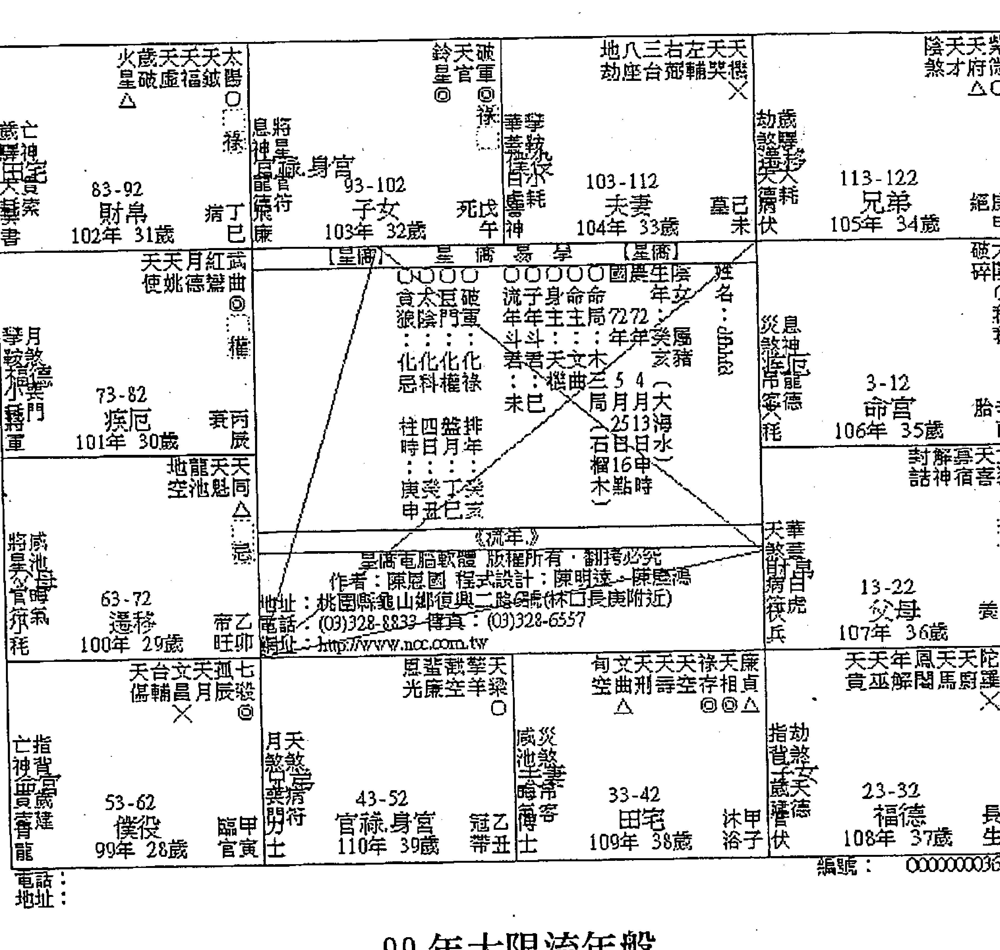
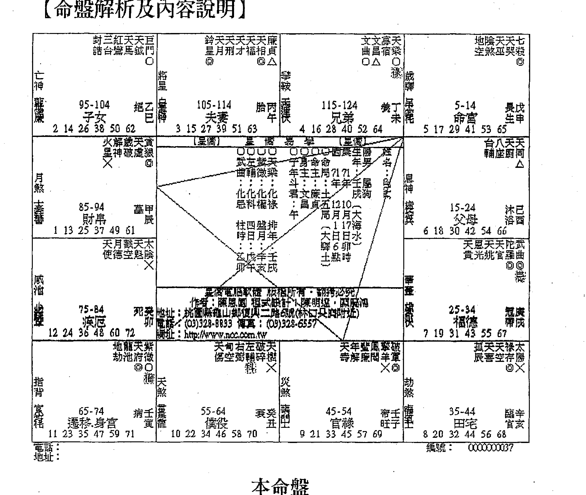
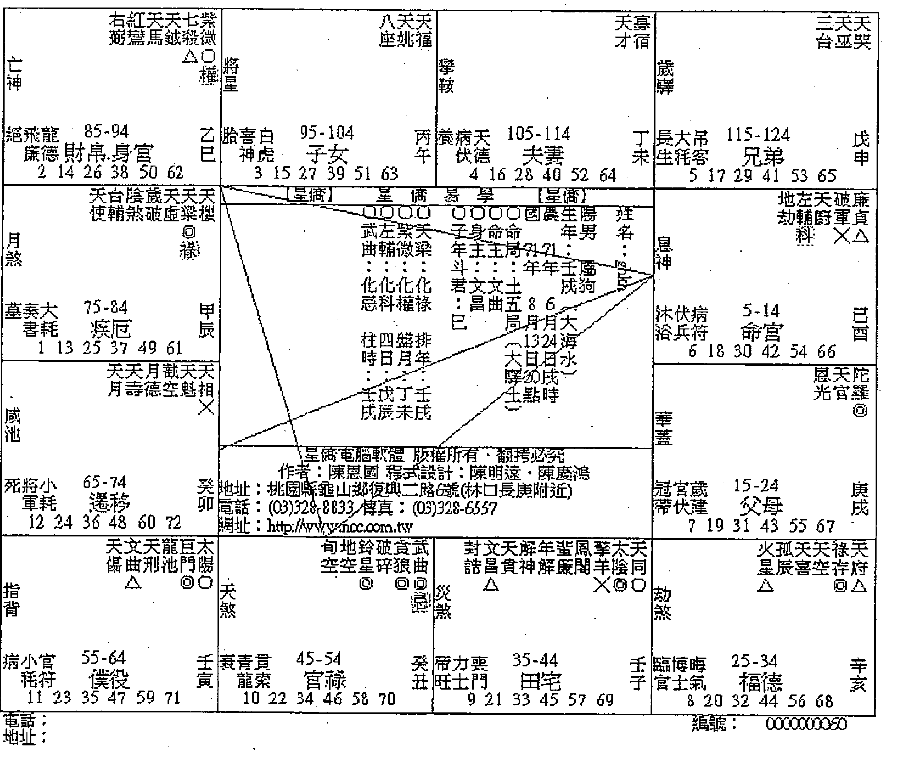
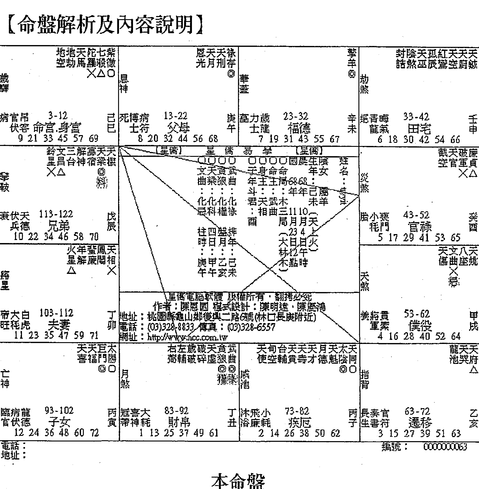

## 紫微斗數

## 論命技巧及實例解析（中冊）

了然山人 著

深入淺出 實例論命 白話講解 享譽大眾 白話闡述紫微斗數論盤技巧及觀念，帶領讀者進入深奧的命理殿堂，系列書籍匯集百餘命例，輔以圖文並茂及系統性分析解說，輕鬆提升論命經驗與功力。

# 自序

命理之說，乃為人類欲探究生命奧秘所研發的一門專業學問，在西洋為占星學，在中國則有五術之論，各有其長。而紫微斗數，又被尊為五術之首，因其內容除涵蓋了子平八字的要義之外，尚有天體運行的理論。至於一個人的命運是否從出生的那一天就註定了呢，答案恐怕是的。山人研究命理多年，論盤無數，得到一個很重要的經驗法則：如果此人一生沒有自造大善或大惡的情況，基本上人生的運程與命盤顯現的情形，不會有太大的差異。古曰：「禍福無門，唯人自招。」所以只要勤加行善，不作惡事，自然命運就有改變的機會，不需要花錢請人祭改或作法，寧願把此金錢來救濟佈施，我想命運必定會轉變的，就像山人常說的，如果你勤加行善積德，自然就會發現命理老師說的越來越不準了，不是他不準，而是你的命運已經改變了，這也就是山人習命卻不願認命的原因。

山人習命理十年有餘，總感嘆中國人的自私心態，導致許多的學問失傳甚至顛三倒四，也難怪西洋的占星學得以研發出完整的理論基礎，風行世界，而中國五術，卻仍被視為迷信。紫微斗數亦是如此，據傳自陳摶（希夷祖師）發明此術以來，一直藏於深山中而未發表，直至明朝羅洪先狀元發現，此門學術才得以流傳於世，在長期的收藏，許多內容因紙張或竹簡腐壞導致文字難以辨識，所以古籍部分多殘缺不全，讓許多有心的後學者因此望而卻步。縱此學說有再好的學理基礎，仍有許多矛盾之處，加上後人穿鑿附會與中國師徒制習慣留一手的陋習，所以此門學說難以像西洋十二星座一樣普及風行於世界，這豈非憾事一樁。

山人習命理多年也發現此情形，因此錄製相關教學課程上傳網路，內容係以古籍為主，輔以各家的部分理論，以補足原卷載之諸多缺漏處，期能讓此學說如西洋占星學一般，簡單易懂，風行世界。

山人主張紫微斗數的學習重視的是推理與理解，而非一般死記死背或翻書論之。山人曾經嘗試將斗數組合星系部分以化學方程式的模式寫出，但確實難如登天，因凡原則必有例外，且相關星宿間微妙的變化確非死板的方程式所能替代，所以僅研究出「生命曲線的判識原則」，期能將大限、行運的複雜性給簡化，利於學習。

紫微斗數首重星曜特性，因星曜的特性及組成來判識後天運途的窮通禍福，尤其紫微斗數絕對都以組合星系居多（如：殺破狼、機月同梁等格局），絕非單宮單星能論得出來，為利於學者，山人特將各宮判識重點以條列式寫出，讓讀者能夠輕易的上手。故本書重視的就是判識原則及理論的闡述，同時搭配生動活潑的實例分析，增加同學的實戰經驗。紫微斗數的精要是在論盤而非排盤，故建議學者僅需知道安星規則及基礎的方法即可，排盤問題就交給電腦處理（至於選用何種軟體較為適合論命者使用？山人強力推薦同學可選購星橋易學的斗數排盤軟體，簡潔明瞭易上手，專業度相當足夠，故本書便採用該軟體進行排盤，同學可自行上網下載，網址如下： http://www.ncc.com.tw/soft/ ）

有感於許多斗數學者因缺少豐富的案例分析而無法進階，故才疏學淺的山人斗膽將多年研究心得及論盤經驗，一五一十的載於此書，仍期盼命理界先進不吝賜教指正。

本書在編撰時，尤其要特別感謝母親大人的全力支持與照顧，還有王詩媛同學的改版建議，得以讓此書問世。如有任何疑問歡迎 e-mail 給山人，將盡速回覆： Kzf0910@yahoo.com.tw

也歡迎同學至山人的 Facebook 粉絲團打卡按個讚哦！ https://www.facebook.com/kzf0910

了然山人
民國 102 年 8 月 8 日

## 目錄

- 自序 ................................................................................ 3
- 案例16、請問大師，我適合往演藝圈發展嗎？ .............. 9
- 案例17、今年跟明年哪個桃花運好？ .................... 13
- 案例18、高人可以算一下我的命嗎？ .................... 21
- 案例19、請幫我看看我的命盤與該注意的地方 ............ 32
- 案例20、請問明年的考運 ................................ 39
- 案例21、關於紫微斗數「機陰坐命」的人 .................. 45
- 案例22、請協助看命盤並針對事業給一些寶貴建議 ......... 53
- 案例23、小兒流年煞星匯聚，請救救恐懼害怕的媽媽 ...... 62
- 案例24、請大師算一下姻緣與事業 ........................ 70
- 案例25、今年過得超慘，請幫我分析一下命盤 ............. 74
- 案例26、煩請精通紫微斗數的老師幫我看命盤 ............. 78
- 案例27、想轉行，目前是否適合？ ....................... 85
- 案例28、快當完兵了，找什麼樣的工作比較適合我？ ....... 92
- 案例29、能幫忙用紫微斗數看看我的感情問題嗎？ ......... 99
- 案例30、此時轉職是否恰當？ ........................... 105
- 案例31、紫微運勢分析工作與感情…………………116
- 案例32、請教一下，小弟的迷惑不解…………………126
- 案例33、麻煩幫我算算姻緣及事業…………………134
- 案例34、有關感情方面的命格………………………139
- 案例35、流年不順，請大師幫我算算…………………149
- 案例36、此八字之人何時會結婚？……………………154
- 案例37、遇到事業瓶頸，請求解惑…………………162
- 案例38、想開店，請幫我看看………………………168
- 案例39、請幫我看一下感情………………………177
- 案例40、快退伍了，腦中一片空白……………………181
- 案例41、請大師為我看命盤………………………188
- 案例42、我是否有老闆命？偏財運？……………………195
- 案例43、想知道姻緣何時到來？………………………201
- 案例44、請幫助離婚邊緣的我………………………207
- 案例45、請問幾歲結婚比較好？………………………219
- 案例46、遇到人生最大的打擊………………………225
- 案例47、感覺命不好，請大師幫忙分析紫微命盤……233
- 案例48、桃花跟婚姻………………………238
- 案例49、能否幫我算一下工作運？………………………246
- 案例50、是否可以考慮轉行？………………………254
- 案例51、事業問題，請大師給我衷心的建議……259
- 案例52、命坐太陽見太陰化忌………………………269
- 案例53、請大師指點命盤 ……………… 275
- 案例54、請大師幫忙解惑 ……………… 279
- 案例55、問紫微斗數感情與事業 ……………… 284
- 案例56、幫我看一下紫微斗數 ……………… 290

## 案例16、請問大師，我適合往演藝圈發展嗎？

【提問時間】2009-07-28 11:07:04

【提問內容】

國曆1985年9月2日子時出生，女，我適合往演藝圈發展嗎？請問一下我要匯幾元？總是麻煩大師很不好意思，總要意思給一點，當請喝茶。

【回覆內容】

你的命盤看來與已故巨星倪先生的命盤很像，都是廉貞對拱，當然是適合做藝人。而且你的屬於「紅豔煞」，你的異性緣一定不錯。但是要特別注意感情糾紛，而且會引發嚴重的後果，在選擇對象時一定要謹慎。貪狼本屬桃花星，廉貞屬於次桃花，加上家花紅鸞、天喜都入命，滿地桃花開，不受異性歡迎都很難。這表示你很容易就能吸引到異性，但你的脾氣有時候卻會嚇到人，有時也讓人感到難以接近。

藝人就是要很受人注意，異性緣也要很好，所以你滿適合當藝人，加上你的貴人運應該也不差，會有發展；只是波折會滿多的，尤其在感情方面，還有脾氣要稍微收斂點。祝你美夢成真，至於喝茶錢不用了，只要做三件善事就可以了。

【發問者意見】

感謝大師的解答。

### 【命盤解析及內容說明】

| | | | |
| :--- | :--- | :--- | :--- |
| **雷天天天**
池哭同 | **台月越天天武**
輔德空厨府曲 | **天歲天太太**
姚破陰陰陽 | **天天天天賞**
貫喜福祿狼 |
| 青指官 92-101
龍背符 子女 | 小威小 102-111
耗池耗 夫妻 | 務月大 112-121
軍煞耗 兄弟 | 奏亡龍 2-11
書神德 命官.身官 |
| **文右天革破**
曲弼官羊車 | **〔星僑〕**
星 儒 易 學 | **〔星僑〕** | **天天年蘆鳳巨天**
壽才解開門機 |
| 力天黃 82-91
士煞索 財帛 | 飛將白 12-21
廉星虎 父母 | 匈鈴文左紫天紫
空星昌輔宿相微 | 傅災裴 72-81
士煞門 疾厄 |
| **喜擎天**
神毓德 福德 | **天破**
傳碎 | **天七**
魁殺 | **地地八天天**
空劫座月梁 |
| 官劫晦 62-71
伏煞氣 遷移 | 伏華歲 52-61
兵蓋建 僕役 | 大息病 42-51
耗神符 官祿 | 病覡弔 32-41
伏驛客 田宅 |

本命盤

從事演藝工作，有幾個重點，首先需要的是粉絲的擁戴，其次是有相當的才華，才能吸引觀眾買單。依照三強理論而言，首先要看命宮異性緣如何，異性緣好，表示本身即具備相當的吸引力，走起演藝圈，自然比起一般人來得容易成功。

命主本命宮立於申宮四馬地，加會天馬，是故本性喜動不喜靜，個性較為外向活潑，而廉貪會命，廉貞與貪狼都是斗數裡的桃花星，入命表示相當適合在交際應酬中成就，同時廉貞也適合流動之財。另會紅鸞、天喜兩顆正桃花星，鸞喜會命者，通常都有超強的異性緣，又天喜落身宮，大都屬俏麗型的漂亮女生（紅鸞入身宮屬艷麗型的女生）。故命主除外在條件亮眼外，命宮四大桃宿匯聚，感覺上很像已逝巨星倪先生的盤。而三方又會合天魁、天鉞，古曰：「蓋世文章。」定然相當有才華，加上昌曲會福德，除暗示命主天資聰穎之外，也表示命主氣質出眾，正所謂：文昌文曲，不讀詩書也可人。而天魁天鉞又可表示貴人與機遇，所以命主除外型搶眼，氣質出眾且才華洋溢，完全符合藝人的特性之外，加上天魁天鉞的加持下，相信在這一路上能得到貴人提攜而成事的，所以山人非常支持命主往演藝圈發展。

但可惜本命宮三方同會擎羊與陀羅，表示在這一路上，外在環境給的考驗也頗多。不過藝人就是如此，台上一分鐘，台下十年功，大家只看到他們光鮮亮麗，卻忽略了一路上辛苦奮鬥的歷程。每一位英雄豪傑，都經歷過無名小卒的階段，有朝一日功成名就，沒人會記得那段卑微困頓的過去，只會為你的成就喝采。就像享譽國際的大導演李安，堅持追求夢想的路上，相當困苦落魄，我想應該曾經受過許多人的冷言冷語，但天公疼憨人，只要堅持努力，走過那無名小卒的階段，成功就會在眼前，堅持，就對了。山人常說：人除非自己看不起自己，否則沒有人能看不起你，不是嗎？山人也衷心的希望命主能夠堅持，定會有所成就。

## 案例17、今年跟明年哪個桃花運好？

【提問時間】2009-09-24 21：06：55

【提問內容】

想問今年適合談戀愛還是明年？對象如何？

民國72年5月25日申時，國曆，女。

【回覆內容】

只要你喜歡，什麼時候都可以談戀愛。命理是可以幫助你了解感情運勢，但主導權仍然在你自己手上。觀念正確，山人就來幫你看看了。

沒錯的話，你應該是屬於氣質型的女生，而且個性開朗外向，可說是同時具備女性的特質及外在，人際關係也不差，整體而言是個滿不錯的女生。只是脾氣偶而發起來，可是會讓人受不了呢。

而且你命見魁鉞貴人星來扶持，所以你身邊的貴人及機遇應該也不差。此局亦為標準的公門格局，如果沒錯的話，你應該是公務員。如果不是的話，可以去嘗試考考看。以你的天分，只要努力點，機會很大呢。

以流年夫妻宮來看的話，今年戀愛應該不是很好，而且兩人相處之間口角多，內心頗多辛酸，要談戀愛的話，明年倒是不錯。流年夫妻宮見大限化權化祿，且逢本命祿。沒錯的話，明年你的對象應該還頗有身分地位的呢，而且正野桃花都有，看來是桃花朵朵開。

但自己可要謹慎選擇，因明年遇到二手貨(離過婚的男生)或是想偷吃的男人的機率也不小，反正盡量慎選就是了。

談戀愛的話，只要有心經營，隨時都可以，明年的感情運勢會不錯，但自己對象還是要慎選，畢竟是自由意志的選擇。

你的姻緣動得很早，大概在 22 歲前後就有姻緣的跡象。從星盤上推論，應該是家裡兄弟及父母反對而作罷，不過錯過也不是件壞事，因爲你的本命盤夫妻宮顯示以晚婚爲宜。

【發問者意見】

寫得詳細，一目了然。

### 【命盤解析及內容說明】

命主太陰坐命，太陽拱照，本命呈現日月並明的狀況，且同會天魁、天鉞，古曰：「天魁天鉞，蓋世文章。」因此命主頗具才華，且此局又稱為公門局，適宜參加典試任官職。又此兩曜為貴人及機遇的象徵，故命主頗具才華且態度端莊凝重。而三方火星，擎羊會照入命成局，古曰：「威震邊疆。」因此命主乃為文武皆宜的新時代女性，整體而言命局結構相當漂亮。

而太陰為女性象徵，此曜坐女命最佳，且通常太陰坐命的人大都是氣質型的帥哥美女。加上日月拱身，昌曲來夾，故除外型不錯外，也是個很開朗外向的女生，故其異性緣必定相當的不錯。

紫微架構不佳，雖命逢日月，但仍無以言大貴，唯太陰主富，而命主子田線雙祿交流，且府祿相三合會田宅，表示命主善於守財，可得祖蔭，雖財宮會雙煞，但以其財庫穩定的狀態，大富雖難求，理財方面只要保守謹慎應對，小富可也。

至於命主提到男女關係，我們就從夫妻宮來看，夫妻宮坐天機及輔弼，輔弼是助力之意，本是吉曜，但入六親宮位，反而是壞事。因男女關係是私事，助力太多，反成為障礙，試想，兩個人交往相處時，身邊有太多的三姑六婆參與意見，你一言，我一語的，故這段姻緣想要平順圓滿，恐怕難了。此點可從對宮天梁、擎羊會天機，加上空劫齊臨的凶險狀況可見一斑，故命主此生要有好的姻緣，只怕相當困難，故建議以晚婚為宜，早婚易有生離死別的狀況發生。至於問命當年的婚姻狀況，依據三才理論，我們先從本命大限盤來看：

### 本命大限盘

| 火天天天太 星 83-92 丁巳 | 鈴天破 星 93-102 戊午 | 地八三右左天天 103-112 夫 | 陰天天紫 113-122 兄弟 |
|-----------------------------------|--------------------------------|--------------------------------|----------------------------|
| 天月紅武 73-82 丙辰 疾 | 星 易 學 ... | 破天 3-12 胎 | 天 13-22 養 |
| 天台文天孤七 53-62 甲寅 僕 | 恩 43-52 乙丑 官 | 旬立天天天祿天康 33-42 田 | 天天年鳳天天天陀巨 23-32 福 |

大限夫妻宫不見桃宿，故應無成婚的機會。三合會天梁，再會天魁天鉞此種老人星，只怕這段時間吸引的男生年紀通常都比較大，且應以已婚的男生居多。加上本命夫妻宮的結構不佳，有帶刑剋的味道，這段時間倘不稍微注意，只怕難逃淪爲「小三」的命運。故山人在回覆時一直希望命主這段時間對象的選擇上能更加謹慎，避免發生憾事，其意便在此。至於這兩年的戀愛運如何，由於命主提問是在民國98年，我們就從98年及99年的流年看起：

### 98年大限流年盤

| 火貪天天天太\n星貪廬福鉞陽\n△ □ | 擎天 \n天機 \n擎羊 \n陀羅 \n  73-82 \n 疾厄 \n 衰丙 \n 101年 30歲 \n 辰 | 天天月紅武 \n使姚德驚曲 \n ⊠ □ \n 祿 \n | 地龍天天 \n空池魁同 \n △ | 指災 \n星煞 \n龍德 \n背 \n 63-72 \n 遷移 \n 帝乙 \n 100年 29歲 \n 旺卯 | 天台文天孤七 \n傷輔昌月辰殺 \n X ⊠ | 亡劫 \n神煞 \n空曜 \n青氣 \n喜龍 \n 53-62 \n 僕役 \n 臨甲 \n 99年 28歲 \n 官寅 | 鈴天破 \n羊官軍 \n ⊠ ⊠ \n 祿 \n 權 \n | 【星備】 \n星 備 易 學 \n 國慶生殿 \n 姓名： \n 男 1992 \n 年 女 生 \n 壬 1992 \n 戌 年 年 \n： 8月 \n 化 化 化 化 \n 忌 科 權 祿 \n：：：： \n 年年癸壬 \n 貪太巨破 \n狼陰門軍 \n ：：：： \n 93-102 \n 子女 \n 死戊 \n 103年 32歲 \n 牛 沖 \n 四盤排 \n 時日月年 \n：：：： \n 壬癸丁壬 \n 申丑巳亥 \n | 恩龍截擎天 \n光廉羊梁 \n □ \n 權 \n | 旬文天天天祿天廉 \n空曲刑壽空存相貞 \n △ ⊠ ⊠ △ \n 權 \n 忌 \n | 月華 \n煞喜 \n咸池 \n死病 \n時符 \n 43-52 \n 官祿.身官 \n 冠乙 \n 98年 27歲 \n 帶丑 | 咸息 \n池神 \n死病 \n時符 \n 33-42 \n 田宅 \n 沐甲 \n 109年 38歲 \n 浴子 \n 伏 | 指歲 \n背曜 \n天喜 \n年星 \n小星 \n 23-32 \n 福德 \n 長癸 \n 108年 37歲 \n 生亥 | 陰天天紫 \n煞才府微 \n △ □ | 地八三右左天天 \n劫座台弼輔魁機 \n X | 劫亡 \n煞曜 \n破碎 \n天哭 \n 113-122 \n 兄弟 \n 絕庚 \n 105年 34歲 \n 申 | 破太 \n碎陰 \n □ \n 科 \n 天機 \n將星 \n旬空 \n 3-12 \n 命宮 \n 胎辛 \n 106年 35歲 \n 酉 | 封解寡天貪 \n詔神宿喜狼 \n ⊠ \n 權 \n | 天擎 \n機羊 \n旬空 \n天才 \n 13-22 \n 父母 \n 養壬 \n 107年 36歲 \n 戌 | 天天年鳳天天陀巨 \n機巫解閣馬府羅門 \n X □ \n 權 \n | 指歲 \n背曜 \n天喜 \n年星 \n小星 \n 23-32 \n 福德 \n 長癸 \n 108年 37歲 \n 生亥 |

本命宮三方四正不見桃宿，且流年夫妻宮會照地空、地劫，本有緣淺之意，且陀羅正坐，陀羅主慢，遲滯，是故 98年時倘要發展戀情，是相當的辛苦，且以整體盤勢觀之，倘真有戀情發展，極有可能是婚外情，且會相當的辛苦，例如與有婦之夫外遇，意外懷孕的狀況，因流年子田線看來有「基隆」(台語)的感覺，實須慎之。

# 紫微斗數

# 論命技巧及實例解析（中冊）

## 案例 17、今年跟明年哪個桃花運好？

## 99 年大限流年盤

99 年流年命宮會照貪狼，流年財福線見鸞喜對拱加會天姚，流年夫妻宮見廉貞會紅鸞，又逢大限祿及本命祿，故正緣桃花全到齊，可謂百花齊放，故 99 年的戀情應相當精彩。倘以夫妻宮為命宮，其對宮便是遷移宮，故流年官祿宮坐破軍，命主的對象極有可能是「二手貨」，以整體結構看來，這個二手貨無論在經濟上還是外型上條件應該還滿不錯的呢。至於何時比較有機會能有正常的緣分出現呢，以大限看來應該落在 33～42 這個大限，但仍是煞忌交馳，故此時雖有婚配的跡象，但也有相當的問題產生。因本命盤夫妻宮結構如此，要有穩定的感情，只怕是相當辛苦。

## 案例 18、高人可以算一下我的命嗎？

【提問時間】2009-09-21 14:34:35

【提問內容】

西元1982年12月1號屬狗，早上6～7點生。好像是這個時間，因為問過父母，他們也沒說很正確，我只能說大概，還有我是雙胞胎（PS：弟弟出生不到兩年就死了）。總覺得人生好慘，慘到不行了，做什麼事好像都不對，真的有點想死的念頭，恨……恨……恨……恨啊！

【回覆內容】

唉，人生不如意十之八九，放寬心，天無絕人之路，何必言輕生呢。你要知道不管在任何的宗教，自殺都是很大的罪業，尤其是佛教，人如果自殺的話，由於陽壽未盡，所以必須要重複自殘的方法直到陽壽盡為止。假如你今年23歲，而你注定要活到80歲，你選擇跳樓輕生，那恭喜你，你要每天跳，跳到80歲；而且不是這樣就結束，這一世輕生的人，投胎轉世後也會再度輕生，一直因果循環，無止無盡。

重點是，輕生的人無法超薦至西方極樂世界，只能一直重複一直重複，想到這樣恐怖，還是算了吧，想開點，好嗎？

七殺朝斗入命宮是大格局沒錯，可是仰了個空斗，代表你工作上能力雖強，但總是會錯過機會，表現得很好，升遷卻總是別人。能者多勞，辛苦的事都你做，但享受的都是別人。本命坐七殺，三方形成殺破狼格局，此局人注定大起大落。

殺破狼格局的為何總是大起大落，究其主因就是中國人常說的，命由性生。一個人的命運，完全取決於自己的個性，七殺坐命的人，脾氣暴躁，雖說不如破軍衝動，但喜愛冒險、刺激卻是本性。

雖說有勇有謀，但衝過頭了，總是不好，也因此惹來人生許多無謂的困境，而且你的殺破狼還加煞，再會空劫，且命身各一，所以常常會因為自己錯誤的判斷和衝動的性格，造成自己的挫折。倘你能靜下心想，許多挫折大部分是由自己造成的。

本命格局帶祿馬交馳，頗適合經商創業。但是你的個性確實需要修正，否則大起大落真是難免。

加上你本身應該偶爾會有點糊塗，就是糊塗的意思，有時給人感到有點散漫。不過你的財庫看來頗為穩健，只要不投機，謹慎行事，做事穩扎穩打，看前顧後，我想晚景應該可期。建議你可以朝向專業技術發展，或者文學創作等工作類型。

好啦，不要想太多。建議你可以去學習打坐或禪修，把自己衝動的個性給修練一下，因為你的個性如能夠做大幅度修正，我想應該還不算差的呢！

### 【發問者意見】

謝謝你，你給的答案很好，也很仔細，我會聽進去的。還有，我發現我越來越懶散了，變得不太想工作，唉。

### 【命盤解析及內容說明】

## 本命盤

山人常說，為人論命經常要扮演心靈輔導者的角色，因登門求問者，大都是在人生的十字路口徘徊，迷惘。這個時候，要怎樣依據個性的缺陷及人生未來的方向給命主最適當的建議，並不吝給予鼓勵與信心，期待能重新開創人生，我想，這是命理存在的最重要目的，同學必須有此心態，千萬不能趁虛而入，誆稱改運改命，行詐騙之實，要知道，善惡到頭終有報，這果報可是相當嚴重的呢！

以本例中，命身空劫各一，古曰：「空劫命身，浪裡行舟。」 為標準的勞碌命，難得七殺朝斗格局，卻也朝了個大空斗，加上三方形成標準殺破狼格局，基本上表示人生起伏波折較大，此種命格的人，經常會有挫折感的產生。而地空星坐命，為人較為糊塗，散漫，且容易胡思亂想，因此命主會有這種想法並不讓人意外。但三方火羊成局，古曰：「威權出眾。」 因此命主亦適合以武職顯貴，例如軍、警及專業技術人員。

地空及地劫雙曜雖然性質不佳，但其豐富的想像力及勇於推翻和創新的能力卻是無庸置疑，所以亦相當適合從事研發、創作、企劃等行業。

難得雙祿交流於田宅，又逢昌曲來拱，但可惜逢雙空同會，庫位已破，此點可從其財帛宮火貪橫財格雖成局，但同時亦會照羊陀雙煞，主財來財去一場空的情況可見一斑，紫微架構不佳，無以言貴，整體命盤架構，完全符合本命宮浪裡行舟的情況。

既然本命盤不佳，那我們就來看看這個大限是否有較好的發展機會，畢竟本命盤仍見祿馬交馳格局，適宜創業求財，倘遇到較好的大限，仍有翻轉的機會，乞丐也有三天的好運，雖是風雲際會，但倘能見好就收，仍有小富的指望。其大限盤如下：

| 命盤宮位 | 詳細內容 |
|---|---|
| **命宮 (戊申)** | 天機、巨門、地空、地劫、天刑、天空、天使、天壽、天哭、天虛、破碎、天空、紅鸞、三臺、台輔、封誥、官符、博士、力士、青龍、小耗、天空、天使、天壽、天哭、天虛、破碎、天空、紅鸞、三臺、台輔、封誥、官符、博士、力士、青龍、小耗。年齡段 5-14。 |
| **父母宮 (己酉)** | 天同、天梁、八座、天福、天官、天巫、恩光、天貴、封誥、天官、博士、力士、青龍、小耗、天空、天使、天壽、天哭、天虛、破碎、天空、紅鸞、三臺、台輔、封誥、官符、博士、力士、青龍、小耗。年齡段 15-24。 |
| **福德宮 (戊戌)** | 太陽、祿存、天喜、天官、天福、天壽、天哭、天虛、破碎、天空、紅鸞、三臺、台輔、封誥、官符、博士、力士、青龍、小耗、天空、天使、天壽、天哭、天虛、破碎、天空、紅鸞、三臺、台輔、封誥、官符、博士、力士、青龍、小耗。年齡段 25-34。 |
| **田宅宮 (己亥)** | 天機、巨門、地空、地劫、天刑、天空、天使、天壽、天哭、天虛、破碎、天空、紅鸞、三臺、台輔、封誥、官符、博士、力士、青龍、小耗、天空、天使、天壽、天哭、天虛、破碎、天空、紅鸞、三臺、台輔、封誥、官符、博士、力士、青龍、小耗。年齡段 35-44。 |
| **官祿宮 (庚子)** | 紫微、七殺、左輔、右弼、天魁、天鉞、文昌、文曲、天刑、天姚、解神、天巫、鳳閣、龍池、天喜、天官、天福、天壽、天哭、天虛、破碎、天空、紅鸞、三臺、台輔、封誥、官符、博士、力士、青龍、小耗。年齡段 45-54。 |
| **僕役宮 (辛丑)** | 紫微、七殺、左輔、右弼、天魁、天鉞、文昌、文曲、天刑、天姚、解神、天巫、鳳閣、龍池、天喜、天官、天福、天壽、天哭、天虛、破碎、天空、紅鸞、三臺、台輔、封誥、官符、博士、力士、青龍、小耗。年齡段 55-64。 |
| **遷移宮 (庚寅)** | 紫微、天府、地劫、地空、右弼、天魁、天鉞、文昌、文曲、天刑、天姚、解神、天巫、鳳閣、龍池、天喜、天官、天福、天壽、天哭、天虛、破碎、天空、紅鸞、三臺、台輔、封誥、官符、博士、力士、青龍、小耗。年齡段 65-74。 |
| **疾厄宮 (辛卯)** | 天梁、天機、七殺、破軍、陀羅、火星、鈴星、地空、地劫、天刑、天姚、解神、天巫、鳳閣、龍池、天喜、天官、天福、天壽、天哭、天虛、破碎、天空、紅鸞、三臺、台輔、封誥、官符、博士、力士、青龍、小耗。年齡段 75-84。 |
| **財帛宮 (壬辰)** | 天機、巨門、地空、地劫、天刑、天空、天使、天壽、天哭、天虛、破碎、天空、紅鸞、三臺、台輔、封誥、官符、博士、力士、青龍、小耗、天空、天使、天壽、天哭、天虛、破碎、天空、紅鸞、三臺、台輔、封誥、官符、博士、力士、青龍、小耗。年齡段 85-94。 |
| **子女宮 (癸巳)** | 天同、天梁、八座、天福、天官、天巫、恩光、天貴、封誥、天官、博士、力士、青龍、小耗、天空、天使、天壽、天哭、天虛、破碎、天空、紅鸞、三臺、台輔、封誥、官符、博士、力士、青龍、小耗。年齡段 95-104。 |
| **夫妻宮 (甲午)** | 太陽、祿存、天喜、天官、天福、天壽、天哭、天虛、破碎、天空、紅鸞、三臺、台輔、封誥、官符、博士、力士、青龍、小耗、天空、天使、天壽、天哭、天虛、破碎、天空、紅鸞、三臺、台輔、封誥、官符、博士、力士、青龍、小耗。年齡段 105-114。 |
| **兄弟宮 (乙未)** | 紫微、七殺、左輔、右弼、天魁、天鉞、文昌、文曲、天刑、天姚、解神、天巫、鳳閣、龍池、天喜、天官、天福、天壽、天哭、天虛、破碎、天空、紅鸞、三臺、台輔、封誥、官符、博士、力士、青龍、小耗。年齡段 115-124。 |

**其他信息：**
- 生年天干：戊
- 生年地支：戌
- 生年納音：平地木
- 生年星曜：天機、巨門、地空、地劫
- 生年化祿：在父母宮
- 生年化權：在官祿宮
- 生年化科：在僕役宮
- 生年化忌：在財帛宮

此大限（25～34）本命宮見陀羅煞星正坐，火鈴沖命，夫官一線被空劫拱掉，因此無論是在事業發展及感情上，都相當的不順利，加上地空坐命的人常會胡思亂想，難怪目前會有這種想法。但大限畢竟是 10 年的總和，總會有那麼幾年是好運順利的狀況，到底命主何時會稍微轉好呢？以流年看來，可能要到 102 年，咱就檢視這幾年（98～102 年）的流年狀況吧：

| 宮位 | 内容 |
|------|------|
| 命宫 | 地空 七杀 等 5-14 命宫 105年 35歲 長生 戌 |
| 兄弟 | 文曲 天府 等 115-124 兄弟 104年 34歲 養丁 |
| 夫妻 | 鈴星 天机 等 105-114 夫妻 103年 33歲 胎丙 |
| 子女 | 封誥 三台 等 95-104 子女 102年 32歲 絕乙 |
| 財帛 | 天魁 天机 等 85-94 財帛 101年 31歲 墓甲 |
| 疾厄 | 火星 解神 等 75-84 疾厄 100年 30歲 死癸 |
| 遷移身宫 | 天梁 天府 等 65-74 遷移身宫 99年 29歲 病壬 |
| 交友 | 天華 天機 等 55-64 交友 98年 28歲 衰癸 |
| 事業 | 災煞 祿神 等 45-54 事業 109年 39歲 帝旺壬 |
| 田宅 | 孤辰 天空 等 35-44 田宅 108年 38歲 臨官辛 |
| 福德 | 絕祿 太陽 等 25-34 福德 107年 37歲 冠帶庚 |
| 父母 | 息神 指背 等 15-24 父母 106年 36歲 沐浴己 |
| 星曆電腦軟體 版權所有，翻印必究 |
| 作者：陳思國 程式設計：陳明達、陳慶鴻 |
| 地址：桃園縣龜山鄉復興二路6號(林口長庚附近) |
| 電話：(03)328-8833 傳真：(03)328-6557 |
| 網址：http://www.hicc.com.tw |

## 98 年大限流年盤

| | | | |
|---|---|---|---|
| 封三紅天馬鉞門 詰台駕馬鉞門 亡亡神 神神 忌 龍真 祿索 廉 95-104 子女 102年 32歲 火解歲天貪 星神破虛狼 月月熬熬 信停 大費 藝門 書 85-94 財帛 101年 31歲 天月截天使 德空魁殺 威威池 池池火 父 小晦 耗 75-84 疾厄 100年 30歲 地龍天紫 劫池府微 指指 背背 印 官符 建 65-74 遷移.身宮 99年 29歲 | 鈴天天天天天廉 星月刑才福相貞 將將星星 星官祿 喜 白 符 105-114 夫妻 103年 33歲 【星備】 武左紫天 曲輔微梁 :: :: 化化化化 忌科權祿 拄四盤排 時日月年 乙戊李壬 卯午寅戌 星儒電胎軟體 版權所有・翻拷必究 作者：陳思國 程式設計：陳明遠-陳慶德 地址：桃園縣龜山鄉復興二路28號(林口長庚附近) 電話：(03)328-3833・傳真：(03)328-6557 網址：http://www.noc.com.tw | 文文寡天 曲昌宿梁 擎擎羊刃 天 | 地陰天天七 空煞巫癸機 歲歲建 建摩星 祿 5-14 命宮 105年 35歲庚申 |
| | | | |
| | 易學 【星儒】 OOOOO OOOO 流子身命 年年主主 斗斗 :: 蒼君文康 申午 | 高男 生年 男 姓名：XXXX 國體主時 12 17 71 71 10 1 大 局 月 海 水 時 | 台八天天 輔座廚同 息息神 神 病 德 兵 15-24 父母 106年 36歲沐 已 |
| | | | |
| | | 【流年】 | |
| | | 天旬右左破天 傷空弼輔碎機 天天魁星 兄弟 天 |
| | | 灾灾熬羊華 門帶 | 天年華鳳擎破 壽解廉閻羊軍 劫劫煞華 子女 |
| | | | 弧天天祿太 辰喜空存陽 |
| | 55-64 僕役 110年 40歲 癸 天 符 丑 士 | 45-54 官祿 109年 39歲 旺子 壬 士 | 35-44 田宅 108年 38歲 臨辛 官亥 |
| | | | |
| 電話： 地址： | | | 編號： 00000000037

## 99 年大限流年盤

| 宫位 | 年龄范围 | 年份 | 岁数 | 主要星曜 |
|------|----------|------|------|----------|
| 命宫 | 5-14 | 105年 | 35岁 | 地空、阴煞、天巫、天哭、七杀 |
| 父母 | 15-24 | 106年 | 36岁 | 息神、擎羊、天刑、天姚、天官、解神 |
| 福德 | 25-34 | 107年 | 37岁 | 天喜、天姚、天官、天福、天刑、解神 |
| 田宅 | 35-44 | 108年 | 38岁 | 孤辰、天空、禄存、太阳 |
| 官禄 | 45-54 | 109年 | 39岁 | 天寿、天福、天刑、天姚、天喜、解神 |
| 奴仆 | 55-64 | 110年 | 40岁 | 天喜、天姚、天官、天福、天刑、解神 |
| 迁移 | 65-74 | 111年 | 41岁 | 指背、亡神、兄弟、官府、伏兵、病符 |
| 疾厄 | 75-84 | 100年 | 30岁 | 将星、天喜、天姚、天官、天福、天刑 |
| 财帛 | 85-94 | 101年 | 31岁 | 月德、擎羊、天刑、天姚、天官、解神 |
| 子女 | 95-104 | 102年 | 32岁 | 亡神、羊刃、福德、龙池、凤阁、廉 |
| 夫妻 | 105-114 | 103年 | 33岁 | 铃星、天月、天刑、天才、天福、相、贞 |
| 兄弟 | 115-124 | 104年 | 34岁 | 文曲、文昌、寡宿、梁 |
| 中心区域 | - | - | - | 武曲、左辅、紫微、天机、化禄、化权、化科、化忌等 |

## 100 年大限流年盤

| 宫位 | 主要星曜 | 年龄范围 | 年份 | 年龄 |
|------|----------|----------|------|------|
| 命宫 | 天府, 天相 | 5-14 | 105年 | 35岁 |
| 兄弟 | 天机, 太阴 | 115-124 | 104年 | 34岁 |
| 夫妻 | 天梁, 天同 | 105-114 | 103年 | 33岁 |
| 子女 | 太阳, 天梁 | 95-104 | 102年 | 32岁 |
| 财帛 | 武曲, 天府 | 85-94 | 101年 | 31岁 |
| 疾厄 | 天机, 太阴 | 75-84 | 112年 | 42岁 |
| 迁移 | 贪狼, 武曲 | 65-74 | 111年 | 41岁 |
| 仆役 | 紫微, 天府 | 55-64 | 110年 | 40岁 |
| 官禄 | 廉贞, 天府 | 45-54 | 109年 | 39岁 |
| 田宅 | 武曲, 天相 | 35-44 | 108年 | 38岁 |
| 福德 | 太阳, 天梁 | 25-34 | 107年 | 37岁 |
| 父母 | 天机, 太阴 | 15-24 | 106年 | 36岁 |

## 101 年大限流年盤

紫微斗數命盤表格：
| 宮位 | 星曜配置 |
|------|----------|
| 命宮 | 長生申、地空、天巫、七殺等 |
| 兄弟 | 帝旺未、文曲、天刑、天梁等 |
| 夫妻 | 冠帶午、鈴星、天天、天祿等 |
| 子女 | 臨官巳、封三、紅鸞、天馬等 |
| 財帛 | 旺午、武曲、左輔、紫微等 |
| 疾厄 | 死午、天月、截空、天使等 |
| 遷移 | 絕亥、指背、亡神、龍德等 |
| 僕役 | 墓戌、天華、破碎、鳳閣等 |
| 官祿 | 養辰、天壽、解神、八座等 |
| 田宅 | 旺子、孤辰、天哭、祿存等 |
| 福德 | 胎巳、息神、將星、病符等 |
| 父母 | 胎子、息神、將星、病符等 |

### 102 年大限流年盤

從這幾年大限命宮狀況看來，98 年雙忌臨命，諸事不順，99 年空劫拱命，100 年仍是雙忌會命，101 年，羊陀加地空會命，仍是相當的辛苦。

102 年雙祿會命，又逢輔弼拱，財帛宮亦是相當漂亮，此段時間看來財務方面會有頗大進展，但田宅財庫位又逢空劫拱破，有財無庫，應特別小心，這種吉處藏凶的狀況，表現出來就是外在一片大好，卻暗潮洶湧。但只要能守住財，不亂投資或輕言投機，我想尚有可為。

## 案例 19、請幫我看看我的命盤與該注意的地方

【提問時間】2009-09-16 16:18:42

【提問內容】我是女生，西元 1980 年 1 月 8 日晚上 8：24 分生。請特別告訴我在事業、財帛、婚姻、子女宮中，有無什麼特別需要注意的地方。感謝！

【回覆內容】以這個生辰的本命盤來看，本命宮非常強勢，有領導者的格局，加上祿馬交馳不會煞，頗利於遠地經商賺錢，而且性格頗獨立，屬於自主的新女性。沒錯的話，你的個性頗為寬厚，在團體裡總是很容易成為領導者，而且工作能力強，異性緣也不差，桃花還滿旺的就是。

喜動不喜靜，也能夠在交際應酬中成就。整體而言命局還不錯，在事業上會很有成就。

不過個性頗為好強，偶爾會讓人覺得滿不講理，但其實心裡頗軟的就是，而且幫夫運頗強，但可惜有時候會言過其實，甚至因為失言而惹上麻煩。

紫微會輔弼，府相又逢祿，在在都顯示出這是個女強人的好格局，而且品味很不錯，整體而言格局頗高。

但可惜財宮祿忌交馳，財庫亦逢煞，表示你雖然很節省，很會存錢，但錢總是留不下來，起起伏伏的，來來去去。

至於婚姻，你對家庭或另一半很捨得花錢，也很用心經營，且祿落夫妻，表示你很適合與另一半共創事業，加上你本身強勢，幫夫運強，所以你也很適合外場征戰呢。

但對方脾氣應該不是很好，也頗為善變。婚姻部分，初期應該頗為順利，但晚期恐不甚如意，所以雙方要做好溝通。相處模式有點忽冷忽熱的感覺。

子女孝順也聰明，反應也不錯，和你一樣都是個喜歡領導的人，如以星宿組合來說，至少也有兩個。

總之，此盤在事業上發展不錯，只是要注意財務調度問題，不可亂投資或投機，因庫破嚴重，錢怎樣來就怎樣去，所以看緊荷包，可能會是你主要的任務。

> 【發問者意見】
很感謝你的意見，我會多注意你的提醒的！謝謝！

# 紫微斗数

# 论命技巧及实例解析（中册）

### 【命盘解析及内容说明】

| 宫位 | 关键星曜与配置 |
|---|---|
| **命宫 (寅)** | 紫微、天府、左辅、天魁、天钺、禄存 |
| **兄弟 (丑)** | 破军、地空、天刑 |
| **夫妻 (子)** | 七杀、右弼、天姚、地劫 |
| **子女 (亥)** | 太阳、天梁、擎羊 |
| **财帛 (戌)** | 武曲、天相、化禄、天马 |
| **疾厄 (酉)** | 廉贞、七杀、火星 |
| **迁移 (申)** | 天府、地劫、铃星 |
| **交友 (未)** | 天机、太阴、左辅、文昌、化科、化权、化忌 |
| **官禄 (午)** | 武曲、天相、禄存、天马 |
| **田宅 (巳)** | 天同、巨门、右弼、天魁 |
| **福德 (辰)** | 贪狼、擎羊、火星、铃星 |
| **父母 (卯)** | 紫微、天府、左辅、右弼、天魁、天钺、禄存 |

**命盘信息**: 阴男金四局，生年己未，生日11，未时。
**软件信息**: 星傳電腦軟體，作者：陳明國，程式設計：陳明遠、陳麗鴻。

## 本命盤

此盤結構完整，相當漂亮，首先紫微坐命又逢左輔，形成輔弼拱主大局，命主格局頗高，而府相會雙祿且落本命宮，武曲化祿坐財宮，財星得位不會煞忌，遇者富奢，為富貴雙全，財官全美之局。本命宮又形成七殺朝斗，且三合不會煞忌，格局相當大，古曰：「朝斗仰斗，爵祿昌榮。」因此紫微七殺化權，加上天府為南斗主星，因此在事業工作上衝勁相當強，加上紫微架構完整，能得朋友屬下助力成事，倘得天時機遇，亦能掌社稷權柄也，故此局爲女強人甚或是女政治家之命造。

一般而言，雙祿命宮交流，主出身望族，此點從父母宮逢日月，福德宮祿權交流，可見一斑。而鑾喜於命宮交流，主異性緣佳，最難得是雙祿馬交馳會命，主得意發財在遠鄉，相當適合創業。

唯其陀羅坐財宮，三方會空劫，主財來財去一場空，祖業破耗難留，對照其財帛宮狀況，可斷爲財多無庫之局。

山人常說，命理無兩全，因每個人的星盤，吉煞星數量均相同，差別只在分布位置，以山人十餘年論命經驗觀之，當吉星全數照命時，煞星自然就進入六親宮位，故有高處不勝寒之感。許多老師看到此盤都會認為此比例中的命主是相當好命的天之驕子，因格局相當的大，但以山人的觀點只會說相當的強勢，因命強事業強但六親弱，這應該不能算是好命，此例便是如此，且看山人就六親關係逐項分析也：

- 1.夫妻宮：破軍正坐加會廉貞，三方雖不會煞，但星曜性質不佳，故命主定多感情困擾，加上右弼星坐，其感情應以第三者介入狀況最多，故整體研判以晚婚爲宜。

- 2.子女宮：太陽正坐，古曰男三女二，現代社會生育率低，且其子女宮加會擎羊陀羅雙煞，故推論應至少有二人，但因結構組合不佳，故與子女關係不佳，常有爭執與意見不合狀況發生。

- 3. 父母宫：虽逢日月并明，但三方会擎羊、地劫，故与父母亦相当疏远或早有生离死别之事。

- 4. 兄弟宫：坐天机会巨门，兄弟间难以齐心，三方四煞汇集，除主命主与兄弟缘浅，更主内门难以和谐。整体而言相当险恶，兄弟无义。

综上所述，命主格局大，整体命盘极为强势，但却与六亲缘浅且带剋，当你拥有一切时，却没有人能与你分享的那种孤独失落，此点由郭台铭先生之例可见一斑，所以吉星会命真是好格局吗？此点就见仁见智了。

本命盘强势，不代表终身福厚，诸事顺遂，尚须看大限星曜结构而定，毕竟运佳也要限佳，相辅相成，富贵方可绵延昌荣，虽命主未提及此问题，但本着研究的心情，那咱们就来看看这个大限如何。

## 大限流年盤

| 宫位 | 内容 |
|------|------|
| 命宫 | 大祿命、大祿喜、飛祿、祿存、天祿、祿神、祿庫、祿元、祿星 |
| 兄弟宫 | 大祿、天祿、祿元、祿庫、祿神、祿存、祿星 |
| 夫妻宫 | 大祿、天祿、祿元、祿庫、祿神、祿存、祿星 |
| 子女宫 | 大祿、天祿、祿元、祿庫、祿神、祿存、祿星 |
| 财帛宫 | 大祿、天祿、祿元、祿庫、祿神、祿存、祿星 |
| 疾厄宫 | 大祿、天祿、祿元、祿庫、祿神、祿存、祿星 |
| 迁移宫 | 大祿、天祿、祿元、祿庫、祿神、祿存、祿星 |
| 交友宫 | 大祿、天祿、祿元、祿庫、祿神、祿存、祿星 |
| 官禄宫 | 大祿、天祿、祿元、祿庫、祿神、祿存、祿星 |
| 田宅宫 | 大祿、天祿、祿元、祿庫、祿神、祿存、祿星 |
| 福德宫 | 大祿、天祿、祿元、祿庫、祿神、祿存、祿星 |
| 父母宫 | 大祿、天祿、祿元、祿庫、祿神、祿存、祿星 |

此大限命宮見雙祿交流，財帛亦同；官祿宮相當漂亮，又逢大限化祿引動，雖會本命忌，但因格局夠強，故影響不大，古曰：「紫微逢吉集，無有不貴。」且可降七殺，制火鈴，故命主此段時間在事業上定然大有收穫，且祿馬交馳，輔以命宮及財帛宮狀況，可斷言命主在此大限應可取得相當的成就與財富才是。

台語俗諺有云：有一好沒兩好，觀其大限田宅宮擎羊會太陰，縱有財也難留，夫妻宮暗合位見天姚野桃花，又鸞喜對拱，對未婚的人而言，正野桃花全開，情場得意，但對已婚的人來說，感情上易有第三者困擾產生，倘流年不佳又逢流年化忌引動，極有可能引發天馬解神這組離婚組合，故夫妻相處之間不可不慎。子女宮四煞匯集，加會天傷、天使，古曰：「劫空傷使禍重重。」且子女宮三方主星曜構成天機、天梁、擎羊會的惡局，又逢大限天機化忌引動，是故命主須特別注意子女身體健康狀況，以免發生憾事。至於家庭關係最艱困兇險之時，就須看流年吉凶狀況而定，礙於因果所限，無法為大家分析，也請有興趣的同好自行推演。但以結果而言，應是驚險過關才是，只是可能在此破耗不少錢財。

## 案例 20、請問明年的考運

【提問時間】2009-09-13 09:44:24

【提問內容】

你好，想請教明年2010年7月考運，1971年11月30日上午8:55生，女，感謝你。

【回覆內容】

以流年來看，明年如果要考試，正逢魁鉞科星來拱，再加上昌曲文星來輔助，雖說流年大限不逢化科，且本命盤昌曲落陷，但是整體看起來考試運不錯，只要努力點，應該會有機會的。

還有就明年官祿宮看起來，競爭會很激烈，雖然考運不錯，但還是要努力。畢竟考試這碼事，99%靠的是實力，但考運也有加持的作用，如果不讀書，不努力，那縱使給你再好的命，都還是枉然。如果肯努力，命再爛，都可以考上，對不對。

加油，明年流年本命宮星宿組合不差，考運不錯，難得有機會，要好好加油呢！以山人推斷，如果你肯努力的話，至少備取沒問題，四大吉星來拱照，雖說昌曲強度不足，但努力必有所成，好好把握這天賜的好運勢，錯過就要更努力了。

【发问者意见】
感恩了然山人，也不晓得在坚持什么，连续补了几年术科（术科有进步），学科听了山人的话也在每天复习中，还有行善积德也给我当头棒喝，明年若有此福气定当好好感谢山人指点。

## 【命盤解析及內容說明】

| 宮位 | 內容摘要 |
|------|----------|
| 田宅 | 長病大官 夫妻 長生伏耗年02年 43歲 |
| 兄弟 | 沐大龍官 兄弟 長生耗德年03年 44歲 |
| 命宮 | 冠伏白小 命宮 長生伏耗年04年 45歲 |
| 父母 | 臨官天大 父母 長生伏德年05年 46歲 |
| 福德 | 葵喜小裏 子女 長生伏耗年01年 42歲 |
| 妻子 | 遊龍太 兄弟 長生伏耗年00年 41歲 |
| 子女 | 遊龍太 兄弟 長生伏耗年00年 41歲 |
| 命宮 | 74-83 |
| 兄弟 | 64-73 |
| 妻子 | 54-63 |
| 子女 | 44-53 |
| 官祿 | 34-43 |
| 疾厄 | 24-33 |
| 遷移 | 14-23 |
| 兄弟 | 4-13 |
| 官祿 | 114-123 |
| 田宅 | 104-113 |
| 福德 | 94-103 |
| 妻子 | 84-93 |
| （注：命盤表格結構複雜，此處為提取可見核心資訊） |

## 99年大限流年盤

命主問命當年是民國98年，西元2009年，由於考運係屬流年偶遇，且此考試為入學考試，並非國家考試，與本命格局較無關聯，因此我們直接切到2010年（民國99年）來看。

民國99年流年命宮在寅宮，三方逢文昌、文曲、天魁、天鉞等四大吉星拱照，加上雙主星坐命，流年武曲化權會照，化權表權柄之意，亦可視爲工作的表徵。故命主99年考運相當好，倘能多加努力，應有錄取的希望。

考試，是相當公平的競爭方式，命理之說充其量可以告訴命主哪些時候的考運比較好，但自己不努力讀書，縱使給你再多吉星也沒用，只要肯努力準備，縱使流年再差，誰說會考不上？

後來命主果真於 99 年順利進入理想中的學校進修（沒記錯是備取入選，確實相當好運），於當年底再度拜訪山人，詢問未來發展方向及適性所在，因此我們就從本命盤看起：

### 紫微斗数命盘

| 宫位 | 宫干 | 宫支 | 年龄范围 | 星曜 | 其他信息 |
|------|------|------|----------|------|----------|
| 兄弟宫 | 癸 | 巳 | 104-113 | 忌煞天天戳天巨、光破虛馬奎福門 | 長病大、癸沐大龍、流耗德 |
| 夫妻宫 | 壬 | 辰 | 94-103 | 解月紅貪、神德鸞狼 | 癸喜小、神耗、子女 |
| 子女宫 | 辛 | 卯 | 84-93 | 地龍太、劫池陰 | 庚飛官、廉符、財帛、身宫 |
| 財帛宫 | 庚 | 寅 | 74-83 | 天旬铃天孤天紫、使空星羣展鐵府微 | 庚害索、紀害 |
| 疾厄宫 | 己 | 丑 | 64-73 | 火八三右左紫天、星座台魁輔廉相 | 辛將東、壽門、遷移 |
| 遷移宫 | 戊 | 子 | 54-63 | 天天疏、僅空軍 | 庚死小晦、耗氣、僕役 |
| 僕役宫 | 丁 | 亥 | 44-53 | 年解天、祿解閣天、祿權 | 庚青龍、官祿 |
| 官祿宫 | 丙 | 酉 | 24-33 | 帝博帛、旺士容、福德 | 丁福 |
| 田宅宫 | 乙 | 申 | 14-23 | 臨官天、貴伏德、父母 | 丙甲 |
| 福德宫 | 甲 | 未 | 4-13 | 文曲天、地天哭梁、空貢哭梁 | 乙臨官、冠伏白、帶兵虎、命宫 |
| 父母宫 | 癸 | 午 | 114-123 | 封文天天天天天天天康、祿昌月刑才魁相貞 | 甲沐大龍、流耗德、兄弟 |
| 命宫 | 壬 | 巳 | 104-113 | 忌煞天天戳天巨、光破虛馬奎福門 | 長病大、癸沐大龍、流耗德 |

注：表格中包含紫微斗数命盘的十二宫位信息，具体星曜和文字如上所示。

## 本命盤

本命宮坐天梁，命主較有原則性，年少老成，具同情心，且三方不會祿，格局不錯（因天梁不宜會祿）。但同時地空坐命，三方會地劫，表命主較為糊塗、散仙，愛幻想、有些不切實際，且想法新潮，不易為人所理解，整體而言為傻大姐類型的女孩。

日月照命，昌曲夾命，兩種格局均主貴，而日月昌曲，出世榮華，故命主出身環境相當不錯，另輔弼拱命，表命主多助力而成事，同時也稍稍緩解空劫入命的遺憾。

山人說過，空劫入命者，想像力及創作能力相當強，故進入藝術大學進修，是相當的適性且未來發展相當好，因藝術創作相當需要此類型星曜加持。空劫雙曜雖不佳，但倘能將其優點發揮，把惡曜轉化成為助力，反倒是件好事。許多老師看到空劫入命者，直接鐵口直斷說這是貧窮之命，浪裡行舟，兩重華蓋等。古書亦曰：「此命宜僧道。」但本命盤於落土時已定，無法改變，如何讓命主趨吉避凶，找回信心及重新設定人生方向，擁抱新生，這才是命理老師的道德與責任。

## 案例21、關於紫微斗數「機陰坐命」的人

【提問時間】2009-09-05 18:43:49
【提問內容】
我是西元 1983 年，國曆 6 月 14 日，早上 8：15 分出生，性別：男。
如何從紫微斗數中看出我至今為何仍無法自立自強呢？人家說男怕入錯行女怕嫁錯郎，從紫微斗數中看得到我的潛能嗎？
我現考社會行政，是幫助弱勢族群的，是對的嗎？
為了讓專家得以解釋清楚，下面稍為解釋我的各階段人生：

### 階段 1：1992 年～1998 年
國小三年級迷上棒球，過程中有參加自組棒球隊、田徑隊，也有接受訓練。到了國三感覺得不到家人的支持，就選擇去念工科。

### 階段 2：1999 年～2006 年
高一開始念電機科，當上第一堂實習課我就發現不喜歡這門科目，但不知道怎麼跟家人講，在無助下，一拖就拖了七、八年，過程也有想過放棄，結果考上二技後，決定不要在工科裡混，便休學了。

### 階段 3：2006 年～至今
當兵一年完後，工作都浮浮沉沉，好不容易在一家公司做了八個月又被裁員，因為學生生涯學無所長，現在也是處在沒自信的情況，每每往未來一望，都有種絕望感，所以現在就用剩下的積蓄，拼公職。

## 【回覆內容】

看你寫了好多，不過你的問題是機陰坐命的人，所以山人先就機陰坐命的特性及缺點分析給你聽。

命造國曆 72 年 6 月 14 日辰時建生。通常機陰坐女命，交際手段會比較高，但男命坐機陰，情況就大不同了，因為太陰為女性的象徵，所以仍以入女命為宜。

以男命而言就難免會有多愁善感，凡事想太多，而且經常會往壞的地方去想，個性上容易會有魄力不足的問題。

凡事想太多，得不到，苦，所以容易失眠，而且天機代表智慧，而太陰又有過於陰沉的感覺，表示你事情很容易往壞的地方想，建議你放開心胸，想開點，不要太過於鑽牛角尖，這樣在人生路上會走得比較順利呢！

有句俗語是這樣說的：「能解決的事情，就不用想太多；不能解決的事情，想再多也沒有用。」山人遇到機陰坐命的人，大概都會這樣跟他建議。凡事順其自然，不要想太多，人生會快樂得多。

至於你從事社會工作，其實滿合適的，因太陰是女性的表徵，所以為人比較善解人意，溫柔堅韌，很適合去幫助人，因為有愛心，感情豐富有。

至於考試的話，本命宮見昌曲，為文星拱命之局，且化科坐本命，蓋化科有功名的意味。文星拱命，古曰：「賈誼登科。」所以從事公職也不錯，但可惜盤中昌曲皆落陷，縱有如此利於考試的格局，只怕要多考幾次。不過只要努力，加上自己本命加持，會考上的，不要想太多。

以流年來看，明年本命宮逢太陰化科，又三方昌曲來拱，考上的機率滿高的。要加油哦，努力點，會有機會的。

而且你的年紀還輕，對男生而言，29 歲才算開始。連中年都還沒到，事業不順，這是正常的狀況。通常太年輕有成就的人，晚景都不是很好，正所謂年少得志大不幸。況且你很適合往公門發展，也許這樣的逆境對你是一個重生的機會呢！

## 【發問者意見】

謝謝了然山人的教導，有茅塞頓開的感覺，感恩！

### 【命盘解析及内容说明】

### 本命盘

本命宫坐天机太阴，三方形成标准的机月同梁格局，古曰：「机月同梁当吏人。」此局人适合稳定且一成不变的工作，倘公司要聘用行政人员，用此种格局的人，保证稳定性相当足够，此点从命主自述内容可见一斑。辅弼同会命宫，辅弼拱命成局，又本命宫逢文昌文曲来会，为文星暗拱，为公门格局的一种，且官禄宫不会煞忌，又形成阳梁昌禄的奇局，为公门高员首选，结构如此漂亮，倘任公职，应可顺利领到退休俸才是，故此盘势左看右看，都适合在公门发展。且四吉星会命，三合不会煞，照理命主应是相当好命的才是。

命主自述曾就读工科，但因其适性在文科，且理工科为专业技术人员，在古代为武职，由于命主三方不会煞，虽说相当漂亮的命局，但却不利于从事武职，故读电机会感到不适应，是正常的。休学也未尝不是件好事，毕竟工作还是要适性适所，才能走得长久。

由于命主主要问题在机阴坐命，因此山人花了相当的篇幅介绍此组合的优缺点，此组合最大的问题就是钻牛角尖，自寻烦恼。明明本命格局架构颇大又财官双美，倘行入佳限时，应有相当成就。故首要问题，就是希望命主能够不要再胡思乱想，以免自误如此漂亮的命盘啊。

命主自述目前准备公职考试，以其命盘而言，是相当正确的选择，但可惜盘中文昌，文曲均落于陷地，古曰：「昌曲居陷地，林泉冷淡。」故可能要多考几次了。

由于命主带公门格局，故何时能金榜题名，已非单纯流年可论，应由大限与流年牵引轨迹来做推论为宜，其大限盘如下：## 紫微斗数
论命技巧及实例解析（中册）

[紫微斗数命盘图表]

### 22～31本命大限盘

在此大限中，三方昌曲会命，更难得的是大限命宫形成难得一见的阳梁昌禄格局会文曲，古曰：“阳梁昌禄，金殿传胪。”此局人通常为文人高官之命局。又逢大限廉贞化禄引动，此大限准备考试，必能有所成。有人会觉得，机月同梁当吏人，应该是基层公务员之类的，怎会是高官首选呢？倘单纯机月同梁，此论点应该是正确的，但因命主同时带有文星拱命及辅弼拱命的大格局，加上官禄宫结构稳定且格局相当的大，故倘任公职且逢机遇加临时，确有可能担任高官大员呢。至于哪一年的考运较佳，依推论应在民国99年（亦即隔年），其命盘如下：

## 案例 21、关于紫微斗数“机阴坐命”的人

紫微斗数
论命技巧及实例解析（中册）

| 宫位 | 命宫 | 兄弟 | 夫妻 | 子女 | 财帛 | 疾厄 | 迁移 | 交友 | 官禄 | 田宅 | 福德 | 父母 |
| :--- | :--- | :--- | :--- | :--- | :--- | :--- | :--- | :--- | :--- | :--- | :--- | :--- |
| 星曜 | 病伏贯岁 | 死寡哭病 | 死博晦吊 | 胎力歁天 | 胎龙病爵 | 养小吊龙 | 生长将天 | 死病哭病 | 帝飞龙官 | 临喜大贡 | 帝病小丧 | 衰大官晦 |
| 主星 | 命宫 | 兄弟 | 夫妻 | 子女 | 财帛.身宫 | 疾厄 | 迁移 | 交友 | 官禄 | 田宅 | 福德 | 父母 |

## 100 年大限流年盘

民国99年流年命宫，逢文昌文曲拱照，且太阴化科，主科名，三合稳定不见煞，官禄宫三方形成阳梁昌禄格局，又逢流年太阳化禄引动，考运奇佳，是故只要稍加努力，考运绝对比起一般人强太多的。因此命主倘于98年听进山人劝告，努力读书准备，99年应该是金榜题名，功成名就之时。

注：至于命主后来是否有金榜题名，碍于个人隐私，无法明说，只能说目前任职于某公家单位。

## 案例 22、请协助看命盘并针对事业给一些宝贵建议

【提问时间】2011-05-13 13:14:50
【提问内容】

老师你好：

我是农历70年11月23日寅时出生，女性。恳请老师能拨空看看我的命盘，稍微谈论一下我的“事业”，给我一些宝贵的建议，谢谢你！

由于留言太冗长，因此将我的困惑精简如下：

- 1. 明年和下个大限是否有机会考取正式的国小教师或公务员呢？若有，哪几年的考运较佳呢？
- 2. 我的命盘适合从事复健（语言治疗）工作吗？

另外补充两个事件，也麻烦你拨空帮我看看：

> （一）由于陷入苦恼的情绪漩涡中，上个月我曾经跑去算命，算命师说我：『机梁破』、『荫星破』、『同梁破』、『文昌化忌』，所以不可能从事教职和语言治疗，因为表达能力不好，无法担任『传授』的工作，学生和病人会听不懂我在说什麼……。」

紫微斗数
# 论命技巧及实例解析（中册）

（二）前阵子我的论文指导教授看我陷于实习困境中，曾找我约谈……

她问我：“有没有兴趣做研究工作？”、“这一行不走临床实务，也可以走学术研究”、“毕业后也可以先找个研究助理的工作……。”

想请你为我解惑的问题是：

- 3. 我的命盘是否有“不宜从事传授工作”的象征呢？若有，能弥补吗？或是真的会严重到使我无法胜任教职或治疗工作呢？（我不想因为自己的不适任而损害学生或病人的权益）
- 4. 我的命盘是否显示将来有可能从事“学术研究工作”呢？或是你对我的事业发展有其他看法，也恳请你给予建议，谢谢老师！

### 【回覆内容】

很难理解，何谓同梁破、机梁破等拉哩拉杂的怪格局，只能告诉你，正统斗数里面没有你说的那个算命老师提到的这些格局，所以不用想太多。如果方便，可否告知那位算命老师姓名，山人非常有兴趣跟他讨教，此些格局从何而来？或许是山人学艺未精，以至于没听过，亦或是台湾能有超越已位列仙班的陈希夷道长等级之大师出现，真该好好的跟他请益才是。
你提到的这些，只有文昌化忌，有成立，但那是生年忌，因为你辛酉年出生，辛年文昌化忌，就是说和你同年生的人，本命盘通通是文昌化忌，倘其所言为真，那每个辛年生人，都不能当老师或从事研究工作了吗？真是可笑之极，如此胡言乱语，又说出一堆不知所云的格局，这老师算命能准，真是见鬼了。
连斗数基本知识都不足，况且本命忌到大限就不一定有影响，更何况是流年呢。那个老师只能说他是江湖术士，胡謅一通，所以不要太介意，也不要想太多，就当做救济贫困，他说的就当没听到吧，好吗？
你的格局正确来看是贪狼坐命，三方形成杀破狼加煞格局，基本上此局人稳定性不足，但冲劲十足，性格刚烈，故适合以武职显贵。换成现代话来说就是适宜走研究发明等专技人员路线，能发挥长才，尤其适合军警、技术职类人员等，所以你从事研究工作，很是适合。尤其你宜离家背景发展，研究工作很适合你。但如要从事教育工作，要好好修练你的冲动与脾气，尤其国小老师，对你确实不宜。
你的算命老师说对一半，不太适宜从事教职，是因为你个性的问题，绝对不是因为你表达的问题，如真要执教，建议你还是朝向专业技术传授方面来走，因学生年纪较大，且专技方面的老师，因为学生都有一定的年纪，所以稍微有点个性还可以，且专技人员本来有点脾气是正常的。但若你要教小学也未尝不可，只是建议你要学学禅修或心灵课程，让自己不要情绪起伏过大，毕竟小朋友很难承受的。至于公务员，看来也不是很适合，因太过稳定没有挑战性的工作与你杀破狼的个性相悖，当然你坚持也没话讲，只是可能会做不久。
总之老话一句，你要从事教职或公务员，不是不行，可要先修心，如果要从事公务员，可以朝向技术类型如军警、技术类，不要偏向行政类的话，也未尝不可，你的格局本来就是武职为佳。
拉拉杂杂说一堆，简单说，斗数里没有所谓不宜从事传授工作的格局，纵使是杀破狼局，也可以走向技术传授方面来发展，况且命由性生，倘你愿意改变个性去适应这个工作，又有何工作是不能做的呢？故你所叙述的事情真是让人费思量啊！
建议你从事学术研究工作，是最好的选项，因挑战性及变异性颇大，很适合你杀破狼局的人呢！
至于那个老师说的话，就忘了吧，连斗数基本理论也搞不清楚的人，说出来的东西，能信才怪，只是误己误人罢了，所以别想太多。

### 【发问者意见】

谢谢老师指导。

## 案例22、请协助看命盘并针对事业给一些宝贵建议

### 【命盘解析及内容说明】

| 天府星 | 天相星 | 太阳星 | 廉贞星 | 天机星 | 贪狼星 | 巨门星 | 天相星 | 天梁星 | 七杀星 | 破军星 | 太阴星 |
|--------|--------|--------|--------|--------|--------|--------|--------|--------|--------|--------|--------|
| 命宫 | 兄弟宫 | 夫妻宫 | 子女宫 | 财帛宫 | 疾厄宫 | 迁移宫 | 交友宫 | 官禄宫 | 田宅宫 | 福德宫 | 父母宫 |
| 甲寅 | 乙卯 | 丙辰 | 丁巳 | 戊午 | 己未 | 庚申 | 辛酉 | 壬戌 | 癸亥 | 甲子 | 乙丑 |
| 13-22 | 23-32 | 33-42 | 43-52 | 53-62 | 63-72 | 73-82 | 83-92 | 93-102 | 103-112 | 113-122 | 123-132 |

### 本命盘

命坐贪狼，三方形成杀破狼格局，又本命宫坐擎羊，为标准杀破狼加煞格局，身宫又坐七杀，虽对宫紫微天府，形成七杀仰斗格局，但可惜会陀罗及化忌星破局。故命主脾气应该不是很好，且杀破狼格局者，个性积极主动，不适宜从事文职或缺少变化的工作，因此倘担任国小教师，如性情未改，只怕是不太适合，毕竟与小朋友相处，需要相当的耐心。但若担任专技老师，因学生较为年长，故尚可为之。

紫微斗数
# 论命技巧及实例解析（中册）

紫微不逢辅弼，无以言贵，府相不会禄为空库一座，难以言大富。
田宅虽逢辅弼拱，但会空劫，财库已破；财官虽逢四吉星来拱，但不会禄，故仍无法以财多论。天马会陀罗加会忌星，为折足马格局，亦不适合创业。
以命宫星曜组成及整体盘势来看，适宜从事武职，例如：军人、警察、专业技术人员或业务员等。至于命主倘准备考试担任公务员，仍以专业技术为宜。以此局组合而言，从事研究工作亦是相当不错，例如命主目前从事医疗复健工作，倘能继续走下去，我想应该会是相当不错的呢。
至于命主提到其他的算命老师给他的建议，山人认为那是无稽之谈，因翻遍斗数全书，绝对找不到那个老师所说的那些格局，倘依命宫星宿组合，应为杀破狼加煞会武曲才是，山人猜想可能是星曜太多，那位老师眼花了吧？至于斗数里是否有不适合从事教职或言语表达工作的格局，很肯定的跟大家说，只有适合从事此类工作的格局，如巨日格、天阙格等，绝对不会有不适合的格局，这点也请各位同学宽心。
另外让山人更感诧异的，就是那位老师居然说，文昌化忌，不宜教职，但此为本命盘化忌，本命盘四化跟随天干变化，亦即与命主同年出生的同学朋友，全都是文昌化忌，所以大家都不能从事教育工作了吗？根本是胡扯。文昌化忌，主文书失识，倘于求学过程遇到，也有中辍学业的问题产生，与以口为业的教职，有何关联？倘那位老师说巨门化忌，这倒有可能，但是应该是在大限流年行进间发生才有影响，本命巨门化忌，充其量也只是命主容易因言语惹上是非而已，连最基本星性都搞不清楚，还开业论人命，坊间到底有多少这种江湖术士呢？论不准就算了，如果因此害人误入歧途甚至影响后续因果发展，可真是造了极大的口业。

## 案例 22、请协助看命盘并针对事业给一些宝贵建议

好了，既然命主提到大限流年考运问题，我们就转进大限盘分析吧！

紫微斗数
# 论命技巧及实例解析（中册）

| 宫位（示例） | 主星（示例） | 大限范围（示例） | 其他星曜（示例） |
|---|---|---|---|
| 命宫 | [星曜名称] | [年龄范围] | [杂曜] |
| 夫妻宫 | [星曜名称] | [年龄范围] | [杂曜] |
| ...(十二宫分布) | ... | ... | ... |

**注：此为一张完整的紫微斗数命盘图表，包含十二宫位、主星、辅星、四化、大限、流年等信息。**

33～42本命大限盘

看考运，尤其是公职考试，当然看文昌文曲及化科等类型星曜，以33～42这个大限来看，三合不会昌曲，官禄宫亦会空劫，且本命盘文昌文曲均属落陷状态，故此大限倘要准备国家考试，只怕要多加努力。但大限不佳，毕竟是10年的总和，此段时间倘流年漂亮，仍有可为。依推测命主应在99年的考运最好，但显然是错过了，之后几年看来是没有比较好的流年，因此命主倘要准备国家考试，可能要多加努力了，而考试本来就是靠实力，命理最多只是告诉你哪年考运比较好，但考运好，不肯努力，也是没用；而考运差，但肯发愤图强，头悬梁，锥刺股，又有谁敢说他考不上呢，对不对？

## 案例23、小儿流年煞星汇聚，请救救恐惧害怕的妈妈

### 【提问时间】2012-02-05 19:37:56

### 【提问内容】

伟大无私的老师好：
点阅老师影音教学，看了非常感动，老师真的很伟大，无私奉献传承伟大学问，非常佩服。敝人喜欢斗数很久，始终有学没有通，无法理解无通也不精，在此拜托老师帮忙解惑。
男，农历81年04月03日辰时生。今年逢生年忌在本命子女宫与大限财帛忌重逢＋流年迁移忌，三忌重叠，三方有陀罗、铃星、火星等煞星会集，此等可怕的交会，会产生何种可怕的生死关头吗？拜托老师救救恐惧害怕的妈妈，如何解套。

### 【回覆内容】

今年是壬辰年，目前大限走壬宫，本命出生于壬申年，壬年武曲化忌，因此造成三叠忌的状况，看起来确实很凶恶。山人看过你孩子的本命盘，命强，身强，福德不空，这个大限也是一样，所以应该不用担心发生什么太大的意外。本命宫会天魁、天钺，带公门格局，加上左辅、右弼会照入命，形成辅弼拱命的大格局，本命宫相当强势，相信未来的发展应该不错，而且命宫、福德宫、身宫均有强势主星，所以意外这点你大可放心。
山人论命谈的是三才理论，因此四化只看牵引轨迹，你的问题应该由流年来看，所以只看大限与流年四化牵引轨迹，首先要跟你谈武曲化忌的本质，武曲是财星，化忌代表财务周转不灵，双化忌入流年命宫，做生意的人要特别小心，其实武曲化忌，不太带有生命危害的情况。况且这个流年命宫、身宫、福德宫皆有主星且不逢空，加上本命格局强势，以山人十余年的经验，真的要告诉你，你多虑了。
通常会发生灾祸的情况，如以三才理论来谈，本命盘牵引大限盘，大限盘牵引流年盘。所以只有本命弱，大限命弱加上流年命弱，且福德逢空，再会廉贞化忌此类的星曜才有可能会有重大意外，而且武曲化忌，本身就不代表血光。因此真的不要想太多，你孩子未来应该会满有成就的，六吉星就会照四吉星了，吉星高照，逢凶化吉，没问题的。
恶局是要由化忌引动，但你儿子的流年命宫并未形成不良的星宿组合，如：巨火羊，羊陀叠并，铃昌陀武，杀拱廉贞等。
以山人看来，你孩子没在做生意，所以没有武曲化忌本质带的财务周转的问题，加上本命宫吉星会照，命强身强，最多就是今年在学校与同学间会有点状况，不合或出门在外诸事不顺而已，别想太多哦！

紫微斗数
# 论命技巧及实例解析（中册）

就山人以上的分析来看，你的孩子不会有大乱子，这点你大可放心，别自己吓自己了，好吗？大概这样吧！这孩子好好栽培，日后会有不错的成就，加油哦！

### 【发问者意见】

老师你功力真的太神奇了，何时出书，好期待！

## 案例23、小儿流年煞星汇聚，请救救恐惧害怕的妈妈

### 【命盘解析及内容说明】

| 宫位 | 主星 | 年龄范围 | 其他说明 |
| :--- | :--- | :--- | :--- |
| 父母 | 天同、巨门 | 43-52 | 左辅、右弼、文昌、文曲、禄存、擎羊、陀罗、火星、铃星、地空、地劫、天魁、天钺 |
| 福德 | 太阳、太阴 | 53-62 | 左辅、右弼、文昌、文曲、禄存、擎羊、陀罗、火星、铃星、地空、地劫、天魁、天钺 |
| 田宅 | 天机、天梁 | 63-72 | 左辅、右弼、文昌、文曲、禄存、擎羊、陀罗、火星、铃星、地空、地劫、天魁、天钺 |
| 官禄 | 紫微、天府 | 73-82 | 左辅、右弼、文昌、文曲、禄存、擎羊、陀罗、火星、铃星、地空、地劫、天魁、天钺 |
| 命宫 | 武曲、贪狼 | 33-42 | 左辅、右弼、文昌、文曲、禄存、擎羊、陀罗、火星、铃星、地空、地劫、天魁、天钺 |
| 兄弟 | 天相、天梁 | 23-32 | 左辅、右弼、文昌、文曲、禄存、擎羊、陀罗、火星、铃星、地空、地劫、天魁、天钺 |
| 夫妻 | 廉贞、七杀 | 13-22 | 左辅、右弼、文昌、文曲、禄存、擎羊、陀罗、火星、铃星、地空、地劫、天魁、天钺 |
| 子女 | 太阴、天同 | 3-12 | 左辅、右弼、文昌、文曲、禄存、擎羊、陀罗、火星、铃星、地空、地劫、天魁、天钺 |
| 财帛 | 天府、武曲 | 113-122 | 左辅、右弼、文昌、文曲、禄存、擎羊、陀罗、火星、铃星、地空、地劫、天魁、天钺 |
| 疾厄 | 太阳、巨门 | 103-112 | 左辅、右弼、文昌、文曲、禄存、擎羊、陀罗、火星、铃星、地空、地劫、天魁、天钺 |
| 迁移 | 贪狼、破军 | 93-102 | 左辅、右弼、文昌、文曲、禄存、擎羊、陀罗、火星、铃星、地空、地劫、天魁、天钺 |
| 仆役 | 天机、巨门 | 83-92 | 左辅、右弼、文昌、文曲、禄存、擎羊、陀罗、火星、铃星、地空、地劫、天魁、天钺 |
| **中间信息** | 姓名：... 命主：壬申 身宫：... 五行局：... 生年：... | | 星情电脑软件 版权所有、翻拷必究 作者：陈恩国 程式设计、陈明逸、陈胜鸿 地址：桃園县龟山乡复兴二路6号(林口长庚附近) 电话：(03)328-8833 传真：(03)328-6557 网址：http://www.noc.com.tw |

### 大限流年盘

正所谓天下父母心，我们就先从大限流年盘来看看，到底是什么状况吧！这个流年，大限流年武曲均化忌，形成叠忌居迁移宫，冲流年命宫。
由于命主为壬申年出生，此大限(13~22)走的是壬寅宫，问命当年是民国101年，为壬辰年。而壬年天干亦是武曲化忌，是故于当年形成三叠忌且落迁移直冲命宫，我想那位母亲担忧的就在这儿吧？三叠忌，险恶无疑。但当论及意外事件时，首先要看其本命盘命身强弱，然后从大限、流年盘来检视，以这个流年而言，命宫贪狼，身宫破军，福德宫廉贞、天相，均有主星坐守，且不会空，故流年命身皆强，虽然没看本命盘状况，但以流年来看，应该不至于有太大状况才是。
其次要看是否有出现恶局被引动，例如：巨火羊、杀拱廉贞等，以流年命宫星宿组合状况看来，并无特殊恶局。有人会说，流年命宫三方会羊陀双煞，又逢流年羊陀且逢三叠忌，形成羊陀叠并的恶局，为何山人说无妨呢？羊陀叠并是恶格没错，但其对命盘的影响与化忌相同，为引爆的雷管，大多数人命盘中都有恶局，但因没有引动，故没有危险产生，恶局有何惧，只要不被引动，充其量也是哑弹而已。
况且此盘流年命宫三方并无恶局产生，是故没格局可冲起，何来凶危之有，且武曲化忌本质上并不包含血光，化忌星的性质，是随星曜性质而定，武曲是财星，故化忌就是财务问题，又能有什么太大影响呢？
且讨论此意外事件时，并非单看此点，尚须参酌命宫、身宫及福德宫强弱，加上上述四星曜而定，盘中空劫拱兄仆，伤使夹田宅，均不落于流年及小限命迁线，加上命身皆强，福德未倒，且武曲化忌本身就不是意外事件的表征，又何来担忧之有？故山人提醒该位母亲，真的是多虑了。
话虽如此，依据三才理论，仍然需要检视本命盘即大限命宫后方可定论，其本命盘如下：

## 案例23、小儿流年煞星汇聚，请救救恐惧害怕的妈妈

紫微斗数命盘（包含命宫、父母、福德、田宅、官禄、交友、迁移、疾厄、财帛、子女、夫妻、兄弟等宫位及相关星曜）

### 本命盘

以本命盘看来，禄科会命，表命主家境良好，且三方格局为机月同梁，加上辅弼拱命，三方便称稳定；命身宫皆有主星且不会空曜，其命身皆强，故倘真有凶危，也应该是在（碍于因果，请读者自行推演）的大限。且若不逢流年化忌冲起，亦不会有太大状况产生。本命盘看完了，我们就转进大限盘看看：# 紫微斗數

## 論命技巧及實例解析（中冊）

|  |  |  |  |  |  |  |
|---|---|---|---|---|---|---|
| 大大 煞火空 田守 劫神 煞 | 八天天互 座壽敵門 ○ | 天封火文天 傷詰星昌福 ⊗× ⊗△ | 大大 齡害 僕 天 煞 | 地恩右左真紅天 空光弼輔宿駕梁 科 祿 祿 祿 祿 祿 | 大大 馬匹 祿 祿 祿 祿 祿 祿 | 文陰七 曲煞殺 △ ⊗ |
| 病飛天實 43-52 廉德索 官祿 8 20 32 44 56 68 | 死喜吊官 53-62 神容符 僕俊 9 21 33 45 57 69 | 病病小 63-72 伏符耗 遷移 10 22 34 46 58 70 | 丁 未 | 耗進耗 疾厄 11 23 35 47 59 71 | 戊 申 | 天三天天破天天天 責合才碎空廚同 △ |
| 大 哭 福祿 華祿 壽 | 天截食 姚猴狼 ⊗ | 【星傷】 武左紫天 曲輔微梁 ... | 【星傷】 子身命命 年主主局 斗：： 君天互木 ... | 天三天天破天天天 責合才碎空廚同 △ |  |  |
| 喜 喜 喜 喜 喜 喜 喜 喜 | 喜 喜 喜 喜 喜 喜 喜 喜 | 喜 喜 喜 喜 喜 喜 喜 喜 | 喜 喜 喜 喜 喜 喜 喜 喜 | 喜 喜 喜 喜 喜 喜 喜 喜 |  |  |
| 寡寡白虎 33-42 書虎門 田宅 7 19 31 43 55 67 | 甲 辰 | 胎伏晦龍 83-92 兵氣儀財帛 身宮 12 24 36 48 60 72 | 台解天天陀武 輔神哭空曲 ⊗⊗ | 喜 喜 喜 喜 喜 喜 喜 喜 |  |  |
| 大 魁 忌 息 神 | 地截天太 劫空魁陰 × | 《天限》 | 貪 官裏白 93-102 伏門虎 子女 1 13 25 37 49 61 | 庚 戌 |  |  |
| 帝解龍解 23-32 旺軍德氣 福德 6 18 30 42 54 66 | 癸 卯 | 電話：(03)328-8833 傳真：(03)328-6557 | 網址：http://www.ncc.com.tw | 喜 喜 喜 喜 喜 喜 喜 喜 |  |  |
| 大 昌 喜 喜 喜 | 鈴天年辰天恩天 星月解破閥虛府 ⊗⊗⊗⊗ | 大 祿 祿 祿 祿 | 月天天 德喜機 ⊗ | 大 大 祿 祿 祿 祿 祿 祿 | 天龍擎破天 刑池羊軍 ⊗⊗ | 大 祿 祿 祿 祿 祿 祿 祿 | 旬天孤天祿太 空巫辰馬存陽 ⊗⊗⊗⊗ |
| 喜 喜 喜 喜 喜 喜 喜 喜 | 喜 喜 喜 喜 喜 喜 喜 喜 | 兄弟 祿 祿 祿 祿 | 夫妻 祿 祿 祿 祿 祿 祿 | 祿 祿 祿 祿 祿 祿 祿 祿 | 祿 祿 祿 祿 祿 祿 祿 祿 | 祿 祿 祿 祿 祿 祿 祿 祿 | 祿 祿 祿 祿 祿 祿 祿 祿 |
| 騙小大歲 13-22 官耗耗進 父母 5 17 29 41 53 65 | 冠青小病 3-12 帶寵耗符 命宮 4 16 28 40 52 64 | 癸 丑 | 沐力官吊 113-122 浴士符容 兄弟 3 15 27 39 51 63 | 壬 子 | 長傳黃天 103-112 生士索德 夫妻 2 14 26 38 50 62 | 辛 亥 |  |

## 本命大限盤

以大限而言，命宮、身宮及財福線均有主星坐守，且不會空曜，紫微正坐，古曰：「得消災解厄。」是故根基仍強，此大限應不至於有太大的意外狀況才是。

好了，現在本命、大限、流年三才都看完了，我想同學應該可以很肯定的回答這位母親的問題了吧！其實術業有專攻，有擔憂還是找專業的人來幫忙，否則只是自己嚇自己而已呢。不過父母親就是如此，培養孩子成長，有太多需要擔憂的事情，期待著他順利平安長大，每個父母都會希望永遠保護子

女，這就是親情啊，所以為人子女者，更要孝順父母，報答養育之恩才是。

# 案例 24、請大師算一下姻緣與事業

【提問時間】2009-09-18 14:16:38

【提問內容】

我想詢問紫微斗數解說
國曆1982年8月13日凌晨00:05分出生，女。請大師幫忙，
謝謝^^希望可以了解事業和感情婚姻部分！

【回覆內容】

看來你的幫夫運頗強，古曰：「府相之星女命纏，定當子
貴與孫賢。」而且心地頗為善良，有同情心，也應該有虔誠的
宗教信仰，思考與個性比較獨立，不喜歡被人管。領導欲頗強，
想法與觀念比較固執，堅持，性情頗為寬厚仁慈，感覺上是個
性還不錯的人呢！
山人用本命夫妻宮幫你分析，基本上你在感情路上走得頗
為波折，常會有遇人不淑的感覺，對方看起來劈腿及第三者的
情形頗為嚴重，而且不容易出現好的對象，偏偏你對男朋友或
老公又特別好，很捨得花錢與付出感情，所以常常會陷得過深。
沒錯的話，你在這個大限（22～31）就會有結婚的機會，
但山人建議你以晚婚為宜，最好是在31歲後才結婚，但交男
朋友倒是無所謂，結婚總要有對象吧？

至於事業部分，以本命官祿宮來看，只怕你找工作會找的很辛苦，縱使給你找到工作，也是很辛苦勞碌，跑來跑去的，總覺得沒有太大的成就感。在職場上貴人與機遇頗多，只可惜機遇常常會莫名其妙的錯失，以致於常感到工作不順，這點可能你就要多多調適自己了。

就你的財宮及財庫來看，錢總是留不住，且往往一破就是大錢，所以山人建議你最好不要輕易投資或跟會，如果情況許可，建議你可以找信任的人（如父母親）幫你管理錢財，因為你錢雖然存得很辛苦，但守不住，這點是很重要的問題。

## 【發問者意見】

> 謝謝你喔！

## 【命盤解析及內容說明】

|  |  |  |  |  |
|---|---|---|---|---|
| 右天紅天貪廉 ... | 右天紅天貪廉 ... | ... | ... | ... |
| ... | ... | ... | ... | ... |
| ... | ... | ... | ... | ... |
| ... | ... | ... | ... | ... |
| ... | ... | ... | ... | ... |

命主由於命身同宮，通常此局人個性較為固執，堅持，主觀意識強烈等，天相星化氣為善，故命主個性善良，性情寬厚且與宗教頗有緣分。

府祿相三合會命，應該是小富婆一人，但可惜空劫同時會照命宮與財帛宮，格局已破，難以言富，紫微會輔弼，結構尚佳，倘行限星曜組合結構佳之時，應有風雲際會的機運才是。

空劫臨命身，福德化忌且會空，命身皆弱，倘行限不佳時，易發生意外，此點須特別注意。此盤相當可惜的是在空劫落宮不當，不然可是富貴雙全，財官雙美之局呢。

既然命主問的是感情問題，我們就從夫妻宮看起，大小桃花匯聚，且鸞喜來會，又逢本命祿，可謂是桃花盛開。但可惜被空劫拱掉，故此生要有一段穩定的感情，只怕會相當辛苦，基本上此局以晚婚為宜。而祿會空劫，謂之倒祿，此局出現在夫妻宮，通常比較會有遇人不淑、遭劈腿或第三者介入的狀況，一般而言感情路會相當波折。而天馬居巳宮，亦同會空劫，祿倒馬倒，加上命身皆弱，所幸接著幾個大限福德及命宮尚可撐持，只是身體健康會稍微差一點而已。

而事業發展上，由於空劫正坐，在工作上常常因迷糊散仙而誤事，或是經常會做出錯誤的決定與選擇，因此常會有懷才不遇的感覺。

整體看起來，本命盤結構確實不甚良好，但畢竟是一生的總和，倘大限不錯時，尚有翻轉的機會，尤其命主帶有輔弼拱主的大格局，仍有可為，且應該滿會守財的，因田宅宮尚稱穩定，故趁大限佳時稍作衝刺，保守應對，應仍能安享晚年生活才是。

# 案例 25、今年過得超慘，請幫我分析一下命盤

【提問時間】2009-10-13 15:29:01

【提問內容】
1974年10月14日辰時生。
工作：目前在父親經營的招牌店工作，每個工作案件都超級不順利，不是客戶挑毛病，就是裝好後一堆後續問題，現在店裡負債累累，連個人生活費都常有一餐沒一餐的。
愛情：交往9年女友提出分手，我整個人快崩潰了，想知道一下我的命盤以及未來該如何面對。

【回覆內容】
你的本命宮天同坐命，基本上天同爲福星，福星坐命，難免積極度不足，而且三方會天梁、天機，爲半套的機月同梁格。
基本上機月同梁格的人，並不適合自營生意，因爲缺乏衝勁，喜歡穩定的環境，且天同坐命的人通常都有點員外性格。
再加上你的本命盤呈現出「折足馬」的格局，基本上此局人不宜經商，只適宜在職場上發展，這也就是古人說：「機月同梁作吏人」的原因。

而且財帛宮見煞忌交馳，基本上金錢的流動性比較大，所以如果繼承祖業的話，建議你單純的做幕僚及管理工作，對你會比較適合。

因為就你田宅宮的星宿組合，看起來滿穩健的，如果能夠保守一點，我想晚景可期。

至於業務發展工作，最好交給父親或可信賴的人打理，會比較好。而且你的格局本不宜經商，但既然繼承父親的事業，就聽山人的建議去做，盡量以保守不擴張為最上策，否則財庫再佳，也難彌補財帛宮的流失。未來的話，如果可以，真的建議你把事業交回給父親，甚至如果家族同意的話，換人經營或稍作休息。畢竟現在大環境不好，命強的人都得低頭，更何況是不宜作生意的人呢。最好的方法是回到職場上工作，對你會比較好呢。

## 【發問者意見】

非常感激了然山人指點，現實生活中也的確發現不適合自營業，目前也著手往職場努力。

## 【命盤解析及內容說明】

本命宮坐天同，三方會天機、天梁、巨門，為半套的機月同梁格局，雖說少了太陰，但其基本性質還是一樣的。天同坐命，首先要看是否會煞，倘不會煞忌，則命主個性將過於軟弱，因天同為福星，少了煞星的激發，反倒是不好的結構。此例中三方會陀羅，因此尚稱良好。但其愛享受的基本性質還在，所以會有點員外的個性，故相當不適宜創業，蓋開創事業者，必須有果斷與絕情的特質，就像武曲星一樣，加上機月同梁格局的人，只適合穩定工作。此點從本命盤天馬不會祿，反而會煞的情況，折足馬的格局，可見一斑。

此盤父母宮雙祿，田宅會祿，福德宮日月正坐，昌曲來夾，正所謂日月昌曲，出世榮華，是故家境應該不差才是。福德宮雖有魁鉞來拱，昌曲來夾，但地空正坐，三方再會地劫、擎羊、陀羅，故命主較爲勞碌，且想法因空劫影響，所以比較特立獨行，而福德宮三方會羊陀雙煞，表命主雖然性喜穩定，但外在環境壓迫到不得不去做，所以常會感到內心痛苦，所以我想命主對於接下家族事業，應該是在半強迫的情況下吧？

但，接就已經接了，該怎麼解決這個狀況，才是命理老師應該提供的建議。一般而言，山人會建議命主改擔任行政內勤類型的工作，只是要找個能夠信任且能力足夠的 CEO 來幫忙執行及確立經營方向，且不過度擴張，以守成爲最高原則，我想未來仍然是相當不錯的。以命主田宅宮的結構而言，依然能夠守住祖業的。

由於其官祿宮三方會三煞，表示外在環境仍然給命主相當的壓力，所幸逢魁鉞扶拱及日月齊照，因此倘進入職場當個朝九晚五的上班族，也是一個不錯的選擇。

另外山人漏掉回覆感情問題，在此一併分析。其夫妻宮擎羊獨坐，右弼單入，三方會空劫，故感情路上應頗爲波折，易有生離死別或第三者介入的情況，加會天梁，婚配宜長，且以晚婚爲宜。

# 案例 26、煩請精通紫微斗數的老師幫我看命盤

【提問時間】 2009-09-30 18:56:34

【提問內容】

麻煩精通紫微斗數的大大協助解命盤，西元 1973 年 11 月 15 日 16：00，性別：男。想問事業運，上班族或自行創業較佳？以及財運。謝謝囉！

【回覆內容】

如果以這個命盤來看，建議你還是當上班族比較好。發揮你的創意及想像力，因你的命盤看來帶著折足馬的格局，馬已折足，再奔波也是惘然。

加上本命會空劫雙煞，且太陽坐命，太陽坐命表貴氣，也表名聲，建議你在職場上發展，追名逐利，是你最好的求財模式，至於創業，最好不要輕易嘗試。

因爲以田宅宮做爲財庫來看，雖逢本命忌侵擾，但整體看來尚算穩健，所以只要不要投機或亂投資，我想晚景可期。但如果輕言創業的話，以此格局，結果恐怕不是很妙，望君慎思。

至於事業運，以大限來看（32～41），官祿宮逢七殺正坐，本來起伏波折就會大一點，加上大限雖逢祿權來會，但也會照本命忌，形成祿忌交馳，也因此更增加了職場上的辛勞與波折，錢是會賺得到，只是辛苦點，而且必須慎防因錯誤投資或投機而破大財。如果真的逼不得已的話，可以嘗試小本創業，如賣小吃、攤販或現金流動性大資本小的微型創業為主，但前提是以養活自己及家人為原則，切莫貪大。

## 【發問者意見】

感謝山人的提醒，我主要的目的也只是過生活而已，不敢奢望有大錢入帳，日子過得去就很滿足了。

## 【命盤解析及內容說明】

| 福德 (102-111) | 田宅 (92-101) | 官祿身宮 (82-91) | 僕役 (72-81) |
|---|---|---|---|
| 父母 (112-121) | **命主：武曲** **身主：天機** 年：癸丑 星曜電腦軟體 版權所有 作者：陳明國 | | 遷移 (62-71) |
| 命宮 (2-11) | | | 疾厄 (52-61) |
| 兄弟 (12-21) | 夫妻 (22-31) | 子女 (32-41) | 財帛 (42-51) |

### 本命盤

命主命坐天魁，外表應該頗為莊重有威儀，三方火貪會命成局，古曰：「威權出眾。」適宜以武職顯貴，且紫殺化權入命，因此命主在職場上應該能輕易掌握權力才是。惜紫微不逢輔弼，故仍為孤軍奮戰之局。

而地空坐命，更是一大致命傷，地空坐命，人必有迷糊、散仙與思慮不周的狀況發生，且三方同會地劫，更是讓人難以理解的想法與做法，也因此經常招致失敗，所以此兩曜入命，通常被稱為勞碌命，確實是有他的原因在。最糟糕的是本命破軍化祿入命，破軍得祿，好事一樁，卻剛好被空劫雙煞搞成「倒祿」，實在可惜。

但此兩曜入命，命主的想像力及創新能力卻是無庸置疑，是故命主適宜從事研發、行銷規劃、創作等，應有不錯的發展才是。

既然看創業，首先看是否有「祿馬交馳」格局，古曰：「發財得意於遠鄉。」此例中，天馬居巳宮，對宮陀羅正沖，為標準折足馬格局，因陀羅主慢，遲滯，拖延，而天馬主動，此兩曜相遇，怎會有好結果呢？加上空劫入命同會財帛，而財宮陀羅正坐，因此命主並不宜輕言創業。

命主身居官祿且逢日月來拱，所以命主在職場發展上經常是讓人注目，加上能力強，氣度翩翩，是個很不錯的人才，但可惜亦被空劫拱掉，且三方四正又會羊陀，四煞齊聚還有本命化忌正坐，是故在職場上會經常有失落不得志之感，或經常因跟錯對象或判斷錯誤以至於被打入冷宮，所以在職場上發展成就也是有限，我猜因為這樣所以才想要創業吧，但可惜創業此路也不通。

難道一生就這樣了嗎？這也不盡然，否則命理老師存在的意義為何呢？本命盤畢竟是一生的總和，倘能遇到較好的大限，全力衝刺，見好就收，切莫戀棧，縱使是風雲際會，但因守成得宜，其實仍有反轉的機會。以命主田宅宮三合穩定的狀況看來，守成應該不是難事，所以我們就來看這個大限的發展吧！

## 32～41 本命大限盤

以此大限盤來看，田宅宮難得逢大限祿權，卻也被空劫給拱掉，財庫已破，而財宮大限太陽化忌正坐又會照官祿宮，主聲名地位有損或容易陷入人事鬥爭中，故命主極有可能因爭執或工作上出錯而被打入冷宮甚至頻臨失業邊緣，而大限財帛及田宅結構不佳，這段時間看來是相當辛苦。

因此山人才會建議倘真萬不得已的情況下，可以微型創業，從事現金流動性高的事業為主，如小吃、攤販或加盟事業，以養活自己和家人為目標，不可做大，因大限遷移宮會本命祿，逢文昌文曲吉星拱照，且三方架構尚稱穩定，故做小生意或業務開發等，或可尚有利基，但因本命大限均不佳，故謹慎為上。

# 案例 27、想轉行，目前是否適合？

【提問時間】 2009-09-08 14:15:40

【提問內容】

我是女生，國曆 72 年 10 月 22 日卯時生，目前工作是製造產業的網路企劃，想到同性質更大的公司，請問今年適合嗎？倘不適合，是否要繼續原本的工作？
我這工作目前已經做了一年又三個月了，還在考慮要不要撐到兩年，累積經驗，所以很苦惱，而我目前雖是企劃，但由於公司是傳統產業，有很多的束縛跟不自在，所以我才考慮換工作的。

【回覆內容】

這問題確實是滿苦惱的，基本上站在長遠的發展上來看，當然是到越大的公司去越好，因爲大公司穩定，但小公司有發展，這點確實要好好思量一番。
建議你除了命理角度，更重要的是要去分析自己的個性，像是抗壓性、執行力，還有人際關係及與環境的融合程度。
企劃類的工作滿適合你的，算是選對行業，如果是做行政之類的沉悶工作，以你整體格局而言，不要輕易嘗試，因爲太無聊，對你喜歡變化且活潑的人來說，並不是很適合。

以大限來看，大限官祿宮逢擎羊煞星正坐，看來不是很穩定，多有競爭及波折，而且逢科忌交馳，表示你的表現越好，越會遭受忌妒或小人陷害。以大限官祿宮看來，不建議你輕易換工作（前提是你目前這個工作做有幾年了，也滿習慣這個環境，頗為穩定。但如果是剛到職沒多久，如果有更好的機會，不妨嘗試。）

流年官祿宮逢化祿引動，沒錯的話這工作待遇或福利比較好，對你也很有誘惑性，但是逢雙煞同時會照，所以看來可能會有一段苦日子要挨。雖然有機會異動，但基本上山人是不建議你換工作，如果這工作做得得滿久的話，還是停在原地為宜，這幾年流年都不是很好，尤其是明年。

流年命宮逢空劫與化忌侵擾，財官兩宮均同時受擾，基本上明年可能會很不順心，如果此時離開熟悉的環境，只怕明年會很辛苦，如果以職場上的經歷而言，可能要到民國102年之後，才會有種否極泰來的感覺。山人建議你因這幾年的官祿宮看來不是很穩定，加上流年命宮都不是很好，貿然換工作，只怕不適應還有競爭過於強烈。

好的開始是成功的一半，第一步你的工作已經選對了，接下來就是磨練經驗，雖說傳統產業比較家庭式經營，但是經驗賺到是自己的，而且企劃人員，每個行業都需要，資歷越深，經驗越豐富，被其他行業挖角的機率才會更高，所以一動不如一靜。

## 案例27、想轉行，目前是否適合？

一靜，因為你的工作主要是創意與規劃等，除了要聰明的腦袋外，更需要豐富的歷練，加油吧！

### 【發問者意見】

非常仔細中青的回答唷！謝謝你。

### 【命盤解析及內容說明】

| 宮位 | 星曜 | 年齡段 | 天干地支 | 其他信息 |
|------|------|--------|----------|----------|
| 兄弟 | 紫微、天機等 | 8-20 | 丁巳 | 帝旺龍德 |
| 命宮 | 廉貞、天相等 | 6-15 | 戊午 | 帝旺神虎 |
| 父母 | 天府、天同等 | 16-25 | 己未 | 病符天德 |
| 夫妻 | 貪狼、太陰等 | 106-115 | 丁巳 | 帝旺龍德 |
| 福德 | 武曲、七殺等 | 26-35 | 辛酉 | 太歲吊客 |
| 事業 | 天同、天梁等 | 116-125 | 戊午 | 帝旺神虎 |
| 田宅 | 紫微、天府等 | 36-45 | 壬戌 | 蓋伏將 |
| 子女 | 廉貞、貪狼等 | 96-105 | 丙辰 | 冠帶小耗 |
| 疾厄 | 太陽、巨門等 | 76-85 | 甲寅 | 長生貫索 |
| 財帛 | 天機、天梁等 | 86-95 | 乙卯 | 沐浴小耗 |
| 遷移 | 太陰、天同等 | 66-75 | 乙丑 | 衰力驛馬 |
| 交友 | 武曲、七殺等 | 56-65 | 甲子 | 臨官博氣 |

### 本命盤

命主昌曲坐命，此局除為公門格局外，由於是文星，入命表示命主天資聰穎，反應靈敏，充滿智慧，因此擔任需要文采及創意的行銷工作確實是相當合適。

雙主星會命，可惜不逢輔弼來拱，因此格局不大，而府相不會祿，為空庫一座，財宮化忌，田宅會地劫，天馬與地空同度，為半空馬格局，也不適宜創業，是故命主較適宜於職場上發展。

而福德宮會本命忌，故多精神上煩惱憂慮，難有清閒之時，但卻反倒適合長期需要腦力激盪的企劃類工作，因此山人才會認為命主選擇目前的工作類型是絕對正確的，正所謂男怕入錯行，女怕嫁錯郎，選到適性適所的工作，是相當幸運的呢。

跳槽換工作，由於屬流年偶遇，因此須由流年盤來看，但依據三才理論，仍須先從大限盤看起，其大限盤如下：

## 紫微斗數
### 論命技巧及實例解析（中冊）

### 紫微斗數命盤
| 財帛宮 | 子女宮 | 夫妻宮 | 兄弟宮 | 命宮 | 父母宮 | 福德宮 | 田宅宮 | 官祿宮 | 遷移宮 | 疾厄宮 | 交友宮 |
|---|---|---|---|---|---|---|---|---|---|---|---|
| 星宿：封誥、天刑、天巫、截路、天姚、天福、天越、天相 神煞：擎羊、陀羅、火星、鈴星、地空、地劫 大限：106-115歲 流年：9、21、33、45、57、69歲 | 星宿：天機、太陰、破軍、七殺 大限：丁巳 流年：8、20、32、44、56、68歲 | 星宿：紫微、貪狼 神煞：華蓋、天壽 大限：戊午 流年：7、19、31、43、55、67歲 | 星宿：武曲、天相、七殺、破軍 大限：6-15歲 流年：6、18、30、42、54、66歲 | 星宿：紫微、貪狼 身主：武曲、天同、火鈴 化祿：祿存 化權：紫微 化科：天機 化忌：太陰 | 星宿：天機、太陽、天梁、天同 大限：26-35歲 流年：5、17、29、41、53、65歲 | 星宿：天同、太陰、天機、天梁 大限：辛酉 | 星宿：武曲、貪狼、七殺、破軍 大限：36-45歲 流年：4、16、28、40、52、64歲 | 星宿：紫微、天機、太陽、武曲 大限：壬戌 | 星宿：武曲、天機、太陽、天梁 大限：46-55歲 流年：3、15、27、39、51、63歲 | 星宿：紫微、天府、武曲、天相 大限：甲寅 流年：12、24、36、48、60、72歲 | 星宿：紫微、天機、太陽、武曲 大限：癸亥 |

### 26～35 本命大限盤

以此大限而言，命宮坐紫微貪狼，三方鈴羊，鈴貪會照入命，古曰：「威權出眾。」是故在此大限在事業發展上應該有相當的成就才是。

而大限官祿宮，擎羊正坐，但與鈴星同度，形成鈴羊奇局，大限科忌會照引動，是故在事業發展越有成就時，就越容易遭到嫉妒及小人陷害。但至少在職場上，會是相當有成就的一個大限。現在我們就再轉進流年看看吧！

| 年年年陀曲獎 歲宿背 官祿 | 封天巫破虚福鐵相 殺感池 106-115 臨奏大官 夫妻 丁巳 02年 31歲 | 年年年祿火室 年年羊虚 華月蓋煞 遷移.身宮 6-15 衰喜白大 命宮 己未 04年 33歲 | 天天才才官祿 ◎ 科 文昌天七廉 曲昌笑猴真 O△ ◎△ 科忌 疾厄 | 年年殺害 劫亡 煞神 16-25 病病天龍 父母 伏德德05年 34歲 庚申 |
|---|---|---|---|---|
| 擎天鞍煞 田宅 96-105 將將小買 子女 丙辰 帶軍耗紫01年 30歲 | 龍天食紫 池魁狼微 △○ 擴 福德 86-95 沐小官 財帛 乙卯 浴耗符門00年 29歲 | 一星備 一皇備 暴學 《星備》 00000 00000國農生陰 宜太巨破 梳子身命命 年女 狼陰門重 年年主主局9922 ：名 姓名 ： 决將 煞星 化化化化 斗斗：：年年癸國 总科權祿 君君天武火 亥猪 ◎ ：想曲六109（ 申未 局月月大 一2217海 柱四益排 天日日水 時日月年 ：：上6卯乙癸壬葵 未成蒸 天八陰寡天天 賞光座煞宿喜同 △ 天獎煞較 子女 36-45 墓伏病天 田宅 壬戌 兵符德07年 36歲 | 台天破 輔姚碎 財帛 26-35 死太吊白 福德 辛酉 耗客虎06年 35歲 |
| 年爲 地天使右孤太天 年 使劫月弼辰陰機 鈴星擎羊府 年 天旬火左天天祿太年 年鳳天陀破武 解開府星軍曲 X△△ ◎ ◎ 威息 池神 赫 X○ 權 亡劫 神煞 月華煞益 父母 76-85 長青貫晦 疾厄 甲寅 生龍索氣99年 28歲 | 命宮 66-75 養力表龍 遷移.身宮 乙丑 士門連98年 27歲 | 兄弟 56-65 胎博晦病 僕役 甲子 士氣術09年 38歲 | 夫妻 46-55 絕官藏吊 官祿 笑亥 伏連者08年 37歲 | 編號： 000000052 |

### 98年流年盤

以此大限而言，雙忌會命，且流年官祿宮雖逢化祿，但同時也會擎羊、陀羅雙煞，因此亦相當的辛苦與挫折，故此時倘非必要，確實不太適合換工作，不順利與挫折已是事實，那妳會願意在新環境還是原有熟悉的環境呢？因此山人極力建議命主不要輕易跳槽，因接下來的流年運勢都不是很好，因此留在原地，會比換一個新環境來得好多了呢！

## 案例28、快當完兵了，找什麼樣的工作比較適合我？

【提問時間】2009-09-08 17:34:11

【提問內容】
我是西元 1986 年 08 月 28 日晚上 20 時生的，如果以紫微、星座來看的話，我適合做什麼工作？可以請各位大師指導一下嗎？還有，我什麼時候才可以遇到我的真命天女呢？

【回覆內容】
快當完兵退伍了，恭喜，這是人生新的開始呢，正所謂男怕入錯行，女怕嫁錯郎，這時候來確認人生的方向真是個很棒的時機呢！

從你的命盤看來，是屬於標準殺破狼加煞的格局，但你是貪狼坐命，比起七殺或破軍坐命稍微好一點點，可是也難免波折起伏，因為對於物質的要求非常高，沒錯的話，你應該也是三分鐘熱度的人，盡量改變這習慣吧！

其實一般殺破狼格局的，以武職顯貴居多，尤其你本命逢輔弼來拱，表示你多來自於朋友同事或是同梯朋友的助力，所以建議你可以簽自願留營，擔任軍官，滿適合你的，況且現在外面景氣不好，出來不見得找得到工作，幹個十年軍官退伍，也才四十多，還有一筆退休金可領，剛好可以來當創業的本錢，也躲過這波不景氣，何樂而不為呢？

如果真想出社會打拼的話，可以朝向專業技術類工作、業務、企劃等方面發展，因為殺破狼格局的人，尤其加煞，比較適合波動性，或挑戰性大的工作，太過沉悶的環境可能對你是件很難過的事。

以這個大限看來 (23~32)，大限命宮權忌交馳，加上雙煞來拱，倘非必要，真的建議你留營，至少可以避免掉這段波折起伏。而且這段時間要特別注意人際交往關係，因為看來很可能會被朋友連累，甚至是騙錢等都會發生。

至於姻緣問題，如果以本命夫妻宮來看，你的眼光應該還滿高的，就整體組合而言仍建議以晚婚為宜，以大限走勢看來，你的結婚年齡應該會在 30 歲之後。

以流年看來，今年應該有不錯的對象出現，但可惜特別需要注意不要太花心，以免引起桃花劫，破大財，到時候人財兩失，那可就划不來了。緣分問題，基本上你適合晚婚，所以一切隨緣吧，時候到了，自然會有姻緣出現的。

【發問者意見】

無。

### 【命盤解析及內容說明】

| 天機天祿太 使辰官存陽 ◎○ | 八龍華破 座池羊軍 ×◎ | 天月天天 姚德喜機 × | 三台年截鳳天天紫 台壽解煞闔虛府微 △○ |
| --- | --- | --- | --- |
| 亡神 | 將星 | 攀鞍 | 威鳳 |
| 病符貴 73-82 土索 疾厄 2 14 26 38 50 62 | 癸死力官 83-92 士符 財帛 身宮 3 15 27 39 51 63 | 甲墓青小 93-102 龍耗 子女 4 16 28 40 52 64 | 乙絕小大 103-112 耗耗 夫妻 5 17 29 41 53 65 |
| 台右天姚陀武 輔弼哭空羅曲 ◎◎ | 【星曜】 星 傷 易 學 【星曜】 | 姓 名: 息神 | 地恩破天太 劫光碎斂陰 ○ |
| 月煞 | 廉貞天天 貞昌機同 ：：：： 化化化化 忌科權祿 | 于身命命 年主主局7575 斗：：：年年丙鳳 君天祿木 辰 寅虎 「 8 7 2823中 平日日火 地20戊 木點時」 | 備註 |
| 哀官哭 63-72 伏門 遷移 1 13 25 37 49 61 | 壬辰 | 往四盤排 時日月年 ：：：： 甲甲丙丙 戌辰申寅 | 胎將龍 113-122 軍德 兄弟 6 18 30 42 54 66 | 丁酉 |
| 咸池 | 天天刑天同 傷刑空同 △祿 | 左紫貪 輔庚狼 ◎ | 華蓋 |
| 帝伏海 53-62 旺兵氣 僕役 12 24 36 48 60 72 | 辛卯 | 星僑電腦軟體 版權所有 · 翻拷必究 作者: 陳憲國 程式設計: 陳明遠、陳廣鴻 地址: 桃園縣龜山鄉復興二路6號(林口長庚附近) 電話: (03)328-8833 傳真: (03)328-6557 網址: http://www.ncc.com.tw | 養養自 3-12 書虎 命宮 7 19 31 43 55 67 | 戊戌 |
| 文陰天解天七 曲煞巫神馬殺 △ ◎ | 地鈴寡紅天 空星宿鸞梁 ◎ ○ | 討文天天天天康 詰昌才商福相貞 △ 科 | 旬火天天天巨 空星月魁門 △ ○ |
| 指背 | 天煞 | 煞煞 | 劫煞 |
| 臨大歲 43-52 官耗運 官祿 11 23 35 47 59 71 | 庚寅 | 冠病病 33-42 帶伏符 田宅 10 22 34 46 58 70 | 辛丑 | 沐喜吊 23-32 浴神客 福德 9 21 33 45 57 69 | 庚子 | 長飛天 13-22 生廉德 父母 8 20 32 44 56 68 | 己亥 |
| 電話： 地址： | | | 編號：0000000053 |

### 本命盤

命宮貪狼正坐，三方形成殺破狼格局，加會擎羊、陀羅煞星，為標準殺破狼加煞格局，此局衝擊性強，加上左輔、右弼同會命宮，為輔弼拱命之局，可得同輩或部屬助力而成事，適合以武職顯貴，尤其是擔任軍官，故山人建議命主志願留營，當個志願役的軍士官，比較適性。且本命宮逢天魁，天鉞來夾，除表示一生多機遇及貴人，同時也適宜於公門發展，左看右看都是公門中人呢。加上台灣整體環境惡劣已久，擔任軍職，除可混口穩定的飯吃外，15 年退役後，還有幾百萬的退休金，加上軍官薪水高，吃住都由國家買單，可以存下不少錢，加上退休金可當成創業基金，所以不論是從哪個角度來看，擔任軍職是很好的選項呢。

一般而言，武職人員在古代就是從軍，現代可引申為專業技術人員、業務員等在特定領域打拼的工作，所以倘命主不願續留軍隊，從事此類型工作也不錯，殺破狼格局的經常都是老闆命呢。因韌性強，不服輸，衝勁幹勁都十足，但往往也常敗在這個原因，凡事有利有弊，端看你怎樣去看待了。

以整體盤勢而言，府相不會祿，無以言大富，空劫會田宅，財庫已破；身居財宮，但擎羊正坐，對宮加會廉貞化忌及天相，形成刑囚夾印的格局，求財必帶官司是非。

而化祿坐僕役宮，古曰：「祿落僕役，縱有官也奔馳。」故命主應是屬於相當重視朋友，且有重義不惜財的情況，但其三方會野桃花天姚及對宮地劫來沖，故有可能因朋友連累而破財的情況，是故於交友時應特別謹慎為上。

而夫妻宮紫府正坐，如單以夫妻宮來看婚配對象，則配偶個性較為強勢，有貴婦氣質，舉止端莊得宜，賢慧持家，應會有個不錯的對象才是。只是命主擇偶眼光相當高，而三方會陀羅，故命主仍以晚婚為宜。基本盤分析完了，那我們就轉進大限盤看看這段時間的狀況。

## 紫微斗數
### 論命技巧及實例解析（中冊）

### 23～32 本命大限盤

以此大限而言，大限命宮雖會雙煞，但紫微及右弼會照入命，形成輔弼拱主之局，因此外在環境雖然不利，但應能得到相當的助力得以度過難關。而其大限化祿及本命祿均落於僕役，三方會火鈴空劫，以基本盤看來，命主本身極為講義氣的人，在此大限，看來為友破財難免，且易遭朋友拖累，在此期間真的需要多加小心便是。

而大限夫妻宮雖坐貪狼桃花星，但三方會煞甚多，是故在男女關係上，仍然是相當的辛苦，此點正好與本命盤顯現出宜晚婚的狀況遙相呼應。接下來我們就從流年盤來檢視吧！

### 紫微斗數命盤

| 紫微斗數命盤 |
| --- |
| 包含十二宮位（如命宮、兄弟、夫妻、子女、財帛、疾厄、遷移、僕役、官祿、田宅、福德、父母）及其相互關係，宮位內排列了多顆主星（如紫微、天機、太陽、武曲、天同、廉貞等）、輔星、煞星、四化飛星（化祿、化權、化科、化忌）及大限流年資訊。 |
| 中央區域包含基本資料如出生日期、性別、排盤資訊等。 |

### 99年大限流年盤

以此流年而言，田宅宮會除本命祿外更化雙祿，看起來在錢財上有豐富的收益，但空劫同臨，形成吉處藏凶的狀況，財庫已破，至於會如何破財呢？看來問題應該是出在朋友身上。而男女關係看來不會有太大進展，甚至有可能因此破財消災呢，且流年疾厄宮劫空傷使同會，且雙祿忌同會，是故 99 年無論是在對象選擇及朋友交往關係，真的需要加強注意，以免破財消災又把自己身體搞差，就得不償失了。

## 案例29、能帮忙用紫微斗数看看我的感情问题吗？

【提问时间】2009-08-19 18:23:28

【提问内容】

男，阳曆：1981年7月12日，阴曆：辛酉年6月11日，生辰：子时。想问问我未来是否能结婚？未来的感情顺利吗？在什么时候会找到有缘人？

另外问一下：女，阳曆：1984年10月29日，阴曆：甲子年10月6日，生辰：巳时。这个八字和我会合吗？

【回复内容】

如果以你的本命夫妻宫看来，你的对象应该是温柔大方，聪明娴淑，依赖性颇强的女生，但可惜对宫空劫来冲，所以缘分虽有却经常难修成正果，确实满可惜的。

没错的话，你的姻缘动得满早的，22岁那年有一个对象，但口角争执颇为严重，加上身边的小人也多，确实有点可惜。

## 紫微斗數
### 論命技巧及實例解析（中册）

這個大限（24～33）的夫妻宮逢化忌，重疊本命財宮，極有可能會在這被騙財，所以自己要特別小心，不要想婚想瘋了，尤其是今年，夫妻宮見化祿，但逢空劫與孤寡，所以今年要特別注意。

這個盤整體而言，夫官線不佳，表示你在職場上或感情上都常會感到挫折與失落。你問的這個女生應該是你的同事吧？

至於未來感情順利嗎？只能說你要好好努力，明年夫妻宮不差，應該會有不錯的緣分出現，至於這個八字與你合不合，我想這取決於你的態度，你想想，每個人都會去合八字，也都會挑日子，如果有用的話，那台灣的離婚率為何這樣高？

兩個人相處，最重要的是重視溝通協調，彼此寬容，包容對方的缺點，如果能夠做到的話，誰說八字不合的不會有好姻緣呢？所以合不合的問題應該是要取決於你自己。

山人在幫忙合盤的時候，答案永遠是，很好。因為只要能做到互相包容與溝通，彼此肯為對方付出，改進自己的缺點，誰說不好呢？加油吧！

### 【發問者意見】

無。

### 【命盘解析及内容说明】

| 宫位 | 星曜信息 | 大限年龄 | 其他 |
|------|----------|----------|------|
| 指背 | 右弼天空天福相 | 24-33 | 夫妻 |
| 兄弟 | 台天紅天天天 | 14-23 | 兄弟 |
| 命宫.身宫 | 屏八三寡七廉 | 4-13 | 命宫 |
| 父母 | 天陀瓜羅 | 114-123 | 父母 |
| 子女 | 文陰天天巨 | 34-43 | 子女 |
| 福德 | 左天夊祿 | 104-113 | 福德 |
| 財帛 | 冠飛大 | 44-53 | 財帛 |
| 田宅 | 死官晦 | 94-103 | 田宅 |
| 朋友 | 天封天月天太天 | 54-63 | 朋友 |
| 事業 | 天年鳳龍天 | 64-73 | 事業 |
| 僕役 | 天旬解天太 | 74-83 | 僕役 |
| 父母 | 地地蠟玳破武 | 84-93 | 父母 |

### 本命盘

命身同宫，通常表示命主较固执，坚持，主观意识强，加上紫微天府双主星会命，更加深了此性格，而命宫又坐廉贞、七杀，整体架构颇为刚强，但可惜不会辅弼，无法形成君臣庆会大局，无以言贵。又空劫来拱，福德宫亦无正曜，为命弱身弱之造，倘大限星宿组合较为凶险，则须特别注意身体健康才是。

而空劫带有反潮流，反社会，推翻创新的本质，但太过于新潮时常让人难以理解，此两曜会照入命，加上命主本性过于刚强自负，是故人生会徒增相当多的困扰，正所谓命由性生，倘以如此性格与脾气，我想人生的路真的会走得相当辛苦。恰巧空劫两煞曜又同居官禄宫，是故在职场上发展亦是相当奔波。故空劫入命者经常被称为劳碌命，其因便在此。

田宅宫难得昌曲来拱，再会化禄，本应属财多之造，但本宫却逢擎羊正坐又与化忌同度，形成禄忌交驰局面，三方又会天机太阴，故财库已破。而财帛宫坐紫微会本命禄，却也同时会照空劫，主财来财去空一场，确实相当可惜。

再来看命主最在意的感情问题，夫妻宫坐天相，此曜化气为善，故得妻贤淑，脾气及外表均佳，且依赖性强。通常天相坐夫妻宫，往往暗示命主的另一半多是周遭的异性，如邻居、同学、同事等，故山人推测另一位女性应该也是命主的同事或同学、邻居才是。

但问题又回到空劫双曜落宫问题，刚巧落在命身财官迁这个人生最重要的三合区域，同时也把夫妻宫给空掉，加上右弼独坐，故感情上应经常发生第三者问题，难有顺利的时候。至于山人为何推论22岁前后有姻缘的机会呢？这就要从大限盘看起：## 案例 29、能帮忙用紫微斗数看看我的感情问题吗？

| 宫位 | 星曜 | 年龄段 | 备注 |
| :--- | :--- | :--- | :--- |
| 兄弟 | 大昌、右弼、破碎、天马、天空、天福、天相 | 24-33 | ◎△ |
| 命宫，身宫 | 台辅、天姚、红鸾、天厨、天魁、天梁 | 4-13 | ◎ |
| 父母 | 大铎、思光、八座、三台、寡宿、七杀、飞廉 | 114-123 | ◎△ |
| 福德 | 大马、天巫、陀罗 | 14-23 | × |
| 夫妻 | 大空、文曲、阴煞、天寿、巨门 | 34-43 | △ |
| 子女 | 大羊、铃星、喜神 | 104-113 | △ |
| 财帛 | 大禄、天府、封诰、天刑、月德、天岁、太阴、天机 | 54-63 | ◎ △ |
| 疾厄 | 大火、陀罗、恩光、火铃 | 64-73 | ◎ |
| 迁移 | 天解、年解、凤阁、龙池、天府 | 74-83 | ◎ |
| 仆役 | 大哭、旬空、解神、天喜、太阳、太阴 | 84-93 | × |
| 官禄 | 天同、天府、天福、巨门、太阴、天机 | 94-103 | ◎ △ △ |
| 田宅 | 大地、地劫、蚕食、孤辰、破碎、武曲、七杀 | | |

電話：
地址：
編號： 0000000054

## 案例 29、能帮忙用紫微斗数看看我的感情问题吗？（续）

| 大限段 | 对应宫位 | 星曜/基础信息 | 对应数列 |
| :--- | :--- | :--- | :--- |
| 长生、将星、白虎、病符 | 夫妻 | 癸干 | 24-33 |
| 养、小耗、天德、岁建 | 兄弟 | 己干 | 14-23 |
| 胎、青龙、吊客、晦气 | 命宫，身宫 | 午宫 | 4-13 |
| 绝、力士、病符、哭虚 | 父母 | 未宫 | 114-123 |
| 沐浴、将星、龙德、吊客 | 子女 | 壬干 | 34-43 |
| 冠带、飞廉、大耗、天德 | 财帛 | 辰宫 | 9-21-33-45-57-69 |
| 临官、大耗、吊客、官符 | 疾厄 | 庚干 | 5-17-29-41-53-65 |
| 帝旺、伏兵、病符 | 迁移 | 寅宫 | 6-18-30-42-54-66 |
| 衰、官符、岁建 | 仆役 | 丑宫 | 7-19-31-43-55-67 |
| 墓、伏兵、丧门、小耗 | 官禄 | 子宫 | 4-16-28-40-52-64 |
| 绝、小耗、官符 | 迁移 | 申宫 | 11-23-35-47-59-71 |
| 病、傅士、白虎 | 田宅 | 癸宫 | 8-20-32-44-56-68 |
| 死、官符、晦气 | 田宅 | 戌宫 | 9-21-33-45-57-69 |
| 养、奏书、大耗 | 财帛 | 戊宫 | 1-13-25-37-49-61 |
| 胎、绝、小耗 | 疾厄 | 丁宫 | 12-24-36-48-60-72 |

此大限见鸾喜对拱，本主姻缘，但可惜由对宫化忌引动，因此这段缘分只怕是相当辛苦，此点可从大限夫妻宫照会羊陀双煞及大限化忌可见一斑，故此大限倘有姻缘出现，也必在此大限内结束。根据流年走势研判，最有可能出现在 22 岁前后。（注：经实证命主表示确实在 22~23 岁间有段缘分，只可惜最终未能开花结果。）

至于命主提到的男女合盘问题，其实并没有什么合不合的问题，山人论命十余年，遇到很多情侣前来哭诉，因为很多命理老师拿着八字不合的理由，导致双方必须各分东西，常令人很感嘆，要知道姻缘天注定，百年修得，也只是同船渡的缘分，能共结连理，白头偕老，这是修了多久的缘分呢，纵使知道是孽缘，也是累世因果所致，习命者何苦去破坏此因果关系呢？要知道因果不灭，这果报最后会报应到谁身上呢？

其实合盘最主要是要看男女双方的个性缺点，忠实的分析给双方知道，取其长处，补其短处，彼此能深入了解对方优缺点所在，也能够理解与包容。毕竟婚姻是一辈子的事，总是互相体谅，宽容，这样才能走得久。倘男女双方真能做到，谁又敢说八字不合的人不能结婚呢？倘八字相合，但双方互不退让，此姻缘又怎么可能会有好结果呢？所以习命者须有正确观念，命理咨询应该要忠实告诉求问者所有的情况，指引对命主最有利的方向去走，未来的一切让他们自己去决定，毕竟那是他们的人生，千万不可过度自我涉入，否则自误误人，造业不浅，这才是专业论命者应有的心态呀！学习命理不难，肯努力一定能有所成，但人生的历练与对世事的因果必须有一定程度的体会，因为命理老师经常得扮演心灵辅导者的角色，倘对人生的体验不足，除无法让问命者释怀，只怕是造成自己更大的业障，习者慎之。

# 紫微斗数
# 论命技巧及实例解析（中册）

## 案例30、此时转职是否恰当？

【提问时间】2009-08-28 23：24：35

### 【提问内容】

生辰：民国 65 年国历八月五日，中午 11 时 35 分，男性。
目前工作内容为房仲业的仓管，另外还有一堆行政及外出寄信等杂项的基层工作，工作量大且可能还会再增加这类的基层工作内容，考虑转职中，但不知此时是否合適？又，哪些方面的行业及职项适合自己？

### 【回复内容】

本命宫格局为机月同梁格，基本上此局人只适合稳定的工作，不宜承受过大的变动，因此从事行政及仓管等较沉闷的工作颇为合适。但本命坐天梁天马，亦为梁马漂荡格，多浮动不稳定，虽本命天同化禄，但漂荡仍难免。

本命火羊格，虽有横发之运，惜库逢双空，财逢双煞临，更是横发横破，难有余粮。总感到自己像是过路财神，建议理财部分尽量保守，避免投机为宜。

先以大限来看，命造命身同宫，此大限逢空劫双煞入命宫再会空，本大限难有所获且多波折起伏，大限官禄亦逢空。故此段时间在职场上也难有稳定之时，通常不会有很好的工作机会在等你。

以大限观之，如果这个工作做得满稳定的话，还是不要轻易离职，因大限命宫及官禄均不佳，以稳定保守为宜。

以流年来看，这两年在职场上整体运势不佳，今年感挫折无成就，明年官禄宫逢煞，但有竞争及辛劳起伏之感。如果要转职，建议等到民国 100 年，此时流年星群组合看起来结果会比较好。

> 【发问者意见】
> 谢谢！

### 【命盘解析及内容说明】

| 宫位 | 主星/辅星 | 煞星/杂曜 |
| :--- | :--- | :--- |
| 命宫·身宫（庚） | 紫微、天相 | 擎羊、陀罗、地空、地劫、天刑、天姚、八座、三台、破碎、寡宿、七杀、飞廉、大耗、吊客、官符 |
| 兄弟（辛） | 天同、天福、天相 | 文昌、左辅、岁破、天虚、太阴 |
| 夫妻（庚） | 贪狼、廉贞 | 天月、红鸾、天魁、擎羊、陀罗 |
| 子女（己） | 破军 | 封诰、火星、龙池 |
| 财帛（戊） | 奏书、大耗、天德 | |
| 疾厄（丁） | 天府、天钺、月德 | 天使、解神、天马、天梁、天同 |
| 迁移（丙） | 紫微、天府 | 文曲、左辅、岁破、天虚、太阴 |
| 仆役（乙） | 天机、巨门 | 台辅、思光、天福、天爵 |
| 官禄（甲） | 天梁、天同 | 旬空、破碎、寡宿、天相、天喜、天福 |
| 田宅（癸） | 天府、天钺、月德 | 天使、解神、天马、天梁、天同 |
| 福德（壬） | 天同、天福、巨门 | 阴煞、天巫、解神、天哭、天马、天梁 |
| 父母（辛） | 太阳、太阴 | 铃星、文昌、右弼、陀罗、武曲 |

**本命盘**

太微赋有曰：“同梁守命。”男得纯阳中正之心，加上三方四正形成机月同梁格局，是故命主应颇为古意老实之人。机月同梁属于稳定型的命格，照理说仓管行政应该是相当适合，为何命主会有想转职的打算呢？其实是因为命主命立四生地，本性喜动不喜静；且三方火羊会命成局，古曰：“威权出众。”其福德宫又逢文昌、文曲来拱，表命主相当聪明有才华，基本上此局文武皆宜，也因此担任仓管行政虽然适性，但缺乏挑战性，对火羊局的人，确实是苦闷的原因，故会有转职念头，并不会让人意外。

而天马会天梁，又称为梁马漂荡局，天梁原则性过强，再会天马，马为动之意，故在工作上离职原因经常是原则性问题，道不同不相为谋，大有天涯我独行的痛快，是故古人评为漂荡。自古名士不也皆如此，如陶渊明归去来兮，倘时势不予我，不如隐居山林，自在逍遥过活，倒也乐得轻松。

既然命主问的是工作方面的问题，我们就来看看本命盘官禄宫吧！观其官禄宫，天机化权正坐，天机最喜与庙旺太阳相会，形成天闲格，得以发挥长才，名扬千里。但可惜会太阴，天机虽为聪明机敏，但与太阴同会反倒显得阴沉，因照度不足，容易往不好的方向发展。聪明是件好事，往好的方向可以利益人群，倘若往坏的方向发展，那就贻害社会了。

这就是斗数，星曜只有性质，好坏与否须看三方四正导引方向而定，故斗数易学难精，其因便在此，山人常说：斗数难明，总在高人一掌中，它与一般死板的术数不同，倒像是化学方程式，元素不同，其变化也不同，结果也不同。要掌握箇中三昧，可需要相当的经验才是。这也是山人出版此类推演技巧书籍的原因，就是希望同学能有实际的案例练习，逐步推演学习，掌握诀窍，快速提升功力，同时建立正确观念，这是山人最大的心愿。

### 案例30、此时转职是否恰当？（续）

回到正题吧，此天机会太阴颇为阴沉，加上擎羊正坐，故命主在职场上的发展较为波折不顺心，加上本命梁马飘荡，所以在工作的稳定性上比较不足，常感到有志难伸或是违背自我原则而感到苦闷，这也造成了工作上不顺心的主因。而转职是人生大事，那这几年到底发展如何？我们就从大限盘看起吧！

### 33～42 本命大限盘

大限命宫空劫正坐，本有劳而无功之意，对宫本命廉贞忌与贪狼忌会照，故本大限整体运势看来依然是劳碌难有所成，而官禄宫同会空劫也反证了此大限在职场上亦是白忙一场，故纵然转职，也不应该有太好的发展才是。

而大限田宅进天伤天使夹制之地，命身会双空，本命廉贞化忌冲命身，又逢大限羊陀于三方冲起，廉贞化忌本带有血光的意味，所幸福德宫紫微正坐，否则还真要担心身体状况呢！不过流年不佳时，仍须特别注意。大限看完了，正所谓乞丐也有三天好运，倘流年运势佳，仍有可为，故现在我们来看看这三年的流年盘吧！

### 99 年大限流年盘

| 宫位 | 年龄段 | 星曜 | 描述 |
| :--- | :--- | :--- | :--- |
| 田宅 | 33-42 | 地地孤天天天禄空劫辰喜空官存 | 病傅晦贵田宅士气癸02年 38岁 |
| 官禄 | 43-52 | 天天年贞寿才解凤摩天羊世 | 死力衰官官禄士门禄03年 39岁 |
| 仆役 | 53-62 | 年年年年年 陀钺火喜空 伤座台姚童灵 | 墓青贡小仆役龙索耗04年 40岁 |
| 迁移 | 63-72 | 绝小官大迁移禄符和05年 41岁 |
| 福德 | 23-32 | 铃文右截陀太星昌弼空罗阳X△ | 寒官簸裹福德伏建门01年 37岁 |
| 疾厄 | 73-82 | 年年羊铃 咸息池神 | 胎将小龙疾厄军耗德06年 42岁 |
| 父母 | 13-22 | 帝伏病晦旺兵符莉00年 36岁 |
| 财帛 | 83-92 | 义妻大白财帛养耗虎07年 43岁 |
| 兄弟 | 113-122 | 冠病天病兄弟带伏德符10年 46岁 |
| 夫妻 | 103-112 | 沐喜白吊夫妻浴神虎09年 45岁 |
| 子女 | 93-102 | 长飞龙天子女生廉德德08年 44岁 |
| 命宫·身宫 | 3-12 | 临大吊命官.身宫官耗客建99年 35岁 |

### 100 年流年大限盘

| 宫位 | 年龄段 | 主星/辅星 | 煞星/杂曜 | 对应数列 |
| :--- | :--- | :--- | :--- | :--- |
| 命宫·身宫（庚） | 3-12 | 临官、大耗、吊客、官符 | | 5 17 29 41 53 65 |
| 兄弟（辛） | 3-12 | 冠带、飞廉、大耗、天德 | | 4 16 28 40 52 64 |
| 夫妻（庚） | 113-122 | 沐浴、喜神、白虎 | | 3 15 27 39 51 63 |
| 子女（己） | 103-112 | 长生、飞廉、龙德 | | 2 14 26 38 50 62 |
| 财帛（戊） | 93-102 | 养、奏书、大耗 | | 1 13 25 37 49 61 |
| 疾厄（丁） | 83-92 | 胎、绝、小耗 | | 12 24 36 48 60 72 |
| 迁移（丙） | 63-72 | 绝、小耗、官符 | | 11 23 35 47 59 71 |
| 仆役（乙） | 53-62 | 墓、青龙、贯索、官符 | | 10 22 34 46 58 70 |
| 官禄（甲） | 43-52 | 死、力士、丧门、官符 | | 9 21 33 45 57 69 |
| 田宅（癸） | 33-42 | 病、傅士、晦气 | | 8 20 32 44 56 68 |
| 福德（壬） | 23-32 | 奏书、官符、晦气 | | 7 19 31 43 55 67 |
| 父母（辛） | 13-22 | 帝旺、伏兵、病符 | | 6 18 30 42 54 66 |

以命主问命当年 98 年流年看來，官禄宫虽会流年化权，故有转职的机会及想法，但逢地空地劫正坐，仍是劳而无获，难有好的展望，99 年逢天机天梁会擎羊的组合，因此倘若 98 年转职，99 年时倘不是公司出现问题，就是被迫离职，尤其命主是相当有原则性的人。故山人建议命主一动不如一静，整体走势不好时，还是待在自己已经相当熟悉的环境，倘有差池，也较容易过关。再来看看 100 年流年，官禄宫紫微正坐，又逢大限贪狼化禄，虽同会廉贞忌，但行至紫微运时，一般而## 案例30、此時轉職是否恰當？

言通常是相當強勢的運程，又逢魁星會照，三方不會煞，整體組合尚稱穩定，是故倘命主預定轉職，應選在此時爲宜。

## 案例31、紫微運勢分析工作與感情

【提問時間】2009-10-13 17:54:58

【提問內容】
我農曆69年2月15日，酉時生。想問我命運很糟嗎，工作不順利，又被朋友出賣，現在又找不到工作。女人緣還不錯，不過感情路也是很糟，失戀一直走不出來，失業又失戀，想問我的人生什麼時候才可以變好。

【回覆內容】
看來你的異性緣應該是不差的，因為你的本命帶有「泛水桃花」的格局，風流韻事應該還不少呢。不過桃花多並不代表是好事，要是正緣可以扶持一輩子的人才對，而且你的桃花多，但都不容易有結果。因為，又形成「桃花犯主」的格局，且又會天刑，對此局形成制軸，因此你在感情路上會感到挫折，基本上此局人，非常容易為情所困。
而且你應該是個自尊心很強，又很愛面子的人，領導慾也強，也比較善變且多疑，頗為倔強，應該也沒有什麼耐心，也不喜歡受人約束，其實心裡應該還頗感孤獨的。
不過你的工作能力還滿強的就是，但總是缺乏助力或得力的幫手，還有你身邊的小人應該也還不少吧？

所以很多問題都是自己造成的，正所謂「命由性生」。一個人的際遇，除了命盤顯現的狀況之外，與他自己的個性與習性，脫不了太大的關係。

至於你的命好不好，基本上你的命宮三合不會煞忌，且逢府相來朝，所以格局還算不錯，不會差到哪去。但福德宮卻是十分複雜，所以看起來問題大概都出現在自己身上，基本上雙主星坐命的人，都會讓人感到有點好大喜功，只是福德宮較為複雜，所以難免奔波勞碌，比較不容易有成就是。

以大限看來，這個大限（23～32）看起來會非常的辛苦與不順，走破軍運程，再加祿倒格局，錢是會賺到，但可惜大部分是投資失誤或被騙財，導致財雖不缺，但卻難有餘糧，這點從你本命財庫可看得出來。財難聚，而且事業通常是波折起伏。所以建議你這大限避免投資或從事投機事業，甚至不要輕易相信人，看來這個大限結束前，很有可能破一次大財。

通常走破軍運程的大限流年，都會非常辛苦，而且到最後賺到的只有經驗還有波折而已，所以這幾年，一切以保守為宜，切莫投機。

33歲開始邁入下一大限，看起來會逐漸轉好。雖說競爭與挫折難免，但至少會出現助力幫忙，整體看起來會比這個大限好一點，加油吧！

> 【發問者意見】
> 謝謝，很中肯，但其實我常幫助別人，但聽了你話，我會再多做善事的。

### 紫微斗數 論命技巧及實例解析（中冊）

#### 【命盤解析及內容說明】

紫微斗数命盘图表包含十二宫位（命宫、兄弟、夫妻、子女、财帛、疾厄、迁移、交友、事业、田宅、福德、父母）的星曜配置、大限流年（如8-20岁、9-21岁等）、四化飞星（如禄、权、科、忌）及辅助星曜。图表中间有命主信息（姓名、生辰、软件信息）及排盘说明（如“星情电脑软体 版权所有 翻印必究”）。

#### 本命盤

看到紫微坐命，第一件事，就是看三方四正是否有左輔、右弼，形成君臣慶會的大格局，倘不見輔弼來拱，就是孤君一員，缺乏助力不易成事。此局紫微坐命不會輔弼，且福德宮逢空劫來拱，爲標準勞碌命，難有精神享受之時。而福德宮又可代表人的思想與思緒，故空劫入命者，想像力與創新能力均佳，適宜從事研發、創作等行業，定能有相當成就。

貪狼居子，謂之泛水桃花，因子位爲水旺之地，因此一生多有風流韻事，但因夫妻宮坐七殺，三方會地劫與天刑，結構並不好，故雖異性緣佳，但不容易有結果。且祿存會空劫，為倒祿格局，此局人經常會遇人不淑或是感情路上相當崎嶇坎坷，此點亦可從夫妻宮得到反證。

通常紫微坐命者，領導欲強，耳根軟且善變多疑，有強烈的自尊心及優越感，比較不願意屈服於人等特性。但因其命宮三方並不會煞忌，尚稱穩定，故命主應是頗為厚道，心思純正之人。至於事業部分，天府正坐，加會紫微，雙主星相會但不見輔弼，故較有好大喜功的感覺，加上紫微坐命，我想命主應該經常會有創業的念頭才是。

另錢財部分，亦構成倒祿局，是故財必難聚，賺錢會相當辛苦。至於田宅宮，擎羊正坐，又逢天空，雖難得輔弼來拱，但仍難逃橫發橫破的命運。故此結構萬不可從事投機事業，只宜腳踏實地的工作，我想仍有可為。

由於本命盤看的是一生的總和，而大限盤是看這10年的運勢，倘本命不佳，而大限遇佳構時，仍有風雲際會的機遇，那我們就來看看這個大限是否有轉機吧！

#### 23～32 大限流年盤

以此大限命宮看來，倒祿格局正坐，且空劫入命，仍然是勞碌難有所成的時候，且走破軍運程，縱使結構佳者，也是相當辛苦，因其帶有先破後立的本質，更何況結構不佳者，走得會更加辛苦。

所幸官祿宮及夫妻宮三方尚稱穩定，只是這段時間的波折起伏稍微大了點，同時也因大限空劫入命影響，比較會因求之不得而經常感到失落。至於何時會轉好，按大限走勢來看，下一個大限（33～42）會比較順利，其大限盤如下：

| 宮位 | 内容 |
|------|------|
| 財帛 | 天左天 大大、財帛劫煞、病符天白 113-122 |
| 子女 | 天紫大、子女大、死伏吊天 3-12 |
| 父母 | 鈴八三、父母大、喜官病吊 13-22 |
| 福德 | 地天解、福德大、絕傳歲病 23-32 |
| 大羊 | 大羊、華蓋、衰病白龍 103-112 |
| 夫妻 | 大祿虛、夫妻、衰病白龍 103-112 |
| 兄弟 | 大祿虛、兄弟、衰病白龍 103-112 |
| 命宮 | 大祿虛、命宮、衰病白龍 103-112 |
| 身宮 | 大祿虛、身宮、衰病白龍 103-112 |
| 田宅 | 大祿虛、田宅、衰病白龍 103-112 |
| 官祿 | 大祿虛、官祿、衰病白龍 103-112 |
| 僕役 | 大祿虛、僕役、衰病白龍 103-112 |
| 疾厄 | 大祿虛、疾厄、衰病白龍 103-112 |
| 遷移 | 大祿虛、遷移、衰病白龍 103-112 |
| 車宅 | 大祿虛、車宅、衰病白龍 103-112 |

#### 33～42 大限盤

此大限命宮雖坐擎羊煞星，但逢左輔右弼來拱，且昌曲拱照，又同時會大限祿權及本命祿，萬祥雲集，故整體運勢頗佳，而大限夫妻宮會鸞喜，又逢昌曲魁鉞吉星拱照，應有嫁娶等喜事加臨才是，但因同會火鈴，故應是閃電成婚的感覺，雖煞星正坐且對宮本命忌沖，以致雙方相處不甚融洽，應該冷戰的機率頗高，但因吉星會照，是故仍屬穩定之局。而大限官祿宮亦是六吉星會照加會大限化祿，雖同會擎羊陀羅，但因鈴星會照，形成難得的鈴羅及鈴羊局，反倒是有橫發及展現實力站穩地位的機會呢，可算是強運的大限，應好好把握才是。只是務必見好就收，謹慎行事，切莫投機，因大限僅主10年運，倘此大運無法把握之時，只怕再來的幾個大限就辛苦了。
現在我們就來看看問命當年的流年盤，看看到底發生了什麼事吧！

#### 98 年大限流年盤

此流年命宮逢雙煞沖且文曲化忌正坐，雖同會輔弼，能得朋友助力，但波折仍難免，而流年官祿宮亦是煞忌交馳，又流年夫妻宮火星正坐又會照陀羅，主雙方關係冷淡，內心痛苦，且常有爭執狀況發生。本命太陽忌會照，又逢流羊陀來沖，而對宮又單見左輔，輔弼單入夫妻宮，多有小三或小王問題發生，以盤勢推論，應是女方問題居多才是。

不过流年毕竟只主当年之运，但这个破军大限星曜组合不佳，也难有太多的好日子可过，但盼命主能看开一切，男子汉大丈夫，一时的失意不算什么，只要保持信心，吃苦当成吃补，趁这段时间好好磨练自己的心性及累积丰富经验，化危机为转机，定能在下一个强运时再创高峰。

毕竟透过命理分析的协助下，已经可以预见下个大限是相当强运，我想应能让命主有更多的信心度过这段人生的低潮才是。暴风雨虽然可怕，但倘能预先知道几时会停歇，我想就没什么需要担忧的，这也是命理术数迷人的地方呀。所以命理之说，是一把两面刃，是要造善业帮助失落的人们走出困境，找到适合的方向，迎向新生；或是造口业误人一生，这就要看各位命理学者怎样取舍了。

## 案例32、請教一下，小弟的迷惑不解

【提問時間】2011-03-01 17:48:26

【提問內容】
西元1988年8月22日亥時出生。
我想請教老師們：我的工作、前程。因為我沒經歷過什麼工作，學業也沒完成，只有國中畢業，因為青春期叛逆，愛玩不讀書，退伍後發現，工作十分難找，又加上學歷不夠沒啥經驗，請問我該怎麼走，才是比較好的。

【回覆內容】
在這個高學歷無用武之地的社會，連高學歷都很難找到工作，更何況你目前的狀況呢。山人幫你看看，你比較適合怎麼走。

本命宮無主星，煞星獨坐，本身個性就比較急躁，強烈，天機巨門組合，天機化忌，天機星本為聰明機靈，化忌後此特質卻反成阻礙，如因思慮太多以致於錯失良好機遇，或思緒產生障礙盲點，導致計畫失策甚至發生嚴重的誤判或延誤。而且你應該很容易焦慮，甚至有經常性失眠的狀況。而天機巨門組合本過於陰暗，尤其在求學時期這個大限，走破軍運程且煞星匯聚，加上你本性急躁易怒，所以求學過程不是很順遂，所幸這個大限逢昌曲入命，表示你尚有繼續完成學業打算，而且大限主星天同，也難怪你會有此種轉變。

以大限走勢來看，昌曲入大限命宮，表示求學之路尚未完全斷絕，建議你可以準備考試把學業完成，或者去職訓局報名參加專業訓練，你的本命頗適合從事專技工作，如汽車修護、汽車美容、模組開發、室內設計等都還不錯。

年紀也不小了，今年虛歲也24了，能有這種想法很好，但要確實的去做，正所謂萬貫家財不如一技在身，對於自己的未來也很有幫助。你本身就很聰明，專技工作也包含研發，應該能走出你自己的路。只是不要再走回頭路就是了，浪子回頭金不換，好好把握住青春的時間，看是要去職訓局參加技職訓練或是重拾書本，這個大限文昌文曲都入命，要好好把握，對自己的未來發展是很好的呢。

> 【發問者意見】
> 無。

### 紫微斗数 論命技巧及實例解析（中冊）

#### 【命盤解析及內容說明】

| 台孤天天祿天 | 八年蓋鳳華七 | 天天天 | 星三龍康 |
|---|---|---|---|
| 輔辰喜空存梁 | 座祿康闖羊髮 | 姚廚鍊 | 光合池貞 |
| 刑殺 | 災殺 | 天殺 | 指背 |
| 病博晦 83-92 | 死力雯 93-102 | 墓青貫 103-112 | 沐小官 113-122 |
| 士氣 財帛 | 士門 子女 | 龍索夫妻身宮 | 祕符 兄弟 |
| 丁巳 | 戊午 | 己未 | 庚申 |
| 8 20 32 44 56 68 | 9 21 33 45 57 69 | 10 22 34 46 58 70 | 11 23 35 47 59 71 |
| 天右陀天紫 | (星儀) | 星 偶 易 李 | (星儀) |
| 使煞羅相微 | | | 鈴月 |
| 科〇△△ | | | 星德 |
| 華蓋 | | | △ |
| 衰官惑 73-82 | | | 臟殺小 |
| 伏建 疾厄 | | | 軍耗 命宮 |
| 丙辰 | | | 12 24 36 48 60 72 |
| 7 19 31 43 55 67 | | | 辛酉 |
| 文天天天其天 | | | 地左歲天破 |
| 曲刑祿官門機 | | | 劫輔煞虛軍 |
| 〇 患 | | | 〇 |
| 息神 | | | 月煞 |
| 帝伏病 | | | | | 潛美大 |
| 旺兵符 遷移 | | | | | 書耗 父母 |
| 乙卯 | | | | | 1 13 25 37 49 61 |
| 6 18 30 42 54 66 | | | | | 壬戌 |
| 天陰天解天大官 | | 封火天破寡天太太 | | 地天截天武 | | 旬亥天天紅天 |
| 傷殺巫神哭馬狼 | | 誥星才碎宿魁陰陽 | | 空貪空府曲 | | 空昌月壽鸞同 |
| △祿 | 李紋 | ◎ | 權 | | 將星 | ◎〇 | 亡神 | | 〇 | ◎ |
| 歲驛 | | | | | | | | | | |
| 臨大吊 53-62 | 冠病天 43-52 | 沐喜自 33-42 | 長飛龍 23-32 |
| 官耗害 儀役 | 帶伏德 官祿 | 浴神虎 田宅 | 生廉德 福德 |
| 甲寅 | 乙丑 | 甲子 | 癸亥 |
| 5 17 29 41 53 65 | 4 16 28 40 52 64 | 3 15 27 39 51 63 | 2 14 26 38 50 62 |
| 電話： | | | 編號： 000000059 |
| 地址： | | | |

#### 本命盤

命宮無主星，借對宮天機巨門論之。天機為斗數中的軍師，聰敏機穎，本質相當好，但因斗數是由三方四正會照星曜影響其性質，好壞均看組合星曜影響而定。聰明雖然是好事，但往不好的方向發展，就危險了。這就是斗數，吉無純吉，凶無純凶。知乎於此，斗數造詣方能有精進的時候。
那這個天機星是好是壞呢？由於此天機巨門同坐，巨門化氣為暗，是故會將天機往不好的方向引導，所幸三方太陽太陰照會，可解其暗，但因太陽落陷而太陰廟旺，仍嫌陰暗。而其文昌文曲會福德，表示其人相當聰明有才華，但要用對地方，否則就危害社會了。以命宮組合來看，倘行限不佳，此聰明極有可能會走錯方向，一般智慧型犯罪者，大都屬這類型。

再觀其命財官三方結構都相當漂亮，可惜火鈴同居此三角地帶，是故好格局都破壞光了，而命主本命宮火鈴匯聚，更是表示命主個性剛烈暴躁，衝動易怒，且此兩曜為暗煞，故有不開心之處，通常是口不言，但以行為表現之，不像擎羊一般，喜怒形於色，加上天機巨門會，其性更加深沉難測，且本命盤紫微架構頗高，具有領導者格局，且能得到屬下及朋友助力而成事，綜括而論，此局人倘走錯方向，可真是相當危險。所幸命宮三方向稱穩定，故命主本性頗為良善，除了脾氣差一點，應不至於誤入歧途才是。

而其僕役宮坐祿，表示對朋友相當重視，且有重義不惜財的狀況，但因僕役宮組合不佳，是故命主朋友雖多，但難有知心，酒肉朋友居多，故在叛逆期時，愛玩不讀書的原因，我想百分之九十九與豬朋狗友有關。

整體而言，命主天資相當聰穎，且反應快，學習能力也強，倘能順利完成學業，我想會是一個不錯的人才。雖然年少輕狂錯過了學習機會，但回頭不晚，且年紀尚輕，仍有改變的機會，故山人建議命主繼續學業或至職訓局受訓，學習專業技術，發揮本身過人的才智，定能有所成就。

台灣社會也是有一位大企業集團的沈總裁，也曾因年少輕狂，逞兇鬥狠，但後來浪子回頭，現在企業版圖橫跨娛樂、建設及政治界，開創了一個社會上數一數二的大財團呢。以此為鏡，雖然曾經走錯，但只要把聰明用在對的地方，我想成就還是會很不錯的呢。

現在我們看看求學期間的大限盤（13～22）到底呈現怎樣的狀況吧！

#### 13～22 本命大限盤

由此大限看来，其实命宫呈现君臣庆会的格局，一般人在行限时遇到此格局，通常会有很不错的成就，但可惜此格局出现于学生时期，对于一个学生来说，如此强运对他并没有太大作用，因学生应专职在学业而非事业发展上，但因此限星曜组合如此强势影响下，以致于无法专心于学业上，故会有中断学业去配合此大运发展的情况发生。所以少年得志不是福，此言真的不虚啊！回到目前这个大限，看看命主下一步该怎么走吧！

#### 23～32 本命大限盤

此大限同梁会命且逢文昌文曲相会，加上三合不见煞忌，是个相当稳定的大限，想来命主应该也有重拾书本的打算才是。故此时是重新开始的大好机会，以命主聪颖的天资，应能有不错的成就才是。

又魁钺昌曲等四吉星加日月会照于财宫，故在钱财上应有相当的收获，但其大限田宅却是煞忌交驰，是故此大限仍是有财无库，至于最大的破财处会在哪里呢？由于命主本身对朋友相当讲义气，此大限化禄又落于仆役宫，加上地空地劫会照且## 案例 32、請教一下，小弟的迷惑不解

陀羅煞星正坐，故此大限極有可能因誤交損友遭其拖累導致破大財的狀況發生。

故此大限行進要特別注意交友狀況，倘能守住這個大限的財祿，我想對命主下個大限是會有相當助益的，因看來下個大限會走得很辛苦呢，台語俗諺有云：「好天要積雨來糧。」未雨綢繆總是好的。這就是命理對人們最大的幫助，預測未來，防患災禍於未然。

## 案例 33、麻煩幫我算算姻緣及事業

【提問時間】2009-10-14 15：49：00

### 【提問內容】

小弟於民國 71 年 8 月 13 日戌時出生。不知道我的工作應該選擇哪方面會比較好，還有姻緣運如何，麻煩幫我解析一下，謝謝^^

### 【回覆內容】

以你的命盤來看，你應該是個想像力豐富，有創意，不落流俗，有自己風格的人，如果選擇事業方向，山人建議你可以朝向創意發想的部分來發展，例如：企劃、流程規劃、創作、研發或美工這類型的，對你會比較適合。

同時也建議你可以朝向專業人員發展，你的格局屬於武格，專技人員，與古代的武職相似，而且你的想像力及創意都不錯，從事專業技術類工作，對你也是很適合的呢。

同時你的本命宮見輔弼拱主的格局，基本上你的品味及格調都不差，在團體裡大概都是個領導者，管理能力應該也不錯，所以也可以朝向管理方面的工作來發展，如營運管理、行政總務、領隊等。

由於你的公關能力應該也不錯，所以也可以考慮從事公關或娛樂業等，在交際應酬中成就事業。

至於姻緣部分，基本上你的對象應該個性滿強勢的。整體而言，以晚婚、同年齡為宜。姻緣的話，看起來不會沒有，不過你比較適合晚婚，所以隨緣點，機會不是沒有的。

另以你的本命宮來看，絕對不宜進行投資或投機事業，因看起來敗局居多。只要多加注意，我想整體發展應該還不錯的，加油！

### 【發問者意見】

謝謝老師的詳細解答^^，讓我有方向了，感恩喔！

## 【命盤解析及內容說明】

### 本命盤

此盤格局乍看之下相當漂亮，可謂是財官雙美，首先是君臣慶會大局入命，紫微會輔弼，格調頗高，而府祿相三合會福德，田宅及父母皆會祿，表示命造家境頗佳，可惜地空地劫同會，雖有輔弼同行，但仍難避免人生路上的挫折。尤其命主地劫坐命，古曰：「為人疏狂，放蕩不羈。」無論在職場上或是創業，經常都是因為這樣的個性而自招敗局。如同三國時期的袁紹，家族背景是四代三公，兵多將廣，卻被曹操在官渡打得落花流水，就是因其疏狂自負的個性所致，因此縱使格局再漂亮，但自身性格倘不改善，仍難逃衰敗之運。故命主首要任務應是調伏心性才是，倘能改變自己個性，讓空劫煞星對自己的影響減到最低，以此局勢而言，成就會是相當不錯的呢。

山人常說，空劫雖是大煞星，倘運用得宜，仍有可為。故建議命主從事研發、創作之類的工作，將此類星曜的不良本質給運用在需要創意發想的工作上，自然就可以發揮所長。但此局人千萬不可從事投機事業，因其狂妄放蕩不羈的個性經常會導致重大損失。

由於命主提問的方面是工作適合方向，除研發外，命主領導能力強，亦可擔任公關、領隊、營運管理、行政總務或是娛樂事業等類型工作，從政也是個不錯的選項。畢竟廉貞和貪狼星都適合在應酬中成事，公關能力都不差。

另姻緣問題，本命盤夫妻宮無正曜借對宮武曲貪狼論之，以此組合看來，對象性格頗為強烈，個性較為獨斷，且加會孤辰寡宿，故以晚婚為宜。至於姻緣成於幾時，按整體走勢初判，應成於 25～34 這個大限。

正所謂，男怕入錯行，女怕嫁錯郎，行業的選擇相當重要，倘能選擇適性的工作，自然成功的機率就比他人還高，工作起來也會特別愉快。倘選擇到不適性的工作，例如殺破狼局的人，跑去做內勤文書，那不但是難有成就，更可能是苦悶的來源。山人有許多的學生，原本工作及事業發展相當不順利，有一餐沒一餐的，但經針對命主的個性優缺點詳加分析，在踏入職場之初或是重新再出發之時，選擇適性方向發展，往往都頗有成就的呢！

## 案例 34、有關感情方面的命格

【提問時間】2009-08-05 18：47：04

### 【提問內容】

我朋友幫我去問命理老師有關我的命盤，但是不知道為什麼會說：「你這輩子就是不會有婚姻。」聽了害我好難過，難道我就真的嫁不出去了？

因為我年紀也不小了，我朋友也跟我說：「命是不會改的，只有運才能改變，人應該要認命。」那所以我就真的是命中注定沒婚姻？有誰可以幫我看一下是不是真的這樣？

我的農曆生日是64.3.14未時，再麻煩大師幫我看看。謝謝！

### 【回覆內容】

命造農曆64年3月14日未時瑞生。

山人看來是還好，你現在應該是公務員吧，因為你的本命帶有陽梁昌祿的好格局，古曰：「陽梁昌祿，金殿傳臚。」而且通常帶此命格的人除了有官運之外，最重要的大概都是大官。許多政界的大人物或機關首長都有此格局，整體看來還不差呢。

而且盤中太陽居廟旺之地，所以此局的威力頗強，如果不是公務員的話，可以去考考看，我想上榜的機會很高的。

而且你的夫妻宮帶有「祿存鴛鴦」格局，也很有機會嫁入有錢人家，怎會說你的夫妻宮不好呢？而且三方四正均不見煞忌，又見雙祿交流，怎會差到哪去呢？且看來你未來的老公頗有文才，年紀應該比你還大且心思細膩呢！如果硬要說有什麼地方不好，我想應該是夫妻宮見三台八座這兩顆星吧！因此星曜不宜成對出現在夫妻宮，因帶有貴氣讓異性感到難以接近，尤其是女性，夫妻宮見之，輕則晚婚，重則孤單終老。但前提條件是，須見煞侵且正曜性質不佳，你的夫妻宮不見煞，正曜性質也不差，所以那個老師可能沒有看得很仔細吧？

如果說看到女生夫妻宮見三台八座，就會有不好的結果，那紫微斗數未免也太簡單了吧，尤其你的本命宮格局如此的好。

但畢竟你給男生的感覺還是帶有貴氣，而且太陽會命的女生，通常比較有男子氣概，經常會和男生相處像是兄弟一般。所以你應該更要把身段放低一點，溫柔一點，盡量多笑，放放電，遇到喜歡的男生，就勇敢的去跟他表白，沒錯的話你應該也是一個氣質美女，只是個性比較外向罷了，所以對方拒絕的機會應該不大呢。放寬心吧，不要想太多。而且有沒有婚姻，其實要看自己，自己如果交往範圍都是女生，或者是喜歡當宅女，那怎會有姻緣來呢？

### 【發問者意見】

雖然未來的事情還很難說，還是謝謝你這麼詳細的分析跟解說，多做善事是一定要的。

## 【命盤解析及內容說明】

### 紫微斗數命盤
| 貪狼 | 天相 | 七殺 | 破軍 |
|---|---|---|---|
| 紫微 天機 太陽 武曲 天同 天梁 廉貞 天府 | 天府 天相 天梁 七殺 破軍 貪狼 巨門 天機 | 天相 天梁 七殺 破軍 貪狼 巨門 紫微 天機 | 七殺 破軍 紫微 天機 太陽 武曲 天同 天梁 |

古曰：「陽梁昌祿，金殿傳臚。」此格局通常為高官首選，也是公門命格裡最強的格局，是故山人推測應為公務員，因公務員必須參加國家考試，與古代科舉考試相同，故帶此格局者，依山人經驗80%以上都是公務員，且因格局夠高，多為高級公務員呢！

而其紫微星會輔弼，形成君臣慶會的大格局，架構相當良好，可以貴命論之。又其官祿宮逢廟旺日月齊照，又會祿權，搭配本命陽梁昌祿格局，在職場或工作上都應該是輕易能有成就的女強人才是。

再觀其命宮三方四正不見太多煞星侵擾，又星群組成大局，足見命主心思純正，且太陰坐命，山人常說，太陰坐命的人，不管男生女生，都是屬於氣質型的女生，所以外在條件應該還不錯才是。雖說三方會照太陽，但那是外在的表現，本命宮坐的是太陰，故只是個性比較外顯像男生罷了。

但因命宮立於沐浴，又會天姚野桃花，是故命主桃花應該不缺，但因三方加會孤辰寡宿，所以正緣來得會比較辛苦，我想這應該是命主苦惱的地方吧！

而盤中昌曲拱福德，更是說明了命主的多才多藝與聰明才智，所以命主不知道找哪個老師給他這樣論斷，說嫁不出去，這種格局橫看豎看都是一個條件很棒的女生呢！

以此盤的夫妻宮來看，三合會昌曲且不會煞忌，又逢雙祿交流，雙祿交流於夫妻宮，又可稱為「祿合鴛鴦」，有嫁入豪門的機會，也適合和丈夫一起打拼創業，實在看不出有哪兒不好的地方。加上天梁會夫妻宮，主丈夫年紀較大，且從本命盤推估，命主應成於 32～41 這個大限，只是姻緣晚成，應該還不至於到絕望的地步，我想真是多慮了。

很多命理老師都習慣鐵口直斷，但他們卻不知道自己的一句話，經常是貽誤命主一生呀。說真的，這個盤怎樣看都是不錯的，為何那個老師會跟命主說沒有姻緣呢？真是讓人想不透。

山人研究命理十餘年，一直有一個疑問未解，由於因果不滅，經常遇到這種被江湖術士貽害的師兄師姐，而造成現況的問題，到底是因為命主自己的業障導致遇到了江湖術士而自誤，還是江湖術士信口開河，亂造口業，間接造成命主的困境？也許這一切都是天意吧，也並非山人這種凡夫俗子所能理解的吧！既然命主提到感情不順，那我們就看她這 20 年的姻緣情況好了。

### 22～31 本命大限盤

以此大限夫妻宮看來，日月並明，且祿權相會，又逢本命祿，倘此時會見鸞喜或貪狼廉貞此類正桃花星，姻緣應該早已成矣，但可惜此時會照的是天姚這顆野桃花星又逢沐浴，縱使大限引動姻緣，也只是露水姻緣罷了，無怪乎命主會有這種感慨。說到野桃花，首先就是要看是否會形成所謂「桃花劫」的狀況，以此看來，三合不會太多煞忌且逢祿權，整體結構相當穩定，應不至於有遇人不淑或是其他比較感情受挫嚴重的狀況。由此觀來，此段期間姻緣應該不會沒有，只是以桃花居多，不過既然是野桃花，沒有結果倒也是好事一樁呀，你說不是嗎？這不也反證了本命盤呈現桃花多於正緣的狀況嗎？既然命主姻緣成得比較晚，那現在我們就來看看目前這個大限的姻緣狀況吧！

### 32～41 本命大限盤

此大限命宮次桃花廉貞星正坐加會紅鸞天喜，是故此大限內有正緣可期待，倘流年結構良好，則應為成婚之時。

從大限夫妻宮看來，桃花星貪狼正坐且化祿，三方會照天喜，是故此段期間應有大婚之喜才是，但其三方同時空劫羊陀四煞齊臨，加上左輔單入，且大限夫妻宮暗合位見本命祿及野桃花天姚，縱然成婚，也難避免偷吃的狀況，且此婚姻定然走得相當崎嶇無奈，因會煞過多，整體星曜組合相當凶險，是故此段期間感情路上難有平順之時也。但其本命盤就是桃花多於正緣，故也甚為無奈。以整體盤勢看來，此時對象極有可能是年紀較長且曾經有過婚姻經驗甚或是已婚的男人才是。

命由性生，要知道一個人一生際遇起伏，取決於自己的個性，倘個性輕浮急躁，自然難有成功的機會。婚姻也是一樣，倘不懂得包容珍惜對方，也不重視彼此協調溝通，自然相處起來會格外辛苦。故山人奉勸命主要主動出擊，畢竟女追男隔層紗，以命主優雅外型及聰明才智，我想會很容易有對象出現的呢。只是此對象要多加注意，因極有可能遇到已婚的男人或莫名其妙當了小三，因此弄到自己辛苦勞累，也誤了別人的美滿家庭呀！

## 案例 35、流年不順，請大師幫我算算

【提問時間】2009-09-29 14:17:13

### 【提問內容】

我是民國 68 年 11 月 23 日午時 11:30 出生，性別：女，覺得自己一直以來工作不順，賺的錢始終存不起來（曾有一次被詐騙光存款，或者是總有一些事情發生導致必須支出），求學歷程不順（學生時期很想唸書但總是靜不下來，現在則是覺得很認真卻考運不佳），結婚三年，和另一半相處尚稱融洽，但仍時有爭執（今年頗多），父母的健康也在今年亮起紅燈，搞得自己捉襟見肘，哎～我覺得自己真的好累丫，最近真的有點想不開了，我不知道是不是自己命格不好，請問是否可請紫微大師替我算算命盤，看看我的命格如何？是否有轉寰空間？感激不盡。

### 【回覆內容】

你的命盤看起來頗為強勢，屬於女強人的命造。你的領導力與統御力都不錯，在職場上應該是個頗為強勢的人。而且你偏財運應該也不差，沒錯的話家庭環境應該也還不錯，也很能得到朋友同事的幫忙及推舉，整體而言，屬於還不錯的格局。

但可惜同時會見空劫坐命，雖說有紫微及輔弼等助星來支撐，讓你可以踏實一點，但自己總是有時候過於投機，導致破財。加上天府會空劫不會祿，所以會發生你說的意外破財，你的命格絕對不宜投機，腳踏實地會有成就，而且你的偏財運本來就不差，何必去冒險呢？

不過你應該是滿固執，堅持己見的人，而且看來你也應該不是那種能坐得住的人，所以讀書靜不下來也是真的。以個性來看，你應該頗為急躁的，經常是理智勝於感情，完美主義，但多煩惱糾紛，也滿勞碌的就是。整體而言，你的命格很不錯，只要不投機，應該能有一番成就才是。而且福根頗厚，所以要好好珍惜。至於你說的問題，基本上你的老公應該不是你的同事就是親友、同學、鄰居等，處世積極，責任心重，心思應該還滿細膩的。脾氣看來是來去一場風，過了就沒事了。

以大限來看，這個大限雖常感無力，但總是會有適時的助力出現幫助度過難關，所以還不錯啦，不要想太多。以流年來看，今年過得會辛苦點，明年會好很多很多，搞不好還會多添個小寶寶呢，多忍忍吧！總不會一直是很平順的，對不對。

至於考試的話，看來要很努力，因這幾年考運看來都不是很好，要比別人拼才會有機會。

### 【發問者意見】

無。

## 【命盤解析及內容說明】

### 本命盤

紫殺化權坐命，兼得天府來朝，又會輔弼形成君臣慶會大局。祿權會命，其家境必然優渥，此點從祿坐父母，田宅逢日月會照形成日月照璧之局，而廟旺日月夾財，古曰：『不權則富。』的超大架構可見一斑。惜地空、地劫同時坐命，是故好格局已破，相當可惜。倘空劫不落於命宮這個三角區，以命主架構而言真是可以財官雙美，富貴綿延來形容之。

而空劫雙煞除空掉命主的財帛與官祿，致使無論在職場上或金錢上都難逃奔波勞碌無所獲、浪裡行舟的命運，更糟糕的是命主為命身同宮之結構，以致於命空身空，加上福德、田宅均無正曜，可謂命弱身弱之造，倘行限不佳時，須特別注意身體健康情況才是。

古曰：「紫微可降七殺，制火鈴。」但卻說紫微會空劫只宜僧道，其因便是空劫帶來的影響，是紫微架構再好都無法緩解的。簡單說來，縱使再多助力與貴人來幫忙，但自己過於疏狂，仍難逃敗戰之命。舉例來說，項羽才能，力拔山河氣蓋兮，但因過度自信及疏狂，遭劉邦背信偷襲，以致兵敗烏江，羞愧中自縊身亡，這不就是最好的例證嗎？

其實空劫帶來的影響，大都是因本性所致，故倘能修身養性，例如學習禪修靜坐，練習氣功等，將此兩曜帶來的影響減至最低，我想仍有可為，所以這也許是古人評定此局只宜僧道之因吧！

而通常地空地劫坐命的人，相當容易遭到欺騙而破財，故命主自述曾遭到詐騙情事，實為意料中事，而此兩曜為土匪之意，財遇土匪，又怎能期待有餘糧之時。

而命立四馬地，又逢天馬正坐，本身就有過動的徵兆，是故命主喜動不喜靜，要能靜下心來唸書，我想是相當困難的，加上盤中昌曲文星均落陷，古曰：「林泉冷淡。」所以倘要準備國家考試，如不將此本性善加調伏，只怕難以期待金榜題名的一日。

另夫妻宮逢天相坐，通常伴侶為周邊朋友，例如鄰居、同事、同學等，而其丈夫看起來責任心強，做事積極，但較易有夫（妻）管嚴的現象，我想夫妻爭執主因大概在此吧！因命主紫微坐命，領導欲強，且不喜歡受人約束，愛面子且不會輕易低頭的頑強個性，加上命身同宮的人本身就比較固執，是故遇到夫管嚴的另一半，只怕是大小爭執不斷呀，故發生此狀況著實不令人意外。

所以倘命主希望能有轉寰空間，其實根本解決之道，就在自己身上呀。倘本性不改，縱使大運星曜組合再怎樣強勢，也難逃衰亡或再次遭逢詐騙破大財之運呀！

## 案例 36、此八字之人何時會結婚？

**【提問時間】** 2009-09-21 16:46:19

**【提問內容】**
男生，民國 64 年 9 月 13 日申時生，請問何時會結婚？會有小孩嗎？

**【回覆內容】**

何時會結婚，這個問題我想是操在你自己手上吧，你如果願意，明天就可以了，現在登記結婚很方便，不是嗎？只是要結婚還是要有對象，所以山人幫你看看幾時比較有緣分的可能，只是結婚時間，還是自己要決定呦。因為命理充其量只能告訴你何時比較有機會，但決定權操在你自己手上。

看來你比較喜歡會撒嬌，溫柔的女生吧，只是空劫拱夫妻宮，緣分會比較辛苦一點點，不過以夫妻宮看來，倒是可以得到對方的助力，所以等得還滿值得呢！你的姻緣應該動得很早，沒錯，在 24 歲前後有個很好的姻緣，但以你的狀況來看，應該是錯過了。

以本命盤看來，晚婚對你而言是一件好事，因為這個大限內如果結婚的話，也不容易度過此大限，所以不用擔心。

你今年 35 歲，正好是這個大限的最後一年，行運至下個大限（36～45），看來有成婚的機會，但爛桃花應該也不少，自己要小心選擇，沒錯的話，對象應該是介紹的。

至於有沒有小孩，現在科技發達，真的喜歡小孩的話，可以去做人工受孕或試管嬰兒，科技發達的現代，連不孕症的都可以有小孩了，所以有沒有子女這個問題，我想應該要從命理中剔除了。雖說如此，命理只是不能推算出子女數量，但與子女相處及個性卻還是可以略知一二，現在就子女個性與相處幫你分析：從子女宮看來，子女頗有文藝才氣，也應該滿有才華的，聰明溫順，只是個性比較不積極，也有點言過其實的感覺。在管教上會比較辛苦。

### 【發問者意見】

謝謝！

# 紫微斗数

## 論命技巧及實例解析（中册）

### 【命盤解析及內容說明】

| 歲運 | 破碎天機孤辰 | 鈴星天同三台... | ... |
|------|--------------|----------------|-----|
| 86-95 | ... | ... | ... |
| ... | ... | ... | ... |

### 本命盤

命宮三方會合孤辰寡宿，且三方不會桃宿，姻緣本身就較為困難，加上天相星坐命，化氣為善，三方紫微天府朝拱，整體而言尚稱穩定，是故命主個性頗為良善，有同情心，為人敦厚老實，在感情的應對上感覺頗像「大仁哥」那類型的男生。正所謂男人不壞，女人不愛，忠厚老實的男人，在感情上總是比較吃虧呀（在下便是）。

此點從本命夫妻宮左輔單坐可見一斑，左輔單入夫妻宮，感情上容易有第三者的情況出現，而廉貪雙桃宿落於夫妻宮，照理來說姻緣應不缺，且天馬星正坐，表示命主頗為積極，但可惜三方空劫會祿落於夫妻宮，形成倒祿格局，山人常說，此局倘出現於夫妻宮，則容易有遇人不淑或感情遭欺騙的狀況。以此狀況來說，係由外在環境所致，並非自身緣故，推測是遭對方冷落或是默默付出那類型的男生才是。又本性良善，是故應是犧牲自己，成全他人，擁有偉大情操的那位「大仁哥」。所以姻緣以晚成爲宜，早婚對命主並不甚妥當，也因此目前的狀況倒也是好事一樁呀。

由於婚姻是由命主自行決定的，凡能以自由意志決定的事件，通通應列入不可推算的範圍，此點學者需謹記。命理僅能協助推論幾時較有機會遇到正緣或是婚事之時供命主參考，命理老師切莫過度自我涉入，倘因此延誤他人婚緣，則業障深重呀，習者慎之。

由於其大限逆行，是故在第二大限，即有姻緣可期待，現在我們就來看看，到底發生了什麼事吧！

# 紫微斗数

## 論命技巧及實例解析（中冊）

| 宮位 | 内容 |
|------|------|
| 大祿 | 傘蓋祿, 擎羊, 天同, 天梁, 天機, 天相, 天梁, 天同, 天機, 天相, 天梁, 天同 |
| 大陀 | 天梁, 天同, 天機, 天相, 天梁, 天同, 天機, 天相, 天梁, 天同, 天機, 天相 |
| 大忌 | 天梁, 天同, 天機, 天相, 天梁, 天同, 天機, 天相, 天梁, 天同, 天機, 天相 |
| 大馬 | 天梁, 天同, 天機, 天相, 天梁, 天同, 天機, 天相, 天梁, 天同, 天機, 天相 |
| 大祿 | 傘蓋祿, 擎羊, 天同, 天梁, 天機, 天相, 天梁, 天同, 天機, 天相, 天梁, 天同 |
| 大陀 | 天梁, 天同, 天機, 天相, 天梁, 天同, 天機, 天相, 天梁, 天同, 天機, 天相 |
| 大忌 | 天梁, 天同, 天機, 天相, 天梁, 天同, 天機, 天相, 天梁, 天同, 天機, 天相 |
| 大馬 | 天梁, 天同, 天機, 天相, 天梁, 天同, 天機, 天相, 天梁, 天同, 天機, 天相 |
| 大祿 | 傘蓋祿, 擎羊, 天同, 天梁, 天機, 天相, 天梁, 天同, 天機, 天相, 天梁, 天同 |
| 大陀 | 天梁, 天同, 天機, 天相, 天梁, 天同, 天機, 天相, 天梁, 天同, 天機, 天相 |
| 大忌 | 天梁, 天同, 天機, 天相, 天梁, 天同, 天機, 天相, 天梁, 天同, 天機, 天相 |
| 大馬 | 天梁, 天同, 天機, 天相, 天梁, 天同, 天機, 天相, 天梁, 天同, 天機, 天相 |

### 16~25 本命大限盤

大限命宮見鸞喜對照，主有正緣可期待，倘行運星曜組合佳又逢化祿引動者，往往是婚配之時。但觀其夫妻宮，太陰正坐，雖會天喜，應有不錯對象出現，但三方大限天機化忌加上擎羊、陀羅會照，可謂是煞忌交馳，凶險異常。故情路走得是相當艱辛呀，以整體架構推論，太陰會擎羊，古曰：「人離財散。」加會天刑，故極有可能會出現桃花劫的狀況，真心換絕情，最多是感到失落與無奈，而遭欺騙感情而破財消災事亦小，倘因此捲入官非吃上牢飯，那就得不償失了，故命主在此大限內的感情確實需要謹慎行事呀。而此狀況正好與其本命盤夫妻宮呈現的狀況不謀而合，是故倘此大限如有姻緣可成，也極焉可能在此大限告吹收場。至於何時比較有機會脫離此種宿命糾纏，以大限看來，穩定的姻緣應在 36～45 這個大限，其命盤如下：

## 案例 36、此八字之人何時會結婚？

### 36~45 本命大限盤

| 宫位 | 大限 | 星曜 |
|------|------|------|
| 命宫 | 2-11 | 绝海海天 |
| 父母 | 12-21 | 胎力家吊 |
| 福德 | 22-31 | 羡青贵病 |
| 田宅 | 32-41 | 长小官岁 |
| 兄弟 | 42-51 | 沐浴小耗 |
| 夫妻 | 52-61 | 冠带太岁 |
| 子女 | 62-71 | 临官飞廉 |
| 财帛 | 72-81 | 帝旺白虎 |
| 疾厄 | 82-91 | 衰病小耗 |
| 迁移 | 92-101 | 病大耗 |
| 交友 | 102-111 | 死伏兵 |
| 官禄 | 112-121 | 墓官符 |
| 其他星曜 | - | 贪狼、武曲、廉贞、天府、太阴、贪狼、巨门、天相、天梁、七杀、破军、廉贞、武曲、紫微、贪狼、天机、太阴、贪狼、巨门、天相、天梁、七杀、破军 |
| 四化 | - | 化禄、化权、化科、化忌 |
| 大限描述 | - | 包含多个宫位和星曜，形成命盘格局 |

以此大限而言，福德宮會鸞喜，而夫妻宮會紅鑾，且逢大限天同化祿，又逢昌曲魁鉞四吉星拱照，雖會擎羊煞星，但整體而言相當穩定，是故此大限內應有姻緣可成，也可說此大限的感情路是較為平順之時。此大限夫妻宮無主星，借對宮同梁論之，天梁主長輩，是故此時感情應為姊弟戀的情況居多，其實這樣也不錯，畢竟女生較為年長，閱歷較豐富，自然就會比較珍惜類似大仁哥這類型的男生。而年輕漂亮的女生，往往因條件優越，選擇較多，而忽略了默默付出的男生。

## 案例 36、此八字之人何時會結婚？

以山人論命多年的經驗，許多前來詢問姻緣的女孩，絕大部分都是超齡美少女這種類型，外在條件相當不錯，但卻因年紀偏大，對象難尋，倘未遇山人開解疑惑，結果通常都是孤單終老，不停怨嘆自己「美人没美命」，但究其因，大都是自己造成的。有個故事是這樣說的：有個女孩，在海灘散步，一心想撿到一顆最漂亮的貝殼，她就這樣一路走呀走，看到了一個又一個美麗的貝殼，但這個女孩認為，再繼續走下去一定會有更漂亮的貝殼，所以一直沒有去把它撿起來，就這樣一直走到盡頭，發現手上一顆貝殼都沒有，但路已走到底了，這時才在懊悔苦惱，一切已經太遲了。

看完這個故事後，希望各位青春正茂的女孩，能多加留意且珍惜身邊那些默默付出的「大仁哥」吧，因為被愛永遠比愛人還幸福，通常這種男孩都很平凡，但正因如此，所以對感情比較珍惜，如此婚姻也走得長久。山人經常在論命時聽到一句相當令人省思的話，提出來與大家分享，這也是這些超齡美少女的共同心聲：帥哥都是別人的啦。

## 案例 37、遇到事業瓶頸，請求解惑

【提問時間】2009-09-24 16:52:06

### 【提問內容】

正遇到事業瓶頸，茫無頭緒，不知該往哪方向走，繼續就業（電子業或汽車技術業或運輸業）或是創業？請貴人指點迷津。
本人人民國六十五年七月二十三日卯時生（農曆），謝謝！

### 【回覆內容】

沒錯的話，你應該長得還滿帥的呢，氣質也不錯，不過個性上有點優柔寡斷，頗為內向，而異性緣應該也不差才是，且應該都是以才華吸引異性的呢，不過應該是個小氣財神吧！
福德宮見本命盤三奇嘉會，表示你不論在哪一行都很容易能夠有所成就，福報頗厚，雙祿又夾父母宮，魁鉞夾僕役宮，整體而言這個盤頗為穩定，表示命主也很有才華及天份，基本上這個盤適合以智慧或技術賺錢，所以電子業及汽車技術業都不錯。至於創業的話，則萬萬不可，因本命盤天馬會空劫雙煞，呈現半空馬之局。馬為動中求財之表徵，半空馬的意思就是：忙碌了老半天，卻什麼都沒有得到，比人家努力奮鬥，最後總是一場空，就像在半天空的馬一樣，腳一直在努力踩，但卻連一步都走不動。

加上你的財庫看來漏財嚴重，所以若創業的話，確實十分不宜。而朋友雖然是你的助力所在，但是也很容易在無意間推你入火坑，因此與朋友交往之間需特別謹慎。

以今年流年來看，流年文曲化忌正入命宮再會是非巨門星，沒錯的話今年應該有發生因爲言語或文字而惹上麻煩，尤其是對異性，這點要特別注意。

流年命宮雖逢日月拱照，但可惜均落陷地，無力扶持流年命宮，加上流年命宮呈現祿忌交馳狀況，所以今年的情勢整體而言可說是吉凶參半，但應該還不至於出現太大的狀況，只是比較失落罷了。

至於工作部分，流年官祿宮逢火鈴雙煞侵擾，所以在事業上會感到挫折與無力感，甚至常常背後是非特多，但所幸有貴人星來拱，在職場上雖覺困擾，但會出現即時的貴人，所以多多忍耐吧，並不是那樣絕望的。

### 【發問者意見】

無。

## 紫微斗数 論命技巧及實例解析（中冊）

### 【命盤解析及內容說明】

命盘表格（包含宮位、星曜、數據等，結構複雜，此處為簡化表示）

命主太陰坐命，加上紅鸞坐身宮，故應為氣質型的帥哥。而太陰為女性的象徵，男命遇之，則略顯優柔寡斷，處事積極度不佳，缺少魄力及開創性，故此曜宜女不宜男。鸞喜會命，主其異性緣頗佳。魁鉞會命，古曰：「蓋世文章。」且昌曲坐福德，故命主定然相當聰明有才華，又此為公門格局，故命主亦適合參加國家考試擔任公務員呢！

### 案例 37、遇到事業瓶頸，請求解惑

又命宮三方會火鈴，古曰：「太陰火鈴反成十惡。」雖有點言重了，但至少表示命主較易有莫名是非產生，且多由自身所致，以整體結構看來，極可能因酒色而起，此點須特別注意。

紫微會輔弼，格局頗高，祿權科三奇加會於福德，故倘行運佳時，應有一番成就才是。惜府相不會祿，為空庫一座，無大富可言，此點從田宅宮會破軍且逢空劫來拱的凶險情況可見一斑，雖有昌曲拱財宮，但財庫已破，怎麼來就怎麼去，所以學習理財及不衝動消費守住錢財，我想是第一要務。

以整體格局看來，命主頗適合以巧藝為生，所以從事電子、機械等技術職類都相當不錯。且福德宮除昌曲正坐，又逢祿權科三奇加會，通常此局人，不論學習什麼都相當容易有成就，倘能專注於技術本業，以其命盤架構看來，定能有相當成果才是。

至於命主提問是否適合創業，山人常說，創業首重祿馬交馳，此例天馬落寅宮，與地劫同度，更會地空，為標準半空馬格局，加上財庫已破，倘真要創業，只怕忙到頭來一場空，賺到的只有經驗罷了。以其整體盤勢來看，較適宜在職場上發展。至於命主目前到底遇到了什麼問題，這就要從大限盤及流年盤進行分析，方可提供最佳的建議。

### 32~41 本命大限盤

記得上節提到的「半空馬」格局嗎？此大限命宮三方同會天馬空劫，又本命大限廉貞化雙忌入命牽引，化忌為多管之神，半空馬格局會命已經夠糟糕了，又逢雙忌，因此命主在此大限會更加奔波勞碌，難有所成，又此雙忌正坐財宮又沖官祿宮，是故無論是在職場上或是財務上都會有付出雙倍的努力，但仍是一場空的感嘆，此大限看來相當不佳，但人生的路程不可能永遠順風，也不可能永遠逆風，高低起伏，才是人生呀。

### 案例37、遇到事業瓶頸，請求解惑

至於為何命主會感覺遇到瓶頸，而非挫折與失落，肇因在於上個大限（22～31）命宮逢本命祿及大限祿雙祿交流，又逢昌曲吉星拱照，三合穩定，大限官祿宮亦是雙祿，故整體看來是個相當順利的10年，但可惜行運到這個大限整個運勢急轉直下，是故會有遇到瓶頸的感覺。10年河東，10年河西，斗數行運就是如此，10年一輪，總會遇到好的大限與壞的大限，因人生本來就是有高有低，所以遇到逆境不需要灰心，遇到順境也要居安思危，這才是面對人生最正確的態度。

山人認為最好的行運，是平均行進，不要有太大的起伏，因人很難承受兩個差異太多的大運，倘上個10年大限不管事業、愛情或是財富均一切順風，而下個10年卻是充滿了失落與無奈，此時就容易孳生許多不好的想法。但好過難過，日子要過，且大限僅主10年之運，過了就沒事了，且以命主下個大限（42～51）研判，應會有較好的機遇。

故此大限還是奉勸命主，趁此時機休養生息，謹慎行事，韜光養晦，累積實力，或是再度踩穩腳步重新出發，這樣才能在下個強運出現時，大展身手，再創高峰。

## 案例 38、想开店，请帮我看看

【提问时间】2009-09-21  16:44:13

### 【提问内容】

我想开店请紫微老师帮帮我，(国)66年6月24，(农)5月8日，我是女生，子时生，想做美容、整体造型。

### 【回覆内容】

如果以本命盘来看，命主本身带有禄马交驰的格局，且双禄在命宫交流，财宫亦会禄，颇适宜经商创业。美容健身颇为适合，因命主命宫无主星，借对宫太阴论，太阴本有温柔体贴，追求完美的本质，且尤其适合女性。而且以命主的特型而言，适宜将名逐利，但特别需注意谨言慎行，因为非常容易遭人毁谤或恶意中伤。只是财库看来有点损，建议你创业的话最好找个可以信得过的人帮你管理钱财。如果创业的话，必须特别注意属下及朋友或股东，看来对你的阻力大于助力，甚至有可能发生养虎为患的情况，或遭朋友、股东拖累，如果创业的话，以此格局看来，仍以独资为宜。美容工作应该不需要太大的成本，可以尽量朝此方向来走，以此局来看，如果不投机，应该有成功的机会。

再以大限（32～41）來看，財福一線看來非常糟糕，財庫又不甚穩健，天馬又會雙忌，不建議你在此大限開業，如果你夠保守，賺到的是經驗。如果太衝動，可能連老本都賠上。如果真要創業，以下個大限為宜。雖說本命頗適合經商，但大限行運不佳，確實風險很大。如果真要創業，明年流年不差，可以嘗試，但見好就要收，切莫戀棧。因大限主 10 年之起伏，而流年僅主當年的運勢，大限不佳，流年縱使再好，畢竟也是短期，難抵擋後來的損失。至於今年流年命宮見雙煞，財庫又破得厲害，所以今年則萬萬不可貿然投資。

### 【發問者意見】

無。

### 【命盘解析及内容说明】

命盘表格（包含宮位、星曜、數據等，結構複雜，此處為簡化表示）

创业首重禄马交驰，命主天马落申宫，三方会禄，是故适宜经商，但因对宫巨门化忌正冲，是故创业时机仍需详加审酌为宜。

本命宫见双禄交流，加上禄坐本命，为小气财神的象征，双禄交流表财多，加上禄马交驰格局，是故相当适合创业，但巨门化忌影响仍大，巨门化忌主口舌纷扰，为使事业发展能顺。

## 案例 38、想開店，請幫我看看

利，通常都建議以獨資為宜，因股東間容易有是非產生，此點可從本命僕役宮空劫會雙煞的凶險狀況反證。而空劫正坐僕役宮，僕役宮除主朋友外，尚包含聘請的員工，以此格局看來，連員工都容易有虧空或是把客戶惡意帶走的狀況，故無論屬下及朋友皆不得力，反倒不要遭其所累就好。

其財宮會本命祿加上又逢輔弼來會，尚稱穩定，但其田宅宮卻相當糟糕，就整體星盤研判，問題大概都出在朋友身上，是故此局人對於交往朋友及員工需相當注意及提防。

命宮無主星，借對宮太陰天同論之，基本上太陰坐命的人，不論男女，都屬於氣質型的帥哥美女，且通常心思細膩，富有同情心及溫柔體貼，從事與「美麗」相關的美容業，確實與本質相符。而太陽與巨門同會命宮，太陽能驅巨門之暗，是故命主口才必佳，相當適宜從事推銷、講授課程等事業，尤其以美容業特性來說，主要收入在課程及產品，倘能兼差講授美容課程，那收入會更高，因此命主從事美容業可謂是相當適合呢。

尤其美容業初期門檻不高，一切以技術本位，就像媚登峰的莊董事長當初就從兩張美容床開始美容事業，一直發展到橫跨兩岸的大企業呢。

但創業除了技巧經驗及本命外，尚需考量天時的問題，斗數理就是大限的運行，縱使本命再如何強勢，但遇到了不好的大限，就是英雄也枉然，是故能否掌握最佳時機出戰，除能獲得更大的收穫外，也避免嚴重的挫敗，畢竟創業是跟他拼身家的，倘一個不慎，只怕多年辛苦瞬間化為烏有，這也是命理最迷人的地方，能幫助命主掌握天時，積極進取，獲取最大的成功。既然命主說打算創業，那我們就來看看這個大限運勢如何吧！

### 紫微斗数 論命技巧及實例解析（中冊）

以此大限命宫看来，三方会大限禄权，且居官禄宫，故命主有创业的打算并不让人意外，但观其天马星，除会本命巨门忌，倘有大限文曲化忌来冲，此两星曜化忌均主口舌，尤其美容业是属于「人」的事业，倘口舌是非纷争多的时候，是相当难有收穫的。

此点由大限官禄宫会羊陀双煞及僕役宫会阴煞及本命忌正坐的情况可见一斑。又此大限财帛宫虽逢禄权，但逢本宫陀罗正坐，又对宫空劫来冲，钱不是赚不到，只是聚散无常，到手成空。但本大限的田宅宮逢本命化祿及祿存，三方不會煞，是故尚稱穩定，因此倘能謹遵山人建議獨資且小規模經營，不過度擴張，其實尚有可爲也。其實這段時間仍以寄人籬下學習技術爲宜，因貿然創業，只怕失敗機率仍高。尤其此大限福德宮坐空劫，主勞而無獲，賺到的只有經驗罷了，那何不稍微吞忍，俟大限利於己身時，再行衝刺，可以避免此段時間的挫折與失落呢。至於下個大限情況如何，我們就看下去吧！

## 紫微斗數命盤（42-51 本命大限盤）

| 宮位 | 內容 |
| :--- | :--- |
| **命盤（本命）** | 姓名： 性別： 年次：丁蛇 局數：水二局 出生：民國 年 月 日 時  本命四化：祿-祿存 權-天機 科-文昌 忌-巨門 |
| **兄弟宮** | 天機、太陰（廟旺） 左輔、右弼  三方會照：文曲（廟）、文昌（旺） |
| **夫妻宮** | 太陽（旺）、巨門（廟） 左輔、右弼  三方會照：文曲（廟）、文昌（旺） |
| **子女宮** | 貪狼（旺）、武曲（旺） 左輔、右弼  三方會照：文曲（廟）、文昌（旺） |
| **財帛宮** | 天相（廟）、天梁（廟） 左輔、右弼  三方會照：文曲（廟）、文昌（旺） |
| **疾厄宮** | 天機（廟）、太陰（旺） 左輔、右弼  三方會照：文曲（廟）、文昌（旺） |
| **遷移宮** | 太陽（旺）、巨門（廟） 左輔、右弼  三方會照：文曲（廟）、文昌（旺） |
| **交友宮** | 貪狼（旺）、武曲（旺） 左輔、右弼  三方會照：文曲（廟）、文昌（旺） |
| **官祿宮** | 天相（廟）、天梁（廟） 左輔、右弼  三方會照：文曲（廟）、文昌（旺） |
| **田宅宮** | 天機（廟）、太陰（旺） 左輔、右弼  三方會照：文曲（廟）、文昌（旺） |
| **福德宮** | 太陽（旺）、巨門（廟） 左輔、右弼  三方會照：文曲（廟）、文昌（旺） |
| **父母宮** | 貪狼（旺）、武曲（旺） 左輔、右弼  三方會照：文曲（廟）、文昌（旺） |

**42～51 本命大限盤**

以此大限命宮看來，大限太陽祿會照，又逢本命祿，且三合會昌曲及鸞喜，三方吉星拱照，對於美容業的老闆而言，是相當適合的一個機會。只是本命巨門忌造成的影響仍存在，是故需謹言慎行為宜。且大限僕役宮仍是相當凶險，是故對於合夥人或員工仍是須多加提防為宜。

而此大限財宮亦會化祿且逢本命祿正坐，是故此時衝刺事業確有利基，但因大限田宅會雙煞，財庫不穩，為財多無庫之局，因此山人建議此大限倘要創業，財務部分可交給父母親或紫微斗數 論命技巧及實例解析（中册）

是可信賴的人來操作，且不可過度擴張或投機性操作，應可避免凶險狀況才是。

## 案例 39、請幫我看一下感情

【提問時間】2010-02-07  16：07：38

【提問內容】

我是在農曆 75 年 2 月初 8 寅時出生的女生，這幾年來一直遇不到好對象，之前交了一個男朋友，也因為個性方面不合而分手。

目前感情都處於空窗期一陣子了，難道我的感情緣分還未到嗎？請幫忙解惑，謝謝！

【回覆內容】

看起來你的異性緣應該還不錯才是，命宮見鸞喜對照，照理說異性緣應該不錯。但總是遇不到好對象的原因，是因為命宮同時也會照孤辰寡宿加上空劫，如果不是有緣無分，就是認識的異性很多，但總是差了那一步，確實滿可惜的。如果異性緣不好沒對象也就認命了，但異性緣好卻總難修成正果，很令人扼腕啊！有時候應該是你自己過於新潮或反傳統，嚇走不少乖乖牌的男生吧？

還有帶點過於孤剋的個性所致，而且如以你夫妻宮看來，你的眼光還滿高的呢！基本上比較適宜晚婚，較易有好對象。

而且 75 年次還算年輕，緣分是要慢慢琢磨等待的，所以不要想太多，倒是自己的個性要稍微修改，會比較好哦！

如果單就明年的流年看來，桃花還是有，不過性質比較屬於野桃花，所以基本上不會和這段時間差異到哪去，建議你專心在職場上發展。女人和男人很像，有錢、有地位，還怕沒男人啊？對不對？

反正你比較適合晚婚，把精神放在事業上，所以不要想太多哦！

> 【發問者意見】
無。

### 【命盤解析及內容說明】

| 宮位 | 星曜 | 数字 |
|------|------|------|
| 命宮 | 死符、軍符、武曲、貪狼 | 5-14 |
| 兄弟 | 墓書、寡宿、天同、天梁 | 15-24 |
| 夫妻 | 絕飛、廉德、天府、天相 | 25-34 |
| 子女 | 胎喜、白虎、太陽、太陰 | 35-44 |
| 財帛 | 養病、龍德、武曲、貪狼 | 45-54 |
| 疾厄 | 長生、大耗、廉貞、七殺 | 55-64 |
| 遷移 | 沐浴、小耗、天機、天梁 | 65-74 |
| 交友 | 冠帶、伏兵、紫微、天府 | 75-84 |
| 官祿 | 臨官、天官、天機、天梁 | 85-94 |
| 田宅 | 帝旺、力士、太陽、太陰 | 95-104 |
| 福德 | 衰、青龍、武曲、貪狼 | 105-114 |
| 父母 | 病、小耗、廉貞、七殺 | 115-124 |

### 本命盤

此盤命遷線見鸞喜對拱，照理說異性緣應該不錯，但為何總是遇不到好對象呢？此例中，命宮又同會孤辰寡宿，是故桃花雖不缺，但不容易遇到好對象，而感情也不容易開花結果。加上命宮坐地劫星，地劫入命，主人疏狂不羈，情緒較不穩定，加上武曲貪狼的組合，對女命而言，有點過於剛強，畢竟大部分的男生都會喜歡溫柔點的女生，古曰：「武曲加煞為寡宿。」其意便在此。對於尋找另一半，確實會有點辛苦。加上其夫妻宮坐天府，對宮紫微會照，應該眼光也頗高。是故姻緣問題其實只要從自身改善，自然可以避免地劫星的影響才是。

命主身居官祿，所以對於事業或職場上的發展會比較積極，而紫微會輔弼會命，格局頗高，官祿宮紫微七殺化權且逢本命祿，輔弼拱財又會祿，應為富貴雙全之命造，惜逢空劫雙煞在此三合區作怪，好格局大概都破光了，也因此人生路上會走的比較辛苦，得而復失，錢財聚散無常，在工作上也比較容易感到挫折與無奈。

以此盤綜合論斷，命主以晚婚為宜，雖夫妻宮三合不會煞，頗為穩定，但整體格局而言，早婚並不是一件好事，所以建議命主修心為上，專心在事業上發展，當事業有成時，姻緣自然會到，此點亦適用於女生呢！

## 案例40、快退伍了，腦中一片空白

【提問時間】2009-09-26 02：55：59

【提問內容】

再過二十幾天即將從部隊退伍，但對於退伍後的工作想法還是一片空白，感情也是一片空白。想請問大師，1986年2月15日18時生的我到底適合什麼樣的工作？命中注定的另一半何時會出現？煩請各位解惑，感激不盡……

【回覆內容】

快退伍了，恭喜，人生的新開始，第一步真的要慎選呢！

從星盤看來你滿適合擔任公職的哦，本命宮逢魁鉞昌曲來拱，又昌曲星皆居廟旺之地，可以朝向公務人員方向來走，魁鉞拱命，又可稱為公門命格，昌曲來拱，亦是標準的文星拱命。

我想你的成績及學業應該也都不差，聰明，尤其你命坐天梁，身坐天同，再會魁鉞，所以很容易就能得到長輩的提攜與扶持，所以不論是擔任公職或是在民間企業，都很容易有升遷發展的機會。

如果以命格結構來看，以內勤，文職為宜，社會工作也不錯，尤其是司法類的，如律師、檢察官等，都很適合你。

### 紫微斗数 論命技巧及實例解析（中冊）

如果是經商或創業就不甚妥當，雖說雙祿在命宮交流，但可惜與天梁星來會，天梁星會祿，便容易出現隨波逐流，沒有主見，甚至是因財惹上麻煩的情形。也因此斗數化祿中，唯有天梁化祿最不宜。不過就整體而言，此命盤格局十分漂亮，要好好把握。

至於另一半幾時會出現的問題，命理可以提供你參考，但不是絕對值，畢竟姻緣的問題，還是掌在你自己的手上。以命盤看來，老婆應該還算賢慧，但個性頗為剛烈，所以兩人之間口角糾紛難免，以聚少離多為宜，而且看來你老婆幫夫運還不錯呢。至於姻緣問題，以大限來看，這個大限（22～31），有紅鸞星動的兆頭。沒錯的話，這個大限結束前，看來要不成婚都難呢。所以不要急，時候到了，自然就會有姻緣了。而且這個大限對你而言很棒，逢日月昌曲來拱照，相信你退伍後，不論是在職場或是官場上，都會滿順利的，要好好把握。趁此大限把自己的基礎打穩，對自己的未來會更好。不要再繼續腦袋空白，好好把握這天賜的好機運，認真打拼才對，加油！

> 【發問者意見】
無。

### 【命盘解析及内容说明】

（这是一个紫微斗数命盘表格，包含十二宫位、星曜、四化、流年大限等信息。具体内容如：命宫在巳，天同天梁坐守，化禄权，文昌文曲同宫等；其他宫位如父母、福德、田宅、官禄等亦有详细星曜与数字标注。）

### 本命盘

正所谓：「日月昌曲，出世荣华。」且双禄于命宫交流，主出身望族，故命主幼时家境定然不错，而天魁、天钺在三方拱命，昌曲又会福德，表示命主聪明有才华，此局又可称为公门局，倘命主能在公门发展，应该会有相当的成就。而紫微会辅弼，除领导力强，能得人助外，架构颇高，可以贵格论之。又魁钺主贵人与机遇，亦能得长辈提携。整体命宫三方不见煞忌，倒是六吉星会照了四颗，加上同梁守命，为人古意善良，又兼具聰明與才華，如此漂亮的盤，真是羨煞旁人呢！

看到這個星盤架構，我想大多數的人都會覺得命主真是好命，但事實真是如此嗎？山人常說，每個人的命盤，吉星與煞星都相同，差別只在不同宮位，倘吉星全數照命，那煞星呢？大概都到六親宮位去了。六親皆差，我獨好，我想這不會是一個完美的星盤。此點可從這張命盤看出來，子田線會空劫，除表示祖產及錢財難留外，更是與子女緣淺，再觀其疾厄宮煞忌交馳，一生定然多災，要求子可能要去不孕症科先掛號，擎羊坐父母，陀羅坐兄弟，更是表示其與父母兄弟緣淺的狀況，六親宮位均不佳，這能算是好的星盤嗎？山人認為，只有吉煞星均勻分布的才是真正的好命人，不是嗎？

財官見日月昌曲且會本命祿，三方穩定，基本上表示財多，但田宅宮卻遭空劫拱破，為有財無庫之局。以此局而言，由於命裡缺兄弟，加上天梁會雙祿，心慈善良，富有同情心，非常容易遭部屬或朋友詐騙破財，所以必須要相當提防才是。尤其此局天馬會空劫，加上與本命廉貞忌同度，為拆馬忌＋半空馬格局，創業是相當不適宜。天梁坐命會祿並不是好事，因為天梁為風紀官，擁有太多財富，往往會因此而惹上麻煩。

此局官祿宮相當漂亮，倘能進入公門，以其穩定狀況，定能安穩至退休，但因天梁星帶有強烈的原則性，加上又會天刑，經常顯得有點過度不近人情，因較缺少圓融性，所以在人群中會顯得孤獨。因此山人認為從事法官、檢察官或軍警類都不错。倘真要求职，可朝向财务、稽核及行政内勤方面发展，又命主個性善良有同情心，從事社會工作也是相當的不錯呢。

至於命主提到感情問題，基本上夫妻宮相當漂亮，三方會祿權及魁鉞，主得貴妻或因妻而貴。但因巨門正坐，是故雙方口角紛爭較多，以聚少離多爲宜。至於姻緣部分，倘依大限走勢看來，應成於 22～31 這個大限。由於命主即將退伍，我們就來看看這個大限的走勢吧！

### 大限命盤（22～31）

| 大限 | 大限命宮 | 大限父母 | 大限福德 | 大限田宅 | 大限官祿 | 大限僕役 | 大限遷移（身宮） |
|------|----------|----------|----------|----------|----------|----------|------------------|
| 宮位 | 2-11 命宮 | 12-21 父母 | 22-31 福德 | 32-41 田宅 | 42-51 官祿 | 52-61 僕役 | 62-71 遷移（身宮） |
| 星曜 | 大馬、天巫 | 大祿、天孤、天官、天符、紫微 | 大呂、火 | 天恩、龍池、擊羊、七殺 | 大鈴 | 天月、天才、天德、天善 | 大戲、天曲、天駕 |
| 流煞 | 大羊、子月、煞 | 八座、左輔、天哭、空、天煞、陀羅、天相、紫微 | 祿 | 廉貞、文昌、天機、天同 | 子身、命主為 | 姓名：性別：男 年庚：寅虎 | 福德、息神、燕 | 天刑、天破碎、天鉞 |

**22～31本命大限盤**

此大限命宫见鸾喜交流，又逢大限禄及本命禄引动，是故在此期间定然成婚，因此姻缘问题，命主大可放心呢。

大限命宫适逢日月昌曲同照且正坐迁移宫，此时出外打拼，必有相当成就，加上双禄会大限财宫，此限定然财多。惜大限太阴化忌正冲命宫，太阴主富，太阴化忌则多有投资失利的情事发生，此点由大限田宅会煞的凶恶状况可见一斑，是故此大限依然呈现财多无库的状况，所以建议命主此段时间应在职场上全力冲刺发展，不论是从公或从商，以此强运的庇祐下，定能有相当成就，同时尽量避免投资，因看来会有破大财的现象。我想退伍后的生活，会是相当精彩的呢！

## 案例 41、請大師為我看命盤

【提問時間】 2009-10-03 12:57:14
【提問內容】
小弟為農曆民國 72 年正月 16 日已時生，請大師幫忙看一下命盤及事業方面。目前工作為政府機關，可以為我看未來是繼續待在公門好，還是時機到了便可轉行與老婆一起做生意，因為小弟工作上時間原因無法照顧妻小，心裡實在不好受。

【回覆內容】
公家機關很適合你呢，本命帶有文星拱命格局，加上盤中昌曲皆居旺地，所以身在公門確實不讓人意外。至於適不適合與老婆轉行一起創業，你的本命盤見祿馬交馳，但也會地劫，創業成功率不是沒有，但得中必有失，這點從你財庫有損就可以看得出來。

所以山人建議你的方向，繼續待在政府機關，因你創業會有成但錢財難聚，老婆創業時你就站在幫忙的角度，至少公家機關穩定的收入可以支撐老婆創業草創期的經濟來源。

這段時間站在輔導幫忙的角色，如果你老婆創業沒有成功，至少你有穩定的收入，如果成功了，再來考慮轉行一起打紫微斗數 論命技巧及實例解析（中冊）

拼，這樣不是比較實際嗎？也比較可以兩全其美，對不對。

> 【發問者意見】
感恩。

### 【命盤解析及內容說明】

（命盤表格略）

### 本命盤

盤中昌曲皆居旺地拱命，為標準文星拱命格局。而魁鉞照命，此命格為標準的公門格局，是故於公家單位任職係相當適宜。此局三合會鈴星擎羊，形成斗數奇局「鈴羊局」，古曰：「威權出眾。」故亦適宜以武職顯貴。此盤允文允武，相當漂亮，惜其官祿宮煞忌交馳，故在公門路上，起伏挫折難免，且擎羊正坐，定然相當艱困，且我想這也是他打算離職創業的原因。

官祿宮決定了一個人在職場上的狀況，倘星群結構不佳，那在工作上也難有順利的時候。正所謂：時不予我，倘一身高強武藝的人，生於太平年代，我想除了當屠夫、武師或衛戍外，也沒有什麼功成名就的機會；倘文采超群，卻生於戰亂，不過也是一介貧士。因此，除了命格強弱之外，天時及運限亦須相輔相成。古曰：「命好身好限好，到老榮昌。」其意便在此。

而命主身居夫妻宮，故家庭關係應爲其最注重之處，也因此命主會想與老婆一起創業。以本命盤看來，天馬會空劫，爲標準半空馬格局，化祿落財宮且逢魁鉞昌曲來拱，主財路廣，得財容易，但其田宅宮卻會三空，爲有財無庫之造，故命主只適合以兼差性質進行創業，例如網拍等，倘全力投入，則以其庫位的狀況，只怕是賺不夠賠的狀況。

至於與老婆一起創業，以本命夫妻宮來看，天府正坐，主妻賢慧，能力強，善於理財，但雙煞會照，因此雙方相處經常會因爲意見想法不合而起爭執，且以整體結構來說，吵架時的火爆場面想來應該還滿恐怖的呢。倘再一起創業，只怕是會把家庭關係弄得更僵。

由於命主本命不適創業，但兼差性質無妨，且收盆會比事職來的好，因此建議由老婆先行運作，而命主站在輔導協助的角色，例如開早餐店，就負責採買及準備食材等，加上創業初期財務壓力相當大，不如暫時留在原位，至少可以提供家庭一份穩定的收入。等到老婆的生意穩定後，再來考慮轉行全力協助，但因本命不適宜創業，是故仍以站在後勤幕僚的角度爲宜。

# 紫微斗数

论命技巧及实例解析（中册）

本人常说，倘本命不宜创业，但大限流年见双禄马交驰等好格局时，有风云际会的运势时，仍可放手一搏，只是因本命不宜，故需见好就收，毕竟大限再好也只有10年，流年再好，也只有1年，届时一切又打回原状，到头来一场空，赚到的只有人生经验，又何必如此劳累呢？

这就是命理对生意人最大的帮助，能够提前预知运势好坏，以做进退的凭据，自然成功获利的机会比把握不住天时的人来的大，就像三国赤壁之战，倘没有那阵关键的东风助威，纵有火烧连环船的妙策，却成无用。故不知时运而贸然行事，犹如瞎子摸象，但以命理方式预测未来，选择正确时机进击，则因知己知彼，自然百战百胜呀。那现在我们就看看命主这个大限创业运势何如吧！

## 案例 41、请大师焉我看命盘

| 大限 43-52 | 文天 33-42 | 紫微 23-32 | 天府 13-22 |
|---|---|---|---|
| 天地左月红天同 | 天地左月红天同 | 天地左月红天同 | 天地左月红天同 |
| 病符大吊神耗客 | 衰飞龙病廉德符 | 帝奏白蔑旺书虎妻身宫 | 临将天晦官军德气 |
| 5 17 29 41 53 65 | 6 18 30 42 54 66 | 7 19 31 43 55 67 | 8 20 32 44 56 68 |
| 天地左月红天同 | 天地左月红天同 | 天地左月红天同 | 天地左月红天同 |
| 死符小天伏耗德 | 铃龙天星池魁 | 墓大官白耗符虎 | 沐青病符浴龙符索 |
| 4 16 28 40 52 64 | 5 17 29 41 53 65 | 3 15 27 39 51 63 | 10 22 34 46 58 70 |
| 天火阴孤伤星煞辰 | 天巫七杀擎羊廉贞 | 句天禄天空空存梁 | 台天年凤天陀天相 |
| 绝伏贵龙 | 胎官丧大 | 养博晦小 | 长力岁官 |
| 兵索德仪 | 伏门耗 | 士气耗 | 生士建符 |
| 2 14 26 38 50 62 | 1 13 25 37 49 61 | 12 24 36 48 60 72 | 11 23 35 47 59 71 |

### 23～32 本命大限盘

以此盘看来，由于大限夫妻宫双禄入，又会化权，且会照紫微贪狼，为桃花犯主，故创业的想法应由其妻影响。但夫妻宫三方逢大限文曲忌冲，形成禄忌交驰局面，加上三方会羊陀双煞，因此两人在此段时间争执必定更加严重，倘真的一起创业，只怕是夫妻感情决裂问题的开端。而大限命宫不禄，且财帛宫逢大限化忌正冲，田宅宫亦会空劫，此时进击，只怕是锻羽而归居多。且文曲忌对于创业者来说最不适宜，文曲主口舌，化忌则表示易因言语惹祸，做生意以求财为目的，当然是以和为贵，但在此曜化忌的影响下，自然做起生意来会相当艰辛。因此命主倘站在辅导协助或后援的角色，其实是相当适宜的呢！

## 案例 42、我是否有老板命？偏财运？

【提问时间】2009-09-07 20：26：16

【提问内容】

请问一下，我是否有老板命？有财运？我 68.09.07 号辰时出生（国历），谢谢！

【回复内容】

本命坐天同，基本上，天同为福星，福星坐命，三方又见魁钺辅弼及文曲等六吉星来拱，没错的话，你应该是一个满有福气的人，不但机遇多，贵人多，来自朋友及同事的助力也多，也很容易就能得到长辈的赏识，整体而言还不差。

也因此造成你有点偷懒，不积极，因为事情总能轻骑过关。这也就是，古曰：「天同不见煞反为祸。」的原因。其原因为何？因天同为福星，本身就有些懒散不积极，加上众吉星拱照更使这种懒散本性更加强，所以此组合常常出现豪门的败家子弟。见煞曜对天同来说反而是好事一桩，因为能激发天同星奋发向上的本能。

从你整体格局来看，属于机月同梁格局，反证了这种情况，基本上你比较适合稳定的工作。因此局人通常积极度不足，且容易投机及操作过度的财务杠杆，所以容易产生败局。加上此局人个性通常颇为敦厚，严格说起来不宜创业，因个性有点像是古代的员外个性。

虽说你的本命盘见禄马交驰格局，但可惜逢本命盘文曲化忌来阻碍，形成所谓的拆马忌格局，加上你本身不太积极的个性，不是很适宜担任老板或创业，即使是守成，也需要特别注意。以此局来看，朋友及属下会是你的致命伤，因为朋友对你只有害处，很少有益处，甚至需要担心被朋友或属下骗财，对人存点戒心，这是本人给你很衷心的建议。

以财宫来看，财宫虽逢本命禄，但亦逢文曲化忌，可谓禄忌交驰，且此忌又是要命的文曲化忌。为何文曲化忌要命呢？尤其是对生意人，因文曲为口才之意，化忌则转变为因言语惹麻烦，生意人以和为贵，倘是非纠纷不断，又怎能期待生意能够赚钱呢？

从你的财库来看就知道了，煞忌正坐又逢空劫来会，库破得严重，所以破财的情况严重，尤其必须注意桃花劫，也是因为朋友引起。

综上所述，本人良心的建议你，最好能够注意朋友及钱财的流向，最好当个上班族，或是稳定的工作，因为这样比较适合你。如果继承祖业的话，切记本人说的：提防你的属下及朋友，小心的维持，人家说：创业维艰，但守成更不易，尤其你更是如此。

【发问者意见】

谢谢！

### 【命盘解析及内容说明】

| 陀罗武曲 | 破军天府 | 天机太阴 | 太阳巨门 |
| :--- | :--- | :--- | :--- |
| 113-122 父母 | 103-112 福德 | 93-102 田宅 | 83-92 官禄 |
| --- | --- | --- | --- |
| 右弼天同 | 天府紫微 | 七杀武曲 | 廉贞贪狼 |
| 3-12 命宫 | --- | 73-82 仆役 | 63-72 迁移 |
| --- | --- | --- | --- |
| 地劫天刑 | 天魁星 | 天喜星 | 天巫星 |
| 13-22 兄弟 | --- | 53-62 疾厄 | --- |
| --- | --- | --- | --- |
| 陀罗火星 | 天府天相 | 天同太阴 | 太阳巨门 |
| 23-32 夫妻 | 33-42 子女 | 43-52 财帛 | 53-62 疾厄 |

### 本命盘

命坐天同，三方无煞有吉，且左辅右弼拱命，整体来看，相当漂亮，但真是如此吗？正所谓：天同不会煞反为灾，因天同化气为福，三方吉星会照过多，表示福气过大；过与不及均为灾，斗数正曜均不喜与煞曜同会，惟独天同必要，因煞曜可以刺激天同的软弱成长，倘不会煞忌，缺少激发力量，则此人难有所成。

此点可从其三方四正形成机月同梁格观察，机月同梁格局，较喜欢稳定中发展，不喜欢变动，与本命星宿组合相符。而阳梁昌禄格局会福德，表示命主相当聪明有才华，此局倘能进入公门任职，定有相当成就。

此例父母宫坐禄，身坐财宫又会禄，又逢日月昌曲拱照财宫，又夹田宅且太阳居午会禄且不见煞侵，其富何疑？表示命主家境定然相当优渥，得财容易，但其田宅宫却逢空劫及擎羊正坐，加上府相不会禄，倒会空劫，钱财破耗难留，为有财无库之局。再者田宅宫坐天姚野桃花，三方组合不佳，倘行限星曜组合不佳时，极有可能因桃花而破大财，实须慎之。

加上命主禄坐福德，且福星坐命，基本上命主是个相当舍得对自己好的人，以另一角度来说，较为浮夸奢华，不切实际。但身家优渥，钱财无虞的环境，倒真羡煞不少人呢！

由以上的推论，各位看官你认为命主具有老板格吗？非也，此乃员外格局，此局只宜守成，不宜开创，且由于身居财宫，此生以赚钱为目的，但本性较为懒散且好大喜功，倘进行投资或创业，应相当依赖其合伙人，但其兄弟线星曜组合却是相当险恶，多酒肉朋友，而其命宫三方四正不会煞，又逢魁钺入命，故命主心思良善，胸怀宽大，也因此对人较不易有戒心，相当有可能遭朋友设计陷害，导致破大财，甚至破败祖业的结果，故本人特别提醒命主交友须谨慎，否则后果堪虑呀。

至于财运如何？其实命主得财容易，财货丰厚，真不需要担心此问题，命主倘能以守成为目的，不胡乱投资理财，或过度操作财务杠杆，加上能对身边朋友或部属多加注意提防，以其整体星盘架构而言，一生定能相当优渥的度过。

## 案例 43、想知道姻缘何时到来？

【提问时间】2009-09-07 16:27:56

【提问内容】
我想知道我的姻缘，28 岁了，家人一直催促，目前无男友，
其实我自己也很急也很无奈。我心里面也是很无言，姻缘什么
时候才会来呢？！请大师给小妹一点点指引，感激不尽。
小妹是国历70年5月2日晚上23点55分出生，属鸡。

【回复内容】
先谈谈你个性上的问题，没错的话你应该是个满大喇叭型
的女生吧，而且个性颇为固执，坚持己见，不过相对而言还满
敢作敢当的，同时脾气应该也不是很好，所以你应该常有口舌
是非，正所谓命由性生，还是要改改这性会比较好。好了，
回来谈正题吧！由于本命文昌忌入本命夫妻宫，也因此你对男
生的信任度不佳，基本上比较适宜晚婚，因为个性较为成熟，
对感情也比较能够容忍。
不过从夫妻宫来看，倒是能够得到老公的帮助，可以说是
你的贵人所在，基本上对方的年龄会比你大得多，个性有点女
性化的温柔，温文儒雅，有耐心且重感情，而且还满有气质
的呢！以大限来看，本（22～31）大限逢鸾喜会照且夫妻宫逢化禄引动，要没有姻缘，很难。没错的话 31 岁前就会成婚了，只是这婚姻能否持久，才是关键所在。基本上本人建议你可以在这时候找对象，结婚宜在 31 岁后，这样会比较好。没错的话明年就会有对象出现，因大限逢鸾喜对照，又流年夫妻宫见鸾喜对照且太阳化忌转化禄，甚至有成婚的可能，所以耐心，不要急。不过还是建议你 31 岁后结婚比较好，如果没有办法的话，那就要靠你自己改改个性。

【发问者意见】

无。

### 【命盘解析及内容说明】

| 指背 | 咸池 | 月煞 | 亡神 |
|------|------|------|------|
| 12-21 | 22-31 | 32-41 | 42-51 |
| 3 15 27 39 51 63 | 2 14 26 38 50 62 | 1 13 25 37 49 61 | 12 24 36 48 60 72 |
| ... | ... | ... | ... |

### 本命盘

本命盘巨门坐命，巨门主口才，又与文曲同度，是故命主口才定佳，而三方会太阳会照能驱巨门之暗，虽于落陷宫位，但逢火星补足，是故命主相当适宜以口为业的工作，如：老师、教授、客服、业务行销等等。而三方魁钺拱福德，昌曲拱命，足见命主除口才佳之外，更是聪明伶俐，智慧与气质兼备的好女孩。又此局为公门格局，故命主相当适宜在公家机关发展，尤其以其特性而言，担任教师是最佳的工作选项。

通常命身同宫的人，较为固执，坚持己见，有点顽固，加上口若悬河的口才，辩才无碍虽是好事，但以此星曜组合看来，相当容易因得理不饶人的个性而惹祸上身，虽说有理走遍天下，但本人必须奉劝命主，得饶人处且饶人呀，以免给自己带来人生的困扰。

巨门坐命的人，较易引致口舌是非，纵使结构再佳，亦难脱离其背后是非的本质。有的时候，沉默比起滔滔不绝来得有威力，正所谓「沉默是金」，尤其是对应到男女感情之事时，此点更是造成双方感情不睦的主因，故倘希望得到良缘，此点是命主首要修正之处呀。毕竟男人也是爱面子的呢，倘不留余地，咄咄逼人，只怕这段感情要开花结果，会相当的辛苦呢。

既然提到姻缘问题，那我们就从本命夫妻宫看起，本宫坐太阴天机，表示婚配对象属于有气质，谈吐优雅，聪明温顺，性情体贴温柔的好男人，但因三方会照天梁，且天机坐夫妻宫，亦宜长配，故配偶年纪应较命主大许多。反过来说，此局宜与年纪较长的男生婚配。而对宫陀罗正冲，陀罗主慢，迟滞，是故命主以晚婚为宜。晚婚定义以现代而言，应该为 30 岁之后。

那命主的缘分可能成于何时呢？又或何时会有正缘的机会出现呢，此点就要从大限或流年盘来推敲了，其 22~31 本命大限盘如下：

### 本命大限盘

| 宫位 | 星曜 | 状态 |
|------|------|------|
| 命宫 | 太白 | 平 |
| 兄弟 | 文曲 | 旺 |
| 夫妻 | 化忌 | 陷 |
| 子女 | 化科 | 得 |
| ... | ... | ... |

以此大限看来，鸾喜会大限命宫，主有姻缘可得，而大限夫妻宫会天喜但逢本命文昌化忌及大限太阳化忌，加会擎羊陀罗，煞忌交驰，是故虽星群结构倘良好时，姻缘能成，但其间必定夹杂许多纠纷，甚至该姻缘难过此大限，这不也反证了本命盘显现只宜晚婚的情况吗？是故目前命主表示并无对象，其实并非坏事。至于近几年何时能有好姻缘可期待呢？这点就要从流年本命或夫妻宫状况来逐年推敲，以整体流年走势研判，应在 30 岁那年机会较大，其流年命盘如下：

### 流年命盘

| 田宅 | 官禄 | 田宅 | 迁移 | 疾厄 | 财帛 | 迁移 | 子女 | 夫妻 | 兄弟 | 父母 | 福德 |
|------|------|------|------|------|------|------|------|------|------|------|------|
| 12-21 | 22-31 | 32-41 | 42-51 | 52-61 | 62-71 | 72-81 | 82-91 | 92-101 | 102-111 | 112-121 | 2-11 |
| 截空 福相 | 台 天 左 红 | 年 年 年 | 廉 七 年 | 天 三 天 天 | 沐 博 岁 龙 | 铃 文 阴 解 天 | 旬 恩 天 太 | 擎 华 辅 盖 | 命 宫 身 宮 | 父 母 | 福 德 |
| 绝病白虎 | 胎大天官 | 普伏吊小 | 长生官符 | 病符耗 | 伏兵符 | 贪狼空 | 太阳化禄 | 天机化权 | 紫微天府 | 天同太阴 | 天机天梁 |
| 33岁 | 34岁 | 35岁 | 36岁 | 37岁 | 38岁 | 39岁 | 40岁 | 41岁 | 30岁 | 31岁 | 32岁 |

#### 99 年大限流年盘

此流年命宫会红鸾，夫妻宫见鸾喜对照，又逢太阳化禄，三方结构相当稳定，是故应有缘份可期待才是。对宫见天梁老人星。记得吗？先前本命盘分析时提到命主宜长配，倘以夫妻宫为命宫，则对宫即为迁移宫，故此流年遇见的对象年纪应较命主大上许多，且外型看起来应颇有气度及仁慈的呢。且此局逢化禄引动，即有可能在当年即成婚，但因本命适宜晚婚且31 岁时不论流年命宫及夫妻宫均较30 岁时的状况来得稳定，故建议应于31～32 岁时成婚。

## 案例 44 、请帮助离婚边缘的我

【提问时间】2009-08-31 16：48：45

【提问内容】

我跟老婆婚姻出现问题了，老婆藉工作跑去大陆，目前我不知道她在哪，只能偶而用 e-mail 联络。她说我们个性不合，留一封信就走了，我想是因为我脾气不好。虽我不会对她发脾气，但对别人她看了会害怕。我才结婚两年，到最近一年突然两人关系变了样（最近一年搬的新家），我们没有吵架，没有外遇，也没有经济上的问题，能协助我们吗？
我的生辰 63 年 9 月 22 寅时（农历）
我老婆 66 年 2 月 27 日未时（农历）
我本不信命运，但这事太不合理了，我不知道该怎么办，请帮助我。

【回复内容】

以你的本命盘看来，你的夫妻宫坐太阳且化忌，所幸太阳居午宫位庙旺之地，所以伤害没那样重，但还是会感到痛苦，太阳化忌，双方容易离异或因工作关系而疏远。

没错的话，你的太太个性比较外向、开朗，体格应该还不差。在家里面，你们的角色好像颠倒，你比较像太太，而太太比较像先生，不过还算满能干，贤慧的，只是带着大女人主义，夫妻相处时有口角纠纷。

夫妻宫虽见化忌但不遇煞，所以推论外遇的机会不高。倒是小人不少，也许是因为你的个性所致，你属机月同梁格，本来积极度就不足，又逢天机太阴坐命，男命坐太阴，虽说外型颇为俊美，但毕竟太阴星属女性的象征，男命得之本来就有魄力不足的问题，再加上天机，更是胡思乱想钻牛角尖，也许本来没有什么事的，反而因为乱想而出现问题。

不过你的秉性倒是颇为宽厚，我想你太太的个性，大概也只有你能容得下。好了，现在用大限来看看了。

如果以大限命宫的星宿组合，确实会走得很辛苦，你会感到内心痛苦，拖泥带水不干脆，加上你自己的魄力不足，所以如果要离婚，可能很有得拖的。而且看起来大限夫妻宫颇为精彩，坐紫贪加野桃花星天姚，再会桃宿禄权科全都来，另逢四煞同袭，再会空劫，等于斗数六煞全齐了。再加孤辰寡宿，天空旬空也一起来凑热闹，除了化忌没来，全挤在一起，真是够了。桃花朵朵开，但开得很凌乱，辛苦，也不会有结果，而且此大限姻缘难保啊，但看自己造化。

没办法，从这个组合看来，你应该是仓卒成婚的，因重叠父母宫，我想与你父母脱不了太大的关系。

今年应该不会有离婚的可能，如果本人推论没错，若你真有意离婚的话，明年保证有机会，想不离都难。不过姻缘难得，自己要好好考虑清楚，建议你多沟通了解。夫妻之间，毕竟要走一辈子，如果有小孩的话，那就更不应该。毕竟小孩成为单亲，是件很痛苦的事，而且对他们的成长过程会有很深的伤害，为人父母者，万不可因自己的快乐与情绪，而害到小孩，毕竟他们是无辜的。

本人还是建议你，好好的沟通协调，看是哪儿出了状况，万不得已，千万别走上这条路。

【发问者意见】

感谢了然山人，结婚跟父母有关，仓促成婚没错，蒙你的关心一再补充，《了凡四训》我已经看过了，也能接受他的观念，行善积德已是我的终身课题，没想到我的夫妻宫如此精彩，这件事有了结果，我会以 mail 通知大家，让大家印证一下命运的奥妙。再次谢谢你的热心，我感受到了。谢谢！

### 【命盘解析及内容说明】

| 长小贲 (94-103) 己已 | 沐将官 (104-113) 庚午 | 冠奏小 (114-123) 辛未 | 临飞大 (4-13) 壬申 |
|---|---|---|---|
| 子女 | 夫妻 | 兄弟 | 命宫 |
| 养青 (84-93) 戊辰 | | | 帝禄龙 (14-23) 癸酉 |
| 财帛 | | | 父母 |
| 胎力晦 (74-83) 丁卯 | | | 衰病白 (24-33) 甲戌 |
| 疾厄 | | | 福德 |
| 冠博 (64-73) 丙寅 | 墓官病 (54-63) 丁丑 | 死伏吊 (44-53) 丙子 | 病大天 (34-43) 乙亥 |
| 迁移 | 仆役 | 身官禄 | 田宅 |

### 本命盘

此局命宫见天机太阴，此组合本身较易有胡思乱想，钻牛角尖的状况发生。因为太阴星为女性象征，想像力本身较丰富，天机为智慧聪明，两相加乘下，故此命局为自寻烦恼的组合。

本人常说，命宫坐太阴，基本上无论男女，其气质都相当出众，但此曜宜女不宜男，因此曜缺少魄力与开创性，常常想多做少，且面临重大决策时，往往是游移不定，造成自己的困扰。

## 案例 44、請幫助離婚邊緣的我

此命局三方四正構成機月同梁的組合，此局人偏向穩定的環境，不喜歡變動，所以比較適合靜態的工作，如行政內勤這一類的。但相對而言，開創性不足，所以倘對象本命星曜強勢之時，往往都是「PTT俱樂部」成員呀！

此例由其妻的星盤看起來便是如此（星盤如後），本命宮廉貞正坐，對宮貪狼及天姚、天喜星會照，大小桃花及正野桃花群聚命宮，爲標準桃花格局，故其異性緣必佳，又身宮坐紅鸞，應屬豔麗型的女生。但因孤辰寡宿同時入命，又夫妻宮坐七殺及祿存，且對宮武曲會照，兩曜均是相當孤剋之星，因此感情上較傾向速戰速決型，該分就分，該離就離，不留情面，相當強勢，因此倉卒成婚之後，又留下一封信就離開的行爲，以此結構看來，確實不讓人意外。且廉貞星本來就是頗爲強勢的星曜，加上三方紫微、天府會照入命，雙主星加會，故其對權力的掌控慾望相當大，尤其在夫妻關係，一定是站在發球權的那方，以男方機月同梁的格局，遇上此類型的女生，我想當妻奴應該是免不了的。

以其夫妻宮及本命宮的整體組合加上大限流年星曜組合情況研判，應是以「金屋藏嬌」的情況居多，但命主既然認爲沒有，那就不需要再次給他傷害，畢竟命理也只是預測，並非百分百準確，倘事實並非如此，那貿然脫口而出的話，反而是帶給雙方更大的嫌隙，更加難挽回呢，畢竟勸和不勸離，習命之人應有此心態，縱使預知最後可能會以分手收場，但姻緣難得，仍應該以雙方屏棄成見，重新接納對方爲重點，人事已盡，至於未來，就留給當事人自行決定吧！

# 紫微斗数

### 論命技巧及實例解析（中冊）

（以下爲女方本命盤星曜排布，以表格形式呈現）

| 宮位 | 星曜與四化 | 大限範圍 | 年齡（虛歲） |
| :--- | :--- | :--- | :--- |
| 5-14 命宮 戊申 | 鈴、天、左、年、風、天、天、陀、天（天梁）、解、神、孤、辰、庫、廉貞 | 5-14 | 12, 24, 36, 48, 60, 72 |
| 15-24 父母 己酉 | 封、詔、煞、右、弼、破、碎、龍、池、鉞 | 15-24 | 11, 23, 35, 47, 59, 71 |
| 25-34 福德 庚戌 | 火、星、天、月、刑、德、紅、鸞、破、軍 | 25-34 | 10, 22, 34, 46, 58, 70 |
| 35-44 田宅 辛亥 | 華、蓋、息、神、戀 | 35-44 | 9, 21, 33, 45, 57, 69 |
| 45-54 事業 壬子 | …（其他星曜） | 45-54 | 8, 20, 32, 44, 56, 68 |
| 55-64 奴僕 癸丑 | …（其他星曜） | 55-64 | 7, 19, 31, 43, 55, 67 |
| 65-74 遷移 甲寅 | 天、截、空、天、官、倉、天、台、天、天、太、太、陽、武、曲 | 65-74 | 6, 18, 30, 42, 54, 66 |
| 75-84 疾厄 乙卯 | 劫、煞、病、天、痛 | 75-84 | 5, 17, 29, 41, 53, 65 |
| 85-94 財帛 丙辰 | 地、恩、寡、宿、天、天、喜、紫、微 | 85-94 | 4, 16, 28, 40, 52, 64 |
| 95-104 子女 丁巳 | 鈴、天、左、年、風、天、天、陀、天 | 95-104 | 3, 15, 27, 39, 51, 63 |
| 105-114 夫妻 戊午 | 地、劫、天、空、祿、存、七、殺 | 105-114 | 2, 14, 26, 38, 50, 62 |
| 115-124 兄弟 己未 | 八、座、三、台、華、廉、羊 | 115-124 | 1, 13, 25, 37, 49, 61 |

**女方之本命盤**

至於到底雙方出了什麼狀況，此點在回覆時以男方的命盤分析推演過，基於科學辯證的精神，現在我們改以女方的大限命盤來討論，至於男方的大限命盤，就請各位看官自行推演了。

### 女方 25～34 本命大限盤

以此大限命宮看來，見鸞喜對拱，又逢本命祿引動，有姻緣跡象，在此大限內定然成婚。再觀其夫妻宮，大小桃花對照，加上天姚、天喜同會，桃花朵朵開，且不會煞忌，故此段期間男女關係上，定是相當精采的呢。既然命主說最近一年夫妻感情生變，那我們就看看去年（97）和問命當年（98）到底發生了什麼事。

### 女方 97 年大限流年盤

以此流年命宮看來，流年命宮逢空劫，本有勞而無獲之意味，故倘此時外派，應無太大的發展才是。倒是夫妻宮相當精采，除鸞喜對拱，又會天姚野桃花，且逢流年貪狼化祿引動，加上空劫雙曜會照湊熱鬧，以此架構推論，分離與姻緣兩種結構同時存在，應是有棄舊迎新的味道，對照命主自述的情節，要說沒有第三者出現，那還真是讓人意外。但因三方不會煞忌，是故仍維持聚少離多狀況，但狀況應成立於 97 年無誤。且女方本命盤星曜結構即顯示忠誠度不足，古曰：「紫破辰戌位，為臣必不忠，為子必不孝。」（山人註：那為妻呢？）至於與原配的婚姻，應在 98 年即出現狀況，其流年盤如下：

### 女方 98 年大限流年盘

（此處流年盤表格結構複雜，以下爲星曜與宮位要點概述）

| 宮位範圍 | 主要星曜與特徵 |
| :--- | :--- |
| 5-14 命宮 | 會天馬、年解，為離婚的組合之一 |
| 95-104 事業宮 | 大限、流年均化忌引動 |
| 105-114 夫妻宮 | 會照陀羅（主慢、遲滯） |
| 115-124 兄弟宮 | 其他配置 |

以此流年夫妻宮三方會天馬與年解，爲離婚的組合之一，且由大限流年均化忌引動，但因會照陀羅，陀羅主慢，遲滯，因此也有人說倘星盤出現離婚的組合，會照陀羅則可免離，話雖如此說，但雙方已情義無存，如此拖延下去，只是讓彼此更加痛苦，雖說暫時沒有辦法離婚，但這樣折磨下去更是痛苦。

對照命主於問命當年的狀況，是否相當符合呢？只盼雙方能夠和平協調收場，也希望不要走到離婚這一步。（注：雖說是勸和不勸離，但根據雙方流年盤推論，98 年是女方想離婚，但男方不願意呀！）

## 案例 45、請問幾歲結婚比較好？

【提問時間】2009-08-25 02:33:43

### 【提問內容】

我有一個堂姊，她是農曆 1982 年 7 月 3 日卯時出生，因爲都忙著工作，我很擔心她已經快 30 歲了，不知道什麼時候才會嫁得出去？想幫她問問事業運跟感情運，越詳細越好喔！因爲我堂姐真的很急，很想知道！

### 【回覆內容】

沒錯的話，她的異性緣應該還不錯，人應該長得也不錯，屬於清秀型的女生，個性溫和善良，不喜歡受他人約束，而且領導統禦、企劃組織的能力都不錯，不認輸，注意小細節，對於目標非常執著。

雖缺乏開創力，但頗擅於守成，理智重於感情，也滿喜歡掌有主控權，而實際上在工作上也很輕易就能掌控主導權，所以還不錯，難怪會專注事業呀！

至於財運，府祿相雖三合，但財帛宮逢武曲化忌射入，又庫逢空劫，因此雖然你堂姊滿會存錢的，也很節省，但可惜錢都因爲意外而破財，導致來來去去，不太安穩就是。

### 紫微斗數

#### 論命技巧及實例解析（中冊）

至於適合從事哪方面的工作，其實都不錯。此格局文武職皆宜，唯不宜開創類型的工作，如：業務……從政其實也不錯呢！

至於婚姻方面，本命夫妻宮爲廉破這個帶著矛盾的星宿組合，加上孤辰寡宿會照，姻緣會比較淺，整體而言建議以晚婚爲宜。

這個大限（26～35）走本命夫妻宮，逢廉貞次桃花正坐，逢大限化祿引動，應該會有結婚的情況。但三方，大限及本命化忌會照，形成祿忌交馳，加上大限夫妻宮見紅鸞及昌曲，且武貪均爲化忌的情況。因此姻緣雖有，但走得會比較辛苦（爛桃花或者容易遇人不淑的情況），這點要特別注意。

沒錯的話，26、27 歲時有一段姻緣，這幾年的姻緣都會滿辛苦的，尤其是明年特別要注意，如果遇見的對象脾氣不是很好的話，建議避而遠之。（PS：你堂姐的幫夫運頗強，也會是個賢內助，手藝也不差，古曰：「府相之星女命纏，定當子貴與孫賢。」所以男生娶到她可幸福的呢，漂亮有氣質又賢慧能幹。）

### 【發問者意見】

了然山人的講解真是專業＝∨＝，讚喔^^

### 【命盤解析及內容說明】

古曰：「府相之星女命纏，定當子貴與孫賢。」命主天府作命，三方會天相，也會天廚，表示賢慧持家且手藝佳，心思也細膩。而三方四正不會煞忌，又逢天鉞入命，主心思純正善良，且外型雍容華貴。加上身坐天喜，基本上屬於俏麗型的漂亮女生（倘身宮坐紅鸞，則多爲豔麗型的女生）。說真的，不管哪個男生能娶到這個內外兼修的好女生，都是不知道修了幾輩子的福報呢！

### 紫微斗數

#### 論命技巧及實例解析（中冊）

福德宮逢昌曲正坐，主聰明有才華，而紫微天府雙主星會命加七殺，工作能力強，故此局文武皆宜，從政也是個相當好的選項呢。惜紫微不逢輔弼，爲孤君一人，格局不夠大，否則以此格局，定有一番成就呢！

而府祿相三合會命，基本上是個相當善於理財的人，且昌曲拱財，得財容易，但田宅財庫逢空劫來拱，爲有財無庫之局，而武曲化忌沖財宮，更是會發生財務周轉上的問題，因此建議命主不宜投機或是投資，否則難逃庫破的命運呀。

既然提到姻緣，那就從夫妻宮看起吧，本宮坐廉貞、破軍再會化忌，是故在感情路上會較有波折，起伏較大，且其夫妻宮暗合位見化祿，主有偷吃的徵兆，故以晚婚爲宜，早婚則易有爭執及相處不和諧的狀況，所以目前命主專心在事業上，倒也是一件好事呢。那咱們來看看條件這麼優的女生，這個大限是否有姻緣機會呢？

### 26 歲大限流年盤

此流年命宮見鸞喜對拱，又逢大限破軍祿引動，而流年夫妻宮逢紅鸞，是故此流年內應有正緣可期待，只是流年命宮同時會照孤辰寡宿，且此祿爲破軍祿，故對象極有可能是「二手車」（意指曾有過婚姻的男人），對照大限夫妻宮的狀況，此緣分只怕會走得相當艱辛呀。

以本命盤及大限流年走勢，山人建議命主專心於事業上，感情的事情就順其自然，當事業有成了，自然會有條件好的男生出現呢，其實以命主的狀況，頗適合姊弟戀的呢。

## 案例 46、遇到人生最大的打擊

【提問時間】2009-08-24 14:57:54

### 【提問內容】

小弟我民國 67 年 11 月 4 日酉時出生（國曆），對自己前途感到茫茫然一片黑暗。本身從事工廠工作很認真，卻因爲要照顧 94 歲老奶奶無法配合公司不定時加班而被公司裁員，目前在領失業補助過生活。98 年 7 月 29 日，父親又因急性肝腎衰竭往生，往生前卻無法開口說話交待任何事情，現在只能跟哥哥借錢來幫父親處理後事。

之後要開始找新工作，但是很怕從事製造業做幾年又可能失業，到時候年齡越來越長，工作越來越難找。不知道我是否適合從事業務方面工作，我對命理又感到半信半疑，在網路上不斷找資料但是卻看得很含糊不清，不知道是否有對命理方面有研究的好心人能解開小弟的困惑？

### 【回覆內容】

唉，只能說你的人生目前階段頗爲辛苦，雖說命身主星均居廟旺之地，但可惜命身空劫各一，且在命宮三方四正匯集，所以比較辛苦也比較波折起伏，也多大起大落。想開一點，人紫微斗數

論命技巧及實例解析（中冊）

生總不是那樣悲觀的。

本命宮天機化忌正坐，你常會感到焦慮甚至有失眠的症狀，而且常常因為想得太多，以至於錯失機遇，頗為可惜。

你的格局屬於機月同梁格，基本上此局人比較適合穩定的工作，不太喜歡變動及改變，沒錯的話，你的原則性頗強，想法有點特立獨行，建議你可以多聽聽別人說的話，不要太過於堅持己見，廣結善緣，自然人生的路會走得更順一點。

如果以你命宮星曜的組合，基本上你的想像力頗為豐富，也滿有創意的，雖然說常不被人所了解，但可以善用你這特性，從事研發、企劃、行銷規畫、營運規畫、專門職業技能、文學創作及發明等，比較需要想像力的工作，對你會比較適合哦！

至於業務工作，山人不建議你去做，因為業務工作變動起伏較大，對你這平穩個性的人，確實不太適合。

山人建議你可以去職訓局上一些專門技術的訓練課程，因為你頗適合從事這方面的工作，加上職訓局還有提供生活補助及津貼，而且專門技術人員越老是越值錢呢，因為有豐富的經驗與熟練的技巧。尤其下個大限是個相當強運的大限，倘能好好把握，定能有不小的成就呢。

加油哦，人生逆境總難免，不過總不會永遠是逆境的，暴風雨過後就是萬里晴空，也會有炫麗的彩虹出現，想開點會比較快樂。

## 案例46、遇到人生最大的打擊

【發問者意見】
山人，謝謝你給我的建議，我會多做善事。

# 紫微斗数
論命技巧及實例解析（中册）

### 【命盤解析及內容說明】

| 宮位 | 內容 |
| :--- | :--- |
| 絕病 32-41 土符 | 2 14 26 38 50 62 |
| 胎力 42-51 土運 | 3 15 27 39 51 63 |
| 普青 52-61 龍氣 | 4 16 28 40 52 64 |
| 長小 62-71 生花 | 5 17 29 41 53 65 |
| 三解年窺鳳陀互 台神解宿開羅門 | [星國] 星 備 勇 墨 [星國] |
| 天紅使驚 | |
| 墓官吊 22-31 福德 | 1 13 25 37 49 61 |
| 合天恩天 天天貢紫 輔貢光喜福官祿微 | 雲墓 |
| 沐將貢 72-81 疾厄 | 6 18 30 42 54 66 |
| 殞伏天 12-21 父母 | 12 24 36 48 60 72 |
| 地空 天空 雙廉 龍德 天魁 | |
| 冠喜官 82-91 財帛 | 7 19 31 43 55 67 |
| 指背 | |
| 蒸龍 蒸忌 天煞 | |
| 封月破武 誠德軍曲 | 劫煞 |
| 病火白 2-11 命宮 | 11 23 35 47 59 71 |
| 衰病龍 112-121 兄弟 | 10 22 34 46 58 70 |
| 帝喜大 102-111 夫妻 | 9 21 33 45 57 69 |
| 臨飛小 92-101 子女 | 8 20 32 44 56 68 |

太陰天機本為自尋煩惱的組合，此組合落命宮，且又逢天機化忌，因此容易有疑神疑鬼及鑽牛角尖的情況。又天機主智慧，化忌時在身體上反應就容易有腦神經衰弱現象，諸如：失眠、頭痛等。

此例命身空劫各一，古曰：「浪裡行舟。」人生多大起大落，勞碌卻難有所獲，其財帛宮會羊陀雙煞，故得財需相當努力，所幸祿存坐財宮，又逢輔弼拱田宅，財庫尚稱穩健，與天馬同度，表示財多由自己努力獲得，加上凡見祿存，必遭羊陀夾宮，故祿存星表示的是細水長流之財，類似上班族領的死薪水。而府祿相三合會田宅，更主此人爲小氣財神，以此結構推論，命主應該只是不善於理財罷了，倘不進行投機生意，我想以此結構而言，應能安享晚年生活才是。

整體命局結構爲機月同梁，此局人性喜穩定，不愛變動，是故在工廠任職，以工作性質而言確實滿適性的。

其三方雖會照火星、擎羊，爲威權出眾之局，但逢空劫，是故格局已破，但仍適合從事武職，而空劫入命，想像力豐富，勇於創新，是故相當適任需要創意的工作，例如：技術人員、軍警、研發、企劃等，而業務工作，經常需要開發，變動性相當大，雖然此類工作職缺相當多，但以命主格局而言，相當不適合，與其浪費時間在此，不如趁此機會報名職業訓練局課程，學習專業技術，重新出發，除適性發展外，一技在身，也能讓自己更加的信心邁向未來，畢竟技術人員是越老越值錢呀。到底幾時會開始轉好呢？依據三才理論，我們就先從問命當年的大限盤看起。

# 紫微斗数

論命技巧及實例解析（中册）

### 【命盤解析及內容說明】

| 大限 | 宮位 | 內容 |
| :--- | :--- | :--- |
| 大祿喜 父祿 亡祿 神 | 絕博病海 32-41 土符氣 田宅 | 2 14 26 38 50 62 |
| 丁巳 | | 破天祿天 碎馬存相 ○△ |
| 大大 羊曲 德德 將祿 星 | 胎力蔭乘 42-51 士建門 官祿 | 3 15 27 39 51 63 |
| 戊午 | | 天天擎天 月刑羊梁 X○ |
| 大 鈴 | 養青晦賞 52-61 寵氣索 僕役 | 4 16 28 40 52 64 |
| 己未 | | 天天天天七庶 傷空厨鐵髮貞 ○△ |
| 大昌 程 官祿 歲背 驛 | 長小裹官 62-71 生耗門德移.身宮 | 5 17 29 41 53 65 |
| 庚申 | | 地陰天天孤 劫煞巫才辰 |
| 大陀 命蓋 月蓋 煞 | 三解年真鳳陀巨 台神解宿開門 ○X | 官宮弔喪 22-31 伏客建 福德 | 1 13 25 37 49 61 |
| 丙辰 | | 合天鳳天天天竟紫 輔貧光喜福官狼微 △○ 祿 |
| 兄弟 辰神 池 | 死伏天病 12-21 兵德符 父母 | 12 24 36 48 60 72 |
| 乙卯 | | 大大 馬哭 | 地天藍太天 空壽康陰機 ○△ |
| 夫妻 | | |
| 指華 背 | 病大白弔 2-11 耗虎客 命宮 | 11 23 35 47 59 71 |
| 甲寅 | | [星傷] 星 傷 易 學 [星傷] | 大铖 | 天紅 僕殺 息池 神 |
| 沐將貴小 72-81 浴軍索耗 疾厄 | 6 18 30 42 54 66 |
| 辛酉 | | 火八天龍天 星座姚池同 ○ △ |
| 大虛 | | 遮勝.身宮 擎殺 喜 |
| 冠奏官大 82-91 帶喜符耗 財帛 | 7 19 31 43 55 67 |
| 壬戌 | | 大大大 魁火鰲 |
| 疾厄 | | |
| 劫神 煞 | 臨飛小龍 92-101 官廉耗德 子女 | 8 20 32 44 56 68 |
| 癸亥 | | 封月破武 詔德軍曲 △△ |

### 22～31 本命大限盤

由於命主問命當年為民國 98 年，剛好是 22～31 大限的最後一年，此大限命宮三方會火鈴，又逢地劫、陀羅，整體結構相當凶險，且其官祿宮逢空劫對拱，故在事業或職場發展上相當不順利，有勞而無獲的味道，而大限財宮亦是煞星匯聚，故聚財辛勞，所幸田宅宮相當穩定，故僅是破財，但不致於發生太大的損失才是。以整體結構研判，此段時間確實相當辛苦與勞碌，和命主所述的狀況不謀而合，但畢竟此大限快走完了，正所謂：種到壞田望後年。來看看下個大限，是否能有轉機吧！

## 案例46、遇到人生最大的打擊

紫微斗数命盘（包含各宫位、星曜、大限等信息）

### 32～41 本命大限盤

此大限命宮相當漂亮，除得天府天相同會，且大限命宮祿馬交馳會於遷移，三方四正無煞有吉，且六吉星全數進入財福一線兼會照命宮，官祿宮又逢雙祿，此時應是風雲際會，意氣風發之時。

果真是柳暗花明又一村，黑夜過後就是黎明了，倘命主能依照山人建議趁空檔學習專業技術，則在此強運大限，必能取得相當成就才是。

# 紫微斗数

論命技巧及實例解析（中冊）

但因本命相當弱勢，根基薄弱，所以此大限縱有富貴也不長久，此點從大限田宅宮逢空劫會煞的凶惡情況可得反證也。

但知乎此天賜大運，縱知不耐久，仍應全力衝刺，好好把握，抄個短線，故更須見好就收，切莫戀棧，亦勿投機，以整體盤勢推估，破耗之處應在兄僕一線上，例如遭友騙財或因兄弟遭拖累等狀況，倘能於此大限守成不躁進，以其本命盤田宅宮穩定的狀況，定能安度晚年生活才是。

## 案例 47、感覺命不好，請大師幫忙分析紫微命盤

【提問時間】2009-08-13 06:14:26

【提問內容】

我單身多年都沒桃花，就算有也都是爛桃花，玩玩拍拍屁股就走，也沒說半句話。現在又失業半年多以上，怎找工作都沒（連洗碗工也去找），怎那麼命壞，小時就沒爸爸，媽媽也不疼，現在工作、戀愛都沒，加上這次水災把我淹光光，是不是上輩子沒燒好香==
我1982年農曆1月27日早上8點多出生，女生。
拜託，好需要有人幫我解答，好灰心喔，感覺快走不下去了。
生活都跟人借錢，這些年來出車禍好幾次，還包石膏，不然就視開刀，像今年又開一次，長腫瘤，光腫瘤開八次刀，每開一次刀又要休息一段時間。我一個人生活光房租還要吃飯，用信用卡借錢過活，現在卡不能用了，目前欠債60多萬，為了這些，我又有憂鬱症，目前吃藥中，好煩！

### 【回覆內容】

從你的命盤看來，由於羊陀夾父母宮加上空劫同度，且加會化忌，所以與父母緣分比較淺，沒錯的話，父母親的波動比較大，所以還是比較適合靠自己哦！

你應該是一個滿有氣質的女生，個性部分比較會鑽牛角尖，想多於作，外在的部分給人家感覺開朗樂觀，平易近人，整體看起來算是一個滿不錯的女孩呢。

你的格局屬於很有名的「機月同梁」格，古曰：「機月同梁當吏人。」所以你比較適合穩定的工作，變動性太大的工作不是很適合你，如業務比較適合守成，不適合開創。至於感情問題，天梁化祿會照，適合嫁個「老」公，且夫妻宮落四馬地，天馬正坐加會同梁，爲梁馬漂蕩局，是故戀情來來去去，難有穩定之時。本命太陰陀羅坐，並不是很好，但所幸有輔弼來拱，雖然困難，總會有及時的助力出現，但波折起伏總是難免。

身居財帛，表示你對錢財非常的重視，但因為個性比較穩定，所以難有積極的動作，這是本性的問題。而財逢煞，庫逢空，所以錢財來來去去的，很難有剩下來，建議你要做好金錢的管理。

建議你可以去當義工，把自己的心情給放開，也順便累積自己的福報。雖說命是天定不可違，但後天運勢是掌在自己手上，只要多行善累積福報，我想會有改變的時候。最重要是要改改你那鑽牛角尖的毛病呢。忍一時，風平浪靜。退一步，海闊天空。

下個大限看起來會比這個大限好得多，整體運勢會有轉機的，所以這段時間多忍耐，人生總不可能永遠順風，但也不可能永遠逆風，黑夜來臨，黎明亦不遠，這段時間就當作磨練吧！只要你能夠看開一點，多去佈施，自然會有改變的機會。佛家有曰：「欲知前世因，今生受者是。欲知來世果，今生做者是。」今生所受的業力都是累世種下的因所造成的，這因有善因，也有惡因，所以今世嚐到累世的果，如果今世感受的大都是不好的，那就是因為前世沒有種下足夠的善因，因此來世要得到善果的話，今世就要多積善因。明瞭了因果關係的存續後，多種善因，自然可以改變呦，祝福你。

【發問者意見】
謝謝！

### 【命盤解析及內容說明】

| 宮位 (地支) | 年齡區間 | 主要星曜 |
| :--- | :--- | :--- |
| 命宮 (庚戌) | 4-13 | 天機、太陰、右弼、天刑、龍德、小耗 |
| 兄弟 (己酉) | 114-123 | 台輔、天巫、天梁、解神、年解、亡神 |
| 夫妻 (戊申) | 104-113 | 孤辰、天喜、天官、祿存、火星、天煞 |
| 子女 (丁未) | 94-103 | 病符、天哭、破碎、天姚、旬空、截空 |
| 財帛 (丙午) | 84-93 | 八座、天空、天福、三台、封誥、天官 |
| 疾厄 (乙巳) | 74-83 | 天使、天刑、天喜、天哭、紅鸞、天機 |
| 遷移 (甲辰) | 64-73 | 擎羊、咸池、天魁、月德、太歲、白虎 |
| 僕役 (癸卯) | 54-63 | 天機、太陰、右弼、天刑、龍德、小耗 |
| 官祿 (壬寅) | 44-53 | 破軍、武曲、貪狼、七殺、左輔、文昌 |
| 田宅 (辛丑) | 34-43 | 紫微、天府、天相、天梁、七殺、武曲 |
| 福德 (庚子) | 24-33 | 太陽、巨門、天同、天梁、文昌、文曲 |
| 父母 (辛亥) | 14-23 | 天機、太陰、右弼、天刑、龍德、小耗 |

本命坐太陰，故命主應屬於氣質型的漂亮女生，三方逢輔弼拱命，且科祿會命，爲日月並明之局，且父母宮坐祿，田宅宮逢府相朝且會紫微，是故其幼時家境定當不錯。

其父母宮逢空劫對拱，又會本命忌，表與父母親緣淺，縱家境良好，亦難受父母庇蔭，尤其與母親關係頗爲疏遠，頗有年幼離家的味道。對應命主自述之關係，確實相當符合。

## 案例47、感覺命不好，請大師幫忙分析紫微命盤

本命宮星宿組合呈現機月同梁格局，是故命主較為適宜穩定型工作，例如行政內勤或是秘書等工作，頗為適性。

至於感情部分，從夫妻宮觀察，天馬會同梁，為標準梁馬漂蕩局，故感情較為飄忽，來來去去，多有速食型愛情的感覺，不易有穩定之時。而對宮會照老人星天梁化祿，故婚配對象以年長為宜，且以整體結構看起來，仍以晚婚為宜。

至於財運部分，由於府相不會祿，無大富可言，財宮坐天機且會天梁與擎羊，聚財不易且得財頗為辛勞，三方煞星匯聚，更主為財煩惱。而田宅宮雖逢紫微會照且天相正坐，應有祖蔭可得，但因對宮地空正沖，是故財庫有損，但整體而言，只要不從事投機事業，其實還算穩定呢！

## 案例 48、桃花跟婚姻

【提問時間】 2009-07-27 17:44:31

【提問內容】

老師你好：
我是國曆 76 年 9 月 8 日早子時出生，女生，我想請問我的桃花跟婚姻。
因為朋友們結婚的結婚，有伴的一堆……羨慕死我了＝＝
麻煩你了！

【回覆內容】

今年也才 23 歲，還年輕，可以多看看，不用太緊張。以國曆生日的命盤看來，你應該是屬於氣質型的女生，聰明機伶口才也好，背景及內涵都有，你的命宮非常漂亮，只是你比較愛玩，跑來跑去，不太能靜下來，也因為浪漫愛幻想，所以才會有這種感覺吧！

你的條件應該很不錯，不要去想太多，年輕就是本錢，而且你的夫妻宮星宿組合很漂亮的話你的另一半年紀應該比你大，個性開朗樂觀，但直率有個性，而且成就應該還不錯，雙方之間的口角爭執滿多的，可能是因為都很有想法吧！

你即將走的是 25–34 這個大限，福德宮見鸞喜對拱又逢大限化祿及本命祿拱照，大有紅鸞星動之兆，夫妻宮也是相當漂亮，因此山人大膽預言，你鐵定在這個大限結束前會遇到你的 Mr. right，且姻緣應該成於此時，所以真的不要想太多，你絕對不會孤單一輩子的。倘山人推論沒錯，你去年應該有個不錯的緣分出現，但不知道你是否錯過了呢？不過沒關係，因下個大限有更好的姻緣出現呢！

總之，你還年輕，而且整體星宿組合結構都很漂亮，不要擔心太多，不會沒有姻緣，只是好姻緣沒那麼容易出現，要再等等。知道嗎，太早有姻緣，對你反而不好呢！

【發問者意見】
無。

# 紫微斗数

論命技巧及實例解析（中冊）

### 【命盤解析及內容說明】

### 本命盤

此命局相當漂亮，科祿權三奇佳會命宮，古曰：「科權祿拱，名譽昭彰。」又福德宮形成陽梁昌祿奇格，又會文曲，故命主定然天資聰穎，才華洋溢。且祿權會命，家庭環境定然不差，而命宮三合無煞有吉，加上天機坐命，化氣為善，更表示命主心思純正，本性善良加上太陰坐命，基本上命主屬於氣質型的女孩，應屬於才華洋溢，溫柔善良的好女生呢。整體而言，可以財官雙美論之。

## 案例 48、桃花跟婚姻

但因命立四馬地又會照天馬，是故個性喜動不喜靜，活潑外向，且具公門格局，以此整體星盤組合看來，相當適合從事企劃、公關及行政等工作。當然，倘能參加國家考試擔任公職或參與政治活動，更是前途不可限量。

而田宅宮雖逢空劫正坐，但觀其財帛宮相當穩定且逢祿權，是故應該只是不善於理財而已。至於命主最關心的夫妻宮，見太陽正坐，會照天梁，是故配偶年紀較長，個性直爽，有正義感，性急，且有大男人主義傾向。其實夫妻宮除表示未來配偶的樣貌與個性外，其實也暗示了命主喜歡異性的類型。正所謂知己知彼，百戰不殆，倘諸位看官有心儀對象，不妨嘗試看看，我想會有意外的收穫呢！

命宮太陰天機的組合，大都屬於愛鑽牛角尖且容易自尋煩惱的人，因於太陰具有豐富想像力，而天機又為智慧的象徵，因此山人認為命主定然是嚮往瓊瑤式愛情的小女生，正所謂，少女情懷總是夢呀！

所以才會有這種感觸，是可以理解，因以星盤整體結構推論，命主聰明、漂亮、有才華，家庭環境及背景都不錯，怎會沒有對象呢？其命宮三方會照紅鸞、咸池，照理說異性緣不差，為何目前是這樣的狀況呢？我想這問題應該出在大限行進上，正所謂命好運好也要限好呀，大限不利於己，縱本命再強勢，也只能徒呼負負；反過來說，倘本命不佳，但大限強勢，則有風雲際會之勢，因此行限的強弱是相當重要的。但命主問命當年也才芳齡23歲，還相當年輕，實在無須過於操心才是呀。那我們就來看看這個大限到底出什麼問題了吧！

## 案例 48、桃花跟婚姻

### 15~24大限本命盤

此大限夫妻宮逢擎羊，且野桃花天姚星正坐，本身桃花就會多於正緣，而三方會地空地劫，得亦復失呀，不過既然是桃花，錯過也就罷了吧！因此年紀不正是應該好好讀書的時間嗎？倘忙於戀愛，可不容易把書讀好呢。尤其命主整體格局相當漂亮，未來成就可期，倘於此時把重點放在戀愛上，只怕對其未來影響會是相當的大，所以再度驗證山人所言：其實沒有對象，對命主而言，並不是壞事呀！

# 紫微斗数

論命技巧及實例解析（中冊）

那命主的姻緣可能成於幾時呢？看來在 25~34 這個大限便有成婚的機緣，其大限本命盤如下：

## 案例 48、桃花跟婚姻

### 25～34大限本命盘

此大限命宮會天喜，表示正緣將現，福德宮逢鸞喜對拱又逢本命祿及大限祿引動，要不成婚都難呢。而此時夫妻宮三方相當穩定，又大限化科正坐，故此時的對象，應是有相當身分地位的好男生呢，但因會照天梁這顆老人星，故年紀應稍長於命主，但男生年紀越大，個性思想就愈成熟，與命主可是相當登對的呢，也祝福她能在此大限遇到自己的 Mr. right。

The request was rejected because it was considered high risk# 紫微斗数
论命技巧及实例解析（中册）

助力，在职场上是个天生的领导者。府相禄三合，代表你在创业或赚钱时是一个蛮会守成的人。

加上武曲贪狼正坐财宫，虽说利于求财，但时常会为了赚钱而不择手段，加上双主星入命，所以难免会有点好大喜功的味道，而且财宫见武贪坐，古曰：

>「武貪不發少年人，為先貧後富之運。」

以大限运行来看，确实也是如此。

可惜福德宫逢空劫双煞侵袭，本身就会比较波折劳碌，加上身居财宫，就整体盘势看来，是个为财拼生死的人。但从你的财库来看，财库有损，所以钱难留，聚散无常呀。

天马落命宫，但可惜没有会禄，不成「禄马交驰」格局。对于创业不利，常常都是忙得团团转，但钱总是有点给他无缘。

至于你说的攻守，山人觉得你的观念正确，以你的命盘看来，确实是需要见好就收，伺机而动的人，所以出击时机对你而言很重要。

加上紫杀化权坐命又有辅弼拱主格局的，通常很难服从在人家的麾下，所以纵使大权在握，可能你内心里创业的欲望还是蠢蠢欲动。

以大限来看，这个大限走的是天相运程，通常走天相都蛮稳定的。且逢本命禄存，再会天府，照理说应该是有赚大钱的机会。可惜大限命宫逢空劫来拱，有劳而无获的现象，所以创业出现问题，并不意外。

下一个大限逢煞星正坐，比较会有好事多磨的情况，也是不宜。以今年流年来看，创业是万万不宜。流年命宫星宿组合不佳，加上大限不佳，如果贸然创业，恐怕损失会比上次还严重，建议你最好三思。

明年流年运势会比较好，建议你可以考虑明年做短期冲刺，见好就收，千万不可恋栈。

不过，山人还是建议你最好在职场上发展，吃人头路，至少压力不会那样大，而且以此局看来，创业要有成可能要到 40 岁之后。所以可以趁这段时间蓄积能量，大限不好，就炒短线，但切忌拉长战线，否则库破威力是难以抵挡的呢！

## 案例 51、事业问题，请大师给我衷心的建议

**【提问者意见】**

无。

### 【命盘解析及内容说明】

| 宫位 (岁数) | 内容 | 宫位 (岁数) | 内容 | 宫位 (岁数) | 内容 |
|:---|:---|:---|:---|:---|:---|
| **迁移 (63-72)** | 破军、擎羊、天福、天禄、病符、白虎、将军 | **疾厄 (53-62)** | 天使、天贵、天福、天魁、天同、月德、墓、小耗、天德 | **财帛·身宫 (43-52)** | 天同、寡宿、武曲、帝旺、青龙、禄、忌 | **子女 (33-42)** | 铃星、天姚、陀罗、巨门、太阳、临官、力士、病符 |
| **仆役 (73-82)** | 天台、恩光、三台、天寿、天刑、死符、奏书、龙德 | **命宫 (3-12)** | 紫微、七杀、左辅、天马、天哭、孤辰、天使、长生、伏兵、破碎 | **兄弟 (13-22)** | 天巫、晦气、沐浴 |
| **官禄 (83-92)** | 丧门、飞廉、大耗、官符 | **田宅 (93-102)** | 绝、喜神、小耗、破碎 | **福德 (103-112)** | 胎、病符、官符、伏兵 | **父母 (113-122)** | 养、大耗、贵人、耗索 |
| **中心资讯** | 姓名：Vivian 国历：70年8月 干支：辛酉年 辛酉月 壬戌日 辛酉时 生局：水二局 |

山人常说，创业首重禄马交驰，以此盘看来，天马居亥宫，三方四正，虽不会禄，但会武曲财星，也不逢煞忌，是故仍适合创业。只是武曲之财要靠自己很努力获得，所以起伏波折自然比带禄马格局的来的大。

此命格局相当大，也很漂亮，紫微会辅弼入命，且对宫天府来朝，命立四生地，天马正坐，表示命主是个静不下来的人，加上身居财帛宫，对金钱相当重视，所以会想创业求财，确实不让人意外，因本命即为所谓的老板格。而其府相禄三合会福德，基本上表示命主是个善于守财的人，只是禄存逢空劫，连带也破坏此难得的结构，得亦复失，聚散无常，此点从其田宅宫同时会照天机天梁及擎羊的险恶组合，可见一斑，虽逢魁钺来拱，危急时刻能有贵人出手相助，但仍是相当凶险。以此两个结构整合看来，虽无大富可期待，但小富应该仍不是问题才是，只是必须要能守得住财，否则终究还是一场空呀！

其财宫武曲贪狼正坐，又会廉贞，古曰：「武曲贪狼廉贞逢，少受贫而後受福。」且此局落于四墓地，此局横看竖看都是属于晚发格局，难怪年轻创业时铩羽而归。

只是其命宫组合相当漂亮，为君臣庆会格局，古曰：「才擅经邦。」但因身居财宫，以赚钱为职志，是故寄人篱下领死薪水，应该非命主所愿。许多武贪格局的人，年轻时创业都很惨烈，初期因能力佳，有谋略可以赚得到钱，但后继乏力，常因年少得志，气焰高张，常常会忽略了身边的凶险，以致遭到败绩。且武贪组合相当绝决与无情，求财无论是手段与方法通常相当具侵略性及强势，正所谓过刚则折，所以只有当年纪渐增，能收敛性情时，创业方能有成，这也是武贪不发少年的原因。

且命主问命当年 29 岁，还算年轻，实在无须过度担忧，以其君臣庆会格局加双主星坐命的超强格局与工作能力，到哪里任职都能适应良好，反倒是须先修炼自己的个性，这样才能在大运来时有成功的机会呀。至于命主自述创业会遭失败，到底出什么状况呢？我们就从大限盘看起吧！

## 案例 51、事业问题，请大师给我衷心的建议（续）

| 宫位 | 天干 | 星曜 | 其他信息 |
|------|------|------|----------|
| 子 | 大大 | 陀曲 | 财禄 身宫、指背、背 |
| 丑 | 破大 | 天禄 天福 天府 | 子女 |
| 寅 | 大大 | 天红 天天 太天 大羊 | 夫妻、月煞 |
| 卯 | 天享 贪武 | 月宿 狼曲 | 兄弟 |
| 辰 | 铃天 天陀 巨太 | 星姚 才罗 门阳 | 夫妻、禄权 |
| 巳 | 病将 白白 | 63-72 | 迁移 |
| 午 | 泰小 天天 | 53-62 | 疾厄 |
| 未 | 帝青 吊吊 | 43-52 | 身宫 |
| 申 | 临力 病病 | 33-42 | 子女 |
| 酉 | 大大 天 天禄 | 地天 天禄 天 | 命宫 |
| 戌 | 冠博 戴戴 | 23-32 | 夫妻 |
| 亥 | 八天 婢天 天 | 座空 羊梁 机 | 父母 |

### 23～32 本命大限盘

此大限命宫逢禄存正坐，虽得府相来朝，再会右弼，唯其三方遭空劫来拱，为标准的倒禄格局，此局落感情上，会有遇人不淑的遗憾，落命宫三方，则有劳而无获，甚至破大财消灾的状况，对照命主这段期间的状况，果真不虚呀。但，这不也反证了武贪不发少年这句话吗？命财官迁均被拱掉，怎能期待有创业成功的时候呢？ 失败为成功之母，开创大业的一定经历过挫败，所以就当成累积经验吧，此点从命主自述的内容看来，确实有吸收到教训了，所以才会请教命理老师，只是听不听得进去，就看自己的造化了。

以此大限看来，98年的机会，应该也是失败的机率为高，但我们仍需从流年看起，毕竟大限是10年的总和，倘流年得宜，不妨炒个短线，只是务必见好就收，否则流年一过，便立刻打回原形呀，现在我们就来看看流年盘吧！

## 案例 51、事业问题，请大师给我衷心的建议（流年盘）

| 年年年 陀曲癸 指指 背背 官禄 | 破截天天 碎空福府 年年 禄空 成成 池池 | 天天红天天太天 使贵鸯厨魁阴同 年年 羊虚 月月 煞煞 权禄 | 天寡贪武 月宿狼曲 年年 铃铃喜 亡亡 神神 权禄 | 铃天天陀巨太 星姚才罗门阳 X X ◎△ 忌 疾厄 |
| :--- | :--- | :--- | :--- | :--- |
| 63-72 病将白官 迁移 军虎补02年 33岁 | 仆役 袁小天小 耗德耗33年 34岁 | 43-52 迁移 帝青吊财帛.身宫 旺龙客434年 35岁 | 疾厄 临力病龙 官士符5年 36岁 | 33-42 子女 |
| 天台恩三天天 伤辅光合刑书 | 【星仪】 星 仪 易 学 【星仪】 | 地天天禄天 劫哭官存相 ◎X | 天天 煞煞 | 亥亥亥亥亥 擎羊生阴 姓 文文太巨 姓名: 昌曲阳门 年年主主局09-20 男 乙 酉 鸡 :::: 斗斗 :: 年年辛属 化化化化 君君天巨木 忌科权禄 :: 局门三98 辰卯 局月月石 (2730个 平日日木 地19成 木点时) | 将将 星星 财帛.身宫 |
| 田宅 73-82 死妻龙贯 春德丧01年 32岁 | 辰 | 杜四排 时日月年 :::: 壬戊丁辛 成申酉酉 | 23-32 冠博岁白 带士达虎06年 37岁 | 丁 酉 |
| 右岁天破廉 弼杀虚空贞 X△ | 《流年》 | 八天羊天天 座空羊梁机 ◎◎△ | 发发 煞煞 | 攀攀 鞍鞍 |
| 福德 83-92 墓飞大夹 官禄 廉耗门00年 31岁 | 辛 卯 | 星仪电脑软件 版权所有·翻拷必究 作者：陈思源 程式设计：陈明远·陈庆鸿 地址：桃园县龟山乡复兴二路65号(林口长庚附近) 电话：(03)328-8833 传真：(03)328-6557 网址：http://star1.cc.com.tw | 子女 13-22 沐官暗天 浴伏气07年 38岁 | 戊 戌 |
| 年 鸾 劫劫 煞煞 | 文解月天 曲神德机 火 | 地火年凤龙 空星鲜阁池 ◎ | 年 魁 息息 神神 | 句封文阴天 空诏昌煞喜 马 | 天左狐天七紫 巫辅廉辰马杀微 △O |
| 父母 93-102 绝喜小晦 神耗气99年 30岁 | 庚 寅 | 命宫 103-112 胎病官岁 伏符建98年 29岁 | 辛 丑 | 兄弟 113-112 养大贯病 耗索卫00年 40岁 | 庚 子 | 夫妻 3-12 长伏娶吊 生兵门客08年 39岁 | 己 亥 |
| 电话： 地址： |  |  |  |  |  | 编号： 0000000384 |

### 98 年流年大限盘

此流年逢禄权会命，且逢本命禄会，形成双禄交流，财宫亦会双禄，手头上应该是有点闲钱才是，此时倘结构良好，确实相当适合炒个短线才是。

但三合空劫双煞又来搅局，亦形成倒禄局，流年财宫亦被拱掉，且流年田宅会双煞，又逢对宫天机擎羊正冲，与财无缘，依照推论，其仆役宫流年文曲化忌会照，文曲化忌，即有可能因口舌惹是非。由于流年不佳，倘与朋友合资，只怕会因事业发展不顺产生口角争执作收。以其田宅宫的凶险状况，只怕这次赔的会比上次还多。故今年的机会，只能用吉处藏凶来形容，千万不可贸然行动呀！至于几时会好转，看来应在 43～52 大限，但劳碌难免呀，故奉劝命主，人要蹲得够低，才能跃得愈高，沉潜一段时间，休养生息，毕竟命盘已经告诉你，年少难发，不如趁此机会好好磨练自己的经验及性情，当大限机会来临时，自会有作为。

## 案例 52、命坐太阳见太阴化忌

**【提问时间】** 2009-10-31 14:24:29

**【提问内容】**
女，74.1.27戌时（农历）生。曾去算命，老师说我一生操劳，无家室之乐，真的吗？可以化解吗？

**【回覆内容】**
唉，谁的一生不操劳的呢？除非你家里很有钱，终身不需要工作，否则谁能避免呢？说这话好像用处不大吧？如果花钱算命得到的答案是这样，那建议你可以跟老师要求退钱，因为这是大部分人共通的特性。

山人帮你看了一下，女命坐太阳，确实不宜，因太阳是男性的表征，女命得之，会让人感到像男人婆。异性缘虽好，但大概都是像兄弟一般的关系，不易发展恋情。毕竟很少有男生喜欢娶个男人婆回家的。所以通常只有当大姐头的份，家室之乐当然很难得到。

所幸你有对宫迁移位太阴会照，表示你在阳刚中还带有一点的女人味与气质，比单纯太阳正坐的女生来的好，所以不要想太多，没有那样严重。

而且以你的夫妻宫来看，夫妻宫见天同，表示关系颇为和睦，以整体星宿组合来看，配偶应该满贤慧的，而且应该感情生活还颇为美满的呢。只是他的年纪应该比你大满多的，就是，应以晚婚为宜，所以应该不会发生没有家室的问题出现啦。

我想老师为何会说你很辛劳，其实应该是说，在职场或工作上，很认真，也很努力，立下许多的汗马功劳。但是升迁总是没有你的份，因为你的本命带有「李广不封」的格局，但整体而言，命宫会辅弼来拱太阳，且太阳居辰宫，正要明亮的时候，辛劳难免，但在助力帮忙的情形下，所以还可以轻松度过，再怎样劳累，如果能够得到朋友或属下、同事的助力，又怎会太操劳呢？只能说不容易有升迁机会，纵有升迁，也会来的有点晚，如此而已。

至于化解的问题，基本上人一生的遭遇及经历是由因果关系而衍生。因不灭的情形下，果怎会改变呢？所以命能改吗？可以化解吗？答案是不能，只有一个方法，就是行善积德，《了凡四训》已经很清楚的让大家知道行善改运的实例了。

命理属于学术的范畴，如果说命理能改运，必定是融合宗教仪式。但你想想，命如果随随便便就能改的话，那改命的为何不去改自己的呢？让自己成为王永庆或郭台铭，干嘛要在这赚你几千元，这不是很无聊的行为吗？所以要化解改运前，除要想到因果关系的存续之外，更要想到这一点。

**【提问者意见】**
谢谢！

## 案例 52、命坐太阳见太阴化忌（续）

太阳为男性的象征，不宜女命。其因与太阴坐男命相同，不再赘述。此曜坐命，个性较为强势外向，且颇有男子气概，就像是大姐头类型的女生，因此不容易发展男女之间的感情，故通常太阳坐女命，夫妻宫定然不佳。以此例便可印证，其夫妻宫虽逢鸾喜对拱，三方会禄，基本上姻缘不缺，但因陀罗煞星正坐，陀罗主慢，迟滞，拖延，故命主以晚婚为宜，早婚易有生离死别状况产生。而其夫妻宫呈现同梁会马格局，古曰：「漂荡。」因此其感情状况应也是分分合合，难有稳定之时。再观其子女宫，逢空劫会照，与子女缘分浅薄，而其兄弟宫坐禄且逢羊陀夹制，对宫逢地劫来冲，又坐星性质过于孤剋，故兄弟多无义且易遭拖累，其父母宫亦会空劫，缘分浅薄，六亲宫位皆不佳，因此曾经有老师断其无家室之乐，其来有自。

命理无两全，通常事业发展好的人，其六亲宫位定然不佳，六亲宫位佳者，其事业发展通常不甚顺遂。其因在于每张星盘的吉煞星数量均相同，当吉星过度集中于事业宫位，煞星自然就落入六亲宫位，这也是无奈的事实呀。以命主的本命宫看来，太阳坐命会辅弼，属于开创型的人，能得朋友部属助力而成事，格局颇佳。府相禄三合，表示命主善于守财及理财，观其财帛宫逢魁钺来拱且会本命化禄，得财容易，财源宽广，但同时会照擎羊，得中有失，整体结构尚称稳定。田宅坐紫微会禄，财库颇为安稳，此生在财务状况上，应不至于有太大波折才是。

虽说太阳坐女命不宜，但此局命宫乃呈现日月并明的状况，表示命主个性上仍有温柔婉约的女性特质，不至于过于男性化。唯因擎羊坐命，煞气过重，是故命主脾气定然不佳。而命宫逢擎羊力士，古曰：「李广不封。」因此在事业职场上常会有志难伸，纵然立下再多汗马功劳，但升官发财总是失之交臂，此点从其官禄宫虽逢昌曲吉星拱照，但亦呈现同梁会马的漂荡组合可见一斑。故命主在职场状况就如同此组合一般，难有稳定之时。

虽说擎羊力士为李广不封格局，但最后李广仍是担任大将军且名垂青史，此局只是表示事业成就比较晚罢了，所以也不需要过度忧虑，毕竟一分努力一分收获，天公疼憨人。最怕就是自我放弃，这样就真的不封了呀。

至于可否化解，正所谓命由性生，人一生的际遇好坏，与自己的个性脱不了关系，倘能改变自己的个性，不要让命运给限制住，那才是真正的改命，除此之外的唯一方法就是行善积德，绝对不是花钱买些开运商品配戴，或是老师利用宗教仪式帮忙改运、补财库等方法。倘这些方法有用，那这些老师只要自己把自己改成富豪的命局，还需要在那儿装神弄鬼，累个半死，赚你那几千元吗？世间所有姻缘，不论好坏，皆由累世因果而生，倘这么容易就可以改变，那你又视因果关系为何物呢？

## 案例 53、请大师指点命盘

**【提问时间】** 2009-09-04 14:15:18

**【提问内容】**
女，农历 69年7月18日戌时生。
问何时会有正缘？还有事业。我适合自己开业吗？还是再等时机？还是该转业？再请问财运方面如何？

**【回覆内容】**
命造农历 69年7月18日戌时瑞生，就你的问题分开说好了。

- 1. 正缘问题：
  以你的本命夫妻宫来看，双禄会照于夫妻宫，表示你对另一半通常都很好，很愿意付出，而且嫁入有钱人家的机会还满高的呢。此格局亦可称为禄存鸳鸯格，颇适合与另一半共同创业。以你本命格机月同梁来论，你可以主内，老公主外；我想能够赚到钱的。至于正缘的话，下一个大限（35～44）大限命宫见鸾喜对照，又加会天姚，姻缘应该是在这时会出现，所以不用想太多了。

  不过你这几年应该有结婚的机会出现，是否是你自己错过了呢？其实错过也还好，因为下一个大限的姻缘会比较好，也比较稳定呢。

- 2. 创业部分（含财运）：
  本命盘虽见禄马交驰格局，但同时会照化忌，为拆马忌格局，所以基本上不适合创业。但是如果能与老公一起创业则尚有可为，或者是做一些小生意也不错。但可惜财宫会照化忌，财库亦逢空，所以财来财去，不是很安稳，建议你要做好理财规划，尽量避免投资或投机的事情。

  还有以你本命机月同梁的格局，基本上比较适合稳定的工作，创业是很辛苦的，而且起伏波折大，以你的个性，确实是不太合适。加上财宫不稳且库逢空的情况，建议你最好能在职场上发展。

  综上所述，山人建议你最好不要轻易尝试创业。至于姻缘的话，这个大限如果错过，下一个大限还会有机会，所以稳定中求发展，是山人目前给你的建议。

> **【提问者意见】**
> 谢谢！

## 案例 53、请大师指点命盘（续）

### 【命盘解析及内容说明】

| 天使 | 天天天才福德 | 天宴红飞天陀破紫 | 铃禄 |
| :--- | :--- | :--- | :--- |
| 小劫天耗煞德 55-64 | 青发吊龙煞害 45-54 | 冠壬力天病 | 沐癸博指藏 25-34 |
| | | 士煞符 | 浴未 | |
| 疾厄 | 财帛.身官 | 子女 | 夫妻 |
| 6 18 30 42 54 66 | 5 17 29 41 53 65 | 4 16 28 40 52 64 | 3 15 27 39 51 63 |
| 台思右蜚太辅光茹庚阳 | 【星庙】星 【星宿】 | 易 学 | 【星宿】 |
| | 〇〇〇〇 | 〇〇〇〇 | 国辰生阳 姓 |
| | 天太武太 | 子身命命 | 年 女 名 |
| | 同阴曲阳 | 年主主局 | :: 年庚属 |
| | :: : : | 斗 :: 69 59 : 申猴 |
| | 化化化化 | 若天禄土 | |
| | 忌科权禄 | 梁存五 | |
| 萧华白 65-74 | | | 官戚晦 15-24 |
| 军旗虎 迁移 | 庚辰旺 | | 伏池气 兄弟 |
| 7 19 31 43 55 67 | | | 2 14 26 38 50 62 |
| 盖章翼申贰情曾刑禄曲 〇 朧 | | | 霄寡天 | |
| | | | 辅癸 | |
| | | | 擎羊〇禄 | |
| | 星儒电脑软件 版权所有，翻拷必究 | | |
| 奏息龙 75-84 | 作者: 陈思国 程式设计: 陈明达─陈庆鸿 | | 伏月煞 5-14 |
| 害神德 仆役 | 地址：桃园县龟山乡复兴二路 200 号(林口长庚附近) | | 兵煞门 命宫 |
| 8 20 32 44 56 68 | 电话：(03)328-8833 传真：(03)328-6557 | | 1 13 25 37 49 61 |
| 舍天解天年岁凤天天天天天 | 旬地月天天天天 | 封火文龙宜 | 八天孤天贡庚 |
| 煞巫神寿解煞闭虚马刑梁同 | 生空德喜魁相 | 话星昌池门 | 座月辰官狼贞 |
| 飞岁大 85-94 | 喜发小 95-104 | 死己病将官 105-114 | 盖戊大亡贡 115-124 |
| 粮曜耗 官禄 | 神款耗 田宅 | 伏星符 福德 | 结丁耗神索 父母 |
| 9 21 33 45 57 69 | 10 22 34 46 58 70 | 11 23 35 47 59 71 | 12 24 36 48 60 72 |
| | | | | 编号: 000000099 |

### 本命盘

命主太阴坐命，故应属气质型的漂亮女生，盘中日月会照于命宫，又逢辅弼来拱，整体格局相当漂亮，此为标准的「丹墀贵墀格」，古曰：「早遂青云之志。」故命主行运早发，或许因此错过不少缘分吧！

命主既提到缘分与事业问题，那我们先从姻缘问题开始分析，双禄落夫妻宫，主配偶有相当大机率出身名门望族，又此局可称为「禄合鸳鸯」，相当适宜与配偶一起打拼事业。但其…# 紫微斗数
## 論命技巧及實例解析（中冊）

夫妻宫逢火铃来拱，加上本命忌冲夫妻宫，极有可能发生闪婚的状况，且其间相处相当不协调及融洽，火铃带来的影响，多是口不言但心理折磨痛苦，故纵使进入豪门，也难逃深闺怨妇的结果，这就是煞星的威力呀，以此夫妻宫看来，感情路上会是相当辛苦，真可惜了这个禄合鸳鸯格。由于夫妻宫结构不佳，加上会照天梁与天马，是故感情路上想来走得相当辛苦与波折，所以建议命主以晚婚（31岁之后）为宜。从命盘看来，銮喜于35～44大限对拱，研判姻缘应成于此。但观此大限夫妻宫，会照廉贞，大小桃花汇集，但逢化忌引动，且加会空劫，得亦复失，以整体星群结构研判，对象极有可能是事业有成的有妇之夫，以命主优越的外型条件，成为小三的机率不小呀。

其次来看看事业问题，命主身居财帛宫，故对于钱财多寡相当重要，此点从双禄会福德可见一斑，由其财宫观来，天机正坐，三方组合稳定，但不会禄，故得财须靠自己的智慧及双手努力。加上田宅宫逢空劫来拱，库位已破，财来财去，空欢喜罢了，此局人切忌从事投资或投机事业。

而天马与本命忌同宫，形成拆马忌的状况，配合其机月同梁的稳定格局，创业相当不宜。又与天梁共度，形成梁马漂荡局且会合于官禄宫，因此在事业发展上经常会因为个人理念与想法以致于起伏过大，难有稳定之时，以其本命格局之大，我想在事业发展上，应会经常出现有志难伸的感慨。

# 案例 54、請大師幫忙解惑

【提問時間】2009-08-26 14：47：34

【提問內容】
男，農曆民國 74 年 3 月 9 日晚上 7 點出生。國曆 74 年 4 月 28 日晚上 7 點出生金牛座。
因為已經對未來產生迷惘了，請大師幫忙解惑，不管是工作(較適合的工作性質)、婚姻，都是我想知道的，不用挑好的說，光挑好的說是不會對我有幫助的！

【回覆內容】
本命七殺獨坐，三方形成殺破狼格局，所以辛勞波折難免，雖逢昌曲吉星來拱，為文星暗拱格局，可惜均落陷，才華是有的。
通常殺破狼格局的人都有幾個共通特性，諸如：事業心頗重，喜歡冒險，刺激，不喜歡一成不變，敢衝，敢冒險，做事果斷但不縝密，有計畫，個性頗為急躁等。
至於財運的話，我想這是你最重視的地方，對於求財很積極，但可惜總有好事多磨的感覺，加上求財手段有時候過於劇烈，也有點過於投機，沒錯的話，有因色破財的問題，自己要特別注意。

財庫逢空劫，庫已破，加上財宮星宿組合不佳，所以錢財流動性大，來來去去的，經常感到自己像是過路財神。

至於夫妻宮關係的話，看來你的眼光頗高，所以不宜太早結婚。對方頗有責任感，也比較有主見，加上你本身脾氣也不是太好，所以看來雙方相處不是很融洽，常有爭執的情況。

所以如果要維繫住一段長久的感情，自己要多忍讓，改改自己的個性，這樣對婚姻比較好。

至於工作性質的話，基本上你比較適合波動性大的工作，太沉悶無聊的行政工作，對你而言很難適應。可以從事如：業務、專門技術人員或軍警等武職都不錯。

# 【發問者意見】

無。

# 【命盤解析及內容說明】

本命盤

命主七殺坐命，三方形成殺破狼格局，在七殺、破軍兩曜的衝擊及貪狼這顆象徵慾望的星曜導引下，此局人衝勁相當足夠，但經常是衝過頭導致自己的失敗。也因如此，所以太過於沉悶單調的環境，會成爲其苦悶的來源。殺破狼並非不佳，結構佳者，往往是事業有成的企業家。這就是斗數最重要概念：主星曜僅有星性特質，整體影響仍須視其會合星曜而定。在玉嬋發微論理有曰：「四正吉星定爲貴，三方煞拱少爲奇。對照兮，詳凶詳吉，合照兮，觀賤觀榮。」所以不能說看到什麼組合就一定不好，一定要參照其三方四正會合星曜來做評斷。

以此例而言，七殺坐命，三方殺破狼成局，但會照文昌、文曲，帶有文星暗拱格局，此命真適合文職嗎？答案是否定的，古曰：「破軍昌曲，一介貧士。」這推理相當簡單，舉例來說，李白為詩仙，是個大文豪，倘令其帶兵打仗，我想未出征就已經先輸了，當然中國歷史上有少部分允文允武的將領如呂蒙等，但大部分均是如此呀。此點從星盤中昌曲皆落於弱鄉可見一斑。也因此命主較適合以武職顯貴，以現代觀念來說，類似專技人員、軍警及業務等工作。

另由於命主身居財宮，因此對於金錢相當重視，一般而言，身宮除表示後天的狀況，更可以暗示命主此生最重視的點，如身居夫妻宮，就表示命主相當重視夫妻家庭關係等。既然如此，我們就看看他財帛宮的狀況吧！

財帛宮見天馬會陀羅，謂之折足馬，表示追求財富的路上，會相當辛苦，且難有所獲，此點從其田宅宮（財庫）會雙祿，且逢日月齊照，形成日月照壁的大格局，但也同時會地空地劫及化忌的情況可得反證。山人常說，祿會空劫，謂之「倒祿」，故命主在求財時，常會感到好事多磨，縱使賺到大筆財富，也很難守成，整體而言，錢財流動相當大，以整體結構看來，此生定有相當大的財務起伏，我想這也是造成命主苦惱的主因吧？

另命主提問婚姻部分，夫妻宮坐紫微，基本上表示命主擇偶條件相當高，也是造成情路坎坷的主因，因條件好的女孩子，競爭者多，在追求上相對辛苦。故通常夫妻宮見紫微者，大都建議晚婚為宜，其因便在此。又見擎羊正坐，故雙方相處常有激烈爭執的情況，感情不甚和睦。所以山人也勸誡命主，要好好修習自己的個性，多多忍讓，正所謂命由性生，一生的成功失敗，取決於自己的個性，因此唯有改變自己的個性，多行善事多積福報，才能扭轉自己的宿命。

# 案例 55、問紫微斗數感情與事業

【提問時間】2009-08-25 14：12：52

【提問內容】

陰曆乙丑（1985）年9月22日寅時生，男生，問：

1. 什麼時候換工作較合適？自行創業行得通嗎？有什麼注意事項？
2. 什麼時候會走入婚姻？感情上需要注意什麼嗎？
3. 請幫忙算算這幾年的運勢，感謝。

【回覆內容】

1. 基本上你的格局帶有折足馬的格局，在古代，馬是求財的工具，但馬折足，再奔波也是惘然，所以基本上就不利於經商求財，加上這格局在命宮對拱，所以你一直有想要自行創業的打算，但山人良心的建議你不妥，還是在職場上發展比較好哦！

2. 這個大限（22～31）命宮，逢貪狼桃宿正坐，所以在這個大限成婚的機率不小。基本上你的異性緣還不差，就是不要太花心。以你夫妻宮的星宿組合來看，比較適宜晚婚。

3. 以流年來看，今年流年命宮無正曜又逢空劫來沖，所以今年會感到諸事不順，而且多口舌是非。明年走的是破軍運程，起伏比較大。後年會好的多，流年命宮見雙祿交流，會有不錯的財運與進展。

【發問者意見】

謝謝！

# 【命盤解析及內容說明】

| 宫位 | 主星 | 大限年龄 | 辅星 | 说明 |
|------|------|----------|------|------|
| 命宮 | 太陽, 天梁 | 2-11 | ... | 長甲生申 |
| 兄弟 | ... | 12-21 | ... | ... |
| 夫妻 | ... | 22-31 | ... | ... |
| 子女 | ... | 32-41 | ... | ... |
| 財帛 | ... | 42-51 | ... | ... |
| 疾厄 | ... | 52-61 | ... | ... |
| 遷移 | ... | 62-71 | ... | ... |
| 交友 | ... | 72-81 | ... | ... |
| 官祿 | ... | 82-91 | ... | ... |
| 田宅 | ... | 92-101 | ... | ... |
| 福德 | ... | 102-111 | ... | ... |
| 父母 | ... | 112-121 | ... | ... |

本命盤

命立四馬地，逢天馬正坐，是故命主喜動不喜靜，所以會有創業的想法並不讓人意外。但因天馬會照陀羅及擎羊雙煞，呈現「折足馬」格局，對於創業相當不利。加上命宮主星雖強，但雙煞會照，表示外在環境並不利於己，以命主田宅宮會雙祿且格局穩定的狀況來看，倘在金錢的運用上能謹守本分，保守以對，我想雖無大富可言，但小富卻是沒問題的呢！

命主身居官祿，且命宮逢紫微與左輔會照，為君臣慶會格，加上文昌文曲拱身宮，整體看來架構頗高，在工作或是職場上，通常都是一呼百諾的領導者。且其本命逢天魁天鉞拱照，除其人相當有才華之外，也表示其一生多機遇及貴人，是故倘能專注於職場上發展，由於格局夠大，應能有不錯的結果才是。

至於感情部分，命宮逢鸞喜對拱加會廉貞，故其人異性緣必佳。加上魁鉞入命，昌曲入身，是故其人外表氣度不凡，文質彬彬，外在條件理應也不差才是。夫妻宮貪狼正坐加會紫微，表示擇偶條件甚高。但因三方形成殺破狼格局，又逢孤辰寡宿會照福德宮，故其人在感情上亦多波折，但大都是由自身因素造成的，所以仍以晚婚為宜。至於幾時有機會走入婚姻，以大限行進看來，應落在 22～31 這個大限才是。以流年觀之，應落在 28～30 歲之間。

由於命主問命當年為民國 98 年，流年命宮位於丑宮，其流年盤如下：

# 大限／流年盤

以此流年看來，流年命宮無正曜，表示外在環境較為強勢，加上地空地劫會照，又逢流羊陀來沖，是故值年不管是在工作或是財務上都會備感波折崎嶇，諸事不順，而難有所成。且巨門星正坐，三方結構不佳，是故當年多口角是非。

99 年流年命宮逢破軍陀羅，更有好事多磨的感覺。整體看來運勢轉好應在民國 100 年，雙祿會命宮，三方組合穩定，倘有轉職打算應於此時，故建議命主這兩年就當作磨練經驗了。

畢竟機會是留給準備好的人，以命主格局加上豐富歷練，我想當運勢轉好之時，定能有所成就的。

# 案例 56、幫我看一下紫微斗數

【提問時間】2009-08-24 18：20：16
【提問內容】
女，國曆 68 年 5 月 14 日午時生，麻煩幫我指點一下迷津。我想了解自己的正緣什麼時候會來，大概幾歲會結婚，還有另一半大概是什麼樣子，最近一兩年如果想考公職有希望嗎？工作方面比較適合從事哪方面的呢？

【回覆內容】
先從你的夫妻宮談談你未來的另一半吧，沒錯的話，他的年紀應該比你還大，個性直爽，有正義感，頗為急性，有點大男人主義，而且對家庭喜歡操有主控權這類型的男生。
如果說結婚的話，在 36～45 這個大限有結婚的徵兆，變喜同會入大限命宮，且本命祿存引動大限夫宮線。
當然這幾年也可以，畢竟結婚與否是看自己，沒有人可以幫你決定，明年流年也不差哦！
以流年來看的話，明年應該會有不錯的緣分，從流年命宮及夫妻宮觀來，應該屬於正緣的機率居多，甚至你自己會有想婚的打算呢。

至於考公職的話，雖說本命不帶公門命格，但誰說沒有公門命格就無法當公務員呢？許多的公務員也是沒有所謂公門命格的，因為從古至今，要擔任公職，就是只有透過考試制度。所以縱使命格再好，但不肯讀書考試，也是惘然。假使命格不好，但肯努力讀書，又有誰說會考不上呢。正所謂十年寒窗無人問，如果要擔任公務員的話就要好好讀書，對不對呢？

至於工作方面，我想你的想像力及創新能力應該還不差，雖說常常不被人所了解，但可以善用你的這特點，從事研發、企劃、行銷、活動規劃或專業技能等這類型的工作。

【發問者意見】

無。

# 【命盤解析及內容說明】

本命盤

本命宮星宿組合呈現機月同梁格局，古曰：「機月同梁當吏人。」主因在於此格局較為穩定，不喜歡變動，是故有意從事公職，對命主是相當適合的。但觀其命宮，不見昌曲或是魁鉞這類文星，且昌曲在盤中均為落陷，古曰：「昌曲於弱鄉，林泉冷淡。」故想考上的話，可能要很努力才可以。不過就像山人常說的，縱使給你六吉全彰，或陽梁昌祿格，自己不肯讀書，又怎能期待考上的一天呢？畢竟考試是靠實力，不具備格局者，肯努力用功，誰又能說他一定考不上呢？

此命宮組合相當特別，三方雖會火星，擎羊，構成火羊局，但同時會照陀羅與空劫，好格局大概都被破壞光了。且此命宮無煞，表命主心思純正，但三方卻是四煞齊臨，表示外在環境對命主相當的不利，經常需要面對外在重重的挑戰，雖有左輔右弼會照命宮，但此類星曜屬人助星曜，雖說有同事朋友幫忙能度過難關，但折磨與痛苦卻是難免。加上空劫居遷移宮且直沖命宮，此局可謂是標準的「勞碌命」。奔波辛勞卻難有所獲，此點可從其本命宮坐天馬會空劫及陀羅、擎羊得知。祿馬交馳格局，雖說是研判命主是否適宜經商的判識點，但亦可推論命主一生事業成就的發展，尤其此局落命宮，更是忠實反映了命主所面對的困境呀。

另命主關心的婚姻問題，我們就從其本命夫妻宮看起。太陽天梁正坐，基本上暗示命主配偶較爲年長，個性直爽，性急，有正義感及同情心，大男人主義，也有點「博愛」的跡象，整體看來坐星尚可，但可惜空劫與陀羅同會，以致於在感情上會相當辛苦，常常會是人家的「回憶」，加上本命宮不見一顆桃花星，推論在感情上應是相當空白才是，以整體結構研判，命主以晚婚爲宜。至於婚姻會成於幾時呢，就本命盤看來，36～45 星曜穩定，看來比較有機會，所以我們就來看看這時的大限盤吧！

# 本命大限盤

| 宮位 | 主星與相關星曜 | 大限年龄 |
|------|----------------|----------|
| 命宮.身宮 | 天喜、月德、祿背 | 6-15 |
| 兄弟 | 紫微、將星、天煞 | 116-125 |
| 夫妻 | 天哭、龍池、天機 | 106-115 |
| 子女 | 青龍、晦氣、幼熬 | 96-105 |
| 財帛 | 天府、恩光、七殺 | 86-95 |
| 疾厄 | 太陽、天空、天梁 | 76-85 |
| 遷移 | 武曲、天相、右弼、左輔、擎羊、巨門、天同、封誥、陰煞、孤辰、紅鸞、天闊、天鉞 | 66-75 |
| 交友 | 貪狼、祿存、天壽、天侯 | 56-65 |
| 官祿 | 文昌、天姚、天機、天府、廉貞 | 46-55 |
| 田宅 | 太陰、陀羅、地空、地劫、天官 | 36-45 |
| 福德 | 武曲、天梁、貪狼、文曲、化忌、化科、化權、化祿 | 26-35 |
| 父母 | 鳳閣、蜚廉、年解、天貴、火星 | 16-25 |

此大限命宮逢鸞喜拱照且逢本命化祿引動，大限福德宮坐廉貞，夫妻宮會貪狼、紅鸞及天姚又逢本命祿，是故在此大限應有成婚機會，先前曾提到，夫妻宮組合宜長配，命主又宜晚婚，故姻緣成於此時確實會相當不錯。但婚姻的決定權在自己，凡人之自由意志能夠選擇的事情，均應列入不可算的範圍。所以命理頂多提供參考，當流年甚佳或是遇到情投意合的對象時，仍可成婚。千萬不要被命理的框架給框住了。

其實男女之間相處，重視的是溝通協調與包容，縱使八字再合，姻緣再正確，但雙方不肯互相扶持，老是在吵鬧，又怎能期待這段姻緣會有好結果呢？正所謂，命由性生，倘雙方能夠相互忍讓，以溝通協調取代爭執吵鬧，誰又敢說，八字不合或姻緣不對的組合，不能白頭偕老呢？此點習命者需謹記之。

男女之間，並沒有所謂不合盤的問題，只有雙方是否願意互相體諒包容，命理老師此時應扮演心靈導師的角色，告訴男女雙方對於婚姻生活正確的觀念與態度，玉成該姻緣才是，俗云：「勸和不勸離。」千萬不要過於武斷，白白毀了他人的美好姻緣，也害自己背上口業呀！

# 紫微斗數論命技巧及實例解析（中冊）

建議售價：380元

| 國家圖書館出版品預行編目資料 |
| --- |
| 紫微斗數論命技巧及實例解析／了然山人 著. |
| —初版.—臺中市：白象文化，民103.04 |
| 冊；公分 |
| ISBN 978-986-5780-95-1（中冊：平裝） |
| 1. 紫微斗數 |
| 293.11 102027900 |

作者：了然山人

校對：了然山人

編輯排版：黃麗穎

編輯部：徐錦淳、黃麗穎、林榮威、吳適意、林孟侃、陳逸儒

設計部：張禮南、何佳誼

經銷部：焦正偉、莊博亞、劉承薇、劉育珊

業務部：張輝潭、黃姿虹、莊淑靜

營運中心：李莉吟、曾千薰

發行人：張輝潭

出版發行：白象文化事業有限公司

402台中市南區美村路二段392號

出版、購書專線：（04）2265-2939

傳真：（04）2265-1171

印 刷：現代美印刷股份有限公司

版 次：2014年（民103）四月初版一刷

2014年（民103）十月初版二刷

※缺頁或破損的書，請寄回更換。※版權歸作者所有，內容權責由作者自負

# 設計編印

# 白象文化｜印書小舖

網 址：www.ElephantWhite.com.tw

電 郵：press.store@msa.hinet.net