紫微斗数

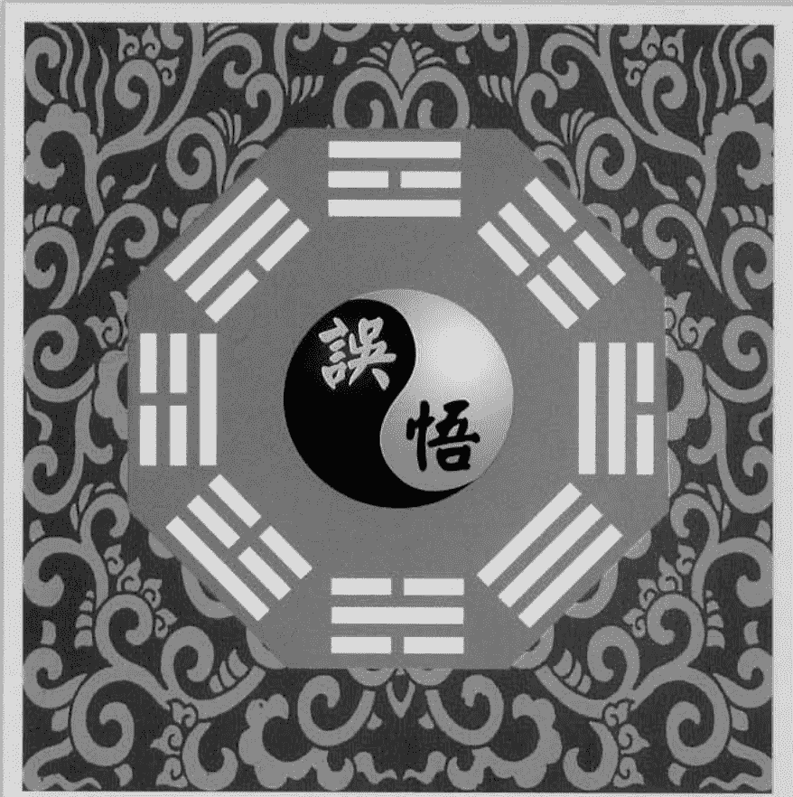

我十八年

蔡明宏 著

紫微六玄经脉

钦天四化 秘儀在華山

## 雅集一

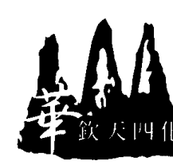

蔡明宏 易學研究書苑

紫微星君

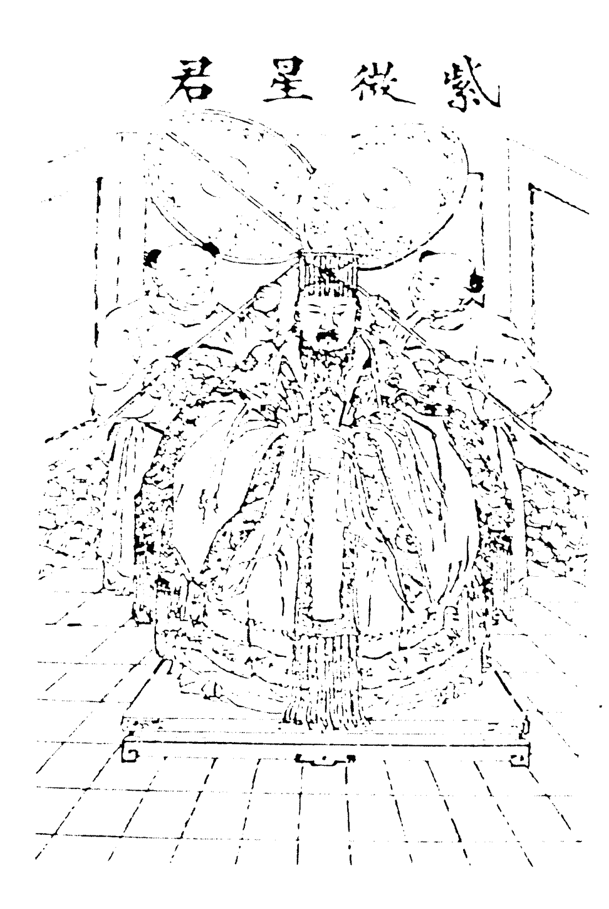

斗數星辰八卦爐

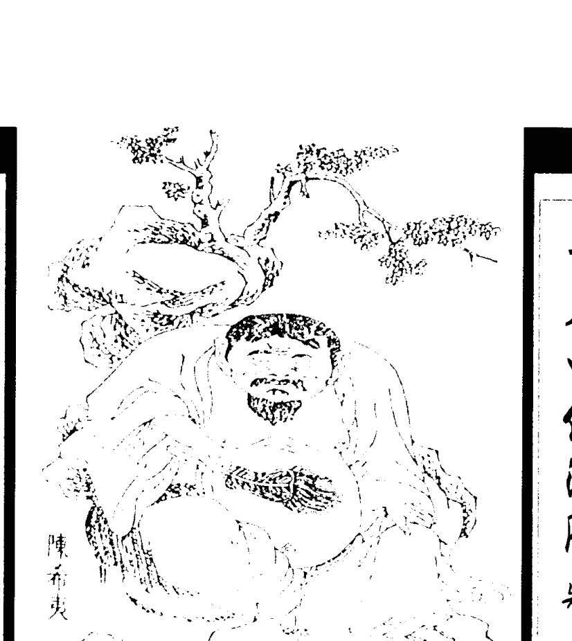

欽天四化河圖鼎

### 對御歌

臣愛睡，臣愛睡，不臥毯，不蓋被；片石枕頭，蓑衣鋪地。震雷掣電鬼神不驚，臣當其時正酣睡。閒思張良，悶想范蠡，說甚孟德，休言劉備，三四君子，只是爭些閒氣。怎知臣，向青山頂上，白雲堆裡，展開眉頭，解放肚皮，且一覺睡，管甚玉兔東升，紅輪西墜。

宋・陳摶

## 陳希夷的故里—石秀安岳

安岳縣位於四川省中北部，距成都一百七十公里。安岳古稱普州，在北周時置安岳縣，地處於川中腹地。

安岳縣以陳希夷的故里聞名於世，而他的傳奇故事也在安岳廣為流傳。

陳希夷，字圖南，宋太宗賜號希夷，西蜀崇龕人〈今四川安岳〉。他生活在五代末年和宋初的亂世中，年少時熟讀經史百家之文。好佛學、醫理、天文地理，頗有詩名。後舉進士不第，於是放棄仕途，開始遊歷名山，與隱士呂洞賓、李琪交往甚密，自稱“非仙即是帝”的人物。傳說曾為趙匡胤、趙光義〈即後來的宋太祖、太宗〉兄弟和趙普相見過，指點其統一天下之策，被當皇帝後的趙氏兄弟奉為「帝師」。

他是一位易學大師，精研易理，以其心法傳授邵康節，成為先天象數易學體系的開山鼻祖〈他開啟了宋明理學的先河〉。

後來他隱居在武當山、華山修道，以睡功〈鎖鼻術、蟄龍法、胎息法〉聞名於世。（何昌一道人傳鎖鼻術給陳希夷，後晉天福年間）。

附：陳希夷創作《無極圖》，篆刻在華山的石壁上。他還創作了《先天圖》，開啟了宋代儒、釋、道三教合一的思想潮流，並對宋代理學有很深遠的影響。

- ◎周敦頤的《太極圖》就是由陳希夷的《無極圖》演化出來的。
- ◎其《先天圖》被邵康節演化為“象數”體系之宗，著《皇極經世》垂名於後。

## 易圖淵源系統表

```
陈希夷 — 種放
├── 穆修
│   ├── 李之才 — 邵康節 — ①先天圖派
│   └ 周敦頤 — 二程子 — ②太極圖派
└ 李溉 — 許堅 — 范誤昌 — 劉牧 — ③河洛圖派
```

## 易圖傳授系統表

(宋元學案卷十二)

```
河上公
├── 魏伯陽
└ 鐘離權 — 呂洞賓
   └ 陳希夷 — 種放
      ├── 穆修
      │   ├── 李之才 — 邵康節
      │   └ 周敦頤 — 二程子
      └ 壽涯（潤州和尚）
      └ 西蜀隱者 — 蔡元定
         ├── 朱熹
         └ 蔡沈
```

▲陳希夷造就了北宋幾位理學鴻儒。

▲麻衣道者傳《正易心傳》給陳希夷。在南唐後主，開寶四年（辛未）（971）。其主要之訣在「上經三十卦共得十八卦，下經三十四卦共得十八卦」的三十六策中。「體有三百八十四，而用止於三百六十」。

▲紫微斗數在南梁～隋唐間就有了。比陳希夷還早。

紫微斗数总系列图

(上)

左

右

北斗

| 武 | 破 | 禄 |
|----|----|----|
| 廉 |    | 巨 |
| 曲 |    | 贪 |

(左)

因缘
因果关系

中斗

杀

日 — 月

紫(命理)

体用关系

体用关系

南斗

梁

机 --- 府 --- 相

同(医理)

(右)

果报
因果关系

(下)

昌

曲

## 南斗方山與歸藏易

引紫微大法

天梁

> 【人】人壽

天府

天機

> 萬物因緣生，因緣減... 【連山：綿綿無盡期...】 〈艮：九十七策〉

天相

> 【天】天祿

天同

> 依報而生，物物立極 【周易：天行健，君子以自強不息...】 〈乾：四十九策〉

> 方山無相自清淨 天、地、人 【歸藏厚終】 〈坤：三十六策〉

（形而上）

道

华山

器

（形而下）

化气至善德

在数术天机

天机星

钦天四化 紫微斗数三才理学义

兼三合四为象天

天人合一 · 紫微斗数之总名纲义

性

命

慧

命

天

命

天

地

人

（天法自然）

（地法天）

（人法地）

（道）

（释）

（儒）

数

象

星

得性尽人，归根复命

明心见性，性空慧命

穷理尽性，以至于命

明理在数

明象化气

明人物事

洛书

八卦

河图

忌

禄

权

科

斗

辰

星

- 洛书（九）
- 八卦（八）
- 河图（十）
- 忌（冬）
- 禄（秋）
- 权（夏）
- 科（春）
- 斗（人）
- 辰（地）
- 星（天）

卦通其分

四象者，四化也
四｜法象化｜变通

法象莫乎天地（阴阳）
变通莫乎四时（四象）

斗轮星命尽（人）事物，
顺乎星辰（天地）方

依北辰紫微运转星斗（天人）谓紫微斗数
斗数源天星一九星，倍二阴阳十八主星耳

数通天地哲学奥
（十不离八九）
象尽人物错综妙

## 目 录

- 紫微斗数误我十八年（自序）
- 我在钦天门（师承）	001
- 紫微斗数在此失真（诸绪）	015

# 第一章：来自星空的信息～紫微星象	047

- 瞭望华山峰岭 俯瞰斗数秘仪	049
- 第一节：本是同根生—「易与紫微斗数」	053
- 第二节：钦天门斗数秘仪广角镜	057
- 单元一：星辰之特色	057
- 单元二：星辰与阴阳五行	063
- 单元三：八卦美学	073
- 单元四：八卦的体悟	077
- （01）先天八卦	079
- （02）后天八卦	098

# 第二章：日月星辰寄情天地～枕边星语	115

- 入首星辰	115
- 第一颗：春风吻上我的脸——贪狼星	123
- 第二颗：行走人间江湖畔——天机星	137
- 第三颗：缘遇是人生有伴——天同星	153
- 第四颗：天心月在杯中圆——太阴星	173
- 第五顆：情牽歷史的指紋——廉貞星 186
- 第六顆：守著陽光守著你——太陽星 199
- 第七顆：曾是驚鴻照影來——武曲星 207
- 第八顆：撼動心靈的圖騰——紫微星 216
- 第九顆：生命容顏的府城——天府星 230
- 第十顆：龍蟠虎踞何處是——七殺星 240
- 第十一顆：仙風道骨本天醫—巨門星 250
- 第十二顆：繁華落盡見眞淳—天相星 255
- 第十三顆：天增歲月人增壽—天梁星 264
- 第十四顆：春風不改海浪波—破軍星 273

## 生命裡的黑盒子——孟婆汤

- 左、右、昌、曲——伴你一生一世 297
- 第一顆：左輔星 302
- 第二顆：右弼星 308
- 第三顆：文昌星 319
- 第四顆：文曲星 331

# 第三章：誰與我相遇在今生～十二因緣

- 第一節：因緣與宮位 346
- 第二節：細說十二宮位 349
- 第三節：宮位的思維 363
- 第四節：在動靜中看十二宮位 369
- 第五節：緣在今生好相遇 389

# 第四章：阅涷你生命的眼神～钦天四化 397

## 第一节：四化导读 401

## 第二节：日月星辰・天悬象数 412

## 第三节：易象与斗数 419

## 第四节：四化的灵魂——在自化 436

# 第五章：命运里程在何庆立碑～叩问人生 489

## 第一节：论命须知 491

## 第二节：论命启蒙 496

## 第三节：纵横天地・论命解人生 501

- ◎财是养命的人 502
- ◎阳宅概念 542
- ◎斗数地理纲要 560
- ◎健康是人的主人翁 563
- ◎过去未来总在今生缘 574

紫微斗數 悟誤 我十八年

（自序）

> 一生心事向誰論 十八灘頭說與君
世事盡從流水去 功名富貴等浮雲

追求美好的生活是人們共同的心態。但在實際的生活中，每個人又會有所失才能有得。有小失才能有大得；有局部的失，才能有整體的得。人生亦然。

失去了春天的蔥綠，卻得到了豐碩的金秋；失去了青春歲月，它使我們走進成熟的人生……，失去、放下，本來是一種痛苦，但也是一種幸福，因爲失去的同時也在獲得。

若再深層的想一想，我們人生最大的得意與失敗，都無法由我們來左右的。人生最大的得應該是“生”，我們從父母那邊得到生命，不是最大的“得”嗎？因爲沒有這個得，就沒有以後的得；這是得的根本。而人生最大的“失”，應該是“死”，當這一刻來臨，我們便要拋出所有的一切，包括自己的生命，這不是最大的“失”嗎？這最大的得與失都無法掌握，在人生上又有什麼得失好計較呢？

可是人，從來很少這樣想過，只因同樣的人生，異樣的心態，都由於思想境界不同，看待問題的角度也不同，導致世事紛擾。

人說命不好，事實上，你以什麼樣的眼光看世界，世界就以什麼樣的目光來看待你。春來，捧一樹綠葉；春去，還一身自在，不想去追逐什麼，也就沒有憂傷與煩惱。天地間，沒有不平的事，只有不平的心。雲捲雲舒、秋風作伴，面對西風落葉，是憂傷還是閒適，就看你自己了……。

我們常言的“命運”，要如何認識命運？理解命運？改變命運？重要的是我們對“命運”看法的“態度”。

這對命運的態度與看法，正是筆者深入斗數哲理探討的緣由做起。一句：「沒有不平的事，只有不平的心」，勾起了我對人性、天性探討的興趣，而不是對“命”有興趣（命是存在的），於是對它就開始一往情深，鐘情於斗數，藉它來激起對哲學的省思。就像「我們的痛苦不是問題的本身帶來的，而是我們對這些問題的看法所產生的」。這就是哲學，它引導我們學會解脫。

打從心靈深處，去觸動哲學的靈魂天窗，該是在我初中年代，深愛哲學，只因為哲學隱藏著，先聖古賢的大智慧。有文人素養的教化，有韜光養晦的涵養，有大智若愚的逍遙心，有笑傲江湖的豪邁情。這些串串心、串串情勾出多少歷史人物，成為智慧的化身，烙印在有智者的日常生活中。在不同的年代，不同的時空，不乏其人，都化作一盞心燈。在照亮這你來我往的群生。這是哲學本身的可貴之處。

哲學誠可貴，縱集智慧於一身，未必人人都有智慧，知見得解脫，畢竟哲學是一種思維。要切入與人的日常生活合而為一，本是一件不容易的事。所幸在有生之年，能欣遇一位能盡性知命的好老師，輔導我心智未萌的無知。與其探討人生的知識，不如走入人生，做實際的體悟，較為切實。於是傳我紫微斗數。原來斗數有無數的解脫法門，就在“星辰”裡。

「星星知我心」若這句話可以成立的話，那天上的星星，就是人的心，是心心相印的。因為星辰是「相」，「相」可以隨「心」轉，這就是「化氣」。若「相」不能隨「心」轉，就是「在數」。當一個人說「在數」難逃的話，那是因為人的「心」被「相」綁架了。為了這「化氣」與「在數」四個字，就是老師“誤”我的最初。

※ ※ ※ ※ ※ ※ ※

人生在世，無非是生命的延續，思維的承襲。

回顧從師受業的當初，曾這樣的說過一紫微斗數呈現給世人的認知是歸屬在命理，推算命運的數術。但它的背後，隱藏有古人深遠睿智的一種哲理易數，卻被後學抹滅掉了。天地的軸心線，生命的不了情，全部都在易象與易數之間，是所謂的「掃象數不足以言易」。良以斗數就是以「象數」登峰造極，步踏陳希夷、邵康節的足跡。

打開斗數群書，每一本幾乎都繞在諸多的星辰、宮位……上做文章，千篇一律、毫無新意，千年哼一曲，一曲哼千年。但在欽天門的斗數學理下，星辰與宮位，卻是我們人生的十二因緣之所在。宮位名稱，就是因緣的化身。

當年，老師傳我斗數，一開始就說「十二因緣」。他說，命理的吉凶禍福、榮辱得失，都是前世的劇本，今生的命。僅從既有的命理學中去追求命運之說，這是“不了義”的。命理的探討該回到先天的易數，從因緣果報去深思，必能有“了義”的一天，這才有「盡性以致於命」的品味。命可信，但不可盲從。要學好斗數，須具備易經的基礎，抓住幾個字：陰陽、天地、男女及奇偶數，就足夠矣。

佛說十二因緣與四諦，斗數十二宮位與四化，本是不相干的兩件事，卻在老師的心目中劃下等號，再傳給對斗數一無所知的我，作爲師徒見面的禮物，真不知是要“誤”我，還是要我去領“悟”？讓我內心有一種誤來悟去、纏來禪去的感受。這種感受，正是我入門斗數的心境……。

事隔二十多年的今天，恍然領悟，當年老師的教誨並沒有誤我。因沒有誤我，所以於今撰寫這本書，只是把斗數研究後，充滿無盡的法喜心得與同好此道者共享，分享欽天門的斗數，原來就存有這麼多、這麼豐富的文化遺產。面對它，只能用一顆真誠的感恩之心，感謝祖師們將文化的遺產留了下來，讓後進能共沾法語、法喜；同時，以此書也報答恩師與我在今生的「相遇之知」，無以言喻的喜悅，用心中的文字表達在書本的字裡行間，以示上無愧恩師之誨、下又能開啟斗數新里程。更讓欽天門的弟子能「師出有門」，發揚光大。這是筆者唯一的心願。謹此。

緣鳥鳴於樹梢
期鳴鳥共相應也

欽天門第三十六代傳人
蔡明宏 謹筆於台北
(2006·丙戌)

身前悠悠，身後茫茫，人生百年草頭霜。
一曲未落飛雪，人我是非，終是黃粱。
清茶一杯說秦王，嘆世事無常。
天賜一卷金剛藏，但持誦，莫思量。
無盡智慧同體現，幾多惆悵，化為菩提清涼。

人生有幾何，歲月本無多，莫叫煩惱佔得，
富貴貧賤，無非因果，醉也醉得，玩也玩得，只是莫執著。名不在顯，錢不在多，勉強的不必爭、該做的儘管做。本來清淨，何須解脫，明白人賺得個自在身，不是神仙，又是什麼？

參天悟地，論是道非，說醒時只緣醉。
看世間芸芸莽莽，巡乾坤昏昏昧昧，星移斗轉。
月奔雲追，誰知它是進是退？ 萬劫依稀昨日事，記不得來去幾多回，百年後風吹寰宇虛空盡，莫問我是誰。

我在欽天門

在不知不覺中，我已經走入了「欽天門」，站在這塊有歷史足跡的土地上。一部極為單純的紫微斗數，卻能使我皓首鑽研，耗盡半百歲月而又不能已。其深奧的哲理，亦非我一生能所窮通。汗顏資質慧性之不足，難窺斗數易理之淵博與浩瀚。若略有所知者，只是管見於一隅耳。

我在欽天門

隨著時間的久遠流長，只能從恩師的口諭中，述略其大綱簡要，以聊對祖師的德懿，加以敬仰與追思，並昭以吾「欽天門」之後學達進，能於今溯往更加砥礪，期予承脈發揚欽天門的易學遺愛人間的精神為祈。

| 傳承關係 |
|----------|
| 賴圓英 → 張梅 → 釋法韻、釋法音 |
| 朱英風 → 袁阿詳 → 蔡明宏 |

# 钦天门 第三十二代传人

## 张梅

- 专长：
  - 紫微大法
  - 奇门秘窍
  - 元包经

欽天門的歷史悠久，穿過在千年歲月的長河中。此門的絕學，都是代代單傳承其脈，而能得其脈的諸位祖師們，均能於其當世各領學術風騷。身為欽天門第三十二代祖師的張梅，本就繼往開來的心懷，上承其脈得到紫微大法的傳承單一者。

張梅祖師就是在台南古都的五妃廟中的梅姐，也是當今秘儀的發源地。若以師承的輩份是三十二代（於台灣為第一代傳承者）。她精通易理易數，尤其元包經（即連山、歸藏的要典）及陰符遁甲與醫易，就斗數命理這部份而言，她常說紫微使用的十八顆星辰是由太玄經、周易帛書及七玄數（連山數）所衍義出來的。

記載在她的遺抄裡，其名叫做「飛星轉燕瓊林」（簡稱飛燕瓊林），所有斗數的來源記載的很清楚。它的飛星轉燕法門，共有七式八招，完全以易數為中心，其抄開張明義就說：「斗柄撥輪到紫府、數易乾坤五十五」。這是所謂的「斗數」，不明易數，難登堂奧。

紫微大法，原名：紫微六玄經脈，共分有六冊遺抄孤本。張梅祖師盡得其心法，為了不讓此學無後相續其香火，又身居兵荒馬亂的朝代，怕單傳變成失傳，只好請示恩師賴圓英的指點（即三十一代祖師)，將此大法悉數心印授記給專修唐密的比丘尼——釋法韻、釋法音。隱藏其學在亂世中，但也示意她倆一定要再將此「紫微大法」的心法視因緣的成熟再延脈下去。

※ ※ ※ ※ ※ ※ ※

| 倉頡造字一擔黍 | 傳於孔子九斗六 |
| 還有四升不外傳 | 留給道士畫符咒 |
| 孔子認字九斗六 | 傳於弟子整八斗 |
| 弟子造就五車書 | 千秋萬世永傳流 |
| 從此學富稱五車 | 自古才高曰八斗 |

# 欽天門 第三十三代傳人

釋法韻 釋法音

专长：唐密、胎藏、金剛兩界。

對本不務塵世的出家眾且又勤修唐密的釋法韻、法音來言，受到面提受命為欽天門的傳人，是有受寵若驚惶恐忐忑之心，然而能虛心受此榮幸之顧眷，引以為幸。

紫微大法，不是只針對命理而已，它的內涵很廣。之所以能承在欽天門之下，主要其中有很多內容都是唐密的寶學。諸如：胎藏界、金剛界、九宮曼陀羅壇城……等，都與紫微大法有關，偏向道法及形而上的悟性學說。

單就命理部份，提到的都是性命中的“性”之見也。佛祖說：「一切眾生都在輪迴中」。佛經說：「欲知前世因，今生受者是」。你相信嗎？如果你相信，此今一生之生命，只是在“受”其前世之“因”所轉化的“果”啊！

在斗數上，提出了「左輔、右弼、文昌、文曲」這四顆“悟性”之星。若沒有這四顆星，請問你的生命從何而來？它就是隱藏在胎內做為成長過程的星系，是邁向紫微大法的法雲層，深入三世因果的因地路，是“因地法行”的要訣，“通報三世”之橋樑。

> 「假使經千劫，所作業不亡；
因緣會遇時，果報還自受。」～大寶積經～・入胎藏會・

這就是左、右、昌、曲之法要的緣起語，可見它的重要性。

- 左輔主導命　右弼主導壽
- 文昌業隨身　文曲果自受——・飛燕瓊林・。

當此兩人承師受命後，幾經風雨的多年琢磨與精進，探索與領悟終於完成了一本名為「五蘊五法身」（即秘儀）的手笈遺本，闡述言及人之生命不論富貴窮通都在五蘊假合的身心苦集中，因而闡出左、右、昌、曲這四顆星與紫府系的十四顆星所產生的心物一元，性、命、身一體的本質生命觀。她認為命理祇是表現於人事間的吉凶現象及心靈感受的層面而已，若不能深入於三世因果去探討因緣果報是很難走出自己的命來看待自己莊嚴的人生。所以不得不寫下了「五蘊五法身」作為傳缽的依止獻給後學，而她倆也成為第三十三代傳人。爾後隨著因緣的成長，終於再將絕學傳給了「朱英風」。

- 「一念善心　聖賢看得到　因果看得到」
- 「一念惡意　魔鬼看得到　業報看得到」

— 佛性就是如此 —

左右昌曲之实质内涵，是把人对命理的认知提升到探讨人的因缘果报，让所有知命者更能了解其生命的意义。宇宙人生，在“时间”上是离不开因果关系的；在“空间”上是由因缘结合而成的。当时空合而为一，就是“因缘果报”的体现时，然而时空的概念即是哲学思维。换言之，当你的思维进入了时空隧道，一切的什么因果，什么因缘都化成“一切境”，呈现在你眼前……揭开生命是神秘亦非神秘的面纱。是以学了左、右、昌、曲的五蕴假合后，命理就没有所谓的神秘的色彩了，会坦然的呈现一切都在“如是因，如是缘，如是果”中。

# 欽天門 第三十四代傳人
## 朱 英 風
專長：堪天輿地，九載七星——天機心印。

朱英風（安徽省燕湖人）以務農爲生，平日之生活皆與大自然同節消息。在大自然的薰陶下，漸漸地也喜好上大自然的地理，在風光明媚的景象裡，深知地理會影響到人的心理及生理上的情愫變化，甚至它與人的健康都有一層相關的不解之緣。人有人緣，地有地緣，這是必然的道理，使有家是故鄉美之感。於是進而研究所謂的風水學，借閒餘的歲月拜師學藝，尋師問道。

在偶然的機緣下，認識了釋法韻師太進而授業於她之門下，俟因緣成熟，釋法韻師太將她精研的五蘊五法身遺本精髓傳授予他。囑咐他沿五蘊五法身中去深究紫微大法的另一章節。朱英風則探研出用「左右昌曲」合“北斗”發展出：「九星參聞錄」——（地理）；又取用「左右昌曲」配“南斗”發展出「醫易鏡宗」—（中醫）。進而行醫淑世，廣被群生，做爲其立身處世之法寶，並加以發揚傳與有緣人，使欽天門免於血脈斷源之虞。

- 左右昌曲 + 北斗星曜 → 九星參闡錄
- 左右昌曲 + 南斗星曜 → 醫易鏡宗

五蘊五法身: [如图所示分支]

朱氏承師口諭後更加以勤學，在他五十三歲時，終於完成師太的心願，依願行誼人間，也成了此門第三十四代傳人。於六十六歲之仲夏，將他的絕學傳承傳給了「袁阿詳」，自己再返鄉頤養晚年。

# 欽天門 第三十五代傳人
## 袁 阿 詳
專長：中醫（癌症）、武術、十二因緣四行規。

袁阿詳〔化名：素心老人〕，是筆者的恩師，祖籍廣東（梅縣人），生於民國前十三年（1899己亥）。年少時入少林寺習武，好學醫術，喜讀經書……孑然一身在外，起居上喜歡過著閒雲野鶴般的生活。直至民國三十八年（1949己丑）隻身來到台灣，落在中壢，住僅用油燈的草舍於田野中，平時以行醫度日，並教人武術。他的人生過得很單純，又自樂在施捨中，無欲則剛，故化名為「素心」。

認識恩師就在這草舍裡，那是民國六十一年的時候。當年只是為了好學武術，在友人的推薦下而相識。他擅長的是梅花拳、少林拳、流星拳三種，尤以梅花拳為最。在學習拳術的多年相處中，常常會看到有人找老師看病，有骨折的、癌症的、內傷的…。其中以癌症、骨科為最了得，然這些絕活未曾看過他有傳授的心，筆者只能從旁去學習他醫病患者的功夫。

直到六十七～六十八年間，老師直言要教我「斗數」與「中醫」。一時令我很錯愕，不曾談過斗數怎能會教人斗數？而我本身也不是為學斗數而來的，終於他說出了緣由。

他說當年在大陸時，學武與行醫是心中所願的志向。在他三十五歲的當年，因看一個病患的同時，認識了一前輩。那位前輩就說，憑你的醫術，還不夠精湛，若要爐火純青，必須研究紫微大法中的秘法，畢竟有些人的患重病，不是只靠那些藥材的經驗方有效，而是要知那些人的病，是有他們的因果關係，如癌症、糖尿病……都有可能是遺傳。即有遺傳就有因果存在，不須人強詞以辯，如果不信，佛家不會提出「因緣果報」說。人生在世，人與人之間盡在十二因緣中，人與健康又何嘗不在果報中。紫微大法中的左、右、昌、曲，與十四顆星的組合，必能找到前因後果，再加以施治，會達到「陰陽不測乃謂神」的化境。

這個人是誰？正是朱英風。

二年後，他正式隨師授業，參悟紫微大法的絕學。整整花了八年，才能把斗數的易象與醫術的理融合爲一。

次年（第九年）他再將祖師的遺抄，授意於素心老人，並成爲第三十五代傳人。同時期盼這些絕學再傳承下去，繼往此欽天門祖師們的智慧與精神。

深恐重任難當，又不知能否等到有緣人？老師說萬般皆有其因緣。紫微大法中有十二因緣四行規，好好的參悟，就會知道誰是有緣人。當在專研此因緣法的同時，因局勢的變遷來到台灣。

於今將斗數傳給你，也許是——「緣至果圓成」。距我來台剛好三十年（38年～68年），且是保持此門單傳的傳統精神。但你學此門之學，要授業二十五年，才能「圓成」，這是你的責任。

# 欽天門 第三十六代傳人
## 蔡 明 宏
專長：集列祖師遺抄大成

打從追隨恩師授業並講述斗數秘儀。

自民國七十年（1981）起至今九十四年（2005）共經歷了二十五年，從未間斷，默默地完成了恩師的託囑。講述內容涵蓋了易學的山、醫、命、相及中國儒、道、佛的哲學思想，並運用斗數來闡述易數理象之精微。其中講座的題材及內容都將其分類於「教學講義」中，彙有十八冊以上。

古來命理易學能夠代代傳承繼而有人，如搖籃一般地撫育後輩子孫。其真實的價值在於繼往開來的歷史過程，以及啟迪後學者能夠盡性至命，探索生命價值的真實意義，進而將其精神與智慧作為人生養性的資糧，絕非一般人所認知的算命之術流。

命理源於陰陽家，起初授課就從「四化」開始，它是斗數的初基。七十三年，出版了一本斗數秘儀，是概要而已不是斗數的全貌。

民國七十二年，老師再次傳我左、右、昌、曲。看到這四顆星，才恍然發現斗數的哲理浩瀚淵博，理趣深遠，五術盡括在其內，玩味無窮。在七十四年（1985乙丑）老師拿出列祖師的遺抄，要我去集大成，並完了祖師們的心志與宿願。並叮嚀要教滿二十五年後，才可著作公開於世，其餘抄就是紫微六玄經脈。

# 欽天門 紫微六玄經脈

- 欽天四化 秋儀在華山 （已出版）
- 河闘洛雁 數開命運河 （第三十六代，蔡明宏著）。
- 杏林花園 紫微醫易通 （第三十五代，祖師遺抄）。
- 天機屠龍 九星參闡錄 （第三十四代，祖師遺抄）。
- 三世今生 五蘊因緣法 （第三十三代，祖師遺抄）。
- 生命有約 飛燕易瓊林 （第三十二代，祖師遺抄）。

當看到這些遺抄，上須承其志，下須啟後進，又面對漫長二十多年的未來，真不知能否擔當？要當，責任是任重道遠；不擔當，一大因緣的欽天門絕學從此消跡。內心煎熬的去面對老師，老師說：「做為一個傳承者，是要傳承祖師們的智慧與精神，背負著此門的家業，貫徹師承的信諾，不是為了博一美名，而浪花一生隨波盡」。你能堅持到底嗎？能，「鏡破不改光，蘭死不失香」，這是我對師門的信諾，誓言無悔。於是在七十四年底，授記為第三十六代傳人。並且再三強調絕不許純“以術傳人”，必須“數術兼備”，才能本立而道生。

離開恩師的教誨，歲值民國七十五年〔丙寅〕。之後的我皆靠著自己的信心與執念來貫徹，而遺抄也成了精神的另一種支柱。憑著一付「傲骨不透風」的本性，默默地、無聲地、無間斷的盡其教學之責，終於完成了二十五年的重託，猶在剎那間。

這二十五年來，從未改變初衷，謹持著隨緣興、隨緣落。相信天下自是會遇有緣人。志在傳缽付薪，教學為樂，不敢也無心與世相爭，但求無愧於列祖師恩。昊天善德，只待成熟有情，依止因緣再展——欽天紫微。

謹此    叩謝    恩師列祖

不敏    蔡明宏    敬上（2006年，丙戌）

# 斗數隨想
# 紫微斗數在此失真
## 諸 緒

斗數告白與君緣

> 資料來源：欽天門·斗數索隱

人生只是一個嚮注，我們不能想像一個沒有嚮注的人生。嚮注必有對象或空間。那些對象空間，則常是超越我們而外在。紫微斗數對人的一生而言，正是超越我們自己而外在的人生指南。有了它，此指南的針，就會給人帶來一個朝氣的嚮注及目標。紫微斗數的原名叫做：「天罡鬥」。蓋「天罡」指北斗星之總稱。「鬥」則為命盤作八卦而佈列也。斗數以「太極」（紫微）為基，納「兩儀」（日、月）變「四象」（祿、權、科、忌）化「八卦」（先後天八卦）生「五行」（諸星五行屬性）。以蒼穹十八顆星為經，以人之生年干支日時為緯，而推測富貴貧賤，禍福休咎的一種客觀命數指向，也是我國悠遠文化之又一精髓也。紫微斗數原有流傳為「十八飛星紫微斗數」，故使用之星僅止於十八顆，合陰陽為一太極三十六。請看八卦，陰陽爻合計也止於三十六劃，洛書九數總和也是三百六十。......

> ——易道分明在畫中 誰知易道畫難窮
不明易畫空箋註 何異丹青卻畫風 —
斗數索隱

良以——「紫微欽天立四象 斗數四化法八風」——— 為欽天門斗數總綱

- 世界通用的曆法叫做公曆，公曆的實質是陽曆。
- 以太陽回歸年為主要依據的曆法叫做「陽曆」。
- 以月亮朔望月為主要依據的曆法叫做「陰曆」。
- 同時兼顧回歸年與朔望月的曆法叫做「陰陽曆」。
- 陽曆→重點在“年”。
陰曆→重心在“月”。

易經以日、月為易，在斗數以日、月為曆法。

朔望月是月亮與太陽會合的同時，也是月亮盈虧圓缺變化為週期。一朔望月長29天12時44分03秒

回歸年是地球與太陽公轉一周，從春分點的時間，即四季更迭的週期，一回歸年長365天5時48分46秒。

## <一>紫微斗數是依據什麼來推算人之命運？
是以每個人的年、月、日、時爲基準。〈農曆〉

年、月、日、時的根據是什麼？“曆法”。這個曆法在古代的中國是以“天星”而立法的，故曰：「仰者觀象於天」，有陽曆、陰曆之別。而斗數則以陰曆爲主。

## <二>這個年、月的周期與斗數何關？
有，關係太大了。

太陽重點在年，姑且用天干甲、乙……壬、癸來記年。
太陰重點在月，姑且用地支子、丑……戌、亥來記月。

有了年、月，斗數盤的基本架構就有了基調。

請問您那一年生的，如庚年生，就用庚代表生年天干。

然而在斗數盤上的天干，不是直接就取用庚來應用，它必須用乙、庚之年起“戊寅”來排列，爲什麼？這個叫做「年上起月法」。

其文：「甲己之年丙作首，乙庚之年戊為頭……」。它的意思是說甲、己年生的人，正月的月天干是“丙寅”，二月就順推丁卯……可見，太陽與月亮在斗數上是有分野的，請不要把它視爲“五行”來看待。

## <三>年天干，為什麼要用甲己合、乙庚合……。它又象徵什麼？
它的依據是河圖“數”。故它不是五行，是河圖的

> 「五位相得而共有合」。

河圖是這樣子的：

※中國的易文化是建立在“數文化”。為了記憶方便，才用甲、乙來代表，而它的實質是“數”不是“五行”。用五行來解釋數，太“唯物”了，不合乎一陰一陽的“道”。活法天機。

※道是形上的，天有天道，地也有地道。何謂天道？

天之天道：甲己合、乙庚合、丙辛合、丁壬合、戊癸合，其道在“數”。天之地道：甲乙在東、丙丁在南、戊己在中、庚辛在西、壬癸在北。這是從方位上講的。而稱它爲天之地道，其位在五行。

※我們都是父母所生，天干之合，猶父母一陰一陽之合，才有我身。此天干之合，是以剋爲合。剋者逆也，故易數逆也。〈見易繫傳〉

## <四>有天就有地，人在天地間。
天若有情天亦老，地若有情地亦荒。

因天地本無情，才會造化有情的人類。此有情與無情，正是陰陽之道。

試問：甲己之年為什麼要起丙寅，而不起別的寅？

這裡面是藏有玄機的。這個丙、戊、庚、壬、甲又代表了什麼？

- 建月在寅：
(1) 指人生於寅
(2) 以節氣建月在立春
(3) 以八卦始於艮，所謂建月，指的是太陰（月亮），它給我們每“年”有十二個“月”。

|    | 甲年 |    |
|---|---|---|
| 丁 | 年   | 甲 |
| 丙 | 丁   | 丙 乙 |

※月亮的重點在納甲，其名叫做「月體納甲」。因為月亮有盈虧，以月的盈虧定八卦，這是斗數之源(對斗數而言)。

※斗數以太陰曆爲主，必與納甲有關。捨納甲，四化就不存在。換言之，四化之源在月體納甲。

年天干始甲終癸，其合法用甲己起丙寅，是因爲納甲「艮納丙」所故。而八卦亦始於艮，寅位是地支陽的宮位，所以天干皆陽，在卦也是陽。

- 甲己→丙寅【艮納之】（少男）
乙庚→戊寅【坎納之】（中男）
丙辛→庚寅【震納之】（長男）
丁壬→壬寅【乾納之】（父）
戊癸→甲寅【乾納之】（父）

> 註：建月在寅，寅為泰卦，泰卦是上坤下乾之卦（☰☷），所以父帶三男在下，這就是命（生命已生後）。

倘若要在命的角度上分先後天是不可以的。凡是生命已經被誕生，就沒有所謂的先天可言，只有後天，從生到老，在這個過程始叫做“運”。

能夠稱得上先天的，是人在胎中十個月，父母未生前，才算是。請問，人在胎內是不是生命？是的話，叫做「性」，是「盡性以知天」，名爲天命。

人說：命是先天的（指胎內）；運是後天的（指胎外）。有道是：「江山易改本性難移」。試問，本性何在？佛家爲何要我們“見性”？儒家要我們“盡性”？其“性”並不是衆人所言的“性”，是指父母未生前的本來面貌。其“性”在哪裡，在胎內，在左、右、昌、曲。

## <五>當斗數命盤起了××寅之後，所有的命盤天干都是月系天干，其天干都可以用納甲配卦使用之。因爲這些天干，散佈在十二個宮位，相當於十二個月，皆是月亮所管轄的。
切記：

斗數十二宮位的天干，不是五行天干，用五行的金、木、水、火、土解釋，是沒有道理的，於斗數「無法有據」！

## <六>斗數之有四化，是依據月亮的朔望月而有的。在易經上叫做「易象」。如一個月，一個天干，都可以看到月亮的盈虧所在。
例

| 乙 | 丙 | 丁 | 戊 |
| :---: | :---: | :---: | :---: |
| 甲 |    |    | 己 |
| 癸 | 丁年生 |    | 庚 |
| 壬 | 癸 | 壬 | 辛 |

- ※這些天干：
(1) 可以用在大限
(2) 可以用在流年
(3) 可以用在流月

不管你怎麼用，都會看到月亮盈虧的影子，這就是“象”。易曰：「象也者，像也」。
故“象學”建立在月亮上，“數學”建立在太陽上 > 日、月合壁，象數之宗也。

是以易的本身，就是象數之學。

也因如此，四化之象來自月亮說，這是斗數星象的特殊性。

## <七>胎內爲先天，先天在那裡？在母親的懷抱裡，於是月體納甲是配先天八卦的。
| 兑 | 乾 | 巽 |
| (离) |  | (坎) |
| 震 | 坤 | 艮 |

> ※月亮參與盈虧之卦在上三卦與下三卦，共六卦（上盈下晦），它的特點在坎離以納之。

坎納戊 再由戊、己去延伸，爲四化之所由。 離納己 （在此戊己土指地球）

> ※請參看四化表。

## <八>當年、月說完時，接下的就是日與時。
紫微斗數的紫微，是由人的“生日”來決定。取用的是“納音”，在命宮的所在位之天干與地支。由納音來決定局數，再求紫微星所落何宮。（納音俗稱六十甲子）

## <九>至於時呢？時指的就是時間，一天二十四小時。（納辰）
在《周禮·夏官》中，已經把作爲時間概念的陰陽進行了量化。

◎夜行25°，日行25°，合畫50°，配大衍之數五十。

> ◎在（黃帝內經）有說：「歲有十二月，日有十二辰，子午為經，卯酉為緯。天周二十八宿，而一面七星，四七二十八星……陽主晝，陰主夜。故衛氣之行，一日一夜五十周於身，晝日行於陽二十五周，夜行於陰二十五周，周於五臟」。

註：日夜循環是有規律性的。

至於斗數推人之命，逢夜子時（11點以後），就把日子推到隔天，這是錯誤的。不過零時（子），還是當日。「亥子之鄉，天心未改移」。

- ※一天有二十四小時，加上“零”，共二十五數。

## <十>歸納年、月、日、時的概念。
- 年→數〈河圖〉日→〈納音〉（六十甲子）
- 月→卦〈納甲〉時→〈納辰〉（晝夜各25°行，合大衍之數）

◎斗数的星辰排列也是配合大衍之数，从头到尾都与五行无关。五行与斗数有关的，只是星辰的属性而已，叫做「物相」。用斗数盘上的天干说五行之性，是错的，不要误己也误人。

◎生年天干有十，五位相得只有五种，其起寅者有丙、戊、庚、壬、甲等月天干。若改用数字，是3+5+7+9+1=25是天数之总和，而時也是行在25°間。

※ ※ ※ ※

紫微斗数的紫微星，是依人的“生日”所求出来的。没有紫微星座标，就不能排出其它的星。故紫微星对斗数而言，猶如易數的“太極”生元觀。

然而，紫微星要依照命宫所在的天干、地支所合成的“納音”为局数，再与生日相求之后才安立的。

可是，命宮怎麼安立的？顺生“月”逆生“時”。但它的前提——是命盘先已经排好了天干与地支。这个干、支就是前面所述的由年、月求出来的，一般稱它“五虎遁”。

> <一>五虎遁的依據是什麼？為什麼甲天干從戌宮開始並逆排？
五虎遁原始之名，叫做「五千冠蓋」。冠蓋就是「立寅」，它的依據在十天干，十二地支〔生年干、支〕。

天干十，地支十二，干猶本也，象天“生”物，故曰天干。支猶枝也，象地“成”物，故曰地支。因此，河圖稱十天干為生成數。

◎用甲乘子，取乙駕丑，干支終始而循環，天地之數，六十而盡矣。意思是說：甲子之法，以天干順佈於地支之上。始甲子至癸酉，干終而始甲戌〔故五虎遁甲年生的甲在甲戌位〕，這是五虎遁的由來。支也一樣，由甲子至乙亥，支終而始於丙子。由於枝本之不離，干支之數，並盡於癸亥，計有六十也。

# 註：由上述：

- ▲在六十甲子中，不管年、月、日，都在甲子中走過。
人都要懷胎十月而生。是此，由甲子～癸酉，剛好十天干以記年。干終於此，然後始於甲戌，代表人已經出生，所以五虎遁的甲天干，就排在甲戌位。

◎斗數以生年天干爲“來因宮”，理由在此。因爲出生後的才叫“命”。

◎五虎遁的意味就是指先天，人在胎中而設立的，使人的命有一種“承先啓後”的意思。若要追求先天命，當在五虎遁中探討。

◎這裡就是要告訴我們，五虎遁的甲為何安在戊位。

因此，要告訴讀者，五虎遁〔或說生年干〕，是引用河圖之數而立的。是1～10月的代號，是宇宙生成萬物的準則，而不是五行。例：丁丑年生，丁是四，在河圖西方金位，不是丁屬火，用火來推算命的。

# ▲有干必有支
地支也是由甲子～乙亥，為支之終，再始於丙子。然這地支因取丙子，與甲、己之年取丙寅有何不對，但這已經落到月份去了，屬於太陰（月亮）的建月論。歸於「月體納甲」說。

|    | 甲年 |    |
|---|---|---|
| 丁 | 年   | 甲 |
| 丙 | 丁   | 丙 乙 |

◎斗數的四化，源於納甲。

> 天分五運，地分六氣。以進化萬物於其中，乃作甲子以記歲時，使日月四時之有經也。

五運謂東、西、南、北、中（河圖），十干動運乎上。
六氣謂十二地支，六陰六陽之氣也。

斗數索隱## (二) 紫微立星法则，是取命宫的“纳音”为准则。

纳音之法，以干支之“数”，合大衍之用四十有九。
去其本数，复考其零。以五行相生而纳诸音也。

解：纳音之法，大衍之数五十，其用四十有九。考其干支所属之数几何，于四十九数内，去其干支本数，而所零者，以五除之。其余复以水一、火二、木三、金四、土五（河图），数至四十九，得水者纳音是木，得土者纳音是金。（简单记法，生者为音）

法曰：六旬甲子妙无元，七七中除地与天；
五减零求生数立，纳音得此几人传。

例：甲子、乙丑 其数合34 （49-34）=15，为五除得尽
9 9 8 8
故曰土，土生金，故纳音为“金四”局。

※天干地支数怎么来的：开子合申，浑甲而出，数极九而占。

### (三)

| 星宿 | 编号 | 属性 | 位置/描述 |
|------|------|------|-----------|
| 紫微 | -    | 属土 | -         |
| 贪狼 | (一) | 属木 | 阳明之位 星一 |
| 巨门 | (二) | 属水 | 阴精之位 星二 |
| 禄存 | (三) | 属土 | 掌禄之位 星三 |
| 文曲 | (四) | 属水 | 科甲之位 星四 |
| 廉贞 | (五) | 属火 | 丹元之位 星五 |
| 武曲 | (六) | 属金 | 司财之位 星六 |
| 破军 | (七) | 属水 | 天关之位 星七 |
| 左辅 | (八) | 属土 | 主宰之帝星   |
| 右弼 | (九) | 属水 | 主宰之帝星   |

紫微星引导北斗七星九曜，首重于原始「天罡」义。其图为：紫微在子，必见贪狼北斗第一星在午。

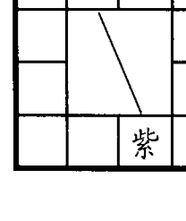

- ◎紫微与纳音有关，配合浑甲开于子的根据。
- ◎紫微立北，面南见贪狼。说明斗数包括了风水学在内，而非风水学自外于斗数，它是一体的学问。

### (四) 南斗星座

**南斗星座**

| 星名 | 编号 | 属性/描述 |
|------|------|-----------|
| 天府 | - | 属土 |
| 文昌 | (六) | 魁名之位金星六 |
| 天同 | (四) | 司福之位水星四 |
| 天相 | (二) | 司禄之位水星二 |
| 天机 | (一) | 益善之位木星一 |
| 天梁 | (三) | 司寿之位木星三 |
| 七杀 | (五) | 上将之位金星五 |

天府星引导南斗星，首重于原始「野」义。

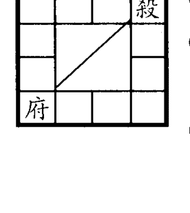

- ◎命由天府而顺行，泰卦对否卦，或说生对死。
- ◎有紫微必参与天府而安星，同出纳音「开子合申」。
- ◎生命有生老病死，南斗之星在斗数即是中医之学。
- ◎斗数是中医、地理、命理，三才之学的，即为源远流长的文化奇葩。

河图的数是水一、火二、木三、金四、土五；但斗数取后的纳音是水二、木三、金四、土五、火六。差别在水二与火六，何故？其理在水、火易位，且数是不用一的，故用六。

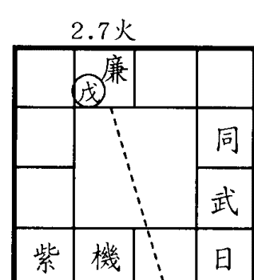

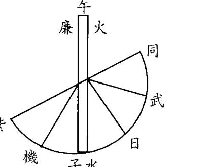

- ◎火炎上，往对宫坎卦，故火取「六」局。
- ◎若站在理论上，五月的夏至（火），太阳必照在冬至（水）的北回归线上。

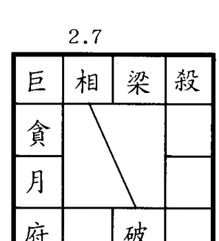

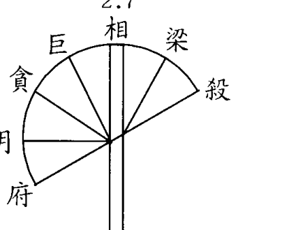

- ◎水润下，往对宫离卦，故水取「二」局。
- ◎若站在理论上，十一月的冬至（水），太阳必照在夏至（火）的南回归线上。

紫微与天府系共十四颗，都是「星曜」星。
唯独太阳、太阴不是星曜星。太阴主月令，太阳主时辰。

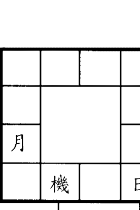

- 月份顺增（太阴左旋）→天府系；时辰后退（太阳右转）→紫微系。
- 地球逆时针自转。这是时辰和地球的关系。所以，天机与太阳皆属于紫微系逆排。

### 浪花中诞生的女神—月亮

大哉坤元，万物资生。坤元者，太阴(月亮)也。

它是斗数四化之母，也是易理根据的源头。

唯有月亮的皎洁明亮，才会创出斗数四化的蓝图。在蓝图中，方能把天上的星星衬托出光辉以曜人间，斗数也因此而光曜环宇，是为主宰了人类命运之神。

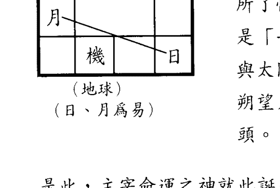

◎地球是人类聚居之所。此居住的人类不过是男人女人两类而已。犹如太阳对月亮、天干对地支。当人类对天干地支有所了悟时，命运已在其中矣。因为它就是「一阴一阳之谓道」。然而，当月亮与太阳在相对运转关系下，是之所谓的朔望月，俗称阴历，也是斗数真正的源头。

是此，主宰命运之神就此诞生。种族、性别、遗传...都是来自月亮的杰作→「月相图」。它就是所有人类的母亲→「坤孕育万物以成命」。

### (一) 一年12个月，闰月怎么分？

谈到月，就要联想到月亮。

月亮对地球的运转，叫做「恒星月」。（太阴对天机）

月亮对太阳的运转，叫做「朔望月」。（太阴对太阳）

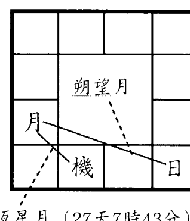

- ◎在斗数上是以朔望月为标准。以30日为基称大月，少于30日称小月，没有超过31日的月份日。

它的根据在哪里？

- ◎它的根据在河图十天干之数而已矣

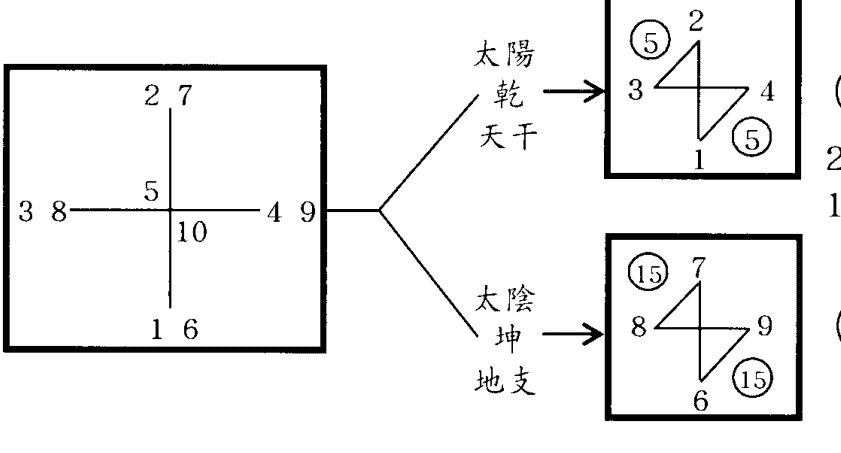

> 《易·系辞传》下有说：「子曰：天下何思何虑？……日往则月来，月往则日来，日月相推而明生焉？寒往则暑来，暑往则寒来，寒暑相推而岁成焉」。

河图的生数（天）→ (1+2+3+4) =10。在易学上，称它“象”河图的成数（地）→ (6+7+8+9) =30。在易学上，称它“数”合称“象数”

10：代表天有十天干。一个天干可以主十年（大限）主一年（流年）主一月（流月）全可通用谓之三才
30：代表地有十二地支。十二个月每一个月主30天，每一年主360天。

#### 依据：

「日往月来」之理则，则成「象中有数」。
「月往日来」之理则，则成「数中有象」。
两者交互，即日月相推而明生焉。

#### 简单的说明：

月亮的本身，在每一个月都有盈亏之象。把这盈亏之象（成数）减掉五，则还原生数之象，在1、2、3、4中再把1、2、3、4换作禄、权、科、忌。

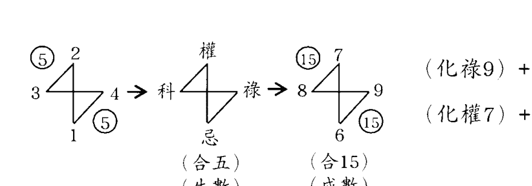

则：闰月以十五日为分际，如闰七月。

- 正七月：30日 45日
- 闰七月：（1～15日）
- 闰七月：（16～30日） 45日
- 正八月：30日

> 《唐·文镜秘府》云：「巧得分别日月岁节」。以证岁节用15置闰月，代表15为月最圆。（应先天乾卦）。

注：闰月不许往下月推（岁以太岁立，令斗为君，名「斗君」司月，其实斗君就是建月在寅）。

### (二) 孔子曰：「一涵三」。若把它引用在斗数，岁节何来？

#### (1)四季的成因

地球上冬去春来，四季更迭，寒来暑往，气候多变。这节是怎么形成的呢？原来我们居住的地球有着本身的自转和绕太阳的公转。通过地心并且与自转轴垂直的平面叫赤道面。（天机即排在生数内，即乙、丙、丁、戊天干里，戊的天机化忌即是地心）。公转的轨道平面叫黄道面。地球自转轴在空间的方向不因时间而变化，总是以一个方向倾斜着，使赤道面与黄道面形成约（23°27’）的交角，称为黄赤交角。我传统上是以立春、立夏、立秋、立冬作为春、夏、秋、冬四季的开始。

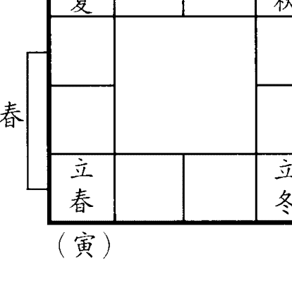

- ▲四季之始在“四立”。
故：寅、卯、辰→春季
巳、午、未→夏季
申、酉、戌→秋季
亥、子、丑→冬季
每季三个月。

这个立春（四立）作为四季之始，不正是月亮建月在寅吗？而一般我们常言春分、秋分、夏至、冬至，是取其每三个月中的“中”月来代表的，是一个季节有三个月，是谓「一涵三」。立其卦，为四正，或说：子、午、卯、酉。

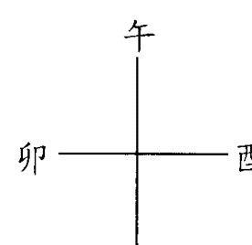

▲每个卦（如子是坎卦）有六爻。一爻配十五天，六爻共九十天，合三个月的日数。

▲以九十天去乘四季，正好是阴历一年三百六十天。

- ▲说明了：
  - ◎八卦始于艮。
  - ◎四季是以四立为始。
  - ◎不是以春分为四季之始。
  - ◎于节气上有「十二节气」、「十二中气」合为二十四节气

从这四季的成因来看，斗数的禄、权、科、忌，指的是月亮的阴晴圆缺，而不是太阳运转之下的春、夏、秋、冬，但在「日、月」往来中，就变成了通用，因通用所以用四正卦来代替，是为了方便记忆。

太阳→春、夏、秋、冬（用于季）。
太阴→禄、权、科、忌（用于月）。

> 注：阴历是不考虑地球绕太阳的运行，而使得四季的变化上就没有固定的时间，它不能反映季节，这是阴历的特色，也是缺点。但是要切记着，斗数的四化是月亮的，它是由纳甲诞生出来的。

若把四季配八卦，每卦以45天计，合洛书总数，即阴历一年之日。

| 45 | 45 | 45 |
| :---: | :---: | :---: |
| 45 | | 45 |
| 45 | 45 | 45 |

▲ 45天 × 8 = 360日

#### (2)二十四节气

紫微斗数在论命的理论上，是不需用到“节气”来做基础的。

但是在论流年时，会谈到月与日之间的运作关系，如月令定后日子要按在何处？如果单独谈论这个问题，就要从节气谈起。

一年有二十四节气这样说法是一种传统的说法，从深入的角度去探究，是应为一年有十二个节气和十二个中气。这十二个中气，那个中气应属那个月，它是有规定的。

| 立夏月 | 5月 | 6月 | 立秋月 |
| :---: | :---: | :---: | :---: |
| 3月 | | | 8月 |
| 2月 | | | 9月 |
| 立春月 | 12月 | 11月 | 立冬月 |

◎四季始于四立。

◎一季三个月，取其中为 2、5、8、11月，即春分、夏至、秋分、冬至，即二分二至。这二分二至就是“中气”的代表。

◎在二十四节气中，都是以“二”区分节气与中气。

如：正月→雨水为中气　三月→谷雨为中气
↓　　　　　　　↓
惊蛰为节气　　　　立夏为节气
↓　　　　　　　↓
二月→春分为中气　四月→小满为中气
（余类推）

由上而知，四正卦的子（冬至）、午（夏至）、卯（春分）、
酉（秋分），正是中气的位置。斗数的四化（禄、权、科、忌），
也是以此卦位做为代表性，于是斗数论命根本不须去理会“节
气”。

> 《素问·六节脏象论》：「五日为一候，三候为一气」。这裏
的气是指节气的气。三候为一气，也就是十五天为一节气。一年
有二十四节气，正好三百六十天。（ 15 × 24 = 360 ）

洛书的数（九宫），纵横交错都是十五，就是说明气的变化是
以十五天为一节的。然而，它为什么要把五放在中央呢？这个意
义很明显，因为比气更小的一个时间单位是候。一候正好五天，
一年正好七十二候。而气是由候所构成的，由于候的变化，导致
了节气的变化，故五排在中央。一般人常言：气候如何？指的就
是这个意思。

|   |   |   |
|---|---|---|
| 4 | 9 | 2 |
| 3 | 5 | 7 |
| 8 | 1 | 6 |

**【洛书】**

阴历与阳历的日子，不会相等。故阴历大约二～三年多，
就会多出一个闰月。以河图与洛书的总数十九，约置七个闰
月，是此，在斗数应用于日子时要特别小心。

◎五月设立在卯宫（斗数的月令是依“斗君”而定的）。

◎初一要进一格再顺推（流日算法）。

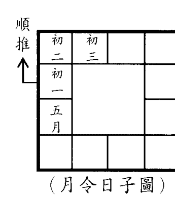

##### ◎理由：

- (1) 月令宫位，就是要给月令用的，断月令吉凶。
- (2) 日子本在月里面，没有月，那有日？
- (3) 日子要进一格，否则怎么会有闰月出现。好比，日子进一格，一年进12日，二年就有24日，再进入第三年，就可以多出30日以置闰月...
- (4) 如果日子不进一格，请问闰月何来？
- (5) 设五月在卯，卯宫又按初一，这是不对的。

◎闰月的算法，是以四象（4）的数字，做除数而求出来的。49西方金，斗数四化是以化禄做开端，是有道理的【四化从那里来有另解】。

> > 《易·系辞传》上，有言：「天地变化，圣人效之；天垂象，见吉凶，圣人象之；河出图，洛出书，圣人则之。易有四象，所以示也......」这段话与节气有关。

- （1）「天地变化，圣人效之」。天地最大的变化，莫过于四时（四季）的变化。圣人效之，此圣人指的是神农氏（黄帝），他是中华民族农耕文化的创始人。“效之”，农耕离不开二十四节气，这二十四节气是效法天文而来的，也是最早出现节气的文献记载。

- （2）为什么说它有节气的记载内涵？

「河出图，洛出书，圣人则之」。此圣人在河出图是指伏羲，在洛出书是指大禹。怎么则之，“则”什么？（很多书上都解释“则”八卦，其实不是完全尽然）。

> ◎河图的文字表示是「天一生水，地六成之。地二生火，天七成之。……」根据《周髀算经》的「数之法，出于圆方，圆出于方」。我们就可以看到数是与“方”有关系的，“方”就是方位，故河图的数与方位有关。

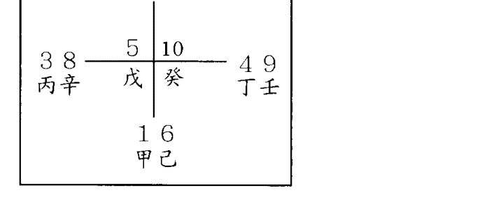

> 「天一生水，地六成之」，代表北方这个方位的数与阴阳的关系。
北方为水、为寒，其数一、六。

> 「地二生火，天七成之」，代表南方这个方位的数与阴阳的关系。
南方为火、为热，其数二、七。（余类推）

- “一、三、五、七、九” 为天数；
- “二、四、六、八、十” 为地数。

「风寒湿燥热」为天之阴阳；「木火土金水」为地之阴阳。河图充分体现了—「数法阴阳」的原则；也充分体现了数与阴阳的关系。斗数可以用河图数来表达二十四节气的数。

| | 甲丙戊庚壬 | | 应一年24节气 |
| :--- | :--- | :--- | :--- |
| 天数 | ① 3 5 7 9 →24【扣掉甲1 (3+5+7+9) ＝ 24】 | | |
| 地数 | 2 4 ⑥ 8 10→24【扣掉己6 (2+4+8+10) ＝ 24】 | | 应一天24小时 |
| | 乙丁己辛 癸 | | |

为什么要扣1、6。万物到冬必归藏，浑甲始出，再见子～午。

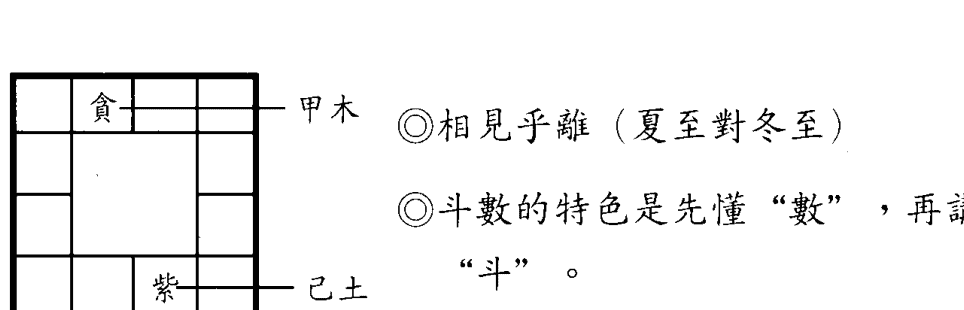

##### ◎说明节气。

农历正月，中气始于雨水，为什么？

农历一月，一月冰河解冻，绵绵春雨应时而下，而且在二十四节气中，第一个就叫做雨水。因此，水是这个时候生的，圣人就取名为「天一生水」。（这才叫做“则”，则在天文之象中）说明一与水有那么一种密切关系。到了六月，雨量增多，古时洪水往往发现于此期，因而是水的成熟饱和期。过了六月，雨量减少，难看到洪水的出现。这是天一生水，地六成之，说明水与一、六之间的关系。

再来看火，在远古的时候，在以前钻木取火的年代，我们首先用的火是雷击取火，靠打雷击燃出一些东西，然后再把火种留下来。那么我们一年之中，是什么时候开始打雷呢？正常的时间都在二月，故二月的节气叫做惊蛰。雷出于地，气候转温，温暖乃是火的一种象征，这是生火的时候。那么，什么时候是火最成熟的时候？是七月。

七月天道虽已偏西，可是“大火西流”，七月是处暑当令的节气。所谓处暑即暑热所居之处。因此，最炎热的时候，未必就在夏日，往往是在七月。七月以后，天气转凉，这就是盛极而衰，二、七与火炽的这种关系，河图用「地二生火，天七成之」来表示。

#### (3) 洛出书，是什么？

古人说：「数与书通」。说明洛书来自河图，但洛书不是河图。好比，月亮之光来自太阳，但月亮还是月亮，不是太阳。

以致，斗数用河图之数作天干，来起×寅，正是「数与书通」。而站在立×寅的立场上而言，正是说月份，这就是月亮纳甲的开始。也因有纳甲，八卦始立。邵康节说：「一阴一阳（指河图），天地之道也。物由是而生，物由是而成」。蔡元定说：「天下之万声，出于一阖一辟。天下之万理，出于一动一静。天下之万物，出于一奇一偶。天下之万象，出于一方一圆，尽起于乾坤二画」。

- * 河图之数极于十，故偶数多于奇数。
- * 洛书之数极于九，故奇数多于偶数。

唯独奇数不变，偶数有变，故月亮有阴晴圆缺，差数在“十”。此十正是在母胎怀胎的十个月令；亦是正所谓的五虎遁，它既是「天一、地二、天三、地四...天九、地十」。

## # 斗数随想

# 第一章 来自星空的信息

## ——＜紫微星象＞——

※写在前面……

在夜深人静的夜空里，人们都曾经有过仰望夜空，星光闪闪烁烁，令人眼花缭乱。由此，人们开始获得了对星辰最初步的认识与观念。但是要认真的追问起来，什么是星象，什么是星象学？大概没有几人能够说出个子、丑、寅、卯…来的。

简单的说，星象就是指天空日、月、星辰的各种现象。早在远古时期，尽管人类还处在蒙昧状态时，就与星象结下了不解之缘。人类为了自身的存在与生存，一直不断地观察及探索星象的奥妙及其带给人类事物的关系，经过了不知多少时代，人之努力不懈累积了大量的有关星象及其变化观察的记录，和其时空演变的发展，于是逐渐形成有关于星象的一套整体性的认知系统，这就是现在所谓的星象学。

换言之，星象学的成立是有其规律性的系统之学，它是来自久远的观察星象所带来的星空信息。紫微斗数，就是沿着星象学而立著垂世、启蒙于后世之学者所向往的。

|   | 太微垣在于巽、巳之处丙为首 |   |
|---|---|---|
| 天市垣起于寅、卯之区 | 太极经书云：<br>「太极者，阴阳之本，阴阳体未交易时，孤阳不生，独阴不成，阴来阳受，阳来阴捉，所以阴阳相交感，气生五行，具二五精妙福及生人。五行之气在天为象，而日月星辰见焉。」 | 少微垣在于坤、兑之间 |
|   |   | 紫微垣起于亥、子之乡 |

◎斗柄所指而拱向北辰(紫微)付天而行为天经之道。(四正)

上图: 紫微垣图，正是紫微星象来自于星空的信息。也因有这个信息为依据，才渐渐地体现出当今流传的一部紫微斗数的星象学。孔子曰：「为政以德，譬如北辰，（紫微）居其所，而众星拱之」。

紫微斗数秘仪命义正解有云：

> ### 紫微斗数秘仪命义正解

垂万象乎列星，仰四览乎中极-----紫微星也。
紫微北辰，钦天四正，禀天气化，化曜星性。
贾喻众星，在数不移，合道无极，浑开两仪。
日月中天，南辰北斗，斗向贪狼，曜极九星。
七正天律，四化地舆，飞宫挨星，象乎四时。
星转物迁，人事合天，地载其变，俟命运成。

## 瞭望華山峰嶺 俯瞰斗數秘儀

回溯斗數 繁星點點 匯成銀河浩瀚
打開秘儀 東風盈盈 映出文化天窗

> 「江天一色無纖塵，皎皎空中孤月輪。江畔何人初見夜；江月何年初照人？人生代代無窮已，江月年年只相似。不知江月待何人，但見長江送流水。………。」真是、悠悠春秋，如駒過隙，大千世界，何處歸依？

「命理」之學流傳於我國亦有千百年之歷史，在學術界或缺了一席正統之地位。但有識之士莫不投注半百生涯，歲月風雨共相競研琢磨，所為何事？求什麼？

命理確實有它的「宿命論」或「命定論」。相對地，也應有它的「造命論」或「知命論」。而在這個「知命造命」的基準論點上，唯有，在全然瞭解自身的命造元素（條件）和機緣（相遇）後，方能有十足的拿捏與掌握人生。這樣才能自我趨吉避凶的籍著「命理」為護身符，規劃自我本身未來的生涯，將如何扮演著適情適性的生活，在原我本色中，正如孔子所謂：「不知命無以為君子」的最好註腳。

人生庸碌浮沈於塵世之中度過一生：像天空浮雲變化難測，生死皆不能自知自主，古往今來到頭的那一天，皆面臨相同的命運，進入那不可知的世界，生之真諦何在？生命的真相究竟是什麼？難道是韓愈說的：「生者為過客，死者為歸人。天地一逆旅，同悲萬古塵」嗎？可是韓愈的“逆”旅，卻名留下來了。

知命掌運，雖不能觸證徹悟宇宙人生生命的實相真理，但至少能幫助人類天天所面對的生存與生活之兩大問題，減少一些災禍，增一份福氣。從而使人能夠體認出人生之浮沈世事盛衰興替之無常性。冥冥中自有天律業力在牽引著（天數），相信因果的自然法則。否則在人世間有太多太多解不開的命運迷惑。如何去釋然開懷？是以用「知命造命」進而我們才能善心漸拓，善業自展，迴向人間有情，澤蔭你我他共緣眾生。

+   ※

+   ※

+   ※

+   ※

+   ※

+   ※

+   ※

紫微斗數，不同於其他學術（五術），主要的是它有一個「數」字。

「數」，是指自然規律的固有程式規律。即所謂的天數或氣數...等。有關“數”的概念最早見於易（說卦）：「八卦相錯，數往者順，知來者逆，是故易逆數也」「參天兩地相倚數」，論語：「天之曆數在爾躬，允執其中」...。這些都是指自然規律的固有程式。如一年四季之變化，月亮朔望的變化，海水潮汐的變化等等，

它們都是有定數的，也就是說它是有固定程式的，整個宇宙亦有它的總程式，而這個總程式，即是「天數」—是先天所固有的程式規律。（見：先天八卦）。。

然而，宇宙間所有萬事萬物的變化，都被“統一”在這程式之中，因這個總程式而呈現出宇宙間訊息萬變之程式規律。總程式的天數它是不變的，這永恆不變的程式，謂之“無極”。。

宇宙間的萬事萬物都在趨向於這個總程式的無極來運作變化發展，是為「無極而太極」的延伸。人要知天數而倚從天數，使“人數”不違背“天數”。是故「先天天弗違，後天奉天時」。人若是違背了天數，人數即會順而遠逝（呈現不祥之兆），人數若倚從天數，人數即會復歸（天命為依歸）。。

所以，先哲們都在以各種形式方法來告誡我們要效法天道而倚從天數，以期「窮理盡性以至於命」，是故易逆數也。。

一般人則對自身命運的定數皆無可奈何，只有聽天命盡人事的聽天由命。那是由於他們不知道如何改變自身的定數。。

而原始的八卦、易、道德經都是教人覆命的真經。就看自身如何去理解去詮釋其中的涵意。假若理解正確用得恰當，那八卦就是教人覆命的符號。倘若理解錯誤偏差，那八卦就成為妄測天心的鬼八卦之算命符籙。（天數可以行鬼神），是易有言：「建其本而萬物理，失之毫釐，謬以千里。是故君子貴重本而立始...。本立而道生」。。

# 斗數隨想

### 第一節

#### 本是同根生「易與紫微斗數」

作爲占卜筮數決疑之書的易經，始終是中國文化中集合了哲學性、科學性及神秘性於一體之最奇特的經典之作，亦是爲儒學群經之首，道學的三玄之一，甚至被譽爲中國文化的源流。

斗數之精神，是以易經爲母體，用易象、易數爲背景，教人領悟易理的精義，方能窮理盡性以至於命，在種種變幻無常的人生際遇中，觀宇宙萬象，通幽明之故，測人事之變化，知福禍倚伏，陷危地不驚，臨順境不喜，盡人事聽天命，有所爲有所不爲，成順豁達之人生。

> 《易，說卦》：開章即言——
> 「昔者聖人之作易也，幽贊于神明而生著，參天兩地而倚數。觀變于陰陽而立卦，發揮于剛柔而生爻。和順于道德而理于義，窮理盡性以至於命」

這段簡而有力的文章，主要在強調著、卦、爻三個字，著者、占卜也，（或曰策），著與卦是形與影的關係，沒有著就不會有卦；卦與爻是全體與部分的關係，爻則是對卦的進一步發揮，此文，就是藉這三個字的關係，以達到窮理盡命說。

周易的内容首先是筮、然后是卦，再来就是辞，主要在这三个方面。往來聖者講卦講得多，對於筮講得少。這是許多人研究易經，目的是爲了占卦，而後世人用錢不用筮，所以筮的問題往往被忽略了。其實要研究周易的哲學思想，筮要比卦來得重要，所以，首先要研究筮再說卦。

周易是卜筮之書，原來它是來占卜的的。實質上，卜是卜、筮是筮，卜筮本是兩回事，但從歷史角度來看，卜在先，筮在後，卜是利用物之象，筮是利用物之數。

周易的卦是由筮產生的（重心在數，不是由卜產生的。禮記，曲禮上說：「龜爲卜、策爲筮」，說明卜與筮所用的東西是不同，卜是爲了求象，筮是爲了求數。又左傳、僖公十五年韓簡說：「龜，象也，筮，數也」。韓簡知道卜與筮不同，筮的本質是數；

筮字從竹從巫，說明筮是最先是用竹棍子來進行的，後來才用著草，從事筮這種活動的人是巫，這證明了易經原來只是筮，後來才產生卦的。

呂氏村春秋，勿躬，世本，說文，都說：「巫咸作筮」，巫咸是商朝的人，是以商代就有了筮，不論連山，歸藏，周易，儘管使用的方法不同，但有一點可以肯定的，它們都是爲了得數，實質上也都是數的問題。

而數最大的特點它是抽象性，任何的一個數字，是無名的、是抽象的，恩格斯說全部的數學都是研究抽象的，易經就是利用這抽象性的特點，來表達它的思想，故易經是哲學，是故哲學也是抽象性的。越是抽象性的越具有普遍性，因為它可以表達這個，也可述說那個，搖身一變便有了哲學的意義存在，說明筮法本身它就是哲學。綜觀易經，它的內容包括筮、卦、辭，三大部分。

反觀斗數，斗數本身也是占卜之書，淵源也來自於易經的筮。它是易經的教外別傳。斗數是以四化之象爲卜，用十天干之數爲筮，來顯示整個斗數的哲學思維，它的精神所在，既是——「象中有數」、「數中有象」。陳希夷傳策天十八飛星斗數，它的“策”這個字，原義就是占卜筮法（蓍），然研究筮法，並非因筮法很靈，其實筮法的本身，並不存在所謂的靈不靈的問題，而它是數的問題，是故，紫微斗數與易經它們本身是同根生。

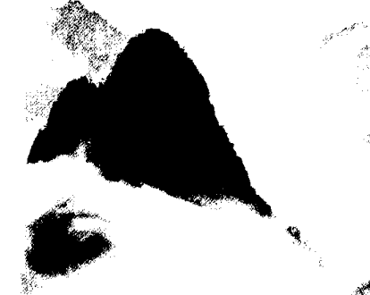

## 斗数随想

### 第二節

#### 「欽天門」...斗數秘儀廣角鏡

##### 【單元一】 星辰之特色

欽天門紫微斗數之秘儀，所使用的星辰，只用十八顆。

自有傳斗數以來，就是「策天十八飛星紫微斗數」一書，即言十八，當就止於十八顆星已足夠矣。星辰本身是依卦而立，是不依五行做分野。陳希夷有云：「斗數之列眾星，猶大易之分八卦」（玄微論）。繫辭（上）云：「是故四營而成易，十有八變而成卦，八卦而小成，引而伸之」。又易變曰：「天以三分，終於六成，故十有八策。天不施，地不成，因而倍之，地則虛三，以扮天十八也」。以此十八主星，即可論斷吉凶禍福，斗數本旨是「數算」（策算），而非盡在「星占」，因為星本是假象，只是數的代表符號。唯「數」方可窮天地之奧，變化無窮且莫測。是故，稱它為紫微斗「數」的由來。

☆☆☆紫微斗數十八顆星辰是~~~~~~~~

由紫微星系六顆、天府星系八顆、再加上「左、右、昌、曲」，共此十八顆。其應用法則，全靠「祿、權、科、忌」四象星運作其間，是為易經的「象、數」所體現。

(1) 紫、府十四颗星，順逆左右轉。紫微系—紫微、天機、太陽、武曲、天同、廉貞等六顆星，是依「立星法則」而定的→逆排。

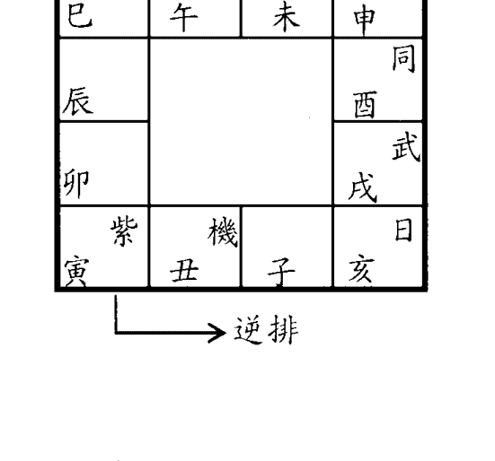

* 立星法則：陰逆陽順。

紫微星：己土（屬陰），故「逆」。

◎天府系—天府、太陰、貪狼、巨門、天相、天梁、七殺、破軍，此八顆星是依「行星法則」而安的→順行。

| 巳 | 午 | 未 | 申 |
|---|---|---|---|
| 巨 | 相 | 梁 | 殺 |
| 貪 |  |  | 酉 |
| 辰 |  |  | 戌 |
| 月 |  |  |  |
| 卯 |  |  |  |
| 府 | 丑 | 子 | 破 |
| 寅 |  |  | 亥 |

順排

*「行星法則」：陽順陰逆
天府星：戊土（屬陽），故「順」。

※綜觀此順逆排行：
太陰逆轉，太陽順行。以成天地陰陽紀，孤虛理。
（引自：堯典歷象授時圖）
說卦傳：「八卦相錯，數往者順，知來者逆，是故易逆數也」。
紫微（陰）：逆佈，在數「六」以定「位」。
天府（陽）：順行，在數「八」以定「卦」。

+   (2) 紫府十四顆星原由：
(一) 依 據河圖六、八之成數。

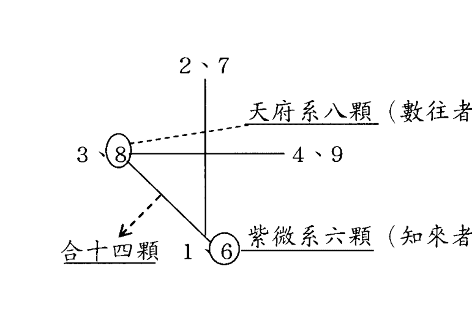

###### (二) 星辰排法含有大衍之数的应用，采用「空一、空二、空三」或象征「天地人」三才。

紫微系排法：（空一）见太阳，象征天，象征君。

（空二）见廉贞，象征地，象征臣。

天府系排法：（空三）见破军，象征人，象征民。

> ※此空一、空二、空三，尚有另一种诠释。

+   ◎ 依一、二、三相加等于六，相当于六爻定位，这是对宫位而言，以六倍二因应十二宫位。
◎ 此一、二、三又代表「道生于一，一生二，二生三，三生万物」，这是对「天有好生之德」的生物而言，是所有物之所生，都是在道的自然律中，况乎人之命亦如是。

◎此一、二、三站在數的理解上是：

繫辭(上)：「凡天地之數五十有五」，「大衍之數五十，其用四十有九」。

+   ※凡天地之數五十有五，即天干數「甲…到…癸」，一到十的總數，共五十五數。

+   ※大衍之數五十，其用四十有九。即以天地之數五十五去減掉一、二、三之總和。[ 55 - (1+2+3) ] = 49

上述簡單的作答，只是針對斗數應用上而言，強調的是想表達紫微斗數的“數”之重要性，斗數雖屬星占學，但未必全屬星占之範疇，係因星中分陰陽，陰陽未得前，已先有了數，無數陰陽則不分，是故星斗之中原本就有“數”之存在，數不明不可言斗數，這乃是取名斗「數」之由來。

###### （三）左、右、昌、曲四顆星，按太極順逆轉。

+   月系星：左輔、右弼

+   時系星：文昌、文曲

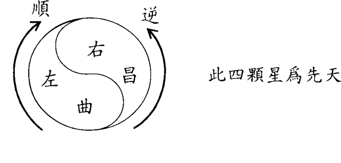

*在這十八顆星中有北斗、南斗、有日月…，中天之分。
仁者，人也，東方也。東方屬木，木分甲乙。

甲木貪狼→北斗，乙木天機→南斗，在十二宮位上貪狼是主導殺、破、狼，天機主掌機、月、同、梁。

+   1. 貪狼、巨門、（祿存）、文曲、廉貞、武曲、破軍→【此爲北斗七星】，附加左輔、右弼共稱【七星九曜】，是主導地理風水。
2. 天機、天同、天相、天府、天梁、文昌【天字五星加文昌金】；此六顆星主導中醫學。
3. 紫微、七殺、太陽、太陰此四顆星，主導命理。

紫微斗數的眞源，在星辰上，是以日月爲易，以易經爲母體的哲學理氣；在沒有斗數之前，地理風水及中醫易理都已存在，而斗數是揉和了地理風水之後，再載入人文哲學的命理術數，要不然斗數何需南、北斗。綜觀此三學合而爲一，才是斗數的眞面貌，然此原貌的眞源，卻在於河圖與洛書之變化中，故曰：「紫微」→命理的代稱，爲五行八卦。

「斗」→南斗、北斗，日月爲經緯。

「數」→河圖、洛書（大衍數、太玄數），象數爲表裏。

##### 【單元二】 星辰與陰陽五行

有人說西方人吃的食物，追求的是營養；中國吃的是味道，追求的是感覺。這句話說得有點偏頗不盡完全正確的，但站在中國烹飪的藝術上，是有很大的程度講求“味”之內涵。即五味調和的藝術乃是不爭的事實。孔穎達疏（詩經，商頌）說：“和羹者，五味調”。這乃是中國最古老的調味理論；而這五味之說，則源於中國哲學中的“陰陽五行”之學說。

陰陽五行學說，為中國古代哲學思想，它是用來解釋和認識大自然規律的一種學說。最初，陰陽與五行是各屬兩種獨立發展的思想理念。

+   - ◎ “陰陽”大略有兩種含義：
    - 其一：是指為宇宙間兩種相互之對立和作用的勢力或性質。
    - 其二：是易經把“━━━”和“━ ━”兩種符號來代表“陽”和“陰”，如背為陽、腹為陰，且陰陽要平衡，“五行”的原始含意，是把自然現象和人的活動歸納成為水、火、木、金、土等五種物質元素，它們之間的有著相生相剋的關係；五行的性質各個皆不相同，但能按不同的比例調合出不同於原質之萬物，是故“五行”原本就是有別於“陰陽”的另一類物質始基的學說，後來，陰陽與五行這兩種的不同觀點，演繹到相互溶入而逐步被“嫁接”在一起，形成一個“陰陽五行”學術派别，是把陰陽之盛衰和五行的特質交替結合起來解釋自然的變化，即所謂「天地之氣、合二爲一、分爲陰陽、列爲四時、判爲五行」是也。

說明：斗數星辰有「化氣」與「在數」之說。

化氣→指的是天地之氣，合二爲一，象徵“陰陽”；是故星辰有分陰陽，其用建於天干與地支。

在數→指的是星辰本身在“五行”屬性，以物質爲基礎的論調（唯物論），即文中所言，列爲四時（四時），判爲五行（屬性）。

+   - ※【星辰+四化】= 在數（宮位）

補註：五行是唯物主義與自然辨證法，“其”法則爲“正與反”與“對應”之通變。

###### 對應

+   - 如：水→鹼（水潤下，可溶解土中的鹽分或海水之鹼味）
    - 火→苦（火炎上，，烤焦後其味即苦）
    - 木→酸（木滋長，果實未熟皆酸）
    - 金→辛（金銷熔，金銀的氣体是辛辣）
    - 土→甘（稼穡所獲得的谷物其味甘甜）<尚書、洪範>

> 老子道德經第十二章有言：「五色令人目盲，五音令人耳聾，五味令人口爽」，在那當時就有五行的存在了。

###### （壹）五行思維

五行的思想起源於對原始宗教的崇拜，流傳到殷朝末年間則花開兩朵，各據一枝，各朝向著不同的方向發展。有一朵保留著原有的宗教觀念，追求進一步的本性之充實完善。另一朵試圖與原本宗教的觀念體系分隔，走上哲學思維的道路。

在文獻上，最早談論到五行的是《尚書》中的《甘誓》和《洪範》。然，說五行者確是箕子，他出身王族，爲商紂王的叔父（一說庶兄）。此人所說的五行是在商滅後第二年。周武王拜訪商賢臣箕子時，講的是九條治國綱領。至於所提到的水、火、木、金、土，也只是強調它們之間不同的屬性和功能，當時並沒有論及到五行之生剋問題。然從信仰逐步昇華到自然哲學高度的一個階梯，既是西周末年，史伯提出了「五行相雜以成百物」的論理，說明了五行是唯物主義。

至於五行生剋論，是誕生在春秋年間，成熟於戰國時代中後期。象徵著那時期的人們對五行認識已從表象深入到它的內部結構及其五行之交互作用，也探尋著五行之間的相互依存或排斥的關係。然此五行之間的依存性與排斥性之關聯，是後來再漸漸地被導入了相生與相剋的暇思幻想論點之中。事實上，五行有生剋嗎？生是順、剋是逆，順逆本是自然平衡法則也。

若要追究其根源，五行之間的關係，其中之一即是“妃配”關係。《左傳、昭公九年》已被楚滅的陳國發生火災，鄭國的裨灶說：五年後陳將復國。五十二年後將最終滅亡。子產問什麼道理？裨說：陳、屬水，火是水的妃配，楚國的“屬相”。今年大火星出來而陳遭火災，這是屬水的陳得了妃配，就要逐走楚國人了。妃配五年一過，是故五年後將復國，這一段文，是星占家的預言，其中已經說明當時人們在五行之間建立了妃配關係。

其大略是：木爲金妃，金爲火妃，火爲水妃，水爲土妃，土爲木妃。其原因是金剋木，木畏金，爲金妃．．如此類推。

###### (貳) 五行配妃

> 「妃以五成」。妃即配也。

何謂「五行配妃」？簡單的回答，即是天干化合。皆以五而成。意思就是說，十天干中，皆以五做陰陽配，取於夫妻配天地義。

####### (一) 天干化合

甲（1）陽木、剋己（6）陰土→1、6合而爲水。

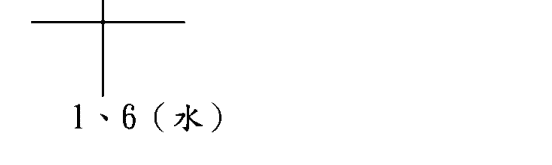

丙（3）陽火、剋辛（8）陰金 → 3、8 合而為木。

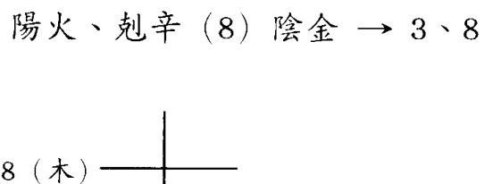

戊（5）陽土、剋癸（10）陰水 → 5、10 合而為土。

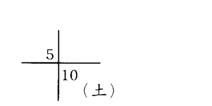

庚（7）陽金、剋乙（2）陰木 → 2、7 合而為火。

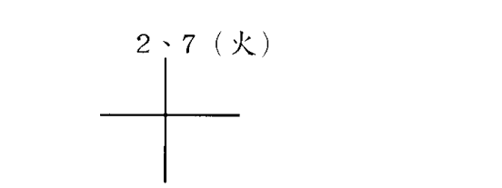

壬（9）陽水、剋丁（4）陰火 →4、9 合而為金。

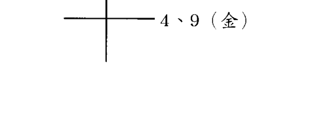

◎此說法是以河圖之「數，位」、用天干之甲、乙等名稱代入。

####### 河圖圖示

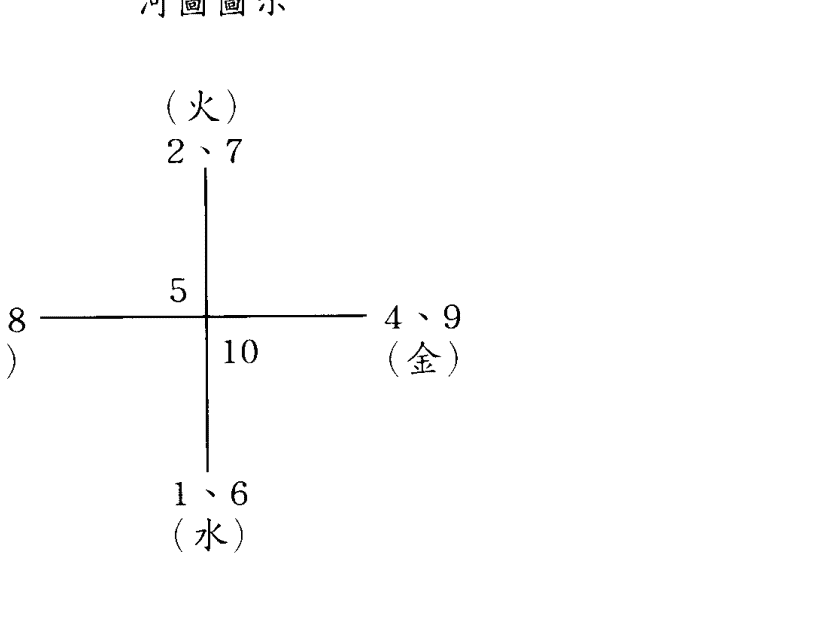

在此代入的天干之合，皆以“五”而成。而此合，卻是以“剋”爲合。剋乃據有之義：如我剋者爲妻，“剋”在易數上，是逆數也。

(二) 宇宙萬有之現象都是有陰就有陽，有剋就有生，有逆就有順。當上述天干所化合，是剋，其後必生。

於是→由合而再生出五行，（金、木、水、火、土）

+   - 甲、己爲水、水生木。則 一、六 配 甲 乙。
    - 乙、庚爲火、火生土。則 二、七 配 戊 己。
    - 丙、辛爲木、木生火。則 三、八 配 丙 丁。
    - 丁、壬爲金、金生水。則 四、九 配 壬 癸。
    - 戊、癸爲土、土生金。則 五、十 配 庚 辛。

####### 還原河圖之數位

[图片]

以上所言，它全站在「妃以五成」下說五行之源。

解說：

+   （1）易數卦爻，離不開——爻（陽）與——爻（陰）兩個符號，用數代表就是1對○，在八卦都是用○與1構成的（二位進制）。
（2）凡是庚天干之年，在西元之年，尾數一定零。屬之為“陰”，凡是辛天干之年，在西元之年，尾數一定壹。屬之為“陽”。
（3）人類的生命出生，何以用 7 × 8 × （5）= 280（天）【約十個月】而生呢？

引証：貪狼甲木，何以性屬水？

(4) 庚（7）的尾数是零，零属阴，故以坤道生“女”
辛（8）的尾数是壹，壹属阳，故以乾道生“男”
故人禀父母之气而生→（五行在先天曰气）

###### （三）五行盪觞

在紫微斗数的领域里，其重点须承袭易经的「象、数」之脉络理路，是故，它须涉及到数之阴阳的理则上，甚少应用到五行。俟「五行配妃」，已足够用矣。

五行在先天曰气，以“克”为用。

五行在后天曰质，以“生”为用。

一般五行之用法，大都喜欢用相生（属后天）之作用为主，认为五行相生为吉的，以为相克为凶；好比一句美丽的谎言很受众人喜欢；而忠言逆耳，却反遭其不齿及侮辱。也可以形容一个人的外表装扮，有人穿上名牌或优质衣料怎么看，也无法看出一点“气”质品味来。

但有的人未必穿上名牌或质佳的衣服，一看就满有气质的。为什么？（与天生美、丑相貌无关）。气乃是一种内在，而质却是一种外在。

> 【木兰诗】有云：「雄兔脚扑朔，雌兔眼迷离、双兔傍地走，安能辨我雄雌」？

斗數既然少用五行，在此就不多言。但能說的是星辰有五行，此五行只講“星辰在五行的屬性”特徵而已，唯物的元素論。

陳希夷說：「斗數之列星辰，猶大易之分八卦」。說明斗數星辰是依「八卦」而立，不是用「五行」做分野。

> 詩曰：
> 造物無言卻有情 每於寒盡覺春生
> 千紅萬紫按排著 只待新雷第一聲
> （清·張維屏）

| 貪 | 紫 |
| :---: | :---: |
| 甲 | 己 |

（帝出乎震）
（紫、貪必見於子、午、卯、酉）

◎五行的生剋制化，在斗數是起不了作用的。

貪狼 甲木 紫微 己土] 1、6 合在水

# 斗數隨想

# 【單元三】 八卦美學

你該知道漢朝有個韓信吧！他死後墓前祠廟門上列有一對聯：

> 生死一知己
> 存亡兩婦人

家境貧寒出身的韓信，卻懷有滿腹韜略的才華，前先投靠項梁（公元前209 年），後隨項羽，但未被項羽重用。後又改投劉邦麾下，仍未受重用；韓信憤而出走，避逃到寒溪時，因漢水大漲，被承相蕭何給追上（此為蕭何月下追韓信的典故）。在蕭何極力的推薦下，劉邦才對韓信封為大將，逐漸建功立業，被封為淮陰侯。

漢朝的建立，功歸韓信提出著名的《韓中策》，然在建立後，韓信又受到劉邦的猜忌，疑起兵造反（公元前二〇一年），而設計誘韓入網者，亦是蕭何，後人才有「成也蕭何，敗也蕭何」之說。此為上聯的“生死一知己”的由來。

韓信父母早亡，家貧如洗，食不果腹，在淮水上，得一位洗衣老婦，周濟十餘天，可是韓信被補後，將他斬首於長樂宮也是一個婦人—呂后（公元前197 年），這便是下聯中感嘆的“存亡兩婦人”的由來。

易經的八卦，是一套抽象的符號系統，卻代表了中華民族文化淵遠流長的歷史上，一顆瑰麗閃耀的明星，其符號好似上面那幅對聯的寫照…。

——（陽爻）生死一知己
——（陰爻）存亡兩婦人

這陽爻與陰爻又象徵了什麼？此陰陽爻交劃的前身，即是「數」。在陰陽學的影響下，它被視為數學的符號，人們就賦予它們（陰陽爻）各種各樣的形式內容，方便於後人從符號中記事或辨認文字的開始。由此這兩種符號，衍生出各式各樣錯綜複雜的排列組合。

> 數學是看不見的文字，在人類的智力攀登中。數學不但是理性階梯，也是神秘思想的傳遞。數學可看做文化，是最高的要求。它也是人類精神最精緻的花朵之一。是世世代代，在一磚一瓦建造起來的一座永恆的知識殿堂。

古聖先賢從數的角度意義上看「——」本是奇數，也代表為一個整體，更也是數之始初和數的發展基本，亦是萬物生發之源。「——」代表偶數，與奇數相倚而產生變化，是萬物滋生之始。

從自然界來看：

+   —— 代表天、代表太陽、代表男性，亦象徵（乾）父。
+   —— 代表地、代表月亮、代表女性，亦象徵（坤）母。

看著太陽下去，月亮昇起，月亮下去、太陽出來：太陽月亮相互推移交替，就產生了時光，嚴暑易節形成了歲月（四季）；於是乎陰陽交融，萬物繁衍，生命也就這樣產生了。

這樣簡單的男女問題，就揭開了易經千年的神秘面紗，恆躺在黃河文化的母親懷抱不變。（坤：歸藏）在科舉時代，有個應考生，問他的老師說「夫父母為何物耶！」，老師回答他「父陽物也（——為天），母陰物也（——為地），才生你這個怪物也（象人）」。學生悟曰：「人具三才，皆怪物也，老師亦是，比比皆是」。

所以，八卦中的每一卦，都由兩種元素（陰、陽爻）中可重複取3個做為排列。設排列數是N，則N = a³。

其中“2”是指兩種元素（用——）。
“3”是指兩種元素中取3個元素作重複排列組合。

由是N = 2³ = 8，對應八卦（數學的組合論）。

由這組合再套入代數式：

令a代表陽爻，b代表陰爻。並規定ab ≠ ba，則對應於

當 n = 2 時（乘方）：

```
(a + b)² = a² + 2ab + b²
```

對應於四象=


* 此四象：犹如一年四季，犹如斗数之四化，也各属四个方位：东、南、西、北。

当 n = 3 时：

```
(a + b)³ = a³ + 3a²b + 3ab² + b³
```

对应于八卦即是：

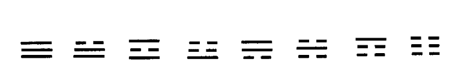

* 此八卦

    - <1> 可以配九宫
    - <2> 可象征方位
    - <3> 代表一年十二个月
    - <4> 可代表一年二十四节气

> > ——如果当年我们的先人能从易经的卦象中发现出中国哲学和文化的源头，为什么在今天我们不能从斗数易象中找到一点对于哲学和文化的借鉴意义呢？——

# 【單元四】 八卦的體悟

治易（學）之道，當以象、數、理爲基礎。所謂「象以擬之，數以測之、理以證之」。而其中最精微、且最奧秘的是“數”。藉以數繁而難測、辭澀而難明，學者難免執偏概全而捨本逐末，以致象既不存，數亦見絕，易（學）則愈趨愈狹。

古時文字簡單，先哲以符號演述宇宙人生的運作，這就是八卦。其排列規劃蘊有非常邏輯的數理涵義（如上單元解）。卦有八卦叫八經卦，若重之六十四卦叫別卦。八卦是2³，六十四卦是 2⁶，如是可以推至無窮。

簡單的闡述：

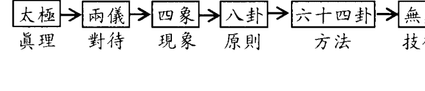

不論方法之無窮盡，但總不離八卦之大原則。用四象就可以演化宇宙諸多事物現象，這也就是斗“數”爲何可以體現人生的種種與大自然現象而契合。

四象的基本形態，次序和位置是：

    一、老陽 (⚊)
    二、少陰 (⚋)
    三、少陽 (⚊)
    四、老陰 (⚋)

由此形式再進一步地複合，而成八卦。

# 来自星空的信息

    老陽之上加一陽，以成乾卦 (☰) ，居於一。
    老陽之上加一陰，以成兌卦 (☱) ，居於二。 （乾兌同源）
    少陰之上加一陽，以成離卦 (☲) ，居於三。
    少陰之上加一陰，以成震卦 (☳) ，居於四。 （離震同源）
    少陽之上加一陽，以成巽卦 (☴) ，居於五。
    少陽之上加一陰，以成坎卦 (☵) ，居於六。 （巽坎同源）
    老陰之上加一陽，以成艮卦 (☶) ，居於七。
    老陰之上加一陰，以成坤卦 (☷) ，居於八。 （坤艮同源）

由上推演，可以知道八卦是由太極演化而成，經過兩儀、四象的複合，自然就產生出乾一、兌二、離三、震四、巽五、坎六、艮七、坤八的卦象（序）。此種組合形成，絕非是人或刻意造作的。當四象之上各加一陽爻、一陰爻，就變成了八卦。

八卦是由三個爻位所構成，又稱經卦。八卦的卦象和涵意均有一定的解釋。不過由於方位和組合的不同，方有 “先天八卦” 和 “後天八卦” 之分。簡而言之，先天八卦主旨 in 顯示宇宙之本體及其功能；後天八卦是根據先天八卦另行組合而成，主旨 in 說明宇宙萬有的運行及應用，而有天左旋，地右轉的運動律。換言之，前者是討論 “對待的原理” ；後者在演義 “流行的应用”。對待的原理在「數」；流行的應用在「氣」。用在於斗數星辰上，才有所謂的 “在數” 與 “化氣” 之說。其應用上，都藉由 “象” 而顯（八卦來自四象）。是以斗數一學，不能不知 “象” “數” 之理，所以才有 “四化” 精義之所在。

但有一点要说明，先后天卦象是相互为用，以推演宇宙万有体用合一的功能，不须刻意分别它，也因这样才能达到气、数、象，三者合而为一（这是斗数在易理上，最重要的精神思维之所在）。

## <一>先天八卦

伏羲一划开天，始作八卦。

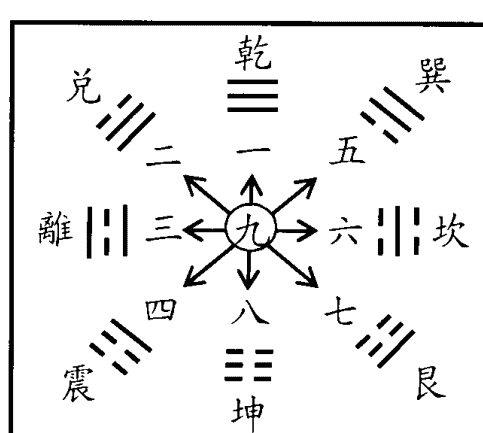

> (1) 说卦传第三章：「天地定位，山泽通气，雷风相薄，水火不相射，八卦相错。」此即所谓先天八卦。

解：乾上坤下，天地之定位。六子阴阳，都是乾坤往来而成。乾坤必先定位其体，而後气相往来。据乾视坤，阳往而阴来；据坤视乾，阴往而阳来。

其意在说明：

指这浩瀚无垠的宇宙，在人立场来体会，是高朗的天空、尊崇在上（乾为天）；广阔的土地，卑陈在下（坤为地）。这种上下尊卑的位置，是无从改变的。

◎乾坤上交往来而成艮（☶）兑（☱），故曰「山泽通气」（上爻变）。

其意是指山岳雖然是巍峨高峻，澤水則處下就低。但是在形勢上固然是高下相傾，而實質上空間的氣流如地下的氣脈則是相互連貫的。

### ◎乾坤下交往來而成震 (☳) 巽 (☴) ，故曰「雷風相薄」（下爻變）。

其意是指天地間的氣流與電能，也是互為因應地。震為雷，發自地中，乃地底下的能源向外（上）奮發。巽為風，乃是空氣的傳播體，它是進出不定，無孔不入，這兩者是彼此相縛繫的。

### ◎乾坤中交往來而成坎 (☵) 離 (☲) ，故曰「水火不相射」（中爻變）。

其意是指水火乃天地之大用，天地間如沒有水火之功能，則一切歸於死寂，了無生氣。離為火，有光輝，發熱量，是重要的能源。坎為水，能潤澤，蓄涵養，乃萬物生化所不可或缺。這兩者的性能，如果配合得均勻，運用恰當，則可以互相為用，彼此調劑，而不相侵犯。

到此為止，我們可以得到兩點認知：

- 其一：先天八卦的卦位和作用是彼此”對待”的。而在對待的現象中，也含有“流行”的作用。
- 其二：先天八卦說明了宇宙大自然的本來現象，也顯示了宇宙本體的價值與功能。

於是下句言：八卦相錯（相對中又相錯）

乾與坤相錯；艮與兌相錯；震與巽相錯；坎與離相錯。皆陰陽之交錯相錯也，是先天對待之義也。

※ ※ ※

將此理念導引入斗數：

在十二宮位中，都是本宮、對宮一起參用。
四化才有照與沖的說法。
命盤止於六種型態。

先天八卦既然是本體現象論，則論命用生年四化即可用之。則生年（來因宮），就是本體論的宮位，四化就是現象的存在論。

為什麼？生年四化可以一以貫之的論命？（即本命、大限、流年）

> > 枕辛齋有言：「先天八卦以乾、坤、坎、離為四正，震、巽、艮、兌為四維。四正者所以立“體”。故河圖之位只列四方。乾坤坎離者，即天地水火，水火者天地之大用。合天地水火，而萬象無不畢舉矣。」

因此，斗數的四化即先天義，乃天地水火之大用。所以用來因宮（生年四化）論命即足矣。

先天八卦是相對待的，則卦象相錯的，其合數都是九。既然可以合九，故可以配洛書九宮。

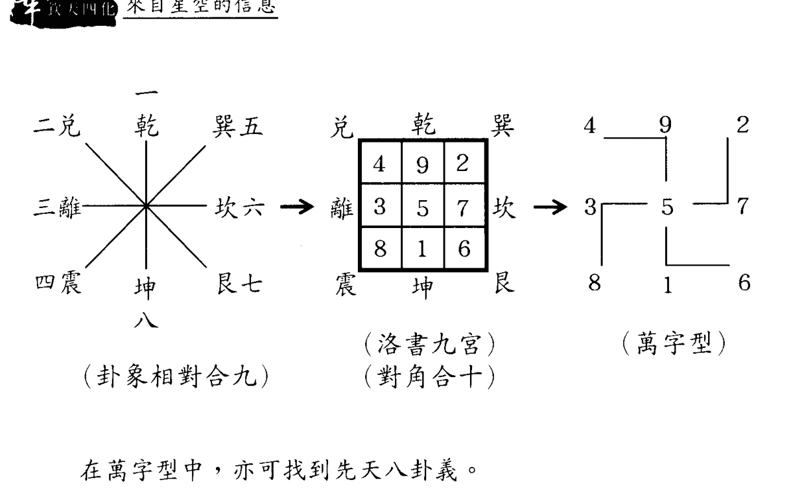

在萬字型中，亦可找到先天八卦義。

- 乾 9 + 5 = 14  4 為兌 } 山澤通氣
- 坤 1 + 5 = 6   6 為艮
- 兌 4 + 5 = 9   9 為乾 } 天地定位
- 艮 6 + 5 = 11  1 為坤
- 離 3 + 5 = 8   8 為震 } 雷風相薄
- 坎 7 + 5 = 12  2 為巽
- 震 8 + 5 = 13  3 為離 } 水火不相射
- 巽 2 + 5 = 7   7 為坎

故，洛書與先天八卦是相通的。有人說：河圖是十，洛書是九；亦有人說河圖九，洛書十。到底誰是誰非，實際上是相通的。因為它是相依並相存。正如有體無用，有用無體都是不行的。那麼應該表達的是「體用」要合一。

### 將它引入斗數：

生年四化是屬於先天八卦之體，居四正位，尚天。

洛書九宮，相當地支十二宮位，用三合之原理，表達宮位變化，屬地，故有三方四正之名。

先天八卦與命理有關嗎？

有，而且是絕對的有。先天八卦的符號還可以表示年、月、日、時。因為我們論命的條件，就是要有年、月、日、時為依據。

### ——— 先天八卦反映天體運行周期 ———

### ▲年的表示法

古人在長期勞動生產實踐中，發現了四季的變遷、月亮的圓缺等天文現象，並根據這些自然的規律知識定出了年、月、日、時的長度。《易傳》說：「日月運行，一寒一暑」。同時根據周天365°定出24個節令。根據陽生起於北，陰生起於南。一寒一暑相易發生在冬至與夏至2個節令。這就是先天八卦初爻（下爻）的任務。

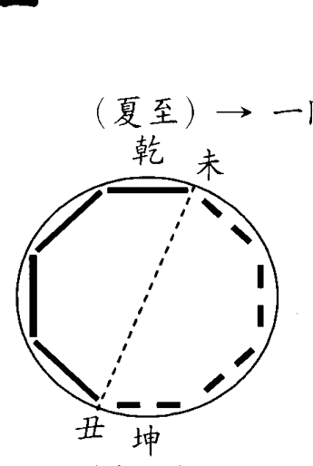

◎第一周期看第一爻（從內往外看）表明太陽一年的運行。從坤卦開始左行，表示冬至一陽生，起於北方。

◎乾、兑、離、震，初爻皆為陽，乾為夏至。巽、坎、艮、坤，初爻皆為陰，坤為冬至。

### ▲日的表示法

日子的表現法（陰陽概念來自於日光的向背）一日分晝夜，與陰陽相應。有陽光的為晝，沒有陽光的為夜。陽為乾，為剛為晝；陰為坤，為柔為夜。八卦的兑、乾、巽、坎中爻皆陽，代表晝；艮、坤、震、離，中爻皆為陰，代表夜。以中爻做為一日晝夜之象。

# 來自星空的信息 紫微斗數四化

◎第二周期看第二爻（中爻），表示太陽一天的運行。太陽從東方地平線起來，經南天到西方，消失在西方地平線之下。此圖上半面皆陽爻，以顯示白天陽光燦爛。下半面皆陰爻，表示夜晚一片漆黑。

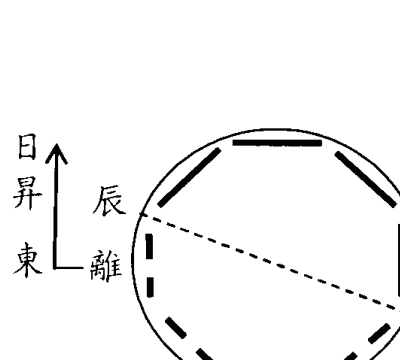

◎卦的中爻，代表“人”，所以人在一年過365天

### ▲四季的表示法

八卦的離、乾上爻為“——”的符號。坎、坤上爻為“-- -”的符號。

四季以離表示春、乾表示夏、坎表示秋、坤表示冬。其空間四方，即離東、乾南、坎西、坤北，古人依此來劃分以定四季。

（一）

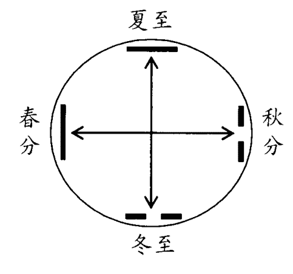

◎第三周期看第三爻（上爻），其實他有兩個層次。此圖表示太陽在一年之中的四個重要位置，即二至二分，謂之“四正”。斗數的四化，是四季的象徵，四正也。上爻是代表“天”，所以四化只在天干才有。

# 紫微斗数四化 来自星空的信息

### （二）

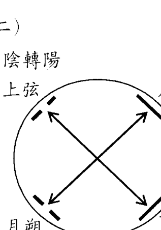

◎此图示引用在卦的四隅卦，兑、艮、巽、震，代表月亮在一个月当中的朔、望、盈、亏。而分出：立春、立夏、立秋、立冬为“四立”。

◎由上的解说运用，结合“卦”字的涵意，可以说先天八卦是古人观察“太阳”的记录。

> 宋·邵康节说：「先天学心法也，图皆从中起，万化化事生于心也。」

乾一、坤八，八卦两两相对，相对之卦皆为九，九者，究也、运也。

古人认为“天地之数，始于一而终于九”。这个九与洛书的十一样（两两相加皆十），也是太阳光的分配数。虽然先贤没有明确提出太阳中心说，但这一幅先天八卦图已经清楚说明了——「太阳是生命的根本」——时间、空间、生命都离开不了它。

> 《内经·生气通天论》就把人与自然界对太阳的依赖作了对比：「阳气者若天与日，失其所则折寿而不彰」。明代·张景岳则更明确地提出：「天之大宝，只在一丸红日；人之大宝，只在一息真阳。」

为什么？紫府生人在寅宫，其三合为火呢？

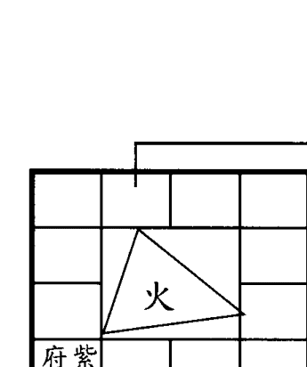

一畫開天 (乾) → 太陽火也。
生命之根本

當我們知道這個自然規律，對斗數有什麼啟示：

例如：有一個命例是這樣

(1) 丁年生：

|    | 乙友 | 丙遷 | 丁疾 | 戊財 |
| :--- | :---: | :---: | :---: | :---: |
| **甲官** |     | **丁年生** |     | **己子** |
| **癸田** |     |     | **庚夫** |     |
| **壬福** | **癸母** |     | **壬命** | **辛兄** |

來因宮叫做疾厄宮。丁，它的四化叫做生年四化。這個生年四化可以貫穿三才，即本命、大限、流年都可用。猶如一個卦，三爻全備。

(2) 去年流年是乙酉年 (2005)。其位在酉宮，其天干坐“己”。我們要用乙天干的四化，還是用己天干的四化。應該用「己」，不必用「乙」。乃年如此、月如此、日如此，這是三才義，這是先天八卦義。

### （3）先天八卦與三才義

> > 三劃的卦（經卦），以在上爻爲天、在下爻爲地、居中爻爲人。六劃的卦（別卦），則以上兩爻爲天、下兩爻爲地、居中兩爻爲人。

天是表示空靈的氣，而爲無形之“能”。故云：「立天之道，曰陰曰陽。」陰陽以“氣”言。

地是表示實在的質，而爲有形之“體”。故云：「立地之道，曰柔曰剛。」剛柔以“質”言。

人是表示有能有體，合氣質而爲一。氣質既是混合在一起，即難免會有清濁爲厚薄存乎其間，方有智愚賢不肖之等差。故云：「立人之道，曰仁曰義。」仁義以德言，所以示人修身立命之重要。

就卦體而言，三，四之人爻，界乎於上下之間，可上可下，可進可退。進而偏上，其能必富，甚至躋於神明，於是靈能昇華，遂成上智（空慧靈覺）。退而偏下，其體必頑，甚至淪於木石，於是魯鈍成性，遂成下智。蓋天地人六爻往復，其形而上之天與形而下之地（一說形而上之道，形而下之器），皆回互於中爻三四之人位，故「三多凶，四多懼。」

人雖爲萬物之靈，人事亦因之而複雜。孔子於六十四卦大象，不曰“君子以”。則曰“先王以”，以“天行健”而“自強不息”，以“地勢坤”而“厚德載物”。目的在以天道而謀端正人道。

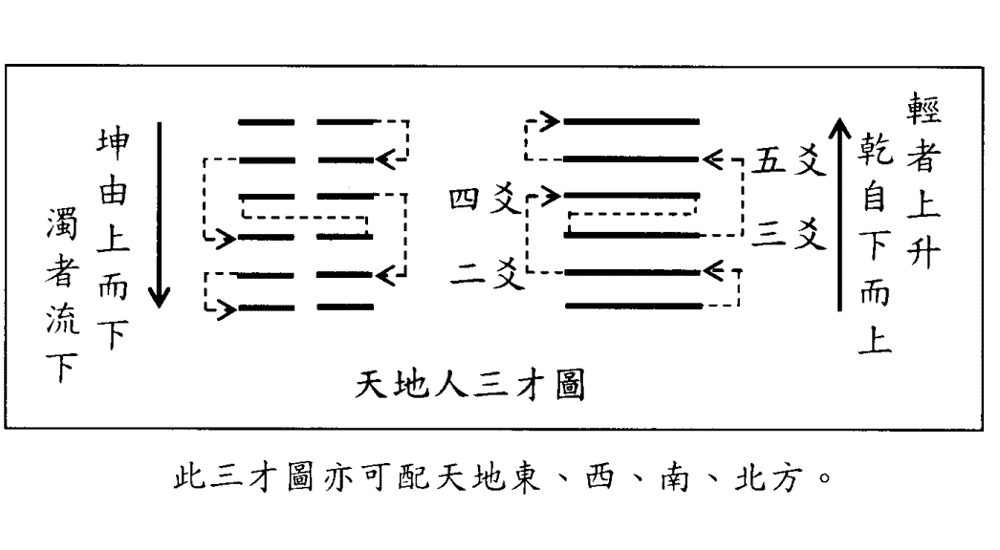

此三才图亦可配天地東、西、南、北方。

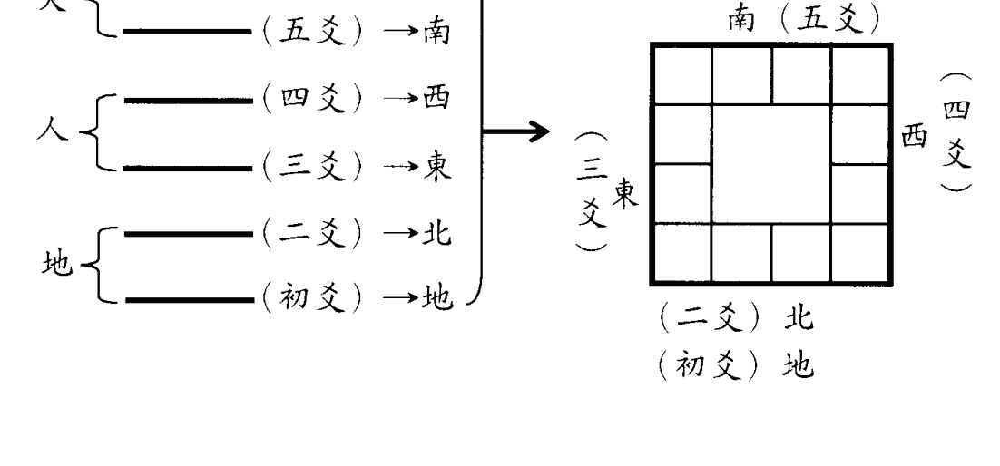

※在這有规律的三才之道上，我們在論命的天干，一律用原命盤。不須考慮今年是什麼流年，用什麼天干，這是欽天四化的特色。

例 去年是乙酉年，但此人命盤的酉宮天干是“辛”，依然使用“辛”，不使用“乙”。

| 丁 | 戊 | 己 | 庚 |
| :---: | :---: | :---: | :---: |
| 丙 |   | ①辛 |   |
| 乙 |   | 壬 |   |
| 甲 | 乙 | 甲 | 癸 |

(流年) → {天 (本命) / 人 (流年) / 地 (大限)} 或 {天 (大限) / 人 (流月) / 地 (流年)}

用“辛”，把三才一以貫之。

> 註：用乙天干，針對流年者，是片面取義，沒有辦法三才一貫，不合易理要求。

### (4) 七星洛陽望北斗

捨九星不知斗數源…斗
體陰陽方知天地數…數
星辰以日月為中天
紫微垣為天之經
北斗貪狼為地之緯
南辰北斗，循四象於中，拱衛四正。

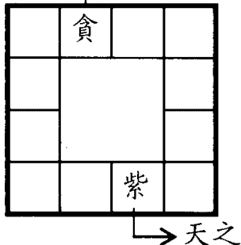

三合九星，淵脈地輿，翻斗欽天，是謂「飛星斗數」。

北斗七星，又與先天八卦有關。

紫微斗數，為什麼要有北斗星？

原來斗數的淵脈、淵源在於地理，而不是在命理的本身。換言之，因斗數源於地理，所以斗數多了「飛星」的名稱。用命理的心態看斗數，斗數範圍很狹小；若用地理的心態看斗數，視野會廣、更遼闊。

既然斗數有北斗七星，當然與地理有不解之緣。地理之學存在之有的年代，早於命理，命理存有的年代，始於唐、宋間。翻開地理書籍，也有不少談到紫微星，是此，告知斗數的田宅宮與地理有關。

田宅宮與地理有關，只是簡略帶過。

真實的定義是說明，斗數設有田宅宮，在體現出這宮位有一完整的地理之學。或說斗數本有地理學，只是藉田宅宮在發揮其功能性。

# 来自星空的信息

在这张八卦图中，卦象相反，阴阳合四正各为十四。斗数十四主星之由。

内：7+5+2+0=14
外：6+3+1+4=14
}) 斗数十四主星（紫府系总星数）

14+14=28（对应二十八星宿）

它的理由在哪里？

八卦在数学上，有二进制数，有十进制数…等等。

二进制是逢二进一。[用0与1]

十进制是逢十进一。[用0~9]

其图如下：

| 八卦图 | [符号] | [符号] | [符号] | [符号] | [符号] | [符号] | [符号] | [符号] |
|--------|--------|--------|--------|--------|--------|--------|--------|--------|
| 二进制数 | 000 | 001 | 010 | 011 | 100 | 101 | 110 | 111 |
| 十进制数 | 0 | 1 | 2 | 3 | 4 | 5 | 6 | 7 |

十进制数 → 对应在北斗七星 → 先天易数
二进制数 → 对应十二宫位配方位 →后天易学
一个先天八卦，把整个斗数的原理，全部说尽。
至于地理用之于斗数，

- 基本上分：
1. 天机九星【天】
2. 三才九宫【人】
3. 贪狼九星【地】
→ 合称三才地理或曰六甫地学

而四化者，代表空间，是四大悬空法要。藉十二宫位（方位），代表时间，显示出四大方位。或说：四化象是四正位（四正卦），青龙、白虎、朱雀、玄武是四立位（四隅卦）。

此四大象与四大神相，不是划下等号。

#### （5）先天八卦与生男育女

人未出生，叫做先天；人已出生，叫做后天。生男育女，在胎中自可辨别，故与先天八卦有关。

>> 邵康节《观物外篇》云：「无极之前，阴含阳也，有象之后，阳分阴也（如未出生与已出生）。阴为阳之母（母亲，母之所亲）；阳为阴之父（父亲，父之所亲）。故母孕长男而为“复”；父生长女而为“姤”。是以阳起于“复”（坤八，复）（天根）；而阴起于姤也（乾一，姤）（月窟）。」

解：（卦爻是由下而上）

注：◎书云：「乾道生男，坤道生女。」那是“有象之后，阳分阴也”，已属后天（见后面解）。

◎生男育女，在先天不在后天。以中医或身体所言，是「一阳三阴，或一阴三阳」才有三阳三阴之说。

◎斗数：丙：一阴三阳（星）；癸：一阳三阴（星）。

八卦家庭，就是这样组成的。

至于《说卦》第十章：「乾，天也，故称乎父；坤，地也，故称乎母。震一索而得男，故谓之长男；巽一索而得女，故谓之长女。……」这种说法，是属于后天的。就像父母生了子女，教子女说：这是哥哥，这是姐姐…等等，拿已知的答案，去说明一件事实的存在。它没有讲生男育女的过程。若要理解这后天的法则，用洛书就可得到结果。

奇数为男。偶数为女。

| 4 | 9 | 2 |
|---|---|---|
| 3 | 5 | 7 |
| 8 | 1 | 6 |

生数 一 二 三 四
(男)(女)(男)(女)
成数皆因得五而成

则

这就是所谓
乾道生男
坤道生女

### ※切记一个观念：

论命都是依据人“已生”之后的年、月、日、时来推算，均属后天。但人怀胎十个月之中的每一个生命体，也是生命，这是先天的。所以，论命不知先天？怎知后天？

先天在：左、右、昌、曲。

后天在：14 颗主星。

以上是站在八卦上而言，今把它导引在斗数星辰上。

则——

注：

| 女← | 巨 | 相 | 廉 | 梁 | 杀 |
|---|---|---|---|---|---|
| 男← | 贪 |  |  |  | 同→ |
| 女← | 月 |  |  |  | 武→ |
| 男← | 府 | 紫 | 机 | 破 | 日 |

（1）廉贞星{在甲天干为男
在丙天干为女
乃：无极之前，阴含阳也。
意味著：
◎一涵三，或一以三生。
◎甲、乙是天地，到丙才生人，人是女性所生。
故：母孕长男而为复，所以古来一直重男轻女。

（2）其它星辰，都是一阴一阳的结合。所以三十六宫都是春（阴阳合德）。

※三十六宫指八卦总卦划数是三十六划。

#### （6）先天八卦主“生”图

◎此图说明先天八卦俱河图义。在（六书本义）曰先天八卦为天地自然河图数。
◎在河图上，都以相生为主，顺行。

# ## <二>后天八卦

#### （1）说卦传 第五章：

>> 「帝出乎震、齐乎巽、相见乎离、致役乎坤、说言乎兑、战乎乾、劳乎坎、成言乎艮。」此既是所谓的后天八卦。（卦位，卦序）

- **解：** ◎ “帝出乎震”：指震卦（位东方），于时为春。“帝”是主宰之义，其意在说明，震是以一阳出于二阴之下。表明天地间无形的能量，奋出于坤阴的实体之中。象征阳气萌动，欣欣向荣，为万物生机的肇始。

- ◎ “齐乎巽”：指巽卦（位东南方）。齐是洁齐、整齐的意思。巽为风，风能助长万物。巽为二阳一阴，有阳渐长，象征万物齐头并进，并驾齐驱之势。

- ◎ “相见乎离”：指离卦（位南方）。离为火、为光明。一切事具体而明朗，自然容易相见。于时为夏，也是茂盛、繁荣、炎热的季节。以气化运行而言，这时阳气已发展到顶点。

- - “致役乎坤”：指坤卦（位西南方）。坤象地，为体、为用，万物赖以生长。役，使也。天地生化万物，在夏天以后，经过茂盛、繁荣的阶段，而达到即将成熟之时，乃因坤阴而致养也。
- “说言乎兑”：指兑卦（位西方）。兑为泽、为悦。泽水滋养，万物和悦。于时为秋，有成熟的意思。也可以说是万物到了秋天都已成熟而可收获，显现喜悦的气氛。
- “战乎乾”：指乾卦（位西北方）。就干支而言，西北为戌亥之地，亦即阴阳交接之地。乾息于西北之间，伏于坤阴之下。它经过一连串的开创、发展、成熟，现在由盛而衰。相反地，阴则由剥落而复苏。指阴阳两气在暗中搏斗，潜移默化，也孕育了下一次循环再造的功能。
- “劳乎坎”：指坎卦（位北方）。坎为水、为劳。孔子曰：「逝者如斯夫，不舍昼夜。」此形容坎水的辛劳永无休止。不过天地之大德生生不息，坎水有劳而不倦之象。坎，于时为冬，也有退藏的现象。
- “成言乎艮”：指艮卦（位东北方）。艮为山、为止。就干支而言，艮居丑寅之间，指一岁已经终了，同时又是一个新的开始。有成始而又成终，周而复始之义。

从以上之解，可以得到两个认知：

其一：后天卦的位置和作用是流行而运转的，不过流行运转中也寓有对待的作用。这是表示宇宙气化之运转，是如此循环无端止的永远流行，生生不息的。

其二：后天卦气的运转，可以从卦象的变化中推演出天地万物生成、盛衰、消息盈虚之大用。

> 邵康节曰：「致哉文王之作易也，得天地之用乎。故乾坤交而为“泰”；坎离交而为“既济”。乾生于子，坤生于午；坎终于寅，离终于申，以应天时也。置乾于西北，退坤于西南；长子用事，长女代母，坎离得位，而兑震为耦，以应地之方也。王者立法，其尽于是矣。」

将此理念引入斗数：

- (1) 后天八卦，因应命盘十二宫位。十二宫位所发生的种种现象，都是后天八卦所能显现的范围。

(2) 后天八卦是气的流行，感应在斗数上的，就是大限、流年…，在其中的运转，同时也产生了宫位上的变化。星辰的解释，也因时间上的不同，而解释不同。

(3) 后天八卦的重点在“时”与“位”。

时，就是时间，如大限、流年。

位，就是四化所落之宫位，有没有得其“位”。

(4) 位，还可以代表方位，用在住家方面，或贵人在何方向…，凡是一切现象的表达，都是使用后天八卦。

### 实际说明：

卦爻变化重点在“位”，得当或不当。

斗数之星辰有在“数”论。这个“数”与”位”相当（作比喻，但不代表划下等号）。

十二宫位，应后天八卦，以尽人物事。亦含地支，人的生肖。

> ※凡是命盘上的宫位——「命、迁移、子女、田宅」——一定在四正位，以法“天”。它亦呈现阴、阳相对应（宫位是以地支为主）。

- - 如：命～迁在阳地支；子～田必在阴地支。
- 或：命～迁在阴地支；子～田必在阳地支。

(一阴一阳在往来)

(八卦四隅)

(宫位四隅)

相当于命盘

※凡是命盘上的此八个宫位，在相邻的宫位都是呈现一阳一阴相表里。若换作别的命盘，凡是在四隅卦的宫位，都是一阳一阴的地支，这就是表里。以效“地”，表里不宜自化同类，代表不吉。

如：

(这就是表里)

（不宜合作）
（子女宫自化忌）

### 范例：丁年生，女命。

- （一）
1、在此命盘中，巽卦是迁移与交友，此两宫位居一卦。
2、交友宫自化禄，带动生年禄在同一卦（表里），则不会遇到好朋友。
3、若有，会损掉此人（太阴化禄）的钱。为什么会损财，太阴自化忌，法生年忌在财帛，则必损无疑。
4、这就是四隅卦与宫位的应用（两宫同一卦）。

### （二）

- 1. 在坤卦有...；2. 在艮卦有向心力的权、忌到坤卦；3. 且坤卦又自化权、忌；4. 代表此人，如果拿钱与人合作，也一定损财；5. 现象完全平衡，卦又相对。

### 补注说明：

◎星辰是依八卦而布星，所以星辰的运用，必须配合卦理。

◎十二宫位也依八卦而布且有方位，所以在运作上必须“卦”与“宫”位同参。

◎不须特别记忆，凡与寅、申、巳、亥所邻宫位即是。因人居地支寅、申、巳、亥位，其邻位必是辰、戌、丑、未。象征“人法地”就是“四隅卦”。也可以说，人居于地。

◎宫位是活的，因每个人命盘宫位会不同，但卦理是一定的。简单的方法，在固定的八卦上，居什么宫位就可。

◎这种方法，应用在自化上，是很好表现的。

#### 《1》后天八卦如何形成？

后天八卦之源，本于先天八卦。

先天八卦之源在洛书，故两卦相对合皆九〔先天八卦用洛书〕。

后天八卦之源在河图，故卦卦相邻并相生〔后天八卦用河图〕。

河图是天地之大德曰生（生生不息），则后天八卦取相生之义。

##### 解：

- （一）震、巽属木→木生火→离（火）次之。
- （二）离属火→火生土→坤（土）次之。
- （三）坤属土→土生金→兑、乾（金）次之。
- （四）兑、乾属金→金生水→坎（水）次之。
- （五）坎属水→水生土→艮（土）次之。
- （六）艮属土→水土又生木（水土同源）。

依此相生义，与先天八卦相生、同步，故说：后天八卦源于先天。后天代表气的流行，它之所以顺，就像时间，一定顺的方向推移，移到艮卦，又是一年的开始＜立春＞。不信但看斗数，何谓“斗君”（正月）。

- - ◎一般言寅宫叫做‘建月’，也正是一年二十四节气的立春月。
- - ◎既然是建月（正月），则看斗数原命盘的宫位名称，如果是财帛宫，则每年的财帛宫‘位’代表一月（后顺推二、三、四）
- - ◎若寅宫是田宅宫，每年的田宅宫‘位’当一月，余类推。
- - ◎时间是顺行的，后天八卦是顺行的。可见后天八卦就是时间的尺度；先天八卦却是空间的表率，一体两面。
- - ◎斗君的断法、是应用在每年的流月。
- - ◎命运本体就是活在时空的交响曲。

#### 《2》

先天（八卦）之于后天（八卦），是以变易而成的。
四正相交，则变其卦体；四隅不相交，则易其方位。
乾交于坤而变离；坤交于乾而变坎；离交于坎而变震；
坎交于离而变兑，此四正交。

坤得乾而以阴承阳，则退居西南；乾得坤而以阳薄阴，
则退居西北。坤居巽位，则巽顺乎坤，而移于东南（长女代母）；乾居艮位，则艮避乎乾，而移东北。此四隅之易位也。造化之变易，自然而然也。或曰：乾自南而北以与坤交，则退居亥位。

坤自北而难以与乾交，则退居申位。
亥者水之父也；申者金之母也。
乾居父之位生水，而坎居北，故天一生水。

##### 解：

由此可知，斗数论命用三合法，只是引用了后天八卦，其体的先天八卦，已在其中。故河图、洛书的一、六都没变易。一般五行说“金生水”，不尽全然，金水本一家。

#### 《3》八卦摩荡成六十四卦。

八卦之摩荡，乃基于气化交感之原理。太极动而生阳，动极而静，静而生阴，阴阳互运，两仪乃现。乾阳之气主奔放，扩散而左旋（阳顺转）；坤阴之气主柔顺，内敛而右旋（阴逆行）。系辞传曰：「刚柔相摩，八卦相荡。」所谓动静相生，难易相成也。

八卦分体用。先天卦者，宇宙之本体也；后天卦者，万有之处用也。如施之于日用人事，前者（先天）为主观立场；后者（后天）为客观环境。盖以两两对待，互为因应也。准此原则，其摩荡方式有二。

（一）先天八卦在内（下）；后天八卦在外（上），构成六爻。表示后天八卦运行，在先天八卦的基础上，以遂其摩荡而成六十四卦。

说明 先决条件，都以子、午坐标。先天八卦不变（下），后天八卦变（上）。

如：

# # 第一图

# # 第二图

◎如是类推，共有八个。

此即是八卦分体用。

将此观念引入紫微斗数，是十二宫位重叠的应用由来。

本命盘的宫位是体，犹先天八卦；大限盘的宫位是用，犹后天八卦。把大限重叠在本命盘上，不正是如上八卦所摩荡吗？

例

- * 大限在上
* 本命在下

（二）先天八卦在外（上）；后天八卦在内（下）。表示后天八卦运行在先天八卦之下，以遂其摩荡而成六十四卦。

如：

◎如是类推，共有八个。

### 说明：

此种方法，先天八卦不变（上），后天八卦变（下），是后天八卦运行在先天之下。

※此方法运用在斗数飞宫，以大限为基准，以本命盘为体。

### ※方式

### 例：

（本命盘）

| 己友 | 庚迁 | 辛疾 | 壬财 |
|------|------|------|------|
| 戊官 |      | 癸子 |      |
| 丁田 |      | 甲夫 |      |
| 丙福 | 丁母 | 丙命 | 乙兄 |

（大限盘）

| 己疾 | 庚财 | 辛子 | 壬夫 |
|------|------|------|------|
| 戊迁 |      | 癸兄 |      |
| 丁友 |      | 甲命 |      |
| 丙官 | 丁田 | 丙福 | 乙母 |

以大限盘为基准，为例：

- - ◎大夫坐壬，壬武曲化忌，先入本命盘的官禄宫，而冲本命盘的夫妻宫。
- ◎则以婚姻而言，不过明年（95年）是不好的。
- ◎其公式就是上承、下启。

### 解法：

以八卦而言，上卦（先天不变），下卦（后天八卦变），其理在此。

◎斗数宫位重叠，为什么要与六十四卦结合。其原因在于斗数盘是依据先天六十四卦而布的。

> ※邵康节说：「天地定位，否泰反类。」且乾—坤，这条已、亥线，正好是乾、兑、离、震、巽、坎、艮、坤，成一直线。

### 伏羲六十四卦方图

# ## 第二章 日月星辰寄情天地

## <枕边星语>

### 入首星辰

日月交辉、光灿美奂的景象，令人印象深刻难以忘返。但是在天边的角落，却有另一样容易被人们忽视的一星星。在今夜的夜空里，看不见星星，星星似乎已被人们淡忘了。其实，它们依然地高挂在那儿，依样地闪闪发光，眨眼似地睥睨人间，亘古不变的容姿，焕发美艳遥不可及。

星空中，星辰年复一年的循环的往还。在既定的时间里，庄严地升降；亦在既定的轨道中，优雅地漫步。当我们结识了星星，就像是在寂静夜里有了最忠实的伴侣，它伴你沈思、它伴你清闲、它又伴你入眠......它们年年相随着，不离也不弃。忽然间，当你发现有些星星特别发亮时，那可能又是一颗新的星辰诞生了，或许，我们也会看到有些星星它越来越暗沉，那或许是一颗星辰它在渐渐地衰老了，或者是它弃我们而远离了。

结识了星辰，就如同获知了宇宙的脉动。而我正想通过此章节，与诸位一同认识星辰、了解星辰，告知予你，是对星辰的一种难以言喻的情感，就让它们引领我们入梦，使美梦成真，使未来的愿景展现在康庄大道上，呈现在你我的眼前。

## 日月星辰寄情天地

這樣地，面對星星所呼喚出來的情感，不是要針對廣袤無垠及神秘莫測的蒼穹，做出由衷的驚奇與激動；也不是要對宇宙無限的思慮來引起的沉悶。反而，是要對那點點繁星所裝飾出來的天空之美而讚嘆，更是進一步對大自然的完美而佩服。現在，讓我們一同來開啟這一扇玉石之門，一窺在門後已塵封多年的星辰及與之相關的古老——紫微星斗。

再一次仰望星空，並且輕聲細語的告訴它—星星啊

我知道你是誰，你從那裡來，要到那裡去

要知道

人類如果真的迷失了滿天星斗，

那麽，在浩瀚的天際中，才是真正的孤獨無助。

## 說明在先

欽天四化所用的星辰為十八顆，講究的是星辰的精神本色所在。此十八顆星中，沒有一顆星代表吉、代表凶的說法。日、月、星、辰在天上光曜普照人間，那是種光明和璀璨，豈有吉凶之分？好比月亮的皎潔似明鏡，只因時日的不同，才有陰晴圓缺，是月之相（月相）顯示，是一種自然的現象，畢竟月亮還是月亮啊，並非月有盈缺而說月亮它是吉還是凶。然吉凶要用什麼來表達？是要用四化。為什麼要用四化呢？因為四化就猶如月亮本身具有的盈缺象，則用盈缺之象來表達星辰的本身狀態，而不是用人的角度立場“指月”說吉凶（任何一顆星辰都一樣）。

紫微斗數屬於「星象星占」。在研究星辰的角度上，就應站在星辰的場來審察一切，才能合乎用星辰來占筮（立場在星辰）。

要瞭解“星辰之本性”才是真正的「星性」（要見“星”的本性）。

假使我們用自己的思維、意識、經驗……來直指談論星辰之吉凶，那便是使天上的星星，對號入座到我們人的自我意識內，這樣地窺伺不但歪曲了天體自然現象，也陷害了天上的星星於不義。因為天上的星星從來沒有因我們人怎樣的看待它，而改變了它們原本初衷的光輝及豐彩。孔子曰：「天何言哉，四時行焉，百物生焉，天何言哉！」即然天何言哉，所以我們也只能夠默默地來仰觀它、研究它。站在宏觀的宇宙論點上，再細微觀察到人間所有一切人、事、物，使它能在這千姿百態的繁華世界裡繽紛亮麗。

> 天何言哉，四時行焉，百物生焉，天何言哉！

~~星星知我心~~ 我也願為星星迎送秋波 -「十八相送」。

## 星辰有四種分類

-   (1) 本質性：猶人的本性（非個性）
-   (2) 心理性：猶人對事物..等等之間的心靈感受性。
-   (3) 生理性：猶人自身的精神、情緒……的反應性。
-   (4) 物理性：猶人雙眼看得到的林林總總外在現象發生，包括自然地生、老、病、死在內。

因此，本章節的特色是以這四類來作星辰的詮釋，並配以四化曜，辦一場別開生面的一紫微“群星會”。

## 斗數的設計師 紫微群星會

-   演员: 钦天門十八顆星辰
-   戲台面: 十二宮位
-   四台柱: 華山欽天四化
-   戲台佈景: 有河圖、洛書、八卦、九宮，以及數的衍化，隨時更換。
-   劇本: 易經做為母體，象、數為主軸，經典為註腳。
-   演法: 隨演員各領風騷，你方唱罷我登場。
-   地點: 華山 蔡明宏易學研究書苑。

## ※開場白：

陳希夷在玄微論有言：「斗數之列眾星；猶大易之分八卦。」
然卦不是以“名”而立，是以“性”分。
故星辰五行之性，配以八“卦”而立。
俗稱：「五行八卦」之由來也，故星辰是依卦而佈。
何況：我國是以“天星”立法，星辰是以“天地”立象。

## 日月星辰寄情天地

**举例**　離上坎下，即貪狼（離）——紫（坎）

+   甲 (1) 木　己 (6) 土
-   天干合
-   一、六共宗北方水
-   北即紫微北辰

> > <論語·為政>：
> 孔子曰：「為政以德，譬如北辰，居其所而眾星共之」。

說明：「星辰是以天地立象」為佐證語。

是論天地立象。初以東震之一陽，得兌一陰來交。便成紫微貪狼同宮在震兌（卯酉）方。

一陽→貪狼　一陰→紫微

其它星辰皆由卦變而成。陰陽相間代表星辰單星在本～對宮，陰陽相同代表星辰兩顆同宮，對宮無星，其規律均法天四正，故曰：「欽天」。

## 星性所需佈景

### 乾納 甲壬 <在上>

| 巨 | 相廉 | 梁 | 殺 |
|---|---|---|---|
| 貪 |      | 同 |    |
| 陰 |      | 武 |    |
| 府紫 | 機 | 破 | 陽 |

| 巨辛A | 相廉甲A | 梁壬A | 殺 |
|---|---|---|---|
| 貪戊A |         | 同丙A |    |
| 陰丁A |         | 武己A |    |
| 府紫   | 機乙A   | 破癸A | 陽庚A |

### 斗數星辰初盤 <人生於寅>

### 坤納 乙癸 <在下>

### 斗數納卦

A：代表化祿，視為一切的緣起論

### 補註說明

解释星辰时，会应用到专有“术语”时，请自行对应上面之表格，不再做特别介绍。

## 第一顆星辰

### 春風吻上我的臉——貪狼星

> 梅開二度自寒苦　問花順便問前途
返身重新摘一朵　卻與前枝香不同

# 小語

情過一陣香，風過樹葉狂；天地轉似牛回頭，乾坤心爲窗。如圖

人稟父母之氣化所生，皆承於二、五之精妙，天機才說「化氣曰善」。此善，是承天地之好德而生萬物於有，如有我這個人（天機之善，不是狹義的人性之善不善良解）。

當一個人出生，都有一顆愛惜生命的「心」，此心就是生命的情種。所以人之貴，貴在於「有情來下種，因地果還生」。人因有情，才能支撐生命的活力，並且也賦予了人類存活的慾望種子。它是誰呢？→貪狼星是也。

## 貪狼星小檔案

| 项目 | 内容 |
|---|---|
| 五行屬性 | 甲 陽木 |
| 北斗第一顆 | |
| 先天八卦 | 兌 |
| 後天八卦 | 巽 |
| 貪狼四化 | 有化祿、化權、化忌 |

## 星辰說明

<1> 貪狼＜甲木＞。只要見到貪狼星，它的三合必見七殺與破軍。
簡稱：殺、破、狼＜如上圖＞。

<2> 殺破狼的三合，是在地支申、子、辰的架構上三方合水局成立的，且貪狼又居在水（辰）位，故稱它一貪狼屬木，性屬水的由來。

<3> 春天在地支為寅、卯、辰之位。何以要居在“辰”宮（地支是應一年四季）。

|   | 春天 |   |
|---|---|---|
| 天干 | 甲乙 | >>>>餘類推 |
| 地支 | 寅卯辰 |   |
| 月令 | 1，2，3 |   |

-   甲的數是 1 ， 1 是奇數，任何數的 1 之乘方還是原數。故 1 不能用，以致奇數用於 3（1 是數之始，3 是數之用），易經稱它為「天三」。邵康節說：「數以三為真」。
-   老子說：「三生萬物」，所以自居在春季的辰位是正位。三就猶如家庭，須有父、母、子女等，若只有 1 孤陽不生；若只有 2 孤陰不長；唯有 3 個元素齊，那萬物就始生生不息了。且看 1 + 2 + 3 = 6，紫微是為“己（6）土”，斗數排盤也是空一、空二、空三的次序而安之。
-   木（植物）必須要有水來灌溉，方以拙壯長大，且配合申、子、辰的合水，更為絕妙。

## 註

-   1、地支的三合水，是對所有生命或植物，有“滋養”功能（如可以供給人的井水）。與天干的丙、辛合化水不同，天干合化的水未必對生命或植物有滋養功能如湖水、池塘水，它是天上下來的雨水用淋、沖方法到地表，它的作用如乾旱需水來救災，或水災之水。
-   2、這裡說的木須水灌溉，講的是自然，勿以五行之水生木來套用。

-   水的象徵、代表著動態的。

殺、破、狼係因水的關係，對於一切事物的發生會趨向於變化與動盪，把原有靜態的事物轉化於動態功能性，便是「靜而生動」的原理。就像一切事物到了新春、新年都有新的氣象，是為一種去舊迎新、煥然一新的景象，也是一種生命的活力、生機的展現，宛如春風吻上臉的愜意與快感。

<4> 貪狼星的可貴，在於它於自然界中能夠主導一切生物的生機。如春雷響、樹木可作為氮肥，為“原料”的一種，故也代表一切的開始、原始（故為甲）。

同時也象徵了人的歲月，當春天腳步來臨時，花木新生，嫩梢吐新芽，欣欣向榮，人人都能多一份成長、朝氣，將心中的歡笑愉悅與眾人分享。因此貪狼代表了“人氣”、“人緣”。廣緣善緣也許來自貪狼星的一種生活寫實。

<5> 貪狼星於先天八卦是兌卦。兌是少女卦，當樹在有山、有水、有澤的地方，不是一幅很美的圖畫嗎？

所以不論男女，貪狼的森木(甲木)，不可能孤芳自賞必須有配相應在「山澤通氣」下的幽美。說它“人緣”佳一點也不為過，猶如少男少女相追逐嬉戲在樹林花草間。正如詩經•國風的關雎：「窈窕淑女，君子好逑」。（好逑：佳偶）。

◎貪狼甲木，居少女卦（兑）位，成陰與陽很自然的相配，說明緣本就是異性相吸，就像樹必須要植在土（辰）上般的自然法則。相對於人間，貪狼星直覺的就俱有異性緣，自然散發。好比地有引力人有魅力般，那是無法用言語來形容的。（泛水桃花的水是指“兌”，指的是少女年華，引桃花為名，表窈窕之美）。

<6>這是貪狼最原始的風貌與本色，與大自然共沐浴在日、月交輝的山坡上（艮卦，主山），然而在自然的美色當前下，多少詩人為了美化這美色，都借著桃花來吟詩作對，因桃花是春天的尤物、春天的足跡，只要看到桃花，就找到了春天。人增新歲願與桃花同，也代表人天生是愛美的。經時空的變遷及語意的轉折使人歪曲了原義，使貪狼星蒙上了一顆人帶桃花的不雅封號，若要追究，就要怪宋朝的詩人愛「四君子」不愛桃花吧，如蘇東坡、杜甫，稱桃花是俗物呢！

唐朝有位崔護是個進士第，在某年遇到一位小姐，次年想再見她卻找不到，便很雅性的揮筆，寫下千年後人人皆曉的題城都南莊：「去年今日此門中，人面桃花相映紅，人面不知何處去，桃花依舊笑春風」（這首詩就寫在這位小姐家門口旁邊牆壁上，因第一次見面就在此門口），在此所要表達的是，如果崔護沒寫這首詩，今人會有人知道他的存在嗎？貪狼星所要講的就是要人「做你自己」，用什麼東西來做你生命的主人，襯托出自己，讓後人的心與你永相隨，把名號傳播下去，這才是“心法”的傳承人。如文天祥的正氣歌、蘇東坡的赤壁賦、呂不韋的呂氏春秋……真是代代盡有才人出—貪狼星之知己也。

> > 去年今日此門中，人面桃花相映紅，人面不知何處去，桃花依舊笑春風

<7> 古人說：「英雄求本色，才子定風流」。風流倜儻、才華蓋世，皆非我們時下所言的風流。風流要有條件，那是才子決定的趣向（如唐伯虎…），貪狼星尚來就是講究自己的本色、本性。簡單的說，表現於事、物的是一種自然表態；表現於人的盡處皆隨緣；在表現於吃的是講求是原味；表現於內心世界的是，人自有的自性心。六祖曾言：「原來自性是能生萬法的」（自性心非自信心）。自性心在天地間快樂地飄游，不在人與人之間像白天黑夜交替，是與非的糾纏，五味雜陳的風塵味一般。有如孔子所言：「素富貴行其富貴，素貧賤行其貧賤」…的「素」字（本來如是）。

<8> 一年之計在於春＜貪狼＞，一日之計在於晨（辰主時間）。貪狼排在甲木(一)，居於春，一年四季之頭。它表達了“人”生在此，今生只能也僅有這麼一次而已，意味著我們應好好珍惜時光，也就是要好好珍惜今生短暫的生命。

如由貪狼星的角度來看人生，它看著每一個人從出生走到死亡這一生一世之路。今生之旅程會是如何，貪狼會告訴你：

「一生一死一逍遙」七字真言。意思就是說，僅此一次來到人間做這趟生命之旅，而在在此這人間道真的是會那如此逍遙快樂嗎？它賜予每個人都有一法寶，要人到了人間，須懂得三字訣「逍遙遊」那樣自在自有。

好比如列子：「御風而行」。若人不懂人生該如何逍遙，而忙碌於生計就失去了快樂的人生。

此之逍遙，是指的是心裡面的逍遙自主，心中的至情至樂，少些人間雜事掛礙於心，活出自己的一生，而不是不務世事、不盡責任叫逍遙。因為，貪狼星就是每一個人與生俱來的精神表率。所謂「精神不朽」的人，其心都逍遙去了。

> ◎貪狼星在後天八卦為巽卦，巽主風，風逍遙。

+   1. <9> 貪狼在後天八卦，名為巽（風）
-   2. 七殺在後天八卦，名為坤（地）
-   3. 破軍在後天八卦，名為坎（水）

假使把坤當做地，人在地上看貪狼與破軍，不正是世間人所說的看風水嗎？

在星辰中，貪狼、破軍都是北斗星。北斗與地理是有關聯性的。

## ＜10＞天籟之聲原是風水之響徹。

自然界的風與水（風水）供給人們觀賞的可聽的好比..海潮聲、聞風徐徐，然真正一片大自然的天籟之聲（籟是風聲），有如蘇東坡詩曰：「有情風萬里捲潮來，無情送潮歸」。原來，自然界的風與水帶給人們一種心曠神怡等之感受啊，而今卻因人為因素在意識下變成一種堪天輿地的學問，故貪狼、破軍正不就是隱含在天、地之間嗎。

是故，在斗數上，貪狼於戊（五）天干會化祿，破軍在癸（十）天干會化祿，五、十正是河圖中央土，象徵風水是不離大地的。

## ＜11＞貪狼星的演化

在星辰上，五、十落中（如上述）。

在數字上，申、子、辰的三合水。子位一定是天一生水，其數配九（陽支配陽數），壬水九也(1+9)=10，代替破軍，而五貪狼如不動，像洛書的是載九履一的由來，套入斗數宮位，即命、財、官的三合模式，所謂的「天人合一」，即洛書的各角“合十”。同理，論命上所謂的命運，簡單的回答，命宮是命，官祿宮就是運。命運之學就是「天人哲學」，合十為禮。然，九（官祿宮）是數元極，極九必變，易經亦云：「易之道唯變所適」，說明了官祿宮的四化好壞會影響運途的。以致論命切記三合一體的，不管三合是什麼合金、木、水、火都一樣的。

## <12>貪狼的詮釋

貪狼星，它原意是“無朕”的(朕＝至高無上之稱)、是“空性”的，是爲道德經所謂之「繩繩兮不可名，後歸於無物，是謂無象之象，無物之物」，用無極來代表，求個知的概念。它實質上如用於在人性上，講求的是心境上的“空”，如空無一物；是指心靈上的無掛礙，不是指有形之物質上的沒有。例如：人在品茶，聞茶之香，香本是空的，我們之能聞出來的味道是用心靈去感觸的，使知此茶香之醇美多寡，所以是用心境上的層面，來決定了香的品味，這種意境就是貪狼的本味本性，無象之象，無物之物，「直下無心，本體自觀」（原有面目）。

「空」是指境界上的空，心性上的空，而不是指有形物質面上本體論的空，更不是存在論的空。當貪狼沒有任何四化時，它是空性的；當貪狼有生年四化時（或說有四化時），不謂之空。

-   （一）四化是本體論、存在論，故它是不空的（質不滅）。
-   （二）星辰是境界的、心體的，故它是空性的（隨俗假名）。既然空，我們的肉體從哪裡來的呢？

二、五之精，妙合而凝，實爲萬物生化之源，白話就是先天地而生萬物（三陽開泰），如父母生子女。

三陽開泰在艮卦＜後天＞。在後天要用二、八易位，所謂二、八易位即是二、五媾精之妙用。

> 謙象（卦）曰：「謙爲坤艮二、八之位，二、八交易，即二、五交易也，二、八合十爲土，二五亦合十爲土」。然二、八易位以白話來說，只要是生爲人，每個人均須經歷由生到死之必然旅途。

+   <1> 當個體未出生前，貪狼是空性的，因爲那時的貪狼在母胎裡。
-   <2> 當個體出生後，貪狼是有物的，因爲那個體已存在，是新生命的誕生，故數爲「一」，用甲木＜１＞。

### 演員排練

貪狼星有化祿、化權、化忌。

我們為了應用上的方便，以樹來表達它的功能與應用性。

+   <1>把貪狼化祿當做樹葉茂盛，使人可以乘蔭。<上>
-   <2>把貪狼化權當做樹幹成長，讓人可以依靠。<中>
-   <3>把貪狼化忌當做樹木根部，喻人可有踏實。<下>

凡是四化應用都是祿與忌配合的，這是“星辰”應用的特色，在此不是指象的吉凶論。因星辰一但加上四化，是言星辰的特性或現象，不要把吉凶混淆進來。唯一要解釋星性，必須配合“宮位”當做星辰表達的註腳。

## 圖解說明

(一) 己年生，男命

◎此人貪狼化權在交友，猶一顆樹木的樹幹在朋友宮，代表此人的事業（己天干在官祿）要仰賴朋友、依靠朋友，所以要多交朋友。

◎再看戊天干與癸天干。有樹幹必要有根部，且癸天干在自己的財帛宮，代表此人有很好的賺錢實力。然而，他的實力在那裡表現，把癸的化忌去法生年忌，在田宅宮，最好做房地產，開店面或開工廠（與田宅有關的物相）。

◎生年忌在田宅，剛好又座戊天干。戊天干能使貪狼化祿，假以此人是開工廠、公司可以鴻圖大展嗎？會的，因為生年祿在疾厄象徵樹蔭很大，且生年祿是武曲星，工廠一定很有根基，能夠賺錢的（假以生年祿在外局就不會很有成就）。

※以上，就是貪狼星的應用法，它的精神表現就是如此。

### （二）癸年生 男命

◎癸天干在命宮，貪狼化忌沖官祿，上班為宜。

◎戊天干在疾厄，貪狼化祿與化忌合，更代表此人只宜上班（化忌沖官不宜當老板，化祿進來也一樣）

◎己天干在財帛，貪狼會化權。假以此人拿錢去投資，也一定不好，會變成一種負擔，將來在財務上會很累。法生年權在兄弟宮（外局），不好。

會變成一種負擔，將來在財務上會很累。法生年權在兄弟宮（外局），不好。

為什麼呢？貪狼化忌沖本官，用“樹根”做比喻，已經把官祿宮沖倒，那樹幹與樹葉怎麼不會倒。所以，此人只能上班領薪俸，不宜投資。

### 歸納

-   使用貪狼星，最主要看癸天干的貪狼化忌好不好，它是根部(基礎)。
若貪狼本身（看宮位）就已經自化忌（離心力），縱使很努力，有時努力的結果也會徒勞無功。最好的方法是自己有“一技之長”，就不怕自化忌（限對做生意買賣者不利）。古人說：「留財予子孫，不如教他一技之長。」正是此意。
-   當貪狼化忌若是好的，尤其宮位在六內，則化祿、化權進來，一般都會不錯的。

## 第二顆星辰

### 行走人間江湖畔——天機星

> > 春盡行人未到家 春風應怪在天涯
> 夜來過嶺忽聞雨 今日滿溪俱是花
> ……（鄭獬）

# 小語

宇宙萬有、森羅列布、錯綜複雜、瞬間變化，這種神奇的造化和玄妙的現象，總有一個源頭也必有其創始。這個源頭與創始是什麼呢？簡單的說就是“氣化”。換句話說，宇宙萬有成因在氣化。而在這氣化之先的境界，實在難以言釋、無以名之，就名之為“太極”。

人各有命，這個命就是人人皆俱有之“太極”，是沒有一個人可以取代的“我”字。我從哪裡來？父母所生而來，父母如何生？陰陽氣化，天地合生，是以「天地之大德曰生」為之所以然。於是，斗數在說天機星，稱之謂為「化氣曰善」。此“善”是指我們有福氣才可以生為人，是生為人的一種“慶幸”意解，它與人之善良或不善良是無關連的。人乃是稟“氣”而生，化氣造化世間人。

### 天機小檔案

五行：乙木<陰>
南斗星
先天八卦：震
後天八卦：艮
天機四化有化祿、化權、化科、化忌

木

貪狼甲木
（陽爻）
天三

天機乙木
（陰爻）
地雨

### （殺破狼）表

### （機月同梁）表

-   貪狼→殺、破、狼 <天三>
-   天機→機、月、同、梁<地兩>
  连接到天圓、地方和斗數星辰的組合曲

說明

貪狼甲木，為陽爻（——），其數三。

天機乙木，為陰爻（——），其數二。

> 這是易繫傳所言：「天三地兩相倚數」的引用。

-   如：三 <離卦>其數是3 + 2 + 3 = 8 【乾卦】→乾道生男
-   三 <坎卦>其數是2 + 3 + 2 = 7 【坤卦】→坤道生女

解：乾坤立子、午，是天地之體<先天八卦>
坎離立子、午，是乾坤之用<後天八卦>

### **华 改天四化 日月星辰寄情天地**

人，既然是父母所生，则人居后天，犹如坎离（儿、女）。而父母即乾坤，乾坤犹天地，故曰：「天地之大德曰生」，是天有好生之德。所以，把后天归先天必见乾坤，若把父母子女这种名词拿开，人也可以说是天地所生（广义词），以致中国的易经，就用天、地、人来表达。

-   天 ——
人 ——
地 ——
它，可以从那里看出来→

可见，紫微斗数与易学早就有千年不了之情缘。且又称为星象占筮，当然也离不开日、月、星辰运转的轨迹。所以它也是很科学的，正所谓「知者，不玄；不知者，玄也」。

```
乾☰ 3 × 3 = 9 ⎫ 故易经以九、六为六爻之“定位”，
坤☷ 2 × 3 = 6 ⎬ 叫做「乾坤定位」
```

把乾、坤、坎、离的数相加，总和为30。即（6+7+8+9）=30这就是斗数依“太阴历”为根据。太阴历每个月止于30，绝没有所谓的31日。

若把上述之说法换入河图，同样以（6 + 7 + 8 + 9）= 30。

這是象徵什麼？象徵當年有閏月時，以閏月15日分上、下月之所屬。《唐·文鏡秘府》云：「巧得分別日月歲節」。以證歲月節用15置分閏月，代表15爲月最圓，且15者亦是洛書之用的法則。

## 星辰說明

-   貪狼爲之生氣，猶人之元氣。
天機爲之化氣，猶人之生機。五行屬木的貪狼與天機，對我們人類而言，就是指向人類生存在人間所象徵的“生化”之機。那麼，我們用什麼眼光來看待這兩顆星。樹的方向由風來決定，人的方向由自己來決定。
用最簡單的白話來比喻，這兩顆星的精神在哪裡？
貪狼星：「做你自己」，是屬於精神方面而言。包括每一個人自我內心的思維與信仰，是自由的，無拘束的。
天機星：「你如何走你的人生之路」。是的，每一個人都必須走完自己的人生之路，這條道路是人間道，倘若能知悉透徹的去了解天機星，那人生定有方向；若不能明確清楚的了解天機星，那人生路路兩茫茫，生命失去了方針。
-   天機星，在斗數上都謂之爲兄弟主，這個兄弟只有針對我們的自己兄弟姐妹嗎？不盡全然，它所指的是所有生命的人類，即人的代名詞，只是與我本身比較有親疏關係者，稱之爲“兄弟主”。換言之，兄弟朋友都可稱呼，所以它是廣泛的含義。且人類都生存在此地球上，故可說：「五湖四海皆兄弟也」，這是天機指人最好的註解。
-   當生命一旦受生，在天機星的顯微鏡下，可以透析你一生的「宿世因緣」。故天機也是一種人與人之間的「因緣法」。就好比，我們一生下來爲什麼就有了兄弟或姐妹？他們爲什麼會是我的兄弟姐妹呢？是註定嗎？又比如，當我們成長的過程中，會有同學、有師長、有朋友友，這些因緣又是從那裡來？告訴你，從天機這顆星可以探索到這些的“因緣”，這些的宿世因緣都會伴著你一生的聚散離合，它反映在於月有陰晴圓缺之時。
※一般“機陰”的命盤，只要談到人的問題，都有一種“聚少離多”的感覺，尤甚於至親的親人。主要的理由爲天機、太陰這兩顆星，它兩都是動態的驛馬星。

### 所謂因緣法，在斗數上有分多種。

由天機星帶動的因緣，即「宿世因緣」。
由星辰祿與忌組合的因緣，即「在數因緣」（大部份用在生年四化）。
尚有「依止因緣」、「五蘊因緣」，歸屬在左、右、昌、曲的應作。

### 天機星真正的定義是——「身緣在路」

天機星，代表人生之路，是每一個人都有一條自己人生必走的道路，是今世爲人僅有的一條生之路，就是自己的路。
然而，要走這條屬於自己該走的路，並不是自己想怎麼走就能怎麼走的。因爲，人是不可能離群獨居的過活，是必須有人相伴在你左右，而走向生命旅途的未來。這條路跟你攜手相伴會是誰呢？也許是父母、兄弟、夫妻、子女...朋友等等。在這個定義之下，都是「緣」與我「身」在相伴，故曰：「身緣在路」。
居於這個理念下，與其說天機星，不如說緣在哪裡，我要在哪裡可以找到我的緣呢？天機星會告訴你，這是天機星的精神所在——「緣在路上」，重疊你、我、他。以天機星爲主軸去應用它【舉例在後】。

### 天機星的內涵真相——「人在路上實踐人生」

所有人類都安居在地球上，所以“紫微、天機”一起安在艮卦【紫微（人）居在天機（地球）上】。反過來講，天機星就可以指向在地球上居住了眾多的人類，以致天機星是人，且有不同眾多之人。其數（乙）代表偶數，代表多數至無限。引用在斗數，見到天機星就該知道那是指人的事，包括人緣、人事、人物…是身為人該有的周遭現象都集合在天機星。
-   ◎在河圖，一六在北，成卦在艮、坤。【一、六坎卦，坎卦納天機星】
◎在洛書，二八易位，在卦亦艮、坤。【坤艮在後天，為貪狼生氣方】
而這艮、坤兩卦，坐落的正是天機星對天梁星，它們代表一個人在人世間至少能有個平安與長壽（天梁星），抑或有福祿，能頤養晚年（天同星）。為了達成這願望，來說明——路是人走出來的，用自己的努力力去實踐人生、完成人生。所以與其說—規劃人生，不如去實踐人生，天機的內涵就是“實踐”兩字。

### 如何實踐自己，首先要瞭解天機星坐落的宮位；切記，有天機星之宮位也就會有緣之所在，不在本宮必在對宮，依此延伸。

天機星在六内或六外宮位，是看自己的路是與人合作，還是上班或是自己當老闆，以及做服務業......等等，這是對自己人生的方向做了指标<对事不对人>。天机不论它坐落什么宫位（尤其是人的位置），如有离心力的自化，不论有无生年都一样，你一定要学会坦然的面对人的变化之无常性。如：要爱的爱不到、要拥有的无法拥有，是一种生之无奈感（对人），亦是一种无力感（对事）。
如果，你能用逆向思考的方式换个角度来想，你会发现到：

> ——「无常乃是人类万物的恩赐，它不是人类的敌人，而是心灵的至福。因为我们与无常在一起，所以才能与宇宙万物分享生机，也分享了幸福。」——

朋友们！这是一句忠实的座右铭。人，有悲欢离合；月，有阴晴圆缺。天机星自化，所能表达的是这种自然无为的法则，为人者怎否能有能力与之抗衡呢？如果想永恒、想挽留、想天长地久，在天机星的自化里，是找不到答案的。「执著万物的不变」是自己在自讨苦吃，不如试著学会放下，留得青山在不怕没柴烧。不论人、事、物，依然如是想，在放下的背后，你会得到另一种生命的再开始。是故，天机星之四化为何皆有，它乃是生生不息也，「无限深情意，尽落有限中」。

献给天机星自化者格局一句：

> ——苦乐来自外境，奋斗来自内心，出自一个人自身的努力。我这一生多半做我天性驱使我去做的事情，我因此赢得世人的尊敬，心中实在感到尴尬。嫉妒的箭也向我射来，欲从未射中我。因为嫉妒是属于另一个与我毫不相干的世界。—— <爱因斯坦>

### 天機主智慧，是嗎？未必！多少人在天機的無常中走不出來而悶悶不樂，大多數人都是用常識、知識去判斷、去比較，在判斷與比較中產生內心的不平衡，然後又想去努力爭取，結果又是失敗或……。所以，人要有包容萬物的智慧海，否則難敵世間多向的傷心箭，在不留意的因緣錯綜中，中箭下馬。

當天機星出了狀況時，不論人、事、物，請勿急燥，要用冷靜的心態去面對突來的事件，才能夠迎刃而解。若很急燥態度的去面對，會上了「小不忍而亂大謀」的當。轉識為智去處理，在平和的心中找到答案。

### 天機的特色另一章

人，是社會產物，社會也須人來維持秩序。天機星廣義而言，乃屬於社會層面的人際學【指向人際關係或公關…】。
乙木的天機，對人來說是指一種““創生””，創造自己生命藍圖於自己腳底下的一條道路，尋求一種路子。
人，僅僅是在世上生存嗎？生活了幾十年就知足了嗎？
然事實上，並不是這樣的，人的慾望高得很。也就是人各有志、人各有緣、也人各有道。特別是志向大的人，他就是會不斷去的求學、不斷地去奮鬥、去超越，通過學習來昇華自己的人生旅程階層，來拓寬自己的人生之道。人，如果不通過為學，就能提升自己人生的話，是不可能的。所以““學””是為人生旅程生存之根本。是故：天機：跟學習任何學術的““學習””這兩字是有關的。人，天生有命。天機星，不是天生我慧（智慧）。

### 天機概要

貪狼甲木<陽>，其性爲陰，故樹林往下札根（入土），則卑下。
天機乙木<陰>，其性爲陽，故花草向陽（陽光），會抗上。是故天機星，難托重任，也難寄於終極的期待。因它是善變的星辰，有比較心、抗上意、不服輸..之特質。善變在此不是指隨意亂變，而是指不能貫徹初衷心意。
天機星是於人間爲了生活、求活生存的橋樑之介質，它是工具，不是人生的目的。說白點，人生總得要有目標或目的，而要達到這目標或目的，天機星則是扮演著通往目標的橋樑，這是站在好的方面去想；若用反方向思考層面去運作，它則會爲了目的而不擇手段去達成目標，最明顯的例子，應驗於「巧言令色鮮矣仁」這句話。
-   ※誰，能遊戲人生？抑或被人生遊戲？——--端看天機星。
※做一個領導者，不能不識天機星。
※天機星若有自化者（包括生年自化），尤其坐落在“人”的宮位上→會有一股很難「交心」的感慨，不能推心置腹，付出愈多傷心更多。

### 演員排練

天機星：有化祿、化權、化科、化忌四象齊全。
代表春、夏、秋、冬四季標準圖。

※以子、午為繩【化權、化忌】
以卯、酉為準【化科、化祿】
合此子、午、卯、酉謂之准繩，是以「易為天地準」
(易，變動變化依此為準則)，所以「易，唯變所適」。

### 第一種例 <一> 女命，庚年生

-   庚年生，來因宮在田宅宮。
-   田宅宮在人而言，指的就是一家人的成員。
-   田宅宮坐太陰星，指的是家內的女性。
-   天機星在兄弟宮，坐戊天干，天機自化忌D。
-   法生年忌，在申位，天同星。
-   代表她有兄弟姐妹，其生肖属猴。
-   至于戊干在寅与子位，代表家人中也有生肖是属虎与老鼠的生肖。

### <二> 女命，甲年生

-   天机、文昌在夫妻。
-   官禄宫坐丙，向心权(B)、科(C)入天机、文昌。
-   天机权，法生年权在兄弟宫；文昌科，法生年科在疾厄宫。
-   主题是以天机星为主，法生年入兄弟宫(丑/未)。则称她在兄弟姐妹上，必有生肖是属兔与羊。
> ※要记得一个重点：洛书有言，二、四为肩（兄弟、子女为肩）。则除了兄弟姐妹外，尚包括子女的生肖在内。以上两个例子，含子女在内。
> ※既然缘在路上，不论天机星落在什么宫位，都可以找到相遇的因缘。
但，在此不言吉凶论，因为缘的本身是无善无恶。若人认为有善恶缘之分，那也是每一个人都得相处过后始知的分辨，是属于“身后事”而论。

### 第二種例 <一> 己年生，女命

| 殺紫 | | |
| --- | --- | --- |
| 己 夫 | 辛 命 | |
| 梁機 C | | |
| 戊 子 | G D | 甲 田 |
| | 曲昌貪武 D B A | |
| | 遷 | 乙 官 |

解：己年生，來因宮在夫妻。

-   天機、天梁化科(C)在子女宮，天機有自化忌。
-   法生年忌文曲在遷移宮。
-   命宮化入（化科、化忌）於遷移，與本命子女宮（科，自化忌）在象意上平衡(指兩宮位有同樣四化)。
-   說明：
    -   在工作上可以自己創業，不一定要上班。
    -   主要是由本命→科、忌，平衡子女宮的科、忌，才可以自己做。
    -   若是把命宮改成兄弟或父母，一定要上班，不宜自己做。
-   此人是開店面做生意的。來因在夫妻宮，是夫妻共同創業的。官祿宮化科入本夫，法生年科在子～田線。

### ＜二＞戊年生，男命

解：戊年生，來因宮在福德。

-   天機化忌在兄弟<六外>又自化祿。
-   法生年祿在本夫，其天干坐甲，廉貞化祿入本官。
-   代表此人一定會有工作。
-   但一定是上班族，因爲天機化忌在六外<兄弟宮>領薪水最佳。

### 第三種例 ＜一＞丙年生，女命

解：丙年生，來因宮交友。

-   天機權自化權在交友。
-   對面兄弟宮化科入交友。
-   法生年科在官祿宮。
    -   代表上班不宜當老板。
    -   爲什麼？因爲生年權在交友宮自化，當然會把生年科<六內>直接拉出去。
    -   就算兄弟宮化科進來也一樣，主要還是天機這條道路在外局。
> 另解 在因緣法上，天機權又自化權在兄～友線，且兄弟宮化科→入交友，構成權、科同組，而權是自化的，根本不會有好朋友。
-   此女命例如在工作能力很強時，一定會招同事嫉妒。
    因爲：天機化權、天機化科 此兩顆星的特色是嫉妒之箭，除非要懂得謙卑，然這兩顆星的特質又很難做到。
-   另一種涵義：「做好無加償，做壞總受責」。
    所以，重義氣的人運作在這兩顆星上是無用之地，受責總是多於讚賞。
-   天機運作於化祿、化忌組時。
    多情無用、多情總被無情傷，不如不見為妙，這是標準的「緣生緣滅緣無續」。

## 第三颗星辰

### 缘遇是人生有伴——天同星

> > 半亩方塘一鉴开 天光云彩共徘徊
> 问渠那得清如许 为有源头活水来
> ……（朱熹）

小语

| 左 | 中 | 右 |
| --- | --- | --- |
| 贪 | | |
| | 同 | |
| | | 兑 |

福生有基，祸生有胎，纳其基，绝其胎，祸何自來？每當看到天同星，讓人的眼睛馬上閃爍出一種幸福與快樂之神，好似福星高照我家。是嗎？老子曰：「福兮祸所依，祸兮福所伏。」祸福一念間，眼看貪狼星【貪狼主祸福】。“福”字深受人們喜愛的一個字，也是使用頻率很高的一個字。古人喜歡福，現代人也喜歡福。藍色的銀河裡有一顆耀眼的星星，中國古人稱它為福星、歲星（即木星）。我們所說的「福星高照」指的就是天同這顆星。傳說中福星上住了一位福神，面貌慈祥，身著紫服玉帶，手執如意，能給人們帶來福氣。這個吉祥的傳說顯現在斗數上，則為“丙”天干，用天同星來化祿，代表能生為一個人是一種福氣的，要世間上的人好好的珍重自己，珍惜自己的生命，就是惜福的人；倘若浪費了生命，就是損了自己的福蔭，「萬物如逆旅，百代如過客」。
※丙是三，代表天、地、人三才的“人”；【丙干：天同化禄】→有福生为人。

### 天同小檔案

| 天 同 小 案 |
| --- |
| 五行：壬水 <陽> |
| 南斗星 |
| 先天八卦：坎 |
| 後天八卦：兌 |
| 天同四化有化祿、化權、化忌 |

-   ◎殺、破、狼，三合水
-   ◎貪狼甲木 天同壬水
-   合十
-   乾納 { 甲（貪）
         { 壬（同）
-   合十，其用九

## 星辰說明

-   在中国的汉语字典里，似乎能与“福”相连的字词都是些吉利的字眼：福地、福分、福气、福星、福音、福相、福寿..等等。若用在成语上那又更多，不胜枚举。
话说，虽这些吉利的词语「福」，不能全都与天同星有关连，但可以肯定的是，那都是我们中国悠久的遗产—“福文化”。
“福文化”之能约成古来文化的遗产，乃是来自于人有喜悦之心。
> > 如《论语·学而篇》子曰：「学而时习之，不亦说乎？有朋自远方来，不亦乐乎？人不知而不？，不亦君子乎？」（整句都是兑卦）
-   ◎天同星座落在兑卦，兑卦象征为子女、也代表喜悦，象曰：「兑，说也。」，它有多重的内涵，不是单指一个福字尽可概括。
-   ◎如：有朋自远方来，不亦乐乎？是天同星。学而时习之，不亦说乎？指的也是天同星（象曰：兑，君子以朋友讲习。）

那麽，天同星的源由是什麽？

任何哲學的起源，在象數或易理、五行也好，是缘于北方水開始＜坎卦＞，而紫微北辰，本居北方。

北方在象數爲1、6，在五行，北方是壬癸水（生五行），是故，天同星是由壬水而來，故由紫微逆排，第六格是天同；由天府順排，第六格是天梁（壽）。象徵人的一生在世間上最基本的做人要求，就是求福壽雙全或福慧雙修。故：天同、天梁是以一、六之原理做星辰排列的依據。

在卦理上，逆六的天同是用山（艮）、澤（兑）通氣來說明了人的誕生，是生爲當人的一種福氣與喜悅，也是生爲人對生命擁抱著——「生之喜悦感」。

## ◎圖解其意（上圖）→引論表達【勿作揣摩】

> ※【萬物的滋生，山澤通氣也】

```
紫府 戊土 → 機 乙木 → 同 壬水
己土 ↓ 氣化 （人類誕生）→在此引喻嬰兒
父母 （“數”負陰而抱陽） （是有福者方可生爲人）
男女性 乙木 壬水 （沖氣以爲和）↓
和，又回到戊、己土
故人有五臟六腑
```

## <2> 天同星的骨子底，藏些什么？

- 每個母親孕育出一個新生兒的誕生之時，在眾多親友的祝福與歡欣下那種心情，含苞著無限的喜悅。而這個“喜悦”的心情，正是天同星的本性。任何一個人由內心散發出自然而無做作的歡愉或讚美之情愫，皆為天同星之本性。
- 新生命既然誕生，這誕生的嬰兒是誰？是天同星。也就是說每個嬰兒都可用天同星來代表。始有人類之誕生才有生命的開始。所以天同星—「因你已經誕生，生命的未來也因你而開始，且必需去面對人生的問題」—這顆星，天同星正是你生命的源頭（賦予壬水）。反之，沒有人的誕生，命運之問題也就不存在。所以，天同星對於任何一個人，是有多麼的重要！故排在天、地、人或甲、乙、丙的丙天干（天生有命，天同來化祿，代表人之誕生了）。
- 當母親親手抱著自己出生的嬰兒時，從母親的眼神你能看到什麼？是一雙關愛的眼神閃爍著母愛的微笑，在母子之間交織。而在這交織的摯情純真裡，反映出天同星的另一個神秘面紗，既是，人人都會有一顆愛心與天真，它是無邪的，藏在心靈深處。

天機→路，生命之旅。

天同→愛，心靈之旅。

◆人說母子連心，怎麼連！係母子血緣的親情中夾了有愛的種子。在每個人的心中，這顆愛的種子就是天同星，是天賜的恩典，眾生皆平等；故當每個人長大以後懂得去愛、去照顧、去關心更多的人，於是稱它“天同星”，這個種就是愛，這個真就是天真。（天賜平等義，從愛出發，就像當了神的人，說神愛世人，可以理解）。佛偈說：「有情來下種，因果還眞」。

天同星的第一義，就是人的內心要有“愛”，生命就不會枯萎，精神就會不朽。人若心中無愛，就不必說是有福之人。

當理解此“愛”的定義後，隨著自身的長大，則會去關心、照顧兄弟朋友，敬愛師長……等等，就在愛的付出中，同時妳也會享受到別人給你的關愛，這就是分享“福”字的恩澤於沐浴中，內心中會感受到另一種溫暖的滋味在心頭裡。“福”就是來自於付出愛心背後裡降臨了，是第二義。

愛可以付出，心中有愛福祿長，千萬不要心中有恨。

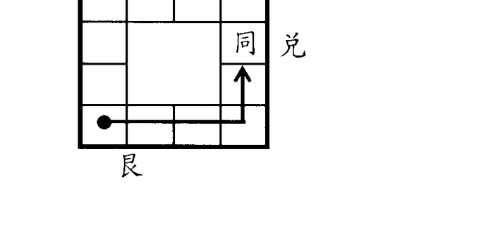

兑卦加心字旁为悦，是快乐的。

艮卦加心字旁为恨，是不快乐的。

若两卦能够山泽通气，必是快乐所构筑起来的心灵至福塔。
快乐的人，是会祝福他人的；不快乐的人，怎会去祝福他人。
而我们要学习做快乐的人；不快乐，福它会渐渐远离我们而去。
所以，天同星的第三义，在世上做一个快乐的人。

## =如何做=

> > 天同的特色：
> 
> 人生并不完全是痛苦，人生大部分是快乐的。假使我们要追求快乐的话，无论是暂时的快乐或是幸福，也只有在这个世界里面追求。这个世界是「最可能愉快」的世界。换句话说，我们只有像我们现在所生存的世界才有快乐。若你只认为这个世界是痛苦的，在这样痛苦世界之外，我们在什么地方，才能够找到另一个快乐世界呢？所以不要说：「苦海无边。」不信且看，丙一同机昌廉，假如我们要快乐、幸福，只有在有情欲、有知识、有理想而又有缺陷的世界里去追求。正是：「世界原自缺陷，人心原自圆满；吾人当以圆满之人心，圆满乎缺陷之世界；不當以缺陷之世界，缺陷乎圆满之人心。」这就是真正懂得「惜福」的人，修得他人所没有的鸿福。

## 華貫天四化日月星辰寄情天地

### <3> 懂得了“惜福”的人，更要懂得“修福”，如何修？多些“感恩”的心。

人，懂得去愛人、敬親，是造福的開始。

人，懂得去感恩、禮親，是修福的成長。

如果我們自認是個很有福氣的人，而從來不會對他人或萬事心存感恩，一味的，認爲別人對我好是理所當然，表面看似是得了福，其實內裡已經失了德，最後的福終歸流失盡！人！須要懂得飲水思源，要知曉曾對我們有恩者心懷感恩，那天同星的“福神”一定會降到我們自家門的。因爲福字是看不到的，然，福神總是降落在懂得感恩心的人身上。

### <4> 天同星的玄機：

曾有一位小孩子在學校中，每次考試同桌的同學都考第一名。他回到家裡都會問媽媽說，爲什麼同桌的同學每次都考第一名？媽媽不知用什麼方法來回答小孩，因爲她發現孩子已經發現了—“自尊心”，更不敢輕易回答。

過了幾個月，孩子又舊事從提，媽媽心想，人的智力真有三六九之等差，又不敢明講，怕傷了孩子的自尊。只問最近考試有沒有比以前進步啊，名次有沒有提升啊，孩子說有，媽媽順口說：「好事一件，很好，不要講了，上館子我請客。」不做任何正面回答。

百思不解的孩子總想傲問出一個答案，一等等到期末考完，同桌又是第一名，回到家裡又問媽媽，媽媽說，明天我帶你去海邊玩，你會得到滿意的答案。就在一次作文的作業題上，這孩子把媽媽的故事寫了上去......

> 「媽媽指著海浪，並指向在海邊尋找食物的小鳥。她說：你看，當海浪大時，小麻雀拍一拍翅膀，一、二下就飛上天了，很高很高，但海鷗卻遲遲地、笨拙地才飛起，你要學海鷗還是學小麻雀」。

這一則故事，在告訴我們些什麼啟示！

人人皆有愛心，但人人也有自尊心，同樣一顆“心”——赤子之心，從小就深植在人的心坎裡。此文章看出母愛的偉大與智慧，在於她不傷於子女的“自尊心”。同理，身為人都是由嬰兒而長大，長大後也會用自己內心的愛而去愛一切，但真懂得愛的人，千萬不要開口出言，說些傷到別人自尊心的話，是使不得的。若使得別人受傷，自己也損福，何必呢？「眼睛中沒有淚水的話，他的靈魂也不會有彩虹。」

※在斗數上，天同星坐落在六內宮位的人，其自尊心都很強，尤其在命宮、疾厄、福德等宮位。若自尊心（或主觀意識）太強，反而會傷害自己，因它的太強則會甚過於愛心，不懂得去接納或用愛去領會他人的善意，有福者則會轉而為禍。所以，有天同這福份的人（指有生年者），應多多學習「接納」、「領會」、「包容」他人，千萬不要用自我意識表達自我的自尊，來代替愛心，這樣會沒有好緣相隨、緣遇在今生。

——人生處處峰迴路轉，時時存在柳暗花明——

獻給心中有愛的人

### <5>天同的奥秘：

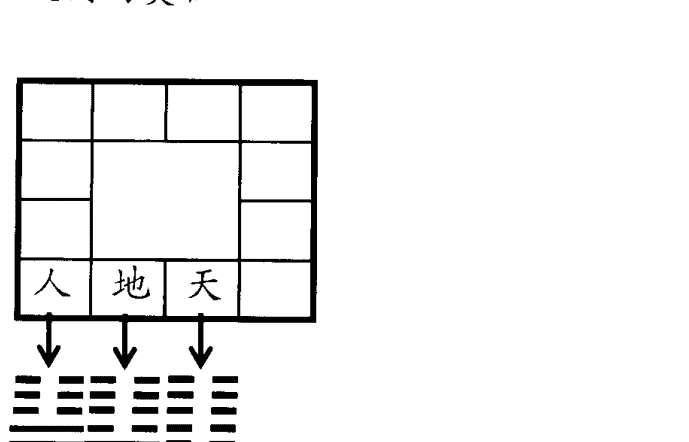

解：(1) 天同化禄在丙。
此丙，数为三，其意象征 “人”。
所以

表格一：
| 甲 | | | | 日 D | → 天 (太阳) |
| 乙 | | | | 月 D | → 地 (月亮) |
| 丙 | 天同 | | | | → 人 |

表格二：
| 化禄 | → 生为人 |

表格三：
| 天 | 1 | 4 | 7 | → 12宫位 |
| 地 | 2 | 5 | 8 | → 15洛书 |
| 人 | 3 | 6 | 9 | → 18星辰 |

十天干，15颗星参与四化
(朱子曰：数原地25)
是斗数以四化为用神 (地数)

(2)即然天同是“人”，它有人生三部曲。引“人”：三、六、九，等差數。

- 天同三部曲
  - 丙（三）（天同A）→誕生為人的喜悅
    - 親情的愛
    - 手足的情
    - 同窗的講習友誼
  - 己（六）（武曲A）→婚姻嫁娶的快樂
    【武曲代表嫁娶】
    - 夫妻的結合
    - 家庭的歸宿
    - 責任的擔當
  - 壬（九）（天梁A）→福壽雙全的慈祥
    - 福壽安祥養天年
    - 晚年有兒孫依怙

(3)天同是人要面對人生、面對生活，在每日的生活中，都有天同的影子。吃飯、睡覺、工作、結婚、生兒育女、健康、快樂，都是天同星。它本身存在於精神面也是物質面，是物質的人生觀現實面。為了“生存”，天同星就會為了現實而找到了藉口。因此，有的人就會為五斗米折腰（精神與物質有時會找不到平衡點）。

天同的三部曲，就是人過一生的介面，以三段的過程走完它。

### <6>天同星的特性

- ◆ 天同星與食、住有關，食→飲食；住→置產。
- ◆ 天同星與人的健康有關，天同與天梁星互為表裡。
- ◆ 天同星與夫妻的相處好壞有關，當天同星顯示不好時，也可以用天同星來斷婚變，因天同星代表結為夫妻的“夫妻星”。

註：天同星代表夫妻星，出處於易經（下經）。

- 周易分上、下經，上經言天、地；下經言人、（事）。
- 下經之首，始於咸卦和恆卦，為周易的第十六對。

卦辭：「咸、亨、利、貞，取女吉」，是說男女交感要真正才能走運·娶妻才能吉利〔男女交感，猶山澤通氣〕。

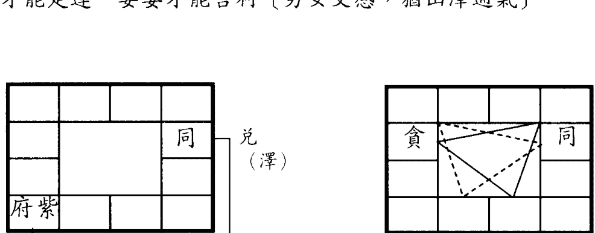

◎一般術書上言：申子辰→咸池在酉
巳酉丑→咸池在午

◎其三合的交叉點都在子、午、卯、酉，再把這四點稱為咸池或桃花，即（咸池=桃花）這是不實之說。

◎試問？申子辰，三合水；巳酉丑，三合金。

金（化祿）、水（化忌）本一組，即金在水中或金生水都好，是「亨，利貞」，怎麼可以誤導入桃花。是以，天同之應用在於“化祿、化忌”一組。

- ◆天同星與人事有關（不是人際關係），如人事的變遷、升調或部屬的流動性〔留得住、留不住〕……假以天同星顯象是不好的，最好不要管理人事之事務。

- ◆能為領導者，如能管理人事或帶領部屬者，大部份天同星是顯示好的〔如天同星不自化者〕.

### <7>一方水養十方人。

◎水，乃是人生存的活泉，正是「為有源頭活水來」。

現代用的是自來水，古時用的是井水·井文化也是中國古老的文化·常言道：吃水不忘掘井人，意謂著，做人要懂得飲水思源。易曰：「井冽寒泉，食」。

天同星，是福星，是送給那些能飲水思源者，最大的天賜福澤，其祿也必永終（生為人的丙天干，一開頭就是天同化祿，即是此意）。

◎井字的一口井文化，影射了洛書的千古文化之傳承·兩橫平行；兩豎平行，兩組平行線段交叉，造就了一個樸實無華的漢字“井”。井字也不過四筆四畫，如一幅俯視圖，滋養著生命，灌溉五穀也澆灌出一種文化的源流。井似是激情縱橫的大特寫，書縱入地上天，書橫天涯海角，不僅讓人看井泉深深，亦讓人們讀悠悠歲月裡品味著永不竭的文化。人與井的對話，一開口講了幾千年，深奧的、淺顯的、技術的、哲學的、理想的、傳奇的…。於是，水之井成就了歷史的凹槽，汪著水情也汪著人情，數不清的太陽在井裡浮過；數不清的月亮在井裡掠過，月亮朔望圓缺，太陽每一日都是新的，是阡陌交織華夏文明的一種驕傲。

- ◎洛書：就是井字的模型。

象數是「一涵三義」，是奇數用三，而一只是數之本。

貪狼甲木←→天同壬水

甲(1)+壬(9)=10 (一方水養十方人)

其意在表達

| 4 | 9 | 2 |
|---|---|---|
| 3 | 5 | 7 |
| 8 | 1 | 6 |

對角相加皆合十（其數止於九）

- ◎意味，天同壬水在井中，井文化是洛書源。

【洛書】

### <8>井水必在地下，不在天上。

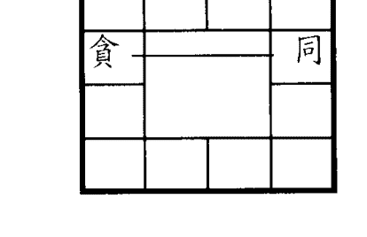

- ◎不管天同坐落在那裡，貪狼星一定與天同星並列在“地支”的六合位，象徵水在地上而見，是有情之合。

- ◎天同是水，屬壬水（陽），陽是有活力的，是一種可以供飲用的活水，而不是死水。

◎陽者氣也，水中必有氧氣，而貪狼的生氣對水而言，是氧氣也。所以，天同與貪狼配，得水之生氣也。

## 例

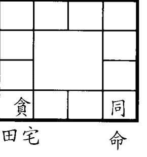

<1>命宫天同星，貪狼星在田宅。很喜欢朋友來家裡聚聚。俗話說的：人氣要旺（天同=朋友）。

田宅 命

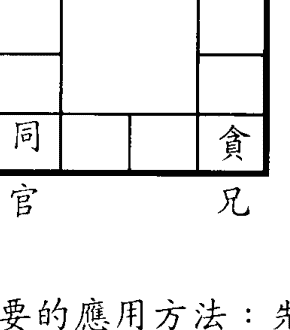

<2>天同在官祿，貪狼在兄弟代表：

◎宜上班

◎好客，喜與友同樂。

官 兄

※主要的應用方法：先看天同坐落何宮，猶此宮有一口井。次看貪狼星的宮位，表明此口水的氧氣（生氣）在何方？

◎如天同星在夫妻，貪狼星在田宅，結了婚以後，心中總是渴望著要置產，以顯示出“有象”的安全感。

以上都是 1（甲木）+ 9（壬水）=10（圓滿）的應用。

### 補註

五行家常言：水生木，但不知木在水中養（在水一方）。金生水，但不知水中含有金（在水中央）。
五行高明不在相生，而在相剋。
◎地球從來不順轉。
◎風從那裡來，球轉風就來。

### 演員排練

天同星有化祿、化權、化忌。

> 花無百日紅，人無不去福。
天有不測風雲，人有旦夕禍福。

這不測與旦夕之間的變化，是什麼呢？是丁天干的天同化權。它隱藏了不測的玄機，「是福不是禍，是禍躲不過」，在禍福相倚的理念下，都是在天同化權裡變了質。人說「物歸有主」或說「有德者得之」，這裡面的含義是有很大的玄機存在。〔天同化權有瞬間變化意，瞬間改變念頭，不能貫徹初衷意志〕
我們不妨先瞭解只要生為人，都有天同化祿，人人皆具足，是有福之人。但妙的是，“福”字是看不到的，它藏在於每一個人的「因、緣、果、（報）」中，若用白話解「如是因、如是緣、如是果」，這三個字貫穿了一個天同星。而介在這個“因”與“果”之間，就是“緣”。一個人在世上會有不同的緣遇，緣遇之不同改變的就是最終的→果。即緣遇的好壞，變化既是天同的果實。所以說：「緣遇的吉凶，改變了生命的果實」，這就是天同星的本貌，不要認為天同星是一顆吉祥的福星，它本身不會存在於絕對中。

例：能赚大錢是一種福氣，「氣」是會動、會跑，能赚大錢的，守不住的大有人在，它不屬於福份。

福份，在哪裡，在德性中。所以，丙干天同化祿，必配一顆廉貞化忌。朱熹說：「尊德性而道問學」是也。

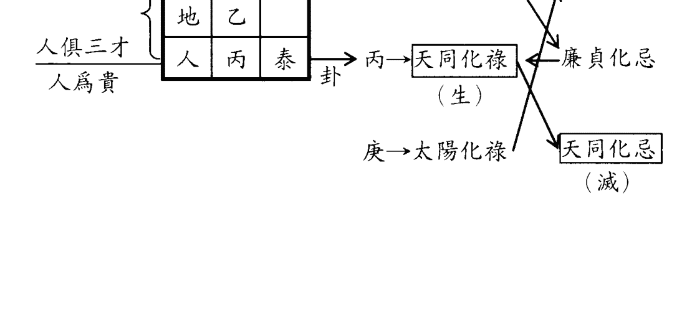

◎萬物有生有滅，這是自然的定律·其生其滅在易學上，稱作「定甲庚」·此“定”字，指的是自然生滅的定律。故：庚天干:天同化忌。

### ※天同星之應用，基本法則：

- 1. 天同星在四化上，取化祿、化忌爲用。而化權反而會有突發事件，既是會有變化之可能性。

- 2. 天同星在星辰上，要配合巨門星與貪狼星一起應用。

- 3. 天同可論的範圍很多；如住家、婚姻、福報……。

### 例一 女命，辛年生

解：來因宮財帛，化科、化忌入命，為上班族。

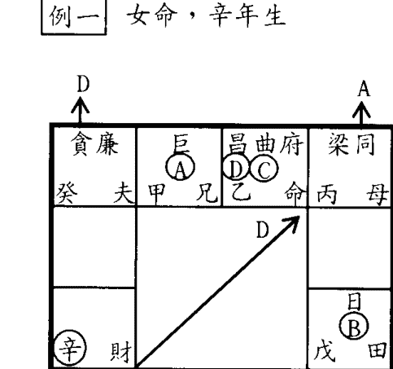

- 1. 天同星自化祿，法生年祿在兄弟宮，兄弟宮是田宅的三合，由此自化祿，就可以聯想到此人會不會置產（天同與住家有關）。

- 2. 疾厄宮坐庚，天同化忌入父母，法生年忌在命宮，代表本人會置產〔天同用神須祿、忌配〕。

- 3. 若生年忌不在命宮（或六內宮），可能就不會置產。

- 4. 天同須配巨門星：巨門星在兄弟宮，代表兄弟或姐妹都會置產。

- 5. 天同須配貪狼星：貪狼星在夫妻，說明置產之事都在婚後才會進行，婚前是不會置產的。

(6)此人貪狼自化忌，代表在第五大限，須工作退休後才置產。

※注意說明：

天同→配巨門，代表某一種「現象」會發生的「內容」。<物相>

天同→配貪狼，代表這個現象如果會發生，是因應於的時空，在何時最恰當。<時宜>

### 例二 甲年生，女命

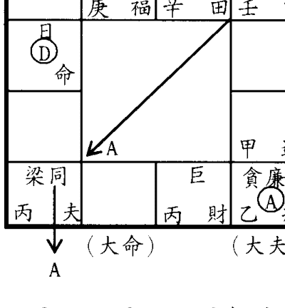

(1)官祿宮向心力，天梁化祿入夫妻，法生年祿在疾厄（六內），代表會賺錢（先）。

(2)在天梁的位置坐丙，使天同自化祿又把生年祿帶出去，代表會損財（後）。

(3)歸納言之，就是先得後失。

(4)天同配巨門：巨門在財帛宮，代表物相就是損財。

(5)天同配貪狼：貪狼在疾厄，損的都是自己曾經賺來的。

(6)什麼時候要小心？應於第四大限，因為，因應時間的貪狼星變大限夫妻宮時，乃天同自化祿是本夫夫。

### 例三 丙年生，男命

解：来因宫在命宫，与自己有关。

| | | | |
|---|---|---|---|
| 同④子 | | | 贪 丙命 |
| 巨机 |
| 母 |
| 庚遷 | | 庚官 | |

- (1) 天同星在子女，天同有生年禄，没有自化。
- (2) 既然没有自化，只好用化忌来平衡。
- (3) 本官禄宫坐庚，天同星化忌入子女宫，构成禄、忌，代表此命主上班为宜或有一份工作可做。
- (4) 天同→巨门：巨门在父母，代表工作地点在公家或大公司的工作环境。
- (5) 天同→贪狼：贪狼在命宫，代表他本人很自立，独立性强也有才华。
- (6) 命主本人打从学校毕业后，就在公家机关上班，迄今都有一份安定工作。

### 切記

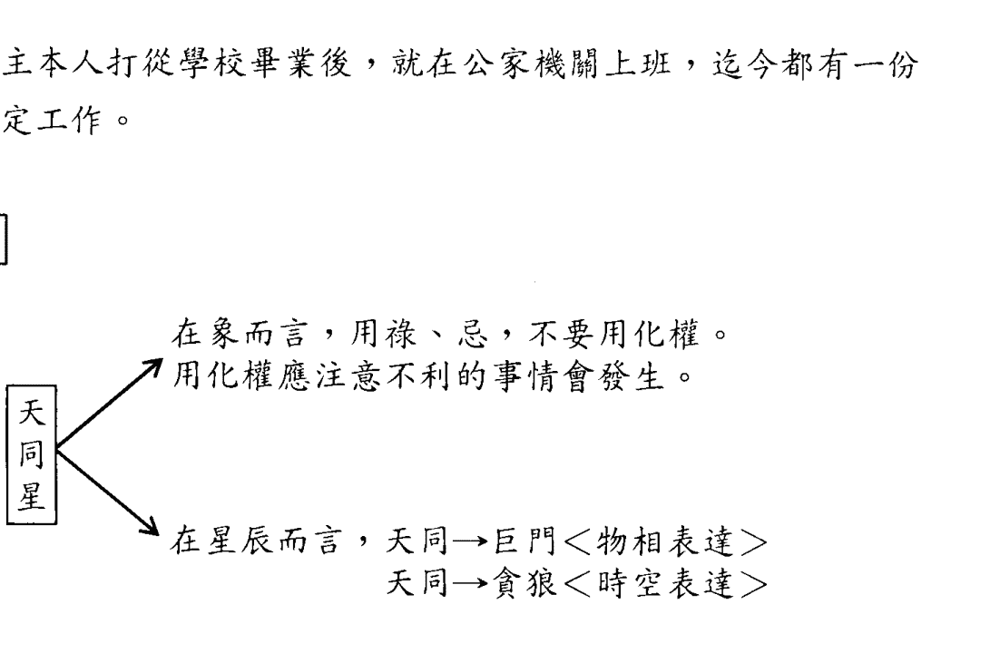

## # 第四顆星辰

## ## 天心月在杯中圓——太陰星

> > 春江潮水連海平 海上明月共潮生
> 灩灩隨波千萬里 何處春江無月明
> 
> ………………（張若虛）

### ### 小語

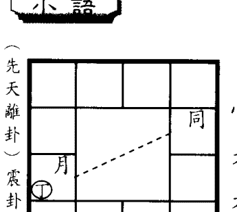

多情卻似總無情，唯覺樽前笑不成；蠟燭有心還惜別，替人垂淚到天明＜杜牧·贈別＞。天亮了！為什麼？月亮會在東邊？為什麼？後天八卦是起於震？為什麼？破曉時分，雞會鳴叫？而玉兔呢？因為：兌納丁，雞叫在卯，月藏玉兔。兌納丁，萬物所以生，帝所以出乎震（帝指萬物滋生）。正如老子曰：「三生萬物」。人也是萬物中之一類，以致，天同星。若是人須有愛心，那麼面對的太陰星，就是愛中含（納）有情，謂之「愛情」也。但必須說明，何謂情？「感於物而生之者，謂之情」。倘若對任何人、事、物，皆無感於衷者，他何來情？我們人不是天生就俱有愛情的，然愛與情這兩字是不能直接劃下等號，若是愛情是可以劃下等號，那麼，人圓月也圓，世上就不會有月亮的陰晴圓缺的景觀了。兌納丁，丁太陰星化祿，代表人（為天同星）皆有愛心，當這愛的心，感於周遭的人、事、物，所引動出來的叫做「情」。如養寵物養久了，也會有「感情」，這個感叫做“納”。兌納丁，說明了人人皆有愛，而愛中含有種種的情懷，此情此懷已不再是天同，而是太陰〔同陰，就是兌納丁〕。

天同是愛的心〔內在〕→ 愛可不渝 → 如母愛。
太陰是情的素〔外在〕→ 情隨境遷 → 如月亮。

又：丁、巨門化忌，是萬物已生，帝出乎於震＜蘇東坡易傳＞。所以，巨門星在地品萬物（丁，地數為四），真是一「大地回春」，故丁：陰A、同B、機C（地球逆轉到東方【春天】）、巨D（大地回春萬物生）。

| 太 陰 小 檔 案 |
|---|
| 五行：癸水<陰> |
| 中天星 |
| 先天八卦：離<br>後天八卦：震 | 皆火 |
| 太陰四化有：化祿、化權、化科、化忌 |艮納丙（由艮逆六到天同<兑>），取一、六義（水）。
兌納丁，取水、火義（不相射）。
天同在兑，先後天八卦皆水；太陰在震，先後天八卦皆火（雷：火也）。
太陰（月亮）本無光體，只借太陽之光（離），又水中有火<兌>納<丁>，猶陰中有陽叫少陽，少陽居東方。

| 後天 | 先天 |
|------|------|
| 兑 ☱ | 坎 ☵ 中爻皆陽（天同壬水） |
| 震 ☳ | 離 ☲ 中爻皆陰（太陰癸水） |

說明：月亮無光體，只借陽光，故兌納丁（太陰來化祿）。
且：離、震兩卦上爻皆變，有貪狼生氣義，一陰一陽之謂道（老陽對少陽）。在斗數上，化權、化科為一組的由來，也可以用此解釋。

# ◎在此說明：

太陰屬水，性屬火。不要以為太陰是柔情似水，那個似水的「水」，不是指太陰、是天同星，是心中有愛的人，其情才是水，故說：「似水」，老子稱它：「上善若水」。
望月思情物！是月亮嗎？還是人在思情物？請不要被月亮騙了，它，只會偷笑人間，從不開口的啞巴啊，所以永遠是「古月照今塵」、「一月千般情」。

# ◎

◆卯——酉。
潮水，水平貌。故「春江潮水連海平」。
◆太陽從東方起來，也稱地平線。

## 星辰說明

> <一>繫辭傳(上)：「夫易！廣矣大矣！...廣大配天地，變通配四時，陰陽之義配日月，易簡之善配至德。」
解：在斗數上，日、月都是中天星。

# 斗數盤

<二>太陰星在斗數上稱田宅主，意味著太陰星與房子有關。我們居住房子，講究的是一種舒適安逸。所以太陰星是為一種安逸、安祥的星辰，如安靜無波的一盆水，這是太陰星的本色，也是太陰星最美的本質。以致太陰被形容如人愛美的天生義，是一種“柔”的特徵性。然而，月亮的本身雖有這種特質，但是她會有她一種美中不足的缺憾，就是她會有晴時多雲偶陣雨的脾氣，使她有時地不能自主的控制自己，於是太陰星應在人間的人事上，於人、會情緒不穩定情緒化；在事，常常願與心違，不能貫徹始終完成一件事，或努力的結果是一場空。說明了，世上並沒有圓滿可稱幸福的東西，唯有我們人的心能包容缺陷者，才是真正的圓滿。就像我們若能去包容月亮原本具有不圓滿之特質，就不需再要求別人與我同圓滿。這才是「人圓月也圓」的真諦所在，也才是一個真正有福的人。（天同與太陰的組合）

<三>女人、花、才藝、藝術品……等，可用太陰來比喻，只不過取材於月亮美感之投射而已。世上真有最美的東西嗎？像同樣賞月的人，含有不同的兩般情一樣，說明了，真美的東西是藏在「內心的美、靈魂的美」，美在人的心地，不在於外顯，表達了太陰星最慈愛的一面。不然為什麼，有人把太陰星當作觀世音菩薩來形容。（太陰單星）

<四>太陰為驛動之星，它與太陽、天機都一樣，此三顆星都在天體中運轉，所以稱此三顆星都是好動的驛馬星，是顆不耐靜的星辰。而太陰星的動於我們人而言，指的是“時間”，它貫穿了現在、過去和未來，讓人自覺就是活在昨日、今日、明日三天中，再加上月亮圓缺的變化，就會有對人世間的一切事物，存在於所謂的無常中，變化無常，今比非昨，緣生緣滅，沒有永恆的故事，可以一曲唱到老。只有片段的總總人、物、事，剪接再串連在生命旅程的歲月裡，如夢幻般的影片銜接。

> 金剛經最後有一偈：「一切有為法，如夢幻泡影，如露亦如電，應作如是觀」，如是觀什麼？無常才是真理。看得透無常，才知「無常即常」的妙道。（天機與太陰的組合）、（太陽與太陰的組合）。

## 註

- （1）天機、太陰為“時間性”的組合，像是一種過程，所以沒有永恆的人、事、物，都隨時潛在於變化中。白話點，就是心中很想安定，但偏偏就不讓你安定，隨時必須要去面臨變化的命運。
- （2）太陽、太陰為“空間性”的組合，它存在於人、事、物中，是為一種「有、無」、「好、壞」、「吉、凶」等相對語上。

# <五>太陰亦是財星，此財星不是指有無能力賺錢的星，它與武曲星剛好顛倒。武曲是講“賺他人之錢”的能力，如謀“生計”解。
太陰星是把賺來的錢，如何使用它，或用到那裡？即消費的一種；如買東買西的購物。然而，太陰是顆會變化的星，就連購物上，也像經濟學上的邊際效用一般，視需要而變化。

# <六>太陰星是斗數易學之母體。其用在三合，是洛書用法的體現。凡是太陰星的用法，都以三合為應用。其三合必含三才（天、地、人），這是廣傳三合法的源頭。

- ⊙以太陰星為基準，看三合。
- ⊙任何三個三合，必含三才。
- ⊙三合是“用”，不是“體”。是時間性的表達，像後天八卦，只是氣的流行。

| 人 | 天 | 地 | 人 |
| 地 |    | 天 |    |
| 天 |    | 地 |    |
| 人 | 地 | 天 | 人 |

<七>太阴星既然是以时间来表达，重点在纳甲。人在地球上（戊己）观月亮变化（乾坤）、（上下）。

戊己乾坤门
月相日子周期

1. 兑、乾、巽三卦有七个阳爻、二个阴爻，故月亮明亮。艮、坤、震三卦有七个阴爻、二个阳爻，故月亮暗淡。
2. 2 × 7 = 14，代表斗数、紫府14颗星辰。或应女性14癸水至。

- （3）二、七同道，改用乙、庚。
乙→天機化祿，庚→太陽化祿，代表地球、太陽、與月亮，在天體運轉之自然歷象，影響人類的生活起居，這就是命理存在的“初衷”。
- （4）斗數取名爲十八飛星，乃取自月亮圓周之一半。八卦一周三十六爻，十八爲取其半。故三合法，只是用半，名之“十八”飛星斗數，是故斗數源於月亮，其用太陰曆元爲根源。

# <八>人的生命，爲什麼與月亮有關？

- 乙〈天機A〉
- 庚〈太陽A〉
- 丁〈太陰A〉→壬〈天梁A〉
  - ⇒ 人懷胎要九個多月日子
  - 人在命主長壽（天梁）
  - 人須丁壬合科在東方，生於寅
  - 五虎遁在寅，爲壬寅，
  - 故人的命運是月亮在主宰，
  - 不是太陽在主宰，所以不用“節氣”。

<九>庚天干有太阴化科，癸天干有太阴化科，是对的，不要任意篡改。

注

- （1）易经是一阳二阴的排列组合
  - 甲、戊、庚〔一阳（廉贞）二阴（太阴）〕
  - 丁、辛、癸〔一阳（太阳）二阴（太阴）〕
- （2）太阳是依山而起，其数差六格，即取一六元合。

- ◎太阳逆转到廉贞止，代表太阳从山而起。
- ◎后天八卦的乾卦，回到先天八卦的乾卦。
- ◎此图说明了，斗数是有易经的根源，不是没有根据由人自圆其说。

3. 詳看破軍星。
4. 庚天干是太陰化科，願後學都加留意。
正確是：太陽化祿、武曲化權、太陰化科、天同化忌，沒有福星不化忌的理由，子曰：「我非生而知之者，好古敏以求知者也。」共勉之。

### 演員排練

### （1） 癸年生，女命

◎癸天干在命宮，太陰化科在子女，代表有子女之命。
◎太陰所在宮位，坐庚，庚會使太陰再自化科，代表生產子女要特別小心，恐有災厄。
◎當大限走入第三大限時，子女宮會變成大限的疾厄。

### ◎為什麼會有災厄的現象。

1. 癸天干的太陰化科。
2. 庚天干的太陰化科。
同時交會的宮位要特別小心，這兩個天干的會合，正如月亮看不到的那一面→背面。都會有一種劫難發生。
◎此人真的在生產時發生意外。

# ## （2） 癸年生，男命

- ◎癸天干，破軍化祿又自化祿在交友。
- ◎太陰化科在財帛。
- ◎福德宮坐庚，又化科入財帛，構成太陰化科在癸、庚會合中。

- ◎此人曾被朋友損財過，失了一筆大財。
- ◎太陰星的重點，在宮位論，指太陰在什麼宮位爲主。

# ## （3） 丁年生，女命

- ◎丁年生在交友，太陰化祿在子女。
- 對面田宅宮天機自化祿。
- ◎代表此人在第四大限前，不宜置產，或置產不宜用自己名義。
- ◎此命例是太陰在一條本宮與對宮的宮位上。

# 第五顆星辰

# 情牽歷史的指紋——廉貞星

> 鳳凰臺上鳳凰遊　鳳去台空江自流
吳宮花早埋幽徑　晉代衣冠成古丘
……（李白）

# 小語

廉貞星，一顆來自走過千古無數世代的歷史痕跡，留下人類無數的指紋，喚發出中國慎終追遠的美德，留芳後世代代追思。它，亦也是地理的祖德諸山，情牽於歷史的血脈裡，深深地烙印在指紋痕跡中。
九星參闕錄曰：「紫微斗數，夫地理之道也。地道（九星）適法於天而斂；囿象（四象）乎形於地而正。呼五星（廉貞）喚八卦而作天（門）地（戶）。以四、六合天心而極紫微——會元三方而震九州（三合九星）綱蘊陰陽二氣，秘符山川秀對，往來活潑，法無定法，天機無礙，心印圓方。端在生氣（貪狼），尋根命主（子位），飛星一竅，七星爲訣（七星訣）」。

- （一） 九宫之内有八卦
八卦之外无九宫
- （二） 山以生数旺人丁；水以成数兴财福。
山水阴阳天地对；七星九曜斗数图。

| 廉贞小档案 |
| --- |
| 五行：丁火<阴> |
| 北斗星 |
| 先天八卦：乾 |
| 后天八卦：离 |
| 四化有：化禄、化忌 |

> > 『纳甲之阴阳，即卦理阴阳；
卦理之阴阳，即河洛阴阳；
河洛之阴阳，即天星阴阳。』
廉贞，给我们的思维概念：
就是——
「河洛」之机；
「天星」之理。
尊重它，可以看到生命遗传信息，在人的身体，找到脉动的心。

## 星辰說明

（1） 民以食爲天（天同星），居以宅爲地（巨門星）。然無論是陽宅或陰宅都離開不了廉貞這顆星。在七星九曜中，它居中宮，御駕四方。在四方中，合成九宮。即

## 註

◎在河圖上，四九西方金，金屬化祿，故甲以廉貞化祿爲始（在象而言，所以只有祿忌）。
在八卦上，廉貞主山，而艮卦是山，且卦是艮始並艮終。
又，爲什麼？廉貞化祿在甲，廉貞化忌在丙？
乃甲木生丙火，故丙納艮，即艮在丙，完成「天人合一」。合乎於艮卦的艮始（甲）艮終（丙）

以廉贞为中心，当祖山，贪狼星为山的入首，称来龙；七杀星为山的出处，称去脉。构成了一座山的形势，在命盘中。所以说：「紫微斗数，夫地理之道也」。
廉贞星是祖德之山，故有荫于子孙之德，当然有的是无法荫到的，故孔子有曰：「积善之家必有余庆，积不善之家必有余殃，是也。」

# 欽天四化 日月星辰寄情天地

從人（天同星）的角度去看這張圖，人之有福，俱有先天性的，稱它「福份」，是祖德之蔭，是別人無法代替的。一種是後天性的，稱它爲「福氣」。
今在此所要講的是先天性的廉貞星。佛祖曾說：「外乞“食”以養色身（猶後天），內乞“法”以養慧命（猶先天）。」因爲我們現在不是都在延續祖德的慧命，聽聖人的福音嗎？
這麼一顆好端端的璀璨之星——廉貞，爲什麼在市井書籍中，都往不好的方面去詮釋且居多呢？假以斗數沒廉貞星，就沒有所謂的風水建築學。
欽天四化正義有載：

- 斗數星辰
  - 空一 → 象一天而君 ● 太陽
  - 空二 → 畫二地而臣 ● 廉貞
  - 空三 → 得三泰而民 ● 破軍
- 五星齊而中
  - 應份所得曰廉潔
  - 操行不拘曰惟貞
- 四方望而取正
  - 看臨四正（天）→ 天道上升，故一陽生於北，即地雷復也①甲木
  - 以御八方（地）→ 地道下降，故二陰生於南，即天風姤也⑥己土
- 指向北斗 → 貪狼 ⑩位
- 指向北辰 → 紫微 ④宮
- → 同宗河圖北方水 陰陽顛倒乾坤門
故 → 天下有風姤 姤以施命誥四方 → 紫微北辰也
誥響④方以命物 ⑨載七星左右輔
- 四九西方金 河圖本位 洛書易位
- 四化正義

# （4） 廉貞星的教外別義：次桃花

古書云：「廉貞為次桃花」，後學都依字解義，說桃花就往桃花的字眼上去含射，認為廉貞星是人帶桃花的星辰，應該不是這樣解釋的。

# 次桃花解義

◎廉貞星是地理九宮為中心主軸，其它八宮的變化，也都依中宮的星辰而做變化，這就是流傳已久的洛書九宮。
◎所謂「次」，是指九宮運轉，都依固定的「次序」在運動，不可以不照次序亂運作，也說明了「飛星」斗數，這兩字的另一種內涵。

解

<一>原本乾納甲的廉貞在午宮〔先天八卦〕。
<二>依洛書九宮的運轉：不論中宮是什麼星，它的次序一定往西北，後天乾卦為走向，以達到先天成一體的（如現在是八白運，可以把八代入中宮）。
◎所謂「桃花」，指的是「祿存」，甲祿在寅的由來。
◆乾卦納甲、壬，在地支是午、未宮。午未宮是地支六合，且午、未是日、月合其明（午配日；未配月）。

◆依九宮：
- <一>廉貞在中，必從後天乾為走向，必見太陽在乾卦（以星辰而言），構成先後天卦合一。
- <二>桃花是春天的花，依九宮次序，必在三數祿存位。
- <三>祿存數三：
  1. 代表天、地、人的人。
  2. 應後天八卦震為始，順推八卦，終於艮。艮納丙，應其數為三（廉貞化忌的由來）。
③在星辰，震卦是太陰星，構成日、月相見匹配乾納甲、壬的日、月（午、未）而合其德。
<四>甲的廉貞祿應在艮卦。（前已述）甲的祿存也應在艮卦。甲祿在寅，為什麼，甲為艮始。
<五>由此而知，桃花指的是「祿存」。俗語常言：當我們生了孩子都常說，孩子自己都帶有他自己的糧食來。若這句俗語當真，引論的這些糧食，就是祖德福蔭，不就是與廉貞星的餘蔭有關嗎？
<六>祿存真正的含義，是由廉貞<祖德>轉化過來的。依易理而言，三、五同功；依易數而言，三、五錯綜。所指的就是廉貞與祿存。

# （5） 據北斗七星位而言：

（6） 陰陽顛倒乾坤門，其意就是「乾坤爲天地之體，坎離爲乾坤之用」。而坎離、乾坤都在子、午線，正是冬至與夏至之月令。故在斗數排星中，都依據曆法而制，叫天星立法。
- 府紫在寅：紫微逆排，由冬往夏走，止於午位見廉貞；天府順排，由夏往冬走，止於子位見破軍。
- 又：甲廉貞化祿，象徵山；癸破軍化祿，象徵水。風水在在應用都談山與水對。
- 且：乾納甲壬，代表天；坤納乙癸，代表地。不正是乾坤爲天地之體嗎？
而甲在午、癸在子，也已包括了十天干在内。斗数称它「十干化曜」的象征性。

# （7） 廉贞星的深层底蕴

当我们知道廉贞与祖德有关，而我们又能感同身受到祖德之庇祐，其理由有三：
- ○因风水之术而感应之，好似冥冥中有某种力量在支持着。
  ※在人身体的本身，都有所谓的遗传基因，以致有些人的身体病痛，是有遗传性的征兆。
  ※宗教家用因果理论来阐述这些所有现象之吉或凶，用前因后果有概括，殊不知这些说法或理论全部都与廉贞有关。
- ◎廉贞星是基因 { 甲：廉贞化禄→基因信息。 丙：廉贞化忌→基因完成。(存在人体内) }
  这个基因，也深藏着人的的人性→善、恶之本质面。
> 「生命长河的主角是基因，可不是生命个体；你我只不过是基因的运输工具，负责搭载它们穿越生命的世代。」
- ◎以上是言，「性」——生命未生之前。
> 「生命本身的目的，不在长寿，不在追求幸福，而是要使DNA的量达到最大。」
◎以上是言，「命」——生命已生之後。
> 「DNA既不殘忍，也不良善，它只是存在。我們全部都隨著它的音樂起舞，這就是人生的舞台。」
◎孟子曰：「人異於禽獸有幾希？」此一幾希，是人類與禽獸的DNA不同，而無法與類。
那麼，人是什麼？人就是人，人以自己的本性結構成人類自己的世界，把人類自身與世上萬物區分出來，之所以能區分，是人之性，或說，人該有什麼樣的性？（人性）
人性是什麼？(一)人類的本能。(二)人類的特性。由本能演化為「良知」（潛能）。由特性演化成「個性」。一內一外合成「人性」。但良知不等於個性。

### 演員排練

◎廉貞只有化祿、化忌兩種象，化祿代表男性，化忌代表女性。（對人而言）
◎廉貞屬於基因，它代表每一個人的本性“善惡”說。換做白話指的是人之心地善惡說。不一定指行為，指向起心動念的“念”字。
◎廉貞有離心力自化者，多少都會有祖蔭。

## 例：辛年生，女命

解 廉贞是九宫之中心，凡用于斗数的阳宅学，方法很多，今以最简单的一式，作说明。

(1) 看廉贞所在的宫位为作标（当命宫），看廉贞的田宅宫（顺四格）来鉴定阳宅的基本坐向之吉凶。

(2) 廉贞与贪狼同宫坐在夫妻宫，其本身已经有贪狼自化忌，基本上，这宫位是不好的。

(3) 什么不好？对宫有化权进来，在现象上是指工作不是很好的现象。

(4) 但是化权进来，一定要法生年权。生年权是太阳化权在田宅。把它连贯起来，就是说，如果事业会不好，一定与阳宅有关，并且指的是先生，理由：化权是太阳星，宫位是夫妻宫，并夫妻宫有离心力不好。

(5) 化权，是由戊、癸合化的，故更能证明阳宅的问题。

(6) 阳宅有什么问题？看廉贞的田宅宫，其天干坐丙。廉贞化忌入夫妻冲官禄，且夫妻宫又自化忌，主要的是廉贞化忌冲官禄，在卦上，正是乾卦。（戊、亥两宫）

(7) 此人在第五限（官禄宫）时，其住宅正是坐乾卦向巽卦，结果事业在此大限与友合作的全部损失。（太阳权又自化入子女宫，合作不宜，外局），亏了不少钱。

# 例 癸年生，男命

(1) 廉贞、破军化禄在子女宫。

(2) 官禄宫坐丙，廉贞化忌入子女，且子女宫坐辛，在丙、辛合化忌之下，刚好忌在辛的宫位上。

(3) 法生年忌在父母，若要生意好，要在第四大限，因为生年忌在大官。

(4) 假以此限会赚钱，最好做什么方向？看廉贞的田宅宫，在坎卦（子位），有天同、太阴化科，而太阴星本来就与田宅有关。对宫坐戌，太阴化权入命（大限田宅），于是最好方位，就是坐南向北，与本命宫禄宫（大限疾厄）的自化权呼应，而真正赚钱的流年，就在自化权的位置。（龙年）

> 注 离心力的自化，一般都认为不好。但要注意一件事，要看任何一件事物是已发生，还是未发生。若已有的会变化不好，若未开始的，可能再发生。简单说，就是「有中变无或无中生有」。

## 第六顆星辰

## 守著陽光守著你——太陽星

> 力拔山兮氣蓋世 時不利兮騅不逝
> 騅不逝兮可奈何 虞兮虞兮奈若何
> ..................（項羽）

清晨，當太陽從漫天紅霞中緩緩的升起，把萬丈金光灑向大地，一種蓬勃向上的活動，就會油然而生。看到這個充滿生機的世界，人們不能不熱愛和讚美它，賜予我們生命生存力量的萬物主宰——太陽。

太陽是光，是宇宙之光，也象徵著宇宙之卵，它的光普照著大地，把溫暖送到人間，也照亮了世人，是光明的遍照，照一切處，它不僅僅爲物理性，更是人性智慧之光。覺悟人生、理解人生、照亮人生，爲人們的生存提供有價值且行之有效的指導。它的光，也帶領著我們走向未來，舖向我們預知的前程方向。就因爲這樣，所以斗數稱它爲「官祿主」。

所謂「官祿主」，不是說你從事什麼工作，該做哪一行？真正的內涵是：你的前途（未來）在哪裡？你該何去何從！太陽沒有理由去回答人類，你的行業是什麼？來詮釋「官祿主」。守著陽光，就是守著你的光明，照亮你的前程於未來。它，擁有無限的愛與智慧，普澤群生。

| 太 陽 小 檔 案 |
| :--- |
| 五行：屬火<陽> |
| 中天星 |
| 先天八卦：艮 |
| 後天八卦：乾 |
| 太阳四化有：化祿、化權、化忌 |

## 星辰說明

- <1> 太陽星，是宇宙物質之源。讓人類回歸到現實的一面，就是要有工作；古時的「日出而作，日落而息」，正是一種生活的典範，畢竟，太陽星都是依山而起，人們只要看到太陽升起來了（天亮），就知又是一天的開始了，在這種自然規律主義下，太陽與工作（事業）才被連結起來，所以把太陽星指向代表工作的象徵性，是這樣的由來。

- <2> 人的生活，都是活在昨天、今天、明天的這三天裡，擴大而言，就是過去、現在、未來，或稱三世。其實，在易卦上，乾卦（☰）已告訴了我們，就是三天而已，所以把太陽設為五行的“丙火”，且丙為五陽（五個陽天干）之最（最是始，麗天而行）。

當我們面對著太陽，能夠掌握的只有今天、只有現在、只有當下。人生沒有後悔藥，後悔過去的一切，對未來一點幫助也沒有。但可以借助過去的成敗爲借鏡，努力在今日「走出昨天」。「努力今日」，必能看到「明日之果」。所謂：「活在當下」，就是「把握今天」，故日日都好日，不能把握今天，明日如何能更好呢？

- <3> 太陽星有化祿、化權、化忌三種，有如一日的縮影。太陽東昇了（化祿）、日正當中（化權）、夕陽餘輝（化忌），不也是含有三的影子。

易經以乾卦爲天爲首（排第一卦），象徵尊貴，猶面對皇帝九五至尊的容貌（龍顏）。所以太陽代表了「權貴」，在朝廷爲官用「品」字（三口）來代表「爵位」。所以，人人都想在「權力」威嚴下爭取到「權力」之好奇心，故太陽與政治有關。

然而，權力的傲慢，也隨著人類的「在得到」後而產生的一種負面心態。殊不知廉貞只有化祿、化忌，而太陽多了“化權”你不妨看看那些，不論在士農工商，哪一個角落的人群們，當他在「日正當中」時，是多麼的威風凜凜……。有一首牡丹亭的詩是如此的寫：「萬里江山萬里塵，一朝天子一朝臣，北地怎禁沙日月，南人偏占錦乾坤」。世上沒有『不落的太陽』，權貴也不過是在人間上的過客之旅（在世間說話）。

但太陽的本身是一顆托不落的太陽，那是太陽的“博愛”散播於人間之精神，無怨無悔地，把溫馨的愛送到人間，讓人世間的人感到世間的溫暖，讓人與人之間有敦厚之情感（站在太陽說話）。

- <4> 太陽的心，告白天下人，就是要去「找到自己」。這個「自己」找到時，人生的方向也會找到的。什麼是找到自己？易經曰：「天地定位」。那個自己就是你自己在人生道路上，怎麼為你自己「定位」，做你自己想做的工作或事業。定位在哪裡，成就就在哪裡。

> 一個人如果要成為偉人，
> 最好先忘了偉人，全心全意地去追求真理。
> 因為當他找到真理的時候，就自然成為偉人。

世上所有成功的偉人，都是在自己立定的方位上，全力以赴努力的結果，這是與凡人不同處。

- ◆ 贪狼星→做你自己。
- ◆ 太阳星→找到自己。
- ◆ 廉贞星→当你能找到自己<定位>，才能做你自己。

唯有当你能在找到自己，做你自己的同时，才能登上人类成功的山巅，这就是伟人。

## <5> 自我栽培

成功也该有弯腰的智慧（太阳代表智慧之光）。

或许有些人认为，当一个爬到顶峰的成功者，必定天天高枕无忧，享不尽的荣华富贵，吃不完的山珍海味…那就错了！

愈成功的人，接踵在身后的麻烦也就愈大。因为他已经不是单对自己负责就满足了。最重要的就是训练自己面对“成功之后的副作用”。要明白“就是因为成功，才有这些麻烦”。学习自我成长，披荆斩棘。否则愈逃避，麻烦愈多，难免掉进雪球般的恶性循环里。

- ◎ 太阳（光明）对宫巨门（黑暗）。
- ◎ 当一个人爬上成功的山峰，它的隔壁住了一个善于妒嫉，是非的巨门星。
- ◎ 最大的危险，往往就隐藏在成功者背后。
- ◎ 所以，要想成功的人，应该抱着一种“平常心”，再加一颗“自觉心”，这是“自我栽培”。

- <6> 擁抱著希望就有作爲。太陽星是希望、光明的象徵。我們千萬不要自以爲自己的希望會如何，如何去追逐未來前程，那就會像“夸父追日”徒勞無功的。應該一跳出以自我爲中心的思維模式，從別人的角度或廣泛層面來思考問題，那可能會有意想不到的收穫。這樣的思考的方式，是爲反運作原理。我們人應要有理想、要有抱負那是必該的。然，有的人去追逐它，未必追得到啊！應該讓理想來實踐成爲太陽，太陽才能高照我們，不是嗎？太陽是“照”我們應從別人的角度來思考問題，自然也會得到別人的關照。

- <7> 書上有云：「日月反背」；大多數的人都會往日、月所在的宮位看落在那裡，才是正確位置，倘若日、月落在不應坐落的位置就叫它“反背”，反背的命格會如何如何？日與月都是在天上高掛照亮著我們的，日月它們不會因我們的命盤座落何處來顯象如何，而自己不上朝休息的，它永遠懸吊在天際那一邊，高照著我們。其所謂的“反”要懂得以“反”爲用，否則違背了自然法則。好比月印江水一樣月圓的道理，此圓是在天，在水那一面則是反的，所以它們所表達出來是坎離上下的相反運動。就如同，上述所言的要從別人的角度來看世界一樣。日、月是客觀的世間景象，不是主觀意識的存在。太陽在那裡就照那裡。同理，紫微斗數的命盤無論太陽星座落何宮位，永遠它是“照”對面的宮位的，即也會顯象於那對宮的。

## 例

當太陽在命宮時，對宮即爲遷移，代表會出國或出外離鄉…。
當太陽在夫妻宮時，對宮就是官祿宮，代表重事業工作如同影隨身。
請問:太陽在那睡過?

### 演員排練

太陽星有化祿、化權、化忌。

## 例一 壬辰年 男命

| 左上 | 中上 | 右上 |
| :--- | :--- | :--- |
| 福 | 疾 |
| 貪紫(Ｄ) 母 | 財 |
| 命 | | |

注：图表左侧有一个标注 "D ← 日"，指向第二行的宫位。

- - ◎ 太陽自化忌，對宮爲財帛。代表男性容易在商場生意上損財，表現出來的就是財的問題。
- ◎ 法生年忌，在父母宮：
    - <1> 太陽的光應該在父母宮，此命例以上班爲宜，勿自己做生意，父母宮所屬地方爲公家機關或大型公司。
    - <2> 假以他以生意的方式去謀生，一定會損財的，自化忌在福德宮則看對宮(財帛宮)。
    - <3> 也須注意夫妻間的相處之道，此命與配偶的相處不會有很好的和諧對待。(財帛宮與夫妻有關)

## 例二 辛年生 男命

◎ 辛年生，太陽在田宅，權自化權。此命主的事業在家裡開工廠。
◎ 對宮為子女宮，像似家庭性的工作；換言之，原本此工作是父親（田屬家族）傳下來的，現由子女後代（命主）在經營。
◎ 何以說？太陽權自化權，有承續解。除非自己結束。

## 例三 庚年生 男命

◎ 庚年生，來因在交友宮。
◎ 太陽星化祿在遷移宮，向心祿入命宮：說明自己的工作都必須在外。
◎ 武曲星權自化權，與太陽自化權串連。代表他的工作都與朋友有關。（如合作.共業）
◎ 巨門星自化忌串連，太陰星科自化忌。代表他的工作，太太會幫忙。自化忌法生年忌，生年忌在官祿宮。這是指示與工作有關。
◎ 歸納之，此人的工作與事業，都會與朋友合作合夥共業之。太太會輔助幫忙他；做的工作為服務業。

## 第七顆星辰

## 曾是驚鴻照影來——武曲星

> 桃之夭夭 灼灼其華
> 之子于歸 宜其室家
> ……（詩經）

# 小語

坐對清煙寫夢痕。人生第一個夢，也是自我人生的開始。———成家立業。

成家立業，立業成家，都是人生的起步點。成家是結婚，立業爲生計，此人生兩大事皆爲武曲這顆星所體現的功能性，在體現的功能中完成了一件「成家立業」的主體性。武曲星在民俗的理念中，就是“嫁娶”兩字。能不能結爲夫妻，觀看武曲星即可。武曲星是跟結婚有密切關聯存在的，武曲星的自化或變化，不代表結不了婚，有的也會因有自化而成婚。是在說明的就是武曲只論“嫁娶”兩字而已。

另，武曲星又爲財帛星，而其謂之於財星它的定義則是要人去謀求生活物質最基本的需求，是故，武曲星它所代表的是人的謀生能力的一種工具，並不是所謂的武曲星就是擁有很多的錢財。所有的財富因人的謀生而存在其價值的，套入現代的名詞，就是“交易”所得。

武曲星很喜歡與貪狼星配合，直接地說就是賺錢要有運。因財星總是跟著有運的人在走。而有運之人他們總是滿面春風不是嗎？財神爺，笑嘻嘻！結婚者，喜滿堂！

| 武曲星小档案 |
| :--- |
| 五行：屬金<陽> |
| 北斗星 |
| 先天八卦：艮 |
| 後天八卦：乾 |
| 四化有：化祿、化權、化科、化忌 |

- • 武曲對貪狼 •

真正的生命世界（或生活世界），是指人在他需賴以生活的關係。換言之，人是在他自己與他人所依存相互生活之間，才會出現種種不同對待的情態（如父母、子女、夫妻），好比“母親的世界，是兒女的天堂”因為他們是相互依存-----賴以生活，這就是〔內心世界〕。

## 星辰說明

- <1> 武曲星給人的感覺爲財帛之星，因爲它五行屬金，聯想的就是金銀財寶。這是人之所欲趣之所生；所以它代表是人生與人欲（望），換言之，財爲養命之源。

武曲的本能是「欲」，它的本質是人之「生」。「生」的要素就是活動，有活動就是生，活動停止就是死。（這裡的生是動詞，人要活動意，不是生命的生）

- <2> 活動的原動力是欲。此所謂的欲，包括現代心理學中所謂的衝動與欲望。那麼，欲的原動力者是誰？貪狼星也。因爲貪狼星是每個人具足的欲望之種子，沒有種子也就沒有推動的力量。所以，武曲爲什麼喜與貪狼配合原因之故就在這。名之爲「人之所欲曰生」。

- <3> 人偏偏喜歡去瞭解——人生的問題在哪裡？或問人生的眞象是什麼？凡是我们所见的每一件事而問其眞象，必因我們是局外人根本不知其内幕。同理，人生之當局者，即是人類，人生就是我們人類之舉措施設，根本沒有必要去瞭解其眞象。如「吃飯」是人生、「生孩子」是人生、「招呼朋友」是人生；藝術家的「清風明月的嗜好」也是人生。問人生是人生。講人生還是人生。這就是人生的眞象。正如「佛法不離世間覺」；捨世間更無佛法說。既然如此，眞象再具體的講，就是——「人生的眞象既是與生具足的人生」。因此武曲星的特性就是——「既然人生是具體的人生，就要珍惜今生」。不論過去未來總在今生，“今生”就是武曲的代名詞。今生若不能珍惜你自己，甚至你身邊擁有的一切(人.事.物)，那更不用說待來生了。因為，仙佛沒有為任何人立下--「來生有約」的盟信。

|  |  |  |
| :--- | :--- | :--- |
| 同 | →生為人 (人類代名詞) | |
| 武 | →人因要成長，活在“今生” | ——— ≡ 乾卦 |
| 日 | →人要生活，過在昨日、今日、明日三天中 | |

- <4>

| 唯有人，才能覺解人生 | (精神) | 武曲星的本性 |
| 唯有財，才可養命人生 | (物質) | 武曲星的本性 |

生為人，必須生活在今生；今生的歲月有多長，總是要經過，所抱持的人生觀是由自己去體悟、參與、理解......的。不論成功、失敗、得之、失落、世態炎涼或人情之厚薄等等種種一切的經歷，全部會在武曲星顯現出來。是故，甲天干(第一個天干)，就出現了武曲科。

### 解

## 甲武曲（化科）

- 1. 在人而言:人具有情（念舊）及精神寄托。
- 2. 在物而言:專業的、知識的、宜上班。
- 3. 在事而言:平穩的發展、或做事初始較艱辛。

## 己武曲（化祿）

- 1. 在人而言:做事重表面、形象、喜聽美言，且對自己有關之事物較注重。
- 2. 在物而言:對於利字較重視，上班族做生意皆有。愛賺錢不代表愛錢，只是在社會上，被視為現實派的那一群人。
- 3. 在事而言:投資性、買賣性(現金)--的工作性質。

※武曲化科又逢自化科:有情總被無情誤。 (同顆星或自化不同顆星同論)
武曲化祿又逢自化祿:損失總是有去無回。 (同顆星或自化不同顆星同論)
原因: 甲己合化土，土落中，中者終也。

- <5> 武曲名之為「寡宿」，真正的涵意不是傳說中的那樣孤剋他人之意;是說孤單的武曲，在人生的舞台上與他人互動之關係「淡化」了。人非草木孰能無情，對用情的武曲星而言，經歷了人情淡薄目送迎新送舊的臉孔及看著無常之變遷;不禁對世間上有所感觸悲傷，有的甚至於生起出家之念頭，其實，這都是對武曲沒有參透之人。

武曲星的特色:用在入世間法就是:「悲喜無常看幸福」。

-----唯「在這樣的心境裡，欣喜地慶幸自己能夠活到現在，並能繼續地活下去。存活在世間上，不斷的去感受一種歲月推移的意義感;以及體驗和目睹生命的歷程與歷史的演化。也可親自感觸他人與自己之變化，隨著時間流轉移遊，不斷的去感覺人生。紮紮實實、豐豐盈盈地去感受。慶幸自己有機會看見生命的花開也可目睹其花落，看見日落也能親視日升...

注

武曲是“用情”星。(内在)
太陰是“情感”星。(外在)

體驗人生浮沉起落，年輕與衰老、天真與成熟、輕狂與真心、執著與豁達-----沒有永遠與固定定義下的幸與不幸，『現在』不斷豐富『過去』、『過去』也同時反過來滋養『現在』。生命的開展原來充滿了既悲既喜的可能性，在自己與別人的生老病死裡，若幸運的話就在今日當下起，熱愛世間於未來有餘之歲月，並加以珍愛自己，用一片澄澈的心緒，喚覺海為蓮花」。......

|  |  |  |
| :--- | :--- | :--- |
| （上下反覆，無常） | ---武曲 | 化權 → 生命的開展，充滿了既悲既喜的無常性、可能性。 |
|  | ---武曲 | 化忌 重來。 → 珍重歲月當下，展望著未來，莫浪費光陰，盛年不重來。 |

- <6> 莫把武曲當做「孤寡」之宿。它，是一顆在你今生慶幸還「活著」的星辰，若不能活下去也就沒有所謂的「今生」。

武曲的本質我尚「活著」為生命底蘊。

影片「珍妮的畫像」主題曲開頭的一段詞：「沒有人知道，我曾那裡來，也沒有人知道，我從那裡去...」。意味著，過去與將來，都不是我們可掌握的。我們今生唯一的責任，就是好好地完成-----「一個自我」。一生的是苦是樂，全靠自己去決定。一片綠葉有上下兩面粗糙光滑，「正反」兩面中，都是要看透的。

> 井・以其甘冽清纯而易竭
> 李・以其苦涩难尝而可存

- <7> 在紫微斗数的蓝图里有一颗闪烁寰宇极光耀眼的星辰，就是武曲星。它会伴随每一个人，走完此世今生。打从婴儿到中年至老年，它没有一刻曾离开过。它会让你看到人生的种种景象，发生于每一个人的身上。

### 演员排练

（1）己年生、女命

▲己天干在命，武曲化禄，贪狼化权在财帛宫。
第一件事，此人会结婚。
（一男一女星且有生年四化）
因武曲与结婚嫁娶有关。

▲第二件事，官禄与疾厄自化禄并串联。〔全在六内〕法生年禄是武曲，也在六内，代表此人很会赚钱。赚钱（武曲在财帛），也许就是此人心中最大的愿望，因为武曲在什么宫位，他的人生必须走过这条路，并且要去完成“它”。

### (2)辛年生、女命

癸 夫 命
巨 ① 子
貪紫 辛 同 戊 田
庚 辛 日 友 己 宮 破武

- ▲ 武曲在官祿，串連交友宮太陽化權，代表此人必須有一份工作。
- ▲ 武曲沒有生年四化，太陽有生年四化，象徵工作要仰賴別人，或說領別人薪水(上班族)。
- ▲ 此兩顆星都自化祿。法生年祿在子女巨門星，代表此人會以合作的方式來“完成”一個工作的模式。另外，夫妻宮化祿給武曲星，也代表此人會結婚。

### (3)壬年生、男(圖)

月同 貪武 巨日 命 丁 母 相 己 梁機 庚 官 殺紫 壬 財 癸 壬 辛

- ▲ 壬年生，武曲化忌在父母，天梁化祿在官祿，此人從事服務業。(武曲在父母宮) 壬干來自財帛宮，此人的事業，在資金上的運作，都與銀行借貸有關。
武曲星代表嫁娶，來自財帛宮(夫妻對待位)，代表會結婚，但必須要注意太太的健康，因為沖疾厄宮。

【註】 武曲星，是你一生必須要走的路，換言之，每一個人都必須通過武曲星這個“驛站”。故重點在武曲星所落腳的宮位，再參看其四化的天干來自何宮。武曲星有四種四化，祿、權、科、忌都有，其含意代表我們生為人不管往東、西、南、北那個方向，都要經過它。

## 第八顆星辰

## 撼動心靈的圖騰——紫微星

> 仰觀而見星辰之拱衛　必有至尊者統其權(紫微)
俯察而見日月之盈虛　必有優秀者領其脈(七殺)
......(九星參閱錄)

# 小語

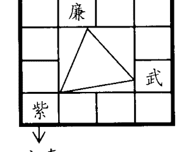

紫微星，就是紫微斗數的圖騰，高高懸掛在北辰。靜靜的觀看斗數，紫微在寅，正是三陽開泰立春的時候。像春天的浮雕，默默地擁抱著內心熱忱的情愫，也抱住自己優美的側影，關注著每一個人命運的啟程，放眼看去，像是披覆著春天的氣息，雕塑而成的美麗浮雕。在探索人生意義的旅途中，無論我們走到那裡，都永遠期盼著更高遠更深廣的方向，這是我們心靈深處共同的追求。心靈能夠展拓、眼界能夠高瞻，這也是人心底共同的願望。雖然身在俗世內心卻嚮往著澄藍天空的高貴與潔淨。紫微之所以稱為紫微斗數，係乃此星辰主宰了我們人生運命的藍圖。有了它我們可以觀察到未來，看到生命的底蘊，看到生命的可觀性，造就多少人間努力的成功者。在紅塵中-----「走出自己」-----一條屬於自己該走的路。（紫微、天機逆行旁）

| 紫微星小档案 |
|--------------|
| 五行:屬己土<陰> |
| 中斗星 |
| 先天八卦:震 |
| 後天八卦:艮 |
| 四化有:化權、化科 |

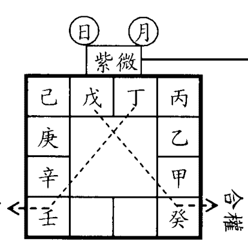

- ◎紫微、日、月均是中天星。
- ◎丁、壬合化科，戊、癸合化權
- ◎故紫微在（太陽）之下合為權。紫微在（太陰）之下合為科。
- ◎由是紫微星的四化只有化權、化科。

### 星辰说明

<1>看到紫微星，其三合必见廉贞与武曲，构成一个铁三角。

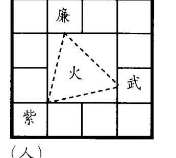

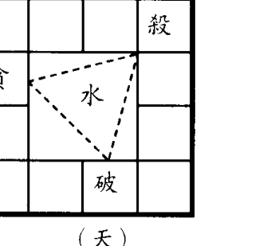

（天人合一）（共用一个天干）

## 由河图的一、六演化水、火义

- 一、六 { 甲木贪狼：三合杀、破、狼（三合水局）【坎卦】；己土紫微：三合紫、武、廉（三合火局）【离卦】 }

### 二表合一

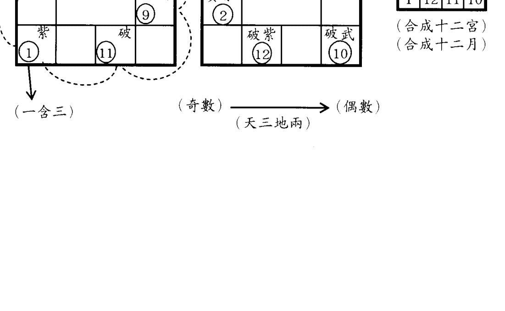

◎這個理路，來自大衍數。

### 河圖 洛書

```
1 + 2 → 3
2 + 3 → 5
3 + 4 → 7
4 + 5 → 9
5 + 6 → 11
6 + 7 → 13
7 + 8 → 15
8 + 9 → 17
9 + 10 → 19
10
(偶數相加50)
(奇數相加49)
```

- ◆大衍之數五十，其用四十九。
- ◆其一不用，紫微星也。 (不動也) (虛其一)
- ◆河洛之合十九，代表十九年約有七閏年。
- ◆是北斗星的七星數。 是一、六 (1+6) =7的合數。
- ◆甲己合化土。 紫微已土也。→以自己為尊。

<2>天地之數五十有五。

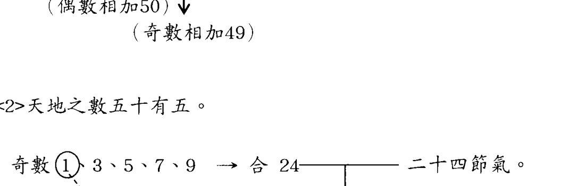

甲己中央土，奇數則扣一，偶數扣掉六，兩邊合數均二十四。
故坤策二十四或四十八。
則地理依節氣，二十四山在應用(一卦管三山)。
斗數十二宮，一宮有四象，共有四十八象。

## <3>紫微星

紫微星，代表斗數命理的圖騰，象徵人類命運起程的起跑點。它的特徵，顯現於每一個人的身上，代表著——「以自己為尊」的姿態，轉化成內心的一種意識型態，演化出去的。就是形成於社會的型態與意識行為。

我們對世間的事物太輕易地判別好壞，並讓好壞的念頭過度地支配我們內心的意圖，以及表現於外的行為。所以紫微星另一層的解釋，就是耳朵太軟，容易被環境、人物所誘惑而改變初衷，產生的後遺症，就是事與願違不能貫徹始終。對人物事都一樣，結果得於此失彼，此起彼落一再循環那不出自己中心思想。

## <4>紫微星：

- (1) 要面對自己。
- (2) 面對不同的家庭、社會及周遭環境，有感而發之情思也有所不同。
- (3) 有情無情、有義無義交織在歲月的成流下的每一個角落，這現實人生幸運的話，予人有對天滄海一笑的高歌，倘若不幸的話，被現實的煩悶徹夜難眠。生在茲長在茲，生命的成長史操卷在你自己。快樂或不快樂的人生觀，也在你自己對現實的自我審判，無人可以左右…，故一切均以自己爲主。

## <5>自我形成鐵三角

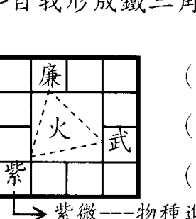

- 1. 是個人生長史—武曲（精神）
- 2. 是家庭祖先淵源—廉貞（基因）
- 3. 是人類物種的演化史—紫微（血緣基因）

此圖說明：人類是進化論的，是物種的進化。

紫微斗數是人文的命理哲學，是故用“紫微”做紫微斗數的圖騰。

> > 世上一切有生之物，皆出於一源。
> 皆歸於無寂，天地與我同在，萬物與我同生。

## <6>紫微星是人的象微，訴諸於人類就是人的--「行為學」。

假以廉貞星是人類的基因，則紫微就是基因遺傳的行為。古人云：「知子莫若父」或...的說法，指的就是紫微星。

觀紫微星並不是所謂的皇帝星座，好似這顆紫微星是多麼的吉祥星辰？或說紫微落在什麼樣的宮位是吉，落在那是凶之類的说法——。然事實上，紫微星只是代表一個人的種種“行為”而已，因應在不同環境（宮位）上，所表現出來的一種“氣質”。

換言之，用“行為”來觀於微。

- 紫微在：
- 人位：煩心多於閒情。
- 物位：操勞財物以養家。
- 事位：奔走於事業、忙碌。

| 紫 | 日 |
|---|---|

註：紫微星與太陽星，一定差四格。所以，操勞的紫微星，怎能人生偷得半日閒？

<7>紫微星坐落宮位的天干，飛該宮干的四化，倘若飛到疾厄宮或交友宮時，請多注意健康(大限、流年同論)或會無緣無故的意外事件發生。

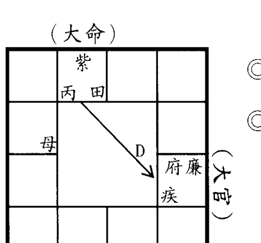

◎此人大限坐紫微星，天干坐丙。
◎丙廉貞化忌入本疾，亦是大限官祿宮。
說明此人在这大限要特別注意健康上的問題。

- 紫微星在疾厄宮自化者：
- 是本命盤者，大病沒有，小病很煩人。
- 是大限者，要注意健康。

<8>紫微為己土，其位於北辰，即子位。己之數為六，故紫微有六種組合，它隨著一年十二月，用十二辟卦作陰陽消息而佈。

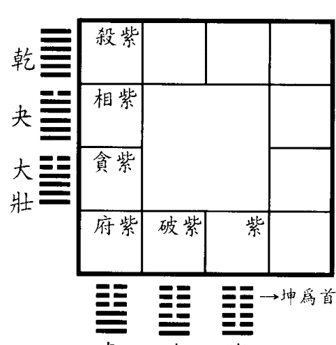

▲紫微星的特色，是對自己說話，也就是說，以自己做中心，再去對待別人。

俗話常有一句：“鍾愛”……某某人、事、物，此鍾愛、鐘情就是紫微星表現在人間上的一種內在心情的反射。〔看落點宮位〕

例如：紫微獨坐在命宮，對自己特別眷顧，換言之，凡做任何事情，都以自己（或保護自己）做出發點，有時不會考慮到別人的感受。

### 演員排練

紫微星只有化權與化科兩種象意。若換作佛家語，做人都在“苦”“集”中。〔化科是苦，化權是集〕，這是生為人，在世間的一種特色，苦從何處來？來自集。因集而後苦。

紫微化科→在乙天干〔苦〕。

紫微化權→在壬天干〔集〕。

## 引入五虎遁

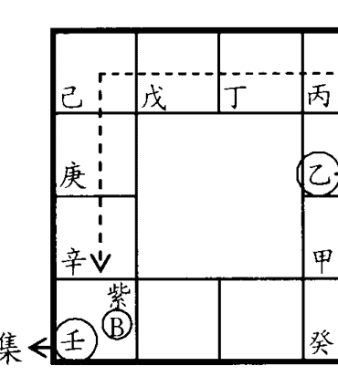

▲人是經歷九個多月而出生，《泰卦》，出生後面對形色的社會，就是一種誘惑，這誘惑簡單的說，即是“集”。集，產生了佔有慾、掛礙心。正是紫微化權的特色。看壬天干落什麼宮位，並參看紫微的落點，即可知。

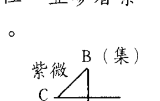

當紫微化權，是好的，便是一種快樂。
當紫微化權，是不好的，便是一種苦、不快樂。快樂與不快樂，是人心裡內在的情緒反映，於是產生，人—「生即苦」說。（引用佛家語）

▲有集便有苦，無集便無苦，一個是後天（行為）“壬”，一個是先天（本來存在）“乙”。一切能放下，即無苦。

## 引入卦位（後天）

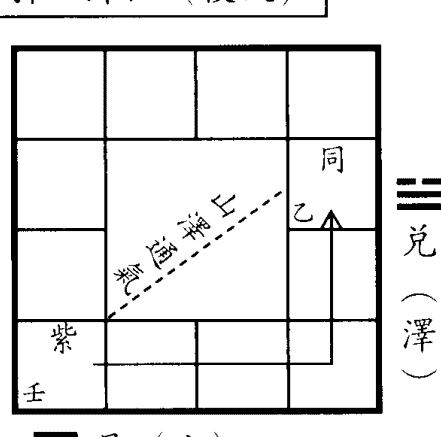

◎說明生為人，於卦上叫做「山澤通氣」，人就是活在「一口氣」中，能活存下來的一口氣，就是一種福，是一種喜悅。

▲說也奇怪，在八卦中，艮與兌卦，〔山與澤〕只要加上人有心的心字旁，即成「恨與悅」其它並沒有。可見紫微就是凡人做凡人事，那有什麼高尚、高貴說，引諭如皇帝。「佛法不離世間覺」。當覺悟了，再言紫微。否則呈現眼前的，即世間相，「平庸通俗」四字而已。

▲紫微與天同，任你怎麼排，都一定差六格，如同命宮與疾厄，所以論命，此兩星必同參，它倆是身影相隨。

▲紫微與天同互參，不一定指單星，雙星也算。它的意思在表達一個人的福氣好不好。

### 例：<一>

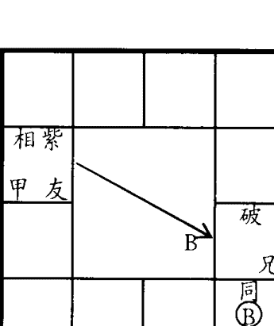

- 1. 丁年生，女命：天同化權坐命
- 2. 紫相在交友，化權入兄弟，法生年權在命宮，代表此人福氣不錯，兄弟、朋友對她很好。
- 3. 這種人，可以稱上很平順的命，因爲有福。
- 4. 如果天同星有自化（離心力），就得不到朋友之助，反而變成勞碌命。

### 例 <二>

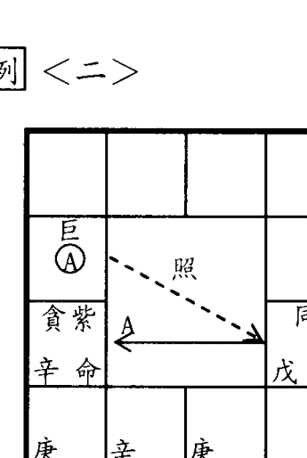

- (1) 辛年生，女命  
天同星在疾厄宫，命坐紫微星。
- (2) 紫微在命，坐辛，巨門化祿照  
天同星。  
天同星坐戌，貪狼星化祿入命。
- (3) 代表此人很得長輩、父母之疼愛照顧，其理由在於此人，  
很有福報。  
※天同化祿與化忌，是福報解。  
※天同化權是福氣解。
- (4) 天同若自化忌，大多損其福報之人，而累了紫微星所在的宫位。

### 例 <三>

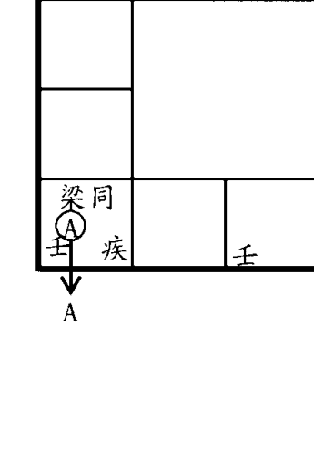

- (1) 壬年生，男命紫微化權坐命，天梁化祿又自化祿，在疾厄。
- (2) 天梁的旁邊有天同星。
- (3) 在這種情況下，天同星視同自化，福報隨著天梁自化而走。
- (4) 於是可解釋，此人是個很勞碌的命（紫微在命），又不能過得很平順的生活，逢到任何事，都是一波三折，時好時壞。

註 不論單星或雙星，在紫微與天同的宮位上，只要天同星的宮位，有自化（以不好論時），一定拖累紫微星的宮位。

### 例：<四>

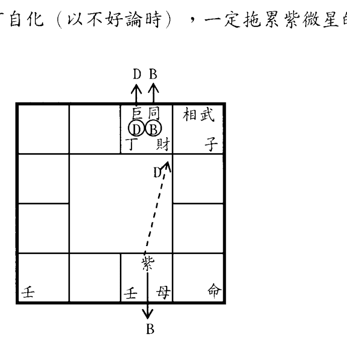

- (1) 丁年生，女命
紫微星在父母宮自化權，天同與巨門在財帛宮自化權、忌。
- (2) 在雙象的組合下，紫微宮位有自化權，少了一個化忌的象，於是由壬轉化忌，武曲星在子女宮（外局），代表與朋友投資、合作，都會虧本。〔轉化忌是解釋物相，因武曲在外局，故不好，若武曲在內局，就是好〕。

## 北辰 —— 紫微星

| 河洛書而八卦分 | 象數明而五行定 |
| :--- | :--- |
| 乾坤主上下之位 | 坎離居日月之門 |

震巽艮兌各處其偶，以先天八卦定陰陽也，而陰陽從乾坤坎離，定陽而不用其陽。

震巽艮兌，定陰而用其陰。是貴陰而賤陽之故也。

由是乾坤合九數，坎離合成九數；震與巽合，艮與兌合，皆九數，故曰：太元始易，簡稱“太始”。

渾沌爲太始者，元胎之萌也。太始之數一，一爲太極，太極者，天地之父母也。一極易，天高明而清，地博厚而濁，謂之太易。太易者，天地之變也。太易之數二，二爲兩儀（符號也）。兩儀者，陰陽之判也，謂之太初。太初者，天地之交也。

太初之數四，四營易四象，而萬物成，謂之太素。太素者，三才之始也，太素之數三，三盈易，天地孕而生男生女，謂之三才。三才者，天地之備也。遊神動而靈故，生民之始也。

然…天地本無物，物物相生始開於氣。

水乃有母，爲天地母。是「有天先有母，無母也無天」，而人始生於水——太乙常明，紫微北辰也。

故紫微斗数，取紫微定其名之所由也。司命行令【坤、子位】。

> > 安步有餘樂
> 水流聲不喧
> 一心無碍礙
> 處處是乾源

## 第九顆星辰

## 生命容顏的府城——天府星

> > 把酒祝東風 且共從容 垂楊紫陌洛城東  
> 總是當時攜手過 遊遍花叢  
> 聚散苦匆匆 此恨無窮 今年花勝去年紅  
> 可惜明年花更好 知與誰同  
>  
> ……（歐陽修）

# 小語

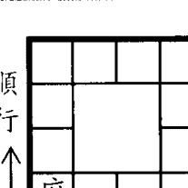

紫府同宮在寅，有個玄妙的天機暗藏於內，只是我們有所不察。紫府為戊己土(在星辰上)，人云之，人是土生的、人又生於寅，那是屬於人俱三才之說。有點讓我們所忽略的，人怎麼生人？將紫微（己土）藉設為母親，母親生下兒女時，子女權設為天府（戊土），由是，人生於寅了，是故紫府同宮。但我們不要忘記在人出生時，要斷臍帶，臍帶不斷不能為人。因此斷了臍帶方有“我”的存在，故命由天府順行（臍帶指天府星）。當母親生下了“我”以後(脫離母胎)，再反觀紫微星時，此時的紫微星，其實已變成『我們的肉身』（色身）。孟子曰：「天生我才必有用」，每一個人都有他的用處存在。如果沒有用處，人生怎麼過？在此言中：「我才必有用」的用字，指的是天府星。只緣於人各有志，人各有緣；其用亦不同，是故天府星不需四化。再者，人生成長生存之過程中，係因志向、興趣...的不同之用，

隨著時光的流逝及智慧的成長，有感於知音難尋，難覓見一個了解自我「心」者那種感嘆，那是天府星的投射心情（看宮位）。俗語常言：「心事無人知」，這就是天府星神秘的面紗，一座府城。

| 天府星小檔案 |
| --- |
| 五行：屬土＜陽土＞<br>南斗星<br>先天八卦：震<br>後天八卦：艮 |
| 無四化 |

> 天府 …………「一切的生命都是你的生命」。
＜寅＞
…………「一切的所有都是你的所有」。
…………「一切的一切都是你的一切」。
…………「你就是你是無以代替的你」。

## 星辰說明

(1) 命由天府，它的内涵就是請你——「認識自己」四字真言。
人自從呱呱墜地以後的成長過程，就是生命自我設計的過程。襁褓中的嬰兒和母親那種生命共同體之感，還朦朧地保持著一點人類的「圓融本性」（天真的本性）。但從爬行到站立起來之後，一個根本的衝動！自思我是誰？「未曾生時誰是我？已生之後我是誰」？人努力的從他自己的周圍環境參照中認識自我。當父母親長上逗笑中，嬰兒也許會認為我是個使父母親展顏笑容的精靈，但當他站立起來時用嬌？的腳板拍打地面之那一刻，也許就從此就許下了——「我是大地上的主人」的念頭。於是乎有了--我的主觀、我的意識、我的自我、我的種種……它們都展現在天府星的容顏裡。

(2) 在此命盤中，為什麼紫微會與天相同宮，天府會與廉貞同宮。

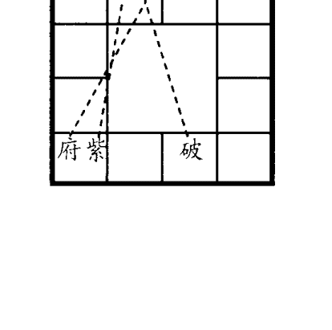

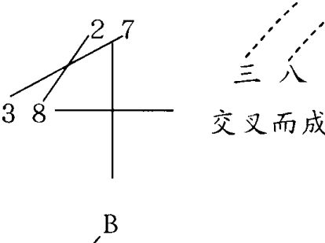

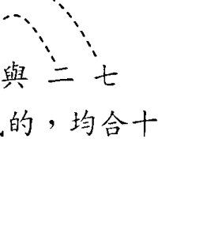

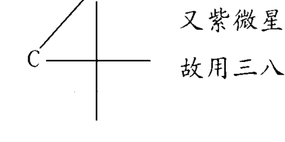

### 說明

<一>廉貞星代表著人類的基因〔站在生物者而言〕。我們假設廉貞星是祖上，紫微星代表生我者之父母親，則父母親的血液中有祖上的基因。

<二>當母親生下我之時〔天府星〕，斷了臍帶，我就是我了，我也會承續祖上的基因（一說隔代遺傳），這就是在說明廉貞與天府同宮的理由。

<三>生我的紫微星，再與天相合，代表完成了“血緣關係”或說“血脈”，故紫相同宮在表達是人之間有血緣關係存在的，進而有族群或種族概念，因爲，廉相的對宮有破軍，破軍星主種族，擴大就是民族魂。

### <四>該注意的是

- ◎觀紫微星，可看人的行為舉動，由行為亦可反觀他的家人。<外在>（家族性）
- ◎觀天府星，則看個人的內心自我意識、態度及種種的思想、觀念。<內在>（個人）
- ◎是以紫微星有四化，天府星無四化，天府星代表個人主義。（本我論）

（3）基於上述之源由，天府星象徵著人的傳宗接代，世世隆昌的星辰。與其說它是財庫之星，不如說它是守著祖上遺留下來的一塊田園（指祖蔭）。在這塊父母或祖上耕種過的家園，能留到子孫的手上，才叫做「天府星」。

天府星代表祖籍、家鄉、出生地。「舉頭望明月，低頭思故鄉」，這種思鄉的情愁，就是天府星。天府星也代表在成家後，喜歡享受所謂的天倫之樂，與子女或後嗣子孫共聚生活的樂趣。

（4）為什麼？天府星會與人倫之樂有關。它有一個深遠的涵意存在，每個長上都希望自己孫賢子孝，所以會把一生的努力所得，都寄望於兒孫上，或說長輩的努力，都為子孫在鋪路，形成一代傳一代的世代昌隆之渴望。因此，天府星則守著家園、守著子女、亦守著古代的傳承，深愛著子女與家園的在這塊泥土上。

這塊家園的泥土，才是天府星所指的財庫星。

天府在哪裡？<看宮位>就知道，他愛在哪裡，但莫忘了，更愛子女時，是宮位解再加上子女。

**例如** 天府在父母宮，代表此人很愛父母（尊敬長輩）。但相對的也很疼愛自己的子女。

天府在交友宮，代表此人很愛朋友，除外也更喜歡子女。換言之，天府所在之宮位，都離不開子女的影子。

## 天府星

(5) 有一點須提醒的，天府星的悲哀，有時會顯現出負面的作用，如「愛之深責之切」，反而會被「被愛」的一方所不能體諒，引起不悅之反射，結果產生「關心反被嫌棄」的後遺症，是一種無奈與愛的無力感。每當父母對子女，若有這種感受時，都會有一種話出現，就是「當你為人父母時，就會知道」。

> 因為：
> 
> 天府（戊土）的根在紫微（己土）〔子女的根在父母〕。
> 
> 紫微（己土）的情在天府（戊土）的心〔父母的情在子女心〕。

(6) 此理若理解，推到任何宮位都一樣。例如：天府在官祿宮，也許在工作上很努力、很敬業，但得不到長官的賞識。

-   —「愛人者不被人愛，被愛人者不愛人」
-   —（人、事、物都一樣）
-   這句話，可能是天府星背後的幽影。

(7) 天府星沒有四化，用其所坐的天干為主，看其化忌在哪裡，就知與誰無緣，包括忌沖的宮位（物相解）。

-   ◎天府在交友，坐癸、貪狼化忌沖父母，少小就與父親無緣（父病亡）。
-   ◎天府坐乙，太阴化忌冲父母。
-   ◎但父母化科、忌入疾厄。
-   ◎而兄弟宫有科自化忌。
-   ◎在一入一出上。
-   ◎结果与兄弟（其中一个）无缘。

### 演员排练

◎天府星，没有四化，所指的方向，偏向家庭的亲情、子女的教育、家业的维持与延续，以及亲人的缘份厚薄。

◎天府星单星时，看所坐落的宫干产生的变化。

天府星在双星组合时，与天府同宫的星辰为天府表现的物相。

### 例一 丙年生，女命

-   1. 天府星坐官禄宫，有文昌化科。依学理上而言，适合上班。
-   2. 天府坐乙干，太阴化忌入交友，且交友有天机权自化权，在解释上把太阴忌法生年忌在夫妻宫，代表自从结婚后就没有再上班，因为天机自化。（若用在缘份而言，就是指天机自化的因素）
-   3. 庚天干有化科入太陰之位，是說當有了子女之後，在家照顧小孩，把照顧小孩當做工作。

> 註：天府星所化忌至之宮位逢自化的話（離心力），又無其他宮位串聯時，必與之無緣〔無緣在此解是──先有什麼在先，而後變沒有〕。
> 
> 若天府所化忌至之宮位，不逢自化時，不在此限，不能說無緣。

### 例二 壬年生，女命

-   1. 壬坐命有天府星。壬干武曲化忌入財帛，並又自化權串聯，結果自化權又回歸命宮。
-   2. 代表夫妻、子女都不錯，且在工作上也很會賺錢。
-   3. 財帛宮，代表謀生賺錢及可以看夫妻相對的好壞。

天府星對事業（指家園而言）有另一種看法（不站在人緣上說話）。

凡是化忌星沖到天府星，必有某種...“東西”存在。

### 例三 甲年生，男命

-   1. 此命是甲年生，来因财帛、太阳化忌在兄弟宫，是位上班族的人。
-   2. 田宅宫坐己，文曲化忌冲到夫妻宫，而夫妻宫有天府。
-   3. 把文曲化忌去法生年忌（兄弟宫是田宅三合）。
-   4. 站在家业而言，此人婚后会得到父母的产业（如房子）且文曲坐庚，化权入天府位。
-   5. 若论婚姻就不是很好。

### 簡單說明

<1> 用天府宫位飞出去的化忌，若逢离心力不好的话，一般都是失的一面。

<2> 若用任何宫位飞化忌冲到天府星或天府对宫的天干飞入来，一般都是得的一面。

### 例四 己年生，男命

-   1. 己年生，生年禄疾厄。
-   2. 甲廉贞化禄入田宅，旁边有天府。
-   3. 法生年禄内局，所以能够置产。

### 例五 丁年生，女命

-   1. 丁年生，生年禄在迁移，串联财帛宫。
-   2. 廉府之宫位，自化禄。
-   3. 必定会损财。
-   4. 注意先生之身体。

※天府星双象时，旁边星辰自化，依然含有天府意。

## 第十顆星辰

## 龍蟠虎踞何處是——七殺星

> 世事翻騰似轉輪　眼前吉凶未為真
> 請看久久分明應　天道何曾負善人
> ……(馮夢龍)

# 小語

七殺星的特色，可陰也可陽。

時間在人們身上無情地流過，四季它可以周而復始，而屬於每個人的生命卻不可再生。歷史猶如無盡的路，而人生只是一座短短的橋，一端連著搖籃，一端連著墳墓，這就是人生於寅，人亡於申的兩端。洛書說它「二八易位」；邵康節說它「否泰反類」；地理家說它「龍蟠虎踞」好地處。斗數不是單純的論命學術，它的淵源來自地理堪輿學，故始有北斗七星九曜。

今站在坤卦的大地上，有顆七殺星，七殺的三合必見破軍與貪狼。破軍在子（坎卦）、貪狼在辰（巽卦），巽主風、坎屬水，故稱為風水。換言之，殺、破、狼，就是風生水起學。

世俗常說：「風生水起好運來」，請問好運來是指那顆星，當然是指七殺星。既然是好星來關照，那不必也不須要有四化星，是故七殺星無四化之理由。

沒有七殺星，猶人沒有了鬥志，鬥志來自勇氣，勇氣來自於自信，有自信的人，都會有一頁的人生奮鬥史成就的足跡，誰說七殺星是凶星。七殺星是在成就你成功的一顆助緣星啊，請多善待它。孔子不是說「死生有命」，死在前面嗎（坤）？

| 七殺星 小檔案 |
| --- |
| 五行：屬金＜庚金＞<br>南斗星<br>先天八卦：巽<br>後天八卦：坤 |
| 七殺星無四化 |

孔子曰：「不知生（寅），焉知死（坤）」，這是很有邏輯的說法。因為生非我所能知也，但既然生了，必有死，所以由死反求我生，是對人生一種的體悟。

-   ◎紫微→對七殺，是生對死（差七格），故名七殺。
-   ◎天府→對天梁，是生命之始到壽終正寢，指著的是壽元（差六格）。

## 日月星辰寄情天地

故當你生時，你住在地球上。<艮卦> 紫 機

又當你死時，你住在大地上。<坤卦> 梁 殺

天梁與七殺在坤卦，名爲人（天梁）入土爲安，七殺象徵著墳塚。由是，貪狼甲木的第一星反而由七殺（庚金）說殺、破、狼，卻不說貪、破、殺，這就是「不知生，焉知死」的證明。

換做易數，還是「定甲庚」。很怪的是，寅、申，都是指人居住的位置，所以生在寅，死在申才有人生七十古來稀的說法。以致，稱殺、破、狼是對的，乃七殺在人位（七殺主“塚”）。

又：天梁主壽（天府～天梁）差六格，每格大限十年，故人活不到六十歲（一甲子），稱天折〔見天梁星解〕。

## 星辰說明

### （1）生死相隨

假如生和死是我們的一對兒女，那麼死一定抱怨我們偏心，只管生不管死，一心一意都花在生的上面。做官做不大、發財發不多、打仗打不贏，心裡常會慰藉地說：「千古英雄同一死」！任他生前何等威風，死後還不是一樣的寂寞。其實，說這些話並不是真的對死有所了解，實在是懷著嫉妒心惦著死、畏懼著死，解一解怨氣罷了。

人們不知——只有死才能使人了解自己（的生）——用宗教角度的思維來看待生死，也許他們會認為，生與死好似河岸風景同水中的倒影，後者只不過是隨波搖曳，別具一種縹緲空靈之美。雖不明告這種來生是否是鏡花水月，僅透其情景太似人間，然心中不免起疑惑，而想去了解死後之事諸類探索，如念佛，會到西方淨土嗎？

-   （2）為什麼人死觀老是不能成立？為什麼一談到死就連想到生，並不將死去認真地去考究探索一番呢？究其根本原因，無非死亡是一種死的既定論，且——「不可經驗」的，又只能作用反迥於死者之外的生存世界等複雜現象而已。
-   （3）有人忌諱談死，以為不吉利。但死亡無疑是一切生命的終點與歸宿。所謂“人固有一死”；所謂“將軍頭上一棵草”；所謂“蒿裡誰家地？聚斂魂魄無聖賢”，都不也是在暗示死亡的必然既定性。如《儒門崇理折衷堪輿完孝錄》有說：「仁人孝子之心原無所為而為」，死亡不是死者的事，而是生者之事。

對於死者本人而言，死亡並無意義，但卻對於在世者產生極大的影響，一切喪葬儀式（喪禮）都可視爲是死亡對生者的強烈影響。於是，風水文化就這樣的萌芽了。

-   （4）紫微→七殺，好比地理羅盤的南北磁針，是一直線的。它的理論在於——「時間和方位上存在著一定的對應關係」，兩者相合則吉，兩者相悖則凶，具體說來——
    -   - 正月生氣在寅，甲。死氣在申，庚；
    -   - 二月生氣在丑，艮。死氣在未，坤；
    -   - 三月生氣在寅，甲。死氣在申，庚；
    -   - 四月生氣在卯，乙。死氣在酉，辛；
    -   - 五月生氣在辰，巽。死氣在戌，乾；
    -   - 六月生氣在巳，丙。死氣在亥，壬；
    -   - ...
    -   - 餘類推（相反）
    -   - 十二月生氣在亥，壬。死氣在巳，丙；」→（皇帝宅經）

故七殺的另一個生存世界，就是風水學，但請不要把它神秘化。

-   (5) 七殺給我們一點小啓示，引《何知經》。
    -   - 何知人家貧了貧？山走山斜水返身。
    -   - 何知人家富了富？圓峰磊落皆朝護。
    -   - 何知人家貴了貴？文筆秀峰當案起。
    -   - 何知人家出富豪？一山高了一山高。
    -   - 何知人家破敗時？一山低了一山低。
    -   - 何知人家出孤寡？瑟瑟側扇孤峰斜。
    -   - 何知人家少年亡？前也塘分後也塘。
    -   - 何知人家二姓居？一邊山有一邊無。......

(6)屈曲生動，端圓體正，均衡界定，諧和有情，這就是風水美學的四大原理。

在斗數上，論命有祿、權、科、忌。〈四象〉

論風水上有青龍、白虎、朱雀、玄武。〈四神相〉

其實，它們的理都是相通的。命是屬於人的。地理，是屬於人住的。人所能住的，必在寅、申、己、亥。所以四神相在此四方，且此四方，是屬於“土”旺之處，當然與人有密切關係。

以最簡單的回答。

——凡宅，

左有流水謂之青龍。
右有長道謂之白虎，
前有池塘謂之朱雀，
後有丘陵謂之玄武。

| 朱雀 |   | 白虎 |
| --- | --- | --- |
|   |   |   |
|   |   |   |
| 青龍 |   | 玄武 |

在七殺的星辰上，扮演了白虎，白虎的特色，就是解決人們“行”的問題，現代人交通的方便，都是得七殺所賜的。

(7)在當今現代生活中想要擁有“四神相應”的環境，幾乎很難。因此只要能夠發揮它的精神即可，這是地理的基本觀念。深入此觀念者，不過乎一個“陰陽論”。

> 例如：陽宅，前陽後陰。
> 
> 解 不管坐向是什麼方向，房子的前方屬陽，房子的後方屬陰，前方都有門出入，後方也是要有門，構成陰陽平衡，如果沒有後門，不利女性。

(8) 七殺星是一顆可陰可陽的星辰，或說有可剛可柔的特性。

| 巨 |   |   | 殺 |
| --- | --- | --- | --- |
|   |   |   |   |
|   |   |   |   |
|   |   |   |   |

七殺與巨門，合於陰。

> [地支六合於水（陰）]

七殺與太陽，合於陽。

陰陽不可測的七殺。其性帶孤傲，凸顯自我。

讓別人不容易了解——我這個人是什麼個性！說不定會「弄巧成拙」。

因爲可陰可陽，所以它沒有四化。

(9) 什麼叫可陰可陽？就是說人很難處於中庸之道。有的人會有勢就靠勢，有的人有利趨利，像西瓜靠大邊。所以七殺星的應用，是看它的旁邊，配合什麼樣的星辰，它就往那邊靠。若單星獨坐，內心缺少自信心。

(10) 人須要鼓勵、讚美、及希望，為什麼要這些？因爲要增加對自己的信心。這是人與人之間最好的精神糧食。但願懂得七殺星的人，就多給人一些最佳的鼓勵、嘉勉及認同。講白話點就是給人希望，同時也給了自己希望，給了別人方便，同時也給了自己方便。如果你有這樣的做，總有一天當你在失意時，自會有一種柳暗花明、峰迴路轉的情境發生，也是一種不可思議的收穫。

(11) 七殺星是一顆盡“孝”道的星辰。（見天梁星）

(12) 七殺星也是一顆好“修行”的星辰。七殺在位是申宮（申、與未都是坤卦），凡此兩宮位是來因宮自化者，或有生年自化者，大部份要有宗教信仰或研究哲學最好。無形中會幫助一個人在無助中走過黑暗，朝向光明。

### 演員排练

例：戊年生（女）

-   解：
    -   (1) 七殺在遷移，坐乙天干。乙太陰化忌沖疾厄。
    -   (2) 法生年忌在子女宮，子女宮天機忌又自化忌，代表房子不宜坐南向北。
    -   (3) 假使房子坐南向北，健康一定會出狀況。
    -   (4) 疾厄宮坐丙，文昌化科入父母，法生年科在遷移，又與七殺同宮，說明，房子不宜南北向。
    -   (5) 尤其在疾厄宮的大限。

## 第十一颗星辰

## **仙風道骨本天醫—巨門星**

> > 龍因點眼離滄海 虎為醫牙到杏林
> > 但願世人無苦痛 不拘架上有塵埃
> >
> > ……(孫思邈)

# 小語

地支合

| | |
| --- | --- |
| 巨 | 杀 |
| | |
| | |
| | |

（先天兑 后天巽）

巨門星，是顆蘊孕生命幽深的星辰。它扮演多重性的特徵，而非一般所言的是非之星可比擬。土地養育草木。女性生產人類，（後天巽對先天兌）由於具有生育功能，因而自古就有“地為大母”的說法。

〔巨門一說：坤為大地，故有在地品萬物之說〕。〔巨門二說：代表子宮〕《易·說卦》云：“坤為地，故稱乎母”。“坤為腹”。《管子·水地篇》認為“地者，萬物之本源，諸生之根苑也”。“水者，地之血氣，如筋脈之流通者……萬物莫不以生”。〔七殺與巨門、地支六合屬水〕。

七殺與風水有關，人死入埋之於地，故與巨門地支合。

七殺與風水有關，人死入埋之於地，故與巨門地支合。

但巨門屬土，又能孕育萬物，又是一種“生”，於是有一方死方生、方生方死”的說法。《莊子》生與死，是一體兩面的。然而，巨門星在地理學上稱天醫，又暗示了巨門與中國的易醫有關，以致孫思邈曾說：「不知易，非良醫也」。張景岳說：「易具備醫理，故醫得易為用」。

（周易成書早於內經，而中醫的內經，有不少吸收周易的用語與想法，可見中醫與周易之間有血緣關係，或說，周易是中醫理論的淵源）。

最典型的對巨門星而論，指的是我們人身體上之健康，希望我們對巨門星要有所瞭解，須懂得對自己的身體“養生保健”。它——用於人而言，講究的是「養生之道」。那才是巨門星的精神所在。

### 巨門星小檔案

| | |
| --- | --- |
| 五行 | 屬土 (陰土)<br>屬水 (陰水)<br>(水土與身體健康有關) |
| | 北斗星 |
| 先天八卦 | 兌卦 |
| 後天八卦 | 巽卦 |
| 四化 | 化祿、化權、化忌 |

## 星辰說明

(一)巨門在現象界主口才，猶人之有口，有口(1)會說話，在說話中有是有非，所以主是非。(2)病從口入，禍從口出。口，又代表食祿，所以主食祿。食祿指吃，吃好吃壞，會引出疾病。

※巨門→主食祿〈民以食維生〉 ※天同→主口福〈享受義〉

(二)巨門星是一顆暗星，如大夜、黑暗的、不光明的。小偷喜歡做人看不到的事，被偷或偷人的東西，與巨門有關。

(三)光明磊落是一種喜悦的事，像太陽的博愛。而巨門少了光明，有的人在心理上，會憂鬱、會嫉妒，甚至有見不得別人好的心態，很少會去讚美別人，「近看別人錯，忘了自己過」。

※“近看”不是“盡看”，是說，倘若人與巨門有關，即使在好的朋友，日子一久，也會產生這種現象。嫌東嫌西，像是在黑暗中看對方，看不到對方的美，這不是對與錯的問題，而是心理反映出來的「心理態度」。[指較親近的人，久居必是非]

(四)巨門在人的起居生活中，它本身猶如大地之母，指的就是土地，很多建築業，都與巨門星有關，有了土地，才可建築房子（指太陰）。巨門喜歡與太陰有往來，如串連或飛宮相遇。

-   ▲此種命盤，太陰與巨門自化忌串連，而生年忌在官祿。（六內）
-   ▲大多數的人名下都會有房子或不動產。
-   ▲或從事建築業。

(五)巨門在地理九宮名詞上，稱為天醫。其實它的重點在中醫，中醫中有三焦，而巨門（脾），即在中焦，凡是最主要的理論，在脾胃〔戊己中央土〕。任何的飲食都必須經過脾胃再分化入小腸。......

-   ▲糖尿病的三多，就是在三（上、中、下）焦出了問題。
-   ▲在地理九宮上，一般人以天醫方位做醫病養生之方位，這是統稱，不是絕對。
-   ▲巨門是陰星，主脾，脾土怕濕。貪狼是陽星，主胃兼腎。

### 演员排练

### 例一 丁年生，男命

-   * ◎丁年生，巨門化忌在父母沖疾厄。本有健康不好的象意。
-   * ◎巨門化忌所坐天干，是壬，與生年天干丁，剛好丁、壬合科在疾厄，天機星。
-   * ◎此人在小的時候，四肢中的腳部有受了傷，而不會好。

### 例二 癸年生，男命

-   * ◎癸年生，來因交友宮，巨門化權在夫妻。
-   * ◎其天干坐丙，丙辛一定合為化忌。則由丙轉廉貞化忌沖疾厄，法生年忌貪狼星，代表自己身體，常有胃不好的現象發生（巨門有生年權）。
-   * ◎貪狼化忌所沖的田宅宮，剛好是坐辛，代表此病症，反反覆覆，不容易斷根（丙、辛合化忌之故）。

## 第十二颗星辰

## 繁华落尽见真淳—天相星

> 不求名利不求荣 只去随缘度此生
> 一个幻躯能几日 为他闲事长无明
> ......(布袋和尚)

# 小语

人生就像太阳由晨曦到日正当中，再到夕阳西落，总要走过少、中、老的过程。天相星为什么要按在午宫（离卦），象征着人会走过一段生命璀璨的岁月，尤其在中年之时；有的人会成功，有的会失败，但生命的岁月并不因人的成功失败与否，在繁华落尽时走向暮老之秋。

当繁华落尽时，生命也许已迈向了晚年，心境也许获得更多的平淡与真淳。年迈含贻弄孙也许是另一种生活境界。

天相星，就是“儿孙”的星辰。它伴着廉贞星，正是指的“儿孙满堂”之意。也是我们在习俗上所称的五福之一，是一种福田。

相星之所以沒有四化，是謂「兒孫自有兒孫福」之意。它之為印星，代表世代“傳承”義，顯示出「子孝孫賢」為一家門戶之風範。

政治的舞台有世代更替，歷史的文化裡有代代傳承，在家家的祖德下有世世的血脈，這繼往開來的使命感，就是天相義。

任何一件事物的使命感，含有一種榮譽、責任，更是為一種榮耀。倘若俱有此使命感，更必須要對自己更加珍惜，這是天愛人間的一種德。（愛之美德）

此德的愛，是一種無怨無悔的愛，也是一種真誠的摯愛。是付出的，不是有望回報的愛。

天相星的另義，就是人要有“敬愛萬物”的心，為一種內在涵養的愛心。

## 星辰說明

### （一）天相星在斗數上是沒有四化的，它與同梁並駕，號稱福、祿、壽。

- 天同→福
- 天梁→壽
- 天相→祿〔妻、財、子、祿〕的祿，包含了兒孫滿堂及健康相。

此三顆星，是做為一個人基本的三要求。（三要素）

### （二）天相星，不是外在的現象界之物，而是存在於自我內心世界的主體性（內在的），生活的主體在自己，而不是紛擾虛妄的野心。人的痛苦多半來自野心與貪婪。因為它讓人迷失真實的常軌，變得不肯照現自己的因緣去成就自己。生活並不是苦苦的等待，等待什麼事的……你要生活的正是你所遭遇的一切。換句話說，你所遭遇的一切，正是你自己生活的寫照，一步一腳印，走過的必留下痕跡。只要我們好好地省思於內，珍惜它，活出自己內心的光明和喜悅。

### （三）人之不幸是從背叛自己得來的。人之悲哀是從內心無知換來的。

不喜歡自己的人才會憎惡別人。不能接納自己的人才會嫉妒別人。因為我們心中最大的敵人絕對不是別人，而是你自己，是你自己的心。（天相與廉貞同宮在午宮）；我們必須學習懂得無常的真實性，豈有什麼好計較？依自己的本質「這麼」實現，「這麼」成長，「這麼」走出你自己的路，誰能左右？但盡隨緣，是為率性為之道。

### （四）在芸芸眾生裡有太多的人，不懂得去隨緣歡喜和學習隨緣成長之道。因為有太多的人大多對自己不滿意，卻以不滿意之心再去與他人敵對或抱怨。總是會有人說，我並沒有對他人不滿意，只是別人把不滿意或抱怨加諸於我，其實這些都一種藉口，因為我們在衝突當下沒有了悟，這些都屬無常。能包容接納轉禍為福，不能接納轉福為禍，「禍福相依一念間」，「無常」是給人生的一條「真理」在走，能知者寥寥無幾！

> 「你之所以成爲你是好的」
> 「我之所以成爲我是好的」
> 你是你 我是我
> 我們不能相比較……（天相星的定義）

多學習「接納自己」，在生活中體悟快樂之人生。

### （五）人生是不能用比較性的來生活，天生的命本來就不公平，每個人因爲伴著不同基因（廉貞星），而基因的廉貞星，它是一個絕對的實有，與生俱來，包括自己的一切因緣果報。喜與他人比，乃出自內心一種無知的本能；希望自己活成別人的樣子，無異就是背叛自己。「格物致知」沒有參透故。這樣一個比較已經註定了你的迷失，痛苦與心理的失衡。

> ——時有常變，數有吉凶；因常而常，因變而變，它憂患者每以因「時」爲道。王船山曰：「此易（變）之與時盈虛而行權宜者也。」

這句話與佛家所言「當下」與「隨緣」，不契而合。 [與時（當下）盈虛而行權（隨緣）]

## （六）乾卦

傳曰：乾道變化，各正性命，保合太和乃利貞。

人是不能比較的……各正性命故……佛家言：「正命」。

孔子的「明知不可為而為」，老子的「無為而無所不為」怎能相比呢？你還是畢竟的你；我還是畢竟的我。在這個理念下的「天相」星，其特性就是天下沒有分別（善惡）相。善惡之別而有相，不在事物的本身，是在人「心內」自我的分別心，分別想。《壇經》機緣品云：「常應諸根用，而不起用想；分別一切法，不起分別想」。天相星不是意識下的產物，卻是——「平常心即是道」的體現。

## （七）不要醉心於遙不可及的目標，勿去追逐不可能的理想。

要著力於「當下」，並思索著未來的遠景。不須去掛慮別人對你的看法，人生是你自己的事不是別人的事。生命世界的你我原本各是一個道場，我們播須用謙卑的態度、肯承擔的精神，來完成我們的人生修行路。千萬不要用自大傲慢的態度，去踐踏自己的人生。人的一生其實很簡單，就是要走出自己的路來。切記著——「登高必自卑，行遠必自邇」。

## （八）天相的人生觀是什麼？隨緣行。

把握當下，接納隨緣，擁抱當下隨緣的豐收，這就是惜緣。懂得惜緣的人，自己就懂得隨緣。隨緣是一種很高很妙的生活智慧，亦是禪宗的法寶，又如同儒家的「極高明而道中庸」的脫俗。意味擁有的人，法喜自在心中滋潤，

智慧自在心中滋養。人必須懂得隨緣，隨著生活的境遇，體悟出它的意義與價值，這才不會怨天尤人。隨遇而安的人，心情較恬適愉快。懂得契機應緣的人，能從成敗順逆中看出啓示。

但是，你不要誤解，隨緣不是隨波逐流，而是隨時隨地的去把握生活的現實機緣。縱是一片刻或一剎那，從中去品味它。學習新知，交融有誼（適當），體驗生命，隨緣即在「當下」。

許多人不能了解「當下」是什麼？「當」是代表現在的此時此刻。「下」是代表「此地」。此時此地實現的生活，加以珍惜這短暫的人生，就是隨緣。當你能品味生活上的隨緣，會有一種「喜悅從心來，法雨入心栽」的感覺。

## （九）在斗數星辰中，天相星代表智慧星。

學斗數者常會把天機星代表爲聰慧、智慧的星，這是錯誤的，天機星則是一顆喜歡學習知識的星辰，或者對某種思想，產生興趣進而崇拜而信仰，甚至於會盲目的追求或嚮往的行爲。「學而時習之，不亦悦乎」，才是天機星。而人的禀賦中具有慧性或根器，確是要看天相星。如喜愛哲學、更愛智慧。

智慧是啟迪心智的成長，豐盈自性（天相星）。而非拓展知識領域，自障自己（天機星）而有所差異。

## (十) 天相星——圓融無礙上上慧。

圓是道之體，亦是道之行。圓是般若智，也是菩提心。

易經是「運行不殆，周而復始」。圓則空，空則無，無則靈，靈則妙，妙則神。是易經「陰陽不測乃謂神」的精神所在。圓是自然現象，也是人生現象。身體有新陳代謝，人事有繼往開來。是故，萬物有形皆向圓，世事往復都成圓。

不信但看，天上的星（圓體）。光是星的色相，星是光的能所。沒有光，星星是不能顯現的。沒有星，光是無所寄託的。星之有光，因為裡面蘊有一股火，一股熱；一種能，一種愛。所以星與光是永遠不能分離的。光的熄滅，就是星的隕落。太陽、月亮和星星，都是天上的星球。太陽的朝升夕落，只是白天、晚上的畫界。月亮的盈虧圓缺，也只是變幻無恆的實證。惟有星星，照亮黑暗的世界，也照亮了你的人生旅途。在這崎嶇不平的道路上，跟隨著你，陪伴著你，使你不會寂寞，使你不會跌倒。「讓我點起我這盞燈，不必問這小小的燈能不能驅走黑暗」。美國艾默生也說過：「把你人生的驛車，繫在一顆星上，可以照亮你的前程」。這顆星，就是智慧燈——天相星。

解：廉相同宮在午

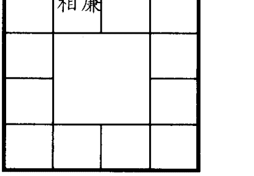

先天乾卦·〈道體〉·是易經周而不殆的圓體。 後天離卦·〈光明〉·一股火、一股熱、一種能、一種愛，因為有火、熱、能、愛，生命才活得有希望、有信心，故能照亮你的未來與前程。

天相的內涵，正是直指著我們人要俱有“愛心”。就像祖父母疼孫兒的愛心一般。

> ▲有道是：「愛心如參禪，自己領悟自己參」。
> 參禪不是打坐出來的。愛心不是用嘴巴講的。我們必須要活化自己生命火花的去照亮他人。好比燈塔，引導夜歸的船隻，安全靠港。

愛是有生命的
禪是有慧命的

## （十一）廉相在乾卦→心靈的天窗。[離]

讓你打開心靈的天窗，擁抱另一個世界陽光。陽光普照生命的搖籃，你卻不知成長的家鄉。

> 「婆婆心、媽媽情。猶如古月照今塵，照亮兒孫來路燈」。
> 這不是歌頌與讚揚，卻是一個寫真的婆婆媽媽的人間世界。

## #[天相]

從你生下來就踏進這個圈圈。在這裡生長成熟，用以一個生生不息的精神，在做個世代更替的榜樣，道出了送往迎新的一份心，一份情，銘刻於內心不同語狀的出師表上。是一種溫馨，是一種遺憾；是一種歡笑，是一種感傷。全看你在人生的舞台上，當下如何去扮演好一個「演員」。

多少人，把天相星，當做熱心，當做婆婆媽媽的星來看，俗話有像嘮叨之意，其實並不是故意嘮叨，而是隱藏某種關愛的作法。就像父母望子成龍一般，但問題在於“方法”、“表達”是否適當，否則會引起「反感」。

> 「假使你吃個很香醇的雞蛋，何必去認識那隻下蛋的母雞。」
> 這就是天相星的「因緣」。

▲天相星不屬於朋友、夫妻之類的感情。它指的是長輩對晚輩、師長對學生、祖父母（父母）對兒孫（子女），還有婆媳之間的情愫。〔由上對下〕

## # 第十三颗星辰

## # 天增岁月人增寿—天梁星

> 求福当求永久福 增寿当增无量寿
> 求福当求智慧福 增寿当增慈悲寿
> ……（佛偈）

## # 小语

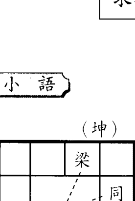

福寿福寿，福久必寿。这是斗数星辰天同与天梁的代表性质。天同对面有太阴，福有厚薄也；天梁对面有天机，寿有短长也。简称为：机月同梁。

天梁与天同在坤兑卦，是“坤作成物”解，[坤在未申，成物在酉]。寿与土有关，福与水有关，叫「水土」和，水土和，健康相也。是名福寿之来源。

### 天梁〈寿称〉：
- 一、花甲、古稀、耄耋，期颐。
- 二、喜寿、米寿、白寿、茶寿。

中国人对人进入六十岁以后之各年龄段的美称。〈人没有活到六十岁，即一甲子，谓之夭〉。

- 人活到六十歲，意味著已經度過了天地宇宙一個完整的週期，六十六歲壽宴，叫做“還甲宴”，亦稱“耳順之年”〈孔子語〉。
- 古稀是進入七十歲的年齡。“古稀”一詞源於杜甫《曲江三首》中的：「酒債尋常行處有，人生七十古來稀」。酒指酉，是一種福壽之稱。王充《論衡》有說：「上壽九十，中壽八十、下壽七十」。（稀：不是指人數少的少）
- 八十歲以上稱耄耋，一般指的是八九十歲的人。
- 期頤是人滿百歲之壽稱，亦名：「天年」，源於（禮記）。「百歲曰期頤」，（集說）：「人壽以百年為期，故曰期；飲食居處動作，無不待以養，故曰頤」。（頤也是養的意思）所以有言：「頤養天年」。

當年齡分析後，又做了壽稱。

- 七十古來稀，稱“喜壽”，以七十七代表。
- 八九十為耄耋，稱“米壽”，以八十八代表。稱“白壽”，以九十九代表。
- 百歲之期頤，稱“茶壽”，以一百零八代表。

可見古來人都很注重：「福、祿、壽、喜」四字。

↓ ↓ ↓ ↓
天 天 天 七
同 相 梁 殺
〈七十七〉

## # 禄 壽 喜

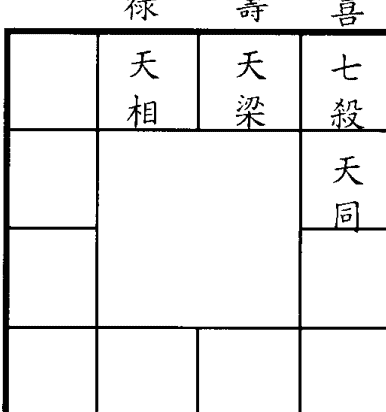

※坤者：土之申也〈未申宫〉。
※申者：七七來復。

| 天梁星小檔案 | |
|---|---|
| 五行屬性 | 陽土（戊） |
| 先天八卦 | 巽 |
| 後天八卦 | 坤 |
| 天梁四化 | 化祿、化權、化科 |

> 《詩經・小雅・天保》：
> 如月之恆・如日之升
> 如南山之壽・不騫不崩
> 如松柏之茂・無不爾或承

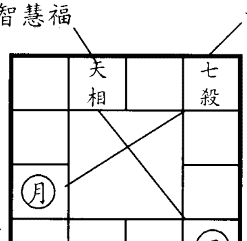

（日、月天干合）
（日、月精華）

◎意境：參！
（福、壽已在其中）

## 星辰說明

### （一） 天同與天梁，正如常用的俗語：「福如東海，壽比南山」來引喻。更有日月合其明之德性也。（配五虎遁）

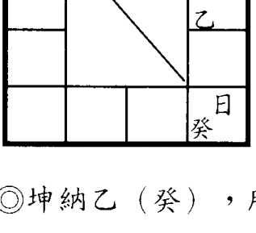

- ◎戊、癸合其權，權在南方象徵“離卦”。
- ◎離爲火，與太陽合其光，故曰：「壽與天齊」。
- ◎於是在天梁星上，乙天干即有天梁化權。
- ◎坤納乙（癸），所以天梁在坤（土）稱壽。
- ◎因爲壽與天齊，天梁沒有化忌之說。
- ◎是此，天梁與太陽必會合（同宮）。

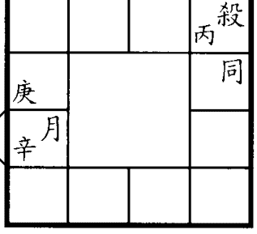

- ◎丙、辛合爲忌，忌在北方象徵“坎卦”。
- ◎坎爲水，與月亮同其波，故曰：「福如東海」。
- ◎於是在天同星上，庚天干即有天同化忌。
- ◎震納庚，所以天同福如東海，眾水朝東。
- ◎是此，天同與太陰必會合（同宮）。
- ◎天同在庚、化忌，纔是有福的人。但不要離心力自化。

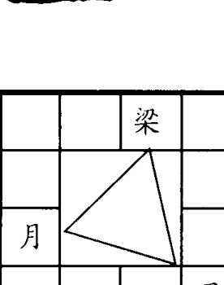

+ ◎木主人，木主寿（仁）。
◎天梁三合见日月。
◎天梁在乙取天梁权} 以象定于坎、离，犹天同在庚取天同忌} 人活在天地间。

+ ◎乙、庚可以合化禄，万物才有缘起。
是此（1）天同化禄来生人，在丙天干。
（2）天梁化禄养天年，在壬天干。

◎至于天梁化科，那是代表每个人的身体，求个平安顺，在己天干。

◎其数 三 六 九。天地人三才中，人之数也。

| 三 | 六 | 九 |
| ↓ | ↓ | ↓ |
| 三 | 六 | 九 |
| 十 | 十 | 十 |
| 而 | 耳 | 天 |
| 立 | 顺 | 年 |

### (二) 拳不离手，话不离口。人都有福，人皆有寿。

福，端看丙、庚，化禄、化忌来完成，最怕丁天干的天同权来伤害。

寿，端看乙、壬，化禄、化权来颐养，最怕己天干的天梁科来破坏。

此四、六，【丁、己】合十，正是人「福寿」的天心点。

正是——天上有星皆拱北，人間無水不朝東
時人欲識藏身病，拈取簸箕別處春

### (三) 在斗數應用上，天同、天機、天梁此三顆星若與文昌、文曲、左輔、右弼同宮，或自化而感應者，【落點先看宮位】，請多注意健康與福氣的變化。

### (四) 參看天同星、天機星。

壽，指生命的時間長短。（物質面），它是有生滅的。
而另一種壽，是人的精神不朽，死而不亡，曰壽（精神面）。

在斗數上，永遠是天梁對天機，天梁對天同的遊戲主軸。
「天地一道門，眾生庭前花；開時神佛看，紛落你我他」
這就是云云眾生，觀看福祿壽喜。

### 演員排練

### (1) 甲年生，女命

| 宮位 | 星辰與干 | 備註 |
| :--- | :--- | :--- |
| 兄弟宮 | 己、昌、機 | |
| 命宮 | 庚 | |
| 福德宮 | 辛、破軍(B)、壬 | |
| 父母宮 | 曲 | |
| 夫妻宮 | 戊、梁日(D)、丁 | 太陽有生年忌 |
| 子女宮 | A（箭头指向庚命） | |
| 田宅宮 | 癸、府廉(A) → A | |
| 官祿宮 | 甲 | |
| 財帛宮 | 丙、相武(C) | |
| 疾厄宮 | 丁 | |
| 遷移宮 | 丙 | |
| 友宮 | 月、乙、友 → D | 太陰自化忌 |

◎天梁與太陽同宮，太陽有生年忌，在子女宮。
◎在交友宮有太陰自化忌，一定與太陽星呼應，而交友宮若論健康，必是重要宮位。
◎且交友宮有化祿逢天機星帶文昌。
◎法生年祿，廉貞祿又自化祿。
◎可見此人，生子女要特別注意健康。
◎爲什麼？交友宮坐乙天干，必與命宮的庚天干合化爲祿，而生年祿又自化了（在象而言）。
◎在星辰而言，天機逢文昌，總是不好（指健康）。

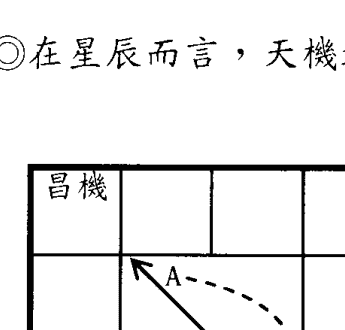

◎歸納就是天梁與交友宮互助。交友宮又見天機、文昌。於是產生，天機、文昌、天梁的交互感應。結論就是此人生了子女後，有僵直性脊椎炎（天梁星也）。
◎發射點的乙干與命宮庚干合爲祿，指自己。

### （2）壬年生，男命

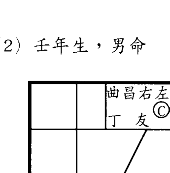

◎天梁星旁有昌曲，坐丁，天機化科入兄弟（向心力）。
◎太陰星自化科在父母宮（離心力）。
◎此一入一出之象，本是不利的。
◎而丁、壬本合於科，且生年科又在交友宮（健康位）。
◎此人在第一大限，母親就辭世了。

◎天梁對天機，其中有昌曲，更加上左右，有左輔生年科。

### （3）甲年生，男命

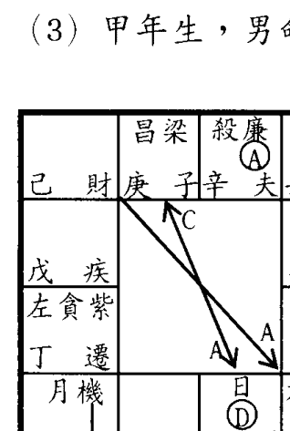

+ ◎天梁与文昌同宫在子女。
◎甲年生，来因宫父母，直接化忌冲天梁星，代表幼年与父亲无缘，早辞世。
◎父母宫冲子女，站在子女的立场上，是父母对子女无缘论（宫位解）。
◎至于太阳化忌的宫位坐丙，文昌化科入子女，会天梁星，代表父亲是身体出了状况，因为法生年科，在福德（健康位）。
◎而武曲化科的福德宫，又有右弼。
谁能使右弼化科，只有戊天干，而戊天干在疾厄宫。

◎这种说法是在强调，凡是主星再逢左、右、昌、曲，劫数多很难逃，有道是：「是福不是祸，是祸躲不过」，指的是左、右、昌、曲。

## 补注说明

依据前述命例，好似太宿命了，未免残酷而不近人情。

命有正面与负面的分野；正面的世人的德命《道德祖荫》，负面的是人的气命《气质元性》。命理赋予人的都是负面的气命，如运气好不好，而不谈正面的德命，如积德养身。

宋儒張橫渠在「誠明篇」有云：

> 「德不勝氣，性命在氣；德勝於氣，性命在德。窮理盡性，則性天德，命天理」。
> 「故言死生，則曰有命，以言其氣也。語富貴，則曰在天，以言其理也。此大德所以必受命」。

從這理學來看，說什麼先天與後天？先天曰性在德，後天曰命在氣；用在斗數，左右昌曲，性天德，紫府十四顆星，命在氣。生死壽天，在氣而言。若一個有積德的人，唯“德”有傲“數”之功，延年益壽，猶如佛家常言的：「慈悲喜捨」做起。

如果你從命盤看出天梁、天同、天機有附加左、右、昌、曲時，怕有禍來臨，不如平常多做些→由內心真誠出發的「慈悲喜捨」，必會改造命運，千萬不要急時抱佛腳。

### 四吉曜
- 左輔→慈．〈命〉→仁出發。
- 右弼→悲．〈壽〉→無量壽。
- 文昌→喜．〈業〉
- 文曲→捨．〈報〉

此四顆星，在斗數稱四吉曜，其真正的定義在此。什麼貴人不貴人，那是通俗的在“氣”說“運”而已。無法「性天德，命天理」，怎能造命呢？千言萬語難說盡！

> 幸為福田衣下僧 乾坤贏得一間人
> 有緣即住無緣去 一任清風送白雲
> 〈懷海禪師〉

## # 第十四顆星辰

## ## 春風不改海浪波一破軍星

> 長恨此身非我有　　何時忘卻營營
> 夜闌風靜縠紋平　　小舟從此逝
> 江海寄餘生
> ……（蘇軾）

## # 小語

人海茫茫，是否常常問問自己，世界上有這麼多人，每一個人都有自己的故事，且人生又是忙忙碌碌，究竟是為了什麼？人生一世，草木一秋，最終會留下什麼？浪花淘盡一切！

名與利是人間相。就像吹過沙漠的風，只是改變了沙漠的形狀，卻沒有改變沙漠的本質。金子依然埋葬在沙漠的深處，待人發掘。對於我們（人）而言，什麼是金子呢？我想應該是人的一種思想品質、一種人格魅力、一種道德境界。前人對道德高尚的人稱讚是：「高山仰止，景行行止，若不能至，心嚮往之」。事實上這種境界，是一個人生命的徽章。

哲學是一種生命哲學。中國人是非常重視人的精神生活，有很多豐富的理論，也是一份寶貴的文化遺產。至今還是對我們生活發生影響的精神財富，這精神財富的領航者，就是破軍星。

## **破軍星小檔**

| 項目 | 內容 |
|---|---|
| 五行屬性 | 癸水（陰） |
| | 北斗第七星 |
| 先天八卦 | 坤 |
| 後天八卦 | 坎 |
| 破軍四化 | 化祿、化權 |

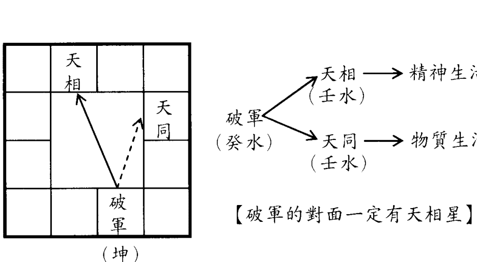

有水的地方，就有人煙；有水的地方，就有文化。世界古老的國家，其文化都是發跡在河水流域中。

> 「江山萬里心，黃河母親情」。中華文化的發源就在於黃河流域，（以坎水引喻），他是中國文化的母親。（以坤土引喻），中華的兒女都在這水土同源下，生在茲，長在茲，而文化也在茲流傳下來。她孕育了多少的代代有人，在推動文化傳承的搖籃之手。這些手，就是北斗第七顆，破軍星。（大癸水）如汪洋大海## 星辰說明

- ◎ 水主智，智主文化。水主財，財可養民。
- ◎ 破軍的癸水，對面一定是見天相的壬水。主智慧，是文化傳承的血脈，也是人類對精神世界的嚮往與寄託，更是一種無上的精神資糧。
- ◎ 破軍的癸水，配合到天同的壬水，主財祿，是一種民生問題的豐裕，也是貧與富的分水嶺。

- 天→民族魂、種族觀。
- 人→齊家治國始於夫、子、奴【云云眾生】
- 地→文化傳承。

### (一)
破軍星給人的第一觀念，就是“有家”的觀念。最簡單的就是成家，組成一個“安居”的家庭觀。進而有了社會、國家。凝聚這種觀念，對每一個國家的人民來說，便成為一種有意識的民族魂、種族觀。

最初的中國百姓，就是以“部落”形式定居。孔子在說五倫時，即以「夫婦」爲首，指的就是破軍星，用夫、子、奴來代表，其意在「齊家」。警示人要有家庭觀念，體現出一種責任的擔當。易經下經首咸恒，咸恒爲夫婦之道，是有男女才有夫婦。（見序卦傳）

### (二)
有男女才有夫婦。男女是什麼？一陰一陽。

破軍星按在甲天干與癸天干，居天干首尾，其意義很多，學問很大。

- (1) 甲與癸就是一陰一陽，數始於一，終於十也。六十甲子也是依此而循環不息。如：起於甲子，終於癸亥。是一種圓滿的象徵。
- (2) 破軍星只有化祿、化權兩種。

| 天 | 地 | 人 | 物 |
|---|---|---|---|
| 甲 | 廉A 破B |  |  |
| 癸 | 破A 巨B |  |  |

- ◎一陰一陽【癸、破軍化祿】
- 【甲、破軍化權】
- ◎一陰代表天，一陽代表地。在此是說明數到十，必還原一，那麼這個十，是什麼？是人要先懷孕十個月的十。【謂先天】。當嬰兒誕生，便稱一歲，【謂後天】。因此先天性，後天命，就此成立。
- ◎洛書用九，不用十，即是這個道理。所以先天八卦，兩兩相對都合九。
- ◎懷在胎內的嬰兒，也是一陰一陽，（嬰指女，兒指男），故陰在先，所以先天八卦止於坤，坤爲母。
- ◎破軍按在子位，也是地支之首，其上加甲，故稱甲子，這些都是破軍的代表性。以致後天命寄在坎卦；先天性寄在離卦。是所謂：「天命謂之性」。

## ◎圖示：

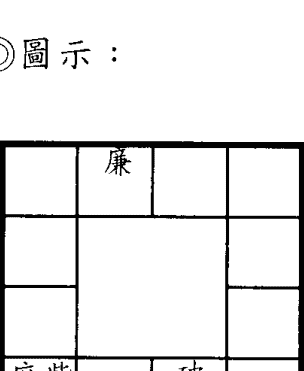

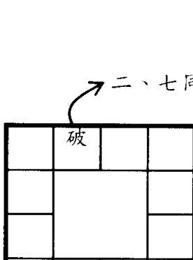

### (3)

| 天干 | 天 |
|------|----|
| 甲   | 廉A |
|      | ↕  |
| 癸   | 破A |

◎破軍A→對廉貞A。其意義就是說，人在胎中十個月裡的生命，是懷有父母基因的，【甲廉貞化祿】，到了丙、廉貞化忌，象徵基因完成，已經在甲、乙、丙三才而生人，於是天同來化祿。

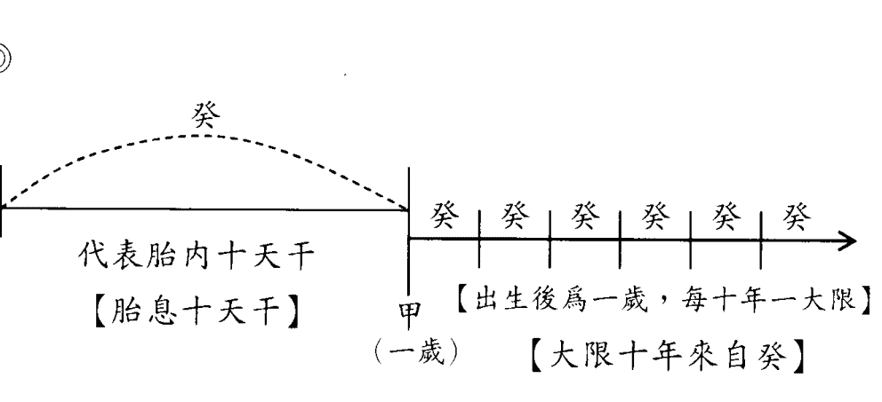

◎地數十，癸天干也。在河圖有十，在洛書無十，是因為十之數在胎內。【先天，不落後天】，亦名胎息十天干，【若換作左、右、昌、曲。以「文昌星」做代表】，是因為文昌星起於丙，三才已立。

### (三)
斗數是以“數”來觀星望斗，破軍首當其妙。

- (1)「天尊地卑，乾坤定矣」。數是由一到十。甲到癸，存在於天地中。其數曰：「天一、地二……天九地十」。這十個數字，可以看出斗數星辰的排列組合。

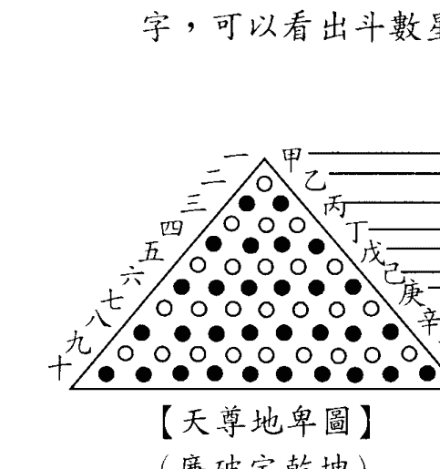

> ◎在「天尊地卑圖」上看「乾坤定矣」。
> ◎乾坤怎麼定？上下而已矣。
> ◎乾卦納甲
> 壬
> 坤卦納乙
> 癸
> 上下之合皆
> 十一
> （餘類推）

> ◎這首尾天干合皆十一，可以看出星辰依卦而佈的組合，在天、地數中。

```
※ 甲 → 癸【廉、破】→ 在子、午、卯、酉。（天）【一組】
           （應四正卦）（單星、雙星）
※ 乙 → 壬【機、梁】
※ 丙 → 辛【同、巨】
※ 丁 → 庚【陰、日】
※ 戊 → 己【貪、武】→ 在辰、戌、丑、未。（地）【四組】
           （應四隅卦）（單星、雙星）
           合八卦
```

## 註
數只有天、地之數，沒有人之數。
故此這些星辰都在命盤的天、地中，而不在人的寅、申、巳、亥裡，是謂「天尊地卑」。
在此要說明，斗數的星辰，都與易數有關。
並且從這些組合，在表達「天開於子，地闢於丑」的觀念，而子丑在地支合屬土，代表人都以土為居處。因土旺於四季，分佈在寅、申、巳、亥。

### (2)
「卑高以陳，貴賤位矣」。

| 天干 | 天地 |
|------|------|
| 甲   | 破B  |
| 癸   | 破A  |

- ◎由破軍的化祿到破軍的化權，是由陰數（癸）【卑】轉到陽數（甲）（尊），是謂「卑高以陳」。
- ◎若用在生命而言，是人要出生，頭部為何要掀出來的道理一樣，已經過了十個月。
- ◎邵康節說：「天數五，地數五，合而為十，數之全也」，（觀物外篇），當十要轉入一，必須經過“五”。故有：「天地之數五十有五」之說。

◎所謂 “有五”，即小衍之數。【大衍之數是五十】。

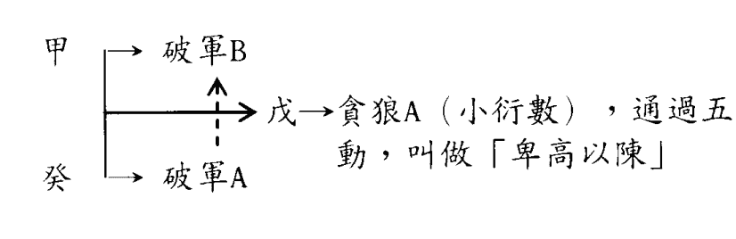

## 註
卑高以陳，貴賤位矣。用在命理白話解，就是說人一旦被生下來，貴賤之命已被註定。「位」就是得位、不得位解，有貴賤之別。

又「以陳」也可以說乘法。

- 洛書對角之數的和，再加五，皆十五。（小衍數）
- 洛書對角之數的和，再乘五，皆五十。（大衍數）

## 注意
大衍之數的運用，是屬於月亮運轉的周期律。（不是太陽）
而洛書亦屬於月亮，因爲海水的漲、落與月亮有關。

又：未出生前的癸→是「十日生五行」。（如五蘊天干）
已出生後的癸（大限十年）→是「五行生十日」。（如天干化忌）

### (四)
數言天地，天地即乾坤。

破軍星出現在甲、癸。來自月亮納甲的乾納甲壬、坤納乙癸。

春秋緯有云：「河（圖）以通乾（卦）出天包」。（甲）
「洛（書）以流坤（卦）吐地符」。（癸）

來說明：「乾知大始，坤作成物」。

天地緼生六子

乾納甲壬，坤納乙癸，其餘就是六子。
【丙、丁、戊、己、庚、辛】

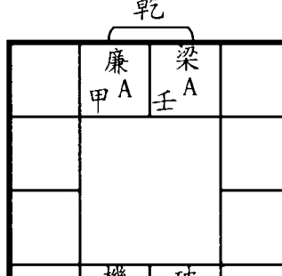

◎先天八卦，乾坤定位。

◎生六子，由丙～辛。

【3+4+5+6+7+8】÷ 8（卦）= 4 ...餘1
此一，就是甲。【後天】

◎此一，就是水，寄在坎卦，一陽生
（中爻主人）

◎此一，就是河洛一、六共宗的北方水，因一中含有六子，故曰：「一六」。

◎用六子首尾天干，丙、辛合化水，亦可知此中含六子。故「化忌」在水是一種“象”的表達。

◎誰生六子？當然是母親懷胎十月的破軍星。（癸天干），故女性有「癸水」之名。

◎破軍在子位，【坤卦】，1 + 6 = 7，是以破軍排北斗第七顆，故有人之生必見破軍之說。7 × 2 = 14，在後天女性以14歲稱癸水至。應斗數指的是紫府 14 顆星。
7×4＝28，應二十八宿

### (五)
破軍星是北斗第七顆，號稱斗柄。古人常言：「斗柄回春」，其意思就是說在古時候，先人用北斗的破軍星來觀察一年四季的節氣。在《鶡冠子、環流》有「斗柄授時」之說。例如破軍星的斗柄朝向“寅宮”，就代表春天到了。【立寅即立春】，意味著每年月令之始。

## ◎十二月令圖。（斗柄回春）

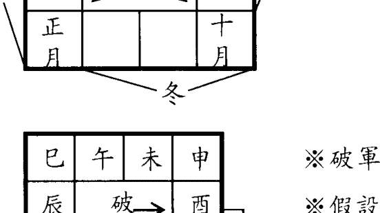

> ※天上日頭地下轉
> 海底嬋娟天上飛
> 乾坤日月本不運
> 皆因斗柄轉其機

| 巳 | 午 | 未 | 申 |
| :---: | :---: | :---: | :---: |
| 辰 |  | 破→ | 酉 |
| 卯 |  | 軍↓ | 戌 |
| 寅 | 丑 | 子 | 亥 |

（立時在西）

- ※破軍化祿在癸。癸，〈10〉，酉時。
- ※假設此刻是酉時，破軍的斗柄是指向寅宮。
- ※當斗柄指向卯宮，時間是戌時。
- ※每順一格，時間進一格〈餘類推〉。

說明：
斗數是用「月與時」立命宮，其理由就是來自破軍的主導。引用的理路，是用「山澤通氣」。

### (六)
世界各国文化的传承，来自于水〈江河〉的流域。破军星，是文化的象徵。

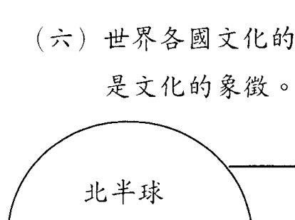

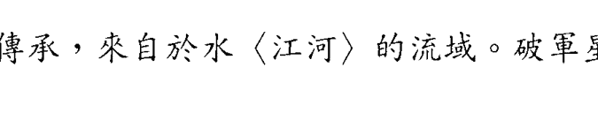

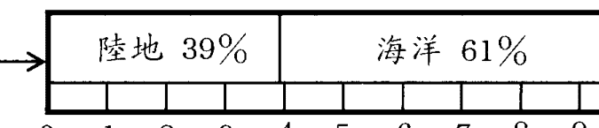

地球是由海洋与陆地组成

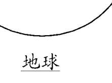

- ◎破军星可以指向代表人怀胎十个月。
- ◎把这十个代号转向地球，分十等分。海洋总比陆地多【癸：破军禄〈海洋〉、巨门权〈陆地〉】。
- ◎很妙的是，海洋的比率都是一、陆地九的尾数，很像洛书的戴九履一，且合为十，是癸：破军化禄所由来也。

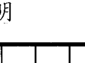

- ◎地球是逆数的，与洛书同步，“数”逆也。

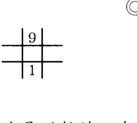

- 1+6=7〈在西〉〔化禄〕
- 2+7=9〈在南〉〔化权〕
- 4+9=3〈在东〉〔化科〕
- 3+8=1〈在北〕〔化忌〕

※西、南、東、北的逆轉，與斗數的四化「祿、權、科、忌」的次序吻合，代表四化的根源在洛書。

### (七)
洛書的逆轉與斗數星辰的排列，都合乎天體星辰運轉的軌跡，它不是沒有天文根據的。

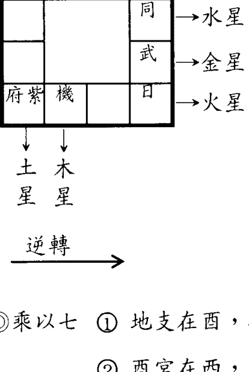

| 4 | 9 | 2 |
| 3 | 5 | 7 |
| 8 | 1 | 6 |
*洛書*

◎1 是水星（天同星）

◎天同在位是酉宮。酉宮的數是7，由最接近太陽的水星開始算起。（以水星1開始）

- ◎1 × 7 = 7（金星）→武曲星
- 7 × 7 = 9（火星）→太陽星
- 9 × 7 = 3（木星）→天機星
- 外圍就是中央（土星）→紫微星

- ◎乘以七
  1. 地支在酉，排在10，應癸天干。（10進位就是1）
  2. 酉宮在西，是北斗第七星破軍星。
  3. 癸與破軍結下了不解之緣。
  4. 於是以天同的1去乘7的原故來自此。
  5. 七是先天八卦（艮之數）→另有一說。（見連山易）

## 日月星辰寄情天地

◎在十二宫位（地支六合）也一樣。

| 位置 | 对应关系 |
| :--- | :--- |
| 顶部（水星） | 日 月 |
| 第二行（金星） | 金星 |
| 第三行（火星） | 火星 |
| 底部（木星、土星） | 木星 土星 |

◎子丑→土星
◎寅亥→木星
◎卯戌→火星
◎辰酉→金星
◎巳申→水星
◎午未→日、月

## 比照天文圖

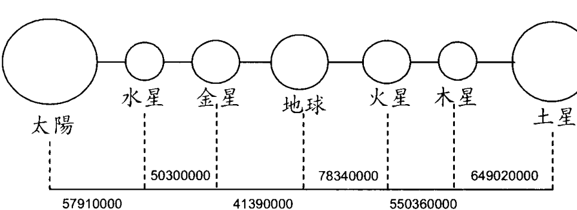

◎單位：公里

### (八)
洛書到底源於什麼？月亮。

因爲月亮永遠追隨地球在環繞，未曾變心過，故稱它「恆星月」。恆星月在易學上與納甲有關，稱它「月相」。

〈歸藏易與月亮有關〉。

| 月亮 | 地球、太陽 |
|------|-------------|
| 洛書（天索易） | 河圖（天索易） |
| 天圓 | 地方 |
| 納甲之源（歸藏） | 八卦之源（連山周易） |
| 大衍之數 | 天地之數 |
| 斗數的四化與納甲有關 | 斗數的十二宮位與八卦有關。（八卦方位） |
| ◎納甲、八卦完成，在周朝即有。〈周公年代〉 |  |

> (資料來源：河關洛雁)

## 三易策天

- 連山97策〈講八卦〉【艮數】—廉貞—1⇒甲
- 歸藏36策〈講三才〉【坤數】—太陰—4
- 周易49策〈講四象〉【乾數】—太陽—7⇒庚

〈地球・月亮・太陽〉

※1+3=4，4+3=7，7+3=10。破軍星統三易爲一體，即洛書之用。

※

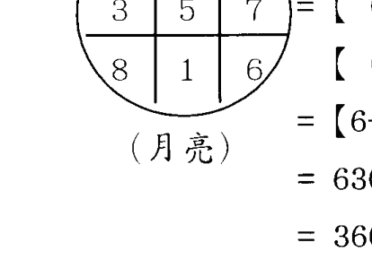

```

= 【（1×2×3）+（4×5×6）+（7×8×9）】-【（1×4×7）+（2×5×8）+（3×6×9）】
= 【6+120+504】-【28+80+162】
= 630-270
= 360

```

> ※說明：月亮在一年360天，一個圓周360°

此36，是歸藏策數。【中天八卦】。於斗數爲中天星。

邵子曰：「三十六宮皆是春」，陳希夷曰：「數定三十六位」。

### (九)
破軍是海水，海水的漲落與月亮有關〈納甲〉。但海水的浪潮又與風有關。

於是：癸天干 破軍化祿 巨門化權 太陰化科 貪狼化忌
↓ ↓ ↓ ↓
海洋 陸地 月亮盈虛 風向

地球表面
潮汐
海浪、海潮

這一連串的星辰排列，根本就是一個大自然底蘊的生命觀。

人的命又何嘗不在自然裡？盡在癸天干。〈洛書的對角數都合十〉。

> 風急則浪洶湧 風和則浪平緩
> 洶湧浪濤易決堤 和風細雨孕生機

◎紫微斗數由來有故。是與易數、易象結盟的先天易學，步在陳希夷、邵康節先師之後，窮天地之大道，宇宙人生、人生宇宙，在宇宙的情懷下，創造了世代生命的不了情，綢繆無限的生機。

◎世界上最寬闊的東西是海洋〈破軍〉，比海洋更寬的東西是天空〈貪狼〉，比天空更寬闊的是人的胸懷〈巨門〉，你睿智與宏觀的氣度是學哲學最大的福報。

> “彩虹之美在於多色共存，生命之美在於多人共榮”。放寬心，學哲學，哲學是人生命底的樹長青，與天地並共生存〈太陰〉。

| 人生南北多歧路 | 將相神仙 | 也要凡人做 |
| 百代興亡朝復暮 | 江風吹倒前朝樹 | |
| 功名富貴無憑據 | 費盡心情 | 總把時光誤 |
| 酌酒三杯沉醉去 | 水流花謝知何處 | |

### 演員排練

- ◎我要活下去，怎麼活？看破軍星〈謀生方式〉。
- ◎誰在為這個家盡責，看破軍星〈責任擔當〉。
- ◎有無子息命，看破軍星。
- ◎破軍星的應用，以破軍星為首，再看其他四化的變化。

### (1) 癸年生・男

### 解

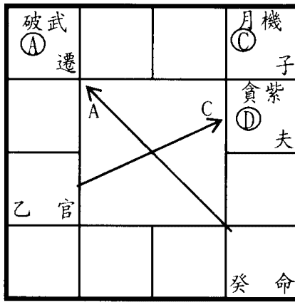

- ◎癸在命，破軍化祿在遷移，此人謀生必出遠門，如國外、或外地〈看宮位〉。
- ◎貪狼化忌在夫妻沖官祿，象徵此人最好上班，不宜自己創業。
- ◎官祿工作乙，紫微化科入夫妻，代表適合當幕僚或企劃人才。
- ◎因化科入夫妻，代表太太也是上班者。
- ◎把化科去法生年科，在子女，表示此人必有子女，但女性為先〈太陰星〉。
- ◎破軍星與貪狼星在夫妻之三合，且破軍是由命宮直接落在對宮，象徵此人對家庭很盡責，重視夫妻與子女。整體解釋是此人外出謀生，所賺之財必回歸妻兒。

### (2) 壬年生、男

| | | | |
|---|---|---|---|
| | | | 戊 财 |
| 左破 B← ① C 甲 官 | | C→ 右相紫 庚 夫 | |
| 癸 | | | |
| ① 福 | 壬 命 | | |

**解** ◎破軍在官祿，重心以事業為主，且旁邊有生年左輔科，代表此人是上班的人，而且必在事業上，很有權位。 ◎因為左輔科來自福德宮，有貴人相助。

◎夫妻宮有生年權，代表婚後，此人的事業更好，乃太太有蔭夫之相。

◎為什麼有蔭夫相，財帛宮坐戌，右弼科入夫妻之所緣故。 兩邊權、科平衡。

◎整體的解釋，太太是先生的貴人，此人婚後，事業就一直很順利發展。

◎若沒有左、右，現象就相反，反而不順。

### (3) 丁年生、女命

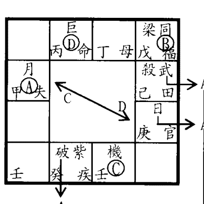

◎破軍自化祿，在疾厄，法生年祿在夫妻。

◎夫妻宮坐太陰星，太陰是女性之星，此人又是女命，代表自己，而不是對方。（先生解）

- ◎可見此人很重視自己，在乎自己的感受。並且情緒也很善變，不穩定。（月亮對破軍，如潮汐）
- ◎太陰坐甲，太陽化忌入官祿，法生年忌在命宮，代表此人是位上班族。
- ◎太陽在官祿宮坐庚，太陽自化祿，並與破軍自化祿串聯，代表此人的工作一直要做到退休。（破軍與太陽，從頭做到尾之意。除非中途有變故，且是自己提出“放棄”論才成立）
- ◎破軍對太陰，講“人”，疾厄對夫妻宮。
- ◎破軍對太陽，講“事”，疾厄對官祿宮。
- ◎有頭無尾，有頭有尾，都是看太陽與破軍的變化。理由：癸的破軍A→到甲天干，必是太陽化忌。用星辰也一樣，老鼠頭跑到豬尾巴。

## 辛 贯天四化 日月星辰寄情天地

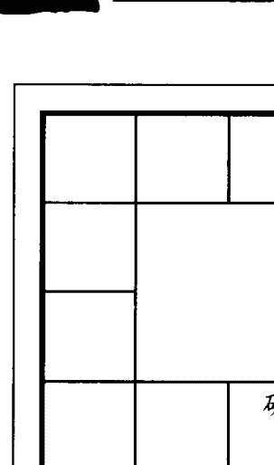

◎五虎遁癸在亥。
◎亥子之鄉，就是孩子的孩。
(天心未改移)

順

### (4) 辛年生，女命

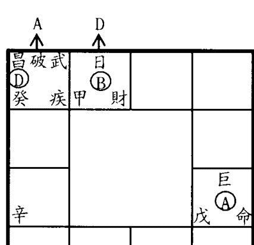

◎破軍自化祿在疾厄，生年巨門祿在命宮，無法守其財庫，【巨門是財庫星（陸地就是財庫）】
◎太陽有生年權，又自化忌，法生年忌，文昌在疾厄，又見破軍自化祿。

◎太陽有生年權，坐甲，破軍化權入疾厄，同時自化祿，構成太陽與破軍的運用，其先生每投資任何事業都損財。

◎論婚姻，也是有頭無尾，離了婚。

## 生命裡的黑盒子——孟婆湯

摘自：第三十三代祖師遺抄

給你一碗孟婆湯，你將會選擇遺忘誰？或遺忘什麼？

生命的緣起（只要有人出生），就在這個「看不見的地方—黑盒子」裡，深藏著生命無法理解的另一層面底蘊，意味出一種很玄的味道而讓人百思不解。就像月亮的背面，在地球上的人類永看不見它那方神秘。此神秘也創造了世界各國所有文化的源頭，甚至來自諸多神話裡存在的事實，一路演化流變，也成了各國文化輾轉流傳的一片風光。

玄學、科學、易學、道學、佛學……什麼學都好，都散佈在每個國家，在每個不同的階層探討研究。而研究的碩果都回饋給了社會或人類。命理學、醫學、堪輿學……又何嘗不是？因為它們的對象就是人。

然而，幾人知道自己是誰嗎？「未生之前誰是我，已生之後我是誰」。當命理之學無法解開生命是誰的盡頭，就像醫生無法去解釋因果病一樣的束手無策時，靈魂與肉體、前世與今生、心靈與醫療又成了人類另一種思維與須知，又想去探個究竟。真不知何時，人類會對自己的無知而找到有知，再劃下追求的休止符，否則，前世與今生根本沒完沒了。知又如何，不知又如何？人總是回歸面對今生，踏在今生的這條路上，又有誰能夠迴避過呢？

### 生命里的黑盒子

既然，这条生之旅途它是无法回避的，坦然的在你眼前，让所有人都得去面对。不管这条路未来是如何地发展，请问？它的来时路起点又在哪里？在那一碗孟婆汤。生之幸与不幸，到底她是下了什么药？造就了千般命、万般苦，苦苦不相同的世界人生观。

如此复杂的人生百态，真没有方法可以解决每人心中的疑惑，而去接受命运的宿命安排吗？有的人想藉着宗教的精神去获得解脱，有的藉着哲学的思维寻找究竟……但学问毕竟还是学问，当学问若无法落实到人生做真实的体悟，解脱的有几人？究竟着又如何？

据说人要投胎前，吞饮了孟婆汤后，会成了隔阴之谜。忘记过去的一切记忆，再重新的面对新生命的开始。当人出生后且又必须去面对自己的生命，于人生的道路上时，有的顺遂、有的坎坷。在不同的遭遇下，在不能理解的困惑中，会有人回首去思想着前世，接触灵魂的思索，到底谁在主宰我。其实喝下的孟婆汤，它就是一个生命体的黑盒子，隐藏着、潜伏着在每个人的细胞记忆，埋藏在基因里。除非是修行甚深的大觉者能去揭开其秘，否则很难去打开这盒子，直到人不在于世，此盒子就自然的打开了。

生命轮回之轮永远不停过，这是事实。但要提示的，你要探讨前世，这个前世，并非你个人的前世，因空间是曲线的。前世就像人在接力赛，我要投胎时，不知接到谁的“黑盒子”，由黑盒子的转载，变成我身，立足今世，这就是饮孟婆汤而忘却过去的记忆之所由。于佛家用一个“无明，行”来代表今生的十二因缘之所聚散，因那是一片无所有知的世界，叫做「无明住地」（三三）

> > 注：有人时，成上坤下乾，叫做泰卦（☰）（艮）三阳开泰。

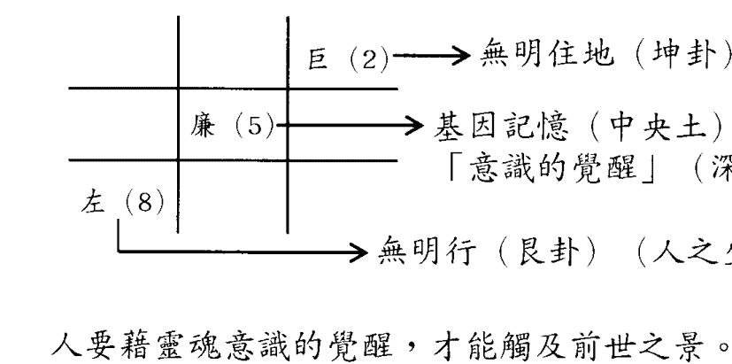

人要藉灵魂意识的觉醒，才能触及前世之景。于斗数上，唯独右弼化科与文昌星，逆转寻根［复命归根］。

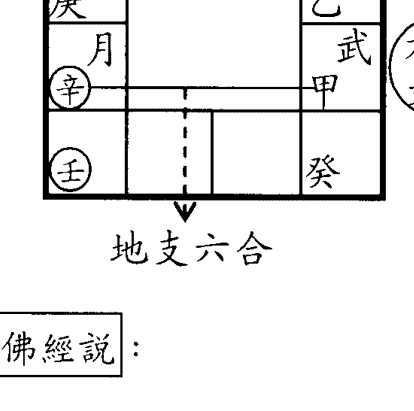

- 1. 古人观星望斗，指的是晚上，在戌时开始看月亮的变化，看到月盈（乾）；一个在卯时观月亮的变化，看到月亏（坤）
- 2. 五虎遁起于戌宫，逆行。
- 3. 右弼与文昌在戌宫，逆行。

> 佛经说：
人是由五蕴假合而有身（色、受、想、行、识）→藏在五虎遁裡。因此，要揭开黑盒子的钥匙，就在「左、右、昌、曲」再配上「五蕴天干」，始可探玄孟婆汤之黑盒子，了悟其中的因果循环。若人对它一无所知，则每一个人都是「循业而报」，就是被黑盒子安排下的「宿命观」，任命安排著走，在人之江湖，不能由己。

### 五蕴天干

| 天干 | 对应五蕴 | 备注   |
| :--- | :------- | :----- |
| 丙   | 想       | (昌)   |
| 戊   | 识       | (右)   |
| 己   | 色       | (曲)   |
| 辛   | 受       | (昌曲) |
| 壬   | 行       | (左)   |

左、右、昌、曲配五蕴天干能与前世接轨，活出真我，享受人生。使人有生存的方向。

无论潜意识或前世，我们有些关键的东西，都被隐藏在黑盒子里，无从打开。因此我们于今生莫名受苦，有的百事不顺，有的身体受折磨或者是因果病……。是灵魂找不到出口，忧郁之状从此滋生，精神百般无奈的加诸在人的身体上，如果我们能让那隐藏的黑盒子打开，显露出来，重见光明，并由我们加以掌握将之理解，则我们莫名的痛苦就可以因此而消除。

其方法很多种，宗教界、心理学界…都有述说，唯理论能否与人的生活合一，尚无法全知。但在紫微斗数上，也许有方法直接与人之命合而同参。儒家曰：「一六共宗以成命，二七同道以成性」。我们从“性”方面去探讨，可能就是一场穿梭在前世今生的时空之旅，与前世接上其轨，活出真正的你，感知当下的幸福，充满喜悦，远离茫然苦海。

孟婆汤，像一个黑盒子，饮了之后，才想去投胎。一旦受胎，黑盒子的密码信息，就贮存在你的细胞里的记忆，或说基因，漫步扩散在人体的血液里。若真要破解它，了悟自己本命之性，只有一句话：「五蕴聚合假以有身」中去摸索，寻之以答，探个箇中之妙。

## 左右昌曲 伴你一生一世

> 未曾起步先睁眼 起步莫说人心险

### 小语微言

我们看过许多愤世嫉俗的青年们，他们都会说社会是冷酷，人群是势利的，于是就把自己给武装起来和社会宣战。可是，结果毁灭的并不是社会，而是他们自己。

为什么？因为社会是无形的，它不是一个可以看得见或可以打得败的东西，甚至不是一个人的能力可以改善的。你向社会挑战，无异于向虚空宣战。它即不会起来应战，也不会因你而动摇，结果你等于是向自己宣战。

社会是一个抽象的东西，人来人往皆是擦肩而过的陌客。它没有办法为谁挺身而出，或对某一件事情表示可以负责或表示悔过。它确实是冷酷无情（有情只在人与人之间），即使你怨恨、你流泪涕泣、你怒吼，它绝对是无动于衷的，更也不会为你动容。所以，我们也只能够去承认，社会就是这样的一个冷酷无情的东西，用不着你去为这个社会觉得可耻、可悲。

而且，我们一定要认知，那不是什么人的错。青年人往往以为这个社会是被老一辈的人搞坏的，包括过去式的人；老一辈的人却又怨年少一辈的说，人心不古，世风日下，是新一代搞坏的。贫穷人会认为有钱人在制造罪恶；有钱人又叹贫穷人破坏社会的秩序。女人怨男人、男人怨女人、农人怨商人、商人怨政治家，大家彼此怨来怨去。然事实上，怨声的背后，我们所感受到的压力，却是我们自己跟所有人共同形成的。难道，谁说他没有？（共业）

你用不着反对谁，反对绝无好处。当我们不再把责任推往他人头上的时候，才能真正的去面对现实，那才是勇——→（智、仁、勇）。拿出自己的力量来，去适应环境，渡过人生的种种关卡。也只有我们每一个人都不再把责任往别人的头上推时，这个社会才会显得可爱和希望。当我们能承担百难与错误时，才能够去改善那抽象的社会。至少，起码我们已改善了自己周遭的朋友了。

易经的“坎”卦，名「陷」。社会本是陷阱，并没有人去故意布下那陷阱来害人，是自己的智慧不足，被社会给「陷」了。再者，人往往做什么事不顺时，会怨声载道地说人生真「坎坷」，其实不是坎坷，却是能力的问题，社会不会因有无其能力而來加持你或保护你，反而是你自身要有具备那能力走向社会，在社会上自求一立足之地。怨声载道，只是会被社会周遭的人看笑话的，对于任何人都是无济于事的。

社会是人生的一门大学，谁都要在这社会里，接受最严厉的生命生存的考验。“左辅”与“文曲”星，基本的定义，就是要我们自己去看清社会，再深入社会，不是倚老卖老的经验谈，却是要你自己去历尽风霜的写实人生。经验是个警告，踏上风霜，绝对须要左、曲来阅历人。是故，勿怨于社会，要正视它的冷漠，那才会有勇气去造就别人，同时也成就了自己。「迷故三界城，悟故十方空；本来无南北，何处有西东。」（心是太极）

心迷的人看这世界有增减，变成苦海；
心悟的人看这世界无增减，处处极乐。

寂寞是一种灵魂上的苦闷与孤独感。我们会在「夜静酒阑人散后」的情景之下而感到空虚和寂寞；也会在「半生飘零羁旅」的景况中感到寂寞；我们也会同样可能在灯红酒绿繁华热闹的场合中感到寂寞，越是有才智超群的人越感寂寞之隐痛。

因此，如你是不甘寂寞的人，你就必须要迁就一下流俗，曲高必然和寡，除非你忍得下寂寞，否则你只好无聊的唱唱滥调陈腔。幸好，这世界上究竟还有不少的伙伴，都是不怕寂寞的人，他们在漆黑的夜空中散布下几点星光，照亮了他们自己的时代，也照亮了后来人们的路，自守在孤灯下。

乐圣贝多芬一生寂寞孤独，可是他却说：「当我最孤独的时候，也就是我最不孤独的时候。」因为当他在寂寞孤独之中，才不得不把情怀寄托于美妙的大自然上，才有更多时间去整理他那不平凡的思想和灵感，他的音乐绝不是繁华热闹中的产物。

每一个人都会在灵魂上感触到寂寞的时候，当处满腹心酸之时，却觉家人亲朋之中，竟无一人可以一吐忧郁。我们可以发现且证明了人们是多数喜欢看到春风得意的笑脸，却不喜欢听那秋扇见捐的牢骚。当你想将一腔心事倾诉于他人时，平生好友却一一婉谢而离去。此时，你心中有何感觉？

但如果你能够豁达，你就该了悟。人与人之间只能在笑语喧腾的时候才显得亲热，或在他人施舍善意博得慷慨之名时，才显得出仁慈，舍此之外，没有谁真正会分担你心灵的寂寞。所以，你我都不要也不必怪谁，寂寞本就是人类的别名。

因此，我们在这漫长而又孤零的人生道上，只有勇敢的承担这与生俱来的寂寞，用自己的力量点化出心中的一点光和热，冀望着这光和热能在漆黑的夜空中变成星星点点，在漫漫永恒中，发出一点光辉，来显耀着你的爱照亮着未来，遗爱人间、赞美人间，无怨无悔。

> 「只有最伟大的人，才能在孤独寂寞中去完成他的使命。」

如果想要成为一个强者，是不可避免面对寂寞的降临，只有自身的坚强去面对寂寞的人，发挥出自身的力量，使自己的天赋才华不被那寂寞孤独所吞噬，用那磨练来生热发光。

春蚕到死丝方尽，燃烧自己去照亮别人。那么，前途虽然坎坷，风雨尽管无情，我们此时此刻再也不会感到寂寞和无助了。愿我们一同用欣赏之情来看待人生，那人生一定会很美会很丰沛的。“右弼”与“文昌”星，正是这样的写照人生，也只有这样，才是真正的——「忠诚」你的一生，情还归大地。

无怨于自己的心灵——右弼文昌完美你人生。（精神面）
无悔于社会的无情——左辅文曲帮助你成长。（物质面）

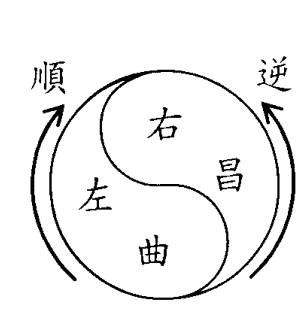
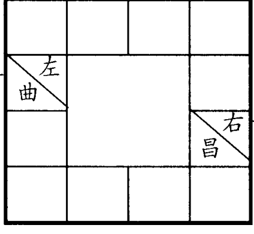

※北斗七星是：贪、巨、禄、曲、廉、武、破

- (1) (4) (6) 四正位
- A. 左辅、文曲寄北斗贪狼位 1
- B. 右弼、文昌寄北斗武曲位 6
（坤） （坎）

### 提示概要

#### 第一颗：左辅星

「美在天上、在云端、在海上。在百合花里面有美；在晚霞中也有美。美在天高气爽的素秋；也在桃红柳绿的媚春。的确，自然是无限的美，她披上了她的美，正好像它着上了颜色和声音一样。因此，何必我们一定要说自然界的美是属于我们的，而不属于她自己的呢？人类的品格和特性，也有他们的价值，这种价值是属于它们的，正好像红色是属于桃花的一样」。

> > （英国实在论哲学家・乃阿德）

左辅星所代表的不只是一种现象的存在论，更是<ins>存在中的一种实在论</ins>。这个实在论不一定属于你的，它是属于「物自身」的。好比，蓝天与白云相配得很美，是很实在的，但毕竟它不属于「我」的，那属于谁的？…属于「壬」天干的。

## 例

|      | 壬友 |      |      |
| :--- | :--- | :--- | :--- |
| 左   |      |      |      |
| 福   |      |      |      |
|      |      |      |      |
|      |      |      |      |

- ◎福德宫有左辅，它是很“实在”的落在福德，代表此人福气不错。
- ◎但这福气的实在（物自身）却在交友（壬天干），结果谁得到好处？是朋友。
- ◎左辅的应用，要逆转到壬天干，即左辅的存在属于壬天干所有。

## 例

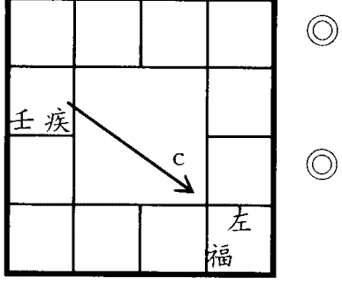

- ◎福德宫有左辅星，壬天干在疾厄，要注意长辈的健康。
- ◎主要是壬天干在疾厄。

## 例

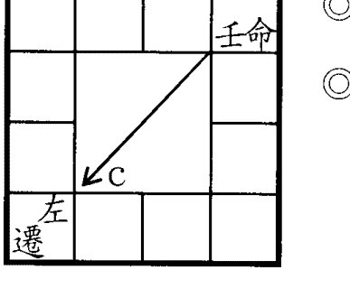

- ◎迁移宫有左辅星，壬天干在命宫
- ◎此人必定会出外或出国。

左辅星是一种现象的存在，存在于某宫位上。但应用上要配合“壬”天干。

壬天干在什么宫位，左辅星必与“壬”天干相互往来。

> 〔存在中（左辅）的一种实在论（壬天干）〕

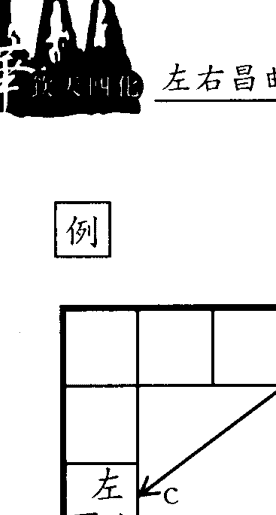

- ◎壬天干在田宅。
- ◎左辅星在夫妻。
- ◎简单的回答，就是结婚（成家）并有房子（置产）。
- ※或夫妻宫坐壬天干，左辅星在田宅，其意思一样。

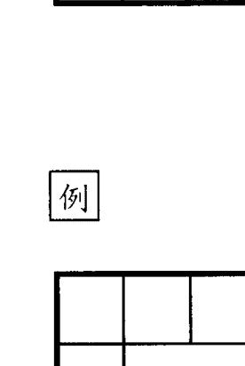

- ◎壬天干在迁移。
- ◎左辅星又在迁移。
- ◎代表自己要注意交通事故（意外）。

左辅星在现象界中，是以一种“气以成形”的形态存在。所以在什么宫位，必有它存在的物相于此宫位中。

然而，当左辅化科又自化科时（即来因宫自化），代表具有的东西（已有的）终究留不住或变成没有〔形体俱坏〕。此种用法必须参看天干“丁”（宫位），代表留不住什么？（丁壬必化合科）

## 例

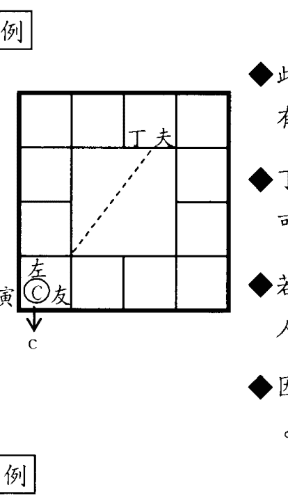

- ◆ 此人壬年生，左辅科又自化科，代表已有的一切会有留不住的一天（寅）。
- ◆ 丁在夫妻宫，代表纵有结婚，有婚变的可能性。
- ◆ 若没有结婚，朋友之交不会得到知己的人。
- ◆ 因左辅必看“壬”天干，其位就在交友。

## 例

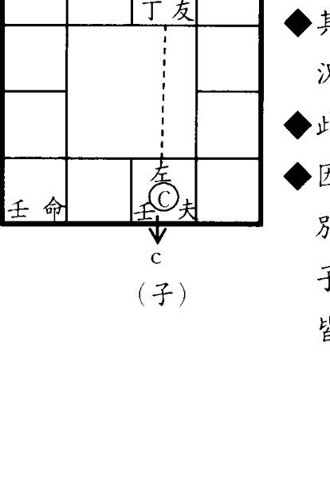

- ◆ 此人也是壬年生，同样左辅科自化科。
- ◆ 其位在夫妻，但夫妻是在（子），其情况就不一样。
- ◆ 此人若结婚，是不会或不容易离婚的。
- ◆ 因为（子）→属天；（寅）→属人，差别在这里。
- 子→父；丑→母；寅→人（以后十宫位皆人）。

##### 左辅别义

(1) 左辅在人的内心世界，偏向物质面，在精神方面较难提昇。
任何事物偏向以见为是。对看不到或不能证实是“是的存在”，就很难信服。于是，对“放下”两字很难做到，故不自在（看宫位做诠释）。
尤其左辅星的旁边，尚有别颗星又有生年四化者，更顽固己见，叫做——「骨头底不服输」。
如：左破廉 B A 子女 ◎对子女一定放不下心，或教育子女自恃父母之见管教，或称填鸭式教育，制造别人的压力。

(2) 左辅星代表人的之意识，是以自己的意识形态去谈论别人的是与非，借用佛家语就是「无明」（无明不是莫名其妙）。左辅星是用自己的立场说话，有立场而无是非，导致「尽看别人的错，忽略自己的过」。纵使你能让左辅认错，但其内心决不悔过。好比，你叫他不要合作，他口说是，背后却还是去合作，此种人真有人在，这就是「无明」。其后就引来了是非，而是非就是左辅惹来的。
> ——青山只会明古今，绿水何曾洗是非——

###### 例 左辅无自化，旁边星辰自化，必遭是非。

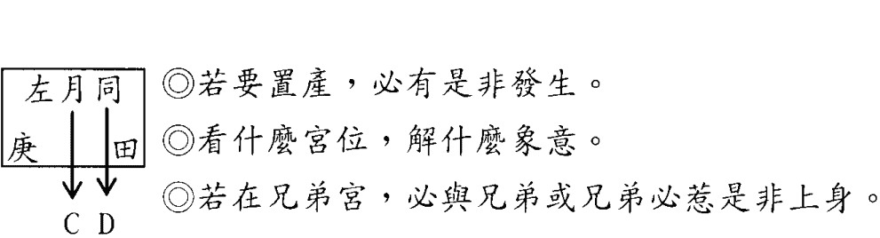

##### (3) 改变左辅的方法：

- ◎去掉自我意识的作祟，做「转识为智」的心态来转换，再看人生。
- ◎左辅的不好之因放不下，既然放不下，反过来就用「承受接纳」来转换。
「承受一切，才能真正放下一切」。
没有承受的勇气，就没有放下的人生。
人生若有一丝一毫「是」与「非」，可思可议。
即有一分无明未破，是名「不如实知」。
一切言语终归虚妄；一切有物终归虚无。

> 最简单的方法，不要去在乎他人的闲言流言。「素位而行」，终究能脱离左辅的攀笼。如果在乎别人的言语，则你已落入他人的的是与非混水中去了，很难做你自己，因为你都在迎合别人，那并不是你自己的本色。

#### 第二颗：右弼星

孔子曰：「不知生，焉知死」。庄子曰：「方生方死，方死方生」。段玉裁说：「命者，令也，从口从令」。

孔子与庄子所指的“生”，并不是指生产或生育的生。而是指生命的生（落后天），这已形成了“命”的问题。命者是令也，以致圣人之言生，好似佛所说，入胎经的“入胎”，俗话称它投胎的那个生（先天），因胎就是“生”的开始，生下胎儿，就是“命”的开始，合称「生命」。

右弼星，扮演着投胎那一刹的生灵，在我们的有形物质的肉体上，它是相对于看不见的灵魂，所以右弼与文昌同一组〔右弼（灵）、文昌（魂）〕。

而人是以灵觉为贵方为人，于肉身叫做「心灵」。换言之，右弼本寄于虚空的灵界，以「气化生人」而为人，所以我们在母胎中的十个月为「左、右、昌、曲」请勿忽略。右弼星是为什么叫令星，乃命是从口从令的。

# ——故事一则——

有户人家儿女成双，家境殷富。姐姐少小离家求学，远走异乡，受父母恩泽多、财泽少。弟弟成人仍未独立生活，一直过着伸掌朝天的日子。有天姐姐回家，弟弟告诉她，说人有生死轮回，讲了一些大道理，可是姐姐听了颇不受用，但也不反驳。心想，人嘴两张皮，勤有勤的原因，懒也会找懒的理由，于是姐姐也给弟弟说了一个关于轮回的故事：据说每个鬼魂在投胎前都必须要接受一次的测验：「这次投胎，你想一辈子都是人家给你东西，还是一辈子都是你给人家东西？」有一个鬼魂抢着回答：「我想一辈子都是人家给我东西」。于是这个鬼魂投胎为人了，做了一辈子的乞丐，一辈子手心都朝上，接受别人的施舍。

※这个故事在告诉我们什么？

人生之道路毕竟是要由自己来走的，道理也必须由自己来明白的。我们会拥有怎样的人生与命运，都是由自己来选择的。这个“自己”来选择的，它就是“右弼星”。右弼星的体现，就如这则故事。可见，什么叫「命者令也」。又，这样的“生”正合乎孔子所说人，如果「不知生」的“生”的注脚。

从这故事的角度来看，右弼星要如何运用？

在运用前，先明一个观念。


由是知道一个生命的诞生，要经过这个过程。

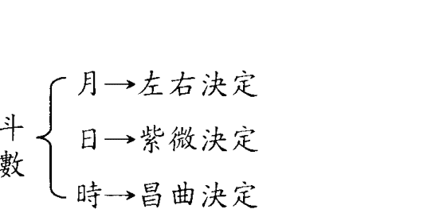

左辅→重点在“壬”天干，次看左辅所落宫位。
〔星辰顺排，但要逆转〕

右弼→重点在“宫位”，次看“戊”天干在那里。
〔星辰逆排，但看落点〕

易经所谓「生生不息」，若用在人的方面，第一个生，是人类受生的“生”；第二个生，是人类诞生已有生命的“生”。白话点：胎内与胎外叫“生生”，不息则是人类永恒的在生灭无常中，从未止息过。正是「方生方死，方死方生」。佛家说它是轮回，儒家说它卦终无卦，只是循环，异曲同功。

##### 应用先决条件

- 1. 第一点：右弼所在宫位，像是人的灵魂寄于此宫位。
- 2. 第二点：看戊天干从那个宫位来。
- 3. 第三点：右弼星所座落的宫位，有没有在「丙、戊、己、辛、壬」这五天干中。若有，这右弼星则隐藏了另一层的“先天意”在里面，似人之禀气各不相同，犹人生下来俱有某一方面特殊的禀赋而异于常人。

##### 第四点：在戊天干的宫位中，有没有文曲、文昌或左辅。在右弼的宫位中，有没有文曲、文昌或左辅。

如有其生命的特色或禀性较不同于常人，命运的起伏表面是随运在走，但其内在的心境、思想，未必是随命在走。如人走到颠沛无助中，突然间会有奇迹出现，生命说不定重新再个大转折，非常人所料。古往今来，很多人都有这样的经验和体悟，乞丐说不定当上皇帝，穷人莫追，突变富豪……

###### 例 戊年生 女命

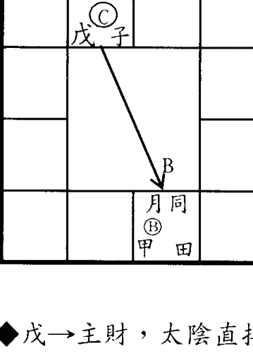

- ◆戊天干在子女宫，直接坐右弼科又自化科。
- ◆同时太阴化权入田宅。
- ◆依象意解，代表此人必有子女，并会有房子但站在戊天干，坐子女宫，并又是生年的右弼，其第一胎就生了三胞胎，特殊在这宫位。
- ◆戊→主财，太阴直接入田宅，代表有置产能力。

# 例 男命

◆ 右弼在官禄，其天干又坐丙，代表此人在事业上必有专业或异于常人的特色，展现在工作。

◆ 法生年在父母，为一种服务业。但同样是服务业的性质，其内涵（指工作）一定比别人较特殊的行业。

◆ 戊天干在迁移，把上面二项参考下去，变成事业可能会与国外有关【迁移＋父母】，很多都与国外有关。

◆ 右弼宫位坐丙，很多是白手起家，自立更生，且一半以上都要靠人缘、人脉而成功。丙→主人缘、人脉。

# 例 女命

◆ 此人戊天干中已经有生年文曲化忌，必有不动产（文曲星在戊天干→主财）。

◆ 又戊天干飞右弼星入夫妻宫，象征婚后必有房子，但此房子的由来，来自先生（夫妻宫）。

### 例 丁年生，女命

- ◆ 丁年生，天机化科在田宅。
- ◆ 戊天干在迁移，右弼化科入命，法生年科在田宅，代表婚后必有房地产（迁移是夫妻宫之财帛）。若没有结婚，也代表自己有能力置产。
- ◆ 戊天干代表“财”，因此右弼入命，代表财入命。

# 右弼别义

（1）右弼星在人的内心世界，是偏向于精神面也可以说喜追求精神上的寄托，进而产生在心灵上会有某种信仰或一种崇拜的心理，提升自己的智慧做为生命的资粮，找寻自己的精神归宿。当右弼面对左辅时（左右同宫），往往会产生一种矛盾的对立，如精神与物质、爱情与面包在抗衡中，它是没办法两全其美，有股「鱼与熊掌不能兼得」的感慨〔包括左辅与右弼若有四化往来也算〕。

（2）站在人的生理上，左辅为意识，意识是透过大脑产生“行为”，而显现于外之行为是看得见的举动，像是「形而下者谓之器」的“器”。因此左辅偏向以见为是的存在思想，很实在的个性就少了一股韵味的气习。

右弼它代表是潜意识，潜意识是透过大脑产生思维，落入无形之精神层面隐藏内心深处，像是「形而上者谓之道」的“道”。好比重精神面的人寻求智慧时，追求的过程中把握住「妙用存乎一心」。而这一心的妙用，未必人人都可看得出来感应得到，是一种神韵，有韵味的，而这个韵味是无人可以取代的。用白话一点，神来之笔，教我怎么说，拈花一笑罢。

（3）左辅星与右弼星，在易理象数中：
- 左辅星是老阳（乾）……居壬天干<九>
- 右弼星是老阴（坤）……居戊天干<五>

> [补注] 古来皇帝自称九五之尊，称为“朕”。

斗数流传一句话：紫微若没逢左、右为孤君，于是把紫微称为皇帝星。后人论命就去注意紫微星有没有会到左、右这两星，其实完全会错意。不论你贵为皇帝或圣人，都是父母所生。紫微之命是由生日来决定，在未出生之前的十个月，跑到哪里去了？

※ 紫微喜会左、右，是在阐述生为一个人，是不能忘本的。我们的上面是有生我们的父母的（乾、坤）（左、右），忘父忘母，与孤儿又有何异呢！紫微星只是父母生给我的一个肉体（色身）而已，众生平等，何喜之有？

> [解] 凡是紫微星与左、右两颗星有往来或同宫，只要看到这种命盘，你可以大胆的去观察他们的家庭父母与子女之间的关系好坏、叛逆还是乖巧、关心还是不关心…

- ◆ 此盘是右弼与紫微有关。
- ◆ 代表要注意子女的前途或与子女间的相处关系。

- ◆ 此盘是左右与紫微同宫且紫微自化科。
- ◆ 生年文曲科在子女，必须关心子女之间的功课与相处之道。

（4）左辅是一颗动态的星，有如驿马星。例如左辅在福德，很喜欢应酬。右弼星，为一颗喜静的星辰。此两颗星在应用上，都要同时参看。在此表达此两颗星辰的功能有如太极，在一动一静之间运作。若此两颗同宫，则动多于静，次看宫位，解释内容。

# 为什么说它有动静？

左辅属于壬天干，壬天干五行属水，属动。

右弼属于戊天干，戊天干五行属土，属静。

又在水、土同源之下，两颗星必须要同时参看，才能运作无间，现象才能明了。

# 例 丁年生女命

|  | 機 (C) | 右 | 左 |
|---|---|---|---|
| 乙 福 | 丙 田 | 丁 官 | 戊 友 |
| 相 武 | | | |
| 壬 兄 | | | |
| D ↓ | | | C ↗ |

◎右弼在田宅，本来就喜欢在家里，好静。

◎但戊天干在交友，依据右弼重点看宫位，次看天干，于是可以解释喜欢朋友来家里，为人好客。

◎可是戊天干的交友宫，却坐左辅星（动态的星），在左辅的应用上，主要是看壬天干。

◎壬天干在兄弟，此宫位自化忌，化科到交友的左辅，则此人反而变成好动，常出外。

◎假使戊天干之宫位，没有“左辅”，就保持好客而耐静。

| 左庚福 | 右壬官 |
|---|---|
| 戊命 | |

◎右弼在官禄，而命宫坐戊，代表自己喜欢一份稳定的工作（右弼在工作上称安定）。

◎然而，官禄宫却坐壬，左辅化科到福德（六内）

1.  代表工作的性质，是依自己的兴趣而定。
2.  代表工作的性质，反带有一种动态性，如直销业，却不是坐在办公桌的。

○切记一件事：左辅与右弼一定要同参，不可单独使用。

# 一个秘密的小家庭

紫微斗数中，有左辅、右弼、文昌、文曲这四颗星，它是属于先天易数的学问。因为这四颗星，全部在讲人类怀胎十个月的生命体。在生命未出生之前，有其怀胎十个月的天干，称之为「胎息十干」。而斗数的十干化曜，是由这胎息十干衍化而出。

如果你了解电脑，先要有硬件的设计，而后就是软件的显现。命运也是一样，没有左、右、昌、曲〔如硬件设计〕岂有紫微（14颗星）的命可以预卜前程？我们所知的斗数，只是知其然而不知所以然。

### 左右昌曲

当你回归胎内十个月的生命设计，你也可以一目了然的知道未来运势，因为你已知其所以然，故称它为：「先天易数易学」。

左、右就像父母一对。

昌、曲就像受胎中的子女，有男、有女。

当从受胎至出生的时间到，才会有生命的诞生，即是现今使用的紫微命盘〔后天数术〕。

学命理者，不要把人在胎中十个月的“生命”给忘掉了，它才是生命之源、性命之根本。

# 第三颗：文昌星

「我思故我在」，人是一个很有思想的动物，故人之因为有思绪才会一直累积太多复杂的知识与想法，导致我们人不断的再产生无数的烦恼。然而，烦恼并不可怕，可怕的是我们的想法对不对、健不健康，有健康的想法，纵有遇到烦恼，可以轻松地面对烦恼而生智慧。

是故，文昌星(左右昌曲)在斗数上第一个出现，就在丙天干(三才人为首) 。

|  | 天 | 地 | 人 | 物 |
|---|---|---|---|---|
| 四化 | 禄 | 权 | 科 | 忌 |
| 天 甲 |  |  |  |  |
| 地 乙 |  |  |  |  |
| 人 丙 |  |  | 文昌 |  |

◎这一颗星的重点在人要受教育，良好的教育，才有健康的思想与人生。最基本的認識，就是学习与读书，人性的美善也从读书学习而来。所以，它管人的“思想”为文昌化科也。

人者仁也，仁在东方三八木，于是文昌出现在丙、辛天干。但为什么丙是化科、辛是化忌。因为丙辛合化为水，故化忌代表一切事物告一个段落或终止，然后再重新再来。

但有一点要提示：

丙天干→文昌化科，是人需要有求知欲。功名、学业都在文昌化科中，是一种知识的“识”（不是潜意识(右弼)与意识(左辅)的识），也就是人类对万物的认知。既然如此，又何须化忌呢？

当这个认知到了某一个层面，怕人的知识会变成「所知障」，不能再提升，于是在辛天干化忌，用丙、辛合化水的原理，让人类能「转识为智」，而不再被知识所缚「人类的执着，也是从知而想来的，因为不会转化」。「仁者乐山，智者乐水」，正是文昌化科与化忌的思维写映在人生。

# ——故事一则——

有人问贤者：

“假如你一个朋友也没有，你还会高兴么？”

“当然，我会高兴地想，幸亏我没有的是朋友，而不是失去我自己。”

“假如你走在路上，突然掉进一个泥坑，出来后你成了一个脏兮兮的泥人，你还快乐吗？”

“当然，我会高兴地想，幸亏掉进的是一个泥坑，而不是无底洞。”

“假如你在拔牙时，医生错拔了你的好牙而留下了患牙，你还会快乐吗？”

“当然，我会高兴地想，幸亏他错拔的只是一颗牙，而不是我的内脏。”

“假如你正在熟睡时，忽然来一个人，在你面前用最难听的嗓门唱歌，你还会高兴吗？”

“当然，我会高兴地想，幸亏在这里嚎叫着的是一个人，而不是一匹狼。”

“假如你马上就要失去了生命，你还会高兴吗？”

“当然，我会高兴地想，我终于高高兴兴地走完人生之路，让我随着死神，高高兴兴地去参加另一个宴会吧！”

> ※这个故事对我们有什么启示？

痛苦往往是不请自来的，而快乐与幸福切需要人们去发现。调整你对人生的态度，可以决定你的快乐与悲哀。只要你希望自己快乐，你就能得到快乐。

人之快乐与否、人之情绪控制，都与这颗文昌星有关。为什么？好与坏皆在我们自心中的转化，故事中的对话，就是要人往好的方面去想，「塞翁失马」正体现出文昌星的本色。文昌逆排，要人有逆向思考的能力，不要在执着某个点上，来制造出不必要的烦恼。

# 家用长男

文昌与右弼是一组的。

假使把右弼以坤（母亲）来代表，文昌就是阴中之阳，为少阳。

少阳本身在东方（昌字是两个太阳来组合，象征光明，火炎上）。

若用：（1）卦象表达：

(2) 文昌代表一阳生，即震卦。古来一向家用长男，故后天八卦由震卦开始，年年更替行十二宫。又每日太阳由东方（卯宫）升起到，了申宫太阳渐落，到西宫而日息，代表昼。

(3) 把坤、震重叠即

变成地雷复，在子位（后天坎、先天坤）

3+8=11 —— 应十一月冬至

子（冬至十一月）

(4) 文昌之位本在东方木，当万物回归冬藏后，才能在春天更新向荣。而人，生于寅居东方。于是是以十一之数可以看出斗数四化之源，其组合皆十一数。

# (文昌星)

# 胎息十天干

（每组之合皆十一数）
（四化之源）

(5) 代表万物都须归藏在 “子”，是所谓「天开于子」。

# 文昌别义

(1)在左、右、昌、曲四颗星中，唯独文昌星不属于北斗星，其余三颗是北斗星，文昌星是南斗星。北斗注死，南斗注生。注生，所以它管人类的 “生”，生在东方，应三、八之数〔三为人俱三才的三，活天地八卦中：八为八卦，应一年十二个月〕。

+   ◎三、八或丙(三)、辛(八)合化水，水主坎卦，在斗数用“化忌”。
+   ◎坎卦在子位，子位在十二月中名「复卦」，应在冬至。
+   ◎俗称「天开于子」，也正是万物走入了「归藏」。是终亦是始，名为一阳生。
+   ◎文昌化科是一阳生＜始＞。

文昌化忌是万物归藏，归藏是“藏”，不是“灭”。因里面有一阳生，所以文昌化忌，即是为任何事情皆会有段落，再重新出发。

# 补助说明

※斗数使用四化，其序为禄→权→科→忌〔天、地、人、物〕。
采用的是洛书，以逆为用，况乎文昌与右弼皆逆排〔右弼阴逆转之故〕。若以人为基准，丙、辛合化水〔化忌〕，归到坎卦（水位）坤体，不是很吻合其序，科→忌。
※文昌星是代表知识、常识，人皆有之。我们最好能把知识转为智〔水主智〕，逆转，逆向思考。
若用五行，什么水生木，根本行不通。请问水怎么生木？
水是水、木是木，是木需要水来涵养，但中间须要媒介“土”〔艮卦〕，故才有艮始艮终的名称。在九宫，一、六、八皆为白。

# 紫微四化 左右昌曲

| 八白 | 一白 | 六白 |
| :--- | :--- | :--- |
| 艮 | 坎 | 乾 |
| (子位) | | |

所以河图一、六共宗，北方水。寄体成卦在艮、坤，道理就在此。

### 例 庚年生，男命

◎此人是做服务，并开店面〔来因兄弟～到田宅〕。

◎命宫＜辛＞，文昌自化忌，虽与疾厄天机自化忌串联。

◎但丙、辛合化忌，是辛的自化忌，代表事物一定会结束。

◎什么时候会结束，当大限走完天同的生年忌，流年又是在去年结束的（见第一项说明）。

# ## 例 辛年生 女命

◎此人科、忌在官禄宫，代表上班且安定，因为官禄宫没有任何离心力自化。

◎福德宫有贪狼自化忌，法生年忌是文昌，总有一个现象会结束〔带动文昌化忌〕，原来是工作会结束。

◎要使工作结束，一定要走到第五大限〔官禄宫〕才会结束。因为文昌化忌是由辛天干来的，而辛干就坐在自己命宫。

※切记，如果此命盘没有任何自化忌去带动文昌化忌，不能代表结束。

※凡是由辛天干的文昌化忌，都代表有某一件事会做结束，只是在命盘上变化会不尽相同。

# ## 例 辛年生，女命

◎此人辛年生，来因田宅宫，文昌化忌在交友，代表此人会结婚。

◎福德宫有天同自化忌，带动文昌化忌。

◎要注意第四大限有婚变现象。

◎为什么第四大限，辛天干在田宅四正位，代表空间。

◎在何年？丙、辛合忌的流年，93年（前年）。

（2）文昌是注生，则文昌化科〔科主人之健康〕，所以要注意健康（尤其在幼年）。次而代表学业、功名、求学、考试……

这里要提示的，文昌跟功名、学业有关，代表的是从小学到中学、高中、大学甚至到研究院这样一路下来，文昌若好，求学都没多大问题，除非文昌星本来就不好，才会影响升学。

然而，若一个人已经离开学校或毕业，到社会上工作了〔与学校脱离〕倘若有机会想再提升或特种考试，万一文昌星是不好的话，则这一辈子再怎么努力，也考不到。

为什么？因为文昌的功名，只管到学校升学的部份，离开学校到了社会，文昌是管不着的。

※ 在此都是在指考试、升学、功名之类。有人很懒的读书，但功课成绩就是不错；有人很努力用功，考试功课就是不理想，那就必须参看文昌星。文昌星，很多人是服公职的（政府机关）（次为上班族）。

〔例〕辛年生 女命

-   此人辛年生，文昌化忌在疾厄，来因是财帛宫。刚好她的先生又生肖属兔（卯年）〔文昌定因缘〕。
-   文昌化忌，对宫父母宫化科进来会文昌化忌，并且文昌都没自化，因此，其先生在大公司上班。
-   法生年科，文曲又与太阳化权同宫，象征此人在公司中，职位中高阶上，当业务部的经理（交友宫是动态，或外勤的宫位）。
-   这种人，就是文昌不错的人，离开学校也很容易找到工作。

(3)文昌化科除了功名、学业外，尚有一个很重要的论题，就是健康。还有，它主“生”，所以孕妇欲生产时要注意一下，包括剖腹生产。

# ※另外：

文昌星，在医疗上常容易被医生误诊，抑或所谓的医疗纠纷，常会在医院出现。

# 例 辛年生 女命

-   ▲辛年生，文昌化忌在交友，且丙、辛又合化忌为用神。
-   ▲疾厄宫自化忌，带动文昌化忌。
-   ▲在洛书上，六、八为足，主健康的宫位。
-   ▲当大限走入文昌化忌的时候，要注意健康且在（申）猴年。
-   ▲为什么要注意，因为文昌自化科〔主健康“象”〕。

# 例 癸年生，男命

-   ▲癸年生，太阴化科在福德，且是疾厄宫来的。
-   ▲在疾厄宫，坐文昌星。
-   ▲命宫坐丙，一定会文昌化科在疾厄。
-   ▲法生年科在福德。

▲说明幼年常常身体不好，难养。

▲在表达文昌一但化科，落在福德、疾厄、兄弟、交友等宫位，请多注意身体健康上的问题。

# 第四颗：文曲星

文曲星，五行属水，水主财，重心在“利”字。世俗上有两种人，一种人“重名”（文昌星），喜名声重声望；另一种人重“利”（文曲星），爱金银财宝、重物质。因为财可以养命，走入社会偏向物质的世界去追求其利。

|  |  |  |  |
|---|---|---|---|
| 阴 | 右昌 | 属于 | 精神世界---（右弼）<br>思维世界---（文昌） |
| 阳 | 左曲 | 属于 | 物质世界---（文曲）<br>现象世界---（左辅） |

在物质世界底的现实社会里，追求其利者，是人类生存的目标和指望。为什么，有的人很平顺的过一生，有的却是历尽风霜，坎坷不顺。同样的文曲星，却有着不同的命运和遭遇。为什么？得位与不得位之别吧！

# 寄文引谕

有一种文曲水，像洁白的自来水。

她的一生，顺顺畅畅的，无风亦无浪，单纯的像一张白纸。她看不到世道的险恶，也看不出人心的叵测。与她交谈，话题只能涉及风花雪月、吃喝享受，较感知的、较深智的，她都无法畅谈。因为她不懂，而她也不以为她有这必要去懂。她满足、她亦知足。

表面上看起来幸运的她。然而，从人生的另一个角度来看，人生的五味杂陈，她独沾甜味听好听的话，却不知她的幸福来自她的懵懂无知。她好比清澈的自来水，透透彻彻地让你看到她是什么、她有什么、她要什么？而这一切的一切，却是人生的一种缺憾，没有历练的人生，怎可练就自己内成熟的心灵美啊？

另有一种文曲水，像大江河水。

你可以很清楚地知道她是河、她是江。她源远而流长，但你不知她源自何处、来自何方！她潺潺地流，流过峡谷，流经平地；看过万般妩媚的自然风情，也阅历过风起云涌的险恶景致。无论外界景物是如何的展露，她都静静的流，不动声色的流，处变不惊地流。

你一眼就知道她是河，但这条河，并不是可清澈见底的。她水色微浊，你不知道河内会有什么？也许会有鱼有虾，有水藻有珊瑚，也许更有嶙峋石头或是噬人的鳄鱼—。你可以和她谈风说浪，她懂，因为她曾被狂风掀起巨浪过：你也可以和她聊港湾里的平静，她也能侃侃而谈，因为她曾享受过风平浪静的恬淡里。这样的女性（文## 文曲星的應用

曲，會散發出一股魅力吸引著你，就因爲她有過滄桑……。滄桑是一種美，是飽經世故的成熟，成熟於內心慈祥和藹的真、善、美。

※此篇的引喻，象徵我們人在社會上，要經得起社會上的考驗，磨練我們心中的心智（心靈的智慧），以成熟的心靈來看待這複雜的社會，進而走出自己，創造生機。

文曲星，代表著人的智慧與稟賦、悟性…等。有的人生活當中很容易接觸到善知識的青睞或長輩、師長的照顧，那是要看文曲星。若再進一步的說，文曲星相映在人的心理面的，好比，你用什麼樣的心，來看待萬物，文曲星就會顯示出你的心理態度（心態）。所謂：「相隨心生，相隨心轉」正是此意。一個人若心智愈開，則看到的人情世故也更會透澈。

求學或做學問，要有學歷〔求學的經歷〕，但生命的哲學，卻是要我們自己在這社會上去經驗體認的，面對一切的種種而走過去。歲月的心路歷程，重點都在結果的「果」，而這個果也決定了世俗的好與壞。就好比說賺錢這件事，到底賺得到嗎？

文曲星有吉凶論，所以位置坐得好或落不對是非常重要的。這個位（宮位）不是以宮位的內外來說吉凶的，論得不得位的，而是要依「己」天干的宮位爲基準，再看文曲的落點宮位。因爲它的性質就像左輔星的應作，是同一個體系。

### 例 男命甲年生

+   ◆ 甲年生，来因疾厄宫，太阳化忌在兄弟。依象而解，此人最好是上班族，领薪水最好。
+   ◆ 文曲在父母，（己）天干在福德。福德若站在财而言，是说赚什么钱有关，因为对宫是财帛宫。
+   ◆ 依文曲的用法，己会化忌入父母，再法生年忌在兄弟（六外）。上班的范围中，最好是公家机关之类（事实此人是公务人员），因为文曲的关系。

※己天干不是生年者，其化忌一定要法生年的化忌。

### 例 女命壬年生

+   ◆ 壬年生，来因在命。生年化忌在财帛，刚好是三合方，且自化权串联入命。依象而言，代表要自立更生，自谋生计。
+   ◆ 再看（己）天干在疾厄，文曲化忌又入财帛宫。依文曲的用法，代表此人是自己作生意。做什么生意，疾厄宫代表服务业且是自己，说明此人的工作是自己做的，不须合作（个人事业）。
+   ◆ 重点是己天干在疾厄，文曲化忌也在财帛逢生年忌。肯定此人做的事业很赚钱，且赚得到。

## 文曲別義

(1) 文曲為什麼首見於己天干，而紫微也排在己天干？

紫微星是依日子而定的，但當人的誕生日（生日）決定時，已定日子裡總要有一個出生時間，這出生時間（生時）就是指文曲星，人稱「落土時」正是此意，其後才有八字命，以致在左、右、昌、曲中，文曲排最後。白話一點，人出生之年、月、日、時中的日與時，即紫微與文曲在一日中完成生命的誕生。誕生後就是命運的開始，故用在「己」（六）。

(2) 六在北方水，萬物皆因水而生，是故文曲屬水。水主財，財為養命（紫微土）之源。又，卦也是用六爻來定位。斗數用左輔與文曲一組，它的道理就在此。

左輔 → 文曲
（受胎「月」） （生命誕生「時」）

紫微是以生「時」到了，才來決定其「日」。
所以：左、右、昌、曲為先天義，紫府十四顆星是為後天義。

### 左右昌曲

(3) 文曲星，若引用佛家语，指的就是果报星。用「因缘果报」四字来对应左、右、昌、曲。

文曲星与左辅星为一组，且在斗数都是顺推，若要把它说白一点，“果”→指文曲星，而“报”则为左辅星所承受。这只是单独对「果报」两字而言的。

换言之：左辅星之凶兆会大于文曲星，看盘此二星都要同参。

+   左辅→偏向健康或事业、功名。
    文曲→偏向经济或财福、利益。

※右弼与文昌，是对治「因缘」善恶论。

(4) 对这四颗星的理解：

+   ◎在体（本体）而言：
    右弼与左辅是一阴一阳之本体。〔月系星〕
    文曲与文昌是一阴一阳之本体。〔时系星〕

+   ◎在用（应用）而言：
    右弼与文昌，是一阴一阳之应用。〔十月怀胎的过程〕
    左辅与文曲，是一阴一阳之应用。〔受胎至受生〕

+   ◎在应用上而言：此四颗星须交互应用的，有时候可以当体而言；有时候可以论用言之。在体而言，像论命格一样（静态）；于用而言，像论大限、流年一样（动态）。

### 例 壬年生 女命

◆ 来因宫坐壬在疾厄宫，且宫位有右弼，代表此人命中多贵人。并且当人生走到困境时，一定有贵人扶助，船到桥头自然直其右弼的化科，来自于戊天干父母宫，大多是长辈。

◆ 关于文曲星，坐在自己命宫里，福德宫坐“己”，文曲化忌入命，法生年忌在夫妻宫，是说此人婚后会有福气是靠先生养活。

◆ 文曲星的应用要领(1)看己天干之宫位为主。(2)次看文曲之落点宫位。(3)再法生年忌的宫位，就得知答案。

◆ 己天干文曲化忌入命，除了自己有福气之外，尚有谁？谁还有这种福气？

用文曲做固定点，看其天干是什么？其天干为丁。丁必与壬化合为科。此人之交友宫（夫妻之疾厄宫），有左辅科又自化科，且在丁与壬的天干中，先生正好又是生肖属鼠（子）。这是说明：

+   (1) 此女荫夫，能旺先生事业。
+   (2) 此先生亦能得到文曲的庇荫。
+   (3) 因为文曲在命，也代表夫妻都是白手起家，只是要有贵人扶助其成功。

(5) 文昌星→導引出化祿之源由。〔見文昌星〕

文曲星→導引出化忌之源由。

化祿與化忌可以決定吉凶，尤其是化忌（在象而言）。同理，文曲星的吉凶也決定了命運的興衰。

※ 因緣法則用天機與昌、曲合參，也是在決定“緣份”的問題。

解 斗數四化之源，是來自八卦納甲說。卦納甲詳見漢京房易、參同契，於斗數，即星配卦說。

### （一）文昌星統領化祿星（運用納甲）

乾納 甲壬
| 巨門辛(A) | 相(廉)甲(A) | 梁(天)壬(A) | 殺(七) |
| :--- | :--- | :--- | :--- |
| 貪狼戊(A) | | | 同(天)丙(A) |
| 陰(太)丁(A) | | | 武(曲)己(A) |
| 紫府 | 機(天)乙(A) | 破(軍)癸(A) | 陽(太)庚(A) |
坤納 乙癸

◎其餘都在卦納甲之中可見。

### （二）文曲星統領化忌星（運用九宮）

◎此圖是後天八卦配九宮，星辰配卦取乾帶三男、坤帶三女，分上下兩片。

即：紫微星→乾、震、艮、坎；天府星→坤、兑、巽、離。

### 說明 八卦與化忌

+   乾配太陽、武曲。
    坤配太陰、貪狼。
    艮配廉貞。<左輔>（天相）
    兌配巨門。
    震配天同。
    巽配天梁。<文昌>
    坎配天機。<右弼>
    離配破軍。<文曲>

乾坤二卦之所以各配二星者，因乾纳甲、壬。坤纳乙、癸。
乾坤为天地大父母，且甲、乙乃「帝出乎震、齐乎巽」之始生者，故各以太阳星与太阴星配卦。
乾纳之“壬”，配武曲星，以象征阳刚之极，战争于是乎起。
〔武曲为将星的由来〕
坤纳之“癸”，配贪狼星，以象征阴柔之致，欲望于是乎生。
〔贪狼为欲望的种子〕
<注>：武曲与贪狼这两颗星，代表阴阳、刚柔之推移。
艮纳之“丙”，配廉贞星，以象征原始之荒山。
兑纳之“丁”，配巨门星，以象征口舌及由泽化生，淹灭万物。
震纳之“庚”，配天同星，以象征长子之福泽。
巽纳之“辛”，配天梁星，以象征长女之自负其责。
（天梁没有化忌，文昌有化忌。）
坎纳之“戊”，配天机星，以象征流动之事物，转变的征兆。
离纳之“己”，配破军星，以象征剋我之人事。
（破军没有化忌，文曲星有化忌。）
紫府在中宫，象征太极分化为两仪，消长、变动之始。

◎紫微帶動天機（☰），由北向西北逆轉是太陽、武曲（☲），再向東逆轉至天同（☱），再“止”於東北見廉貞（☴），以上皆陽卦（四陽卦）。

◎天府帶動太陰、貪狼（☷），由西南向西順轉至巨門（☳），再向東南順轉至天梁、（文昌）（☲），然後歸於南方見破軍、（文曲）（☴），以上皆陰卦（四陰卦）。

何以紫微带天机？天府带动太阴？

◎後天八卦配洛書（九宮）之流行、次序，皆由坎卦始，其次坤卦。故陽卦由坎始（在地支始於子）；陰卦則自坤起（在地支始於未）。

此外，陽卦逆轉至廉貞（☴）而止，亦自廉貞化祿始（先天震）。陰卦順轉至破軍（☰），而歸先天八卦之乾位。

因破軍乃化祿之終而又歸天數之循環也。

### 解

+   - 紫府對宮按「七殺」星者，取「人生於寅，亡於申」之義也。從而「寅」數至「申」之數七，因爲有十天干之生剋關係，乃逢七相剋，而名「七殺」也。七殺亦名「肅殺」，朱熹說：「天地不容，曰七殺（肅殺）也」。
+   - 何以天同之後空二格才安廉貞？又於天機與太陽之間空一格以安破軍星之理爲何？
+   - 「十天干之數餘一爲變（即九（壬）），爲變動開始之宮位，即以十減一爲九」。則從紫微星逆數至第九宮，乃十天干化祿開始之位，故甲干廉貞化祿在午宮，（☲）離卦。故「廉貞星永遠在紫微星的官祿宮」。另從「人亡於申」的七殺星逆數至弟九宮按破軍，破軍即十天干，癸干破軍化祿之始，（☵）坎卦。故：「破軍星永遠在七殺星的官祿宮。」

◎由是，回歸坎離（即文昌星帶領的化祿星）

+   - 乾納甲（壬）→後天離
    - 坤納乙（癸）→後天坎

## 斗數随想

# 第 三 章 誰與我相遇在今生

## 前言

人生的道路上，是由緣份與命運的交織所鋪陳出來的。人生在世上，少不了的是一個緣字，因爲緣的契合，把人生的旅程上點綴出色彩與璀璨。

+   - 有緣無緣天註定；緣——依命存有。
    - 有情無情總是命；命——依緣生滅。

世間萬事萬象都是要有緣份，況乎於人？一任業風，隨緣飄泊。何待所求、何期造作，冥冥中自有「定數」在焉。人生以遇合爲之緣，緣之無有，故不可疆求。而有緣之緣，人所盡知。「初未知無緣之中，亦自有其緣也」。但觀斗數十二因緣。

### 第一節 因緣與宮位

紫微斗數有十二宮位，此十二宮位雖是一種宮位的名詞，但它卻是人生在世因緣相生所在處。若沒有此十二宮位，就不知我們「緣生」何處。此十二宮位：名稱為命宮、兄弟、夫妻、子女、財帛、疾厄、遷移、交友、官祿、田宅、福德、父母（逆排）。

| 田宅 | 官祿 | 交友 | 遷移 |
|------|------|------|------|
| 福德 |      | 疾厄 |      |
| 父母 |      | 財帛 |      |
| 命宮 | 兄弟 | 夫妻 | 子女 |

| 10 | 9  | 8  | 7  |
|----|----|----|----|
| 11 |    | 用數字代號 | 6  |
| 12 |    |    | 5  |
| 1  | 2  | 3  | 4  |

→ 逆排十二因緣位 （知來者逆）

→ 逆轉

### 說明

+   1. 命盤十二宮位，爲什麼要逆排呢？
    2. 因爲地球是反時針自轉，地道右旋。
    3. 十二宮位猶如十二地支，順理成章爲地道。
    4. 易·說卦：「數往者順，知來者逆，是故易逆數也。」
    5. 佛學三字經有云：「逆轉十二因緣。」

這十二宮位名稱，構成了人生的十二因緣說。因為「因緣」是環環相扣的，所以「宮位」也是要相互重疊——（它在時間流轉中發生），這便是因緣與宮位間所隱藏的奧密。如果說此十二宮位與人之命運有關的話，那麼命運的起伏會與因緣無關嗎？這是不可能的，命運的吉凶禍福，是每一個人自身因緣所體現出來的「果報」罷了！

### ※為什麼斗數要分佈為十二宮位呢？

+   十二宮位，是配合十二生肖所有（人有十二生肖）。
    十二宮位，是配合十二地支所有（地有十二地支）。
    十二宮位，是配合一年有十二個月（天有四季，一季三個月，共分十二個月）。

(1) 時間是順時針方向運轉的。猶太陽一定從東方昇起，順行而落西。
(2) 月令的行節亦如是。
(3) 正是所謂：「數往者順」。
(4) 時辰的變化是太陽與地球運轉的關係。

## 欽天四化 誰與我相遇在今生

人，於這十二宮位中，隨著四季過活著。而在這年復一年的歲月裡，隨時隨地在不同時空，緣遇不同的人。有的相攜相伴相扶持，有的相生相剋相絆倒。諸多因緣的善惡，已為命運吉凶預先埋下了另一層伏筆，卻不自知。由是，命運的乖順，隨著「緣遇」而起舞飛揚，變化巨測，導出善惡的果實來，應驗在命運的每個角落，成了人生後知後覺的所謂「吉凶」論。故有曰：「萬法皆因緣所生。」

> ——是以因緣的善惡，註定了命運的波濤起伏。

而非命運之吉凶，來自人類生辰八字註定。——

懂得因緣法，不會怨天尤人。因他瞭解那是個人之命，果報自熟成，善惡悉接納。不懂因緣法，必定有天會怨聲載道，歹命似別名，望天嘆而觀止，悔恨難為命。

### 第二節 細說十二宮位

有了這十二宮位，命運的吉凶、因緣的善惡，就可以藉此命盤來分野，顯現出來。

十二宮位的配置是合乎易繫——「一陰一陽之謂道」的一陰一陽來組合而成的。

| 數序 | 1 | 2 | 3 | 4 | 5 | 6 | 7 | 8 | 9 | 10 | 11 | 12 | 十二地支 |
|---|---|---|---|---|---|---|---|---|---|---|---|---|---|
| 陽 | 命 |  | 夫妻 |  | 財帛 |  | 遷移 |  | 事業 |  | 福德 |  | 六陽宮 |
| 陰 |  | 兄弟 |  | 子女 |  | 疾厄 |  | 交友 |  | 田宅 |  | 父母 | 六陰宮 |

> 說明 在這十二宮位中，除了命宮自己外，其餘宮位都匹配著陰與陽。

+   如
    - 兄弟宮：有兄弟、姊妹。
    - 夫妻宮：有丈夫、妻子。
    - 財帛宮：有財物、衣帛（帛者，物與物交易行爲也）。
    - 疾厄宮：有疾病、災厄。
    - ………………餘類推（取陰陽相對義）。

### 繫辭（下傳）

> 易之為書也，廣大悉備，有天道焉、有人道焉、有地道焉。兼三才而兩之故六。六者非它也，三才之道也。

紫微斗數有十二宮位，分六陽、六陰，猶卦有六爻之辯。意思就是說十二宮位，其實只有六個宮位，若再約而簡之，便爲天地人三才而已矣（三劃卦）。

+   說明
    <1> 分六陰、六陽。如上圖。
    <2> 分一陰、一陽。見下圖。

（一陰一陽相為表裡圖）

### 補註

易繫（上傳）：

> ◎「天數五，地數五，五位相得，而各有合」。這裡的一陰一陽是「相得」解。

+   - ◆張橫渠易說云：「一、二「相間」是相得也。」
+   - ◆周易本義云：「相得，謂一與二、三與四……各以奇偶為類而自相得。」

### 應用說明

## 例

(1) 太陽星化祿在兄弟宮，會認為判定有兄弟，但假以太陽化祿在命宮，也是代表有兄弟。這就是「一、二相間，是相得也。」

(2) 同理：天機化科在財帛，判斷既是上班人員，但天機化科在疾厄，亦是上班人員，是取其「一陰一陽相為表裡義。」

### <3>分一陰一陽之謂道。見下圖。

### 補註

+   △ 此圖呈現六宮相對，如卦止於六爻。
    △ 張橫渠易說云：「各有合，以「對」相合也。」

### 應用說明

+   例 (1) 太陰化權在兄弟，代表有姊妹。若交友宮化權入兄弟宮有太陰星依然解釋成有姊妹。
    (2) 命宮化忌入遷移，有驛馬在外之命或遷移化忌入命宮，解釋也是一樣。
    (3) 在解釋上，內容表達看是什麼「宮」位，再做解其意。
    (4) 因本宮與對宮所呈現的就是一陰一陽。相對的在相對中又「純一」，此統一才叫做「道」，於斗數意義同解，統一也。

「有天道焉、有人道焉、有地道焉。兼三才而兩之故六。」
所謂三才指的是天、地、人。三才是中國哲學在思維上很重要的一個環節。在應用上也很廣，為易學奠基不可少的根源。
在此引用的基調，是以「卦」的角度而言。

### ◎代入斗數

|    | <福德> |
|---|---|
| 11 | <福德> |
| 9  | <官祿> |
| 7  | <遷移> |
| 5  | <財帛> |
| 3  | <夫妻> |
| 1  | <命宮> |

|    | <父母> |
|---|---|
| 12 | <父母> |
| 10 | <田宅> |
| 8  | <交友> |
| 6  | <疾厄> |
| 4  | <子女> |
| 2  | <兄弟> |

※由此而知，紫微星在宫位上，也是止于六种排列组合，它是己土、已属六。

### 說明

|     |     |     |     |     |
| --- | --- | --- | --- | --- |
| 殺紫 |     |     |     |     |
| 相紫 |     |     |     |     |
| 貪紫 |     |     |     |     |
| 府紫 | 破紫 | 紫  |     |     |
|     |     | ↓   |     |     |
|     |     | 子  |     |     |

<1> 陽生於子，而極於巳。

<2> 陰生於午，而終於亥。

<3> 紫微單守在子位（北辰<->不動）。

其餘必與：

府、相、殺、破、狼，合成雙星。

<4> 是謂「天數五」，五指府、相、殺、破、狼，共有五星。

<5> 以致斗數只有六盤而已，因應六爻變化。

「六者非它也，三才之道也。」

在語意上，很像是上一句的反用詞，但在斗數上，應用則是這樣的。

<6> 把宮位分三才，從地支（子）【一陽生】起終於地支亥。

### 補註

◎ 此圖即三才之通。

- ◆ 天：邵康節曰：「冬至子之半，天心無改移。一陽出動處，萬物未生時。」正當子會，輕清上騰，有日有月有星有辰。日月星辰，謂之四象，故曰：「天開於子」（天有四象）。

- ◆ 地：易曰：「大哉乾元！至哉坤元！萬物資生，乃順承天。」正當丑會，重濁下凝，有水有火有山有石有土。水火山石土，謂之五行，故曰：「地闢於丑」（地有五行）。

- ◆ 人：曆曰：「天氣下降，地氣上升；天地交合，群物皆生。」此時，天清地爽，陰陽交合，正當寅會，人生獸生禽，是謂天地人。三才定位，故曰：「人生於寅」（人有三才）。

◎在人俱三才之下，於是產生：

- 第1種：四正法。
- 天：居（子、午、卯、酉），應上爻。
- 人：居（寅、申、巳、亥），應中爻。
- 地：居（辰、戌、丑、未），應下爻。

- 第2種：三合法。

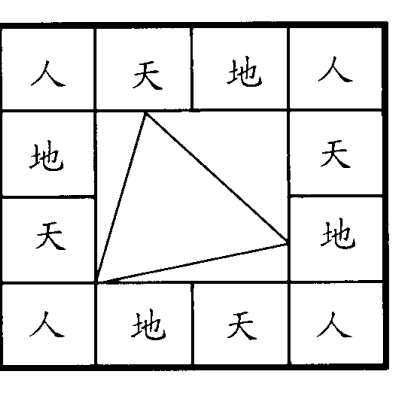

- 寅午戌（三合火）
- 亥卯未（三合木）
- 申子辰（三合水）
- 巳酉丑（三合金）

◎每個三合皆俱三才（天地人）。

◎誰俱三才？唯“人”。人居寅、申、巳、亥，故三合均由寅、申、巳、亥去合出來。象徵：人參與天地造化。

## 四正法與三合法淺解

◆四正法 → 屬於河圖（體）。

◆三合法 → 屬於洛書（用）。

世傳斗數貫性使用三合法（如圖）。它只是“用”，不是“體”。意思是使用在動態的情況中，如大限、流年。它為什麼屬於洛書（如圖）。因每個三合都引用1、5、9的形式。

用（12 ÷ 3 = 4），代表十二宮位，有四種三合的組合。

| 4 | 9 | 2 |
| 3 | 5 | 7 |
| 8 | 1 | 6 |

【洛書】

什麼叫四正法，就是把十二宮位分四象（即12 ÷ 4 = 3）成三種組合，象徵三才。如何分四象呢，用春、夏、秋、冬的橫式來分野。（如圖）

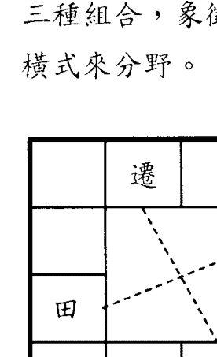

此四象（亦名四正）它是“體”，表現在靜態中，如本命（若依此四正理念用於大限、流年亦可，因體中已含用）。至於它為什麼屬於河圖，那是因運用了四象來分的。

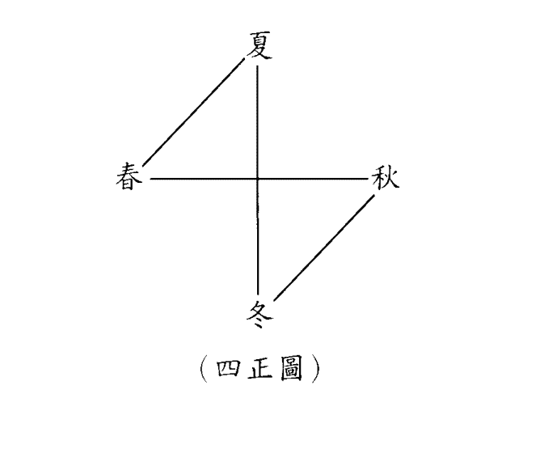

## 應用須知

三合法與四正法，同源生體用，體用一表裡。三合是用，四正是體（三合：命、財、官；四正：命、遷、子、田）。用是一（三合本一體，猶一涵三）。體是二（命與子；遷與田，分二組）。二是陰陽合情物，人禀陰陽氣化生，故斗數的論命理氣在「陰陽」兩字，造化萬千，錯綜萬象。

### 說明

一般三合法稱它三方四正是不夠完善的。因每個三合在地支而言，不是純陽地支就是純陰地支，是偏孤之理，不能合易而生化。此種法則，以易而言，是謂「孤陽不生；孤陰不長」，不能生化衍生。

三合法或四正法都以地支為基準。

在四正中，才可以看到陰與陽地支相配，是謂「陰陽有德」。

### 補註

三合與四正法合而為一，就是體用合一。

易曰：「天三地兩相倚數」，在此亦可引用。

- <1> 三合：命、財、官，本是一體論。因數始於一而用三，是以「一涵三義」，曰：「天三」。老子曰：「三生萬物」。
- <2> 四正：命、遷、子、田，為「地兩」。因偶數始於二，而用四。故：「命與子，遷與田」各陰陽相配成二組。
- <3> 在論命上必須體用合一，若全以三合為用，孤虛之道非宜也。

三合發展的應用本是三才之道。

誰與我相遇在今生

<1> 人生於寅爲第一個三合。即寅、午、戌三合火（以五行而言）。何以稱火？乃“午”屬火，是藉“離”卦稱火。三才在“天”。

## 三合的圖表

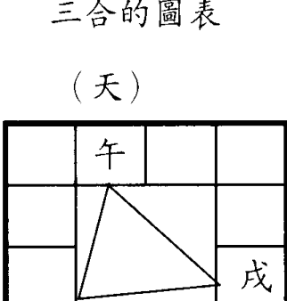

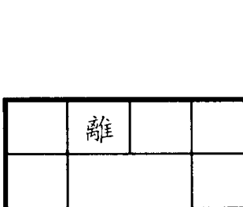

（天）（地）（人）

後天八卦

<2> 第二個三合是亥、卯、未三合木（以五行而言）。何以稱木？乃“卯”屬木，是藉“震”卦稱木。三才在“天”。

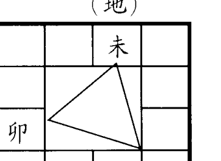

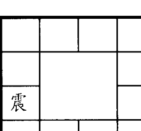

（地）（天）（人）

後天八卦

### 補註

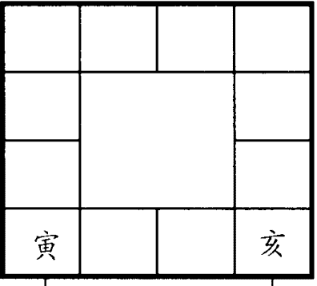

上述兩種三合，是引用“地支六合”所引伸出來的。都合乎「六者它也，才之道也」。

## 【地支六合】

<3> 第三個三合是申、子、辰三合水。何以稱水？乃“子”屬水，是借“坎”卦稱水。三才在“天”。

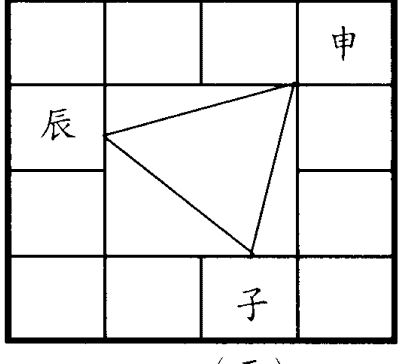

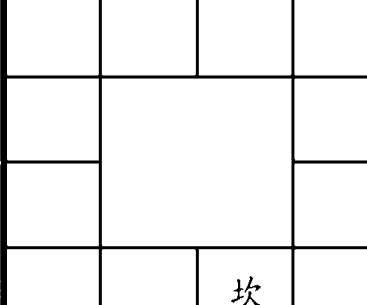

<4> 第四個三合是巳、酉、丑三合金。何以稱金？乃“酉”屬金，是借“兑”卦稱金。三才在“天”。

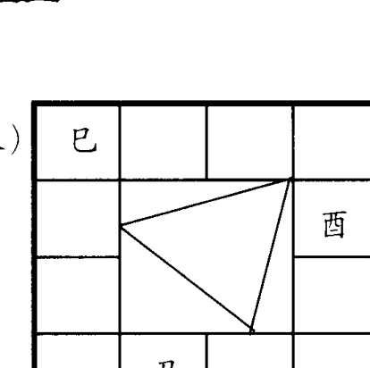

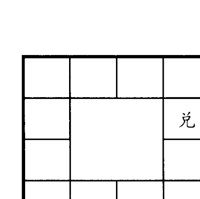

### 補註

由上圖可知，用三合構成四個局，即金、木、水、火。而金、木、水、火正是春、夏、秋、冬的四季排列方位。套入八卦，即是四正卦（坎、離、兌、震）。以致紫微斗數一般應用都居於此公式，故稱三合斗數。然三合是用，不是體，體在四正。所以，應用斗數要三合與四正同參合一。

◎ 引＜孔子言＞

> 孔子曰：「陽三陰四，位之正也。三者東方之數，東方日之所出。又圓者徑一而開三也。四者西方之數，西方日之所入。又方者徑一而取四也。言日月終天之道，分上下象陰陽也。奇偶之數，取之于乾坤。乾坤者陰陽之根本，坎離者陰陽之性命。」

## 簡解

陽三陰四，位之正也。指的就是

- 陽三→三合位之正也
- 陰四→四正位之正也。

## 第三節 宮位的思維

宮位除了分陰陽，天地人三才之外，尚有它類分解。

<壹> 宮位分六内、六外。此語是針對論命時，告以吉凶所用。易曰：「象告吉凶」是也。

| 宫位 | 六内 | 命、財、官、福、田、疾 | 内吉 |
| --- | --- | --- | --- |
| | 六外 | 兄、夫、子、友、父、遷 | 外凶 |

這種應用，主要的特性是要配合四化<象>是「象告吉凶」為憑據，與前述六陰宮、六陽宮無關，那是陰陽相配相應之理，是易學概念。

在「吉凶」標準應用上，其象最怕「化忌」來沖某個宮位。且「化忌」是四象或五行之源，因其位在北（坎卦），象徵這個象不喜沖任何宮位。為表達它的吉凶，才分六内與六外，理由便在此。

- (1) 生年或飛宮四化的化忌，若入的宮位是六内，稱吉，是好的；若入的宮位是六外，稱凶，是不好的。
- (2) 萬物萬象不是絕對的而是相對的，況乎吉凶本是相對反義詞。以是當化忌若入六内說好時，然其對宮之宮位必為沖，為之凶，所以說：「禍福相倚」。

### 範例 己年生

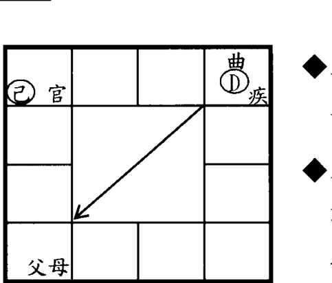

- 此化忌若是屬於生年四化的話，其本命上就會如此。<體>
- 此化忌若是屬於大限自化的話，就會在此十年中，有這不妥協的現象發生。<用>

### 解釋

(1) 生年天干在官祿，在本體上就是與事業有關。

(2) 它的化忌入疾厄<六内>是好的。意思是自己會擁有一份工作。

(3) 在不好的一面，是化忌沖父母，變成自己與父母之間相處之道的有了問題。因星辰是“文曲”，文曲偏向口才，所以可能與父母之間，在溝通上、思想上、意見上，比較格格不入。

(4) 這種論法是「四化象」與「宮位」之間的應用，名為「象告吉凶」。

<贰> 宮位雖然分了六内、六外，仍有虛、實之分。

| 宫位 | 六内/六外 | 虚实 | 第一宫位 | 第二宫位 | 第三宫位 |
|------|-----------|------|----------|----------|----------|
| 宫位 | 六内 | 实 | 命宫 | 疾厄 | 田宅 |
| 宫位 | 六内 | 虚 | 福德 | 官禄 | 财帛 |
| 宫位 | 六外 | 实 | 父母 | 兄弟 | 子女 |
| 宫位 | 六外 | 虚 | 夫妻 | 交友 | 迁移 |

※父母、兄弟、子女（含有血缘关系称为实）

### 解释

- 1. 万物之象，皆有虚实，它也是阴阳的表里。
- 2. 在内、外六宫中，再回归三个虚实宫位。
- 3. 这与中医易理上一样。

**三阴中有**
- 手太阴、手少阴、手厥阴
- 足太阴、足少阴、足厥阴

**三阳中有**
- 手阳明、手太阳、手少阳
- 足阳明、足太阳、足少阳

.................................. 共分布十二宫位。

# 紫微斗數 誰與我相遇在今生

### 說明

### <圖一> 己年生

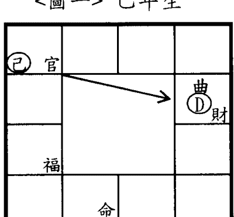

（1）前言：化忌入六內為吉。<通論>

若加以再區分，再看虛實。

◎巳在官祿，化忌入財帛，在六內而言是吉的，代表工作一定會賺錢或上班也吉利。

◎然而，化忌在財帛<虛位>，所賺之財有兩種可能：

- （1）以生意而言，代表賺錢後還想擴大，但擴大後未必一定會賺錢，要看財帛宮的四化而知。
- （2）以上班而言，薪水一定沒問題，但領薪之後一定會再花出去，意思是留不住財。嚴重點，對區區薪水收入花不夠啊！

### <圖二> 己年生

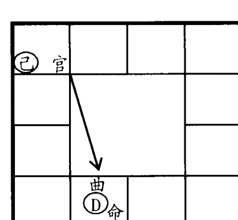

- ▲ 在解釋上，與上述同。
- ▲ 可是化忌在命宮<實位>，所賺之財能守得住或做生意人比較保守，不隨便亂投、擴大。
- ▲ 這就是虛實之辨。

<參> 宮位動、靜說。

以動、靜爲註脚的理論，出於太極說：「靜極者動，動極者靜」。亦是宇宙物理運動的原理，是一種常數的自然律，圓的運動軌跡。

> 易曰：「唯變所適，周流六虛」（六虛，即宮位變化）。

我們換一個角度來看十二宮位。依易的常識而言，陰主靜、陽主動。這是像一個球體，在本體靜態中叫「陰」：在動態中叫「陽」，則是以動靜分陰陽。

| 宮位 | 動 | 陽 | 命 | 夫妻 | 財帛 | 遷移 | 事業 | 福德 | 六陽 |
|------|----|----|----|------|------|------|------|------|------|
| | 靜 | 陰 | 兄弟 | 子女 | 疾厄 | 交友 | 田宅 | 父母 | 六陰 |

但是，這只是個理則，不能爲用！

何以說？凡物體之運動是要「靜極者動，動極者靜」，像易經上所言：「陰中有陽（少陽），陽中有陰（少陰）」，才能衍化萬物，延生一切用。

## 故

六陰宮位，主動的宮位。<動態>

六陽宮位，主靜的宮位。<靜態>

應用在什麼地方呢，如出國驛馬、搬家出外、事業變遷…等。

在四化上，皆是以「化權」、「化忌」為變化的述其“象”意。

### 說明

動靜之應用是要環顧整體的，不能單獨現象解，會有所偏頗。

因為動靜是運動原理，「此起故彼起，此落故彼落」。

有時，在本命盤上看動、靜<空間>；

有時，在大限或流年上看動、靜<時間>。

且動、靜須交感於時空中，於是在此不做範例說明；但須理解此概念。此理念乃出自：「陰陽變易」。

## 第四節 在動靜中看十二宮位（十二因緣）

宮位，只是斗數使用的名詞或代號。宮，是指命宮或兄弟宮…等名稱。位，指的是方位或地方，不是把兄弟宮或夫妻宮就直接的代表宮與位（宮位）。

宮位是統稱，對我們人而言，就是因緣。我們使用這僅僅的十二宮，就可以找到我們能與相聚的因緣，一點也不足為奇，所以亦稱「十二因緣」，畢竟裡面包含了有十二地支、十二生肖…。

地支有陰陽，宮位也是有陰陽。數始於一而終於十。再歷十一、十二，還原一，由是斗數有四個三合。

- ◎數止於十，有四大組合：

| 一 | 田宅宮三合 三陰 |
| 二 | 福德宮三合 三陽 |
| 三 | 父母宮三合 三陰 |
| 四 | 命宮三合 三陽 |

六陰——動態，變遷的宮位。

六陽——靜態，安定的宮位。

## ※說明在先：

宫位只有十二，而“來因宮”也在此十二宫位中，故解释十二宫，即等於解釋來因宮，其理則是相通的。

### 六陽宮位

#### 第一組：命宮三合解

- (一)命宮：就是“自己”的代表，在每一個人的身上，展現出自我的個性、自我的才華、自我的…一切的一切，都從人的意志中走出去，想怎樣、做怎樣…都是自己的行為而展於外、表於形。

——我就是這樣的人——就是命宮的特色。

※什麼樣的星辰在命宮，必展現出此星的特徵本色。其它宮位，也是如此的解釋。

- (二)財帛：財帛宮不是代表自己有沒有錢，而是說自己是用什麼方法去賺到錢。此宮是賦予每一個人在謀生的能力上來做解釋，絕對不是因財帛宮好，而論其人大富大貴或有錢、無錢的結論。財是一種物源，帛是一種交易，是以物易物的，所以說它是一種，人必以某個方法去謀生，而獲得其利。另一種解，在“易物”的原則下，也是代表一種“消費”，因此，財帛宮有離心力者，代表財的消費很大，不容易聚財。

※財帛宮在“人”方面，狹義的是指夫妻生活間相處的“對待”融洽與否？廣義的解，把“對待”改為“關係”。凡是任何宮位，飛宮或自化與財帛宮相呼應者，必存在一種“關係往來”。如 田宅宮化權入財帛宮，法生年權在命宮，代表此人有錢必會去置產，這個置產（田宅）與財帛宮產生了一種關係的往來，這也是“對待”的表現，是一種必然的存在論。

※財帛宮還有另一種解釋，就是要注意父母或長輩的健康。因為財帛宮是父母的疾厄宮，當財帛宮不好時，如自化，表面與損財有關，但也隱藏了長上健康不好之象。唯有一種條件，當財帛重疊大限的疾厄或交友宮時，更要注意；或大限財帛重疊流年的疾厄或交友宮，請注意長輩的健康。

- (三)官祿宮：代表工作，是事業的象徵。所指的是工作的性質及經營的好壞。一般我們把它當做“運”來看待。

※官祿宮在“人”方面，代表工作的同事或合作的伙伴。假使此宮位不好，會影響到工作上人際關係的不好及事業經營的不善。其對宮是為夫妻宮，則會影響到夫妻的感情。

※官祿宮又有另一層的解釋，當此宮不好時，要注意子女的健康及子女的功課問題，會影響到考試的成績。

歸納：人常言，我的運如何？我就是命宮，運就是官祿宮，理由來自洛書的載九履一。然而，官祿宮的運勢不好或好，才會影響到財的好壞。因為賺錢要靠“運”，無運財難通。

<1>命 → <9>官<運勢> →<5>財<財祿>

假使你的來因宮在命、財、官者，大部份都是要自立更生，白手起家。

#### 第二組：福德宮三合解

- (一)福德宮：福德在字面的直覺，就是福氣與德性的總合語。白話一點，指的就是你的祖德好不好或福氣的厚薄。但不管那一項，此宮的共通性就是“祖蔭”的內涵。有的人有祖蔭，有的人沒有。當然在此所講的是指本人能否得祖德之蔭。

※福德宮在“人”而言，代表祖父母之輩的長者，此宮位也代表福壽的宮位。此宮位很好，其長者大多是長壽的人。

※福德宮的好壞會影響到自己的健康，此為疾厄宮的疾厄宮。該注意的是在幼年與老年時期（一般通則）。除非，本命疾厄有飛四化之星入本命福德時，而本命疾厄有自化者，則要注意中年時期之健康或疾厄宮無自化，而福德宮有自化，亦是。

- 一般使用在健康上，注意化科或化忌這兩顆象意。注意災厄，講的是由福德宮化出的。
- 福德宮不好的話，注意夫妻，有可能夫妻會離異〔婚變不是看夫妻宮〕。

- (二)夫妻宮：

一般說夫妻宮，指的就是先生或太太。又夫妻常被人認為夫妻是一體的，原因是「一涵三」之理則。假使一個人根本沒有結過婚，則夫妻宮也可以代表自己，千萬記得，不要把夫妻宮，限制在對方來解。例：一位女命，太陰化忌在夫妻，此太陰是代表自己，並不是代表對方，但也依然結了婚，此就是「一涵三」解。因為結不結得了婚，不完全是由「夫妻宮」來決定的。

夫妻宮——只是有否異性緣的“存在”相對論——除非結了婚，夫妻宮才能凸顯出對方的存在，否則認同爲自己。

- 夫妻宮沒有夫妻“對待”相處好壞的內涵，只有能表達對方之個性特色或才華或…是對方的自我表現，與命宮解釋一樣。
- 古人常言：成家立業，爲什麼成家在先，立業在後？因為夫妻宮的好壞與置產有關。夫妻宮不好，產業縱有也會流失，或因置產而損失財物，爲什麼？因為夫妻宮是田宅宮的疾厄。故前人常勉勵後人“家和萬事興”即是此意。

◎當夫妻宮成家後對宮是官祿，所以立業在後。

##### (三)遷移宮：

變遷與驛馬就是遷移的意思，其實它是一切事物流變的過程。在意識的直覺下，它存在的是一種變化，有的變化是好的，有的變化是不好的。如某某宮位，化忌到遷移來沖命，這種變化是不好的。反過來，如化祿、化權、化科，其變化就是往好的發展。總之一句話，遷移宮就是一種“變化之道”的宮位。什麼樣的事物，都是透過遷移宮而產生變化。

- ※遷移宮亦名“機遇宮”。它象徵人在外，得不得好機遇、好因緣或貴人相助，還是小人相害。機遇範圍很廣，包括機會給予人的一種轉機。
- ※遷移宮代表出國或移民的宮位〔參看父母宮位好壞〕。在移民的註腳下，父母宮亦可代表別的國家〔不同國度〕，當然會影響，如簽證、居留……
- ※遷移宮不好的，與六親緣薄有關聯，尤其是父母親，既相處亦無言以對。乃生我者父母也，看遷移不看命宮。因遷移宮與父母宮是天干化合的宮位，天干化合主“緣”不主“情”〔包括一個會不會對長輩有尊敬之心〕。由命宮與父母之間的關係是主“情”不主“緣”，這會產生孝與不孝之間的問題〔孝道在情不在緣。緣是空性在外；情是心境在內。〕

※緣有生減，情難割捨。有情會生“義”，故有父母之情深似海。有緣終究漫空談，「因緣所生法，我說即是空。」

例 父母宮化忌入命，父母深愛子女，子女對父母必有孝之心。

歸類

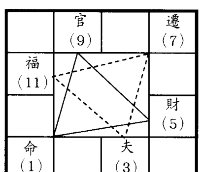

六陽是以命宮（宮位）為基準，全在奇數的宮位中；不是以地支為基準，而說奇數或偶數。六陰宮位也是同樣道理。

# 六陰宮位

## 第一組：父母宮三合解

### (一) 父母宮：

直覺就是父母、師長或長官、長輩…等親情。這是居於“人”而言的。

※擴大而言，父母宮是代表社會。哲學探討的是自然科學與社會科學，於是在這宮位上，有多元化的詮釋。

- (1) 於“物”而言：
如服務業、仲介業、貿易、貸款、會款、買賣、背書……

- (2) 於“事”而言：
如代理商、直銷、經銷、委託、證券股市、保險行業，或與政府有關的公務人員、會計師、代書、律師、報關行、銀行、外匯、旅遊、宗教、命理服務…工作研究、學術研究及學校、大團體、社團、政黨、財團法人、大企業組織。

### 其次的特徵

- 一、個人的出生地、祖蔭。

- 二、在社會上代表人的公共關係與社會背景之良否？

### (二)子女宮：

忙碌的人生，幾人能偷閒？快樂的童年也是在當人在子女時期最快樂。因為有父母、老師關愛著。所以此宮位，充滿了人間的歡笑，是一種喜悅。就像父母抱著出生的兒女們的高興一般。相當於生之喜悅的“兑”卦。

※人生漫長的歲月，誰伴你走過人生？老來的命運，誰是你身邊的依怙？人生的舞台，每個人都有上台表演的時候，各扮不同的角色。但當人下台之後，塵煙的往事將化做一面鏡子，照出你晚年的心聲，就會在這子女宮上面做了投影。

> 註 老運看遷移宮，當一個人走到遷移宮時，子女宮一定是遷移宮的田宅，老來的“家”。所以古來都有一種想法，養子老來望子養，就是這個道理。但就是有的人沒有辦法得到這份親情，何故？

※人是必經過成長的過程，子女宮扮演了人生成長的過程。這裡面有歡笑、有悲哀，有溫情送到人間的溫馨，也有世態炎涼的感慨。這宮位是你生命的樞紐，在這邊長大、在這边上人生大學的課。我們都在這宮位上，再度被社會來教育、來琢磨、來考驗。生在茲、長在茲，一切的發展都從子女宮開始的。

註 子女宮的好壞，可以看出老運的狀況，尤其膝下親情。

### (三) 交友宮：

簡而約之，就是朋友，擴大其義，指的是社會群象。人需要朋友，故此宮位，就是人們類聚因緣之所在處。

### ◎洛書說：

六、八為足。疾厄宮與交友宮在另一種角度上，解釋與疾厄宮一樣，代表是說身體健康上要注意。意思是說疾厄宮與交友宮是相通的，尤其這兩個宮位在大限上相互重疊。

◎交友宮是夫妻宮的疾厄，因此也代表“生產”子女的宮位。

◎交友宮亦代表人的人際關係。此宮不好，人際關係就不好。

◎交友宮也代表同學、同事或部屬。

◎交友宮又代表考試運。

歸類 在三合的另解。

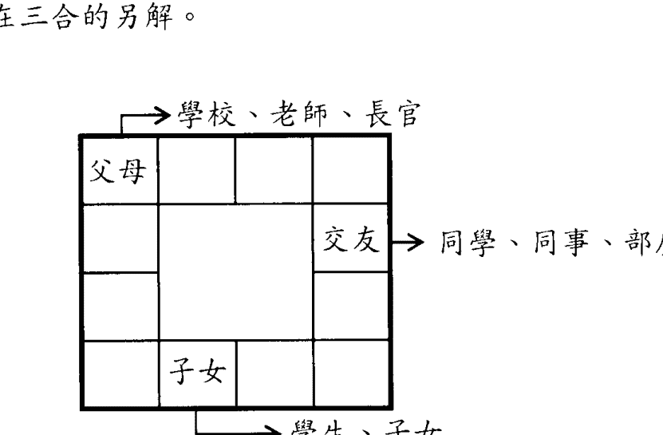

## 第二組：田宅宮三合解

### (一)田宅宮：
想到田宅就想到家，一個讓人可以休閒的家，所以它也代表了一個“環境”的宮位。這裡面有我們的父母、兄弟、姐妹或親戚，這些的成員是組成家庭的要素。其次，就是當結婚後另組一個家，這一切都是田宅義。

- ◎顧名思義，田宅宮也代表辛苦耕耘來的不動產（房子），當然也包括祖產。
- ◎田宅宮為財庫的代表，更是家運興衰的象徵。例如：田宅宮化忌入夫妻沖官祿，家運會走下坡，事事不如意。

其它：田宅宮在斗數上居有很重要的一個宮位。

在人生的旅途上，子女宮～田宅宮，對任何一個人都很重要，勝過財帛與官祿宮。

子女宮（前已述）、田宅宮重點在風水，因風水必然會影響到人的居家平安否？像開一個店面或工廠，也跟風水有關。斗數有田宅宮，真正的目的，探討的就是環境建築的居家風水學。從田宅宮用風水的方法去研究，必然能看到更深層的認識，而不是一般所謂的田宅宮字義解。

- ※田宅宮的三合可以看陽宅。

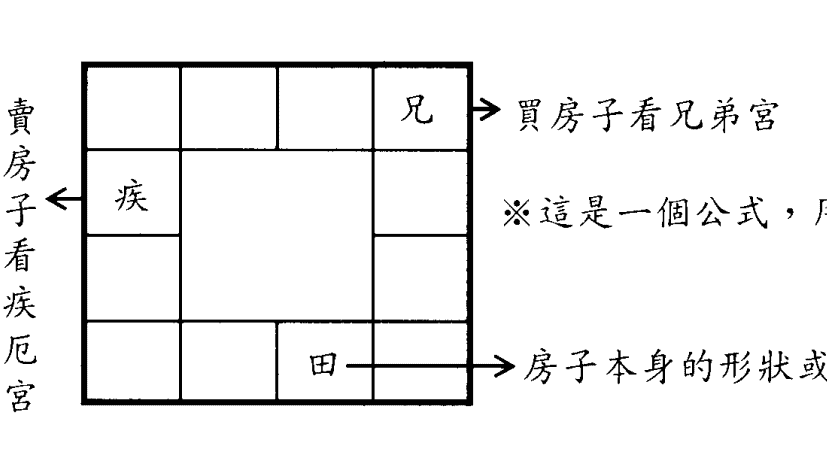

### (二)疾厄宮：
生我者父母也，所以疾厄宮的對宮，正是父母宮。當我們被生下來，做為父母的都希望見到自己的寶寶是健康的，並且是很快樂可掬的。

因此，疾厄宮代表健康外（生理的），還象徵著人的心理潛在的思維、思想、快樂、不快樂的心態表現。它不同於命宮。

- 命——陽——個性、表現……（表於外）
- 疾厄——陰——心態、想法……（顯於內）

因此疾厄宮偏向個人的“自我意識”在作用。也是一種待人處世的心態見解。

◎個性因人而異，有人很任性，但心性（心態）是不能任性的。任性的人（屬陽），會影響到事業的成就與興衰；任性的心態（屬陰）〔對事物判斷的意識用喜好來決定者〕，久必使心理不健康，而招災厄於身，正所謂：「心病無藥醫」的註腳。什麼叫任性的心態，對任何人、事、物不起敬重心，而起輕視的傲慢心，任何成功的人，絕對不能起不敬重心來看待萬物，那是成功者必備的心態。

◎養生之道，不在藥物，在於謙卑與心理的快樂。快樂養長生，乞法養智慧。所以疾厄宮很適合自己做任何學術的研究，包括像自己個人的工作室，憑自己所好而自修、自研、自成就。

◎疾厄宮若用在健康上，最怕四化來自兄弟、交友宮或兄弟、交友宮的四化飛進疾厄宮，這種現象的成立，大部份是會有疾病發生的。

◎個人的健康，離開不了三個宮位往來。

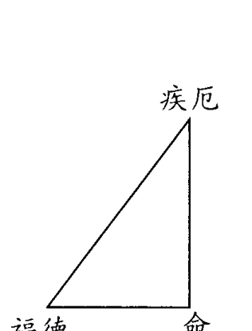

> ※若象意有往來，自己如很健康，則需注意長輩之健康。

◎疾厄宮排在第六位，紫微排在第六天干(己土)，為什麼？
乃易曰：「六位成章」<指宮位>或六爻定位<指紫微>。
在星辰：紫微代表自己的色身。（不是什麼皇帝星）在宮位：代表自己為父母所生，還是一個軀殼身色。

假以紫微在疾厄宮是為勞碌命；在田宅為家庭操勞。人！
有沒有煩惱？有，所以叫“凡人”，紫微所在的宮位煩惱
就在此宮“長煩絲”。

### (三) 兄弟宮：

此宮位不是那麼單純的一個宮位，不是只用一個兄弟姐妹就能概括得過去的，那不就太便宜這個宮位了。當我們被生下來第一個能與我親的親人除了父母就是兄弟姐妹，是故，紫微的隔壁緊接著兄弟宮(天機星)，在艮卦：地支為丑寅，為什麼？

※下面圖示給您一個交代。

| 宫位/星曜 | 巨 | 相廉 | 梁 | 杀 |
| :--- | :--- | :--- | :--- | :--- |
| 田 | 田 | 官 | 友 | 迁 |
| 福 | 贪 |  | 同 |  |
| 父 | 阴 |  | 武 |  |
| 命 | 府紫 | 机 | 破 | 阳 |

巨門星主土地、貪狼星主享受吃喝玩樂、太陰星主不動產、女性、母親、天相星主兒孫、廉貞星主官祿、天梁星主父親、長輩、天同星主福祿、健康、武曲星主財帛、嫁娶、天機星為兄弟主、破軍星主夫、子、奴、太陽星主官祿、男性（勿強調先生）、子女

以上是星辰在宫位上，簡單地說明，讓初學者知道，為什麼星辰是這樣稱呼的。

◎一般對兄弟宮的解讀，都認為是談兄弟及朋友或人際、部屬。其實未必全然是如此。

兄弟宮有深層的不同意義解（包括來因宮），它的內涵有三個，才是兄弟宮的真實義。

(1) 可以看出一個人的健康狀況。

(2) 可以知道一個人有沒有置產能力。

### 解一：由兄弟宮看健康

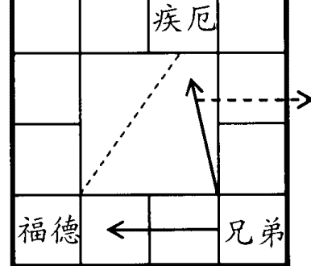

※公式：兄弟宮的四化，若落在疾厄宮或福德宮，身體的健康常會出狀況，身體也常欠安。

※四化取象，大多是以化科為主、次化祿。當現象若已成立，再以化忌決定症狀。

※疾厄四化入兄弟宮，而兄弟宮有自化者亦算。

### 例一

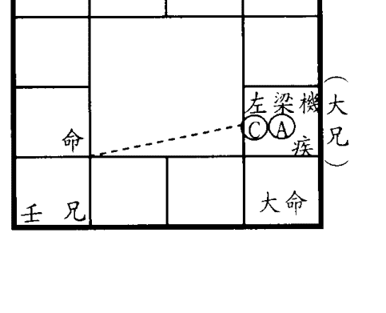

◎壬年生在兄弟，化祿、化科入疾厄宮，代表此人或兄弟須注意健康。

◎當大限走到亥，本命疾厄重疊大限兄弟，更為明顯【宮位重疊】。

◎但是疾厄宮沒有任何的自化，反是長壽格。

## 例二

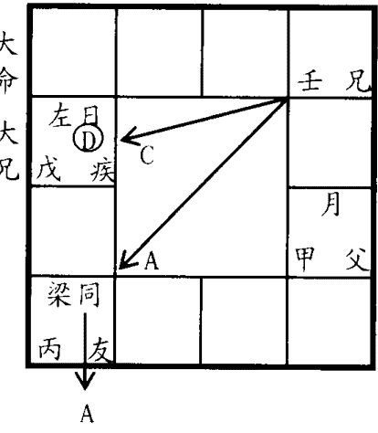

◎甲：太陽化忌在疾厄，可指父親的健康，於旁邊有左輔。
◎左輔是壬天干才有，而其壬天干在兄弟，化科入疾厄。
◎當本疾重疊大兄時，是指父親身體就不好。
◎兄弟宮有自化到對宮，對宮再自化。

## 例三

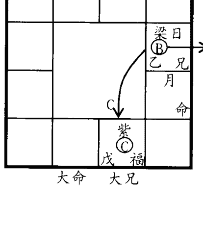

◎此種案例是來因宮自化，其化科不是入疾厄，而是入福德。
◎同樣代表兄弟或自己要注意健康。

### 補註

福德宮的四化，落入兄弟宮，而兄弟宮有自化者，亦是如此解。

### 解二：由兄弟宮看置產

※公式：兄弟宮的四化，若落在田宅宮，代表此人有能力置產。

※四化取象，化科、化權、化忌為主。

※或田宅宮四化入兄弟宮亦可。

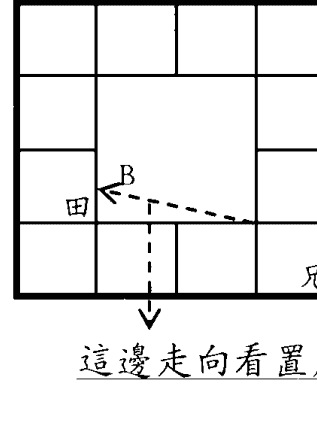

### 例一

◎命宮有生年科。
兄弟宮化科入田宅，法生年科入命。
◎象徵此人能够置產。

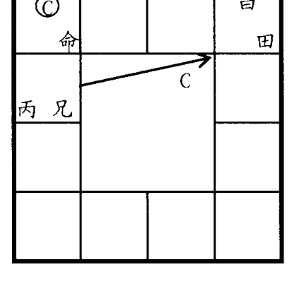

### ## 例二

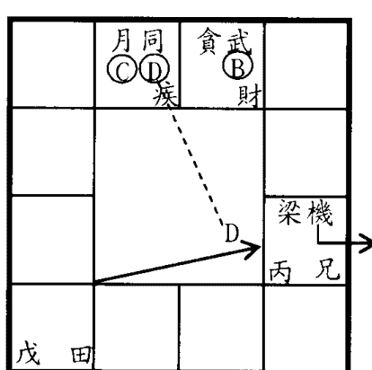

- ◎田宅宮化忌入兄弟宮。
法生年忌在疾厄（六內），代表兄弟或本人有置產能力。
- ◎兄弟宮自化權，法生年權在財帛（六內），強調每個兄弟都能置產。
- ◎若生年權在外局，則置產難。如交友宮，租的為多。

### ## 例三

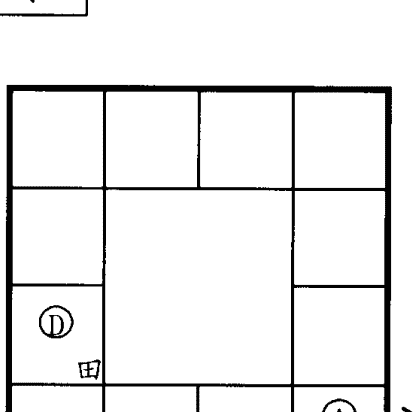

- ◎來因宮祿自化祿，化忌在田宅，代表此人與兄弟姐妹，每一個人都有能力置產。
- ◎置產的用法與健康論斷不同。凡是置產者，兄弟宮自化或田宅宮自化，均會有產業。
- ◎條件：田宅宮與兄弟宮有四化往來均是。

斗數十二宮位，詮釋至此，單純的名稱，卻隱藏了不少“弦外之音”的內涵。一言難盡意，盼諸者多琢磨，千萬不要字面解，深恐以辭害義，就失去了宮位的精華與奧妙的流變。

※ ※ ※ ※ ※

### 莫愁詩

> 衣食無虧便好休 人生世上一蜉蝣
> 石崇未享千年福 韓信空成十面謀
> 花落三春鶯帶恨 菊開九月雁含愁
> 山林多少悠閒趣 何必榮封萬戶侯

## 第 五 節

# 緣在今生好相遇

「人生交契無老少，論交何需先同調。」緣之妙，盡在不言中，不在先同不同調。但看我們出生時，第一的觸緣就是兄弟，是至親的緣，在今生相遇。俗話說：「落土時，八字命。」重點在落土的時間，有了命，有了緣。所以，要推演人生相遇的緣，就從“天機”緣起，再推及到朋友、夫妻……。

相遇是一種緣份，萬事萬物有緣則親。人緣好的人像一條流動的河，給它坑它蓄水、給它田它灌溉、給它灣它繞行，總之沒有過不去的“坎”。所以人人都喜歡人緣好。

站在斗數的應用上：

- (1) 文昌、文曲是時系星，沒有時間的決定，就沒有所謂的出生（落土時）。
- (2) 即已出生，兄弟的情緣必現，故用天機代表緣起。
- (3) 用文昌、文曲、天機三星縱橫應用，方能找到我們今生相遇的因緣。由內（家裡的至親）而外......。

（4）縱橫因緣的應用，全在天干化合。萬事萬物的緣起，是天干之合化，次才配地支。〔天干之合主緣，地支之合主情，兩者不同〕

（5）在“象”而言：

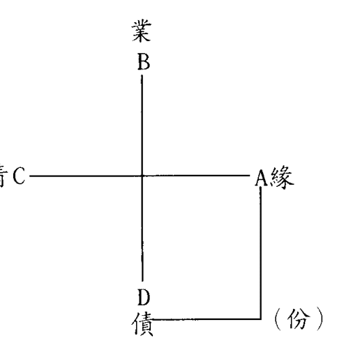

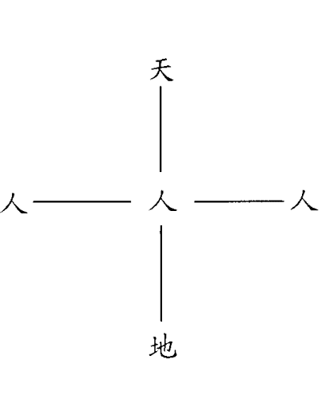

什麼是「命」？在人生的過程中，我們不想定的卻被定了，叫做「命」。什麼是「緣」？我想要定的它偏不定，叫做「緣」。

緣是因緣的聚會，命是先天的命定。故命是先天的不平等，緣卻是人間的不公正。因八卦中有錯卦，則人間有錯愛，何奇之有？唯「知命的人有善緣」。

## 十二因緣與命說

### 例一 丙申年：男命

| 左列（B） | 中列 | 右列 |
| :--- | :--- | :--- |
| 昌機 CBC<br>癸 官 甲<br>--- | 乙 | 破<br>丙 疾<br>曲 |
| 壬 田<br>梁 日<br>--- | （箭头 A 指向此区域） | 丁 財<br>府 康 D<br>戊 子 |
| 幸 福<br>相 武<br>--- B | 同 巨 A<br>命 庚 | 月<br>己 夫 |

（1）來因宮在疾厄，坐丙，可以代表本人。

〔命宮與疾厄視同一體論〕

（2）天機星在官祿化權與文昌化科同宮。此宮必有因緣在此，當緣起。

（3）其天干坐癸，太陰化科入夫妻，法生年是文昌星，當未論及婚姻時，此人必有姐妹〔太陰代表〕。若有結婚，代表太太，而此人太太生肖屬豬〔亥〕。

（4）如何論姐妹生肖：

- ⊙ 自己是丙申，丙必與辛合。在辛天干中有天同祿（生年），且旁邊巨門又自化祿〔不同星〕。其姐妹中有生肖屬牛〔丑〕。
- ⊙ 丙與辛合化為忌，忌在戌位，亦有生肖屬狗的姐妹。
為什麼一定有狗的生肖，其天干是戊，戊與癸合化是化權，應天機化權的用神。

⊙文昌化科，能使天干合化為科的，只有丁、壬。壬在田宅（家裡），其姐妹亦有生肖屬龍的〔辰〕，應文昌化科的緣。

⊙還有，至於福德宮與父母宮有自化權，法生年權是天機星。在天機的因緣下，用神又一樣，此人的母親生肖兔〔卯〕。為什麼？乃丙與辛合，在合方之內，此緣是應天機化權的緣。

※這些生肖的親人，都是由天機、文昌、文曲來決定的。其實，每個人的命例都一樣推演。

### 例二：己丑年：女命

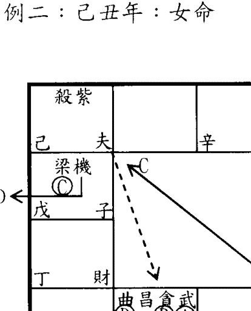

- (1) 來因宮是夫妻宮，就由夫妻宮談緣起。
- (2) 文曲化忌直接落夫妻之三合，且在本人的生肖位，則可直覺的論她先生，生肖屬蛇（巳）。為什麼？乃由文曲化忌定位。
- (3) 文曲之位，坐丁，丁壬合化科，法生年科是天梁星，天梁是父母星，其父母生肖均屬猴＜申＞。

（4）天梁星是父母星，當此人為人父母時，則天機有自化，法生年忌，文曲在丑，其子女有生肖屬牛〔丑〕（機、梁在子女宮）。

（5）官祿宮坐乙，紫微化科入夫妻，法生年天梁科在子女，又丁天干亦可化天機科入子女，構成天機、天梁都是科，故子女中有生肖屬豬〔亥〕、兔〔卯〕。

（6）在子女宮的天干坐戊，戊必與癸合化為權，法生年權，貪狼在丑，並與文曲同宮，故有子女生肖屬雞〔酉〕。

※此命例，是由文曲與天機組合的因緣。切記，因緣法都來自天干化合，天干化合就是化合，化合出人間的因緣路。

### 例三：辛丑年：女命

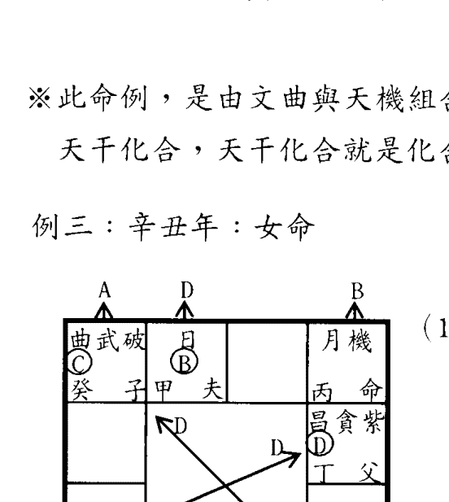

（1）辛天干在疾厄必與丙天干合，且丙在命宮，而文昌化忌就直接的落在父母宮，足見其父母必有生肖屬雞的〔酉〕（母親）。

（2）辛天干有兩個，自己生肖屬牛，另有妹妹，生肖屬兔〔卯〕，應文昌化忌的緣。

（3）夫妻宮有太陽權，但又自化忌，法生年文昌忌，她的先生生肖屬雞〔酉〕，應文昌化忌的緣。

（4） 文曲化科就在子女宮，是由疾厄來的，所以她有一個孩子生肖屬蛇〔巳〕。以文曲星定因緣，然對宮坐巳天干，文曲化忌入子女，法生年忌是文昌，另一個孩子生肖屬豬（亥），此生肖是應文昌化忌的因緣。

（5） 同樣都是父母所生的子女，在其親情互動中，為什麼有些差別？在此做個比喻。生肖屬蛇的比較親近母親，乃因其天干坐癸，戊必與癸合化權，而此人命宮有天機的自化權相呼應（應天機星在命）。另一個生肖屬豬，它是用化忌去結合生年文昌忌，與父親較相親，己必與甲化合，而甲在夫妻，先生生肖又是雞，故共鳴。以致，俗語常言：「五隻手指伸出，也不會平」這就是人各有緣、人各有志。

※註定的緣，未必被註定的命。單獨從被註定的緣，亦可再看出子女或先生的將來如何？（指事業、前程或功名）？這是緣的流變過程，若要了解，則須再配上左輔與右弼，屬於“五蘊因緣法”
五蘊因緣法的內涵，其數理的根據，在“大衍數”。

## 後記

# 緣、巧合乎、因果乎

美國第十六任總統林肯與第三十五任總統甘迺迪，他倆終極的命運是巧合呢？還是因果？

兩位總統在歷史上皆以熱心倡導民權著名的。

- (一)林肯在一八六○年擔任總統；甘迺迪在一九六○年擔任總統，相差正好一○○年。
- (二)兩位總統都在星期五被刺，槍彈都由後腦射入，而且遇刺時，皆有夫人陪侍同行。
- (三)兩位總統的繼任副總統皆姓「詹森」。第一位詹森生於一八○八年；第二位詹森生於一九○八年，年齡相差又是一○○年。
- (四)兩位詹森均生在美國南方，同是民主黨員，也皆曾任參議員。
- (五)林肯總統的秘書，姓甘迺迪；甘迺迪總的秘書，則姓林肯。
- (六)行刺林肯總統者波斯，在一八三九年出生；行刺甘迺迪總統者奧司華，在一九三九年出生，年齡相差也是一○○年。

(七)波斯在戲院槍殺林肯總統後，逃入一間倉庫；然而奧斯華在間倉庫房槍殺甘迺迪後，即逃進一家戲院。

(八)兩名刺客均被受審，但都在受審前即被人殺害。

### 老 黃 請 醫

「我吩咐『丁香奴』、『劉寄奴』、『細辛』地看守我的『麥門冬』。留神『木賊子』、別上『十二層樓』，盜走我的『丹砂』袍子，『撓砂』掛子。『皂角』靴子，『瓜蔞皮』的帽子；必須放在『陳皮』箱內，外加『玄胡』鎖。」

「如有『人參』來找我，讓它在『肉桂』房中裡坐，先泡『午時茶』，後切『益母膏』。作為茶點。再把我那對『海馬』，拉到『素砂』灘，飲些個『水銀』、多加『荳蔻』、『甘草』。若是天晚，用『燈心』、『白朮』點上『錦燈籠』、套上『紫河車』、接我『當歸』。叫門子時，『當門子』在先、『車前子』在左、『牛蒡子』在右；後頭接跟『大麥子』、『小麥子』、『蛇床子』、『枸杞子』於後。若是『百部』來遲，將它綁在『桑皮』樹上。責打三千『竹葉』子。五千『燈草』楨子、打得『使君子』直流，『半夏』不饒，若不看在『附子』情面，定要『研為細末』。」

# 第四章 關注你生命的眼神

> -------<欽天四化>-------

## 寄語

眼睛，是人類的靈魂之窗，它注視著每一個人的嚮往和希望。四化，為斗數的靈魂之神，它關注著每一個人的運勢和將來。

在命運的希望與將來裡，能展現出生命的風姿百態與玄妙先機，皆盡在斗數四化的神韻中。我們若欲求地想關心自己的命運，探索於未卜先知領域裡，那就更需要知命的紫微斗數來關照你——「欽天四化」。

| 加減乘除 | 謀算千秋功業 |
|----------|--------------|
| 點線面體 | 描繪四化藍圖 |

我讚美那與我日夜相守的
斗數、干支、符號、四化和圖形。
像懸浮在空中輕飄的五色花瓣，
它縈繞在我的腦海之中；
似一個個跳動的金屬音符，
碰撞出
一串串清脆叮咚聲響；
激盪一道
劃破長空的閃電，將我靈感的引線接通。
※ ※ ※ ※ ※
那日月、星辰、八卦、數學和河洛，
在莫測的變化裡
組合幻化出一個神奇的世界。
從而由公式、方式、圖形的直覺
和邏輯推理中，
獲得一種優美且崇高的體驗，
痴情、忘我、融匯成了
一種快樂和神聖的感情！

### 導言

愛美之心人皆有之，人們一味地追求美，然而什麼是美？它卻只能意會不能言傳？聽一首優美的歌，觀一幅精美的畫或處身於清沁幽美的大自然中，它則會使我們身心會感受到一股喜悅，品味出一種美的薰染與陶冶。

然而，除了上述所謂美之藝術或大自然的美之外，我們是否也可以深究過科學它也是美、數學也是美呢？

數學果真無美感可言嗎？那是否定的！古今中外有許多知名學者都認爲數學它是美的，並給予精闢的論述。

> 古希臘畢達哥拉斯說：「美就是和諧，整個天體是一種和諧。宇宙的和諧是由“數”組成的，因而構築了整個宇宙之美。」
> 英國數學家懷特海說：「作爲人類精神之最原始的創造，惟有音樂使能與數學媲美。」
> 世界著名天文學家伽利略也曾說：「如果不理解它的語言，沒有人能夠讀懂宇宙這個偉大的書，它的語言就是數學。」

慶幸在“數學之美”的浩瀚海洋裡，它的光芒並不是全被西方人而掠奪搶盡了光環。然在事實上，中國的數學早在殷商時代就已存在了，其後比較出名的記載是在墨子的＜墨經＞裡。今且看中國的紫微斗數，它的美麗就是用“數學”的思維，與天上的日月星辰…等星“象”，在互通有無、眼來眉去。是故也，紫微星斗不也正是宇宙天體嗎？

- 登泰山而小天下
- 登華山始知天下大
- 登天山但見白雪皚皚
- 若登喜馬拉雅山仰望蒼天而無語

## 行香子詞

> 清夜無塵     月色如銀
> 酒斟時須滿十分
> 浮名浮利     休去勞神
> 似隙中駒     石中火     夢中身
> 雖抱文章     開口誰親
> 且陶陶樂取天真
> 幾時歸去     做個閒人
> 背一張琴     一壺酒     一溪雲

### 第一節

#### 四化導讀

<一> 四化，是斗数专有的术语，原名叫做「象四化图」或叫「图化四象」。它原本的根源是来自——「河图洛书相经纬」。 经为河图以尚「天」，是谓之「天经」；纬为洛书以象「地」，是谓「地纬」。在易而言，是有「易经」「易纬」之著作。此天经地纬之河洛，则是中国象数能傲骨于易经，亦是开启了易学的先河。这一片雄伟的数理思维，盘据了整个中华文化的哲学版图，深入了千百年来古圣哲人的心灵世界， 在代代的前人钻研叩首下给——传承——下来。

說明

<1> 人类本就居住在地球(村)上，且地球的本身（物自身）就有经纬，其经纬是纵横的。

> 繫辞曰：「易与天地准，故弥纶天地之道。」

◆人居地球上→「易与天地准」。

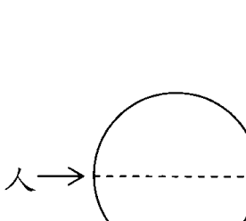

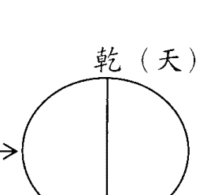

◆宋儒曰：「天地定位，易行其中。」（易與人通用，人行其中）
將此言，把上圖合併（天地是上、下，人居中。）

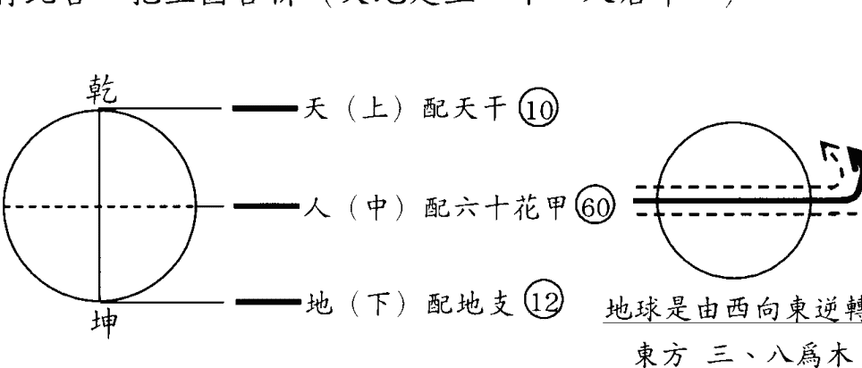

將地球的經緯轉化爲先天八卦，八卦止於三（三爻劃）。
且地球本身是由西向東逆轉的。東方三八爲木，三.代表人具有三才，八.又代表爲八卦，人生之旅程是離不開八卦範圍。

◆把三才之道，再返宏觀易學——「故能彌綸天地之道」。

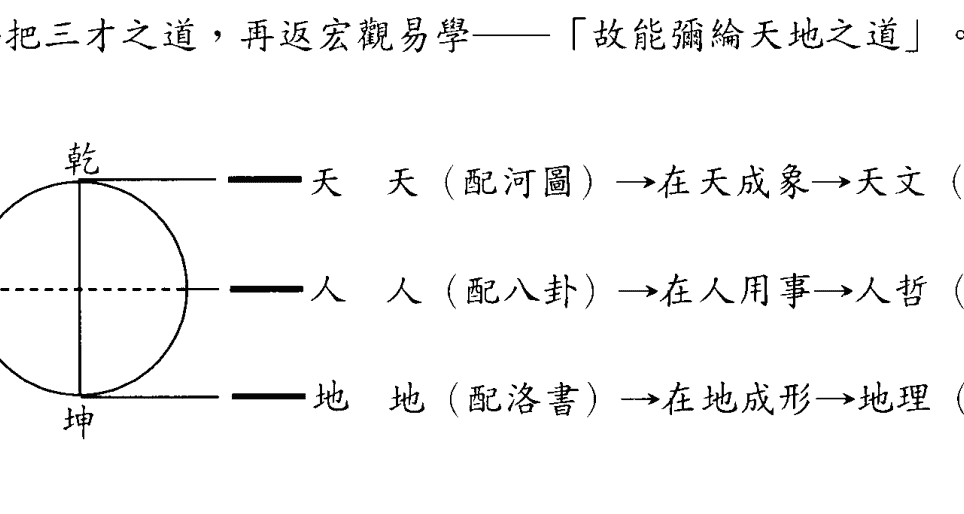

<2>由是，繫辭接下曰：「仰以觀於天文，俯以察於地理，是故知幽明之故。」是故，斗數不單只瞭解命運而已，上可通曉天文，下可透析地理，它們原本就是一脈相承相通的。

<二>四化的術語名稱叫做「化祿、化權、化科、化忌」，對應一年的四季，也象徵著天、地、人、物四大假合。呼應於人間，意味著人生活在四季的大自然界裡。為了彰顯生命必須合乎於自然的規律中，才能洞悉人生之運勢起伏，也因在此在大自然思維的前提下，先賢便創下了命理運勢之說，即今流傳千年的命理學。

然而，四化又是什麼？

四化，就是是在天成象，是天之象。

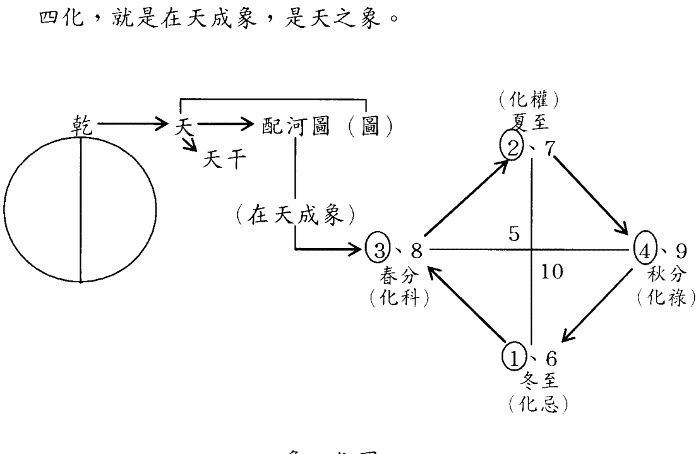

- 化科：春天是萬物萌生，百花盛開的季節。
- 化權：夏天是水果豐盛，水中弄潮的季節。
- 化祿：秋天是穀穗飄香，五穀豐收的季節。
- 化忌：冬天是銀裝素裹，合家團聚的季節。

把天之象的四化引入斗數盤，就是子、午、卯、酉代表天之四正。

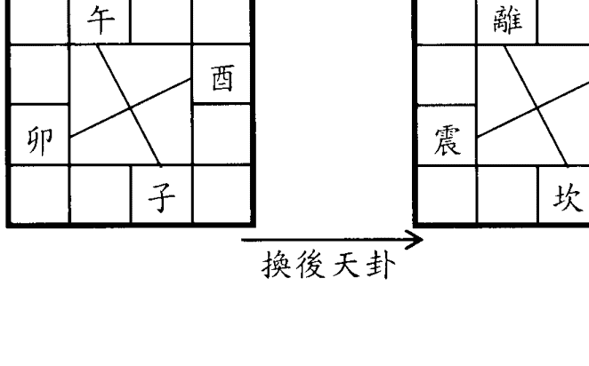

## 關注你生命的眼神 紫微斗數四化

### 補註

◆四化的思維是來自河圖的天體。

原本指的就是四季，為天之經。

以春分、秋分(二分)與夏至、冬至(二至)為四季的代言。

◆河圖重點在陰陽，故任何一方都是陰陽配。

易道陰陽：也是說一陰一陽謂之道。然陰陽以什麼來表達？

當然是要以“象”來表達。故易曰：「四象」。以致「四化」與「四象」名異而質同，都是：「在天成象」。

### <三>斗數與易學，重點在象數。因斗數的本身就有「數」的存在，故斗數有「在數」之說，只是今學者不知「在數」所言何事，若要瞭解它，當須從「數中有象，象中有數」去理解。

說明 <1>數不過由一始止於十，這個數就是河圖。

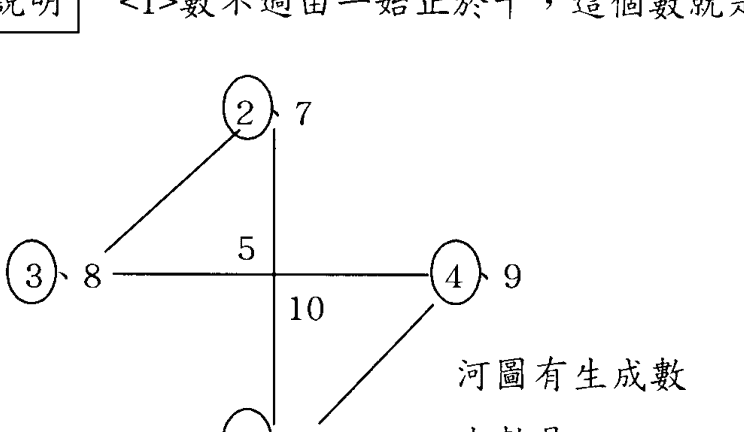

※ 1 + 2 + 3 + 4 = 10

此10，亦可說：

> 「天一、地二、天三、地四、天五、地六、天七、地八、天九、地十」。

此10，代表天干：

有十（甲、乙、丙、丁、戊、己、庚、辛、壬、癸）。

斗數有十天干，每個天干都有祿、權、科、忌。

如圖：(1) 四化相應天、地、人、物

| 天干 | 化祿 | 化權 | 化科 | 化忌 |
| :--- | :--- | :--- | :--- | :--- |
| 甲 | 廉貞 | 破軍 | 武曲 | 太陽 |
| 乙 | 天機 | 天梁 | 紫微 | 太陰 |
| 丙 | 天同 | 天機 | 文昌 | 廉貞 |
| 丁 | 太陰 | 天同 | 天機 | 巨門 |
| 戊 | 貪狼 | 太陰 | 右弼 | 天機 |
| 己 | 武曲 | 貪狼 | 天梁 | 文曲 |
| 庚 | 太陽 | 武曲 | 太陰 | 天同 |
| 辛 | 巨門 | 太陽 | 文曲 | 文昌 |
| 壬 | 天梁 | 紫微 | 左輔 | 武曲 |
| 癸 | 破軍 | 巨門 | 太陰 | 貪狼 |

如圖：(2)

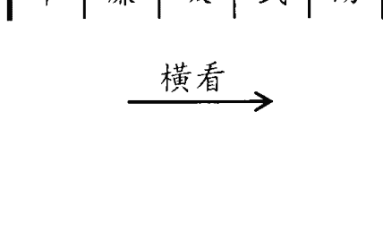

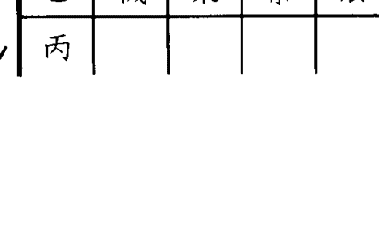

※ 1 + 2 + 3 + 4 + 5 = 15

從甲天干到癸天干，每個天干都有「四化」。但參加此四化的星辰只有15顆。為什麼呢？數也，合乎洛書「三、五相見」。

由是

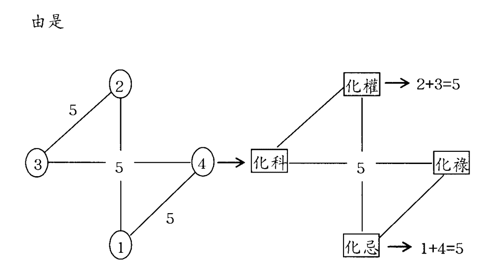

為了合數皆五，斗數四化的用法就是：

- 化科、化權一組（木、火一家）
- 化祿、化忌一組（金、水同航）
→ 這是在“象”而言。

> 故曰：「數中有象」（數：指河圖；象：指四象）

<2> 引用這個理論，表達一個觀念——「數是由象來彰顯」。用在斗數，四化象就是用神也是論命之精華，斗數若沒有四化為用神，那斗數是何物？就如“象”在天，天上星辰沒有象怎麼可以說：「星象」。

<3> 至於「象中有數」這是倒果為因的唯物辯證。反求法，因為陰陽之學是一生一剋、一正一反，它是化學性的變化。

例如：水是什麼組成。

```
H2 + O = H2O
```

少了一個元素，就不能合化為水。<氫> <氧> <水>

同理：化忌是象，象意為水（抽象義）。那化忌水，它的元素是什麼？丙與辛也。丙辛合化為水，即丙 + 辛 = 水，而不是化忌就是水（如腎大都用水來表徴，但腎不是水做的）。這個觀念就是「象中有數」之理（象：在此指物質、現象或元素。數：在此指天干），其它之化祿、化權、化科皆是同道理而言。

### <四>

> 邵子曰：「有意必有言，有言必有象，有象必有數。數立則象生，象生則言彰，言彰則意顯。」

說明：

這句話的重點在「因有意以至有數」，謂學易之初也。「因數立以至意顯」，謂得易之後也。知此者「藏於心者為意，發於口者為言」。

是故，眞知明達四化之應用者，悉「四化」是隨“心意”而變化，為易者變化而已矣，不是執著於四化之“象”而固執其象。若論命者「在象言象」，未必是正確的，會因「泥象誤象」以偏概全。

因為邵子又說：『「象數」，則筌蹄也，「言意」則魚兔也。得魚兔而忘筌蹄則可也，捨筌蹄而求魚兔，則未見其得也。』正是：[捨象數不可以言易]是也。這種說法很像佛經所言：「萬法唯心」、「法由心證」。這樣才能抓到「象」的眞諦、「意」的眞諦。易繫傳曰：「立象以盡意」就是此意。

### <五> 四化怎麼應用

四化既然是天之象，是屬於“空間”之象。

每個人都有生年四化（即出生年天干之四化），其四化都是「天垂象」。

若论及应用，最基本的观念，就是把生年四化所落的宫位再依其宫位的天干飞同样代号的象变成「在地成形」，成为一种物相，因应在人间道上，一个现象的存有论（有物说）。

例：化禄的宫位再飞化禄（余类推）。

解：其意义就是用生年的象（指空间）（存在论）（体）；所再转的象指示着（时间）（存有论）（用）是一种物相的表达。

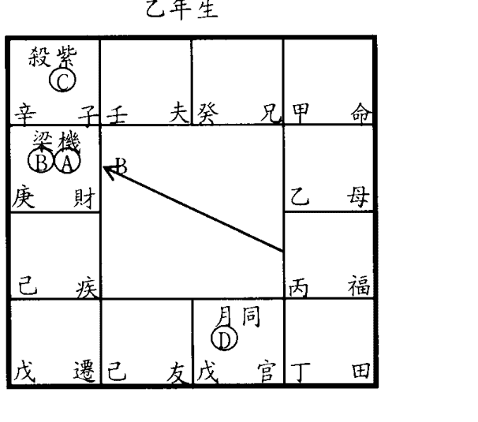

说明

(1) 乙，来自父母宫，太阴化忌在官禄代表要上班，且最好在公家或做与父母宫意义相同的工作。如贸易、代理商....等服务性质的事业。

(2)以太陰為註腳（生年忌）坐戊天干，戊天干轉的忌是天機化忌。

- 入本財，天機就是物相，如做企劃或才藝。
- 以時間論，到第五大限都要工作。
- 這是由空間轉入時間的合一。

四化可以論命斷吉凶，不妨看看繫辭傳——

> 曰：「天垂象，見吉凶，聖人象之。河出（圖），洛出（書），聖人則之。易有四象，所以示也。繫辭焉，所以告也，定之以吉凶，所以斷也。」

### 第二節

日月星辰 天懸象數

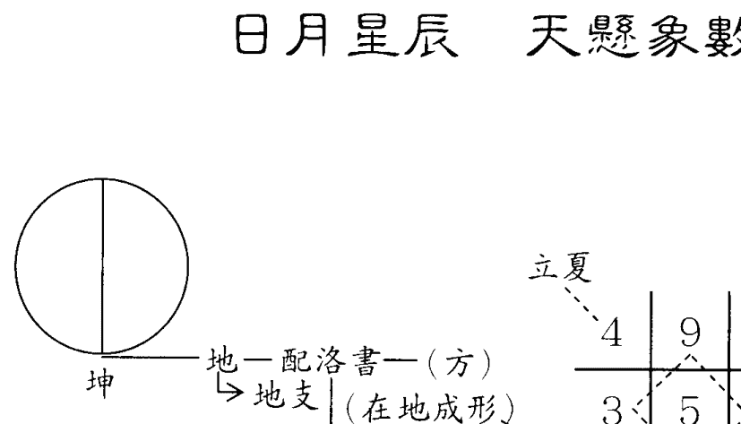

現代的人們幾乎都已知道地球繞著自己的軸線轉動，於是有了晝夜的更替，（太陽[晝]）對（巨門[夜]）。

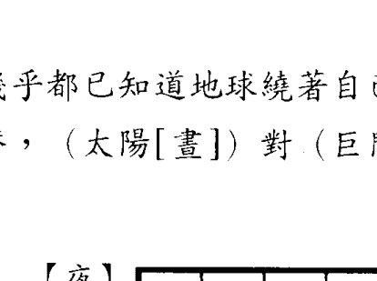

而同時，地球又斜著身子環繞太陽運轉，產生了四季的循環。「天時人事日相催，冬至陽生春又來」，人類自誕生以來，就隨著地球的節奏起居、耕耘、「過日子」。

每一個人都要「過日子」，可見日子對我們多重要，以至古賢就制定了「曆法」。然而，我們反顧紫微斗數，斗數立命的「紫微星」是依據每一個人的「生日」而決定的。是此我們可以肯定，斗數之學必與上古制定的「曆法」有絕對的關係，並與天上的星象聯盟，是一種星象占筮的學問。

◆紫微斗數論命，是以年、月、日、時來推論的，且紫微星是以日子而立星，到底憑據什麼？

> 在<禮·禮運>有曰：「以日星為紀，則事可列也。」日星，就是地球，地球是紀時的本星。我們現在所用的時間，年、月、日、時，都源於地球的自轉與公轉；源於月球繞地球的公轉，尚書可佐證。

> <書·洪範>曰：『五紀：「一曰歲（年），二曰月，三曰日，四曰星辰，五曰歷數。」』

- 年：地球繞太陽公轉一周天，曰「歲」（一年）
- 月：月球繞地球公轉一周天，曰「月」（一年十二個月）
- 紫微星→日：地球自轉一周天，曰「日」（一月三十日）
- 時：地球繞太陽公轉；月球繞地球公轉。月球轉至晦朔期居太陽與地球之間，太陽、月球、地球，三天體成一直線，每年十二晦朔，即十二辰會，曰「星辰」。
- ※（辰：主時間）

紫微斗数论命，其紫微星是依每个人的“生日”而定的。生日的日子属于地球自转而成的。故斗数排盘上就用紫微、天机并在，象征人都居住在地球上。

### 圖解

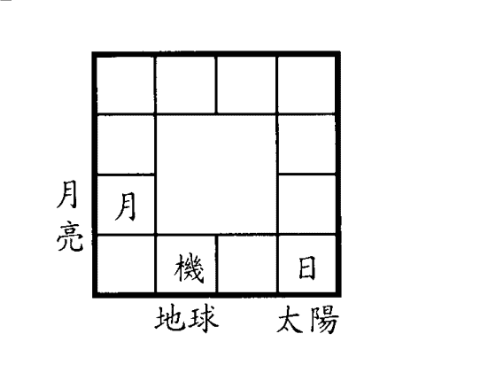

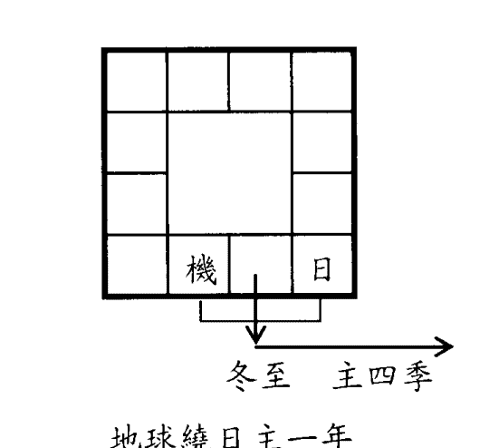

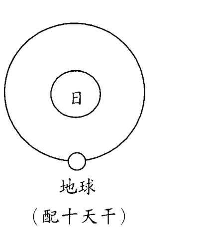

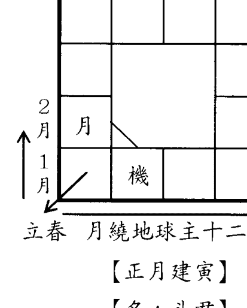

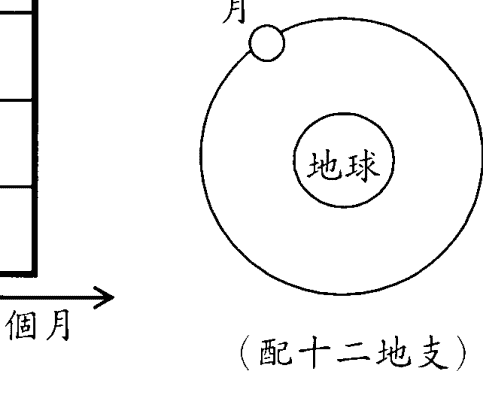

【正月建寅】
【名：斗君】

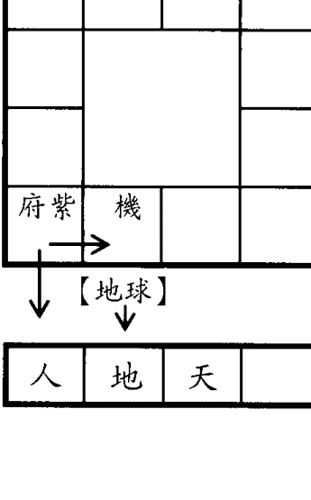

(1)人居地球上「过日子」。
(2)紫微代表每一个人（人生于寅）。
(3)紫微星依人之生日来定，乃因日子来自地球自转，原因在此。

### <五>合此上述條件來說斗數盤的天地縮影圖。

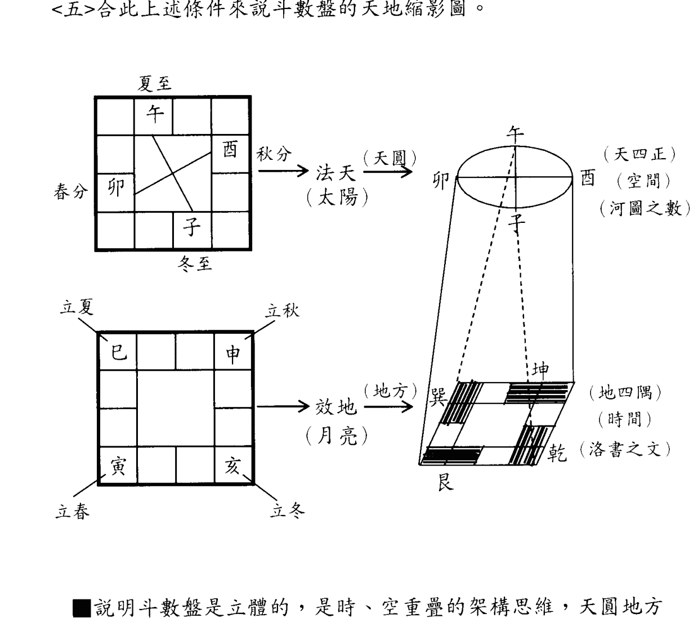

- 說明斗數盤是立體的，是時、空重疊的架構思維，天圓地方來自蓋天說。
- 古傳至今的羅盤，四隅有卦名，四正無卦名，可以佐證。
- 地支三合都始於寅、申、巳、亥。3 × 4 = 12宮
- 地支三合引用在洛書，即流傳之九宮。

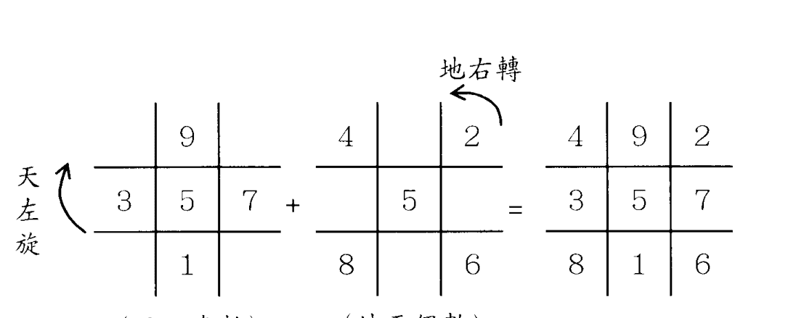

**天以三乘**
- 1 × 3 = 3
- 3 × 3 = 9
- 9 × 3 = 7
- 7 × 3 = 1 (還原先天八卦坤)

**地以二乘**
- 2 × 2 = 4
- 4 × 2 = 8
- 8 × 8 = 6
- 6 × 6 = 2 (還原後天八卦坤)

**說明**

> <1> 邵康節說：「圓者星也，歷紀之數，其肇于此乎？方者土也，畫州井地之法，其做于此乎？蓋圓者河圖之數，方者洛書之文。故羲文因之而造易，禹箕敘之而作範也。」
（箕：箕子；範：洪範）

> <2> 邵子又說：「天以氣爲主，體爲次；地以體爲主，氣爲次。在天在地者亦如之。」

解：日月星辰，在天成象，皆天行之氣。可見天之所以運行者亦由於氣，而在地則反之。

用在斗數而言，斗數的星辰，若沒有任何四化時，它只能說星辰的本性、特徵（言：氣，言：精神）。

但當斗數的星辰有了四化，它已經變成“質”，以“質”爲體了，就是一種現象的實質解釋（言：質，言：實物）。

例：破軍星，如果沒有任何四化，它的本性代表芸芸衆生，代表人類的民族性、種族性、團結性，還有文化的搖籃處。狹義的，才稱人類生活在家庭，社會的「夫、子、奴」。

當破軍若有化祿、化權時，它已不再言本性，而是落實到現象界，做追求的目標。如要擁有更多的物質（包括金錢）或廣交更多的朋友，或官場上的權勢爭奪，在宦海中浮沉，或在紅塵中奔波勞碌，當時空一過，一切又如潮水，回歸平靜……。宛如人生如夢，因爲破軍的大海水，從來沒有帶給人真正踏實過。（看宮位）

若真有踏實的人生，就不是所謂的“破軍星”。因爲，破軍能夠化祿與化權者，必在甲天干與癸天干，一個在頭一個在尾，永遠都在周而復始，是未濟卦。

* ※正是「在天 在地者亦如之」
* 天一 地十
* ※甲：破軍→化權（氣）；癸：破軍→化祿（質）

### 第三節

### 易象與斗數

象，是一種哲學的思維，它沿繫著前人所遺留下來的智慧財產，散播在每一個研究哲學者必俱有的思想中，承古而御今。

中國哲學的本體論，是以“象論”組成的，也是對於“存在”的思考，這思考就是透過象來進行的。其思維的方式，是把存在（世界的本質）看作一個象。並以“象”組成的符號與文字體系去表徵世界的本質，以對“象”的詮釋與解說，導引出關於世界本質和規律的認識。

古人對象有三種層次表現：一是指自然界的存在物；二是指人們對自然界的反映，這兩者意義都被人們注意到了，但還有第三層意思，就是指事物存在的“勢”，也就是“存在者”的“存在”。“象”並非只是對事物的一般的“是”什麼的認識，而是對於存在的領悟，是“本質直觀”。這一點是人們一直沒有注意到。

### 說明：

紫微斗數的入門初基，就是由“象”入門。不懂“象”，就不懂四象、四化。每一個人都有出生年的天干，其天干就具有四化，此四化叫做「生年四化」。生年四化的四化象，是對一切事物現象“存在”的思維理路。

因“存在”，则须通过“象”来表达，这就是斗数四化精神之所在。它讲究的就是“本质直观”，不是“先验统觉”，讲的是经验统计。

四化是自然法则，不须经验统计去归纳它存在的理由。

> 王夫之说：「万物皆有固然之用，万事皆有当然之则，所谓“理”也。」

这个理是——「于象数而得理」——。“在天而为象，在物而有数，在人心而为理”（思问录·内篇），这个象，就是阴阳五行之象。

阴阳五行之象有很多，如八卦之象、五行之象、太极图象、河图洛书之象，而斗数的星象也在其中。因为象，实蕴含着丰富的哲理和文化，且博大精深。

### 《一》

哲学，又称形而上学。或者说，形而上学是哲学的核心问题。只有能回答了形而上问题，才有可能接下来回答诸多的人事的问题。自由与必然和价值…等问题，那么什么叫做形而上学呢？东西方哲学对这个问题的回答，各不相同。西方人认为形而上学就是关于“存在”（是）的学说：中国哲学认为形而上学是关于“道”的学说《周易·系辞》说：“形而上者谓之道”。

其实，“是”从其本质意义上而言，也是“道”。那么，道是什么？道就是一种必然性。这个必然性，在自然界或社会历史领域，我们叫它为规律性；发生在人身上的必然性，我们叫它为“命运”。它是客观的，不以人的意志为轉移。具體科學研究具體領域的必然性；哲學研究整個世界、自然、社會及思維過程中的必然性，這是從古至今哲學皆相同的。

科學的成就，也是在必然性的範疇；命理的哲學，也是在自然界的必然性下產物。為什麼人們喜歡相信科學是因有數據的，而不是很多人相信命運也有它的科學數據。其實，它們都有相通的哲學數據做根基。如：人的命運（必然性），是不以人的意志為轉移，人越想逃避它，越是跟著你走。或者說，人逃避命運的行為本身，恰恰是命運的體現。所以古希臘德爾斐神廟上刻有一句名言：「認識你自己」。認識自己就是認識命運、認識必然性。儘管也有人認為萬物萬事的存在和運轉，都是以“我”的意志為轉移；或者萬事萬物都僅僅是偶然性的存在。不過大多數的哲學家，都認為萬事萬物都有其必然性，問題僅僅在於我們能不能認識它。

宋儒，周濂溪在通書＜亦名：易通＞，首章“誠”上如是的說：「誠者，聖人之本。『大哉乾元，萬物資始』，誠之源也。『乾道變化，各正性命』，誠斯立也。純粹至善者也。故曰：『一陰一陽之謂道，繼之者善也，成之者性也。』元、亨，誠之通；利、貞，誠之復。大哉易也，性命之源乎！」＜誠上第一＞。這句話是周子對“道”的體悟妙生。又如：「唯天下之至誠，為能盡其性。」

何謂：誠也？誠乃「天道誠體」。說白點，誠體就是創造的真幾，亦是真實的生命，這本是人皆有之。

說明：

紫微斗數的四化，指的就是一切事物存在的存在論，也即所謂本體論，是一種本質性的探討。以致，凡是生年四化所落的宮位，必然是——“有其象必有其物”——的存在論底。

綜觀上述之文，我們可以理解，哲學是由形上的道體一直延伸下去，不管它是“存在（是）”，還是“道”，終歸就像太極的運轉而產生。紫微斗數的論命，有如周子所言“誠體”的應用。在此，把它歸類說明。

(1) 周子的誠體，猶如斗數的來因宮〔即五虎遁表〕。
(2) 周子言誠體的元、亨、利、貞，又如同斗數的祿、權、科、忌。

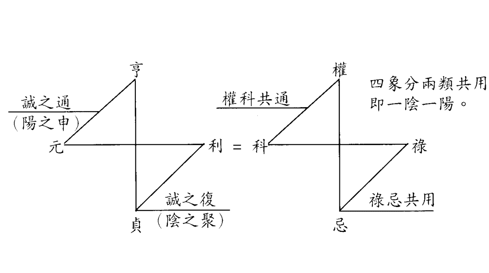

標準的欽天四化，論命結構就是以周子的“誠體”為主軸當基礎，說出了——「大哉易也，性命之源乎」。

既然講誠體，其實就是宇宙世界的本質面或本體論、存在論。當它產生了現象時，就變成了必然性的規律發展。而命運的現象，也不可能離開此規律的必然性。故曰：「寂然不動者（本體），誠也。感而遂通者（必然性），神也。」

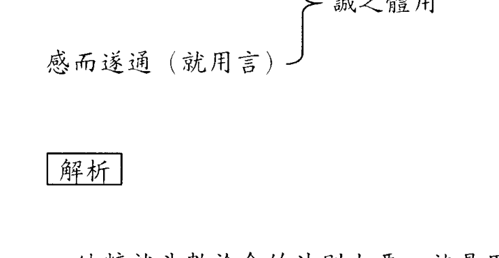

### 解析

純粹就斗數論命的法則大要，就是用生年四化論命，三才一貫即可。引用於周子的綱要，莫過於“誠體”的運作，是一種現象的最好表達。象徵著萬事萬物的存在理論，而趨向於必然性的發生。

- 把來因宮當做誠體。
- 把生年四化當做必然性發生的現象。

### 實例說明 乙年生，女命

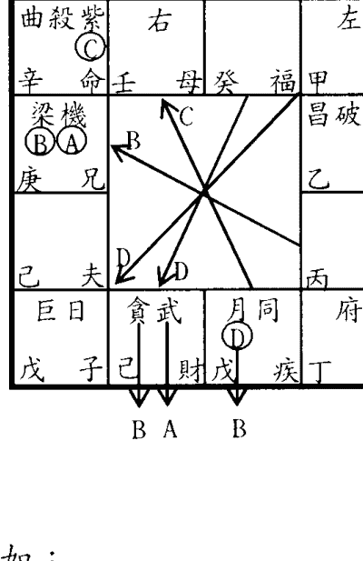

“乙”在官祿宮，把官祿宮當做「來因宮」，而所有四化可能發生的現象，都離開不了來因宮的範圍。至於生年四化，重點在宮位上。看落在什麼宮位，而在此宮位顯其象。此“象”，就是表現一切現象存在的理由。

如：

紫微化科在命，一生多辛勞，辛勞什麼？為工作煩忙。紫微有一顆內心無法清閒的心，煩絲剪不斷，且又在命宮，來因在官祿，何來清閒呢。又是化科，個性剛，帶有不受別人約束的霸氣。

天機化祿、天梁化權在兄弟，代表有兄弟姊妹，並與父母住在一起。並且在工作上，最好不宜亂投資，上班最好，因為化祿、化權在外局。

太陰化忌在疾厄，在工作上而言，她很愛工作，若沒有工作，好似人生沒什麼樂趣。另一種解，在個人的心態上，對任何一種事物，都抱著一種完美主義，而反累了自己（天同、太陰→求好心切，完美思想）。

以上，完全站在本體存在論而言的〔空間〕——寂然不動。假以，站在時間的角度上，如大限、流年…就變成了所有現象都會隨著時間而展現、而發生，這是“用”〔時間〕——感而遂通。

### 《二》象的表達本是現象論，而非本質。

然現象與本質是對立的，例如：現象為運動變化的，但本質不能因運動而變化的，本質是不生不變的。但我們都會認爲，本質即在現象中，現象的運動變化本身體現了本質的運動變化。因此，所謂哲學，實際上也就是對變化之道的描述。

> 《易傳》是這樣的描繪變化之道：「在天成象，在地成形，變化見矣。」與易傳相類似，則是老子所提出：「反者道之動」，認爲“道”是運動的，這種運動是向自己的“對立面”轉化。這也是自然的本質在運動變化中實現——生生不息。生生謂之易也。

說明：在斗數有一種運用方法，叫做「鏡心訣」。所謂鏡心訣，引用的就是老子的反者道之動，運動於向自己對立的宮位轉化。

如：人照鏡子，「在人心而爲理」的說明。

### 例一：癸年生，男命

解 癸年生，來因宮兄弟（六外）。

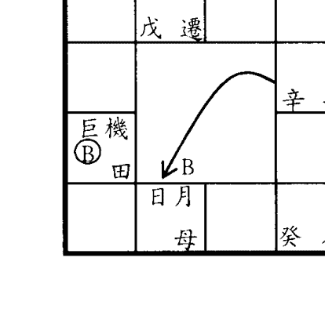

- 1. 戊干必與癸合化權，其生年權在田宅。
- 2. 依據這個巨門化權，本有多種含意。 如：置產、做生意、開店面、開工廠，有諸多解，這個叫做本質的存在。

(3)巨門化權在田宅是本質，但運動的現象是在對宮，用對宮同樣的代號＜化權＞來體現本質的內涵。這既是向自己對立的宮位轉化，才能體現出巨門化權的特性與功能，否則巨門的本質就失去它的功能性，被埋沒了它的特徵。

解

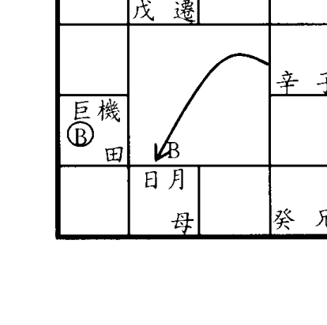

- 1. 由對宮辛干轉化權，結果太陽化權落父母宮。
- 2. 太陽則是由子女轉化的，且入父母。若站在爲人父母而言，必生男孩。
- 3. 若站在田宅而言，面對太陽星，太陽是官祿主，則田宅不是爲單純的住家而已，而是與工作（事業）聯結在一起，是事業與住家合一的。且太陽在父母宮，屬性爲服務業的性質。

(4)巨門化權，（癸）與（戊）合出來的，而戊干在遷移宮，可解釋：其工作是為外銷性質、或是做外務的、或是在外做行銷的。

(5)斗數的「鏡心訣」，是要把所有生年四化的本質，通過「反者道之動」來展現出「現象與本質」，在對立中又存在統一的學問。

這個原理，是斗數四化運作的通則，哪一張命例皆可用。

> 註解：易傳的「在天為象，在地成形」，也是一種表達，其意境不同。

解

| 梁 B 友 |   |   |
| --- | --- | --- |
| 巨機 B 田 |   |   |
|   |   |   |

（1）在天成象是代表空間（現象）
在地成形是代表時間（物相）

（2）如果站在事業而言，打從創業以後，可以做到交友宮的大限。天梁是父母星，也可以說做到很老很久。

（3）因天梁是父母星，又在交友宮，可直覺是做服務業。

### 附註：兩者最大差別

#### 第一類：

是本質對現象，由現象的運動來顯示本質的內涵及功能性。

#### 第二類：

是把生年當現象（站在現象界說話），再轉一次為物相。

因立場在現象界，則產生空間對時間，現象對物相的單純解釋，請勿混淆。

引用第一類的，不論生年有無自化，代號都要取一樣，合乎「一陰一陽之謂道」。

### 例二 丙年生，男命

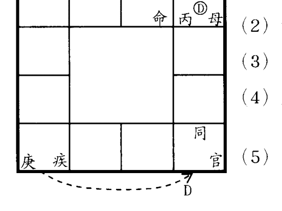

- 1. 廉貞忌自化忌，在父母。
- 2. 對宮坐庚，天同化忌入官祿。
- 3. 此人從事服務業。
- 4. 庚是在疾厄宮，代表自己做或說個人事業。
- 5. 什麼事業？要把廉貞的本質說出。他是做電器業或說電子業..與廉貞有關的事業。

### 例三 癸年生，女命（應用在大限）

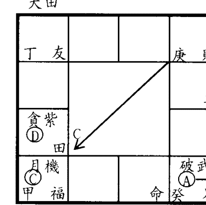

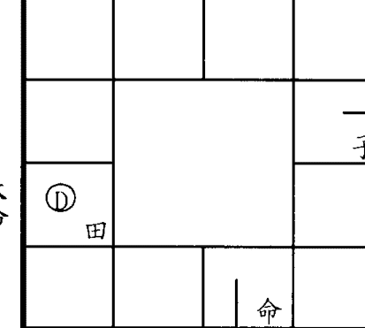

解：癸年生，來因兄弟。

- 1. 太陰化科在福德，對宮坐庚。太陰化科又入大命，代表此大限要去謀生、工作，且在此限必結婚（財帛對福德），在申年。
- 2. 破軍化祿又自化祿，則其對宮坐丁在交友，以丁天干找太陰化祿入大限命宮，必有子女。
- 3. 第四大限，此人一定會置產。因田宅有生年忌，對宮自化忌，且與本命自化忌串連，視同一個象意而入本命。

※假以單獨在子女宮自化忌，沒有串連，則此大限買不成。

### 《三》易經在學問上而言，含有義理與象數的結合並統一。

易經在本體論的基礎上是“萬有含生說”。天有生命意志；人也有生命意志，乃至萬物皆有生命意志，整個宇宙都是由生命的洪流彌漫貫注。“生之謂性”生命意志的創生力量就是宇宙之本體。易經在運用上，離開不了理、數、氣、象這四字。理是可以藉由人去參悟或理解的。但氣、數、象，卻不是能直接看到的。為什麼？

> 〈素問·五常政大論〉說：「氣始而生化、氣散而生形、氣布而蕃育、氣終而象變。」

說明：宇宙之萬事萬物皆由三個部份所組成，即氣、數、象（三才）。

如果用現代科學的觀點來說明那就是：能量、信息和形式或態勢。三者是共存的，不可分開的，且界限又分明。

氣，是客觀存在，可假設為能量。數，是宇宙萬事萬物存在的程序或邏輯，可假設為信息。象，則是氣根據數而存在的形式或變化的態勢。

可以概括為：象是能量依據信息之程序而存在的態勢；簡單的說就是宇宙萬物有信息就存有能量，就有它們存在的態勢。

(1)物質是能量（氣）的一種較為穩固的特化形態，現代物理學已經證明物質和能量是可相互轉化的。（斗數稱它為物化）

(2)宇宙最初只有能，即氣，沒有物質。（十天干都是氣，沒有質，在斗數稱它十干化曜，是說明氣始而生化，於是星辰有化氣說）。

(3)宇宙，包括太陽系都由氣形成的。生成宇宙的氣，現代科學家認為源於黑洞，但在以前的賢人就稱它為無極、無為（河圖是宇宙形成的模式圖，故說它有“生成”數）。

(4)氣，在這裡可以稱它為“以太”。因為物質最初的形態是流動的，毫無硬度、無間斷、無終止，是不能分兩部份，是故前人稱它為太極。

(太極是動態的，不是靜止的。其陰陽是不可分的，一切都在順、逆運轉間)

(斗數盤是動態的，因為人是活的，它也是在順、逆運轉間，它就是每個人生命中的太極)

(斗數的星辰是順、逆排，斗數的大限順、逆走)

(5)在自然科學裡的“以太”，只能作為傳遞物質間相互作用力的一種假想的介質而存在，“以太”和實物仿佛是隔絕的。但張載和王夫之認為“氣”與“形”是相互轉化的，因而他們所提出的氣與其說接近以太，不如說更接近現代科學家所說“場”（氣場）。

{斗數的自化（向心力與離心力），有點似“以太”在傳遞物質之間相互的作用力的一種介質存在}

{斗數的四化祿、忌一組；權、科一組，就像“場”}

{當自化與生年四化在互動中，就是一種氣場的變化或歸宿}

> ※星辰學是為一門啟迪自我的科學。由於它我學了不少東西，獲益匪淺。地球物理學討論了恆星和行星對地球的作用力。反過來，在某種意義上講，星辰學著重表達了恆星與行星自身的力量。正因爲如此，對於人類，星辰學是一種生命潤滑劑。<愛恩斯坦>

> ※星辰學是帶到陸地上的天文學，它用於探討人的問題。<愛默生>

> ※是星辰，天上閃爍的星星主宰著我們的生存。<莎士比亞>

> ※想與星辰較量的人是瘋子。<C·佩羅>

### 解析：

斗數實踐的學問在星辰，每一顆星辰猶人「生之謂性」。我們說星性，其實都是表面的現象，而不是真實的實相說。所謂的實相，是要透過四化的“象”來表達，「意在象中」才可以「立象以盡意」。人有個性，但不代表本性。生之謂性，講的是星辰的本質性，是有內涵的。

### 例如：

破軍星在沒有四化時，是現象的表面性；但當它有四化時，講的是破軍的本質性或本性，且內涵也不同於破軍星。講白一點，星辰若沒有四化，是講現象的屬性（外在），星辰有了四化是講星辰的本質天性（內在）。

### 範例：甲午年，男命

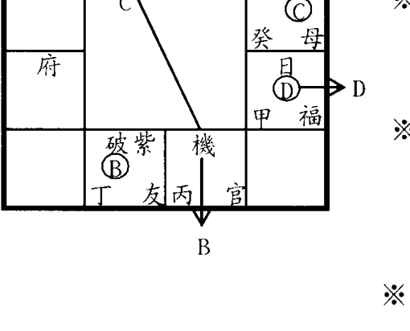

- ※星辰的解析，首先都在生年四化上。有四化的星辰，在表明它的本質性。
- ※星辰一定隨著宮位走，不同的宮位，星辰必不同的解釋，不可以一成不變。
- ※  ※ [图示：日/化忌/福] → 星、宮、象構成三才

- ※斗數的星辰論法，必須俱此三才。

### 範例解說

(1) 太陽化忌又自化忌在福德宮，星辰必從宮位走。福德對宮是財帛，在這種宮位的名稱上，太陽星的功能一定偏向事業，工作方面做詮譯。

(2) 太陽星，它的象意是化忌，所以適合上班，不適合做生意，且又自化忌，在這個基礎上（註腳）。再看他適合上什麼班？

(3) 說事業當然是看官祿宮，坐丙干，文昌化科入夫妻宮，法生年在父母，代表此人工作適合公家或團體較大的公司。再看生年科是武曲，大多會在金融界如銀行、證券行...（星辰在宮位解）。

(4) 然而，有一點要注意的，文昌化科與武曲化科在交感，代表要到某單位上班，它必須要擁有證照或專業的文憑（文昌星）的工作，否則是不成立的，是變成爲一種特定性質的工作內涵。

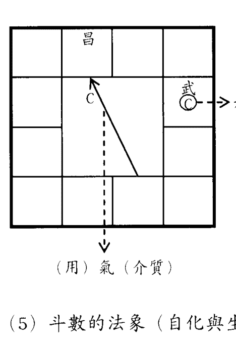

※假使沒有文昌的化科，就不須要有特定的專業工作或證照。

※這種說法，就是“形”與“氣”的轉化所產生。

(5) 斗數的法象（自化與生年四化交感）指的就是形與氣的轉化，來說明一種現象與物相存在的表徵。是藉由自化的“氣”與生年的“形”在互動感應中成立。猶似物理學的“以太”用一種假想介質在呼應。

(6) 太陽已經忌又自化忌，則在用神祿、忌一組下，此人更不可以與他人合作。因爲廉貞化祿在子女，且天干又在甲與己之合方，顯得若一合作，終必會虧損。

### 第四節

### 四化的靈魂——在自化

#### 單元一 引言

自化，所謂自化，是指一件事物現象本俱該有的平衡原理，就像五行，不能太過或不及一般。太過與不及就失去了它的平衡性，導致於出現了一件事物的吉或凶。

自化，它是有為法嗎？不是，它是應時間（不論大限或流年）而發生的。故它是無為的，自然而形成的，故曰：「無為而自化」。如同人的聚散離合，緣至則聚，是此，它都指向“動”的行為論，猶如：「氣的流行」，時過總會境遷的。

然而，時間總來自空間、或說空間中含有時間。以致，自化強調於時空效應法則。是一種事物變化的自然規律。如易曰：「唯變所適，周流六虛」（在宮位上變化）。說明自化是時空變化的學問，談的是“氣”。因“氣”之有，萬物才能生化，如天有節氣，假以這個理論可以成立？那麼它的先決條件，就是要先有“物”有“現象”，否則如何變化呢？因為自化是“用”，不是“體”，體的條件是先要有物（東西）。

### 例如

生年四化，就先有物。（物：指某一種現象存在論）

生年四化，又自化，是在已有之物後（體），再產生另一種變化（用），如是，才能體用合一。

既然自化都是一種用，不是體，就像人出生以後都要動才會成長。

那麼，一切自化的原理都是時間性的。不是空間實體性的。除非生年又自化（指來因宮）但它也要應時間才會發生作用。由是，它分多種如下：

- （一）生年四化，有自化者。（包括來因宮本身自己有自化者）
- （二）生年四化，沒有自化者。
- （三）無生年四化，有自化者。
- （四）飛宮遇生年四化，又有自化者。
- （五）飛宮不遇生年四化，但有自化者。
- （六）飛宮不遇生年四化，但有自化者。（並串聯）

以上是現象的組合性。

至於自化的遊戲規則，它又分：

- (1) 向心力與離心力兩種。
- (2) 出與入之別。
- (3) 串聯與不串聯。

除此之外，就是吉與凶的辨證法則，這是宮位（内、外）之法要。

#### 圖示

> <一> 生年四化，有自化者（在本宮，或對宮，均算自化）

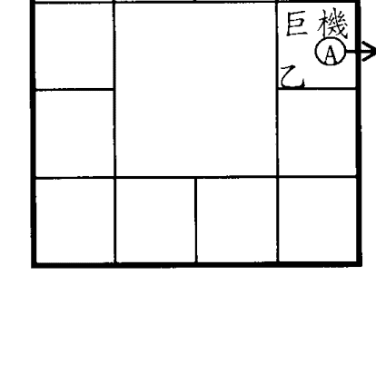

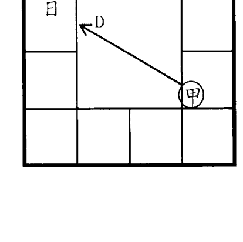

#### <二> 生年四化，沒有自化者

丙年生

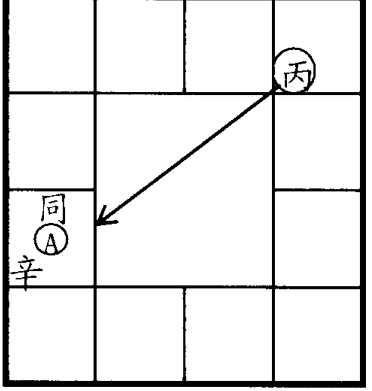

#### <三> 無生年四化，但有自化

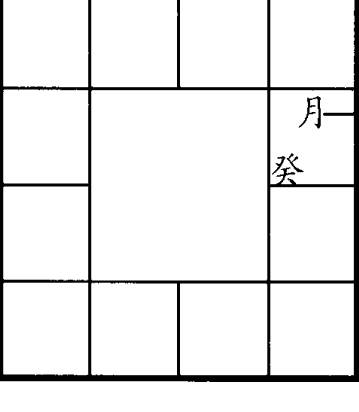

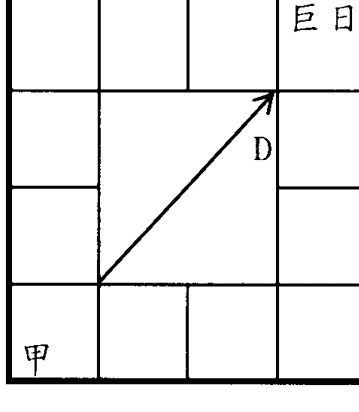

#### <四> 自化的應用法則

◎向心力與離心力

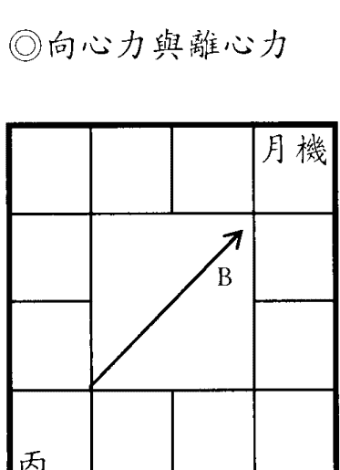

箭頭向內 (向心力)

向心力→物質的凝聚。勢必會發生什麼現象

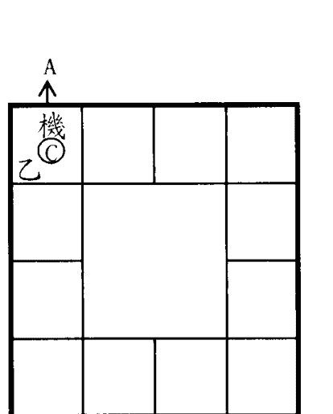

箭頭向外 (離心力)

離心力→物質的分散。把已有的事物現象變成沒有或改變另一種模式。

#### <五> 出與入的區分

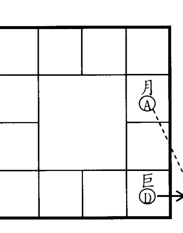

- ◎站在太陰化祿的流年（酉宮）去面對巨門的自化祿是 “入”。
- ◎站在巨門的自化祿去面對太陰的化祿是 “出”。

#### <六> 串聯與不串聯

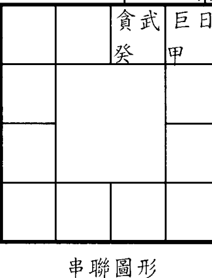

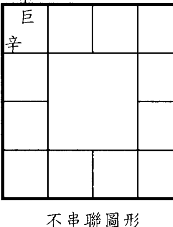

> ## 得過歌

得過且過 多惜福 少惹禍

石家豪勢傾蒼天 項楚烏江竟難度

何如陶潛撫孤松 醉來閑向北窗臥

世事到頭終坎坷 快意終須有折挫

得過且過

#### 單元二 導讀

易經之於哲理，所引用的易術，絕不外乎「理、象、氣、數」這四個字。

##### （一）什麼叫做「理」：

理就是道理，是把“理”寄于“道”中，而道又是什麼？莫非陰陽兩字。賦予宇宙萬有的現象，都在它的範圍。姑且以太極來表達，因為它是理之極致，曰「太極」。而我們所謂的道理，就是把「理」寄在「太極」的道中，是謂：「易有太極」。

就自化來說「理」——根本就是指宇宙萬有現象的平衡原理。因為陰陽學說的到“底”字在於平衡。

太極若引用在斗數上，所指的就是來因宮。（即宮位與出生的天干相同的宮位）。

例 甲年生，甲在命盤的田宅宮，則田宅宮叫做來因宮。所以每個人之於命盤都有來因宮，都有他自己的「太極」。這個太極是要我們看四化之所用的，簡稱一生年四化。所以每個不同的天干（甲～癸），都有不同的四化代表。

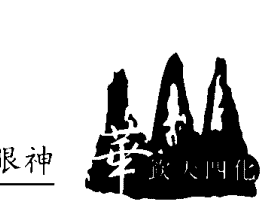

##### （二）什麼叫做「象」：

象就是現象，現象的背面就是宇宙萬有的物相，所以稱：「有其象必有其物」。但“物”的種類要用什麼來表達，當然就要用“象”來表達，所以才有「四象」之名。四象是易數的名詞，但引用在斗數，稱它為一四化。猶如，每年都有春、夏、秋、冬一般，但年份記載各不相同而已。而這春、夏、秋、冬就是「象」，四化依此而“名”的。象的功能好比在什麼不同的節氣，種什麼農作物一般，以徵“物相”。 就自化來說「象」——約而言之，就是現象有時空的出入。

> 如 什麼時候種什麼植物，什麼時候植物要收割。這就是有時空的出入問題，全賴自化來表現。

> 註 自化的前提先要“有物”在先，變化在後，才會成立。 (如：有生年四化)

##### （三）什麼叫做「數」：

數不是指定數、指數目、指河圖、指洛書，在此指著是宇宙現象的存在論。存在於空間裡的一切現象論，因為「生年四化」是有物存在論的，否則，自化就沒有意義存在。但在變化後，會產生另一種吉或凶的結果這也是一種「數」的解釋。

就自化來說「數」——現象存在的另一種變化論。

如 已有存在的現象，逢自化該有什麼變化？

例

戊年生 →戊干太陰化權→生年四化

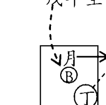

A 自化祿 太陰化權 (本來已有之現象)
太陰自化祿 (把本來已有的現象經自化而改變了另一種現象)

##### （四）什麼叫做「氣」：

氣是時間上的一種流行、動態的。因應在不同的時間，產生不同的變化（如大限有自化，流年也有自化，但在解釋上會有不同的。）說明白一點，氣之表達於斗數上，就是表達在不同時間上，發生的不同事物之存有論。

> > 註 生年的象，是空間性的，叫做物的存在論。
> 自化的象，是時間性的，叫做物的存有論。

就自化來說「氣」——在表達時間上的種種不同物相的存有論。

當這些易數的術語，在自化篇上做了導讀之引後，就該知道怎麼去理解它，切記著在「自化」上（理、數、氣、象）是這樣解的，而不是站在整個易數哲理上而言的，不能以偏概全而引誤後學，是慎。

### 自化詮釋

自化是指宇宙萬物在自然中產生的變化，它是自然性的，無為性的，就像老子說：「道之尊，德之貴，夫莫之命而常自然」，莊子說：「當是時也，莫之為而常自然」，可見在自然中一切事物都是因“時”而變，而化。此足以說明“自化”的本身，就是指事物在聚散離合變化中，都是很自然的。沒有人有能力叫它不變化，所以「常」自然的「常」，就是自化的本原。

所謂自化的本原，就是「氣」的問題，摸不著，猜不透。但世間上種種的事物，都在變化中，都因「因」而「化」而「為」。然而它的關鍵，又扯上了「次序」先後的問題，就如同沒有「春天」在先，豈能變化為「夏天」在後，這就是「序」。斗數有祿、權、科、忌，但因有「自化」的時候，就會產生次序先後之別，這一點一定要注意。（包括先與後，都可以類比）

### 做一個舉例：[生年忌] 再 [自化祿]

化忌主冬天，自化了祿，那好比今年冬天的植物，到明年秋天收成，這就是次序。

歸納自化的定義，就是“氣”的流行，在自然流行中因“時”的變遷，改變了宇宙一切事物的變化在無形中，緣生緣滅都是自然，這就是自化——自然而然的變化。

# 單元三 自化應用篇

### 詮釋(一) ——自化在「理」上而言

- “理”就是理體，理體的先決條件，就是先言「本體論」。就自化而言理體時，約而言之，就是有「生年四化」，又有「自化」者的範圍上而言的。換言之，自化去面對生年四化所產生的變化法則，統稱為「理」體的應用。
- 就此理念，生年四化，就是“理”的本體存在論。生年又自化，就是自化的「用」，在「體」上發生了種種情況的變化，若沒有一個本體在先（物相在先），自化就不存在任何意義。因為——「自化」是動的、時間性的，在瞬間產生總總的變化，都是自化的本能。
- 在應用法則上，自化的“象”，都要“法象”到生年四化上去，再由宮位上判斷現象的吉凶禍福！

※何謂「法象」，就是把自化的“象”（看是祿、權、科、忌的那一種），再去對照生年四化的宮位，然後依此兩宮位互動，就產生了現象與物相及吉或凶的徵兆。

### 例如

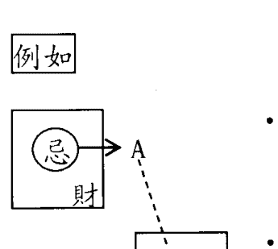

- 生年忌在財，本是勞碌或上班的安定薪俸財。（本體論）
- 但因為化忌，再自化祿，代表會由少到多的「量」。

但如果會擁有財時，他會去做什麼？這時就要看生年化祿在那裡？如果生年祿在田宅宮，那麼他若擁有更多的錢，會去置產或花在家人身上，這個法則稱為「法象」。

◎接著，來研究有生年，有自化的解釋，（包括多項說明）它基本的分類如下：

- 第一、生年單星自化
- 第二、生年雙星自化
- 第三、生年四化，自化又串聯
- 第四、無生年四化，但有自化——並串聯

> > [註] 來因宮自化者，請見來因宮專解。（不在此限）

## 【解释说明】

### 第一、生年四化单星自化

例 甲年生，男命

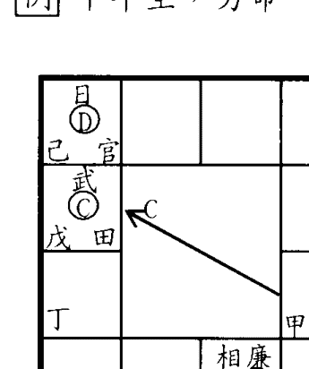

(1) 来因宫子女。
(2) 廉贞化禄在兄弟，代表有兄弟。
(3) 廉贞化禄，又自化忌。（单星自化）
(4) 把自化的化忌，去法生年忌，太阳化忌在官禄宫。
(5) 意思就是说，此命盘的人适合上班。
因为生年化禄在兄弟宫（外局），且兄弟宫也代表服务性质的工作，不宜当老板。（站在官禄而言，因为太阳忌在官禄）。
(6) 同理，他的兄弟也适合上班。
(7) 至于此人，适合上什么班？生年化科直接入田宅宫（自化的一种），所以他适合做不动产或店面有关的行业。
(8) 适合吗？

### 解答(7) (8)點：

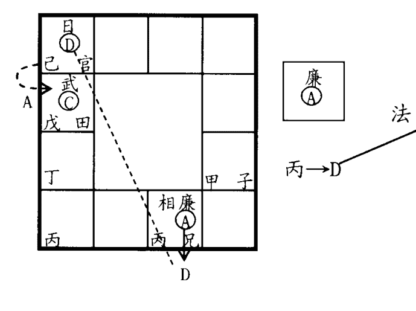

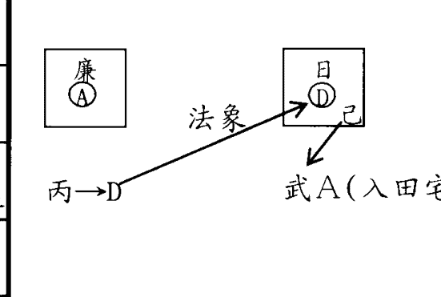

此謂之平衡，平衡即物相。

可見他適合做不動產……，好嗎？田宅是內局。

假設：是祿，自化權，然後把自化的權，法生年權之宮位，再由生年權的宮位，飛化祿出來，就是“物相”。

### 例 壬年生，女命

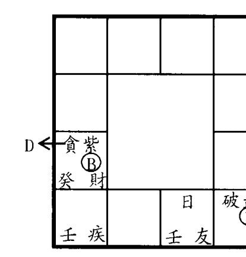

- (1)來因宮（壬）在疾厄宮，等於自己。
- (2)紫微化權在財帛，代表自己要去謀生。（自立格）
- (3)在財帛宮又逢貪狼自化忌（由化權，自化為忌），代表此人不是可以做生意的人。

(4)把自化忌，去法生年忌，在官禄宫，说明此人最好上班。
(5)上什么班？财帛宫有B(权)与D(忌)，官禄宫有D(忌)没有 B(权)，只好再用(辛)官禄宫飞个化权，结果辛 (太阳化 权) 在交友，指示着他是一般性的职员，即公司职员。 「但也适合在公家，因为来因 (壬) ，在父~疾线」。

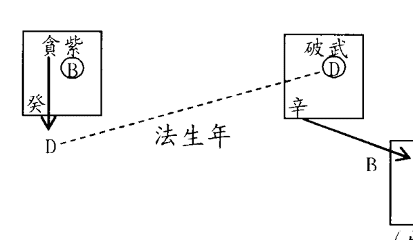

### 第二、生年四化，双星自化

例 丁年生，女命

| 月(A)乙 贪 丙 疾 | 巨同(D)(B) 丁 财 | 梁日 己 夫 |
|---|---|---|
| 空 癸 福 | 空 | 空 |

(1)来因宫 (财帛) 坐丁，同巨 有权忌，又自化权忌，这个 叫做生年四化，双星自化。
(2)若以财帛来说明这个自化， 要先说生年的存在之后，再 言自化。

(3)如此人，一定會去工作賺錢（生年論）。或此人一定會去結婚（生年論）。
(4)好不好（指自化）那要看（已有之後）的結果。如有結婚，但婚後不好，這是自化的意思，或賺錢，但賺的錢，留不住。
(5)假以此人想結婚，想賺錢，要怎麼看？

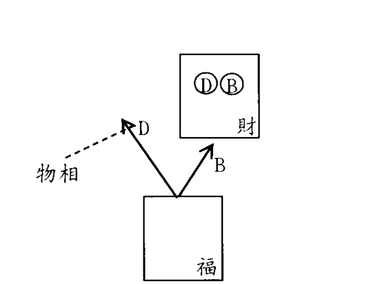

- 財帛有 權忌（生年）。
- 對宮（福德）化權入財帛，則還少一個忌，則由癸再轉個忌，貪狼入本命疾厄。
- 代表，此人會結婚（貪狼入疾厄），此人賺服務業的財（父～疾線）。
- 為什麼不上班？因為有權、忌者，會往專業上去發揮，但上班也可以。

重點，雙象自化者，一定要講究平衡。

### 例 丁年生，女命

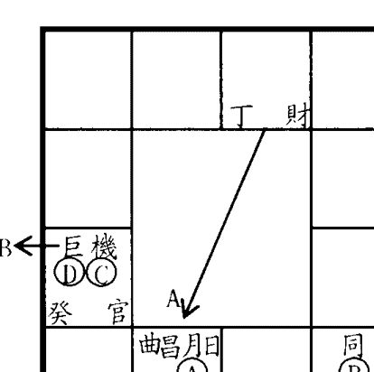

(1) 来因宫（财帛），意味著要工作谋生，但这种组合，应分两段解。
(2) 财帛的（丁）化科、化忌入本宫，以科、忌的组合，表态出来的是要上班。
(3) 到底谁在上班，巨门与天机都有生年四化，代表夫妻都要有工作。且巨门又自化权，法生年权代表先生（天同化权在命）一定要上班工作，且（化权）先生的工作性质是专业性，并是主管级。（化权的因素）

此在天同坐辛飞昌、曲，刚好入福德由是证明，只要婚后（福德是夫妻之官禄）先生一定有工作的。

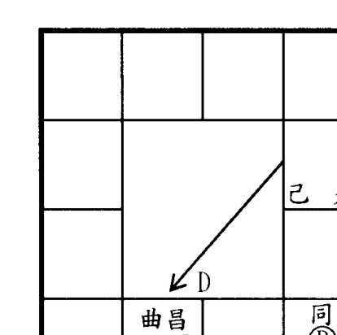

(4) 依据上述的方法，天同之位也应飞化科、化忌才会平衡。因
(5) 至于本人，应有什麼工作？财帛坐（丁）阴化禄直接向到福德（术语叫做向心力）代表（非...不可）之意，简而说，就是此人必要有工作，但显象出来的只有太阴星（代表自己）。

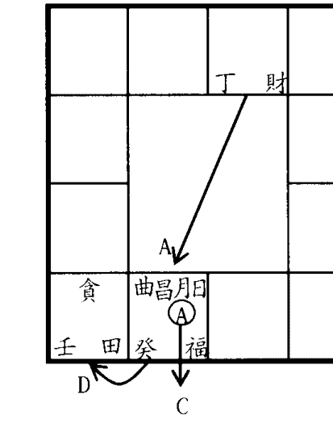

（6）福德坐癸，又自化科，但我們先看生年科、忌是雙象在官祿宮，所以把自化科，法回生年科，一定還少一顆化忌，否則不會平衡。
（7）由是，由癸干再化出一個化忌，入田宅宮（貪狼）平衡在田宅，這是說明這位命例的人也有她的工作且安定。
（8）一般入福德宮而有工作者，大部份工作的性質與興趣有關，且星辰是太陰星與美的事物有關，如藝術、畫畫、美容、才藝…等等。

還有一種是生年四化是單象，但自化是雙象時，怎麼辦？

如圖 （武由化科，自化科、忌）

平衡的定理，是針對“生年四化”而言。

生年四化有單象與雙象之別，平衡其理，一定要單對單，雙對雙。

把同類的歸類並兼看“宮位”，成現象的相對論。

> 「這裡的相對：指象與宮位合一（象）並相對（宮位論）」

### 實例 甲年生 男命

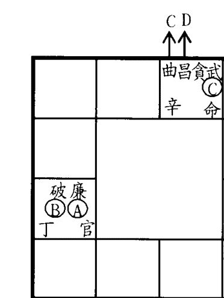

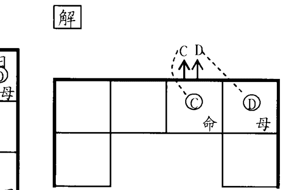

（1）如圖，即“理”的平衡。

用法，即命宮坐科，自化科、忌，就把自化的科、忌，去法象於生年→同類，使其類聚，再依類聚的宮位，成宮位相對，把現象顯出來，則在現象平衡條件下，便成爲（命與父母）的宮位解。

### (2)平衡象徵解

- (a) 科坐命，就有科存在於命的空間象，代表本身有好學、讀書、求知慾、知識……等，爲他（此命者）與生俱來，自備這些條件的潛能。
- (b) 科、自化科，並沒有把生年科抹滅掉。

<1>在“用”而言→把生年的科（體）發揮在自化上（用）（生年有自化都一樣），即如用自我充實學來的知識（生年科），再運作到去教學生或上班（自化科），代表→學必致用。

<2>在“用”而言→那是“行為”的表徵。在“靜態”（如上解）“行徑”。“動態”是“行為”。

註 凡解→生年四化，居於靜態時（猶如：論格、論現象，好比在解釋一個定象名詞，不作任何吉凶解義），則它（生年四化）只是一種“行徑”。可以用一顆樹木來比喻“主幹”一樣，沒有任何吉凶的分別相。

例 化忌在子女，不要因化忌象，就把“不好”兩個字往“子女宮”的宮位去推想“壞”的一面，它只不過用“化忌”作了在“子女宮”的主幹而已，好比用“化忌”來塑成一個“模型”一樣的道理。

※但當生年，又有自化時（猶如主幹分出了支幹），便有了支幹的作用，在理則上：

便是在 → 自性體上（生年），起了作用（自化）【體用合一】

即 → 體中自生其用（由體起用，猶如：自性緣起）
結果 → 重心便放在（自化）的支幹上面，套句俗語即“行為”

即行為 → 行為是動態，動態就有吉凶，就有時間觀念。
所以 → 有生年，有自化，一定有一個先決條件
就是 → 體先歸體解（主幹）
     體再生用解（支幹）
     體用再合一（主、支幹合解）

### 解(b)第<2>項

- (1)即然科、自化科，它就要去履行（自化科）的行為。例如他要去學習，去讀書，且是第一大限，代表求學。
- (2)但此命不是單象的自化科而已，它是自化了科、忌。
- (3)為了平衡之理下，所以要多一次的“法象”解，法生忌在父母宮。

+   (4) 結果在同一個 “註腳” 下，他必然會求學在外（如國外、父母是驛馬位）（言事）或外鄉、外地（父母也是血緣、祖籍地）或說為了求學，離開了父母（言人）。
- (5) 假如上述成定，則第一、第二大限，均是求學的時間（註腳→求學）。
- (6) 這個就是→（四化）現象平衡原理。

### 推理

- (1) 靜態解→學以致用
- (2) 動態解→第1,2限均是求學
- (3) 靜動合一，則受完教育，便在學校當老師

### 切記

生年的四化，質是存在且不滅的。若（生年）又自化，重心看自化什麼象，再決定怎麼去發揮→潛在的生年象構成體用合一。

### 第三：生年四化，自化又串聯

### 例 辛年生，男命

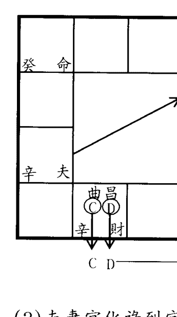

(1)來因宮（夫妻宮）坐辛，昌曲科忌雙象在財帛，財帛宮又自化科、忌。（生年四化，又自化，代表現象一定發表）因此，此人一定會結婚，又結了婚必然都要工作。
(2)夫妻宮化祿到官祿（巨門祿），官祿宮又自化科、忌，不但自化平衡，又串聯。它所表達的意思就是夫妻一定會做同樣的工作，而女性（巨門）為主。好比，先生的事業太太在掌管，是一種夫妻共事的模型。
(3)自化串聯，也要講究平衡，平衡之要領，是在表達現象的說明。

### 例 丁年生，男命

| 甲（官）武 (C) 同 (B) | 丁（疾）机 (C) | 庚（夫）贪 |
| :--- | :--- | :--- |
| 癸（田） | 壬（命） | |

(1)来因宫（丁）在疾厄，疾厄也可代表本人。
(2)天机有生年科，又自化科，代表此人一定要拥有知识，或说此人主观意识较强。
(3)它又串联官禄的武曲星，代表此人一定有工作，且是以自己的专业知识去上班。（一般化科，都是上班族）
(4)夫妻宫坐庚，又化权来宫禄宫。（也是自化的一种）

把自化的化权，法生年权在田宅，代表他工作的性质跟不动产或工厂或店面有关。……（因为范围在田宅宫）

### 第四：无生年四化，但有自化——并串联

这种无生年而有自化者，重点在「法象」，所谓法象就是一种感应原理，如同阴与阳的感应。

### 例 庚年生，男命

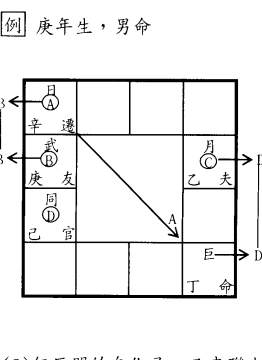

(1)命宮坐巨門，巨門自化忌，這個叫做無生年，有自化。
(2)無生年，有自化，一定要“法象”生年的四化（同象對同象），如巨門自化忌，法生年忌在官祿，代表此人一定會有工作，因生年忌在官祿。
(3)但巨門的自化忌，又串聯夫妻宮的太陰科，自化忌這個意思是，男的（本人）一定有工作，而太太因先生工作的需要變成先生的助手或貴人解（科亦主貴人）是賢內助之意。
(4)至於做什麼行業？巨門的自化忌（無生年自化），可當做物相解就是喜歡做一些土地或房子的建築工作，仰或是與土地有關的服務業。（天同化忌主服務性質的工作）

+   註 1. 無生年，有自化。2. 有生年，有自化。
以上兩種形態都有可能串聯，但不是絕對的。
※有生年，有自化，是已有的現象再作一次的變化解。
※無生年，有自化，是要法生年四化。

但它的本身（指無生年，自化），可作物相解。

這是一種辨別法則。

*這種命盤叫做有生年自化，又串聯。

### [例] 庚年生，男命

庚 官 | 月同 (C)(D) 壬 遷 | 貪武 (B) 癸 疾 | 巨日 (A) 甲 財
--- | --- | --- | ---
 | | 命 | 

D-------D

- (1)來因官祿宮，太陽化祿在財帛，代表此人一定要工作謀生。
- (2)其財帛坐（甲）太陽自化忌，代表此男性，要有專業技能，否則屬於一般上班人員，因爲由化祿變化忌，以化忌爲用，或說男的不宜投資。
- (3)它串聯貪狼化忌在疾厄，這是指事必恭親，勞心之命。配合太陽之化忌（串聯），方知最好要有專業性質（或一技之長）。

太陽→自化忌（代表一定要有工作）
貪狼→自化忌（代表須有一技之長）
}合之，就是專業人才

但在（財帛）+（疾厄），代表勞心勞碌命。

※以致，有生年自化，又串聯
與無生年自化，又串聯
}解法不同。

### 詮釋(二) ——自化在「象」上而言

「象」基本上就是一種現象，現象是一種物（東西）的存在論，但因爲有自化，不論生年或無生年的自化，都會產生一種現象，在不同的時空點上，發生「出入」的問題，在這個出入的問題上，就會發生現象與物相的不同解。

## 例

夫科 → 科（夫科自化科）

- 就靜態解，指宮位相對論。
- (1)必定有對象（人）
- (2)曾經對方一定上過班，有職業（事）

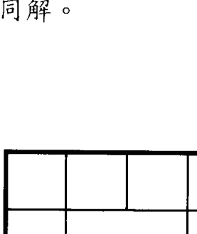

> 因　易經有說：「象言往來」，即是此意，限本宮、對宮。

註　科自化科，“主事”上是標明有對象，並沒有代表一定結婚，只有“有緣”、“有人”的存在，如要決定有份否？看生權即知，依宮位內、外，決定其“份”構成緣份，所以宮位（夫與官）即一種自化上（靜態）出入。

+   ※應用上，用（宮位重疊），解釋上就是（對方）有工作上的有或無論。
※凡是生年四化、又自化者，代表現象是絕對的存在，其次再配宮位論。

動態 → 言一切人、物、事，變化與吉凶

## 例

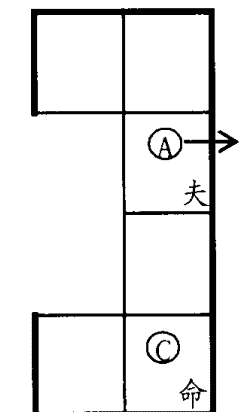

◎生年四化、有自化，它是“質”不減，並有“自性的緣起論”。它不是依附體，而是“自性體”，是自己自備條件，而自起作用的。

故(一)夫有祿、自化科，自然的對方就俱備自我有人緣的條件（即對方很有人緣），何以強論有人緣？因自化科的象，法生年科，在命宮（人位）。

(二)即然生年科在命，夫妻自化科，顯然的，此人一定有“姻緣”存在夫妻之名實。

### 解釋條件

- (a) 結婚之有無是一件事。
- (b) 夫妻宮，有自化科，歸生年之科在命。
- (c) 代表：
    - (1)不是本命盤的人有人緣。
    - (2)而是對方有人緣來與此命坐科者，作了因緣聚會。
    - (3)證明是對方人緣勝過本人的好。（條件論）

### 出入解

（一）站在命宮生科，看自化科，謂之“科入”。
代表有一個自化科的對象，會來與我成親（作夫妻）。

（二）站在夫妻宮，祿、自化科，來看命宮的生科，謂之“科出”。

- (1)代表夫妻（對方），本身坐祿、又自化科，已經俱備有人緣，只是此對方一定會遇到命坐科者，相聚而成夫妻。（完了“科”的一件事）
- (2)當結婚成了一件事實後對方因自坐祿、自化科，對方（除了夫妻之外）一定會另有“別緣”相聚（自性體的發揮）畢竟A、C在“數象”解是偶數，只是單象作雙象解。同時，在“科”出的定義下，夫妻之感情為漸漸淡化。

### 結論

出入，實際是站在不同的兩宮，作相對論。

- 條件(1)自化的看生年，謂之“出”
- (2)坐生年看自化，謂之“入”

大限，流年均同理。

強調 → 有生命，有自化，是自性體的自我發揮，等於→條件的自我成立。

### 如

祿自化科，等於A+C，當一件事如果擁有了，過了一段時間，現象又會重演，但如果：無生年，有自化：

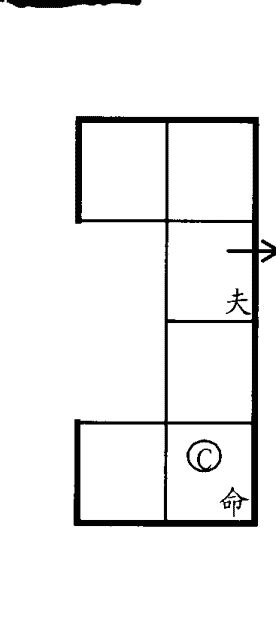

◎无生年，有自化，它是依附体，不是“因缘依他起”。

+   故(一)夫自化科，对方只能依附生科而有缘起。
- (二)生科在命，对方一定能找到他喜爱科的人，而类聚为夫妻。
- (三)这是“自化法生年”之理。

### 分析条件

- (一)无生年、有自化，其宫因没有生年，故与有生年、有自化，最大差别是没有生年，就没有→自性缘起，只是依附他体（生年）而共在。
- (二)以致夫妻自化科，是对方会找到与生年有关的科位共聚其缘（现象依然存在）。然生科在命，终于他也有对象结婚。
- (三)在条件上，反而此命之人比对方有“异性缘”。

### 出入解

(一)站在命宫坐生科，看自化科，谓之“科入”。代表有一个自化科的人，会来与我成亲（作夫妻）。

（二）站在夫宫自化科，看命宫生科，谓之“科出”。

- （1）对方一定会结婚（见第6页解）
- （2）当结了婚成事实后。对方的本身是自化科（纵有，最后也会分手，与此人无缘）
- （3）如果分手了，对方要再找对象，也比较难。

## 补注 — 宫位出入法

（一）依据“象”的出入，带动“气”的时间流行，故有“气象”之说，在斗数指“象在时间而显相”，即象在出入间，含有“时间相”即“物相”。（见：在“气”解）→后有“述”解。

（二）依据→象自化时，宫位论
当自化时，宫位的变化，也要随“象”的出入而注意。

## 例

（1）就夫妻宫自化而言（暂不论有无生年），依科法象在命宫，则此两宫即有相对，也有出入（就“相对”只代表相关係而已）。
（2）就“出入”而言，分静、动法则。

### (a) 靜態法則

只要把夫妻的自化科归生年科，言此人一定有异性对象，但不要强名，一定有“先生”或“太太”，（有、无要配合用神）→同组的搭配，换言之，代表一定有“某一个异性”会来从于“命宫”的当事者，而成因缘聚会。（即所谓→由静态而观“相对”关系）→格也。

### (b) 動態法則

1. 既然命中有，何时？这就是“时间”问题，时间一到，对象也因时间而存有其人，故——“时间与物相，同时俱在”。
2. 因此，自化在夫妻，表明的即第三限（基本时空认定法）。
3. 当大限的空间已定，才能决定此限内之“时间”，相当于论“流年”。
4. 依据理论：
空间之象因时间而存在（好比论大限法）
时间之相因空间而存有（好比论流年法）
} “序”
则→在流年上，注意宫位出入

（1）当大限入第三限（顺逆均同一个空间）→指大限。
已象征第三限会有对象（因自化科，归生科于本命，代表因缘因自化科的象而无中生有）→先决条件，决定了自化科之意。
（2）其所以会无中生有，乃站在夫妻而言，自化科归大命所有。是说明此限此人会遇到对象而已。（这谓之：宫位往下推为大限属）
（3）再归生年代表此遇之人，与法象生科之位者，是何关系？（名词解）
（4）当一切决定了关系→可能要结婚？
（5）在此，由大限推流年（动态行为）

- 前述坐生年为入
- 自化的为出
宫位名词还是往下推，或宫位名词往上推？

## 解 强调宫位出入

## 设定

（1）在“出入”之间，设定自化科为大命，且站在自化科在大限十年而言。
（2）当（流年）“定点”在“酉”年，对生年科而言科出。
（3）当流年“定点”在“亥”年，对自化科而言科入。
因科入，重点在“宫位往上推”是流年的夫妻，科入大福（重心大限）而得（妻）或（对象）。
（4）这是宫位$\begin{cases} 科出 \\ 科入 \end{cases}$在宫位之应用

- 科出→重心在流年（用大限宫位顺推流年宫位）
- 科入→重心在大限（用流年归大限宫位）
再度强调申明 → 生年毕竟是“体”，自化永远是“用”。体可以生用，用必归于体。

## 所以 在出入…中

### （一）
凡自化者皆用，故宫位重点往下推（本命→大限→流年……）注脚是站在“自化”的当宫，言当宫的变化（宫位变化）。有生年，无生年自化均同理。
> 如 夫妻宫自化科，大命逢之，自化科为大限者言，流年逢之，自化科为流年者。

### （二）
凡自化的用，要法象生年，是由用归体，故宫位重点往上推。
注脚是站在生年的宫位，当命宫论，成宫位（相对论）→关系名词。
> 如
（a）夫妻宫自化科
本命坐生科 代表夫之自化科，归本命科，有异性缘。(静)
（b）夫妻宫自化科（大命）重叠
本命坐生科 ← ………→（大福）重叠<注脚大限论>
把大命之自化科先归本命，再配大福
等于此限有姻缘结婚，若有也是一种福气。
<先>
<后>

### (c) 夫妻宫自化科 (大命) (流年) ? 重叠
本命坐夫妻 (大福) ←……→ (流年) 亥宫
把流年的自化科，先归福德再看流年。
宫，代表××年会有，是当年的应该福气。

注
1. 由福德宫飞星的或某宫飞入福德或法象入福德。均注定命中该有或该无的一种“究竟福报”→不论人、物、事均是。
2. 福德对宫财帛，论财，其实的真正有无，也是依个人福报而定。不论正财或偏财，唯论法不同角度，但“财”字均依“福”而定。
3. 福德 福对财字（物） 德对事字（事）（人）
例
> 古言「有德者得之」，此德，非指有“道德”的人一定得到，而是指累世之因缘，该得某一种果报。
故——「德」字，是累世之果（事）、缘（人），非“道德”之今世观。
（4）因果论，是人“牵制”人的一种行为，故发明了“因果”两字，约束他人不从恶而立说，在西方哲学谓之“唯物”论，证明缘起必缘灭，缘灭再生的无尽缘起，故果即因，因即果，当机一念因果俱在，因果也不在，好坏均在一心的感受。
（5）这证明论命高乘法门，只在“当机立断”，心与象合一显化。

### 詮釋（三）——自化在「數」上而言

关于这个「数」，不管是什么「数」，吉凶也好，定数也好，或气数也好。它能够表达于命理上的话，一定要依赖「四化象」而显著。没有「象」，就等于没有办法告诉命理所谓的「数」（如吉凶、如定数……）。
因此，「象」与「数」是同时存在的，而不须去分割它，好比数学，没有1、2、3、4的文字「象」，我们怎么知道它是1、2、3、4的「数」。所以，它们是并存的，故易经是象数的一种哲学。（但不是易经的全部，只能说一种易数）
斗数有化禄、化权、化科、化忌四颗化象。无形中也代表四种现象，现象是一种物（东西）的存在，就如同四种元素的存在。然而，既然有四种东西（或元素）的存在。依据万物的原理，有“物”中，必有它的好或坏论，如人都有缘生缘灭一般，这个好与坏，缘起缘灭，都称它是一种「数」的范围。命理称它「吉凶」论，「吉凶」就是「象」与「数」，同时表达出来，当然，直觉地，就是所谓俗称的「定数吉凶观」。

### 「數」是什麼？

1.  在条件上、命格上叫做「定数」，命定论就是定数论。
2.  在时空运转上，或就运用上，叫做「气数」（如大限，流年…）
3.  在现象表达上，有好有坏，叫做「吉凶论」。
4.  「四化象」在不同「宫位」上，也有解释上的不同，此不同的理解，也是一种「数」，在这数的本身，也可以分出吉凶。
5.  数的本身，就有它一「数」的存在，例数目字，如甲为1、乙为2、丙为3…或单象是单数（个位数），双象是双数（十位数）…这一些数目，也是数的一种表达。
如：化忌在田宅，与化忌在交友，其吉、凶或对人、事、物的不同而诠释，都是一种“数”的表征。
由第二项，从“象”的延伸（存在论）就应知“数”的另一种造化，命理一切的吉凶祸福，都是由象所显出来的。

### 提示

- 象的表达是一种存在论，好比一件事或物的具有存在。
- 数的表达是在一件事物存在之后，所表达的吉凶或好坏，命理上都称它为一种定数上的吉凶论。
- 另一种是称它为数字上的数目，如天干、地支之数。
- 「象中有数，数中有象」，这是「数」的应用法则。

### 解释 (一) 甲年生 (女命)

来因（迁移），生年权在田宅
1.  迁移是田宅宫的四正。
2.  化权入田宅，当然会有不动产。
何时有不动产，直觉的就是第四大限，因为生年在田宅宫（第四大限）。
它是存在论，所以化权就是拥有不动产的定“数”。
3.  命宫化权入本迁，此化权称它为自化，它与生年权是一样的代号，称它为一种感应，在命理上，称它「法象」，因它是自化，自化是指时间性的，那么，我们用生年四化，决定第四大限会有房子（空间），再把自化的权，当做（时间）说明在第四大限的某年会置，如83年（戊宫）。
4.  如果在戊年置产，这就是——「自化在“数”上解」。（感应的时间）
5.  所以说，凡是自化者，要显著它的“数”，一定要有“生年四化”为依归，构成有体有用，体用合一才能成立。

### （二）癸卯年生（男命）

1.  来因宫交友，化权入本命兄弟（巨门）代表此人一定有姊妹。
2.  来因宫交友，化科入本命子女（太阴）代表此人一定有子女。
3.  巨门化权之兄宫（坐丁）自化忌。代表姊妹不只一个，因自化代表还有，只是自化忌，一定不会超过天干(丁)四个人。
4.  太阴化科在子女，代表有子女，又自化忌，代表子女也不只一个至少要二个（天干乙）。
5.  用这种表达之法，也是一种数的应用延伸，名为数“量”的变化。

### （三）庚辰年生（女命）

1.  来因宫交友，化权入本财，必然要有工作。
2.  财帛是一种万物现象的“对待”宫位。
3.  兄弟宫天机自化权，法生年权在财帛，代表此人一定有兄弟，（天机主兄弟）男性，且兄弟有三个。
人一定有兄弟，（天机主兄弟）男性，且兄弟有三个。
4.  因为兄弟宫，没有生年四化，法生年的化权在财帛，而财帛宫坐（癸），癸的数可以到10，等于说10可以容纳丙的三（指男性的兄弟）。
5.  如果是天机先有生年，再自化权。则数目不止于3，会多出来。
6.  如果是天机先有生年，再自化禄。则数目不止于2，会多出来。
7.  其差别要看法生年之四化，所坐宫位的天干，再分奇数或偶数。

### (四) 庚生年（女命）

1.  来因田宅，太阳化禄在本命子女。
2.  以在数而言，此人必有子女（生年禄），且是男的。
3.  子女宫再自化科，法生年科，太阴在田宅必有女儿。（即男、女均有）
4.  丙数三，法生年在田宅，坐庚，庚是七奇数，所以子女只有三个。
5.  如果法生年的科，在偶数天干，可能会变成偶数，二个或四个。
6.  以上都是用自化，在“数”上解的一种方法。也可以瞭解斗数的自化，也有它一种数的存在论。
7.  “数”虽然是一种吉凶的定数论，但也因有自化产生另一种数目的变化。

### 詮釋（四）——自化在「氣」上而言

「气」当然讲的是时间性的变化，最基本的是讲一件事物在时间上多加上一种气的流行变化而已，也就是说明，在已有存在的现象里，再次的产生时间性的变化，但这种变化要先瞭解何谓自化在“气”的理论。

（一）自化分两种，一种叫向心力，一种叫离心力。
本宫飞到对宫的，叫做向心力。
在本宫上自化的，叫离心力。
向心力，是一种新物质的再凝聚，用白话解释是一种“势在必行”的行为论，也是一种力量的凝聚点。
离心力，是一种已有物质的分散，用白话解释，是一种已有现象的分裂行为论，也是一种分散变化的功能与作用。
人有聚散离合也是气的一种变化法则，气聚则合，像似有缘，气散则疏，像似无缘，人不过也是一场聚散离合的写照，我们称它是一种「因缘」此因缘的相聚与疏离，都是一种“气”的变化而已，自然而无法主宰，故称「自化」就是老庄的——「无为而自化」的自然观。
此表为离心力向外，代表时间一到，一切人、事、物都会(1)有中变无，(2)无中再生有的自然法则。
此表为向心力向内，代表空间一到，又有新的一种现象的存在论，会产生人对一切事物的存在论，会产生人对一切事物的矛盾，站在变与不变之中而徘徊，捉拿不定。

## 关注你生命的眼神

（二）既然自化有分向心与离心力，但要知道，它的体系有——
1.  来因宫本来就有自化分：A. 向心，B. 离心。
2.  生年有自化分：A. 向心，B. 离心。
3.  无生年有自化分：A. 向心，B. 离心。
4.  串联（向心力）。
5.  串联（离心力）。
（三）最好的记忆，是把自化当做八卦的重卦解（重：就是一定有）
如 生年四化是八卦，生年四化再自化，就如同“重卦”去体认解释。

### (a) 来因宫有自化分：A. 向心力，B. 离心力。

#### （一）丙年生（女命）
1.  来因宫，天机B自化B，代表一定有兄弟。
2.  交友宫化科（向心力）入本兄，是太阴星必有姊妹，法生年科入命。
3.  记得，来因宫自化表现现象是“绝对”的存在。（不是“没有”解）

#### （二）丁年生（女命）
1.  来因宫（夫妻）天机C自化C ] 串联（疾厄）武曲自化C
2.  代表她一定会结婚。（来因宫自化一定有现象）
3.  此命是女命，应用上要用武曲去串联天机星而入夫妻宫，这个叫做反应用。
4.  因为武曲是女星。
5.  天机星男星。

#### （三）戊年生（女命）
1.  来因宫（命）太阴权自化权 ] 串联（父）贪狼禄自化权
2.  太阴代表财星，此人要谋生，应该做服务业或上班，不宜当老板（因为贪狼化禄又自化权）。
3.  串联父母，所以做服务业或贸易业等。
以上都是来因宫有自化者，且是用离心力的命例。

#### (四) 戊年生（男命）
1.  来因宫（子女），化忌入本田（天机）。
2.  此人一定有子女，有兄弟。（田宅代表家人）
3.  此人一定有不动产。
4.  用“向心力”与“离心力”，在本体上都一样的解释。

#### (五) 丙年生（男命）
1.  来因宫命宫，廉贞化忌在迁移，这种也是来因宫自化的命盘。
2.  此人很喜欢外出，也喜欢子女，包括出国。
3.  因为天同化禄在子女，所以说喜欢子女，也喜欢外出。
以上两个命例(四)、(五)的差别在那里？此两命例都是男命。

### 第一个命例
- 来因→子女，直接化忌入本田，是天机星，天机是男星，就直接代表本人。

### 第二个命例
- 来因→命宫，直接化忌入本迁，是廉贞化忌，廉贞化忌是女性的星辰，所以都看一颗天同星，天同是男星又落在子女宫，所以说(1)代表喜欢子女，(2)子女与迁移都是驿马位，所以说喜欢外出或出国。(迁移宫指出国)

### (b) 生年有自化分：A. 向心力，B. 离心力。

#### (一) 乙年生（女命）
1.  来因交友，太阴化忌在财帛，代表此女命会去上班工作赚钱，因是化忌宜上班。
2.  财帛宫又自化太阴化权，这个化权叫做“有生年，又自化”（离心力），意思是说明此命之人上班后一定会再升迁，或会做主管或赚钱会更多。
3.  由化忌的本身，再转入为化权，代表一定是好的开始。
4.  串联子女宫，那只是代表工作的范围或物相，比如在房地产公司，或在工厂……等工作性质的范围。
※反过来，如因是
那代表升迁难或工作容易变动，而转向是不好的。

#### (二) 丁年生（男命）
1.  来因命宫，化禄、化科在疾厄，代表有才华……。
2.  但对宫化权、化忌入疾厄，这个也叫做“向心力”。
3.  此人之才华最好用上父母宫，意思是说明在公家上班或做主管，可是不宜当老板。
4.  因为此人的疾厄宫是生年禄、科，宜做幕僚、参谋、企划。

#### 5、整体的解释

#### (三) 戊年生（女命）

| 左        |          |
| --------- | -------- |
| 右(C) 戊 子 | 庚 兄    |
|           |          |
|           |          |
| 月同(B) 甲 田 |          |

1.  来因宫（子女）右弼C自化科在子女本宫（离心力）代表此人一定有子女。
2.  子女宫又向心力的化权入田宅宫，代表一定有田宅，又代表自己所生的子女都是女孩。
3.  如何判断都是女孩，而无男孩？右弼是女星，太阴是女星，要取谁为主？
- 太阴的旁边有天同，以太阴代表本人。
- 若以太阴代表本人，则右弼代表子女，右弼的本身是女性星，独坐子女，所以生的都是女孩反而没有男孩。

#### 4、两边都有自化，要分两段解
- 离心力是一种解释。
- 向心力是一种解释。
至此，自化应用的「气、数、理、象」都因了解到，应该注意的是，向心力归向心力的解释，离心力归离心力的解释。

# 第五章 命运里程在何处立碑

## <叩问人生>

## 命兮运兮话沧桑

人生之旅程上多少会遇到一些挫折或不幸的时候，往往会把这些不顺原因归究给“命运”这两个字。每个人所抱持人生观之态度皆会有所迥异，而对与逆境之发生，便有一种人会更进一步地认为，随时随地所发生的事情都是不可避免的，皆为命运安排之看法，人们通常把此种观点称之为“宿命论”。如果你信奉——人的本质是自由的——这么一项信条，可能就会对“命运”或“宿命”之类的看法会不屑一顾，以为它们不过是懦夫者企图推卸责任的藉口。然而，不可否认，关于这宿命论的看法有时候对于人是不可或缺的跟助力的，至少它能给人带来心灵上的慰藉与平静，进而走出黑暗道路中之阴霾或从痛苦不幸中解脱出来，并不是撒手人寰一死了之。
中国古人看来大多是相信命运的，所以古贤殚精竭虑地创造出席理之学，以便知命用命并趋吉避凶，这就是紫微斗数命理存在的理由。然而中国古人究竟是如何对待命运呢？

從字面上看，“命”的本義是命令，而“運”的本義則是轉動、遷徙的意思。對於人來說，至少有兩件事可以稱得上是絕對命令不可抗拒、不可改變的。那就是人的出生和死亡；界於生與死之間的，是爲人的一生。我們每一個人都要經歷從生到死的旅行，這就是“命運”。所以命運其實就是人生。

## 西江月詞

| 上句 | 下句 |
|------|------|
| 天上鳥飛兔走 | 人間古往今來 |
| 沉吟居指數英才 | 多少是非成敗 |
| 富貴歌樓舞榭 | 淒涼廢冢荒台 |
| 萬般回首化塵埃 | 只有青山不改 |
| 閱盡殘篇斷簡 | 細評千古英雄 |
| 功名富貴笑談中 | 回首一場春夢 |
| 昨日香車寶馬 | 今朝禾黍秋風 |
| 誰強誰弱總成空 | 傀儡場中搬弄 |

### 第一節

#### 論命須知

談命論運好似很容易，只要會算命就能說對命理之學有所全知了嗎？命的分類有七種，一曰定命、二曰宿命、三曰隨命、四曰俟命、五曰運命、六曰符命、七曰造命。

不論命說有多少種，但身為一個人的存在，必有它命的存在事實，不須加以否認或評語。

> ———命運是命主自身通過自己的存在去落實的局限———

命運是一種局限，但此局限是命主自身去落實的而非他人。意思是說，命主本人通過自己的存在而不是通過其它方式去落實的，且所落實的必定是有局限而不是無限，是缺乏而不是圓滿。所以，命是有局限的。如論命為什麼要十年一運呢？（斗數稱之為大限）

這每十年一運的理念，正是有如我們每一個人在生之旅途中所豎立之里程碑，此里程碑是建立在時空交輝中而成的。換言之，命運之說都在時空中展現出來，而我們要怎樣才能知曉“時空”呢？

「虛空皆象數」，要瞭解時空不能不去了解什麼叫“象數”。“捨象數不可以言易”，這“象數”就是紫微斗數，故它能恆流於歷史長流中，且注入所有人對命運的認知求知的渴望。

欽天四化就是象數之學的表率，開象數先河的正是河圖與洛書，它既是中國易學——數的鼻祖。

> > 象者，形象也。禮樂注云：「象，光輝也。」繫辭傳云：「在天成象，在地成形。」
> 國語·周語下：「象，況乎日月星辰，宇宙化生萬物，當其顯，必有象。」，欲認識宇宙之變化，了解事物之變遷，應首當自辨“象”開始。

> > 四化是四象的衍化，它的主題在天為象。
> 象，就是斗數應用的精華，是命理的針。
> 有了此針，命運就有了方向。

#### 四化圖

> 易有四象，所以示也。
系辭焉，所以告也；
定之以吉凶，所以斷也。

用神：祿、忌一組
權、科一組
但，權、科用神，必須配合忌。

#### 欽天門四化論命準則

##### 論命的方式

- 1. 來因宮（生年四化）論命格與運勢。即由生年四化，就可以論本命、大限、流年，三才一以貫之。
- 2. 生年四化所在之宮位，可以表達一切的現象與物相存在論。即所謂：「有其象必有其物」，「有其物必存在時空裡而顯其象」。故四化是用神，稱它是“象”的哲學。
- 3. 自化的象，也可以解釋一切現象存在中的變化過程，及一切事物的生滅原理。

##### 論命的應用

- 1. 十八顆星須配合生年四化。
- 2. 四化為時間與空間結合的縮影，它反映在人的一生當中，示應一切現象的發生，引以數據為憑。
- 3. 十二宮位，則是說明現象的發生於一人、事、或物的區別範圍；也包含著一切因緣法的應用。
- 4. 論命的重心在天干化合及地支六合。因爲，四化是依天干而有之，故用天干化合來表達。
- 5. 天干的化合表，這個表就是四化論命的精神所在。

> 註：甲己年（土）看寅、申、巳、亥之象爲用神

天干化合是名化氣，理出於陰陽合德。

化氣由庚，數爲七，曰「策」，以正天律。在體曰「欽天」，在用曰「策天」。故河圖以七之數相乘，所得數之位即天干化合之象（位）。

> 註：好比天干以十，何以星期用七。

##### 論命的數據

- (1)易有三易，河圖、洛書、八卦。
- (2)斗數的演義在大衍之數的衍化。
- (3)數是天三地兩相倚數。
- (4)所有宇宙萬有現象，不離先天易數，先天八卦。

### 第二節

#### 論命啟蒙

做為一個論命者而言，最簡單、最捷徑的方法，須謹記著，應由來因宮配合生年四化，應用之即明知其巧妙之處。這是欽天門論命的基礎，它奠定了斗數四化的基石，再步步引人入勝。

※（觀念說明）

所謂來因宮，即出生年天干，所坐落十二宮位中的某宮位，此宮位名稱之「來因宮」。

所謂來因宮，猶如周子所言的誠體〔本體論〕。生命的構成是被“分裂”出來的，不是“合成”的，是故要有「一陰一陽」的基本觀念，孤陰是不生的，孤陽也是不長的。一個來因宮，好似一個圈圈的太極，在應用上，須本宮、對宮共參照。

如：甲年生：來因宮在田宅（2 圖）

> 解：甲在田宅 有生年四化，此生年四化，亦可投射在子女宮所受用。

> 但要切記：子與寅、丑與卯的天干一樣，在取來因宮之義時，只取寅與卯爲來因宮。子與丑不取，乃人生於寅，由寅開始的原故，正所謂：「命由天府順行」。

■來因宮論命法，它引據於宋明理學之周濂溪提出的「誠」體說。「誠」體，就是“本體”論或說“物的存在”論。孔子曰：「不誠無物」，指的就是一切事物存在的本體論。所以斗數用“來因宮”表達生年四化所顯現出來一切事物的存在論。是故，生年四化，所坐落之宮位，是絕對的「有其象必有其物」。所展顯出來的，是現象與物相，說明了一切事物的現象學說論証，故稱之為現象學。

然而，無論用任何方法去詮釋生年四化的現象，但畢竟是離不開來因宮這個宮位名詞的範圍。以致，命它是有限的，也因有限才有十年一運之說，用十年為一局限來看當限運之變化，這就是命的運勢，它是起伏還是平穩。

■人俱三才，所以一個生年四化的存在，就可以由本命推算到大限，推行到流年，一氣呵成，正所謂：「三才，一以貫之」。

它的技巧，在於宮位上的重疊。所謂的重疊，就是空間與時間交會中演變出來的。如：大限若是空間，流年就是時間，借時空的交感於宮位上，稱之為「重疊」。

##### (3) 斗數十干化曜表：

這張十干化曜表，是每位學習者必須要熟記的。主要它是斗數的基本且是必須要去理解的用神。因為它關係到每一個人的命運問題，所以論命者必須要熟練之。求學問可以博大、可以廣泛，但不要忘了也要有深度有內涵。不是平白的吉凶禍福，就能代表了整個生命體的價值與感官。命運的實踐，在於能落實到如何知道何去何從？而不是在迷惑的十字路口上，說：“我該怎麼辦”？唯有四化它能告訴您真實的答案。

##### 钦天四化十干化曜表

| 四化 | 化禄 | 化权 | 化科 | 化忌 |
| :--- | :--- | :--- | :--- | :--- |
| 四化代码 | A | B | C | D |
| 甲 | 廉 | 破 | 武 | 阳 |
| 乙 | 机 | 梁 | 紫 | 阴 |
| 丙 | 同 | 机 | 昌 | 廉 |
| 丁 | 阴 | 同 | 机 | 巨 |
| 戊 | 贪 | 阴 | 弼 | 机 |
| 己 | 武 | 贪 | 梁 | 曲 |
| 庚 | 阳 | 武 | 阴 | 同 |
| 辛 | 巨 | 阳 | 曲 | 昌 |
| 壬 | 梁 | 紫 | 辅 | 武 |
| 癸 | 破 | 巨 | 阴 | 贪 |

##### （4）論命的模式（方法）大略有下面幾種：

- <一> 來因宮論命方法，由本命直接應大限，並應流年，稱之為「三才學」。
- <二> 或以大限為基準飛宮，上應本命盤，下應流年，也是為「三才學」。
- <三> 除此之外，還有就是四化之向心力與離心力的變化，及串聯的應用，稱它為自化。自化乃是四化用神的靈魂。
- <四> 變化之道就在陰與陽之間。
  如：天干之合、地支之合、宮位之辨别 } 已足足有餘矣。
- <五> 星性的特殊解。<配合四化>

##### （5）欽天門的論命指歸，不外上述幾項而已，及配合十八顆星辰。

說明了，斗數不單只是在世俗眼底下的「唯一算命術」，真正的是它是一科專門研究性命與哲學雙修的易理學問及人生觀。

### 第三节

#### 纵横天地 论命解人生

#### 象塔里的人生——四化摇篮曲

笛尔塔说：「自然需要说明，人则必须理解」。斗数的四化象就是一种自然，它关系到我们的生命，所以我们必须去理解它。

「传统会在历史中死去，却又会在理解中复活」。易经哲学的本身是存在“活”的思想，并不是“死”的概念。斗数若是属于命，就是要留给活人用，不是要为死去的人做嫁妆。所以，我们要活用它，把斗数活出生命的光辉与灿烂，光环照予人间，遍满十方。我们不须去背诵前人的笔录，我们不妨用大自然的韵律，与我们的生命共飞舞。论命、知命，真的那么难吗？我们的生命都在四化的摇篮里，孕育出个个伟大的人生与功业，斑斑点点都能留迹在历史的史页。

理解人生、创造人生，斗数会告诉您的方向………

斗数——是对人生苦难和烦恼之因所做出的形而上解答。

——是对自我拯救的原初呼唤，是对解脱之道的永恒探询。

——………

#### 財是養命的人

##### 命例一 壬辰年生，女命

> 解盤分析

前提：此命盤是來因宮自化的命盤。凡是來因宮自化者，其命盤論命方式都要由「來因宮」做論命的緣起，並看來因宮的四化是什麼“象”，分出用神。用神的要領：就是祿～忌一組，權～科一組。

- 1. 壬年生，來因宮自化在命宮，紫微權自化權，其用神就是權科組（優先次序）。
- (2) 紫微星為女星，此命是女命，代表此人在個性上屬於得理不饒人的性格（紫微化權）。在工作或對事而言，做事固執有原則，並且很有能力，一切的事情皆要靠自己去完成（命宮）。
- (3) 用神即然是權、科。我們再去看生年科坐落在那裡？生年科在夫妻宮，在先抉的條件下必須結婚，且是左輔星化科又自化科（有一種勢必非結不可的現象）。正如常人所言：「嫁夫隨夫之命」。換個角度而言，此人縱使能力很強，在工作上想有一番作爲，還是須要仰賴於先生，也可以直覺的談論說：此命婚後再談運，因爲她用神在夫妻宮，是命運與夫妻是共體的。

補註：夫妻宮若是14顆星的自化，也許她可以說，我可以不結婚。但對於左、右、昌、曲的生年又自化，是不能說，我可以不結婚的。若採取不結婚的態度，則事業也未必能順利。

- (4) 權、科用神的媒介一定要有化忌。

其命盤的化忌，正落在財帛宮，更證明命運是與夫妻須共體的。命與財帛都是三合位且爲六內的宮位，所以婚後的事業，都是自己（兩人）共創的。

至於從事什麼事業？再用化忌去連結化祿（作物相解），生年化祿在交友宮，說明她們的工作，就是做服務業（用宮位判斷），其性質看天梁星。

- 天梁星：其內容有——保險業、在學校當教師、電信業、廣告業、醫療業、特殊印刷業、文教業……及公益事業等。

◎此人從事的是廣告業。

- （5）此人既然婚後自我創業，那可做到第幾大限？
- 權自化權在命，串聯財帛宮的自化權，代表她可以做到第五大限。
- 也就是說，在第五大限內，不須要改行。
- （6）以上純粹以“來因宮”來論斷一個人的命格與運勢，而此人的命格也偏向於財官格，意味著事業心會比較重。

##### 另類分析

- （1）此命盤的人，在事業上宜注意什麼？

▲ 生年化忌在財帛，賺錢的用神就是化忌。

▲ 本命官祿宮有廉貞星離心的自化忌，依據學理而言，會把生年忌給損傷（即破財），不宜自己做生意才對，但是——

▲ 化忌的象，是由丙與辛合化而成的，當官祿宮坐“丙”，我們須看“辛”在哪裡？辛在子女宮，這是說只要事業上不與任何人「合作」的話（子女宮代表合作位），就不會損財，因此獨資是對的。（除非生年忌就在丙或辛的宮位上，可以直言破財或不宜自己創業。）

▲ 在工作上，對於生肖屬馬的或豬的人（包括客戶）要特別小心。

- （2）先生的生肖，應該屬於什麼生肖？

▲此人既然必要結婚，最好生肖如何知？

▲她的夫妻宮有三顆星辰，且她的結婚用神是左輔科自化科，是左、右、昌、曲系列之星辰，不是14顆星辰。

▲財帛宮是夫妻宮的對待位，其用神是化忌。那麼，我們去找什麼天干，才會使文曲化忌（合乎財帛化忌的用神），唯獨己天干能使文曲化忌。

▲己天干在酉宮，那代表她的先生生肖是“酉”年生的（生肖屬雞）。

> 補註：凡用左、右、昌、曲來結緣做夫妻，不管婚後感情好壞，要談離婚是很不容易的。若真的鬧到離婚，相信兩人之間的某一方，會損失很大，如沒有得到財產或破大財或……

- (3) 如何看子女生肖？

+   ▲ 子女宮自化權，串聯財帛宮的化忌，變成「與子女的對待」，故其用神還是用化忌。
+   ▲ 子女宮坐辛天干，辛文昌化忌入命在寅宮，則她的子女生肖屬“虎”。而忌入命的子女，比較貼心（孝順）。
+   ▲ 此命造之人，她的先生與子女，都是用左、右、昌、曲系列結緣的。
+   ▲ 這種應用法，都屬於「五蘊因緣法」的運作規律。

- （4）此人所做的廣告業，會不會賺錢？

圖一

+   ◆ 財帛宮坐庚，庚必與乙合化出化祿，且乙又在田宅宮（六內），意味著自己創業並要有辦公處（田宅宮位解）。
+   ◆ 合化的化祿是天梁星，代表做對行。（圖一）

#### 圖二

+   ◆ 天梁化祿的天干坐丁，且天機化科入兄弟，法生年科在夫妻宮，代表此事業是先生所創的。
+   ◆ 至於會不會賺錢，丁、壬一定合化科，而生年科又在丁與壬的天干內，一定會賺。而廣告業的象意就是科，且左輔有生年又自化，代表賺的錢也不少。（圖二）

#### 圖三

+   ◆ 丁、壬合科，若左輔星沒有生年，而有離心力的科則賺不到錢。（圖三）

#### 斗數靜言錄

+   ⊙ 武曲星是財星，不是財星入財帛宮就代表有錢，縱使是化祿或化權都一樣。武曲星的財，是要靠自己去謀生計才有的，它本身也不主“蔭星”。
+   ⊙ 文曲星是財星，尤其是己天干的文曲化忌，它比武曲星好得多，因為文曲星代表有人庇蔭的財，會有伸出的援手貴人出現。

例：文曲化忌與廉貞化忌，可以會合時，其財運有可能很旺。借古人言：富可敵國。當今能有上億財產者，大都與文曲星有關，再少也有幾千萬之譜，反而不是武曲星。為什麼這兩顆星的組合很好，只能說：祖德有庇蔭。

+   ⊙ 武曲星代表資產，好比房子很多，是資產價值觀，可說他是「富翁」文曲星代表是現金，手頭可以支用的現金，所以說他為「有錢人」。而有錢人並不等於是富翁，這個觀念要釐清。
+   ⊙ 武曲星的資財則是要靠自己努力血汗來賺取的；文曲星是靠貴人、祖德或長輩而庇蔭的。此之庇蔭，與各人的福報有關（天同與文曲，同臨在兌卦），善德者必有善蔭。

◆ 我們在排斗數盤，太陽、武曲、天同，三顆星是一起且連接的。

代表在太陽之下，勞碌的人。一般文學上稱他風塵僕僕，(武曲)(天同) 難能清閒，指的就是武曲星。

##### 命例二 丙午年生，男命

#### 解盤分析

+   1. 來因宮坐丙，直接化忌（向心力）到遷移，視同「來因宮自化」的結構。於是此人一定會出外或出國……（宮位解）。
+   2. 為什麼會出國？廉貞星是官祿主，代表會因為工作的關係，做為他出國的理由（星辰解）。
+   3. 什麼時候會出國？祿、忌是一組的，生年化祿在子女（驛馬位），代表第四大限會出國，且當第四大限，生年祿也剛好在大限的遷移，更象徵非出外不可（宮位與象相互重疊）。
+   4. 那個流年會出國？

（本子）

+   - 問流年，先要定大限（流年是時間，大限是空間）。當大限已經決定在第四大限，再由大限中尋找流年（時空次序應用）。
+   - 大遷的用神是化祿，化祿必是由乙與庚來化合的。
+   - 則回首看命盤，乙在未宮，應在未年（2003）（38歲）。

### 命運里程在何處立碑

為什麼不在庚的流年？因庚的流年是屬於上個大限，不屬於此大限。

+   （5）歸納以言之，此人論命的用神，在祿忌組，以祿忌組來論斷自己獨來獨往的性格。人生走向，都與“工作”有關。這是此人獨有的特色〔這是14顆星的應用範圍〕。

補註：14顆星辰的應用，常引用易繫傳的「在天成象，在地成形」的方式。

+   ◎把生年忌在本遷當做「在天成象」，代表空間存在的現象（本來俱有現象）。
+   ◎其天干庚，轉天同化忌，代表「在地成形」，相應於時間，並加上宮位解（時間來顯其象）。
+   ◎當大限走入已、亥線，都會驛馬在外。

> ※ {
    在天為象→空間（體）（現象）
    在地成形→時間（用）（物象）
}

+   ◎生年祿在大遷，既然要出國，就把生年祿當做在天為象，其天干坐癸，轉破軍化祿在【本財、大友】，此時已落為物象，即出外謀生賺錢。
+   ◎破軍化祿在【本財、大友】，代表此人是領人家的薪水（上班族），且他的老闆，生肖正好屬龍。◎又，辰至戌代表大陸線（中土義），所以他在大陸上班。

(6)以上是以祿、忌組論斷的，屬於來因宮自化的應用。

##### 另類分析

##### (1)文昌星的解釋：

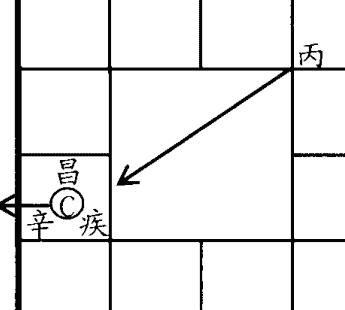

▲文昌化科是由命宮來的，代表此人必須擁有的專業的知識，在求學的時代。換言之，文昌化科代表文彩、學識......等，並落在疾厄宮。指的是自己要具有這些條件。

▲文昌在疾厄宮是好的，但它的落點宮位、天干卻坐辛。辛與丙必合化忌，結果在合中宮位又自化忌。

▲這種組合是說，擁有很好的學識或理念，很難如自己的心願發展出去；或說自己有很好理念，表現出去的很難被人所認同。正是俗話所說：「有志難伸」，故他的內心未必是很快樂的人。

##### (2)文昌因辛天干而自化忌，又串聯田宅宮的自化忌，同樣在昌、曲星下，代表什麼意思。

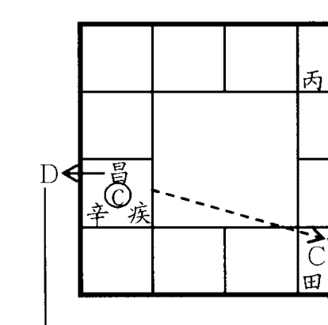

▲由疾厄宮入田宅，有多重解釋，如置產也是其中之一，在此分析如下。(一)當他在外，理念或思想不易被人認同時，往往會想待在家裡，得到家人對他的鼓勵與認同，這樣才會覺得心安與快樂，否則心裡就不會快樂。(文曲星，站在每一個人的思想立場上，都喜歡被認同或讚美，尤其遇到文曲星時)。

- ※文曲化科→喜他人讚美.美言幾句是文曲化科的特色。(讚美)
- 文曲化忌→喜被人認同.贊同(每個人)的思維理念。(認同)

文昌科是由自己命宮來的，是由疾厄轉入文曲化科入田宅，也代表此人想成家。因文昌、文曲系類列，均主因緣法的一種表達。換言之，由這個疾厄入田宅，也可以看出結婚的因緣〔文昌化科代表自己本人〕。

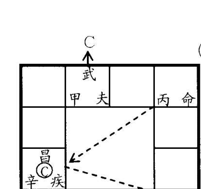

- (二) ◎此人是以文昌科轉文曲科入田宅而想成家，用神是化科，以科結緣。
- ◎站在想成家的田宅宮，坐己，己必與甲合，而甲正是夫妻宮。
- ◎夫妻宮有武曲星，武曲自化科又與生年文昌科同樣的用神，故他太太生肖同屬於“馬”（同齡）【武曲星是嫁娶之星】。

##### (三)疾厄入田宅，亦可表達置產，此人婚後就有置產現象，怎麼置產？

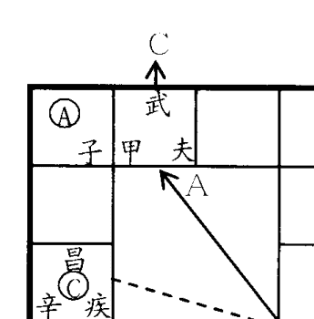

- ◎田宅坐己，與甲合。
- 己天干武曲化祿入夫妻甲天干中。
- ◎法生年祿在本子照本田，其房子剛好買在生年祿的方位【坐巽卦向乾卦】。
- ◎哪一年買？己天干化祿入甲天干。
- 剛好在“子”年（1996年），武曲所照之流年，為什麼不在“午”年，那時未婚。
- ◎文曲是女星，女星在田宅。此人是男命，必當結婚後才能置產。

##### (3) 文曲星與天梁星同宮代表何意？

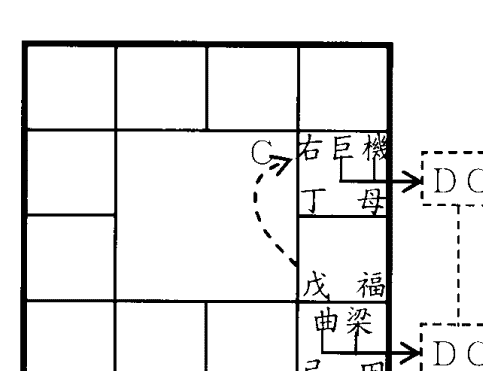

- ◎天梁與文曲自化科忌，串連父母宮的科忌，是代表家人（父母、長輩）都是長壽健康的命。
- ◎福德宮坐戊，右弼化科也入父母，包括祖父母輩也長壽。

### 命運里程在何處立碑

- ◎本人是文昌化科在疾厄，福德宮右弼化科入父母，代表此人對父母很孝順（有孝順的心）。
- ※此是左、右、昌、曲系類解。

#### 斗數諍言錄

- ◎文昌星在斗數的字典裡，一般人都把它局限在求學、考試、問功名、研究學識領域之類範圍內。其實那只是文昌星最基本的表象認識而已，若單獨只講這方面的話，那文昌星的功名論也是有限。
- + (1) 即然它是求學的星辰，我們每一個人在求學的過程中，由小學到大學、研究院……等等一路走下來，是不曾離開過學校的範圍，文昌星會發揮最大的功能，但我們一旦離開學校，走入社會以後，文昌星再好，也無助於任何升等、進階的考試（指職業考試）。
- (2) 文昌星只針對求學、升學...考試，並沒有針對職業考試，這點請注意。像此命例之人，文昌化科在疾厄，又文昌自化忌，在學校讀書考試，也許功課成績都很好，名次也會在前幾名，但一旦離開了學校，到社會上服務後，縱使有任何職業進升的考試，一定無緣上榜（文昌星管不著）。
- (3) 俗話說：「社會是一個有學問的大學」，這指的不是求學時代的大學。此大學非彼大學。那麼，文昌星在社會大學扮演何種角色呢？人與人之間的處世哲學，如何待人處世，不再是什麼考試不考試的範圍。換言之，如果一旦走入社會職場上謀生，文昌星搖身一變，端看人與人之間的對待處世行為，這才是真「學問」。
- （4）人到了45歲後，文昌星又有另一層的內涵，須要注意健康（包括幼年15歲以前）。緣由來自洛書，總數合於45，各方之合，合於15。

##### ◎文昌星的本義是「文教」之星。

我們每一個人從小都要受教育，因教育能使我們的智慧成長，心智提升。不知你有否想過，你想求知，誰教育了你？你的第一個老師就是父母，爾後才是學校的老師，是他們在教導我們。所以，文昌星是顆一體兩面的星辰。因此，文昌星之本義，另一面指的是「能教育我們長進的善知識」，而不是一味的只站在求知的我這方而言，古人才有一句：「一日爲師，終身爲父」的明訓。說明了文昌星是指向「能教化萬民於無類」的古聖先賢，推進己身反求諸己，記取曾經教育過我們每一個人心中導師，是言教導我們是不能忘本的。在佛門中，他們稱爲大善知識，讓代代的子孫都能禮賢進士，這才是文昌星的真諦。

- ◎當我們受好了教育，千萬不要自以爲是，要秉持著活到老學到老的心，天下沒有所謂的只有我對他錯的道理，不要用自己的意識形態去批判人，謙卑求知的人才能容納更多的有福。文昌就是一輩子都在學習，學習待人、做人與處世。

##### 命例三 辛巳年生，男命

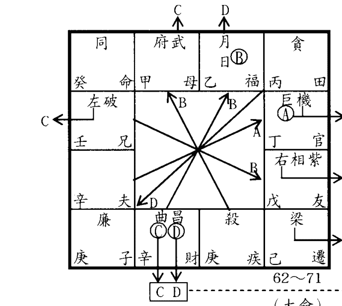

##### 命盤分析

此命盤也是屬於來因宮自化的命例，且是雙邊自化。

- + (1) 辛年生，來因宮在夫妻宮，一個向心祿入官祿宮。直覺的，就是婚後必須創業。為什麼？官祿宮與財帛宮有自化科、忌，並串聯，也象徵夫妻要共事（一起經營）。
- (2) 來因宮用神是化祿，則用神就取祿、忌組。祿、忌全部在三合，代表事業是自己創業的，不須與人合作。
- (3) 這個命盤有一種特殊現象必須說明。官祿宮有三象，即其中少了化權，由丁天干轉化權入命宮，法生年權太陽在福德，代表此工作是由自己（本人）創業的，而天同星，解釋為一種服務業的性質。

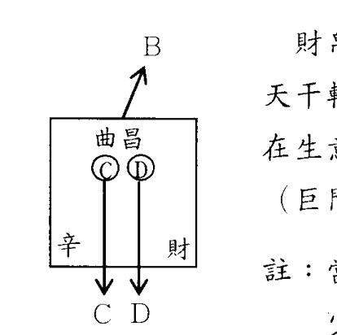

- 財帛宮也是有三象，其中少了化祿，由辛天干轉化祿與生年巨門化祿同一顆，代表在生意往來上的財務都是由太太在處理的 (巨門祿在官祿)。 註：當一個宮位有三象時（包括自化），則少的一個象即為物相（指從事的現象）。
- (5) 當官祿宮與財帛宮都有串聯時，並且現象又平衡，大抵在賺錢上都很平穩而不錯。
- (6) 終歸此命盤的人，婚後的重心都放在工作事業上，較勞碌之命，命造本人從第三大限開始做到現在（即辛天干開始）。

##### 另類分析

(1) 太太生肖是什麼？

- 辛天干必與丙天干合化為化忌。其生年忌，文昌正在丑宮，論太太生肖為屬牛。這種論法，都是運用昌、曲論因緣，並且丙在田宅，辛在夫妻與財帛，而生年忌在丙、辛之宮位內，便可以直接取其象。

(2) 此人做什麼行業？

- 辛年生的人，必有昌、曲。昌、曲是屬於先天的，是左、右、昌、曲系類。並且它又在財帛宮，在這四顆星中，應用在財官上，重心在己天干。己天干，一定有文曲化忌，文曲星為財星，所以重視它。

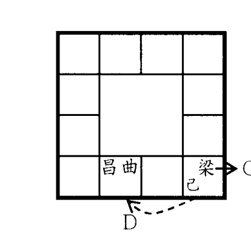

- + - ◎已在遷移（可視為自己或夫妻之財），己干文曲化忌入財帛，法生年紀也在財帛，代表此人只要做生意都會賺錢。（前面已解，串聯故）
- ◎己天干中有天梁自化科，代表物相。此命盤的本人，是位中醫師（天梁星做物相解）。

- 補註：文曲的財是先天財，易數上的“天一生水”，即是指文曲星。在後天財，指的是天相星。

（3）當此人以天梁為物相時，其四化是離心力的科，而生年科是文曲科自化科。

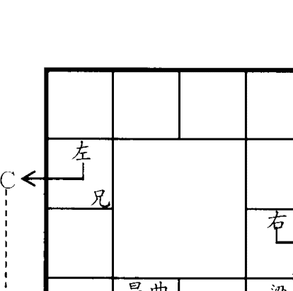

- + * 天梁自化科，串聯右弼、左輔的自化科在兄弟、朋友宮，代表人緣佳，事業生意門庭若市，法生年科都是在財帛宮，賺錢。
- + * 這裡要提示，生年文曲化科又自化科，是離心力。其它的左、右，也最好要離心力，不能向心力，這是物理性上的“向量”要一致，那才會作用一致，得到好的效果。
- + * 若昌、曲是離心力（且有生年），而左、右是向心力的方向，則不能互動，即得到也是不常久。

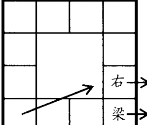

- （4）天梁科串聯右弼，當大限在第四大限（寅宮），右弼變成大限的財帛宮，表示第四大限開始，生意就走入佳境。
- （5）用最簡單的方法，也可以表達。
- ◎辛與丙合爲忌。

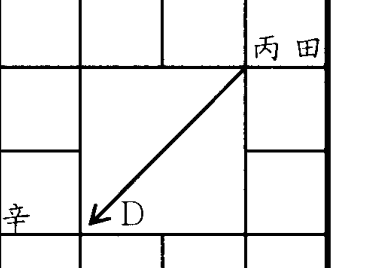

- + ◎丙在田宅，廉貞化忌入子女，法生年忌在財帛，代表第四大限就賺錢，並也開了店。
- ◎重點生年忌在丙、辛之宮位內。
- ◎同時也可以用這個方法論子女的生肖，有生肖屬兔、屬牛，還有串聯的生肖屬雞、屬豬的，都離開不了昌、曲。

###### (6)大限的延續。

| | | 乙 | 丙田 |
|---|---|---|---|
| | | | A 官 |
| 辛 | D | | |
| 庚子 | | 庚疾 | |
| 大限逆走 → | | | |

- ◎借田宅宮之化忌，廉貞星，其天干坐庚，庚必與乙合爲化祿，其生年祿在官祿宮。
- ◎從這角度而言，疾厄宮也坐庚，所以從事的行業做到第六大限，也不會改行，並且依然會經營的不錯，此命造直到現在還是開業經營中。

#### 斗數諍言錄

- ◎人從出生哇哇墜地的那一刻起，生命就開始啓動了，誰決定了那一刻？文曲星。是文曲星決定了生出的那一刻，也同時決定了你生存的方向。它永遠不會離你而去，因爲它是你心中的指南針，在引導你生存下去的方向。只是我們人不知不覺的在浪費它或不察覺它的存在，如做錯行或不知何去何從。
- ◎人要何去何從，看己天干。且文曲星爲“財星”，千萬要記住。

##### 例：乙年生

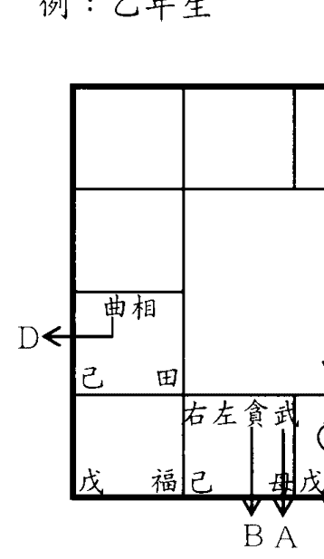

- (一) 己天干坐田宅，且文曲星也在田宅宮，有離心力的自化忌。
- (二) 法生年忌在命宮，是太陰化忌，代表此人會有很多不動產，且又是以建築業起家（太陰做物相）。
- (三) 在命宮的太陰星坐戊，戊干必然有一顆右弼星，右弼星在下一代。
- (四) 右弼能與文曲會合，必然財官雙美。
- > 註：右弼、左輔、文曲，三顆星是北斗，都主財星。唯獨文昌不是財星。
- ⊙人都要為生活而活下去，我們都會期許有一個希望與未來。 但願每一個人都能從己天干的宮位與文曲的落點，找到未來。這是一條早已被鋪陳好的一條道路，讓每一個人去自覺。不要慌、不要忙，好好的看清楚，絕對沒有錯（非生年的法生年的四化）。

- ⊙像命盤的當事者，已在遷移自化科，文曲化忌入財帛，且財帛有生年忌，故做了中醫師。並且天梁自化科，又串聯右弼與左輔的自化科，當然生意就不錯。

##### 命例四

己亥年生，男命

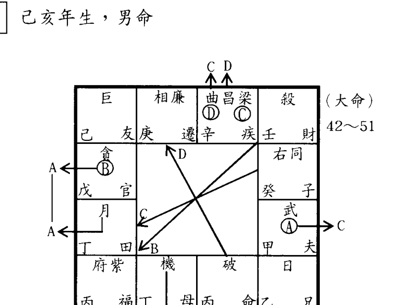

### 命例分析

前提：凡是丙、戊、己、辛、壬年生者，論命的技巧在左、右、昌、曲，這都屬於先天易數，也叫做五蘊天干法。因爲人是五蘊假合而有其身，身俱有後才有命運可言，不要把次序顛倒。其它天干生者，重在四化，屬於後天易學。

- + - 父母未生前，是先天。(性) →有身
- 父母已生後，是後天。(命) →有體
- + 身體即色身
- 先天用文曲代表 (巳天干)
- 後天用紫微代表 (巳土)

- （1）己年生是五蘊天干，重心在文曲星。其來因宮在交友宮（六外）。文曲是財星，入本命之疾厄宮（六內），是吉的（由外而內）。即然好，就是會有錢。好比，出外謀生，把錢賺進來，無論上班族還是做生意皆之，這是對文曲星及宮位上的解釋而已。
- （2）且文曲忌的宮位坐辛，辛一定與丙合化忌，剛好文曲忌在丙、辛宮位內，證明這文曲是好的。好什麼？旁邊有天梁化科，化科是由丁與壬合化的，其壬在財帛，丁在田宅，並串聯官祿。可見此人做生意開工廠創業賺錢。

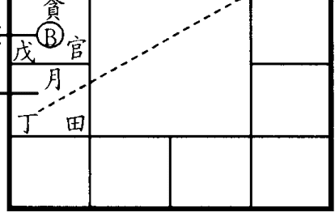

- 把第(1)項與第(2)項合解，即此人開工廠，創業一定賺得到錢。系因文曲化忌在內局也，財氣很旺，上千萬的數目都不成問題。
- （3）事業宮貪狼化權，其天干坐戊，戊必與癸合化爲權，又在戊、癸宮位中，代表事業會發展得很大。同時，戊天干的右弼化科入子女宮，代表有合作或合夥的現象。另外，右弼又正在戊、癸天干中，代表也有很多貴人。然而，飛宮必法生年，生年科天梁在疾厄，足見他是負責人（星辰解）。

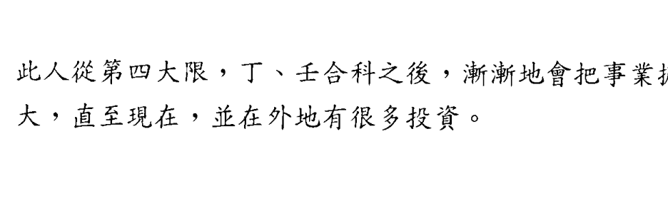

- 從上述總總跡現顯示，此人是很會做生意的，並且很會善用人際關係，主要是來因在交友，交友宮在商場上，叫做人脈或人際關係。
- （4）此人從第四大限，丁、壬合科之後，漸漸地會把事業擴大，直至現在，並在外地有很多投資。

##### 另類分析

- （1）此命盤在事業上，確實很風光，是他個人私自的好，好在疾厄宮的「曲昌梁」，已足夠他風光的理由與條件。但美中不足的是疾厄宮自化了昌曲，且是科忌平衡，當大限流年交感到也會敗在這裡。成也蕭何，敗也蕭何，只因己天干在交友宮，爲什麼呢？
- ◎交友宮坐己，且是生年的文曲忌，天梁科入疾厄，不單只得朋友之幫忙，也會得貴人長輩之相提攜。
- ◎而其天干坐辛，反把好的科、忌，隨著自化而產生不好的變化。
- 丙天干的文昌科，是一切的開始。辛天干的文昌忌，是一切的結束。所以合化水代表一切又周而復始。
- 因此，天干坐辛的文昌自化忌，代表著一切由有會變無，回到原點。

###### (2) 那麼，用在此命盤如何解？

| 巨 | 相廉 | 曲昌梁 |
|---|---|---|
| 已 友 | 庚 遷 | 辛 疾 |

- ◎好的已經講過。 ◎壞的是他自化科、忌，而是昌、曲之星辰。 ◎文昌自化忌，法生年忌，是文曲星。 文曲自化科，法生年科，是天梁星。
- ◎天梁是長輩星、貴人星，都可以代表。而絕情的星是文昌自化忌的星。也就是說，曾經幫助過他或資助過他的人（用天梁星代表），當財物得到後或利益衝突時，漸漸地疏遠了朋友或無情義的對待他們（文昌自化忌代表），這是昌、曲自化科、忌的用法。
- (3) 為什麼會這樣？因為——己天干在交友，交友宮坐巨門，文曲入內局，為了要從朋友那裡得到好處，此人會使詐或用騙的來達成目的，這是巨門在交友之緣故[巨門的是非，來自於待人的不真誠，用嘴不用心的與人交往，即所謂耍嘴皮子]。
- + \{
- 巨門在外局 坐己 → 文曲在內局，會倒別人的錢。
- 文曲在內局 坐丁 → 巨門在外局，會倒別人的錢。
- \}
- 這兩星的組合，是有心機的人，其對象就是對“物”的一種貪婪。
- (4) 此命盤是他好，別人受損的命例。也就是說，幫助過他創業的人，終究都會被他所騙了。
- + ※文曲星落丁、辛、癸的宮位要特別注意，一定有事會發生。 如：健康、破財……因宮位而異。
- + ※或丁、辛、癸的宮位有離心力的自化，而文曲星的落點宮位， 正是丁、辛、癸的天干合方，也要特別小心。 如：

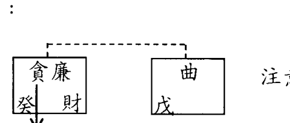

- 注意破財，癸天干在財帛自化忌。

#### 斗數諍言錄

- ◎易繫傳<上>有云：「天地變化，聖人效之。天垂象，見吉凶，聖人象之。……」斗數四化的變化，就是天地之變化，因爲它象徵了大自然的四季，所以是天地的變化。因此，這四季很自然的代表了「天垂象」，再由這象中的變化來顯見吉凶。在還沒說到吉凶時，何謂「天垂象」。天垂象有四，是言在天上懸掛了四個點爲坐標，既是春、夏、秋、冬；換做爲地支方位，是爲東、西、南、北爲天之四正；斗數沿此自然律，代以不同名詞，稱爲「祿、權、科、忌」，而居四方，這就是「天垂象」。
- 然而，天是什麼？天不過是一個氣體圍繞，俗稱「天氣」。天氣有好有壞，猶易經所謂之陰陽，既然是陰陽，陰陽是爲不可視，就賦予了「天干」示意，用天干之陰陽來代表好壞。所以後面接著說：「河出圖，洛出書，聖人則之」（則：代表效法此准則）。
- 河圖、洛書都一樣，配以天干十，以奇數爲陽，以偶數爲陰，故有陽天干與陰天干之別。爲了表達這「天地變化」，都要通過中央五，用以「五」爲尊，而成河圖的生成數（生數與成數）〔註：生數加五爲成數〕。此河圖的甲、己（1、6）、乙、庚（2、7）、丙、辛(3,8)、丁、壬(4,9)、戊、癸(5,10)，由是用以天干，稱之爲化合，此化合其實就是氣的化合，故稱“氣化”（是用以陰與陽的變化，來代表天地的變化）。
- 也因爲有了天干的陰陽變化，才產生了“象”。如乙、庚合化出來的稱它爲金（化祿也）。所以，任何一個象必須要有天干的一陰一陽合化而成的，這才叫做——天“氣”。
- 註：五行其實也是象。在四象中，於先天叫做“氣”（五氣）。
- + - 五氣→行於天→呼應天干（理）（氣）
- 五行→行於地→呼應地支（象）（數）
- 河圖重點在於“象”，用以天干合化之生成數來衍象，故稱「五十有五」。洛書重點在“數”，是用奇數、偶數來分野，故佈四正、四隅位（十二地支、八卦位）。因此，用天干合化來說“象”意，才合乎「天垂象，見吉凶」。
- 若單只看到化祿稱做為好，化忌是壞的，那都是以偏概全的說法，不足以顯象來「見吉凶」。
- ◎欽天四化論命的準則，就是應用「天垂象，見吉凶」而來的。

##### 例：庚子年女命

|   |   |   |
|---|---|---|
|   | 壬命 |   |
| 庚夫 |   | 乙田 |
|   |   |   |

- + - ◎太陽化祿在命宮，是什麼意思？它象徵了什麼？
- ◎化祿之象是由乙與庚化合而來的。
- ◎乙在田宅，庚在夫妻，只要她結婚成家，先生自然就會賺錢養她。此時這個太陽化祿表達的就是先生的事業在化祿，賺的錢給此人用，即嫁個好先生。
- ◎至於此人，要不要上班工作，已不是此人的重點，因爲她靠先生就可以活得很快樂。
- ◎其他之象，也是這樣應用，用的都是天干化合以顯其象。
- ◎四化沒有亂飛的道理。

##### 例：癸丑年，男

|   |   |   |
|---|---|---|
|   |   |   |
| 丙官 |   | 辛子 |
| 甲福 | 甲命癸兄 |   |

- + - ◎貪狼化忌在福德宮，代表什麼意思？
- ◎化忌之象乃是由丙與辛合化而成的。
- ◎丙在官祿，辛在子女，這個貪狼化忌在福德，不是拿來享受的，而是要工作的。
- ◎不管是獨資或合作或上班，都與貪狼忌有關。是代表要有事業的貪狼。

化忌，不是享福的貪狼化忌（看宮位）。請不要輕言，看到什麼象（生年）在什麼宮位，就斷言什麼現象。

> ◎易繫傳（下）有云：「是故易者，象也。象也者，像也。」是說明易經一書是象徵，象徵是模象外物以喻意。

什麼叫「模象外物」以喻其意？象就是依天干之合化（模擬外物以爲象）來表達其意，所以，象者，像也（象加人字旁——是人在模擬其象）。

##### 命例五 庚寅年生，女命

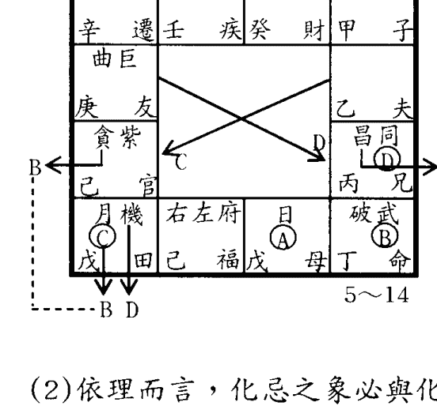

### 命例分析

前提：此命盤是來因宮自化的命盤（向心力），其用神是祿、忌組。

- (1) 來因宮坐庚干，天同化忌入兄弟宮（六外），故用神是化忌。
- (2) 依理而言，化忌之象必與化祿用神同組。其生年化祿在父母（太陽星）。
- (3) 太陽化祿，必由乙、庚所化合。乙在夫妻，庚在交友，則太陽化祿在父母，指的是她的先生在公家上班，職位極高〔太陽化祿在公家主爵位〕。
- 4. 夫妻宮化科入官祿，法生年科是太陰星，代表本人也有工作。並且太陰科自化權與官祿宮貪狼自化權串聯，更顯得本人必有一份好的工作，為什麼？因為生年權武曲星在命宮。
- 5. 此命盤的本人與先生都任職在公家，並且職位都很高。武曲是將星，夫妻倆都是軍人底色。

##### 另類分析

- 1. 一般祿、忌組在外局者，很多都是上班族。今此命盤的用神是祿、忌組並在外局，上班是最好不過的。然而上班者很多，怎麼知道他們的職位高低？
- ⊙ 從祿、忌之象來決定的，只能說此人適合上班而已，或說適合在公家。因為太陽化祿在父母，天同化忌在兄弟，絕對不可以這樣就決定他是高官階級的人。

#### 命運里程在何處立碑 華天四化

⊙ 太陽化祿指的是先生的事業適合在公家，因乙、庚在夫與友宮位來合化的。但怎麼知道先生的事業會成一位官職很高？

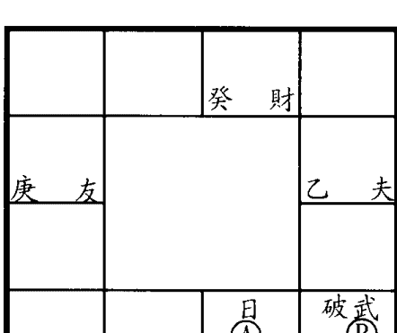

- ※因太陽化權坐戊天干，戊必與癸合化權。其生年權在命宮，代表先生在事業上能掌實權的人，並能升遷到高位〔化權之象故〕〔太陽化祿中含有升遷的化權象〕。

⊙ 站在本人命宮坐武曲化權上而言。

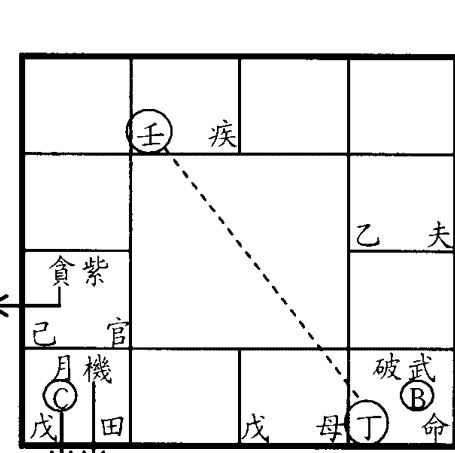

- ※武曲權坐丁，丁必與壬合化科，法生年科正好是太陰星。
- ※代表此人的工作，也是很有權力的（武曲化權），而適應的工作性質是太陰化科（如教官，較文職的）。
- ※所落的太陰又是坐戊天干，故都在公家與父母宮同意解釋。

### 命運里程在何處立碑

- ※且太陰自化權，串聯貪狼自化權在官祿，代表這種工作性質，本人可以勝任。因為，自化權正是戊與癸合化的用神。
- ※丁、壬合科在本命田宅宮：
  - <1> 田宅是驛馬位，象徵此人必會到國外留學、進修，因工作的需要。
  - <2> 代表此人一定會置產。

> ◎至於天梁自化祿，怎麼解釋？

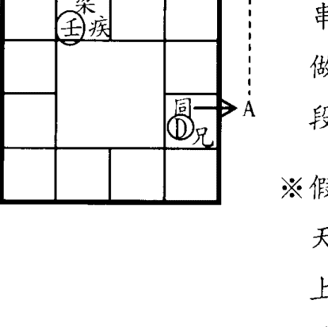

- ※天梁自化祿是與天同化忌又自化祿有串聯。代表此人從少年上班以來，要做到此大限（天梁自化祿），才告一段落、退休。
- ※假使單獨只有天梁自化祿，而沒有與天同星串聯，很有可能早就不在公家上班，或說在工作上一向都很不順，升遷也難。

◎此命例另有一個值得一提的，是貴人很多的吉相格。

- (2) ※在左、右、昌、曲中，右弼代表陰貴人，左輔代表陽貴人，文曲代表財祿神〔北斗三星〕。唯獨文昌不主財、不主貴人，只主人的意識、思想及健康，擴大即人緣而已。

|      |      |      |      |
|------|------|------|------|
|      | 壬疾 |      |      |
|      |      |      |      |
| 月機戊 田 | 左右 | 日   |      |
|      | 福戊 |      |      |

- ※太陽化祿在父母，太陰化科在田宅，同時天干坐戊天干。戊天干必有右弼化科入其福德，代表先生與本人在工作上，有很多的貴人，是他們的福蔭〔福德宮〕。
- ※疾厄宮坐壬，左輔化科也入福德，更是美上加美。但有一件事必須說清楚，左、右的貴人，這些貴人（指左、右）不一定是你熟悉的人，不是一般所說的誰是你的貴人之類，這兒所述之貴人則是在當我們（指人）處在困境中，突然間出現來幫你一把，讓你渡過難關。這些貴人，並不是你我可預期想像中的人，這才是「真貴人」。至於什麼樣的生肖才是貴人，那都是可預期的是人間假相妄合的〔真正為你貴人的，是不可以預期的，也許這些都歸到每個人的福報中〕。

◎在左、右所落的福德宮中，已經算不錯了，但其更妙的是，其天干坐“己”，己天干中一定有文曲化忌，而文曲化忌落在交友，其天干坐庚，必回歸太陽化祿在父母〔乙庚合〕，只能讚曰：「財官雙美，官運亨通」（這八個字是對左、右、曲而言的）。

#### 斗數諍言錄

◎紫微斗數在星辰上有一種特色，是象中有數或數中有象。怎麼說？

例：

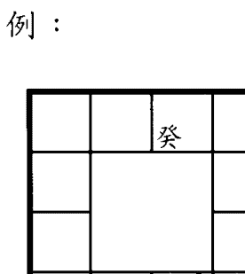

- ◆太陽化祿在戊天干，戊必與癸化合為權。
- ◆此例生年權在命（內局），故太陽化祿的“象”含有化權的數。
- ◆簡單的說，此人的事業工作（化祿），坐的是戊天干，它會透過戊這個數去與癸來合，產生化權的象變成在工作上，一定有升遷的定“數”，掌權的職位。
- ◆這種用法，稱之為象中有數。

◎解「象中有數」在星辰上的應用。

|      | 生年四化 | 天干合化 | 數中求象 |
|------|----------|----------|----------|
| 象   | 祿       | 任何生年四化，看其所坐天干是什麼？再合化一次，看其象中合什麼象？ | 透過天干合化的方式，是〔數〕所產生的象，是象（新象）為用。 |
|      | 權       |          |          |
|      | 科       |          |          |
|      | 忌       |          |          |

如：太陽化祿•坐丙 其應用在丙辛。 生年象 數

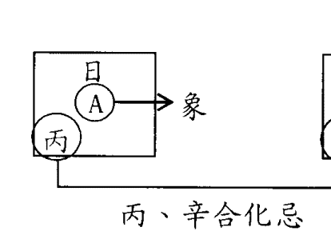

- (1) 透過丙、辛合化是忌象。代表此人的工作升遷方面會有阻礙，因為化祿中已涵有化忌之象。這個含（涵）字，有被註定似的。
- (2) 次再看天同化忌在內、外局，表達內容而已。
- (3) 歸納：
  - 太陽 A：
    - 坐戊→轉向化權，註定升遷。
    - 坐丙→轉向化忌，註定難升遷。

##### 例 庚年生，女命。

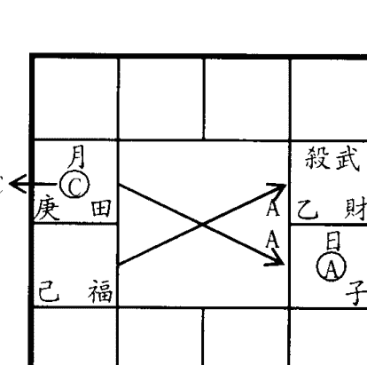

- ◆太陰化科又自化科在田宅，代表命裡一定會有房子（生年自化一定有）。
- ◆針對太陰化科而言。

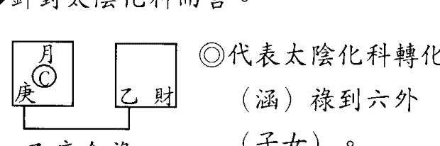

### 命運里程在何處立碑

- 化祿在子女，表示不宜合作。因為生年科已經自化科，若有合作一定損財，因為乙在財帛與庚合而到外局。
- 生年自化，在靜態對宮位而言，是有××的存在論。如果要在動態論吉凶，必是有吉凶的。
- 例：辛年生，女命。

| 曲(C) 福 |          |          |
|----------|----------|----------|
| 巨(A) 壬 母 |          | 昌 丁 遷 |
| 辛 命    |          |          |

- ◆以巨門化祿在父母宮而言，類似情形有很多人是上班族，也有人做服務業的性質，但不論是何行業，其天干坐壬。

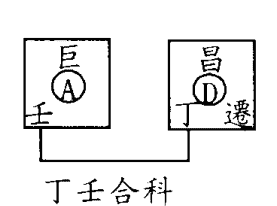

- 代表巨門在祿，已被註定轉向至化科的特徵，且是文曲科。
- 巨門祿中含有文曲科代表此份工作帶有才華或知識才能獲得，並很安穩。
- 再看文曲科在那宮位，再決定上班還是自己做。

> 生年祿 → 只能決定現象存在，不能決定現象有無。

#### 星辰告白

星辰是星辰，配合了四化，就有了象与数的问题。明知四化是象，但坐落的天干不同，数也就不同。在不同的数（天干）的合化，当然再也产生了不同的象。故曰：「化曜」，是十干皆化曜。

四象，如化禄，是乙庚合，这是对象而言。

星辰，是象中涵有数，是被注定的，它是「化曜」。什么叫化曜？如生年权是武曲，其天干坐辛，透过丙——辛的合化是忌。就像你做了主管，掌不到好的权利之位，或部属不会从此人之令（权中含忌）。

```
公式：生年象 + （天干合化）= 合化后的象
(看宫位天干) ——→ 再看生年四化，就知道这颗星曜是何意，叫做「化曜」。
```

#### 陽宅概念

#### 前提

不論陽宅或陰宅，都離不開大地之土〔斗數用巨門星代表大地〕與大自然同氣消息。陽宅與陰宅必講方位，即坐向，不管什麼向都離開不了戊己中央土。因為戊、己土，才有四方之位（四正與四隅），合成八卦，十二宮位。將戊、己用宮位表達，就是財帛與疾厄。白天人們想到賺錢以養命，故命宮逆五格有財帛。晚上，辛苦了一天總要休息以養身，故疾厄宮（身體）的逆五格是田宅（住家）。

戊己宮位是一陰一陽，命與田宅也是一陰一陽，且是差四格宮位，以效法天之四象。在陰陽協調中，可見田宅（住家）對一個人有多麼的重要，在重要中，我們千萬不要把它太過於神秘化。住家本來就是人類生態存活在自然環境下的建築學，在幾千年前的周朝，就有了記載其學問的足跡可尋。斗數之於人，可以論命；斗數之於陽（陰）宅，更有明確的詮釋，不然斗數為什麼要有北斗七星九曜（加左、右），其用途何在？完全是為了“田宅宮”而設立的——住家（住宅）。

什麼叫住家。「住」，就是主人，誰是主人？只要是人，人人都是主人（不分男女）；「家」，從宅從豕，家字為什麼住宅的下面不是“人”而是“豕”，這說明人類從游牧生活到農耕定居生活的轉變。豕是豬，古人和豬都住在一起的，所以有句話：「畜近人欄，豕養在家」。到後來男女有了婚嫁制度，才有「男大當婚，女大當嫁」的成語。女人把嫁隨稱之為“家”；男人把娶取稱之為“室”，合起來就叫做「家室」。這就是住家（住宅）的由來。

紫微斗數甲天干，一開始就排→

| 天   | 地   | 人   | 物   |
|------|------|------|------|
| 廉A  | 破B  | 武C  | 日D  |

```
↓ ↓ ↓ ↓
(山)(水)(家)(室)
↓ ↓ ↓ ——婚嫁制度
離 坎 男女——(嫁娶星)
(戊)(己)
```

在太陽之下，三顆都是北斗星。

（乾卦）

- ⊙乾納甲、壬。

（圖一）

（圖二）

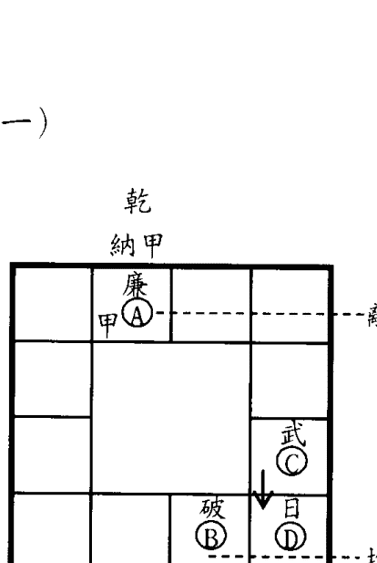

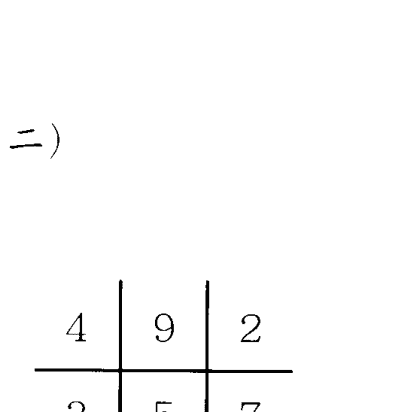

（命盤原圖）

（九宮圖）

#### (圖三)

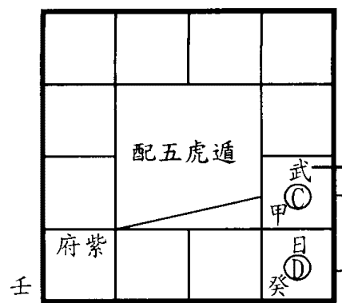

◎人生於寅，太陽在豬位（地支合木）（陰陽合有情）

- 五虎遁。正是甲天干，到寅是壬天干而生人（乾卦納之）
- 人須有婚嫁制度
- 地支合
- 寄寓壬癸水
- 畜近人楊
- 豕豢在家
- （人生於寅圖）
- ※甲天干有武曲化科→◎依天干而言，萬物萬事要有始有終。
- ※壬天干有武曲化忌→◎依婚姻而言，代表白頭偕老。

那麼，武曲在陽宅上，重點在表達什麼？

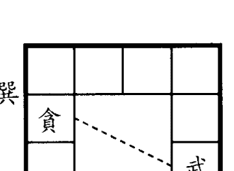

——「氣口的氣」——如大門、後門及室內——氣的動向。氣要有動向，一定要靠巽卦的貪狼（風），由風來決定流動之向。故北斗第一顆配以貪狼，名為“生氣”的由來。而同居在九宮（河洛）的一六北方處。

因此在陽宅（住家）上，氣的流通是很重要的，配合太陽（“室”內要有採光，使“家”之氣通暢），這才是居家健康之道。

#### 命例陽宅分析

（1） 斗數論陽宅的中心點在田宅宮的三合方。

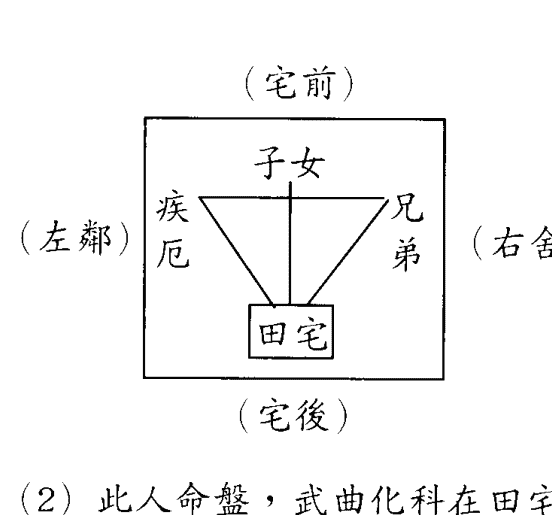

- ※用法：在此四宮位中，有沒有生年四化，做論陽宅的基準。

（2） 此人命盤，武曲化科在田宅宮，廉貞、破軍祿權在兄弟，都合乎論陽宅的方式。

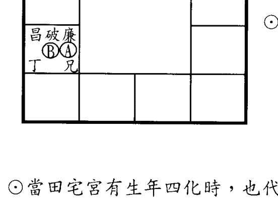

- 田宅宮指居家環境的宮位。當田宅宮有生年四化時，直接用星辰解釋其置產環境特徵。
- 武曲、貪狼同宮，而武曲是化科時，居家最好能夠在鬧中取靜的地方（武曲星偏於熱鬧處，如商場地帶。因其化科，科主文靜，所以稱它鬧中取靜）。
- 當田宅宮有生年四化時，也代表“室內”的設置。因其化科，必須佈置高雅一點，如有書店味，不宜佈置得太華麗的裝璜。又其天干是辛，顏色要配淡色，不適合深色如牆壁，尤其在客廳（武曲主客廳之牆）。

◎太陽化忌在官祿，室內採光要充裕最好，則代表工作、事業會順利。若採光不好，會影響到事業〔看化忌在什麼宮位而言之〕。如在財帛，賺錢就很辛苦，謀生難。

# 註：

凡論陽宅，在四化上要注意兩個象「化科與化忌」，次看化祿，化權放最後。化科主的是人，人要健康；化忌主水，人需要水才能生存。

因為科是木，河圖三八位，3 + 8 = 11，一水也，是天一生水，此水乃養命也，嬰兒喝乳可以長大就足以證明，絕不是五行所謂水生木的說法。水怎麼“木”生，水是水、木是木，是木須要水來涵養之，木才會茁壯成長，含養中還須要有土介質其中。又例：木是肝，水是血，水生木，血怎麼生肝？但肝中藏血，其血也要靠脾（土）運輸，脾主肉。

孔子曰：「一函三」，並沒有說：「一生三」。函者，致養也。

如天干，為什麼逢3必是甲天干。

```
{ 民國3，13 → 3,13,23,33，43......都是甲天干。
  西元，尾數減3，就是天干。
  (1938 - 3 =戊天干) (1914 - 3 =甲天干) }
```

(二)斗數十天干中，都有化科與化忌，就是使人在居家上能夠安康、平順，它的出發點都是為人設想的，不是嗎？

- 論命的對象是人
- 住家的對象是人
- 健康的對象是人
- 化科的對象是人

人是社會的細胞，家庭是細胞的繁殖，小家擴大到國家，故曰：「齊家治國平天下」，由“家”談起。

◎武曲星在田宅，若真的想要置產購屋的話，最好婚後才進行。因為武曲星為嫁娶之星。

或說，田宅宮坐（庚）（壬）（甲）（己）與武曲有關的天干，而武曲星在命、夫、財、疾、兄，也是婚後置產比較好。

# (3)廉破祿權在兄弟宮，怎麼解？

宮位有十二宮位，有六個屬內局，有六個屬外局。四化在外局的，偏向屋外的環境；四化在內局者，偏向室內的格局。廉破在兄弟，主屋外的環境，如靠近菜市場（破軍）或有戲院、娛樂場所（廉貞）……。假使廉破在疾厄（內局），代表室內的裝飾，如電視、音響、冰箱...（廉貞），瓦斯灶台、廚房設備...（破軍）。這是說明用宮位的內外可以論住宅的內外。

# (4)星辰、四化、宮位，都是用在住家日常生活必須的物品或環境的顯象，至於方位學，則另有不同說法。

##### 另類分析

(1)陽宅的方位在田宅宮的三合方。

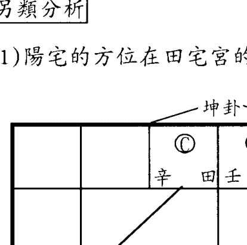

◎生年科在田宅，其用神是化科，且此宮位沒有任何自化。

◎化科之象，必定是由丁、壬合化而成。

◎丁在兄弟，壬在官祿，而兄弟宮是田宅的三合，故此人坐向最好是坐東向西。

◎又田宅宮坐辛，文昌化忌在兄弟，法生年忌在官祿（六內），肯定坐東向西爲吉，爲什麼？化忌之象必來自丙、辛之合，而田宅正坐辛天干。

⊙其坐向最好坐乙向“辛”，合田宅的“辛”天干。

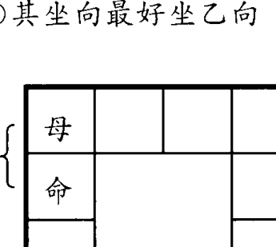

※在坐東向西中，東方有 { 乙 卯 甲 } 西方有 { 庚 酉 辛 } 以乙→辛。

※巽卦納辛，命盤的巽卦，正好是命與父母。代表此命若坐東向西，對自己與父母最有利。

##### (2)有利在哪裡？

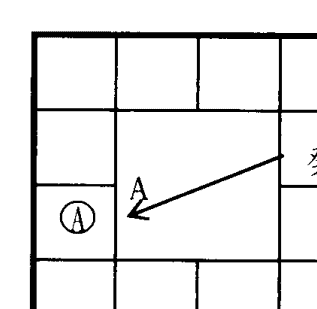

- ◎酉坐癸，癸破軍化祿入卯宮，且卯宮有生年祿。
- ◎生年祿必是乙、庚合，在福德與疾厄，所以代表很有福氣。
- ◎爲什麼？坤納乙癸，故坐乙向辛，才能得福，賺大錢。

(3)坐乙向辛，其納卦氣都是吉的。假使用甲→庚，則是不吉利的，較沒有福氣，乃係庚屬乾卦，乾卦有自化則不好言之。

(4)文昌星可以坐，不宜向，若坐西向東就不好。之因爲田宅宮(辛)文昌化忌沖酉宮(西方)。

#### 斗數諍言錄

◎斗數有田宅宮，太陰爲田宅主，不能單指太陰代表只是爲房子而已。其實它隱藏了地理（風水）的大秘密，裡面藏有月体納甲（月相）與天干的關係，才把太陰稱爲田宅主。[風水與納甲有關]太陰田宅主真實的意義是：「先天納甲與太陰同體」。月亮有陰晴圓缺，是古人觀察日、月星辰的變化爲先；再依月亮的陰晴圓缺，而畫出八卦其後，如“先天八卦”即是也。絕不是依卦再附會於月亮的變化，那樣的思維會本末倒置，是以地理與納甲有絕對的關係，如不明此理太陰星就不叫田宅主。

註:

太陰田宅主：「將納甲法與月之盈虧組合，以月之盈虧定八卦並在可見的月亮之方向配當干(天干)。」

※納甲法創始於漢代焦贛(焦延壽)前漢人。著《易材》十六卷。門人有京房。著《京房易傳》

⊙斗數的四化〔化曜星辰〕是來自納甲的演義。十干化曜的天干，其甲、乙、丙、丁......到癸，不是五行而是納甲天干。

斗數的星辰，才是屬於五行之屬性。如貪狼屬甲木，這個甲才是五行。

#### 簡單舉例

古人常言：「窮戊己，定甲庚」。這戊己是五行嗎？不是的，它是納甲。

- 1. 戊、己在五行叫做土，於星辰如紫微、天府。故紫微為中天星。（取中央土義）
- 2. 戊、己在納甲而言是以「坎象流戊，離象就己」如: 戊納坎：戊→己、庚、辛、壬、癸、“甲”→甲＜太陽化忌＞[後天坎卦稱中男]

己納離：己→庚、辛、壬、癸、甲、“乙”→乙＜太陰化忌＞[後天離卦稱中女]

在斗數太陽、太陰爲中天星的理由在此，所以不要把斗數的天干用五行來表態。〔日月取戊、己中央衍化義〕。

- <3>坎納戊爲月精，指的是先天義，坎的先天爲坤，爲月精。
- 離納己爲日精，指的是先天義，離的先天爲乾，爲日精。

      (乾)→日
┌────┬────┬────┐
│    │ 離 │    │
├────┼────┼────┤
│    │女↑│    │
├────┼────┼────┤
│    │戊 │    │
├────┼────┼────┤
│    │↓男│    │
├────┼────┼────┤
│    │ 坎 │    │
└────┴────┴────┘
      (坤)→月

> 周易參同契（八十六）

「坎男爲月，離女爲日。日以德施，月以舒光。月受日化，體不虧傷。陽失其契，陰復其明。」

註：太陽能生光月亮反射日光而生光明。

切記：“反射”，故卦義須顛倒，如人是顛倒生。
故說：先天納甲與太陰同體此命盤就是用納甲論陽宅的模式。

易有三易
- 八卦的重點在陰陽數 {先天八卦是由陰陽儀所分化 後天八卦是由卦爻多寡分陰陽卦}
- 河圖的重點在五行數【極其數，遂定天下之象】
- 洛書的重點在奇偶數【五位相得，而各有合】

著數七、卦數八、洛書九、河圖十。
(圓) ↓ 天
(方) ↓ 地

納甲是屬於著數七的應用，象徵「天垂象」。

##### 命例 壬寅年，女命

##### 陽宅命例分析

(1)田宅宮的三合，永遠是論陽宅的基礎。若該宮位田宅宮有生年四化的話，皆與住家環境有關。
(2)此人命盤，來因壬天干在子女宮，直接化祿入田宅宮，是天梁化祿星，子女宮內坐文昌星。
代表此人的房子，會面對學校或電信局之類的建築物。
(3)子女宮及兄弟宮，可以代表室外環境。
(4)子女宮(來因)的武曲化忌在官祿宮又自化祿。法生年祿在田宅宮，代表此人居家的鄰居會有銀行或證券行......等金融機構〔武曲化忌、化祿屬金融〕。
- 甲 武曲化科，庚 武曲化權...代表形象有的與廟寺、神壇有關。
- 己 武曲化祿，壬 武曲化忌...代表形象與金融、財政機關有關。
(5)斗數的星辰，在陽宅學上，都是用在“物相”上解的。如屋外會遇到什麼樣的環境，屋內的擺飾又是什麼樣的東西，而不是用在方位上論。
(6)論方位而言，則須用八卦、河洛配干支、九星、納甲〔九星、納甲，歸屬日、月〕等。

##### 另類分析

(1) 地理有龍、脈、砂、水、向。

#### 钦天四化 命運里程在何處立碑

(2)壬年生，必有左輔星。左輔重點在形勢，且壬天干來自子女〔田宅的對宮〕。此人命盤左輔化科在卯宮〔斗數陽宅第一顆用神都取化科，因爲是人要住的〕。
(3)化科在卯宮，正好與田宅宮天干化合〔戊、癸合權〕。其化權又在內局，財帛宮，故坐向最好坐東向西。
戊在五行屬中央土，在乙 庚卯 對 酉 中，甲 辛可以用卯→酉向。取其中，對應田宅的戊天干。
此屋若真如此之象，必應下大限賺大錢。
當坐向取卯→西，那門口（氣口）開在那裡最好。

##### (4)天干化合的化權，在後天八卦的艮卦。

- 艮卦納丙，丙在午宮離卦，故大門應開在南方。
- 當門若開在南方，丙、辛天干必合化，而右弼又在辛天干裡，代表左輔的形與右弼的氣全部會合【左、右的應用】。
丙、辛合化忌，生年忌在官祿，當大限在財帛時，官祿宮的化忌就變成大財，正好能得財。【宮位全部內局】

##### (5)主人房鋪應放在什麼方位。

- 丙天干有化權入疾厄【田宅的三合】。法生年權在財帛宮，且天干又合【戊、癸】。
- 其主臥室床鋪頭朝北【坐】，腳朝南【向】。
- 天機權的天干坐壬，離納壬也。而丙在南方（離卦），向心化權給予天機星。

## **斗數諦言錄**

在風水學上，有七字眞言：「消砂納水乘龍氣」。若引用在斗數上，盡在左、右、昌、曲四字中，再配合四大玄空象→祿、權、科、忌，其妙，在於說明，卦若有先後天，則人居天地間也有先後天，先天是左、右、昌、曲，後天則是祿、權、科、忌，亦然可以在斗數上論風水學。古人說：「福地福人居」，誰是福人？誰是福地？端看先天的左、右、昌、曲。
此人命盤，文昌在田宅的對宮〔外在環境〕，其卦在艮〔東北角〕。文昌主砂，故住宅的東北角不宜有高的建築物，宜空曠或有馬路的地方〔砂，障礙物〕。
例有一人，其住宅坐南向北，曾在事業上飛黃騰達過，賺到錢。

### ◆癸年生，男命。

陽宅用神首重於化科，爲用神。
來因兄弟（田宅的三合），當然與置產有關，且太陰化科入命，其力量大於破軍祿照田宅，因太陰（田宅主星）在命宮。
太陰所坐天干爲甲，乾納甲、壬，其位在西北角，結果他的門開在乾卦。
丁、壬合科，太陰化科在命。戊、癸合權且戊化權入命逢太陰。
又，先天乾在南方，所以房子既然是坐南向北，則門開在乾卦是對此人最吉利的。再法生年權在福德宮，所以住此屋又能得利，也是一種福報。
- 陽宅學在斗數上，是離開不了“納甲”的。以納甲再配卦，這是“九星參閱錄”的入門階。
- 太陰爲田宅主，陽宅是不能離開“月相納甲”說。

### （月相贪狼生气图）

乾兑 → 上爻一阴一阳
离震 → 上爻一阴一阳
巽坎 → 上爻一阴一阳
艮坤 → 上爻一阴一阳
全部都是北斗第一颗贪狼义【生气】
在北斗七星中：三爻中，上爻变叫贪狼；三爻中，上爻不变叫巨门。

### 把上圖，換做九宮（九星）圖。

- ※ 震 → ☳ → 月亮亮出一線明。
- ※ 兌 → ☱ → 月亮亮出二線明。
- ※ 乾 → ☰ → 月亮完全三線明。
- ◆ 巽 → ☴ → 月亮開始一線缺。
- ◆ 艮 → ☶ → 月亮開始二線缺。
- ◆ 坤 → ☷ → 月亮完全三線缺。
◆以二十八日應天上二十八宿，是以太陰曆不出三十天。

### 斗數地理綱要

#### 天地的詮釋

天地的詮釋，不過乎陰陽。陰陽就是易的總綱，卦只是易經的內容，故曰：「易道以陰陽」。因此，八卦重點在陰陽之數中，而數負陰而抱陽，是易兼備了「氣數理象」四字以括終。
天地，就是「理」的流行。宋儒曰：「天理流行」。
在「天」說「理」——貫穿命理，所以有天命說，天人合一說。〔太陽〕
在「地」言「氣」——堪天輿地，所以有堪輿說，風水居家說。〔太陰〕
合此日、月，謂之「易」。〔勿 → 月亮也〕
陰陽從那裡學起？因緣從那裡發生？天理從那裡流行？這一切都是由「天干」開始。其理只在「天數五，地數五，五位相得而各有合」。所謂有合<1> 指合十。<2>指天干化合，中間“有五”。
天干的化合，才是陰陽數（即河圖）；不是五行的甲與乙為陰陽數。天理、因緣、陰陽都是由此做出發爲其準則，故「易與天地準，故能彌綸天地之道」、「仰以觀於天文，俯以察於地理，是故知幽明之故。」＜易繫上傳＞

從易的角度來看斗數，它必與地理有關連。而與地理有密切關係者，則是太陰星（月亮），故斗數用以太陰星為田宅主之主因。月亮能與地理扯上關係，是納甲之故。納甲之說，係古人取之月象，實出於先天，先天之氣主於歸藏。翕聚五行始為後天流行不息之根。
乾納甲，坤納乙 逆轉生 艮、兌
艮納丙，兌納丁 逆轉生 坎、離
坎納戊，離納己 逆轉生 震、巽
震納庚，巽納辛 逆轉生 乾、坤
乾納壬，坤納癸 逆轉天干終
天干序數對應：
一、三、五、七、九（奇數，陽）
二、四、六、八、十（偶數，陰）
天地之數五十有五

1. (1) 四化是由月亮而来（依月亮盈虧變化所得）。
2. (2) 即然四化原由月亮（太陰星），是故，斗數的天干不是五行，而是納甲。以其納甲配卦，進而再配九星。
3. (3) 例如：辛年生，此辛天干不是五行屬金的辛，而是納甲的辛，其卦配巽。
4. (4) 斗數在什麼地方才用五行？只有星辰，星辰的特性是依五行而分類，是屬性。
然而，星辰的按佈，是依八卦而定的。

### 健康是人的主人翁

### 導言

在紫微斗數十二宮位當中，與我們最切身的宮位有三，為「命宮、疾厄宮、田宅宮」，猶人俱三才。
疾厄宮是身體的本位宮，內涵著疾病與災厄的統稱。「天有不測風雲，人有旦夕禍福」，唯有我們的身體可以感觸或意識到外在變幻。所以，身在命先，也就是說沒有懷胎十個月的身體”於先，那有“命”的存在？「死生有命，富貴在天」，死生指的是身體（肉體），是肉體有死生腐朽，而不是命有生死（精神不朽的人是命不死的）。命是如來如去的，不生也不滅，可見疾厄宮對任何一個命主的我們都很重要的。健康是一種無形的財富，勝過於外在有形的富貴假名。
然而，身體是以田宅（住家）為住所的。因此，身體之健康與田宅（住家），產生了密切的絕對關係，自有來人類就結下了「不了緣」，生生世世都如是。這不是迷信，這是人類生存環境下必然所致的。

### 命運里程在何處立碑

命之底蘊，上天賦予每個人在有生（命）之後付出之努力與成果的運勢總結，統稱命運。這一切是可以卜策之，屬後天。故曰：「天行健，君子自強不息」。人有生存權利，故當自勉。
身之底蘊，始於我們未出生之前在母胎中的身體。身體的醜美、健全與否體質強弱等等，心性的善良與否......都存在賦予於先天的遺傳血緣中，故說它是為先天。「盡性以至於命」中的性，是指先天的身體，深藏著人的本性，此本性之善否，在有生之後也會影響至命之發展。易繫傳有言：「吉凶與民同患，神以知來，知以藏往」，所謂「知以藏往」，是身；「神以知來」是命，所以身命不可混淆。命可以預知未來，身體卻無法由人自主的。
沒有身，哪有命？我們常說女性懷孕了，叫“有身”。有了身，在期待一個新生命的誕生，這就是生命在搖籃裡。
身中有命，讓每一個人的未來，有如陽光一般的光明與璀璨，在生命的旅程中發出光環，成就一切。所謂：「帝相本無種，男兒當自強」，就是在表達「眾生平等相，有志了平生」，這就是「乾」義（無生死）〔陽〕。
命中有身，讓每一個人在人生的道路上努力時，不要忽略了身體健康的重要。人都受身在父母，父母賦予我們的身體，是天性、是天賦，爲人則必須珍惜。她——「身體」是有歲月的限制，是會有死生的到來，像月亮盈虧之變化，是爲一種無常，這就是「坤」義（有死生）〔陰〕。
在斗數上，命宮爲陽，象徵乾。【身中有命】
疾厄宮爲陰，象徵坤。【命中有身】 構成一六共宗
由是，依易理可以用一張圖來表示：

### 田宅與疾厄，同屬陰儀。

身體受身，綱蘊在母體，田宅（住家）也同受於先天納甲的月相體。因此，身體[疾厄]與田宅[住家]有絕對不可分的親密關係。
命 —— 疾厄
（1） （6）共宗北方水
甲 己
(疾厄)⟷(田宅)
6 10
己 癸
坎 （後天）水┐同源 （坎）（坤）
坤 （先天）土┘ ䷜ ䷁（中爻變）→九星，名“破軍”

### 疾厄宮的認知與應用

〈1〉 疾厄→疾病與災厄的簡稱。重者為病，輕者為疾。除此之外，屬於外來的就叫意外災禍。
病字→為什麼裡面有丙。丙數三，是天、地、人的“人”，是人才會生病〔天地只是有意外的天災地變而傷及人〕。
丙納艮（1）人生於寅，紫府在寅，寅屬艮卦（第一圖）。
（2）艮屬土，土生金，金始出艮——肺經〈元氣〉。
這裡指的是經絡。

### 第一圖

（3）紫府在寅相應人體肺經（第二圖）。

### 第二圖

戊 己辨—經絡出。土生金，金始出艮—肺經（元氣）

### 河圖五行義，命數臟象通

> 心死，道生。正所謂：「破河圖，了生死」。
↓ ↓
（河圖）（五行）
以証莊子「方生方死，方死方生」。
- ◆ 河圖以剋爲生。
   大道以反爲用。 ⇒ 故身體以逆扶正，猶紫微逆排佈施星辰。
- ◆ 艮數七，應北斗七星，河圖以7相乘逆排。
   艮納丙，丙爲人，在東方三（三才）。

### 命运里程在何处立碑

- （束）→逆行
- 人 →3×7=21→北
- 1×7=7→南
- 7×7=49→西
- 9×7=63→东
- 合数140
- 【应北数十四颗主星】
- 【应北斗七星先天数】

| 脾 | 心 | 小肠 | 膀胱 |
|---|---|---|---|
| 胃 |   | 肾 | 心包 |
| 大肠 |   |   | 三焦 |
| 肺 | 肝 | 胆 |   |

| 巨 | 相廉 | 梁 | 杀 |
|---|---|---|---|
| 贪 |   | 同 | 武 |
| 月 |   |   | 日 |
| 府紫 | 机 | 破 |   |

（庚辛金落中起寅於艮） （戊己土落中起寅於艮）
性与命相接通

> 先儒曰：「尽性，以至于命」。

#### 何以甲乙在北，移至东方为甲乙？这是天干藏河洛。

在此不细说，简单的说就是 3 × 7 = 21 东方 北方 [先逆后顺]。
乃身宫的排法 [逆月顺时] 其理相通；而命宫是 [顺月逆时] 。

#### 〈3〉脏象经络与命数消息

我们人的身体一切机能活动，都离不开脏腑与经络。在临床上所表现的病理现象虽然很多，但究竟的实质，总不外乎脏腑及经络机能的反应。由于各脏腑经络的生理功能不同，其病理變化所反映的證候，都具有一定的規律性。有道是「醫者不明臟腑經絡，開口動手便錯」。
命的一切吉凶自有定數，病理的機變更有它的規律，這是宇宙自然造物原則。
> > 是謂：「一（命）六（疾）共宗以成命。〔甲〕與〔己〕二（乙）七（庚）同道以成性。〔陰陽氣化以生人〕」
性命哲學，實際上就是生物、心理、生理的生化科學，不是只有狹隘的命理學而已。故曰：「天地之大德曰生」。
註：一六共宗以成命。這是後天，命已經被生下來了，可以直接可以理解。〔胎外〕二七同道以成性。這是先天，身體還沒有被生下來，值得去深入探討。〔胎內〕

#### 註解

人有命，命有身，是謂一六共宗，即命宮配疾厄宮【1與6】甲與己。身體有五藏六腑，此五臟六腑構成和合了人之命。人之命，源自紫府立寅，同理臟象經絡也始於寅，是謂「艮始」。
則：斗數設有疾厄宮；把疾厄宮擴大，就是中醫的臟象學說。換言之，疾厄宮就是身體，是臟象學，配合四化象之應用。真的要瞭解疾厄，不得不去瞭解臟象經絡學，否則會失去斗數疾厄宮的真實義。

臟象配宮位，亦分陰陽表裡。裡→臟；表→腑。
由寅開始，裡、表、表、裡，順行推演並循環。
肺金本在西方，經絡在艮；腎水本在北，經絡在西。
> 〔山澤通氣〕
此在說明，金不生水，只是寄體，故肺（氣）根於腎而得證。
如：腎水足可以平肺咳。
天干陰陽配經絡陰陽，氣化使用天干合化證虛實。
附：八綱配八卦

### 說明

1. 表裡辨證[艮.兌] [丙.丁]
   表裡是指病邪侵犯人體的部位深淺。
2. 寒熱辨證[坎.離] [戊.己]
   寒熱是指病性的寒熱。
3. 虛實辨證[震.巽] [庚.辛]
   虛實是指邪正盛衰的狀況，寒氣盛為實，正氣虧為虛。
4. 陰陽辨證[乾.坤] [甲壬.乙癸]
   陰陽是八綱的總綱，表裡、寒熱、虛實都概括在陰陽的兩大類。
   即表、熱、實證屬陽證。[乾.兌.離.震] (順)
   裡、寒、虛證屬陰證。[坤.艮.坎.巽] (逆)

### 過去未來總在今生緣

#### 導引

因緣，因緣，總在今生結了緣。也因爲有今生緣的相聚，才能體現出過去與今生聯結的暇思空間，迴盪在每個人心中的情感，奔騰在緣遇的風雲聚會中。在諸多的因緣裡，婚姻是最切實在人的生活中有伴。
自古創立了婚姻制度以來，婚姻總是成爲人類生活的重要一環節，妻財子祿四字，隱隱約約的好似被命底註定，是以命理就存在了這四字待以探討的話題。歸究其內在實質，不過乎是「成家立業」四字衍生的內容，也是每一個人心中的希望。借婚姻而寄於未來，事實上也是人間美事一樁，生命寄託的曙光。
人生在世，婚姻是生命中一個重要的課題，舉足輕重都會影響到未來，一個家庭或事業前途，莫把婚姻當兒戲。不管是前世接今生，或今生盼來世，總是緣結在今生，就該好好地生活在此一生。此生的珍惜，就等於了生生世世，何求來生於渺然？
在斗數上，有一些星辰必須說明的，是關於婚姻、嫁娶的區別。「嫁娶」是男女當事者的事。男娶女爲娶，女從家爲嫁，於斗數的星辰為武曲星示之。武曲星的好與壞及四化表現，是說明男女之間婚姻相處的好壞，如常口角或意見不和、很難溝通、不好相處…等等。倘若武曲星是好的，夫妻相處就比較融洽。
※武曲星的好或壞，不主導婚姻離不離婚的理由。常言道「勸合不勸離」，就是武曲星的特色。「但願天下有情人，終成眷屬」，是武曲星對人類婚姻的祝福。〔兒女私情是武曲星〕
※在卦上，少男追少女，少男是艮卦（☶），少女是兌卦（☱）。兩卦爻全部爻變，就是武曲義。〔三爻全變爲武曲〕
※用在命盤：

|     |     |     |
| --- | --- | --- |
|     | 女嫁 | 夫  |
|     | /   | \   |
| 田  | 男娶 | 命  |

良卦(1) <----------- 兌卦(6) -->
> **注意**
這個形式用在任何命盤，其宮位的距離都一樣。這是用來表達一個理念，不是指宮位要如此命盤形式才算。
※1與6代表天干合緣法。
「婚姻」這兩字是有制度的，嫁娶不單指男女主角之事而已。
婚——指女方父母；姻——指男方父母。兒女論嫁娶，要雙方父母同意下，才能完成這椿“婚”事，婚姻才算成立。〔有結“婚”名詞，沒有結“姻”名詞〕

### ◆ 命宫与田宅宫，是我的家。
### ◆ 夫妻（对方）入我家门，叫嫁娶。
### ◆ 夫妻（对方）的田宅宫是父母，

意味著：

- (1) 女方要嫁，要得对方父母之同意，叫“婚事”。
- (2) 女嫁后，面对的就是男方的父母，叫“公婆”。
- (3) 父母宫的好坏，亦可看婆媳之间的关系。

### ◆ 当婚事成立后，男女双方的父母，就结了“姻亲”关系。

### ◆ 基本的婚姻观念要清楚，在卦义上，
父（☰）与母（☷）也是三爻全变，说明了父母要同意这档婚事。

引用在斗数上，“天同星”代表婚姻星。天同星的好坏，可会影响到夫妻离不离婚的要素。因为它动摇了婚姻的制度，或者说结得了或结不了婚，都须参照天同星。

因此，天同星是代表夫妻的生活状况。

而天梁星也可以代表男女双方姻亲关系往来的好坏，有没有常常保持联络或感情融洽。

### ◆ 在命盘中，一个婚姻的成立（儿女成婚了），乾卦的太阳与坤卦的天梁，是这两颗星的结合，也就是代表了有姻亲关系的亲家。从而看“日梁”的宫位（不一定要同宫），就知道这对亲家相处和睦否？

### ◆ 天梁代表女方的父母〔在男方称岳父母〕

太阳代表男方的父母〔在女方称公婆〕，用岳父母的岳字，代表尊老〔对外〕，用公婆的公字，代表纳入对方，以待对方如己所出，平等义〔内亲〕。

论命中，常说：“财帛宫是夫妻的对待位”，是由这个理则衍生出来的。若没有任何的婚姻事实，岂有夫妻对待之真？

### ★ 斗数为什么

| 太阳 | 武曲 | 天同 |
|------|------|------|
| <天> | <地> | <人> |

此三颗星，在命盘上是在乾（☰）与兑（☱）两卦；这两卦是上爻变。为贪狼义，象征生命中有一种活泼生气的喜悦。所以婚姻是人间的一大乐事，也是身为父母者，对子女的祝福并以了心愿的完成。因此，在结婚的习俗中，一定要有三拜，一拜天地、二拜父母、三是夫妻对拜，从此姻亲也就成立了。

### 于斗数上，就有——太阳与天梁之组合；天同与天梁之组合。

### ※ 天同夹在乾、坤中，这是中国固有的婚姻礼俗制度，但愿学命理者，有所体会与须知。

你是否还记得最古老的诗经，有最古老最浪漫的誓言：“执子之手，与子偕老”。

而在今日，却有一首歌很像这浪漫的故事～～～

> 我能想到最浪漫的事，
> 就是和你一起慢慢变老，
> 一路上收集点点滴滴的欢笑，
> 等到以后坐着摇椅慢慢聊。
> 我能想到最浪漫的事，
> 就是和你一起慢慢变老，
> 老得哪儿也去不了，
> 你依然把我当成你手心里的宝。

这首歌正反映了“天同星”的写照。愿天下能为夫妻者，能慢慢品味出它存在的内涵，唤出内心一颗感谢的爱——伴你走过一生。

### ※ 婚姻论法须知

- (1) 婚姻是属于“法人”，故重点在“名位”名位。[不属于自然人]
- (2) 婚姻是与他人成对的，故重点在对象。[己方与对方]
- (3) 名位在四化象，重心在化科与化忌，俗称名（化科）份（化忌），而不是化禄。有的人是有缘[化禄]而无份，故也不成立婚姻。
- (4) 在宫位上：
    - ◎ 己方宫位要看的是命宫与疾厄宫，象征本人。[1、6]
    - ◎ 对方宫位则是夫妻与交友宫，象征对方。[3、8]
    - ◎ 合方是财帛宫与田宅宫，象征婚嫁成立，有对待或有家室。[5、10]
    - ◎ 依河、洛，一六、三八，都没有变易。

取象“化科”（名） 取象“化忌”（份）

※ 化禄、化权，有变易。有的会在某一时空中而婚变，不能从一而终。

婚变宫位是以“福德宫”之好坏为基准的。因为夫妻本是前世修来——今生同船渡。其方式，福德宫不好，其四化有没有带动己方（1、6）或对方（3、8）的宫位。次看“父母宫”，婚姻成立是靠父母的。

### (5) 在星辰上：

- ◎ 重点看天同，次参看武曲。
- ◎ 武曲是儿女私情的星辰，有的只能当朋友，但就是结不了婚。
- ◎ 天机星指的是一般有缘人，它不主婚姻之星。

注：天机的三合必见天同星，但此二星绝对不会有同宫的组合。

### (6) 应用都是使用天干化合。

命例一 丁酉年 女命。

### 命例解析

- (1) 天同化权坐田宅宫，对女命而言，必然会有结婚、有家室。〔天同星在田宅〕
- (2) 其四化是有生年权，其天干坐癸，癸必会与戊化合为权，刚好正坐在田宅。而戊天干在财帛宫，也是有对待之位，因此判断必然会结得了婚。

### ### (3) 结婚怎么看？

- ◎ 对方的三、八之位，都有化权进去，且财帛也有化权进去，法生年权在田宅，所以结了婚。
- ◎ 微妙的是夫妻宫（对方）化权入官禄，官禄自化科串联疾厄宫（己方），且生年科在疾厄，所以更能肯定。
- ◎ 终究就是会结婚，什么时候会结婚？

其结婚的对象，最后是用化科来串联完成的，于是于（丁、壬）合科大限结婚的（即第三大限）。

- ◎ 其对方生肖属龙。

### ### (4) 婚姻的重点在四化上，最主要的还是要看化忌。

此人虽然有结婚，但能不能从一而终？

如果此命盘只是这样的四化，一定不会有婚变，但毕竟她婚变了，原因何在？

### 命运里程在何处立碑

命盘示意图，显示‘大命’宫位有‘同(B)’，‘田’宅宫，箭头指向‘月(A)’子位和‘巨(D)’兄位。

- ◎ 她因天同权在田宅而有婚姻。
- ◎ 子女宫有太阴化禄。
- ◎ 决定缘份的化忌，却在兄弟宫（外局）而又自化禄，此自化禄会把生年禄带走。
- ◎ 当大限在田宅宫时，大财（对待位）刚好是忌自化禄，故在此限离婚了，成为没有对待的婚姻。

- ◎ 那什么时候会离婚？
- （一）她是因为化权而结婚（先）；因为自化禄而离婚（后）。
- （二）要使她离婚成立，至少要使“化权”的因缘要尽，才会离得成。
- （三）当第四大限入田宅宫，坐生年权，婚姻还是存在。

命盘示意图，显示‘大命’宫位有‘同(B)’，‘田’宅宫，虚线箭头指向‘大友’宫位的‘戊’财。

- ※ 化权必是由戊与癸合化而成。
再看命盘，大命坐癸，大友坐戊（也是本财），若要算化权的缘尽，必须走到戊天干的流年，故在81年（申年）正式分手，合乎大限“交友”于外局。

※ 因缘聚散必须考虑先后“次序”，以象征缘尽与否？
依什么“象”而结，也因什么“象”而分，这是论断的关键点。

- (5) 婚变之后的她，是否会再有婚姻？

答案：没有。

因为能使她结婚的是化权之象，而化权之象有了变故，大限的岁月也坐过，则再也没有机会。

又疾厄宫坐天机科自化科串联武曲的科，只有朋友之交，再无结婚之实。

### 命例二 辛酉年 女命。

### 命例解析

- (1) 天同、巨门化禄在疾厄，且来因辛天干在田宅，则此巨门化禄代表自己本人。
- (2) 它的旁边有天同星，天同星代表夫妻之星，能够与她志同道合的朋友，则必须使天同星变成化禄，才能与巨门化禄匹配。
- (3) 能使天同化禄的只有丙天干，丙天干正好在财帛宫〔对待位〕。
- (4) 财帛宫中有文昌化忌，并且自化科与夫妻宫自化科串联，更能说明，此命盘之人必会结婚〔决定名份，重点在化忌〕。
- (5) 若这个模式成立，则天同化禄在未宫，是“物相”的象征。白话就是对方的生肖属羊。

- (6) 疾厄宫坐乙，必会与庚合化为化禄，且化禄又在疾厄宫，庚在福德与命宫。可见当此人欣逢生肖属羊者，必很“投缘”，因投缘而结婚。

### (7) 什么时候结婚最好？

- ◎ 财帛宫生年忌自化科，串联自化科在夫妻宫。
- ◎ 在科、忌双象之下，夫妻宫少了化忌，则由夫妻宫戊干去找天机化忌【这是自化平衡原理】。
- ◎ 天机化忌冲交友宫（夫妻的疾厄宫），因此在“亥”年之前，不宜结婚。
- ◎ 最好的流年，就是在“子”年或“寅”年，因为其天干坐“庚”。

### (8) 另一种方法：

- ◆ 财帛宫坐生年忌，以忌为用神。
- ◆ 命宫坐庚，天同化忌入疾厄，法生年在财帛。
- ◆ 因此，最好在“子”年，最晚在“寅”年。

### 命例三 癸卯年，男命。

### 命例分析

命盘表格图片

- (1) 癸年生，来因宫在福德〔夫妻的三合〕，直接化忌入财帛〔夫妻的对待位〕，故以化忌为用神。
- (2) 再看结婚天同星，天同星在兄弟宫，天同自化忌，代表很难结婚，没有结婚的缘“份”〔化忌主名份的份〕。
- (3) 兄弟宫又是外局，故难矣。若天同自化忌在夫妻宫，则依然会结婚，但婚后感情是不和的。

### 补注：

- ◎ 四化的象，在缘份上还是要以化忌为归位。
- ◎ 所谓财帛宫为对待位，是一个通则。简单的说“财帛宫与谁有对？”如此命盘〈财帛有化忌〉与兄弟宫自化忌，在现象上一样是化忌的代号。就是说，此对待位是与兄弟有对待的内容。它的主题就是——>“与谁有对？”
- ◎ 若财帛宫自化权，生年权在疾厄宫，那么财帛宫怎么解？因财帛宫的自化，要去面对疾厄宫，呈现一种“对待”，就是说要注意健康。

### (4) 此命例之人，至今何以都没结婚？

- ◎ 在四化上，化忌是属于丙、辛合化的。
- ◎ 丙、辛在此人之命、疾，故结不结婚，在他个人因素。或说命底带来，就是不容易有婚姻的。
- ◎ 他的来因是福德宫，若此人曾经有结婚，必然在此大限会出现离婚的危机，自己则要特别小心。

### 命例四 丁酉年，男命。

### 命例分析

- (1) 结婚的天同星化权在官禄宫，其天干坐庚干自化忌，法生年忌在夫妻宫。直觉的此人一定会结婚，且是化忌的象，必有其名份。
- (2) 在此要说明一个概念，人说夫妻是一体的。所谓一体，犹如太极中含有阴阳，故曰：“伴”〔两个人合为一个圆〕。

既然是伴，所以天同星代表由两个人来合成。是此，只要天同星自化与它星合成，就可以成立天同星的条件。

- (3) 此人天同星自化忌，法生年忌〈巨门星〉，且又在夫妻宫。说明了此人必有对象而成为夫妻〔一个是宫位，一个是星辰的相对〕。
- (4) 天同星的天干坐庚，庚必与乙合化禄，而生年禄在财帛宫，可见婚姻一定成立。

### 紫微评言论

- ◎ 论婚姻，离不开天同星，天同星是与人“有对”的星辰，它不是一颗孤立的星辰，白话就是“有伴”的星。
- ◎ 假设天同是夫妻星，接下来的还有什么内涵？
- ◎ 最简单的方法，看天同星所在是什么宫位，再以其所坐天干所合化出来的“象”，落在什么宫位，再把宫位对宫位对比一下，就知答案了。

例一：己年生，女命。

- ※ 己在财帛，来因宫，文曲化忌在田宅。
- ※ 文曲星旁边有天同星。
- ※ 天同星的天干坐丙，丙必与辛合化为忌【田宅与夫妻宫】。
- ※ 辛在夫妻宫，合丙的生年忌刚好在田宅（内局），故此人一定会结婚。

### 例二：甲年生，男命

- ※ 甲年生，太阳化忌在田宅，其天干坐丙。
- ※ 丙的天同化禄在甲的宫位（父母宫）法生年禄在夫妻宫，代表他一定有结婚的对象。（透过天同星而成立）

- ※ 有对象未必一定会结婚？所以再看夫妻宫，夫妻宫坐辛，刚好可以用丙、辛合化忌在田宅。
- ※ 代表此人要结婚一定会结得成。然而，天同星本身不是在内局，而是外局，象征著婚姻不是很好。

- ◎ 天同除了讲婚姻之外，尚有包含另一种内涵，就是健康。

- 在事主健康，重点在饮食。如三餐。
- 在人主夫妻，重点在感情。

疾厄宫的四化或交友宫的四化，最好不要扯上天同星。当四化象不好时才算，好的象意就不算在内，反而很健康。

注：天同与天梁的性质不同。

天同主健康，只是代表人的先天体质与生活起居的“饮食”以养生命的物质之基础。

天梁所指的健康，是指“养生”之道，或病后如何调养身体的方法，其层面是与天同星是不同的。

### 尽性至命——走出心灵楼阁·活出生命庄严

### 欽天四化蔡明宏易学研究书苑
### 欽天门紫微斗数讲座
### 【斗数与命理】

- （一）初级班 （二）中级班 （三）高级班 （四）职业班（具四化基础者）

### 【斗数与宋明理学】
### 【斗数与中医】
### 【斗数与地理】
### 【左右昌曲专修班】——（五蕴因缘法）

斗数详批 斗数教学 —— 报名专线：0935619768