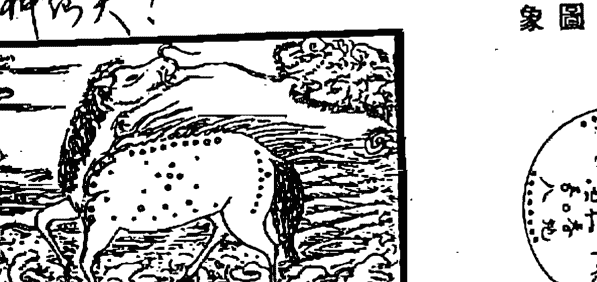
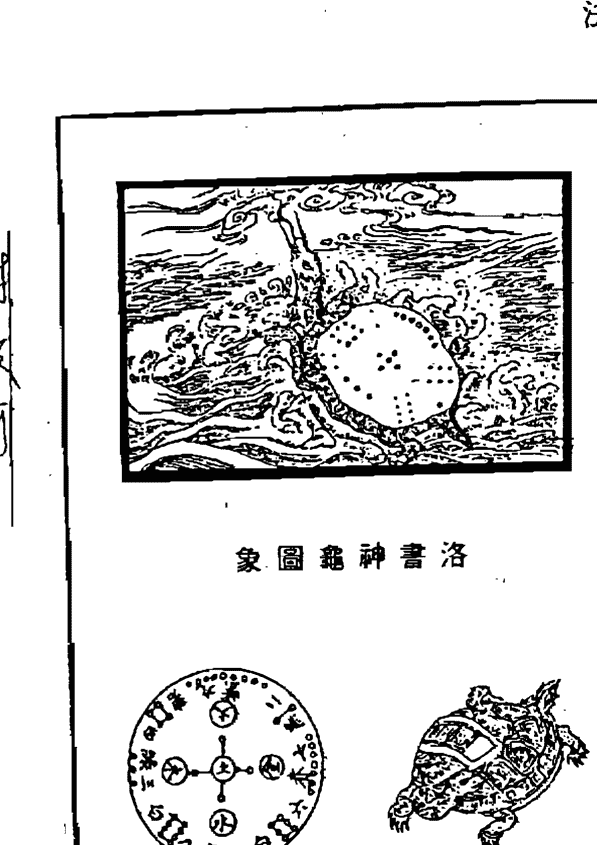
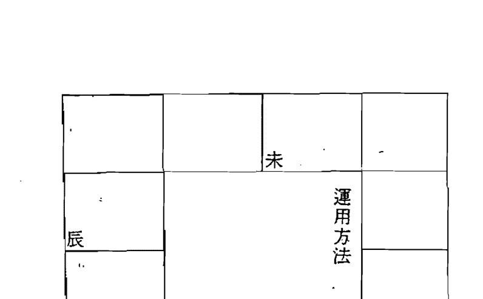
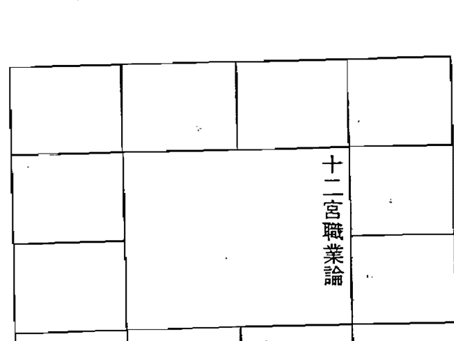
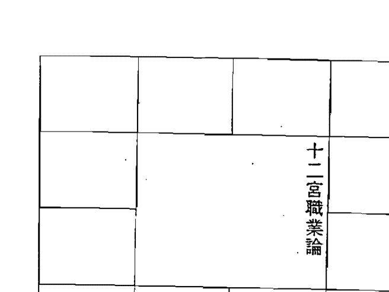
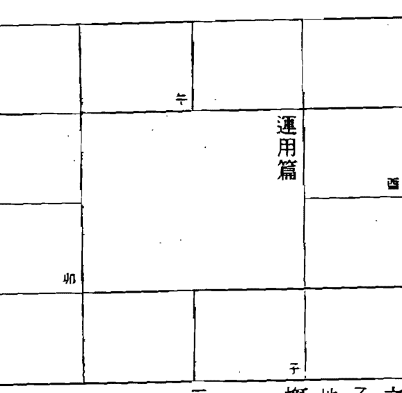
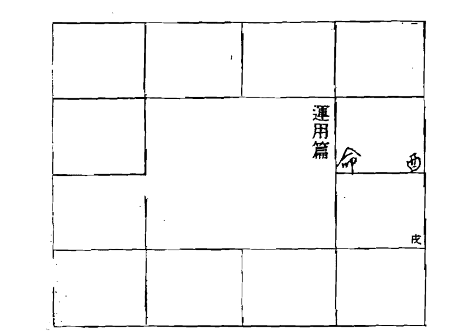
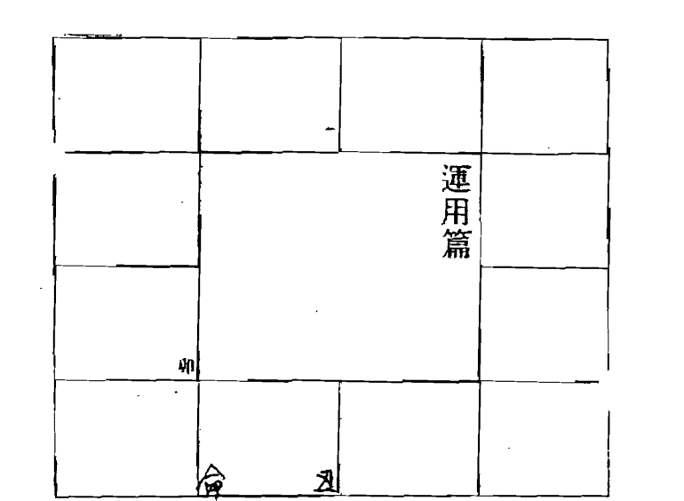

# 紫微斗数速判千金诀

## 前言

此书为道藏秘本中天元局宫门之绝学，本诀为紫微斗数诸诀中最快最神速的断事诀要。本诀是针对初学者，欲要问事的速判法诀。此诀可媲美批八字，但却比批八字更方便、更迅速。不需任何道具，仅用手指掐算，即可立即应验。此术向为古时紫微斗数大师所秘藏使用，最简单、极效用最大、方便，可以马上印证，精准度绝非虚言，令问事人大吃一惊。此术不需排星，故也适用于研习五术或初学者。

此书可运用于任何事情之判断，本教材详细介绍婚姻、求财、考试、升迁、重聚、合伙、事业、生儿、开店、住家、疾病、寻人、寻物、相争……等等，保证让您一学就会，决不会失望。但本诀为运用于短期即将进行(发生)的迅速沾察，若从行运部份仍须参考其命盘。现将此诀首次公开奉献给各界同道，向有缘人泄其秘，希望诸位学者能善加运用，利便世人，必会终生受益，自然会有无穷妙用。应各方函询，修订于1995年11月26日。

孟繁茂 编著

## 目录

- 前言...................................................... 1
- 目录...................................................... 3
- 一、十二时辰命宫速见表.......................... 4
  - 1. 十二时辰命宫速见表.......................... 4
  - 2. 先后天八卦、斗数四化总纲.................. 16
- 二、用法真诀.......................................... 20
- 三、掌上诀法.......................................... 20
- 四、命宫含意解说................................... 21
  - 1. 问事篇.......................................... 24
  - 2. 十二宫职业论.................................. 28
  - 3. 实例篇.......................................... 40
- 五、寻物............................................... 55
- 六、灾厄篇............................................ 65
- 七、六亲个性 (参考篇)............................ 71
- 八、十二宫性情论................................... 75
- 九、住家环境 (参考篇)............................ 89
- 十、婚姻篇............................................ 93
- 十一、使用“紫微斗数速判千金诀”应注意的事… 100
- 十二、斗数命盘对应身体各个部位............... 101
- 十三、附：略谈论命程序........................... 102

## 一、十二时辰命宫速见表

### 1. 十二时辰命宫速见表

**速见表 十二时辰命宫 一月份**

| 酉時 | 申時 | 未時 | 午時 |
| :---: | :---: | :---: | :---: |
| 巳 | 午 | 未 | 申 |
| 戌時 |  | 速見表十二時辰命宮 | 巳時 |
| 辰 |  |  | 酉 |
| 亥時 |  |  | 辰時 |
| 卯 |  |  | 戌 |
| 子時 | 丑時 | 寅時 | 卯時 |
| 寅 | 丑 | 子 | 亥 |

- 一月份 亥時命宮在卯宮
- 一月份 戌時命宮在辰宮
- 一月份 酉時命宮在巳宮
- 一月份 申時命宮在午宮
- 一月份 未時命宮在未宮
- 一月份 午時命宮在申宮
- 一月份 巳時命宮在酉宮
- 一月份 辰時命宮在戌宮
- 一月份 卯時命宮在亥宮
- 一月份 寅時命宮在子宮
- 一月份 丑時命宮在丑宮
- 一月份 子時命宮在寅宮

**速见表 十二时辰命宫 二月份**

| 戌時 | 酉時 | 申時 | 未時 |
| :---: | :---: | :---: | :---: |
| 亥時 |  |  | 午時 |
| 子時 |  |  | 巳時 |
| 丑時 | 寅時 | 卯時 | 辰時 |

**速见表 十二时辰命宫 三月份**

| 亥時 | 戌時 | 酉時 | 申時 |
| :---: | :---: | :---: | :---: |
| 子時 |  |  | 未時 |
| 丑時 |  |  | 午時 |
| 寅時 | 卯時 | 辰時 | 巳時 |

- 三月份 亥時命宮在巳宮
- 三月份 戌時命宮在午宮
- 三月份 酉時命宮在未宮
- 三月份 申時命宮在申宮
- 三月份 未時命宮在酉宮
- 三月份 午時命宮在戌宮
- 三月份 巳時命宮在亥宮
- 三月份 辰時命宮在子宮
- 三月份 卯時命宮在丑宮
- 三月份 寅時命宮在寅宮
- 三月份 丑時命宮在卯宮
- 三月份 子時命宮在辰宮

**速见表 十二时辰命宫 四月份**

| 时辰 | 四月 | 地支 | 时辰 | 四月 | 地支 |
| :---: | :---: | :---: | :---: | :---: | :---: |
| 子时 | 四月 | 巳 | 酉时 | 四月 | 申 |
| 亥时 | 四月 | 午 | 申时 | 四月 | 酉 |
| 戌时 | 四月 | 未 | 未时 | 四月 | 戌 |
| 酉时 | 四月 | 申 | 午时 | 四月 | 亥 |
| 申时 | 四月 | 酉 | 巳时 | 四月 | 子 |
| 未时 | 四月 | 戌 | 辰时 | 四月 | 丑 |
| 午时 | 四月 | 亥 | 卯时 | 四月 | 寅 |
| 巳时 | 四月 | 子 | 寅时 | 四月 | 卯 |
| 辰时 | 四月 | 丑 | 丑时 | 四月 | 辰 |
| 卯时 | 四月 | 寅 | 子时 | 四月 | 巳 |

- 四月份 子时命宫在巳宫
- 四月份 丑时命宫在辰宫
- 四月份 寅时命宫在卯宫
- 四月份 卯时命宫在寅宫
- 四月份 辰时命宫在丑宫
- 四月份 巳时命宫在子宫
- 四月份 午时命宫在亥宫
- 四月份 未时命宫在戌宫
- 四月份 申时命宫在酉宫
- 四月份 酉时命宫在申宫
- 四月份 戌时命宫在未宫
- 四月份 亥时命宫在午宫

**速见表 十二时辰命宫 五月份**

| 时辰 | 五月 | 地支 | 时辰 | 五月 | 地支 |
| :---: | :---: | :---: | :---: | :---: | :---: |
| 丑时 | 五月 | 巳 | 戌时 | 五月 | 申 |
| 子时 | 五月 | 午 | 酉时 | 五月 | 酉 |
| 亥时 | 五月 | 未 | 申时 | 五月 | 戌 |
| 戌时 | 五月 | 申 | 未时 | 五月 | 亥 |
| 酉时 | 五月 | 酉 | 午时 | 五月 | 子 |
| 申时 | 五月 | 戌 | 巳时 | 五月 | 丑 |
| 未时 | 五月 | 亥 | 辰时 | 五月 | 寅 |
| 午时 | 五月 | 子 | 卯时 | 五月 | 卯 |
| 巳时 | 五月 | 丑 | 寅时 | 五月 | 辰 |
| 辰时 | 五月 | 寅 | 丑时 | 五月 | 巳 |

- 五月份 子时命宫在午宫
- 五月份 丑时命宫在巳宫
- 五月份 寅时命宫在辰宫
- 五月份 卯时命宫在卯宫
- 五月份 辰时命宫在寅宫
- 五月份 巳时命宫在丑宫
- 五月份 午时命宫在子宫
- 五月份 未时命宫在亥宫
- 五月份 申时命宫在戌宫
- 五月份 酉时命宫在酉宫
- 五月份 戌时命宫在申宫
- 五月份 亥时命宫在未宫

**速见表 十二时辰命宫 六月份**

| 寅時 | 丑時 | 子時 | 亥時 |
| :---: | :---: | :---: | :---: |
| 卯時 | 辰時 | 巳時 | 戌時 |
| 辰時 | 巳時 | 午時 | 酉時 |
| 巳時 | 午時 | 未時 | 申時 |

- 六月份 亥时命宫在申宫
- 六月份 戌时命宫在酉宫
- 六月份 酉时命宫在戌宫
- 六月份 申时命宫在亥宫
- 六月份 未时命宫在子宫
- 六月份 午时命宫在丑宫
- 六月份 巳时命宫在寅宫
- 六月份 辰时命宫在卯宫
- 六月份 卯时命宫在辰宫
- 六月份 寅时命宫在巳宫
- 六月份 丑时命宫在午宫
- 六月份 子时命宫在未宫

**速见表 十二时辰命宫 七月份**

| 卯時 | 寅時 | 丑時 | 子時 |
| :---: | :---: | :---: | :---: |
| 辰時 | 巳時 | 午時 | 亥時 |
| 巳時 | 午時 | 未時 | 戌時 |
| 午時 | 未時 | 申時 | 酉時 |

- 七月份 亥时命宫在酉宫
- 七月份 戌时命宫在戌宫
- 七月份 酉时命宫在亥宫
- 七月份 申时命宫在子宫
- 七月份 未时命宫在丑宫
- 七月份 午时命宫在寅宫
- 七月份 巳时命宫在卯宫
- 七月份 辰时命宫在辰宫
- 七月份 卯时命宫在巳宫
- 七月份 寅时命宫在午宫
- 七月份 丑时命宫在未宫
- 七月份 子时命宫在申宫

**速见表 十二时辰命宫 八月份**

| 辰時 | 卯時 | 寅時 | 丑時 |
| :---: | :---: | :---: | :---: |
| 巳時 |  |  | 子時 |
| 午時 |  |  | 亥時 |
| 未時 | 申時 | 酉時 | 戌時 |

- 八月份 子時命宮在酉宮
- 八月份 丑時命宮在申宮
- 八月份 寅時命宮在未宮
- 八月份 卯時命宮在午宮
- 八月份 辰時命宮在巳宮
- 八月份 巳時命宮在辰宮
- 八月份 午時命宮在卯宮
- 八月份 未時命宮在寅宮
- 八月份 申時命宮在丑宮
- 八月份 酉時命宮在子宮
- 八月份 戌時命宮在亥宮
- 八月份 亥時命宮在戌宮

**速见表 十二时辰命宫 九月份**

| 巳時 | 辰時 | 卯時 | 寅時 |
| :---: | :---: | :---: | :---: |
| 午時 |  |  | 丑時 |
| 未時 |  |  | 子時 |
| 申時 | 酉時 | 戌時 | 亥時 |

- 九月份 子時命宮在戌宮
- 九月份 丑時命宮在酉宮
- 九月份 寅時命宮在申宮
- 九月份 卯時命宮在未宮
- 九月份 辰時命宮在午宮
- 九月份 巳時命宮在巳宮
- 九月份 午時命宮在辰宮
- 九月份 未時命宮在卯宮
- 九月份 申時命宮在寅宮
- 九月份 酉時命宮在丑宮
- 九月份 戌時命宮在子宮
- 九月份 亥時命宮在亥宮

**速见表 十二时辰命宫 十月份**

| 午時 | 巳時 | 辰時 | 卯時 |
| :---: | :---: | :---: | :---: |
| 未時 | 速见表 十二时辰命宫 十月份 | 寅時 |  |
| 申時 |  | 丑時 |  |
| 酉時 | 戌時 | 亥時 | 子時 |

- 十月份 亥時命宮在子宮
- 十月份 戌時命宮在丑宮
- 十月份 酉時命宮在寅宮
- 十月份 申時命宮在卯宮
- 十月份 未時命宮在辰宮
- 十月份 午時命宮在巳宮
- 十月份 巳時命宮在午宮
- 十月份 辰時命宮在未宮
- 十月份 卯時命宮在申宮
- 十月份 寅時命宮在酉宮
- 十月份 丑時命宮在戌宮
- 十月份 子時命宮在亥宮

**速见表 十二时辰命宫 十一月份**

| 未時 | 午時 | 巳時 | 辰時 |
| :---: | :---: | :---: | :---: |
| 申時 | 速见表 十二时辰命宫 十一月份 | 卯時 |  |
| 酉時 |  | 寅時 |  |
| 戌時 | 亥時 | 子時 | 丑時 |

- 十一月份 亥時命宮在丑宮
- 十一月份 戌時命宮在寅宮
- 十一月份 酉時命宮在卯宮
- 十一月份 申時命宮在辰宮
- 十一月份 未時命宮在巳宮
- 十一月份 午時命宮在午宮
- 十一月份 巳時命宮在未宮
- 十一月份 辰時命宮在申宮
- 十一月份 卯時命宮在酉宮
- 十一月份 寅時命宮在戌宮
- 十一月份 丑時命宮在亥宮
- 十一月份 子時命宮在子宮

### 2. 先后天八卦、斗数四化总纲

（天）乾 ☰ （阳）

（地）坤 ☷ （阴）

（火）离 ☲ （阳）

（水）坎 ☵ （阴）

（山）艮 ☶ （阳）

（泽）兑 ☱ （阴）

（风）巽 ☴ （阳）

（雷）震 ☳ （阴）

（注：此部分为八卦符号及其阴阳属性的图示说明。）

**六十花甲纳音：**

十天干配十二地支，一阳（阴）天干配一阴（阳）地支，可配成六十对，谓之六十花甲纳音。

甲子乙丑海中金
甲戌乙亥山头火
甲申乙酉泉中水
甲午乙未沙中金
甲辰乙巳覆灯火
甲寅乙卯大溪水

丙寅丁卯炉中火
丙子丁丑涧下水
丙戌丁亥屋上土
丙申丁酉山下火
丙午丁未天河水
丙辰丁巳沙中土

戊辰己巳大林木
戊寅己卯城头土
戊子己丑霹雳火
戊戌己亥平地水
戊申己酉大驿土
戊午己未天上火

庚午辛未路旁土
庚辰辛巳白蜡金
庚寅辛卯松柏木
庚子辛丑壁上土
庚戌辛亥钗钏金
庚申辛酉石榴木

壬申癸酉剑锋金
壬午癸未杨柳木
壬辰癸巳长流水
壬寅癸卯金箔金
壬子癸丑桑柘木
壬戌癸亥大海水

**（先天八卦）**

乾 （天） 坤 （地）
离 （火） 坎 （水）
震 （雷） 巽 （风）
艮 （山） 兑 （泽）

天地定位，山泽通气，雷风相薄，水火不相射，数往者顺，知来者逆，是故易逆数也。

**速见表 十二时辰命宫 十二月份**

| 十二时辰 | 十二月份 |
| :--- | :--- |
| 子时 | 十二月 丑 |
| 丑时 | 十二月 亥 |
| 寅时 | 十二月 午 |
| 卯时 | 十二月 戌 |
| 辰时 | 十二月 申 |
| 巳时 | 十二月 未 |
| 午时 | 十二月 辰 |
| 未时 | 十二月 午 |
| 申时 | 十二月 巳 |
| 酉时 | 十二月 戌 |
| 戌时 | 十二月 卯 |
| 亥时 | 十二月 寅 |

- 十二月份 子时命宫在丑宫
- 十二月份 丑时命宫在子宫
- 十二月份 寅时命宫在亥宫
- 十二月份 卯时命宫在戌宫
- 十二月份 辰时命宫在酉宫
- 十二月份 巳时命宫在申宫
- 十二月份 午时命宫在未宫
- 十二月份 未时命宫在午宫
- 十二月份 申时命宫在巳宫
- 十二月份 酉时命宫在辰宫
- 十二月份 戌时命宫在卯宫
- 十二月份 亥时命宫在寅宫

**后天八卦：**

离火丙午丁南
坤申未
兑酉辛金
乾戌亥
坎子壬水北
艮丑寅
震甲卯乙木
巽辰巳

帝出乎震，齐乎巽，相见乎离，致役乎坤，说乎兑，战乎乾，劳乎坎，成言乎艮。

**斗数四化飞星图**

| 丁 | 戊 | 己 | 庚 |
| :---: | :---: | :---: | :---: |
| 丙 | | | 辛 |
| 乙 | | | 壬 |
| 甲 | 乙 | 甲 | 癸 |

**◎斗数玄空四化的飞翔注解**

四化之妙用变化无穷。不仅生年宫干在四化，大限、小限、流年、命身、十二宫，每一宫干都在化。如前图甲干与庚干的四化状况。

每一个宫干可以发射出十二颗四化线的灵光。除一条自化在本宫外，有十一条灵光向其他各宫发射。等于12×12的相互纵横四化线。

一个地盘中即有一百四十四道四化可以行走的路线。

四化的灵波与星辰的碰撞以及天干地支会引起的磁性，也就等于四化+干支+星辰，于是他们三才合一，产生摩擦、碰撞、相吸、相斥，因而在无形中生出『电子灵』发射出灵波来。

## 二、用法真诀

速判千金诀的奥秘，一语即予道破：大体上

- 凡手指掐到子、午、卯、酉地，为绿灯，办事可畅通无阻，成功。（指掐动处，即命宫）。
- 凡手指掐到辰、戌、丑、未地，为红灯，办事多阻碍，不成。
- 凡手指掐到寅、申、巳、亥地，为黄灯，办事须积极，方可成功。

因此学习千金诀的关键是，如何将来占卜者的命宫求出，即予立即判断。

## 三、掌上诀法

- 一年十二个月的斗君命宫速见表前几页已经全部列出，大家一目了然，一念无碍，我相信诸位马上便会利用左手的手指上了，而且立即便会神掐妙算了。大家都清楚，假传万卷书，真传一句话。现在，我就将真传告诉与我有缘的人，希望你们大家千万不可轻易泄露给外人（心术不正之人）。

本诀以来占者问事的月份与时间即可求出命宫等。月份以寅月(宫)起正月，顺数月份，然后以所问之月终逆起时辰中求出命宫。

**举例说明：**

1995年农历三月辰时，有一来占者问事，如何求命宫？

解：以寅宫（即左手食指根）起正月，顺数卯宫为二月，辰宫为三月。三月即为所问之月份，再以三月辰宫起子时，逆数，丑时为卯宫，寅时为丑宫，辰时为子宫，该子宫即为来占者所问时辰之命宫，再以命宫落何地的原则去判断。根据红、绿、黄灯之法则，可以断定：办事可成，畅通无阻。

| 巳月 | 午月 | 未月 | 申月 |
| :---: | :---: | :---: | :---: |
| 辰三月 | (空) | (空) | 八月酉 |
| 卯二月 | (空) | (空) | 九月戌 |
| 寅正月 | 丑十二月 | 子十一月 | 亥十月 |

## 四、命宫含意解说

当依紫微斗数速判千金诀，以命宫落何地为判断吉凶的依据。现将命宫落何地(宫)含意解说如下：

- (1) 命宫落于子、午、卯、酉地(宫)者
  - A. 为绿灯。
  - B. 问事可成，畅通无阻。
  - C. 为远地。
  - D. 问灾祸疾厄为严重。
  - E. 为马路、公路旁，热闹地方。
  - F. 个性活泼、开朗、热烈。

- (2) 命宫落于辰、戌、丑、未地(宫)者
  - A. 为红灯。
  - B. 问事不成。
  - C. 为近地。
  - D. 问灾祸疾厄为轻。
  - E. 为公寓区，为宁静、清静之地。
  - F. 个性孤独，严谨慎守。

- (3) 命宫落于寅、申、巳、亥地者
  - A. 为黄灯。

問事篇：

本篇所論舉凡財、官角度，詳述落官行業及升遷、合夥、投資、升學、尋人：等，均可利用本訣斷法，於一秒鐘內，速判速決，並於短期，立即驗證，占驗如神，現就將詳述如后：

### 詳述如后：

一、運用方法 驗證，占驗如神，現就將

- B. 向事須積極（活动活动）可成。
- C. 為何給遠地及近地之間。
- D. 為馬路（公路）與住宅區之間或巷子相同等。
- E. 向相尖與疾厄為不輕不重，一般。
- F. 个性喜动，中立派。

上列線、紅、黃，詞奧妙，讀者自己知曉，如對諸維已大功告成，可以身懷絕技，而神機妙算，指掌間，而且不出一秒钟之时间，便能判断胜负，可謂神妙矣！

### 立命：

子午卯酉宮問事可成

#### 概論：

子午卯酉宮為天地四正之位代表含意為積極的，馬上的，且為敏捷、聰明和幸運的，故凡問事可成。

### 立命：

辰戌丑未宮問事不成。

#### 概論：

辰戌丑未宮落中屬土，其代表含意為收（潛）藏，保守和無突破性的，故立命宮在此有發展不出去的含意，故凡事不成。

| 已 |   |   | 申 |
|---|---|---|---|
|   |   | 运用方法 |   |
| 寅 |   |   | 亥 |

### 立命：

寅申巳亥宫，问事为积极可成

#### 概论：

寅申巳亥为四马之地，其意为奔波、多动，故立命于此象征辛劳（积极）有成

|     |   |   |     |
|-----|---|---|-----|
|     |   |   | 十二宫职业论 |
|     |   |   | 子   |

### 子宫：

(一)子宫为水位

(二)适合职业为

- 1. 餐飲業
- 2. 交通
- 3. 國貿
- 4. 觀光
- 5. 電氣
- 6. 電子
- 7. 電腦
- 8. 養殖
- 9. 水產
- 10. 洗染
- 11. 文教
- 12. 老師
- 13. 助產士
- 14. 醫生

## 十二宮職業論

### 丑宫

- (一) 丑宫為土位。
- (二) 適合職業為
  - ① 土木建築
  - ② 山林礦石
  - ③ 石材
  - ④ 農產品
  - ⑤ 土產
  - ⑥ 山產
  - ⑦ 畜牧
  - ⑧ 宗教
  - ⑨ 算命
  - ⑩ 玉石
  - ⑪ 房地產

## 十二宮職業論

### 寅宫

- (一) 寅、宮為木位
- (二) 適合職業為
  - ① 以口為業
  - ② 公共關係
  - ③ 文教
  - ④ 外務
  - ⑤ 傳道
  - ⑥ 法律
  - ⑦ 大眾傳播

|   |   |   |   |
|---|---|---|---|
|   |   |   |   |
|   |   | 十二宮職業論 |   |
| 卯 |   |   |   |
|   |   |   |   |

### 卯宮

(一) 卯宮為木位

- 1. 交通(汽車、輪船)
- 2. 國貿
- 3. 觀光旅遊
- 4. 土木建築
- 5. 財經
- 6. 會計
- 7. 財務
- 8. 醫藥

|   |   |   |   |
|---|---|---|---|
|   |   |   |   |
| 辰 |   | 十二宮職業論 |   |
|   |   |   |   |
|   |   |   |   |

### 辰宮

(一) 辰宮為土位（近火）

(二) 適合職業為

- 1. 文學
- 2. 設計
- 3. 美工
- 4. 電腦
- 5. 電子
- 6. 財經
- 7. 會計
- 8. 出納

| 巳 |   |   |   |
|---|---|---|---|
|   |   | 十二宫職業論 |   |
|   |   |   |   |
|   |   |   |   |

### 已宫

- (一) 已宮為火位（滾火）
- (二) 適合職業為
  - ① 以口為業
  - ② 法律
  - ③ 電腦
  - ④ 電算
  - ⑤ 財經
  - ⑥ 服飾
  - ⑦ 成衣
  - ⑧ 美容
  - ⑨ 醫藥

| 午 |   |   |   |
|---|---|---|---|
|   |   | 十二宫職業論 |   |
|   |   |   |   |
|   |   |   |   |

### 午宫

- (一) 午宮為火位
- (二) 適合職業為
  - ① 交通事業
  - ② 觀光旅遊
  - ③ 公共關係
  - ④ 銷售
  - ⑤ 電子（腦）
  - ⑥ 五金類
  - ⑦ 機械
  - ⑧ 屬木職業

## 未十二宫职业论

### 未宫

（一）未宫为土位（近金）

（二）适合职业为

- 1. 成衣
- 2. 服飾
- 3. 餐飲業
- 4. 財經
- 5. 財務界
- 6. 建築（室內設計）
- 7. 傢俱
- 8. 家用品

## 申十二宫职业论

### 申宫

（一）申宫五行属金

（二）适合职业为

- 1. 家庭主婦用品
- 2. 餐飲業
- 3. 服飾界
- 4. 珠寶業
- 5. 青年商店
- 6. 雜貨店
- 7. 五金機械
- 8. 水電
- 9. 裝潢
- 10. 婦產科醫生

## 十二宮職業論

### 酉宫

(一) 酉宮五行屬金

(二) 適合職業為

- 1. 五金機械
- 2. 以口為業
- 3. 銷售
- 4. 進出口貿易
- 5. 大眾傳播
- 6. 觀光旅遊
- 7. 美髮業
- 8. 珠寶業
- 9. 美容業

## 十二宮職業論

### 戊宫

(一) 戊宮五行屬土（近水）

(二) 適合職業為

- 1. 財經
- 2. 國貿（內勤）
- 3. 公職
- 4. 吏人
- 5. 電氣
- 6. 電腦
- 7. 電子
- 8. 法律
- 9. 軍警

| 十二宮職業論 |
|--------------|
|              |
|              |
|              |
|              |
|              |
| 亥           |
|              |
|              |
|              |
|              |
|              |

| 命宫 | 时 | 问事者 刘先生 | 实例篇 |
|------|----|----------------|--------|
| 巳   | 午 |                |        |
|      | 时间 一九九三年 |        |        |
|      | 三月×日酉时 |        |        |
| 辰   |    |                |        |
| 卯   |    |                |        |
| 未   |    |                |        |
| 申   |    |                |        |
| 寅   |    |                |        |
| 北   |    |                |        |
| 子   |    |                |        |
| 亥   |    |                |        |
| 戍   |    |                |        |
| 酉   |    |                |        |
| 卯   |    |                |        |

- 1. 国贸
- 2. 观光
- 3. 交通
- 4. 旅游
- 5. 电气
- 6. 电子
- 7. 公共关系

#### 例一、

原由：问事业合伙是否可成，今赚钱吗？

解说：三月×日酉时，命宫在未地（宫），判断根本合伙不成，何谈赚钱。未地为红灯。

验证：本月九有人来电，说此合伙人为一骗人，曾犯欺诈，欠债累累，才到与其合伙，以冤受骗上当。（此人为合伙之凶，正无方向，不致被骗）。

|    | 命 | 午 |    |    |
|---|---|---|---|---|
|    | 四月×日亥时 | 时间：一九九四年（甲戌） | 问事：吴小姐 | 实例篇 |
|    | 卯 |    |    |    |
|    |    |    |    |    |

#### 例二、

原由：问事业合伙是否可成，今赚钱吗？

解说：四月×日亥时，命宫落在午地，午地仍为绿灯，故判断五月份前即可成，且可赚钱。

验证：现于市内已开了一家公司，合伙经营，生意兴隆，日进斗金。

|    |    |    |    |
|---|---|---|---|
|    | 命 | 辰 |    |
|    | 九月×日午时 | 一九九五年乙亥 | 问事：孔先生 |
|    |    |    |    |
|    |    |    |    |

### 例三、

原由：日本独资合资济南科技开发有限公司的总经理孔先生，邀我去吃午餐。席间，孔先生问我，最近有一笔款可赚，而且是几百万的毛款，即最近有关派去南非劳务的事，是否能成功？我已托了2个的朋友协助，至少有二八位

解说：我掐指一算，九月午时的命宫，落在艮地为红灯，当即便判断此事没有希望，办不成。当时在席间，孔先生有点扫兴，我的手布有点难为情，（因为酒也喝了，竟说了泄气的话）

验证：经一个星期，孔先生打来电话告诉我，事外务省的事确实没有办成，被别人钻了空子而提前走了，并向我表示了感谢。

|   |   |   |   |
|---|---|---|---|
|   |   |   |   |
| 已 | 五月×日 巳时 乙亥年 | 问事者 实例篇 X女士 | 申 |
| 辰 |   |   | 酉 |
| 卯 | 命 | 丑 | 亥 |

### 例四、

原由：问讨债有希望吗？

解说：五月×日巳时，立命在丑地，判断讨债无望，肉包子打狗，有去无回。丑地为红灯。

验证：现债务人连居俄罗斯，债主无法要债。

|   |   |   |   |
|---|---|---|---|
|   |   |   | 命 申 |
|   | 甲戌年 | 1月×日午时 | X先生一九九年 问事 |
|   |   |   |   |
|   |   |   |   |

### 例五：

原由：问是否可以讨回债来？

解说：1月×日午时，立命在中位，为黄灯。须经积极努力，方可要回一小部分。

验证：费尽周折，仅要回三分之一。

| 某小姐 | 一九九五年 乙亥 | 七月×日申时 | 命 子 |

### 例六，

原由：问是否可以讨回债来？

解说：七月×日申时，立命在子位，为绿灯。一处事可成，慢通无阻，可以全部要回。

验证：10天后，一次将债全部要回。

| 欧阳先生 | 一九九三年 癸酉 | 四月×日卯时 | 命 页 |

### 例七，

原由：谈生意可成否？

解说：四月×日卯时，命宫接在离位，判断为黄灯，处事积极可成，明确的说法，甲戌年1994年一月终可成。

验证：1994年（甲戌），一月终双方已签一纸合约，生意很兴隆。

|    |    |    |
|----|----|----|
|    |    |    |
|    | 问事 一九七五年 4月×日午时 (乙亥年) |    |
|    |    | 命 亥 |

### 例1：

原由：问谈生意可成否？

解说：四月×日午时，命宫正落亥交地。由于冲月冲年，故判断不成。

验证：没谈成，告吹。

注：此卦以路命宫交地正好冲月令（四月），叫己亥相冲，而又过乙亥年，月与年与命均冲，故万事二成，内行人一般决不会透露这项大规律的，虽然看来这道理很简单。

|    |    |    |
|----|----|----|
|    |    |    |
|    | 运用篇 一九七五年 五月四日 己时 |    |
|    | 命 |    |

### 例9：

原由：寻人。

解说：五月四日巳时，命宫落在丑地，加红灯，故判断此人目前难寻。

验证：几个月后，听熟人说，有人已从苏联回过。

|   |   |   |
|---|---|---|
| | | |
| | 一九九四年 | |
| | 三月x日辰时 | 运用篇 |
| | | |
| | 命 | 子 |

### 例十，

原由：寻人

解说：三月辰时，按命宫在子地，为线灯判断可以找到，最晚不超过十一月绝。

验证：经十月底，在虎山找到，此人去虎山作陶瓷生意，一次谈陶瓷生意，在虎山偶然相遇。

|   |   |   |
|---|---|---|
| | | |
| | 一九九四年 | |
| | 九月x日亥时 | 运用篇 |
| | | |
| | 命 | 亥 |

### 例十一，

原由：寻人

解说：九月亥时，命宫落在亥地，由直、火。判断积极可成，下个月便可见面。

验证：十月初，此人与朋友一同从南方返回家中，果然不出计料，大团圆一堂

| | | | |
| --- | --- | --- | --- |
| | | | |
| | 运用篇 | 一九九五年(乙亥) | |
| | 五月×日卯时 | | |
| 命 卯 | | | |
| | | | |

### 例十二，

原由：求职，

解说：五月卯时按命在卯地，为绿灯，判断求职，可成。

验证：亚如过料，畅通无阻，且单位待遇很好。

| | | | |
| --- | --- | --- | --- |
| | | | |
| | 运用篇 | 一九九五年 | |
| | 六月×日午时 | | |
| | | | |
| 命 丑 | | | |

### 例十三，

原由：问其儿子考大学，是否能考上。

解说：六月×日午时，命宫正落于丑地，为红灯，判断考这工传，不能录取。

验证：发榜后，果然名落孙山，未被录取。

|   |   |   |   |
|---|---|---|---|
|   | 六月×日未时 | 一九九五年 | 運用篇 |
|   |   |   |   |
|   | 命 | 子 |   |
|   |   |   |   |

### 例十四，

原由：我要考师大，是否能录取。

解说：六月未时，命宫落子地，为绿灯。判断畅通无阻，可被录取。

验证：果然上所科，金榜题名。

|   |   |   |   |
|---|---|---|---|
|   |   |   |   |
| 命 | 長 | 十一月×日申时 | 一九九五年 運用篇 |
|   |   |   |   |
|   |   |   |   |

### 例十五，

原由：明日我去买一日本摩托车，是否能买成。

解说：十一月中时，命宫落亥地，为红灯，判断买不成。

验证：由于价太高，没谈成功。

### 尋物：

凡有問卜者因物品遺失，則可立即使用本訣速斷其失物在那方向遺失？或可否找到？茲分：

- 一、運用篇
- 二、方位
- 三、實例篇

詳述如后：

### 立命：

子午卯酉宮失物為可找尋到。遺失地點較遠

#### 概論：

- 一、子午卯酉為快速之位故失物找尋較為快速
- 二、因為「門」位故較遠
  - (1) 離家較遠地所失
  - (2) 在家為在客廳之位

|   |   | 运用篇 |   |
|---|---|---|---|
|   |   |   |   |
| 辰 |   |   |   |
|   |   |   | 戌 |
|   | 丑 |   | 未 |

### **立命：**

辰戌丑未宫失物为找寻不到，遗失地点较近

#### **概论：**

- 一、辰戌丑未因潜藏，故失物大概已为人所得，或丢弃于不易寻见的地方
- 二、因为『房位』故较近
  - (1) 离家较近的地方
  - (2) 在家为卧房附近

| 巳 |   |   | 申 |
|---|---|---|---|
|   | 运用篇 |   |   |
|   |   |   |   |
|   | 寅 |   | 亥 |

### **立命：**

寅申巳亥宫，失物积极可找到

#### **概论：**

- 一、寅申巳亥因介于中庸，故寻物需积极找寻方可寻到。
- 二、因为『厅位』故为不近不远。
  - (1) 离家为不近不远所失
  - (2) 在家为介于客厅及卧房之走道

| 東南 | 南 | 南南西 | 西南 |
|------|----|--------|------|
| 東東南 |  | 方位判别 | 西 |
| 東 |  |  | 西西北 |
| 東北 | 東北北 | 北 | 西北 |

- 解説：如物品遺失方位判可 依其命宫所在判别
  - 亥：西北方
  - 戌：西北方
  - 酉：正西方
  - 申：西南
  - 未：南西方
  - 午：正南方
  - 巳：東南方
  - 辰：東南方
  - 卯：正東方
  - 寅：東北方
  - 丑：東北方
  - 子：正北方

|  |  |  |  |
|---|---|---|---|
|  |  | 運用篇 |  |
| 命 造 |  |  |  |

#### 例一，

时间：×年五月辰时，解说：×年五月辰时，立命宫在亥地，判断遗失物品在东北方。

|   |   |   |
|---|---|---|
| 命 辰 | 运用篇 |   |
|   | 北 |   |

#### 例二，

时间： X年8月X日巳时，命宫落在辰地，判断遗失物品在东南方。

|   |   |   |
|---|---|---|
|   | 运用篇 | 命 西 |
|   |   |   |

#### 例三，

如果物品被力偷窃，被偷方须为物品之移转方转铺移动。
如X年12月X日亥时，命宫落在西地，即知物品在正西方被偷，被偷物品之转移方即为正东方。再以转移方为命宫，找主财库即为西北方。故可判断为：物品被偷往正东，或西北方，宜加判断。

### 例四

原由：手表不见了，不知去何处，是否可找回？

解说：二月×日午时，立命在酉位，问：今最远处，您曾到过哪里？答：最远处到过小木桥下，即立刻判断为手表落在木桥下，如立即去找还可找到。

验证：立即骑车到小木桥下，手表落在草丛中。

### 例五

原由：一辆奥迪的轿车晚上停放在家门前，次日清晨不见了，问可否找到。

解说：四月×日辰时，立命在丑地，判断车已被偷走，注定找不回来了。

验证：至今音讯皆无，不知下落。

## 灾厄篇

凡有人问其灾厄严重与否也可以本诀，直断其好坏？现就分

-   一、运用篇
-   二、实例篇

详述如后：

立命

子午卯酉意外灾祸为严重，问病可立即痊愈。

#### 概论

-   一、子午卯酉位因为是积极，快速的意外灾害碰撞均较犀利故严重
-   二、问病情是否近期可好因子午卯酉也为快速故快好。

|    |    |    | 未 |
|----|----|----|----|
|    | 运用篇 |    |    |
| 辰 |    |    |    |
|    | 丑 |    | 戌 |

### 立命

#### 概论

-   一、辰戌丑未象征为缓慢的故意意外
-   二、辰戌丑未因为慢速潜藏故病情均有拖延不利的情事

| 巳 |    |    | 申 |
|----|----|----|----|
|    | 运用篇 |    |    |
|    |    |    |    |
| 寅 |    |    | 亥 |

### 立命

#### 概论

寅申巳亥意外灾害及病情方面均为介于严重与不严重之间。寅申巳亥虽为四马之地，其含谨代表较奔波而已，并不代表急速发生事故则为中庸。

|   |   |   |   |
|---|---|---|---|
|   |   |   |   |
| 命 辰 | 十月×日未时 乙亥年 运用篇 |   |   |
|   |   |   |   |
|   |   |   |   |

例一，一小童因车祸而昏睡中，不知有无生命危险。
原由：知有无生命危险。
时间：乙亥年十月×日未时，
解说：乙亥年十月×日未时，命宫落在辰地。判断无生命危险，过多长时间，便会清醒的。阿弥陀佛，善哉！
验证：一太略，奇效，也有后福，一个月后出院，才会有任何后遗症。

|   |   |   |   |
|---|---|---|---|
|   |   |   |   |
|   | 三月×日辰时 一九九四年甲戌 运用篇 |   |   |
|   |   |   |   |
|   | 命 子 |   |   |

例二，
原由：其母生病住院，病情很重，不知是否会有生命危险。
时间：1994年三月×日辰时，
解说：甲戌年三月×日辰时，命宫在子地。子午卯酉为快速积极之地，判断病情虽无危险，且很快便会痊愈。
验证：果如所料。

## 六亲个性（参考）

一、本篇凡问卜者提到其六亲情形时，均可采用本法，直指其六亲个性，现就分

-   一、运用篇
-   二、十二宫落宫个性
-   三、实例篇

详述如后：

|  |  |  |  |
| --- | --- | --- | --- |
|  |  | 午 |  |
|  |  |  | 运用篇 |
|  | 卯 |  | 酉 |
|  |  | 子 |  |

立命
子午卯酉，个性为活泼、热络积极的。
概论
子午卯酉位因应门位故“人”居此位都为个性开朗，喜往外跑（外向）详论请参阅十二落宫个性。

|   |   |   |   |
|---|---|---|---|
|   |   | 未 |   |
|   | 辰 |   |   |
|   |   |   | 戌 |
|   |   | 丑 |   |
| 运用篇 |   |   |   |

立命：

辰戌丑未个性保守潜藏

概说：

辰戌丑未立位的人因属房位，故个性内向，多思虑(喜钻牛角尖)有杞人忧天的倾向。

|   |   |   |   |
|---|---|---|---|
|   |   | 申 | 巳 |
|   |   |   |   |
|   |   |   |   |
|   | 寅 |   | 亥 |
| 运用篇 |   |   |   |

立命：

寅申巳亥，个性中庸联络性强。

概说：

寅申巳亥为“厅”位，因处理事情或集会时往往在“厅”位进行，故主人可动可不动，故性属中庸。

## 十二宫性情论

-   一、子宫后天八卦为坎卦为水
-   二、子宫坐命人人个性较深沈（心思慎密），喜交游。
-   三、常学有专长。
-   四、坐命驿马强。
-   五、与中男有小冲剋和中女有冲。

## 十二宫性情论

-   一、丑宫后天八卦为艮卦为山。
-   二、个性潜藏内向、保守（木讷）做事牢靠、谨慎。
-   三、坐命与少男有小冲剋和母亲有冲

## 十二宫性情论

寅宫：

-   一、寅宫后天八卦也为艮卦也为山（本宫带有双的味道）。
-   二、个性活跃、开朗、有冲劲。
-   三、脾气强烈、耿直，社团力强，善言词及交际。
-   四、坐命寅宫也与少男有小冲剋与母亲有冲。

## 十二宫性情论

卯宫：

-   （一）卯宫后天八卦为震为雷
-   （二）个性好动，喜爱旅游，为人心直口快。
-   （三）交游广润，联络力强。
-   （四）坐命与长男有小冲剋与少女有冲。

-   辰宫：
    -   (一) 辰宫后天八卦为“巽”卦为风
    -   (二) 个性外柔内刚，为人内向、保守，表面热诚，内心冷静。
    -   (三) 有唯美思想(倾向)为人洁身自爱，但常有不满现状情形。
    -   (四) 坐命与长女有小冲剋与父亲有冲

-   巳宫：
    -   (一) 巳宫后天八卦也为巽也为风。
    -   (二) 脾气较刚强，有判逆性，但一生勤快、活动范围广。
    -   (三) 坐命能写、能划、能编及维修物品。
    -   (四) 坐命与长女有小冲剋与父亲有冲

-   （一）午宫后天八卦为“离”为火
-   （二）个性耿直，脾气刚烈，好胜心强，一生冲劲很大。
-   （三）男性有大男人主义，女性则较男性化。
-   （四）一生迁移力强。
-   （五）坐命与中女有小冲剋与中男有冲

-   （一）未宫后天八卦为坤为母“坤”
-   （二）未宫因居口的位置，主人对食物品尝要求较高。
-   （三）天性善良，对尊长较为顺从。
-   （四）个性敏感，男性比较多愁善感，女性有患得患失的心态。
-   （五）坐宫与母亲有小冲剋与少男有冲

申宫：
（一）申宫后天八卦也为“坤”也为老母
（二）个性勤快，外柔内刚，口才不错
（三）坐命宜当心交友。
（四）一生变迁大。
（五）坐命与母亲有小冲剋与少男有冲

酉宫：
（一）酉宫后天八卦为“兑”卦，为泽
（二）个性有如少女般的喜爱美好漂亮的事物
（三）口才好，也很健谈，做事积极，不拘泥于陈旧事物，喜欢追求美好。
（四）做事讲求效率。
（五）一生迁移力强。
（六）坐命与少女有小冲剋与长男有冲

## 十二宫性情论

### 戌宫

-   (一) 戌宫后天八卦为“乾”卦为父。
-   (二) 个性忠义严谨、保守潜藏（言语不多）为传统式男生。
-   (三) 有悲天悯人心态，热心助人而不求回报。
-   (四) 坐命与父亲有小冲剋与长女有冲

## 十二宫性情论

### 亥宫：

-   (一) 亥宫后天八卦为“乾”乾为父
-   (二) 个性勤快、热心公益
-   (三) 人际关系好，适合担任介绍及沟通等工作。
-   (四) 喜旅游
-   (五) 家庭观念重，喜照顾他人。
-   (六) 有悲天悯人心理，热心慈善事业

|     |     |     |
|-----|-----|-----|
|     |     |     |
| 正月×日卯时 | 一九九五年乙亥 | 运用篇 |
|     |     | 下命安 |

#### 例一，

原因：父亲谈及儿子，适合于什么工作为好？

解说：乙亥年正月×日卯时，立命在亥宫，判断其子个性勤快，熟悉公益。人际关系颇佳，适合作旅游工作及办劳务公司、咨询工作等……。

验证：如所排，现为旅游公司主管。

|     |     |     |
|-----|-----|-----|
|     |     |     |
| 二月×日午时 | 乙亥年 | 运用篇 |
| 命 |     | 止 |

#### 例二，

原因：X先生问及女儿，常在家，不喜欢学习，也不肯努力工作，不知何故？

解说：乙亥年六月×日午时，命宫在丑地。判断其女儿个性内向，保守，不喜欢交朋友，性格孤僻：因一点小事，便令情绪低落，缺乏上进心的勇气，且常胡思乱想，犹如牛奔，故不喜欢学习，也不肯努力工作。

验证：如所排。

## 住家环境(参考篇)

-   一、本篇凡问卜者提到其房子(住家)情形时，均可采用本法，立即判断其居家环境为何？现就分将运用方法，详述如后（不附实例，请自行运用）

| 方向 | 标记 |
|------|------|
| 上   | 午   |
| 下   | 子   |
| 左   | 卯   |
| 右   | 酉   |
| 中心 | 房子环境 |

立命：子午卯酉，住家为靠马路旁。

概论：子午卯酉位为“门”位，正是代表着人来人往及车水马龙之位，故一定热门异常，故为马路旁。

### 立命：

辰戌丑未，住家环境为宁静的公寓区。

#### 概论：

辰戌丑未为“房”位，代表宁静、偏远等地，故在城市代表公寓区在乡下代表幽静偏远的独幢房子。

### 立命：

寅申巳亥，住家环境为介于马路及公寓之间的巷子里。

#### 概论：

寅申巳亥为“厅”位，代表介于动不动之间象征可动及可不动。

## 婚姻篇

本篇举凡相亲或婚姻上的变化等，凡问事者问及相关问题时，即用本诀凡速断，立即应验，现就分：

-   一、运用篇
-   二、实例篇

详述如后：

### 立命：

#### 子午卯酉：

-   ① 问婚可成
-   ② 问离也可成
-   ③ 问破镜可重圆

#### 概说：

子午卯酉为绿灯，故为马上可行，故凡问事皆成，好坏在于问卜者心念，故问婚可成，问离也可成，而问破镜当然也可重圆。

|    |    |    | 未 |
|----|----|----|----|
|    |    |    |    |
|    | 辰 |    |    |
|    |    | 戌 |    |
|    |    | 丑 |    |
| 运用篇 |    |    |    |

### 立命：

-   ① 问婚不可成
-   ② 问离不可成
-   ③ 问破镜重圆无望

#### 概说：

辰戌丑未立命凡事有潜藏之象，而为无法推动，故问上述皆不可成。

| 巳 |    |    | 申 |
|----|----|----|----|
|    |    |    |    |
|    |    |    |    |
|    | 寅 |    | 亥 |
| 运用篇 |    |    |    |

### 立命：

-   ① 问婚积极可成
-   ② 问离看当事者而断
-   ③ 问破镜积极可成

#### 概说：

寅申巳亥立命凡事端看当事人心态，故问婚积极可成，问离当事人坚持则离不坚持则不离，问破镜也同。

|   |   |   |   |
|---|---|---|---|
|   |   |   |   |
|   | **问事 ×先生 元九五年 三月×日未时 命 西** |   |   |
|   |   |   |   |
|   |   |   |   |

#### 例一、

原由：问离婚是否可成？

解说：三月×日未时，按命宫在西地，为绿灯，故判断离婚可成。

验证：果然离了婚，东西各奔前程。

|   |   |   |   |
|---|---|---|---|
|   |   |   |   |
|   | **问事 元八四年 ×先生(甲方) 五月×日午时 命 子** |   |   |
|   |   |   |   |
|   |   |   |   |

#### 例二、

原由：某先生问 复婚是否可成

解说：甲子年五月×日午时，命宫落于子地，由于冲月冲年，故判断不成，不能够复婚。

说：虽然命宫子地，是绿灯，但子午相冲，而甲子年、月犯年，命均二冲，一冲即散，故不成矣。

验证：复婚未成。98.

|  |  |  |  |
| --- | --- | --- | --- |
|  |  | 运用篇 |  |
|  | 一九九年 |  |  |
|  | 三月×日辰时 |  |  |
|  |  | 命 |  |

#### 例三，

原由：相来，

解说：三月×日辰时，命宫落在子地，
为缘灯，判断相来可成，花好
月圆。

验证：俩人一见钟情，相见恨晚，
已成情缘。

## 十一、使用“紫微斗数速判千金诀”应注意的事：

此法 查、缘、红灯之法则，随时可以灵活运用，但必须心动时，准确度大。即问卜者需心诚，无故取闹玩耍者，则不灵验。仅以时间使用，则不准，此点，学者务必牢记。

还有一种“计数神似断诀”亦称“触机神断”。即只要来者心动之念，就可直断其吉凶祸福诸应之流年。对财、官，以及身上所携带的钱财、物之数量的多寡及直断来人所提之六亲生肖，均能披露无遗。还有其它如知内来者搬家门牌号码，以及…… 都会使你感到惊奇，判断时间仅用一二分钟。此种绝技，学完一部教程

“卜筮”者，可与孟繁茂先生联系。孟繁茂先生，将毫无保留地传授给与其有缘的人；并以此抛砖引玉，相互探讨，以臻完善……

## 十二、斗数命盘对应身体各个部位

-   • 子位为定点，顺行为右，逆行为左。
-   A. 生年天干为己或辛时，看生年化忌所落之宫位。
-   B. 疾厄或福德的宫干为己或辛时，看文昌、文曲所落之宫位。
-   • 上述 A、B 之忌在命宫、兄弟、夫妻、子女、财帛、疾厄时，痣在前面；
-   痣忌在迁移、奴仆、官禄、田宅、福德、父母时，则痣在背面（后面）。

| 右 颈 | 头 部 | 左 颈 | 左 手 |
|---|---|---|---|
| 右 手 |   |   | 左 胸 |
| 右 胸 |   |   | 左 腹 |
| 右 腹 | 右 腿 | 下 部 | 左 腿 |

-   • 化忌步入宫位，若自化忌，则对该部位之痣消失。

## 附：略谈论命程序

### I. 生年天干落本命盘何宫：

-   A，“独立格” ——> 生年干落命宫、财帛、迁移、官禄时，（即三方四正），此命无人庇荫，须依靠自己闯荡、努力。
    “非独立格” ——> 生年干落其余八宫时，须有他人扶持，才能成功。
-   B，生年干入十二宫的情况
    -   入“命、财、官”宫时，不须筚路蓝缕，就会有作为有成就。
    -   入“兄、奴”宫时，须依靠兄弟、朋友之帮助提拔。
    -   * 入“夫妻”宫时，婚后须靠配偶之助力。
    -   * 入“子女”宫时，须婚后生育子女后方开运。
    -   * 入“疾厄”宫时，劳心劳力，靠自己辛苦奔波。
    -   * 入“迁移”宫时，须离开出生地，到外地方有作为。
    -   * 入“田宅”宫时，须靠亲族贵戚之庇荫，方有成就。
    -   * 入“福德”宫时，须靠祖父母。
    -   * 入“父母”宫时，须靠父母或长辈、领导等。

### 2. 生年三吉（化禄、化权、化科）及化忌所落宫位：

-   A. 生年三吉入六阳宫（六强宫，即身宫所在及所入之宫位）较多时，主贵显。
    生年三吉入六阴宫（六弱宫）较多时，主富裕。
-   B. 化忌入六阳宫，主易犯小人。
    化忌入六阴宫，主多损财。