# 紫微斗数预测疾病

潘子渔 著

# 潘子渔著作系列

### 比例计算看病

# 前言

作者／潘子渔

- 章 序/6
- 古代紫微斗数和现代紫微斗数的空间与观念之差异～8
- 简介麒麟～～～～～～～～～～～～～～～～～～～～～11
- 那些人需要买麒麟～～～～～～～～～～～～～～～～13
- 白虎關～～～～～～～～～～～～～～～～～～～～20
- 麒麟日～～～～～～～～～～～～～～～～～～～～24
- 白虎怕麒麟 桃花怕羊刃～～～～～～～～～～～～～25
- 怎样看“業障”？～～～～～～～～～～～～～～～～26
- 命运学说逐渐成立～～～～～～～～～～～～～～～～30
- 为何吾人会生病？～～～～～～～～～～～～～～～～31
- 古人撫生要诀～～～～～～～～～～～～～～～～34
- 新的人生观～～～～～～～～～～～～～～～～36
- 预防重于治疗～～～～～～～～～～～～～～～～39
- 怎样看病人气色～～～～～～～～～～～～～～～～41
- 病从口入～～～～～～～～～～～～～～～～43
- 生病之兆～～～～～～～～～～～～～～～～45
- 癌症单方～～～～～～～～～～～～～～～～47
- 疥疮单方～～～～～～～～～～～～～～～～48
- 糖尿病 高血压 尿毒症食疗与药疗单方～～～～～～～～49
- 常见中毒解法～～～～～～～～～～～～～～～～51
- 古人对五脏看法～～～～～～～～～～～～～～～～52
- 聪我一席言，胜读十年书～～～～～～～～～～～～～～60
- 刺肝检查～～～～～～～～～～～～～～～～65
- 冤枉挨刀～～～～～～～～～～～～～～～～66
- 勿吃毛蟹~~~~~~~~~~~~~~~~~~~~~~ 67
- 凡物不可用藥嗅~~~~~~~~~~~~~~~~~~~~~~ 68
- 她不是我的媽媽~~~~~~~~~~~~~~~~~~~~~~ 69
- 復念肚兜~~~~~~~~~~~~~~~~~~~~~~ 70
- 救人第一，行善為先~~~~~~~~~~~~~~~~~~~~~~ 71
- 天譴加煞在巳亥之現象~~~~~~~~~~~~~~~~~~~~~~ 72

书 名:紫微斗数预测疾病
作 者:潘子渔
学术指导:程 鹏
总编及策划:张国荣
责任主编:陈发根
封面字书:赵 江
版式设计:李 舍
录入排版:熊丝丝
出 版:国际易学应用出版社
(香港九龙窝打老道92号二楼A座)
发 行:易林书局
印 刷:天明艺术印刷公司
国际书号:ISBN 7-81033-801-3
定 价:人民币16元
港 币32元

我們都是吃五穀雜糧長大的，難免會生病，生病是很痛苦的，它不但耗費我們的金錢、時間，也阻礙了我們學業或事業的發展，更是拖累了我們的家人和親友。

那麼，我們要如何來保持我們的健康呢？如何防止生病呢？生病了，又如何來醫治呢？這就是本書所要告訴讀者的知識。

我們天生的體質如何？我們就很容易會得什麼病？這在紫微斗數中就看得很清楚。所以，我們首先希望每個人都排出一張自己的命盤，然後根據自己的命盤，看出自己容易得病的病經在何經？即心經？或肺經、或腎經、或肝經？或目疾、或耳疾？或齒病、或腺質病⋯⋯等等。然後，我們就知道應該如何預防？平日要多吃那些食物？而有效的預防，至少，可以使生病的機會減少，而我們辛苦所賺的金錢，也可做其他對我們更有益的事。

古人說，英雄最怕病來磨，當年秦瓊（即唐朝名將秦叔寶），在客棧生病時，無錢醫治，只好賣馬賣鋼。現在也有很多人因久病不愈而自殺，也有人因家中有病人，而終日生活在憂愁苦悶之中。所以，任何人至少必須具備一些醫學常識，庶不致臨病驚慌、失措，於事無補，凡事宜沉著應付。

但有人已盡力小心，仍然久病纏身，這又作何解釋呢？根據古書，這是犯白虎，那麼請問犯了白虎，又有什麼方法來化解呢？

根據古書，可用“麒麟”來化解。麒麟古稱仁獸，乃剋制白虎唯一神器，潘子漁現在已委託老道仙夏元燎教授設計一對麒麟，再遵照古書所載用奇門遁甲方法來祭儀，使它目生異彩，功能挡白虎之灾殃，化暴戾为吉祥。希望读者诸君都能买一对麒麟坐镇家中，以挡白虎，驱凶镇邪，迎吉纳祥。

赐教处：板桥市馆前东路116号4楼之一
电话：(02)29591120

惟有麒麟能克制它，使全家平安幸福，使社會更加富強康樂。

所以，今天論命，不重命，而重運。運，乃是隨時機會，運好，即機會好，如果你能善於利用機會，就會呼風喚雨。我曾算過一位被稱為“四大天王”的大人物，雖命不好，但運好，所以，在那十年中，呼風喚雨，不可一世，但十年一過，就像天空中流星一樣，一閃而過。

其次再談觀念：

古代，男女老少深受忠、孝、悌、恭之傳統教育與觀念，故女人嫁雞隨雞，從一而終，男人若對女人有所不滿，也不必像今天一樣，加以毀容殺害，而是寫一封“休妻書”將太太送回娘家，當然，女人沒有權寫一封“休夫書”。可是今天時代不同，自從小美風氣侵襲到這東方古老的國家，再加上今日的女性與男性所受的教育平等，在社會上的地位也與日俱增，她們一樣有賺錢的能力，可以不受老公的氣，一旦夫妻不和，馬上離婚，“離婚”兩字，古書未有。

再說，今日社交公開而頻繁，男女接觸機會太多，因此，桃花應運而生，什麼“先上車後補票”？這句話，古書未有。

所以，今日論命與古代不同，我特別注重小限，就是這個緣故。

今日社會人士的頭腦，也比古代的人聰明很多，尤其是一些善於鑽法律漏洞的人也特別多，再加上社會繁榮，五光十色，令人著迷，若定力不夠的人，很容易衝動，不惜以身試法，甘冒危險，以逞一時享受。故今日社會，作奸犯科的人也比古代的人更多。

根據我統計研究，凡命盤上廉貞與四煞同宮的人，逢流年白虎，必有牢獄之災，或犯官司，那麼怎麼辦呢？難道我們就眼睜睜的去坐牢嗎？我們知道，宇宙中一物克一物，白虎雖凶，惟有麒麟能克制它。

# 第章 怎樣從紫微斗數看疾病 / 75

- 看命宮~~~~~~~~~~~~~~~~~~~~~~~~ 78
- 看疾厄宮~~~~~~~~~~~~~~~~~~~~~~~~ 97
- 看星宿組合~~~~~~~~~~~~~~~~~~~~~~~~ 141
- 看子女宮~~~~~~~~~~~~~~~~~~~~~~~~ 179

# 第章 刑剋看法 / 179

- 剋夫命~~~~~~~~~~~~~~~~~~~~~~~~ 193
- 剋子命~~~~~~~~~~~~~~~~~~~~~~~~ 195
- 這個媽媽吃兒子~~~~~~~~~~~~~~~~~~~~~~~~ 197
- 被妻剋死~~~~~~~~~~~~~~~~~~~~~~~~ 199
- 剋妻傷子~~~~~~~~~~~~~~~~~~~~~~~~ 201
- 母親破腳~~~~~~~~~~~~~~~~~~~~~~~~ 203

# 第章 官司看法 / 209

- 密醫坐牢~~~~~~~~~~~~~~~~~~~~~~ 222

# 第章 死之看法 / 229

- 美國碩士死於肝癌~~~~~~~~~~~~~~~~~~~~~~ 265
- 天壽之命死心臟病~~~~~~~~~~~~~~~~~~~~~~ 267
- 糖尿病十多年，死於尿毒症~~~~~~~~~~~~~~~~~~~~~~ 271
- 限至羊空非死即破財~~~~~~~~~~~~~~~~~~~~~~ 273

# 第章 紫微瑜珈 / 275

# 古代紫微斗数和现代紫微斗数的空间与观念之差异

我们都知道，远在二千多年前，古代的圣贤，就发明了紫微斗数，而今日我们也在研究紫微斗数，其间相隔了二千多年，有很多因时代的变迁，文化的进步，社会风俗的改进，观念和思想的不同，所以，今天我们研究紫微斗数，要随着时代的进步，潮流的变迁，跟着在变动。

一首先，我们要谈“时空”，时空就是Time和Space的合称，也就是时间和空间的组合，研究紫微斗数为什么要说到，“时间”与“空间”这名词呢？我们要知道，紫微斗数是相当科学的，不是迷信的，紫微斗数是立体的，不是平面的，当我们在看一张命盘时，我们要将它看作像爱因斯坦所称的“四度空间”。

在这空间内，有太阳、有太阴，有很多星宿，也有很多人物，如父母、兄弟姐妹、夫妻、子女、上司、部下等等，也有我们的事业、房屋、财富等等，就是因为在这个空间里，各种星宿的不同，或说是各人的时空的不同，就造成我们各人不同的命运和机会。

二 时间：

固然，远在数千年前，每天是廿四小时，到今天，每天也是二十四小时，但是，今天由于交通的发达，通讯的方便，将空间与时间缩小了。譬如说，以前有一位商人，从台北运四袋米或盐巴到新竹，如果用马来运，要二天，用车来推，要四天，他可以赚到伍百元。今日，用飞机、火车、汽车来运，时间就缩短了，赚钱也容易了。相对地，发财快，亏本也快，生意做成功的人多，做失败的人更多，形成暴起暴落。

# 簡介麒麟

本章乃先师秘传，不敢轻易公开，惟本人现年已五十有五，自感体力日衰，精神不继，心劳力拙，日暮西山，如不在此时公开，时光易逝，此种旷世绝传，稀世之宝，势将与本人同埋土中，则愧对先师及列祖列宗，成为民族罪人。

甚么是麒麟？麒麟的功用在那里？恐怕今日社会上有太多的人士，不甚瞭解，这也是无怪其然，因为，我国传统风俗习惯，对于任何独特技术、法术，都是秘而不宣，只传子传徒，对外一律保密。

凡研究紫微斗数、七政四余、奇门遁甲的人，都知道有一个凶星，叫“白虎”，凡被白虎冲命或冲限的人，不是家宅不安，就是久病缠身，或是事业不顺，或是官司不断，须用“麒麟”来驱逐或阻挡白虎，白虎不侵，吉祥自至，易言之，普天之下，唯有麒麟，此物能驱白虎之凶，能挡白虎之祸，故自古视作祛镇白虎唯一神器。

麒麟，古称仁兽，双角、偶蹄、身有鳞甲、尾毛卷鬃，乃吉祥之宝，惟麒麟制成之后，尚须用奇门遁甲的方法祭炼一番，才能生效，总不是随便在市面上买一只麒麟，就会有驱凶镇邪呈祥之功能，故读者诸君，如欲购买麒麟，最好委托内行亲自监制，切勿贪小失大。

凡未经祭炼之麒麟，称“盲眼麒麟”，其目不灵，其威不够，不但不能阻挡白虎，反易被白虎所噬，因而引狼入室，惹祸生灾。

祭炼之法，是选择“麒麟日”（历书有载）上午巳时，敬备四色祭品：朱雀（以鸡代之），白虎（以猫代之），青龙（以蛇代之），玄武（以龟代之），将麒麟供放上方，烧香敬拜，根据古书“灯下术”所载方法，诵念符咒，先用粉笔润其目，再用硃砂点其睛，（说很简单，实际上做起来，其中还有很多细节）。

如是体成功就，麒麟经此法祭炼之后，目生异彩，炯炯有神，虎虎生威，称“灵目麒麟”，白虎见之，退避三舍，故古书云，能挡白虎之灾殃，白虎不侵，吉祥自至，会带全家幸福，愉快、平安、吉祥、财富、健康、福气。

麒麟之说，宁可信其有，不可信其无，宁可有备无患，不可临渴掘井。人生是靠“希望”在奋斗，而“希望”是靠“信念”来支持，买下麒麟之后会在心理上感到有依靠与信赖，宛如信赖狼犬而防小偷，有识之士，当知宇宙之间，一物克一物，白虎虽凶恶，惟麒麟能制之。

故谈到麒麟，不但对奇门遁甲有深入研究的人，才能了解，尤其是需要富有哲学，神学和玄学观念的人，更易融会贯通，否则，就像对牛弹琴。

本人制作之麒麟，系由夏元瑮老教授专心设计，由本人精心监制，生动可爱，古色古香，不但可当作高贵装饰品也是克制白虎之神器，能使久病之人早日康复，运衰之人早日兴旺，功不唐捐，价值永恒，值得信赖。

# 那些人需要買麒麟？

一凡用紫微斗數排命方法，其廉貞若與四煞（火、鈴、羊、陀）同宮的人，不論何宮何地，逢流年白虎，必有官司或牢獄之災，須買麒麟一對或一個，坐鎮家中，以冀大事化小，小事化無，趨吉避凶，化戾戾爲吉祥。

二即使廉貞沒有與四煞同宮，凡流年白虎冲大限或小限或命宮，爲防官司或疾病，亦宜買麒麟一對，坐鎮家中，以擋白虎之禍，迎吉呈祥。例如：潘子漁大限56~65歲在巳，今年流年白虎在申，則民國八十二年，流年白虎冲大限，是年須防疾病或意外災禍。（此稱白虎冲大限），又潘子漁命宮在子，民國七十七年，流年白虎相冲，是年須防災難病痛。（此稱白虎冲命）。

三凡年年事業不順，生意虧本，或官場失勢，或久病纏身，或官司不斷，或債務糾紛不已，多係白虎冲命或冲限，須買麒麟一對或一個，摆在客廳或辦公室中，以驅白虎禍氣，以擋白虎災殃，可化戾戾爲吉祥，（麒麟須面向客廳大門或辦公室大門）。

四凡長輩或長官生日，送麒麟作禮物，能使收受者終生感激不離，具有永恆紀念價值。

五凡親友結婚或子女滿月，送麒麟作禮物，最爲適宜，古有“麒麟送子”之說，意爲早生貴子，吉祥如意。

六凡探病，帶奶粉、水果、花束等，已不合時代與病人需要，改送麒麟，能使病人早日康復。

七凡開店、新公司成立，如無親友送麒麟，亦宜自己購買一對或一隻摆在店面中或公司辦公室，驅凶鎮邪，以冀生意興隆。

八凡家中夫妻、兄弟、父子等經常吵架，意見不和，時起勃豁，或每為芝麻小事吵得不可開交，多係白虎作祟，須買麒麟一個，坐鎮家中，以驅白虎，以化暴戾爲平安。

九凡人犯“白虎關”（讀者可委託潘子漁推算）以及羊刃鈐星坐命，逢流年白虎，若非惡疾纏身，必是家宅不寧，或是經商失利，重者犯官司，甚至坐牢。須買麒麟一對。

十凡眼光遠大之企業家、事業家、政治家，希望前途燦爛，飛黃騰達，須買麒麟一對，摆在客廳或辦公室內，以作驅凶鎮邪之寶，擋諸魔，迎吉祥，惡魔不侵，福祥自至。

十一凡計程車、自家轎車，宜買麒麟一對或一隻，放在車中，可避凶趨吉，擋白虎無妄之災，減少車禍。以保出門平安，居家納祥。

十二凡賢明家長，就經濟能力所及，購買麒麟一個或一對，摆在客廳上，既美觀、吉祥，又可當作裝飾品，古色古香，增加室內高貴和祥氣氛，並可當作傳家之寶，代代相傳，代代繁昌。

總而言之，麒麟妙用甚多，功不盡述。會用過符或其他法術，不能見效者，請買麒麟。蓋此物自古視作仁者之物，剋制白虎惟一神器。惟有福者能承受其恩賜。余對麒麟，倍加愛護，每日玩賞不厭，日久生情，視爲家中所養之寵物，深感其靈有靈，不但家中平安吉祥，家人和睦相處，大大小小，無病無痛，夫妻恩愛，子女孝順，事業騰達，財運茂盛，此皆麒麟之賜也！所以不敢自私，特公于世，願世人共享之。

# 注意事项：

1. 麒麟不可用玻璃框罩在玻璃框裏面。
2. 麒麟摆在客廳裏時間一久，身上若有灰塵，可用雞毛撣子，輕輕撣一撣即可，絕不可用布拭其兩目，因其靈在目，更不可放在水中清洗。因為本人所製的麒麟，曾經用奇門遁甲法術祭煉過，很忌諱用水來洗，水會洗掉它的靈性。這一點，家中的每一份子，都要知道。一旦被水沖洗，或兩目被拭，必須再請潘子漁重新祭煉，才能有靈，才能擋住白虎之侵害，才能迎吉呈祥。

# 保證：

凡本人經售之麒麟，均附有保證書，如購買者認為上當，可憑保證書退款，保證書不掛失，無保證書者，不予退款，以防假冒，但原物不可有損傷。如此，可保證此物之價值。真金不怕火，信用最要緊，潘子漁金字招牌，值得大家信賴。

根據古書所載：

一、虎雖猛不能以搏麟。
也許這就是古人作為麒麟能擋白虎之災殃的理論根據。
二、麟鬥則日無光。
每逢日蝕，麒麟會打架。
三、其力甚武，其心則馴。
這就是麒麟不怕猛虎，而又被人稱為“仁獸”的原因。
四、今日“長頸鹿”，在明朝被稱為“阿丹國麒麟”。
五、古代常有白麒麟出現：
(一)三國時，吳孫權赤烏元年八月白麒麟見于建業。
(二)咸寧五年二月甲午，白麒麟見于平原厲縣。
(三)太康元年四月，白麒麟見頓丘。
六、麒麟鳳凰善政得祥，陰陽和調，國無災殃。
七、麒麟原鳳子孫盛昌。
八、麒麟壽二千歲。
九、牡麟牝雲，名曰瑞獸。
十、角端有肉，示有武而不用，不踐生草，不食生物。
十一、總而言之，古人對麒麟有偏愛。蓋物以稀為貴，因其身有龍鱗，狀似鹿，蹄似牛，故有學者認為即古代“四不像”。
十二、虎兕（古代一種猛獸，獨角，色青，狀似牛又似象，重千斤）跑出欄干，惟麒麟能將牠驅回欄內，（猶如牧羊狗能驅使羊群）由此可見，虎及虎兕或通稱虎科動物，均怕麒麟。

# 白虎關

根據古書：『夢溪筆談』所載，凡生年納音，命坐某地，逢流年白虎，稱『白虎關』，必有凶險災禍。化解之法，須有麒麟一隻，坐鎮家中，以擋白虎，以求平安。

例如，潘子漁生于民國十九年，干支為庚午，查庚午納音為路傍土，若命坐午地，逢流年白虎，就算犯『白虎關』。（幸好潘子漁命宮在子）

其歌訣如下：

- 火入白虎忌在子
- 金人白虎卯地居
- 水土生人虎坐午
- 木人白虎酉中臥

請讀者諸君，核對自己命盤，看看有沒有犯『白虎關』，如果不幸遇上，請速向潘子漁購買麒麟一隻，以擋白虎，化凶為吉。

『白虎關』與『流年白虎』有別，讀者切勿相混。流年白虎是指民國七十三年甲子，白虎在申，民國七十四年乙丑，白虎在酉……，白虎關是指若你是民國卅八年生，卅八年干支為己丑，納音為海中金，若命坐卯地，逢流年白虎，即民國六十六、七十八、九十年，流年白虎正好沖命宮，須小心謹慎，以防官司纏身，或惡疾臥床，或破財等等。

| 生年纳音 | 干支 | 命宫 |
|----------|------|------|
| 石榴木 | 庚申 | 酉 |
| 石榴木 | 辛酉 | 酉 |
| 润下水 | 丙子 | 午 |
| 润下水 | 丁丑 | 午 |
| 井泉水 | 甲申 | 午 |
| 井泉水 | 乙酉 | 午 |
| 长流水 | 壬辰 | 午 |
| 长流水 | 癸巳 | 午 |
| 天河水 | 丙午 | 午 |
| 天河水 | 丁未 | 午 |
| 大溪水 | 甲寅 | 午 |
| 大溪水 | 乙卯 | 午 |
| 大海水 | 壬戌 | 午 |
| 大海水 | 癸亥 | 午 |
| 炉中火 | 丙寅 | 子 |
| 炉中火 | 丁卯 | 子 |
| 山头火 | 甲戌 | 子 |
| 山头火 | 乙亥 | 子 |
| 霹雳火 | 戊子 | 子 |
| 霹雳火 | 己丑 | 子 |
| 山下火 | 丙申 | 子 |
| 山下火 | 丁酉 | 子 |

| 生年纳音 | 干支 | 命宫 |
|----------|------|------|
| 海中金 | 甲子 | 卯 |
| 海中金 | 乙丑 | 卯 |
| 剑锋金 | 壬申 | 卯 |
| 剑锋金 | 癸酉 | 卯 |
| 白蜡金 | 庚辰 | 卯 |
| 白蜡金 | 辛巳 | 卯 |
| 金箔金 | 壬寅 | 卯 |
| 金箔金 | 癸卯 | 卯 |
| 钗钏金 | 庚戌 | 卯 |
| 钗钏金 | 辛亥 | 卯 |
| 沙中金 | 甲午 | 卯 |
| 沙中金 | 乙未 | 卯 |
| 大林木 | 戊辰 | 酉 |
| 大林木 | 己巳 | 酉 |
| 杨柳木 | 壬午 | 酉 |
| 杨柳木 | 癸未 | 酉 |
| 松柏木 | 庚寅 | 酉 |
| 松柏木 | 辛卯 | 酉 |
| 平地木 | 戊戌 | 酉 |
| 平地木 | 己亥 | 酉 |
| 桑柘木 | 壬子 | 酉 |
| 桑柘木 | 癸丑 | 酉 |麒麟日

麒麟日之来源，乃按七政四余之二十八星宿，配春、夏、秋、冬。凡春逢井宿、夏逢尾宿、秋逢牛宿、冬逢壁宿，即称为麒麟日。

在麒麟日中上午九时至十一时，出门办事，都很吉利。

麒麟日，各历书上均有载，请参阅各历书。

| 生年纳音 | 干支 | 命宫 |
| :--- | :--- | :--- |
| 覆灯火 | 甲辰 | 子 |
| 覆灯火 | 乙巳 | 子 |
| 天上火 | 戊午 | 子 |
| 天上火 | 己未 | 子 |
| 路傍土 | 庚午 | 午 |
| 路傍土 | 辛未 | 午 |
| 城头土 | 戊寅 | 午 |
| 城头土 | 己卯 | 午 |
| 屋上土 | 丙戌 | 午 |
| 屋上土 | 丁亥 | 午 |
| 壁上土 | 庚子 | 午 |
| 壁上土 | 辛丑 | 午 |
| 大驿土 | 戊申 | 午 |
| 大驿土 | 己酉 | 午 |
| 沙中土 | 丙辰 | 午 |
| 沙中土 | 丁巳 | 午 |

怎样看‘业障’？

首先，解释什么是“业障”？

“业障”，佛家语，谓恶业能障碍正道。《涅槃经》：“业障者，五无间罪重恶之病。”《俱舍论》：“一者害母，二者害父，三者害阿罗汉，四者破和合僧，五者恶心出佛身血，如是五种，名为业障。”《华严经·世主妙严品》：“若有众生见一佛，必使净除诸业障。”今则俗称“孽障”，多指生前所作恶业者，为今生之障碍者言，而佛典所说，固不限于前生所作也。

用今日通俗说法，凡前世或现世所作有违背天然法则，或天理良心，或有损天生好德之行为者，所受到报应，均称为“业障”或“孽障”。例如，有人在家中打死一只老鼠，第二天，或过几天，就在打死老鼠的那地方，打伤了自己的太太，或子女。

我小时候在福州尚干读书，尚干是产蛇最多最出名的地方，各种各色的蛇都有。当地有一个世世代代捕蛇专家，名叫林老手，自恃有祖传秘方，不怕任何毒蛇。所以，只要他一下手，这条蛇就逃不过被捕的命运。他每次出门，戴个斗笠，解药就放在斗笠上。有一天，他伸手到蛇洞里去抓蛇，被蛇一咬，他就去拿解药，不料，这时正好吹来一阵大风，将斗笠吹掉，大约也不过七、八步远，他忙跑去捡斗笠，可是，来不及了，蛇毒攻心，死掉了。捕蛇专家终死于蛇，犹如淹死的人，都是会游泳的一样。

像这一类的故事太多，不胜枚举，相信读者诸君也会在别的书刊看过不少，或与亲友同事聊天时听到过。现在，我举一个实例印证：

白虎怕麒麟 桃花怕羊刃

前文曾说，白虎怕麒麟，现在再谈，桃花怕羊刃。麒麟能挡白虎之灾殃，羊刃能断桃花之孽缘。但桃花此物，不能与白虎相比，白虎是百分之百的凶星，桃花却不可认作是百分之百的凶星。易言之，羊刃是一个恶星，行限逢之，凡事不吉不利、不顺不和。如有桃花之人，逢此羊刃，可能孽缘到此为止，或是令人情伤感，或是琵琶别抱，或是棒打鸳鸯两离分。

印证：
一 甲先生，于六十岁那年走桃花，六十三那年逢羊刃，桃花另嫁他人，使甲先生泪流不干。
二 潘子渔，四十八岁走桃花，五十四岁小限逢羊刃，此年桃花变色，潘子渔伤心欲绝。

虽云：“天下无不散之筵席”，即使夫妻一场，也有完结篇，何况不正常之桃花？但人是感情的动物，桃花就像海浪达到岩礁，激起美丽、灿烂的浪花，惜瞬即消失，空留余恨与惆怅。

不到了，而且，腿病也好了。

这绝不是神话。

我在这里，苦口婆心对读者说，请你们，也请你们教你们的子女：

- 一 不要乱打动物。
- 二 养成爱护动物的习惯。
- 三 尽量避免吃动物的肉、血。
- 四 如环境方便或许可，改吃素。
- 五 要有悲天悯人的心怀。
- 六 切不可仗势欺人，或欺凌弱小。
- 七 不要对任何人、任何事，存有记恨与报复心理。
- 八 相信因果、报应，循环。
- 九 每天唸太上感应篇，或其他佛经，如大悲咒等。
- 十 凡事不逞强。

要学看“孽障”，并非难事，只要你心正意识，心无邪念，不做任何亏心事，专心诵经或唸太上感应篇。

君不见今日社会上有很多人士，会通灵，会阴阳眼之类吗？

但本文所讲“看孽障”，绝不是通灵，请勿混为一谈。如果会通灵，就会一眼看出孽障，又何必要诚心诵经？其理甚明。

总而言之，只要为人心存厚道，不随便骂人，以留口德，不随便造谣生非，以留道德，不随便伤害生灵，以留阴德，则吾人虽非圣贤，但可效圣贤之所为，则近道矣！

台湾曾演过一部美国片“象人”，以及柏杨先生报道一位“穿山甲人”（曾来台湾治疗），都可说明动物有冤冤相报之说。

有一天，有一对夫妇远自嘉义专程来台北找我算命。这位吴太太在七、八年前，不知何故，腿部作痛，看过不少中医、西医、骨科，都医不好，缠绵七、八年，痛苦不堪。最令人不解的是，所有中医、西医，竟说不出是得了什么病？今经亲友介绍，特从嘉义专程到台北，拜访潘子渔，以求指点，算个命，看看命中是否该有伤腿之痛？经我仔细推算，此命并无伤腿之命，那为什么此人患伤腿之痛已七、八年？

在我百思不解之后，我想到这是“孽障”。

我不喜欢替人看“孽障”，很累，但在吴姓夫妇恳切哀求之下，只好答应他们。

我闭目端坐，诚心诵读太上感应篇。当我诵读第三遍时，在我的脑海中，隐隐约约地看到一只猪，这只猪的腿，受了伤，我终于明白了。

我问吴太太：“你以前有没有养过猪或杀过猪。”她说：“以前曾养过猪，自从腿病之后，就不养了。”我又问她，有没有一只腿伤的猪？她说有，那是因为有一次赶猪时，猪拌猪，有一只猪，被挤，伤了腿。

好了，我告诉她，你的腿病，就是这只猪的“报应”。

吴太太问我，那有什么办法来化解呢？

有，但不知你愿意不愿意？！

吴太太说，只要腿病能好，做什么都愿意。

我告诉她，从今以后，你吃素。不杀生。

吴太太终于听我的忠告，夫妇二人同时吃素，每天唸太上感应篇。

吴太太说，刚开始吃素，在唸太上感应篇时，她也会隐隐约约、模模糊糊地，看到一只猪的形状，不过，数日后，就看

命运学说逐渐成立

今日各国对命运学说，尚未肯定，但已逐渐在孕育与生长之中，终有成熟的一天，殆无异议。

> 在我们家乡有一句话：“穷鼠真追”，如果你在赶杀老鼠，老鼠在无路可逃时，牠会回转过来咬你。这一咬，因其全身积怨怨恨，故齿中会产生毒气，这毒气会致人于死。

例如，不论子平四柱、紫微斗数、七政四余，以及西洋星座理论，都能推测并断定何年何月何日何时出生的人，其个性如何？尤其是今日医学家也肯定何时出生的人，易得那种疾病。根据科学界和医学界的说法，是因为各种病菌在感染方面与气候有关，于是何时出生的人，就特别容易受某种病菌的感染而得病。

那么，为着下一代的健康着想，做父母的，应该选择性交日期。这一点，今后必会逐渐受到学术界的重视，已可肯定。

请读者参阅拙作“紫微斗数心得”第227页，如何生龙子凤女？！

为何吾人会生病？

根据古书理论：

论曰：易称天地变化，各正性命，然则变化之迹无方，性命之功难测。故有炎凉寒燠、风雨晦冥、水旱妖灾、螟蝗，四时八节种种施化不同，七十二候，日月运行各别，终其晷度，方得成年，是谓岁功毕矣。天地尚且如此，在人安可无事？故人生天地之间，命有遭际，时有否泰，吉凶悔吝，苦乐安危，喜怒好憎，存亡忧畏，关心之虑，日有千条，谋身之道，时生万计，乃度一日。是故天无一岁不寒暑，人无一日不忧苦？故有天行瘟疫，病者，即天地变化之一气也。斯盖造化必然之理，不得无之。故圣人虽有补天立极之德，而不能变之；虽不能变之，而能以道御之。其次有贤人善于摄生，能知损节，与时推移，亦得保全。天地有斯瘴疠，还以天地所生之物，以防备之，命曰知方，则病无所侵矣！然此病也，俗人谓之横病，多不解治，皆云日满自差，以此致枉者，天下大半。凡始觉不佳，即须救疗，迄至病瘳，汤食竞进，折其毒势，自然而差。必不可令病气自在，恣意攻人，拱手待毙，斯为误矣。

夫二仪之内，阴阳之中，唯人最贵。人者，禀受天地中和之气，法律礼乐，莫不由人。人始生，先成其精，精成而脑髓生。头圆法天，足方象地，眼目应日月，五脏法五星，六腑法六律，以心为中枢。大肠长一丈二尺，以应十二时辰，小肠长二丈四尺，以应二十四节气，身有三百六十五络，以应一岁。人有九窍，以应九洲。天有寒暑，人有虚实；天有刑德，人有喜怒；天有阴阳，人有男女；月有盈亏，人有高低肥瘦。所以服食五谷，不能将节，冷热咸苦，更相争触，彼此冲突，酿成病症。

古代设高级医师诊病，其妙诀乃看病人气色，色脉与形不得相失。黑乘赤者死，赤乘青者生。

中等医师诊病，其妙诀乃听病人声音，声合五音。火闻水声，主病人烦闷受惊。木闻金声，恐畏相刑。脾者土也，生有万物，迴助四伤，毒者不见，死则归之。太过者四肢不举，不及则九窍不通，六腑闭塞，犹如醉人。四季运转，终而复始。

技术最差的医师，其妙诀乃诊脉，根据脉搏跳动状况，知病原由。四时逆顺，相害相生，而知何经受损，对症下药。

古代堪为名医者，分为三等：学问与技术最好的医生，称上医，较差的称中医，最差的称下医。

上医医国，中医医人，下医医病。上医医未病之病，中医医欲病之病，下医医已病之病。

古之为医，首重品德，必须心存忠恕之道。太上老君曰：“人行阳德，人自报之；人行阴德，鬼神报之；人行阳恶，人自报之；人行阴恶，鬼神害之。”其实，潘子渔个人意见，认为不惟医生如此，即任何人、任何行业，尤其是相命家，更应俱备忠恕之道。志在招人迷津，勿自矜己能，骄狂自大，恶意攻击或讽刺他人。纵观今日台湾命相家甚多，百分之九十九，都具有善良谦虚之品德。

兹忆先师教训，无论为医或算命，不可瞻前顾后，考虑太多。须直前无碍，劝勉有加，俾使功存社稷，德积阴间。待百年之后，尚有人称颂子渔者，皆著书甚多，公开其生平所学，使吾人茅塞顿开，受益良多。此即古人所谓：“立功、立德、立言”之宗旨。区区心意，愿与世人共勉之。

古人摄生要诀

- 一 流水不腐，户枢不蠹，故吾人重视运动，但不可剧烈运动，或操劳过度。
- 二 不可久行久立，久坐久卧，久视久听。盖因久视伤血，久听伤神，久卧伤气，久立伤骨，久坐伤肉，久行伤筋。
- 三 勿暴饮暴食。
- 四 勿勉强提举过重之物，勿做超过体力所能负荷之事。
- 五 切勿熬夜，尤忌熬夜赌博，必促寿惹病。
- 六 莫忧思，莫轻易生气大怒。暴怒伤肝，而且血压会突然上升，会造成中风脑溢血，后患无穷。
- 七 莫恐惧。
- 八 不可大笑。
- 九 不可跳跃过度。
- 十 莫喋喋不休。
- 十一 勿与人斤斤计较。
- 十二 不可过份寄望于非份所求。
- 十三 有耕耘才有收获，不做非份之求，不贪非份之财。
- 十四 勿对人怀恨在心。
- 十五 坚守“十二少”原则，“十二少”者：
少思少念少欲少事少语少笑少愁少乐少喜少怒少好少恶
盖因：
多思则神殆，多念则志散，多欲则志昏，多事则形劳，多语则气乏，多笑则脏伤，多愁则心憀，多乐则意溢，多喜则志错昏乱，多怒则百脉不定，多好则专迷不理，多恶则憔悴无懽。

潘子渔根据每人命盘，可看出此人会得什么病？却建议宜服什么药，这是医未病之病，提早预防，不要拖到无药可救，再吃药也来不及了。

但可惜的是，很多人听到要吃药，就推三阻四，或说现在没有感到不舒服呀！或是现在没有钱呀！这种人都是因小失大，现在小钱不花，将来不但要花大钱，还要受尽痛苦，如开刀、打针等等。

希望本书能让读者诸君，了解自己会得什么病，预先防备。不致由小病酿成大病，那才有罪受！
潘子渔诚意建议读者诸君，凡命犯白虎（即廉贞与煞同宫，或命宫有羊、火，或犯白虎关）的人，或久病不愈，或家中不安，或官司不断……等等，须买麒麟一对，坐镇家中，以驱白虎，化凶为吉。这是古代秘术之一，知者不多，即使有人知道，亦讳忌莫深。潘子渔胆敢提出，目的希望我们大家，都能享受平安快乐、愉快幸福的生活。

新的人生观

- 1. 不要以为只有胖的人，会中风（或高血压），瘦得像猴子的人，一样会中风。
- 2. 不要怕胖，因怕胖而不敢吃的人，最笨。
- 3. 不要怕吃这个、怕吃那个，怕死怕病的人，最容易先死先病。
- 4. 太瘦与太胖，同样是病态。
- 5. 不要太担心过胖，多做运动，节制饮食即可。（食有节制，不是光为减肥着想。）
- 6. 保持心情愉快，生活正常的人，就是幸福、健康、长寿的人。
- 7. 不要太注重美容，健康的面色，就是最好的美容。
- 8. 有机会吃就吃，有机会睡就睡，不必在生活刻下过度表。即能随环境而变迁，或是最能适应环境的人，就是健康、幸福的人。
- 9. 不要将你心里的喜怒立即或轻易地表现出来。为着造成愉快的气氛或后果，应忍的要忍，宁可将眼泪或怒气往肚里吞，而将笑容呈现在他人或众人面前。
- 10. 不要太斤斤计较或耿耿于怀他人的过失。圣经上说：“你看到别人眼睛里的针，却看不到自己眼睛里的木。”
- 11. 多训练宽恕他人无心的过失。
- 12. 用幽默或暗示来提醒别人的过错，以代替指责、斥骂。
- 13. 练习如何谦虚、礼貌，让对方知道，你是有修养、有风度的人。
- 14. 野蛮、专横、打官腔、吹牛拍马的时代，已经过去，代之而起的是谦虚、和蔼、关心、博爱。
- 15. 尊重别人，就是尊重自己。

> 以上所迹，令人乐循失度，血气妄行，丧生之本也。
吾人如能修养到无多无少，即近道矣！

- 将愤怒、怨恨，烙印在对方心中。
- 岁月尚长，不要以暂时的挫折、失败或痛苦，就当做是你一生的失败。
- 要多给他人鼓励、安慰。
- 曙光之前，必有一段黑暗。
- 要有耕耘，才有收获。
- 不要用年龄做藉口来安慰或宽恕自己，须知老当益壮。
- 智慧是无穷尽的，它愈用愈多。所以，不要怕“伤脑筋”。
- 凡事面对现实，绝不回避。
- 要勇于认错，勇于悔改，勇于承当失败。
- 不要挖苦、讽刺或揶揄他人，当知天外有天，人上有人。
- 古人非圣贤，孰能无过，如何宽恕或诱导他人走入正途，才算伟大。
- 己所不欲，勿施于人。
- 养成早睡早起的好习惯。
- 养成绝不熬夜的习惯。
- 养成勤劳、节俭、寡欲、乐观的习惯。
- 不可冲口骂人，以免被人视为野蛮的人。
- 养成对任何人的子女，或任何弱小人物或动物，都有一份爱心。
- 处处表现出你有风度、修养、和蔼、博爱、慈善，令人敬爱、景仰。
- 要有健康的身体，才有愉快的心情；有愉快的心情，才有博爱的精神；有博爱的精神，才能做出不朽的事业。
- 任何人都会遇上痛苦或悲观，要如何化悲痛为力量，来创造你的事业，才是伟大的人物。
- 把眼光看远，把情感看淡，把事业看重，才能成功，才会有成就。
- 每一天中抽出一点时间，来做你喜爱的事情。只要持之有恒，日积月累，你必在某方面成为佼佼者。
- 十年寒窗无人问，一旦成名天下知，下功夫磨练是应有的代价。
- 希望与成功，是靠脚踏实地，一步一步地走，迟早就会达到的。
- 爱是处处替对方着想，而不是为自己着想。

预防重于治疗

古人云：“一人生病，全家不乐，故吾人必须珍惜保重自己身体，以免生病，祸延全家。”

经曰：“圣人不治已病治未病，不治已乱治未乱。”但是今日我们都为生活在奔波劳碌，都没有时间和心情去关心我们的健康。所以，不要说是未病，即使已病，也拖延时日，致病情日益恶化，甚至犹如古人所形容：“不到黄河心不死，不见棺材不流泪”。

下列是起码的保健常识：

- 一 早睡早起。
- 二 作息定时。
- 三 食有定量，切勿暴饮暴食。
- 四 勿吃不洁或不易消化的食物。
- 五 不抽烟、不酗酒。
- 六 多摄取营养食物，多阅读有益书刊。
- 七 多运动。（但不可作剧烈运动）
- 八 洁身自爱，不赌不嫖。
- 九 不可使精神、肉体长期陷入疲惫、恐惧、折磨的环境之中。
- 十 剧烈运动之后，切勿即喝冷饮，宜先喝温的开水或茶。

所谓未病，就是今日所称的预防。易言之，聪明的人，应该注意“预防疾病”，以免生病，这才是上策。古人又解释说：“夫病已成而后药之，乱已成而后治之，譬犹渴而穿井，斗而铸兵，不亦晚乎？”故先补养。然补养非旦夕可效，须有恒心耐心服药。中药之优点，能断根；中药之缺点，时效较慢，不若西医之一针。

人食五谷，谁敢担保不生病？何况吾人体质不同，各人所生疾病亦不同。有人最易得气管炎，有人易得齿痛，这是人之气禀（先天体质），罕得其平。有偏于阳而阴不足者，有偏于阴而阳不足者。故必藉药物以调节、滋补，以免偏激。又须心情平静，不可受到纷扰，再假以时日（即耐心静养），使气血归于和平，乃能形神俱茂，百病不生。

有一位哲学家，说句非常幽默的话：“如果一个人没有时间休息，那么，他必有时间生病。”

今日由于吾人在社会上生存不易，竞争激烈，必须为一家大小，为生活努力工作，拼命赚钱，自然没有时间去休息。那么，最后结果，必然生病。最不可原谅的一种人，那就是他们熬夜打牌，通宵跳舞，不但浪费时间、精力，更弄得身疲力尽，以获百病丛生。

怎样看病人气色？

壹、必死之兆

- 一、病人面青目白者死。
- 二、病人面赤目青者死。
- 三、病人双手抓空，或摸床，或摸衣者，口中唸唸有词者死。
- 四、病中言语错乱，或不能言语者死。
- 五、病人面色如枯骨者死。
- 六、病人面白目黑者死。
- 七、病人面黑目白者死。
- 八、病人面黄目青者死。
- 九、病人面赤目白者死。
- 十、病人面青目黄者死。
- 十一、病人目无光、齿龈黑者死。
- 十二、病人目赤，颧颊亦赤者死。
- 十三、病人额、鼻、颧，黑色者死。
- 十四、病人目直视，面黑，怕风者死。
- 十五、病人面黑唇青者死。
- 十六、病人面黑，胁痛，不能翻身者死。
- 十七、病人目光恍惚者死。
- 十八、病人不能饮食者死。
- 十九、病人望之面如青色，近觑又呈黑色者死。
- 二十、病人眼眶下陷者死。
- 二十一、病人口不闭者死。
- 二十二、病人口唇干燥者死。

贰、不死之兆

- 一、病人面黑目青者不死。
- 二、病人鼻端有光亮者不死。
- 三、病人面黄目黑者不死。
- 四、病人两目及齿有黄色者不死。
- 五、唇虽萎黄，惟尚能言语者不死。
- 六、面黄目赤者不死。

- 病人指甲青色者死。
- 病人面浮肿者死。
- 病人脐凸出者死。
- 病人阴茎阴囊俱肿者死。
- 病人两膝肿痛者死。
- 病人遗尿遗屎而不自觉者死。
- 病人发出异臭者死。
- 病人汗出如水者死。
- 病人呼骂不休，指甲发青者死。
- 病人大便无度者死。
- 病人指甲白者死。
- 受伤而呕吐不止者死。（脑震荡之现象）
- 病人发枯者死。
- 病人手掌肿而无纹者死。
- 病人声嘶者死。
- 久病或重病之人，忽然能言能语者，迥光返照也，必死。

病从口入

- 一、凡隔夜的食物，没有放在冰箱里，曾经过蟑螂、蚂蚁爬过的食物，宁可不吃。
- 二、凡小食摊上，小冰店上的食物，不宜光顾。
- 三、闻到有异味的食物，不可吃。
- 四、不易消化的食物，不要吃。
- 五、发霉、发酸的食物，不要吃。
- 六、烤、熏、煎、炸的食物，尽量少吃，甚至避免吃。
- 七、煮不烂、炸不透，煎不熟的食物，不要吃。
- 八、吃热的食物过后，不要马上就喝冷饮。
- 九、用餐时切勿吃的太快，宜细嚼慢咽。
- 十、凡未吃过的新奇食物，非经亲友介绍，不可贸然尝试。
- 十一、凡经过色素染过的食物，不要吃，尤其是红色、黄色的。
- 十二、少吃荤腥的食物，少吃海鲜。
- 十三、凡吃海鲜，宜加下列少许佐料：
    - (一) 大蒜，或蒜泥。
    - (二) 辣椒，或胡椒。
    - (三) 姜丝。
    - (四) 芥茉。
    - (五) 葱花。
- 十四、多吃水果、蔬菜。
- 十五、多喝开水或茶。
- 十六、早餐或晚餐宜吃粥，粥最有益身体。
- 十七、繁重工作之后，或大热天运动，或赶完路之后，不可马上就喝冷饮。宜先用水或茶漱个口，再徐徐喝茶或冷开水。

喝酒不可喝到吐、醉，那已表示伤到胃、肝，即使事后谋求补救，也已来不及了。
宜定食定量。
少量多餐。

居高望下，心跳加速、头晕，有惧高症，心脏衰弱之兆。

屡起，口干燥，肺或胃有病之兆。

迎风流泪，肝虚、胆虚之兆。

眼睛发黄，肝胆有病之兆。

眼睛发赤，肝火太旺，破财。

## 生病之兆

- 背部经常隐隐作痛，肺痨之兆。
- 大便黑色，胃出血或十二指肠出血。
- 善饥、善渴，糖尿病之兆。
- 小便短赤，肾病或热病之兆。
- 食则吐，中暑或肠胃有病。
- 便秘，肠阻塞之兆。
- 泻肚，食物中毒或受凉之兆。
- 体重显著下降，胃癌之兆。
- 眼睛发黄，肝病之兆。
- 鼻端发红，肝病之兆，宜速戒酒，并防火灾。
- 面部发青，胃病之兆。
- 面部突有黑色如指，运气不佳之兆。慎防车祸或官司。
- 身上任何部位，稍感不适，或有异状，即予注意检查，切不可拖延。
- 眼眶发青发黑，性生活过度之兆。慎防家宅不安，或感情困扰，或伤感。
- 目屎增多，工作过劳之兆，宜多加休息。
- 呵欠太多，疲劳或睡眠不足之兆，宜速停止工作或读书，先休息或睡眠。
- 咳嗽或痰增多，感冒或肺病之兆。
- 痰中有血丝，肺病之兆。
- 食欲欠佳，有病之兆。
- 久蹲起立，眼睛发黑、头晕，贫血之兆。
- 登爬高楼、高地，易气喘，心脏衰弱之兆。

## 疥瘡單方

我小時候在福州，滿手長疥瘡，又癢，癢時要抓，抓得鮮血淋漓，又痛，真是苦不堪言。疥瘡最易傳染，不但我們一家人都長疥瘡，即鄰居、同學，個個都長疥瘡。

一直到有一天，我遇上我的老師一塵和尚，他叫我到中藥店買二兩生地，再買半斤肥肉或五花肉煮湯吃，那味道不好吃，但為着醫病，只好喝湯，只吃二次，疥瘡不見了。我就趕快通知所有的親友、同學都如法炮製，果然疥瘡消失了，真是奇蹟。

我真佩服中國的單方。

## 癌症單方

今日醫學，已逐漸發現，癌症與體質有關，而體質又與食物有關，例如東方人，（中國人、日本人、亞洲人）多以米為主食，易得胃癌之類的病症。

癌症既然與體質有關，體質又與食物有關，那麼，我們就應知道該如何來改進食物，以求體質的改善，來抵抗癌症。

只要是癌症的初期，不用怕，一方面用食物療法，一方面用藥物治療，能將壽命延長或減輕患者的痛苦，這是可以做到的，因為，請記著一句話：“人必一死”，不要認為醫生是神仙，藥方是仙丹，可以依賴他而不死，我們只能說，醫師和藥方，只能做到“盡量延長病人壽命，或減輕病人肉體與精神上所受的痛苦與煎熬”而已。

食物應以清淡為宜，所添加的調味品如鹽、味精、糖等等，不宜放太多，也應儘量避免吃過多的刺激性的食物，如辣椒之類，須多吃水果，不可熬夜，不必杞人憂天，凡事看得開，一切事物處之泰然，淡薄名利，多接近大自然，清心寡慾，自能祛病延壽。

這裡公開一種治癌單方，此單方業經有關單位做過了多次試驗，凡初期癌症，如乳癌、胃癌、肺癌、口腔癌、子宫癌、血癌……等等，均有神效。

- 白花蛇舌草 四兩
- 半枝蓮 半斤

以上兩種草藥（中藥店有售），熬湯當茶喝，有病治病，無病益身。

- (九) 介殼類。如蛤、蜆、蚌、蛤蜊。
- (十) 羊腎。
- (十一) 地骨露。（可當茶喝，中藥店有賣。）

- 五 藥物療法：
  - (一) 每日早晚各服八味地黃丸卅粒，或茯菟丹三小匙。重病者可加到四十粒或四小匙。中藥效果緩慢，故須耐心服藥。

- 六 注意事項：
  - (一) 凡已服西藥者，須逐漸更換服中藥，因西藥有副作用，久服之後，腎臟衰竭，終得尿毒症而死。
  - (二) 不要把高血壓，或糖尿病、尿毒症，當作癌症那樣可怕，終日憂心煩惱。
  - (三) 不要顧忌任何食物。
  - (四) 不要將自己當作病人。
  - (五) 早起、早睡，更要養成中飯後一定要午睡的習慣，晚飯後散步卅分鐘。
  - (六) 絕不熬夜。
  - (七) 樂觀，對世界上任何的人、事、物，都以慈祥、博愛的態度對待之。尤其是對自己的前途要樂觀，不要先把自己埋進土裡，不要對任何人、事、物，都抱著怨恨、嫉妬的心理。
  - (八) 努力讀書或工作，培養多種嗜好，對人生要積極奮鬥，切勿悲觀。

## 糖尿病 高血壓 尿毒症 食療與藥療單方

今日社會上，有太多的人，患高血壓或糖尿病，茲將先師所傳對此病食療與藥療之方法，公開於下，願患者遵照食用，必可痊癒，切勿多疑。

- 一、患者每日須多吃下列水果：
  - (一) 水梨。（任何梨類，今日台灣市面上的廿世紀梨為最佳。）
  - (二) 芭樂。（台語，即番石榴。）
  - (三) 木瓜。
  - (四) 西瓜。
  - (五) 其他水果亦佳。
- 二、患者每日喝酵素一小杯，二～三次。（有關詳情，請洽詢潘子澄。）
- 三、患者每隔三日或五日，（或二日，或六、七日均可）吃豬腳，或豬肚，或排骨，或雞腿，燉木瓜湯一次。能日日吃，更好。
- 四、每日經常食物，並請多多食用：
  - (一) 海參。
  - (二) 韭菜。
  - (三) 玉米鬚熬湯，當茶喝。
  - (四) 多喝茶，茶葉要高品質的。
  - (五) 蘿蔔。（熬排骨湯，或涼拌蘿蔔絲。）
  - (六) 糯米粥。
  - (七) 扁豆、紅豆熬湯當點心。
  - (八) 豆腐、豆漿。

## 肺

肝主藏魂，肺乃存魂之所也。故肺為五臟之華蓋，鼻為肺之宮，肺氣通於鼻，鼻和則能辨香臭。肺榮於髮，外主氣，內主魄，與乳相當。左乳庚，右乳辛，肺重三斤三兩，有六葉二耳。在氣為咳，在液為涕，肺虛則鼻息，氣實則喘。肺氣盛易夢見白色人物，肺氣盛，則夢恐懼、哭泣。

扁鵲曰：肺有病，則鼻翼動，口張開。

凡肺病之狀，必喘咳逆氣，出汗，尻陰，股膝，小腹等皆痛。

- 凡病人口吐浊痰，肺中寒。
- 凡病人吐血者，多操劳过度，肺受伤也。
- 時常咳嗽者，不發燒，可治之症。

肺癌，今日在社會上有很多人患此病，病初起，背部難睡作痛，惜均被人忽略，不在意，及至口中辟辟燥，咳時胸中作痛，先吐膿血，後又吐腥臭之物，已不治矣！

手足拘急，肝病之兆，宜先治肝。凡面頰顯見青白色或黑色如拇指大，必運欠佳，或肝得病。面青身赤，昏昏欲睡，目不能視，汗出如水，此肝經之病，八日內死。

為預防肝病，宜多吃介殼類，如蚶、蜆、蛤之類。女人尤宜多吃，滋陰兼治婦女病。

## 脾

脾主意，脾藏者，意之舍，意者，存憶之志也，心有所憶，謂之意。意之所存，謂之志。因志而存變，謂之思。因思而遠慕，謂之慮。因慮而處物，謂之智。意者脾之職也，口唇者脾之官也，脾氣通于口，口和則能別五穀之味，故云：口為戊，舌唇為己，循環中宮，上出頤頰，次候於唇，下迴脾，中榮華於舌，外主肉，內主味，脾重二斤三兩，扁形狀，寬三寸，長五寸，脾內膿血，其功通五臟器官。

脾在氣為噫，在液為涎，脾氣虛，則四肢不舉，五臟不安，脾實則腹脹，大小便不能榮，脾氣虛，則夢建築之類，脾氣盛，則夢歌樂。

脾藏營，營含意，愁憂不解則傷意，意傷則悶亂，四肢不舉，毛悴色夭，死于春。

扁鵲曰：脾有病則色萎黃，實則舌本強直，虛則多癖。

凡脾病之狀，必身重，善飢，足痿不收，走路多跌交，脚下痛，虛則腹滿腸鳴，消化不良。

口冷足踵，腹熱鼓脹，大小便不榮，脾絕也，五日內必死。

凡脾病或胃病，應看其肚臍，若肚臍凸出，無救矣！

脾主口唇，唇是脾之餘，唇大小，隨脾大小，唇缺破，脾不正，唇高者，則脾高，高則實，實則熱，熱則兩脇脈痛，唇垂，大而不堅者，則脾下，下則虛，虛則危，危則察，察則身重，不能步行，唇堅者，則脾堅，堅者髓安，安則不病。

唇上下美好端正者，則脾亦端正，端正則脾胃和，脾胃和，主健康少病，唇偏者，則脾偏，主脇偏痛。

脾病，则唇枯无润，脾死，则唇乾肉縮，齒嗪不開，十日内死。

## 心

心主神，神者，五臟專精之本也，為帝王統領四方。舌者，心之官，故心氣通於舌，舌和則能辨五味。心在竅為耳。夫心者火也，腎者水也，水火相濟。心氣通於舌，舌非竅也，其通於竅者，耳也。左耳丙，右耳丁，循環炎宮，上出唇口，令人知味，榮華於耳。外主血，內主五音，心重十二兩，中有三毛七孔，盛精汁三合，神名噗噗，主藏神，號五神居，隨節氣應會，故云心藏脈，脈合神，在氣為吞，在液為汗。心氣虛則悲不已，實則笑不休。心氣虛則夢救火，心氣盛則夢喜笑或恐畏。厥氣客於心，則夢丘山煙火。凡心臟象火，與小腸合為表。

凡心病之狀，胸內痛，膈支滿，兩脇下痛，肩甲間痛，兩臂內痛。

心病面色赤，心痛氣短，手掌煩熱，或啼笑謾罵，悲思愁慮，面赤身熱，其脈實大而數，此為可治。

心中無者，發熱不退，卧不能起，心中飢而欲食，食則嘔吐。

心中寒者，心痛徹背，其脈浮。

心傷者，其人疲勞，凡事厭厭無精神，無精打彩，面赤，心中痛，煩熱，其脈弦，手撫其膺，會歸到脈跳。

## 胃

胃者，水穀之腑也，重二斤十四兩，胃之形狀迂曲，長三尺六寸，胃滿則腸虛，腸滿則胃虛，五臟安定，則血和脈定，氣順，精神飽滿。

胃病者，腹脹痛。

舌腫，小便出血，大便赤泄者，胃已絕，五日死，腹中虛鳴，或耳鳴，時寒時熱，口唇乾，面目浮腫者，胃虛冷，宜服補胃湯。

- 補胃湯：
  防風
  柏子仁
  細辛
  桂心
  桔皮
  川芎
  吳茱萸
  人參
  甘草

- 骨痛身枯，乃胃虛寒，宜服人參散：
  人參
  甘草
  細辛
  麥門冬
  桂心
  當歸
  乾薑
  遠志
  吳茱萸
  蜀椒

胃痛嘗分虛實，其法按病人之腹部，按之不痛為虛，按之痛為實。

凡人中寒者，常呵欠，鼻出清涕，發熱，或常打噴嚏，腹中痛，拉肚子，宜服何奴露宿丸。

人中，鼻下唇上之地，大而中平者，胃病，微赤者，胃搖，微黑者，胃熱，微青者，胃寒，白者，不治。

内死。

上唇与下唇，厚薄相当，则此人脾臟正常，为人正直，说话算数，无戏言。

相、五臟、個性，都有連帶關係，希望吾人能多加努力研究。

唇不宜有偏或歪，主其子有傷，會生夭折之子女，即白髮人送黑髮人。且此人常患脇脹痛之病。

唇焦，脾有病，唇青，漸縮，齒噤不開，脾之病已篤，難救。

## 聆我一席言 勝讀十年書

- 一. 大小限夾在喪門與晦氣，或喪門與貫索之間，必有驚險之事發生。
- 二. 流年太歲逢凶星，此年凡事小心。（再看流年太歲在何宮，如父母宮或夫妻宮……，再作研判。）
- 三. 流年太歲逢祿馬與空劫同宮，古書稱祿倒馬倒，必有災殃。
- 四. 七殺在寅申巳亥，為四生之地，加煞，宜經營屠宰、肉商、或肉類加工。
- 五. 贪狼与羊刃或陀羅同宮，宜經營肉類，但有火鈴同宮，又作他論。
- 六. 夫妻宮坐長生、帝旺之地，主配偶美貌，能力高強。
- 七. 夫妻宮坐死、絕之地，主配偶不佳，或孤寡。
- 八. 贪狼在官祿宮，逢化權，（貪狼化權在己年）此年升官發財。
- 九. 廉貞加煞（羊刃、陀羅、火星、鈴星之一）同宮，不論何宮何地，逢流年白虎（民國七十四年，流年白虎在酉地，七十五年在戌地……），必有官司或牢獄之災。化解之法，速向潘子漁購買麒麟一隻，坐鎮家中，功能驅凶鎮邪，擋白虎之災殃，化暴戾為吉祥。
- 十. 凡久病不癒，年年生意虧本，或家中不和，必是白虎沖命或沖限，亦須買麒麟一隻，以驅白虎，以求平安。
- 十一. 小限逢貪狼文昌，慎防骨傷。
- 十二. 小限有化權，逢天使、天馬，或四煞，或貪狼與昌曲同宮，會因行政上錯誤，或因貪污，或挪用公款，或受人誣言，致受處分，如記過、降級，甚至去官罷職。

## 腎

腎是耳之餘，耳之大小、高下、厚薄、扁圓，則腎應之，故觀耳之形狀，即知腎之病：

耳小者，則腎小，必體弱多病，而夭壽。
耳大者，則腎大，大則虛，虛則腎寒，易得耳聾，或耳鳴，善出汗，腰酸背痛，或坐骨神經痛，或目弱，神疲，對房事不感興趣，或心有餘而力不足。
耳高者，則腎高，高則實，實則腎熱，耳出濃血，耳臭，或耳內生肉，堵塞聽道，致重聽。
耳後陷，則腎下，下則腰尻痛，古稱“狐疝”。
耳堅者，則腎堅，堅則長壽少病。
耳薄者，則腎脆，脆則易得感冒、腰側痛。
耳焦枯，腎有病。
耳宜白，耳白者，聞名於世。（昔年潘子漁在上海，遇一相者，對潘子漁云：“汝耳白於面，將來會聞名於世。”是以潘子漁努力研究天文，惜未成爲天文學家，却成爲紫微斗數專家。今日潘子漁的確名聞於世，但世人僅知潘子漁精於紫微斗數，並著作甚多，却不知遠在卅年前，潘子漁在天文學之造詣尤深，曾發表很多著作，又翻譯愛因斯坦“通俗相對論”，並曾在台北圓山天文台發表“循環論”。

小限在红鸾与天姚之间，犯桃花。

命宫或身宫有文曲，逢化科，犯桃花。

女命贪狼若与陀罗或羊刃同宫，逢小限，会沦落风尘，或被人强暴，或偿偿营窠。

太阳与火星同宫，不论何宫何地，左目有伤。

天同与陀罗同宫，不论何宫何地，右目有伤，或眇目，或虚胖。

太阳落陷坐财帛宫，逢化忌，破财或财务拮据，运转不灵。

太阳化忌，目有伤。

太阳落陷，劳碌命。

天相化忌，支票退票，或申请、报告，均被驳回。

武曲与六煞（羊、陀、火、铃、空、劫）同宫，必破财。

武空劫在夫妻宫，夫妻感情会愈走愈冷淡，终必离婚。

大小限逢巨门陀罗或破军铃星，慎防官司。

男女命大小限均忌廉贞天相羊刃（囚刑夹印）：防官司、刀伤、小人、是非。

男女命大小限逢天机，家中必有丧事，或人离财散，或搬家，或家事不宁。

女命夫妻宫有武曲破军者，必：

- 一) 先上车后补票。
- 二) 或被一位男友抛弃后再嫁。

可能由于各人师承不一样，本人注重小限及生年四化。（有人特别注重太岁）但这并不是说，本人就不重视太岁，太岁功用如下：

- 一) 算流月之根据。

主身宫与大小限，若在沐浴、死、绝、墓之地，行运不顺。

大小限在长生之地，吉祥如意，飞黄腾达。

大小限被左辅与右弼所夹，非常吉利，财源茂盛，或购置不动产。

大小限最怕逢羊刃，诸事不遂，徒劳无功。犯桃花之人，逢羊刃，人离财散，缘尽情断。

小限有天喜或天姚，或其三方四正有天喜，有喜庆之事。

大小限逢桃花之星，如天喜、沐浴、咸池、红鸾、天姚等，会有艳遇，即桃花。

大小限有羊刃地空，非死，即破产。

大小限有地空地劫，或大限有地空，小限有地劫：

- 一) 破财。
- 二) 或从高楼摔死。

小限到卯，卯为沐浴之地，三方四正有桃花之星，有艳遇，即桃花。

武曲贪狼同宫的人，不论坐何宫何地，必犯桃花，逢贪狼化禄，尤验。

太阴在陷地，不论坐何宫何地，必犯桃花。

夫妻宫有破军的人，必离婚，如再加煞，必克配偶。

女命夫妻宫化忌，必离婚，如加煞，必死丈夫。

子女宫有羊刃，必生不孝忤逆之子女。（但并非全部不孝，恐其中有一、二个。）

命宫或身宫有廉贞，（或贪狼或廉贞同宫）大小限又逢廉贞化禄，（或贪狼化禄）犯桃花。

迁移宫紫微贪狼加煞，小限逢贪狼化禄，犯桃花。

要疾厄宫有羊刃者，有骨折。

要奴仆宫有羊刃者，必遭下人诬告陷害。

要奴仆宫有七杀者，所交朋友皆酒肉朋友，孤群狗党，无情无义，加煞，尤忌，必出卖，或陷害。

要火入金乡，此命早抛，凡属火之星，不宜坐申、酉两地。

## 要何知此人克配偶？

- (一) 夫妻宫化忌加煞。
- (二) 属金之星，坐火之地，金被火剋。

要大限走武曲，小限走破军，或大限走破军，小限逢武曲，此年钱财不赚钱。有煞，是非烦恼尤多。

要夫妻宫或命宫有武曲，必剋配偶。

要命宫或疾厄宫有太阳太阴加六煞，此人若不弯腰驼背，也必失明。

## 要女人好命：

- (一) 天府坐福德宫。
- (二) 太阳在庙旺。

读者诸君：如欲研究更精进深入，请参加本人举办之讲习班。

- (一) 看太岁冲何宫（夫妻宫、或子女宫……），若宫内有吉星，主此年夫妻或子女均吉，若宫内有凶星，主此年夫妻不和或子女多病或夭折。若冲迁移宫，宫内有陀罗或火星，此年出车祸。

要贪狼逢红鸾，先上车后补票，或与人私奔。

要女命天姚红鸾同宫，需要男人多方安慰。

要迁移宫有天姚，主此人好酒色邪淫。

要贪狼与火星同宫，有意外之财，如中爱国奖券、国民储蓄奖券、马票等。

要男逢孤辰，妻离异。女逢寡宿，夫非离即死。

要凡八字中，有两甲、两庚、或三庚、三寅、或三癸一辛者，均主妻短命或离婚。

要福德宫有天姚，一见钟情，又主身心忙乱。

要官禄宫最喜有红鸾，主此人聪明，年年可拿奖学金，又利考试，均金榜题名。

要凡太阴在陷地坐疾厄宫，易得腺质病。

要女命紫微天相坐疾厄宫，曾得乳癌，加天刑，要开刀。

要天机天梁加羊刃，古书称：‘早有刑剋晚见孤’，不论何宫何地，配偶先死，晚年献身宗教。

要官禄宫或财帛宫有天相者，宜服务金融界，或经营银楼、地下钱庄、票贴、当铺、汽车贷款、信托公司等。

要太阴坐命宫或身宫的人，都有洁癖，或说是皮肤易敏感。

要有人宜向南方发展较吉，有人宜向东方发展较吉，何以定之？

以迁移宫星宿来看，凡迁移宫星宿有太阳、太阴，或太阳太阴同宫者，均以向东最吉，东南、东北次之，向西最不吉，其他星宿则无特别禁忌。

## 冤枉挨刀

數年前，南部有一位婦女，得了“梅核氣”病，這種病在四十歲左右的婦女，最容易因情緒不好，或工作疲勞，就會發生，其症狀是喉嚨間好像有一塊肉似堵住，只要服中藥的“半夏厚朴湯”馬上就好了，可是，她到一家醫院去看，醫師就開刀，開刀後這個病還是沒有好，你說冤枉不冤枉？！

還有，現在因為電子工廠、紡織工廠、鞋廠很多，最歡迎女作業員，這些少女每在月經前就有腹痛現象，因為她們都有參加勞保，到醫院去看病，都不要錢。因此，只要有病，不問清楚，就到醫院去了，而一張勞保單，勞保局所付給醫院的代價只要數十元，醫院就沒有什麼搞頭，所以，醫院就儘量抓住機會，譬如有人肚子痛，不問三七二十一，就說是盲腸炎，要開刀，這一開刀，醫院就名正言順向勞保局要錢，何況開刀會在患者身上留下一道痕跡，有“人證”“物證”，因此，不知多少女作業員，被冤枉挨上一刀。

在日本，這種情形也很普遍，那是故意讓新進醫師做練習之用。日本報界對此事也攻擊過。

總而言之，今天我們不但需要充實醫學的常識，更要精研“紫微斗數”，以便了解自己病症，俾免冤枉挨刀之苦。

## 刺肝檢查

你是否患有肝癌？根據西醫的看法，你最好做一次“刺肝檢查”。

我的一位同事袁先生，他曾做過一次“刺肝檢查”，事後據他勸告其朋友說：「各位，你寧死，也不可去做刺肝檢查。」

話說二十多年前，袁先生感到身體疲乏無力，其同事懷疑他是否得了肝病或肝癌，應該到醫院去檢查。而後醫生說：「最好做一次刺肝檢查。」什麼叫“刺肝檢查”？他也不知道，他請教曾在醫院做事的朋友，朋友也說：「對呀！做了刺肝檢查，如果有肝癌，可以及早發現，及早治療，遲了，就來不及了！」

袁君認為也有道理，就答應做刺肝檢查。

袁君躺在手術台上，手和腳都被綁得緊緊地，醫生在其右脇，用一細長的針刺進肝臟，然後再按一下那支針，針頭就打開，夾點肝，再抽出來。

此時也，但見袁君痛苦得，汗水與淚水齊流，大便與小便同奔，三魂七魄也飄飄然徘徊在陰冥之間。

經醫生檢查報告，袁君沒有肝癌，可喜可賀，但袁君經此一刺，宛如生了一場大病似的，四肢無力，精神恍惚，眼珠無神，食不知味，每日如行屍走肉，過着生不如死的生活。

## 凡物不可以用鼻嗅

我们都有一种习惯，凡看到美丽的花朵，或其它的东西，都喜欢拿到鼻子来闻一闻，这一闻，很可能惹上一辈子的痛苦，甚至於丧命。

因为被闻的东西，经你的鼻子一吸，类似小虫的东西，就会被吸进你的鼻部，甚至於脑部，随即寄生在你的鼻腔或者脑部，试问你能不病吗？

更有些小孩，每当炎热的夏季来临时，便一窝蜂的拥至家中附近不干净的池塘、小河流和溪边去游泳，不慎将蚂蟥幼虫吸进鼻子裏，所以为了安全起见，尽量避免到不卫生而又危险的地方去游泳。

除了上述的情形，不可鼻嗅之外，中药中有很多的药材，如鹿茸，也不可鼻嗅。

## 勿吃毛蟹

有一种螃蟹，满嘴吐泡沫，螯上有长毛的那一种，有人称为毛蟹，因其身上有一种“肺蛭”的寄生虫，吃了这种毛蟹，肺蛭就在我们的肺部寄生、繁殖，诸药无效。

以前，台北就有一对教授夫妇，不慎误食毛蟹，被肺蛭害得生不如死，缠绵了十多年，痛苦不堪，终於含恨而终。

## 懷念肚兜

年輕一代的人，可能沒有見過“肚兜”，我小時還穿過“肚兜”，以後因時代的潮流，肚兜逐漸淘汰，卅年前，那時肚兜已經在市面上買不到了，我還看見一位老鄉，那時他已六十多歲，還穿著肚兜，我很好奇地問他，你怎麼還穿肚兜呢？他說，他一不穿肚兜，就會生病像拉肚子等等，而且，自小穿肚兜，也穿習慣了，一旦沒有穿肚兜，就感到怪怪地，整日不舒服。

所謂“肚兜”，就是古代傳說中“紅孩兒”身上所穿的那件紅色的衣服。那時女人也沒有胸衣，男女老幼都穿肚兜。

穿肚兜有什麼好處呢？好處多多，第一、使我們食有定量，不會暴飲暴食，不會使肚皮鼓得大大地，現在小孩，因為沒有穿肚兜，五、六歲時，就已肚子挺出，實在很不雅觀。

現在小兒，易得胃腸病，也和不穿肚兜有關，因為，穿了肚兜，腹部被肚兜的帶子繫緊，無法愛吃多少就吃多少，食有節制，自小到大，腹部不致凸出。

穿肚兜更有一種好處，不容易感冒受涼，不容易拉肚子，如果一個人，尤其是小時候，經常生病，不但累壞了他的父母，對他自己身體的健康也不太好，所以，時至今日，我還非常懷念“肚兜”，我希望將來肚兜還會流行起來，對我們的子孫未嘗不是一件好事。

希望有生意眼光的人，能夠設計一種新款式而現代化的肚兜，我相信一定會流行起來，前途大為可觀。

## 她不是我的媽媽

有一位中醫師，收了一個徒弟，調教得還差不多，有時生意太忙，老師就叫徒弟出馬。

有一天，老師的媽媽生病了，老師親自把脈開方，可是一連數日，病狀毫無起色，反而更加沉重，如果叫外人知道了，豈不笑掉大牙？自己母親生病，都醫不好，豈可替別人看病？！簡直是笑話？

萬般無奈，老師就叫徒弟替他母親看病，徒弟開出藥方，一服見效，老師深為納罕，心想我這個徒弟哪有這種能耐？忙取其所開藥方來看，不禁失驚道：“我教你多少次，肉桂每次不能超過一錢，你看，你竟用三錢，你想害死我母親嗎？

徒弟感到無比委屈，醫好了他媽媽的病，不但沒有獎賞，反挨一頓罵，真是豈有此理！因此，無意中衝出一句話，來頂撞他老師：“是呀，反正她又不是我的媽媽！”。

這一段故事，會給我們很多啟示。

## 天機加煞在巳亥之現象

-   - 命身宮: (一)會因酒誤事。(二)脾氣暴躁，個性孤僻。(三)有破相。(四)小聰明。(五)命運乖張，經常更換職業。
- 兄弟宮: 兄弟有剋，兄弟姐妹感情不好，易唱反調。
- 夫妻宮: (一)夫妻年齡相差宜大。(二)夫妻不和，有剋。(三)要結三次婚。(四)加化忌，剋配偶。
- 子女宮: 子女中有夭折者。(得癌症或車禍而死)
- 財帛宮: 賺錢辛苦，財不聚。
- 疾厄宮: 眼病、胃病、破相、體虛，先天體質欠佳。
- 遷移宮: 會出車禍，不可到高山探險，會迷路。(若當軍人，慎防被敵軍包圍。)
- 奴僕宮: 下人不得力。
- 官祿宮: 工作忙，收入少，不成比例。
- 田宅宮: (一)賣盡祖業。(二)不可用分期付款方式來買房子。
- 福德宮: (一)常憂悶不開心。(二)歷經苦難，晚年宜遁入空門。
- 父母宮: (一)宜為人養子，或被人招贅。(二)與父母緣薄。

## 救人第一 行善為先

研究相術的人，都知道有一句術語叫“貧窮補相”，其意為你雖很貧窮，但仍需節省幾文，以救濟窮人，或佈施給出家人。很多人都認為我現在這麼窮，還叫我佈施出家人或救濟窮人？請問誰又來救濟我呢？等我發財時，我自然會大作善事，救濟窮人，佈施出家人。

這種觀念是錯的，我們不論窮富，都要心存慈善。古人累積經驗告訴我們，即使窮，仍知克苦自己，佈施他人，這種人即使生有窮相，還可以用後天補救之法，補相改運，將來會有飛黃騰達的一天。

或是說，只要心存慈善，處處救人之急，濟人之困，能使久病之人，起死回生，久困之人，突然走運，蓋上天有好生之德，只要處處能為他人著想，則上天也會為你著想，因果報應，歷歷不爽。

私人得失，利益財富都在其次，救人第一，行善為先，這是我們為人做事原則。循子漁苦口婆心，以勉世人。

## 武曲與空劫同宮在各宮之現象

-   - 命身宮    必破產一次。
- 兄弟宮    被兄弟拖累。
- 夫妻宮    配偶因金錢糾紛而離婚。
- 子女宮    子女中有夭折者，或因子女多病而破財。
- 財帛宮    必破產一次。
- 疾厄宮    因病破財。
- 遷移宮    客死他鄉。
- 奴僕宮    慎勿與人作保，會被朋友及下屬拖累破產。
- 官祿宮    不能出人頭地。
- 田宅宮    祖業破敗。
- 福德宮    一生辛苦、憂愁。
- 父母宮    與父母有剋。

## 怎样从紫微斗数看疾病？

如果我们研究紫微斗数更深入的话，我们就可以根据下面数点，看出我们会得什么病？或者，我们也可以这样说，看疾病总不是只看疾厄宫，这也是我们研究紫微斗数的人，应该了解的。

### 一从命宫或身宫或迁移宫来看疾病：

例如：

-   (一)命宫太阴坐命在卯或辰或巳，不论其疾厄宫是什么星宿，此人易得腺质病。所谓腺质病，即内分泌腺病，如淋巴腺、扁桃腺、乳癌、大脖子等。
(二)命宫对宫，即迁移宫，有火、铃，会出车祸。有羊刃，会有脑震荡。

### 二从疾厄宫星宿看疾病：

例如：

-   (一)潘子渔疾厄宫有武曲贪狼陀罗文昌文曲天铖，有这么多星，又作何解释呢？贪狼在疾厄宫，最显著的病是肾脏，加贪狼尤忌，必是肾脏病很严重，武曲在疾厄宫，表示肺不好，文昌文曲表示脑神经衰弱，如失眠，好在有天铖，天铖表示有可遇良医，故幸蒙先师傅下秘方，以治肾神经衰弱和脑神经衰弱。
(二)疾厄宫有天梁，心脏不好。
(三)疾厄宫有巨门，肠胃不好。
(四)疾厄宫太阴落陷，肝不好。
(五)疾厄宫太阳落陷，眼睛不好。

## 第二章

## 怎样从紫微斗数看疾病

### 看命宫

三星某星与某星的组合，来看疾病：

-   （一）太阳和火星同宫，左目有伤。
（二）太阴落陷加煞，肺部有伤。
（三）天同与羊刃同宫，易受外伤。
（四）贪狼与昌曲同宫，易受骨伤。
（五）天同陀罗同宫，左目有伤，或目眇，或虚肿。

### 四从子女宫星宿来看：

例如：

-   （一）子女宫太阴在陷地，本人及子女易得腺质病。
（二）子女宫天同加煞，本人性神经衰弱，甚至对性生活有厌恶感或恐惧感。也造成子女夭折或不孝。
（三）廉贞坐子女宫，本人因过份纵欲，致身心疲乏，中年后百病缠身。
（四）子女宫太阴加煞，本人在性生活方面，得不到幸福。例如，当自己需要安慰时，配偶不在，或酒醉，当本人不想那桩事时，配偶又向你纠缠没完，令你烦恼。
（五）贪狼加煞坐子女宫，终有一天，会因性兴奋过度而死。

### 五、看迁移宫：

例如：迁移宫有廉贞贪狼，此人喜到风月场所找刺激，且易得风流病。尤以甲年、癸年，最不吉。

| 巳 | 午 | 未 | 申 |
| :---: | :---: | :---: | :---: |
| 命 紫微 七杀 陀罗 | | | 命 七杀 陀罗 |
| 辰 | | | 酉 |
| | 一伤残带疾。 二与配偶缘薄，六亲无靠。 三糖尿病。 四身心疲乏。 五性生活过度。 | | |
| 卯 | | | 戌 |
| 命 七杀 陀罗 | | | 命 紫微 七杀 陀罗 |
| 寅 | 丑 | 子 | 亥 |

| 巳 | 午 | 未 | 申 |
| :---: | :---: | :---: | :---: |
| | 紫微 | | |
| 辰 | | | 酉 |
| | 一紫微在子午，不论何宫，此人脾不健康，故易发脾气。 二若坐夫妻宫，必受配偶无理取闹、欺侮、虐待。 | | |
| 卯 | | | 戌 |
| | | 紫微 | |
| 寅 | 丑 | 子 | 亥 |

### 命 天機（加煞）

-   1. 面部有伤疤。
2. 爱情有波折，致内心苦闷不乐，易得抑郁症。
3. 加煞，因酒误事。
4. 心情乱七八糟，内心痛苦，外人不知。
5. 宜经商或习一技之长。

### 命 太陽 巨門

-   1. 易沉迷酒色。
2. 逢太阳化忌或加煞，会因爱情挫折，而灰心，致心情烦躁，或放弃前功（或前程）。女命可能沦落风尘，而自我麻醉，亦易得脏燥症或赫斯的里症。

| 巳 | 午 | 未 | 申 |
| :---: | :---: | :---: | :---: |
| | 命 七杀 （加空劫） | 庚 太阳 太阴 | |
| 辰 | 一弯腰驼背。 二目瞽。 | | 酉 |
| 卯 | | | 戌 |
| 寅 | 疾 太阳 太阴 | 命 七杀 （加空劫） | 亥 |

| 巳 | 午 | 未 | 申 |
| :---: | :---: | :---: | :---: |
| | | 命 太阳 太阴 （加空劫） | |
| 辰 | 一脊椎骨受伤，或驼背或目瞽。 二加化忌，目疾。 | | 酉 |
| 卯 | | | 戌 |
| 寅 | | 丑 命 太阳 太阴 （加空劫） | 子 | 亥 |

### 陀羅 羊刃

-   - 一小兒麻痹症。
- 二若非有殘疾，會犯法坐牢，或死于車禍。

### 命 廉貞 七殺 鈴星

-   - 一坐飛機失事。
- 二從高樓摔下。
- 三死後被人分屍。
- 四夭折或橫死。

### 命 廉貪 (加昌曲)

-   - 一坐飛機失事。
- 二從高樓摔下。
- 三死後被人分屍。
- 四夭折或橫死。

| 地支与星曜组合 | 地支与星曜组合 | 地支与星曜组合 | 地支与星曜组合 |
| :--- | :--- | :--- | :--- |
| 命 武曲 破军 陀罗 巳 | 命 破军 羊刃 午 | 命 紫微 破军 羊或陀 未 | 命 破军 陀罗 申 |
| 命 破军 羊或陀 辰 | 一会有残疾，肢体受伤。 二或小儿麻痹症。 | 命 廉贞 破军 羊刃 酉 | |
| 命 廉贞 破军 羊刃 卯 | | 命 破军 羊或陀 戌 | |
| 命 破军 陀罗 寅 | 命 紫微 破军 羊或陀 丑 | 命 破军 羊刃 子 | 命 武曲 破军 陀罗 亥 |

| 地支与星曜组合 | 地支与星曜组合 | 地支与星曜组合 | 地支与星曜组合 |
| :--- | :--- | :--- | :--- |
| 命 太阴 巳 | 命 天同 太阴 午 | | |
| 命 太阴 辰 | 一先天体质不好。 二易得腺质病。 三势碍命。 | | |
| 命 太阴 卯 | | | |
| | | | |

如为女命，阴户要开刀（为石女），或因其他疾病，阴户开刀。

### 命 羊双

### 暗合

### 疾 巨门

-   1. 一破相。
2. 二伤残。
3. 三眇目。

### 命 羊双

| 巳 | 午 | 未 | 申 |
|---|---|---|---|
| | **何知此人喜偏食？** 一此人喜偏食。 二加煞，會因私生活不檢點，而受刀傷。 三宜習藝術，有敏銳審美觀念。 四女命孤獨。 | 命 天相 | 璇 |
| 辰 | | | 酉 |
| 命 天相 | | | 戌 |
| 卯 | | | |
| 寅 | 丑 | 子 | 亥 |

| 巳 命、疾、子 廉貪 陀羅 | | 午 | 未 命、疾、子 武貪 陀羅 | 申 命、疾、子 貪狼 陀羅 |
|---|---|---|---|---|
| 辰 命、疾、子 貪狼 陀羅 | | **一貪狼和陀羅同宮的人，性生活過度，男性最易性興奮過度，尤忌在子女宮，會脫陽而死。 二小限逢之，自慰過度，女命會淪落風塵，或破身，或桃花。** | | 酉 命、疾、子 貪狼 陀羅 |
| 卯 | | | | 戌 |
| 寅 命、疾、子 貪狼 陀羅 | 丑 命、疾、子 武貪 陀羅 | 子 | 亥 命、疾、子 廉貪 陀羅 |

-   - 一易得肺病。
- 二或断腿伤残。

### 身宫 廉贞 七杀

-   - 一易有火灾。
- 二如命宫星宿不吉，或有其他煞星，被火烧死。
- 三易得小儿麻痹症、脑炎后遗症，或麻疯病。
- 四加天哭，身体上必有某种缺陷，或病痛。

### 命 天刑

-   - 一生多病。
- 好赌或好嫖。
- 加贪狼尤忌，沉迷酒色。

### 命 咸池

### 牙齿早壞

### 命 陀螺 龍池

### 刑剋看法

何謂剋？剋者兩者互相衝突，必去其一。

-   例如：
- 兄弟有剋，則必死其兄或其弟。
- 夫妻有剋，其配偶必先死。
- 父母有剋，父母不雙全。

### 看疾厄宫

| | 疾 紫微 | | |
|---|---|---|---|
| 巳 | 午 | 未 | 申 |
| | 一脾不健康，消化不良，致脾气暴躁。 二易操劳过度。 三加煞：  (1)头痛。  (2)糖尿病。 | | 酉 |
| 辰 | | | |
| | | | 戌 |
| 卯 | | | |
| 寅 | 丑 | 疾 紫微 | 亥 |

| 巳 | 午 | 未 | 申 |
|:---|:---|:---|:---|
| 辰 | **午** 一 性生活过度，体力消耗过度而得病。 二 加煞，头痛、肾病、糖尿病，因肾病而苦恼万分。 | | 疾 紫微 贪狼 |
| 卯 | | | 戌 |
| 寅 | 丑 | 子 | 亥 |

| 巳 | 午 | 未 | 申 |
|:---|:---|:---|:---|
| 辰 | **午** 一 头痛，不可受刺激。 二 加煞，易得神经分裂症。 | | 疾 紫微 天府 |
| 卯 | | | 戌 |
| 寅 | 丑 | 子 | 亥 |

| 巳 疾 紫微 七杀 | 午 | 未 | 申 |
|---|---|---|---|
| 辰 | 一性生活须繁，加以工作努力，以致身心疲乏，四肢无力。 二身心疲乏，四肢无力。 三有桃花，疲于应付。 | | 酉 |
| 卯 | | | 戌 |
| 寅 | 丑 | 子 | 亥 疾 紫微 七杀 |

| 巳 疾 紫微 天相 | 午 | 未 | 申 |
|---|---|---|---|
| 辰 | 一消化不良。 二腺质病。 三皮肤病。 四加煞，糖尿病。 | | 酉 |
| 卯 | | | 戌 |
| 寅 | 丑 | 子 | 亥 疾 紫微 天相 |

-   1. 頭部或面部有傷疤。
2. 不可酗酒，會因酒誤事。
3. 加煞，尤須戒酒，並防眼疾、四肢無力。

-   1. 血液循環不良，或高血壓。
2. 心臟病、神經衰弱。
3. 加煞，肺經有病，常咳嗽、頭痛、糖尿病。

| 巳 | 午 | 未 | 申 |
|----|----|----|----|
| 疾 | 天机 天梁 | | |
| | 一、肾脏或生殖系统多病。 二、心脏不好。 三、贫血。 四、性生活过度。 | | |
| 辰 | | 酉 | |
| | | 疾 天机 天梁 | |
| 卯 | | 戌 | |
| 寅 | 丑 | 子 | 亥 |

| 巳 | 午 | 未 | 申 |
|----|----|----|----|
| | 一、高血压。 二、心脏病。 | | 疾 天机 巨门 |
| 辰 | | 酉 | |
| 疾 天机 巨门 | | | |
| 卯 | | 戌 | |
| 寅 | 丑 | 子 | 亥 |

| 巳 | 午 | 未 | 申 |
|---|---|---|---|
| 疾 太阳 | 疾 太阳 |  |  |
| 辰 | 一血壓高。 二大腸不好。 三肝火太旺。 四痔漏便血。 五目疾。（斜視、鬥雞眼、散光、內障、生翳。） | 酉 |  |
| 卯 |  | 戌 |  |
| 寅 | 丑 | 子 | 亥 |

| 巳 | 午 | 未 | 申 |
|---|---|---|---|
|  |  |  | 疾 天機 太陰 |
|  | 加六煞，有皮膚病，或性病。 |  | 酉 |
|  |  |  | 戌 |
| 寅 疾 天機 太陰 | 丑 | 子 | 亥 |

紫微斗数疾厄宫图表
申宫：疾 太陽 巨門
寅宫：疾 太陽 巨門
中心区域症状列表：
1. 頭痛。
2. 神經衰弱。
3. 神經病。
4. 易沉迷酒色。

紫微斗数疾厄宫图表
未宫：疾 太陽 太陰
丑宫：疾 太陽 太陰
中心区域症状列表：
1. 加化忌、四煞有目疾。
2. 最忌有空劫，易得神經病，或駝背、目瞽。

| 巳 | 午 | 未 | 申 |
| :--- | :--- | :--- | :--- |
| 辰 | **一耳疾。** **二加羊刃，易受外伤。** **加陀罗，目眇。** | 酉 | 疾 天同 |
| 卯 | | 戌 | |
| 寅 | 丑 | 子 | 亥 |

| 巳 | 午 | 未 | 申 |
| :--- | :--- | :--- | :--- |
| 辰 | **一眼病，心脏不好。** **二加煞，较为严重。** | 酉 | 疾 太阳 天梁 |
| 卯 | | 戌 | |
| 寅 | 丑 | 子 | 亥 |

紫微斗数命盘（左侧）：疾厄宫坐天同、巨门星。地支分布：巳、午、未、申、辰、酉、戌、卯、丑、子、寅、亥。

-   - 一此人虚胖。
- 二會得虛腫之病。
- 三加陀羅，不但虛腫，而且目眇。

紫微斗数命盘（右侧）：疾厄宫坐天同、太阴星。地支分布：巳、午、未、申、辰、酉、戌、卯、丑、子、寅、亥。

-   - 一肝病、耳疾。
- 二加煞，肝病、耳疾，尤為嚴重。

### 看疾厄宫

疾 廉贞

1.  体质过敛，或皮肤过敏。
2.  腰疼、足痛。
3.  加煞，慎防癌症。（可能是胃癌或口腔癌。）

疾 天同 天梁

1.  身体健康。
2.  若加煞：
    - 加羊刃：易受外伤，心脏不好。
    - 加陀罗：会发胖，心脏不好。
    - 加火铃空劫：心脏不好，耳疾。

| 巳 | 午 | 未 | 申 |
|---|---|---|---|
| 疾 紫微 七杀 加煞 | 疾 七杀 加煞 | 疾 廉贞 七杀 加煞 | 疾 七杀 加煞 |
| 辰 | | | 酉 |
| 疾 七杀 加煞 | 一会有点疾。 二尤忌在未丑两地，必有车祸。 三逢流年白虎，防官司。 | | 疾 武曲 七杀 加煞 |
| 卯 | | | 戌 |
| 疾 武曲 七杀 加煞 | | 疾 七杀 加煞 | |
| 寅 | 丑 | 子 | 亥 |
| 疾 七杀 加煞 | 疾 廉贞 七杀 加煞 | 疾 七杀 加煞 | 疾 紫微 七杀 加煞 |

| 巳 | 午 | 未 | 申 |
|---|---|---|---|
| | | | |
| 辰 | | | 酉 |
| 疾 廉贞 天府 加煞 | 一口腔病。 二神经分裂症。 三若无煞，则一生健康。 | | |
| 卯 | | | 戌 |
| | | | 疾 廉贞 天府 加煞 |
| 寅 | 丑 | 子 | 亥 |
| | | | |

| 巳 | 午 | 未 | 申 |
| :---: | :---: | :---: | :---: |
| | **疾** 廉贞 天相 | | |
| 辰 | | | 酉 |
| | 一、消化不良。 二、加煞，糖尿病、牙病。 三、加羊陀尤忌，称“囚刑夹印”， 会有官司，或牢狱之灾。 | | |
| 卯 | | | 戌 |
| | | | |
| 寅 | 丑 | 子 | 亥 |
| | | **疾** 廉贞 天相 | |

| 巳 | 午 | 未 | 申 |
| :---: | :---: | :---: | :---: |
| | **疾** 廉贞 贪狼 | | |
| 辰 | | | 酉 |
| | 一、酒色过度，肾亏，阳痿。 二、加煞，肾病更严重，防癌症。 三、肾虚牙痛。 | | |
| 卯 | | | 戌 |
| | | | |
| 寅 | 丑 | 子 | 亥 |
| | | | **疾** 廉贞 贪狼 |

| 宫位 | 内容 |
|:----:|------|
| 巳 | 官 天梁 |
| 申 | 疾 廉贞化忌 地空 |

头痛，因工作繁忙而引起。

| 宫位 | 内容 |
|:----:|------|
| 午 | 疾 廉贞破军 |
| 申 | 疾 廉贞破军 |

1.  一肺结核。
2.  二加煞，肺癌或口腔癌。
3.  三逢流年白虎，有官司。

|   |   |   |   |
|---|---|---|---|
| 疾 太阴 | 疾 太阴 天同 |   |   |
| 疾 太阴 | 一身体经常欠安。 二腺质病。 三气管炎，肺病。 四加煞，手脚受伤，骨折，目疾。 五男有病伤，女有血气伤残。 六加空劫，神经分裂症。 |   |   |
| 疾 太阴 |   |   |   |
|   |   |   |   |

|   |   |   |   |
|---|---|---|---|
|   |   |   |   |
|   | 一皮肤病。 二糖尿病。 三刀伤。 四腹部开刀。 |   |   |
| 疾 天相 羊刃 |   |   |   |
|   |   |   |   |
| 疾 天相 羊刃 |   |   |   |
|   |   |   |   |

| 巳 | 午 | 未 | 申 |
|---|---|---|---|
| 辰 | 一、鼻出血、肠出血。 二、加煞，鼻病、肠病，拖延很久。 | | 酉 |
| 疾 武曲 七杀 | | | 戌 |
| 卯 | | | |
| 寅 | 丑 | 子 | 亥 |

| 巳 | 午 | 未 | 申 |
|---|---|---|---|
| 疾 武曲 破军 | 一、性生活过度。 二、鼻、肺不好。 三、加煞，气喘，或肺病。 | | 酉 |
| 辰 | | | 戌 |
| 卯 | | | 疾 武曲 破军 |
| 寅 | 丑 | 子 | 亥 |

疾 天府文昌 陀罗文曲 天钺

心肌阻塞

疾 武曲 天相

- 一鼻病、肠病、痔疮、皮肤病。
- 二加煞，手脚易受伤。
- 三加羊刃，刀伤，要开一次刀。

疾 武曲 天相

| 巳 | 午 | 未 | 申 |
| --- | --- | --- | --- |
| | 疾 破军 | | 疾 破军 |
| 疾 破军 | 一腺质病。 二肺病。 三阴亏，阳痿，经水不调，遗精，白带，小腹胀痛。 四加煞，手足受伤。 | | 酉 疾 破军 |
| 卯 | | 戌 | |
| 寅 疾 破军 | 丑 | 子 疾 破军 | 亥 |

| 巳 | 午 | 未 | 申 |
| --- | --- | --- | --- |
| 疾 天梁 加煞 | | | |
| 辰 | 心脏病、高血压。 | | 酉 |
| 卯 | | 戌 | |
| 寅 | 丑 | 子 | 亥 疾 天梁 加煞 |

| 巳 | 午 | 未 | 申 |
|----|----|----|----|
| 疾 地劫或地空 | 地劫：一四肢有伤。 地空：一贫血。二头昏眼花。 | 疾 地劫或地空 | 疾 地劫或地空 |
| 辰 | 卯 | 寅 | 丑 |
| 疾 地劫或地空 | | | |
| 子 | 亥 | 戌 | 酉 |
| 疾 地劫或地空 | 疾 地劫或地空 | | |

| 巳 | 午 | 未 | 申 |
|----|----|----|----|
| 疾 巨门 | 一少年有刀伤。 二气管炎、哮喘、胃脾不好、湿热过重、疮痒、皮肤病、皮肤过敏、花粉过敏症。 三加煞，性生活不正常。（如同性恋、杂交）会因酒引起并发症，如肝病、性病、泌尿器官病。 四化忌目疾、耳疾。 | | |
| 辰 | 卯 | 寅 | 丑 |
| 疾 巨门 | | | |
| 子 | 亥 | 戌 | 酉 |
| | 疾 巨门 | | 疾 巨门 |

1.  肺经之病。
2.  口歪眼斜。
3.  羊癫疯。
4.  肠病。
5.  神经衰弱，或神经分裂症。

1.  阴亏阳萎。
2.  先天不足。
3.  精神疲乏。
4.  月经不调。
5.  性神经衰弱。

### 看星宿组合

| 地支 | 星曜 |
|------|------|
| 巳 | 疾 截空 |
| 午 | 疾 截空 |
| 未 | 疾 截空 |
| 申 | 疾 截空 |
| 辰 | 疾 截空 |
| 卯 | 疾 截空 |
| 寅 | 疾 截空 |
| 丑 | 疾 截空 |
| 子 | 疾 截空 |
| 亥 | 疾 截空 |
| 戌 | 疾 截空 |
| 酉 | 疾 截空 |
| 中心 | 一神经分裂症。 二凡事要想得开。 三勿受刺激。 |

- 一神经分裂症。
- 二凡事要想得开。
- 三勿受刺激。

| 地支 | 星曜 |
|------|------|
| 巳 | 疾 天喜 |
| 午 | 疾 天喜 |
| 未 | 疾 天喜 |
| 申 | 疾 天喜 |
| 辰 | 疾 天喜 |
| 卯 | 疾 天喜 |
| 寅 | 疾 天喜 |
| 丑 | 疾 天喜 |
| 子 | 疾 天喜 |
| 亥 | 疾 天喜 |
| 戌 | 疾 天喜 |
| 酉 | 疾 天喜 |
| 中心 | 脑神经衰弱 |

脑神经衰弱

| 巳 | 午 | 未 | 申 |
|----|----|----|----|
| 疾 天马 | | | 疾 天马 |
| 辰 | | | 酉 |
| 卯 | | | 戌 |
| 寅 | 丑 | 子 | 亥 |
| 疾 天马 | | | 疾 天马 |

- 一自慰过度。
- 二梦遗。
- 三妇女病，白带多。

| 巳 | 午 | 未 | 申 |
|----|----|----|----|
| 疾 孤辰 | | | 疾 孤辰 |
| 辰 | | | 酉 |
| 卯 | | | 戌 |
| 寅 | 丑 | 子 | 亥 |
| 疾 孤辰 | | | 疾 孤辰 |

忧郁过度

| 巳：太阳 火 | 午：太阴 火 | 未：太阴 火 | 申：巨门 火 |
|-------------|-------------|-------------|-------------|
| 辰：太阳 火 | 一太阳火星同宫，不论在何宫何地，均主左目有伤。 二尤忌在子亥，加化忌，有失明之虞。 | 酉：太阳 天梁 火 | |
| 卯：太阳 天梁 火 | | 戌：太阳 火 | |
| 寅：太阳 巨门 火 | 丑：太阴 火 | 子：太阳 火 | 亥：太阳 火 |

| 巳 | 午 | 未 | 申 |
| :--- | :--- | :--- | :--- |
| | | 天相 ·羊刃 | |
| 辰 | 腹部有刀伤 | | 天相 羊刃 |
| 天相 羊刃 | | | 戌 |
| 寅 | 丑 | 天相 羊刃 | 亥 |

| 巳 | 午 | 未 | 申 |
| :--- | :--- | :--- | :--- |
| 天同 陀罗 | 天同 太阴 陀罗 | 天同 巨门 陀罗 | 天同 天梁 陀罗 |
| 天同 陀罗 | 一发胖。 二目盲。 | | 天同 陀罗 |
| 天同 陀罗 | | | 天同 陀罗 |
| 寅 | 丑 | 子 | 亥 |

- 一不论何宫，易得瘵病，或残废。
- 二若坐迁移宫，再加煞，死于车祸，或死于途医途中。

- 一有暗疾。
- 二头部、脸部或手足有伤残。
- 三不得善终。

| 巳 | 午 | 未 | 申 |
|----|----|----|----|
| 武曲 破军 左辅或右弼 陀罗 | 破军 左辅或右弼 羊刃 | 紫微 破军 羊或陀 | 破军 左辅或右弼 陀罗 |
| 破军 左辅或右弼 羊或陀 | 何知此人有残疾？ 一、凡破军与羊或陀同宫，必有残疾。 二、大小限逢之，防官司。 | 廉贞 破军 左辅或右弼 羊刃 | 破军 左辅或右弼 羊或陀 |
| 廉贞 破军 左辅或右弼 羊刃 | 紫微 破军 羊或陀 | 破军 左辅或右弼 羊刃 | 武曲 破军 左辅或右弼 陀罗 |
| 卯 | 丑 | 子 | 亥 |

| 巳 | 午 | 未 |  |
|----|----|----|----|
| | | | |
| 辰 | 一如为女命，阴户须开刀。 二巨门被对宫羊刃相冲，可能阴户太小，或阴户内有息肉，须开刀。 三或开刀割掉子宫。 | | 羊刃 |
| 卯 | | | |
| 寅 | 丑 | 子 | |

表格显示命盘布局，包含地支宫位标签（如巳、午、未、申等）。在午宫位置有：巨门、火星、羊刃。描述文字：一不论何宫何地，主暗灾，或眼相，或手足有伤残。二大小限逢之，防车祸，自杀。

表格显示命盘布局，包含地支宫位标签（如巳、午、未、申等）。在多个宫位有：巨门、左辅（或右弼）。描述文字：一若不短命，即有伤残。二大小限逢之，官司不断。

| 巳 | 午 | 未 | 申 |
|---|---|---|---|
| 铃 陀罗 | 铃 羊刃 | 铃 羊刃 （陀罗） | 铃 陀罗 |
| 铃 羊刃 （陀罗） | 一形貌不清。 二或有伤残。 三破相延年。 | | 铃 羊刃 |
| 铃 羊刃 | | | 铃 羊刃 （陀罗） |
| 铃 陀罗 | 铃 羊刃 （陀罗） | 铃 羊刃 | 铃 陀罗 |

| 巳 | 午 | 未 | 申 |
|---|---|---|---|
| | | | 福 武曲 天相 加煞 |
| | 会有伤残。 | | |
| | | | |
| 福 武曲 天相 加煞 | | | |

| 巳 | 午 | 未 | 申 |
|----------|------|------------|------|
| 巨门（羊或陀） | | 天同巨门（羊或陀） | |
| 巨门（羊或陀） | | | 酉 |
| 巨门（羊或陀） | | | |
| 丑 | | 天同巨门（羊或陀） | |

1.  身健处病多病。
2.  在丑、未两地，易受外伤。
3.  性生活不正常。

| 巳 | 午 | 未 | 申 |
|----------|------------|------------|------------|
| | 七杀（加煞） | | 七杀（加煞） |
| 七杀（加煞） | | | |
| 辰 | | | 酉 |
| 卯 | | | |
| 七杀（加煞） | | 七杀（加煞） | |
| 丑 | | 子 | 亥 |

1.  七杀加煞，不论何宫何地，脊椎骨易受伤。
2.  尤不可到危险地方去。
3.  会有意外事故而受伤。

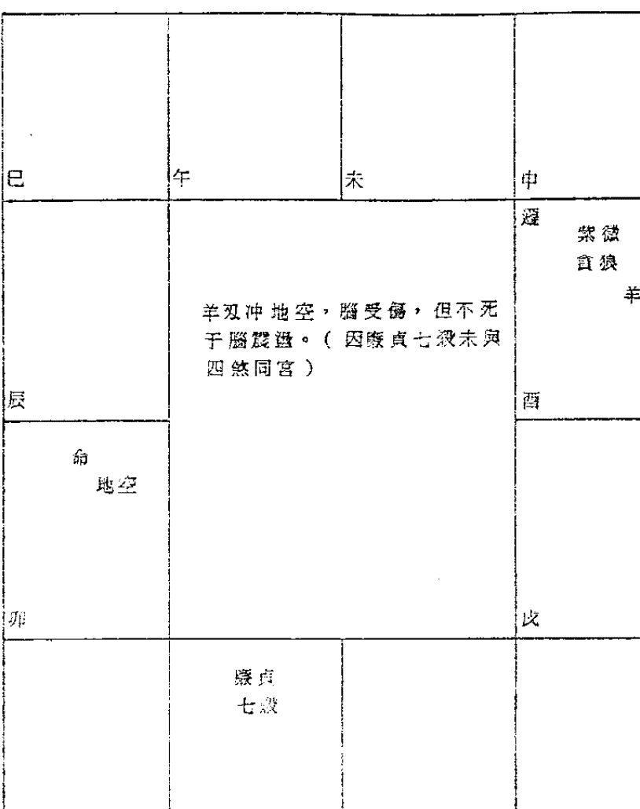

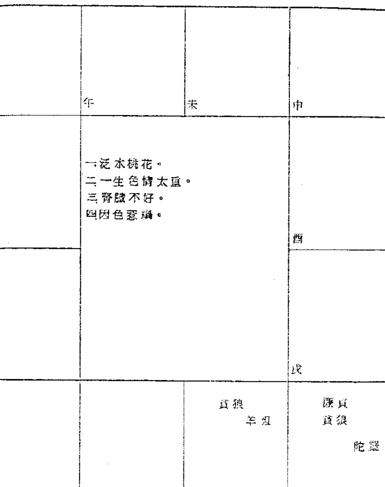

### 看子女宫

| 廉贞 贪狼 | | | |
| :---: | :---: | :---: | :---: |
| 巳 | 午 | 未 | 申 |
| 辰 | | 易得花柳病，尤其是民国七十三年、民国八十三年，不可嫖妓，该年廉贞化禄，增加吃喝嫖赌机会，同样，也增加染病机会。 | 酉 |
| 卯 | | | 戌 |
| 寅 | 丑 | 子 | 亥 |

| 子 太阴 加煞 | 子 天同 太阴 加煞 | 子 太阳 太阴 加煞 | 子 天机 太阴 加煞 |
| 子 太阴 加煞 | 因性生活过度，而得肝病。 | 子 太阴 加煞 | 子 太阴 加煞 |
| 子 太阴 加煞 | 子 太阴 加煞 | 子 太阴 加煞 | 子 太阴 加煞 |
| 子 天机 太阴 加煞 | 子 太阳 太阴 加煞 | 子 天同 太阴 加煞 | 子 太阴 加煞 |

| | | | |
| | 肾脏不好，早泄、肾亏。故性生活不能得到满足。（加他煞亦然） | | |
| 子 天相 羊双 | | | |
| | | | |

| 巳 | 午 | 未 | 申 |
|---|---|---|---|
| 子 廉贪 加煞 | 子 廉相 加煞 | 子 廉杀 加煞 | 子 廉煞 加煞 |
| 子 廉府 加煞 | 一因性生活不检点而犯官司。 二子女夭折。 三或被人用仙人跳诈财。 | | 子 廉破 加煞 |
| 子 廉破 加煞 | | | 子 廉府 加煞 |
| 子 廉煞 加煞 | 子 廉七 加煞 | 子 廉相 加煞 | 子 廉贪 加煞 |

| 巳 | 午 | 未 | 申 |
|---|---|---|---|
| 子 天相 加煞 | 子 廉相 加煞 | 子 天相 加煞 | 子 武相 加煞 |
| 子 紫相 加煞 | 一性生活过度，致患阳萎早泄肾亏，妻病而苦恼。 二子女不幸、任性，忤逆父母。 | | 子 天相 加煞 |
| 子 天相 加煞 | | | 子 紫相 加煞 |
| 子 武相 加煞 | 子 天相 加煞 | 子 廉相 加煞 | 子 天相 加煞 |

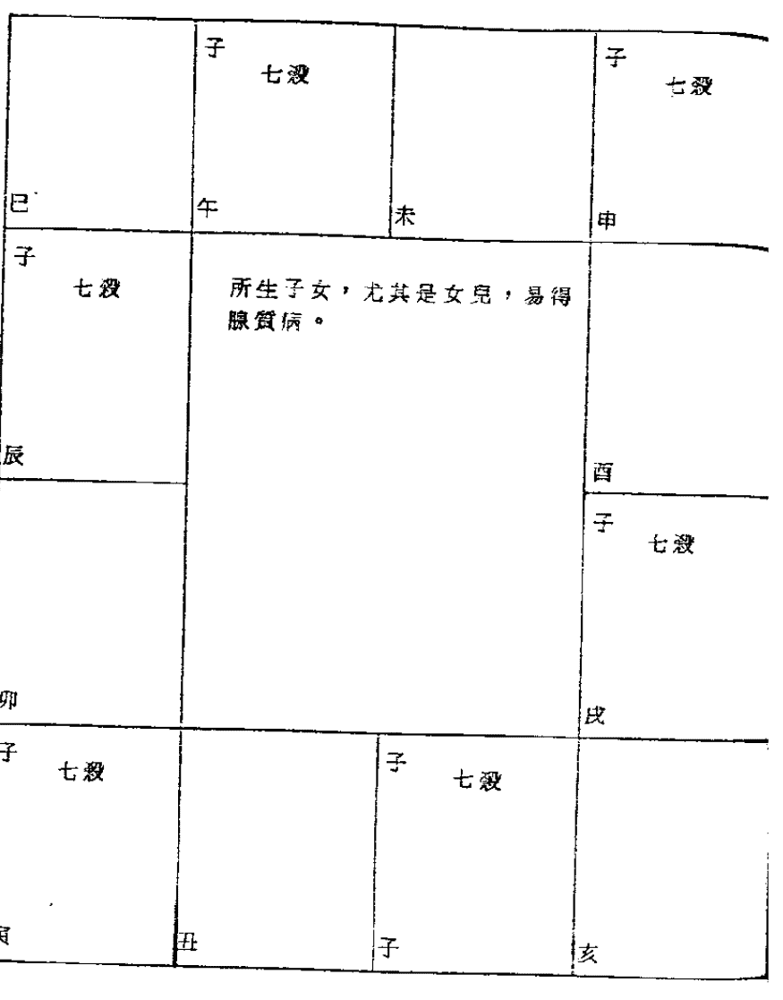

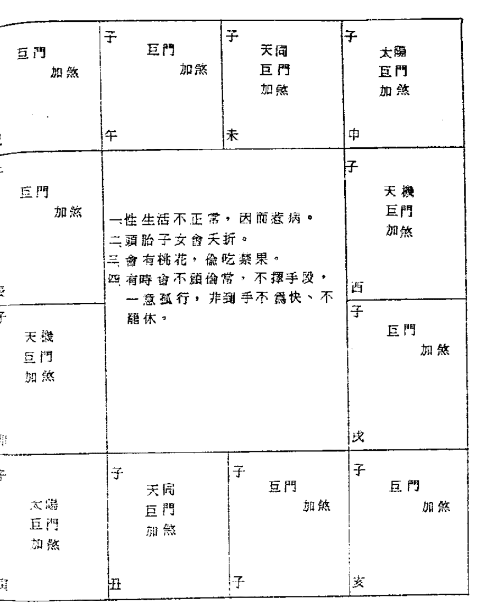

| 宫位 | 星曜 | 数字 | 备注 |
|------|------|------|------|
| 子 | 右弼、天钺、火 | 1243648607284 | 长生 |
| 丑 | 七杀、天钺、天福 | ... | ... |
| 寅 | 文曲、天哭 | ... | 沐浴 |
| 卯 | 天同、武曲 | 1123347597183 | 冠带 |
| 辰 | ... | ... | 临官 |
| 巳 | 太阴、天刑 | 1022346587082 | 帝旺 |
| 午 | 命、太阳 | 921315576981 | 衰 |
| 未 | 破军、天魁、天喜 | ... | 病 |
| 申 | 天机、龙池、凤阁 | ... | 死 |
| 酉 | 紫微科、天府 | ... | 墓 |
| 戌 | 天府、天马、陀罗 | ... | 绝 |
| 亥 | 贪狼、地空、地劫、羊刃 | ... | 胎 |
| ... | ... | ... | ... |

### 太阴落陷加煞 肢体伤残

某女士，生于民国卅四年三月五日巳时，其命盘如下：
此女士因太阴在陷地加煞，主此人感情用事，肢体有伤残，果于民国七十一年，先有丧子之痛（子女宫七杀加煞），接着祸不单行，由楼梯摔下，腿骨折断。

### 肺結核 糖尿病 腳無力

甲先生，生于民國前一年六月十日子時，其命盤如下：

- 一武曲天相天刑在寅坐疾厄宮，故得：
- (一) 肺結核 （武曲）
- (二) 糖尿病 （天相）
- (三) 腳無力、不良於行 （天刑）

古代名將孫臏，即因天刑在疾厄宮，故被削雙足，所以凡天刑在疾厄宮的人，多係腳有傷，或鋸斷，或不良於行。

| 姓名 | 出生年月日 | 姓 名 | 十 六 子 * |
|---|---|---|---|
| 甲先生 | 民國前一年 辛亥 | | |

| 宮位 | 年齡 | 星曜 | 數字 | 神煞 | 地支 |
|---|---|---|---|---|---|
| 夫 | 24~33 | 天機 右弼天馬 天虛 | 癸 5 17 29 15 36 57 7 | 長生 | 子 |
| 子 | 34~43 | 七殺 文曲科 紅鸞 | 壬 4 16 28 10 52 6 47 8 | 沐浴 | 丑 |
| 財 | 11~53 | 太陽權 龍池 | 辛 3 15 27 39 51 63 75 | 冠帶 | 寅 |
| 疾 | 54~63 | 武曲 天相 天刑天魁 | 庚 2 14 26 38 50 62 74 | 臨官 | 卯 |
| 兄 | 14~23 | 紫微 天姚 | 甲 6 18 30 42 54 66 78 | | 未 |
| 命 | 64~73 | 天同 巨門祿 | 辛 1 13 25 37 49 61 73 | 帝旺 | |
| 夫 | 4~13 | 天梁 | 乙 7 19 31 43 55 67 79 | 數金局 | 11 24 36 48 60 72 84 | 帝旺 |
| | | 貪狼 | | 帝旺 | |

| 天哭 | 胎 | 火 | 左輔 | 蘇存 | 廉貞 文昌 | 天府羊刃 鈴星 | 天刑 | 死 | 太陰 | 地劫地空 | 病 |
|---|---|---|---|---|---|---|---|---|---|---|---|

| 破軍 | 丙 8 20 32 44 56 68 80 | 酒 | 丁 9 21 33 45 57 69 81 | 田 | 戊 10 22 34 46 58 70 82 | 官 | 己 1 12 33 45 75 97 183 | 天姚 |
|---|---|---|---|---|---|---|---|---|

左側命盤表格，包含紫微斗數宮位與星曜信息，部分內容如下：
時 45~54 乙巳1
子 35~44 丙午2
丑 25~34 丁未3
寅 15~24 戊申4
卯 5~14 己酉5
辰 0~4 庚戌6
巳 65~74 辛亥7
午 55~64 壬子8
未 45~54 癸丑9
申 35~44 甲寅10
酉 25~34 乙卯11
戌 15~24 丙辰12
亥 5~14 丁巳13
宮位：命、兄、夫、子、財、疾、遷、友、官、田、福、父等。
星曜：天同、天機、天梁、天相、七殺、破軍、廉貞、貪狼、巨門、太陰、太陽等。

### 為何不生髭鬚？

某先生，生于民國四十六年閏八月九日丑時，此命若將閏月移下月算則準，若以八月算，則不準，因九月算法，其病在腎經，八月算法，其病在肝經。（紫微斗數有此功用，值得吾人痛下功夫研究）

此人今年廿八歲，曾于七十三年七月底到本館算命，其所煩惱者，因年已廿八歲，不生髭鬚，皮膚細嫩，聲帶女音，缺乏男性性徵，當其服役時，醫官也發現他有問題，曾做全身檢查，發現此人精子稀薄，恐將來無法使其妻受孕，現此人對女人自卑感甚重，亦曾看過不少中醫、西醫，依然無效，最近經人介紹來本館，算命並服藥，已有效果。

### 膀胱無力

某小姐：生于五十二年六月廿七日卯時，其命盤如下：

天同在亥坐疾厄宮加陀螺：

一 天同為水，亥為火，水火不容，故膀胱發炎，膀胱無力，因之一號。
二 天同陀螺，會發癢。
三 陀螺坐疾厄宮，暗病纏綿，筋骨酸痛，皮膚疾。

| 項目 | 內容 |
|------|------|
| 姓名 | 小姐 |
| 出生年月日 | 五十二年六月廿七日卯時 |
| 性別 | 女 |
| 生肖 | 兔 |
| 宮位 | 年齡 | 星曜 | 數字 |
| 父 | 15~24 | 天梁 | 丁 9 21 34 55 76 98 1 |
| 母 | 25~34 | 天同 | 戊 8 20 32 44 56 88 0 |
| 兄 | 35~44 | 天喜 | 己 7 19 31 43 55 67 79 |
| ... | ... | ... | ... |

### 太歲沖廉煞 開刀割腎

廉貞七殺加煞，眾所週知，是一種很不吉祥的組合。照古書說：“半路埋屍”，那是指當丙年廉貞化忌時，要特別當心車禍，但如逢太歲相沖，又有什麼情況發生呢？

甲先生，生于民國卅五年六月六日辰時，其命盤如下：

- 一命坐卯宮，紫微貪狼地劫，主此人：
  - (一) 與宗教緣份很深，晚年宜獻身宗教。
  - (二) 太陽落陷在子地，主勞碌命。
  - (三) 財帛宮武曲破軍天魁天喜，財來財去。
  - (四) 此命值得研究的一點，是民國六十八年，甲先生卅四歲，當年太歲在未，沖廉貞七殺鈴星地空，是年甲先生因兩腳酸痛，經醫師檢查，發現是腎有病，開刀割掉一個。

經本人研究，當年若非開刀割腎，則事業會有一番挫折，破財不免，今因開刀割腎以代之，破財可免。

唯本人批其在四十八歲，尚須小心，恐會破財。很多人對太歲與小限搞不清楚。現以此例說明之，是年太歲在未，因其星宿不吉，非破財即刀傷，羊空破財，鈴空刀災。

本人又告其在五十歲這一年，須防官司。

| 宮位 | 卯 (命) | 辰 (父母) | 巳 (福德) | 午 (田宅) | 未 (官祿) | 申 (僕役) | 酉 (遷移) | 戌 (疾厄) | 亥 (財帛) | 子 (子女) | 丑 (夫妻) | 寅 (兄弟) |
|---|---|---|---|---|---|---|---|---|---|---|---|---|
| 星宿 | 紫微 貪狼 地劫 | 巨門 陀螺 天虛 | 天相 火星 右弼 紅鸞 天馬祿存 | 天梁 文昌科 天姚 羊刃 | 廉貞忌 貪狼 七殺 | 破軍 | 七殺 | 武曲 破軍 天魁 天喜 | 太陽 | 天府 | 天機 天刑 太陰 龍池 | 天同祿 |

### 子女宮有煞 性生活不滿足

甲女士，生于民國卅八年八月十日辰時，其命盤如下：

- 一 命坐巳地，喜歡吹毛求疵，顧小失大。
- 二 陀羅坐命，女命喜嬌柔造作。
- 三 幸三方相府朝垣，一生衣食無缺。
- 四 夫妻宮武曲七殺地劫對照，夫妻感情愈走愈冷淡，其夫願付六百萬元求其離婚，此人不肯，吃定丈夫。
- 五 子女宮天同天梁鈴星紅鸞：
  - (一) 子女很漂亮。
  - (二) 結婚後，一直沒有享受到性高潮。
  - (三) 子女多病。
- 六 福德宮紫微破軍火星地空羊刃，很操心。
- 七 曾被高雄一位乩童，謊稱代為改運，騙去四十多萬元。

| 姓名 | 出生年月日 | 63~72 | 43~52 | 33~42 | 23~32 |
|---|---|---|---|---|---|
| 女嬰 | 丙午年九月十日戌時 | 天機科 祿存 天刑 天府 紫微 羊刃 天同 太陰 天馬 天刑 天哭 | 乙 丑 巳 未 酉 亥 | 太陽 天刑 天刑 陀羅 天哭 天相 天刑 | 天機 天梁 天刑 火星 天哭 天相 天刑 |
| | | 63~72 丙 丑 巳 未 酉 亥 | 43~52 乙 丑 巳 未 酉 亥 | 33~42 甲 寅 辰 午 申 戌 | 23~32 癸 卯 巳 未 酉 亥 |
| | | 天刑 天府 紫微 羊刃 天同 太陰 天馬 天刑 天哭 | 太陰 天刑 天刑 陀羅 天哭 天相 天刑 | 天機 天梁 天刑 火星 天哭 天相 天刑 | 廉貪 貪狼 天刑 火星 天哭 天相 天刑 |

### 夭折女嬰

某太太，于民國六十六年九月十日戌時，生下一女嬰，其命盤如下：（生下三小時多，即告死亡）。

此命之所以夭折者，必其父母的子女宮有煞，惜未能得到其父母的生辰八字，以求印證。謹提出供有志研究者參考。

## 第一章 刑事訴訟法

### 兄弟有助

| 巳 太陰 羊刃 | 午 天同 太陰 羊刃 | 未 太陽 太陰 羊刃 | 申 天機 太陰 羊刃 |
|---|---|---|---|
| 辰 太陰 羊刃 | 男姓癸 女姓未 | 酉 太陰 羊刃 | |
| 卯 太陰 羊刃 | | 戌 太陰 羊刃 | |
| 寅 天機 太陰 羊刃 | 丑 太陰 羊刃 | 子 天同 太陰 羊刃 | 亥 太陰 羊刃 |

| 巳 兄 巨門 加煞 | 午 兄 巨門 加煞 | 未 兄 天同 巨門 加煞 | 申 兄 天機 巨門 加煞 |
|---|---|---|---|
| 辰 兄 巨門 加煞 | 手足相殘 | 酉 兄 巨門 加煞 | |
| 卯 兄 天機 巨門 加煞 | | 戌 兄 巨門 加煞 | |
| 寅 兄 天同 巨門 加煞 | 丑 兄 天同 巨門 加煞 | 子 兄 天同 巨門 加煞 | 亥 兄 天同 巨門 加煞 |

命 天機 天梁 此命有刑剋 羊刃

夫 武曲 破軍 加六煞 一、婚姻兩度或與人共夫共妻。 二、剋配偶。 夫 武曲 破軍 加六煞

### 何知此人為孤寡？

- 一凡武曲與羊刃同宮。
  - (一) 因財被劫或動刀。
  - (二) 刑剋極重，男剋妻，女剋夫。

| 巳 | 午 | 未 | 申 |
|---|---|---|---|
| 武曲 羊刃 | 武曲 天府 羊刃 | 武曲 貪狼 羊刃 | |
| 辰 | | | 酉 |
| | | | 武曲 七殺 羊刃 |
| 卯 | | | 戌 |
| 武曲 七殺 羊刃 | | | |
| 寅 | 丑 | 子 | 亥 |
| | 武曲 貪狼 羊刃 | 武曲 天府 羊刃 | |

- 一女命為寡婦命。
- 二早年勤奮，中年後易沉迷賭博，或其他不良嗜好。
- 三若疾厄宮再有煞，肢體會有傷殘。

| 巳 | 午 | 未 | 申 |
|---|---|---|---|
| | | | |
| 辰 | | | 酉 |
| | | | 命 太陽 |
| 卯 | | | 戌 |
| | | | 命 太陽 |
| 寅 | 丑 | 子 | 亥 |
| | | 命 太陽 | 命 太陽 |

| 巳 | 午 | 未 | 申 |
|---|---|---|---|
| 廉貞 羊刃 天府 右弼 | | 廉貞 羊刃 天相 右弼 | |
| 辰 | | 因行為不檢，遭人打傷，或被刑求。 | 酉 |
| 廉貞 羊刃 破軍 右弼 | | 廉貞 羊刃 破軍 右弼 | |
| 卯 | | | 戌 |
| 廉貞 羊刃 七殺 右弼 | 廉貞 羊刃 天相 右弼 | | |
| 寅 | 丑 | 子 | 亥 |

| 巳 | 午 | 未 | 申 |
|---|---|---|---|
| | | 夫 貪狼 武曲 加煞 | |
| 辰 | 一配偶宜身材高大。 二配偶宜裁縫、屠商、肉商，或技術人員。 三配偶先死。 | | 酉 |
| | | | |
| 卯 | | | 戌 |
| | 夫 貪狼 武曲 加煞 | | |
| 寅 | 丑 | 子 | 亥 |

| 巳 | 午 | 未 | 申 |
|---|---|---|---|
| 辰 | 配偶先死 | | 酉 |
| | | | 戌 |
| 卯 | | | 亥 |
| 寅 | 丑 | 子 | 亥 |

| 巳 | 午 | 未 | 申 |
|---|---|---|---|
| 辰 | | 羊刃 | 酉 |
| | | | 戌 |
| 卯 | | 命 廉貞 天相 | 亥 |
| 寅 | 丑 | 子 | 亥 |

- 1. 女命為寡婦，男命剋妻。
- 2. 若廉貞天相在午坐命，午地有羊刃對沖，亦同論。
- 3. 犯官司。

| 宮位 | 主星 | 輔星 | 年齡範圍 | 地支 | 天干 |
|---|---|---|---|---|---|
| 命宮 | 紫微、七殺 | 文曲、天鉞、恩光 | 22~31 | 亥 | 癸 |
| 父母宮 | 天機、天梁 | 天喜、火星 | 12~21 | 戌 | 甲 |
| 兄弟宮 | 天相、天馬 | 天姚、天魁 | 2~11 | 酉 | 甲 |
| 夫妻宮 | 武曲、貪狼 | 羊刃、天哭、天刑 | | 卯 | 乙 |
| 子女宮 | 太陽、巨門 | | | 寅 | 乙 |
| 財帛宮 | 天府、天刑 | 鈴星、地空、天刑、天虛 | | 子 | 癸 |
| 疾厄宮 | 廉貞、破軍 | 文昌、龍池 | 62~71 | 丑 | 辛 |
| 遷移宮 | 太陽、天梁 | 祿存、地劫 | | | |
| 交友宮 | | 右弼 | 52~61 | 酉 | 庚 |
| 官祿宮 | | 左輔 | 42~51 | 申 | 庚 |
| 田宅宮 | | | 32~41 | 未 | 戊 |

### 剋夫命

甲先生和甲太太是一對夫妻，甲太太的夫妻宮是武曲貪狼化忌加羊刃。（不加羊刃必離婚，加羊刃必剋丈夫。）甲先生果于民國七十一年二月十二日晚上死于車禍。

甲先生大限庚辰，33~42歲，有紫微天相羊刃地劫，小限卅八歲在甲申，走廉貞火星，遷移宮太陽化忌。

甲太太夫妻宮太壞，主剋夫，果當寡婦。

| 宮位 | 星曜 | 數字 |
|------|------|------|
| 命 | 天相、文曲忌、天刑 | 5 17 29 41 53 65 77 |
| 身 | 天梁 | 6 18 80 42 54 66 78 |
| 兄弟 | 巨門祿地劫 | 4 16 28 40 52 64 76 |
| 夫妻 | 紫微鈴陰 | 3 16 27 39 51 63 75 |
| 子女 | 天機太陰火天喜天魁右弼 | 2 14 26 38 50 62 74 |
| 財帛 | 天府天虛 | 13 26 87 49 61 73 |
| 疾厄 | 太陰權 | 7 22 43 61 86 0 12 84 |
| 遷移 | 武曲破軍 | 0 23 44 65 87 48 2 |
| 交友 | 文曲科祿存天姚 | 9 21 34 56 79 81 |
| 事業 | 天同 | 8 20 32 44 56 68 0 |
| 田宅 | 陀羅天馬紅鸞 | 7 9 31 45 56 77 9 |
| 福德 | 地空天鉞 | 6 18 80 42 54 66 78 |

### 癡子命

甲先生，其命盤如下：

- 一、子女宮天機太陰火星天喜天魁右弼：
  - (1) 子女聰明，有出息，而且孝順。
  - (2) 惜有火星，必有一子夭折，白髮人送黑髮人。
  - (3) 經印證：
    其長子出生時，醫師用夾子夾出，不慎將胎兒腦部夾傷，致成植物人，現年已廿二歲，只能說“爸爸”、“媽媽”、“吃飯”，據醫師說，此人現靠服藥在維持生命，但此藥有副作用，再服二、三年之後，必使腎臟敗壞，到那時無藥可救，終必夭折。

### 這個媽媽吃兒子

某女士，生于民國四十年十一月十一日子時，其命盤如下：

- 一、子女宮太陰火星祿存，子女中有夭折者。經印證，其廿九歲時，小限在酉，走太陰火星，其次子死于車禍。
- 二、某女士因太陽在巳，主婚早夫賢，小限廿一歲在巳，三方四正有天姚沐浴，故有結婚之喜。

姓名：某女士

出生年月日：四十 十一 十一 子時

性別：女

土局

| 宮位 | 大限 | 天干地支 | 主星 | 輔星 | 數字 | 神煞 |
|------|------|----------|------|------|------|------|
| 財 | 55~64 | 丙寅 | 紫微、天府 | | 6 18 04 25 46 87 8 | 長生、沐浴 |
| 子 | 45~54 | 丁卯 | 太陰 | 火、祿存 | 5 17 29 41 53 65 7 | 文昌忌、鈴星 |
| 夫 | 35~44 | 戊辰 | 貪狼 | | 4 16 28 10 52 47 6 | 鈴星、天姚 |
| 兄 | 25~34 | 己巳 | 巨門 | 地空、地劫 | 3 15 27 39 51 63 75 | 天姚 |
| 命 | 15~24 | 庚午 | 廉貞、天相 | | 2 14 26 38 50 62 74 | 右弼、紅鸞 |
| 父 | 5~14 | 辛未 | 天梁 | | 1 13 25 37 49 61 73 | 天馬 |
| 田 | 65~74 | 壬申 | 天同、天哭 | | 1 23 35 47 59 74 83 | 死 |
| 奴 | 75~84 | 癸酉 | 七殺、左輔、天馬 | | 2 24 30 48 60 74 84 | 病 || 宫位 | 天干 | 地支 | 年龄段 | 星曜与数字 | 帝旺、衰、病、死、墓、绝、胎、养 | 十二长生 |
| :--- | :--- | :--- | :--- | :--- | :--- | :--- |
| 兄弟 | 壬 | 午 | 13~22 | 七杀、天刑、寡宿 | 帝旺 | 旺 |
| 夫妻 | 辛 | 巳 | 23~32 | 天梁、天机、文昌 | 衰 | 绝 |
| 子女 | 庚 | 辰 | 33~42 | 紫微科、天府、地空、地劫、天相（忌） | 病 | 死 |
| 财帛 | 己 | 卯 | 43~52 | 天机禄、巨门、天姚 | 死 | 墓 |
| 疾厄 | 戊 | 寅 | 53~62 | 贪狼、左辅、天马、陀罗 | 墓 | 绝 |
| 迁移 | 丁 | 丑 | 63~72 | 太阳、太阴忌、天哭、天虚、阴煞 | 绝 | 胎 |
| 交友 | 丙 | 子 | 73~82 | 武曲、天府、天官、天福、天厨 | 胎 | 养 |
| 官禄 | 乙 | 亥 | 83~92 | 天同、天梁、天巫、天寿 | 养 | 长生 |
| 田宅 | 甲 | 戌 | 93~102 | 破军、天哭、天使、天虚 | 长生 | 沐浴 |
| 福德 | 癸 | 酉 | 103~112 | 文曲、天钺、天刑、天姚 | 沐浴 | 冠带 |
| 父母 | 壬 | 申 | 113~122 | 廉贞、天钺、天刑、天姚 | 冠带 | 临官 |
| 命宫 | 庚 | 午 | | 天府、擎羊、三台、八座、恩光、天贵 | 临官 | 帝旺 |

### 被妻剋死

某先生，生于民国卅四年十一月初一日巳时，其命盘如下：

- 一、此人于民国七十一年二月十二日晚上死于车祸。
- 二、该年小限甲申，太阳化忌，即迁移宫化忌冲命宫。
- 三、大限庚辰，天相化忌，且大限羊陀地劫同宫，亦非吉兆。
- 四、我也算过其妻命造，发现其妻之夫妻宫化忌加煞，剋夫无疑。

根据我的统计研究，夫妻宫化忌加煞，其配偶非车祸而死，则得癌症而死。故此人因娶“寡妇之命”的女人为妻，岂非命耶？！夫复何言。

### 剋妻傷子

甲先生，生于民國卅一年九月一日晚時，其命盤如下：

一此命武曲天府羊刃文昌左輔化科在子地坐命：

- (一)此人長得很英俊。
- (二)惟反抗心太強。
- (三)易發生意外情況。（曾因熱戀某名伶，而爭風吃醋，刀殺情敵，本該死刑，因有殊功，得以免死，但坐牢不免，在牢獄之中，又與總機乙小姐談情說愛，出獄後，即擬與乙小姐結婚，舊帖也已發出，却在結婚前夕，與未婚妻之同學丙小姐，在床上遊玩，被準新娘撞見，準新娘竟夜自殺，第二日，甲先生只好與木牌靈位結婚，以了孽緣。）

二其夫妻宮破軍陀羅，夫妻不正，且有刑剋。

三此外美內虛。

四此命色情太重，天姚紅鸞在酉，酉為沐浴之地，故一生美好前程，毀於色情。

五天機巨門，必有一段傷心戀愛史，故斷某名伶，絕不會嫁此人為妻。

六天府加煞，偽君子，善以花言巧語，對女人大灌迷湯。

七雖然此人工作能力強，但不走正道，前途不甚樂觀，恐仍有不幸之事發生。

八子女雖英俊，惜會夭折。

| 宫位 | 地支 | 主星 | 辅星 | 杂曜 | 五行局 | 大限 | 长生十二神 | 博士十二神 | 将前十二神 | 岁前十二神 | 天干 | 大限起始年龄 |
| :--- | :--- | :--- | :--- | :--- | :--- | :--- | :--- | :--- | :--- | :--- | :--- | :--- |
| 命宮 | 子 | 武曲天府 | 羊刃、文昌、左輔 | 化科、天刑、天姚、天馬 | 水二局 | 3~12 | 帝旺 | 力士、青龍、將軍、奏書、蜚廉、喜神、病符、大耗、伏兵、官符 | 將星、攀鞍、歲驛、華蓋、劫煞、災煞、天煞、指背、咸池、月煞、亡神 | 貪狼、巨門、天相、天梁、七殺、破軍、廉貞、武曲、太陽、天府、天同、天機 | 癸 | 23~32 |
| 兄弟 | 丑 | 天機 | 天魁、天鉞 | 天哭、天虛 | | 13~22 | 衰 | 力士、青龍、將軍、奏書、蜚廉、喜神、病符、大耗、伏兵、官符 | 將星、攀鞍、歲驛、華蓋、劫煞、災煞、天煞、指背、咸池、月煞、亡神 | 貪狼、巨門、天相、天梁、七殺、破軍、廉貞、武曲、太陽、天府、天同、天機 | 壬 | 33~42 |
| 夫妻 | 寅 | 太陽太陰 | 地空 | 天傷、天使 | | 33~42 | 病 | 力士、青龍、將軍、奏書、蜚廉、喜神、病符、大耗、伏兵、官符 | 將星、攀鞍、歲驛、華蓋、劫煞、災煞、天煞、指背、咸池、月煞、亡神 | 貪狼、巨門、天相、天梁、七殺、破軍、廉貞、武曲、太陽、天府、天同、天機 | 辛 | 43~52 |
| 子女 | 卯 | 武曲貪狼 | 文曲、右弼 | 天哭、天虛 | | 43~52 | 死 | 力士、青龍、將軍、奏書、蜚廉、喜神、病符、大耗、伏兵、官符 | 將星、攀鞍、歲驛、華蓋、劫煞、災煞、天煞、指背、咸池、月煞、亡神 | 貪狼、巨門、天相、天梁、七殺、破軍、廉貞、武曲、太陽、天府、天同、天機 | 庚 | 53~62 |
| 財帛 | 辰 | 廉貞 | 天馬 | 天刑、天姚 | | 53~62 | 墓 | 力士、青龍、將軍、奏書、蜚廉、喜神、病符、大耗、伏兵、官符 | 將星、攀鞍、歲驛、華蓋、劫煞、災煞、天煞、指背、咸池、月煞、亡神 | 貪狼、巨門、天相、天梁、七殺、破軍、廉貞、武曲、太陽、天府、天同、天機 | 己 | 63~72 |
| 疾厄 | 巳 | 破軍 | 陀羅 | 天哭、天虛 | | 63~72 | 絕 | 力士、青龍、將軍、奏書、蜚廉、喜神、病符、大耗、伏兵、官符 | 將星、攀鞍、歲驛、華蓋、劫煞、災煞、天煞、指背、咸池、月煞、亡神 | 貪狼、巨門、天相、天梁、七殺、破軍、廉貞、武曲、太陽、天府、天同、天機 | 戊 | 73~82 |
| 遷移 | 午 | 天同 | 火星、鈴星 | 天哭、天虛 | | 73~82 | 胎 | 力士、青龍、將軍、奏書、蜚廉、喜神、病符、大耗、伏兵、官符 | 將星、攀鞍、歲驛、華蓋、劫煞、災煞、天煞、指背、咸池、月煞、亡神 | 貪狼、巨門、天相、天梁、七殺、破軍、廉貞、武曲、太陽、天府、天同、天機 | 丁 | 83~92 |
| 交友 | 未 | 紫微天相 | 天姚、天馬 | 天哭、天虛 | | 83~92 | 養 | 力士、青龍、將軍、奏書、蜚廉、喜神、病符、大耗、伏兵、官符 | 將星、攀鞍、歲驛、華蓋、劫煞、災煞、天煞、指背、咸池、月煞、亡神 | 貪狼、巨門、天相、天梁、七殺、破軍、廉貞、武曲、太陽、天府、天同、天機 | 丙 | 93~102 |
| 事業 | 申 | 天機太陰 | 天魁、天鉞 | 天哭、天虛 | | 93~102 | 長生 | 力士、青龍、將軍、奏書、蜚廉、喜神、病符、大耗、伏兵、官符 | 將星、攀鞍、歲驛、華蓋、劫煞、災煞、天煞、指背、咸池、月煞、亡神 | 貪狼、巨門、天相、天梁、七殺、破軍、廉貞、武曲、太陽、天府、天同、天機 | 乙 | 103~112 |
| 田宅 | 酉 | 天府 | 地空、天刑 | 天哭、天虛 | | 103~112 | 沐浴 | 力士、青龍、將軍、奏書、蜚廉、喜神、病符、大耗、伏兵、官符 | 將星、攀鞍、歲驛、華蓋、劫煞、災煞、天煞、指背、咸池、月煞、亡神 | 貪狼、巨門、天相、天梁、七殺、破軍、廉貞、武曲、太陽、天府、天同、天機 | 甲 | 113~122 |
| 福德 | 戌 | 天同巨門 | 天鉞、天哭 | 天哭、天虛 | | 113~122 | 冠帶 | 力士、青龍、將軍、奏書、蜚廉、喜神、病符、大耗、伏兵、官符 | 將星、攀鞍、歲驛、華蓋、劫煞、災煞、天煞、指背、咸池、月煞、亡神 | 貪狼、巨門、天相、天梁、七殺、破軍、廉貞、武曲、太陽、天府、天同、天機 | 癸 | 123~132 |
| 父母 | 亥 | 七殺 | 天魁、天鉞 | 天哭、天虛 | | 123~132 | 臨官 | 力士、青龍、將軍、奏書、蜚廉、喜神、病符、大耗、伏兵、官符 | 將星、攀鞍、歲驛、華蓋、劫煞、災煞、天煞、指背、咸池、月煞、亡神 | 貪狼、巨門、天相、天梁、七殺、破軍、廉貞、武曲、太陽、天府、天同、天機 | 壬 | 133~142 |

| 宮位 | 星曜 | 數字 | 等 |
| :--- | :--- | :--- | :--- |
| 命宮 | 天府 | 9215345576981 | ... |
| 父母宮 | 太陰科文昌 | 0223446587082 | ... |
| ... | ... | ... | ... |

### 母親跛腳

甲先生，生于民國廿二年八月初一日午時，其命盤如下：

- 一、此命值得研究的一點，是太陰文昌鈴星天刑天煞在辰地坐父母宮，根據本人理論，此人感情用事，肢體有傷。又坐父母宮，故又可解釋此人父母感情用事，肢體有傷，其母生出甲先生後，不知何故，竟成跛腳，其父見狀，離家出走，其母在家守活寡迄今，將其子扶養成人，其舅舅為地下錢莊高手，在其舅舅栽培之下，曾發財千萬，四十九歲被倒帳七百萬，今年五十二歲又被倒帳。
- 二、官祿宮天相，宜經營銀樓或錢莊。
- 三、夫妻宮紫微破軍羊刃，剋妻，卅多歲妻去世再娶。
- 四、甲先生若能見好就收，急流湧退，在四十二歲前，改行做正當生意的話，就不會貪小失大。茲因其大限 42~51 歲，財逢陀羅，今年五十二歲，大限有地空，小限逢大限，故又破財。
- 五、此人大限甲子，32~41 歲，走天機祿存，是一生中最得意最有錢的時代。今後三個大限，均不以言論之，宜修心養性，多行善事，散財求福，否則老年，破財尤多。

女士
姓名：
出生年月日：
| 宫位 | 主星 | 副星 | 年龄段 |
| :--- | :--- | :--- | :--- |
| 命 | 巨门 | 陀罗 | 6~15 |
| 兄 | 太阳 | | 16~25 |
| 夫 | 武曲 | 禄存 | 26~35 |
| 子 | 天同 | 地空 | 36~45 |
| 财 | 天机 | 文曲 | 46~55 |
| 疾 | 天梁 | 文昌 | 56~65 |
| 迁 | 紫微 | 贪狼 | 66~75 |
| 仆 | 廉贞 | | 76~85 |
| 官 | 天府 | | 86~95 |
| 田 | 太阴 | | 96~105 |
| 福 | 破军 | | 106~115 |
| 身 | 天相 | | 116~125 |
注：身宫，抛夫弃子，拐款私逃。火局

先生
姓名：
出生年月日：
| 宫位 | 主星 | 副星 | 年龄段 |
| :--- | :--- | :--- | :--- |
| 命 | 廉贞 | 七杀 | 1~10 |
| 兄 | 天府 | | 11~20 |
| 夫 | 太阴 | | 21~30 |
| 子 | 武曲 | 天相 | 31~40 |
| 财 | 天同 | 文昌 | 41~50 |
| 疾 | 天机 | 文曲 | 51~60 |
| 迁 | 太阳 | | 61~70 |
| 仆 | 巨门 | | 71~80 |
| 官 | 紫微 | 贪狼 | 81~90 |
| 田 | 天机 | | 91~100 |
| 福 | 天梁 | | 101~110 |
| 身 | 破军 | | 111~120 |
注：命犯四妻，白髮人送黑髮人。土局

| 左輔科 | 84~93 |
| :--- | :--- |
| 右弼天喜 | 官 |
| 天鉞 | 田 |
| 紫微權祿 | 福 |
| 七殺 | 戊 |
| 天機 | 乙 |
| 天梁祿 | 丑 |
| 命 | 天相 |
| 太陽 | 大限 |
| 巨門 | 兄 |
| 祿存 | 14~23 |
| 天馬 | 卯 |
| 地劫 | 奴 |
| 陀羅 | 壽 |
| 天府 | 財 |
| 天馬祿存 | 辛 |
| | 玄 |
| 文昌廟旺 | 74~83 |
| 天魁 | 戌 |
| 天虛 | 64~73 |
| 地空 | 未 |
| 祿存 | 54~63 |
| 破軍 | 申 |
| 天馬 | 44~53 |
| 祿存 | 庚 |
| | 酉 |

> 何知今年有克子之禍？
- 一今年甲子，太歲沖子女宮，有天同太陰羊刃天刑，其子（四十歲）于七月二十八日溺死。

姓名：女士
性別：女
民國：四十六
年次：壬寅
陽：女
出生年月日：

金局

| 子 | 夫 | 兄 | 戌 | 戌 |
| :--- | :--- | :--- | :--- | :--- |
| 廉貞 | | 右弼 | 破軍 | 紅鸞 | 命 |
| 天鉞 | | | | 天同 |
| 天梁 | 天馬左輔 | 左輔 | 紫微 | 天機 | 巨門 | 天機 |
| 廟旺 | 陀羅 | | 天喜 | 地空 | 貪狼 |
| 天馬 | 奴 | 56~65 |
| 祿存 | | 未 |
| 七殺 | 時 | 未 |
| 文曲祿存 | | 丑 |
| | | 丑 |
| 天機忌 | 貪狼 | 子 |
| 武曲忌 | | 34~43 |
| 地劫紅鸞 | 申 |
| 火 | |
| 天同 | 太陰 |
| 大刑羊及 | 辛 |
| 天府 | 玄 |
| 44~53 |
| 天馬祿存 | |

> - 一夫先死。（其面相亦爲剋夫相，夫已死九年。）
- 二五十五歲前，財不聚。
- 三有三女三子。
- 四今年五十六歲開始走十年大運。
- 五六十歲會發橫財，買房子。
- 六個性隨和。

姓名：甲小姐
性別：男
出生年月日：

局

| 巳 | 午 | 未 | 申 |
| :--- | :--- | :--- | :--- |
| 廉贞贪狼加煞 | 廉贞加煞天相 | 廉贞七杀加煞 | 廉贞加煞 |
| 辰 | **何知此人會犯官司？** |
廉贞加煞，逢流年白虎，會犯官司。
印證：民國七十三年，流年白虎在申，凡申地有廉贞加煞者，均犯官司。民國七十四年，白虎在酉。
化解之法，宜買麒麟一隻，放置家中，以擋白虎之災殃。 | 酉 |
| 卯 | 戌 |
| 寅 | 丑 | 子 | 亥 |

*注：表格中多个单元格内含有“廉贞加煞”、“廉贞破军加煞”、“廉贞七杀加煞”、“廉贞贪狼加煞”、“流年白虎”等重复或不同的星曜组合描述，此处表格为概括性呈现，实际每个格子都有具体内容。*

## 第四章 官司看法

| 已 | 午 | 未 | 申 |
| :--- | :--- | :--- | :--- |
| 逢廉貞天相羊刃官符 | 逢廉貞七殺羊刃官符 | 運廉貞破軍羊刃官符 | |
| 辰 逢廉貞天府羊刃官符 | 一犯法被押送外岛管训。 二在卯、午、酉、子，逢禄马，可免送外岛，但坐牢不免。 三若羊刃在对宫中，同论。 | 運廉貞天府羊刃官符 | |
| 卯 逢廉貞破軍羊刃官符 | | | |
| 寅 逢廉貞七殺羊刃官符 | 逢廉貞天相羊刃官符 | | 亥 |

| 巳 | 午 | 未 | 申 |
| :--- | :--- | :--- | :--- |
| | | 官廉貞羊刃七殺 | |
| 辰 | | 犯法被押 | 酉 |
| 卯 | | | 戌 |
| 寅 | 丑 官廉貞羊刃七殺 | 子 | 亥 |

| 地支 | 星曜与描述 |
| :--- | :--- |
| 午 | 遷 七殺 羊刃 官符 |
| 辰 | 遷 七殺 羊刃 官符，因犯法被捕，送外岛管训。 |
| 酉 | 遷 七殺 羊刃 官符 |
| 子 | 遷 七殺 羊刃 官符 |

| 地支 | 星曜与描述 |
| :--- | :--- |
| 午 | 廉贞 贪狼（箭头从申指向） |
| 未 | 犯法被捕坐牢 |
| 申 | 羊刃（箭头指向午） |
| 戌 | 廉贞 贪狼（箭头指向命宫） |

| 巳 | 午 | 未 | 申(官 破军 铃星 白虎) |
| :--- | :--- | :--- | :--- |
| 辰 | 酉 | 卯 | 戌 |
| 寅 | 丑 | 子 | 亥 |

官禄宫如有破军铃星，例如此命破铃在申，因今年白虎也在申，故今年会坐牢。

| 巳 | 午 | 未 | 申(官 巨门) |
| :--- | :--- | :--- | :--- |
| 辰 | 酉(官 巨门) | 卯 | 戌 |
| 寅 | 丑 | 子 | 亥 |

- 一因案犯法坐牢。
- 二活盘官禄宫同论。

紫微斗数命盘（左）：
| 巳 | 午 | 未 | 申：命、廉贞化忌、铃星、左辅 |
| :--- | :--- | :--- | :--- |
| 辰 | 走私犯法坐牢之命 | 酉 |
| 卯 | | 戌 |
| 寅 | 丑 | 子 | 亥 |

紫微斗数命盘（右）：
| 巳 | 午 | 未：羊刃 | 申 |
| :--- | :--- | :--- | :--- |
| 辰：廉贞破军 | 有牢狱之灾 | 酉：廉贞破军 |
| 卯 | | 戌：羊刃 |
| 寅 | 丑 | 子 | 亥 |

### 密醫坐牢

丙先生，生于民國卅八年六月三日卯時，其命盤如下：

- 一、貪狼在辰坐命，為人貪求無厭，好賭成性。
- 二、太陰落陷，有桃花。
- 三、夫妻宮紫微天府地劫，必離婚。
- 四、太陽落陷，勞碌命。
- 五、巨門陀羅同宮，性生活不正常，且逢小限，有災難，果於去年（卅五歲），因密醫坐牢一年。
- 六、此人于四十六歲，尚宜小心，恐有官司，若不走正道，必有災禍，尤須戒賭，自求多福。

| 已 | 午 | 未 | 申 |
| :--- | :--- | :--- | :--- |
| 命（身）破軍 天馬 加煞 | | | 命（身）破軍 天馬 加煞 |
| 辰 | 一女命殺夫殺子。 二必犯法坐牢。 | | 命（身）廉貞 破軍 加煞（酉） |
| 命（身）廉貞 破軍 加煞（卯） | | | 戊 |
| 命（身）破軍 天馬 加煞（寅） | 丑 | 子 | 命（身）破軍 天馬 加煞（亥） |

姓名：甲小姐

| 宫位 | 天干 | 地支 | 星宿 | 备注 |
| :--- | :--- | :--- | :--- | :--- |
| 命宫 | 甲 | 子 | 天机 | |
| 身宫 | 甲 | 子 | 天同 | |
| 父母宫 | 甲 | 子 | 天梁 | |
| 兄弟宫 | 甲 | 子 | 天同 | |
| 夫妻宫 | 甲 | 子 | 天相 | |
| 子女宫 | 甲 | 子 | 天机 | |
| 财帛宫 | 甲 | 子 | 天同 | |
| 疾厄宫 | 甲 | 子 | 天梁 | |
| 迁移宫 | 甲 | 子 | 天同 | |
| 交友宫 | 甲 | 子 | 天相 | |
| 官禄宫 | 甲 | 子 | 天机 | |
| 田宅宫 | 甲 | 子 | 天同 | |
| 福德宫 | 甲 | 子 | 天梁 | |
| 父母宫 | 甲 | 子 | 天同 | |

> - 一此命犯白虎，是非多，有官同。
- 二小限十一岁，逢人强暴。

姓名：丙先生

| 宫位 | 天干 | 地支 | 星宿 | 备注 |
| :--- | :--- | :--- | :--- | :--- |
| 命宫 | 丙 | 卯 | 天机 | |
| 身宫 | 丙 | 卯 | 天同 | |
| 父母宫 | 丙 | 卯 | 天梁 | |
| 兄弟宫 | 丙 | 卯 | 天同 | |
| 夫妻宫 | 丙 | 卯 | 天相 | |
| 子女宫 | 丙 | 卯 | 天机 | |
| 财帛宫 | 丙 | 卯 | 天同 | |
| 疾厄宫 | 丙 | 卯 | 天梁 | |
| 迁移宫 | 丙 | 卯 | 天同 | |
| 交友宫 | 丙 | 卯 | 天相 | |
| 官禄宫 | 丙 | 卯 | 天机 | |
| 田宅宫 | 丙 | 卯 | 天同 | |
| 福德宫 | 丙 | 卯 | 天梁 | |
| 父母宫 | 丙 | 卯 | 天同 | |# 甲小姐

| 宫位 | 星曜 |
|------|------|
| 命 | 廉贞 天府 |
| 兄 | 左辅 |
| 夫 | 破军 |
| 子 | 天姚 |
| 财 | 紫微 |
| 疾 | 天机 右弼 |
| 迁 | 七杀 |
| 奴 | 天相 |
| 官 | 太阳 天梁 |
| 田 | 武曲 天刑 |
| 福 | 天同 文昌 文曲 |
| 父 | 巨门 |

此命廿三岁小限走贪狼羊奴，被男友破身。此命犯白虎，民国七十五年、八十七年有官司。

# 甲小姐

| 宫位 | 星曜 |
|------|------|
| 命 | 巨门 |
| 兄 | 紫微 贪狼 |
| 夫 | 天府 |
| 子 | 太阴 |
| 财 | 武曲 破军 |
| 疾 | 天同 |
| 迁 | 七杀 |
| 奴 | 天梁 |
| 官 | 廉贞 地劫 羊刃 |
| 田 | 天相 |
| 福 | 天机 文昌 |
| 父 | 太阳 天魁 |
| 禄存 | |

此命犯白虎，三十二岁（七十二年）犯官司。民国七十八年必再犯官司。女命巨门在戌坐命，主口舌是非特多，克夫克子，宜修心养性。

# 甲小姐

姓名： 出生年月日：

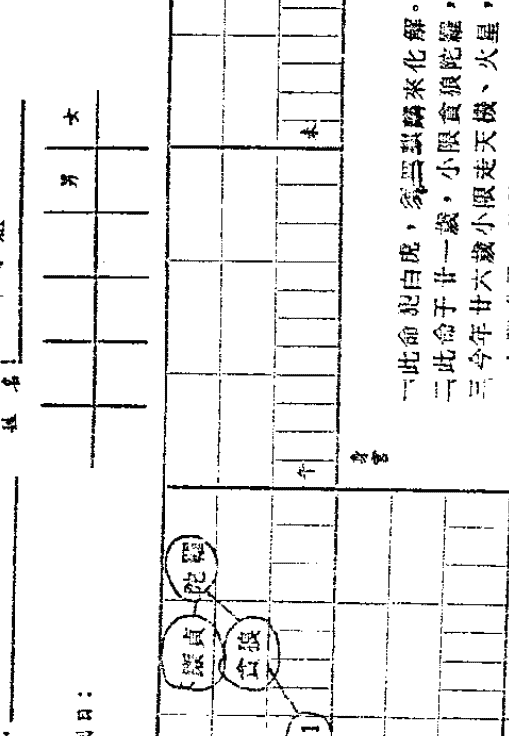

- 一此命犯白虎。
- 二此命必三婚，晚年独寡。
- 三有二女，女儿易得眼疾。
- 四离婚再嫁。
- 五家庭环境不错，父母宫有天同天梁天府，有钱。
- 六财帛宫天府，有钱。

# 甲小姐

| 天机 | 天梁 | 太阴 | ... |
| 武曲 | 七杀 | 太阳 | ... |
| ... | ... | ... | ... |

- 一此命犯白虎。
- 二此命必三婚，晚年独寡。
- 三有二女，女儿易得眼疾。
- 四离婚再嫁。
- 五家庭环境不错，父母宫有天同天梁天府，有钱。
- 六财帛宫天府，有钱。

| 巳 | 午 | 未 | 申 |
| :--- | :--- | :--- | :--- |
| 命 天马 火 |  |  | 命 天马 火 |
| 辰 | 恶死在外乡 | 酉 |  |
| 卯 |  | 戌 |  |
| 寅 命 天马 火 | 丑 | 子 | 亥 命 天马 火 |

# 第五章 死之看法

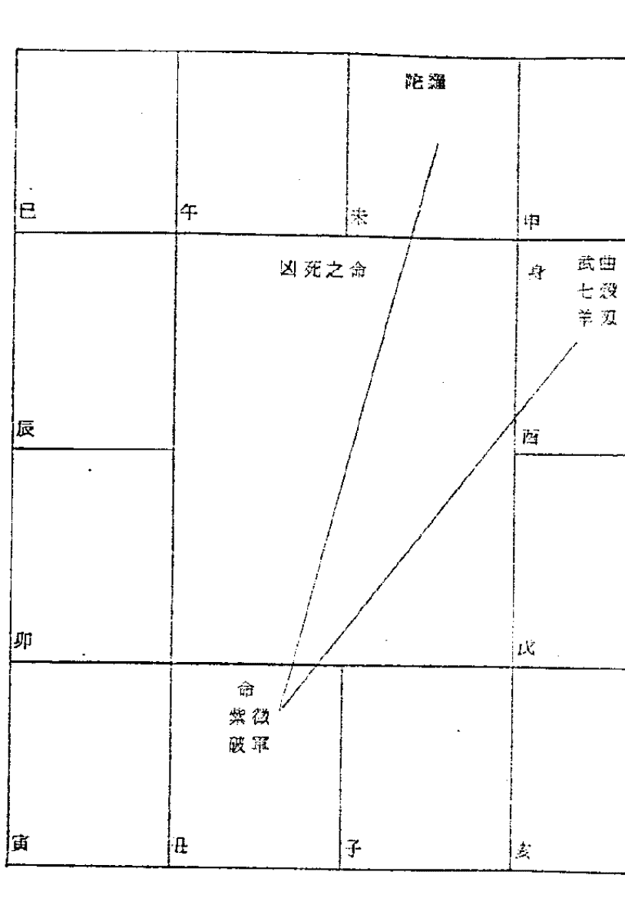

凶死之命

命 紫微 破军

身 武曲 七杀 羊刃

陀罗

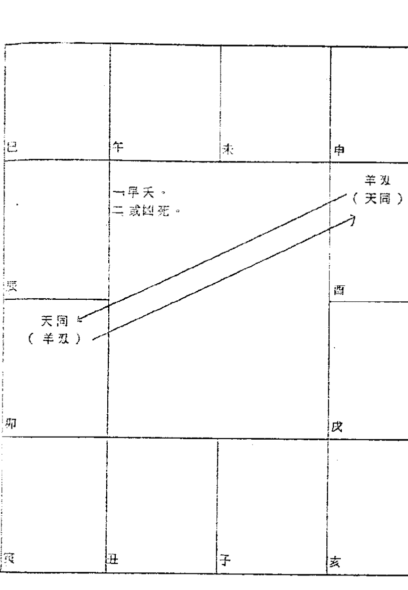

1. 早夭
2. 或凶死

天同（羊刃）

羊刃（天同）

| 巳 | 午 | 未 | 申 |
|---|---|---|---|
| 命 太阳 | 此人必得尿毒症，或肾盂炎症，或败血症而死。 |  |  |
| 辰 |  | 酉 | 陀罗 |
| 卯 |  | 戌 |  |
| 寅 | 丑 | 亥 廉贪 禄存 | 亥 廉贪 禄存 |

| 巳 | 午 | 未 | 申 |
|---|---|---|---|
|  | 一夭寿横死之命。二羊陀在酉冲命。 |  | 羊双 |
| 辰 | 命 太阳 天梁 （加煞） |  | 酉 |
| 卯 |  |  | 戌 |
| 寅 | 丑 | 子 | 亥 |

癸 财 子 夫
天机化禄 紫微化科 破军 天钺
巳 午 未 申
七杀 一生起伏很大。 二加煞，天折、凶死。 三丙生年人，廉贞化忌，因犯法致枪毙。 兄
辰 酉
奴 太阴 天梁化权 禄存 命 廉贞 天府 煞
卯 戌
官 武曲 天相 田 天同 巨门 福 贪狼 天魁 亥 太阴化忌
寅 丑 子 亥

一一生起伏很大。二加煞，天折、凶死。三丙生年人，廉贞化忌，因犯法致枪毙。

巳 午 未 申
辰 酉
犯法坐牢或禁锢之命
一加昌曲，夭折或恶死。
卯 戌
命 廉贞 (加煞) 天相
寅 丑 子 亥

犯法坐牢或禁锢之命
一加昌曲，夭折或恶死。

命 廉贞 (加煞) 天相

| 巳 | 午 | 未 | 申 |
| --- | --- | --- | --- |
| 紫微 铃 七杀 | 七杀 铃 | 廉贞 铃 七杀 | 七杀 铃 |
| 辰 | 一作破阵亡。 二或凶死。 | | 酉 |
| 七杀 铃 | | | 武曲 铃 七杀 |
| 卯 | | | 戌 |
| 武曲 七杀 铃 | | | 七杀 铃 |
| 寅 | 丑 | 子 | 亥 |
| 七杀 铃 | 廉贞 铃 七杀 | 七杀 铃 | 紫微 铃 七杀 |

| 巳 | 午 | 未 | 申 |
| --- | --- | --- | --- |
|  |  |  |  |
| 辰 | 一作破阵亡。 二夭寿。 | | 酉 |
| 命（身） 七杀 羊刃 | | |  |
| 卯 | | | 戌 |
|  | | |  |
| 寅 | 丑 | 子 | 亥 |
|  |  |  | 命（身） 紫微 七杀 羊刃 |

太阴 加煞

天同 太阴 加煞

太阴 加煞

死于肝癌

太阴 加煞

廉贞 贪狼 (加煞)

廉贞加煞，逢流年白虎，防官司，或被枪毙。（民国八十二年流年白虎相冲，宜小心。）

廉贞 贪狼 (加煞)

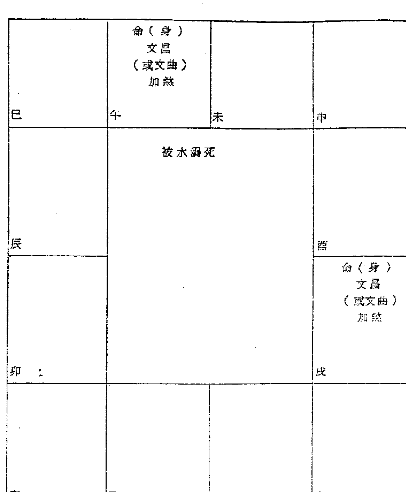

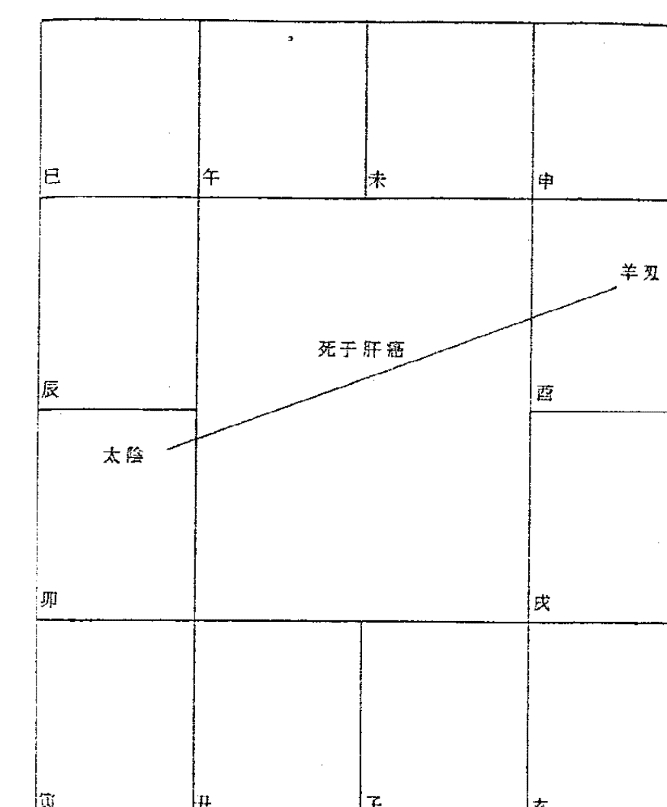

| 巳 | 午 | 未 | 申 |
|---|---|---|---|
|  |  | 武曲 贪狼 文昌文曲 |  |
| 辰 | 慎防水厄 |  | 酉 |
| 卯 | 戌 |  |  |
| 寅 | 丑：武曲 贪狼 文昌文曲 | 子 | 亥 |

| 巳 | 午 | 未 | 申 |
|---|---|---|---|
|  | 破军 文曲 |  | 破军 文曲 |
| 辰 | 一、众水朝海。（财物不聚，且有刑克。） 二、慎防被水溺死。 |  | 酉 |
| 卯：破军 （加昌曲） | 戌 |  | 酉：破军 文曲 |
| 寅：破军 （加昌曲） | 丑 | 子 | 亥 |

| 巳 | 午: 巨门 羊刃 火 | 未: 天同 羊刃 巨门 火 | 申 |
| --- | --- | --- | --- |
| 辰: 巨门 羊刃 火 | （中央区域） | （中央区域） | 酉: 天机 羊刃 巨门 火 |
| 卯: 天机 羊刃 巨门 火 | （空白） | （空白） | 戌: 巨门 羊刃 火 |
| 寅 | 丑: 天同 羊刃 巨门 火 | 子: 巨门 羊刃 巨门 火 | 亥 |

服毒自杀或上吊自尽

| 巳 | 午: 廉贞 天相 铃 | 未: 廉贞 羊刃 七杀 铃 | 申 |
| --- | --- | --- | --- |
| 辰: 廉贞 羊刃 天府 铃 | （中央区域） | （中央区域） | 酉: 廉贞 羊刃 破军 铃 |
| 卯: 廉贞 羊刃 破军 铃 | （空白） | （空白） | 戌: 廉贞 羊刃 天府 铃 |
| 寅 | 丑: 廉贞 羊刃 七杀 铃 | 子: 廉贞 羊刃 天相 铃 | 亥 |

遭受兵刀之祸

| 巳 | 午 | 未 | 申 |
|---|---|---|---|
| | | | 命 陀罗 |
| 辰 | 一.夭折。 二.或刑伤。 三若久居出生地，必恶死。 | | 酉 |
| 卯 | | | 戌 |
| 命 陀罗 | | | 命 陀罗 |
| 寅 | 丑 | 子 | 亥 |

| 巳 | 午 | 未 | 申 |
|---|---|---|---|
| | 廉贞 天相 火星 空（劫） | 廉贞 七杀 火星 空（劫） | 廉贞 火星 空（劫） |
| 辰 | 廉贞 天府 火星 空（劫） | 投河自杀 | 廉贞 破军 火星 空（劫） |
| 卯 | 廉贞 破军 火星 空（劫） | | 廉贞 天府 火星 空（劫） |
| 寅 | 廉贞 火星 空（劫） | 廉贞 七杀 火星 空（劫） | 廉贞 天相 火星 空（劫） |
| 寅 | 丑 | 子 | 亥 |

| 巳 | 午 | 未 | 申 |
|---|---|---|---|
| 命 武曲 破军 加六煞 | | | |
| 辰 | 因财而死 | 酉 | |
| 卯 | | 戌 | |
| 寅 | 丑 | 子 | 亥 |
| 命 武曲 破军 加六煞 | | | |

| 巳 | 午 | 未 | 申 |
|---|---|---|---|
| | | 命 武曲 贪狼 加六煞 | |
| 辰 | 因财而死 | 酉 | |
| 卯 | | 戌 | |
| 寅 | 丑 | 亥 | |
| 命 武曲 贪狼 加六煞 | | | |

| 子 | 子 | 子 | 子 |
| --- | --- | --- | --- |
| 巳 廉贞 贪狼 加煞 | 午 | 未 | 申 武曲 贪狼 加煞 |
| 子 贪狼 加煞 | 辰 | 酉 紫微 贪狼 加煞 | 申 命 武曲 七杀 加六煞 |
| 子 紫微 贪狼 加煞 | 卯 | 酉 贪狼 加煞 | 戌 卯 |
| 子 贪狼 加煞 | 丑 武曲 贪狼 加煞 | 子 | 亥 廉贞 贪狼 加煞 |
| 寅 | 丑 | 子 | 亥 |

性生活过度，或手淫过度，致身体虚弱不堪。二死在牡丹花下。

何知此人被电死？

- 一命宫武曲七杀加煞。
- 二亦防被倒屋压伤。
- 三被雷打死。

| 巳 | 午 | 未 | 申 |
| --- | --- | --- | --- |
| 辰 | 酉 | 戌 | 卯 |
| 命 武曲 七杀 加六煞 | 辰 | 酉 | 戌 卯 |
| 寅 | 丑 | 子 | 亥 |

左侧紫微斗数命盘表格，包含12宫位。巳宫有武曲、文曲、陀罗；午宫有列表项（详见列表）；酉宫有命、贪狼、文昌、铃星；其他宫位如辰、卯、寅、丑、子、亥等。

- 一、天寿短命之人。
- 二、可能坐飞机失事。
- 三、可能投河自尽。
- 四、可能得流行性皮肤病。
- 五、可能得肝旺、头痒。
- 六、可能死后被分尸。

右侧紫微斗数命盘表格，包含12宫位。申宫有陀罗、地空；酉宫有命、廉贞、贪狼；中央区域有描述段落（详见段落项）；其他宫位如巳、午、未、辰、卯、寅、丑、子、亥等。

此命贪酒好色，身体虚弱，逢廉贞化忌太岁冲命，从高楼摔下，得脑震荡而死。

| 巳 命 廉贪 贪狼 火星 | 午 | 未 | 申 |
|-----------------------------------|----|----|----|
| 辰 | 自杀 | | 酉 |
| 卯 | | | |
| 寅 命 廉贪 贪狼 火星 | 丑 | 子 | 亥 |

| 巳 陀罗 (火或铃) | 午 | 未 陀罗 (火或铃) | 申 陀罗 (火或铃) |
|------------------------|----|------------------------|------------------------|
| 辰 陀罗 (火或铃) | 陀罗与火星或铃星同宫，会得流行性疾病或皮肤病而死。 | | 酉 |
| 卯 陀罗 (火或铃) | | | |
| 寅 陀罗 (火或铃) | 丑 | 子 陀罗 (火或铃) | 亥 陀罗 (火或铃) |

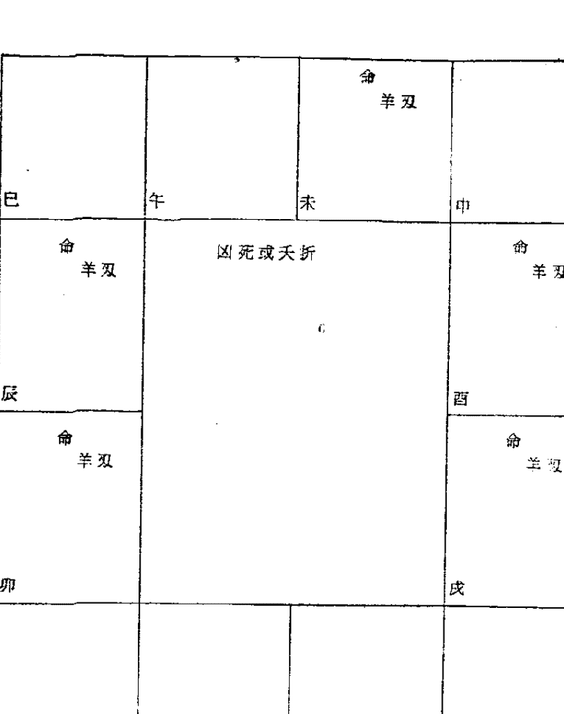

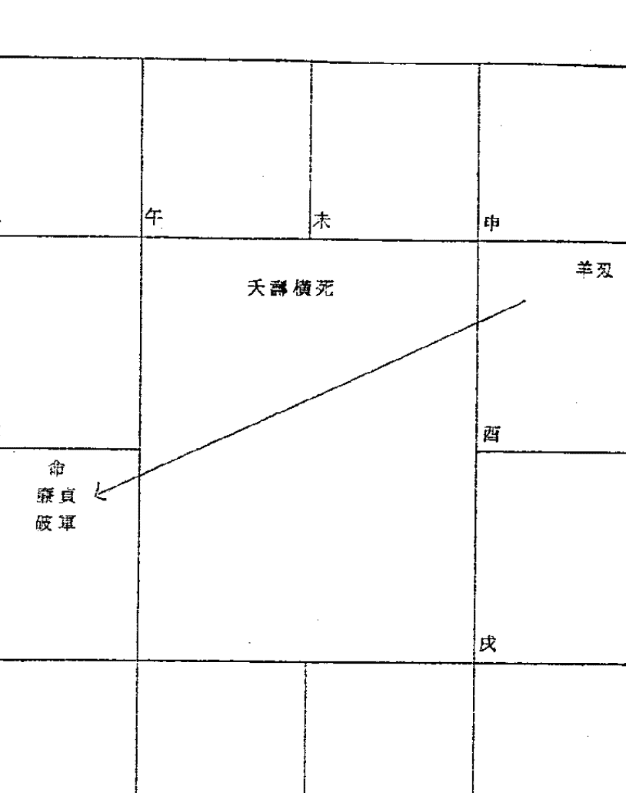

| 巳 | 午 | 未 | 申 |
|---|---|---|---|
| 辰 | 短命之人 | 酉 |  |
| 卯 |  | 戌 命 太阳 加六煞 |  |
| 寅 | 丑 | 子 | 亥 |

| 巳 | 午 | 未 命 天姚 | 申 |
|---|---|---|---|
| 辰 | 短命之人 | 酉 沐浴 |  |
| 卯 沐浴 |  | 戌 |  |
| 寅 | 丑 命 天姚 | 子 | 亥 廉贞 贪狼 |

| 巳 身 七杀 | 午 身 七杀 | 未 | 申 身 七杀 |
|---------------|---------------|----|---------------|
| 辰 身 七杀 | **短命之人** | | 酉 身 七杀 |
| 卯 身 七杀 | | | 戌 身 七杀 |
| 寅 身 七杀 | 丑 | 子 身 七杀 | 亥 |

| 巳 命 紫微 禄存 七杀 文昌 | 午 地空 羊 双 | 未 | 申 |
|---------------------------------|------------------|----|----|
| 辰 地劫 陀罗 | **短命夭折** | | |
| 卯 | | | 戌 |
| 寅 | 丑 | 子 | 亥 |

| 巳 午 未 申 |
|---|---|---|---|
| 迁 天机 | | 迁 天机 | |
| 辰 | | | 酉 |
| | 民国七十七年，不可去高山探险，会迷路。 加煞，会出车祸。 | | |
| 卯 | | | 戌 |
| | | | |
| 寅 | 迁 天机 | 子 | 迁 天机 |

一 民国七十七年，不可去高山探险，会迷路。
二 加煞，会出车祸。

| 巳 午 未 申 |
|---|---|---|---|
| 命 天姚 陀罗 | 命 天姚 羊刃 | 命 天姚 羊或陀 | 命 天姚 陀罗 |
| 辰 命 天姚 羊或陀 | | | 酉 命 天姚 羊刃 |
| | 一 短命之人。 二 女命沦落风尘。 | | |
| 卯 命 天姚 羊刃 | | | 戌 命 天姚 羊或陀 |
| 寅 命 天姚 陀罗 | 命 天姚 羊或陀 | 命 天姚 羊刃 | 命 天姚 陀罗 |

一 短命之人。
二 女命沦落风尘。

| 宫位 | 主星 | 年龄区间 | 备注 |
|------|------|----------|------|
| 命宫 | 天机 | 2-11 | |
| 兄弟 | 天梁 | 12-21 | |
| 夫妻 | 紫微、七杀 | 22-31 | |
| 子女 | 天相 | 32-41 | |
| 财帛 | 太阴 | 42-51 | |
| 疾厄 | 武曲、贪狼 | 52-61 | |
| 迁移 | 天同、禄存 | 62-71 | |
| 交友 | 廉贞、文曲 | | |
| 事业 | 天机、天梁 | | |
| 田宅 | 红鸾 | | |
| 福德 | 地空 | | |
| 父母 | 文昌（科） | | |

### 美国硕士 死于肝癌

一命坐巳地：喜吹毛求疵，顾小失大，心细。二文昌在巳，可护硕士。（美国某大学硕士）三文昌坐命，长得很漂亮。四父母宫地空羊刃，与父母缘薄。（父亲为空军飞行教官，在冈山飞T-33教练机，飞机在空中有故障，即令前座学生跳伞，因学生不敢跳伞，后自己想跳伞，也来不及，因而殉职，后其母改嫁，有一弟（同母异父）现在美国。五福德宫红鸾，一生不愁吃、不愁穿。六廉贞文曲同宫，爱好音乐。七兄弟宫天机天梁地劫陀罗，与兄弟无缘。八此命羊陀空劫夹命，加以福德宫有火星，天寿可知。九大限辛卯，天府铃星，三方四正有火星，小限廿九岁，地空羊刃，于本年四月初一日，得肝癌而死。十此人得何病而死，医生不知，其病情恶化甚速，死前腹胀，有气喘，被医生误作气管炎，根据命盘，太阴对宫有羊刃，会得肝癌。十一这位小姐（住敦化南路），非常聪明，爱好紫微斗数，读过潘子渔所著诸书，入迷，排出命盘后，即知自己会夭折，嘱其母曰：如死后，请将命盘送与潘子渔研究。其母思及爱女夭折，老泪纵横，潘子渔内心更是感动不已，红颜薄命，潘子渔在此暗告苍天，望你在天之灵安息早日超渡。

| 宫位 | 内容 | 宫位 | 内容 | 宫位 | 内容 | 宫位 | 内容 |
|------|------|------|------|------|------|------|------|
| 命 | 太阳太阴在未地，太阴忌 | 父 | 13~22，甲申，11 2 3 4 5 6 7 8 3 | 福 | 23~32，乙酉，1 2 2 4 3 6 4 8 6 7 2 8 4 | 田 | 33~42，丙戌，1 3 2 5 3 7 4 9 6 1 7 3 |
| 官 | 43~52，丁亥，2 1 4 2 6 8 8 0 6 2 4 | 友 | 53~62，戊子，3 1 5 2 7 3 9 5 1 6 3 7 5 | 子 | 63~72，己丑，4 1 0 2 8 4 0 5 2 6 4 7 6 | 财 | 51，庚寅，5 1 7 2 9 4 1 5 3 6 5 7 7 |
| 夫 | 病，辛卯，8 0 2 4 4 5 6 8 8 0 | 兄 | 死，壬辰，9 2 1 3 3 4 5 6 7 6 9 8 1 | 疾 | 帝旺，天刑，火，廉贞，戊寅，5 1 7 2 9 4 1 5 3 6 5 7 7 | ... | ... |

### 天寿之命 死于心脏病

某先生，今年才廿五岁，竟于今年正月初七日因心脏病发作而短命死亡，此人生于四十九年六月十九日子时，其命盘如左：

1. 命太阳太阴在未地坐命加陀罗，天寿之格。
2. 今年太岁甲子，太阳化忌冲命。
3. 大限乙酉，太阴化忌冲命。
4. 小限丙戌，廉贞化忌在疾厄宫。
5. 廉贞加煞坐疾厄宫，会得癌症、花柳病、心气不足、痰火咯血，肝旺失调。
6. 今年正月初七日，得心脏病猝死于卧室。

| 宫位 | 天干 | 地支 | 主星 | 辅星 | 杂曜 | 年龄段 | 备注 |
|------|------|------|------|------|------|--------|------|
| 命宫 | 癸 | 亥 | 天府 | 文昌 文曲 | 截空 | 14-23 | |
| 兄弟 | 甲 | 子 | 天机 | | 龙池 | 24-33 | |
| 夫妻 | 乙 | 丑 | 天相 | | 凤阁 | 34-43 | |
| 子女 | 丙 | 寅 | 天梁 | 天刑 | 天哭 | 44-53 | |
| 财帛 | 丁 | 卯 | 七杀 | | 天虚 | 54-63 | |
| 疾厄 | 戊 | 辰 | 破军 | | 天官 | 64-73 | |
| 迁移 | 巳 | | 紫微 | 贪狼 | | | |
| 交友 | 庚 | | 廉贞 | | | | |
| 事业 | 辛 | | 武曲 | | | | |
| 田宅 | 壬 | | 太阳 | | | | |
| 福德 | 癸 | | 巨门 | | | | |
| 父母 | 甲 | | 天同 | | | | |

### 此命死於胃癌

某女士，生于民国十二年七月廿五日未时，于民国七十三年七月七日，得胃癌而死。

盖因其疾厄宫无主星，借用太阳巨门，本宫有劫煞，故得胃癌。

| 宮位 | 星曜 | 數字 | 流年 |
|------|------|------|------|
| 命宮 | 武曲貪狼 | 16~35 | 丁巳 |
| 身宮 | 羊刃陀羅 | 26~35 | 丙午 |
| 疾厄宮 | 武曲貪狼鈴星天魁 | 36~45 | 乙卯 |
| 大限 | 天相右弼 | 46~55 | 甲寅 |
| 流年 | 太陽巨門 | 56~65 | 癸丑 |

### 糖尿病十多年 死於尿毒症

某女士，廿八歲即得糖尿病，纏綿十多年，于四十歲時，死於尿毒症。

一. 此命宮有羊刃，身宮三方四正有羊陀，故夭壽。
二. 疾厄宮有武曲貪狼鈴星天魁，凡疾厄宮有貪狼者，多因腎臟受病。加煞尤忌。
三. 此命美在于女宮天相右弼，主子女有出息，而且孝順。
四. 此人與宗教緣份很深，若能早日看破紅塵，吃素念佛，當可延壽。

> 田證：潘子燕疾厄宮武曲貪狼陀羅文昌文曲天魁，故得腎臟病多年，現錄服“功不盡述丸”苟延殘喘，預知將來亦必死於腎臟衰竭之症。

姓名：甲先生
出生年月日：四十七 八 月 十三 日 巳 時 戊戌
職業：

| 宮位 | 父 | 命 | 兄弟 | 夫妻 | 子女 | 财帛 | 疾厄 | 迁移 | 交友 | 事业 | 田宅 | 福德 | 父母 |
|------|----|----|------|------|------|------|------|------|------|------|------|------|------|
| 年龄 | 15~24 | 5~14 | 25~34 | 35~44 | 45~54 | 55~64 | 65~74 | 65~74 | 55~64 | 45~54 | 35~44 | 25~34 | 15~24 |
| 星曜 | 天機忌 | 紫微 | 天機 | 天同 | 天相 | 七殺 | 廉貞 | 天府 | 武曲 | 天相 | 天同 | 廉貞 | 破軍 |

### 限至羊空　非死即破財

甲先生，生于民國四十七年八月十三日巳時，其命盤如下

一甲先生今年才廿七歲，小限在午，走紫微、火星、羊刃、地空，于七十三年四月初七日，騎機車撞上橋墩而死。

二此人命坐地劫，大限地空，小限又沖大限，其本命遷移宮在戌，廉貞天府，借三方四正群凶成黨，有火、羊、空、劫、陀、刑、殺。

## 紫微瑜珈

此術乃先師秘傳的一種健身、祛病、延壽的一種方法，不用開刀、不必打針，就能醫治吾人疾病，省錢、省時、省力，不必天天跑醫院去排除掛號，不受疾病的痛苦與折磨。現特公開於世，以便發揚我國固有文化，並廣結善緣，行善積德。

### 1. 練氣療法

練氣古稱吐納之術，我們都知道，我們每日每時每分每秒，都在呼吸，一旦呼吸停止，就等於宣告死亡，可見呼吸是何等重要，所以，古人就在這呼吸，下過很大的功夫研究，發現怎樣加強呼吸，能對吾人身體有更多益處。今天因為我們在社會上太忙碌了，要做的事太多了，即使沒有事做的人，也忙着去打牌，或看電視、電影，或跳舞，沒有時間來關心我們的呼吸，以為呼吸就是那麼平常的一回事，不值得花時間去研究，也不知道如何研究？！殊不知這種呼吸，在我國古代佛教、道家，非常重視，而且他們做得非常成功、有效。

選擇空氣新鮮、流通的地方，如在室內，宜將四周窗戶打開，兩腿盤坐，兩手自然垂下放在腿上，腰幹挺直，抬頭挺胸，慢慢地吸氣，將空氣嚥入肺部，使肺部漲滿，盡量讓它漲滿，然後停止吸氣，將氣“悶”在肺部，時間愈長愈好，然後再慢慢地，將空氣往丹田（即小腹）壓，又將空氣“悶”在丹田，愈久愈好，實在憋不住時，才慢慢地將氣吐出來。如是反覆練習，每天早晚各練氣一次，（或二、三次亦無不可），每次由十分钟至卅分钟，再慢慢地延长至卅分到六十分种，不必操之过急，逐渐进行，必须持之有恒，要有信心，有病治病，无病健身延年。

此法坐卧均可，卧时则身体平直躺在床上，或草地上，同样可以练气。

此法目的，使吾人一呼一吸的时间更加长，使空气在吾人体内时间更久，使肺部充气量扩大，再将空气压入丹田，益使吾人血液循环加速，使吾人体内器官的新陈代谢作用加强，以达到强身目的。身强，则吾人体内抵抗力增强，故能有病治病，无病健身，理论正确，值得信赖，不要怀疑顾忌。

### 2.物理疗法:

- (一)饥饿疗法: 每星期绝食一天，但须饮白开水和酵素，此法对减肥有相当效果。（很多人被报上广告所欺骗，花了二万多元去减肥，的确减轻了三公斤体重，但数月后又发胖了）。
- (二)食物疗法: 观其所得疾病，予以适当食物，如係肝病，多吃介壳类，如蛤、蚬等；胆质病，多吃蚵（牡蛎）、芋头等。
- (三)药物疗法: 以中药为主，制成“丸”或“散”以便服用，不必煎药，减少麻烦。

观其所得疾病，对症下药，如係心脏衰弱，或心力透支，工作过劳的人，服天王补心丹；妇女更年期障碍，服人参养荣散。手术后伤口发炎，服黄耆汤或千金内托散；月经不调，服柏子仁丸: 高血压或血管硬化，服地骨露、八味丸、茯菟丹；白带不正常，服完带汤；目疾，服杞菊地黄丸；老年腰痛，服清生肾气丸……等等。

### 3.精神疗法:

- (一)如患者是基督徒，每日读圣经。
- (二)如患者是佛教徒，每日读佛经或太上感应篇。

### 4.强迫疗法:

- (一)每日早上五点，强迫起床，（冬天可改为六点），开始练气，然后散步读经。
- (二)午餐后强迫午睡一小时，即使睡不着，也要躺在床上，闭目养神。
- (三)晚饭后，强迫散步卅分钟。
- (四)每日早晚各服酵素一小匙，酵素能增加体内器官新陈代谢作用，永保身体健康，青春愉快。（市面上酵素甚多，但须选择信用可靠者。）

以上所述，似乎平淡无奇，但世界上的事，说穿了都平淡无奇，不过，贵在有恒心、有信心，其效果甚佳，则是事实。即如本人，今年五十有五，每日工作十二小时以上，劳心劳神，尚能保持愉快心情，精神饱满，丹田气足，声音宏亮，面色红润，百病不侵，此皆归功于紫微瑜珈。

凡减肥、心脏病、肾病、高血压、中风后遗症、糖尿病、神经衰弱、失眠、十二指肠溃疡、小儿脑炎、小儿脾疳、健筋抽痛、精神不能集中、婦女更年期障礙、經前腹痛、頭痛、痔瘡、五十肩……等等都有意想不到的效果。

紫微瑜珈和一般瑜珈不同：

1.  紫微瑜珈注重練氣功夫，一般瑜珈注重動作技巧。
2.  紫微瑜珈用紫微斗數先算出此人先天病源是在何經？是肺經？心經？肝經？作為參考，以便對症下藥，百無一失。
3.  紫微瑜珈乃遵守中醫古傳之四診：「望聞問切」作為根據，更加可靠。一般瑜珈不談四診。
4.  紫微瑜珈是以呼吸（吐納功夫）作為健身除病的一種運動。一般瑜珈是以肢體運動作為健身除病的一種運動。

前者注重體內器官與血液循環，後者注重肢體與肌肉活動。

# 你好，我好，大家好！

今天社會和古代社會不同，古代注重個人英雄式表現，今天社會，大家都有連帶關係，你好，我好，大家好，如果其中有一個不好，就會影響或妨害到整個社會團體。例如不久前所發生一個神經病患，跑到學校教室中對學生潑硫酸，這是多麼可怕的一件事啊！你我都有小孩在學校中讀書，你我都擔心不知道那一天會「禍從天降」，因此，我們希望「你好，我好，大家好！」，不要其中有一個不好，使我們大家都在擔憂，或蒙受其害。

要想你好，我好，大家好！那麼，我們應該彼此照顧，彼此關心。紫微瑜珈能使大家好，所以，請你多介紹你的親友、同事、同學，大家一齊來學紫微瑜珈。

學習紫微瑜珈的目的，就是能使我們身心健全，每一個人都能身心健全，整個社會才能富強康樂。

希望各位讀者，不要諱疾忌醫，若有任何疑難問題，歡迎來信或電話告訴潘子漁，潘子漁自當盡心盡力替你服務，使你早日脫離苦海。

潘子漁鑑於今日社會上，患病之人特多，輾轉床側，哀號痛苦，弄得全家不安，或是貧苦不堪，俗云：「久病無親人」，其孤苦伶仃、煩惱可憐，可想而知，我們都是吃五穀長大的，誰也難保不生病，而大家都為著生活在奔波，誰也無法去照顧誰，誰也無法去幫助誰，只好靠自己，所以潘子漁特公開此法，請你自己多保重，不要去拖累別人，更希望你將「紫微瑜珈」轉告你的親友，也算做了一件陰德。