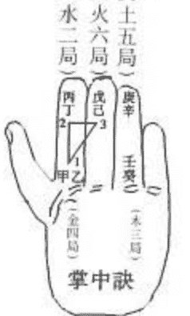
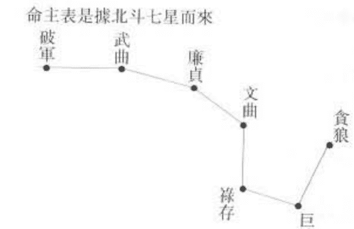

# 古學系列①

# 紫微斗數

# 預測解說

趙利華 編著

香港公共圖書館 HKPL

3 8888 09197212 9

# 玄學系列

策劃：楊戴森
主編：張得計 石昕
編委：張得計 石昕 木俞 劉永剛
      蘇格靚 聖通 陳威生 王正民
      梁超 范德軍 沈柏春 趙利華
      陳天欣 王來濱
總編審：蔡敦祺

# 《紫微斗數預測解說》趙利華編著

出版 —— 藝苑出版社
責任編輯 —— 梁美寶
版面設計 —— Justin Leung
香港黃竹坑道46號新興工業大廈11樓
電話：2814 0568 傳真：2555 0582

總代理 —— 天地圖書有限公司
香港皇后大道東109-115號智群商業中心十三樓
電話：2528 3671 傳真：2865 2609
香港灣仔莊士敦道三十號地庫/一樓（門市部）
電話：2865 0708 傳真：2861 1541
九龍彌敦道90號（加連威老道口）（門市部）
電話：2367 8699 傳真：2367 1812

(版權所有·翻印必究)
二〇〇一年·香港

# 目錄

- 前言 ........................................... I
- 自序 ........................................... IV
- 呂蒙正格言 ................................... VII
- 第一章 基礎 ................................... 1
  - 一、紫微斗數簡介 .............................. 1
  - 二、名詞解釋 .................................. 9
  - 三、命主 身主 ................................ 14
  - 四、命主落入諸宮之象 .......................... 16
  - 五、身主落入諸宮之象 .......................... 17
  - 六、諸星分屬南北斗五行陰陽並化吉凶一覽表 .... 19
  - 七、四化速查表 ................................ 23
  - 八、諸星速查表 ................................ 24
- 第二章 諸星宿解釋 .............................. 34
  - 一、星性所屬概說 .............................. 34
  - 二、紫微星 …… 38
  - 三、天機星 …… 42
  - 四、太陽星 …… 45
  - 五、武曲星 …… 50
  - 六、天同星 …… 53
  - 七、廉貞星 …… 57
  - 八、天府星 …… 60
  - 九、太陰星 …… 63
  - 一〇、貪狼星 …… 67
  - 一一、巨門星 …… 70
  - 一二、天相星 …… 73
  - 一三、天梁星 …… 75
  - 一四、七殺星 …… 77
  - 一五、破軍星 …… 81
  - 一六、文昌星 文曲星 …… 84
  - 一七、左輔星 右弼星 …… 88
  - 一八、天魁星 天鉞星 …… 91
  - 一九、祿存星 …… 92
  - 二〇、天馬星 …… 94
  - 二一、紅鸞星 天喜星 …… 95
  - 二二、天姚星 …… 95
  - 二三、羊刃星 陀羅星 …… 96
  - 二四、火星 鈴星 …… 99
  - 二五、地劫星 地空星 …… 102
  - 二六、天刑星 …… 102
  - 二七、三台星 八座星 …… 103
  - 二八、龍池星 鳳閣星 …… 103
  - 二九、台輔星 封誥星 …… 104
  - 三〇、天才星 天壽星 …… 104
  - 三一、孤辰星 寡宿星 …… 105
  - 三二、恩光星 天貴星 …… 105
  - 三三、天官星、天福星 …… 105
  - 三四、天傷星 天使星 …… 106
  - 三五、天哭星 天虛星 …… 106
  - 三六、咸池星 …… 107
  - 三七、大耗星 …… 107
  - 三八、破碎星 …… 107
  - 三九、劫煞星 …… 108
  - 四〇、華盖星 …… 108
  - 四一、天空星 …… 108
- 第三章 四化 …… 110
  - 一、四化概論 …… 110
  - 二、化科 …… 114
  - 三、化祿 …… 115
  - 四、化權 …… 116
  - 五、化忌 …… 116
  - 六、十干化祿 …… 119
  - 七、十干化權 …… 120
  - 八、十干化科 …… 121
  - 九、十干化忌 …… 123
  - 一〇、四化運用要點 …… 125
- 第四章 運限應用 …… 127
  - 一、五行局宮位 …… 127
  - 二、流年流月流日 …… 129
  - 三、活盤運轉原理 …… 133
  - 四、流年太歲 …… 136
  - 五、小限重要 …… 137
  - 六、流年大小限之吉凶 …… 137
  - 七、斗君過度諸宮之吉凶 …… 144
  - 八、流年斗君星宿現象 …… 145
- 第五章 古代紫微斗數文賦白話解說 …… 147
  - 一、太微賦 …… 147
  - 二、增補太微賦 …… 150
  - 三、斗數骨髓賦 …… 151
  - 四、女命骨髓論 …… 161
  - 五、形性賦 …… 161
  - 六、斗數準繩 …… 165
  - 七、斗數發微論 …… 165
  - 八、重補斗數毅率 …… 166
- 第六章 雜論 …… 168
  - 一、「時辰」以出生地時間為準 …… 168
  - 二、炒股票看財帛 …… 169
  - 三、看驛馬星動 …… 170
  - 四、驛馬也主交通工具 …… 171
  - 五、我適合算命嗎？ …… 171
- 第七章 實例命盤分析 …… 173

## 前言

中國古玄學在人類文化中構成一道奇異的風景線，那五彩奪目的光輝，讓多少人深深迷戀、研究、探討。現在越來越多的人開始認識它、研究它，又賦予它新的名詞——預測學。然而，一般人提起它就覺得深不可測，不敢問津。也有人把它看作迷信、偽科學加以批判。

相信事實是最好的答案。在數千年的歷史長河中已雄辯地證明了它存在的價值，因為它經過時間的考驗，不但沒有被淘汰，反而為更多的人所接受，用來檢驗現實生活。現代科學的發展不但沒有否定預測學，反而受其原理的啟發推進了一個科學的新時代，電子計算機的二進制的發明就是受中國周易陰陽八卦圖的啟示而來。從而周易被稱為科學皇冠上的明珠。

中國預測學經歷數千年的發展，已形成體系龐大的一種特殊的文化，類別之多令人歎為觀止，有關這方面的書籍更是汗牛充棟。為了給讀者全面瞭解這方面的知識，提供可具體操作的預測方法，並把它運用於實踐，指導現實生活，我們把中國傳統預測學加以整理分類彙編成這套入門讀本。為使讀者易學易懂易操作，編者煞費苦心，盡力做到分類嚴謹細密，體例科學合理，論述深入淺出，語言生動流暢，尤其是採用大量實例進行了詳盡講解。因各種預測學著重解決問題的性質不同，讀者可有選擇地學習其中的一門或幾門預測術。

各種預測學大致可分為：

- 卜占類，有《六爻預測解說》。這是一種最為古老的預測術，源於《周易》，過去使用六十四根蓍草卜占，現多使用三枚銅錢（多用乾隆、喜慶年間所鑄銅錢）合掌搖六次得卦，進行占卜，多用於一事一占，講究心誠則靈，鄭重其事者須焚香禱告神靈，以求心誠。依據六十四卦配以年月日時以斷吉凶。因此類預測書籍市面上很多，本書作者從入門知識講起，注重實例分析，多有獨特的心得。
- 星命類，有《四柱預測解說》這種以出生特定時刻為信息點的預測學，在所有預測學書籍中，可能最多，它是預測人生全部信息的預測學。要想知道命中註定了什麼，該如何趨吉避凶可讀此書。
- 三式類，包括《奇門遁甲預測說》、《太乙預測解說》、《六壬預測解說》、《金口訣預測解說》。這幾種預測術往往都有一個預測盤圖進行預測，所以叫式類，式，過去也寫作栻，即是占卜工具。是預測吉凶，選擇吉方吉時的預測術。金口訣本與六壬淵源很深，因其預測方法簡單，可以解百課，答百問，是一種靈驗異常又簡便易行的預測學，故單列出一書奉獻讀者。
- 相術類，有《手相預測解說》、《面相預測解說》。是一種較直觀的預測術，它憑著人們的手紋與面部特徵所規定的格局來預測人們一生的命運。
- 風水類，包括《陽宅風水解說》、《店鋪風水解說》與《陰宅風水解說》。前面種通過居住的環境特徵來預測主人吉凶禍福，通過住宅調整以趨吉避凶，事業興旺。後一種通過對陰宅風水的佈局以造福子孫後代。
- 術數類，包括《梅花易數解說》、《邵子神數解說》、《鐵板神數解說》、《北極神數解說》、《南極神數解說》、《紫微斗數解說》。這幾種預測學都是從卜筮類或星命類分解出來的，都有獨特的解斷方式。
- 《姓名學解說》與《擇日學解說》，是結合各種預測學與民俗傳統而發展起來的。通過姓名與擇吉來達到趨吉避凶，事業有成的目的。
- 雜占類，收集了多種簡易的預測方法，可作一種參考。它簡單易行，一看即會，但解斷較死，語言模糊。

雖然，我們在編排中盡了最大努力，但其中錯誤與不足也在所難免，誠望廣大易學愛好者指正。我們只希望通過本叢書的學習，諸者朋友能有所得。預測學是一門不同於當今科學範疇的全息論學，我們沒有理由去懷疑它。冷靜地思考一下，預測學經歷了那麼多世紀，儘管它存在著這樣那樣的不足之處，但它仍具有發人深省的東西。這種東西不是唾手可得的，它需要尋找，懷著真誠的願望去發掘，讓它更向真理靠近，我們有理由相信預測學在指導我們的生活中會大放異彩！

如果讀者通過本套叢書的學習，能夠把學到的知識應用於實踐，亦不負此次編寫目的矣。

張得計

## 自序

紫微斗數，是中國傳統命理學的最重要的支派之一。據說由陳摶創立。摶字圖南，自號扶搖子，宋太宗賜號希夷先生，民間稱之為陳摶老祖，真源縣人(今河南鹿邑)。他是傳統神秘文化中富有傳奇色彩的一代宗師，生活在五代末年和宋初的亂世之中，自稱是「非仙而即帝」的人物，傳說曾為趙匡胤、趙光義(即後來的宋太祖、太宗)兄弟和趙普相過面，指點其統一天下之策，被作皇帝後的趙氏兄弟奉為帝師。他是一位易學大師，精通易理玄機，務窮宇宙奧秘，首創《無極圖》，開創先天易學，以其心法傳授邵雍，成為象數學體系的開山鼻祖。同時他又是一位著名道士，曾周遊四海，後隱居武當、華山修道，以睡功聞名於世，並對道家內丹煉養理論精研和妙諭，成為上承呂洞賓、魏伯陽，開創丹鼎派中最神秘的內丹道的關鍵人物。他又善觀骨相，熟悉星算，被奉為傳統相學和紫微斗數的開山鼻祖。

命理學的出現，開拓了人們認識自己、認識宇宙運動變化的有秩程序。命理屬於人上之科學，是站在宇宙運動變化的角度用唯物主義哲學的觀點去研究人體生命現象。用最樸素的陰陽五行哲學辯證理論，研究人，判斷人生吉凶禍福，無疑是一種自然客觀規律的體現。如站在命理哲學思想外，去看問題都是偏面的，局部的，不完全的，迷信的。而命理學基點是從宇宙大環境下入手，既宏觀龐大，又具體微觀，一個人命運變化，大到社會環境，中到家庭關係，小到人體細胞，都是有一條命理公式結構所呈現的規律所支配。說白了說是由命運控制著人，人左右不了命運，而只能在命運賦予的信息內活動。

研究命理及其運用的價值，就是實事求是、破除迷信，遵循自然客觀規律，發揮人們自身潛能以適應現實生活環境，而不是盲目的追求財、官、利、名，不切實際的主觀要求。

以生男育女為例，從斗數命理學上講子女宮有地劫不利男孩，有地空不利女孩，有武曲羊刃，子女忤逆，敗家子，白髮人送黑髮人。既然大自然沒有賦予你生男孩，及得子女之利的生命因素，那麼為甚麼非要自找苦吃哪？子女生下來，還不個個是討債鬼，條條是要命郎。這就是不懂命理所帶來的惡果。同理，如命盤中，天梁不在財帛宮，或財帛宮不佳，沒有投機生意的命，可你偏去賭博，最終是折兵又賠夫人。沒有炒股票的命（太陽落陷坐財帛宮，事業宮武曲地劫，父母宮有化忌），積存多年的工資，或從親屬處借來的錢，你拿去炒股，最終會連本帶利賠個精光。法網恢恢，疏而不漏，違反法律必會遭到法律的制裁，違反了命理客觀規律，就會被命運嘲弄。社會法與命理法有機的結合起來才能彰顯做人的真正意義。

命理預測學是一部全息人體生命科學，包括生命細胞結構學、病理學、經濟學、家庭婚姻學、養兒育女學、計劃生育學、防病治病學……等。研究好命理，就能從中找出一條在任何領域中無法解釋的答案。隨著社會的進步，命理學也要適應人們的需求進行創造、修正。筆者初步試用斗數套用八字，八字藉助斗數，相互取長補短，相得益彰，再注入命理學三大體系，一是師承體系，二是盲藝人體系，三是五行生剋自學理論體系。如能把這三大體系揉合起來，藉助於現代科技手段，輸入電腦管理、統計、計算，人機對話，創造一種更完備、細緻、精確的運算機制，我想到那時會迎來命學界的又一個春天。

以上不成熟觀點，還望讀者與同道給於指正批評。

## 吕蒙正格言

蜈蚣百足，行不及蛇。家雞兩翼，飛不過雞。馬有千里之行，無人不能自往。人有沖天之志，無運不能自通。文章蓋世，孔子厄於陳蔡；武略超群，太公釣於渭水；李廣有射虎之威，到老無封；馮唐有安邦之志，一生不遇；漢王柔弱，而有萬里山河；楚霸英雄，敗至烏江自刎；伍員乞食於吳市，韓信受辱於胯下。時運未通，曾無一日之餐。及至運通，腰繫三齊王印。喝燕敗趙，流百萬之雄兵。一旦時衰，喪於陰人之手。

五男二女，到老一子全無。青春美女，卻嫁愚蠢之夫。俊秀才郎，反娶醜陋之婦。才疏學淺，少年及第登科。滿腹經綸，終至白頭不中。青樓美女，時來配作夫人。深院嬌娥，運退反為娼妓。淪貧君子，天然骨骼生成。驟富小人，不脫輕浮之態。蛟龍未遇，潛身於魚釜之中。君子失時，拱手於小人之下。「時運未通」，只宜守份安貧。「相格無破」，必有成名之日。

天不得時，日月無光。地不得時，萬物不盛。水不得時，風波不作。人不得時，運限不通。

誰不欲為富貴者也，我昔居洛陽，朝求廝僧，暮宿破窯，思衣不得蔽其體，思食不得充其飢。上人憎，下人怨！

人道我賤，非我之賤也，此乃時也、命也、運也。今我身居廟廊，位列三公，躬身於一人之下，列我於萬人之上，思衣有羅綢千箱，思食有珍饈百味。上人寵，下人擁。人道我貴，非我之貴也，此乃時也、命也、運也。嗟呼！人生在世，富貴不可盡用，貧賤不可盡欺！此乃天理循環，週而復始也。

# 第一章 基礎

## 一、紫微斗數簡介

紫微斗數用語之解說：

紫微，為北極星（也稱天璽星，位於北斗星東北，有星十五，以北極為中樞；又說：天璽指北斗勺柄諸星。紫微當以指北極星為準，其位當正北，恆存不動，諸星以為中心，環之而運行，是為帝星，諸星皆為輔弼拱衛。）

紫微斗數是中國命理學上，具有代表性的一項專門學術，目前在台灣、香港，與八字共為星相家最常採用的二種相命方法。

今茲介紹紫微斗數的基本用語。紫微斗數中所採用的各專用名詞非常特殊，是一般醫卜星相學所不用者。今特別列如下以供各位參考。

### 1、紫微

紫微所指的是周天三垣的中宿，紫微垣的中樞，又為北極星（現在稱之為勾陳一星），而紫微斗數中所採用的紫微星，僅是虛名而已，並非為實名星。

古人認為北極星位於宇宙不動之處，為中天之尊星，主造化之樞機。故以紫微為眾星之樞紐，掌握五行，為萬物生成之根源，並主宰人生。故在斗數中，以紫微為眾星統領命盤，主決定人之富貴貧賤吉凶壽夭等的禍福。北極星（紫微星）在陰陽道、宿曜經、密教占星法上，又稱為妙見菩薩。妙見菩薩眼睛特別澄明，經常照耀諸物，瞭望眾星之善行惡行，故有此名。顯現於空中時，則為北極星，即道教中所言的玄天上帝，並將其神格化，由此可見道教對北極星的推崇程度，不遜於任何神祇。

### 2、斗數

所謂「斗」，是指星斗而言。其中包括北斗諸星與南斗諸星。諸星在天上排成序列，稱之為斗，在地上則稱之為日數。而一般人也將「斗」做為計量的單位。在此斗可以做兩種解釋，一為命數之斗，二為根據斗星、斗杓的形狀，以做為諸物的容量。

嚴格而言，紫微斗數中的「斗數」，可以分為「斗」與「數」二部份。斗：為星斗，容量。有角度方位之意。數：為數目、數字，量詞。

### 3、諸星

- 主星：十四顆。
  紫微、天機、太陽、武曲、天同、廉貞、天府、太陰、貪狼、巨門、天相、天梁、七殺、破軍。
  十四顆主星又分兩大星系：
  - 紫微系星：紫微、天機、太陽、武曲、天同、廉貞。
  - 天府星系：天府、太陰、貪狼、巨門、天相、天梁、七殺、破軍。
- 吉星（七顆，稱七吉星）：文昌、文曲、左輔、右弼、祿存、天魁、天鉞。
- 凶星（六顆，稱六煞星）：火星、鈴星、羊刃、陀羅、地劫、地空。
- 其它：天姚、天喜、紅鸞、天刑、驛馬。
- 四化：化祿、化權、化科、化忌。
- 十二博士星：博士、力士、青龍、小耗、將軍、奏書、飛廉、喜神、病符、大耗、伏兵、官府。
- 十二長生：長生，沐浴，冠帶，臨官，帝旺，衰，病，死，墓，絕，胎，養。

常用的以上四十顆星，還有其它一些輔助星在此不作介紹。

把以上諸星排入命盤即可斷命。先畫一張命盤表格，地支十二宮位固定不變。

### 4、安星排盤

有兩種排命盤方法：

（1）一種是查表法，此方法只要認字的人按着表即可依此把星系排入命盤內，此表對初學者來說比較方便，對長期實用者來說就有點笨拙，因你隨時都要帶本附表在身邊，一旦忘記帶表就無法排命盤。

（2）訣竅法，此方法一旦熟練後很快就能把星系排入命盤，但對初學者來說開始較困難，不能得心應手。而對長期對實用者來說則很方便，不需要任何輔助資料。因已經裝進了腦子裏，可隨時取用（此斗數排盤優於八字，不用查萬年曆即能使用）。

下面講訣竅法排命盤：

1.  首先，要畫一張命盤表格。
2.  斗數排盤與八字有所不同，八字論命是取生年、月、日、時的全部干支，如趙利華男生於一九五八年八月初十巳時，其八字為戊戌、辛酉、壬寅、乙巳。而斗數只用生年的干支，月、日不用干支。如趙利華，戊戌，八、十、巳。將上述五字，排入命盤內。
3.  天干地支分陰陽。
    十天干 陽干：甲、丙、戊、庚、壬。
    陰干：乙、丁、己、辛、癸。
    十二地支 陽支：子、寅、辰、午、申、戌。
    陰支：丑、卯、巳、未、酉、亥。
    凡生年陽干出生的人稱陽男或陽女。凡生年陰干出生的人稱陰男或陰女。（與八字相同）。
4.  安命宮與身宮：從寅宮起正月，順數至生月止。再從本月上起子，逆數至本生時辰安命宮。順數至本生時辰安身宮。
5.  安六親十二宮（從命宮起反時針方向逆排）：1.命宮、2.兄弟宮、3.夫妻宮、4.子女宮、5.財帛宮、6.疾厄宮、7.遷移宮、8.奴僕宮、9.事業宮、10.田宅宮、11.福德宮、12.父母宮。
6.  五虎遁：即依據生年之天干，遁一組天干配合在十二宮上。天干所遁出之干由寅宮起順排。
    甲己之年起丙寅。
    乙庚之年起戊寅。
    丙辛之年起庚寅。
    丁壬之年起壬寅。
    戊癸之年起甲寅。
    這裏五虎遁與八字年上起月是一樣的。
    這裏講的是，本人生年，遁一天干，安入命盤表寅宮內。寅宮有了天干後，順行把十二宮地支，配上天干。（見舉例命盤的排法。）
7.  定五行局：依據命宮的干支而定。本章用掌中訣乃是目前最簡單而易解之法。如果讀者有時間，還是把納音歌背熟才是。
    A、掌中訣之天干為命宮之宮干。
    B、由掌中找出與你命宮相同的天干起子丑（地支必須兩個一組，如子丑、寅卯、辰巳、午未、戌亥）。順數至命宮之地支，則為你的局數。但有一點要特別注意的是順數時只是數到第三位就要回復到第一位位置，再重複數之。
    例如：戊戌年八月初十巳時生命宮為丙辰，由丙丁位起子丑，數到辰巳，落到掌中庚辛位，為土五局。

#### (8) 起紫微星：本篇亦用最簡捷之方法不必查表。

A、以生日除以局數，生日／局數

說明：
a、本公式之生日只有加沒有減。
b、若是生日與局數剛好除盡就無須加，如木三局生日為3，其商為1即紫微在寅。如水二局生日為6，其商為3即紫微星在辰。
c、若是不能除盡就把生日加到除盡為止，但須注意加單數為退、加雙數為進。若加3即退3宮，加2就進兩宮。以寅為一，卯為二，……，丑為十二。

例一：木三局26日即求法如下：(26+1)/3=9 商數9即為戌宮，但因為有加單數1就退一宮則為酉宮起紫微星。

例二：火六局10日生人求法如下：(10+2)/6=2 商數2即為卯宮，但因為有加數2就進兩宮則為巳宮起紫微星。

#### (9) 排紫微星系：逆推。歌曰：

> 紫微逆去是天機，隔一陽武天同當，再隔兩位廉貞宮，空三又見紫微郎。

#### (10) 排天府星系之星宿：

天府星依紫微星而定如下圖

| 巳 | 午 | 未 | 紫府申 |
|---|---|---|---|
| 辰 | | | 西 |
| 卯 | | | 戌 |
| 紫府寅 | 丑 | 子 | 亥 |

天府星與紫微星在寅、申同宮，紫微在卯，天府在丑，紫微在庚，天府在子，反之紫微在丑，天府在卯，紫微在子，天府在辰，其他位則如圖相對。

#### (11) 排天府星系：天府星系順行。歌曰：

> 天府順行是太陰，貪狼而後巨門臨，隨後天相天梁繼，七殺空三是破軍。

> 為好記憶，有打油詩如後：紫機空陽武，天同二折廉。府陰貪巨向良妻，隔山又逢破軍衣。

#### (12) 安七吉星：

A、文昌：由戌宮起子，逆推至生時安之。
B、文曲：由辰宮起子，順數至生時安之。
C、左輔：由辰上起正月，順數至出生月安之。
D、右弼：由戌上起正月，逆數至出生月安之。
E、天魁、天鉞：
歌訣：甲戊兼牛羊，乙己鼠猴鄉，丙丁豬雞位，庚辛逢馬虎，壬癸兔蛇藏。
F、安祿存星：
甲祿在寅、乙祿卯、丙戊祿巳、丁己祿午、庚申、辛酉、壬祿亥、癸祿在子。

#### (13) 安六煞星：

A、羊刃：依祿存所臨宮位之前一宮安之。
B、陀羅：依祿存所臨宮位之後一宮安之。
C、地劫：由亥宮起子，順數至出生時安之。
D、地空：由亥宮起子，逆數至出生時安之。
E、安火星、鈴星：依生年支起。
寅午戌年起丑、卯。申子辰年起寅、戌。
已酉丑年起卯、戌。亥卯未年時酉、戌。
再從始處起子，順數至生時安之。(前火星、後鈴星)。

#### (14) 安桃花、天刑、馬星：

A、天姚：依丑宮起正月順數至生月安之。
B、天刑：依酉宮起正月順數至生月安之。
C、天馬：(只在寅申巳亥四馬之地安之)依申宮起正月逆數到生月安之。
D、紅鸞：依卯地起子，逆數至生年安之。
E、天喜：依紅鸞星對宮安之。

#### (15) 天干四化：

| 生年 | 甲 | 乙 | 丙 | 丁 | 戊 | 己 | 庚 | 辛 | 壬 | 癸 |
|------|----|----|----|----|----|----|----|----|----|----|
| 祿   | 廉 | 機 | 同 | 陰 | 貪 | 武 | 陽 | 巨 | 梁 | 破 |
| 權   | 破 | 梁 | 機 | 同 | 陰 | 貪 | 武 | 陽 | 紫 | 巨 |
| 科   | 武 | 紫 | 昌 | 機 | 弼 | 梁 | 陰 | 曲 | 左 | 陰 |
| 忌   | 陽 | 陰 | 廉 | 巨 | 機 | 曲 | 相 | 昌 | 武 | 貪 |

#### (16) 生年博士十二星安法，依祿存所在宮位起博士。
祿存：男女尋祿存起博士，陽男陰女順行，陰男陽女逆行。依序為：
博士 力士 青龍 小耗 將軍 奏書 飛廉 喜神
病符 大耗 伏兵 官府

#### (17) 十二長生，依五行局長生之地安之，陽男陰女順行，陰男陽女逆行。
長生、沐浴、冠帶、臨官、帝旺、衰、病、死、墓、絕、胎、養。

#### (18) 起大限：依據命宮局數定之，由命宮起，每十年一
大限，陽男陰女順行，陰男陽女逆推。
大限安法：以命宮五行局數安之，如木三局，三歲至十二歲大限在命宮，陽男按順時針排列，十三歲至二十二歲在父母宮，陰女按順時針排列。陰男陽女則反之。

#### (19) 小限安法：
- 寅午戌年生人，辰地起一歲小限。
- 巳酉丑年生人，未地起一歲小限。
- 申子辰年生人，戌地起一歲小限。
- 亥卯未年生人，丑地起一歲小限。
- 小限不論陽男陰女，男命一律順排，女命一律逆排。每宮一小限安之。

#### (20) 流年：依太歲年為流年。
#### (21) 流月：以流年起正月，逆推至生月，再由生月起子，順數至生時為正月——斗君。
#### (22) 流日：依流月宮起初一。
#### (23) 流時：以流日宮起子時，順推。每宮一個時辰。

以上所必用的各顆星，大限、小限、流年、斗君，依次排完。請大家自行按自己或親屬的出生年、月、日、時，排出命盤達到熟練地步，為以後斷命作準備。與八字相比斗數排盤較複雜，但用起來，就比八字細緻、全面，容易判斷準確。

## 二、名詞解釋

三方——凡命盤中，任何一宮，其每隔五個宮位，及對宮，均稱三方，例如子宮為例，則午宮為對宮，申辰為二方，合稱三方。

小限——即當年年齡所在之宮，例如五，一七，二十九，四十一，五十三，六十五歲居申宮，則五歲，十七歲，二十九歲等均以申宮星宿來論當年吉凶。

大限——每十年換一宮，主十年吉凶。

六壬(或六甲)——六十甲子中，天干與地支相配，每個天干共有六次機會，稱六干如六甲、六乙、六丙，……六癸等，其中的壬，稱六壬。

四生——命盤上寅申巳亥四宮。

四馬——即四生。

四墓——命盤上辰戌丑未四宮。

四敗——命盤中子午卯酉四宮。

四正——以本宮合三方，稱三方四正。

六吉——指文昌，文曲，左輔，右弼，天魁，天鉞。

七吉——六吉加祿存。

四煞——指火星，鈴星，羊刃，陀羅。

六煞——四煞加地劫，地空。

拱——每隔五宮，稱「拱」，如子宮的拱宮是申辰兩宮拱子宮。

照(或沖)——即對宮，如寅申互稱對宮，子宮的對宮，不是未宮，而是午宮，例如丑未，卯酉，辰戌均互稱對宮，兩宮星宿互稱照或沖。

閑宮——星宿所在之宮，其光度中等，吉凶不甚顯著。

天羅——命盤中的辰宮。

地網——命盤中的戌宮。

廟地——星宿所在之宮，其光度最亮，即其吉利盛旺之地。

惡曜——指貪狼，廉貞，破軍，七殺，火星，鈴星，羊刃，陀羅，地空，地劫。

帝——指紫微星。

三奇——化權，化祿，化科，在命宮，或三方四正沖照，必能出人頭地。

夾——本宮之前一宮與後宮，稱「夾」，夾之力量很大，例如小限在左輔右弼之宮，運氣好，會買不動產，他如日月相夾，昌曲相夾等，但如係凶星相夾，即走惡運。

暗合——如寅與亥，稱暗合，他如卯宮與戌宮，辰宮與酉宮，巳宮與申宮等。

探花格——古代考舉制度，第一名為狀元，第二為榜眼，第三名為探花。四名以後統稱進士。

### 分析各星所在位置廟旺失陷

廟旺與失陷，也是紫微斗數論命的一個條件。具體分廟、旺、得地、不得地、陷。這是根據各個曜的性質和五行來分的。如太陽星，早上初升的時間一般為卯時，卯屬木，太陽屬火，木生火。有命盤上，太陽星入卯宮就為廟，發達，興旺。在出生前已透出其光，衝破黎明時黑暗的寅時雖光線不足，因寅屬木，也為相生，就處於旺。太陽出升後一直到午時，都是處於上升期，辰時至午時就也是旺。午時是太陽最旺的時期。未對太陽雖然光芒四射，卻已開始向西山趨落，未屬土，火生土，屬泄氣。僅能稱為得地，從未時到日落前的申酉二時，太陽均為得地。亥時和子時是一天結束和開始，這時期的太陽處於最不利的
地位。亥和子均属水，水克火，相克关系为陷。在亥与子前后两个时辰的戌和丑时，太阳即得时，又需生戊、丑二土为不得地。由此，我们可以看出一个星曜因处的宫位不同所发生效力也不同。

一般来讲，处在庙、旺、得地为吉；处在陷，不得地为凶。这个庙旺与失陷直接影响一颗星发挥的能力，因而影响人一生的命势。

这是从时间方位上讲的庙旺，庙旺还有另外一层意思。根据方位上宫名不同吉凶不一。仍以太阳星来说，进入酉宫为得地。酉为命宫则秀而不实，为夫妻宫，虽得地，但太阳火克酉金，夫妻不和，如果酉位是财帛宫，见左右月禄巨者大富贵。

诸多因素，使本来的吉星会变成凶星，凶星转变为吉星。在十二宫中，紫微和天府两大星系双星相会只能在两个宫中，我们综合简介一下：
寅申二宫紫微天府，天机太阴，太阳巨门，武曲天相，天同天梁等五组双星进入。
紫微星在寅申二宫均旺。天府星在寅庙，在申为得地，天机星在寅申二宫均为得地。太阴太阳在寅为旺，在申为得地。巨门星在寅申二宫均为庙。武曲星在寅申二宫为得地，天相星在寅申二宫均为庙。天同星在寅为得地，在申为旺。天梁星在寅为庙，在申为陷。

卯酉二宫紫微贪狼，天机巨门，太阳天梁，武曲七杀，廉贞破军等五组双星进入。

酉为得地。武曲在卯为旺，在酉为庙。破军在卯酉均为陷。

辰戌二宫紫微天相，天机天梁，廉贞天府三组双星进入。

紫微，天相，天机，廉贞在辰戌均为得地。天梁天府在辰戌二宫均为庙。

巳亥二宫紫微七杀，武曲破军，廉贞贪狼等三组双星进入。

紫微在巳亥二宫为旺。七杀、武曲、破军在巳亥二宫为得地。廉贞、贪狼在巳亥二宫均为陷。

丑未二宫紫微破军，太阳太阴，武曲贪狼，天同巨门，廉贞七杀等五组双星进入。

紫微、武曲、贪狼、七杀在丑未二宫为庙。太阳在丑为不得，在未地得地。太阴在丑为庙，在未为不得地。天同、巨门在丑未二宫均不得地。廉贞在丑未二宫均为得地。

子午二宫武曲天府，天同太阴，廉贞天相等三组双星进入。

武曲在子午二宫为旺。天府在子庙，在午为旺。天同在子为旺，在午为陷，太阴在子为庙，在午为不得地。廉贞在子午二宫得地。天相在子午均为庙。

分辨星位宫位的庙旺失陷是紫微术较复杂细致而变化多端的学问，关系又很重大。为了化繁为简，速查表例有星宿庙旺利陷表，可以查找。

## 三、命主 身主

### 定命主和身主

**命主：**

子属貪狼丑亥門，寅戌命宮屬祿存，
卯酉屬文巳未武，辰申廉宿午破軍。

命主星以命宮所主星屬貪狼，在丑宮和亥宮均屬巨門，在寅宮和戌宮屬祿存，在卯宮和酉宮屬文曲，在巳宮和未宮屬武曲，在辰宮和申宮屬廉貞，有午宮則命主是破軍。

**命主表**

| 命宮地支 | 子 | 丑亥 | 寅戌 | 卯酉 | 辰申 | 巳未 | 午 |
| :--- | :--- | :--- | :--- | :--- | :--- | :--- | :--- |
| 命主星 | 貪狼 | 巨門 | 祿存 | 文曲 | 廉貞 | 武曲 | 破軍 |

**身主：**

子午生人火星身，丑未天相梁寅申，
卯酉天同巳亥機，辰戌身主文昌君。

定身主是以生年地支來決定的。子年和午年生人身主星火星，丑年和未年生人身主天相，寅年和申年生人是天梁，卯年和酉生人是天同，巳年和亥年生人是天機，辰年和戌年生人是文昌。

**身主表**

| 生年支 | 子午 | 丑未 | 寅申 | 卯酉 | 辰戌 | 巳亥 |
| :--- | :--- | :--- | :--- | :--- | :--- | :--- |
| 身主星 | 火星 | 天相 | 天梁 | 天同 | 文昌 | 天機 |

紫微斗數中有命主身主，而諸書均未說明白，究竟身主命主之重要性及其關係如何？

所謂命主，是指先天的，身主是指後天的。
命主星宿，以命宮在何宮來安排，身主星宿，以年支來安排。

命主星宿與身主星宿均喜在吉地，主一生榮華富貴，若在陷地，宜輕財益壽，否則，財多損壽。

命主星宿在財帛宮、田宅宮、子女宮、夫妻宮、官祿宮、福德宮較吉。

命主星宿在奴僕宮、疾病宮、遷移宮、父母宮則欠佳。
命主星宿若與四煞劫空同宮，則不吉。

身主星宿喜落入財帛宮、田宅宮、子女宮、夫妻宮、官祿宮、福德宮則吉。

身主星宿亦喜在長生、帝旺之地。

身主星宿若落入兄弟宮、奴僕宮、疾厄宮、遷移宮、父母宮，則欠佳。

身主星宿亦忌與四煞劫空同宮。

趙利華命宮在辰，故命主是廉貞，本生年戊，故身主是文昌。

文昌在巳地父母宮，文昌在巳，為長生之地，對文化藝術有愛好研究。一生向學想從易學方面作出點成績，不知是否如願？……

身主、命主，逢空劫，主一生衣食不足！

## 四、命主落入諸宮之象

- 命身宮 旺地榮華富貴，陷地貧苦。
- 兄弟宮 旺地可得兄弟之助力，陷地兄弟無助。
- 妻子宮 旺地夫妻感情好，陷地夫妻緣薄。
- 子女宮 旺地得子女之力，陷地與子女緣薄。
- 財帛宮 旺地發財，陷地財來不聚。
- 疾厄宮 旺地身體健康，陷地多病。
- 遷移宮 旺地凡事遂順，陷地勞苦。
- 奴僕宮 有桃花，在外有私生子，或有繼室。
- 官祿宮 旺地吉，陷地不吉。
- 田宅宮 旺地置產。
- 福德宮 旺地亨福，陷地勞碌辛苦。
- 父母宮 旺地得父母餘蔭，陷地與父母緣薄。

趙利華，命主——廉貞，在末地〈田宅宮〉與七殺組合無煞星，剛旺利益之地，三十五歲大限走田宅宮，此大限買房子，置家產。

在幾年前住公房，根本沒有買房的必要，就是想買，靠工資吃飯，也是買不起房子的，可後來國家使行房產改革，動員職工買房，買與不買爭議較大，察看命盤田宅宮廉貞七殺組合，在旺地，利益之地，三方四正無煞星，決定買下公房產權。到了甚麼運氣，就有甚麼事情發生。人們事先是估計不到的。

如田宅宮有地劫、地空請不要買房置產，或不宜大量投資不動產，會因置產而破財，財產守不住。

## 五、身主落入諸宮之象

- 命身宮 旺地富貴，陷地貧苦。
- 兄弟宮 旺地兄弟和睦，陷地兄弟不和。
- 夫妻宮 旺地夫妻和好，陷地夫妻不和而且有剋。
- 子女宮 旺地子女孝順，陷地子女忤逆。
- 財帛宮 旺地生財，陷地破財。
- 疾厄宮 肢體傷殘，或受疾病折磨。
- 遷移宮 在外多不遂順。
- 奴僕宮 不論旺地或陷地，均不吉論之。
- 官祿宮 旺地官場得意，升官快，陷地貶謫。
- 田宅宮 旺地買不動產，陷地賣不動產。
- 福德宮 旺地諸事吉利，陷地勞心費力。
- 父母宮 旺地與父母緣深，陷地與父母緣薄。

我身主——文昌，在巳地父母宮，文昌長生之地，與父母緣深，父母在我學習文化易學方面起到了功不可沒的作用。十五歲大限走父母宮開始對學習感興趣，對文化藝術追求慾望增強。十五歲前對學習，像是一張油紙包着的東西，看不進去，也透不出來。父母宮又為文書宮，主學習環境，面相宮等。

| 姓名 趙利華 | 男 戊戌一九五八年 八月 十日 巳時 土 五局 |
| :--- | :--- |
| 天相 文昌 祿存 北斗 天梁 火星 羊刃 坎宮 | 廉貞 七殺 天魁 寡宿 天姚 鈴星 天哭 |
| 紅鸞 | |
| 15 | 25 | 35 | 45 |
| 2.14.26.38.50.62 | 3.15.27.39.51.63 | 4.16.28.40.52.64 | 5.17.29.41.53.65 |
| 博士 父母 姐 丁巳 | 力士 福德 病 戊午 | 青龍 田宅 衰 己未 | 小耗 事業 長生 庚申 |
| 巨門 天刑 厄靡 病劫 | 命主：廉貞 身主：文昌 | 文曲 |
| 南極 天虛 | | |
| 5 | | 55 |
| 1.13.25.37.49.61 | | 6.18.30.42.54.66 |
| 官符 命 沐浴 丙辰 | | 將軍 交友 沐浴 辛酉 |
| 紫微 貪狼 祿 右弼 | | 天同 |
| 科 咸池 | | |
| 115 | | 65 |
| 12.24.36.48.60.72 | | 7.19.31.43.55.67 |
| 伏兵 兄弟 死 乙卯 | | 奏書 遷移 冠帶 壬戌 |
| 天機 忌 太陰 權 | 天府 天鉞 破碎 | 太陽 鳳閣 | 武曲 破軍 左輔 天馬 |
| 龍池 | | | 天耗 天喜 孤辰 |
| 105 | 95 | 85 | 75 |
| 11.23.35.47.59.71 身 | 10.22.34.46.58.70 | 9.21.33.45.57.69 | 8.20.32.44.56.68 |
| 大耗 夫妻 病 甲寅 | 病符 子女 衰 乙丑 | 喜神 財帛 帝旺 甲子 | 飛廉 疾厄 臨官 癸亥 |

## 六、諸星分屬南北斗五行陰陽並化吉凶
一覽表

| 星名 | 斗分 | 五行 | 陰陽 | 化 | 主 |
| :--- | :--- | :--- | :--- | :--- | :--- |
| 紫微 | 南北 | 土 | 陰 | 尊 | 爲官祿主，解厄延壽制化。 |
| 天機 | 南三 | 木 | 陰 | 善 | 爲兄弟主。 |
| 太陽 | 南北 | 火 | 陽 | 貴 | 爲官祿主，爲父爲夫爲男。 |
| 武曲 | 北六 | 金 | 陰 | 財 | 爲財主。 |
| 天同 | 南四 | 水 | 陽 | 福 | 爲福德主。解厄制化。 |
| 廉貞 | 北五 | 木火 | 陰 | 囚 | 在身命爲次桃花，在官祿爲官祿主。 |
| 天府 | 南一 | 土 | 陽 | 賢能 | 爲財帛田宅主。 |
| 太陰 | 南北 | 水 | 陰 | 富 | 爲財帛田宅主，爲母爲妻爲女。 |
| 貪狼 | 北一 | 水木 | 陽 | 桃花 | 主禍福。 |
| 巨門 | 北二 | 水 | 陰 | 暗 | 主是非。 |
| 天相 | 南五 | 水 | 陽 | 印 | 爲官祿主，能制廉貞之惡。 |
| 天梁 | 南二 | 土 | 陽 | 蔭 | 主壽、解厄制化。 |
| 七殺 | 南六 | 火金 | 陰 | 將星 | 在數主肅殺，遇紫微化爲權。 |
| 破軍 | 北七 | 水 | 陰 | 耗 | 主禍福。司夫妻子女僕役。 |
| 文昌 | 南北 | 金 | 陽 | 科甲 | 司文爲能文之士。 |
| 文曲 | 北四 | 水 | 陰 | 科甲 | 司文爲舌辯之士。 |
| 左輔 | 南北 | 土 | 陽 | 助力 | 爲紫微相佐之星，行善令。 |
| 右弼 | 南北 | 水 | 陰 | 助力 | 爲紫微相佐之星，司制令。 |
| 天魁 | 南助 | 火 | 陽 | 陽貴 | 司才名之星，書生人貴。 |
| 天鉞 | 南助 | 火 | 陰 | 陰貴 | 司才名之星，夜生貴。 |
| 天馬 | | 火 | 陽 | 驛馬 | 司祿之星，主遷動。 |
| 祿存 | 北三 | 土 | 陰 | 爵祿 | 司貴壽，解厄制化。 |
| 羊刃 | 北助 | 火金 | 陽 | 刑 | 主刑傷。 |

| 星名 | 斗分 | 五行 | 阴阳 | 化 | 主 |
| :--- | :--- | :--- | :--- | :--- | :--- |
| 陀罗 | 北斗 | 金 | 阴 | 忌 | 主是非。 |
| 火星 | 南斗 | 火 | 阳 | 杀 | 主性刚。 |
| 铃星 | 南斗 | 火 | 阴 | 杀 | 主性烈。 |
| 化禄 | | 土 | 阴 | 财禄 | 掌福德主财禄，喜见禄存。 |
| 化权 | | 木 | 阳 | 权势 | 掌生杀主权势，喜合巨门武曲。 |
| 化科 | | 水 | 阳 | 声名 | 应试主文之星，喜会天魁天钺。 |
| 化忌 | | 水 | 阳 | 多纷 | 为嫉妒之星，主是非。 |
| 天空 | | 火 | 阴 | 空亡 | 主多灾。 |
| 地劫 | | 火 | 阳 | 劫杀 | 主破失。 |
| 天伤 | | 水 | 阳 | 虚耗 | 主破耗。 |
| 天使 | | 水 | 阴 | 灾祸 | 主灾祸。 |
| 天刑 | | 火 | 阳 | 孤剋 | 主刑天入庙掌兵刑，遇太阳武贵。 |
| 天姚 | | 水 | 阴 | 风流 | 入庙为风雅耗禄，陷地为淫佚。 |
| 天哭 | | 金 | 阳 | 刑剋 | 主忧伤。 |
| 天虚 | | 土 | 阴 | 空亡 | 主忧伤。 |
| 红鸾 | | 水 | 阴 | | 主婚姻喜庆。 |
| 天喜 | | 水 | 阳 | | 主婚姻喜庆。 |
| 三台 | | 土 | 阳 | | 主贵。 |
| 八座 | | 土 | 阴 | | 主贵。 |
| 龙池 | | 水 | 阳 | | 主科甲。 |
| 凤阁 | | 土 | 阳 | | 主科甲。 |
| 天才 | | 木 | 阴 | | 主才能。 |
| 天寿 | | 土 | 阳 | | 主有寿。 |
| 恩光 | | 火 | 阳 | | 主受殊恩。 |
| 天贵 | | 土 | 阳 | | 主官爵贵显。 |

| 星名 | 斗分 | 五行 | 阴阳 | 化 | 主 |
| :--- | :--- | :--- | :--- | :--- | :--- |
| 天官 | | 土 | 阳 | | 主显达大贵。 |
| 天福 | | 土 | 阳 | | 主爵禄福厚。 |
| 台辅 | | 土 | 阳 | | 为台阁之星，主贵。 |
| 封诰 | | 土 | 阴 | | 为封章之星，主贵。 |
| 孤辰 | | 火 | 阳 | 孤 | 主孤，忌入父母宫。 |
| 寡宿 | | 火 | 阳 | 寡 | 主寡，忌入夫妻宫。 |
| 蜚廉 | | 火 | | 孤 | 主孤剋害，忌入命身父母宫。 |
| 破碎 | | 火 | 阴 | | 主损耗不全。 |
| 解神 | | | | 化凶为吉 | 能解灾厄，化凶不吉。 |
| 天巫 | | | | 升迁 | 主升迁。 |
| 天月 | | | | 病 | 主有病。 |
| 阴煞 | | | | 小人 | 主有小人。 |
| 截空 | | | | 诸空 | 忌入命身宫，喜入疾厄宫。 |
| 旬空 | | | | 诸空 | 忌入命身宫，喜入疾厄宫。 |
| 博士 | | 水 | | 聪明 | 主聪明，有寿有权。 |
| 力士 | | 火 | | 权势 | 主权势，有操持权柄。 |
| 青龙 | | 水 | | 喜气 | 主喜气。 |
| 小耗 | | 火 | | 耗损 | 主不聚财，半凶。 |
| 将军 | | 木 | | 威猛 | 主威猛性暴，半吉。 |
| 奏书 | | 金 | | 福禄 | 主福禄，有文书之喜。 |
| 喜神 | | 火 | | 延续 | 主延续，吉庆喜事。 |
| 病符 | | 水 | | 灾病 | 主灾病。 |
| 大耗 | | 火 | | 耗败 | 主退祖破败。 |
| 伏兵 | | 火 | | 是非 | 主口舌是非。 |
| 官府 | | 火 | | 讼 | 主口舌刑杖。 |

| 星名 | 斗分 | 五行 | 阴阳 | 化 | 主 |
| :--- | :--- | :--- | :--- | :--- | :--- |
| 长生 | | | | 生发 | 不忌诸凶，忌落空亡。 |
| 沐浴 | | | | 桃花 | 喜临夫妻宫，忌入命身宫财帛宫。 |
| 冠带 | | | | 喜庆 | 主喜庆。 |
| 临官 | | | | 喜庆 | 主喜庆。 |
| 帝旺 | | | | 旺壮 | 主旺壮。 |
| 衰 | | | | 颓败 | 忌入少运。 |
| 病 | | | | 疾厄 | 忌入少运，忌入疾厄宫。 |
| 死 | | | | 死亡 | 忌入少运中运。 |
| 墓 | | | | 敛藏 | 喜入财帛，忌入命身。 |
| 绝 | | | | 绝灭 | 喜入疾厄宫，忌入命身子女宫。 |
| 胎 | | | | 喜 | 喜入夫妻子女宫，忌入疾厄宫晚运。 |
| 养 | | | | 福 | 诸宫皆为福。 |
| 将星 | | | | 化凶为吉 | 入身命宫主武贵。 |
| 攀鞍 | | | | 功名 | 入命身宫主武显。 |
| 岁驿 | | | | 迁动 | 入命身主武显。 |
| 息神 | | | | 消沉 | 入命身宫若无吉化解主人无生气。 |
| 华盖 | | | | 孤高 | 入命身宫宜僧道，不宜凡俗。 |
| 劫煞 | | | | 盗 | 喜诸星化解，忌诸星。 |
| 灾煞 | | | | 灾患 | 灾患，喜诸吉化解。 |
| 天煞 | | | | 殇父殇母 | 忌入命身父母夫妻宫。 |
| 指背 | | | | 诽谤 | 忌入命身宫。 |
| 咸池 | | | | 桃花 | 入命身财福诸宫主好色。 |
| 月煞 | | | | 殇母殇妻 | 忌入命身父母夫妻宫。 |
| 亡神 | | | | 耗败 | |
| 岁建 | | 火 | | 一年休咎 | 主一年祸福，忌与命照相冲。 |

| 星名 | 斗分 | 五行 | 阴阳 | 化 | 主 |
| :--- | :--- | :--- | :--- | :--- | :--- |
| 晦气 | | | | 唉 | 喜诸吉化解，忌诸凶。 |
| 丧门 | | | | 丧亡 | 主孝服妨妻虚惊，喜诸吉化解。 |
| 贯索 | | | | 狱灾 | 喜诸吉化解。 |
| 官符 | | 火 | | 讼 | 主官非刑杖，喜诸吉化解。 |
| 小耗 | | 火 | | 小失 | 喜诸吉化解，忌诸凶空亡。 |
| 大耗 | | 火 | | 大败 | 忌入命身财帛宫田宅宫。 |
| 龙德 | | | | 化凶为吉 | 喜入命身宫。 |
| 白虎 | | 金 | | 凶 | 主刑伤，喜诸吉化解。 |
| 天德 | | | | 化凶为吉 | 喜入命身。 |
| 吊客 | | 火 | | 孝服 | 主孝服妨妻虚惊。 |
| 病符 | | | | 灾病 | 喜诸吉化解。 |
| 小限 | | | | 一年休咎 | 主一年吉凶。 |
| 斗君 | | | | 一月休咎 | 主一月吉凶。 |

## 七、四化速查表

| | 甲 | 乙 | 丙 | 丁 | 戊 | 己 | 庚 | 辛 | 壬 | 癸 |
| :--- | :--- | :--- | :--- | :--- | :--- | :--- | :--- | :--- | :--- | :--- |
| 禄 | 廉 | 机 | 同 | 阴 | 贪 | 武 | 阳 | 巨 | 梁 | 破 |
| 权 | 破 | 梁 | 机 | 同 | 阴 | 贪 | 武 | 阳 | 紫 | 巨 |
| 科 | 武 | 紫 | 昌 | 机 | 弼 | 梁 | 阴 | 曲 | 左 | 阴 |
| 忌 | 阳 | 阴 | 廉 | 巨 | 机 | 曲 | 相 | 昌 | 武 | 贪 |

## 八、諸星速查表

### 1、命身宮速查表

| 命宮 \ 生月 | 一 | 二 | 三 | 四 | 五 | 六 | 七 | 八 | 九 | 十 | 十一 | 十二 |
| :---: | :---: | :---: | :---: | :---: | :---: | :---: | :---: | :---: | :---: | :---: | :---: | :---: |
| 命身 子 | 寅 | 卯 | 辰 | 巳 | 午 | 未 | 申 | 酉 | 戌 | 亥 | 子 | 丑 |
| 命身 丑 | 丑 | 寅 | 卯 | 辰 | 巳 | 午 | 未 | 申 | 酉 | 戌 | 亥 | 子 |
| 命身 寅 | 子 | 丑 | 寅 | 卯 | 辰 | 巳 | 午 | 未 | 申 | 酉 | 戌 | 亥 |
| 命身 卯 | 亥 | 子 | 丑 | 寅 | 卯 | 辰 | 巳 | 午 | 未 | 申 | 酉 | 戌 |
| 命身 辰 | 戌 | 亥 | 子 | 丑 | 寅 | 卯 | 辰 | 巳 | 午 | 未 | 申 | 酉 |
| 命身 巳 | 酉 | 戌 | 亥 | 子 | 丑 | 寅 | 卯 | 辰 | 巳 | 午 | 未 | 申 |
| 命身 午 | 申 | 酉 | 戌 | 亥 | 子 | 丑 | 寅 | 卯 | 辰 | 巳 | 午 | 未 |
| 命身 未 | 未 | 申 | 酉 | 戌 | 亥 | 子 | 丑 | 寅 | 卯 | 辰 | 巳 | 午 |
| 命身 申 | 午 | 未 | 申 | 酉 | 戌 | 亥 | 子 | 丑 | 寅 | 卯 | 辰 | 巳 |
| 命身 酉 | 巳 | 午 | 未 | 申 | 酉 | 戌 | 亥 | 子 | 丑 | 寅 | 卯 | 辰 |
| 命身 戌 | 辰 | 巳 | 午 | 未 | 申 | 酉 | 戌 | 亥 | 子 | 丑 | 寅 | 卯 |
| 命身 亥 | 卯 | 辰 | 巳 | 午 | 未 | 申 | 酉 | 戌 | 亥 | 子 | 丑 | 寅 |

### 2、安十二宮

求得命宮之後，即按下表，將十二宮填在命盤紙上。

| 命宮 \ 十二宮 | 兄弟 | 夫妻 | 子女 | 財帛 | 疾厄 | 遷移 | 交友 | 事業 | 田宅 | 福德 | 父母 |
| :---: | :---: | :---: | :---: | :---: | :---: | :---: | :---: | :---: | :---: | :---: | :---: |
| 子 | 亥 | 戌 | 酉 | 申 | 未 | 午 | 巳 | 辰 | 卯 | 寅 | 丑 |
| 丑 | 子 | 亥 | 戌 | 酉 | 申 | 未 | 午 | 巳 | 辰 | 卯 | 寅 |
| 寅 | 丑 | 子 | 亥 | 戌 | 酉 | 申 | 未 | 午 | 巳 | 辰 | 卯 |
| 卯 | 寅 | 丑 | 子 | 亥 | 戌 | 酉 | 申 | 未 | 午 | 巳 | 辰 |
| 辰 | 卯 | 寅 | 丑 | 子 | 亥 | 戌 | 酉 | 申 | 未 | 午 | 巳 |
| 巳 | 辰 | 卯 | 寅 | 丑 | 子 | 亥 | 戌 | 酉 | 申 | 未 | 午 |
| 午 | 巳 | 辰 | 卯 | 寅 | 丑 | 子 | 亥 | 戌 | 酉 | 申 | 未 |
| 未 | 午 | 巳 | 辰 | 卯 | 寅 | 丑 | 子 | 亥 | 戌 | 酉 | 申 |
| 申 | 未 | 午 | 巳 | 辰 | 卯 | 寅 | 丑 | 子 | 亥 | 戌 | 酉 |
| 酉 | 申 | 未 | 午 | 巳 | 辰 | 卯 | 寅 | 丑 | 子 | 亥 | 戌 |
| 戌 | 酉 | 申 | 未 | 午 | 巳 | 辰 | 卯 | 寅 | 丑 | 子 | 亥 |
| 亥 | 戌 | 酉 | 申 | 未 | 午 | 巳 | 辰 | 卯 | 寅 | 丑 | 子 |

### 3、定五行局

| 命宮 \ 生年 | 甲己 | 乙庚 | 丙辛 | 丁壬 | 戊癸 |
| :---: | :---: | :---: | :---: | :---: | :---: |
| 子丑 | 水 | 火 | 土 | 木 | 金 |
| 寅卯 | 火 | 土 | 木 | 金 | 水 |
| 辰巳 | 木 | 金 | 水 | 火 | 土 |
| 午未 | 土 | 木 | 金 | 水 | 火 |
| 申酉 | 金 | 水 | 火 | 土 | 木 |
| 戌亥 | 火 | 土 | 木 | 金 | 水 |

水二局、木三局、金四局、土五局、火六局。

### 4、紫微星速查表

| 生日 | 水局 | 木局 | 金局 | 土局 | 火局 |
| :--- | :--- | :--- | :--- | :--- | :--- |
| 初一 | 丑 | 辰 | 亥 | 午 | 酉 |
| 初二 | 寅 | 丑 | 辰 | 亥 | 午 |
| 初三 | 寅 | 寅 | 丑 | 辰 | 亥 |
| 初四 | 卯 | 巳 | 寅 | 丑 | 辰 |
| 初五 | 卯 | 寅 | 子 | 寅 | 丑 |
| 初六 | 辰 | 卯 | 巳 | 未 | 寅 |
| 初七 | 辰 | 午 | 寅 | 子 | 戌 |
| 初八 | 巳 | 卯 | 卯 | 巳 | 未 |
| 初九 | 巳 | 辰 | 丑 | 寅 | 子 |
| 初十 | 午 | 未 | 午 | 卯 | 巳 |
| 十一 | 午 | 辰 | 卯 | 申 | 寅 |
| 十二 | 未 | 巳 | 辰 | 丑 | 卯 |
| 十三 | 未 | 申 | 寅 | 午 | 亥 |
| 十四 | 申 | 巳 | 未 | 卯 | 申 |
| 十五 | 申 | 午 | 辰 | 辰 | 丑 |
| 十六 | 酉 | 酉 | 巳 | 酉 | 午 |
| 十七 | 酉 | 午 | 卯 | 寅 | 卯 |
| 十八 | 戌 | 未 | 申 | 未 | 辰 |
| 十九 | 戌 | 戌 | 巳 | 辰 | 子 |
| 二十 | 亥 | 未 | 午 | 巳 | 酉 |
| 廿一 | 亥 | 申 | 辰 | 戌 | 寅 |
| 廿二 | 子 | 亥 | 酉 | 卯 | 未 |
| 廿三 | 子 | 申 | 午 | 申 | 辰 |

如赵利华生日初十，土五局，紫微在卯。

### 5、紫微星系速查表

| 地支 | 天机 | 太阳 | 武曲 | 天同 | 廉贞 |
| :--- | :--- | :--- | :--- | :--- | :--- |
| 子 | 亥 | 酉 | 申 | 未 | 辰 |
| 丑 | 子 | 戌 | 酉 | 申 | 巳 |
| 寅 | 丑 | 亥 | 戌 | 酉 | 午 |
| 卯 | 寅 | 子 | 亥 | 戌 | 未 |
| 辰 | 卯 | 丑 | 子 | 亥 | 申 |
| 巳 | 辰 | 寅 | 丑 | 子 | 酉 |
| 午 | 巳 | 卯 | 寅 | 丑 | 戌 |
| 未 | 午 | 辰 | 卯 | 寅 | 亥 |
| 申 | 未 | 巳 | 辰 | 卯 | 子 |
| 酉 | 申 | 午 | 巳 | 辰 | 丑 |
| 戌 | 酉 | 未 | 午 | 巳 | 寅 |
| 亥 | 戌 | 申 | 未 | 午 | 卯 |

### 6、天府速查表

| 紫微 | 子 | 丑 | 寅 | 卯 | 辰 | 巳 | 午 | 未 | 申 | 酉 | 戌 | 亥 |
| :--- | :--- | :--- | :--- | :--- | :--- | :--- | :--- | :--- | :--- | :--- | :--- | :--- |
| 天府 | 辰 | 卯 | 寅 | 丑 | 子 | 亥 | 戌 | 酉 | 申 | 未 | 午 | 巳 |

### 7、天府星系速查表

| 天府 | 子 | 丑 | 寅 | 卯 | 辰 | 巳 | 午 | 未 | 申 | 酉 | 戌 | 亥 |
| :--- | :--- | :--- | :--- | :--- | :--- | :--- | :--- | :--- | :--- | :--- | :--- | :--- |
| 太阴 | 丑 | 寅 | 卯 | 辰 | 巳 | 午 | 未 | 申 | 酉 | 戌 | 亥 | 子 |
| 贪狼 | 寅 | 卯 | 辰 | 巳 | 午 | 未 | 申 | 酉 | 戌 | 亥 | 子 | 丑 |
| 巨门 | 卯 | 辰 | 巳 | 午 | 未 | 申 | 酉 | 戌 | 亥 | 子 | 丑 | 寅 |
| 天相 | 辰 | 巳 | 午 | 未 | 申 | 酉 | 戌 | 亥 | 子 | 丑 | 寅 | 卯 |
| 天梁 | 巳 | 午 | 未 | 申 | 酉 | 戌 | 亥 | 子 | 丑 | 寅 | 卯 | 辰 |
| 七杀 | 午 | 未 | 申 | 酉 | 戌 | 亥 | 子 | 丑 | 寅 | 卯 | 辰 | 巳 |
| 破军 | 戌 | 亥 | 子 | 丑 | 寅 | 卯 | 辰 | 巳 | 午 | 未 | 申 | 酉 |

### 8、生时星系速查表

| 生时\星名 | 文昌 | 文曲 | 地劫 | 地空 |
| :--- | :--- | :--- | :--- | :--- |
| 子 | 戌 | 辰 | 亥 | 亥 |
| 丑 | 酉 | 巳 | 子 | 戌 |
| 寅 | 申 | 午 | 丑 | 酉 |
| 卯 | 未 | 未 | 寅 | 申 |
| 辰 | 午 | 申 | 卯 | 未 |
| 巳 | 巳 | 酉 | 辰 | 午 |
| 午 | 辰 | 戌 | 巳 | 巳 |
| 未 | 卯 | 亥 | 午 | 辰 |
| 申 | 寅 | 子 | 未 | 卯 |
| 酉 | 丑 | 丑 | 申 | 寅 |
| 戌 | 子 | 寅 | 酉 | 丑 |
| 亥 | 亥 | 卯 | 戌 | 子 |

### 9、火、铃速查表

| 生年支 | 寅午戌 | 申子辰 | 巳酉丑 | 亥卯未 |
| :--- | :--- | :--- | :--- | :--- |
| **生时\星名** | **火星** | **铃星** | **火星** | **铃星** | **火星** | **铃星** | **火星** | **铃星** |
| 子 | 丑 | 卯 | 寅 | 戌 | 卯 | 戌 | 酉 | 戌 |
| 丑 | 寅 | 辰 | 卯 | 亥 | 辰 | 亥 | 戌 | 亥 |
| 寅 | 卯 | 巳 | 辰 | 子 | 巳 | 子 | 亥 | 子 |
| 卯 | 辰 | 午 | 巳 | 丑 | 午 | 丑 | 子 | 丑 |
| 辰 | 巳 | 未 | 午 | 寅 | 未 | 寅 | 丑 | 寅 |
| 巳 | 午 | 申 | 未 | 卯 | 申 | 卯 | 寅 | 卯 |
| 午 | 未 | 酉 | 申 | 辰 | 酉 | 辰 | 卯 | 辰 |
| 未 | 申 | 戌 | 酉 | 巳 | 戌 | 巳 | 辰 | 巳 |
| 申 | 酉 | 亥 | 戌 | 午 | 亥 | 午 | 巳 | 午 |
| 酉 | 戌 | 子 | 亥 | 未 | 子 | 未 | 午 | 未 |
| 戌 | 亥 | 丑 | 子 | 申 | 丑 | 申 | 未 | 申 |
| 亥 | 子 | 寅 | 丑 | 酉 | 寅 | 酉 | 申 | 酉 |

### 10、月系诸星速查表

| 生月\星名 | 一月 | 二月 | 三月 | 四月 | 五月 | 六月 | 七月 | 八月 | 九月 | 十月 | 十一月 | 十二月 |
|---|---|---|---|---|---|---|---|---|---|---|---|---|
| 左辅 | 辰 | 巳 | 午 | 未 | 申 | 酉 | 戌 | 亥 | 子 | 丑 | 寅 | 卯 |
| 右弼 | 戌 | 酉 | 申 | 未 | 午 | 巳 | 辰 | 卯 | 寅 | 丑 | 子 | 亥 |
| 天刑 | 酉 | 戌 | 亥 | 子 | 丑 | 寅 | 卯 | 辰 | 巳 | 午 | 未 | 申 |
| 天姚 | 丑 | 寅 | 卯 | 辰 | 巳 | 午 | 未 | 申 | 酉 | 戌 | 亥 | 子 |
| 天马 | 申 | 巳 | 寅 | 亥 | 申 | 巳 | 寅 | 亥 | 申 | 巳 | 寅 | 亥 |

### 11、年干星系速查表

| 年干\星名 | 甲 | 乙 | 丙 | 丁 | 戊 | 己 | 庚 | 辛 | 壬 | 癸 |
|---|---|---|---|---|---|---|---|---|---|---|
| 禄存 | 寅 | 卯 | 巳 | 午 | 巳 | 午 | 申 | 酉 | 亥 | 子 |
| 羊刃 | 卯 | 辰 | 午 | 未 | 午 | 未 | 酉 | 戌 | 子 | 丑 |
| 陀罗 | 丑 | 寅 | 辰 | 巳 | 辰 | 巳 | 未 | 申 | 戌 | 亥 |
| 天魁 | 丑 | 子 | 亥 | 亥 | 丑 | 子 | 丑 | 寅 | 卯 | 卯 |
| 天钺 | 未 | 申 | 酉 | 酉 | 未 | 申 | 未 | 午 | 巳 | 巳 |

### 12、年支星系速查表

| 年支\星名 | 子 | 丑 | 寅 | 卯 | 辰 | 巳 | 午 | 未 | 申 | 酉 | 戌 | 亥 |
|---|---|---|---|---|---|---|---|---|---|---|---|---|
| 天哭 | 午 | 巳 | 辰 | 卯 | 寅 | 丑 | 子 | 亥 | 戌 | 酉 | 申 | 未 |
| 天虚 | 午 | 未 | 申 | 酉 | 戌 | 亥 | 子 | 丑 | 寅 | 卯 | 辰 | 巳 |
| 龙池 | 辰 | 巳 | 午 | 未 | 申 | 酉 | 戌 | 亥 | 子 | 丑 | 寅 | 卯 |
| 凤阁 | 戌 | 酉 | 申 | 未 | 午 | 巳 | 辰 | 卯 | 寅 | 丑 | 子 | 亥 |
| 红鸾 | 卯 | 寅 | 丑 | 子 | 亥 | 戌 | 酉 | 申 | 未 | 午 | 巳 | 辰 |
| 天喜 | 酉 | 申 | 未 | 午 | 巳 | 辰 | 卯 | 寅 | 丑 | 子 | 亥 | 戌 |

### 13、十二长生速查表

| 局别\长生 | 水局 | 木局 | 金局 | 土局 | 火局 |
|---|---|---|---|---|---|
| 阳男阴女 | 申 | 亥 | 巳 | 申 | 寅 |
| 阴男阳女 | 亥 | 申 | 寅 | 巳 | 申 |
| 沐浴 | 酉 | 未 | 子 | 戌 | 午 |
| 冠带 | 戌 | 午 | 丑 | 酉 | 未 |
| 临官 | 亥 | 巳 | 寅 | 申 | 午 |
| 帝旺 | 子 | 辰 | 卯 | 未 | 酉 |
| 衰 | 丑 | 卯 | 辰 | 午 | 戌 |
| 病 | 寅 | 寅 | 巳 | 巳 | 亥 |
| 死 | 卯 | 丑 | 午 | 辰 | 子 |
| 墓 | 辰 | 子 | 未 | 卯 | 丑 |
| 绝 | 巳 | 亥 | 申 | 寅 | 寅 |
| 胎 | 午 | 戌 | 酉 | 丑 | 卯 |
| 养 | 未 | 酉 | 戌 | 子 | 辰 |

### 14、命主速查表

| 命宫位别 | 子 | 丑 | 寅 | 卯 | 辰 | 巳 | 午 | 未 | 申 | 酉 | 戌 | 亥 |
|---|---|---|---|---|---|---|---|---|---|---|---|---|
| 命主 | 贪狼 | 巨门 | 禄存 | 文曲 | 廉贞 | 武曲 | 破军 | 武曲 | 廉贞 | 文曲 | 禄存 | 巨门 |

### 15、身主速查表

| 本生年支 | 子 | 丑 | 寅 | 卯 | 辰 | 巳 | 午 | 未 | 申 | 酉 | 戌 | 亥 |
|---|---|---|---|---|---|---|---|---|---|---|---|---|
| 身主 | 火星 | 天相 | 天梁 | 天同 | 文昌 | 天机 | 火星 | 天相 | 天梁 | 天同 | 文昌 | 天机 |

### 16、星宿庙旺利陷表

|  | 子 | 丑 | 寅 | 卯 | 辰 | 巳 | 午 | 未 | 申 | 酉 | 戌 | 亥 |
|---|---|---|---|---|---|---|---|---|---|---|---|---|
| 庙 | 机相 紫杀 廉禄 阳 府惊 同 紫 紫 相 禄 府火 阴 | 府 府吕 府火 巨 梁 禄 机 府 禄 巨 梁铃 同 | 阴 武曲 巨铃 梁 贪 昌 梁 武 级 昌 武惊 禄 | 梁 阴羊 相鹭 禄 武 曲 相 贪 巨 曲 贪鹭 鹭 | 破 贪陀 梁鹭 鹭 级 破 级 廉 鹭 级刑 | 禄 相鹭 级刑 鹭 羊 禄 羊 刑 羊 | 刑 陀 火铃 陀 陀 | | | | |
| 旺 | 武巨 梁 紫 紫曲 阳 紫 阳贪 梁 紫 紫阴 阴 紫 | 同级 破 阳 机 破 阳 武巨 曲 同 机级 破 巨 | 贪 阴 级 巨 府级 破 府 曲 | | | | |
| 得地 | 吕 火 机 府 紫吕 府火 阳 机武 梁 紫 府 | 曲 铃 武 相曲 相铃 相 阳吕 火 相 相 | 破 府曲 铃 破 | | | | |

|  | 子 | 丑 | 寅 | 卯 | 辰 | 巳 | 午 | 未 | 申 | 酉 | 戌 | 亥 |
|---|---|---|---|---|---|---|---|---|---|---|---|---|
| 利 | | | 贪铃 | 廉 | | | 火铃 | | 贪 | 廉 | 火铃 | |
| 益 | | | 吕 | | | | | | | | | |
| 平 | 紫鹭 | | 贪 | 同 | 同 | 机级 | 廉 | | 贪 | 阳同 | 同 | 机武 |
| 相 | 廉刑 | | 曲 | 廉 | 鹭 | 武破 | 鹭 | | 鹭 | 廉 | | 级破 |
| | | | 刑 | 鹭刑 | | | 刑 | | | 鹭刑 | |
| 不 | | | 阳 | | | | 阴 阴 | | | | 阳 | |
| 得 | | | 同 | | | | 同 | | | | | |
| 地 | | | 巨 | | | | 巨 | | | | | |
| 庙 | 阳火 机 | 吕 | 阴相 | 阴巨 | 阴梁 | 同 | 机 | 梁火 | 相 | 巨 | 阳廉 | |
| | 羊铃 鹭 | 陀 | 破羊 | 火铃 | 贪廉 | 吕曲 | 鹭 | 陀铃 | 破 | 吕 | 梁陀 | |
| | 刑 | | | | 陀 | 羊 | 刑 | | 羊 | 曲 | 贪 |

## 第二章 诸星宿解释

## 一、星性所属概说

斗数禄命法从思想的脉理来看，是属于道家学说。在中国的历史演变过程中，道家之学，常兴于乱世。或许近几年来经济事业改革改革开放的发展变化，为此事业成功者、发财者有之，失败进而家破人逃者，身陷牢狱者，股票失利者，所在都有，间接地促成求教理命卜相者趋之若骛。涉及此道者，是不能不常怀履薄之心，更应藉它来做为修身励己辅助，如此才能彰显斗数命理对人生的正面积极的意义。

研习斗数的根本筑基要点首重星辰属性，以我几年来搜集民间论命的经验与本人为人论命所得的浅略概念，将诸星特性用现代环境代表涵义分叙如下：

-   紫微：部门最高领导，耳软心浮、脖子硬不随便低头、高楼大厦、高级沙发、珍贵细致的东西、电视、钟表、微电脑、冷门学问。

-   天机：兄弟、智慧、自负，钻牛角尖、不忠一主、画家、小汽车、机车、轨道、小工厂，天机会昌曲过河拆桥、喜学哲学、天机化忌断命很准。（赵利华戊戌年生人『戊』天机化忌入夫妻宫，比较适合学算命，有股钻劲，愈不明白的事愈想搞明白。但不适合开车、开工厂，化忌为干扰破坏之星，开会出车祸，走到流年戊干天机化忌的那年，再走到天机化忌的流月，开车与骑摩托车的人要注意会出车祸。开工厂不顺利，不是常搬动，就是机械部分易出问题，导致破产。)

-   太阳：眼睛、父、丈夫、能源、电、马达、博爱、律师、政治星、高地、铁塔、斑点、青春。

-   武曲：正财星、金融界（银行、出纳、会计）、工厂、采购员、红土高地、生产事业的工厂、金属业、鼻子（按：看面相都说大鼻子的人，走到中年财旺，可能鼻子代表武曲金星有关，学会了斗数，也就学会了看面相） 。

-   天同：福星、享受懒散、医生、服务业、上班族、装潢、餐饮业、自来水、流动水之沟地、膀胱。

-   廉贞：囚星、犯罪星、血、妇人病、流产、贫血、意外事故受伤（加七杀和凶星更验），四色牌、风月场所、屠宰场、行政是非、开罚单、官司、法院、水果园、廉贞贪狼同宫居田宅主菜市场。

-   天府：禄库、司令之星、自负现实、高楼高地、好面子、天府廉贞同宫主电脑、与陀罗同宫主贪污之财、臭包、不义之财。

-   太阴：主田宅、驿马、出租业、入庙名牌轿车、女性化妆品、床、套房、旅社。淡水、不动之水、阴庙、清洁星、入庙田宅宫主房子干净，陷落房子光线不足，太阴会昌曲——九流术士（学算命最准，灵感强）

-   贪狼：原料、教化之始、警政、神仙术、纸器建材、水池、陷地坟墓、会天刑不正道、偏财星、桃花星、寿星、嗜好、岔路口、娱乐界、肉类、色情场所。

-   巨门：中古车、国产汽车、铁道、暗沟小水沟、口嘴、户口簿、密医、地理师、符仔仙、卡车、吃药、补药、与天姚同宫吃迷幻药、遭窃、与太阳同宫主电冰箱、巨门化忌冲夫妻宫——同居、巨门化权居亥坐命——爱吹牛（加陀罗虚伪、伪君子）口是心非。与天同同宫女命会听男人甜言蜜语而上当，甚而抛夫弃子，加凶星暗泪常流。

-   天相：衣食星、印星——暗化权、和事老、流动之木、喷泉、瀑布、自助餐、矮树林、天相加天姚——毒品。天相加昌曲——存折、执照、证明。

-   天梁：大树、加化禄——森林、药用植物、药剂师、中医师、专科医院、诊所、护士、老师、股票、奖券、赌博。（按：如要知道你将来找个甚麽行业的对象，看你的夫妻宫，如有天梁加昌曲，或三方会昌曲，可能是教师或是文艺工作者。天梁、羊刃、铃星等，可能是外科医生，护士等。天梁在财宫的人，也有当医生的。炒股票会赚钱。赌博大多会赢，这种人灵感性强。）

-   七杀：警局派出所、警官学校、刀、重工业、特殊技术业——如霓虹灯业、铁工厂、军人、死亡星、爬虫类、恐怖电影、肺部、大流氓、加羊刃——重工业。（按：赵利华命盘田宅宫在未地「廉贞七杀」我与警官学校住对门，田宅宫代表住宅环境）。

-   破军：货柜车、大卡车、海边、海洋学院、海水、贮藏室、仓库、堆积物、玩具、化学品、破军化忌入命宫、疾厄宫——流氓头、破军化忌入女子、田宅线——小流氓。

-   羊刃：扁钻、针筒、蜜蜂、在田宅宫——家里养鸭子。

-   陀罗：不干脆、拖泥带水、暗病、慢性病、后遗症、癌症。

-   铃星：轨道，与天机同宫——镜子。

-   火星：噪音，在田宅宫——火灾。

-   禄存：财星、主孤——因羊陀夹忌，农牧种稻，桥梁、古井，在田宅宫居市区内——有金融机构。

-   文昌：文书、毛笔、借贷之利、化忌主交通罚单或支票退票，更可能是文书上的错误因此蒙受损失。

-   文曲：口才好、口舌便妄、争辩、逢化忌赌博稳输。

-   昌曲同宫：与天机同宫——过河拆桥、在田宅附近有学校、分期付款，付利息。

-   左辅：男贵人、圆巧、性较柔。

-   右弼：女贵人、机智、性刚烈、抱负、驿马。

-   左右入命——人长得不错，入夫妻宫——婚姻生活有人介入或同时与两位以上的异性谈恋爱，亦主老朋友。

-   天姚：厕所、鸽子、贺尔蒙（性激素）、卫生纸（棉）、女人月事、桃花、身忙心乱、感情用事。

-   天刑：借贷、业力星、犯法、刑警、命理、火灾、狗。

-   咸池：桃花、异性缘佳、书桌、化妆台。

-   化禄：有财、耳轻、没主见重感情。寿星、制厄解化星。

-   化权：能干、霸道、劳碌、固执。

-   化科：文凭、执照、贵人、讲情理、贵人的方位。

-   化忌：干扰、破坏、是非、困扰、固执、做事反复不定。

## 二、紫微星

紫微乃至尊星宿，又名帝座，专司官禄，即事业之星，属土，为阴土，在数专司爵禄，有解厄、延寿、制化之功；喜左辅右弼同宫为之相佐，天相文昌文曲同宫为之部从，天魁天钺同宫为之传令，日月为之分司，若不同宫，拱照亦吉。

于人之身宫命，主人形貌敦厚，谦恭耿直，面带长圆，中等身材，而腰背多肉，性情多变动，刚柔并济，故虽为人忠厚，而心地较小，且耳软心活，有多方面之嗜好，兴趣广泛，亦有随心所欲，不羁一切；如不会左右为孤君，则不能贵，多劳碌，有成败，更忌有四煞在陷地，多殒疾，或不善终，大小限逢之，若为军人，多是壮烈牺牲，若为平民，也会救人舍己而得身后哀荣。

若得禄存，左右，昌曲，武曲，天相，天府等吉星三合，大富大贵，将来会有意想不到的发财与成就。如果吉少而逢煞多，反不利。

男命若落于兄弟，子女，父母，疾厄，交友等宫，虽庙旺，亦做不利论之，尤以交友宫，反主为人势利，因友人皆贵，本身迎逢之人，亦是辛劳奔弛之命也。

福德宫男为陷弱，而女作庙旺，因男女不同，以女喜安享之故也。

至于紫府同宫于寅申二地，入命或落于父母，兄弟，夫妻，子女诸宫，俱以主孤论断，除非另有其他吉星，不然，父母早亡，或本身单传独子，或夫妻死别生离，或无子嗣等情。因其太旺，则过犹不及也。

至于紫微如与他星，如破军，贪狼，七杀，天相等同宫，当另于他星之编内，另作说明。

此星如在疾厄宫，主有胃脾之病，湿热，及杂痨等症，如在田宅宫主富裕且近有富豪之公馆，高楼大厦，或土坡，微高之地，或是名人之坟墓等，皆主吉。

-   1. 紫微男亥女寅宫，主甲生人富贵。
    男命得紫微在亥立命，当有七杀同宫，六壬年生人，禄存亦在亥，且紫微化权故吉。女命紫微在寅之命垣，当有天府同度，甲年干生人，禄存亦在寅宫，兼之廉贞化禄在午，武曲化科在戌，三合来朝，自然富贵矣，但紫府同宫之女命，恐有孤独虽是富贵，亦有美中不足之感。

-   2. 紫府武曲居财宅，更兼权禄富奢翁。
    斗数中以紫微天府武曲及双禄为财星，故如入于财宫及田宅之宫，再逢化吉，富裕无疑，因田宅乃藏财之所，如财宫旺，而田宅不佳，多是旺而难留，暗耗甚重。

-   3. 极居卯酉，劫空四煞，多为脱俗僧人。
    极指紫微，如在卯或酉立命，帝星在东方，西方乃失位，且必贪狼同宫，贪狼乃喜学神仙之术之宿，若再有劫空同属于身命，逢煞星冲破，必是空门中僧道之人。此局如有火星或铃星同度，则不作此论，反有富贵，但为人怪异。

-   4. 紫微七杀化权，反作祯祥。
    七杀乃孤克之宿，仅有巳亥二宫，与紫微十二宫中无失陷，仅有旺弱之分，以土去生七杀之金，且紫微能解七杀之凶而成权威，故反作吉论，以巳宫较亥宫更佳，因火以生土，土以生金之故也。

-   5. 紫微破军，无左右、无吉曜，凶恶官吏。
    紫微破军仅限于丑未二宫，方有同宫，例如有吉星禄马来合，乃斗数中之上格，若不逢吉星，如更无左右来会合，主为公家机关办公官员，为人凶恶狡诈，且是多淫，多欲之人。

-   6. **紫府夹命为贵格。**
    紫府二星，乃南北二斗之至尊，如在前后夹命垣，主富贵双全，然此格仅限立命寅申二宫，且一生多贵助。如紫微居丑未二宫，有破军同，天府在卯酉夹命，但垣无正星，藉用对宫之天同天梁为用，必身宫庙旺，且是无破。再紫微在卯酉有贪狼同，天府同丑未相夹命有太阴天机在寅申，并非入庙，因会合天同天梁，成「探花格」，亦必有吉多来扶方贵。不然，亦是平常人也。
-   7. **桃花犯主，性生活需求多。**
    主即帝，桃花指贪狼，但数中桃花之星颇多，如廉贞，又名次桃花，天姚是风骚之宿，文曲亦是桃花，咸池又名桃花煞。但紫贪之命主，必是淫行，必身宫及三合见桃花之星多，来会合者方是。但仍有富贵贫贱之差异。
-   8. **紫微居午无羊陀，甲己丁人为公卿。**
    紫微居午，帝居南极，但因火生土，亦旺。如无羊陀则甲生人禄存与武曲化科入于财宫，天府廉贞化禄于事业宫乃双禄朝元格，及己年生人禄存入命，武曲化禄于财宫，亦主富贵。丁年生人，禄存入命，亦主富中取贵。
-   9. **紫府朝垣活禄逢，终生福厚至三公。**
    朝者，即三合来照之意，紫府朝无煞大吉。例如：立命在寅，武曲天相来守照，午宫事业有紫微，戌宫财逢天府廉贞，若不逢四煞冲破，甲年生人，科权禄并存来会合，作极品之贵论。
-   10. **紫破辰戌，君臣不义。**
    辰为天罗，戌为地网，不利紫帝座。帝居辰则破军必居戌，帝居戌则破军必居辰，凡人身份居辰戌而遇紫破，主为臣不忠，先贵而终败。若命得帝星而身不逢破军，当另作别论。但可富而不能贵也。
-   11. **紫微七杀加空亡，虚名受荫。**
    前述紫微七杀化权，反为祯祥之说。但若再加截路空亡，或旬中空亡，则其人祖业虽佳，得受荫福，而本人并无创建树，虚人美名。
-   12. **君臣庆会，富贵全美。**
    紫微以左右为相，天相昌曲为从，以魁钺为传令，天府为帑藏，禄马为掌爵之司。此数星会合身命垣，无煞冲破，乃君臣庆会之路，主有极品之贵。
-   13. **紫微会吉于迁移，因人而贵。**
    迁移宫，主人在外之吉凶，亦主其人一生遭遇。尊星入于迁移，主为人多奔波，辛劳，离乡外出得意；亦主一生近贵人，而终得贵人之提携而发。
-   14. **紫破武曲会羊陀，欺公祸乱。**
    此数星会合于身命及合方，必为人好作乱，喜欺诈。例如，紫微命垣在丑宫，身宫武曲七杀居酉，庚生人羊刃在酉，陀罗于未来冲命。但此类之命，多有横发一时得意，最后破败，煞多则凶死。

### 三、天机星

天机阴木，南斗第三星，乃益寿之宿，兄弟之主，化气曰善。故又名善宿，为延年益寿之星，作兄弟之主宰，入命庙旺则肥胖，陷地则瘦弱。性格多计较精明，且勤劳谨慎，若与天梁同度于身命之地，多为好说喜辩论，有特殊技艺之人，心地善良，有宗教信仰。此星若再加魁钺昌曲，主多学多能，如有羊刃冲破加空劫，则孤甚，或是僧道之命。

天机会巨门于旺地，主武职荣身。若与太阴同度于寅申二地，为探花格，吉多可贵，不然平常，煞多反不吉。此格女命逢之，不论贵贱，多是二度婚姻，不然，填房偏房可偕老，如加煞，有淫行。且女命得此星除子午入庙加吉为佳外，余宫即有吉拱，亦有美中不足。若与巨门同度于酉宫，男命东南生人可吉，西北之人，即或有成就，终必不利，女命更忌，伤夫克子，淫贱无疑。大运逢之，亦此论断。

天机入限，主有环境之变动。会天马，有远行异乡之兆，且除子午庙地外，余皆主家务多纷扰不宁。且此星会天梁天同，则无论有煞来冲否，均主有高寿，再如行限，如逢机梁日月四会合于旺地，必多增财利，再加吉多，更有贵。

天机于疾病，主有肝胆之疾，性躁惊恐，眼花齿落之现象。女命经血亏损，于田宅，主有争执计较之人，附近有树林，电杆，楼窗，木栅，堆积之杂物等，以不见煞为佳，以旺论吉、弱论凶。

-   1、机梁会合善谈，居戌亦为美论。
    此二星同度，仅限于辰戌二宫，以辰宫较戌宫为佳，因辰土又为水库，又得巳木余气，而戌土为火库，有金之余气故也。此格又名「善荫朝纲」之格，为人多有技术，善辩论，加吉有富贵，煞多亦平常之命。以癸生人为上格，己生人次之，丁生人主富，乙生人有羊刃冲破，反而不利。戊宫立命，以己丁二年生人为吉，因丁生人双禄入财宫，可富，己生人天梁化科最吉，入命之故。戊年生人成败反复，因化忌入命，羊刃居财帛宫不利。

-   2、机阴同梁寅申宫，一生聪明。
    天机在寅或申，必有太阴同度，三合必见天同天梁二星于财宫二地来合，且有紫府前后相夹，乃探花格，居第三位，吉多亦富贵，无吉加煞，亦是平常之人。此格多出身公务员，为人灵敏，中年之后得意。但女命虽多吉，亦是美中不足。此格以申宫立命，较寅为佳，因二星申宫较旺之故。申宫以癸生人为上格，丙生人次之，亦吉。寅宫以丁生人为上格，己生人次之。

-   3、巨机酉上化吉者，纵有财官亦不荣。
    酉宫乃木死水败之地，故巨门水天机木同宫于此地，即有化禄，化权，或化科等吉星，即或有一时之荣华富贵，但鲜久破败。行限逢之，亦作此断。但详考东南沿海及台湾生人，不作凶论。加吉亦富贵，因出身地之故，以癸生人巨门化权为上格，辛生人，双禄入命亦吉，庚生人，羊刃在酉冲命，有大凶。

-   4、巨机居卯，先退祖业而后兴。
    二星在卯乃庙乐之乡，天机乙木得禄，且有巨门之水相生，若有禄存之地来培木，文曲之水再相生，乃机品之贵。但此格之人，多不依祖业，早年辛劳奔波，多成败，中年之后，勃然而兴，皆因天机主奔弛，巨门乃主破荡之故也。且一生多有競爭，並有刑剋，以乙年生人，雙祿入命為上格。癸生人，巨門化權最吉，且有天魁貴人同度，亦佳。壬生人，天魁入命，祿存在財宮，與福德之天梁化祿交馳，主大富。丙生人亦是雙祿交馳之財，並有天魁天鉞於亥酉二宮來合命，兼之天機化權入命，亦是名利兼收之人。惟女命必有一段傷心戀愛史。

### 5、機梁守命加吉曜，富貴慈祥。

天梁又名蔭星，與天機之善宿同度於辰或戌之宮，守命，主為人心慈祥，樂善好施。加吉星，更有富貴，固不待言。然亦有二星分處於旺地之身命，加吉曜，亦作此論。例如天機居午，天梁在寅之身命亦是。

### 6、天機加惡煞同宮，鼠竊狗偷。

此指天機在閒或陷地之身命，本主人狡猾好利，如再加惡煞，有二、三來相沖，主為人有偷竊的習性。再如天機加煞在閒宮之命，而身宮又是陷地，正是又逢沖破，亦作此論。

### 7、巨機陷地為破蕩。

此論二星陷地之身命。如天機在丑，巨門在巳，男命則一生多敗少成，奔波勞碌。女命淫賤多夫，且是刑剋極重，一生多淫奔，隨客飄蕩他鄉之命。

### 8、機梁守照，身命空，偏宜僧道。

假使人命立於辰，或戌宮，而無正星入命，對方有天梁天機在遷移宮來照合，無煞有吉，亦是富貴。但若命垣逢截路空亡，或旬中空亡，主孤獨貧寒，僅宜出家為僧。而身命無正星，僅有地劫地空來守，多半晚年亦是出家之命。

### 9、天機天梁羊刃會，早有刑剋晚又孤。

機梁在辰戌二宮，而有羊刃同宮沖破，主其人早年父母不全，中年或早婚而離別，或遲娶，晚年即或有子，亦不能畢合，甚或無子。此類格局，以辰宮立命，忌乙年生人，戌宮立命，忌辛年生人，為最不利。若辰宮立命，辛年生人，羊刃對宮來沖破，亦是多風波，刑剋極重，但較本命有羊刃者輕。

### 10、機梁陷地，女淫奔。

天機為奔馳及變遷之宿，天梁陷地主飄蕩風流有不良嗜好，此二星若落陷於身命二地，女命逢之，必有私奔，偷情之事，一生多夫。蓋因其性生活需求多，不耐深閨寂寞，只有跟男友私奔。

### 11、凡女命天機坐守，會欺負丈夫。

### 12、女命天機太陰，多為有婦之夫之情人，或小妾，或生活在夜生活中的女人。

### 13、女命天機加文昌或文曲，生活多彩多姿。

### 14、天機巨門同宮，人生必有缺憾。

例如，富時則多病，有幸福必有隱憂。輕財則能延壽。

### 15、天機坐命，聰明，靈巧，自持才華，致惹人反感。

## 四、太陽星

太陽屬陽火，乃日之精，司官祿之主，乃天中主星，主權貴，男以之為父星，女以之為夫星，入命喜白晝生人吉，夜生人即在廟旺之地，亦需扣分。以卯辰巳為旺，午為廟，未申為偏垣，主人作事先勤後惰，有始無終。酉宮為西沒，不利，戌亥子則名失輝，多費心勞力，是非多，若再逢四煞沖破，主人眼睛有傷。此星最喜會祿存，乃三台八座，得一同度，可增光辉，主有名聲。入命於旺地，圓型面，中等身材，壯碩，性剛強好動，心地慈善，言語直爽。女命得之，有男之氣概，但女命雖以之為夫星，而最喜廟旺於夫妻宮，則大吉。如正坐太陽，多奪夫權，且易接近男性，有桃花，為美中不足。

又日居戌亥，月在辰巳，稱為反背失陷，若有凶星沖破大凶，且有失明之處，若無煞有吉，秘經云：「陰陽反背，反大貴」。如日在寅宮，有巨門同度，亦主旺論。在卯乃日出扶桑，辰巳名升殿，居午謂之「日麗中天」，富貴雙全，因皆在廟旺之地，不怕忌星，多富而不貴。如有一二煞星來沖，雖有小疵，亦無妨大體，最忌羊刃同宮，作破局論。太陽在旺宮，有天刑同度，多是武職榮顯。最宜刑警，警備官員。調查局官員，或經營徵信社，私人密探等。此星於病，主頭部之症，血壓太高，有懼高症，大腸不健康，痔漏便血，肝火過旺，或目疾，斜視，散光，失明，內障，生翳等。

太陽於田宅，主富足隆盛，近有高樓，乃一切凸出，高超之建築物，俱以吉論。

-   1. 日照雷門卯辰巳地，一生富貴名揚。
日出於卯，有天梁同度，又名：「日出扶桑」。白天生人大吉，更喜有祿馬來合，以壬年生人化祿，並天魁入命，祿存與太陰旺地，在亥來合，為上格；乙生人祿存並化權入命，財逢化忌，旺宮不忌，亦吉。辛生人化權入命祿存對宮來合，事業在未宮無正星，藉用丑宮巨門化祿為用，亦吉。最忌庚生人，雖有化祿入命，因羊刃在酉對方來沖，多凶險，加煞天壽橫死。辰宮以癸生人魁鉞夾命，財官祿存並巨門化權為上格，丁生人對宮太陰化祿來朝亦吉。乙生人羊刃入命，對方太陰化忌不利。已宮，以辛生人為雙化科會合，且申宮紫府祿存來暗合亦吉。但事業宮之太陰有羊刃同度，宜軍職，商人則事業多成改風波。

-   2. 太陽居午，日麗中天，有專權之貴，敵國之富。
午宮廟地，光芒萬丈，其吉可知。忌逢空亡，喜晝生人，以癸生人對宮子宮天梁，祿存來朝，事業逢巨門化權及已生人祿存同度，對方天梁化科來照，均是上格。辛生人化權入命，化祿並羊刃於事業，宜武職亦富。丁生人祿存入命，財宮寅方無正星，藉用福德宮之天同太陰，有科祿之吉，大富。若庚生人化祿入命，但截空亦在命宮，多虛利，若加煞，亦平常人也。

-   3. 太陽化忌，是非日有目受傷。
日月二星，乃主人之眼睛，化忌，乃是是非用多管之宿，太陽陷在之命，本是辛勞，再化忌，多是眼睛受傷，加煞失明。若在旺地化忌加煞，亦有斜視，吊眼，生翳等等。如旺地有煞忌，亦多色盲，近視，散光，生翳等。

-   4. 日落未申在命垣，為人先勤後惰。
太陽在未，有太陰同度，必先考其人之形態，若如太陽之象，外向，雄偉，則其人作事先勤後惰，如似太陰之形態，外貌文靜，羞，內向，性急，則不作「先勤後惰」論。

申宮有巨門同宮，作事先勤後惰，言過其實，惟為人隨和，不計得失，心情愉快，宜當老師，作育英才，尚能負責守職。

-   5. 日落酉宮，埋沒人才。
酉宮太陽，巳日落西山，古人稱為「苗而不秀」，一生難逢佳運，埋沒人才，不得貴人賞識提拔，宜晚婚，事業也要到中年後才有成就，或有富貴，但結局不佳。

### 6、太陽會文昌於官祿，可當行政院長。

二星旺地於事業，主貴，多是總統或元首身邊大臣。文昌陰辛金不忌陽火，若文曲之陰水，雖不剋太陽，但不如文昌之吉。且太陽多主武職榮顯，加文星，允文允武，可謂全材。

### 7、日巳月西安命丑，穩步蟾宮。

蟾宮折桂，指金榜題名，丑宮安命無煞沖破，天梁旺宮，而財官逢日月大吉。此類格局，多名利雙收，尤以甲生年，陀羅入命，雙祿逢前後相夾，陀羅金入庫不妨，事業旺宮，化忌不忌，兼是坐貴向貴，大吉。

### 8、日卯月亥，安命未宮多折桂。

太陽在卯，有天梁同度，則太陰單守亥，若未宮安命，日月旺地來朝，吉。但此格局，命無正曜，最忌，有煞守命，尤以羊刃最嫌，作破局論，且多生災惹禍，多是非。以壬年生人，雙祿在日月同度來朝最吉。丙生人，對宮天同化祿來照亦吉。

### 9、日月在未同宮，安命丑，可當縣長。

日月同宮，不宜守命，若在未，命宮在丑，或日月在丑，安命在未吉扶亦貴，古以公為最上，侯伯次之，比之現在縣長，廳長，局長之階。此格局，以日月在丑，命宮在未較佳，因三合巨門在卯為入廟，如反之，則巨門在酉之敗地，美中不足。

### 10、日月身命居丑未，三方無吉反為凶。

日月守命於丑未宮，奪父母之宿於本身，需有吉星祿馬來扶方吉，若無吉星，雖無煞亦不吉，加煞刑剋夭壽。如丁生人立命未宮，日月守照有羊刃，主人離財散，加之財宮有化忌，亦不利。

### 11、日月夾命，不權則富。

太陽乃官祿之主，主貴，而太陰乃財帛之主，主富，二星夾命於旺地，主財權皆隆。如人立命未宮，天府坐守，太陽居午，太陰在申，前後相夾，乃立命丑宮，武曲貪狼守命，太陽巨門在寅，太陰天同在子前後來夾，無煞沖破命垣，均是富貴雙全。

至若太陽巨門在申宮，太陰天同居午之陷地，夾未宮武貪之命，若本命無吉，均是虛名虛利，或富而不貴。及天府在丑，太陽居子及太陰在寅來夾，亦作此斷。

### 12、太陽居於福德，近貴榮財。

福德宮，及財之來源，若太陽旺地逢之，財源極旺，且太陽主貴，多得貴人之財，故曰：「近貴榮財」，陷地則不作此論。

### 13、女命太陽坐命，河東獅吼。

女性若是太陽星坐守命宮，再加文昌，文曲，天魁，天鉞，左輔，右弼，祿存，化祿，化權，化科的話，此人必是河東獅吼，丈夫懦弱怕太太。

### 14、凡女命太陽坐守，必是眉清目秀，自尊心高，待人有禮，儀態大方。

在旺宮，必嫁富豪之家當媳婦。在陷宮，夫星不美，宜作偏房。

### 15、凡太陽坐命宮又在陷宮之男女，中年後會失去理智。

沉溺酒色賭博，宜早離家背井，到外地去發展。

即使太陽不在命宮，凡在陷宮，即戌，亥，子三宮，均作勞碌奔波。寡合召非，眼睛有傷，化忌帶疾，加煞目疾論。

太陽火星，目必傷。

## 五、武曲星

武曲陰金，北斗第六星，司財帛之主，又名財星，為剛毅之宿。入命體型中矮，肌肉結實壯碩，面方闊而聲音宏量，性剛心直，氣量寬宏。最喜西北方生人，富貴不久，東南方生人，可富不貴。女命加吉雖佳，但多早寡。

此星入廟，與天府同度於子午宮，而無羊刃沖破，主有高壽；以財帛及田宅宮為廟樂之鄉，逢吉多而為福，遇煞多亦可作禍。如命祿馬於旺地之身命宮或大小限，主異鄉得意，發財，同貪狼而無吉相扶，反主夭壽，且係量小慳吝之人。最喜與祿存同度於田宅或財帛宮，必發財巨富。

此星以辰戌丑未四庫之地為廟樂，若火貪同度或對照，主大富貴，亦喜年支為辰戌丑未生人。如與昌曲同宮，主人文武皆能。若與七殺火星同度，有因財被劫之兇，煞多夭折。此星不論男女逢之，若會合羊刃，男孤，女寡，刑剋極重。

武曲之星最喜化權，若人命得之，而身宮逢廉貞因星，乃財與因仇，因武曲之陰，被廉貞之陰為相剋傷，陷地則一生貧賤，如旺在有吉扶，亦有富貴之人，但結局仍是不利。

若命逢武曲而身得破軍，旺有富，陷地乃破祖離鄉，巧藝立身之人，終身多成敗，勞碌不能得意，亦主孤剋。

此星於病，主肺經咳嗽，咯血，勞傷之症，鼻塞，肝旺，大便秘結等。於田宅，主富足，近有煙囪，廟宇，寺塔，及突然而立之物，皆以吉論之。

-   1、武曲文星於身命，文武兼備。
武曲逢文昌，乃金逢金星，自吉，逢文曲，金去生水，亦佳，故武曲及文星，若身命各得其一，主人文武皆全，必富貴榮華。若在陷地，主為人伶俐，有巧藝急智，但虛誇不實，逢煞沖破，多是孤寡辛苦之人。此格不喜女命，因雖能幹，但多刑剋。外向。

-   2、武曲廟垣，威名赫赫。
此論格局，以西北方生人，年支為辰戌丑未者為上格。廟垣指四庫及子午宮言。東南生人，富而不貴，更無威名矣。但女命總是美中不足。丑宮以甲年生人，坐貴向貴，陀羅入廟；三合科權祿為上格。未宮以庚生人坐貴向貴，武曲化權為最吉。辰宮以癸生人魁鉞夾命，雙祿交馳於財富之鄉，事業逢紫府，大吉。甲生人科祿如會，可富。戊宮，甲生人雙祿於財富二地來朝，富貴。再如辰宮立命丙生人雙祿夾命，而財逢廉貞平和之地化忌，主為人親友關係極佳，多貴人，有享受，但財來雖旺，而不能聚，因化忌之財，更加福德之羊刃故也。

-   3、武曲祿馬交馳，遠方發財。
假如人命逢武曲廟地，得祿存天馬同宮，或對方來合，或分處於財官二宮來朝，離鄉遠出，必有得意之時，且財旺異常，行限逢之，亦作此論。此局如有貪狼同度，則不忌火星，且反作更吉論，不然，即或得意，終因財生禍，兼有凶險，因火剋金也。

-   4、武曲魁钺居庙旺，财赋之官。
庙旺指武曲而言，至于魁钺二星，虽属火，因是吉星，且必附有正星，即正星吉则吉，陷地，亦失作陷论。此诀论武曲魁钺旺地于事业，或命垣，多作金融之官员，掌管财务，或是银行经理人才。陷地，多数作商界之出纳、会计，不能贵也。

-   5、武曲聚于迁移，巨商高贾。
身命同宫，会武曲财星于迁移，来合，主巨富，经商之人。迁移宫，主人一生之遭遇，乃外出吉凶，遇吉则吉，逢凶多凶，财星而附有化吉。或有昌曲魁钺左右禄马等吉星，无煞冲自然大富。

-   6、武曲贪狼财宅位，横发资财。
二星同宫仅丑未二宫，且皆旺地主吉，又主晚发，多不依祖业，故有横发之意，财帛逢之财旺。若入田宅，因田宅乃存财之所，得财星，自然富足矣。若人命财宫虽佳，而田宅有煞无吉，多旺而不聚，结果虚发。

-   7、武破相遇昌曲逢，聪明巧艺定无穷。
武曲文昌阴金，破军文曲荫水，四星会合身命二地，金水相生，聪明而有巧艺，必庙旺，可富；陷地一生不遂。但不论庙陷，均是一生奔波辛劳，亦有成败起伏，因文曲遇破军主贫，文昌逢破军主刑克劳碌，若武曲与破军分处于弱宫，有倾败之危。

-   8、财与囚仇，一生贫贱。
囚指廉贞，因其阴火克武曲之阴金，财遭伤，主贫贱。此二星不能同度，仅可分处于身命二地。然亦有得意之人，囚在庙旺之地，且有吉多来扶，但结果不佳。

-   9、武曲破军，破祖破家又劳碌。
破军又名耗星，财宫逢之不利。此二星庙旺仍有富贵，若陷弱在亥，或分处二地之身命，无吉加煞，破祖业孤泊劳碌。

-   10、武曲七杀逢羊刃，因财持刀。
羊刃乃刑杀之宿，与七杀同宫更增凶虐，财星同处，则有因财务纠纷，而有持刀凶杀之后果。此诀如行限逢武曲七杀同处于酉宫，值庚之流年，流羊同度，有因财持刀之象。加他煞则更凶，有白虎必有刑伤。

-   11、武曲火星为孤寡宿。
武曲财星主孤克，故女命不喜，加火星在夫妻宫，金被火破，多婚姻不美满，早婚生离，迟至中年，多作寡妇论。

-   12、武曲贪狼加煞忌，技艺之人。
身命武贪不见吉扶，不能富贵，加煞及化忌来冲，多是百工技艺之人，劳碌飘泊，为福不全，不然夭折。

## 六、天同星
天同阴水，南斗第四星，可延寿，为福德之主，化气曰福。

天同福星，乃益寿之星保生之宿。入命主少年面白，老年微黄色，长方脸型，入朝肥胖，陷弱矮小，性温和慈善，有机智，无激亢，精通文墨。若逢煞星同度冲破则主孤单，破相。若与陀罗同度，多有眇目，斜视，并会发胖。此星男若得之于事业宫，如本命无格局，反不以吉论。因福星多安享反不能创造矣。

幼年与老年逢之，均作吉论，以其得父母之荫护，及老年安享，如壮年逢之，亦不能开创，故离庙地，仅是坐享，陷弱则更不利矣。

但如另有正星同宫当另作他论，例如与太阳同度在子乃水澄桂萼之格大吉，即不必论及其少或老矣。若是男命，必得贤妻之助，女命则宜偏房。

> 此星最喜会天梁及左右，秘经有云：「荫福聚不怕凶危」，二星仅寅申二宫同处，以寅较申为佳，加吉扶，多是富贵双全之人。女命刚得之，一生安享，富裕，助夫益子，且是相貌端庄秀丽。但巳亥二宫，女命虽美貌，加吉亦有富贵，但淫荡难免。如在酉宫，女多再嫁，或是细姨，因酉，乃水之沐浴之地。丑未宫落陷，加煞多是风尘女郎，若有吉扶，亦是先贱后富，不作全美论之。

再此星，不论男女得之单守于卯或酉宫，且庚年干，年支为子午卯酉生人，必是凶死，或早夭，因庚生人羊刃在酉，化忌入命之故。

天同于病，主膀胱，疝气，水肿及风瘫之类。

入田宅可积财，附近有水道，水沟，井泉，水坑，或低洼之地，皆以吉论之。

-   1、天同羊刃居午位，丙戊生人镇压边疆。
福星居午，当有太阴同宫，本是陷地，主飘泊，故曰边疆，而丙年生人化禄入命，事业宫机梁庙地化权再合。及戊年生人羊刃入命，有化权，且有双禄前后来夹，羊刃反为我用，主武职荣显。此格又名「马头带箭」，（汉光武帝有此格），若无吉来扶，多不善终。以丙年及戊年生人为最吉。

-   2、天同戌宫逢化忌，丁生人命遇反为佳。
福星居戌弱地，本不利，而丁年生人，虽有化忌对方来照，因三合双禄及科权、且有魁钺夹命亦是亦奇格，多白手创业，有非常成就。早年辛劳，晚景富贵。此格利男命，因阴男大运逆行故吉。若女命则顺行，格局吉，而运不利，有势禄，奔波，终可小富，平常之人也。

-   3、寅申最喜同梁会。
太微赋云「荫福聚，不怕凶危」，同梁会于寅，或申宫之旺地，古多富贵声扬，无吉有煞，亦不怕凶险，可化成安祥，此格兼有高寿。寅宫立命，以己生人天梁化科入命，禄存并天钺来合。丁生人权禄及禄存会合为上格。壬生人化禄入命，亥方有禄存暗合亦吉，多富。申宫以丙生人明禄暗禄格，及丁生人权禄三合及己生人荫星化科入命，魁钺会合均吉，但不如寅宫之佳。

-   4、福星居于官禄，却成无用。
事业宫若逢福星单守，即或庙旺，亦无大发展，多宜守祖业。若本命不利，又不能依祖，则更不佳。但若入本命有格局，如立命未宫而无正星，日月对照加吉，财逢巨机，事业得福星，当不作此论。
又例：巨在亥宫之命，太阳在巳对照大吉，事业之天同，不作无用论也。再若另有正星同度之事，亦不作此论。

-   5、善福坐于空位，天竺生涯。
天竺，古国名，即现在印度，天竺生涯指为僧为道。如人命身二宫，得天机之善，及天同之福分守，而命逢截路，或旬空，兼之劫空纠缠，又无禄马及吉多来扶，多是僧道之命，再或有吉而不多者，先俗，而晚年遁入空门。

### 6. 女命天同必是贤。
福星主静与安享，故女命得之必贤，但不喜在亥及酉宫立命，虽有吉，亦美中不足。丑未宫多刑克凶暴，喜甲生人立命寅宫，禄存同度，亥方有化禄暗合，辛生人立命卯宫，禄存旺地对照财宫化禄亦吉。子宫立命，以丁生人三合科权禄及癸生人禄存同度均佳。至若丑立命，有巨门同度，癸生人羊刃入命，但巨门化权，并暗合子宫之禄存，当先是出身贫贱，甚或二三婚娶，但晚景甚佳，福泽优厚，且得子女之力。

### 7. 同月陷宫加煞忌，技艺赢夤。
赢夤指身患痼疾不愈，如二星在午之陷宫，无吉加煞之身命，或分处二地之身命，到处飘泊，并有痼疾在身，一身辛劳，仅足温饱而已，女命如再逢福德宫不佳，或有桃花之星，多是娼妓之流。

### 8. 天同会吉寿元长。
福星又为延年益寿之宿，会吉之「吉」指天梁天机而言，此三星皆保命延寿之宿。假若人命三合见之，有吉无煞主寿高，虽四煞全会，多病而不致夭折，行限逢之，即作此论。

### 9. 子羽才能，巨门同梁冲且合。
子羽，孔夫子仲尼之门生，有才干。此言如人立命申宫，对方有太阳巨门来照，财逢天梁，事业有太阴天同，且巨梁天同皆在庙旺之地，主有非常才干。如人立命寅宫，巨阳在申弱地来朝，事业逢太阴天同陷地，财宫机梁来朝，虽有吉星同宫，亦有富贵，但因陷地，不作有才干论。此格局如旺地多作医师、律师，陷地多是自由职业人士。

### 10. 天同居卯，聪明，夭折。
天同居卯，主人聪明，智高，善辩，惜早年即灰心，且夫寿。（读者诸君请你看看你的天同是否在卯宫，若是，则宜广行善事，以求数寿）。

### 11. 天同坐命如遇四煞，易受人欺骗，不宜与人合伙经营事业。

### 12. 女命天同巨门坐命，易受男人花言巧语欺骗，而致失败。
甚至因受男性拖累而堕落，或是抛夫弃子离家出走。

### 13. 男命天同巨门或天同太阴，经不起色情引诱，而断送前途。

## 七、廉贞星

廉贞阴火，北斗第三星，司品秩与权令，化气曰囚，又名囚宿。若居人之身命，又号次桃花，甲字脸型，高颧骨，眉宽，口横，中等身材，能言善辩。陷地逢煞，多有麻或雀斑，性狠而狂，无礼义。最喜天相同度，以制其恶，再逢帝座，可掌权威，逢禄存亦主富足。如与羊刃同度，是非官讼日有。逢破军及铃星，阴险狠毒。有白虎同则牢狱之灾不免，若在陷地见火星，主自寻短见。与贪狼同于巳宫弱地，主人好说而无主见，亥宫为绝处逢生之格，加吉贵显。此星于女命，主善妒，庙旺贞洁陷地，淫滥不免。若再与贪狼，天姚，咸池等桃花之星会合，作娼妓命断之。若人行限逢廉囚于陷弱之宫，又逢白虎来冲，必有官讼牢狱之灾，如煞多，则主横死，轻则伤残不免。再如廉囚在亥及巳宫，常有贪狼同度，巳陷弱，亥庙旺，但不喜文昌文曲同度，立命逢之，主横死夭亡，行限遇之，亦有兇險，粉骨碎屍之象。
此星于病，主有癌症，花柳病，心气不足，痰喘咯血，肝旺失眠等。
于田宅，主易有口舌争竞，近有树木，篱障，院落，及堆积杂物，破烂之物，及小庙等为人局，入庙为吉，陷弱逢煞则凶。

### 1、廉貞申未宮無煞，雄宿朝元之格，富貴聲揚。

申未宮為廟旺之地，尤喜甲申年支生人立命於此，無煞沖破，加吉星會合，富貴揚名。申宮單守以甲年生人，雙祿交馳，化科來合為上格。戊年生人，為明祿暗祿，亦吉，但嫌桃花太重，有妨成就，女命不利。丙生人化忌入命，有暗祿，男順行，一生優裕安享，得祖蔭，無大創造，女命不利。庚生人，祿存入命，武曲化權之事業，白手成家，晚景富貴。己生人，魁鉞會合，權祿加會，可富多不貴也。未宮有七殺同，以火金相制為用，以戊生人，天鉞坐守，天魁來朝，化祿入於財帛，主富貴，但多武職，不然，先勞後逸，刑剋頗重。乙生人祿存並帝星化科之財，可富而不貴。甲生人，科權祿合，而有羊陀相沖，名美財虛，結果不利。

### 2、廉貞七殺居廟旺，反為積富之人。

二星同度，僅丑未宮，丑為陷弱，加吉可富，煞多不利，未為廟旺，無煞富貴，皆就火金相制之理，但若入身命，一在申宮廉貞坐守，一在午宮七殺坐守，皆廟樂之鄰，及七殺在子，廉貞居寅之身命，旺地，皆作積富論。積富者，必先貧後富，逐步上升。

### 3、廉貞四煞遭槍斃。

廉因惡星，必入廟，方能為福，陷地禍不堪言。如入

### 4、廉貞破火居陷地，自縊投河。
因耗並火三宿，同位於卯酉二宮，無吉救，主自殺而亡，即或有吉星祿馬來救，亦有自殺而後獲救之象。如三星分處於身命二地，落陷亦作此斷，但較輕而已。

### 5、廉貞七殺加煞化忌，死於半路上。
兩星同位於僅丑未二宮，未旺丑弱，吉多有富貴，但若無吉，加煞或煞多來沖，火金不能相制，待廉貞化忌之年，外出而遭凶災，死於道路之旁。亦有一說：「廉貞七殺會遷移，死於外道」。仍需命逢煞多沖方論。

### 6、廉貞逢文昌文曲，喪命夭壽。
三星若在陷弱之地，守於命宮，主夭折，或是惡死，旺地亦多富貴之命，一生有享受，至老，乃死不得其所，多是橫死，尤以女命極不宜也，主不正且多淫慾下賤。

### 7、女得廉貞，有純陰潔之德。
書曰：「廉貞清白能相守」。皆指女命廟旺而言，未宮雖旺，而女命不利，因有七殺，多刑剋勞碌。大體女命，以甲生人立命申宮，雙祿朝元。己生人，立命在酉，事業武貪權祿，夫宮無正星，藉用事業宮，及財帛逢紫微七殺吉。壬年生人，立命在亥，絕處逢生格，有魁鉞在卯巳來合，祿存厚生，有祿，入命宮，亦有貪宮化祿來暗合，乃上上之格。及癸年生人，立命子宮，乃雙祿交馳之局，主富貴。若丁生人，安命巳宮常有雙祿相夾，但正星陷地，雖有魁鉞不朝，女命多先若戊年生人立命巳宫，有双禄入命，因在陷地，且此星主桃花，多美中不足。

8、廉贞羊居官禄，因犯法被警方拘捕。
因逢羊刃及煞星，于本命之事业宫，不论其人富贵贫贱，一生中有牢狱之灾，行限逢之，亦作此断。

9、廉破卯酉加吉，可当主管，加煞，则当公务员。
二星同度于卯，或酉宫，皆非庙地，但如无煞有吉，亦有公卿之命，主富贵，尤以戊年生人，双禄朝元，为上格。辛年生人，有禄存同度来扶亦佳。卯宫以乙生人禄存入命，紫杀化科之财可富。此格最忌庚生人、羊刃在酉来冲破，主大凶，横死，再加二星入命，无吉有煞，多为政府机构中的小职员，警务人员，监狱管理員等，不贵。

10、廉贞入庙遇将军，仲由威猛。
仲由又名子路，孔夫子门生，威猛正直。此类格局，以廉贞入命，甲生人命坐午宫，乙生人命坐亥宫，丙戊人命坐酉宫，丁生人命在寅宫，庚生人命坐子宫，辛生人命坐巳宫，壬生人安命在卯，癸生人坐申宫，然必庙旺，陷地作凶暴论。

11、廉贞白虎，刑杖难逃。
囚星入命，不论庙陷，若与本身之命白虎同度，主易犯官刑。再如人行运逢廉囚，而有流年白虎同宫相冲，亦凶，若加羊刃，或羊陀相夹，相并，更甚。煞多丧命之运。

## 八、天府星
天府阳土，南斗第一星，主延寿解厄司禄之宿，又号令星，为财帛之主宰，又名禄库，乃富贵之基，在数掌财宅及衣禄，为帝座之佐贰，能制羊陀为从，化火铃为福，忌入空亡，则以孤论。主不吉。
此星入命，长方脸，中高身材，微胖，性外和内刚，有争权夺利之心，且高傲异常。喜会昌曲，则可贵，逢武曲禄存，主有巨万之资。若与天相印星会合于身命，虽逢煞冲破，亦是田财富足。女命得之，清正机巧，旺夫益子。
> 秘经云：「天府是禄库，命逢总是吉」。
故即逢煞冲会，主其人奸诈不正，但仍多享受。
此星以父母宫、交友宫为陷弱之乡，兄弟宫亦平常论，于自身而会合天相，主六亲不缺，衣食丰足，享用极佳。
此星于疾病，主胃脾不佳，翻胃，胃脾寒弱，气结膨胀，湿热下注，脚腿浮肿，遇火之星主热，水之星主寒，于田宅主富足，附近环境甚佳，有高楼，微高之地，或山冈畈坊等，均作吉论之。

### 1、天府戌宫无煞凑，甲己生人富贵人。
戌宫有廉贞同度，阳土阴火并入庙而相生，庙乐之乡。甲年生人化禄入命，禄存并化科入事业，财逢帝坐，己年生禄存并化禄于财官二地来朝，均是富中取贵之格，且是富贵扬名。若丁生人魁钺夹命，禄存入财，主富，亦佳。最忌乙丙年生人羊陀冲照，加煞天折横死，即有吉救，亦一生成败起伏，是非众多，尤以丙年生人，若再逢火铃，因化忌入命，多遭枪毙。

### 2、天府武曲居财宅，更兼权禄富奢翁。
二星同度，仅子午两宫，皆是庙旺之地，若入之财帛，或田宅逢之，更有武曲化权或化禄，其富必矣。忌煞冲破，则不利。

### 3、天府天相星二星於财官二宫，来朝拱为最吉，且本命不宜冲破，若本命逢冲破，轻则减分，重则破格。
以立命卯宫，天府居未，天相在亥庙旺之地最吉。立命酉宫，天府居丑，天相在巳，皆是府相朝垣格，最忌羊刃对冲及入命，不怕火星铃星，多富贵之命造也。

### 4、天府居午、戌天相来朝，甲生人一品之贵。
天府在午有武曲同宫，天相在戌有帝座同，甲生人立命寅宫，廉贞加双禄守照，财旺地，官化科，主特任之贵。但详考此命，阳男顺行为火六局，初运六至十五行丙寅忌禄冲，羊刃单守父母，有刑克，本人多病，不利；及十六岁之后，行丁卯，羊刃单守，对方巨机化忌，亦不佳；廿六之后，行戊辰，破军化权，事业化禄，有勃兴之象，但名美财虚；三十六之后，行运天同在巳，梁同巳亥，福德化忌，无大发展；四十六之后，行庚午天府武曲化科化权，会合财官双禄，方始扬眉吐气；五十六之后，行辛未大限，日月守照，必吉多可福，不然平常，加煞多不利，且羊陀在财帛及迁移来冲，多作败论。
若女命则不喜双禄之命垣，以太旺多专权并克夫，即富贵亦美中不足。

### 5、天府禄库，昌曲会，巨万之资。
天府禄库加禄存，厚重之星，主大富，若加昌曲同，或三合来朝，昌曲主名声，当有巨富之名声，而後因富有贵。

### 6、天府昌曲左右，高第恩荣。
五星会合於命，主富而且贵，多成就於财经界之官员，且极得元首之信宠，如无煞冲破，一生顺遂无风波。

### 7、天府天相乃为衣禄之神，为仕为官，定主亨通之兆。
禄库与印星最喜会合，印星又主衣食之享受，为官主持正印，故富而且贵。

### 8、左府同宫，尊居万乘。
二星同宫於庙乐之地，无煞冲破，极品之贵。左辅为阳土，故吉，如右弼乃阴水之根，与天府阳土有制，虽无吉总不如土与之佳也。

### 9、天府加煞，男命虽有才干，工作努力，惟性好色。
善鼓其如簧之舌对女人花言巧语，大灌迷汤，骗取感情，或走旁门邪道赚取不正当金钱。

## 九、太阴星
太阴为水，中天主星，为田宅之主宰，化气曰富，又为母星，男为妻宿，为财星。又主一生快乐享受。如入命，必先考其上弦、下弦，并宜夜生人，白日出生，虽在旺地，亦需扣分。最喜会禄存及三台八座，主能增光辉，此星为人之母宿，男又以为妻星，入命主人聪明清秀，心性温和，度量宽宏，博学多能，很爱乾净，圆脸带方，中等身材，微胖，外貌文静，怕羞，内心好动性急，好享受，多漂泊，且易与异性接近。身宫居之，多有随娘继拜，离祖过房，生母早死等情。若在陷地，与文曲同宫，多作自由职业。此星卯辰巳午为失辉，酉戌亥子庙旺之乡，丑未宫有太阳同为平和地，加吉亦佳，煞冲不利。
凡人命得太阴庙旺於命宫，主妻贵而有助力，兼本身一生多艳遇，加文曲，则可影响对方之事业宫，主贵。若在陷地，则不作此论，此星最忌羊刃同度，主财有破，且为母妻女之星冲破，家中阴人有刑克，伤亡。
太阴于病，有阴亏，糖尿，疝气，湿气下注，肝旺目疾，及水膨等症。陷地加煞为肝癌。
于田宅，主富，近低洼之地，有水坑水道，泽溪，河流，井水，及光线不足处。

### 1、太阴居子，水澄桂萼，丙丁之人夜生富贵忠良。
太阴居子，有天同福星同度，皆是入庙，夜生，则丙年之人，权禄加会(加文昌更吉)，但因羊陀在午辰来冲，多主武职荣显，且若加煞多，恐有横死之象。丁生人科权禄三合，禄存来照，当富贵双全，且为人忠良厚道。如癸生人禄存同度乘旺，主大富。

### 2、月朗天门于亥地，登云职掌大权。
太阴在亥旺地，乃月朗天门之格，富贵权隆，以壬年生人双禄会合，并魁钺互见为上格。乙生人双禄来合，化忌入命，旺地不忌，多富少贵。丙生人天魁入命来旺，禄存来朝，财宫无正星，藉对方之化禄为用，亦是主富。

### 3、太阴同文曲于妻宫，蟾宫折桂。
此二星入庙之妻宫，方成折桂之局，主贵，妻宫正照官禄，故其有助力，但若官禄之正星被恶煞冲破，则不能贵矣。此局主妻美貌贤淑，且一生多艳遇，本人文章甚佳，加魁钺主得妻财。

### 4、财，母，妻之星，逢羊刃之刑，或陀罗之忌，又名天煞，当破财而人口损伤亡。
如在庙旺之地，当不妨大体，但居陷弱之所，则刑耗丧讼，连绵而来，所谓：「福无双至，祸不单行」，以致一败涂地。

### 5、太阴居戌无煞凑，丁己生人富而且寿。
戌宫庙地，丁生人魁钺夹命，三合化科权禄，并禄存于财宫，富中有贵。己生人明禄暗禄，事业有天梁化科来合亦吉，兼之男命逆行大限，廿六岁之后，一帆风顺，多富。

### 6、月曜天机，女淫贫。
女命如逢二星于身命之宫，如天机在丑，太阴居卯，非但贫而且淫滥，即或庙旺，如太阴在戌，天机居午之身命，亦有富贵，但淫欲不免，加煞则三嫁而心尚感不满足。

### 7、日月疾厄命宫，腰驼目瞽。
人命七杀单守于子宫或午宫，却有截空旬空于合垣，而丑或未之疾厄宫有日月同度，亦有残疾，但较轻。

### 8、日月羊陀，多克亲。
此诀之义，与前之「太阴羊陀，必主人离财散」相同，会加太阳男克父、女克夫，如行运逢之，全家不安，兼有刑伤。

### 9、日月夹命，夹财，不权即富。
日月相夹者，有四局，以天府居未，日午月申相夹，及武贪居丑，太阳巨门在寅，太阴天同在子来夹，此二局皆因在旺地，当主权富，于财帛，亦主富足，即或有化忌，或一二煞星来冲，不妨也。另有天府在丑，日子月寅及武贪在未，日申月午相夹，日月陷地，虚名也，不贵，本命加吉，另作他局论，不然未必有助。

### 10、阴阳昌曲，出世荣华。
出世指处世，未必出身于富贵，日月旺地，有文昌文曲同度，或会合，主一生处于上阶级，多风光，有名誉之美声，享用亦佳。如日月陷地逢昌曲，则华而不实。

### 11、太阴火铃同位，反成十德。
此指人之性格，且必太阴之癸水陷弱，且有火星冲破，则奸猾狡诈，兼是凶残，此类多作内奸之人。
若是铃星同度，乃系机警伶俐，不作凶论。
若是太阴旺地有火星同，生性暴烈拗执，不作凶暴义论。
至于旺地逢铃星更不作冲破论矣，有主此一生多有巧遇机缘。

### 12、日月乃光明磊落之宿，为坦白无私之象。
二星乃有光辉明亮之宿，故为人磊落坦白，且因二星不论昼夜运行不息，故亦主一生多漂泊辛劳，在外居多。如在陷宫加煞，亦有外貌诚厚坦白，而内藏奸诈之人。

### 13、太阴陷宫，六亲缘薄，有腺质病。
有腺质病的人，宜常吃芋头，蚵子（即牡蛎）。
加煞，经常忧郁不乐，沉迷酒色，常服药以支持生命。

### 14、太阴曲昌，有预感。
太阴与文昌或文曲同宫，其第六感十分敏感，宜研究心灵学，超心理学，星占术，或宗教家。太阴在寅申宫，必与天机同度，守身命，宜到他乡发展。女命有富贵，性生活需要多。
太阴在庙旺坐田宅宫，必定是个大地主，在财帛宫，是个大富翁。
太阴在陷宫加煞，此人感情用事，肢体会有伤残，且沉迷酒色。
女命太阴会太阳，丈夫必定当大官。
女命太阴坐命在陷地，加煞，对丈夫不利对子女亦不好，不是为人小妾，必定沦落风尘。若在寅宫坐命，必与天机同宫，如有昌曲同宫，必定牺牲色情。
不论男女，不论庙旺或陷落，凡太阴坐命，必定早丧母。
凡太阴坐命之人，除聪明之外，又爱乾净，是为特色。
男命太阴在陷宫，流年逢之，会有不正当之桃花。其时间比较短暂。

## 一○、贪狼星
贪狼阳木，北斗第一星，乃解厄之神，为祸福之主，化气曰桃花。欲望旺盛，兴趣广泛，善恶不一。
贪狼为桃花之宿，乃祸福之主，虽属木而根为水，在数则乐，为放荡之事，遇吉，则主富贵，遇凶，则主虚浮。为人少年而表白色，老年则青黄色，长圆脸型；庙地，则身材魁梧肥胖；陷地，则矮小淫佚。性刚威猛，且有机谋，作事急迅，不耐静，陷地，则多作巧成拙，随波逐流，与人交厚者，相待薄，而薄者反厚。贪狼之人，多好高骛远浮荡，赌博花酒，有骗人技巧，喜学神仙之术，爱憎之心极重，略带偏激，易迷恋色欲，故最喜禄存厚重之星相扶以正，若遇火铃于辰戌丑未四库之庙旺地，富贵不小。
此星于女命，则嫉妒之心极强，陷地，多伤夫克子，且不正大，会合廉贞之次桃花，更淫，故女命得之，若无制化，反喜入于空亡，则为人端庄。
贪狼若与七杀分守于身命，男有盗窃之习性，终必被送外岛管训，女有偷香淫污之丑。于陷地，吉多亦不能救。加凶更藏其奸，且为人无情。
若与破军分处于身命之地，男好花酒，游荡，破家。女则淫奔，无媒自嫁。重则落于风尘。若再逢羊陀交并，多作风流之鬼，死在牡丹花下。
若与昌曲同度，则为人多虚少实，作事颠倒，言语吹嘘，若与武曲同度，而无吉，则为人谄妄奸鄙，每有肥己之心而无济人之意。
若犯帝座，而无制化，便为无益之人，必得左右昌曲夹制会合可解。
此星于病，主神经衰弱。肾亏，神经痛，关节炎，或因意外扭伤而愈形恶化，平常宜注重身体保养。
加四煞，肾脏病更严重。
于田宅，旺地，主富足，陷地，多先贫后富，近有公共娱乐场所，饮食店，派出所，桥梁，高大树木，电杆，院内堆积杂物。

### 1、贪狼四墓遇火铃，豪富家资侯伯贵。
贪狼最喜逢火铃于旺地，以火星较铃星之相逢为更佳。尤以辰戌之单守，较丑未为佳。因丑未有武曲同，主晚发故也。辰宫以己生人魁钺会合，化禄来朝，吉。庚生人，禄存并武曲化权来合，亦佳。癸生人，虽有化忌入命而魁钺相夹，双禄入财主大富，戌宫以甲生人禄存与化权化科来合，吉。辛生人双禄夹命而魁钺会合，及癸年生双禄交驰于财福，均主富。至于丑未宫，可参考武曲星。

### 2、贪狼会煞，无吉曜，宜经营肉商。
命逢贪狼，则事业宫必见七杀，旺地，有吉固贵，若居陷地，且无左右或文星来扶，再加煞，则其人宜经营肉商，或肉类加工。书云：「贪狼四生墓宫，破军忌煞百工通」。四生，即寅申巳亥四长生地，均是单守，或廉贞同，四墓亦旺地，均指无吉加煞，且身宫于破军而言，则作技艺百工之人，且漂泊劳碌。

### 3、红鸾盖逢贪宿，先上车后补票。
桃花若与红鸾同度更甚，主有淫污之行为，于命主，一生不正，即是行限逢之，亦作此断。加煞，主因色犯刑。此类格局，亦有富贵，但女命最忌，性生活乱来。

### 4、贪狼子午卯酉，鼠窃狗盗辈。
子午旺地单守，卯酉宫有帝座同宫，加吉，均可富贵。此四败之地，必以寅午戌生人，立命地午，亥卯未人之命在卯，申子辰生人，立命在子，巳酉丑生人，立命在酉，取其帝旺之乡，无制有窃盗之邪行。

### 5、刑遇贪狼，号曰：风流彩杖。
刑指羊刃，或陀罗而言，羊刃仅入于四败，及四墓之地，至于寅申巳亥四生之地，仅有陀罗守照，贪狼逢刑，主因色惹官刑。

### 6、贪狼羊陀居亥子，名曰泛水桃花。
桃花在子，水木相生，太旺，居亥更有廉贞之次桃花同度，均名「泛水桃花」。若无煞加吉，亦有富贵，但多好色，有艳遇，亦不利女命。如加羊陀之一同度，一生酒色昏迷，因色惹祸，且终生无所发展。

### 7、贪武不发少年人。
二星庙旺于身命，金木相制为用，先贫后富，三十岁之后，逐步见佳，晚景大富，更有「贪武同行，晚景边夷神服」，此指西北生人可贵，但亦有吉多相扶，仍是晚年得意权隆，且多为边疆文面大员不在京都显扬。

### 8、贪狼加吉坐长生，寿考有如彭。
彭祖世称寿星，享八百岁，意其长寿。贪狼加吉星，而年支寅午戌年生人，立命于寅之长生，亥卯未生人，立命于亥，申子辰年生人，立命于申宫，巳酉丑年生人，立命于巳宫者当享高寿。

### 9、贪狼破军无吉曜，迷恋花酒以丧身。
身命二垣，逢贪狼与破军，若无吉星禄马来扶，加恶煞冲破，多邪行，喜赌博，迷恋花酒，以至身败名裂，如旺地有吉扶，有富贵，但亦好狭斜之游。

### 10、女命贪狼多嫉妒。
女命行贪狼，主内狠而淫佚，好弄唇舌，嫉妒之心极强，兼是泼悍异常，故喜有制之化之，不然，入于空亡之地吉；且女若得贪狼于陷地，或会合桃花之星多，兼之福德宫不佳，多为娼妓。再如女命富贵而贪狼庙地，与桃花之星多，于三合来照者，秘经有云：「贪狼三合来相照，也学韩君去偷香」。

## 一一、巨门星
巨门阴水，北斗第二星，在数司是非，暗昧，化气曰暗，又名隔角煞。
巨门为阴精之星，在身命，主一生口舌，是非，六亲寡合，方长脸型，性多疑，善欺骗隐瞒，作事进退反复，与人交，初善终恶，且多学少精，说话随便，不负责任，善吹牛拍马，一生多劳心，口才好，目光锐利，有强烈研究心，观察仔细，深透，记忆力好，在辰戌两宫为陷地，作事颠三倒四，宫内若加四煞内心曾受爱情挫折与创伤，受人闲言闲语。女命庙地，癸年生人有福，加左右，长寿，陷地，伤夫克子，丁年生人性生活很乱，与天机同宫，虽有富贵，不免性生活乱来，宜偏房，与羊陀同守身命，必落风尘。
此星与六亲皆不利。在兄弟宫，则骨肉参商；于父母宫，有代沟；于子女宫，头胎子女曾夭折；于夫妻宫，夫妻多吵架，纵能偕老，亦不免污名失节；于交友宫，招人诽谤怨恨；于事业宫，宜当军警，法官，出版界，印刷界，且易与人发生纠纷；于财帛宫，口才生财，财多竞争，白手起家发财；在田宅宫，先卖祖产。
此星最忌在陷地，到处为虚，最喜庙旺，则有富贵，更喜癸年生人化权，财官双美，若有禄存同宫，可以减弱它的凶煞，如在陷地，遇四煞，男盗女娼。如火铃白虎同度，必被警方拘捕并送外岛管训。大小限在陷地逢煞，主有口舌，官灾，丧服，破财，皆因其为孤独之数，刻剥之神，若为僧道，方免凶灾。
此星于病，主气管炎，哮喘症，胃脾不佳，湿热过重，湿疮，顽癣，皮肤病，眼疾。童年有过敏性皮炎，年长之后，有花粉过敏症。与羊刃，火星同宫，会因饮酒过量而引发肝病，性病，泌尿器官生病，耳疾等。
于田宅，主多搬弄是非，难遇好邻居，门户不宁与邻居多口舌，附近有水沟，下水道，井，夹道，破墙，烟囱，及火车经过之铁桥等主论。

### 1、巨日寅宫，立命申，先驰名而后食禄。
假使吾人安命申宫，无正星，寅宫有巨日同度来朝，财帛宫逢机梁在辰，及事业得太阴天同于子宫，皆是庙旺之地，主富贵，而不靠祖业，且是先有名声，而后财富，可成为当地有名律师，医师，专家，并得贤妻之助。此格最嫌有煞入本命则为破局，最好有禄马来扶，不贵亦富。以癸生人，巨门化权，子宫有化科禄来合为上格；丙生人有暗禄，且化禄化权来合（加文昌化科更吉）亦佳；丁生人科禄合，但化忌对冲，先劳后逸，可富；甲生人虽有化忌对冲，但禄马交驰，主辛劳奋斗，晚年有富；以庚年生人虽有化禄对照，但因禄存单守命垣，及被羊陀相制，主华而不实，一生受制于人，终亦无大成就也。

### 2、子午巨科权禄，石中隐玉，福丰隆。
子午为朝乐之乡，无煞有吉，名石中隐玉格，富贵名扬，以癸年生人化权入命禄存相扶相合，及辛生人化禄入命天魁乘旺，化权会合均吉；丁己年生人次之，多富而不贵，因丁年生人会合禄存并三奇，但化忌入命，己生人仅禄存并天魁来合。但丁生人女命不宜，主性生活需求高，有桃花，刑克亦重。至于丙戊壬年生人破局，有凶或夭折。

### 3、巨在亥宫，日居巳，食禄驰名。
亥是旺地，对方太阳在巳来照，有驱暗之功，有吉无煞亦富贵，但多辛劳竞争，中年方发，以乙生人双禄朝垣，丙生人权禄并存来合，天魁入命为上格；辛生人权禄加会，壬生人禄存入命魁钺会合亦吉。癸生人巨门化权魁钺来合，富，但利于男命，不利女命。

### 4、巨戍日午拱命垣，亦是奇格。
安寅命宫，无正星守照，藉对方之机阴为用，喜吉星同宫，最忌煞入本命，三合事业之太阳在午，用以驱财宫巨门之暗，亦是出奇之局，多先名后利。以癸生人，财官双美，庚生人，则日月双辉亦佳，辛生人，名高于利，多享受。

### 5、巨羊陀于身命，疾病赢黄。
巨门凶星入庙尚可，不然，到处为灾，陷地于身命，再逢羊陀，主一生多病，暗疾缠绵，兼之刑克极重，男主孤，女主寡，且多沦落风尘。

### 6、巨火羊刃，终身缢死。
此三星会合命垣，或行限逢之，主自缢，或恶死，以三方会合为轻微，有吉则可救，如同宫，则大凶。

### 7、巨门辰戍为陷地，辛人化吉禄峥嵘。
以辰较戍为陷地，苦立命辰宫，辛生人有暗禄相合，化禄入命，化权来合，安命戍宫虽有羊刃，入库存妨，化禄入命财富，太阳居午化权大吉，兼之三合魁钺，名利双收。

### 8、巨梁身命，乱伦败俗。
二星于身命二地，旺则亦有富贵，但为人多不顾伦常，不遵风俗，此格之人，多娶近亲成婚，或与近亲有性关系。

### 9、巨门在辰巳戍亥，有伪善。
巨门在辰、己、戍、亥坐命是个伪君子，其中尤忌辰、戍，作事颠三倒四，若加四煞必是感情受过很深创伤或受人闲言闲语，甚至有自杀夭亡或聪明短命。

## 一二、天相星
天相阳水，南斗第五星，专司衣食，化气曰印，为官禄之主宰。
天相印星，在数司爵，为善福，有衣食享受之福，脸型圆中带方，旺地生身材中高，肥胖，弱地生瘦小而偏食。为人敦厚，度量宽大，人缘好，说话诚实，好奇，爱管闲事，精于饮食，讲究享受，好客，风度好，举止高雅，喜爱世上漂亮东西，爱打扮。此星十二宫中皆为福，无失陷，仅有旺弱之分，兼可化廉贞之恶，若与紫微左右昌曲会，乃财官双美之局，尤喜会天府于身命，一生优厚安享，并有高寿。若在陷地，逢武，破，羊，陀同行，则为巧艺之人，更加火铃，则伤残不免。女命得之，入朝，聪明端庄，温和仁慈，能言善道，衣食遂心，有志气，好客，待人有礼有帮夫运，三方吉拱得贵人扶，惟忌昌曲冲破，若非偏房，必有桃花。弱地，逢七杀，或破军于身垣，主不正大。此星旺地，行限逢之，多增财利，若会左右，兼有权威，若于弱地，而无煞破，亦作安享之论。
天相加煞，私生活不检点，慎防刀伤，或其他受伤事故，切莫与来路不明，或认识不清的男女发生交情。女命多与男人无缘，丈夫或情人都会投向他人怀抱，以致一生孤独寂寞。男命则劳碌一生。
天相于疾，膀胱有病，糖尿病，淋浊等。
于田宅，一生优裕，近有水道，流水，水坑等为入局，以吉论之。

### 1、天相廉贞羊刃夹，必犯法受警方拘捕。
此名「刑囚夹命」，如天相在子，当有廉贞同度，若逢羊刃同宫，相冲最凶，官灾不免。再如天相单守于酉，对方廉贞羊刃来冲亦凶，或印囚与羊刃同宫或会合来冲，亦不利，但较轻。如有吉星禄马来扶，惊而无险，结局无妨。

### 2、天相之星女命缠，必当子贵与夫贤。
女命得衣食之神于身命，无煞破，主旺夫益子，但酉宫为沐浴地，多是偏房，以己年生人立命于子，魁钺又禄会合，及甲生人立命于午，三奇禄存会合均吉，庚生立命于寅，多利男不利女，因武曲化权，并禄存入命虽吉，亦主孤刑，恐早寡。最忌丙戊壬年生人，立命于子午两地，为伤夫克子之局「刑囚夹印。」

### 3、天相昌曲，女宜偏房。
此三星会合于身命，亦有富贵，但多偏房填房。此局之女，都长得很漂亮，性生活需求多，深得夫君宠爱。

### 4、右弼天相福来临。
右弼为水，与天相同度更吉，犹天府之会左辅，女命逢右弼同度入命，无煞冲破，一生福厚。最喜癸年生人，立命于子，双禄交驰。庚生人立命于亥，武曲化权并天钺来朝，甲生人，福德化禄，天钺会合，亦吉。至于丑未宫平和之乡，无煞，不贵可富，但多疾病。卯酉宫，女为弱地，终是福不全美。此格如会合天府左辅于身命更吉。

## 一三、天梁星
天梁阳土，南斗第二星，司寿禄，乃父母之主宰，化气曰荫。
天梁乃延寿之宿，能逢凶化吉于人之身命，主人方长脸型，清秀，聪明耿直，性情温和，有魄力，有名士之风度，寿比南山，善舌辩，天性忠厚，有恻隐之心，故好施济，庙地高壮，陷地矮瘦，为人性情孤高不群，正直无私，最喜庙## 一四、七殺星

七殺陽金，南斗第六星，乃數中之上將，亦成敗之宿，守司權柄。

七殺乃火化之金，主孤剋刑殺之宿，司生死，喜會帝座則有權，不然皆凶。入命主為人少年青白色，老年紅黃色，日大，方長面型，廟地肥胖，陷地瘦弱，而有傷殘，或是微麻，性急而喜怒無常，作事進退不常。廟地有謀略，逢紫微加吉，有生殺之權，武職最利，加左右昌曲魁鉞會合，極品之貴，忌逢空亡，則無威力，加逢凶煞於生鄉，(四生之地)則為經營肉類之人，若會刑囚二星，主傷殘並剋極重，故七殺入命，無吉相扶，行限逢凶煞，流年無吉，則橫死夭折。若守身垣，無論旺弱，及其人之富貴貧賤，早年定歷艱辛。入於事業宮，得地加吉，權貴之位；陷地加煞，百工，屠宰之人。入子嗣孤單，於夫妻則主剋，會刑囚於田宅之位，早年父母刑傷，晚年子嗣孤剋，並亦主不留祖業。同煞曜於疾病，則殘疾不免。女命入廟加吉，亦是旺夫益子，有男子之志量，陷地加煞沖破，多刑剋，且不潔，下賤，秘經有云：「七殺居陷地，沉吟福不榮」是也。行限逢之，得會帝座祿馬，可解其厄，如身命三合原有七殺守照，而歲限又逢七殺，謂之七殺重逢，若此年流羊陀來沖，或相夾，必有凶禍，煞重則死亡，如在廟地，再會帝相祿存相拱照，方可解其厄。七殺之星，以寅申子午四宮為廟樂之鄉，午申宮為「七殺朝斗格」，多辛勞獨創，獨當一面，成就光輝。寅子宮為「七殺仰斗格」，成就亦大，但多因人而貴，得人之提攜，但亦不依祖業，亦多作副座，而掌權。

此星於病，主肺經之症，暴怒傷肝，勞傷，脅肋炎，吐血，或產血，大腸乾濕不一，及陽痿等症。

於田宅，廟主暴發富足，陷則破敗，近有高樓，廟宇，公共場所，或殘舊房屋，或山崗及寺塔，廟吉，陷凶論之。

-   1. 七殺寅申子午，一生爵祿榮昌。

寅宮以申生人，祿馬交馳，化權來合，主富貴。庚生人，武曲化權之財，祿馬來朝亦佳。癸生人，雙祿於事業，財旺地化忌，名高於利，財旺難留。子宮以巳生人雙祿對朝，魁鉞化權來合，為上格，癸生人，祿馬交馳，最吉。甲生人，祿來朝，化權來合，亦佳。午宮以甲生人，雙祿交馳主財，科權會合，富貴雙美。巳生人祿存入命，權祿來合，天魁對向，亦佳。丁生人，祿存對照，主富。

-   2. 七殺破軍於數，主成敗及孤剋。

逢羊刃之刑，及鈴星之大殺將，愈增其凶餒，無論落於宮，不論旺弱之地，均主刑剋官非破敗，加煞多在命宮天，廟地大限逢之亦是不利。破軍乃耗星不利六親，少仁寡義，亦忌逢羊鈴，主增肆虐。

-   3. 殺陷絕地會羊陀，顏回夭折。

此論人命正星陷弱，而行限逢七殺，無吉有煞，流年之羊陀與生年之羊陀來沖會，或羊刃同度，或羊陀相夾，再有白虎來沖，主夭折橫死，即有吉救，亦必有重大之傷殘。

-   4. 七殺羊鈴，流年白虎，刑戮災。

身命得七殺守照，而有羊鈴二煞同度，如行限不佳，流年之白虎，又來沖本命，主有凶禍橫死；再有人命七殺鈴星星守命而流羊沖照命或流羊陀三合來沖，或羊陀相夾，流年白虎入命，亦是。

再若人命陷地弱，行限逢七殺，有鈴星同度，流年白虎來沖，羊陀並沖或相夾，必有吉星祿來扶，不然仍主凶殘橫天。

紫微破軍僅限於丑未二宮，方有同宮，例如有吉星祿馬來合，乃斗數中之上格，若不逢吉星，如更無左右來會合，主為公家機關辦公官員，為人兇惡狡詐，且是多淫，多慾之人。

### 6、紫府夾命為貴格。

紫府二星，乃南北二斗之至尊，如在前後夾命垣，主富貴雙全，然此格僅限立命寅申二宮，且一生多貴助。如紫微居丑未二宮，有破軍同，天府在卯酉夾命，但垣無正星，藉用對宮之天同天梁為用，必身宮廟旺，且是無破。再紫微在卯酉有貪狼同，天府同丑未相夾命有太陰天機在寅申，並非入廟，因會合天同天梁，成「探花格」，亦必有吉多來扶方貴。不然，亦是平常人也。

### 7、桃花犯主，性生活需求多。

主即帝，桃花指貪狼，但數中桃花之星頗多，如廉貞，又名次桃花，天姚是風騷之宿，文曲亦是桃花，咸池又名桃花煞。但紫貪之命主，必是淫行，必身宮及三合見桃花之星多，來會合者方是。但仍有富貴貧賤之差異。

### 8、紫微居午無羊陀，甲己丁人為公卿。

紫微居午，帝居南極，但因火生土，亦旺。如無羊陀則甲生人祿存與武曲化科入於財宮，天府廉貞化祿於事業宮乃雙祿朝元格，及己年生人祿存入命，武曲化祿於財宮，亦主富貴。丁年生人，祿存入命，亦主富中取貴。

### 9、紫府朝垣活祿逢，終生福厚至三公。

朝者，即三合來照之意，紫府朝無煞大吉。例如：立命在寅，武曲天相來守照，午宮事業有紫微，戌宮財逢天府廉貞，若不逢四煞衝破，甲年生人，科權祿並存來會合，作極品之貴論。

### 10、紫破辰戌，君臣不義。

辰為天羅，戌為地網，不利紫帝座。帝居辰則破軍必居戌，帝居戌則破軍必居辰，凡人身份居辰戌而遇紫破，主為臣不忠，先貴而終敗。若命得帝星而身不逢破軍，當另作別論。但可富而不能貴也。

### 11、紫微七殺加空亡，虛名受蔭。

前述紫微七殺化權，反為禎祥之說。但若再加截路空亡，或旬中空亡，則其人祖業雖佳，得受蔭福，而本人並無獨創建樹，虛人美名。

### 12、君臣慶會，富貴全美。

紫微以左右為相，天相昌曲為從，以魁鉞為傳令，天府為帑藏，祿馬為掌爵之司。此數星會合身命垣，無煞沖破，乃君臣慶會之路，主有極品之貴。

### 13、紫微會吉於遷移，因人而貴。

遷移宮，主人在外之吉凶，亦主其人一生遭遇。尊星入於遷移，主為人多奔波，辛勞，離鄉外出得意；亦主一生近貴人，而終得貴人之提攜而發。

### 14、紫破武曲會羊陀，欺公禍亂。

此數星會合於身命及合方，必為人好作亂，喜欺詐。例如，紫微命垣在丑宮，身宮武曲七殺居酉，庚生人羊刃在酉，陀羅於未來沖命。但此類之命，多有橫發一時得意，最後破敗，煞多則凶死。

## 三、天機星

天機陰木，南斗第三星，乃益壽之宿，兄弟之主，化氣曰善。故又名善宿，為延年益壽之星，作兄弟之主宰，入命廟旺則肥胖，陷地則瘦弱。性格多計較精明，且勤勞謹慎，若與天梁同度於身命之地，多為好說喜辯論，有特殊技藝之人，心地善良，有宗教信仰。此星若再加魁鉞昌曲，主多學多能，如有羊刃沖破加空劫，則孤甚，或是僧道之命。

天機會巨門於旺地，主武職榮身。若與太陰同度於寅申二地，為探花格，吉多可貴，不然平常，煞多反不吉。此格女命逢之，不論貴賤，多是二度婚姻，不然，填房偏房可偕老，如加煞，有淫行。且女命得此星除子午入廟加吉為佳外，餘宮即有吉拱，亦有美中不足。若與巨門同度於酉宮，男命東南生人可吉，西北之人，即或有成就，終必不利，女命更忌，傷夫剋子，淫賤無疑。大運逢之，亦此論斷。

天機入限，主有環境之變動。會天馬，有遠行異鄉之兆，且除子午廟地外，餘皆主家務多紛擾不寧。且此星會天梁天同，則無論有煞來沖否，均主有高壽，再如行限，如逢機梁日月四會合於旺地，必多增財利，再加吉多，更有貴。

天機於疾病，主有肝膽之疾，性躁驚恐，眼花齒落之現象。女命經血虧損，於田宅，主有爭執計較之人，附近有樹林，電桿，樓窗，木柵，堆積之雜物等，以不見煞為佳，以旺論吉，弱論凶。

-   1、機梁會合善談，居戌亦為美論。

此二星同度，僅限於辰戌二宮，以辰宮較戌宮為佳，因辰土又為水庫，又得巳木餘氣，而戌土為火庫，有金之餘氣故也。此格又名「善蔭朝綱」之格，為人多有技術，善辯論，加吉有富貴，煞多亦平常之命。以癸生人為上格，己生人次之，丁生人主富，乙生人有羊刃沖破，反而不利。戊宮立命，以己丁二年生人為吉，因丁生人雙祿入財宮，可富，己生人天梁化科最吉，入命之故。戊年生人成敗反覆，因化忌入命，羊刃居財帛宮不利。

-   2、機陰同梁寅申宮，一生聰明。

天機在寅或申，必有太陰同度，三合必見天同天梁二星於財宮二地來合，且有紫府前後相夾，乃探花格，居第三位，吉多亦富貴，無吉加煞，亦是平常之人。此格多出身公務員，為人靈敏，中年之後得意。但女命雖多吉，亦是美中不足。此格以申宮立命，較寅為佳，因二星申宮較旺之故。申宮以癸生人為上格，丙生人次之，亦吉。寅宮以丁生人為上格，己生人次之。

-   3、巨機酉上化吉者，縱有財官亦不榮。

酉宮乃木死水敗之地，故巨門水天機木同宮於此地，即有化祿，化權，或化科等吉星，即或有一時之榮華富貴，但終久破敗。行限逢之，亦作此斷。但詳考東南沿海及台灣生人，不作凶論。加吉亦富貴，因出身地之故，以癸生人巨門化權為上格，辛生人，雙祿入命亦吉，庚生人，羊刃在酉沖命，有大凶。

-   4、巨機居卯，先退祖業而後興。

二星在卯乃廟樂之鄉，天機乙木得祿，且有巨門之水相生，若有祿存之地來培木，文曲之水再相生，乃機品之貴。但此格之人，多不依祖業，早年辛勞奔波，多成敗，中年之後，勃然而興，皆因天機主奔馳，巨門乃主破蕩之故也。且一生多有競爭，並有刑剋，以乙年生人，雙祿入命為上格。癸生人，巨門化權最吉，且有天魁貴人同度，亦佳。壬生人，天魁入命，祿存在財宮，與福德之天梁化祿交馳，主大富。丙生人亦是雙祿交馳之財，並有天魁天鉞於亥酉二宮來合命，兼之天機化權入命，亦是名利兼收之人。惟女命必有一段傷心戀愛史。

-   5、機梁守命加吉曜，富貴慈祥。

天梁又名蔭星，與天機之善宿同度於辰或戌之宮，守命，主為人心慈祥，樂善好施。加吉星，更有富貴，固不待言。然亦有二星分處於旺地之身命，加吉曜，亦作此論。例如天機居午，天梁在寅之身命亦是。

-   6、天機加惡煞同宮，鼠竊狗偷。

此指天機在閑或陷地之身命，本主人狡滑好利，如再加惡煞，有二、三來相沖，主為人有偷竊之習性。再如天機加煞在開宮之命，而身宮又是陷地，正是又逢沖破，亦作此論。

-   7、巨機陷地為破蕩。

此論二星陷地之身命。如天機在丑，巨門在巳，男命則一生多敗少成，奔波勞碌。女命淫賤多夫，且是刑剋極重，一生多淫奔，隨客飄蕩他鄉之命。

-   8、機梁守照，身命空，偏宜僧道。

假使人命立於辰，或戌宮，而無正星入命，對方有天梁天機在遷移宮來照合，無煞有吉，亦是富貴。但若命垣逢截路空亡，或旬中空亡，主孤獨貧寒，僅宜出家為僧。而身命無正星，僅有地劫地空來守，多半晚年亦是出家之命。

-   9、天機天梁羊刃會，早有刑剋晚又孤。

機梁在辰戌二宮，而有羊刃同宮沖破，主其人早年父母不全，中年或早婚而離別、或遲娶，晚年即或有子，亦不能聚合，甚或無子。此類格局，以辰宮立命，忌乙年生人，戌宮立命，忌辛年生人，為最不利。若辰宮立命，辛年生人，羊刃對宮來沖破，亦是多風波，刑剋極重，但較本命有羊刃者輕。

-   10、機梁陷地，女淫奔。

天機為奔馳及變遷之宿，天梁陷地主飄蕩風流有不良嗜好。此二星若落陷於身命二地，女命逢之，必有私奔，偷情之事，一生多夫。蓋因其性生活需求多，不耐深閨寂寞，只有跟男友私奔。

-   11、凡女命天機坐守，會欺負丈夫。

-   12、女命天機太陰，多為有婦之夫之情人，或小妾，或生活在夜生活中的女人。

-   13、女命天機加文昌或文曲，生活多彩多姿。

-   14、天機巨門同宮，人生必有缺憾。

例如，富時則多病，有幸福必有隱憂。輕財則能延壽。

-   15、天機坐命，聰明，靈巧，自持才華，致惹人反感。

## 四、太陽星

太陽屬陽火，乃日之精，司官祿之主，乃天中主星，主權貴，男以之為父星，女以之為夫星，入命喜白晝生人吉，夜生人即在廟旺之地，亦需扣分。以卯辰巳為旺，午為廟，未申為偏垣，主人作事先勤後惰，有始無終。酉宮為西沒，不利，戊亥子則名失輝，多費心勞力，是非多，若再逢四煞沖破，主人眼睛有傷。此星最喜會祿存，乃三台八座，得一同度，可增光輝，主有名聲。入命於旺地，圓型面，中等身材，壯碩，性剛強好動，心地慈善，言語直爽。女命得之，有男之氣概，但女命雖以之為夫星，而最喜剛旺於夫妻宮，則大吉。如正坐太陽，多奪夫權，且易接近男性，有桃花，為美中不足。

又日居戌亥，月在辰巳，稱為反背失陷，若有凶星沖破大凶，且有失明之處，若無煞有吉，秘經云：「陰陽反背，反大貴」。如日在寅宮，有巨門同度，亦主旺論。在卯乃日出扶桑，辰巳名升殿，居午謂之「日麗中天」，富貴雙全，因皆在廟旺之地，不怕忌星，多富而不貴。如有一二煞星來沖，雖有小疵，亦無妨大體，最忌羊刃同宮，作破局論。太陽在旺宮，有天刑同度，多是武職榮顯。最宜刑警，警備官員。調查局官員，或經營徵信社，私人密探等。此星於病，主頭部之症，血壓太高，有懼高症，大腸不健康，痔漏便血，肝火過旺，或目疾，斜視，散光，失明，內障，生翳等。

太陽於田宅，主富足隆盛，近有高樓，乃一切凸出，高超之建築物，俱以吉論。

### 1、日照雷門卯辰巳地，一生富貴名揚。

日出於卯，有天梁同度，又名：「日出扶桑」。白天生人大吉，更喜有祿馬來合，以壬年生人化祿，並天魁入命，祿存與太陰旺地，在亥來合，為上格；乙生人祿存並化權入命，財逢化忌，旺宮不忌，亦吉。辛生人化權入命祿存對宮來合，事業在未宮無正星，藉用丑宮巨門化祿為用，亦吉。最忌庚生人，雖有化祿入命，因羊刃在酉對方來沖，多凶險，加煞天壽橫死。辰宮以癸生人魁鉞夾命，財官祿存並巨門化權為上格，丁生人對宮太陰化祿來朝亦吉。乙生人羊刃入命，對方太陰化忌不利。巳宮，以辛生人為雙化科會合，且申宮紫府祿存來暗合亦吉。但事業宮之太陰有羊刃同度，宜軍職，商人則事業多成敗風波。

### 2、太陽居午，日麗中天，有專權之貴，敵國之富。

午宮廟地，光芒萬丈，其吉可知。忌逢空亡，喜晝生人，以癸生人對宮子宮天梁，祿存來朝，事業逢巨門化權及己生人祿存同度，對方天梁化科來照，均是上格。辛生人化權入命，化祿並羊刃於事業，宜武職亦富。丁生人祿存入命，財宮寅方無正星，藉用福德宮之天同太陰，有科祿之吉，大富。若庚生人化祿入命，但截空亦在命宮，多虛利，若加煞，亦平常人也。

### 3、太陽化忌，是非日有目受傷。

日月二星，乃主人之眼睛，化忌，乃是非用多管之宿，太陽陷在之命，本是辛勞，再化忌，多是眼睛受傷，加煞失明。若在旺地化忌加煞，亦有斜視，吊眼，生翳等等。如旺地有煞忌，亦多色盲，近視，散光，生翳等。

### 4、日落未申在命垣，為人先勤後惰。

太陽在未，有太陰同度，必先考其人之形態，若如太陽之象，外向，雄偉，則其人作事必先勤後惰，如似太陰之形態，外貌文靜，羞，內向，性急，則不作「先勤後惰」論。申宮有巨門同宮，作事先勤後惰，言過其實，惟為人隨和，不計得失，心情愉快，宜當老師，作育英才，尚能負責守職。

### 5、日落酉宮，埋沒人才。

酉宮太陽，已日落西山，古人稱為「苗而不秀」，一生難逢佳運，埋沒人才，不得貴人賞識提拔，宜晚婚，事業也要到中年後才有成就，或有富貴，但結局不佳。

### 6、太陽會文昌於官祿，可當行政院長。

二星旺地於事業，主貴，多是總統或元首身邊大臣。文昌陰辛金不忌陽火，若文曲之陰水，雖不剋太陽，但不如文昌之吉。且太陽多主武職榮顯，加文星，允文允武，可謂全材。

### 7、日巳月西安命丑，稳步蟾宮。

蟾宮折桂，指金榜題名，丑宮安命無煞沖破，天梁旺宮，而財官逢日月大吉。此類格局，多名利雙收，尤以甲生年，陀羅入命，雙祿逢前後相夾，陀羅金入庫不妨，事業旺宮，化忌不忌，兼是坐貴向貴，大吉。

### 8、日卯月亥，安命未宮多折桂。

太陽在卯，有天梁同度，則太陰單守亥，若未宮安命，日月旺地來朝，吉。但此格局，命無正曜、最忌、有煞守命，尤以羊刃最嫌，作破局論，且多生災惹禍，多是非。以壬年生人，雙祿在日月同度來朝最吉。丙生人，對宮天同化祿來照亦吉。

### 9、日月在未同宮，安命丑，可當縣長。

日月同宮，不宜守命，若在未，命宮在丑，或日月在丑，安命在未吉扶亦貴，古以公為最上，侯伯次之，比之現在縣長，廳長，局長之階。此格局，以日月在丑，命宮在未較佳，因三合巨門在卯為入廟，如反之，則巨門在酉之敗地，美中不足。

### 10、日月身命居丑未，三方無吉反為凶。

日月守命於丑未宮，奪父母之宿於本身，需有吉星祿馬來扶方吉，若無吉星，雖無煞亦不吉，加煞刑剋天壽。如丁生人立命未宮，日月守照有羊刃，主人離財散，加之財宮有化忌，亦不利。

### 11、日月夾命，不權則富。

太陽乃官祿之主，主貴，而太陰乃財帛之主，主富，二星夾命於旺地，主財權皆隆。如人立命未宮，天府坐守，太陽居午，太陰在申，前後相夾，乃立命丑宮，武曲貪狼守命，太陽巨門在寅，太陰天同在子前後來夾，無煞沖破命垣，均是富貴雙全。

至若太陽巨門在申宮，太陰天同居午之陷地，夾未宮武貪之命，若本命無吉，均是虛名虛利，或富而不貴。及天府在丑，太陽居子及太陰在寅來夾，亦作此斷。

### 12、太陽居於福德，近貴榮財。

福德宮，及財之來源，若太陽旺地逢之，財源極旺，且太陽主貴，多得貴人之財，故曰：「近貴榮財」，陷地則不作此論。

### 13、女命太陽坐命，河東獅吼。

女性若是太陽星坐守命宮，再加文昌，文曲，天魁，天鉞，左輔，右弼，祿存，化祿，化權，化科的話，此人必是河東獅吼，丈夫懦弱怕太太。

### 14、凡女命太陽坐守，必是眉清目秀，自尊心高，待人有禮，儀態大方。

在旺宮，必嫁富豪之家當媳婦。在陷宮，夫星不美，宜作偏房。

### 15、凡太陽坐命宮又在陷宮之男女，中年後會失去理智。

沉迷酒色賭博，宜早離家背井，到外地去發展。

## 五、武曲星

武曲阴金，北斗第六星，司财帛之主，又名财星，为刚毅之宿。入命体型中矮，肌肉结实壮颐，面方圆而声音宏量，性刚心直，气量宽宏。最喜西北方生人，富贵不久；东南方生人，可富不贵。女命加吉虽佳，但多早寡。
此星入庙，与天府同度于子午宫，而无羊刃冲破，主有高寿；以财帛及田宅宫为庙乐之乡，逢吉多而为福，遇煞多亦可作祸。如命禄马于旺地之身命宫或大小限，主异乡得意、发财；同贪狼而无吉相扶，反主夭寿，且系量小悭吝之人。最喜与禄存同度于田宅或财帛宫，必发财巨富。
此星以辰戌丑未四库之地为庙乐，若火贪同度或对照，主大富贵，亦喜年支为辰戌丑未生人。如与昌曲同宫，主人文武皆能。若与七杀火星同度，有因财被劫之凶，煞多夭折。此星不论男女逢之，若会合羊刃，男孤，女寡，刑克极重。
武曲之星最喜化权，若人命得之，而身宫逢廉贞囚星，乃财与囚仇，因武曲之阴，被廉贞之阴为相克伤，陷地则一生贫贱；如旺地有吉扶，亦有富贵之人，但结局仍是不利。
若命逢武曲而身得破军，旺地有富，陷地乃破祖离乡，巧艺立身之人，终身多成败，劳碌不能得意，亦主孤克。

此星于病，主肺经咳嗽、咯血、劳伤之症、鼻塞、肝旺、大便秘结等。于田宅，主富足，近有烟囱、庙宇、寺塔及突然而立之物，皆以吉论之。

- 1、武曲文星于身命，文武兼备。
武曲逢文昌，乃金逢金星，自吉；逢文曲，金去生水，亦佳。故武曲及文星，若身命各得其一，主人文武皆全，必富贵荣华。若在陷地，主人伶俐，有巧艺急智，但虚夸不实；逢煞冲破，多是孤寡辛苦之人。此格不喜女命，因虽能干，但多刑克、外向。

- 2、武曲庙垣，威名赫赫。
此论格局，以西北方生人、年支为辰戌丑未者为上格。庙垣指四库及子午宫言。东南生人，富而不贵，更无威名矣。但女命总是美中不足。丑宫以甲年生人，坐贵向贵，陀罗入庙；三合科权禄为上格。未宫以庚生人坐贵向贵，武曲化权为最吉。辰宫以癸生人魁钺夹命，双禄交驰于财富之乡，事业逢紫府，大吉。甲生人科禄如会，可富。戌宫，甲生人双禄于财富二地来朝，富贵。再如辰宫立命丙生人双禄夹命，而财逢廉贞平和之地化忌，主人亲友关系极佳，多贵人，有享受；但财来虽旺，而不能聚，因化忌之财，更加福德之羊刃故也。

- 3、武曲禄马交驰，远方发财。
假如人命逢武曲庙地，得禄存天马同宫，或对方来合，或分处于财官二宫来朝，离乡远出，必有得意之时，且财旺异常；行限逢之，亦作此论。此局如有贪狼同度，则不忌火星，且反作更吉论；不然，即或得意，终因财生祸，兼有凶险，因火克金也。

- 4、武曲魁钺居庙旺，财赋之官。
庙旺指武曲而言，至于魁钺二星，虽属火，因是吉星，且必附有正星，即正星吉则吉，陷地，亦失作陷论。此诀论武曲魁钺旺地于事业或命垣，多作金融之官员，掌管财务，或是银行经理人才。陷地，多数作商界之出纳、会计，不能贵也。

- 5、武曲聚于迁移，巨商高贾。
身命同宫，会武曲财星于迁移来合，主巨富，经商之人。迁移宫，主人一生之遭遇，乃外出吉凶；遇吉则吉，逢凶多凶；财星而附有化吉，或有昌曲魁钺左右禄马等吉星，无煞冲，自然大富。

- 6、武曲贪狼财宅位，横发资财。
二星同宫仅丑未二宫，且皆旺地主吉，又主晚发，多不依祖业，故有横发之意。财帛逢之财旺。若入田宅，因田宅乃存财之所，得财星，自然富足矣。若人命财宫虽佳，而田宅有煞无吉，多旺而不聚，结果虚发。

- 7、武破相遇昌曲逢，聪明巧艺定无穷。
武曲文昌阴金，破军文曲禄水，四星会合身命二地，金水相生，聪明而有巧艺；必庙旺，可富；陷地一生不遂。但不论庙陷，均是一生奔波辛劳，亦有成败起伏。因文曲遇破军主贫，文昌逢破军主刑克劳碌；若武曲与破军分处于弱宫，有倾败之危。

- 8、财与囚仇，一生贫贱。
囚指廉贞，因其阴火克武曲之阴金，财遭伤，主贫贱。此二星不能同度，仅可分处于身命二地。然亦有得意之人，囚在庙旺之地，且有吉多来扶，但结果不佳。

- 9、武曲破军，破祖破家又劳碌。
破军又名耗星，财宫逢之不利。此二星庙旺仍有富贵；若陷弱在亥，或分处二地之身命，无吉加煞，破祖业，孤泊劳碌。

- 10、武曲七杀逢羊刃，因财持刀。
羊刃乃刑杀之宿，与七杀同宫更增凶虐；财星同处，则有因财务纠纷而有持刀凶杀之后果。此诀如行限逢武曲七杀同处于酉宫，值庚之流年，流羊同度，有因财持刀之象。加他煞则更凶，有白虎必有刑伤。

- 11、武曲火星为孤寡宿。
武曲财星主孤克，故女命不喜；加火星在夫妻宫，金被火破，多婚姻不美满，早婚生离，迟至中年，多作寡妇论。

- 12、武曲贪狼加煞忌，技艺之人。
身命武贪不见吉扶，不能富贵；加煞及化忌来冲，多是百工技艺之人，劳碌飘泊，为福不全，不然夭折。

## 六、天同星

天同阴水，南斗第四星，可延寿，为福德之主，化气曰福。

天同福星，乃益寿之星、保生之宿。入命主少年面白，老年微黄色，长方脸型，入庙肥胖，陷弱矮小；性温和慈善，有机智，无激亢，精通文墨。若逢煞星同度冲破，则主孤单、破相。若与陀罗同度，多有眇目、斜视，并会发胖。此星男若得之于事业宫，如本命无格局，反不以吉论。因福星多安享，反不能创造矣。

幼年与老年逢之，均作吉论，以其得父母之荫护，及老年安享；如壮年逢之，亦不能开创，故离庙地，仅是坐享；陷弱则更不利矣。

但如另有正星同宫，当另作他论。例如与太阳同度在子，乃水澄桂萼之格大吉，即不必论及其少或老矣。若是男命，必得贤妻之助；女命则宜偏房。

此星最喜会天梁及左右。秘经有云：“荫福聚不怕凶危”。二星仅寅申二宫同处，以寅较申为佳；加吉扶，多是富贵双全之人。女命庙得之，一生安享、富裕，助夫益子，且是相貌端庄秀丽。但巳亥二宫，女命虽美貌，加吉亦有富贵，但淫荡难免。如在酉宫，女多再嫁，或是细姨，因酉乃水之沐浴之地。丑未宫落陷，加煞多是风尘女郎；若有吉扶，亦是先贱后富，不作全美论之。

再此星，不论男女得之单守于卯或酉宫，且庚年干，年支为子午卯酉生人，必是凶死或早夭；因庚生人羊刃在酉，化忌入命之故。

天同于病，主膀胱、疝气、水肿及风瘫之类。

入田宅可积财，附近有水道、水沟、井泉、水坑或低洼之地，皆以吉论之。

- 1、天同羊刃居午位，丙戊生人镇御边疆。
福星居午，常有太阴同宫，本是陷地，主飘泊，故曰边疆。而丙年生人化禄入命，事业宫机梁庙地化权再合。及戊年生人羊刃入命，有化权，且有双禄前后来夹，羊刃反为我用，主武职荣显。此格又名“马头带箭”（汉光武帝有此格）；若无吉来扶，多不善终。以丙年及戊年生人为最吉。

- 2、天同戌宫逢化忌，丁生人命遇反为佳。
福星居戌弱地，本不利；而丁年生人，虽有化忌对方来照，因三合双禄及科权，且有魁钺夹命，亦是奇格，多白手创业，有非常成就。早年辛劳，晚景富贵。此格利男命，因阴男大运逆行故吉；若女命则顺行，格局吉而运不利，有劳碌奔波，终可小富，平常之人也。

- 3、寅申最喜同梁会。
太微赋云“荫福聚，不怕凶危”。同梁会于寅或申宫之旺地，古多富贵声扬；无吉有煞，亦不怕凶险，可化成安祥。此格兼有高寿。寅宫立命，以己生人天梁化科入命，禄存并天钺来合；丁生人科权禄及禄存会合为上格；壬生人化禄入命，亥方有禄存暗合亦吉，多富。申宫以丙生人明禄暗禄格，及丁生人科权禄三合，及己生人荫星化科入命，魁钺会合均吉，但不如寅宫之佳。

- 4、福星居于官禄，却成无用。
事业宫若逢福星单守，即或庙旺，亦无大发展，多宜守祖业。若本命不利，又不能依祖，则更不佳。但若入本命有格局，如立命未宫而无正星，日月对照加吉，财逢巨机，事业得福星，当不作此论。
又例：巨在亥宫之命，太阳在巳对照大吉；事业之天同，不作无用论也。再若另有正星同度之事业，亦不作此论。

- 5、善福坐于空位，天竺生涯。
天竺，古国名，即现在印度；天竺生涯指为僧为道。如人命身二宫，得天机之善及天同之福分守，而命逢截路或旬空，兼之劫空纠缠，又无禄马及吉多来扶，多是僧道之命。再或有吉而不多者，先俗，而晚年遁入空门。

- 6、女命天同必是贤。
福星主静与安享，故女命得之必贤；但不喜在亥及酉宫立命，虽有吉，亦美中不足。丑未宫多刑克凶暴。喜甲生人立命寅宫，禄存同度，亥方有化禄暗合；辛生人立命卯宫，禄存旺地对照财宫化禄亦吉。子宫立命，以丁生人三合科权禄及癸生人禄存同度均佳。至若丑立命，有巨门同度，癸生人羊刃入命，但巨门化权，并暗合子宫之禄存，当先是出身贫贱，甚或二三婚娶，但晚景甚佳，福泽优厚，且得子女之力。

- 7、同月陷宫加煞忌，技艺嬴黄。
嬴黄指身患痼疾不愈；如二星在午之陷宫，无吉加煞之身命，或分处二地之身命，到处飘泊，并有痼疾在身，一身辛劳，仅足温饱而已。女命如再逢福德宫不佳，或有桃花之星，多是娼妓之流。

- 8、天同会吉寿元长。
福星又为延年益寿之宿，会吉之“吉”指天梁天机而言；此三星皆保命延寿之宿。假若人命三合见之，有吉无煞主寿高；虽四煞全会，多病而不致夭折；行限逢之，即作此论。

- 9、子羽才能，巨门同梁冲且合。
子羽，孔夫子仲尼之门生，有才干。此言如人立命申宫，对方有太阳巨门来照，财逢天梁，事业有太阴天同，且巨梁天同皆在庙旺之地，主有非常才干。如人立命寅宫，巨阳在申弱地来朝，事业逢太阴天同陷地，财宫机梁来朝；虽有吉星同宫，亦有富贵，但因陷地，不作有才干论。此格局如旺地多作医师、律师，陷地多是自由职业人士。

- 10、天同居卯，聪明，夭折。
天同居卯，主人聪明、智高、善辩；惜早年即灰心，且天夭。（读者诸君请看看你的天同是否在卯宫，若是，则宜广行善事，以求数）。

- 11、天同坐命如遇四煞，易受人欺骗，不宜与人合伙经营事业。

- 12、女命天同巨门坐命，易受男人花言巧语欺骗而致失败。
甚至因受男性拖累而坠落，或是抛夫弃子离家出走。

- 13、男命天同巨门或天同太阴，经不起色情引诱，而断送前途。

## 七、廉贞星

廉贞阴火，北斗第三星，司品秩与权令，化气曰囚，又名囚宿。若居人之身命，又号次桃花。甲字脸型，高颧骨，眉宽，口横，中等身材，能言善辩。陷地逢煞，多有麻或雀斑；性狠而狂，无礼义。最喜天相同度，以制其恶；再逢帝座，可掌权威；逢禄存亦主富足。如与羊刃同度，是非官讼日有。逢破军及铃星，阴险狠毒。有白虎同则牢狱之灾不免；若在陷地见火星，主自寻短见。与贪狼同于巳宫弱地，主人好说而无主见；亥宫为绝处逢生之格，加吉贵显。此星于女命，主善妒；庙旺贞洁，陷地淫滥不免。若再与贪狼、天姚、咸池等桃花之星会合，作娼妓命断之。若人行限逢廉囚于陷弱之宫，又逢白虎来冲，必有官讼牢狱之灾；如煞多，则主横死，轻则伤残不免。再如廉囚在亥及巳宫，当有贪狼同度；已陷弱，亥庙旺；但不喜文昌文曲同度，立命逢之，主横死夭亡；行限遇之，亦有凶险，粉骨碎尸之象。

此星于病，主有癌症、花柳病、心气不足、痰喘咯血、肝旺失眠等。

于田宅，主易有口舌争竞；近有树木、篱障、院落及堆积杂物、破烂之物、及小庙等为入局，入庙为吉，陷弱逢煞则凶。

- 1、廉贞申未宫无煞，雄宿朝元之格，富贵声扬。
申未宫为庙旺之地，尤喜甲申年支生人立命于此；无煞冲破，加吉星会合，富贵扬名。申宫单守以甲年生人，双禄交驰，化科来合为上格。戊年生人，为明禄暗禄，亦吉，但嫌桃花太重，有妨成就，女命不利。丙生人化忌入命，有暗禄；男顺行，一生优裕安享，得祖荫，无大创造；女命不利。庚生人，禄存入命，武曲化权之事业，白手成家，晚景富贵。己生人，魁钺会合，权禄加会，可富多不贵也。未宫有七杀同，以火金相制为用；以戊生人，天钺坐守，天魁来朝，化禄入于财帛，主富贵，但多武职，不然先劳后逸，刑克颇重。乙生人禄存并帝星化科之财，可富而不贵。甲生人，科权禄合，而有羊陀相冲，名美财虚，结果不利。

- 2、廉贞七杀居庙旺，反为积富之人。
二星同度，仅丑未宫；丑为陷弱，加吉可富，煞多不利；未为庙旺，无煞富贵。皆就火金相制之理。但若入身命，一在申宫廉贞坐守，一在午宫七杀坐守，皆庙乐之邻；及七杀在子，廉贞居寅之身命，旺地，皆作积富论。积富者，必先贫后富，逐步上升。

- 3、廉贞四杀遭枪毙。
廉囚恶星，必入庙方能为福；陷地祸不堪言。如入巳、子之地，逢四煞来会，主为凶暴狡诈，多犯法而被枪毙，或早年即横死。尤以子宫水地，廉贞之火入水乡最凶；行限逢之，亦作此断。若有吉来救，仍有长期牢狱之灾；不然，伤残不免。

- 4、廉贞破军居陷地，自缢投河。
因耗并火三宿，同位于卯酉二宫；无吉救，主自杀而亡；即或有吉星禄马来救，亦有自杀而后获救之象。如三星分处于身命二地，落陷亦作此断，但较轻而已。

- 5、廉贞七杀加煞化忌，死于半路上。
两星同位于仅丑未二宫；未旺丑弱，吉多有富贵；但若无吉，加煞或煞多来冲，火金不能相制；待廉贞化忌之年，外出而遭凶灾，死于道路之旁。亦有一说：“廉贞七杀会迁移，死于外道”。仍需命逢煞多冲方论。

- 6、廉贞逢文昌文曲，丧命夭寿。
三星若在陷弱之地，守于命宫，主夭折，或是恶死；旺地亦多富贵之命，一生有享受；至老乃死不得其所，多是横死，尤以女命极不宜也，主不正且多淫欲下贱。

- 7、女得廉贞，有纯阴洁之德。
书曰：“廉贞清白能相守”。皆指女命庙旺而言；未宫虽旺，而女命不利，因有七杀，多刑克劳碌。大体女命，以甲生人立命申宫，双禄朝元；己生人，立命在酉，事业武贪权禄，夫宫无正星，藉用事业宫及财帛逢紫微七杀吉；壬年生人，立命在亥，绝处逢生格，有魁钺在卯巳来合，禄存厚重之星入命，亦有寅宫化禄来暗合，乃上上之格；及癸年生人，立命子宫，乃双禄交驰之局，主富贵。若丁生人，安命巳宫当有双禄相夹，但正星陷地，虽有魁钺不朝，女命多先贱后荣。

- 8、七杀重逢四煞，腰驼背曲，阵中亡。
七杀入命而会合四煞全，或火星铃星相冲，羊陀相夹者，多早夭，不然阵亡、凶死；若带残疾，如驼腰曲背，或四肢不全者，可延寿。此类之局，亦有四煞均在前后相夹之七杀本命，仍凶；行限逢之亦是。

- 9、羊火杀，贫贱，屠宰之人。
火星可制羊刃，虽不夭折，但若与七杀同宫入命对照，或三星同处于事业宫，主为屠宰之人；无吉贫贱，吉多亦可小富。

- 10、七杀单居福德，女命切忌，贱无疑。
女以福德宫为庙乐之地，亦即强宫之谓；如七杀单守，陷地主下贱，加天姚多为娼妓；如在庙旺之地，本命亦佳，亦是先贫贱，而後逐渐见吉，或先落风尘，而後嫁夫从良，晚景可富。

- 11、七杀破军宜出外，诸般手艺精。
二星分守身命之垣，皆是出外之命，并多精手艺；陷地一生飘泊，不能有成就，甚或带病延年；庙地加吉，先破败，中年後亦多富足。

- 12、七杀守照，岁限羊刃，庚生人，安命卯酉主凶亡。
假如安命卯或酉宫，七杀坐守，当有武曲同度；庚生人，羊刃对冲或同宫；行限及太岁再逢流羊相冲，羊陀相拼，必主凶死。再或岁限陷于命宫，而有羊陀相夹、白虎相冲，无禄马来救，亦是。

- 13、七杀居身，定历艰辛。
若人命垣庙旺，而身宫七杀守照；虽是旺地，仍主不依祖业，历尽艰辛辛苦，方始有成就。再有云：“七杀临身终是夭”，此指命垣陷弱，身逢七杀，并有煞相冲，则方是夭寿之命；但命强，身七杀有煞同宫，多是破相而已。

- 14、七杀流羊逢官符，离乡遭配。
大限行七杀，流年有流羊来冲，官符同宫或对方来照，主官灾，并发配外岛管训。再有云：“官符加刑杀于迁移，离乡遭配”，指本生年之官符与七杀羊刃，同度于本命之迁移宫，必有犯刑遭配之事；又如行限遭七杀之迁移，流羊并太岁之官符来同度，亦是。

## 一五、破军星

破军阴水，北斗第七星，司夫妻子息奴仆之宿，在数为杀气，又名耗星。

破军化气曰耗，乃不利六亲之宿。入命主人少年面青白色，老年青黄色；庙地五短身材，略胖，腰或肩斜；陷地瘦高，主破面或麻面；性凶暴狡诈，而奸滑不仁；与人寡合，动辄损人，不助人为善，喜助人为恶；视六亲如仇，待骨肉无仁义；好捕禽猎兽，且狂傲而多疑。此星惟天府能制其恶，禄存能解其狂；与帝座同，主有威权而淫欲；逢天府，则富裕内存奸伪。与廉贞火铃同度，主有官灾；逢刑忌同度，则有残疾；与武曲同度，则主成败不一，孤克飘泊；与文昌同度，主奔波劳碌，但于卯宫加吉可贵。女命得之，陷弱则刑克极重，兼是淫荡飘泊；庙旺而逢冲破，亦是美中不足，且丧节不洁。故耗星于身命，多弃祖离宗；于兄弟，骨肉参商；于夫妻，婚姻不正，且有刑克；于子嗣，损後方招（头胎二胎子女有损）；于父母，主刑克；于交友，多招谤怨；于财帛，则破败不聚，发不耐久；在事业，主清贫，加煞多是贱业。

破军于疾病，主阴亏、阳痿、经水不调、肠疾、水厄、遗精、赤白带、小腹胀痛等症。于田宅，庙旺亦是先破後成，弱则破荡。近有水道河道、下洼之地、堆积破烂、破败之家、菜市、小市、屠宰各业等。

- 1. **子午破军，加官进爵。**
子午宫破耗庙地，午宫又名水火既济之格；无煞冲破，及不见文曲同宫来破格，富贵不小。午宫以甲生人化权入命，双禄来朝；及癸生人，双禄交驰之本命者；丁己二年生人禄存入命，天魁来朝，多富。子宫以癸生人，双禄坐命，魁钺会合吉；甲生人权禄加会，及庚生人禄存入财宫多富，次之。

- 2. **破军贪狼逢禄马，男多浪荡女多淫。**
入命如值破耗及贪狼，分处于身命二宫，且有禄马同度或会合；旺地亦有富贵，陷则贫贱；但不论旺弱，作浪荡多淫论。

- 3. **破耗羊铃官禄位，到处求乞。**
凡人命之事业宫逢耗与羊铃同宫，不论旺弱，作乞丐论；且又如人命本富贵，而行限十年，忽逢事业得此三星同宫纠缠，主有大破败，沦为乞丐；或是本宫尚旺，则外华内虚，借贷度日。

- 4. **破军陀罗，决求乞。**
刑耗同度于官禄，或本命，亦作乞求断；此格以寅午戌生人，命或事业在午；亥卯未生人在卯；巳酉丑生人在酉；申子辰生人在子。

- 5. **破军之曜，性难明。**
破耗入命，男女多性格易变、多疑、易喜易怒、忽善忽恶、兴趣古怪、作为奇特；即是入庙，吉多，亦不离此义也。

- 6. **破军文昌于震地，遇吉可赏。**
震地指卯宫而言；破军居卯，当有廉贞同度；加文昌，无煞有吉，虽是奔波辛劳，亦有富贵。以乙生人禄存入命，财逢紫微七杀化科来合，吉；壬生人天魁入命，紫微七杀禄存化权之财，亦富贵；若辛年生人禄存对照，而文昌化忌入命，吉多主富，而早年学业不成，中年辛劳，多争斗是非，晚则多病延年。

- 7. **昌曲破军逢，刑克多劳碌。又有水厄。**
破耗同文昌主贫寒，逢文曲主奔波劳碌；而耗之本身重刑克，不利六亲。但此类之人，因书云：“会合昌曲多尖巧寻倒”，作巧反拙，亦有技艺；最不利女命，到处破财好淫。亦云：“破军火铃，奔波劳碌”，亦主不吉；因火铃乃煞，较昌曲相会更凶。

- 8. **破军禄马会吉曜，权禄非浅。**
耗居旺宫，会合禄马之命；无吉加煞，权力财富均隆盛。如申宫甲生人，再加权科会合；庚生人，武曲化权对照均吉。寅宫甲庚生人，双禄朝之化权，并天钺来朝，吉；甲庚生人同上，亦佳；巳宫辛生人，禄马会照加吉富贵；甲生人，化禄入命，天马会合，名利双收；甲生人，三奇会命，及寅生人，武曲化权入命均吉；至于戊生人，禄马会合多富。

- 9. **破军羊刃，女命招蜂引蝶，玩火自焚。**

+   10、破军加煞，男命事业多败，与合伙人不合，好赌，或好酒色，挥霍，终必染病，宜信仰宗教，以求解脱。
-   11、破军坐命之人，肌肉结实，宜运动员，球员，或练拳击。

## 一六、文昌星 文曲星

文昌阴金，南斗第五星，为文魁之星，司科甲名声，又名文贵。

文昌主科甲功名，名誉，文学之宿，守人之命身，为人面黄白色，长圆脸型，中高之身材，先瘦后胖，且眉清目秀俊丽，举动幽闲儒雅，善机变，学识广博。喜巳酉丑生人，入庙于巳酉丑宫，申子辰为旺地，亥卯未是利益之乡，寅午戌作陷弱论。此星喜会合太阳天梁禄存，主富贵不小，财官昭著。

文昌之人多是先难后易，陷地加煞冲破，多为巧艺之人，且是带病延年，旺宫有暗疾，陷地多斑痕。女命得之，即或入庙加吉，虽富贵亦福不全美。陷地若会廉贞羊火，乃娟妓之命。此星之人，略带孤僻耿直。

文昌在病，主性神经衰弱，脑神经衰弱，此乃用功读书过度所致，常咳嗽，肺病等。

在田宅，庙主晚成富足，近有文具商店，文庙，学校，书香之家，报社等。

文曲阴水，北斗第四座，司科甲名声，又名文华。

文曲主名声，文墨，官场功名，及文雅风骚之宿，于身命，主桃花滚浪，为人面青黄色，圆长脸型，有痣，中等身材，先瘦后壮，略带孤僻，伶俐善辩。若单守身命，更逢煞冲破，为便佞小人。以巳酉丑入庙，申子辰为旺地，亥卯未宫平和，寅宫利益，午戌为陷弱。

此星与廉贞同度，则为公吏；与太阴同行，则为自由职业；逢破耗贫寒，且有水厄。与贪狼同度，作事颠倒；与恶煞同度，则为人奸伪。女命不宜得此星，有水性杨花，见异思迁，爱情不能专一，朝三暮四。喜与天同天梁武曲天相会合，则聪明果决。

忌入土宫（丑，辰，戌，未），临限蹉跎，（凡文曲位于上述宫，大小限逢之，不利考试，或在官失势）。

如煞多冲破，仅宜僧道山林之人。

此星于病，主精神不足，无精打采，上火下寒，肾阴亏损，先天不足，经水不调，性神经衰弱等。

在田宅，旺主晚成，近有古玩金石店，文具商，学校，新闻事业，派出所，水池，水坑，律师事务所，法院，地面低洼之处。

-   1、三方文科拱照，贾谊早年登科。
假如人命旺宫而得三方昌曲会合拱照，并附有化科来合，加魁钺尤美，主早年即学成有名，且贵。
-   2、科星居于陷地，灯火辛勤。
昌曲主科名之宿，入命而于陷弱之宫，或旺而被煞冲，主为人一生忙碌。参加考试，名落孙山。或是有功无禄，或劳而无功。
-   3、文昌文曲，为人多学多能。
命宫有文昌曲同宫，不但聪明，多才多艺，多学多能。学甚么就会甚么，会外国语，又会音乐或艺术，甚至上知天文下知地理，中通人和，天文，下知地理。
-   4、昌曲夹权，男命贵而且显。
文昌曲夹太阴或太阳，必是官场上显要人物。
-   5、杨妃好色，三合文昌文曲。
古人只准男人可有三妻四妾，女人则只能一男而终，这是不平等的一种歧视，性欲乃人类天生本能，男女均同。凡命宫三方有文昌文曲拱合，此人必是性欲较旺，性欲较旺的人，必是精力充沛的人才能工作有精神，才能事业有成就。故凡事业有成就的人，他们性欲都很强，故必顺寻求发泄，古人称「好色」，有失公允。
-   6、阴阳会昌曲，出世荣华。
太阴与文昌，或太阴与文曲同宫，处身于上流社会。
-   7、昌曲庙垣逢左右，将相之材。
书云：「昌曲旺宫，威名赫显」，文曲武曲同宫，旺地多材，再加左辅或右弼传令之宿，可掌权扬名。
-   8、昌曲贪狼丑未限，防溺水灾。
文曲武曲并贪狼同度之命垣，或分处身命二宫，行限忌未及丑宫，多有水灾，凶险，得禄马可救。
-   9、昌曲陷地，己辛壬生人，限逢辰戌恐投河。
二星陷地之身命，生年为己辛壬人，行限至辰之天罗，或戌之地网，多有投水溺水之厄，加煞死亡。
-   10、文星化忌，没有做官的命。
文星陷弱，功名无望，文星化忌之命，不能吃政府俸禄，只宜经商。即使勤学苦读，仍然功名无望。此乃命耶。
-   11、太阴同文曲于夫妻宫，蟾宫折桂之荣。
夫妻宫有太阴文曲同度，不但太太温柔贤淑，更有帮夫运，丈夫必能高中状元，或金榜题名。
-   12、文昌文曲天魁秀，不读诗书也可人。
文昌文曲和天魁同宫，必是少年英俊，不加煞，必是少年得志，文章出众，加煞，则功名无望。
-   13、夹昌，夹曲，主贵兮。
命宫前后有文昌，文曲相夹，必是政府首长部长之尊。
-   14、女命昌曲，聪明富贵、性生活需求多。
女命逢昌曲，美丽聪明，旺宫亦主富贵，但性生活需求多。三合文昌文曲亦同。
-   15、昌曲临于丑未，时逢卯酉近天颜。
天颜指皇帝，犹今日总统，如人生于卯酉二时则昌曲同度于未或丑宫，命若临之，吉多无煞，为权贵首长，常侍从元首之侧。
-   16、福安文曜，谓之玉袖天香。
玉袖天香之格，仅有立命巳宫，昌曲同临未宫之福德，及立命亥宫，昌曲同临丑宫之福德，必本命正是旺而无破，方是富贵双全，兼一生多艳福，若命垣陷弱，或冲破，虽不利，但多享受。
-   17、文曲入庙，会紫府，魁星拱斗。
文曲于庙旺之乡，不逢煞冲破，得紫府三合来朝，为魁星拱斗格，无煞及不逢化忌可贵。
-   18、文耗居寅卯，众水朝东。
文曲与破军同宫于寅或卯宫，如水之东流注地之所，主为为人一生辛勤劳碌，多刑克，虽吉亦不长久，晚年亦不利。
-   19、昌曲左右相会合，附凤攀龙上九天。
命逢此四星合拱，正星无破，多因得贵人之提携，忽然而兴，名声财利，垂手而得。
-   20、左辅文昌，会吉星，当大官。
此局取土金相生义，故吉且贵，若文昌同右弼之水，金去生水，亦吉，多富。总而言之，文星会同左辅或右弼非贵即富。
-   21、太阳会昌于官禄，皇殿首班之贵。
官禄宫太阳文昌庙旺，必是行政院长，或首相、内阁总理。
-   22、颜回天折，文昌陷于天伤。
孔子学生颜子，因文昌与天伤同宫，而致天折。（其实颜回天折，尚另有一个因素：「杀居绝地，天年夭似颜回」）。
-   23、文昌加四煞化忌，若不为娼必天折，此指女命。
得文昌加羊刃陀罗化忌，火星，铃星入命垣，不夭折，亦作娼妓断，以同度为凶，三合为轻。
-   24、昌曲巳亥临，不贵亦大富。
文昌于巳庙地，文曲亥宫旺乡，立命于此，不逢煞破，不富即贵之命。但若有廉贞同度，反不吉，且有夭折及横死之凶，并为人虚夸，不切实际。
-   25、昌曲陷宫凶煞冲，虚誉之隆。
二星入命于陷地逢破，多是虚名虚利，华而不实之人。

## 一七、左辅星 右弼星

左辅阳土，北斗帝座主宰之宿，在数主善。

左辅最喜会合右弼，得帝座更佳，守于身命及诸宫，因在十二地盘之中，无失陷，仅有旺弱之分，故到处降福。入命主面黄白色，圆长脸型，中高身材，略瘦，忌见四煞冲破，主有伤残，且富贵不久。性风流敦厚，慷慨而能文能武。女命得之，能干家务，温重贤慧，有煞冲破，则不利。此星若与紫微贪狼武曲及权禄加会，富贵不小。最忌廉贞破耗，及巨暗同度，主不夭即殒，官刑灾厄连绵不断。若单守身命，多是离宗庶出，如在夫妻宫内，主人二度婚娶，于病，主脾胃不佳，脚腿浮肿，及湿热，下注等症。于田宅，主富裕近有微高之房屋，山地，商业机构，及房屋之旧基等。以吉论之。

右弼阴水，北斗帝座主宰之宿，在数主善。

右弼最喜会左辅，得帝座更佳，守身命，不论何宫，因仅有旺弱之分，故到处降福。入命主人面青白色，小圆长脸，中矮身材，主瘦，有痣，或斑痕，精于文墨，性耿直而好施济，且小心谨慎，胸有谋略。女命贤良有志，旺夫益子，即逢一二煞星冲破，亦不为下贱，此星以四墓之地为最吉，再会紫府天相昌曲，则终身福寿。最忌与廉贞同度，则遭刑。若单守命垣，多离祖庶出，在夫妻宫定主二次婚姻。于疾病，主阴亏阳痿，先天不足，精神疲乏，经水不调，性神经衰弱。在田宅，主积富，近有水坑，水道，水沟，井泉，及倚楼而筑之小屋，以吉论之。

-   1、左右夹命为贵格。
若安命在未，三月及五月生人，左右在午申宫相夹命，及安命在丑宫，九月及十一月生人，左右在子寅两宫相夹者主贵，并多有贵人相助但必本命庙旺无破，不然不贵，与人有缘而已。
若非命宫，但凡左右相夹之宫，皆吉，小限逢之，主有财富，买不动产等。
-   2、右弼左辅，终身福厚。
此指二星处身命，或同处命宫，无煞冲破，则一生福泽优厚，如人本命正星旺而无破，财官三合逢左右来合亦佳。
-   3、左右单守身命，离宗庶出。
若仅得二星之一守命宫，又无正星同度，主离宗，或是偏房所生，不然，作入赘之婿，若三合吉多无煞，亦有富贵双全之命。
-   4、左右魁钺为福寿。
凡人身命，会合左右魁钺四吉星于财，官，迁移及命宫，一生多得人扶助，无大惊险，如在命宫及三合正星庙旺富贵不小，一生无大风波，兼有高寿。故福寿格女命得之，旺夫益子。
-   5、左右真羊遭刑盗。
此二星最忌廉贞同度破格，如命坐左右，或得一守照，而逢廉贞羊刃同度来冲，有遭官刑，并被盗窍之灾，是非不一而足。行限逢之，再逢流年小限遇巨暗相缠白虎相冲更凶。
-   6、左右财官兼夹拱，衣食盈丰。
二星于财官二地来拱命不论命垣之旺弱，一生衣食盈丰不短缺，若命旺加吉更佳。
-   7、左辅右弼，秉性克宽克厚。
二星又名善，故为人宽厚，量大，好施济，若与廉贞同度，反是奸猾凶恶之人，女命刑夫克子。

## 一八、天魁星 天钺星

天魁阳火，天钺阴火，南斗之助星，司科名之宿，为和合之神，又号天一贵人。

天魁为日贵，利昼生人，天钺为阴贵，利夜生人，二星若乘旺，入于身命，或相夹相拱，主一生得贵助，且有文艺天赋，吉多主贵，即逢煞忌冲破，亦可为人师表。

天魁为人，面青黄色，圆脸，地阁小，身材较矮，略瘦，性喜多管闲事，心直口快。

天钺为人，面红黄色，方脸，地阁小，身材较矮，略瘦，性喜多管闲事，好济人之困，亦有私情淫欲。

此二星与昌曲左右日月嘉会，主早年得志扬名，平步青云，兼得美贤之妻；女命得之，吉多为贵妇论，若加恶煞，即富贵而不免淫欲。凡人行限逢之，常人增财，官员高升，女子添丁，而四十岁之后逢之于四墓之地，即不作贵人论断。

天魁于病，主暴怒伤肝，皮肤病，及一切火症，于田宅，主富丽，近有碑楼，亭台，山冈，坟墓，及高楼大厦，以吉论之。

天钺于病，主肝胆之症，胃脾之疾，及肺部湿疾，于田宅，主雅致，近有林园，清静之地，花园住宅及微高之地，以吉论。

-   1、魁钺昌曲禄存扶，刑煞无冲贵台辅。
此五星会合于身命，无煞主贵。或昌曲夹身，或魁钺夹命，亦吉。
-   2、魁钺夹命为奇格。
此格壬亥生人立命卯宫。丙丁生人立命戌宫，必命垣旺而无破方合。
-   3、魁钺重逢煞凑，而有煞星二位以上来冲，主有痼疾缠纠，有正星不论。
-   4、魁钺身命多折桂。
身命逢魁钺而乘旺，多少年得意，主贵，膺要职。书云：「天魁天钺，盖世文章」，古代以文进身，亦是主贵意。
-   5、天魁天钺入夫妻宫，夫俊妻娇漂亮，加吉星庙旺，多得对方之助。
-   6、魁钺单守子宫有贵。
贵人入于子宫单守，主子女有贵，但必须对方田宅宫正星庙旺方论，有煞平常。
-   7、魁钺单守财宫主清高，一生遂意。
贵人单守财宫，多清高，动用遂心，但亦不富，此局亦必福德宫庙旺星吉。
-   8、魁钺主父母荣贵，加吉，享寿南山。
贵人入父母宫，正星庙旺，主父母得意，无煞有吉，则父母有高寿。

## 一九、禄存星

北斗第二星，司贵爵，掌寿基之宿。

禄存阴土，吉星也，与他星无生克，十二宫中亦无庙旺落陷之说，必考其同宫之星庙旺则亦乘旺，如陷弱则亦以陷论之。乃锦上添花之星也，最忌单守，反被羊陀相夹制，则凶，主为人一生受他人之欺侮，孤独刑克，二姓延生。禄存为人而黄白色圆脸方额，微高身材，主瘦，陷地则形态孤寒，微麻或伤残，性孤独刻薄，为守财之奴。乘旺则有君子之量，持重耿直，善机变，多学多能，怕逢火铃冲破，则为巧艺之人。

女命主清白秀丽，旺夫益子。

此星最喜会合化禄，并与天马交驰，乘旺则财官双美，若与帝相同度主增威权，日月得之可增光辉，天府武曲同度财发巨万，与天机同则高艺随身。天同天梁更增吉祥。尤以紫府廉贞会合，作禄存之上格。最忌空亡，则不能为福。

此星以身命财宫田宅为庙旺之地。于病主胃脾之疾，阴亏，阳痿，气膨，咳嗽等症。于田宅乘旺主富足，近有较高之楼房，砖窑，土冈，及较高之地，以吉论之。

-   1、禄存守于财宅位，积玉堆金。
此星尤以财帛及田宅为庙乐之乡。但必正星旺地同度，方主富源。如单守或陷而逢破，则不聚财，反多暗耗。
-   2、禄存遇化禄会身命大吉。
如人身命同宫，双禄坐守，或双禄分处于身命二地，而正星庙旺，吉且富，若双禄在财官两方来拱命，或在命及迁移之地交驰亦是很吉利，主一生福厚，名利双收。
-   3、明禄暗禄，位至公卿。
明禄，即禄入命垣，或对方来照，或三合来会。暗禄，即与命宫暗合之宫，如子命宫，暗合丑，寅合亥，卯合戌，辰合酉，巳合申，午合未之谓，有禄入暗合之宫，即谓之明禄暗禄格。均乘旺，吉多方为福，不然虚花。
-   4、双禄守命，吕后专权。
此论女命不宜过旺，过旺则专权。
-   5、禄逢冲破，吉处藏凶。
禄存陷弱，固不能为福，若是乘旺，而有火铃同宫，则主先吉，而吉中藏凶，终必破败。又如行限逢禄存乘旺，而流年有恶煞同宫来冲破，此年必先有佳兆，因此佳兆而发生破败凶险。
-   6、禄存子午迁移位，身命逢之利禄宜。
凡人之身命安于子，或午宫，对方迁移宫有禄存乘旺来朝，大吉，名利均益，此格又名「活禄子午迁移位」，但若单守又不利，反主流浪天涯，一生少贵人提助，兼是辛劳不免。
-   7、禄存厚重，多衣食。
此星若乘旺入命，则一生多享受，衣丰食足，尤以女命更佳。

## 二〇、天马星

天马阳火，在数主奔驰。

天马之性格，好动不宁，逢善则善，遇凶则恶，易变亦好劳动，最喜与禄存，或化禄交驰于身命乘旺之地，财官双美。若逢恶煞单守同度，则主凶死他乡。如与陀罗同度，名折足马；火星同度，名战马，无吉相救，皆凶死外地。若逢太阴于亥，名财马；太阳居巳，名贵马；武曲天相同度于寅申宫加吉，谓之财印坐马；紫微于巳亥，谓之权马；均吉。行限逢之，遇吉增吉，逢凶加凶。于病多主流行性之病，且必考其同度之星性质以定。天马最忌空亡，主一生奔走无成。

## 二一、红鸾星 天喜星

红鸾阴水，天喜阳水，在数主婚姻喜庆。

红鸾之性格为流荡，且带虚荣，主直爽而易怒，易与人接近，且多变动。于早年逢之，主婚姻之喜；中年逢之，得添丁，不然，桃花或有喜庆团聚；老年逢之不利，多丧妻之痛，或跌跤之类。此生若与桃花之星同度，主更增淫欲；与大耗同度，入命或财宫，主破财。若单守财宫，多喜投机赌博。

天喜之性格，喜热闹，且常冲动，与人有缘，但亦带孤僻，为有主随遇而安，喜郊游，多外出，飘泊。早年逢之得长辈之喜爱；中年逢之，多交友缘分；老年逢之，多孤而易接近少年之人；入财宫，财来易去。二星若交驰于疾宫，加羊刃入身命，或同度于疾宫，主血光之灾。（动手术开刀）。

若红鸾入命，主早婚，妻美。天喜入命，多早订婚，但必早婚。（惟与空亡同宫，不作此论）。

此星女命会贪狼，会与男人情奔，先上车后补票，会七杀在福德，亦主有桃花，外遇。

## 二二、天姚星

天姚阴水，在数主爱慕风流好淫。天姚之性格，庙地有机谋，学术高深，文采风流，喜到风尘场所，舞厅，黄色咖啡厅；陷地则阴毒而多疑，善应付，美容貌，兼好淫欲；加红鸾更甚，多因色惹祸，破家败产，入限主无谋自招，加刑煞主夭折。此星最忌入命身，及福德宫，主桃花。

## 二三、羊刃星 陀罗星

羊刃火金，北斗助星，在数主凶厄，又名天寿煞，化气曰刑。

羊刃为人，面红白色，甲字脸型，中高身材，庙旺则胖，陷弱主瘦而有伤残，或破相，多眇目，麻面，性奸滑而多是非，则暴而孤单，视亲为疏，反恩成仇。入庙则性刚果决有权威及机谋，利西北生人，以辰戌丑未年支生人，立命于四墓之地为福，亦主离祖远行，六亲无靠。若居子午卯酉四败之地，刑克极重，尤以酉宫主凶死横夭，卯宫次之，子午宫则吉多可解。

女命得之，入庙加吉，亦美中不足，逢耗杀冲破，多孤寡下贱。此星若与廉贞火星同度，或巨暗忌星会合入命，主招刑责官非，身有伤残，且不善终。仅僧可免。

此会日月于身命，男克妻，而女克夫，六亲不利，财源不聚，会左右昌曲，有暗痣及斑痕。

羊刃于病，主肺经之疾，口歪眼斜，羊角疯，大肠不佳，癫痫，铁石之伤。

于田宅，主破财刑克人口，近有断墙，叉路，二分之地形等，以凶论之。

此星入身，所居之所，多在路边，坟墓。

陀罗阴金，北斗助星，在数主凶危，又名马扫煞，化气曰忌。

陀罗为人面青白色，圆方脸型，面颊宽，颧是胖，陷在瘦，身材中等，有伤残，或唇齿有伤，利西北生人。若是辰戌丑未年支生人，立命于四墓之地者为福；性格陷地则奸滑，心术不正，作事进退，横成横破，一生飘荡不定。庙旺威猛，有机谋，利武职荣显，文人不耐久。

此星若单守身命，主孤单弃祖，宜入赘，二姓延生，巧艺为活，尤忌久居出生之血地，当主恶死，外出不妨。

女命得之，外虚内狠，凌夫克子，六亲不和，且无廉耻之心。

此星以巳丑宫为入庙，申辰为旺宫，寅为陷，戌平和，亥利益，未得地。

陀罗贪狼同宫，则因酒色过度而成痨，并因色犯刑，与火星同，则主伤残而痨疾。与日月同行，则男克妻，女伤夫，六亲不和；若与羊刃分处于身命，刑克更重，目疾不免。与破耗同度，主求乞。

此星于病，主肺病吐血，面部有伤，湿气，白癜风，脊骨突出，铁石之伤，及筋骨酸痛。于田宅，主破荡刑克，近有破败之屋，碾磨店，断墙等，以不吉论。

此星守身，多于居处有残破之石块，乱石，墓地。

-   1、羊火同宫，权威出众。
二星同度于四墓之地，以恶制恶，成权，反吉。以入丑宫为第一，戌宫次之，未宫第三，辰宫第四。但若无正星庙地同行，虽吉而刑克极重，并恐不善终。惟宜于武职，荣显。若有贪武同行更吉。故书曰：「羊火同宫，权戚出众。贪武同行，镇乐边疆」。
-   2、羊陀忌为败局。
人命化忌坐守，羊陀相夹，且又落陷，谓之败局，一生贫贱。若正星刚旺，则尚可维持，但多起伏，刑克重，是非多。结果仍不佳。
-   3、羊火星守身命，腰驼背曲之人。
此四星守命、身，主伤残方可延年，若同行之正星又落陷，则早夭。再有四煞前后夹命者，命庙旺则多遭伤，辛劳，大体不妨，落陷谓之败局。
-   4、陀罗寅申巳亥，非天折即刑伤。
此局以单守为重，若离乡远出，而有吉扶者，亦有富贵，尤以巳宫为庙地，反多主权令，故有云：「陀罗亦发财」。
-   5、陀罗天刑并桃花，风流惹祸。
贪狼陀罗，本是「风流彩杖」，加天刑更凶，因色惹大祸，行限逢之亦是。三合来合则较轻。
-   6、羊陀遇恶曜，为奴为仆。
身命逢羊陀坐守，而正星逢巨门，或廉贞，破军，贪狼，七杀等恶星，陷地无吉，作奴仆命论。旺地加吉，即或有富贵而其人有奴性，欺善怕恶，喜逢迎拍马，兼是势利。
-   7、谋为不遂，命限遇入羊刃。
羊刃入命或对冲，固然刑克破耗，并主所谋所为，十之九皆不成就，行限逢之，亦行不顺颠倒论之。
-   8、羊刃逢力士，李广不封。
羊刃入庙加吉，主武职荣显，若有力士同宫于本命，虽有武勇才略，多不能贵显。此格以甲生人立命在卯，丙戊人立命在午，壬生人立命在子，庚生人立命在酉，若阴男乙丁己辛癸年生人二星不能同垣矣。
-   9、刑与暗同行，暗疾损六亲。
羊巨同度入命，不论旺弱，富贫，其人有暗疾缠身，且损六亲。
-   10、刑囚合杀，疾病灾。
羊刃逢七杀同度，不论旺弱，主多病，且有灾危官非，行限逢之，加凶煞，若无牢狱之灾，则必有恶疾，并动手术，重者死亡。
-   11、官府同刑杀于迁移，离乡遭配。
如命之迁移宫，有生命之官府并羊刃，七杀同宫，主有牢狱之灾，若行限逢迁移有刑杀，流年官府同度，亦行此论，有吉星禄马来救，略轻，但官灾不免。

## 二四、火星 铃星

火星阳火，南斗助星，在数主凶厄，又号杀神。

火星阳火，又名大杀将，入命人面红黄色，长圆脸，中等身材，略壮。陷地矮瘦，麻面或有伤残，毛发有异、性刚强阴毒，会羊陀则幼年多灾厄，难养，宜二姓延生，或过房离祖。此星利南方与东方生人，不利西北方生人。若在身命或六亲之宫，必有刑克伤亡，最喜会贪狼于旺宫，则富贵不小，以寅午戌宫为入庙，申子辰为陷地，亥卯未得地，巳平和，丑宫为弱地，女命陷地得之，淫邪不免，伤夫克子，外虚内狠，一生多是非而下贱。此星行限逢之，虽旺地亦有成败。

铃星阴火，与火星同为大杀将星，十二宫中皆不利，尤以西北生人入身命及六亲之位，皆主伤克，东南之人，反主伶俐，有急智。此星入财帛主有偏财。铃星入命主面青黄色，面形古怪。西北之人主矮瘦，且有伤残，或麻面，胆大出众，性急而孤僻；会羊陀则形貌不清，或有伤残，破相延年，加煞多，无吉主癫狂之症，且破祖重拜父母。此星逢七杀阵亡，凶死。逢破军则财败屋倾，与廉贞因羊刑会合主遭兵刀之厄。女命陷地无吉背六亲，刑夫克子，且不贞洁，贫寒下贱，必会贪狼反吉。以寅午戌宫为入庙，申子辰宫为陷地，亥宫平和，卯未宫得地，巳宫利益，酉丑宫失陷。铃贪同宫亦以东南生人为福，西北之人福不耐久。

### 一、火铃夹命为败局

此局仅寅午戌生人方有，但亦须本命正星不佳，陷弱，或逢冲破方论，若庙旺有吉，仅主多遭人妒嫉，一生多小人，但亦不妨大体。

### 二、火星天马为战马

二星守命，主在外恶死，若有吉星庙旺同宫来扶，虽有富贵，亦主一生中，有在外遭凶险破败。仅有得贪狼同度免，反吉。

### 三、武曲羊陀兼火宿，丧命因财

此类格局，以武曲财星同火星同度或行限，有羊陀相夹，或冲照，煞多，或陷地则为财而亡。

### 四、火铃冲照，女人性生活需求多

女命若命宫正星庙旺有吉，而逢火铃冲照，虽富贵而不能免淫欲，若在陷地逢之，乃娼妓之流，淫贱之命。

### 五、火铃旺宫，亦为福论

二星若于庙旺之地，单守命宫，亦有富贵之人，但多美中不足，或早年离祖，或父母早亡，或多克妻，或子嗣无有，得贪狼对照可解。

### 六、羊刃铃星为下格

二星同度入命，虽庙地亦不作吉论，若于子午本酉卯四败之地，孤克下贱，且多遭凶及刑责，或伤残破相以延年，会七杀更凶。此二星守命，男为奴仆，女为娼妓，不然夭折。

### 七、刑囚铃星，主遭兵刀

此三星会合于命垣，或行限逢之，主有兵刀之凶，得禄马可救。

### 八、七杀铃星，阵亡夭折

二星入命，若逢行限不稳，主凶死，不然早夭，亦需禄马来救。

### 九、铃星破军，奔波劳碌财屋倾

二星入命，多刑克，奔波，一生辛苦，孤羁，有小成，即有破败不利。

## 二五、地劫星 地空星

地劫阳火，地空阴火，乃劫杀之神，二星又名断桥煞。

地劫为人，面青黄色，申字脸型，天庭不满，地阁不足，有吉星同度，主矮胖，不然枯瘦，性格顽劣，作事粗心大意，易喜易怒，不行正道，喜作邪僻之行，一生多飘泊劳碌。有正星同宫于庙地，则为祸较轻；加煞多冲者，下贱夭折，且是孤寒。女命无吉，仅宜偏房，煞多，娼妓之命。

地空为人，面青黑色，申字脸型，天庭不足，地阁不丰，有吉同，主矮胖，不然枯瘦，性格孤僻，作事不踏实，不行正道，一生多败少成，不聚财，且卖祖业，飘泊劳碌。有吉星同度，则为祸较轻；加煞多，则孤寒贫贱，重则天亡。二星皆是孤独飘泊之宿，入人身命，无吉则宜僧道，或神父修女。若同度之正星落陷加煞，亦是早年艰养，宜离宗过继，一生飘泊，若同度之正星庙地，反主聪明，但一生劳心，且带孤僻，是美中不足。二限逢之，官员失职，甚至损寿。

地劫于病，主手足之疾，胃疼，目昏，癌症。于田宅，主破败，近有养猪场，坟墓，垃圾堆，主不吉。

地空于病，主腹疾，腿脚之疾，及上火下寒。入田宅，主破败，近有壕沟，地窖，煤窑，井，空地，主不吉。

## 二六、天刑星

天刑阳火，主刑天，庙地又名天喜神，有权威，在数主医药。

天刑之性格，带孤独，高傲，有才干，多劳碌，亦刑克。入命易有伤残、官司；入病宫，幼年注意小儿麻痹症，脑炎后遗症；广东生人，小心麻疯病。旺地主大权，逢太阳主武贵，同文曲，则允文允武，成名达于边疆。最忌与天哭同度入命，则孤寒灾病不免，仅宜僧道，六亲无情。

此星以寅卯酉戌四宫为入庙，若其他诸宫，有正星庙旺，亦可乘旺，但如逢忌冲破，或正星陷地，则主孤克疾病不利。

此星庙旺，或乘旺而逢巨门，天梁或天相等星，多主司法界成名，或某种学術名。

## 二七、三台星 八座星

三台阳土，八座阴土，辅日月之光。三台之性格，为耿直无私，有威仪，逢吉星加吉祥，八座之性格，为直爽而急躁，口快心直，且是善良多义，逢吉加吉祥。此二星若逢日月同度，对照，及三合，可增日月之辉，十二宫中无失陷。于病，多主胃脾之疾。于田宅，主富足，附近有三列成行之房屋，牌楼，或八字形之建筑等，以吉论。

此二星亦主交通工具。

## 二八、龙池星 凤阁星

龙池阳水，凤阁阳土，辅天府、天相以增享受。

龙池之性格，为聪明，且有作为，文雅而有声誉，专辅天府之功，可增饮食之享受，有口福。

凤阁之性格，为敏捷而服饰之讲究，有文章之美而风流，亦有声誉。此二星专辅天府及天相，以增贵及享受，若入身命逢煞冲破，则凤阁主有耳疾，或一耳有聋，龙池主牙齿早坏。男命主与显贵富豪之女结婚，女命长得漂亮，聪明，心志坚定。

## 二九、台辅星 封诰星

台辅阳土，专辅左辅。封诰阴土，专辅右弼。
台辅之性格，为正直而刚强，有坚决之意志及文章之美，专辅左辅，而主贵显。
封诰之性格，为精明干练，气度沉稳，聪明而有艺术之爱好，专佐右弼，而主显贵。
此二星若会合魁钺左右之福寿格，当更增吉祥，财官双美。
若无左右，二星会合，二姓延生，随母重拜。

## 三〇、天才星 天寿星

天才阴水，辅天机。天寿阳土，辅天同、天梁。
天才之性格，为有才艺，聪明机智，有正义而仁慈。天寿之性格，为忠厚温和，且有高寿，兼是勤奋。
此二星最喜会合天同、天梁或天机，增寿益智之宿，主长寿而智慧。
天才于病，主神经衰弱，阳痿阴亏。天寿于病，主脾胃及湿热之症。于田宅，主吉，但仍需参考正星而定。

## 三一、孤辰星 寡宿星

孤辰阳火，寡宿阴火。
孤辰之性格，为孤僻而固执，飘泊，六亲无依，加煞，则有破相残疾，心理不正常之人。寡宿之性格，为孤独，不近人情，飘泊，而六亲无依，多相貌可憎，怪异之人。
二星忌入财帛宫，不论正星庙旺与否，结果暗耗不留，入命，男孤女寡。再如身命二宫逢之，则外家(母家)多无后嗣，本家人丁亦少。

## 三二、恩光星 天贵星

恩光阳火，专辅天魁。天贵阳土，专佐天钺。
恩光之性格，为处事慎重而小心，磊落而光明，有才艺，亦风流，一生上流贵人，专佐天魁以增贵，及多文艺。
天贵之性格，为厚重而笃实，但略带孤僻偏激，一生多得上司之宠信提拔，专佐天钺，以增声名及人缘。此二星乘旺入命，无论会合魁钺与否，多是重信用，言出必行之人。
此二星专主临时贵人宴会之事。

## 三三、天官星 天福星

天官阳土，专佐天梁。天福阴土，专佐天同。
天官之性格，为喜清闲而懒散，绝顶聪明，而欠魄力，故佐天梁而有名士风度，主先贵，而后多失职退休，即先成名而后退休，安享林泉之乐，故若辅天梁，则宜学术、艺术成名之士。虽不贵，而声名较重者尤甚。

注意：此二星若与天梁同度逢煞冲破，多作特务情报人员。

天福之性格，为性急而诚实，无机变，亦多管闲事，喜助人为乐，佐天同，则一生多福，兼有高寿。

此二星若逢同梁二宿于旺地之身命，主富贵而寿考。

## 三四、天伤星 天使星

天伤阳火，天使阴火，乃上天虚耗之神，传使之宿。

天伤主虚耗破败，天使主虚耗、窃取、被虏待，行限忌逢相夹或大小二限各得其一之时，若正星不庙旺，加煞冲时，寿元有关。再若昌曲之宿与伤使同度，行限逢之，亦主丧命。夭折。

天伤行限逢之，易孤寡，暗耗，加煞有官非，重病，天使行限逢之，加煞易被人诬诘，被劫盗，横破等情。

## 三五、天哭星 天虚星

天哭阳火，助巨门之凶。天虚阴火，助破军之凶。

天哭为人，性孤僻，劳碌，仅于丑卯申宫三宫，加吉多福，有煞，多刑克，破败。若与巨门同度，主增凶，必有丧服，再有行限之小限逢之，而有丧门同度，必有丧事，不然破耗不免。

天虚之性格，为华而不实，孤寒贫贱，六亲无依，仅宜僧道，九流；若与破耗同度，更增凶虐，到处不利，女命得之，更凶。

二星若夹限，或大小限二限各得其一时，必有破败丧服之忧，必正星庙旺，禄马来救方解。

## 三六、咸池星

咸池阴水，又名桃花煞，在数主性生活不正常。

咸池之性格，为人淫荡而虚花，好色，性生活需求多，带孤克，多疾病，为人吃喝嫖赌，加煞有特殊嗜好，忌逢贪狼等星，则更凶。

## 三七、大耗星

大耗阳火，在数主暗耗。

大耗之性格，为喜散财，看财不重而浮花不实，六亲无靠。若与红鸾同度，不论正星庙旺与否，多主耗财。若入田宅宫，易受小偷光顾。若加火星并巨门入命，或田宅，主火灾。

此星入命，不宜同近亲太亲密往来，惹破费而无进益。

## 三八、破碎星

破碎为阴火，在数主残破不全。

破碎之性格，孤寒而劳碌，坐立不宁，小成多败，且多是非。此星入命，或行限，主作事将成，而又生风波，节外生枝，反复颠倒，不能称心满意，尤以早年逢之，若有魁钺相夹相合，主虽有贵助，而机缘不巧。

## 三九、劫煞星

劫煞阴火，在数为小人。
劫煞之性格，心急而孤，贪鄙劳碌，说话无德，飞短流长，最忌与火铃同度，更增其虐，逢羊铃，阳奉阴违。
大小限逢之，多有被偷窃，失物，破财。

## 四〇、华盖星

华盖阳木，在数为威仪。
华盖之性格，带孤独，而有宗教信仰，高傲不群，喜助弱者，且直无忌，君子远之，小人畏之。
此星逢日月，则增威仪，且有仪表，若与孤辰或寡宿同度，男鳏女寡。

## 四一、天空星

经云：「驾前一位是天空，身空原来不可逢，二主禄存若逢此，阎王不怕你英雄」。驾即生年之太岁，前一位即安天空，身命逢之，无吉，多孤寡僧道。二主者，命主，身主也，如子属贪狼，丑亥巨门之类，若有天空同度，无吉，有煞，多主夭折。若与禄存厚重之星，虽是乘旺，而有天空同度，则有若无，不可以作吉论。
秘经云：「身命四空，非僧即道」，四空者，天空，地空，旬空，截空是也，又名断桥，此星若入身命，纵不作僧道，亦主孤独，六亲无缘，晚年宜献身宗教。

# 第三章 四化

## 一、四化概论

四化星是以十天干影射出来的一种带有粉饰与强化主星的作用，虽然四化与星曜之间是一体而分两面，可是四化毕竟从星曜附带出来的，就算不受星曜直接影响，却也离不开星曜。好比星曜为植物，而四化则为植物的花、果，四化是从星曜产生出来的，而植物的花、果，也是从植物产生出来的，它与植物虽是一体仍然有两面之分。

### 1、四化看法有原则

看四化得地与否？何谓得地？不论化权，化禄，化科、化忌，须看在何地？有化权在某地吉者，有不吉者，并非化权即吉，化忌即凶。例：化科在西地，不得地，苗而不秀。太阴在西地为庙旺，如化科不以吉论之，另称「苗而不秀」。化禄在四马地为得地，其他四墓四败均不得地。

### 2、四化有两种

- (一) 明四化，即生年四化：
  如甲年生人 廉贞化禄 破军化权 武曲化科 太阳化忌
- (二) 暗四化，即宫干四化：
  如太阳所坐宫干甲，太阳化忌，或称自化忌。

### 3、四化称谓有两种

- (一) 吉（或称利、益……）：
  1. 如命坐丑地，有化权，不论何星化权，均称「吉」。
  2. 化忌在子地、丑地、卯地，不论何星化忌，均称「吉」。
  3. 太阳或太阴在庙旺之地化忌，不忌，称「因祸得福」。
- (二) 凶（或称「破」……）：
  1. 禄存坐命，对宫有化忌，吉中藏凶。
  2. 某星化忌，其所坐宫干自化忌，凶上加凶。
  3. 某星不化忌，但其所坐宫干自化忌，凶，大小限逢之，有意外灾祸。
  4. 某星化禄，对宫有星化忌，相冲，以凶论之。
  5. 某星所坐宫干忌入某宫，此宫适有化禄，但此禄不在四马之地，称「破禄」忌冲破禄，以凶论之。
  6. 某星化禄，或化权，对宫有羊刃相冲，以凶论之。
  7. 化忌在四马地，及午、酉、戌，称「破忌」。
  8. 化禄坐田宅，又坐四败之地，会卖不动产甚至败尽产业，盖因化禄在四败（子、午、卯、酉）及四墓（辰、戌、丑、未）之地，均称「破禄」。

### 4、四化有四项

- (一) 生年四化
- (二) 大限四化
- (三) 小限四化
- (四) 流年太岁四化

故有四权，四禄，四科，四忌之说。

### 化禄在诸地之吉凶
| 吉 | 凶 | 不得力 | 吉 |
| --- | --- | --- | --- |
| 不得力 |    |    | 凶 |
| 凶 |    |    | 不得力 |
| 吉 | 不得力 | 凶 | 吉 |

### 化忌吉凶之地
○吉 尚可▽ 凶×
| × | × | ▽ | × |
| --- | --- | --- | --- |
| ▽ |    |    | × |
| ○ |    |    | × |
| × | ○ | ○ | × |

| 化忌 |    |    | 化忌 |
| --- | --- | --- | --- |
|    | 何知此人有凶险？ 凡化忌在四马之地，有凶险。 |    |    |
|    |    |    |    |
| 化忌 |    |    | 化忌 |

| 化忌 | 化忌 |    | 化忌 |
| --- | --- | --- | --- |
|    | 破忌 夫妻宫坐破忌，必离婚。 财帛宫坐破忌，必破财。 事业宫坐破忌，必倒闭。 |    | 化忌 |
|    |    |    | 化忌 |
| 化忌 |    |    | 化忌 |

化科、化权没有明显的强弱之分，化科化权只有在西地为不得地之论，化权不是好星，它必须看所化之星在庙旺地，抑或陷弱之地，如某星在陷地，已不吉，再加化权化禄，亦无济于事，例如太阴在辰、卯、巳、午即使化禄化权，反凶，其化解之法，宜早离乡背井，到外乡去发展，即外出命，且又属劳碌命。

化禄为吉，以双禄会合为最佳，若逢三会，则禄太重，反主无用，逢煞破凶，若四化禄会，则主乐极生悲，大破败。

化权主威权，若双权入限，武职不妨，平民或文官有是非争斗，三权会，则官灾及家宅不安宁，四权会，多凶险，破耗不利。
化科主名声，如双科来合，为最显扬，三科会，反是平平而已，无大名声，四科会合，多丧名败誉，加煞大凶。
化忌主是非多管，以双忌为最凶，加煞主是非官灾，三忌会合，苦闷异常，或伤或病，无煞不妨，四忌会合，主否极泰来，豁然开朗。
本年之四化星，不论于大限流年月份，均随时发生作用，太岁之四化，管一年之否泰，故月份日主均发生作用。
平时看命，不必斤斤注意于四禄四忌，必逢本命之四忌，逢太岁及月令之化忌，方找大运之化忌是否来合，亦有日主逢五忌更吉，若本命，太岁，月令，日主逢四忌，与大限之忌会合，吉凶为定，有时大吉，有时大凶，当考其行限流年如何，上月如何，下月如何，方可断其吉凶。

## 二、化科

化科阳水，在数乃上界掌文墨之宿，主名声。
科星最喜会合魁钺，主文学可夸，兼有名声之显扬，多少年得意，主为人聪明而开通，目秀眉清，人材雅俊，贵而有名。命星所化之星庙旺，三合权禄，无煞忌冲破，主显贵；陷弱逢破，亦可为文章之秀士，能为人之师；最嫌空亡，主虚名而贫寒。女命得之，化星庙旺无破，便为贵妇，庙而逢破，美中不足，即富贵不免性生活需求高而有桃花。

陷地化科，反主不吉，加魁钺会合，主有桃花。

此星亦需考其生年支之喜忌以定数。如甲生人，武曲化科喜甲申生人金旺，若甲午生人，火去克武曲之金，当减分。
至于入于其他各宫，亦必先看化星之强弱，及其性质，方可定吉凶。
此星最喜会禄存（同宫或对照）。

## 三、化禄

化禄阴土，在数为福德之神，主吉。
凡化吉（禄、权、科）之宿，第一先考其所化之正星（即禄之基），是否庙旺，庙旺则大吉，陷弱则发也虚花。故化禄有煞冲破，不吉，恐吉中有凶，终归破败。行限逢之，旺地富贵，陷或冲破，有成有败，虚花不实。
此星入命，必看其正星之性质，以定其相貌性情，女命得之旺地，助夫益子，能干，多享受，陷地逢之，反作虚荣论之。
化禄不宜入疾病宫，因其太旺，反主多病，至何病，当参考所化之星以定之。
其他之宫，化禄虽佳，仍需看其所化之星性质，方可论断。
再如庚生人，太阳火化禄，在午宫更吉，但需再考其年支，若庚午生人，当较庚子生人为福厚，因午为火，有助于太阳，子为水，不利太阳。其他之化禄，亦需先论年支与所化之星，喜或忌，方可定其富贵。

## 四、化权

化权阳木，在数掌生杀之宿，主吉。

人命若逢正星庙旺化权，主为人极为古怪，到处受人尊敬，有权威富贵不小，君子嫌之，小人畏之，若加科禄巡逢，极品之尊。陷地则性格乖张，不通情理，言语乏味，面目可憎。

二限逢之，无有不利，但易有家务纷争，若逢刑忌劫空，则为官失职，受行政处分，如记过、调职，甚至被迫辞职，平民破财，官灾口舌。

女命得之，入庙刚烈，有男子之志，内外如意，但多夺夫权，入限多因锋芒过露而遭人嫉妒，陷而再逢冲，孤寡贫贱。

数中以巨门、武曲二星，最喜化权。

化权之人之情性，亦必考其何星化权以定之，如天梁本是理论之宿，且为人有绅士风度，再化权，则自视甚高，孤芳自赏，与人寡合，有专门之理论，不信他人之言，并需参考年支五行，以定化星之强弱。

## 五、化忌

化忌阳水，为上界多管之宿，主是非口舌。又名计都星，未必能破格，谨主多是非纠缠而已，必先考正星是否庙旺，若庙旺则有「旺地化忌不忌」之说。陷地主凶，再有金水之星庙旺化忌更是不忌，仍是兼有富贵，如太阴在亥化忌，及武曲化忌在巳宫长生之地等。如火木之星化忌，旺宫，若太阳居午，及天机化忌在卯等，多富而不贵，或贵而不富。属土之星不化忌，但化忌怕入四墓，主增凶。再如属火之星，于亥子水乡化忌加煞，凶恶异常，多是伤残，夭亡。

此星入命，主一生多是非，多管闲事，易遭人之嫉，性急躁，带疾病，多起伏成败，但武职反作吉论，行运亦是。

女命得之，不论旺弱，易多口舌是非，长舌利口，旺地亦有富足，但不能贵，且晚年多病。陷宫加煞，六亲不和，是非多，亦贫苦。

此星在十二宫中，先看得地与否，及正星之性质，方定其吉凶。

1. 科权禄合，富贵双全。
三奇化合本吉，但必本命之正星庙旺无破方论，若在陷地，或逢煞冲破，主发不耐久，或虚名虚利，甚或出身富贵，及长而後败。再如三奇化合而加化忌亦来合，则必看化忌之星，是否庙旺，庙旺则仍吉，陷地主破格。

2. 活禄子午迁移位，夫子文章盖世。
化禄于子午过迁移宫者，无煞冲破，有文章之美，兼是名声极佳，若禄存于子午迁移，亦谓之活禄，多主富足，化禄则必考化星之性质而定，未必文章之美也，如武曲财星，化禄主富，太阳午宫化禄主贵，亦主声誉。

3. 科名陷地逢凶神，苗而不秀，且有凶。
若正是陷地而化科者，虽有声名，总是虚花不实，加煞冲，反因而生祸。例如太阴在卯化科，财星陷地，有财富之名，而实际不多；若再加羊刃冲破，主凶，则断因有虚财之名声，而遭人之计算，结果遭凶破败。

4. 禄缠弱地，命不主财。
化禄主财，喜所化之星居于旺之地，财殷实富厚，如居陷弱之地，财则华而不实，终久必败，再如旺地逢劫空，或煞来冲破，因财而起争执是非，且是到手成空，于本命及财宫均作此断。

5. 权禄守财福之乡，处事荣华。
财帛福德宫正星刚旺而逢化禄化权坐守，一生财源旺而不绝，再加本命吉多，则荣华富贵矣。

6. 权禄重逢煞凑，虚誉之隆。
权，利于威及事业，禄则主财，人命逢之大吉；而若逢煞冲破，均是有官之名而无实权，于财则华而不实。

7. 科权禄夹命为贵格。
三奇夹命，不富即贵，命垣正星旺而无破更吉，弱而无破，亦是衣食遂心之人。若三奇夹命，而正星陷地加煞，多是其人社会关系极佳，亲友亦多得意，但其本人处于上流社会中之穷人也。再加双禄夹命，亦富贵，如陷而加煞，则与上述同。

8. 科明禄暗，位至特任官（古称三台）。
科主名声，喜响亮，故欲明，即入命或对照（三方次之），禄主财，喜藏而不露，本命逢明科而有暗禄来合，暗地富贵双全。此格因明科必喜魁钺会合方实，不然，仅是商界闻人，不贵也。

9. 权禄吉星交友宫，纵然官贵也奔波。
交友宫逢权禄坐守，太旺，友人皆贵，未免为人势利，迎逢，故主奔驰劳碌。如化吉之星庙旺，尚可得友人之助；若陷弱，虽势利，好高攀权势，但劳而无功，平白劳苦，一无所得；再加煞，则因迎逢不合人意，而受人白眼，俗称：「马屁拍在马腿上」。

## 六、十干化禄

化禄：具享受态。一禄化禄喜欢享受（包括食禄），也具有享受的命；两化禄追求享受，就好比命中已有了，还嫌不够似的；三禄化禄以上成为虚荣的禄。

廉贞：于身命，主有权威，于财帛宫，庙则财旺，弱地，多收入期票，于事业，庙加吉，有权贵，不然虚花。与贪狼同宫，主有疾厄，或吃喝嫖赌；在身命宫，大小限逢之，主有艳遇。

天机：于身命，庙地，宜运动或变动，动则有利；陷地，则华而不实。于财帛，旺而无煞，主财源源而来；弱地，则到手即交他人。于事业，主调动，旺升，陷降。

天同：于身命，主安享，不劳而获。于财帛宫旺，为先知之财，且旺；弱地，小财而已。于事业，坐享其成，有大发展；陷地，平平。

太阴：于身命、主心境愉快，及享受丰富，亦有面子，有声誉。于财帛，庙则大旺，称心；陷地，不能如理想（仍有，但嫌不足）。于事业，主晚成，宜理财；陷地职位多变。

贪狼：于身命，多艳遇，多酒色，应酬等。于财，旺地，多有暴利，或贪污之财；陷地，小财。于事业，多得阴人之助而成；陷地，宜自由职业生财。

武曲：于身命，主财旺，亦守财。于财宫，旺地大富，陷地小财。于事业，宜理财，担任金融财务会计出纳等工作。

## 七、十干化权

化权：化权具有权力欲。一颗略具权力，但是人群中，无形之中就具有老大的形象；两颗追求权力，好像命中注定的权力不够似的；三颗以上成为权力的奴隶，这一生中到底是在支配权力，追求权力，还是权力在支配他为了权力而生存、奋斗。

太阳：于身命，主声望、威严，弱地，一度风光。于财宫，庙则极旺，陷则不理想。于事业，有大权；陷地辛劳奔波，寡合召非，事倍功半，成功机会不多。

巨门：于身命庙有名利，亦主口福，弱者是非口舌纠纷。于财，庙则富足，因口舌而得；陷地，极少，且多是非欺瞒。于事业，宜教职，军职，或外交；陷地，无所成就。

天梁：于身命，庙地，有超然之地位，但易有惊险；陷地，反凶。于财，庙则因心机而得，如别出心裁，设计等；陷则极少。于事业，陷地，劳碌功半，成功机会不多。

破军：于身命，突然变动环境，庙吉，陷凶。于财，主暴发暴破；陷地，典当物所得。于事业，旺则升迁；陷地，多操贱业，或有风波。

破军：于身命，主动改变，旺吉，陷凶。于财，庙则先去后来，结果旺；陷地，一去不回。于事业，为主动改变，吉；陷则失职，或有纠纷。

天梁：于身命，主学绅士风度而不像；陷地，遭人白眼。于财，辛劳而得，陷地极少。于事业，多反复，结果，庙则成，陷则败。此星于身财宫化禄，或化科，化权，庙地，则赌运极佳，十赌九赢。

天同：于身命，主乱中安宁，视庙陷以定吉凶。于财，主本欲破而不放手，陷则仍破。于事业，本有调动，而本身不愿动。

太阴：于身命，主能找人生乐趣，陷地，结果不佳。于财，则富而留，陷遭人嫉害不利。

贪狼：于身命，主好挥霍，请客，亦喜找女色。于财，庙则旺，陷则不多。喜请客，送礼，及花于女色。于事业，有升官之机会，陷则低下。

武曲：无往不利，多主武职，或掌管财经、出纳等权。

太阳：于身命，主八面威仪受人钦仰；陷地，因自卑感重而装出尊严。于财主富，化用遂意；陷地不利。于事业，有权，亦宜武职；陷地，多是非。

紫微：于身命，会左右，无往不利；无左右，主在小范围内，自鸣得意。于财，主大富；弱地，来而不全留。于事业，指挥一切，称心遂意；无左右，易发脾气。

巨门：无往不利，此星化权，主凡开口，下达命令，面谕，均有效。办外交能圆满完成任务。

## 八、十干化科

化科：具有名望欲。一颗在他接触范围内，这一生出名的机会较多；两颗追求名望，总希望比别人高；三颗以上，成为名望的奴隶，一生中为了出名，用尽能力，也可以说是颗喜出风头的星。

武曲：于身命，有财名，陷则空名。于财帛，主富足；陷地，财来终不留。于事业，宜财经界，或武职，有名声；陷地，空有名位而无实权。

紫微：于身命，主声誉极佳，弱地虚名。于财帛主富，弱地多有极全得奖金、酬劳等，不旺。于事业，主事业做的很大而且有名；弱地，宜经营广告传播界，介绍业告示等。

文昌：于身命，多聪明而受人赏识，名声甚佳；陷地，极少。于事业主声誉；陷地，劳碌，华而不实。

天机：于身命，多调度变更，声名上扬；陷地，处而不实。于财帛，多流动资金；陷地，多经手之财，财来财去。于事业，常变动商号，有名声；陷地反复不实。

右弼：有贵人相助而成名，陷地不实际不得力，时机不巧。于财，主因人而得之财，可富足；陷地，主借贷而得。于事业因人成事，吉；陷则辅助他人或成全他人。

天梁：无往不利，尤宜哲学，医学，炼丹，长寿术等。

天同：于身命，主有财福，无须操劳，自然得享受。于财帛，不劳而获，庙多陷少。于事业，主安逸工作，多逸少劳，事先预知，有名声，陷地欠佳。

文曲：于身命，有文艺天赋，多才多艺，能干，有名声，亦有风流，艳遇，酒色等，陷则不实际。于财，主文书支票之财；陷地，财少。于事业，商号声响亮；陷地，虚设行号欺诈。

左辅：可增加办事及表现能力，宜多助人，而自己也得好处，加吉星如文昌、文曲，太阳、天梁、天机、巨门、紫微等星，利于考试，升迁。遇财星，如太阴、武曲、天府等，升官、加薪，发财，生意人利市进益。

## 九、十干化忌

化忌：具有不妥协的破坏欲。一颗化忌不妥协，到了被逼迫的时候才会显示出来；两颗到了他自认为被逼迫的时候，就会显示出来；三颗以上常常看这个不顺眼，那个不顺眼，化忌同时也具备的不妥协，说反脸无情，而且有宁为玉碎，玉石俱焚的破坏欲。

但化忌同时也具备有高昂的斗志，化忌的斗志是属于不服输，不妥协的斗志，而非奋斗向上的斗志，如果星曜或局本身具备奋斗向上的斗志，化忌能够加强斗志。

太阳：于身命，主劳碌奔波之后方有成就；陷地，多口舌争纷。于财旺地，须经争而后得，陷地，破耗。于事业，事多棘手，不易成；陷地，一事无成。

天相：主有隐忧，陷地欠享受。于财，先破后成；陷地破财。于事业，有成，亦无声名；陷地，多变动，一事无成。

廉贞：主有官司，桃花，烦恼，车祸，无大发展；陷地，大凶。于财主破财，于事业主杂乱低下。

巨门：主口角，刑丧，先败后成，陷地多欺诈，破耗。于财，主因争财而生是非；陷地，出凶险事。于事业，易与人吵架，官司，且不务正业；陷地，官司败诉，开店倒闭。

天机：多家务纠纷，事多反复；陷地，逢变必利。于财，旺地，小破；陷地，大破。于事业，因改行调职而生不利；陷地，有进退皆凶之象。此星化忌在迁移宫，最易迷路，再会凶星，必有车祸发生。

文曲：多言必失而惹祸，文书错误，不宜深造，名声欠佳；陷地，喜欢吹牛，不受欢迎。于财，会被冻结，不易到手；陷地，得空头支票。于事业，辛劳而小有成就；陷地，虽努力用功，深夜苦读，惜依然名落孙山。

太阴：太阴化忌。男命不利母，妻，女，女命则利母，自己，女在庙地（子丑亥）不怕化忌，在旺地（寅申酉戌）化忌，主离乡背井，到他乡去发展，经过辛苦劳碌，一番奋斗之后，可有成就。惟在陷地（卯地辰巳午未）化忌，不论男女，对女性近亲不利，凡事业倍加辛劳，奔波，劳而无功。

文昌：于身命，切勿轻易为人作保而惹是非，甚至破败，亦主幼时不喜读书，或在求学中途因故辍学，大小限逢之，有损名誉。

武曲：主因财多是非；陷地，破大财，又惹生气。于财帛，主辛劳而得，且有争纷；陷地，没钱财收入。于事业，先败晚成，多反复；陷地，不利。

贪狼：主因色而生病，或是非；陷地，一事无成。于财帛，因色破财；陷地，因赌博，花酒，女色，大破财。于事业，职业低下，且多是非，或多变动不定。女命庙旺，主有外遇；陷地，操淫业。此星在身命宫或夫妻宫，男主三婚，女主三嫁，陷宫尤多。

## 四组四化：

-   [生年干]四化：属于先天带来。
-   [身宫干]四化：属于后天极力追求。
-   [命宫干]四化：命中注定。
-   [大限干]四化：属于动态吉凶悔吝。

## 一〇、四化运用要点

本命四化无吉凶，只是命格之高低，属于静态垂象，大限四化星属动态，表示吉凶悔吝。

-   1、本命宫干四化飞出给大限用。
-   2、大限宫干四化飞出给本命及流年用。
-   3、流年干四化飞出给流月用。
-   4、流月干四化飞出给流日用。

## 印证：

(1) 赵利革命宫在辰地，宫干丙，廉贞化忌，入三十五岁未地大限命宫本命田宅宫，主此十年心中不乐，施展不开。

(2) A、本人十五岁时进入巳地父母宫大限，其宫干丁，飞到辰地命宫巨门化忌，引动三煞、地劫、陀罗、天刑，七六年（十九岁）走到辰地，在工作中因煤气爆炸烧伤入院，留下终身残疾（破相）。（注：化忌飞入地之宫位无化忌、煞星，无妨。就怕有煞星，及生年化忌重叠）。B、三十五岁走入未地大限，其宫干己，武曲化禄入亥地（本命疾厄宫，大限的事业宫）九五年（三十八岁）走到亥地时，得财。此年在山东大学周易研究中心担任八字函授及面授讲师，获得一笔劳务费。

-   5、流年化忌飞出给流月用：
流年九七丁丑，丁巨门化忌，飞入辰地，巨门化忌引动三煞，待流月走到辰地，有破财及有凶事发生。笔者八月巳时生人，查流月，从流年宫位起逆数到生月，丁丑，丑地起一月，子地起二月，亥地起三月，戌地起四月，酉地起五月，申地起六月，未地起七月，午地起八月，再从午地起子，顺数至生时，午地子时，未地丑时，申地寅时，酉地卯时，戌地为辰时，亥地为巳时。故亥地就为九七年流月正月斗君，(看九七年正月的运气，就看亥地星宿)亥地为正月，子地为二月，丑地为三月，寅地为四月，卯地为五月，辰地为六月，走到了流年丁干巨门化忌宫位，引动地劫、陀罗、天刑。会有什么事情发生，流年走：
本命的子女宫
大限的迁移宫
辰地为大限的子女宫
流年的田宅宫
从以上几个参数可断定，九七年六月，因子女外出造成损失。
印证：
九七年六月子女骑车外出，因躲避出租车撞到了一位老太太后跟上，脚有点骨折，送医院看病时，一辆新凤凰自行车又被盗失。看病加自行车破财一千元。

## 第四章 运限应用

## 一、五行局宫位

吾人有命，亦有运气，命好运好，当然最好，锦上添花，诸事顺利，谋求皆遂，财物广进。命好运不好，虽衣食无缺，可惜做事都不顺利。命不好运好，虽贫穷却能腾达。命不好运又不好，那是倒霉透顶，诸事不如意，奔波劳碌，吃尽苦头。

-   1、行限吉利与倒楣
以五行局来论，例赵利华属土五局，小限在申亥子宫时，凡事顺利无忧无愁，快乐得意，令人羡慕，但行限在辰午两宫时，则劳碌奔波，烧伤、开刀诸事不如意。

| 局属 | 吉利宫位 | 倒霉宫位 |
|------|----------|----------|
| 金 | 巳酉申 | 丑寅 |
| 木 | 亥寅卯 | 申酉 |
| 水 | 申亥子 | 辰巳 |
| 火 | 申午巳 | 戌亥 |
| 土 | 申亥子 | 辰巳 |

### 2、行限吉凶

小限逢长生、帝旺之宫，必是亨通显达，凡事逢顺吉利，如潮水上涨，但走到墓、绝、死之宫位，又走向低潮，凡事不如意。

### 3、天罗地网

大小限走到天罗地网，所谓天罗，即辰宫，地网即戌宫，若宫内有火星、陀罗，要挨十年或一年之苦楚，若命宫星宿弱，甚至有祸，重则死亡。

### 4、禄倒马倒

大限或小限或流年太岁，遇到大耗，很凶；加禄倒、马倒，更凶。所谓禄倒马倒，就是禄存与空亡，或天马与空亡同宫。（这里空亡是指地劫、地空二星）

### 5、恶曜加六煞

凡大小限所在之宫，有巨门，廉贞，贪狼，破军，七杀，再加六煞，必是事多挫折，不利，破财，受伤，甚至死亡。

### 6、论大小限

小限为当年之根基，太岁是当年之遭遇与变化。如小限吉，而太岁之财官二宫不利，不能发展，安享而已。如小限凶，太岁之财官佳，虽有佳机，或不能控制，或得而复失。

-   (1)、大限不利，而逢小限及太岁均吉，亦主一年称意，遂心。
-   (2)、大限吉，而逢小限太岁不佳，主一年晦滞。
-   (3)、大限吉，太岁吉，而小限不利，多吉中有破。
-   (4)、大限凶，太岁凶，而小限吉，则虽有小疵，无妨大体。
-   (5)、大限凶，太岁小限均吉，主一年勃兴，过后又败。
-   (6)、大限及小限均不利，而太岁逢吉，虽是晦滞，尚可勉渡。
-   (7)、大限及太岁不利，而小限吉，主不吉中，小有收获。
-   (8)、大小二限及太岁均凶，若不死，亦主破败，不留一分。

## 二、流年流月流日

就日月二限，再谈月份，如流年行限平顺，月建虽陷弱，亦主平顺而渡。若二限及太岁均佳，月建虽不利，尚不妨，至多有小烦恼而已。若二限不佳，月建虽吉，亦不能为祸。（月建包括斗君在内）。

月建最忌逢流年之流煞，及流年之白虎官符等。

月建最喜会合四吉，或流年禄乘旺，或流年之化禄会合无破。

月建最怕会合四忌，必有大败，或本命及流年之双忌相夹，主遭嫉妒而被暗算。（按：四凶尤甚于四忌）

斗数中除了固定星宿外，流年有流动之星宿。

### 1、流鸾 流喜

| 年支 | 子 | 丑 | 寅 | 卯 | 辰 | 巳 | 午 | 未 | 申 | 酉 | 戌 | 亥 |
|---|---|---|---|---|---|---|---|---|---|---|---|---|
| 鸾 | 卯 | 寅 | 丑 | 子 | 亥 | 戌 | 酉 | 申 | 未 | 午 | 巳 | 辰 |
| 喜 | 酉 | 申 | 未 | 午 | 巳 | 辰 | 卯 | 寅 | 丑 | 子 | 亥 | 戌 |

小限逢流鸾、流喜，未婚者，有异性缘份；已婚者，当防桃花！

### 2、流昌

若行限逢吉，而有流昌入大限或小限，或本命垣，或本身垣，主读书人利于考试，官员常有升迁，常人多有进益，妇人得佳儿，但此星仍需依靠同度之正星庙旺无破，方是锦上添花，不然亦无用。

| 年干 | 甲 | 乙 | 丙 | 丁 | 戊 | 己 | 庚 | 辛 | 壬 | 癸 |
|------|----|----|----|----|----|----|----|----|----|----|
| 宫位 | 巳 | 午 | 申 | 酉 | 申 | 酉 | 亥 | 子 | 寅 | 卯 |

例：今年戊寅，流昌在申，如今年你小限在申，诸事吉利！

大小限遇流昌，诸事吉昌。此星用之有大奇效。

### 3、流马

最喜与禄存，或流禄同度，或交驰于小限，或于本宫，或是乘旺，则官员高升，常人进财，亦主远行，出国，或搬迁，运动吉利成功，文人利于考试，可金榜题名，再逢吉星，所谋必遂，更能解危化灾，即在死限，亦能解救而拖延过渡，不至于死。

如今年（九八年为虎年，即寅年），流马在申。明年九九年流马在巳。

注意：天马按法有生马与流马两种，生马系用生月，流马则用流年年支为别而已。

### 4、流禄

喜乘旺入于本身命垣或二限，主有进益，加天马或流马更吉，必有意外际遇，最忌单守或弱地，并与本生年禄存重叠，则遭重羊相叠，反出是非，加煞有凶险。流羊流陀，忌入二限或相冲，主有破败，刑克，如叠羊入限，或叠羊陀三方冲更凶，陷地家破人亡，若或巨门，廉贞之忌星庙旺逢之，亦有官灾刑责。如本命三合有七杀，行限又逢七杀，流年逢叠羊陀入限，或相冲，多死。即使庙旺吉多，亦伤残不免。

如今年（九八年为戊寅）则流禄在巳，明年（九九年为己卯）流禄在午。

禄前流羊，禄后流陀。

此关系一年吉凶，如果与生年禄存同宫，名叫：“叠羊叠陀”，凡叠羊叠陀照命，或夹命最凶，叠禄合照命身，难吉不吉。

如果甲子年生人，安命在巳小限行亥，或七杀坐小限，羊刃在卯，遇己年，流禄在午，是则三方四正俱见羊刃，流羊，流陀，又七杀重逢，必遭祸殃。

### 5、流年大耗

若入田宅，或与生年之大耗同度或对照，不论是本命之田宅，或行限之田宅，主遭小偷光顾，加煞损失耗大。此星若与红鸾或流鸾同度入大小限或大限财帛宫，主当年不论收入多少，必有损耗甚大，如正星失陷，防有极大破败。

### 6、流魁流钺

贵人之星宿，亦必需乘旺，方是有用。最喜会合化科，主声誉之显扬，如或入小限，或夹小限，不论有无化科，或坐守本命垣，或夹本命垣而行吉限，主得贵人提拔而兴。例如行限逢七杀羊刃，多有刀兵之灾，适逢魁钺旺地相夹或坐照，加吉，则虽有惊险必可安然无伤而渡。

若是斗宫过宫逢魁钺，当有不同，天魁之贵人多主言语直爽，不客气，而能有真实之帮助，天钺之贵人，言语好听悦耳，但未必肯出力相助，多虚而不实。

更有逢四十岁过后之人，行限丑未而有魁钺坐向者，不论乘旺与否，反不作贵人论之。且是多小人之患。不然，加煞则有疾病纠缠。必有化科之星会合，方可化凶为吉。

### 7、灾煞

忌入本命之田宅。正星旺则有人口疾病不安，失陷加煞，多主人口死伤。若灾煞入大限，或小限，无破则作事多波折不顺，加煞主耗损，煞多主雪上加霜，祸不单行，大凶。

| 年支 | 子 | 丑 | 寅 | 卯 | 辰 | 巳 | 午 | 未 | 申 | 酉 | 戌 | 亥 |
| :--- | :--- | :--- | :--- | :--- | :--- | :--- | :--- | :--- | :--- | :--- | :--- | :--- |
| 宫位 | 午 | 辰 | 亥 | 酉 | 未 | 寅 | 子 | 戌 | 巳 | 卯 | 丑 | 申 |

以流年十二支为主，假如流年属寅午戌，则亥子丑三宫安流煞，流年有三煞，即劫煞、灾煞、岁煞，因其中以灾煞较为严重，如今年流年(九八年戊寅)灾煞在亥。可略劫煞与岁煞，仅以灾煞来论即可。

### 8、四凶，四凶指白虎、官符、吊客、丧门。

-   1. 白虎，忌入本命及行限，主有意外之凶险或长辈之孝服。
-   2. 官符，若入本命及行限，多有官司讼诉、及牢狱之灾。
-   3. 吊客，若入本命及行限，多主近亲有损伤不利或参加亲友追悼会。
-   4. 丧门，若入本命及行限，多有恶疾，寿元有关。

上述四凶，若不逢羊陀灾煞加会同度，多惊而无险。如正星庙旺可安然而渡，如失陷而有煞多加会，则寿元有损，或是亲人有丧，或是事业失败，破产，或是官灾入狱。其轻重或何类，当考正星以定之。

## 三、活盘运转原理

活盘运转原理的发明是紫微斗数预测学在方法上的一次重大飞跃，它改变了以往古典推命中的呆板方式，而使斗数学赋予了灵性。至于它的首倡者为谁，由于斗数典籍的缺乏，已无从考证。而从现存的有关斗数预测书籍中，明确提出这一观点最先见于民国斗数名家王裁珊的《斗数宣微》中。

坊间的书籍，极少提到活盘看法，大部分只说到皮毛，交待不清楚，以致内容不能连贯，留下遗珠之憾！在实际推演中，只用甲级主星来推论，一则重点突出，一目了然；二者便于掌盘推算。

经常遇到一些学斗数的朋友来访，说对于斗数的精准度表示怀疑，实际上大多是不会大限、流年、斗君、小限的活盘运用所致，排出命盘，只会呆板地查对古籍中“某宫的看法”。比如查兄弟宫见紫府同宫，则断定兄弟三人，一但与实际情形不符，就认为紫微斗数方法不足凭信。而事实上，紫微斗数是一种灵活的推命方法，与奇门、四柱等高级占术一样，同一个命盘，不同的人来断便可能会有很大差别，要视术者功底的深浅而定。而对活盘运转原理的领会与实践，是提高斗数精准度的重要途径。

## 大限活盘看法

大限的活盘即指当大限行抵某一宫时，则把该宫作为该大限的命宫，再依次逆布十二宫，然后以这个新命盘所构成的格局来确定这步大限的趋势，再加上禄忌的动态牵引，就可以知道这步大限的吉凶成败。

## 图（一）本命盘

| 天相 | 天梁 | 廉贞七杀 |  |
| 15－24 | 25－34 | 35－44 | 45－54 |
| 父母 | 福德 | 田宅 | 事业 |
| 巨门 | 文曲 | 55－64 | 交友 |
| 5－14 | 阳男 土五局 | 天同 | 迁移 |
| 命宫 | 紫微贪狼 | 兄弟 | 天机太阴 |
| 天府 | 太阳 | 武曲破军 | 夫妻 |
| 子女 | 财帛 | 疾厄 |  |

## 图（二）为大限35岁－44岁活命盘

| 天相 | 天梁 | 廉贞七杀 |  |
| 15－24 | 25－34 | 35－44 |  |
| 夫妻 | 兄弟 | 命宫 | 父母 |
| 巨门 |  |  | 福德 |
| 5－14 |  |  | 天同 |
| 紫微贪狼 |  |  | 田宅 |
| 财帛 |  |  |  |
| 天机太阴 | 天府 | 太阳 | 武曲破军 |
| 疾厄 | 迁移 | 交友 | 事业 |

说明：本命盘的末地田宅宫，为大限35岁－44岁的命宫，以此推来大限命宫为准，重新逆布十二宫，星辰不动。

活盘，即每一个大限。吾人一生，大约有七、八、九个大限，每一大限即称“活盘”，意为“活动的命盘”。例如：赵利华命宫在辰地，五至十四岁称为第一个大限，第一个大限即命宫，命宫就是第一个大限，第二个大限走丁巳十五至二十四岁，这个大限，就称活盘，意即将命宫移到这个大限中，于是命盘上十二个宫，都随着移动。现在命宫（活盘）的主星是天相(父母宮)，夫妻宮本來在寅地，現在移到卯地，其他各星隨着移動。活盤的功用，是看每十年運氣的對換，夫妻感情的變化，財運的興衰，事業的成敗……等等。見圖（一）圖（二）

活盤隨着大限移動，分陽男陰女，陰男陽女，前者順時針，後者逆時針。

不論大限在何地，其前三宮，即活盤夫妻宮，此時若逢有破軍、巨門、左輔、右弼……等星。主在此大限中，夫妻會離婚，同理，如果本夫妻宮有破軍、左輔、右弼等星，亦以離婚論之。

## 四、流年太歲

本年太歲有地劫或地空者，本年破財，或在地空、地劫相夾之地，本年破財。

太歲在何宮，如在夫妻宮，今年與夫妻之間的事關係密切：夫妻宮星宿吉，本年夫妻感情好，如有煞星、化忌，今年夫妻之間宜小心謹慎、忍耐，以免發生吵架或離婚，或配偶發生意外！

同理，本年太歲在何宮，與該宮關係密切：該宮星宿吉，今年運氣好；該宮星宿凶或不吉，今年某事必不如意，如該宮是財宮，今年與經濟方面有關……

太歲走到火鈴相夾之地，亦不以吉論之！

## 五、小限重要

很多讀者和學生問我，究竟流年(即太歲)重要，還是小限重要？看每年運氣，究竟根據小限來斷？還是流年來斷？例如今年戊寅，是以寅宮當命宮來看，還是以小限當命宮來看？

正確說法是這樣：看今年整年(不分每月)的運氣，以小限為主，先找出你今年小限何宮，宮中有何星宿，來斷你今年運氣，還要參考你的大限，以及小限的三方四正。

太歲的功用，是根據太歲來算出每月運氣，也可以太歲所在之宮，如今戊寅，即寅宮作命宮，看每宮（即夫妻、財帛……等宮）運氣。

看今年運氣，以小限為主，看今年各種關係，如夫妻、財運、事業，以流年太歲為主，再以大限、小限、流年四化來研究推算。

## 六、流年大小限之吉凶

凡欲知大小限流年吉凶，須參考此篇來推斷。

紫微：官員升官發財，商人發財得意，凡人百事稱心遂意。若三方有殺破狼拱照，官員降謫，有驚險，商人不利。加六煞，不吉利。事有波折。

天機：廟旺，有化科化權化祿，同宮或拱照，會遇貴人幫助、發財、發福。陷地，不吉，家務複雜，令人煩惱不安。加四煞或巨門，事業有挫折，失敗、病篤。謀事不成。

太陽：廟旺，凡事順遂，吉利，創業良機，發財，女命能遇到一位好丈夫，或添丁。婚姻順利，官員高升，商人招財進寶，考試吉。陷宮，凡事不成，勞碌奔波，眼睛多病痛，生病，與人有口舌，是非多。感情不利，破財，人散，戀愛有波折。女人不宜談婚嫁。

武曲：入廟，財源茂盛，宜創業，謀職，凡事成功。官員名聲增高響亮，學者出名，化權尤吉。加左右昌曲，富貴俱有。陷宮，加火鈴，化忌，官員貪污犯法，商人負債，不可投資，恐血本無歸。破財，失財。

天同：廟旺，有喜氣，宜創，有利潤，有財源，家庭美滿，吉利。落陷加煞，不可投機，有破財，有官司。

廉貞：廟旺，有喜事，有積蓄，財源豐茂，凡事得意，萬事通順，能添置家產。加七殺化忌，有車禍，在遷移宮尤驗。加天刑，化忌，四煞，有官司，牢獄之災，或血光之災。加貪狼，性生活過度，或亂來。女命加貪狼及四煞，淪為風塵。

天府：發福發財，求官可得，謀事成功，事事稱心，滿懷喜悅，身體健康，興家置產。加化權、化祿、化科名聲大振，才得其用，鴻圖大展。

太陰：廟旺，發財，婚嫁吉利，萬事如意，一心快樂，興家置產，女人有喜。落陷，男人會有桃花(不是好花)，勞碌奔波，破財，勞苦。

貪狼：廟旺，萬事如譜，發財。加火鈴，武職佳，有立功機會，名聲響亮，聲望增加。發橫財(以戊年化祿為準)，女命有產厄。加陀羅，性生活過度，得癆病。因女色惹禍，受累。女命，因男人受累，淪為風塵。加羊刃，破財，凡事不吉，會做出越軌事情。陷宮，宜安份守己，女命若懷有身孕，無吉來解救，有生命之危，切不可風流。

巨門：入廟，化權尤佳。謀事必成，即使有官災口舌，均能逢凶化吉。落陷，凡事不吉，有官司口舌。加喪門，官員失職，父母喪亡，有官司。加陀羅，化忌，會有意外官司，口舌是非，孝服，傷心，破財，事業破敗，災殃。加羊刃，火星，恐會有投河或自縊之事發生。加破軍，化忌，羊刃，陀羅，恐夭壽，否則男為盜竊，女落風塵。

天相：有福氣，安樂，謀事必成，凡事如意。加四煞空劫，有災殃橫禍，甚至生命之憂。

天梁：官員高升，加薪，發財，商人賺錢。老年若病危亦能痊癒。求謀必成。逢凶化吉，遇難呈祥。加四煞或拱照，家破人亡。

七殺：財源茂盛，家庭興旺，造屋置產。加四煞，凡事不利，有傷心哀哭。羊陀拱照，官災，疾病斗一場。

破軍：廟旺，有福，官員高升，商賈發財。加七吉事業發達，興旺。落陷，女人有孝服，難產，疾病。男人凡事不如意，破財，失落財物，疾病。

文昌：參加考試，金榜題名。運氣好，添丁生子。陷地，加四煞化忌，有官司，刑罰，破財，事業破敗。

文曲：凡事順利，有福，升官加薪，生意興旺。加左右天同，近日可收任命官令，走馬上任。宜創業。發財。落陷，加廉貞，四煞，官災，橫禍，或命官身宮主星陷弱，有喪身之危。

左輔：發財，有貴人幫助，凡事吉利遂順。化權、化祿、化科同宮或拱照，官員高升。加六煞，破財，破家，凡事悲傷。

右弼：財源興旺，凡事通順遂意，官員升官加薪。商人發福，添丁興旺。加六煞，做生意虧本，破財，受到部下、僕人欺騙。凡事謀求不遂，親人朋友散離。考試落第。

祿存：女命有幫夫，夫君升官，家運興旺，求謀順遂，升官發財，身體健康，若有病可癒。若有化科、化權、化祿拱照，又加左輔右弼，必然發財，榮華富貴，事業發達。加天馬，發財。加四煞，宜習一技藝，運不好，有死亡之兆。

魁鉞：發財，官員高升，凡事吉利，萬事如意，遇難有貴人解救。逢化科尤吉。

羊刃：喜與紫微、天府、文昌同宮，考試及格，榮華富貴，升官發財。在天羅地網(即辰、戌兩宮)，有災禍，若命宮星弱，有喪亡之痛。加殺，落陷宮，刑剋不休，變賣不動產，災殃禍害一齊來。三方化忌，四煞沖照，有死亡之兆。羊陀夾身命，三方正有空劫火鈴，妻子有危。陷宮，煩。

陀羅：凡事宜忍耐，恐有病痛，事事不如意，加貪狼，性生活很亂，因色惹是非，會受女人拖累。女命會淪落風塵。

火星：入廟，喜氣臨門，萬事通順，官員有升遷，常人有歡樂之事。

落陷：官場不得志，官非，口舌，受處分，六親不利，破財。

鈴星：加貪狼，武職成功得志，掌權，聲威大振，常人發財。

地劫：破財，傾家蕩產。

地空：凡事不如意，破財，刑傷。

天傷：有吉星禍輕，無吉星，又逢火，巨門，破軍，羊，陀，有禍。

天使：有吉星禍輕，如與巨門、羊、火星、化忌，災禍立至。

天刑：入廟遇太陽，宜刑警，特務人員，警備官員，掌兵刑大權，宜武職，貴顯。陷地官非，牢獄，失財，破財。入廟(寅卯酉戌為入廟)財吉利。

天姚：易與異性一見鍾情，有桃花，外遇，慎防水災，不可到海邊游泳，船員不可出海。陷宮，(丑未)因色破財惹禍，加羊刃，主天折。

天虛、天哭：不見吉星，有悲傷之事發生，哀哀哭斷腸，事多煩惱，謀求不成，斗窮，六親無靠。

天馬：與祿存、化祿同宮，發財，宜遠遊。與紫微、天府、太陽、太陰，均極吉利，適旅遊，遠行，創業發財。與六煞同宮，諸事不利，遠行則水土不服或破財。

紅鸞：有婚姻喜慶之樂，又有進財添祿之福，有桃花，男娶美妻，女嫁良夫。晚年有喪妻、喪失、跌交等事發生。大小限遇之，若有孕，主先生女。

天喜：有桃花、喜慶，大小限逢之，若有孕，主先生男孩。

龍池：考試能金榜題名。

鳳閣：學業有成。女命尤吉。

解神：逢凶有救，遇難呈祥。

三台：主貴。逢吉更加吉祥。

八座：同上。

恩光：會受上司長官召見，賞識，嘉獎，贈賞。

天貴：主貴，與恩光同官，參加考試能金榜題名。

化祿：升官發財，有財運。

化權：有權勢，遇巨門、武曲更佳。注意：若與六煞耗使同宮，聰明反被聰明誤，官災貶謫。

化科：宜參加考試，能金榜題名，有名聲，逢魁鉞尤佳。

化忌：凡事不順利，不如意，多波折，功名無望。落陷，惹禍生災，破產，丟官，有官司。

博士：聰明，宜讀書，進修，研究。

力士：有權勢，有力量。

青龍：有喜氣，高升，遠遊，辰年逢之尤佳。

小耗：破財，失物。

將軍：威猛，得意，心情愉快。

奏書：有遠方友人書信，有緣，升官，發財，宜出版，著作，投稿，有得意事，受人讚美。

蜚廉：人離財散，受人攻擊，詆毀。

喜神：有喜慶，歡樂，愉快。

病符：生病，災難，凡事不吉不利。

大耗：變賣祖產，破財，凡事不成功，有損失，亦受扒竊，失物，盜竊。

伏兵：口舌，官司，刑求，傷害。

官府：口舌，官司，刑求，傷害。

孤辰：人離財散。

寡宿：人離財散。

破碎：破財，損耗。

天才：有才能，有成就，有獎賞。

天壽：病危有救，事能再延，凡事吉利。

長生：凡事有希望，有發展。

沐浴：有桃花，外遇，色情。

冠帶：有喜慶。

臨官：有喜慶。

帝旺：凡事已有好的開始，剛出頭，有生氣，有希望。

衰：精神頹廢不振，事宜忍耐。

病：生病，身體衰弱，事不如意。

死：凡事不成功，胎死腹中，沉寂，沒希望。（但並不是指會死亡）。

墓：前途黑暗，宜靜不宜動，凡事沉寂，沒有反應。

絕：凡事藏拙，不可強出風頭。

胎：有喜慶之事，凡事有計劃，有希望，有念頭。

養：有福氣，凡事吉利，凡事能成功。

將星：化凶為吉，升官發財。

息神：消沉，悲觀，提不起精神，缺乏奮鬥勤勉心情。

華蓋：孤高，有才藝，惜曲高和寡，孤芳自賞。

鹹池：有桃花。

亡神：財有耗敗。

歲建：與吉星同宮則吉，與凶星同宮則凶。

晦氣：有不如意事。

喪門：凡事不吉利。

貫索：恐有牢獄之災。

官符：有訴訟官司。

小耗：破財，凡事不順。

大耗：商業虧本，事業失敗，破財，被倒賬，遭盜竊。

龍德：化凶為吉。

白虎：凡事不吉利，見之皆凶。

天德：化凶為吉。

吊客：有孝服，或參加親友追悼會，凡事不順利。

病符：生病不吉。

## 七、斗君過度諸宮之吉凶

斗君每年變動一宮，各人不同，斗君過度，僅與其所過渡之宮發生影響與關係，而且，只主當年吉凶。

斗君在命宮過渡，命宮諸星吉，當年凡事錦上添花，無往不利，一年平安吉祥，命宮諸星凶，當年凡事不順，多災多難。

斗君在身宮過渡，因身宮乃配合在十二宮中，故以該宮星宿之吉凶而論之。

斗君在兄弟宮過渡，逢吉星兄弟和睦，逢凶煞有刑剋，若不見刑剋，則主兄弟爭鬥。

斗君在夫妻宮過渡，逢吉星，此年夫妻恩愛和睦，逢凶煞星，夫妻有災難。

斗君在子女宮過渡，逢吉星子女安康，昌盛，逢凶星，子女有病、災難，甚至死亡，或逢敗子破家。

斗君在財帛宮過渡，遇吉星，發財，逢凶星，破財，或因財惹口舌，是非。

斗君在疾厄宮過渡，逢吉星，此年身體健康，身心安寧，無災無禍，逢凶星，多災多難，身體不適，多病，傷病。

斗君在遷移宮過渡，逢吉星，遇吉，動則有利，動中得吉，遇凶星，動則有口舌，不利，不如不動。

斗君在交友宮過渡，遇吉，部下服從，朋友有助力；遇凶，部下叛離，或與部下有口舌糾紛。

斗君在事業宮過渡，遇吉，官場得意，事業興旺，財源茂盛，逢凶，官場不得意，或有貶降，或受行政處分，或事業失敗，更主勞碌奔波，身忙心亂。

斗君在田宅宮過渡，遇吉，會買不動產，或銀行存款增加，遇凶，變賣不動產，破財。

斗君在福德宮過渡，遇吉，享福快樂，逢凶，勞碌辛苦，身忙心亂。

斗君在父母宮過渡，遇吉，父母身體平安，父母事業順利，無災難，安泰樂逸，逢凶，父母不利，或有病痛，或父母事業不利，或父母有災難。

## 八、流年斗君星宿現象

流年斗君所守宮位星情所發生的事情如下：

- 紫微：屬精密之物如手錶、男人、事業。
- 天機：兄弟、車輛、驛馬、思想。
- 太陽：父親、電燈、驛馬、馬達。
- 武曲：金融機構、五金。
- 天同：水管、吃、老師。
- 廉貞：電視、電腦、血、理髮廳。
- 天府：薪水、工作、不動產。
- 太陰：護士、母親、田宅、女人。
- 貪狼：色情、桃花、藝術。
- 巨門：醫院、小人、喪事、口角、疑心、小偷。
- 天相：享受、學問、表現。
- 天梁：醫生、藥、做善事。
- 七殺：血光、打架、傷害。
- 破軍：騷亂、外交。
- 天刑：借貸、訴訟、草藥。
- 天姚：有人緣、養鳥。
- 地劫：跌倒、心情不好。
- 地空：同上。
- 羊刃：血光、開刀、作事直爽。
- 陀羅：意外、骨質、牙痛、扭傷、作事拖拖拉拉。
- 文昌：求學、考試、支票、文書。
- 文曲：文藝、特殊表現、水管、電線、錄音帶。
- 左輔：助力、忙碌。
- 右弼：同上。
- 祿存：心慈耿直、孤獨、錢財。
- 天馬：奔走、遷動。

印證：趙利華九六年流年斗君在戌地，天同坐遷移宮，此年工作從鍋爐房調往水系房管理居民生活用水。天同——水管、吃。

九八年流斗君在子地，太陽陷地坐財帛宮，流年寅宮逢生年流年天機化忌，三方四煞沖，正月斗君太陽坐財宮，三方六煞沖有破財。正月初二戌時，摩托車被盜失，太陽驛馬——車也。

# 第五章 古代紫微斗數文賦白話解說

古人在運用紫微斗數原理為人推斷命運的實踐中，形成了不少文賦，以闡述、發展紫微斗數的原理。這些文賦，雖然作者已經失傳，但其內容對今人仍有啟迪作用。茲選擇其中主要者，用白話加以解說，以供愛好者參考。為節省篇幅，不引原文。（古文賦選自民國七十六年五月再版，由宏業書局出版的《紫微斗數全書》）

## 一、太微賦

星宿的分佈，各星不同，長壽或短命，聰明或愚笨，富貴或貧賤，不可一概而論。星宿分佈在十二宮，主星共有三十六個，在最光亮的地方最好，在黑暗的地方就沒有力量，大概以身宮命宮作為福德之根本，再看它的生剋制化而知如何變化。星宿和另一星宿組合在一起，就會形成另外一種現象，可以看出它的吉凶。要知道星宿的生剋制化，更要知道星宿所坐方位。

首先看紫微星，因為它是諸星的代表，使各星有一定的排列方式而成一位命盤，紫微星在何地，就形成某種固定式命盤。武曲星代表財富，最怕與劫空同宮。紫微星若有變動，則諸星也跟著變動。貪狼與劫空同宮，財來財去。各星有各星特殊現象，不可弄錯，若不細察其玄，又忘其變化，那麼，就永遠不能瞭解紫微斗數了。

例如，祿存被對宮化忌沖破，稱「吉處藏凶」，意即樂極生悲，或是在大意或得意之後，受到意外變化。天馬與劫空同宮，一生勞碌奔波。命宮在不好地位，即使發財也會敗光。命不好而運好，必會興旺不致失敗。星宿在廟旺之地，再察其生剋制化。命宮好，也要看其生剋制化。太陽太陰最怕在不光亮，祿存最喜與天馬同宮，如果與空亡同宮，要看它在什麼方位，若逢敗絕之地，要靠吉星來幫助。紫微天府全靠左輔右弼來幫助，七殺破軍與羊刃鈴星同宮，更加凶惡。好星在一起，逢到一二凶星，還是好；壞星在一起，即使再加吉星，還是壞。

紫微星前後兩地有左輔右弼相夾，必是貴人或大官。紫微與貪狼同宮，其人性生活需求太多。紫微星守命，天相天府左輔右弼同宮或相夾，可當省主席或行政院長。命宮有天魁，身宮有天鉞，必當大官。祿存文昌文曲在命宮三方四正拱照，此人賢良而且當大官。財帛宮前後有太陽太陰相夾，不是大官也是大富之人。羊刃太陰天同在午宮，會在邊疆立功。廉貞天相同宮，會有牢獄之災。天機天梁同宮，仁慈長者。天魁天鉞在身宮命宮對照，必有富貴。武曲居財帛宮，必是有錢的人。太陽在午地，稱「日麗中天」，掌大權，而且富可敵國。太陰居子，稱「水澄桂萼」，必當監察委員，而且必是忠信之人。紫微和左輔或右弼同宮，一聲令下，萬人臣服。破軍文昌或文曲在寅卯兩地，稱「眾水朝東」（刑剋而且財物不聚）。太陽太陰守命不如對照。天同天梁同宮，不怕凶危。貪狼在亥地或子地，稱「泛水桃花」（意為色情很重）。羊刃與貪狼同宮，稱為「風流彩仗」。廉貞七殺同宮，死在半路上。破軍昌曲同宮，死在水中。祿存在奴僕宮，縱然富也是東奔西跑。紫微星與凶星同宮，為人不厚道。紫微星坐命宮，必定享福。福德宮有昌曲，安閒快樂。太陽與文昌坐守官祿宮，必當行政院長，富貴雙全。太陰會文曲於夫妻宮，必是文章甚好，參加考試必定金榜題名。祿存在田宅或財帛宮，家中必有很多金銀財寶。天梁坐遷移宮，可做大商人。破軍在官祿宮，沿途求乞。貪狼坐子午，有不良習慣。七殺在絕地，會短命。貪狼坐長生，會長壽。巨門陀羅同坐命宮，身宮或疾厄宮，必是暗病纏綿，身體瘦弱。父母宮寄遷移宮內有凶星，必有刑傷或破相。羊刃或四煞與廉貞同坐官祿宮，必犯法坐牢。遷移宮有官府加羊刃四煞，必有牢獄之災。天機天梁同宮加空劫，宜獻身宗教。左輔或右弼獨坐命宮，若不過繼亦庶母所生。七殺坐身宮或命宮，加惡星，必定短命。羊刃鈴星坐命又與白虎同宮，會被處死。官府與吉星同宮會有突發之兆。破軍怕逢流年殺星，羊鈴隨太歲運算，官府病符都有災禍發生，奏書博士流祿都是吉利，力士將軍青龍，升官發財。童限不好，宛如水上起泡，老人限不好，就像風中燃燭。流年最怕逢到煞星又沒制化。

人生榮辱，系因大小限星宿好壞的關係。一生孤苦貧窮，是因為命與限星宿複雜，紫微斗數研究到這種程度，就知道其如何奧妙了。

## 二、增補太微賦

命宮前後兩宮星宿不好，尚不致大害；壞星與壞星同宮，災禍難防。火星忌與天馬同宮，必有災禍；羊刃重疊，則祿存失其助力。命宮有劫空，六親無靠；命宮有化權化祿最佳；命宮有天魁或天鉞，必是正人君子；命宮有羊刃或火鈴，必是小人。壞星不見得就很壞，好星不見得很好。主星得強，附星弱，一生平安；主星弱，附星強，災凶立見。主星與附星要互相制化，行限時命宮身宮都能拱照才好。身宮命宮最嫌羊刃陀羅、七殺，逢上時必有災傷。大限小限最怕貪狼、破軍、巨門、廉貞，逢上時必有禍害。命宮有天魁、或天鉞、或文昌文曲，必會當官，大小限有紫微天府，必定發財。看女命好運之要訣，先看她的夫妻宮與子女宮，若有四煞，會有三度婚姻，或有羊刃陀羅，必有傷心之事，以致終日傷心，流淚不乾。看男命要訣，先看福德宮與財帛宮，再研究其遷移宮，大限與小限星宿如何，就知道吉凶。大小限有吉星，用錢不擔憂，而且出門作事皆吉利。命在陷弱之地，一生求事困難。廉貞祿存在身宮，女命係貞節淑女。天同天梁在命宮，男命係正人君子。即使當官的人，命中也有羊陀火鈴，一般市井小民，命中也有化科化權化祿。要看這些星宿在廟旺抑或在陷弱之地。若論小孩的命，要詳細推算他的童年大限與小限。小兒命凶鄉，三歲到五歲就夭折。文昌文曲天魁同宮，即使不是讀書人，也長得很斯文，很可愛。羊刃若逢空劫或煞星，此人多學小成；太歲若逢官府，這個人就喜歡告狀。研究命理，要熟悉星宿變化，紫微斗數的理論很深奧，要細詳研究格局之興衰。紫微星若與煞星同宮，宜獻身宗教；羊刃陀羅若與惡星同宮，不能出人頭地。命宮有武曲、破軍、廉貞，固然有富貴，而且深謀善算，但若有羊刃空劫同宮反而變成沒有遠大志氣的人，而且孤獨寒酸。大小限星宿廟旺，運雖弱卻不弱；命在吉地，命雖凶，但也不致太壞。大小限最怕地劫地空截空。巳酉二地有空劫，聰明發福；身宮命宮有紫微天府，必定有錢。身主命主逢劫空，衣食不足。命宮或大小限有羊刃，謀事不遂。身宮或大小限有天相，左輔，東作西成。化權化科化祿拱照身命宮的人，必定榮華富貴。空劫羊鈴在命宮的人，不宜吃公家飯，宜自由職業。文昌文曲在身宮或命宮的人，這個人心懷暢達，性情豪放。羊陀在陷地坐命的人，詭詐浮虛。天機天梁加羊刃同宮，早年刑剋父母妻子子女，以致晚年孤苦伶仃。貪狼武曲或貪狼廉貞同宮的人，少年貧苦而晚年享福。這些都是紫微斗數之奧妙，研究的人要記得很熟。

## 三、斗數骨髓賦

天地未分之前，元氣混而為一，稱為太極，乃是星宿主要發源地，以後才有天地。有了天地，就有星宿，有了星宿，才有運氣和年數，古人根據這些天然造化來推算吾人命運。

這些星宿在天上運行不止，用這些星宿來算命，就形成各種形式的命盤。先要瞭解命盤，再看命盤是好壞。要知道這個人這一生是好是壞，要看五行的宮位來決定。知道命宮在何地，就知道他這一生是好是壞，身宮在何宮，就知道他的先天條件是好是壞。
首先要看福德宮星宿如何，然後詳細研究遷移宮。
命宮的對宮，對命宮影響甚大，財帛宮、官祿宮和遷移宮是命宮的三合，故對命宮也有很大影響。
命宮雖好，若有壞星在，就像一塊美好的玉，上面有一點缺點。
命宮要吉星坐守，則根基堅固。財帛宮和官祿宮及遷移宮的星宿要五行互生互長。命宮根基堅固的人必定壽命長，而且有錢，事業做的很好。如果再加上財帛宮、官祿宮和遷移宮的星宿的五行是相生而不剋的話，則他必是官大，錢多。
命宮、身宮和大限的星宿都好，那麼，這個人這一生都沒有甚麼波折，一直榮華富貴。
命宮、身宮和大限的星宿都不好，那麼，他這一生貧窮。
命宮前後有貴星夾着命宮，必定富貴。
命宮被化權、化科所夾，這是好命。
命宮前後有太陽太陰，是貴格，很少人能逢上。
命宮前後兩地有文昌文曲，必為大官。
命宮前後有空劫，必定貧苦。
命宮前後羊刃陀羅，求乞為生（但若祿存在廟旺之地，不作此斷）。
廉貞七殺同宮，能積少成多為富翁。
凡命宮有天梁、太陰坐守的人，必是到處浪蕩。
命宮廉貞坐守在陷地（巳亥），必定孤獨貧窮，太陰在廟旺之地守命（戊亥子），一生都很快樂。

身宮或命宮有武曲貪狼坐守，先貧後富，三十歲前很辛苦貧窮，過三十歲後就會發財。
先有錢而後貧窮的人，那是因為大限中有壞星。
財帛宮和福德宮有化權、化祿，必是出生在有錢的人家。
財帛宮、福德宮有地劫地空，出生在貧苦家庭。
文昌文曲在命宮，必定聰明，有藝術天賦。
左輔右弼在命宮，天性厚道，度量寬大。
命宮有天府或天相的人，一生不愁食、不愁穿，而且事業如意，官位步步高升。
化科與壞星在一起，或是在不好地位，一生不能飛黃騰達。
祿存或化祿在不好地位，不會發財。
命宮在申地，七殺坐守，紫微天府在寅地，稱為「七殺朝斗格」，一生吃國家俸祿，榮華富貴。
命宮紫微天府坐守，一生快樂，有福氣、有享受，沒有災難。
命宮在午地紫微坐守，沒有煞星，必當院長或部長。
命宮在亥地天府坐守，有吉星同宮，當大官。
命宮三方有化科、化權、化祿拱照，一生名聲好，揚名四海。
命宮武曲坐守在廟旺之地，宜為軍人，聲威響亮。
命宮化科、化祿暗合，當大官。
命宮太陽、太陰坐守，可當縣長、省長。
天梁、天馬同宮又在陷地（巳亥）必定到處流浪。
廉貞坐命在寅、申兩地，不加四煞，不但富貴，而且很有名聲，海内外知名。

太陽坐命在卯地，稱「日照雷門」，一生富貴榮華。

太陰坐命宮在亥地，稱「月朗天門」，當大官，又連連升官。

天府或天相坐命宮在寅地，可當五院院長。

命宮有左輔右弼在卯、辰、酉、戌四地，當高官。

天梁坐命宮在午地，必當代表、委員。

天梁與文曲同宮，可當省長。

周勃漢朝人，少時受貧，無以為生，只得為出喪的人吹簫(猶如今日樂隊)。但他的命宮太好，是天同、太陰同宮坐子地，又有化科、化祿，故行限到時，佐漢高祖平天下，貴為宰相，後平諸呂之亂。

命盤中太陽和太陰都在最光亮的地方，必是在政府機關中當大官。

命宮三方有天府、天相拱照，一家人都是在政府機關擔任公職。

命宮有太陰在旺地拱照，參加政府考試，必定金榜題名。

凡命中有七殺或破軍坐守的人，要早年離鄉背井去外地發展。

凡命宮有天機或太陰天同天梁同宮或在三方拱照，都可在省級或縣市機關當公務員。

命盤中凡紫微星、天府星、太陽、太陰都在最亮地方，可當縣長、市長或省長。

命宮太陽、太陰坐守，又有化科、化祿同宮，可當縣長、市長。

命宮天機巨門坐守，可當大官。

貪狼鈴星坐守命宮，宜先當軍人，可升將軍，然後入閣。

命宮有天魁或天鉞坐守，會寫很好文章。

命宮有祿存天馬，參加考試必定金榜題名。

命宮左輔文昌再加吉星坐守，必當院長或部長。

命宮貪狼火星坐守，宜為軍人，將來可以在邊疆立功，名聲遠播。

太陽巨門坐命宮，一家父子孫三代都是當官的，都吃國家俸祿。

命宮三方有紫微天府拱照，可當大官。

化科、化權在三方拱照命宮，當官連連高升。

賈誼命盤中是文昌、文曲在對宮照命，故少年得志，漢文帝時拜為太中大夫。

命宮有羊刃火星，宜為軍人，必有成就。

貪狼武曲在命宮，少年不利，三十歲以後才能發達，先貧後富將來可在邊疆立功。

漢朝李廣將軍，有偉大军功，惜不能得到封侯，這是因為他的命宮有羊刃，逢到力士，終於自殺身亡。

顏回是孔子的弟子，著名的聖人，短命，只活到三十二歲就死了，原因是文昌與天殤在陷地而致天折。

仲由，孔子的弟子，勇敢猛烈，因其廉貞入命在寅地遇將軍同宮。

子羽，孔子的弟子，面貌很醜，但是，他很有才幹，所以，孔子曾說：「以貌取人，失之子羽」。他是巨門守命，天同、天梁、拱照。

天同、天梁最好在寅、申两地会合，主人聪明有成。

巨门在辰、戌两地为陷地。

禄存天马同宫，为禄马交驰，可是若与地空、地劫同宫，则不吉利，逢太岁过宫，称禄倒马倒，必有灾祸。

大限、小限虽不好，其三方若有紫微，可以化解。

孤独贫穷的人反多长寿，而富贵的人则多短命。

绿珠长的非常美艳，晋朝富豪石崇用明珠一斗聘纳为妾。孙秀慕其名，向石崇求之，石崇不许，孙秀遂假传圣旨，诛杀石崇全家，绿珠跳楼自杀。这是因为绿珠命中有贪狼文昌，行限逢吊客丧门相夹，故跳楼而死。

流年太岁逢上官符，公冶先生受到牢狱之灾。

行限到天罗地网（即辰、戌两地），屈原投江自尽（但仍以命宫星宿或其他资料来判断，因为人人都会行限至天罗地网，岂不人人都投江自尽？！）

晋朝阮孚，持一布囊游会稽。有人问他这囊中存有什么东西？阮孚回答说：「只有一枚钱而已」。现在有人身上没有钱，自称「阮囊羞涩」，这是因为他行限到地劫、地空，故贫穷如此。

廉贞和文曲、文昌同宫，英年夭折。

命宫有地劫或地空，行限又逢地劫或地空，参加考试必定名落孙山；若已当官者行限至此，有丢官失势之虞。

命宫有地空，凡事快成功时会突然发生意外波折，就像一只鸟在半空断了一双翅膀飞不起来了。

命宫有地劫，一生波折很多，时起时伏，就像在浪中。

项羽少有奇才，力能扛鼎，灭秦，自称西楚霸王，后与刘邦争天下，因行限天空，兵困垓下，在乌江自刎。

晋朝太官石崇，因抢劫远行富商发大财，曾用明珠一斗聘美女绿珠为妾。后将军孙秀慕绿珠之名，欲求石崇将绿珠送给他，石崇不肯。孙秀就在赵王面前说坏话，假传圣旨抄斩石崇全家，绿珠闻讯跳楼自杀。石崇一门皆死，盖因石崇大限逢地空天马，小限逢天使，又兼太岁逢地劫，享年仅四十岁而已。

汉高祖吕后生惠帝，惠帝卒，立少帝。少帝幼，吕后临朝，又杀少帝，分王诸吕，专权独霸，汉家天下大乱。一个女人，能够有此权力，乃因吕后双禄守命垣，兼之左右昌曲加会，故不但贵为皇后且能专权。

杨贵妃命盘是坐贵向贵，故贵人宠爱，加以文昌文曲拱照，故又聪明，多才多艺，而且天生国色。惟因杨妃有红鸾天姚拱照，故性生活需求多。

天梁和天马同宫的女人，都是性生活需求多的人。（这是天生的，各人禀赋不同，不可藉此批评女人。古代男人比较自私，只有大男人主义，今日时代不同，看法亦不同）。

文昌、文曲夹命，男命必当大官。

紫微在卯、酉两地，宜献身宗教。（仍须有空劫同宫或四煞同宫，宜为和尚、尼姑、神父、修女等。）

廉贞在卯、酉两地，多为公教人员。

左辅、天府同宫，必为主管。

廉贞、七杀同宫，劳碌命，到处奔走。汉朝人邓通，文帝最宠信他，官拜上大夫。看相的人告诉邓通说：「你脸上蛇口，将来会饿死。」邓通害怕就向皇帝哭诉，皇帝听后笑而应之，竟将四川严道铜山给邓通，让他自铸铜钱，于是大富。岂知文帝死后，景帝立，抄没其家产，不久，邓通果然饿死，盖其限行至大耗故也。

孔子率领诸弟子周游列国，到了陈国竟沦到没有饭吃，盖因其行限到天殇，（还要参考其他资料才可判断，因为人人都会行限到天殇，岂不人人都没有饭吃？！）

铃星、文昌、陀罗、武曲同在辰地或戌对照，行限到此投水而死。

巨门、火星、羊刃同宫，必吊死（或服毒自杀）。

命宫有天空，不是到处飘浪，即受贫苦。

天同午地加羊刃，称「马头带箭」，但会立功边疆，但亦多英年夭折或刑克伤残。

命宫破军坐守在子地或午地，必定高官，且连连高升。

文昌贪狼在命宫，必会在高处摔下而死，故不可坐飞机，或在高处工作。

七杀坐命在申地，对地紫微天府，称朝斗，七杀坐命在寅地，对宫紫微天府，称仰斗，必是当大官。

文昌、文曲在命宫、身宫、官禄宫或福德宫，都会当大官。

文昌、文曲夹太阳、太阴，早年就青云得志。

命宫有禄存，三合有化禄，必是国家栋梁。

太阳太阴和文昌文曲同宫，出生在有钱人家，或是他在社会上一直都很顺利。

财帛宫或官禄宫有左辅右弼，也是当大官。

古书在这里有一句：「巨梁相会廉贞并」，有错误，巨梁不可能相会，必是「同梁」之误，而且可能又漏一句。

夫妻宫化禄又有禄存在三方拱照，一生荣华富贵。

武曲在巳亥两地为闲宫，只宜学习技艺，不能当官。

贪狼在陷地，只宜屠宰业、肉商、肉类加工，或打铁工厂工人。

命宫三合有禄存拱照，事业必有成就。

天魁或天钺坐命，必当大官。

「武曲戌亥上，最怕逢贪狼」，这是古书说的。经考证这句话有错，应改为：武曲已亥，怕逢破军。

巨门坐命在子、午两地，名「石中隐玉」，富而且贵。

命宫化禄在寅，亥地有禄存、或命宫在巳，申地有禄存，一生财源不断，锦上添花。

紫微破军在辰、戌同宫，富大于贵，切勿叛乱，会被刑审。

破军与文昌或文曲同宫，会有意外灾害，多系水难或怀才不遇，而且劳碌刑克。

贪狼、武曲同宫为人机智、现实、先贫后富，大器晚成，三十岁前运不好。

天同在戌宫为闲宫，但丁年生人加吉星主大贵。

巨门在辰、戌为陷宫，辛年生人加吉星当大官。

酉地巨门、天机同宫，家道中落再兴，古书说：「纵遇财宫也不劳」，以经验，女命会有一段伤心恋爱史。

太阳在戌、亥、子、丑，太阴在卯、辰、巳、午、未，都没有光辉，称为反背。

身宫、命宫要详细研判，恐有差错。

凡做了善事，积了阴德，能够增加寿命，增加福份，即使行限走到陷地也不会受到伤害。

命宫星宿好，行限星宿也好，就是久旱得雨，受到滋润。

命宫星宿不好，行限星宿也不好，就像刚长出的嫩草，经不起风霜摧残。

研判命运须研究星宿性质，是否吉星，还是恶星。
凡巨门、破军、羊刃在命宫的人，其个性倔强。
天府、天相、天同、天梁在命宫的人，其性情温顺。
凡有地劫、地空、贪狼等星坐命的人，其性情喜怒无常。

文昌、文曲禄存、天机在命宫的人，都长的清秀、聪明。

太阴、太阳左辅右弼在命宫的人，其性情慈祥。
命宫或三方有羊刃，陀罗、七杀冲照，多伤残。
贪狼、廉贞、破军、七杀、羊刃、陀罗坐命的人，命都不好。

火星、铃星在命宫的人，最会惹祸生灾。
行限逢到劫、空、天马、天使，灾祸多多。
行限逢到巨门、化忌都不吉。
身宫的大限或命宫的大限，怕逢到身宫的小限或命宫的小限。

更怕太岁逢到官符，必有官司口舌。
若又逢到吊客丧门夹地，不但官司口舌，还要加上病痛。

身宫七杀坐守，寿元不长。
女命贪狼坐守为娼妓。
命宫星宿虽不好，只要我们心存善良，亦会增寿添福。
命宫星宿虽好，可是存心害人，也会短命而死。
即使有富贵，但其运气已去，命亦不长久了。

紫微斗数包含很多理论，学习的人必须仔细研究。

## 四、女命骨髓論

女命命宮有天相或天府，必定子女孝順，有出息，有成就，而且丈夫賢良、體貼；廉貞或天同坐命的人，也是一樣的好。若是紫微星或太陽星坐命，此人必是端莊淑女，而且婚早夫賢。命盤上太陽星不論在何宮，只要在寅、卯、辰、巳、午地的女人都是婚早夫賢、好命的人。左輔右弼天魁天鉞坐命的人都是福壽雙全。祿存在命宮的人，一生衣食無缺，為人厚道，有志氣很能幹。天府或天相朝拱命宮的人，一生榮華。紫微天府和左輔右弼同宮或拱照的人，有福氣。天機巨門同宮的人，會有一段傷心戀愛史。天梁在命宮，太陰在身宮，或是太陰在命宮，天梁在身宮的人，不但貧窮，而且性生活需求多。羊刃、火鈴坐命的人下賤。文昌文曲同宮福不全（有了這個又缺了那個），武曲坐命的人，雖然能幹，但多守寡。破軍坐命的人性格很複雜。貪狼坐命的人，慾望很大，而且嫉妒心很重。七殺坐命的人，性格不穩定。

化祿坐命最佳，女人逢之大吉祥，如果又有祿存同宮或三合，旺夫益子，享福不盡。最怕四煞、空劫、巨門、貪狼、七殺、廉貞、武曲這些壞星在命宮或三方四正沖照，而夫妻宮有煞更不好。若夫妻宮無正星，夫妻必定生離死別。

## 五、形性賦

凡紫微星坐命，必定相貌端莊厚道、不輕浮、做事踏實。

天機坐命的人身材中等、不高不矮、喜做善事，樂於幫助他人。

太陽坐命的人臉型方形帶圓、聰明、慈祥、度量寬大，不與人斤斤計較。

武曲在命宮的人個性剛強、果斷、說做就做，說得到也做得到。

天同在命宮的人體型豐滿，眉清目秀，長得秀氣。

廉貞坐命的人眉寬、口大、面寬、個性暴躁，容易生氣，喜與人抬槓，吵嘴，嘴巴不饒人。

天府坐命的人聰明、英俊（女命漂亮）、唇紅齒白、清秀，學甚麼就會甚麼，個性溫和、品性優良。

太陰坐命的人個性善良、隨和、度量大，學識豐富廣博、能力強。

貪狼在命宮的人可好可壞，在丑、辰、未、戌，廟地個子高大，在巳、亥陷地愚笨頑劣。

巨門在命的人是非口舌甚多，做甚麼事都有人批評不對，往常與人吵嘴，但在寅、申、卯、酉，廟地則此人敦厚溫良。

天相在命宮的人做事謹慎、公平、穩重、厚道、講話誠實，有正義感，樂於幫助別人，忠心耿耿，任勞任怨、勤勞、熱心、誠懇、溫和，一生衣食豐足。

天梁在命宮的人心地善良、做事穩重、清白、超然，
> >古書稱：「玉潔冰清」。

七殺在命宮的人，眼睛大，性急躁，喜怒無常，獨斷專行，善於謀略，當軍人尤佳，但必受盡辛苦，才能成就。

破軍在命宮的人喜捕小動物，勇敢，喜歡冒險，膽大，善於開創精神，有領導力，性急，好動，閒不住，坐也不正，走路也不正，鬼主意很多，尤其是有種最不好習慣，即叫做好事不去，叫做壞事欣然答應，
> >古書稱：「助人惡，不助人善」！

文昌在命宮的人眉清目秀，英俊文雅，人見人愛。

文曲在命宮的人能言善道，善於吹牛、拍馬屁，
> >古書稱「徒佞」。
但文曲在命的人宜多幻想，研究發明，可成為發明家。文曲在廟地身上必有不平常的痣，在陷地則臉上有斑痕。

左輔右弼在命宮的人必是秉性溫良，一表人材、正派、好善，肯幫助他人，樂於施捨。天魁天鉞在命宮的人相貌端正，有威嚴，如果再和三合同宮或拱照，必是十全十美堪為人模範。

祿存在命宮的人個性和藹可親，相貌穩重。

羊刃、陀羅在命的人長相不美，故意矯揉造作。（例如喜歡做個鬼臉或用嘴唇作動來形容等等）。

火星在命宮的人性情剛強，毛髮與眾不同，臉部、手、腳在小時因頑皮而受傷。

鈴星在命宮的人面部有破相或過繼、大膽，敢做別人不敢做的事，心中常存害人之心。

星宿要在廟旺地方，最怕與空亡同宮，七殺有威，若與空亡同宮就失去威力。

化權化祿在命宮的人五官必有特殊地方。

破軍與空劫同宮一生沒有福氣。

祿存與天梁同宮此人樂善好施，肯將自己財富救助他人。

陀羅、貪狼同宮會偷偷摸摸發生畸戀。破軍不可能與貪狼同宮，必是「忌過貪狼」。

貪狼坐命的人很容易變成好人，也很容易變成壞人。

壞星與好星同宮的話，這個人性情時好時壞。

財帛宮有空劫的人經常鬧窮。

文曲在卯、未、亥宮的人領悟力強。

男命最好立命在長生與帝旺。

女命若立命在死絕之地要看福德宮。

命宮最怕在不好的地方。

財帛宮最怕逢劫空。

天機、羊刃、七殺、天梁屬強煞之星，若再加上惡星如化忌、破軍等在子女宮，子女不吉。

父母宮有陀羅、破軍、廉貞必定會將祖業賣光，對父母剋。

小孩的命要看根基。

紫微在命宮的人身材肥胖，天府在命宮人精神飽滿。

祿存在命宮的人為人老實（獨坐命宮受人欺負）。

太陽、太陰、文曲、天相、天同、天梁、文昌在命宮的人都是長得很英俊漂亮，上額高，下額短，眉清目秀。

貪狼、武曲在命宮的人個小、聲音宏大。

天同、陀羅同宮（不一定要在命宮）會發胖，眼睛一大一小。

行限逢到不好宮地就要更加詳細推算，如果碰上空劫，必須仔細研究。

## 六、斗數準繩

命宮坐長生或帝旺，一定會有富貴；身宮有空亡，一生有成有敗。紫微在午地，沒有功力；天府坐午地，卻能降福。天機和四煞同宮，也好三分；太陰和火鈴同宮，反成十惡。貪狼雖稱惡星，在廟旺之地則不凶；巨門也算惡星，在廟旺之地尤美，這些惡星最好能有剋制。羊刃在身宮或命宮，孤獨之命；若見煞星倒限最凶，除非有天同天梁同宮，尚可化解。

要辨明生剋制化定窮通，也要看得之好壞以及廟陷才能知其禍福。紫微星或太陽星居於廟旺之地，都會和大官在一起，而且會發財；天同坐官祿宮，只知貪圖享受，不求上進。身宮命宮要有吉星才好，大限小限有吉星更佳。若問有無子女，專看羊刃破軍火鈴，逢上這些凶星，子女若不夭折，亦不得子力。夫妻宮也不可有煞星，若非夫妻不和，則必生離死別。父母宮有凶星，會有破相；疾厄宮有陀羅，暗病纏綿，或是瘦弱。

紫微斗數有一定道理，可以看出它的玄妙；紫微斗數也有原則，可以作為批命之根據。

## 七、斗數發微論

紫微斗數與五星之術不同，它微妙的地方是與三方四正的星宿的沖照有很大關係。沖照的星宿好，一定有富貴，事實上任何人一定也會有煞星沖照，但要愈少愈好。對地（例午地即子地的對地）的星宿好則吉，凶則不吉。拱照（每隔三地，例申地是子地的拱照）的星宿，可以看出其是榮或是賤。
吉星在廟旺為吉，凶星落陷為凶。命宮有紫微天府，不但壽比南山，而且一生榮華富貴；身宮有煞星，不但貧苦而且下賤。紫微天府若與左輔右弼同宮，會當大官。化科化祿落陷，考試每次名落孫山。大小限在陷弱之地，必能享福。大小限不宜逢羊刃、陀羅、七殺、劫空、天殤、天使，逢之必有刑傷；也不宜逢上天哭喪門，逢上會有破財。行限南斗之星，先生男孩，北斗之星，必先生女。化科落陷的人，要深夜勤讀；文昌文曲落陷的人，要加倍努力，以求取功名。紫微破軍同宮的人，鬼主意特別多；貪狼和紅鸞同宮的人，先上車後補票。命宮與身宮有剋，心忙身亂；夫妻宮有天姚的人，會沉迷酒色。夫妻宮有煞，夫妻不和。巨門在兄弟宮，兄弟無情無義。子女宮有煞，晚年不得子女奉養。財帛三方四正有凶星，財來財去，不易積聚。疾厄宮有羊刃陀羅，眼目昏盲。遷移宮有火星鈴星，一生中有一段很長時間是孤苦伶仃。貴星在落陷之地，一生勞碌。奴僕宮有惡星的人，部下不得力。官祿宮有紫微天府，富貴堪期。田宅宮有破軍，先破後成。福德宮有劫空，奔走無力。父母宮有煞，不但破相，而且有刑剋。
研究紫微斗數者，若精於上述理論以批命，無失誤。

## 八、重補斗數殺率

紫微斗數中的星宿，不論坐何宮，其吉星多，即使逢到凶星，也是好的，壞星多，即使逢到吉星，也是壞的。看星宿要看它在甚麼地方，是最亮還是不亮，最亮的地方稱為廟旺，不亮的地方稱為落陷；也要看過這些星宿所在地之生剋制化，就可以分出它的命是好是壞。

论人祸福穷通，大概以身宮命宮的星宿來批斷。紫微星坐命宮又有左輔右弼同宮，必定富貴。武曲天相夾命，太陽太陰夾財，一定發財。天梁天同同宮，能逢凶化吉。太陽太陰同宮，不如在三方四正拱照。貪狼在子地，稱為「泛水桃花」；天刑貪狼同宮，因風流受刑罰。紫微坐命稱為「金車捧轎」（等於今日出門必坐高級轎車）。
> （註：仍須太陽太陰夾命方作貴論）

官祿宮有文昌文曲，稱為「玉袖添香」，（意為官高安閒）。夫妻宮有太陰文曲同宮，必定金榜題名，入主翰林院（等於今日之中央研究院）。官祿有太陽文昌，為狀元命，而且，將來入閣拜相（等於今日之總理）。田宅宮或財帛宮有祿存，必發大財，遷移宮有武曲或天梁，必是大商人。破軍在陷地，沿途求乞。貪狼在旺宮，淪為小偷。七殺在絕地，就像顏回一樣只活到三十二歲。太歲在旺地，壽比彭祖。巨門在身宮、命宮或疾厄宮，身體瘦弱。壞星坐父母宮或遷移宮，面部有破相。廉貞大耗在官祿宮，犯法坐牢。官府與羊刃坐遷移宮，送外島管訓。七殺在陷地，流年有凶亡之兆。大耗火鈴不可逢破軍，火鈴不可逢太歲。奏書博士在官祿宮，這是吉祥現象。行限逢力士將軍青龍。可顯威權。小兒小限不好，就像水上起泡，短命而死。老年運衰，就像風中燃燭，瞬即熄滅，行限逢煞，必有驚心之事發生。

流年小限最重要，此生是否能飛黃騰達，最怕行限一浮一沉，一生命運不好，都是行限所逢星宿很複雜。研究紫微斗數到此，就可看出它的神奇之妙。

## 第六章 雜論

## 一、「時辰」以出生地時間為標準

在論斷斗數與八字命理及其它算命術時，往往有時不太準確，多半是因時辰有誤所致。在我們的日常生活中，全國都是統一使用北京標準時間。我國南北區域時差不算太大，而東西區域相差較大。而論命時就要嚴格按照出生地時間為太極點論斷。

北京時間，確切的說是指在東經一百二十度所在的地區區域內。而或東或西不同地區就要根據當地所在地區內的東經度數推算。

地球自轉一週（三百六十度），需二十四小時計一千四百四十分鐘，每四分鐘一度（一度距離相差四分鐘）。其他地區，依此推算即可，例如：黑龍江東半部一百三十度所在地區。當北京時間11:20分時，就是當地12:00整（12:00－10×4）=11:20）。

東經一百二十度北京時間12:00與其他地區所在東經度數時間對照表

| 東經 | 75度 | 80度 | 85度 | 90度 | 95度 | 100度 | 105度 |
|------|------|------|------|------|------|-------|-------|
| 時間 | 15:00 | 14:40 | 14:20 | 14:00 | 13:40 | 13:20 | 13:00 |
| 東經 | 110度 | 115度 | 120度 | 125度 | 130度 | 135度 | 140度 |
| 時間 | 12:40 | 12:20 | 12:00 | 11:40 | 11:20 | 11:00 | 10:40 |

再如：我國西藏西半部和新疆中部，在東經八十五度位置上，查上表可知北京時間14:20分才是當地時間的12:00正。時差二小時二十分。由於北京地區大約在東經一百一十七度左右，故此北京時間12:12分才是標準北京當地時間的12:00正。

古代：「占星術」起命宮時，先看太陽在甚麼宮，再以生時加在太陽所在宮裏起順數至卯位上，由此可以看出，古代星命學家推斷一個人的命運時，都是以太陽作為命之所在，即日出於卯而沒於酉。由於不同經度的地區見到太陽的時間不同，故而以出生時間論命時必須以當地時間為準。

## 二、炒股票看財帛

今天很多人喜歡炒股票，在幾分鐘內，可成為富翁，有人賺錢，有人賠本，你是否適合做股票生意？

請看你自己的命盤，凡下所述，切不可做股票生意！

- 1. 凡財帛宮或官祿宮（因官祿宮乃財帛之財帛宮）有地劫、地空者。
- 2. 凡武曲不論何宮何地，與六煞同宮者。
- 3. 財帛宮巨門在陷地加煞。
- 4. 財帛宮太陽在子、戌、亥地。
- 5. 父母宮（文書宮）自化忌。若非股票下跌而損失，也會因家中事故而破財。

- 6、做股票應注意事項：
  - A、忌沖要賣，祿沖要買。
  - B、看星五行，知買何類股票才會賺錢。例：貪狼化祿，屬木，宜木材、五金類、電子、電氣、燃料……
  - C、天機化祿，宜交通，運輸，旅遊業。今年九八戊寅，「戊」干，天機化忌，不宜買交通運輸，摩托車類股票等。

註：戊年生人，炒股的人，買摩托車、運輸、交通股票類的朋友，請注意今年，九八年「戊」干，天機化忌，加之生年化忌重疊，生年與流年雙化忌最不利。

> （趙利華財帛宮太陽在子坐陷地，事業宮無主星，鈴星，藉對宮天機有化忌，命宮巨門二煞一刑，夠慘的，沒有玩股票的命，只好研究命理！）

## 三、看驛馬星動

驛馬星動，就是出國或跋涉他鄉，或遠途旅遊，或搬家或調職……

- 凡遇下例現象都有遷動運：
  - 1、大小限逢流馬。
  - 2、大小限逢流馬沖本命天馬。
  - 3、大小限有太陽太陰沖照。
  - 4、流年太歲有太陽太陰沖照。
  - 5、大小限走到四馬之地。
  - 6、大小限走到天馬所在之宮干，其宮干四化星宿之地。
  - 7、大小限或流年逢遷移宮。

逢天馬：是有條件動。
逢天機：是想著動。（限逢天機家不寧，運遇天機星，心裏有不安情緒，想到外面散心，否則不舒暢。）
逢太陽太陰：是環境讓你動。

## 四、驛馬也主交通工具

天馬星主車：天馬星組合，看車的檔次（自行車、摩托車、轎車、國產進口車等）。天馬與地劫、地空同宮，交通工具容易被盜失。或因車惹禍。

天機星：看駕駛技術。（天機與陀羅羊刃同宮，神經系統反應易出問題，容易出現失誤，易出車禍。）

遷移宮星宿：主在外遷動時，遭遇如何，遷移宮有四煞，會出車禍。就是你駕駛技術再高，你不撞人家，他人也會撞你。

凡身在遷移宮，又在四馬之地的人，都會離開家鄉到外地去生活如移民、留學、出國，農轉非會成功。

## 五、我適合算命嗎？

凡附合下例條件的都適合學算命：

- 1、凡命中太陰與昌曲同宮，這就是標準「算命料」。很有靈感，可學算命、著作、翻譯……。否則，也是「自由業」。所謂自由業，不適合被人僱用，拿人家的工資，不論公家機關或私人公司。
- 2、太陰如不與文昌或文曲同宮，那麼，太陰與文昌或文曲三合或暗合，亦可。
- 3、或巨門與文昌文曲同宮。
- 4、天機天梁同宮，有絕藝在身，最適合研究醫學、科學、法律，可成為專門家。其次宜習任何技術、技巧。再次可研究哲學、命理、五術。
- 5、命坐地劫，或地空，或劫空同宮，適合研究哲學、佛學，深奧的學說。
- 6、天機化忌坐命逢空亡。
- 7、巨門落陷坐命加天刑。
- 8、羊刃坐命。

最妙的一點，如果沒有上述星宿的組合，也不見得不可學習算命，那就要看「運」。

所以，這裡又證實一點，人有命，也有運，甚麼事的確要看「運」。

凡天梁所坐宮干，如化祿入某大限，在此大限中，算命最好，會有成就。

如果天梁星所坐宮干化祿入命或某大限不去算命，那最好考慮去研究科技、醫學，如果不去研究，那會倒楣，可能發生收入紅包、或貪污……出紕漏或丟官罷職、或犯法坐牢。

如果你是算命材料，而不去算命，真是暴殄天物，糟踏自己；如果你不是算命材料，而自作聰明來算命，對你個人來說也是於事無補，不如及早改行，另找出路，結局會更好。以免浪費時間，後悔莫及。

## 第七章 實例命盤分析

| | | | |
| --- | --- | --- | --- |
| 姓名：趙利華 男 一九五八年（戊戌） 八月 初十 巳時 土五局 | | | |
| 天相 文昌 祿存 北斗 | 天梁 火星 羊刃 地空 | 廉貞 七殺 天魁 寡宿 | 天鉞 鈴星 天哭 |
| 紅鸞 | | | |
| 15 | 25 | 35 | 45 |
| 2.14.26.38.50.62 | 3.15.27.39.51.63 | 4.16.28.40.52.64 | 5.17.29.41.53.65 |
| 驛馬 父母 廉 丁巳 | 劫煞 福德 旺 戊午 | 青龍 田宅 衰 己未 | 小耗 事業 長生 庚申 |
| 巨門 天刑 死絕 地劫 | 命主：廉貞 身主：文昌 | | 文曲 |
| 南極 天虛 | | | |
| 5 | 仆 印 藏 | 55 |
| 1.13.25.37.49.61 | 乙 壬 辛 戊 八 | 6.18.30.42.54.66 |
| 官符 奇 墓 丙辰 | 已 寅 西 戍 宇 | 將軍 交反 沐浴 辛酉 |
| 紫微 貪狼 祿 右弼 | | 天刑 |
| 科 武曲 | | | |
| 115 | 76.66.56.46.36.26.16.6 | 65 |
| 12.24.36.48.60.72 | 己 戊 丁 丙 乙 甲 癸 壬 大 | 7.19.31.43.55.67 |
| 伏兵 兄弟 死 乙卯 | 已 辰 卯 寅 丑 子 亥 戍 趨 | 奏書 遷移 冠帶 壬戌 |
| 天鉞 品 太陰 病 | 天府 天鉞 破碎 | 太陽 鳳閣 | 武曲 破軍 左輔 天府 |
| 祿池 | | | 天任 天喜 孤辰 |
| 105 | 95 | 85 | 75 |
| 11.23.35.47.59.71.號 | 10.22.34.46.58.70 | 9.21.33.45.57.69 | 8.20.32.44.56.68 |
| 大耗 夫妻 病 甲寅 | 病符 子女 衰 乙丑 | 將神 財帛 帝旺 甲子 | 飛廉 疾厄 臨官 癸亥 |

## 趙利華命造分析

### 十二宮論斷：

- 1. 命宮：長相，性格，先天格調。

巨門入命，此人不易接近，沒有親切感。喜歡學習各式各樣的事情，但一無所成，對於事物太過於仔細，和別人不能融洽相處。

> > （巨門星是一顆聰明智慧之星，通常看一個人的聰明智慧）

巨門入命，表示心地善良，宜從事學術研究工作（他屬於暗星，暗地裏工作）。

巨門有卓越的聯想力，分析能力，言詞很銳利，研究心強。

善於猜忌，細心，對人不客氣，實事求是。

巨門在辰地為陷地，加地劫、天刑、陀羅。三方會火鈴，有火災。

> > （註：命宮或身宮有地劫、地空者，宜從事宗教、命理、哲學研究）

天刑坐命的人之第六感很靈，平時不笑的時候，板著臉孔，冷冰冰的態度，但心地善良。

命坐辰地：思慮周到，措施平行，不袒護。性晦迷多，敏感。為人正直，忠誠。

> > （註：辰地，男命忌坐，如非孤剋夭壽，則必淹滯多病。）

命宮及身宮三方四正七煞沖照。不傷殘，即夭折。

- 2. 兄弟宮：兄弟關係得力否？

紫微，貪狼（化祿），右弼（化科）。

兄弟宮星宿不錯，三方也無凶星，表示兄弟姊妹關係不錯，能得到幫助，地位都比筆者高（此指的地位，不一定是指官職，也包括所在的生活與工作環境。）

其兄妹都在省級單位工作，而本人是在市級單位工作。

紫微是地位之星，又有科、祿同宮，其兄妹都有文憑，經濟收入都比筆者高。

- 3. 夫妻宮：看妻子長相，感情，婚姻狀況。

夫妻宮在四馬之地，有雙星，有兩度婚姻。

天機屬木，又在寅地東方木地，妻子家在東方。

天機（化忌）太陰（化權）：妻子貌美，漂亮，性情急躁，身材勻稱，心地慈善。

天機因逢化忌，妻子有點神經質，多愁善感。

> > 註：天機（化忌）在夫妻的人，夫妻共七殺。（夫妻倆四肢有傷殘）筆者燒傷後雙手落下殘疾。

身宮在夫妻宮，注重夫妻精神生活，身心以夫妻為重，身宮與太陰同宮，有二母之稱，或有過繼，我雖沒有兩母，或過繼，但我的身心生活，已全放在了岳父母家了，對我本人的父母從不過問，因我父母修佛唸經，清淨的很，一般沒有甚麼事。

- 4. 子女宮：看男女、子女是否成器、得力。性生活。

天府，天魁：天府在丑地，為陰陽反夾，子女性格溫順，人較懶，坐享其成。

天府屬土在土地，其身體粗壯。

> > （天府如在未地，是太陽太陰正夾，子女會有作為）。

- 5. 財帛宮：看財多寡，經營手段。

太陽在子為陷地，財帛不豐，不能成為富翁，只能夠維持生活。

辛苦後才能得財，勞心生財。

不宜經商。可依靠手藝賺錢。

- 6. 疾厄宮：看身體弱的部位，疾厄、健康否。

武曲、破軍、天馬、左輔：幼年多病，泌尿系統有病。因有左輔，有病最終會好。

#### 7、遷移宮：看出外發展、調動、旅遊、出國等。

天同在遷移，在外發展或出外旅遊，較享受，有貴人幫助。
三方六煞沖照，不宜出外發展。

（天同是顆享受星、懶星，凡遷入天同，人不進取，散漫。）

#### 8、交友宮：看合伙、人緣、部下、交際。

本宮無主星，以藉對宮星宿來看，紫微、貪狼（化祿）右弼（化科）加文曲；得朋友之力。所交朋友可以信賴。

大家來交我，儘管放心，交友宮無煞星，不會對大家有甚麼傷害，反之大家也不會對筆者有甚麼不利。

註：對要合伙生意的朋友，或因工作性質需要合伙做買賣的人。首先要看對方的交友宮，星宿組合，才能決定是否與對方合伙為宜等。不然準讓你後悔，法庭上見面。

#### 9、事業宮：看工作、地位、成就。

事業宮無主星藉對宮天機（化忌）、太陰（化權）來看，加鈴星、天姚事業工作常變動，因在四馬之地，天機又主動，化忌干擾。事業呈現不穩定狀態，常換工作，職業普通。在公家機關工作不會有成就。

#### 10、田宅宮：看住宅，不動產，投資。

廉貞、七殺、天鉞：積少成多，能守住家業。可投資不動產。廉貞屬木火，七殺屬火金，宜住在出生地的南方。住宅環境，宜在公安、司法、汽車隊等周圍。（請看函授資料田宅宮）

#### 11、福德宮：看享受、愛好、福報。

天梁、火星、地空、羊刃：三凶星，天梁坐福德宮，壽比南山，福如東海，因有三煞同宮，福壽大減。

羊刃、火星、地空同宮，有刀傷（整容動過二十多次手術）。

#### 12、父母宮：看與父母緣分、學業、生活環境。

天相、文昌、祿存、絕地：父母長相端正，漂亮，穩重，厚道。得父母之力。

### 論星性組合：（不論何宮）

紫微貪狼組合：婚姻多度。有這種組合的人，性慾極旺（女性一婚多不能滿足性要求），男命性生活過度，最終導致腎虧，性神經衰弱。

昌曲在巳酉：可讀碩士（我沒有讀到碩士，但在命學方面，立志研究出點成績，貢獻給讀者）。

廉貞七殺：可積少成多。

從斗數上也可看出人的長相：除了看命宮星宿外，從各顆星所代表五官星力衰旺看人的局部等。

如本人太陽代表眼睛，在子為陷地，眼睛不大（如加煞或化忌視力不好）或眼睛長的凹陷。太陽代表父親，父親是個小小馬鈴薯，個不高，能力不強。

天機代表眉毛：天機在本地為旺，眉毛濃密清秀，因有化忌干擾破壞，燒傷後眉毛遭到破壞、變形，失去了原來的形狀。

### 論大限：

五歲至十四歲（丙辰）在命宮辰地，巨門與三煞星，少年家境貧困，身體多病。

十五歲至二十四歲（丁巳）在巳地父母宮絕地，天相、文昌、祿存，雖星宿不錯，但前後宮位六煞相夾，學業受到干擾。當時正值文化大革命後期，張鐵生一張大字報、學校開卷考試，學習無人管，自由散漫。

十七歲小限在申地事業宮，流年在卯地，兄弟宮紫、貪（祿）、右弼（科），此年分配工作。

此大限丁巳，「丁」干巨門化忌飛入命宮辰地，引動三煞，十九歲流年走到辰地，三方四正四煞。小限在戌地，三方六煞沖照，此年陰曆九月煤氣爆炸，燒傷入院。

命宮有陀羅主拖延，後遺症。從十九歲一直到二十五歲長達六年燒傷加整形才算治療完，而留下傷痕。

土五局的不吉之地在辰、午地，運限走到，開刀、驚心之事，我最怕辰、午之地。凡運限走到必有不利事情發生，無凶星者，無妨。

此大限有紅鸞、天喜，二十三歲流年在申地有天姚，二十三歲小限入寅地夫妻宮，大小限流年，都進入婚姻星，此年與異性有緣，造成事實婚姻，因感情不合而分手。

二十五歲至三十四戊午，福德宮天梁加三煞，有刀傷。心情不開朗，身體極度虛弱，無福可享。二十五歲小限在辰地，流年在戌地，大小限七殺會聚，入院開刀做整形術。

八二年壬戌，陰曆八月初十後進入二十六歲小限在巳地，紅鸞、對宮天喜，經人介紹與現在的妻子認識，八三年入亥地天喜結婚。

三十五歲至四十四歲走己未，田宅宮廉貞、七殺、天鉞，三方四正無煞，吉星會照，積小成多，購進不動產，購房子，購電腦，購摩托車。

此大限三方四正左輔、右弼、天魁、天鉞，化科、化祿拱照，得貴人幫助、提拔。

大限財帛宮在卯地，紫微、貪狼、右弼、化科、化祿，星宿不錯，經濟好轉，收入漸高。

大限事業宮在亥地，武曲、破軍、天馬、左輔，事業順利，此大限事業及生活順利，心想事成。

四十五歲至五十四歲庚申，事業宮無主星，藉對宮天機化忌、太陰化權，三方四正四煞，四馬之地，又逢天機動星，此限不安寧，勞碌奔波。工作恐有破敗。

大限財帛宮在辰地，巨門逢地劫、陀羅、天刑二煞加一刑，耗財破財。防火災破財。

大限夫妻宮在午地，天梁、火星、羊刃、地空，不利夫妻。

宜出外活動（此限準備外出尋師訪友，搜集資料，為下個大限作準備。）

五十五歲至六十四歲走酉地，交友宮文曲，無主星，三方四正，紫微、天府、天相、文昌、文曲、右弼、天魁，加之祿存、化祿，四吉星加雙祿拱照，無有一顆煞星，此十年得朋友之力，必發財，大有作為，此限得意，大器晚成。

六十五歲至七十四歲走戌地，遷移宮天同，三方四正六煞沖照，不吉。

六十九歲小限在子地，七煞拱照，此運有險。如過了六十九，過不了七十三。

七十三歲小限在辰地，三方四正四煞沖照，流年在戌地，（大小限流年入天羅地網）六煞沖照，大小限七煞沖照，故亡，壽限七十三。

研究：八字命理，必須是同年、同月、同日、同時生的人，八字是同樣的。

紫微斗數命盤，除戊戌年八月初十巳時生的人，同筆者命盤一樣外。凡「戊」千年，八月初十巳時生的人都與筆者命盤相同。與筆者同命盤的人，其年齡：一、與筆者同歲。二、小於筆者十二歲、二十四歲。三、大於筆者十二歲、二十四歲。

## 姓名：吳小姐 女 一九五七年（丁酉）三月二十五日 寅時 金四局

| 紫微 | 七殺 | 火星 | 陀羅 | 文曲 | 左輔 | 祿存 | 紅鸞 | 羊刃 | 寶宿 | 文昌 | 右弼 | 南樞 | 北斗 |
|------|------|------|------|------|------|------|------|------|------|------|------|------|------|
| 破碎 | | 咸池 | | | | | | | | | | | |
| 34 | 44 | 54 | 64 | | | | | | | | | | |
| 3.15.27.39.51.63 | 2.14.26.38.50.62 分 | 1.13.25.37.49.61 | 12.24.36.48.60.72 | | | | | | | | | | |
| 官府 田宅 長生 乙巳 | 博士 事業 沐浴 丙午 | 力士 交友 冠帶 丁未 | 青龍 遷移 臨官 戊申 | | | | | | | | | | |
| 天機 科 天梁 | | 命主：祿存 身主：天同 | | | | | | | | | | | |
| | | | 廉貞 破軍 天魁 地空 | | | | | | | | | | |
| | | | 天哭 | | | | | | | | | | |
| 24 | | 財 兄 敵 | 74 | | | | | | | | | | |
| 4.16.28.40.52.64 | | 庚 丙 甲 丁 八 | 11.23.35.47.59.71 | | | | | | | | | | |
| 伏兵 福德 養 甲辰 | | 寅 寅 辰 酉 字 | 小耗 疾厄 帝旺 己酉 | | | | | | | | | | |
| 天相 天姚 天虛 | | | 天托 | | | | | | | | | | |
| | | 壬 辛 庚 己 戊 丁 丙 乙 天 | | | | | | | | | | | |
| 14 | | 子 亥 戌 酉 申 未 午 巳 運 | 84 | | | | | | | | | | |
| 5.17.29.41.53.65 | | 73 63 53 43 33 23 13 3 | 10.22.34.46.58.70 | | | | | | | | | | |
| 大耗 父母 墓 癸卯 | | 胎 超 墓 死 病 衰 旺 臨 | 病軍 財帛 貪 庚戌 | | | | | | | | | | |
| 太陽 巨門 忌 天馬 | | 武曲 貪狼 地劫 龍德 | 天同 權 太陰 祿 | 天府 天刑 天鉞 孤辰 | | | | | | | | | |
| | | 病鳳 | 鈴星 天喜 | | | | | | | | | | |
| 4 | | 114 | 104 | 94 | | | | | | | | | |
| 6.18.30.42.54.66 | | 7.19.31.43.55.67 | 8.20.32.44.56.68 | 9.21.33.45.57.69 | | | | | | | | | |
| 病符 命 趁 壬寅 | | 喜神 兄弟 墓 癸丑 | 燦嫩 夫妻 死 壬子 | 奏書 子女 病 辛亥 | | | | | | | | | |

## 大器晚成

- 1、知名度高。待遇好。好動。和父母緣分深。
- 2、節貞。三十歲前運不好，偏房吉，在外有貴人。
- 3、先貧後富。機智現實。丈夫英俊。有絕藝在身。或政論公認資格。宜習中醫或當教師。
- 4、子女有出息，出人頭地。
- 5、得財皆清白，宜設計。
- 6、三十四歲至四十三歲運不好。
- 7、有剋兄弟姊妹，感情不好。夫妻不和會離婚。
- 8、肺不健康。口腔多病。
- 9、下人不得力，怨恨主人。事業有成就。
- 10、在外有貴人幫助。有優越創造性靈感。精神生活重於物質生活。大器晚成。宜藝術界。有理想，有抱負，志向遠大。口才好。
- 11、稟性溫良。宜創造研究。
- 12、可吃公家飯。一生吃祿。
- 13、有富貴。
- 14、有才幹。才學一等。
- 15、熱心宗教。
- 16、四十四歲至五十三歲此運大發，發大財。

姓名：某先生 男 一九三九（己卯）七月四日 未时 水二局

| 宫位/星曜 | 天相 | 铃星 | 陀罗 | 南斗 | 天梁 | 科 | 地劫 | 禄存 | 廉贞 | 七杀 | 天姚 | 羊刃 | 天魁 | 北斗 |
|---|---|---|---|---|---|---|---|---|---|---|---|---|---|---|
| | 天同 左辅 | 天府 寡宿 | | 太阳 天梁 红鸾 天姚 | 武曲 禄 破军 文曲 禄 | | | | | | | | | |
| | 寿星 破碎 | | 天喜 | | 龙池 凤阁 | | | | | | | | | |
| 命宫 | 82 | 72 | 62 | 52 | | | | | | | | | | |
| | 5.17.29.41.53.65 | 6.18.30.42.54.66 | 7.19.31.43.55.67 | 8.20.32.44.56.68 | | | | | | | | | | |
| | 力士 事业 临官 己巳 | 博士 交友 冠带 庚午 | 官府 迁移 沐浴 辛未 | 伏兵 疾厄 长生 壬申 | | | | | | | | | | |
| | 白门 右弼 火星 地空 | | 命主：巨门 身主：天同 | | 天虚 | | | | | | | | | |
| | 天耗 | | | | | | | | | | | | | |
| | 92 | | 比 官 食 | | 42 | | | | | | | | | |
| | 4.16.28.40.52.64 | | 丁 丁 壬 己 八 | | 9.21.33.45.57.69 | | | | | | | | | |
| | 青龙 田宅 帝旺 戊辰 | | 未 亥 申 卯 子 | | 天耗 财帛 衰 癸酉 | | | | | | | | | |
| | 紫微 贪狼 权 文昌 | | | | 天同 左辅 | | | | | | | | | |
| | 天刑 天哭 | | 甲 乙 丙 丁 戊 己 庚 辛 壬 | | | | | | | | | | | |
| | 102 | | 子 丑 寅 卯 辰 巳 午 未 申 | | 32 | | | | | | | | | |
| | 3.15.27.39.51.63 身 | | 73 63 53 43 33 23 13 3 | | 10.22.34.46.58.70 | | | | | | | | | |
| | 小耗 损德 衰 丁卯 | | 绝 墓 死 病 衰 帝旺 临官 | | 病符 子女 胎 甲戌 | | | | | | | | | |
| | 天机 太阴 天马 | | 天府 寡宿 | | 太阳 天梁 红鸾 天姚 | 武曲 禄 破军 文曲 禄 | | | | | | | | |
| | 112 | | 2 | | 12 | 22 | | | | | | | | |
| | 2.14.26.38.50.62 | | 1.13.25.37.49.61 | | 12.24.36.48.60.72 | 11.23.35.47.59.71 | | | | | | | | |
| | 将军 父母 病 丙寅 | | 奏书 命 死 丁丑 | | 将廉 兄弟 墓 丙子 | 喜神 夫妻 绝 乙亥 | | | | | | | | |

## 亏本六百万

- 1、此人经营原子笔生意，八三年亏本数百万。
- 2、八三年以亥地为命宫，则其财帛宫廉贞、七杀、羊刃，又加流年白虎相逢凶恶异常，终破财消灾，否则，亦有车祸或牢狱之灾。
- 3、夫妻宫武曲破军，奉儿女之命结婚。(先行交易择吉开张)。
- 4、天相逢杀，必有刀伤，如割盲肠（曾割包皮）。
- 5、此命将来会死于车祸。
- 6、太阳落陷劳碌命。
- 7、命坐丑地，好以高傲待人。
- 8、五十一岁会有骨伤。
- 9、子女宫天同左辅，子女孝顺。
- 10、五十六岁，六十八岁，均宜小心谨慎为妙。
- 11、此人若非破财数百万，八三年必有车祸，或官司，今破财消灾，车祸、官司可免。但在四十八或五十七、六十岁宜小心车祸。

姓名：某小姐 女 一九七三年（癸丑）十月 十六日 卯时 木三局

| 宫位/星曜 | 武曲 | 破军 | 禄 | 天马 | 太阳 | 天刑 | 火星 | 天姚 | 天府 | 文曲 | 文昌 | 天虚 | 天机 | 太阴 | 科 | 地空 |
|---|---|---|---|---|---|---|---|---|---|---|---|---|---|---|---|---|
| | 天机 天哭 龙池 | | | | | | | | | | | | | 天喜 |
| | 93 | | 103 | | 113 | | 3 | | | | | | | | |
| | 3.15.27.39.51.63 | | 2.14.26.38.50.62 | | 1.13.25.37.49.61 | | 12.24.36.48.60.72 | | | | | | | | |
| | 奏书 子女 病 丁巳 | | 将廉 夫妻 死 戊午 | | 喜神 兄弟 墓 己未 | | 病符 命 绝 庚申 | | | | | | | | |
| | 天同 南辅 | | | | 命主：廉贞 身主：天相 | | | | 紫微 贪狼 忌 凤阁 |
| | 83 | | | | 印 伤 伤 | | | | 13 |
| | 4.16.28.40.52.64 | | | | 己 庚 辛 癸 八 | | | | 11.23.35.47.59.71 |
| | 破军 财帛 良 丙辰 | | | | 卯 戌 亥 丑 子 | | | | 天耗 父母 胎 辛酉 |
| | 天姚 | | | | | | | | 口门 权 天姚 寡宿 |
| | | | | | 辛 庚 己 戊 丁 丙 乙 甲 大 | | | | |
| | 73 | | | | 未 午 巳 辰 卯 寅 丑 子 理 | | | | 23 |
| | 5.17.29.41.53.65 | | | | 79 69 59 49 39 29 19 9 | | | | 10.22.34.46.58.70 |
| | 小耗 疾厄 帝旺 乙卯 | | | | 冠 临 官 帝旺 衰 病 死 墓 | | | | 伏兵 损德 养 壬戌 |
| | 地劫 天耗 红鸾 孤辰 | 廉贞 七杀 左辅 右弼 | 天梁 禄存 | | | | | | 天相 陀螺 北斗 |
| | 铃星 羊刃 破碎 | | | | | | | | |
| | 63 | | 53 | | 43 | | 33 | | | | | | | | |
| | 6.18.30.42.54.66 身 | | 7.19.31.43.55.67 | | 8.20.32.44.56.68 | | 9.21.33.45.57.69 | | | | | | | | |
| | 青龙 迁移 临官 甲寅 | 力士 交友 冠带 乙丑 | 博士 事业 沐浴 甲子 | | 官府 田宅 长生 癸亥 | | | | | | | | | |

## 廉贞七杀加四煞 路上埋尸

- 1. 此女命宫有地空，迁宫有地劫。
- 2. 二十四岁大限在戊地，三方地劫、火星、天刑，二十四岁小限在申地空，对宫地劫冲照。
- 3. 二十四岁（九七）流年走丑地，廉贞七杀会铃星羊刃，七月遇车祸身亡。

| 天相 | 文昌 | 天机 | 陀罗 | 天梁 | 科 | 右弼 | 地空 | 廉贞 | 七杀 | 羊刃 | 天哭 | 左辅 | 天马 | 天魁 |
| --- | --- | --- | --- | --- | --- | --- | --- | --- | --- | --- | --- | --- | --- | --- |
| 天庙 | | 禄存 | | | | | | | | | | | |
| 42 | | 52 | | 62 | | 72 | | | | | | | |
| 9.21.33.45.57.69 | | 8.20.32.44.56.68 | | 7.19.31.43.55.67 | | 6.18.30.42.54.66 | | | | | | | |
| 官府 | 事业 | 总 | 己巳 | 博士 | 交友 | 粉 | 庚午 | 力士 | 迁移 | 盖 | 辛未 | 青龙 | 死厄 | 长生 | 壬申 |
| 巨门 | 地劫 | 红鸾 | | 命主:巨门 | 身主:天机 | | | | | | 文曲 | 忌 | 破军 |
| 32 | | | 时 | 印 | 数 | | 82 | | | | | | |
| 10.22.34.46.58.70 | | 丁 | 癸 | 庚 | 己 | 八 | 5.17.29.41.53.65 | | | | | | |
| 伏兵 | 田宅 | 虑 | 戊辰 | 已 | 亥 | 午 | 亥 | 字 | 小耗 | 财帛 | 沐浴 | 癸酉 |
| 帝微 | 贪狼 | 权 | 铃星 | | | | | | | 天同 | 天官 | 寡宿 |
| 戏池 | | | 戊 | 丁 | 丙 | 乙 | 甲 | 癸 | 壬 | 辛 | 庚 | 己 |
| 22 | | | 寅 | 丑 | 子 | 亥 | 戌 | 酉 | 申 | 未 | 午 | 巳 |
| 11.23.35.47.59.71 | | 79 | 69 | 59 | 49 | 39 | 29 | 19 | 9 | | 4.16.28.40.52.64 |
| 大耗 | 福德 | 死 | 丁卯 | 孙 | 冠 | 临旺 | 衰 | 病 | 死 | 幕 | 将军 | 子女 | 冠带 | 甲戌 |
| 天机 | 太阴 | 火星 | 北斗 | 天府 | 天刑 | 南极 | 太阳 | 天魁 | 天耗 | 成德 | 武曲 | 扫 | 破军 | 凤阁 |
| 孤辰 | | | | | | | | | | | | | |
| 12 | | 2 | | 112 | | 102 | | | | | | | |
| 12.24.36.48.60.72 | | 1.13.25.37.49.61 | | 2.14.26.38.50.62 | | 3.15.27.39.51.63 身 | | | | | | | |
| 病符 | 父母 | 病 | 丙寅 | 寡神 | 命 | 衰 | 丁丑 | 理陈 | 兄弟 | 帝旺 | 丙子 | 寿书 | 夫妻 | 临官 | 乙亥 |

## 会死于车祸

- 1. 此人聪明温和文雅，旺夫益子，先生会当大官，衣食无忧，惟家庭多困扰，财物不聚。
- 2. 面貌像花容那般漂亮，事业很顺利，生活很富裕。
- 3. 兄弟姐妹感情不好，不能互相帮助。
- 4. 会过非正式夫妻生活，有出人头地之子女。财有进出，一生健康，宜到外地去发展，将来会死于车祸（迁移宫廉贞七杀羊刃）。
- 5. 唇红齿白，将来远嫁他乡，与亲属少来往。
- 6. 迟婚吉，会沦落风尘，少年不利。
- 7. 经商吉。一生劳碌穷忙。性生活需求多，夫妻婚姻不美满。
- 8. 宜到处飘荡，白手起家，晚年宜献身宗教。
- 9. 二十二岁至三十一岁，是一生赚钱最多的时候，一生多桃花。八七年（丁卯）赚很多钱。
- 10. 不喜读书。
- 11. 在家日少，在外日多。
- 12. 心性平稳，肯学肯做很有才能。
- 13. 志向蓬勃，极喜立功。
- 14. 好以高傲态度教训人。
- 15. 适宜文化教育，商业。
- 16. 有酒量、爱虚荣。
- 17. 见异思迁，不能始终。

姓名：某女士 女 一九四八年（戊子）正月十八日 辰时 水二局
---|---|---|---
王间 禄存 破碎 | 武曲 天府 文昌 火星 | 太阳 太阴 权 天魁 | 贪狼 禄 文曲 天马
52 | 42 | 32 | 22
6.18.30.42.54.66 | 5.17.29.41.53.65 身 | 4.16.28.40.52.64 | 3.15.27.39.51.63
博士 疾厄 临官 丁巳 | 官府 财帛 冠带 戊午 | 伏兵 子女 沐浴 己未 | 大耗 夫妻 长生 庚申
破军 左辅 陀螺 龙池 | 命主:禄存 身主:火星 | 天机 恶 巨门 天刑 | 天喜 咸池
62 | 才 食 杀 | 12 | 
7.19.31.43.55.67 | 丙 壬 甲 戊 八 | 2.14.26.38.50.62 | 
力士 迁移 帝旺 丙辰 | 辰 午 寅 子 学 | 病符 兄弟 衰 辛酉 | 
地劫 红鸾 | | 紫微 天相 石弼 科 | 
72 | 丙 丁 戊 己 庚 辛 壬 癸 大 | 澄闺 寡宿 | 2
8.20.32.44.56.68 | 午 未 申 酉 戌 亥 子 丑 时 | | 1.13.25.37.49.61
青龙 交友 衰 乙卯 | 旺 衰 病 死 墓 绝 胎 养 | 喜神 命 病 壬戌 | 
廉贞 铃星 北斗 孤辰 | 天姚 天钺 天虚 | 七杀 | 天梁
82 | 92 | 102 | 112
9.21.33.45.57.69 | 10.22.34.46.58.70 | 11.23.35.47.59.71 | 12.24.36.48.60.72
小耗 事业 病 甲寅 | 将军 田宅 死 乙丑 | 奏书 福德 墓 甲子 | 俊象 父母 绝 癸亥

## 抛夫弃子

此人紫微天相坐命在戌加右弼，女命为贵妇女型，皮肤白晰贤良有志，可惜七杀单居福德宫，主此女不安于室，且夫妻宫贪狼坐守，必生离死别，果离婚。

- 1. 贪狼文曲同宫，外美内虚，凡事不甚计较。
- 2. 太阳在未，作事先勤后惰。
- 3. 命好运不好，因其三十二至四十一己未大限有地空、三方有地劫，四十二至五十一戊午大限有羊刃火星，三方有铃星，均作不吉论。

- 4. 此女离婚且曾数度与人姘居，后又嫌其没有钱供其挥霍又屡易情夫。爱情不专，皆因七杀在福德宫作怪。
- 5. 会买不动产。
- 6. 武曲天府坐财帛宫为大富翁，可惜有羊刃同宫，致财来财去。
- 7. 子女宫有地空，与子女缘薄。
- 8. 抛夫弃子只图个人享受。
- 9. 天机巨门在酉，必有一段伤心恋爱史。
- 10. 掌权。
- 11. 不忠不孝。
- 12. 女命天梁在亥，只宜为人偏房小妾。
- 13. 天府羊刃同宫，此人心思不正，奸诈。
- 14. 天同在巳，女命长得很漂亮。
- 15. 会有残疾（破军陀罗同宫）。

姓名：冯玉祥 男 光绪八年（壬午）九月二十六日午时 火六局
天同 地劫 地空 天刑 武曲 忌 天府 太阳 太阴 火星 贪狼 天马 孤辰
天钺 破碎
16 26 36 46
2.14.26.38.50.62 3.15.27.39.51.63 4.16.28.40.52.64 5.17.29.41.53.65
飞廉 父母 临官 乙巳 喜神 福德 帝旺 丙午 病符 田宅 衰 丁未 大耗 事业 病 戊申
破军 文昌 凤阁 寡宿 命主：廉贞 身主：火星 天机 巨门 铃星 天姚 红鸾
6 56
1.13.25.37.49.61 身 6.18.30.42.54.66
奏书 命 冠带 甲辰 伏兵 交友 死 己酉
天魁 截空 天喜 咸池 紫微 权 天相 文曲
陀罗 前池
116 66
12.24.36.48.60.72 7.19.31.43.55.67
将军 兄弟 沐浴 癸卯 官符 迁移 墓 庚戌
廉贞 右弼 截路 七杀 左辅 科 擎羊 天梁 禄 禄存
天哭 天虚
106 96 86 76
11.23.35.47.59.71 10.22.34.46.58.70 9.21.33.45.57.69 8.20.32.44.56.68
小耗 夫妻 长生 壬寅 青龙 子女 养 癸丑 力士 财帛 胎 壬子 博士 疾厄 墓 辛亥

## 死于水火之中——冯玉祥

- 1、此命破军坐守辰，宜武职。
- 2、身宫及命宫均被羊陀冲照，主夭寿。
- 3、官禄宫贪狼、天马坐守。四十六岁后走杀破狼运，大限到此转移后在海中焚死。
- 4、破军文昌同宫，怕水，天马在申地为火烧马，故死于水火之中。

### 火烧马

坐飞机失事，烧死或车祸死，或被火烧死，亦主夭寿。
必是天马坐申地。
不论坐何宫，不论有何星同宫。

### 火烧死

被火烧死或自焚。
必是巨门坐命，三方诸煞拱冲，或是贪狼或火、铃、天刑坐田宅宫。
或是天刑与有化忌之星同宫。

（赵利华巨门辰地坐命，有地劫、陀罗、天刑、火星三方冲照，大限15－24遇「丁」干，巨门化忌入命流年走到辰地遭火灾）。

姓名：金娇 女 光绪二十四年（戊戌）十一月 十六日 酉时 水二局
| 102 | 92 | 82 | 72 |
|-----|----|----|----|
| 12.24.36.48.60.72 | 11.23.35.47.59.71 | 10.22.34.46.58.70 | 9.21.33.45.57.69 |
| 博士 福德 临官 丁巳 | 官符 田宅 冠带 戊午 | 伏兵 事业 沐浴 己未 | 大耗 交友 长生 庚申 |
| 天同 陀罗 天虚 | | | 紫微 贪狼 谙 |
| 112 | | | 62 |
| 1.13.25.37.49.61 | | | 8.20.32.44.56.68 身 |
| 力士 父母 帝旺 丙辰 | | | 病符 迁移 衰 辛酉 |
| 咸池 | | | 巨门 火星 |
| 2 | | | 52 |
| 2.14.26.38.50.62 | | | 7.19.31.43.55.67 |
| 青龙 命 贪 乙卯 | | | 喜神 疾厄 胎 壬戌 |
| 地空 天马 左辅 龙池 | 廉贞 七杀 文昌 文曲 | 天梁 铃星 右弼 科 | 天相 天姚 天喜 郦尔 |
| | 天魁 截空 破碎 | 截路 凤阁 | |
| 12 | 22 | 32 | 42 |
| 3.15.27.39.51.63 | 4.16.28.40.52.64 | 5.17.29.41.53.65 | 6.18.30.42.54.66 身 |
| 小耗 兄弟 病 甲寅 | 将军 夫妻 死 乙丑 | 孤辰 子女 墓 甲子 | 财帛 旺 癸亥 |

## 清代名妓

- 1、此人命坐卯地无主星，借对宫为紫微贪狼。古书云：桃花犯主，加以身宫在酉，亦为紫微贪狼，故沦落风尘。
- 2、其夫妻宫廉贞、七杀、文昌、文曲、天魁，故与其交往者，皆为王孙公子。达官贵人均拜倒其石榴裙下，故能成为名妓。
- 3、借红颜多薄命，小限三十一岁，巨门火星，三方四正有羊刃、陀罗、地劫，被火烧死。

姓名：某女士 女 一九五四年（甲午）三月 十四日 酉时 土五局
| 25 | 15 | 5 | 115 |
|-----|----|----|----|
| 12.24.36.48.60.72 | 11.23.35.47.59.71 | 10.22.34.46.58.70 | 9.21.33.45.57.69 |
| 大耗 临官 衰 己巳 | 病符 兄弟 冠带 庚午 | 青龙 命 沐浴 辛未 | 喜神 父母 长生 壬申 |
| 门 凤阁 寡宿 | | 命主：武曲 身主：火星 | 红鸾 |
| 35 | | 官 禄 仓 | 105 |
| 1.13.25.37.49.61 | | 己 壬 戊 甲 八 | 8.20.32.44.56.68 |
| 伏兵 子女 带旺 戊辰 | | 西 寅 辰 午 子 | 奏书 福德 养 癸酉 |
| 紫微 贪狼 天姚 羊刃 | | 庚辛壬癸甲乙丙丁 大 | 天同 火星 龙池 |
| 台辅 天喜 咸池 | | 申酉戌亥子丑寅卯 限 | |
| 45 | | 74 64 54 44 34 24 14 4 | 95 |
| 2.14.26.38.50.62 | | 生 沐 冠 带 衰 病 死 | 7.19.31.43.55.67 |
| 官府 财帛 衰 丁卯 | | | 将军 田宅 胎 甲戌 |
| 天机 太阴 天马 地空 | 天府 文曲 文昌 天姚 | 太阳 忌 铃星 天梁 | 武曲 科 破军 权 |
| 禄存 | 陀罗 | 天虚 | 天刑 |
| 55 | 65 | 75 | 85 |
| 3.15.27.39.51.63 | 4.16.28.40.52.64 身 | 5.17.29.41.53.65 | 6.18.30.42.54.66 |
| 博士 疾厄 病 丙寅 | 力士 迁移 死 丁丑 | 青龙 交友 绝 戊子 | 小耗 事业 旺 己亥 |

## 此花不可玷

- 1、此命因紫微贪狼、天姚、羊刃同宫，故沦落风尘。
- 2、廉贞七杀坐命，主早离乡背井，到外地发展。
- 3、疾厄宫天机、太阴、天马、地空、禄存，主有皮肤病、月经不调（必有性病），蔷薇有刺。
- 4、太阳落陷加化忌铃星，主劳碌奔命，又主眼睛不好（目有红丝，常发炎）。
- 5、夫妻宫有天相，将来会嫁个好丈夫。

## 因妻破產

- 1. 遷移宮廉貞、七殺加羊刃，將來必死於車禍。
- 2. 此命夫妻宮武曲、破軍右弼、空劫，必奉兒女之命結婚，始亂終棄。

注意：凡夫妻宮有武曲、破軍者，必先過一段非正式夫妻生活，即先同居而後因女方懷孕，不得不結婚，又有右弼、空劫夫妻不能白頭偕老，必會離婚，古書云：「始亂終棄」。

- 3. 福德宮甚美，早年雖辛苦，晚年享福。
- 4. 下人得力。
- 5. 子女聰明，漂亮。
- 6. 美俊，唇紅齒白。
- 7. 會有傷殘（天相逢煞）。
- 8. 因妻破財（武曲空劫坐夫妻宮）。
- 9. 勞碌命（太陽落陷在子地）。
- 10. 宜文職（官祿宮天相逢煞）。
- 11. 做事很正派，不貪污（天相坐官祿宮）。
- 12. 必當主官（天相主印）。

姓名：某先生
性别：男
出生日期：一九五九年（己亥）十二月四日 子时
命局：水二局

| | | | | | |
| :--- | :--- | :--- | :--- | :--- | :--- |
| 姓名：某先生 | 男 | 一九五九年（己亥） | 十二月 四日 | 子时 | 水二局 |
| 天相 陀羅 北斗 天虛 | 天梁 科 祿存 | 廉貞 七殺 羊刃 天哭 | 天刑 天魁 |
| 72 | 62 | 52 | 42 |
| 5.17.29.41.53.65 | 6.18.30.42.54.66 | 7.19.31.43.55.67 | 8.20.32.44.56.68 |
| 力士 事業 病官 已巳 | 博士 交友 冠帶 庚午 | 官府 遷移 沐浴 辛未 | 伏兵 疾厄 長生 壬申 |
| 巨門 文曲 忌 紅鸞 | 命主：貪狼 身主：天機 | | 火星 破碎 |
| 82 | 官 印 比 | 32 |
| 4.16.28.40.52.64 | 甲 己 丙 己 八 | 9.21.33.45.57.69 |
| 青龍 田宅 帝旺 戊辰 | | 子 丑 子 亥 子 | 天耗 財帛 薦 癸酉 |
| 将軍 食祿 權 左輔 | | | 天同 文昌 鈴星 天刑 |
| 南極 龍池 | 戊 己 庚 辛 壬 癸 甲 乙 大 | 寡宿 |
| 92 | 辰 巳 午 未 申 酉 戌 亥 運 | 22 |
| 3.15.27.39.51.63 | 78 68 58 48 38 28 18 8 | 10.22.34.46.58.70 |
| 小耗 福德 衰 丁卯 | 衰 旺 臨 冠 胎 生 養 絕 | 病符 子女 胎 甲戌 |
| 天機 太陰 孤辰 | 天府 | 太陽 天姚 天鉞 天耗 武曲 祿 破軍 右弼 |
| | | 咸池 | 天馬 地劫 地空 鳳閣 |
| 102 | 112 | 2 | 12 |
| 2.14.26.38.50.62 | 1.13.25.37.49.61 身 | 12.24.36.48.60.72 | 11.23.35.47.59.71 |
| 將軍 父母 病 丙寅 | 泰壽 命宮 死 丁丑 | 貴廉 兄弟 墓 丙子 | 喜神 夫妻 絕 乙亥 |

## 夫妻武曲地劫 因妻破財

其夫妻宮武曲七殺，地劫右弼，必有下列狀況發生：

- 1、武曲七殺坐夫妻宮，配偶個性倔強。
- 2、武曲七殺坐夫妻宮，夫妻必定生離死別，必剋配偶。
- 3、最壞是有地劫同宮。武曲地劫同宮，會破財，據其稱，其妻每月無緣無故要花五、六仟元，故結婚不到半年，只好離婚。
- 4、夫妻宮有右弼，必有二度婚姻。

如果武曲地劫不在夫妻宮，而在子女宮，則必因子女生病，或子女敗家而破財。

總而言之，武曲地劫，不宜同宮，若同宮怕有破財之事發生。何宮不利？大不利於財帛宮，會破產。

姓名：某名人
性别：男
出生日期：一九二八（戊辰）年 正月三日 子时
命局：水二局

巨門 祿存 天喜 孤辰 廉貞 天相 摯羊 鳳閣 天梁 天钺 七殺 天馬 龍池
博士 田宅 紹 丁未 力士 事業 胎 戊午 青龍 交女 養 己未 小耗 遷移 長生 庚申
32 8.20.32.44.56.68
42 9.21.33.45.57.69
52 10.22.34.46.58.70
62 11.23.35.47.59.71
貪狼 祿 文曲 左輔
命主：巨門 身主：文昌
天同 天刑 咸池
22 7.19.31.43.55.67.
官符 福德 墓 丙辰
比 印 傷
甲 甲 癸 丁 八
子 子 丑 卯 字
72 12.24.36.48.60.72
將軍 疾厄 沐浴 辛酉
乙 丙 丁 戊 己 庚 辛 壬 大
巳 午 未 申 酉 戌 亥 子 運
76 66 56 46 36 26 16 6
旺 臨 官 休 生 養 胎 絕
武曲 文昌 鈴星 右弼
科 天虛
12 6.18.30.42.54.66.
伏兵 父母 死 乙卯
82 1.13.25.37.49.61.
奏書 財帛 冠帶 壬戌
紫微 天府 火星 天哭 天機 忌 天姚 天魁 破軍 殺路 太陽 地劫 地空 紅鸞
截空 寡宿 破碎
2 5.17.29.41.53.65 身
大耗 命 病 甲寅
112 4.16.28.40.52.64.
病符 兄弟 衰 乙丑
102 3.15.27.39.51.63 午
喜神 夫妻 帝旺 甲子
92 2.14.26.38.50.62.
將優 子女 臨官 癸亥

## 有钱算命师

- 1. 此人为当地有名算命师，十五岁时眼瞎，拜师学艺算命。
- 2. 太阳落陷加空劫，会目瞎。
- 3. 其财帛宫太美有化科，主小富之命。加武曲财星，又有右弼、文昌铃星，故已积财数百万。
- 4. 福德宫贪狼、陀罗，性生活过度，盖因其有妻有妾。
- 5. 此命因刑夹印，又在官禄宫，故宜修身养性，以免惹事生非。

姓名：某小姐
性别：女
出生日期：一九五四年（甲午）十一月二十四日 戌時
命局：火六局

| | | | |
|---|---|---|---|
| 常樂 七殺 破碎 | | 大刑 天鑽 天耗 | 北斗 孤辰 |
| 96 | 86 | 76 | 66 |
| 12.24.36.48.60.72 | 11.23.35.47.59.71 | 10.22.34.46.58.70 | 9.21.33.45.57.69 |
| 大耗 田宅 經 己巳 | 病符 事業 墓 庚午 | 喜神 交友 死 辛未 | 發廉 遷移 病 壬申 |
| 天機 天梁 鳳閣 寡宿 | 命主：祿存 身主：火星 | | 廉貞 祿 破軍 權 |
| | | 地劫 紅鸞 | 106 |
| 1.13.25.37.49.61 | | | 56 |
| 伏兵 福德 胎 戊辰 | | | 8.20.32.44.56.68 |
| 天相 羊刃 天喜 咸池 | | | 奏書 疾厄 貪 婁酉 |
| 116 | | | 龍池 |
| 2.14.26.38.50.62 | | 戊己庚辛壬癸甲乙 大 | 46 |
| 官府 父母 養 丁卯 | | 亥巳午未申酉戌亥 運 | 7.19.31.43.55.67 |
| 太陽 忌 巨門 文曲 | 武曲 科 貪狼 天魁 | 天同 太陰 文昌 右弼 | 天府 天姚 火星 |
| 左輔 天馬 祿存 | 鈴星 陀羅 地空 | 南斗 天哭 天虛 | | |
| 6 | 16 | 26 | 36 |
| 3.15.27.39.51.63 | 4.16.28.40.52.64 | 5.17.29.41.53.65 | 6.18.30.42.54.66 |
| 博士 命 長生 丙寅 | 力士 兄弟 沐浴 丁丑 | 青龍 夫妻 冠帶 丙子 | 小耗 子女 臨官 乙亥 |

## 此女果离婚

- 1. 古书说：左辅、右弼居夫妻宫必二度婚姻，此女天同、太阴、文昌、右弼居夫妻宫，果离婚。
- 2. 此女长得很漂亮，为何要离婚？这只是命该如此，夫复何言。

姓名：由先生
性别：男
出生日期：一九五六年（丙申）五月 八日 寅時
命局：水二局

| | | | |
|---|---|---|---|
| 紫微 七殺 天姚 祿存 | 文曲 右弼 羊刃 | 紅鸞 寡宿 | 文昌 科 左輔 天馬 |
| 12 | 22 | 32 | 42 |
| 8.20.32.44.56.68 | 9.21.33.45.57.69 | 10.22.34.46.58.70 | 11.23.35.47.59.71 |
| 博士 父母 絕 癸巳 | 力士 福德 胎 甲午 | 青龍 田宅 養 乙未 | 小耗 事業 長生 丙申 |
| 天機 廉貞 天梁 火星 | 命主：廉貞 身主：天梁 | | 廉貞 忌 破軍 天廚 |
| 陀羅 | | | 地空 天耗 破碎 咸池 |
| 2 | | 食 比 食 | 52 |
| 7.19.31.43.55.67 | | 丙 甲 甲 丙 | 12.24.36.48.60.72 |
| 官符 命 墓 壬辰 | | 寅 寅 午 申 | 病符 交友 沐浴 丁酉 |
| 天相 | | | 南斗 天哭 |
| | | 壬辛庚己戊丁丙乙 大 | |
| 112 | | 寅丑子亥戌酉申未 運 | 62 |
| 6.18.30.42.54.66 | | 77 67 57 47 37 27 17 7 | 1.13.25.37.49.61 |
| 伏兵 兄弟 死 辛卯 | | 臨冠沐生養胎絕墓 | 奏書 遷移 冠帶 戊戌 |
| 太陽 巨門 北斗 天虛 | 武曲 貪狼 天刑 地劫 | 天同 祿 太陰 鈴星 | 天府 天姚 孤辰 |
| 鳳閣 | 天喜 | 龍池 | |
| 102 | 92 | 82 | 72 |
| 5.17.29.41.53.65 | 4.16.28.40.52.64 | 3.15.27.39.51.63 | 2.14.26.38.50.62 |
| 大耗 夫妻 病 庚寅 | 病符 子女 衰 辛丑 | 喜神 財帛 帝旺 庚子 | 發廉 疾厄 臨官 己亥 |

## 四十二岁走运

- 1、此人心地善良，温和有才能，品格清高，聪明有才艺。遇难呈祥，逢凶化吉。
- 2、长于计划、计谋，能随机应变，事事处理得尽善尽美，性急躁，但富有慈悲心。
- 3、有二个兄弟。夫妻不和，多口角。生子女晚，财多破耗。一生多病。下人普通。
- 4、二十五岁结婚吉，若错过二十五岁，宜二十八岁结婚吉。
- 5、不动产会慢慢增加。福气好，物质生活丰富。
- 6、有高考资格或特长，政府公认证资格。
- 7、会因女人受累。会和女人同居。会做伤风败俗之事。
- 8、将来会有伤残。二十八岁以前运不好。
- 9、晚年宜献身宗教或研究哲学。当军警更佳。
- 10、做事反复无常，有始无终。
- 11、不守祖业。宜到外乡发展。
- 12、身材中等，瓜子面。太太很贤慧，能干。宜晚婚。
- 13、夫妻白头偕老。妻年长一点尤佳。
- 14、思虑周到措施平衡。
- 15、出身低，靠自己努力奋斗。
- 16、孤芳自赏。
- 17、思想独特。
- 18、喜研究哲学、宗教。
- 19、兼经营餐厅、饮食店可。
- 20、任公家机关工作吉，将来可升大官。四十二岁至五十一岁官星旺盛。

姓名：某小姐
性别：女
出生日期：一九六三年（癸卯）七月七日 卯时
命局：土五局

| | | | | | | | |
|---|---|---|---|---|---|---|---|
| 太陰 科 天機 孤辰 | 貪狼 忌 天喜 | 天同 巨門 文昌 天姚 龍池 廉閣 | 武曲 文曲 天相 擎羊 空 北斗 破碎 | 5 | 15 | 25 | 35 |
| 9.21.33.45.57.69 | 8.20.32.44.56.68 | 7.19.31.43.55.67 | 6.18.30.42.54.66 |
| 南斗 命 廉 丁巳 龍德 父母 临 戊午 丧门 福德 养 己未 病符 田宅 长生 庚申 | 廉貞 天府 右弼 天虚 | 命主：武曲 身主：天同 | 太陽 天梁 天虚 |
| 115 | 印 比 伤 | | 45 |
| 10.22.34.46.58.70 | 己 庚 辛 壬 癸 八 | | 5.17.29.41.53.65 |
| 精軍 兄弟 墓 丙辰 | 卯 子 申 卯 宇 | | 大耗 事业 沐浴 辛酉 |
| 天刑 天姚 天哭 | | | 七杀 左辅 |
| 105 | 戊 丁 丙 乙 甲 癸 壬 辛 大 | | 55 |
| 11.23.35.47.59.71 | 戌 亥 子 丑 寅 卯 辰 巳 破 | | 4.16.28.40.52.64 |
| 小耗 夫妻 死 乙卯 | 养 胎 绝 墓 死 病 衰 旺 | | 伏兵 交友 福德 壬戌 |
| 贪狼 祿 天刑 地劫 铃星 羊刃 宙相 寡宿 紫微 火星 藤存 巨门 天机 陀螺 | | 成池 |
| 95 | 85 | 75 | 65 |
| 12.24.36.48.60.72 | 1.13.25.37.49.61 | 2.14.26.38.50.62 | 3.15.27.39.51.63 身 |
| 青龙 子女 病 甲寅 力士 财帛 衰 乙卯 博士 疾厄 帝旺 甲子 官府 迁移 临官 癸亥 |

## 为何此女常私奔？

- 1、此命太阴落陷坐巳地，主人宜早离乡背井到外地发展。
- 2、命宫三方四正有铃星、羊刃、陀罗、太阳，主一生多桃花。（曾私奔多次）。
- 3、福德宫天姚，主人蛊惑夫。
- 4、子女宫有破军、地劫、天马，加以疾厄宫有火星、红鸾，主堕胎数次。
- 5、此女必早熟，热情聪明，但贞节观念淡薄。
- 6、脾气暴躁、任性。
- 7、吹毛求疵，顾小失大（命坐巳地）。
- 8、怀才不遇，满腹牢骚（太阳坐酉地）。

姓名：刘某
性别：男
出生日期：一九六六年（丙午）十二月二十日 寅時
命局：木三局

鈴星 祿存 南斗 北斗 天機 權 文曲 羊刃 紫微 破軍 天耗 文昌 科 天刑 孤辰
破軍
63      73      83      93
2.14.26.38.50.62 3.15.27.39.51.63 4.16.28.40.52.64 5.17.29.41.53.65
博士 遷移 病 癸巳 力士 疾厄 死 甲午 青龍 財帛 慕 乙未 小耗 子女 絕 丙申
太陽 陀羅 鳳閣 寡宿 命主：巨門 身主：火星 天府 天鑑 地空 紅鸞
53      食 官食 103
1.13.25.37.49.61 丙 甲 辛 丙 八 6.18.30.42.54.66
官符 癸亥 衰 壬辰 寅 午 丑 午 子 消軍 夫妻 胎 丁酉
武曲 七殺 左輔 火星 太陰 龍池
天喜 咸池 己 戊 丁 丙 乙 甲 癸 壬 大
43 酉 申 未 午 巳 辰 卯 寅 運 113
12.24.36.48.60.72身 72 62 52 42 32 22 12 2 7.19.31.43.55.67
伏兵 事業 帝旺 辛卯 臨 絕 墓 死 病 衰 旺 臨 奏書 兄弟 養 戊戌
天同 祿 天梁 天相 地劫 巨門 天姚 天哭 天虛 康直 忌 貪狼 右弼
天馬 天魁
33      23      13      3
11.23.35.47.59.71 10.22.34.46.58.70 9.21.33.45.57.69 8.20.32.44.56.68
大耗 田宅 臨官 庚寅 病符 福德 冠帶 辛丑 喜神 父母 沐浴 庚子 破壞 命 長生 己亥

### 三十歲走桃花

- 1. 此人命坐亥地加天馬，勞碌奔波之命。
- 2. 廉貞貪狼坐命，好色，酒色過度。
- 3. 夫妻宮有地空，夫妻愈走愈冷淡，四十三歲後會離婚（大限夫妻宮在丑地，有地劫。目前夫妻關係還不錯）。
- 4. 紫微破軍坐財帛宮，早年窮，晚年富，先難後易。（此人農民個體戶，辦一個小工廠，現已有百萬資產）。
- 5. 九六年三十歲小限在酉地，有紅鸞，對宮有天喜，流年在子地，有天姚，此年走桃花運。（在一次跳舞時，發現了一位少女，身高氣質都很好，一拍即合）

九五年來我處算命，斷他九六年走桃花運，當時他並不相信。九六年果有了，便把女方帶來我處。隨即我又觀看女方命盤。

姓名: 申小姐
性别: 女
出生日期: 一九七六年(丙辰) 十月九日 辰時
命局: 金四局

廉貪 祿存 天馬 孤辰 文昌 科 天刑 天相 地空 天同 祿 天梁 文曲
天耗 祿存 南極 天喜 火星 羊刃 鳳閣 龍池
24 14 4 114
6.18.30.42.54.66 5.17.29.41.53.65 4.16.28.40.52.64 3.15.27.39.51.63
博士 夫妻 長生 癸巳 官府 兄弟 養 甲午 伏兵 命 船 乙未 大耗 父母 衰 丙申
太陰 陀羅 命主:武曲 身主:文昌 武曲 七殺 天機 戊申
34 宮 御 傷 104
7.19.31.43.55.67 庚 乙 己 丙 八 2.14.26.38.50.62
力士 子女 沐浴 壬辰 辰 酉 亥 辰 宇 病符 福德 墓 丁酉
天府 地劫 太陽 天姚 天虛
44 辛 壬 癸 甲 乙 丙 丁 戊 大 94
卯 辰 巳 午 未 申 酉 戌 運 77 67 57 47 37 27 17 7 1.13.25.37.49.61
青龍 附馬 冠帶 辛卯 臨 冠 沐 生 養 胎 絕 墓 喜神 田宅 死 戊戌
鈴星 天哭 紫微 破軍 左輔 右弼 天機 權 天魁 北斗 紅鸞
天府 破軍
54 64 74 84
9.21.33.45.57.69 10.22.34.46.58.70 11.23.35.47.59.71 12.24.36.48.60.72

申小姐命盤如下

- 1、天相坐命，相貌敦厚，性情溫和，人緣好，風度好，喜愛漂亮東西。
- 2、太陽太陰在落陷地，女命易淪落風塵。
- 3、夫妻宮廉貞（化忌）貪狼天馬，有損名譽，淪落風塵。婚姻亂七八糟，天馬主動，經常起變化，有祿存，誰有條件就跟誰。
- 4、財帛宮天府，不缺錢花，有地劫，好花錢，財物不聚。
- 5、遷移宮紫微破軍加左輔右弼，在外遇貴人幫助很大，誰見了都想幫助。（紫微就喜與左輔右弼同宮，男命遇之，會當大官）。

姓名: 丁先生
性别: 男
出生日期: 一九五八年(戊戌) 十二月二十四日 酉時
命局: 土五局

紫微 七殺 祿存 龍池 羊刃 天魁 寡宿 天刑 地劫 天哭
紅鸞
15 25 35 45
2.14.26.38.50.62 3.15.27.39.51.63 4.16.28.40.52.64 5.17.29.41.53.65
博士 父母 衰 丁巳 力士 福德 胎 戊午 青龍 田宅 養 己未 小耗 事業 長生 庚申
天機 忌 天梁 陀羅 命主:廉貞 身主:文昌 廉貞 破軍
天虛
5 印 薄 財 55
1.13.25.37.49.61 癸 甲 乙 戊 八 6.18.30.42.54.66
官符 命 墓 丙辰 酉 寅 丑 戌 宇 將軍 交友 沐浴 辛酉
天相 左輔 成池 火星
115 癸 千 辛 庚 己 戊 丁 丙 大 65
酉 申 未 午 巳 辰 卯 寅 運 71 61 51 41 31 21 11 1 7.19.31.43.55.67
太陽 巨門 地空 龍池 武曲 貪狼 祿 文曲 天同 太陰 權 天姚 天府 右弼 科 天馬
文昌 天哭 破軍 鈴星 南極 鳳閣 天耗 天喜 孤辰
105 95 85 75
11.23.35.47.59.71 10.22.34.46.58.70 9.21.33.45.57.69 8.20.32.44.56.68
大耗 夫妻 病 甲寅 病符 子女 貧 乙丑 喜神 財帛 帝旺 甲子 廉病 墓 官 癸亥## 限逢武貪 發財千萬

- 1. 此人天機天梁坐命宮，心地善良，品學兼優。仁慈厚福，不怕凶危，凡事處理的盡善盡美，三方四正四煞拱照，出身在一般貧苦家庭，宜獻身宗教。
- 2. 地空坐夫妻宮，三方羊刃、火星對宮地劫，夫妻非離即剋。
- 3. 身坐遷移宮，宜離鄉出外發展。三十多歲後發財。
- 4. 三十五歲至四十四歲運走己未《田宅宮》，無主星，藉對宮武曲貪狼化祿，此大限三方四正六吉星昌曲、左輔、右弼、魁鉞、拱照（無有一顆煞星），此限甚美大發財。購多處房子、購汽車，開飯店，加油站，及其他不動產。 九五、九六、九七年最佳。
- 5. 下一個大限四十五至五十四歲事業宮庚申，無主星，三方四正劫、空、鈴、天刑、陀羅，四煞一刑沖照。事業上恐有破敗。

注：此人出身在山東德州一個農民家庭，一無所有，找了一個鐵路職工為妻。當時女方家庭不同意，但本人願意。結婚後，女方拿出六百元錢，讓其丈夫做點事情賺點錢，從此做生意，逐漸擴大，特別是三十五歲後，連遇武貪，一發不可收拾。戶口便從德州轉向濟南市安家落戶，年收入達到一百多萬，發財後又嫌其妻不配自己提出離婚，其妻不願離(因是患難夫妻，妻見其現在經濟狀況，心中不平)。男方達不到目的又不能過於聲張，長期不回家，金屋藏嬌，使其妻精神大受挫折，精神恍惚。在筆者完此稿時，還沒有離。

印證：二千年十月筆者二次審稿時，獲悉丁先生在二千年春節勸其妻子孩子回婆家過春節(本人未回)回去後遇煤氣中毒，孩子四天甦醒，無落下後遺症，其妻七天甦醒，落下後遺症，記憶部分失去，反應緩慢。驗證了夫妻非離即剋的

### 斷語。

| 姓名：陳先生 | 男 | 一九五七年（丁酉） | 六月 | 二十五日 | 辰時 | 金四局 |
|--------------|----|-------------------|------|----------|------|--------|
| 紫微         | 七殺 | 右弼             | 天馬 | 文昌     | 天姚 | 祿存   |
| 陀羅         | 破碎 |                  | 咸池 |          |      |        |
| 104          |     | 94               |      | 84       |      | 74     |
| 11.23.35.47.59.71 | 12.24.36.48.60.72 | 1.13.25.37.49.61 | 2.14.26.38.50.62 |

## 三十八歲有意外成就

- 1. 有正義感，樂於助人。
- 2. 三十歲後有發展。
- 3. 先貧後富。
- 4. 壽比南山，福如東海。
- 5. 仁慈厚福。
- 6. 不怕凶危，逢凶化吉。
- 7. 大富翁。
- 8. 可得賢妻之助，太太有助力。
- 9. 參加政府考試能及格。
- 10. 宜醫學，中醫。
- 11. 子女很漂亮、聰明。
- 12. 會買很多不動產。
- 13. 在外有貴人。
- 14. 晚婚吉。
- 15. 要結兩次婚。
- 16. 喜漂亮東西。
- 17. 風度好。
- 18. 能受父母精神與物質幫助。
- 19. 三十四歲神經衰弱。
- 20. 多思慮。
- 21. 有才華。相貌敦厚。
- 22. 下人得力。
- 23. 武職吉。
- 24. 三十八歲有意外成就（大小限三奇拱照）。

| 姓名：姜先生 | 男 | 一九六一年（辛丑） | 九月 | 八日 | 巳時 | 水二局 |
|---|---|---|---|---|---|---|
| 紫微 | 七殺 | 文昌 | 忌 | 天魁 | 祿存 | 咸池 | 天虛 | 天馬 | 火星 | 陀羅 | 天喜 |
| 天刑 | 南極 | 天哭 | 龍池 | | | | | | | | |
| 2 | | | | 112 | | | 102 | | | 92 | |
| 11. 23. 35. 47. 59. 71 | | | | 12. 24. 36. 48. 60. 72 | | | 1. 13. 25. 37. 49. 61 | | | 2. 14. 26. 38. 50. 62 | |
| 將軍 | 命 | 臨官 | 癸巳小耗 | 父母 | 帝旺 | 甲午 | 青龍 | 福德 | 衰 | 乙未 | 力士 | 田宅 | 病 | 丙申 |
| 天機 | 天梁 | 地劫 | | 命主：武曲 | 身主：天相 | | | | 康貞 | 破軍 | 文曲 | 科 |
| | | | | | | | | | 天姚 | 祿存 | 畔閣 | |
| 12 | | | | | | 財 | 官 | 祿 | | | 82 | |
| 10. 22. 34. 46. 58. 70 | | | | | | 丁 | 癸 | 戊 | 辛 | 八 | | 3. 15. 27. 39. 51. 63 | |
| 秦書 | 兄弟 | 冠帶 | 壬辰 | | | 己 | 未 | 戊 | 丑 | 子 | | 博士 | 事業 | 死 | 丁酉 |
| 紅鸞 | 孤辰 | | | | | | | | | | | | 羊刃 | 寡宿 | |
| | | | | | | 庚 | 辛 | 壬 | 癸 | 甲 | 乙 | 丙 | 丁 | 大 |
| | | | | | | 寅 | 卯 | 辰 | 巳 | 午 | 未 | 申 | 酉 | 限 |
| 22 | | | | | | 73 | 63 | 53 | 43 | 33 | 23 | 13 | 3 | | 72 | |
| 9. 21. 33. 45. 57. 69 身 | | | | | | | | | | | | | | 4. 16. 28. 40. 52. 64 | |
| 煞廉 | 夫妻 | 沐浴 | 辛卯 | | | 沐 | 生 | 養 | 胎 | 墓 | 死 | 病 | | 官府 | 交友 | 虛 | 戊戌 |
| 太陽 | 權 | 巨門 | 談 | 武曲 | 貪狼 | 破碎 | | 天同 | 太陰 | 左輔 | | 天府 | |
| 右弼 | 天鉞 | 天花 | 北斗 | | | | | | | | | | |
| 32 | | | | 42 | | | 52 | | | 62 | |
| 8. 20. 32. 44. 56. 68 | | | | 7. 19. 31. 43. 55. 67 | | | 6. 18. 30. 42. 54. 66 | | | 5. 17. 29. 41. 53. 65 | |
| 真祥 | 子女 | 長生 | 庚寅 | 病符 | 財帛 | 養 | 辛丑 | 大耗 | 疾厄 | 胎 | 庚子 | 伏兵 | 遷移 | 絕 | 己亥 |

## 未來大富翁

因其財帛宮武曲貪狼坐守，武曲為財星，財坐財宮，發財無疑，惟其貪狼同宮，須到中年以後，其大限四十二歲至五十一歲，在丑地，故知其必在此大限中發財。
再進一步研究，發現其財帛宮前後有左輔、右弼相夾，又有太陽太陰相夾，其財產當在千萬以上。

姓名：丁小姐 女 一九四四年（甲申）十一月 十四日 辰時 金四局
一個包含天干、地支、星宿、數字和宮位的紫微斗數命盤表格。表格分為多個宮位，如命宮、兄弟宮、夫妻宮等，每個宮位內標有對應的星曜（如天機、文昌、火星、紫微、破軍等）、數字和小限年齡。

## 丁小姐命盤分析

- 1、先看其命宮在何地？

命宮在申地，則知此人：

- (1) 有時充滿自信，有時自我矛盾。
- (2) 凡事先有得失。
- (3) 言論姿態頗佳。
- (4) 心口如一。
- (5) 能面對現實。
- (6) 性情剛毅、果斷不婆婆媽媽。

- 2、看命宮內有何星宿：

此宮內無主星，有文曲，今日有主張，命宮無主星，借用對宮星宿，但有書則言，命宮無主星，以「命主」來看（其他宮位仍借用對宮），此人命宮為廉貞：

- (1) 廉貞為次桃花，在申為廟旺。
- (2) 加文曲，為人好音樂、跳舞，或服飾，喜歡穿漂亮高尚的衣服。
- (3) 能勤奮努力。
- (4) 個性倔強。
- (5) 面貌清秀。
- (6) 賢妻良母。
- (7) 自尊心強。
- (8) 宜職業婦女。
- (9) 可成為女強人。

- 3、看兄弟宮：

- (1) 兄弟宮坐未地：兄弟姐妹感情平淡，但尚有情份。
- (2) 兄弟宮星宿是什麼？紫微破軍天鉞：A、兄弟有四個。B、兄弟有成就。C、兄弟不聽父母的話。

- 4、看夫妻宮：

- (1) 夫妻宮在午地：喜將未來夫妻生活想像的太美好，幻想富有情趣的生活，一旦發現實際生活與想像不符，馬上心灰意冷。
- (2) 看夫妻宮星宿是什麼？天機火星文昌：A、天機主夫年宜大。B、火星主夫妻內有精神痛苦。C、文昌主夫君是有學問的人，且因夫而富貴。

- 5. 看子女宮：

- 1. 子女宮在巳地：子女孝順、有福氣。
- 2. 看子女宮星宿，無主星，藉對宮廉貞貪狼：A、子女不多，一子。（果只有一子）B、子女乖巧。C、需男性多方安慰。

- 6. 看財帛宮：

- 1. 此命財帛宮在辰地：自有一套賺錢的本領和方法，能將財富作適當的投資，而賺更多的錢。
- 2. 財帛宮太陽獨守：太陽不主財星，但在辰地，為廟旺，光芒萬丈，故此人一生不缺金錢，且必能賺錢。如何賺錢？燈下術在此地告訴我們一個秘訣：A、看財帛宮的遷移宮，即本命的福德宮，此命福德宮為太陰在廟旺，太陰者，動之星也，故宜動不宜靜，宜商旅生財也。B、看財帛的官祿宮：即本命命宮為文曲，宜圖書、書局、藝術、服裝……C、看財帛宮的財帛宮，本命事業宮為巨門：a、宜推銷。b、口才生財。

- 7. 看疾厄宮：

- 1. 此命疾厄宮坐卯地：A、易得神經上的病痛。B、胃部也不好。
- 2. 武曲七殺羊刃坐守：A、鼻部不好。B、腸胃不好。C、脊椎骨易受傷。D、貧血。E、氣管炎、肺炎。

- 8. 看遷移宮：

- 1. 此命遷移宮在寅：A、在外有貴人。B、凡動皆吉，宜動不宜靜。
- 2. 此命天同天梁天馬祿存鈴星坐遷移宮：A、宜早離開出生地，到遠方去。B、會出一次車禍(四十五歲時須特別小心)。C、易受人騙。

- 9. 看奴僕宮：

- 1. 此命奴僕宮坐丑：做事較慢，不能急，不喜與做事匆匆忙忙的人交朋友。
- 2. 天相陀羅坐奴僕宮：要到中年以後，才能得到朋友的幫助，而發展事業。

- 10. 看官祿宮：

- 1. 此命官祿宮坐子地：宜旅遊、藝術、金融。
- 2. 巨門獨坐官祿宮：宜老師、算命、保姆、推銷員、拉保。
- 3. 八七年事業有挫折。
- 4. 九一、九三年，事業會有一番成就。

- 11. 看田宅宮：

- 1. 此命田宅宮坐亥地：常為住宅事煩勞。
- 2. 廉貞貪狼孤辰坐田宅宮：A、沒有祖產，自己買的房子，也會保不住。B、向南方發展比較好。

- 12. 看福德宮：

- 1. 此命福德宮在戌：A、有人情味、人緣佳。B、性情穩定。C、善解人意。
- 2. 太陰在戌宮地獨坐福德宮：A、博學多能。B、一生享福快樂。

- 13. 看父母宮：

- 1. 此命父母宮在酉地：與父母常有口角或小意見。
- 2. 天府坐守：A、父母健康。B、家庭環境尚佳。C、父母待人和藹可親。D、深受父母疼愛。E、與父母感情深厚。

燈下術紫微斗數分析到此還未完結，還要再看星宿和星宿組合，或甚麼星宿在甚麼宮，會有甚麼特殊現象：

- 1、武曲加煞（此命為武曲羊刃同宮），因財被劫，甚至因財動刀。
- 2、七殺羊刃同宮，脊椎骨易受傷。
- 3、太陽在辰，女命主早婚。（經印證，此人二十一歲結婚）
- 4、天機在午，不論坐何宮，女命：
    (1) 福壽雙全。
    (2) 很會管家。
    (3) 性剛機巧。
    (4) 掌權。
- 5、天同天梁，女命宜偏房。（經印證，此命已婚二次，均不美滿，蓋因均非偏房。）
    天馬：自尋苦惱，易受誘惑，人在福中不知福。
- 6、天同加煞，易受人騙。
- 7、天馬祿存同宮，宜早離開出生地，到遠方去。（經印證。此人早年即到美國奮鬥）
- 8、遷移宮有天馬，宜多動。
- 9、此命天相在丑，主此人能刻苦上進，惜有陀羅，故福澤稍減。

- 10、看大限：

- (1) 八五年（乙丑），四十一歲小限在庚午，天機火星，夫妻不和，內心痛苦莫名。
- (2) 大限己巳，三十四至四十三歲，夫妻無緣，會離婚。
- (3) 大限戊辰，四十四至五十三歲，走太陽，在廟旺，會發財。請問此財何來？看宮干，大限戊辰宮干戊，天機化忌在夫妻宮，其夫必會給她一筆錢，但不是現在丈夫（因已離婚），可能是第三任丈夫或情夫。
- (4) 大限丁卯，五十四至六十三歲，多病，運不好。
- (5) 大限丙寅，六十四至七十三歲，又走好運。
- (6) 將來可成為大商人（命宮對宮為天梁坐遷移）。
- (7) 遷移宮有煞，會出一次車禍（五十七歲宜小心）。
- (8) 八七年，可能大病一場或受傷（兔頭帶箭）。此年防木材壓傷，打雷時不可在田野或樹下亂跑，小心觸電等等。

- 11、再細看四化，而知每年吉凶：

- (1) 八五年（乙丑）四十二歲：A、今年小限在巳，對宮廉貪狼天姚，三方咸池天喜，古井生波，愛情漣漪。B、此年財來財去。C、雖有感情困擾，亦易化解。D、心情不開朗。
- (2) 八六年（丙寅）四十三歲：A、此年宜動不宜靜，或多動，流年遷移，有祿馬。B、小限在辰，走太陽，在廟旺，有桃花。C、仍然有感情問題而多困擾。D、辦事能力增強。E、容貌會因心煩而憔悴。F、凡事波折、坎坷。G、此限宜從事文藝、學術，較吉，會有成就。（因昌曲，又逢文昌化科）H、今年不可買房子，以免發生糾紛。I、此限夫妻宮不吉，會離異。
- (3) 八七年（丁卯）四十四歲：A、此年大限在戊辰，四十四至五十三歲，宜再婚，偏房吉，深得夫妻愛。B、太歲在卯，兔頭帶箭，今年恐多病，尤須防車禍。C、今年防脊椎骨受傷，但有享受。D、事業有表現、有發展。
- (4) 八八年(戊辰)四十五歲：
  A、流年大限重逢在辰地，有太陽，凡事吉利，並主遇上理想中的對象。
  B、財運很好。
  C、慎防判斷錯誤而悔恨。
  D、手足會受傷。
  E、今年開口發財，即與人交涉、推銷……均順利成功。
  F、有貴人相助。
- (5) 八九年（己巳）四十六歲：
  A、小限逢陀羅，煩雜之事多，諸宜忍耐。
  B、或有懷孕之喜，老蚌生珠（小限在大限子女宮）。
  C、武曲逢流年干化祿，雖吉，但因坐疾厄宮，反而多病。
  D、在文藝方面有成就和成名機會火。
  E、今年凡事不宜多言，恐言多必失，或口舌是非，得罪他人（文曲化忌所影響）。
  F、此年可能買房子（小限被左右所夾）。
- (6) 九〇年（庚午）四十七歲：
  A、今年小限逢巨門。
  B、今年其夫會發財（太陽在其夫妻之夫妻宮，又在廟旺化祿，主進財）。
  C、父親恐得高血壓（太陽在其父母之疾厄宮，化祿主病）。
  D、庚年天相化忌，防支票退票，印章無效，勿亂開支票，或收入他人支票。
  E、其夫防糖尿病（天相化忌在其夫妻疾厄宮）或結石病。
- (7) 九一年（辛未）四十八歲：
  A、今年小限廉貪狼天姚，性生活頻繁。
  B、今年事業做得更好。
  C、丈夫事業更順利，更輝煌，賺錢更多（其夫妻宮太陽在旺宮化權，極好）。
  D、文曲化科，在本命宮可當董事長，掌實權。
  E、文昌化忌，防文學上的錯誤而煩惱，亦防夫妻之間有摩擦。
- (8) 九二年(壬申)四十九歲：
  A、小限到戊，太陰廟旺，今年運氣好，心情愉快，有享受。
  B、慎防病痛，如鼻病、
  C、丈夫財運好、發財（天梁化祿在其夫妻宮之財帛）。
  D、賺錢能力增強。
  E、其兄弟此年有成就。
- (9) 九三年（癸酉）五十歲：
  A、小限走天府，諸事如意。
  B、夫妻感情甜蜜、恩愛、愉快。
  C、名利雙收。
  D、無往不利。
  E、事業有成就。
  F、生活有享受（太陰在福德宮化科）。

燈下術紫微斗數分析到此，暫告一段落，但若再用飛燕瓊林飛盤四化來看，又可看出很多情況：

- 1、此命財帛宮在太陽在辰，宮干為戊，天機化忌在夫妻宮，此人須在外賺錢養老公。
- 2、福德宮太陰在戌地，宮干甲，太陽化忌在財帛宮，為金錢煩惱。
- 3、兄弟宮宮干辛，文昌化忌在夫妻宮，兄弟與妻感情不好。
- 4、生年祿在田宅照子女宮，子女很聽話，都在家，不亂跑。

讀者可用以上幾種形式參考批命，先從親屬、同事、朋友、熟人間入手進行排命盤，照此書一步一步分析預測，逐漸達到熟練程度。有緣者，定能成功！