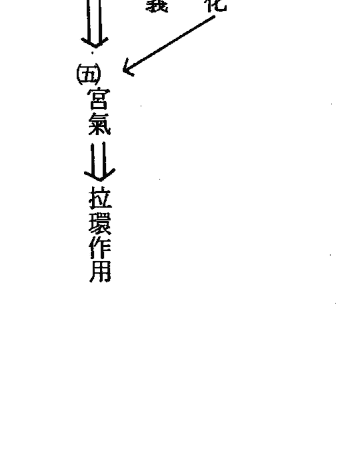

# 命理經典寶庫 現代珍藏本

# 紫微斗數 高級理論大全

妙指神算 楚皇先生著

## 紫微斗數高級理論大全

實例探討、立論精闢

楚皇著

## 紫微斗数高级理论大全

# 序言

本書乃繼斗數喜忌神大突破後，再更深一層之斗數書籍，此書公開內容為近千年來大創舉提出斗數上斷命之重心——宮氣。及斗數理論系統——五大支脈（星辰、四化、喜忌神、宮氣、死規）之內容，及正確性的用法，望讀者加以體會，好好發揚光大。

作者：楚皇
中華民國癸亥年十月廿四日

# 目 錄

序言

- 第一章  斗數實例探討
  - （一）流年命宮見雙忌破產倒店
  - （二）流年命宮見羊陀迭併而身亡
  - （三）命身宮氣不佳、夭折死亡
    - 夭折之因評判
  - （四）財宮宮氣見佳資產五千萬以上
    - 財宮評判
- 第二章  宮氣
  - （一）宮氣之基本元素及化合
- 第三章  命宮官氣之意義
  - （一）宮氣大吉時
- 第四章  兄弟宮宮氣之意義
  - （二）宮氣大凶
- 第五章  夫妻宮宮氣之意義
  - （二）宮氣大凶
  - （一）宮氣大吉時
- 第六章  子女宮宮氣之意義
  - （二）宮氣大凶
  - （一）宮氣大吉
- 第七章  財帛宮宮氣之意義
  - （二）宮氣大凶
  - （一）宮氣大吉
- 第八章  疾厄宮宮氣之意義
  - （二）宮氣大凶
  - （一）宮氣大吉
- 第九章  遷移宮宮氣之意義
  - （二）宮氣大凶
  - （一）宮氣大吉
  - （三）其他各星疾厄精神之意
  - （二）宮氣大凶
- 第十章  僕役宮宮氣之意義
  - （二）宮氣大凶
  - （一）宮氣大吉
- 第十一章  官祿宮宮氣之意義
  - （二）宮氣大凶
  - （一）宮氣大吉
- 第十二章  田宅宮宮氣之意義
  - （二）宮氣大凶
  - （一）宮氣大吉
- 第十三章  福德宮
- 第十四章  父母宫宫气之意义
  - （一）宫气大吉
  - （二）宫气大凶
- 第十五章  死劫
- 第十六章  斗数理论图表
  - （一）排整理论
  - （二）星辰与四化星
  - （三）喜忌神
  - （四）宫气
  - （五）死劫
- 第十七章  略谈古赋

# 第一章 斗数实例探讨

读者请好好研读此章，本章内所有实例说明示范，全然与坊间的有所不同，因为它所应用之斗数理论有五大支脉。本书的议点亦就是谈此五大支脉之中心——宫气，本章只不过先举一些实例来导入、示范、以利谈入正题。

斗数有此五脉，才算完备，亦才能更宏扬，精密度亦才能大幅度之提高，读者若不信，请详细看完本书，必拍案叫绝！一般而言言命理书籍之著作，很少有人会认真地示范实例，因为那样有恐泄露绝技，亦有恐受人攻擊，但本書第一章就來個實例研討，為的就是真正的想光大斗數，所以舉一些不相同之實例詳細研討以利讀者參考，若第一章讀者看不懂，請就從第二章宮氣開始看起，看完了本書，再回頭來看第一章，必更有所領悟。以下就開始我們的實例吧！

## 一 流年命宮見雙忌破產倒店

實例：男命民國三十六年十二月二日巳時吉生。筆者有一近親，自少放蕩，不喜讀書，初中考不上，亦因家境困窮而作罷，後當修理機車之學徒，二十三歲已酉自立開始當店，當機車行老闆，生意亦時好時壞，無甚大熱誠專心地在經營著。於辛亥年二十五歲開始後，更變本加厲，一星期中，有四五日沉迷於賭，二十七歲壬子年更在店後設立小型賭場，日與江湖人相處，血光劍影下生活。終於在二十八歲甲寅那年，事情爆發，賭輸了七八十萬，角頭兄弟限其三日內還清，終於逃之夭夭，不敢在家鄉居住下去了！實例：男命民國三十六年十二月二日巳時吉生。流年甲寅年、大限丙干廉貞化忌流入流年父母宮，有官府及環境壓斗君又入來本命宮見本命巨門化忌及太陽流年化忌。又遇甲寅忌力，因見鈴星，故主江湖壓力。神年、該年大凶。流年財帛宮（請參考下頁的圖形）宮，雖見天機大限化權、及天梁、星辰含義雖佳、但事實却輸錢而逃路，這就是筆者一直搖旗吶喊，斗數不能只看星辰之意之故，其失敗之因乃斗君大凶、又逢忌神年、且流年命宮又見火星廟旺單守，有孤獨出外之行。種種條件之下，該年大凶，不破大財，必有生命危險，故引發出千里流浪逃亡之事實。大限之財帛宮火星單守，又遇忌神年， 幸對宮雙忌（日、巨門）、肆沖、又遇忌神年，

### 討論

- 1. 該人為何無父母之庇蔭，可得父母之財呢？
- 2. 該人是否是江湖之命呢？是否好賭？
- 3. 該人為何在甲寅年不被殺身亡？為何只逃亡而已？
- 4. 該人妻緣如何呢？妻緣在何時？妻子家世如何呢？
- 5. 該人為何只是小學畢業而已呢？是否宮內無星之故？
- 6. 流年命宮遇忌神年，又見雙忌，且斗君亦為雙忌，是否就能下斷語說必破大財呢？或傷身呢？

| 府 陀羅 乙己 | 月祿存 丙午 身夫 | 雲同 羊刃 食狼 武曲 丁未 | 日 巨忌 戊申 命 |
| :--- | :--- | :--- | :--- |
| 地動亦金 45.-54. | 日元 | 乾命36年12月2日時吉生 | 金戊 壬相 己酉 |
| 鈴左破廉星中貞癸卯 53.-64. | 土五局 | 天姚 | 喜 壬梁 機庚戌 |
| 火星 壬寅 | 癸丑 | 官 壬子 | 魁殺紫 辛亥 |

## 紫微斗數高級理論大全

上三大法寶，才能清晰地顯見為何事實就是這樣，非單純地運用祿權科忌，及斗星星辰意義所能比擬的？讀者看完本書必能了解，為何如此。宮氣、喜忌神、星辰之意，是斗數上斷命四大法寶，其中再包括了四化之應用。後世子孫、要精通斗數，要發揚斗數，從這五大理論著手，必然有所突破，筆者 楚皇亦希望承希夷祖師之後，在近代作個斗數學上之中柱著。本書的重點，亦就是要把希夷祖師之理論，用現代的觀念表達出來。讀者若能把這五大基礎觀念弄通，再來研究本書，才不會吃力。有關斗數喜忌神，是筆者在本套，第一本著作喊出的一個斗數的理論之一，已於七十二年四月由希代出版社出版，讀者可先參考，以為上策。閒話到此，開始進入、我們所要討論的問題吧！

### 第一問題：該人為何無父母之庇蔭，為何家世乃貧窮之家？

- 1. 本命喜火土忌水木，金為閑神。
- 2. 命宮戊申、納音為土、天干又見戊土、宮氣屬吉。唯命支遇申金、已表環境不為所喜。再見父母宮，宮干為己酉、納音為土、宮干又見己土，唯地支遇酉金，亦表示著父母之環境，不為所喜。
- 3. 再者：本命財宮，宮干僅見甲辰、甲辰納音為火、唯甲木為忌神、辰土為濕土、干為先天之氣、地支為後天之物，故本命正表示著無先天之財，宮內星辰又僅見地劫星單守，記著對宮若無大吉利之星如祿存、左輔、右弼、或火貪、或紫府會左、右、皆無甚大之影響力。再來看本命後天之財，納音甲辰屬火，整箇宮氣屬火，為喜，但因星辰卻是地劫單守，故將來會有財、亦美不到那裏，且大運未能生助財宮。
- 4. 又父母宮、總論宮氣已酉、土為所喜。但環境不佳，且宮內星辰，僅見天相水星，又命盤忌水、兩者條件之下、父母宮總論為：宮氣為土、僅表父或母長壽，但因見天相水星、及天相坐太陽、有奪父權、故傷陽父、陽父必比母親早世，父母總論無財之因：乃申金及天相水星及本命盤甲干、三者合論、皆表此人無先天之財，亦即因父母無錢，故此命沒有父母之錢財庇蔭，僅代表母親長壽而已。附帶一提、此命總論、雖本命財宮、宮氣見佳、但無先天之財，且宮內只見地劫單字、再加大限宮氣、及地支、星辰三者配合得當，一生皆無官格命，非常明顯矣！僅有小財安然度日到五十四歲以前而已。

### 第二問題：該人是否好賭？江湖之命呢？

- 1. 該人命宮星辰不佳，見衰。雖宮氣戊申為喜；但地支申金、不美，又加上巨門水星又化忌，化忌本為凶星，又屬水，更不利該命盤，化忌入命宮，古書云：『命多是非、一生起伏變化大，如波濤之船，毫無方向，安全之感』！幸好太陽火星，又見巳時生人，但入申宮，太阳虽有力，但无大的影响，仅代表着，有贤父难持家计，对他尚有约束力而已。此命盘若无太阳火星，且是巳时生人，必表父亲早夭。今喜命宫内见太阳火星，才得以活到五十四岁。再者身宫见吉，身宫、宫气见丙午纳音水虽不为喜，幸喜丙干及午干皆属火，可生禄土、及太阴所化之禄土，此人身体得体格健壮、俊貌、可能是这因素使然。且能活到五十四岁以上，亦是身宫火生土源源不绝使然。虽宫内星辰，见天同水及太阴水，仅表示着水剋火气，阻火助禄土生成，故当此人，老年后走身宫之星斗后，发展潜力，已不大矣！且流年逢水年必遭病変。明矣！总论命，身两宫，皆无贵星来夾命，或三合见贵星，已表贱且贫之命。但因太阳会巨门化忌本身星斗之意，是表示着此人心软、但多言、多是非、耳软易受环境影响，不是典型江湖之命有杀气金。故不配称江湖人，事实上，本人亦并非放荡到杀人、吃药、勒索、诈欺等事出现，只是好面子多言，但善良的很。好赌之因，乃大限二十五岁～三十四岁使然。大限命宫见天同，太阴三合会火星成恶人。正代表着二十五岁后，开始学坏。又大限兄弟宫及本命兄弟宫见羊刃及陀罗、杀气之友，江湖朋友明矣！总论此命，贫贱之命，又非属江湖之命，混亦必混不出什么名堂，实在可怜！命运如此，须知命而能约束行为才是。否则就是如此下场！只能在他乡娶妻生子，不敢回来，怕黑道兄弟找他。

### 第三问题：该人何在甲寅年、不被杀受重伤，或身亡？为何只是逃亡而已呢？

- 1. 不夭亡之因：幸喜命宫见太阳火星，且是巳时生人，若为夜晚生人，则该命盘在三十五岁前必大伤或夭亡。青中年走命宫，中老年走身宫，身宫总论见好，皆可证明必可活到五十四岁以上。
- 2. 甲寅流年大限死劫条件未形成。何谓死劫，死劫乃羊陀迭併，冲撃命宫，或大限命宫，或流年命宫。羊陀迭併九死一生，等下几章会有专论。
- 3. 流年死劫亦未形成，本命死劫亦未形成，基于三种大条件再加命，身无天亡之意，虽丙午纳音为水，亦无甚大影响，故甲寅决不会死亡。身宫那年亦无杀伤之变化。故亦无受大伤之事实。故总论流年虽遇忌神年、且斗君双忌、亦不死亡，亦无重伤乃命生死劫皆没形成之故。
- 4. 流年疾厄、对宫有廉贞化忌神，但甲寅年，甲干、使廉贞化忌转化禄，减低了其凶意。且大限疾厄宫又无大凶，本命疾厄宫有廉贞化忌，但在流年甲寅年又转禄，又降低了凶意，故此种种、仅可表示著该人二十五～三十四岁间，身体必不健康，甲寅因廉贞转禄之故，不可以断生大病，住院。基于以上种种条件，皆表示着，甲寅年该人只是有压力，有斗君

### 第四問題

- 1. 此命盤，夫妻宮及身宮同宮，宮內又見太陰化祿，祿存，且見宮干使天同化祿，三祿在此，祿土之重，甚莫大焉，祿土雙祿為美，三祿則過重，雖有丙火氣及午火相生，亦不以美論。
- 2. 再見子女宮，乙巳宮，乙干為忌，巳宮為喜，納音乙巳為火，宮內星辰天機會陀羅，土生金之意，總論宮干乙，使先天子息較晚，整個子女宮論斷，必有子息，但少，且較晚。
- 3. 綜論妻宮及子女宮，該命必晚婚，事實在六十八年才結婚，妻世之家庭，亦一平常老百姓，經營雜貨店為生，其妻在成衣加工廠上班。為何在六十八年結婚讀者可自行論斷！

### 第五問題

該人為何只是小學畢業而已呢？是否宮內無星之故呢？

答案是沒有錯。斷流年，忌神年、遇斗君化忌本為凶今更見雙忌，當然更凶。人命凶之含義：不外宮符，家變，破大財，傷身如此吧，因大限財宮遇甲寅流年太陽化忌，且本命巨門化忌，已明白指出，財必大破。讀者可自行論斷，為何該年不奪父？或官符？

前述已斷過，該人命盤，命身宮皆無貴氣，屬賤之命。當然學歷必不高。本命宮祿宮，宮氣壬子納音為木，又天干壬及地支水，皆見水寒，一片水木皆為忌神。

### 第六問題

## (二) 流年命宮見羊陀迭併而身亡

民國六十八年、農曆二月下午、筆者踏入公司，見到了黃先生，他開口就叫道「仙嘿！你怎麼到現在才來，我等你有一個多小時喔！」我說著：「什麼風，吹你來！」他又回：「還不是來請教你。」這個時候，我心血來潮，屈手一卜、一算，說著：『我知道了！你大兄有危險！是嚇！教你。」你怎麼知道！他的八字，我還沒有講，你都算有！是真還是假！你幾時還有這一招！按黃先生乃經常向本公司作生意，公司的印刷品悉數全由他包辦！所以熱得很！我說著：『到現在你才知道，本山人還有劉伯溫的這一招！你大兄，危險喔！細胞生殖太過旺盛！在足部，有可能是骨癌喔！不好喔！四面楚歌！醫生都會搖頭，說難治喔！盡量看看！』就是嗎！醫生都那麼說，已開始轉移了！你怎麼算的，連骨癌你亦算得出來！我誑著他，說著：這很深！說給你聽，鶩子亦會打結！來開話少說，你大兄的八字，說出來，讓我算算看！經過他說出其大哥的八字後，經斗數一算的結果，我暗道：糟了！死劫明矣！若不作大功德尋良醫，恐拖不過二月了！二月能過，五、六月亦不好過！以下筆者就將事例、提出讓讀者了解。

註：按該命，小學畢業後，就出外自食其力，兄弟三人，婚後生一子，財有數百萬元。四十四歲戊午年生意虧本五、六十萬。很不幸死於己未年二月。

- 1. 本造八字來助火，木火兩旺、四月軟金喜水來息燥熱之氣，喜金比助，土為開神。再看依斗數喜忌法，命身坐亥，局內水旺，宮內星辰又見太陰水，及化忌水星；局內水勢更旺故應以土為重，故得四月之土、局內見水勢極旺，四月土又單薄無力，故取捨法應順從水勢，為從財格，所以水為喜忌木洩水勢，金來順勢相生，亦忌火尅金。
- 2. 此造忌土，尤其忌燥土，故四十五歲那年大限入癸未宮流年亦落已未。大限流年到宮，吉凶變化極強，應注意了！
- 3. 流年已未忌神年。再加流年斗君在丙戊，宮內文曲流年化忌。對宮殺

## 紫微斗數高級理論大全

### 【問題討論】

- 1. 此命雖見貧困出生，但為何到死之前，能存到數百萬元之財產呢？此命財宮又如何呢？戊午年為何又會賠錢呢？
- 2. 該命為何會死于四十五歲呢？為什麼不提早呢？亦不延後呢？

#### 第一問題：此命財宮評判：

- 1. 無先天之財——無父母庇蔭之財，之因：
  - (1) 命、身、丁亥納音為土，不為喜。主一生發展不利。幸賴太陰水星及化忌水星，及坐亥宮——水宮而能轉壽之因，否則必亦夭折之命；再者命宮喜有水星存在，才能在先天失調候之下，還能有一發展之影響。但美中不足是馬入空亡，空忙一生。
  - (2) 財宮癸未，納音為木，不為喜。且地支見未，先天環境不佳，表無父母之財。幸賴天干有癸水助力，否則必永遠貧弱下去。
  - (3) 既然取水為用，則財星為火，在本命為忌；更表、財為忌神，失天無財之命，財多必傷身。
  - (4) 此命之財可發，僅發於大限甲申宮，納音為水。又見地支申金為喜。此大限命宮為主。再者大限財宮，有七殺、鈴星、羊刃、主橫發之財。且又對宮廉貞化祿但成此限甲干促成。故此限才能財大發。且應在金、水之年。事實上此命從庚戌年到癸丑四年間，才大發賺了數百萬元之財產。
  - (5) 大限乙酉宮不能發財之因，乃大限財宮見空，劫且對宮太陰化忌，又大限乙年干化忌、雙忌相沖，而勞而無用，錢進必出，毫無保留之地。

總論此命財宮，財為忌星，財多必傷身。命身又遇馬入空亡，且宮氣不佳，且無貴格來扶，故一生平凡，三十五歲以前能入不敷出已經不錯了！四十四歲後賺大錢之後，應注意身體。此命財多必傷身。無財來前貧賤一生，尚可延壽，有財後，恐身遭傷。

##### 2. 戊午年、四十四歲那年，破財五、六十萬之因：

- (1) 戊午年為忌神年。
- (2) 流年財宮在寅宮武曲、天相、陀羅。而斗君在酉宮無星，對宮見祿、權、太陽、天梁、火星，又是大限甲申之疾宮，本命之宮祿宮，且太陽化忌。
- (3) 流年命宮雖見紫微化科，但戊午又是忌神年。見斗君入本命宮祿，主該年事業必有凶事，必有變動，結果事實就破了五、六十萬，並沒有大破財、逃亡，乃財宮本身無凶星來沖，且斗君不入本命財宮，否則必大破財。
- (4) 死於癸未大限，乃本命疾厄宮貪狼化忌在對宮肆沖。且大限癸未給命身形成羊陀雙併，又逢大限命宮亦是羊陀雙併。如此兩大條件，此大限死劫已成，不得不防，最重要乃大限宮氣得凶。
- (5) 四十五歲是剛入大限第一年，不幸的是己未年，使本命命身宮，且大限，流年命宮又遇羊陀雙併，再來流年又遇忌神年。再者斗君又見化忌。故己未年之死乃運數所成，命運之可能順，不得令人，不防也！

#### 第二問題：該命為何死于四十五歲那年？

- (1) 此命、命身幸賴水星，故不夭折之命。
- (2) 大限甲申，甲午並不形成羊陀迭併，故大限疾厄太陽化忌、不要緊，不會有生命之憂，頂多是大劫而已。
- (3) 故大限甲甲，應無事，不會死亡。
- (4) 死於癸未大限，乃本命疾厄宮貪狼化忌在對宮肆沖。且大限癸未給命身形成羊陀雙併，又逢大限命宮亦是羊陀雙併。如此兩大條件，此大限死劫已成，不得不防，最重要乃大限宮氣得凶。
- (5) 四十五歲是剛入大限第一年，不幸的是己未年，使本命命身宮，且大限，流年命宮又遇羊陀雙併，再來流年又遇忌神年。再者斗君又見化忌。故己未年之死乃運數所成，命運之可能順，不得令人，不防也！

### (一) 命身宮氣不佳、夭折死亡

民國七十一年壬戌年，農曆六月二十八日，筆者前往吾祖父之表弟家—連公府宅拜訪。連叔公乃北區頗有名氣之陰宅堪輿家，連叔公方年近八十八歲，但仍身健，觀音、八里山區不難看到其蹤跡，這有可能從青年時代就開始在山區從事此行業，身體才能健康之故吧！進了連宅，見了叔公，他說著：「今天怎麼有空來玩呢？」「好久沒來向叔公請安！今作生意，經過此地順道來此相您啊！」「來！坐！閒話了幾句他提起了昨天剛好有一案件，我來考考你最近有沒有進步！這個孩子民國六十年農曆八月十三日午時吉生，不幸夭折於六月二十五日，你來看看，此命依今年氣數，其境向應……要注意什麼……，擇日又要如何……。當日，筆者大感驚異的是此子年僅十二歲，為何會死呢？當今醫學發達，除了癌症外，還有什麼病，救不活，莫不是車禍呢？便特別請教了連叔公，才得知此孩子乃死於莫明其妙之病啊！死因心臟衰竭。事後回家，仔細一排斗數，愈發證明斗數宮氣之應用，實在重要，斷命依斗數，不看宮氣，絕無法看出此命之真實性，更況是如何分清長壽否？或天折否？宮氣啊！宮氣！實在是世人學斗數，不可缺乏之理論。今單者就為讀者特別提出此例來討論吧！

#### 夭折之因評判

此命，若依斗數斷命，不看宮氣，及喜忌神，及死劫則變成下列情形：

- 1. 古書云：命、身宮有機、月、同、梁、為長壽之命，今此命，命身有天同又會右弼，雖火星落陷，但有福星天同及助力星右弼同宮，應還長壽才對，雖不壽六十歲以上，亦必有四十歲以上才對！然事實却大相反，年僅十二歲就夭折了！讀者啊！筆者不止一次地呼籲斗數不能只看星辰之意義，此又為明證之一。按科學之機率計算，每一年所生之命盤，紫府星系計算，命盤星辰位置一樣的命盤有十二分之一。又局數不同的有五分之一。若再加時系火，鈴兩星又有十二分之一。如此依斗數星辰之意義斷命，所得之命盤，不分男女才得到，12 x 5 x 12 x 12 = 8640 的概率，若憑此機率所

| | 紫 府 陀 羅 機 | 魁 破 牢 | 日 權 | |
| :--- | :--- | :--- | :--- | :--- |
| 丙申 | 乙未 | 甲午 | 癸巳 | 23.-32. 福 |
| 僕 | 宮 | 田 | | |
| 月 祿存 | 乾命60年8月13日午時吉生 日元 庚午 己未 丁酉 辛亥 | | 鈴星 武曲 | |
| 丁酉 | 遷 | | | 13.-22. 父 |
| 壬辰 | | | | |
| 合狼 文曲科 羊刃 | | 木三局 | 右弼 火星 天同 | |
| 戊戌 | 疾 | | | 3.-12. 命身 |
| 辛卯 | | | | |
| 巨門 祿 左輔 廉貞 天相 子 天梁 | | | 錢 七殺 | |
| 己亥 | 財 | 庚子 | 辛丑 | 兄 |
| | | | | 庚寅 |# 紫微斗數高級理論大全

依之斗數來斷命，試問讀者，用斗數來斷命會準嗎？是否會常出錯！反過來，若斗數斷命再有忌神宮氣、死劫，則又有下列之機率：喜忌神、死劫，又由三十分之一再加上宮氣又有五分之一，再加死劫又有二十四分之一，如此所得之機率則為：（8640×30×5×24×31/10000）。讀者你看看！單排斗數大星，再應叫宮氣、喜忌神、死劫等理論來斷命，怎麼行呢？以上事實，科學之證明，讀者應體會之，想想看，所以筆者才敢在第一本書斗數喜忌神斷言：將來後世斗數之學者，斷命依斗數、必須有這些看法，斷命才能得精髓，筆者是繼希夷祖師後，近千年後，在斗數歷史上，一中柱發揚人。因為這理，是筆者第一個公開出來的繼承人。

命財宮在己亥，有化祿會在輔，若僅以古書云：化祿會左輔、堆金積玉。但事實上，此命僅小康之家。且在十二歲就死了，此生決不可能達到堆金積玉之億萬富翁。此地雖對宮有空、劫肆沖，雖不憶萬亦必家財美滿，但事實一切都不是如此。

1.  首先應找出，此命喜忌神，依斗數喜忌法，此命喜火土忌水木。金為閉神。
2.  命、身宮在辛卯宮，辛金為閉神，卯木為忌神，天同水星，再加右弼水星，命身宮內一片忌神，幸賴火星，否則必更早夭折，但火星不幸的是在此落陷，威力不大。
3.  本命疾厄又對宮文昌化忌，再有宮內辛巨本命大殺星，如此一疾厄凶之條件，再配合本命、身宮、宮氣又差情況，身體有大凶疾之意，非常明矣！只要大限一拉動，再逢忌神年必大遭殃。
4.  再來看大限的變化，前三個大限，辛卯、壬辰、癸已等三個大限，由於宮干之四化，及羊

以上為筆者，特別要提出，讓讀者了解，依斗數斷命千萬不要僅憑斗數星辰之意義，來斷實質之命，常今發生錯誤的現象，筆者在此略提一二。此命依斗數四大法寶，其斷法，夭折之因應。

有人會反問，此命會夭折之因，乃本命疾厄有化忌，且文曲落陷，又對宮有文昌化忌及鈴星凶星肆沖，雖食狼在此戊宮入廟、無用矣！再加大限三歲到十二歲大限辛卯宮，辛宮又。

5.  出生辛亥到癸丑年亦為凶，但命身幸有火星，不那麼快就夭折，後入甲寅到己未火土之年無恙，再入庚申、辛酉為開神，但入壬戌年為水，大忌神年再加壬干使本命疾厄對宮武曲化忌，及大限疾厄對宮亦武曲肆沖。雖斗君入本命及大限遷移。見太陰、祿存亦無用，一命歸西。最主要的乃流年戊支，流火會命身火星，流鈴入流年命宮，再加忌神年，再加本命疾厄三忌，再加辛卯大限最凶大限之最後一年，再加命身宮氣本命極差，已註定天折之命，由此種種條件，一旦忌神年到來，再逢大限引發疾厄宮，爆然成為事實。

### 四 財宮宮氣見佳資產五千萬以上

民國七十二年癸亥二月某日，前公司好友陳君，來找筆者，說劉小姐先生之店，請我去鑑定一下，到了蘇老闆處，他的店面，是經營著塑磚、浴池、花磚……等建材。問了其八字乃庚辰年十一月七日早子時吉生，看了其店面門高，內部隔局，又經營著火土之行業，屈指算了斗數命盤，跟他言道：「您從六十九年開始，不幸之事開始來臨，會離開以前單位，而且自創業，來此開店，經營此種行業，但選擇了向北門向，此乃忌神年所致，而導致了這幾年來一直未能賺錢之故。

| 天同忌 辛辛己 | 天府 武曲權 王午 | 月祿 癸未 | 貪狼 甲申 |
|--------------|-----------------|-----------|-----------|
| 文曲 破軍    | 日元            | 乾命庚辰年11.月7.日早時吉生 | 巨機 乙酉 |
| 火星 左輔 廉貞 | 火天局          |           | 文昌 鈴星 天相 紫微 丙戌 |
| 26.-35. 戊寅 | 16.-25. 己丑    | 6.-15. 戊子 | 天姚 天梁 空劫 丁亥 |

。然而你的財，田產極旺，我說着目前你至少有五棟以上的房子。結果令他大感欽服，告訴了我實情，六十九年內原公司再增資，他不想再投入，公司負責人又是親戚長上，故亦沒有退股，又因內部因素只好離開，結果這幾年他們卻大賺錢，而他只分到小錢，但最重要的自己的事業卻賠錢，他向我言道又田產廠房不計，房子有五棟。資產保守估計亦有五千萬吧！讀者你看吧！此人為何有這五千萬以上之資產，斗數命盤一排出，即可明顯看出，此人是否有財，無財。依宮氣非常明矣！以下拜讀如下：

#### 財宮評判

財宮、宮氣雖好，亦須命身宮尚吉，才可論斷，財宮氣好，為富之命。

1.  命身宮戊子宮，納音為火，戊為開神不用，子宮屬水，宮內又有七殺金及右弼水，宮內水勢旺盛，幸命身納音為火屬吉，戊干剋地支水，否則財宮雖佳亦無用。
2.  財宮甲申宮，納音為水，宮干為甲木屬喜，地支為申金屬忌，無宮內有火貪會左輔，批判祖得其祖上無財，父為平凡人家，財利全靠自己爭取，事實亦是如此。
3.  大限戊寅宮，走火貪，一切論吉，故一拉而上，該十年大限賺錢無數。
4.  本造四十六歲／五十五歲，仍須保守為宜，否則在忌神年財必更大破。

# 第二章 宮氣

斗數推命者，排盤若不注重各宮之宮干，若說他是斗數專家，吾人必有很多問題要反問他？亦可舉出甚多實例來證明，斷斗數不能只依斗數星辰之意義，否則常易出錯！讀者您本身的命盤，都是很好的宮氣代表性的實例！不信！您看完本書，將徹底大悟，了解紫微斗數宮氣的重要性。

筆者在傳授斗數時，一而再，再而三，強調斗數之理論，在斷命上有四大法寶，第一是星辰的意義，第二是四化之應用，第三是斗數各宮的宮氣，本書斗數高級理論大全，乃是要一點破這四大法寶之應用。

何謂斗數的宮氣：簡言之就是斗數各宮的天干地支，其納音之屬性，若納音為水，則稱此宮充滿水行之氣，若納屬火，則可稱此宮充滿火行之處。其次再輔以各宮干支之天干及地支及星辰等五行之屬性為輔，才可斷此宮實質上的意義。在還未說明宮氣如何鑑定，如何操作，如何批判之前，筆者在此要澄清一個大觀念。近代之來斗數推命者，從沒有人提起宮氣，然而他們斷命為什麼會準呢？第一，斷命若依斗數星辰意義，很明顯的即可依命宮星辰可斷此人之性格，心態...

# 紫微斗數高級理論大全

下列筆者各舉幾箇實例，來說明斗數為何不能以星辰意義來斷實質上之命理。

## 實例一

某男命中元乙亥年四月十三日午時

事實：小學畢業，婚後單生一子。商人。

評判：單依斗數星辰之意義：此命宮祿宮有祿、權及天梁、太陽、火星，且宮干巳又使天梁化科，宮祿宮初期可看讀書運，出社會後看事業及官符。若依星辰意義言，此命祿、權會日、梁劫有火星，亦必專科畢業，甚或大學，而且命盤又左、右會祿權，雖命身化忌，其職業依古書言：亦必可作官—公職人員，但事實卻是相反，此命為小學畢業，且是商人，讀者試問：這些人命上之定數—實質上會發生什麼事若只斗數星辰其精神上之意義是否又是會大錯特錯呢？但若一個聰明的斗數專家如某某齋士，他就會一口談及宮祿之精神上之意義而已，他就會聰明的說：此命生來穩重，大智若愚之人，出身小康，小時候讀書成績不錯！出社會後工作必受老闆之重用，有第一功臣之稱，而且白手起家，三十歲前必自立門戶為老闆。以上讀者您比較看看！他這樣說會準嗎？一定會準的，因為精神上之意義涵蓋太多了！所以聰明的讀者，由此應體會出，若單單斷命上依星辰意義應如何斷命？千萬不要用星辰之意義來斷實質之命。就如此例；父母宮內貪狼，有宮干戊辰使貪狼化祿，你就輕易地斷言說不錯喔！你父母有錢喔！即又大錯特錯！若或斷您父母皆長壽喔！亦不可，若或斷你父母感情不錯喔！亦不對！所以筆者在此提醒讀者若看到某命盤之財宮有祿存會大星及輔弼，無空劫來破，亦不能輕斷此人命有錢，這倒不是大限因素未考慮在內之原因？而最重要的乃是宮氣使然！反過來說：若看到命盤命身兩字，天空地劫對照，亦不能輕斷貧賤。

# 紫微斗數高級理論大全

| 紫 | 右左 | 化权破军 |
|------|------|----------|
| 机禄 | 癸未 | 甲甲申 |
| 幸己 | 壬午 | 乙酉 |
| 铃星文昌羊刃七殺 | 日元 | 乾命乙亥年四月13日午時吉生 |
| 庚辰 | 土五局 | 文曲天府廉貞 |
| 火星祿存天梁太陽 | 己卯 | 丙戊 |
| 己卯 | 天相武曲 | 巨門天同 | 魁貪狼天馬 | 月忌丁亥 |
| 戊寅 | 己丑 | 戊子 | 命身丁亥 |

此命。國畫大師張大千先生，命身是空劫對照！所以讀者啊！宮氣是依斗數斷命，所不可缺之「奇寶」。此命雖空，劫入命身，但白手生財，四十五歲亡時，資產六七百萬元。誰說空劫會破財，入命身或福德、財帛，不會有錢！

1.  此造喜金水，忌土火，木為閒神。
2.  故能白手成家，發達，有賴於命，身坐亥水宮。財宮透癸水干。且大運二十五歲後走西方金宮。且有金、水之喜運。
3.  宮祿雖星辰意義美而無用，因為宮祿宮氣納音為土，且宮干透土，且宮內星辰且火土等星晨，難怪初運十五歲後走丙戊大運，而未能繼續上學。宮祿宮全為忌神之氣，如何能讀到高中，更何況大學呢？辛喜大限乙丙運後金、小之運，否則亦不能自創業務等。

以上為宮氣斷實質之命之看法。讀者啊！很重要，確實了解後，你更會佩服，宮氣確實是「斗數之天機」失傳之大秘訣了！讀者啊！當你懂了後，你任舉一例，更會佩服，宮氣確實是「斗數之天機」從此斷人命，希望你以菩提心腸，科學之態度，來渡化眾生，廣積陰德，切莫仗藝詐色、詐財。

# 紫微斗数高级理论大全

事实：此造为现任（七十二年），某县一级主管，硕士学位。

## 实例二 男命中元丙戌年九月二十一日卯时吉生

(1) 若只依星辰分析：只道命盘三方四正，双禄会权科大会合又逢天魁，且左右夹身又日、月，粗看即知官职明矣！且学历应不错！再看父母宫有廉贞双忌又逢空劫，若即考虑会为父母宫内星辰太差，表环境差而影响学业之高低，而便形成大错！再来大限十四岁～二十三岁才走甲午运，宫内星辰见杀、羊、铃、三大凶星会，又断此大限破格，所以宫禄虽好，而学历必不高又错了！再者本省同一年生者，有此双禄会科权，且逢天魁，再加上左、右夹身，又何其多也，如此仅凭斗数星辰之意义，能断此命能得高阶层公职之命吗？答案是太过牵强！笔者断该命盘之时，开口道此人学历必硕士以上，且官职大兴，于七十年升任简任级以上之主管命，让其亲属吓了一大跳。笔者依靠的乃是宫气而已。

(2) 若依宫气分析：

### 一、宫气的基本元素及化合

1.  本造喜金水、忌火土。木为闲神。
2.  命宫纳音为金行，虽见乙未，但宫内昌曲又化科，却为所喜，此喜比庙旺还利害！更有发展，更有文职大展之命已埋下因素。身宫坐辛丑，寒土又见金生源，午火土燥热之象，又见宫内日、月且见左右夹身，生气临盘，又夹水星，太阴为喜星。且格非小贵亦，而是有中大贵之气也，因太阳不为喜星。而减弱力量。
3.  宫禄宫，纳音已亥为木，且坐水宫，但因宫干见己土，否则更佳！宫内星辰又见天同水星未化禄，又有天魁贵星，大运又走甲午及癸已，所以可断初运学历可望得大学而癸已运后，更能上一层楼，高考或研究所必可得心应手。
4.  至于能得简任以上主管之命，乃基于壬辰大运天相荫星之庇护及大限官禄宫丁酉宫又有天钺，一片喜庆经于民国七十年有长官之提拔，而大突破上局长之位。且民国七十年辛酉年乃喜神年，该年斗君又在大限三十六岁壬辰宫，宫内紫相，大官者必有升迁之喜，应了古书之言，且流年官禄宫亦大佳。

以上笔者仅提二个实例，示范演练宫气之应用。先让读者有一印象，以利了解。再来就让我们来讨论宫气之操作，认识，及应用了。

紫微斗数高级理论大全

四一

各宮納音之五行屬性。如甲子乙丑海中金，庚子辛丑路傍土，庚寅辛丑松柏木，戊子己丑霹靂火，戊辰己巳大林木。

#### 1. 命盤中，各宮之地支。子、丑、寅、卯、辰、巳、午、未……戊、亥。十二地支。

命盤中各宮之天干。如甲、乙、丙、丁、戊、己、庚、辛、壬、癸等十天干。這些宮干之五行屬性比他們的宮干四化後之應用還重要，準確的很，影響力極大。甲乙、東方木，丙丁，南方火，壬癸，北方水，庚辛，西方金，戊己、中央土。為其五行之各屬性。

#### 2. 命盤中各宮之天干。如甲、乙、丙、丁、戊、己、庚、辛、壬、癸等十天干。這些宮干之五行屬性比他們的宮干四化後之應用還重要，準確的很，影響力極大。甲乙、東方木，丙丁，南方火，壬癸，北方水，庚辛，西方金，戊己、中央土。為其五行之各屬性。

命盤內各宮內星辰之屬性。如紫微為土星，天相為水星，破軍為水星，火貪會為木火星，化忌為水星。讀者可詳見筆者所着斗數喜忌神大突破之書中。

#### 3. 命盤內各宮內星辰之屬性。如紫微為土星，天相為水星，破軍為水星，火貪會為木火星，化忌為水星。讀者可詳見筆者所着斗數喜忌神大突破之書中。

十二地支五行屬性在應用上較煩雜，但一般而言還是以以下列屬行為準，為要來應用：子為旺水宮丑為寒土宮，寅為軟木宮，卯為木宮，辰為濕土宮，巳為軟金宮，午為旺火宮，未為躁土宮，申為陽金宮，酉為陰金宮，戊為厚土宮，亥為水宮。

#### 4. 命盤內各宮內星辰之屬性。如紫微為土星，天相為水星，破軍為水星，火貪會為木火星，化忌為水星。讀者可詳見筆者所着斗數喜忌神大突破之書中。

十二地支五行屬性在應用上較煩雜，但一般而言還是以以下列屬行為準，為要來應用：子為旺水宮丑為寒土宮，寅為軟木宮，卯為木宮，辰為濕土宮，巳為軟金宮，午為旺火宮，未為躁土宮，申為陽金宮，酉為陰金宮，戊為厚土宮，亥為水宮。

### 1. 地支三合：申子辰合水，寅午戌合火。

亥卯未合木，辰戌丑未為土。

### 2. 地支六合：子丑合土，寅亥合木，卯戌合火，辰酉合金，申巳合水，午未合火。

### 3. 天干化合：甲己合土，乙庚合金，丙辛合水，丁壬合木，戊癸合火。

### 4. 星辰碰撞後：大原則取相生之妙後來取五行。

如太陰會文昌為水，火貪為火，府、武、武為金。紫殺為金，紫、相、陀、為水。左、右會為土。昌、曲會為水，武、貪會羊刃且不平穩，且必坐土宮以羊刃為主；故武貪最忌會羊刃。

# 第三章 命宮宮氣之意義

註：吾人在斗數喜忌神那一本書中，曾說過欲了解宮氣，必須先懂喜忌神。由喜忌神得知五行中，那幾行為喜，那幾行為忌，以後再論各宮之宮氣，了解此命之實質上：有錢否？學歷高否？事業如何？命、身宮吉凶否？而後再從大運來推定財何時可大發，此命一生財是否有大發之事實否？還是永遠沒有發財機會否？此皆可一目了然，此為宮氣獨到之地方，尚有死劫條件之大前提，亦是要觀宮氣為何，才能斷定。如此才是斗數高明之處，以下筆者就來介紹宮氣入命、兄、夫……父母宮各代表着意義如何與星辰配合來應用。

### 一、宮氣大吉時

斗數命盤上，命宮在精神上之意義：可看性格，此生安泰或勞心、或勞力否？或風流否？或莊重否？但在實質上之意義，可看官職否？長壽否？初運環境好壞否？面容之特徵否？食祿否？富貴否？天賤否？等等。縱使命宮宮內星辰得凶星，若宮氣大好，亦可長壽，亦有錢財，初運環境亦好。但縱使命宮內星辰得長壽星：如機、日、月、梁，而宮氣大凶，亦無法長壽，及有大發展。以下筆者就粗略地論及各星辰于命宮合宮氣之意義：

若某命造喜忌神，喜神為木火，忌神為金水，而命宮坐卯、或寅、或午、巳、再逢宮干見甲、乙、丙、丁可謂大吉；或命宮干支納音為木及火，且又干或支有見木火之氣皆可論大吉。

#### (1) 紫微星

紫微入命宮，最喜喜神是火土神。因為紫微屬土，若宮氣土氣大吉時，實質上有九十五%的機率為長子，必為官，且為主管命。且家庭環境亦佳，不過大小程度乃要依父母宮及財帛宮而定，若大限青中年更走火土之運，不論星辰如何，此命即可斷富貴之人，大小程度，亦乃須視大限影響而定，同時又無天空、或地劫等守大限來破，大程度必為某一行業之主腦，或官界中之某一門之首腦人物。

但若命造喜神不為火土，且忌神是火土，譬如喜金水，宮氣亦見金水大吉，但卻是紫微土星入命宮，無有金星，若富貴，則不長壽，且發展程度不大，不一定為長子，若為官，亦不長久，以經商為宜，若財宮，配合得宜，亦可大富。總之若命宮宮氣大吉，見紫微入命精神與實質皆可言吉。但若紫微星亦為吉時，解厄能力極強，命輒得很。同時面容，中央鼻子大而美。

#### (2) 天機星

若宮氣大吉，且天機木為喜，亦為長子或長女。同時個子必高，體質亦可肥胖，同時眼大而美，在此因天機兄弟主得喜，三教九流皆為其所用，大可為大事之負責人，小可為地方上之代表，天機星意本不為官職，但若有化權一科、祿，同樣必有官職，否則必任民代富裕之人。但若宮氣大吉，而天機木並不為所喜，則面容眼小，或大並不美，亦不主壽論，同時三教九流之友，利用他的多。命宮宮氣好若父母，財帛宮配合得宜，表示家庭環境富裕，初運順利而已，成年後以巧藝為生。

#### (3) 太陽星

太陽入命若宮氣大吉，太陽火又為喜神，則不論落陷否，皆佳，但廟旺單守。必富貴，必長子，大富者則須財宮，大運配合，但若宮內有金水星如羊、陀、曲、昌、化忌來破，則發展程度會受影響。但若宮氣大吉，太陽火為忌神，恐傷父，雖有官，必不長久。

太陽精神之意：慈愛、性慾強、辛勞、父權、圓滿。

#### (4) 武曲星

武曲入命若宮氣大吉，武曲金又為喜神，則為中級武官以上，且必富，若須有更高級之職則須貴星或官祿、大運而定，但若局內有火來破，如天空、地劫、火星、鈴星來破，則為官不久，經商可。反言之若宮氣大吉，武曲金卻不為喜，恐身材瘦弱，福薄，過於性剛，官星已無，巧藝為生，亦有小富之局，唯壽元有影響，且足部身宮不佳，大者恐有不便行走。

武曲精神之意：性剛、正直、富企劃力，主財帛。

#### (5) 天同星

天同入命若宮氣大吉，且天同水為喜神，則此人樂觀，肥胖，耳肉厚且大，下巴亦美，福壽甚厚，且富貴。但若會火、鈴則不主管職，縱有民意代表之職，亦不長久。反而言：若天同水為忌神，則福薄，壽元則平，額頭高美，若更會羊、陀，則屬孤命，恐眼有疾。

天同精神之意：福壽，樂觀。

#### (6) 廉貞

廉貞入命若宮氣大吉，廉貞火亦為喜神則主官職，男俊女花貌，身高體壯。財帛宮不佳，亦有小富，更會貪狼必橫發，若大運不破，不會有橫破之機。反而言：若廉貞火為忌神，則大運一到必遭官事，但一生橫發橫破皆有，更遇空、劫火星，則促壽，宜藝術之工作，喜會昌曲而能成就。此時亦喜會天相，右弼，水星，亦必能成富貴之命。

廉貞精神之意：桃花，官祿、投機、放蕩。

#### (7) 天府

天府入命，若宮氣大吉，天府亦為喜神，則亦為福泰之人，有財有勢，大小程度，須視局內而定，就如此時遇左輔，或魁或鉞，或財帛宮氣大佳必為大富之人。逢右弼、羊、陀、昌、曲，則會降低財勢，三合逢化忌，則官職不興。反而言：若天府為忌神，僅為平常之人，經商為宜，若官祿宮氣大佳雖為官，頂多至中級。此時喜會右弼，文曲、化權來增加財官格。

#### (8) 太陰

太陰入命，若宮氣大吉，太陰水亦為喜神男俊，女美。人命臉部圓滿，亦為財官格！有財有官職。為長子、長女之命也。若更遇文曲或右弼，又逢魁鉞，一生光輝、揚名、地位高出。忌會空、劫、來降低財官格之勢。反而言：若太陰水為忌神則有傷母之憂，若更化忌，促壽，會羊、陀必破相一生較勞心、力，反成平常之人。

太陰精神之意：慈悲，博學，好酒，為田宅、為富星。

#### (9) 貪狼

貪狼入命，若宮氣大吉，貪狼亦為喜神，則男女、身高、體豐，壽長亦成財官格。更會火、鈴，若亦為喜神，必成大富、大貴。忌會羊、陀、破格。逢左、右更佳。反而言：若宮氣大吉，縱火貪不為喜僅成小富，但喜遇陀羅來提高財富。若無火貪，僅貪狼單守，只為平常之人。

貪狼精神之意：慾望、桃花、性格不穩，好投機。

#### (10) 巨門

巨門入命，若宮氣大吉，巨門亦為喜神，則身長、體胖、官職主特殊之官，如老師

#### (11) 天相星

天相入命，若官氣大吉，且天相水為喜神時，亦必主管職，同時天相乃庇蔭星，會武曲金若為喜，大貴且大富。反之而言：若宮氣大吉，而天相水為忌神時，官職無力，長上庇蔭無力。但一生亦衣食充裕，若會左輔、紫微、可加強財官格，但若會文曲，羊、陀，忌從事海運，及官職人員。天相精神之意：篤實、厚道，衣食無缺，為官祿主，亦為服務星。

#### (12) 天梁星

天梁入命，若宮氣大吉，且天梁土為喜。主命必長壽，且有高超技術。富貴之命逢日月照命，且羊刃為喜，必亦在某行業為領袖之流。若財帛宮官氣大吉更有左輔，必大富之命。

> 天梁精神之意：壽星、清秀、厚重、技術、師流。

> 巨門精神之意：是非、疑惑、說服力。

#### (13) 七殺星

七殺入命，若官氣大吉，七殺金亦為喜，主官職或財帛宮氣大吉必為大商人，命喜遇紫微土亦為喜，必操大權，為高級將官壽亦可長。忌與空、劫相遇來破官格，初運論于黑道，不過七殺入命，不論喜忌一生較勞心努力。反之而言：若官氣大吉，七殺金為忌，性過急燥，流年怕七殺重逢傷身。更遇羊陀手、足恐有傷、折，但壽元則平。

> 七殺精神之意：現實、刑傷、將星。

#### (14) 祿存或化祿

祿存入命，若官氣大吉，祿存土亦為喜，亦可成財官格，人命體態本盈，鼻美而大，穿著高貴，亦長壽之命。喜左、府、紫、梁，此刻忌逢空、劫，破格程度視命盤而定。反之而言：若宮氣大吉，祿存土為忌神，官職無緣，為平常經商之人，鼻大而不美。

> 祿存精神之意：豐盈、吉慶、慈悲、虛容、貴星、財星。

(15) 化忌星：化忌入命，若官氣大吉，化忌水亦為喜神，官內又有喜星相生之妙，亦成財官格；依特殊行業、發明、成就。反而言之：若官氣大吉，化忌水却為忌，一生不為天賤之命，亦起伏風波大。此刻喜會祿存土或紫微土、左輔土來解厄，時可安穩衣食祿一生。

以上為斗數中宮氣主要用到的大星星，故筆者提出來討論，至于羊、陀、火鈴、左右、昌曲、祿存無大星來會，而單守討論原則與大星相同，故笔者在此不再加以討論，讀者應好好舉一反三。

化忌精神之意：是作、悲哀、專門性。

## (二) 宮氣大凶

何謂宮氣大凶，譬如命造喜神為金，水忌火土而命宮却坐戌及未宮，且宮干透丙、丁或戊、己，如此所形成之條件，命宮納音亦不為喜，宮內天干及地支又會見忌神，無一可取之處，如此稱之為本命造得命宮、宮氣大凶。觀測原則，命宮宮氣大凶，若身宮亦凶，則夭折之命，必一命歸西，準確率極高，此為觀死劫一箇條件，千金之言，讀者慎記！本書有此點，就可讓你值回票價。以上就介紹大星配合命宮宮氣大凶之意義：

+   (1) 紫微星：紫微入命，遇宮氣大凶，若紫微土為喜，解厄力強，可延壽，且官職有緣，更遇左輔、祿存、或三合有魁鉞，亦有高官，不過謹記大運來傷身，其身宮本亦大凶，大運再助忌神有意外之死，雖之合有魁、鉞、祿、左亦難逃天數。但是反而言之，若紫微土亦為忌神，則官職無望，平常之人，更遇空、劫、貧困之命。若遇火鈴、亦孤獨一生，六親稀且疏。雖外觀鼻大而沒用！至于星辰之精神意義，前已敘述過了！以下便不再談及。

+   (2) 天機星：天機入命，遇宮氣大凶，但若天機木為喜亦表體高，官職雖有，較基層，但若有右弼水亦為喜、更合魁鉞，及官祿官氣大佳，亦可高官。此刻天機最忌遇羊、陀必傷身，甚促壽，若大運再助忌恐早年夭世。但反言之：若宮氣大凶，且宮內天機木亦為忌神，則官職無緣，貧賤之命，若身宮亦大凶，恐劫及夭折。

+   (3) 太陽星：太陽入命，若宮氣大凶，而太陽火為喜，亦為長子，面圓，男額美寬或高凸，官職不長久，須視官祿宮，及大運之配合而定。盤內喜會魁、鉞、天馬，則有主管之職；若財帛宮氣大佳，亦會成小富之命。反而言之：若宮氣大凶，太陽火亦為忌神，一生勞苦而無財之命，縱財宮宮氣佳，到頭亦無用。

(4) 武曲星：武曲入命，若宮氣大凶，但遇武曲金為喜亦主官職，若盤內官祿，大運及貴星配合得宜，亦可得中級以上之官，若財官亦佳，只遇大運助喜神亦必可發財，此生發財建立大基楚，就在此大運。但反而言：若宮氣大凶，再逢武曲金亦為忌，最易夭折或殘疾。

(5) 天同星：天同入命，若宮氣大凶，喜天同水為喜神，亦可得壽元。初運不佳，中晚年可得福泰，不拘亦須身宮配合。此運亦有官職之命，但遇火鈴則不長久。財宮宮氣若佳，亦可成小富之命。但反而言：若宮氣大凶，更遇天同水為忌，則命造均于懶散，凡事過于樂觀，而遭禍害。官職無緣，平常之人，雖耳大厚，而無財，一生乃貧賤之命。

(6) 廉貞星：廉貞入命，若宮氣大凶，遇廉貞火為喜，為官職外勤之命。至於官途之時限，視大運沖合而斷論。

(7) 天府星：天府入命，若宮氣大凶，亦可成小富之命，但命弱身體或意外須防。反而言：若宮氣大凶，且遇天府土為忌神，平常之人，逢空劫宜宗教之命。

(8) 太陰星：太陰入命，若宮氣大凶，喜遇太陰水為喜神，面俊秀，耳珠厚大，唯命弱，須身強來扶，才有壽元。此種命造亦長子之命，經商之命居多，若局內貴氣扶持，雖有官職，但不長久。喜田宅或財宮配合適宜。而成富裕之命。反言之：若宮氣大凶，遇右太陰為忌，主母無緣，一生須防女色，為平常之人，小買賣經商之士，財宮宮氣若大佳，頂多亦小富之命，唯壽元不長。

(9) 貪狼星：貪狼入命，若宮氣大凶，更遇貪狼木為忌神，形貌小，人急躁，好賭，且好色，須修身養性才可得安康。但若反而言：此刻貪狼木為喜神，則若財官宮氣大佳，亦可得橫發，宮祿宮亦佳，更可功名成就，唯欲求壽元，若大運配合不當，須廣積陰德。

(10) 巨門星：巨門入命，若宮氣大凶，遇巨門水為喜神時，做事慎重，謹慎，一生安穩，若會右弼，文昌必文職大展，忌會空、劫、火、鈴，有破相之事。總言：欲看富裕否？若巨門右弼，逢財帛宮氣大佳，亦必成一番事業，富貴之命也。但若反而言：此刻遇巨門水為忌，則一生多風波，貧賤之人。

(11) 天相星：天相入命，若宮氣大凶，遇天相水為喜神時，衣食無缺，蔭子蔭孫。為友好義，但財帛宮若為不佳，則一生為人賺錢，小康之命也。官祿宮氣若佳，必是官職。但反而言：此刻天相水若為忌，為人過於厚道，不分善惡，易受人利用，更遇羊刃、陀羅、則促壽。此種命造，若財帛宮氣大佳，還須妻宮配合，才有用。

(12) 天梁星：天梁入命，若宮氣大凶，遇天梁土為喜，亦是長子，公（官）職命若官祿宮亦小佳即可。此稱命造忌羊、陀、金若為忌神時來破格。否則若財帛宮氣不佳，亦有白手起家之格。但反而言：若此刻，天梁土為忌，則不壽矣！一生頂多小巧藝安生。

(13) 七殺星：七殺入命，若宮氣大凶，遇七殺金為喜，經商之命，若財宮大佳，亦可成富裕之命，但若空、劫來破格，唯壽元平平，但反而言：若七殺為忌，則壽短，大運該年忌七殺重逢來傷身。

(14) 破軍星：破軍入命，若宮氣大凶，遇破軍水為喜，必為長子，若官祿宮氣大佳，亦有公職之命。若財宮宮氣不佳，必是早出社會型。此種命運再忌會空、劫來破財格，一生貧賤。

(15) 化祿或祿存星：祿存入命，若宮氣大凶，遇祿存土為忌，僅虛有其表，內無財氣，縱財帛宮宮氣大佳，僅表此命連忌是耗盡家財之命。但反而言化祿土為吉，若遇宮氣大凶，此外貌必豐盈，聰明俊美之命，有官運，且有商格，若財宮宮氣大佳，亦成富貴之命。

(16) 化忌星：化忌入命若宮氣大凶，遇化忌水為喜神，一生雖起伏大，但若財，官兩宮配合得宜，亦得富貴之命。但反而言：若此刻化忌水為忌，則壽短，且幼年父母無緣，一生夭賤之命。

以上筆者粗略地述說。宮氣及星辰配合意義如何表示，各位讀者初次接觸到這些觀念，好好...

## 讀者福音

楚皇先生有課材錄音帶及講義，全為高級、深奧的斗數內容，意者請面洽。或打電話

+   內容包括有：
(一) 喜忌神尋找之快速法要。
(二) 宮氣要訣
(三) 死絕要訣
(四) 宮氣拉球作用
(五) 四化（包括斗君、玄宮、宮干）等要如何應用，才是上策。

(02)五九八一三三七三。和 (02)七六四一二二二七。

# 第四章 兄弟宮宮氣之意義

斗數兄弟宮之涵義，狹義可看兄弟發達否？兄弟刑傷？兄弟職業？及兄弟數目多少；但若單靠斗數星辰之意，能斷出量數幾何？兄弟富貴否？那真是千百年來的大笑話？廣義而言：大限及流年兄弟宮若單靠斗數星辰意義，便可明瞭，今年或此大連，是否適宜與人合夥呢？是否可參加「互助會」呢？是否今年比較有很多人來借錢呢？是否今年朋友中有大貴人呢？——等等。以下就星辰與宮氣配合，可讓吾人如何來了解兄弟宮之各種意義？

### (一) 宮氣大吉時

(1) 紫微星：紫微入兄弟，若宮氣大吉，更遇紫微土為喜，宮內無破，必有公職之大哥，且兄弟必三人以上，姊妹不計；但反而言：若宮氣大吉，更遇紫微土為忌，家中姊妹數量比兄弟多；更遇祿、權、兄弟才必富貴；但須與命宮坐那宮為主來論斷。

(2) 天機星：天機入兄弟，若宮氣大吉，更遇天機木為喜，宮內無破，亦必有年長差七歲以上之公職大哥，更逢權、祿、亦富貴之人。家中兄弟共三人無破時。但反而言：若天機木為忌，年長之兄乃經商之命，逢祿為佳，有財。

(三) 太陽星：太陽入兄弟，若宮氣大吉，更遇太陽火為忌，宮內無破，兄弟必三人以上，且是公職之人員，但反而言：若太陽火為忌，恐只有姊妹而無兄弟。

(四) 武曲星：武曲入兄弟，若宮氣大吉，更遇武曲金為喜，宮內無破，兄弟共二人，姊妹頂多一人，且多為生意人；但反而言：若武曲金為忌，再逢羊、陀或火、空，恐僅有姊妹，獨子之命。

(五) 天同星：天同入兄弟，若宮氣大吉，更遇天同水為喜，宮內無破，兄弟有四人以上，更會科、權、必有官職之手足；但反而言：遇天同水為忌，家中姊妹多于兄弟，頂多兄弟只有二人。若逢祿、權，兄弟亦富裕。

(六) 廉貞星：廉貞入兄，若宮氣大吉，遇廉貞火為喜，更會祿、左，兄弟三人，姊妹常沒有。若無祿、左則兄弟有2人。主公職。但反而言：廉貞火為忌，兄弟恐只有一人。為生意之士。

(七) 天府星：天府入兄，若宮氣大吉，遇天府土為喜，兄弟三人以上，且年長之兄為公職。但反而言：若天府土為忌，恐無兄弟，僅有姊妹。

(八) 太陰星：太陰入兄，若宮氣大吉，遇太陰水為喜，若宮內無破，兄弟四人以上；但反而言：若遇太陰水為忌，兄弟二人以下，姊妹四人。

(九) 貪狼星：貪狼入兄，若宮氣大吉，遇貪狼木為喜，宮內無破，更會火、鈴，兄弟三人，但反而言：若遇貪狼木為忌，兄或弟僅一人，姊妹二人。

(十) 巨門星：巨門入兄，若宮氣大吉，遇巨門水為喜，宮內無破，兄弟二人以上；但反而言：若遇巨門水為忌，羊、陀，仅有姊妹。

### (二)宮氣大凶

凡兄弟宮，若宮氣大凶，必主：一、兄弟稀少；二、姊妹較多；三、兄弟多刑傷，四、兄弟運途較苛難！以下各星分別敘述如下：

+   (一) 紫微星：紫微入兄，若宮氣大凶，更遇紫微土為忌，則恐有大姊而無兄弟及妹。

(二) 天機星：天機入兄，若宮氣大凶，遇天機木為忌，則恐只有小妹一人，且婚姻不美。

(三) 太陽星：太陽入兄，若宮氣大凶，遇太陽火為喜，則有兄弟二人—宮內無破時，且亦可富貴。但反而言：遇太陽火為忌，則姊妹二人，恐無兄弟，且一生勞苦。

(四) 武曲星：武曲入兄，若宮氣大凶，遇武曲金為喜，則僅有兄弟一人—宮內無破時，且可為富幅之命。但反而言：遇武曲金為忌時，恐無兄弟，或早夭。

(五) 祿存星：祿存入兄，若宮氣大吉，遇祿存土為喜，若無空、劫、或無破，則單守時兄弟二人，會紫府兄弟四人以上。但反而言：遇祿存土單守，且為忌，兄弟無，姊妹一人；但若遇大星紫或府則姊妹四人，兄弟一人。

(六) 破軍星：破軍入兄，若宮氣大吉，遇破軍水為喜，宮內無破兄弟三人，姊妹一人，但反而言：遇破軍水為忌，則姊妹二人，兄弟一人。

(七) 七殺星：七殺入兄，若宮氣大吉，遇七殺金為喜，兄弟三人，恐無姊妹；但反而言：若七殺金為忌，則恐是孤子，姊妹頂多二人。

(八) 天梁星：天梁入兄，若宮氣大吉，遇天梁土為喜，宮內無破，則兄弟二人；但反而言：若天梁土為忌，則恐只有姊妹，無兄弟。

(九) 天相星：天相入兄，若宮氣大吉，遇天相水為喜，宮內無破，兄弟三人；且有公職人員。但反而言：若天相水為忌，兄弟一人，姊妹則三人。

(十) 天同星：天同入兄，若宮氣大凶，遇天同水為忌，則姊妹一人，兄弟頂多一人以上；但若反而言：遇天同水為忌，則姊妹一人，兄弟頂多一人。

(十一) 天机星：天机入兄，宮氣大凶，若遇廉貞火為忌，則無兄弟，亦無姊妹。

(十二) 天府星：天府入兄，宮氣大凶，若遇天府土為忌，則恐僅有姊妹二人。

(十三) 太阴星：太陰入兄，宮氣大凶，若遇太陰水為忌，則恐無兄弟，但有富貴之命。但反而言：遇天府土為忌，則恐僅有姊妹二人。

(十四) 贪狼星：貪狼入兄，宮氣大凶，若遇貪狼木為忌，則恐為孤子，但有富貴之命。但反而言：若遇貪狼木為忌，則恐為孤子，僅有姊妹。

(十五) 巨门星：巨門入兄，宮氣大凶；若遇巨門水為忌，則為孤子之命。或是將早夭。

(十六) 天相星：天相入兄，宮氣大凶，若遇天梁土為忌，則有兄弟第一人，姊妹一人，但有富貴之命。但反而言：若天相水為忌，則恐有姊妹而無兄弟。

(十七) 天梁星：天梁入兄，宮氣大凶，遇天梁土為忌，則有兄弟第一人，姊妹一人，且兄弟有富貴之命。

(十八) 七杀星：七殺入兄，宮氣大凶，遇七殺金為喜，則恐只有姊妹一人；但反而言：若遇七殺金為忌，則為獨子。

(十九) 禄存星：祿存入兄，宮氣大凶，遇祿存土為喜，則單守，恐僅有姊妹二人，若會大星紫、府、必為獨子。但反而言：若遇祿存土為忌，單守則無兄弟，姊妹一人；若會大星紫、府、必為獨子。

# 第五章 夫妻宮宮氣之意義

在單純以斗數星辰之意義：夫妻宮入殺、破、狼、廉、巨以晚婚為佳；天姚、左、右恐有二婚；空、劫入夫妻宮，配偶不為美論，化忌入夫妻宮，配偶多是非、或專門行業、或此生無婚緣；尚有羊、陀入夫妻宮富有刑傷之意。然而事實上有此命盤殺、破狼入夫妻宮，是早婚再離婚；甚至有的是晚婚而再剋傷配偶，而再嫁；這又如何辨別，如何論取。若單以斗數婚緣評論，用宮氣來解說，何時必婚嫁，何時必配偶受傷，何時感情風波，是否會有生離死別呢？是否一生有婚嫁呢？還是一生單身之命呢？至少可寫出十萬字以上洋洋大觀，在此只好單看就內中精要提出，以利讀者參考、參考，什麼是斗數斷夫妻之宮氣理論。

### 一)宮氣大吉時

夫妻宮、存在著宮氣大吉時；有兩種意義：第一配偶預期著有富貴之命也。第二預期著有早婚之意義。第三預期著有多妻之患。第四預期著有賢良之配偶也。

+   - (一)紫微星：紫微入夫妻，若宮氣大吉，遇紫微土為吉，則必有家世良好之賢良配偶；且婚期祝大運及流年喜忌配合變、喜、煞或斗君而定。但反而言：若遇紫微土為忌，最忌再會左輔，則男恐有妾。女恐為偏房。

(二)天機星：單以斗數星辰而言，亦忌天機入夫妻宮；最有婚變之涵義，也就是天機入夫妻宮；然而有的命盤夫妻入天機，卻是恩恩愛愛，白首偕老，這又如何解釋，如何分辨呢？像這些問題，只要一明瞭宮氣，便可迎刃而解。就如天機入夫妻宮若宮氣大吉，遇天機木為喜，則男有年差6、7歲以上之妻子，女有年長6、7歲以上之丈夫，此刻是忌遇羊陀恐會生離而再論嫁娶；而此種命造都以早婚居多。但反而言：若遇天機木為忌，則婚姻必晚婚，女則30歲以上，男恐32歲以上。

(三)太陽星：太陽入夫妻，若宮氣大吉，遇太陽火為忌，則喜會右弼，二度梅才能幸福，或首嫁即是官職人之妻妾。

(四)武曲星：武曲入夫妻，若宮氣大吉，遇武曲金為喜，則有經商或金融之伴侶，此刻忌空、劫來破配偶之富貴，婚期視大運流年而定。但反而言：若宮氣大吉，遇武曲金為忌，則婚緣遲緩。

(五)天同星：天同入夫妻，若宮氣大吉，遇天同水為喜必得福泰健美之配偶，婚姻早，但反而言：若遇天同水為忌時，則有生離死別再論婚嫁之事，尤其以會右弼更為明顯！

(六)廉貞星：廉貞入夫妻宮，若宮氣大吉，遇廉貞火為喜會有富貴之配偶，且美貌。遇右弼男恐有妻妾，女恐為偏房或夫年紀甚大。但反而言：若廉貞火為忌時，再遇空、劫，縱晚婚，亦恐婚途不順，再婚之憂。

(七)天府星：天府入夫妻宮，若宮氣大吉，遇天府土為吉會為長婿或長嫂；且配偶賢良，遇左輔，恐本人另有外室。婚緣早婚。但反而言：若遇天府土為忌時，則更會左輔，婚緣舉棋不定，晚且有再婚之事。

(八)太陰星：太陰入夫妻宮，宮氣若大吉，遇太陰水為喜，可得俊美之配偶，且富裕。但反而言：言：若遇太陰水為忌，縱晚婚，婚姻亦不美。

(九) 貪狼星：貪狼入夫妻，若宮氣大吉，遇貪狼木為喜，可得花顏之配偶，婚期視大運流年而定；但反而言：若貪狼木為忌更會右弼，則必有二婚。

(十) 巨門星：巨門入夫妻，若宮氣大吉，遇巨門水為喜，會化權可得宦貴之子女，且男得年長之妻。但反而言：若巨門水為忌時，則婚姻不美。

(十一) 天相星：天相入夫妻，若宮氣大吉，遇天相水為喜，有賢貴之配偶，且溫厚。但反而言：若天相水為忌，就有很多意義，視盤局，有時有早年喪偶，再婚之事。

(十二) 天梁星：天梁入夫妻，若宮氣大吉，遇天梁土為喜，則有能幹之配偶，長壽之配偶；但反而言：若天梁土為忌，則男有娶年長之妻。

(十三) 七殺星：七殺入夫妻，若宮氣大吉，遇七殺金為喜，則有以金為行業之配偶，會羊陀男恐有二妻。但反而言：若七殺金為忌更會左輔，則必有二婚之事。

(十四) 破軍星：破軍入夫妻，若宮氣大吉，遇破軍水為忌，則婚緣晚。但反而言：若遇破軍水為喜，且配偶行業以娛樂界、餐飲界有關。婚期視大運流年而定。

(十五) 祿存星：祿存入夫妻，若宮氣大吉，遇祿存土為喜，若會大星，如梁、府、紫，必有富裕之配偶，且時潮、俊美。但反而言：若遇祿存土為忌，且是單守，男有二妻，女則婚姻不美。

(十六) 化忌星：化忌入夫妻，若宮氣大吉，遇化忌水為喜，則有特殊專門行業之配偶，且婚姻較晚；但反而言：若遇化忌水為忌則視命盤而定，有的多婚嫁，有的一生為配偶所苦。至於夫妻宮來斷夫妻感情如何呢？是否如膠如漆？是否從不甜言蜜語？是否面目特徵如何？完全只單看星辰之特性即能明確。

### （二）宮氣大凶

(一)紫微星：紫微入夫妻，若宮氣大凶，遇紫微土為喜則男女、婚姻晚，可得端莊之配偶，但家世普通；若反而言：若遇紫微土為忌，則婚期更晚，更會左輔，則女恐淪於只與人同居。

(一)天機星：天機入夫妻，遇宮氣大凶，若天機木為忌，則必主晚婚，且能得賢良之配偶；但反而言：若天機木為忌，則非但晚婚，且婚前最好了解配偶之健康情形。

(二)太陽星：太陽入夫妻，遇宮氣大凶，幸喜太陽火為喜，晚婚，有能幹之配偶。但反而言：若太陽火為忌，則刑剋太重，再會火鈴恐必再婚。

(三)武曲星：武曲星入夫妻，遇宮氣大凶，幸若武曲金為喜，晚婚，男則有配偶是職業婦女，女則可得貴夫。但反而言：若武曲金為忌，男女則婚緣更晚。

(四)天同星：天同入夫妻，遇宮氣大凶，若遇天同水為喜，則亦可得福泰之配偶，唯婚緣晚；但若反而言：若天同水為忌則男女皆不但婚緣晚，且離異，或死別後，難再找到對象。

(五)廉貞星：廉貞入夫妻，遇宮氣大凶，若遇廉貞火為喜，則亦可得佼美之配偶，唯婚緣亦晚；但若反而言：若廉貞火為忌，則男女婚嫁複雜，大都有實無名。

(六)天府星：天府入夫妻，遇宮氣大凶，若遇天府土為喜時，則有端莊溫厚之好配偶，婚緣亦晚；但若反而言：若天府土為忌，女則為風塵界，男則淚蕩一生。

(七)太陰星：太陰入夫妻，遇宮氣大凶，若遇太陰水為喜，雖婚緣晚，但可得佼美之配偶；但反而言：若遇太陰水為忌，男非但婚緣晚，且得惡妻；女則得好吃懶做之夫。

(八)貪狼星：貪狼入夫妻，遇宮氣大凶，若遇貪狼木為喜，婚緣男必在31歲以上女則在30歲以上，且配偶是娛樂界、服務業居多；但若反而言：若遇貪狼木為忌，則非但婚緣晚，且可能是再娶或再嫁之配偶。

(九)巨門星：巨門星入夫妻，若宮氣大凶，遇巨門水為喜，婚緣晚，且男得年長之妻，且瘦弱，但可蔭夫，女則得年少之夫，夫婦會恩愛。但若反而言：若宮氣大凶，又巨門水為忌，再加大運配合，不但婚緣晚；且離異後，不易再婚。

# 第六章 子女宫宫气之意义

楚皇提示：

- (土)天相星：天相星入夫妻，若宫气大凶，遇天相水为喜，婚缘晚，能得厚重贤良配偶，有荫配偶之事。但若反之而言：遇天相水为忌，非但婚缘很晚，且刑剋太重。
- (火)化忌：化忌入夫妻，若宫气大凶，遇化忌水为喜，婚缘很晚，且配偶一生运途亦不佳；但反之而言：若遇化忌水为忌，且常有婚缘拖到男女40以上还未有论婚嫁。
- (木)天梁星：天梁星入夫妻，若宫气大凶，遇天梁土为喜，婚缘晚，但可得俊美之配偶，亦有荫配偶之事；但若天梁土为忌，则非但婚缘晚，且配偶是有宗教热诚狂，甚或半途出家或入空门，或当修女神父，或当歧童。
- (金)七杀星：七杀入夫妻，若宫气大凶，遇七杀金为喜，婚缘很晚，但可得能幹之配偶，但是感情不佳；又反之而言：遇七杀金为忌，则婚缘不但晚，且刑剋太重，一生无娶嫁之命，常是大运亦有配合。
- (水)破军星：破军入夫妻，若宫气大凶，遇破军水为喜，婚缘亦晚，但恐有再婚或再嫁之配偶；但反之而言：若遇破军水为忌，且亦是会因卷入爱情纠纷、不能自拔，而常不再婚嫁了。
- (土)禄存星：禄存入夫妻，遇宫气大凶，单守时婚缘很晚若禄存土为喜，尚可有荫配偶之婚嫁；但反之而言：遇禄存土为忌，婚嫁很晚，且不美。

对于断夫妻宫，命造实质上是晚婚型或早年离夫，克夫并不是单以宫气吉凶，及星辰来断的，要向须要大限及宫干因素来决定的。

子女宫，要推算子女数多寡，于今之国际潮流，实很难断得准！到底是否有生男子（子息）之命，子息几个，却可见一貌！同时亦可观将来子女会有发展否？是否孝顺否？

### （一）宫气大吉

- (一)紫微星：紫微入子女，若宫气大吉，一门麟儿（三子一女），富贵在望；但反而言：若紫微土为忌，子息顶多二男女儿不计。
- (二)天机星：天机入子女，若宫气大吉，遇天机木为吉必有义子或庶子。子息三人。但若反而言：遇天机木为忌，子息二个。次子子息乃指男儿为论。
- (三)太阳星：太阳入子女，若宫气大吉，遇太阳火为喜，则子息四人以上，但若太阳落陷或不得生时，则顶多二人；但若反而言：若太阳火为忌，则子息女多于男，且男儿一或二人。
- 武曲星：武曲入子女，若宫气大吉，遇武曲金为喜，则子息二人。但若反而言：遇武曲金为忌，则子息一人。
- 天同星：天同入子女，若宫气大吉，遇天同水为喜，则子息二人；但反而言：若遇天同水为忌，则子息一人。
- 廉贞星：廉贞入子女，若宫气大吉，遇廉贞火为喜，子息二人以上；但反而言：若廉贞火为忌，则子息亦二人。
- 天府星：天府入子女，若宫气大吉，遇天府土为喜，则子息三人；但反而言：若天府土为忌，则子息二人。
- 太阴星：太阴入子女，若宫气大吉，遇太阴水为喜，则子息三人以上；但反而言：若遇太阴水为忌，则子息二人。
- 贪狼星：贪狼入子女，若宫气大吉，遇贪狼木为喜，则子息二人以上，但反而言：若贪狼木为忌，则子息女子太多，子息一人，若宫内有破如空、劫，子息亦必有一人。
- 巨门星：巨门入子女，若宫气大吉，遇巨门水为喜则子息二人；但若反而言：遇巨门水为忌，虽有空、劫，子息亦必有一人。
- 天相星：天相入子女，若宫气大吉，遇天相水为喜，则子息二人以上；但若反而言：遇天相水为忌，则子息二人，若更遇羊、陀则必有破。
- 天梁星：天梁入子女，若宫气大吉，遇天梁土为喜，则子息二人以上，且恐有外子；但若反而言：遇天梁土为忌，则子息二人。
- 七杀星：七杀入子女，若宫气大吉，遇七杀金为喜，若宫内无破，则必有子息二人，恐无女子。但若反而言：遇七杀金为忌则亦有子息一人。
- (+) 破军星：破军入子女，若宫气大吉，遇破军水为喜，则子息二人以上，但若反而言：遇破军水为忌，则子息一人。
- (田) 禄存星：禄存入子女，若宫气大吉，遇禄存土为喜，则子息会大星有四人以上；但若反而言：，单守亦必有子息一人。
- (失) 化忌星：化忌入子女，若宫气大吉，遇化忌水为喜，则子息一人，女子二人，且恐有外子；但若反而言：若遇化忌水为忌，再有羊、陀便宫内有破，恐只有女子。

断子息之数，宫气须配合宫内星辰有无化合，或化合后，五行属性之喜忌综论，笔者在此特别提醒读者，照此运用去断，必可正确。笔者因限于篇幅，不能详论各星碰撞时各种状况，在此仅论单星之情形，读者自行体会之。

## (二)宫气大凶

- (一) 紫微星：紫微入子女，若宫气大凶，遇紫微土为喜，子息二人以下；但若反而言：遇紫微土为忌，子息一人以下。
- (二) 天机星：天机入子女，若宫气大凶，子息一人以下；若更有羊、陀来破，恐只有女子而无子息；但反而言：若遇天机为忌，恐只有女子，而无子息。
- (三) 太阳星：太阳入子女，若宫气大凶，遇太阳火为喜则子息二人以下，无女子；但反而言：遇太阳火为忌，欲有子息，恐须多生女子后，才有。不过须配合落陷否？或生时得太阳否。
- (四) 武曲星：武曲入子女，若宫气大凶，遇武曲金为喜，则子息一人；但反而言：遇武曲金为忌，恐女子亦只有一人以下。
- (五) 天同星：天同入子女，若宫气大凶，遇天同水为喜，则子息有二人；但若反而言：遇天同水为忌，则子息顶多一人。
- (六) 廉贞星：廉贞入子女，若宫气大凶，遇廉贞火为喜，则子息二人；但反而言：遇廉贞火为忌，恐无子息，仅有二女。

## 紫微斗数高级理论大全

> > 楚皇提示：断子女子数量上问题，欲准确最好再配合配偶八字，至于何时生子只须配合配偶生年卦 及时辰即可。

- (七) 天府星：天府入子女，若宫气大凶，遇天府土为喜，则子息二人以下；但若反而言：遇天府土为忌，则宫内无破，才有子息。
- (八) 太阴星：太阴入子女，若宫气大凶，遇太阴水为喜则有子息二人；但若反而言：遇太阴水为忌，则子息仅有一人。
- (九) 贪狼星：贪狼入子女，若宫气大凶，遇贪狼木为忌，恐无子息。
- (十) 巨门星：巨门入子女，若宫气大凶，遇巨门水为喜，则子息一人；但反而言：若遇巨门水为忌，恐无子息。
- (十一) 天相星：天相入子女，若宫气大凶，遇天相水为喜，则子息二人；但反而言：若遇天相水为忌，恐子女多而男一。
- (十二) 天梁星：天梁入子女，若宫气大凶，遇天梁土为忌，则子息一人。
- (十三) 七杀星：七杀入子女，若宫气大凶，遇七杀金为喜，则子息一人以下；但反而言：若遇七杀金为忌，则恐无子息，甚或无子。
- (十四) 破军星：破军入子女，若宫气大凶，遇破军水为喜则子息二人；但反而言：遇破军水为忌，子息一人以下，忌破。
- (十五) 禄存星：禄存入子女，若宫气大凶，遇禄存土为喜，则子息二人会大星时；若宫气大凶，为忌，恐须领养子女。
- (十六) 化忌星：化忌入子女，若宫气大凶，遇化忌水为喜则子息一人，若宫气大凶，更遇化忌水为忌，恐子女子数量上问题，欲准确最好再配合配偶八字，至于何时生子只须配合配偶生年卦 及时辰即可。

# 第七章 财宫宫气之意义

斗数论财宫，最简便、明确，一生有财或无财，依宫气，配合大运干支论断，即可明瞭！何时必可发？何时必大破，明明白白！斗数之美财星：武曲金、禄存土、左辅土、右弼水、紫府土、太阳火、太阴水、火贪火、廉贞火、天梁土，亦都须属性符合宫气，才能称得正位，必有源源不断之财。但若不得位，虽禄会左辅再会大星亦无用，只是平凡之人。至于理财能力，视斗数精神意义即可，准确！

## (一)宫气大吉

- (一)紫微星：紫微入财宫，若宫气大吉，遇紫微土为喜，则必有长上之财荫，且后天财气亦强，必是富裕之人；但若反而言：遇紫微土为忌，若大运配合好，亦可大发。
- (二)天机星：天机入财宫，若宫气大吉，遇天机木为喜，虽有白手成财，但却很旺，可成富裕。
- (一) 太阳星：太阳入财宫，若宫气大吉，遇太阳火为喜，必有长上之财，且以田产之财居多；若反之而言：若太阳火为忌，须大运配合，不过亦必是小富之人。
- (二) 武曲星：武曲入财宫若遇宫气大吉，更遇武曲金为喜，大运只要有一限大佳，必大富也。但若反之而言：若武曲金为忌，亦可成富之命。不过须大运配合。
- (三) 天同星：天同入财，若遇宫气大吉，遇天同水为喜，必有祖上之大财，且必横发，财上加财。但反之而言：若天同水为忌，则须大运配合。
- (四) 廉贞星：廉贞入财，若遇宫气大吉，遇廉贞火为喜，除可得长上之大财，且财富可观；但若反之而言：若廉贞为忌，须注意大运有破，但到终亦是可成一笔小财富。
- (五) 太阴星：太阴入财，若宫气大吉，遇太阴水为喜，则亦可成富局；但若反之而言：遇太阴水为忌，亦须大运配合。
- (六) 天府星：天府入财，若宫气大吉，遇天府土为喜，则财库很旺，必是有钱之人，可成就大富之格，若大运配合不佳，亦可有中上之财命。
- (七) 贪狼星：贪狼入财，若宫气大吉，又遇火贪为喜，必是大富之格，大运佳影响程度；但若反之而言：遇贪狼木为忌，则亦可成中上之财格。
- (八) 巨门星：巨门入财，若宫气大吉，又遇巨门水为喜，亦可成富局；但若反之而言：遇巨门水为忌，则成中中之财格；除非大运配合很好，才有富局。
- (九) 天相星：天相入财，若宫气大吉，遇天相水为喜，则必有祖上之余荫大财；且亦成富局；但若反之而言：遇天相水为忌，则只成中中之财格。
- (十) 巨门星：巨门入财，若宫气大吉，遇巨门水为喜，亦可成富局；但若反之而言：遇巨门水为忌，则成中中之财格；除非大运配合很好，才有富局。
- (十一) 天相星：天相入财，若宫气大吉，遇天相水为喜，则必有祖上之余荫大财；且亦成富局；但若反之而言：遇天相水为忌，则只成中中之财格。

在财宫断有无财局、是否会有钱，依宫气而论，若宫气大凶，除非大限青壮运只要有一限特别加强，大好运，亦可成富局，否则一生仅中下之财局。

### （二）宫气大凶

- (一) 紫微星：紫微入财，若宫气大凶，遇紫微土为忌，若无一、二限好大运，仅中下之财格。但反而言：若遇紫微土为忌，无大运配合，仅下上之财格。
- (二) 天机星：天机入财，若宫气大凶，遇天机木为忌，真正典型的白手生财之命，无余荫，完全靠自己生财，若再遇有大运扶助财宫，亦可成中中以上之财格；但反而言：若遇天机木为忌，无大运配合，一生仅得下中之财格，若有破更糟。
- (三) 太阳星：太阳入财，若宫气大凶，遇太阳火为忌，若大运再配合，亦可得中中以上之财局；但反而言：若遇太阳火为忌，一生劳苦生小财度日而已。
- (四) 武曲星：武曲入财，若宫气大凶，遇武曲金为喜，若大运再配合，亦可得中上以上之财局。
- (五) 天同星：天同入财，若宫气大凶，遇天同水为喜，则若无大运亦可成中下之财局；但反而言：若遇天同水为忌则一生下中之财局。
- (六) 廉贞星：廉贞入财，若宫气大凶，遇廉贞火为喜，则是典型无余荫而有横发之财格，若大运配合佳。但反而言：若遇廉贞火为忌，则一生下中之财局，有破更糟，读者谨记此原则。
- (七) 天府星：天府入财，若宫气大凶，遇天府土为喜，则一生财运平稳，可成中下之格局；但反而言：若天府土为忌，则只成下中之财格。
- (八) 太阴星：太阴入财，若宫气大凶，遇太阴水为喜，若大运配合佳，亦可成中上以上之财局。但反而言：遇太阴水为忌，则一生只得下中之财局。
- (九) 贪狼星：贪狼入财，若宫气大凶，遇贪狼木为喜，更遇火、铃亦为喜，亦可成中上之财局；但反而言：若遇贪狼木为忌，则一生只得下中之财局。
- (十) 巨门星：巨门入财，若宫气大凶，遇巨门水为忌，则亦成中中之财局；但反而言：若遇巨门水为忌，则仅成下中之财局。
- (十一) 天相星：天相入财，若宫气大凶，遇天相水为喜，则有祖上之余荫，但不大；可成中中之财局。但反而言：若天相水为忌，仅成下中之财局。
- (十二) 天梁星：天梁入财，若宫气大凶，遇天梁土为喜，则可成中中以上之财局；但反而言：若天梁土为忌，则仅成下中之财局。
- (十三) 七杀星：七杀入财，若宫气大凶，遇七杀金为喜，则可成中中以上之财局；但反而言：若七杀金为忌，则仅成下中之财局。
- (+) 破军星：破军入财，若宫气大凶，遇破军水为忌，则仅成下中之财局。
- (+) 禄存星：禄存入财，若宫气大凶，遇禄存土为喜，则可成中上之财局；但反而言：若遇禄存土为忌，则仅成下上之财局。
- (+) 化忌星：化忌入财，若宫气大凶，遇化忌水为喜，则可成中上之财局；但反而言：若化忌水为忌，则仅成下上之财局。

# 第八章 疾厄宫宫气之意义

人生有四大痛苦，生、老、病、死，一生当中，想永远身体健康，无病一生是不可能之事。然而会不会有大病，何时会生大病呢？从八字或斗数论断，非常清晰；不过在斗数上断疾厄宫，还以命、身宫吉凶作大前提之下，而疾厄宫本身是以辅助论断性质而已！一般而言：本命疾厄宫有化忌，亦代表着凶意，这是禄权科忌四化上对于疾厄之论断，较明显之特点；但是最主要断大运流年何时会生大病，乃以忌神运来临为准则，来的更为正确。 在斗数命盘上，疾厄宫之宫气所代表着意义有二：一为可看此人身体状况，若命盘疾厄宫，宫气大佳，此人可谓健康一生，较无小病连连，当然大病，若大运促使，亦会发生的。二为可看此人一生须注意何种毛病；就如命造喜木火，结果疾厄宫一片金水之气，就该慎告此人流年遇金水之年，须防心脏血管之疾；又如命造喜木火，结果疾厄宫一片金木之气，则该慎告此人流年遇金木之年，须防心脏血管之疾；又如命造喜木火，结果疾厄宫一片金木之气，则该慎告此人流年遇金木之年，须防心脏血管之疾？ 这些要点把握清楚，而后再配合斗数星辰之意义，就能了解命造之身体状况，会得什么病，何时发生的？

## (一)宫气大吉

- (一)紫微星：紫微入疾厄，若宫气大吉，遇紫微土为喜则必一生少病灾；较不易得传染病如性病、肝炎、小儿麻痹；当然感冒有时是免不了的，但大的病害，是绝对可避免的。但反而言之：遇紫微土为忌，则当心逢火土之年可有脾、胃之病害。紫微疾厄之意：寒热、皮肤、呕吐、过劳致病、脾胃。
- (二)天机星：天机入疾厄，若宫气大吉，遇天机木为喜，亦少病灾，唯易患气喘、瘴气、咳喘之病，流年遇忌神金年，则有精神、神经、失眠或肝炎、胆肝之疾。但反而言：若遇天机木亦为忌，则精神疾病须防。天机疾厄之意：热毒、四肢、眼、肝胆、神经。
- (三)太阳星：太阳入疾厄，若宫气大吉，遇太阳火为喜，则亦少疾灾，但逢水年须防头痛、心脏血管之疾及眼之伤害。但反而言之：若遇太阳火为忌；遇火年常为痔疮、头痛、眼疾而烦恼。太阳疾厄之意：头、血管、眼。
- (四)武曲星：武曲入疾厄，若宫气大吉，遇武曲金为喜，亦少病灾，但逢火土之年须防血疾或气血不通（滞气），或大肠之疾。又反而言之：若遇武曲金为忌，则须注意肺、鼻、手、脸、之健康。武曲疾厄之意：肺、鼻、脸、齿。
- (五)天同星：天同入疾厄，若宫气大吉，遇天同水为喜亦少病灾，同时与紫微同、抵抗力亦强。唯忌遇燥土之年，怕会有神经之疾或肠、胃之疾。但反而言之：若遇天同水为忌时，则一生须注意耳、肾、膀胱、之健康。天同疾厄之意：神经、肠、胃、肾、膀胱。
- (六)廉贞星：廉贞入疾厄，若宫气大吉，遇廉贞火为喜，则亦少病灾；但逢水年须防性病、花柳病、月经不调、腰酸痛……等病；但反而言之：若遇廉贞火为忌，则幼年多灾厄于烂疮，足、腰部；成人须防神经痛、及外伤。廉贞疾厄之意：足、腰、疮症，或心气不足。
- (七)天府星：天府入疾厄，若宫气大吉，遇天府土为喜，亦与紫微同，抵抗力强。唯忌遇木之年，有肝胆之疾，或口臭小病。但反而言：遇天府土为忌，则须注意脚气、胃痛、胆固醇过多。
- (八)太阴星：太阴入疾厄，若宫气大吉，遇太阴水为喜，则亦少病灾。唯遇土忌神年应防眼疾、阴疟、糖尿病或水肿。但反而言：若遇太阴水为忌，则须防劳伤、神经衰弱、眼疾，及泌尿、会阴之疾。
- (九)贪狼星：贪狼入疾厄，若宫气大吉，遇贪狼木为喜，则亦少病灾，唯忌逢金年，忌有肝、胆、手、足神经之疾。但反而言：若贪狼木为忌时，则须防性病及肝炎，或外伤。
- (十)巨门星：巨门入疾厄，若宫气大吉，遇巨门水为喜，则亦少病灾，唯忌土年有大肠或胃消化之疾。但反而言：若巨门水为忌时，须防脾胃、皮肤、肺胸、血气不调、四肢寒冷之疾。
- (十一)天相星：天相入疾厄，若宫气大吉，遇天相水为喜，则亦少病灾，唯忌过土之年黄胆之疾较明，或有血气不调、淋病。但反而言：若天相水为忌，则须防膀胱、糖尿之疾。
- (十二)天梁星：天梁星入疾厄，若宫气大吉，遇天梁土为喜，则亦少病灾，唯忌过木年，须防皮肤、鼻病、胃等疾。但反而言：若天梁土为忌时，则须防肥胖症、甲状腺、胃。
- (十三)七杀星：七杀入疾厄，若宫气大吉，遇七杀金为喜，则幼年亦多病灾，但上大运后则亦少病灾。唯忌遇火之年，须防肺、心脏之疾。但反而言：若七杀金为忌，则须防眼、手、足、脾之疾。七杀疾厄之意：肺、手、足、气虚之疾。

破军疾厄之意：泌尿、经血不调、腹痛小疾。 以上为紫府十四大星分门别类之疾症。但是有癌症，或不明肿瘤，常与羊、陀有关，化忌有关，不过都须以宫气配合为大前提，才能论断。 破军疾厄之意：泌尿、经血不调、腹痛小疾。 但反而言：若破军水为忌，则须防膀胱等泌尿之疾。

## (二) 宮氣大凶

一般而言：若疾厄宫、宫气大凶，再见命、身宫、宫气亦凶，是早夭之命。同时疾厄宫若宫气大凶，虽命、身宫局属吉论，一生较多病灾。流年更逢忌神年，更来得利害！以下就陆续介绍。

- (一) 紫微星：紫微入疾厄，若宫气大凶，幸運紫微土为喜，亦可得抵抗力強，唯有视力、肝胆。
- (二) 天机星：天机入疾厄，若宫气大凶，遇天机木为喜，亦少病灾，唯易患气喘、瘴气、咳喘之病，流年遇忌神金年，则有精神、神经、失眠或肝炎、胆肝之疾。但反而言：若遇天机木亦为忌，则精神疾病须防。
- (三) 太阳星：太阳入疾厄，若宫气大凶，遇太阳火为喜，则亦少病灾，唯易患泌尿之疾，流年遇忌神水年，则有眼疾、头部、心脏衰弱等病。但反而言：若太阳火为忌，则恐有脑部、眼部等问题。
- (四) 武曲星：武曲入疾厄，若宫气大凶，遇武曲金为吉，则亦少病灾。唯易患外伤、疮毒之疾，流年遇火忌神年，则有脾或手、足之疾。但反而言：若武曲金为忌，则恐有肺癌、手足残疾。
- (五)天同星：天同入疾厄，若宫气大凶，遇天同水为喜则亦少病灾。唯易患脾胃、发部之疾，流年遇忌神土年，须防泌尿之疾；但反而言：若天同水为忌，则有泌尿部之缺陷，或无名肿瘤，或白血病。
- (六)廉贞星：廉贞入疾厄，若宫气大凶，遇廉贞火为喜，则亦少病灾。唯易患性病，妇女病，流年遇忌神水年，则亦有无名热病、心脏之疾。但反而言：若廉贞火为忌，则恐有血管、心脏之大病。
- (七)天府星：天府入疾厄，若宫气大凶，遇天府土为喜，则亦少病灾。唯易患眼疾、肝、胆病；流年遇忌神木年，会有鼻、皮肤、脾胃之疾。但反而言：若天府土为忌，则多病灾。须防胃、肠、鼻部大病。
- (八)太阴星：太阴入疾厄，若宫气大凶，遇太阴水为喜，则亦少病灾。唯易患脾、胃之疾；但反而言：若遇太阴水为忌，则须防妇女病，眼疾、泌尿之疾。
- (九)贪狼星：贪狼入疾厄，若宫气大凶，遇贪狼木为喜则亦少病灾，唯易得传染病，且易患手足之伤，及肺部、眼部之疾，流年遇忌神金年，则有手足之外伤，或肺、眼之病磨。但反而言：遇贪狼木为忌，则恐有手足之残疾或伤痕；或眼疾。
- (十)巨门星：巨门入疾厄，若宫气大凶，遇巨门水为喜，则有脾、胃、大肠之疾，流年遇忌神土年则有泌尿部、水肿之疾。但反而言：若遇巨门水为忌，则必有大肠、泌尿部、水肿之疾。
- (十一)天相星：天相入疾厄，若宫气大凶，遇天相水为喜，则必有鼻部、脾胃之病；流年遇忌神土年，则恐有甲状腺、糖尿、泌尿之疾。但反而言：若天相水为忌，则多病灾，且恐有泌尿道、新陈代谢之缺陷。
- (十二)天梁星：天梁入疾厄，若宫气大凶，遇天梁土为喜，则少病灾，但易患眼部、肝胆之疾；流年遇忌神木年须防有脾、胃、鼻部之疾；但反而言：但遇天梁土为忌，则有鼻、胃、慢性病，一生拖磨。

七杀星：七杀入疾厄，若宫气大凶，遇七杀金为喜，则幼年多病灾，抵抗力亦弱；但唯患神经、心脏血管之疾。但反而言之：若遇七杀金为忌，则恐有眼、手、足之伤害。

破军星：破军入疾厄、若宫气大凶，遇破军水为喜，则抵抗力亦弱，亦易患脾胃、鼻部之疾，但反而言之：若遇破军水为忌，则恐有泌尿、血液之缺陷。

### （三）其他各星疾厄精神之意

- 文昌星：大肠、肺部、经热之疾。
- 文曲星：上热下冷、斑痕之疾。
- 左辅星：肠、胃疾。
- 右弼星：血热、血虚、或经血不足之疾。
- 羊刃星：头部、四肢衰弱、腹部、肺部。
- 陀罗星：肺血、白癣、胃痛、肿瘤。
- 铃星：头部、眼、皮肤。
- 火星：淫毒、伤痕、麻瘴。
- 化忌星：肾虚、精冷、气病、癌症。
- 化权星：肝、胆、神经系。
- 化科星：膀胱、属于水症之疾。
- 天刑星：皮肤、火疾。
- 天空星：头部热病、冷疾。
- 地劫星：手足、眼疾。

# 第九章 遷移宮宮氣之意義

斗數之遷移宮，古書上寫着可斷出外安寧否？出外是否吉凶否？是否離鄉發達否？……等等。 而且依命盤而言：遷移宮正沖照命宮，若單依斗數之星辰之意，遷移宮之星辰放射能量；但是這只是星斗上本身之意義而已，因為遷移宮本身的宮氣只是代表着遷移之意義而已，不能與命宮內之星辰混為一談。遷移宮宮氣其意義有三，一為可斷是否有車階級呢？何時會有車。二為可斷社會人士對他的評語地位。三可斷是否離鄉背景之命，當然這幾點乃須配合命身宮氣不能太差而論！

### (一)宮氣大吉

- 遇紫微土為忌則須大運配合才能擁有。當然宮氣好，出外當然平安、可發展。
- 紫微星：紫微入遷移，若宮氣大吉，遇紫微土為喜，則30歲前必擁有汽車；但反而言之：若遇紫微土為忌則須大運配合才能擁有。當然宮氣好，出外當然平安、可發展。
- （一）天機星：天機入遷移，若宮氣大吉，遇天機木為喜，則亦30歲左右可有汽車；但反而言：若遇天機木為忌，同樣亦須大運配合，才能擁有車子。在此附帶一提，若財宮不佳，大運對財生助亦無力，遷移宮若好，職業常是運輸業或旅行社之基層人員。天機入遷移精神之意：離家可發達。
- （二）太陽星：太陽入遷移，若宮氣大吉，遇太陽火為喜，年少必擁有汽車，若命照配合更佳，常是多輛，但反而言：若太陽火為忌，則須大運配合，才能擁有車子。太陽入遷移精神之意：外出發福，有貴人相扶，平常無法安靜下來。
- （三）武曲星：武曲入遷移，若宮氣大吉，遇武曲金為喜，30歲前必有車子；但反而言：若遇武曲金為忌，則須大運配合，才能擁有車子。武曲入遷移精神之意：忙碌得很，外出發達。
- （四）天同星：天同入遷移，若宮氣大吉，遇天同水為喜，年少亦必有汽車；但反而言：若遇天同水為忌，同樣亦須大運配合得宜，才能擁有車子。天同入遷移精神之意：出外有貴人相扶。
- （五）廉貞星：廉貞入遷移，若宮氣大吉，遇廉貞火為喜，必擁有車階級，唯遇忌神水年，再逢流年之遷移宮化忌，開車須小心。但反而言：若遇廉貞火為忌，則亦須大運配合，才能擁有車子。廉貞入遷移精神之意：居家無發展，出外能拓運。
- （六）天府星：天府入遷移，若宮氣大吉，遇天府土為喜，必30歲前擁有車子，但反而言：若遇天府土為忌，則須大運配合才能擁有車子。天府入遷移精神之意：出外有貴人相扶，可發福。
- （七）天陰星：太陰入遷移，若宮氣大吉，遇太陰水為喜，必30歲前可有汽車，若會右弼不但高級且多輛；但反而言：若遇太陰水為忌，則須大運配合，才能擁有車子。太陰入遷移精神之意：入廟出外發達，有貴人（女性）相扶。
- 天梁入遷移精神之意：出外可有貴人相扶成功。
- 天相入遷移精神之意：出外受到貴人扶助。
- 巨門入遷移精神之意：出外辛勞，多成敗。
- 貪狼入遷移精神之意：獨守出外辛苦。
- (九)貪狼星：貪狼入遷移，若宮氣大吉，遇貪狼木為忌，則須大運配合，但通常頂多是便宜車。但若會火貪在遷移，則另有意義。
- (十)巨門星：巨門入遷移，若宮氣大吉，遇巨門水為喜，亦會擁有車子，但須大運配合；但反而言：若遇巨門水為忌，則須大運配合，才會擁有車子。
- (十一)天相星：天相入遷移，若宮氣大吉，遇天相水為喜則30歲必擁有車子；但反而言：若遇天相水為忌，則須大運配合，才能擁有車子。
- (十二)天梁星：天梁入遷移，若宮氣大吉，遇天梁土為喜，則年少必有車子。但反而言：若遇天梁土為忌，則須大運配合。
- (十三)七殺星：七殺入遷移，若宮氣大吉，遇七殺金為喜，會擁有車子；但反而言：遇七殺金為忌，則須大運配合。
- (十四)破軍星：破軍入遷移，若宮氣大吉，遇破軍水為喜亦必擁有車子；但反而言：若遇破軍水為忌，則須大運配合。

### (二)宮氣大凶

遷移宮，若宮氣大凶，在交通工具的享受上，則差，同時外出發生交通事故之機率亦較高；尤以忌神來臨，車子不是被偷，就是要有花錢之變動。

- (一)紫微星：紫微入遷移，若宮氣大凶，遇紫微土為喜則須會左輔，在30歲前才能擁有車子；否則亦須大運及財宮配合。但反而言：若遇紫微土為忌，其交通工具只是公共汽車或頂多摩托車。
- (二)天機星：天機入遷移，若宮氣大凶，遇天機木為喜則須會右弼水，才能在30歲前擁有車子；否則亦須大運及財宮配合；但反而言：若遇天機木為忌，若無左弼恐無開車之緣。
- (三)太陽星：太陽入遷移，若宮氣大凶，遇太陽火為喜則須財宮配合來能在30歲前擁有車子；但反而言：若遇太陽火為忌，則恐無開車緣。
- (四)武曲星：武曲入遷移，若宮氣大凶，遇武曲金為喜則須大運、財宮配合得當，才會擁有車子。但反而言：若遇武曲金為忌，則須大運、財宮雙重配合。
- (五)天同星：天同入遷移，若宮氣大凶，遇天同水為喜更會左輔，亦會在30歲前擁有車子。但反而言：若遇天同水為忌，則亦須會右弼且要大運配合才會有擁有車子之事實。
- (六)廉貞星：廉貞入遷移，若宮氣大凶，遇廉貞火為喜則須大運配合才能擁有車子，但反而言：若遇廉貞火為忌，則恐無開車緣。
- (七)天府星：天府入遷移，若宮氣土凶，遇天府土為喜，會左輔，若財宮配合亦必有車子；但反而言：若遇天府土為忌，則開緣沒有。
- (八)太陰星：太陰入遷移，若宮氣大凶，遇太陰水為忌則須大運、財宮雙重配合。
- (九)貪狼星：貪狼入遷移，若宮氣大凶，遇貪狼木為忌，則無開車緣。
- (十)巨門星：巨門入遷移，若宮氣大凶，遇巨門水為喜，須大運、財宮雙重配合，才能擁有車子；但反而言：若遇巨門水為忌，必無開車緣。
- (十一)天相星：天相入遷移，若宮氣大凶，遇天相水為喜，僅大運配合即能擁有車子；但反而言：若遇天相水為忌，則須財宮、大運雙重配合。
- (十二)天梁星：天梁入遷移，若宮氣大凶，遇天梁土為喜會左輔有車子；但反而言：若遇天梁土為忌，則須大運、財宮配合。
- (十三)七殺星：七殺入遷移，若宮氣大凶，遇七殺金為喜須大運、財宮雙重配合，才能有車子；但反而言：若遇七殺金為忌則必無車階級。
- (十四)破軍星：破軍入遷移，若宮氣大凶，遇破軍水為喜須大運、財宮配合，才能擁有車子；但反而言：若遇破軍水為忌，則須有化祿、或左輔，才有機會擁有車子。

以上是遷移宮宮氣配合星辰，因狀況複雜，筆者僅提出是否會擁有車子，來讓讀者作一參考。

因為車子高貴者有價格數百萬元以上，小者亦要二三十萬，有車階級，可代表一個人之財富或社會地位，若本命財宮是吉論，當然是有私家轎車，而不是以計程車為業。本省目前以計程車為業，據非正式統計有60萬人口以上，估了人口數的百分之五以上，不可不忽視此種行業。更何況尚有其他未列入的運輸行業。在此遺憾的是，個人命運，擁有車子之事實，發生之年，是在那一年？此推算方法，除了遷移宮之外還要牽涉到種種大運流年之因素，筆者在此篇幅，不能簡簡詳論，僅能指出判斷原則提醒讀者，讀者若有興趣，平時可給人斷命時，考證考證，必能會心一笑得到精髓。

> 楚皇本人竭盡歡迎對五術有愛好者且具有程度者，來參加天運派斗數易理研究會。有緣者請電：（O二）五九八一三三七三。（O二）七六四一二二一七。

# 第十章　僕役宮宮氣之意義

斗數僕役宮，乃是可看第一交友能力，第二與同事、或後輩之關係吉凶，第三是否用人能力很強─領導力強，第四是否部屬甚多。在此筆者又透露一點，大生意人或大公司老闆除了財宮很旺外，僕役宮亦很強。近幾百年來到現代，從未有任何書本提出此點，斗數僕役宮，一直為人所忽視著。筆者之恩師陳怡魁教授僕役宮極旺，難怪恩師桃李滿天下，又見有台灣省易經學會理事長之席位。又工商界某一聞人黃先生亦是僕役宮極強。這些都為聞人或大老闆，至於很多老師或教授，讀者若有興趣，亦可去考證，你將會發現，他們的僕役宮亦都較旺。同樣地在論僕役宮，亦都須命、身宮為大前提，再來論斷僕役宮。

### （一）宮氣大吉

- 紫微星：若宮氣大吉，遇紫微土為吉，若更會祿、左、此種僕役宮，旺得不得了！但若反而言之：遇紫微土為忌，則乃尚旺，須有大運變化才會有大量的部屬。紫微入僕役精神之意：可得力僕。
- (一) 天機星：若宮氣大吉，遇天機木為喜，亦為中旺論。但反而言：若遇天機木為忌更逢空、劫，縱大運配合部屬數量不多。天機入僕役精神之意：與部屬關係如兄弟。
- (二) 太陽星：若宮氣大吉，遇太陽火為喜，為大旺論。但太陽落陷，或夜晚生人則另有意義。但反而言：若遇太陽火為忌，大運一到，亦會有較多之部屬。太陽入僕役精神之意：下屬得力、且多。
- (三) 太陰星：若宮氣大吉，遇太陰水為喜，亦屬大旺論，但與太陽相同落陷與否或白天生者，另有意義。但反而言：若遇太陰水為忌，大運若配合，亦可有多數部屬且得力。太陰入僕役精神之意：得力，量多。
- (四) 武曲星：若宮氣大吉，遇武曲金為喜，則為中旺論。但若會天府土，若亦為喜時，則為大旺論。但反而言：若遇武曲金為忌時，須大運配合。武曲入僕役精神之意：招人很強，部屬會有。
- (五) 天同星：若宮氣大吉，遇天同水為喜，則為小旺論，但素質較高。但反而言：若遇天同水為忌時，則須大運配合才會有。天同入僕役精神之意：有質高之部屬。
- (六) 廉貞星：若宮氣大吉，遇廉貞火為喜，亦可有多數部屬，不過須中晚年大運有配合時；但反而言：若廉貞火為忌，雖大運有配合，能有多數部屬，但得力的卻微。廉貞入僕役精神之意：部屬不得力的居多。
- (七) 天府星：若宮氣大吉，遇天府土為喜，屬大旺論，部屬得力，且多。但反而言：遇天府土為忌，則須大運配合。天府入僕役精神之意：得力部屬，數量亦多。
- (八) 太陰星：若宮氣大吉，遇太陰水為喜，亦屬大旺論，但與太陽相同落陷與否或白天生者，另有意義。但反而言：若遇太陰水為忌，大運若配合，亦可有多數部屬且得力。太陰入僕役精神之意：得力，量多。
- (九) 貪狼星：若宮氣大吉，遇貪狼木為喜，雖可量多，但須大運配合。但反而言：若遇貪狼木為忌，則中年前雖大運配合，數量亦不多。貪狼入僕役精神之意：不力之部屬，中晚運後才會穩定。
- (十)巨門星：若宮氣大吉，遇巨門水為喜，屬小旺論；但反而言：若巨門水為化忌時，更遇巨門水為忌，則必會為部屬所牽連，而遭厄運。此地例舉此運用法，讀者應可觸類旁通地應用着。巨門入僕役精神之意：有得力者、有是非的，但總論數量不多，是非的須有大運流年影響，才會危害。
- (十一)天相星：若宮氣大吉，遇天相水為喜，屬中旺論，中晚年若逢大運配合得當，可得多量部屬。但反而言：若遇天相水為忌，則喜會紫微或左輔，亦可得數量多之部屬。天相入僕役精神之意：有得力，可多，但運晚。
- (十二)天梁星：若宮氣大吉，遇天梁土為喜，屬大旺論；會左輔、祿或化祿、更強。但反而言：若遇天梁土為忌，則須大運配合。天梁入僕役精神之意：得力，素質高。
- (十三)七殺星：若宮氣大吉，遇七殺金為喜，則屬小旺論，縱大運配合，使量增加，但是不得力。居多；反而言：若遇七殺金為忌，縱大運配合，部數亦寥寥可數，且多不得力。七殺入僕役精神之意：部屬會欺上。
- (十四)破軍星：若宮氣大吉，遇破軍水為喜，亦屬中旺論大運配合得當，部屬量多，且可得力；但反而言：若遇破軍水為忌，則須大運配合或宮內會祿存。筆者談僕役注重部屬或學生或後輩之數量，其因在本章前言已略為說明指出，若僕役多，在當今社會是好現象，可表示社會地位高否?如大官、大生意人、出名教授、民意代表、堂主，大都是僕役宮，亦有如此旺論配合命、身、官祿宮，才會造成命格上發展而成為事實的。筆者之僕役宮，雖不如恩師陳教授之大旺，但若大運一到，亦必大旺矣!

### （二）宮氣大凶

僕役宮若宮氣大凶，其意有二：一為量少，甚或無。二為須得僕役時間較晚，且通常是極需要大運的配合。

- (一)紫微星：若宮氣大凶，遇紫微土為喜，則屬小旺論同時亦須大運配合才能成為事實，在此附帶一提若一生大運無法拉升僕役宮之旺勢，則只是為平常之僕役宮而已。所謂拉升僕役宮之旺勢，讀者若要用大運四化來應用亦可以了！但筆者卻不如此用的，另有一套大運拉環作用縱橫13宮比四化更準確！留待有緣再公開！（按錄音帶上有此教材）
- (二)天機星：若宮氣大凶，遇天機木為喜，宮內縱無破，頂多只是次旺論而已，同時亦需大運扶助，才能成為事實的，否則只看斗數星辰意義來解說就可以了。但反而言之：若遇天機木為忌，成了弱論之僕役宮，比平常之僕役還差！有破更弱了！
- (三)太陽星：若宮氣大凶，遇太陽火為喜，是小旺論。但需大運配合，才能有成；反而言之：若遇太陽火為忌，則屬弱論。
- (四)武曲星：若宮氣大凶，遇武曲為金喜，會天府土若為喜，方能成為小旺論，否則僅是次旺論而已。但反而：若遇武曲金為忌時，則乃弱論也，縱大運生扶，乃是平常之意而已。
- (五)天同星：若宮氣大凶，遇天同水為喜，是次旺論而已，會右弼，方能為小旺論；但反而言：若遇天同水為忌，則為弱論。
- (六)廉貞星：若宮氣大凶，遇廉貞火為喜，是平常論而已，但會貪狼木若為喜，則為次旺論，更會火、鈴之一，又成小旺論。但反而言之：遇廉貞火為忌，則為弱論。
- (七)天府星：若宮氣大凶，遇天府土為喜，則為小旺論。但反而言：若天府土為忌則為平常之論。
- (八)太陰星：若宮氣大凶，遇太陰水為喜，則為小旺論，同様地落陷、白日生人另有意義；但反而言：若遇太陰水為忌，且為平常之論。
- (九)貪狼星：若宮氣大凶，遇貪狼木為喜，則為次旺論，會火、鈴則為小旺論。但反而言：若遇貪狼木為忌，則屬弱論。
- (十)巨門星：若宮氣大凶，遇巨門水為忌，則為弱論。
- (十一)天相星：若宮氣大凶，遇天相水為喜，則為次旺之論，但反而言：若遇天相水為忌，則為弱論。
- (十二)天梁星：若宮氣大凶，遇天梁土為喜，則為小旺論，大運若生助此宮，便可成為事實。但反而言：若天梁土為忌，則為平常之論。
- (十三)七殺星：若宮氣大凶，遇七殺金為喜，則為平常之論；反而言：若七殺金為忌，則為弱論；精神與實質之意義皆差！
- (十四)破軍星：若宮氣大凶，遇破軍水為喜，則為次旺論，但須大運配合。又反而言：若遇破軍水為忌則為弱論。

# 第十一章 官祿宮宮氣之意義

斗數官祿宮，本身可看：第一早期：求學運。 第二：事業運。 第三：配合流年大運可看何時創業當老闆？何時昇官？何時會換工作？何時恐有官事？多久？ 第四：命造之職業論斷時亦要以官祿宮作依據：如官職、軍職、或工或商……等。本書說明官祿宮，則選擇官祿宮看學歷高低來作說明，希望讀者能舉一反三，善加利用。因為在當今社會，學歷若高，如博士、碩士、或學士，至少發展潛力及身分地位、比學歷較低之命造，佔了較大的便宜。故筆者在此章取官祿宮看學歷來作說明：同樣地在看官祿宮，亦要以命、身宮不能太差！來作大前提！第二點：前二大運有否扶助官祿宮，亦是一決定學歷高低的主要影響條件，從官祿宮本命宮氣多好，若大運拉倒官祿宮旺勢，甚至在大運十多歲／20多歲，就有官符上身。以上幾點讀者先須明瞭！

### (一)宮氣大吉

- 紫微星：宮氣大吉，遇紫微土為喜，若大運無破，必大學以上；但反而言：若紫微土為忌，則亦會有專科或大學，須視大運而定。
- (一) 天機星：宮氣大吉，遇天機木為喜，若大運無破，亦必大學以上；但反而言：若天機木為忌，則專科。天機官祿宮精神之意：高位、功名。
- (二) 太陽星：宮氣大吉，遇太陽火為喜，若大運無破，必碩士以上不落陷、且白日生；但反而言：若太陽火為忌，則須大運配合才能有大學。太陽官祿宮精神之意：顯貴。
- (三) 武曲星：宮氣大吉，遇武曲金為喜，若大運無破，必大學。但反而言：遇武曲金為忌，則須大運生扶才能有專科或大學。武曲官祿宮精神之意：財政、金融之行業。
- (四) 天同星：宮氣大吉，遇天同水為喜，若大運無破，必大學以上。但反而言：遇天同水為忌，則須大運生扶，才有大學，否則頂多專科。天同官祿宮精神之意：文官、文職。
- (五) 廉貞星：宮氣大吉，遇廉貞火為喜，大運不破，則亦大學以上。若會空、劫只成專科或高中。但反而言：遇廉貞火為忌，則須大運扶助，才有專科。廉貞官祿宮精神之意：武職、官星，有商業之官職。
- (六) 天府星：宮氣大吉，遇天府土為喜，大運不破，則亦大學以上。若會左輔，必是博士；但反而言：若天府土為忌，遇左輔，頂多專科，若大運更破，則只成國中而已。天府官祿宮精神之意：高位、文武職。
- (七) 太陰星：宮氣大吉，遇太陰水為喜，大運無破，必大學，若會右弼或文曲必更上博士，甚至未來大運若無破官祿宮，非高官即是有一番作為之民意代表。但反而言：若太陰水為忌，須大運生扶才有大學。否則頂多專科。太陰官祿宮精神之意：公職、清貴。
- (九)貪狼星：宮氣大吉，遇貪狼木為喜，大運無破亦必大學會火、鈴，則亦更上層樓。但反而言：若貪狼木為忌，則須大運生扶，才有大學否則頂多專科。貪狼官祿宮精神之意：有金錢氣息之官職，創業晚為宜。
- (十)巨門星：宮氣大吉，遇巨門水為喜，大運無破亦必大學。但反而言：若遇巨門水為忌，須大運生扶，才有大學。巨門官祿宮精神之意：教師、律師、第一線業務人員……等。
- (十一)天相星：宮氣大吉，遇天相水為喜，大運無破亦必大學。但反而言：若遇天相水為忌，須天相官祿宮精神之意：參謀、秘書、副主管……等。
- (十二)天梁星：宮氣大吉，遇天梁土為喜，大運無破亦必大學。但反而言：若遇天梁土為忌，則是高申；若大運生扶，亦為大學。
- (十三)七殺星：宮氣大吉，遇七殺金為忌，則大運不生扶，只是高申。七殺官祿宮精神之意：軍職、金融、或金屬機械加工。
- (十四)破軍星：宮氣大吉，遇破軍水為喜，大運無破，亦可大學；但反而言：若遇破軍水為忌，則若大運生扶，能讀大學本科，亦須慢幾年。破軍官祿宮精神之意：先破後成，軍職、金融、海事。

### (二)宮氣大凶

官祿宮宮氣大凶，有二意義：一為初期求學無緣，學歷較低。二為創業當老闆時機晚為宜。筆者為此書到此處都已提了所謂宮氣大吉，或宮氣大凶兩種來討論而已。其實命盤13宮中，各宮之宮氣，依整套斗數喜忌宮氣之理論中，分為四等；第一等為宮氣大吉，第二等為宮氣有吉，第三等為宮氣小凶，第四等為宮氣大凶；在進入本書之前，筆者已提醒讀者此點，本書為限于篇幅，亦為了讀者初學此種理論之關係，才扼要地提大吉及大凶兩種類型來加以討論而已。

# 紫微斗数高级理论大全

> 注：所谓大运拉住官禄提升作用，是宫气纵横13宫妙用之一，留待有缘公开，读者在此可先用四化来看官禄变化吉凶即可，亦即用官干（大限）的四化来生扶本命官禄即可。

- 1. 紫微星：若宫气大凶，紫微土为喜，则须大运拉住官禄提升才有专科以上，否则只是国中，会左辅若大运没此条件，顶多是专科，若大运更破，则为国小或国中。但反而言：若紫微土为忌，则纵使大运有前述之条件，顶多只是高中而已，绝无法专科甚至大学。
- 2. 天机星：若宫气大凶，遇天机木为喜，纵大运有前述之条件，顶多只是专科，若无此情形，大运又无破只可达高中。但反而言：若天机木为忌，则国中以下。
- 3. 太阳星：若宫气大凶，遇太阳火为喜，若大运有前述之条件，才有专科以上；否则只是高中。但反而言：若太阳火为忌，则纵大运无破，顶多是高中。
- 4. 武曲星：若宫气大凶，遇武曲金为喜，则大运须有前述条件，才有专科。但反而言：若武曲金为忌，则出早出社会型的生意人。
- 5. 天同星：若宫气大凶，遇天同水为喜，无大运配合顶多高中。但反而言：若天同水为忌，则只达国中。
- 6. 廉贞星：若宫气大凶，遇廉贞火为喜，无大运配合，顶多至高中。但反而言：若遇廉贞火为忌，则国小或国中。
- 7. 天府星：若宫气大凶，遇天府土为喜，无大运配合到高中而已，若大运配合则可到大学。但反而言：若遇天府土为忌，则顶多国中。
- 8. 太阴星：若宫气大凶，遇太阴水为喜，可达高中，若大运无破；但反而言：若遇太阴水为忌，只达国中而已。
- 9. 贪狼星：若宫气大凶，遇贪狼木为喜，须大运无破有扶，才可达高中；若大运有拉住，提升官禄；亦可达专科。但反而言：若遇贪狼木为忌，顶多国多。

## 新书介绍

## 紫微斗数不传心法

### 内容

- 介绍掌中排盘。
- 介绍古来此格局之辩解。
- 古赋注解。

辅大理学士 作者：楚皇

由武陵出版社出版

- (十)巨门星：若宫气大凶，遇巨门水为喜，顶多高中；但反而言：遇巨门水为忌，则只达国中。
- (十一)天相星：若宫气大凶，遇天相水为喜，可达专科，甚或大学，只要大运生扶即可；但反而言遇天相水为忌顶多国中。
- (十二)天梁星：若宫气大凶，遇天梁土为喜，可达高中。
- (十三)七杀星：若宫气大凶，遇七杀金为喜，须大运生扶才可达高中，但若遇七杀金为忌，顶多高中。
- (十四)破军星：若宫气大凶，遇破军水为喜，可达高中；但反而言：若遇破军水为忌，则只达国中。

# 第十二章 田宅宫气之意义

田宅宫可断：第一：房地产多寡。第二：何时必拥有房地产—拉环作用。第三：性能力第四：宅房吉凶或配合命盘看祖墓吉凶。目前本省社会，有土地者，只要一脱现，必可换得大把钞票，本省实在是寸土黄金，故田宅旺之人，亦可代表着财富很旺，亦表示着此造之财富。故田宅多寡，在当今社会上，斗数断田宅，应要特别注意田宅之多寡，故本章为配合时间，在本章中只讨论斗数田宅之多寡。同样的断田宅前，亦须以命、身宫为大前提，大运之影响。

## (一)宫气大吉

田宅宫气大凶，若宫内星辰亦佳，一生必拥有不动产，不用租屋度日子，其购置田产事实发生之年月，只要大运生扶即可，若大运更有拉环经过，则田产事实必很旺，其治产必因土地而为上亿以上之命运，当然此种论断法，须以命、身、财三宫配合为大前提，才能如此论断。但是宫运只是次等有吉，但宫内星辰为喜，大运只是生扶，亦必拥有数幢以上之屋宅。笔者有一好友辛卯年生正是如此，白手起家，30岁前就购置房屋二百万以上，近几年又连购两幢，目前还想再购置，此文为宫气之明证，本运只是田宅有吉而已，就如此很旺了！何况宫气大吉之命运呢？笔者又有一好友，田宅宫气亦是有吉而已，但命运大运有拉环作用经过，到69年为止田宅十幾幢以上且是白手起家的，土地不计。目前此人仅40多出头而已。还有笔者之邻居，年逾50岁，至今无屋，分析命运，结果真是田宅宫气大凶星辰却吉辰参半，而大运非但无拉环，且有破田宅，故在40出头卖了租上唯一房子，至今只好租屋度日，而此大运又无生扶田产之势，宫气真是斗数上断实质之事物，真刀真枪之法宝。后世子孙学斗数有此宫气理论作基础，再经一段时期确实便发扬光大，斗数必成为命理上一完备、而精确之一门专门学问，此时再来作电脑算命，才有意思，才能像外星人依电脑通知何时须补充命能之那么神奇！那是因为输入电脑内资料是完备而正确，才！读者不要不相信！这种时代快来临了！在此附带一提：笔者今公开斗数宫气理论，就是眼见市面上「古文式」的斗数书籍近乎泛滥！为了要唤醒民族信心，让国人深信，这一方面中国命理之学还是我们中华民族甚于异族甚多！斗数忌神、斗数宫气理论相继公开，不攻自破，明眼人一看即知到底是中国的斗数高深莫测，还是国外的斗数较高深，明明白白，非常清楚！闲话到此。

- (一)紫微星：若宫气大吉，遇天机木为喜，更会左辅或禄存，是最旺之田宅局，若命、身、财、运有拉环经过，旺得很。但反而言：若遇太阳火为忌，亦会有田宅的。
- (二)天机星：若宫气大吉，遇紫微土为喜，只要大运生扶必连购产。但反而言：若遇天机木为忌，祖产会败掉，但能再购产，完全视大运而定。
- (三)太阳星：若宫气大吉，遇太阳火为喜，只要大运生助即可很可观，若宫内星辰有助力，或大运有生扶，便有小治产，若有拉环即大置产，或得大遗产。
- (四)武曲星：若宫气大吉，遇武曲金为喜，只要大运扶助，旺势必成事实；但反而言：若遇武曲金为忌，只要大运生扶，亦会有田宅的。
- (五)天同星：若宫气大吉，遇天同水为喜，只要大运生扶，亦会能购置田宅，或有遗产。但反而言：若遇天同水为忌，只要大运生扶，亦会有田宅的。
- (六)廉贞星：若宫气大吉，遇廉贞火为忌，必有田宅的，只要大运生扶即可，纵会空、劫，亦会有的。但反而言：若遇廉贞火为忌，若大运生扶亦会有田宅的。
- (七)天府星：若宫气大吉，若天府土为喜，会左或禄存时，亦是旺之田宅局。但反而言：若天府土为忌，则只要大运生扶，便会有田宅。
- (八)太阴星：宫是大吉，若太阴水为喜，必有田宅，但反而言：若太阴水为忌，只要大运生扶，亦会有田宅的。
- (九)贪狼星：宫气大吉，若贪狼木为喜，亦会有田宅，但反而言：若贪狼木为忌，则要大运生扶，小会有，
- (十)巨门星：宫气大吉，若巨门水为喜，必可横发田宅，但反而言：若巨门水为忌须大运扶助，才会有。
- 天同入田宅精神之意：有祖业，购置不太热心。
- 天相星：若宫气大吉，庙旺，可发田宅，落陷招是非。
- (巨)天相星：若宫气大吉，庙旺祖业、自置。
- (天)天梁星：若宫气大吉，遇天梁土为喜，则会有田宅，但反而言：若天相水为忌，则须大运扶助才会有。
- (天)天梁星：若宫气大吉，遇天梁土为喜，则会有田宅，但反而言：若天梁土为忌，则须大运生扶，才会有。
- (七)七杀星：若宫气大吉，遇七杀金为喜，则会有田宅，但反而言：遇七杀金为忌，则要大运生扶。
- (七)七杀星：若宫气大吉，遇七杀金为喜，则会有田宅，但反而言：遇七杀金为忌，则要大运生扶。
- (七)七杀星：若宫气大吉，遇七杀金为喜，则会有田宅，但反而言：遇七杀金为忌，则要大运生扶。
- (破)破军星：若宫气大吉，遇破军水为忌，则须大运生扶，但反而言：若破军水为喜，会有田宅。
- 破军入田宅精神之意：会耗祖业，子午宫则另计。

## (二)宫气大凶

田宅宫，宫气大凶有二意义：第一、田宅稀微，甚或无。第二、田宅价值不高。若命造，田宅宫宫气大凶，若宫内星辰见忌，则又大运不生扶或拉环作用必一生无田宅。

- (一) 紫微星：若宫气大凶，见紫微土为喜，则大运有生扶，亦可有田宅，但反而言：若见紫微土为忌，则大运有生扶，才会有田宅。
- (二) 天机星：若宫气大凶，见天机木为喜，须大运生扶；但反而言：若天机木为忌，则须大运生扶亦会有。
- (三) 太阳星：若宫气大凶，见太阳火为喜，则大运生扶即有田宅；反而言：若见太阳火为忌则须大运生扶亦会有。
- (四) 武曲星：若宫气大凶，见武曲金为喜，则大运生扶亦会有田宅；但反而言：若见武曲金为忌，只要大运生扶，亦可有田宅。
- (五) 天同星：若宫气大凶，见天同水为喜，则大运生扶即可；但反而言：若遇天同水为忌，则亦须大运生扶会有田宅。
- (六) 廉贞星：若宫气大凶，遇廉贞火为忌，则须大运有拉环作用，才会有田宅；但反而言：遇廉贞火为喜，则须大运生助亦有。
- (七) 天府星：若宫气大凶，遇天府土为喜，则须大运有扶即有田宅；但反而言：若遇天府土为忌，则大运有扶，亦会有田宅的。
- (八) 太阴星：若宫气大凶，遇太阴水为喜，则会有田宅；但反而言：若遇太阴水为忌，则须大运生扶，亦会有田宅。
- (九) 贪狼星：若宫气大凶，遇贪狼木为喜，则会有田宅须大运生扶；但反而言：若遇贪狼木为忌，则大运须有拉环作用。
- (十)巨门星：若宫气大凶，遇巨门水为喜，则大运生扶会有田宅；但反而言：若遇巨门水为忌，则大运须拉环才会有田宅。
- (十一)天相星：若宫气大凶，遇天相水为喜，则大运生扶就会有田宅；若遇天梁土为忌，则须大运拉环，才会有田宅。
- (十二)七杀星：若宫气大凶，遇七杀金为喜，则须大运生扶，才有田宅；若遇七杀金为忌，则须大运拉环，才会有田宅的。
- (十三)破军星：若宫气大凶，遇破军水为喜，则须大运生扶，才会有田宅，但反而言：遇破军水为忌，则大运须拉环，才会有田宅的。
- (十四)天梁星：若宫气大凶，遇天梁土为喜，则须大运生扶，才有田宅；若遇天梁土为忌，则须大运拉环，才会有田宅。

# 第十三章 福德宫

斗数福德宫若依斗数星辰意义单纯的解释亦就很迷人了！因为根据斗数星辰之意义，即可了解命运，是否劳心努力之命？是否享福之命？是否清闲乐观之命？是否辛勤之命？是否懒惰之命？但若要福德宫配合宫气来断，顶多只是看是否此命连福报重否？在当今社会上应用，无多大利益，故笔者在此仅描述福德宫星辰之精神意义来说明，不再配合宫气来讨论了！

- (一) 紫微星：处理事情非常有分寸，安乐之命。会左、右、禄存则更美；与破、贪同宫，则有风趣，若会四杀或宫、劫则要劳心力。
- (二) 天机星：平生处事大过敏感，早年劳心力，中晚可享清福。与巨门同宫多不平静；与天梁同宫才有享福，与太阴同宫会太过于享乐，与四杀、空劫同宫，经常要奔波，不平静。
- (三) 太阳星：庙旺安乐命，可贵，但多忙碌。与太阴同宫可享福平和，与巨门同宫负担家计一生。天梁同宫，可享乐，女命会禄存、左、右、午破，可得贤夫。遇四杀、空劫、化忌、天耗、则一生奔波。
- (四)武曲星：平常多企划、多劳心力。破军同宫，奔波不得平和，与天相同宫，老来可享福，与七杀同宫，劳心力一生。与贪狼同宫晚年享福，与羊、陀同宫更加努力。
- (五)天同星：处事较柔软，为人有时会过懒散，平生太乐观。与巨门同宫一生则不事不会太乐观。与太阴和天梁同宫，则享福快乐。
- (六)廉贞星：平生多奔劳，与天相同宫可享福，与天府同宫，处事中和，与破军同宫不得心情平静。若会四杀，则更劳心力。
- (七)天府星：处事温和，享福之命。与紫微同宫，快乐多。逢四杀、空、劫、化忌、则多劳心力。
- (八)太阴星：入庙则福德双全。与天机同宫会多不闲暇静不下来，与天同同宫过于乐观。
- (九)贪狼星：处事多不高尚。女命入福德贪狼则婚姻较不美满。
- (十)巨门星：处事过挑剔，一生多计算。非清闲之命。
- (十一)天相星：福力有余之命。与紫微同宫，多享乐。
- (十二)天梁星：则处事多考虑而智慧。晚年可清闲。
- (十三)七杀星：入庙可多享受，但亦会劳心力。落陷则多不安宁。
- (十四)破军星：入庙，可享受，落陷则劳心力。
- (十五)天魁、天铖星：时有贵人相扶，可享乐。
- (十六)文昌、文曲星：处事多艺术，圆满。

# 第十四章 父母宫宫气之意义

## 一 宫气大吉

斗数断父母宫，星辰精神之义只能了解与父母感情、关系而已；并不能了解实质上父母是否长寿否？是否富贵否？而父母宫本身之宫气便能了解几点：第一、父母是否长寿。第二、父母是否富贵？第三、父母是否多妻妾。以上三点以父母是否长寿，是否富贵，在断命上最为重要。故笔者在本章择此二点来说明讨论。

父母宫得宫气大吉，可得两种涵义：第一、父母不是发达，就是长寿。若欲分辨此二种状况，需配合本命运之大运、财帛宫或田宅宫而父母宫因杀星与吉分辨。因为父母若富贵，则子孙就有多遗产，发展潜力更好。在此断父母贵庚，大运上若有拉坏达到父母宫则是父母离去之时。同时父母宫虽宫气好，本宫若有死劫存在，则父母只代表富贵，并不表示长寿！读者可总论以上几点来加以判断！

- (一) 紫微星：若宫气大吉，见紫微土为喜，父母宫不见死劫，且大运拉环作用尚早，则父母长寿富贵，但反而言：若见紫微土为忌，则父母富贵视大运而定。
- (二) 天机星：若宫气大吉，见天机木为喜，父母宫若不见死劫，且大运拉环作用尚早，则父母富贵长寿，但反而言：若见天机木为忌，则父母富贵须视大运而定。
- (三) 太阳星：若宫气大吉，见太阳火为喜，若宫内不见死劫，及大运拉环作用，则父母富贵；但反而言：若太阳火为忌，父母富贵须视大运而定。
- (四) 武曲星：若宫气大吉，见武曲金为喜，若宫内不见死劫，及大运拉环作用，则父母富贵；但反而言：见武曲金为忌，父母富贵。
- (五) 天同星：若宫气大吉，见天同水为喜，若宫内不见死劫及拉环作用，则父母福禄寿三全，但反而言：见天同水为忌，父母富贵须视大运而定。
- (六) 廉贞星：若宫气大吉，见廉贞火为喜，若宫内见死劫，再会左辅则父母再婚，或是母为偏房，但反而言：若廉贞火为忌，则父母富贵须视大运而定。
- (七) 天府星：若宫气大吉，见天府土为喜，若宫内不见死劫及拉环作用，则父母有为官职，且富贵；但反而言：天府土为忌，则富贵须视大运而定。
- (八) 太阴星：若宫气大吉，见太阴水为喜，有贤母，若不落陷夜晚生者，且富贵；但反而言：若太阴为忌，宫内又见死劫及拉环作用，恐祖母早夭，又父母富贵否，须视大运而定。
- (九) 贪狼星：若宫气大吉，见贪狼木为喜，会火、铃则父母富贵耶。但反而言：若贪狼木为忌，更会右弼则父母恐多妻妾。
- (十) 巨门星：若宫气大吉，见巨门水为喜，若不见死劫及拉环作用，父母富贵，但反而言：若巨门水为忌，则吉全化权，父母有官职，但富贵否须大运而定。
- (十一)天相星：若宫气大吉，天相水为忌，若会右弼，恐父母再娶嫁，但反而言：若遇天相水为忌，则父母富贵矣！
- (十二)天梁星：若宫气大吉，天梁土为喜，则父母寿且富贵也；但反而言：若天梁土为忌则富贵须视大运而定。
- (十三)七杀星：若宫气大吉，七杀金为喜，则父母宫若为死劫，及拉环作用，富贵也。但反而言：若七杀金为忌，则富贵须视大运而定。
- (十四)破军星：若宫气大吉，遇破军水为吉，则父母富贵也，但反而言：若遇破军水为忌，则又会羊、陀，恐父母健康不佳，空疾迳生，但家境尚称小富。

## (二) 宫气大凶

父母宫得宫气大凶，其意义有三：第一父母较未能发达。第二父母健康不佳或早夭。第三父母多为平常人。但此几种情况须视宫内星辰、及死劫条件、大运多方面来决定。读者现在对大运拉环作用不明白，可用四化来加以利用暂当作拉环作用，逢禄、权入父母宫则吉庆，逢化忌入父母宫则大凶，如此判断，暂当作拉环的一种作用，至于真正地宫气断流年之特色拉环作用，笔者基于一些因素，目前还不能透露，以飨读者。但是对于死劫条件，下几章，笔者会做说明。交待到此。

- (一) 紫微星：若宫气大凶，遇紫微土为喜，若大运配合父母亦可有小局面，但反而言：若紫微土为忌，若内有死劫，则父母不寿矣！
- (二) 天机星：若宫气大凶，见天机木为喜，若化权来会有官职，中下阶层属；反而言：若天机木为忌，又见死劫，父母早夭矣！
- (五)天同星：若宫气大凶，遇天同水为喜，则若大运配合，父母可得长寿，但反而言：若见天同水为忌，则父母平常人。
- (六)廉贞星：若宫气大凶，见廉贞火为喜，会羊、陀，再见死劫，则父母亦不寿矣！但反而言：若遇廉贞火为忌，更见空、劫，则父母恐早夭或早离！
- (七)天府星：若宫气大凶，见天府土为喜，若大运配合更佳，亦可有小局面；但反而言：见天府土为忌，则又见死劫，父母亦不寿矣！
- (八)太阴星：若宫气大凶，见太阴水为喜，无死劫，有贤母撑家计，有小局面；但反而言：若太阴水为忌又见死劫，则母恐不寿！
- (九)贪狼星：若宫气大凶，见贪狼木为喜，又大运有配合更会火、铃，亦可成小富局；但反而言：若遇贪狼木为忌，恐父母贫寒之局。
- (十)巨门星：若宫气大凶，遇巨门水为忌，则父母若大运有配合得宜，顶多小局面之人；但反而言：若巨门水为吉，则又会右弼，则亦吉端。
- (十一)天相星：若宫气大凶，遇天相水为喜，则父母亦可有官职，但反而言：若遇天相水为忌，则恐父母早分离！
- (十二)天梁星：若宫气大凶，遇天梁土为喜，则父母可寿矣！但反而言：若见天梁土为忌则父母平常人。
- (十三)七杀星：若宫气大凶，遇七杀金为喜，则父母巧艺为生；但反而言，若遇七杀金为忌又会火、铃，则父母恐带疾方寿。
- (十四)破军星：若宫气大凶，遇破军水为喜，则父母若大运配合，亦可有小局面；但若破军水为忌，则又见死劫，则父母早离！

# 第十五章 死劫

死劫一顾名思义就是意味着死亡，命造气数该尽。人之寿元几何，实在在扑朔迷离说真格的率之因素复杂甚多：除命造之死劫关口外，尚有个人阴德，个人能否求得良医否？种种因素之影响；但若排除这些因素，专论命中之死劫，事实上准确率亦很高！纵有意外！大者差亦不过一个大运，小者顶多一、二年！

命造之死劫，为何须研究呢？假如身为一箇命理学家或职业性的命相师，对命造之寿元，若不能抓准，是常会出大批漏！就如一箇人五六岁就夭折了！若在命造上批著学历大专，三妻四妾，读者试问是否会闹大笑话！又如某造于四五年前已归西，然而突然有人拿来考考你，他目前财运如何！你还大盖特盖，又将如何说你是专家呢？值得让人敬仰呢？笔者常托朋友，到处去拿些夭折、或意外死或病死……或老死等实例与活人命造参杂一起，来考考笔者，大致说来，尚称差强人意！斗数死劫之条件，到吾人之手、虽未能百分之百断中何年何时为去，但到目前为止还不失命理学上包括八字、河图、七政……种种命理之学当中，较为有理化之科学断寿元法，很实在喔！以下请读者好好体会这些案例，断定之条件！

## 新书介绍

## 乾凰阴宅学

### 内容

- ①寻龙法。
- ②穴形。
- ③消砂纳水法。
- ④三元坐山立局阴阳介绍。

楚皇先生有感坊间阴宅之书，大都古言甚多，初学者有难入门之感。特写了一本易入门之「阴宅」书籍，以飨读者。

评。以下列有几点请读者考虑！
1.  此命造天死那一个大限呢？是44~53岁癸卯大限，还是4~13岁辛亥大限，还是24~33岁癸丑大限，还是未上大限4岁前即身亡呢？
2.  请教该造死于33岁前的那一年呢？是丁巳年抑或戊午年抑或己未年抑或庚申年、或者壬戌年……等？
3.  该造是否死于意外呢？还是疾病呢？是否命造已注定了短命之兆呢？
以上这些问题，请读者先考考自己，再继续看下面答案！

| 宫位与星曜 | 乾命41年11月22日子时吉生 |
| --- | --- |
| 天马 武曲忌己酉 天钺单 迁 | 天机 戊申 子 | 天府 丁未 财 | 日 丙午 疾 | 月 | 实例一：乾命 中元 壬辰年十月22日子时吉生 |
| 文昌 甲辰 仆 | 日元 壬辰 | | 贪狼 夫 | 紫微权己酉 |
| 天魁 癸卯 官 | 金四局 科 | | | 铃星 陀罗 文曲 巨门 庚戌 兄 |
| 火星 壬寅 田 | 右弼 左辅 七杀 廉贞 24-33 癸丑 福 | | 羊刃 天梁禄 壬子 父 | 天空 地劫 禄存天相 4-13 辛亥 命身 |

（一）单纯斗数星辰简论
1.  命身同宫辛亥又见天相、禄存，且三方四正有双贵人魁钺拱照清贵之气已明！唯命身宫内天空、地劫有破贵格，但评论亦有小格之格。
2.  福德宫有左、右双星来会，又化科，虽有廉、杀，亦可表福厚享乐之命也。
3.  借迁移见武曲化忌，表示着此造出外须小心，以策安全之貌！
以上为斗数星辰之意，不考虑宫气、喜忌神、大运，简单地对该命造单纯地简# 紫微斗数高级理论大全

#### 1. 夭折于那一个大限之评判

解析：本造命身辛亥宫，命主得巨门又见金四局，宫内星辰，又见天相水及禄存土，又十月生人，一观即知，局内水势汹涌，一片金水阴寒又见寒土禄存；故此造喜暖土，土来比助。再忌金来生水，水来克火，木为闭神。在此笔者先要提醒各位：断斗数必先须找出喜忌神。对于喜忌神之找出法则，读者若有兴趣，可参考希代出版社72年5月出版的「斗数喜忌神大突破」那一本书中有详细之讨论。命造喜忌神一经找出确定，接着才能把握宫之精髓——宫气吉凶如何！

##### ① 命宫气吉凶
命身坐辛亥宫，辛亥纳音为金，辛干又为阴金，亥又含水、木，此宫很明显得宫气大凶。读者啊！请参考前面命身宫章，笔者已言过：说若宫气大凶，恐发展潜力不佳，或短寿矣！如今此造得命身宫宫气大凶，且宫内又见天相水为忌，幸有禄土，但却空、劫，命造已具此生下格之命，幸有禄土，否则可就会在第一或第二大限即夭折而去！

##### ② 疾厄宫吉凶
丙午宫，纳音为水，内火及午火皆为喜，故此宫宫气为有吉，宫内又见太阳火为喜，综论此命健康状态良好！不会在年青时或未上大限死于疾病之故。其因乃在此。

##### ③ 迁移宫吉凶
乙巳宫，纳音为火，乙木为开，巳支又有火、金，宫气得有吉。但是宫内星辰却见大限武曲金为忌；又见破军水为凶，更见化忌水又为忌，此为大忌。虽有天钺火星扶持，但局内星辰相生化合为水则克火星，火势暗淡，天钺虽有，但毕竟势已形成无力扶助。综论迁移宫一片金水之地，宫气虽为有吉，开车运则须大运生扶才有！同时出外交通事故故须防！即须防大运及流年配合而造成事实出现——真的必发生交通事故。吾人在本书迁移宫章已言过：交通事故以迁移宫为大前提，若见有事故之危机信号，大运或流年逢忌神年恐成为事实。事实该命就是死于车祸而亡，且在忌神年。读者啊！你看！宫气断实质是否会发生，实在令人心惊胆跳！斗数真的有宫气理论。

##### ④ 大运「限」论断吉凶
此造命身宫见衰却未夭于上大限4岁以前，乃有三个因素：第一、命身幸喜有禄土。第二、疾厄宫见大吉论。第三、上4岁前流年所经之处皆是木火土之地，非忌神之地。故4岁前绝不夭折，其理在此。那4～13岁辛亥大限为何不见夭折呢？

第一、此大限死劫条件未形成，大限辛干，大限流羊在戌宫，流陀在申宫，未能对原命身宫及大限命宫形成羊陀迭并之死劫条件！

第二、疾厄宫见大吉论。

第三、上4岁前流年所经之处皆是木火土之地，非忌神之地。故4岁前绝不夭折，其理在此。

> 注：所谓的死劫：乃羊陀迭并命难逃！纵不九死亦仅有一生。此所谓死劫大条件。

第二、大限辛干未使迁移再化忌，及疾厄有化忌，反倒太阳火化权，木生火火势更旺，当然此大限健康无大事亦清楚矣！

故综论此二因，当然此大限必无事。抱歉此地笔者暂用四化来代替宫气运用上之生扶、拉环作用，来作讨论。笔者在前几章已向读者交待，不懂天运拉环作用不要紧，可暂用四化来应亦可以了！

#### 2. 乙又14～23岁壬子大限是否会夭折呢

+   第一、此大限壬子宫，壬干大限，大限流年在子宫与原命羊刃重叠，且流陀亦在戊宫与原命陀罗重叠，虽流禄在亥宫亦与原命禄存重叠，如此则吉凶混沌，但凶意已见！待机会发动的。
+   第二、大限壬干又使本命迁移武曲化忌再化忌，双重化忌，出外须小心，车祸恐到了！
+   第三、大限宫气壬子，纳音为木，壬、子皆为水，得宫气大凶，但幸遇天梁土及化禄土，双土之喜助。天梁为益寿星，今为喜神又遇禄土来助，虽见羊刃凶星且为忌神，但是乃抵不住大寿星为喜神之时，就因为有这颗天梁星为喜，且它本身是寿星，否则此大限死劫亦形成，且本命迁移有双忌进来，一触待机发动，幸有天梁星来大助寿，否则必死于此大限。
+   第四、流年找寻是死在那一年呢？从24～33岁之间。
+   第一、癸丑大限，使癸干大限流羊落入丑宫，大限命宫；且流陀落入原命身宫亥宫。死劫条件半成。
+   第二、癸丑大限，宫气：（纳音为木，癸水为忌，丑土金为喜忌参半，宫气为小凶。
+   第三、凡宫气见有凶意，又见七杀在宫内，才是典型地已形成七杀重逢之势——笔者在此又透露死劫第二条件给读者。

> 注：在此大限若加用拉环作用，则能更明确！

##### 丙是否会夭于24～33岁此癸丑大限呢

+   第一、癸丑大限，使癸干大限流羊落入丑宫，大限命宫；且流陀落入原命身宫亥宫。死劫条件半成。
+   第二、癸丑大限，宫气：（纳音为木，癸水为忌，丑土金为喜忌参半，宫气为小凶。
+   第三、凡宫气见有凶意，又见七杀在宫内，才是典型地已形成七杀重逢之势——笔者在此又透露死劫第二条件给读者。
+   第四、流年找寻是死在那一年呢？从24～33岁之间。

综论：七杀重逢又有死劫半成，凶又加凶大前提已定，恐会死在此大限，不能不防。

1、24～27岁己未午乃火土一片喜神年，相安无事。

| 宫位 | 星宿与天干地支 | 备注 |
| :--- | :--- | :--- |
| 命宫 | 火星 辛巳 4-13 | 地劫 |
| 兄弟宫 | 庚辰 兄 | 天梁同忌戊寅 子 |
| 夫妻宫 | 七杀武曲权己卯 夫 | 财 |
| 子女宫 | 天梁同忌戊寅 子 | 疾 |
| 父母宫 | 天机 壬午 父 14-23 |  |
| 福德宫 | 陀螺文曲破军癸未福 | 金四局 |
| 田宅宫 | 紫微天空甲申田 |  |
| 官禄宫 | 禄存甲申田 | 月科 丙戌 仆 |
| 仆役宫 | 乙酉 月科 丙戌 仆 | 身迁 |
| 迁移宫 | 身迁 丁亥 | 疾 |
| 疾厄宫 | 巨门 戊子 疾 | 财 |
| 财帛宫 | 铃天星相己丑 财 | 子 |
| 备注 | 命宫辛巳，纳音为金、辛 | 地劫 |
| 其他 | 本造金四局，7月生人，命主得武曲，命宫内只见火星单守，又身宫丁亥，宫内廉贞火及贪狼木。命宫内地支巳支，火金之地；身宫亥支，水木之地，又7月生人得武曲，故局内金势过旺，依斗数喜忌神法取喜忌神时须泄或土重来埋金。此命造恰好火星单守命宫，且对宫有贪狼，有取火贪格为吉之势，故必取火为喜用，则不能再取水泄金势；只得取土来埋金势，土为闭神，木为喜神。 |

#### 3. 28岁后～33岁所走的乃金水一片忌神年，小心为妙……

详论流年：28岁庚申年之运气吉凶

+   1. 庚申流年命宫见本命羊刃有会，是死劫半成。
    2. 庚申是忌神年，虽宫内见太阴双化科无力，忌神年有化禄已无力，何况化科！
    3. 庚申斗君在命身辛亥宫，对宫又见武曲化忌冲，笔者在《斗数喜忌神》那本书中，当说过流年若逢忌神年，最忌斗君又有化忌，恐官非、死亡、车祸、破财……等。而且斗君在何宫，主该宫在此流年会出事。今斗君又在命、身宫，其意就是生命及身体在庚申年会出事，又见化忌冲，夺命之事实更明矣！而化忌又是本命迁移宫，一切细察，果然于庚申年庚辰日七杀重逢在高速公路上车祸，身体残缺头破血流、当场而死！读者啊！人是否有定数吗？此例如此！不死于疾病，却真的死于车祸，若说人命无所谓的定数，又如何解释呢？？？

事实：未上大限于70年辛酉年即因白血病而夭亡。

#### 夭折之因批判：尤其是未能上大限

> 注：纵逃过69年庚申，70年又辛酉为忌神年，且是七杀重逢，本宫贪狼又化忌，亦难逃矣！

#### 实例二：中元乾命庚申年7月24日卯时吉生

在未说明前：先又要透露一个秘诀：若命宫或身宫见凶，尤其大凶时，在未上大限前，流年又逢忌神年，又斗君又有配合之下，则恐危矣！此观点称之为风中童子限。

##### 命造评判

+   1. 本造金四局，7月生人，命主得武曲，命宫内只见火星单守，又身宫丁亥，宫内廉贞火及贪狼木。命宫内地支巳支，火金之地；身宫亥支，水木之地，又7月生人得武曲，故局内金势过旺，依斗数喜忌神法取喜忌神时须泄或土重来埋金。此命造恰好火星单守命宫，且对宫有贪狼，有取火贪格为吉之势，故必取火为喜用，则不能再取水泄金势；只得取土来埋金势，土为闭神，木为喜神。
    2. 命宫宫气吉凶：命宫辛巳，纳音为金、辛干为阴金，巳支为火、金之地，则宫气得大凶。再来命宫宫内见火星凶星，因为申年生人，忌命造火、铃肆凶，笔者在《斗数喜忌神大突破》那本书中，有特别地提出，申人生生命遇火、铃，非常之凶，此为前人经验之精华，笔者亦应证了些案例，皆是申人生，非残疾即有荒废一生之忧，且寿不长！综论命宫大凶至极！

#### 4. 身宫宫气吉凶

身宫丁亥，纳音为土，丁干为阴火，亥为水木，宫气小凶，又宫内喜见廉贞火及贪狼木。吾在前几章已言过，若命、身宫得宫气大凶，虽星辰见美，亦须大运有生扶，才能发挥作用。

#### 5. 疾厄宫宫气吉凶

疾厄宫戊子宫，宫气戊子纳音为火，戊为土，子为大水，宫气小凶，宫内又见巨门水为忌神。则命造健康状态一片土水混浊，已埋危机！且大凶。

#### 6. 总论命、身两宫宫气

皆为凶，且命宫凶意至极！再加疾厄宫亦大凶，已有结论此命造必丧于疾病。

#### 7. 如今命身宫、宫气大凶

则要断寿元，就须从还未上大限前着手。则须观察所谓的风中童子限。细察4岁前之流年有1岁庚申、2岁辛酉、3岁壬戌、4岁癸亥，一片金水忌神之地，正应上了风中童子限。

#### 8. 庚申流年批判

+   ① 庚申忌神年；见天空会禄土单守。斗星在命宫火星单守。且流年命宫见天同双化忌，大凶。
    ② 一岁小限在戊宫，小限命宫形成羊陀迭并。丙干之流羊在午，流陀在辰，使小限命宫形成羊陀迭并凶矣！
    ③ 庚申斗君无化忌虽在命宫，但未形成所谓的风中童子限。综论3点，因流年命宫未形成死劫，及斗君未能有化忌星为忌，故庚申流年可断难养，大病不断。

#### 9. 辛酉流年批判

+   ① 辛酉忌神年；宫内见本命羊刃，死劫可成。
    ② 2岁小限丁亥，小限冲命宫，且丁干使小限命宫形成羊陀迭并，大凶。
    ③ 辛酉年斗君在父母宫，对宫正是疾厄宫，表示该年父母及本身疾厄会有变化，且巨门水化禄土，但小限丁干使其化忌。
    ④ 综论3点：小限冲命宫，小限死劫，流年亦死劫；斗君又入父母对宫疾厄，种种因素，爆发辛酉年父母赔大钱，本身则因健康一片混浊，而夭于白血病。
    注：小限在寻风中童子限时，才须要应用。至于其他时不用，亦可以。

#### 实例三：中元乾命46年11月4日亥时吉生

+   1. 试问读者此命夭于那个大限？
    2. 此命喜忌神是什么？
    3. 此命是夭于疾病呢？还是意外夭折？
    4. 此命有否妻、子之命？
    5. 此命死劫关口在那一年？
    （请读者自行作答之后，再看答案）

##### 命造解析

1.  本造命坐丑、身坐亥，亥子丑一片水之地，又逢11月生人，局内水势汪汪；再来见命宫又见武曲金及贪狼木，命造又是木三局；
    故依斗数喜忌法取舍时，忌金再来发水源伤木，喜木泄水势，喜火暖木。
    水木火三行相生，忌神为土金，水为闲神。

2.  命宫宫气吉凶：命宫癸丑宫，纳音为木，癸干为水，丑宫为土金之气，宫气为有吉。
    又宫内武曲金为忌，幸遇贪狼木为喜，宫内金克木，又无其他水木星来调候，虽宫气有吉，但综论本造喜木不喜金，今遇金为忌，则不能论武曲金格35岁可发之说。
    如此则要靠大运生扶或拉环能否提升才行

3.  身宫辛亥，辛亥纳音为金，辛干为金，亥支水木，宫气一片属大凶，又宫内星辰又见天府土为忌，则身宫败矣！凶意明矣！故综论命身宫，幸命宫为有吉宫气，否则就须观察是否有风中童子限之死劫关口。

4.  疾厄宫宫气吉凶：疾厄戊申宫，纳音为土，戊为土，申为金，宫气大凶，幸对宫之星辰有太阳火、火星火冲照，但是本命疾厄宫气大凶，若大运配合不当，亦必惨遭大病或死病，综论疾厄宫气大凶，已埋下因疾而死之危机！

5.  迁移宫宫气吉凶：迁移丁未宫，纳音为水，丁干为火，未宫火木土，宫气属有吉，但宫内星辰见羊刃大凶星又属金为大忌神冲克，则若大运配合不当，交通大事故亦明矣！此又为命造出外须注意行车安全又伏下了危机！综论此造因迁移及疾厄皆伏下了危机，但事实到底会死在车祸呢？还是病因呢？这一切都要靠大运变化来决定！

6.  在未说明大运变化之前，吾人再提醒读者，在前几章命身宫篇已强调过命、身宫气若为凶，且宫内星辰配合不佳，恐寿不长或发展潜力不强，中晚年后亦难享福，大都抱疾终寿！今此

7.  大限3～12岁癸丑大运，癸干大运流羊又加重，死劫更明！但幸遇癸干化忌属水，可泄金势来生贪狼木星，就是因为此点，才足以使此大运安然度过！记住本造水为闲神，不为忌神，才有如此妙化作用！这是宫气上星辰运用上基本元素之相生相合之妙！

8.  大限13～22岁壬子大运，纳音为木，壬干为水，子支又水，水势过旺，木虽有，宫气虽有吉——因水为闲神，但水多木则漂流！故此大运必离家读书或工作，居无定所。再见壬干使本命武曲化忌；但壬干大限流羊又入大限命宫，死劫亦成。如此本命羊陀死劫已成，再逢大限命宫又大羊入宫，死劫亦成。再者宫内星辰一片水星——天同、太阴、右弼皆为水星，俱是水势汹涌之貌，木则淫腐，而漂荡。凶意至极！综论此大限死劫再逢死劫，又大限命宫一片水地，则必出外漂浮，但此大限幸喜武曲化忌泄金势来生贪狼木，否则亦必惨死矣！

9.  大限23～32岁辛亥宫，纳音为金，辛干为金，亥为水木，宫气一片大凶，又宫内星辰又天府土及文曲水亦为忌神一片，宫气大凶又宫内星辰忌神一片，则此大运大凶至极，比前二大限更凶矣！再者辛干使福德宫文昌化忌，使父母宫巨门化禄，皆对死意无多大意义！但是辛干大限流羊在戌，大限陀罗在申，疾厄宫本已宫气大凶，如今此大限又入陀罗金于疾厄，使身体健康有了强烈之变化，更大凶至极！疾厄宫内一片土金，则金重伤木，木为本命喜神，木表示手、足或肝胆之部。则表示此些部位必遭事故。综论此大限宫气大凶，且宫内星辰忌神一片，且大限辛干未能如前二个大限，使命宫能有吉意之现，且本命羊陀死劫已成，故此大限必死矣！原因在此。
    命宫原已形成羊陀迭并之死劫条件，可说此命一生隐伏着对生命有重重意外危机之征兆，不可不防！

10. 天折大限定后！则须细察此大运之流年；流年忌神土金之年有23岁己未、24岁庚申、25岁辛酉、一片土金之年大凶！

    ① 己未流年吉凶：己未流年命宫，羊刃单守巳凶，又逢流年流羊重叠冲命；且己干使命宫武曲化禄，加重命宫忌神之势，更减弱喜神贪狼之势。而且己干使本命身宫文曲化忌，化忌水为闭神，在此无多大意义。又流年斗君入本命疾厄宫，且有大限羊刃冲，读者你看！忌神年斗君又逢杀星，且大限已带死运，流年又冲本命，且双羊刃金势过强伤克木喜神太重，且流年己干又使本命原命宫形成双重羊陀迭并『大死劫』，终于在己未年壬申月车祸而亡。

#### 11. 此命死因最大因素乃迁移宫双羊刃激烈变化，比疾厄宫单羊刃过强，故不死于生病，而在意外，交通迁移凶恶之故。

#### 12. 本造是否有妻、子之命分析

+   ① 夫妻宫三方四正有羊陀迭并，死劫已成。
    ② 且夫妻宫、宫气大凶，且宫内忌神一片。
    ③ 吾人在前几章言过：宫气若大凶，且星辰为忌神，须大运生扶，才会有娶妻之事实发生，如今此命造不但宫气大凶，且星辰忌神一片，且又夫妻宫死劫已成，且大运又无生扶夫妻宫，如这三个因素相互激荡，则死之前无娶妻之命也。无妻之命，那来生子之命。

读者啊！好好体会！斗数四大法宝在断命真有不可思议之能力，笔者不止一而再不停地呼吁，断斗数若只算斗数星辰之意！那只是看精神涵义而已，若要拿来断实质之命，则又错误百出！无怪乎一些道行深究之命理学者极不苟同斗数命理学家只依星辰之意来断命，其因在此。而且近年来学斗数之爱好者，甚多以日本式之斗数为学习蓝本。舍近求远，怎知此学还是吾国的更深奥而悠远，笔者此番公开斗数上另一系支之理论系统，目的就是要唤醒民族自信心，恢复吾国斗数在国际上正宗的领导地位，才特别地把斗数上五个大脉，加以整理分析，不厌其烦地，细细地根据实例来告诉读者，此亦为国人之福了。以下简单勾出斗数之理论上五大支脉。于下章笔者会加以讨论。

#### 实例四

#### 中元乾命庚午年3月28日戊时（66年四月死亡）

| 宫位 | 天干 | 地支 | 天干 | 地支 | 天干 | 地支 | 天干 | 地支 |
| :--- | :--- | :--- | :--- | :--- | :--- | :--- | :--- | :--- |
| 官 | 乙 | 巳 | 仆 | 丙 | 午 | 迁 | 丁 | 未 |
| 田 | 甲 | 辰 | 日元 | 乾命庚午年3月28日戊时吉生 |  |  | 丁酉 | 财 | 己 | 酉 |
| 福 | 癸 | 卯 | 木三局 |  |  |  |  |  |  |  |
| 父 | 壬 | 寅 | 命 | 癸 | 丑 | 兄 | 壬 | 子 | 身夫 | 辛 | 亥 |

+   1. 此人是丧于疾病，还是意外？
    2. 此人死于那个大限？那一年？
    3. 此人财富如何呢？

此为承袭希夷真髓，紫微斗数之理论系统。一名为中华天运派紫微斗数。廿世纪末发起人：楚皇。

掌中排盘

##### 命造解析

+   1. 本造三月生人，木三局数，命主得破军，命、身寅午三合火局，命宫宫内星辰见巨门水及左辅土，依斗数喜忌法，一看便知即须水为用，金为喜，再忌火土。木为闲神。

    2. 命宫宫气吉凶：命宫在壬午宫，纳音为木为开，壬为阳水为喜，午为火为忌，故宫气为有凶，但为小凶。再观宫内星辰有巨门水为喜，及左辅土不为喜，故宫内为土克水之势，喜有属金之星来通气调候。综论命宫怕逢土伤。命宫为小凶，但喜见巨门水，因此本造尚有发展潜力，但寿恐壮年夭亡，已种下凶素。

    3. 身宫宫气吉凶：身宫与财宫同宫在戊寅宫，戊寅纳音为土，戊干亦为土，寅支则木、火地，故宫气一片大凶；幸喜遇文曲水为喜神，主要若大运生扶，或更有拉环作用，亦可成小富之命。而且对宫又有天同水化忌水、右弼水冲照来增强财势发展之潜力。以上为对于财宫之论点。若对于身宫之看法，则身宫得宫气大凶，幸喜有文曲水生持，但亦须大运有否生扶着！否则则寿元危矣！尤其身宫走中晚年后，若身宫得凶，更须有中晚年大运有生扶。综论身宫吉凶。

    4. 疾厄宫宫气吉凶：疾厄宫在己丑宫。己丑纳音为火，己为土，丑为土、金、水忌参半，故宫气属有凶，近中凶，且宫内星辰又见紫微土，破军水、铃星火，亦是喜忌混杂，喜属金之星辰进入以通气。故综论疾厄宫，宫气属有凶，且星辰又不调和，所谓的体质不佳，易患大病正是如此，若更逢大运再生克则恐丧命，在此疾厄宫，已明显透露矣！

    5. 迁移宫宫气吉凶：迁移宫在戊子宫。戊子纳音为火，戊为土，幸喜子为大水，故宫气为有吉，属小吉而已。再者宫内星辰又见天机为木，文曲为水，亦为小吉而已。故综论迁移宫，为小吉，开车运慢，须大运生扶才有，若有发生交通事故，是须有拉环作用才会发生的。但观此命大运从生到老，一点拉环作用，不能遇到！故一生则绝对不会因交通事故而亡！

    6. 夫妻宫宫气吉凶：夫妻宫在庚辰宫，纳音为金，庚为金，辰为水木土，故宫气为大吉，且宫内又见太阴水及化科木，故命造必早婚，且得贤妻必美貌，事实果然亦如此。夫妻宫在此附## 案例一

7. 综论命宫、身宫、迁移宫、疾厄宫四宫因素得此结论本命寿不长，身体体质不佳，若大运不配合会得病死亡。故以下就须寻找会在那个大限死亡。

8. 3～12岁大限壬午，虽形成羊陀迭并，死劫条件有成但因宫气及宫内巨门水撑持，故无事矣！

9. 13～22岁癸未，亦是使大限命宫形成羊陀迭并，死劫已成，但宫内天相水、陀罗金，喜神一片，故亦无恙。

10. 23～32岁甲申，宫气大吉，故不用考虑吉象亦。

11. 33～42岁乙酉，宫气亦大吉，虽宫内不见水星生扶，但亦一片金星满地，亦必无恙，不用考虑此大限会死。

12. 真正的死劫闯口来了，就在43～52岁大限内戊宫，纳音为土，丙为火，戊为火土金，宫气大凶，记住第一条条件形成了。第二又丙干使大限命宫形成羊陀迭并。死劫亦形成。且宫内又见太阳火及禄土，一片火土之地忌神也，综论此大限一遍『忌上加忌』，一踢糊涂！凶恶大极，定数如此！须积阴德，且对健康应从42岁后就应开始注意才对！

13. 大运即定在43～52岁必丧命，则再者须细察流年了！43～52岁忌神年有：丙辰47岁，丁巳48岁，戊午49岁，己未50岁……等五年须细察清楚！

14. 丙辰流年，丙为火，辰为湿土，纳音为土，宫气有凶，但宫内星辰见太阴水为喜，同时斗君在戊子，一切均表无生命之忧。

15. 丁巳流年，丁为火，己为火金，纳音为土，宫气为大凶，且星辰更见忌神死劫第一大条件又形成了！再来丁干使巨门为化忌，又丁禄在午，两者条件相互抵消，毫无意义。斗君入己丑本命疾厄宫又是忌神年，且疾厄宫内一片凶神火土之地正应了本命所埋之危机，在此年爆发为事实因病而死！大限死劫已成，流年死劫亦成，又

| 紫微斗数命盘（简化结构） | 火破武曲星军禄丁巳 | 铃日星戊午6-15命 | 地劫己未16-25 | 天府庚申26-35月天机科 |
|---|---|---|---|---|

#### 实例五 上元坤命民国12年正月20日申时吉生

斗君应了本命疾厄，又逢忌神年，故不得不在此年因病死亡！定数如此，人之八字实在可怕！

16. 财运如何，请读者自行判断。

此命造在32岁以前白手成家业，有了数十万基础，以后又速赚10年，到死后存遗产数百万元。

*   命造事实：
1. 50年辛丑年丧夫。
2. 69年庚申年大病，一直拖累到71年壬戌年尚未西去。今年癸亥年为此大限最危险之年。

##### 命造解析：

*   ① 命宫戊午，纳音为火，戊干为土，午支大火，宫气大吉，且宫内星辰见太阳火及铃星火皆为喜，综论命宫大吉之象。
*   ② 身宫壬戌，纳音为水，壬干为水，戌为火土金之地，故身宫为有吉，属小凶，但宫内星辰见巨门水右弼水两忌神，幸遇有化樺木星洩水势，否则更凶。综论身宫忌金来伤木，逢金年恐伤身。
*   又宫内星辰见羊刃金又为忌，七杀金，廉贞火，火金相斗，恐有子宫疾厄及脑、心脏之疾，事实果然如此两者皆有。综论疾厄宫已本命带大凶，将来必死于疾病。且唯恐水年。
*   ③ 疾厄宫宫气吉凶：疾厄宫乙丑纳音为金，乙木为开，丑为土金水宫，宫气有凶，但近中凶。
*   ④ 迁移宫宫气吉凶：迁移宫甲子，纳音为金，申木为开子支大小，宫气大凶，幸喜宫内星辰见天梁土及禄存土，双土否则文昌金一化，则土之无力，亦会使迁移宫无论可论吉。综论迁移宫，怕金流年，恐有交通事。
*   ⑤ 综论、命、身、疾厄、迁移四宫得：此命因命殀必能过48大关，但癸亥大限恐难度矣！恐会死于水年。
*   ⑥ 细察大运，6～25岁尚称美论，但庚申大限有惊无险，又辛酉大限劳苦一场。壬戌大限则亦相安无事。癸亥大限56～65岁则恐难度了！难度之因：第一癸亥纳金为水，癸亥为水、亥为小木，一片水之势宫气大凶。且癸亥干又使大限命宫有双陀肆冲大凶！大死劫有成。且宫内星辰又见天相水及陀罗金，一片金水之地大凶至极！
*   ⑦ 又细察56～65岁之流年忌神年的有：58岁庚申年、59岁辛酉年，60岁壬戌年，61岁癸亥年。
*   庚申流年大病之因：流年忌神年，且流年疾厄宫见化忌为忌来冲照，辛大限疾厄宫又太阳化禄土才有救，否则危矣

# 第十六章 斗数理论图表

综论此命造逢庚申年大病后，一直未能转好病体之故乃须再纯辛酉、壬戌皆为一片金水之地一忌神之地，当然无好身体恢复健康了。

如此紫微斗数才可近于完备，就如排盘心法，屈指一算有如神仙，而且古时文物亦不发达，纸张不像现代这么方便，试问读者古时斗数大师是否像现代一样顺手可取得纸张，排盘于纸上，耗时又费力，再来告诉你命运吗？第二斗数自宋朝发源自今，经子孙多代保留再保留，只剩下十二大支脉星辰意义及四化之应用！无怪乎于近代经一些有心人士不断地探讨研究、发生了许许多多多是是非非之问题！其因乃在拿星辰意义及四化来断命造实质之事物，常发生极大出入。就如有的

是变禄为党格却是工友一生，学历亦不高，有的是命逢天空地劫三合，却有数十亿之产业，有的是身宫地劫单守却是出名之人如张大千大师。有的流年逢化忌却可赚大钱、置产。等等实在事情之发生与命造若只用四化及星辰来解释，则大感莫解！以上这些只用四化及星辰来断命，所存在之问题实在太多！吾人已在「斗数喜忌神大突破」那本善中，已再三的呼吁着。也难怪近年来经有心人士探讨但可惜地却都在排盘上、四化、星辰等三者内大钻牛角尖未能以解决问题！反而使方向偏离了太多了！故有鉴于此笔者才忍得不能再忍，为恢复民族自信心，宏扬斗数之深奥！特别一系列公开近千年以来斗数断命造实质之事物的大法宝：喜忌神、宫气、死劫等三种理论支脉，此三种当中一切都以宫气为中心，就连星辰及四化最后亦是要以宫气为准则，星辰四化为用来论命造的。再添加死劫之配合，人的定数一生如何如何……有娶妻命否？有生子命否？有财否？寿元多寡否？……一切明朗然若指掌。而且再有意义及13宫之配合，流年忌神会伤那宫，那种意义，更清楚大明，可说是近代理命学上最方便、最易懂、会明白之一种科学命理。又不要查万年历，又不要排在纸上，又不要翻书、又不用卜卦……等。试问斗数如此，若不宏扬我中华文化之斗数古粹，岂不成为民族之罪人，故笔者才不得不忍得不能再忍，才公开这一整套从喜忌神开始到宫气运用这一系列之斗数精髓。相信知音、明眼的读者，必可明白近代什么内容，才是吾国斗数之古粹，斗数之正业在那儿？

## （一）排盘理论

笔者在斗数喜忌神大突破书中，有稍提起斗数排盘为何这么排？是为什么？局数这么定？紫微星又这么地求出，又为了什么？

任何一种命理学问如手相、或面相，亦是把手或面部划分为五个部位，金木水火土，再细分为天人地三元，找出五行之喜忌，而后再看宫位，纹路之走向，再断命。又如子平八字，把出生年月日时之数字，划为甲乙丙丁子丑寅卯后，排定四柱八字，再找寻五行之生克制化，目的亦为了找出人命五行之强弱才能求出五行之喜忌是什么呢？而紫微斗数亦是如此才是！只因为历代下来对命盘五行强弱之论只已失传甚久，当然断命就有所偏差了！难怪从什么的斗数爱好者问起此一问题－斗数之排盘为何须如此如此规定呢？所得之答案皆为莫宰羔！故笔者不得不特开此节简论一下斗数排盘理论。

八字之五行强弱是以日元为依据来发展，较斗数找寻喜忌神时，来得吃香、明然！而斗数之谓斗数，它在排盘上就不须把生辰数字换为天干地支来观五行强弱；斗数之五行强弱是分散在局数、命、身、及几月生人、命主等五种因素相互影响着。此为斗数之排盘规定方式，所以亦导致了找寻斗数喜忌神须从下列着手之因素。

## 紫微斗数高级理论大全

第一为何生月生时定命、身。命逆数，身顺数呢。

斗数之排盘上，是先假设年干支为日元的。所以才不以生年月生时定命身，或生年月生月定命身，但亦可生日、生时定命、身不过以下之排盘工作为了要表现人命真正地五行强弱其规定方式又要比现今之斗数排盘更来得复杂、难懂！所以亦难怪希夷祖先为了要改进子平八字查万年之种种缺点，在创设斗数时，才先假设以年干支为日元，故排盘第一工作基于以上一此因素才要以生月生时来定命、身。读者可看：命宫支在子则可能为11月生人子时，12月生人丑时，寅月生人卯时……或10月生人亥时生，以上皆是先假设为月令又得五行月令时，得在子宫。又命宫支在丑，则可能为12月生人子时，11月生人亥时，寅月生人丑时……10月生人戌时，如此又成为相近之气混杂一处于土宫；又如命宫支在寅生人，则可能为寅月生人子时，卯月生人亥时，辰月生人子时……12月生人亥时生……则又成为月、时有木火气象征了！又如命宫支在午之人，则可能恐午月生人子时，未月生人丑时，11月生人午时生，……寅月之人申时生，如此则又成为月、时互冲之条件下，命宫支才能在午，午宫时一切五行之气可得平和。如此十二命宫支综论，可发现下列现象：命身同在一宫，该宫支命造月、时正表此宫之气旺也！命身三合水局或火局或土五局，亦表示命造生月时此水局或火局或金局之五行气旺矣！命身宫在同一方会，如寅卯辰木方会，巳午未火方会，辛酉戌西方会，亦表示着此命造生月时命宫的。

第二为何要定五行局数呢？为何五行局数要如此规定呢？五行局数能代表真正地年、月、时所显现出的五行强弱呢？

经第一规定定命身后，则此时，若要以几月几日生，生日之数字与命、身宫来讨论，则第一、失去斗数创作之意义。因为又要查万年历。第二使原本假设年干支为日元之条件亦失去意义。若先用生日干与命宫支来定五行局数，则下来六十甲子年干支，又要如何来分配来定紫微星呢？用河图国五子运呢？抑或用年卦呢？所以创斗数祖师希夷先生，当然必了解这些道理，其实据笔者推测他可能更了解奇门遁甲之阴阳局数、八门、八星及子平八字，才能有办法知道不以日元为中心推测五行强弱，及五行喜忌。所以在此五行局数只是根据生年月日时之数字，要如何规定，如何安排才能著出真正命造之五行强弱，及五行喜忌。所以在此五行局数只是由年干和命宫宫干支来决定是有其道理的。五行局数乃经年干五虎遁后起寅宫，如此所得之命宫宫干支，即为命造年干、月支、时支之精华，五行融合合后之代表。年干为何要先必经五虎遁起寅宫呢？因为第一规定乃生年月支及时支之精华，五行融合。知道生月支要求得生月天干，亦需要年干经五虎遁而求得。所以生年干依五虎遁求命宫之宫干是有一举两得之妙！再者命宫干支再以纳音化之！为水、或木或火或土或金，所得之五行，称为五行局数。但是到此骤后，真能代表真正地命造五行强弱吗？答案是还不可以！因为尚缺乏日元干支之加入来论强弱。但是日元干支又要如何地加入去综论命造之五行强弱呢？是否取生日数字符与命宫地支之五行属性来论取？还是生日日干支与五行局数来论五行强弱呢？还是生月数字与五行局数来论五行之强弱呢？想必当时，希夷祖师一定考究来考究去，到底又要如何地加入才能简易论断，一目了然。所以他观察来观察去，且依据于平八字之方法，认为要表达天干加入之结果是吉、是凶？有否从势？有否平和？有否化合？有否过旺？有否冲克太烈？要表示这么多的状况，决不能单以命宫内用一箇五行属性之符号就可以代替表示的，必须分门别类予以划分，有时用一种符号，有时用二种符号？有时用三种符号？有时甚至用四种符号以上来表示日元加入比较后之关系。最后经他综论仔细揣摩之结果，每种符号皆冠上五行属性，而后再考虑用什么名称，比较易于为人接受之名称，考虑来考虑去，最后才决定用南斗北斗之星辰之名称来用的。再以生日数与五行局数来定紫微星，紫微一出，一系列所规定之符号属性，如何运转，当然亦就安排好了！以上关于三点如何是这样子来定出紫微星，因牵涉因素太多，恐只有创作者知道笔者在此只好简单论此。

## （二）星辰与四化星

斗数常用的星辰，笔者认为应该要用的有：紫府系十四大星及昌、曲、辅、弼、火、铃、化禄、权、科、忌、羊、陀、禄存；乙级星有空、劫、天马；其他的鸾、喜、天姚、天刑、天哭、天虚可用亦可不用，但在断细腻之事物时可用之。分析常用的甲级星共有27颗，亦就是有27种不同性质的符号，他们的星辰五行属性不尽相同，意义上亦大迥其趣，单单在此27颗上重复的排列组合，其意义更是变化莫测。对于甲级星之用法：庙旺利陷之分；以日、月落陷与否最为紧要，日月照命不落陷更是非凡之命。对于甲级星之用法：庙旺利陷之分；以日、月落陷与否最为紧要，日月照命不落陷更是非凡之命。对于甲级星之用陷，则不利女命。再者以火、铃、昌、曲之庙旺落陷为次要。火、铃喜在寅午戌宫，忌入申、子、辰宫；而昌曲喜在申子辰宫忌在寅午戌宫。至于其他之甲级星辰其庙旺利陷与否，并不十分有用处，因为甲级星辰相互碰撞之结果与明明白白地交待是否吉意抑或凶意。再来辅弼同宫其吉力无穷。空、劫同宫或对照其凶亦无别，除非有伴大星得喜神，且宫气大佳或有吉，命造不忌火，才能有制，否则、空、劫入命身必为空门、艺术、或贫贱之命耶，此为命造忌火时。

## 紫微斗数高级理论大全

紫微斗数高级理论大全

宫气喜忌论法来看实质之事物；若不以宫气喜忌论法来看，则只照星辰之意义及化忌星可断该宫多是非、多波折必差无碍！记住宫干之四化若非逢大运时，只管该宫之星斗而已，不能总管全命盘之星斗。宫干之四化对宫气内星辰之相生妙合佔着极重要之角色，其意义非庙旺利陷可比拟的，其对命造实质变化很大。

近代以来仿间之斗数书籍，千篇一律都在星辰意义与四化应用上打转着，依斗数断命上，若只断精神意义会准吗？答案是肯定的。恩师陈怡魁教授依斗数断命20数年实例不乏十数万人，亦曾说过斗数之星辰意义只能断精神，对于实质命造上之看法，必受着各宫之天干地支及命造喜忌神所影响的。恩师之看法并与家传的绝学不谋而合，反观笔者在会省亦遇到不少自命斗数的专家，结果竟无人有些概念，还自命不凡深觉痛惜！就是因为如此笔者才对老师陈怡魁先生由心崇拜、钦佩！乃知音也！

再来四化的应用上，在流年时所应用之四化来源，切勿滥用，来源括有生年年干，大限的宫干，流年之年干，如此而已。切勿滥用小限之限干或命、身宫之宫干亦来总管全盘之星斗，以下笔者列举一例，仅使用星辰和四化来说明命造，以让读者示范：（不考虑宫气及喜忌神）

注：斗君之四化及正玄山人之玄宫四化皆亦是创见之处。

| 宫位 | 星辰 (天干) | 备注 | 宫位 | 星辰 (天干) | 备注 | 宫位 | 星辰 (天干) | 备注 | 宫位 | 星辰 (天干) | 备注 |
|---|---|---|---|---|---|---|---|---|---|---|---|
| 官 | 巨门 (癸巳) |  | 命身 | 机 (辛丑) | 5-14 | 兄 | 天姚 (庚子) | 15-24 | 夫 | 空劫天马 (己亥) | 25-34 |
| 田 | 文曲科 贪狼 (壬辰) |  | 福 | 左月 辛卯 |  | 父 | 钺天紫府 (庚寅) |  | 子 | 铃星文曲忌 武曲 (戊戌) | 35-44 |
|  |  |  | 命宫 | 5 / 33 癸亥 |  | 财 | 禄存火星 天同 (丁酉) |  | 疾 | 陀罗 七杀 (丙申) |  |
|  |  |  | 迁 | 宰权 (甲午) |  | 仆 | 廉贞 天相 (乙未) |  |  |  |  |

命造事实：裁缝为业，西服加工老板，工作作者近十位。学历不高但28岁结婚。70年赔大钱近70几万。对宗教有深见、爱好。

一八九

### 命造解析：（不考虑宫气及喜忌神，仅用星辰及四化）

命身宫天机入宫，乃兄弟主入宫，善交际，朋友甚多。

*   1. 命身宫天机入宫，乃兄弟主入宫，善交际，朋友甚多。
*   2. 夫妻宫因有空、劫及右弼故晚婚为佳。
*   3. 官禄宫因有禄、权交会，故难学历不高，但26岁即为老板。
*   4. 70年赔钱之因：
    *   ①大限25／34岁在己亥宫，马入空亡，虽太阳化权会右弼，乃发而虚发也。故大限财宫天梁虽美而又逢大限化科及会宫干化权应属吉论，但因大限马入空亡，虽财美而无用。
    *   ②辛酉流年斗君在戊宫为文昌化忌又逢流年辛干再化忌更逢铃星肆凶，已注定有官非、是非、破财之相也。
    *   ③又辛酉流年又见火星凶星，且会天同，流年亦不佳矣！
    *   ④辛酉财宫，虽巨门禄、权佳会，但对宫空、劫冲照乃钱有进有出，到年终必无剩余，乃破财之相也。

综论辛酉年，大限已埋危机，逢斗君双忌大凶，又流年财宫大凶，种种三因素，轰然爆发而成了事实破大财也。

> 注：读者啊！单纯地只用星辰与四化应用论命造大都这样而已，有时太牵强了，在流年应用时不是吗？

## （三）喜忌神

笔者已不止再三提过，任何一种命理之学，必须先抓出五行之喜忌神，才能有办法准确地论命及断流年，否则都是空谈也。而斗数喜忌神本来就有，亦可见诸于古书之章节中。但是不知从何年代开始被某某大师保留之后，从此此一大法宝就大大地失传了！斗数之断命亦就愈来愈不神奇而没落了！反倒在五十年代有一本日本人所著的现代紫微斗数引发之后，经十数年来，刺激本省龙人人才不断地公开、探讨才在近年来有了一窝蜂之势。不过还是总论于在星辰及四化两大范围内打转，当然使斗数在断命上，常被八字之能人有所批评，「斗数只是初级的命理术吧！」要说八字吾祖父甚强，其门人在台开业的近五十年人大都亦可说富有小名气吧！今天斗数若加入喜忌神、宫气、死劫……等这系统后，斗数则反成一门深奥而又系统的命理科学，他不再是一种初级的命理学术了！尤其是喜忌神配合斗数特色—斗君，及大运拉环作用，是断流年的高精密度之技术。

在斗数断命上，喜忌神之找寻是基础的最重要工作，喜忌神确立后，亦才能看流年是否为喜忌年，亦终结才能运用到拉环作用的最高境界。然而找寻斗数喜忌神之方法，亦有几种变化，笔

各位若已学得斗数，必记得什么叫作「羊陀迭并」，古书上还明明白白写着羊陀迭并命难逃，在此吾人不再多谈何谓死劫了。

，不死亦枉然！九死一生之机会而已，比七杀逢连利害无极！不过笔者经常遇到一些斗数爱好者向我提起此点，「古书明明这么写，结果他们常在断命时发现命造有的已过羊陀迭并，亦无死亡，甚至大病，仅小外伤害，还安然无恙，为什么呢？而且他们常一开口就向我请教是否流年或大运、疾厄无化忌之因素存在吗？不是笔者『心肠不好』，当时我当然亦回答他们疾厄无化忌，可能就是最大因素吧！其实很多次很多次我真想告诉他们真正之症结所在，但最后还是作罢！因为现代之人心不比古昔，还是以后有机会再透露吧！如此一晃眼又是几年了！读者这就是斗数理论系统中以前仅有星辰与四化两大范畴内在那里钻研，常会发生很多问题，而不能解决，刚刚笔者所说的这种情况，亦就是只有这两种理论下会产生的一种问题而已！一般的人，所考虑的范围只有庙、旺陷利或流禄羊、陀、或四化而已，才会发生这样的状况，这亦是理所当然之事。说穿了还是非有宫气来解决不可。上章节简实例，请读者再翻阅看看，笔者常一而再地提醒死劫形成之大前提，为命、身宫得宫气为凶。如此死劫—羊陀迭并才能应验，否则常会误断耶！此点一点破，读者得来虽易，但却是吾祖统计了二十二十年化费了不少精神心血所得之经验精华，请读者好好珍惜，再议此发展下去吧！

# 第十七章 略谈古赋

以上，觉得其中之理奥妙玄异，值得提出来让读者参考：

> > 原文：

太赋微

斗数古书中一直有此一赋，名为太赋，一直流传到今，而笔者对此赋至少少亦看了百篇以上，觉得其中之理奥妙玄异，值得提出来让读者参考：虚，大抵以身命为福德之本，加以根源为穷通之资，星有同缠，数有分定，须明其生克之要，必详乎得垣失度之分，观乎紫微含缠，司一天仪之象，卒列宿而成垣，土星苟居其垣，若可动移，金星专司财帛，最怕空亡，帝居动则列宿奔驰，贪守空而财源不聚。各司其职，不可参差，苟或不察其机，更忘其变，则数之造化远矣。

> > 例曰：

禄逢冲破，吉处藏凶。马遇空亡，终生奔走。生逢改地，发亦虚花，绝处逢生，生花不察其机，更忘其变，则数之造化远矣。

# 紫微斗数高级理论大全

而不败。星临庙旺，再观生克之机，命坐强宫，细察则化之理。日月最嫌反背。禄马最喜交驰。僧居空亡，得失最为要紧。若逢败绝，扶持大有奇功。紫微天府令依辅弼之功。七杀破军专依羊铃之处。诸星吉，逢凶亦吉。诸星凶，逢吉亦凶。辅弼夹帝为上品，桃花犯主为至淫。君臣庆会，才擅经邦。魁钺同行，位至台纲，仁慈之长。贵人贵乡，逢之富贵。财居财位，遇者富豪。太阳居午，谓之日丽中天，有马权之贵，敌国之富。太阴居丑，号曰水澄桂尊，得清要之职，忠谏之才。紫微辅弼同宫，一呼百诺居上品。文耗居寅卯谓之众水朝东。日月守不如照合。荫福聚，不怕凶危。贪居亥子，名为泛水桃花。忌遇贪狼，号曰风流枷杖。七杀廉贞同位，路上埋尸。破军暗曜同乡，水中作冢。禄居奴仆，纵有官亦奔驰。禄安文曜，谓之玉袖天香。太阳会文昌于官禄，皇殿首班之贵。太阴同文曲于妻宫，蟾宫折桂之荣。禄存存于田财、堆金积玉。财荫坐于迁移，臣商高贾。耗居禄位，沿途乞食。贪会旺宫，经身鼠窃。杀居绝地，天年夭似颜回。贪坐生乡，寿考永如彭祖。忌暗同居身命疾厄，沉困尪羸。凶星会于父母迁移，刑伤破祖。刑杀同廉贞于官禄，枷扭难逃。官符加刑杀于迁移，离乡遭配。善荫居空位，天竺生涯。辅弼单守命宫，离家庶出。七杀陷于身位，逢羊刃战阵而亡。羊铃合于命宫，遇白虎须当刑戮。官府发于吉曜。流杀怕逢破军。羊铃恐太岁以引行。疾符官符皆作祸。奏书博士并流禄，尽作吉祥。力士将军同青龙，显其权禄。童子限如水上沤，老人限似风中之烛，遇杀无制，乃流年所忌。人生荣辱，限元必有休咎，处世孤贫，命限逢乎驳杂。学者至此，诚玄微矣。

註解：

1.  生逢败地，发亦虚花：命造喜水木忌土金，若命安己未宫，又逢陀、羊单守谓生逢败地，虽若能创一番财富，亦必早夭，或中途大败。
2.  绝处逢生，生花而不败：命造亦喜水木忌土金，安命在丁酉宫更逢武曲七杀，幸有甲级偏曜星文曲入宫，大运又逆行。
3.  星临庙旺，再观生克之机，命坐强宫，细察则化之理：若火星入申午宫，命造若喜火木，伴巨门水星更会羊刃，则为命造虽坐强宫，但火星喜神入庙又得位，但逢羊刀金水源，克得位之喜神，反不美矣！此为克害交集，但是常要见几年生人为重。
4.  禄马最喜交驰：天马属火，禄存为土，若命造喜火土则成真正地禄马交驰格发福非凡。
5.  紫、府专依辅弼之功；紫府各为斗主，有帝王之势，喜有部将伴同，如左、右、昌曲、天相、魁、钺。
6.  日月守，不如照合；日月守命都有夺父或夺母之权，且更忌落陷；而日月照，则命造光明，天之骄子，福泰甚人。
7.  流杀怕逢破军。羊铃凭太岁以引行；流杀乃羊、陀、火、铃星也有杀命、身之意。流杀逢七杀或破军须漂荡，否则易意外之死亡或大伤。羊铃流年之起法；流羊甲年在卯、乙年在辰，丙、戊年在午，丁己年在未、庚年在酉、辛年在戌，壬年在子、癸年在丑。而流年火、铃（流火、流铃）之起法；流年是寅午戌年起丑、卯，申子辰年起寅、戌，己丑酉年起卯、戌，辛卯未年起酉戌。
8.  童子限如水上之沤，老人限似风中之烛，遇杀无制，乃流年最忌；童子限若命、身、宫气大凶，则恐无制；又老年人若身宫大凶，遇杀亦恐无制之力。

- 作者: 楚皇
- 发行人: 林辉庆
- 出版者: 武陵出版社
- 地址: 永和市成功路二段1巷14弄13号2楼
- 电话: 9280225・9448611
- 邮政划拨: 105063
- 印刷者: 建兴印刷厂
- 地址: 板桥市双十路二段70巷9号
- 登记证: 局版台业字第1128号
- 版本: 中华民国七十三年二月
- 版权所有・翻印必究
- 定价450元
- ●缺页或装订错误可随时更换●