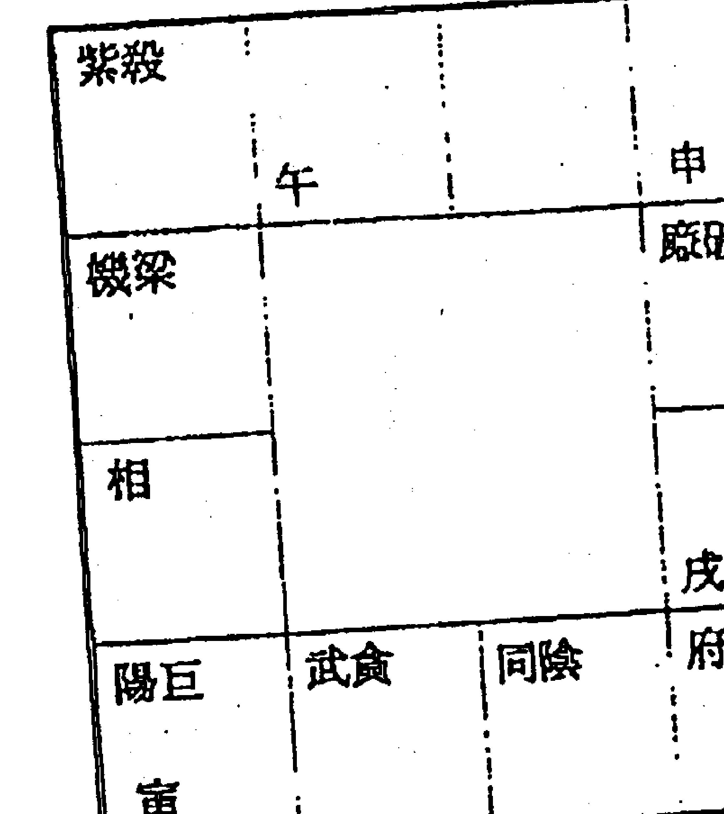
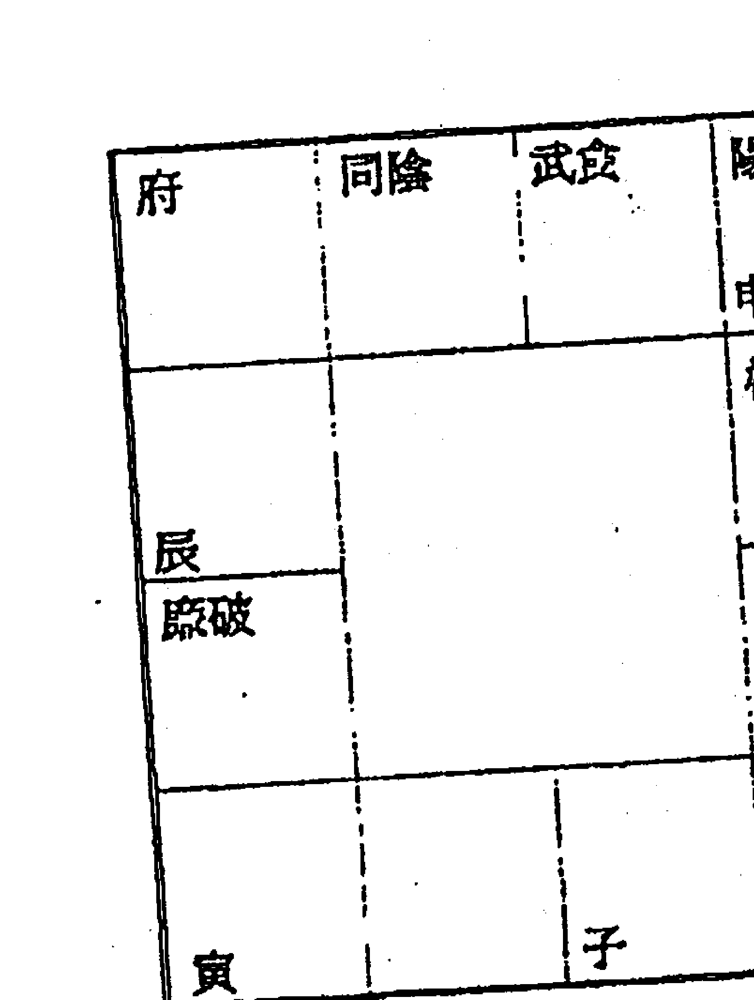
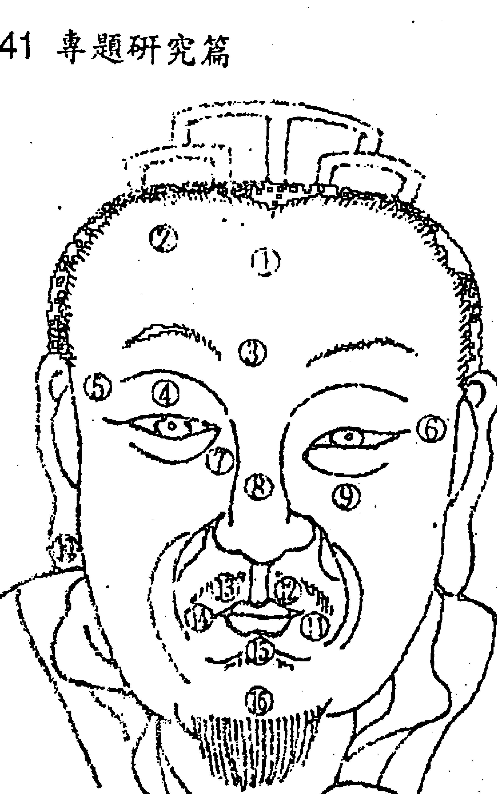
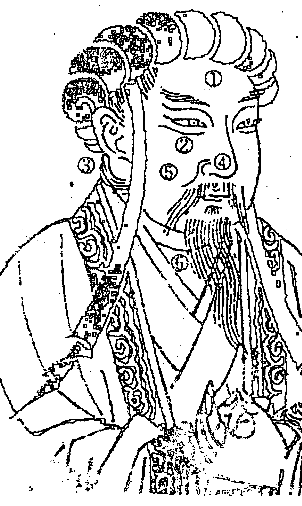
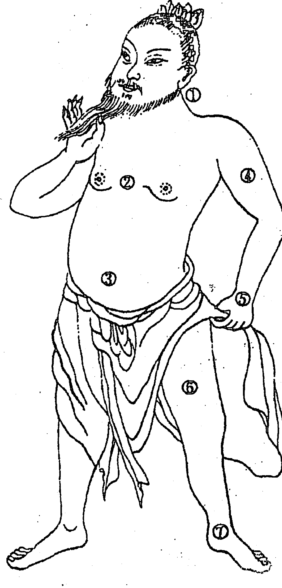

# SUNNY BOOKS

# 紫微隨筆

# 《利集》

斗數拆招

星盤分富貴窮通

運限判吉凶休咎

鍾義明／著

# 目錄

- 《斗數拆招》自序 / 009
- 卷一／理念與宮垣
    - 《起例歌訣總括》註解 / 014
    - 過節的關鍵所在 / 022
    - 天盤。地盤。人盤 / 023
    - 命身宮三分法 / 029
    - 命身配卦 / 037
    - 十二宮的聯合作用 / 051
    - 紫微過宮。移星換斗 / 056
    - 身宮看法 / 070
    - 宮主秘法 / 073
    - 以兄弟宮推斷人際關係 / 093
    - 宮位轉移／106
    - 〈攝要六問〉註解／111
    - 論人生時要審的確／121
    - 論男女命不同／128
    - 〈談星要論〉註解／132
    - 論格星數高下／136
    - 宮干自化／138
- 卷二／星曜
    - 星宿所屬／148
    - 星宗吉凶星／152
    - 女命巨日／巨機／夫妻宮化忌／160
    - 六十星系的基本性質／164
    - 「天機寅卯辰，七殺并破軍」的秘訣／171
    - 比較「紫破」與「紫相」之異同／174
    - 比較「機陰」與「機梁」之異同／177
    - 「武殺耗囚」木壓雷震／179
    - 適合軍警的武曲條件／181
    - 比較「同陰」與「同梁」之異同／184
    - 比較「廉破對相」與「廉相對破」之異同／185
    - 太陽巨門為何是「異族」？／187
    - 太陽太陰「變景」？／190
    - 「火貪」與「鈴貪」之成破／196
    - 逢相尋府。逢府看殺／201
    - 天相守命的吉凶推斷／205
    - 比較七殺與破軍的異同／210
    - 比較羊陀火鈴的異同／212
    - 陀羅「化氣曰忌」與十干「化忌」之異／214
    - 桃花星曜／218
    - 驛馬與其他星曜組合的主應／225
- 卷三／專題研究
    - 財的看法／228
    - 投資看福德／235
    - 六親、疾厄與相貌／239
    - 漂亮不漂亮？看父母／245
    - 看疾病／249
    - 從星系組合看疾病／256
    - 從星系組合看事業／310
    - 用黃道十二宮看事業／337
    - 一氣生死訣／344
- 卷四／運限與人生
    - 遷限之假借／350
    - 推流年。三代論／361
    - 疊劫盤殺與人盤虛實法／368
    - 羊陀迭併 / 375
    - 竹羅三限・流身主 / 381
    - 論行限分南北斗 / 385
    - 論十二支生人行限所忌宮星訣 / 388
    - 論太歲小限星辰廟陷過十二宮吉凶 / 395
    - 行運禍福看法 / 414
    - 流年趨避 / 418
    - 論陰陽延年 / 425
    - 小兒關煞 / 428
- 并言
- 著者啟事
- 武陵出版有限公司鍾義明著作系列一覽

## 《斗數拆招》自序

明・章學誠《文史通義・文心篇》云：「凡操千曲而後曉聲，觀千劍而後識器。故圓照之象，務先博觀，閱喬嶽以形培塿，酌滄波以喻畎澮。無私於輕重，不偏於愛憎，然後能平理若衡，照辭如鏡矣！」

彈過很多樂曲，才知道什麼是好的音樂；看過很多刀劍，才知道什麼是寶刀神劍。看得多、懂得多，才能面面俱到。以遊歷過的大山大海之氣勢來描繪小山小水。針對作品，不考慮作者的名氣或與自己的交情，也不摻雜個人的好惡情緒。這樣，在作批判評論時，才能公正、客觀。雖然是屬文學批評的見地，亦適用於任何學術。每一種學術的研治，都要經過王靜安《人間詞話》中所提出的「三境界」：泛覽、專攻、創造。

人非生而知之者，所以要學，而學習必須從多方面去進行，可是人世間的學問實在太多太雜了，要一一學盡，絕對不是吾人有限的生命所能做到的事。況且世間的事務也未必是樣樣都值得我們虛擲生命的光陰去學習，有的學了反而不好，不如不學，有的事物不很重要，並不需要花太多時間去學。

《小窗幽記》說：『有書癖而無剪裁，徒號書厨。』

在現代學習術數，也要抱如是觀。

讀書要透過取舍和選擇的方式來博觀泛覽——如《石濤畫語錄・山川章第八》所說的：『搜盡奇峰打草稿。』紫微斗數發展至今，在理念、法則和推斷技巧上，無庸置疑，是真偽雜陳、花招百出的，對研習者及站在學習效率的立場而言，最需要的是從砂礫中揀拾精金，從群山中搜尋奇峰，也就是說，要從眾多的理念、法則、技巧中，去選取最正確、準驗、特殊的理念、法則、技巧，而且這些理念、法則、技巧還要具有前瞻性和可資未來發展的可能性。

所有的知識都要經過智慧的觀照和批判後，才可以決定那些觀念真正具有價值，值得我們採納；那些觀念只不過是心智的渣滓，應予棄擲。不論一個人的資質如何，若依照學習理論來說，人的腦筋要不斷加以刺激運用，才會逐漸聰明起來；不斷學習便是一種不斷的刺激。此外，『做學問要在不疑處有疑』，遇到疑難處，更要不恥下問，否則一個不解的疑難將成為了解全盤問題的盲點。同時，還要多多思考，試著破譯問題。長此以往，自然能把所讀過的書融會貫通而運用自如。善於讀多的人，任何一本書對他而言，都像渡河的舟楫，既渡過了河流，就該舍去舟楫登岸。

以包容的胸懷去接觸古今各家各派學說，學說的新舊、門派對於其真實性並沒有必然的關係，重要的是理路通透。以蜜蜂的辛勤去研究古今各家各派學說，但是不眩惑於花朵綺麗的表象，要蜜豐花不見。以檐水滴石的毅力，去破譯印證古今各家各派學說，不到穿透不休止。

這是筆者治學所秉持的信念，著作本書時尤其如此。

本書分為四卷：理念與宮垣篇、星曜篇、專題研究篇、運限與人生篇，列在《紫微隨筆》系列的「利」集，是取《易經》「利，和也，如刀刈禾，順而使之也。秋金，義也。益萬物者為利，利物足以和義。」而名之曰「拆招」，用意在擷取古今各家各派門數的精華——重要理念、法則、技巧，經過分類整理、思辨、破譯，使成為門數推命的利器、打開門數命學寶藏的金鑰，並作為下一本拙著《門數批命實務》的奠基石。

書中引用最多的是「中州派」紫微門數的理念、法則與推斷技巧，該派的巨擘王亭之（談錫永）先生著有《紫微門數講義》（一）（二）補注（陸斌兆原著，臺灣・時報文化出版企業有限公司出版）、《王亭之談星》（香港・博孟出版集團出版）、《王亭之談門數與玄空》（香港・勤十緣出版社出版）、《王亭之談門數》（香港・創建出版公司出版）、《中州派紫微門數初級講義》、《中州派紫微門數深造講義》（香港・紫微文化服務社有限公司獨家發售）、《安星法及推斷實例》（香港・紫微文化服務社有限公司獨家發售）等書，在港澳地區流傳甚廣，臺灣地區則較少人知，站在學術交流的立場，筆者認為絕對有為臺灣地區讀者推介的責任；其系統之完整、見解之精闢，實為其他流派難望其項背。但是筆者要澄清的是：絕對沒有抱著「外來的和尚會念經」、故意抄襲以填塞篇幅或沽名釣譽的心理，而是出乎傳播種子的一片誠心。在此僅向王亭之先生致上最崇高的敬意，感謝他為紫微斗數的發展所做的努力。

其他引用資料的作者，也是筆者要致敬和感謝的，由於他們的貢獻，使現代斗數園地開出超越古代斗數的美麗花朵。

最後，我要感謝的是：舊董大師李殿塵兄為本書封面題賜墨寶、《宣易園》陳啟銘兄提供參考資料、門人陳泱丞君協助整理與校稿工作。

一九九四年甲戌暮春鍾義明記於竹山佛心翠影書齋

## 卷一 理念辨要初稿

利者，義之和也。利，和也，如刀刈禾，順而使之也。秋金，義也。益萬物為利，利物足以和義。

### 《起例歌訣總括》注解

希夷仰觀天上星，作為斗數推人命。不依五星要過節，祇論年月日生時。
先安身命次定局，紫微天府布諸星。劫空傷使天魁鉞，天馬天祿帶煞神。
前羊後陀並四化，紅鸞天喜火鈴刑。二主大限並小限，流年太歲尋斗君。
十二宮分詳廟陷，流年禍福從此分。祿權科忌為四化，惟有忌星最可憎。
大小二限若逢忌，未免其人有災迍。科名科甲看魁鉞，文昌文曲主功名。
紫府日月諸星聚，富貴皆從天上生。羊陀火鈴為四殺，衝命衝限不為榮。
殺破廉貪俱作惡，廟而不陷掌三軍。魁鉞昌曲加無弗應，若還命限陷尤嗔。
尚有流羊陀等宿，此又太歲從流行。要加喪弔白虎湊，傷使可以斷死生。
若是生時準確者，禍福有何不準評？不準但用三時斷，時有差遲不可憑。
此是希夷真口訣，學者當仔細精。後具星圖並論斷，其中剖決最分明。②

拆招
本篇是對紫微斗數命法重點，作提綱挈領介紹，便於學者記誦的歌訣。由於祇有四十二句、二百九十八字，篇幅不大，完整連貫，故筆者不予割裂解說，而採取條注的形式來作解說，裨讀者能先一窺全豹，掌控整體，再管中窺豹，研究細部。

> 註①：紫微斗數這一套命學真的是陳希夷創造的嗎？這是個存疑的問題，尚待考據。

A 透派的張耀文先生認為是「不依五星」，「要過節」，也就是月的起始是和子平法一樣，以入節為準的：正月立春起、二月驚蟄、三月清明起、四月立夏起、五月芒種起、六月小暑起、七月立秋起、八月白露起、九月寒露起、十月立冬起、十一月大雪起、十二月小寒起。年的起點，從立春起。照這個規則來「遊戲」，那麼就沒有碰到閏月要照上月推、下月推，或上半月算上月、下半月算下月的問題了。

B 大多數的人認為紫微斗數的法則與五星法不同，堅持不必論節氣：年從正月初一日子時起算，月從陰曆各月初一日子時起算，安命宮、身宮、吉凶星皆依此規則「遊戲」。這個論點，也是疑雲重重、破綻百出的。只要是對天文曆法、子平命學、七政四餘（五星）命學有深入研究的人，決不會滿意這種「簡單」的論點。因為——

a 五星法安命宮是從太陽所躔的宮度起生時，順算至出生地的日出時間（北緯0度至29度地區，通常是卯時），即安命的宮度。安身宮是從太陰（月亮）所躔的宮度起生時，逆算至日落月昇時間（通常是酉時），即安身的宮度；太陽過宮是算「中氣」（如春分過戌宮、穀雨過酉宮……），而非算「入節」。

大多數的紫微斗數專家振振有詞，拿「不依五星要過節」，來支持斗數安命、身宮與五星法不同，是自暴其短——暴露他根本不懂五星法。

b 其實「不依五星要過節」的「要過節」是指年系、月系吉凶星要按「入節」起算。吉凶星是「氣」的往來消長，隨二十四節氣循環。斗數有很多吉凶星是沿襲五星法、祿命法、叢辰法而來，不可脫離節氣法則的限制。這些必須論年月節氣法則的吉凶星，計有下列各系統：

- 月系：天刑、天姚、天馬、解神、天巫、天月、陰煞。（包括左輔、右弼？）
- 年干系：祿存、擎羊、陀羅、天魁、天鉞、化祿、化權、化科、化忌、天官、天福、空亡（旬空）、截空（紫微斗數用截空根本是大錯特錯，截空的正確用法是以日干對時支，精通擇日學的人都知道此一法則）博士12星（從年干起博士，陽男陰女順行、陰男陽女逆行，要知道，男女陰陽的認定也是以立春為準的）。
- 年支系：身主、天哭、天虛、龍池、鳳閣、紅鸞、天喜、孤辰、寡宿、蜚廉、破碎、流年將前12星（正確的說法是「馬前神煞」）、流年歲前12星。

嚴格地剔除這66顆吉凶神煞後，紫微斗數命學體系幾乎成了空架子，比較沒有爭論疑點的星曜已所剩無幾了。而以寥寥可數的幾顆疏星，要建構成一個博大精深的命學體系，無異痴人說夢！

筆者研習五術，無所不究，對紫微斗數亦涉獵二十四寒暑了，之所以久久不敢著述，就是發現斗數的理論架構懸疑太多的關係。

> 註②：《星平會海》卷四《流年通天賦》有「喪門白虎哭聲頻」、「白虎乃重要之客」、「弔客主門庭之孝」等語。毫無疑問，斗數仍不能脫離五星的影子。命為本、限為根，斷流年之休咎。星為度，主為宮，決當歲之災危。太歲為諸神之統領，馴者切莫忽視流年的神煞。

小星星」，批流年若捨棄這些小星星是批不出啥子名堂的。要知道，最辣的辣椒，九成以上是小辣椒，南北斗的二十幾顆「大星」在論命、批流年時，就像「大辣椒」，站在「語中」的效應立場而言，「大辣椒」比不上「小辣椒」。論命、批流年，空談大話無益，因為顧客要的是「一箭穿心」的精準度，和「度世金針」的人生諮商，而不是包山包海、模稜兩可的聊天廢話。

> 註③：琴堂五星法，是七政四餘命學體系中，名氣響噹噹的一個流派，其源流出自密宗興宮宗祖師一行禪師（西元六八三—七二七，俗家姓名張遂，為唐朝開國功臣鄰國公張公瑾玄孫張江元素之侄）。傳世之書有《虛寶五星源流》是傳自青城山僧靈樁，樁傳之江西僧普澄，澄傳之浙江四明僧慧月，月又傳之元朝國師耶律楚材，慧月卒於天界寺。明朝初，僧蒲庵得之於天界寺古佛殿壁中，洪武六年授括蒼季薰（宗舒）。今傳本多作《琴堂五星》。《指金虛寶五星天機七五賦》有古杭月墅老人黃秋山之序云：「指金之歌訣分為前、後集，乃逸齊呂公墓于玉板之文，露玄機之幽隱，洩天文之古髓，誠為星學之魁，時人罕有知之。琴堂老師得如重寶，于是摘其六十四條為一家之捷徑，所以取其易而隱其奇也。時之術者皆拱立下風，一鞭不敢失著。餘少學術于天目山，事琴堂老師二十餘歲，授此全集，集誠非易也，后之君子輕泄，薄德之心，為琴堂萬世罪人也歟？」

由此可知，「琴堂」是天目山一位對星法很有研究的高人，其能自成一家之言，而為宗師者也。

由於明朝開國之君朱元璋下令民間禁習天文，所以天文為骨架的星宗命學遂沒落，直至明朝末年禁習天文的法律才解除。

> 明・沈德符《萬曆野獲編・曆法》：「中國曆法，本不及外國之精密。以故前元欽天監外，又有回回欽天監。本朝亦設回回司天監，有正儀大夫、司朔大夫、司元大夫等官。至洪武三十一年（西元一三九八年）而廢之。以其教歸之欽天，但用彼國「土板歷」同算，久之則法亦不驗，與中土無異矣！國初，學天文有厲禁，習曆者遣戍，造曆者誅死。至孝宗（朱祐樘1470～1505在位）弛其禁，且命徵山林隱逸能通曆學者，以備其選，而卒無應者。近年因日食分數不相符，督責欽天，但唯唯謝罪，以世學歲久，無他術為解……。自利瑪竇入都，號精象數，而士人李之藻等皆授其業，似當今兼領天文。」

1. 至洪武三十一年（西元一三九八年）而廢之。
2. 以其教歸之欽天，但用彼國「土板歷」同算，久之則法亦不驗，與中土無異矣！
3. 國初，學天文有厲禁，習曆者遣戍，造曆者誅死。
4. 至孝宗（朱祐樘1470～1505在位）弛其禁，且命徵山林隱逸能通曆學者，以備其選，而卒無應者。

明朝的天文著作寥寥無幾，較重要的祇有王禕（1322-1373）把元代趙友欽的《革象新書》加以刪訂，縮為兩卷本，較晚期只有王可大的《象緯新篇》等。連欽天監推算日食都「莫法度」了，何況是民間的江湖術士呢？紫微斗數乃在禁習天文的星宗命學空檔時推出。「何用琴堂學五星」，不是豪語，而是一種無奈——天文被禁，五星法沒得學，只得學紫微斗數啦！明末到清初，西洋天文、算術，隨著傳教士穆尼閣、湯若望、南懷仁等傳入中國，七政四余命學及擇日學又興起，加上子平命學盛行，紫微斗數被踢到黑暗的角落，默默無聞。

1. 定時辰，起八字，安命身十二宮。
2. 以生年干起「五虎遁」，排十二宮干，再確立命宮干支納音「五行局」。
3. 安星。先以「五行局」與生日定紫府，排出南北斗主星，而後再排時支系諸星、月支系諸星、日系諸星、年干系諸星、年支系諸星、歲前十二星、將前十二星、博士十二星、命主、身主、傷使、旬空、截空（筆者不用）、長生十二星等一百一十二顆星。

陳希夷對天文星相有研究或者著述嗎？古代的史書、筆記沒有記載，所以他是不是曾抬頭看星，低頭創斗數，這個懸疑只有天曉得。

完整的斗數推命，至少應包括：

### 中州派紫微斗數將星曜，作如下的分類：

- ① 正曜／紫微、天機、太陽、武曲、天同、廉貞。
- ② 輔曜／左輔、右弼、天魁、天鉞。
- ③ 佐曜／文昌、文曲、祿存、天馬。
- ④ 煞曜／火星、鈴星、擎羊、陀羅，謂「四煞」；有時包括天空、地劫在內，謂「六煞」。
- ⑤ 空劫／地劫、天空（地空）。
- ⑥ 化曜／化祿、化權、化科、化忌。
- ⑦ 空曜／地劫、天空（即「地空」），歲前第二星與「晦氣」同位的「天空」亦是）；旬空、截空亦算空曜，但力量較弱。
- ⑧ 刑曜／擎羊、天刑。
- ⑨ 忌曜／陀羅、化忌。
- ⑩ 桃花諸曜／紅鸞、天喜、咸池、大耗、天姚、沐浴。廉貞、貪狼亦屬桃花性質，但納入正曜系列。
- ⑪ 文曜／化科、文昌、文曲、天才、龍池、鳳閣。
- ⑫ 科名諸曜／上述的六顆文曜，加上三台、八座、恩光、天貴、台輔、封誥、天官、天福八曜。

空亦算空曜，但力量較弱。

4. 起運限（大限、小限、童限，有的斗數家用到子平法大運）、子年斗君。
5. 了解「六十星系」的基本性質。（古法是以星曜的廟旺、得地、利、平閒、失、陷及六吉、六凶分喜忌。）即以本宮、對宮、三合宮的星曜組合，配合廟陷、四化辨別其正面或負面的性質。
6. 推斷命身十二宮的基本性質與徵驗。
7. 推斷大限、小限、流年、斗君（流月、流日、流時）的星系反應。
    - 推大限時要用宮干四化及宮干支流曜。
    - 推小限時要用「歲前」、「將前」的流年神煞。
    - 推流年、斗君時要用流年、流月、流日、流時的天干四化及干支流曜。
8. 推斷星盤時，要運用三個技巧：「借星安宮」、「星曜互涉」、「見星尋偶」。

定時辰很重要，因為我們平時所認知的「時間」是人為的鐘錶時間，而算命用的「時間」是「視太陽黃經時」的天文時間。天文時間隨出生地經度和出生節氣（黃赤大距）而有誤差。最大能差十幾、二十幾分鐘。所以出生在時頭、時尾者，必須透過精密的時差計算，才能得到「真正的出生天文時間」；若是不確定生於幾時幾分者，可以用三個時辰來起星盤（但至少要知道是生於清晨、近午、正午前後、黃昏、入夜或深夜），然後依其相貌、體形、性情、實際經歷等條件，判斷是那一個生辰。

### 過節的關鍵所在

紫微楊（楊君澤）的《紫微新語》提及一個司機問他的問題：八月生人，但已過寒露，星盤的起法是作八月生人還是九月生人呢？

> 楊先生的見解：『根據我師父所傳，是秘密的口傳，起星盤當然八月就算八月，但如果上述情況已過寒露，那麼月支星系的星曜——如十分重要的左輔、右弼等，就應作九月算，只是月支星系要計算過節而已。』

拆招
月支星系有左輔、右弼、天刑、天姚、天馬、解神、天巫、天月、陰煞等九個星曜，以及由左輔、右弼按生日排出的三台、八座。月系星在絕大多數的斗數書籍中，並沒有說明要不要論節氣，一般斗數家是不論節氣的，只有楊先生提出月系星「要過節」的見解。

先賢和古書對於「節氣問題」，並沒有留給我們這一代的斗數研習者詳細確鑿的解答，以致由於個人師承不同、所本不同、私臆不同，而產生疑惑、紛爭。解決疑惑、紛爭，最好的方法是透過大量的正確命盤實例來印證。但是，這個方法不見得能行得通——因為我們這一代的斗數是「百家爭鳴」的「戰國時代」，各個斗數家各自擁有「專屬」的斗數論命理論體系，並無統一的斗數論命法則可資客觀印證之用。誰也不肯承認自己的理論體系有誤，或保證自己的理論體系絕對無誤。所以，我們這一代的斗數研究者最重要的工作是：建立可資客觀印證之用的斗數論命法則。

1. 用生月與生時起命身宮及安斗君時，不論節氣。
2. 年干系諸星、月支系諸星、年月干四化星、年支系諸星與流年諸神煞，論節氣。

準驗度如何？毋庸口舌爭執，讀者多多驗證便知。

### 天盤。地盤。人盤

拆招 資料來源：王亭之《談錫永〈中州派紫微斗數講義〉》
盤「與「人盤」的起法，向被視為不傳之秘。茲舉例起盤於次。

1. 地盤
依照農曆出生年月日時，取出命身十二宮，安星後的命盤，是為「天盤」。另外還有「地盤」將「天盤」的身宮當作「命宮」，並以身宮的干支納音取出「五行局」安置。例如林洋港先生身宮丁未，納音「天河水」一局，即以水二局為「五行局」安星。以未宮為命宮，天機化科、## 2. 人盘

左辅、右弼、擎羊坐命：其他各宫及星曜的排法，一如『天盘』，是为『地盘』。

将『天盘』的福德宫当作『命宫』，并以福德宫的干支纳音取出『五行局』安星。例如林洋港先生：『天盘』的福德宫乙巳，纳音『覆灯火』六局，即以火六局为『五行局』安星。以巳为命宫，廉贞、贪狼、陀罗坐命，其他各宫及星曜的排法，一如『天盘』，是为『人盘』。

已故的中州派斗数名家陆斌兆，是以『地盘』观察一个人的天性和先天的根源。

> 他说：『社会上有很多高贵的绅士，可是他们先天『地盘』上的星曜却不是很尚，而有很多贫穷，或者没有受过良好教育的，可是他们却有很多清高的思想和大方的动作，这便是『天盘』命宫的星曜虽然多败耗的星曜，可是在『地盘』上的星曜，我们一样要注意它的入庙和落陷、生旺或死墓来区别它们的高低。』

陆斌兆所主张的『人盘』，与王亨之所主张者不同，而是推算大限、小限、流年、流月、流日、流时、重限的『流盘』。

## 天盘

民国十六年
1927·5·15

林洋港先生

- 命主：文曲
- 身主：天同

命垣纳音金箔金入金四局
十六年 四月 十五 日寅时生

紫微斗数命盘，十二宫位排列，包含主星、辅星、干支、年龄范围等信息。

| | | | |
|---|---|---|---|
| 太阳旺陷 | 破军庙○陷 | 天机陷 | 紫微旺地 |
| 八座破碎孤辰厨 | 天天贵喜 | 化科池阴 | 陷地台煞解神 |
| 丧门力士 | 贯索息神 | 五鬼官府 | 月劫伏兵 |
| 乙巳 临官 22-31 夫妻 | 丙午 冠带 12-21 兄弟 | 丁未 沐浴 2-11 命身宫宫 | 戊申 长生 112-121 父母 |
| 武曲庙<br>天刑姚喜<br>青龙龙 | 民国十六年<br>1927·5·15<br><br>丙 己 乙 丁<br>寅 酉 巳 卯 | 林洋港先生<br>地盘<br>十六年四月十五日寅时生<br>命垣纳音天河水入水二局<br>命主 文曲<br>身主 天同 | 太阴旺○<br>化忌台光虚<br>天厨三台恩光虚<br>灾破耗 |
| 甲辰 帝旺 32-41 子女 | | | 己酉 墓 102-111 福德 |
| 天同平<br>化权天哭<br>将星小耗 | | | 贪狼庙<br>天才解神<br>龙德天病符 |
| 癸卯 衰 42-51 财帛 | | | 庚戌 胎 92-101 田宅 |
| 七杀庙<br>天官月<br>亡神越将 | 天梁旺陷<br>寡宿<br>吊客煞害 | 廉贞相星平庙陷<br>红鸾天刑<br>飞廉天福德 | 巨门旺○利<br>化忌天巫天马旬空<br>指背天喜神 |
| 壬寅 病 52-61 疾厄 | 癸丑 死 62-71 迁移 | 壬子 墓 72-81 仆役 | 辛亥 绝 82-91 官禄 |

## 25 理念與宮垣篇

民国十六年 1927·5·15

## 人盘

林洋港先生

乙巳 绝 6-15 命宫

丙午 墓 116-125 父母

丁未 死 106-115 身宫

戊申 病 96-105 田宅

甲辰 胎 16-25 兄弟

癸卯 死 26-35 夫妻

壬寅 长生 36-45 子女

癸丑 沐浴 46-55 财帛

壬子 冠带 56-65 疾厄

辛亥 临宫 66-75 迁移

己酉 衰 86-95 官禄

庚戌 帝旺 76-85 仆役

```
廉貪陀 直狼羅 陷陷陷 八破紫孤天 座祿存辰府 疾武力 門府土
```

```
巨破文 門存曲 旺○陷 化天天 禄官喜 良忌好 禁碑士
```

```
天左右寒 相輔弼羊 地○○府 天姚鳳 郎池明 五鬼官 鬼益府
```

```
天同文 梁昌 旺陷地 化陰地天台 祿傷財才煞 月劫伏 德煞兵
```

```
武七天 曲殺空 旺利○煞 三忌天 台光府 戲災大 破煞耗
```

```
太天 陽馬 陷 天刑 赦神 魁天病 德煞符
```

```
火天 星馬 利○ 天天天句 貂巫馬空 白指害 虎背神
```

```
天機天 微星使 閉陷 化紅天 祿害刑 天威飛 德池廉
```

```
天破地 微軍劫 門旺陷 疾宿 月殺 客煞白
```

```
天府地 天灾 武將小 建星托
```

```
天官月 武亡將 越神翌
```

据王亭之先生说：起『地盘』及『人盘』的方法，过去历代祖师皆当成绝大的秘传，仅传给自己的继承人，对外人绝不透露。王亭之的老师刘惠苍老人，也是在染病之际，才寄一封信给他，详述『地盘』及『人盘』的排法。王亭之认为这类术数的小技不妨公开，否则容易失传。

『地盘』用于每一个时辰的前十五分钟出生者，其余的时间出生者用『天盘』。（记住：钟表时间要经过『节气时差』和『出生地经度时差』的修正，才是真正的出生太阳时。）

例如林洋港先生是『中元生人』，『天盘』的性质最强。若是『上元生人』，即使用『天盘』推算，也要参考『地盘』各宫的星曜。如此比较，才能判断『天盘』的星曜是否有根。若是『下元生人』，即使用『人盘』推算，也要参考『地盘』、『人盘』生『天盘』或与『天盘』比和，是为有根。但若『地盘』、『人盘』的星曜会煞忌重重时，虽然有根，却不是好的根。另外，还有『祖德问题』：祖德好的人，虽然生在不好的『天盘』时区内，但是他的『人盘』可能很好。

得到好风水庇荫而生的人，其『地盘』命比『天盘』命为佳。

一八六四年立春后至一九二四年立春前出生者，为『上元生人』，以『地盘』为根基。一九二四年立春后至一九八四年立春前出生者，为『中元生人』，以『天盘』为根基。一九八四年立春后至二〇四四年立春前出生者，为『下元生人』，以『人盘』为根基。

## 命身宫三分法

八字起出，即安命垣身宫，便知此命之要领。
如子午卯酉，为四败之地，主恶，又为桃花地，此四宫安命者，为人必好外表好酒色，多风流，喜交游，而毁落难免；辰戌丑未为四墓之地，主刑，亦为孤独地，此四宫安命者，必外表沉厚，而多游移，弃祖离宗，刑克六亲，离乡远处为美；寅申巳亥为四生、四马之地，主劳，又为辛勤地，此四宫安命者，为人必聪明流合，受制于人，辛勤劳碌，自寻苦恼者，居其多数。
故安定命宫，不论其富贵贫贱，弃天贤愚，淫贫邪正，亦不能离此义也。

> ——《斗数宣微》杂论之三

拆招此为十二宫的「三分法」，在占星学的看法，子午卯酉是「固定宫」，具有永恒、不动的性质，主贵；辰戌丑未是「转宫」，具有转化、仲介的性质，主富；寅申巳亥是「二体宫」，具有开始、兼具的性质，主才艺。
但，古典派的西方占星家是把十二宫分为「四象」，并依其阴阳及「三分法」的性质来诠

A 地鱼宫

释：

## A土象宫

为物质、肉踏、踏实性的宫，亦称「土象星座」，性质稳重。

## B水象宫

为感情性的宫，也是精神、灵魂、多情、带有神秘感的宫。

- 亥宫／除旧佈新、被动、哲理性。
- 卯宫／坚固久远、组织力、自信。
- 未宫／快速、活泼、领导力。

## C火象宫

为意志性的宫，刚健、活泼、流畅，有野心。

- 寅宫／除旧佈新、被动、哲理性。
- 午宫／坚固久远、组织力、自信。
- 戌宫／快速、活泼、领导力。

## D风象宫

为智性、理则性的宫，具科学、艺术、轻快、分析之特质。

## A 子午卯酉

申宫／除旧佈新、被动、哲理性。
子宫／坚固久远、组织力、自信。
辰宫／快速、活泼、领导力。

观里主人所举的「三分法」宫的性质，是从神煞法引导出来，堪舆学的天星派也有此种说法

| 羊刃 | 年干 |
|------|------|
| 卯   | 甲   |
|      | 乙   |
| 午   | 丙   |
|      | 丁   |
| 午   | 戊   |
|      | 己   |
| 酉   | 庚   |
|      | 辛   |
| 子   | 壬   |
|      | 癸   |

| 咸池 | 年支 |
|------|------|
| 酉   | 子   |
| 午   | 丑   |
| 卯   | 寅   |
| 子   | 卯   |
| 酉   | 辰   |
| 午   | 巳   |
| 卯   | 午   |
| 子   | 未   |
| 酉   | 申   |
| 午   | 酉   |
| 卯   | 戌   |
| 子   | 亥   |

又名「桃花」、「廉贞」，主人性巧、性急、爱风流、多才貌、能艺术。

羊刃与咸池同位，主人多学多能，未免风流带疾。

## B寅申巳亥

| 年支 | 劫煞 | 亡神 | 驿马 | 孤辰 |
|------|------|------|------|------|
| 子 | 巳 | 亥 | 寅 | 寅 |
| 丑 | 寅 | 申 | 亥 | 寅 |
| 寅 | 亥 | 巳 | 申 | 巳 |
| 卯 | 申 | 寅 | 巳 | 巳 |
| 辰 | 巳 | 亥 | 寅 | 巳 |
| 巳 | 寅 | 申 | 亥 | 申 |
| 午 | 亥 | 巳 | 申 | 申 |
| 未 | 申 | 寅 | 巳 | 申 |
| 申 | 巳 | 亥 | 寅 | 亥 |
| 酉 | 寅 | 申 | 亥 | 亥 |
| 戌 | 亥 | 巳 | 申 | 亥 |
| 亥 | 申 | 寅 | 巳 | 寅 |

## C辰戌丑未

| 纳音 | 墓库 | 自墓 |
|------|------|------|
| 金 | 丑 | 乙丑 |
| 木 | 未 | 癸未 |
| 水 | 辰 | 壬辰 |
| 火 | 戌 | 甲戌 |
| 土 | 辰 | 丙辰 |

| 华盖 | 年支 |
|------|------|
| 辰 | 子 |
| 丑 | 丑 |
| 戌 | 寅 |
| 未 | 卯 |
| 辰 | 辰 |
| 丑 | 巳 |
| 戌 | 午 |
| 未 | 未 |
| 辰 | 申 |
| 丑 | 酉 |
| 戌 | 戌 |
| 未 | 亥 |

辰戌丑未为四印（墓、库），戊己得之偏主信，甲乙若逢鄙且贪，丙丁或遇贫且病，庚辛格号「母生儿」，聚杀丑宫多短命。

华盖为文学、艺术、宗教星。华盖逢墓库，为僧道九流，逢自墓可享清闲之福、长寿，但均克父母妻子。

长生主聪明、才学。

亡神、劫煞、孤辰皆主孤，不利父母妻子。劫煞为灾不可当，徒然奔走名利场。亡神为「天官符」，主官司诉讼。

## 理念與宮垣篇

> 「凡人逢华盖星死绝空破，或者四柱组合不好，最好拜一个和尚或道人为师，皈依佛门或道门，幼儿好养，少病平安，否则在二十四岁以前，不是凶灾连连，便是灾决不断，还易得奇病，甚至危及生命；如能过二十四岁者，有的是终生不顺，一世孤寒。如有的孩子四柱带华盖，皈依前不孝父母，不爱学习，好惹是非，有的是监狱常客，有的久病不起……结果，皈依拜师后，各方面逐渐好转，成为有用之材。另一些不听善劝的，结果因伤致残，命入黄泉。」

邵先生提及一九八九年（己巳）在某地讲学时，遇到的一个华盖星案例：

这位廿九岁的小伙子，当时出现一种异常反应——常对天空说话，或在家对着空房说话，走路也是有说有笑或有哭有闹，白天昏睡，晚上活跃，兴奋异常，有时几天不吃不喝，开始经常外出，后来闭门不见任何人，总之，想怎样折腾就怎样折腾，稍加劝阻就要行凶打人，家人与公家都束手无策，认为小伙子疯了，急得不知如何是好。

邵先生听后，断定会与华盖有关，结果报出生辰一查，果然如此。邵先生按其华盖特定含义的标志，叫他去庙上拜老和尚为师，让他调理。不久，小伙子就恢复了正常。

## 33 理念與宮垣篇

天文 梁昌 陷庙 | 地旬 耗空 △△ | 七天天 杀空钺 旺庙○ | 天厨 ○ | 子地 斗解○ | 廉陀火 贞曜星 庙陷陷 | 天耗 △
天神 化忌○ 龙池哭 | 阴解天 煞神寿 | 天封天 刑诰虚 | 天天才 才喜 | 龙亡力 德神士 | 生
五指将 鬼背军 | 月咸小六 德池耗害 | 胎 | 岁月青 破煞龙 | 养 | 
癸巳 | 长生 24-33 | 夫身 妻宫 | 甲午 | 发 14-23 | 兄弟 | 乙未 | 胎 4-13 | 命宫 | 丙申 | 绝 114-123 | 父母

1961.12.22

辛酉年十一月十五日巳时生
命垣纳音沙中金入金四局

阴男

己 | 庚 | 辛
巳 | 丑 | 子 | 丑
身主 | 命主
天相 | 武曲

紫天地 微相劫 闲闲庙 | 华天 △ | 贯天奏 索煞书 | 基
壬辰 | 沐浴 34-43 | 子女
天巨铃 机门星 旺庙利 | 29岁小限 | 化禄 | 死
庚寅 | 临官 54-63 | 疾厄

文禄 山存 庙 | 化天斐凤 科官廉阁 | 白将博 虎星士 | 沐
丁酉 | 墓 104-113 | 福德
破巩 皿羊 旺酉 | 游奕 △
天寡 月宿 | 冠
天攀官三 德鞍府刑 | 死
戊戌 | 94-103 | 田宅
天同 庙 | 天台 姚辅 | 吊岁伏 客驿兵 | 临
己亥 | 病 84-93 | 宫禄

太太 阳阴 不庙 | 武天右 曲府弼 旺庙 | 已斗
化破 权碎 | 衰 | 息大 神耗 | 旺
辛丑 | 帝旺 64-73 | 迁移 | 庚子 | 衰墓 74-83 | 仆役

以斗数来看：这位小伙子的命宫在未，是「水象宫」，为感情性的宫，也是精神、灵魂、多情，带有神秘感的宫，具有快速、活泼、领导力的特性。命宫无正曜，对宫见太阳、太阴，借会文昌化忌、文曲化科，有阴晴不定、忽冷忽热、易起易跌，感情困扰的性质。落陷的太阳化权，只不过是光华一现而已。迁移宫见华盖、破碎、病符，即具有「灾殃不断」、「易得奇病」的征兆。癸巳大限（廿四至卅三岁）。己巳年，岁运天梁落陷，本命文昌化忌同度，会照本命的五鬼、吊客、华盖、病符、白虎，加上岁运的太岁、岁破、驿马、五鬼、白虎、羊刃、飞刃及流年文曲化忌、空亡（亥），可谓群凶聚集，加重了飘泊动荡、感情痛苦的现象。

> 古云：「天梁天马陷，飘荡无疑」；「天梁陷地见羊陀，伤风败俗」

诚为其境遇之写照。幸而己年天梁化科，

> 《中州派紫微斗数》载：「天梁本有消灾解难的本质，化科之后，这种本质更明显，而且于转危为安之后，使问题得到根本解决，从而清理了过往一直拖延的困扰。」

这位小伙子能转危为安，实拜「寿星」化科之赐。

### 命身配卦

拆招

资料来源·黄家聘《易术概要》（皇极出版社·一九七八年四月出版）

## 一、先天命卦（主前半生过程之详答）

##### 1. 地卦

以命主星配卦：

| 六白 武曲 三乾 巳 | 七赤 破军 三兑 午 | 六白 武曲 三乾 未 | 五黄 廉贞 申 |
|------------------|------------------|------------------|--------------|
| 五黄 廉贞 辰     |                  |                  | 四绿 文曲 三巽 酉 |
| 四绿 文曲 三巽 卯 |                  |                  | 三碧 禄存 三艮 戌 |
| 三碧 禄存 三艮 寅 | 二黑 巨门 坤 丑  | 一白 贪狼 坎 子  | 二黑 巨门 坤 亥 |

| 时辰 | 十二 | 十一 | 十 | 九 | 八 | 七 | 六 | 五 | 四 | 三 | 二 | 正 | 时间 |
|---|---|---|---|---|---|---|---|---|---|---|---|---|---|
| 子 | 丑 | 子 | 亥 | 戌 | 酉 | 申 | 未 | 午 | 巳 | 辰 | 卯 | 寅 | 23:00~01:00 |
| 丑 | 子 | 亥 | 戌 | 酉 | 申 | 未 | 午 | 巳 | 辰 | 卯 | 寅 | 丑 | 01:00~03:00 |
| 寅 | 亥 | 戌 | 酉 | 申 | 未 | 午 | 巳 | 辰 | 卯 | 寅 | 丑 | 子 | 03:00~05:00 |
| 卯 | 戌 | 酉 | 申 | 未 | 午 | 巳 | 辰 | 卯 | 寅 | 丑 | 子 | 亥 | 05:00~07:00 |
| 辰 | 酉 | 申 | 未 | 午 | 巳 | 辰 | 卯 | 寅 | 丑 | 子 | 亥 | 戌 | 07:00~09:00 |
| 巳 | 申 | 未 | 午 | 巳 | 辰 | 卯 | 寅 | 丑 | 子 | 亥 | 戌 | 酉 | 09:00~11:00 |
| 午 | 未 | 午 | 巳 | 辰 | 卯 | 寅 | 丑 | 子 | 亥 | 戌 | 酉 | 申 | 11:00~13:00 |
| 未 | 午 | 巳 | 辰 | 卯 | 寅 | 丑 | 子 | 亥 | 戌 | 酉 | 申 | 未 | 13:00~15:00 |
| 申 | 巳 | 辰 | 卯 | 寅 | 丑 | 子 | 亥 | 戌 | 酉 | 申 | 未 | 午 | 15:00~17:00 |
| 酉 | 辰 | 卯 | 寅 | 丑 | 子 | 亥 | 戌 | 酉 | 申 | 未 | 午 | 巳 | 17:00~19:00 |
| 戌 | 卯 | 寅 | 丑 | 子 | 亥 | 戌 | 酉 | 申 | 未 | 午 | 巳 | 辰 | 19:00~21:00 |
| 亥 | 寅 | 丑 | 子 | 亥 | 戌 | 酉 | 申 | 未 | 午 | 巳 | 辰 | 卯 | 21:00~23:00 |
| 子 | 丑 | 子 | 亥 | 戌 | 酉 | 申 | 未 | 午 | 巳 | 辰 | 卯 | 寅 | 23:00~01:00 |

##### 2. 天卦

以農曆生日數，以八除之，配伏羲先天卦數。

| 左輔 八白 三艮 已 | 破軍 七赤 三兌 午 | 武曲 六白 三乾 未 | 廉貞 五黃 申 |
|------------------|------------------|------------------|--------------|
| 左輔 八白 三艮 辰 | 五黃隨「天卦」寄位 | 右弼 九紫 三離 酉 | 右弼 九紫 三離 戌 |
| 文曲 四綠 三巽 卯 |                  |                  |              |
| 祿存 三碧 三震 寅 | 左輔 八白 三艮 丑 | 貪狼 一白 三坎 子 | 巨門 二黑 三坤 亥 |

① 命宮在子、寅、卯、午、未、申、亥七宮，為「正宮」，命主星為正星，即子貪狼、寅祿存、卯文曲、午破軍、未武曲、申廉貞、亥巨門。

② 命宮在丑、辰、巳、酉、戌為「副宮」，命主星為副星，須以左輔、右弼代之。安命在丑、辰、巳，以左輔八白為命主星。安命在酉、戌，以右弼九紫為命主星。

餘數一為乾卦、二為兌卦、三為離卦、四為震卦、五為巽卦、六為坎卦、七為艮卦，整除為坤卦。

| 卦 | 乾 | 兌 | 離 | 震 | 巽 | 坎 | 艮 | 坤 |
|---|---|---|---|---|---|---|---|---|
| 陰曆生日 | 1、9、17、25 | 2、10、18、26 | 3、11、19、27 | 4、12、20、28 | 5、13、21、29 | 6、14、22、30 | 7、15、23 | 8、16、24 |

##### 3. 錯卦

① 陽男、陰女。「天卦」在下為體，「地卦」在上為用。相盪為六十四卦。

② 陰男、陽女。如①盪卦，再取「錯卦」（陰陽爻相反的卦）。

##### 4. 舉例

A陰男·癸亥（一九八三）年八月二十一日巳時生。
命宮辰，是「副宮」，以左輔八白為命主星，配艮卦，是為「地卦」。
生日二十一，除以八，餘五，配先天卦巽，是為「天卦」。
隨。若為女命，則以山風蠱為先天命卦。

B陽女·庚子（一九六○）年正月二十二日未時生。
命宮未，是「正宮」，以武曲六白為命主星，配乾卦，是為「地卦」。
生日二十二，除以八，餘六，配先天卦坎，是為「天卦」。
明夷。若為男命，則以天水訟為先天命卦。

「天卦」在下，「地卦」在上，盪得澤雷隨。因為是陰男，取「錯卦」，得地火明夷。

「天卦」在下，「地卦」在上，盪得天水訟。因為是陽女，取「錯卦」，得地火明夷。

#### 二、 後天身卦（主後半生榮衰福澤）

1. 如前法求出命主配卦與生日配卦。
2. 「地卦」在下為體，「天卦」在上為用。（即與先天命卦相反）相盪為六十四卦。陽男、陰女準此，陰男、陽女取「錯卦」。

A陰男。癸亥（一九八三）年八月二十一日巳時生。
「地卦」艮，「天卦」巽。
「天卦」在上；「地卦」在下，盪得風山漸。
陰男，取「錯卦」，得雷澤歸妹。

B陽女。庚子（一九六〇）年正月二十二日未時生。
「天卦」在上，「地卦」在下，盪得水天需。
陽女，取「錯卦」，得火天大有。

#### 三、 大小銀運

1. 行爻之始，依五行局。水二局從初爻起，木三局從二爻起，金四局從三爻起，土五局從四爻起，火六局從五爻起，上爻是至極，不用。
- 上爻（不用）
- 五爻（火六局）
- 四爻（土五局）
- 三爻（金四局）
- 二爻（木三局）
- 初爻（水二局）

陽爻行九年，謂之「大象」，陰爻行六年，謂之「小象」。「大象」陽爻遇陽年不變，陽爻遇陰年必變。「小象」陰爻無論遇陽年或陰年，均不變。

童限，不分陰陽男女，初爻為一歲，二爻為二歲，三爻為三歲，四爻為四歲，五爻為五歲。
- 上爻（不用）
- 五爻（五歲）
- 四爻（四歲）
- 三爻（三歲）
- 二爻（二歲）
- 初爻（一歲）

##### 3. 舉例

陰男 癸亥（一九八三）年八月二十一日巳時生。

命宮丙辰土五局 身宮甲寅水二局

- ①命卦山風蠱
- 錯澤雷隨
- 綜澤雷隨

| 年齡 | 爻位 |
|------|------|
| 28   | 上一 |
| 22   | 五   |
| 13   | 四   |
| 49   | 三   |
| 43   | 二   |
| 37   | 初   |

陰男用「錯卦」。
- 五～十三歲水雷屯。（九四爻）
- 十四～廿一歲震為雷。（九五爻）

命宮土五局 從九四爻起運

#### 四、 流年運卦

以上各卦，依《易經》爻辭，論斷吉凶悔吝。是為「大象」。

大小象陽爻九年遊變之法，須詳察行初爻之年，是陰年？或是陽年？陽年爻不變，陰年爻變。

##### ② 身卦 風山漸

- 錯 雷澤歸妹
- 綜 雷澤歸妹

陰男用「錯卦」。

| 年龄范围 | 卦名 | 爻辞 |
|----------|------|------|
| 五十一~五八歲 | 雷水解 | 初九爻 |
| 五九~六七歲 | 震為雷 | 九二爻 |
| 六八~七三歲 | 雷天大壯 | 六三爻 |
| 七四~八二歲 | 地澤臨 | 九四爻 |
| 八三~八八歲 | 兌為澤 | 六五爻 |
| 八九~九四歲 | 火澤睽 | 上六爻 |

| 年龄范围 | 卦名 | 爻辞 |
|----------|------|------|
| 廿三~廿八歲 | 天雷无妄 | 上六爻 |
| 廿九~卅八歲 | 澤地萃 | 初九爻 |
| 卅八~四三歲 | 兌為澤 | 六二爻 |
| 四四~四九歲 | 澤火革 | 六三爻 |

變。至於陰爻運之年游變，不管初爻之年是陰、是陽，都要變爻，很單純的。

- 童限一歲行初九爻變 澤地萃。癸亥年。
- 二歲行六二爻變 兌為澤。甲子年。
- 三歲行六三爻變 雷火豊。乙丑年。
- 四歲行六四爻變 水雷屯。丙寅年。
- 五歲行六五爻變 地雷復。丁卯年，本卦不變。
- 六歲戊辰年變卦九五為地雷復。
- 七歲己巳年變卦上六為山雷頤。
- 八歲庚午年變卦初九為山地剝。
- 九歲辛未年變卦六二為山水蒙。
- 十歲壬申年變卦六三為山風蠱。
- 十一歲癸酉年變卦六四為火風鼎。
- 十二歲甲戌年變卦六五為天風姤。爻辭：「鼎黃耳金鉉，利貞。」
- 十三歲乙亥年變卦上九為澤風大過。爻辭：「姤其角，吝，无咎。」

十四歲至廿二歲行澤雷隨九五爻之大象，變震為雷，為十四歲小象，依次為火雷噬嗑、火地晉、火水未濟、火風鼎、山風蠱。

廿二歲至廿八歲爲上六爻值運。
爻辭：「拘係之，乃從維之。王用享于西山。」
廿三歲乙酉年變澤雷隨上六爲天雷无妄。
爻辭：「无妄，往吉。」
廿四歲丙戌年變无妄初九爲天地否。
爻辭：「包承。小人吉，大人否亨。」
廿五歲丁亥年變否卦六二爲天水訟。
爻辭：「食舊德，貞厲，終吉。或從王事，无成。」
廿六歲戊子年變訟卦六三爲天風姤。
爻辭：「臀无膚，其行次且。牽羊悔亡，聞言不信。」
廿七歲己丑年變姤卦九四爲巽爲風。
爻辭：「貞吉悔亡，无不利。无初有終，先庚三日，後庚三日，吉。」

其十四歲丙子年行澤雷隨九五之震，爻辭：「孚于嘉，吉。」此大舜善與人同之事。嘉，善也，九五陽爻稱佳，位於上卦之中，與下卦六二爻相應，陽爻陽位、陰爻陰位均得正中，故吉。
以後之大、小象，做此類推。
善與善隨和，信君子則治也，可擇善人而追隨。《震》六五：「震往來厲，億无喪，有事。」象曰：「震往來厲，危行也。其事在中，大无喪也。」一有驚無險，無重大損失也。本年國小畢業，獲機關首長獎，代表畢業生上台演唱劉德華歌曲，一曲成名。乙未月感冒，患急性扁桃腺炎，喉痛發燒至四十度，全身顫抖，服中、西藥而退燒，約一週而癒。入國中就讀，得良師益友。

流月、流日、流时之卦，因篇幅所限，从略。读者可自行研究《河洛理数》。书曰：『夫，采人之休咎气数，如人必有所适也。盖，卦气必有所游，然后见天地运行之象，周流六虚之理，福善祸淫之机，鬼神吉凶之发，日月盈亏之道，四时顺逆之布，星辰变易之会。』合河洛与斗数，可以钩玄索隐也。

#### 附/六十四卦卦名

| 下卦/上卦 | 坤 八地 | 艮 七山 | 坎 六水 | 巽 五风 | 震 四雷 | 离 三火 | 兑 二泽 | 乾 三天 |
|-----------|---------|---------|---------|---------|---------|---------|---------|---------|
| 天 | 地天泰 | 山天大畜 | 水天需 | 风天小畜 | 雷天大壮 | 火天大有 | 泽天夬 | 乾为天 |
| 泽 | 地泽临 | 山泽损 | 水泽节 | 风泽中孚 | 雷泽归妹 | 火泽睽 | 兑为泽 | 天泽履 |
| 火 | 地火明夷 | 山火贲 | 水火既济 | 风火家人 | 雷火丰 | 离为火 | 泽火革 | 天火同人 |
| 雷 | 地雷复 | 山雷颐 | 水雷屯 | 风雷益 | 震为雷 | 火雷噬嗑 | 泽雷随 | 天雷无妄 |
| 风 | 地风升 | 山风蛊 | 水风井 | 巽为风 | 雷风恒 | 火风鼎 | 泽风大过 | 天风姤 |
| 水 | 地水师 | 山水蒙 | 坎为水 | 风水涣 | 雷水解 | 火水未济 | 泽水困 | 天水讼 |
| 山 | 地山谦 | 艮为山 | 水山蹇 | 风山渐 | 雷山小过 | 火山旅 | 泽山咸 | 天山遁 |
| 地 | 坤为地 | 山地剥 | 水地比 | 风地观 | 雷地豫 | 火地晋 | 泽地萃 | 天地否 |

#### (卦正) 女陰男陽 圖卦命
(卦錯) 女陽男陽

附／紫微斗數八卦相盪成卦表

| 九离 ☲ | 八艮 ☶ | 七兑 ☱ | 六乾 ☰ | 五中 | 四巽 ☴ | 三震 ☳ | 二坤 ☷ | 一坎 ☵ | 主命 上卦 生日 下卦 |
| ------ | ------ | ------ | ------ | ---- | ------ | ------ | ------ | ------ | -------------------- |
| 大有 ☲☰ | 大畜 ☶☰ | 夬 ☱☰ | 坤 ☷☰ | 坤 ☷☰ | 豫 ☳☷ | 大壯 ☳☰ | 泰 ☷☰ | 需 ☵☰ | 一乾 ☰<br>☰ |
| 睽 ☲☱ | 損 ☶☱ | 兌 ☱☱ | 履 ☰☱ | 兌 ☱☱ | 中孚 ☴☱ | 歸妹 ☳☱ | 臨 ☷ủy | 節 ☵☱ | 二兑 ☱<br>☱ |
| 離 ☲☲ | 賁 ☶☲ | 革 ☱☲ | 同人 ☰☲ | 離 ☲☲ | 家人 ☴☲ | 豐 ☳☲ | 明夷 ☷☲ | 既濟 ☵☲ | 三离 ☲<br>☲ |
| 嗑 ☲☳ | 頤 ☶☳ | 隨 ☱☳ | 升 ☰☳ | 震 ☳☳ | 恒 ☴☳ | 震 ☳☳ | 復 ☷☳ | 屯 ☵☳ | 四震 ☳<br>☳ |
| 鼎 ☲☴ | 大過 ☱☴ | 蠱 ☱☴ | 姤 ☰☴ | 巽 ☴☴ | 益 ☴☴ | 巽 ☴☴ | 无妄 ☰☴ | 井 ☵☴ | 五巽 ☴<br>☴ |
| 未濟 ☲☵ | 蒙 ☶☵ | 困 ☱☵ | 訟 ☰☵ | 坎 ☵☵ | 渙 ☴☵ | 解 ☳☵ | 師 ☰☵ | 離 ☲☲ | 六坎 ☵<br>☵ |
| 旅 ☲☶ | 兑 ☱☱ | 咸 ☶☱ | 遯 ☰☶ | 艮 ☶☶ | 歸妹 ☳☱ | 小過 ☳☶ | 謙 ☰☶ | 睽 ☲☱ | 七艮 ☶<br>☶ |
| 晉 ☲☷ | 夬 ☱☰ | 萃 ☱☷ | 否 ☰☷ | 坤 ☷☷ | 觀 ☴☷ | 小畜 ☴☰ | 乾坤 ☰☷ | 比 ☵☵ | 八坤 ☷<br>☷ |

#### （体例卦命）卦身

| 命卦（下卦） | 九离 | 八艮 | 七兑 | 六乾 | 五中 | 四巽 | 三震 | 二坤 | 一坎 | 命卦（上卦） |
|--------------|------|------|------|------|------|------|------|------|------|--------------|
| 九离 | 同人 | 临 | 履 | 坤 | 乾 | 姤 | 升 | 否 | 讼 | 一乾 |
| 八艮 | 革 | 损 | 兑 | 夬 | 兑 | 大过 | 随 | 萃 | 困 | 二兑 |
| 七兑 | 离 | 节 | 睽 | 有 | 离 | 屯 | 井 | 晋 | 未济 | 三离 |
| 六乾 | 涣 | 小过 | 归妹 | 壮 | 震 | 益 | 震 | 复 | 家人 | 四震 |
| 五中 | 家人 | 渐 | 中孚 | 小畜 | 巽 | 震 | 恒 | 观 | 涣 | 五巽 |
| 四巽 | 既济 | 睽 | 节 | 需 | 坎 | 井 | 鼎 | 比 | 坎 | 六坎 |
| 三震 | 贲 | 兑 | 损 | 大畜 | 兑 | 随 | 大过 | 刹 | 蒙 | 七艮 |
| 二坤 | 明夷 | 履 | 临 | 泰 | 乾坤 | 升 | 复 | 乾坤 | 同人 | 八坤 |
| 一坎 | 未济 | 赛 | 节 | 需 | 坎 | 井 | 鼎 | 比 | 坎 |  |

### 十二宮的聯合作用

# 拆招

星宗與斗數論宮，皆以三合、四正參看。即看本宮、對宮（相距一八○度）、三合宮（相距一二○度與二四○度）。先賢如此創制，必有深義存焉。

將十二宮各宮獨立，是曰「本宮」。將本宮、對宮、三合宮，制為圖表，其關聯性即一目了然。

星宗與斗數十二宮，皆從命宮起，左旋（逆時針方向）排出其他的十一宮。兩者的宮名大同小異，宮位順序卻大不相同。星宗是流傳於唐代的星命學，斗數是起於宋代的星命學，其間相距大約二○○、三○○年，在政體、社會結構、思潮等方面不無變遷，命理學家的思想當然亦隨之而有異。這兩個體系的星命術數，都是封建政體統治下的產物，彼時的社會型態是農業與商業並存的經濟型態。宋代的政治體制大都沿襲唐代，社會型態也差不多。

按理講：兩個朝代的命學思想，不會有太大的差異。但是我們把十二宮的每一宮和對宮、三合宮，分別列成圖表來研究時，我們就可發現星宗和斗數思想體系的立足點是不同的。

### 星宗

| ⑫相貌 | ⑪福德 | ⑩官禄 | ⑨迁移 | ⑧疾厄 | ⑦妻妾 | ⑥奴仆 | ⑤男女 | ④田宅 | ③兄弟 | ②财帛 | ①命宫 | 本宫 |
|-------|-------|-------|-------|-------|-------|-------|-------|-------|-------|-------|-------|------|
| ④田宅 | ③兄弟 | ②财帛 | ①命宫 | ⑫相貌 | ⑪福德 | ⑩官禄 | ⑨迁移 | ⑧疾厄 | ⑦妻妾 | ⑥奴仆 | ⑤男女 | 三合宫 |
| ⑧疾厄 | ⑦妻妾 | ⑥奴仆 | ⑤男女 | ④田宅 | ③兄弟 | ②财帛 | ①命宫 | ⑫相貌 | ⑪福德 | ⑩官禄 | ⑨迁移 | 对宫 |

### 斗数

| ⑫父母 | ⑪福德 | ⑩田宅 | ⑨官禄 | ⑧仆役 | ⑦迁移 | ⑥疾厄 | ⑤财帛 | ④子女 | ③夫妻 | ②兄弟 | ①命宫 | 本宫 |
|-------|-------|-------|-------|-------|-------|-------|-------|-------|-------|-------|-------|------|
| ④子女 | ③夫妻 | ②兄弟 | ①命宫 | ⑫父母 | ⑪福德 | ⑩田宅 | ⑨官禄 | ⑧仆役 | ⑦迁移 | ⑥疾厄 | ⑤财帛 | 三合宫 |
| ⑧仆役 | ⑦迁移 | ⑥疾厄 | ⑤财帛 | ④子女 | ③夫妻 | ②兄弟 | ①命宫 | ⑫父母 | ⑪福德 | ⑩田宅 | ⑨官禄 | 对宫 |

## 51 理念與宮垣篇

本宮與對宮是「因」與「果」的關係，本宮與三合宮是「緣會」的關係。星宗哲觀具有佛教的宿命論思想：什麼命（因），有什麼樣的夫妻（果），有什麼樣的子女、什麼樣的際遇？是天定的。而斗數哲觀具有理學的人本思想：什麼的才能（因），有什麼樣的發展（果），賺什麼錢、做什麼事？認為人力可以操持動、靜，爭取合於自己能力所及的財富、地位，提出人的存在價值。

- 福德11
- 父母12
- 命宫1
- 兄弟2
- 夫妻3
- 子女4
- 財帛5
- 疾厄6
- 遷移7
- 僕役8
- 官祿9
- 田宅10

- 命宫1
- 財帛2
- 兄弟3
- 田宅4
- 男女5
- 奴僕6
- 妻妾7
- 疾厄8
- 遷移9
- 官祿10
- 福德11
- 相貌12

1. 子女宮與田宅宮互為因果。若子女宮不好，可以利用住宅、祖墳的風水來補救。田宅宮與兄弟、疾厄宮三合，所以風水也影響兄弟和健康、禍福。

2. 夫妻宮與官祿宮互為因果。若夫妻宮不好，解法是「遲婚」，古代社會以男人為主，晚婚的男人通常事業方面比較有成就的。我們看官祿宮和三合宮的關係：命宮——才能、思想。官祿——事業、身份、地位。財帛——經濟基礎。官祿宮好的，必具有很好的成就、社會地位，或經濟基礎，思想也比較成熟，在選擇另一半時，必然比較慎重其事，婚後為了維持身份地位，也不致輕言離婚。女命，夫宮不好的，可把精神寄託在事業上，當個單身貴族或女強人，不要把自己當作自縛在婚姻之中的一雙鸞蠅。

3. 疾厄宮與父母宮互為因果。

健康是父母體質的遺傳，災厄是父母善行、惡行的報應。父母宮與子女宮三合，所以又會影響下一代。疾厄宮與田宅宮、兄弟宮三合，如果身體不好，可以從田宅（環境衛生、醫院）、兄弟（朋友，能分擔工作、提供偏方、醫生治病）等方面來進行改善。

紫微斗數的發展大成於理學思潮流傳的宋代，理學重視人性，因此紫微斗數應該是具有人性的一門術數，肯定一個人的存在價值。

真正聰明的才智之士，決不會盲目的把生命完全交付給看不見、摸不著的命運之「神」，而是以理性來規畫人生，透過有關命運的知識來探討人性。紫微斗數是一種古老的術數——一種對人類生命進行探討的古老構想。隨著知識資訊不斷的成長、發展，人們決不甘受古老命運的構想阻滯囿限，相反的，可從其中培養出文學、哲學、心理學、天文學等方面的興趣，豐富了想像、感情世界，引導出本身的智慧，突破迷信，更能按照自己的願望發展、塑造自己，或作較深層次的分析與歸納，使自己由「自然人」進化為「理想人」。這才是紫微斗數的真正旨趣、度世南針。

### 紫微過宫。移星换斗

拆招
灵异世界的人，有「探花榜」「栽花换门」的超能力，想不到我们的紫微斗数界也有高人，不让灵媒专美于前，泄露了一手「移星换门」的特异功能，让我们看得目瞪口呆！
「紫微过宫」、「移星换门」大法，慧耕著《斗数辩证》书内有「技穷变局」、「何必变局」、「过宫变局」三篇鸿文批判甚详。（希代书局有限公司出版，75、4、25初版。）
「过宫变局」法大约出现于一九八一年前后，迄今采用者很少。所谓「过宫变局」，是在求五行局时，须由命宫向前进一宫或向后退一宫，以新宫位的干支纳音所得为「变局」；
局数变后，紫微星亦率列宿移居新宫，此谓「紫微过宫」、「变局」法则如下：

1. 上元甲子（民前四十八年至民国十二年）出生者，由命宫求五行局，局数一律不变。
2. 中元甲子（民国十三年至民国七十二年）出生者，由命宫求五行局，局数一律不变。

① 命宫在陽宫（子寅辰午申戌），如干支甲寅水一局，往后退一宫是癸丑木三局，為「变局」。
② 命宫在陰宫（丑卯巳未酉亥），如干支乙卯水一局，往后退一宫仍是甲寅水一局，為「不变局」。

### 3. 下元甲子（民國七十三年至民國一三二年）出生者：

- ① 命宮在陽宮（子寅辰午申戌），如干支甲寅水二局，向前進一宮仍是乙卯水二局，為『不變局』。
- ② 命宮在陰宮（丑卯巳未酉亥），如干支乙卯水二局，向前進一宮是丙辰土五局，為『變局』。

「變局」的命盤，紫微過宮，南北斗主星的位置，隨新局改，其餘星曜，依然不支。

> > 代天文學認知貧乏的歪論。

元甲子中，每一元都有異，一百八十年循環一次。因之，紫微在天市率列宿而成的星垣，在我們地球的宮、度上（宮即四方十二宮，度即周天三百六十五度），也就有別了。

持「過宮變局」理論者，其依據是：「我們的地球，繞赤道而行的經緯度，在上、中、下三恒星由於歲差，每年向西移動五十秒餘（一九〇〇年至一九九九年，平均每年向西移動五一二三五秒）。一周天十二宮，每宮三十度，每度六十分，每分六十秒，故：

```
12×30×60×60=129600
129600÷50.2735=25778.98893
```

約二萬五千八百年為一個周期。

末太祖乾德二年（西元九六四甲子年，為上元一運開始）至民國七十三年（西元一九八四甲子年，為下元七運開始，其間距1020年。50.2735×1020=51278.97 =854.6495 =14°.2441583

恒星共向西偏移約十四度，若「七政四餘」星宗法論命，就必須用以此種歲差的算法來修正二十八宿度數，但紫微斗數很少人會配合二十八宿論命，所以用不著。

斗數用的十二宮是從每個月「斗杓」所指的方位，起子時，順生時逆轉安命（地球自轉產生的「斗杓」移位），順轉安身，可說是「斗杓時移動座標」，與星宗以太陽安命、太陰安身，東方出地平安命宮的天球黃道座標不同。

現在的北極星是Polaris，八千年後天津大星為北極星，西元一四〇〇〇年織女星為北極星，西元二二〇〇〇年Thuban為北極星，西元二一八〇〇〇年Polaris又成為北極星。若「過宮說」能成立，也要等到西元八〇〇〇年。

「過宮變局」的命例，有一篇趙朗欽先生寫的「巨日寅宮立命申。先馳名而後食祿」（一九八四年3月《星相世界》月刊），可資參考。命盤主人：方女士，民國二十三年四戌十一月二十四日辰時生。

筆者將不變局過宮的「正盤」與過宮變局的「變盤」排出，並節錄《斗數辨證》所述，作簡要的鋪陳和評析。

| 紅火星鳥星 | 解白文天神虎昌機 | 天破紫刑铖星空間柱 | 勾天文天空哭曲馬△ | A・不變局命盤 |
|---|---|---|---|---|
| 己巳 34-43 子息 | 庚午 24-33 夫妻 | 辛未 14-23 兄弟 | 壬申 04-13 命宮 | 天府 |
| 天太虛陽忌 | 1934・12・30<br>庚乙丙甲辰亥子戌 | 女命<br>甲廿戌三 | 父母 | 太陰 |
| 天咸地擊七武<br>使池劫羊殺曲科 | 金四局 | 辰時生 | 甲戌 | 福德 |
| 丁卯 54-63 疾厄 | | | | |
| 官左祿天天<br>符輔存梁同 | 天天陀天<br>傷魁羅相 | 右巨<br>弱門 | 天天貪廉<br>喜姚狼貞祿 | 田宅 |
| 丙寅 64-73 遷移<br>丁丑 | 奴僕<br>丙子 | 官祿<br>乙亥 | | |

明眼人一眼就可看出，這個女命的婚姻必有問題。何以故？

因為女命以太陽為夫星，太陽化忌合入命宮（又居身宮，沖生年），這表示先生會給她帶來操心煩惱；或先生與她的家世、年齡、教育程度、宗教信仰、種族等方面有很大差距；或先生與她的結合是不循傳統、很不尋常的方式……。

夫妻宮午，與寅、戌構成「機月同梁」格局，加上對宮的巨門，有可能發生「公門」、「是非口舌」的情事。

### B・變局命盤

| 红鸾火星七杀紫微 | 白虎文昌 | 铃星地空天钺 | 吊客文曲天马 |
|---|---|---|---|
| 己巳子息 34-42 | 庚午夫妻 24-33 | 辛未兄弟 | 壬申命宫 |
| 天机天梁 | 1934·12·30 | 坤造甲戌年十一月廿四日 | 破军廉贞禄存△ |
| 戊辰财帛宫 | 庚辰乙亥丙子乙亥 | 金四局癸未过巳 | 癸父母 |
| 咸池地劫擎羊天相 | 44辛巳34庚辰24己卯14戊寅4丁丑 | 辰时 | 甲福德 |
| 丁卯疾厄 | 陀罗天魁贪狼武曲科 | 右弼太阴天同 | 天喜天府 |
| 官符左辅禄存巨门太阳忌 | 丁丑奴仆 | 丙子官禄 | 乙亥田宅 |
| 丙寅迁移 | | | |

盤中所列的八字，是採用「冬至後換年柱」，生於冬至後七日半（該年十一月十六日戌時冬至），年柱改為乙亥。陽女變陰女，行運由逆行變為順行；生辰十一月廿四日辰時算在十二月初二日未時小寒，距七日三時，以三日為一歲折算，為二歲又一五○天上大運，每逢丁、壬年四月二十四日交脫；即虛歲四歲上運（若不換年柱，見前盤；大運當逆行，七歲又一五○天上大運，每逢壬丁年四月二十四交脫；即虛歲九歲上運。）這種「怪異」的四柱八字，沒有堅實的學理依據，只用於少數人。

趙朗欽先生將她的星盤排成「金四局，紫未過巳」。按傳統古法，命盤應是金四局（命宮壬申，納音金），紫微星在未宮。變局（未宮天支辛未，納音土）後，成為土五局，紫微移至巳宮，所以稱「紫未過巳」。

變局後，行運應由幾歲起？趙朗欽先生與吳情先生還有點小差別，趙朗欽是依命宮的五行局由四歲起運；吳情是依變局後的五行局，由五歲起運。不知何者為是？

方女士在民國六十四年春，因為先生外遇，明日張膽地同居，使她感到痛苦無依，面臨離婚與否的抉擇，因此登門求教，趙朗欽先生轉述她的實情說：

> 在交談之下，才知道她廿三歲結婚，先生小她一歲。在船上工作，當時兩人感情非常好，後來自先生當船長，她也隨先生在船上過了一段美滿的日子。

但自她先生考上了領港，月入十餘萬（現在已廿餘萬），收入一多，應酬的範圍也就逐漸擴大了。在這個時候，先生暗中結識一位髮姐，戀得難捨難分，要她准許在外面逍遙一年。她雖堅決反對，但亦無可奈何。誰料屆滿一年，她先生已與那髮姐正式同居起來了，一邊住一天。她先生一個月十餘萬元的收入，她有一兒一女，僅給生活費二萬五千元，其餘的錢，先生除付汽車加油及洗衣等費外，統統都給那邊了；有時親友的婚喪喜慶，要送禮還得她來送。

為此，她曾找過對方談判，也經過律師調解，也曾告到法院，但推事以她先生與對方同居前，她未舉證提出告訴，形同默許，現縱有證據，罪狀也不能成立。

至於離婚，她先生則吃定了她，說：「離婚可以，錢我是沒有的，妳看著辦好啦……」不離吵架，她又出不了這口窩囊氣。經過這麼一鬧，於是雙方的臉皮撕破，見面如路人，說不上三句話就吵架，至於夫妻的感情，那更不用談，似已下降到「冰點」了。

六、七年前，她的家庭生活費，雖曾增到一個月三萬五千元，現在她先生的薪水已逐漸增至二十餘萬了，這一文沒加過。幾年來，她曾為此爭過幾多次。可是每一提到錢，經過大吵一番後，不了了之。現在，她避免生悶氣，也就懶得去提了。

她精打細算，在十餘年前，就曾買了一棟漂亮的樓房，另外還買了一塊土地，現在，女兒大學畢業、留美的費用，一部份用她的錢。她常說：「我什麼都好，就是感情方面不如意。」

女兒今年留美，她就護送之便，陪著女兒一起到美國去散散心。

方女士的向趙先生請教，如何要求先生給付生活費，趙先生給她的答覆是「非法律上亦非命理上」的意見。他們的對答是這樣的：

她問我說：「我同他離婚，他沒有財產，也沒有錢，請法院判定由他按月付生活費，款由我到公司領，是否可以？」我說：「這是沒有保障的，如果工作有變動，到那時一文拿不到，妳怎麼辦？」

在趙先生的反問「你怎麼辦？」之下，她自然也是無計可施。最後，趙朗欽給她三點「非法律上亦非命理上」的建議，他說：

- 第一、你既不想再結婚，就不必多此一舉，不如就把希望寄託在子女的身上，好好的培植下一代。
- 第二、感情的事，祇好順其自然，慢慢去培養、如今「木已成舟」，對方購有房子，生有小孩，如不讓步，祇有加深裂痕，是沒有好處的。
- 第三、儘量設法爭取你和子女的生活費，多從你先生的口袋裏掏出一點來，才是最要緊的事。你不爭取，那就等於便宜了對方，吃虧了自己。

趙先生分析她的命盤說：

巨日寅宮照命，以癸年生人為上格，甲生人雖有化忌同宮，但祿馬交馳，主辛勞奮鬥，晚年亦富，惟女命逢之，則有美中不足之慮。

并結論說：

- 一、巨日官立命中，前面曾一語道破，女命逢之，有美中不足之慮，至於不足在那裏，那就得從她的運程去研判了。
- 二、三十五-四十四歲「巳」運，紫微、七殺、火星、紅鸞坐守，其中紅鸞一宿，在二十歲以前為吉曜，在三十歲以後，對已婚之人來說，則有感情波折或喪偶之痛。大運己幹文曲在申化忌，在本命為命宮，在大運為田宅，主智慧易生錯誤，或弄巧反拙，或家務困擾。六十二年流年甲寅，太陽坐守化忌，運同本宮化忌，為雙化忌，并有官符、指背坐守，流羊、流陀及本命羊陀四凶相夹，是以其年極為不利，才有官訟，是非，及感情破裂情事發生。四十五-五十四歲「辰」運，天機天梁坐守，在家務紛擾不寧，兼以戊干天機坐守化忌，主內心極端困擾，弄巧而成拙。

根據趙朗欽先生與方女士的交談，談出來的事實很多，在命理上足供研究的資料，開列於下：

一、方女士在廿三歲（丙申年）結婚，先生小她一歲（乙亥年十二月十一日午時生），如此婚配，會幸福嗎？

二、庚午大限（廿四到卅三歲），先生當船長，她跟隨上船，過了一段美滿的海上生活，不同於一般海員的家庭，夫妻常須生離，一兩年還得見一次面。

三、己巳大限（卅四歲到四十三歲），先生當領港，不同於船長須長年在海外飄泊，這種職業轉換在運程上看出嗎？

四、己巳大限，先生收入甚豐，月薪一、二十萬，開始交際應酬，養個小老婆，月薪收入三分法，她的一分比細姨少。

五、甲寅年（四十一歲）訴請離婚，結果敗訴。

六、女兒讀書花她的錢，乙卯年（四十二歲）設送女兒留學之便，到美國散心。這是傷心出國，是否看遷移宮？

七、她精打細算，在庚午運，買了一棟漂亮的樓房，還買了一塊土地。置產是否應看田宅宮？

八、她說：「我什麼都好，就是感情方面不如意。」這一點在命盤上如何推論？

問題雖多，趙朗欽先生卻是「弱水三千，只取一瓢飲」，以「巨日寅宮立命中」，就解釋了這麼多的家務困擾，未免把斗數看得太簡單。

前述八項問題中，慧耕先生提出辯解：

- 一、變局與不變局的命宮，同樣會照到太陽化忌，差別是變局的太陽化忌在寅宮照命，比不變局的太陽化忌在辰宮拱命，其衝激力大，挫折感大。
- 二、不變局的「祿馬交馳」較佳，因為祿存不與太陽化忌同宮——即祿不逢沖破，較變局的祿忌同宮略勝一籌。但她仍遭忌、祿沖，忌性猶存，尤其是忌在身宮，步入中年之後，身宮的凶性就會顯露，忌星得不到壓制，凶性愈發突顯。己巳大限，紅鸞與火星同度，並無主星鎮壓，紅鸞乃主婚姻之星曜，受火星侵擾，難免感情上發生不如意的事，何況己之文曲化忌入先天命宮，不如意的事最後都回歸到自己身上。
- 三、己巳大限夫妻宮轉移到卯宮，武曲、七殺坐守。武曲化祿，貪狼化權在亥。從格局來說，好的一面是「雙祿交馳」（按，原局廉貞化祿來合，是「雙祿朝垣」），是祿權科嘉會，原局的廉貞化祿和大限貪狼化權入「大限夫妻宮的財帛宮」，原局破軍化權入「大限夫妻宮的事業宮」，所以丈夫的事業比庚午大限時，更上一層，這種氣勢是變局的命盤所不能呈現的。壞的一面是武曲化祿與七殺同宮，擎羊加臨，古稱「因財持刀」，為金錢而起爭執。由於卯宮（大限夫妻宮）比巳宮（大限命宮）為旺，其強度弱於丈夫，所以不能掌控丈夫，祇能取得少量金錢而生爭執，雙祿逢空劫，「吉處藏凶」，因此丈夫交際應酬、金屋藏嬌，耗費金錢，卯宮及三方見咸池、天姚、天喜（及生年納音的沐浴），乃桃花處處逢祿，加擎羊、鈴星、天空、天刑，亦主情海生波瀾，開帳起勃溪，甚至夫妻對簿公庭。
- 四、原局田宅宮甚佳，財帛宮卻被太陽化忌衝破，顯示她置產的觀念強過擁有現金的觀念。庚午大限武曲化權與原局破軍化權拱照原局的田宅宮，太陽化祿入原局財帛宮（原化忌變化祿，財源改善），當然有錢置產，此大限的財帛宮轉移至寅，雖有天同、天梁、祿存、左輔等吉星，但天同化忌；忌祿同宮，先進財后耗財。由於原局田、財兩宮及大限田宅宮，俱無破敗之象，不至於浪費金錢，因此把錢用於置產保值的可能性最大。原局田宅宮桃花星曜薈聚故所購的樓房漂亮華麗。庚午大限的命宮天機、文昌，有「精打細算」的性質，故能優先考慮置產保值。這一層道理，變局的命盤無法詮釋得出。

> □鐘按：此命造若用中洲派的「人盤」來看亦可。將附圖B·變局的命盤，福德宮改為命宮、命宮改為夫妻宮，其他各宮依命、兄、夫、子、財、疾、遷、僕、官、田、福、父順序逆排，身宮及星曜不變，即是人盤。以不變局的天盤，就可據以推斷。

筆者將命盤重新詳細排出，其中適度加入祿命法及星宗法的神煞。

命坐申宮，無正曜，借對宮天同、天梁會天機、太陰，是純粹的「機月同梁」格局。天同、天梁都是偏於感情、精神的星曜，會祿存、文昌、文曲，帶「浪漫」色彩但見臺輔、封誥、左輔、天貴、華蓋、陰煞諸曜，「原則紀律」的色彩比「浪漫」色彩重。此種星系的性質喜行「積極」的運限，可發揮其聰明才智，卻不喜見刑忌（擎羊、陀羅、天刑、化忌）；若行「消極」的運限則落落寡合，招惹是非——三十四至四十二歲大限己巳對宮「廉貪貪狼」化祿即是。

福德宮太陰坐旺，古書謂「享福快樂」，乍看似吉。但詳查之，對宮見太陽化忌，主善於機變，女命以太陽為夫星，化忌又在地網宮，主夫星有鴻溝是非；生於亥，又值下弦，減福。由福德宮得知夫星有問題，所以要特別留意夫妻宮的推斷。

夫妻宮天機人廟與文昌落陷同守，不見煞忌，基本性質良好，惟運限若見煞忌即主貌合神離甚至生變；此種性質的夫妻宮，以運限行「天同天梁」宮垣為關鍵：二十三歲丙申年，「流年命宮」在申，對宮即「天同天梁」，「流年夫妻宮」在午（本命之夫妻宮），故結婚。夫妻宮有「紅豔桃花殺」，主丈夫有「精神出軌」的傾向。己巳大限，流羊在未、流陀在巳，夾本命夫妻宮「不吉（本來就有「火鈴夾」的不吉結構）；文曲化忌人本命，主感情困擾。此限的「夫妻宮」在卯，武曲、七殺、擎羊、地劫同宮，古謂「因財持刀」。甲寅年「流年命宮」在寅，「天同天梁」是原局夫妻宮的敏感宮垣，「流年夫妻宮」在子，巨門、右弼，三合見太陽雙化忌，主口舌官訟是非，故夫妻對簿公堂，因武曲化科在大限夫妻宮，故不至於離婚。（因武曲在卯化科，雖見擎羊，但亦會合未宮之破軍化權及亥宮之廉貞化祿，成為科祿權的佳構，而且剛柔相濟，主有競爭、創造性之改變。武曲化科主聲譽——離婚在我國而言，不是好事情。）

田宅宮廉貞化祿、貪狼同度，對宮火星，三合破軍化權、武曲化科，是「三奇嘉會」與「貪火格」的構造，主橫發、增益。餘見前錄懋耕先生的解析。

## 理念與宮垣篇

| 宮位 | 己巳 34-43 子女 | 庚午 24-33 夫妻 | 辛未 14-23 兄弟 | 壬申 4-13 命宮 |
| :--- | :--- | :--- | :--- | :--- |
| **主星/辅星** | 太陰旺<br>化忌天馬<br>咸池天刑<br>破碎兵 | 天機廟陷<br>天機天梁<br>文昌文曲<br>封誥天巫 | 紫微天相<br>破軍旺O<br>天鉞利<br>天空 | 天府旺<br>天福<br>天馬<br>恩光天貴 |
| **煞星/杂曜** | 歲月破<br>煞兵 | 白虎病符<br>將星斗杓<br>地解 | 孤辰寡宿<br>天哭三刑<br>天德 | 吊客飛廉<br>破碎天耗 |
| **大限年龄** | 34-43 | 24-33 | 14-23 | 4-13 |
| **生年** | **民國二十三年**<br>**1934·12·30** | | | **甲戌年十一月廿四日辰時生**<br>**命垣納音劍鋒金入金四局**<br>**陽女** |
| **四柱八字** | 庚辰 | 乙亥 | 丙子 | 甲戌 |
| **命主/身主** | **命主** 廉貞 | **身主** 文昌 | | |
| **宮干/神煞** | 戊辰<br>沐浴<br>財帛宮 | 丁卯<br>冠帶<br>疾厄宮 | 丙寅<br>臨生<br>子女宮 | 丁丑<br>帝旺<br>僕役宮 |
| **星曜組合** | 武曲利<br>七殺旺<br>擎羊陷<br>地劫陷<br>天使 | 天同利O<br>天梁O<br>左輔O<br>右弼O | 天相廟O<br>天鉞O<br>陀羅廟<br>天馬 | 巨門旺O<br>右弼O |
| **杂曜（下）** | 耗神 | 病符 | | 天哭 |
| **杂曜（下）** | 亡神 | 將星 | | 三刑 |
| **杂曜（下）** | 龍德 | 地解 | | 喜神 |
| **大限年龄** | 44-53 | 54-63 | 64-73 | 74-83 |
| **宮干/神煞** | 癸酉<br>墓<br>父母宮 | 甲戌<br>死<br>福德宮 | 乙亥<br>病<br>田宅宮 | 丙子<br>衰<br>官祿宮 |
| **星曜組合** | 太陰旺<br>台輔<br>天刑 | 廉貞陷<br>貪狼陷 | 天府<br>天福 | 巨門旺<br>右弼O |
| **杂曜（下）** | 天刑 | 三刑 | 喜神 | 天哭 |
| **杂曜（下）** | 天哭 | 喜神 | 天刑 | 三刑 |
| **大限年龄** | 114-123 | 104-113 | 94-103 | 84-93 |

### 身宮看法

# 折招

身宮必與命宮、福德宮、官祿宮、遷移宮、財帛宮、夫妻宮等六個奇數宮同宮。對於身宮，一般的說法是用於推斷後天的發展，或用於觀察後天形態—如肥瘦、膚色、痣斑、肢微殘障等等的變化。

星宗命學的命宮是由太陽定出，看顯性的一面；身宮是由月亮定出，看隱性的一面。其立論體系完整。而斗數在身宮方面的論述，甚為貧乏，有待斗數研習者開發。

- 1. 身命同宮
子、午時生人。做事有自己的原則，固執，個性不易改變。命運有大好大壞的傾向，視星系組合及行運吉凶而定。一般是坦率耿直、口硬心軟、憨厚的人，平生多勞碌。
- 2. 身宮入福德宮
丑、未時生人。重個人的享受，視星系組合推斷，吉則有福，凶則無福。福德宮與一個人的精神享受、思考方式、休閒嗜好、智商、性向有關。
- 3. 身宮入官祿宮
寅、申時生。有責任感，事業心、得失心較重。星系組合吉者，能創大業，供職能力較強，反之則否。官祿宮是「貴宮」，故其人氣質高尚，慾望（或野心）、榮譽感也比較大。
- 4. 身宮入遷移宮
卯、酉時生人。外緣好、交遊廣闊，很能適應環境，因身、命相沖對，一生的命運變化大，經常常忙碌（身或心的活動），難得清閒。命宮星系組合凶而身宮星系組合吉者，離鄉背井發展比在故鄉好。
- 5. 身宮入財帛宮
辰、戌時生人。具有生意頭腦，精打細算，善於理財，以從商者居多。星系組合吉者，可成大富；反之則否。一生大都不缺錢用。
- 6. 身宮入夫妻宮
巳、亥時生人。家庭觀念重，對配偶殷勤體貼，無微不至。女命對夫家、娘家均關心。對愛情敏感，易被感情所困。星系組合吉者，可因婚姻獲得利益；星系組合凶者，易陷於單戀、苦戀、畸戀，感情、婚姻不美滿，甚至因此毀了一生。

#### 1. 三夾身凶

古代論身宮的原則：## 2. 六夹身吉

- ①「羊陀夹」：禄存同度之正曜吉，多思虑；不吉，吝啬、疑心重。羊陀夹化忌，灾病、倾败。男命太阴化忌，婚姻不利，受妻拖累；女命太阳化忌，遇人不淑，夫多灾病。羊陀夹身，一般主易招怨。
- ②「空劫夹」：一生多坎坷，或身体有缺陷，或看破红尘；宜研究冷门学问。
- ③「火铃夹」：身体残障，人生多波折、阻碍，发展困难。天机、巨门、天相、天梁等星最不宜被火铃相夹。火铃夹身，一般主辛劳。
- ①「紫府夹」：攀龙附凤，常近贵人。
- ②「左右夹」：提高社会地位，人生较稳定。
- ③「昌曲夹」：得助力，不富即贵，视本身之努力而定。
- ④「魁钺夹」：一生多得贵人助力，多获典章文物制度之益。
- ⑤「日月夹」：不权即富。以日寅、月子，夹武贪于财帛宫最吉。
- ⑥「科禄权夹」：化禄、禄存夹身，富贵；化权、化科夹身，贵。

##### 3. 身命俱吉

身命俱吉，富贵双全；身吉命凶，亦为美格；命强身弱，财源不聚。命强身弱，早岁亨通；命弱身强，晚年遂志。

由上述，可知身宫是主后天的努力，与财富相关，管中晚年的命运，而命宫是先天的禀赋，与贵相关，管幼年至中年的命运。身宫所值的宫位，有时可用以观察一个人在后天环境中的走向或定位。

> 拆招《易经·说卦传》云：“数往者顺，知来者逆。”

命主为魂，掌精神、思想，身主为魄，掌躯体、魄力。

星宗有十主之论命神，命主、身主之外，加以恩主、难主、财主、田主、妻主、男主、福主、禄主，观其入宫、交会，定得失吉凶。命身在子丑，主星为土；命身在寅亥，主星为木；命身在卯戌，主星为火，命身在辰酉，主星为金，命身在巳申，主星为水，命身在午，主星为太阳（火）；命身在未，主星为太阴（水）。其余财帛、兄弟、田宅、男女、奴仆、夫妻、疾厄、迁移、官禄、福德、相貌各宫主星，做命身之例而推，如命宫在丑，妻宫在未，则恩、用、仇、难随命主而定；

| 命宫 | 丑子 | 寅亥 | 卯戌 | 辰酉 | 巳申 | 午 | 未 |
| :--- | :--- | :--- | :--- | :--- | :--- | :--- | :--- |
| 命主 | 土 | 木 | 火 | 金 | 水 | 太阳 | 太阴 |
| 恩／生我 | 火 | 水 | 木 | 土 | 金 | 金 | 金 |
| 用／我生 | 金 | 罗 | 气 | 计 | 水 | 水 | 水 |
| 仇／我克 | 水 | 孛 | 计 | 气 | 罗 | 金 | 金 |
| 难／克我 | 木 | 气 | 孛 | 罗 | 计 | 水 | 水 |

斗数古书仅载命主、身主之名例，而虚其用（失传？）或江湖术士传书不传诀，藏秘其用法？笔者爱星宗之法，将此秘法公开。斗数的命主，与星宗相同，从命宫而定：子贪狼水、丑亥巨门土、寅戌禄存木、卯酉文曲木、辰申廉贞土、巳未武曲金、午破军金，以北斗七星而定。身主星，星宗以身宫定，斗数以生年岁支定：子午火星、丑未天相、寅申天梁、卯酉天同、辰戌文昌、巳亥天机，分为武、禄、寿、福、文、智六品。（太岁支是由木星的六合宫而来，六品均由木星所掌。）

| 六白金 武曲 巳 | 七赤金 破军 午 | 六白金 武曲 未 | 五黄土 廉贞 申 |
| :--- | :--- | :--- | :--- |
| 五黄土 廉贞 辰 | 命主 | 四绿木 文曲 酉 | |
| 四绿木 文曲 卯 | | 三碧木 禄存 戌 | |
| 三碧木 禄存 寅 | 二黑土 巨门 丑 | 一白水 贪狼 子 | 二黑土 巨门 亥 |

| 机 巳 | 火 午 | 相 未 | 梁 申 |
| :--- | :--- | :--- | :--- |
| 昌 辰 | 身主 | 同 酉 | |
| 同 卯 | | 昌 戌 | |
| 梁 寅 | 相 丑 | 火 子 | 机 亥 |

### 图 命主附谈

①秘本以丑辰巳酉戌五宫为副宫。若安命于丑辰巳，且左辅星在丑寅卯辰巳宫者，以左辅八白土为命主。若安命于酉戌，且右弼星在亥戌酉申未宫者，以右弼九紫火为命主。
②又有纳音命主：水二局为破军、木三局为贪狼、金四局为武曲、土五局为巨门。
③身主，子或为天府、午或为七杀（铃星）。
④身主，又有纳音身主：以身宫纳音为主，水为天相、木为天机、金为文昌、土为天府、火为火铃。

命主是先天，不动。身主是后天，随大、小限流动（见本书卷四“竹罗三限·流身主”一篇）

传统的命主星是从命宫地支取出。《斗数宣微》的作者观云主人王栽珊和“中州派”则以生年地支代替命宫地支来取用。

- 金四局生人，年支逢武曲命主为得数，逢贪狼命主为不得数。
- 木三局生人，年支逢贪狼命主为得数，逢巨门、禄存命主为不得数。
- 水二局生人，年支逢文曲、破军命主为得数，逢廉贞命主为不得数。
- 土五局生人，年支逢巨门、禄存命主为得数，逢文曲、破军命主为不得数。
- 火六局生人，年支逢廉贞命主为得数，逢武曲命主为不得数。即局数与命主星五行相同为得数，局克命主星为不得数。凡命主星得数者，大限、小限逢之愈吉，不得数者，大限、小限逢之愈凶。

笔者是以命宫主星与生年纳音互参：
- 生年纳音属水者，喜文曲、破军水之命主。
- 生年纳音木者，喜贪狼之命主。
- 生年纳音金者，喜武曲之命主。
- 生年纳音土者，喜巨门、禄存之命主。
- 生年纳音火者，喜廉贞之命主。

> 《紫微斗数全集》：“看命捷法”说：“看命要看数法深浅，先以命主为紧，身主为次，然后可以富主参论，便知富贵贫贱定矣。假如土生人，巨门是土星，其星化‘暗’，却不可作‘暗曜’而论，若得地不陷，更有吉会，则为吉而不可言祸矣。”

其所谓的“土生人”即指生年纳音而言。

由《全集》所述的巨门例，我们可以引申到其他的生年纳音和命主。

若在生刑之乡，或在贵人之位、与官禄同宫，便为吉论，若与仇难同宫，则凶。

### 专论十主

- 一、论命主 命主高强一世荣，若还落陷苦匆匆，相逢贵格须云贵，遇恶应知不善终。
释：命主坐实逢生，高强之地，一世荣华。更得贵格分明，必主富贵。若居囚陷衰弱之宫，一生贫苦。更加的、劫、煞、刃、流霞，定遭恶死。
- 二、论身主 七强俱爱更闲宫，计孛来穿禄最凶，倘得所缠经度正，少年事业拟变龙。
释：七强者，命宫、官禄、妻妾、田宅、男女、福德、财帛是也；闲宫，兄弟宫也。
- 三、论恩主 恩居恩地喜非常，若在仇乡富不长，福禄二垣无恶搅，限行至此庆难量。
释：如土为恩星，喜居子、丑之地。若在巳、申，属祸不久。或在福德、官禄二宫，行此限，无恶煞混搅，必发福。
- 四、论难主 难居难地事如何，大限行来灾病多，若在陷中并用地，纵然填吊得平过。
释：如木难居寅宫，行此限，灾重。若在辰、酉，没有用星同宫填吊，不能为害。
- 五、论财主 财主归垣古石崇，重空无实范丹同，若教飞出为恩用，定主囊箱晚景丰。
释：如财帛宫在卯，火为主星。若居垣，主富。若坐陷宫，重犯空亡，则贫。
- 六、论田主 田宫田守祖多遭，空陷须教自医之；忽遇飞高逢贵格，壮年兴造遇东西。
释：田主居垣得地，祖业必厚。飞出高强，更主兴创。若遇空陷，必变卖。
- 七、论妻主 七位逢生坐实，妻必贤德，及有貌。若值难星，井地丧星，必主克妻，不然妻夺妻权。
释：妻主逢生坐实，妻必贤德，及有貌。若值难星，井地丧星，必主克妻，不然妻夺妻权。
- 八、论男主 孤阳天狗最难招，独李如存逆似枭；能得作恩无煞难，五枝丹桂二梅饶。
释：孤阳、独李皆主孤，有子亦忤逆。天狗星守照，有子亦难养。若主星临恩地，必主多子。
- 九、论福主 福星守福为真福，遇难逢空享不成；劫煞亡神三恶犯，纵意安受未堪评。
释：福德星遇福德宫，须为有福。若遇仇恶空地，乃是无福之人。
- 十、论禄主 禄主为恩禄定宜，天厨再遇爵增隆；若遇空陷侵仇难，寂寒江钓雪翁。
释：禄主居恩地，并遇天厨星，必有爵禄。逢空、坐陷、居仇难，主孤苦。

### 主星守宫歌

身命二主 内外二主君且听，命主人身身入命，纵教生煞会凶星，富贵荣华天赋定。
身命主坐田宅，千仓万箱无破克，田宅之主入命来，管取珍珠多蓄积。
身命主守子孙，母乃附子岂无恩，子主若还回顾母，官高禄厚世推尊。
释：如财帛宫在卯，火为主星。若居垣，主富。若坐陷宫，重犯空亡，则贫。
- 六、论田主 田宫田守祖多遭，空陷须教自医之；忽遇飞高逢贵格，壮年兴造遇东西。
释：田主居垣得地，祖业必厚。飞出高强，更主兴创。若遇空陷，必变卖。
- 七、论妻主 七位逢生坐实，妻必贤德，及有貌。若值难星，井地丧星，必主克妻，不然妻夺妻权。
释：妻主逢生坐实，妻必贤德，及有貌。若值难星，井地丧星，必主克妻，不然妻夺妻权。
- 八、论男主 孤阳天狗最难招，独李如存逆似枭；能得作恩无煞难，五枝丹桂二梅饶。
释：孤阳、独李皆主孤，有子亦忤逆。天狗星守照，有子亦难养。若主星临恩地，必主多子。
- 九、论福主 福星守福为真福，遇难逢空享不成；劫煞亡神三恶犯，纵意安受未堪评。
释：福德星遇福德宫，须为有福。若遇仇恶空地，乃是无福之人。
- 十、论禄主 禄主为恩禄定宜，天厨再遇爵增隆；若遇空陷侵仇难，寂寒江钓雪翁。
释：禄主居恩地，并遇天厨星，必有爵禄。逢空、坐陷、居仇难，主孤苦。

### 吊冲秘诀

释：此宫福、田、财星飞入，则富。忌空亡、的煞、流银、劫煞，主暗耗、破相。华盖守，则为符法之人。六害飞入，一生劳碌。长生、驿马入，为人心不论（性格难捉摸。）

#### 论命宫
官福田飞入命宫，的破流劫暗疾病，长生曜剪人难定，六害居之劳碌多。
口诀注：命主、身主要落在生年纳音的长生、帝旺、墓库宫，而且不落空亡（生年旬空），是为得救。生年纳音“十二长生诀”，不分男女，一律顺行。

### 元守主

论五星宿无多诀，先从宫主分明说：世人只说元守星，此主元来不是活。

- 身命主，入奴仆：纵是吉星也劳碌。身心放下作闲人，犹忌小人生反覆。
- 身命主，入妻宫：妻财昌盛貌雍容。妻主若还来入命，定招外舍横财通。
- 身命主，入八煞：财禄少年当早发。若还煞星来入命，疾厄缠身难解脱。
- 身命主，入迁移：过房出祖定无疑。若不赘居并入舍，也须偏产庶生儿。
- 财田主：财帛主，田宅主，身命二星喜相遇。若无暗曜与刑囚，可与石崇闲豪富。
- 兄弟主：开极主，入命宫，纵为吉曜总成空，白日只宜闲袖手，不知衣禄自何从。
- 官禄主：宫禄主，入命宫，纵为忌曜不成空。命主若还入官禄，互垣终是拜三公。
- 福德主：福德主，入命来，断主福寿永无灾。命主若还居福德，互垣终是拜三台。
- 相貌主：相貌主，入命乡，命居相貌貌堂堂。若是煞星来会此，破相多灾貌不扬。

#### 论财帛
释：官、福入、主富贵。财飞入高强宫，财丰禄厚。财飞出田、福宫官，富。财星飞入陷地，主贫。

#### 论兄弟
释：田、财、官、福飞入，兄弟豪富。空亡、的煞守，兄弟贫。官符守，兄弟争讼。

#### 论田宅
释：财、官、太阳入，则祖业见成。空亡、的煞守，财产破荡。胎星、岁破守，主兄弟争夺。入

#### 论男女
释：田、财、官、禄飞入，则男女富豪。六害、华盖守，主难为子息。流霞、的煞入，则主男女多有疾病。

#### 论奴仆
释：此宫生旺，则奴仆得力。的煞、劫煞守，主奴仆带疾。如躔在鬼宿，则主奴婢好偷主物。

#### 论妻妾
释：禄入则因妻致富，空亡的、破守财妻性不常。木星入主妻俊雅。计炁守则妻妾丑陋。

### 论疾厄
八厄宫中忌火侵 日月加 之父母刑 ，五宫妻妾休临此 ！ 带疾伶仃苦相见。
释：太阳到，主父疾。太阴入，则母灾。五官人，男女多病。七官人，则妻妾多难。久人无制，主一生病苦。

### 论迁移
李刀身飞入九宫，不然破祖也离宗；三宫飞来兄弟别，五宫福到子过房。
释：五官飞人，男女过房。身命人，主离祖出乡。三宫到，则兄弟远别。李星守，则飘荡无归。

### 论官禄
身命田财飞禄位，富比陶朱产石崇，三官人兮兄弟富，最怕流空的破邃。
释：身、命、财、福飞入，禄位高强。的煞灾破守，则有官无禄。三官人，则兄弟名扬。

### 论福德
身命田财飞十一！清闲享用福无穷，的破流空居此位，须知有福不能从。
释：身命、田、财、飞入，则清享用。空亡、的煞守，福不能享也。

### 论相貌
吉宿妻星人貌宫！招妻秀美己仪容，流的破居防暗疾，失陷须知丑陋奴。
释：身、命、太阳飞人，则堂堂容貌。七官飞人，则妻妾贤良。若见破耗煞星，则平常破相之貌

当代的门数著作中，惟梁正宏先生编著的《门数机密》（王家出版社有限公司，一九八六年一月印行）有介绍命主、身主、宫主的实例。兹录该书一六二、一七一页所载：

命主者，命宫之主宰，命中注定；身主者，身宫的主宰，掌管身体（包括体格）。命主为先天主宰，身主为后天的主宰。

- 1. 宫主为各宫的主宰，以各地盘为国土，则地盘所居各星为其人民，而宫主则为国王，一个国王的好坏影响着整个国度的兴衰。以命主比做皇帝则各宫主代表诸侯。（注：宫主的定法如同帝主，如在子宫为贪狼，丑宫为巨门，寅宫为禄存……依此类推。）
- 2. 各个主宰的吉凶，影响着其所主宰部分的吉凶。譬如命主巨门，而巨门化吉，则整个命格要提高。在命宫最强，身宫次之，三方四正又次之。若命主入其他宫位，则其宫位必有特殊作用。
- 3. 运行各个主宰，对其所主宰的部分有双倍的能量。
- 4. 各个主宰入各主宰部分，能量最强，三方四正次之，为显性作用。不入三方四正，为隐性作用。

### （例二）

注：原盘仆役宫作朋友宫，官禄宫作事业宫。

| 宫位 | 星曜/信息 | 宫位 | 星曜/信息 |
| :--- | :--- | :--- | :--- |
| 命 | 太阳、武曲化禄、左辅 | 乙亥 | - |
| 兄弟 | 甲戌 | - | - |
| 夫妻 | 癸酉 (26-35) | 己亥年7月6日酉时 | 己亥·壬申·癸亥·辛酉 |
| 子女 | 壬申 | 天梁化科、羊刃、铃星、天姚、廉贞、天相、禄存、火星 | - |
| 财帛 | 庚午 | - | - |
| 疾厄 | 己巳 | 巨门、天钺、恩光、天贵、陀罗、旬空 | - |
| 迁移 | 身 | - | - |
| 仆役 | 戊辰 | 贪狼化权、右弼 | - |
| 官禄 | 丁卯 | 紫微、天府、天马、天空 | - |
| 田宅 | 丙寅 | - | - |
| 福德 | 丁丑 | 文曲化忌、文曲、文昌、天机 | - |
| 父母 | 丙子 | 破军、天魁 | - |

#### 一、命主／巨门

- 1. 巨门在身宫又在迁移，所以是显性，且影响力特大。身宫可看一个人的身体，现巨加陀，必有此组合的毛病，巨加陀为气管之疾，所以此命盘气管必不好。
- 2. 在迁移有煞同度，所以命中注定小时（6～15岁）有车祸。但有恩光、天贵来救，所以无伤大雅。
- 3. 巨门主是非、口舌，所以一生是非必多，加在迁移，所以出门在外，若不是有是非口舌，必主身体不适。
- 4. 代表嘴巴，是故化吉、化凶对它影响很大。如化吉，则从事与口有关的行业，必能展露头角。
现在此命盘运行酉宫，宫干癸，巨权在大运之财，所以必有以口得财之事。因他为命中注定，现化吉在财，所以表示这步运，必定以口取财。且三合身主之天机及夫妻宫主之文曲，又为原命盘夫妻宫之事业，所以必与太太一起从事（最少必从旁帮助）。

> 钟按：《主星守宫歌》云：‘身命主，入迁移，过房出祖定无疑：若不赘居并入仓，也须偏座庶生儿。’据经验，此命大都幼年时体弱多病，曾吃别人的奶水（或米水），或给人（或神明）当义子。

星宗的迁移宫是斗数的官禄宫，巨门是非之星飞入、坐旺，主在职多迁人忌（太精明、计较），事业多竞争，最宜推销员、导游。生年驿马在迁移宫过旬空，为“马落空亡”，主终身奔走。

#### 二、身主／天机

- 1. 天机在身宫的三方，所以为显性。
- 2. 身主入福德。天机本是浮动之星，现身主为天机，更加强了其浮动力。所以其人必整天难得安闲，想东想西的，且很敏感。再加以文曲忌同度，而特重感情，故为此烦心不已，但也因此激发了本命的想象力与创造力。
- 3. 身主掌管身体。身主入福德。福德代表一个人的福份，也代表一个人的精神，也可代表一个人的脑神经。而天机顾名思义，也可代表神经系统，如此一来可断此命易有脑神经衰弱现象，加以有化忌同宫，此现象更明显。再者，天机为机动之星，为身主又三合迁移、身宫。所以可解释为因情绪的动荡不安，而带动了身体的不安，以致坐立不安，不知何所事事。
- 4. 身主代表后天的运势，也是身宫的主宰。而身宫可看一个人的运，是故此命晚年精神寄托于空门。（福德可看一个人的精神寄托，而天机为与宗教有关的星座。）

钟按：身主星飞入福德宫，福德宫丑，主星巨门飞入迁移宫（身宫）此名“身福互垣”，必主外乡发迹，因天机落陷，会化忌（文曲在丑不忌），必经一番寒彻骨，方得梅花扑鼻香也。
福德宫天机对对照天梁化科者，精打细算；加擎羊、铃星、天姚、文昌、文曲化忌，见巨门、陀罗，多学而不实，口舌便佞，工于心计，多“偏才”，好走偏锋。

#### 三、夫妻宫主／文曲

1. 文曲在夫妻宫的三方四正，所以为显性。
2. 文曲带有桃花性质，如今化忌，表示有桃花感情纠葛。居福德，此现象更明显。且因此而带来精神上莫大的创伤、打击。再观本命夫妻宫，为天同坐守酉宫，酉为桃花地，而天同偏向精神面的桃花，且三合昌、曲。是故此人之另一半，婚前必异性缘特重。而文曲忌在其事业宫，所以在其工作场所，或因工作关系，必桃花特多。但因天同属精神面，所以还不致于发生实质关系。加以有煞星冲照，还算能够收敛一点。
3. 今年（一九八六）乙丑年，运行文曲忌为夫妻宫主，所以感情上会出问题。但，本宫及流年夫妻宫主为巨门，而此命大运巨门化权，且流年夫妻宫太阳居亥，本人能忍耐，或可逢凶化吉。（注：流年夫妻宫主为巨门，巨门代表是非、口舌，所以今年感情上有口舌、是非，但化权有能力抵抗。）

钟按：妻宫酉，生于癸酉时，为坐实；己年长生在酉。逢生坐实，非贤淑即貌美。癸之化禄破军入父母，化权巨门入迁移，化科太阴入官禄，化忌贪狼入仆役（即他太太的田宅、财帛、迁移、疾厄），主要的能力强，但身体不好。父母宫丙的化禄、官禄宫丁的化科入妻宫，妻的人事关系不错，也很会打理家庭内外。但天同在夫妻宫者，多“两度姻缘”，宜晚婚，配年少之妻（差八岁以上），作为趋避之道。

#### 四、行运举例

- 1. 去年甲子（一九八四）年运行破军，破军为疾厄宫主，所以为显性。大运癸破军化禄，小运甲破军化权，所以行运的破军也是显性（有四化导引为显性，无四化导引为隐性）。是故此年本命盘必主身体消耗多（因破军为耗星），特别劳碌。又流年宫主为贪狼，居流年命宫之三方，故为显性。而大运宫干癸使贪狼化忌居流年事业宫，所以去年事业必不如意。
- 2. 今年（一九八五，乙丑）运行天机，天机为身主，而流年宫主为巨门，适为本命之命主，又在流年事业宫，是故此年对本命的影响太大了。加以丑宫为大运之事业，所以本年可比喻为脱胎换骨之年。身主、命主交互重叠，是故此年必有以口为事业之情事（命主巨门在事业又为宫主），而以流年命宫天机同坐的星有昌、曲又为福德宫，是故此“口”与文艺、文化等属文的行业有关连。

钟按：此命太阳落陷，虽三合天梁化科，但又会照陀罗、擎羊、铃星，为消极性质。大限行天同宫垣，消极者容易丧志；廿六岁甲子年破军化权，对照廉贞化禄，但太阳化忌入流年兄弟宫（本命），影响人际关系更不良，纵有美景，亦是昙花一现；廿七岁乙丑年，天机化禄，可使消极的太阳产生随遇而安之心（大限天同，影响无大志），但原局有文曲化忌，会合擎羊、铃星、天姚，易因感情挫折而灰心冷退。

> 注：原盘仆役宫作朋友宫，官禄宫作事业宫。

| 宫位 | 干支 | 星曜/信息 | 其他 |
| :--- | :--- | :--- | :--- |
| 田宅 | 辛巳 | 天府、天马、旬空 | |
| 官禄 | 壬午 | 天同、太阴、火星、化忌 | |
| 仆役 | 癸未 | 武曲、贪狼、铃星 | |
| 迁移 | 甲申 | 太阳、巨门、地劫、天乙、煞 | |
| 福德 | 庚辰 | 廉贞、破军、禄存 | |
| 疾厄 | 乙酉 | 天相 | |
| 父母 | 己卯 | 陀罗、天空、亡神 | |
| 财帛 | 丙戌 | 天机化禄、天梁化权、天姚 | (13-22) |
| 命宫 | 戊寅 | 陀罗、天空、亡神 | (5-14) |
| 兄弟 | 己丑 | 文昌、文曲、左辅、右弼、玉堂 | (15-24) |
| 夫妻 | 戊子 | 天魁 | (25-34) |
| 子女 | 丁亥 | 紫微化科、七杀 | |

中央信息：阳男，生于1955年11月15日，乙未年10月2日酉时，土五局。

#### 一、命主／禄存
#### 二、身主／天相

禄存代表财，破军代表耗，所以可解释为：其父母必为其破耗钱财。是故此命盘有金钱困难时，可得助于父母，此其一。又，禄与破同宫，禄为命主，为命中注定，是故此命财来财去，财库较弱，此其二。又，命主居父母，也为破耗，是故父必也理财能力不佳，同样财来则财去，此其三。

- 1. 不入身宫三方四正，所以为隐性。2. 入疾厄宫，是故此命易有与天相有关的疾病，天相代表的疾病为膀胱水道（天相为阴水）。

钟按：父母宫，即相貌宫，是弱宫。而该宫（卯）之主星文曲，飞入兄弟宫，亦是闲宫，故此命因兄弟宫有吕、曲、左、右、玉堂，迁移宫有太阳、巨门（太阳的光辉扫去巨门的阴霾，且太阳在申，不烈）、天乙。

父母宫的化忌入兄弟宫（父母的夫妻宫），主家中食指浩繁，父母常为筹措学费而操心。

钟按：身主天相入疾厄宫，疾厄宫即星宗所谓的「八煞宫」，身命主，入八煞，然，财禄少年当早发，若逢煞星来入命，疾厄缠身难解脱。疾厄宫在酉，主星文曲，飞入丑兄弟宫，是未年生人的煞（即暗金煞），在巳名吟呻，在酉名破碎、在丑名白衣，且本命坐陀罗、天空、亡神（天官符），据经验，多患失眠、头痛、腰脚酸痛之疾。斗数的疾厄宫即星宗的奴仆宫，身入奴宫，是劳碌命。

#### 三、朋友宫主／武曲

- 1. 入朋友本宫，故为显性，且能量特大。
- 2. 武曲为财星，是故若一化忌则很容易受朋友、金钱的拖累，武曲化忌，必为运行天干为壬。是故，本宫或财宫不好，则必有受朋友金钱拖累的事。如本命民国71年壬戌，曾被朋友拖累过（71年大运戊，使流年命宫——先天财宫天机化忌。而小运为壬，使朋友宫化忌，是故有此等情事发生。）

钟按：时下斗数界皆以奴宫（仆役宫）当作交友宫，这是错误的，仆役宫是一个人的领导力、劳功力、用人得失的宫；交友应当看迁移宫、兄弟宫及福德宫。

71年即一九八二壬戌年（28岁），太岁到原盘财帛宫，对面原命羊刃冲照，壬年流刃在子，入大限（流年之福德宫），流陀在戌，故为友破财。

##### 【例三】

> 注：原盘仆役宫作朋友宫，官禄宫作事业宫。

| 宫位与干支 | 星曜与信息 | 年龄范围 | 其他信息 |
| :--- | :--- | :--- | :--- |
| 财帛 (丁巳) | 武曲、破军、禄存、红鸾 | | |
| 子女 (戊午) | 天同、陀罗 | | |
| 夫妻 (己未) | 天府、文昌、文曲、天钺 | | |
| 兄弟 (庚申) | 天机化忌、太阴化权、天空 | | |
| 疾厄 (丙辰) | | | 1959.1.3 阳男<br>戊戌年11月24日卯时<br>戊戌·甲子·乙酉·己卯 |
| 迁移(身) (乙卯) | 火星、左辅、地劫、天马 | | 命(3-12) (辛酉)<br>紫微、贪狼化禄 |
| 仆役 (甲寅) | | | |
| 官禄 (乙丑) | 廉贞、七杀、天魁 | | |
| 田宅 (甲子) | 天梁、右弼化科 | (33-42) | |
| 福德 (癸亥) | 天相、天姚、天喜 | (23-32) | |
| 父母 (壬戌) | 巨门 | (13-22) | |
| 命宫 (辛酉) | 紫微、贪狼化禄 | (3-12) | |
| 兄弟宫 命宫 身宫 | | | |

#### 以兄弟宫推断人际关系

拆招：

关于兄弟宫，南山人的《紫微斗数精要·卜算研究讲义》（第一集）中，有如下的诠释：

- 1. 兄弟宫有两种意义，一为同胞昆仲的互助之力，一为人际关系的朋谊友谊——包括长官。
- 1. 命主、身主皆入夫妻宫，是故另一半对他的影响太大了。昌曲入夫妻又为命身主，由此可看出其配偶之文艺才华必相当出色，且必气质娴雅（曾参加大专美术比赛冠军）。
- 2. 田宅宫主：贪狼

贪狼入本命又化禄，是故本命注定不动产丰盛，可说是堆金积玉，再加上原命盘田宅又强，所以此现象更明显。（附注：田宅宫有天梁，天梁为荫星，是故祖上必有田产留下，而宫主入本命也代表可以本身力量，购置不动产而致富。）

> 钟按：妻宫天府，可称「善曜」，三合天相，借会紫微贪狼化禄，为「府库充盈」，夫妻关系良好；见昌曲、天钺，美而有才名；惟天姚、天喜、咸池「桃花」会集，恐有外宠。田宅宫天梁，对宫见擎羊、铃星，三合见陀罗、天空，主家宅不安，且有居无定所的现象，幸有右弼化科同度，可以安定。

以及生张熟魏，即便是泛泛之交，也是助力的一种。

- 2. 兄弟宫重点在男丁，不在姊妹，这大概是因为姊妹来日终须字人，与命造本人不易产生比较直接的休咎关系。俗语说「长兄如父」、「打虎捉贼亲兄弟」，关键在此。
- 3. 男性的兄弟宫比女性重要，因为同胞手足关系到命造的一生成败，问题在于每位男子注定要养家活口，而「独木不能成林」、「孤掌焉能成声」，所以同胞昆仲之力至为重要。另外是兄弟人数纵多，倘若情形失吉，命造本人亦可能饱受兄弟某几人之贻害——如各样牵累、代付巨额款项，甚至因手足之情而丧命等事，不一而足。故兄弟宫亦系命造本人的「祸福」宫，不能不予重视。

古代大家庭制度的社会，兄弟并不析产分居，所以我们可以凭借兄弟宫的星曜来推断整个家族命运的吉凶（古代有「一人犯罪，诛连九族」的法律），再从对宫的奴仆宫和三合方的田宅宫、疾厄宫，来观察用人的多寡、得力与否？以及产业的盛衰、人丁的健康祸福。如此，整个家族的命运吉凶，便可得知梗概。现代社会制度型态与家庭结构，已异于古代，兄弟姊妹各自组织家庭、各自拥有独立的生活方式和事业，犯了罪也不至于诛连家族。所以在现代，兄弟宫的意义他当有所改变，我们可从兄弟宫的星系组合性质来观察一个人的兴趣、思考方式、联络方法以及与兄弟姊妹、同事、同志、生意伙伴、拍档（女命包括伯叔妯娌）之间的关系。

女子的兄弟宫，不像男子的堪以产生非常的关连性。因为她待字闺中时，自有父母教养，出嫁后有公婆照拂及夫君呵护，所以与长兄幼弟在个人祸福的绝对性质方面，只有间接影响，是以并不十分重要。

中州派紫微斗数所谓的「同事」，仅指生意上的合伙伙伴，或与自己同一出身的人而言。如「紫微天府」守兄弟宫，显示「同事」意见不一致（因紫微主开创，天府主守成，基本性质矛盾），合作易生不和，会照羊、陀、火、铃、空劫、化忌者，更可能受剥削、拖累，要留意大限、流年「兄弟宫」的星系性质，观察有无纷争的现象。「紫府」吉者，行至武曲、太阳、巨门、太阴的「兄弟宫」见剋应；「紫府」凶者，行至破军、七杀「廉相」、巨门的「兄弟宫」见剋应。

如「天机天梁」守兄弟宫，会合红鸾、天喜，合作的伙伴大都是异性，在合作期间忽然分开，各走各的路，但是将来还有复合的机会。如「太阳巨门」守兄弟宫，会合煞刑（包括羊、陀、火、铃、空、劫、化忌、大耗、阴煞、孤辰、寡宿、天刑），合伙伙伴多剥削、是非口舌、不和，见吉（左、右、昌、曲、魁、钺、科、禄、权及太阳庙旺），宜与「异族」合作。如天相守兄弟宫，须注意是「刑忌夹印」（巨门化忌与天梁夹天相），或是「财荫夹印」（天相化禄与天梁夹天相）；「刑忌夹印」主受拖累，「财荫夹印」主助益。逢相看府，又要看天府是「空库」（会地劫、天空）？「露库」（会合羊陀火铃）？还是「府库充实」（会禄存、化禄）？府库空露则被剥削拖累。天府对宫是七杀，逢府也，要看杀，府库空要对宫的七杀有吉曜会合，才能白手创业。

如七杀守兄弟宫，命宫对面必见太阴照射，要推断兄弟及朋友间的关系，必须从太阴的庙陷（及生辰的昼夜、晦朔弦望）着手。

如破军守兄弟宫，主与兄弟、朋友的年龄差距大——八岁至十二岁以上，火星、铃星同宫，更会合地劫、天空，不宜与人合作事业，否则中途破裂，会合辅佐等吉曜（禄存同宫除外），可借别人的力量创业。

原则上，兄弟宫是以紫微、天府、府相、天同、天梁为「吉星」，主关系和好；以贪狼、武曲、七杀、破军、天机等流荡的星为「凶星」，主不同心；见羊、陀、火、铃、空、劫，主纷争、见羊、陀、天刑、化忌，主词讼。

读者可循例，依星系组合的特性，将兄弟宫的性质扩大运用，多作推断、印证。兄弟宫与奴仆宫相对，兄弟宫显示的是第一人际关系的情形，奴仆宫则居次——显示从属、晚辈的关系。命、身、福三宫吉，兄弟、奴仆二宫又吉，其人可得良好的昆仲及社会关系之助，青云早步，少年发达得意。兄弟、奴仆二宫吉凶驳杂，但命、身、福三宫吉者，亦主人缘佳，可获裘外各方的必要支援，经营小企业或谋职，可顺遂安泰；若命、身、财帛、迁移、福德各见煞忌刑空诸恶煞多者，不仅得助少，且易受拖累，濡染恶习，身败名裂，甚至因而招来杀身灭家之祸。

三宫煞重恶多者，必主其人刚愎自用，暴虐顽强，不但同胞手足走避，则人亦皆惮于与他过从交往，众叛亲离，焉能获得群众团体之助力与支持？即有，亦是物以类聚，尽属沉瀣一气的狼狈狐狗，终至同流合污，沈沦不复。

##### 【例一】

天梁化禄、天厨、擎羊坐命，性属孤剋，对宫又见火星，主「带病延年」或「服药以延年」，亦有吸食毒品的倾向。铃星在福德宫，性烈，借入对宫的天机、太阴，性游移。兄弟宫天相、禄存，对照武曲化忌，羊陀夹之，主兄弟姊妹有情，朋友亦有力（天相有「亲上加亲」之意），但易因财务起争执、受拖累。

壬寅大限（廿二至卅二岁）中，曾任职业赌场把风工作、地下酒家保镖，因签帐问题被酒客杀成重伤，幸免于死，后来转业为风水工程承包及殡葬工作，大发利市。

三十五岁丙寅（一九八六）年，他以前追随的一位大哥大级流氓死了，因为料理丧葬，成为大流氓奸妇的入幕之宾。后来因财务，与奸妇时生争执，终至反目，奸妇不甘心，初诱他吸食安非他命，继之以「四号」（海洛英）。按，他自被杀未死后，患有腰痛之病，常服药打针不愈，最初吸食毒品是为了止痛，不料吸食成习，竟至难以自拔。

四十二岁癸酉（一九九三）年，一位跟他交情甚笃的基碑店老板，吃了他一笔风水工程款项催讨数度，久久不还，一怒之下，诉之于官控其侵占，查封其财产（仅余一部破车及打造墓碑的工具）。该友人挟恨，向警方检举他吸食毒品，经警方在其住宅查获「四号」（海洛英）。二公克送交法办，四十三岁甲戌年（一九九四）农历二月（戊辰）判决服刑三年六个月，倘在上诉中。按：癸卯大限（三十三至四十二岁），兄弟宫在寅（原福德宫），铃星独守，对照天机、太阴，三合见火星、陀罗、巨门，主始善终恶也。癸酉年，流年兄弟宫在申，乃生不吉之剋应。又，癸卯大限之疾厄宫在戌，巨门化权、陀罗、阴煞，对照天同、天月，三合见火铃，主骨质变异，或退化，或增生，以至神经受压，产生疼痛。此限之福德宫在巳（先天奴仆宫），武曲化忌冲本命兄弟宫，见天刑三合酉宫贪狼化忌、咸池，丑宫流羊，主追求财色，身带疾病，或有特殊「癖好」，带来困扰。

##### 〔例二〕高雄一流氓

白先生为油漆工，十三岁就与流氓为伍，好打抱不平，时常惹是生非。庚申年廿九岁就因为财的问题和朋友发生误会而打架。卅岁辛酉年拿刀把朋友杀断一只脚，带官符。到卅四岁乙丑年才和解，判刑上诉缓刑处分。甲子年和乙丑年扫黑的「一清专案」中，十次均被脱逃。本命铃星、寡宿坐命，铃星性毒破相，胆大出众，为杀神，故性烈。寡宿入命与人寡合，喜惹是生非。命宫暗合七杀羊刃（子丑合），交友宫又武曲化忌逢羊刃对冲，沦落黑道。廿二岁至卅二岁癸卯大限，财帛宫逢双禄，油漆包工财利佳事业顺利，但大限冲仆役宫化忌，就容易和朋友口角打架。庚申年就坐大限交友宫，就和朋友因财起误会而打架。卅三岁至四十二岁破军大限自化权，在家居不住，四处飘荡，无所事事，因双权相冲会，所以卅三岁甲子和卅四岁乙丑两年，「一清专案」的扫黑行动，十次皆破网而逃。（以上是原批）此命盘的兄弟宫七杀在子，与擎羊同度，对宫见武曲化忌，在「中州派」的看法是破格，而且带有灾祸性质：擎羊逢力士，古谓「不封」，即兄弟朋友的层次不高，白虎同度，争斗不和、官司、血光：将星同度，为领导人才（角头老大）。七杀在兄弟宫，命宫必与太阴相对，由太阴的庙陷，可以帮推断兄弟及朋友间的人际关系。此命造的太阴在未宫（平宫，不得地），他是书生人，又生于下弦，此种太阴在身宫又在夫妻宫，加以父母宫见空劫的不良结构，古谓「随娘改嫁」之命。太阴与文昌文曲同度，逢化忌的年限，会因色或被盗而破财；父母宫、田宅宫（破军无禄—为无根）皆不吉，命宫亦不吉，表示出身不好，父母的庇荫不足，幼少年时代家境差，兄弟宫的性质不良，容易交上损友，受环境影响，濡染恶习。十三岁后大限步入壬寅宫，廉贞见空劫，三合午宫武曲双化忌，冲动本命的兄弟宫（叠擎羊），是充满「血腥味道」的大限。（廉贞、武曲化忌、擎羊均与血有关，此时武曲叠忌在大限事业宫见擎羊相冲，带有凶险、冒险性质。）

##### (例二)

| 宫位 | 天干地支 | 年龄范围 |
| :--- | :--- | :--- |
| 命宫 | 癸丑 | 03-12 |
| 父母宫 | 壬寅 | 13-22 |
| 兄弟宫 | 壬子 | 113-122 |
| 夫妻宫 | 辛亥 | 103-112 |
| 子女宫 | 庚戌 | 93-102 |
| 财帛宫 | 己酉 | 83-92 |
| 疾厄宫 | 戊申 | 73-82 |
| 迁移宫 | 丁未 | 63-72 |
| 交友宫 | 丙午 | 53-62 |
| 官禄宫 | 乙巳 | 43-52 |
| 田宅宫 | 甲辰 | 33-42 |
| 福德宫 | 癸卯 | 23-32 |

## 紫微随笔 100

大限兄弟宫在酉，铃星单守，对照太阳、太阴、文昌、文曲，三合天同、天钺、火星及巨门、天机。铃星的性质，如前面铃兄所述。火铃二星皆主动荡、不祥，“火明铃暗”，火星主明面的不利凶灾，铃星主隐伏的不利凶灾；明的人人可见，可以防患于未然，暗的祇有当事人才知道，而且往往变生肘腋，难以预防。此种性质加上“太阳太阴”的冷热不定、“天同火星”的感情用事、“天机巨门”的浮滑不定，在兄弟宫则显示出容易受人牵拉，泛泛之交多，龙蛇混杂，生出损害、刑克、剥削。十三岁甲辰（一九六四）年，太阳化忌冲先天命宫（大限兄弟宫），流羊流陀夹大限廉贞化禄，主与父母缘薄，动荡不安（流年擎羊入流年兄弟宫—也是先天福德宫、大限父母宫，对照天机巨门。

二十三岁至三十二岁癸卯大限，兄弟宫在寅，廉贞对贪狼化忌，见空劫，主合作不利，交深者反易招怨。庚申（一九八〇）年天同化忌暗合（巳申合）大限贪狼化忌，联合七杀、擎羊、破军（并流年白虎在辰），来冲大限兄弟宫，主争门、是是非非、官讼，同室操戈。

二十三岁至四十二岁甲辰大限，破军化权，对照“紫微天相”（紫微原化权），三合贪狼、右弼及七杀，三方四正见羊陀空劫，大限财官二宫均不吉，故四处飘荡，无所事事。（此限中大限化忌入大限田宅宫见铃星对冲，亦有不安之象。）流羊入大限兄弟宫对照天机巨门，三合天梁、禄存及太阳化忌、太阴、文昌、文曲，交游亦多饮食之友，虚虚实实，始善终恶。

## 101 理念与宫垣篇

陈公博（一八九二—一九四六），广东乳源人。北京大学毕业，美国哥伦比亚大学硕士，曾任实业部部长。抗战中，任汪伪组织立法院院长，旋又兼上海市市长，汪兆铭（精卫）病死，代任伪主席。日本投降后，以叛国罪名枪决。

王亭之先生的《安星法及推断实例》中例有陈氏命盘，专论其成败与兄弟宫的关系：

> 「笔者研究陈公博的命盘，觉得最值得注意的是他的兄弟宫。」

> 「兄弟宫中廉贞天府化科，会紫微化权，结构甚佳，故得与汪精卫结为生死之交，且受提拔，惜同时会上武曲化忌与天相，而且见天钺而不见天魁，见文曲而不见文昌。」

> 「凡六亲宫位见『单星』者，力量或不足，或有欠缺，宜详细推断。现在陈公博的兄弟宫既见两颗『单星』，又见武曲化忌，则于紫微化权、天府化科的好处之外，自然亦受主星连拖累。

> 钟按：『中州派』所谓的『对星』有：
> 正曜／天府·天相；太阴、太阳；天同、天梁；廉贞、贪狼。
> 辅曜／左辅、右弼；天魁、天钺。
> 佐曜／文昌、文曲；禄存、天马（放驿）。
> 杂曜／红鸾、天喜；咸池、大耗；龙池、凤阁；恩光、天贵；三台、八座；孤辰、寡宿；天哭、天虚；天福、天寿；台辅、封诰。

注：月系星不论节气，作八月排。星宗月系星除斗杓外，论节气，作九月排。

##### 【例三】

| 宫位与干支（年龄范围） | 星曜与信息 | 其他信息 |
| :--- | :--- | :--- |
| **乙巳 (64-73) 迁移** | 天机、天鉞、开○<br>孤辰、天喜、天贵<br>晦劫飞 气煞廉 | |
| **丙午 (74-83) 疾厄** | 紫微、天使、病<br>化禄、天福、天厨、紫微、天空、解神<br>丧灾喜 门煞神 | |
| **丁未 (84-93) 身宫 财帛** | 天月<br>贯索、天煞、病符 | |
| **戊申 临官 子女** | 破军、铃星、闲陷<br>龙池、天姚<br>五鬼、指背、大耗 | |
| **甲辰 (54-63) 仆役** | 七杀、弼、开<br>天刑、台辅、天耗<br>岁建、华盖、奏书、三刑 | 光绪十八年 1892·10·19<br>甲 甲 庚 壬<br>戊 申 戊 辰<br>身主 文昌<br>命主 巨门 |
| **己酉 帝旺 夫妻** | 地劫、陷<br>天厨、天魁、地解<br>月德、咸池、伏兵 | 壬辰年八月廿九日戌时生<br>命垣纳音钗钏金入金四局<br>陈公博 |
| **癸卯 (44-53) 官禄** | 武曲、天相、文曲、平地<br>化忌、天马、天哭、解神、注受<br>吊客、岁驿、小耗 | |
| **庚戌 衰 兄弟** | 贪狼、文昌、擎羊、火星、旺地陷陷<br>封诰、阴煞<br>白虎、将星、力士 | |
| **壬寅 (34-43) 田宅** | 天同、巨门、陷陷<br>天哭、解神、注受<br>吊客、岁驿、小耗 | |
| **癸丑 (24-33) 福德** | 天同、巨门、陷陷<br>天哭、解神、注受<br>吊客、岁驿、小耗 | |
| **壬子 (14-23) 父母** | 贪狼、文昌、擎羊、火星、旺地陷陷<br>封诰、阴煞<br>白虎、将星、力士 | |
| **辛亥 (04-13) 命宫** | 太阴、禄存、左辅、开○○<br>红鸾、天寿、化科、天巫、八座<br>龙德、亡神、博士 | |

光绪十八年
1892·10·19

甲 甲 庚 壬
戊 申 戊 辰

身主 文昌
命主 巨门

壬辰年八月廿九日戌时生
命垣纳音钗钏金入金四局
陈公博這些對星要同宮、相對、分居在本宮左右的兩個「三合宮」，一在對宮，一在「三合宮」。如此，方為成對會入。若不成對，只見一星，即為「單星」。

「中州派」的壬年化科不是左輔，而是天府。戊年是太陽，庚年是天府。此對宮兄弟宮干庚，使福德宮天同化忌，亦為凶機暗伏之象。福德宮「天同巨門」，福星入福德宮被暗星掩蔽，主精神方面有不為人知的陰暗面——其夫妻宮見地劫，可能是愛情、婚姻方面的打擊。

四十四至五十三歲的大限，兄弟宮在寅宮，正是武曲化忌與天相同度的宮位，對宮的破軍化祿沖起武曲化忌，鈴星陀羅照會，所以汪精衛可在事業上對他加以扶持，官拜偽政權的行政院長，儼然元首的副貳，但事實上卻是對他的連累。

一交五十四歲，走甲辰大限，兄弟宮太陽化忌，擎羊入度。既然一路推查，其兄弟宮的星曜都不吉，現在又見太陽化忌，自然可將其發展的脈絡加以聯繫。是年為一九四五年乙酉，流年兄弟宮恰恰又為破軍化祿沖武曲化忌、天相，羊陀火鈴並照，則雖繼汪精衛之後成為「國府主席」，其中之凶敗固不待言矣。

### 宮位轉移

拆招

由生月和生時排出的人事十二宮，稱為「靜盤」、「定盤」、「地盤」、「先天盤」，而這個「靜盤」可隨著每一宮的獨立、大、小限與流年的轉移，而成爲每一宮具備多層意義的「動盤」：或稱為「天盤」、「後天盤」、「活盤」、「飛盤」。

+   ① 例如：把夫妻宮當作夫（或妻）的命宮時，則「靜盤」的兄弟宮即是夫（或妻）的父母宮——即公公（或岳父）。命宮即是夫（或妻）的福德宮——即是修養、嗜好，也是夫（或妻）的父母宮的父母宮——祖父。餘仿此類推。
+   ② 大限、小限、流年在夫妻宮時，可把夫妻宮當作此十年或一年的「命宮」，則「靜盤」的兄弟宮轉移成「父母宮」：命宮轉移成「祖父宮」、「福德宮」；父母宮轉移成「曾祖父宮」、「田宅宮」；福德宮轉移成「遷移宮」；妻（或夫）的「財帛宮」；僕役宮轉移成「疾厄宮」；遷移宮轉移成「子女宮」；財帛宮轉移成「夫妻宮」；疾厄宮轉移成「子女宮」；財帛宮轉移成「夫妻宮」。

其餘各宮的轉移，如左表：

| 定宮/動宮 | 命宮 | 兄弟 | 夫妻 | 子女 | 財帛 | 疾厄 | 遷移 | 僕役 | 官祿 | 田宅 | 福德 | 父母 |
| :--- | :--- | :--- | :--- | :--- | :--- | :--- | :--- | :--- | :--- | :--- | :--- | :--- |
| **宮命** | 父 | 福 | 田 | 官 | 僕 | 遷 | 疾 | 財 | 子 | 夫 | 兄 | 命 |
| **宮弟兄** | 福 | 田 | 官 | 僕 | 遷 | 疾 | 財 | 子 | 夫 | 兄 | 命 | 父 |
| **宮妻夫** | 田 | 官 | 僕 | 遷 | 疾 | 財 | 子 | 夫 | 兄 | 命 | 父 | 福 |
| **宮女子** | 官 | 僕 | 遷 | 疾 | 財 | 子 | 夫 | 兄 | 命 | 父 | 福 | 田 |
| **宮帛財** | 僕 | 遷 | 疾 | 財 | 子 | 夫 | 兄 | 命 | 父 | 福 | 田 | 宮 |
| **宮厄疾** | 遷 | 疾 | 財 | 子 | 夫 | 兄 | 命 | 父 | 福 | 田 | 宮 | 僕 |
| **宮移遷** | 疾 | 財 | 子 | 夫 | 兄 | 命 | 父 | 福 | 田 | 宮 | 僕 | 遷 |
| **宮役僕** | 財 | 子 | 夫 | 兄 | 命 | 父 | 福 | 田 | 宮 | 僕 | 遷 | 疾 |
| **宮祿官** | 子 | 夫 | 兄 | 命 | 父 | 福 | 田 | 宮 | 僕 | 遷 | 疾 | 財 |
| **宮宅田** | 夫 | 兄 | 命 | 父 | 福 | 田 | 宮 | 僕 | 遷 | 疾 | 財 | 子 |
| **宮德福** | 兄 | 命 | 父 | 福 | 田 | 宮 | 僕 | 遷 | 疾 | 財 | 子 | 夫 |
| **宮母父** | 命 | 父 | 福 | 田 | 宮 | 僕 | 遷 | 疾 | 財 | 子 | 夫 | 兄 |

由表格，我們可以舉一反三推出各定宮所涵蓋的事項：

+   1. 命宫——祖母、配偶的福德、僕役的疾厄、事業的資本（官祿的財帛）、房間（田宅的子女）、女友（女性的男友，福德之夫妻，也是祖母）、思想（靈魂，即命宮的命宮）、父執政（兄弟朋友宮的父母宮）。
+   2. 兄弟宮——母親（父之妻）、岳父（公公，妻之父、夫之父）、主卧房（子女之福，也是子女的涵養）、財庫（財帛之田）、工作單位的盛衰（官祿之疾厄）、不動產之現值（田宅之財）、兄弟的品質（兄弟之命）。此宮也表示母系血統的遺傳。
+   3. 夫妻宮——幼年期（父母之子）、經濟情況（福德之財）、不動產的盛衰（福德之疾）、工作的變動（官祿之遷）、員工群（僕役之僕）、外地事業（遷移之官）、病因或醫院（疾厄之田）、財緣（財帛之福）、配偶（子女之父母）、配偶密友（夫妻之夫妻）、兄長（兄弟之兄）、配偶才貌（夫妻之命）。
+   4. 子女宮——父母之經濟（父母之財）、遺產及來世的看法（福德之疾，也是宿命的病災）、大門（田宅之遷）、同事（官祿之僕，也是工友）、部屬的程度（僕役之官）、外地產業（遷移之兄）、子女的品貌（子女之命）、兄弟姊妹朋友同事的配偶（兄弟之夫妻）。
+   5. 財帛宮——侄男女或甥男女（兄弟姊妹之子女）、婚後的我或配偶的密友（夫妻之夫妻）、子女的金錢（子女之財）。
+   6. 疾厄宮—本人的災病（命宮之疾），也是本人對死後的靈魂看法、兄弟的經濟情況（兄弟之財）、婚後的生育（夫妻之子女，即性生活）、媳婦或女婿（子女之夫妻）、錢滾錢（財帛之兄）、災病的種類（疾厄之命）、變動之因素（遷移之父）、員工的修養（僕役之福）、工作處所（官祿之田）、產業性質（田宅之官）、努力（福德之僕）、父母的變動（父母之遷）。
+   7. 遷移宮—本人的向外發展能力與際遇（命宮之遷）、兄弟的災病（兄弟之疾，也是傳染病）、配偶錢財（夫妻之財）、孫兒（子女之子）、關係之財（財帛之夫妻）、員工的父親（僕役之父）、工作的緣份（官祿之福）、房間或樓中樓（田宅之田）、休閒活動的品味（福德之官）、父母的部屬用人（父母之僕）。
+   8. 僕役宮—本人與部屬的關係（命宮之僕）、兄弟的變動（兄弟之遷）、配偶的災病（夫妻之疾）、子女的金錢（子女之財）、利息（財帛之子）、併發的災病（疾厄之夫），促成變動的因素（遷移之兄，乃徵兆）、部屬的才貌（僕役之命）、直屬長官或工作來源（官祿之父）、神明廳或風水的庇蔭（田宅之福，亦為風水的氣運數）、果報（福德之田，佛經有一福田、三福田、八福田之說）、父母的事業與社會地位（父母之官）。
+   9. 官祿宮－本人的事業、成就及社會地位（命宮之官）、兄弟姊妹朋友的部屬（兄弟之僕）、配偶的變動（夫妻之遷）、子女的災病（子女之疾）、消費（財帛之財）、後遺症及後患（疾厄之子）、逢場作戲的露水鴛鴦（遷移之夫妻）、員工的夥伴（僕役之兄）、工作的種類（官祿之命）、地基（田宅之父，風水的來龍去脈），最喜愛的休閒活動（福德之福），乃心靈的寄托、父母的財產（父母之田）。
+   10. 田宅宮－本人與不動產的緣（命宮之田）、兄弟姊妹朋友的事業（兄弟之宮）、配偶的部屬用人（夫妻之僕）、子女的變動（子女之遷）、財物的得失（財帛之疾）、無血金或賠償金（疾厄之財）、變動的後果（遷移之子）、部屬的配偶（僕役之夫妻）、關係企業（官祿之兄）。
+   11. 福德宮－本人的涵養（命宮之福）、兄弟姊妹朋友的家（兄弟之田，或共有房地產）、配偶的事業及社會地位（夫妻之官）、子女的部屬或寵物（子女之僕）、金錢的流向（財帛之遷）、本人的災病壽夭（疾厄之疾）、外地之財（遷移之財，較難掌握的財）、部屬的子女（僕役之子）、關係企業或事業代理人（官祿之夫）、不動產的原持人（田宅之兄）、休閒活動的種類（福德之命）、祖父（父母之父）。另外，此宮也是看女命婚姻吉凶的宮位。
+   12. 父母宮—本人的身材容貌（命宮之父，即父系遺傳）、兄弟姊妹朋友的涵養（兄弟之福）、配偶的家庭環境（夫妻之田）、子女的學業或事業（子女之官）、錢財的經手人（財帛之僕）、災病的演變（疾厄之遷）、外出的災禍（遷移之疾）、員工薪水（僕役之財）、事業成果或考試成績（官祿之子）、不動產經紀人（田宅之夫）、預感（福德之兄）、父母的吉凶和緣份（父母之命）。

### 《撮要六問》註解

> ——葛長庚與陳希夷兩位仙人的問答

+   一

玉蟾子問于先生曰：「斗數多矣，何為撮要？」

答曰：「凡人立身、安命之後，最宜看命身、祿馬不落空亡！截路最緊，旬空次之；命主星為緊，身主次之。先要帝相得何地？方可論貴賤，須看貪武得隴何如？及此，則看星辰好惡——如帝拱相、君拱臣、日月反背、敗耗同居；以剝離論之。若身命反背、逢殺，以貧賤斷之。」

拆招 「劫路空亡」是以生日干起「五鼠遁」，遁至壬癸天下的時支，如甲日起甲子，遁至壬癸爲申、酉，古謂『如人在途，遇水不能前進，且不可以濟。』比喻人在旅途中遇到大河阻隔，不能前進，也無法乘船或竹筏渡過。此例只用於擇日、卜卦，並不用於命理，也不是用年干查對。兩位仙人不會不知道這個小神煞的起例和用法的，這篇《撮要六問斷》一定是明朝以後的江湖術士所作，而抬出葛長庚、陳希夷的大名來支持自己的立論罷了，即古人所謂的「偽託之文」是也。

祿、馬，狹義的是指生年干的祿和年支的驛馬，廣義的是指財官（包括財帛宮、官祿宮和掌管財、官的星）。

> > 《三命通會》說：「祿為養命之源，馬是扶身之本。」

照現代觀點來看，祿馬是指固定的工作收入和充沛的活動力。命主星、身主星、財帛宮、官祿宮，最忌落空亡（指旬空）。

帝相，見《諸星問答論》紫微篇：「帝降七殺為權，有吉同位則帝相有氣」；「有相為有用，無相為孤君。」

所以「帝」，是指紫微星，「相」是指會照紫微星的左輔、右弼、文昌、文曲、天魁、天鉞、天相、祿存、驛馬、天府等星。

> > 玉蟾先生曰：「紫微乃中天星主，為眾星之樞紐，為造化也。大抵為人命之主宰，掌五行，育萬物，各有所司：以左輔、右弼為相；以天相、昌曲為從；以魁、鉞為傳令；以日、月為分司；以祿、馬為掌爵之司；以天府為帑藏之司。」

狹義的說：「相」是指左輔、右弼這兩顆「上相星」。

帝拱相，是尊卑相反，即紫微落在子、辰、戌、亥之開宮及疾厄、兄弟、奴僕、相貌（父母）四個陷弱宮，而左輔、右弼等星反落在強旺之宮。

貪狼武曲會於子，主投河溺水，會於財帛，主淫佚；會於命，少年不利，此二星管酒色財氣，是人性的「大敵」，須看其與紫微星的會合如何。

日月反背，日月管父母、夫妻、子女、財產、地位，不可反背（日在酉戌亥子丑，月在卯辰巳午未）。

敗耗同居，指七殺（為成敗之孤辰）、破軍（為耗星）分守於身、命宮。

剝雜，亦作駁雜，古時是指正式的、文、武官九品以外的「閒雜人等」——身份地位較低微的老百姓。

第二問答的字句，筆者反復揣摩，其意思當謂：

+   1. 身宮的星在廟旺、受宮相生為吉，失、陷及受剋為凶。
+   2. 身「數」，即身宮星曜的五行，相生（星與星相生、星與宮相生）為上格，相剋為凶，為下格；一生、一剋為駁雜（中等）之格。

### 三

> 又問曰：「富貴已定，又何以知生死？」

> 答曰：「先看大運，次看小限。大運衰，則十年之艱苦難支；小限旺，不過一年之榮而已。若論生死，先看命宮有無太歲流殺交合、對沖？二限帝祿空亡、受陷？若帝相、祿存三合可解，只作災斷，萬無一失。」

# 折招

> 《諸星問答論》祿存篇：「主人貴爵，掌人壽基，帝相扶之施權，「逢吉逞其權，遇惡敗其跡，最嫌落於陷空，不能為福。」

這是陳希夷老仙人回答的依據。祿存並無陷宮，所以其所忌的重點在於空亡。而這裡所提到的「空亡」是指與紫微或祿存同宮的天空，也指獨守在大限宮的天空。如果大限走到天空的宮位，而本命宮又有流年擎羊、陀羅、喪門、白虎、弔客等凶星飛來，且三方四正有殺、破、狼、巨（竹羅三限）。如此，則符合古書「死限」之說。

如果紫微、祿存不與天空同宮，且與左、右、昌、曲、魁、鉞、府、相等星在三合宮拱照，則只是災禍而已，不至於死亡。其實斗數中主宰壽命的星並不限於紫微、祿存，讀者只要深入玩味古的記載知道，幾乎每一顆星都與壽命攸關，而看壽命也不僅限於疾厄宮，幾乎每一宮都能看壽命。其關鍵在於吉凶星的旺弱、沖合和四化的作用。

### 四

# 折招

> > 古代的女性，被認同的好命是：性情柔順、端莊賢淑，夫、子俱貴（當官，本人才能被封為夫人、淑人、恭人、宜人、孺人等頭銜），為正室（明媒正娶的大老婆）。被認同的歹命是：傷夫剋子（夫、子早死或沒出息），寡婦再嫁、性倌淫蕩、娟優（當妓女出賣靈肉或唱戲的）、婢妾（當下女或小老婆）。

> > 又問曰：「男命如何取用，女命如何取用？先請女命論之。」

> > 答曰：「男命女命不同，星辰與命亦別。如女以官祿、相貌二宮為陷，以田、財為次強宮，以子息、福德為正強宮。凡居生旺者，反不佳。若在空亡，反吉。其身命，又要看魁鉞、七殺、刑星，取此三星之外，與田、財、子息、夫婦、福德論之，始無誤矣！若殺單居福德，以夫婦論之。」

官祿，古代女性無事業可言，她一生最大的事業是嫁一個好丈夫，然後為丈夫生兒子傳宗接代，並把後半生托付在兒子身上。所以官祿宮是陷宮（有夫才有子女）。

相貌（父母宮—遺傳宮），古代女性只要父母之命、媒妁之言就可成就終身大事，男女雙方在婚前幾乎沒有晤面交往的機會，面貌的美麗自然不是談婚的要件。所以相貌宮是陷宮。

官祿、相貌二宮既然不是女命的重要宮位，故不可生旺（年納音逢長生、帝旺、官祿給星曜廟旺），反而要有旬空、天空。（使該宮的力量減弱或消失——這樣表示她沒有威權，會服從丈夫；不依靠娘家的財勢、美麗的面貌，才不會驕傲。）

田宅是棲身之所，財帛是養命之源，每個人都不能缺少，所以列為女命的次強宮。

福德宮表示一個人的教養、氣質、福報、壽元，也是女命夫宮的官祿宮——夫的地位，古代女性的貴賤皆繫於此。七殺星在斗數中是上將，象徵肅殺之氣，據古書的描述：「女人單居福德，必為娼婢。」有這麼嚴重嗎？可以一概而論嗎？非也。因七殺居福德宮，命宮一定有天相，天相星在本質上是沒有吉凶善惡的一顆星，其吉凶善惡隨會合的星而定。女命天相守照，會成為庶妾娼婢者，是有羊、陀、火、鈴同宮或對宮來沖破的情形。

現代女性的命，筆者認為要以命宮為重，因為命宮是一個人的靈魂、大腦，一個人的思想。

### 五

> ※桃花，謂貪狼。刑星，謂擎羊。（絕對不可誤解為天姚、咸池、天刑。）

又問曰：「格局既定，性格如何？」答曰：「若以性格推詳，可把主星定宮。如身命一星緊、一星緩，則斷其人禀性無常，善惡不分，隨風逐浪。若吉守身命，賦性慈仁，敦厚好生；若殺守身命，禀性暴虐，強橫寡合。此外又有一訣：看五行生剋，推詳尤妙。

折招 格局，謂依五行局排出的命盤。性格（character），謂一個人的品質，包括道德和心智的層面，斗數所說的性格，大致上是指人格（personality）而言，即一個人的特質和品格。

現代心理學，以先天的稟賦和後天的習慣，作為個人的人格基礎，將人格的特質包括於智力、動性、氣質、自表、社會性，這五個範疇之內。一個人品格的高低，係依其對於社會的行為而評量。斗數所謂的性格，即指群眾對一個人的特質和品格的批評。

命宮掌管一個人的心理（思想），是隱性的、抽象的；身宮掌管一個人的行為，是顯性的、具體的。此二宮的星若一吉一凶、一強一弱，表示身心、言行不一致。

星的吉凶，可參閱《形性賦》、《骨髓賦》、《諸星問答論》。
中國人注重的品格是以道德觀來劃分善惡，而善惡的決定，在斗數是由星的特性和旺弱、生剋而分別：

+   1. 善／①紫微、天機、太陽、天同、天府、太陰、天相、天梁、左輔、右弼、文昌、文曲、天魁、天鉞、祿存、化祿、化權、化科。②廟、旺、得地、平和、利益。③星和星、星和宮呈相生之組合。
+   2. 惡／①武曲、廉貪、貪狼、巨門、七殺、破軍、擎羊、陀羅、火星、鈴星、地劫、天空、化忌。②不得地、陷。③星和星、星和宮呈相剋之組合。

1之①的星若不得地、陷，反為惡；2之①的星若廟、旺、平和、利益、得地，反為善。

### 六

又問：「五行取用何如？」
答曰：「先看生剋制化之機，次看落於何宮。如七殺，火也，在寅乃木鄉，木能生火。金為武曲，若與七殺同度，則武曲為財又無用矣。以此推之，如金入火鄉之類，皆為受制。如金入土鄉之類，皆為得化。」

折招五行的生剋，在《星垣論》中已談到，茲再錄《十二宮諸星生剋制化論》於次：

寅卯辰屬木，巳申屬土，午未屬火，酉戌屬金，亥子丑屬水，宮分各有所屬。

> 鐘按：這種十二宮的五行分法是不合理的，即使用八卦、宋朝各種曆法的二十八宿度分野、化氣等方法，也沒有這種「不倫不類」的畫分法。應該修正為寅卯木、巳午火、申酉金、亥子水、辰未戌丑土。

> 鐘按：一般的說法貪狼是屬木，巨門是水。這裡所列的，是根據九星五行：一白貪狼水（坎）、二黑巨門土（坤）、三碧祿存木（震）、四綠文曲木（巽）、五黃廉貞土（中宮），飛出為獨火、六白武曲金、七赤破軍金（兌），用先天卦坎水、八白左輔土（艮）、九紫右弼火（離）。

凡看一數者，先取生、旺、墓庫。次看星辰落在何宮。

假如金入火鄉、木入金鄉、水入土鄉、土入木鄉，是為受制，受制則有化，其為福與禍，亦不可執一例而推。如：文昌金曜，在午乃入火鄉，入廟，謂之星臨廟位，必見剋戰之機，但不可逢空。

> 鐘按：此句說得莫名其妙，蓋文昌金在午是敗位，為陷，而這位術士卻硬把它說成「入廟」，一手遮盡天下人的耳目。斗數界如不修正這種「邪說異端」，在中國命理學發展史上，是永遠長不大的侏儒。午中藏丁火、己土，金星在午，就如子平命理所說的「殺印相生」——火...## 論人生時要審的確

鍾按：武曲金與廉貞火同宮，生於秋令，為火煉剛金，金能成器；在冬令，為火暖金，冬金不銬，喜火。

又如：廉貞化忌在亥子丑水鄉，則水能剋火，雖忌無害。餘倣此。

> 鍾按：在冬令，則火必滅，不忌才怪呢。此五行生剋制化之理，在學者詳之。

如人生子亥二時，最難定準，要仔細推詳。如子時有十刻，上五刻屬昨夜亥時，下五刻屬今日子時。如天氣陰雨之際，必須羅經以定真確時刻。若差訛，則命不準矣！

> ——《紫微斗數全書》

+   拆招
末朝的時制，一晝夜有百刻，隨節氣而晝夜刻數不同，如立春至驚蟄，晝四十四刻，夜五十六刻。各地的經緯度不同，交節氣、晝夜、日出日沒又有差異。算命用的是出生地的「地方真太陽時」，而鐘錶時間用的是「時區標準時」，換句話說：算命用的時間是視太陽黃經時，是依地球繞太陽的軌道而定的自然時間；鐘錶時間是為了地區行政的統一，人造出來的時間——假設地球繞太陽的軌道是正圓形，以某一地點為中心定出的時間。

在不同的季節、不同的地區出生者，他的出生「鐘錶時間」，並不是真正的出生天文時間，必須以《節氣真太陽時差》和《地區經度時差》加減，才能得到（真正的地方真太陽出生時間）。

在時頭、時尾出生的人，必須注意時差的修正，否則時辰一差，命盤就全非了。時差的算法，請查閱拙著《天星擇日實務》，或來信詢問。（《天星擇日實務》由武陵出版有限公司出版，一九九二年六月初版。）

子時的分界，應該以太陽過子午圈（天頂、天底）準： 0時至1時以前屬昨夜子時，算昨日；0時至1時以前屬今早子時，算今日。

古書說「必須羅經以定真正時刻」，根本不可能，因為羅經是測方位而不是測時間的工具。

況且羅經所指的南北是「地磁子午」，而非「天子午」，更因地區經緯的不同有一磁偏差（偏東或偏西），若不是精於「太陽子午角」計算者，決不可能求得正確的方位角來換算時間。

有的人不知道確實的出生時間，以致於無法排命盤而遺憾。筆者在此洩露一個秘密——《天步真原》中有「照星求生時法」，可以求得準確的出生時分。

各地區都有「標準時」的畫分，因為在同一標準時區內，有的地方偏東，有的地方偏西，所以「標準時」的鐘錶時間，不一定是推命用的「出生地視太陽時」，須以生地的經度與標準時區的經度比較，偏東者時間要加，偏西者，時間要減。例如臺灣台中的經度是東經一百二十一度四十一分，香港天文台是東經一百一十四度十分十九秒，兩地同屬中原標準時區，但台中比一百二十一度偏東四十一分，香港比一百二十度偏西五度四十九分四十一秒。經度的一度等於時間的四分鐘，所以台中的太陽時比中原標準時區快二分四十四秒，香港則慢了二十三分十九秒。亦即中原標準時區的鐘錶時間正午十二時，台中的太陽時是十二時二分四十四秒，香港是十一時三十六分四十一秒。我國各地區均仿此類推，國外各地亦以地方經度與標準時區經度，仿此類推。
〈地區經度時差〉計算準確後，再計算〈節氣真太陽時差〉。如前例，若生於一九九四年陽曆十一月八日，是立冬後一。五日，查「二十四節氣逐日真太陽時差表」約加十六分十四秒。所以台中的真太陽時是十二時十八分五十八秒，香港是十一時五十二分五十五秒。
經過計算後，台中、香港在該時出生者，都是午時，用於推命自屬無誤。若是生在每一個時的末刻，其生時就有了變化——巳時變午時、午時變未時，推命當然有誤。

### 我國標準時區劃分圖

我國幅員廣闊，西起東經72，東至東經135，以時間計，應相差四時有餘，如果以一種時刻通行全國，甚為困難。前中央觀象臺劃分全國五個時區，後經內政部於民國28年3月9日召開標準時間會議決定按此分法。民國36年內政部重加修正。上圖係按修正後所繪者。

+   一 以東經120度經線為標準者，名為「中原時區」，就是世界時區之東八區，其較格林威治早八小時。包括地區有：江蘇、浙江、安徽、江西、湖北、湖南、福建、臺灣、廣東、河北、山東、河南、山西、察哈爾、熱河、遼寧、遼北、興安、蒙古等。

+   二 以東經105度經線為標準者，名為「隴蜀時區」，就是世界時區之東七區，其較格林威治早七小時。包括地區有：四川、廣西、雲南、貴州、陝西、甘肅、寧夏、綏遠、青海、西康、蒙古等。

三以東經90度經線為標準者，名為「新藏時區」，就是世界時區之東六區，其較格林威治早六小時。包括地區有：蒙古、青海西部、西康西部、新疆東部、西藏東部等。

四以東經127.5度經線為標準者名為「長白時區」，因其與鄰區相差半小時，故稱半時區。較格林威治早八時半。包括安東、吉林、松江、合江、黑龍江、嫩江、哈爾濱等。

五以東經82.5度經線為標準者，名為「崑崙時區」，亦為半時區。較格林威治早五時半。包括新疆西部、西藏西部等。

### 廿四节气逐日真太阳时差表

| 日期 | 秋分 分秒 | 寒露 分秒 | 霜降 分秒 | 立冬 分秒 | 小雪 分秒 | 大雪 分秒 | 冬至 分秒 | 小寒 分秒 | 大寒 分秒 | 立春 分秒 | 雨水 分秒 | 惊蛰 分秒 |
| :--- | :--- | :--- | :--- | :--- | :--- | :--- | :--- | :--- | :--- | :--- | :--- | :--- |
| 本日 | +0748 | +1217 | +1535 | +1619 | +1400 | +0844 | +0139 | -0515 | -1057 | -1357 | -1358 | -0742 |
| 1日 | +0809 | +1234 | +1543 | +1616 | +1344 | +0819 | +0109 | -0608 | -1115 | -1403 | -1352 | -1128 |
| 2日 | +0829 | +1250 | +1550 | +1611 | +1327 | +0752 | +0010 | -0659 | -1131 | -1412 | -1338 | -1145 |
| 3日 | +0850 | +1266 | +1557 | +1606 | +1309 | +0682 | +0000 | -0724 | -1147 | -1415 | -1330 | -1158 |
| 4日 | +0910 | +1282 | +1564 | +1601 | +1291 | +0612 | -0020 | -0749 | -1203 | -1417 | -1322 | -1170 |
| 5日 | +0930 | +1298 | +1571 | +1596 | +1273 | +0542 | -0050 | -0812 | -1217 | -1418 | -1313 | -1182 |
| 6日 | +0950 | +1314 | +1578 | +1591 | +1255 | +0472 | -0080 | -0835 | -1231 | -1419 | -1304 | -1194 |
| 7日 | +1009 | +1330 | +1585 | +1586 | +1237 | +0402 | -0110 | -0858 | -1245 | -1420 | -1295 | -1206 |
| 8日 | +1028 | +1346 | +1592 | +1581 | +1219 | +0332 | -0140 | -0919 | -1259 | -1421 | -1286 | -1218 |
| 9日 | +1047 | +1362 | +1599 | +1576 | +1201 | +0262 | -0170 | -0940 | -1273 | -1422 | -1277 | -1230 |
| 10日 | +1066 | +1378 | +1606 | +1571 | +1183 | +0192 | -0200 | -0961 | -1287 | -1423 | -1268 | -1242 |
| 11日 | +1085 | +1394 | +1613 | +1566 | +1165 | +0122 | -0230 | -0982 | -1301 | -1424 | -1259 | -1254 |
| 12日 | +1104 | +1410 | +1620 | +1561 | +1147 | +0052 | -0260 | -1003 | -1315 | -1425 | -1250 | -1266 |
| 13日 | +1123 | +1426 | +1627 | +1556 | +1129 | -0018 | -0290 | -1024 | -1329 | -1426 | -1241 | -1278 |
| 14日 | +1142 | +1442 | +1634 | +1551 | +1111 | -0088 | -0320 | -1045 | -1343 | -1427 | -1232 | -1290 |
| 未日 | +1200 | +1526 | +1619 | +1415 | +0910 | -0515 | -1057 | -1357 | -1358 | -0742 | -1128 | -0742 |

## 125 理念与宫垣篇

| 生日 | 节气 分秒 | 春分 分秒 | 清明 分秒 | 谷雨 分秒 | 立夏 分秒 | 小满 分秒 | 芒种 分秒 | 夏至 分秒 | 小暑 分秒 | 大暑 分秒 | 立秋 分秒 | 处暑 分秒 | 白露 分秒 |
| :--- | :--- | :--- | :--- | :--- | :--- | :--- | :--- | :--- | :--- | :--- | :--- | :--- | :--- |
| 本日 | -0724 | -0254 | +0058 | +0317 | +0331 | +0131 | -0133 | -0444 | -0623 | -0539 | -0228 | +0209 | |
| 1日 | -0706 | -0237 | +0111 | +0322 | +0327 | +0120 | -0146 | -0454 | -0625 | -0531 | -0212 | +0230 | |
| 2日 | -0648 | -0220 | +0123 | +0327 | +0323 | +0109 | -0159 | -0503 | -0626 | -0523 | -0135 | +0251 | |
| 3日 | -0630 | -0203 | +0135 | +0331 | +0318 | +0057 | -0212 | -0512 | -0627 | -0514 | -0128 | +0312 | |
| 4日 | -0612 | -0146 | +0146 | +0334 | +0313 | +0046 | -0225 | -0521 | -0626 | -0504 | -0121 | +0333 | |
| 5日 | -0553 | -0130 | +0157 | +0337 | +0307 | +0034 | -0237 | -0528 | -0626 | -0454 | -0104 | +0354 | |
| 6日 | -0535 | -0113 | +0208 | +0339 | +0300 | +0022 | -0250 | -0536 | -0625 | -0443 | -0046 | +0415 | |
| 7日 | -0517 | -0057 | +0218 | +0341 | +0253 | +0009 | -0302 | -0543 | -0623 | -0432 | -0009 | +0437 | |
| 8日 | -0459 | -0042 | +0227 | +0342 | +0246 | +0003 | -0315 | -0549 | -0618 | -0419 | +0010 | +0458 | |
| 9日 | -0440 | -0027 | +0236 | +0343 | +0238 | -0016 | -0327 | -0555 | -0614 | -0404 | +0029 | +0520 | |
| 10日 | -0404 | -0011 | +0244 | +0343 | +0220 | -0028 | -0339 | -0601 | -0610 | -0353 | +0049 | +0541 | |
| 11日 | -0347 | +0003 | +0252 | +0342 | +0211 | -0041 | -0351 | -0606 | -0605 | -0340 | +0109 | +0602 | |
| 12日 | -0329 | +0018 | +0259 | +0341 | +0202 | -0054 | -0402 | -0610 | -0559 | -0328 | +0129 | +0624 | |
| 13日 | -0311 | +0031 | +0306 | +0339 | +0152 | -0107 | -0413 | -0618 | -0553 | -0313 | +0149 | +0645 | |
| 14日 | -0254 | +0045 | +0312 | +0337 | +0141 | -0120 | -0424 | -0621 | -0547 | -0259 | +0209 | +0706 | |
| 末日 | | | | +0334 | | | -0434 | | | -0243 | | | |

### 論男女命不同

男女命不同，星辰各別。

1.  男命：先看身、命。次看財帛、官祿、遷移，俱要廟旺，為吉；敗陷聚凶，為凶。三看福德，又看父母、妻、子三宮，俱有劫、空、殺、忌，則僧道之命；否則貧窮孤獨。須要仔細參詳，方可斷人禍福榮辱。

女命：先看身、命吉凶；如貪狼、七殺、擎羊，則不美。次看福德宮吉凶；若七殺居福德，必為娼婢。三看夫君；四看子息、財帛、田宅；若桃花刑殺，要敗絕、空亡為吉。若諸吉廟旺，不佳，雖是艱苦貧困，亦不為下賤、天折諭。

女因夫貴，女命貴格，反為無用。以子息、夫君、福德為正強，田宅、財帛為次強，官祿、遷移、七殺為陷。

折招 現代人不必分男、女命的差異，最重要的是要看一個人的「人格」。自古以來，人的貧富貴賤，等級之差是很大的，只有「人格」不因貧富貴賤而有別。古代有「十惡」之說：謀反、謀大逆、謀叛、惡逆、不道、大不敬、不孝、不睦、不義、內亂，反過來說，忠、孝、仁、愛、信、義、和、平、守禮、知恥，算是善的。『人格』要善，忌惡。

現實一點說：『不論男女命，在現代，只要是身體健康、有正常的工作和休閒活動、親友相處愉快、經濟無問題、不犯法、不遭意外之災、能盡自己的能力服務人群……這樣，就算是好命了。更進一步追求，男女有相稱的配偶，有健康、聰明、孝順的兒女，父母、兄弟俱在，有高尚的工作、傑出成就、名利雙收，則臻於完美。

福德宮主宰一個人的精神享受和思想活動，其重要性當不亞於命宮，星宗命學對福德宮尤其重視，有濃厚的宿命觀。

> 古書說：『七殺單居福德宮，女人必為娼婢。』又說：『七殺單居福德，女人切忌，賤無疑。』

七殺獨坐的宮垣是子午寅申辰戌，子午寅申宮的七殺是『朝斗格』，有『一生爵祿榮昌』之說，所以古書所說的七殺單居，最有可能的是天羅地網的戌辰兩宮。但是古書又說些宮是『入廟，加吉星，財官格』，財官就是富貴，而古代的娼婢是社會地位極為低微的人物，不可能被列入『財官格』之流。

那麼，古書所指的，會成為娼婢的七殺獨坐宮垣，是那一宮？在何種情況才能成立呢？

關於七殺獨坐的宮垣，前面已推出（假定）是辰戌兩宮——將星陷入天羅地網內，其奮鬥較艱辛。至於在何種情況，我們可以從古書追蹤：『七殺破軍，專依羊陀之虛』；『七殺火羊貧且賤，屠宰之人』；『陷地，遇羊火，則傷剋下賤』；『七殺孤星宿逢，火陀湊合非為貴，女人得此性不良，只好偏房為婢。『得知七殺最忌與擎羊、陀羅、火星同宮，筆者認為應加入鈴星、天空、地劫。

-   七殺同擎羊：性情剛烈陰狠，破壞力大，易遭明面的橫逆。
-   七殺同陀羅：性情固執善妒，舉止不定，易遭暗面的橫逆。
-   七殺同火星：性烈，脾氣火爆，容易激動急進。
-   七殺同鈴星：性烈，容易記仇，以行動來反抗。
-   七殺同天空：作事虛空，成敗多端，喜幻想、盲動、好高騖遠。
-   七殺同地劫：作事疏狂，好行邪僻；標新立異，反傳統、反潮流。

夫妻宮見貪狼，最喜天刑、天空、地劫同度制化，否則多主情海掀波，婚姻觸礁；見左輔、右弼之一，主第三者介入；子宮的貪狼與擎羊同度，為「泛水桃花」，婚前多彩多姿，婚後多紛擾；午宮的貪狼為「木火通明」，若與天姚、咸池、紅鸞、天喜、大耗、紅艷等「桃花」星曜同宮，容易與有婦之夫發生畸戀，往往蹉跎青春；子午貪狼若與火、鈴同度，又會照陰煞、天虛、孤辰、賓宿、解神（包括天解、地解）、破碎者，易遭遺棄，或因自身有灾病，使婚姻中斷。

王亭之先生認為福德宮七殺在辰戍獨坐、命宮武曲天相。「這種命局結構的人，最大的特長是機智。在古代，婦女困守在家庭之內，其機智無用武之地，所以便發展成勾心鬥角、施展小計權術，當然不能說是好命；現代社會，大家庭制度已崩潰，女人亦有自己的事業，這種命局結構的人，除了能持家之外，還善於理財用財，不會自私自利，事業亦有一定的發展，其豈「賤命」耶？」

歸究起來，還是在於七殺的本質。

七殺的本質是「成敗之孤辰」（成功、失敗都是由自己造成）、「其威作金之癩，其性若淒涼之狀」（性情剛強、冷澈）、「居陷地，沈吟福不生」（處於逆境則進也不是，退也不是，錯失良機）、「喜怒不常」（情緒不穩定），從《骨髓賦》的描述，我們還可歸納出七殺具有家境不好，容易遭殃、離鄉外出、出風頭、固執……等性質。諸如以上的浮動性質，若沒有豐富的才學、一技之長或度誠的宗教信仰者，在現代功利主義的社會大染缸裏，弱勢的女子，鮮有不淪為「娟婢」（如色情特種行業、服務生、女傭等）者。善惡存乎一念之間，七殺獨坐福德宮的女性，其尊卑端視個人的修養與「造業」而定。不獨福德宮屬然，其他宮垣亦當作如是觀。

### 《談星要論》註解

看身命，祿馬不落空亡，天空、截空最緊，旬空次之。第一、看命主吉凶、廟旺、化吉、化忌①生剋；次、看身主②吉凶生剋；三、看遷移、財帛、官祿三方③星辰刑沖剋破；四、看福德宮祿、劫空、廟陷，以福德對財帛宮也④。身、命、遷移、財官、福德，六宮，名曰「八座」，俱在成照，聚吉、化吉，富貴高壽；六宮俱陷，聚凶化忌⑤，天壽凶孤，若卯、酉時生人者，尤甚。田宅、疾厄已錄於后，又看父毋、妻、子三宮，俱有劫空、煞忌，僧道之命；否則孤獨貧窮。若命宮無正曜者，財帛二宮有吉星拱照，富貴全美，或偏房庶母所生。三方有惡星沖照或二姓可延生；離祖可保成家⑦。如命宮有正曜吉星，廟旺化吉，三方又有吉星會合，上上之命。如無正曜吉星，三方有吉，上次之命。命宮星辰，無吉無凶，或吉凶相半者，如三方亦有中等星辰，為中格；及命宮星辰入廟旺，三方有惡星守照破格；及命星陷背，加羊、陀、化忌、劫，得十干祿元來相守，化吉，亦為中等之命。

若命無吉星，反有凶殺、化忌，無祿落陷，為下格之命。三方有吉星亦可為中等，先小後大，不能久遠，終為成敗、夭折論。若安命，星墜陷地，又加凶殺、化忌，三方又會羊、陀、火、鈴、空、劫，為下格貧賤，二姓延生，奴僕之命。否則夭折壽促命。

——《紫微斗數全書》

註①：這裡所說的化吉、化忌不是四化的化祿、化權、化科、化忌，而是指星曜之「氣」的吉凶。廟旺變成「吉」氣，不得地、落閑宮、落陷為「忌」氣。截路空亡筆者已提及，其正確法則是以日干對照時支，斗數用年干對照十二支，根本就是個錯誤。斗數和其他古代的命理學一樣！都是重視人生實質的妻財子祿，所謂好命大都指有財、有官的富貴命而言，所以像天空、截空、旬空這些不利於物質享受的星曜神煞，當然列於排斥之流。

註②：這裡所說的「身主」和上句所說的「命主」，是指身宮和命宮的主星，而不是由年支、命宮支取出的「身主」（火、相、梁、同、昌、機）和「命主」（貪、巨、祿、文、廉、武）。

註③：命宮與遷移宮相對，命為內、遷移為外。（古時當官的，一定要在外鄉。）命宮與財帛宮、官祿宮三合（距離120度），鼎足而立，可見古人是很重視財富、地位與人的關係。

註④：財帛宮與福德宮相對，換句話說：財帛宮是福德宮的遷移宮，福德宮是財帛宮的遷移宮；財的來去要看這兩宮。福德是財（金錢、不動產）的去處，可看消費的情形，是判斷一個人貧富結局的宮位。

註⑤：斗數所謂的凶、忌，通常是指貪狼、七殺、破軍、巨門、廉貞、擎羊、陀羅、火星、鈴星、地劫、天空、化忌等凶星及其他落陷，不得地的星。

註⑥：這兩個字，原文是「外有一」，根本不通，想是傳抄或梓誤。按照上面的句子來推測，則原文「若卯、酉時生人者，尤□□」，以現代語言來說，是「如果出生於上午五至七時和下午五至七時前的人，更糟糕！」為什麼生於卯、酉時的人，其「天壽貧孤」的情況更甚呢？斗數古籍並沒有這方面的詮釋，筆者僅能從祿命法去尋求答案。

卯酉是日出月落、月出日落的宮位，也就是晝與夜、光與暗、冷與熱……等陰陽的分界；卯的先天卦是三離火（日），酉的先天卦是三坎水（月），火死於酉（日沒）、水死於卯（月沒）……這是在陰陽的分界（月沒）。古命訣稱卯酉為「二八門」，是一「死門」的一種，運限忌之。（二八即十六歲）卯代表日，酉代表月，是始終在天上運轉的星球。（所謂太陽的動，其實是地球的公轉和自轉。）象徵變動、忙碌，所以古訣說：「日時卯酉，始生遷徙。」回頭看斗數卯、酉宮的星辰：

- 紫微在子午：卯酉宮為太陽．天梁交會。
- 紫微在丑未：卯酉宮為天府獨坐，對宮武曲．七殺交會。
- 紫微在寅申：卯酉宮為太陰獨坐，對宮天同獨坐。
- 紫微在卯酉：卯酉宮為紫微。貪狼交會，對宮無主星。
- 紫微在辰戌：卯酉宮為天機．巨門交會，對宮無主星。
- 紫微在巳亥：卯酉宮為天相獨坐，對宮廉貞．破軍交會。

若生於卯酉時，則昌、曲在丑、未，劫、空在寅申，所以紫微在寅申安命者，「孤」的成份較大，「天」、「貧」則不一定。

註⑦：「二姓」、「離祖」可以「延生」、「成家」，是斗數改造命運的方法之一。關於改命的方法，筆者擬另著《打開命運的鎖鑰》，作深入的闡說。該書尚在著作之中，請讀者期待。所謂「二姓」，是指被人領養；「離祖」，包括不住祖屋、到外鄉去成家立業、移民到外國。這些情況是由於生活空間的改變，使命運的「磁場」、「軌道」也隨之而改變。本篇將人命分成上上、上次、中、下、下下（貧賤、奴僕、夭折），五個等級，但其分法並無明確、客觀的標準。

### 論星數高下

紫府與數相合何如？紫微，乃北斗、中天帝王；天府，乃南斗主。又有陰陽相半者，看陰陽不相半，又數不相生為下格；陰陽純駁，為中格；又，三方四正皆吉星，為上格；吉凶相半守照，為中格；吉星惡煞為下格，凶徒論。凡星得上格，而數得上格，為第一位。凡星得上格，而數得中格，為第二位；至三公。星得上格，而數得下格，為第三位；至六卿。皆為上格，上壽之人。星得中格，而數得下格，為第四位；至監司。星中、數中，為第五位；至縣令。星中、數下，為第六；異路前程，貴頭。皆得中等享福之人也。又星得下格而數得上格，為第七；衣祿豈足富比陶朱，子孫蕃盛，壽享遐齡。以星雖凶，而數入格合局故也；再否，虛名虛利。星下、數中，為第八；衣食無玷。星下、數下，為第九；辛苦奔波，貧窮夭折。

上、中、下三等，依理而斷也。則上可以知祖宗之源，而下可以知子孫之昌盛也。

# 拆招

所謂斗數的「斗」，是指南斗、北斗，南斗的性質外柔內剛，北斗的性質外剛內柔。南斗諸星（府、陰、貪、巨、相、梁、殺、破）屬陽，北斗諸星（紫、機、陽、武、同、廉）屬陰。故「斗」指星的陰陽而言。「數」是宇宙的規律，指金、木、水、火、土之五行。

星有五行，由於宮、交會（碰撞）的不同，使星的能量產生順、逆、升、降、消、長、強、弱……等變化，故「數」指五行的生剋。（中州派名家王亭之先生認為「斗」是星曜不動時的「星格」，「數」是星盤飛動時，原局星系與大小限星系會合時的反應。）

過斗數的體系是以星曜為基礎，五行生剋制化的運用，古書流傳者很少。

陽男陰女得南斗星、陰男陽女得北斗星為合格（上格）。反之，為不合格（下格）。陰陽南北錯雜為中格。

星入廟、旺，為上格。得地、利益、平和，為中格。不得地、落陷、閒宮，為下格。

五行得相生為上格，相剋為下格，剋而有救為中格。

星有貴賤、權祿、善惡、吉凶之分。（見《太微賦）、《形性賦）、《諸星問答論）、《十二宮諸星得地合格訣）、《十二宮諸星得地富貴論）、《十二宮諸星失陷貧賤論）、《定富局综合星、数，格局等条件，方可分人命等级。

### 宫干自化

> 拆招 资料来源：飞星山人《十八飞星紫微斗数秘仪》（汉风出版社。一九九一年一月初版一印

- 一、命宫有自化：经不起考验，无耐性，善于原谅自己，会找台下。
  1. 自化禄（或坐生年化禄）：中庸之道。说话言之有理、得脸，不得罪人。
  2. 自化权（或坐生年化权）：主观。善于为自己辩护，凡事亲躬。
  3. 自化科（或坐生年化科）：内向。文质彬彬，温雅，有风度，有亲和力。
  4. 自化忌（或坐生年化忌）：多疑。情绪不稳，不轻信他人，劳碌，多灾悔。
  5. 自化禄又坐生年化科：风度翩翩，说话有条理，修养好。
  6. 自化忌又坐生年化禄：心性忠厚，但多疑。
  7. 自化忌又坐生年化权：作茧自缚，易惹是非争端。

- 二、兄弟宫有自化：好坏都与本人有关。

#### 二 夫妻宮有自化：與配偶及事業有關。

- 1. 自化祿：好客，對兄弟或親近的朋友很好。
- 2. 自化權：交遊多社會名流，與兄弟、朋友多爭執。
- 3. 自化科：外表溫文儒雅，朋友交遊注重涵養，講信義，沒有利害關係。
- 4. 自化忌：錢財留不住，由於金錢來往而結束朋友交情。
- 5. 自化忌又坐生年化祿：對朋友好，一廂情願，甚至為朋友而傾家蕩產。
- 6. 自化祿又坐生年化祿：對配偶好，但配偶不會感謝，也不會珍惜。
- 7. 自化權又坐生年化祿：配偶能幹，對事業有助力，相敬如賓。
- 8. 自化科又坐生年化祿：相敬如賓，能互相關懷幫助。
- 9. 自化忌又坐生年化祿：對配偶好，配偶不一定禮尚往來，且很會吃醋。
- 10. 自化權又坐生年化權：本身能力夠，配偶又能相助，偶有爭執，無妨。 雙方旗鼓相當、半斤八兩。
- 11. 自化科又坐生年化权：配偶修养好，能忍让、不计较。
- 12. 自化忌又坐生年化权：对头冤家，配偶不怕我、不让我。
- 13. 自化禄又坐生年化科：白首偕老，恩爱一生。
- 14. 自化权又坐生年化科：对配偶体贴，但配偶不知爱惜，反而约束我，不为我设想。
- 15. 自化科又坐生年化科：配偶不领我的情，对我不开心。
- 16. 自化忌又坐生年化科：配偶常无风起浪、无事生非，吵闹不休。
- 17. 自化禄又坐生年化忌：我常找配偶的碴，但配偶反而以礼回应。
- 18. 自化权又坐生年化忌：互相干涉，互不相让。
- 19. 自化科又坐生年化忌：会争吵，我对配偶不信任、不理睬。
- 20. 自化忌又坐生年化忌：为「双忌」，没有好结局。

#### 四、子女宫有自化：与子女、感情、金钱问题有关。

- 1. 自化禄：想「节育」。又，有「免费的桃花」之羡。
- 2. 自化权：堕胎有麻烦。又与异性交往，当心不欢而散。
- 3. 自化科：子女聪慧清秀。「节育」顺利。「桃花」不影响家庭。婚前交往，不会发生超友谊关系。
- 4. 自化忌：产孕不顺利，甚至在难。又，小心「桃花」破财。大限行至官禄宫，有「劫数」。

#### 五财帛宫有自化：与金钱、从事的行业有关。

- 1. 自化禄：善于理财，很会赚钱；另一方面，看钱不重，很会花钱。
- 2. 自化权：看何星自化？大抵主赚钱不轻松，多由辛劳竞争而得。武曲化权，多掌财经之权，为金融界主管，贪狼化权，宜餐饮业或演艺界，破军化权，宜汽机车业或演艺界。
- 3. 自化科：不刻意去挣钱，也不浪费。武曲化科，为武官文职的收入；文星化科，宜从事文化事业。
- 4. 自化忌：看钱重，又很会花钱，一生为钱忙碌，存不住钱，赚钱不容易。
- 5. 自化禄又自化权：拥有很多家业的大忙人。

#### 六疾厄宫有自化：与身体健康、心性修养有关。

- 1. 自化禄：有度量，不善与人计较，能受朋友尊重。看何星自化？可查身体疾病，大都属胃肠病。
- 2. 自化权：多计较、是非，不甘被人欺诈、不肯吃亏，脾气较暴躁。有病，不易治愈，需要长期的治疗与休养。
- 3. 自化科：洁身自好，温雅随和。对疾病的抵抗力强，有病时，恢复得快，因注重饮食卫生，不易罹患疾病；遇凶星祥，逢凶化吉。
- 4. 自化忌：善猜忌，自我矛盾，心胸狭隘，不信任他人，损人利己。疾病要看何星自化？如破军化忌，主破相或有开刀之灾；如巨门化忌，主口舌是非、失眠、头痛；如贪狼化忌，主酒色财气、桃花劫、肝胆病；軍化忌冲天相，主心臟血管方面的病。大都是慢性病、痼疾暗病。

#### 七：迁移宫有自化：与内外个性及对外发展有关。

- 1. 自化禄：出外赚钱，到外地较有发展。
- 2. 自化权：外出多争端。
- 3. 自化科：宜外出求学，从事文职工作。
- 4. 自化忌：外出身心不安宁，一心挂念家庭。

#### 八：奴仆宫有自化：与兄弟宫的情形相似，又与员工、下属有关。

- 1. 自化禄：对员工、下属很好。
- 2. 自化权：员工、下属不服，会抗争、扯后腿。
- 3. 自化科：员工、下属驯良，宾主相处愉快平和。
- 4. 自化忌：与员工、下属纠缠不清，不欢而散。

#### 九：官禄宫有自化：与命宫自化的情形类似。

- 1. 自化禄：为人稳重，受欢迎，行事少得罪人，可谓「政通人和」。
- 2. 自化权：专权自负，易与人生纠纷争端。有冲劲，宜从政或经商。
- 3. 自化科：为人处世有风度，口碑不错。
- 4. 自化忌：见识浅短，不能成就大事业，宜固定薪水的工作。

#### 十. 田宅宮有自化：與子女宮「桃花」及錢財用法有關。

- 1. 自化祿：很有錢，不在乎花錢。
- 2. 自化權：重視金錢，花錢較「吝嗇」。
- 3. 自化科：當省則省，當用則用。
- 4. 自化忌：花錢不知節制。

#### 十一. 福德宮有自化：與財的去處（消費）及本身福分享受有關。

- 1. 自化祿：有祖產，不愁吃穿，捨得為享受而花錢。
- 2. 自化權：不關心他人，自私自利，只圖自己的安適。
- 3. 自化科：修養好，依理行事，不偏激。
- 4. 自化忌：是天生憂慮型或勞碌型的人。

#### 十二. 父母宮有自化：與疾厄、心性、脾氣有關。

- 1. 自化祿：度量寬宏，是當主管的理想人選。
- 2. 自化權：做事有魄力，容易成為工商界名人。
- 3. 自化科：安份守己，是理想的上班族。
- 4. 自化忌：心胸狹窄，多疑、記恨，不適合當主管，也不易與上司、下屬相處。

以上的宮干自化看法，必須配合化星的形性及廟旺失陷，作靈活的詮釋，在論斷時才能得到較高的準確度。

【例】陽男丙戌（一九四六年農曆二月初三日辰時生，出生於福州，未足月（七個月）生，未滿週歲即渡薹。血型AB，一妹、二弟，父歿（戊年。一九七八）、母存（乙卯。一九一五年生）。庚戌（一九七○）年，服完憲兵役後考入師範大學美術系。甲寅（一九七四）年，師大畢業任職國中教師，次年轉任省立高中教師迄今。

註：月系星論節氣，作正月排。

紫微斗数命盘：
中心信息：民國三十五年 1946·3·6，命主 巨門，身主 文昌，丙戌年二月初三日辰時生 官先生。
十二宫格：

| 宫位 | 星曜配置 | 备注 |
| :--- | :--- | :--- |
| 1. (命宫) | 巨門 火 祿存 旺 地，自化科，天官 天壽 紅鸞 天巫，流亡 博士 德神 | 癸巳 63-72 絕 |
| 2. (兄弟宫) | 天機 三台 化科 科，地空 地解，自化祿，月白 將星 力士 | 甲午 73-82 胎 |
| 3. (夫妻宫) | 天梁 星旺利，自化忌，宿光，天德 青龍 | 乙未 83-92 養 |
| 4. (子女宫) | 七殺 曲地，天座 解神 八座 馬，吊客 威池 小耗 | 丙申 93-102 生 |
| 5. (财帛宫) | 貪狼 陀羅 龍池 天刑 庙O庙，天虛 化科，咸月 官符 破碎 府 | 壬辰 53-62 墓 |
| 6. (疾厄宫) | (区域，内容在中心) |  |
| 7. (迁移宫) | 天同 魁 平O，化權，天才 財刑 耗，燕息 越神 將軍 | 丁酉 103-112 沐 |
| 8. (奴仆宫) | 武曲 右弼 庙O，天月 化科，戊華 婺善 逢蓋 | 戊戌 113-122 冠 |
| 9. (官禄宫) | 太陰 地劫 陷陷，月德 伏兵 天刑 | 庚寅 33-42 死 |
| 10. (田宅宫) | 天機 陷，化忌，天刑 病符 | 辛丑 23-32 病 |
| 11. (福德宫) | 破軍 庙，天鳳 煞解 天受，發災 門神 | 庚子 13-22 衰 |
| 12. (父母宫) | 太陽 祿存 陷O，孤辰 天喜，歲驛 刑 力士 | 己亥 3-12 衰 |

兄弟宫右弼自化科·外表温文儒雅，交游对象多为文教界人士，内涵、修养好，讲信用，无利害关系存在。右弼有「文墨精通」、「温良规矩」、「端庄高士」、「克宽克厚」的形性。

财帛宫天梁自化权·天梁星有文士风度，化权主观，故其人不贪不取，不该赚的钱不赚。他除了赚薪水钱之外，没有兼营副业。「外快」只有钟点费（多为夜间部的课）及偶而当家庭教师（教育，学生很少，收费也不高）、「卖画（很久才画一幅）」的收入，赚钱辛苦。

疾厄宫廉贞自化禄·身体健康，很少生病。只有鼻中隔弯曲的鼻炎和中耳炎引起的重听，这两种「痼疾」。手指曾经被机器弄伤，但经治愈。廉贞是生年化忌，力量强过化禄，廉贞之五行属火，加擎羊金，火金相克，多主化脓、发炎、出血的疾病。宫内有天空、旬空使凶星的力量消灭，又有天相（印星）水制火，疾厄的情况可以减轻。

迁移宫巨门自化权·巨门主口舌（说话、表达的能力），在巳宫坐旺，加禄存、火星，言多必失。（幸而他沈默寡言，不善交际。只有和极为亲密的知交好友在一起时，才会批评时政）

## 卷一 墨经图说

### 星宿所屬

數中星宿，各有所屬。如破軍爲一『耗星』，屬子女；天機爲『善星』，屬兄弟；太陽主，男以之爲父，女以之爲夫；太陰爲財星，男以之爲母及妻。故不論其人之貴賤，如天機坐命垣之人，多少兄弟；破軍坐命垣之人，多少子嗣；太陽坐守則剋父，女命多易近男色；太陰坐守之人多剋母、剋妻……等。因其『奔』星曜之所屬於本身之故也。

> 《正統飛星紫微斗數》，陳岳錡著，一九八三年五月初版。

每一顆星都有其特具的性格和主宰的事務，這些屬性經過斗數古今賢人的考證、觀察，大都有很高的準驗度和可信度。觀雲主人王裁珊著的《斗數宣微》中有《斗數雜論十則》，其第二與第六則，曾提出星曜屬性的『經驗談』。

# 拆招

> 《斗數雜論之二》：

男命太陰守命者，雖性急心直，其舉止間反有女子之狀態。女命太陽守命者，多性烈心快，動靜反有男子之志量。推求此理，可知星曜之性質，大與人合。

如某男命，丙戌年九月十五日巳時生，太陽守命，衝動太陰，便有流蕩邪淫之惰。又如某女命，戊戌年八月十三日子時生，乃太陰守命，衝動太陽，便有水性楊花之實跡。雖然如是，亦必根据福德宫之星曜，为如何耳。盖，男子太阴守命，喜与女子接近者多，而女子太阳守命者，能与男子周旋者亦多，故男得女星有柔，女得男星有刚。其紫破守命者，多淫慾。机梁守命者，多计較。巨日守命者，多爭竞。同梁守命者，多奸偽。廉貪狼守命者，多好說。武破守命者，喜弄險。虽然天生人命，在乎所赋者，正与不正耳。是故排定紫府，便知此人之性情，佈齐星曜，则洞见斯人之肺腑矣！

#### 《斗数杂论之六》

太阳守命者，有孤、獨、苦、淫之分，无论落陷与否，多剋父、剋子，因夺父星，并剋自己身宫亦同；会合身命于命垣者，亦多如此。太阴守命者，亦有孤、獨、苦、淫之分，无论落陷与否，多剋母、剋女，因夺母宿，剋妻妾、宫，或流年太岁冲身命以断之。太阳在亥，行限遇之尤凶。大耗限，亦剋六亲。若太阳在申，太阴在午，反先剋父，其母自然孤独矣。行日月限，或对宫，亦然。再参父母宫，或流年太岁冲身命以断之。太阳在亥，行限遇之尤凶。大耗限，亦剋六亲。

- 三、或四字俱备者。有验于此，有验于此者。必待乎深求耳。

既為「杂论」性质的经验谈，我们当然不能认为这些星曜属性有很高的准验度和绝对性，只能在推命時特別予以注意，不可率爾操觚，而要經過三方四正星系組合、星曜互涉的通盤推論，配合時代、地域的差異性，才能達到較精準的判斷。換言之，觀雲主人所提出的星曜屬性，只能當作「可能性較高」的參考，不可當作「必然如此」的推命論斷。

> 主人在論中，已提到「佈齊星曜一、一必待乎深求」的隱語，讀者宜深思！

#### 例：張小姐。戊戌（一九五八）年九月二十日辰時生。

太陽在午宮坐命，為「日麗中天」，光輝太烈，容易發散；女命逢之，有男子氣概，性剛；加擎羊，古云為「悔吝」，即多憂患，童年時父親不利、不得父蔭（父母宮天府、鈴星、天空、天鉞，三合地劫，為「露庫」、「空庫」，不能得到父母的物質恩惠，刑剋早離，父母不自量力，愛慕虛榮）；文昌落陷，不主聰明才學，與擎羊同度，反主虛偽奸詐。命宮性質已具虛浮的不吉性質，再察福德宮：天機化忌、太陰化權加文曲、天馬、歲驛，益增其變動不穩——不安於正常工作，好走偏鋒以求變化，易追求虛名，擅長駕馭丈夫，但夫妻感情異常隔閡。這個太陽守命的女性，真如觀雲主人所述一般：她生於貧家，父親矮小瘦弱，母親高大粗壯；父親不務正業，嗜賭，母親平常以打零工為生。甫出生，因全身的胎毛茂密，被驚為怪物，幾被遺棄至死。戊干大限（十五歲前）中被賣入私娼寮為雛妓（後來有兩個妹妹亦步入後塵）。丁巳大限（十六歲至廿五歲），當過妓女、酒家女、雙相餐飲業的陪侍女郎，經常與客人至旅館、私邸苟合；此限中曾被黑道人物押# 149 星曜篇

| 宫位 | 干支 | 状态 | 年龄范围 | 主星 | 辅星/杂曜 | 长生 | 备注 |
|------|------|------|----------|------|-----------|------|------|
| 兄弟 | 丁巳 | 病 | 16-25 | 武曲、破軍、祿存、火星 | 平閑廟地，紅鸾、天刑、天巫，龍德、亡神、博士 | 絕 |  |
| 命宫 | 戊午 | 死 | 6-15 | 太陽、文昌、擎羊 | 廟陷陷，封誥，白虎、將星、官府 | 墓 |  |
| 父母 | 己未 | 墓 | 116-125 | 天廚、解神 | 〇〇，地解〇，天哭、三台、八座，天華、伏兵、德鞍 | 死 |  |
| 福德 | 庚申 | 绝 | 106-115 | 天機、太陰、文曲 | 地利地，化忌、化祿、天哭、天馬，吊客、歲驛、大耗 | 病 |  |
| 田宅 | 辛酉 | 胎 | 96-105 | 紫微、貪狼 | 旺利，天姚、化祿，病符、息神、越將 | 衰 |  |
| 官禄 | 甲戌 | 养 | 63-72 | 天相、天梁 | 庙〇，天解、月煞〇，天哭、天刑 | 旺 | 仆役：癸亥，生，76-85 |
| 仆役 | 癸亥 | 生 | 76-85 | 天府 | 铃星、天空，利陷，天馬、飛廉、劫煞 | 臨 |  |
| 迁移 | 甲子 | 沐 | 66-75 | 天梁、左辅 | 庙〇，地劫〇，天刑、恩光 | 冠 |  |
| 疾厄 | 乙丑 | 冠 | 56-65 | 七殺、天魁、天使 | 庙〇，破碎，貪狼、將星、寡宿 | 沐 |  |
| 财帛 | 甲寅 | 临 | 46-55 | 廉貞、天相 | 利庙〇，月符、注受〇，化科、天月、天貴，五鬼、指背、小耗 | 生 | 身宫 |
| 子女 | 乙卯 | 旺 | 36-45 | 天同、陀羅、月廉、斗杓、天旬 | 空平廟△ △△，天天虛才，歲月力破煞士 | 胎 |  |
| 夫妻 | 丙辰 | 衰 | 26-35 | 地劫陷 | 天天官福，月咸青龍池龍 | 養 |  |

*注：命盘中心信息：1958·11·1，張小姐，身主命主文昌破軍，命戊垣戊纳音九月天上火十日入辰时生六局。*

### 星宗吉凶星

出姦宿、濫賭耗財、墮胎；其歌聲甜美，曾灌過一卷台語歌錄音帶。她的身高約一五七公分，身材豐腴結實，皮膚略黑，相貌圓滿，眼睛大而明亮有神，個性豪爽。據其恩客云：她的乳房圓而堅實，陰毛濃密黑長，床笫間善作淫聲浪語，妙不可言。廿四歲辛酉（一九八一）年，嫁一飛仔為妻，生一子後離異。從張小姐這個實例來看，我們不得不承認觀嬰主人和陳岳錡先生提出的見解，確實有很高的徵驗性。

資料來源：《張果星宗》、《星平會海全書》、《星學大成》。

### 一年系吉凶星

# 151 星曜篇

| 年干 \ 年支 | 壬 | 庚 | 戊 | 丙 | 甲 |
| :--- | :---: | :---: | :---: | :---: | :---: |
| 子 | 申 | 午 | 辰 | 寅 | 子 |
| 寅 | 戌 | 申 | 午 | 辰 | 寅 |
| 辰 | 子 | 戌 | 申 | 午 | 辰 |
| 午 | 寅 | 子 | 戌 | 申 | 午 |
| 申 | 辰 | 寅 | 子 | 戌 | 申 |
| 戌 | 午 | 辰 | 寅 | 子 | 戌 |

| 岁殿 | 卦气 | 金舆 | 天厨 | 文昌 | 国印 | 唐符 | 星 | 年支 |
| :--- | :---: | :---: | :---: | :---: | :---: | :---: | :---: | :--- |
| 亥 | 辰 | 巳 | 巳 | 戌 | 酉 | | 甲 |
| 申 | 巳 | 午 | 午 | 亥 | 戌 | | 乙 |
| 寅 | 未 | 子 | 申 | 丑 | 子 | | 丙 |
| 酉 | 申 | 巳 | 酉 | 寅 | 丑 | | 丁 |
| 子 | 未 | 午 | 申 | 丑 | 子 | | 戊 |
| 午 | 申 | 申 | 酉 | 寅 | 丑 | | 己 |
| 卯 | 戌 | 寅 | 亥 | 辰 | 卯 | | 庚 |
| 巳 | 亥 | 午 | 戌 | 巳 | 辰 | | 辛 |
| 亥 | 丑 | 酉 | 寅 | 未 | 午 | | 壬 |
| 申 | 寅 | 亥 | 卯 | 申 | 未 | | 癸 |

| 年干 \ 年支 | 癸 | 辛 | 己 | 丁 | 乙 |
| :--- | :---: | :---: | :---: | :---: | :---: |
| 丑 | 戌 | 申 | 午 | 辰 | 寅 |
| 卯 | 子 | 戌 | 申 | 午 | 辰 |
| 巳 | 寅 | 子 | 戌 | 申 | 午 |
| 未 | 辰 | 寅 | 子 | 戌 | 申 |
| 酉 | 午 | 辰 | 寅 | 子 | 戌 |
| 亥 | 申 | 午 | 辰 | 寅 | 子 |

| 豹尾 | 黄幡 | 地解 | 天解 | 浮沉 | 血刃 | 六害 | 三刑 | 星/年支 |
| :--- | :--- | :--- | :--- | :--- | :--- | :--- | :--- | :--- |
| 戌 | 辰 | 未 | 戌 | 戌 | 戌 | 未 | 卯 | 子 |
| 未 | 丑 | 未 | 酉 | 酉 | 酉 | 午 | 戌 | 丑 |
| 辰 | 戌 | 申 | 申 | 申 | 申 | 巳 | 巳 | 寅 |
| 丑 | 未 | 申 | 未 | 未 | 未 | 辰 | 子 | 卯 |
| 戌 | 辰 | 酉 | 午 | 午 | 午 | 卯 | 辰 | 辰 |
| 未 | 丑 | 酉 | 巳 | 巳 | 巳 | 寅 | 申 | 巳 |
| 辰 | 戌 | 戌 | 辰 | 辰 | 辰 | 丑 | 午 | 午 |
| 丑 | 未 | 戌 | 卯 | 卯 | 卯 | 子 | 丑 | 未 |
| 戌 | 辰 | 亥 | 寅 | 寅 | 寅 | 亥 | 寅 | 申 |
| 未 | 丑 | 亥 | 丑 | 丑 | 丑 | 戌 | 酉 | 酉 |
| 辰 | 戌 | 午 | 子 | 子 | 子 | 酉 | 未 | 戌 |
| 丑 | 未 | 午 | 亥 | 亥 | 亥 | 申 | 亥 | 亥 |

| 癸 | 壬 | 辛 | 庚 | 己 | 戊 | 丁 | 丙 | 乙 | 甲 | 年干/年支 |
| :--- | :--- | :--- | :--- | :--- | :--- | :--- | :--- | :--- | :--- | :--- |
| | 申 | | 戌 | | 子 | | 寅 | | 辰 | 子 |
| 酉 | | 亥 | | 丑 | | 卯 | | 巳 | | 丑 |
| | 戌 | | 子 | | 寅 | | 辰 | | 午 | 寅 |
| 亥 | | 丑 | | 卯 | | 巳 | | 未 | | 卯 |
| | 子 | | 寅 | | 辰 | | 午 | | 申 | 辰 |
| 丑 | | 卯 | | 巳 | | 未 | | 酉 | | 巳 |
| | 寅 | | 辰 | | 午 | | 申 | | 戌 | 午 |
| 卯 | | 巳 | | 未 | | 酉 | | 亥 | | 未 |
| | 辰 | | 午 | | 申 | | 戌 | | 子 | 申 |
| 巳 | | 未 | | 酉 | | 亥 | | 丑 | | 酉 |
| | 午 | | 申 | | 戌 | | 子 | | 寅 | 戌 |
| 未 | | 酉 | | 亥 | | 丑 | | 卯 | | 亥 |

> 擎天

註：陽支為「孤」，陰支為「虛」；「孤」之對宮為「空」，「虛」之對宮為「亡」。

| 年干\年支 | 甲 | 乙 | 丙 | 丁 | 戊 | 己 | 庚 | 辛 | 壬 | 癸 |
| :---: | :---: | :---: | :---: | :---: | :---: | :---: | :---: | :---: | :---: | :---: |
| 子 | 戌 | | | | | | | | 辰 | |
| 丑 | | 戌 | | | | | | 辰 | | 子 |
| 寅 | | | 戌 | | | | 辰 | | | 卯 |
| 卯 | | | | 戌 | | 辰 | | | | 亥 |
| 辰 | | | | | 戌 | | | | 酉 | |
| 巳 | | | | | | 戌 | | | | 未 |
| 午 | | | | | | | 戌 | | 子 | |
| 未 | | | | | | | | 戌 | | 卯 |
| 申 | | | | | | | | | 戌 | 巳 |
| 酉 | | | | | | | | | | 午 |
| 戌 | | | | | | | | | | 卯 |
| 亥 | | | | | | | | | 午 | |

*注：表格内为「举天」在年干年支下的位置，空白处表示无。*

> 註：對宮為「遊奕」。男怕「擎天」，女怕「遊奕」。

| 丑月 | 子月 | 亥月 | 戌月 | 酉月 | 申月 | 未月 | 午月 | 巳月 | 辰月 | 卯月 | 寅月 | 月\时 |
|------|------|------|------|------|------|------|------|------|------|------|------|-------|
| 卯 | 寅 | 丑 | 子 | 亥 | 戌 | 酉 | 申 | 未 | 午 | 巳 | 辰 | 子时 |
| 辰 | 卯 | 寅 | 丑 | 子 | 亥 | 戌 | 酉 | 申 | 未 | 午 | 巳 | 丑时 |
| 巳 | 辰 | 卯 | 寅 | 丑 | 子 | 亥 | 戌 | 酉 | 申 | 未 | 午 | 寅时 |
| 午 | 巳 | 辰 | 卯 | 寅 | 丑 | 子 | 亥 | 戌 | 酉 | 申 | 未 | 卯时 |
| 未 | 午 | 巳 | 辰 | 卯 | 寅 | 丑 | 子 | 亥 | 戌 | 酉 | 申 | 辰时 |
| 申 | 未 | 午 | 巳 | 辰 | 卯 | 寅 | 丑 | 子 | 亥 | 戌 | 酉 | 巳时 |
| 酉 | 申 | 未 | 午 | 巳 | 辰 | 卯 | 寅 | 丑 | 子 | 亥 | 戌 | 午时 |
| 戌 | 酉 | 申 | 未 | 午 | 巳 | 辰 | 卯 | 寅 | 丑 | 子 | 亥 | 未时 |
| 亥 | 戌 | 酉 | 申 | 未 | 午 | 巳 | 辰 | 卯 | 寅 | 丑 | 子 | 申时 |
| 子 | 亥 | 戌 | 酉 | 申 | 未 | 午 | 巳 | 辰 | 卯 | 寅 | 丑 | 酉时 |
| 丑 | 子 | 亥 | 戌 | 酉 | 申 | 未 | 午 | 巳 | 辰 | 卯 | 寅 | 戌时 |
| 寅 | 丑 | 子 | 亥 | 戌 | 酉 | 申 | 未 | 午 | 巳 | 辰 | 卯 | 亥时 |
| 构 | | | | | | | | | | | | 卜 |

| 月符 | 月杀 | 月廉 | 地耗 | 天耗 | 注受 | 星月 |
|------|------|------|------|------|------|------|
| 午 | 戌 | 申 | 酉 | 子 | 子 | 月寅 |
| 未 | 巳 | 酉 | 亥 | 寅 | 亥 | 月卯 |
| 申 | 午 | 戌 | 丑 | 辰 | 戌 | 月辰 |
| 酉 | 未 | 亥 | 卯 | 午 | 酉 | 月巳 |
| 戌 | 寅 | 子 | 巳 | 申 | 戌 | 月午 |
| 亥 | 卯 | 丑 | 未 | 戌 | 亥 | 月未 |
| 子 | 辰 | 寅 | 酉 | 子 | 子 | 月申 |
| 丑 | 亥 | 卯 | 亥 | 寅 | 丑 | 月酉 |
| 寅 | 子 | 辰 | 丑 | 辰 | 寅 | 月戌 |
| 卯 | 丑 | 巳 | 卯 | 午 | 卯 | 月亥 |
| 辰 | 申 | 午 | 巳 | 申 | 寅 | 月子 |
| 巳 | 西 | 未 | 未 | 戌 | 丑 | 月丑 |

# 折招

七政四餘星宗命學中流傳許多神煞論命訣法。神煞論命法則在「書房派」的命理學家，大都不屑一顧，但是「江湖派」的術士卻視為瑰寶，而且使用於論命實務，往往得到很高的準驗度。

紫微斗數的神煞只移植了星宗命學的少數神煞，實有遺珠之憾，筆者特將星宗命學較常運用的主要神煞列為表格，便於讀者參考查覽，並作簡要的詮釋。

唐符：即「擎羊」的對支。與吉星同會名「唐符」，主武貴、掌權，與凶星同會名「飛刀」、主刑剋、衝動、投機失敗、破皮痔漏、刑罰。

國印：權柄的象徵。主掌權，為負責人，地位高，忌空亡，主貧。

天府：為食祿之星。主才德兼備，任公職，食公家薪俸。

金輿：氣質尊貴之星。主橫財、榮譽、陞遷；入夫妻宮，因結婚而提升身份；入遷移宮，在外風光，又為轎車；入子女宮，子女賢貴；入官祿宮，陞遷進展；入財帛宮，得橫財。

卦氣：又名「天祿卦氣」。喜入命、身、官祿宮，主職位崇顯。

歲殿：為官貴之星。主謁見貴人、陞遷、上任進職、上峰召見。

三刑：打擊、刺激、爭鬥不和、官訟是非、病痛、損耗；忌入命、身、夫妻、子女宮，行限亦忌之。

+   六害••主剋害、不自覺之損失，見「三刑」之解說。

+   血刃••主血光之災。受傷、流血、開刀手術、產難。

+   浮沉••不安定、人情冷暖。運限逢之，防溺水。

+   天解••消除不可抗拒的災禍，逢凶化吉。入夫妻宮會驛馬，婚姻動搖。

+   地解••解除官訟及人為的災禍。餘同「天解」。

+   黃幡••損失、落寞、精神恍惚、驟忽不定。忌入命、身宮，行限亦忌。

+   豹尾••快速（曇華一現）、疾病、凡事不利。忌入命、身宮，行限亦忌。

+   孤辰••主孤寡。忌入子女宮。

+   擎天••主刑剋。男命忌入命、身宮及運限。對宮為「遊奕」，女命忌之。

+   斗杓••即「破軍星」，北斗之斗柄也。主開創、權貴，最喜入官祿宮，忌與煞曜、空劫同宮，宜居生旺、與吉星同躔。入命，主尊貴。

+   注受••名「陽注陰受」，是上天註定該得到的部分。居命身，積善得福，天生富榮。

+   天耗••又名「雷霆殺」。若與羊刃等惡星相併，主雷驚、虎咬、蛇傷。可引申為：天災損失、被倒債、不為上司長官賞識。忌入身、命、田、財宮。

+   地耗••為迷惑之星，主人為之損失。受朦蔽、欺詐、牽連、拖累。忌入兄弟、僕役宮，身、命、田、財亦忌。

月廉：即『月破』。主横祸、死伤。忌入命身、行限。

月殺：即生月之『蜚廉』。同『月廉』之解說。

月符：即生月之『五鬼』、『宮符』。主官司訴訟、謠言毀謗、口舌是非。

註1：文昌星除了辛年之外，都位於年干『食神』的祿（臨官）位，如甲年食神為丙，丙祿在巳，所以有的命理書籍順理成章，以為辛年食神為癸，癸祿在子，把辛年文昌排在子，這是錯誤的。查《張果星宗》、《星學大成》、《星平會海》所載，辛年文昌都在戌，《星學大成》註云：『文昌星者，乃天干生地支所藏之人元也。甲生丙在巳、乙生丁在午、丙生戊、戊生庚在甲、丁生己、己生辛在酉、庚生人在亥、壬生甲在寅、癸生乙在卯，獨辛不以生，而以戌為文昌，戌在辛之方位，以其有從魁、河魁夾之也。子丑辰未不與者，何也？蓋文昌欲顯不欲隱，子丑地下，辰未庫也。』二十四山，辛在酉（從魁）、戌（河魁）之間，雙山辛戌同宮也。

+   2. 天廚之說有二：
① 《星學大成》、《星平會海》具似食神之祿位為天廚，見註1，右書以之為食祿之貴，主登科進祿，最喜入命宮，福德、遷移次之。
② 《張果星宗》《星學大成》和《張果星宗》所載的歌訣相同：『甲乙巳午丙在子，丁戊己午己申儲，庚落寅中辛尋午，壬廚居酉癸居豬。』—但是註文都說『天廚名食神祿』，與歌

天干吉凶星例所載。

訣不藏符（只有甲乙巳午符合）。

# 女命巨门／天机／夫妻宫化忌

女命巨门守命垣者，凌夫剋子，破家败产，是非多端。若与太阳同宫；或天机同宫；或机梁同躔；或七杀同度；会合化忌；或四煞有一；尤烈。男落妻妾宫，终身闺家不得安宁。二星并立一宫，非纯性故也。太阳守垣，经云有「早遇贤夫信可凭」之说，然必弃夫权，佞口进谗，牝鸡司晨，可哀也夫。化忌为多管之宿。男命落于妻宫，主问是问非，多疑多虑，监察男人，心多猜忌。婚配之学不可不慎也！

> -《斗数宣微》杂论之七

拆招 第一段的论调是执《女命骨髓赋》所说：「巨门天机为破荡，天梁月曜女淫贫。」而无变通及深入探讨者。每一颗星曜其实都具有正面和反面的性质，若仅就单方面立论，必属偏狭之见。

其实巨门是九星中的一黑土星，也就是後天八卦中的坤卦，象征大地、母性，其能力是很大的，只要对《易经》有深入研究的人都知道。只有紫微斗数对巨门有很深的偏见。斗

原來巨門在命宮的人，大概都有點好表現自己的性格，加上能言善辯，因此時時易招人嫌忌。倘如其人的才學能夠服人，那麼招人嫌忌的性質便減少，否則便可能既不令人心服，又討厭他口多，人緣當然就差，以致『一生招口舌是非』，『雖富貴亦不耐久』矣。一一也就是說，凡巨門坐命宮的人，倘如能有才學，而且學能精湛，應該亦是好的命局。一一見

> 《王亭之談斗數》一五五頁。香港創建出版公司；一九九一年十一月第五版

巨日同宮的女命，因太陽的光輝可解巨門之暗，心地光明磊落，個性豪爽（在古代不受欣賞）。
其夫妻宮為「天同太陰」坐子午，此星系主男娶美妻，女配帥哥。但也有「同居」、「再婚」的可能：①太陰化忌，再婚吉。②天同化忌，再婚亦不吉。③借會的巨門化忌，多口舌，易離異；太陽化忌，丈夫多病。④見祿，尤其是天同化祿、巨門化祿，本身常生「外向」之心，見輔佐「單星」者，更易發生「精神出軌」（婚外情）。若配年長八歲以上之夫，或為偏房、繼室，可以化解。

巨機守命的女性，個性圓滑、小器，交人始善終惡（起初好得很，後來翻臉）。
其夫妻宮為「太陽太陰」坐丑未，有陰晴不定、忽冷忽熱的性質。丑宮的「太陽太陰」見吉曜，伉儷情深，
夜生人尤佳；若見羊陀火鈴空劫，夫婦參商，見火鈴，親家不和，或夫妻的年齡學歷差距大；太
陽化忌，夫多災病，又見煞重，主生離死別；太陰化忌，夫多災病使自身憂慮不安。未宮的「太

陽太陰，看法與丑宮相同，但性質比丑宮好。化忌的性質是波折、損失、是非、嫉妒，尤其是心理上的障礙，大都屬不利的性質，但化忌在丑宮入廟（如文昌、文曲），不忌；屬「精神性」的星（如廉貞、文昌、文曲、天機）化忌，反主頭腦冷靜。不可一概而論。在夫妻宮化忌的星，以甲年太陽、乙年太陰最重，因太陽多為夫星、太陰為妻星也，不過太陽在卯化忌、太陰在亥化忌為「變景」，不忌。另外，天同在戌化忌、巨門在辰化忌，均有一「反背」之奇格，亦不為忌。

> >紫雲先生說：「化忌是一種修正作用，但本質上是一種電波干擾，這種電波又稱宇宙樂。命宮化忌，對此人先生心理一定造成不良影響，長期處於這種狀態（有些人本命星化忌，大限從來走到讓該忌星變化祿，攪亂反正的機會，其情更烈），將引導他成為一個哲學家——一個典型的懷疑論者。這種人天生對任何事情懷疑，沒有什麼理由。他們即使相信你，也是半信半疑，對你說的每句話、每一種習慣性動作都存疑，還可能帶回去仔細研究看看有什麼特別涵義沒有。如果早舟從三方宮位來沖照，情況會更形嚴重，懷疑之外還帶有敵視，有些人會本能地攻擊他不以為然的意見或思想觀念。」

這是筆者閱過的斗數諸書中，對化忌的意義詮釋得最好的。（見了無居士著《現代紫微》第69頁，希代書版有限公司，一九八六年7月1日初版。）

化的意義是「天地陰陽運行，自有而無，自無而有，萬物生息」，具有物質輪迴改變的意味：忌的古文是——土的本質。在五行中，土的本質是封閉性。

> >《三命通會》說：「土之為言...吐也。含吐萬物，將生者出，將死者歸，為萬物家。『照這個詮釋看來，土還具有包容、轉化、創生的功能，所以古代的陰陽五行家稱土為『包育之母』。從文字學探討，忌是憎惡、嫉：用臉色表情來表現憎惡感叫做『妒』，用動作（肢體語言）來顯現憎惡感叫做『忌』。所以，化忌的意義，照古文的詮釋，應該是指與生俱來（遺傳性格）或後天因素造成的對他人的憎惡感。引而申之，化忌也可說是先天或後後造成的悲劇性格、自閉性格、排斥性格，類似佛家所說的『業障』。

> 《說文解字》云：「己心為忌」。

人類最大的敵人是自己的心：一念之善，可成聖賢仙佛；一念之惡，可成奸邪魔鬼。心之為用大矣！當一個人的心中存著過分的執著、怨懟、驚惶、懷疑、仇恨、絕望……，這就是『忌』了！

化忌的性質與《易經》的坤卦很接近，坤卦的負面性格是人類與生俱來的貪、瞋、癡劣根，是人性醜惡、黑暗的一面。但是坤卦也具有直率、方正、寬容、含蓄而不炫燿、收斂而謹言慎行、謙遜而堅持中庸……等美好、光明的一面，一個人只要能寧靜澹泊以觀心，安詳的執著於自然法則（正道），那麼，雖化忌亦有所不忌了。

觀星主人所述的化忌入妻宮「問是問非、多疑多慮、監察男人」，是女性更年期障礙與婦人症中的一小部分症狀。事實上，化忌的性質是與女性更年期障礙（男性也有）、婦人症的症狀相當接近。

### 六星系的基本性質

拆招 中州派紫微斗数将十四正曜组合三十八组，分佈於星盤六個基本結構（十二宮，一正一反，視為六宮）之中，共得六十星系。

所謂星系，是指某宮的星曜組合和對宮、三合宮星曜組合的關涉。

推算紫微斗数，除了要瞭解各個星曜的基本性質之外，還要瞭解六十星系的基本性質，最後再瞭解各組星系互相交涉的性質——道即是「中州派」推斷紫微斗数最大的秘密。

瞭解六十星系的性質及各宮垣關涉的狀態，便能打破「三方四正」的局限。以星曜及星系為綱，以宮垣為目，然後才可對宮垣的關涉作靈活的推斷。

中州派紫微斗数王亭之（談錫永）先生披露的著作有：

- 紫微斗数講義（一）／陸斌兆原著。王亭之補註。臺灣。時報文化出版企業有限公司。
- 王亭之談星（紫微斗数星曜總談）／香港。博益出版集團。
- 王亭之談斗數／香港。創建出版公司。
- 王亭之談斗數與玄空／香港。勤十緣出版社。
- 安星法及推斷實例／香港。紫微斗數學會有限公司。
- 中州派紫微斗數初級講義／香港。紫微斗數學會有限公司。
- 中州派紫微斗數深造講義（上、下編）／香港。紫微斗數學會有限公司。

六十星系的基本性質，《中州派紫微斗數深造講義》上篇有詳要的解析，其性質一正、一反，列表如下：

### 1. 紫微

| 宮垣 | 子午 | 丑未 | 寅申 | 卯酉 | 辰戌 | 巳亥 |
| :--- | :--- | :--- | :--- | :--- | :--- | :--- |
| 星曜 | 紫微 | 紫微・破軍 | 紫微・天府 | 紫微・貪狼 | 紫微・天相 | 紫微・七殺 |
| 對宮 | 貪狼 | 天相 | 七殺 | (空) | 破軍 | 天府 |
| 三合宮 | 武曲・天相 | 廉貞・貪狼 | 武曲 | 廉貞・七殺 | 武曲・天府 | 武曲・貪狼 |
| | 廉貞・天府 | 武曲・七殺 | 廉貞・天相 | 武曲・破軍 | 廉貞 | 廉貞・破軍 |
| 基本性質 | 精神／物質 | 動盪／安定 | 主動／被動 | 物慾／情慾 | 有情／無情 | 權威／橫霸 |
| | | | | | | (攻守咸宜／進退失據) |

### 2. 天機

| 宮垣 | 星曜 | 對宮 | 三合宮 | 基本性質 |
|------|------|------|--------|----------|
| 子午 | 天機 | 巨門 | 天同・天梁 | 陽剛／陰柔 |
| 丑未 | 天機 | 天梁 | 巨門 | 上進／下游 |
| 寅申 | 天機・太陰 | | 天同 | 理智／情緒 |
| 卯酉 | 天機・巨門 | | 天同・太陰 | 穩重／浮蕩 |
| 辰戌 | 天機・天梁 | | 太陽・巨門 | 尖刻／明斷 |
| 巳亥 | 天機 | 化忌 | 天同・巨門 | 機變／機謀 |

### 3. 太陽

| 宮垣 | 星曜 | 對宮 | 三合宮 | 基本性質 |
|------|------|------|--------|----------|
| 子午 | 太陽 | 天梁 | 巨門 | 虛浮／沉穩 |
| 丑未 | 太陽・太陰 | | 天機・巨門 | 開朗／沉穩 |
| 寅申 | 太陽・巨門 | | 天機・天梁 | 得助／孤立 |
| 卯酉 | 太陽・天梁 | | 天同・巨門 | 祥和／孤忌 |
| 辰戌 | 太陽 | 太陰 | 天同・天梁 | 不受果，受果 |
| 巳亥 | 太陽 | 巨門 | 天梁 | 積極／消極 |
| | | | | （順遂／坎坷） |
| | | | | （機變為公／權變謀私） |

### 4. 武曲

| 宮垣 | 子午 | 丑未 | 寅申 | 卯酉 | 辰戌 | 巳亥 |
|------|------|------|------|------|------|------|
| 星曜 | 武曲・天府 | 武曲・貪狼 | 武曲・天相 | 武曲・七殺 | 武曲 | 武曲・破軍 |
| 對宮 | 七殺 | | 破軍 | 天府 | 貪狼 | 天相 |
| 三合宮 | 廉貞・天相 | 紫微・七殺 | 廉貞・天府 | 紫微・破軍 | 紫微・天府 | 紫微・貪狼 |
| 基本性質 | 生財／理財 | 慾望／野心 | 剛／柔 | 決斷／短慮 | 因循／進取 | 適應／反劫 |

### 5. 天同

| 宮垣 | 子午 | 丑未 | 寅申 | 卯酉 | 辰戌 | 巳亥 |
|------|------|------|------|------|------|------|
| 星曜 | 天同・太陰 | 天同・巨門 | 天同・天梁 | 天同 | 天同 | 天同 |
| 對宮 | | 巨門 | 太陰 | 天梁 | 天梁 | 天梁 |
| 三合宮 | 天機・天梁 | 太陽・天梁 | 太陰 | 天機 | 天機・太陰 | 天機・巨門 |
| 基本性質 | 積極／消極 | 明朗／陰暗 | 浪漫／原則 | 精神空虛／充實 | 豁達／短志 | 意志薄弱／堅強 |
| | | | | （行動力／行動與領導力） | | |
| | | | | （積極節制／損人利己） | | |
| | | | | （技藝謀生／發跡變泰） | | |
| | | | | （順用／安為） | | |
| | | | | （志高／志卑） | | |
| | | | | （沉淪疾病／白手成家） | | |

### 6. 廉貞

| 宮垣 | 子午 | 丑未 | 寅申 | 卯酉 | 辰戌 | 巳亥 |
| :--- | :--- | :--- | :--- | :--- | :--- | :--- |
| 星曜 | 廉貞・天相 | 廉貞・七殺 | 廉貞・貪狼 | 廉貞・天府 | 廉貞・破軍 | 廉貞・貪狼 |
| 對宮 | 破軍 | 天府 | 貪狼 | 天相 | 七殺 | |
| 三合宮 | 紫微・天府 武曲 | 紫微・貪狼 武曲・破軍 | 紫微・天相 武曲・天府 | 紫微・七殺 武曲・貪狼 | 紫微・七殺 武曲・天相 | 武曲・七殺 紫微・破軍 |
| 基本性質 | 剛毅 | 奮發／剛戾 | 敏感／踏實 | 奉公／私利 | 感情／理智 | 感情／物慾 |
| | | | | | （適應／困苦） | （精神／物質） |

### 7. 天府

| 宮垣 | 丑未 | 卯酉 | 巳亥 |
| :--- | :--- | :--- | :--- |
| 星曜 | 天府 | 天府 | 天府 |
| 對宮 | 廉貞・七殺 | 武曲・七殺 | 紫微・七殺 |
| 三合宮 | 天相 紫微・貪狼 | 天相 廉貞・貪狼 | 天相 武曲・貪狼 |
| 基本性質 | 謙和／怯懦 | 持重／謹慎 | 祥和／權術 |
| | | | （有原則／乏原則） |

### 8. 太陰

| 宮垣 | 卯酉 |
| :--- | :--- |
| 星曜 | 太陰 |
| 對宮 | 天同 |
| 三合宮 | 太陽 天梁 |
| 基本性質 | 意志堅強／薄弱 |
| | （無為而治／鑽營無得・安定／多憂） |

#### 9. 貪狼

| 宮垣 | 星曜 | 對宮 | 三合宮 | 基本性質 |
|---|---|---|---|---|
| 子午 | 貪狼 | 紫微 | 破軍・七殺 | 積極／消極 |
| 寅申 | 貪狼 | 廉貞 | 破軍・七殺 | 物慾／惰怠 |
| 辰戌 | 貪狼 | 武曲 | 七殺・破軍 | 堅忍／躁進 |
| 巳亥 | 太陰 | 天機 | 太陽・天梁 天同・天梁 | 目標／盲動 |
| 辰戌 | 太陰 | 太陽 | 天機・天梁 同梁 | 發射／收斂 |
| | | | | （迅發～突發暴敗） |

#### 10. 巨門

| 宮垣 | 星曜 | 對宮 | 三合宮 | 基本性質 |
|---|---|---|---|---|
| 子午 | 巨門 | 天機・太陽 | 太陽・天梁 天同・天梁 | 內斂／疑忌 |
| 寅申 | 巨門 | 天同・太陽 | 天機・太陰 | 激發／迍忌 |
| 辰戌 | 巨門 | 太陽 | 天同・天機 | 深沉／衝動 |
| 巳亥 | 深沉／衝動 | 深沉／衝動 | 深沉／衝動 | 深沉／衝動 |
| | | | | （理智感情／感情理智） |

### 11. 天相

| 宮垣 | 星曜 | 對宮 | 三合宮 | 基本性質 |
|---|---|---|---|---|
| 丑未 | 天相 | 紫微・破軍 | 天府・武曲・貪狼 | 優雅／庸俗 |
| 卯酉 | 天相 | 廉貞・破軍 | 天府・武曲・貪狼 | 正直／循私 |
| | | | | （有原則／無原則） |

註：表中有※符號者為「借星安宮」的星曜

| 宮垣 | 星曜 | 對宮 | 三合宮 | 基本性質 |
| :--- | :--- | :--- | :--- | :--- |
| 子午 | 破軍 | 廉貞・天相 | 七殺 貪狼 | 頑囂／果敢 |
| 寅申 | 破軍 | 武曲・天相 | 貪狼 七殺 | 叛逆／順從 |
| 辰戌 | 破軍 | 紫微・天相 | 七殺 貪狼 | 偏枯／調和 |

#### 14. 破軍

| 宮垣 | 星曜 | 對宮 | 三合宮 | 基本性質 |
| :--- | :--- | :--- | :--- | :--- |
| 子午 | 七殺 | 武曲・天府 | 破軍 食神 | 權威／克忌 |
| 寅申 | 七殺 | 紫微・天府 | 破軍 破軍 | 孤高／威權 |
| 辰戌 | 七殺 | 廉貞・天府 | 食神 破軍 | 理想／幻想 |

#### 13. 七殺

| 宮垣 | 星曜 | 對宮 | 三合宮 | 基本性質 |
| :--- | :--- | :--- | :--- | :--- |
| 子午 | 天梁 | 太陽 | 天機・太陰 天同 | 孤剋／融和 |
| 丑未 | 天梁 | 天機 | 太陰 太陽 | 正直／精明 |
| 巳亥 | 天梁 | 天同 | 太陽・太陰 天機・巨門 | 浮蕩／穩定 |

### 12. 天梁

| 巳亥 |
| :--- |
| 天相 |
| 武曲・破軍 |
| 天府 |
| 紫微※貪狼 |
| 開創力／因人成事 |

例如破軍獨坐辰戌，對宮爲「紫微天相」，三合宮爲貪狼獨坐以及七殺獨坐。破軍以得祿（破軍化祿、貪狼化祿、三合祿存或福德宮見化祿、祿存）爲調和，無祿即屬偏枯。調和性質的破軍，志氣高，富開創力與行動力，個性果決，可成大業，偏枯性質的破軍，或有身體生理上的障礙，或眼高手低，或人際關係不佳，或好行險僥幸，或懷才不遇，人生的缺憾難免。

### 「天機寅卯辰，七殺并破軍」的秘訣

# 拆招

《紫微斗數全書》是明朝嘉靖年間的「北派斗數」版本，其中保存了許多秘訣，例如《諸星問答論》天機篇歌訣就有一個秘訣：

> 辰戌子午地，入廟有功名。若在寅卯辰，七殺并破軍。血光災不測，羊陀及火鈴。
若與諸殺會，災患有虛驚。武暗廉破會，兩目少光明。二限臨此宿，事必有變更。

歌訣中的「若在寅卯辰」或是「若在寅卯巳」之誤。《王亭之談星》指出：「此節明顯爲古人的「徵驗」。但寅卯巳三宮的天機，既不見七殺，亦不見破軍，天機亦決無與「武暗廉破」同時相會之理，所以後人雖有將之當成誤刊。王亭之卻可以說，本節絕無錯字。台灣研究斗數，走火入魔，近日竟有人用三百六十度圓圖來排列十二垣，所以一宮可以跨兩垣，「三方四正」變成「六方八正」，因而天機就可與七殺、破軍等相會。想法甚爲聰明，但亦難免師心自用。正確理解此節，須憑《紫微星訣》。

按，《紫微星訣》有六百餘句，主要內容在詮釋各組星系的基本性質，以及各組星系「互相交涉」的性質，命宮（事實上可擴充爲十二宮）的本質與大限星系性質、流年與大限星系性質，由於「互相交涉」而衍生的「特殊反應」。這是中州派口傳的最大秘密，每代只傳一位弟子。

歌訣的前半部還有「巨門同一位，武職壓邊庭，亦要權逢殺，方可立功名。天梁星同位，定作道與僧，女人若逢此，性巧必淫奔。天同與昌曲，聚眾主華蓋，辰戌子午地，入廟有功名。」

卯酉天機巨門可成「機巨同臨」格，辰戌天機天梁可成「善蔭朝綱」格，寅申天機太陰可成「採花」格，子午天機獨坐入廟可成「財官」格。扣除上述的八個宮垣，天機的宮垣只剩下落陷的丑未與平閒的巳亥。

丑未宮落陷的天機，古人說：「四殺沖破，下局，宜經商習藝。」加惡殺同宮，狗偷鼠竊。蓋天機落陷則星曜暗，靈動力被削弱，若又會合煞忌，則分析能力又被削弱，便容易自暴自棄。天機在丑未獨坐，對宮是天梁，三合宮為巨門及天同獨坐。此二宮的天機要三合宮有祿存、化祿來合，才能力爭上游，反之，天機不得祿，卻有煞忌同躔，則爲「下游」性質。「下游」的天機年運行經七殺獨坐的宮垣（此時破軍與七殺三合），必須見吉曜、吉化會合，成為「果敢」性質，「下游」的天機卻未必能把握運勢，若破軍被對宮的廉貞化忌沖照，連程艱辛挫折，若不圖人事補救而隨波逐流，其後果不堪設想。

### 星曜篇

巳亥宮平閒的天機，古人說：「天機巳亥命宮逢，奸訛離宗奸狡重」，加羊陀火忌，下局貧窮，只宜經商巧藝之流。《王亭之談斗數》說：「在巳、亥兩宮，是為平宮，變動力與分析力不如「入廟」的人，但卻比「落陷」的人要好，可惜對宮是一粒太陰星，它吸引了天機，使這種命局的人，將變動力耗於追求異性方面，其分析力亦用來分析異性的心理，迎合得非常之温柔體貼，要不然是好施小計。」按，太陰在亥宮入廟，名「月朗天門」，即使化忌亦名「變景」，應不至於使天機「奸狡」；若巳宮太陰落陷、化忌、貪生，又值晦朔，則天機易受小人誘惑，煽動而成「奸狡」。天機在巳亥獨坐，對宮是太陰獨坐，三合宮是「天同巨門」及借星安宮的「太陽天梁」。「天同巨門」可惜星安宮進入福德宮，對天機產生精神方面的影響，其性質非常重要；若太陽在酉宮、天同巨門之一化忌，則「天同巨門」帶陰暗性質的感情，天機受其影響亦成陰暗性質；其次看「太陽天梁」，太陽在酉、化忌、天梁化祿權、有煞刑虛耗同躔，均為「孤忌」性質，「孤忌」性質的「太陽天梁」使天機的靈活機變惡化成心計陰謀，甚至變成奸詐手段。

> > 《王亭之談斗數》說：「在巳、亥兩宮，是為平宮，變動力與分析力不如「入廟」的人，但卻比「落陷」的人要好，可惜對宮是一粒太陰星，它吸引了天機，使這種命局的人，將變動力耗於追求異性方面，其分析力亦用來分析異性的心理，迎合得非常之温柔體貼，要不然是好施小計。」

- 寅申宮「天機太陰」同度，對宮無主星，三合天梁、天同。
- 卯酉宮「天機巨門」同度，對宮無主星，三合天同及借星安宮的「太陽太陰」。
- 辰戌宮「天機天梁」同度，對宮無主星，三合「天同太陰」及借星安宮的「太陽巨門」。

這六個宮垣的天機，三合宮必有天同，所以天同的性質很重要。辰戌天同喜丙丁年，忌羊陀火鈴（殘疾孤剋），庚年下局，子年天同喜丁戊己辛癸，忌擎羊同宮（身體遭傷），庚癸年福不耐久，己亥天同喜丙戊丁辛癸，忌羊陀（身體遭傷），己亥天同喜丙戊丁辛癸，忌羊陀（身體遭傷），所以不明白中州派的《紫微星訣》則古書所說的「太陽似...等等。 為克應之期。 、破軍會天機則鼠竊狗盜」、「破軍與巨門同度則口舌...、「破軍會天梁...：...等秘訣，可以迎刃而解。

### 比較「紫破」與「紫相」之異同

拆招 丑未宮的「紫破」和辰戌宮的「紫相」星系，在古代均有「為臣不忠，為子不孝」的說法。 中州派紫微斗數的見解是：此一組星系結構若見煞曜，皆易表現為「無情無義」，其基本性質可定義為「更張」、「反抗」或「叛逆」。「紫破」帶有自私的性質，「紫相」則為心理上的矛盾，所以「紫破」帶有比「紫相」更強的叛逆性，而「紫相」帶有較強的抗性。

「紫破」的叛逆性，其實就是除舊布新的開創力，然而這開創力，卻須分別動盪或安定

1.  一紫破：見羊、陀、火、鈴、空、劫，具動盪性質；見左右夾，或會昌曲、魁鉞，或會照左右，具安定性質；紫微化權、破軍化祿權，其性質仍屬動盪；惟有紫微化科才能改善固執、主觀、愛憎隨心的缺點，性質才屬安定，又得「百官朝拱」（得左右、昌曲、魁鉞、祿馬、三台八座、恩光天貴、台輔封誥、龍池鳳閣、天福天壽照會），更主聲譽昭彰，職位崇顯，自然領導群倫，不費氣力而成興革之功。
2.  對宮天相若被巨門化忌與天梁所夾或羊陀所夾，則加強「紫破」的叛逆性，為動盪性質；若被巨門化祿與天梁所夾，則削弱「武破」的叛逆性，性質較安定。
3.  三合宮見「武殺」、「廉貪」。「武殺」之性剛強銳利，若武曲化科祿權性質較安定，武曲化忌或與擎羊同度性質較動盪；「武殺」影響「紫破」的物慾，「廉貪」影響「紫破」的情慾；若廉貪、貪狼化忌，則影響「紫破」精神空虛性質動盪；廉貪、貪狼化祿，則影響「紫破」的精神，若廉貪、貪狼化忌，則影響「紫破」精神空虛性質動盪；廉貪、貪狼化祿，則影響「紫破」的精神。才能使「紫破」的性質安定。

「紫破」在辰戌是最弱的宮位，縱使有諸吉齊來拱照，人生亦不全美（如婚姻不美滿、乏子嗣、身體有病患等缺憾），若見羊、陀、火、鈴、空、劫、化忌，人生的挫折阻礙尤多。此星系的主要缺點在於太急功近利，罔顧人情義理，缺乏遠見，只圖眼前利益，易招「無情無義」的風評。

所以，「紫相」在辰戌，要分別其為有情抑或為無情：

1.  三合宮的「武府」，喜見祿存，尤喜武曲化祿，可使「紫相」有情、敦厚，若武曲化權，由於利益衝突，更加強「紫相」的無情與決絕性質。
2.  三合宮的廉貞，喜見祿存，尤喜廉貞化祿，可使「紫相」感情豐富圓融，變得有情，若廉貞化忌則影響「紫相」自卑，而致無情。
3.  破軍化祿，只增加人生事業的聲勢，並不能使「紫相」有情，僅主外出發展穩定，勞而有成。

> 古云：「紫微破軍，無左右，無吉曜，凶惡胥吏之徒。」一是說沒有左輔、右弼、文昌、文曲、天魁、天鉞等吉星佐助的紫破，乃本身既無氣派，又乏才學，容易流為仗勢欺人的刁滑小人。

> 又云：「紫微權祿遇羊陀，雖獲吉而無道。」一是說丑宮的紫破逢甲年破軍化權加陀羅，逢癸年破軍化祿加擎羊，其人易倒行逆施，心術不正。

> 又云：「紫微、武曲、破軍會羊陀，欺公脧亂。」陳岱翎先生的解說是：「如紫破命垣在丑宮，身宮武曲七殺居酉，庚生人擎羊在酉，陀羅於未來沖命。但此類之命，多有橫發一時之得意，最後破敗，煞多則凶死。」

### 比較「機陰」與「機梁」之異同

拆招
「機月同梁」是同一星系，均帶有聰明，為人服務的性質。
「天機太陰」在寅申，古謂「作吏人」、「難免跋涉他鄉」、「不利農商」、「聰明」，其特質是機巧應變，浪漫細膩，做事有條不紊，按部就班，最適合公務員、企業家、文書等職務。
「天機天梁」在辰戌，古謂「善談兵」、「高藝隨身」、「仁慈之長」、「官貴慈祥」，其特質是能言善道，口才好，擅長辯論、分析，既有敏銳的反應，復能守原則、重紀律。

大致上說，「天機太陰」好內才，「天機天梁」好外才。中州派紫微斗數謂這兩組星系若加會羊、陀、火、鈴、空、劫、化忌、天刑等煞曜凶曜，則「天機太陰」的特性，將流為「巧言令色」，亦可發展為「刁難」，內懷權術，工心計，耍小手段。但「刁難」的性質與「天機天梁」的性質不同，「天機天梁」是出於主觀，主觀上對別人產生憎惡之感，或別人的見解與自己的主觀相左時，便拿「刁難」的手段來對付。

1.  理智型（萬儂氣質）
「機陰」寅申可分為兩種性質：## 1. 尖刻型
- ①天機、太陰或天同化忌。
- ②太陽、巨門化忌。
- ③羊、陀、火、鈴、劫、空，諸煞並湊。

### 2. 明斷型
- ①天機、太陰、天同化科、化權、化祿。

#### 種性質：
「機梁」辰戌，對宮無正曜，三合宮會「天同太陰」及借星安宮之「太陽巨門」，亦分為兩天機、太陰化祿或化權，並不影響理智情緒，僅主格局高尚，天機、太陰化忌，影響理智為自私的行為，影響情緒為權術手段。

### 2. 惜祿型（藝術氣質）
- ①天同化祿、化忌，化祿易沉溺於嗜好，化忌自尋煩惱。
- ①天同會陀羅。
- ①天梁會文昌、文曲。
- ①天梁在午宮，天梁化權、化科。
- ②天同會合輔弼、魁鉞。
- ②天梁化科、化權，太陽及巨門亦得吉化。
- ③昌曲、魁鉞、左右同來會合。

尖刻者，不宜再見陰煞、天虛、天傷、天刑，否則益增其尖刻之性。明斷者，宜見天才、華蓋、龍池、鳳閣，益增其才識。

「天機太陰」，人緣好、交遊廣，聰明斯文，在家閒不住，喜歡往外跑，通常是急性子。火六局、木三局，性急；水二局，內急外緩，不輕易表達心事；金四局，急性，心事會講出來。

「天機天梁」，樂善好施，有幽默感，亦長於策畫、設計，但舌辯的能力較強，很少把心事吐露，所以較具神秘感。「天機太陰」的性質較浮動、感情也較不專一；「天機天梁」的性質雖然也容易改變，但穩定性比「天機太陰」高（其改變是由於太「性巧」之故），感情也比「天機太陰」專一。古謂「天機天梁」的女性「性巧必淫奔」——可以與真心相愛的男人離家出走，感情專而濃的表现。

### 「武殺耗囚」木壓雷震
> 拆招 武曲在卯宮與七殺同宮，《星垣問答》云：「殺耗囚會於震宮，必見木壓雷震」。武曲與七殺的五行皆屬金，兩星組合的基本性質是破敗，在卯宮時，金氣剋木，星與宮的氣機相逆。卯宫属木，后天八卦属震卦（巽动、雷），先天八卦属离卦（火、电光），故云『木压雷震』：由五行、卦象还可引申为：土木压伤、触电、炸伤、压伤、虫咬、蜂蛰、抽搐痉挛，恐惧、跌打损伤、运动伤害。『武杀』的三方见『廉贞』、『破军』，是性质很强烈的组合，其特性是「急躁而性急，在谋略但无远见，精明能干但易起杀心。王亭之《中州派紫微斗数讲义》：在卯宫遇羊、陀、火、铃、空、劫、化忌，有『木压雷震』之灾厄。酉宫的『武杀』，虽然星宫五行皆属金，气机相顺，但因金气肃杀峻急，过刚则折，化忌或遇煞曜，反有遭遇意外不测或罹患肺癌、肠癌的危机。『武杀』须得左辅、右弼拱照，更得化禄或禄存会照，其人生际遇才能顺遂，否则容易致孤立无援而失败。有左右昌曲来调和，才能变成聪睿精干，不至于短虑寡情，更逢化禄、化权、化科、天马等吉曜会照，方有厚福。我算过一位医师：廉贞、贪狼化忌、陀罗守命在亥宫，官禄宫在卯，武曲、七杀、天钺（医贵）、天刑同宫。他的职业是综合医院妇产科主治医师，对不孕症学有专精。当疾厄宫走到一武杀』宫垣的流年，虽然武曲化忌，三方见铃星、陀罗，但是没有『木压雷震』之灾，只是运动（打球）时扭了脚。因为他生于癸未（一九四三年），天解（见《果老星宗》）在卯宫，有消灾解厄的作用也。可见读书不能偏狭，死执不变，而要融合其他的学理来推断。

### 適合軍警的武曲條件
拆招 武曲星屬金，其特性是「性剛、果決」，為財幣之基—也就是維護生命和財產的原動力，是人類與生俱來的求生本能。在現代社會中，最具有維護生命與財產安全的代表人物是軍人與警察，引而申之，守衛、保全人員、消防人員也包括在內。

據《中州派紫微斗數》的解說：武曲坐命，會照煞忌（羊、陀、火、鈴、空、劫、化忌）者，比煞忌同宮坐命者，較適宜在軍警界發展。因為與煞忌同宮時，武曲受制的力量比較大，而武曲若與吉曜（左、右、魁、鉞、祿、權、科）同宮，煞忌在對宮或三合宮會合，則武曲不但不受制，反而激發了對抗外來的打擊、阻礙的力量。

紫微斗數的武曲星是從「十八飛星」的天貢星發展而出，天貢是「在北斗前，主法律，禁強梁」，正具有軍警的特性。最合於「主法律，禁強梁」性質者是「武曲廟垣，威名赫奕」的一「將星得地」所謂「將星得地」是辰戌丑未生人，安命在辰戌丑未宮。武曲在辰戌宮獨坐，對宮是貪狼，個性多耿直豪爽，最喜與左輔、右弼、天魁、天鉞、文昌、文曲同度或合照，更見化祿、化權化科，則是富貴上格，容易出人頭地。此格多發達於三十至四十歲的中年。武曲在丑未宮與貪狼同度，是为「贪武同行格」，个性亦多耿直豪爽，擅长交际，此格若与火、铃同宫，多主少年不利，诀云「贪武不发少年人，运过三十方延寿」；「贪武墓中居，三十才发福」即指此而言。

卯酉宫的「武曲七杀」，因武曲、七杀皆属金，在卯宫则金木相剋，在酉宫则金气太旺，金刚木躁，带有危险性质。若命宫无煞，对宫或三合宫有煞，则宜从事军警行业。

但是笔者推过甚多军警界人士，其中不乏将军、警官，武曲坐命者，少之又少。可见理论归理论，必须实际印证，理论只能当作参考，不能当作定律。

### 〔例〕
来学恭先生壬申年四月廿二日辰时生

天津人，海军少校退役，转任航海人员，四十三岁甲寅（一九七四）年结婚，生一女，妻贤慧。

命宫无正曜，借对宫的武曲贪狼安星，同时借会「紫微天府」、「廉贞破军」，加会的吉星有左辅、右弼、禄存、天魁，煞曜有天空、地劫，武曲化权、贪狼化科（中州派壬年以天府化科）。这是一组权欲性质相当强烈的星系结构，虽有积极进取的野心，但才学不能相济（或理念、行为特异，不为人所接受），三方无羊陀火铃的激发、磨练，乏挑战性。故不宜在军警界发展而转职。

父母宫铃星，对照太阳巨门，主父有灾病，亦主与密（若服务於外国人的机构则佳）。

大限乙巳（四十三至五十二岁），父母宫转移至巳，天同、文昌落陷，见羊陀火铃四煞，故父亲病故。

### 星曜篇
資料來源・吳俊民著《命理新论實例》一九八二年十一月初版

||生|沐|冠|臨|
|---|---|---|---|---|
|乙巳|病 43-52 官祿|丙午|死 53-62 奴僕|丁未|墓 63-72 遷移|戊申|絕 73-82 疾厄|
|甲辰|衰 33-42 田宅|1932·5·27 丙 戊 乙 壬 辰 子 巳 申 命主 巨門 身主 天梁 命垣納音桑拓木 壬申年四月廿二日辰時生 命宮 三局|己酉|胎 83-92 財帛 身宮|
|癸卯|帝旺 23-32 福德||庚戌|衰 93-102 子女|
|壬寅|臨官 13-22 父母|癸丑|冠帶 3-12 命宮|壬子|沐浴 113-122 兄弟|辛亥|長生 103-112 夫妻|

### 比较「同阴」与「同梁」之异同
煞齊會照，加以太陰化忌，主小人進讒，與上司不和決裂。

「機月同梁」組的星系中，天機腦力的活動，主智；太陰的性質潛藏收斂，主富；天同、天梁屬享受的星，天同重物質享受，天梁重精神享受。

中州派紫微斗數對「同陰」、「同梁」的看法：「天同太陰」有一種陰柔的特質，而「天同天梁」的特質帶有「悲劇」意味，二者都容易產生感情困擾。「天同太陰」的困擾深藏在內心，不會表現得淋漓烈烈；「天同天梁」卻以苦戀為樂——換言之，有感情困擾，反而在精神上得到慰藉。打個比方：「天同太陰」是藝術家的特質，「天同天梁」是詩人的特質。兩者皆有「美」的成份，但「天同太陰」是優雅陰柔之美，「天同天梁」是苦悶的象徵、美麗的哀愁。

由此可知「同梁」、「同陰」的相似點是兩者的性情都屬溫和型。服人生上的困難之後得到的安定與享受，所以「同陰」、「同梁」都要經過人生的苦難，最後的結果是「同梁」的社會地位、名聲比「同陰」大。又因天梁化氣為「蔭」——有災難發生，再化> 《骨髓賦》說：「府相同梁性必好」、「陰陽左右最慈祥」> 《諸星问答論》說：「十二宮中皆為福論，遇左右昌曲魁鉞」解於無形，或把重大的災禍減輕的力量，「福蔭」的組合，其所經歷的挫折災難必大於「同陰」以性情言，「天同太陰」的性質偏於敏感、內向，溫文而有深癖，重生活享受，為人穩重多慮，思考力優秀，積極時幹事比任何人都認真，非達到目的不休，但是一個懶散下來或消極失意時，即使天塌下來也不管。「天同天梁」的性情也是溫和，但比較外圓內方，偏外向，個性豪爽，不拘小節，易交朋友，很快就混熟（不過能保持「和而不同」的原則），判斷力和直覺力強，有幽默感，品格高尚，人生較多災難須要化解，有相當高的才藝技術，但這種人大都不喜創業大業、做大事，嫌責任太重，也不喜歡從事政治活動。

### 比較「廉破對相」與「廉相對破」之異同
子午「廉相」與卯酉「廉破」均有一「破祖」的徵兆，所以都具有獨立、開創、挫折、叛逆、折招的性質，廉貞主血，血生於「心」，故又具有善感的性質。天相能化廉貞之惡——天相具有誠心、同情心、正義感，能感化廉貞的硬心腸、狂傲、不受拘束。破軍的性質較衝動暴烈、不合群、具破壞性。所以，「廉破」的破壞力大於「廉相」，因爲受天相的影響，這兩組星系均具正直的性質。

王亭之先生認為「廉破」屬主動，「廉相」屬被動，舉例說：「廉相」的人，事業上若有變化，是因為受到環境的逼迫而不得不改變，但是「廉破」具有善攻不善守的創業潛力，能主動去改變環境。> 《諸星問答論》謂廉貞「逢帝座執威權，遇祿存主富貴，遇文昌好禮樂，遇殺曜顯武職」可知廉貞是一顆可塑性極大的星，近朱則赤，近墨則黑。《諸星問答論》又說：「在官祿有威權，在身命為次桃花，若居旺宮則賭博迷花而致訟」。「旺宮」，即子午卯酉四宮（或申子辰年生人命身在子，寅午戌年生人命身在午，亥卯未年生人命身在巳酉丑年生人命身在酉）。廉貞天相在子午同宮，廉貞破軍在卯酉同宮，正是「旺宮」，所以廉相、廉破都有投機、好色的傾向。若廉貞化忌時，其人生多波瀾起伏，容易暴起暴跌。「廉相」者，因天相有「不隨惡而變志，不因殺而改移」，尚可持盈保泰。至於「廉破」，因三方會合貪狼武曲和紫微七殺，天相在對宮落陷，不能直接感化廉貞，所以「廉破」善攻不善守，若再會合羊陀火鈴，往往因驕奢而傾敗，為公門胥吏、巧藝之人，或勞碌是非，或疾，或官非爭門，或死於外道。

### 太陽巨門為何是「異族」？
拆招 寅申巨日同宮，古有「官封三代」、「食祿馳名」之說，而中州派紫微斗數謂其有「異族」的色彩，最重要的因素在於巨日坐寅申二宮，對宮無正曜，三合宮亦無正曜，都要借星安宮（借會天同太陰與天機天梁）。 由於三方無正曜，孤立無援，所以被界定為「異族」。





所谓『异族』，当然是指不同种族的人，引而申之，也可以说是外国人、外乡人、思想信仰生活习惯截然不同的人、弃儿、孤儿、养子、祀子、畸形人、阴阳（半男半女）人、变性人（人妖）、不同党派的人。巨日在夫妻宫主异族通婚，在征验上有很高的机率。如紫微扬著的《术数述异》中有一篇《命定注定异族通婚》，记载一位王姓友人女儿的夫妻宫是『巨日寅宫』，该女已有一名很好的男朋友，相信不久就会到谈婚嫁的阶段，她和男友可说是『青梅竹马』之交，这种感情也是相信不容易起变化的。几年后的一个晚上，王小姐发现男友拖着一位小姐进入九龙塘的一间情侣别墅。此时王小姐工作的贸易公司来了一位外籍人士，一见王小姐惊为天人，马上展开追求攻势。王小姐在受到爱情的打击之下，为了向男友示威，于是接受外籍男子的邀约，初时只是虚应故事与之周旋，怎料日久生情，终于宣告嫁给那位『异族』男子，真是命中注定！下面这个实例的『巨日异族』是发生在兄弟宫：

### 星曜篇
周先生 癸酉年六月初九日辰时生 命垣纳音大溪水入水二局
- 命主: 天同
- 身主: 文曲

| 宫位 | 天干 | 地支 | 星曜 | 状态 | 年龄段 |
|------|------|------|------|------|--------|
| 命宫 | 乙卯 | 衰 | 太阳巨门等 | 旺庙庙 | 2-11 |
| 父母 | 丙辰 | 帝旺 | 天机天梁等 | 利庙 | 112-121 |
| 福德 | 丁巳 | 临官 | 紫微七杀等 | 旺平 | 102-111 |
| 田宅 | 戊午 | 冠带 | 天同太阴等 | 庙旺 | 92-101 |
| 官禄 | 庚申 | 长生 | 文曲地劫等 | 陷 | 72-81 |
| 仆役 | 己未 | 沐浴 | 火星天空等 | 利陷 | 82-91 |
| 迁移 | 辛酉 | 胀 | 廉贞破军等 | 平陷 | 62-71 |
| 疾厄 | 壬戌 | 胎 | 天府陀罗等 | 地陷 | 52-61 |
| 财帛 | 癸亥 | 绝 | 贪狼右弼等 | 庙 | 42-51 |
| 子女 | 甲子 | 墓 | 天同太阴等 | 旺庙 | 32-41 |
| 夫妻 | 乙丑 |  | 武曲贪狼等 | 庙庙 | 22-31 |
| 兄弟 | 甲寅 | 病 | 天机天梁等 | 利庙 | 12-21 |

### 太阳太阴「变景」
他是長男，上有一姊·庚午（一九三〇）年九月十九日×時生，三弟·辛巳（一九四一）年六月十六日卯時生，戊子（一九四六）年六月二日×時生，己丑（一九四九）年十二月二日亥時生·三弟·丙子（一九三六）年正月十五日丑時生·戊寅（一九三八）年十月廿九日×時生·癸未（一九四三）年十月二日×時生。

其兄弟宮在寅，太陽坐旺與巨門入廟化權同守，加鈴星入廟、天府，對宮文曲，三合文昌、天官、紅鸞、天姚、天官、台輔、封誥及「借星安宮」的天同、太陰化科、祿存、天才、天喜、天機、天梁。白鈍僧編篡的《飛星紫微斗數》載：「無殺加，三人欠和。」各種古書所載大都說兄弟不超三人，《中州派紫微斗數深造講義》載：「寅申巨陽化權祿，主受異族友人提携」：「交遊廣闊」。

事實·有三個弟弟，其中戊子年生者送人當養子，但有連絡。兩個妹妹（戊寅年及癸未年生者）嫁給美國人：「合乎異族」之說。尤奇者，其大妹的小姑也嫁給美國人。

《紫微斗數全書》的《星垣論》提到星曜的「變景」：文曲在午宮，會合紫府寅宮，為「魁星拱斗」，文曲與貪狼或文曲與天機在午宮，亦謂之「變景」。

中州派紫微斗数是以太阳在卯宫化忌、太阴在亥宫化忌为“变景”。太阳在卯宫名“日照雷门”、“日出扶桑”，古云：“日照雷门于震卯地，昼生，富贵声扬”。甲年，太阳、天梁与擎羊在卯宫化忌，古人云“主困”，是说少年时代不利，与双亲缘份较薄，人生多挫折阻碍，须经历艰辛才能成为大器。若是大限流年逢“太阳变景”，反而利于竞争，最后可获得胜利。此格再得左辅、右弼、文昌、文曲、天魁（未宫天乙，昼贵）、天官、天福等吉曜拱会，尤佳。

太阴在亥宫入庙，名“月朗天门”，古云：“月朗天门于亥地，登云职掌大权。”夜生人，又值上弦至满月为合格，不贵即大富。乙年太阴化忌不过是浮云掩月，人生路途有一段艰辛历程而已，等到云开月现，依然光华皎洁遍照九州。太阴化忌，则对宫的天机化禄，三合卯宫太阳、天梁化权、禄存及未宫借丑宫的天同、巨门，此星系组合宜外地发展，从事“口舌求财”（如讲学）、学术研究的行业。若见昌、曲、左、右，可致富贵。此格较多感情上的困扰，有罗曼蒂克（Romantic）的恋爱。

凡“日照雷门”、“月朗天门”的“变景”，三方皆不宜见火、铃、劫、空，否则就破格。> 太阳主贵，太阴主富。《紫微斗数全集》：“看命捷法”指出：“其贵者，先看太阳得度；其富者，又看太阴失陷。”> 《星平会海》：“论十二宫所拱照活变看法”说：“叠生人，则要在太阳在寅卯辰巳午未上，”方應「朝陽向明」之格，如晝生人，太陰在申酉戌亥子丑上，皆非合格也。夜生人，要太陰照命，行限亦要火、羅、月孛當限，方為得權。（鎧按：星宗的火、羅、月孛，可以斗數的羊、陀、火、鈴代替。）由上逑可得知太陽、太陰的喜忌，最重要的關鍵是在於晝夜之分。但斗數看太陰還注重月亮的運行——夜生者，生日宜在上弦至望，下弦猶可，忌值晦、朔。

### 【例】陰男
其貫太陰的運行有「九道」，是以四季和月經二十八宿度而分，見拙著《斗數古文新解》。乙酉（一九四五年）九月×日亥時生

本例採自楊雲翔著《斗數直徑》九十六～九十八頁，命盤係筆者重新排列。

原批：命宮在亥，太陰，文昌坐守，是標準的「月朗天門格」。雙祿來會合，化忌入命，太陰旺地不忌。主富大貴小，一生快樂，好享受，衣著體面，有遠行機會；人緣好，不喜受別人約束，好自由自在的生活。

### 印證事實：
- ①曾當過一屆的市民代表。
- ②個性隨和，交際應酬時，很受女性的青睞。
- ③平常衣著體面，開進口美國製大輪車，喝酒很爽快。
- ④曾因業務往返美國、歐洲。

> 原著者云：「月明天門格的人，不喜走殺破狼的大限，比較承受不了那種衝激與波動。大

### 星曜篇

| 宫位 | 干支 | 年龄段 | 长生十二神 | 备注 |
|---|---|---|---|---|
| 交友 | 辛巳 | 65-74 | 绝 | 天机、天梁、天刑、天姚、天马、天哭、天虚、破碎、指背、白虎 |
| 疾厄 | 癸未 | 45-54 | 沐浴 | 寡宿、旬空、吊客、月煞、病符 |
| 子女 | 乙酉 | 25-34 | 长生 | 铃星、地空、地劫、三刑、将星、岁驿 |
| 兄弟 | 丁亥 | 5-14 | 冠带 | 太阴、天机、文昌、天魁、天钺、天福、天马、天厨、天刑、天姚、天虚、天哭、破碎、指背、白虎 |
| 福德 | 己丑 | 105-114 | 死 | 天同、巨门、天刑、天姚、天马、天厨、天刑、天姚、天虚、天哭、破碎、指背、白虎 |
| 命宫 | 辛卯 | 75-84 | 帝旺 | 七杀、天刑、天姚、天马、天厨、天刑、天姚、天虚、天哭、破碎、指背、白虎 |
| 迁移 | 壬午 | 55-64 | 胎 | 紫微、天府、天铖、天喜、天寿、大耗、咸池 |
| 财帛 | 甲申 | 35-44 | 冠带 | 破军、天相、天魁、天钺、红鸾、天福、天马、天厨、天刑、天姚 |
| 夫妻 | 丙戌 | 15-24 | 沐浴 | 廉贞、天府、地劫、天刑、天姚、天伤、天使、天哭、天虚、晦气 |
| 田宅 | 戊子 | 95-104 | 病 | 贪狼、左辅、右弼、天刑、天姚、天马、天厨、天刑、天姚、天虚、天哭、破碎、指背、白虎 |
| 父母 | 庚寅 | 85-94 | 衰 | 太阳、天梁、天刑、天姚、天马、天厨、天刑、天姚、天虚、天哭、破碎、指背、白虎 |

限走夫妻宮時，事業得意順利。一交子女宮的大限時，雄心萬丈，也因此種下了敗筆。子女宮干甲，使太陽化忌入本命盤的官祿宮，沖到大限的父母宮；大限的官祿宮干戊，天機化忌沖本命盤的財帛宮。流年癸亥年，投資大貿易公司，員工百名以上，賺了錢再增加投資。甲子年秋，終於虧大錢結束營業。短短的半年中，盛極而衰。時也，命也！按：此命坐太陰，對宮天機，三合『太陽天梁』及借宮安星的『天同巨門』，可視為『機月同梁』加『巨日』的星系組合——基本性質是『平穩加競爭』；太陰坐命，要判斷是『發射性』或『收斂性』？

發射性——①太陰化權、化科，見擎羊、火星；見文昌、文曲、龍池、鳳閣、天才；見『臨官』；夜生人。②天機化權、化科。③太陽、天梁在卯宮，天梁化科（中州派包括戊年太陽化科。）④天同巨門見科文諸曜（文昌、文曲、化科、龍池、鳳閣、天才、三台、八座、恩、光、天貴、台輔、封誥、天官、天福）、桃花諸曜（紅鸞、天喜、咸池、天姚、沐浴）。

收斂性——①太陰化祿、化忌，見陀羅、鈴星、左輔、右弼，在『病』宮；日生人（若在巳宮，無論日生、夜生人皆收斂）。②天機化祿、化忌。③太陽、天梁在酉宮；太陽、天梁化權（若化祿又見文昌，則發射性與收斂性平衡。）④天同、巨門化祿、化忌。

此命太陰化忌、天機化祿、天梁化權，屬收斂性，太陽天梁在卯宮、天同巨門見龍池鳳閣封誥，屬發射性。衡量之，收斂性大於發射性。因太陰星主富，所以喜收斂，但收斂過度亦非佳，要有適度的發射，才是「英華內斂」性質。

見祿的內斂優於見忌的內斂，前者的性格沉潛，不事浮誇，後者的性格陰沉，善攻心計、手段。若太陰星的性質過份發射，即使命合吉星祥曜，亦主虛名——如有富之名而無富之實，名大而人生空虛。

所以，收斂性略重，又有適度的發射性，才是最佳的太陰結構——如太陰化祿，會合昌曲，又會天同化權、天機化科、巨門化忌，更見左輔右弼、天魁天鉞，這樣才有調和的性質。

太陰在亥宮化忌，謂之「變景」，人生必經歷一度艱辛而後才能成大業，不過其精神上多屬空虛，因此要兼看福德宮的性質。

其福德宮是不得地的天同巨門同守，巨門暗星掩蔽天同的情緒，其精神享受有陰暗的一面，容易執著、鑽牛角尖；三合天機化祿及借星安宮的太陽、天梁化權，表面上看似有原則、清高的人。

潛伏著不安情緒的太陰，不宜再走衝激性的運限。

四十歲甲子（一九八四）年，大限甲申：破軍化權，對照武曲化科、天相，三合貪狼、七殺；加會的吉星有魁鉞、左右、流祿、天馬、流馬，凶星有羊陀、火星、天空。破軍得祿、化權，有很大的開創局面和衝擊力，是多變化、多突破的人生，往往不守一業，喜歡跨行跨業。大限財帛宮七殺、擎羊，對照天府、廉貞化祿、地劫，有一「財旺而不善於理財」的性質，加上大限兄弟宮、奴僕宮天同、巨門、流陀，性質不穩，理財方面無可倚重之人，財政上容易出現尾大不掉的情況。對宮的武曲、天相，武曲化科，流祿同宮，三合見廉貞化祿，是「科祿權」嘉會於遷移宮的局面，原利於在外地發展，但有火星同宮（流馬變為「戰馬」），非天相所喜，主勞碌、曇華一現，功敗垂成。況且「武曲天相」被流羊流陀所夾，成為「刑忌夾印」的凶構，雖有流祿同度，亦僅宜穩步穩紮、細水長流的經營，才能持盈保泰，若是過度膨脹，必受掣肘、遭阻礙而致失敗。農曆七月壬申，武曲化忌，形成「羊陀夾忌」入流年福德宮，沖大限（流年財帛宮），尤凶。

# 「火貪」與「鈴貪」之成破

拆招

> 古云：「貪狼火鈴於四墓宮，豪富家資侯伯貴。」並守，將相之名。

- 「火星貪狼同在辰戌丑未安命，三方吉拱，立功邊疆，將相之貴。」
- 「貪狼火星星居廟旺，名震諸邦。」
- 「貪狼鈴星貪狼同在辰戌丑未宮守命，三方吉拱，立功邊疆。」
- 「火鈴與貪狼同度，主積極進取，有「突發」之兆。」

中州派紫微斗數對「火貪格」、「鈴貪格」的看法如下：

- 子午宮 / 「鈴貪」在子較佳，「火貪」在午較佳。
- 丑申宮 / 「火貪」成格，「鈴貪」雖成格但格局不高。
- 寅申宮 / 「火貪」成格，「鈴貪」不成格。
- 卯酉宮 / 「火貪」優於「鈴貪」。
- 辰戌宮 / 「火貪」、「鈴貪」皆宜。
- 巳亥宮 / 「火貪」、「鈴貪」皆成格。

「火貪格」與「鈴貪格」若會祿存、化祿，可以橫發，若無祿存、化祿同度或相會，反而見擎羊、陀羅、化忌，則主酒色財氣，不主幸運。所以見祿存、化祿為成格，見擎羊、陀羅、化忌為破格。「火貪」、「鈴貪」化忌，主橫發橫破。「火貪」、「鈴貪」見羊陀，為敗局，主酒色財氣，縱使貪狼化祿，亦主橫發後旋即橫敗；若又見輔佐諸曜（左右、昌曲、魁鉞、祿馬），則主經危險困難而橫立功名。在子宮，「火貪」、「鈴貪」與天空、天刑同躔，主端正、能自律。與地劫同躔，主挫折。在子宮同擎羊、亥宮同陀羅，名「泛水桃花」；在寅宮同陀羅，名「風流彩杖」；均主因色致敗。（按：筆者另有看法，見《斗數古文新解》。）此時見天刑卻不主自律，反主牢獄之災。「火貪」、「鈴貪」在寅宮，無陀羅、天刑會照，而有左右、昌曲、魁鉞、祿馬，亦可成貴局，但一生風波不少。在申宮見煞忌輔佐吉曜齊集，主先貧困，且經歷危難，而後突發，突發後又因不良嗜好而突敗；只見煞不見吉，易入偏門，人生坎坷顛沛；只見吉不見煞，富貴可取，宜持盈保泰，方不至於破敗，因申宮的「火貪」、「鈴貪」，橫發橫破的性質較重。
「火貪」、「鈴貪」在子，無擎羊，有吉曜或天刑相制，為富局，中年發達。在午，無煞忌而有吉曜，名「木火通明」，亦主富或膺財經要職；見煞，為平常之人、小富，最不利於投機。
「火貪」、「鈴貪」在辰戌宮獨坐，中年（約三十歲至四十歲）發達；見擎羊、化忌，少年時代多災多病。在丑宮，與武曲同度，不見擎羊、化忌，主少年享受；見化祿，主富；見左右、魁鉞、昌曲，主貴，或富去貴來，入財帛宮、田宅宮，橫發資財，無煞者吉，有煞者橫發橫破；
在身宮不如在命宮，見羊陀、化忌，一生多凶險，橫發橫破；入命化忌，聰明，以特殊技藝謀生。
「火貪」、「鈴貪」在卯酉宮，紫微同躔。喜貪狼化祿，主驟然而興，發亦持久；若貪狼化忌，主勞累少成，不如意，更見擎羊、空劫，功敗垂成。
凡「火貪格」、「鈴貪格」皆須防化忌疊沖之年，若又流羊、流陀沖起，往往暴敗（或為導致暴敗之年）。
研究：火星為陽火、鈴星為陰火，我國陰陽五行學說以陽為「外剛內柔」，陰為「外柔內剛」；陽主動，陰主靜，陽為明，陰為暗，火鈴二星因此有「火明鈴暗」之說，由此引申，「火貪狼為明，鈴貪為暗。此種明暗性質可用於解說各宮的征象。火的本性是光明的，宜明不宜暗。所以鈴貪不如火貪。從古書的解說可以得知，鈴貪與火貪都具有動蕩的意味，但鈴貪比火貪不寧，動輒遭咎。

# 【例】

汪兆銘（精衛，一八八三——一九四四）
官祿宮紫微貪狼化忌帶鈴星，主事業突發，與人合作不長久。
王亭之先生著《安星法及推斷實例》說：「研究汪精衛命盤的福德宮，天府座守，僅見擎羊一顆煞曜，所會的天相為“祿蔭”所夾，性質優美。而且昌曲并會，主文秀聰明，然則缺憾何在呢？依“中州派”推算之法，便知道是由於借會了紫微及貪狼化忌這組星曜的緣故。因此天魁天鉞雖同時會照福德宮，但亦多了鈴星這顆煞曜，而且貪狼化忌，便增加了汪氏對物欲追求的色彩。更妙的是——這組“紫貪化忌帶鈴星”的星系，乃借入夫妻宮然後與福德宮相會。汪氏的老婆陳璧君視財如命，而且一生箝制夫婿，汪氏的思想未嘗不受到她的影響。——

> 按：汪氏留學日本，入同盟會，受國父孫中山先生之倚重，二十八歲庚戌（一九一〇年）年謀刺攝政王未成，被捕囚禁，名震天下。辛亥革命成功後得釋。歷任中國國民黨中央執行委員、常務委員、國民政府委員會主席（四十二歲乙丑年）、行政院長（四十八歲庚午年）、國民參政會議長。五十六歲戊寅（一九三八）年離首都重慶至南京，成立偽政府，投靠日本軍閥，為國人所不齒。六十一歲甲申（一九四四）年死亡。次年，其墳墓被炸開破壞。查汪氏成立偽政府時，大限戊午（五十二至六十一歲），大限福德宮在申，借入「天機太陰」，天機化忌、太陰化權，三合借會午宮之流羊・太陰化權主穩定，天機化忌主變通，兩種性質衝突，演化為不安於本分，思想不循正道，走偏鋒，致影響本身的成就，身敗名裂。

# 拆招

# 逢相尋府。逢府看殺

斗數星盤中，天府、天相是永遠呈三合拱照的一對「對星」。天府古稱「司命上相鎮國之星」為「祿庫」、「延壽解厄之星」；天相古稱「官祿文星」、「司爵之宿」。這兩顆星的關係就像財富與名位，相輔相成，一如子平命理的財與官、官與印，故古人有「府相朝垣」之格，暗藏「逢府尋相。逢相尋府」的重要訣竅。

天府是財庫，必須「府庫充盈」才能成格，財祿之庫要充實，必須見祿・古云：「天府居午戌，天相來朝，甲人一品之貴」。此即天府於三合宮無殺湊，甲己人腰金又且富」；會合祿存。「天府武曲居財宅，更兼權祿富奢翁」，此即天府與武曲化權、化祿同宮。

天府主守成，開創力較缺乏，所以又喜吉曜來襄助。

> 古云「天府昌曲左右，高第恩榮」
> 天府祿存昌曲，巨萬之資」；即天府最喜文昌、文曲、左輔、右弼會合襄助。

財祿之庫不可空虛暴露，天府無祿，名「空庫」；更見羊陀火鈴會照，名「露庫」；與地劫、天空、旬空同宮亦名「空庫」；見「不吉的天相」來合，亦名「露庫」。庫空則發展為巧取豪奪，孤立自用，庫露則衍生奸刁虛偽，東傾西敗。

天府要有象徵威信的印（天相）來相會才有權力。權力施之於善，可以活人。權力施之於惡，可以害人。

權力的善惡決定於「印」的吉凶。天相的吉凶須看夾宮，吉的天相是被化祿與天梁夾，名「財蔭夾印」；凶的天相是被擎羊與化忌夾，名「刑忌夾印」。羊陀夾、火鈴夾、空劫夾亦凶。天府與「財蔭夾印」會合方主富貴雍熙，若與「刑忌夾印」會合，則主牢獄刑傷。

天府對宮的七殺是激發天府潛力的源頭，天府主守，七殺主攻，能攻能守才能開創成功的人

> 古云：「七殺寅申子午，一生爵祿榮昌。」

性質吉的七殺是在寅申宮見紫微化科，在申宮的七殺喜廉貞化祿、破軍化祿，子午宮七殺見祿存、魁鉞、左右。若七殺與羊、陀、火、鈴、化忌、天虛、陰煞會合，則為凶的性質，對天府沒有激發力，若又天府為「空庫」時，更使人生消極空幻。

茲舉一例，說明天府、天相、七殺的看法。

201 星曜篇

| 巨門旺 庚午 帝旺 46-55 官祿 | 天梁星旺 辛未 衰 56-65 僕役 | 七殺 壬申 病 66-75 遷移 | 天同平 癸酉 死 76-85 疾厄 |
| :--- | :--- | :--- | :--- |
| 天馬 天廚 孤辰 天喜 劫煞 晦氣 小耗 | 化權 天刑 天才 風閣 天月 煞 將星 軍門 天解 | 天官 天奏 天吏 煞書 | 龍池 天巫 陰煞 飛廉 五鬼 指背 |
| 己巳 臨官 36-45 田宅 | 庚午 帝旺 46-55 官祿 | 辛未 衰 56-65 僕役 | 壬申 病 66-75 遷移 |
| 貪狼廟 思光 天貴 解神 華蓋 歲建 青龍 | 1964·11·14 己 丁 乙 甲 西 卯 亥 辰 | | 天同平 天福 月喜 咸池 德神 地解 |
| 戊辰 冠帶 26-35 福德 | | 命主 祿存 身主 文昌 張先生 甲辰年十月十一日酉時生 命垣納音爐中火火六局 | 癸酉 死 76-85 疾厄 |
| 太陰 擎羊 陷陷 台輔 八座 恩光 力士 | | | 武曲廟 化科 天姚 天虛 月煞 歲破 病符 |
| 丁卯 沐浴 16-25 父母 | | | 甲戌 墓 86-95 財帛 |
| 紫微 天府 碰存 天空 旺廟○廟 戊卯 天吊 悼客 士 | 天機 左輔 右弼 文昌 文曲 天越 陀羅 陷○○廟廟○廟 破碎 寡宿 天德 官府 | 破軍 化權 天旬 煞空 將星 白虎 伏兵 | 太陽 火星 陷利 化忌 三台 封誥 紅鸞 亡神 龍德 大耗 |
| 丙寅 長生 6-15 命宮 | 丁丑 衰 116-125 兄弟 | 丙子 胎 106-115 夫妻 | 乙亥 絕 96-105 子女 |

此位張先生的命宮是紫微天府同守，《骨髓賦》說：「紫府同宮，終身福厚。」係指紫府與祿存同對或對照而言，其次要三方四正有左右、魁鉞、昌曲會合，而無羊陀、火鈴、空劫會合，方主福厚。

天府得祿存，為「財庫充盈」，但是又有天空同度，為「空庫」，是「有福而不能享」的性質。逢府看殺，亦須看相：七殺在對面的遷移宮，身宮同度，申宮的七殺為「朝斗格」，對天府產生很大的衝擊力，因為七殺與地劫同宮，與天府天空相對，有「作事疏狂」、「作事虛空」的傾向，其思想、行為往往不被世人所認同。

事實，他的父親是中醫師，家境不錯，自小學業優秀，叛逆性大。國中畢業參加高中聯考，在眾人的心目中，認為他一定能考上明星學校，沒想到放榜後只考上板橋高中，自認為沒面子，休學一年，第二年捲土重來才考上建國中學。高中畢業，參加大專聯考，考試時發高燒，只考上某三專。

畢業，服完兵役後事業一直不如意，虧了很多錢。廿九歲壬申（一九九二）年，隻身跑到大陸去創業——身上只帶一萬元的新台幣到上海去。他老媽得知消息，賣了一塊建地，拿著鉅款去給他當資本。在大陸期間，他拋棄了台灣的「女友們」，與一位上海姑娘結婚，同時跟另一位上海姑娘同居。兩位「太太」都是「向錢看」的姑娘，性奢華又懶惰（他本人則甚克苦節儉，自己洗衣煮飯）。在大陸投資的事業均虧本，只有一間鮮花店生意持平。

婚姻亦瀕臨破裂邊緣。三合宮的天相與廉貞同度在事業宮，沒有「財蔭夾印」，也沒有「刑忌夾印」的情形，算是性質不好不壞的天相。廉貞天相在事業宮，往往有與人合作事業的傾向，所以要看兄弟宮的星曜組合，以推斷合作事業的成敗——兄弟宮天機落陷，不吉，雖見左右、昌曲、魁鉞眾吉會照，亦見陀羅、鈴星、破碎、咸池、劫煞，主表面風光、排場大，不免凶終隙末。（事實：他交游廣闊，曾與人合作遊樂事業、汽車修理廠等均虧損累累。）廉貞化祿在事業宮並不主富裕，僅主從事的行業外表奢華而已。若財帛宮——其財帛宮是武曲化科獨坐於「天羅」（戌宮），僅主決斷力和名譽，並不主富裕，對宮貪狼，不發少年人，須歷盡艱苦，中晚年才能致富。與天姚同度，多酒色、應酬之花費；三合宮的「紫府」具矛盾性質，「廉相」具被動性質，雖然武曲化科，亦只主一時的風光，無實質的利潤。

> 《諸星問答論》說天相「為司爵之宿，為福善，化氣曰印，是為官祿文星，佐帝之位。若人命逢之，言語誠實，事不虛偽，見人難有惻隱之心，見人惡抱不平之氣。」王亭之先生認為天相是帶政治色彩，行政方面的佐貳人才而非領袖，其本身的善惡須以會合的星曜而定，如果會合的星曜性質是善，則天相亦隨之而善，如果會合的星曜性質是惡，則天相亦隨之而惡。「印」即權力威信的象徵，其器局大小，亦視所會的輔佐諸曜及吉利的雜曜（即龍池鳳閣、三台八座、恩光天貴、天福天壽、台輔封誥）多寡而定。

與天相會照的正曜，以紫微、武曲、廉貞為主，關係最大。

「紫相」星系以得「百官朝拱」——昌曲、魁鉞、左右、祿馬及前述的吉利雜曜為富貴格的首要條件，吉者宜從政、從商。

「武相」、「廉相」星系，亦喜見左右、昌曲、魁鉞，若見羊陀、火鈴、空劫、天刑、化忌等煞刑空忌，則為「巧藝安身」之格——宜向工程、工藝方面發展。

觀察斗數正曜，一般多從本宮、對宮、三合宮的星系組合推斷其特質與吉凶。但是觀察天相卻必須同時考慮鄰宮的影響。

鄰宮即夾宮，羊陀夾、火鈴夾、空劫夾皆不吉，大抵主是非困擾、勞碌奔波、突生橫逆挫折，命運坎坷。

- 又有刑囚夾印、財蔭夾印之分：
    * 刑囚夾印——巨門或天同化忌與天梁或擎羊夾天相，最劣，主病痛刑訟。
    * 財蔭夾印——巨門化祿或天同化祿與天梁夾天相，最吉。
昌曲夾、左右夾、魁鉞夾皆吉。

此外，『三方四正』的觀察還須要注意『逢相看府』、『逢府看相』的原則。

若天相在命宮，必須詳細研究財帛宮天府的吉凶性質，天府吉則影響好，天府凶則影響壞。

天府、天相是『對星』，『見府尋相』與『見相尋府』為中州派紫微斗數論命技巧中的秘訣之一。

天府是『財庫』，見祿存、化祿才為『財庫充實』，為獲吉的基本條件；不見祿，或坐會空劫，是為『空庫』，不吉。（必須對宮的七殺會合吉曜來解。）天府與羊、陀、火、鈴會合，為『露庫』，多破耗貧窮。（必須天相得祿或『財蔭夾印』來解，才擅於競爭，因之致富。）

# 茲舉王克敏（一八七六—一九四五）命盤解說於次。

- 王克敏字叔魯，浙江杭縣人，二十八歲癸卯（一九〇三）年中舉人，曾任留日浙江學生監督、留日公使館參贊、直隸交涉使、中法實業銀行董事、中國銀行總裁；四十二歲丁巳（一九一七）年任王士珍內閣財政總長，六十三歲丁丑（一九三七）年第二度出任高凌蔚攝政之財政總長，同年三度出任財政總長。六十三歲丁丑（一九三七）年任『臨時政府』行政委員會委員長，為漢奸首領。七十歲乙酉（一九四五）年被政府以漢奸罪名逮捕，送河北高等法院，旋因疾病與鴉片煙癮發作，於農曆十一月二十五日死於獄中。詳拙著《紫微隨筆》貞集《斗數批命實務》卷。

廉貞天相在子坐命，廉貞化忌，對宮破軍擎羊、天空，三合武曲、陀羅、地劫及『紫微天府。

註：本命盤採自《斗數宣微》筆者予以重排，其月系星不論節氣，若依二月節氣者以（）列出。

| 宮位 | 星曜與備註 |
| :--- | :--- |
| 命宮 | 庚子 帝旺 5-14 命宮 廉貞、天相 平閒 化忌 天才 天刑 歲將 喜神 天廚 |
| 兄弟 | 己亥 臨官 兄弟 巨門 旺○刑 台輔 天巫 天馬 燕亡 飛廉 |
| 夫妻 | 戊戌 冠帶 夫妻 貪狼 陷座煞 寡宿 天解 月煞 奏書 |
| 子女 | 丁酉 沐浴 子女 太陰 曲廟○ 天喜 八座 天威 將軍 池軍 |
| 財帛 | 丙申 長生 財帛 紫微 旺地弼 陰煞 蜚廉 白虎 指背 小耗 旬空 |
| 疾厄 | 乙未 衰 疾厄 天機 陷○利 化祿 封誥 龍德 天煞 青龍 地解 |
| 遷移 | 甲午 胎 65-74 遷移 破軍 廟陷廟輔 天哭 天虛 歲煞 力士 |
| 交友 | 癸巳 絕 55-64 交友 太陽 旺○ 文昌 廟○ 天哭 天三 化科 破碎 月劫 傳德 煞士 |
| 官祿 | 壬辰 墓 45-54 官祿 武曲 廟廟 天府 三台 天月 池址 恩光 孤辰 天月 度門 大耗 |
| 田宅 | 辛卯 死 35-44 田宅 天梁 旺 子年斗君 海煞 病符 氣駁 |
| 福德 | 庚寅 病 25-34 福德 七殺 廟馬巫 天刑 天馬 煞 廟 天巫 天馬 煞 廟 |
| 父母 | 辛丑 衰 15-24 父母 破軍 廟陷廟輔 天哭 天虛 歲煞 力士 |
| 中心信息 | 1876·5·4 王克敏 光緒二年四月十一日巳時生 納音壁上土人火五局 身主火星 命主貪狼 |廉貞化忌主挫折及受人牽制，不宜強出頭，否則易招破敗。羊陀主明箭，地劫主「不行正道」，更見哭虛、陰煞、蜚廉，不免因行事欠光明正大而遭物議。此星系若無左輔、右弼拱照，（以筆者主張的月系星論節氣才能得輔弼拱照，若照俗法不論節氣作四月推則不得輔弼拱照），焉能貴為財政總長？古云：「逢左右昌曲，職掌威權。」又云：「丙生人，橫發橫破不耐久。」信不誣也。

其三方四正所會合的吉利雜曜：見天福而無天壽，見天貴而無恩光，見龍池而無鳳閣，皆不成對。反而是天哭天虛、地劫天空、擎羊陀羅等凶曜成對會合，晚節不保，或繫於此。

鄰宮不成「刑忌夾印」，也不成「財蔭夾印」，可以不論。但在五十五至六十四歲限大限，癸之流羊到丑，流陀到亥，則成「羊陀夾忌」的不吉結構。「逢相看府一，天府在申，不見祿存、化祿，而三合地劫，旬空同度，是「空庫」；三合化忌，是「露庫」，空露的天府是不吉的，在財帛宮而掌財政之權，難望其有建樹，甚至還可能發展為虧空國庫、巧取豪奪。遂府亦宜看殺，七殺在財帛宮對面的福德宮獨坐。寅宮七殺，古稱「朝斗格」，格局高，主剛毅榮昌：有理想，能貴而不能富，與空露的天府相對，福澤不厚，內心多憂煎。天馬（歲驛）、天巫同度，見天虛、大耗、孤辰、陰曜，每多不切實際之空想（唱高調），飄搖不定，亦主身後之口碑不佳。

中州派紫微斗數的秘傳是以所會合的紫微性質看天相之貴，以所會合的天府性質看天相之富。

紫微／最喜左輔右弼夾，亦喜三方四正見左右、昌曲、魁鉞、祿馬、三台八座、恩光天貴、台輔封誥、龍池鳳閣、天福天壽等「偶星」成對會合，為「百官朝拱」；忌見羊陀、火鈴、空劫相夾或會照。

天府／三方四正最喜見武曲化祿，其次為廉貞化祿，再次為祿存，得祿則為「財庫充盈」；忌與空曜（天空、旬空，有的斗數家亦將歲前星的天空——即晦氣及截路空亡納入）同宮，是為「空庫」。亦不喜羊陀火鈴化忌交會，為「露庫」。

天相／最喜「財蔭夾印」——即化祿與天梁夾天相，以巨門化祿為上，天同化祿、天機化祿次之。最忌「刑忌夾印」——即化忌與天梁夾天相，擎羊與陀羅夾天相，巨門化忌最凶，其次為天機化忌、天同化忌。

### 比較七殺與破軍的異同

中州派紫微斗數的見解是「破軍有不顧後果，先行破壞然後建設的意味，七殺的改變則沒有那麼激烈，較能謀定而動。但須注意者，則為管理能力——七殺守命的人，管理能力佳。破軍守命的人，則較不耐煩於管理方面的工作。

從古書的描述，我們可以推知：七殺和破軍的相同性質是孤獨、具破壞力，相異性質是七殺的破壞是『為建設而破壞』，破軍的破壞是『為破壞而破壞』。七殺比較冷靜沉穩，破軍比較凶暴輕浮。七殺的孤獨是由客觀環境造成，破軍的孤獨是由自己造成。七殺的人生有使命感，破軍沒有。

> > 《王亭之談斗數》認為七殺與破軍，大致上都屬於人生或事業的變化，一樣具有先破壞，後建設的特質，其變動之大，足以影響人的一生。詳細比較，二者仍有分別：『破軍宜開創領袖，守成，所以事業開創之後，幹個三幾年就會厭倦；而七殺守命的人，則反而可以運籌帷幄，謀劃事業本身發展。所以七殺雖然獨來獨往，可是破壞力卻較破軍輕。』

七殺和破軍都不喜居於卯酉陷宮。

七殺在卯酉二宮與武曲同度，稱為『殺陷蔭兌』，宜以個人才藝謀生，若與羊陀、火鈴、空劫、天刑、化忌、大耗諸曜同宮，則具『災禍』性質，易遭意外事故或走向自我毀滅。

破軍在卯酉二宮與廉貞同度，有『暴發暴敗』的性質。酉宮的『廉破』若是命宮或遷移宮，有天刑同宮，更見羊陀、火鈴、空劫、化忌，易遭受重大的挫折或意外事故，廉貞化忌者，有自我毀滅的傾向。卯宮的破軍若見文昌，是「反格」，可突受貴人提拔而陛遷，文昌化科更吉。一 凡破軍大都不喜與文昌、文曲同守，古謂「一生貧士」，只有卯宮例外。一 七殺永遠與天府相對照，而天府喜得祿，有祿方主財庫充庫，所以七殺也要見祿才好。這點 破軍相同，破軍化祿或會合祿存才算有「根」，性才調和而不偏枯，具有開創的本錢。 破軍以化祿為上格，化權次之（可增加人生際遇上的聲勢）。七殺亦喜「化權」，不過七殺 是「孤辰」，不參與四化的，其「化權」是指和紫微同宮或相對的情形一在巳亥宮與紫微同度，在寅申宮與「紫微天府」對照，這兩種結構古稱「化殺為權」，主威權。而破軍相反，破軍在丑未宮與紫微同度，在辰戌宮與「紫微天相」對照，這兩種結構不主威權，而是「君臣不義」主叛逆性，易橫發橫破，但還多少帶有「威權」的性質。七殺、破軍與紫微同宮、相對的均主開創、改革，差異是同宮時建設性多於破壞性，相對時破壞性多於建設性。王亭之先生有一個妙喻 ：與紫微同宮，有如大將領兵，受命於「御駕親征」的皇帝，相對時，卻有如「將在外，君命有所不受」。

### 比較羊陀火鈴的異同

擊羊即祿命法所說的「羊刀」，有「剛強」、「宰割」之義，也有「過分」、「超越」的意義，在午，為火極而焦滅。在子，為水極而決流。在酉，為金極而折缺。在午，亦為土極而崩塌（或是土變硬而不能種作、沒有可塑性）。具「福已極，將反而為凶」的道理，喻人不知惜福必招來禍患也。斗數稱擎羊「化氣曰刑」，是具有殺傷力的氣。在疾厄方面多為外傷、瘀瘓、瘰癧、產厄等，要動到外科開刀手術者。

引申為消沉墮落、失望、欲求不滿、時不我予、錯失良機、自怨自艾：…等現象。陀羅在祿命法稱為「向沉」，有「一氣之不及」的意義，與「羊刃」的「氣之太過」相反，可經衰弱症中的憂鬱症、失眠症、化膿性的病。

火星是南斗「浮星」，帶有光的短暫、不安定性質，象徵意外、暴躁、猛烈。在病厄方面多為急性病、出血、發炎、發熱、齒病、缺唇、毛髮病變、橫禍。

鈴星是南斗「從神」，與火星皆為「大殺將」，帶有附屬、暗侵、進退不定（沉吟）、孤立的意義。在疾厄方面多為併發症、內傷。

火鈴也可看作人體的抗體，所以與白血球有關。

> 據《星垣問答論》，羊陀、火鈴的凶兆，大抵是「君子失其權，小人犯刑法，孤獨剋六親，災禍常不休，腰足唇齒傷，勞礙多難剝，破相又勞心，乞丐圾溝壑」：其實不盡然，這四煞如果在廟旺宮且與吉星同宮，也有好的一面，往往能在動亂的環境中展現其潛力，橫發功名富貴。在疾厄方面，則為身體機能對疾病的抵抗力。以陰陽的性質來探討，擎羊與火星屬陽性，陀羅與鈴星屬陰性；陽為明，陰為暗，故擎羊為「明銷」、陀羅為「暗箭」、火星為「明火」、鈴星為「暗火」。因此，擎羊、火星的性質是「激發」，陀羅、鈴星的性質是「磨練」。

從明暗，又可引申出剛柔、內外、急緩、進退、虛實等性質。

羊、火外剛，陀、鈴內狠。

羊、火的災患，來得快去得也快；陀、鈴的災患，來得慢去得也慢。

羊陀帶來的災患是損失，火鈴帶來的災患是麻煩。即羊陀的災患較偏物質方面，火鈴的災患較偏精神方面。

### 陀羅「化忌」與十干「化忌」之異

「忌」，就是「自己的心」；心受朦蔽，不能明白事理，就是「忌」。從古籍的記載，我可以發現忌是包括很廣層面的：憎惡、不好的臉色、排擠的行動、避諱、害怕、怨恨、教戒、死亡：...都可說是「忌」。
不過，在斗數中，陀羅的「忌」是指拖延、固執、是非、心行不正、悔恨悲傷、進退不定、魯莽、不安、暗病。化忌的「忌」是指是非多端、不顺利、不吉兆、打擊、挫折。陀羅的「忌」大都是發自本身，化忌的「忌」則大都來自外界，有時僅是當事人內心的感受，不一定引起人生際遇上的惡性改變。

陀羅在寅申巳亥宮為落陷，最忌與巨門、七殺同宮，主不利六親，傷殘帶疾。要忍讓謙虛，看淡名利，才能逃避災難。化忌要看所化之星是何星？在何宮？若在落陷，又與貪狼、破軍、羊、陀、火、鈴、空、劫同宮，有人離財散、傷官退職、疾苦孝服之凶災。最好是不要管閒事，不要有非份之想。

王亭之先生说：陀罗所带来的“忌”是阻碍与拖延，事端横生枝节，或旷日持久，甚至成功后，利益依然不能到手，常令当事人心灰意冷。化忌大致而言，是发挥化忌星曜性质最恶劣的一面，其表现出来的性质，大致可推定为挫折、障碍、疑忌、是非、亡失，诸如此类的不祥。

| 年 | 忌星 | 所忌宫位 | 主应 |
|---|---|---|---|
| 甲 | 太阳 | 戌亥子丑 | 眼病、是非、官司、人事不利、名舆地位受损、生离死别。 |
| 乙 | 太阴 | 卯辰巳午 | 「中州派」以太阴在卯巳午为庙旺化忌，在庙旺宫反怕化忌。 |
| 丙 | 廉贞 | 巳亥 | 眼瘤痤疽、血光、癌症、感情挫伤、受骗招怨。 |
| 丁 | 巨门 | 辰戌丑未 | 是非、挫折、失望、感情受伤。 |
| 戊 | 天机 | 巳亥 | 操心忧虑、计画失败、失去机会、诽谤、病痛。 |
| 己 | 文曲 | 午戌 | 语言文书之失误、感情风波、怀才不遇、口舌笔伐。 |
| 庚 | 天同 | 丑午未（亥） | 「中州派」以天同在亥加羊陀火铃空劫天刑，主刑克孤单，灾病侵凌。 |
| 辛 | 文昌 | 寅午戌 | 文书失误、学业中断、疏忽健忘、挫折不顺、胸痛、牙疼。 |
| 壬 | 武曲 | 申（卯） | 危亡、破产、感情困扰、挫折不安、奢侈浪费、诽谤。 |
| 癸 | 贪狼 | 寅申巳亥 | 沉迷物欲、劳而无功、挫折不安、奢侈浪费、诽谤。 |

#### 【例】杨小姐。丙午年九月廿二日未时生。

廉贞、破军坐命，三方四正见文昌文曲、红鸾天喜、天姚、咸池、贪狼诸“桃花星曜”，正曜由“紫武廉相”与“杀破狼”组合而成，是感情与人生冲激很强烈的性质；廉贞是可刚可柔的“次桃花”（精神上的桃花），与破军碰撞，性质偏刚强决断，化忌则转为感情上的自私——为了保护自己，往往挥慧剑斩情丝，因而被看成是无情的人，其实廉贞主血，血生于心，当她斩断情丝时，内心是淌著血的。

陀罗在父母宫，加天空，主父母貌合神离，有不为人知的隐情苦恼或乖异的言行、固执……因此给她带来人生上的某些方面的悔恨悲伤、犹豫不安……等阴暗面的影响。
当大限行经庚寅（十三岁至二十二岁）时，大限宫禄宫的天同由化禄变为化忌，此十年的学生涯相当忙碌劳神，其压力只有她本人才能感受得出来，旁观的局外人却可能看成她是“能者多劳”。

| 宫位 | 位置 | 星曜内容 | 状态 | 年龄范围 |
|------|------|----------|------|----------|
| 命宫 | 辛卯 | 天机 天梁 化科 化权 | 旺 | 3-12 |
| 兄弟宫 | 庚寅 | 天同 天相 | 陷 | 13-22 |
| 夫妻宫 | 辛丑 | 天机 天梁 | 旺 | 23-32 |
| 子女宫 | 庚子 | 天同 天相 | 旺 | 33-42 |
| 财帛宫 | 己亥 | 天机 天梁 | 旺 | 43-52 |
| 疾厄宫 | 戊戌 | 天同 天相 | 沐浴 | 53-62 |
| 迁移宫 | 丁酉 | 天机 天梁 | 冠带 | 63-72 |
| 交友宫 | 丙申 | 天同 天相 | 临官 | 73-82 |
| 事业宫 | 乙未 | 天机 天梁 | 帝旺 | 83-92 |
| 田宅宫 | 甲午 | 天同 天相 | 衰 | 93-102 |
| 福德宫 | 癸巳 | 天机 天梁 | 病 | 103-112 |
| 父母宫 | 壬辰 | 天同 天相 | 死 | 113-122 |

### 桃花星曜

# 拆招

斗數中帶有「桃花」性質的星曜是貪狼、廉貞、天姚、紅鸞、天喜、咸池、大耗、沐浴。

「桃花」星曜除了上述之外，我們還可加入祿命法的「紅鸞星」。

貪狼、廉貞是南北斗主星中的「正桃花」、「次桃花」，二者均屬慾望之星。但貪狼輕佻，偏於肉體方面的酒色財氣；廉貞浮躁，偏於精神方面的風花雪月。

貪狼若與羊陀火鈴同宮或三合，為情慾性質，但是見天刑、天空、地劫、旬空即有「制化」。

在子午卯酉宮為「桃花犯主」，要有「百官朝拱」（見天府帶祿、財蔭夾印、左右夾、左右三合、昌曲夾、三台八座、恩光天貴、台輔封誥、龍池鳳閣、天福天壽）才能「制化」；寅午戌生人貪狼在午、申子辰生人貪狼在子、巳酉丑生人貪狼在丑、亥卯未生人貪狼在卯，是「貪居旺宮」，僅主物質佔有有慾，不主情慾。

廉貞在巳亥宮，基本上屬情慾性質，若會合前述的「桃花」星曜更是。貪狼在命宮，七殺或破軍在身宮，同時又會合羊陀火鈴，主好酒色賭博，若不見天空、地劫、旬空、天刑之制，更見文昌、文曲，結局難以逆料。

廉貞的「次桃花」性質可視為輕佻幽默（如喜歡說「童話」），或潛藏在內心，沒有表現（公開）出來的「感情」，若不會合貪狼、咸池、大耗、沐浴、羊、陀、火、鈴，不可指為情慾。

#### 天姚

> 《星垣問答論》對廉貞的詮釋甚詳：「逢帝座，執威權；遇祿存，主富貴；遇文昌，好禮樂；遇殺曜，顯武職；在官祿，有威權；在身命，為次桃花。若居旺宮，則賭博迷花而致訟……遇吉，福映，逢凶則不惹」。讀者宜深思。

| 强弱 | 天姚 | 生月 |
|------|------|------|
| 陷   | 丑   | 正   |
| 平   | 寅   | 二   |
| 庙   | 卯   | 三   |
| 平   | 辰   | 四   |
| 平   | 巳   | 五   |
| 平   | 午   | 六   |
| 陷   | 未   | 七   |
| 平   | 申   | 八   |
| 庙   | 酉   | 九   |
| 庙   | 戌   | 十   |
| 庙   | 亥   | 十一 |
| 平   | 子   | 十二 |

天姚主放縱，其「桃花」帶有「邂逅」、「苟合」、「露水姻緣」、「一見傾心」的性質。

入廟：博學多聞，交遊廣闊，家境或社會地位不錯，有福，易流連於酒國花叢之間，作脂粉英雄。

落陷：丑未宮，心性陰毒，疑心重，親小人遠君子，好色，會合羊陀火鈴空劫，因色犯刑，破敗家產。

天姚守命，三合見貪狼、廉貞、沐浴，少年夭折。與擎羊同宮，夭折。

天姚、紅鸞同宮守命對異性很有吸引力。（古謂「愈淫」。）

天姚在夫妻宫，重婚；在财帛宫，因花酒赌博（或购买色情物品）破财；在迁移宫，有吉曜同躔，正曜星系组合又佳，出外有人缘，得人扶助；在田宅宫，破祖业；在福德宫，身心忙乱，思想不纯净；在大小限、流年，招手成婚。

#### 红鸾·天喜

| 年支 | 红鸾 | 天喜 | 强弱 |
|------|------|------|------|
| 子 | 卯 | 酉 | 庙 |
| 丑 | 寅 | 申 | 旺 |
| 寅 | 丑 | 未 | 陷 |
| 卯 | 子 | 午 | 庙 |
| 辰 | 亥 | 巳 | 庙 |
| 巳 | 戌 | 辰 | 陷 |
| 午 | 酉 | 卯 | 旺 |
| 未 | 申 | 寅 | 庙 |
| 申 | 未 | 丑 | 陷 |
| 酉 | 午 | 子 | 旺 |
| 戌 | 巳 | 亥 | 旺 |
| 亥 | 辰 | 戌 | 陷 |

（表中庙、旺、陷，依中州派紫微斗数之说。）红鸾、天喜主婚姻产孕之事，亦主对异性的吸引力、成就好事的机会。入身命宫，容貌、性情必有可取之处；女命见红鸾，俏丽型居多，见天喜，冷艳型居多。在兄弟宫，与人容易相处；在夫妻宫，配偶容貌或性情好；在子女宫，红鸾多生女，天喜多生男；在财帛宫，得「欢喜财」（如红包）；在迁移宫，得外地之财；在官禄宫，利于考试、陞迁、开业；在田宅宫，进人口、产业，见左辅右弼，主宾客借居；在福德宫，不愁吃穿。

#### 咸池

咸池是五行沐浴之宫，一名「败神」，一名「桃花煞」，有暧昧的意味。照古禄命法，此煞须与纳音相同才是真正的咸池，如申子辰年咸池在酉，若是庚子年（纳音壁上土），要见己酉（纳音大驿土）才是「真咸池」。见前表。咸池「主奸邪淫鄙。如生旺，则美容仪，耽酒色，疏财好欢，破散家业，惟务贪淫；如死绝，落魄不检，言行狡诈，游荡赌博，忘恩失信，私滥奸淫，靡所不为。与元辰（注1）并，更临生旺者，多得匪人为妻；与建禄（注2）并，多因油盐酒货得生，或因妇人暗昧之财起家。平生有水厄、痨瘵之疾，累遭遗失、暗昧之灾。此神入命，有破无成，非为吉兆，妇人尤忌之。

| 咸池 | 水 | 金 | 土 | 火 | 木 | 纳音年 |
|------|-----|-----|-----|-----|-----|--------|
| 酉   | 丙子 | 甲子 | 庚子 | 戊子 | 壬子 | 子 |
| 午   | 丁丑 | 乙丑 | 辛丑 | 己丑 | 癸丑 | 丑 |
| 卯   | 甲寅 | 壬寅 | 戊寅 | 丙寅 | 庚寅 | 寅 |
| 子   | 乙卯 | 癸卯 | 己卯 | 丁卯 | 辛卯 | 卯 |
| 酉   | 壬辰 | 庚辰 | 丙辰 | 甲辰 | 戊辰 | 辰 |
| 午   | 癸巳 | 辛巳 | 丁巳 | 乙巳 | 己巳 | 巳 |
| 卯   | 丙午 | 甲午 | 庚午 | 戊午 | 壬午 | 午 |
| 子   | 丁未 | 乙未 | 辛未 | 己未 | 癸未 | 未 |
| 酉   | 甲申 | 壬申 | 戊申 | 丙申 | 庚申 | 申 |
| 午   | 乙酉 | 癸酉 | 己酉 | 丁酉 | 辛酉 | 酉 |
| 卯   | 壬戌 | 庚戌 | 丙戌 | 甲戌 | 戊戌 | 戌 |
| 子   | 癸亥 | 辛亥 | 丁亥 | 乙亥 | 己亥 | 亥 |
| 沐浴 | 酉 | 午 | 酉 | 卯 | 子 | 沐浴 |

。一（見《三命通會》）廉貪、貪狼與咸池同宮，見羊、陀、火、鈴、空、劫、天刑、化忌、大耗，主因色破財，惹起是非糾紛。文昌、文曲與咸池同宮，見祿存、化祿，受異性欣賞而獲利。天德與咸池同宮，有才藝，受異性歡迎。

大抵咸池加吉星，雖貴亦不免風流，會煞星，多因色情招來災殃。咸池亦主財，但財來時桃花亦隨之而至。

咸池入疾厄宫，主酒色瘍療、膿血便溺之疾。（酒精中毒、性病。）以月支查對出來的咸池，名「月陰」，入命宮、疾厄宮，女命主月經不調、受孕，男命主壽漏、腸風。

+   1. 註1：元辰又名「毛頭星」，是從生年干支取出，陽男陰女取對沖前一位，陰男陽女取對沖後一位。如庚子年生，對沖庚午，男取辛未為元辰，女取己巳為元辰，又如辛丑年生，對沖辛未，男取庚午為元辰，女取壬申為元辰。

+   2. 註2：貴人、建祿，即天魁、天鉞、祿存（及化祿）。

#### 大耗

星宗命學為主，以生年干支納音為主，不分男女陰陽，一律順行。金從巳起長生，火從寅起長生，陽男陰女順行，陰男陽女逆行，第二宮即是沐浴之位。筆者是以大耗主损失，與咸池同宮，主因色情破財，與桃花諸曜會合，又見羊、陀、火、鈴、空、劫、天刑、化忌，主因色情招來嚴重的災禍。
此星忌入父母宮、田宅宮，主敗父祖產業。

| 命宫纳音 | 沐浴 | 备注 |
|---|---|---|
| 水 | 酉 |  |
| 木 | 子 |  |
| 金 | 午 |  |
| 土 | 酉 |  |
| 火 | 卯 |  |
|  | 陽男陰女 | 陰男陽女 |

| 生年 | 大耗 | 大耗 |
|---|---|---|
| 甲 | 亥 | 巳 |
| 乙 | 子 | 午 |
| 丙 | 寅 | 申 |
| 丁 | 卯 | 酉 |
| 戊 | 寅 | 申 |
| 己 | 卯 | 酉 |
| 庚 | 巳 | 亥 |
| 辛 | 午 | 子 |
| 壬 | 申 | 寅 |
| 癸 | 酉 | 卯 |
|  | 陽男陰女 | 陰男陽女 |
| 註 |  |  |

### 星曜篇

### 表格：红鸾煞取法

| 年干 | 红鸾A | 红鸾B | 注 |
|------|-------|-------|----|
| 甲 | 午 | 午 | 星平会海 |
| 乙 | 午 | 申 | 星平会海 |
| 丙 | 寅 | 寅 | 星平会海 |
| 丁 | 未 | 未 | 星平会海 |
| 戊 | 辰 | 子 | 星平会海 |
| 己 | 辰 | 辰 | 星平会海 |
| 庚 | 戌 | 戌 | 星平会海 |
| 辛 | 酉 | 酉 | 星平会海 |
| 壬 | 子 | 巳 | 星平会海 |
| 癸 | 申 | 申 | 三命通会 |

> 此『星』忌与咸池相会，见前面关于咸池的解说。

红鸾煞之取法有二：A是《星平会海》所载，其诀云：「多情多欲少人知，六丙逢寅辛见鸡，癸临申上丁见未，眉开眼笑乐嘻嘻；甲乙午申庚见戌，戊己辰壬怕子，当家官女也偷期。」此法一般通书、命学家多采用，流传最广。B是《三命通会》所载，较少被采用。此煞入命身，男女多桑间濮上之行；入夫妻宫，非礼成婚、金屋藏娇、姘居苟合；入子女宫，有不正之子（先上车后补票、未婚生子、私生子）。这颗「桃花星」是禄命法的神煞，为斗数所不载，因为在经验上常有很高的准确度，而且在现代「精神出轨」的事件极多，所以笔者把它引用到斗数星盘来。关于斗数的「桃花」，请读者参阅陈启铨著《紫微真言导引》所载「紫微斗数论断桃花」（武陵出版有限公司。一九八九年初版）及《紫微玄机》所载「春城无处不飞花」、「桃花处处开」、「另一种桃花」（龙吟文化事业股份有限公司。一九九二年一月版），有深度的见解。

### 驛馬與其他星曜組合的主應

拆招 五行之氣到了相反的位置就會產生衝激力，命理學家以「驛馬」作為五行之氣更易變動，奔衝往來的象徵。寅午戌火與水相反，水長生在申，以申為馬；申子辰水與火相反，火長生在寅，以寅為馬。巳酉丑金與木相反，木長生在亥，以亥為馬；亥卯未木與金相反，金長生在巳，以巳為馬。所以，「馬」是陰陽剛柔之氣升降、往來、進退、消長的代名詞。斗數以年支之馬為「歲驛」，月支之馬為「天馬」，兩種馬星都有應驗。但要記註：馬是「氣」的變動，所以不管是用年支或月支取，都要「論節氣」，不可堅持斗數「不依五星要過節」的似是而非理論。

驛馬隨不同星曜的組合而呈現不同的面貌：

- 同祿存，為「祿馬交馳」。祿馬同鄉也，主富貴。又名「折鞭馬」。
- 同紫府，為「扶輿馬」。主得貴人相助、近貴、陞遷。
- 同火星，為「戰馬」。火性浮而猛烈，故主急劇、意外之變助。
- 同日月，為「雌雄馬」。太陽為雄、太陰為雌，運行不息，若反背則飄泊。
- 同空亡，為「空亡馬」。主動盪不安。《太微賦》：「馬遇空亡，終身奔走。」
空亡者，天空、地劫、旬空皆是。
- 同陀羅，為「折足馬」。主失敗、患病。
- 同解神，婚姻起變化。
- 同天月，罹患流行病（傳染病）。
- 同鈴星、七殺，為「負屍馬」。主陣亡。
- 同天梁，女命落風塵。
- 同太歲，四十歲以上者多氣虛、腰疼、腳痛之患，老人多氣喘虛弱。
- 同病符，主驚病。
- 同官符，主官事驚恐。官符，即「亡神」，申子辰人在亥、寅午戌人在巳、亥卯未人在寅、巳酉丑人在申。如巳酉丑月生人天馬在亥，又生於申子辰年，即天馬同官符。
- 馬遇太歲沖，或流年遇臨官，為「雷公馬」。三歲以上、十二歲以下的兒童遇之，主驚病跌傷。

#### 卷一 三章 还丹 伏水

### 財的看法

> 按經云：『紫府武陰，雙祿主財。』

詳考其他，如擎羊、文昌、左輔、七殺、天刑、陀羅子午破軍、紅鸞、天喜等曜，皆為財星；然，擎羊之財，或十年，或一年，或一月，或一日，或一時。七殺、擎羊、陀羅之財，來財必敗，或橫發之後散去，或非吾所享。左輔、文昌之財，較久遠而不絕。破軍之財，過則必敗。紅鸞、天喜之財，財來則不存。凡財宮財星，以單守為美，再加吉星相輔，三方吉宿照合為妙。若見凶星，得亦不聚，反出是非。巨門、太陽、天梁之財，必由口舌爭兢而得；兩正星並立一宮者，皆如是。孤、寡之星入財宮，亦主財，見財而後桃花也。是以人生世間，以財養命，來去各有不同耳。

> ——《斗數宣微》雜論之八

拆招 看財，一般是以靜盤和動盤的財帛宮及三方的福德宮、官祿宮、命宮為主。財帛宮主現金支配的情況及一個人賺錢的能力和機會，福德宮主一個人的思想活動和精神享受。《中州派紫微斗數講義》說：「一生財帛依靠思慮，而貧富則可影響到一個人的精神，足見福德宮與財帛宮彼此影響的性質。」

又說：「至於命宮，人的運勢及格局主要由此決定，當然與財帛有關，而事業與財帛的關係，當然亦互為樞紐。」

所以，看財帛要以此四宮的星曜配合來判斷。另外，田宅宮是積聚財物的地方，相當於「財庫」，更要參看。

如下例：陽男，林登國先生丙申年正月初七日辰時生。

廉貞化忌與天府、右弼守命於戌宮，對宮見七殺、陀羅、左輔，天府不見祿，為「空庫」，見羊陀火鈴及虛耗煞忌，為「露庫」。因在羅網中化忌，反能激發鬥志，見左右對拱、魁鉞夾命，可得兄弟朋友之助力，雖一生成敗不一，卻能保持開朗的心境，文昌化科來拱照，可因研究文藝而得名利。

財帛宮紫微對貪狼，見火鈴，有橫發橫破的徵兆，進財勢心努力、多競爭，喜押證，縱橫發亦不能久存。福德宮貪狼獨坐，主放縱，易醉心於某種嗜好，因貪狼對擎羊，最怕把金錢揮霍在酒色賭博上財則橫破；見文昌化科、文曲，若把金錢用於研究技藝，則反可陶冶性情，甚至因此帶來名利。（非實：其人在辛丑大限中經營火鍋生意，並利用餘暇研究命理、風水、寶石鑒定、雅石藝術。蓋，大限財帛宮天魁、流祿，對照太陽化權、天梁、地劫也。）

官祿宮與財帛宮三合，故可以從這兩宮推斷求財的性質和行業的傾向。財帛宮的紫微見煞，有「在野之權」性質，官祿宮的武曲天相與鈴星同度，有「工程技藝」性質，足見研究技藝而來的名利，亦可視為「在野之權」的表現，故這命造適合以技藝謀生。

1956·2·18

丙申年正月初七日辰時生
林登國
命垣納音平地木入木三局

| 巳 (73-82) 疾厄 | 午 (83-92) 財帛身宮 | 未 (93-102) 子女 | 申 (103-112) 夫妻 |
| :--- | :--- | :--- | :--- |
| 天機天梁(廟)<br>天祿天存使(廟)<br>化科<br>天官天巫<br>天博劫煞士<br>臨 | 紫微(廟)<br>文曲(陷)<br>火星(廟)<br>羊刃(陷)<br>封誥<br>化科<br>天才<br>天力士<br>吊客災煞<br>旺 | 天空(陷)<br>紅鸞<br>寡宿<br>青龍<br>天煞<br>龍池<br>越 | 破軍(廟)<br>文曲(廟)<br>地劫<br>解神<br>天馬<br>斗杓<br>指背<br>小耗<br>建<br>病 |
| 辰 (63-72) 遷移 | 中央 (身主天梁 命主祿存) | | 酉 (113-122) 兄弟 |
| 七殺(廟)<br>左輔(廟)<br>陀羅(廟)<br>旬空<br>八座<br>華蓋<br>官府<br>白虎<br>冠 | 庚辰 | 乙卯 | 庚寅 | 丙申 | 天魁<br>天天刑<br>天破碎<br>地劫<br>晦氣<br>將星<br>咸池<br>死 |
| 卯 (53-62) 僕役 | | | 戌 (3-12) 命宮 |
| 太陽(廟)<br>天梁(廟)<br>地劫(陷)<br>天空(陷)<br>蜚廉<br>伏兵<br>龍德<br>沐浴 | | | 廉貞(廟)<br>天府(廟)<br>右弼(廟)<br>三台<br>天哭<br>台輔<br>天貴<br>奏書<br>月煞<br>夾煞<br>喪門<br>墓 |
| 寅 (43-52) 官祿 | 丑 (33-42) 田宅 | 子 (23-32) 福德 | 亥 (13-22) 父母 |
| 武曲(廟)<br>天相(廟)<br>鈴星(廟)<br>地空<br>天壽<br>陰煞<br>天解<br>歲建<br>大耗<br>破軍<br>生 | 天同(不)<br>巨門(不)<br>化忌<br>天刑<br>天喜<br>恩光<br>病符<br>月德<br>冠帶 | 貪狼(旺)<br>天福<br>龍池<br>天姚<br>天壽<br>五鬼<br>將星<br>喜神<br>沐浴 | 太陰(廟)<br>天鉞(廟)<br>孤辰<br>地解<br>飛廉<br>亡神<br>長生 |

身主
天梁

命主
祿存

## 229 專題研究篇

| 參造化·測玄微 | 驛馬 | 暗貴 | 天乙 | 天德 | 胎元 | 時 | 日 | 月 | 年 | 卅 | 廿 | 十 | 虛 |
|---------------|------|------|------|------|------|----|----|----|----|----|----|----|----|
| 寅 | 寅辰 | 酉 | 丁 | 辛巳 | 果 | 花 | 苗 | 根 | 甲午 | 癸巳 | 壬辰 | 辛卯 |
| 空亡 | 暗祿 | 玉堂 | 月德 | 立命 | 庚辰 | 乙卯 | 庚寅 | 丙申 | 六 | 六 | 五 | 四、六 |
| 辰 | 申 | 亥 | 丙 | 廿八 | 戊戌 | 丁酉 | 丙申 | 乙未 | 六 | 六 | 六 | 六 |
| | | | | | | | | | | | | 握 破 殲·通 宿 度 |

五歲又一九〇天上大運、辛丙年七月十七日交脫

武破守命身，加陀羅、劫空，主少年不利，因財被劫，離祖、外出，勞碌，性急、不安、固執。

財帛廉殺，加旬空，對宮及三合見羊、陀、火、劫、空、化忌，是金錢『殘廢』、『夭折』、『路上埋屍』之象；幸而卯宮有紫微星，可解凶危。

福德宮天府，加左右、擎羊入廟，巳宮有天相、天魁、天馬來拱，鄰宮有日月夾輔，是闘中安身，算有福的人。（古書謂財帛雙美、不權則富、尊居萬乘、高第恩榮、奸詐。）擎羊入廟、是有『殺氣』、有魄力、膽大敢為的。

她排行長女，無姊妹，有兩個弟弟，是中壢的客家人，先生到中壢當兵結識她，二十五歲丁巳（一九七七）年結婚，生一女（戊午年十月二十六日酉時）、一子（己未年八月二十九日辰時、辛酉年五月十三日申時），夫家在嘉義縣鄉下（夫是辛卯年十一月二十九日卯時生）。其人身高中等、圓臉、略胖、近視。

大限甲寅（三十二至四十一歲）、三十七歲己巳（一九八九年）秋投資養蘭，至次年，約投入九百萬元。後來聽信一位養雞的老乩童（自稱雞王）的話，於三十九歲辛未（一九九二年，與乩童向屏東一位朋友（也是養雞的，壬辰年正月四日夜子時生，也自稱雞王）投資養雞事業，共養三十二萬祇雞，投入約一千六百多萬元的資金，該年年底又購入不少「達摩」國蘭，錢都是打會和向親友借來的。次年養雞虧損，負債累累。

### 六親、疾厄與相貌

按，原局天府守垣的福德宮，行至巨門獨坐的大限福德宮，易發生停滯、進退失據之感。甲寅大限，福德宮轉移至辰宮，原局巨門化權，三合太陽化忌及申宮流馬（借寅宮原局天機、太陰化科安星），使她產生突破的念頭，不滿現狀，妄想追求突發性的機遇。辛未年文昌化忌、流羊對沖，所以作錯誤的大投資。壬申年的福德宮轉移至戊宮，是年流陀在戊、流羊在子，沖合大限福德宮，武曲化忌入原局命宮（成為「羊陀夾忌」），大凶。

紫府寅申同宮守身命，或落於兄弟、妻妾、夫主、子女、父母等宮，皆以孤論；或繼娶；或孤子；或尅父；或尅妻妾；或兄弟生離死別；或單傳；或父母早亡。若再加他星，另論他星。尤以紫府為宗，仍不離此意①。

太陽、太陰入疾厄，加刑煞，主有眼目之疾。而日月守垣，見四煞之一，亦然。或吊眼、羊角瘋，或残疾症，或發現於中年，或發現於晚景②。

身宮若遇七殺或破軍之一，多主破面，相貌宮亦然③。
身垣之對宮見四煞之一來會，亦多破面。
十二羊陀火鈴四煞，入身垣，有一，亦面傷難免。

宮中見羊陀火鈴，無論旺弱，即以有沖破論之④。

# 拆招

> 《斗数宣微》杂论九

- ① 紫微、天府在寅申宫同座，有「王见王」的意味，据《中州派紫微斗数》的说法：紫微擅开创，天府擅守成，其性质本矛盾，若性质平衡则可攻可守，若有偏倚，则有欲进不进、欲退不退的弊病，事事陷于被动，只能迁就客观环境。在六亲宫，因紫府性质不易绝对平衡，而有缺憾的情形。阅《星垣问答论》所载紫微「以天府为帑藏之主，身命逢之，不胜其吉；如遇四杀（羊陀火铃）劫空机梁冲破，定是僧道」；天府「命逢之，得相佐，主夫妻、子女不缺；落值空亡，是为孤立，不可一例而推断」。综合古书所述，可知「紫府」之孤的最大关键乃在有天空、地劫（及旬空）同度，其次是有羊陀火铃同宫或对照。如阳男：甲辰（一九六四年）年十月十一日酉时生，紫府、禄存、天空在寅命宫，七杀、地劫在申身宫。他是长男，无兄弟，只有一位妹妹，自小就很独立。
- ② 先天疾厄宫只可推测出一个人体质上的一些特征，但病痛灾厄的性质复杂，且随社会结构型态的改变，与时推移，光靠先天疾厄宫推测，不可能得到详细的诊断。较完整的推断应该把命宫、疾厄宫合看，再看疾厄宫与三方的父母、兄弟、田宅宫星系组合性质，最后看大限、流年的上述宫垣星系组合性质。如此，方能掌握遗传、环境习染、意外事...## 研究

「《骨髓赋》说：『紫府同宫，终身福厚。』与观星主人的『皆以孤论』，两说相抵触，盖『福厚』表示人生甚少缺憾，『孤』者则人生缺憾多。这要如何取舍呢？

3. 身宫、相貌（父母）宫遇七杀或破军之一，多主破面。这个推断，可能是观星主人从古书引申出来的经验之谈。身宫所主是后天性的「破面」——如受伤而致的缺陷或疤痕、出麻疹留下的斑点。相貌（父母）宫所主是先天性的「破面」——如胎斑、兔唇、色盲、门麻眼等。

4. 身宫与对宫见羊陀火铃，主面伤。这个推断，笔者在经验上亦多逢之。羊、陀多主利器外伤；火、铃主疮毒留下的疤痕或灼伤、烫伤留下的痕迹，亦主头发卷曲，发色偏红。

5. 「冲」在命理学上，只用于「相对」，观星主人把它解说于「无论何宫吉星见四煞之一」，那是他自己一厢情愿的想法，也是他自己使用的惯性语言，我们无权干涉。但是站在使命理学有统一性的共同语言的立场，笔者并不赞同「滥用」。况且四煞也有一「得用」为吉的情形，岂可概以「冲破」名之？

故等原因所造成的疾厄特征。

太阳、太阴有「光」的性质，所以基本上与「光」有关涉的视觉（眼目）相应。但据《中州派紫微斗数》的研究统计，太阳亦主心、循环及神经系统疾病，太阴亦主阴虚、肾、生殖系统之疾病。

現代術數家認為紫府同宮，則對宮七殺，三合宮「廉貞、天相」、武曲，象徵財勢的正曜已會聚於三方四正，剩下的八宮，祇存著一些波動，是非、消耗等性質不良或無力的八顆正曜，所以其人生除了財勢之外，其他的部分，必然有所欠缺，行運時也會出現「命好運歹」的情形。

由於正曜分配形成強勢與弱勢的結構，所以要視左右、昌曲、魁鉞、祿馬、龍池鳳閣、三台八座、恩輔封誥、天官天福、天才天壽等輔佐科文諸曜，以及羊陀、火鈴、空劫、天刑、旬空、亡神劫煞、孤辰寡宿、天哭天虛等刑忌煞空諸曜的配合，才能決定是「福厚」，抑是「孤」。

另外，四化星的變化可改善或削弱一個人的運勢，在行運時不可忽視。星曜在人身部位的分配，沈平山先生的《紫微命譜》有載，茲予重繪，附載於後，提供讀者參考。



- 1. 紫微
- 2. 天樞
- 3. 天璣
- 4. 天權
- 5. 太陽
- 6. 天姚
- 7. 太陰
- 8. 天梁
- 9. 天哭
- 10. 天同
- 11. 貪狼
- 12. 祿存
- 13. 巨門
- 14. 鈴星
- 15. 廉貞
- 16. 天府



- 1. 紫微
- 2. 太陽
- 3. 天同
- 4. 天梁
- 5. 天相
- 6. 貪狼



- 1. 天梁
- 2. 太阴
- 3. 天府
- 4. 武曲
- 5. 七杀
- 6. 武曲
- 7. 地劫

### 漂亮不漂亮？看父母

首先，我對老張說：「這位陳小姐，原天盤是天府星守命在卯宮，應該是頗為漂亮的。」老張說：「很對。」但，接著問我：「為何天府星在卯宮守命的女命會是漂亮的呢？」

這其中就有一個很關鍵性的問題，而這個問題是目前很多學斗數的人都忽略了的。那就是凡看一位女性是否漂亮？除看是否有紅鸞星和煞星同躔及三方四正的星曜之外，有時還須看父母宮；理由為父母宮在古籍中稱為相貌宮，而一個人得自父母的遺傳，相貌多少都會與父母有點相似；這是很合理的。

天府星在卯宮時，父母宮就是太陰星守，是為陷宮，所以必定漂亮。很多人有這樣的誤解——以為太陰在廟宮守命的女性才漂亮；其實是錯的——應該是陷宮守命者更為漂亮才對。

老張聽我的一番解說之後，作恍然大悟之狀……。

> ——紫微楊著《天網搜奇錄》161頁。大人物出版社。一九九一年六月初版。

# 拆招

學過張果星宗和十八飛星策天紫微斗數的人，都知道命宮後面一宮（即第十二宮）稱為相貌宮。學過高等西洋占星術的人，更知道這一宮是用來觀察一個人，接受父母遺傳的稟賦；外表的美麗妍媸、氣質風度、體型，都包括在內。還可以看一個人的隱私、秘密、同情心……。

心、對社會福利的貢獻——引申為收容所、慈善事業、育幼院、養老院、公共醫院、賑災救濟的單位或工作、撫恤；另外，自殺、離職、意外事故、犧牲、對自己有破壞的事件、無意識、增強、限制，也可從此宮來研究。《天步真原》以此宮主宰禍門、監獄。

十八飛星記載：紅鸞星屬金，宜醜、寅、辰宮，大抵主伶俐、秀氣、婚姻，人相貌宮，主貌美。

下面所列的女命盤是筆者在二十年前所推，當時的她美豔不可方物，像極了甄妮，身材高挑、凹凸玲瓏，臉孔五官輪廓若希臘石雕女神。其父母宮是天魁、紅鸞，對照天同化忌、巨門，三合太陰化科、太陽化祿、天梁，羊陀火鈴空劫忌全見，又合「坐貴向貴」之格。這種煞星全部聚會的父母宮星系結構非常罕見（當時把我嚇了一跳）。由於本篇指在研究「相貌」問題，所以不談「父母」問題。

> 《天步真原》

從古書的描述，可知紅鸞、天魁是主美貌的星曜。《紅鸞見前述十八飛星之說》，而天魁《形性賦》說是「具足威儀」。加上巳宮落陷又化科的太陰，可以肯定說她是漂亮的。但「情人眼裡出西施」，美並無絕對的標準，古書的文字描寫很抽象，沒有把美的典型作客觀的劃分、歸類，也無圖繪形象作示範，關於形象的資料更是少得可憐，無異鳳毛麟趾。現代的鬥數家若能在這方面作詳細的研究，必能大放異彩。

> 《紅鸞見前述十八飛星之說》

> 《形性賦》

| 驿 | 暗 | 天 | 天德 | 胎元 | 時 | 日 | 月 | 年 | 卅六 | 廿六 | 十 | 虚 |
|----|----|----|------|------|----|----|----|----|------|------|----|----|
| 申 | 午子 | 丑 | 亥 | 癸酉 | 果 | 花 | 苗 | 根 | 戊寅 | 己卯 | 庚辰 | 辛巳 |
| 空 | 暗 | 五 | 月德 | 立命 | 庚 | 己 | 壬 | 庚 | 七六 | 六六 | 五六 | 四六 |
| 午 | 巳 | 未 | 丙 | 辰 | 午 | 丑 | 午 | 寅 | 甲戌 | 乙亥 | 丙子 | 丁丑 |

註·長生訣用生年納音松柏木從亥起長生順行。竹山佛心翠影書齋 煊義明

小限：辰官祿起一歲逆 | 化祿 | 化權 | 化科 | 化忌 | 天同 | 子年斗君 | 官

太陽 | 化科天天官災亡
科辰賞此厄耗神 | 太陰 | 咸池 癸干 晦氣 | 己 卯 96-105 田宅 | 丑 臨官 福德
寅 106-115

辛 巳 76-85 僕役 | 武曲 天府 廉貞 文昌 廟利地 | 庚 辰 86-95 官祿

天三將奏月
哭台門門飾

太陰

天同

子年斗君

破軍 地

戊 寅 臨官
寅 106-115 福德

天魁 ○

己 丑 冠帶
丑 116-125 父母

所喜星格
財入財鄉
所忌星格

命主貪狼
身主祿存

紫府火六局

紫微 閉

戊 子 沐浴
子 6-15 命宮身宮

天巨陀火天祿
同門羅星使
不利廟利○○○

化天天力月攀
忌喜月士德鞍

癸 未 56-65 疾厄

乙 酉 36-45 子女

七殺 文曲
廟陷

癸 廉座
戊 26-35 夫妻

天機 平

丁 亥 長生
亥 16-25 兄弟

武天祿左天
曲相存輔馬
廟廟○○○

化天星博歲歲
相虛開士破降

甲 申 46-55 財帛

太天羊鈴
陽梁星
平廟陷地

化破官龍息
殺碎府德神

癸八伏白葬
廉座兵沈害

天恩大天劫
官光耗德煞

貪右
狼弼
旺○

龍天陰青玉箭
池福德煞能星
星

壬 午 66-75 遷移

旬空 △

太地天天
陰劫空傷
陷陷廟△

男
女

姓名：鍾小姐

生辰：庚寅年五月初九日午時

#### 看疾病

> > 資料來源：《簡明紫微斗數命運學》一唐龍編著·大展出版社·一九八二年一月出版·

從疾厄宮可以觀察您的健康狀態，以及易患之病。

金錢運與戀愛運等，只是附隨於您身邊的運勢而已，端看您自己的造化，但是您個人的健康卻是宿命，而且是直接關係到您自己本身的問題。疾病和受傷，是您的肉體本身所產生，命運盤關係到您一生的健康。

因此，金錢運只觀察財帛宮即可，戀愛運只觀察夫妻宮即可，唯有您的健康運，卻必須從整個命運盤上著眼。尤其須從命宮、身宮的內容上鑑定，分析其全盤性的強弱，然後再對照疾厄宮，這樣就能具體地掌握疾厄宮的梗概。

首先觀察疾厄宮位於十二支的那一宮內，從這裡就可看出您易患那一種疾病。此外，疾厄宮內如無任何星進入時，以下的暗示，就是您的健康狀況。

- 【疾厄宮在子】易患生殖器系統的疾病。膀胱、尿道炎的疾病。聽覺的障礙，及廣泛意義的
- 【疾厄宮在丑】易患胸部的疾病。肋膜炎、胃病、腳部的故障等等。

# 拆招

看疾病是紫微斗数最弱的一环，因为疾病属医学范畴，而斗数命理家对这方面的专业知识，大都缺如，或没有深入的研究。

这里所列出的疾厄宫疾病分类及疾病部位，是日本斗数命理学家所提出者，并不完整，也不完全正确。笔者依据中医、禄命、占星术，将之重新整理，列表如次：

- 【疾厄宫在寅】易患脑衰的疾病。关节、胫部的疾病。神经痛、风湿病等等。
- 【疾厄宫在卯】易患肝病。颜面神经痛，及失眠引起的神经衰弱。
- 【疾厄宫在辰】易患消化器官的疾病。及脊髓的疾病，皮肤病等等。
- 【疾厄宫在巳】易患喉部疾病。感冒、牙痛等。
- 【疾厄宫在午】易患心脏病。视觉、味觉的障碍。及广泛意义的火难。
- 【疾厄宫在未】易患消化系统的疾病。胰腺、健忘症、疲倦感，及手腕、嘴唇的障碍等等。
- 【疾厄宫在申】易患呼吸器官，特别是肺部的疾病。以及消化器官，特别是大肠的疾病。
- 【疾厄宫在酉】易患吐血，衄血的病症。及小肠的疾病。腹出血，及头、腕部的障碍。
- 【疾厄宫在戌】易患下半身的疾病。及子宫的疾病。痔疮、脚的障碍等等。
- 【疾厄宫在亥】易患排泄机能障碍。及肾脏、尿道的疾病，偏头痛等。

| 部位 | 天干 | 地支 | 先天八卦 | 后天八卦 | 十二经络 | 所主的部位 |
|------|------|------|----------|----------|----------|------------|
|      | 癸   | 亥   | 艮       | 乾       | 三焦经   | 手、背、脊椎、膀胱、尿道、肛门、生殖系统、右足。 |
|      | 壬   | 戌   | 艮       | 乾       | 心包络   | 手、背、脊椎、命门（肾上腺）、子宫、心瓣膜、膝部、右足踝。 |
|      | 丙   | 酉   | 坎       | 兑       | 肾经     | 肺、咽喉、鼻、声带、肾脏、耳、支气管、小肠、右肩。 |
|      | 丁   | 申   | 巽       | 坤       | 膀胱经   | 筋骨、肝脏（包括神经系统）、呼吸系统、乳腺、右胁。 |
|      | 己   | 未   | 巽       | 坤       | 小肠经   | 脾脏、腹、中膈、胃（十二指肠）、唇、腕、股部、右足。 |
|      | 戊   | 午   | 乾       | 离       | 心经     | 头部、心脏、目、舌、小肠、神智、骨髓、精气、右足。 |
|      | 庚   | 巳   | 兑       | 巽       | 脾经     | 面、齿、肺、口、唾液、咽喉、小肠、左肩、右足。 |
|      | 辛   | 辰   | 兑       | 巽       | 胃经     | 胃、皮、肩、颈项、肺、口、唾液、脊髓、左胸、左足。 |
|      | 乙   | 卯   | 震       | 艮       | 大肠经   | 大肠、血液、神经、眼、心（包括精神、意识）、左肩、左足。 |
|      | 甲   | 寅   | 艮       | 艮       | 肺经     | 肺、腑、发、关节、脉搏、神经、左腿、左足、灵魂。 |
|      |      | 丑   | 震       | 艮       | 肝经     | 肝、脾、胸肋、胰脏、唇、左足、灵魂。 |
|      |      | 子   | 坤       | 坎       | 胆经     | 胆、肾、膀胱、耳、腹、生殖系统、尿道、阴部。 |

常見的疾病因素、症状，約有：

- 一、新陳代謝與營養障礙
  1. 食物的吸收和消化。如消化不良、膽道阻塞。
  2. 碳水化合物的代謝障礙。如血糖太低導致昏迷，血糖太高導致糖尿病。
  3. 脂肪代謝障礙。如腦性肥胖症導致性無能、脂肪肝導致肝硬化。
  4. 蛋白質代謝障礙。如尿酸
  5. 水和礦物質的代謝障礙。如骨質疏鬆症、軟骨病（缺乏磷酸鈣、磷酸鎂、維生素D）、抽搐、水腫（腎臟病、心臟衰竭）、脫水症、麻痺（鉀、鈉過低，若太高則神經肌肉興奮發生抽搐）

- 二、血液循環障礙
  1. 充血。動脈性充血發紅、發熱，靜脈性充血（淤血）腫脹、發紫、發冷（缺氧→組織壞死）。
  2. 缺血。蒼白、冰冷、麻痛、組織破壞。
  3. 出血。外出血（如鼻衄、咯血、嘔血、便血、子宮出血）、內出血（如胸腔積血、血腫、淤點、淤斑）、貧血（小量出血，如痔漏），刀傷、槍傷等外傷。
  4. 血栓形成。血管壁變粗糙，血流緩慢、不規則，或血質改變。
  5. 栓塞。細菌栓塞、空氣栓塞、脂肪栓塞、腫瘤栓塞。
  6. 梗死。如心肌梗死、腦梗死、肺梗死（咳出大量血痰）。
  7. 壞疽。由於局部動脈阻塞所致，多發生於腦衰、肢體末端（足趾、手指），或與外界有通連的內臟（如肺、胃、腸、子宫）；由於腐敗性細菌侵入，受害的組織多變黑。
  8. 淋巴循環障礙。如絲蟲病引起的象皮腿症狀。

### 三 炎症

炎症的原因有機械性的（刀、槍、跌傷等）；化學性的（酸、碱、毒素等傷害）；生物性的（寄生蟲、徽菌、細菌、病毒等引起）。其引起的症狀為紅、腫、熱、痛、功能障礙。其類型隨器官而定，如肝炎、腦炎、腸炎、胃炎、闌尾（盲腸）炎、腹膜炎、肺炎、心肌炎、鼻炎、結膜炎、腎臟發炎、關節炎、肌腱炎，有的傳染病也屬炎症，如傷寒、下痢、白喉。

### 四 發熱

1. 感染性發熱：由各種致病微生物及其產物（如細菌、毒素）而引起。
2. 非感染性發熱：①體內各種蛋白質分解加強（如炎症、内出血、組織壞死、溶血）及不經口注

#### 五 腫瘤

腫瘤是身體新生的組織，通常為團塊狀，其性質與生長方式異於正常的、發炎的、再生的組織。引起腫瘤的原因，迄今未有完整學說定論，主要的學說有三：1. 細胞長期受外在或內在刺激因素作用，改變性質而產生新細胞。2. 由感染病毒引起。3. 「迷芽」引起——少數細胞脫離原來的組織，彷彿迷失了方向，走入另一種組織，形成腫瘤的萌芽。

腫瘤分良性、惡性：

良性腫瘤有肌瘤、脂肪瘤、骨瘤、上皮瘤，對機體的危害較小或無。

惡性腫瘤包括肉瘤（惡性的脂肪瘤、骨瘤、肌瘤等）和癌（即惡性上皮瘤）。

腫瘤的良性、惡性分別如下：

1. 生長速度：良性瘤生長慢，有的要數年或數十年才長大，惡性瘤生長快，在數個月內就能長得很大。
2. 生長方式：良性瘤的生長呈膨脹式，與周圍組織分界清楚，周圍的正常組織除了受擠壓之外，並無大礙，容易以手術摘除，以後也不易復發；惡性瘤的生長呈浸潤性，附近組織會受到破壞，手術不易切除乾淨，容易復發。
3. 轉移：良性瘤細胞不會隨血液或淋巴液的運輸，到其他部位成長為轉移瘤；惡性瘤會轉移，到了末期更會廣泛轉移，不斷生長且不斷破壞組織，使病人死亡。腫瘤的淋巴道轉移，使淋巴結體積增大、質地變硬，相互黏結，形成巨大腫塊，血道轉移，常累及內臟，以肝、肺二處最為常見，惡性瘤有食道癌、胃癌、肝硬化、肝癌、鼻咽癌、肺癌、口腔癌、子宮頸癌、乳癌、陰莖癌、皮膚癌、大腸癌、直腸癌、血癌、骨癌等。

### 六 過敏反應與變態反應

動物對不同血清或蛋白質的感受性增高謂「過敏反應」，人類對某種物質的感受性增高謂「變態反應」，細菌、黴菌、病毒、寄生蟲、異蛋白、血清、藥物、食品、化妝品、漆、消毒劑、染料、花粉、獸毛、塵埃……等，均可能引起過敏與變態反應。

癢痲、發疹、腹瀉、嘔吐、水腫、流淚、哮喘、噴嚏、休克等，是較常見的症狀。

除了生理上的疾病之外，還心理上的疾病、不明的疾病。讀者可參閱拙著《現代命理與中醫

### 從星系組合看疾厄

### 招

中州派紫微斗數看疾厄是打破十二宮的界限（看其他人生事項亦如此），將星盤作通盤觀察，不管原局那一個宮，只要有「病星」的星系組合就要注意。然後看這一組「病星」在那一個大限、那一個流年，被羊、陀、火、鈴、空、劫、化忌沖會？且落在大限或流年的「疾厄宮」、「命宮」、「福德宮」，即是剋應之期。如此，可防患於未然，以求趨吉避凶。

「疾厄宮」用於觀察生理上的疾病和災厄；「命宮」用於推斷生死安危；「福德宮」用於觀察心理上的疾病和精神狀況。

斗數用星系組合推斷疾病，主要是以五行生剋、衰旺為依據，古今群書中以《中州派紫微斗數初級講義》、《中州派紫微斗數》所載最詳且最具徵驗，筆者以之為主，並參考陳岳琦《正統飛星紫微斗數》、正玄山人《天地人紫微斗數玄空四化秘解》、沈平山《紫微命譜》、廖中《五行精紀》、萬育吾《三命通會》及手頭紫微斗數秘本，整理於次。

- A．南北斗及中天主星

| 星曜 | 五行 | 主要疾病部位與症狀 |
|---|---|---|
| 紫微 | 己土 | 脾胃病、消化不良、勞損、皮膚病、新陳代謝失調、感冒。 |
| 天機 | 乙木 | 肝膽病、神經痛、驚恐、禿掉髮、經血枯損、痴呆、頭痛、癲癇。 |
| 太陽 | 丙火 | 心臟血管症、高血壓、低血壓、目疾、頭暈痛、痔漏、便血。 |
| 武曲 | 辛金 | 肺病、咳喘、鼻病、腸病、牙病、盲腸炎、四肢酸痛無力。 |
| 天同 | 壬水 | 膀胱病、疝氣、水腫、風癱、砂眼、近視、甲狀腺腫、氣喘。 |
| 廉貞 | 丁火 | 心病、血症、神經衰弱、婦科病、癌症、中風、高血壓、貧血。 |
| 天府 | 戊土 | 胃病、脹脹、口腔病、腿脹浮腫、胃潰瘍、胃下垂。 |
| 太陰 | 癸水 | 陰虧、糖尿病、疝氣、目疾、水腫、尿路結石、尿酸、膀胱炎。 |
| 貪狼 | 甲木 | 肝腎病、內分泌失調、風濕、白癬、口瘠、喉症、咳嗽、唇裂。 |
| 巨門 | 癸水 | 支氣管炎（哮喘）、濕疹、頑癬、目疾、消化不良、性病、痔瘡。 |
| 天相 | 壬水 | 膀胱病、瘧疾、糖尿病、小便淋濁、濕熱、產離、脊椎骨病變、鼻病、骨折。 |
| 天梁 | 戊土 | 脾胃病、乳病、腿腳浮腫、吐血、產血、泄痢、便秘、帶下、水厄、痰飲、牙病。 |
| 七殺 | 庚金 | 肺病、癆傷、肋膜炎、吐血、產血、泄痢、便秘、帶下、水厄、痰飲、牙病。 |
| 破軍 | 癸水 | 陰虧、陽痿、月經不調、瘧疾、腿病、遺精、帶下、水厄、痰飲、牙病。 |

### 乙．輔佐煞曜

| 星曜 | 左輔 | 右弼 | 文昌 | 文曲 | 天魁 | 天鉞 | 祿存 | 天馬 | 擎羊 | 陀羅 | 火星 | 鈴星 | 天空 | 地劫 |
|------|------|------|------|------|------|------|------|------|------|------|------|------|------|------|
| 五行 | 戊土 | 癸水 | 辛金 | 癸水 | 丙火 | 丁火 | 己土 | 丙火 | 庚金 | 辛金 | 丙火 | 丁火 | 丁火 | 丙火 |
| 主要疾病部位与症状 | 脾胃病、風濕關節症、濕熱下注、腿腳浮腫、腿酸痛。 | 陰虧陽痿、精神不振、月經不調、併發症、腫瘤。 | 大腸病、肺病、濕熱、肝胆病、痣斑、下痢、腦病（化忌）、耳病。 | 痣斑、生殖器官病、精神不振、營養不良、月經不調、腦病、下痢。 | 暴怒傷肝、皮膚病、發熱、驚嚇病。 | 肝臟病、脾胃病、痰飲、碰撞傷、割傷。 | 脾胃病、陰虧（營養不良）、陽痿、氣脹、痰咳、癆痛、結石。 | 流行病、傳染病、小兒主驚病、跌撲。四十歲以上主氣虛、腿疼、脚痛、氣喘。 | 肺病、咯血、外傷、腦瘤、風癱、蟲傷、外傷、腦瘤、中毒、創痛。 | 腺癌、啞、牙病、頭痛、濕火瘡毒、麻疹、癤疥、發炎、發燒、火傷。 | 腺癌、啞、牙病、頭痛、濕火瘡毒、麻疹、癤疥、發炎、發燒、火傷。 | 虛火上升、頭部疾病、肺瘂、牙病、疼痛。 | 怪病奇症、上熱下寒、腹部之病、腿腳之病、腹脹、痢呆、白髮。 | 怪病奇症、四肢病、目疾、胃痛、癌症、暈眩、腹脹、香港脚。 |

### C. 四化星

| 四化 | 五行 | 主要疾病部位與症狀 |
|---|---|---|
| 化祿 | 己土 | 脾胃病。腹脹、打嗝、反胃。 |
| 化權 | 甲木 | 肝膽病、內分泌失調（如甲狀腺功能亢進）。 |
| 化科 | 壬水 | 腎病。心悸善恐、口乾咽痛、腰酸背痛、疲倦乏力、頻尿、泄瀉。 |
| 化忌 | 壬水 | 生殖系統疾病。聚積痞塊、血氣不順、感冒症候群、不孕症、痴呆。 |

### D. 其他雜曜與神煞

| 星曜 | 五行 | 主要疾病部位與症狀 |
|---|---|---|
| 天刑 | 丙火 | 心肺病、時疫、外傷、開刀、咳嗽、小兒麻痺、麻瘋。 |
| 天姚 | 癸水 | 膀胱病、生殖系統疾病、性病。 |
| 天哭 | 丙火（陰火） | 痨瘵、百日咳、憂鬱症。 |
| 天虛 | 丁火 | 陰虛虧損，疲倦無力、腰酸腿軟、容易驚怕。 |
| 紅鸞 | 癸水 | 腎病、腎虧、婦女暗病、痔漏、開刀手術。 |
| 天喜 | 壬水 | 腎病、子宮病（包括卵巢、輸卵管病變）。 |
| 三台 | 戊土 | 消化不良、胃火，粉刺、便秘。 |
| 天使 | 丁火 | 怔忡（心律不整）、婦科疾病、疲勞傷損。 |
| 天殤 | 丙火 | 遺精、癆瘵、營養不良、勞損。 |
| 天貴 | 戊土 | 脾胃病、消化不良。 |
| 恩光 | 丙火 | 虛火（類似虛熱之頷赤、盜汗、心煩、失眠、口燥舌焦、咽痛、便秘等）。 |
| 寡宿 | 丁火 | 風症、癔症、婦人病、自閉症。 |
| 孤辰 | 丙火 | 熱症、高血壓、抑鬱症、自閉症。 |
| 天福 | 戊土 | 脾胃病、肥胖症。 |
| 天官 | 戊土 | 皮膚病、消化不良、禿髮。 |
| 天才 | 乙木 | 內分泌失調、神經衰弱、陽痿陰痿。 |
| 鳳閣 | 戊土 | 雀斑、脂肪瘤、唇齒部疾病。 |
| 龍池 | 壬水 | 耳病（中耳炎、耳聾、耳鳴）、眼病、痔瘡。 |
| 封誥 | 己土 | 食道病、打嗝（慢性胃炎、胃酸過多、反胃）。 |
| 台輔 | 戊土 | 脾胃病、食慾不振、腹脹。 |
| 八座 | 己土 | 肥胖症（脂肪代謝異常、內分泌失調）。 |
| 咸池 | 水厄、癆瘵、性病、酒精中毒、腹血、排泄系統疾病。 |
| 陰煞 | 陰症、邪症、癌症、墮胎、流產。 |
| 月陰 | 痔漏、腸風（男性）、經帶症。 |
| 飛廉 | 又名「天瞽」。眼病失明。癌癭、潰爛。 |
| 元辰 | 又名「大耗」。貧乏、不明原因的病、產厄。 |
| 亡神 | 腰腳酸痛、失眠、竊語、血氣瘀疽。 |
| 劫煞 | 腸病、耳鼻咽喉科疾病、車馬顛簸之災。 |
| 破碎 | 丁火。又名「血蠱」。風癱、癌病、血光（分儷、槍傷、產厄）、燙傷、殘缺。 |

註：化祿有「得到」、「進入」的性質，化權有「強勢」、「積極」、「穩固」的性質，化科有「張揚」、「明顯」、「和緩」的性質，化忌有「負面」、「不調」、「突顯最不良本質」等性質，讀者可按其性質引申於疾厄方面，至於四化的表現特質，仍以所化正曜的基本性質與星系組合而定：獨立看四化的通性，約略如下述：

- 1. 化祿：通常是健康無病。若有病，多為食積腹脹、肥胖症、便秘、慢性胃炎。可視為疾病的初期、前驅期。
- 2. 化權：為急病、亢進症狀，如發炎、發熱、劇痛、痙攣（抽筋）、顫抖、麻痺。可視為疾病的進行、發展期。
- 3. 化科：通常是健康無病或症狀改善、痊癒期。若有病多為過敏反應、皮膚紅腫。
- 4. 化忌：為惡性病、症狀惡化、不癒或難癒之痼疾、先天缺損不全、功能障礙、不明原因的疾病、併發症。可視為疾病的末期、危險期，最重是失神、無意識、意識故障、死亡。

斗數推疾病災禍，固然以先天疾厄宮為本、再觀察大限、流年的疾厄宮，才能推斷一生的主要疾病災禍及病情災況的發展。但是疾厄顯現的宮位不僅疾厄一宮，命宮、身宮、子女宮都可用來觀察。有的斗數家是同時觀察命、身、疾厄、子女宮的關係，配合四化而推斷。筆者的經驗，凡是與先天體質有關的疾病，身宮為重要的觀察宮位。本篇以十四主星為綱領，分獨坐、同宮（包括相對）與其他輔佐星、煞星、雜曜會照組合之星系，探討常見的疾病。主要參考資料是王亭之先生所著的《中州派紫微斗數》初級講義與深造講義，佐以筆者收藏的秘本和推命心得。用紫微斗數推斷疾病，平心而論，實不如祿命神煞法則、子平法、西方占星術。這可能是由於斗數傳承資料貧乏、斗數家對疾病學理認識少且缺乏臨床統計、星曜屬性不明確……等因素之故。現代的斗數家最重要的工作是要先充實本身的醫學知識，並從實例統計，歸納出明確的病名、症狀。

### 1. 紫微

- ①落陷、無輔佐諸曜，爲「在野孤君」，主脾胃虛弱（胃酸過多、胃下垂），身體不好。
- ②見天虛、大耗、文昌、文曲：嘔吐、腹瀉、氣脹胸悶。
- ③見天空、地劫：心氣痛、眼目昏花、青光眼、胃痛、胃寒、胃痙攣。
- ④見土性輔佐諸曜太多：心腎病、脾胃病，或生殖系統疾病、色癆。
- ⑤見咸池、天姚、紅鸞、天喜、大耗、沐浴：縱慾色癆、婦女暗病、生殖系統疾病。
- ⑥壬化權：腸胃病，見煞曜、天刑，開刀手術，見桃花諸曜，腎病、婦女暗病。
- ⑦乙化科：排泄系統及分泌系統（如攝護腺肥大症）等疾病。見咸池、天姚，性病。見羊陀火鈴，糖尿病。

#### 紫貪
- ①色癆、生殖系統疾病。②見咸池、天姚，性病。③見羊陀火鈴，糖尿病。

### 紫破
- ①腎病、婦女暗病。②見羊陀空劫，心臟、肺、支氣管疾病。③見咸池、天姚、紅鸞、天喜、大耗、沐浴、羊、陀、火、鈴、空、劫，性病、皮膚病；無羊、陀、火、鈴、空、劫，皮膚病（如濕疹、癬）。

### 紫府
- ①見火、鈴、武曲化忌，消化器官潰瘍或腫瘤，更見天月、天虛、陰煞、血蠱（破碎），癌症。②脾、胃、腸、胰病。③見桃花、虛耗，色癆。

### 紫殺
- ①便秘、腹瀉、肺病、內傷、氣痛、慢性胃腸炎。②見武曲化忌，跌撲損傷，見廉貞化忌桃花重，性病、衄血。③見煞，腸胃病，火鈴同宮，胃腸潰瘍、腹膜炎。

### 紫相
- ①消化系統之疾病，胃酸過多、反胃、腹瀉、與昌曲、四殺同宮，糖尿病。②腎臟、尿路結石。③見空劫，前列腺（攝護腺）肥大症（或癌）→ 膀胱炎、腎盂炎、尿毒。④見火鈴，皮膚過敏。④會武曲化忌，開刀手術、骨癌（見天德、陰煞、天刑、天虛、大耗、天月、劫煞，更加確定）。

### 2. 天機
- ①幼年主驚風，一般多主肝胆、顛痫、四肢、手指、足趾之病。②落陷見煞，手足病痛、外傷；廟旺見煞，肝膽病、眼病；太旺（化科權祿），消化不良、頭目眩暈。
- ③見空劫，頭暈目眩（筆者推過有因晝夜溫差太大遭凍傷者）。
- ④與擎羊、天刑、大耗同宮，開刀手術。
- ⑤與太陰、天同、文曲、右弼、化忌、紅鸞、天喜等屬水的星曜會合太多，爲「母慈滅子」，水反不能養木，主內分泌失調、濕火留筋（神經系統之病）；女命疾厄宮天機坐守，又見太陰、紅鸞、天喜、咸池、天姚同度，主月經不調、經痛、子宮不正、不孕症。
- ⑥乙化祿：胃病。
- ⑦丙化權：膽病、腸胃病。
- ⑧丁化科：神經衰弱（健忘、失眠、不安、躁鬱、幻想）。
- ⑨戊天機化忌，或與天同化忌拱會，主神經衰弱（失眠、記憶力衰退、憂鬱）。

#### 機巨
- ①肝胃不和，氣痛、胸悶、腹脹；巨門化忌尤甚。②見羊陀火鈴空劫化忌多者，胃下垂、胃痛、腸風、泄痢。③高血壓、心臟病、神經痛、氣喘。④天機化忌，見天虛諸曜，休克。

#### 機梁
- ①下部（生殖系統）疾病。②見羊陀天刑，神經痛、盲腸炎；又見火鈴且天機化忌，胃潰瘍、十二指腸潰瘍；雜曜又不吉，胃癌、乳癌。③見煞忌，桃花昌曲諸曜並集，又見虛耗刑月等雜曜，子宮病變、子宮癌。④見蜚廉、天月，肝炎、肝蟲。⑤見火星、天馬、驛馬，流產、墮胎。⑥見太陰化忌，老人症（視力、聽覺減退）、中風癱疾。月經不調、血崩、月經過量、子宮下墜（陰痿）。尿病（新陳代謝障礙）。

#### 機陰
- ①肝病、腹脹、皮膚病、濕疹、疥瘡、痔瘡。
- ②見擎羊、火星，眼目之疾、四肢無力、糖尿。
- ③化祿：廟旺宮，眼病（散光）、頭風、癱瘓；陷宮，近視。
- ④見火星、陀羅、空劫，歇斯底里（神經衰弱、內分泌失調）。

### 3. 太陽
- ①頭痛（血壓引起）、目疾（近視、散光）、牙痛、心臟血管症。
- ②同火星，左眼病。同陀羅，右眼病。在午宮、戌宮，皆主目疾；見煞，眼部手術。
- ③庚化祿：廟旺宮，眼病（散光）、頭風、癱瘓；陷宮，近視。
- ④辛化權：眼病、高血壓；與文昌化忌同宮、相對，便秘、痔瘡。
- ⑤甲太陽化忌，頭病、目疾，見羊陀尤甚；會凶星多，頭部撞傷，煞忌重重，又與天刑、天月、空劫、伏兵、蜚廉同會，多主失明。
- ⑥同擎羊，大腸病、痔瘡便血；同陀羅，肺病咳喘。
- ⑦老年多主心臟病，居廟旺，化祿、權，高血壓、眼膜病變。

#### 陽陰
- ①血液循環之病（如高血壓、低血壓），化忌，眼目、肝膽之病。②太陽在未宮、辰宮，內分泌失調；太陽在丑宮、戌宮，頭風（搖頭風）最痛、偏頭痛。③與空劫同宮，見煞忌，主氣虛、頭暈。

#### 陽巨
- 1. 太陽落陷，低血壓，手腳冰冷，體力虛弱；太陽坐旺、見煞，口腔食道疾病。
- 2. 巨門化忌，火灼金傷、呼吸系統疾病、中氣不足咳嗽。
- 3. 見空劫，肺氣脹、哮喘。
- 4. 與陀羅、天刑、天月同宮，半身不遂。
- 5. 過敏性疾病。
- 6. 太陽化忌或四煞交會，高血壓。

#### 陽梁
- 1. 內分泌失調（如甲狀腺功能亢進、甲狀腺腫大）、心臟血管瘤（如血栓、心肌梗塞）、腦部疾病。
- 2. 見火鈴、陰煞、天月、虛耗諸曜，食物中毒、吸食毒品。
- 3. 煞忌重重會合，火鈴同度，見天虛、陰煞、天月、太耗、天德、天刑諸曜，女性主患乳癖（乳腺炎）、乳癌；男性主患胃潰瘍、胃癌。
- 4. 會空劫，低血壓。
- 5. 見天月、天刑，中風癱瘓。

### 4. 武曲
- 1. 呼吸系統疾病：咳嗽（幼年多百日咳）、肺炎、肺結核、咯血（痰中帶血絲）、支氣管炎、肺氣腫、哮喘、流鼻涕、鼻塞、喉嚨發炎。又主鼻衄、便閉。
- ②與羊陀、火鈴、天刑同宮，外傷、手術，羊陀同宮，多主手腦頭面受傷流血，常常生病，火鈴同宮，金屬利器之創傷、咳嗽、咯血，羊陀同宮又見火星，呼吸器官疾病，更見化忌、天刑、陰煞等雜曜不吉，主肺癆、腸痛、氣管嚴重病變。
- ③文曲同宮，見火鈴，喉症（如白喉、喉蛾）。
- ④火星、天馬（歲驛）、天哭天虛同宮，鼻衄（流鼻血），更見空劫，主氣管發炎喘嗽、挫傷（肺結核）。
- ⑤己化祿，病狀改善，以致無病。
- ⑥庚化權，煞重，開刀手術，無煞而有祿存同宮，糖尿病、腎病。
- ⑦壬化忌：開刀手術、傷殘、腫瘤癌症。見羊陀迭沖，子宮筋腫、輸卵管腫瘤。

#### 武府
- ①一般主病經災少。②武曲化忌，又會合煞空刑忌，主水厄、哮喘、胃癌、肺癌、腦病。③與羊陀火鈴同宮，主腎病。

#### 武貪
- ①手脚之傷。②武曲化忌，更會煞空刑忌，主肝硬化、肝癌。③昌曲、火鈴、空劫、陀羅同宮，鼻病。

#### 武相
- ①破相，面部受傷，在下巴、髮际、舌頭部位留下傷疤。②暗疾，女命防子宮及生殖器官病變。③見煞空刑忌重者，主疝癮、小腸疝氣，須動手術。④見破軍化祿，整容。⑤武曲化忌，見火鈴、空劫、天馬，輕則腸炎，重則腸癌。

### 武殺
- ①腫瘤、潰瘍、損傷。②會陀羅，手足傷殘。③武曲化忌，見火星、天馬同宮，更會天德、天刑、天虛、大耗、陰煞、劫煞，防意外不測、肺癌、腸癌；在酉宮者尤甚。④卯宮化忌，遇羊陀火鈴空劫，防「木壓雷震」，流年逢之，主意外傷損、觸電、車禍、因盜受傷。⑤小兒麻痺、狂犬病。⑥會擎羊在父母（相貌）宮，主破相、血光。

### 武破
- ①腫瘤、潰瘍、損傷、牙過病、蛀牙（拔牙、補牙、種牙）。②見煞忌空劫刑耗重重，主骨髓病變、血癌、腫瘤。③遠視、散光、糖尿病。④鼻病。

### 5. 天同
- ①通常主災少，有病多為腎臟、膀胱、尿道、輸精管、輸卵管之病，及疝氣、淋病、水腫、耳病。
- ②陀羅同宮，支氣管炎；火鈴同宮、落陷，又見空劫，膀胱炎、尿道炎、攝護腺病變；天馬同宮，見羊陀火鈴，氣虛虧損，諸般弱症；天虛、鳳閣、天月，寒熱風邪，腹痛水瀉，見羊陀火鈴，多主子宮疾患、攝護腺病變、淋病、疝氣、痔漏、睪丸炎。
- ③眼病（飛蚊症）、月經過多、白帶。（月經過多會引起「缺鐵性貧血」。）
- ④丙化祿：昌曲、天姚、紅鸞、天喜、咸池、沐浴、大耗同宮，腎病、子宮疾患。
- ⑤丁化權：腎病。與煞曜同宮，心臟病。與巨門化忌同宮，危症。
- ⑥庚化忌：症狀加重，轉爲慢性病，火鈴同宮，神經系統疾患。紫癜症（血小板缺乏）。

#### 同陰
- ①濕氣、水腫、腹水、泄痢。
- ②桃花諸曜同宮，夢遺、夜尿、小便失禁。
- ③火鈴同宮，四肢酸痛。
- ④太陰化忌，肝病腹水。
- ⑤胸腹脹悶、水臌、腳氣、倦怠、眼疾、神經衰弱、麻痺癱瘓。

#### 同巨
- ①食道、氣管、膽道、大小腸疾病及神經痛、手足顫抖。
- ②羊陀火鈴空劫同宮，骨病（骨質疏鬆、坐骨神經痛、退化性關節炎、無血管性壞死、慢性關節炎、骨腫、骨軟、骨髓炎、脊椎骨潰瘍等）以致神經受壓，產生疼痛，火鈴同宮尤甚；天刑、天月同宮，可能爲終身疾患。
- ③巨門化忌，頭痛坐骨神經痛、腎病、痔瘡。
- ④支氣管炎，煞忌會湊，肺氣腫。

#### 同梁
- ①排泄、生殖系統疾患。
- ②火鈴同宮，右上腹部疼痛（肝炎、肝硬化、肝膿腫、狹心，心肌梗塞初起、膽石、膽囊炎、十二指腸潰瘍、腎結石、腎盂炎……都可能出現）；煞刑忌並見，又有天月、天德等曜，主心肌梗塞、狹心症、血管阻塞。
- ③空劫同宮，疝氣。
- ④落陷，見煞忌刑耗，男主腎病、精力減退，女主婦科暗病纏綿，見天馬（歲驛），百日咳；見天刑、天月，偏頭痛。

### 6. 廉貞
- 1. 血症、過敏與變態反應：便血、咯血、月經不調、貧血、失血、皮膚病。
- 2. 性病、精神異常：淋病、梅毒、手淫、意淫、性變態。
- 3. 天月同宮，流行性感冒、過敏性鼻炎、氣喘，見火星、陀羅、肺炎。
- 4. 甲化祿：神經性胃腸病（過敏性大腸症候群），因精神壓力使自律神經失調而瀉肚、虛火失眠、鼻過敏、皮膚過敏。
- 5. 丙化忌：腎病、婦科疾病、難產（剖腹生產）、經血枯少、赤帶、白帶、月經不調、性病、腹血癌、性冷感、不孕症。見煞空刑曜重重，血癌、再生不良性貧血（骨髓不製造血血液）。武曲化忌沖合，意外血光（災厄大小視福德宮而定）。

#### 廉相
- ①見煞忌，腎臟、膀胱結石、糖尿病。②火鈴或空劫同宮，皮膚病，甚至為紅斑性狼瘡（LSR）。③刑忌夾，腺體、管道、骨髓之病。④天姚、咸池、紅鸞、天喜、沐浴、大耗同宮，淋濁、遺精、婦女陰虛。

#### 廉殺
- ①幼年多災多病肺癆、咳嗽、痰血、外傷、過敏性鼻炎、鼻蓄膿癥、鼻傷風（急性鼻炎）、鼻息肉，有煞同度主之；煞重，肺炎、肺結核。②天月同宮，百日咳、肺結核。③擎羊同宮，便血（如痔瘡、胃潰瘍、十二指腸潰瘍、赤痢、直腸息肉、直腸癌、大腸息肉……）。

#### 廉貪
- ①夢遺、月經痛、子宮病變，見煞空刑忌大耗重者，生殖器官腫瘤癌症，煞輕，婦女暗病、子宮不正。②廉貞化忌與貪狼化忌同宮或對照，重症者為腎功能衰竭、尿毒、腎硬化症（由高血壓引起）、遊走腎（腎臟異常下垂）。

#### 廉破
- ①與煞同宮，腎臟、膀胱結石。②火星同宮，外傷。③文曲化忌同宮，水厄。④頭面手脚受傷、瘢痕，見煞忌，開刀手術。⑤呼吸系統疾病。

### 7. 天府
- ①災少，逢災有救。一般疾病屬胃病、腳氣浮腫、濕氣麻痺、酸脹、胸悶口乾、小便黃赤短少、發熱出汗、關節疼痛。
- ②無祿，見羊陀火鈴空劫忌，消化及營養功能不良，黃疸（肝炎、肝硬化、膽結石、腫瘤的症狀）。
- ③中州派紫微斗數以庚、壬天府化科，主肝胃氣痛，見煞忌併臨，為腎臟疾病，一般主腸胃虛寒（如便閉、胃酸過多）、吸收不良。化科、有祿，為大便燥結、胃炎。廉貞帶煞或化忌來會，主肺病、呼吸系統疾病。天月、陰煞同宮，哮喘。
- ④見化忌、天刑、煞重，腸癌、外傷出血、骨折。⑤膽管阻塞。

### 8. 太陰
- 1. 女星，主婦科、泌尿系統、消化系統之病。
- 2. 陀羅同宮，喉症；鈴星同宮，腦病；天月、月德同宮，便血。
- 3. 與武曲同宮，肺經之疾。廉貞、七殺相會，天刑同宮或相射，主跌打損傷。
- 4. 火鈴同宮，腸胃失調、胃熱、口臭、牙痛、口破舌瘡。
- 5. 會照華蓋、天刑、反胃、怔忡。
- 6. 與右弼同宮，胃下垂、天傷、破碎、陰煞同宮，胃寒（胃酸過多）。按：中州派女星法，陰男陽女天傷在疾厄宮、天使在奴僕宮。
- 7. 陰虛所損，瀉痢、衄血、神經衰弱（精神官能症）。古代的看法是：太陰居廟旺無災，落陷災多，男主勞傷，女主傷殘血氣之疾。接近現代醫學所說的神經官能症中的精神衰弱（頭痛、頭昏、頭脹、失眠、多夢、精神萎靡、注意力不持久、記憶力減退、工作效率下降、煩躁易怒、倦怠疲乏、對光線光聲敏感、耳鳴、眼花、心悸、氣促、食慾不振、消化不良、腹脹、便秘或腹瀉、頻尿、月經失調、遺精、陽萎……）。從事腦力勞動者，尤其是從事高度集中精力工作的人，容易罹患。
- 8. 見桃花（紅鸞、天喜、天姚、咸池、沐浴、大耗）諸曜及天虛、陰煞，男主腎虛精冷，女主帶下……## 9. 贪狼

- ①肝胆病、生殖系统疾病、性病、痔疮。
- ②幼年主肝风抽搐。中年后头昏、嗳腐吞酸、牛皮癣、白癣症，更会羊陀火铃在陷宫，主酒色臁血之疾；见天刑，开刀手术。女命贪狼见羊陀火铃，头痛、晕眩。
- ③戊化禄：食欲不振、头量目眩、月经不调、白带；见桃花诸曜，酒色亏损。
- ④己化权：胆病风疾，右上腹剧痛、恶心、呕吐（胆石症）。
- ⑤癸化忌：妇女病、不孕症、胃出血（笔者实证心得），与廉贞化忌同宫、相对，性病，生殖器官病变。
- ⑥与紫微同宫，见羊陀火铃，酒色之疾，贪狼化忌、手淫自慰，中晚年主阳痿，火铃亦主肝病。
- ⑦与廉贞相对，火星三合，肝旺肾虚；廉贞化忌，男遗精、早泄、阳痿，女血崩，见天虚、破碎、天伤尤确。
- ⑧与文曲化忌同宫，眼病。
- ⑨与羊、火同宫，肝炎、鼻头发红（慢性酒精中毒），为肝病之症状。胃肠障碍、长期便秘、妇女病亦可能出现。
- ⑩与武曲、文曲同宫，武曲化忌见煞，意外损伤；文曲化忌，水厄。
- ⑪贪火同宫，对照武曲，肺炎、肺结核。
- ⑫火铃同宫，胆病煞风（如胆囊炎，发热、右上腹痛、恶心、呕吐）；天刑、天月同宫，肝病。

### 10. 巨门

- ① 辛化禄：肺、气管、胃肠疾病，对重症（如胃癌）有减轻的作用。
- ② 癸化权：见煞，病由口入，喉症、支气管炎。
- ③ 丁化忌：食道、鼻咽、气管、肺病、口内炎、口肿、口胀、牙痛、耳痛、肠胃、骨髓、经疾患。
- ④ 见擎羊、陀罗、天刑、化忌，食道癌、胃癌、鼻咽癌，见天德、天月、天伤、阴煞，可能性性能益增。若非羊陀而为火铃，则主阴疸、肺痨。
- ⑤ 与辅弼在辰戌宫，胃病；在子女宫，消化不良。
- ⑥ 与天同、铃星、空劫同宫，相对，主骨病、呼吸系统、湿疹癣疥等病，若煞忌刑耗并会，主掣羊、天刑在卯酉宫与太阳天梁同度，主食道癌、骨癌。
- ⑦ 与天机相对，主反胃、噎嗝（多为慢性胃炎、肝病）；巨门与陀罗同宫，天机与火星同宫，主高血压症（头痛、头重、耳鸣、肩凝、手足麻木、心肌扩大、脉乱、气喘、心跳、惊悸、脑硬化之类尿水肿等）、血管栓塞诸症；空劫会合，怔忡、失眠、心肾不交（营养神经衰弱之症）。
- ⑧ 巨门、陀罗同宫，若所会合的太阳带煞，主狭心症、心肌梗塞、动脉硬化、风瘫（半身不遂）。

### 11. 天相

- ①与擎羊、陀罗、天刑会照，风湿关节症、心脏衰弱、瘫痪麻木。羊陀夹、巨门化忌与天梁夹，同看。羊陀夹使病情加重。
- ②火铃夹或火铃、天月同宫，感冒、疟疾、皮肤湿疹。火铃夹使病情加重。
- ③空劫夹，削弱体质，如糖尿病患者之性无能、膀胱症患者之尿崩失禁。
- ④天刑同宫，有煞，开刀手术。天月同宫，慢性病、流行性传染病。
- ⑤紫微同宫或相对，排泄系统疾病，皮肤病，若空劫同宫，主腹满、呃逆、反胃。丑宫天相，对宫紫破无禄者，主先天不定、后天失调，肾病、性病，若夹宫之巨门化禄，为胃部气痛，若巨门化忌，为胃弛缓、胃下垂，若夹宫之天同化禄，糖尿病、天同化忌，肾炎。（凡天相独坐，推断时皆要看夹宫星曜及天府的性质而定。）
- ⑥在丑未、卯酉宫，多主偏头痛、紧张性头痛、心因性头痛。偏头痛是头盖骨外侧或内面的动脉突然扩张而引起，有的是在过度疲劳时发生，有的在气候变化时——特别是降雨前发生；或因烟酒过量、月经前、遗传，皆可能发生。紧张性头痛是由于精神连续紧张、肉体过劳，特别是颈筋和眼睑过度疲劳而引起，通常伴随肩凝与晕眩症状。心因性头痛是由于烦恼、焦虑而引起，神经质的人及中年人居多。

### 12. 天梁

- ① 天梁是寿星，有消灾解厄的性质，在疾厄宫，大抵主使灾殃疾病转为安，但要有煞忌同宫，先见重症然后得瘾，才显得出天梁消灾解厄的力量，最喜天寿同宫。
- ② 壬化禄：破财消灾，重病得救。
- ③ 乙化权：肠胃病、风湿关节症、麻痹、三叉神经痛等慢性病。
- ④ 己化科：羊陀同宫，盲肠炎，因未及动手术而致腹膜炎，火铃同宫，月经不调、流产、空劫同宫，风湿痛、关节炎，发作次数增加、病域扩大。
- ⑤ 寅申宫，与天同同宫，胃痛。（胃溃疡、十二指肠溃疡、胃痉挛、神经性泻肚。）
- ⑥ 与擎羊、陀罗、天刑同宫，四肢外伤、内伤筋骨，胸肋痛、腰痛、跌打旧伤瘀痛、盲肠炎、急性肠炎。
- ⑦ 与火铃、化忌、天刑、天月、阴煞、天虚、天德、大耗等曜重重相会，主肿瘤，重者为胃癌、乳腺炎、孔癌，男命见太阳化忌，女命见太阴化忌，主癌细胞扩散。
- ⑧ 与空劫、天月、大耗同宫，风湿关节症，手足麻痹、感觉迟钝、麻木无力（脑出血与梗塞、颈部变形性脊椎症、椎间板脱出、腰部变形性脊椎症、多发性神经炎─糖尿病、缺腕症候群、颈部变形性脊椎症、椎间板脱出、腰部变形性脊椎症、多发性神经炎─糖尿病、缺腕症候群。
- ⑨羊陀同宫，见空劫，会合的刑煞虚耗之星不重，主神经系统疾病（如三叉神经痛、肋间神经痛、坐骨神经痛、臂神经痛）；再见天刑，伤痛或开刀手术。
- ⑩与天马（岁驿）、火星同宫，时疫（如感冒症候群之急性鼻咽腔炎、急性喉头炎、急性支气管炎、肺炎、流行性感冒、脑炎、肺结核等流行传染病），更见天月、天刑，主神经痛，或内分泌失调引起的痛症。只与天月、阴煞同宫，亦主时疫感冒、伤风量眩（因感染滤过性病毒的前庭神经炎）。
- ⑪与太阳同宫或相对，见阴煞、天虚、天月、天刑、华盖、天德，往往为服毒、中毒、误服药、误诊误治。笔者推过天梁在子化禄、天寿、擎羊同度三合天月、华盖，吸食安非他命及「四号」（海洛英之例。亦主中风、瘫痪。

### 13. 七杀

- ① 七杀在疾厄宫，幼年多灾病频人，年长暴怒伤肝、痔疮、呼吸统疾病、心脏无力、胸痛串暂。女性在命宫，多心脏无力。
- ② 与擎羊同宫，眨眼。陀罗同宫，骨病、牙病。火星同宫，眼睛发炎（结膜炎、流行性角膜炎等）。龙池同宫，重听耳聋。凤阁同宫，鼻病。以上皆单见一曜为准，若见其他煞曜，则为其乏维生素、酒精中毒、化学物质副作用、中毒引起，皆可能发生）。
- ③ 与陀罗、铃星同宫，骨髓炎、筋骨暗伤。铃星、天虚、大耗同宫，外伤瘀血。在卯酉巳亥宫，见羊、陀、火、铃、天刑、天月，残疾。廉贞七杀星系见羊、陀、火、铃、天刑、天月，主小儿麻痹、驼腰曲背、骨拐、跌打损伤、刀伤、车祸；廉贞化忌又见刑煞，必主意外血光。在寅申宫，火铃交射，主便血痔漏，下部暗疮。与擎羊同宫，主肠胃发炎，煞重者，肠胃肿瘤（如胃癌、肠结核、大肠息肉、结肠癌、直肠息肉、直肠癌）。与武曲化忌或廉贞化忌相会，更见羊陀、火铃、空劫、天刑、天虚、阴煞、大耗等凶星，防肿瘤癌症，心脏血管症。与擎羊、火星同宫，见天刑、大耗，内脏发炎引起白血球过多症。与天相对照，破相—下巴、发际、舌头、齿龈受伤。
- ④ 与武曲同宫或「武曲天相」对照，见陀罗，主牙病，大限、流年逢之，主拔牙，见煞忌重者，主跌打损伤之筋伤骨折。

### 14. 破军

- ①癸化禄：整容手术。大限、流年变化禄，若有忌星冲起，突生意外事故、险症。
- ②甲化权：与擎羊、天刑同宫，开刀手术。
- ③与擎羊同宫，开刀手术。陀罗同宫，牙病。火铃同宫，阴虚亏损引致目疾，视物不清、怕光；同天马，主天花疹痘等突然发作的病及流行病，又见虚耗、天刑，男主阳痿，女主经痛。
- ④与武曲化忌或廉贞化忌相会，更见羊陀、火铃、空劫、天刑、天虚、阴煞、大耗等凶星，防肿瘤癌症，心脏血管症。
- ⑤与擎羊、火星同宫，见天刑、大耗，内脏发炎引起白血球过多症。
- ⑥与天相对照，破相—下巴、发际、舌头、齿龈受伤。

以上列举的星系与疾病的对应，大致可得到令人满意的征验，各星系在命宫、疾厄宫（有时神经系统疾病及长期慢性病见于福德宫），无论天盘、大限、流年，皆有克应。推断疾病的原则，要注意天盘疾厄宫的本质，例如贪狼与羊陀火铃诸煞见于天盘疾厄宫，具有肝病或肾病的本质，当大限的「疾厄宫」走到「刑忌夹印」的廉贞天相宫垣时，为肾病或性病之兆，这时根据原疾厄宫贪狼星系有肾病的本质，便可推断为肾病的反应。

由于疾病与灾难的种类太多了，前面所列举者，不可能全方位的予以包罗，当然也不能要求达到完全准确无误的微验。以笔者的经验，最好是配合星曜五行的生克来推断。

### 一、相生

- 木火／上盛隔绝、目赤头风、伤寒作狂、闷乱。
- 火土／胃实、唇焦红、气热结、大便不利。
- 土金／多虚、无肌肉、肠鸣虫作。
- 金水／气滞、精滑。
- 水木／呕吐、胃虚、精败、伤寒、店疟。

### 二、相克

- 木土／内主脾胃不和、翻胃膈食、气噫膨胀、泄泻黄肿、择拣饮食、呕吐恶心。外主右手沉重、湿毒流注、胸腹痞塞。
妇女主饮食不甘、吞酸、虚弱、呵欠、困倦。
小儿主五疳五软、内热好睡、面色痿黄。
- 土水／内主遗精盗汗、夜梦鬼交、白浊虚损、寒战咬牙、耳聋睛盲、伤寒感冒。
外主风虫牙痛、偏坠肾气、腰痛膝痛、淋沥吐泻、怕冷恶寒。
妇女主白带鬼胎、经水不调。
小儿主耳中生疮、小肠疼痛、夜间作吵、面色黧黑。
- 水火／内主心气疼痛、颠痫舌强、口痛咽哑、急慢惊风、语言蹇涩。
外主潮热发狂、眼暗失明、小肠疝气、疮痍脓血、小便淋浊。
妇女主乾血瘘、经脉不调。
小儿主痘疹疥癣、面色红赤。
- 火金／内主肠风痔漏、粪后下血、痰火咳嗽、气喘吐血、魇魇失魂、虚烦痨痨。
外主皮肤枯燥、肺风鼻赤、疽肿发背、脓血无力。
妇女主痰嗽血产。
小儿主腺血痢疾、面色黄白。
- 金木／内主肝胆惊悸、劳瘵、手足顽麻、筋骨疼痛。外主头目眩晕、口眼歪斜、左瘫右痪、跌扑损伤，再见火多无水，主痰喘咯血、中风不语、皮肤干燥、内热口干。妇女血欠调、有孕者堕胎。小儿主急慢惊风、夜啼咳嗽、面色青黯。大抵木土相克主疲闷、昏眩、风麻、小肠疾痛、吐食、瘀块、疸癖、积滞之疾，或主中风：土水相克主脾湿、泄泻、中满、痰嗽不利之疾；水火相克主心膨腹病、眼目之疾；火金相克主疡疮瘫肿、劳瘵呕血、心肺喘满；金木相克主肢足骨节不完、筋骨疼痛、气虚精脱、劳瘵瘫痪、腰脊之灾。火旺土焦主头秃眼昏；水太旺无土制主肾虚耳闭；木多火塞主风中失音；金太旺主兵前落魂（外伤）。木主肝，肝受病，目不能视；土主脾，脾受病，口不能食；金主肺，肺受病，鼻不能嗅；水主肾，肾受病，耳不能听。

### 看事业

古代以土为四民之首，万般皆下品，惟有读书高，所以名事业宫为宫禄宫，重仕宦，分文武品阶。现代以事业为经济特征——係指从事生产各种有形物品，或提供各种服务的活动，有工作者或无工作者。

参加经济活动的人口，定义如下：

### A有工作者：

係指在调查标准期间年满十五岁以上人口，从事有酬工作或每周十五小时以上无酬家属工作者，亦即就业者，其范围包括左列各种人口：

1. 从事有酬工作者：所谓有酬工作，係指工作者从者可以换取金钱、物品、膳宿、劳务等项经济报酬的工作，这种工作包括受雇（受政府或私人雇用）工作及自营作业两种。至于纯粹以服务性或仅能获取精神利益的工作，如义务传教、义务从事慈善工作或义务帮忙亲戚朋友工作等，则不得算为有酬工作。此外，即使工作者或其关系人，有时亦能获得经济利益，若其经济利益不以其工作，作为交换条件，仍非有酬工作。如慈善机关收容的人口，或因无适当职业而投靠亲友食宿的人口，虽然有时亦帮忙其收容者做些工作，甚或收容者有时亦因其工作而给予若干零用钱或物品，但其收容并不是基于工作上的需要，其工作亦非用以换取膳宿或财物，故其工作仍然不能算为有酬工作。相反的，若其收容或供应膳宿等项，係基于以工作为交换条件，则其工作应为有酬工作。又如国民义务劳动，虽然不参加者将受到处罚而损失经济利益，及参加劳动表现特优者可能获得奖金或奖品，但因其劳动为一种义务，参加者只能消极的免受罚而不能积极的获取报酬，又奖金及奖品并非参加劳动的交换条件，而仅是一种鼓励而已，并非参加者所预期的报酬，故其义务劳动不能算是有酬工作。从事有酬工作著，大多数国家均无最低工作时间之限制，我国亦然。具有经济价值者。如农人从事耕作，生产稻谷，工人从事制造，装配生产工业产品，商人从事买卖，提供交易之服务，医师为人诊病，提供医疗服务等等。

2. 无酬家属工作者：係指常助家属从事有酬工作，而自己不领受报酬且每周工作在十五小时以上之有酬工作著。如在家营事业或家属之农地工作著，其所常做之工作，可使家属或家庭增获经济利益，但因实际上自营作业者的家属，总难免会忙一点工作，其工作往往与家庭主妇所料理的家务容易混合，如果不就其最低工作时间加以限制，则其在十五岁以上的家属，几乎全部均可称为无酬家属工作著，那对就业者的认定，则未免太滥。因此无酬家属工作著每周工作时间，平均不满两天或每天工作时间平均不满三小时者，一律不得算为有工作著。

3. 有职业暂停工作著：所谓有职业暂停工作而不另觅工作著，係指有职业，但因伤病、休假、灾害、天候恶劣、机器故障或劳资纠纷等事故暂停工作，且不另觅有酬工作著。此等人口既有职业，自不能因其在规定调查标准期间暂时停止工作，而视为无业或失业。但其中如果因为伤病过重，灾害太大，或劳资纠纷长期不能解决而致丧失职业，或企图转业而在寻找新工作著，则不得算是有职业而暂不工作著，自不能视为有工作著。

4. 在校学生兼任家庭教师或其他有酬工作著：学生兼任家庭教师或担任任何其他有酬工作著，不论其担任课时间之长短或每周从事有酬工作时间之长短，均一律视为有工作者。惟学生帮助家长或其家属所经营之经济事业，则须经常工作，每日在三小时或每周在十五小时以上者，始得算为有工作者。

5. 从事季节性工作于调查期间适在休闲者：所谓季节性工作，是指因气候或其他周期性原因，而致工作周期性间歇者，如渔业、农业等。此种人口与第3项人口同属有职业而不在工作者。惟所不同者，主要在于不工作之有无周期性。如农人，正值农闲期间而休闲，即属本项人口，若不在农闲期间而因暴风雨不到田野工作者，则属第三项人口。盖农闲期间有周期性为从业者平常所能预知，暴风雨则为临时发生之事故，未有周期性。本项人口若不准备放弃其原有职业，纵使在休闲期间寻找兼任工作或副业，亦应视为有工作者而非无工作者，其理由已经在前面讲过。又如其本人以季节性工作为主要职业，则其利用休闲期间从事之其他工作，应视为副业或次要职业，即使在调查标准期间，均在从事该项其他工作，亦不能视其为主要职业。

6. 凡具有左列事情之一者，均为有工作者：
    - ① 具有固定之职业者（凡工作时间已满三个月或预期工作时间可在三个月以上者）。
    - ② 应征召入营服役者及在各军事学校求学之学生。
    - ③ 退休或退役人员自行经营事业，或为他人服务而从事有酬工作者。
    - ④ 虽然固定职业，而在调查标准期间，正从事短期或临时性有酬工作或在家从事手工艺，或按件计酬工作，或帮助其家长或家属，经营经济事业，而其工作时间，每周十五小时以上者。家庭妇女及在学学生，具有本款情事者，均应包括在内。

### B 无工作者

係指在调查标准期间，年满十五岁以上人口，未从事有酬工作或每周十五小时以上无酬家属工作者，其范围包括「初次寻找工作著」、「已离原有工作正在重找工作者」、「在学」、「为升学自修」、「料理家务」、「残障」、「久病、衰老」、「受监禁、被收容」、「不愿工作」及「其他」等十类。其中，「初次寻找工作著」及「已离原有工作正在重找工作著」，称为失业人口。

1. 初次寻找工作著：係指在查调查标准期间，年满十五岁以上人口，具有工作能力及意愿，尚未从事有酬工作，亦未从事每周十五小时以上无酬家属工作，而正在寻找或等待有酬工作者，包括等待工作著，及等待已按洽就绪之有酬工作尚未到职或自己计划经营之事业尚未开始营业者。
    - ①正在寻找有酬工作者：所谓正在找寻有酬工作者，係指年满十五岁以上具有工作能力及意愿，调查标准期间尚未具有工作，而又不能获得有酬工作，亦不能获得每周十五小时以上，或每日三小时以上之无酬家属工作之人口。所谓具有工作能力，是指在生理上及心理上有劳动的能力，而且在法律上具有劳动的自由，如果因残疾而丧失劳动的能力或因犯罪接受监禁而丧失劳动的自由，则不能称为具有工作能力。所谓工作意愿，是指希望从事有酬工作，或希望从事无酬家雇工作者；所谓不能获得有酬工作，亦不能获得每周十五小时以上或每天三小时以上无酬家雇工作者是指寻找工作而得不到有酬工作，或从事无酬家雇工作，每周不满十五小时以上或每天不满三小时，而希望增加工作时间，或改任有酬工作的意思。初次寻找工作作者，以具有寻找工作之事实，为其构成之要件，虽愿意工作而未寻找到作者，但其工作志愿尚未表现于行动，对于劳动市场尚不发生影响，故不能算为初次寻找工作作者。不过所谓寻找工作，不限于在调查标准期间寻找，其在调查标准期间以前找过工作，调查标准期间尚在等候寻找之结果者，亦应算是找工作。又寻找工作之方式，不限向就业辅导机构或职业介绍所登记，亦不限于登报求职，他如计划、筹划、自营或家营事业（但尚未决定开业日期），或托亲友介绍工作，或为求职而阅读广告等等，均可视为寻找工作。
    - ② 等待初次已接洽就绪之有酬工作尚未到职或自己初次计划经营之事业尚未开业者：此项人口之有酬工作的就任日期，不论距离调查期间之远近，或自营作业之实现日期，距离规定调查期间之远近，一律均应视为初次寻找工作作者。
    - ③ 是项人口多係刚刚离开学校之毕业学生，并初次准备投入劳动市场，而正在寻找工作者。

2. 已离原有工作正在重找工作者，係指原有工作者，在调查标准期间，已离开其原有工作岗位，而正在寻找或等待有酬工作者，包括停雇而等待恢复工作者及找到职业而未开始工作，亦未领有报酬者。
    - ① 停雇而等待恢复工作者：所谓停雇，是指因雇用单位发生某种暂停事故（例如装修店铺或厂房，或生产告一段落而等待下一阶段生产开始等）而被解雇，或因受雇者触犯过失而被处分停职，俟其解雇原因消除，或停职期间届满后，即将雇用者，这种暂时解雇者，亦算为失业者。
    - ② 凡年满十五足岁以上之已离原有工作正在重找工作者，一律属此项目之范围。

3. 在学者：此处所谓在学者，仅指现在非军事学校求学之学生，而未从事任何经济活动之人口，亦未从事每周十五小时以上，或每日三小时以上之无酬家属工作。但在军事学校在学者，则应视为现役军人。一般学生如兼有酬工作，或每周工作在十五小时以上，或每日工作在三小时以上之无酬家属工作者，则应视为有工作者，而不可视为无工作者。
    - ① 凡年满十五足岁以上在调查标准期间，正在公立或私立学校（包括夜间部）上课，而未从事有酬工作者属之。
    - ② 年满十五足岁以上之外国人口或本国人口，在外国学校（如在美國地区之美國學校）## 4. 升学自修者

升学自修者：系指现在未在学校求学之学生，而在家中或补习班补习，准备升学之人口，既未从事任何经济活动，又未从事每周十五小时以上，或每日三小时以上之无酬家属工作，亦不寻找职业者。此种人口，统称为升学自修者。

凡年满十五岁以上，在调查标准期间，不在公立或私立学校（包括夜间部）上课，而在家自修或在补习班补习，准备升学而未从事有酬工作者属之。

### 5. 料理家务者

料理家务者，系指专门在家里料理家务而无意从事经济活动之人口，或虽从事无酬家属工作，但每周工作时间未满十五小时或每天工作时间未满三小时，且不另外寻找职业之人口而言。所谓料理家务，系指专在自己家里烧饭、洗衣、清理庭院、看管小孩等项家庭事务。

- ① 凡年满十五岁以上，为自己料理家务而不从事有酬工作之人口，或不从事每周十五小时以上的无酬家属工作者属之。
- ② 凡为自己料理家务而兼做每周不满十五小时无酬工作之人口，亦应算为“无工作者”，仍属此项目之范围。
- ③ 凡为自己料理家务而兼做每周十五小时以上之“无酬家属工作者”，应为“有工作者”。
- ④ 凡为他人料理家务者（如女佣），系属有酬工作，应算为“有工作者”。并须认定其“行业”、“职业”及“从业身分”。

### 6. 残障者

包括视觉、听觉、肢体残障及知能不足等项人口。

- ① 凡年满十五岁以上，因身体残障而失去工作能力，无法担任有酬工作，或无法担任每周十五小时以上无酬家属工作者均属之。
- ② 残而不废者，如盲人担任按摩工作。哑吧从事绘图工作，肢体不全能藉伤残重建担任有酬工作，或平均每周十五小时以上无酬家属工作者，均系“有工作者”。

### 7. 久病、衰老者

所谓久病者，系指身体长久生病者，所谓衰老者，系指年满六十五岁以上，年老体衰者。

凡年满十五足岁以上，在调查标准期间，因身体久病或衰老而失去工作能力，无法担任有酬工作，或无法从事每周十五小时以上无酬工作的人口。

### 8. 受监禁、被收容者

所谓受监禁、被收容者，系指被监牢、看守所、管训机构、精神病院及慈善机构所监禁或收容之人口。此类人口纵或在监所或收容机构中，从事工作获有报酬，但以其不能按自由意志，从事有酬工作，仍然视为非经济活动人口。

- ① 凡年满十五岁以上，在调查标准期间，因判刑而受监禁或结案而被管训或被收容之人口，不能自由从事有酬工作者；不论有无担任有酬工作，一律属此项目之范围。

### 9. 不愿工作者

指年满十五岁以上，具有工作能力，但无工作意愿之人口。

- ① 虽然具有工作能力，但未具备从事有关工作之意愿，亦不乐意担任每周十五小时以上无酬家属工作者，一律属之。
- ② 不愿工作之原因甚多，例如靠利息、租金、股息、版税或依赖户长家属生活者等等均是。此类人口，亦可能含有无业游民和不良少年在内。惟以这些原因关系着私人经济生活，为避免引起误会，可不必查询其不愿工作之原因。

### 10. 其他

凡合乎前述无工作之定义，而不属于以上各种人口者，均列入本项查记。换言之，既不属于前述各种人口，而又未参加经济活动之人口，均属本类人口。

### 二、主要家计负责人

- 1. 主要家计负责人，系指实际主要负担家计生计者，户长或其他家属，实际负责普通住户各分子之生计者。
- 2. 每一普通住户，一定要有一个人，是其“主要家计负责人”。但非普通住户人口，不论是否为“主要家计负责人”，对于本项一律免填。
- 3. 如该普通住户，有二人以上共同负担该户各分子之生计时，以其主要之负责人为准，如其负担。
- 4. 如该普通住户内各分子，均为无工作者，其生计全系依靠其亲戚朋友之资助者，则该户之主要家计负责人，应以该家庭之内，负责出面去洽请或接受亲戚朋友之资助者，为该主要家计负责人。如：其家庭有祖父、母与孙子、孙女四口，祖父、母为年老残废，孙子、孙女未及十岁，全家四口均为无工作者，一切生计须赖祖父母之女儿维持，则祖父即是此家庭之主要生计负责人。又如该祖父与其女儿感情不睦，而该女儿是将金钱提供其母亲维持其全家生活者，则该户祖母系为其家庭之主要生计负责人。

### 三、行业

行业，系指经济活动部门之种类，是以生产各种有形物品或提供各种服务，作为判别的基础，如农业、矿业、制造业、商业、运输、仓储及通信业、金融保险业、与社会团体及个人服务业等。

对有工作者的行业，是以现在工作所隶属之场所单位，如机关、团体、公司、行号等的经济活动种类，为分类的基础。对已离原有工作正在重找工作者，则以其过去最后一次工作的场所单位为基础。故行业不是个人所从事的工作，而是其工作部门的经济活动之种类。判别经济活动部门的种类，是以其场所单位之经济活动为准，而不是以企业单位、技术单位及工作单位之经济活动为准。凡从事一种主要经济活动构成一个独立部门的单位，如一家工厂、一个农场、一家商店、一所学校或一个事务所，均为场所单位。为求行业的查填，能够符合规定标准，

### 1. 特就行业的分类单位及分类单位的比较详加分析如左：

- ① 企事业单位：企事业单位范围较大，其包括之场所单位往往不止一个，各场所单位从事之主要经济活动可能相同，也可能不相同，前者如某纺织公司经营三个纺织厂，其主要经济活动都是纺织，后者如台湾省烟酒公卖局所经营之菸厂、酒厂、制瓶工厂等事业虽居多，而菸厂、酒厂、制施工厂之主要经济活动彼此不同，但无论就某纺织公司或公卖局而言，均属企事业单位。
- ② 场所单位：所谓场所单位，因通常均有一个固定的场所；从事一种主要经济活动构成一个独立部门的单位，如一家工厂、一个矿坑、一个农场、一个商店或一个事务所等均是。场所单位有时与企事业单位一致，但远较企事业单位，易于确定一种特殊的经济活动。
- ③ 技术单位：所谓技术单位，包括对某一特定生产或服务，直接提供贡献之操作单位，纯粹是属于辅助事业单位，达成其主要经济活动之附属操作单位。
- ④ 工作单位：所谓工作单位，系以工作之性质为基础，亦就是场所单位之一部分，为辅助场所单位，达成其主要经济活动之附属场所。如工矿厂场附设之发电厂，零售店附设之停车场等均是。

### 2. 根据上面之分析

工作单位与技术单位范围太小，企业单位范围又嫌太大，均不能充分显示主要经济活动的种类。惟有采用场所单位作为行业分类之基础，始足以观测一国经济之结构，衡量经济发展之程度。我国现行行业之分类，亦以场所单位为分类基础。至于企业单位之管理处，或分支管理机构，则视为其个别的场所单位，按其所属场所单位最主要之经济活动而分类。个人单独作业、无固定工作场所，亦视为场所单位，依其从事经济活动所生产之物品，或所提供之服务分类。

### □ 场所单位之地点

- ① 场所单位之地点，是以其所属的县市及县辖的乡镇市为范围。
- ② 如果工作场所是属于流动性（今天在甲乡做买卖，明天在乙镇做买卖）者，则以其在过去一个月中大部分时间或较多时间之工作地点，所属的县市及乡镇市为准。

### □ 场所单位之名称

- ① 有工作者及已离开原有工作正在重找工作者（系指过去曾经就业，但现无工作而正在寻找有关工作者），均属本项目之范围。
- ② 凡支领终生俸的退伍军公教人员，不论其支领俸给之多少，如其在十一月二十八日至十二月二十八日零时期间，未从事有酬工作，或未从事每周十五小时以上无酬家属工作者，一律不得算为“有工作者”，因为此项俸给是其以前服务时的报酬，延至目前才予发给，自不能算为其现在之工作报酬。此项人口自应按照其实质情形，列入无工作者，而不在本项目范围。
- ③ 对于行业之认定，仍以场所单位之主要经济活动为准。但在同一场所、同一主持人下，有两个以上场所单位时，仅以从业者所属之主要场所单位名称为准。
- ④ “场所单位名称”认定举例：
    - a. 某人在XX建设公司工作，场所单位之名称，应为“XX建设公司”。
    - b. 某人在某公司员林凤梨工厂工作，其场所单位之名称，应为“某某公司”。因某公司之下，可能尚有其他场所单位，从事不同的经济活动。
    - c. 如某人系在该凤梨厂所附设之制罐部工作者，本项仍应为“某某公司员林凤梨厂”，而不作该厂“制罐部”。因为该制罐部是该厂之辅助单位，而非独立之场所单位，不足以显示其行业。
    - d. 如某人在某总管机构工作者，应以该总管机构之名称为准，如在其分支机构工作者，应以该分支机构之名称为准，如在“行政院国军退除役官兵辅导委员会”工作，则应为“行政院国军退除役官兵辅导委员会”，如在该委员会所属的XX水果农场工作者，则应为“行政院国军退除役官兵辅导委员会XX水果农场”。
    - e. 如某营造工人，在无固定之场所为人修理房屋，其场所单位之名称应为“顾客住宅”，而不得为“无定所”。
    - f. 如某贩卖肉丸之小贩，在街道上贩卖肉丸，其场所单位之名称应为“街道”，不得为“无定所”。
    - g. 如某按摩师在各旅社为人按摩，其场所单位之名称，应为“旅社”。
    - h. 如某道士在人家里诵经超度，其场所单位之名称，应为“顾客家中”。
    - i. 如在国军机关或部队服务者，其场所单位之名称，一律为“国防”。

### 四、场所单位之主要业务或产品

- ① 所谓“场所单位之主要业务或产品”，系指场所单位之主要经济活动内容，也就是其主要之工作内容。
- ② “有工作者”及“已离原有工作正在重找工作者”两种人口，均属本项目之范围。
- ③ 工作处所如系制造厂所附设之售货部门，出售本厂出品者，应为“制造××”。如系自计盈亏者，则应为“××批发”或“××零售”，如在利台纺织厂之批发部工作者，其“场所单位”之主要业务，应为“纺织品批发”。

### 四、职业

职业，系指个人所担任之职务或工作，但必须具备左列三个基本条件：

1.  须有报酬。所谓“须有报酬”，系指因工作而获得之报酬。这种报酬不管是直接的或是间接的，也不问是属于现金的或属于实物的。如家庭之一员帮助他的户长或其他家属从事有酬工作，不支薪资，仍然算是有薪俸等项目，并且包括利得、小帐等在内。
2.  有续性也就是非单会性：所谓“有续性”或“非单会性”，即能经常靠此项工作维持生活者，始得称为职业。假使是偶然的从事某种工作，虽然获有报酬，也不能算做“职业”。又如某学者被邀请做一次公开学术演讲，虽有报酬，但这个机会是可遇而不可求的，也不算是“职业”。因此，职业必须有继续性的。但从事季节性之工作或周期性之工作，则认为有继续性之工作。
3.  法律所许可并为善良风俗所认可：系指从事某项工作，虽可获报酬，但仍需为法律所许可或为善良风俗所认可者，否则不得视为职业。如经营地下钱庄，贩卖毒品，电影票、火车票黄牛，私娼，虽均具备有报酬及继续性二个条件，但因为法律所不许，自不得算是“职业”。

### □ 办理事务单位之名称

- ① “办理事务单位之名称”，系指被调查者本人所隶属之最小工作单位。例如某人在某乡公所民政课工作，民政课则为其“办理事务单位之名称”。本项目如区分正确，有助于判别其职业管理制度，也无单独的经费预算，并非自计部类，而祇是台北厂的辅助单位。
- ② “有工作者”及“已离原有工作正在重找工作者”两种人口，均属本项目之范围。
- ③ 为便于确认，举实例如下：
    - a. “磨豆腐”为“制造豆腐”。
    - b. “房屋建筑公司”为“房屋建筑”。
    - c. “碾米厂”为“碾米”。
    - d. “百货公司”为“百货销售”。
    - e. “种稻谷的农家”为“生产稻谷”。
    - f. “耕种菜园”为“生产蔬菜”。
    - g. “医院”为“医疗保健服务”。
- ④ 应注意事项：
    - 如场所单位所经营之业务，在两种以上者，应按其重要性依序排列，如味全公司制造味精及酱油，如味精为其主要产品，则应将味精列在酱油之前。
    - 在“总管机关”工作者，固应以该总管机关之主要业务为准，如在“分支机构”工作者，则应以该分支机构之主要业务为准。例如在“行政院国军退除役官兵辅导委员会”工作者，应为“政府服务”，如在该会所属之“桃园水果农场”工作，则应为“水果栽培”。
    - 工作单位或工作场所。如系场所单位之“辅助单位”，则应以其“场所单位”之主要经济活动（主要业务）为准。而不依据其“辅助单位”之业务，如某甲在台湾省公卖局台北菸厂包装部工作，则应为“制菸”而不应为“货品包装”。因为包装部既无独立的人，也无单独的经费预算，并非自计部类，而祇是台北厂的辅助单位。

### 一、办理何种事务？

1.  欲认定“事务”，应将足以表示其本人“工作之内容与性质”，加以详细辨识，绝对不可含混笼统，尤其对技术工匠或生产程序工，更要求将其所使用之工具、机械或原料，或成品或半成品，及其熟练程度加以描述，始可正确地据以判定其职业。
2.  认定“事务”之举例：如所办事务为“保养纺织机械”，不可略认为“机械保养”，“治牙病”，不可略填为“医病”；“讲授有机化学课程”，不可略认为“讲授课程”。应不厌其详地加以辨认，以利职业之判定。
3.  如一人同时担任两种以上之职业者，以其工作时间较长或收入较多者为准，如无法判别时，得以其本人之意思为准。

### 二、职务或工作之名称

1.  “职务或工作之名称”之认定，应以正式之职称为准，如“工程师”、“书记”、“总经理”。
2.  “编辑”均是正式之职务名称。如无正式职称者，则以使用习用之名称为准，如“纺织工”、“缝纫工”、“车床工”及“按摩师”等是。至于各地、方言所用之称呼，如“女工”、“员工”等，务应尽量避免。

### 五、就业身分

所谓就业身分，系指就业者个人与其场所单位间之关系，或在雇佣关系中之身分与地位。按我国现行标准，对于有工作者，或已离原有工作正在重找工作者，失业前之从业身分，分为左列五种，兹分别说明：

“有工作者”及“已离原有工作正在重找工作者”两种人口，均属本项目之范围。

- 1. 为自己工作未雇有帮手（自营业作业者）：凡自己或合伙经营经济事业，或独立从事一项专门职业或技艺工作，除无酬家属工作者及无酬学徒外，并未雇有受雇人员帮同工作者，均属之。以上两种从业身分就业者之报酬，不列入其所在就业场所单位之薪给纪录。
- 2. 为自己工作雇有帮手（雇主）：凡自己或合伙经营经济事业，而给酬雇用他人协助业者均属之。但雇有佣工之家庭，其家主应视其对就业所在场所单位之关系，而判定从业身分，不得依其与家庭佣工之关系，径行认定为雇主。
- 3. 不支领薪资帮家人作赚钱工作（无酬家属工作者）：凡在家属经营之经济事业内帮同工作，每周在十五小时以上，且不领受报酬之家属，均属之。
- 4. 受私人雇用支领薪资（受私人雇用者）：凡受雇于民间经济事业或私人家庭之个人，均属之。以上两种从业身分之就业者，可合称受雇者，其报酬均列入所在场所单位之薪给纪录。受雇者为从业身分之主要部分，其所受酬劳之形式，随行业而不同，种类甚多，诸如薪金、工资、小费、佣金、计份报酬、实务报酬等均属。
- 5. 在政府机关、公营事业机构、公立学校担任职务（受政府雇用者）：凡受雇于各级政府机关、学校、公营事业，包括由选举产生之公职人员及现役军人等，均谓受政府雇用者。

#### □ 自己工作未雇有帮手者
- 1. “为自己工作雇有帮手”者，即“雇主”。
- 2. “合伙经营而雇有帮手”，合伙人亦属之。

#### □ 不支领薪资，帮家人作赚钱工作者
『不支领薪资，帮家人作赚钱工作』者，即『无酬家属工作者』。

#### □ 受私人雇用支领薪资者
- 1. 受私人雇用支领薪资者，即在民营企业（含无偿及公营事业发包由私人承包之企业）、私人家庭、社会团体、私立学校之受雇被雇者属之。
- 2. 受雇于外国政府机关者属之。

#### □ 在政府机关、公营事业机构、公立学校担任职务
- 1. 受雇于政府机关、公营事业机构、公立学校，支领薪资者，即在政府机关之中有酬被雇者属之。
- 2. 事业机构政府股份在百分之五十以上者，视为公营，否则视为民营。
具有前述从业身分而担任主管职位者，不可因其有用人权，认为雇主。凡在政府机关、公营事业机构、公立学校服务者，不论其地位高低，均为被雇者。换言之，凡在政府机关服务者，决无任何人是雇主。

笔者认为一个命理学家，除了对命理专业知识要有深厚的涵养之外，还要具备其他的涵养。

现代斗数名家了无居士在《斗数疑难100问答·古典篇》中就指出要具备：1. 一般常识、所有的人情世故。2. 专业知识：逻辑、法律（民法中“债篇”与“亲属篇”）、刑法中“妨害家庭、婚姻篇”、经济学、投资与理财的方法、社会学、行为心理学。大体上而言，凡是牵涉到某种推演时，必须具备该种知识（有时候常识也可，盖要获得所有知识是不可能的）。事业是推命时常常被询及的一项，由于现代社会结构型态正急速变迁中，其范畴之广、分类之杂，决非古代“士农工商”所可概括。因此笔者特附录“行业职业分类表”，提供读者参考。这在提供客户选择事业及为客户取公司行号名称时，不无帮助。

| 行 业 | 五行 | 行 业 | 五行 |
| :--- | :--- | :--- | :--- |
| 农牧及狩猎业 | 木土 | 杂项工业制品制造业 | 土 |
| 林业及伐木业 | 木金 | 水电燃气供应业 | 水火 |
| 渔业 | 水 | 营造业 | 土 |
| 矿业及土石采取业 | 土 | 批发及零售业 | 土 |
| 食品制造及制油、碾米、磨粉业 | 土 | 进出口贸易业 | 水土 |
| 饮料及烟草制造业 | 水木 | 运输业 | 水 |
| 纺织业 | 土 | 仓储业 | 土 |
| 成衣及服饰制造业 | 土 | 通信业 | 水 |
| 皮革及其制品制造业 | 土 | 金融业 | 金 |
| 木竹制品制造业 | 木 | 保险业 | 土 |
| 纸及纸制品制造业 | 木 | 餐饮业 | 土 |
| 印刷出版业 | 木水 | 经纪及工商服务业 | 土 |
| 化学材料制造业 | 火 | 公共行政及国防服务业 | 金土 |
| 化学制品制造业 | 火 | 环境卫生服务业 | 土 |
| 橡、塑胶制品制造业 | 木火 | 教育训练服务业 | 木 |
| 非金属矿物制品制造业 | 土 | 大众传播事业 | 水 |
| 金属基本工业 | 金木 | 学术及研究服务业 | 水 |
| 金属制品制造业 | 金 | 医疗保健服务业 | 火 |
| 机械设备制造修配业 | 金 | 社会福利服务业 | 木 |
| 电力及电子机械器材制造修配业 | 金 | 人民团体 | 木 |
| 运输工具制造修配业 | 土金 | 娱乐及文化服务业 | 火 |
| 精密机械制造业 | 金 | 个人服务业 | 木 |
|  |  | 国际机构及外国驻在机构 | 水 |

- 1. 农牧及狩猎业包括：农夫、农场管理员、长工、场主、种畜场经理、家畜配种工、养猪工、榨乳工、禽畜清洁工、老板、养蚕人、养蜂人、猎犬。
- 2. 林业及伐木业：林区守望工、林区巡视工、伐木工、运木工、检尺工、烧炭工、采集工、采药人。
- 3. 渔业、矿业及土石采取业：渔夫、渔船驾驶员、鱼苗捞集工、渔夫、养蚵工、业主、洗煤工、坑道敷设工、钻井机操作工、爆破工、冶金工程师、晒盐工、采沙工、掘矿机安装工、董事长、采石工。
- 4. 食品制造及制油、碾米磨粉业：屠宰工、鲜乳消毒工、冰淇淋制造工、封罐设备操作工、速冻设备操作工、肉类制造工、肉类腌制工、西点面包烘焙工、榨炼工、磨粉机操作工、碾米工、酱油酿造工、制糖工程师、茶叶分级工、包装工、饲料调配工、豆腐制造工。
- 5. 饮料及烟草制造业：领班、酒类酿造工、机器卷烟工。
- 6. 纺织业：纺纱工、纺织品修补工、茧丝分级工、总经理、针织工、织机安装工、图案卡打样工、提花织机操作工、纺织品检查工、漂白工、制毯机操作工、绞纽工、蚊帐缝制工。
- 7. 成衣及服饰制造业：缝纫工、成衣量裁工、装饰品缝纫工、刺绣工、制帽工。
- 8. 皮革及其制品制造业：鞣革工、皮衣制造工、缝鞋工、皮鞋剪裁工。
- 9. 木竹制品制造业：锯木工、合板制造工、木林处理工、木桶制造工、竹器制作工、家具木工、竹器制作工、家具木工。

- 10. 纸及纸制品制造业：纸浆漂白工、纸袋机操作工、常务董事、纸胚研光工。
- 11. 印刷出版业：社长、印刷工、装订工、照相制版工。
- 12. 化学材料制造业：树脂混合工、蒸煮工、加热工、反应器操作工。
- 13. 化学制品制造业：经理、药剂师、化学工程师、化学液剂混合工。
- 14. 石油及煤制品制造业：石油精炼工、炼焦工。
- 15. 橡胶、塑胶制品制造业：轮胎翻新工、橡胶制品制造工、塑胶品制造工。
- 16. 非金属矿物制品制造业：陶瓷打型工、玻璃品裁切工、窑业原料处理工、装饰工、水泥制造工、水泥瓦制造工、石灰烧窑工、砖瓦烧窑工、琢造石工。
- 17. 金属基本工业：金属熔炼工、金属辊轧工、金属延伸工、翻砂工、淬硬工、电弧切割工。
- 18. 金属制品制造业：工具磨利工、金属模具制造工、总经理、金属建材安装工、铸造工、型锻工、焊接工、电镀工。
- 19. 机械设备制造修配业：农机装配工、工作母机试车工、机械工程师、机器安装工、起重机装配工、工作母机操作工。
- 20. 电力及电机机械器材制造修配业：电机工程师、电话机生产领班、电视机装配工、课长、日光灯管制工、电子产品检查工、半导体制造工、乾电池制造工。
- 21. 运输工具制造修配业：木壳船船制造工、造舶工程师、机械修理工、汽车车身装配工、车壳板金工、机车装配工、自行车装配工、飞机机身修理工。
- 22. 精密机械制造业：精密仪器装配工、透镜研磨机操作工、医疗机械制造工、精密机械装配工、钟表装配工。
- 23. 杂项工业制品制造业：宝石琢磨工、品质管制员、棒球制作工、铅笔制作工、玩具制作工、纽扣机製工、店东。
- 24. 水电气供应业：收费员、煤气管装配工、水消毒工。
- 25. 营造业：土木工程师、搬运工、水电装配工、油漆工、糊纸工、玻璃装配工。
- 26. 批发及零售业：总经理、业主、店员、仓库管理员、售货员、记帐员、商场企划员、老板、送货工、店东、销售经理、业主、店东、合伙股东、店员、代理商老板、摊贩、店东、叫卖者、送报生、加油工、记帐员、售货员。
- 27. 进出口贸易业：售货员、董事长。
- 28. 餐旅旅馆业：厨房、跑堂、侍者、旅社僕工。
- 29. 运输业：转辙工、剪（收）票员、随车售票员、主任、行东兼计程车驾驶、导游小姐、业务经理、马达三轮车伕、货车驾驶、收费员、大副、滑油加注工、驾驶水手、灯塔管理员、潜水夫、空勤机械师、飞机驾驶、航空管制员、导游员、课长、码头装卸工。
- 30. 仓储业：仓库管理员、守卫。
- 31. 通信业：邮差、邮务员、接线生（或话务员）、报务员。
- 32. 金融业：业务主任、人事科长、估价员。
- 33. 保险业：证券经纪人、科长、保险经纪人。
- 34. 经纪及工商服务业：房地产经纪人、秘书、商品经纪人、管理员、律师、土地代书、会计师、建筑师、系统分析师、程式设计师、广告撰拟员、接待员、打字员、晒图工、会计。
- 35. 公共行政及国防服务业：参事、厅长、市长、科长、秘书、刑事警员、消防队员、推事、检察官、书记官、国大代表、省议员、现役军人。
- 36. 环境卫生服务业：清道夫、打臘工、教授、董事长、教师、校工、校长、教师、讲师、图书管理员、气象技术员、教练。
- 37. 大众传播事业及研究服务业：编辑、播音器操作员、导播、传真器操作员、化学研究员、农业研究员、农业技术员、实验助理员、工业试验技术员。
- 38. 医疗保健服务业：内科医师、护士、中医师、医事检验师、助产士、兽医师、接骨师、按摩师。
- 39. 社会福利服务业：儿童福利工作人员、社会工作人员、保姆、传教士。
- 40. 人民团体：干事、裁判员、秘书。
- 41. 娱乐及文化服务业：导演、收票服务员、演员、乐团指挥、游乐机器管理员、作家、雕刻师、舞台电工、舞女、记分员、篮球运动员、体育教练。
- 42. 个人服务业：修鞋工、钟錶修理工、电器修理工、汽车修理工、锁匠、机器熨衣工、家庭教师、理发师、烫髮师、摄影师、浴室服务生、裁缝、尸体防腐员、按摩师、擦鞋工、保管工、相士（算命人）、清洁工、卡车司机。
- 43. 国际机构及外国驻在机构：翻译员、顾问。

# 从星系组合看事业

官禄宫的星系组合性质，可观察一个人所从事的行业、职业和从业身份，也就是说一个人的社会名誉、地位、领导统御能力、考试、銓敘、任用、就职、一生的最大成就、与上司的关系、责任感、官司诉讼、著作权……等，都可从官禄宫、命宫、财帛宫、夫妻宫的星曜性质来推究。由于现代的经济特征非常复杂，时代与社会的转变和结构型态更是急速变迁，因此还要配合迁移宫、福德宫、交友宫（兄弟——仆役）等宫来推究，甚至要打破宫垣的界限。

#### 309 专题研究篇

用以推究事业的主要星曜，可以从下列的基础性分类：

- A. 紫武廉／府相／杀破狼组合。
  - a 「紫武廉」星系——稳固坚实型。
    - 紫微：尊贵、高品味、独立。
    - 武曲：财经税务、食衣住行（民生，为财务之基）。
    - 廉贞：武职、公务、工程工艺。
  - b 「府相」星系——平稳踏实型。
    - 天府：守成。
    - 天相：政治服务、副贰。
  - c 「杀破狼」星系——开创变动型。
    - 七杀：管理。
    - 破军：开发。
    - 贪狼：多角化。

- B. 机月同梁／巨阳组合。
  - a 「机月同梁」星系——大众服务型。
    - 天机：不定性、分析、设计、智慧。
    - 太阴·收敛性、潜藏性、内务。
    - 天同·艺术、休闲、白手兴创、物质享受。
    - 天梁·监察、稽考、社会服务、精神享受。
  - b 「巨门」星系—竞争型。
    - 巨门·口舌。
    - 太阳·声名、号召力。
  - c 辅佐吉曜
    - 昌曲·考试、文化、礼仪。
    - 魁钺·机会、典章制度文物。
    - 左右·助力、合作。
    - 禄马·增益、扩展。
  - d 文曜
    - 化科·名声、高雅、改良。
    - 昌曲·文化、礼乐。
    - 天才·聪明、创造力。
    - 龙池凤阁·灵巧性、才艺。

#### E 煞空刑忌诸凶曜 - 技术

- 擎羊：武职、工程科技。五金、电机、外科医疗。
- 陀罗：拖延、有名无实、反复不定。宜任职，求安定、保守。
- 火铃：波折，先苦后甘。
- 空劫：冷僻、特殊风格。
- 天刑：武职、纪律刑法。
- 化忌：困难、冒险。

#### F 桃花诸曜 - 美丽、装饰

- 红鸾天喜：婚姻喜庆。
- 天姚咸池：酒色情慾。
- 大耗：消耗。
- 沐浴：不良、不定、消耗。

其他还有一「对偶」的杂曜，若见到「对偶」会照，亦不可忽视。

- 三台八座：地位、随从。
- 恩光天贵：名誉、荣耀。
- 台辅封诰：声价、恩荣。
- 天禄天爵：通达、丰厚悠久。

### 紫微

- 壬化权：独立性之工作、冷门学术研究。因命宫是武曲化忌，不适合经商。
- 乙化科：宜行政管理、自由业、专业人员、公共事业、服务业、微电脑、精品。
- 见辅佐（左右、魁钺、昌曲、禄马）吉星：宜政治、公职、实业、贸易、学者专家、专利、专卖店、名牌精品店、高级家具店。
- 见煞空刑忌（羊陀、火铃、空劫、天刑、化忌）凶星：武曲庙旺会擎羊、天刑，宜军警武职、军火商、防盗器材、保安工作。宜独具特色的技艺：与空劫同宫，宜工业，不宜从政从商及投机。
- 见桃花（红鸾、天喜、咸池、天姚、大耗、沐浴）：宜休闲、享受性质之行业，见昌曲，高级，否则低俗。
- 见文曜（化科、文昌、文曲、天才、龙池、凤阁）：宜文化、医术。紫贪宜学术研究、教育工作、高级工艺。古董或珠宝鑑定、工商管理、画家、作家。

子午紫微一命宫、财帛宫见禄存，宜经商、任职财经机构，廉贞化禄亦宜合作事业。

### 天机

- 乙化禄：宜多角化经营、身兼数职、宗教；股票期货买卖、利息收入、跑单帮。
- 丙化权：经一次变革后，事业性质趋于稳定。文艺出版、评论学术研究。
- 巳亥紫杀：宜人事管理、生产线主管、军旅主管、教官、教练、美工设计、代书、经销商。见煞曜或廉贞化忌，宜军警武职、工业、特殊技艺，不宜从政、从商。
- 辰戌紫相：宜经理、秘书、合作事业。吉星拱夹，宜从政。见空劫，宜工业。见煞曜，宜工程技术人员，不宜从政、投机。见廉贞化忌，宜「见血」之行业。同空劫、大耗，宜工业，不可投机。宜房地产，善于投机。
- 卯酉紫贫：宜消费业。吉星吉化拱会夹辅，宜从政、经商、公关工作。紫微化权，理想不可太高。宜贸易代理商、高级技师。见廉贞化忌，宜「见血」之行业。同空劫、大耗，宜工业，不可投机。
- 寅申紫府：宜工业。得禄马守照，宜经商、财经主管、外交官。破军化权，多波折，只主开创不能坐享其成。不宜从政。化科又见空劫，不利从政，宜自由业。紫微化权，婚姻不利，不宜夫妻共同事业。见文曜，宜文化、艺术。宜贸易代理商、高级技师。
- 丑未紫破：宜开创性之工作、消费业、工业、商业。见文曜，宜文化、艺术。化科又见空劫，不利从政，宜自由业。紫微化权，婚姻不利，不宜夫妻共同事业。不宜从政。破军化权，多波折，只主开创不能坐享其成。
- 丁化科，宜计划、管理、设计、零售商、卜星相、宗教、农林科技、绘画、著作。
- 戊化忌，宜保守，忌投机多变，防恶性竞争，声誉受损。
- 见辅佐（左右、魁钺、昌曲、禄马）吉星：宜经纪、代理、运输、通讯、交通、旅游、医药、五术、哲学、宗教、慈善事业、顾问。
- 见煞空刑忌（羊陀、火铃、空劫、天刑、化忌）凶星：不可投机。宜工业（见空劫、大耗），投机必倾家荡产。小工厂、机车业、农机农具。羊陀火铃，主工作职业常异动，或从事流动性行业。以任职于大企业、公共服务行业为宜。
- 见桃花（红鸾、天喜、咸池、天姚、大耗、沐浴）：宜饰品、礼品设计、园艺、花店、漫画、插花、模特儿、庭园造景。
- 见文曜（化科、文昌、文曲、天才、龙池、凤阁）：宜计划、设计、技艺、印刷、出版、书店文具、动画、诗人、作家、宗教、五术。
- 子午天机／宜大众传播、广告。见吉化吉曜，宜从事政治。
- 丑未天机／宜薪资阶级，任职大机构之财经、会计、企画、外务部门、技工。见吉，一般宜服务业；见煞，宜工业、工艺。多劳心费神。化禄、化权，宜零售业。见巨门化权，宜销售管理、传播、广告、设计、推广工作。
- 寅申机阴／宜服饰设计、室内设计、橱窗设计、舞台设计、外务员、会计、旅游观光。见煞忌空劫，不宜经商。无科权禄相会者，宜任职，不宜经商。
- 卯酉机巨／宜著作、翻译、演说（如教学录影带、录音带）、公职、服务业、律师、命相。巨门化忌，宜「口舌以求财」。见太阳化忌，宜传播、法律、零售业。
- 辰戌机梁／宜电子、电脑、医药、顾问、行政、宗教、社会福利、文化、教育、法律、命相。不宜独资经商。见煞，宜专业技能。
- 巳亥天机／宜服务性质之行业、市场调查、户政、测量。化忌，宜保险业务。天刑、天月同宫，宜外科手术或用「凶器」、带危险性质之工作。

### 太阳

- 庚化禄：宜学术、传播、演艺、名牌商品等，以「贤名」为主的行业。
- 辛化权：宜外国事业、大众传播、政治、外国语文教学研究、学者专家、社会工作。
- 甲化忌：宜教师、演唱、相声、主持人等「口舌以求财」之行业，又宜「排难解纷」性质之行业。
- 见辅佐（左右、魁钺、昌曲、禄马）吉星：宜刚旺，不见煞，从商、从政或从事教育工作，均能杰出，成就斐然。法律、医学、宗教。
- 见煞空刑忌（羊陀、火铃、空劫、天刑、化忌）凶星：宜职业技术补习班、外交、公关、新闻记者、司机。见空劫，宜发明、创造。
- 见巨门化忌，宜「口舌以求财」。见文昌化忌，宜商业研究。
- 见桃花（红鸾、天喜、咸池、天姚、大耗、沐浴）：男性美容、男性服饰用品、舞男、牛郎、男性伴舞者。
- 见文曜（化科、文昌、文曲、天才、龙池、凤阁）：昌曲、宜文艺、公关、传播、演艺、才艺补习班、升学考试补习班、学者、外交、高级物品买卖、照明工程、光学工艺（如望远镜、眼镜）、摄影。
- 子午太阳／宜专业工作、文化事业、医药、保险业、学术研究、监察、督察、考核。大多名大于利，故宜注重企业形象、名誉、地位、学历、资历。
- 丑未阳阴／宜行政管理、财务计书、公务员、五术界、助理、房地产、家族企业、顶承事业。太阳化忌，宜灾难、困扰之行业，太阴化忌，宜内务工作。前半生与后半生事业有大改变。
- 寅申阳巨／宜传播、广告、教学、公关、演艺、推销、运动员、竞技、餐饮、外销。
- 卯酉阳梁／宜医药、保险、学术研究、社会服务工作。宗教、神秘（见华盖、空劫）、代理商、监察工。
- 辰戌太阳／宜文艺、行政管理、财务计画、专业人员、照明工程（灯饰）。酉宫落陷，见煞忌、吉凶交集，易「捞偏门」，鋌而走险。
- 巳亥太阳／宜公关、广告、传播、讲古、外语教学、推销、歌唱、餐饮、仲介。余见丑未阳阴所述。亥宫太阳化忌，宜律师（走偏锋者）、演艺界反角、反对党、流动摊贩。

### 武曲

- 己化禄：高收入的技术服务、财经税务、金属工业、五金贸易、汽车商、房地产。
- 庚化权：军警、会计、出纳、财经税务、金属工业。
- 甲化科：信托、信贷、财经税务；要注意企业形象（CIS）、声誉。
- 壬化忌：宜五金零售、买卖，技术巧艺。资金短欠，最好勿经商。
- 见辅佐（左右、魁钺、昌曲、禄马）吉星：宜金融、金属艺品、财经公职、汽车商、珠宝商、银楼、五金贸易、军警。
- 见煞空刑忌（羊陀、火铃、空劫、天刑、化忌）凶星：宜金属工具、机械、电镀、铸模、厨具、汽车材料、医慈工具材料、板金。与化忌、陀罗同宫，宜从事带凶险、冒险性质的行业（如棺木店、殡葬工作、救生员）。
- 见桃花（红鸾、天喜、咸池、天姚、大耗、沐浴）：武相见桃花，无吉化吉曜，为伶人，若又煞曜重重，为江湖卖艺之人。
- 见文曜（化科、文昌、文曲、天才、龙池、凤阁）：宜设计、艺术专业人员、金属工艺、珠宝设计、雕刻手艺（武曲在寅申、卯酉、巳亥六宫均具手艺特长）。
- 子午武府／宜财经、会计、房地产、销售企划、代理商。见魁钺，宜金融财税之公职，不宜经商。午宫见火铃，失业、卸职。
- 丑未武贪／宜消费业、饰品、礼品、多角化经商、合作事业、半官商性质、采购部门。命宫廉贞化忌者不宜投机。贪狼化禄，可成巨富。多变动，中晚年才安定。
- 寅申武相／宜从政、军警保安、财务企划、会计、戏剧。见吉，宜合作事业负责人。不宜经商（刑忌夹印）。财荫夹印，宜任职财经部门。见煞，宜工程技艺。
- 卯酉武杀／见魁钺、辅弼、三台八座、台辅封诰，宜军警，见羊陀火铃，宜金属工业，外科伤科。
- 辰戌武曲／宜日用消费品、饰品、礼品、机械工厂：余见丑未武贪。对宫成「火贪」、「铃贪」者，暴发暴败。最忌空劫同宫，挫折失败。
- 巳亥武破／宜武职、工厂、外务员、技术、冒险性质的行业、军警、外科医师、牙医。见廉贞化忌，主血光之灾，不宜军警。最喜魁钺、辅弼同宫。天厨同宫、对照，宜餐饮业、食品业。见文星，宜印刷、摄影、服装加工。

### 天同

- 丙化禄：白手兴创，中年后发跡。
- 丁化权：劳而后成。会吉星，稳定；会凶星，多更张。多元化发展、以会养会。
- 庚化忌：历经波折而后白手兴家。宜劳心费神的行业。
- 见辅佐（左右、魁钺、昌曲、禄马）吉星：宜旅游、装潢、化妆、美容、烹饪、幼儿园、托儿所、儿童乐园、公教、财经、税务。
- 见煞空刑忌（羊陀、火铃、空劫、天刑、化忌）凶星：火铃同宫，以受僱为宜，不宜自己经营，空劫同宫，以才艺白手起家。擎羊、天刑同宫或对照，多纠纷、竞争。天同巨门与火星、天厨同宫，宜餐饮业。
- 见桃花（红鸾、天喜、咸池、天姚、火耗、沐浴）：宜美术、音乐。加天马，宜旅游业。宴度包办、节目包办、录影带出租、KTV、漫画家。
- 见文曜（化科、文昌、文曲、天才、龙池、凤阁）：与昌曲、天才同宫，宜文艺工作。与龙池凤阁同宫，宜乐器业或文化事业中的技术工作者。见天梁化科，格调最高。
- 子午同阴一宜现成继承、承顶之事业、任公职。文化、艺术、教育。
- 丑未同巨一宜餐饮业、医药（外科、急诊）、广告、传播、潜水、水电服务、代书、报关行。见煞忌，历艰辛而成大业。
- 寅申同梁一宜幕僚、策画人员、或财务监管。业务员、海员航空人员、交通、运输、日用品。见吉曜又见擎羊、天刑，宜医疗卫生、海关、邮务。
- 卯酉天同一自立创业，外乡发迹。宜艺术性质之行业。
- 辰戌天同一学非所用，与「墓」同宫，从事的事业往往非自己的兴趣。
- 巳亥天同一宜幕僚、策画人员、财务监管、业务员、海员、航空人员、交通、运输、日用杂货。见凶星，事业带「半偏」性质。

### 廉贞

- 甲化禄：娱乐业、演艺（喜剧丑角）、文艺、装饰、公开、协调工作、电影院、歌厅、夜总会。
- 丙化忌：宜「见血」、与血液有关的行业（如病理化验、肉品、屠宰业、血腥导演）。
- 见辅佐（左右、魁钺、昌曲、禄马）吉星：宜从政从商（与财政金融有关）、文职掌武权·禄马，宜旅游业。专利品、特殊技艺。
- 见煞空刑忌（羊陀、火铃、空劫、天刑、化忌）凶星：宜工艺、工业、电器、批发商、机械、车辆、船舶。掌羊同宫，要避免打官司。不可从事投机。
- 见桃花（红鸾、天喜、咸池、天姚、大耗、沐浴）：宜绘画、平面设计、技艺、古董艺术品、民间工艺、印染、色彩计划、文化工作、建筑业、文职、传统戏曲。
- 见文曜（化科、文昌、文曲、天才、龙池、凤阁）：宜绘画、平面设计、技艺、古董艺术品、民间工艺、印染、色彩计划、文化工作、建筑业、文职、传统戏曲。
- 子午廉相／宜商业企画或经济计画、合作事业（要兄弟宫吉利）、公职、服装设计。最忌擎羊同宫。最喜廉贞化禄或三方四正见禄存。

### 天府

※天府在官禄宫，要看财帛宫的天相：「财荫夹印」者富贵，「刑忌夹印」者不宜经商。

※天府见禄存、化禄，事业亨通；无禄，外强中乾，更见凶星，受拖累而失败。

- 丑未廉杀／宜武职（军警刑法）、工程、采矿、外科医师、机械、五金、汽车、制造业、技术修理。
- 寅申廉贞／宜设计、广告、公关、财经金融、基金投资、军警、工程师、技术人员。
- 卯酉廉破／宜军警、关防、保安工作、肉品加工、山产店、餐饮业。加文星，宜艺术工作。
- 辰戌廉府／宜财经金融、珠宝、金属、建筑、电器、电脑程式设计。
- 巳亥廉贪／宜交際應酬、消费业、娱乐、艺术。无禄存、化禄而见煞，宜工艺。不喜武职，会文昌可任公职。喜寅申宫武曲带禄，不喜廉贞化禄。羊陀火铃同宫，宜工业设计、美术工艺。廉贞化忌，宜「半偏门」行业、餐饮业。
- 见辅佐（左右、魁钺、昌曲、禄马）吉星：宜在现成局面下发展、财经部门主管、农业、畜牧、不动产、公教、秘书、仓储、百货。
- 见煞空刑忌（羊陀、火铃、空劫、天刑、化忌）凶星：宜工业、工程。火铃主波动，羊陀主波折，空劫主进退失据。工艺、特殊技能。诸凶星同宫者，皆不可夸大、浮华、投机。
- 见桃花（红鸾、天喜、咸池、天姚、大耗、沐浴）：园艺、花店、服饰、新娘化妆、内衣专卖店。
- 见文曜（化科、文昌、文曲、天才、龙池、凤阁）：营养师、内科医师、室内设计、建筑师、财经计董、服装设计、学术研究。
- 子午府武／见武曲天府。
- 丑未天府／宜武职、工业、工程、财经税务。天府午，禄存寅，无煞，从政大贵。双禄拱照，宜财经界、财税官员。文昌化忌同宫，「财荫夹印」，投机事业起家。
- 寅申府紫／见紫微天府。
- 卯酉天府／见武曲化禄，宜财税。酉宫见昌曲，宜文书公职。

### 太陰

- 丁化祿：夜間生意、國際貿易、女性顧客為主的生意。視福德宮而定。
- 戊化權：市場計畫、財務計畫。
- 庚癸化科：宜文藝、繪畫、音樂、模特兒。
- 乙化忌：宜工程、理工、攤販。夫妻宮吉者，宜夫妻共同事業。財帛宮不吉者，忌投機。
- 會魁鉞、輔弼，可從政。一般宜公教、文化事業、文藝工作、房地產、古董、著作、空劫同宮，宜科技發明、專業技藝。
- 見煞空刑忌（羊陀、火鈴、空劫、天刑、化忌）凶星
- 見桃花（紅鸞、天喜、咸池、天姚、大耗、沐浴）

宜花店、娛樂業、美容、化妝、內衣模特兒、觀光旅遊、戲曲、漫畫、圖案設計。見文曜（化科、文昌、文曲、天才、龍池、鳳閣）宜從政（文化工作）、文藝、傳播。見桃花諸曜，宜藝術、演藝、娛樂業。太陰落陷、文曲化忌同宮，懷才不遇。

- 子午陰同／見天同太陰。
- 丑未陰陽／見太陽太陰。
- 寅申陰機／見天機太陰。

見科、權、祿，宜工業。

卯酉太陰／卯宮宜任職，酉宮宜國外事業。對宮天同化祿者，白手興家。化忌，先苦後甘。宜承頂事業。藝術、音樂。

太陽化祿宜外務，化忌宜內務工作。

辰戌太陰／宜「流動」性行業、變動性行業。跑單幫、旅遊。

巳亥太陰／見文曜，宜廣告、傳播。見煞曜，宜電子、電腦工程，見吉化吉曜，宜工程工藝，不宜投機，從事之工作性質帶「流動」色彩，如航海工程、航空工程、運輸工業。

### 貪狼

戊化祿：娛樂、演藝、餐飲、裝潢、飾品、公關、經紀人、外交。

己化權：職業運動家、競技、公關、外交。

癸化忌：競爭性之行業、工作，加空劫主「吉星主無心插柳柳成蔭」。

- 見輔佐（左右、魁鉞、昌曲、祿馬）吉星

黨政協調工作、財經稅務、外交、文工、組織工作、海外工作、公關。

- 見煞空刑忌（羊陀、火鈴、空劫、天刑、化忌）凶星

材料行（如插花材料、工藝材料）、工業、工藝。

火鈴同宮，無其他凶星，可從事投機事業。火星天廚同宮，宜飲食烹飪。

- 見桃花（紅鸞、天喜、咸池、天姚、大耗、沐浴）

宜消費、裝飾、娛樂，「與異性有關」的事業、房中術、A級R級電影、演藝、旅遊觀光。

- 見文曜（化科、文昌、文曲、天才、龍池、鳳閣）

公關、藝術、舞蹈、韻律操、瑜伽、室內設計、服裝設計、特殊技藝、宗教、卜星相、氣功、特異功能、美容、大眾傳播、打字排版、編輯、模特兒。

子午貪狼／藝術、享受、美觀性質的行業或工作

丑未貪武／見武曲貪狼及辰戌貪狼獨坐。天刑同宮，宜幕後策畫、編導。無煞可從政，見煞宜工商。

寅申貪狼／宜開創性、特殊風格的行業、多角化經營見陀羅、火鈴同宮，勿從政，主貪污致禍。

卯酉貪紫／見紫微貪狼

辰戌貪狼／火鈴同宮，見祿權、無羊陀空劫，宜軍警刑法。武曲化忌，不宜從商、投機、軍警。火貪、鈴貪無煞曜，可從事投機。

巳亥貪廉／見廉貞貪狼。

### 巨門

辛化祿：宜律師、外交工作、公關、教師、命卜星相、餐飲業、大眾傳播、仲介業、代理商。

癸化權：宜律師、外交工作、公關、教師、命卜星相、政治、顧問。

丁化忌：宜推銷、節目主持、餐飲業、口技表演。見煞曜，橫發橫破。

見輔佐（左右、魁鉞、昌曲、祿馬）吉星

會吉化，無煞忌刑曜，為軍政要員、商界聞人，以口才或專業知識成名。教育、法律、代理商。

- 見煞空刑忌（羊陀、火鈴、空劫、天刑、化忌）凶星

火鈴，暴發暴敗，羊陀化忌更見空劫、天刑、大耗，憂生肘腋而傾敗。
中古車買賣、鐵路工作、密醫、巫術、推銷、仲介。

- 見桃花（紅鸞、天喜、咸池、天姚、大耗、沐浴）

宜婚姻仲介（下流者為色情媒介、配音、色情電話、開應召站、騙婚集團）、管制藥品。

- 見文曜（化科、文昌、文曲、天才、龍池、鳳閣）

宜藝術、演說、命卜星相、教育、法律、烹飪、主持人、記者、播音員、口技表演、歌唱、評論家、顧問、翻譯、通訊業、小說家、作詞、作曲。

子午巨門／宜居『副貳』、幕後策畫、多角投資、服務業、食品業。
見太陽化祿權，可得異族、外鄉人之力。擎羊同宮，重大挫折後方有作為。

丑未巨同／見天同巨門。
最適合的行業是服務業。

寅申巨陽／見太陽巨門。
見太陽化祿權，可得異族、外鄉人之力。擎羊同宮，重大挫折後方有作為。

卯酉巨機／見天機巨門。

最好是不要經商，適合任公職、為人服務，或做公家機構的生意。

辰戌巨門／宜自由業、藝術品買賣經紀、飲食業、歌唱、腦科或神經科醫師。

### 天相

- 宜帶休閒享受、藝術品味、名士氣派的事業，如畫廊、藝品店。
- 化祿、權，又見魁鉞，可受異族提拔而發跡。
- 巳亥巨門 — 先名后利，財富隨名譽、社會地位而來，故要先經營知名度。
- 亥宮見祿馬，宜國外事業。
- ※天相在事業宮，行業性質須視命宮、財帛宮、夾宮而定。多為公職行政主管。
- ※天相在事業宮，不宜在名義上居最高地位，以「副貳」為宜，為他人服務最佳。
- 見輔佐（左右、魁鉞、昌曲、祿馬）吉星

宜行政、外交、學者、醫師、經理、攝影、高級旅館餐飲業、律師、代書、事務代辦、推銷業

- 見煞空刑忌（羊陀、火鈴、空劫、天刑、化忌）凶星

宜手工藝、技術服務。

- 見化忌，易受小人妨礙，宜從事醫療、技術工作。
- 見桃花（紅鸞、天喜、咸池、天姚、大耗、沐浴）

婚姻介紹、美容、化妝、衛浴用品、衛生棉、內衣。

- 見文曜（化科、文昌、文曲、天才、龍池、鳳閣）

宜技藝、景觀設計（如庭園、水池、瀑布造景）、托兒所、幼稚園、補習班、訓練所、社會福利、助理、文化、藝術、音樂、高級服飾、秘書、藥房、醫師、護士、司法、政治。

#### 子午相廉 / 見廉貞天相。

- 昌曲同宮，宜文化藝術。
- 見擎羊，橫發橫破，不耐久。

#### 丑未天相 / 對宮破軍化祿，宜代理商。

- 宜文教、秘書、幕僚、公務員、服務業、固定客戶的生意。

#### 寅申相武 / 見武曲天相。

- 見昌曲，宜藝術・見桃花，為色情娛樂。

#### 卯酉天相 / 宜代理商、跨國機構之主管。

- 羊陀火鈴同宮，因財被劫。

#### 辰戌相紫 / 見紫微天相。

- 羊陀同宮，宜經商。
- 左右昌曲同宮，宜任職大企業、公職。
- 不宜合作事業。

#### 巳亥天相 / 不見祿存、化祿者，宜工程技藝・有祿有左右昌曲，有福掌權。

- 對宮武曲化忌者，不宜合作事業。

### 天梁

壬化祿: 宜財務稽核。成「陽梁昌祿格」者,宜專利事業、名牌商品代理商、公教司法。

乙化權: 宜法律、監察、秘書、電腦、設計、企畫、稽查考核、審計、評議。

己化科: 宜學者「清貴」,名位愈大,財富愈大。社會福利、文化、宗教、五術、衛生保健。

- 見輔佐(左右、魁鉞、昌曲、祿馬)吉星
宜多角化經營,身兼數職、電子業。會祿馬,宜經商,得異邦人士信任。

- 見煞空刑忌(羊陀、火鈴、空劫、天刑、化忌)凶星
空劫同宮,宜創造發明(如作曲、作詞);煞多又見天刑、大耗,宜從事危險性質的行業。
宜醫護工作(丑未宮與擎羊、天刑同宮,宜外科、婦科、小兒科)、宗教工作。

- 見桃花(紅鸞、天喜、咸池、天姚、大耗、沐浴)
情趣用品。加羊陀,傷風敗俗。煞酒業、酒廊、表演事業。

- 見文曜(化科、文昌、文曲、天才、龍池、鳳閣)
無煞忌,又見吉化吉曜,天梁居午,可為政治、工商界之領袖。特殊才藝、大眾傳播、教育、室內設計、學術研究、顧問、醫療衛生、工會、政治、法律、文化、古董藝術品、服務業。

子午天梁/宜任公職或大機構職務、傳播、司法、醫藥。不宜見昌曲、桃花。

見太陰化忌，零售業。太陽化忌，宜刑法纪律及「人忌」之服務業（如葬儀社）

丑未天梁／宜變動性之行業、多角化經營、計劃、設計、審核、半官方事業、文教、社工。

見太陽化忌，因名招怨，太陰化忌，因財招妒；天機化忌，多是非謗謗。

寅申梁同／見天同天梁。

申宮天梁落陷，宜自由業。

卯酉梁陽／見太陽天梁。

辰戌梁機／見天機天梁。

巳亥天梁／皆治工作、幕後工作、黨務工作、秘書、內務、參謀、自由業、導遊、海外工作。

見巨門化忌，是非冒險。見（借會）巨門化祿，舌求財。

### 七杀

- ※不宜文教，宜工業，且以人力資源為主之行業。宜軍警、領導。
※最忌投機，若失敗則難以復起。
見輔佐（左右、魁鉞、昌曲、祿馬）吉星
宜武職（軍警、工商企業管理）、工程師、外科醫師、旅遊業、工業。

- 見煞空刑忌（羊陀、火鈴、空劫、天刑、化忌）凶星艱辛創業、多波折。見火鈴同宮，宜冶煉、烹飪、首飾金工。羊陀，宜雕刻、理髮、金屬工程。與空劫同宮，宜工藝創作。見擎羊、天刑、廉貞化忌，宜外科手術、針灸、婦產科、牙科

- 見桃花（紅鸞、天喜、咸池、天姚、大耗、沐浴）不專於一業。宜美容、化妝、插花專業人員、霓虹燈。

- 見文曜（化科、文昌、文曲、天才、龍池、鳳閣）宜工藝設計、教師、教練、理工學術研究、電視工程。

- 會貪狼化祿，可經商，不可投機。見祿存，任職，不宜自己創業。

- 子午七殺／宜軍警武職、工程、企業管理、工業設計、工藝設計、武術、接骨、競技。

- 見天府化科（庚壬年），宜經濟、工商管理。

- 丑未殺廉／見廉貞七殺。

- 寅申七殺／會貪狼化祿，宜經商。乙庚壬年，名大於利，宜爭取學歷、經歷。

- 與煞曜同宮，宜工藝。

- 通常適合公職或大企業的人事、行政管理。

- 卯酉殺武／見武曲七殺。

- 辰戌七殺／宜工商業、軍警內勤業務（武職文做）。喜見廉貞化祿、破軍化權，名利雙收。

巳亥殺紫／見紫微七殺。

- 名大於利，宜福德宮見文曜。

### 破軍

癸化祿：宜武職、工業、多角化經營。喜輔弼，忌空劫。

甲化權：宜武職（見魁鉞、輔弼、三台八座、天官天貴、天刑最吉），軍警刑法、工業。

- 見輔佐（左右、魁鉞、昌曲、祿馬）吉星

祿馬同宮，宜交通運輸業。見魁鉞，借他人之財勢而創業。宜軍警刑法。

- 見煞空刑忌（羊陀、火鈴、空劫、天刑、化忌）凶星

宜技術謀生、加工業、攤販、夜市生意。見空劫，經商、投機則倒閉、破產。化祿、見羊陀火鈴，宜技術為主的商業。見化權，主從事的行業具冒險性質。

- 見桃花（紅鸞、天喜、咸池、天姚、大耗、沐浴）

宜異性用品之批發、推銷、觀光旅遊。

- 見文曜（化科、文昌、文曲、天才、龍池、鳳閣）

昌曲化忌，不安於所從事的行業。昌曲加空劫，創造力強。與文曲化忌同宮，「水中作塚」

子午破軍／輔弼同宮，宜從政。女命宜與丈夫合創事業。宜管理、武職、經營工廠。

丑未破紫／見紫微破軍。

寅申破軍／宜合作事業。若武曲化祿、貪狼化權來合，不見文曲化忌，宜獨創事業。

卯酉破廉／見廉貞破軍。

辰戌破軍／宜居於「副貳」之位。見吉化吉曜，可任職財經機構。先敗後成，亦宜藝術。

巳亥破武／見武曲破軍。

### 用黃道十二宮看事業

事業宮在子：適合藝術家、政治家、事業家、尤其是水利、運輸及金融的工作，飲食業亦佳。

- 事業宮在寅：醫生、褓母、護士、律師等
- 事業宮在卯：宗教家、教育家、文學家、美術評論家，或與演藝有關的工作。
- 事業宮在辰：教育家、宗教家、實業家、政治家、法律家、礦業關係業者及介紹業等。
- 事業宮在巳：思想家、著述家、評論家、警察、軍人等。
- 事業宮在午：醫生、護士、廚師、政治家、宗教家、技術人員等。
- 事業宮在未：建築師、工程師、社會事業家、作家。
- 事業宮在申：烹調研究家、介紹業、一般商業、學者、金融業。
- 事業宮在酉：教育家、學術研究家、文藝評論家、編輯及技術方面的工作。
- 事業宮在戌：詩人、作家、音樂家、投機家、實業方面應從事有關金屬、機械及米穀的事業。
- 事業宮在亥：外科醫生、技術人員、僧侶、銀樓業。

折招 這是日本門數家提出的，以黃道十二宮看事業的見解。

黃道帶（Zodiac）是太陽系除了冥王星以外的行星在天空運行的路徑，每側八度，共闊十六度，古代天文學家把它分為十二宮（house），每宮三十度，以春分點白羊座（戌宮，或名牡羊座）為起始；由於歲差偏移，恒星每年向西移動五○。二七三五秒，即黃道帶春分點約每七十二年退后一度，所以現在的春分點已移動到雙魚座（亥宮）五度，與占星學所稱的星座，實有一宮之差，這個差異是研究星命者必須了解的。

## 337 專題研究篇

日本斗數家提出的官垣所居職業，不如占星學之細密，例如《星象大全》（THE COMPLETE ASTROLOGER; Derek & Julia Parker原著・徐淑慎譯・好時年出版社有限公司印行・一九八五年一月出版）所載就較此為佳：

- 子寶瓶座／科學家、作家、社會改革家、慈善事業、占星家、天文學家、考古學家、發明家、放射線照像師、航空事業、聯合國各項計畫之推行。
- 丑摩羯座／公務人員、數學家、政治家、科學家、老師、工程師、農夫、礦工、音樂家、建築師、測量員、牙醫、骨科醫師、管理工作。
- 寅人馬座／老師、教授、演說家、哲學家、律師、翻譯、訓馬師、旅遊業者、探險家、賭師、動員、牧師、出版商、作家、書店老闆、圖書管理員、獸醫。
- 卯天蠍座／心理醫生、心理學家、偵探、政客、屠夫、冒險家、藥店老闆、病理學者、罪犯，也適合在保險公司、大企業或軍火工廠任職。
- 辰天秤座／美容師、服裝設計師、女帽商、外交官、福利事業、接待、估價員、雜耍演員、走鋼索演員、藝術鑑賞、環境愉快的工作。
- 已處女座／秘書、分析科學家、會計師、統計學家、園丁、老師、督察、手工藝家、健康衛生有關的行業。
- 午獅子座／演員、舞蹈家、老師、青少年工作者、職業運動員、占星家、珠寶商、警衛，以及任何有出風頭、成名機會的行業。

茲以一九八四年冬至點的二十八宿配黃道十二宮，將星宿的屬性以現代意義詮釋於下：

- 未巨蟹座／商人、護士、包辦宴席業者、旅館業者、漁夫、造船專家、家庭主婦、幼稚園教師、家政專家、水手、古董專家、博物館館長、歷史學家。
- 中雙子座／新聞記者、播音員、教師、演說家、作家、語言學家、秘書、旅行業者、司機、巡迴推銷員、商店夥計、接線生、郵務人員、水手、手工藝家、專欄作家。
- 酉金牛座／農夫、園藝家、商人、建築師、雕刻師、設計師、歌唱家、銀行家、經商壓者、藝術經紀人、模特兒、房地產經紀人、會計師、公務員、珠寶商、測量員。
- 戌白羊座／心理學家、心理醫生、屠夫、探險家、金屬工、鑄造工、工程師、機匠、救火員、火製造商、牙醫、職業運動員、工會領袖。
- 亥雙魚座／演員、舞者、作家、詩人、鞋商、海軍、潛護、攝影師、技師、魚販、催眠師、魔術師。
- 丑宮 尾十五度至斗十五度
- 箕宿／氣象學家、邊防工作、少數民族研究、食品加工、飼料、糧食業。
- 斗宿／醫藥護理、行政人事、農業、商業、水產、天文氣象、保安、守衛、防盜器材、水利、門。

### 子宫 斗二十度至虚六度

- 牛宿 / 祭祀、農業、紡織、水利、鐘錶儀器、水土保持、天文氣象、日用百貨、窗、財經、金融、保險。
- 女宿 / 婚姻、家事、珠寶飾品、蔬果、交通、駕駛、布料、農業加工科技。
- 虛宿 / 葬事、裝飾、保險、道士、公務員、救生員、拆卸、舊貨（資源回收）、爆破。

### 亥宫 虚七度至室五度

- 危宿 / 倉儲、百貨、建築、軍需、糧食加工、車輛、寢具、服飾、葬事、金融、房地產、駕駛。

### 戌宫 室六度至奎七度

- 室宿 / 土木建築、照明、電子、電器、軍事、警備、捕獵、爬蟲水族。
- 壁宿 / 文化、文具、圖書管理、出版、音響、營建、電氣、動力、水電。

### 酉宫 奎八度至昴初度

- 奎宿 / 水利、水電、軍火、警備、屏風、浴廁、土木、駕駛、騎師、管理、指導。
- 畢宿 / 祭祀、畜牧、養殖、農林、軍事、倉儲。
- 胃宿 / 倉儲、農會、糧食、船舶、殯葬、偵緝、畜牧、運輸交通。

### 申宫 昴一度至参初度

- 昴宿：偵察、刑法、參謀、山林、畜牧、傳播、廣告、律師、飼料。
- 畢宿：關防、捕獵、都市計畫、通訊、廣告、傳播、情治、天文氣象、指導。
- 觜宿：軍事、軍需品、裁判、天文氣象、生化、物理、哲學、神祕學、百貨。
- 未宮：參六度至井二十五度。
- 參宿：軍警刑法、衛浴、屏風、病理研究、占卜、水電行、廢水處理。
- 井宿：鑿井、老人與兒童事務、水利、社會福利、燃料、警備、國防、犯罪。
- 午宮：井廿六度至星二十二度。
- 鬼宿：葬事、醫藥、刑事偵察、檢驗、社會工作、保安、養犬、餐飲、畜牧。
- 柳宿：餐飲、食品、廚具、食具、酒店、調味品（酒醋）、娛樂、倉儲、營建。
- 已宮：星三度至翼六度。
- 星宿：製衣、刺繡、女性事務、速食、快遞、急診、農業、糧食、審計、考核。
- 張宿：政治、監察考核、珠寶、服飾、餐飲、禮品、土產。
- 翼宿：戲劇、娛樂、文化、音樂、國際交流、典章制度。
- 辰宮：翼七度至角六度。
- 軫宿：戲劇、娛樂、文化、音樂、國際交流、典章制度。
- 彰宿：軍事、殯葬、音樂、營建、地政、車輛、稅務、外交、民俗、樂器。

| 星宿/宮度 | 對應領域 |
| --- | --- |
| 角宿／ | 軍警刑法、農業、交通、鉸敘、人事、國防、軍警。 |
| 卯宮 角七度至氐十五度 |  |
| 亢宿／ | 司法、行政、監察、刑法、評議委員會、方塊作家。 |
| 氐宿／ | 旅館、勞工、褓母、守衛、兵器、航運、軍事、車輛、法律。 |
| 寅宮 氐十六度至尾十四度 |  |
| 房宿／ | 行政、農業、絲織、鎖鑰、刑法、保安、巫醫、侍衛、車馬、天文氣象。 |
| 心宿／ | 政治、國防、備役、警衛、清潔工、管理、控制中心、中央系統。 |
| 尾宿／ | 婦女事務、婦產科、漁業、航運、水利、占卜、祭祀、氣象專家、預言家、靈媒。 |

### 一气生死诀

資料來源：飛星山人《十八飛星紫微斗數秘儀》（漢風出版社，一九九一年出版一印）。

1. 奴僕宮之化忌入命宮，而命宮有化祿，構成忌沖破祿，大限行入『祿忌沖』之對宮即凶。（祿忌同宮型）
2. 化祿與化忌在對宮互沖，大限入此線，主有難。（祿忌對宮型）
3. 行限如大限之奴僕宮化忌入祿之坐宮（即祿忌同宮），該宮又自化時，此人必亡故。
4. 大限之奴僕宮化忌，入本命奴僕，過本命奴僕自化忌時，為凶象，亦主亡故。

拆招 飛星山人論生死不從疾厄宮、命宮、身宮推斷，而著眼於奴僕宮，其立論基礎是因為斗數的疾厄宮、奴僕宮與星宗的奴僕宮、疾厄宮為表裡。奴僕宮又是父母宮的氣數位（父母之宮祿），故以奴僕宮為論生死之重點，名『一氣生死訣』。

此訣不一定完全準確，如下例：| 庚午年斗君 | 廉貞天府 平○廟 | 天梁 旺廟 | 七殺 廟陷 |
| :--- | :--- | :--- | :--- |
| 巨門 陷陷 | 解神 | 化科 | 天刑 |
| 恩光天貴 | 鈴星 | 八座 | 天馬 |
| 吊客破碎 | 傳士 | 官府 | 伏兵 |
| **己巳** | **臨官** | **福德** | **庚午** |
| 貪狼 廟 | | | 帶旺 |
| 化忌天壽 | | | 田宅 |
| 天官背印 | | | 辛未 |
| **戊辰** | **冠帶** | **父母** | **癸申** |
| 太陰 陷 | | | 病 |
| 天台鳳閣 | | | 壬申 |
| 白虎將星 | | | 疾厄 |
| **丁卯** | **沐浴** | **06-15** | **命宮** |
| 紫微天府 旺廟○廟 | 天機昌曲 陷廟廟 | 01 13 25 37 49 61 73 | 破軍 旺廟○○ |
| 天天福天 | 天虛旬空 | 化祿 | 月德 |
| 龍德神 | 歲破 | 咸池 | 飛廉 |
| **丙寅** | **長生** | **16-25** | **兄弟** |
| | **丁丑** | **冠帶** | **26-35** |
| | | **夫宮** |
| | **丙子** | **胎** | **36-45** |
| | | **子女** |
| | **乙亥** | **絕** | **46-55** |
| | | **財帛** |
| | 民國八年 | | 天同 平 |
| | 1919.12.27 | | 天官 |
| | 辛癸丙己 | | 大耗 |
| | 西丑子未 | | 災煞 |
| | 命垣納音炉中火入 | 陰男 | 遷移宮 |
| | 己未年十一月初六日酉時生 | | 癸酉 死 |
| | 身主 天相 | 命主 文曲 | 武曲 廟 |
| | | | 化祿天梁地解 |
| | | | 天刑病符 |
| | | | 墓 56-65 |
| | | | 太陽 陷 |
| | | | 天姚哭池 |
| | | | 官符 |
| | | | 子年斗君 |
| | | | 絕 46-55 |
| | | | 財帛 |

此命在庚午（一九九〇）年農曆二月二十五日卯時，因胃出血不治死亡，享壽七十二歲。
查其奴僕宮壬申，壬之化忌武曲，在疾厄宮，不入命宮化祿。原盤無化祿，化忌對衝之結構
七十二歲，大限在癸酉，癸之化忌貪狼在戊辰宮，非祿忌同宮。
大限奴僕宮在丙寅（原局兄弟宮），丙之化忌廉貞在午，不入本命奴僕宮。
以上均不符合「氣生死訣」的要點，所以此訣必須在經過考證修訂。
以筆者的看法來推論：太陰在卯宮落陷坐命，星系性質為「意志薄弱型」，行殺破狼運限或
流年，見煞即為惡性轉變的運程，行天同獨坐化忌的年運，有「冷退」之現象。
癸酉大限三合陀羅、文曲化忌、流羊，為身宮，癸之貪狼化忌入大限疾厄宮；庚午年，庚之
天同化忌入大限，流羊同纏，本年疾厄宮在酉，原局文曲化忌合入大限三月己卯疊忌）。大限
為身宮，化忌入大限疾厄宮衝本命疾厄宮的「祿忌衝」才是×氣生死訣」
研究坊間有很多「秘本」，其所載看壽元的法則，五花八門，經筆者以此例印證，有驗者百不
得一。
這個命例使筆者想起，把，《門數宣微》著者觀雲主人的小限法則拿來配合流年作推斷。觀
雲主人是以小限當作「流年命宮」而后依序經排兄弟、夫妻、子女、財帛、疾厄、遷
移、僕役、官祿、田宅、福德、父母等宮；流年用「歲前」、「將前」吉凶星及流羊、流
陀。

七十二歲小限在寅宮，見空劫，庚午年白虎在寅，不吉。「流年命宮」（小限）在寅宮，「疾厄宮」則在酉宮，庚年流羊在酉、天同化忌在酉，亦主健康不利。

## 卷四 遇阻损人生管

### 運限之假借

考證。此法名曰『運限之假借』，又為『命垣』之轉移，即全盤十二宮移動之意。有大限十年之假借，有小限一年之假借。比如今年大運交入寅方，即借寅方為此十年之命垣。以戌方為財帛宮，午方為官祿宮，其他各宮均作移動。如看小限，管一年之吉凶，即以本年小運之方位，作一年之命垣，其他各宮亦皆旋轉。加以流年星曜，斷驗驚奇。

命盤定準后，比如命落寅方，按順行大運論，現行大運出寅入卯，則將命垣借置於卯方，若大運逆行，則命垣皆逆行，其他各宮亦隨此大運之借置；按次移動。若小運入中，即將命垣移轉申方，小運順行則命垣亦順行，小運逆行則命垣亦逆行，其他各宮亦隨此小運按次移動，則以辰為財帛，以子為官祿，此一年之運限與命垣及其他各宮也。若至次年，小運入酉，則命垣即移於酉方矣，其他各宮仍隨之而動。

原命盤中之命始，為一生無動之命垣，此為十年有動之命垣與十年有動之命垣也。故觸機必發，而看命之活，有如此；惟仍不能離於全盤總關照，以定吉凶，是為至要。

假如看命，本年小運與身命命垣無大凶險，而突遭不測，或系年前之運限不吉，或次年之運限不古：有延长月令与不延长月令之分。必须前后照顾③。盖，天地之大，世界之广，万国交通，何能生于斯，居於斯，而死於斯？流年吉凶星曜皆有旋转，运限亦有旋转，命垣亦有旋转，故吾人一生之感受，有千变万化之境遇，死盘活用，自然入於玄奥矣！吾人如一法轮④，命盘亦如一法轮，此法轮常转，亦犹随世界法轮常转，及天地内

折招

> [注]——观星主人《紫微斗数宣微》

-   ① 生命消长往来的过程、吉凶否泰的际遇，是为运限。运限有大、小之分，大者十年，小者一年。大运、小运是子平法、禄命法专用的名词，星法系统则概称大限、小限，未免混淆，宜画清界线。
-   ② 三方即本宫、对宫、三合宫：四正即四角宫，子午卯酉、丑未辰戌、寅申巳亥也。今之斗数家多只论三方，未及四正。
-   ③ 《星学大成》论小限云：小限者，是流年生日後交遇宫，其吉凶一依大限断之；若在财帛，遇吉发财，遇凶破财；兄弟等上祸福，一一依宫断之，无有不验。须参原守及流年，两断乃可。一斗数家之中，据笔者所知，只有潘子渔先生提起：一大限、小限的算法，须从生日月起，不是从农历正月一日起。一推流年不准，大都是没有把握这个观念搞清楚的缘故。

④ 法輸：佛家語。佛之說法，能摧破衆生之惡，故譬爲法輪。不過，觀雲主人所說的法輸，其意義是「一個運轉不停的小宇宙」、「輪」猶如現代物理學所說的「場」。

〔評〕

由於觀雲主人在他的經典之作《紫微斗數宣微》中，發表了許多前無古人的「狂想曲」，激勵了嚇死人的「後之來者」，發明了更多的「狂想曲」。

現代斗數「名家」，憑其天縱英明，創造了令人目不暇給的花招歪套，大到以斗數推算國運、世局、股市，小到以斗數推算身份證字證、內衣顏色品牌，以爲斗數這玩藝兒，無所不能算，無所不能包，連陳希夷老祖是「退之則藏於密，放之則瀰六合」的命理極品，無所不能算，無所不能包，連陳希夷老祖也自嘆弗如！

其實，唐宋時代的古人，IQ並不比二十世紀末「現代」的今人差，我們從生物的進化史可證明：頂洞人和現代人都是用兩隻腳走路，大腦和內臟的構造也沒有改變，只是生活的環境和社會結構型態改變不同罷了。斗數若具有那麼偉大，陳希夷老祖和後來的宋、元、明、清諸代賢哲，早就把它發揚光大，昭告世人，或者挾秘自珍，向皇帝老爺討國師之封去了，何至於讓它淪落在黑暗的江湖角落裡哭泣？落得只存在華山下小破廟的廟公「了然」道士手頭，傳到只剩下《紫微斗數全書》、《紫微斗數全集》——這兩本經過江湖術士編抄梓行，很「爛」的書。）無法與子平命理、星宗命理相抗衡。

筆者說這些話，絕對不是在滿紫微斗數的氣，故意貶低它的地位，而是平心之論，也是慨嘆慨嘆斗數流傳下來的古本太少了，慨嘆現代斗數的研究者絕少作尋根性的探討，只會好行小慧、抄捷徑、憑空吹噓、膨脹意識。

斗數若照目前這種濫衆發展，必定走入窮途末路，而觀雲主人王裁珊實在是「始作俑者」。都是《紫微斗數宣微》惹的禍！

不過，觀雲主人在這一篇文章中卻提出了一些古書所沒有記載的「真知卓見」：

-   1. 動盤（活盤）的運用
    行某大限時，即以某大限為「命宮」，而後逆排「兄弟」、「夫妻」、「子女」、「財帛」、「疾厄」、「遷移」、「僕役」、「官祿」、「田宅」、「福德」、「父母」各宮。小限亦如之。

-   2. 小限與流年的運用
    行某小限時，以某小限為「命宮」，而後逆排其他十一宮，為流年活盤，再以該年的年支排出歲前、將前神煞（流年星曜）。

這是現代斗數家熟知慣用的推命技巧。但現代斗數家使用宮干四化與干支流曜，為觀雲主人所無。

-   岁前神煞即：太岁、晦气、丧门、贯索、五鬼（地官符）、月德（死符、小耗）、岁破（大耗）、龙德、白虎、天德（福星）、吊客（天狗）、病符（蓦越）、将前神煞即：将星、攀鞍、岁驿、息神、华盖、劫煞、灾煞、天煞（岁煞）、指背、咸池、月煞、亡神（天官符）。
现代斗数家多不用小限和流年星曜，而以流年年支之宫位为「命宫」，逆排其他十一宫，再用流年干支作四化、流禄、流羊、流陀、流马、流魁、流钺、流昌、流曲，来推断吉凶。

### 3. 原命盘（先天盘、静盘）与动盘的关系

亲善主人只以一惟仍不能离于全盘总关照，以定吉凶——打马虎眼，一笔带过。

中州派的《紫微星诀》对先天星盘的星系组合基本性质与后天运程星系组合基本性质的「反应」，有详细的解说，即注重静盘与动盘的关系。

了无居士著的《斗数宣微现代评注》，对此点提出精辟的诠释：

先天本命与后天运程之间的关系，很多人搞不清楚——不了解何时该用先天，何时该用后天？
现在特别提示几个原则，供做参考。

-   1. 一生中最大或最重要的事，通常要用本命来判断，例如我这个命究竟该上班吃头路抑或自行创业？现在有两个结婚对象，该娶甲类型或乙类型？
-   2. 后天任何一件决定或选择，原则上都要用大限及其三方诸宫的星群，再配合大限四化来判断。例如我想买卖股票，但如何得知财运好坏呢？流年主一年运程的消长，今年有什么事情发生，就看流年命宫及其三方诸宫所显现的吉凶而定。例如今年化禄星进入财帛宫；进财顺畅，做生意、买卖股票，定有赚头，不妨斥资从事这项活动。
-   3. 有些事也许只是流年间遇到，但是又与大限甚至本命有密切关系；此时还须回到大限或先天，详细对照斟酌后，再做决定。故全视事项的大小与影响而定，多观察留意，一些时日以后，自然就会有所体验。
-   4. 吉凶克应期有提前或延后的情形这点，请阅前面笔者注③的解说。另外《珞禄子》云「年虽逢于冠带，尚有余灾，运初入于衰乡，犹拔劫福。」《三命通会》载「吉运未到先作福，凶神过去始为殃，乃「火未焰而先烟」， 水既往而犹湿」之理，当更详之。「在斗数方面，笔者怀疑克应的提前延后或许和宫垣阴阳、生年阴阳、生时昼夜、星曜阴阳（南北门分）等因素有关；阳主进，阴主退。

兹举一例来说明大限、小限、流年的推演。

## 運限與人生篇

A 先天靜盤

1947-10-8

紫微斗数命盘表格，包含12个宫位，每个宫位有星曜、干支和年龄范围。例如：命宫（壬子，养，3-12），兄弟（辛亥，长生，13-22），夫妻（庚戌，沐浴，23-32），子女（己酉，冠带，33-42），财帛（戊申，临官，43-52），疾厄（丁未，帝旺，53-62），迁移（丙午，衰，63-72），交友（乙巳，病，73-82），官禄（甲辰，死，83-92），田宅（癸卯，墓，93-102），福德（壬寅，绝，103-112），父母（辛丑，胎，113-122）。

王先生
丁亥年八月二十四日酉時生
命主 貪狼
身主 文昌

### B)大限動盤
四十三歲至五十二歲大限戊申，以申宮為「大限命宮」。

| 戊申 (43-52) 命宮 |
| :--- |
| 天府、天鉞、天姚、天刑 |
| 化科、化權 |
| 大限 |
| 流昌 |

**宮位與天干地支：**

*   **乙巳**: 病符、子女宮，天同，流陀
*   **丙午**: 衰、夫妻宮，太陽、祿存、火星，流祿
*   **丁未**: 帝旺、兄弟宮，天府、天鉞、天姚、天刑
*   **戊申 (43-52)**: 臨官、命宮，紫微、貪狼、天馬、鈴星，化祿，大限
*   **己酉**: 冠帶、父母宮，天機、巨門、地劫、地空，化忌、化權，流鉞
*   **庚戌**: 沐浴、福德宮，天相、左輔、天魁
*   **辛亥**: 長生、田宅宮，天梁
*   **壬子**: 沐浴、官祿宮，天梁，流魁
*   **癸丑**: 胎、遷移宮，七殺、破軍，流馬
*   **甲辰**: 死、財帛宮，右弼，化科
*   **癸卯**: 病、疾厄宮，天空，流馬
*   **壬寅**: 絕、遷移宮

**中心文字：**

*   流曲、流昌、化忌、化科、化權、化祿 (午中天右太貪)
*   流魁、流馬、流陀、流羊、流祿 (未丑辰午巳)
*   大限戊申

## 355 運限與人生篇

C · 小限動盤 四十五歲辛未（一九九一年），小限酉，以酉宮為「小限命宮」。

| 宫位 | 天干 | 宫名 | 主星 | 流年数字 | 其他 |
|------|------|------|------|----------|------|
| 乙巳 | 财帛 | 武曲破軍天馬 | 05 17 29 41 53 65 | 吊客病符 |
| 丙午 | 子女 | 太陽火鈴 | 06 18 30 42 54 66 | 病符神 |
| 丁未 | 夫妻 | 天機天同 | 07 19 31 43 55 67 | 太歲 |
| 戊申 | 兄弟 | 天太陰地劫 | 08 20 32 44 56 68 | 陰煞 |
| 己酉 | 命宮 | 巨門化祿 | 09 21 33 45 57 69 | 冠帶 |
| 庚戌 | 父母 | 天同左輔 | 10 22 34 46 58 70 | 沐浴 |
| 辛亥 | 福德 | 天機 | 11 23 35 47 59 71 | 長生 |
| 壬子 | 田宅 | 天梁 | 12 24 36 48 60 72 | 病 |
| 癸丑 | 官祿 | 天相 | 13 25 37 49 61 | 胎 |
| 甲寅 | 僕役 | 天同 | 14 26 38 50 62 | 絕 |
| 乙卯 | 遷移 | 天機 | 15 27 39 51 63 | 墓 |
| 丙辰 | 疾厄 | 天府 | 16 28 40 52 64 | 死 |

D 辛未年動盤
（一九九一）年，以未宮為一流年命宮。

| 乙巳 (天同平) 九月 病 夫妻 | 丙午 (太陰祿, 火星, 祿存廟) 十月 衰 兄弟 | 丁未 (天機鈴天 府羊星使 廟廟利) 十一月 帝旺 命宮 | 戊申 (天太地 機陰劫 地利陷) 十二月 衰宮 父母 |
|---|---|---|---|
| 甲辰 (右弼○) 八月 死 子女 | 四十五歲。辛未年<br>流化祿 巨門<br>流化權 太陽<br>流化忌 文曲<br>流化科 文昌<br>流昌午戌<br>流曲<br>流祿酉<br>流馬巳<br>流羊戌<br>流陀申<br>流魁寅<br>流鉞午 | 己酉 (巨門陷, 化祿) 正月 冠帶 福德 | 庚戌 (天左天 相輔魁 地○○) 二月 沐浴 田宅 |
| 癸卯 (天空劫) 七月 墓 財帛 | 壬寅 (廉七文文 貞殺昌曲 利廟廟廟, 化忌, 化科) 六月 絕 疾厄 | 癸丑 (天梁廟) 五月 胎 遷移 | 辛亥 (長生) 三月 養 僕役 |

# 紫微隨筆 356

### 大限

四十三至五十二歲走戊申宮，是原局的財帛宮，天機化科、太陰化祿，三合見天同化權天梁，是「科權祿一住構，家境富裕，但見空劫、天刑、陰煞，有家道中落、穩定中暗伏危機之象。

### 小限·流年

四十五歲小限在酉，「紫貪一流年祿存見「武破」、陀羅及「廉殺」、文曲化科、文昌化忌、右弼一巳丑宮無左輔，乃「單星」，力量不足，必有欠缺」。財帛宮「武破一陀羅，性質不良，波瀾起伏，暗破。流年宮天府羊鈴對照廉殺昌曲科忌，三合天相、左輔，及偕會紫貪、魁鉞、右弼，府財庫空露，主投機破耗，文昌化忌主文書票據是非，左右魁鉞主逢凶化吉，貴人相助。

### 事實

經營雜貨店，家境富裕，戊申大限中簽睹六合彩，至四十五歲欠下一千多萬元債務。幸由其任職銀行的妹妹作保，向銀行貸款而度過難關。

### 推流年·三代論

拆招 資料來源：文昌居士《斗數看流年偏財運》（自立晚報總經銷·75年12月初版）。

斗數本命盤，是本命，有生年干的四化。大限是大運，命宮位置第二次移動，也有大限宮干的四化。流年命宮又第三次移動，有流年天干的四化。如此，命宮位置做三次移動，一般稱為「活盤」。人生好像處在一個「大法輪」，隨著六十甲子宇宙規律在運轉，時間改變，空間也移動。

本命、大限、流年各有其天干衍生的四化星，一共有十二個四化星（三組）—也只能限制在這三組—否則滿天星斗，眾星亂飛，迷失了論命的重點。
本命、大限、流年為「三代」。祖父、父親、自己。推運時，先以流年化進大限三方，因為「三代」之中，父親與自己的關係最密切。本限的事業，仍以觀察本限的事業宮為主。流年天干化進大限，立刻使大限變成另一個新盤，面貌為之一新。然後在流年命宮三方，以流年天干自化，又成為一個新盤。

流年天干化進大限三方的盤，力量佔60～70％。流年命宮三方自化的盤，力量佔30～40％。推流月，也用這個方法。例如一九八六丙寅年，走到丑宮，但流年命宮在寅，那麼，先用己亥月的己干，化進流年寅宮的三方，便看出這個月六、七成的運氣，再參照流月丑宮的三方己干化星，有三四成。如此，綜合起來，準確性極高。

推流年，只有本命、大限、流年這三組化星。
推流月，只用大限、流年、流月這三組化星。
推流日，只有流年、流月、流日這三組化星。
推流時，只有流月、流日、流時這三組化星。

此為「三代論」。用這個方法，才能避免星斗化星滿盤飛，抓不住重點的弊病。
四化星相當於子平法的喜用神和忌神，推流年除了要掌握「三代論」的重點之外，還要對各個星曜的情性有透澈的了解，每一顆星的特質，及其衍生出來的科、權、祿、忌，意義都不同。

讀者可閱讀拙著《紫微隨筆》元集《斗數明燈》、亨集《斗數古文新解》，這兩本書中對星情、星宮、四化、格局，都有全新而詳入的詮釋。
命宮干的四化星不可當作行運四化，否則太亂，違反論流年「三代論」的原則。但卻可當作命宮格局的暗化使用。

## 紫微隨筆 360

| 宫位 | 天干地支 | 年龄范围 | 主星 | 辅星 | 杂曜 | 备注 |
|---|---|---|---|---|---|---|
| 命宫 | 辛酉 | 3-12 | 廉贞(平)、破军(陷) | 天刑、天才 | 将星、咸池 | 墓 |
| 父母宫 | 壬戌 | 13-22 | 天府(利)、天相(庙) | 文昌、地劫(庙)、左辅(庙) | 天解、寡宿、吊客、月煞 | 墓 |
| 福德宫 | 癸亥 | 23-32 | 天府(利)、天相(庙) | 文昌、地劫(庙)、左辅(庙) | 天解、寡宿、吊客、月煞 | 绝 |
| 田宅宫 | 甲子 | 33-42 | 太阴(旺)、天同(庙) | 化科 | 岁建、将星、喜神 | 胎 |
| 官禄宫 | 乙丑 | 43-52 | 贪狼(庙)、武曲(庙) | 化禄、化权 | 晦气、病符、华盖 | 养 |
| 仆役宫 | 甲寅 | 53-62 | 太阳(旺)、巨门(庙) | 天马、解神 | 孤辰、阴煞、大耗、岁建 | 长生 |
| 迁移宫 | 乙卯 | 63-72 | 天机(利)、天梁(庙) | 右弼(庙)、陀罗(庙)、天钺(庙) | 化忌、咸池、华盖 | 沐浴 |
| 疾厄宫 | 丙辰 | 73-82 | 文曲(陷)、天相(旺) | 红鸾、八座、天官、天刑、天福 | 伏兵、贯索、息神、三刑 | 冠带 |
| 财帛宫 | 丁巳 | 83-92 | 七杀(旺)、紫微(庙)、禄存(平) | 破碎、台辅 | 劫煞、月德、土煞 | 临官 |
| 子女宫 | 戊午 | 93-102 | 擎羊(陷)、紫微(庙) | 天哭、天虚 | 力士、破碎、灾煞 | 帝旺 |
| 夫妻宫 | 己未 | 103-112 | 天铖(○)、旬空(△) | 天姚、天使 | 青龙、天德、六害 | 衰 |
| 兄弟宫 | 庚申 | 113-122 | 地解(○) | 天虚、天哭 | 白虎、指背、小耗 | 病 |

陳适庸
戊子年七月十四日亥時生
命垣納音石榴木入木三局
命主：文曲
身主：火星

前例陈先生，未从政之前，在法院当法官。命坐廉贞、破军，加铃星，三方有七杀、火星来合，依古书之诀，是公门胥吏、巧艺、武职之命。但有禄存、贪狼化禄、天魁来合，身宫又坐贵向贵，三合府相昌曲，可因后天之努力而致富贵。

命盘中，丑宫是命宫的三合宫（官禄宫）、身宫的对宫，与命身皆有连线关系，是断验重点。该宫是“贪武格”兼“贪火格”加本命化禄，四十三至五十二岁，大限运之，有“先贫后富”、“豪富家资侯伯贵”（是次等的）征象。因“贪武格”，加魁钺，也可能成为财赋之官。

一九八二年，文昌居士断其一九八三年癸亥参加立法委员选举，必然落选！理由是：

> “因为癸亥年，三十六岁，大限在甲子宫。虽然天同、太阴化权，水澄桂萼，乃是贵格。无奈癸亥年化入大限：巨门化权来朝，有威权，但天机化忌及太阳化忌（甲子大限太阳化忌），仍朝大限命宫，忌煞太多，阻碍重重。再以癸亥流年本身来看：天府坐亥，天相在卯宫，原本是弱宫，有待吉扶。寅宫巨权（鉴按：此是申宫无星，借寅宫之星到申宫的“借宫法”），惜辰宫无吉，缺少有力权贵支持。并且，癸贪狼化忌入流年财宫（鉴按：未宫，借丑宫），三方皆破。那年的立委选战，落选实所必然。但因本命格局，雄浑万千，所以高票落选。”

癸亥破军化禄，入本命宫，主一生新局面，从此开创，拉开序幕。故凶。

> （签按：癸亥年流羊在丑、流陀在亥，夹大限，空亡在丑，入本命宫禄宫，又使贪狼化忌。）

一九八五年乙丑，其友人又去问文昌居士：“能不能参选省议员？”居士答以：“太阴化忌入大限命宫，加上太阳化忌（签按：申宫，借寅宫，大限甲太阳化忌）日月双忌，必横遭打击，切勿轻试。”该年放弃参加省议员选举。

| 借宫 庚申 | 甲 |
| --- | --- |
| 化禄破（酉）化权廉（酉） | 化科武（丑）化忌阳（寅） |
| 天同天阴空 权 甲子33-42 | 天机天梁忌 右弼科丙辰 |
| 太阳巨门 |  |

| 借天丑宫 |  |
| --- | --- |
| 化禄破（酉）化权巨（寅） | 化科阴（子）化忌贪（丑） |
| 文曲天相 卯宫 | 武曲贪狼 | 天府文官 亥命 |
|  |  |

> （鉴按：太阳为官禄主，诀曰“太阳化忌，是非日有目还伤”；乙年太阴化忌守大限，流羊到辰大限官禄宫，诀曰：“太阴羊陀，必主人离财散”。）

一九八六丙寅年，陈先生获得国民党提名参选立委。文昌居士预言：“天同化禄在子宫（鉴按：借子宫天同及内流年天同化禄），是大限迁移，也是流年官禄宫。这个子宫形成“马头带箭”的最佳结构，即双禄在巳未两宫夹辅（鉴按：本命流年禄存在巳，未宫借丑宫本命贪狼化禄），使得艰辛倍增，却有大成就。“马头带箭”，适合“武职”。以政治这行业来说，文职是经过高普考文官考试任官，武职是选举出身。陈先生今年流年非常有利，应该可以当选，但忌煞星仍有，因此可能“吊车尾”上榜。”一九八六己巳年，四十二岁，是甲子大限最后一年。己年禄存到午、天魁到子，使大限成为“坐贵向禄”的格局，武曲化科来合大限，又使贪狼化权、武曲化禄进入本命官禄宫，流年财帛宫。此为本命、大限、流年“三代”的“三奇嘉会”，诀曰：“科权禄合，富贵双全。”是年当选嘉义县长。一九九三癸酉年，四十六岁，大限乙丑：癸年贪狼化忌及流羊、旬空入大限宫（也是本命与流年的官禄宫）。在何嘉荣、李雅景、黄辉煌的夹攻下，寻求连任嘉义县长失败。李雅景得一〇三九一票当选，何嘉荣得九一〇三二票第二，他得八四六五一票第三。

### 43~52岁乙丑大限盘

| 禄七紫 存杀微 科 丁巳 | 天乙 己未 | 乙 | 铃破廉 星军贞 辛酉 |
|----------------------|-----------|-----|---------------------|
|                      |           | 化忌 阴 化科 紫 化权 梁 化禄 机 |           |
|                      |           | 玉火贪武 堂星狼曲 乙丑 43-52 |           |

### 46岁癸酉流年盘

| 存七紫 杀微微 白天 已虎乙 | 癸 | 铃破廉 星军贞 禄 太西岁 |
|--------------------------|-----|--------------------------|
| 文天 曲相 | 化忌 贪 化科 阴 | 化权 巨 化禄 破 |
| 玉岁 卯堂破 |           |           |
| 斗君 | 玉火贪武 堂星狼曲 (忌) 五丑鬼空羊 | 禄 | 陀 |

### 星劫疊殺與人盤虛實法

天干相同即『疊劫』，地支相同即『疊殺』。此殺亦要三方有吉則吉，有凶則凶。若本宮無吉，又有惡殺，則不吉。如丁己癸生人，行限重見丁己癸，即『疊劫』；巳酉丑生人，行限重見巳酉丑，即『疊殺』；羊、陀亦然。餘倣此。假如寅午戌三方祿權科拱，或天府、天相諸吉拱照，再逢寅午戌行限，遇吉為吉。

折招 所謂『疊』，即重逢，相當於子平法的『伏吟』。 現代斗數家大都不重視四柱八字，其實八字在星宗、斗數中是要用的。星宗有『人盤虛實』法：排出四柱，年一、月二、日三、時四，每一柱有空亡（陽干的空亡為空，陰干的空亡為亡），星盤被四柱空亡的宮位為虛，四柱地支所有的宮位為實，貴人、祿、馬、命限在實宮為吉，凶星、惡殺在虛宮反吉。 《紫微斗數全集》卷六 《全集》所提出的『疊吉』、『疊殺』，只是星宗『人盤虛實』法中的『實』法而已。

紫微楊在《天網搜奇錄》中說： 紫微斗數是十分講究『疊』的。『疊』的意思是兩個重疊在一起。舉例來說，有『疊祿』和

### 「疊忌」

假定某人是丙申年出生的話，那麽他在丙午寅時，就是廉貞星化忌與天同雙化祿。除了同一星曜可以「疊忌」與「疊祿」之外，不同的星曜化祿或化忌相逢時，也是「疊」。在單化忌的時候，很多時現象並不顯著，風水也能予以解拆；但遇到「疊忌」的時候，現象就會十分顯著，風水縱能解拆，亦必有痕跡，有時甚至鬼遣神差到使得風水先生也徒呼負負！

一九八五年聖誕節過後不久的一個晚上，楊先生為初相識的黃小姐看星盤。黃小姐，當年虛齡三十歲，未婚，未宮紅鸞星守命，模樣相當漂亮，丙申年生。楊先生沒有寫出詳細的生辰資料，僅能據其所訴的簡單資料，加上生年所包含的神煞，排出如下的星盤：

### 運限與人生篇（367页）

紫微斗数命盘表格，包含12宫位及相关星曜信息。例如：大限宫有紫微七杀、庙平旺；命宫有黄小姐、命主武曲、身主天梁；年份1956等。具体宫位包括：大限、父母、福德、田宅、官禄、迁移、疾厄、财帛、子女、夫妻、兄弟、命宫，每个宫位内有星曜和状态描述。

### 疾厄宮太陽、巨門，主幼少年時有膿血瘡疽之病厄。（證實：童年時因背部生瘡，受到很大困擾。）

天盤（本命盤）的福德宮在酉，廉貞星化忌與破軍星同守。丙寅（一九八六）年時，疾厄宮便變成了廉貞星化忌（以流年寅為命宮，則酉變為流年的疾厄宮），肯定會有與血有關的疾病，如腎病等。至於是否有生命危險？必須兼看夫妻宮與田宅宮。由於她是未婚的，所以夫妻宮可以不論。（若是已婚，而夫妻宮有天機星化忌，輕則自己有病，令配偶操心；重則死亡，使配偶萬念俱灰。）但她的田宅宮並無問題（寅年田宅宮變在巳，紫微、七殺、祿存，丙年流祿到巳、流貴到亥），所以斷定她最多是遭遇一場嚴重的疾病而已。

確認黃小姐的星盤是準確無誤後，楊先生對她說：「明年丙寅年，由於廉貞星化忌在疾厄宮，看來年初你即會有一場病。而這場病，據我估計，應是腎炎之類，而且會發生在五月之前的。」

黃小姐在丙寅年農曆正月初九（壬辰日，立春後十三日），因腎炎入院，不久出院，以後病沒有再發作。

按：為什麼廉貞化忌會應在五月之前？因丙火是生於立春後十日，至午月為帝旺（羊刃）也。關於四化星的應期，請閱拙著元集《斗數明燈》四化篇。

黃小姐是丙申年生，遇到丙寅年，即原盤父母宮的丙申「疊劫」、疾厄宮的庚寅「疊殺」，

### 運限與人生篇（369页）

因申宮無星，寅宮巨日坐旺，又不入大小限，故不凶。大限已，則大限疾厄宮轉移至子，是三十一歲小限辰宮的三合宮，子的對宮午，原有擎羊沖照，丙寅年流刃又到午；庚寅月，天同化忌：壬辰日，填實小限，且流日羊刃到子。種種情況皆不利。（羊刃多急性病，子屬坎宮，坎為腎；坎之先天在酉，故酉宮亦屬腎。）

「人盤虛實」法，筆者舉一例來印證：
陽女。甲辰（一九六四）年九月初六日丑時生。
記實

-   ① 己未（一九七九）年歲，腎臟發炎。
-   ② 辛酉（一九八一）年歲，精神分裂症發作。
-   ③ 甲子（一九八四）年歲，神經衰弱症狀嚴重，住院治療，適遇名醫，病情全面穩定下來。

### 陽女
1964·10·11
甲辰年九月初六日子时生

一张包含十二宫位、星曜分布、干支、大限年龄（如6-15， 16-25等）以及众多辅助星、神煞的紫微斗数命盘表格。

> 註①本命盤資料採自楊瞿翔《斗數直徑》。武陵出版有限公司。一九八七年九月初版。

> ②表中長生訣，採星宗法，用生年納音，不分男女，一律順行。

此命造的四柱，年月有辰戌沖，化為「太陽寒氣」，在星宗法稱為「一實」、「二實」，故戊辰二宮是觀察的重點宮垣。時支是命運的結局，也是四柱推命觀察潛意識的宮位，子與辰三合，亦不容忽視。由戊、辰、子三宮衡量，辰宮是星盤中最重要的宮垣。先天疾厄宮巨門獨守，對照太陽落陷化忌、地劫天空，三合天機落陷、陀羅及天同，星系性質偏「深沉」，易罹患低血糖、低血壓、手腳冰冷之疾病；巨門星的先天五行屬陰土，後天五行屬陰水，為暗星，主要疾病是生殖系統、腎病、隱性的疾病。「深沉」性質的巨門疾厄宮，當大限疾厄宮轉到貪狼獨守的宮垣時，有「突發」、「醞釀驟破」的反應。原局疾厄宮三方四正同會的雜曜有天喜、天姚、紅鸞、咸池、大耗、沐浴等「桃花」星，易因感情問題致生心理病（如壓抑情慾、夜夢鬼交、自慰、幻想……等「精神官能症」）：文見劫煞、天刑、孤辰、寡宿等壓抑性質（包括倫理道德、教育的規範教條）的星，其心理、生理途發生交戰而致病。十六歲至廿五歲大限癸酉，疾厄宮轉移至辰宮，填實生月支（子平法月柱正好管十六歲至三十歲限）。辰宮的貪狼與文曲同度，對照武曲、文昌、鈴星，本具「橫發」、「多虛少實」的性質，癸酉大限貪狼化忌，產生「尋愛」性質來沖本命（本命武曲落在「天羅」化科，少年不利，性格易因循苟且，行至天同大限見太陰化科、巨門化權，更加深其因循苟且的性格，又因「桃花」

「星曜會聚，易生情感困擾），主發心理上的不滿或挫折感。貪狼的五行屬陽木，又屬陽水，一般斗數家分配疾病，多將之納入肝膽、腎、生殖系統部門；與武曲對拱，是金木相尅，斗數家多論為肺病（武曲與鈴星同度，三合火星，是帶火之金來尅木，多主肺炎、肺癆）。但此命造的病是由原局疾厄宮至大限疾厄宮所引爆者，不可拘泥。在筆者推命的經驗，大限疾厄宮貪狼化忌而大限宮適為原局身宮，多為死運。由於此命造癸酉大限不是原局身宮。且貪狼在辰宮入廟、見解神、化科，古書說「貪狼入廟壽元長」，故不至於死亡。己未年文曲水化忌，故腎臟發炎；辛酉年文昌化忌，故精神異常；甲子年破軍變化權、武曲變化科，流貴入流年父母宮（對照天梁，有壽），故得遇名醫穩定病情。（以子平法推：時大運在申、流年子，申子辰三合化解辰戌沖。）

### 羊陀迭併

羊陀迭併難趨避，七殺重逢後世回；二限俱逢於陷地，十人著九人悲。飛入流年七殺與羊刀同行，如命中三合有七殺，流年羊刀到命是也。此最毒，禍必深；若入廟，災稍輕；或陷地，逢惡、卯酉弱宮及閉宮，甚不利也。如庚生人，命在卯，遷移在酉遇羊刀

## 373 運限與人生篇

> > 流年丁巳，祿居午，羊刀在未；庚祿居申，羊刀在酉；癸祿居子，陀在亥；甲祿到寅，刃在卯
> ——《紫微斗數全集》卷六

命宮之三合方有七殺，必是貪狼或破軍坐命的「殺破狼」格局。與羊刃同行，必在辰戌丑未四墓宮及子午卯酉四旺宮，其中辰戌丑未是貪狼、羊刃廟宮，破軍旺宮；子午宮是貪狼旺宮、破軍廟宮，均吉。只有卯酉是破軍和貪狼的陷、弱宮。

> > 子午卯酉是四惡，喚作欄杆井貫索；子行卯限宮定災，午命到酉難著腳。行限若逢惡曜，人財散家銷鑠，此關喚作鬼門關，十有九人難過卻。

釋云：「子午卯酉乃是黃泉之門，亦是欄杆、貫索之煞。如子上安命，卯末端的一關；午上立命，酉末端的一關；十試九驗，如此應驗。及有凶星惡煞臨之，其死無疑。如無凶神惡煞，亦難逃一險。」

按：子午是日月五星運行之中道，行星的沖激力大，在季節而言是大寒、大熱之時。故子午卯酉四宮與光暗、冷熱、動靜有密切的關係。——是影響人類生活起居、健康、情緒、疾病死亡的重要因素。古代的陰陽五行家以抽象的五行來詮釋生死（氣的消長、往來、升降）觀念，因為這四宮是氣的兩極化座標，子水旺、金死；午火

旺、木死；卯木旺、水死；酉金旺、火死；土以「氣」言，旺於午，死於酉，以「質」言，旺於子，死於卯；所以特別注重。從中醫觀點來看，這四個宮位是人類魂、魄最強與最弱的點，尤其是卯酉宮：卯木屬肝，藏魂。酉金屬肺，藏魄。是人與鬼，生長與停止的分野；也是心腎最不穩定的時間、季節。若在溫帶地區，可以從自然界動植物的活動和生長現象察覺，寒熱帶及亞熱帶地區較不明顯。

古代命理學是起源、流行於溫帶地區的中國大陸，其季節、晝夜的冷熱、光暗有顯著的區分，所以陰陽五行學說能得到準驗度較高的印證，而在季節變化不明顯的亞熱帶地域，其準驗度就不一定高了。（要加入生活地區的海拔和社會結構型態的生活方式──包括飲食起居、衛生習慣、人生觀等因素，才能有較高的準驗度。）

-   1. 如庚生人命在卯宮，遷移在酉宮。如遇羊、陀流年，亦庚祿居申，流羊在酉，流陀在未，是命
-   2. 如命中三合原有七殺守照，而流年又逢流羊、流陀，謂之……「羊陀迭併」。

> 《紫微斗數全書》卷三並有《前羊陀迭併》與《前七殺重逢》：

凶化吉，不可一概論凶。擎羊、陀羅、七殺，逢紫微、天相、祿存三合拱照可解。

> 詩曰：羊陀迭併命難逃，七殺重逢禍必遭；太歲二限臨此地，十生九死不堅牢。

這一節古文所云真是莫名其妙，其實羊陀迭併簡單的說是：原命或對宮有擎羊、陀羅，流年又逢擎羊或陀羅到命或對宮，即重疊的意思。例如庚年生人安命在卯，擎羊在對面酉宮，流年逢甲則擎羊到卯，流年逢庚則擎羊到酉，此即『羊刃迭併』。陀羅依此。

七殺重逢即本命的三合宮裡有七殺，流年又逢羊、陀到命宮、遷移宮、財帛宮、官祿宮。如甲年則擎羊到卯，流年逢庚則擎羊到酉，陀羅在丑，卯合未、丑沖未，即『七殺重逢』；若庚年此例，其七殺在未，若逢甲年則擎羊在卯、陀羅在丑，卯合未、丑沖未，即『七殺重逢』。

羊、陀在辰戌丑未宮入廟，其災較輕；在子午卯酉宮落陷，其災重。

-   1. 羊陀迭併：是本命原坐羊陀，流年又逢羊陀流入。但必須大、小限俱逢其他煞曜在陷宮、三方見煞曜拱照，方足論害；流年太歲行抵命宮，飛入羊陀，其年亦凶。如命安卯宮，鈴星同守，合方且有火星守照，又逢庚年之流羊入酉、流陀入未，如此，則三方四正既見明煞合照，復遭流煞照拱，再加大、小二限疊逢於其他惡曜躔陷弱之宮；又見流年太歲行經七殺之宮或命宮；或遇五凶神、飛天三殺、空劫、白虎、喪門等眾惡會合，其人定難逃災患之荼毒。
-   2. 七殺重逢：命宮三合、對宮、本宮有七殺守照，流年太歲又行七殺之宮（及合沖之宮），則為七殺重逢。七殺拱照太歲猶可，最怕生年太歲與生年七殺，但逢一垣，無眾吉解救，其災必重。再若七殺拱照大限，或大限與七殺同宮，而生年太歲亦入大限之宮與七殺重逢，其年必凶；

> 正玄山人《天地人紫微斗數玄空四化秘解》認為：

註：十二長生訣採用生年納音「白鑞金」，從巳起長生順行。

紫微斗数命盘
日期：1940年11月29日
命主：文曲
身主：文昌
宫位排列（从巳宫顺时针）：
| 宫位 | 主星/辅星 | 干支 | 年龄范围 | 宫名/状态 |
|------|-----------|------|----------|------------|
| 巳 | 天相、地空 | 辛巳 | 82-91 | 财帛 |
| 午 | 天梁、文曲、庙陷 | 壬午 | 92-101 | 沐浴、子女 |
| 未 | 天解、大耗、○△ | 癸未 | 102-111 | 冠带、夫妻 |
| 申 | 廉贞、七杀、天姚、陀罗、利庙○庙 | 甲申 | 112-121 | 临官、兄弟 |
| 酉 | 文昌、禄存、地空○ | 乙酉 | 2-11 | 旺、命宫 |
| 戌 | 旬空、△ | 丙戌 | 12-21 | 衰、父母 |
| 亥 | 天机、巨门、庙 | 丁亥 | 22-31 | 病、福德 |
| 子 | 太阴、天同、庙陷 | 戊子 | 32-41 | 死、田宅 |
| 丑 | 紫微、天府、庙○○○陷 | 己丑 | 42-51 | 墓、官禄 |
| 寅 | 太阳、天梁、地旺 | 戊寅 | 52-61 | 绝、仆役 |
| 卯 | 武曲、天相、平平 | 己卯 | 62-71 | 胎、迁移 |
| 辰 | 天府、天相、庙陷 | 庚辰 | 72-81 | 养、疾厄 |
其他信息：命主文曲、身主文昌，采用十二长生诀。

尚小限同入大限之宮逢生年七殺，則凶上加凶。所舉命例，師專畢業，歷任教師、教育行政人員、國大代表、立法委員、縣長，一子（乙巳年七月十八日酉時生）、二女（丁未年四月初一日卯時生及戊申年閏七月初一日辰時生）。妻（辛巳年二月廿二日寅時生）。戊午（一九七八）年競選國大代表，其對手極弱，是鐵定當選的局面，但之前筆者斷他在四十一歲才能當官。（該年他三十九歲，原在教育局服務。）競選期間國曆12月16日，美國總統卡特宣布一九七九年1月1日與中共建交，行政院發表緊急處分令：增額中央民意代表選舉活動停止，延期舉行。至庚申（一九八〇）年國曆11月21日恢復增額國代、立委選舉才當選，時四十一歲。筆者的推斷，令他及很多人嘆服。丙寅（一九八六）年，四十七歲，當選立法委員。己巳（一九八九）年，五十歲，當選縣長；癸酉（一九九三），五十四歲，連任縣長。辛未（一九九一）年辛丑月，胸肋骨外患帶狀疱疹（俗稱飛蛇），尚未發作時經台大醫院皮膚科主治醫師開出特效藥ZOVIRAX，服用而癒。按，該年五十二歲，太歲過本命之七殺宮垣，沖小限，因星曜吉，故無大恙。流年文昌化忌沖流年疾厄宮，致帶狀疱疹，古無此說，以『天機太陰』主神經系統疾病解說可也—帶狀疱疹是因濾過性病毒侵犯神經而引起，神經系統在中醫配屬厥陰肝經（天機木），辛年辛月文昌雙化忌

### 竹羅三限·流身主

問：竹羅三限，大小限遇，即入泉鄉，何以如此之凶？

斗數內以限遇七殺、破軍、貪狼為「竹羅三限」，必流年凶煞相壓，巨暗相會主不吉。詳究命盤上，七殺、破軍、貪狼分布三方，為全盤開創，如逢吉曜、祿馬等星來輔，或命垣遇之，多為開創之因，或為名利雙收之人。限迎遇之，多為見折之機，強合直上，其他各宮得之，亦主爭強。對宮來會，亦必橫發一時。—《紫微斗數宣微》問答二十五條之二十四

甲戌（一九九四年）丁卯月，出國前身體檢查發現有了糖尿病。按「戊寅大限疾厄宮轉移至酉宮（本命）」，大限天機太陰同度，天機化忌、太陰化祿。原局疾厄宮巨門落陷，對照天同化忌，有「土不能制水」的性質（中醫理論此症多為消渴糖尿病、痰飲、氣喘），大限疾厄宮轉移至未宮七殺，又流陀在丑，形成「羊陀夾忌（大限天機化忌）」，均不利。

但是糖尿病的形成決非一朝一夕，故不能以短短的兩個月引發的「羊陀迭併」、「七殺重逢」，作為致病的認定。

# 拆招

“竹罗三限”本是星宗推大小限流年的法则，见拙著元集《斗数明灯》解说。

凡大小限行至七杀、破军、贪狼，任何一星之宫，即为“竹罗三限”，其吉凶常视流年星煞的吉凶而定。

中州派紫微斗数看“竹罗三限”是用“身主局”的“流身主”，此秘诀载于《王亭之谈斗数与玄空》五十二～五十四页。

本命的“身主局”是以生年的地支配星曜：

| 生年支 | 身主星 |
|--------|--------|
| 子午   | 火铃   |
| 丑未   | 天相   |
| 寅申   | 天梁   |
| 卯酉   | 天同   |
| 辰戌   | 文昌   |
| 巳亥   | 天机   |

“流身主”是从大限宫垣起逆数，按火、相、梁、同、昌、机的星序，数到本命身主星止。

> 诀曰：身主流年大小限，三方皆逢杀破狼，再加忌曜凶星会，其年必定遇凶丧。

即谓“流身主”所到的宫垣，适原局杀、破、狼坐守，又逢凶曜，大小限皆同，该年必有凶事或孝服。

| 天機 | 文昌 | 天同 | 天梁 | 天相 | 火鈴 | 流身星 |
|---|---|---|---|---|---|---|
| 未 | 申 | 酉 | 戌 | 亥 | 子 |  |
| 申 | 酉 | 戌 | 亥 | 子 | 丑 |  |
| 酉 | 戌 | 亥 | 子 | 丑 | 寅 |  |
| 戌 | 亥 | 子 | 丑 | 寅 | 卯 |  |
| 亥 | 子 | 丑 | 寅 | 卯 | 辰 |  |
| 子 | 丑 | 寅 | 卯 | 辰 | 巳 |  |
| 丑 | 寅 | 卯 | 辰 | 巳 | 午 |  |
| 寅 | 卯 | 辰 | 巳 | 午 | 未 |  |
| 卯 | 辰 | 巳 | 午 | 未 | 申 |  |
| 辰 | 巳 | 午 | 未 | 申 | 酉 |  |
| 巳 | 午 | 未 | 申 | 酉 | 戌 |  |
| 午 | 未 | 申 | 酉 | 戌 | 亥 |  |

大限

小限

## 運限與人生篇

註：月系星論節氣，作一月排。

| 宫位 | 天干地支 | 大限年龄 | 五行局/状态 | 主星 | 甲级星 | 乙级星 | 十干四化 | 备注 |
| :--- | :--- | :--- | :--- | :--- | :--- | :--- | :--- | :--- |
| **命宫** | 辛亥 | 04-13 | 病 | 廉贞(陷)贪狼(陷) | 左辅文昌(庙) | 天魁天钺化科天月 | 地劫飞廉 | |
| **父母** | 壬子 | 14-23 | 死 | 紫微(庙)破军(旺) | 天刑孤辰破碎 | 化忌寡宿 | 天哭青龙 | |
| **福德** | 癸丑 | 24-33 | 墓 | 天机(庙)羊刃陷 | 阴煞 | | 白虎力士 | |
| **田宅** | 壬寅 | 34-43 | 绝 | 天同(旺)天梁(陷) | 化禄天姚劫煞 | | 天官天福 | |
| **官禄** | 癸卯 | 44-53 | 胎 | 武曲(利)七杀(庙) | 右弼文曲庙 | 化权解神 | 月德咸池伏兵 | |
| **仆役** | 甲辰 | 54-63 | 养 | 太阴(陷)地劫鬼劫 | 天府星地利 | | 将星息神 | |
| **迁移** | 乙巳 | 64-73 | 长生 | 巨门(旺)天空天使 | 凤阁恩光天刑旬空 | 天福 | 丧门灾煞喜神 | |
| **疾厄** | 丙午 | 74-83 | 沐浴 | 天相(地利)火星 | 封诰三台八座 | 贯索天煞病符 | |
| **财帛** | 丁未 | 84-94 | 冠带 | 天同(旺)天梁(陷) | 天解地解龙池凤阁 | 天巫指背大耗 | |
| **子女** | 戊申 | 94-103 | 临官 | 武曲(利)七杀(庙) | 右弼文曲庙 | 化权解神 | 月德咸池伏兵 | |
| **夫妻** | 己酉 | 104-113 | 帝旺 | 太阳(陷)陀罗 | 天官天贵天刑 | | 天煞月煞 | 一岁小限 |
| **兄弟** | 庚戌 | 114-123 | 衰 | 禄存(庙) | 红鸾台辅斗杓指背 | 地空 | 龙德博士 | |

陳先生

壬辰年三月初三日巳時生

命垣納音釵金入金四局

命主 巨門

身主 文昌

1952·3·28

一歲小限

### 論行限分南北斗

> 陽男陰女，南斗為福；陰男陽女，北斗為禍。

古法是以大限、小限推“流身主”，但筆者的經驗是以流年來推“流身主”準確度較大。

如上例，壬辰年生男命，文昌為身主。三十四歲至四十三歲行壬寅大限，從寅宮起火星逆數：丑宮天相、子宮天梁、亥宮天同、戌宮文昌，逢本命的身主停止，則此大限之“流身主”停泊在戌宮，沒有會照到殺破狼。

可是事實上，他在三十八歲己巳（一九八九）年農曆四月廿五日申時喪母。（其母是丁卯年正月七日寅時生，戊辰年罹患肺癌，己巳年死亡。）查三十八歲小限在亥宮，從亥宮起火星逆數：戌宮天相、酉宮天梁、申宮天同、未宮文昌，逢本命的身主停止，則該小限的“流身主”停泊在未宮，只對宮有破軍，本宮及三合宮不見七殺、貪狼。

若從流年巳宮起火星逆數：辰宮天相、卯宮天梁、寅宮天同、丑宮文昌，逢本命的身主停止，則己巳年的“流身主”停泊在丑宮。破軍坐守對宮火星，三合宮貪狼及七殺、武曲化忌，加上大限武曲化忌、流年文曲化忌及流陀在巳、流羊在未來沖合，即符合“三方皆逢殺破狼，再加忌曜凶星會，其年必定遇凶變”的說法了。

# 拆招

北斗諸星吉凶，大限斷上五年，小限斷上半年應。

南斗諸星吉凶，大限斷下五年，小限斷下半年應。

> —《紫微斗數全書》卷三

斗數的南北即陰陽，南斗為陽，北斗為陰，男性以此為順配，女性相反。此迺南、北斗的陰陽適分觀念，與陽宅法的“遊年訣”分東、西命是相同的。（乾三、坤三、艮三、兌四。）不過“遊年訣”是以辰戌界分東西，斗為西四命，坎三、離三、震三、巽三為東四命。）數是以丑未界分南北（按星座經緯而分）《紫微斗數全集》云：“星辰落宮，須論南、北—卯至酉為南，戌至寅為北。（鑑按：此是以日出、日沒的晝夜天球觀念而分南北。）南人過南，北人過北者吉，是以出生地域而言。書云“南斗星辰南人遇，或安命到南方，北斗星辰北人遇，或安命到北方，十人相遇九人強。”其謂卯至酉為南，戌至寅為北，有誤，應當說卯至酉為南，西至卯為北，卯酉各佔一半，因卯、酉宮是日出、日落的分界，應當視地區與季節而定。中州派紫微斗數畫分南北斗是以辰戌為界限，辰巳午未申酉六宮為南，戌亥子丑寅卯六宮為北。故紫微失位於南北斗分野的辰戌二宮，天府失位於南北斗分野最後一局的卯酉二宮。雖失位亦有輕重——即落陷與平開之分，紫微在辰宮落陷，在戌宮平開；天府在酉宮落陷，卯宮平開。《全書》所說的“陽男陰女，南斗為福；陰男陽女，北斗為福”此即大限順行者重南斗，大限逆行者重北斗之意。

綜合南、北斗的屬性，可以歸類如下：

- 南斗
  - 人一陽年生的男性、陰年生的女性。 (甲、丙、戊、庚、壬、子、寅、辰、午、申、戌為陽，乙、丁、己、辛、癸、卯、巳、未、酉、亥為陰。)
  - 星一天機、天同、天梁、天相、天府、七殺、火星、鈴星、文昌、天魁、天鉞。
  - 地一以北京為中心的東南地區。 (臺灣地區，以北回歸線為中心，分南北。)
  - 晝夜一晝，即日出后至日落前。

- 北斗
  - 人一陰年生的男生、陽年生的女性。
  - 星一武曲、廉貞、貪狼、巨門、破軍、祿存、文曲、擎羊、陀羅、左輔、右弼。
  - 地一以北京為中心的西、北地區。
  - 晝夜一夜，即日落后至日出前。
  - 宮一酉、戌、亥、子、醜、寅。 (視地區、季節之日沒時間而定。)

> 《王亭之談鬥數與玄空》書中說，鬥數的區分南北斗，實不必作機械的劃分上五年、下五年

### 論十二支生人行限所忌宮星訣

> 【原註】遇此主災晦、官非、孝服、火盜、破財、刑傷、死亡立見。

- ——為什麼最嫌“文武二曲變化忌”？
  因為武曲、文曲都是北斗星曜，所以其害比“武曲文昌變化忌”緊、重。

- ——為什麼廉貞、破軍都是北斗星曜。
  ——為什麼廉貞怕見破軍煞忌？

- ——為什麼貪狼獨怕羊陀而不怕火鈴？
  因為貪狼是北斗星曜、羊陀二星也是北斗星曜，而火鈴二星是南斗星曜。

不過，在筆者的推命經驗中，以南北斗劃分上五年、下五年、上半年、下半年，大都可以得到正確的徵驗（有些實例更準確得令人拍案驚奇），所以筆者個人并不放棄此一法則；希望讀者在推演時多注意及此，統計其徵驗度。

上半年、下半年，只須知其意旨，加以活用即可。所謂活用是說：如果原來的宮垣是北斗星曜坐守，則大限、流年再逢北斗星曜坐守的宮垣，吉凶就比較緊要，若逢南斗星曜坐守的宮垣，吉凶就比較輕緩。由此可以解釋：

- 人生子命忌寅申。
  【原註】假如子年生人，切忌寅申歲限，灾晦至重，及忌子午歲限相冲。
- 丑午生人醜牛嗔。
  【原註】假如醜生人，忌午丑歲限，午生人亦忌丑午歲限，及忌七殺，灾晦極重。
- 寅卯之人防巳亥。
  【原註】假如寅卯人，忌巳亥歲限，及忌卯酉、寅申相衝。
- 蛇龍切忌本身蹄。
  【原註】假如巳生人，忌逢巳年及忌行到巳限，辰生人忌行辰年及忌行到辰限，為“天羅”，又忌行到戌，為“地網”。限遇此，灾晦疾厄之險，官非破財迭迭灾！
- 申人鈴火災殃重。
  【原註】假如申生人，忌逢火鈴二星必忌，灾晦至重，及寅年冲，
- 未遇殤難基患殷。
  【原註】假如未生人，忌逢酉亥歲限，又忌見擎羊在四墓宮。
- 戊亥羊陀須避忌。
  【原註】假如戌亥生人，忌遇羊陀，灾重·戌生人又忌行到戌宮歲限，為“地網”。又忌行到辰宮歲限，為“天羅”。謂之辰戌相冲，不美。

## 逆限與人生篇

酉人陀刃亦非親。

[原注]假如酉生人，亦忌羊陀星歲限及忌行宮限，及卯年歲君相衝。

> 歌曰：猪犬生人莫遇蛇，辰戌切忌到羅網；預先整頓衣冠木，未免生人唱挽歌。

又，『論立命行限所忌宮歌訣』：

> 金人遇坎命須傷，木命落離有禍殃；水遇艮宮應蹇滯，火來兌上禍難藏。
> 土到東南逢震巽，須防膿血及驚慌，縱然吉曜相逢照，未免官災鬧一場。

[鐘注]金命人忌子，木命人忌午，水命人忌寅，火命人忌酉，土命人忌卯巳。蓋，金死於子、木死於午，火死於酉，水死於寅，土死於卯，火死於酉，水死於寅，土死絕於卯巳也。

# 拆招

十二支生人所忌的限宮，通常是指“死限”而言。像這一類的忌限，在祿命法、星宗法的典籍記載很多，其立論基礎大都以神煞（如喪門、五鬼、白虎、吊客）、刑衝破害、五行死墓絕、羅網……等宮位為主，很複雜，也不一定完全應驗。

- 1. 限行得數
  《紫微鬥數全集》選藏有《限行得數例與限行反背例》、《逆行吉凶訣》、《論二限天羅地網》、《論倒限》，筆者將之整理於次。

  - 木命人行寅卯亥限宮。 □火命人行寅午限宮。
  - 金命人行巳申酉限宮。 □水、土命人行申亥子限宮。

- 2. 限行反背

  - 火命人行戌亥限宫。
  - 水、土命人行辰巳限宫。
  - 金命人行醜寅限宫。
  - 木命人行申酉限宫。
  - 金命，忌墓、絕；木命人忌絕、胎。

- 3. 運行吉凶

  亨通顯達逢生旺、病患苦窮遇并衝。
  此是交傷生死訣、吉凶消息在其中。
  生旺發來墓絕死，墓絕發來生旺終。
  【原注】大凡限行生旺宫必吉，惡曜衝并必凶。又如生旺宫發過，則墓絕宫必止。余仿此。
  “并衝”一如禄命的“伏吟”（與生年支同宫）、“返吟”（與生年支相衝），所謂“返吟伏吟，哭泣淋淋，自己不傷，也傷他人。”也。此訣是以寅午戌生人為火命、亥卯未生人為木命、申子辰生人為水命、巳酉醜生人為金命。
  火命一生旺在寅午，墓絕在戌亥。
  水命一生旺在申子，墓絕在辰巳。
  金命一生旺在巳酉，墓絕在醜寅。

  以上是五行的長生、臨官、帝旺限宫，以外幹支納音五行爲主。

  木命一生旺在亥卯，墓絕在未申。

  命宮在生旺，忌行墓絕限：命宮在墓絕，忌行生旺限。

  這才是真正的“生死訣”（配合生月推算更準確），原註是命學素養不很高明的江湖術士，其註語一派胡言，而現代斗數家跟在他的屁股後面大放“噦語”，更屬可笑。斗數的研究者水準如此低落，難怪會受到其他命理學派的輕視！

- 4. 天羅地網

  地綱天羅遇火陀，大限逢之禍患多：

  若是命中五星弱，須教魂魄見閻羅！

  圖《三命通會》云：“羅網之說，其義甚明。然，何以戌亥為天羅，辰巳為地網？蓋，天傾西北，戌亥者，六陰之終也。地陷東南，辰巳者，六陽之終也。（鐘按：冬至後，陽氣生於子、坎宮，至寅而三三陽成形，至巽已宮為三三六陽卦，陽之極也。夏至後，陰氣生於午、離宮，至申而三陰成形，至乾亥宮為三三六陰卦，陰之極也。）陰陽終極，則暗昧不明，如人之在羅網。（鐘按：如氣候，太熱、太寒，生物皆伏藏不出。）此其義也。”

  龍蛇混雜／辰生人過巳，已生人過辰，男命無妨。女命則破婚、害子，薄命抱疾，辰人過已重，已人過辰輕，謂“龍生蛇穴者退，蛇生龍穴者進。”

  天羅、地網亦象徵牢獄之災。是男怕天羅、女怕地網也。其中又分火命人有天羅，水、土命人有地網，金、木二命無之。

  豬犬侵凌，戌人遇亥 亥人過戌，女命無妨。男命則迍滯齟齬，妨祖剋妻，戌人遇亥輕，亥人過戌重。

- 5. 倒限

  大限流年大耗宮，更加祿倒必然凶。睡到鳴鐘夢斷處，英雄豪傑一場空。

  - ①生年支的對沖位，即“歲破”、“返吟”。
  - ②陽男陰女在博士（祿存）前第十位。（甲人在亥、乙人在子、丙人在寅、丁人在卯、戊人在寅、己人在卯、庚人在巳、辛人在午、壬人在申、癸人在酉，即陽干之生，陰干之病。）陰男陽女在博士後第十位。（甲人在寅、癸人在卯，即陽干之病、陰干之生。）以②較合理。

  巨貞空劫火鈴位，限期到處不宜臨。貧破七殺多刑失，湊此方能論死生。

  - 廉貞巨門火鈴星，限期依約莫來臨。
    四正三方二限見，黃泉急腳不須停。
    更加七殺破軍照，老人童子再無生。

  黃泉，即子午卯酉宮。

  > 《星平會海》云：子午卯酉是四惡，喚作欄杆併貫索；子行卯限定遭殃，午命酉到難著腳。

  > 註：“子午卯酉乃是黃泉之門，亦是欄杆、貫索之煞。如子上安命，卯末端的一關，午上立命，酉末端的一關。十試九驗，如此應驗，及有凶星、惡煞臨之，其死無疑，如無凶煞，亦難逃一險。”

  - 急腳，即小兒關煞中的“急腳煞”：
    - 甲乙生人忌申酉
    - 丙丁生人忌申酉
    - 戊己生人忌寅卯
    - 庚辛生人忌巳午
    - 壬癸生人忌辰戌丑未
    古謂“忌犯修造動土。”

  又看諸惡煞曜，三煞（寅午戌年煞亥子丑、申子辰年煞巳午未、巳酉丑年煞寅卯辰、亥卯未年煞申酉戌）、三合、沖併，逢太歲、白虎、病符、死符照限，十無一生。人命年中有災、月中有災、日中有災，或大、小二限有災，損人口、破財、本身青年喪亡，又有急難。本命中若有月上加煞者，三件皆同一理斷。若年月日無吉星者，但取限犯惡煞加淩，看其大限併日月上臨之最緊，此之謂“吉處逢凶”，有禍是也。

  命中有四正加湊者，為僧道之人，女人值之亦為尼。加吉曜者，富貴，作大權之職，財官雙。

  四正者：子午卯酉、寅申巳亥、辰戌丑未也。如寅年申月巳日亥時是也。

  命逢四正最為奇，化曜科權祿最宜：加煞化忌為僧道，女命尼姑寡可知。

### 論太歲小限星辰廟陷過十二宮吉凶

#### 子

子年太歲併小限到子宮入廟化吉

- 七殺、破軍在子宮守歲限：癸、庚、己生人，發福。
- 巨門、天機：乙、癸生人，發福。
- 天府、天相、天梁：丁己庚人財旺遂心。
- 又，天同，丙、丁生人，財官雙美。

子年太歲併小限到子宮不入廟化凶

- 紫微在子宮守命及歲限：丙、戊、壬生人，悔吝、破財、災殃。

子年太歲所值吉凶星

- 祿存、天機、天同、太陰、昌、曲、輔、弼、破軍、天相、廉貞、武曲、天府、巨門、七殺可斷其年人財兩美，事事遂心。
- 若遇貪狼、紫微、天梁、忌星、太陽、擎羊，便斷人財耗散、官災孝服，本身災晦不寧，減半論之。

#### 丑

丑年太歲併小限到丑宮入廟化吉

- 天機在丑守命：丙辛生人，發旺。
- 天相：戊生人，發旺。
- 太陰、武曲：丙、戊生人，發旺。
- 天府、廉貞：戊生人，發旺。
- 天梁：丙、戊、辛生人，發旺。

丑年太歲併小限到丑宮不入廟化凶

- 太歲在丑宮守命：戊生人悔吝。

丑年太歲所值吉星

- 太陽：甲、乙生人，悔吝。
- 天機：丙、辛、癸生人，悔吝。
- 天同、廉貞：丁、庚生人，招官非。

- 若遇天同、巨門、武曲、貪狼、忌宿、太陽、擎羊：便斷其年人財耗散，官災、口舌、孝服，本身遭晦，減半論之。
- 紫微、天相、天梁、太陰、天府、祿存、廉貞、破軍、昌、曲、天機、輔、弼：可斷其年事事遂心。

#### 寅

寅年太歲併小限到寅宮入廟化吉

- 紫微、太陽、武曲、天梁、七殺：甲、庚、丁、己生人，財官雙美。

寅年太歲併小限到寅宮不入廟化凶

- 廉貞、貪狼、破軍在寅：丙、戊生人，招官非。甲丁生人，不喜寅申歲限。

寅年太歲所值吉凶星

- 紫微、天府、天機、太陰、武曲、七殺、天同、天相、太陽、巨門、天梁：便斷其年人財進益，作事遂心。
- 若遇貪狼、陀羅、忌，便斷其年人財破散，官非、孝服，本身見災，減半論之。

#### 卯

卯年太歲并小限到卯宮入廟化吉
- 紫微、天機、太陽、天相、天府、天同、武曲在命，乙、辛生人，發旺。

卯年太歲併小限到卯宮不入廟化凶
- 廉貞：甲、丙生人，橫破財。
- 太陰：甲、乙生人，財破災害，庚生人，亦不宜，主災害。

卯年太歲所值吉凶星
- 太陰、天梁、紫微、天機、天同、天府、貪狼、巨門、七殺：即斷其年人財興旺，婚姻喜事重重諸事稱心。
- 若遇廉貞、破軍、太陰、天相、擎羊、忌宿，此年破財、官災、口舌，本身見晦，減半論之。

#### 辰

##### 辰年太歲并小限到辰宮入廟化吉

- 紫微、貪狼、七殺在辰宮守命限：癸、甲生人，財官祿旺。
- 天機、太陽：丁、庚、癸生人，財祿發旺。
- 天同：戊、庚、癸生人，順遂。
- 巨門，丙、辛生人，遂意。

##### 辰年太歲并小限到辰宮不入廟化凶

- 貪狼、武曲在辰：壬、癸生人，灾晦。
- 天同、巨門：丁、庚生人，灾晦。
- 廉貞：壬、癸生人，主灾晦至重。

##### 辰年太歲所值吉凶星

- 太陰、太陽、天機、甲、乙、戊、己生人，灾晦。
- 太陰、太陽、天機、七殺、貪狼、文昌、左輔、右弼：便斷其年財祿大進益，家道更興隆，添丁進口，婚姻喜慶重重。
- 若遇紫微、天同、廉貞、天府、太陰、巨門、天相、破軍、忌宿：便斷其年破財，孝服、官灾、口舌。

#### 巳

巳年太歲併小限到巳宮入廟化吉

- 紫微、天府、天同、巨門、天相、天梁、破軍：丙、戊、辛生人，發福。
- 太陰、天機：丁、壬、辛、丙生人破財。
- 貪狼：甲、戊生人，平平。

巳年太歲併小限到巳宮不入廟化凶

- 巨門、貪狼：癸、丙生人，口舌災晦。
- 太陰、破軍：災晦多端。

巳年太歲所值吉凶星

- 紫微、太陽、天同、天府、天梁、祿存：便斷其年人財稱意，萬事亨通。
- 若遇武曲、廉貞、太歲、貪狼、巨門、天相、破軍、忌星：便斷其年人財損失、官災、口舌、本身病患，減半論之。

### 午

午年太歲併小限到午宮入廟化吉
紫微、太陽、武曲、天同、天梁、廉貞、七殺、破軍、丁、己、甲、癸生人，進財遂心。

午年太歲併小限到午宮不入廟化凶
貪狼在丙午：壬、癸生人，破財、官災、口舌。

午年太歲所值吉凶星
紫微、天府、天機、太陽、武曲、廉貞、天相、巨門、天梁、破軍、祿存：便斷其年人財興旺，婚姻喜事重重。
若值太陰、貪狼、天同、羊陀、忌星：便斷其年人財破敗，官災、口舌、孝服，本身災厄可免。

### 未

未年太歲併小限到未宮入廟化吉
紫微、天機、天府、天相、天梁：壬、乙生人，發福。太陰、庚、壬生人，發福生財。

未年太歲併小限到未宮不入廟化凶

### 申

申年太歲所值吉凶星
紫微、天府、廉貞、天機、破軍、天相：便斷其年人財增益，作事如意，婚姻、產育之喜。
若遇太陰、太陽、武曲、天同、貪狼、巨門、羊陀、忌宿：便斷其年人財耗散，孝服官非，陰人、小口不寧，本人災厄難免。
武曲：壬、癸生人，生災，招官非橫禍。
天同：丁、庚生人，多災。
太陽：甲、乙生人，多災晦。

申年太歲併小限到申宮入廟化吉
- 廉貞、破軍、紫微：甲、庚、癸生人，發福。
- 巨門：甲、庚、癸生人，發福。
- 天機：丁、甲、癸生人，發福；庚生人，亦發財、發福。

申年太歲併小限到申宮不入廟化凶
- 天機：乙、戊生人，災晦。
- 巨門：丁生人，不宜。
- 廉貞：丙、壬生人，有災。
- 天同：甲、庚生人，災禍。
- 貪狼：癸、丙生人，有災禍。

申年太歲所值吉凶星
紫微、太陽、廉貞、天府、巨門、七殺、文昌、武曲、祿存：便斷其年人財利益、喜事重重。
若遇天機、天同、天梁、天相、太陰、破軍、忌星：便斷其年人財散失、官非孝服，本身災病。

### 酉

酉年太歲併小限到酉宮入廟化吉
紫微、天梁、太陰酉宮守命：丙、戊、乙、辛生人，進財吉利。

酉年太歲併小限到酉宮不入廟化凶
太陽、天同：甲、乙生人，不宜。
武曲：庚、壬生人，不宜。
天相：甲、庚生人，不宜。
廉貞：甲、庚、丙、辛生人，不宜。
天府：甲、庚、壬生人，不宜。

### 酉年太歲所值吉凶星

祿存、太歲、紫微、天府、昌、曲、左、右：便斷其年人財興旺、作事遂心。
若值天機、巨門、武曲、廉貞、擎羊、陀忌：便斷其年人離財散，口舌官非。

### 戊

#### 戊年太歲併小限到戊宮入廟化吉

- 紫微：壬、甲、丁、己生人進財。
- 太陰：丁、己生人吉慶。
- 武曲：丁、己、甲、庚生人，吉慶。
- 天機：甲、乙、丁、己生人，發福。
- 巨門：丁、己、辛、癸生人發福。
- 天同、廉貞、破軍、七殺：丁、己、甲生人，發財。

#### 戊年太歲併小限到戊宮不入廟化凶

貪狼：癸生人，不宜。
- 天同：庚生人，不宜。
- 天機：戊生人，不宜。
- 巨門：丁生人，不宜。
- 太陽：甲生人，不宜。
- 廉貞：丙生人，不宜。
- 武曲：壬生人，不宜。

#### 戊年太歲所值吉凶星

天機、太陰、天梁、天府、武曲、七殺、貪狼、左右、天同：便斷其年人財利進、作事遂心、家道興隆。
如遇巨門、太陽、破軍、紫微、天相、忌宿：便斷其年人財退失、孝服官災、本身見病，減半論之。

### 亥

亥年太歲併小限到亥宮入廟化吉
天機、天同、巨門、天梁、壬、癸、戊生人，吉慶。
天機：壬生人，吉美。
天相：丁、己生人及丙、戊生人，發福。
太陰：戊、己生人，財官雙美。
廉貞：丙、壬、癸生人，不宜。
武曲：壬、丙生人，不宜。
太陽：甲生人，不宜。

亥年太歲併小限到亥宮不入廟化凶

#### 亥年太歲所值吉凶星

天同、太陰、天梁、紫微、天府、昌曲、祿存：便斷其年人財進益、喜氣重重、謀事俱稱意。
若遇廉貞、破軍、七殺：便斷其年人財耗散、小口死亡，本身災晦。

# 拆招

看小限和流年要先考慮：
1. 流年太歲在小限的對宮或三合宮。
2. 流年太歲及小限在大限的本宮、對宮、三合宮。
3. 流年太歲、小限、大限在先天本命的對宮或三合宮。
有了上列的環扣關係，才會出現明顯的徵兆。

吉凶的判斷，除了星曜廟陷、六吉六凶的作用外，還要運用大限宮干及流年天干的四化飛星。原星盤的星曜力量小，除非有兩顆流曜（大限宮干或流年天干的四化及羊、祿、陀、魁、鉞）同時注、合、照，否則可以不予理會。

| 宮位 | 年齡 | 主星/雜曜 |
|------|------|----------|
| 命宮 | 45歲 (3-12) | 天同 巨門<br>注受<br>六害 青龍 天德 龍德 |
| 兄弟 | 44歲 (110-122) | 太陰 祿存 右弼 廟廟○廟<br>天馬<br>博士 劫煞 月德 |
| 夫妻 | 43歲 (103-112) | 廉貞 天府 陀羅 天空 利廟廟期<br>龍池 天官 天解 天貴<br>五鬼 華蓋 官符 |
| 子女 | 42歲 (93-102) | 紫微 天府 陀羅 天空 利廟廟期<br>天刑 天姚 紅鸞 三台<br>天哭 天虛 天姚 天官<br>天貴 |
| 財帛 | 53歲 (83-92) | 破軍 廟閒<br>天刑 孤辰 天哭 白虎<br>大耗 病符 喪門 |
| 疾厄 | 52歲 (73-82) | 天使<br>月德 地劫 廟耗<br>病符 喪門 晦氣 |
| 遷移 | 51歲 (63-72) | 紫微 廟<br>天解 天福 天才 神祿<br>三台 歲建 將星 刑神 |
| 僕役 | 50歲 (53-62) | 天機 天梁 文曲 天府 ○廟廟廟○廟<br>破碎 八座 月德 亡神 飛廉 越煞 |
| 官祿 | 49歲 (43-52) | 太陽 天梁 左輔 天魁 廟廟○廟<br>天真 天祿 化科 化祿<br>天德 咸池 將軍 |
| 田宅 | 48歲 (33-42) | 武曲 天相 火星 廟廟廟<br>恩光 天貴 化忌 天月<br>白虎 指背 小耗 |
| 福德 | 47歲 (23-32) | 天府 祿存 陀羅 天空 期廟廟期<br>天官 天貴 天解 天解<br>龍德 天德 青龍 六害 |
| 父母 | 46歲 (13-22) | 天同 巨門 不不<br>注受<br>六害 青龍 天德 龍德 |

**中心信息**
- 陽男
- 壬午年十二月初七日丑時生
- 命垣納音桑柘木入木三局
- 命主 貪狼
- 身主 火星
- 出生日期：1943·1·12
- 四柱：丁丑 庚午 癸丑 壬午

### 例：陽男。壬午年十二月初七日丑時生。

甲子年（一九八四）。四十三歲，大限甲辰、小限戊。流年疊本命又在大限的三合宮，且為甲限甲年（疊），小限在大限對宮，是沖合之年，要注意論斷。甲之廉貞化祿在戌，流祿在甲之破軍化權在申，三合大限辰、流年子。殺破狼的星系組合必有動象。《王亭之談斗數》：「殺破狼的動，大致上是指事業或人生一個顯著的變動……如事業的更張、人生的改變等」。該年，他由台中地方法院主任檢察官陞任金門首席檢察官。古書《子年太歲吉凶星》載「若遇貪狼，便斷人財耗散、官災孝服、本身災晦不寧」。只對了一部分—人散、不寧，他離開妻（在台北任教職）女，隻身往離島就職。由此觀之，推流年、小限不可依古書死批，否則只能管中窺豹。此命造的往後變動，實錄如下：四十五歲，丙寅（一九八六）年，調台東地方法院首席檢察官。四十六歲，丁卯（一九八七）年，調福建省廈門高等法院分院（在台北）首席檢察官。四十七歲，戊辰（一九八八）年，調雲林地方法院首席檢察官。四十八歲，己巳（一九八九）年，調台東地方法院首席檢察官。四十九歲，庚午（一九九〇）年，因功得總統及行政院長召見。

五十歲．辛未（一九九一年），調嘉義地方法院檢察長。
五十二歲．癸酉（一九九三年）戊午月，調臺南地方法院檢察長。

觀雲主人《鬥數宣微》推小限流年是以小限所值之宮為「命宮」，再逆排「兄弟」、「夫妻」、「子女」、「財帛」、「疾厄」、「遷移」、「奴僕」、「官祿」、「田宅」、「福德」、「父母」等宮，作爲動盤，然後以流年干支排流祿、流文昌、流馬、流羊、流陀及太歲、晦氣、喪門、貫索、官符、小耗、歲破（大耗）、龍德、白虎、天德（福星）、吊客（天狗）、病符、「三煞」（劫煞、災煞、天煞）等吉凶神煞，以判斷吉凶。

中州派紫微斗數的推斷重流年，即以流年支所過的宮垣為「流年命宮」，依序逆排前述的其他十一宮，再以流年干支排出「流曜」。

至於小限，該派重視陰男陰女，因為王亭之先生師門的解釋是：「陰男的大限逆行，而小限則順行，由是……一順一逆，有后天的變化。是故不足重視。同理，陽女大限逆行，而小限亦逆行無后天變化，是故不足重視。唯陰女大限順行，小限逆行，始有后天變化，所以小限祗對陰女重要。」

「但該派所謂的「重要」，祇是「參考」而已。若流年十二宮有何征兆，可用小限幫助決定。排斷命盤時，仍以流年為主，小限為輔。」

傳統的小限、流年推斷方法，我們可以從《紫微斗數全書》卷四所載的命例批語的總結端倪。

> （那些命例的可信度甚低，但此處不討論考據問題，只探討其推斷方法和技巧。）

茲舉《紫微斗數全書》所載一和尚之命盤，以見一斑。

### 和尚之命

註：《斗數全書》所載命盤是命宮無大限，故34～43歲大限在巳宮。

| 宮位 | 干支 | 長生 | 星曜（廟旺利陷） | 其他星曜 |
|------|------|------|----------------|----------|
| 財帛 | 己巳 | 長生 | 武曲（平）、天府（廟）、左輔（廟）、陀羅（陷）、地劫、天空 | 化祿、天馬、鳳閣、力士、歲建、指背 |
| 子女 | 庚午 | 養 | 太陽（旺）、祿存（廟）、天貴、博士、晦氣、咸池 | 博士、晦氣、咸池 |
| 妻妾 | 辛未 | 胎 | 天府（廟）、擎羊（廟）、天壽、官符、喪門、月煞 | 天壽、官符、喪門、月煞 |
| 兄弟 | 壬申 | 絕 | 天機（地）、天梁（利）、天鉞（廟）、封誥、解神、孤辰、伏兵、貫索、亡神 | 封誥、解神、孤辰、伏兵、貫索、亡神 |
| 命身宮 | 癸酉 | 墓 | 紫微（旺）、貪狼（利）、右弼（廟）、火星、龍池、天刑、破碎、大耗、五鬼、將星 | 龍池、天刑、破碎、大耗、五鬼、將星 |
| 父母 | 甲戌 | 死 | 巨門（陷）、文曲（陷）、文昌（廟）、天哭、天虛、天傷、天才、天壽、天福、天財、三台、八座、恩光、天貴、龍德、月德、天德、喜神、小耗、病符、歲驛、攀鞍、歲建、將星、劫煞、災煞、天煞、指背、咸池、晦氣、喪門、吊客、官符、歲刑、歲破、大耗、小耗、天哭、天虛、天傷、天才、天壽、天福、天財、三台、八座、恩光、天貴、龍德、月德、天德、喜神 | 天哭、天虛、天傷、天才、天壽、天福、天財、三台、八座、恩光、天貴、龍德、月德、天德、喜神、小耗、病符、歲驛、攀鞍、歲建、將星、劫煞、災煞、天煞、指背、咸池、晦氣、喪門、吊客、官符、歲刑、歲破、大耗、小耗、天哭、天虛、天傷、天才、天壽、天福、天財、三台、八座、恩光、天貴、龍德、月德、天德、喜神 |
| 福德 | 乙亥 | 病 | 天相（地）、天梁（廟）、天魁（廟）、化科、八座、台輔、恩光、陰煞、飛廉、龍德、息神 | 化科、八座、台輔、恩光、陰煞、飛廉、龍德、息神 |
| 田宅 | 丙子 | 衰 | 廉貞（利）、七殺（廟）、天哭、奏書、白虎、華蓋 | 天哭、奏書、白虎、華蓋 |
| 官祿 | 丁丑 | 帝旺 | 破軍（旺）、天馬、天福、將星、劫煞、災煞、天煞、指背、咸池、晦氣、喪門、吊客、官符、歲刑、歲破、大耗、小耗、天哭、天虛、天傷、天才、天壽、天福、天財、三台、八座、恩光、天貴、龍德、月德、天德、喜神 | 天馬、天福、將星、劫煞、災煞、天煞、指背、咸池、晦氣、喪門、吊客、官符、歲刑、歲破、大耗、小耗、天哭、天虛、天傷、天才、天壽、天福、天財、三台、八座、恩光、天貴、龍德、月德、天德、喜神 |
| 奴僕 | 丙寅 | 臨官 | 天機（廟）、天梁（廟）、天魁（廟）、化科、八座、台輔、恩光、陰煞、飛廉、龍德、息神 | 化科、八座、台輔、恩光、陰煞、飛廉、龍德、息神 |
| 疾厄 | 戊辰 | 沐浴 | 天同（平）、文昌（平）、天使（鈐星）、天宿、天喜、青龍、天煞 | 天宿、天喜、青龍、天煞 |
| 遷移 | 丁卯 | 冠帶 | 天機（廟）、天梁（廟）、天魁（廟）、化科、八座、台輔、恩光、陰煞、飛廉、龍德、息神 | 化科、八座、台輔、恩光、陰煞、飛廉、龍德、息神 |
| 夫妻 | 己巳 | 長生 | 武曲（平）、天府（廟）、左輔（廟）、陀羅（陷）、地劫、天空 | 化祿、天馬、鳳閣、力士、歲建、指背 |
| 事業 | 庚午 | 養 | 太陽（旺）、祿存（廟）、天貴、博士、晦氣、咸池 | 博士、晦氣、咸池 |
| 田宅 | 辛未 | 胎 | 天府（廟）、擎羊（廟）、天壽、官符、喪門、月煞 | 天壽、官符、喪門、月煞 |
| 福德 | 壬申 | 絕 | 天機（地）、天梁（利）、天鉞（廟）、封誥、解神、孤辰、伏兵、貫索、亡神 | 封誥、解神、孤辰、伏兵、貫索、亡神 |
| 父母 | 癸酉 | 墓 | 紫微（旺）、貪狼（利）、右弼（廟）、火星、龍池、天刑、破碎、大耗、五鬼、將星 | 龍池、天刑、破碎、大耗、五鬼、將星 |
| 命身宮 | 甲戌 | 死 | 巨門（陷）、文曲（陷）、文昌（廟）、天哭、天虛、天傷、天才、天壽、天福、天財、三台、八座、恩光、天貴、龍德、月德、天德、喜神、小耗、病符、歲驛、攀鞍、歲建、將星、劫煞、災煞、天煞、指背、咸池、晦氣、喪門、吊客、官符、歲刑、歲破、大耗、小耗、天哭、天虛、天傷、天才、天壽、天福、天財、三台、八座、恩光、天貴、龍德、月德、天德、喜神 | 天哭、天虛、天傷、天才、天壽、天福、天財、三台、八座、恩光、天貴、龍德、月德、天德、喜神、小耗、病符、歲驛、攀鞍、歲建、將星、劫煞、災煞、天煞、指背、咸池、晦氣、喪門、吊客、官符、歲刑、歲破、大耗、小耗、天哭、天虛、天傷、天才、天壽、天福、天財、三台、八座、恩光、天貴、龍德、月德、天德、喜神 |
| 兄弟 | 乙亥 | 病 | 天相（地）、天梁（廟）、天魁（廟）、化科、八座、台輔、恩光、陰煞、飛廉、龍德、息神 | 化科、八座、台輔、恩光、陰煞、飛廉、龍德、息神 |
| 子女 | 丙子 | 衰 | 廉貞（利）、七殺（廟）、天哭、奏書、白虎、華蓋 | 天哭、奏書、白虎、華蓋 |
| 財帛 | 丁丑 | 帝旺 | 破軍（旺）、天馬、天福、將星、劫煞、災煞、天煞、指背、咸池、晦氣、喪門、吊客、官符、歲刑、歲破、大耗、小耗、天哭、天虛、天傷、天才、天壽、天福、天財、三台、八座、恩光、天貴、龍德、月德、天德、喜神 | 天馬、天福、將星、劫煞、災煞、天煞、指背、咸池、晦氣、喪門、吊客、官符、歲刑、歲破、大耗、小耗、天哭、天虛、天傷、天才、天壽、天福、天財、三台、八座、恩光、天貴、龍德、月德、天德、喜神 |
| 夫妻 | 丙寅 | 臨官 | 天機（廟）、天梁（廟）、天魁（廟）、化科、八座、台輔、恩光、陰煞、飛廉、龍德、息神 | 化科、八座、台輔、恩光、陰煞、飛廉、龍德、息神 |
| 疾厄 | 戊辰 | 沐浴 | 天同（平）、文昌（平）、天使（鈐星）、天宿、天喜、青龍、天煞 | 天宿、天喜、青龍、天煞 |
| 遷移 | 丁卯 | 冠帶 | 天機（廟）、天梁（廟）、天魁（廟）、化科、八座、台輔、恩光、陰煞、飛廉、龍德、息神 | 化科、八座、台輔、恩光、陰煞、飛廉、龍德、息神 |

註：命盤中標註「辛亥年四十三歲三月初三日故」，命主為文曲，身主為天機，命垣納音劍鋒金入金四局。

> 原批：極居酉地，權祿扶持，殺破空劫已酉相會合，多為脫俗之僧。大限到本身，又加空劫陀羅；小限四十三，喪門、天哭、太歲，大限相沖，是為不美，故死於是年。

從這個命例的批語，我們可知古法批運限流年所重視的是：①大小限走到生年支相同的宮垣（稱為「壓」或「填實」），該宮原有凶星則以凶論，小限宮的星曜，除了看原盤所壓，還看流年歲前吉凶星，值吉則吉，值凶則凶。②流年太歲忌沖有凶星的大限宮和小限宮。

從其他命例所載的批語，我們可歸納出古法推斷小限、流年的一些重要理念：

### 小限、流年忌宮

- ① 十二支生人所忌宮：子年生人忌寅申，丑午年生人忌丑未，寅卯年生人忌巳亥，辰巳年生人忌辰巳（戌年生人亦忌戌），未年生人忌酉亥，申年生人忌火鈴，酉戌亥年生人忌羊陀（戌年生人亦忌巳）。
- ② 辰戌為「地網」「天羅」宮。
- ③ 殺、破、狼、羊、陀、火、鈴、天傷、天使、化忌、空、劫、大耗、天哭、喪門、白虎等凶星所在之宮。
- ④ 羊陀所夾之宮、空劫所夾之宮、傷使所夾之宮。
- ⑤ 羊陀迭併之宮。
- ⑥ 十二長生的「絕」宮。
- ⑦ 祿倒馬倒「祿存、天馬落空」之宮，又太歲相沖。
- ⑧ 流羊、流陀所到及所夾之宮。

### 〔附談〕

> 南北山人的《紫微斗數精要卜算研究講義》（第一集）提及：「大凡小限行抵任何一宮，除了所值星的吉凶情形，倘與該宮所主有關連。如行抵疾厄宮，則應注意飲食與外出的安全，以加強意外的防范，雖不能完全杜絕，化災禍為無有，至少可以大大減輕，將錯愕摒之於門外。」

例如前舉的和尚命盤，四十三歲辛亥年，小限在丑宮。
丑宮是庚午大限的「疾厄宮」，辛亥流年的「福德宮」。可以推斷該年的小限宮所主事項，與健康、壽命有關連。因福德宮主宰的事项中，包括一個人的福澤和壽命。

### 行運禍福看法

> 《紫微斗數全書》

分星曜全吉，廟旺得地，無擎羊、陀羅、火、鈴、空、劫者，主十年安靜，人財全美。若限內有擎羊、陀羅、火、鈴、空、劫、忌星為伴，成敗不一。
如宮分星曜陷地，值擎羊、陀羅、火、鈴、空、劫、忌，又加流年惡煞湊合，及小限巡逢凶煞，則官災、死亡立見。
大限將出，有吉星眾者，無災悔；少者，災多，損人、破財不利。
凡行限至寅申巳亥子午宮，遇紫微、天府、天同、太陽、太陰、昌曲、祿存、祿主吉星，主人財興旺，添丁進口之慶；行至辰戌丑未卯酉，遇惡煞、廉貞、天使、羊、陀、火、鈴、空、劫、忌星，主人酒色荒迷，貧乏死生；遇左右昌曲，仕宦遷官加職，士民生子發財，婦人喜事，僧道亦利，商賈得益。
凡大小二限及太歲，怕行天傷、天使來夾地；怕行天空、地劫之地；怕行擎羊、陀羅之地及限在丑宮乃併夾也。羊陀命尚且無用，況夾限乎？若逃得過須看壽星，紫微、天同、天梁、貪狼坐命可解；更須看月值惡殺，日值惡殺加湊。大小、歲、月、日、時五者，參詳吉凶推斷。太歲行至奏書、將軍、直符、天使、天傷、羊陀、火鈴、空劫、忌星，逢一、二位，主人離財散，疾病哭泣之兆。若惡煞在不得地，如風雨暴過；若歲限臨，無吉星，命中無救，其年難過，必死！

> 拆招 上文載於《紫微斗數全書》卷三，原名「論大限十年禍福何如」。

古法是一個蘿蔔一個坑，行何大限，即以該限宮的星曜，視其交會（碰撞）、斗分、廟旺失限以及本質的善惡吉凶，判斷十年間的禍福休咎。這種以先天定盤推算大限的方法，優點是簡潔明確。現代斗數家用的大限法比較複雜：

- 1. 以大限宮為命宮，作宮的轉移，又看三方四正宮。
- 2. 以大限宮的地支為生年支，排出神煞，天干也如此。由於各逞私智以大限宮干作四化星推演。
- 3. 以大限宮的地支為生年支，排出神煞，天干也如此。由於各逞私智。

論命的方法，以越簡潔準確越好，太繁複的方法，雖然能廣袤深遠，巨細靡遺，但也有給人「包山包海」之譏。所以「私智」引導出來的「新法」不可膨脹過度，要適可而止，而且務必以古法紮基。

中州派紫微斗數重推理，先觀察星盤十二宮的星曜分佈，再詳視每一宮與其對宮、三合宮的星曜會合，以瞭解每一宮的基本性質。然後於推斷時，將已變動的宮垣星曜性質，視為對某種本## 413 運限與人生篇

| | 破軍 丙申 | 大限 命A 乙未 | | 紫微羊陷 甲午 | 祿存 天機廟 甲午 |
| :--- | :--- | :--- | :--- | :--- | :--- |
| | 丁酉 | 丙年生 | | 命B | 壬辰 |
| | 天府 廟利 戊戌 | | | | 辛卯 |
| 天梁廟 太陽廟 辛卯 | 天相 地廟 武曲 庚寅 | 巨門陷 天同陷 祿存 辛丑 | 貪狼 庚子 | 太陰廟 己亥 |

質的反應。這好比于子平法決定日主的格局、強弱，定吉忌，然後看天運、流年對原局的增損成敗反應。

例如下列命盤，一命坐午宮紫微獨守，一命坐巳宮天機獨守，均是丙年生人。午宮的紫微與擎羊同度，若又無天府帶祿、武曲化祿、「財印夾印」的天相、左右夾拱、魁鉞、昌曲、祿馬、三臺八座、恩光天貴、臺輔封誥、龍池鳳閣、天府天壽等「百官朝拱」，則為孤君無道的性質。巳宮的天機化權與祿存同度，對照「月朗天門」的太陰，

這兩個命造年行經乙未宮垣，祇獨看乙未宮之性質。借對宮「同巨」安星，天同化祿，宮幹乙之流祿在卯宮來合。……一般斗數家必推斷為白手興家的發財美運。可是依照中州派的論法，午宮紫微坐命「無道孤君性質」者，因乙未大限同時會合亥宮太陰化忌，化祿、會祿的「天同巨門」因此而衍化為「因財而招致不利」的性質，極可能因受人引誘貪小利而誤從非分之事。巳宮天機坐命「明顯變質」者，其本質不同於午宮紫微、擎羊同度者，所以在乙未大限便發生不同的反應，變成在投資順利進財時，會突然因受人影響作出錯誤的決定，而招致投資損失。

由這個推斷舉例，可見必須徹底認識各宮星系組合的性質和反應，才可作出準確的推斷，並用以趨避，若是僅僅孤立看運限宮垣的三方四正，往往會作「南轅北轍」的錯誤推斷。

> 《珞琭子》雲，「其為氣也，將來者進，成功者退。」又雲：「火未焰而先烟。水既往而猶濕。」理當更詳之。又雲：「年雖逢於冠帶，尚有余災；陰男陽女，時觀出人之年；陰女陽男，更看元辰（在生年對衝之前後，陽男陰女取前，陰男陽女取後。如丁亥年生，男為陰男，丁亥衝丁巳取丁巳之後丙辰；女為陰女，取丁巳之前戊午）之歲」

凡在大限之頭、尾及「元辰」限之交脫，尤須留意。這是祿命法看大運、流年的重要理論的一小部分，在看斗數大限、小限時，也可借用。

斗數流傳的典籍很少，本身的理論架構也很貧乏不全，我們這一代的研習者，祇有從祿命、子平、星宗等方術的典籍去挖掘相關的法則來彌補，而不該把自己囿限於斗數的小方寸內，與其他命理學劃分鴻溝，在裡面閉門造車、搞出四不像的東西。

### 流年趨避

天運乙亥，陽宅居住東方，多不順利，正東之門亦然，常見死亡、疾病、遷移、脫離、詞訟等事，因流祿、官符居卯，合酉方吊客、三殺，并合亥方太歲、未方白虎之故；寅辰流陀、流羊、大耗、紅鸞，或因紅鸞而消財，如婦女生育、嫁娶、染病等事，不過有輕重之分耳。雖雲「大利南北」，而醜未之方喪門、白虎，居住、造葬亦為不祥。

丙子年太歲在子，三煞、歲破、流羊、力士、五黃在午，正南北之房屋，居之較凶。丁丑、戊寅、己卯三年，東南之方位居之，吉凶不一，再參以命盤，較為詳細。

> —《紫微斗數宣微》

附註：擇日學是一門很複雜的術數，流派甚多，有三合、三元、遼辰、天星（七政四餘）、紫白、天元烏兔、斗首、太乙、六壬、奇門、卦氣等法，非人人所能盡知，非久浸於此道者不能精。然先賢有雲：「大煞避之，中煞制之，小煞不忌」，是趨避之要旨。茲將擇日學運用中，較重要的神煞列於次，供讀者參考。以下的神煞一定要論節氣，年從「立春」起，月從「入節」（如正月立春）起。

### 1. 天干吉凶神煞

| 神煞 | 天干 | 羊刃 | 陀羅 | 截空 | 祿存 | 文昌 | 天乙 | 玉堂 | 天廚 |
| :--- | :--- | :--- | :--- | :--- | :--- | :--- | :--- | :--- | :--- |
| 甲 | 甲 | 卯 | 丑 | 申 | 寅 | 巳 | 未 | 丑 | 巳 |
| 乙 | 乙 | 辰 | 寅 | 酉 | 卯 | 午 | 申 | 子 | 午 |
| 丙 | 丙 | 午 | 辰 | 午 | 巳 | 申 | 酉 | 亥 | 巳 |
| 丁 | 丁 | 未 | 巳 | 未 | 午 | 酉 | 亥 | 酉 | 午 |
| 戊 | 戊 | 午 | 辰 | 辰 | 巳 | 申 | 丑 | 未 | 申 |
| 己 | 己 | 未 | 巳 | 巳 | 午 | 酉 | 子 | 申 | 酉 |
| 庚 | 庚 | 酉 | 未 | 寅 | 申 | 亥 | 丑 | 未 | 亥 |
| 辛 | 辛 | 戌 | 申 | 卯 | 酉 | 戌 | 寅 | 午 | 子 |
| 壬 | 壬 | 子 | 戌 | 子 | 亥 | 寅 | 卯 | 巳 | 寅 |
| 癸 | 癸 | 丑 | 亥 | 丑 | 子 | 卯 | 巳 | 卯 | 卯 |
| **吉凶** | | **凶** | **凶** | **凶** | **吉** | **吉** | **吉** | **吉** | **吉** |

### 2. 地支凶煞

| 六害 | 三刑 | 亡神 | 天喜 | 紅鸞 | 力士 | 三殺 | 病符 | 吊客 | 白虎 | 破星 | 五鬼 | 喪門 | 建星 | 地支 |
| :--- | :--- | :--- | :--- | :--- | :--- | :--- | :--- | :--- | :--- | :--- | :--- | :--- | :--- | :--- |
| 未 | 卯 | 亥 | 酉 | 卯 | 艮 | 未丁午丙巳 | 亥 | 戌 | 申 | 午 | 辰 | 寅 | 子 | 子 |
| 午 | 戌 | 申 | 申 | 寅 | 艮 | 辰乙卯甲寅 | 子 | 亥 | 酉 | 未 | 巳 | 卯 | 丑 | 丑 |
| 巳 | 巳 | 巳 | 未 | 丑 | 巽 | 酉癸子壬亥 | 丑 | 子 | 戌 | 申 | 午 | 辰 | 寅 | 寅 |
| 辰 | 子 | 寅 | 午 | 子 | 巽 | 戊辛酉庚申 | 寅 | 丑 | 亥 | 酉 | 未 | 巳 | 卯 | 卯 |
| 卯 | 辰 | 亥 | 巳 | 亥 | 巽 | 未丁午丙巳 | 卯 | 寅 | 子 | 戌 | 申 | 午 | 辰 | 辰 |
| 寅 | 申 | 申 | 辰 | 戌 | 坤 | 辰乙卯甲寅 | 辰 | 卯 | 丑 | 亥 | 酉 | 未 | 巳 | 巳 |
| 丑 | 午 | 巳 | 卯 | 酉 | 坤 | 酉癸子壬亥 | 巳 | 辰 | 寅 | 子 | 戌 | 申 | 午 | 午 |
| 子 | 戌 | 寅 | 寅 | 申 | 坤 | 戊辛酉庚申 | 午 | 巳 | 卯 | 丑 | 亥 | 酉 | 未 | 未 |
| 亥 | 巳 | 亥 | 丑 | 未 | 乾 | 未丁午丙巳 | 未 | 午 | 辰 | 寅 | 子 | 戌 | 申 | 申 |
| 戌 | 申 | 子 | 午 | | 乾 | 辰乙卯甲寅 | 申 | 申 | 午 | 辰 | 寅 | 子 | 戌 | 酉 |
| 酉 | 未 | 巳 | 亥 | 巳 | 乾 | 丑癸子壬亥 | 酉 | 申 | 午 | 辰 | 寅 | 子 | 戌 | 戌 |
| 申 | 亥 | 寅 | 戌 | 辰 | 艮 | 戊辛酉庚申 | 戌 | 酉 | 未 | 巳 | 卯 | 丑 | 亥 | 亥 |
| | | 天官符 | | | 只論年 | 歲殺 災殺 夾殺 劫殺 | | 天狗 | 天雄 | 大耗 | 地官符 | 地雌 | | 備註 別名 |

## 419 運限與人生篇

-   1. 建星在年，名「太歲」；在月名「月建」。吉凶不定，大抵可坐不可向，惟修古墳、古厝，向之亦凶。
-   2. 破星在年，名「歲破」，在月名「月破」，在日名「日破」；與坐山、分金相沖，名「沖山」、「沖丁煞」；忌與主事者年命（生年支）相沖。
-   3. 力士是擇日學之力士。觀雲主人對擇日學研究不深，故以流年博士（祿存）之前一位（實為羊刃）為力士。力士忌與三殺、五黃同位，大凶。
-   4. 紅鸞、天喜主婚姻、生子之喜慶。若與凶煞同位，反主血光（如剖腹生產、難產、痔漏、經帶症）破財之事。
-   5. 亡神即「天官符」，要以「太陽」、「天赦」、「解神」、「喝散」、「天乙」、「玉堂」（查通書）制之。
-   6. 三刑、六害，要以三合、六合、貴人制化。
-   7. 五黃殺最凶，無制，勿用。入中宮，看年月日時干支，陽寄乾、陰寄坤，凡動土、修造、入宅、安香、安床、安桌位等，皆須避免。
-   8. 喪門、白虎、天狗、病符、五黃方，新婚安床大忌。

下面，我們來看一個實例：

民國四十三年 1954·7·5

孫先生

他是一位建築師，原住在一幢六運壬山丙向，合於「坐空朝滿」格局的平房。一九八七丁卯年擬搬進在事務所（坐丑向未）右方，坐戌向辰的新樓。之前，我勸他說：丁卯年三殺與五黃在戌，不要搬，真不得已要搬的話，不如等到戊辰（一九八八）年，避開五黃殺爲妥。（當時已屆秋冬，很快就過年了。據我所知，辰戌沖是有辦法解析的。）但他礙於苦衷，還是在丁卯年仲冬搬入戌山辰向的新樓。並說：「鐘老師，我來作實驗，給你們考驗五黃殺的應驗吧。」

因爲犯了年五黃殺，大都會發生五件以上的凶事，而且要經過五年才能逃過厄運。自入宅後，至一九九二壬申年，這五年間：母親在家裡摔斷腿骨又罹患肝膿瘍症、炒股票虧了一千多萬元、父親罹患老人癡呆症（未搬家之前就有輕微症狀，他不得不搬家的苦衷就是因爲父親會吵到鄰居），最後父母相繼過世（母親是甲寅年生，壬申年農曆五月十一日丑時死亡；父親是戊申年生，壬申年八月X日X時死亡）。該年對面右邊的西南方建築樓房，挖地下室，大動土，而該年的五黃、三殺、太歲正在未坤申方，其間他的小兒子還騎腳踏車摔傷。

查他的星盤：33至42歲，大限正走在田宅宮，廉殺、昌曲、天乙，有積富、富貴聲揚之兆，所以曾換好一點的房子。但丁卯年，流刃到未；卯宮桃花犯主加擎羊加流年太歲；戌宮（新樓坐山）天刑，對照巨門（丁年化忌），皆不利。34歲小限、斗君在丑，有陀羅，對宮流年羊刃，明暗箭都有，也不利。壬申年39歲，五黃、太歲到申，天馬、天空，馬落空亡；流年田宅到亥，武曲（壬年）化忌沖本命父母宮，小限、斗君到午，對宮太陽父星落陷化忌，故父母雙亡。

其父母的風水由我主庚，其坐向可由星盤來研究。

大限之父宮在申，父之福德在戌。戌宮干甲，太陽化忌（坐子）。大限之母宮（父之妻宮）在午，母之福德宮在申。申宮干壬，天梁化祿（向午）、紫微化權（向卯）、左輔化科（向申）、武曲化忌（坐亥）。

結果：母墳坐辛向乙兼酉卯。丁酉丁卯分金。壬申年五月十九丙寅日午時（11時14分）下葬。父墳坐子向午兼壬丙。丙子丙午分金。壬申年八月廿一壬申日酉時（17時0分）下葬。

### 論陰騭延年

陰騭延壽生百禍，雖然倒限不迫傷。

> 假如有人大小二限及太歲到凶陷地，有延過壽去不死者，還是其人曾行陰騭，平日利物濟人，反身修德，以作善降福，雖凶不害，如宋郊編荻橋渡蟻是也；又如諸葛亮火燒藤甲軍，傷人太多，減壽一紀，當以此參詳。——《紫微斗數全書》

-   1. 以福德宮為安葬處。
-   2. 化忌為坐山，化祿、化權、化科為向（取其一）。

# 拆招

宋郊，字安序，後改名宋庠，宋朝湖北安陸縣人，後遷居河南雍丘（杞縣）。與弟宋祁，俱以文學名，人稱『二宋』，以大宋、小宋別之。宋仁宗天聖初年（一〇二三）舉進士，累試皆第一。官至兵部尚書、同平章事、樞密使。英宗時（一〇六四～一〇六七）封鄭國公，出判亳州，以老致仕，卒謚「元獻」。著有《國語補音》、《紀年通譜》、《掖垣叢志》、《尊號錄》、《宋元獻集》。

### 宋郊救蟻，風鑑書中載其事：

> 一觀祁眉現彩，目現真，望之清如遠山之翠秀，今必大魁。郊之氣色昏滯，猶如塵垢之隙，眉淡枯索，聲短音樸，須防病夭。

又一日，館歸，遇大雨驟至，見蟻數萬將溺，以竹橋渡之。

> 三日間，枯眉驟然變翠，而光明無垢；聲短音樸，便能輕清悠遠；眼內紫氣直透天門，此乃祥光自日月所出。汝必活數萬性命而現相矣！

> 我觀佛經有云：『人若能發大慈悲心願，便能證一切等相。』何難證聲色三昧耶？

> 救蟻之生，有何德而變相之速也？今汝之氣皎然而明，猶如古鏡重磨之象，天庭上氣如黃雲蓋頂，必奪大魁。

小宋大魁天下，大宋亦不掩其前。臨朝，太后曰：「弟不得先兄。」改郊第一。按，積德能延壽之說，雖是術士勸人行善的用意，但筆者經驗確實有效果，如下而這個例子：

天同 陀罗 陷 | 天机 天府 旺庙 | 太阴 太阳 羊刃 文昌 文曲 旺庙 利庙 不旺 地 | 紫微 天空 闲陷
--- | --- | --- | ---
化科 天刑 天刑 破碎 碎廉 孤辰 | 三天 台喜 | 化禄 龙池 凤阁 | 八座 天马
官府 威池 戌 | 博士 息神 贯索 | 力士 五鬼 华盖 | 青龙 月德 劫煞
临： 乙巳 绝 102-111 | 夫妻 丙午 胎 112-121 | 兄弟 丁未 养 2-11 | 命宫 戊申 生 12-21
破军 旺 | 民国十六年 1927·10·14 | 天机 天相 旺庙〇 |
解神 天寿 | 辛 庚 丁 | 化禄 化忌 台辅 天姚 天虚 |
伏兵 华盖 六害 兵 煞 | 卯 巳 戌 卯 | 小耗 灾煞 破碎 |
甲辰 墓 92-101 | 子女 | 命主 武曲 | 丁卯年九月十九日卯时生 | 己酉 沐 22-31 | 福德
天哭 | 身主 天同 | 纳音 天河水 入水二局 | 郑女士 | 紫微 天相 闲闲
大耗 建星 | 沐 | 胎 | 阴煞 天才
癸卯 死 82-91 | 财帛 | 墓 | 将星 龙德 天煞
原地 右弼 天使 贪狼 陷〇 | 铃星 地劫 | 游奕 七杀 左辅 天姚 旺〇 | 天梁 天机 火星 陷〇利 | 旬空 △
天官 月 | | 光天 红鸾 | 天病
疾厄 亡神 越神 | 喜神 吊客 月煞 | 飞廉 天德 咸池 三刑 | 奏书 白虎 指背
壬寅 病 72-81 | 疾厄 | 癸丑 衰 62-71 | 迁移 身宫 | 壬子 旺 52-61 | 仆役 | 辛亥 临 42-51 | 官禄

六十二歲至七十一歲走癸醜大限，醜是星宗命法的「游奕」，鬥數水二局人的忌限，癸之貪狼化忌入大限疾厄宮，本宮鈴星加流羊，衝原局擎羊，是一「孤單弃祖，傷殘帶疾」的死限。六十二至六十七歲之間，她數度心臟病幾死，其間有一次是差點被親生的不肖子（己醜年九月廿七日已時出生）持槍打死。由於其長女（戊于年二月四日酉時出生，未婚，甚富）在這幾年來每年均捐鉅款，托中醫師購買藥品作義診，代其行善，所以能逃過大難。

可見越陰德、行善事是能延壽的。

# 小兒關煞

資料來源：《合併十八飛星策天紫微鬥數全集》卷三 拆招 小兒關煞是帶有道教祈禳色彩的神煞，近於但俗算命，一般比較「高級」的命學家，是不屑一談的，甚至嗤之以鼻。其實，依筆者的經驗，小兒關煞有時是很準的，并非全部不驗。

古來論命的資料、由於兵灾人事，多所佚散。殘留於今世的經典，已是少之又少，斗數論小兒命之理論，尤為久缺。基於此觀點，明清以后流行的小兒關煞；可算是論小兒命之經典中，一份很寶貴的資料，我們對它，寧可持著「抱殘守缺」的態度，而不輕言放棄。

《關煞百中經》所列諸關煞，皆附有解化之符籙。使用符籙，必須經過真傳的修道工夫，非人人皆能，故筆者略去符籙，僅采諸書所載，可以「盡人事力量而為」的宜忌事項敘述。

| 小兒關煞 | 起 | 例 | 注 |
| :--- | :--- | :--- | :--- |
| 百日關 | 寅申巳亥月：忌辰戌丑未時。<br>辰戌丑未月：忌子午卯酉時。<br>子午卯酉月：忌寅申巳亥時。 | 凡遇月建寅申巳亥四個月，犯辰戌丑未時是也，<br>不必過年，只忌百日之內。餘同此。 | |
| 短命關 | 寅午戌龍當，巳酉丑虎鄉。<br>申子辰蛇上，亥卯未尋羊。 | 以生年為主，對時是也。 | |
| 鬼門關 | 子生怕酉午嫌丑，寅未申卯不相安。<br>亥怕辰宮戌怕巳，定然號泣鬼門關。 | 以生年為主，在時上犯之者是。餘者無妨。 | |
| 掙命關 | 子兔寅蛇丑戍獨，辰龍卯鼠巳猴兒。<br>未牛申午同嫌馬，亥怕豬兮酉怕雞。 | 宜過房別養吉。 | |
| 四柱關 | 三九卯酉生人忌，四十寅申主災悲。<br>五月一月丑未死，六十二月子午宜。<br>小兒若犯此關煞，父母不久主分離。 | 此以生月為主，在時上犯之者是。 | 此以生月為主，在時上犯之者是。 |
| | | 宜過房別養吉。 | |

| 金鎖關 | 閻王關 | 四季關 | 鉤蛇關 | 浴盆關 | 白虎關 | 雞飛關 | 雷公打腦關 | 金鎖關 |
| :--- | :--- | :--- | :--- | :--- | :--- | :--- | :--- | :--- |
| 子丑辰戌皆嫌犬，寅卯嫌蛇午未羊；申酉生人偏怕鼠，戌亥之年猪上当。 | 春忌牛羊水上波，夏逢辰戌见阎罗；秋生子午人难保，冬季生人难免磨。 | 春忌牛羊与蛇，夏月猴發喧；秋怕猪羊位，冬狗虎交加。 | 寅午戌人龙自当，巳酉丑人入虎乡；申子辰人蛇位上，亥卯未羊上当尋。 | 浴盆之煞最無良，春月忌辰夏忌羊；秋季犬兒切須忌，冬月逢丑定須傷。 | 火入白虎须在子，金人白虎卯之方；水土生人白虎午，木人白虎酉中藏。 | 甲己巳酉丑，庚辛亥卯未；壬癸寅午戌，乙戊丙丁子。 | 甲乙逢牛馬不祥，丙丁見鼠有災殃；戊己生人逢犬位，庚辛又怕虎來傷；壬癸生人難豬是，若無解救見閻王。 | 正七逢申人必死，二八雞鄉命必危；三九犬兒難活命，四十逢豬是鎖匙；五十一逢子必死，六十二月丑非奇。 |
| 以四季春夏秋冬取之。 | 假如春三月，但以逢巳、丑二时甚凶，亦安巳、丑二宫，馀做此。 | 以年支生人為主取之。 | 以四季月取之。（雖按：辰月取辰時，未月取未時，戌月取戌時，丑月取丑時。） | 以年干支納音所屬生人忌之。安宮分。 | 以十干生人忌之為主取用。 | 甲、乙生逢丑、午取之也，亦安丑、午二宫。馀者做此。 | 正、七月生人逢申是也。餘做此。 | 子丑巳生人逢戌是也，亦安於宮分。餘做此。 |

急脚關
春三亥子不過關，
夏月卯與未中間，
秋寅戌位還須急，
冬丑辰宮死不難。
春三月生人遇亥子時是，亦安亥、子宮。餘倣此。

急腳煞
甲乙命人申酉是，丙丁亥子實堪悲。
戊己怕逢寅卯上，庚辛巳午不須疑。
壬癸切須防丑未，更加辰戌命遭危。
甲、乙年生人過申、酉時是也，亦安申、酉宮。餘倣此。（鐘按：此亦名「天鬼截路煞」，行限忌之。）

將軍箭
酉戌辰時春不旺，未卯子時夏中亡。
寅午丑時秋必忌，冬防申亥已為殃。
一箭傷人三歲死，二箭須教太歲亡；
三節九歲兒將死，四箭十二便身亡。
春三月生人遇酉、戌、辰時便是。（鐘按：春箭為一箭，夏箭為二箭，秋箭為三箭，冬箭為四箭。）

埋兒煞
子午卯酉年生人：忌丑時。
辰戌丑未年生人：忌卯時。
寅申巳亥年生人：忌申時。
犯主殺者，命生刑剋。（鐘按：此是擇日之神煞，忌安床、進房。主剋子。）

流霞煞
甲雞乙犬丙加羊，丁見猴鄉戊是蛇。
己馬庚龍辛逐兔，壬豬癸虎是流霞。
犯者，男死他鄉，女主產厄，忌見羊刃、陀羅相沖。（鐘按：主車禍。）

水消
正蛇二鼠三牛走，
四猴五兔六月狗，
七豬八馬九羊當，
十月龍蛇凶自守。
十一金雞樑上叫，
十二虎坐當路口。
正月生人逢巳時，亦安已宮，餘者倣此。（鐘按：此為擇日神煞，與小兒無涉。）

| 八敗 | 吞啗煞 | 鬼限 | 天狗煞 | 八敗煞 |
| :--- | :--- | :--- | :--- | :--- |
| 豬犬羊逢虎必傷，猴蛇相會樹頭亡；犬逢雞子道徒配，兔與蛇哥走遠鄉。 | 鼠見犬分當惡死，馬牛逢虎定相傷。兔猴逢犬難迴避，龍來龍上水中央。凡人若值此時日，三合為災仔細詳。 | 鬼限原來最可憂，欲知壽天向斯求。金哥出去休騎馬，火弟歸來莫跨牛。木遇兔神須迴避，水逢雞位實堪憂。土人切忌臨豬上，雖保光陰到白頭。 | 子人見犬丑豬宜，寅人見鼠卯牛時。辰人見虎巳見卯，午人龍上未蛇兒。申人見午酉見未，戌人猴上亥嫌雞。 | 未戌亥生辰月嗔，子辰巳命未宮真。丑酉申主嫌戌月，卯寅午命丑為塵。身命若然逢八敗，作事求謀人不快。 |
| | 鐘按：此為合婚神煞，與小兒無涉。 | 金逢午時是，以生年納音取之在時，亦安宮。鐘按：此亦名「鬼關」，行限忌之。 | 假如子年生人遇戌時是也，亦安戌宮。餘做此。 | 假如未戌亥年生人遇三月建辰是也，亦安辰宮。 |
| | 以時日所屬相對互見為是。（鐘按：此是星宗神煞，以生年天干對十二宮，主多災多難。此訣並不完整。） |

鐘按：此為合婚神煞，與小兒無涉。以時日所屬相對互見為是。（鐘按：此是星宗神煞，以生年天干對十二宮，主多災多難。此訣並不完整。）

假如未戌亥年生人遇三月建辰是也，亦安辰宮。

假如子年生人遇戌時是也，亦安戌宮。餘做此。

金逢午時是，以生年納音取之在時，亦安宮。鐘按：此亦名「鬼關」，行限忌之。

| 指背煞 | 剋削煞 | 紅艷煞 |
| :--- | :--- | :--- |
| 橫成橫破總無常，命堅身圍多免害。申子辰人見申是，亥卯未生人見亥。寅午戌人又見寅，巳酉丑人又見巳。 | 水土丑寅兼卯巳，火人申未井雞豬。金人戌亥子寅時，木人辰巳午申俱。 | 甲馬丁羊還丙虎，六庚怕戌六辛雞。戊己辰時壬怕子，原來乙癸共申時。更逢天祿天馬會，定作他鄉一路妓。任是高豪官宦女，花前月下會偷期。 |
| 申年生人見申月、日、時是也，互相見之。（鐘按：此與小兒無涉。） | 以生年干支納音所取，主無子息。（鐘按：此與小兒無涉。） | 假如甲年生人逢午時是也，亦安午宮；更嫌祿馬同臨，尤為淫亂。餘做此。（鐘按：此與小兒無涉。） |

鐘按：吞咯煞的歌訣是：「豬犬羊逢虎必傷，猴蛇相會對樹頭亡。犬逢雞子遭走配，兔趁蛇歌走還鄉。鼠見犬兮當惡死，馬牛逢虎定相傷，兔猴逢犬難迴避，龍來龍上定災殃。」

### (一) 從年納音取

| 編號 | 關煞 | 納音 | 属性 |
| :--- | :--- | :--- | :--- |
| 01 | 銀蛇關 | 戊 | 金 |
| 02 | 白虎煞 | 卯 | 木 |

### (二) 從生年干支取（用年干對時支、年支對時支）

| 編號 | 關煞 | 年干 | 丑 | 已 | 酉 | 亥 | 子 | 卯 | 未 | 午 | 戌 | 寅 |
| :--- | :--- | :--- | :--- | :--- | :--- | :--- | :--- | :--- | :--- | :--- | :--- | :--- |
| 03 | 留公關 | 甲 | 丑 | 已 | 酉 | 亥 | 子 | 卯 | 未 | 午 | 戌 | 寅 |
| 04 | 雛飛關 | 乙 | 子 | 辰 | 酉 | 子 | 辰 | 子 | 辰 | 子 | 辰 | 子 |
| 05 | 落井關 | 丙 | 子 | 辰 | 酉 | 子 | 辰 | 子 | 辰 | 子 | 辰 | 子 |
| 06 | 午日關 | 丁 | 子 | 辰 | 酉 | 子 | 辰 | 子 | 辰 | 子 | 辰 | 子 |
| 07 | 急腳關 | 戊 | 戌 | 亥 | 酉 | 子 | 辰 | 卯 | 未 | 已 | 寅 | 午 |
| 08 | 取命關 | 己 | 戌 | 亥 | 酉 | 子 | 辰 | 卯 | 未 | 已 | 寅 | 午 |
| 09 | 斷橋關 | 庚 | 卯 | 亥 | 酉 | 子 | 辰 | 卯 | 未 | 已 | 寅 | 午 |

> 註：撞命關在《星平會海》的口訣是：「子鼠丑羊寅女宮，卯瓶戌蟹巳陽同。申馬未坐磨竭地，辰午酉亥自嫌宮。此命不亡須夭折，也用過房就別宗。」

| 年支 | 19:埋儿煞 | 18:夜啼關 | 17:湯火煞 | 16:天狗關 | 15:天吊關 | 14:撞命關 | 13:五鬼關 | 12:鬼門關 | 11:(和尚關) | 10:休庵關 | 短命關 |
| :--- | :--- | :--- | :--- | :--- | :--- | :--- | :--- | :--- | :--- | :--- | :--- |
| 子 | 丑 | 未 | 午 | 戌 | 巳午 | 卯 | 辰 | 酉 | 丑未 | 辰戌 | 已 |
| 丑 | 卯 | 酉 | 未 | 亥 | 子卯 | 未 | 巳 | 午 | 卯酉 | 子午 | 寅 |
| 寅 | 申 | 寅未 | 寅 | 子 | 辰午 | 巳 | 午 | 未 | 已亥 | 寅申 | 辰 |
| 卯 | 丑 | 未 | 午 | 丑 | 申午 | 子 | 未 | 申 | 丑未 | 辰戌 | 未 |
| 辰 | 卯 | 酉 | 未 | 寅 | 巳午 | 辰 | 申 | 亥 | 卯酉 | 子午 | 已 |
| 巳 | 申 | 寅未 | 寅 | 卯 | 子卯 | 申 | 酉 | 戌 | 已亥 | 寅申 | 寅 |
| 午 | 丑 | 未 | 午 | 辰 | 辰午 | 午 | 戌 | 丑 | 丑未 | 辰戌 | 辰 |
| 未 | 卯 | 酉 | 未 | 巳 | 申午 | 丑 | 亥 | 寅 | 卯酉 | 子午 | 未 |
| 申 | 申 | 寅未 | 寅 | 午 | 巳午 | 午 | 子 | 卯 | 已亥 | 寅申 | 已 |
| 酉 | 丑 | 未 | 午 | 未 | 子卯 | 酉 | 丑 | 子 | 丑未 | 辰戌 | 寅 |
| 戌 | 卯 | 酉 | 未 | 申 | 辰午 | 未 | 寅 | 巳 | 卯酉 | 子午 | 辰 |
| 亥 | 申 | 寅未 | 寅 | 酉 | 申午 | 亥 | 卯 | 辰 | 已亥 | 寅申 | 未 |
| 对四柱 | | | | | | | | | | | |
| 对时柱 | | | | | | | | | | | |
| 命宫 | | | | | | | | | | | |
| 对时支 | | | | | | | | | | | |
| 对时支 | | | | | | | | | | | |
| 註 | | | | | | | | | | | |

### (三) 從生月支 (四季) 取・對時支・年支

| 月支 | 20 | 21 | 22 | 23 | 24 | 25 | 26 | 27 | 28 | 29 | 30 | 31 | 32 |
| :--- | :--- | :--- | :--- | :--- | :--- | :--- | :--- | :--- | :--- | :--- | :--- | :--- | :--- |
| 正寅 | 午 | 辰 | 寅申 | 戌未 | 辰酉 | 酉子 | 亥子 | 辰戌 | 丑未 | 巳亥 | 寅 | 午未 | 丑未 |
| 二卯 | 午 | 辰 | 寅申 | 戌未 | 辰酉 | 酉子 | 亥子 | 寅申 | 丑巳 | 巳亥 | 卯 | 午未 | 丑未 |
| 三辰 | 午 | 辰 | 寅申 | 戌未 | 辰酉 | 酉子 | 亥子 | 子午 | 卯酉 | 丑巳 | 申 | 午未 | 丑未 |
| 四巳 | 酉 | 未 | 未 | 丑辰 | 亥巳 | 未子 | 卯未 | 辰戌 | 丑未 | 寅申 | 丑 | 辰巳 | 辰戌 |
| 五午 | 酉 | 未 | 未 | 丑辰 | 亥巳 | 未子 | 卯未 | 寅申 | 丑未 | 辰申 | 戌 | 辰巳 | 辰戌 |
| 六未 | 酉 | 未 | 未 | 丑辰 | 亥巳 | 未子 | 卯未 | 子午 | 卯酉 | 辰酉 | 酉 | 辰巳 | 辰戌 |
| 七申 | 子 | 戌 | 酉 | 丑戌 | 申丑 | 寅午 | 寅戌 | 未亥 | 丑未 | 巳亥 | 辰 | 寅 | 子午 |
| 八酉 | 子 | 戌 | 酉 | 丑戌 | 申丑 | 寅午 | 寅戌 | 寅申 | 丑未 | 辰戌 | 巳 | 寅 | 子午 |
| 九戌 | 子 | 戌 | 酉 | 丑戌 | 申丑 | 寅午 | 寅戌 | 子午 | 卯酉 | 未亥 | 午 | 寅 | 子午 |
| 十亥 | 酉 | 丑 | 未 | 辰未 | 子午 | 丑辰 | 丑辰 | 辰戌 | 戌寅 | 丑未 | 未 | 丑 | 寅卯 |
| 十一子 | 酉 | 丑 | 亥 | 辰未 | 子午 | 丑辰 | 丑辰 | 辰戌 | 戌寅 | 巳亥 | 亥 | 丑 | 寅卯 |
| 十二丑 | 酉 | 丑 | 子 | 子午 | 戌寅 | 卯酉 | 子午 | 辰戌 | 卯酉 | 子午 | 子 | 丑 | 寅卯 |## （四）從命盤十二宮取

| 寅 | 卯 | 辰 | 巳 |
|---|---|---|---|
| 丑 |   |   | 午 |
| 子 |   |   | 未 |
| 亥 | 戌 | 酉 | 申 |

| 34 | 33 |
|---|---|
| 金鎖蛇開 | 金鎖匙 |

此關係出於「紫微斗數」，與「金鎖匙」推法相同，惟有順逆之異。

- 1. 從戊宮起子，順行，算至出生年。為（甲）宮。
- 2. 再從（甲）宮起正月，順行，算至出生月。為（乙）宮。
- 3. 再從（乙）宮起初一，順行，算至出生日之日辰。為（丙）宮。
- 4. 再從（丙）宮起子時，順行，算至出生時。男逢辰戌、女逢丑未為開。

- 1. 從戊宮起子年「順」數至本生年。
- 2. 次由上法推出之年宮起正月「逆」推，至生日，起生日，「順」數，至本生日。
- 3. 再由上法推出之月宮起正月「逆」推，至生日，起生日，「順」數，至本生日。
- 4. 再由上法推出之日宮起子時，「逆」算至生時。在丑未宮，雖病而有救，若在辰戌宮則易夭折。

| 生月/年宫 | 正 | 十二 | 十一 | 十 | 九 | 八 | 七 | 六 | 五 | 四 | 三 | 二 | 午宫 | 生年 |
|---|---|---|---|---|---|---|---|---|---|---|---|---|---|---|
| 戌 | 戌 | 亥 | 子 | 丑 | 寅 | 卯 | 辰 | 巳 | 午 | 未 | 申 | 酉 | 戌 | 子 |
| 亥 | 亥 | 子 | 丑 | 寅 | 卯 | 辰 | 巳 | 午 | 未 | 申 | 酉 | 戌 | 亥 | 丑 |
| 子 | 子 | 丑 | 寅 | 卯 | 辰 | 巳 | 午 | 未 | 申 | 酉 | 戌 | 亥 | 子 | 寅 |
| 丑 | 丑 | 寅 | 卯 | 辰 | 巳 | 午 | 未 | 申 | 酉 | 戌 | 亥 | 子 | 丑 | 卯 |
| 寅 | 寅 | 卯 | 辰 | 巳 | 午 | 未 | 申 | 酉 | 戌 | 亥 | 子 | 丑 | 寅 | 辰 |
| 卯 | 卯 | 辰 | 巳 | 午 | 未 | 申 | 酉 | 戌 | 亥 | 子 | 丑 | 寅 | 卯 | 巳 |
| 辰 | 辰 | 巳 | 午 | 未 | 申 | 酉 | 戌 | 亥 | 子 | 丑 | 寅 | 卯 | 辰 | 午 |
| 巳 | 巳 | 午 | 未 | 申 | 酉 | 戌 | 亥 | 子 | 丑 | 寅 | 卯 | 辰 | 巳 | 未 |
| 午 | 午 | 未 | 申 | 酉 | 戌 | 亥 | 子 | 丑 | 寅 | 卯 | 辰 | 巳 | 午 | 申 |
| 未 | 未 | 申 | 酉 | 戌 | 亥 | 子 | 丑 | 寅 | 卯 | 辰 | 巳 | 午 | 未 | 酉 |
| 申 | 申 | 酉 | 戌 | 亥 | 子 | 丑 | 寅 | 卯 | 辰 | 巳 | 午 | 未 | 申 | 戌 |
| 酉 | 酉 | 戌 | 亥 | 子 | 丑 | 寅 | 卯 | 辰 | 巳 | 午 | 未 | 申 | 酉 | 亥 |

「宮月」之得而宮年對月生從

| 12/24 | 11/23 | 10/22 | 9/21 | 8/20 | 7/19 | 6/18/30 | 5/17/29 | 4/16/28 | 3/15/27 | 2/14/26 | 1/13/25 | 生日/月宫 |
|-------|-------|-------|------|------|------|---------|---------|---------|---------|---------|---------|----------|
| 亥 | 戌 | 酉 | 申 | 未 | 午 | 巳 | 辰 | 卯 | 寅 | 丑 | 子 | 子 |
| 子 | 亥 | 戌 | 酉 | 申 | 未 | 午 | 巳 | 辰 | 卯 | 寅 | 丑 | 丑 |
| 丑 | 子 | 亥 | 戌 | 酉 | 申 | 未 | 午 | 巳 | 辰 | 卯 | 寅 | 寅 |
| 寅 | 丑 | 子 | 亥 | 戌 | 酉 | 申 | 未 | 午 | 巳 | 辰 | 卯 | 卯 |
| 卯 | 寅 | 丑 | 子 | 亥 | 戌 | 酉 | 申 | 未 | 午 | 巳 | 辰 | 辰 |
| 辰 | 卯 | 寅 | 丑 | 子 | 亥 | 戌 | 酉 | 申 | 未 | 午 | 巳 | 巳 |
| 巳 | 辰 | 卯 | 寅 | 丑 | 子 | 亥 | 戌 | 酉 | 申 | 未 | 午 | 午 |
| 午 | 巳 | 辰 | 卯 | 寅 | 丑 | 子 | 亥 | 戌 | 酉 | 申 | 未 | 未 |
| 未 | 午 | 巳 | 辰 | 卯 | 寅 | 丑 | 子 | 亥 | 戌 | 酉 | 申 | 申 |
| 申 | 未 | 午 | 巳 | 辰 | 卯 | 寅 | 丑 | 子 | 亥 | 戌 | 酉 | 酉 |
| 酉 | 申 | 未 | 午 | 巳 | 辰 | 卯 | 寅 | 丑 | 子 | 亥 | 戌 | 戌 |
| 戌 | 酉 | 申 | 未 | 午 | 巳 | 辰 | 卯 | 寅 | 丑 | 子 | 亥 | 亥 |

「宫日」之得而宫月对日生由

※生日是農曆。

| 日宮\生時 | 子 | 丑 | 寅 | 卯 | 辰 | 巳 | 午 | 未 | 申 | 酉 | 戌 | 亥 |
| :---: | :---: | :---: | :---: | :---: | :---: | :---: | :---: | :---: | :---: | :---: | :---: | :---: |
| 子 | 丑 | 寅 | 卯 | 辰 | 巳 | 午 | 未 | 申 | 酉 | 戌 | 亥 | 子 |
| 丑 | 寅 | 卯 | 辰 | 巳 | 午 | 未 | 申 | 酉 | 戌 | 亥 | 子 | 丑 |
| 寅 | 卯 | 辰 | 巳 | 午 | 未 | 申 | 酉 | 戌 | 亥 | 子 | 丑 | 寅 |
| 卯 | 辰 | 巳 | 午 | 未 | 申 | 酉 | 戌 | 亥 | 子 | 丑 | 寅 | 卯 |
| 辰 | 巳 | 午 | 未 | 申 | 酉 | 戌 | 亥 | 子 | 丑 | 寅 | 卯 | 辰 |
| 巳 | 午 | 未 | 申 | 酉 | 戌 | 亥 | 子 | 丑 | 寅 | 卯 | 辰 | 巳 |
| 午 | 未 | 申 | 酉 | 戌 | 亥 | 子 | 丑 | 寅 | 卯 | 辰 | 巳 | 午 |
| 未 | 申 | 酉 | 戌 | 亥 | 子 | 丑 | 寅 | 卯 | 辰 | 巳 | 午 | 未 |
| 申 | 酉 | 戌 | 亥 | 子 | 丑 | 寅 | 卯 | 辰 | 巳 | 午 | 未 | 申 |
| 酉 | 戌 | 亥 | 子 | 丑 | 寅 | 卯 | 辰 | 巳 | 午 | 未 | 申 | 酉 |
| 戌 | 亥 | 子 | 丑 | 寅 | 卯 | 辰 | 巳 | 午 | 未 | 申 | 酉 | 戌 |
| 亥 | 子 | 丑 | 寅 | 卯 | 辰 | 巳 | 午 | 未 | 申 | 酉 | 戌 | 亥 |

「宮時」之得而「宮日」對時生由

- 1. 甲子、戊子、壬子旬生人从申宫（见命盘十二宫）起子顺数，丑在酉宫、寅在戌宫……至未落在卯宫。又从卯宫起子，逆数至生年，即子年生人在卯宫，丑年生人在寅宫……亥年生人在辰宫。
- 2. 丙子、庚子旬生人从寅宫起子，逆数至生年，子年生人在寅宫，丑年生人在丑宫……亥年生人在子宫。然后再从生年算的的宫起初一，顺数，至生日止即是「直难星」之宫。
- 3. 「直难星」之宫必须落在命盘的二、六、九宫（兄弟宫、奴仆宫、迁移宫）方是。命盘十二宫排法见（现代命理实用集）「行限专用的神煞」，大小限推算法。

| 干支1 | 干支2 | 干支3 | 干支4 | 干支5 | 起宫 |
|---|---|---|---|---|---|
| 壬子 | 庚子 | 戊子 | 丙子 | 甲子 | 35 (编号) |
| 癸丑 | 辛丑 | 己丑 | 丁丑 | 乙丑 | 直难星 |
| 甲寅 | 壬寅 | 庚寅 | 戊寅 | 丙寅 | 甲寅 |
| 乙卯 | 癸卯 | 辛卯 | 己卯 | 丁卯 | 乙卯 |
| 丙辰 | 甲辰 | 壬辰 | 庚辰 | 戊辰 | 丙辰 |
| 丁巳 | 乙巳 | 癸巳 | 辛巳 | 己巳 | 丁巳 |
| 戊午 | 丙午 | 甲午 | 壬午 | 庚午 | 戊午 |
| 己未 | 丁未 | 乙未 | 癸未 | 辛未 | 己未 |
| 庚申 | 戊申 | 丙申 | 甲申 | 壬申 | 庚申 |
| 辛酉 | 己酉 | 丁酉 | 乙酉 | 癸酉 | 辛酉 |
| 壬戌 | 庚戌 | 戊戌 | 丙戌 | 甲戌 | 壬戌 |
| 癸亥 | 辛亥 | 己亥 | 丁亥 | 乙亥 | 癸亥 |
| 甲子 | 庚子 | 戊子 | 丙子 | 壬子 | 起宫 |

其他的小兒命理，見拙著《命理乾坤——21世紀尖端命理學》、《現代命理寶典》。（武陵出版有限公司出版）

### （五）小兒關煞解說

茲將小兒關煞要注意的事項，逐條解說於下：

- 1. 鐵蛇關：①注意出麻痘、痲疹。②此關一生皆忌，行限遇之有凶灾（車禍）。
- 2. 白虎煞：①幼年有受傷、流血之灾。②幼年多驚風之症，出痘時小心。③命中帶此煞或行限遇之，多病痛。④女命宮帶白虎，陰部有疾。
- 3. 雷公關：①怕聞雷聲，與鑼鼓聲、高聲叫喊。②勿抱高處并跳，防跌倒。③帶此關若行限、流年與「天厄」、「卒暴」、「羊刃」相逢，主有雷火之厄。若有天德、月德可以解除。④帶此關者須防雷、電，勿近為宜。
- 4. 雞飛關：①勿看殺生，夜生者不忌。②帶此關者大都難養，行限遇之，亦須小心。③小兒帶此關，忌雞對面啼叫遭驚嚇。
- 5. 落井關：①勿近井邊，與渡舟、游泳。②此關多主水厄，忌近池塘、井泉、溪澗自少年至壯年皆忌。③井、即「陷」，故要小心坑洞、陷阱。
- 6. 千日關：①主小兒吐乳、臍風之疾。②三歲內較難養，忌爬高爬低，勿出遠門。
- 7. 急腳關：①防跌撲驚嚇。②勿看修造、上樑、動土。③此關在二十五歲內皆忌。

### 8. 取命關

①勿入中元普度壇內看普度。②日主旺，主多病疾；日主弱，則難養成人。

### 9. 斷橋關

①此關有以月支對時支取者。②主童時難養，若是壯年人，行大小限過此關，加上「飛星划度」凶星到，必倒壽。③俗以帶此關者，一生忌渡舟、過竹木橋，以免溺水。

### 10. 短命關

①主驚叫夜啼難養，宜小心看護。②若日主健旺無妨。

### 11. 休庵關

①忌入寺庵見僧尼。②又名和尚關③有以年支對命宮者。

### 12. 鬼門關

①不可到遠方旅行。②勿入陰廟（城隍廟、陰公廟、百姓公廟）。③大小限逢之不可遠行。④忌夜間外出。

### 13. 五鬼關

①有跌傷之厄。②四柱多見難養。③童限內勿過墓地，勿近棺木板，勿走過棺木板，勿看出山凶葬。④忌夜間外出。

### 14. 撞命關

①宜過房。②難養夭折。③身為父母者，可代小孩放生、行善。

### 15. 天吊關

①宜重拜父母、過房，私生子或庶出者，無妨。②眼睛上吊之病（肝風，腦炎），宜打疫苗預防、注意環境衛生。

### 16. 天狗關

①又名天狗煞。②主有血光（受傷）、破相、驚風、傷損之災。③怕聞犬當面吠之。

### 17. 湯火煞

①須防油湯滾水、火燙傷。②大小限逢之亦忌。

### 18. 夜啼關

①半夜啼哭、不寧。②小孩啼哭若非便溺、飢餓，即是生病，須看醫生，不可忽視。

日、月、蝕時勿出遠門。（宇宙磁場不安定。）

- 19. 埋兒煞：①勿看出山凶葬。②生時帶著，剋子嗣，縱有亦不肖。
- 20. 夜啼關：與18. 相同，此則較驗。
- 21. 浴盆煞：①生下時不可用腳盆洗浴。（古時的木盆不潔，怕感染。）②出生第三、六、九、十二日勿洗浴。③初次洗浴時，要注意用具的衛生、水的溫度、抱小孩的姿勢等。
- 22. 水火關：①小心水火。②注意膿血、瘡疾。③住在水邊的人家，要特別小心。
- 23. 將軍箭：①「一箭傷人三歲死，二箭傷人六歲亡，三箭傷人九歲死，四箭傷人十二亡。」［柱中逢沖，謂帶弓帶箭。②忌入武廟、將爺廟。③勿玩弓箭。（會影響幼身心的發展。）※一箭指春季，二箭指夏季，三箭指秋季，四箭指冬季。
- 24. 無情關：①忌聞刀斧之聲。②父母偏呼，重拜父母亦可。
- 25. 深水關：①忌病疹災害。②出麻、痘小心，宜按衛生所通知，去打預防針、接種疫苗。③清明、七夕之日，不拜公媽和床母。
- 26. 急腳關：同7，也是要注意動土、修造。
- 27. 百日關：①出生百日內勿抱出大門外，以免受風寒疾病傳染。②出生第一百天當日，尤不可出大門外遠方。（第2較合理）

- 28. 四季關：① 多病難養。② 一歲內，勿出入喜、喪事場所。③ 體質弱，小心看護。④ 四季交節氣前，勿去遠方，以免遭殃。⑤ 人命達之，有始無終。
- 29. 四柱關：① 坐轎車小心跌摔。② 勿太早坐欄杆竹椅。（影響骨骼發展）
- 30. 斷橋關：同 9 不要走過危橋，照見水影。
- 31. 斷腸關：① 勿看殺豬羊，勿近屠宰場，怕受驚嚇。② 日主旺者不忌。
- 32. 閻王關：① 勿看作功果、佛事。② 幣天、月德者不忌。（因父母有積德）③ 未上大運之前勿近陰廟，城隍廟尤忌。
- 33. 金鎖匙：① 勿帶金銀錢鎖之物，及鈕扣串繩索之類。② 胃腸病。
- 34. 金鎖鐵蛇關：解說見前篇。
- 35. 直難星：① 多啾唧不寧 ② 行限忌兄弟宮、奴僕宮、遷移宮、相貌宮、待人處世小心，謹慎交友，否則受累喪身。③ 小時勿玩刀劍利器，以免受傷，玩具要選擇。

江湖術士所創設的小兒關煞，其禁忌中含有今日所謂的幼兒心理、幼兒衛生、幼兒醫學等學科在內。在古代雖帶有玄秘的色彩，其實是「術者父母心」的流露——其出發，無非是為了下一代的幼兒，希望幼兒在醫藥衛生不發達、死亡率很高的惡劣環境中，順利平安的長大成人，使人類的生命得以不斷繁衍下去。現代喜歡高調的「命理大師」，往往在未深入探討小兒關煞創設的時代背景之前，動輒斥之為「迷信」，抹殺古代術士關懷幼兒的苦心；一味自大的心態、未經求誠的批評，決非治學之道。小兒關煞是五星、祿命所獨有的小兒命理，《轡頭通書》亦載之，至少在明朝以來就廣泛流傳於民間，是為小兒批命時必要列入的項目，迄今猶然；為顧客批小兒命、取名字而不言及小兒關煞，甚至會被顧客認為「不學無術」之輩呢。《紫微斗数全书》卷四载一小兒夭折命例，批語中有言及小兒關煞之「鐵蛇關」，我們可以之為小兒命的研究資料。

# 紫微随笔 444

| 宫位/内容 | 宫位/内容 | 宫位/内容 | 宫位/内容 |
|---|---|---|---|
| **廉貪文花**<br>白狼昌羅<br>陷陷廟陷<br><br>天化破蜚孤忌<br>利權碎辰光<br><br>力喪成<br>上門辭 | **巨祿天**<br>門存空<br>旺O廳<br><br>天<br>壽<br><br>金鎖<br>博買息<br>士來神 | **天紫**<br>相羊<br>地密<br><br>天荒双封<br>才池開訃<br><br>流白<br>躍虎<br>官五華<br>府鬼蓋 | **天天天**<br>同梁機<br>旺陷O<br><br>天化<br>姻科<br><br>燕四<br>蛇季<br>伏月劫<br>兵德煞 |
| **乙巳**<br>病<br>父母 | **庚午**<br>衰<br>童限5<br>福德 | **辛未**<br>帝旺<br>田宅 | **壬申**<br>臨官<br>童限6<br>官祿 |
| **太地**<br>陰劫<br>陷厭<br><br>天刑<br><br>青龍<br>龍氣跋 | 辛巳年二月十九日故<br><br><br>身主<br>天同<br><br><br>命主<br>廉貞 | 命垣納音木森木入木三局<br>男己卯年八月初二日巳時生<br><br>小兒天命 | **武七文火天**<br>曲殺曲星廚<br>利旺廟地<br><br>化天化天天句天<br>科商忌月虛空貴<br><br>大號災<br>耗破煞 |
| **戊辰**<br>死<br>童限1<br>命宮 | | | **癸酉**<br>冠帶<br>奴僕 |
| **天右**<br>府弼<br>地O<br><br>天哭<br><br>小歲將<br>耗建星 | **急腳** | | **太鈴**<br>陽星<br>陷廟<br><br><br>子年斗君 |
| **丁卯**<br>墓<br>兄弟 | | | **甲戌**<br>沐浴<br>遷移 |
| | **金鎖釵蛇開**<br>紫破<br>微軍<br>廟旺<br><br>災符<br><br>婁吊刃<br>害客煞 | **天天**<br>機相<br>廟O<br><br>陰血三<br>煞害台<br><br>八天<br>敗狗<br>飛天成<br>廉德池 | **左天**<br>輔使<br>O<br><br>天馬<br>天巫<br>台輔<br><br>值難<br>喜白指<br>神虎背 |
| **解天八**<br>神福危<br><br>將兵亡<br>軍越神 | **急腳** | | **鬼四**<br>關季 |
| **丙寅**<br>絕<br>童限4<br>妻身宮 | **丁丑**<br>胎<br>子女 | **丙子**<br>童限2<br>財帛 | **乙亥**<br>童3<br>疾厄 |

小儿天命
男己卯年八月初二日巳时生
命垣納音木森木入木三局

辛巳年二月十九日故## 原批

此命日月反背，太阴守命失陷又临天刑、地劫，其难养必矣！况三岁行童限在亥，卯生人防巳亥，岁限又遇天使，铁蛇关冲，故死于三岁。

### 看小儿命，要知道“童限”的起法：

一命二财三疾厄，四妻五福六官禄，余年一派顺流行，十五命宫看端的。

中州派紫微斗数认为未入局，依“童限”算，已入局，则依“小限”算。如水二局生人，只一岁以命宫为“童限”，到了两岁，已经入局，便要依“小限”算。因此，“童限”最多只用到五岁，到了六岁时，无论如何都必已入局。

原批用到的推命法则有十二支生人所忌宫（卯年生人忌行巳亥宫运限），三岁时“童限”在疾厄宫一亥宫，是卯年生人的忌宫。小儿关煞的“铁蛇关”有三：
- 从生年支查，卯年生人在未宫。
- 从年月日时查，卯年八月初二日巳时在寅宫。
- 从年纳音查，己卯年纳音“城头土”，在丑宫和寅宫。
原批所用的当是①未宫的“铁蛇关”。

小儿关煞有：
- 落井关
- 千日关
- 百日关
- 断桥关