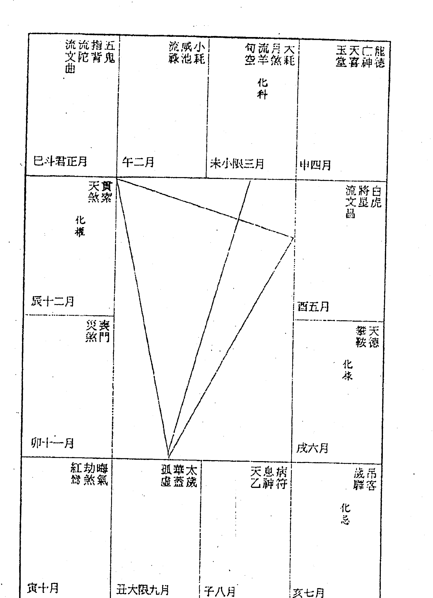
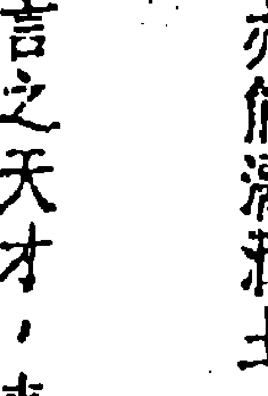
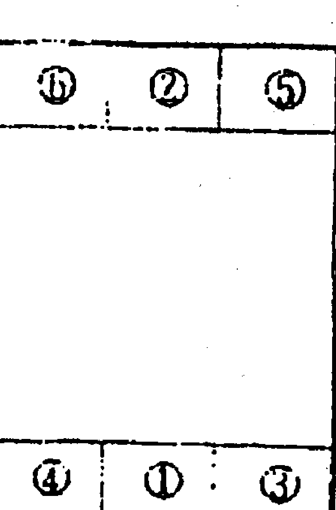

## 紫微隨筆
### 貞集
### 斗數拆招
星盤分富貴窮通
運限判吉凶休咎
鍾義明/著

## 《斗数批命实务》·自序
有一天，我在翻閱紫微楊著的《天網搜奇錄》時，讀到如下的敘述：「學紫微斗數在學懂如何起列星盤後，還要有頗長的時間去研究，最好當然是有名師的指點，然後可以有成。

我看過不少坊間的舊籍和一些講義，大都極不著邊際。

舉例來說，斗數在看流年方面是頗為重要的一環，但又有哪本舊籍或那份講義很正確的去教人看流年？

讀後，我有很深的感觸。

紫微斗數研習熱潮的興起是近十幾年間的事，之前的中國命理界幾乎完全是子平法和星盤神煞論命法的天下，宋朝以前則由七政四餘星學獨領風騷，紫微斗數至少沉默了一千多年。

傳世而堪稱經典之作的紫微斗數「古籍」，寥寥可數，只有元明清版本的《陳希夷紫微斗數全書》、《新刊合併十八飛星策天紫微斗數全集》、《陳希夷紫微數》、《紫微夜語》，及民國早年出版的觀雲主人王裁珊著《斗數宣微》、大興白純曾能著《飛星紫微斗數》、元閩齊主張開卷著《斗數命理新編》，另外有號稱「欽天監秘笈」的陸斌兆編著《紫微斗數秘笈》等幾本而已。

現時斗數界流傳的派別很多，有「北派」、「南派」、「中州（洛陽）派」、「占驗派」、「飛星派」、「玄空四化派」、「九九派」、「風陽派」、「透派」、「道傳派」……，內容大都不脫前述各書的影子，加入著者個人的引申發明。今人所著的斗數書籍、講義甚多，但要找出有系統、明白而正確教人批命、批流年的著作，真如鳳毛麟角。

我收集很多大批流年命書，但盡屬七政四餘、子平、演禽、鐵板數之類的批命，純屬紫微斗數批命者可說沒有。這可見清朝以來，不管是「舊房派」或「江湖派」的命學業者，絕少利用紫微斗數來為人作大批流年命書，使得後世研習者，缺乏可資參考的範本。

勉強搜求，可資參考的，只有《斗數全書》、《斗數全集》所載。充滿懸疑的命例和簡單的批語、《斗數全書》卷末所附的批命套語。這種蜻蜓沾水式的文字要作為大批流年的參考資料是絕對不夠的，研習者也難從它吸取論命、批命的技巧。教好的是《斗數宣微》所識的「今人命格」評述，透露較多的論命、批命技巧。此外，只有張開卷《斗數命理新編》書末所舉的一篇批命範例。

近年來，香港的王亭之（談錫永）先生推出《王亭之談星》、《王亭之談斗數》、《中州派紫微斗數初級講義》、《中州派紫微斗數深造講義》、《安星法及推斷實例》、補註《紫微斗數講義》（陸斌兆原著）等書，是筆者所閱過所有斗數書籍、講義中，最有系統、組織嚴密、見解精闢的鉅著，其中有詳細的論命、批命程序與技巧的介紹，實為研習最佳參考資料。

至於專門介紹斗數大流年批命的書，坊間惟見梁湘潤老師所著的《紫微斗數流年提要》，屬於「南派」的批命法。

此外，要在坊間發行的斗數群書中，找一本堪作為批斗數流年的「教科書」，恐怕是緣木求魚了。

基於上述的理由，我發願要為紫微斗數的命理園土，作一項拓荒的工作，那就是編寫本書——專門供有志於研習斗數流年批命參考的《斗數批命寶鑑》。

細批終身（大流年）的範圍，根據湘潤老師之說，其常法規範有：

- 1. 夫妻
婚姻好壞、結婚年齡、夫妻的性格、夫妻感情的和諧與否。如有嚴重的婚姻不徍徵兆，則須分辨是離異或喪偶，以及重要關鍵——婚姻不住是由於經濟情況惡劣的「貧賤夫妻百事哀」？或者是男女雙方都有「精神出軌」的外過行爲？或者是單抵一方「精神出軌」而產生嚴重的後果？應驗於何時？

- 2. 財
是出世榮華，或是先貧後富、先富後貧？抑或是努力之財、隨手可得不勞而獲之財？又或是一生中幾成幾敗？又或是一生都不發財？

- 3. 子
子女之多寡有無、男女之區別、賢與不肖等。

- 4. 禄
指仕宦顯要之途，通常是貴者少，富者略多。

- 5. 病
有的人一生健康少病，有的人自幼即體弱多病但中年身體健康甚佳，也有的人看似虛弱卻少生病，設若有病，應發於何年？是何病症？譬如是心臟方面的病，還是腸胃方面的病？

- 6. 意外災害
指車禍、急病、偶發性爭吵而引致的凶禍，或涉及官司訴訟，或意外破財……等災厄。

- 7. 大吉大凶之年
人的一生雖然常有變遷，但也不是年年都在變遷，因此著重的是最具影響力，足以改變一生的某幾年——如發財之年、擢升之年、撤職之年、破產之年。

- 8. 孝服
指家族親屬的死亡，其重要者為父、母、夫、妻、子、女，其他的因與命造本人關係較遠，無法一一兼顧。

- 9. 大變動之遷居
昔日之遷移係指『離鄉背井』，現代則泛指新置住宅、變賣祖產或自己購買的產業、出國、移民。

- 10. 流年之批法，區分為三級：
    - ① 以一個大限，論該限之吉凶。
    - ② 以大限、小限合論吉凶，在十年大限之中，加上與小限有影響的年歲。
    - ③ 以大限、小限、流年三者，分別以十二宮星曜『三方四正』組合性質推論六十年或七十年之運途吉凶。或以大限、小限、流年，另加斗君推論，一生批六十年，一年又分十二個月，如此以七百二十個月，分別以「妻財子祿」作要點批斷，是為「細批終身」或「大批流年」。

現代的社會結構型態、人群的思想行為模式，不但異於昔時，而且日新月異，加上研究者個人認知方面的差異性，批斷當然也會有不同的樣式、風格出現，不過大抵涵蓋上述的層面，不會偏離太多。

本書凡四卷：各派斗數批命範例增註、現存先生批命範例補註、《紫微斗數全集》命例選註、《斗數宣微》命例選註，希望透過實際範例的解析，讓讀者掌握斗數終身流年的批斷法則與要領，吸收斗數推命的技巧與訣竅，其中還包含筆者對古命例的質疑、考證以及對斗數學理的思辨心得。

這是筆者研究紫微斗數歷程中的一個句點，也是一段因緣的總結。
傳統式的批命和流年批斷，宿命論的色彩較重；引用古人命例時，對命造主人的出身、時代、環境、經歷等未作詳考；對命運的本質，欠缺深切正確的認知……所以不免有偏狹武斷的批語；蜻蜓點水式、記流水帳式的敘述，沒有完整的體系，研習者不能從其中得到斗數批命的全方位認知，吸收的論命法則與推斷技巧也貧乏得可憐。本書儘量克服傳統式的弊病——只是「儘量」，而并「極力」；筆者才智有限，不可能達到扭轉乾坤、超凡入聖的境界，所恃者，惟有一顆孜孜不倦的研究心與追求學術真理的誠心而已。

《紫微隨筆》系列，從元集到這一本貞集，就像時序的運轉：由春天的發榮，經過夏天的茂盛，秋天的明淨，到了冬天的潛藏；是該休止養息的時候。君子之道如衣錦尚絅，闇然而日章，實重於「自修」，莫見乎隱，莫顯乎微，尤重於「慎獨」，古有垂訓。子曰：「不易乎世，不成乎名，遯世无悶，不見是而无悶，樂則行之，憂則違之，確乎其不可拔。」我當學潛龍，等待下一個因緣際會，芳菲暖春的來臨。

感謝書萱大師李殿摩兄為本著題耑、好友《宜易園》陳啟銓兄提供參考資料、門人陳泱丞君協助整理校稿。

一九九四年甲戌暮春鍾義明記於竹山佛心翠影書齋。

## 目錄
### 卷一／各派斗數批命範例增註
- 《斗數批命實務》自序／3
- 中州派推斷要領／16
- 北派斗數宗師張開卷批命範例增註／47
- 梁湘潤老師斗數大流年批命示範／62
- 著者批命存稿八例／93

### 卷二／觀雲先生批命範例補註
- 〔附〕推算流年月日時的神煞／128
- 凡例／138
- 天機擎羊・權主功名——女影星／139
- 殺破狼——一個羅漢腳／155
- 紫微天府・終身福厚——一個公務員／167
- 巨巳日亥・是非多端／184

### 卷三／紫微斗數全集命例選註
- 凡例／200
- 劫空守命・蠹生求道——羅洪先狀元／201
- 武破照火・叛逆反劫——權臣嚴嵩／207
- 紫貪化權・名缰利鎖——唐汝楫狀元／212
- 命坐華蓋・文學成名——鹿門茅氏／223
- 紫贪昌曲·追逐物欲
- 禄马劫空·祸不全美
- 青刑羊火丧炉 / 233
- 羊铃火忌。不得善终——浙闽总督胡宗宪 / 237
- [附录] 吕蒙正的叹词与命运 / 240

### 卷四 / 斗数宣微命例选注
- 凡例 / 254
- 紫府同垣·一片孤忠报故主——中国最后一个皇帝的老师陈宝琛 / 259
- 将星得地。威名赫奕——黄郭总理 / 270
- 巳日寅宫·食禄驰名——梁士诒总长 / 278
- [附录1] 徐乐吾《子平真言》评梁士诒八字 / 285
- 〔附錄2〕梁士詒一二事／286
- 石中隱玉．午宮多貢——司法總長羅文幹／288
- 天府昌曲左右．商策恩榮——虎踞洛陽，威震中原．一代儒將吳佩孚／300
- 亡劫往來不善終——革命先烈廖仲愷／309
- 紫貪化忌文曲入廟．文章千古——飲冰室主人梁啟超／316
- 〔附錄〕不敢自視如常兒的梁啟超／323
- 紫貪化祿．晚年棄政從商——商震主席／327
- 廉貞四殺遭刑戮——晚節不保王克敏／338
- 英星入廟．武職崢嶸——張作相軍長／345
- 互日空劫．英雄氣短——上海市長程克／356
- 同梁亥已 · 濟世利人——慈善家朱子橋／366
- [附錄] 風流省長朱子橋／376
- 日麗中天 · 皇帝夢——有才無德袁世凱／379
- 七殺朝斗，豪俠本色——一代奇人杜月笙／388
- 男怕天羅 ——少年夭折王洪緞／401
- 男怕擎天 ——詩人朱謙甫／409
- 菩薩朝綱 · 仁慈之長／412
- 同陰空劫 · 孤高不群／417
- 身命劫空 · 長伴古佛青燈／427
- 并言／442
- 竹山佛心翠影舊齋門人／444
- 著者啓事／445
- 武陵出版有限公司鍾義明著作系列一覽／446

> 貞者，事之幹也。

貞，正也；冬水；智也。孔子曰：「智者樂水。」不私萬物為貞，貞固足以幹事。

## 中州派推斷要領
- 中州派紫微斗數的推斷要領有三：
    1. 了解安星法。
    2. 了解星系的基本性質。
    3. 了解如何根據星盤來推斷邏輯。

關於最後一點，王亭之先生說：『面對一個星盤，一般初學者的毛病，是太過著重「命宮」、「遷移宮」、「財帛宮」、「事業宮」這個「三方四正」的推斷，因為現代人一般心理，首先是注重自己的財帛與事業。可是，這種推斷法卻容易陷於支離破碎，使人很難全面理解整個星盤格局的高低。』依照他的經驗，應該循下述的步驟來觀察，才能對命運有一個全盤的理解：

### A、先看父母宮，再看田宅宮
由父母、田宅兩宮，可推斷一個人的出身及受父母庇蔭的程度。如此，在觀察命宮時，才可以判斷這個人適宜行「白手興家」的創業運勢？還是適宜行「克紹箕裘」的保守運勢？這點很重要，因為一個人假如父母宮和田宅宮都很好，可是，在星盤中卻明顯出現一個「白手興家」的運程時，就可推断其家运极可能出现过一次崩破。反之，如果父母宫和田宅宫都不好的人，连续走两三个毫无突破的保守性运程，便很难推断这个人有扭转环境的佳运。

- **父母宫天相铃星，对宫、三合见羊陀，邻宫巨门化忌与天姚夹，为“刑忌夹印”，是不好的星系组合，古谓“早剋”。田宅宫武曲七杀，对宫天府无禄，是“退祖”（不靠祖业）。由此可推断其人是不靠父母庇荫，因为从第三个大限起进入佳运，故可推断为“白手兴家”之人。事实：其祖父、父亲都是中医师，行善问人。在他幼年时，父亲曾因囤积黑糖而致破产，家道中落，又曾娶妾（在外姘居，生一女）。他一共有五个兄弟（长兄是继子，亲兄弟中排行第三），四个同胞姊妹，贫指浩索，家境甚苦。庚戌、己酉大限经营盘产晶，迄今富甲一方。**

1937·3·30
阴男
丁丑年二月十八日卯时生
命主 贪狼
身主 天相

| 辛 | 丙 | 癸 | 丁 |
|---|---|---|---|
| 卯 | 辰 | 卯 | 丑 |
| 左陀天 储锐照 ○陷 | 月天 战卧 △○ | 天禄火 碳存星 廟廟廟 | 紫破文文 羊旺利旺廟 |
| 地解 ○ | 天空 陷 | 金斗 紫 OO△ | 封龙天天天 沐池鬼月马 |
| 化科 | 月博成六 德士池害 | 岁官月月 破府煞符 | 天解天 喜神亚 |
| 刑伏亡 德兵神 | 生 | 乙巳 病 73-82 僕役 | 丙午 衰 63-72 遷移宫 |
| 丁未 帝旺 53-62 疾厄 | 戊申 临官 43-52 財帛 |  |  |

### B、命宮與福德宮同時觀察
通常，命宮「三方四正」的星曜是看物質享受、財富多寡、事業順逆等比較實質的層面。福德宮則用來看一個人的精神享受和思想活動。如果一個人的命宮、福德宮的性質都好，其人自然無往不利，而且可以肯定他一定有一個良好的家庭；相反的，如果命宮的性質很好，福德宮的性質卻相當不良。那麼就要注意—他的婚姻或者不如意？他可能是靠僥倖而致富？所以他的精神享受並不高尚；又或者他的境遇雖然相當好，卻可能有痼疾纏身之苦？

如前例丁丑年生陰男。

命宮巨門在子化忌，對宮天機化科、祿存、火星，三合太陽（昇殿）及借星安宮的天同化權、天梁、空劫，算是科祿權嘉會的「石中隱玉」格。這個星系的性質顯示：時時因一凶事一反成激發力，或者非情發展過程中挫折叢生，但每一次挫折其實都反使結局更為完美。一視凶實吉。一，屬此星系的特質。

巨門化忌有是非不招自來的特質，喜歡追求完美，但偏偏無論如何努力，事業（人生）的發展始終不能如願得償，但當事人卻執著於完美境界的追求，於是時生失望，兼且於事件發展過程中每多憂煎勞累。幸好對宮、三方見天機化科、火星、空劫，巨門疑忌的性質轉注於敏理科技、宗教、哲學、術數的研究，可使性情變得英華內斂，減少許多口舌是非。

凡巨門守命者，最要檢視福德宮的性質。福德宮天同、天梁，會照空劫、天機化科、祿存、火星、太陰化祿。天同化權使情緒穩定，能主動掌握精神享受的方向，科祿拱照，社會口碑佳，空劫對拱加天巫，有「無中生有的創造力，思想超脫，喜研究宗教、哲學、術數、冷門或新潮學術，亦可化解紅鸞、天姚、天喜、咸池等「桃花」的侵擾；見孤辰、寡宿，不善交際應酬，（《望斗仙經》云：「寡宿當臨，好守煙霞深處；孤神對照，宜居泉石林中。」以研究宗教、哲學、術數的立場來看，這種孤獨澹泊的性格，反而是好的。由命宮和福德宮的性質比較，其福德宮優於命宮，不過兩宮的性質大致上均屬良好，可推斷其命運為無往不利，人品高尚。

### C 、根據以上兩項的觀察，找出特別值得重視的宮位
如果懷疑其人的婚姻不利，便要檢視夫妻宮，懷疑其人有難以痊癒的慢性病，便要檢視疾厄宮。一定要從星盤找出一些星系，足以解釋福德宮和命宮互相配合得出出來的性質，然後才可以作出推斷。

- 例如前例，巨門化忌坐命，同梁坐福德宮，三合太陰、火星，大都有婚姻、感情方面的問題。檢視其夫妻宮，太陰化祿坐旺，對照太陽昇殿，三合化科、化權，是賢美有助，夫妻皆老的佳構，不會有婚姻感情上的困擾。但太陰與寡宿同宮，三合見火星、地劫、陰煞，且有三刑、六合害會合，這個情形，可考慮其配偶的身體健康問題。

王亭之先生的《安星法及推斷實例》舉一女命爲實例：

命宮天機化科、太陰化祿，三合財帛宮天同化權，是「祿權科會」的良好結構。可是福德宮巨門化忌，三合夫妻宮見紅鸞、天姚兩顆桃花雜曜，對宮的財帛宮又見天姚。這樣的星系結構，顯示可能由婚姻生活導致精神痛苦。

因此，必須詳細推究她的夫妻宮的星曜組合：

夫妻宮太陽、祿存同守，丈夫並不貧窮，但會合巨門化忌，最壞的還是會合了對宮（事業宮）的天梁、天刑，加上一顆火星。這種星系顯示夫妻無緣。

不過「無緣」的層面是很廣的——夫妻志趣不相投？聚少離多？丈夫有外寵？丈夫多病？等等。

要判斷屬於何者，僅據靜盤的十二宮無法決定，必須再詳察大限與流年。

### D、根據宮位·追查運限
追查大限與流年的運勢，可以補充對星盤作綜合觀察的推斷。大限、流年是學習飛動星盤以及加入流曜之後的推斷方法。

1957·5
丁酉年四月X日酉時生
命主廉贞
身主天同
阴女
土五局

| 宫位 | 天干地支 | 年龄段 |
|------|----------|--------|
| 命宫 | 戊申 | 05-14 |
| 父母 | 己酉 | 15-24 |
| 福德 | 庚戌 | 25-34 |
| 田宅 | 辛亥 | 35-44 |
| 官禄 | 壬子 | 45-54 |
| 仆役 | 癸丑 | 55-64 |
| 迁移 | 壬寅 | 65-74 |
| 疾厄 | 癸卯 | 75-84 |
| 财帛 | 甲辰 | 85-94 |
| 子女 | 乙巳 | 95-104 |
| 夫妻 | 丙午 | 105-114 |
| 兄弟 | 丁未 | 115-124 |

例如前面的丁酉年生女命，只要追查她是盘中每个大限的「夫妻宫」，就可作出更明确的推断。二十五至三十四岁的庚戌宫变成「十限命宫」，原盘的戊申命宫变成此大限中的「夫妻宫」。庚戌大限的四化是：太阳化禄、武曲化权、太阴化科、天同化忌，流曜有：流禄在申、流羊在酉、流陀在未、流魁在丑、流钺在未、流昌在亥、流曲在卯。流禄入申宫，流羊、流陀夹之，其原盘的夫妻宫也有羊陀夹，可视为一种巧合，如此巧合，必有深意在焉。大限「夫妻宫」三合天同化忌（在原盘的财帛宫化权），加上大限「命宫」（原盘福德宫）有巨门化忌又与天同相对，形成双忌冲。因此，可肯定，在这个大限内，夫妻之间会有问题。追查下去，就发现癸亥（一九八三）年的流年「夫妻宫」大有问题——癸亥年，太岁在亥宫，以亥宫为流年的「命宫」，流年的「夫妻宫」就在酉宫。癸亥年的四化是：破军化禄、巨门化权、太阴化科、贪狼化忌：流曜有：流禄在子、流羊在丑、流陀在亥、流魁在巳、流钺在卯、流昌在卯、流曲在亥、流马在巳。紫微、贪狼同守流年「夫妻宫」，贪狼在流年化忌，同时有大限流羊同宫，三合有巳宫的生年陀罗、丑宫的流年擎羊，以及「武曲破军」、「廉贞七杀」等星曜。这种星系结构性质是一无室家之乐——尤糟者是流年擎羊和冲动大限擎羊，同时惹起「紫贪」星系的化忌。所以初步推断其夫妻生活非常的不协调。

询之而知—癸亥年结婚，婚後一个月丈夫即性無能。※其夫是辛卯（一九五一）年七月×日未時生，土五局，命宫辛丑。疾厄宫在中，天機、太陰同守，有鈴星、陀螺同度，二合子宫天梁、文昌化忌、咸池、紅鸞，申宫又見大耗、陰煞。據王亭之先生的徵驗，一乃属於由慾引起的陰分虧損，可以推斷其人在婚前已斷喪過甚。因治癒，他建議他去找一位著名的中醫師診治，從養陰培元著手，結果於乙丑（一九八五）年初以前治療。

例如丁丑年生男命。

四十三歲至五十二歲，大限戊申，天空與地劫對照，是值得重視的宮垣。此大限的夫妻宮在午，天機、祿存、火星與原盤命宮的巨門化忌相對，戊之天機化忌，形成「雙忌對沖」，還加入大限流羊在午。五十歲丙寅（一九八六）年，太歲在寅，以寅為流年「命宮」，流年夫妻宮在子。流年「命宮」與大限「命宮」形成空劫對拱，流年「夫妻宮」與大限「夫妻宮」形成雙忌對沖，戊、丙流羊在午。

據經驗，天機化忌加擎羊、火星，有騎機車受傷之意外事件。※事實：其妻是丙戌（一九四六）年二月七日子時生，丙寅（一九八六）年八月二十一日亥時（21時30分），即丙寅年丁酉月壬申日辛亥時，騎機車被小貨車撞倒，跌傷、腦震荡，一週後才痊癒出院。

## E、流月的推断

王亭之先生认为：「用斗数推算禄命，不宜常常连「流月」的吉凶都加以推断，因为太过细微，无论吉凶都反容易影响情绪。但在有些情况下，例如是年可能有交通意外，则不妨用「流月」的推算来加以帮助，看在那几个月份有凶险，尽量避免出门驾车。因为事实上不可能全年不出门，所以流月的推算便有帮助。」

在笔者固定每年批「流年流月」的诸友中，有一位女命：辛巳（一九四一）年五月二十九日申时生。今年（一九九四）我批她农历二月勿远行出国，可是她不得不在日本去，来电话请教我。我劝她提早去，并在清明节之前回台湾。

农历三月十六日下午八时十八分（日本时间），中华航空公司一四〇班机（空中巴士A300型，编号一八一六客机）在名古屋机场降落时起火燃烧，三六三人死亡。

或许若非提前去日本而且在清明节前回国，说不定她会搭这一班客机去日本呢。由此可见，流月的推断，用在趋吉避凶方面是很重要的。

推流月要用「斗君」：

| 生月/生时 | 子 | 丑 | 寅 | 卯 | 辰 | 巳 | 午 | 未 | 申 | 酉 | 戌 | 亥 |
| :--- | :--- | :--- | :--- | :--- | :--- | :--- | :--- | :--- | :--- | :--- | :--- | :--- |
| **正月** | 子 | 丑 | 寅 | 卯 | 辰 | 巳 | 午 | 未 | 申 | 酉 | 戌 | 亥 |
| **二月** | 亥 | 子 | 丑 | 寅 | 卯 | 辰 | 巳 | 午 | 未 | 申 | 酉 | 戌 |
| **三月** | 戌 | 亥 | 子 | 丑 | 寅 | 卯 | 辰 | 巳 | 午 | 未 | 申 | 酉 |
| **四月** | 酉 | 戌 | 亥 | 子 | 丑 | 寅 | 卯 | 辰 | 巳 | 午 | 未 | 申 |
| **五月** | 申 | 酉 | 戌 | 亥 | 子 | 丑 | 寅 | 卯 | 辰 | 巳 | 午 | 未 |
| **六月** | 未 | 申 | 酉 | 戌 | 亥 | 子 | 丑 | 寅 | 卯 | 辰 | 巳 | 午 |
| **七月** | 午 | 未 | 申 | 酉 | 戌 | 亥 | 子 | 丑 | 寅 | 卯 | 辰 | 巳 |
| **八月** | 巳 | 午 | 未 | 申 | 酉 | 戌 | 亥 | 子 | 丑 | 寅 | 卯 | 辰 |
| **九月** | 辰 | 巳 | 午 | 未 | 申 | 酉 | 戌 | 亥 | 子 | 丑 | 寅 | 卯 |
| **十月** | 卯 | 辰 | 巳 | 午 | 未 | 申 | 酉 | 戌 | 亥 | 子 | 丑 | 寅 |
| **十一月** | 寅 | 卯 | 辰 | 巳 | 午 | 未 | 申 | 酉 | 戌 | 亥 | 子 | 丑 |
| **十二月** | 丑 | 寅 | 卯 | 辰 | 巳 | 午 | 未 | 申 | 酉 | 戌 | 亥 | 子 |

诀・流年岁逊起正月，逆逊生月顺回程，回程顺至生时止，便是流年正月春。

### 《安子年斗君表》

### 例如前述的丁丑年生男命

例如前述的丁丑年生男命，由他的星盘已知其妻在丙寅年有灾厄。所以我们可以检视其妻的星盘，推断灾厄出现在那一个月份。其妻的星盘如下。她的星盘中，子年斗君在亥宫，四十一岁丙寅年，从亥宫起子顺数至丑为寅，丑宫即是寅年斗君值宫，再从丑宫起正月顺排十二个月。丙寅年起正月庚寅、二月辛卯、三月壬辰、四月癸巳、五月甲午、六月乙未、七月丙申、八月丁酉、九月戊戌、十月己亥、十一月庚子、十二月辛丑。此十二月干支用于排流月四化及流曜，见所附〈流用天干五虎遁表〉。二月斗君（月的命宫）与流年命宫相叠，寅宫坐守的星是武曲、天相。『逢相看府』，天府在戊宫无禄存、化禄，是为空库，对宫及三合宫见陀罗、擎羊，是为破库，本属不吉。注意戊宫是原盘的疾厄宫。丙年更使与天府同宫的廉贞化忌，廉贞化忌见武曲、七杀、羊、陀（丙年流羊又至午宫），有意外血光之灾兆。天相最怕刑忌夹，按流月干支推算，八月丁酉巨门化忌与天梁夹天相形成『刑忌夹印』的凶局，而且八月斗君又在申宫，成为『流年命宫』与『流月命宫』对拱的结构。寅年的疾厄宫在酉，八月的疾厄宫在卯，正好相对，卯宫太阳、天梁、铃星，三合太阴、空劫及借星安宫的天同、巨门（月化忌）、火星、未宫丁月的流羊。此星系显示心脏及脑部的疾患。故推断其灾厄应於八月。

| 月份 | 戊年 | 丁年 | 丙年 | 乙年 | 甲年 |
| :--- | :--- | :--- | :--- | :--- | :--- |
| 寅 | 甲 | 壬 | 庚 | 戊 | 丙 |
| 卯 | 乙 | 癸 | 辛 | 己 | 丁 |
| 辰 | 丙 | 甲 | 壬 | 庚 | 戊 |
| 巳 | 丁 | 乙 | 癸 | 辛 | 己 |
| 午 | 戊 | 丙 | 甲 | 壬 | 庚 |
| 未 | 己 | 丁 | 乙 | 癸 | 辛 |
| 申 | 庚 | 戊 | 丙 | 甲 | 壬 |
| 酉 | 辛 | 己 | 丁 | 乙 | 癸 |
| 戌 | 壬 | 庚 | 戊 | 丙 | 甲 |
| 亥 | 癸 | 辛 | 己 | 丁 | 乙 |
| 子 | 甲 | 壬 | 庚 | 戊 | 丙 |
| 丑 | 乙 | 癸 | 辛 | 己 | 丁 |

### 《流月天干五虎遁表》

## 29 各派斗数批命范例增注

| 五月 | 六月 | 七月 | 八月 |
| :--- | :--- | :--- | :--- |
| 天左禄<br>机辅存<br>闭〇〇<br><br>天天天红<br>官马月懿<br><br>龍亡博斗<br>他神士杓<br>绝 | 紫微羊<br>解陷<br><br>台辅<br><br>△<br>白虎将星官府旬空解 | 破军<br>闭<br><br>解神<br>天巫<br>哭<br><br>吊客<br>岁破<br>大耗 | 生 |
| 四月 | 1946·3·10 | 女 | 沐 |
| 三月 | 命主文曲 | 身主文昌 | 冠 |
| 二月 | 夫妻 | 子女 | 财帛 |

## F、流日的推断

王亭之先生说：

> 「笔者不很主张研究斗数的人推断流日，因为「水太清则无鱼，人至察则无徒」，不宜将运程推算得太过仔细。但在个别情形之下，推断流日又似有必要—例如跟一个病留状虑的病人推断死期，以便家人有所准备；又如在可能发生意外的月份一定要出门，不得已而思其次，便非要择日子出门不可。」
>
> （《王亭之谈星》一二九三页）张清渊．陈慧明合著的《神妙玄微紫微斗数．流月流日千金断诀》说：
>
> 「一般论命，财官姻姻大原则，易于掌握，多乐于运用推断，但对于流月流日等小细节，多嫌其细微繁琐而有所轻忽。殊不知流月流日之小事，往往是大事发生之契机及前兆。大凡事情之演变发生，必有其隐微微兆，关键在於为人论命者能不能察觉而寻找出蛛丝马跡，教人防患於未然而已，正如所谓「月晕而风，础润而雨」、「山雨欲来风满楼」等，皆可由隐微微兆之观察而发现大非之将临，以妥善对策。由此可见，能精论流月流日者，乃是研习紫微斗数之第一高境界，绝非坊间书籍所谓之花招或好玩之性质而已。」

推流日必须由大限查起，推流月必须由大限查起，然后查流年，是环环相扣的，所以不可因小失大，本末倒置，更不扶术欺世，自误误人。流日是由「流月命宫」（即每月斗君所临值的宫垣）起农历初一、十三、二十五日，顺行至推断之日所落的宫位，叫为「流日命宫」，然后查通书、农民厝、万年厝（百年经）等，得知所推日的干支，再利用流日干支作四化、流曜的推断。

※如碰到有闰的月份，中州派紫微斗数是以上半月属前一个月，下半月属后一个月，流日则仍顺轮。如甲子（一九八四）年闰十月，由闰十月初一至十五日属十月，闰十月十六至二十九日属十一月。笔者是不论闰月的，闰十月仍算十月。

例子前述的丙戌年生女命：丙寅（一九八六年）农历八月命宫（斗君）在申宫，即在申宫起初一、十三、廿五日，顺数酉宫为初二、十四、廿六日，戌宫为初三、十五、廿七日，亥宫为初四、十六、廿八日，子宫为初五、十七、廿九日，丑宫为初六、十八、三十日，寅宫为初七、十九日，卯宫为初八、二十日，辰宫为初九、廿一日，巳宫为初十、廿二日，午宫为十一、廿三日，未宫为十二、廿四日。

八月廿二日壬申日，申填实「八月命宫」（斗君），与壬之武曲化忌对冲，加上廿二日「流日命宫」在巳，被原局及流年的羊陀夹，对照空劫，三合天同巨门（流月化忌）及借星安宫的太阳、天同、铃星。该日亥时（21时30分）发生车祸。

※流时的推断法，从「流日命宫」起子时（0时算起）顺排至夜子时，再以流日干起「五鼠遁」（甲己日起甲子时、乙庚日起丙子时、丙辛日起戊子时、丁壬日起庚子时、戊癸日起壬子时）求得时干支，以时干支作四化、流曜的推断。

> 王亭之先生在《王亭之谈星》附录中有一则流日的推断实例：

- **① 大限**
某女士，正行乙未大限。未宫无正曜，借丑宫星曜入宫安星，于是变成是天刑、天月同度，地劫、地空相会。「天同巨门」主神经線疾病，尤其与生殖的神经有关。所以在这个大限之内，她可能患上这种毛病，而且一定是慢性病，因为天刑、天月为疾病缠绵之兆，将病况拖延，以致患者有如受刑，因会合太阳天梁，更加强了这种性质。

- **② 流年**

## 33 各派斗数批命范例增注

命主星是以生年支代替命宫支。
※此星盘已略去一些与推断无关的星曜。

|  |  |  |  |
| :--- | :--- | :--- | :--- |
| 天禄<br>横存<br>禄权<br><br>天天大红<br>姚飞托莺<br><br>**53-62** 疾病厄已<br>病 | △<br>紫微擎羊右弼<br><br>（流月命宫）<br><br>**43-52** 财帛甲<br>申午<br>衰 | （大限命宫）<br><br>地天<br>劫月<br><br>**33-42** 子乙<br>女未<br>帝旺 | 破天左<br>军府辅<br><br>天哭<br><br>**23-32** 夫妻丙<br>天丙<br>官 |
| △△<br>七杀连廉羊<br><br>天虚<br><br>**63-72** 迁移<br>壬 戌<br>死 | **1946年**<br>壬戌年三十七岁<br>现行乙未大限<br><br>丙戌年五月×日申时<br>某女士<br>阳女<br><br>命主：禄存<br>身主：文昌<br>木三局 | 廉天<br>府府<br>流月年命宫<br>△△<br><br>**13-22** 兄弟丁<br>冠带 |  |
| 太阴梁<br><br>地空<br><br>**73-82** 友朋<br>辛 酉<br>耗 | 月大天<br>梓福财爷<br><br>田宅 辛 巳<br>胎<br>身业 寅<br>绝 | △△△<br>文曲<br>~~月月羊羊~~<br><br>福庚 子<br>养<br>德了 | 太△<br>陰鈴天<br>星煞<br>（运忌天吉）<br><br>**3-12** 命戊<br>戊<br>沐浴<br>父己 亥<br>长生 |
| 月武天<br>忌曲相 连<br>年日流陀<br>总忌月 命宫<br>台辅 花池<br>绝 | 破碎<br>天刑<br><br>田宅 辛 巳<br>胎 |  |  |

再查流年，壬戌（一九八二）年，流年命宫在戌，原局廉贞化忌冲武曲流年化忌，相娜宫又见有火星铃星，构成一火铃火忌一。流年陀罗飞入戌宫，冲起辰宫的陀罗及大限流羊，又冲起午宫的擎羊，所以可断定是年必有灾厄。

是什么性质的灾厄呢？由武曲化忌冲起廉贞化忌判断，一般均主血光之灾。唯是年一迁移宫血光灾厄有多福，女命可以是生育、流产；也可以是有脏腑之疾；当然，亦可能是受金属利器伤。

于是追查流年的「疾厄宫」：流年一疾厄宫」在巳，天机坐守，被两颗皆冲劲的擎羊所夹，与大限乙太阴化忌正照。擎羊主伤，太阴与天机相会主神经系统疾患，又与一天同巨门」及天相五宫相会，更在酉宫与由卯宫借入的「太阳天梁」会合，因此可以推测为受意外伤，以致影响脑部神经线。

- **④ 流月** 现在追查流月了：壬戌年正月起壬寅，戌年斗君恰在寅宫，故以寅宫为「流月命宫」，壬寅月武曲再化一次忌，与年化忌相叠，力量甚大。再与戌宫的年陀、月陀相会，又与午宫的擎羊相会（此星的「三方四正」，受大限流陀、年陀、月陀、年羊、月羊冲起，所以虽为命盘的擎羊，但对流月命宫依然有作用），故可推定这个月份的运程不妙。

### ⑥流日

追查流日，至初五日（壬子日），「流日命宫」在午宫，因日干为壬，寅宫的武曲再化一次忌，成为「武曲三化忌」，冲动午宫的廉贞化忌。在三方四正一共会上八煞羊陀，煞曜非常之重。再加上是日疾厄宫为丑宫的「天同巨门」及天刑，又为流日化忌与流日擎羊所夹，因此难怪当日（一九八二年壬戌年历正月初五日）发生车祸，骨折，流血。医愈之后，仍然骨病缠绵，因係骨殖神经受伤之故，变或终生疾患，至今仍作物理治疗。该女士受伤之后，由于性生活受到影响，丈夫因而变心。读者不妨由一九八二年（壬戌年）起追查她的夫妻宫，便会知道婚姻从此泛起红潮。倘如该日静居家中的，不妨自行飞星推断，追查缘故。但王先生相信：灾祸应该可以避免，除了那几次小心之外，若能修身立德，做点善事，并以济物利民为抱负，则身体的创伤固然减少亦可以减轻；同时婚姻生活应该不致如现时的恶化。这或许是流日运程的作用了。

## G、观察宫垣吉凶的三大技巧

中州派紫微斗数在星盘实际推断方面，必须熟习三大技巧，借星安宫、星曜互涉、觅星齐偶。此三大技巧经王亭之先生在《安星法及推断实例》中公开披露，笔者把它抄录、整理出来

### 1. 借星安宫

当一个宫位没有「正曜」之时，必须借对宫的星曜入本宫，……中州派称之为「借星安宫」；关于这点，一般斗数书籍或有触及，但有两个关键，却从来没人谈到。当「借星安宫」之时，必须将所借宫垣的星系全部借入，不仅仅是借正曜安宫而已，亦即「借星安宫」的关键之一。

例如【图1】为一男命的星盘，夫妻宫在辰宫，因无正曜，所以要借入对宫的星系，经「借星安宫」之后，夫妻宫的星系结构就变成是天梁、天机化忌、火星、陀罗、左辅、右弼。

然而，这一点还关系不大，因为对宫的星系性质本来已经足以影响本宫，即使不一「借星安宫」，本宫与对宫合起来的星系性质，亦大致上等于「借星安宫」后的性质。但另一个关键，却足以使整个夫妻宫位发生变化。

当找寻一个宫位的「三方四正」时，如果有任何一宫无「正曜」坐守，则这个宫位仍须同其对宫「借星安宫」，然后才与本宫会合。这是关键之二。许多人大看了大量斗数书籍之后，仍无法推断得准确，即是由於不知道这一个关键的缘故。

仍以【图1】为例。在辰宫的「夫妻宫」与申、子两宫会合，又与对宫（戌宫）冲合，构成「三方四正」。申、戌两宫都有「正曜」，不发生问题。然而子宫却祇有一颗文曲，不属於「正曜」，因此子宫无正曜，便须与对宫（午宫）借星安宫，将午宫的廉贞、天相、禄存、天刑、天姚全部借入子宫，然后才与辰宫的夫妻宫会合。如此，对夫妻宫的影响，与仅仅在辰宫借星安宫比较，影响就大得多。这就是两个关键的区别。

（原文“曜，，因此就必須向對宮（午宮）「借星安宮」，所借加入者為天同、太陰、鈴星、擎羊。” 此句似为前文断句，按语意并入上段。）

这样一来，「夫妻宫」的全部星系，便变成是火星、铃星、擎羊、陀罗等「四煞并照」之局，再加上天机（化忌）、天梁、天同、太阴、太阳（化科）、巨门的正曜组合。可以判断，婚姻生活一定极不美满，虽然不一定离婚，但却有貌合神离的可能。——太阳化科加巨门同会，主夫妻彼此维持面子，所以即使是怨偶，亦不一定轻言离。

读者由以上的例子可以知道，「借星安宫」是推断斗数的一大法门，尤其是王先生提出的两点关键，更是古人历来不肯轻传的「秘法」。希望对此能细心加以体会。

+   **2. 星曜互涉**——注意一组星系性质，常常可以破坏另一组星系的性质。

关于星曜互涉，可以举一个实例来说明。

【图②】为一位中学女生的命盘。她于甲子年（一九八四年）参加中学会考。目前正行「癸卯大运」（鉴注①）。

照甲子年的流年来看：流年命宫在子宫，有天府、武曲坐守，而且武曲于甲年化科，在中、午两宫，会合到左辅、右弼，文昌、文曲，再加上午宫的禄存，有本宫「大运流禄」相叠，是禄星、文星齐集，成为「禄文拱命」的格局。依一般的看法，是本年参加中学会考应该不会失败。但我们却不妨注意到「流年命宫」（子宫）有咸池、大耗（鉴注②）两颗杂曜，它们同居一宫，便产生「桃花犯主」的格局。武曲是财星，财星桃花，便主物欲。天府是库星，库星桃花，便主保守。所以武府坐命而带桃花杂曜，便易有物欲过重而不愿进取的倾向。在求学的年龄，自然是一种心理的阻碍。再加上大运命宫卯宫的天同化忌，引动「巨门暗煞」，更增加心理的阴影。流年命宫的父母宫（丑宫）有铃星，火星，亦主考试时心情烦躁。在种种因素影响之下，这位女学生的考试成绩便不理想了。

### 【图①】

| 巳 | 午 | 未 | 申 |
| :--- | :--- | :--- | :--- |
| | 太阴 天同<br>擎羊 铃星 | | 巨门 太阳<br>（科） |
| 左辅 陀罗<br>夫妻 辰 | | | |
| 卯 | | | 天机 天梁<br>（忌） 右弼 火星<br>戌 |
| 寅 | 丑 | 文曲<br>子 | 亥 |

辰宫无正曜，借对宫的天机化忌、天梁、右弼、火星。

三合宫申、子，因子宫亦无正曜，所以要借对宫的天同、太阴、擎羊、铃星。

经过以上的「借星安宫」，夫妻宫（辰宫）便成了「机月同梁巨日」、「左辅右弼」、「羊陀火铃」的星系组合。

## 39 各派斗数批命范例增注

### 【图①-1】

注：本盘是笔者重新排列，以生年支代替命宫支。命主星依中州派之法，

| 天花陀罗陷陷 地煞七杀右弼文曲旺 丑 府 紫微天府 | 天天姚巫 吊客官符阴煞 博士息神 戊午 16-25 高官 父母 | 紫微天相闲闲 天刑伏兵 帝旺 丙午 26-35 福德 | 天巨机门旺庙 化科忌 天哭 白虎大耗 甲辰 6-15 命宫 冠带 | 贪狼旺 亡神病符 壬寅 106-115 夫妻 长生 | 1967·6 阴女 命主 武曲 身主 天相 丁未年五月X日酉时生 火六局 纳音 涧下水 | 廉贞破军旺 己酉 56-65 仆役 死 | 紫左辅文曲旺 府 申 病 46-55 官禄 | 天同天相旺 庚戌 66-75 迁移 墓 | 武曲天府旺庙 庚子 80-95 胎 财帛 | 太阴旺 陷 癸丑 90-105 子女 衰 | 天机巨门旺 庚子 80-95 胎 财帛 | 破军旺 辛亥 76-85 疾厄 绝 | 天府紫微旺 庚戌 66-75 迁移 墓 | 武曲天府旺 庚子 80-95 胎 财帛 | 天机巨门旺 庚子 80-95 胎 财帛 | 天府紫微旺 庚戌 66-75 迁移 墓 | 天机巨门旺 庚子 80-95 胎 财帛 | 天府紫微旺 庚戌 66-75 迁移 墓 | 武曲天府旺 庚子 80-95 胎 财帛 | 天机巨门旺 庚子 80-95 胎 财帛 | 天府紫微旺 庚戌 66-75 迁移 墓 | 天机巨门旺 庚子 80-95 胎 财帛 | 天府紫微旺 庚戌 66-75 迁移 墓 | 武曲天府旺 庚子 80-95 胎 财帛 | 天机巨门旺 庚子 80-95 胎 财帛 | 天府紫微旺 庚戌 66-75 迁移 墓 | 天机巨门旺 庚子 80-95 胎 财帛 | 天府紫微旺 庚戌 66-75 迁移 墓 | 武曲天府旺 庚子 80-95 胎 财帛 |## 【圖②-2】

| 巳 | 午 | 未 | 申 | 酉 | 戌 | 亥 | 子 | 丑 | 寅 | 卯 | 辰 |
|----|----|----|----|----|----|----|----|----|----|----|----|
|    | 七杀文曲右弼禄存 |    | 廉贞文曲左辅昌辅<br>红鸾 |    | 破军 | 武曲天府<br>運祿星<br>大耗<br>命宮（流年）<br>咸池<br>年科 |    |    | 贪狼（運忌）<br>年祿（流年福德宮）<br>天喜 |    | 紫微天相 |

- 1. 本星盤採自原著。
- 2. 寅宮貪狼下面的（運忌）有誤，應刪除。
- 3. 子宮的「大耗」有誤，應改排於卯宮；因丁年生的女命禄存在午宫，由午宫起「博士」，順行至第十位卯宫安「大耗」也。

## 41 各派斗数批命范例增注

宫，力量相当大，主带来不良后果的男女感情。
这时候，便应该去检视她的「流年福德宫」了（这即是命宫与福德宫同时视察的原则）：这个宫位落在寅宫，贪狼独守，但是在癸干大运（鐘註③）贪狼化忌，与廉贞相对，亦是红鸾、天喜这对杂曜遥遥相对。再看寅宫会合申、午两宫的辅佐诸曜，为左辅、右弼、文昌、文曲，可谓桃花遍集福德宫。

在这个情形之下，我们不妨推断，这位中学女生虽然读书的成绩不错，但可惜是年却陷入热恋之中，因而影响考试的成绩。这位女生原来亦因为考试失败，所以才去求教于王亭之先生的。

从这个例子可以知道，只是因为「流年命宫」出现了咸池、大耗这对杂曜，便可以使「禄交拱命」的星系性质发生了变化。这即是一「星曜互涉」的一个好例子。

> 鐘註①：小女生是丁未（一九六七）年生，甲子（一九八四）年虚岁十八，阴女大限顺行，大限不是癸卯而是乙巳。

> 鐘註②：大耗有三：1.「元辰」别名一生年干支对冲，阳男阴女取冲前一辰，如本命丁未对冲丁丑，阴女取冲前一辰之戊寅，若是阴男则取冲后一辰之丙子。余命仿此。）2.生年之对冲，即「岁破」之别名：如此命未年生，「岁破」（大耗）在丑。3.博士十二星之第十位，本星盘所用的「大耗」即此星系。但原著谈排，应当排在卯宫才对。

## 综论

当修正「乙干大运」。乙之流羊入本命宫，流陀入流年「福德宫」（本命夫妻宫，大限子女宫），流年「福德宫」。宫——贪狼、流陀，主「喜交游而偏因交游惹是非烦恼」——见「中州派紫微斗数高级讲义」。太阴福德宫见擎羊，借会太阳、太阴化禄（大限化忌）、地劫及天机化科（大限化禄）、巨门化忌、流年擎羊、天同化禄、火星。"禄权科忌"全见，易走捷径，弄巧成拙，太阴化忌见擎羊、火星，易因心志卑弱而盲动、遭挫折。

### 3.见星寻偶」——见「对星」出现，力量加强。

推断斗数，有一常易为人忽视的原则，即是一「见星寻偶」。而这亦是「中州派」认为相当重要的推断技巧。

所谓「见星寻偶」，是因为斗数中有许多「对星」，一颗独见之时，力量有限，但成对出现力量便为增强。——古人对于这点，其实亦已稍有透露。例如古人重视「逢府看相」、「逢相看府」，即是因為天府、天相是「对星」的缘故。然而古人爱守秘，所以便只示一例，不详举其余。

现在，让我们把这些「对星」一一详列出来，以供读者记忆。

- 正曜：「天府、天相」；「太阴、太阳」；「天同、天梁」；「廉贞、贪狼」。
- 辅曜：「左辅、右弼」；「天魁、天钺」。
- 佐曜：「文昌、文曲」；「禄存、天马」（註）。
- 杂曜：「红鸾、天喜」；「咸池、大耗」；「龙池、凤阁」；「恩光、天贵」；「三台、八座」；「孤辰、寡宿」；「天哭、天虚」；「天福、天寿」；「台辅、封诰」。

然则，怎样才可以称为「对星出现」呢？其力量大小的判别，可按下述原则来鉴定。

在「图③」中，举出四种「对星出现」的情况。

（註）这里所列举的天马不是月支系的「天马」，而是年支系的「驿马」——寅午戌年马在申、巳亥年马在巳、申子辰年马在寅、亥卯未年马在巳。

## 【紫微斗数】

| 巳 | 午(文昌) | 未 | 申(文曲) |
|----|----------|----|----------|
| 辰(太阴) |   |   | 酉 |
| 卯 |   |   | 戌(太阳) |
| 寅(天哭) | 丑(太阳太阴) | 子 | 亥(天虚) |

- 丑宫太阳太阴在一起，是「日月同临」；即「对星同宫」。
- 太阳在戌、太阴在辰，是「日月反背」；即「对星互照」。
- 以午为本宫，三合宫即寅宫和戌宫，见天哭、天虚，称为「双飞蝴蝶式」的对星会合。
- 以子为本宫，对宫即午宫，三合宫即辰宫和申宫；见文昌在午、文曲在申，称为「偏斜式」的对星会合——凡「对星」一在对宫，一在三合宫皆属此式。

- a、力量最重要的一種情況，是「對星同宮」。如圖③在丑宮，太陰太陽同守一宮，這種星系結構的力量絕不可忽視。
- b、其次，力量相當重的一種情況，是「對星互照」。如圖③在辰、戌兩宮，太陰太陽互相照射。
- c、再次，為「雙飛蝴蝶式」的會合，即「對星」分居本宮在左右兩個「合宮」。如圖③，以午宮為本宮，逆隔三宮的寅宮見天哭，順隔三宮的戌宮見天虛，即天哭天虛這對「對星」，以雙飛蝴蝶」的姿態跟午宮會合，對於午宮而言，力量亦重。但對於寅、戌兩宮而言，哭虛的會合卻比較上沒那麼重要，因為這不屬於「雙飛蝴蝶式」的會合。
- d、最後，是所謂「偏斜式」的會合。

如圖③，以子宮為本宮，與申宮的文曲及對宮（午宮）的文昌相會，但對于宮來說，與申、午兩個宮位的相對位置不平衡，因此這稱「對星」出現的形式，力量就比較小。

總結一下，「對星」出現的力量，依下列次序遞減：
同宮——相對——在三合宮會照——在三合宮——在對宮會照——各居三合宮相會（如寅戌宮的天哭天虛）。

> 以上所述，前人亦視為「不傳之秘」。所以依書籍學習斗數，往往會覺得一些星曜的會合作用很強，可是有時又覺得它們的會合，並未顯示很大的作用，其故即在於不懂得按上述的會合形式來衡量輕重。

式来衡量其力量。诠按：对星中的府相主富贵，天府喜得禄（化禄、禄存）为‘府库充盈’；无禄或与空劫同宫，为‘空库’；见羊陀火铃、天刑、化忌交会同为‘露库’。一空库——的性质为巧取豪夺、投机阴谋，一露库——的性质为奸刁虚伪、行险侥幸。天相喜巨门化禄与天梁夹，为一财荫夹印一，主富贵荣华；忌擎羊与化忌或化忌与天梁夹，为一刑忌夹印一，主牢狱刑伤。太阴太阳主富贵，宜庙旺，忌落陷反背。廉贞为精神，为血；贪狼为物质，为肉；天同为福。天梁属阴，二星均属精神、服务性质。

- 左辅右弼，主助力。
- 天魁天钺，主领袖力、良好机会、与尊贵人物。
- 文昌文曲，主才学、礼乐、文艺、考试。
- 禄存天马，主名利。
- 三台八座，主地位。
- 恩光天贵，主名誉。
- 台辅封诰，主声价。
- 龙池凤阁，主灵巧。
- 天福天寿，主通达。

例如本章最前面所举的第一个丁丑年生男命例，其父母宫在丑，以丑为本宫，则对宫见文昌、文曲，为“对星互照”；巳宫与酉宫见左辅、右弼、龙池、凤阁、台辅、封诰，为“蝴蝶双飞式一对星会合”；未宫与巳宫见擎羊陀罗、天刑天虚，为“偏斜式一对星会合”。田宅宫在卯，以卯为本宫，则未宫与亥宫见天福天寿，为“双飞蝴蝶式一对星会合”，酉宫与亥宫见天姚天钺，为“偏斜式一对星会合”。兄弟宫在亥，以亥为本宫，见廉贞贪狼、恩光天贵，为“一对星同宫”。疾厄宫在未，以未为本宫，见文昌文曲，亦为“一对星同宫”。

原盘格式不理想，故重予编排，并补列原盘所缺乏星曜神煞。加以补注，俾供学者研习之用。吉凶。是最普遍的简要批命方式。笔者嫌其简略，特以中州派斗数论命法，参照其他古法十二宫概述。②大限（通常批六至七个大限）概述。③一年之流年（包括十二个月各月）见十二宫吉凶，末附<某甲命评例>，命盘全式附于二十五章。张氏此种批命方式（1）命书是书分上下编，都四十七章，上编二十五章，讲安星法。下编三十五至四十六章，讲批生年秋在香港出版，今传世之书名<紫微斗数命理研究>。该书于一九四九年冬自沦陷区脱险，抵重庆，尝以斗数为人批命，人咸讶其奇妙。

| 第一列 | 第二列 | 第三列 | 第四列 |
|--------|--------|--------|--------|
| 现流天干地支<br>命主<br>八座 | 地羊天廉<br>劫刃相贞<br>化忌 | 现行小限<br>右弼左辅<br>天梁 | 七杀<br>能指龙池背德 |
| 癸巳<br>疾厄<br>病 | 甲午<br>财帛<br>死 | 乙未<br>子女<br>墓 | 丙申<br>夫妻<br>绝 |
| 壬辰<br>迁移<br>衰<br>63-72 | 1916·5·4<br>阳男<br>某甲 | 丁酉<br>兄弟<br>胎 |  |
| 辛卯<br>仆役<br>旺<br>53-62 | 天机化禄 | 戊戌<br>命宫<br>养<br>03-12 | 天文太<br>巨曲陽 |

> 原批：查某甲现年卅四岁，生於丙辰年四月初三日未时，阳男木三局，立命在戊，安身在子。武曲庙守命宫，见紫府相诸星吉协，又见魁钺双星吉辅，本可以成格论，惜见羊陀冲破而为破格；破军守身，虽然入庙，又惜不见诸吉，且仍以羊陀冲破而为「破格」。西北生人较佳，东南生人大不宜。此为命格局之大概也。

> 锺注：此命，张阔卷评於一九四九年。命造主人生於一九一六年，时虚岁三十四。武曲守命在戌，为一「将星得地」，昔云：「武曲庙垣，威名赫奕。」《紫微斗数全集》原注：「辰戌五未生人安命在辰戌丑未宫为四基。」《斗数骨髓赋注解》：「假如辰戌二宫安命，值之定为上格；丑未安命次之。宜见左右昌曲吉星，则依此断。」其左右昌曲落在子、丑、寅、卯、辰、巳、午、未、申、酉、戌、亥，父母宫，不在命宫三方四正，不合格；羊陀劫空会照，加廉贞化忌，破格；反年生，命安戌，又破格。（辰未为东南，戌丑为西北；古以西北生人为富贵。）可取者，一魁钺夹命一耳。

> 《紫微阐微录》载：……庙，志略多能，功名有分。加煞，僧道风流。」

阳男以南斗为福，武曲属北斗，入命，少顺遂。丙辰年生男为三碧木命，武曲为六白金，金刻木，不吉。其性刚，过刚则折。

以中州派的观点看，武曲无四化，对宫贪狼无四化亦无火铃、寅宫紫府无「百官朝拱」，午宫有廉贞化忌，故此宫度的武曲性质是「因循」的。因循苟且的武曲，只能荫一荫谋尔

原批：以言形性：武破入守命身，主形容矮壮，性情刚强。以言父母：日月俱陷，难免刑剋。惟某甲为丑生人，且日临父母宫，主先失恃而后失怙，的星曜组合可称祥和，但对宫见铃星冲破，加上太阳在父母宫落陷，故父先殁。（三四方

锺注：《斗数全书》云：一、巨暗同垣于身命、疾厄，赢瘦其躯；凶星交会于相貌、迁移，伤刑其面。一指出判断脸型、容貌要看身宫、命宫、疾厄宫、相貌（父母宫）、迁移宫。通常，看先天的遗传特征、体质是看父母宫；个性看命宫；体型看身宫；后天的体型、容貌变化看疾厄宫和迁移宫；气质修养看福德宫。真正的斗数高手是用任何一宫都能看形性的，传统的斗数只从命身宫星曜赋性去揣摩一个人的形性，无异于管中窥豹、瞎子摸象，焉能得全？理想的看法，最少应该看命宫和父母宫的「星系」基本结构。

此命的命宫是《武贪》加《紫府廉相》，基本个性为保守稳重；父母宫是《巨日》加《阳梁昌禄》加左右魁曲，容貌圆满清秀，气质豪迈（福德宫破军）温雅之人。

推父母，斗数高手多先看太阳、太阴之庙旺失陷。太阳落陷父先殁，太阴落陷母先殁。日月俱庙旺或俱失陷则看四化，太阳落陷又化忌不利父，太阴落陷又化忌不利母，太阳入庙化忌不利父。日月反背，日生者不利母，夜生者不利父。其次，看

## 正见劫煞、亡神、孤辰、吊客、丧门，皆由父母刑剋为孝服之兆

原批：以言兄弟：天同禄贵临，自是昌季咸行，惟因与火星同度，且铃星孤寡诸凶并衝有，刑剋不免。

以言夫妻：七杀庙守，逢婚可免剋。

以言子女：天梁左右偕临对合，并见诸吉及生旺，擎息必然繁多，为六亲诸宫中之佳者。

解：兄弟宫科禄权拱照，必有贵者。天同化禄、火星、天铖（天魁），酉宫，有五人左右，有剋，有各胞者。交游广泛，惟多追逐声色犬马之娱，助力不大。

七杀单守夫妻宫，《星垣问答论》谓「鰥寡半冷」，因七杀之性肃杀清凉，本不是肉妲享受之星也。夫妻宫是涉及夫妇床笫之私的宫位，不喜「热闹」。只有一颗七杀星，可云贞节。对宫天府紫微，无百官朝拱及禄存、化禄会照，是「在野孤君」、「国库空虚」，此显示①配偶出身於贫寒之家②婚后家境穷困，他要为事业打拼，以致冷落了娇妻。三合宫见天刑、病符、陀罗、天空、天姚，妻病弱，他风流。

子女推法：三方四正见南斗星多（天梁、天机），主先生男，子多。日生人太阳在阳宫（卯辰巳午未申），多生男；夜生人太阴在阴宫（酉戌亥子丑寅），多生女；日生人忌太阴居子女宫，夜生人忌太阳居子女宫。主刑剋。此命日月落陷，子女星不旺，且妻宫清冷（原批谓宜迟婚），若以一夫一妻制视之，其子女不可能有原批「擎息必然繁多」的情形。

天梁戊土有中正之德，名士之风，左右克宽克柔，子女品质佳。中州派论法：天梁丑未，对宫天机，防小产，子女不多，亲近的晚辈亦不多，或得力者易离，必有子送终；太阳在陷宫，以先生女为宜，主得子二人。（因天梁会合左右、日月、昌曲等「对星」及化权，子女亦可能五至九人，且成材。）

原批：以言财帛：廉相庙临，並见紫府武曲诸星吉协，原可致富。惟以本方主星化忌，且羊刃、地劫併入，虽有财，亦自来去难聚。

以言疾厄：巨铃禄同缠且见病，自小即多灾。幸命身尚强，及长，渐见健康。

以言迁移：贪狼陀罗并入庙空，在外当可得意。

以言僕役：太阴主星陷，用人欠力。且身主临仆宫，必受聪用人言。

以言官禄：紫府借临庙地，临官而临官宫，又见权科吉辅，自属贵份。

以言田宅：天机陷而化权，虽难承祖业，本尚可自置，惟坐落空亡，又见火铃并临，则置亦难看旺。

以言福德：破军入庙而坐空，身坐福德而沐浴桃花，又三台天姚，加见羊陀忌劫衔... 除爱修饰、恋女色、荒唐享受之外，无福可言。此为命诸宫之大概也。

## 紫微隨筆

### 註·財帛宮

廉貞化忌、天相，在「因循」型的武曲命，本宜與他人合作生財，因化忌，又加羊刃、地劫，因將責任推諉給他人致失敗而灰心喪志，或應酬交際破費，或因財生是非官司：表面風光，到手卻空。

### 疾厄宮

巨門。《紫微闡微錄》云：「血氣血虧·加四殺，四肢寒疾，唇舌有破。」按疾厄宮已屬巽卦，先天卦兌：兌屬肺經，有鈴星、巨門（九星屬二黑土，為病符星），其病多屬肺炎、肺結核、支氣管炎。命宮武曲金，亦屬胸部、肺經。父母宮太陽落陷，遺傳的體質是低血壓、視力弱、懼冷、貧血。

### 遷移宮與福德宮

與命宮會照為【貧武破】，見天空、華蓋、旬空、天德，多宗教界之朋友；又見天姚、天福，難免酒色應酬。貪狼與陀羅在辰宮，逢天空，右有一反胥正」之說：

### 僕役宮

太陰落陷，且與落陷之太陽三合，用人有忽冷忽熱之象。雖有文昌化科、魁鉞、化科、祿存（天祿）夾之，外出有左右逢源之際遇。

### 官祿宮

紫府同宮，七殺朝斗，氣象頗大。但無左右、昌曲、魁鉞、祿存、三台八座、恩光天貴、台輔封誥等「百官」來朝拱，是「在野孤君」，眼高手低，志大才疏，難有大成。

### 田宅宫

天機星在丑落陷，受風水不良影響，祖業亦有變動。對宮天梁、左輔、右弼，三合天同化祿、祿存，且天機化權，可在外地受蔭，積極創置，但被火鈴衝齊（原批語，凶星在三合宮也），恐以不正當手段獲得，終亦難留。

### 福德宮

破軍，古謂「多災」：丙生人，擎羊對沖，主因、孤單、殘疾，雖富貴亦不長久。見羊陀空劫，行事進退（有時魯莽，有時遲疑），多虛少實，不行正道，習撈偏門。對宮又見廉貞化忌，終日悒悒惶惶，口碑不佳。

> 原批：三歲至十二歲，大限行命宮。幼小多災。

- 十三歲至廿二歲，大限行父母宮。學成、婚成，且遇貴提攜；此為少運之黃金時代。
- 廿三歲至卅二歲，大限行福德宮。沉溺酒色，為少運荒唐之時。
- 卅三歲至四十二歲，現行大限田宅宮。三合見權祿貴，主有貴扶持，有權作事，為中運拍頭之時。
- 四十三歲至五十二歲，大限行官祿宮。紫府臨，步入官運正格，為中運收成之時。
- 五十三歲至六十二歲，大限行遷移宮。陀羅凶星入廟，而見空衰，老運無何不宜，為老運守成之時。惟六十一歲為一煞關，如得渡過，可為古稀以上人。（鎸按：原批誤，遷移宮是六十三至七十二歲大限。）

此為此命一生行限之大概也。

## 鍾註

看大限、流年是斗数命理最難之處，古籍、名家多隱密之，或如蜻蜓點水，輕描淡寫。大限流年欲得到準確的推斷，又能掌握吉避凶的契機，至少要靈活運用如下的斗數論命技巧：①宮位轉移。②四化、流星的運用。③觀察各宮星系基本結構的本質，決定喜忌。④辨性（星曜互涉）。⑤看各宮三方四正會合刑衝的情形。⑥借宮安星。⑦星曜的關聯性。⑧尋找「雙星」的結構（見星尋偶）。⑨大限、小限、流年、月君的連帶性運用。⑩流月、流日、流時的運用。

- ①宮位轉移。②四化、流星的運用。③觀察各宮星系基本結構的本質，決定喜忌。④辨性（星曜互涉）。⑤看各宮三方四正會合刑衝的情形。⑥借宮安星。⑦星曜的關聯性。⑧尋找「雙星」的結構（見星尋偶）。⑨大限、小限、流年、月君的連帶性運用。⑩流月、流日、流時的運用。

「因循型」武曲在戌宮守命者，其喜忌為：

喜：武曲化權（進取）、貪火、貪鈴、貪狼化忌無刑煞、紫微化科化權、天府、天機科祿、天梁化科、天同獨坐，以上增加因循苟且的心態。

忌：武曲化祿化科、廉貞化忌、破軍對宮見廉貞化忌、天機見刑忌煞耗、太陰落陷、廉相見凶、七殺見凶、七殺見刑煞。以上增加因循苟且的心態。

特例 — 武曲化忌喜行太陽落陷，為發跡之基礎。

### 3 ∼ 12 歲戊戌大限

戊之羊陀在午辰，疊本命羊陀，身宮福德亦見，多災病。有天醫、解神及魁鉞夾命化解。

### 13 ∼ 22 歲己亥大限

本宫红鸾，三合太阴、文昌化科、天梁（大限化科），大限夫妻宫酉咸池。结婚，完成学业（因文昌化忌，太阳落陷，对照巨门、禄存，学历不高，可能是用钱买来的）。此限武曲化禄，容易为小成就而满足，乏进取之雄心。17岁壬申年，武曲化忌喜太阳落陷之大限。

### 23～32岁庚子大限

破军对宫廉贞化忌，本使因循的武曲更加因循苟且，但庚禄到申、武曲化权，会激进上进。惜廉贞化忌为桃花，加羊刃、地劫，外来的诱惑、是非多。太阳化禄入大限兄弟宫，对照巨门，一食禄驰名一一酒肉朋友多，武曲化权入大限夫妻宫，铃昌陀武，剋妻、婚姻破裂；太阴化科入大限田宅宫，与对宫天同化忌（大限子女宫）流羊、火星相冲，子女中忍有折损、精神发育不全者，家庭不和。

### 33～42岁辛丑大限

天机化权，辛禄到酉、巨门化禄，对宫左右，由于机会甚多而激起改变现状之心的大限，但是有火、铃见于酉丑二宫，宜经商习艺。

按：此限起自一九四八年，止于一九五七年，时值大陆河山变色，次年国民政府迁台。斗数中，天机、杀破狼、天马（岁驿）都是主变动的星。（机月同梁）的结构，左有紫府，右有破军，大限官禄宫里（巨日）一食禄驰名一一的徽象，加上天机化权是积极而有計畫的變動，所以该是在动乱时代中预先掌握契机，作有计划的事业（或职务）变动。

### 43～52歲庚寅大限

紫府無百官朝拱，本非佳構。但庚寅限流祿、流馬到對宮，武曲化權居大限財帛宮，必有一時之得意。大限官祿宮見先天的廉貞化忌、羊刃、地劫，且大限流羊入酉（大限疾厄宮），事業、用人、魄力方面呈現因循苟且、推諉、無助、灰心喪志、停滯、阻礙等情況，不可能有大作為。

### 53～62歲辛卯大限

辛之太陽化權、文曲化科入大限財帛宮，對照巨門化祿、流馬（大限福德宮），可博名利於一時；流祿會先天化祿天同，財官雙美。但流羊入大限疾厄宮（本命武曲坐守），卯宮自坐文昌化忌，疾病孝服難免。

原批無此限，誤作遷移宮。

### 63～72歲壬辰大限

（殺破狼）竹羅三限，大凶。壬之武曲化忌入本命對沖，流羊入子宮會破軍沖大限福德宮廉貞化忌、羊刃，傷夾空限，是壽終之限，67歲壬戌年最凶。

原批：今年小限在未，本星虽吉，而流年星全凶，且丧吊息亡之神见于合方，主有远亲或近亲孝服。

流年太岁在丑併大限，本方流年星虽吉，而合方流年星全凶，且斗君过疾厄宫遇流陀，主自正月起而有病魔侵扰。二月月令小耗入财宫，主小伤财。三月月令大耗入小限宫，主为是年孝服而大伤财。

钟注：此为一九四九己丑年三十四岁之流年。辰年生阳男，小限自戌宫起1、13、25岁，顺行，34岁小限在未，冲大限。流年己丑，与大限重叠，冲小限。是变动之年。流年斗君，自流年宫丑起正月，逆至生月四月在戌，自戌宫起子时，顺至生时未时在巳，为本年斗君。自巳宫起正月，逐月顺排，为流月各宫。此是传统推流年、流月之法。其流年星盘如左。



由于流年、大限重叠，所以三方四正的丑未酉宫便是推断的重点宫位——亦即农历正、三、五、九月是这一年（也是人生中期）中，有重大影响的月份。其中未宫更是小限宫。

## 梁湘润老师斗数大流年批命示范

> 钟按：研究高深职业命理，最终的目的在于穷尽生命的推命，也就是要达到能批流年的程度。批流年有大限流年、中限流年、小限流年之分，其中大限流年是全方位的，包括命、运、限、身、小限、流年、流月、流时的细批。在斗数，则包括命身十二宫、大限、小限、流年、流月、流时的细批。笔者阅过古今斗数书籍无数，只有梁湘润老师所著的《紫微斗数流年提要》有全方位的大流年批命例式，是十分难得的示范资料，兹录之并补注，供读者研习之资。

## 63 各派斗数批命范例增注

紫微斗数命盘，包含各宫位星宿（如太阴陷、贪狼天机天梁、巨门天同、武曲天相等）、大限（如45-54、55-64等）、宫干（如癸巳、甲午等）、长生（如病、死、绝等），以及命主信息（1951·10·7、阴女、辛卯年九月初七日酉时生、命垣纳音壁上土、命主巨门、身主天同）。

## 【原批】

此命为阴女，以南斗星为吉。南、北斗星之主福，本来只运用在大限，然而命宫即是第一大限，故命宫本身即须要分南北斗星。阳男、阴女命宫如果全部坐北斗星系，即是吉星，亦无太大之吉兆。

- 1. 命坐昌曲，主为才女，端正秀丽。
- 2. 昌、曲、化忌，有才难得发挥。
- 3. 命坐寡宿，不易合群。
- 4. 寡宿、化忌坐命，有不太重要之暗疾。
- 5. 命垣常以三合与对冲之三宫而论其情势：命宫无吉星，三合、对宫有吉星，可以增加其吉兆；二合之中，官禄宫中有太阴；财帛宫中有太阳、天梁、禄存、化权。对宫迁移宫中有天同、巨门、化禄、铃星。女命命宫对照巨门，终有太阳，主逊婚。女命以太阳为夫星，居酉为平和，但巳酉丑三合命宫，主逊婚，夫妇和谐。太阳为父，太阴为母，日月三合命宫：必得父母宠爱。

然而，此命宫虽无南斗吉星坐守，而父母、兄弟宫分别有左辅、右弼，此为一“左右夹命”，当可决定推断：此女虽非显宦世家之女，也为书香门第之姝。

> 【钟注】
- 1. 古代以“女子无才便是德”，此妹昌曲守命，若是生在古代就惨了——不被认为是美貌的淫妇、豪放女，也会被认为是“贱货”，存口德一点是说“女命不宜”。
- 2. 此妹命主、身主俱入迁移宫，是过房、认养、招赘的命。巨门是生年、命宫的化禄，同铃星、天同，主外出辛劳、多是非而有成，能逢凶化吉。未宫是时柱的空亡，晚年行限至此不利。
- 3. 命宫文昌自化忌、文曲自化科，凡事为自己——找台阶下，反覆不定。有才华，但学历平平，偏向才艺方面发展。夫妻宫干己，化忌入命宫，不是“欠夫债”，容易吵架，便是孤芳自赏，蹉跎年华，老困娇娘。
- 4. 四柱的卯、酉、辰、酉填实于福德、财帛、田宅三宫（星宗的财帛宫酉、夫妻宫辰、疾厄宫卯），为显性宫，是论命的实质重点宫位。四柱的空亡落入巳官禄、未迁移、申疾厄三宫（星宗的奴仆宫、田宅宫、兄弟宫），是本命吃亏的宫位。
- 5. 寡宿入命，有单身贵族、寡妇的倾向。
- 6. 命宫坐生年纳音的冠带，主十五岁前，家业创兴，是“荫父母”的女孩。

> 【钟注】天同、巨门，不得地。个子中等，个性温和，外交手腕不错。巨门化禄，长相清秀，很会说话，尤其是“好听话”——因对宫昌曲，气质高雅。昌曲化科，会“盖”；文昌化忌，使文曲化科，不会“盖”得过头。

### 一、兄弟宫：紫微、左辅、红鸾。
- 1. 兄弟姊妹共三人。
- 2. 兄弟感情和好，彼此相让。（钟按：兄弟宫有红鸾星，手足情深。兄弟数可用铁板神数从月柱对算出，亦可用三政四余星法从兄弟宫算出。）
- 3. 兄弟常有风韵之事。（钟按：兄弟宫坐生年支的咸池桃花，又坐生年纳音的沐浴桃花，子又为年支卯的无礼之刑。）

### 三、夫妻宫：天机。
主嫁年长之夫。

> 【钟注】夫宫天机独守，亥宫为下局，“孤穷”，纵有财官贵显亦不耐久，只宜经商巧艺之流。在丙、壬、戊年结婚较好。天机乙木死于亥，是冬天的花草，故老。但寒兰在亥宫“天门”有“王者之香”，具幽微之德。宫干己，夫为外地人。

### 四、子女宫：七杀、擎羊。
- 1. 子女一人。
- 2. 子女个性刚毅。
- 3. 子女宫对宫天府，主吉祥。

> 【钟注】《斗数发微论》云：“杀守子宫，子难奉老。”《诸星问答论》七杀篇云：“在子息，而子息孤单。”本阙无子、夭折之兆，幸有天机同宫，可解。

### 五、财帛宫：
太阳（化权）、天梁、禄存。财帛二十九岁以前得之于父。财帛二十九岁之后受之于夫。—以二十九岁小限临太阳；为父与夫。

> 【钟注】财帛宫在酉，落实八字的月柱与时柱，这表示在十六至三十岁与四十六至六十岁，财帛宫的性质会显现出来。太阳化权，积极求财，数字大，动用随心。禄存入财帛宫，善于储蓄。

### 六、疾厄宫：
脾病之疾以及肝胆之疾。肝胆属木，木绝于申。

> 【钟注】生年辛卯纳音松柏木。木长生于亥、沐浴于子、冠带于丑、临官于寅、帝旺于卯、衰于辰、病于巳、死于午、墓库于未、绝于申、胎于酉、养于戌。凡死、墓、绝均主病；木属肝胆，为厥阴经与少阳经，包括神经系统、消化系统、新陈代谢系统。若以疾厄宫的星辰来看先天体质，则“武曲、天相、陀罗、地劫”↓破相、暗疾，是很庞统的诊断，不如八字、七政四余、西洋占星术。对疾病命理欲深入研究的读者，请阅读拙著《现代命理与中医》上下册（武陵出版有限公司．一九九三年二月初版）。从八字看，此命的病在月经不调（内分泌失调，故皮肤也容易长痘痘），生育时会难产。

> 【钟注】此宫的巨门是本生年、命宫化禄，又是财帛宫丁干的化忌，官禄宫癸干的化权，虽然在出外任职，并不如意，劳心，有是非。

### 七、迁移宫：天同、巨门（化禄）：在月

> 【钟注】此宫的巨门是本生年、命宫化禄，又是财帛宫丁干的化忌，官禄宫癸干的化权，虽然在出外任职，并不如意，劳心，有是非。

### 八、仆役宫：贪狼、火星、玉堂（一般书的天魁）。生意上很会说话，也很有份量，但在婚谈时就“姑姑”了。

> 【钟注】一般的斗数书籍把仆役宫改为交友宫，此宫的宫干甲——部属不得力，常处有失职守。

化禄廉贞入辰田宅宫。

化权破军入寅父母宫。

化科武曲入申疾厄宫。

此三吉不入命宫三方及迁移宫，所以所交的朋友，无好可言。

化忌太阳入酉财帛宫·朋友借钱不避。

### 九、官禄宫：太阴。无官爵夫人之称号。

> 【钟注】夫宫亥，天机独守——好饮、离宗、奸狡重，格局不高。能当“太太”已经不错了，还言“夫人”啦。不如做个单身贵族，拥有“日月会昌曲，出世荣华”的身份。

### 十、田宅宫：天府廉贞。
有美好之不动产。

> 【钟注】1. 田宅宫在辰，太阳在酉，住宅的左前方有夕阳，故其住宅是坐东南向西北。2. 廉贞，附近有土地公庙。天府，长方形、宽阔，附近是安宁的高级住宅区。

### 十一、福德宫：无主星。
有财喜帮助他人。

> 【钟注】生年四化不入福德宫，本宫无星，所以没有什么特别嗜好。对宫太阳、天梁，心肠好，会施济钱财给穷人（或寺庙）。三合迁移宫有巨门化禄、天同，会买衣饰、化妆品、女性卫生用品及吃零食（尤其是外出时），夫妻宫有天机星，会买书籍、文具，订阅报纸。是很普通的花费。

### 十二、父母宫：右弼、破军、天乙（一般的天钺）、天空。
得父母之力。

> 【钟注】父母宫可看一个人的长相、遗传体质、幼年家境、父亲（母亲看兄弟宫）、本人的口德……等等。父母宫的官禄宫在本命的仆役宫甲午，甲年化忌太阳入本命的财帛宫（命之三方），故幼年家境贫穷。惟其父母宫是“杀破狼”局，可以碰到时代变动所带来的大限。

## 大限

此造大限起于命宫，顺行地支，依父母、福德……等宫而行。

- 5～14岁命宫·辛丑。平宫出身。父母双全。
- 15～24岁父母宫·庚寅。家运大发。※父母寅宫，寅午戌三合火，为太阳（父）之旺宫，且贪、火、羊、杀、陀三方拱照。家运因祸得福，十年吉祥。【注】此限庚干之化禄为太阳父星，在酉照卯（大限父宫）；武曲财星化权、带禄入中宫照大限，太阴化科入巳宫三合本命，酉为羊刃。故因祸得福。
- 25～34岁福德宫·辛卯。无主星，无大吉凶。但，本命为阴女，主南斗。太阴以29至34为主（南斗大限主下半五年）。> 【注】此限宫干辛，与原命宫、生年相同，飞星四化亦同，看前面命宫的批注即可。
- 35～44岁田宅宫·壬辰。※本命田宅宫干化忌所冲之年，若还没有走过，也不宜结婚。如此例：田宅宫壬辰，化忌武曲在申，对冲寅。要过了甲寅（一九七四）年。24岁之后，才可结婚。数一。※大限夫妻宫文昌自化忌，结婚要过了此忌所冲的年——未年才好，即过了己未（一九七九）年。29岁，在30岁、32岁、34岁（流年庚申、壬戌、甲子，本命的疾厄、子女、兄弟等阴性宫）结婚，婚后较能和谐。否则容易分居离异。但是，有的人偏逃不过这个一劫。化禄巨门入大限官禄宫．学习语文。化权太阳入大限迁移宫．劳碌。化科文曲、化忌入大限夫宫．有缘份，结婚。
- 45～54岁官禄宫·癸巳。【钟注】王化忌武曲在丙申宫（本命疾厄，大限官禄），丙化忌廉贞又入大限，此为化忌循环往来，反为“有情”的化忌，紫、左、武、相三合拱照，七杀、擎羊入庙来朝，是开中进财，创业有成之限。※天府为南斗主星，十年吉吉。大吉大利。
- 55～64岁仆役宫·甲午。天殇，句空，有是非、败财。强弱多病。
- 65～74岁迁移·身宫·乙未。

## 流年

> 【题注】此限夫妻宫转移至辛卯（本命福德），大限夫妻宫的疾厄宫转移至戊戌（本命子女）；戊之化忌天机入本命夫妻宫，冲大限，主丈夫死亡。夫宫己亥纳音平地木，病于巳，冲大限癸巳，空亡巳，亦为凶兆。

- 1岁辛卯年／小限辛丑：平安吉祥。
- 2岁壬辰年／小限庚子：平安吉祥。
- 3岁癸巳年／小限己亥：身体有意外伤害。
- 4岁甲午年／小限戊戌：余灾未了。
- 5岁乙未年／大限命宫（昌曲科忌）·辛丑。
- 6岁丙申年／小限丁酉（日梁禄权）：大小限合命宫，禄逢冲破。
- 7岁丁酉年／小限乙未（同巨铃）：智慧初开，宜入校读书。
- 8岁戊戌年／小限甲午（贪火堂）：正常流年。
- 9岁己亥年／小限癸巳（阴）：意外伤害。
- 10岁庚子年／小限壬辰（府贞）：家运大吉。
- 11岁辛丑年／小限辛卯（天哭）：家运大吉。
- 12岁壬寅年／小限庚寅（破右乙空）：正常生涯。
- 13岁癸卯年／小限己丑（昌曲科忌）：文才透天机。
- 14岁甲辰年／小限戊子（左紫）：小吉。

※阴女会北斗星，不若南斗为福。

### 大限15至24岁为天乙、右弼、破军、廉贞、父母宫、
三合寅午戌，乃巨门之宫：
- 午宫—贪狼、火星、戌宫—擎羊、七杀、申宫—即对宫，陀罗、地劫、
大限之宫坐天空、破军，虽然“左右交命”，亦不济事。
女命以15至24岁正值娇嫩之龄，但在此限必无成。
大限擎羊在酉。
陀罗在未。
- 15岁乙巳年／大限父母宫（破右乙空），庚寅。／小限丁亥（机）：小有灾害。※流年乙巳对冲小限丁亥，流陀寅坐大限冲申宫陀罗。
- 16岁丙午年／小限丙戌（杀）：家运大吉，自身吉祥。※流年丙午、大限庚寅、小限戌戌，其地支寅午戌三合，大吉。丙午为多流年擎羊，以流羊可合，但不可冲。
- 17岁丁未年／小限乙酉（阳梁禄）：正常岁月。
- 18岁戊申年／小限甲申（武相陀）：身盘有疾。
- 19岁己酉年／小限癸未（同铃巨）：正常岁月。
- 20岁庚戌年／小限壬午（贪火魁）：此年有感情困扰。※流年庚戌，大限庚寅，小限甲午，地支寅午戌三合冲子（生年忌煞）。
- 21岁辛亥年／小限辛巳（太阴）：正常岁月。
- 22岁壬子年／小限庚辰（府相）：有感情交游之困扰。※流年红鸾合小限。
- 23岁癸丑年／小限己卯（天哭）：正常岁月。
- 24岁甲寅年／小限戊寅（破右乙）：家运有变，主长辈不利。※大、小限共同，会于父母宫。

### 25岁至34岁，大限入福德宫辛卯，此限之中，福德宫主灾难，但会合夫妻宫及夫星。
- ㉑大限辛卯，亥卯未为三合。
- ㉒卯酉（太阳）为对照之宫。
- ㉓夫妻宫与夫星（太阳），又与本限三合。主婚姻。
- ㉔事业平平。
- 25岁乙卯年／大限福德宫（天哭），辛卯。／小限丁丑（昌曲科忌）：此年丧父。※此造以太阳为父星。①太阳居酉，流年乙卯正冲。②大限辛卯（天哭）正冲丁酉（太阳）。若非辛卯坐天哭，或者流年不是乙卯双冲，则不讳“丧父”。
- 26岁丙辰年／小限丙子（紫左辅）：此年大为吉祥，事皆称心。
- 27岁丁巳年／小限乙亥（天机）：正常成月。
- 28岁戊午年／小限甲戌（七杀）：此年家属破财。※天哭、七杀、擎羊会于父母、子女两宫，如流年为流羊，主家属破财。
- 29岁己未年／小限癸酉（太阳）：此年结婚。※太阳夫星旺盛于午未，小限、大限冲照之故。
- 30岁庚申年／小限壬申（武相陀劫）：本年破财、得子。※大、小限天地暗合（小限原丙申，丙合辛，申中庚金暗合大限卯中乙木），天相合天哭，得子。
- 31岁辛酉年／小限辛未（同巨）：正常生涯。
- 32岁壬戌年／小限庚午（火贪）：财源吉祥。※四杀会贪狼，主得横财。
- 33岁癸亥年／小限己巳（太阴）：因财而是非。※流年支亥大限支卯，三合官符来（本生年之一五鬼）一地官符在未宫，流年之白虎星在未，巨门为是非之星。
- 34岁甲子年／小限戊辰（府贞）：此年发福非常。※南斗天府入小限，吉祥如意。

### 35至44岁，大限入田宅宫壬辰。
坐天府、廉贞，三合子申紫微、左辅、天相、武曲，乃南、北斗吉星会集。唯一之缺点，以陀罗会入疾厄宫，身体当之，衰弱。财帛、置产、财务，百事吉庆。
- 35岁乙丑年／大限田宅宫（府兼）·壬辰／小限丁卯（天哭）：正常生涯。
- 36岁丙寅年／小限丙寅（破右乙）：贵人相功，发福非常。※左、右、紫、府会于大、小限以及流年。
- 37岁丁卯年／小限乙丑（昌曲科忌）：文化事业而进财。※昌、曲见府·廉，因文章而进财。
- 38岁戊辰年／小限甲子（紫左驾）：财源大发。※紫、府会合田宅宫。
- 39岁己巳年／小限癸亥（天机）：夫运大古。※天机在夫妻宫，加府、贞大限，帮夫之运，最为有力。
- 40岁庚午年／小限壬戌（七杀擎羊）：此年夫与子均有疾痛，※小限戊戌，大限壬辰，干支双冲。小限与财帛宫丁酉之太阳夫星本为双合，小限一冲大限，失去夫星双合之力，小限戊戌卯为子女羊、杀逢冲，故论夫、子均不利。
- 41岁辛未年／小限辛酉（阳禄）：满门吉庆，百事通顺。※大、小限为夫星（太阳）、田宅双合。（原盘丁酉合壬辰，天火合，）
- 42岁壬申年／小限庚申（武相陀动）：财物吉祥，自身体弱。※小限进疾厄宫，流羊子，会辰，申于疾厄宫。
- 43岁癸酉年／小限己未（同巨）：正常生涯。
- 44岁甲戌年／小限戊午（贪火）：是年破财。※贪、贞同位于大、小限，必损财基。

### 45至54岁，大限入官禄宫癸巳。三合财帛宫、命宫。
※论财势，如日中天。此限丧母，夫主得重疾。太阴为母星，与天刑、天巫同宫，主不吉。夫妻宫坐天机，对冲天刑、天巫，不利丈夫。
- 45岁乙亥年／大限官禄宫（阴刑巫亡）：癸巳／小限丁巳（阴刑巫亡）：此年丧母。※大、小限俱为太阴过宫陷弱之地。流年亥冲巳，
- 46岁丙子年／小限丙辰（府贞）：正常生活。
- 47岁丁丑年／小限乙卯（天哭）：正常生活。
- 48岁戊寅年／小限甲寅（破右乙）：正常生活。
- 49岁己卯年／小限癸丑（昌曲科忌）：丈夫得病。※本年为大、小限陀罗併会，冲克夫妻宫。
- 50岁庚辰年／小限壬子（左紫鸾）：得子息。※红鸾会见紫、府。（50岁的女性，生孩子的机率很少。故亦可含蓄一点批为“家有喜气”或批“进财”。）“第二春”——有的女性停经后，也有再来临者・或批“防痔疮”，因煞星在老年为血光・或
- 51岁辛巳年／小限辛亥（天机）：夫得重疾。※大限癸巳，流年辛巳，冲小限与夫官。
- 52岁壬午年／小限庚戌（羊杀）：正常生活。
- 53岁癸未年／小限己酉（阳禄梁）：是非口舌。※流年冲命宫，大限，小限三合巳酉丑入命，流年羊刃入命。
- 54岁甲申年／小限戊申（武相陀劫）：正常生活。

### □55至64岁，大限入仆役宫甲午。天殇。
- [1]虽有恩光、天喜、天贵、三台相扶持，亦难保安然。
- [2]所幸对宫有紫微，左辅相救，可度难关。
- 55岁乙酉年／大限仆役宫（贪火殇堂）甲午。大限甲午擎羊在卯。陀罗在丑。／小限丁未（巨同）：大限合限，生意外虚惊。※本以殇使夹身宫，已届体弱。二限相合（午未合），一场虚惊。
- 56岁丙戌年／小限丙午（贪火殇堂）：身体有病，且破财。※大、小限并临。大限入天殇，小限忌过天殇与天使二宫。
- 57岁丁亥年／小限乙巳（阴巫刑亡）：去年之病，仍未见瘥。※流年冲巳宫太阴陷地，小限与太阴陷地同宫，太阴为主妇也。
- 58岁戊子年／小限甲辰（府贞）：灾难已过，得庆安然。
- 59岁己丑年／小限癸卯（天哭）：正常岁月。
- 60岁庚寅年／小限壬寅（破右乙）：添孙之喜。※流年、大限、小限寅午戌三合。
- 61岁辛卯年／小限辛丑（昌曲科忌）：正常生涯。
- 62岁壬辰年／小限庚子（紫左魁）：意外跌伤。※红鸾大小限相冲，青年主喜庆，老年主意外伤害。（流年合小限冲仆役宫六破爻字，……，应于下属之人。）
- 63岁癸巳年／小限己亥（天机）：
- 64岁甲午年／小限戊戌（羊杀）：

湘润按：批每一年之流年，通常只批到六十岁因为之运限即停止。以人生虽然可以有七、八十岁之寿命，然而一过六十五岁，通常事业、交际、应酬之事。除了极少数事业极为隆盛之人士，六十五岁以后，多的事应酬交际之事。此造，如果再批下去；六十五、六十六……此三数年之中，身体不甚健康，需到了“天殇限”，方能恢复健康。

## 流月

一年有十二個月，流年吉，並不一定十二個月之中都是滿吉慶，流年凶，也未必一定是正月凶到年底。所謂吉的流年，很可能是一年之中，只有某一個月大吉大利，因此才論之為吉，也可能是一年之中，有一兩個月為大凶，因而視之為凶的流年。故此，批流年之際，將全年每一個月的吉凶再予註出，稱為流月。

> 【鉉註】筆者推流月是以斗君安十二月各月的「月命宮」，再以節氣定月干支，作出四化及流曜的運用。梁老師原著以前述辛卯年生女命推演十八歲至二十五歲每年的流月為「流月例式」於下。

- 二十五歲 大限福德辛卯、小限命宮辛丑、流年乙卯，喪父。
- 正月／壬辰（廉、府）：平安。
- 二月／癸巳（月）：平安。
- 三月／甲午（貪、火、魁）：破財。
- 四月／乙未（同、巨、鈴、祿）：正常。
- 五月／丙申（武、相、陀）：家口憂心。
- 六月／丁酉（日、樑、樞、祿）：家屬憂心。
- 七月／戊戌（殺、羊）：心神不寧。
- 八月／己亥（機）：喪父。
- 九月／庚子（紫、輔）：心理稍寧，且主外財。
- 十月／辛丑（昌、曲、科、忌）：平安。
- 十一月／庚寅（破、弼、鉞）：平安。
- 十二月／辛卯（哭）：小有煩心。

【註】斗君的算法 1. 子年斗君：從子宮起正月，逆算到生月（九月，不論節氣）在辰宮，再由辰宮起子時，順算到生時（酉時）在丑宮。此為「子年斗君」定宮。 2. 流年斗君：從一子年斗君「一定宮起子年，順算到流年（卯年）：自丑起子，順算至辰為二十五歲乙卯年之一「流年斗君」宮。

流年斗君在辰，從辰宮起正月，依序順排：二月巳宮、三月午宮、四月未宮、五月申宮、六月酉宮、七月戌宮、八月亥宮、九月子宮、十月丑宮、十一月寅宮、十二月卯宮。

由流年起流月干支：「乙庚之年起戊寅」，即正月戊寅，依序順排。二月己卯、三月庚辰、四月辛巳、五月壬午、六月癸未、七月甲申、八月乙酉、九月丙戌、十月丁亥、十一月戊子、十二月己丑。

## 斗君起例

每个宫斗君所值的宫垣，为该月「命宫」，依序逆排各宫为：「兄弟」、「夫妻」、「子女」、「财帛」、「疾厄」、「迁移」、「仆役」、「官禄」、「田宅」、「福德」、「父母」。以八月为例，该月之「流月盘」如图所示。

| 月份 | 时辰 | 备注 |
|------|------|------|
| 五月 | 辰时 | ← |
| 六月 | 卯时 | ← |
| 七月 | 寅时 | ← |
| 八月 | 丑时 | ← |
| 五月 | 申 |  |
| 四月 | 未 |  |
| 三月 | 午 |  |
| 二月 | 巳 |  |
| 正月 | 辰 |  |
| 十二月 | 卯 |  |
| 十一月 | 寅 |  |
| 十月 | 丑 |  |
| 九月 | 子 |  |
| 八月 | 亥 |  |
| 子年斗君 |  |  |
| 酉时（生时） |  |  |
| 正月申时 | ← |  |
| 二月未时 | ← |  |

## 各派斗数批命范例增注

| 已<br>7.19<br>迁移<br>太陰流月化忌<br>流年化忌<br>廉貞天府<br>△流羊 | 午<br>8.20<br>疾厄<br>貪狼火星天魁 △<br>流昌<br>頁案<br>卯年斗君 | 未<br>9.21<br>財帛<br>天同巨門鈴星旬空 △△<br>祿<br>五鬼 | 申<br>10.22<br>子女<br>武曲天相陀羅地劫 △<br>流曲流魁<br>月德 |
| --- | --- | --- | --- |
| 辰<br>6.18<br>僕役<br>天哭 △<br>流年命宮<br>大限命宮<br>流祿<br>太歲 | **乙卯年**<br>化祿天機<br>化權天梁<br>化科紫微<br>化忌太陰<br>流祿卯<br>流羊辰<br>流陀寅<br>流魁申<br>流鉞子<br>流馬巳<br>流昌午<br>流曲中 | **乙酉月**<br>化祿天機<br>化權天梁<br>化科紫微<br>化忌太陰<br>流祿卯<br>流羊辰<br>流陀寅<br>流魁申<br>流鉞子<br>流馬亥<br>流昌午<br>流曲中 | 酉<br>11.23<br>夫妻<br>七殺擎羊 △<br>龍德 |
| 卯<br>5.17.29<br>官祿<br>破軍右弼天空 △<br>流陀<br>病符 | （中央） | （中央） | 戌<br>12.24<br>兄弟<br>天機流月化祿<br>天德<br>八月斗君<br>白虎 |
| 寅<br>4.16.28<br>田宅<br>△流陀 | 丑<br>3.15.27<br>福德<br>文昌文曲 科<br>年空<br>吊客 | 子<br>2.14.26<br>父母<br>紫微左輔 (年月化科) 流鎮 | 亥<br>流日<br>1.13.25<br>命宮 |

大限流年在卯，見天哭，本宮無星，借對宮太陽、天梁安宮及借會太陰、天同、巨門。太陽在酉為偏垣，與太陽同宮，本已具「孤忌」的性質，又會合太陰落陷、雙化忌，其「孤忌」的性質加重。因為太陽是父星，有了「孤忌」的反應，則要檢視父母宮。

原局的父母宮在寅，破軍獨坐，見空劫、火星、擎羊，本具不良的性質。大限、流年「父母宮」轉移至辰宮，主有「根本性的改變」；辰宮是「廉貞天府」同坐，天府不見祿存、化祿，是為「空庫」，見陀羅、地劫、擎羊、流羊，是為「羈庫」，主「有父母之蔭庇而不克享」。

八月命宮亥，天機化祿，見流年白虎，沖對宮太陰化忌，三合同、巨門、鈴星，借會太陽、天梁、天哭、天虛、太陰化忌主「母親有增憂」之兆。

## 流日

在其他的祿命法中，除了「日家奇門」以外，是很少推算每一個月、每一天的吉凶禍福的，但紫微斗數有推算流日的方法。流日推斷吉凶，都是用在一些特殊的事項方面，如徵求投資、求助貴人、索償……等等，並不須要每日去推算，只是在有事可能臨身的三數天內推算一下即可。

「流日」是以「流月」之支作「初一」，其法甚易，但是其準確性不甚可靠。

「鉉註」流日是從「流月命宮」起初一、十三、二十五日，依序順行。如前例辛卯年生女命，八月命宮在亥，即從亥宮起八月初一日、十三日、二十五日、二十五日，依序順行，八月初一日、十四日、二十六日在子；八月初三日、十五日、二十七日在丑；八月初四日、十六日、二十八日在寅；八月初五日、十七日、二十九日在卯；八月初六日、十八日在辰；八月初七日、十九日在巳；八月初八日、二十日在午；八月初九日、二十一日在未；八月初十日、二十二日在申；八月十一日、二十三日在酉；八月十二日、二十四日在戌。此為乙卯年戊曆八月的各「流日命宮」。流日干支要查萬年曆（百年經）。如八月初一日為乙卯日、十三日為丁卯日、二十五日為己卯日。由於天干不同，所以雖這三天都在亥宮，但四化、流曜卻不同，其反應亦異。

- 八月初一乙卯日：天機化祿在亥（流月命宮）、天梁化權在酉（流月夫妻宮）、紫微化科在子（流月父母宮）、太陰化忌（流月遷移宮）；流祿在卯（流月官祿宮）、流羊在辰（流月僕役宮）、流陀在寅（流月田宅宮）、流馬在巳（流月遷移宮）；
- 八月十三丁卯日：太陰化祿在巳（流日遷移宮）、天同化權在未（流日官祿宮）、天機化科在亥（流日命宮）、巨門化忌在未（流日官祿宮）；流祿在午（流日疾厄宮）、流羊在未（流日官祿宮）、流陀在巳（流日遷移宮）、流馬在巳（流日遷移宮）、流魁在亥、流鉞在酉、流昌在酉、流曲在巳。
- 八月二十五己卯日：武曲化祿在申（流日子女宮）、貪狼化權在午（流日疾厄宮）、天...

## 流時

流時是指一日有十二個時辰，以那一個時辰為最吉，或者最凶。

推流時，古法多用「時家奇門」，很少使用紫微斗數。不過斗數在推流時方面確有「細節」上的特點。從「宏觀」的推命理論來看，紫微斗數不及子平法之快速準確，但在推斷流日、流時，「微觀」的推命技巧而言，子平法卻無能為力。

流時是以「流日命宮」所值起子時，依次順行。

> > 【鐘註】有的斗數家推流時，是以原命盤的子宫起子時，丑宮起丑時，寅宮起寅時......，至亥宮起亥時止，配合流時干支作四化、流曜之推演。流時干支是從日起「五鼠遁」而得，如

左表：梁化科在酉（流日夫妻宮）、文曲化忌在丑（流日福德宮）；流祿在午、流羊在未、流陀在巳、流魁在子、流鉞在申、流馬在巳、流昌在酉、流曲在巳。

## 各派斗数批命范例增注

时头、时尾要注意经度与标准时的时差与节气与太阳时差的计算。以流时所停泊的宫垣为「命宫」，依序逆排「兄弟」、「夫妻」、「子女」、「财帛」、「疾厄」、「迁移」、「仆役」、「官禄」、「田宅」、「福德」、「父母」等宫。

| 日 \ 时 | 甲己 | 乙庚 | 丙辛 | 丁壬 | 戊癸 |
| :--- | :--- | :--- | :--- | :--- | :--- |
| 早子<br>00:00~01:00 | 甲子 | 丙子 | 戊子 | 庚子 | 壬子 |
| 丑时<br>01:00~03:00 | 乙丑 | 丁丑 | 己丑 | 辛丑 | 癸丑 |
| 寅时<br>03:00~05:00 | 丙寅 | 戊寅 | 庚寅 | 壬寅 | 甲寅 |
| 卯时<br>05:00~07:00 | 丁卯 | 己卯 | 辛卯 | 癸卯 | 乙卯 |
| 辰时<br>07:00~09:00 | 戊辰 | 庚辰 | 壬辰 | 甲辰 | 丙辰 |
| 巳时<br>09:00~11:00 | 己巳 | 辛巳 | 癸巳 | 乙巳 | 丁巳 |
| 午时<br>11:00~13:00 | 庚午 | 壬午 | 甲午 | 丙午 | 戊午 |
| 未时<br>13:00~15:00 | 辛未 | 癸未 | 乙未 | 丁未 | 己未 |
| 申时<br>15:00~17:00 | 壬申 | 甲申 | 丙申 | 戊申 | 庚申 |
| 酉时<br>17:00~19:00 | 癸酉 | 乙酉 | 丁酉 | 己酉 | 辛酉 |
| 戌时<br>19:00~21:00 | 甲戌 | 丙戌 | 戊戌 | 庚戌 | 壬戌 |
| 亥时<br>21:00~23:00 | 乙亥 | 丁亥 | 己亥 | 辛亥 | 癸亥 |
| 夜子<br>23:00~24:00 | 丙子 | 戊子 | 庚子 | 壬子 | 甲子 |

日午時，便從巳宮起子時順行：丑時在午宮、寅時在未宮、卯時在申宮、辰時在酉宮、巳時在戌宫、午時在亥宮，至未時在子宮。子宮即是八月十九日未時的斗君（「流時命宮」），以「五鼠遁」求之，八月十九癸酉日未時得己未。

八月十九癸酉日的「流日命宮」在巳，太陰化科、流魁，對照天機、流馬、流陀、流魁，三合文昌、文曲、流羊（借入未宮的天同、巨門化權、鈴星）及太陽、天梁、祿存；是「機月同梁」。「陽梁昌祿」加煞（羊、陀、鈴）的星系組合。此種星系組合顯示忙碌、競爭，或內心有感情困擾的漣漪。

未時的「流時命宮」在子，紫微、左輔、流魁，對照貪狼化權（流日化忌）、火星、天魁、流祿，三合廉貞、天府及武曲化祿、天相、陀羅、地劫、流鉞；是「府相朝垣」。「貪火格」的星系組合。紫微主貴，加上流鉞、流魁、化祿、化權會照，益增其貴氣與積極進取的性質。「日命宮」的太陰化科具有「才華適度發揮」的性質，流時行經具有「貴氣與積極進取」的宮垣，主其才能受到肯定，因此得到長上（或有社會地位者）的賞識、扶持，得以如願、成事。

## 各派斗数批命范例增注

| 宫位 | 左侧星曜       | 中间星曜（第一行）       | 中间星曜（第二行）       | 右侧星曜       |
|------|----------------|--------------------------|--------------------------|----------------|
| 巳   | 太陰陷化科流魁 | 八月十九日斗君           | 貪狼旺化忌               | 天同陷化祿     |
| 午   |                | 天巨齡同門星利化祿       | 武天陀地曲相躍陷陷開解   |                |
| 未   | 父母           |                          |                          |                |
| 申   | 福德           |                          |                          |                |
| 酉   | 官祿           |                          |                          |                |
| 戌   | 僕役           | 太天存天陽梁地○△       |                          |                |
| 亥   | 遷移           | 8月                       |                          |                |
| 子   | 疾厄           | 天德                     |                          |                |
| 丑   | 財帛           | 紫左微輔開○流祿         |                          |                |
| 寅   | 子女           | 文文昌曲朝朝流羊         |                          |                |
| 卯   | 夫妻           | 流曲文                   |                          |                |
| 辰   | 兄弟           | 流昌卯化忌月破化科大陰化樁巨門化祿破軍 |                          |                |

流
.
四
星
盤

## 流時星盤

太陰陷
十九日斗君
流流流曲陀馬
化機
流祿
貪狼旺○
天火魁○

天同巨門陷陷利
齡星利
流羊

武曲相期陷
陀羅劫陷
地劫陷
化祿
流劫

巳
19日
子時
僕役
午
丑時
遷移
未
寅時
疾厄
申
卯時
財帛

廉天貞府利期

乙未時
化祿武曲
化權貪狼
化科天梁
化忌文曲
流昌酉
流曲已
流祿午
流馬已
流羊未
流陀已
流魁子
流鉞中
乙卯年八月十九日（癸酉）未時（己未）

太天廉天陽梁存虛平地○△
化科
流昌

辰
亥時
官祿
天哭△

酉
辰時
子女
七殺羊期

卯
戌時
田宅

戌
巳時
夫妻

破天天空軍鉞空期地○○

文文昌曲期期
化忌
侷空

紫左微輔期○
流魁

十九日未時斗君
天機平

寅
酉時
福德
丑
申時
父母
子
未時
命宮
亥
午時
兄弟

## 著者批命存稿八例

## 例一 阴男 癸酉(一九九三)年十一月十九日申时生

### 命宫

紫微坐辰，古有「君臣不义」之说。然，细按之，破军化禄来朝，擅于开创而有声势；三方武府同禄存、右弼来拱，财不虚、君不孤而有情；魁钺夹命，主贵。故古书又有「财官格」之说。

### 身宫

与官禄同宫，事业心重。廉贞在申，名「雄宿朝元」，书云：「廉贞申未宫无杀，富贵声扬播遐名。」但命宫干丙廉贞化忌，对照贪狼化忌、文昌，是为敏感型，每为精神、物质生活不能调适而困扰。合命身宫观之：此命最忌急功近利，凡事宜存远见，慎思明辨，兼顾人情，方得名实相符。富而有声之命也，一生最佳之运在四十五至五十四岁。

### 兄弟

机巨居卯，骨肉参商，饮食酒肉之友多，一生不宜合伙事业。巨门化权，莫逞口舌之能，否则面是背非，恩反成仇。

| 宫位 | 天干 | 地支 | 大限年龄 | 宫名 | 生年天干 | 生年地支 | 命主 | 身主 |
|------|------|------|----------|------|----------|----------|------|------|
|      | 丁   | 巳   | 115-124  | 父母 | 癸       | 酉       | 文曲 | 天同 |
|      | 戊   | 午   | 105-114  | 福德 |          |          |      |      |
|      | 己   | 未   | 95-104   | 田宅 |          |          |      |      |
|      | 庚   | 申   | 85-94    | 官禄 |          |          |      |      |
|      | 辛   | 酉   | 75-84    | 迁移 |          |          |      |      |
|      | 壬   | 戌   | 65-74    | 疾厄 |          |          |      |      |
|      | 癸   | 亥   | 55-64    | 财帛 |          |          |      |      |
|      | 甲   | 子   | 45-54    | 子女 |          |          |      |      |
|      | 乙   | 丑   | 35-44    | 夫妻 |          |          |      |      |
|      | 甲   | 寅   | 25-34    | 兄弟 |          |          |      |      |
|      | 乙   | 卯   | 15-24    | 命宫 |          |          |      |      |
|      | 丙   | 辰   | 05-14    | 身宫 |          |          |      |      |

1993·12·31

癸酉年十一月十九日申时生
命垣纳音沙中土入土五局
阴男迁移
破军化禄，以专业技能于异乡创业发迹。

疾厄
天同、陀罗，支气管炎，加火星，尿道发炎、肾脏发炎、膀胱发炎，加天姚，梦遗、夜尿。肾亏之症也。又本命紫微天相，防心脏病（七十五至八十四岁）。

财帛
武曲、天府、禄存。《太微赋》云：「财居财位，遇者富奢。」又云：「禄存守于田财，则堆金积玉。」一勤俭理财而成巨富，宜金属业、财经、金融、房地产、粮食等业。

子女
太阳太阴，有擎羊，四胎以下，有折损（或节育）。太阴化科，见龙池、凤阁、昌曲夹、天才、华盖，子女才智优秀，贵。先生女。

夫妻
贪狼化忌，左辅同度，情多苦人，婚前多波澜，晚婚乃佳。二十五至二十四岁不宜结婚，若早婚，闺帏必起勃溪。此限中亦须防因感情打骂，影响事业与人生观。

奴仆
本宫无星，借对宫机巨，始善终恶，无常无助。

官禄
廉贞入庙独坐，对宫贪狼化忌，宜经商，不宜从政。宜财政金融、买卖、基金投资、工艺、建筑、装潢等行业。

田宅
逢甲年，廉贞化禄，白手起家。逢癸年，贪狼化忌，宜守。
地劫，对宫太阳、太阴、文曲、擎羊，退祖业，先破后成。

福德
七杀、铃星，理想高，欠深思，行事易游移不决，或于事后后悔忧虑。因利己心重，每有怀才不遇，愤世嫉俗之心。不宜早婚。壬年武曲化忌，多忧煎。对宫天府、禄存，有厚福。咸池、红鸾同度，慎勿滥用感情。

父母
天梁，为父母主，为荫星、寿星，加天魁、天福，父母双全，得双亲厚爱。对宫天同会陀罗、火星，有一代滞。太阳落陷，与父、上司不和；太阴入庙化科，与母有缘。〈梁同日月〉型，相貌稳重圆满清奇，鼻直眼秀。（父母宫即相貌宫，可看遗传特征及体质。）加火星，恶髮，色微红，加陀罗，牙齿不齐（或有伤）。

## 97 各派斗数批命范例增注
综观以上十二宫，结论为命宫佳，财帛宫尤佳，故物质生活好。福德宫七杀铃星不佳，故精神生活不好，因贪狼化忌在夫妻宫、天同陀罗火星在疾厄宫，故知不如意者在感情、婚姻、健康方面。父母宫吉，田宅宫不吉，幼少年运佳，十五岁至四十四岁运程多冲击突破，故知非守成之人，乃白手兴家之巨富也。

盘中「双星」会照，较强之宫为：
- 太阳太阴丑宫、龙池凤阁丑宫、天福天寿巳宫。（同宫会照）
- 天梁天同巳亥宫、天哭天虚酉卯宫、廉贪狼申寅宫。（对照）
- 天相天府辰子宫、孤辰寡宿亥未宫、台辅封诰寅戌宫。（三合拱照）
- 文昌、文曲（申对寅、三合子）；天魁天钺（酉对卯、三合巳）。

以上宫位所显示之命运赋性较强，运限逢之亦强而凸显。

## 运限
十二宫中，最不吉者为疾厄宫，因本宫内有火星、陀罗，三合劫空。五十五岁至六十四岁，须防健康情况不好而影响事业。八岁庚辰年，大限廉贞化忌，流年天同化忌，一在身宫、一在疾厄，防伤病。

其次，夫妻宫贪狼化忌，二十四岁丙申年、三十四岁丙午年，廉贞化忌冲大限，流羊流陀入先天福德宫与命宫，须防感情、婚姻之打击。吉者为财帛宫，四十五至五十四岁一生之黄金时期。每逢甲年，廉贞化禄、武曲化科，己年，武曲化禄，流禄在对宫（天魁）在本宫；丁年，太阴化禄、天同化权夹本宫，流禄在对宫。均吉。

土五局，五岁上限，未入大限前论童限：一岁癸酉年，童限在命宫。三方四正无煞，流年「龙德」、「病符」（病符十二星之第九位），虽岁限命，无灾，小病无妨。
- 二岁甲戌年，童限在财帛宫。三方四正无煞，流年「丧门」、「灾煞」，妨孝服。但对宫铃星入庙：防火灾、发热。十一月斗君过午宫，小心。
- 三岁乙亥年，童限在疾厄宫。原有火星、陀罗，见空劫，太岁加临，福德宫有铃星，皆不利健康。辛天机化禄及流禄、天梁化权拱照，本命紫微化科，流年「龙德」入福德宫，可逢凶化吉。
- 四岁丙子年，童限在夫妻宫。贪狼化忌，流年「丧门」、「驿马」、廉贞化忌，防跌换血光。岁历五月、十一月斗君过寅中，小心。

紫微斗数
| 命宫：白虎 丁女 起…成时 己限 己卯 癸辛 | 身宫：天德 己酉 壬子 丁巳 | 大限：天机 天梁 化科 陷O | 父母：戊午 冠带 105-114 | 根德 | 福德：己未 沐浴 95-104 | 田宅 | 官禄：庚申 长生 85-94 | 姓名： |
|---|---|---|---|---|---|---|---|---|
| 化权 | 天同 天梁 庙庙○ | 武曲 天府 旺旺庙 | 天相 太阴 陷不 | 白狼 平 | |
| 破军 | 天机 天梁 庙陷破破 | 天机 天梁 庙庙破破 | 化科 天机 天梁 庙陷破破 | 化忌 天机 天梁 庙陷破破 | |
| 丁 115-124 | 戊 105-114 | 己 95-104 | 庚 85-94 | |
| 地劫 陷庙 | 地空 | 蜚廉 | 破碎 | |
| 化科 | 化忌 | |
| 红鸾 天刑 德 | 擎羊 | 铃星 | |
| 丙 : 帝旺 | 所立星格 | 所忌星格 | 辛 75-84 | 仆役 |
| 命宫 | 财帛 | |
| 化忌 | 天右弼 | 紫微 | 紫微 | 天相 |
| 天府 | 破军 | 天府 | 天相 | |
| OO利 | | | | |
| 天将星 | 火星 | | 破军 | 贪狼 |
| 大耗 | 贪狼 | | 贪狼 | |
| 大耗 | 贪狼 | | 贪狼 | |
| 姊妹 | 乙 卯 | 兄 | 壬 戌 | 迁移 |
| 池 | 天刑 | | 天刑 | |
| 天刑 | | | | |
| 华盖 | 天刑 | | | |
| 斗君 | 贪狼 | 紫微 | 七杀 | 天梁 天马 陷○ |
| 贪狼 | 贪狼 | 七杀 | 天梁 |
| 破军 | 破军 | 七杀 | 天梁 |
| 恩光 | 天哭 | 天虚 | 天哭 |
| 天哭 | 天虚 | 天虚 | 天哭 |
| 戊 65-74 | 化科 | 化权 | 癸 55-64 | 疾厄 |
| 病 | 化权 | 化忌 | 绝 | |
| 25-34 | 35-44 | 45-54 | 55-64 | |

## # 紫微随笔 100

### 例二阴男癸亥（一九八三年八月廿一日巳时生）
破军坐命于辰宫化禄，基本性质为调和，有福荫，富开创性，能积极抉择。地劫同度，宜脚踏实地，以工艺、专门学术起家，由于能创新得以发迹。对宫紫微、天相，三合七杀禄存、贪狼化忌，人生安定，能者多劳，往往身兼数职；财源丰盈，中年后晋与人合作事业，但常常因终隙末。魁钺夹命，一生多贵人助力；多获典章文物制度之益。

兄弟宫天钺、右弼、天才，必贵而聪秀，对宫机巨化权，本宫铃星，多饮食之友，始善终恶，不宜长期合作。夫妻宫廉贞火星，对照贪狼化忌、天姚，宜配年少之妻，仓促成婚，先同居后结婚。子女宫擎羊入庙，借宫太阳太阴、昌曲、科权，三、四人，富贵。财帛宫七杀禄存，大富，为国际机构财经名人。一生必历一次大波折、风险而成功。疾厄宫天梁、陀罗，幼年有唇齿头面之伤而延寿；加左辅，会合右弼、魁钺、福寿、化科，逢灾有救，遇难呈祥；防鼻、脾胃、搬车（见天马）、手足、跌打哲伤。迁移宫紫微、天相，在外发达。仆役宫天机、巨门化权、文曲，部属多、不一心，与部属、友人易生误会、口舌是非，宜保持『君子之交淡如水』，须防口甜舌滑之人。

官禄宫贪狼化忌见廉贞、火星、七杀禄存，多竞争、横发，无心插柳柳成荫，以开创性、风格独特而成功。

田宅宫太阳太阴化科，住华屋美宇，有祖业，产业陆续增置。福德宫武曲、天府、天空，早年辛苦，中晚年安乐享福，喜无事找事做；天官，贵显。父母宫天同、文昌、天魁、天福，两代融洽，父母高寿有福，父为名人；岁驿，父母忙碌，本人与上官天同、文昌、天魁、天福，两代融洽。

## 101 各派斗数批命范例增注
司关保良好，得长上之助力。
五岁至十四岁丙辰大限：独立性强、反抗性强。丙天同化禄入父母宫，父母财禄增加，名声卓著（文昌化科同度）。
十五岁至廿四岁乙卯大限：对宫机巨，乙天机化禄，原巨门化权，见左右、龙池凤阁、天钺、文曲、太阳太阴化科（乙化忌），禄马。防心脏、神经系统小病。利于读书、考试，忌投机，交女友不吉。
廿五岁至卅四岁甲寅大限：结婚。甲廉贞化禄会合武曲化科，坐禄向马，利名显达，擎羊入庙，乙天机化禄、昌曲来会，对宫之太阴化忌，母、妻不言。事业宜谋定而动；文化事业吉，服务性行业（如酒店、旅游）及传播、经纪业亦吉，避免投机性之投资。
卅五岁至四十四岁乙丑大限：擎羊入庙，乙天机化禄、昌曲来会，对宫之太阴化忌，母、妻不言。事业宜谋定而动；文化事业吉，服务性行业（如酒店、旅游）及传播、经纪业亦吉，避免投机性之投资。
四十五岁至五十四岁甲子大限：七杀独坐之垣，为破军坐命者重大变化之枢纽。原命系调和性质之破军，行至此限见禄存，会照甲之武曲化科、禄马及廉贞化禄入大限福德宫。财经大利，辛劳有成，是为佳运，惟须防感情困扰。甲太阳化忌入大限疾厄宫冲大限父母宫，父不吉；本人防眼目之疾。
五十五岁至六十四岁癸亥大限：天梁在亥宫，得太阳会照，且有辅弼、魁钺、福寿、龙池凤阁、天寿会照，主晚年有一番事业作为。癸贪狼化忌入命宫，防桃色是非、破财及手术。贪狼化忌见火星，为火贪格，主暴发暴败，发后能守。防心脏及血压之疾。

六十五至七十四岁壬戌大限：天同在戌宫，对宫巨门，壬天梁化禄入大限父母宫，父母长寿，本人有贵人扶助。忌投机、赌博。壬天梁化禄、天机化忌，防神经衰弱、心脏血压之疾。

七十五至八十四岁辛酉大限：太阴在酉宫，对宫天同，辛文昌化忌入大限疾厄宫，防呼吸系统、大肠之疾。宜静修、养生。

八十五至九十四岁庚申大限：贪狼在申宫，对宫武曲，庚天同化忌入大限疾厄宫，防泌尿系统、肾脏之疾。宜静修、养生。

九十五至一百零四岁己未大限：太阳在未宫，对宫太阴，己武曲化禄入大限命宫，主财禄丰盈。己贪狼化权入大限疾厄宫，防心脏、血压之疾。宜静修、养生。

闽、天才化科、文昌、封诰、华盖诸吉同来会照，乃为大吉之佳运，持盈保泰自然富贵两攸；但要注意身体健康。

六十五岁至七十四岁，紫微天相之垣，最为破军守命者所不喜。健康不利，防心脏、神经系统、支气管之疾病。壬之紫微化权、武曲化忌，自尊心极重，为维持自尊心而作出不必要的浪费；多突发之挫折，引致内心痛苦而极力表现自我之冲动，由是造成人生意料不及之变动。遙行至此，宜韬光养晦，勿太主观孤立，或露锋芒，庶免产生挫折。

后迟略。

## 103 各派斗数批命范例增注
表格包含多列，如参造化、调玄微、天乙、天德、胎元、时、日、月、年、四、卅、廿、一、提璇璈、通宿度等，具体数据见图片。

紫微斗数
紫微斗数命盘表格，包含命宫、兄弟、夫妻、子女、财帛、疾厄、迁移、交友、事业、田宅、福德、父母等宫位，以及相关星曜和注释。

### 例三 阴男 己亥（一九五九）年四月廿八日酉时生
紫府坐命，紫微主开创，天府主守成，两星性质矛盾，所谓『一山不容二虎』也；三方见武曲化禄，与天府之守成同气，亦利紫微之开创，基本上属攻守咸宜性质，惟禄存会入，童年不免艰苦。身宫七杀，三合贪狼化权，孤高之性，定历艰辛。命身空劫，宜研究冷门学术、宗教、术数，『金空则鸣，火空则发』，可以扬名。行运以太阳、武曲限（卅四岁至五十三岁）为一生命运之枢纽，四十四岁至五十三岁戊辰大限，武曲原化禄见原贪狼化权（大限化禄）、魁钺、天厨（戊之文昌、食禄），可以大富。

兄弟宫天机落陷，见羊铃、左右、吉凶各半。己巳大限（卅四至四十三岁）忌与友人合作而损耗。

夫妻宫破军禄存，迟婚免克，加火星、妻多灾病；卅五岁癸酉年太阴化科、破军化禄，妻主动而成婚。

子女宫太阳升殿，见巨门天马，食禄驰名，会合昌曲太阴，日月并明，男聪女秀；加陀罗、旬空，子女因节育而不多。

财帛宫武曲化禄，将星得地，金趁土肥，惟在『地网』，须历艰辛而富。

疾厄宫天同，防下部之疾（疝气、痔漏、淋浊等病）。

仆役宫天梁天机对照，加文曲化忌、羊铃，友人、下属虽多而无常，防被『侵吞』。

迁移宫「七杀朝斗」见空劫，在外日多，在家日少，虚名虚利，理想超过现实，致进退失据。

官禄宫廉相见双禄空劫，宜「武职文做」性质之行业。

田宅宫巨门、天马，丁化忌，莫懋祖业，中年后自置，宜重视风水，勿近低洼阴湿之处。丁太阴化禄，坐酉、辛向卯、乙为吉。

福德宫贪狼化权，喜投机，多嗜好，中年后可趋于平淡，廿四至卅三岁，一度横发，出人头地，欲望实现。（见禄存、火星。）四十四至五十三岁，亦为发达之期。父母宫太阳坐旺，夜生，为「月生沧海」，父母双全，母贤淑；幼年得女性长辈之呵护，三方见陀罗、文曲化忌，本宫见破碎、大耗灾煞，母有暗病；太阳与陀罗同躔，夜生，母权大于父权，父母宫之财官宫星系属「巨日」、「机月同梁」、「昌曲左右」，最宜饮食、大众服务、婚丧喜庆（昌曲主礼乐）等行菜。

### 现行大限己巳（卅四至四十三岁）：
1. 为本命子女宫，太阳升殿，有弄璋之喜。
2. 岁驿、陀罗，乃「折足马」：落空亡，为「死马」，加岁破；不利外地发展，行车亦须小心。
3. 太阳、陀罗同宫，丑宫文曲双化忌，须防暗箭中伤，财务支票往来须小心。

卅六岁甲戌年，太阳化忌，宜「口舌求财」，易受压抑（如父亲观念难沟通）而心情不快。

己未年、武曲化禄夹大限，财利左右逢源。但流刃入未宫（大限福德宫），辛劳不免，亦忌赌博、投机股票、合伙投资，契约订立宜谨慎。卅六岁甲戌年，流年与原盘同，力量加倍。『杀破狼』，变动之年也。贪狼独坐化权对照武曲化禄（流年化科），三合流年破军化权、流禄（寅），能突破困境，增加财利，横发于一时，下半年优于上半年。流马入本命宫（流年财宫），流禄入身宫、迁移宫（流年官禄宫），妻与本身皆有变动。流年吊客入流年妻宫（本命宫），长生孝服。斗君遇辰时吊宫，武曲化禄（流年化科），由于理财、经营方式改善，使年收入倍增。
- 正月：武曲化科，廉贞化忌，收入多，耗费亦多。
- 二月：太阳化忌，巨门化忌，双忌对照，防口舌是非。
- 三月：破军化权、禄存，天机化忌，勿孤注一掷，交友小心。
- 四月：未宫流刃、天机落陷、文曲化忌，不宜妄动。
- 五月：紫微天府，禄马交驰，利名两吉。
- 六月：太阴坐旺，三合太阳化权、文曲化科，财与事业均得改善。
- 七月：贪狼对照武曲化忌，勿应酬奢费。
- 八月：巨门化权，贪狼化忌，交友小心，勿露锋芒，掩他人之光。
- 九月：廉贞化禄，天相，对照破军化权、禄存，进财。

## 107 各派斗数批命范例增注
十月，文曲化忌，太阴化忌，注意夫妻感情。

十一月，禄马对照，禄科夹拱，利名显达。

十二月天同化权对照太阴化禄，三合天机化科，名誉昭彰，巨门化忌，对照太阳化忌，防意外破财。

参造化 | 测玄微 | 驿马 | 暗煞 | 天乙 | 天德 | 胎元 | 时·果 | 日·花 | 月·苗 | 年·根 | 卅二 | 廿二 | 十二 | 廿二
---|---|---|---|---|---|---|---|---|---|---|---|---|---|---
己 | 丑 | 子 | 寅 | 甲子 | 果 | 花 | 苗 | 根 | 丁丑 | 丙子 | 乙亥 | 甲戌 | ...

紫微斗数
| 宫位 | 干支 | 星曜 | 备注 |
|------|------|------|------|
| 命宫 | 寅 | 天机、太阴 | ... |
| 兄弟宫 | 卯 | 天同、天梁 | ... |
| 夫妻宫 | 辰 | 紫微、天府 | ... |
| 子女宫 | 巳 | 武曲、贪狼 | ... |
| 财帛宫 | 午 | 太阳、巨门 | ... |
| 疾厄宫 | 未 | 天相、天梁 | ... |
| 迁移宫 | 申 | 七杀、破军 | ... |
| 交友宫 | 酉 | 天机、天梁 | ... |
| 事业宫 | 戌 | 紫微、天相 | ... |
| 田宅宫 | 亥 | 天府、武曲 | ... |
| 福德宫 | 子 | 太阴、天同 | ... |
| 父母宫 | 丑 | 太阳、天梁 | ... |
注：月系星论节气，以八月排推。行限忌走寅巳、北斗诸星。

### 例四 林女士 己亥（一九五九）年九月初五日酉时生
天府坐命于丑垣，无禄，名「空库」，见羊、陀，名「露库」；加文曲化忌，怀才不遇。太阳、太阴夹命，无吉曜，虚名虚利。因太阳落陷，故本命性格趋保守、懦怯（由于父亲兄弟姊妹之累）。身入迁移，廉杀会羊铃，外乡发迹，暗中进取，加白虎，防交通意外、血光之灾，不宜驾车。

官禄宫天相、陀罗，对宫武曲化禄、天马，宜经商，可因经商致富，带来社会地位。惟一生事业多劳，往往亲躬其事。

兄弟宫太阳落陷，兄弟知交易离散，离散后仍能相助，易受朋友挑剔。

夫妻宫武曲化禄、破军、左辅、天马，迟婚吉，配偶精明厚直，结婚后身份提升，受制于夫

子女宫天同，子女少（可能一人），其性格感情重于理智，曾合科、禄、寿、思光、天贵，才华优秀，福泽丰厚。

财帛、福德宫紫贪化权见武破化禄、廉杀羊铃、天马，擅经商，能骤发。

疾厄宫地劫、天姚，对宫机阴天空，见太阳、咸池、阴煞、巨门、红鸾，月水不调、肝风并眩、神经衰弱、子宫松弛。

本命以「紫贪」、天梁、「廉杀」、「武破」、禄存、化禄为大限、流年之枢纽。

现行戊辰大限（卅一至四十一岁），巨门落陷。此十年容易招口舌是非，飞灾横祸，作事多进退难定，红鸾、天喜对照，癸酉年暗合，见昌曲，结婚生子。今年卅六岁甲戌年，太阳化忌入大限财帛宫（流年福德宫），经商宜采取保守策略，不宜合伙、投资。廉贞化禄入先天身宫，武破化权入大限疾厄宫，调理血气可使健康情况改善。
- **正月丙寅・亥宫**，武曲化禄、破军。经商意念强烈，但廉贞化忌在流年子女宫，因子之累，未能实行。
- **二月丁卯・子宫**，太阳落陷。是非劳苦、夫妇多沟通。巨门化忌在辰，表面虽挫折困扰，辛苦受应，结局却为意料之外的好。夫之事业吉。
- **三月戊辰・丑宫**，年太阳化忌、月天机化忌，双忌夹命，本宫文曲化忌，有才不遇之感。宜外出散心，可排遣苦闷。
- **四月己巳・寅宫**，禄马空劫，会合天梁化科。处世较圆融，依计划行事。
- **五月庚午・卯宫**，年流刃对照月流刃，会合本命羊刃，宜经商，但防疲劳致病、金钱暗损。
- **六月辛未・辰宫**，巨门化禄。宜打知名度，名之所至，财即随来。说话具有说服力，但勿太表现自己，遮掩别人的光芒。
- **七月壬申・巳宫**，天相、陀罗，对宫武曲化忌（原化禄）、破军。野心勿太大，以免增加经济负担。文忌合伙、合作，初吉终凶。

## 111 各派斗数批命范例增注
八月癸酉：午宫，天梁、化科、禄存，对照太阳化忌、流禄。受孕不吉。孤僻中宜带圆融，勿硬芳自赏。

九月甲戌：未宫，坐贵向贵，廉贞双化禄。事业鼎盛，财禄丰盈，贵人相助，惟得财抵延。注意交友、用人、银行、债务人方面的问题。

十月乙亥：申宫，年马，对照年禄，乙天机化禄、太阴化忌。加劫空。勿空想、标新立异，宜善限于远处、得人和，方有进展之机会。

十一月丙子：酉宫，文昌化科、流禄来合，对照年刃。利于经商，名声佳。理想、野心勿太大，可减少许多不必要的烦恼。

十二月丁丑：戌宫，天同化权对照巨门化忌。昔云：「天同戌宫为反背，丁人命遇反为佳。」否极泰来，越发。因太阳化忌（甲年）落陷，劳心努力，巨门化忌，防口舌是非、心情暗闷。

三七岁乙亥年武曲化禄、破军，会合紫微（乙年化科）、贪狼化权、乙禄、廉贞、七杀、天相、陀罗。事业能开创，但因健康而影响进展。乙年魁钺在申子，三合大限，事业方面多贵人相助。（宜注意典章制度，潮流之变动。）

一九六三年二月六日

大运

| 参造化·测玄微 | 驿马 | 暗贵 | 天乙 | 天德 | 胎元 | 时 | 日 | 月 | 年 | 三 | 二 | 一 | 〇 |
| :--- | :--- | :--- | :--- | :--- | :--- | :--- | :--- | :--- | :--- | :--- | :--- | :--- | :--- |
| 己 戊申 | 己 | 丁 | 乙己 | 丙午 | 丁未 | 戊申 | 己酉 | 庚戌 | 辛亥 | 壬子 | 癸丑 | ... | ... |

## 紫微斗数

| 宫位 | 星曜与信息 |
| :--- | :--- |
| 命宫 | 贪狼、七杀、破军等 |
| 兄弟宫 | 天机、巨门等 |
| 夫妻宫 | 天同、天梁等 |
| 子女宫 | 太阳、太阴等 |
| 财帛宫 | 武曲、天府等 |
| 疾厄宫 | 天相、天同等 |
| 迁移宫 | 紫微、天府等 |
| 交友宫 | 廉贞、破军等 |
| 事业宫 | 天机、天梁等 |
| 田宅宫 | 太阳、太阴等 |
| 福德宫 | 天同、天梁等 |
| 父母宫 | 武曲、天府等 |

姓名：陳先生
生辰：癸卯年正月十三日丑時

小限：自丑父宮起一歲限

## 例五 陳先生 癸卯 一九六三年正月十二日寅時生

身命（天賦）：破軍居子，入廟，化祿，加祿存，名「英星入廟」，鈴星沖破，見昌曲，富而不貴有虛名，福厚，先破後成。三十四至四十三歲辛酉大限可以發跡。破軍化祿與鈴星同度，果敢性烈。12、24、36、48、60歲小限逢之，主進財得祿。身宮化忌，一生多不順是：4、15、28、40、52、64歲小限逢之，大多不順。

田宅（風水）：逢生人太陰落陷，置產艱難，會照天空、火星、陀羅，開業破敗。

官祿（事業）：貪狼化忌，見左右、破軍化祿、祿馬、鈴星。宜開創性、消費性、外務特殊經營之行業。

僕役（用人）：巨門化權、天魁。得能言善辯之人，可助自己創業。乏真心相待之人。

遷移（發展）：廉貞、天相、文曲。動中得吉；在外宜任副職、研習技藝。

疾厄（健康）：天梁對照天機、擎羊、地劫，會合火星、陀羅。手指、足趾受傷、跌打舊傷。

財帛（資富）：七殺、天馬會合化祿、化忌，對照紫微、天府。宜以財生財，不宜投機賭博。大起大落。

子女（兒孫）：天同、天空，女多男少。天同為福星，不畏諸凶；有特殊才能。

夫妻（愛情）：武曲、右弼，對照貪狼化忌、左輔。宜遲婚，三十以後。妻性剛強，有助力。

兄弟（交友）：太陽落陷、陀羅、火星。一人，女多男少；無助。交遊廣闊，被動。

福德（修养）：紫微、天府会照，巨门右弼；福厚，宽容大度，但多进出矛盾。
父母（相貌）：天机落陷，擎羊、地劫，宜过房、重拜。父母及本人幼年多病灾。
廿四岁至卅三岁，壬戌大限。武曲、右弼：
入戌宫（天罗），好事多蹉跎拖延；武曲化忌亦不利健康，防外伤、手术。三十一岁甲戌年（一九九四），武曲化忌会...
入戌宫（天罗），好事多蹉跎拖延；武曲化忌亦不利健康，防外伤、手术。三十一岁甲戌年（一九九四），武曲化忌会...

貞化忌，得大限巨門化祿及天梁夾天相，為「財蔭夾印」，可得下屬、晚輩之助力。三十五歲丁丑年（一九九七），丑宮天機化科與天梁相對，會合大限天同化權、流祿及巳宮巨門化忌（原化權、大限化祿），可追隨名人而得社會名聲，事業宜工藝品銷售，金錢方面有意外的損失，不宜投資、合夥。三十六歲戊寅年，紫府對七殺、天馬、文昌，流祿入大限財帛宮，得外鄉之財，橫發。交友防小人。三十七歲己卯年（一九九九），暗合武曲化祿，三合天梁化科，得意外之財，宜研究宗教、醫藥、術數、玄學，亦宜娛樂、藝術性質之事業及競爭性之行業。後運另推。

一九九四年三月六日推

| 参造化·测玄微 | 驿马 | 暗贵 | 天乙 | 天德 | 胎元 | 时·果 | 日·花 | 月·苗 | 年·根 | 卅六壬辰 七六丙申 | 廿六辛卯 六六乙未 | 十六庚寅 五六甲午 | 虚六己丑 四六癸巳 | 理数取·通衔度 |
| :--- | :--- | :--- | :--- | :--- | :--- | :--- | :--- | :--- | :--- | :--- | :--- | :--- | :--- | :--- |
| 空亡 | 辰 | 巳 | 未 | 壬 | 丑 | 卯 | 戌 | 子 | 子 | 丙申 | 乙未 | 甲午 | 癸巳 | 相见旧岁父八十天上津 |
| 暗禄 | 巳 | | | | | | | | | | | | | 年逢癸乙年正月廿七日交脱 |

## 紫微斗数

| 小限·自戌父母宫起一岁限 | 化禄 | 天梁陷地 | 火星地 | 地斗耗杓 | 七杀旺 | 贪狼天官 火贪 | 天同陷 陀罗利 文昌旺 文曲旺 | 地解 | 廉贞刑 贪狼存 天空陷 | 月煞 天耗 | 辛亥 |
| :--- | :--- | :--- | :--- | :--- | :--- | :--- | :--- | :--- | :--- | :--- | :--- |
| 太阳 | 封诰 破碎 月德 大耗 | | | 天哭 天虚 天福 泉存 破碎 灾煞 伏兵 | | 月德 天喜 六害 背府 | | 孤辰 白虎 指背 博士 | | 连送·五伯家 |
| 化权 | 辛 魁 | | 财帛 壬 | | 子女 癸 | | 夫妻 甲 长生 | | 兄弟 | | |
| 武曲 | 紫微 天相 天使 闲 | | 月符 | | | | | 羊刃陷 | | 生辰·四九年十一月初七日卯时 |
| 化科 | 咸池 旬空 五鬼 华盖 病符 年符 | | | | | | | | | |
| 太阴 | 庚 慕 | | 疾厄 | | | | | | 台辅 天刑 天才 天德 力士 | |
| 化忌 | 天机 旺庙 | 巨门 | | | | | | | 乙 沐浴 | 命宫 |
| 行限忌丑寅申·北斗 | 天同 | 红鸾 天刑 三台 贪狼 忌神 喜神 | | | | | | | | | 破军旺 | 血刃 解神 |
| 子年斗君 | 己 死 | | 迁移宫 | | | | | | 丙 冠带 | 父母 |
| 宫·戊宫 | 贪狼 天马 地劫 天相 左辅 天哭 注受 闲 ○ △ ○ | 太阳 太阴 劫杀 天魁 不地○ | | | 武曲 天府 左辅 旺庙○ | 迁奕 | 天同 陷 | | 天刑 一龙禄 | 丁 帝旺 |
| | 虎 丧门 寡宿 戏 | | 化科 破碎 华盖 贪狼 | | 化权 将星 天喜 天姚 贪狼 取光食 | | 化忌 天官 亡神 小耗 一 | 禄神 | |
| | 戊：病 | | 己：衰 | 戊禄 | 子：32-41 | 田宅 | 亥：22-31 | 德 | 庚寅：52-61 | 仆役 | 丑：42-51 |

## 例六 阳男 庚子（一九六〇）年十一月初七日卯时生

命身卯酉，机巨擎羊，會照陰陽、昌曲、魁鉞、同梁、台輔封誥、鸞喜、科權、天才、天官、天壽，才能卓越，具宗師之氣派，有口才，做事有條理，內外才兼資，有權術，羊陀火鈴四殺全會，早歲坎坷，祖業破盡，多波折，一生定遭大災厄；福德宮天同化忌，四大皆空，情緒容易激動。官祿宮太陽、太陰會照昌曲、魁鉞、科權，左右夾輔，訣云：「日月科祿丑未中，定是方伯公。」一羊陀火鈴沖破，為社會領袖之材。

夫妻宮文昌、文曲，妻貌美心細；加陀羅，要為外鄉人，婚禮拖延，婚後多家務是非。子女宮七殺，先女後男，一子，父子有「代溝」；會照左輔右弼，門生徒眾甚多。（中子辰為克應年限）

財帛宮天梁、火星對照天同化忌，因財而生是非，甚至破產。（二十二至三十一歲，因財生燮，六十二至七十一歲，亦須防；卅六歲乙亥年亦有危機，勿攬大投資，卅七歲丙子年，天同化祿，財務狀況改善。）疾厄宮紫微、天相，防心臟病。

遷移宮同身垣，機巨臨卯，退祖自興，宜外地發展，辛勤創業。僕役宮貪狼，兄弟宮廉貞、祿存，交遊廣闊，兄弟有情，見劫空，知交甚少，受兄弟朋友拖累、奔波，見陰煞、天虛、指背、天月，防小人。官祿宮太陽化祿、太陰化科，三方四正吉凶星全會照，事業大起大落，多變動；因太陽不得地，辛勤、名大於利；宜公關、傳播、文化、社會服務等行業。

田宅宮武曲化權、天府，會合兄弟宮廉貞、祿存、天空，父祖之業被父親與兄弟敗盡，自置產業。福德宮天同，為『福入禍宮』，本屬最吉，但天同化忌，少年家境不窮，須獨立生活，歷盡千辛萬苦，而後才能白手起家；情緒不穩定、不滿足個；理想超乎現實，神經衰弱，陰虛、氣虛。父母宮破軍獨坐，刑剋、祿薄，不守祖業、祖業耗散，或父為過祀之人。

大限兄弟宮天同化忌，受兄弟朋友拖累，致生困擾。戊之太陰化祿、太陽（中州派紫微斗數為化科）入大限父母宮，為父母而勞心勞神，事業亦因此而產生變動困擾。貪狼化祿入大限福德宮，見空劫，繁華美景終屬虛幻，宜研究宗教、術數哲理文學、天機化忌入大限田宅宮，產業、祖墳、工作場所有不良變動，風水不良影響兄弟、子女、健康。

三十五歲甲戌年。小限申、斗君酉。戊馬在中，廉貞化祿、祿存，入流年夫妻宮，『祿合鴛鴦一世榮』，要有助力，對照甲祿在流年事業宮，宜藝術、宗教（見空劫）性質之行業。

甲年武曲化科入大限（流年福德宮），宜經商，擅長管理，在一行一業內表現得有聲有色。

正月丙寅，擎羊、流魁。貴人相助，積極辛勞，多波折。
二月丁卯，戌宮破軍、魁鉞夾。貴人相助，開創見成果。
三月戊辰，亥宮天同化忌，流祿拱照。艱辛白手起家。工作場所勿妄動，事業同。
四月己巳，子宫，武曲化祿，流祿拱照。以財生財，大吉。
五月庚午·丑宫，太阳化禄（流年化忌），坐贵向贵。好事成双。
六月辛未·寅宫，贪狼、流贯、坐年禄向年马，利名显达；受“异族”推崇。巨日夹。
七月壬申·卯宫，巨机、流贯。危机可解。流禄亥，辛劳进财。
八月癸酉·辰宫，紫相、魁钺夹。发财，贵人相助，得名磬。
九月甲戌·巳宫，天梁、火星、流文昌。虚名虚利，似吉实凶，注意财务。
十月乙亥·午宫，七杀。运筹帷幄，开创艰辛而有成。
十一月丙子·未宫，文昌化科，宜研究学术。事业、财务转佳。父母、妻防血症、血光。
十二月丁丑·申宫、廉贞、禄存、年马、天空。得财。

一九九四年三月五日

| 參造化·測玄微 | 驛馬 | 暗貴 | 天乙 | 天德 | 胎元 | 時·果 | 日·花 | 月·苗 | 年·根 | 卅一丁卯 | 廿一戊辰 | 十一己巳 | 十庚午 |
| :--- | :--- | :--- | :--- | :--- | :--- | :--- | :--- | :--- | :--- | :--- | :--- | :--- | :--- |
| 空亡 | 亥 | 己丑 | 子 | 甲 | 壬戌 | 癸亥 | 戊戌 | 辛未 | 己丑 | 癸亥 | 甲子 | 乙丑 | 丙寅 |

## 紫微斗數

| 小限·自未兄弟宮起一歲順行限忌子午·南斗宮 | 化祿 武曲 | 天馬天梁天哭天魁天馬 閉陷○○ | 化科 | 貪狼 紫微相 陰煞 | 食狼 | 天梁 戊辰 沐浴 財帛 44-53 | 化忌 | 天巨文天機門曲使 旺廟旺△ | 文曲 | 子年斗君 丁卯 冠帶 疾厄 54-63 |  | 七殺 殺仔 旺廟 | 八天月破座姚德池 | 句天天空壽曲破煞 | 太太天陽陰陽不病△ | 命主貪狼 身主祿存 | 解神火六局 | 武天天天曲府空魁 旺廟陷○ | 紫府天相空 | 天天傷亡喜巫從神 | 左右輔弼○地 | 身：女 | 命：女 | 生辰：三八年六月十二日亥時 | 姓名：富宮 | 命宮 | 破地劫旺窮 | 弟三台天梁台德殺 | 甲戌 死 福德 103-113 | 丁丑 廟旺 僕役 74-83 | 丙子 發 官祿 84-93 | 乙亥 實 田宅 94-103 | 辛未 胎 夫妻 14-23 | 庚午 身養 23-33 | 己巳 長生 子女 34-43 | 壬申 絕 命宮 4-13 |  |  |  |  |

## 例七 警官 己丑（一九四九）年六月十二日亥時生

> > 訣曰：「廉貞申未宮無殺，富貴聲揚播遠名。」

廉貞、天鉞在申宮守命，此名「雄宿朝元格」命也。對宮貪狼、火星、化權，三合武曲、天府、化祿、紫微、天相、天魁，名譽昭彰，外出橫發，得妻之助而致富。有才華，易受人欣賞，歷練辛而成大器，乃富貴上上之格，惟忌酒色財氣，宜避之。

兄弟宮擎羊入廟，不宜合作事業。夫妻宮七殺、祿存，婚前多波折，婚後和諧，妻善於理財，感情如細水長流。子女宮天梁化科見輔弼、龍池鳳閣、台輔封誥、恩光天貴，先女後男，聰明富貴，宜醫藥、護幼、社會工作之職業：可留學、高考。財帛宮紫微天相，一生必有意外之財，驟發。疾厄宮天機巨門、文曲化忌，防頭痛氣眩、小便淋濁。

遷移宮貪狼、火星，在外熱鬧風光，酬酢之友廣泛，知交少；在外鄉知名度高，可驟發。僕役宮太陽、太陰，會合輔弼諸吉，交遊廣泛，得助；對宮擎羊，防受下屬之累。官祿宮武曲天府化祿，天空同度，武職軍功極品之貴。田宅宮天同、文昌，白手起家，宜房地產買賣，住處幽雅，宜置書房。福德宮破軍、地劫，三合祿樞，決斷、有開創性之建設，一生奔忙。父母宮左輔、鈴星，太陽落陷，夜生；父先母亡，宜重拜父母。

| 正月 | 二月 | 三月 | 四月 | 五月 | 六月 | 七月 | 八月 | 九月 | 十月 | 十一月 | 十二月 |
| :--- | :--- | :--- | :--- | :--- | :--- | :--- | :--- | :--- | :--- | :--- | :--- |
| 立春 | 惊蛰 | 清明 | 立夏 | 芒种 | 小暑 | 立秋 | 白露 | 寒露 | 立冬 | 大雪 | 小寒 |
| 2 | 3 | 4 | 5 | 6 | 7 | 8 | 9 | 10 | 11 | 12 | 1 |
| 4 | 6 | 5 | 6 | 6 | 7 | 8 | 8 | 8 | 7 | 7 | 6 |
| 09 | 03 | 08 | 01 | 06 | 16 | 02 | 04 | 20 | 23 | 16 | 03 |
| 31 | 38 | 32 | 54 | 05 | 19 | 04 | 55 | 29 | 36 | 23 | 34 |
| 丙寅 | 丁卯 | 戊辰 | 己巳 | 庚午 | 辛未 | 壬申 | 癸酉 | 甲戌 | 乙亥 | 丙子 | 丁丑 |
| 偏财 | 正印 | 比肩 | 劫财 | 食神 | 伤官 | 偏财 | 正财 | 七杀 | 正官 | 偏印 | 正印 |
| 未 | 午 | 巳 | 辰 | 卯 | 寅 | 丑 | 子 | 亥 | 戌 | 酉 | 申 |
| 男 | 奴 | 妻 | 疾 | 迁 | 官 | 田 | 相 | 命 | 财 | 兄 | 田 |
| 天巨福星 | 天机地劫 | 红鸾天姚 | 天钺火星 | 紫微天府 | 天相同阴 | 武曲破军 | 天梁文曲 | 天同太阴 | 太阳文昌 | 贪狼右弼 | 廉贞七杀 |
| 三 | 四 | 五 | 六 | 七 | 八 | 九 | 一 | 二 | 三 | 四 | 三 |
| 辰 | 巳 | 午 | 未 | 申 | 酉 | 戌 | 亥 | 子 | 丑 | 寅 | 卯 |
| 财名两收，贵人交游，惟妻子恐有损失，投资吉。 | 防招妒忌，树大招风，无福可享，有名士之风。 | 五契动旺返，交际应酬。气势浩大，有作为。 | 勿投资，支票、文书、契约小心。事多拖延、不顺。 | 五交胜跃阔，利名显进，凡事宜吉。妻获利，子女表现佳。 | 只说服力，利于变动，求官求财咸宜。防小人是非。 | 财官交矣，仕宜进退。勿太刚直锐意芒太露。 | 武职兴发，忙碌，宜新计划。宜休闲，舒畅。 | 顺利，功勋，名声卓著。非近人际关系，面面俱到。 | 有才干不过之忌，女性亲放不利，多关心儿女。 | 夫妻感情问题，短暂分开反佳，妻亦防灾病是非。 | 树大招风，是非多端。多阻碍挫折，无妄之灾。 |

岁次一九九四年戊年七杀，癸幼旺运，武职助财，行年四十六岁，小限页本命太阳，劫煞、流年五鬼、耗元，人事转变要小心，各月份之吉凶运势，注意事项：宗星 大限 41-50 大限 37-52 寅 大限 太阳 劫煞

现行戊辰大限（四十四歲至五十三歲），紫微天相被「刑忌」夾（原命文昌化忌，戊之天機化忌）為踏實性質的廉貞所不利之逆程，主因朋友、部屬而受累變助，幸而天梁（為父母主）化科加戊祿、右弼，可得長上之庇蔭而因禍得福。戊之貪狼入大限夫妻宮，妻投資獲利。（四十八歲丙子年，對宮廉貞化忌，妻防意外災病——與血液有關。）戊之太陰化權入大限子女宮，加流魁、流蚉，子女必貴，女兒表現尤傑出。天機化忌入兄弟宮，注意交遊，防小人，此十年兄弟輩之親友多不利，知交難得。

四十六歲甲戌年，小限辰，斗君辰。破軍獨坐戌宮，甲年化權，三合貪狼（原化權）、流祿（對照廉貞化祿、流馬）、七殺、祿存。利於變動、跳槽，能掌大權。若經商投資，往往善攻不善守，甚至尾大不掉，必須積蓄到相當財力時，再發動一次突破，反而比屈生變動為佳。勿輕易向上司提出革命性的意見，亦勿輕信他人的慾忘而從事副業。兒子防眼疾、頭暈痛，對兒子勿太冷落亦勿太寵溺，注意其情緒陰晴不定。用人須防面是背非、口舌佞之人（流年奴僕宮天機、巨門、文曲化忌、流羊）。

後運容後另推。

| 参造化·测玄微 | 驿马 | 暗贵 | 天乙 | 天德 | 胎元 | 时·梁 | 日·花 | 月·茵 | 年·根 | 卅七 丁未 | 廿七 丙午 | 十七 乙巳 | 虚七 甲辰 | 提取数·通佑度 |
| :--- | :--- | :--- | :--- | :--- | :--- | :--- | :--- | :--- | :--- | :--- | :--- | :--- | :--- | :--- |
| | 申 | 申戌 | 卯 | 申 | 甲午 | | | | | 七七 辛亥 | 六七 庚戌 | 五七 己酉 | 四七 戊申 | |
| 空亡 | 暗禄 | 玉堂 | 月德 | 立命 | 度 | 甲 | 癸 | 壬 | | | | | | |
| 辰 | 寅 | 巳 | 甲 | 申 | 午 | 寅 | 卯 | 寅 | | | | | | |

## 紫微斗数

| 小限：自辰疾厄宫起一岁限 | 化禄 | 紫微、太阴、文曲、天机、左辅、地劫、天马、天刑、天姚、天月、天哭、天虚、天刑、天姚、天月、天哭、天虚 | 巨门旺 | 天相、火星、地利 | 天同、天梁、红鸾 |
| :--- | :--- | :--- | :--- | :--- | :--- |
| | 天梁 | 七杀、破军、天机、天刑、天姚、天月、天哭、天虚、天刑、天姚、天月、天哭、天虚 | 龙池、将星 | 天官、天巫、奏书、将军 | 天机、巨门、天刑、天姚、天月、天哭、天虚、天刑、天姚、天月、天哭、天虚 |
| 化禄 | 乙巳 85-94 | 财帛丙午 95-104 | 子女丁未 105-114 | 夫妻戊申 115-124 | 兄弟 |
| 紫微、太阴、文曲、天机、左辅、地劫、天马、天刑、天姚、天月、天哭、天虚、天刑、天姚、天月、天哭、天虚 | | | | | 武曲、七杀、右弼、铃星、利旺〇地 |
| 化科 | 三天同、天机、月然、台哭、空煞 | 所吉星格 | | 命主文曲 身主天梁 大限土运局 | 化忌、破军、斗杓 |
| 左辅 甲辰 75-84 疾厄 | | 所忌星格 | | | 己酉 沐浴 5-14 命宫 |
| 化忌 | 天府、天刑、地〇 | | | | 太阴、文曲、陀罗、不陷庙 |
| 武曲 | 戍池 | | | | 天刑、八座、华盖 |
| 癸卯 65-74 迁移 | 灭 | | | | 庚戌 冠带 15-24 父母 |
| 千年斗君 | 天姚 | 紫破、微卯、庙旺 | 天梁、紫微、庙将 | | 禄存〇 |
| | | | | | |
| 巳 | 戊寅 55-64 奴仆 | 55-64 官禄 | 壬子 帝旺 35-44 田宅 | 辛亥 衰宫 25-34 福德 | 妻宫 |
| | 成天恩指、造姚光背 | 化权、红鸾、阴煞、天刑、天姚、天月、天哭、天虚、天刑、天姚、天月、天哭、天虚 | 台哭、前煞 | 功天、天才、爵 | |
| | | | | | |## 例八 竹雕名家 壬寅 (一九六二)年二月十二日午時生

武曲七殺坐酉宮，金氣剛強，武曲化忌，性情轉化為決裂，即解決困擾之手段過剛，因此而產生挫折，此種情形最易發生在感情問題上，所以不利於婚姻，亦生破裂，宜晚婚。過剛則折，故有骨折、手術、牙痛、脫牙之病厄，有時為了舒減壓力，喜歡消費。鈴星，性烈、破相殘疾；右弼見左輔化科，本性不失明理寬厚；科權、左右、魁鉞、空劫會合，宜工藝技術發展，貴人相助，名譽昭彰。大限以同梁、太陽、太陰為樞紐，流年以廉貞、紫破、武殺為樞紐。兄弟宮同梁化祿：兄弟朋友表面和善，內心各懷鬼胎。妻宮天相、火星，戀愛每遭挫折，情緣不投，離異，以「舊相識」（未有感情者）之同學、同事、街坊，經過一段時間的疏遠，再重逢者。（中等身裁，臉型方，略圓、上尖下大或上方下圓；五官端正、舉止莊穩重，性稍急；頭髮微紅而捲曲，中年後稍胖。）子女宮巨門，「石中隱玉」，三人，晚得富貴之子；對宮擎羊，防難產、流產。財帛宮廉貞、空劫見祿馬、權忌，以特殊技藝生財，福德宮祿存，可成鉅富，忌投機。疾厄宮太陰見太陽，日月反背，見同梁機羊，防眼目之疾、勞傷、車禍傷殘。遷移宮天府、天魁會合祿存、天相，外出順利得貴人相助，穩定發展，受異鄉人敬仰，但見火星、武曲化忌，一出名即受中傷嫉妒。奴僕宮，借對宮同梁會合巨門、太陽文曲陀羅，部属面是背非，陽奉陰違。官祿宮紫破化權，可憑空打開局面，獨當重任，以嶄新手法技術營運，因無吉星輔佐，且見武曲化忌、火星、空劫，每因財力、人力不足而不能實現理想，功敗垂成，一波三折，艱辛而成。田宅宮天機、擎羊，居處多林木、不寧、多口舌、計較之人（包括工作場所），祖、父境遇風水不吉（住宅及工作場所亦然），受其影響大，應予重視。（三十五至四十四歲尤須留意。）

福德宮祿存，有厚福，對宮廉貪、空劫、天馬、左輔化科、天鉞，三合府相、火星，本宮見天才、天壽，精神享受與物質享受並重，有怪癖、特殊才能皆好，無事奔忙，朋友喜喝酒。（民國五十三甲辰年、六十三甲寅年、七十三甲子年皆不吉。）父母皆勞苦，懷才不遇。

現行辛亥大限（二十五至卅四歲），羊陀夾祿，對宮天馬，財源廣而持久，細水長流；對宮廉貪、三合府相，巧藝興家。辛酉祿入命宮，經濟改善，能辛苦自立創業。

三十三歲甲戌年，廉貞化祿到大限對宮（本命財帛宮）：武曲化科入本命，破軍化權入官祿宮，名利昭彰（農曆正月丙寅，十一月丙子，流年對宮文昌化科，流祿到巳，必出名，名利雙收。）廉貪在巳宮化祿見空劫，「火空則發」，三合武殺化科，紫破化權，對宮祿存見流魁、流鉞，宜藝術、工藝馳名、創業；惟紫破帶流陀，得財較遲（多應於下半年），且多意外之應酬花費。流年夫妻宮在申，天同、天梁化祿加流馬（乃原夫妻宮天相之對應宮垣），婚姻不吉，因環境所迫而分離。（若女方大三歲或少八歲以上，婚前經過波折才吉。）流年事業宮寅，坐祿向馬，利名顕達，三合太陽化忌、巨門，防受異鄉、外國人詐騙，宜細水長流。

乙亥年三十四歲，流年與大限同宮，三合卯宮天府、流祿，多外財，仍以藝術、工藝馳名創業。本年太陰化忌暗沖本命武曲化忌，婚姻不利。太陰在本命疾厄宮、流年奴僕宮，沖父母宮太陽。

- ①母親身體不好。
- ②本人防眼病。
- ③與長輩（姑父母）關係不佳，員工多小人、無助。
- ④防過上同性戀之人。

小限丑，紅鸞天喜、紫破天相，古云「為臣不忠，為子不孝」，天相在流年財帛宮，防被倒債，合夥投資不利，婚談亦要注意「假象」。大小限夾起本命田宅宮天機化祿，祖業田產或有增值變動，但必起爭執計較。本年若整修父墓、住宅、工作場所之風水，可得吉蔭。

## 推算流年月日時的神煞

有些占卜用的神煞可運用於斗數的流年、流月、流日、流時推算：下列的占卜神煞，主要是採自清·曹九錫所輯的《易隱》一書。表中所列的年、月要論節氣。

| 神煞年干 | 流祿 | 流羊 | 流陀 | 文昌 | 天財 | 地財 |
|----------|------|------|------|------|------|------|
| 甲       | 寅   | 卯   | 丑   | 巳   | 午   | 未   |
| 乙       | 卯   | 辰   | 寅   | 午   | 辰   | 巳   |
| 丙       | 巳   | 午   | 辰   | 申   | 辰   | 巳   |
| 丁       | 午   | 未   | 巳   | 酉   | 寅   | 卯   |
| 戊       | 巳   | 午   | 辰   | 申   | 寅   | 卯   |
| 己       | 午   | 未   | 巳   | 酉   | 戌   | 亥   |
| 庚       | 申   | 酉   | 未   | 亥   | 戌   | 亥   |
| 辛       | 酉   | 戌   | 申   | 戌   | 申   | 酉   |
| 壬       | 亥   | 子   | 戌   | 寅   | 申   | 酉   |
| 癸       | 子   | 丑   | 亥   | 卯   | 午   | 未   |
| 所主事项 | 为固定的收入、成果、收穫。 | 明的橫逆、爭競、病痛、打鬥、不和、分裂。 | 暗的橫逆、拖延、固執、是非、妒忌、暗惱、困擾。 | 會吉，為科甲、喜慶、文藝、學術；會凶，為災禍。 | 主發財祿。擇日家用於「修方」，以改善經濟情況。 | 即地支藏之「正財」，宜開業、經商、進財。 |

## 129 各派斗数批命范例增注

| 神煞 年支 | 太歲 | 晦氣 | 喪門 | 貪狼 | 五鬼 | 月德 | 歲破 | 龍德 | 白虎 | 天德 | 天狗 | 病符 | 所主事項 |
| :--- | :--- | :--- | :--- | :--- | :--- | :--- | :--- | :--- | :--- | :--- | :--- | :--- | :--- |
| 子 | 子 | 丑 | 寅 | 卯 | 辰 | 巳 | 午 | 未 | 申 | 酉 | 戌 | 亥 | 吉凶極端 |
| 丑 | 丑 | 寅 | 卯 | 辰 | 巳 | 午 | 未 | 申 | 酉 | 戌 | 亥 | 子 | 吉凶各半 |
| 寅 | 寅 | 卯 | 辰 | 巳 | 午 | 未 | 申 | 酉 | 戌 | 亥 | 子 | 丑 | 孝服破財 |
| 卯 | 卯 | 辰 | 巳 | 午 | 未 | 申 | 酉 | 戌 | 亥 | 子 | 丑 | 寅 | 非災橫禍 |
| 辰 | 辰 | 巳 | 午 | 未 | 申 | 酉 | 戌 | 亥 | 子 | 丑 | 寅 | 卯 | 官災橫逆 |
| 巳 | 巳 | 午 | 未 | 申 | 酉 | 戌 | 亥 | 子 | 丑 | 寅 | 卯 | 辰 | 行善增福 |
| 午 | 午 | 未 | 申 | 酉 | 戌 | 亥 | 子 | 丑 | 寅 | 卯 | 辰 | 巳 | 破損火盜 |
| 未 | 未 | 申 | 酉 | 戌 | 亥 | 子 | 丑 | 寅 | 卯 | 辰 | 巳 | 午 | 化凶增吉 |
| 申 | 申 | 酉 | 戌 | 亥 | 子 | 丑 | 寅 | 卯 | 辰 | 巳 | 午 | 未 | 病痛不和 |
| 酉 | 酉 | 戌 | 亥 | 子 | 丑 | 寅 | 卯 | 辰 | 巳 | 午 | 未 | 申 | 逢凶化吉 |
| 戌 | 戌 | 亥 | 子 | 丑 | 寅 | 卯 | 辰 | 巳 | 午 | 未 | 申 | 酉 | 疾病孝服 |
| 亥 | 亥 | 子 | 丑 | 寅 | 卯 | 辰 | 巳 | 午 | 未 | 申 | 酉 | 戌 | 病訟 |

## 130 各派斗数批命范例增注

| 神煞\华盖 | 亡神 | 月煞 | 咸池 | 指背 | 截空 | 灾煞 | 劫煞 | 华盖 | 息神 | 驿马 | 鞍马 | 将星 |
| :--- | :--- | :--- | :--- | :--- | :--- | :--- | :--- | :--- | :--- | :--- | :--- | :--- |
| 子 | 亥 | 戌 | 酉 | 申 | 未 | 午 | 巳 | 辰 | 卯 | 寅 | 丑 | 子 |
| 丑 | 申 | 未 | 午 | 巳 | 辰 | 卯 | 寅 | 丑 | 子 | 亥 | 戌 | 酉 |
| 寅 | 巳 | 辰 | 卯 | 寅 | 丑 | 子 | 亥 | 戌 | 酉 | 申 | 未 | 午 |
| 卯 | 寅 | 丑 | 子 | 亥 | 戌 | 酉 | 申 | 未 | 午 | 巳 | 辰 | 卯 |
| 辰 | 亥 | 戌 | 酉 | 申 | 未 | 午 | 巳 | 辰 | 卯 | 寅 | 丑 | 子 |
| 巳 | 申 | 未 | 午 | 巳 | 辰 | 卯 | 寅 | 丑 | 子 | 亥 | 戌 | 酉 |
| 午 | 巳 | 辰 | 卯 | 寅 | 丑 | 子 | 亥 | 戌 | 酉 | 申 | 未 | 午 |
| 未 | 寅 | 丑 | 子 | 亥 | 戌 | 酉 | 申 | 未 | 午 | 巳 | 辰 | 卯 |
| 申 | 亥 | 戌 | 酉 | 申 | 未 | 午 | 巳 | 辰 | 卯 | 寅 | 丑 | 子 |
| 酉 | 申 | 未 | 午 | 巳 | 辰 | 卯 | 寅 | 丑 | 子 | 亥 | 戌 | 酉 |
| 戌 | 巳 | 辰 | 卯 | 寅 | 丑 | 子 | 亥 | 戌 | 酉 | 申 | 未 | 午 |
| 亥 | 寅 | 丑 | 子 | 亥 | 戌 | 酉 | 申 | 未 | 午 | 巳 | 辰 | 卯 |
| 所主事项 | 官司病灾。 | 非灾横事。 | 色欲淫佚。 | 谣言诽谤。 | 飞灾横祸。 | 破财半软。 | 盗贼损失。 | 孤高。 | 消沉。 | 变动。 | 临运生子。 | 化凶增吉。 |

## 131 各派斗数批命范例增注

| 地解 | 天解 | 天喜 | 红鸾 | 白虎 | 破碎 | 吟呻 | 年支 |
|------|------|------|------|------|------|------|------|
| 未   | 戊   | 酉   | 卯   | 空   | 空   | 巳   | 子   |
| 未   | 酉   | 申   | 寅   | 丑   | 空   | 空   | 丑   |
| 申   | 申   | 未   | 丑   | 空   | 酉   | 空   | 寅   |
| 申   | 未   | 午   | 子   | 空   | 空   | 巳   | 卯   |
| 酉   | 午   | 巳   | 亥   | 丑   | 空   | 空   | 辰   |
| 酉   | 巳   | 辰   | 戌   | 空   | 酉   | 空   | 巳   |
| 戌   | 辰   | 卯   | 酉   | 空   | 空   | 巳   | 午   |
| 戌   | 卯   | 寅   | 申   | 丑   | 空   | 空   | 未   |
| 亥   | 寅   | 丑   | 未   | 空   | 酉   | 空   | 申   |
| 亥   | 丑   | 子   | 午   | 空   | 空   | 巳   | 酉   |
| 午   | 子   | 亥   | 巳   | 丑   | 空   | 空   | 戌   |
| 午   | 亥   | 戌   | 辰   | 空   | 酉   | 空   | 亥   |
| 解难释凶 | 消灾解厄 | 婚喜吉庆 | 婚姻喜事 | 丧服哭泣 | 支离流血 | 灾殃刑狱 | 所主事项 |

## 二月支神煞

| 月 | 皇恩 | 天印 | 天恩 | 天赦 | 天罡 | 天喜 | 生气 | 天巫 | 月解 | 天醫 | 地醫 | 喝散 |
|---|---|---|---|---|---|---|---|---|---|---|---|---|---|
| 正 | 申 | 未 | 亥 | 戌 | 巳 | 亥 | 子 | 子 | 巳 | 子 | 卯 | 子 | 巳 |
| 二 | 未 | 申 | 子 | 丑 | 申 | 丑 | 丑 | 丑 | 巳 | 子 | 辰 | 丑 | 巳 |
| 三 | 巳 | 酉 | 丑 | 辰 | 亥 | 子 | 寅 | 寅 | 亥 | 辰 | 巳 | 寅 | 巳 |
| 四 | 午 | 戌 | 寅 | 未 | 寅 | 丑 | 卯 | 卯 | 寅 | 申 | 午 | 卯 | 申 |
| 五 | 子 | 亥 | 卯 | 戌 | 巳 | 寅 | 辰 | 辰 | 巳 | 子 | 未 | 辰 | 申 |
| 六 | 亥 | 子 | 辰 | 丑 | 申 | 卯 | 巳 | 巳 | 巳 | 巳 | 申 | 巳 | 申 |
| 七 | 申 | 丑 | 巳 | 辰 | 亥 | 辰 | 午 | 午 | 亥 | 辰 | 酉 | 午 | 亥 |
| 八 | 未 | 寅 | 午 | 未 | 寅 | 巳 | 未 | 未 | 寅 | 申 | 戌 | 未 | 亥 |
| 九 | 巳 | 卯 | 未 | 戌 | 巳 | 午 | 申 | 申 | 巳 | 子 | 亥 | 申 | 亥 |
| 十 | 午 | 辰 | 申 | 丑 | 申 | 未 | 酉 | 酉 | 申 | 巳 | 子 | 酉 | 寅 |
| 十一 | 子 | 巳 | 酉 | 辰 | 亥 | 申 | 戌 | 戌 | 亥 | 辰 | 丑 | 戌 | 寅 |
| 十二 | 亥 | 午 | 戌 | 未 | 寅 | 酉 | 亥 | 亥 | 寅 | 申 | 寅 | 亥 | 寅 |
| 所主事项 | 功名求仕 | 蒙受恩荫 | 手创基业 | 重罪得赦 | 百事和合 | 百事皆吉 | 百事和合 | 驱邪祈禳 | 恶事解除 | 药救病痊 | 求医治病 | 松散灾除 |

## 132 各派斗数批命范例增注

| 凶煞月 | 天杀 | 阴煞 | 阴杀 | 飞杀 | 所主事项 | 吉神月 | 天合 | 会神 | 天目 | 天耳 | 成神 | 活曜 | 所主事项 |
| :---: | :---: | :---: | :---: | :---: | :---: | :---: | :---: | :---: | :---: | :---: | :---: | :---: | :---: |
| 正 | 戌 | 寅 | 寅 | 酉 | 所主事项 | 正 | 子 | 未 | 亥 | 巳 | 巳 | 卯 | 所主事项 |
| 二 | 巳 | 辰 | 子 | 子 | | 二 | 丑 | 戌 | 亥 | 巳 | 申 | 辰 | |
| 三 | 午 | 午 | 戌 | 卯 | | 三 | 寅 | 寅 | 亥 | 巳 | 亥 | 巳 | |
| 四 | 未 | 申 | 申 | 午 | | 四 | 卯 | 亥 | 寅 | 申 | 寅 | 午 | |
| 五 | 寅 | 戌 | 午 | 酉 | | 五 | 辰 | 酉 | 寅 | 申 | 巳 | 未 | |
| 六 | 卯 | 子 | 辰 | 子 | | 六 | 巳 | 子 | 寅 | 申 | 申 | 申 | |
| 七 | 辰 | 寅 | 寅 | 卯 | | 七 | 午 | 丑 | 巳 | 亥 | 亥 | 酉 | |
| 八 | 亥 | 辰 | 子 | 午 | | 八 | 未 | 午 | 巳 | 亥 | 寅 | 戌 | |
| 九 | 子 | 午 | 戌 | 酉 | | 九 | 申 | 巳 | 巳 | 亥 | 巳 | 亥 | |
| 十 | 丑 | 申 | 申 | 子 | | 十 | 酉 | 卯 | 申 | 寅 | 申 | 子 | |
| 一十 | 申 | 戌 | 午 | 卯 | | 一十 | 戌 | 申 | 申 | 寅 | 亥 | 丑 | |
| 二十 | 酉 | 子 | 辰 | 午 | | 二十 | 亥 | 辰 | 申 | 寅 | 寅 | 寅 | |
| | 十死一生 | 产难 | 阴谋债病 | 病祸猝至 | | | | 得财得喜 | 聚会、行人回 | 寻人信息 | 寻人信息 | 谋斡成事 | 病痊生产 | |

## 133 各派斗数批命范例增注

| 毛頭 | 四厥 | 天咒 | 死氣 | 沐浴 | 五墓 | 三丘 | 浴盆 | 飛廉 | 天禍 | 天瘟 | 小殺 | 月 |
|---|---|---|---|---|---|---|---|---|---|---|---|---|
| 子 | 酉 | 子 | 午 | 卯 | 未 | 丑 | 辰 | 申 | 巳 | 未 | 辰 | 正 |
| 寅 | 巳 | 子 | 未 | 子 | 未 | 丑 | 辰 | 未 | 辰 | 戌 | 亥 | 二 |
| 辰 | 丑 | 酉 | 申 | 酉 | 未 | 丑 | 辰 | 午 | 卯 | 庚 | 子 | 三 |
| 午 | 酉 | 酉 | 酉 | 午 | 戌 | 辰 | 未 | 巳 | 寅 | 寅 | 丑 | 四 |
| 申 | 巳 | 午 | 戌 | 卯 | 戌 | 辰 | 未 | 辰 | 丑 | 午 | 申 | 五 |
| 戌 | 丑 | 午 | 亥 | 子 | 戌 | 辰 | 未 | 卯 | 子 | 子 | 酉 | 六 |
| 子 | 酉 | 申 | 子 | 酉 | 丑 | 未 | 戌 | 寅 | 亥 | 酉 | 戌 | 七 |
| 寅 | 巳 | 酉 | 丑 | 午 | 丑 | 未 | 戌 | 丑 | 戌 | 申 | 巳 | 八 |
| 辰 | 丑 | 戌 | 寅 | 卯 | 丑 | 未 | 戌 | 子 | 酉 | 巳 | 午 | 九 |
| 午 | 酉 | 亥 | 卯 | 子 | 辰 | 戌 | 丑 | 亥 | 申 | 亥 | 未 | 十 |
| 申 | 巳 | 卯 | 辰 | 酉 | 辰 | 戌 | 丑 | 戌 | 未 | 丑 | 寅 | 一十 |
| 戌 | 丑 | 子 | 巳 | 午 | 辰 | 戌 | 丑 | 酉 | 午 | 卯 | 卯 | 二十 |
| 官刑火盜，破家損宅。 | 破家損丁。 | 詛咒苦願。 | 傷破病死。 | 病凶。 | 病凶愁苦。 | 病凶愁苦。 | 病凶禍死。 | 猝死訟凶。 | 天火橫事。 | 疾病牽延。 | 小口損傷。 | 所主事項 |

## 134 各派斗数批命范例增注

注1.文昌星之说见《星宗吉凶星》篇内之注。中州派紫微斗数另有「流曲」，甲「酉」、乙「申」、丙「午」、丁「巳」、戊「午」、己「巳」、庚「卯」、辛「寅」、壬「子」、癸「亥」，与「流昌」皆用于推流年、流月、流日、流时。

2.流年岁前十二星之同位、异名者如下：

- 丧门／地雌·地丧、地猾。
- 晦气／太阳、天空。
- 太岁／剑锋、伏尸。

| 凶煞 \ 月 | 月阴 | 天火 | 朱雀 | 井杀 | 烛火 | 荒燕 | 所主事项 |
| :---: | :---: | :---: | :---: | :---: | :---: | :---: | :---: |
| 正 | 卯 | 子 | 巳 | 未 | 酉 | 巳 | 生子不肖，家道破败。 |
| 二 | 子 | 午 | 午 | 午 | 戌 | 酉 | |
| 三 | 酉 | 卯 | 未 | 巳 | 亥 | 丑 | |
| 四 | 午 | 酉 | 申 | 辰 | 子 | 申 | |
| 五 | 卯 | 子 | 酉 | 卯 | 丑 | 子 | |
| 六 | 子 | 午 | 戌 | 寅 | 寅 | 辰 | |
| 七 | 丑 | 卯 | 亥 | 丑 | 卯 | 亥 | |
| 八 | 午 | 酉 | 子 | 子 | 辰 | 卯 | |
| 九 | 卯 | 子 | 丑 | 亥 | 巳 | 未 | |
| 十 | 子 | 午 | 寅 | 戌 | 午 | 寅 | |
| 一十 | 酉 | 卯 | 卯 | 酉 | 未 | 午 | |
| 二十 | 午 | 酉 | 辰 | 申 | 申 | 戌 | |
| | 下部疾病 | 火灾 | 火灾 | 水厄落井 | 火灾 | | |卷一百二十 光武帝纪第十

## 凡例

1. 命盘格式，照原讲义所载予以改良。
2. 天魁、天钺，坊本排法有误，兹依阴贵、阳贵起例，予以订正为：甲天魁未、天钺丑；戊、庚天魁丑、天钺未；丙天魁酉、天钺亥；丁天魁亥、天钺酉；己天魁子、天钺申；乙天魁申、天钺子；辛天魁寅、天钺午；壬天魁卯、天钺巳；癸天魁巳、天钺卯。天魁即「阳贵」、「天乙贵人」，冬至后夏至前及日出后日落前有力；天钺即「阴贵」、「玉堂贵人」，夏至后冬至前及日落后日出前有力。
3. 原盘月系星采不过节排法，闰月十五日前生者作上月，闰月十五日后生者作下月。兹依原盘之例，不予订正。
4. 长生十二运星，原盘系以命宫五行局起长生，阳男阴女顺行，阴男阳女逆行。
5. 原盘「天空」作「地空」，「仆役」宫作「交友」宫，兹予以订正。
6. 原盘无驿马（岁驿）、劫煞、亡神（天官符）、三台、八座、恩光、天贵；兹予以补出。其他特殊神煞，随批命之需要列出。
7. 原批之庚年四化系太阳化禄、武曲化权、天同化科、天相化忌。
8. 原批大限十二宫，均采用「动盘」（宫位转移）。

## 观净先生名林永羲，己未（一九一九）年十月二十四日辰时生。

## 天机擎羊。横主功名——女影星

癸未年生人，命坐丑宫。癸未年生人之独特性格看50%，命坐丑宫之暗盘看50%。

未之暗盘式武曲、天相。十二辟卦为「天山遯」卦。星座为巨蟹座。（钟按：此地支方位配命主星、身主星、十二辟卦、星座，见次页之星盘。）天干属癸水，地支属木库，又为土乡，水能生木，亦能剋土。（钟按：当是土剋水，水受制于土，亦能濡润土、冲涮土。）

癸未年生人也。就产生到处流合，处处芳草，处处留情，主好淫，有语言之天才，表现柔和与平稳，有耐性，外柔内刚，顾虑周到而圆满；保姆性，模仿力特强，随心所欲，自视过高，喜打抱不平；阴险，虽有大海般之拥抱力，重视自己家庭内之人，如遇到不利，有澈底的报复心，喜居于领导者之地位，且为告密之能手；主刑，又为孤独的，为人外表深厚，而内多游移……等性格；弃祖离家，刑剋六亲，离乡远处为美也。



| 水星 | 乾为天 | 室女 | 太阳 | 天风姤 | 狮子 | 月亮 | 天山遯 | 巨蟹 | 水星 | 天泽履 | 双子 |
| :--- | :--- | :--- | :--- | :--- | :--- | :--- | :--- | :--- | :--- | :--- | :--- |
|  | 天相（化忌） |  | 天机巨门 | 天府相贞 |  | 天梁 | 天梁 |  | 刑八煞七座使杀 |  |  |
| 丁生巳44 | 壬天马 | 戊休午54 | 天解台天贵神龙宫 | 己冠未64 |  | 庚胎申74 |  |  | 红天天才刑辰破 |  |  |
| 天机 | 事业 | 武曲 | 铃星 | 仆役 | 破军 | 天相 | 迁移 | 武曲 | 天梁 | 疾厄 | 紫微 |
| 金星 | 祸天夬 | 天秤 | 1943·12·30 |  |  |  | 海中金四局 | 癸未年十二月初四日子时生 | 阴女民国三十二年 | 金星 | 风地观 | 金牛 |
|  | 文曲（化忌） |  | 庚壬甲癸子戊子未 |  |  | 身主天相 | 命主巨门 |  | 火天同 |  |  |
| 丙辰34 | 临帝旺位 |  |  |  |  |  |  | 辛酉 |  |  |  |
| 文昌 | 田宅 | 庶自 |  |  |  |  |  | 天同 | 财帛 | 武曲 |  |
| 壬 | 四天大壮 | 天位 |  |  |  |  |  | 火星 | 山地剥 | 白羊 |  |
|  | 左天太阴（化科） |  |  |  |  |  |  |  | 铃文武星昌曲 |  |  |
| 乙卯24 |  |  |  |  |  |  |  | 壬衰戌 |  |  |  |
| 天同 | 禄德 | 文曲 |  |  |  |  |  | 文昌 | 子女 | 禄存 |  |
| 木星 | 地天泰 | 人马 | 土星 | 地泽临 | 病满 | 天王星 | 地雷复 | 宝瓶 | 海王星 | 坤为地 | 双鱼 |
|  | 紫微天府 |  |  | 羊天秤松 |  | 咸池破存军（化） |  |  | 天地陀右太空劫煞阳 |  |  |
| 甲辰14 | 亡神天天印神禄月宫 |  | 乙丑4 | 彼破天空砕虚 | 甲死子 |  | 恕三台天禄光台魁（化） | 癸府亥 |  | 天天开哭巫马池 |  |
| 天梁 | 父母 | 禄存 | 天枢 | 命身宫 | 巨门 | 火星 | 姊妹 | 贪狼 | 天机 | 夫妻 | 巨门 |



## 星盘解说：

- ①人事十二宫名。
- ②十二辟卦（消息卦）。
- ③命主星。
- ④身主星（子火、午铃）。
- ⑤星座古名。
- ⑥星座守护神（宫主）。中国古法，丑计都、戊罗睺、卯火星、申月孛、亥紫炁。

笺注：用生年干支、纳音等属性、意象论命，绝对不可能达到精准度的要求。生年涵盖的是一个「年代」的特质——整个时代思潮、社会结构型态的模式。癸未年是一九四三年，即四十年代，一九三九至一九四五年是遍地烽火的年代，政府和人民都在经济问题的压力下挣扎；整体上说，「多变」是四十年代的特色，她的童年在战争、经济萧条的大环境中度过，这种年代特质，往往成为影响她的思想、行为方式的重要因素。（见拙著《命理乾坤》）。

武陵出版有限公司出版。

### 命身

在丑。丑之暗盘巨门·天相·十二辟卦为「地泽临」卦。
巨门乃为「出」之巨门，如同呼吸之「呼」，有分裂作用，是代表口、代表是非。善用者，有号召力，有团结力，否则言多唠叨、暴躁、易怒、唇敝也。
天相乃表示调节、荫悯·施济之作用。善用者，施肥、除草、浇水恰到好处，万物根深蒂固，促进生长有助，否则使万物之施肥、除草、浇水之调节，发生有过或不及之情况，万物进殃也。

「地泽临」卦乃君临天下·二阳升拨出地面，有团结力，必须容忍之态度，与人民团结，方能一切亨通，即团结就是力量也。

命宫：天机·擎羊·劫空·天虚在丑·且身同宫。为人个性倔强，言出有威，有语言之才能，且言出易刺伤别人而不自觉，且怀有二心，疑心重，童心未泯，善观别人之颜色，自私，只求自己之安定与所有。虽见巨门化权会天机，有创新之心，因天机落陷，且见火星，是非纠纷多，不如意。

天同之财乃娱乐界，或演戏界之财，可断为影星也。惜天同、火星同宫，水火不相容，难免高兴就干，不高兴就不干，有逃绝之处（火星见太阴），且天机、擎羊、天梁会，孤独寂寞也。
但田宅宫贪狼化忌，文曲、寡宿见七杀、红鸾、孤辰、天刑、破军、天姚、铃星，暗合天同、火星、七杀，虽有莫测高深之智慧，欲望多，易走入异途之象，主淫也。

钟注：天机性柔，在丑宫落陷，居身命，本主容易见异思迁，非所宜，幸有擎羊刚星，入庙同宫，反主横立功名，富贵声扬，可补天机太柔之弊，增强独立能力。古书说「天机加恶杀同宫，狗偷鼠窃」，并不完全可信，此命若无擎羊这类「恶杀」与天机同宫，她就不可能成为光輝熠熠的电影明星。

对宫天梁，主有寿，加上巳宫巨门化权。陆羽洲先生（讲义）说：「口才很好，你跟她辩论，辩不过她的。」其人表达能力、分析能力很强，富机智，心思敏捷，对任何事物能观察入微，善于策画。在古代观点，这个女人，决不会被认为是「好女人」，在现代观点，她却是很适于自力更生的女强人呢。

破军化禄，禄存、天姚，同宫在子。诀云：「子午破军，加官进禄。」本可能随居逍遥之命，惜贪狼化忌，文曲、天姚见红鸾、孤辰、寡宿，乃不佳之「杀破狼」，又好淫，喜玩乐，交男朋友，花费颇多，且有「倒贴」之象。姊妹二人也。
钱注：破军癸水在子，为临官之地，依古书记载是「三人欠和」、「骨肉参商」（各住一方，很少见面），化禄，「兄弟中有贵者」。与禄存土同宫，土剋水，其八字：癸未、甲子、壬戌、庚子，水旺，喜土制水，宫气地雷复，生于冬至后、小寒前，一阳来复，皆为兄弟姊妹有情之象。

太阳右弼、陀罗、天哭、天马、天空、地劫在亥。太阳落陷，且星曜多而混乱，陀罗、天马同度，必有死别之象。诀云：「左辅右弼在夫妻位，主定二婚。」更加天空、地劫，更乱也。婚姻不顺，并有虚虚实实之象难免也。
夫君
此宫亦为交友宫，破军化禄，古书说是「福厚」、「官资清显，位至三公」，其交游多富贵之人。惟天姚、咸池、守照，红鸾、贪狼（桃花）化忌、文曲、廉贞（次桃花）来合冲，韵事不免见于花游（兄弟宫为新闻宫），且有「吃断」之事。

笺注：女命以太阳为夫星，太阳在亥为落陷，失辉，又生于子时，亥为「闭藏」，有「秘密婚姻」。

### 子女

武曲、文昌、铃星在戊，子女应为二、三人以内为佳。文昌见贪狼化忌、文曲，且暗合太阴化科恐有婚前之私生子在先，且子女有不同——即同母异父之子女，一个聪明，一个门志强，一个喜欢做首领，均有不怕牺牲。不择手段，敢作敢为，且随心所欲，傲气很重，易走异途之子女（见紫微、天府、贪狼、化忌、文曲），且有阴险之个性，乱闯也（暗合太阴化科），成败不一也。

铃注：子女的品质决定于夫妻血缘的遗传，后天环境的薰陶及教养。从她的火宫、福德宫，及24

武曲在戊，为‘将星得地’，威名赫奕，但官禄主，自化忌，加文昌落陷；文不文、武不武，聪明反被聪明误，加火星入庙，巧艺谋生，可博得一时之富贵浮名。

天同、火星、旬空在酉，虽为影星身份，并非演戏所得之财。如同战马般，日夜忙碌（火星见天），三方见魁、钺、左辅三贵人，且本宫大同、火星之水火不相容，财源不安定也。

### 疾厄

钟注：财帛宫的功能，现代斗数名家紫云先生给它的定义是：『能不能赚到钱，赚钱多少和难易，以及在赚钱之事可能产生的性质和变化。』（《从斗数看人生》，时报文化出版企业有限公司出版。）

求财、理财的方式和方法，是随着社会变迁的经济型态而改变的。现代社会结构比古代更细密，要想白手创业成功，拥有财富，更需要有专精的知识，创业成功的平均年龄也往后推移。如此看来，求财、理财所衍生的种种问题，不单看财帛宫，更要同时观察命宫、宫禄宫、福德宫，及大小限、流年的星辰生剋、四化，才能作深入的分析。

加的命、迁、财、官、福连缀是『机月同梁型』加『巨阳型』，由于天机、太阴、天同、天梁、巨门坐旺，且天梁受有力的擎羊冲激，巨门化权受火、羊牵动（三合），其求财、理财的方式和方法，倾向投机、速见功效的类型。其结果（福德宫）是太阴化科，落陷，天梁，巨

七杀、红鸾、孤辰、天刑在命。本命宫有擎羊，必有开刀之厄。见贪狼化忌，文曲，红鸾，天姚；贪狼属『种子』，有三次以上之堕胎，且有痔疮。命身天机见天同，火星，天梁，巨

钟注：身体的健康情况与体质遗传、生活环境、保养、身心调适有关，而致病和发生灾疾的因素利类型，尤为复杂，从本命疾厄宫、大限疾厄宫、流年疾厄宫，只能看出其中的一小部分（先天上比较虚弱，容易致病、遗疾的部位）罢了。
她的疾厄宫有七杀，古书谓「幼年多灾」，「终身残疾」，大致是容易致病、受伤的体质。在中宫，为双子座、先天三卦，后天三坤卦。双子座在中医为「少阳火气」，属十二经络的膀胱经；巽卦为股，坤卦为腹部及生殖系统，以上容易致病、受伤的部位；照古书的说法，她是「寿年不长」之人，但查宫内有天寿，对宫有紫府，三方有禄存、天钺拱照，邻宫有天同、天梁，福荫夹辅，如果自己不作践身体的话，应该是可拥有健康、长寿的人生的。

### 迁移

天梁星守在未。出外近艺术方面之贵人，处境不佳也。三方太阳、右弼、陀罗、天马、空劫、哭虚、天机、擎羊、截空、太阴化科、天魁、左辅，虽贵人多，难以找出有力的贵力，而且小人多，且忙碌、烦恼多端也。
钟注：迁移宫属阳、命宫属阴。因此命宫是一个人的思考模式、性格比较抽象性的宫位，而迁移宫是看比较具体、显性的行为，包括一个人对外在环境的应对能力、向外发展的能力、公共关系，乃至就业时的环境、工作心情、称职与否（因迁移宫是官禄宫的福德宫）......

## 观净先生批命范例增注

### 交友（奴仆）

天梁在未，是平稳的一个宫位，顶实年支．未，有味也。其人具有「大姊头」的架势，富有人情味（喜欢管别人的闲事，鸡婆），有名士作风；对宫天机，善谈兵，很能分析时事、批评时事。

因三方太阳、太阴反背，又有空劫、哭虚、羊陀，所以多属废话、歪论）人际关系表面上是不错的，但在外的成果必是昙华一现，劳心劳力的。

廉贞、天相在午。喜居于领导者之地位，花样多，喜抬高身份，做气重，排斥性大，敢作敢为，随心所欲，老牌之友多；暗合天梁及太阳，虚虚实实，且怀有企图（武曲、文昌、铃星见贪狼化忌、文曲）。诀云：「奴仆宫见紫微，奴欺主也。」不得力，无大助。

> 诀云：「奴仆宫见紫微，奴欺主也。」

仆役宫是看上司与部属的关系，员工的福利、流动性、秩序的宫位，引而申之，还主宰劳动、工作单位、有报酬的服务、宠物（小动物、玩偶）、小企业农牧、健康、卫生、疾病（不明原因的病痛）、甄选员工与部属、债务人……等事务。在古代则纯粹是看家中奴才、婢女、帐房、总管等佣人，对主人忠不忠、有无助力而已。现代有些斗数家把它改称「交友宫」，抹去了「主从」这一层的关系，有指鹿为马之嫌，混淆的观念，应予澄清。

> 古书说：「紫微、天府是南北斗诸星中最高贵的帝星，落在卑微的奴仆宫，是『贵星居贱位」，古书说：「主人劳碌，作事无成，虽得助，亦不为福。」吾友宜园陈启钿先生说：「尊星列

### 事业（官禄）

紫微在仆役而当老板，主人多势，因其朋友皆为权贵，故其要拍马屁，处处逢迎。若紫微在仆役而当老板，则其员工、佣人将来成就都高于他。『紫府同宫，有『孤』的意味，此种人凡事亲躬，不轻信他人，所以助力很少，精神上比较空虚。

巨门化权、天钺在巳。巨门在巳不得地，且受制于人，三方见天机、太阳、天同。娱乐界或电影界之演员，虽工作忙碌（天机、太阳、火星、天马），乃不一定之时间（空、劫、羊、陀）。以口舌为业，不如意而烦恼多端也（天哭、天虚）。

镇注：官禄宫在古代专用于观察由科举或世袭取得的地位种种情况，在现代则用于观察学业（读书求学过程、学历学位）与事业（工作运——从事工作的方向、在工作单位中是否能得到上司的信任提拔、薪俸的多寡）。事业与金钱、才息息相关，所以要与财帛宫、命宫合看。另外，更要配合行限与所处的时代社会型态，予以活看。

- 财宫天同、火星、旬空是「九流人生财成家」。
- 事业宫巨门化权、天魁、驿马、天福，是竞争激烈、多是非、多交际、忙碌、高尚的圈子。
- 命宫天机、擎羊、天虚、破碎（白衣），善于表演虚幻，情绪起伏落大。

巨门喜化权，能争取机会，成大事、出名（对宫太阳）。

## 观净先生批命范例增注

贪狼化忌、文曲、寡宿在辰。三方见破军化禄、禄存、武曲、文昌、铃星、七杀、孤辰、天刑、红鸾、天姚。有祖业也难保守。无祖产，晚置。性生活很乱，好淫，而有「异途」之行为，有三次以上的不正当遭遇，终归孤独寂寞也。（孤辰、寡宿）

钟注：田宅宫可看祖坟风水、阳宅风水（对下一代传承的影响）。不过，大多数的斗数家认为田宅宫是看居住环境、家居生活（包括性生活）、对不动产的理念、家人情况……等的宫位。

贪狼是欲望之星，化忌，有「欲望无节制」之意味，会合文曲、天姚、咸池、红鸾、文昌、「等「情调」星，主居处有罗曼蒂克气氛，杀破狼加禄存、武曲，住处宽敞，布置有古典（武曲）的高贵格调。

### 福德

太阴化科、天魁（天钺）、左辅在卯。福德乃夫之来源，又为财之来源，太阴化科，必有文章，三方见太阳、右弼、陀罗、天马、空劫、天同、火星、天梁，乃虚虚实实，且是喜怒半。

钟注：太阴化科，依古说，与贵人为侣，享福快乐。有左辅、天钺，不会寂寞。

> 云：「太阴火铃同位，反成十忌」是也，过绝也。

福德宫是「宿命论」的结局宫位。一个人有没有福气？寿命长或短？乃至死后的盖棺论定

### 父母

紫微、天府、天喜在寅。三方见铃星、七杀、天刑；暗合（亥）太阳、陀罗、天马、空劫。有刑剋，父母不和，父先逝。

钟庄：父母宫是看父母遗传给我们的相貌特征、血型、体质，以及幼年影响我们的性情、人生观、行为等的宫位。

紫府在父母宫，相貌端正，气质雍容华贵，属「冷艳型」，有点孤僻。紫府属戊己土，中性，血型多为B型或AB型。

父母可看太阳、太阴、太阴亥、太阴卯，日月反背，父母都弱。但太阴化科，会左辅、天钺；太阳没有四化，且会陀罗、劫空。大限甲寅，太阳化忌，故父先亡。

- □ 4 13岁乙丑大限

天机化禄、擎羊、劫空、天虚在丑。幼时身体虚弱，贫血、食欲不振（疾厄宫见贪狼化忌、文曲）。虽孤独，毕业还不错；自私，做人很绝（天同、火星见太阴化忌），

### 钟注：

一九四六年至一九五五年，是第一次世界大战及中国河山变色之后，经济凋敝的年代，动乱逃亡，很少是好命的。乙天机化禄，变动有利；天梁化权对照，有寿，能消灾解厄；父母宫紫微化科，可得父母、长辈照顾；福德宫太阴化科变化忌，飘泊。命身宫有擎羊落陷，身份卑微。

### □ 14 ～ 23 岁甲寅大限

紫微，天府，甲禄在寅；暗合太阳化忌，天马、陀罗。丧父，学业猛进，虽孤独，不怕寂寞，斗志强，肯做。完成大学夜间部学业。

### 钟注：

乙丑交甲寅大限，是『转角接木』，在13岁交入14岁之际是『迟尾多灾』之年，父卒。此限廉贞化禄在官禄宫，武曲化科在财帛宫，七杀在申『朝斗』，会合文昌、天相，但甲流羊在卯、流陀在丑夹限，故半工半读，唸大学夜间部。

### □ 24 ～ 33 岁乙卯大限

太阴化忌，天魁（天钺），左辅在卯。毕业后，偶然机会进入演艺圈（太阳、天同、天梁、空劫），但小人多，仍克服。忙碌，名气稍扬（事业宫天梁化权见天机化禄），但不得志（见陀罗、哭虚、擎羊）。

### 钟注：

天机化禄在夫妻宫（先天命宫），爱的梦想可以实现，但有擎羊，停泊的港湾，终会掀起波涛，好梦由来最易醒。

天梁在官禄宫化权，超越，进展，锋芒太露，易遭嫉妒。

紫微化科在兄弟宫，兄弟宫即新闻宫，能透过媒体报道，打知名度，提高身价。

太阴自化忌在先天福德宫，表面风光（先天化科），内心愁苦。是谁多事种芭蕉？种了芭蕉，又怨芭蕉，早也潇潇，晚也潇潇。太阴化忌，多为长期的精神折磨。

### □34」43岁丙辰大限

贪狼化忌、文曲、寡宿、流陀在辰。

此大限本不应在异途之交际场所，慎重戒邪淫之念为妥。但在孤独寂寥的驱使下，反而心反而很强烈（孤辰、寡宿，又是一颗破败）。

暗合交友（奴仆）宫天同化禄，天机化权，喜找新刺激。

34岁丙辰年，交友不慎，怀孕生『私生子』，经谈判未能成婚，刊登于报纸上（流年本宫贪狼化忌、文曲、双陀；夫宫紫微、天府见廉贞双忌、双羊；迁移宫化科，不佳之一『扬名』也）。因此声望一落千丈，影响事业甚巨。虽经过打官司，两败俱伤，不得要领，反而因丑事传扬而飘荡不定。

> > 注：丙辰大限逢丙辰年，称为『岁运并临』。因为吉、凶都重叠，有『加倍』的意思，好坏都很明显而剧烈。

在占星学，福德宫掌管一个人的愿望、野心、友谊、子女、社交、选举、辩论、议会创# 觀瀜先生批命範例增注

業功績、行政、一件事的興起與改革、輿論，《天步真原》以此宮主宰福祿、交友。丙辰年限的福德宮在午，宮內有廉貞、天相，丙之流刃同宮，舊云「橫發橫破不耐久」、「是非日有」。廉貞是「次桃花」，雙化忌，故開耕闔。廉貞化忌多應在農曆五月之前。子女宮轉移到丑，天機化權，加本命擎羊、有剋害。本宮貪狼化忌，易使天機坐命者失意挫敗；加陰煞，犯小人。廉貞化「囚」，就像是作繭自縛的春蠶！

- 44、53歲丁巳大限
  巨門化忌，化權、天鉞（天魁）在巳。
  仍在電影圈浮沉（事業官天同化權、火星見天機化科、太陰化祿、化科、擎羊、魁鉞、左輔）
  46歲戊辰年成婚（本宮貪狼化祿、化忌、文曲；兄弟宮太陰化祿、化科；夫宮紫微天府見紅鸞）

49歲辛未年，退出影壇，結束演藝生涯。（田宅宮文昌化忌見貪狼化忌）

> 鎮註：戊辰年右弼化科與太陽夫星同見於大限對宮（即後天遷移宮，星宗法是夫宮），辰年紅鸞星在亥、天喜星在巳，斗君過巳宮，小限辰，貪狼桃花化祿（結果），故成婚。

- 54、63歲戊午大限

康貞、天相、流羊在午。
夫妻還算和諧一夫宮貪狼化祿，化忌、文曲一，但天機化忌，擎羊在疾厄宮，且入一生之命身
宮，下五年，身體逐漸不佳。56歲戊寅年，疾厄宮見天機雙忌，擎羊；福德宮貪狼化忌，本宮
紫微、天府見雙毒。壽終也。

> 鐵註：依照中州派的論法，（廉相）大限是扭轉命運的機會，疾厄宮雖不吉，縱有災病，亦必
有驚無險，所以此限不會壽終。
此限雙祿對照，三合紫府武昌，利於進取。但，戊之流刃坐午，紫府無百官相助，難免
剛復自用，欲振乏力，精神空虛。
走到庚申大限，羊陀夾七殺，天同化忌射先天命宮，才是傾敗壽終之期。

研究：天機是屬靈性氣質的星，現代多表現在文藝、宗教、術數方面，能否脫穎而出，端視才
能的高低、時代脈動的掌握、生存的定區等因素。若天機所在的宮位是廟旺，星系配合又
好（如化科、天才、文昌、文曲、龍池、鳳閣會合），且生在安定、文明的時代和地區，
往往成為相當傑出的作家、藝術家、宗教家、五術宗師，反之，則為懷才不遇的寒士，甚
至淪落為狗偷鼠竄。

此位女影星天機坐丑，落陷，不化科，無其他的才藝吉星來會合，是才氣不足的「下游型
天機」，徒有一張漂亮的臉和一付動人的身材，卻欠缺足夠的大腦和圓滿的人際關係，所
以只能成為銀河中的一顆小流星而已。天機加擎羊、天虛、破碎，易急進、競爭、不踏實、不完整，在先天上，才華人品已有缺憾，後天又欠修蒔，焉能有成就？

> （中州派紫微斗數稱此命為「下游」性質的天機，必須藉後天的人事來補救。）

## 殺破狼 — 一個羅漢腳

丙子年生人，命坐子宮。丙子年生人之獨特性格看50%，命坐子宮，其暗盤看50%。

子之暗盤貪狼，火星。十二辟卦為「地雷復」一卦。星座為寶瓶座，配合丙之天干，天干屬丙火，地支屬癸水，火炎上，水下降，背道而馳；丙火猛烈，癸水至弱，丙子年生人也就產生重視外觀美麗、強壯、有為、標新立異，甚愛面子，不顧飾操、奉承、拍馬屁，喜掩飾自己，好吹噓；是表裡言行不一之人，雖有莫測高深之智慧與謀略，終為陰毒、易走邪路之人，且貪欲多，多花樣之享受，排斥性大，顧前顧後，不果斷，責任觀念差；喜居於領導者之地位，一旦陰謀被揭穿，則老羞成怒，有報復心理：……等性格，主惡，又為桃花之地，易犯桃花、酒色、交游，驟落難免也。

| 水星 | 乾為天 | 室女 | 太陽 | 天風姤 | 獅子 | 月亮 | 天山遯 | 巨蟹 | 水星 | 天地否 | 雙子 |
|---|---|---|---|---|---|---|---|---|---|---|---|
| | 天巨門
傷存月 | | 藝文天曲
羊曲相貞 | | | 天天使
姚 | | 天文七
馬昌殺 |
| 癸絕
巳5 | | 劫破天
煞碎官 | 甲胎
午 | 天天忌
逝哭(化) | 乙養
未 | | 丙生
申 | 旬台科解
空輔(化)
神 |
| 天機 | 僕役 | 武曲 | 鈴星 | 遷移 | 破軍 | 天相 | 疾厄 | 武曲 | 天梁 | 財帛 | 疾厄 |
| 金星 | 澤天夬 | 天符 | 1936·2·1 | 壁上土五局 | 丙子年正月初九日寅時生 | 陽男 | 民國二十五年 | 金星 | 風地觀 | 金牛 |
| 身 | 火陀左宮
星魁弼掖 | | 甲癸己乙
寅丑丑亥 | A盤 | | | | | 天天天空
魁空向(化) |
| 壬墓
辰45 | | 能截封
池空路 | | | | | | 丁沐
酉 | 天天祿
刑(化) |
| 文昌 | 事業 | 廉貞 | | 身主文昌 | 命主貪狼 | | | 天同 | 子女 | 武曲 |
| 其王
星 | 雷天大壯 | 天機 | | | | | | 火星 | 山地剝 | 白羊 |
| | | 本宮 | | | | | | | 右武
弼曲 |
| 辛死
卯5 | | 恩紅
光口 | | | | | | 戊冠
戌 | 天馬瓜
月宿陽 |
| 天同 | 田宅 | 文曲 | | | | | | 文昌 | 夫妻 | 祿存 |
| 木星 | 地天泰 | 人馬 | 土星 | 地澤臨 | 路海:天王 | 地雷復 | 宮媧 | 宮王 | 坤為地 | 雙魚 |
| | 天煞
府口 | | 地天
地口(化) | | | 乾乾
歸仙 | | | 天太
地馬 |
| 庚病
寅5 | | 八卯孤陰
座馬後煞 | 辛衰
丑15 | 天天忌
貧煞(化) | 庚旺
子5 | 三台
天 | 己囚
亥 | | 己神 |
| 天梁 | 福德 | 祿存 | 天相 | 父母 | 巨門 | 火星 | 命宮 | 貪狼 | 天機 | 兄弟 | 巨門 |

此命造生日未交立春，依照「神煞是氣的消長流轉」理論，則年干支、五行局、月系星等，都得重新排列成另一個新命盤。

這個命盤是坊間流傳的排法，用以推算命運，與事實諸多不符。

## 157 親瀜先生批命範例增注

| 水星 | 乾為火 | 窈女太陽 | 火風始 | 獅子月亮 | 火山遯 | 巨蟹水星 | 天地否 | 雙子 |
|---|---|---|---|---|---|---|---|---|
| 天天太傷馬陰 | 文貪曲狼 | 天巨天使門同 | 文天天武昌魁相曲 |
| 丁绝巳44 | 天癸化馬忌 | 水瓶壬年 | 截解空神 | 癸死未36 | 华盖虚中 | 旱病 | 天劫煞天刑煞轴祸 |
| 人机 | 传役 | 武曲铃星 | 迁移 | 破门天机 | 疾厄 | 武曲天梁 | 财帛 | 服贞 |
| 金星 | 澡天天 | 天秤 | 1936·2·1 甲癸己乙亥丑丑女 | 丙子年正月初九日寅时生 | 阴男 | 民国二十五年 | 金星 风地观 金牛 | 天天太空梁阳（化） |
| 身命 | 子女 | 文昌 | 事业 | 廉贞 | 天同 | 子女 | 武曲 |
| 丁丑 | 丁丑 | 火星 山地剥 白羊 |
| 乙卯 | 文昌 婉安 禄存 |
| 太星 地天泰 人马 土星 地泽临 病海 天星 地雷复 病海 海地 坤马地 渔鱼 |
| 陀破军 离 | 地劫 | 铃星紫微 火右天星弼机（化） |
| 戊午 戌 天孤亡 月辰神 已未 丑 | 紫天 阳星 戊午 6 | 咸池姚 丁亥16 大大三大三禄（化） |
| 天梁 禄存 福德 禄存 夫相 父母 巨门 火星 命宫 贪狼天机 兄弟 巨门 |

笔者采取年干支、五行局、月系星要「过节」理论，排出来的「新命盘」。

### 命宫

星性：紫微星坐命者，基本上要有左辅、右弼同宫、朝拱或相夹，才能称为『君臣相会』，器局乃大。此命无左辅、右弼会照，而所会照的『，百官』中，府相是『空库』、『露库』的天府和无财荫夹的天相；昌曲无吉化，又落陷无力，所以器局不大。魁钺、台辅封诰虽能增加其人的机会与身价，但因同时会照擎羊、铃星、天刑、阴煞、天姚、咸池等煞刑桃花诸曜，亦吉不抵凶。

破军、陀罗居福德宫、破军不化禄又不会照禄存，是『无根』、『偏枯』的性质，福而无根偏枯，古书谓『多灾』；更见孤辰、亡神、劫煞、寡宿会照，主内心多追悔反复、落落寡合。

父母、田宅二宫见空劫忌与火星，幼年坎坷艰苦，不得庇荫，行运又无白手兴创及发迹之际遇，故其一生难有大发展。

在子。其暗盘贪狼、火星，十二辟卦为『地雷复』卦。

贪狼乃代表种子，代表物质，代表物质之气化，也谓之新生；如能善用，能保持其生机，保持第二代之根源，否则成为贪图不厌，终于造孽，成为业障之因，或毁灭生机，而断送生命。

火星乃代表内在之热力，代表火种；如能善用，可蕴藏人种，促进万物之生机，否则火种熄灭，而断送其生机。

「地雷復」卦乃五陰一陽，陰多陽少，為潛在之熱力，如同燃燒著火柴，祗能蘊藏其火力，而不能取用，否則熄滅火種而喪失熱力。

命宮：破軍、鈴星。破軍乃「耗星」，妻、子、奴僕之主，為入廟地，五短身材、略胖、眉寬腰斜；性剛寡合，爭強好勝，性難明；惟子午破軍，六癸，六甲生人位至三公，若丙、戊、寅、申生人，孤單殘疾，雖富貴也不久。

> 但訣雲：「七殺破軍，專倚羊陀之慮。」

尤甚。雖有莫測高深之智慧，欲望多，且排斥性亦大；見羊陀、哭虛、昌曲，主困。尤其福德宮紫微、天府，主孤論，六親無依。」歲壬午年，父母雙亡。對官廉貞化忌，天相、擎羊，

身官：貪狼、左輔、陀羅、火星，主風流。妻宮武曲、右弼、寡宿，見孤辰、羊、陀、廉貞化忌、文曲、哭、虛；難以成婚，知成婚也難免二度婚姻也。若主破相者，可延年。

> 訣雲：「刑囚夾印，刑杖惟司。」

一生在官司邊緣走動也。

鉗註：破軍人命宮獨守者，大都乏子嗣；與火、鈴同宮，有官司牢獄之災。破軍在子午宮名「英星入廟格」，但被擎羊、化忌、火鈴衝破，即難言富貴，反為懷才不遇，棄祖離宗之人，雖然三方、對官有文昌化科及文曲合制，亦主虛名虛譽。

身宮與官祿宮同度，事業心重，喜創業。沒有工作時，會悶得發慌。但官祿宮雖然貪狼人廟（可賺大錢、做得久），也有左輔、右弼守照，可得貴人幫助。卻被陀羅、火星、鈴星衝破（貪火主知名度高），且官幹王使對官武曲化忌，可能會有缺乏資金不能做大事業，

### 兄弟

太陽、天魁（天鉞）在亥，三方見天梁、巨門、祿存、大陰、紅鸞。兄弟三人（男二、女一），不和、欠力。好動，多心機，野心大（暗合紫微、天府），狡詐，善掇弄是非（巨門、太陰），花樣多（暗合紫微），見天相），有煽動性，虛虛實實（見天梁）。

鎖注：照原批所述的情形來看，則此盤更符合。

### 妻妾

武曲、右弼、寡宿在戌。女命吉多為貴婦。加殺、羊、陀、火星、孤辰、寡宿，刑克極重。尤其是見廉貞化忌、天相、文曲、擎羊，雖已談及婚姻也易散，一生難以成婚。缺雲：「左輔右弼在夫多位，主定二婚。」如成婚，難免二度婚姻。性剛、果決，野心大，敢作敢為也。

鎖注：武曲星入夫妻宮，太多屬「中古貨」（若在田宅宮，多屬「中古屋」），很少是「原封」的，加右弼，多屬離婚再嫁的女人；再加寡宿，很可能是死了丈夫的寡婦。照原批的敘述，這位先生當是沒有正式結婚娶妻的「羅漢腳」，那麼此盤的夫妻宮無主星的情況，更接近事實。

### 子女

天同化祿、天鉞、天喜、天刑、地空（天空）、旬空在酉，三方見地劫，暗合火星、陀羅、

### 截空

子女本主二人，因一生难以结婚，无子嗣可言也。

> 镇注：看子嗣当以太阳，A盘太阳在亥宫落陷，是乏嗣之象。B盘太阳在酉，日落西山，亦是乏嗣之象。太阳属丙火，死于酉、绝于亥也。

### 财帛

七杀、文昌化科、天马、旬空在申。七杀在申为“仰门格”，惟三方见破军、铃星、火星、陀罗、截空，主财来财去，主困，更加官司之厄，耗财多，难留也。本命暗合天机、地劫，就业、薪水阶级之财也。

> 镇注：A盘财源的福德宫是紫府，不可能财来财去，没有钱。所以B盘才准，因B盘的福德宫是破军、陀罗，才会“来倾西撒”、“到处乞求”、“多灾”（见《紫微斗数全书》星垣问答论）。

### 疾厄

天梁在未，主肠胃不佳，头部头痛（太阳），排泄机能差，有糖尿病，或心脏不住（暗合廉贞化忌、天相、擎羊），风湿，肝疾（太阴、天机、贪狼、火星、陀罗）。

> 镇注：天梁是荫星，贪狼也是长寿之星；天机化权，能解厄。应该不至于五脏六腑几乎全病的吧？日月落陷，照古书的说法，也不过是眼目之疾而已。B盘天同、巨门在疾厄宫，主心气疾、下部风疾，较符合。

### 迁移

廉貞化忌、天相、文曲、擎羊、天哭、天虛在午。一生不離官司厄，在法律邊緣走動，喜打官司也。

鋪註：廉貞化忌在遷移，主外出有血光之災；加天相、擎羊、文曲，主招惹是非、招小人、不順遂。至於打官司或牢獄之災，當看官祿宮與父母宮。

### 交友（僕役）

巨門，祿存在巳。巨門及陰精之星，化氣曰「暗」，一生招口舌之非，面是背非，善欺誑，與人交，初善終惡，有煽動性。祿存同度，花言巧語，善工心計；有吸引力（天機化權），喜吃喝玩樂之朋友（天同化祿、天姚）；野心大，有計謀（暗合七殺、文曲化科）。不得力，無助而有害也。

### 事業

貪狼、左輔、火星、陀羅、截空在辰，且坐身宮：一級「武貪格」，先苦後甘格。惜火星、鈴星、陀羅、截空，難以成就。火星，貪狼同宮，武職較佳。暗合天同化祿，可做夜間飲食業也。見文昌化科，易作奸犯科也。惟本命暗合天機，地劫，見地空（天空）、天同、天梁，薪水階級。

鋪註：武貪在事業宮，若當公務員，是「有肥己之心」的貪官污吏；若從商，是敢「損人利己」

### 田宅

的工商企業家。A盤貪武對照，居辰戌，是中年橫發之格。辰宮的「貪火格」，加陀羅，是屠宰。太陰、紅鸞在卯。太陰落陷，見地空（天空）、旬空、天刑，有田產，也先退祖，虛虛實實（天梁、太陽）；近有醫院、藥舖，且家中飼養鳥類或狗、猿之類（紅鸞），且偷偷去找女色也。

鐘註：把「紅鸞」這類婚姻星詮釋為寵物，真是令我們大開眼界了。「偷偷去找女色」，是基於某些斗數家的論點｜認為田宅宮是子女宮的對宮（夫妻交合以生育兒女的空間、來源），與性生活有關：這位先生因「一生難以結婚」，而田宅宮有紅鸞婚姻星，所以跑到賓館娼寮「結婚」去了。

### 福德

紫微、天府、孤辰在寅。亦可隨心所欲，享受豪華，有氣派之快樂。惜見廉貞化忌、天相、擎羊、文曲、哭虛，為官司是非而勞心勞力，身心不安，且孤獨奔波，自找麻煩而不能安享（孤辰見寡宿、七殺、天馬、文昌化科）；財之來源，妻之來源，亦復如是，但紅鸞與天姚相夾不得出外找尋快樂也。

鐘註：紫府守福德宮，是「終身獲吉」的「天公子」，最多只是精神上空虛，較寂寞而已。不管

對宮、三方、四正如何凶，也不至於如原批所說的「無某無猴無錢」一生無成。可見「一般

的排盤方法」是錯誤的。

### 父母

天機化權、天姚、地劫在醜，三方見巨門、祿存、天梁、天同化祿、天鉞（天魁）、天喜、

忌、天相、文曲、擎羊、哭虛，早刑克，六親無依，重拜父母或過房入贅，可延年。亦主風流也

。

按注：論父母，看日月；此命太陽、太陰俱陷，生於寅時（夜生），主父母無緣，父先母而亡。

天機在醜落陷、加地劫，是重拜父母、二姓寄居、過房人贅之命。天機化權，父母應該是

能力相當優秀、風光一時之人物。（事實如何？不得而知。）

+   - 口5~14歲庚子大限

辰年，父生病。（父母宮之疾厄宮見廉貞化忌、天相，雙忌，擎羊。）

7歲壬午年，本宮天哭

大虛，子午相衝，父母雙亡。（父母宮之疾厄宮紫微、天府、孤辰，見廉貞化忌、擎羊、武

曲化忌。）

+   - □15~24歲辛酉大限

### 25 34歲庚寅大限

紫微、天府孤辰在寅。本可随心所欲，惟事業宮廉貞化忌，天相化忌，擎羊，文曲，天虛。天哭。為胞妹失蹤（天機化權，天姚，地劫），見天同化祿化科，天刑，地空，流羊，流陀，天梁；其田宅宮貪狼，左輔，火星，陀羅，截空；見文昌化科，天馬，七殺，武曲化權，右弼，破軍，鈴星）而控告妹婿於法庭。

### 35 44歲辛卯大限

太陰、紅鸞在卯。紅鸞高照，太陰見天同化祿、辛祿（酉）；福德宮巨門化祿、祿存；暗合武曲、右弼，很多方說媒，一心一意要成家，卻成虛虛實實（太陽、天梁）。天姚、地劫，見天同化祿、地空（天空）、天刑辛祿、巨門化祿、祿存，且遷移宮天梁被文昌化忌與廉貞化忌相夾，又是四祿，不得要領。兄弟宮見雙忌，被女方父母拒絕而無法成婚。36歲辛亥年，為胞妹失蹤之訴，無證據而被撤銷（事業宮太陰，見天梁、太陽，且文昌與廉貞化

忌夾天梁」，十餘年之訴訟，就此結束。此大限田宅宮廉貞化忌、天相、擎羊、文曲，事業宮天梁被文昌化忌與廉貞化忌相夾，時時刻刻在法律邊緣走動，易犯小人，事業不順也。

### 口45 ) 54 歲壬辰大限

貪狼、左輔化科、火星、陀羅、截空在辰。三方見殺破狼，為事業奔波勞碌，是非多（文昌化科），卻武曲化忌之當頭一棒；福德宮廉貞化忌、天相、擎羊、文曲，收入較差。本宮貪狼、陀羅，主仍風流，對結婚事仍不死心，惟妾宮紫微化權、天府見廉貞化忌、擎羊、流陀（戊）、哭虛，仍難以成婚。

### 口55 ) 64 歲癸巳大限

巨門化權、祿存在巳，三方見地空（天空）、地劫、天刑、天姚，且廉貞化忌與貪狼化忌夾大限，坐絕地，見流羊（丑）、流陀（亥）。想發揮（巨門見天機化權），心有餘而力不足矣！大限之疾厄宮（子）破軍、鈴星，見羊、陀、廉貞化忌、貪狼化忌，壽元有闕也。55 歲庚午年，子午相沖，本宮廉貞化忌、天相化忌、擎羊、哭虛，悲病。56 歲辛未年，文昌與廉貞變忌夾流年，見流羊（丑）、流陀（亥）；疾厄宮見廉貞化忌、文昌化忌。毒終。

## 紫微天府。終身福厚──一個公務員

己酉年生人，命坐寅宮。己酉年生人之獨特性情看30%，命坐寅宮，其暗盤看70%。
酉之暗盤文曲，天同。十二辟卦為「風地觀」卦。星座為金牛座，配合己之天干，天干屬己土，地支屬金鄉，己土能生金。

己酉生人也就產生天真無邪，煩惱自身遐要開心別人，不敵自作主張卻喜多管，近似童心大泪而隨心所欲，懶有二心，有雙重個性，多疑、缺乏自信心、依賴心重、自私，只求安定與擁有，決斷力差……等性格；尤其是己與戊之天干均為「獨天（都天）太歲」，固執，傲氣重，偏見，言多嘮叨，精神上與物質上之負擔重。自尋煩惱，喜尋新鮮生活。主惡，又為桃花地，易犯桃花、酒色、交遊，風落難免也。

### 命宮

在寅。寅之暗盤祿存、天梁。十二辟卦為「地天泰」卦。
祿存，乃天賜之福份，代表第二代之生長即將出土。善用者，一切順利成長發展。不善用者，乃揠苗助長，反害其生。

| 水星 | 乾天 | 室女 | 太阳 | 天凤姤 | 狮子 | 月亮 | 天山遯 | 巨门 | 水星 | 天地否 | 双子 |
|---|---|---|---|---|---|---|---|---|---|---|---|
| 天庖文左巨 | 口口曲白月 | | 破天 | 口 相口 | 天口天 | 口羊紫 | | 天天七 | 居曲散 | | |
| 己巳 | 化 破天 | 癸死 | 午 | | 红口 未 | 辛光 | | 台府宿 | 壬病 申酉 | | 亡天解 | 门巫神 |
| 天口 | 田宅 | 武曲 | 始星 | 布业 | 破军 天刑 | 待役 | 武曲 | 天梁 | 迁移 | 紫微 | |
| 金星 | 浑天夹 | 天刑 | 1909.2.25 | | | | | 金星 | 居地阁 | 金牛 | |
| 身 | | 火☆ | 己丙丙乙 | | 炉中火六局 | 己酉年二月初六日丑时生 | 阴男 | | | 天文右天 | 使召弼同 |
| 戊胎 | | 丽禄 | 井辰寅子 | | | 宣统元年（一九〇九） | | | 癸癸 | 天天代天 |
| 辰 | | （化） | | | | | | | | 酉56 | 贡哭空官 |
| 文昌 | 蜀德 | 忠自 | | | | | | 天同 | 疾厄 | 武曲 | |
| 奥王 | 口天大壮 | 天口 | | 身主文昌 | 命主禄存 | | | | 火星 | 山地刹 | 白羊 | |
| 申 | | 太阳 | | | | | | | | | 天武 |
| | | | | | | | | | | | 空曲 |
| 丁癸 | | 旬空 | 封诰 天马 | | | | | | 甲旺 | | 三天禄 |
| 卯 | | | | | | | | | 戌45 | | 台刑 |
| 天同 | 父母 | 文曲 | | | | | | 文昌 | 财帛 | 禄存 | |
| 木星 | 地天梁 | 人马 土星 | 地渊魁 | 应地 | 天王星 | 地阁复 | 冥府 | 海王星 | 地阁地 | 双鱼 | |
| | 天梁 | 天府 | | | 天同 | | | 地天劫 | 地劫 | | 始太阳 |
| 丙生 | | 劫天天 | 丁沐 | 恩天巨随 | 丙冠 | | 阴天 | 乙临 | 蹄孤始天 |
| 寅6 | | 煞姚福 | 丑16 | 光寿阁池 | 子56 | | 煞喜 | 亥56 | 马辰际才 |
| 天梁 | 命宫 | 禄存 天相 | 兄弟 | 巨门 火星 | 夫妻 | 贪狼 | 天机 | 子女 | 巨门 | |## 兄弟

天梁乃慈蔭，蔭佑，是天賜的慈悲。細心照顧，可卜將來成功。若寵溺之，反使成長不平衡，愛之適所以害之。

命宮：紫微、天府、天姚、旬空在寅。紫微、天府在寅宮為廟旺之地，有左右為有用，否則為孤君，則不能賢，多勞碌，有成敗。天姚入廟同度，主聰明。訣云：「紫微同宮，終身福厚」手段，出手大方，穿著講究，外表風光，吃得開（七殺）。甲庚丁己生人，財官格。紫微得官祿主，政府機構之財賦主管，或企業家。

身坐福德宮，貪狼化權、火星。敢吃、敢享受，都是懷他人之慨。

命坐天姚，事業宮紅鸞，且命紫微，身貪狼。主風壓、風流，在外有私生子（子女宮見文曲化忌）。天機與太陰夾命，後母所生。

鍾註：紫府守命，照「中州派」的論法，紫微主開創，天府主守成，存在著欲進不進、欲退不退的矛盾情結。三方武曲化祿，與天府同氣，亦利於紫微之開創，成為攻守咸宜型。身宮貪狼、火星，有突發的機會，但機會未到之前，容易躁進，影響突發的基礎，突發後也容易

天機在丑落陷，見天梁化科、擎羊、寡宿。

- 天機天梁擎羊會，早有刑剋晚生兒；兄弟二人，有克害，且有同父異母之兄弟（見左右、文昌）。三方見巨門、左輔、文曲化忌、天馬、天梁化科、天同、右弼、文昌、截空、天哭、羊陀，就職以薪水階級為佳，或巧藝謀生，奔波勞碌，兄弟各行其是，相背不一心。

鍾註：秘訣是以①生年四化。②命宮天四化入兄弟、夫妻、官祿宮合斷兄弟人數：化祿4人、化權6人或1人、化科3人、化忌減2人。此命，己年四化不入上述三宮，命宮丙干天機化祿入兄弟宮4人，廉貞化忌入官祿宮減二人。正為二人之數。天機主動，大小限行至此，皆云：「事必有變更。」從靜盤來說，其兄弟姊妹朋友的緣份、交情是變動不常的。

### 妻宮

破軍、天魁、天喜、地劫在子。為他鄉人，有莫測高深之感，慾望多，排斥性大，性情難以捉摸，有刑剋。夫妻之間，各懷鬼胎，不和睦（暗合天機，見天梁、擎羊）。有生離死別之象。

鍾註：大限逆行者，大都在大限進入夫妻宮時結婚（算足歲），這是推命所得到的統計，可信度高。

### 子女

夫妻宮是「殺破狼」類型，多有不尋常的遭遇和發展，變數比較大。

太陽、鈴星、孤辰在亥。

子女三人以內為佳，外面有私生子（見文曲化忌），有同父異母之子女（見左輔）；好動、亂闖，易惹是生非，做人很絕（太陽、鈴星被空劫相夾，巨門、陀羅、鈴星、太陰），鬼靈精，花樣多，有叛逆性（巨門、文曲化忌、天梁化科），有目疾（見羊陀），有傲氣（暗合紫微、天府），孤獨寂寞。

鍾註：太陽看男兒、太陰看女兒；日月落陷失輝，通常有①兒女少、天折，甚至絕嗣、無子送終。

②兒女體質、資質不好或沒有成就；③感情不融洽，不住在一起；等等狀況。亥宮屬乾卦、天門，有尊貴、高遠、幽微、奢侈等象徵意義，落陷的太陽（能力不高）位於此宮，其子女可說是眼高手低、好高騖遠、多虛少實者。加鈴星，帶疾（眼病）、孤貧、離祖、成敗不定。

秘儀：子女宮的化忌太陰入父母宮（子女的官祿宮），頭胎女，子女多不肖。

### 財帛

武曲化祿、天刑、天空在戌。

出手大方，為財不擇手段，敢作敢為（福德宮見貪狼化權、火星），財入手敢花費在酒色（天刑、天空，見紅鸞、天姚，暗合太陰，均使他人之慨（福德宮乃財之來源，來自貪狼化權、火星，為交際之財）。訣云：「財居空亡，巴三攬四」，是也。尤其是天刑同度，有怪癖，不該支出的大方，該支出的反而一毛不拔。

鍾註：財帛宮與福德宮相對，二宮看理財與投資。財帛與命、官祿三合，三宮合看取財的方式和手段、錢財的種類和量、用錢和存錢的觀念等等現象。此人的財帛宮結構是「武·廉相祿·紫府」型，屬堅實質；「武空·貪火·祿權」型，屬能守能攻、橫發橫破型。武曲化祿居財帛宮是「財居財位，遇者富奢。」《太微賦》但是，「劫空臨財福之鄉，生來貧賤」，加上對宮的貪狼化權、火星，有暴發戶的心態，終屬暴發暴敗。

### 疾厄

天同、右弼、文昌、截空、天哭在酉。膀胱、腎臟之疾（天同、巨門、太陰），風流（天機、文曲化忌）風流帶來之暗疾（紅鸞、天姚、天同），脾胃病、糖尿、痔瘡（紫微、天府、祿存、天相、廉貞、七殺），過敏性鼻炎（武曲、天空），頭暈、頭痛、腦充血、高血壓（暗合太陽、鈴星，見文曲化忌）。

鍾註：原批以疾厄宮、命宮、子女三宮之本宮、對宮、三合宮星曜論疾厄宮。十二宮包括始盤，令人有「包山包海」之感。論疾，當以疾厄宮為主；論厄，當以遷移宮為主，再視行限喜忌，才能掌握重點。

此命父母宮太陰落陷，先天的體質較差，但疾厄宮之星多吉，可由後天之調養改善。命宮紫府，遷移七殺、天魁，是「朝斗格」，不至於有大凶險。紫府命，大限忌行天梁限（76至85歲及對宮16至25歲的天機限）。疾厄宮在酉，後天八卦兌、先天八卦坎，疾病部位是肺、腎、耳（即呼吸、循環、排泄、生殖系統）。

### 遷移

七殺、天鉞（天魁）在申。出外有大將風采，很吃香。且在外的時間多，在家少。外出遂意，風流，吃喝玩樂有一套。

鍾註：遷移宮有馬無祿，加天魁，出外只有表面上的風光，並不能有成就。命宮天府主靜，所以還是會「倦鳥知還」的。

### 交友（奴僕）

天梁化科、擎羊、寡宿在未。知心之友極少（天梁、擎羊，見天機）。暗合廉貞、天相、祿存、紅鸞，均為吃喝玩樂，且十惡（做人很絕）之友多（太陽、鈴星、太陰），只是奉承拍馬屁之輩（天梁化科見天機）。

鍾註：天梁化科，其下屆晚齡不乏奇人異士，但會合擎羊、天機、太陽（陷）、鈴星、太陰（陷），無助、無常，只能同甘，不能共苦，甚至招是非、受連累。廉貞、天相、祿存、紅鸞在午，見天府、武曲化祿、破軍、天空、地劫。乃政府機構之財賦主管（紫微），或企業界之財務主管。三方見紅鸞、天姚，女職員多；武曲化祿見貪狼化權、火星，一級武貪格，晚發，而且都耗費在酒色方面，太不值得。鑑註：廉相會祿於事業宮，命宮紫府（政府性質），多掌財權。妻宮地劫，妻無事業；財宮天空，家無恆產；本家、岳家均無經濟上的支援，只好吃頭路一途。事業與福德（身宮）夾文昌化忌，口碑不好。

### 田宅

巨門、左輔、文曲化忌、陀羅、天馬在巳。有田產之糾紛（巨門、文曲化忌、鈴星、見文昌），陰暗濕氣之家（巨門、陀羅），抽水馬達時有毛病（天馬、陀羅）；暗合七殺，在外的日子多，在家的日子少；廉貞、紅鸞與貪狼化權相夾文昌化忌，有金屋藏嬌，在外生子的徵象，家無寧日。鑑註：巨門在田宅，對照太陽，主為祖產明爭暗鬥（巨門為暗，日為明），加文曲化忌，因不動產而受詐欺、打官司。

### 福德

田宅宮除了看陰陽宅的興衰之外，還可看不動產的成敗、工作單位的發展變動、老親喪服、家人相處的情況、住宅格調、鄰居狀況……等事項。

巨門在巳，見陀羅，「男女邪淫」；見生年白虎，對宮鈴星，「決配千里」；見天月，家人多病；見破碎（在巳為吟呻），家人常叫苦；見天馬，不寧；文曲化忌，口舌便佞（是太太囉嗦、多管吧？）。這樣的家庭，難怪他「今天不回家」，另起爐灶了。

### 鐘註

福德宮也是妾的來源，喜拈花惹草，只顧吃喝玩樂，不顧家庭，天倫之樂顧不上。

貪狼是放縱之星，火星是精神浮躁、表面華麗之星，貪狼又化權，其人投機心理很重，對宮武曲化祿，喜物質享受，多應酬（武貪有「肥己」之心，吃香的喝辣的，都看別人），加天空，有非份之妄想。

### 父母

太陰、天機在卯，且坐旬空。

有刑剋，父母不全，先剋母（癸虛對照），且其兄弟宮見天機，又見天梁、擎羊之故也。

父為人陰險，做事太絕（見鈴星），風流（貪狼化權與天姚相夾，且暗合武曲化祿，見紅鸞、天姚），乃婦產科之外科醫生（太陰見太陽，天梁化科、擎羊），醫術平平，生性不好（羊陀），無大成就。

鍾註：推父母存殁先後，中州派是看太陽太陰，太陽落陷父先亡、太陰落陷母先亡。二星但落陷或俱入廟，看有無化忌？太陽化忌不利父、太陰化忌不利母。太陽入廟化忌不利母，太陰入廟化忌不利父。日月反背，日生人不利母，夜生人不利父。此造，日月反背，不化忌，夜生，當主父先亡，事實不驗。故當修正：日月反背在父母宮者，太陰母先亡、太陽父先亡。

### □ 6 ～ 15歲丙寅大限

天梁是「父母主」，在未宮，會擎羊；未宮屬坤卦，為老母，故不利於母。卯宮的主星（暗盤）是文曲，化忌，居田宅，長親不利。

紫微、天府、天姚、旬空在寅。出生時家境不佳，幼時多病，身體虛弱（疾厄宮天同文昌，見文曲化忌），學業不佳（事業宮廉貞化忌、天相、流羊），多是非（太陰化祿，本宮變祿與廉貞化忌、天相、擎羊合煞）；雖母親寵愛，反而喜歡亂闖，惹是非（太陰化祿，本宮變祿與廉貞化忌、天相、擎羊合煞）。

鍾註：「劫煞」限不吉，書曰：「劫煞為災不可當，徒然奔走名利場。」一劫者，自外奪之也。

亦主小腸、耳鼻咽喉科之疾病。

### □ 16 ～ 25歲丁丑大限

天機化科在丑，三方見天同化權、右弼、文昌、天哭、天梁化科、擎羊、巨門化忌、文曲化忌；雙羊、雙陀、孤獨，善工心計，在校中多是非糾紛，手段太絕而快，因此惹禍（文曲化忌）。

17 歲乙丑年，初級商職勉強畢業。

19 歲丁卯年，幸經貴人之推薦，就職於縣市政府財政部門。

鍾註：

17 歲乙丑年，小限亥。天機化祿、天梁化權入大限及對宮，紫微化科入流天命宮，主變動。

年驛馬亥宮，沖大限祿宮。主變動。

19 歲丁卯年，小限丑。大小二限重疊，丁年天機化科，貴人相助。

### □ 26 ～ 35歲丙子大限

破軍、天魁（天鉞）、地劫、天喜在子，廉貞化忌、天相、流羊、祿存在遷移宮，父母宮天機化權見天梁化科、擎羊。訣云：「天機天梁擎羊會，早有刑而晚主孤。」

28 歲丙子年，喪母。（母宮在子，與疾厄宮廉貞化忌，流羊之當頭一照，有官司厄，無礙事（祿存暗合天梁化科）。被同事誣告，最後真相大白，反被擢升為股長，因禍得福。

30歲戊寅年；與女同事發生超友誼關係，生糾紛（事業宮廉貞化忌、天相、流羊），經同事調解而成婚。（兄弟宮天機化忌、化權，見巨門、文曲化忌、天梁化科、天同化祿、左右；妻宮破軍、天魁、地劫，見貪狼化祿、化權、火星、廉貞化忌、天相、流羊、祿存、紅鸞、七殺。

鍾註：28歲，小限戊。子年弔客到小限，三合廉貞化忌、流羊，暗合（卯戌合）太陰；致母亡。

30歲；小限子，三合貪狼化祿（桃花結果），流年及生年紅豔在辰（戊己之紅豔皆在辰，主不正常的男女關係），對宮廉貞是大限化忌加雙流羊（大限丙、流年戊，羊刃均在午），主桃色糾紛。無事者，本宮有天鉞貴人、申宮有天魁貴人（及寅年天解神、地解神），解神遇寅宮，紫府有解厄之功也。

太陽、鈴星、孤辰在亥，三方見太陰化忌、文曲化忌。工作忙碌，小人多，虛虛實實而不順（太陽見天梁）。為解除內心的空虛，加上迷戀酒色而走上歧路（文曲化忌見太陰化忌見鈴星，暗合紫微、天府、天姚，見廉貞、天相、紅鸞），竟於金屋藏嬌，有私生子（子女宮暗合文曲化忌）。家庭因此起風波，妻鬧離婚（妻宮文昌、右弼、天同、見巨門、文曲化忌、太陰化忌），離家出走（妻之田宅宮破軍、天魁），經貴人調解才回家。41 歲己丑年，喪父。（疾厄宮見文曲化忌，太陰化忌。）

### □ 36 ～ 45 歲乙亥大限

鍾註：此大限太陽落陷，太陽是父星、子星，主不利，太陽又是「官祿主」，故事業、工作亦不順利、不如意。對宮有文曲化忌來沖，有外來的引誘，撩起遐思邪念。乙之化忌太陰入先天父母宮（大限事業宮），工作上多小人阻撓、破壞，父母及妻皆不利。
41 歲小限在亥，重疊大限，本命夫妻宮、流年弔客到，故有丁憂孝服之事。
先天夫妻宮破軍，本有「婚姻進退」，地劫本有「浪裡行船」的潛伏危機。大限妻宮見弱沖太陰，即亮起第三者闖進來的紅燈。此時大限田宅宮在寅，內有天福、天姚、劫煞，故因齊人之福而掀起家庭革命。幸而紫微化科勝過太陰化忌，故能擺平。

### □ 46 ～ 55 歲甲戌大限

武曲化祿，天刑、天空在戌。
進入「一級武貪格」，乃一生之佳運。雖命身皆逢天空、地劫，就職於機關、大企業、工廠界之人無妨。武曲化祿見貪狼化權、紫微、天府、甲祿（寅），本可一帆風順，惟三方見紅鸞、天姚，暗合太陰，迷戀酒色；因四祿會見，祿必轉忌，樂極生悲也。飽暖思淫慾，所賺的錢全揮霍在酒色上，不多留。（田宅宮天機、流陀，見天梁化科、擎羊、文曲化忌、天同、左右、文昌、羊陀。）身體漸漸不好，恐有高血壓的病徵。（疾厄宮巨門、文曲化忌，見太陽化忌。

鍾註：這個大限的武曲化祿及甲干化科，可以化解本命紫府的孤剋和矛盾，變得積極、活潑，武曲是財爵之基，所以這個大限必與花錢享受、身體健康方面特別密切。此限福德宮（人生觀）是破軍（攻佔、付出）、天鉞（和合）、地劫（不穩定）；財帛宮是廉相、祿存、紅鸞（都是行樂享受之星）；空劫互涉，會使人產生「來也空空，去也空空」的人生觀。所以這個大限是「及時行樂」的。
疾厄宮轉到巳，巨門、陀羅、文曲化忌都不利於健康，幸而有左輔，會照酉宮的右弼，對（紫府武相）命格結構者有益，故還沒有大妨礙。

### □56～65歲癸酉大限

天同、右弼、文昌、截空、天哭在酉。

58歲丙午年喪妻（妻宮貪狼化忌、火星，入夫曜；疾厄宮見廉貞化忌、貪狼化忌、流羊、流陀）。為解脫孤獨（遷移宮太陰化科，見孤辰、寡宿），更加沉迷於酒色，不能自拔，身體狀況更差，併發肝炎（疾厄宮貪狼化忌）。

風流成性，喜歡找新刺激（巨門化權、文曲化忌、太陰、天機，暗合貪狼化忌、化權、火星）

64歲壬子年退休（事業宮貪狼化忌見武曲化忌）。鍾註：疾厄宮的大限必與父母宮（遺傳體質）、兄弟（交遊）、田宅（休養）等事項相關連：配偶的緣份（存殁）、同胞的緣份（存殁）、退休、財產的狀況等，都是此大限比較容易突顯、觸及的狀況。癸的四化入轉移的宮位——破軍化祿（子。田宅）、巨門化權（巳。財帛）、太陰化科（卯。遷移）、貪狼化忌（辰。疾厄）破軍疊祿，因紫府（是大限田宅的福德）無輔，反而孤立，進退失據。貪狼化忌，被科權夾，這種「科權夾忌」的結構，牽動整個命盤：巨門權沖動亥宮的太陽，合動亥未宮的天同、天機；太陰科沖動對宮的天同，合動亥未宮的太陽、天梁；貪狼忌沖動對宮的武曲，合動子申宮的破軍、七殺。只剩下寅宮的紫府孤君和午宮被刑忌（羊陀）夾的廉相沒受牽動，呈現孤剋、停滯、受制的徵兆。58歲小限辰，是流年午的夫妻宮，午宮廉貞化忌，辰宮流年弔客，故喪妻。（原批以丙午年之午為命宮，配合大限干、流年干化忌、羊陀看。）64歲小限戌，對宮大限貪狼化忌、本宮天空、寅宮紫府被空亡（壬子年是甲辰旬，其旬空在寅，寅是小限官祿宮），故退休。

### □ 66 ～ 75 歲壬申大限

七殺、天鉞（天魁）在申。

67歲乙卯年，卯酉相沖，本宮太陰化忌，疾厄宮武曲化忌，福德宮文曲化忌。太陰化忌與文曲化忌夾身宮貪狼、火星，腦溢血，住院治療罔效，壽終。

鍾註：壬申大限是天傷、天使所夾的大限，涉及壽元問題，一般批命者多不批，只勸以積德行善之語。

壬申是甲子旬，空亡在戌，亦大限的福德宮，武曲化祿逢空，財帛之基盡矣。

此十年的小限與流年凶煞如左表。

## 觀淨先生批命範例增注

| 年齡 | 流年 | 小限 | 斗君 | 空亡 | 化忌 | 喪門 | 白虎 | 弔客 | 流羊 | 流陀 |
|---|---|---|---|---|---|---|---|---|---|---|
| 75歲 | 癸亥 | 酉 | 亥 | 丑 | 貪辰 | 丑 | 未 | 酉 | 丑 | 亥 |
| 74歲 | 壬戌 | 申 | 戌 | 子 | 武戌 | 子 | 午 | 申 | 子 | 戌 |
| 73歲 | 辛酉 | 未 | 酉 | 丑 | 昌酉 | 亥 | 巳 | 未 | 戌 | 申 |
| 72歲 | 庚申 | 午 | 申 | 子 | 同酉 | 戌 | 辰 | 午 | 酉 | 未 |
| 71歲 | 己未 | 巳 | 未 | 丑 | 曲巳 | 酉 | 卯 | 巳 | 未 | 巳 |
| 70歲 | 戊午 | 辰 | 午 | 子 | 機丑 | 申 | 寅 | 辰 | 午 | 辰 |
| 69歲 | 丁巳 | 卯 | 巳 | 丑 | 巨巳 | 未 | 丑 | 卯 | 未 | 巳 |
| 68歲 | 丙辰 | 寅 | 辰 | 子 | 梁午 | 午 | 子 | 寅 | 午 | 辰 |
| 67歲 | 乙卯 | 丑○ | 卯 | 丑○ | 陰卯 | 巳 | 亥 | 丑○ | 辰 | 寅 |
| 66歲 | 甲寅 | 子○ | 寅 | 子○ | 同亥 | 辰 | 戌 | 子○ | 卯 | 丑 |

## 巨巳日亥。是非多端

鍾按：此命例生於閏三月，原批係採用上半月作上月生，下半月作下月生之法，故作三月生起盤。

## 丙子年生人之獨特性格

丙子年生人，命坐巳宮。丙子年生人之獨特性格看30%，命坐巳宮之暗盤看70%。
子之暗盤貪狼、火星。十二辟卦為「地雷復」一卦。星座為寶瓶座。配合丙之天干、天干屬丙火，地支屬癸水，火炎上、水潤下，背道而馳；丙火猛烈，癸水至弱，丙子年生人也就產生重視外觀美麗、強壯、有為、標新立異、喜愛面子、不顧節操、奉承拍馬屁、喜掩飾自己、大吹大擂、表裡及言行不一致的性格。雖有莫測高深之智慧與謀略，均為陰毒，易走邪路，且貪慾多，多花樣之享受，排斥性大，顛前顧後，無果斷，責任觀念差，喜居於領導者之地位，一旦陰謀被揭穿則老羞成怒，有報復心理。主惡，又為桃花地，易犯桃花、酒色、風流、交遊，而飄落難免也。

## 觀淨先生批命範例增注

| 水星 乾为天 室女 太阴 天风姤 囚子 月亮 天山遯 巨门 水星 天地否 爻子 |
|---|---|---|---|---|---|---|---|---|---|---|---|
| 訾巨 存门 | 左天 羊相 （化） | 天梁 | 右七 照微 | |
| 癸绝 巳2-11 | 破台天天 砺辅才宫 | 甲胎 午12-21 | 天恩 见金 | 乙冠 未22-31 | 丙生 申32-41 | 旬 空 |
| 天杀 命宫 武曲 铃星 父母 破军 天相 巨德 武曲 天梁 田宅 文贞 |
| 金星 闰天夫 天秤 | 1936·4·22 乙甲壬丙 亥戊辰子 | 金星 属地金 金牛 |
| 陀罗 囚狼 | 丙子年闰三月初二日亥时生 长流水二局 命主武曲 身主天同 | 贪天 宫狼 （化） |
| 壬落 辰 | 天姚 天空池月 | 阳男 民国二十五年 | 丁休 酉42-51 | 天官 |
| 文昌 兄弟 廉贞 | 天同 官禄 武曲 |
| 癸生 丑 | 天刑 天大壮 天德 | 火星 山地剥 白羊 |
| 身 | 文曲 太阴 | 天地 武门劫曲 |
| 辛死 卯 | 红天 灵寿姚 | 戍冠 戍52-61 府神微 |
| 夫妻 文曲 | 文昌 仆役 禄存 |
| 木星 地天泰 人马 土星 地泽临 病竭 天土 地雷复 安瓶 沐浴 坤为地 双鱼 |
| 天天 紫府朝 | 火天 星郎 | 天天 砖使空星 | 天文 太阳星 |
| 癸病 寅 | 孤天 辰巫 | 辛癸 丑 | 封台 诰 （化） | 亥旺 子72-81 | 天福 | 己墓 亥62-71 | 外刑 （化） |
| 天梁 子女 禄存 天相 财帛 巨门 火星 疾厄 贪狼 天机 迁移 巨门 |註：丙子澗下水，其性清澄，喜見甲午、乙未砂中金及壬申、癸酉劍鋒金以養之，其八字、胎元無金，不貴。生月壬辰長流水，命宮癸巳長流水，主荒淫。日時甲戌、乙亥山頭火為嫌。丙見壬殺，得甲乙印化，年時互換貴人，不失貴氣。辰戌亥為天羅、地網，一生多蹇滯是非。身宮辛卯，丙子逢之為「裸形桃花」，酒色荒淫。

### 命宮

在巳。巳之暗盤武曲、天機。十二辟卦為「乾為天」卦。
武曲乃辛金，在巳宮為原礦之金；金長生於巳。辛金是經過煉製的金屬，而原礦之金是未經煉製的金，混雜在岩石中，因此武曲在此謂之閒宮，乃精神與氣之部分。善用者，可提煉成為有用的五金，否則如同石塊，是完全沒有價值的東西。
天機乃動隱之星，主工於心計。善用之，可成為調查局或安全局之優秀情報人員；惡用之，則成為走狗、漢奸、叛國賊、反間諜等危險人物。
「乾為天」卦乃以能加能，全能而無礙，是一種神質的現象，表示剛健中正之人，居於領導者地位，必應守正；物極必反，如不守正，則流於驕做，喪失其美德，不再亨通。
命宮巨門，祿存在巳。為人懷有二心，疑心重，嘴巴很甜，帶有煽動性（巨門、祿存見火星、天機）；三方見天同化祿、天鉞、鈴星、太陽、天魁、文昌化科、天刑、天機化權、火星，服務心強，喜使心機，好動，勞多獲少，是非多，且極為忙碌；應為外鄉人（田宅宮殺破狼，又日月反背。

### 月反背

身宮太陰、文曲、紅鸞、天姚在妻宮，主風騷，極為風流。命身相夾貪狼、陀羅，迷戀酒色，與人交，厚者薄而薄者厚，與妻尤甚。身坐太陰，隨母繼拜，或過房。

### 鍾註：

此人命身星系結構是由〈日巨〉、〈機月同梁〉、〈科祿權〉組成，其特性是變動及名譽的成份居多。古謂「科權祿拱，名譽昭彰。」但因日月反背，火鈴射齊，很可能成爲「是非日有」、「惡名昭彰」。

巨門的賦性是深沉、多疑。對宮落陷的太陽、光黯，不能解巨門的陰暗；祿存、天同化祿、天機化權，可使巨門的不安減少，增加穩定感；魁鉞，增加機會；天才文昌化科，增加才華及考試通過的機會；天官、台輔、封誥，增加地位；火鈴，增加巨門的衝突，導致爭門不和、阻礙、破壞，影響事業。

### 兄弟

貪狼、陀羅、截空在辰，三方見天空、地劫、旬空、截空，四大空亡均見。兄弟二人，一人天折在先，只留一人。外動外向，雖有才幹，作事進退，猶豫不決，喜玩樂，酒色財氣俱犯。

- 「一級武貪格」，訣云：「武貪不發少年人，邏過四十歲後方發。」
- 一級武貪格」，一鍾按：當是「食武墓中居，三十統發福」、「食武不發少年人，邏過三十方延壽」。
- 惟如能悔改酒色財氣，必有成就，否則横發横破，成敗不一，且分居在外也。鍾註：貪狼辰宮，《紫微闡微錄》主三人，《斗數命理新編》主一、二人，加陀羅，有分離、不和、異胞等說法。（中州派斗數認為兄弟姐妹彼此少來往，但不是不和。）

### 妻宮

太陰、文曲、紅鸞、天姚在卯，坐身宮。訣云：「太陰同文曲於妻宮，蟾宮折桂之榮。一為人性急、有潔癖，戀愛結婚，溫柔體貼，外柔內剛。暗合武曲、寡宿、地解，喜爭門；有古典美人之稱，為人聰明，有時候做事過絕。夫妻感情和睦，但時好時壞，虛虛實實（見太陽、天梁）」

> 鍾註：〈日月同梁〉加〈昌曲魁鉞〉，同梁性情好，昌曲清秀靈巧，日月慈祥，魁鉞端莊；所以妻的容貌、氣質應該是不會差到那裡去的。日月落陷又生於亥時、近朔（閏三月一日午時為朔，月名「旁死魄」，無光），夫妻多貌合神離。

### 子女

紫微、天府、孤辰、天馬在寅，三方見寡宿、地劫、旬空、廉貞化忌、擎羊、天哭、天虛。子女愈少愈佳，二人以內為佳也；雖聰明有學識、有骨氣（武曲、七殺），但驕傲，隨心所欲，不怕犧牲，不擇手段，敢作敢為，雖有班底（左右），易犯刑杖（廉貞化忌、天相、擎羊）。不要膽大、意氣用事而犯法為佳也；出國機會有之（天馬）。

> 鎖註：照觀雲主人《斗數宣微》所載，紫府同宮於身命、兄弟、妻妾、夫、子女、父母等宮，皆以「孤」論。「孤」的意思是「無」、「少」、「不全」、「生離死別」、「感情不融洽」……但在古代大都指無子送終，或只有女兒沒有兒子，或只有一個子女而言。《紫微斗數全書》載：「四、五人，加昌曲、左右，有貴子，若獨守，再加空劫，為孤君。」

### 財帛

天機化權、火星在丑。進手之財，機會之財，帶有服務、技術性之財（見天同化祿、天梁）。為賺錢不要太用心機，否則是非多，勞多獲少，乃先破後成（暗合破軍），屬於關中求財也。

### 疾厄

破軍、天空在子。陰脇，陽萎。幼時頭部有膿瘍（廉貞化忌），有皮膚過敏症（天空、地劫），痔瘺（七殺、廉貞、陀羅），風流帶來之暗疾（太陰、紅鸞、天姚、文曲、天同、鈴星）。

鎖註：破軍、天空在子入疾厄宮，見廉貞化忌、羊陀，主水火不調之疾——如心臟血管瘢癮、癲癇、舌強、口痛、喑啞、急慢驚風、語言蹇澀、潮熱發狂、眼暗失明、小腸疝氣、瘡疾膿血。

### 天機化權、火星在丑

鎖註：天機的賦性是「動」，落陷、化權，會合火鈴、巨門、天梁，須勞心費神，口舌競爭，始能進財，巧謀多變，聚散無常。

### 遷移

太陽、天魁、文昌化科、天刑在亥，出外發福不耐靜，喜佈佈謠言，花言巧語，虛虛實實（暗合紫微、天府見天相、廉貞化忌、見巨門、祿存、天梁、太陰、文曲），見頭鬼腦，花用多（空劫相夾），時而糊塗也。

鈕註：太陽落陷與巨門、祿存對拱，一般宜外出經商，可得外國人、外鄉人的賞識，但多勞心；見昌曲、紅鸞、天姚，容易出入風月場所，眠花宿柳；空劫夾，多坎坷。

小便淋濁等疾病，亦主腦瘡癌癥。

### 交友（奴僕）

武曲、寡宿、地劫在戍。訣云：交友宮見紫微、奴欺主也。為賺錢亦走法律之邊際，敢作敢為不怕犧牲，是不擇手段之生意人，以酒色奉承，拍馬屁而得利（暗合太陰、文曲、紅鸞、天姚見鈴星），易作奸犯科之友多，無大助，反而有害也。

鉏註：武曲坐奴僕宮，對貪狼，見羊、陀、地劫、廉貞化忌，主交遊廣闊（子午、辰戍、丑未六宮皆然），多酒肉朋友，不得力，甚至因之招禍或惹是非官訟。

### 事業（官祿）

天同化祿、天月、鈴星、旬空在酉。天同乃服務，宜服務業、技術提供，或娛樂界之職業為佳，就職於報關行，工作忙碌不堪也（鈴星見天機化權、火星）。雖然成績不錯（天同化祿見祿）。

### 田宅

七杀、右弼在申，旬空同，守祖业，可荣昌，但有进退（三方见贪狼、陀罗、截空、紫微、天府、孤辰、天马、破军、天空），喜搬迁，且出国机会多，常不在家。性生活乃先盛后衰，家序不宁。

钟注：七杀在申是「朝斗格」，有「爵禄荣昌」之说，主有祖产，亦宜自置。但有旬空同度，对宫见天马、天府无禄，三合陀罗、天空，产业有动摇、破耗之象。

现代斗数家以田宅宫与子女宫相对，引导出田宅宫与产孕、性生活有关，此种理论笔者不予置评。笔者认为性生活当看疾厄宫、夫妻宫、命宫、福德宫、子女宫，西方占星术是看子女宫。

### 福德

天梁星守在未，三方见日月、昌曲、红鸾、天姚，本可享福快乐，惟见天机化权、火星，如戰馬一般，勞心，且虛虛實實（天梁見太陽），易走入異途之享受（太陰、文曲、紅鸞、天姚）；財之來源、妻妾之來源，亦復如是，切不可以過於用心機為佳也。

> 鐘註：天梁是重精神享受的星，有「監察」的性質，三合落陷的太陽，喜歡管閒事，自招忙碌。

### 父母

廉貞化忌、天相、左輔、擎羊、天哭、天虛在午，有刑剋，父母不全，棄祖、重拜父母；作奸犯科之父，或走法律之邊緣，服務於政府機關為小主管（見紫微斗、天府、武曲、破軍、空劫、暗合天梁見太陽），但不耐久，為喜吃喝玩樂之星（田宅宮天同化祿見太陰、文曲、紅鸞、天姚）。

> 鐘註：廉貞是「血緣」之星，位於六親宮位，「血緣」的色彩更濃厚，化忌時主不和、無緣，尤是與擎羊、空劫、哭虛、孤寡會合，必主刑剋。（亦主與上司的關係不好。）廉貞天相同宮，其性質不失為正義感、同情心，惟擎羊同宮，行事衝突耳；見左輔單星，有兩重父母。原批末句所謂「田宅宮」是指原盤之官祿宮，以宮位轉移法看，此宮為「父母宮之田宅宮」。

巨門化權、祿存在巳。出生於官員之家庭（田宅宮七殺見紫微、天府），一切尚稱心，惟貪狼化忌與廉貞化忌相夾，幼時頭部膸瘡、食欲不振、皮膚過敏而多病（疾厄宮見廉貞化忌、貪狼化忌、羊陀、空劫）。大運之貪狼化忌在兄弟宮，五歲庚辰年，兄長天折（兄弟宮之疾厄宮武曲入地網，見廉貞化忌、天相化忌。貪狼化忌、羊陀，且貪狼化忌入天羅）。學業尚可。十一歲丙戌年喪父（流年入地網見雙羊雙陀、哭虛，父母宮太陽、天魁、文昌、大刑、流陀，其疾厄宮廉貞雙忌、天相、雙羊）。

批注：『殺破狼』的年限是巨門坐命者重大轉變的關鍵性宮垣，庚辰年太歲值貪狼、陀羅；小限在寅，流年逢吊客，流年之兄弟宮在卯，太陰落陷，沖照天同（原化祿，流年化忌；原批是以庚年天相化忌）、鈴星、流羊。故兄弟不吉。十一歲丙戌年太歲值武曲、地劫、原批是天相化忌入天盤父母宮；流年父母宮在亥，太陽父星落陷沖本命，又夜生人；皆不利父親。

12~21歲甲午大限

因科祿權拱，故生於仕宦名望之門第，且學業佳。

廉貞化祿、化忌、天相、左輔、擎羊、天哭、天虛在午。十二歲丁亥年，隨母繼拜（流年本宮太陽化忌、文昌化科、大魁、天刑，見巨門化忌、祿存、天機化祿、火星），十三歲戊子年，入學（流年文昌化科、天機化祿、火星），十四歲己丑年，頭部生瘡（流年太陽化忌、文昌化科、天刑，見巨門化忌、祿存、天機化祿、火星），十五歲庚寅年，大限交替，流年父母宮在亥，太陽化忌、天魁、文昌化科、天刑，見巨門化忌、祿存、天機化權、火星，其疾厄宮廉貞化忌、天相、擎羊、天哭、天虛，故父親身體不佳，母親亦有災疾。

### 22~31歲乙未大限

（第三者介入）已見端倪。

大限甲，廉貞原化忌變為化祿，主有一時之際遇，得一偏財，對宮破軍化權，三合宮武曲化科來會照，主家境有良好的轉變。此限也是一個科祿權三奇嘉會的運限，主名譽顯彰。因有空劫同會，阻礙挫折難免？亦宜工、科、工業、技術界發展。
天梁化權在未，三方見日月、昌曲、化科、天刑、天機化祿、化權、火星、紅鸞、天姚。工作忙碌，身體較差，視力差一太陰化忌、疾厄宮見廉貞化忌、天相化忌、擎羊），同時帶孝匆匆忙忙年，喪母（母宮在亥見太陰化忌，其疾厄宮見廉貞化忌、天相化忌、擎羊），同時帶孝匆匆忙忙不舖張結婚、本宮天空見哭虛，妻宮武曲化權，地劫見紫微化科，天府，貪狼，暗合太陰化忌、文曲、紅鸞、天姚），二十七歲壬寅年，生子，因此家庭負擔加重。
太陰、文曲入身宮～。大限之二三方見武曲、破軍、空劫、紫微、天府、天馬、甲祿、孤辰、破碎宿。學業進步，進入私立工業職校就讀，繼而考進省立工專，因欠學分，至二十一歲丙午年補足學分方畢業一流年之事業宮破軍見廉貞化雙忌、天相、雙羊、雙陀）。
鐘注：廉貞化忌、天相的宮垣，一般是巨門坐命者的厄運，原局大限落陷，又收生者，父遷尤共不利，此命造的生父已於前一個大限的最後一年蒙主恩召，所以不利的征兆是應在「隨娘嫁——紫微——隨娘嫁——，常拖油瓶，叫另一個男人老爸，造在原局父母宮見左輔。

### 32~41歲丙申大限

箋註：天梁獨守的宮垣不宜巨門守命者經行，必須藏鋒、不弄權者方保安泰。乙天梁化而對照天機化祿，三合太陽、太陰化忌，主名大於利，因太陰化忌在大限財帛宮，經濟多有提攜見肘之窘境；太陰是母星、妻星，化忌主母妻不利。庚子年，流羊在酉沖太陰、流年紅鸞、天喜在卯、酉，流昌在亥、流曲在卯，故喪喜並見。原批以子年父宮在丑，父之妻宮在亥為母宮，此是現代斗數家習用的「宮位轉移法」。其實二十七歲太歲併小限在子，破軍、天空沖原局父母宮廉貞化忌，亦足以推斷父母喪服也；庚年天同化忌併流羊，沖原局夫妻宮太陰疊紅鸞、天喜，亦足以推斷喪服中成婚禮。（該年斗君過酉。）壬寅年太歲過原局子女宮，流年子女宮併斗君在亥，太陽、流祿三合大限天梁化祿（為「陽梁昌祿」組合），故得子。

七殺、右弼、旬空在申

為升等事，造詰誹謗同事之是非（田宅宮文昌雙化科、太陽見巨門、祿存），反被上司知悉而受處分，因此懊悔不已（事業宮破軍見廉貞雙忌、天相、雙羊、雙陀）。「三十九歲甲寅年，喪繼父（父母宮之疾厄宮武曲入地網，見廉貞雙高、天相、雙羊、雙陀）。又見廉貞雙忌）天府、孤辰見寡宿；又見廉貞雙忌）綱，見廉貞雙高、天相、雙羊、雙陀）。

箋註：巨門坐命者以「殺破狼」宮垣為關鍵性的運程，前面已提及。七殺永遠與天府相對，所以逢殺要看府，此命盤的原局天府無祿存、化祿會照，乃一『空庫』，所以此大限不可能有大發展。大限宮祿宮在子，破軍、天空被原局廉貞化忌、擎羊及大限丙幹的廉貞化忌、流羊來衝，主在職玩弄手段，招來不利的后果，受人制肘。

原局天同在官祿宮，當大限宮祿宮轉到破軍與廉貞化忌相對的宮垣時，在職主失意，若理想太高，試圖改變人際關係時，必生挫折。

此限之父母宮（上官宮）在酉，天同雙化祿雖吉，但見火鈴，亦主不利。

### 42~51歲丁酉大限

天同化祿、化權、天鉞、鈴星、天喜、旬空在酉，三方見天機化權、化科、火星、太陰化祿、文曲、巨門化忌、祿存。

三奇化逢，又逢巨門化忌，本可有所表現，惜花言巧語，奉承拍馬屁，反招同事之反感，是非多端，勞多獲少，反而得不償失。（交友宮紫微、天府見廉貞化忌、天相、左輔、擎羊、哭虛、受同事告密。）

> > 鐘注：觀雲主人《鬥數宣微》說：『凡官商兩界之人，如遇大限行至官祿宮者，或來合，不論此宮星曜好壞，此十年之內較他宮為佳。原因是聯絡三方，會合本命，必得吉星擁護，輔助命垣。官員值此，定有升遷調補之機。商人值此，或出意外生財之路。歷經考查，屢試有效。』

## 觀淨先生批命範例增注

觀雲主人的「個人經驗」高論，徵諸此造，並不驗。

其寶巨門坐命者，行經天同獨坐的大限宮垣，容易衝動惹是非，或孳生感情困擾。丁天同化權（原化祿，由安逸變成辛勞、不安分），對照太陰化祿（在外企求精神上的滿足），三合天機化科（原化權，靈敏變活躍），巨門化忌（在工作單位多口舌是非，喜歡搶風頭，遮蔽別人的光輝），是一「祿權科忌」全見的星系組合，整個星系顯示：企圖突破，但是不由正道，抄捷徑以求成就，最後弄巧成拙。

### 52~61歲戊戌大限

武曲、寡宿、地劫在戌，三方見紫微、天府、孤辰、天馬、貪狼化祿、截空、廉貞化忌、天相、左輔、雙羊、雙陀。

本可平穩無事，但被小人引誘涉足酒色場所（暗合太陰化權、文曲、紅鸞、天姚），耗財損身一、疾厄宮見天機化忌·化權、火星），被上司以行為不檢予以降級處分，五十八歲癸酉年流離職（田宅宮破軍化祿見貪狼化忌、廉貞化忌、天相、雙羊、雙陀、哭虛）。

> 註：武曲獨守的宮垣，對太陽落陷。巨門守命的人，其反應應該是「少得意忘形的衝動」性質。但是癸酉年武曲被對宮貪狼化忌、陀羅的沖激，卻會產生進退失據的反應。加上本宮與三方見地劫、天馬、擎羊、大限流羊、流陀的沖激，往往會作出錯誤、事後會懊悔的行為。癸年使本命巨門化權（對照太陽落陷、流陀），產生不顧現實、賭氣的困擾。

### 62~71歲己亥大限

太陽、天魁、文曲化科、天刑在亥。空劫夾大運，昏了頭，且性情古怪，走入歧途，靠花言巧語，走入歡樂場所為搗客而度日也。

> 鐘註：空劫夾，一般主坎坷嶇。巨門坐命行經太陽落陷的大限，必主暗晦橫逆，困頓波偲。古書說：「劫空夾命為敗局」、「孤貧刑傷」。己之文曲化忌在大限官祿宮，主「口舌便佞」。

### 72~81歲庚子大限

破軍、天空在子，廉貞化忌、天相化忌沖大運。七十六歲辛卯年，疾厄宮武曲入地網見廉貞化忌，天相化忌、羊陀，主高血壓併發心臟病，寿終。

此文档为个人笔记，请勿外传

## 凡例

1.  由於原著命盤格式編排不符簡潔、美觀、易讀的要求，且錯誤甚多，故以筆者設計的命盤格式，重新編排。
2.  原批文字梓刻之訛甚多，筆者對照古籍，可考之文句，悉依古文予以訂正，觀念上大致無誤者，揣摩其意義，予以更改，真不能解者；以口存疑。
3.  為求詳細完整，命盤除南北斗十四主星外，其他的六吉星、六殺星、年干、年支、月支、時支、四化、歲前、將前、納音、命主、身主諸星與神煞、大限、小限、斗君，亦斟酌需要，儘量予以排入。
4.  斗數古法之天魁、天鉞用法有誤，本書採用訂正者。見拙者《紫微隨筆》元集《斗數明燈》。
5.  原命盤納音長生十二運星係採用命宮五行局之納音，陽男陰女順排，陰男陽女逆排。筆者採用星宗法，以生年納音爲主，不分男女，一律順排。
6.  凡年干、年支、月支系之星曜、神煞，一律論節氣，以「入節」爲年、月之始。只安命、身宮，定南北斗主星，安日系、時系星，不論節氣。
7.  原命盤「地空」，悉訂正爲「天空」。
8.  本書既名「實務」，當以批命技巧及信實可考者爲主。《全集》所列命例，多屬明朝中葉問之人物，笔者仅择史籍可考其生平事迹者加以注解。至于无可稽考者，若凭空臆测，乃無的放矢，不取也。

## 劫空守命。養生求道——羅洪先狀元

> > 原批：經雲：「太陰合文曲於妻宮，翰林清貴。」蓋文曲守辰宮是也。又：「巨門到亥子廟旺，雖富貴亦不久長。」此命得太陽正照，寅申紫府祿馬拱照，反成□□，亦吉。且福德宮主星□吉，允為貴命。但劫空臨命，是口富貴不能守。經曰：「命坐天空定出家。」所以養生求道而已。

附记：羅念庵就是為《陳希夷紫微斗數全書》作序文的羅洪先狀元。本来我在著《紫微隨筆》亨集《鬥數古文新解》時，寫了一篇「羅洪先狀元的序文與命盤」，由於篇幅所限，未予編人，现在把它挪到這裹來。

## 《陈希夷紫微斗数全集》罗洪先序

嘗聞命之理微，鮮有知之真而順受之者。餘謂功名富貴，有命存焉，遂捐厥職，訪道學者，以為之宗。行抵華山下，詢知，希夷公曾得道於兹矣。因陟其巔，謁其祠，將退，見一道者，年須弱冠，態度老誠，遂進禮。承出書示予，予問之。曰：「希夷公紫微斗數集也。

始觀排列星辰，猶不有其奧密；流讀其書，微則有道理；玩其辭，斷則有神驗。所以必降 試之，果無幾不爽；於是喟然嘆曰： 造化至玄，而不測明之；若對鑒焉。非心涵造化，能之乎？星辰至遠，而指視之，若邇。 非胸次閒者，能之乎？天位乎上，地位乎下，而人則藐然於中者，先生則以大合之。 ，命之天，即星辰之變化，而知人命之休咎，是非學貫天人而一之者，又孰能之乎？ 猗歟休哉！先生有審人也，神人也！不然胡為乎而有是志？又胡為乎而有是神數也？予 乃捧持之，題示天下，俾世之人知有命，而順受之可也。胡乃祖作之，而子秘之，則總述 之道安在哉？請志予言，以弁是書之首。 時陳子去希文公一十八代，諱道號了然，年方二十有六。 嘉靖庚戌春三月既望之吉賜進士及第永 羅洪先撰 工作。有開羅氏的生平與生辰資料，在當今的門數書籍中，未見詳細記載。筆者從明、高青丘 《三命通會》查出羅氏八字，制成門數命盤，並依《中國人名大辭典》、《明清進士題名碑錄索。

## 紫微斗数全集命例选注

| 年根 | 月苗 | 日花 | 时果 | 胎元丙寅立命午 | 天德乙未 | 培植午子 | 驿马寅 | 多造化·测玄微 |
|---|---|---|---|---|---|---|---|---|
| 甲子 | 乙亥 | 辛未 | 戊子 | 玉堂丑 | 月德甲 | 暗禄亥 | 空亡戌 | |
| 08 丙子 | 18 丁丑 | 28 戊寅 | 38 己卯 | 48 丙辰 | 58 辛巳 | 68 壬午 | 78 癸未 | 握璇玑·通宿度 |

## 紫微斗数

这是一个复杂的紫微斗数命盘表格，包含十二宫位、星曜分布、干支、大限、流年等信息。主要结构如下：

**基本信息**
- 姓名：罗洪先生
- 生辰：弘治十七年十月十四日子时
- 性别：男

**命盘核心区域**
- 命宫在午宫，主星：紫微（旺地）、天府
- 身宫在子宫

**十二宫位分布**（部分示例）
- 命宫（午）：紫微、天府、天虚、天巫、指背、飞廉
- 夫妻宫（酉）：天同、天梁（陷）、天刑、天姚、恩光、天寿、天官、天福、破碎
- 兄弟宫（戌）：巨门（旺）、地劫（陷）、天空（陷）
- 子女宫（亥）：天相（平）、天梁（庙）、天刑
- 财帛宫（子）：天机（陷）、天梁（陷）、天哭、天虚、天刑、天姚
- 疾厄宫（丑）：天同（旺）、天梁（庙）、天刑、天姚
- 迁移宫（寅）：武曲（庙）、天相（庙）、天马、天刑、天姚
- 交友宫（卯）：太阳（旺）、天梁（庙）、天刑、天姚
- 官禄宫（辰）：天机（庙）、天梁（庙）、天刑、天姚
- 田宅宫（巳）：天机（庙）、天梁（庙）、天刑、天姚
- 福德宫（午）：紫微（旺地）、天府、天虚、天巫、指背、飞廉
- 父母宫（未）：天机（陷）、天梁（陷）、天刑、天姚

**大限与流年**
- 大限分布于各宫，如 05-15 岁在亥宫（子女宫），16-25 岁在子宫（财帛宫）等。
- 流年标注于宫位下方。

**其他标注**
- 小限、斗君、博士、力士、青龙、将军、奏书、蜚廉、喜神、病符、大耗、伏兵、官符等神煞。
- 化禄、化权、化科、化忌四化星标注于相应宫位。
- 长生十二神：长生、沐浴、冠带、临官、帝旺、衰、病、死、墓、绝、胎、养。
- 十二岁建：命、身、父母、福德、田宅、官禄、交友、迁移、疾厄、财帛、子女、夫妻。

传略：罗洪先，江西吉水人，父循，字遵夫，号念庵，好王守仁学，弘治十七年十月十四日（西元一五〇四年阳历11月20日）子时生，嘉靖八年己丑（一五二九）二十六岁，举一甲进士第一名状元，授修撰，即请告归。洪先事亲孝，父每觞客，洪先冠带行酒，拂几授席甚恭。亲丧，苦块蔬食，不入室者三年。后召拜春坊左赞善，罢归，益务求阳明之学，甘淡泊，炼寒暑，踊马挽强，考图观史，其学靡所不窥。隆庆初（丁卯，一五六七）卒，谥「文庄」。有《冬游记》、《念庵集》。

罗循（1464—1533），字遵道，江西吉水人（民籍陕西白河），弘治十二年（一四九九）己未科二甲第六十八名进士，历兵部武选郎中，会考选武职，有指挥二十余人素出刘瑾门，循罢其管事；历知镇江、淮安二府，迁徐州兵备副使，咸有声。

罗洪先作此序文时是嘉靖二十九年（一五五〇），时年四十七岁。

巨门守命于亥宫坐旺，太阳对照，昔云：「巨在亥宫，日居巳，食禄驰名。」巨门为阴精之星，化暗，得太阳巳宫坐旺来照，有驱暗之功。陈希夷注：「有吉无煞，亦富贵，但多辛劳竞争，中年起方发。」

太阳属官禄主，化忌，昔云：「在阳化忌，是非日有目遭伤。」主为官不久，宦海多波涛，患近视、散光或斜眼、吊睛、色盲。巨门化气暗——是善于遮蔽别人光辉的星，因巨门太阳不同宫，太阳的光辉不会被巨门遮蔽；太阳在巳坐旺，是升殿的太阳（名丹墀），其光辉能传达到对宫，化解巨门的疑忌性质，可是太阳主发散，化忌则易因锋芒太露，招来怨诽。

命身空劫同宫，古称「命里逢空」、「命里逢劫」，「作事疏狂，动静憎恶，不行正道，为邪僻之事」，「作事虚空，不行正道，成败多端」，「如无吉，值巨门、羊、陀、火、忌、天机，其年必主官灾、丧亡、破败」。空劫守命身的人，思想行为独特，反传统、反潮流，容易被人当作「标新立异」、「惊世骇俗」，容易突生挫折、变动，在古代保守的社会中生存甚为不利，古云：「生处劫空，犹如半天折翅。」这个断语应当很准确，所以罗洪先在序文内说：「即以贱降试之，果宅变不爽。」

罗洪先在十一岁读古文，深受乡贤罗伦（字一峰，成化进士）影响，十九岁中秀才，二十二岁中举人，二十六岁进士状元。

二十六岁己丑年，大限丁丑。天梁坐旺，士辅、右弼、天钺同宫，对照丁之天机化科，三合太阴化禄（月生沧海，为桂垣），太阳：日巳、月酉，日月并明，蟾宫稳步；原局坐贪向宫，多折桂；左右昌曲（在四正宫，且丁之流昌在酉、流曲在巳），位至台辅，福寿荣昌；原局陀罗及大限流羊对拱，入庙不忌。此十年乃一生最佳之大限。二十六岁己丑年，天梁化科入大限，三合太阳、太阴，佐九重于尧殿；擎羊在未，入庙，主横立功名，大权大贵。小限亥，流年驿马冲起本命天马，暗合本命禄存；斗君过辰，武曲将星入垣化禄，威名赫奕。

原註引用的「太阴合文曲于妻宫，蟾宫折桂」用在罗状元命盘并不妥当，因赋文所说的「太阴同文曲于妻宫」是指大限逆行，走到夫妻宫时（即二十二岁至三十五岁），而太阴要在酉戌亥宫（一名「桂垣」）。罗状元的大限顺行，走到福德宫丁丑限，虽然三合太阴，而且丁干使太阴化禄，对宫天机化科来朝，登进士第一，但这决不是赋文的原义。

三十岁癸巳年，父卒。三十七岁庚子年，罗洪先被召为皇家西席，官拜左春坊赞善——皇太子的家庭教师，该年年底上「东宫朝贺疏」，请于明年天下臣儒朝觐会试，又为三始之吉的元日，谓皇太子出御文华殿，受朝贺如仪。明世宗朱厚璁认为他不怀好意，下诏：「朕方疾，遂欲储贰临朝，是必君不能起也！我刚生病，你就要太子临朝，是咒我死吧！」于是将他革职，削除官职，贬为平民。

三十六岁至四十五岁大限丙寅，「七杀仰斗」—加禄存，主财禄荣昌，寅戌火铃入庙、丙文昌化科来拱，均主声名，但易流于刚愎自用，孤芳自赏。大限官禄宫破军原化权被对宫丙廉贞转化忌的廉贞冲照，主先吉后凶。庚午年天同化忌加强本命巨门的主观偏见，并擎羊则加强巨门的情绪化。

罢官后，罗洪先回到家乡，平时祇替人家写家谱、墓志铭之类的文章，或以性理之学自娱。

后来四处寻仙访道，曾随方与时习「息心诀」，四十二岁丙午年在石莲洞闭关潜修，后来四处寻仙访道，曾随方与时习「息心诀」，四十五岁戊申年至龙虎山，四十七岁到华山玉泉院得陈了然道士授紫微斗数。

四十六至五十五岁丁卯大限，天同擎羊对照太阴，三合天机、流羊、巨门（丁化忌）劫；外表冷静，其实内心冲动。基本上，巨门虽然冲动，但是仍然具有理智的一面，虽然伤心却不至于绝望，因此作寻仙访道的一移情」，转向玄学方面发展，藉道愤懣不平之气。

戊辰大限，文武府相，龙池凤阁，因原局太阳升殿，故此限当有一时之风云际会。但大限疾厄宫转至先天命身宫，劫空羊忌会照，易生急性怪异之病。丁卯年，巨门化忌，流羊到未，双忌双羊会照于大限疾厄宫，不吉。

原批
此武、贪、曲全，主贵，但羊、陀、火、铃、七杀守照身、命、福德，寿终高，而德终不得全美也，惜哉！

传略
此即明朝权奸严嵩的命盘。
严嵩可以说是中国历史上最卑鄙无耻龌龊下流，也是最深谙「政治艺术」的大贪官，及成功的大政客。在他当权的二十年间，工作不是放在国事上，而是把全部心思用在研究如何老板的性格和脾气上面，他对明世宗（嘉靖皇帝）朱厚璁的每一根大脑神经了若指掌。
据袁树珊《命谱》记载：「明、姓严氏，名嵩，字惟中，江西分宜县人；长身戌削，疏眉目，大音声。举弘治乙丑（年二十六）进士，改庶吉士，授编修，移疾归，读书钤山十年，出其左，夹于山末，故名曰钤。」属诗古文辞，颇著清誉。世宗时，累官太子太师，居首辅。构杀夏言，恃宠揽权，贪贿赂，亲贪邪，凡直陈时政者皆斥戮之。嵩子世蕃，为太常寺卿，父子济恶。杨继盛劾嵩十大罪、五奸，嵩杀之。偏引私人居要地，久之，寝厌薄，而亲徐阶。至嘉靖四十一年壬戌（年八十三），御史邹应龙（嘉靖四年二月初一日戌时生，乙酉戊寅庚寅丙戌生）抗疏，极论嵩父子不德，帝降旨，令嵩致仕（告老还乡），下世蕃于理法司，籍其家。四十三年甲子（年八十五），世蕃论斩伏诛。四十五年丙寅，嵩老病，寄食墓舍以死，年八十七。有《西使志》、《钤山堂集》，其诗在流辈中独为迥出云。

按，被严嵩害死的杨继盛，字仲芳，号椒山，直隶容城县人；明武宗正德十一年五月十七日辰时生，明世宗嘉靖三十四年十月初一日卒。他的后代子孙为避奸人迫害，改姓为「答」，现居台湾，曾走访笔者谈命。

钟注：严嵩的八字是庚子、戊寅、癸卯、辛酉（西元一四八〇年阳历3月3日），一般命书作己卯月，癸，因成化十六年五月二十二日之交节起。《三命通会》云：
> “命宫武破居巳，主少年不利，奔祖离宗，破家、劳碌，出身不好。”

紫微斗数
其变系也，晚被大祸，皆此兄所致。其子息宫无正曜，天空守照，对宫天机、太阴，加地劫，故主所成，历一无子一。子息宫干戌，天机化忌、太阴化权冲照，故为子所累。

命宫武破居巳，主少年不利，奔祖离宗，破家、劳碌，出身不好。

正德十二年丁丑（三十八岁、西元一五一七年），进侍讲，署南京翰林院事，召为国子祭酒。大限甲申，太阴化科，流年丁又使太阴化禄、天同化权、天机化科，一科禄权拱，愈响昭彰。

嘉靖二十一年，壬寅（六十三岁、西元一五四二年）八月，拜武英殿大学士，入直文渊阁，仍掌礼部事。寻加太子太傅。时大限丙戌，巨门落陷，是非不免，幸而天同化禄来朝、左右对照，可解凶灾。（嘉靖十五年丙申，嵩五十七岁，由吏部尚书调北京，摄礼部尚书，时礼部正选一译文一诸生，嵩就任后即大索货贿，被御史桑而弼劾。嵩上疏辩解，世宗命：今后大臣被劾，不可辩解。嵩惧，自后益貌为恭谨以媚。）

严世蕃，号东楼。正德八年（一五一三）三月二十二日卯时生（癸酉、丙辰、辛卯、辛卯）。其人短项肥体，眇一目。（如果以「转移宫」法来看，他是严嵩的太太的兄弟的儿子，则他的命宫在严嵩的迁移宫：天相、火星，陀、铃拱照，肥胖、眇目，可以解释。）

> 按：武曲为财帛之基，破军为开创力，人为了谋生，这两颗星是必需的。《中州派紫微斗数》说：

> 《飞兔语略》记载：严世蕃是为了谋夺王忬中丞（即王杼，是王世贞的父亲）所珍藏的「清明上河图」名画之事，而惹下滔天大祸。

子以父贵，由父任入仕，累官工部左侍郎。剽悍阴贼，然颇通国典，晓畅时务。嵩尝年老昏庸，且旦夕值西内，朝事全委任世蕃处理。世蕃遂招权纳贿，贪利无厌，尤好古尊彝奇器、书画，蒐取不遗余力，其所欲得，往往假总督、抚按之势以齐之，至于倾家殒命者。彼鄙应龙弹劾，遣戍雷州，未至而还。大治园亭，日纵淫乐，御史林润发其罪，斩于市，籍其家。

且适应力的武曲，不但于客观环境顺逆时能开创，即使环境不利，亦能利用环境。倘其反拗本质的武曲，则在顺遂时往往不安于命运，每每喜妄行妄作，以求达到过高的理想，结果反招挫败；于环境不利时，则更注重眼前利益，以攻人际关系恶劣，结果反招失败。「武曲破军」必须见煞，然后始有适应性；若武曲化权，则星曜性质过份强烈，虽自身可以适应环境，但苦于无助力配合；必须见辅、弼同会，然后才能改善。

严嵩的左辅、右弼落在兄弟宫与奴仆宫，而且很不幸的是左辅与天同化忌同宫，会照右弼巨门同宫——所用非人，会拖累他的侄子严世蕃。「武破」格最怕的是空劫、火铃，会形成叛逆、反拨的性格。空劫落在田宅子女线上，火星落在迁移宫，这显示他为了传承问题和外来的打压，产生反拨力，形势迫人，使他为了保护自己，不得不反击。「武破」和「相火」分处在命身，一攻一守，配合得天衣无缝，虽然使他得以生存，但也成为他挫败的致命原因。

### 紫贪化权——唐汝楫状元

> > 原批：命坐紫微、能池、凤阁，辅弼冲照，则紫微得相，是为君臣庆会，其富贵必矣！

> > 传略：唐汝楫，字思济，号小渔，浙江兰溪（金华）人。嘉靖二十九年庚戌（一五五〇），以举人严嵩得登进士第一，官至左春坊左谕德。后坐嵩党，夺官。有《小渔遗稿》。
>
> 汝楫父唐龙，字虞佐，号渔石，正德三年戊辰（一五〇八）三甲进士第七十六名。嘉靖时巡抚凤阳，民甚德之。为三边总制，赈陕西饥。吉囊及俺答入寇（蒙古鞑靼酋长吉囊、王子俺答，嘉靖二十九年陷古北口，围北京），龙败败之，召为刑部尚书。大猾刘东山构陷张延龄，龙执正其罪，忤交部，坐事免。卒谥「文襄」。

命身
命坐贪狼、擎羊于子宫，古名「泛水桃花」，其心性是情欲、物欲相当强烈的（申子辰年生人，贪狼在子，为旺）。与三方形成（杀破狼）型的结构，人生波涛大起大落，多离祖外出，发于中年。

身宫在午，紫微独坐，古有「帝座在南极」，反不能施功」之说。对宫、三合不见禄马、左右、昌曲、魁钺，是「孤君」；廉府武相加羊陀、天空、旬空，是「财库空虚」、「财库破碎」。

缺乏文武百僚，国库又空虚破碎的「孤君」，不可能把国事治理好。因此是感情与理智不平衡，华而不实的命，难望有大作为。紫微化权，追逐权力欲的满足，为名缰利锁拘束。
欲望、野心大，行事积极现实，不择手段，容易为名利薰心、玩物丧志。

> 《中州派紫微斗数》说：「因此，便不喜再行加深物欲色彩的运限，如《天同巨门》而巨门化禄；《太阳天梁》而太阳化权；天机化禄（不喜此天机有太阴化忌冲会），否则，人生虽积极，但际遇却未必如意，」
> 
> 
> 
> 
> 
> ### 为什么行限与命盘不符呢？
> 
> 原来这个命盘是错误的。
> 
> 万育吾（民英）著的《三命通会》小载有两个唐汝楫状元的八字：①壬申、己酉、戊申、辛酉，即正德七年八月初七日（西元一五二二年阳历9月19日）酉时。②壬申、戊申、癸卯、癸亥，即正德七年八月初二日（西元一五二二年阳历9月16日）亥时。（第二届八字的月柱戊申讹，当更正为己酉。）
> 
> 万育吾是湖广江夏人，嘉靖二十九年（一五五〇）庚戌科三甲第一六六名进士（与唐状元同科及第），历官河南道御史，出为福建布政司右参议。著有《星学大成》、《三命通会》。
> 
> 万育吾与唐状元同科登第，虽然他提出来的唐状元八字有两个，生日不同，但生年应该不会错误。（《全书》与《全集》）的唐状元生年，比万育吾提出者少了十三岁。）笔者研究的结果，认为唐状元的生辰当为明武宗正德七年八月初七日酉时生。兹以此命盘为准解说，并排出八月初二日亥时的命盘供读者比较。

| 宫位 | 天干地支 | 宫名 | 年龄范围 | 主要星曜 | 辅星与杂曜 | 状态/长生十二神 |
| :--- | :--- | :--- | :--- | :--- | :--- | :--- |
| 命宫 | 辛巳 | 命宫 | 04-13 | 武曲(平)、贪狼(庙) | 化忌、天才、天巫、破碎、月劫、大耗 | 绝 |
| 父母 | 壬午 | 父母 | 14-23 | 天府(庙)、天相(庙) | 天钺、陀罗、铃星、地空 | 胎 |
| 福德 | 癸未 | 福德 | 24-33 | 太阴(利)、天机(利) | 禄存、地劫、天马、天刑、天姚 | 养 |
| 田宅 | 甲申 | 田宅 | 34-43 | 紫微(旺)、天府(庙) | 天魁、火星、地空、天哭、天虚 | 长生 |
| 事业 | 乙酉 | 事业 | 44-53 | 太阳(旺)、巨门(庙) | 左辅、右弼、文昌、文曲、天马 | 沐浴 |
| 交友 | 丙戌 | 交友 | 54-63 | 天同(旺)、天梁(庙) | 天机、太阴、天魁、天钺、火星 | 冠带 |
| 迁移 | 丁亥 | 迁移 | 64-73 | 贪狼(旺)、廉贞(庙) | 武曲、破军、七杀、文昌、文曲 | 临官 |
| 疾厄 | 戊子 | 疾厄 | 74-83 | 天机(庙)、太阴(庙) | 天府、天相、禄存、天刑、天姚 | 帝旺 |
| 财帛 | 己丑 | 财帛 | 84-93 | 紫微(庙)、天府(庙) | 武曲、贪狼、天魁、天钺、火星 | 衰 |
| 子女 | 庚寅 | 子女 | 94-103 | 天同(庙)、太阴(庙) | 天机、巨门、左辅、右弼、地空 | 病 |
| 夫妻 | 辛卯 | 夫妻 | 104-113 | 廉贞(庙)、贪狼(庙) | 紫微、七杀、天刑、天姚、火星 | 死 |
| 兄弟 | 壬辰 | 兄弟 | 114-123 | 天府(庙)、天相(庙) | 武曲、破军、天魁、天钺、地劫 | 墓 |
| **中央信息** | - | - | - | - | - | - |
| 命主 | 廉贞 | 身主 | 火星 | 命局 | 白蜡金入金四局 | - |
| 出生日期 | 明宪宗成化十六年 1480.3.3 (庚子年正月廿二日酉时生) | - | - | - | - | - |

26岁小限
贪狼 廉贞 |  | 文昌 巨门 | 天空 右弼 左辅 铃星 天相 | 天同 天梁 文曲 天钺
--- | --- | --- | --- | ---
辛官 已禄 | 壬午 仆役 |  | 癸未 迁移 | 甲申 疾厄
擎羊 太阴 忌 |  | 戊甲庚乙 辰午辰酉 | 乙酉年四月初五日辰时 | 乙财 西帛
庚辰 田宅 |  |  |  | 太阳
地劫 禄存 天府 | 火六局 |  | 丙子 戌息 35-45 | 
己卯 福德 |  | 凤阁 龙池 破军 紫微 科 | 天魁 天机 禄 | 天贵 三台 贪狼
天马 陀罗 火星 |  |  |  | 
戊寅 父母 | 己丑 命宫 6-15 | 戊兄 子弟 16-25 | 丁夫 亥妻 26-35 | 26岁斗君

此命盘26岁大限、斗君入丁亥，无正星，廉贪落陷冲照，空劫铃星来合；流年庚戌，辰戌罗网之地，阴阳失辉，羊忌冲太岁（虽流年太阳化禄、太阴犯科），主奔波劳禄。不流荡天涯、遭官刑，已是祖上积德了，遑言中状元？

注：《紫微斗数全集》与《紫微斗数全书》所载的唐状元命盘皆作乙酉年四月初五日辰时生，即嘉靖四年（西元一五二五年阳历4月27日）生。《全书》批曰：「紫微守命，龙池凤阁；左辅右弼朝垣，天相得紫微，是为君臣加会，其富贵必矣！」

按：旧云：紫微在丑，前有吉曜来呼号，必带大权之职。但，唐状元虽靠一捧一大奸巨严嵩的「卵」，「污」到大魁天下的状元美名，却没有掌到大权，祇当了一「左春坊左谕德」「春坊」即太子宫府，「谕德」即侍从赞谕——到皇宫侍候太子、辅导太子；祇不过是到私立的皇家幼稚园当家庭教师而已。

嘉靖四十二年癸亥（一五六三），唐状元二十九岁。严嵩已於前一年退休失势，树倒猢狲散，此年又是一「大计」京官（考核政府官员）之年，唐状元难脱他和严嵩「命运共同体」的党连线关系，终于去官去职，结束十三年的政治生涯。在三十六至四十五岁，大限在戌，大限的官禄宫在寅，火星、天马同宫为「驿马」，当是领兵沙场建功（丙天同化禄来朝）的武将，而不是皇家幼稚园教师。

| 参造化·测玄微 | 驿马 | 暗贵 | 天乙 | 天德 | 胎元 | 时·果 | 日·花 | 月·苗 | 年·根 | 39 | 29 | 19 | 09 | 摇璇玑·通宿度 |
|--------------|------|------|------|------|------|-------|-------|-------|-------|------|------|------|------|----------------|
| 测玄微       | 寅   | 申戌 | 卯   | 寅   | 庚子 | 果    | 花    | 苗    | 根    | 癸丑 | 壬子 | 辛亥 | 庚戌 | 通宿度         |
| 空亡         | 寅   | 暗禄 | 已   | 庚   | 立命 | 癸亥  | 癸卯  | 已酉  | 壬申  | 79丁已 | 69丙辰 | 59乙卯 | 49甲寅 | 通宿度         |

紫微斗数
| 小限·自戊命宫起一岁限 | 化禄天梁 | 天天天使钺梁 | 七杀 | 廉贞 | 男女 |
|----------------------|----------|--------------|------|------|------|
| 紫微化科 | 劫福煞德 | 天吊才客 | 天红鸾病月鸾宿符 | 天太癸煞 | 身 |
| 乙巳 生 疾厄 | 丙午 沐 财帛 | 丁未 冠 子息 | 戊申 临 夫妻 | 己酉 旺 兄弟 | 庚戌 衰 命宫 04-13 |
| 天天华白寿刑盖虎 | 左辅甲辰 迁移 | 天右文巨天魁弼曲门机 | 紫微 | 陀地破罗劫单 | 天马存辅昌同 |
| 竹山佛心癸影青齐 | 化忌武曲 | 天天台能弼贵辅德 | 癸卯 胎 奴仆 | 句天丧空哭门 | 天府擎羊天空 |
| 子午斗 | | 壬寅 44-53 官禄 | 癸丑 34-43 田宅 | 壬子 24-33 福德 | 辛亥 14-23 父母 |
| 辰 选癸明 | 成八座凤开天大耗 | 天小喜耗 | 将三阴胞星台煞池符 | 亡恩封天孤页神光诏巫辰案 | 甲子 44-53 |

明武宗正德七年 1512·9·16
壬申年八月初七日酉时生 命垣煞音桑柘木入木三局

唐汝楫状元

| | 辛酉 | 戊申 | 己酉 | 壬申 | |
|---|---|---|---|---|---|
| | 身主 天梁 | 命主 贪狼 | | | |
| 命 | 巨门文曲 陷陷庙庙 | 天同文昌 陷陷庙庙 | | 武曲天空 地庙庙 | 天相空 地庙庙 |
| | 天注 再受 | 天虚 解神 | | 破碎 耗解耗 | 小耗 天解 |
| | 月德 擎青 龙耗 | 蜚廉 龙池煞 | | 咸池 月煞 | 病符 月煞 |
| | | | | 五鬼 刀星士 | |
| | 白虎 奏书 华盖 | 天刑 病符 | | 天姚 红鸾 | 三台 天哭 天虚 |
| | 龙德 总管 将军 | 喜神 吊客 灾煞 | | 天喜 天煞 | 天德 劫煞 飞廉 |
| | 天机天禄 庙○ | 紫微庙 | | 铃星天使 刑 | 破军地劫 庙陷 |古谓贪狼居子，申子辰人「终身不能有为」，并没有考虑到身宫的配合；又谓同擎羊「为屠宰」，并没有考虑到「为屠宰」是要见血（如廉贞、火星、破碎、血刃、血支）的配合，所见自偏。

### 夫妻
廉贞、天府在戌，加陀罗、旬空，会合寅宫武曲化忌、天空。不和、克离，或纳妾、再娶。

### 兄弟
太阴在亥宫，「月朗天门」，夜生：加禄马、左辅化科，兄弟贵美和睦。加火星，或有损折者。

### 子息
无正曜，咸池、破碎、八座，有夭折者，成材者很少。借对宫天梁化禄、太阳、右弼，庶出者贵。太阳、天梁是孤克星，主子女少，多远离。

### 财帛
破军在申，对宫武曲化忌，古谓「东倾西败」，来路不正，不善理财，加地劫，寅吃卯粮，发财之后，破耗随来。

### 疾厄
无正星，见铃星，红鸾、天月、寡宿，借对宫天同、巨门、文昌、文曲。大都为色痨、肾亏、痔漏、皮肤过敏的疾病。

### 迁移
紫微独坐在午，参阅命身宫解说。由于紫微是尊贵的官星，有孤独之义。在迁移宫，表示每往上爬一层，知己就越少，内心越寂寞。对面有擎羊，三方有武曲化忌、陀罗、天空、旬空，主外出容易受排挤、中伤、阻挠。

### 奴仆
天机、天钺在巳，是闲宫，古谓「好饮离宗奸狡重」，对宫太阴、左辅化科、禄马、火星，交游尽属俊秀权贵，但相识满天下，知心能几人？下属皆善工心计，趋势谄媚之人，难托三尺之孤也。福德宫见武曲化忌，甚至受拖累。

### 官禄
七杀在子，从三合宫合入命宫，为「仰斗」，主尉禄荣昌。见华盖、天刑，为文教之职。魁夹，出入近贵。三方四正无六吉辅佐，反见羊陀空劫，一生名大于利，有无力感，好景不久。

### 田宅
太阳在卯，为「日照雷门」，加天梁化禄、天魁、右弼、紫府。气派豪华，受荫于异乡之宅邸也。有祖业而不守，自置，容易变更工作环境。太阳天梁多属公家所建之住宅（官邸），祖坟风水佳。

### 福德
黄昏时东方有阳光，其祖坟、祖屋是坐西向东。
武曲、天相、天空在寅，是「理想家」，想得多，做得少。武曲化忌，嫌贫爱富，以追求财富为乐，容易玩物丧志；怪贪，高屋贫人，晚节不保，身后口碑不好。加凤阁、天寿、天虚、解神，亦涉猎文艺、玄学、养生之道，加驿马，喜动。

### 父母
天同、巨门在丑，对宫铃星，父子不利或缘份薄（相处的时间少），加红鸾、天喜、寡宿，多为偏房、继室所生，加文昌、文曲，父母必贵。

### 三十三岁至四十二岁癸卯大限
- 一太阳天梁加天魁、右弼，亥宫太阴入庙、左辅化科、禄马，癸又使太阴化科，是「泛水桃花」奋发图强的大好时机。
癸破军化禄入先天财帛宫，巨门化权入先天父母宫，主父母富贵，有钱有势。但贪狼化忌入先天命宫，使他产生追逐欲望的劣根性。
庚戌（一五五〇）年，三十九岁，小限子，门对子，已结好婚姻而中状元。
庚年太阳化禄，太阳是父星、官禄主，故本年父亲升官为刑部尚书。
庚年太阴化科亥（流年文昌、食禄——天厨也在亥），流禄在未，合入大限三方。 流禄中，合入小限与门对三方。 武曲化权寅及先天紫微化权合入流年太岁三方。 又云：「天梁太阳同禄命，权禄重逢，财官双美。」又云：「科禄权合，富贵双全。」

四十五岁至五十二岁甲辰大限
「杀破狼」大限，甲廉贞化禄对照，破军化权三合，富贵权势不失。 但亦会照羊陀劫空，可能一败涂地。

五十二岁癸亥（一五七三年，进尾多灾。 小限丑，门对丑。 癸年破军化禄出，巨门化权丑大凶，罢职丢官。
此限太阳化忌，故父与地位皆不利。

## 命坐华盖。文学成名——鹿门茅氏
原批：此日月照命，昌曲夹命，身居官禄，且前后、三方吉集，允为清贵，文望芳声。对宫羊劫，入庙不妨。
传略：此为明朝文士茅坤之命盘。
茅坤，字顺甫，号「鹿门」，浙江归安人。嘉靖十七年（一五三八）戊戌科三甲第十七名进士。善古文，又好谈兵。累官广西兵备佥事，破盗贼十七寨，一方以宁。迁大名副使，提兵戍倒马关，总督杨博视其营垒，叹为奇才，荐于朝，为忌者所中伤，落职归。年九十卒。茅坤论文心折唐顺之（江苏武进人），嘉靖八年二甲第一名进士，官至右佥都御史；于学无所不窥，古文汪洋纡折，为明朝中叶之大宗师，晚年讲学，文格又稍变。著有《白华楼藏稿》、《续稿》、《吟稿》、《玉芝山房稿》、《耄年稿》、《徐海本末》、《浙省分署纪事本末》、《史记钞》。
笺注：命宫无正星，如「无极」，反而具有无限的潜力。
无星曜，看神煞，华盖坐命。华盖是带有文学、艺术、宗教、术数性质的「气」。《三命通会》调一以三合低处得水，谢之华盖二。古书云：「凡人命得华盖，多主孤寡，纵贵亦不免作僧道、艺术论。」《壶中子》云：‘华盖为术艺星。’《烛神经》云：‘华盖为庇荫清神，主人旷达，神清性颖，恬淡寡欲，一生不利财物。’大抵以华盖是精神性的，而不利六亲等物质生活。天哭入命，幼年不利长亲。太阳在酉、太阴在巳，是落陷的日月照命，不能取贵。其贵气在合入三台、八座及龙池、凤阁，两对主宰地位科甲的一双星。对宫巨门、天同不得地，加擎羊、地劫，古云：‘一生招口舌是非’、‘男女邪淫’、‘遭伤、目眇’。巨门是‘暗星’，擎羊是‘小人’、‘明箭’，地劫是‘剥削’。凶星冲命，所以被忌者中伤，落职而归。原批谓‘对宫羊劫，入庙不妨。’若从功利方面的立场看，羊劫是茅坤富贵功名的致命一击，是大凶的。若从精神方面的立场看，羊劫冲激华盖(同时带入巨门天同的‘感性’)，使他展露文艺方面的潜在才华，却是好的。昌曲夹命，表示生活在充满文雅高雅气氛的环境中。文曲化忌，接触的学术比较杂而不纯。一五三八戊戌年，三十岁，大限乙亥、小限子、斗君亥。此大限是由‘机月同梁’构成主要星系。‘卯宫借酉宫的太阳、天梁安星’。乙天机化禄、天梁化权、紫微化科、太阴化忌、流禄卯、流昌巳、流马巳、流贵（天钺）子，禄马交驰于大限，科黄会合于小限，又会照天盘的三台八座、恩光天贵、龙池凤阁，气象不凡。以流年戊戌言：右弼化科入大限官禄宫，流禄入大限迁移宫（天盘官禄宫），流年官禄宫见文昌，寅午戌见天福天寿、台辅封诰、红鸾天喜、贪狼（化禄）、廉贞等「双星」，皆贵征。故中进士。

三十二至四十一岁甲戌大限。
廉贞化禄来朝，破军化权、甲禄来合，是很有作为的「杀破狼」大限，宜武贵。但太阳化忌入大限兄弟宫，主是非，被同僚中伤，甲流刃卯、流陀丑，夹大限官禄宫：天盘午宫见火星、咸池边陲）、贪狼，横发富贵；甲戌旬空亡在申，马落空亡（戌马在申），甲武曲化科亦落空亡，冲大限官禄宫，终罢职回归故里。

九十岁戊戌（一五九八）年，大限巳，小限子，斗君亥。
己之化忌文曲入小限叠忌（大限疾厄宫、流年福德宫），己巳属甲子旬，空亡亥（斗君宫）；戊年天机化忌亥；戊年丧门在子、劫煞在亥、亡神及元辰在巳（戊戌冲戊辰，元辰己巳）。身宫主星太阴本落陷，加陀罗，不吉。种种不利，故卒。

※照中州派「借星安宫」之论命，丑宫无正曜，借未宫的天同巨门坐命。巨门为暗曜，天同为情绪之星，二星同宫，成为「情绪或感情上的阴暗面」，其本质由于酉宫的太阳已属日落西山，光热不足，解暗的力量微弱，所以是阴暗的「同巨」星系。
最不喜与擎羊同度，曾照亦不吉。如果更遇文曲化忌、文昌化忌、阴煞、天虚、劫煞等同度，则易受人阴损压制。甲戌大限太阳化忌，如为云遮日，「同巨」更形阴暗，所以不过也。
《王亭之谈门数》谓擎羊为「真小人」，主一刀两断，陀罗为「伪君子」，主慢慢消磨。羊陀是一对明枪、暗箭，其一人迁移，又一人官禄，断断了茅坤的仕途！
官禄宫太阴落陷，生在下弦无光，（太阴、陀罗）落陷无光，就像潜伏的险恶小人、慢性病诈，所以显示出茅坤仕途不利及死于这个大限。
日月无光，不利于物质而的进取，宜于精神而的修养。茅坤告别官游，转向文学研究成为一代名士，且得享遐龄，未尝不是因祸得福呢。

## 紫微昌曲。追逊物选一西厂提督太监汪直
原批：此命坐紫微，武曲朝垣；七杀仰门之格，且武破廉贞俱全，亦掌兵权之职，但忌星命命，故有争门之患也。
传略：此为明宪宗朝西厂提督太监汪直之命盘，自西元一四三五年，太监王振当权，至一六六一年明王朝覆亡，道二百七十年间，是中国的第三次宦官时代；第一次是在二世纪的东汉王朝（西元一五九至一八九年），第二次是在九世纪的唐王朝（西元八〇五至九〇四年），见柏杨著《中国人史纲》，星光出版社出版。
汪直是大藤峡（在广西桂平、武宣之间）的瑶族人。成化十三年（一四七七）明宪宗朱见深设「西厂」以别东厂，命汪直主持，设官校探刺外事。汪直命各旗校广侦温引，六政小事，方言巷语，直接向皇帝打小报告。旗校大捕「妖言」，以图领赏，多造伪书，诱人行事而拘捕之，仇杀诬陷，无敢言者。
不久，「西厂」停办。御史王亿上疏：「汪直所行，不独可为今日法，且可为万世法。」
> 「汪直所行，不独可为今日法，且可为万世法。」
汪直大喜，复设「西厂」，并提拔王亿当湖广巡察副使（约当于今日的湖南、湖北高等法院副院长之职）。后又异想天开，欲立边功来巩固自己的地位，向皇帝讨了个「监军」巡边的差事，论功监督十二团营，一时之间，威势倾天下。
成化十四年戊戌（一四七八），汪直诬兵部侍郎马文升擅禁农器，下狱，流放重庆。
成化十九年癸卯（一四八三），汪直讨厌另一位名叫尚铭的太监，尚铭大恼，偷偷跑去告状，向皇帝诉说汪直所做的坏事。朱见深乃贬汪直为南京御马监的太监，于是失势。
汪直当红的时期是一四七七年至一四八三年，这六年间，朝廷之内，道德水准越低的人官位越高，官位越高的人道德水准越低；具有道德勇气的人，必被「急速冷冻」，见斥于朝廷之外，甚至被诬陷，锒铛入狱。

| 宫位/内容 | 内容 | 内容 | 内容 | 内容 | 内容 | 内容 |
| :--- | :--- | :--- | :--- | :--- | :--- | :--- |
| **太阴 (落陷)**<br>陀罗 (落陷)<br>凤阁 八座 天解<br>岁建 力士 背士 | **贪狼 (旺)**<br>禄存<br>天马 (庙)<br>化权 天才<br>晦气 咸池 博士 | **天同 (陷)**<br>巨门 (陷)<br>擎羊 (陷)<br>地劫 (陷)<br>天姚 斗杓<br>丧门 官符 | **-- (岁小限)** | **武曲**<br>天相<br>天府 (庙)<br>天钺<br>化科 天姚<br>贯索 亡神 兵 | | | **病** | **死** | **墓** | **绝** | | | | **己巳 (82-91)**<br>绝<br>官身宫<br>禄存<br>庚午 (72-81)<br>胎<br>权仆<br>辛未 (62-71)<br>养<br>马移<br>壬申 (52-61)<br>长生<br>疾厄 | | | | | | | **廉贞**<br>天府<br>利庙<br>天刑<br>天寿<br>天喜<br>青龙<br>戊戌<br>墓<br>田宅 | **明武宗正德四年**<br>1509·9·7<br>庚 癸 癸 己<br>中 未 酉 巳<br><br>身主 命主<br>巨门 天机 | **太阳 (平)<br>天梁 (庙)<br>天刑**<br>天官 天厨<br>地解<br>五鬼 将星 大耗<br>癸酉 (42-51)<br>沐浴<br>财帛<br>七杀 阴<br>天喜 红鸾<br>封诰 神<br>月德 病符<br>甲戌 (32-41)<br>冠带<br>子女 | | | | | | | **右弼 (庙)<br>天空<br>旬空**<br>吊客 灾煞 小耗<br>丁卯<br>死<br>福德 | | **己巳年八月廿三日申时生**<br>茅坤名士<br>命垣纳音洞下水入水二局 | | | | | | **文昌 (平)<br>文曲 (庙)<br>地空<br>天哭**<br>龙德 飞廉<br>丙子 (12-21)<br>帝旺<br>兄弟<br>天姚 天寿<br>岁建 喜神<br>旬空 耗 | **乙亥 (22-31)**<br>临官<br>夫妻<br>天左 辅<br>截路 空亡<br>天虚 亚光<br>破碎 神空 | | | | | | **天台<br>福德**<br>天劫<br>德煞 | **天注<br>灭受**<br>白虎 华盖<br>奏书 | **年斗君** | | | | | | **丙寅**<br>父母 | **丁丑 (02-11)**<br>衰<br>命宫 | | | | | | **生**
命主天机
身主巨门
命垣纳音洞下水入水二局
茅坤名士
己巳年八月廿三日申时生
明武宗正德四年
1509·9·7
庚 癸 癸 己
中 未 酉 巳
身主 命主
年斗君

### 鍾注:
太监的生理不同于一般男人，其活动范围也异于一般男人，所以太监的性格、行为、见识，也与一般男人迥殊。另外，太监百分之九十以上是出身于穷苦家庭，父母为了过好日子，狠心把他出卖给人口贩子，送到专门制造太监的「屠宰场」，阉割生殖器后，再送人皇宫。（有的狠心的父亲甚至自己操刀，把儿子阉了。）人宫后的太监，还得谨守礼仪，小心服侍主子，否则即被酷刑处死。这种环境遭遇，也是塑造太监性格异乎常人的重要因素。
紫微坐命者，不是偏于情欲的追求，就是偏于物欲的追求。加会昌曲的紫微格，多数风流自赏。但是在直是太监，贱族出身，不可能舞文弄墨，成为诗人骚客，生理所限，也不可自赏。
能寻芳问柳，发泄情欲，所以只能「移情作用」，往物欲方面发展。对宫见铃星，主横发横败。古书谓：「一定是僧道。」
身宫天府、火星，奸诈。日月夹身，贵。
命坐恩光、天才、红鸾，身坐封诰、天寿，三方见天贵、文昌、天钺，对宫见三台、天魁、天贵、天喜、天刑、咸池、魁钺加强其领导能力（为「和合之神」），也是交涉手腕），恩光天贵主荣显，天才天寿主智慧与健康，三台封诰主地位与声价，天刑主节制（斩断天喜、咸池、红鸾、紫贪的情欲，加强武破、廉杀的物欲和使命感）。七杀在三方照入，名「仰斗」，主爵禄荣昌。
缺点是命身没有会照到左右，欠缺忠心的得力助手。
身宫天府三合福德宫的天相、禄存，财库充实，不至于空虚。

### □13岁至22岁壬辰大限
紫贪命走巨门大限，常人容易产生感情上的波澜，但汪直是太监，其感情问题，极可能存在于他和皇帝之间。左、右对照，是原命身紫府之所喜，能壮其气势。
壬之魁钺在卯已夹限，主贵。紫微化权入命，主华权。
22岁丁酉年，小限未，天同化枢到大限对宫。天机化科、太阴化禄拱小限，斗君申，借对宫机荫。掌「西厂」，权倾天下。巨门化忌；有一疑是多非，欺瞒天地『的行为，加陀罗，更主邪。

### 23岁至32岁癸巳大限
天相、禄存，对宫破军化禄、武曲、文昌、天钺。照中州派的看法，此大限是紫微命格开展的佳运，但不宜独立创业，仅宜襄助他人。如果居于领导地位，则以不露头角为宜，否则必多波折。此大限因「羊陀夹禄」，有善于保护既得利益的强烈意念和行为，由于三方见火铃，将因过于激进浮躁而失败。癸使先天命的贪狼化忌，引发人性的劣根性。28岁癸卯年，小限丑，流年羊刃、吊客（天狗）到丑（大限官禄宫），陀罗到对宫，本命贪狼双化忌，终因争权而失势。以后走天梁、擎羊／廉贞化忌、七杀／天殇大限，因为都会照六煞星，风光不复矣！

## 禄马劫空。福不全美——青词宰相袁炜
原批·此坐禄拱禄，府相朝垣之格，且巳亥寅申四正无破，三方吉集，允为贵局。
袁焯，浙江慈谿人，字懋中，嘉靖十七年（一五三八）进士一甲第三名，授编修，进侍读，简直西苑。才思敏捷，帝常中夜出片纸命作青词，炜笔立成，遇中外献瑞，辄极词颂美，以此称旨，骤擢礼部尚书，改户部，寻兼武英殿大学士，入阁典机务。与李春芳、严讷、郭朴辈，同有「青词宰相」之谓。以疾归，卒谥「文荣」。有《袁文荣诗略》。按，李肇《翰林志》云：「凡太清宫道观荐告词文，用青藤纸朱字，谓之青词。」一未人文集中亦常有之。明时道教盛行，词臣争以此迎上意，严嵩尤以善「青词」结主知。
注：袁氏命身同宫于巳，劫空同躔，古谓：「天禄、天马，为人甲第。」对宫贪狼化禄，可云「双禄朝垣」；三方府相来朝，附有右弼化科，富贵名扬。左辅右弼会财官，加魁钺，衣紕著紫，有福有寿。但，古书亦云：「地劫守于身命，主人作事疏狂，不行正道，好为邪僻之...

| 宫位 | 天干地支 | 年龄范围 | 主星/辅星 | 状态 | 备注 |
|------|----------|----------|-----------|------|------|
| 命宫 | 丁巳     | 05-14    | 天机、天梁、禄存、地空、天刑、天姚、天马、孤辰、晦劫、将星、天使 | 陷、陷、陷、庙、庙、庙、庙、庙、庙、庙 | 身宫 |
| 父母 | 戊午     | 15-24    | 天相、天梁、天同、三台、凤阁、天哭、天虚、力士、天使、天厨、劫煞、灾煞、丧门 | 旺、庙、庙、庙、庙、庙、庙、庙、庙、庙、庙、庙、庙 | 死 |
| 福德 | 己未     | 25-34    | 紫微、破军、天钺、天魁、天官、天福、天虚、天哭、天伤、天使 | 旺、旺、庙、庙、庙、庙、庙、庙、庙、庙 | 墓 |
| 田宅 | 庚申     | 35-44    | 火星、天刑、天姚、天马、龙池、凤阁、八座、封诰、天巫、阴煞、天虚、天哭、天伤、天使、天厨、劫煞、灾煞、丧门 | 陷、庙、庙、庙、庙、庙、庙、庙、庙、庙、庙、庙、庙、庙、庙、庙、庙、庙 | 绝 |
| 官禄 | 辛酉     | 45-54    | 天府、天相、天同、天梁、天机、天刑、天姚、天马、天刑、天姚、天马、天刑、天姚、天马 | 旺、庙、庙、庙、庙、庙、庙、庙、庙、庙、庙、庙、庙、庙 | 胎 |
| 仆役 | 壬戌     | 55-64    | 太阴、文曲、天机、天梁、天相、天同、天刑、天姚、天马、天刑、天姚、天马、天刑、天姚、天马 | 陷、陷、庙、庙、庙、庙、庙、庙、庙、庙、庙、庙、庙、庙、庙 | 养 |
| 迁移 | 癸亥     | 65-74    | 廉贞、贪狼、天刑、天姚、天马、天刑、天姚、天马、天刑、天姚、天马 | 陷、陷、庙、庙、庙、庙、庙、庙、庙、庙、庙 | 生 |
| 疾厄 | 甲子     |          | 巨门、天机、天梁、天相、天同、天刑、天姚、天马、天刑、天姚、天马 | 旺、庙、庙、庙、庙、庙、庙、庙、庙、庙、庙 | 冠 |
| 财帛 | 乙丑     |          | 天同、天梁、天机、天相、天刑、天姚、天马、天刑、天姚、天马 | 利、庙、庙、庙、庙、庙、庙、庙、庙、庙 | 衰 |
| 子女 | 甲寅     |          | 天同、天梁、天机、天相、天刑、天姚、天马、天刑、天姚、天马 | 利、庙、庙、庙、庙、庙、庙、庙、庙、庙 | 病 |
| 夫妻 | 乙卯     |          | 武曲、七杀、天刑、天姚、天马、天刑、天姚、天马、天刑、天姚、天马 | 利、旺、庙、庙、庙、庙、庙、庙、庙、庙、庙 | 死 |
| 兄弟 | 丙辰     |          | 太阳、文曲、天机、天梁、天相、天同、天刑、天姚、天马、天刑、天姚、天马 | 旺、庙、庙、庙、庙、庙、庙、庙、庙、庙、庙 | 衰 |

**中央信息**
- **明武宗正德三年 1508·11·10**
- **戊辰年十月十八日午时生**
- **命垣纳音砂中土入土五局**
- **袁炜宰相**
- **身主文昌**
- **命主武曲**## 237 紫微斗數全集命例選注

> 事，天空守於身命，主人作事虛空，不行正道，成敗多端，不聚財。已宮之后天卦配巽，巽為風，為四綠文昌之神，以巽卦與劫空之賦性合觀，可解說袁燁以青詞討好皇帝的性格。

- 極聰明、多才多藝、胸懷磊落；
- 雖身貴族，六親緣薄；
- 看淡紅塵，精神寄托於宗教（不一定出家）；
- 少年早發，中年遭大挫折；
- 學非所用，有意栽花花不發，無心插柳柳成蔭；
- 飄泊他鄉，不居祖地。

子女宮天同、天梁，照古書的說法是先女後男，有一子；在寅宮，加昌曲左右，有二子送終。非實不驗。若以神煞法及星宗虛質法來看，則準驗：辰年吊客（天狗）在寅（子女宮），無子。

巳未大限（二十五至三十四歲），紫微、破軍，對宮天相、左右來朝，坐貴向貴，右弼化科，武曲化祿拱照；巳宮貪狼化祿、武曲化祿（入大限官祿宮）。富貴堪期，是很好的一「殺破狼」大限。

三十一歲戊戌年小探花。戊年貪狼化祿、右弼化科，流祿入本命，科祿拱照大限。小限辰，太陽升殿，為「丹墀」，對宮太陰居旺，為「桂墀」，昌曲對照。門過未宮，本命與流年魁鉞重逢，加輔弼，乃「坐貴向貴」，主得良好際遇，獲典章制度文物之益。

研究：天府與天相是一對「爵祿之神」的「對星」，所以「府相朝垣」而合格者必主富貴。

- 對宮
袁燁星盤的天相在丑，與「紫微破軍」相對。「紫微破軍」與天銳同宮，三方四正見左輔右弼、天魁、化祿、化科、天官、天福等「百官朝拱」，算成格，主局面大，有相當的權力。

- 三合宮
天府獨坐，性質帶狡詐。天府的三合宮見祿存、左輔右弼，主有相當的實力和助力，但又會合空劫，使財庫空露，容易發展為「巧取豪奪」的性質，偏離正道，終至失敗。

- 鄰宮
天相喜「財蔭夾」（天梁與化祿夾），謂之「財蔭夾印」；不喜「刑忌夾」（擎羊與陀羅夾，或天梁與化忌夾），謂之「刑忌夾印」。「刑忌夾印」主受壓力掣肘，多是非官訟。「財蔭夾印」主得貴人的扶助或蔭庇而致富貴，無成無敗，反而是天相所具的同情心、正義感沒有受環境的影響。

從上述可知袁燁星盤的「府相朝垣」，基本上屬富貴雙全的性質，而且是貴大於富。原批所謂的「四正無破」，其實是應當說「府相無破」才正確。

## 羊鈴火忌。不得善終——浙閩總督胡宗憲

> 本科權拱命，紫府朝垣，府相會命，左右守遷移，官祿，得此四局，允為貫斷。但羊鈴火忌相見，更合遷廉昌，故終不得其死也。

此為明朝抗倭名將胡宗憲之命盤。

胡宗憲，字汝貞，安徽績溪人。嘉靖十七年（一五三八）戊戌科進士三甲第一八八名，歷知益都、餘姚二縣，擢御史，巡按浙江。時款人汪直據五島，煽諸倭入寇，而徐海、陳東、麻葉等日授都邑。擢宗憲為右僉都御史，巡撫浙江，尋為兵部右侍郎，總督軍務。宗憲用間諭徐海，縛獻麻葉、陳東，而激東黨攻海，海投水死。果以平賊功，加右都御史、太子太保。卒謚「襄懋」。

《三命通會》及徐樂吾的《古今名人命鑑》所載胡宗憲八字為「壬申、辛亥、丁酉、壬寅」——有誤（徐氏是抄錄《三命通會》所載）。因丁酉日是九月二十六日，即西元一五二二年陽曆11月4日，節氣未交立冬，其月柱應改為「庚戌」才正確。至於生日與《紫微斗數全集》所載早了一天，可能是曆法上的失誤。（因明初朱元璋下令禁習天文曆法，所以明朝的天文曆法推算很落後，一直到明末徐光啟引進西洋天文曆法，才現生机。）其正確的八字，應訂正為「壬申、庚戌、戊戌、甲寅」。《全集》載其名為「胡公旂材」，或為其字號。《三命通會》稱其官職為「胡宗憲尚書」。

### 紫微随笔 238

明武宗正德七年 1512.11.5

| 甲 | 戊 | 庚 | 壬 |
|----|----|----|----|
| 寅 | 戌 | 戌 | 申 |

身主天梁 命主廉贞

胡宗憲總督

| 宫位   | 干支 | 年龄区间 | 十二长生 | 星曜与备注       |
|--------|------|----------|----------|------------------|
| 命宫   | 戊申 | 05-14    | 长生     | 庶文昌、陷       |
| 父母宫 | 己酉 | 15-24    | 沐浴     | 沐浴、父母       |
| 福德宫 | 庚戌 | 25-34    | 冠带     | 冠带、福德       |
| 田宅宫 | 辛亥 | 35-44    | 临官     | 临官、田宅       |
| 官禄宫 | 壬子 | 45-54    | 帝旺     | 帝旺、官禄       |
| 交友宫 | 癸丑 |          | 衰       | 衰、交友         |
| 迁移宫 | 甲寅 |          | 病       | 病、迁移         |
| 疾厄宫 | 乙卯 |          | 死       | 死、疾厄         |
| 财帛宫 | 甲辰 |          | 墓       | 墓、财帛         |
| 子女宫 | 乙巳 |          | 绝       | 绝、子女         |
| 夫妻宫 | 丙午 |          | 胎       | 胎、夫妻         |
| 兄弟宫 | 丁未 |          | 疾       | 疾、兄弟         |

## 239 紫微斗數全集命例選注

廉貞在申宮入廟，為「雄宿朝元格」。書云：「廉貞申未宮無殺，富貴聲揚播遠名。」加文昌，好禮樂。

庚戌大限（25～34歲），二十七歲戊戌年，貪狼化祿、右弼化科，合大限、照本命，驛馬到申，會本命天馬。流年文昌到命宮申，殺破狼加科祿權。該年登進士。

辛亥大限（35～44歲），天同、祿存，對宮天梁化祿、天鉞。三方巨機同臨、天魁。此十年吉曜皆吉，因攀附嚴嵩（為武英殿大學士），官海得意，官至浙閩總督。

壬子大限（45～54歲）武曲化忌、天府、左輔化科、擎羊、鈴星。依古書，此種星曜組合，有「奸詐」、「因財被劫」之徵兆。三方見紫、相、火星、廉、昌，是原批所謂「羊鈴火忌相見，更合過廉昌，故終不得其死也」的運限。壬子大限，武曲自化忌，子自坐羊刃，與原命盤形成雙忌、雙羊的大凶格局。

四十五歲丙辰（一五五六年，宗憲誘斬「倭寇」徐海，其功勞被工部侍郎趙文華（是嚴嵩的摺尾黨之一）所居。超因此召還北京，加官為太子少保。是年小限在午，七殺、流刃沖太限，丙年廉貞化忌入命，故不為功也。

四十六歲丁巳（一五五七）年，誘斬「倭寇」汪直，其部曲皆死亡，抄掠不息。總兵俞大猷因不附嚴嵩，胡宗憲遂誣俞大猷失軍機，將俞下錦衣衛獄。俞大猷借貸三千金賄嚴嵩，得不死，免官。這樣誣陷忠良是缺德、失德的，所以後來他也遭到惡報。

五十二歲癸亥（一五六三）年，小限丑，太陽、太陰、地劫、流羊、流空，合原命天空，加上大限羊鈴火忌，大凶。胡宗憲一向攀附嚴嵩，嚴嵩敗（前一年武宗命他退休，並捕嚴世蕃下獄），又逢大計（考核）京官之年，被捕至北京，下獄自殺。本年貪狼化忌在寅，是一大限的福德宮，沖先天命宮；癸之流羊丑（小限）、流陀亥，夾大限；這也是構成凶象的條件。

## 「附录」吕蒙正的款词与命运

> 蜈蚣百足，行不及蛇。雄雞兩翼，飛不過鴉。馬有千里之程，無騎不能以自往。人有沖天之志，非運不能以自通。
蓋聞人生在世，富貴不能淫，貧賤不能移。
文章蓋世，孔子厄於陳邦；武略超群，太公釣於渭水；顏淵命短，殊非凶惡之徒；盜跖年長，豈是善良之輩；堯帝明聖，卻生不肖之兒；瞽叟愚頑，反生大孝之子；漢王柔弱，竟有萬里江山；諸葛力無縛雞，拜作漢朝名相；李廣有射虎之威，到老無封；馮夷有乘龍之才，一生不遇；楚霸王英雄，敗於烏江自刎；韓信未遇之時，無一日之餐，及至遇行，腰懸三齊玉印，一旦時衰，死於陰人之手。有先貧而後富，有老壯而少衰。

滿腹文章，白髮竟然不中；才疏學淺，少年及第登科。深院宮娥，遝退反爲妓妾；風流妓女，時來配作夫人。青春美女，却招愚蠢之夫；俊秀郎君，反配粗醜之婦。

蛟龍未遇，潛水於魚鰲之間；君子失時，拱手於小人之下。衣服雖破，常存儀禮之容；面帶憂愁，每抱懷安之量。時遭不遇，只宜安貧守份；心若不欺，必有揚眉吐氣之日。

初貧君子，天然骨骼生成；乍富小人，不脫貧寒肌體。天不得時，日月無光；地不得時，草木不生；水不得時，波浪不靜；人不得時，限運不通。

注福注祿，命理已安排定，富貴誰不欲？人若不依根基八字，豈能爲卿爲相？

吾昔寓居洛陽，朝求僧餐，暮宿破窯，思衣不可遮其體，思食不可濟其飢，上人憎、下人厭，人道我賤，非我不棄也。今居朝堂極品，位置三公，身雖鞠躬於一人之下，而列職於千萬人之上，思衣而有羅錦千箱，思食而有珍馐百味，上人寵，下人擁，人道我貴，非我之能也。此乃時也、運也、命也。

嗟乎，人生在世，富貴不可盡用，貧賤不可自欺，聽由天地循環，周而復始焉，一生皆由命，半點不由人。

《呂蒙正欺詞》或稱《勸世文》，其內容充滿宿命觀。這篇文章在民間流傳頗廣，但字句多有出入，筆者特据《晨諧》（台南大千世界出版社。一九七二年六月重印本）一九四、一九五頁所載予一抄錄訂正。

呂蒙正是宋朝河南洛陽人，字聖功。《中國人名大辭典》載：「太平興國中擢進士第一，累擢中書侍郎兼戶部尚書、平章事，蒙正質厚寬簡，有重望，以正道自持，遇事敢言，至道初判河南府，政尚寬靜，委任僚屬，事多總裁而已，咸平中授太子太師，封蔡國公，改封許，景德中歸洛，帝謂曰「卿諸子孰可用？」對曰「有仕夷簡，宰相才也。」其知人，類如此。富弼年十餘歲，蒙正一見，驚曰「此兒他日名位與吾似，而勳業過於吾。」

呂蒙正在民间比王且，寇准、富弼等宰相有名，是由于他从贫穷的环境崛起，具有传奇性。少年时的吕蒙正生活很困苦，以行乞为生，而且倒楣得很；有一次在乞食途中，肚子饿得受不了，看见桥上有人吃剩的瓜，他拿起瓜想在桥栏上打破再吃，没想到把瓜一打，瓜竟滑落桥下水裡，没得吃了。

有一天在洛阳城遇到两个人，这两个人是好朋友：一个是看相先生，一个是风水先生。看相的看吕蒙正的相貌是大贵的相，但却潦倒不堪，心裡怀疑，想知道他的身世，于是在路上把吕蒙正叫住，问他是谁家的孩子，吕蒙正不回答，看相先生再三追问，吕蒙正还是不告诉他。这时风水先生也注意到吕蒙正的好相貌了，端详之下，发现这个小孩的好相貌是受到祖坟风水的感应而生。

看相先生從呂蒙正的額上髮際看出他是長子，但是這個長子卻是父親的長子，母親的獨子。最令兩位先生疑惑不解的是——像呂蒙正此時這種窮困的模様，應該是孤兒，可是從面相看，卻是父母雙全，父親富裕，有姬妾的，那有可能這個元配生的長子，落到這步田地呢？後來看相先生和風水先生為了解答疑點，於是分頭調查，終於讓他們查出那位孩子的父親名叫呂龜圖，是當地的富翁。因為寵妾小老婆，把元配劉氏休了，劉氏帶著呂蒙正住到貧民窟，靠做女紅度日，生活窮苦到有時需要向路人乞求。兩位先生知道呂蒙正的出身，就前往呂龜圖的祖墳去鑑定風水。呂家祖墓在洛陽附近，名叫辛店的地方，葬的是呂蒙正的高祖、曾祖父和祖父。該地屬平原地形，墓在左右兩道小河環抱之中，是『雙龍環抱』格，如果前後的水流深長，可出帝王，此墓地後有橫流，前無直流，只能出一品之貴。《水龍經》說：『左右雙龍入穴來，昆季名高達帝台。』風水先生和看相先生把祖墳、相貌合起來推斷，認定呂蒙正將來必能貴至宰相，而且其福相是在於氣度寬容，能夠容人容物。所疑的是：這個風水只有元配所生的長子、次子兩個才能承受，而當時劉氏已被休棄，又無次子：那麼另一個高官要從那裡蔭生呢？風水先生本想去見呂龜圖，將他祖墳風水的情形與呂蒙正的貴相說明，勸他接回劉氏母子，使呂蒙正得到教育，能早日成功。但是看相先生阻止風水先生的想法，因為從面相看，呂蒙正的少年運，本該隨母離家，受顛沛流離之苦的，即使去對呂龜圖言明，說了也是沒用。

呂蒙正在宋太宗太平興國二年（九七七），果然登進士第一名，漸漸成為內閣大臣。當他初入朝廷參政時，有人知道他是隨母離家的窮措大出身，指著他嘲笑說：「像這種人也能參加內閣會議嗎？」呂蒙正裝著沒聽見走過，和他同行的大臣為他打抱不平，想回頭去查明是什麼人說的。呂蒙正急忙勸止他說：「不要去問他的姓名，若是知道他的姓名，就終生不會忘記，還是不如不知的好。」可見呂蒙正的氣度寬大。

呂蒙正拜相時，父親呂龜圖已經去世。風水先生和看相先生發現當年所判斷的已應驗，再前往復視呂家祖墳，推算仍在全盛時期，沒有被破壞。而這處風水當蔭生兩宰相的疑點仍未明白，於是前往鑑定呂蒙正出生的祖墳，他們發現該屋是「漏氣」的房，居住在內的人，必定有疾病、破財、離散的情形；幾個庶出的呂家子弟，都平庸無奇，由於祖屋凶、祖基吉，只能平凡過日。

兩位先生繼續打探，查得呂蒙正有個同祖父的弟弟，自幼就離開呂家，隨舅父到壽州（安徽壽縣）成就。風水懸疑，還是沒有解釋。

呂蒙正自淳化至咸平（九九〇～一〇〇三年）凡三度入朝為相，晚年告老，歸隱洛陽，日會親友，子孫環侍。宋真宗去祭祀永熙皇陵時，路過洛陽，兩次臨幸呂家。真宗皇帝問呂蒙正：「幾個兒子都笨如豬狗，倒是有個侄子叫夷简的，是个宰相人才。」

吕夷简字坦夫，進士出身，很有智慧。宋仁宗登基（1022年）時，太后臨朝，十多年間，天下安定，多得力於吕夷简的輔佐。仁宗官至同平章事，封許國公，以太尉致仕，卒谥文靖。

【註】吕夷简就是吕蒙正那位同祖父弟弟的兒子。

- 吕蒙正的祖父名吕夢奇，官户部侍郎。父吕龜圖爲起居郎。
- 吕蒙正的儿子有：吕從簡（國子博士）、吕務簡（國子博士）、吕惟簡（太子中舍人）、吕承簡（司門員外郎）、吕居簡（殿中丞）、吕知簡（贊善大夫）。弟吕蒙體（咸平年間進士歷官殿中丞平章）。吕夷简的儿子有吕惠穆（謚號，宋英宗時樞副、仁宗時爲樞使）、吕正獻（宋神宗時爲知樞，哲宗時爲宰相）。正獻孫吕舜徒（爲太上皇右丞相）。吕家相繼執掌七朝政事，一門貴顯，冠絕當世。
- 吕蒙正的基在洛陽南方的金石鄉奉先里。撰墓碑者是富弼。富弼生於景德元年（1004）正月二十日巳時（丙辰丙寅乙巳辛巳），卒於元豐六年（1083）八月，壽八十。《三命通會》作辛巳日癸巳時，誤。富弼幼年時父親十分貧困，在吕蒙正的宰相府裡當門客。《紫微斗数全书》（一九七一年二月。五版。竹林書局發行）内载吕蒙正命盤。只要是對紫微斗数稍具功力的人，一眼就可發現其錯誤，進而發現錯得離譜。

### 吕蒙正命盘

| 宫位 | 星曜 | 备注 | 宫位 | 星曜 | 备注 |
| :--- | :--- | :--- | :--- | :--- | :--- |
| 命垣 | 武曲、七杀 | 化权，沐浴 | 父母 | 太阳 | 化禄，冠带 |
| 福德 | （无正曜） | 临官 | 田宅 | 天机 | 帝旺 |
| 官禄 | 紫微、破军 | 化科，衰 | 仆役 | 天马 | 病 |
| 迁移 | 天府 | 旺 | 疾厄 | 太阴、火星 | 化科，墓 |
| 七杀、铃星 | 兄弟 | 长生 | 田宅 | 天梁、太阳 | 化科，临官 |
| 天空、地劫 | 福德 | 绝 | 财帛 | 贪狼、廉贞 | 陷，胎 |
| 子女 | 巨门、文曲 | 陷，胎 | 夫妻 | 天相 | 养 |
| 兄弟 | 天同、天梁 | 陷，长生 | 命宫 | 武曲、七杀 | 化权，沐浴 |
| 生年干支 | 庚申年十月廿四日寅时生 | | 命局 | 水二局 | |

府相朝垣，科权夹禄，左右拱照，富贵全美。限步未济，早年困苦，三十后方及第入相。命劫空，享福不久。大限到於火星、天伤之地，小限行於陷地，故寿终焉。

### 247 紫微斗数全集命例选注

综合各点，可以推得吕蒙正的生辰是庚申年十月廿四日寅时（西元九六〇年阳历十一月十五日）。该盘另外的错误是：

- 武曲在酉宫、天梁在申、七杀在酉、文昌在申、太阳在戌才正确。
- 庚年化禄是太阳，化科是太阴，化忌是天同才正确。
- 该盘的火、铃二星是从生年支起（子申辰人寅戌宫），照此法则铃星也该在戌宫，不是在申宫。
- 文昌从戌起子时，寅时生，当在申宫，不是在酉宫。
- 天马从生月起，亥月生马在巳，不是在寅。寅是生年的马（岁驿）。

### 命身

命坐酉宫，武曲七杀同守，对宫天府，三合身宫之紫微破军及财帛宫之廉贞贪狼，武曲化权，见左辅右弼，性果敢决断；擎羊同度，古云「孤剋」、「孤贫、破相，甚或天寿」。命身空劫，一生多坎坷，思想行为特异，不为世俗所了解，宜研究哲学、宗教、术数、工艺。

### 父母

父母宫太阳对照太阴，日月反背；三合巨门、文曲及借会天同天梁。太阳化禄、太阴化科、天同化忌带禄存、文昌。整个星系显示父亲财禄甚旺，因太阳与天姚同度，太阴与火星同度对照，主父母不睦，父有外情。太阳落陷但化禄，且生于昼（寅时），不主剋，但无缘。

丙戌大限（十二至二十一岁），丙天同化禄、文昌化科，整组星系呈「阳梁昌禄」结构，诀曰：「天梁太阳昌禄会，胪传第一名。」此限登科甲第。

### 福德宫

福德宫无正曜，借对宫廉贞、贪狼、天才安星，本宫天官、孤辰，三合府相、红鸾、寡宿。富贵有福，多才多艺，好林泉烟霞，能自得其乐。

### 田宅

田宅天机、铃星，对宫巨门、文曲，三合太阴化科、火星及天同化忌、天梁、禄存、文昌。退祖自兴，中晚年置业。田宅宫见铃星、火星，家宅不宁，多争端。

自創，住公家之屋。

戊子大限（三十二至四十一歲），天機化忌，流羊對照，太陰化權來合。此限對決斷性質的官祿。

紫微破軍，輔弼同會，乃「君臣慶會」；天魁天鉞對照，為「坐貴向貴」、「貴入貴鄉」。訣云：「紫破命臨於辰戌丑未，再加吉曜，富貴堪期」；「魁鉞命身為折桂」；「左右同宮，被羅衣紫」；「左右魁鉞為福壽」。此星系之性質是可憑空打開局面，多助力，利於開創而不利於守成。

十八歲丁丑年，天機化科與大限丙戌借會的天同化祿夾此宮，成「科祿夾命」，登科甲第。

### 僕役

無正曜，借對宮天同化忌、天梁、祿存、文昌。可得諍友，知交或得力之下屬易分離。

### 遷移

天府獨坐，宜離祖外出，遷移後可穩步發展。三合宮的天相與陀羅同度不忌（天相怕羊陀夾），且見天鉞，主外出得貴人扶持相助。

### 疾厄

太陰落陷化科，火星同度，通常是主陰虛腎虧、眼目之疾，亦主神經系統疾患。

### 财帛

廉贞贪狼同度，三合见空劫，财来财去。

### 子女

巨门、文曲居午，为「石中隐玉格」，三合见太阳，借会天同化忌、天梁、禄存、文昌，福禄丰厚，晚得之子尤佳。

### 夫妻

天相，古有「亲上加亲」之说。陀罗同宫，入庙不剋；天钺同宫，妻妾美，为官家女。

### 兄弟

天同、天梁同度，天同化忌，见禄存、文昌，主有异母兄弟；三合火铃，有损折；会照龙池凤阁、三台八座，兄弟皆贵。

## 王羲之兰亭集序全文及译文

| 主星 | 人事十二宫 | 身主星 | 命主星 | 星法守護神 | 黄道十二宫 | 地支與生肖 |
|------|------------|--------|--------|------------|------------|------------|
|      | 命宫       | 火星   | 贪狼   | 土星       | 宝瓶       | 子鼠       |
| 机   | 兄弟       | 天相   | 巨门   | 土计星     | 摩羯       | 丑牛       |
| 破   | 夫妻       | 天梁   | 禄存   | 木星       | 人马       | 寅虎       |
| 破   | 子女       | 天同   | 文曲   | 火金星     | 天蝎       | 卯兔       |
| 武府 | 财帛       | 文昌   | 廉贞   | 金星       | 天秤       | 辰龙       |
|      | 疾厄       | 天机   | 武曲   | 水星       | 室女       | 巳蛇       |
| 机   | 迁移       | 火铃星 | 破军   | 太阳       | 狮子       | 午马       |
| 破   | 仆役       | 天相   | 武曲   | 太阴       | 巨蟹       | 未羊       |
| 紫阴 | 官禄       | 天梁   | 廉贞   | 水月星学   | 双子       | 申猴       |
| 阴   | 田宅       | 天同   | 文曲   | 金星       | 金牛       | 酉鸡       |
| 同   | 福德       | 文昌   | 禄存   | 火罗星     | 白羊       | 戌狗       |
| 梁   | 父母       | 天机   | 巨门   | 海王天王星 | 双鱼       | 亥猪       |

## 凡例

- 原命盘格式不均，主副星不分，且缺宫干支，谓盘不易，故笔者重予设计编排。
- 原盘星曜有排列错误者，予以订正。
- 原盘命主星是以出生年的年支代替命宫支的主星（中州派紫微斗数亦采用此法），与传统的命主取法有异。「主星」的法则出自七政四余星宗命学。西方占星术称为「守护神」，如左表所示。
- 原盤長生十二運星訣係以命宮五行局爲主，陽男陰女順行、陰男陽女逆行。如表所示。

| 長生 | 沐浴 | 冠帶 | 臨官 | 帝旺 | 衰 | 病 | 死 | 墓 | 絕 | 胎 | 養 | 運星五行局 |
|:---:|:---:|:---:|:---:|:---:|:---:|:---:|:---:|:---:|:---:|:---:|:---:|:---:|
| 水二局 | 陰陽女男 | 申 | 酉 | 戌 | 亥 | 子 | 丑 | 寅 | 卯 | 辰 | 巳 | 午 | 未 |
| 水二局 | 陰陽女男 | 未 | 午 | 巳 | 辰 | 卯 | 寅 | 丑 | 子 | 亥 | 戌 | 酉 | 申 |
| 木三局 | 陰陽女男 | 亥 | 申 | 酉 | 戌 | 亥 | 子 | 丑 | 寅 | 卯 | 辰 | 巳 | 午 |
| 木三局 | 陰陽女男 | 戌 | 酉 | 申 | 未 | 午 | 巳 | 辰 | 卯 | 寅 | 丑 | 子 | 亥 |
| 金四局 | 陰陽女男 | 巳 | 亥 | 子 | 丑 | 寅 | 卯 | 辰 | 巳 | 午 | 未 | 申 | 酉 |
| 金四局 | 陰陽女男 | 辰 | 卯 | 寅 | 丑 | 子 | 亥 | 戌 | 酉 | 申 | 未 | 午 | 巳 |
| 土五局 | 陰陽女男 | 申 | 酉 | 戌 | 亥 | 子 | 丑 | 寅 | 卯 | 辰 | 巳 | 午 | 未 |
| 土五局 | 陰陽女男 | 未 | 午 | 巳 | 辰 | 卯 | 寅 | 丑 | 子 | 亥 | 戌 | 酉 | 申 |
| 火六局 | 陰陽女男 | 寅 | 卯 | 辰 | 巳 | 午 | 未 | 申 | 酉 | 戌 | 亥 | 子 | 丑 |
| 火六局 | 陰陽女男 | 丑 | 子 | 亥 | 戌 | 酉 | 申 | 未 | 午 | 巳 | 辰 | 卯 | 寅 |

- 原盤的「天空」是太歲前一位，與「太陽」、「晦氣」同位，用於推小限的歲前神煞，為免混淆，予以刪除。而從生時取出之「地劫」、「天空」，原盤作「地空」，茲正名為「天空」。
- 原盤將「截」、「路」、「空」、「亡」分列四宮，是不明「截路空亡」與「旬中空亡」者。拙著《元集〈斗數明燈〉辨之詳矣，請查閱。「截路空亡」正確用法是以日干查時支（時支天干遁壬癸者），決無使用年干之理，茲予以刪除。「旬中空亡」是陽干取陽支「空」，陰干取陰支為「亡」，茲概以「旬空」名之。「旬中空亡」不限用於生年，亦可用於流年。
- 原盤有「大耗」，此大耗不是「歲破」異名之大耗，也不是博士十三星中第十星之大耗，而是祿命法神煞中的「元辰」（又名毛頭星、大耗），其法陽男陰女取年支對沖前一位，陰男陽女取年支對沖後一位。如表所示。

| 年支 | 陽男陰女 | 陰男陽女 |
| :--- | :--- | :--- |
| 子 | 未 | 巳 |
| 丑 | 申 | 午 |
| 寅 | 酉 | 未 |
| 卯 | 戌 | 申 |
| 辰 | 亥 | 酉 |
| 巳 | 子 | 戌 |
| 午 | 丑 | 亥 |
| 未 | 寅 | 子 |
| 申 | 卯 | 丑 |
| 酉 | 辰 | 寅 |
| 戌 | 巳 | 卯 |
| 亥 | 午 | 辰 |

如甲子年生男，冲甲午，則乙未為元辰。如甲子年生女，冲甲午，則癸巳為元辰。觀雲主人不分男女，亦不論天干，只取陽年支沖前一位、陰年支沖後一位，膚淺之至，不足為式。

| 年干 | 天魁（天乙） | 天钺（玉堂） |
|---|---|---|
| 甲 | 未 | 丑 |
| 乙 | 申 | 子 |
| 丙 | 酉 | 亥 |
| 丁 | 亥 | 酉 |
| 戊 | 丑 | 未 |
| 己 | 子 | 申 |
| 庚 | 丑 | 未 |
| 辛 | 寅 | 午 |
| 壬 | 卯 | 巳 |
| 癸 | 巳 | 卯 |
| 注 | 阳贵人 | 阴贵人 |

《三命通会》云：「若岁逆临之，如物当风，动摇颠倒，不得宁息，不有内疾，必有外难。虽富贵崇高，势位炎盛，大运逢之，十年可畏，立朝定当窜逐，居家必罹凶忤。纵有吉神扶持，不免祸福倚伏，尤忌先吉后凶，发旺之后，欲出未出之际（钟按：指运尾交脱之际），祸不可逃。人命遇之，主形貌陋朴，而有颧骨，鼻低口大，眼生威角，脑凸臀高，手脚强硬，声音沉浊，生旺则落魄大度，不别是非，不分良善，颠倒悖突；死免则寒酸薄劣，形貌猥下，语言浑浊，不识羞辱，破败坎坷，贪饮好情，甘习下流；与官符（钟按：指亡神）并，多招无妄之扰，带劫杀，则不循细行，动招危辱，穷贱无耻；妇人得之，声雄性浊，奸淫私通奴贱，鬼魅为凭，不遵礼法，一生多灾，生子拗而不孝。」

新盘删去「大耗」，易以「元辰」之名。读者取用，须兼天干而观。

原盘天魁、天钺与坊间流传之刊本相同，是错误的，见笔者著元集《斗数明灯》之辨。兹订正如表所示。

- 原盤天殤、天使，陽男陰女以命前六位安天殤，命後六位安天使，陰男陽女反之。茲從坊本之法，天殤一律安於奴僕宮，天使一律安於疾厄宮。
- 原盤以生年驛馬為「天馬」，與坊本從月支取之「天馬」不同，茲從坊本列出「天馬」原盤之「天馬」改為「歲驛」。
- 原批中之月日，概為陰曆。筆者引述各事蹟中之月日，民國前（即西元一九一二年以前）用陰曆，民國後用陽曆。有特殊需要者，另於行文中註明。
- 煞免名詞重複，「歲前諸星」統一如下：歲建、晦氣、喪門、貫索、五鬼、月德、歲破、龍德、白虎、天德、吊客、蜚廉。其中晦氣與「天空」、「太陽」同宮；五鬼又名「年符」、「地官符」；月德與「死符」、「小耗」同宮；歲破又名「大耗」；龍德與「紫微」、「暴敗」同宮；白虎又名「天雄」；天德又名「福德」、「福星」；吊客又名「天狗」；蜚越又名「病符」。

## 紫府同垣。一片孤忠報故主——中國最後一個皇帝的老師陳寶琛

原批：昌曲守命垣，日月守身垣；身命楊昌曲日月之光，魁鉞相守照，爲坐貴向貴，是以富貴壽考。經雲：『昌曲臨於醜未，時逢卯酉近天顔。』『魁鉞命身多折桂。』

考。經雲：『昌曲臨於醜未，時逢卯酉近天顔。』又雲：『魁鉞命身多折桂。』

日月同臨，官居侯伯。日月坐遷移，與化祿尤美。祿科左右夾身，亦佳，蓋攀龍附鳳，可比。乙亥年春，壽終；因白虎、喪門衝身命垣，并小限之故；大運巨門化忌，大耗之鄉，不吉。（一九三五年批）

> 徐樂吾《造化元钥评注》所載的陳寶琛八字是寅時生，評曰：『癸水見壬水并透，常以壬水論。長生於申，甲戌并透，七煞有制。逆行木火之鄉，科甲出身，歷任顯職，以文學著，清亡，爲宣統師傳。』《古今名人命鑒》作卯時生。

疑辨：觀雲主人以卯時生，是硬要湊合『昌曲臨於醜未，時逢卯酉近天顔』的格局而編造者。試列原批卯時命盤與寅時生命盤，探討究竟卯時與寅時，孰是孰非？

| 丁巳（临官·妻妾） | 戊午（帝旺·兄弟） | 己未（衰·命宫·06-15） | 庚申（病·父母·16-25） |
| :--- | :--- | :--- | :--- |
| 天梁火星 梁存地<br>封天诰刑<br>天刑阴三 德煞士刑 | 七杀羊陷<br>天刑<br>同灾力 客煞土 | 文文天 昌曲钺 利旺○<br>寡红 客雀<br>燕天青地 越煞尵耗<br>子年斗君 | 糜天空陷<br>天马<br>戌指小 建背耗<br>生 |

---

| 丙辰（冠带·子女）<br>亡 | 辛酉（死·福德·26-35）<br>一岁小限 |
| :--- | :--- |
| 紫天陀 微相罗 闭闭庙<br>八恩天紫解 座光贵煞神<br>白华宫 虎蕊府<br>天巨机门 正刑<br>化天天天 忌府福才<br>龙息伏斗 德神兵拘<br>乙 沐浴 财帛 86-95 | 天台破天 寿辅碎地<br>海咸奏 气池番<br>破军旺<br>三天阴 台哭煞<br>癸月癸天 门煞害耗<br>哭 |

---

| 甲寅（长生·疾厄·76-85） | 乙丑（养·迁移·66-75） | 遁身宫·56-65 | 癸亥（绝·官禄·46-55） |
| :--- | :--- | :--- | :--- |
| 贪右地天 狼弼劫使 平○陷△<br>花化天天厌 机虚月闭空 △<br>咸咸大天注 破驿耗解受<br>丙 病 | 太太天铃 阳阴魁星 陷庙○地<br>天化台报<br>月擎病 德鞍符<br>庚 丧 | 路 武天左天 土府辅疡 旺庙○△<br>能池<br>五将喜 光星神<br>壬 旺 | 破天同庙<br>天巨<br>贤亡飞六地 索神廉害解<br>癸 绝<br>临 |

### 陈宝琛太傅（A盘）

道光二十八年（1848年10月19日）
戊申年九月二十三日卯时生

**四柱**：乙卯 癸巳 壬戌 戊申
**命主**：武曲
**身主**：天梁
**命途纳音**：天上火入火六局

### 大限划分
- 命宫：06-15岁
- 父母宫：16-25岁
- 福德宫：26-35岁
- 官禄宫：36-45岁
- 田宅宫：46-55岁
- 交友宫：56-65岁
- 迁移宫：66-75岁
- 疾厄宫：76-85岁
- 财帛宫：86-95岁

### 陈宝琛太傅（B盘）

道光廿八年
1848·10·19

命主 廉贞

身主 天梁

戊申年九月二十三日寅时生
命垣纳音石榴木入木三局

傳略·陳寶琛（1848-1935），字伯潛，號弢庵、陶庵、聽水、橘叟、橘隱，別署聽水老人、滄趣樓主、鐵石道人、聽水齋主人。福建閩縣人。生於清道光二十八年九月二十三日（一八四八年十月十九日）。年廿一，中同治七年（一八六八年）戊辰科二甲第二十五名進士，授翰林院庶吉士。十年辛未，二十四歲，散館，授翰林院編修。光緒元年乙亥，二十八歲，大考翰詹，獲二等，記名遇缺題奏，後任右庶子。三年丁丑，三十歲，以「俄事垂定，球案不宜遽結，日約不可輕許」上言。七年辛巳，三十四歲，以星變陳言，專劾軍機大臣寶鋆，請仿「漢災異策免三公」故事，立予罷斥。初任江西考官，後轉侍讀學士。八年壬午，三十五歲，以侍讀學士簡任江西鄉試正考官，是科陳三立（散原）中式，為寶琛最得意弟子，任江西學政時，曾奏請黃宗羲、顧炎武從祀文廟。九年癸未，三十六歲，晉內閣學士兼禮部侍郎，以言朝政得失，知名海內，與張佩綸、寶廷、鄧承修（或易以黃體芳）有「四大金剛」之目，又與張之洞、張佩綸等有「清流黨」之稱。十年，甲申，三十七歲，因事部議連降五級調用，自是歸故里，築「滄趣樓」，以詩文自遣。宣統元年，以張之洞力薦，奉召入京，補原官。溥儀遜位，寶琛守其孤忠，隨侍遜帝之側，直至溥儀潛往東北為止。一九二二年，溥儀大婚，晉封寶琛為「太子太傅」，為清朝遺老之首，一九三五年陽曆三月五日病逝於北平，享年八十。

> 钟注．徐乐吾《古今名人命鉴》评其八字（戊申·壬戌·癸巳·乙卯）云：‘九月水方进气，日时坐天乙贵，申戌拱酉，巳卯拱辰，辰酉暗合，为日元之印，整齐纯粹，福泽寿考之征；虽时逢未造，暗潮汹涌，而保全名节，身心俱泰，不受外界打击，非得天独厚乎？年戊正官，得时秉令，时逢乙卯，食神专禄，利权虽缺，宦海无波，阖玉森森，声清缑凤，惜乎生不逢辰，不免有明珠暗投之叹耳！’是为中肯确论，若甲寅则更准确，因甲寅是伤官，逆正官之气，方有‘生不逢辰’，遭逢鼎革，及曾遭降级，潜隐故里之际遇。试以斗数探之。

著有：《沧趣楼诗》、《沧趣楼文存》各一册；刊有：《澂秋馆藏印》、《澂秋馆藏古封泥》五册、《澂秋馆吉金图录》二册，纂有：《大清德宗景皇帝实录》（陈宝琛等）一书；阚定：《张文襄公年谱》（许同莘编）前三卷。

## 1. A盘（卯时生）

昌曲守命，日月守身，坐贵向贵。照古书所载，「为科第之客，入仕无疑」；「日月同丑命安末，侯伯之材」；坐贵向贵，无不富贵。陈氏步入仕宦之途，是从二十一岁戊辰年开始，时大限庚申。廉贞在申是「雄宿朝元格」，不加羊陀火铃，才能「富贵声扬」，其子宫有铃星、辰宫有陀罗，不能成立。况且本宫天空，对宫地劫，右弼化科，书云：「科名陷于凶神，苗而不秀。」（注：陷于劫空、羊陀或日月陷地。）大限劫空，不

> （注：陷于劫空、羊陀或日月陷地。）

> 「半天折翅」、「浪裡行船」；遭橫禍、覆沒，已屬萬幸，遑言中進士，官至翰林院編修？

## 2. B盤（寅時生）

紫府文昌守命，對宮右弼化科，七殺朝斗，子宮廉相，辰宮武曲。依古書所載，為「高第恩榮」、「尊居萬乘」、「職掌威權」、「威名赫奕」之格；但三方有火鈴陀羅，橫逆難免。身宮與官祿同度，主貴，見鈴星，中年後不利。二十一歲戌辰年，大限酉，太陰獨守化權，書云：「日巳月酉宮命，穩步蟾宮。」日在巳為昇殿，名「丹墀」；月在酉為旺宮，名「桂墀」，名「月生滄海」。（科甲之象顯然。丑巳宮「天梁太陽昌祿會，蟾宮第一名。」已為大限官祿宮也。）二十一歲小限午，戌年太陰化權入小限，貪狼化祿戌宮、右弼化科寅宮，科祿馬拱，故中進士。

以A、B兩盤比較，當以寅時生準度高。故探B盤，敘述以後之递限。

## 二十三至三十二歲壬戌大限（一八七〇～一八七九）

寅宮七殺朝斗、對宮火星，財官雙美。午宮擎羊，「馬頭帶劍」，子宮壬之左輔化科，文武雙全

：二十八歲乙亥年（一八七五），任右庶子（從侍皇子的官吏，即皇家的家庭教師）；三十歲丁丑年（一八七七），小限卯，天同化權、對宮太陰化祿、未宮天機化科、亥宮巨門化忌，積極敢## 三十三岁至四十二岁癸亥大限（一八八〇～一八八九）

巨门单守，对宫太阳、禄存，太阳光辉可去除巨门暗星的阴霾，从幕后走到幕前，但巨门是多管之宿，且未宫有天机化忌来合，天机是兄弟主，易因口舌、朋友惹祸，受牵连，产生不利的变动。

三十四岁辛巳年（一八八一），巨门化禄入大限、太阳化权对照，斗君、太岁在亥巳，以星变上言，劾宝鋆，任江西考官，转侍读学士；

三十五岁壬午年（一八八二），小限酉，太阴化权，壬年天梁化禄来合、紫微化权入命而左辅化科拱命，任江西乡试正考官；

三十六岁癸未年（一八八三），小限戌，原有贪狼化禄，癸年巨门化权，言论有权威，晋内阁学士兼礼部侍郎，以言朝政得失，知名海内；

三十七岁甲申年（一八八四），小限亥，甲年太阳化忌冲大小限，未宫又见本命天机化忌，主是非变动。中法战争起；二月，宝琛与吴大澂、张佩纶受命参军务，会办海防；四月，奉命会办南洋事宜，以法使逗留上海，不肯赴津，清廷乃改派曾国荃为全权大臣，陈宝琛为会办，曾、陈与法使议约于上海，后战事复起。是时，清廷以甲申战争失利，承内旨议和，宝琛持异议，与嗣议不合，传旨申斥。曾罢南巡抚唐炯、广西巡抚徐延旭以督师失利获谴，清廷以唐、徐二人乃宝琛力举，贻误非轻，下令即行革职，交部严议；后照部议将陈降五级调用；宝琛自是归卧故山，筑「沧趣楼」以居之，无时感事，一托于诗，尤长于五古。

四十岁丁亥年（一八八七），小限丑，丁年太阴化禄入迁移冲命，文曲化科，本命戊年贪狼化禄入命，太阴化权冲，天机化忌，原局巨门化禄，故仍得清廷起用。

四十一岁戊子年（一八八八），小限子，戊年贪狼化禄入命，太阴化权冲命，天机化忌，故仍得清廷起用。

四十二岁己丑年（一八八九），小限亥，己年武曲化禄、贪狼化权入命，文曲化忌，故有起用之机。后以中法战争议和，被议降调，虽仍得清廷起用，但仕途已受挫折。

八八七）四月，应同年两广总督张之洞之招，南游广州。馆于衙署者两月，日夕倾谈，问为具草；秋，父年六十，之洞以文为寿。按：是年小限在子，丁年天机化科，故得遇贵人（张之洞的八字是丁酉戊申戊申戊午）。太阴化禄入本命父母宫、对宫天同化权，故父得寿（丁年流年文昌、玉堂贵人在酉）。巨门化忌入大限（本命田宅），并流年太岁、驿马守照，故外出南游。

## 四十三岁至五十二岁甲子大限（一八九〇～一八九九）

廉贞、天相、左辅，三合紫微、天府、文昌、天马、武曲，对宫破军、文曲，加羊陀火铃四杀，吉中有破，虚名虚誉。大限福德宫在寅，有七杀、右弼化科、驿马，为文慈、教育奔忙。

四十八岁乙未年（一八九五），列名为“上海强学会”发起人。

四十九岁丙申年（一八九六），创“东文书院”于福州乌石山（东文书院于……二十九年秋改为师范学堂，入民国后改为省立福州高级中学）。

## 五十三岁至六十二岁乙丑大限（一九〇〇～一九〇九）

天梁坐旺，有寿，戊生人大贵；魁钺守照，出入皆贵；三合太阴化权，太阳、禄存，富贵。此限是他生命中的“第二春”，因会合红鸾、天喜、天姚、咸池也。

五十八岁乙巳年（一九〇五），闽省筑铁路至厦门，任总理；

六十一岁戊申年（一九〇八）秋，创设“全闽师范学堂”。

六十二岁己酉年（宣统元年，一九〇九，溥仪的八字是丙午庚寅壬午丙午），小限亥，斗君卯。科禄权拱照。酉年夹起贪狼化禄对照流年己武曲化禄，贪狼化权。天梁化科入大限。是年春，得军机大臣张之洞力荐，奉诏入京，恢复三十六岁那年的内阁学士兼礼部侍郎官职。（请读者注意研究张之洞的八字，他生于道光十七年八月初二日午时，金四局，命身宫在卯，天府守命。）

## 六十三岁至七十二岁甲寅大限（一九一〇～一九一九）

“杀破狼”、“七杀朝斗”，是大变动、谓禄荣昌的时期，有辅化科，是贤良辅佐人才。惟戊生人擎羊在午，是本限官禄宫，且官干甲太阳化忌及本命天机化忌夹之，宦海有变生肘腋之虞。

六十三岁庚戌（一九一〇）四月，诏定八月二十日召集资政院，并预钦选议员，宝琛与严复、劳乃宣等，同以硕学通儒征为资政院议员，资政院开会时，与劳乃宣等于“无夫奸”及“连犯教令”二条，力持不稍怠。又提出请昭雪“戊戌六君子”杨锐等提案。宝琛于宣统年间，为宪政实进会主脑。

三年辛亥，六十四岁，五月，免去礼学馆职务，同月，清廷任为山西巡抚，未赴任，七月，奉召入京；闰六月，授正红旗汉军副都统，兼庆亲王奕劻内阁弼德院顾问大臣，七月，任宣统帝溥仪汉文师傅，在毓庆宫授读。

> （以上所述月日均以农历为准，民国后以阳历为准。）

民国元年二月十二日，清帝溥仪下诏辞位，民国予以优待条件，准予保存尊号，岁予四百万元，仍得暂居紫禁城。是年宝琛六十五岁，小限寅，流年壬子，羊刃子并冲大限官禄宫，武曲化忌小限福德宫辰；壬子年属甲辰旬，旬空寅，大限之马。故无福、无禄。国祚已开新天运，而人……

## 七十三岁至八十一岁乙卯大限（一九二〇～一九二九）

命巧逢之，数之奇也欤？！大限以北斗系之星管上五年，南斗系之星管下五年，右弼属南北斗助星，十年皆有影响；六十八至七十二岁则兼受南斗系七杀星之影响，极力护主，且运握有大权。溥仪逊位后，宝琛守其为臣的孤忠，始终随侍废帝左右，直至溥仪潜往东北（一九三一年）为止，属清朝遗老中的稳健派。

六十六岁癸丑年，小限卯，流禄，仲春与林纾、陈衍同游太液池，初夏游翠微山。

六十七岁甲寅年，小限辰，武曲化科，与林纾、严复、陈衍等十五人组“晋安耆年会”。

七十岁丁巳年（一九一七）六月（丙午），授“太保”；七月一日（丙午月甲辰日），张勋助溥仪复辟，溥仪任为“议政大臣”，十二日段祺瑞攻占紫禁城（丁未月乙卯日），复辟失败。

天同福星，对宫太阴化权，乙干天机化禄对天梁化权，犹有余荣，太阴化忌，住宅有变。

七十五岁壬戌年（一九二二）壬子月，小限子，月斗君寅，溥仪大婚，晋封宝琛为“太子太傅”。

七十七岁甲子年（一九二四）十一月五日（甲戌月戊子日），倒戈将军冯玉祥逼宫，溥仪被迫迁出紫禁城，移居北府，二十九日（岁历十一月初三，乙亥月壬子日），宝琛与溥仪匿居东交民巷日本使馆。

七十八岁乙丑年（一九二五）仲春，溥仪迁居天津日租界官岛街之“张园”，宝琛为废帝每日必见之“近臣”。

七十九岁丙寅年（一九二六），入京谒新任北洋政府内阁总理杜锡珪，谋恢复清室优待条件，未成。（丙年廉贞化忌，在本命官禄宫，故显望受阻。）

八十二岁己巳年（一九二九）七月，溥仪由“张园”迁往协昌里之“静园”（原名“乾园”），宝琛仍追随左右，为遗老中“还宫派”之首脑人物。

武曲与陀罗、火星同宫，三方铃星、文昌，是古书所谓“铃昌罗武，限至投河”的凶限：武曲为财帛之基，逢火、陀则蛰命之源被夺而绝矣！

民国二十年（一九三一，时宝琛八十四岁）八月二十八日（农历七月十五日），逊清翰林四十一人假北平石老娘胡同傅增湘“藏园”聚旧，四十一人中以宝琛科名最早，余均为光绪翰林，会后摄一影留念，增湘（光绪戊戌科进士）题为《藏园话旧图》；十一月十日，溥仪在日人摆布下，与郑孝胥乘日舰赴大连。翌年一月（辛未年辛丑月），宝琛往旅顺一行，仅留一夜，只见废帝二次，即为孝胥遣走。盖，当时日人土肥原贤二正密谋利用溥仪建立傀儡政权。（三月九日满洲国成立，溥仪复辟。）

八十六岁癸酉年（一九三三）秋，以藏书一万余册移储福州协和大学，其后金云铭为撰《陈氏书库福建人集部著述题解》一册。

八十八岁乙亥年（一九三五），小限丑，天机化忌对冲，乙年太阴化忌来合，流年羊刃入大限、丧门白虎到丑宫、吊客到辰，三月五日（农历二月初一，戊寅月庚辰日）病逝于北平。

## 将星得地。威名赫奕——黄郛总理

> 原批：武曲左辅守命垣，在辰入庙。赋云：“武曲庙垣，威名赫奕。”贪狼、右弼来会，附有化权，文武为良，财官双美。书云：“贪武墓中居，三十绝无福。”紫、府、禄存、博士、天相、文昌加会，富贵寿考。

> 传略：此为黄郛命盘。

黄郛（1880～1936），浙江杭县人（生于绍兴），字膺白，初名绍麟，号昭甫，别字天生，笔名以太。浙江武备学堂派赴日本，入东京振武学校毕业、日本参谋部所设陆军测量部地形科肄业。入同盟会，辛亥（一九一一）助陈其美光复上海，任参谋长兼第二师师长。民国成立，兼任南京临时政府兵站总监。民国七年，撰《欧战之教训与中国之将来》，为世所重视。民国十二年，任外交总长、教育总长。民国十三年，代国务总理；摄行大总统职务。国民政府定都南京（一九二七），任上海市长、外交部长、导淮委员会副委员长。华北局势紧张时（一九三三），出任行政院驻平政务整理委员会委员长，忍辱负重，为国家争取备战时机。著述有《中俄划界刍言》、《华盛顿会议发起之內容及将来之趋势》、《战后之世界》。

> 注：月系星照原盘，不论节气。
> 
> 命主 廉贞
> 身主 文昌
> 
> 黄郛总理
> 庚辰年正月廿八日戌时生
> 命垣纳音白蜡金入金四局

| | 辛巳 长生 14-23 父母 | 壬午 沐浴 24-33 疾厄 | 癸未 冠带 34-43 田宅 | 甲申 临官 44-53 官禄 | |
| :--- | :--- | :--- | :--- | :--- | :--- |
| 太阳 旺 化禄 孤辰 天寿 天巫 劫煞 大耗 | 破军 旺 天福 凤阁 哭神 灾煞 伏兵 兵解 | 天机 陷 陀罗 三台 座 天官 贯索 府 | 紫微 旺 天府 禄存 铃星 天财 解神 天马 勾陈 空亡 | | |
| 庚辰 04-13 命垣 | | | | 乙酉 帝旺 54-63 奴仆 | |
| 天同 平 化忌 息神 喜神 煞神 | | | | 文曲 旺 天刑 月德 天伤 破碎 天煞 | |
| 己卯 胎 兄弟 | | | | 丙戌 衰 64-73 迁移 | |
| 七杀 庙 文曲 平 天刑 阴煞 天哭 天煞 月煞 天害 | 天梁 旺 天刑 破碎 灵官 煞 破碎 安稳 | 贪狼 平 天文 火星 爵星 相星 庙 白虎 将星 龙池 | 巨门 旺 天喜 天姚 铃星 天官 | | |
| 戊寅 绝 妻财 | 己丑 衰 子女 | 庚子 病 夫妻 | 辛亥 死 兄弟 | 壬戌 墓 命宫 | 癸酉 胎 父母 |

戊 丙 己 庚
戊 甲 卯 辰
光绪六年
1880·3·8

> 林庚白（1897—1941）《人鉴》评黄郛之八字云：『四柱土金过多，变旺为弱，取卯木独印为用，戊癸化火，宜膺开府。未戌刑开火库。除未中己土外皆佳。甲申十年（四十九—五八），瑕瑜互见。乙运正印透出天干，此五年大展怀抱，权位极隆。酉运有乙字盖头，亦通。丙运极佳，老来蔗境。戊去冲辰，忌神益振，防大限。』

> 徐乐吾（1886—1949）《造化元钥评注》云：『丙申日戊戌时丁酉，名《连珠夹贵》。丙临中位，戊己泄气太重，以卯运为用，行印运，贵为总揆，冀察政委会主席。凡丙火日干，见戊己出干，多不贵而富。即《炎上格》亦不能外此例。独有丙申、丙子日，见戊戌时，以夹拱取贵。赋云《丙临子申戊当头，而贵拟王侯》是也。』

按：林书成于一九二四年，徐书成于一九四一年，林氏所批黄郛大运，乙运（五十九—六十三）后不验，因黄氏是卒于申运、丙子年、五十七岁。

武曲在辰戌丑未宫坐命，为“将星得地格”。在辰宫，古书谓宜辰戌丑未生人、西北生人，富贵，少年不利。辰为天罡，武曲金临之，主勇敢、肃杀，加左辅、威严中带宽厚。对宫贪狼，多发于三十岁后，惜无火星，否则其贵越大。

七岁丙戌年（一八八六），流年羊陀夹父母宫太阳父星，丧父，随母移家杭州，家贫，至地方善团所设义塾“同普堂”读书。诀曰『武曲守命福非轻，贪狼不发少年人。』又曰『贪武不发少年人，运过三十方延寿。』在此可见其征验。原批谓“富贵寿考”，只应验“富”之一项，因黄氏并不富，且在一九三六年十二月六日以肝癌绝症与世长辞，享年五十七，不能说是“寿考”。

> 原批：三十岁左右，大运行于截路空亡之内，官途不甚得意；交四十四岁，入官禄宫，一鸣惊人，更为“金空则鸣”之确证，惟禄存归于官禄宫。

十七岁丙申年（一八九六），大限辛巳，巨日对照，食禄驰名，太阳居巳为升殿，名“斗禄”，化禄又流年禄到，书曰“双禄重逢，终身富贵”。是年补钱塘县学生。

光绪三十年甲辰，二十五岁，大限壬午，破军居午，英星入庙，甲年廉贞化禄来朝，禄存到寅来合。考入浙江武备学堂，名列前茅。

次年乙巳，天机化禄，升官禄，夹大限：天梁化权，小限亥，巨门、岁驿、流年文昌午，入大限。是年之夏，派赴日本留学，入东京振武学校。是年之下，加入中国同盟会，并联络同志组织“丈夫团”，以孟子“富贵不能淫，贫贱不能移，威武不能屈”之义相砥砺。

光绪三十四年戊申，二十九岁，蒋介石东渡，肄业振武学校，两人从此订交，并共创刊《军声杂志》于东京。是年，郭在振武毕业，以性喜数理，乃升入日本参谋部设立之陆军测量部地形科肄业。（按：是年小限、流年、斗君均到申，为本命之官禄宫，见原批。）

> 钲注：兑被迫之局，因羊陀相夹之故。官禄铃星，身垣火星，亦主是非不小。
> 
> 甲申大限，紫府会合昌曲、左辅、禄马、化权，是古书所谓“高第显宦”的黄金时期。但有旬空，不免孤克。加火铃，不免拂逆。
> 
> 前一个大限壬午，是一杀破狼一会局，人生际遇，每多惊涛骇浪。在该限中，卯与原配离异。（原盘夫妻宫七杀、文曲、天马，铃星冲破，大限壬武曲化忌，大限夫妻宫，合子羊刃、火星，申铃星、冲戌贪狼、右弼。主二度婚姻。）壬午大限最后一年，三十二岁壬子年，继娶沈亦云。沈氏一直为其贤内助与政事助手。（大限夫妻宫武曲化权……）按，黄郛卒后，沈亦云搜集其日记及有关文件资料分类编纂，三十年后撰成《亦云回忆》一书，于一九六八戊申年——即黄之戊子大限、官禄宫化科，传记文学社出版。

三十一岁庚戌年，归国，供职北京军谘府，结纳北方豪杰，筹办军事官报，译述日本人樱井忠温《旅顺实战记》一书为中文，用其另名《肉弹》刊行，以激励国人。

三十二岁辛亥，革命爆发，赴沪协助陈其美策动上海起义。上海光复，陈被推为都督，黄任陈之参谋长兼第二师（后改第二十三师）师长，时蒋介石亦自日本回沪，三人意气相投，肝胆相照，遂结为异姓兄弟。

三十三岁壬子，民国成立，孙大总统命兼任兵站总监。临时政府北迁（袁世凯任总统），转任江苏都督府参谋长。是年冬辞职，奉命出国考察军事，未成行。是年并与沈亦云结婚。

癸未大限，天机落限，加陀罗，天空、天同化忌冲合，古书谓“宜经商习艺”。坐贵向贵，逢凶化吉。

三十四岁癸丑，宋教仁被刺，二次革命猝发，事败，袁政府下令通缉，于八月亡命日本。次年甲寅，赴新加坡。

三十六岁乙卯春，经日本赴美国，考察研究国际政治变化。

三十七岁丙辰，洪宪称帝，由美返国，参预浙江加入护国军之举，事定，移家天津，潜心著述。

三十八岁丁巳，三十九岁戊午，成《欧战之教训与中国之将来》及《战后之世界》两书，欲以世界新趋势新潮流启发国人，资为借镜。

四十一岁庚申，徐世昌《战后之中国》一书出版，系由郛代笔。

四十二岁辛酉二月，赴美考察战后经济；九月，被聘为筹办全国财政会议事宜及将军府“威将军”。

四十三岁壬戌秋返国，汪大燮组阁，任督办中国出席华盛顿代表团顾问；十二月，辞职赴欧。

四十四岁癸亥一月（癸未大限之末，小限在辰，斗君申）张绍曾组阁，请郛署外交总长，四月辞职；六月高凌霨摄阁，九月任郛为教育总长。（大限入申官禄宫，小限巳，斗君酉）农历八月过辰。）

四十五岁甲子一月辞职，九月颜惠庆组阁，仍长教育；十月，国民之首都革命，郛只身当枢纽之任，迎之于万寿营，亲为改草通电稿。嗣摄政内阁，修正清室优待条件，以故宫为博物院。摄阁一月，因段祺瑞莅京任临时执政而辞职。

四十八岁丁卯，一月南下，与蒋总司令筹商北伐大计，然后赴沪，密为布置，并潜通南京与冯玉祥、阎锡山间之意见；七月，就任上海特别市市长；八月，蒋总司令下野，遂同时引退。

四十九岁戊辰，二月任外交部长；五三惨案起，方主持统筹北伐，事毕，引咎辞职，移家浙江武康县莫干山，筹设莫干小学。

五十三岁壬申六月，组织新中国建设会，任理事长。

> 原批：大运入酉，非前可比，入戌，武贪相会，煞破同到，权位极隆。甲戌年，化忌夹小限并命垣，垄断华北，有不得已之苦衷。三方来合，所以紫府、武曲、天使、太岁，有是非，主变动非吉。明年入劫，羊陀太岁并命垣并小运，吉中藏凶。又因大耗入田宅，化忌入身垣之故。戊寅、己卯两年，变化莫测，（一九三五年批）

> 钲注：观云主人此批是批于一九三五年乙亥年，即黄郛五十六岁（去世前一年）之时，以后的批语不验。
> 
> 观云主人所用的“大耗”是从神煞法的“元辰”衍出，而且不伦不类。试列表比较如下：

**A. 观云主人大耗**

| 年支 | 大耗 |
| :--- | :--- |
| 子 | 未 |
| 丑 | 午 |
| 寅 | 酉 |
| 卯 | 申 |
| 辰 | 亥 |
| 巳 | 戌 |
| 午 | 丑 |
| 未 | 子 |
| 申 | 卯 |
| 酉 | 寅 |
| 戌 | 巳 |
| 亥 | 辰 |

**B.《三命通会》元辰（又名毛头星、大耗）**

| 生年 | 阳男阴女 | 阴男阳女 |
| :--- | :--- | :--- |
| 子 | 未 | 巳 |
| 丑 | 申 | 午 |
| 寅 | 酉 | 未 |
| 卯 | 戌 | 申 |
| 辰 | 亥 | 酉 |
| 巳 | 子 | 戌 |
| 午 | 丑 | 亥 |
| 未 | 寅 | 子 |
| 申 | 卯 | 丑 |
| 酉 | 辰 | 寅 |
| 戌 | 巳 | 卯 |
| 亥 | 午 | 辰 |

正确的“大耗”是阳男阴女取年支对冲前一支，阴男阳女取年支对冲后一支，但视盘主人不分男女，只取阳年支对冲前一宫。阴年支对冲后一宫，只对了一半。此“大耗”应正名为“元辰”，才不致与岁破（又名大耗）及博士十二星第十位的“大耗”相混淆。

五十四岁后，大限入乙酉，虽太阴居旺：“月生沧海”，为“桂垣”、化科，三合太阳化禄，天梁（乙限化权），主名誉昭彰，但亦劫空会合、羊忌相冲，大凶。

酉宫擎羊、力士。《骨髓赋》云：“李广不封，擎羊逢于力士。”五十四岁癸酉五月，发……梁士诒（1869-1933），字翼夫，号燕孙，广东三水人。清·同治八年生，光绪十六年中举人（21岁），二十年中二甲第十名进士（26岁），授翰林院庶吉士、编修，主讲凤岗书院。历任北洋编书局总办、全国铁路总局局长、邮传部副大臣。民国后，任总统府秘书长、交通银行总理、财政部次长、税务处督办、国内公债局总理。策动全国请愿联合会，请愿帝制。洪宪事败，为政府所通缉。嗣后出任参议院议长、内阁总理、财政善后委员会委员长、政治讨论会会长，复任税务处督办。北伐完成后，南返，病逝沪上。

> 钟注：徐乐吾《造化元钥评注》评梁氏八字云：「年时禄刃，土重晦火，甲木制之，申宫壬水长生，庚金生之。地支巳午申夹未，甲戌得贵。辰巳邀酉为丙贵，申为己土之贵，乙拥护日元，故贵为总揆，有财神之号。」按：梁氏八字是忌土，喜壬水、甲木，以年已得申贵，午禄于日时取富贵。妙在八字用神的甲木，位于斗数命宫，为宫干。

文曲单守命身，落陷、化忌，是口舌便佞之徒。原批谓「守身命於帝旺之乡」，系以命宫干支纳音五行，阴男阳女逆行、阳男阴女顺行，取长生十二运星之法，此乃牵就已知事实，牵强附会，硬凑的理论，不足为式。《星垣问答论》文曲篇云：「入土宫，限临蹉跎，若禄存、化禄来照，不可以凶论。」

> 「若陷宫，午戌之地，巨门、羊、陀冲破，丧命夭折。」

梁荫朝纲，化科文昌朝元，书云：「太阳荫福集，传胪第一名。」惟忌火星冲破，此命好在午宫左辅、禄存，寅宫太阳、巨门（巨日同宫，食禄驰名）拱照，对宫机折。

## 281 斗数宣微命例选注

苗而不秀，秀而实耳！观察主人所谓的「命主武曲」，是以生年支，代替命宫支的方法，与坊本用命宫支定命主、生年支定身主的方法不同。

原批：大运由二十六岁至五十五岁，皆帆风一顺。现行大运亦吉，多徒自奔驰，老运犹佳。本年小限入午宫，羊陀、太岁冲身命，古中藏凶。明年财甚旺。按，经有云：「昌曲己辛壬生人，限逢辰戌虑投河。」如入庙吉，大小二限俱到，命坐辰戌者，一星轻。一等语。昌曲在辰戌，无同宫之理，既云「一星轻」，若三方吉拱，恐别有论断，况昌曲落戌，俱非入庙也。

癸酉年小限行亥，三月十五日未时逝世于沪上某医院，享年六十五岁。按，小限在戌，逢壬申年即不禄，甲戌亦冲提纲也。（一九二八年批）

笺注：二十六岁后的梁氏事迹，原批未述，兹据《民国人物小传》（传记文学出版社，一九八七年二月一日再版。第三册）所载，析言于下。

- 大限壬申·26～35岁，夫妻宫、天机、右弼。

二十六岁甲午年（一八九四），小限申，甲禄到寅，午马到申，大小限三合本命天梁化科、文昌（辰宫，为大限之官禄宫），中进士，授翰林院编修，因甲年化忌之太阳冲限，旋请假回籍，主讲凤冈书院一年，后回京供职。

三十二岁庚子年（一九〇〇），小限寅。流马在寅，流空亡在辰（斗君亦在此宫），擎乱发生，又仓皇出都还乡，仍主讲凤岗书院，力倡「学归实用」。

三十五岁癸卯年（一九〇三），小限巳，斗君未。癸之化权巨门朝大限，化科太阴及流禄共大限。应直督袁世凯之聘，为北洋编书局总办。

> 歌曰：「擎羊守限细推详，四墓生人免祸殃：若遇紫微昌府会，财宫显达福悠长。」

主横立功名，宜武职。左右夹，为贵格，以辛未宫之辛干起四化，原命太阳、巨门、文曲、化权、禄、科，主「威权压众相王朝」。对宫武贪同行，化权禄，三方府相朝垣，主威震边陲，食禄千钟。

三十六岁甲辰年（一九〇四），小限午，斗君申。左右填实，夹起未宫，甲年天魁、天钺到丑未，武曲化科。随议约大臣唐绍仪督办铁路总公司，任总文案。

三十九岁丁未年（一九〇七），小限酉，斗君亥。丁年天魁、天钺在酉、亥，夹命，天机化科照命，未年马到巳，与原盘亥宫天马对照。任邮传部五路提调处提调，十一月，提调处改为「邮传部铁路总局」，由梁任局长，兼交通银行帮理等职，深得历任邮传部尚书林绍年、岑春煊、陈璧、徐世昌、唐绍仪等人之信任，植下日后「交通系」之始基。

四十三岁辛亥年（一九一一），小限丑，斗君卯。武曲化科照大限，合小限，流禄到酉合小限：卯宫天相合亥宫天府，合大限。正月，为邮传部尚书奕劻撤职（辛亥年，空亡在卯）；而盛氏亦以其『铁路国有』政策，成为辛亥革命之导火线。武昌起义后，清廷任袁世凯为内阁总理大臣，袁任杨士琦为邮传部大臣，士诒为副大臣，后杨氏随唐绍仪南下与民军媾和，邮传部大臣由士诒署理。

四十四岁壬子年（一九一二），小限寅，斗君辰。寅宫巨日，辰宫机梁，禄马交驰于亥寅。民国肇造，袁世凯任大总统，三月，任士诒为总统府秘书长；五月，兼任交通银行总理。次年五月，以财政次长兼代理部务。

### □大限庚午，46～55岁，财帛宫，左辅、禄存。

一九一四），小限辰，斗君午。『左单守照命宫，离宗庶出』，甲年太阳化忌入本命官禄宫。

五月，袁世凯废国务院，士诒不赞成，及设政事堂，任徐世昌为国务卿，士诒终为袁之左右所排挤，改任税务处督办。四十七岁乙卯年（一九一五），小限巳，斗君未。乙合起庚，巳未夹起午子：科禄合，双忌冲，美玉有瑕疵。六月，与法公使康悌在京商定华工赴欧事，一年后付诸实行。

，论断仍以庚午大限宫为主。庚之太阳化禄居寅，太阴化科、天同化忌居子，乙年太阴化忌亦居子。

。后为氏策动『全国请愿联合会』，请愿实行帝制。

四十八岁丙辰年（一九一六），小限午，斗君申。午申夹起未宫擎羊，丙年流刃到午，丙辰空亡到子，凶。六月，袁世凯暴卒；七月，梁列名为祸首之一，为政府下令通缉。

五十岁戊午年(一九一八)，小限中，斗君戊。戊年太阴化权居子，右弼化科入申，午年马居中。二月，冯国璋任代理总统，明令免洪宪旧案，解除对梁之通缉令，六月，任交通银行董事长、国内公债局总理；九月，『安福国会』以士诒为参议院议长，举徐世昌为总统。

五十三岁辛酉年(一九二一)，小限亥，斗君丑，天府禄枢；辛年巨门化禄、太阳化权、文昌化科拱大限，魁钺寅午，流刃戌，『昌曲陷宫凶杀破，虚誉之阴』。是年冬，徐世昌得奉系同意，任梁为内阁总理，但为直系反对。次年一月，梁请假离职，仅一个月零一天而罢，由是引起『奉直之战』，结果直系获胜，梁再度被通缉，避往日本、香港，旋赴欧美游历。

### □大限己巳·56～63岁·紫微、七杀、地劫、天空、陀罗。

紫杀劫空，虚名受荫；遇羊陀，祗宜经商，不贵、孤独、刑伤。歌曰：『劫空二限最乖张，夫子在陈也绝粮；项羽英雄曾丧国，绿珠逢此坠楼亡。』此为杀破狠『竹罗三限』，乃死限。原批『现行大运亦吉』以下，系言此限，惟其叙述多不关痛痒。

民国十三年甲子(一九二四)，五十六岁冬，『奉直之战』再起，冯玉祥倒戈，囚曹锟，迎段祺瑞任临时执政。十四年一月，段执政召善后会议，任梁为『财政善后委员会』委员长。十五年丙寅(一九二六)，五十八岁，段执政下野，张作霖入京，聘梁为『政治研讨会』会长。十六年丁卯，五十九岁，任税务处督办。二十年辛未(一九三一)，六十二岁，『九一八』，日寇占东三省，国府召开国难会议，士诒复列名被嘲。

六十五岁癸酉年（一九三三），小限亥，斗君丑。小限冲大限，癸年流刃到丑、贪狼化忌；本命旬空并流年旬空临亥。三月斗君卯天殇，十五日斗君巳劫空，未时斗君子。（乙巳日，太阴化忌，癸未时，贪狼化忌居丑，为时之一竹罗三限。）故亡。

## ### （附录1）徐乐吾《子罕言》评梁士诒八字

| 起始干支 | 年龄/干支 |
|----------|-----------|
| 己巳     | 10丁卯    |
| 戊辰     | 20丙寅    |
| 丙申     | 30乙丑    |
| 甲午     | 40甲子    |
|          | 50癸亥    |
|          | 60壬戌    |

梁为「交通系」领袖，民初有「五路财神」之目，盖总握京汉、京绥、京奉、京汉、沪宁五路也。观其命造，颇足资研究：丙火生三月，阳气渐壮，水辅阳光，以见壬水为贵。土旺秉令，有晦火塞壬之患，故必以甲木为辅。此造，申宫藏壬，而戊己并透，晦火之光，得时上甲木出干，扫除尘埃，丙壬之气自显，真神得用，必贵之品。此论其用也。戊禄在巳，己禄在午，而旺于辰，食伤太多，得申宫一点庚金泄其秀，财归坐下，距富何疑？申宫壬水为煞，丙午阳刃在午，煞刃相合，威掌兵柄，则不但富贵，必曾兼据兵符矣！

### 【附录2】梁士诒一二事

一、「食伤佩印」为正格，「食伤生财」与「煞刃」皆为附格。

年月戊辰、己巳属甲子旬，日时甲午、丙申中夹乙未，居甲午旬：地支辰巳午未，联珠夹乙未，为戊甲之贵；丙贵在酉，而辰合酉，巳邀酉、午破酉，得四贵「虚神」之用，是为贵拥。年命巳土之贵在申，天干四字皆得贵人，而日主丙火兼得禄印，气象堂皇，局面伟大，其富与贵，自非常。

食伤为我所生，皆有禄有贵，可见继起有人，英豪辈出，其为一派一系创始领袖人物，理固显然。如袁项城（钺按：即袁世凯）之为「北洋派」领袖，亦为继起有人故也。

运程以寅、乙、酉、甲二十年为最；酉运，暗冲未贵，在前清末年，已握五路总权；至甲运，正官得时，进位阁揆，总握财权。民初承前清之旧，赋税尚轻，府空如洗，仰仗财神，大有「斯人不出，如苍生何」之慨；至于子运，子申会局，财化为煞，因财致祸。「借外债供袁帝制，遂为丛诟所集。从此之后，韬光匿彩矣！

光绪二十九年，清廷开经济特科，三水梁燕孙应考，为侍郎戴鸿慈所保荐，其考语有云：

识智明远，机实不浮，于中西舆地，水师兵学，频年讲习，寒暑不渝。

是科取考者，凡一百八十六人，于闰五月十五日，皇帝亲临保和殿御试。第一场次题：「汉武帝造白金为币，分为三品，当钱多少，有定值，其后白金渐贱，钱制亦屡变，竟未行，宜用何术整济之策？」揭晓，燕孙名列一等第一名。
时值庚子拳变以后，清廷多方媚外，仍无意于维新，朝政衰颓，腐败官僚充斥，特科之新进人才，尤为此辈所歧视，于是造作蜚语，谓其中多革命党人。西太后于召见某枢大臣时间之曰：『特科流品庞杂，心术不端，有所闻否？』对曰：『一等第一名梁士诒，广东人，为梁启超之弟，其名末字又与康祖诒相同，梁头康尾，其人可知。』于是西后益不悦。燕孙见清廷腐败，遂不与复试。
迨辛亥九月二十六日，清廷感于革命势力之不可侮，不得已起用袁世凯组阁，杨士琦任邮传部大臣，燕孙任副大臣。十一月二十八日，袁氏被炸。越十日，清廷谕使良弼乃为民党炸毙。于是，清廷大起恐慌，亲贵相率逃避。袁氏不复入朝，所有面奏事件，均由燕孙与外务大臣赵秉钧传述。
燕孙有记其事：『当国势危时，清廷所以饵我者甚至，御赐物件前后十余种，又赏紫禁城骑马等等。良弼被炸之日，京师风云至急。入朝行礼后，隆裕皇太后掩面泣云：『梁士诒啊！……我母子二人性命，都在你们手中，你们回去好好对袁世凯说，务要保全我们母子二人性命。』赵秉钧大哭，誓言保驾，我亦不禁泫然！』
梁士诒，字翼夫，燕孙其号，广东三水人。父名知鉴，字保三，师事朱次琦（南海人学者硕儒九江先生）。梁氏治学力主实践，除两度主讲其本邑凤冈书院外，余均供职北京，绰号「财神」。

——秦留编著《上下古今谈》·雷鸣书局总经销。一九七三年五月一日初版

## # 石中隐玉·午宫多贵——司法总长罗文幹

> > 原批：巨门守命垣，在午为「石中隐玉格」，己生人福厚；内附左辅、禄存诸吉，亦巨门所喜之宿；博士尤主聪明文峰，左右、昌曲、魁钺加会身命；福德宫同梁化科、长生，皆是福德之基；当以权贵论。故财官两旺，声誉远播。命坐空亡，有「火空则发」之说。现行大运为天府限，合武曲、七煞、天相、擎羊，正财权大隆，福禄光明之时，利身利屋，自不待言。将来大运，精心文事，均属佳境。有此盛名，何战不胜，何攻不克？出则惊人矣！

本年小运克太阳、太阴，擎羊冲命，不吉；明年被动；庚午为佳，吉凶相半。命坐巨门、咸池、大耗，非善；理财者，与禄存相混。（一九二八年批）

传略：罗文幹（1889~1941），字钧任，广东番禺人。光绪三十年（一九〇四），十七岁，留学英伦，入牛津大学荣誉班专攻法律，四年毕业，获法学硕士学位。后仅在「吧」(Bar)一

## 289 斗数宣微命例选注

| 己巳 (15-24) 临官 兄弟 | 庚午 (05-14) 冠带 命宫 | 辛未 沐浴 父母 | 壬申 长生 福德 |
|---|---|---|---|
| 太阴 陷
台辅
天刑
天姚
天哭
天虚
寡宿 | 光绪十五年
1889·4·11
戊 丁 己 戊
申 卯 辰 丑 | 命主：破军
身主：天相
己丑年三月二十二日戌时生
命造纳音路旁土
土五局 | 武曲 七杀
天刑 劫煞
化禄 天马
八座 凤阁
天姚 天哭
白虎 将星
大耗 天刑 |

梁文幹总长

### 钟注

巨门在子午宫的“石中隐玉格”，据经验，午宫多贵，子宫多富，因午宫的先天卦是乾，为君，为刚健；子宫的先天卦是坤，为臣，为柔顺。其人观察力、研究心强，大都具有某种学识、技术方面的专长，很有才干，勤劳而劳碌。紫微斗数（杨君泽）的《紫微阐微》对“石中隐玉格”的解说很有见地：“此星守命的人，宜自求多福，不宜强出头，否则相似于石中之玉被发现，开采者纷至沓来，本身经过刀斧下不少的牺牲，然后得回一点甘露，作他人的玩饰。“在还不知道本身是否会被赏识之前，先经过不少苦难，从不规则的巨块变成小巧的一块或多块，虽然“玉不琢不成器”，然而在玉本身来说，已是劫败……。若锋隐身石中，光辉暗藏，既可自珍，更可与天地长存，无虑有玉碎之日。要历尽劫数然后得回一点，在装饰上给人普通的赞美，到玉碎之日也不过换来轻微的惋惜，历劫后的代价仅此而已。」

巨门是暗星，喜太阳来驱除阴霾，但他生于戌时，太阳又在戌宫，无光。与禄存同宫，禄存是现实的物质之滞（在他生存的那个时代，最重要的是官职），使宜于幕后的「隐玉」——走向舞台。财宫文曲化忌、身宫同度，不得不与财神打交道，而财神又不照顾他。宜掙脱名利的牢笼，然而名缰利锁却紧紧的束住他，使他不能脱困，真是造化弄人！

> 原批所谓的「命坐空亡，有火空则发之说」，是错误的见解。《琴堂指金歌》云：「……空亡一诀少人知，阴阳分两推，阳宫灾祸应阳年，阴宫减半玄，其半仍要定真假，轻重量多寡……」

：昼日夜月虽一例，金鸣火终昧。「芷」：「琴堂以空亡为要，有全有半，如甲子属阳年，戌亥为空，戌是阳，为全空，亥是阴，为半空。乙丑为阴年，亥为全，戌为半。全空吉凶则重，半空则轻。流年空亡，类此而推。页，即实地，假，即空亡。轻，为半空，重，为全空。多则重，谓连空一、二、三位，寡则轻而减半也。假如甲戌生人，有星辰在申，为金空，乃得八字中日、月、时有申字填起。若是酉宫则为半空，乃空不尽，为轻算也。日月无云则明，故昼生日喜空，夜生喜月空；又金空则鸣，火空则发，且全始终吉，火有有时熄，始终凶。」

> 句中空亡在星宗、禄命法，通常是以阳为「空」、阴为「亡」（或以一旬中之上五位空亡为「空」、下五位之空亡为「亡」），金空则鸣、火空则发、木空则折、水空则流（或云水空则消，土空则崩，五行是以星或纳音取。观云主人以己酉年空午，又以午火落空为「火空则发」，此非星宗、禄命正法，不足为式。其实此命己酉年生（甲申旬），属阴，为下午未，其正空在未，未宫内有铃羊（火金），才是真的「金空则鸣」、「火空则发」。

福德宫以生年纳音己丑霹雳火从寅起长生，顺数至申是「病位」（笔者坚持用星宗法），虽宫内有天梁化科、天同这两颗福德星，但又有火星及对宫文曲化忌、辰宫太阴落陷来冲破，福德难言吉。

此命的羊陀夹命宫不能用普通的「羊陀夹命」凶格论，因为命宫有禄存，羊陀成了一「护禄」的人，都知晓「羊陀夹」的凶格，是指所夹宫内没有禄存的情况，不可一概论凶。这个命格的真正凶处是羊被对宫的天空、铃星冲破，「护禄」的作用被破坏。

「十五岁至二十四岁大限己巳（一九〇三～一九一二）
十七岁甲辰年（一九〇四），小限亥。甲之化科武曲入大限官禄宫，小限逢天马。留学英伦

大限廉贪在巳宫，己年生人，书云「为福不耐久」；加陀罗，「因花酒以亡身」，幸而贪狼化权，尚能自制。

二十一岁己酉年（一九〇九），小限卯。己之化禄武曲及流年文昌食禄入大限官禄宫、贪狼化权入大限、流禄入本命、流马到大限对宫。返回，任广东审判厅厅长。

二十三岁辛亥年（一九一一），小限巳，与大限重叠。流禄入大小限官禄宫酉。搭上「尾班车」，考取「末代进士」。

二十四岁壬子年（民元、一九一二），小限午。左辅化科入本命、小限，紫微化禄在丑拱大限，流禄亥朝大限、流马寅合小限，但武曲化忌在大限官禄宫、流羊冲小限，好景不久。是年任广东都督府司法司司长，旋升广东高等检察厅长。

□二十五至三十四岁大限戊辰（一九一三～一九二三） 此限是「机月同梁作吏人」的大限，因太阴、太阳落陷，主父母妻子不吉，是非飘泊。戊之太阴化权守限，右弼化科入限官禄宫，天机化忌入大限财帛宫，利于名不利于财。戊之化禄贪狼居于上一个大限（本限父母宫），表示旧职、旧上司仍有力。

二十五岁癸丑年（一九一三），小限未，冲流年。破军化禄并太岁、流年冲小限，巨门化权入本命（有的人说午宫暗冲小限未），太阴化科入大限，流禄冲本命，主开创、变动。离职北上（因流禄在子），任北京政府总检察厅检察长。

二十七岁乙卯年（一九一五），小限酉。天机化禄冲本命、合大限，流禄卯冲小限，紫微化科合小限，变动。太阴化忌入大限，犯小人是非。是年初秋，「筹安会」成立，文幹屡公发动讨会组织不合法，袁世凯相应不理，愤然辞检察长职，初冬南下，与汤觉顿、徐勤运动广东督军龙济光倒袁，不果。三十岁戊午年（一九一八），小限子。太阴化权居大限，天机化忌入小限（冲太岁），流年驿马及文昌食禄入大限官禄宫（原有右弼化科）。农历六月，斗君午，任修订法律馆副总裁（王宠惠、董康为总裁。）三十二岁庚申年（一九二〇），小限寅，禄马往来。太阳化戌、太阴化科辰、天同化忌申，有意想不到的遭遇。初冬，以考察司法名义赴欧，在英考获大律师资格，归国后，兼北京、法官讲习所法律教授。按：次年辛酉（一九二一），巨门化禄入本命，太阳化权戌、文曲化科寅，三合本命，流禄酉冲小限卯宫，主富贵名誉。农历九月，任中国出席华盛顿会议代表团顾问。十一月，任梁士诒内阁司法次长（正王宠惠，未到任前由董康代理）；十二月，兼大理院院长。三十三岁壬戌年（一九二二），小限卯。武曲化忌，加地劫冲小限，不吉。天梁化禄申合大限，左辅化科入本命，为吉。但流羊到子冲本命、合大限，不吉。该年阳历四月（甲辰），代理司法总长董康辞职，由文幹以次长代理部务，至同年六月（丙午）内阁改组，始行去职；九月（己酉），任盐务署长兼币制局总裁，同月，任王宠惠内阁财政总长；十一月十八日（辛亥月庚寅日），因嫉妒王内阁，指财长罗文幹签订「奥国借款展期合同」一时有纳贿情事，迳摄众议院公函夤夜向黎元洪总统告密，要求立即将文幹拘捕，当由于下于令步军统领拘文幹，并即送地方检察厅扣押；二十一日（癸巳），国务总理王宠惠以总统违法，声明责任内阁已被破坏，内阁决待罗案解决后，即行总辞；时文幹在狱中，呈请将吴景濂告密案，交法院办理；翌日（甲午），黎元洪派孙宝琦等四人亲至地方检察厅迎文幹出狱，即留官府议官处，惟直系督军力主组特别法庭审讯，文幹仍回地检厅看守所，王内阁为此，于二十五日（丁酉日）通电辞职。

> 按：文幹本命有文昌化忌在财帛宫，原不利於财务。该年斗君过午命宫，九月寅宫、三十日（即阳历十一月十八日）过未，寅为流年五鬼（地官符），本命化忌，未为本命岁破，故有牢狱之灾。本年是戊辰大限（罗网限）最后一年，运尾多灾也。以上的原批隻字未提及者，以下大限请参考原批。

### □三十五岁至四十四岁大限丁卯（一九二三～一九三二）

此限原批谓「正财权大隆，福禄光明之时，润身润屋，自不待言」。细究之：丁之化禄、化权、化科（太阴、天同、天机），俱不入大限三方及对宫，反而是本命巨门化忌，应当是失意、不如意，怀才不遇，不能安定（因午宫是大限田宅宫）的运限。

三十五岁，民国十二年癸亥阳历六月，罗案以证据不足，经法院判决无罪释放；时孙宝琦内阁司法总长程克突下令检察厅，不服判决，提出上诉，文幹又重行入狱。直至三十六岁，十三年甲子春，上诉撤回，始重获自由。在被拘禁期间，成《狱中人语》一书，出狱后，在京执业律师該年十一月，任「俄國退還庚子賠款委員會」中國委員。十六年一月（三十八歲，丙寅年辛酉月），任顧維鈞內閣司法總長，六月（丁卯年丙午月），內閣總辭，去職。四十歲，十七年戊辰（見原批），國民革命軍長驅北上，奉軍節節敗退，時張作霖開府北京，任大元帥，文幹力勸張退兵關外，以免鷸蚌之爭，予日軍可乘之機，張趣其言；六月（戊午），通電撤兵，認於同月四日（丁巳月乙亥日），在皇姑屯為日軍炸死；十二月（甲子），東三省易幟，歸順中央，同月，東三省保安總司令張學良由國府任為東北邊防軍司令長官，文幹受聘為東北邊防軍司令長官公署顧問。四十一歲，十八年己巳九月（癸酉），與沈瑞麟奉委為調查「中東路事件」專員。四十三歲，二十年辛未十二月（庚子），任國民政府司法行政部部長。二十二年一月（辛未年辛丑月），兼外交部部長；七月（四十四歲，壬申年丁未月），因宋慶齡、蔡元培等通電釋放牛蘭、羅、鄭亦打消由意；八月（戊申），高等法院判處牛蘭夫婦無期徒刑。

按：三十六歲甲子年，武曲化科，衝照大限，故出獄，該年鬥君過中宮，木命天梁化科，亦主赦罪，自由。四十四歲壬申，武曲化忌衝大限，故不順意，有辭職的念頭，惟木命左輔化科，故文能順意，打消辭意。此限之官祿宮轉移在未，天相有左右夾，主職掌威權，天相星的性格局是「言語誠實，事不虛偽，見人雖有惻隱之心，見人悲抱不平之氣；官祿得之則榮顯，帝座合之則爭權。」加煞羊，「入廟，性剛果決，機謀好勇，主權貴。」一是正直有為的好官。

### 四十五岁至五十四岁大限丙寅（一九三三～一九四二）

四十五岁，民国二十二年癸酉，小限卯，岁破及流年驿马、空亡在亥，合小限冲斗君（流年作白虎），不吉。巨门化权在命，争竞不和（三合大限文曲化忌），阳历七月（己未月），新疆发生二次事变；八月（庚申），新疆边防督办盛世才电请中央再派大员入新疆指导，文幹奉国府命出巡新疆外长一职暂由行政院院长汪兆铭（精卫，1883~1944）兼署；九月（辛酉）抵达迪化，于调解马仲英、盛世才之争失败后离去；十一月（癸亥），由海参崴乘轮至津，十一日（辛巳）抵京；十二月（甲子），辞去外长兼职。

四十六岁，二十三年甲戌，小限辰。太阴落陷，对宫太阳化忌，流羊卯、流陀酉，夹大限，为「羊陀夹忌」，为败局。农历九月（甲戌）斗君过寅。辞去司法行政部之部长职。

五十岁，二十七年戊寅一月（丁丑年癸丑月）任国防参议会参议员；戊午月，有弼双化科照大限（五月斗君过寅），小限申。任第一届国民参政会参政员，同年，任西南联合大学教授，讲授《罗马法》、《中国法制史》。

五十三岁，三十年辛巳。小限亥，斗君过酉（本命疾厄宫），夹起本年化忌文昌（子）冲本命；流羊戌、流陀申，冲合大限：岁破入小限。寅申巳亥，四生之宫全凶，加以大限为先天身宫，有文曲化忌、劫煞亡神往来，大凶。仲春，连第二届国民参政会参政员，十月十八日（农历八月二十八日：戊戌月己亥日，月斗君申，日斗君亥；因患恶性癌疾，毒菌侵入血液，在医束药去世。

按：禄命法有神煞看疾病之法，劫煞主小肠及耳鼻咽喉科之病，红鸾在老年主血光之灾。文曲在《洛书》为凶煞，配巽卦，为风、为虫（细菌、病毒）。由此可解释恶性癌疾之病徵。

大限身宫化忌主重病、死亡，身宫多主中年以后，后半生的吉凶。以中州派秘书的「流身主」来说，本命的身主是天相，丙寅大限（流身主在丑宫逢破军，三方四正成杀破狼）「竹罗三限」见擎羊、陀罗，小限亥，流身主在戌宫，逢流年擎羊，三合本命化忌，诀云：「身主逆流大小限，三方皆逢杀破狼；再加忌曜凶星会，其年必定遇凶丧。」

流年辛巳，文昌化忌入流年疾厄宫（昌曲为礼乐之星、文书，化忌为讣闻、死亡证明书），亦凶。

原批谓「本年小限克太阳、太阴，擎羊冲命，不吉」是指：①四十岁戊辰（一九二八）年小限在戌宫太阳落陷与流年宫太阴落陷相冲。②戌年擎羊在午，与原命宫同宫。其实本年之不吉在于天机化忌进入流年财帛宫与流羊冲本命宫，因天机化忌与擎羊冲本命（流年福德宫），会膨脧巨门具有对别人怀疑忌妒的性格，带来人生的困境。

- 研究1. 原批谓「明年被迫主动一是指四十一岁己巳年，小限亥宫见驿马，主动，巳宫见本命与流年陀罗，主被迫。其实本年己巳，贪狼双化权（加本命化权），三合武曲化禄、七杀与紫。

3. 原批谓『庚午为佳，吉凶相伴』是指四十二岁太岁在午，小限在子相冲，吉者，『石中隐玉』佳格也。凶者太岁冲小限，压命垣也（这是观云主人的见解，请读者查看后面王克敏命盘原批的最后一段即知）。事实上，该年罗氏仍任调查「中东路事件」的专员，无吉亦无凶。

4. 原批谓罗氏『善理财者，与禄存相混』。查罗氏一生的才能并不只限于当过财政总长的『善理财』而已。他的专业知识是法律，当过检察厅长、检察长、律师、司法次长、司法总长、司法行政部长、外交部长、参议员、参政员，大半生任职于法、政界。反之，掌财政却不满两个月（一九二二年九月至十一月二十一日）。观云主人此语不啻管中窥豹，只见蜜而不见花，不足为式。其实巨门居午与禄存同宫，其性质为『英华内敛』，可成大业（凡星曜在午宫均有『扩大』的性质）。见恩光天贵拱照，主名誉荣耀；三合文曲化忌、阴煞，主犯小人、是非官讼，但昌曲拱照，主多才多能；见天魁、解神，主逢凶化吉。

## 天府昌曲左右·高第恩荣

原批：武曲、天府守命垣在子，附有三台、凤阁、化科，文武为良。紫微、七煞、廉贞、天相、左右、昌曲、化禄会照，武职威勇，福禄聪明。十煞来合，可谓‘朝斗格’，一生爵禄荣昌。经云：‘府相同来会命官，全家食禄。’又为‘府相朝垣’之格，富贵必矣。诀云：‘府相庙垣格最良，出仕为官大吉昌。’又云：‘紫府同宫，食禄万钟。’武曲庙垣，威名赫奕。廉贞守身垣在申，入庙为最旺；廉贞入身垣，为次桃花，赋性刚强，孤高不群。逢帝座，执威权。遇禄存，主富贵。附有化禄，对方禄存相合，虽落劫路，旬空之内，更有一金空则鸣之说。天马、化禄与对方禄存相合，书云：‘天禄天马，惊人甲第。’大运行辰，为官禄宫，禄权科三奇，并三方诸星拱照，兵权万里，威震华夷。书云：‘科权禄合，富贵双全。’运行亦可借断：‘科权禄拱，名登彤’，所以衣禄之神，定主亨通之兆。大运行巳，天梁落陷，又为火星、天殇、大耗之乡，飘泊不堪；小运行未，地空、天使、铃星，对方变化忌，故入西蜀。因化禄、天马在申方，日元己酉，长生在西南，亦喜酉字。

书云：「夫子绝粮，限到天塘之内；项通饿死，运逢大耗之乡；项羽英雄，限至地空而丧国。」又云：「火星铃星再作祸，劫空塘使祸重重。」固非如此之甚，是总在凭思上著想。若非命强身强，诸吉拱护，真有不可思议者。壬申年，斗君在戊，擎羊冲命垣，武曲化忌，太岁压身垣；小运行寅，流马遇禄，亦可谓之禄马交驰。身垣原有禄马来合，故返平。
现行大运在午，合命垣，煞破狼相聚，禄权科相会，权威并施，仁慈大隆。丙子小运入午，七煞限与大运同宫，流羊三煞、岁破、力士、太岁共冲，井相破于命垣，白虎、化忌入身垣，岂有荣人之象。小运行未，入地空生变。其后入劫，劳禄不宁，晚景逸乐。
（三五年批）一九

## 紫微随笔 302

| 宫位 | 天干地支 | 星宿 | 小限 | 状态 | 长生 | 宫名 |
|------|----------|------|------|------|------|------|
| 己巳 | 绝 52-61 | 奴仆 | 红鸾 天喜 | 龙德 亡神 小耗 元辰 | 临 | 疾厄 |
| 庚午 | 胎 62-71 | 迁移 | 天刑 天姚 地劫 | 白虎 将星 将星 | 旺 | 身宫 |
| 辛未 | 养 | 疾厄 | 天魁 天铖 天空 天使 | 天马 天哭 天虚 三刑 | | 财帛 |
| 壬申 | 长生 | 财帛 | 廉贞 文曲 天府 | 右弼 天刑 天姚 天空 | 病 | 命宫 |
| 癸酉 | 沐浴 | 子女 | 破军 天相 天刑 | 天福 六害 喜神 息神 | 死 | 夫妻 |
| 甲戌 | 冠带 | 夫妻 | 天同 天梁 天府 | 天解 台辅 神煞 破碎 | 墓 | 兄弟 |
| 乙亥 | 临官 | 兄弟 | 天机 天梁 天府 | 孤辰 天刑 恩光 天哭 | 绝 | 父母 |
| 丙子 | 帝旺 02-11 | 命宫 | 武曲 天府 | 化科 三台 紫微 天解 | 胎 | 福德 |
| 丁丑 | 衰 12-21 | 父母 | 太阳 太阴 天钺 陀罗 | 化忌 天刑 破碎 破碎 | 养 | 田宅 |
| 戊寅 | 病 22-31 | 福德 | 贪狼 天府 天刑 | 龙池 八座 天巫 | 生 | 官禄 |
| 己卯 | 死 32-41 | 田宅 | 破军 天相 天姚 | 月德 戊力 咸池 士 | 沐 | 身宫 |
| 庚辰 | 墓 42-51 | 官禄 | 紫微 天相 天姚 | 天机 天梁 天府 | 冠 | 奴仆 |

同治十三年 1874.4.22

| 戊 | 己 | 戊 | 甲 |
|----|----|----|----|
| 辰 | 酉 | 辰 | 戌 |

吴佩孚将军

甲戌年三月初七日辰时生
命垣纳音下水入水二局

身主文昌
命主贪狼

### 铨注·吴佩孚（1874~1939）

字子玉，山东蓬莱人，生于清同治十三年二月初七日（一八七四年阳历四月二十二日）。年十四，因父病故而辍学，入山东登州水师营充学兵，仍诵诗书。年二十三，中秀才。翌年丁酉因案被革，逃往北京，以算命维生。年二十五，入聂士成之武卫军，旋先后入开平武备学堂、保定陆军速成学堂测量科，年三十，以第一名毕业，派任中尉。三十一岁，光绪三十年（一九〇四），日俄之战起，入由日组成之混合侦探队，任队员，曾为俄军所俘，判以死刑，赖乘机逃脱得免。翌年乙巳，获日明治天皇赠勋六等及单日光旭日章。三十三岁，光绪三十二年丙午，入北洋精锐第三镇（混成协），旋任第三镇步兵第十一标第一营督队官，再升管带（营长）。三十八岁，宣统三年辛亥，参与娘子关之役。四十岁，民国二年癸丑二月，任砲兵第三团团長。同年，升任第三团团长，升任师长。十四岁丁亥（一八八七）年，大限丑、小限巳、斗君丑。丑为父母宫，太阳为父星，得地又化忌，火、铃、陀罗并流年羊刃会照，为凶。二十三岁丙申（一八九六）年，大限寅、小限寅、斗君戌，流年文昌化科午、驿马寅，会合原盘之禄马权星，故中秀才。次年丁酉，巨门化忌并地劫、擎羊到小限，主是非横祸；斗君过亥宫（西北方），同梁巳亥主飘泊。二十二至三十一岁丙寅大限，廉贞化忌来冲，文昌化科来合，羊陀夹限，杀破狼「竹罗三限」，主奔波劳碌，刑克破败。

限—，旖滸骇浪难免。幸大限坐禄存，化禄、化权朝拱，能于困境中开创新局面也。三十一岁甲辰（一九〇四）年，是限尾，多灾；小限酉、斗君午。禄马临寅大限，廉贞化禄、大限，叠羊刃冲小限，枉径逃生。

- 光绪三十一年乙巳（一九〇五），三十二岁，乙禄到卯、天机化禄。获勋章。
- 光绪三十二年丙午（一九〇六），三十三岁，丙之化权天机、化禄天同。升任管带。
- 民国二年癸丑（一九一三），四十岁，巨门化禄。升任师部副官长。
- 四十二岁后，大限入戊辰，依原批及实际事迹，对照于下。
- 四年乙卯（一九一五），四十二岁，三月（己卯），升任第三师步兵第六旅旅长。
- 五年丙辰（一九一六），四十三岁，授陆军中将，奉袁世凯命率师入川，大败蔡松坡之滇军。七月二日（甲午月庚子日），署陆军第三师师长；三月（辛卯），败湘军，陷岳州，占衡阳；六月（甲午），授孚威将军，任援粤军副司令（正张怀芝）。
- 八年己未一月（戊午年乙丑月），北京撤销授粤军总司令；六月（庚午），通电土拒饯已

## 黎和约。

四十七岁，九年庚申（一九二〇）五月，率部自湘撤防北上，布置反皖事军，七月（癸未），一，段祺瑞经由徐世昌总统将吴及曹锟免职，交陆军部依法惩办，同月直皖之战起，任讨贼军前敌总司令兼西路总指挥，藉张作霖奉军之助，大破皖系之定国军；九月（乙酉），任直鲁豫巡阅副使（正曹锟），以洛阳为驻节练兵之地，十月（丙戌），加陆军上将衔。张作霖恐佩孚力量强大，不利于己，而思加以压抑。四十八岁，民国十年辛酉（一九二一）四月（壬辰），张、曹、国务总理靳云鹏、鄂都王占元等在天津会议，张坚决主张调佩孚为两湖巡阅使，王自津返回武昌，遭湘军反对，八月（丙申）被推翻。两月后，由鄂省府任佩孚为两湖巡阅使。佩孚败湘军于汀泗桥，败川军于宜昌，惟于九月（丁酉）致湘军协议停火。是年十二月（庚子），张作霖获交通系及皖系文特，以梁士诒继靳云鹏为国务总理。佩孚数次通电，指责梁内阁，不及一月，梁即倒台。四十九岁，民国十一年壬戌（一九二二）一月（辛酉年辛丑月），第一次直奉战争爆发，佩孚得冯玉祥之助，将奉军逐出关外，而成为华北举足轻重之人物，颜惠庆组阁，任为陆军总长，际不就，坐镇洛阳。翌年癸亥（一九二三），值五十诞辰，一时保洛道上，冠盖络绎，贺客盈门，康有为赠以联云：《牧野鹰扬，百岁勋名才一半；洛阳虎踞，八方风雨会中州。》一时传诵遐迩；十月（壬戌）晋升陆军上将；十一月（癸亥），总统曹锟任为

直鲁豫巡阅使，以承其乏，并兼直鲁豫航空监督。五十一岁，十三年甲子（一九二四）一月（癸亥年乙丑月），继任督办直鲁豫汽车道路事宜。九月（癸酉），第二次直奉之战起，任讨逆军总司令。十月冯玉祥倒戈，北京发生变，曹锟被迫下令免去吴本兼各职，改为督办青海屯垦事宜。吴于天津附近杨村被冯部击败后，自天津至塘沽乘军舰南下，过南京，在座舰上召开各省代表会议，决定由江苏督军齐燮元领衔、黄河上游及长江各省督军通电，在武昌组织“护宪军政府”，迎曹锟为总统；十一月十七日（乙亥月庚子日），佩孚抵达汉口，其旧部鄂督萧耀南及湖北绅商均不欢迎，而齐燮元又改变主张，拥佩孚为“联省海陆军训练总司令”。佩孚愤而去洛阳，就直鲁豫巡阅使原职，兼任陆军第三师师长。十四年乙丑（一九二五），至湖北黄州休养，旋受段祺瑞压迫转往岳州依赵恒惕。十月（甲戌），受非奉系将领拥戴，就十四省讨贼联军总司令职，设总部于汉口。联奉系将领孙传芳、卢永祥、岳维峻、方本仁、邓锡侯、刘湘等，准备北伐。斯时，冯玉祥勾引奉军新派将领郭松龄，及直隶督军李景林倒戈，同时进攻张作霖，拟夺奉天。郭松龄在新民附近巨流河被奉军击败，死里逃生，恨冯玉祥入骨；冯望风逃遁，将部队交与张之江、李鸣钟，解决冯玉祥。佩孚亦有同感，于十四年底通电结束讨奉战争。冯玉祥失势后，只携少数随员，悄然离开部队。

按·民国九年庚申（一九二〇），四十七岁，流禄申、武曲化权，三合大限，加连上班将衔，十

一年壬戌（一九二二），四十九岁，流刃子、武曲化忌、紫微化权，名与权位不能兼得。十三年甲子（一九二四）五十一岁，迟尾多灾晦，小限午、斗君寅，廉贞化禄、流马到寅，位变动：武曲化科，但空亡在戌冲大限，终属虚名。民国十四年起，大限入己巳。原批谓「天梁落陷，又为火星、天马、大耗之邻，飘泊不堪」：此语中的「大耗」，是指生年干支对冲前一位的「元辰」（见凡例）。五十二岁乙丑年，小限未、斗君卯，羊刃迭并，太阳化忌（原批谓小限对方变化忌），入西蜀。（星宗未宫属秦分雍州——陕西、四川。）五十三岁，十五年丙寅（一九二六），北伐军兴，势如破竹，七月（乙未）下长沙，八月（丙申）陷岳州。时佩孚在河北南口指挥讨冯之战，闻讯命齐燮元代总司令，连夜赴汉口亲临前线督战，惟仍无法抵御革命军凌厉攻势。北洋军在鄂南汀泗桥及贺胜桥连连惨败，部属刘佐龙和靳云鹏又投入革命军，九月（丁酉），佩孚匆匆北逃，先至信阳，后往郑州，从此一蹶不振。此年五十三岁丙寅（一九二六），小限申，流年冲小限，廉贞化忌，丙寅遁丙申「大败马」于小限宫，故不利。五十四岁，十六年丁卯七月（丁未），一路步行假道鄂北，依杨森于四川。十七年戊辰（一九二六），往依川陕边防督办刘存厚。五十八岁，二十年辛未（一九三一）「九一八事变」后，离川去兰州；翌年一月底，退居北平什锦花园，以诗画自娱。同年，国民政府聘为「国

## 鸡曾议」会员。二十一年壬申（一九三二），五十九岁，见原批。

六十二至七十一岁大限庚午。《星平会海》步天审句》论「限行四恶」云：「子午卯酉是四恶，唤作栏杆并贯索，子行卯限定遭灾，午命酉到难著脚。行限若教逢恶曜，人离财散家销
镰；此关唤作鬼门关，十有九人难过却。一火铃夹限，又为杀破狼」竹罗三限」，甲戌火命午为帝旺（老年忌行旺运），庚干天同化忌入大限疾厄宫，本命疾厄宫辛干文昌化忌入大限，是为死限。

六十五岁，二十七年戊寅（一九三八），拒绝日人要求出组伪府。二十八年己卯（一九三九，日人又提出以湘、鄂、赣、皖、苏、冀、鲁七省由佩孚组府，仍峻拒之；十二月四日（乙亥月乙亥日）因齿疾血液中毒逝世，咸信系被日人及汉奸齐燮元谋害，年六十六岁，厝于北平西郊玉泉山。

吴氏一生奉行「不住租界、不积私财、不举外债」闻名。国民政府以佩孚克保晚节；于同月九日下令褒扬，追赠陆军一级上将，并于重庆举行追悼大会。民国三十五年丙戌十二月十六日北平各界举行公葬典礼，由行辕主任李宗仁主祭。

吴佩孚著有：《正一道铨》、《循分新书》、《春秋正义》、《易经新解》、《明德讲义》、《蓬莱诗草》、《蓬莱吴公讲话录》等，赵恒 等编有《吴佩孚先生集》。

徐乐吾《子罕言》评吴氏八字曰：「甲己中正之合，性情梗直不可屈；用财见劫，两袖清风

## 亡劫往来不善终——革命先烈廖仲恺

原批：太阴守命在亥，名曰『月朗天门』，白日生人较次；文曲守身，昌曲加会身命，迁移禄存，在外亦佳。身命获日月之光，钺会命，魁会身，当以真詮。

其廉洁不贪，为天下所共仰。虽然，人爵之贵，何如天爵之尊？人爵在人，不能与命争衡；天爵在己，非命所能范围。倔强哉此翁，精神不死矣！一个人死后，留给世人的评价，要看命宫格局与福德宫。命格见原批，是一『府相朝垣』、『科禄拱照』的美格，所以能享俎豆千秋，今人景仰。福德宫贪廉曲弼，桃花伴禄，所以也流传了许多风流韵事，赢得儒将之名。

传略：廖仲恺（1878~1925），原名恩煦，号夷白，原籍广东惠阳。父竹宾，为旅美华侨。生于

光绪四年 1878·4·12

| 戊 | 丙 | 庚 | 辛 |
|---|---|---|---|
| 寅 | 辰 | 申 | 巳 |

廖仲恺先生

命主巨门
身主天梁

命垣纳音大海水入水二局
戊寅年三月初十日巳时生

紫微斗数命盘，包含12宫：命宫（癸亥，02-11）、父母（壬戌，冠带）、福德（甲子，帝旺）、田宅（乙丑，衰）、事业（甲寅，病）、交友（乙卯，死）、迁移（丙辰，墓）、疾厄（丁巳，绝）、财帛（戊午，胎）、子女（己未，墓）、夫妻（庚申，长生）、兄弟（辛酉，沐浴）。各宫位内有星曜分布。

美国，留学日本。入同盟会，辛亥起义长广东财政，从事讨袁护法诸役。民国十二年，受任大元帅府财政部部长、广东省长、军需总监等职。十三年，中国国民党改组，贡献甚大，任中央执行委员、常务委员、工人部长、黄埔军校党代表。嗣以遇刺，卒于广州。

## 娥庄

太阴守命于亥，又生于上弦，一月独明于天门，有孤介廉洁之象，文曲单坐于身，入庙，乃为科第之客。表面上看，身命佳美。细究之，命坐劫杀，对宫亡神，古歌云：「劫煞为灾不可当，徒然奔走名利场，须防祖业消亡尽，妻子如何得久长？」又云：「命逢劫煞十五年，不别双亲是夙缘。」又云：「亡神七煞祸非轻，用尽机关一不成，克子刑妻无祖业，仕人犹恐有虚名。」一劫，自外夺之；亡，自内失之。《星平会海》载：「劫的、亡神、羊刃之宫，或吉星夹其上者，其凶暴不可胜言，亦致死于非命。」一禄忌同蹑于亡宫，天刑合度于劫位，是不禄、不寿之征。

迁移宫天机化忌，变动非吉，限行北东，太阴困则必亏，盛极必倾。初限太阴化权，快乐幸福，积极上进。在美国求学。

### 十二至二十一岁，大限甲子。

贪狼化禄，科星来合，婚姻、求学俱佳，惟羊、陀、火、铃、劫、空冲破，六亲不利。十七岁甲午年（一八九四），小限申（右弼化科），甲年破军化权，对宫武曲化科，禄马交驰），回国在香港英文学校就读。二十岁丁酉年（一八九七），小限亥（丁年太阴化禄、天机化科），太

> 「劫煞为灾不可当，徒然奔走名利场，须防祖业消亡尽，妻子如何得久长？」又云：「命逢劫煞十五年，不别双亲是夙缘。」又云：「亡神七煞祸非轻，用尽机一不成，克子刑妻无祖业，仕人犹恐有虚名。」

> 《星平会海》载：「劫的、亡神、羊刃之宫，或吉星夹其上者，其凶暴不可胜言，亦致死于非命。」

岁甲午年（一八九四），小限申（右弼化科），甲年破军化权，对宫武曲化科，禄马交驰），回国在香港英文学校就读。二十岁丁酉年（一八九七），小限亥（丁年太阴化禄、天机化科），太陰爲妻星，文昌爲科星，是年與何香凝結婚，旋留學日本，初入早稻田大學經濟預科，繼入中央大學政治經濟科。次年，妻亦至日本東京留學。

二十二至三十一歲，大限乙丑，天同、巨門不得地，三合天機化忌、太陰化權（乙干化忌），是非難免，坐貴向貴，出入近貴，逢凶化吉。二十八歲乙巳年（一九〇五），乙之天梁化權併祿存入大限福德宮卯，化忌太陰入本命。（種下乙卯大限的殺身禍因。）是年國父在東京成立「中國同盟會」，廖氏夫婦均加入。次年，被國父派赴天津，與法國駐華武官布加卑從事聯絡工作，嗣往東北協助邊防督辦陳昭常、會辦吳祿貞，辦理對日交涉延吉問題。

三十二歲至四十一歲，大限甲寅。

武曲天相，對宮右弼化科、破軍（甲干化權），祿馬交馬，乃職掌威權之限，甲祿寅，寅馬申，《玉衡經》云：「坐祿向馬，乃利名顯達之人。」惟對宮、三方見火、鈴、擎羊，動蕩飄泊不免。三十四歲辛亥年（一九一一），廣東光復，胡漢民任都督，任財政部副部長，實際負責整理廣東財政，表現其卓越理財能力。三十六歲癸丑年（一九一三），二次革命之廣東革命失敗，隨國父亡命東京，加入「中華革命黨」。三十八歲乙卯年（一九一五）春，國父以人傑爲中華革命黨本部財政部長，仲愷副之。三十九歲丙辰年（一九一六）秋，與胡漢民代表國父赴北京與各方聯絡，並辦理償還華僑革命債券事宜，四十歲丁巳年（一九一七）七月，隨國父南下護法，九月任軍政府財政部次長。

四十二歲至五十一歲，大限乙卯。
見原批，（原批自「復過小限行卯」以下，是指四十八歲乙酉年。）
門一，富貴榮華，一生的巔峰期（官祿宮）。但是，太陽與命宮的太陰、天梁與身宮的文曲，陰陽五行是相反的，而且官幹乙使命宮化權的太陰變為化忌，顯示「滿招損」的禍患。
四十二歲己未年（一九一九）初秋，國父在上海創辦《建設》雜志，仲愷與胡漢民、戴傳賢、朱執信、汪兆銘等為編輯。在《建設》發表論文甚夥，其要者如《平均地權》、《消費合作社概論》及《答胡適之論非川誌》等文。均着重民生主義之闡發。又譯威爾奧斯（Delos F. Wilcox）之《The Government by all the people》一書，介紹民權思想。該年小限酉，己年文川化忌，「次文字債」也。
四十四歲辛酉年（一九二一），太陰化權，對宮天機、文昌（辛年化忌）、祿存，三合天鉞、太陽（辛年化權）、天梁，流年酉之流祿并文曲化科照大限，初夏，國父在廣州就任「非常大總統」，任廖氏為財政部次長兼廣東省財政廳長：四十五歲壬戌年（一九二二），小限與流年太歲到壬戊宮，武曲化忌在寅（小限官祿宮），午宮擎羊、天空、火星來合，對宮地劫、陀羅，辰戌乃羅網之地，戊宮廉貞會生年白虎，仲夏，陳炯明在廣州叛變，囚仲愷於石龍六十一天；四十六歲癸亥年（一九二三）一月（壬戌年癸醜月），蘇俄代表越飛（Adolf Joffe）到上海與國父商合作，於二十六日發表孫越聯合聲明後，越即於二十八日赴日本，國父派仲愷偕行。兩人在熱海同住一月，討論各種問題至詳。從此仲愷對國父之一「聯俄容共」政策堅決支持。三月，國父設立陸海軍大元帥大本營於廣州，以仲愷為財政部長。五月，改任廣東省長。十月國父著手改組國民黨，特派仲愷與鄧澤如召集特別會議，商討改組問題。旋任臨時中央執行委員，參與起草黨綱章程，籌備全國代表大會。按：是年小限丑，流年巨門化權，太陰化科入命，農曆二月鬥君過卯（乙卯月太陽化權、天梁化科），故膺任財政部長。

四十七歲甲子年（一九二四）一月（癸亥年乙丑月），國民黨舉行第一次全國代表大會。是為黨的正式改組，仲愷實為重要籌劃人之一。當選中央執行委員。旋任常務委員兼中央工人部長。二月，國父又派仲愷與蔣中正籌辦陸軍軍官學校與黃埔。五月任軍校黨代表。九月，國父決定出師北伐，改組廣州軍政機構，以胡漢民為廣東省長，仲愷為軍需總監兼財政部長，又兼廣東省財政廳長，以謀統一財政。惟扼於滇桂各軍，辭財政兩職。按：本年太陽化忌併流羊入大限、鬥君，流貫人入未（大限官祿宮），小限寅，流馬、流祿，對宮破軍化權，本宮武曲化科，戊宮廉貞化祿，「三奇嘉會」，極貫中伏危機也。

四十八歲乙丑年（一九二五），小限、大限卯，鬥君辰。七月一日，國民政府成立於廣州，設委員十六人，常務委員五人，仲愷為常務委員兼財政部長，復兼廣東省長。此時身兼八要職，以堅主容共故；頗召反共黨人之嫉視。八月二十日（農曆七月初二丙子日，原批認為七月初一日），在廣州被刺殞命。依原批，圖解流年月日時於左：

## 315 斗数宣微命例选注

| 宫位 | 二月 | 三月 | 四月 | 五月 | 六月 | 七月 | 八月 |
|------|------|------|------|------|------|------|------|
| 小大限福德宮 | 禄昌機忌 [禄] | 火羊空左紫科 | 钺 | 铃右破科 | 曲 | 府廉 | 陰樞 [忌] |
| 小大限迁移 | 選巳 | 七月二日午時 | 五鬼 | 疾午 | 死符 | 财未 | 破碎 |
| 小大限疾厄宫 | 奴辰 | 貞流索主 | 乙丑年盤 | 四十歲 | 妻身酉 | 白虎 | 天德 |
| 大小限夫妻宫 | 官卯 | 42-51 | 費門 | 相武 | 魁巨同 | 貪赦 | 空亡客 |

大小限夫妻宫

- 1. 流年羊陀夾大小限
- 2. 流年三煞在寅卯辰
- 3. 流年白虎星入身宮，沖大小限三方
- 4. 流羊入辰（斗君宮），會本命七殺、陀羅、地劫
- 5. 七月戌宮，沖斗君辰宮
- 6. 本命羊陀夾忌於遷移宮
- 7. 流年太陰化忌入命

## 紫貪化忌文曲入廟。文章千古——歐冰玉主人 梁啟超

子午卯酉是星宗法所說的「四惡」關。《神白經》云：「火忌申酉亥，金婚亥子丑，水土寅卯巳，木怕巳午申，更若逢陰鬼，壽算永不停，艱辛久住世，發即禍來尋；若人逢此地，不請恕天文。」謂之「人過鬼門，氣度蕭閑」也。又云：「鬼限生來有所憂，欲知人死向斯求：金哥出休騎馬，火弟歸來莫跨牛，木通鼠蛇須遠走，水逢雞子也堪愁；土人更切防豬兔，難保年光到白頭。一戊寅年（納音土）及水二局生人忌寅卯已限，戊寅年生人忌亥、卯限也。

大小限在卯，流年乙之羊刃辰、陀羅寅夾限；限宮干及流年干太陰化忌入命，沖遷移宮（大限福德宮）有生年幼煞、亡神，流年五鬼、吊客，七月二日午時正走在亥已兩宮，受狙殞而亡，凶手究竟受誰指使？迄今尚為懸案。

加以亡神、劫煞往來，猶如半天一箭，終為小人所害。古哲云「樹大招風」，又云「滿招損，謙受益」，信哉！

原批：紫貪守命垣，天府守身垣，無煞，魁鉞昌曲，加會身命，科權相夾，固美；尤美者，文曲、天刑入命垣，天刑得地，名曰「天刑神」；文主文，刑主刑，故為總長。言滿俱作，自

## 317 斗数宣微命例选注

| 丁巳 病 43-52 财帛 | 戊午 衰 33-42 子女 | 己未 帝旺 23-43 夫妻 | 庚申 临官 13-22 兄弟 |
|---|---|---|---|
| 天左地天<br>同钺劫使<br>平○病 | 周治十二年<br>1873·2·23 | 紫微文<br>微破曲<br>旺利庙 |  |
| 天斗 | 女<br>丙<br>甲<br>癸 | 天化<br>天八天<br>夭忌贵生刑 | 戊将军小地斗<br>趋星耗耗杓 |
| 戊德病<br>德煞符 | 巳<br>午<br>寅<br>酉 | 命垣纳音石榴木入三局<br>癸酉年正月廿六日巳时生 | 辛酉 冠带 03-12 高 |
| 丙辰 死 53-62 疾厄 | 身主<br>天同 | 命主<br>文曲 | 巨右<br>门弼<br>陷○ |
| 天火<br>机星<br>○利 |  |  | 化禄<br>大月 |
| 戊点 | 海截青<br>解神魁 |  |  |
| 岁灾大<br>破煞耗 |  |  |  |
| 乙卯 墓 遷移 | 庚七杀<br>白杀羊<br>利庙均 | 天禄<br>梁存<br>庙○ | 壬戌 沐浴 父母 |
| 天弼 | 池阴机月 | 天存 | 天陀<br>相魁<br>地陷 |
| 戊岛 | 五癸官<br>鬼趋府 | 寅息溥天<br>滨碍土托 | 巨台天地甘<br>火辅马府德 |
| 月劫伏元<br>姚煞兵辰 |  |  | 襄武力句<br>门阴土空 |
| 甲寅 绝 福德 | 乙丑 胎 官禄 | 甲子 养 田宅 | 癸亥 长生 父母 |

### 傳略：梁啟超（1873-1929）

字卓如，一字任甫，號任公，別號「飲冰室主人」、廣東新會人。六歲入塾，十一歲應試學院，補博士弟子員；十七歲（光緒十五年己丑，一八八九）中舉人，為康有為「萬木草堂」受業門生。戊戌（一八九八）政變未戚，維新中輟，亡命日本十四年（一八九八—一九一一），主辦《清議報》、《新民叢報》、《國風報》、《新小說》、《政論》等五種刊物。民國成立，自日返國。曾任司法總長、財政總長。發表《異哉所謂國體問題者》一文，反對袁世凱帝制；以《代段祺瑞討張勳復辟》通電，痛斥張勳復辟。民國九年（一九二〇）後，全力從事教育事業。組織學社，先後任教於北京大學、南開大學、東南大學、清華學校國研究院，並任北京圖書館館長、司法儲才館館長等職。

- 重要者有：
- 《飲冰室文集》
- 《中國近三百年學術史》
- 《中國歷史研究法》
- 《中國文化史綱》
- 《先秦政治思想史》
- 《墨子學案》
- 《墨經校釋》
- 《清代學術概論》
- 《梁任公學術講演集》
- 《佛教研究十八篇》等。

## 319 斗数宣微命例选注

鑑註：紫貪在酉宮守命，己酉丑生人，古書的說法是「終身不能有為」，不過這個「有為」在古代是專指從事政治活動而言。加文曲，古代的說法是「多少實」，也就是說祇有名聲而沒有實質的權位。文曲星是才華洋溢的星（在命宮），為命主星，入命宮，有主見，能按照自己的理想，願意去從事文藝工作，成為文豪。貪狼也是一顆才藝星；有野心；紫微象徵尊貴權勢；因為化忌，往往出現「有心栽花不發，無心插柳柳成蔭」，不按理出牌，令人啼笑皆非的結局。身宮天府，有「壁立千仞，無欲則剛；海納百川，有容乃大」的性格。

命身宮的斗星，北文（紫微、貪狼、文曲）比南斗（天府）多，所以表現出外剛內柔的個性。武曲是財星，入財宮；廉貞星是官星，入官，是財入財鄉、貴入貴鄉，富貴命；可惜武曲與破軍同度財宮，東傾西散，不富；廉貞與七殺同度官宮，加擎羊，「天折」（半途而廢）。疾厄宮，天同水，入墓，加地劫；水逢劫，主排泄、生殖系統之病症。（對宮、三方的星有巨門、右弼、太陰水，祿存、天梁土，陀羅金，天機木、鈴星火，數量上水、土較多。）

十三歲至二十二歲，大限庚申。

「機月同梁」，太陰化科，利於考試、名聲。十七歲己丑年（一八八九），小限亥。紫府大限，大限宮干庚，太陰自化科，武曲化權，天同化祿在己丑宮武曲化科、驛馬，對照小限宮，中限…

十八歲庚寅年（一八九〇），小限子。庚大限、庚流年，太陽化祿照小限，太陰化科并流祿守大限，武曲化權拱照本命。日麗中天、普照世界，加天空（火空則發）：太陽為父星；此年拜入康有為門下，得其啓迪，奠定日後思想學問的方向，是影響他一生最大的一年。康梁師徒并稱，舉世間名之因緣亦肇於此。

二十三歲至三十二歲，大限己未。天府獨守，沒有吉星扶助，且對宮、三合見擎羊、火星、陀羅、旬空、天虛，妻官、福德宮孤寡全見，是刑高和寡，刑克交加之運限；原批謂「蒸蒸日上，饒有令名」，實屬失言。

二十四歲丙申年（一八九六），辦《時務報》；二十五歲丁酉年（一八九七），在湖南辦「時務學堂」：二十六歲戊戌年（一八九八），「戊戌變法」失敗，亡命日本。此年天機化忌入小限，會流馬，故逃亡，至民國成立之後才返國。

三十三歲至四十一歲，大限戊午，日匯中天，火空則發；對宮天梁、祿存；巨門化權、右弼來合；是富貴福祿之黃金時期。四十一歲癸酉年，小限子。任北政府熊希齡內閣司法總長，旋改任幣制局總裁。

四十三歲至五十二歲，大限丁巳。四十八歲庚申年（一九二〇）初，任公自歐洲考察返國，決定自此放棄政治生涯，全力從事於國民實際基礎之教育事業，如組織共學社，

發起講學社，邀請國外著名學者來華講學。其本人並先後任教於北京大學、南開大學、東南大學，後任清華學校國學研究院的導師、北京圖書館館長、司法儲才館館長等職。四十八歲前，仍從事政治活動：

> 四十四歲丙辰（一九一六），發表《異哉所謂國體問題者》一文，反對袁世凱稱帝，四十五歲丁巳年（一九一七）以「代段祺瑞討張勳復辟通電」，痛斥復辟。該年任段祺瑞內閣財政總長

所以，四十八歲庚申年是梁任公從政與治學生涯的楚河漢界。請讀者回頭看他的十八歲─是庚寅年，那一年是他思想由舊入新的楚河漢界。庚，的意義是更新改革，如同季節的交替。他的命宮在西，庚臨酉為「帝旺」（陽刃），是五行最強盛的「場」，運限逢之，人生必有大衝擊、大變化。五行的流轉是非常玄妙，令人驚嘆的，準驗得令人不得不相信確有「命運」這種東西。

讀者務要記住這個五行法則，在《紫微隨筆》元集《鬥數明燈》中，筆者即已揭示「四化星應期」的秘訣。

### 古法論行限分南北門：

- 1. 北門諸星見大限，應上五年；南門諸星見大限，應下五年。
- 2. 北門諸星見小限及流年，應上半年；南門諸星見小限及流年，應下半年。
- 3. 北門諸星見鬥君，應上半月，南門諸星見鬥君，應下半月。

### 梁任公的丁巳大限：

43～47歲，上五年。武曲（財經法術政治）為北門系之星。

48～52歲，下五年。破軍（開創、付出）、文昌（學術、教育）為南門星。

其準度，絲毫無差！

四十八歲小限午，太陽是中天星，乃劃分南、北之界線星；天空，是突變之星，庚年太陽化祿，加強界分的力量。鬥君過遷移宮，逢火星，衝本命，主「急速之變動」。

五十三歲至六十二歲，大限丙辰。

是地劫凶限。原批有誤。

五十六歲戊辰年底（民國十六年，一九二七），患小便出血症，親友中有主張用中醫者，有主張用西醫者，任公不能決，召集家人會議，多數主張就西醫診治，遂在北平協和醫院就醫。醫生診斷後，謂其病在左睪丸，割之，病如故。又言病實在右睪丸，再割之，亦不愈。復言其病在齡，乃截拔之，而小便竟下血不止（以上見汪希文評命理），農曆十二月初九日（一九二九年陽曆一月十九日）午後與世長辭，享年五十六歲。

按：該年小限寅（天殤、劫煞、元辰、陰煞｜癌、怪病惡疾），流年吊客飛臨，鬥君過亥福德宮（天相、陀羅、旬空，不寧），十二月戌宮衝大限、流年；九日午（太陽、天空），流年喪門。故亡。從命理來看，梁任公的病是膀胱癌。

### 【附錄】不敢自視如常兒的梁啟超

梁啟超的童年，没有一般孩子的玩耍嬉戏，而是在經學、史學的陪伴下度過，他在政治思想和學術文章方面，能有很大的貢獻，都要歸諸他童年所承受的家學與庭訓：

梁啟超字卓如，號任公，別號滄江，又號『飲冰室主人』，廣東新會人。生于清同治癸酉十二年（一八七三）正月二十六日。他的祖先自宋末由福州遷徙至南雄，明末再南雄遷至新會而定居。數百年間，家族中的伯叔兄弟皆以耕讀傳家，不問世事，有如另一桃源境界。他的祖名維清，字鏡泉。爲人勤儉樸實，仁慈忠厚，且善於廣積陰德，往往將耕種所穫，一粟一帛皆分惠給諸族中的貧乏者。所謂積善之家必有餘慶，或因此而誕生這一位聲譽卓越的後代。他的父親名寶瑛，字蓮淵，一生皆在鄉裏間執教。母親趙氏，以賢孝聞名，常教授鄉中姑姊妹識字與女紅。

#### 祖父鍾受的寧馨兒

梁啟超先生在政治思想及學術文章各方面，貢獻很大，這與他的童年所承受的家學與庭訓有很大的關係。他出生的那一年，也是清大學士曾國藩先生卒後的一年。此時正值世局動盪不安。但他的童年仍能在呵護與教導下成長。他的祖父雖有孫兒八人，却特別鍾愛梁啟超。在他四、五歲的時候，祖父及母親就教授他讀四子書、詩經，晚上並且睡在祖父的床鋪上。平常白天的時候，祖父常告訴他一些古代豪杰哲人的嘉言懿行，其中特別喜歡舉例宋末與明末國難的事情。此或與當時所處時代環境背景有關，想借由此而激勵他日後有肩擔大任的胸襟，祖父的苦心足見一斑。

祖父的教育，非僅言說而已，也喜歡利用一些外在資訊。他們鄉中有一座廟宇，裏面收藏有古畫四十八福，寫歷史上的二十四位忠臣與二十四位孝子的故事。在每年上元燈節的時候，則掛出供大眾觀覽。祖父總是在此佳節，帶領著孫兒們進入廟宇中，一一指點著告訴他們：「這是朱壽昌弃官尋母，這是岳武穆出師北征。」如此的情況，年年皆然。

#### 因說謊被母親鞭打

到了六歲的時候，他的父親開始教授他中國略史，此時五經皆已讀過。除了祖父與父親的指導外，他得自於母親的家庭教育對於日後的影響更深。在他家的規矩中，最忌說謊，犯此條，斷不饒恕。就在六歲這一年，也不知因為何事而說謊，被他母親發覺。在吃過晚飯后，母親把他叫到臥房，命令他跪下，嚴厲地加以盤問，且鞭打十數下，訓誡他：「你如果再說謊，將來便成竊盜，便成乞丐。」說謊的人是明知有罪而故犯，不僅故犯，更是自欺欺人，這種行為與竊盜有何不同？天下萬惡之事皆由此而起。而且欺騙別人，終究會被他人得知，將來人人都知道你是一個好說謊話的人，如此一來就沒有人敢再相信你，人一旦失信，終必流為乞丐。」這一次的教訓，對梁啟超的人格發展影響很大，而他自幼即受的嚴格庭訓亦能由此得見一二。

梁啟超的童年，不似一般人的玩耍嬉戲，而是在經學、史學的陪伴下度過。他八歲的時候，已開始學寫文章，九歲時下筆已能遂千言。十歲的那一年，他應童子試，同行的皆是父執輩，有一天大家在船上共同喫飯，其中一人指著盤中的鹹魚作爲吟詩的題目，命令啓超吟詩，他即刻應聲說：「太公垂釣後，膠鬲舉鹽初。」滿座皆因他的聰穎反應讚美不已，也因此獲得「神童」之名。

#### 父親的教訓：「你自視只是個平凡的孩子嗎？」

十二歲時，應試學院，補博士弟子員，此時雖致力於科舉應試文章，但心中恆常感到不滿足，然除此之外，尚不知有其他的學問。對祖父與父母所教授的唐詩，輒埋頭鑽研，所以對於詞章學的愛好實遠勝於當時盛行的八股文。當時因家中貧窮，沒有多少書籍可供閱讀，只有《史記》一書，在祖父與父親的教授下，至其長大仍能背誦八九。在他成長的過程中，祖父是慈祥的成分多；而父親所扮演的角色則是嚴肅的成分多。父親除督導他的課業之外，更要他有所勞動，在日常生活中，如果言語舉動稍有不謹慎，輒給予嚴厲的呵斥，其間最常教訓的一句話是：「汝自視乃如常兒乎！」足見父親對他寄望深厚，這句話也一直伴隨他終身口誦而不敢忘記。

十二歲時，逐漸習得訓詁之學。對於段玉裁、王念孫、王引之在這方面的貢獻，亦心漸往之。十五歲遊學在外，母親因生四弟難產而過世，當時交通不便，尚無輪船，以致歸鄉奔喪的路途，耽擱太久，等到趕回家中已來不及親視含殮，這種悲痛與遺憾對他的打擊很大。喪母之痛無以排遣，又因「學海堂」（嘉慶年間，總督阮元所立）專以教授訓詁與詞章學，考慮再三，終於立志專心從事此學。

#### 康有為開啟他做學問的方向。

這樣平靜地過了兩年，十七歲舉於鄉試。直到十八歲他從坊間購得《瀛寰志略》一書，才知道天下有五大洲各國，此書對他胸襟、見聞與抱負的擴展，可謂不小。就在這一年的秋天，梁啟超遇到了一位對他一生為學做人有決定性影響的人——康有為先生。

與康有為的結識，當從陳通甫說起。當時陳通甫亦肄業於「學海堂」，有一天陳告訴梁說：「我聽說南海康先生上書請求變法，不被接受，正從京師回來，我曾經去拜訪過他，他的學識與能力，是你我所夢想不到的。」因為通甫的這段話，引起梁啟超景仰之心，而興起去拜見康有為的念頭。梁啟超當時正是少年科第，得意非凡，且對於當時盛行的訓詁詞章學皆頗能通曉，因而以沾沾自喜的心態去拜見康有為。那天從辰時入見，一直到戌時才出來，在整整七個時辰十四小時中間，康有為反覆駁詰梁所自恃的學問，認為是數百年無用的舊學，且一一列舉其缺失，還當頭棒喝，猶如冷水澆背，將志得意滿的梁啟超，推得茫茫然不知將以何事為學。

然而正因為康有為的胸襟與見解，有如大海潮音、獅子吼一般，才使得梁啟超不致固守於訓詁詞章而已。這一次見面後，梁啟超傻著亦驚亦喜、且怨且艾、又疑又惻的心情回來，就像剛從戰場上打敗仗下來的鬥士，一方面見識到莫測的高手，另外方面又興起一探其奧的雄心。因此當晚竟與通甫徹夜長談，隔天，又鼓起勇氣再去拜訪康有為，向康請益日後為學的方針，康除教以陸、王心學外，並且說明史學與西學的梗概。從此以後，梁決定捨棄舊學，並退出「學海堂」，從學於康有為的門下。
嗣後，康有為因陳通甫與梁啟超的請求，開始在廣東省城長興里的「萬木草堂」講學。講授內容包括中國數千年來學術源流歷史、政法沿革得失，且常舉各國為列，加以推斷，其間並講授宋、元、明儒學案、二十四史、文獻通考等，甚至涉及佛學。這一年的收穫，正如梁啟超先生所言：「一生學問之得力皆在此年。」而人生方向亦自此而確立。從此汪洋大海，思想學問均能獨樹一幟，隱然為開風氣之師。

> （胡順萍稿。中央日報出版《近代中國名人的童年》·一九八九年初版）

## 紫貪化祿。晚年從政從商—商震主席

### 慈批

紫微、貪狼守身命垣，在酉無煞，主貴、主福壽；附有化祿主財，咸池、天喜臨之，更主孤高。書云：「極居卯酉，多為脫俗之僧。」有煞方論，無煞常人主貴；雖無煞亦主孤高不群。貪狼為「次桃花」，遇紫微為「桃花犯主」。天喜、咸池，所以為孤也。天魁、祿存、博士、化科、紅鸞、右弼，諸吉來合，定主精明幹練。

大運行戊，昌曲鈴陀，即主崢嶸。大運行子，入正空，必有劫制之虞；午上擎羊有衝，在此運內，重遇流年凶煞，必生變化。

## 紫微随笔 328

現行大運在丑，雖在傍劫之內，究局為官祿宮，三方相合，正富貴齊來，滿天星斗，光耀逼人時也。
大運入寅，天馬遇火星，為「戰馬」，對方機月化忌，恐難安靜。老運尊榮。
此亦「煞破狼」之格局，有紫微、武曲、廉貞相邀諸吉拱照，武職權貴。
此造與梁任公先生生命盤參看，便知文武不同，運限亦異。（一九三五年批）

| 宫位 | 主要星曜与注解 |
|------|----------------|
| 命身宫 (辛酉, 03-12, 胎) | 紫微、贪狼、旺利；天才、化禄、天喜、天寿；天咸、将星、池军；巨门、陷；丧门、吊客、月煞、奏书、天解；一岁小限 |
| 兄弟 (庚申, 绝) | 天机、太阴、地利；化忌、化权、天姚、蜚廉；白虎、指背、小耗；病 |
| 夫妻 (己未, 墓) | 天府、天钺、庙；天月；龙德、天煞、青龙、元辰、地解；衰 |
| 子女 (戊午, 死) | 太阳、擎羊、旺陷；天哭、天虚、台辅、天贵、天厨；岁破、灾煞、力士、旬空；旺 |
| 财帛 (丁巳, 病, 83-92) | 武曲、破军、禄存、平平；破碎；月德、劫煞、博士；临 |
| 疾厄 (丙辰, 衰, 73-82) | 天同、文曲、陀罗、天使、平地；龙池、天刑；华盖、官府；冠 |
| 迁移 (乙卯, 帝旺, 63-72) | 火星、天刑、庙；孤辰、三台、封诰；岁驿、大耗、天使；沐 |
| 交友 (甲寅, 临官, 53-62) | 贪狼、七杀、利庙；晦气、病符、注受；生 |
| 官禄 (乙丑, 冠带, 43-52) | 天相、庙；恩光、八座、阴煞；岁建、将星、喜神；死 |
| 田宅 (甲子, 沐浴, 33-42) | 天梁、庙；天马、天巫；驿马、亡神、飞廉、地煞、岁破；胎 |
| 福德 (癸亥, 长生, 23-32) | 天府、天相、地空、地劫、陷陷；天马、天巫；驿马、亡神、飞廉、地煞；绝 |
| 父母 (壬戌, 衰, 13-22) | 巨门、陷；丧门、吊客、月煞、奏书、天解；墓 |
| 中央信息 | 光绪十四年 1888.9.21；商震主席；戊子年八月十六日子时生；命垣纳音石榴木入木三局；身主火星；命主文曲；丙子、乙未、辛酉、戊子（四柱） |

> > 鍾注：商震 (1888-1978), 字启予, 又作起予、起宇、啟宇, 浙江紹興人。其生年, 據《當代中國人物志》及商氏逝世後發自東京之外電, 均作清光緒十七年 (辛卯, 一八九一) 生; 日文《現代中國名人辭典》作一八八四年 (光緒十年甲申) 生; 《現代中國人物志》及《中國當代名人傳》作一八八六年 (光緒十二年丙戌) 生; 一九八一年增訂新版十六卷本《魯迅全集》第十一册注釋作生於一八八七 (光緒十三年丁亥), 徐樂吾《古今名人命鑒》、《造化元論評注》作生於光緒十四年 (一八八八) 農曆八月十六日子時。茲從徐氏之說 商氏生於河北保定, 初入北洋陸軍速成學堂洋文班, 通曉英、日文; 畢業後充學兵營學員, 后東渡日本, 加入同盟會。返國后, 投效東北新軍第一標 (標統朱慶瀾), 旋入奉天講武堂、奉天測量學堂深造。宣統二年庚戌 (一九一〇), 二十二歲, 因涉嫌參與熊成基在岷爾濬行刺宗室載濤事, 遹清廷下通緝, 被迫匿居河南。三年辛亥 (一九一一), 二十四歲任山東煙台民軍司会, 後潛赴東北, 佐藍天蔚從事秘密革命工作。 按：紫微守身命, 无左右夹辅, 吕月、府相、日月會照拱合, 是「孤君」, 故原批謂「孤高不祥」。科祿相照的「殺破狼」局, 是因、緣、果的聚會, 必有不平凡之際遇、不平凡之成就。 至於紫微、咸池守命身, 古有「桃花犯主」, 為「至淫」、「男女邪淫」之說, 事關個人私德, 不予置评。

## 331 斗数宣微命例选注

巨門、鈴星守父母宮，對宮及三方見陀火，主父母不全，加文昌、文曲，且遷移宮有右弼化科，主幼少時代負笈他鄉。二十三至三十一歲大限癸亥。劫空天馬，飄泊不寧；天相、左輔，職掌威權，癸幹之化權破軍對照，化忌貪狼入命，爭門是非。宣統二年庚戌，二十三歲，武曲化權、流羊入命，爭門；小限申，流年天狗飛臨，主孝服官非。門君過遷移宮，小限原有天機化忌、太陰化權，動蕩不寧。遷移宮卯為朱國豫州分野，故逃往河南。民國元年壬子（一九一二），二十五歲，部隊改編，任混成旅旅長，十一月（壬子），北京政府任為陸軍少將。二年癸醜（一九一三），二十六歲，任陸軍部顧問，因參與二次革命，遭京畿軍政執法處拘押，以眾議院議員劉冠三等力保始得免。三年甲寅（一九一四），二十七歲六月（庚午），隨陝西都督陸建章入陝，任營長，以剿白狼有功，任陝北剿匪司令，十月（甲戌），任陝北鎮守使署參謀長。四年乙卯（一九一五），二十八歲三月（己卯），任陝西陸軍第一團團長。五月四日（庚辰月乙未日），獲二等文虎章，同月，北京政府任為陸軍第一混成旅步兵第一團團長，七月（壬午）

一、任山西陆军第四混成团团长。
六年丁巳（一九一七），三十岁七月，任山西陆军第一混成旅旅长（七年七月政府始正式任）。
其后兼晋南剿匪副司令；十月（庚戌），获勋五位。
七年戊午（一九一八），三十一岁，兼兵工厂厂长。

从上面的发展来看，劫空加辅相，是宜于“乱世造英雄”的大限。三十三至四十一岁甲子大限及四十三至五十二岁乙丑大限，原批谓系“正截路空亡”（正空）和“傍截路空亡”（傍劫）的大运，这是错误的。所谓“截路空亡”祇要是研究择日学和禄命法的人都知道：“截路空亡”是用日干起“五鼠遁”，遁到天干壬癸的时支——取义是如人在旅途遇河流（壬癸水）阻隔，不能前进。

天梁守限，古谓“不怕凶厄”，加恩光、八座，主得殊荣、贵显。对宫擎羊、哭虚，刑克六亲难免。丑限廉杀，戊生人招非、有成败，虽化吉亦必歷受艰辛，有谋略，宜武职，官幹乙使紫微化科，有声望。自民国九年至二十八年的事迹，记录如下：

+   - 十一年壬戌，三十五岁二月，获三等嘉禾章。
- 十三年甲子，三十七岁，十二月（丙子），任晋南第一师师长。
- 十四年乙丑，三十八岁，九月（乙酉），任陆军中将。
- 十五年丙寅，三十九岁，八月（丙申），任绥远都统，同月二十四日（丙申月乙酉日），任震威將軍；十一月（己亥），與孫傳芳、張宗昌、閻錫山、劉鎮華、冠英傑等聯名通電，推戴張作霖爲「安國軍」總司令，以統取群帥。

十六年，丁卯，四十歲，七月（丁未），兼國民政府軍事委員會委員（十六年十月、十七年二月皆連任）；七月九日（丁未月甲辰日），任國民革命軍北方第一軍軍長；九月（己酉），兼前敵總指揮；繼又兼任左路軍總指揮。

十七年戊辰，四十一歲，二月（甲寅），任國民革命軍第三集團軍前敵總指揮，任北路，出京綏線；三月（乙卯），任太原政治分會（主席閻錫山）委員，委員有南桂馨、趙戴文、賈景德、田桐等人；六月（戊午），閻錫山任京津衛戍總司令，由商震率部進駐北京，同月奉委爲河北省政府委員兼主席；夏，任第三集團軍第三軍團總指揮；七月（己未）省府在天津成立，後兼河北剿匪總司令；八月（庚申），兼第三集團軍整理委員會委員；十一月（癸亥），兼平津衛戍總司令，同月：任第三集團軍司令部特別黨部籌備委員；十二月（甲子）中旬，任晉冀察綏賑災委員會委員及常務委員，同月下旬，辭常務委員。

十八年己巳，四十二歲，一月（農曆戊辰年乙丑月），兼首都建設委員會委員；二月（丁卯），兼任賑災委員會委員，同月下旬，任中國國民黨第三屆中央候補監察委員；八月（壬申），繼閻錫山爲山西省政府主席兼民政廳廳長。

十九年庚午，四十三歲，七月（癸未），任「擴大會議」委員；八月（甲申），任「民衆訓

二十一年壬申，四十五歲，初兼任北平軍事整理委員會理事；一月（辛未年辛丑月），長城抗日之役起，苦戰於長城冷口及灤河東西，歷時數月；八月（戊申），兼任軍事委員會北平分會委員。
二十二年癸酉，四十六歲，二月，任華北軍第二軍團總指揮，轄陸軍第三十二軍、第五十七軍（軍長何柱國）。二十三年甲戌，四十七歲，任廬山軍官訓練團團附。
二十四年乙亥，四十八歲，四月（庚辰），國民政府任為陸軍上將，敘第二級；六月（壬午），任天津警備司令，在天津市長王克敏（時代理北平政務整理委員會委員長）未到任前兼代市長職，另任津沽保安司令，同月二度出任河北省政府主席；八月（甲申），兼河北省政府主席；十一月（丁亥），當選為中國國民黨第五屆中央監察委員；十二月（戊子），辭去河北省政府主席職務，由宋哲元繼任，同月國府任為河南省政府主席。二十五年丙子，四十九歲，一月（乙亥）

年己丑月，就河南省政府主席職，兼河南省保安司令，同月獲二等雲麾勳章；三月（辛卯），晉閻，對共軍下總攻擊令，同月命所部入山西，並曾軍事委員會副委員長閻錫山於太原，協商剿共事宜；六月（甲午），任豫北綏靖分區司令；七月（乙未），獲國民革命軍誓師十週年紀念勳章。

二十六年丁丑，五十歲，七月（丁未），抗戰軍興，旋奉委為第二十集團軍總司令，仍兼第三十二軍軍長，並指揮第五十三軍在冀南、豫北作戰。

二十七年戊寅，五十一歲，二月，免河南省政府委員、省主席、全省保安司令，由程潛繼任省府主席並兼保安司令，同年隸第一戰區（司令長官程潛）以第二十集團軍總司令兼第三十二軍軍長，率部駐守平漢線。

二十八年己卯，五十二歲，改隸第九戰區（司令長官陳誠），並兼任副司令長官。

> 「原批在其所著的《紫微斗数宣微》中说：『凡官商两界之人，如遇大限行至官禄宫者，或来会，不论此宫星曜好坏，此十年之内较比他宫为佳。原因联络三方，会合本命，必得吉星拥护，辅助命垣。官员值此，定有陞迁调补之机：商人值此，或出意外生财之路。屡经考查，屡试有效』一证之于此造之乙丑大限，实亦有验也。」

五十三至六十二岁大限甲寅（即民国二十九至三十八年）。

> 「火星入庙乘岁驿（原批作天马），善云：『火铃相遇，名振诸邦。』一甲之化忌太阳及原命天

機化忌合照，加巨門（暗曜）來合，是非煞限有之。三台、封誥、台輔、天貴、風閣聚會，勛崇位顯。

二十九年庚辰，五十二歲，太陽化祿、太陰化科、祿到申、馬到寅，小限寅，斗君酉。任第六戰區司令長官，駐衡陽，後調任軍事委員會辦公廳主任兼外事局第一任局長。

三十年辛巳，五十四歲，一月（庚辰年己丑月），中英訂立軍事同盟，任緬甸軍事考察團團長：二月（庚寅），與副團長林蔚晉謁蔣委員長，報告抵仰光及緬甸考察情形：五月（癸巳），與林蔚率軍事考察團至印度、新加坡考察。

三十二年癸未，五十六歲，十月，獲一等雲麾勳章；十一月（癸亥），蔣主席、羅斯福總統、邱吉爾首相舉行開羅會議，任高級隨員，曾出席三國軍事首長舉行之聯合參謀會談、軍事幕僚長聯席會議，討論反攻緬甸問題；十一月，蔣主席等一行返抵重慶。

三十三年甲申，五十七歲，一月（癸未年乙丑月），獲一等景星勳章；三月（丁卯），任中國駐美軍事代表團團長；五月，率團飛美；八月，國民政府派顧維鈞、魏道明、商震為中國出席中、美、英三國戰後和平機構會議代表，毛邦初、劉田甫為專門委員。

三十四年乙酉，五十八歲，五月，任中國國民黨第六屆中央監察委員；八月（甲申），抗戰勝利：九月（乙酉），任參軍長：十月（丙戌），獲勝利勳章；十一月（戊子）獲青天白日勳章。

二十五年一月（乙酉年己丑月），獲忠勤勳章。
三十六年丁亥（一九四七）六十歲，四月（甲辰），任盟國對日委員會中國代表兼中國駐日代表團團長。
三十七年戊子，六十一歲，一月（丁亥年癸丑月），獲乾天勳章。
三十八年己丑（一九四九）六十二歲，三月（丁卯）免職，由朱世明繼任，自此棄政從商，定居日本。
按：六十三歲後，十限進入遷移宮，卯宮是東方，故往日本。該宮右弼化科，曾云：「府相來會命宮，食祿足。」對宮紫貪，好友陳啟鈺《紫微眞言導引》說：「往往在商場上展才華，左輔右弼再會，會當老闆，而所做之生意複雜。」是很準驗的詮釋。原批是批於商賈四十八歲時，僅云「老運亨榮」，沒有詳細的批示。查七十三歲後大限丙辰，是「機月同梁」格局，宮干丙，天同化祿、天機化權、文昌化科，三奇嘉會，名譽昭彰，利達三江之限也。
六十七年戊午，九十一歲五月十五日（農曆四月初九丁丑日），被誘返大陸作「觀光旅行」。
六十三年甲寅，八十七歲，九月（癸酉），在日本東京去世，年九十一歲：六月三十日（戊午月癸亥日），骨灰由日籍夫人安田作子携回中國大陸，安放于北平市郊「八宝山革命公墓」骨灰堂。

## 廉贞四杀遭刑戮——晚节不保王克敏

原批：廉贞、天相守命垣在子，廉贞和平，天相入庙，附有化忌，生平是非波折。贪狼在戌入庙，守身垣；考其像貌，乃兼孤辰之宿，魁钺夹身垣，得高人辅助之力。身命夹巨门，每起风波招非。官禄宫武曲入庙，主武职；因落劫，可主财赋之官；附有陀罗、地劫，多属残伤不宁之局。紫府为财星，入财帛宫，遇空亡，亦多名美财虚。大运交二十五岁后，七煞天马朝紫微，即主财权两旺，惟午方擎羊等星颇具冲破之象。年大运行官禄宫，官途有展，因入正劫之方，年难免有奔走劫制之虞。现行大运会巨门，多动少静，是非争持，劳碌不息。甲戌年小限行申，紫府合七煞、武曲、天相，当有峥嵘。化禄入命垣，定有来财之路。太岁压身垣，流陀入相貌宫，主克身。流羊入田宅，主劫。乙亥年太阴限，主飘泊。晚年见天喜，不吉。红鸾、大耗、流羊入官禄宫，并合身命垣，必生变端。明年变羊化忌，后年巨门限化忌，均不吉。流年太岁不宜冲大运大小二限，更不宜冲太岁。流年太岁亦不宜压身命垣；「压」者，即太岁所至之宫也。（一九三五年批）

| 癸巳 | 絕 55-64 | 奴僕 | 甲午 | 胎 65-74 | 遊移 | 乙未 | 病 | 疾厄 | 丙申 | 長生 | 財帛 |
|---|---|---|---|---|---|---|---|---|---|---|---|
| 太陽旺庙◎
天同存庙○
化三台科破
月德劫煞博
士 | | 武曲庙劫地煞陀
龍池天机
官盖华五府
天同星利
化红鸾曲
贯索神兵伏三刑 | | | | | | | | | |
| 壬辰 | 死 35-44 | 田宅 | 辛卯 | | | | | | | 庚寅 | 病 25-34 | 福德 | 辛丑 | 衰 15-24 | 父母 | 庚子 | 帝旺 05-14 | 命宮 | 己亥 | 養 | 兄弟 |
| 七殺庙
天馬星光月
天孤辰恩
變扇六門峰耗 | 子年斗君 | 天梁旺
晦氣病符
煞披 | | 廉貞平庙
天相
化天福天天天才刑厨
成將喜建星神 | | 巨門旺○
天机
台辅天天巫  
墓亡飛越神廉 | |
| | | | | | | | | | | | |

光绪二年
1876·5·4

王克敏總長

丙子年四月十一日巳時生
命垣納音壁上土入土五局

身主
火星
命主
貪狼

乙
已

壬
申

壬
辰

丙
子

螳註：王克敏，字叔魯，浙江杭縣（今杭州市）人。其生年有作癸酉年（一八七三）者，茲依徐...

樂吾《古今名人命鑑》所載。

廉貞、天相守命，丙年生人擎羊在對宮來沖，是『橫發橫破不耐久』之命，是非日有，多...

+   □二十五至三十四歲，大限庚寅。

為『七殺朝斗格』：庚祿申、驛馬寅。二十八歲癸卯（一九〇三）年，小限丑，小限之官祿...

+   □三十五歲至四十四歲辛卯大限。

任留日本浙江學生監督，其後改任留日公使館參贊。三十一歲丙午（一九〇六）年冬，清廷訂定『管理遊學日本學生章程』，設總監督一人，由...

天同化祿，天機化權來拱，辛祿到酉並使亥宮巨門化權、酉宮文曲化科拱照，是為「三奇嘉會」，名譽昭彰之限。惟卯宮有鈴星、未宮有火星作擾，不能全美。

宣統二年庚戌（一九一〇）三十五歲，任直隸交涉使，時陳夔龍為直隸總督。

民國二年癸丑（一九一三）三十八歲，遊法，同年回國後，任中法實業銀行董事四年。

六年丁巳（一九一七）四十二歲，陽曆七月（以下同），繼李思浩任中國銀行總裁。同年十一月三十日（辛亥月丙子日），王士珍奉命臨時組閣，王克敏首度出任財政總長，仍兼中國銀行總裁及鹽務署督辦。在財長任內，曾制定通過關稅條例。

七年戊午（一九一八），四十三歲三月，因內閣改組而去職；十二月（甲子），南北政府在南京後移上海舉行和平善後會議，克敏為北洋政府十代表之一，會後仍回北方。

口四十五歲至五十四歲，大限壬辰。

武曲、陀羅、地劫同宮，是古書所謂「因財被劫」之限，廉貞化忌來合，是非官災；原命科祿夾大限，壬之魁鉞又在巳卯夾大限，可逢凶化吉，仍主貴；武曲在辰，乃「將星得地」，威名赫奕也。九年起，擔任中法實業銀行總裁、天津保商銀行總理、中國銀行總裁、一教育減債基金委員會」委員等職。

十二年癸亥（一九二三），四十八歲六月十三日（戊午月丁巳日），總統黎元洪被迫去位，由內務總長高凌霨兼代攝政，克敏於七月十六日（己未月庚寅日）二度出任財政總長。嗣因張作

霖以奉天中國銀行紙幣兌現為要挾，及天津反直系竭力阻，遂於七月二十四日（己未月戊戌日）辭財長職；八月十一日（庚申月丙辰日），又辭中國銀行總裁職，因財部給假三月，故至十月六日（辛酉月壬子日），始正式奉准去職，十月十日（壬戌月丙辰日），直系曹錕賄選成功就總統職，高凌霨出任國務總理，克敏於十一月十二日（癸亥月己酉日）三度出任財政總長。

迄十三年甲子（一九二四），四十九歲，陽曆十月二十三日（甲戌月乙亥日），馮玉祥在北京發動政變，直系失勢，克敏等保定系要人均逃匿使館界，嗣由黃郛暫代攝國務總理并攝行總統職務。克敏於十月三十一日（甲戌月癸未日）免財長職后，遁走天津，起先專任保商銀行總理！其後又任海關附加稅保管委員會委員、關稅自主委員會委員等職。

十六年丁卯（一九二七），五十一歲，囚媚日為國民政府下令通緝，乃逃往大連。其后，再往東北投靠奉系，出任東北邊防軍司令長官公署參議。

口五十五歲至六十四歲，大限癸巳。

太陽升殿，文昌化科，月在酉，名「月生滄海」，天梁在醜，古謂「皇殿朝班」之貴。癸之化權巨門對照，爭權奪利，食祿馳名；原盤羊陀夾限，癸刃到醜，明槍暗箭有之。

二十年辛未（一九三一），五十六歲，陽曆十二月，籌組北平財政整理委員會，張學良任委員長，克敏副之而實授全權處理。

二十一年，壬申（一九三二），五十七歲，又出任東北政務委員會委員。

## 343 斗数宣微命例选注

二十二年癸酉（一九三三），五十八岁，阳历五月四日（丙辰月庚午日），国民政府设立行政院驻平政务整理委员会，派黄郛为委员，王克敏为二十二委员之一兼财务处主任，管辖范围为河北、山东、山西、察哈尔、绥远五省，及北平、青岛二特别市。

二十四年乙亥（一九三五），六十岁，太阴在酉化忌，夏，华北局势逐渐恶化，六月四日（辛巳月辛亥日），行政院任命克敏继张廷谔为天津特别市市长，商震为警备司令，克敏因故未就职，旋由商震兼代市长职。十八日（壬午月乙丑日）改任克敏为代理北平政务整理委员会委员长，黄郛则因日人对其不满，又自感对日交涉棘手，不欲北返，后政整会于八月二十九日（甲申月丁丑日）奉令撤销，十二月十八日（戊子月戊辰日），冀察政务委员会成立，以宋哲元为委员长，王克敏为委员之一。

二十五年一月十一日（乙亥年己丑月壬辰日），冀察政委会设立经济委员会，以萧振瀛任主席；七月十三日（乙未月丙申日），由克敏接替之；九月十二日（丁酉月丁酉日），克敏以不得日方谅解辞职，杜门谢客。按：六十一岁丙子年，见原批“双羊化忌”。

二十六年丁丑（一九三七），六十二岁，巨门在亥化忌，见原批：七月七日（丙午月乙未日）「芦沟桥事变后，平津相继陷落。日人乃利用扶植前已失意之军人与政客，成立伪组织，实行「以华制华」策略。同年十二月十四日（壬子月乙亥日），克敏、汤尔和、王揖唐等在北平组织一「中华民国临时政府」，为虎作伥。克敏任「临时政府」行政委员会委员长，实为汉奸首领。二十四日（壬子月乙酉日），又担任新成立的「新民会」会长。

二十七年元月（丁丑年癸丑月）「国立新民学院」在北平成立，亦由克敏担任校长。

六十五岁至七十四岁，大限行入甲午，杀破狼「竹罗三限」，天空、擎羊守限，廉贞化忌对冲；甲之羊刃到卯、飞刃到酉；子午卯酉四正齐会凶杀，乃「四恶之限」，鬼门黄泉。

二十九年庚辰（一九四〇），六十五岁，禄马守照。阳历三月二十九日（己卯月辛未日），汪精卫在南京召集王克敏、梁鸿志等组织「中华民国国民政府」，将原南京「维新政府」一解散，任梁鸿志为「监察院长」；同时取消北平「临时政府」名义，改为「华北政务委员会」，仍以王克敏为委员长兼内政总署督办，名为隶属南京，实仍独行其事。

抗战胜利后，克敏以汉奸罪名被捕河北高等法院，旋因疾病与鸦片烟瘾发作，于三十四年十二月二十五日，（农历十一月二十一日，戊子月戊辰日），病死于狱中，年七十岁。

研究：观云主人原批末段提出「流年太岁不宜冲大运大小二限，更不宜冲太岁（生年太岁），流年太岁亦不宜压身命垣」的见解，值得商榷。流年太岁与大小限宫、生年太岁宫相对，与本命宫、身宫同宫，是一种冲起、填实的反应，其为吉为凶，当视星曜性质而定，不可概以「不宜」论之。

## 英星入庙，武职峥嵘——张作相军长

原批：破军临子，入命垣，庙地。书云：「破军于午宫无煞，官贵清显至三公。」甲、癸生人合格。然，贪狼、七杀加会，所以武职权贵。廉贞、天相守身垣，附有天魁贵人，火星两冲，亦主武职名振。禄科夹身，紫府、天魁、武曲相合，主武主贵。

传略：张作相（1881~1949），字辅忱，辽宁义县人，清光绪七年（1881）生。甲午（一八九四）之战后，与张作霖（辽宁海城人）、汤玉麟等二十四人在桑子（辽宁台安县北三十里）组成乡团自卫，旋张作霖收服八角台（现台安县址）乡团张景惠部，乃于八角台另成立保卫团，维持地方治安。庚子（一九〇〇）之役，俄军入寇东北，张作霖组织义勇队，有人枪四百余，在新民、台安、黑山一带对俄军进行游击战。光绪二十九年（一九〇三），新民知府增韫收编张作霖部为新民巡防营，以张作霖任管带，作相及张景惠、汤玉麟等分任哨官。宣统元年（一九〇九）己酉，二十九岁，张作霖升任奉天前路巡防统领，辖步队、马队七个营，驻洮南府。宣统三年（一九一一）辛亥，三十一岁，阳历八月，武昌起义，奉天新军不稳，东三省总督赵尔巽密调奉天后路巡防吴俊陞部，自逊源开藩阳，以资拱卫，为张作霖得知，乃自洮南急行军先抵藩阳；其时作相任奉天前路巡防马队第一营管带，张作霖得藩阳，旋兼任中路巡防统领，成为奉天旧军领袖。民国后，历任东三省巡阅使署参谋长、吉林省政府主席、东北政务委员会（北平政务委员会）委员、军事参议院上将参议、东北行辕政治委员会主任委员。

### 使用统一号

二十五岁至三十四岁戊戌大限（一九〇五～一九一四）。
武曲入庙，为『将星得地』，威名赫赫，擎羊入庙，横立功名，掌权扬名，红鸾、天喜，乃结婚、生子之庆。

民国元年壬子，三十二岁，阳历九月，奉天中路巡防、前路巡防改编为陆军第二十七师，张作霖任师长，作相任炮兵第二十七团团长。二年癸丑，三十三岁，阳历二月，加陆军少将衔。

三十五岁至四十四岁丁酉大限（一九一五～一九二四）。
丁天同化权坐限，太阴化禄来朝，天机身主化科、巨门化忌（原化禄），乃名晋昭彰之限。

羊陀夹限，反为羊陀夹禄（一名护禄羊刃），龙池、凤阁、三台、八座、台辅、封诰、天官、天福、诸吉咸集，纵有破碎、铃星、天哭、孤辰、寡宿等凶星侵扰，终不害其吉也。

四年乙卯，三十五岁，阳历八月，晋升陆军少将。
五年丙辰，三十六岁，阳历四月，张作霖任盛武将军，暂署督理奉天军务，兼代巡按使，成为奉天省军政领袖：七月，张作霖任奉天督军兼署省长：十月（戊戌），作相获四等嘉禾章。

六年丁巳，三十七岁，春，陆军第二十七师步兵第五十三旅旅长汤玉麟与奉天全省警务处长王永江不和，张作霖袒王，汤氏谋叛，事泄，率二百余人出走，张作霖命作相率队追击，汤氏乃投奔陆军第二十八师（师长冯德麟）步兵第五十五旅旅长张海鹏处；六月（丙午），作相获颁二等文虎章；八月（戊申），升任陆军第二十七师步兵第五十四旅旅长，原任旅长孙烈臣升任该师师长。按：是年小限未，太阴化禄，天机化科合照，丁年流刃未，入庙，富贵声扬。

七年戊午，三十八岁，斗君过大限，阳历九月，张作霖任东三省巡阅使，兼管吉林、黑龙江两省；十月，作相获颁四等宝光嘉禾章，十二月，晋升陆军中将。八年己未，三十九岁，阳历二月（戊午年乙卯月），任东三省巡阅使署总参谋长，旋改称参谋长，五月，免陆军第二十七师师长；十月，获三等宝光嘉禾章。九年庚申，四十岁，阳历一月（己未年丁卯月），获二等宝光嘉禾章；二月，授勋五位；七月，直皖之战，奉军助直军而获胜，皖系溃败，奉军势力迅速增强；十月，晋授勋四位，十二月，免东三省巡阅署参谋长，由许兰洲继任。（庚申年农历十一月斗君酉，戊子月天机化忌，入流月宫禄宫。）

十一年壬戌，四十二岁，阳历四月，第一次直奉之战爆发，张作霖自任镇威军总司令，并自兼东路军总司令，作相任东路军第一梯队司令，张学良任第二梯队司令，李景林任第三梯队司令；五月，镇威军西路军（总司令张景惠）被直军击败，东路军受其影响，亦向滦州撤退，旋撤至关，与直军在山海关附近激战，旋双方休战，签订和约；六月，东三省议会联合会推张作霖为东三省保安总司令，孙烈臣为副司令。战后为整顿军队、加强训练，乃成立东三省陆军整理处，作相任副监（统监孙烈臣，参谋长张学良），将来东三省陆军改编为步兵二十七旅、骑兵五旅，

十三年甲子，四十四岁，阳历四月，吉林督军兼省长孙烈臣病逝，由作相继任，并兼东三省保安副司令；九月，第二次直奉之战爆发，奉军编组六个军，作相任第四军军长，汲金纯任副军长，辖第八旅（旅长丁超）、第十旅（旅长于琛澂）、第十四旅（旅长杨德生）、第二十六旅（旅长李杜林）；十月，冯玉祥、胡景翼、孙岳组国民军，推翻曹、吴政权，直军溃败，奉军获胜，乃与国民军共同控制北京政府；十二月，吉林督军裁撤，改任督办吉林军务善后事宜。按：是年小限寅，紫府庙旺，七杀庙门，甲廉贞化禄午、武曲化科戌拱照，甲禄寅，子马申，《玉衡经》云：「坐禄向马，乃利名显达之人。」

四十五岁至五十三岁丙申大限（一九二五～一九三四）。

七杀庙门，刚禄荣昌；丙天同化禄、文昌化科夹大限：原批谓「运入申方，有威权」之限也。但天宅、地劫冲照，加陀罗、劫煞，结局不美。昔云：「陀罗寅申巳亥宫，非夭折即刑伤。」又云：「劫空临财福之乡，生来贫贱。」又云：「劫空临限，楚王丧国绿珠亡。」又云：「劫煞为灾不可当，徒然奔走名利场。」

十四年乙丑，四十五岁，阳历二月，因朱庆澜（浙江绍兴人1874-1941，即后述之朱子桥）辞职，作相暂兼东省护路军总司令；三月（己卯），东北军整编，编成十八个师，兼任东北陆军第十五师师长，辖第十旅张作舟、第二十六旅邢占清；四月（庚辰），加陆军上将衔；十一月（丁亥），任第五方面军团军团长，负责警戒热河西至古北口一带，同月二十一日（庚戌），奉军将领郭松龄在沧州率部倒戈，回师奉天，相继攻占山海关、绥中、锦州、新民等地，张作霖调集后方及吉、黑两省部队抵抗郭军，作相任讨逆军左翼军司令，吴俊升任右翼军司令兼讨逆军总司令。十二月（戊子），与郭军沿巨流河激战，郭军后路白旗堡被吴俊升部骑兵袭击，郭氏于逃亡途中被捕，旋被枪决。

十五年丙寅，四十六岁春，东北军与国民军冯玉祥部开战，并与吴佩孚和解，合力对抗国民军，四月（壬辰），占领北京，八月，攻占南口；十一月二十日（己亥月癸亥日），作相与吴俊升、孙传芳、张宗昌、阎锡山等十六位将领共推张作霖为安国军总司令。十六年丁卯，四十七岁，阳历六月，诸将共推张作霖为陆海军大元帅，组织军政府，七月（丁未），废除各种军事名称，统称陆军，编为七个方面军，作相任第五方面军团军团长，辖第十二军汤玉麟、第三十军于芷山、第三十一军郑泽生等部。同月，获一等大绶宝光嘉禾章；九月（己酉），兼任东省护路军总司令；十月（庚戌），任辅威将军，晋升陆军上将。十七年戊辰，四十八岁，阳历五月，因军事失利，张作霖决定退出北京；六月二日（丁巳月癸酉日），通电撤兵，三日（甲戌）晨，搭车返沈阳，四日（乙亥）晨，车抵皇姑屯，日本关东军阴谋预置之炸弹爆发，同车之吴俊升当场被炸死，张作霖重伤，旋即殒命。同月，东三省议会联合会推举作相为东三省保安总司令兼吉林省保安司令，作相坚决请辞不就；七月四日（戊午月乙巳日），乃改推张学良为东三省保安总司令，表示停止军事行动，愿使中国统一，并整编东三省全部军队；十二月二十九日（甲子月癸卯日），作相与张学良、万福麟等通电，宣布东北易帜，服从国民政府，三十一日（乙巳），国民政府任命作相为东北边防副司令长官、吉林省政府主席。按：十二月二十九日是农历十一月十八癸卯日。是年小限午、斗君未、十一月斗君巳，巳午未南方全。古之王者坐北面南，臣者坐南面北，故俯首称臣。十八年己巳，四十九岁，阳历一月（戊辰年乙丑月），兼任国民政府首都建设委员会委员；七月（辛未），因中东路东北局势紧张，张学良任命作相为国防司令，万福麟为副司令，分派吉、黑部队增防中东路东西段；八月二日（辛未月己卯日）吉林大学成立，作相兼任校长。十九年庚午，五十岁，阳历一月（己巳年丁丑月），获颁二等宝鼎章；夏，中原大战爆发，国民政府及冯、阎均派代表至东北，寻求支持；九月十八日，张学良发表和平通电，拥护中央，并派军入关，冯、阎立即失败，内战旋即结束。二十年辛未，五十一岁，阳历一月（庚午年己丑月），作相获一等宝鼎章；六月（甲午），兼任国民政府委员及中央政治会议委员；九月十八日（丁酉月丙子日），日军进攻沈阳，其时作相因丧事在锦州，东北边防司令长官、陆海空军副司令张学良驻在北平，东北边防副司令长官兼黑龙江省政府主席万福麟因公留北平，东北军政实际上由东北边防司令长官公署军事厅厅长荣臻及辽宁省政府主席臧式毅主持负责，其时东北当局采取不抵抗政策，致日军于数月之内，占领东三省：十二月（庚子），东北政务委员会改组，作相仍任委员（该会于二十一年初改称北平政务委员会）。按：父星太阳在亥宫落陷，本主父寿不长，但太阳化权、权生，又与天寿同躔，或系因此而得延寿。是年小限酉，流年斗君，辛年化忌文昌入太岁宫冲原父母宫，故见孝服。

二十一年壬申，五十二岁，年初，北平军事整理委员会成立，作相兼任理事，同时任理事者尚有：万福麟、于学忠、徐永昌、庞炳勋、商震、刘翼飞、汤玉麟、沈鸿烈、宋哲元等人，皆华北驻军高级将领。七月（戊申），国民政府任命丁超代理吉林省政府主席，李杜代理东北边防军驻吉副司令长官。八月，设军事委员会北平分会，作相兼任委员，该分会委员长由蒋委员长兼任，张学良代理。

二十二年癸酉，五十三岁，年初日军进犯热河及榆关，政府颁布华北军战斗序列，作相任第二方面军总指挥兼第六军团总指挥，辖第五军团（总指挥汤玉麟）、第六军团、挺进军（总指挥刘翼飞）等部。六月（戊午），华北军战斗序列撤销。

按：原批谓五十一、五十三岁，因大耗（元辰）、太阳小限：壬申年武曲化忌向贪狼，流年羊刃在子冲命身宫：癸酉年流年羊陀在丑亥夹命宫：申年大耗（岁破）在寅、酉年大耗（岁破）在卯：故不利不吉。

□五十五岁至六十四岁乙未大限（一九三五～一九四四）。此限，原批仅批：『乙亥非祥。丙子、丁丑，又如壬癸两年，有变化莫测之象。』亦即丙子（一九三六）、丁丑（一九三七）两年是和前述的壬申、癸酉年相同。五十六岁丙子年，「小限紫、府、天马，三方来合，可主权令，惟波折不免，因廉贞化忌，流羊多冲之意。「该年阳历一月（为乙亥年己丑月），作相改任军事参议院上将参议，七月（乙未月），获国民革命军誓师十周年纪念勋章，事实与原批所断不符。化忌，也不利于名声，幸而有天梁同宫，能保持名士风度，不至于丧节变志。据传记所载，抗战期间（一九三七~一九四五年、五十七~六十五岁），作相息影津门，历受敌伪威胁出任，不为所动。」

□六十五岁至七十四岁甲午大限（一九四五~一九五四）

阴阳女大限以北门为祸，南门为凶。此宫廓真是北门系的星，应上五年吉，天相、火星是假一，老年人忌行「假贵人」运限，因为贵人表示风化一大人物死亡，葬仪场而都是很风光的加上火星又有一「热闹」的意味，反而不妙。

三十六年丁亥，六十七岁，年初，任东北行辕政治委员会委员，八月二十九日（戊申月庚辰日），陈诚兼任东北行辕主任（原任熊式辉），十月（庚戌），东北行辕政治、经济委员会合并为政务委员会，陈诚兼主任委员，王树翰为副主任委员，作相任委员，同时任委员会者尚有：万福麟、马占山、董英斌、彭济祥、张振鹭、徐箴、梁华盛、韩骏杰、刘翰东、吴瀚涛、吴焕章等人。三十七年戊子，六十八岁，阳历三月，中央敦聘作相及万福麟为国民政府顾问，同月，东北剿匪总司令卫立煌暂行兼代东北行辕政务委员会主任委员，高惜冰继王树翰为副主任委员；四月，作相任东北行辕政务委员会主任委员，因格于情势，未就任。

> 【附谈】其八字辛巳、辛卯、辛卯、己卯卯时夹辰，辰为龙、寅为虎，有「卧虎藏龙」之象。

张作相与张作霖崛起于绿林，终能出人头地，正符「卧虎藏龙」之意。破军星在子宫，《星垣论》谓「破军水于子旺之乡，如巨海之浪，澎湃汹涌，可远观而不可近倚，破军是以居焉。」因破军星具有强烈的破坏力和变动性，所以宜乱世而不宜太平治世。破军化气曰「耗」，主开创，不主收成，最喜见禄存、化禄，方为「有根」、「调和」；其次，喜化权。张作相的星盘三方四正不见禄权，属「偏枯」性质，人生必有某方面的缺憾。因对宫的天相为「财荫夹印」之吉，廉贞具感情，天相具同情心、正义感，故影响破军为良好的破坏力——有使命感的开创。

## 巨日空劫。英雄气短——上海市长程克

> 原批：廉贞、破军守命垣在酉，乙生人主吉，因乙禄居卯，亦可为荣。武贪守身垣在丑，又为官禄宫，聪明风采可知。

大运交二十二岁后，虽入正劫、旬空，而左、右、天府、贪、禄存、天相相会，饶有令名；火星、地空，难免东奔西驰。三十二岁后，因寅方巨门，对方化忌，又在劫空之内，官途难大展；文昌、天魁，当有进益。交四十二岁后，大运入巳，迭出劫路空亡，巳酉丑三合身命、官禄，入财，名利双收之象。五十二岁后行辰，机、梁、禄、权、魁、钺相会，财官并美，晚景逸乐。（一九三五年批）

传略：程克（1885~1936），字仲渔、众愚，河南开封人。早年毕业于河南大学堂，后负笈日本，入东京帝国大学法科，在日本时加入同盟会，于考获帝大法学士学位后，离日返国，在天津从事秘密活动，以事机不密，为军警拘捕，经开封赵秉钧（智庵）营救，始获释出。民国后历任总统府咨议、第一届国会参议院议员、陕西汉中道道尹、司法总长兼修订法律馆总裁、内务总长、北平政治会议顾问、天津市市长。民国二十五年三月二十八日，病逝于天津。

附注：关于程克的命盘与生辰，必须澄清者有三：

1.  观云主人原批的命盘，命、身宫安置颠倒，人事十二宫、大限随之而误，故其批语当然也错了。
2.  《民国人物小传》所载的程克生年是光绪四年戊寅（一八七八）。
3.  观云主人所载的程克生辰光绪十一年乙酉（一八八五）四月初八日辰时生，与林庚白《人鉴》相同，与《民国人物小传》相差七岁。《人鉴》云：「此造原作卯时，与事实不符，盖卯时变旺为弱，行戊运泄气，然众愚在戊运中即已得意，故改从辰时。」

命安寅宫，「巨日格」本主食禄驰名，惜与地劫、陀罗同度，且身无正曜，见天空，内刹外失，「一朝烟雨一朝晴，晴不多时雨又淋」，生不逢辰，令人怀才不遇，英雄气短也！酉年卯时，命寅身申，身入迁移，均主离祖，一生多变动。 宫禄宫火星入庙独守，突出、快速，对宫、三合见太阴化忌、陀罗，因锋芒太露，易遭小人妒忌暗害。

紫微随笔 358

《斗数宣微》错误的命盘

| 宫位/内容 | 第一列 | 第二列 | 第三列 | 第四列 | 第五列 |
|----------|--------|--------|--------|--------|--------|
| 第一行 | 破七紫<br>碎煞微<br><br>化科<br><br>大财四<br>迁帛十<br>三 | 咸封天红文<br>池诰才鸳昌<br><br><br>子三中<br>女十傍<br>二 | 寡火地右左<br>宿星空弼辅<br><br>旬要<br>正妻<br><br>二十二 | 天天文<br>刑越曲<br><br>命主<br><br>长兄<br>生弟<br>十二 | 《斗数宣微》<br>错误的命盘 |
| 第二行 | 天天举天天天<br>官姚羊梁机机<br><br>化化<br>权禄<br><br>疾五<br>厄十<br>二 | 命垣纳音乙酉泉中水二局 | 程克市长<br><br><br><br>壬丙辛乙<br>辰子巳酉 | 阴年男命<br>水二局<br><br>乙酉光绪十一年四月初八日辰时 | 天破廉<br>哭军贞<br><br>小<br>适命初太<br>垣二岁<br><br>父母 |
| 第三行 | 天禄地天<br>虚存刑相<br><br><br>博士<br><br>迁六<br>移十<br>二 | (合并单元格) | (合并单元格) | (合并单元格) | 平台天<br>空辅游 |
| 第四行 | 天三铃陀天巨太<br>贵台星罗使门阳<br><br>大劫<br>耗煞<br><br>七<br>奴十<br>仆二 | 华凤龙贪武<br>盖阁池狼曲<br><br><br>八<br>十二身官<br>垣禄 | 恩八天天天太天<br>光座刑喜魁阴同<br><br><br>化身<br>忌主<br><br>斗田<br>君宅 | (合并单元格) | 孤天天<br>辰马府<br><br><br>福德 |

## 359 斗数宣微命例选注

包含紫微斗数命盘信息的表格，内容如下（按图片中大致方位描述）：

| 左列部分 | 中左列部分 | 中右列部分 | 右列部分 |
| :--- | :--- | :--- | :--- |
| 紫微旺七杀平<br>化科天封破碎<br>白虎指背伏兵 | 火星庙<br>天天天喜厨耗<br>天成大德池耗 | 文文左右天昌曲辅弼阳利旺〇〇<br>寡宿<br>吊月病客煞符 | 天天魁空〇陷<br>天阴红福煞逾<br>燕亡喜越神神 |
| **田宅宫** (绝)<br>辛巳 | **官禄宫** (胎)<br>壬午 (冠带) | **奴仆宫** (养)<br>癸未 (沐浴) | **迁移宫** (生)<br>甲申 (长生) |
| 天天机梁平利府密<br>化科天官天姚<br>龙天官德煞府 | **光绪十一年**<br>1885·5·21<br>（下方为四柱：辛 丙 辛 乙 卯 子 巳 酉）<br>身主：天同<br>命主：禄存 | 命垣纳音城头土入土五局<br>乙酉年四月初八日卯时生<br>程克市长 | 廉破天贞军使平陷<br>天台三注<br>灾辅刑突受<br>戊将飞廉星廉 |
| **福德宫** (墓)<br>庚辰 (帝旺) |  |  | **疾厄宫** (沐浴)<br>乙酉 (养) |
| 天禄相存陷〇<br>天梁地虚天耗<br>岁灾破碎煞士 |  |  | 解飞流六斗<br>神刀贯害杓<br>晦气痰蹇 |
| **父母宫** (死)<br>己卯 (衰) |  |  | **财帛宫** (冠)<br>丙戌 (胎) (45-54) |
| 太巨陀地阳门罗劫旺庙陷陷<br>三台月<br>月劫力德煞士 | 武贪铃曲狼星庙庙地<br>龙凤恩天天池阳光贵解<br>五华青鬼盖龙 | 天太同阴旺庙<br>红化八鸾忌座<br>贡息小案神耗 | 子年斗君<br>天府地<br>孤天天天地辰才马解<br>变戊将门牌师 |
| **命宫** (病)<br>戊寅 (病) (05-14) | **兄弟宫** (死)<br>己丑 (死) (15-24) | **夫妻宫** (墓)<br>戊子 (墓) (25-34) | **子女宫** (绝)<br>丁亥 (绝) (35-44) |

笔者订正的命盘

天魁（阳贵人，生于冬至后夏至前及日出后日落前，有力）在身宫、迁移宫，外出可得贵人之顾助提拔，官禄对宫有天铖（阴贵人），因人成事，事业上多暗助。

天机、天梁化禄权：居福德宫。菩萨朝纲，仁慈之长，有道德感、侠义心肠，志气高大；加擎羊入庙，刚强果决。这三颗星均主劳碌，不得清闲，能者多劳心。天姚居福德，红鸾见妻宫（对宫咸池桃花、天喜），红鸾桃花居身冲命，醉卧美人膝，温柔乡是英雄冢。

禄存、天相父母宫，双亲并吉。本人生成长厚老成，清秀和蔼。子女天府天马，多而聪秀贤孝。田宅七杀、紫微化科，自置，宅第高广。兄弟武贪同行，多肥己自私之辈。奴仆，昌曲、左右，仆从如云，多能多助。妻妾天同、太阴化忌，美而不贤。财帛无主星，看太阴，化忌；看福德，机梁禄权加擎羊，不利经商投资。

疾厄宫廉破，水火相克，酉宫水败、火死；酉属后天兑卦（肺经），先天卦坎。须防心、肺（循环系统）、肾（泌尿、生殖系统、内分泌系统）之疾病。

### □十五岁至二十四岁大限己丑（一八九九～一九〇八）

贪武铃，少年不利；对宫昌曲左右，宜外出，多学多能，宽厚有福。留学日本，加入‘中国革命同盟会’。（一九〇五年阳历八月二十日国父创于东京，时程克二十一岁，乙巳年申月辛卯日；小限卯、斗君过巳田宅宫紫杀，七月在亥。）这个大限中遇贵人赵秉钧（咸丰九年正月初一日，即西元一八九五年阳历二月三日巳时生，八字戊午、乙丑、壬申、乙巳；一九一四年阳历二月二十七日暴毙，此限福德宫转至己卯，有天相（印星—守护神）、禄存，巳干禄在午正是太阴居子，为「水澄桂萼」，得清要之职，为忠谏之才；化忌属水，居庙旺，不忌。但太阴陆征祥（子舆）内务总长，任程克为参事兼筹备国会事务局委员，后升内务部会议事务局局黎元洪）。一年癸丑二十九岁，阳历四月，任第一届国会参议院议员（代表西藏后藏，正、副举雀起。四年乙卯三十一岁，阳历六月，任陕西汉中道道尹，任内反对种植鸦片，声按：二十八岁王子年，小限戌，农历五月门君辰。 天梁化禄也。

二十九岁癸丑年，小限亥，农历三月门君卯。 马临小限，吉星咸会于巳亥卯未。

三十岁甲寅年，小限子，农历二月门君卯。 吊客子、流卯、太阳化忌并太岁入本命（大小限福德宫）。恩人赵乘钧暴毙（七孔流血）。五月门君午，火星入庙，声名威扬（火炎上、光明、炽烈）。

三十四岁戊午年，小限辰，农历二月门君未。戊陀罗在辰，并本命擎羊、合太阴化忌、会戊年天机化忌，吊客入小限。疾病变动。

### 三十五岁至四十四岁大限丁亥“一九一九、一九二八”

民国十一年壬戊三十八岁，与河南督军冯玉祥（光绪八年九月二十六日午时生，八字壬午庚戊己酉庚午，命宫甲辰火六局，破军化权守命）相结纳。该年小限申，左辅化科在未（小限之兄弟宫），紫微化权朝大限（亥，小限官禄宫）。

十二年二月十一日（壬戌年农历十一月二十六日，癸丑月乙酉日；年门君戌、月门君申、日门君酉），以冯玉祥之荐，任张绍曾（敬舆）内阁司法总司（次长冯系薛笃弼），兼修订法律馆总裁。

三月六日（按，已交入癸亥年，三十九岁），是准废止「科刑标准条例」，八日（乙卯月庚辰日），程克因罗文幹案指东省特区高审厅长李家鉴于职务外干与政事，呈准免职，由陈克正（止中）继署；十七日（己丑），张内阁于再上辞呈经公府退还后，决定内阁总复职，派程克赴天津挽留高凌霨（泽余）、吴毓麟（秋航）、刘恩源（文泉）三阁员入京。

六月六日（丁巳月庚戌日），小限入酉宫，张内阁与总统府发生府院之争，内阁因非保派阁员吴毓麟（秋航）、高凌霨、程克、张英华（月笙）之胁迫，全体阁员总辞，辞呈中指总统黎元洪（宋卿）借拨制造经费等事违法，企图迫黎去职，七日（戊午月辛亥日），陆军检阅使冯玉祥、北京卫戍总司令王怀庆（懋宣）等借口内阁已总辞，唆使军警官佐五百余人向总统府索饷，九日（癸丑），北京全城警察罢岗索饷，以迫黎元洪，十四日（戊午），黎元洪被迫将总统印玺交出，并签字于直隶省长王承斌（孝伯）代拟之辞职等电文，始获准由京赴津（黎抵天津租界住所后发表声明，解职由国务院摄政通电，非出己意，离京在自由行使职权），同日高凌霨、程克、吴毓麟、李鼎新（承梅）宣告摄行总统职权，二十三日（戊午月丁卯日），摄政内阁下第一道命令，上署大总统令，下注国务院摄政代行，由高凌霨（内务总长）、吴毓麟（交通总长）、李鼎新（海军总长）、程克（司法总长）四人署名。八月二十八日（庚申月癸酉日），摄政阁员推高凌霨为主席。十月十日（壬戌月丙辰日），直系津保派领袖曹锟（仲珊）就贿选总统职，十二日（戊午），曹锟任内长高凌霨为兼代国务总理。民国十三年甲子四十岁，阳历一月十日（癸亥年农历十二月初五日，乙丑月戊子日·月斗君戌、日斗君寅），辞修订法律馆总裁兼职，由马得饶（海饶）继署；十二日（庚寅），曹锟准张绍曾、高凌霨等免职，以孙宝琦（慕韩）为国务总理，程克任内务总长，十五日（癸巳），宣誓就职；七月二日（小限巳入戌宫，庚午月壬午日），孙宝琦与财长王克敏（叔鲁）为金佛郎案不和，曹锟准孙宝琦辞职，由外长顾维钧（少川）兼代国务总理，阁员总辞呈未批；九月十四日（癸酉月丙申日），颜惠庆（骏人）内阁成立，由阁揆兼任内务总长。程克去职后，蛰居天津。按：是年流羊入大限三方之卯（大限官禄宫），太阳化忌在寅（小限之官禄宫），斗君并太岁填实本命太阴化忌，均不利。此十年天府、天马坐限，三方四正见左右、昌曲、禄存、紫相，诸吉咸集，故叱咤风云于一时，乃古书所谓「高第恩荣」、「等居燕乘」、「巨万之资」的黄金时期。但其命身坐劫空，发达终有限，且有发禄不足、发财不盛、发丁不旺，难乐全美之憾，已发过的。命，怕走凶限，下一个大限就是凶限。所谓否极泰来，泰极否来也。

### □四十五岁至五十四岁大限丙戌（一九二九～一九三八）

戊宫完全没有南、北斗主副星，一片空白，如一无一，如「空」，回归到空无的「无极」境界，万物至此，可一由无生有一，也可一由有生无一，可以放出璀璨的火花，也可能归于寂灭。

- 飞刃：羊刃之对宫，主横祸。
- 流鼠：男主他乡死，女主产厄亡。
- 六害：三刑六害主悲伤，不测官灾最不祥，男子命中如值此，为官必定死他乡。
- 解神：消除灾难。（这是斗数的月系星，笔者不用。笔者用的是星宗年支系星的天解、地解。）

大限宫干丙，使先天疾厄宫内的廉贞化忌，主血症、癌症。

四十九岁癸酉年（一九三三），小限戌，仲秋，慈联为北平政治会议顾问。五十一岁乙亥年，但辰、子宫见双羊、太阴化忌，主横逆、阻碍、招小人。六月二十五日（农历五月二十五日，壬午月壬申日），月、日斗君卯（乙年流禄、壬月流禄，主之天梁化禄（大限对宫），紫微化权（流年对宫），左辅化科（小限对宫），俱不在本宫，富贵功名如过客。壬之羊刃在子、陀罗在戌，入大小限本宫，主多横逆。是日程政府任程克为天津市市长。七月一日（农历六月一日，壬午月戊寅日），宣誓就职。九月二十一日（乙酉月庚子日），朱哲元（明轩）就任平津卫戍司令：十一月二十五日（农历十月三十日天，津市汉奸自称「华北民众自卫团」、「农民自救团」一代表由日人引导作武装游行，向市政府要求「还政于民」，二十七日（丁亥月丁未日），天津市自治界代表刘孟扬等及天津市商会分别通电主河北保境安民，自治自救，天津市市长程克电请行政院（院长汪兆铭）俯顺舆情，北平市市长秦德纯（绍文）亦电请因势利导。十一日（戊子月辛酉日），任冀察政务委员会委员（委员长宋哲元），十二日，由萧振瀛（仙阁）继任天津市市长。（十二月十二日即农历十一月十七日，戊子月壬戌日。程克任市长只半年。）

## # 同梁亥巳·济世利人——施善家朱子桥

原批：天同守命垣，在亥；化福，为福德主，暗合寅方禄存博士，仁慈耿直，博学多能；天梁守身垣在巳，在外飘泊，火铃相夹，多动少静；紫微入奴仆，难免奔走；昌曲、魁钺，互合身命垣，亦佳；所美者，「生年之文昌」在巳，主文艺聪明。官禄宫巨门、擎羊，风波多变，是非不宁。 大运入寅，交三十六岁，左右、七煞、禄马相聚，即蒸蒸日上，财权两旺，名利双收。四十六岁后，美中不足。 五十六岁后，名美财虚，官有劫。甲戌年，冲大小运，不吉。乙亥年，太岁、岁破冲身命垣，又为大耗，天马之乡，仍非佳境。丙子年，吉凶相半。（一九三五年批）

佛略：朱庆澜（1874~1941），字子桥，或作子樵，浙江山阴（今绍兴市）人，生于山东长清县，长于北方，故兼具南人优秀传统与北人刚直之气质。为前清附生，任州县，有干才，供职奉天，历任凤凰、安东、锦州各厅县，有官声。后调「奉天督练公所巡警总局」办事，殊受东三省总督赵尔巽赏识。清末，赵氏移镇巴蜀，即奏调子桥入川，任四川巡警道，旋任十七镇统制兼副都统衔，料理军务。辛亥（1911）保路风潮起，清吏赵尔丰主格杀勿论，于桥竭力劝阻武昌起义后，以四川第二十三协统领被举为民军副都督，旋因政见不合，引退。民国后，历任黑龙江督署参谋长、黑龙江民政长兼护军使（镇安右将军）、黑龙江巡按使、广东省长、广东新军司令官、中东铁路护路军总司令兼哈尔滨特别区行政长官。民国十一年夏，脱离政治生涯，献身社会公益事业，沪人无数，为大慈善家。民国三年阳历一月十三日，因积劳成疾，病逝于西安。

> 煊註：朱子桥在四十九岁以前，是叱咤风云的北洋军阀，四十三岁任广东省长时，且有一风流省长」之名；四十九岁以后却从政治舞台消声匿迹，投入慈善事业，成为活菩萨。命数之奇，令人诧异！

观云主人批命，概以富贵论吉凶，不脱传统论命着眼妻财子禄之窠臼，惯以陈腐之言牵就方不致有「事前诸葛亮，事后猪八戒」之讥。既有事实，又善以私臆曲解发明，故论断未来，鲜有中者。吾辈研究命理，当以此为戒，天同守命，据《星垣问答论》的说法，天同是福德宫的主宰，化气为福，「福德主」的理念来自星宗命理，星宗命法以黄道十二宫，每一宫都有一个主星，就像每一座庙都奉祀有一尊主神（西洋占星术称宫主为「守护星」或「守护神」）。斗数也有宫主的观念，不过只用于安「命主」、「身主」。列表比较如左：

> 註①斗数命主以命宫取，据雲主人以生年地支取。②斗数身主以生年支取，身主B栏是某些斗数家的主张。按星宗法别，身主当从身宫取。

| 黄道十二宫 | 星宗宫主 | 占星宫主 | 斗数命主 | 斗数七星 | 斗数身主 | B |
|---|---|---|---|---|---|---|
| 子 | 土星 | 天王 | 贪狼 | 一白 | 火星 | 天府 |
| 丑 | 计都 | 土星 | 巨门 | 二黑 | 天相 | |
| 寅 | 木星 | 木星 | 禄存 | 三碧 | 天梁 | |
| 卯 | 火星 | 冥王 | 文曲 | 四绿 | 天同 | |
| 辰 | 金星 | 金星 | 廉贞 | 五黄 | 文昌 | |
| 巳 | 水星 | 水星 | 武曲 | 六白 | 天机 | |
| 午 | 太阳 | 太阳 | 破军 | 七赤 | 火星 | 七杀星 |
| 未 | 太阴 | 月亮 | 武曲 | 六白 | 天相 | |
| 申 | 月孛 | 水星 | 廉贞 | 五黄 | 天梁 | |
| 酉 | 金星 | 金星 | 文曲 | 四绿 | 天同 | |
| 戌 | 罗喉 | 火星 | 禄存 | 三碧 | 文昌 | |
| 亥 | 紫炁 | 海王 | 巨门 | 二黑 | 天机 | |

取。

星法如福德宫在子，则土星（天王星）属「福德主」；在午，则太阳为「福德主」；再看「福德主」的星入何宫？与何星会合刑冲（同宫、60度、90度、120度、180度、240度、270度），化何曜？斗数的创造理念是沿袭星法而来，但这个宫主法大多数的斗数家不知道，也不会用。而某一顆星又有其特具的性质和功能，例如金星象征爱情、婚姻（西洋占星数用爱与美的维纳斯作为化身象征），则金星就是「妻妾宫主宰」，化气为爱与美。斗数的人事十二宫主宰星也是从星曜特具的性质和功能衍化而出，另外，也从南北斗星的定位来决定：

| 主星 | 12宫 |
|---|---|
|  | 命身 |
| 机 | 兄弟 |
| 破 | 夫妻 |
| 阳 | 夫妻 |
| 阴 | 夫妻 |
| 破 | 子女 |
| 阳 | 子女 |
| 阴 | 子女 |
| 武 | 财帛 |
|  | 疾厄 |
|  | 迁移 |
| 破 | 奴仆 |
| 阳 | 官禄 |
| 阴 | 田宅 |
| 同 | 福德 |
| 梁 | 父母 |

下有些斗数家也采用，但笔者是不用这种方法的（甚至连本宫无主星时，借用对宫、三合宫的「论〉认得滚瓜烂熟，在论命时才能得心应手。斗数的每一颗星都有其喜入和忌入的宫，也有喜会照和忌会照的星，读者务必把《星垣问答借宫法「都不用」，以免把斗数论命法则导入怪异邪僻的行径。

天同是福星，命身十二宫皆喜，有《易经》谦卦六爻全吉的意思，可说是前世修来的福报。

亥宫是后天八卦的乾卦，乾为天（高远）为君（尊贵）；天同福星在这个宫位，基本赋性是有高远的理想、高贵的情操，有机会接近大人物，见贤思齐。加劫煞，早别父母（十一岁至二十岁多损双亲），名利场中走一回；孤辰，克妻，《望斗仙经》云：「寡宿当临，好守烟霞深处；」身命、迁移、妻宫见孤寡星，适合修心养性的生涯；天喜，笑头笑面、热闹，可以冲淡孤辰的寂寥冷僻；坐绝地，否极泰来，每历经一次大凶险，就有一次的蜕变。

命主星巨门入官禄宫，事业心强；巨门是非、疾病（二黑为病符、寡宿）之星，与天机（性急、变动）、擎羊（刚猛、破坏）同宫，事业（尤其是仕宦）有剧烈变化和阻碍。身宫入迁移，在外地发展容易成功；宫内有天梁、红鸾、封诰及生年文昌（食禄），主在外地得长上赏识照顾、结婚、求学、得荣誉。身主星入财帛宫，一生不缺财用，与文曲、天魁交会，容貌谈吐不俗。

紫微星、天相星是象征尊贵的星，进入象征卑微的奴仆宫，称为「贵入贱位」，好处是不摆架子，肯做低下粗重的工作，但在古人眼里还是自甘犯贱，破了格，是不能享清福的劳碌命，贱骨头。

同梁亥巳，要遇到生年、流年驛馬或生月天馬（觀星主人不用，而以歲驛當天馬），飄泊動蕩。他的生月已過了驚蟄，算二月，天馬在巳，所以有飄泊動蕩之象。（若以俗法作，則天馬在申，其實，「馬」是五行之「氣」的流轉的名詞，「氣」是必須論節氣的：系星的左輔、右弼、天刑、天姚、天巫、天月、蜚廉、陰煞，也要論節氣。原批沒有論節氣。）

口三十六歲至四十五歲大限丙寅（一九〇九～一九一八）。
殺破狼大限，最適合清末民初動亂鼎革的大時代，廉貞化祿來朝、破軍化權來朝，七殺朝斗加鈴星旺地來合，坐祿向馬，主武職崢嶸，利名顯達。但坐劫向空，丙宮干廉貞化忌，主危、血光（這本是武將難免的遭遇，結局不好。）

> 「羊陀夾限」不能論凶，因本宮有祿，羊陀成了「蔭祿羊刃」（未酉兩宮沒有凶星來會。）

三十八歲，宣統三年（一九一一）辛亥初夏，...經公布「鐵路國有令」，仲夏四川保路運動立，展開反清的風潮，清吏趙爾豐主格殺勿論。凌煥極力勸阻。武昌起義後，以四川第三鎮統領被推為民軍副都督，旋因政見不同，引退。二十九歲，民國元年（一九一二），黑龍江巡撫周樹模（字少樸）未小澂為督署參謀長。二年癸丑（一九一三），四十歲，陽曆十一月，任黑龍江民政長兼巡按使，給鎮安右將軍號。三年甲寅（一九一四），四十一歲，改正官職，署理黑龍江巡按使。

乙卯（一九一五），四十二歲，授二等文虎章。袁世凱稱帝，封為一等子爵。五年丙辰（一九一六），四十三歲，陽曆六月卸任。袁死黎繼，改任廣東省長。十月（戊戌），授勳三位，加卓威將軍。下令嚴禁煙賭，整理幣制。六年丁巳（一九一七），四十四歲，張勳復闢，首先通電討伐。國父回粵，西南各省聯合護法運動，即參加擘畫，並電程璧光，鼓勵海軍南下，被任廣東新軍司令官，統轄二十營。七月（丁未）改任廣西省長，未就，退居上海。

按：此限貪狼是「正桃花」，廉貞是「次桃花」，二月節氣天姚在寅，又是桃花（本命月日時帶三個桃花——戊年生於卯月、卯日、卯時），廉貞又被丙限干化忌，故被稱為「風流省長」（見附錄）。

民國六年丁巳，四十四歲，小限亥，沖太歲。丁之巨門化忌在卯，入小限官祿宮，與原盤太陽化忌夾大限；丁未月斗君丑，年月流羊到未。故退隱。此限不是如原批描述的那般完美。

丁卯大限是「巨機同臨格」，加擎羊，在財官方面是「敗局」、「破局」。丁宮幹天機化科，巨門化忌，天機是善星，化科是聲譽，可因行善獲得佳評；巨門為暗星，化忌為多管之宿，均主是非、疾病；擎羊是刑星、殺氣，在卯落陷，名曰「鈍斧無剛」，刑克災殃，反恩成仇有之。

大限官祿宮轉移至未，文昌、文曲，主文藝文化事業，文昌為南斗系，文曲是北門系，北門應前五年、南斗應下五年，此十年內事業有涇渭之分。丑宮太陰化祿，照大限官祿宮，妻對事業有

助。（夫人徐雅志女士，留學日本，為女教育家，曾在東北創辦貧兒學校及崇德女中，鑒於中外。對於社會事業，亦極熱心。）四十九歲，民國十一年壬戌（一九二二），小限辰，紫微化權、左輔化科，流祿入亥本命。應奉天軍務督理張作霖之邀，出任中東鐵路護路軍總司令兼哈爾濱特別區行政長官。五十二歲，民國十四年乙丑，小限未，對宮太陰化忌，流羊辰、流陀寅，夾大限，斗君過辰宮。是年春，解職；初夏，執政府任為膠澳商埠督辦，未就。從此脫離政府生涯，獻身社會事業，專心辦理賑濟，拯救災黎。五十四歲，民國十六年丁卯，小限酉，魯豫旱災，親赴哈爾濱勸募賑糧，又聯合平津各慈善團體，募款一百八十萬元，購糧散發，全活災民數百萬人。口五十六歲至六十五歲大限戊辰（一九二九～一九三八）。戊辰大限，原批謂「名美財虛，官有劫」。照古書，紫相在辰，對宮破軍，是「富而不貴有虛名」、「為臣不忠，為子不孝」、「君臣不義」、「財官雙美」...細究之，戊宮干右弼化科在大限遷移宮會本命破軍化權，天盤是武破廉科權祿「三奇嘉會」的局面，書云：「科權祿拱，名譽昭彰」，是為開創局勢行善助人之限。缺點是紫相居奴僕為「貴人賤位」，天府在父母（相貌）宮為陷弱，所以不貴（無實權）、勞碌。五十六歲，民國十八年己巳（一九二九），小限亥，天梁化科照本命。國民政府任為賑務委員會常務委員，又任東北賑務委員會委員長。

五十七歲，民國十九年庚午（一九三〇），小限亥，天機祈福宮太陽化祿、太陰化科，命宮天同化忌夾小限，損己利人。陝西旱荒，赤地千里，餓莩載道，又力籌賑濟，關中災民得以延命。又因災民無家可歸者甚多，即在西安、扶風兩地設災童救資院收容之。

五十八歲，民國二十年辛未（一九三一），小限丑，天盤太陽化祿，對宮文曲化科、文昌化忌，損己利人，名譽提升。長江大水泛濫，被災者六七省，又主持賑災，以工代賑。人咸稱之為大慈善家。同年春，國府任為監察委員，因欲專心致力賑務，亦辭不就。

五十九歲，民國二十一年壬申（一九三二），小限寅，殺破狼會局，動盪。去年「九一八」事變之後，被聘為國難會議會員，又在北平設立遼吉黑熱四省民衆後援會，張羅人力物資，援助義勇軍抗敵。陽曆七月（丁未），廢戰會派與陳立夫、查良釗赴粵勸請停戰；十二月（壬子），為抗日苦戰之王德林部乞援。

六十四歲，民國二十六年丁丑（一九三七）七月（丁未），抗戰以後，常往來前線後方，視察災況，量情賑濟。西出玉門，東走汴梁，南臨巴渝，冒敵機和烽火之危險，一意為國事奔走。

六十五歲，民國二十七年戊寅（一九三八）冬，黃河災情慘重，復到洛陽視察，提議在陝西黃龍山開闢墾區，移災民往墾。

六十六歲至七十五歲大限己巳（一九三九～一九四八）

戊年生人忌行辰、巳、戌限，蓋辰巳、戌亥為天羅地网也。巳為身垣，看身主星文昌落在未

宮與文曲同躡，己干文曲化忌沖天盤福德宮（管福德），形成雙忌，是為壽元有阻之限。戊年生人，「元辰」在巳（視嬰主人稱為「大耗」），亦為凶限，見凡例。二十八年春，親上山履勘，主持一切。卒因辛勞過度而致舊病復發，於三十年一月十三日病逝西安，享壽六十八歲。按：六十八歲，民國三十年是辛巳年，小限亥流年歲破（本命劫煞），斗君申流年貫索（本命天空、旬空）。辛年文昌（身主）化忌沖天盤福德宮，大小限之三方四正群凶聚攻，是以病逝。辛年巨門化祿、太陽化權、文曲化科在天盤官祿、福德、財帛宮，故得社會佳評。其自五十二歲後，致力社會福利，不治家產，做官、從政、當慈善家、辦賑濟，全以利他為出發點，固宜享有令譽也。

### 〔附錄〕風流省長朱子橋

袁世凱時代被封為鎮安右將軍的黑龍江督軍朱子橋（慶瀾），這個人是個好好先生，但一個人被加上了「好好」的稱呼，有時做起事來，或近於三分糊塗，朱子橋就是這樣。九一八後，朱在北平，以東北抗日義勇軍後援會作號召，在平滬各處籌募賑款，那時中樞是以先安內而後攘外為國策，馮玉祥別有居心，在北方搞起「民眾抗日同盟軍」，表面是膺懲國難，敵愾同仇，實是共產黨策劃下作為牽掣江西剿共軍事的詭計，而馮大個子想借以再起，算是紅白合流的自行其是的軍事行動，朱子橋就看不清辨不明，糊裡糊塗將賑款挪借十萬元給馮，結果馮的烏合之衆，

因沒得到蘇聯軍資及經濟上的支持，白做了共黨政策上的工具，而無趣下臺，朱子橋的賑款也有人出面向他清算，並向法曹控告，還好這位好好先生幾乎弄得很難堪，這是舉國皆知的一段事實。糊塗二字，該不算「厚誣賢者」的。這還算其一，還有一件，說來更是噴飯：

當民國五年袁世凱死時，朱那時已被張作霖略施手段，把他從黑龍江的虎皮椅上，摔了下來，黎菩薩繼政，段祺瑞做國務總理，便任命他做廣東省長，他不是廣東人，他也從沒有到過五羊，居然貿然走馬上任，在別人是不願幹的，而他卻不理會，治粵將近一年，一切用人行政，尚無大謬，既不武斷，也不貪污，本來是「可以無過矣」的，但卻為了好色慕少女的大老們所常用的三大要素之一的「感情」作祟，落了個「風流省長」之號，結果弄得很有趣，而且「偷雞弗着蝕把米」。說起來「食色性也」，孔聖早曾說過，雖賢者亦何能免，可是朱子橋則風流得近於糊塗。
廣州的西關多寶大街，當時有一家私立女學校，僅辦初中及小學，校長胡XX女士，花信年華，人既絕頂聰明，貌也嬌柔美麗，手段更是闊綽，風頭健極一時，而「小姑居處尚無郎」，一時也顛倒了不少公子哥兒鉅富顯宦，但胡女士自視甚高，無所許可。該校每年舉行畢業典禮，照例柬請省長以次各官吏，蒞校觀禮，以示隆重。朱子橋收到請柬，當然也到校，胡校長見是一省之長，當然殷勤招待，帶引到校中各處巡禮一番。
不料這位省長，對這貌美多嬌的女校長，看得出神，正合著《六才子》上的「這般可喜

罕曾見」的那句話，愛慕之心，不禁油然而生。胡校長以省長是個權威人物，年紀又是一大把，態度居然這樣和氣，為尊重貴賓，攝影時還特地拉他並排坐著，朱子橋益發給她弄得七葷八素。從此他每借著視察學務為名，常到這家私立女校裡參觀。來過多次之後，不免逐漸熱絡起來，省長和校長，有說有笑地，每來便借著校務上問題搭訕著，留連而不忍去。胡校長是為著學校進展，希望省方對校有所補益，朱省長則以為胡小姐不嫌「棠梨之愛」，想入非非。有一夜，快到十一時了，朱省長不帶隨從，單身步行，逕到西關來，到校訪問，校內初，風氣還不十分開通，男女之防，是頗為嚴謹...胡女士總算是個規規矩矩的女孩子，校內絕不用男職員，上自校長，下至校役，一律是女性。朱子橋一省之尊，深夜到校，胡校長不敢不接待，但是她是個絕頂聰明的人，揣想這年紀和她爸爸相同的「老頭」，竟有非分之想，她便計上心來。見面之後，還「老省長」笑迷迷地說長道短，問她有沒有需要他幫忙的地方？她絕不放過好機會，當時即向他提出要求，說是校舍亟待擴充，急需建築費，請求省長捐助毫銀五萬元，民初粵省硬幣雙毫五萬元，是相當可觀的，差不多抵得新台幣五十萬的幣值，朱聞言頗有難色，但不忍竟然拒絕，答許和教育科商量，胡校長見不得要領，這筆錢揮了出去，收不回來，嬌嗔裡眉頭一皺，計上心來，便莊嚴地對朱省長道：「這地方是女學校，校長以下都是女性，省長先生是省政首長，深夜到這裡，人言可畏！要是宣揚出去，有礙省長的令譽；我請求資助擴建經費，是

為著學校，當為省長所樂贊其成的，現在已斗膽提出了，務請照准。
朱省長見她薄怒含羞，還祇是微笑地盯著未答，胡校長忽扳起面孔道：「我已叫人將校門鎖下了，省長不准我的請求，今夜只好屈駕了。」朱笑了說：「不離這裡，怎麼辦呢？」胡說：「我不得已，我有我的辦法！」朱道：「什麼辦法？」胡朗聲道：「待到天明，我便率同全體員工，請省長同到督察署，控告男人深夜強闖女校的不軌行為！」朱聞言大驚，大有一來錯了也之嘆，結果祇得來個照准，簽了一張五萬毫銀的條子，付與胡校長，胡稱謝，並表歉意，旋即開門放了朱省長出去。這件事，朱自是不說，胡也不認，以後朱離粵，胡嫁人，校中員工便拿來當笑話傳開了。論起胡校長，性情十分和藹，而且是未婚女性，何以會做出這樣棘手的文章？原來是她的一位做紹興師爺的表兄教的。胡女士嫁寶安一個姓劉的做平妻，劉是個富家闊少，捐了不少錢給學校，女校長動了真情，遂允下嫁，但嫁時她仍要坐大花轎鳳冠霞帔拜天地，與劉的原配夫人平起平坐，也算一個怪女子了。

> 原批：天喜為吉曜，守命垣在寅，附有天福、長生、機、月來合，主爭強。紫府夾遷移，在外遇

## 日麗中天。皇帝夢—有才無德袁世凱

> （羅雨田編著《軍閥軼聞》。琥珀出版社。一九七〇年十一月出版）

咸豐九年
1859·9·16

| 丁未 | 丁巳 | 癸酉 | 己未 |
| :--- | :--- | :--- | :--- |

身主
天相

命主
禄存

己未年八月二十日未时生
命垣纳音火六局
袁世凯总统

子年斗君

這是一個紫微斗數命盤表格，包含十二宮位及相關星曜、神煞、干支、長生、大限等信息。表格結構複雜，此處僅以簡化形式表示其核心佈局：

| 宮位 | 天干 | 地支 | 星曜組合1 | 星曜組合2 | 神煞組合 | 長生/狀態 | 大限年齡 |
| :--- | :--- | :--- | :--- | :--- | :--- | :--- | :--- |
| 命宮 | 丙 | 寅 | 天梁、天解、福壽、龍德 | 耗、將、亡神、單闕 | 天梁、天解、福壽、龍德、耗、將、亡神、單闕 | 長生 | 06-15 |
| 兄弟 | 丁 | 丑 | 廉貞、七殺、利廟 | 天虛、破碎、受挫 | 歲建、月煞、旬空、破碎 | 沐浴 | 16-25 |
| 夫妻 | 丙 | 子 | 天梁、天魁、廟旺 | 化科、天陰、天刑、天煞 | 月德、咸池、飛廉、六害、元辰 | 冠帶 | 26-35 |
| 子女 | 乙 | 亥 | 天相、文昌、曲輔、地旺 | 化忌、天馬、天哭、天耗 | 五鬼、指背、喜神 | 臨官 | 36-45 |
| 財帛 | 甲 | 戌 | 帶旺 | | | 帝旺 | 46-55 |
| 疾厄 | 癸 | 酉 | 袁 | | | 衰 | 56-65 |
| 遷移 | 壬 | 申 | 病 | | | 病 | |
| 交友 | 辛 | 未 | 死 | | | 死 | |
| 官祿 | 庚 | 午 | 墓 | | | 墓 | |
| 田宅 | 己 | 巳 | 絕 | | | 絕 | |
| 福德 | 戊 | 辰 | 胎 | 身宮、福德 | | 胎 | |
| 父母 | 丁 | 卯 | 養 | | | 養 | |

注：此表為簡化示意，實際命盤內容更複雜，包含大量星曜、神煞及其亮度狀態。

貴，命與亥合，有天相、化忌。身與酉合，有紫微、貪狼。太陽在午，「日麗中天」，附有祿存，雖非守命垣，然宦途亦可借用，況太陽為官祿宮主，祿存守之，財官昭著，極品之論，文武皆宜；惟官祿宮之地劫，身垣之天空、火星、天刑，故生平奔馳不寧。田宅宮陀羅、天馬為「折足馬」，鈴、破俱是殘傷之宿，又為空、地劫所夾，故不利於國家。

銓注：·袁世凱（1859~1916），字慰廷，號「容庵主人」，河南項城人。光緒七年（1881）投入「慶軍」，翌年隨軍渡海援朝鮮，平定內亂，為李鴻章賞識，奉命在天津小站訓練新建陸軍。戊戌政變（一八九八），以告密得慈禧之寵，升任山東巡撫。歷任直隸總督兼北洋大臣、外務部尚書，入主軍機。慈禧崩，罷歸。宣統三年，起為湖廣總督不受，任為內閣總理大臣，挾北洋軍力與民軍議和，迫清帝退位，當選為第二任臨時大總統，暗殺宋教仁，違憲稱帝，僅八十三日而卒，年五十八。

銓注：·袁世凱的命宮沒有南北斗星，是「無極」：《道德經》：「無名天地之始。」宋龍淵註：「太極未分，陰陽未判，本無極也。其間無不由太極，無不由陰陽，不可指太極，不可指陰陽，即是無極。天地本無名，因形象而有名，天地尚在道之後，所以無名乃天地之始。修道之人，果在人心乃喜怒哀樂未發之時，寂然不動之地，此謂人心中無名天地之始也。

能知此無名之始，便知天地之始。一切有名者，皆屬後起，可知是變滅不常，而非嘗名矣！

萬物皆從「無名」而生，所以不能忽視它的力量，十二宮空一宮無星，是「虛一待用」。所空的宮在寅，寅配後天八卦的艮卦，《說卦傳》：「成言乎艮」，「艮，東北卦也。」，萬物之所成終而所成始也」，是終結者，也是肇端者。

空白的命宮，也可說是一張白紙，可以染上各種色彩，可以為善，也可以為惡，隨時代、環境而變化。

> 《說卦傳》：「成言乎艮」，「艮，東北卦也。」

命主祿存土，入午宮，火生土，吉，在官祿，有事業心。身主天相水，入亥宮，水旺，吉；在子女宮，訣曰：「身合主星守子孫，母乃附子豈無恩？子主若還回顧母，官高祿厚世推尊。」一身宮在辰，天同無力，加火星、天空，福不久。

官祿宮太陽在午，加祿存，左右有羊陀為「護祿羊刃」，善於保護自己的地位。財帛宮巨門，福德宮天同、火星、天空，午宮地劫，因暗昧欺瞞之財而惹禍。

袁世凱除了夫人于氏外，有九個姬妾，其中二姨太金氏、三姨太閔氏、四姨太閔氏是高麗人，兒子十七個、女兒十五個，只有長子克定是嫡出，為于夫人所生，媳婦多為名門閨秀

，克定妻為吳大澂之女，克文（寒雲）妻為劉鈺雲之女，克良妻為張百煦之女，克端妻為

何秋濤之女，克權妻為端方之女，克桓妻為陳啓泰之女，克齊妻為孫寶琦之女，克幹妻為

這麼複雜的親屬狀況，任何命理學也無法推算出來。

- [ ]十六歲至二十五歲大限丁丑（一八七四 ~ 一八八三）「殺破狼」加權祿會本宮，官星得力。昔云：「有謀略，官武職」對宮天府，加羊入廟，外地發展，善用權勢，因三合天相及昌曲左右，主高第恩榮。

光緒七年辛巳（一八八一），二十三歲，小限亥，文曲化忌；流年文昌化忌在大限福德宮。因事積遷族喪，離鄉至登州任職於「慶軍」吳長慶軍中，並隨張謇（1867-1926，江蘇通州人，光緒甲午科殿試狀元）習制藝。

光緒八年壬午（一八八二），二十四歲，小限子，天梁化科；陽曆七月二十三日，韓國發生政變，大院君李是應殺閔妃一派，攻日本使館。八月，日本出兵，清廷派廣東水師提督吳長慶往漢城，誘捕李是應。袁世凱隨吳軍出徵。翌年，以援韓之役有功，奉旨以同知任用，擔任駐屯軍司令官。

- [ ]二十六歲至三十五歲大限丙子（一八八四 ~ 一八九三）。

「機月同梁」及「同梁祿」的格局，丙限天同化祿（大限官祿宮）、天機化權來拱，又呈「三奇嘉會」的格局。能積極掌握機會，地位穩固，聲譽昭彰，大有發展。

光緒十年甲申（一八八四），二十六歲，小限寅，流年祿馬同鄉。陽曆十二月四日，韓國又發生事變，袁世凱出兵擊退親日的金玉均。奉命總理慶軍營務處會辦朝鮮防務，並由總理各國事

> ※袁世凱的高麗姨太太，常是二十四歲征韓以後所納。其中第四姨太太是朝鮮王妃閔氏之妹，第六女的生母。

務衙門檄委為駐扎朝鮮總理交涉通商事宜，至光緒二十年甲午（一八九四年）始奉調回國。二姨太閔氏是次子克文（一八九○庚寅年生）、長女、六女的生母。

- [ ]三十六歲至四十五歲大限乙亥（一八九四～一九〇三）。天相逢左右昌曲，職掌威權。三十六歲回國。翌年，甲午戰爭清廷敗，奉命於天津小站督練新軍，將校俱為北洋武備生，號「新建陸軍」。四十歲，光緒二十四年戊戌（一八九八），小限辰。光緒帝銳意變法，起用康有為、梁啟超。八月一日壬午（流年巳宮），武曲化祿（破軍、天貴；戊午流祿在巳，貪狼化祿、右弼化科；帝知事危（慈禧欲廢立光緒），密詔康有為速往上海辦官報。三日甲申，譚嗣同密訪袁世凱，示以光緒帝密詔，請勤王救駕，袁感泣，議定九月閱兵時，帝直入袁營，傳詔以除舊黨。四日乙酉袁向榮祿告密，榮祿復向慈禧告密，且言新黨將併太后誅之。慈禧大怒，五日丙戌囚帝於瀛臺，六日丁亥下詔垂簾聽政，十日辛卯捕新黨，十二日甲午斬康廣仁、楊深秀、楊銳、林旭、劉光第、譚嗣同等「六君子」，變法於是失敗。袁以告密有功，升任山東巡撫。

按：大限文曲化忌在亥是旺宮，文曲在亥卯未旺地與天相會主聰明博學，化忌，成為謗小人，稱下禍國殃民的根源。八月辛酉，文昌化忌在卯衝流月之官祿宮。四月乙酉，流年巳宮過中宮，戊年天機化忌。四月乙命，大限又有文曲化忌，故貽萬世之臭名也。

> 《星垣問答論》

庚子（一九〇〇，四十一歲）九月戊戌，袁於李鴻章死後署直隸總督。翌年壬寅，四十四歲，實授直隸總督兼北洋大臣。

按：庚年武曲化權朝大限，辛年文曲化科入大限，壬年左輔化科並流祿入大限，俱吉。

四十六歲至五十五歲大限甲戌（一九〇四—一九一三）。巨門在戌宮落陷，會照火星劫空，是遭大厄之限。此限之官祿宮與先天命宮重疊，寅宮無星照某些門數家的說法是沒有作為的大限。甲之祿在寅，可保財壽！甲之化忌太陽在午，是先天官祿宮，太陽化忌即是「日蝕」，惟太陽在午入廟，有「不忌」的說法。

> 總為浮雲能蔽日，長安不見使人愁。

> 是非日有目還傷。

四十九歲，光緒三十三年丁未，小限丑。丁年魁鉞在酉亥，夾大限，主貴。奉調入京，任外務部尚書，旋與張之洞同入軍機，權勢益盛。次年戊申，五十歲，小限寅，天機化忌衝小限，流年午宮合大限，凶。十月癸亥，流年巳宮。德宗崩，以醇親王載灃之子溥儀入嗣，慈禧隨崩，載灃攝政，欲誅袁，得張之洞解救始得免；十二月乙丑，流年未宮。袁奉命以足疾開缺，回籍養病。

### 五十三歲，宣統三年辛亥（一九一一），武昌起義成功，清廷為勢所迫，起用袁為湖廣總督，袁組閣後，暗示前方將領段祺瑞等通電主張共和；民國元年一月（辛亥年辛丑月），再由段祺瑞等四十六人通電要求清帝退位；二月（五十四歲，壬子年壬寅月），復通電欲統率前敵將士北上，以求取後解決，電至北京，親貴王公皆失措，乃由內閣復電贊成共和，南北和議幾經波折，終於達成協議，清帝於民國元年二月十二日（壬子年壬寅月戊午日）宣布退位，首任臨時大總統孫中山先生隨即辭職，二月十五日（壬寅月辛酉日）參議院舉袁為第二任臨時大總統，政府北移，袁於三月八日（癸未日）在北京宣誓就職。

民國二年三月（癸丑年乙卯月），宋教仁被殺，成為二次革命之導火線；七月（己未）討袁軍興，旋皆失敗；同年十月（壬戌），袁世凱當選第一任正式大總統。

按：五十三歲辛亥年，巨門化祿、太陽化權，合木命、大限，故復起為閣揆。（在此之前，袁曾請佛隱整修「丹鳳朝陽」之祖墳。）五十四歲壬子年，紫微化權、左輔化科并流祿在酉亥夾大限，流馬入本命，故任大總統。五十五歲癸丑年，巨門化權，故多爭鬥；貪狼化忌入大限兄弟宮酉，故不利。迨為禍亂多事、多災之秋也。（該年長子克定在河南彰德縣騎馬跌傷腦部，四肢不能動彈，請來蘇州外科主任醫師薩波斯博士開刀，酬以十萬大洋。克定左腳後跛。）

五十六歲至六十五歲大限癸酉（一九一四～一九二三）。

### 癸酉大限

是年己未火的死地，未年及火六局生人均忌之。癸宮干貪狼自化忌在先天疾厄宮，每有重病死亡往者。另外，卯巳兩宮亦構成「鈴昌羅武，限至投河」的凶局。

民國四年乙卯，五十七歲，小限酉，紫微化科。七月（癸未月），楊度組「籌安會」，鼓吹君主立憲，又由所謂「國民代表」擁戴袁氏為中華帝國皇帝。（其实在民國二年，二次革命之後，袁即與長子克定設計，以家庭女教師周道如嫁給馮國璋，為當皇帝鋪路。）十二月十二日（農曆十一月初六日，戊子月丁丑日）袁世凱叛國稱帝，定明年為洪憲元年，元旦行登极大典；十二月二十五日雲南護國軍興，局勢為之大變。由於軍事失利，加以眾叛親離，先將登極之期押後。

民國五年丙辰，五十八歲，小限戌，三合流刃；丙年廉貞化忌入大限官祿宮丑（廉貞化忌之凶禍多發生在農曆五月之前）。三月二十二日（農曆二月十九日，辛卯月戊午日），下令取消帝制，仍圖保留其大總統職位，但為護國軍所拒，袁氏羞憤成疾，六月六日（農曆五月初六日，甲午月甲戌日），月斗君申（流年五鬼）、日斗君丑（流月三煞），暴斃於北京新華宮內。

徐樂吾《古今名人命鑑》評曰：「丙辰年比劫爭財，濕土晦火，八十三皇帝夢從此醒矣！」從斗數命盤，很難找出丙辰年死亡的「有力理論」。若配合星宗「虛實」法，比較能說明：八字己未、癸酉、丁巳、丁未，晚年看日時，丁巳、丁未為實，且夾午宮（夾祿，斗數太陽居午，是十二宮中的精華）。丙辰年流刃到午，甲午月甲戌日，太陽雙化忌，破了精華。

袁著有《圭塘唱和集》、《洹邨逸興》詩集。

## 七殺朝斗，豪俠本色——一代奇人杜月笙

原批：七煞守身命垣在寅，為「朝斗格」，主武職權貴；天馬、孤辰同宮，宜於道門爭榮。遷移宮之火星，官祿宮之擎羊與哭、虛相照，微破其局。 初行運，多飄泊。大運入辰，武倉、左右、昌曲、祿科、紫府、天相作合，正風雲際會時也，由此步出春臺；若無鈴陀夾雜其中，尤美。 交三十歲後，大運行巳，日月相合，豹變龍興，光華燦爛。空劫、巨門，主坎坷等苻，波

1. 梁啟超、商震、袁世凱之命盤都是紫貪會合在酉宮；梁氏貪狼化忌，加文曲，成為文豪、思想家；商震貪狼化祿，奔政從商，袁世凱貪狼化權，為野心家，有才無德。
2. 疾厄宮貪狼化忌、貪狼木克紫微土，均不能看出袁世凱的病徵和死因。 袁氏素有氣喘病，身體肥胖（生前有人送他一付紫檀棺木，死后要入殮時裝不進去），當死於「心肺型病徵」。而照觀雲主人《鬥數宣微》所載：紫微主脾胃之疾、貪狼主肝膽之疾、化忌主腎寒、天傷主癆療腰腿疼痛、天才主肝氣疾、封誥主胸腹等癥、恩光主陽明（胃經）火瘀、天官主皮膚等癥——太不幸了，沒有一項得對。不如以酉宮看，酉宮是兌卦，屬肺經（呼吸及循環系統）。

## 389 斗數宣微命例選注

這是一個紫微斗數命盤表格，包含12宮位和相關星曜信息。主要信息如下：
- 出生日期：光緒十四年（1888年8月22日）
- 命主：杜月笙先生
- 命盤結構：宮位按地支排列，包括命宮、兄弟、子女、財帛、疾厄、遷移、交友、官祿、田宅、福德、父母等。
- 每個宮位包含：天干地支、長生十二神、年齡範圍、主星和輔星（如紫微、天府、太陽、太陰等）。

| 宮位 | 天干地支 | 長生 | 年齡範圍 | 主星 | 輔星 |
| :--- | :--- | :--- | :--- | :--- | :--- |
| 田宅宮 | 丁巳 | 絕 | 32-41歲 | 太陽、祿存 | 地劫、天空等 |
| 官祿宮 | 戊午 | 胎 | 42-51歲 | 破軍、擎羊 | 廉陷等 |
| 遷移宮 | 庚申 | 長生 | 62-71歲 | 紫微、天府 | 火星等 |
| 命宮 | 戊戌 | 墓 | 1-12歲 | 貪狼 | 左輔、文曲等 |
| 兄弟宮 | 己亥 | 絕 | 13-22歲 | 天機 | 右弼等 |
| 子女宮 | 庚子 | 死 | 23-32歲 | 紫微、天府 | 天魁等 |
| 財帛宮 | 辛丑 | 病 | 33-42歲 | 太陽 | 祿存等 |
| 疾厄宮 | 壬寅 | 衰 | 43-52歲 | 武曲、天相 | 鈴星等 |
| 交友宮 | 癸卯 | 墓 | 53-62歲 | 天同 | 化科等 |
| 田宅宮 | 甲辰 | 胎 | 63-72歲 | 廉貞、天府 | 化權等 |
| 福德宮 | 乙巳 | 養 | 73-82歲 | 太陰 | 化祿等 |
| 父母宮 | 丙午 | 長生 | 83-92歲 | 天梁 | 化忌等 |

傅略：杜鏞（1888—1951），字月笙，上海人，生於浦東高橋鎮。父文卿，母朱氏。三歲喪母，五歲喪父。六歲入學，一生僅讀書四個月。八歲，往依外祖父。十五歲（一九〇二），出外謀生，為上海「鴻元盛」水果店學徒，數年後轉任「潘源盛」水果店店員。

二十歲（一九〇七），拜青幫陳世昌為師，任職八仙橋黃金榮公館。一生事蹟富傳奇性，以青幫領導人任職上海法租界工部局華探。國民革命軍北伐抵上海，襄助清黨有功，組「恆社」，創中匯銀行，並任通商銀行董事長、招商局常務理事。抗戰時期，任「上海市民協會」會長。東南淪陷，經杭赴渝，仍策動地下工作，轉運物質往後方。勝利後，當選上海市參議會議員。大陸淪陷，避居香港，一九五一年八月十六日病逝，享壽六十四歲。

紫微斗數批命：一九三五年批。

現行大運在官祿宮，雖是空亡，有「火空則發」之說；貪狼、七煞，會聚一堂，定主財權兩旺，名利雙收之象。晚景隨遇而安，自然康樂無極。

明年白虎衝身命垣，雙羊衝大運，小限地網，突生波折。後年巨門限，遇流年化忌，官祿宮見大耗，官非是非。五十一歲戊寅，太歲壓身命垣，流羊衝大小運，不祥；流年文昌到申來合，定有進益。

蛇註：「七殺朝斗，爵祿榮昌」，以七殺在子午寅申守身命，會合左右、昌曲、魁鉞，三方四正不見羊鈴、火鈴、空劫才符合富貴榮華的命格。杜大俠的命盤戌宮有左輔、文曲，申宮有

助人人助，對宮貪狼化祿（桃花結果）反能習正，左輔、文曲，有虛聲；三合紫府相廉，橫發橫破。（因丙限廉貞化忌入大限財帛宮，丙羊併生年戊羊雙沖子）。申宮（大限官祿宮）有火星，

「鈴星經武」凶限，書云「限至投河」、「因財被劫」，但詳究之：右弼化科，主人緣佳，

三合陀、鈴，書云：「奸詐」。

二十八歲，民國四年乙卯（一九一五），小限丑，對宮天機化祿（求安定）、本宮天梁化權（超越），三合太陰化忌（欠妻債）、太陽祿存（勢力伸張），流年與天盤父母宮重疊，紅鸞、

天喜、桃花對照。是年與沈月英女士結婚，並在「公俱樂部」當權，手下有「小八股黨」，專

門搶土，又與黃金榮、金廷蓀合組「三鑫公司」（以三人姓名均有「金」字得名），經營煙土生

意，任董事長（總經理金廷蓀），自是以煙賭起家。民國五年丙辰（一九一六），二十九歲，長

子維藩生，黃金榮收為乾兒子。按：是年小限在寅，小限子女宮在亥，流年丙辰，流

年子女宮在丑，均會照巳宮太陽，故生子；太陽與劫空併流年劫煞同宮，故給「老大」黃金榮當

義子。

民國七年戊午（一九一八），三十一歲，小限辰，與大限重疊（為流年妻妾宮），戊年貪狼

桃花星化祿對照，流羊沖先天妻妾宮。連娶陳氏、孫氏兩如夫人。

□三十二歲至四十一歲大限丁巳（一九一九～一九二八）。

太陽、祿存，對宮巨門，「食祿馳名」，逢劫空，祿逢沖破，吉處藏凶；《骨髓賦》：「命

空限空無吉凑，功名蹭蹬。三方有天梁、天魁、太陰化權拱照，貴人相助。巳為生年劫煞，訣曰：「劫煞為災不可當，徒然奔走名利場。」丁宮幹使對宮巨門化忌，主官災是非。

民國八年己未（一九一九），三十二歲，小限巳。上海英租界禁煙，各大煙土公司遷往法租界繼續經營，由「三鑫公司」收保護費。

民國十年辛酉（一九二一），三十四歲，小限未。與黃金榮、張嘯林結為兄弟。

民國十二年癸亥（一九二三），三十六歲，小限酉。齊盧之戰起，上海首當其衝，四鄉居民，齊集租界，乃出而組織難民救濟會，救助難民。

民國十三年甲子（一九二四），三十七歲，小限戌。發起義演平劇以救濟災民，親自粉墨登場，飾演《天霸拜山》之黃天霸，杜、牛共會六出戲。

民國十四年乙丑（一九二五），三十八歲，小限亥。是年春，華格臬路杜公館落成；五月，「五卅慘案」起，參與反英行動，同年北京政府財政部部長李思浩聘為參議，又發起「聯義善會」，救助貧苦。

民國十六年丁卯（一九二七），四十歲，小限丑。一月（丙寅年辛丑月），法租界商業聯合會改組為「納稅華人會」，任委員；二月（壬寅），國民革命軍攻入蘇、浙兩省；三月（癸卯），共黨在上海煽動八十萬工人武裝暴動，組織工人糾察隊，將上海華商分為七區，企圖以武力佔據上海；同月，國民革命軍光復上海；四月（甲辰），由中共控制之「上海總工會」在閘北青雲路舉行糾察隊授槍典禮，公然向革命軍示威；同年又召開「上海各工會代表大會」。

決議：一、或有不利於本會糾察隊武裝之行動，全上海工人當起而一致擁護，以群眾之行動制止之。二、（甲辰月癸酉日），杜與黃金榮、張嘯天、王柏齡、陳群、楊虎結義，指揮由該會分子組織之「中華共進會」，十二日（丙子），參加「四一二」上海清黨之役，十四日（戊寅），政府封閉「上海總工會」……。下旬，隨楊虎、陳群等乘船至寧波，協同王俊、蔣鼎文清黨，解散「寧波總工會」……。秋，蔣總司令聘為總司令部少將參議。

民國十七年戊辰，四十一歲，小限寅。與上海市政府、精武體育會、黃金榮、張嘯林、王曉籟等電請吳鑑泉南下傳授太極拳。

□四十一歲至五十一歲大限戊午（一九二九～一九三八）。

原批說這個大限是「火空則發」，貪狼、七殺會聚一堂，定主權柄兩旺；又說「明年（四十九歲丙子年）白虎沖身命垣，變擎羊沖（臨）大運，小限地網（戌），突生波折。後年（五十歲丁丑年）巨門限，遇流年化忌，官祿宮（午）見大耗（流年丑，元辰在午），官是官非。五十一歲戊寅，太歲壓（同宮）身命垣，流年沖大小運不祥；流年文昌到申來合，定有進益。」觀星主人大批於杜月笙四十八歲的乙亥年（一九三五），其預批未來三年，丙子、丁丑不驗，戊寅一定有進益，驗。非實錄之如次：

主任委員許世英），以所得善款賑濟冀魯水災。四月，蔣公任陸海空軍總司令，後慰聘為陸海空軍總司令部中將參議、副司令部顧問，七月（辛未），膺選上海法租界公董局華董，是年娶姚玉

閱，並屢次出面調解勞資糾紛。

民國十九年庚午，四十三歲，長女美如生。二十年辛未；四十四歲（甲午）六月，建築經年

、耗資紋銀四十餘萬兩之浦東高橋「杜氏家祠」建成，奉主入祠，行落成禮，九月（丁酉），

九一八事變一起，邀同虞洽卿、王曉籟等組織「上海市抗日救國會」（簡稱「抗救會」），任常務委員；秋，在上海法租界創辦「正始中學」（校長陳群），命子維藩、維垣、維屏入校就讀，

貧苦學生免收學費，同年任總提調，曩演賑濟長江水災災民，與張嘯林合演「落馬湖」。

二十一年一月（辛未年辛丑月），應聘為「國難會議」會員，同月「一二八事變」，任「上海市民抗敵後援會」副會長（正史量才，另一副會長王曉籟）；二月（壬申年壬寅月，四十五歲），任「上海市各慈善團體監戰區難民救濟委員會」籌募組長，三月（癸卯），後援會易名為「上海市民地方維持會」，任副會長（正史量才），迨停戰協議簽訂後，易名為「上海地方協會」；五月（乙巳），以「杜餘慶堂」名義，刊行「杜氏家祠落成紀念冊」，同月調解郵基大罷工；八月（戊申），任「上海市臨時參議會」副會長（正史量才）。

二十二年癸酉，四十六歲五月（丁巳），杜門子弟成立「恒社」（取《詩經·小雅·天保》「如月之恒」詩意），任名譽理事長，戰前「恒社」子弟八百，戰後數逾二千；同月任上海漁市場董事長（總經理王曉籟）。

二十三年甲戌，四十七歲（乙亥）十一月，史量才在滬杭公路被暗殺，旋由杜繼史任「上海市臨時參議會」議長、「上海地方協會」會長，又任上海「申（申報）新（新聞報）時（時事新報）商（商報）四社聯營處」總經理。

二十四年乙亥，四十八歲四月（庚辰），任中國通商銀行董事長；同年，黃河、長江同告氾濫，災民遍野，應賑務委員會之請，組團在杭滬作盛大義演。

二十五年丙子，四十九歲十月（戊戌），為響應「航空救國」號召，組織「中華航空救國會」，個人斥資四萬大洋，向外國訂購雙座飛機兩架，其一命名（月輝號），送與愛徒青年航空家孫桐崗，另一命名（月文號），贈予上海飛行社；同月，在龍華機場舉行「上海各界獻機祝壽命名典禮」。

二十六年丁丑，五十歲年初，當選國民大會代表兼市參議會議員。時日本海軍司令部部長永野修身往訪，告以日本政府願出巨資日幣三千萬元，與之合組「中日建設銀公司」，與宋子文之「中國建設銀公司」相競爭，為杜所拒；夏（丙午），華北風雲險惡，「上海地方協會」立即聯合「上海市商會」等組織「上海市救濟委員會」；七月（丁未），抗戰軍興，任「上海市抗敵後援會」常務委員兼籌募委員會主任，旋兼國府「救國公債勸募委員會」上海市民勸募總隊隊長、上海商界勸募隊副總隊長（正王曉籟）；八月（戊申），「八一三事變」起，同月任「蘇浙行動委員會」常務委員（餘二人為戴笠、劉志陸），下設「蘇浙行動委員會別動隊」，由劉志陸兼總指揮，分為五個支隊；十一月（辛亥），乘法國郵輪（亞拉號）離上海往香港，寓九龍半島

酒店，同月上海淪陷，後由門生護送家小南航，挈眷居于柯士甸道；離滬前歷任中勝銀行、中勝通訊社、大達輪船公司、大東書局董事長、中華民國紅十字總會副會長、復旦大學校董、上海市法租界總商會主席委員、交通銀行常務董事等職務。

五十一歲，二十七年戊寅春，國府任為「賑務委員會」常務委員兼第九救濟區（港澳區）特派員。

從以上的記錄，可見戊午大限是名氣大於實際的財丁富貴，因破軍在午是「英星入廟」，與擎羊同宮，古謂「主困」、「孤軍殘疾」、「富貴不久」、「夭折」（在事業宮，指事業而言）。破軍是「耗星」，主付出、犧牲。戊干貪狼化祿在戊（先天財帛宮、大限事業宮），有「智正」之意味：加左輔、文曲，延壽、有虛名。寅宮天馬、歲驛、七殺、有大變動。殺破狼局在動盪的大時代，往往創造英雄豪傑。

民國二十五年丙子，四十九歲，小限戊。丙年四化不入大限三方四正，但文昌化科入小限對宮，流羊入小限財帛宮，可解說「耗財得名」。以丙子流年，廉貞化忌並太歲沖大限（先天事業宮）、羊刃重疊大限，亦可云破耗。但是絕無原批「突生波折」的事情。

民國二十六年丁丑，五十歲，小限亥。丁年巨門化忌在小限，伴流年驛馬，此年沒有「官是非」，而是由於戰爭不得不變動。可見巨門不可完全解說為「是非」。丁年流羊未、流陀巳，夾大限，只不過是危機四伏罷了。

而已。

民國二十七年戊寅，五十一歲，小限子。與先天盤相同。所謂「進益」，不過是掛名的委員

□五十二歲至六十一歲大限己未（一九三九～一九四八）。

天機化忌，限至天殤，一般批流年者，多謂「死限」。但天機本為「善曜」，又為「益算之星」，對宮有天梁是「司壽」，化氣為蔭，為福壽之星，三合卯宮天同是「南斗益算保生之星」，而且己限之武曲化祿在先天福德宮，天梁化科到大限對宮，所以能逃過「死限」。相反的，由於天梁化科，可在社會擁有一「名士」的佳評。

民國二十八年己卯（一九三九）秋，五十二歲，小限丑，流年弔客·喪門巳（大限妻妾宮），原配沈月英去世·九月（癸酉），應行政院院長孔祥熙之召，至重慶一行·同月，任行政院直轄「上海工作統一委員會」常務委員（秘書長吳開先），在港協助中樞策動上海地下工作·十一月（乙亥），為高宗武反正事飛渝晉謁蔣委員長。

二十九年（一九四○）一月（己卯年丁丑月），高宗武、陶希聖由滬逃抵香港，在《大公報》公布日汪密約「日支新關係調整綱要」·五十三歲八月（庚辰年甲申月），張嘯林被殺·秋，任「中華民國人民行動委員會」常務委員，該會由各省黨會領袖組成，總部設於重慶。

三十年辛巳（一九四二），五十四歲十二月（辛丑），日軍進攻香港，事變前離港飛渝，遙指揮撤退渝港親友、關係人物分赴上海、重慶。

## 399 斗數宣微命例選注

三十一年壬午（一九四二），五十五歲二月（癸卯），在重慶創辦「中華實業信託公司」，任董事長，其主要工作為政府爭取物資。十月（庚戌），以考察西北實業名義，旅行川陝，行程四月。在西北時與毛虞岑合資在蘭州創辦「中華毛紡廠」，任董事長。又籌設「中國通商銀行蘭州分行」，同年在渝開設「中國通商銀行重慶分行」，任董事長兼總經理。三十三年甲申（一九四四），五十七歲年初，任「通濟公司」董事長。三十四年乙酉（一九四五），五十八歲七月（癸未），與軍統局局長戴笠、中美合作所副主任梅樂斯（Milton E Miles）等離重慶至浙江淳安，指揮忠義救國軍防止日軍敗退時破壞上海之公共設施：八月（甲申，抗戰勝利），九月（乙酉），乘滬杭甬鐵路專車返滬，復員後任《新聞報》常務理事、中國通商銀行董事兼總經理、《申報》、華商電器公司、浦東商業銀行、恆大紗廠、華安人壽保險公司、江陰福澄公司董事長等職務，勝利後至南京參加全國財經會議。

三十五年丙戌（一九四六），五十九歲九月（丁酉），當選「全國船聯會」理事長；秋，當選制憲國民大會代表、「中華民國機器棉紡工業同業公會聯合會」理事長；十月（戊戌），任「中國新社會事業建設協會」常務理事；十一月（己亥）至南京出席制憲國民大會；十二月（庚子），當選上海市第一任參議會議長，即席以健康欠佳為由懇辭，另選潘公展擔任。

三十六年一月（丙戌年辛丑月），因朱學範事件至香港一行，四月（六十歲，丁亥年甲辰月），任「公債庫券募銷委員會」委員；七月（丁未），任上海「兩廣賑災救募委員會」副主任委員。

員（正宋文）；八月三十日（舊曆七月十五日中元節，戊申月辛巳日），值六十初度“小限酉一；同月，“一慶祝杜月笙先生六秩壽辰籌備委員會”編印《杜月笙先生大事記》；九月三日至七日，假上海中國大戲院舉行南北名伶平劇祝壽義演五天，其中以孟小冬連演二夜之“搜孤救孤”，最為轟動；冬，當選第一屆國民大會代表。

三十七年戊子（一九四八），六十一歲春，至京出席國民大會，當選為主席團主席；四月（丙辰），蔣公以二千四百三十票當選為中華民國行憲後第一任總統；月笙於同年任“復興航業股份有限公司”董事長，兩廣水災，連任上海“兩廣賑災勸募委員會”副主任委員（正吳國楨）。

□六十二歲至七十一歲大限庚申（一九四九～一九五八）

紫府同宮主孤，子年生人忌寅申限。庚之化忌天同入大限疾厄宮，主重病死亡。民國三十八年（一九四九），六十二歲，小限亥。局面不靖，四月（戊辰），月笙挈眷南行，孟小冬相隨；五月（己巳），作客香港，寓港島堅尼地道，同月二十五日（己巳月乙卯日）上海淪陷。居港時

任新界青山酒店董事（董事長李栽法）、中航聯保險公司香港分公司董事長。

三十九年庚寅（一九五〇），六十三歲八月（甲申），復興航業股份有限公司遷址，改為官方營運，由交通部長賀夷寒任監理委員會主任委員；同年，擬舉家移居法國，不果。是年，在港

與孟小冬補行婚禮。

四十年辛卯（一九五一），六十四歲八月七日（農曆七月五日，乙未月己卯日），在遺囑上# 男怕天罗——少年天折王洪绶

签字：“望余之子弟及多年从游之士，能继余志，各竭忠诚，随分报国，是所大愿。”一十六日下午四时五十分（辛卯年丙申月戊子日庚申时，农历七月十四日，是生日前一天），因病在寓所去世。

徐乐吾评杜月笙八字：“财官印同居中宫而并透，乃《三奇格》也，月垣得三正，日元坐旺得三偏：天乙照临，阴阳贵备，此格之贵征。尤难得者，具三奇而外阳包阴，凡事谋定发动，性情直爽而中有分寸，志愿所至，能达其的，此英雄豪杰之本色，传诸（游侠）而无愧者也。”

月笙逝世，蒋总统颁“义节聿昭”挽之。八月十九日，大殡后移灵港岛六口环东华殡庄。阴十二年六月二十八日，灵榇权厝于台北汐止大尖山麓之西。六十三年十一月十五日，在原地立碑。中州派的王亭之先生认为杜月笙的身后声名好，是由于他的福德宫“廉贞天府”，四煞齐临，却见辅弼、昌曲，所以虽然奔忙，然而器守却大，正堪担任折冲的角色。”

原批：“称生，其字也，河北省良乡县人。生于北平，葬于西郊紫竹院之东南山高阜；用丙山壬向兼子午三分：北有莲溪，再北为长河，直达高亮桥，乃发源玉泉山流，北有万寿寺佛塔高耸，丛树缭绕，颇可观焉。”

食狼，文昌守身命垣在戌，魁钺相夹，武曲、文曲来合，附有铃星为旺，主文武兼备。静生之为人也，心性刚强，耿直无私，虽届少年，举止沉厚，老气横秋；好读诗书，工山水人物，颇似潇湘派②；道学、命理，尤其其所喜；真风流倜傥之士也。

不幸限运不扶，染于时令，未至一周，竟于乙亥年正月十九日辰时，将乘赋者，还诸天地。

查其致命之由：癸酉春，即患肝旺头晕之疾；因日元为己卯，卯酉作冲，流年食狼化忌，流羊入田宅，不喜在家，多动少静，益伤脾胃；

又值太阳入身命垣，大耗入官禄宫，应付昔查，心性益烈，心无益处。

昔云：“铃昌罗武，限至投河。”又云：“限至天罗网，屈原有沉溺之殃。”虽未投河，病已深入，药亦无效，不胜为人才痛惜。

呜呼！袁命不永，非人力所能挽救。昔云：“禄倒马倒，忌太岁之合劫空。”验诸此矣！太阳限，亦主克本身。

究其病源：实肇因于壬申秋冬之间，壬禄在亥，与生年丙禄在巳，羊陀迭併；白虎、丧门冲身命，武曲化忌在迁移，即不吉也。延长两载有余，始终未愈，惟诗画苍老，益加超脱，并自知不禄。常对余言诸多伤心厌世语，余以他意解之，而亦不能也。

即所谓“己土临于卯位，未中年而灰心。”又《天元秀气》云：“己土居卯，聪明智慧。”

### 403 斗数宣微命例选注

| 宫位 | 内容 |
|------|------|
| 癸巳 疾厄 | 太阴天阳存使 旺○<br>天官天喜孤辰天刑<br>晦劫母气煞士 |
| 甲午 财帛 | 破军羊铃陷<br>凤台封诰<br>丧灾力门煞士 |
| 乙未 子女 | 天机陷<br>化忌<br>官天背廉煞龙 |
| 丙申 夫妻 | 紫微府旺地<br>五指小鬼背耗<br>生 |
| 壬辰 迁移 | 武曲文曲陀罗庙地劫<br>岁华盖官府<br>墓 |
| 中央 | 民国五年 1916·10·9<br>丙辰年九月十三日子时生<br>命垣纳音平地木入木三局<br>王洪绶先生<br>身主 文昌<br>命主 禄存 |
| 丁酉 兄弟 | 太阴魁旺○<br>恩光天姚<br>月咸将德池军<br>胎 |
| 右侧 | 十九日吊客三煞<br>沐 |
| 辛卯 奴仆 | 天同平<br>化禄天寿<br>煞息伏兵<br>死 |
| 中央部分 |  |
| 戊戌 命身宫 | 白狼昌星庙陷<br>化科<br>岁月奏破煞书<br>冠 03-12 |
| 右侧 |  |
| 庚寅 官禄 | 七右火星杀弼○庙<br>天天天八母哭才座<br>吊客岁大耗晦耗<br>病 |
| 辛丑 田宅 | 天梁旺<br>寡宿破碎<br>天煞忌诀符<br>坏 |
| 庚子 福德 | 廉天左贞相辅平庙○<br>化天三忌病台<br>白将客虎星神<br>旺 |
| 己亥 父母 | 巨天地门钺劫空旺○陷陷<br>血刃<br>龙亡飞元德神殿版<br>临 13-22 |

坐

| 位 | 方位 | 坐星 | 位 | 方位 | 坐星 | 位 | 方位 | 坐星 |
| :--- | :--- | :--- | :--- | :--- | :--- | :--- | :--- | :--- |
| 第一行 | 东南 | 辰 | 九八三 | 南 | 丙 | 四四八 | 西南 | 未 | 二六一 |
| 第二行 | 东 | 甲 | 一七二 | 中 | 山向 | 八九四 | 西 | 庚 | 六二六 |
| 第三行 | 东北 | 丑 | 五三七 | 北 | 壬 | 三五九 | 西北 | 戌 | 七一五 |

向

考其疾厄宫：太阳主头部疾，肝旺头晕；合有禄存、巨门，主脾胃疾，而好气。大耗空劫，劳碌奔波，火厔土焦，土不能生金，则肺虚气亏无疑。盖：心性刚强太过者，有如斯之害，亦可怜矣！余与之徘徊，年限最久，故知其详。今竟先我而去，不知相见在于何时？特识于此，以俟将来会晤时，道及之。（一九三五年批）
鉴注：①丙山壬向兼子午三分，葬于一九三五年，为中元四运立极，丙山壬向下卦。其挨星图如左：

双星会坐的格局，要背后有水田或有小溪流圆抱，稍远处再有秀丽的墩阜、小岗照应拱背为合局。
向上挨星五黄虽然是来来（下一运）的生气星，宜见水，主横发骤富，但五黄是瘟疡凶星，见水、静水，不宜大水湍急冲激，否则反主凶祸。山星之三碧是退气，到向最忌有大山、巨石、庙宇、屋角逼压，因三碧属失令是蚩尤贼星，主遭盗贼、是非横祸、蛇咬虎伤、传染病，出人残暴不仁，非法作歹。

### 405 斗数宣微命例选注

②清初僧人道济，是明朝皇族，其字号甚多，有石涛、清湘老人、大涤子、苦瓜和尚、瞎尊者……等。善画山水兰竹，精分隶书，笔意纵恣，大江以南推第一。著有《苦瓜和尚画语录》。

贪狼在戌入庙，加文昌落陷，主多虚少实。火铃拱照，见羊陀，富贵无分。廉贞化忌，是十干化忌中最凶的一个，会天相、旬空，冲破军、擎羊，破了福气。大限己亥，劫空本为所忌，加以戌亥为天罗、辰巳为地网：《壶中子》：“龙蛇混杂，偏不利于辰生；猪犬侵凌，但独嫌于亥字。”龙为辰，蛇为巳；辰人得巳、巳人得辰，皆曰“龙生蛇穴者退，蛇生龙穴者进”。猪为亥，犬为戌；戌人得亥、亥人得戌，皆曰“猪犬侵凌”，女命无妨，男合则迍滞龌龊，妨祖剋妻：戌人得亥，亥人得戌重，谓“犬入猪群则进，猪入犬群则伤。”书云：“龙蛇混杂，常防妇女忧危；猪犬侵凌，每虑丈夫厄难。”男怕天罗，女怕地网也。命身戌，大限亥，犯天罗，凶。原批癸酉、甲戌、乙亥三年的星盘，分别图解如下：

斗君过田宅宫。贪狼化忌入小限疾厄宫，戌宫先天八卦属艮卦，管“手厥阴经”。心包络，后天八卦属乾卦，管头部。辰戌为太阳寒气。此病当属心脏病（先天的缺损或功能衰竭），原批谓“伤肝胃”、“肝胃头盘”、“头部疾”、“脾胃疾而好气”、“肺虚气亏”等等，是不明医理的外行话。

### 大限疾厄

| | | | | | | |
|---|---|---|---|---|---|---|
| 疾巳 | 白虎 | 财午 | 天德 | 子未 | 吊客 | 丧申 | 病符 |
| | | | | 十八岁<br>癸酉年 | | 流年<br>太岁 |
| 流年疾厄 | 越辰 | 岁杀<br>德杀 | 小限 | 兄酉 | 贪忌<br>铃昌 | 小限疾厄 |
| | 奴卯 | 灾杀<br>破杀 | | 命身戊 | 晦气<br>天空 | 太阳 |
| | 官寅 | 劫杀<br>大耗<br>死符 | 田丑 | 天梁<br>五鬼<br>流羊 | 子 | 流禄<br>流羊 | 父亥 | 流陀<br>突门 |
| | | 火右杀 | 斗君 | 巨门<br>大限 | | | |

太岁压命宫，冲小限。命宫有贪狼自化忌，三合擎羊、大限、小限、流年之疾厄宫皆有凶星。病重。幸而小限宫武曲化科，来照本命，武曲本主财寿之基，在辰入庙，故不至于死。

| 宫位 | 星曜/神煞 | 宫位 | 星曜/神煞 | 宫位 | 星曜/神煞 | 宫位 | 星曜/神煞 | 宫位 | 星曜/神煞 | 宫位 | 星曜/神煞 | 宫位 | 星曜/神煞 | 宫位 | 星曜/神煞 | 中央信息 |
|---|---|---|---|---|---|---|---|---|---|---|---|---|---|---|---|---|
| 巳 | 疾 | 午 | 财 | 未 | 子 | 申 | 妻 | 酉 | 兄 | 戌 | 命身 | 亥 | 父 | 子 |  |  |
|  | 大耗 |  | 白虎 |  | 天德 |  | 天狗客 |  | 病符 |  | 太岁 |  | 天晦空气 |  |  |  |
|  | 龙德 |  |  |  |  |  | 吊客 |  | 贪 |  |  |  | 太阳 |  |  |  |
|  |  |  |  |  |  |  |  |  |  |  |  |  |  |  |  | 十九岁 |
|  | 小限科 |  |  |  |  |  |  |  |  |  |  |  |  |  |  | 甲戌年 |
|  | 武曲 |  |  |  |  |  |  |  |  |  |  |  |  |  |  |  |
| 辰 | 迁 |  | 岁破 |  |  |  |  |  |  |  |  |  |  |  |  |  |
| 卯 | 奴 |  | 死符 |  |  |  |  |  |  |  |  |  |  |  |  |  |
| 寅 | 官 |  | 五鬼 | 丑 | 田 | 子 | 买索 | 丑 |  | 亥 |  |  |  |  |  |  |
|  | 斗君 |  | 火右杀 |  |  |  |  |  | 左相廉 |  |  |  | 大限 |  |  | 小限疾厄 |
|  |  |  |  |  |  |  |  |  | 禄存 |  |  |  |  |  |  |  |

### 流年疾厄 大限疾厄

小限未过生日，仍看去年之小限，去年小限疾厄宫在亥，劫空。
斗君过卯，对宫今年的流年太阴化忌并吊客来冲（去年小限）。
正月五鬼年符，十九日太阴化忌、吊客，辰时丧门。

| 标签 | 位置 | 内容 |
|------|------|------|
| 今年小限 | 疾巳 | 天岁 岁破 |
| 今年小限 | 财午 | 龙德 |
| 今年小限 | 子未 | 天白 哭虎 |
| 今年小限 | 妻申 | 天禄 |
| 去年小限 | 迁辰 | 流死 羊符 |
| 去年小限 | 正斗 | 同 |
| 去年小限 | 奴卯 | 年五 符鬼 |
| 去年小限 | 辰时 | 梁 |
| 去年小限 | 官页 | 丑 |
| 去年小限 | 妻门 | 子 |
| 去年小限 | 父亥 | 太岁 |

今年 小限疾厄

- 生八字: 甲子 己卯 戊戌 丙辰
- 死八字: 戊辰 己巳 戊寅 乙亥

## 男怕擎天——诗人朱义甫

> 原批：紫微、七煞守身命垣，在巳旺宫，乙生人财官格。天府来朝，左右加会，并坐长生以贵论。所美者，化科入身命垣，故为诗家。而权禄、昌曲、擎羊、天才、机梁等曜，引之助之，成名之基，兆于此矣！生平奔驰苦况，乃地劫、天空、天马，天虚诸宿之为害也。大运四十四岁后为最佳境，老运亦美。廉贞、破军在酉入空，官贵难大展。有“金空则鸣，银空则发”之论，但是与劫空同宫，不能掌权，只能享有虚名虚誉。劫空是“无中生有”的创造之星，利于精神方面，不利于物质方面：对宫有凤阁文星，福德宫有华盖，也是文星，故创造力倾向诗文方面，人带点儿孤僻（一名士文人的通性。）

> 注：巳宫在后天八卦属巽卦，乃四绿文昌之神，紫微化科，是名士。紫微降七杀为权，本作顽吉之论，但是与劫空同宫，不能掌权，只能享有虚名虚誉。劫空是“无中生有”的创造之星，利于精神方面，不利于物质方面：对宫有凤阁文星，福德宫有华盖，也是文星，故创造力倾向诗文方面，人带点儿孤僻（一名士文人的通性。）
疾厄宫太阴化忌，居子庙旺，本不忌。但，辰宫有机梁化禄权、文昌、羊、铃，申宫有天钺，本宫有咸池（桃花）、天同、天魁，主交游广阔，涉足花丛，诗酒往返，苦寻绝句，长年如此，身心必受戕害。诗人、艺术家之不能享长寿者，率皆若此。戊子大限，天机化

| | | | | | | | | | | |
|---|---|---|---|---|---|---|---|---|---|---|
| 庚 | 己 | 丙 | 乙 | 午 | 巳 | 戌 | 亥 | 命垣纳音白镴金入金四局 | 乙亥年十月初六日午时生 | 朱谦甫诗家 |
| | | | | | | | | | 身主 天机 | 命主 武曲 |
| 辛巳 | 长生 04-13 | 命身宫 | 壬午 | 延 | 父母 | 癸未 | 胎 | 福德 | 甲申 | 绝 | 田宅 |
| | 天天文擎铃<br>机梁昌羊星<br>利庙地庙陷<br>化化天天天红解<br>禄权寿才官喜神<br>月孽官天元<br>德赦府耗辰 | | | | | | | | | |
| 庚辰 | 沐浴 14-23 | 兄弟 | 天禄火<br>相存星<br>陷○利<br>龙池<br>五将博<br>鬼星土 | | | | | | | |
| 己卯 | 冠带 24-33 | 妻妾 | 太巨陀<br>阳门罗<br>旺庙陷<br>孤天<br>辰贵<br>页亡力注<br>案神士受 | | | | | | | |
| 戊寅 | 临官 34-43 | 子女 | 武贪左右<br>曲狼辅弼<br>庙庙○○<br>蜚廉<br>△ 丧月背地<br>门煞龙耗 | | | | | | | |
| 己丑 | 帝旺 44-53 | 财帛 | 天太天天骆<br>同阴魁铖天<br>旺庙○ △ 台化辅忌<br>晦咸小<br>气池耗 | | | | | | | |
| 戊子 | 衰 54-63 | 疾厄 | | | | | | | | |
| 丁亥 | 病 | 迁移 | 柒七地天<br>微杀劫空<br>旺平陷庙<br>化天<br>科直<br>岁岁伏<br>兵兵兵<br>游奕<br>△<br>三台<br>天刑<br>天月<br>天使<br>龙德<br>息神<br>天耗<br>地解<br>天哭<br>白虎<br>华盖<br>病符<br>斗杓<br>天钺 ○<br>天恩<br>福德<br>八座<br>卦路<br>荫然<br>天劫喜<br>德煞神<br>紫微随笔 410 | | | | | | |
| 子年斗君 | | | | | | | | | | |
| 廉贞<br>破军<br>平陷<br>破碎<br>吊灾飞<br>客煞蔽 | | | | | | | | | | |
| 乙酉 | 墓 | 官禄 | 文天<br>曲使<br>陷<br>寂天 客<br>天喜 姚<br>天天奏<br>越煞曲 | | | | | | | |
| 丙戌 | 死 | 奴仆 | 天府<br>地<br>凤阁<br>岁指将天<br>建背星解 | | | | | | | |

忌，羊刃来冲，故卒。

口四十四岁至五十三岁，大限己丑。

贪武同行，左右同宫，古谓“威压边庭”、“披罗衣紫”；己之武曲化禄、贪狼化权，日月来夹，锦上添花，美不胜收，正所谓“橘井泉香丹现色，杏花春暖玉生辉”之运限也。惟大限官禄宫转巳，紫杀、天马逢劫空，徒劳奔走宦途耳。原批谓“金空则鸣”，系以己限截路空亡在酉（金宫）而言，这是不伦不类的论调，不足为式。又以“廉贞破军在酉入空”论“官贵难大展”，酉宫是丑大限的财帛宫，持以论官贵，尤属荒诞不经。
甲戌年，六十岁，大小限在子，太阴化忌，三合羊铃，流年变门入限，斗君过未，天器同度，流羊在卯。皆凶。
星宗法有二颗专论行限的“擎天”、“游奕”星，乙亥年生人，“擎天”在子、“游奕”在午，男怕“擎天”，女怕“游奕”，主刑克灾病，运限忌临。其大小限在子，逢“擎天”，故寿终。
口中州派紫微斗数以紫微七杀守命，紫微化科，见左辅、右弼会合，即为“权威”性质，对宫见廉闲（文曜），主文质彬彬，有儒将之风。权威性质的“紫杀”容易出人头地，人生亦较顺遂。

空劫同度守命，多主少年不利，或失父母庇荫，或病弱，或贫困，或多灾厄。从十二宫看，

## 善荫朝纲
仁慈之长
未辰标夫人五十一岁
十一月二十四日申时生

太阴化忌与天同在疾厄宫（本质消极），当是多病多灾；阴虚亏损、肝病腹水之疾患。
“天同太阴”同度的宫垣（五十四岁至六十二岁大限），本为“紫杀”所喜行经；因“紫杀”主努，得“同阴”则可得宁静也；本质权威者，视此为享受之运程。但是原局太阴化忌，冲会大限天机化忌，乃“坐忌”，则为“紫杀”所不喜，只宜静守，不宜有所作为。六十岁甲戌年，借对宫天机（大限化忌）、天梁、文昌、擎羊、铃星、安宫，三合流年太阳化忌（流羊、流陀夹），又“坐忌”，大凶。（按：小限在子，加上原局化忌，共会三忌。）

原批：机梁守命垣，在辰为旺，主慈善有余，寿福无疆。坐禄，为有根之财，乃生成之福。魁钺来夹，主贵。天马守身垣在申，与坐禄相会，则禄马亦交驰也，主富贵操劳；虽落空亡，有“金空则鸣”之说；与巳暗合，亦可谓之“与马”，主尊荣；复得左右、日月、昌曲相拱，是以荣显贵遐，胸罗琳琅，桂子兰孙，凤彩翱翔。
初运十六岁，府相禄魁，红喜云聚，即蓝玉生光。二十六岁后，多动少静，益显光华。三十六岁后，虽财禄安美，操心努力，在所难免；而所遇者，皆声名贵显；凡百喜庆，均于无意中得来。

### 413 斗数宣微命例选注

注：原著无星盘，此盘系由笔者所制作。

光绪八年 1883·1·2
米振标夫人
壬午年十一月廿四日申时生
命垣纳音钗灯火入火六局
身主 火星
命主 廉贞
丙午
丙子
壬午
壬申

现行大运，交入子方，偏财正禒，福满一堂。五十六岁后，紫府魁钺，诸吉相合，德政煌美，绚烂慈祥，宜欣喜，勿忧戚。

壬午年是清光绪八年（一八八二），五十一岁，故知批于民国二十一年（一九三二）。机梁守命，古有多项评语：

1. 菩萨朝纲，仁慈之长。
2. 机梁守命加吉曜，富贵慈祥。
3. 机梁会合善谈兵。
4. 机梁同照命身空，偏宜僧道。
5. 天机守于身，更逢天梁，必有高艺随身。

天机属水，是动而伸展的；天梁属土，是静而包容的。两种不同性质的星碰撞，产生的面貌端视主星的力量及其他辅佐杂星的影响而定。

机梁两星均为南斗星，基本性质是外柔内刚。辰宫是水的衰地（余气），土的基库（墓藏），土比木强，辰为东南温养之土，内藏水，是生长力茂盛的活性土。因此，机梁在辰宫交会，天梁的性质比天机强，天梁文化禒，那么天梁的性格就彰显出来了。

土之德是包育万物（含土万物，将生者出，将死者归，是万物的大家庭），有始有终（为信实厚重），加上木的柔软、荫庇（仁），其性格即是仁慈。

网，为网中大网，在命盘中是指命宫。网，也可解为罡，天罡，即辰宫。古代辰宫的二十八宿是角木蛟，乃二十八宿之首，故曰“长”，身宫在官禄宫的人事业心强，喜创业，落空亡（壬午年甲戌旬，空亡在申），事业心即消灭，这对清末民初时代的女性来说，反而是好的。因为当时的社会，女权尚未兴起，仍以“男主外，女主内”为制度，不容牝鸡司晨。

观云喜引用“金空则鸣”、“火空则发”的禄命法则，但他用错了。“金空”、“火空”是指五星的金星、火星和纳音的金、火逢“正空亡”。戊申纳音土，是“土空则崩”，绝不可以中宫属四方金而谓“金空则鸣”。斗数家若是对其他的命理学修养不够，切莫胡乱引用、发明，才不致贻识者之讥，斗数命理才不至于令人瞧不起。

（基本上，笔者是看不起紫微斗数的，因为它缺乏学术性，理论架构和体系不完整、传世经典太少、没有大宗师、研习者喜欢耍花招吐口水……）

天梁化禄坐命，只可说是把“性情磊落”、“形神自持重，心性更和平”的天梁星赋性更纯化而已，决不可说是“有根之财”，因为天梁，天机是比较有灵性、利他性的星，本不利于财，把天梁化禄说成“有根之财”，并不妥当。中州派紫微斗数说：“天梁乃监察之星，主清贵，故不喜化禄。十干化禄中以此为最不宜。”盖，清廉的名士，忌与“利”扯上关系也。不过当时的米夫人没当官从政，无伤大雅。（若米先生也没当官，那就更好）

了，因为大多数的关说、收贿都由太太进行。）
观云主人以生年之马（岁驿）为天马，并以此马与命宫的天梁化禄三合称“禄马交驰”，又以此马与巳宫的紫微六合称“舆马”，批出“主富贵操劳”、“主尊荣”的谶语。斗数命理若照这种四不像的方法发展，最后一定走入死胡同。其官“禄马交驰”在斗数是指天马和禄存同宫（子平法另有看法），而“金舆扶御辔”是指紫微坐命库，把紫微星当作“金舆”，与驿马六合称为“舆马”，恐怕也只有观云主人这种斗数天才高手才说得出口吧？

中州派“借星安宫”，中宫无正曜，借对面宫的星曜入本宫，成为（巨日格）的好格局，做事果断、稳重，有理想，加天马、文昌、左辅化科，名声很好，古谓“食禄驰名”，亦有“异族通婚”之说。
福德宫无正曜，借对宫天同太阴，二星庙旺，善打扮化妆，加文曲、右弼、擎羊，三方见文昌、化科、陀罗，有“不安于室”、“虽美而淫，偏房侍妾”之说，而观云主人竟以左、日月、昌曲、禄马作“荣显贵耀、胸怀琳琅、桂子兰孙、凤彩翩翔”之谶词，大概是基于江湖术士“隐恶扬善”的心理吧？

初运应是幼年运，命宫大限，但要同时参看父母（相容）、田宅二宫。其父母宫紫微化权、同七杀，主霸道，见火铃、化忌、破碎、劫煞、红鸾、天姚，田宅宫地劫，借武曲化忌、貪狼，見天姚、天喜、咸池。由此可見這位夫人的出身卑微（很可能是娼妓或婢女）。

16至25歲大限癸卯，火鈴空劫並見，癸之化忌貪狼及卯之桃花入大限夫妻宮，其賤可知。

觀雲主人以「府相祿魁，紅喜雲聚」許以「藍玉生光」（是結婚生子），可能隱瞞了她出身青樓」的事實吧？

26至45歲壬寅、癸丑大限，觀雲主人所談盡屬虛辭廢話，無一言及於事實者。46至55歲壬子大限，觀雲主人又用了一句很怪異的術語——「偏財正輔」，此是指天府、祿存、武曲等正偏財星夾（輔）大限。

## 同陰空劫 孤高不群

某男命四十二歲十月二十五日亥時生

> 某男命四十二歲十月二十五日亥時生
>
> 原批：詳查貴造：天同、太陰守命垣，在子為廟旺，有「水澄桂萼」之意；附有祿科，生平財祿無缺；惟天空、劫路，乃奔馳之宿，時有劫制之虞，即所謂「半天折翅」、「浪裏行舟」——之云。
>
> 身垣無正曜，機梁來合，福氣豈隆；地劫大耗（元辰）守之，亦係坎坷之宿；附有天姚、紅鸞，主風騷之客，到處遇貴。

光绪十九年：1893·12

癸巳年十月廿五日亥时生

某男命

命主 贪狼

身主 天机

| 宫位 | 内容 |
|------|------|
| 紫七天天微殺姬宿旺平○ | 天天鳳台天祐才財駙馬 歲指蒼天建背沖解 |
| 天天官刑月△ 暗咸飛天氣池脫耗 | 天使 蛊應 寅月賓旬門煞害空 |
| 孤天陰辰巫然 貫亡將三索神軍刑 | 生 财帛 |
| 丁巳 長生 奴僕 戊午 遷移 己未 胎 54-64 疾厄 庚申 絕 44-53 |

续注：劫空二星守身命，有吉星同宫者祸轻，有凶星同宫者祸重。命宫有天同、太阴化科、禄存同度，是吉星同宫，祸轻。然《太微赋》云：「禄逢冲破，吉处藏凶。」科名陷于凶神（一劫空羊陀、日月陷地），苗而不秀。大抵不利于仕宦之途及物质之追求也。太阴、天同属水，居于子水之宫，又生于冬令，水旺已极，水主智，加天空，有「水空则清」、「水空则流」之说，其人聪明绝顶；旺水宜制，虽得禄存土制水，但禄被空，无力，且冻水无火解寒，乏生机，恐聪明反被聪明误，有福不能享。身宫红鸾、天姚，喜风花雪月，芳菲林变戌家；天同、太阴入命，心性温柔，有女子之态，乏阳刚之气。化科、天空，通文艺，附风雅，一生多虚名虚誉。元辰、大耗、临身，防肢体之残障畸形。

原批最后一段，纯是江湖术士之一虚套。其实此命可劝他平时多研读道释经典、文学艺术，淡泊名利。

> 原批：初行十四岁大运，虽有往返徒劳之苦，亦颇不恶。交二十四岁后，大运入戌，环境不良，破败之象迭见。行三十四岁后，大运入酉，三方来合，高人为辅，附禄送心。

### 鐘注：

至四十四歲后，財官命三宮俱合，主財權兩旺，小有挫折，亦無大礙，去舊從新，乃必有之事。

五十四歲後，可蓄可儲，片玉寸珠，皆功德也。論事順遂，自是晚景之福。

### 14～23歲癸亥大限（一九〇六～一九一五）

癸幹四化破軍祿、巨門權、太陰科、貪狼忌，不入大限三方四正之宮，故吉凶不顯。但劫空夾限，是貧賤敗局，且陰男以行北門星之限屬福，亥宮天府、文昌是南門星，少遂。陀羅在亥落陷，對宮七殺，雖有紫府解厄，傷殘帶疾，刑克六親難免。文昌、歲驛，對宮天馬，當主負笈他鄉。

### 24～33歲壬戌大限（一九一六～一九二五）

紅鸞守限，主成婚。但地劫、元辰（大耗）同度，寡宿對照，主克妻，花燭重明。天姚臨身，洵非有之。大限之官祿宮轉移至寅，巨日同宮，火星入廟，財印（武相）夾權，主食祿馳名，富貴聲揚。惟地劫主限，武曲化忌入大限之田宅，終不為美。

### 34～43歲辛酉大限（一九二六～一九三五）

「殺破狼」之大限，必有非常之際遇。紫微降七殺為禎祥，在大限之財帛宮，對宮陀羅，宜經商；武曲同貪狼化忌，加左輔、擎羊，在大限之官祿宮衝夫妻宮，不利於公職及婚姻；廉貞、破軍化祿守限，能開創新局而，加鈴星，合擎羊，官非、爭鬥、疾病有之。

### 44～53歲庚申大限（一九三六～一九四五）

这个大限是日本侵华，遍地狼烟的天数。大环境如此，命运再好，恐怕也好不到那里去（汉奸除外）。原批时间是在一九三四年，该年是实施『新生活运动』，国共广昌会战，共军败散之年，对日抗战尚未发生，所以原批之语充满乐观希望。照命盘看，限宫无星，对宫（原命的福德宫、大限的迁移宫）是巨日同宫（食禄驰名），庚干太阳化禄加原命巨门化权，他在战乱发生时，应该会逃往外地去发展的，而且可以先贫后富。

以下的大限，因事实如何无法考证，恕不赘言。

### 原批十二宫简评

- 命垣／在外光明，主财禄，有奔波。
- 兄弟宫／有剋。
- 妻妾宫／主剋。
- 子女宫／争强，有剋制。
- 财帛宫／有争，主横发资财。
- 疾厄宫／肝旺肺虚，大肠忽燥忽漓。
- 迁移宫／在外劳心。刑剋。
- 奴仆宫／得力，刚柔不济。
- 官禄宫／文武皆宜，每生争持。

證註：這種十二宮吉凶的批法太簡單，應付「普通」顧客可用此方式，若是命理著作就不可了。斗數命理是整體性的，逐宮分論則有割裂之弊。（于平命理就無此弊）不得已而逐宮分論時，也要考慮到星宮的關聯性、星系賦性等要素，所見才不致偏狹。

命垣／天同太陰化科在子，加祿存、空亡，三方見天機天梁，是〈機月同梁〉型，性格雖積極（申宮無正曜，借寅宮太陽、巨門化權、火星，馳名食祿），但容易好高騖遠、行事乖張、標新立異。對宮無正曜，把天同太陰借到午宮，其性格更「積極」。（午宮先天卦為乾卦，性剛健；子宮先天卦為坤卦，性柔順。）午三合寅之巨日，故原批謂「在外光明」。祿存同天空，故原批謂「主財祿，有奔波」。

兄弟／劫空夾陀羅，是不好的結構，但紫府魁鉞在任何宮皆吉，所以不至於無。但兄弟朋友宮是物質層面、現實性的賦性，精神層面的賦性要看福德宮。友是沒有實質上的助力的，知心者很少。天虛在內，有損折者、工於心計陰謀者。《紫微斗數全書》、《斗數命理新編》載：有二人。《紫微闡微錄》載：招怨，生離。

妻妾／红鸾天喜相对，见天姚、咸池。这种结构可能早婚，天喜临夫妻宫，主少年婚姻有奇合。而且不是‘一夫一妻’的型态。本宫地劫，本就有‘浪裏行船’的不稳状况，加上命宫的天空、福德宫的巨日火，有妄想、不甘寂寞的倾向，他是不会满足‘一夫一妻’制的。对宫天机、天梁、寡宿，宜晚婚，因‘机梁会合善谈兵’，木土势均力敌，容易吵吵闹闹。

子女／廉破见武相紫微杀狼，子女的反抗性强（原批谓‘争强’）；加铃羊，故原批谓‘有克制’；此神煞是系结构，多主一子送终。破军化禄，子女的创造力、领导力强，见贪狼化忌、左右、魁钺，良莠不齐，但必有光大门楣、青出于蓝的佳儿。

财帛／无正曜，借福德宫之《巨日》，组合《机月同梁》，宜公家机构之财。巨门化权，须口舌竞争（如极力推销、投标、官商勾结），商场口碑不佳（太积铁锻营，招谤）。

疾厄／原批根本没有中西医修养，所以批得很莫名其妙。其所谓‘肝旺肺虚，大肠忽燥忽漓’，不过是以对宫（因本宫无正曜）父母宫武曲、擎羊（金），贪狼木的木旺金弱（虚），而导出肝（木）、肺与大肠（金）的疾病。武曲、擎羊多主呼吸系统的疾病，本宫及三方见天哭、铃星、天马，最多只是肺炎、咳嗽的症状。因会合的吉星多，不会成为痼疾。

奴僕 / 紫微是帝星，七杀是将星，均曰权贵，而奴仆宫象征卑贱。《发微论》：「身星列贬位，主人多劳。」三方四正及福德宫羊陀火铃，四杀全见，古云「不贵、孤独、不和、不顺、阻碍、挫折。」

迁移 / 本宫无正曜，借对宫安星，天同是福星，基本上只要保持谦和就可所向无敌（《易经》谦卦六爻皆吉）。太阴本为勋星，在子入庙，快乐享福；化科，能随心所欲调适生活。借到午宫，比较劳碌奔波，比较积极。天空，不按牌理出牌。午宫三合太阳、巨门、火星、地劫，在外很吃得开，有时也会受到阻碍，或碰到惊险的场面。原批所谓的「在外劳心，刑剋」，大概是指对宫的禄存与天空同度，本宫坐天刑，三合地劫之宫。其实本宫戊午自坐羊刃，已具有劳心、刑剋的微兆。「刑剋」是指不利于六亲。父母宫是与遗传体质的宫，该宫有贪狼化忌，贪狼有「种子」的含义，所以可能有生殖系统的病，但观察他的子女宫不至于有「不育症」，因此只能推测是性器官的发育不全或早泄的病症。（由于本命较具感性、空想性格，所以也可能是早熟手淫。）

官禄／机梁在辰，乃「善荫朝纲」，见劫空，最宜社会福利事业，得魁钺夹之，可因此而贵。但其福德宫见太阳、巨门化权，功利色彩重，本命太阴化科、天空，太随心所欲（自私），丙天同化禄入命宫、天机自化权，也是以本身利益为优先，不可能「先天下之忧而忧，后天下之乐而乐」，去从事社会福利工作，反成为内心钻营，表面满口仁义道德的功利主义者，其结果是「楚王丧国绿珠亡」，来也空空，去也空空。刑伤。奴欺主，焉能托三尺之孤？原批「得力」，差矣！

福德／太阳在寅有光，可解巨门暗曜的阴霾，火星在寅入庙，亦光辉灿烂，《骨髓赋》：「太阳加巨门化权、火星，功利色彩重，较急功近利，这样的人，在社会上虽然有名声，但心性凶狠。」原批可能是以此诠释「光容」——行事光明，量大能容。其实《紫微阐微录》云：「阴阳左右最慈祥。」

田宅／原批「先破后成」，是以对宫破军化禄为依据。天相见天府，不见禄存，是「国库空虚」，不能自产；见天钺、文昌、驿马、龙池、破军化禄，住处（或工作单位）大而不俗；见天虚、破碎、铃星、陀罗、旬空，祖业不保，表面风光，背地里一定招来不好的口碑。

父母～日月夹父母宫，父母的声望非凡（因日月俱庙旺，且太阴化科～母亲貌美、贤淑）。因命宫、福德宫干甲太阳化忌，且本人夜生，母星比父星强，本宫又见贪狼化忌，所以原批所谓的「主克」，常指父先殁。（华盖、天哭，也是不利六亲的「孤克星」。贪狼化忌有「早离双亲」之说，而左右同宫主「父母双全」，武曲擎羊有「早克～三盘或入寅可免」之说，综合推测，可能是少年时代父亲即死亡。

原批最后一段是一九三四年甲戌，此命主四十二岁的流年。时大限辛酉，小限在子，天马过身宫，小限天马过命宫。

消极的《天同太阴》命，走廉破化禄大限，有突破的机会，但廉破与铃星同度，主因财招祸（见王亭之《中州派紫微斗数》讲义）。甲戌年太阳化忌入大限奴仆宫（见羊陀夹流年官禄宫），廉贞化禄、破军化权入大限命宫、武曲化科入大限禄存。该年当有事业方面积极改革的计划、突破的行动，致招来下属员工（如被开除、调迁者）的怨恨。

戌年白虎星及灾煞在子，主不利及牢狱之灾，该宫有天空、天同、太阴化科，又有流年解神，可以无事。

## 身命劫空——长伴古佛青灯

方外女命四十七岁 十月初十日酉时生

> 原批：
>
> 详查贵造：武曲、天相守命垣在寅。武曲乃司财赋之星，合有天相、紫府，为最贵之命，孤剋二字，在所难免；暗合亥方太阴化禄，天魁为佐，自然颖悟超群，亦属巨富；附有天空、劫空，则艰辛忍耐，每每相缠；心性本属刚强，多有劫制，盖皈依三宝，得享山林之乐者，亦由此耳。
>
> 破军守身垣在申方。破军为耗星，主残伤，疏离离乡巧艺，不守祖业，惟宜于僧道，不至东倾西败之虞。内附地劫，主奔驰，亦主有筹算忧虑，而后志事神定，不贻悔于日后，决非孟浪者可比。
>
> 总之：命身主孤、主贵，有财禄。官禄宫作于空亡，又逢冲破，官星不见，宜入空门，自有神明为之扶助，不患不福禄绵绵，永保无疆。当平心静气，不耐劳瘁，皇天不负苦心人也。
>
> 按：
>
> 该年蒋委员长提倡「新生活运动」，伪满溥仪称帝，共匪逃出瑞金开始流窜（阳历10月15日 至一九三六年10月），社会大环境尚称安定，不会有人命不能抗拒的大灾难降临，所以笔者持乐观的看法。

```
紫微随笔 428

天机 陀罗 闲陷        紫微 禄存 火星 ○庙        羊铃 天阴 闲利        破军 地劫 闲陷
化科 天机 天同        天刑 天月 △              天哭 天虚 △          天巫 阴煞
破军 官府 六害        龙德 息神 博士 元辰      白虎 华盖 力士 旬空    天德 劫煞 青龙 刑
乙巳 长生 34-43 田宅  丙午 沐浴 44-53 师貌    丁未 冠带 54-63 奴仆  戊申 临官 64-73 迁移

七杀 闲                光绪十三年              天使 ○                 己酉 帝旺 74-83 疾厄
红鸾 八座 解神          1887.11.24            破碎 天贯 贵           破碎 天贯 贵
月德 鞍马 伏兵 游交    △                      吊客 灾煞 小耗         吊客 灾煞 小耗
甲辰 衰 24-33 福德     辛 癸 辛 丁            己酉 帝旺 74-83 疾厄   己酉 帝旺 74-83 疾厄
太阳 天梁 ○庙          酉 巳 亥 亥            廉贞 天府 利庙         廉贞 天府 利庙
龙池 阁辅              命垣纳音金箔金          家天三太               家天三太
五鬼 大耗              身主 天机              命主 禄存              将星 平天
癸卯 胎 14-23 父母     丁亥年十月初十日酉时生  乙亥 衰 财帛           乙亥 衰 财帛
武曲 天相 地庙          命垣纳音金箔金入金四局  子年斗君               子年斗君
天官 天刑              比丘尼                 太岁 龙德 ○             太岁 龙德 ○
病符 亡神              海咸飞                 戊指癸三               戊指癸三
壬寅 绝 04-13 命宫     癸丑 墓 兄弟宫         道德 壬子 死           德道 辛亥 病
```

### 原批僧道十二宫简评

- 命宮／主孤剋，有財權，最貴，操心。
- 兄弟／三、四人，欠和，亦有衝。
- 道情／進步、安祥。
- 徒弟第二人。主有貴，有財，聰明。
- 財帛／早年較弱，中年大旺，先難後易。
- 疾厄／『陰火』心氣疾，『肝旺』風邪之症。
- 遷移／離宗在外，勞心欠安。
- 奴僕／不甚得力，懷怨。
- 師號／掌山林，主權貴。
- 田宅／先破後成，改換一發。
- 福德／主福壽，有勞碌。
- 父母／性暴心慈，不能雙全。即『相貌宮』，又作『師長宮』看。

銓註：宗教界人士的人事十二宮在紫微斗數並無這方面的記載或論述，只有《果老星宗》一系的星盤才有，由於斗數命理的創立是沿襲星宗命理而來，因此可借星宗命理的僧道十二宮來用於斗數星盤。

- 命主（命宮）：主先天的稟賦、智慧、才能、個性。
- 徒弟（兄弟）：主俗家的同胞及出家後的同門間的相處情形，也可看信徒的緣份。觀雲主人仍稱「兄弟宮」。
- 道情（夫妻）：主出家前的感情、婚姻情形及出家後的七情六慾。
- 小師（男女）：主出家前的兒女情況及出家後與門人（徒弟）的緣份。觀雲主人稱「徒弟宮」。
- 衣缽（財帛）：主袈裟與缽（傳承僧物）。財是養命之源，即使是出家人也不能沒有，所以也包括財路、理財的能力。觀雲主人仍稱「財帛宮」。
- 疾厄（疾厄）：生老病死四大苦諦無人能免，此宮大抵主體質及健康、生病的情形。
- 游行（遷移）：主行蹤（游學、弘法）及歷練（與信徒的交往）。觀雲主人仍稱「遷移宮」。
- 人力（奴僕）：主晚輩，亦包括以體力能做的事或擔任的工作。觀雲主人仍稱「奴僕宮」。
- 師號（官祿）：主地位、名譽、成就。
- 本師（田宅）：主對佛的信仰與緣份。亦包括寺廟產權、環境的情況。觀雲主人仍稱「田宅宮」。
- 福德（福德）：主安逸或辛勞。包括精神生活修養、福田、福報、身後的口碑。
- 相品（父母）：主容貌、人緣。亦包括俗家的父母及出家後的師長情況。觀雲主人仍稱「父母宮」，又稱「相貌宮」、「師長宮」。

觀雲主人認為此命之所以會出家為比丘尼，是因為「心性本來剛強，多有劫制——由於環境遭遇不能通合刚强的个性所致。武曲天相守命，破军守身，命身相崎。武曲之性刚，天相之性柔，本应刚柔相济，但详绎深讨，此命是偏於刚烈的：

1. 对宫的破军不化禄，仍具本质的「杀气」，没有调和武相刚柔的作用，反而增强武曲的刚决，使刚柔失衡。

2. 三合宫的紫微星与禄存同宫，可削减武曲的刚锐，但其三方四正不见「百官朝拱」，反见火贪（横暴），且被羊陀铃、哭虚诸凶星所夹，不免「孤剋」。所以这一组星系对武相的作用是调和力小，孤剋横暴力大，使武曲性质变为刚复自负。

3. 三合宫的廉贞天府，没有四化，呈现沉默能忍的赋性，被魁钺夹，有孤芳自赏的「孤越感」，影响武相为「不安协」的性格。

4. 武相会合火星、天刑、空劫、孤辰、亡劫，壬寅宫自坐绝，武曲自化忌、紫微化权、左辅化科、天禄化禄夹命。均使刚柔失去平衡。太刚锐的武相守命，七杀守福德宫，三方及福德宫见天姚、天喜、红鸾，夹宫见贪狼、咸池（加壬干羊刃，为「泛水桃花」）。这种组合的女性，多主感情创伤（失身、夫有外遇、生离）。

> 《望斗仙经》云：「寡宿当临，好守烟霞深处；孤神对照，宜居泉石林中。」劫煞乃自外侮之，亡神乃自内失之。天空、地劫多好高騖遠、不稳定。笔者经验，命身坐空劫的，有很多单身贵族，有宗教信仰，但不一定出家。

由以上的分析，这样的女命之所以出家为尼，长伴古佛青灯，其最大原因在於感情、婚姻遭遇重大打击。

觀雲主人原批的缺點是沒有點出其看破紅塵的原因，用辭多好話、多廢話，對真心想深究斗數命理的學者而言，實在是沒有助益的。

命身宮筆者已詳閱於前，希望讀者依此分析法去研究。茲再就其他十一宮提出管見，並詮釋原批的依據所在。

兄弟：依古法，天同在丑不得地，主二人；巨门不得地，主各胞；昌曲三人；左右三人；化忌，多者减少、欠和。对宫羊、铃衝亦主减少、欠和。笔者认为兄弟的多寡、品质，要参看父母宫、财帛宫（父母的疾厄宫）和田宅宫（父母的福德宫）。

道情·此宫是〈杀破狼〉、〈贪火〉组合，有「始善终恶」、「横发横破」的徵兆，原批许以「进步安祥」是基于「与人为善」的心理，矯着眼睛说瞎话，无可厚非。

徒弟：以子女宫看徒弟有两个，即使是大罗天仙也没有此等功力。（该是「马後炮」的功力吧？）衣钵徒弟在僧道死时是孝男、孝女，相当于螟蛉子，但总不是自己生，只能当作一团「缘会」，岂是区区的紫微斗数命理所能推算得出？况且，以子女宫改作徒弟宫，本就不伦不类。

财帛：廉贞天府，见武相、紫禄，财库不虚，但见七杀、铃星、天空，故原批云「先难后易」。其实这种结构是来财很大，但每进财时一定同时有损耗。（火星在午有香油钱的意味，武相天空主消费。）

疾厄：无正曜，借对宫太阳天梁安星，三合陀罗、化忌（巨门），多主内分泌失调、循环系统疾病，且为慢性痼疾、暗病，最可能罹患的是卵巢肿瘤、乳腺炎。酉的先天卦为坎卦，原批是以天钺天使为「阴火」主「心气疾」，天机、太阳、巨门主「肝旺」、「风邪」。

迁移：破军在此宫，古谓「奔走无力」，加地劫、劫煞、阴煞，不利向外发展，主多阻碍、劳而无功，犯小人。身宫同度，很可能是养女。

奴仆：无正曜，借对宫安星，虽见昌曲、左右、龙池凤阁、台辅封诰、日月、同梁等「双星」吉曜，但本宫自坐擎羊、铃星，借会化权、代忌，晚年及用人中，不乏争讼（搬弄是非）之人，易生误会而致反目。

师号：紫微是北门帝星，居午，是帝座在南极，君反为臣，不能施功。禄存同宫，见孤寡，私心自用，加以奴仆宫不吉，非领导良材，尸位素餐而已，其所主持之寺庙，难有进展，在宗教界，亦难成宗师。

## 田宅：

科祿權合，見魁鉞、昌曲、左右、恩光天貴；環境清雅不俗，但見巨門化忌、陀羅、破碎，缺乏祥和之氣，「魁鉞乃變動之星，好景不久。

## 福德：

七殺之性嚴厲冷淡，沒有人緣；在辰，落地網，出身不高（古謂娼婢），歷受艱辛，不見吉化，古云「夭折」，而原批許以「福德」，太離譜了，應該給她一個建議：「若能履以律己、寬以待人，退一步海闊天空，則能孚眾望，而為叢林龍象。」如此才不失命理名家的風範。

## 父母：

太陽在卯，名「日照雷門」；太陰居亥，名「月朗天門」；加會龍池鳳閣、台輔封誥、天光天貴、天福天壽、魁鉞，氣象雄偉，其父母決非池中之魚蝦龜鼈。既有如此之家學，何以會落得出家為尼？

-   ①奴僕宮（父母的事業宮）見羊鈴，被巨門化忌沖，她出生後，父親事業失敗，家道中落。
-   ②其命、身、福德宮不好，即古語所說的「歹命不入富貴之家」，無福消受。原批謂「性暴」指三合見擎羊、鈴星，「不能受全」之論亦基於此；「心恕」指太陽、天梁、太陰入廟之賦性。以五行言，太陽火生天梁土，土性堅硬，故不過人情，成見較深。

原批：查壹限，五、六、七歲，多災，不吉。初行大運，十四歲以後，太陽、太陰、化祿、魁鉞、相合，漸獲吉祥；因在福德之內，故多蹈躍，然門徑無差，得意不足喜，失意不足悲，居安思危，故免意外。

簽注：童限是未上大限的小限，古法一歲在命宮、二歲在財帛宮、三歲在疾厄宮（或福德宮）、四歲在夫妻宮、五歲在福德宮（或疾厄宮）、六歲在官祿宮，余年順行各宮。此命是金四局，四歲上大限，四歲以後依一般的小限法論之，從丑宮起一歲，逆行。五歲辛卯年，小限酉。流年歲破、灾煞、禄存。灾病有之。六歲壬辰年，小限申。流年五鬼。不利變動、遠行、沖大限，見劫空，不吉也。七歲癸巳年，小限未。流年喪門。流刃及巨門化權對照，貪狼化忌沖流年父母宮，不利親長。

原批：本命武相屬剛強，再行陽梁剛強大限，不作美論。癸之貪狼化忌會合大限父母宮之七殺，對照大限田宅宮之火星，本宮三合擎羊、鈴星。不能得到長上的庇蔭。

十四歲到二十三歲的流年是庚子、辛丑、壬寅、癸卯（甲午旬之下五年，空亡在辰，大限福德宮落空亡，無福）、甲辰、乙巳、丙午、丁未、戊申、己酉（空亡在寅卯，大限兄弟、夫妻宮落空亡，不利同胞、婚姻）。

二十四歲後，大運入辰，各方來合，勇敢果決，雖勞碌耗財，亦無自餒。二十八、九丙年

## 紫微隨筆 436

鎵註：廿四歲至三十三歲甲辰大限。七殺獨守，同上一個大限，剛強非福。對宮天府、廉貞化祿，三合破軍化權，本命武曲化科，能作理性之開創、突破。

二十八歲甲寅（一九一四）年，小限戌。破軍化權、廉貞化祿拱照，加流年祿馬，吉如何之，而原批以流年白虎入小限宮，批曰「不以順逝論」，所見未免偏狹。

二十九歲乙卯（一九一五）年，小限酉。流羊入大限，歲破、災煞入小限，流年天機化祿、天梁化權夾大限、太陰化忌（原化祿）在流年財帛宮，雖有刑剋不順，終能化解。

原批：交三十四歲後，大運行巳；為長生之地。大放光明，得享尊榮，與天心相合，自無塵垢之象。三十四、三十六、三十七三年，當非佳境；交三十八歲時，逢甲子，本得春氣，定有發長養之機，必有來財之處。

鎵註：卅四歲至四十三歲乙巳大限。

天機、陀羅，是一個孤窮下局，出家人不忌，且天機化科，乙干又化祿，可謂和原命的剛強，能依計畫理智行事。乙太陰化忌、原巨門化忌拱照，小人拂逆、飛長流短有之。但原局科祿權合，建樹多，名譽昭彰。

三十四歲庚申（一九二〇）年，小限辰。流年白虎入小限，損財。太陰化科、流昌天同化忌拱照大限，流祿拱小限，衰貶互見。

三十六歲壬戌（一九二二）年，小限寅。流年五鬼、文昌入小限，小病小撓，無妨。王化忌武曲入本命，過剛則不和；壬祿亥、天鉞巳，大限坐貴向蔭，多助多成。

三十七歲癸亥（一九二三）年，小限丑。太歲沖大限、流羊入小限，巨門化權、太陰化科，爭競不和，宜遠行。

三十八歲甲子（一九二四）年，小限子，貪狼獨坐，對宮火星，主意外之幸運（橫發）。 按此年是中元四綠運開始，四綠文曲水可調和本命之剛強，為吉。

原批： 四十四歲後，大運入午，為師號官；即官祿宮，三方不令，增長智覺，到處吉利，喜氣來時，自不覺歲月之長。惜落空亡，有一火空則發一之說，又被火星作衝，好在火入火方，歸於本位，亦無大礙；美有祿存、博士坐守，惟天恣八午，有不久之度。

四十四歲，是年庚午，祿馬入身垣，難免奔馳。辛未，金弱金旺，不吉。壬申四十六歲，太歲、歲破衝身命垣，流羊衝大運流羊，小運入天煞，又為大耗之鄉。消耗金錢、刑剋六親。

本年小運行卯入劫，奪取太陽光華，命垣逢流年文昌，當有進益，凡耳之所聞，目之所見，手足之所及，皆能有益於身心；惟流年大耗入命垣，必有驚心勞碌不寧之事，或見肝旺急熱之症。

明年小限入天空，主失事；天馬入身垣，則奔馳；天祿入命垣，雖有來財之奇，然大受損克，又遇官符，不見詞訟為妙。
四十九歲，小限入丑，主口舌是非，喪門，白虎不祥。丙子、白虎衝身命垣，流羊、三殺在午，與太歲相戩，小限遇之，非吉，非交過丙子年，災難可消，事事如願，若早依附得人，急流湧退，或可減輕一切。

此限值一九三○年至一九三九年，時逢日寇來犯，大環境動盪不安，不管何種命運，皆難言吉。

紫微祿存同宮，可解本命武曲的剛強，能制火星為善，作吉論，但丙廉貞化忌在大限官祿宮、本宮自坐丙刃，有孤剋之虞。原批以午宮為丁亥生年之旬空，以火星、午火落空亡為「火空則發」，是命學修養不足的胡言，不可濫式。此限的福德宮在申，戊申自坐「文昌」，丙之一「流昌」也在申且化科，丙午本宮自坐「流曲」，可充實紫微的才學，具有先知遠見，在亂世中能明哲保身，即使被人誤解為偏執孤僻，卻是好的。紫微居午是北極帝座，在南極，不能施功，加上廉貞化忌在大限官祿宮，宜「無為而治」也。因為羊陀夾限，易招怨誚。

## 439 斗数宣微命例选注

德宫，破军、地劫见武曲化权、天相、天空，合入大小限流年，过刚，劳而无功。
四十五岁辛未（一九三一）年，小限巳。巳午未会南方，原见陀罗、火星、擎羊、铃星，四杀全见，流年吊客、病符、太岁飞临，文昌化科、文曲化忌冲流年宫，孝服、疾病、是非难免。四杀全见主受观念重，一意孤行。

四十六岁壬申（一九三二）年，小限辰，斗君申。辰与大限午夹巳、与申合拱子，即天机、贪狼被夹拱出来，天机化科，有计划性入流年子女宫，贪狼为欲望、慾子，入流年官禄宫，似有「传承衣钵」的打算。因巳宫有陀罗，主拖延，子宫有流羊，主绝望（古谓贪狼同擎羊为屠宰），未能实行。

四十七岁癸酉（一九三三）年，小限卯，即原批所云「本年小运行卯入劫（截路空亡）」，转取太阳光华」之年。原批谓「命垣逢流年文昌」，误。流年文昌、文曲如表：

| 流年 | 文昌日A | 文昌B | 文曲 |
| :--- | :--- | :--- | :--- |
| 甲 | 巳 | 巳 | 酉 |
| 乙 | 午 | 午 | 申 |
| 丙 | 申 | 申 | 午 |
| 丁 | 酉 | 午 | 巳 |
| 戊 | 申 | 申 | 午 |
| 己 | 酉 | 酉 | 巳 |
| 庚 | 亥 | 亥 | 卯 |
| 辛 | 戌 | 子 | 寅 |
| 壬 | 寅 | 寅 | 子 |
| 癸 | 卯 | 卯 | 亥 |

> 注①文昌A是《张果星宗》、《星平会海》所载的古说。

> 注②文昌B是部分命理學家所主張的，取年干食神之臨官（祿）支宮。

> 注③文曲為王亭之《中州派紫微斗數講義》所提出。

本年貪狼化忌併流祿沖大限，祿屬物質性，化忌屬精神性，貪狼化忌沖紫微祿存，使物慾降低，精神層次提高，反利於空門之人。
「大耗」即「元辰」，以流年天同支沖，陽年取前一位，陰年取後一位。癸酉沖癸卯，陰年取後一位，即在寅先天命宮。「大耗」主病，《三命通會》云：「大耗主暗昧或贅疣疾。」
又云：「不有內疾，必有外難。」原批謂「肝旺急熱之症」，未認及此也。
四十八歲甲戌（一九三四）年，小限寅，斗君戌。寅午戌三合，與原局重疊，甲年廉貞化祿，武曲化科併流祿，加強物質性的領導組織能力、衣食住行享受。太陽化忌入流年奴僕宮，本人會好逸惡勞，人事方面也多是非，力不從心。原批所說的「官符」是「五鬼」，
戊年在寅，又名「地官符」，主官司訴訟，亦主小人、暗病侵犯。
四十九歲乙亥（一九三五）年，小限丑；斗君亥。丑亥夾子（流年父母宮），貪狼是物質性的星，加流年天鉞，與長上交遊的機會增多。原批是以天盤巨門化忌主「口舌是非」，以亥年「喪門」在丑、「白虎」在未主「不祥」。其實本年紫微化科，較有表現才智的機會，容易受人嫉妒而已。
五十歲丙子（一九三六）年，小限子，白虎在申、三殺在巳午未、太歲在子、歲破（大耗）在午。原批所擇的神煞，如上述。本年流羊在午、廉貞化忌在戌（即流年夫妻宮、遷移宮），出家人無夫，所以不受廉貞化忌的感情困擾（大限福德宮申宮內也沒有桃花性質的星曜）。紫微、流羊在遷移宮，不宜變動遠行。

原批：五十四歲後，大運入未，行空；本宮與對宮星曜複雜，好在亥卯未方，日月得地為強，自然安樂無疑。六十四歲後，大運行申，益當勤修，以求上進。即真即幻，固為仙家之秘；即色即空，亦佛家之宗也。幸勿忽此。（一九三三年批）

鑑註：自一九三七年，即五十一歲起，中國即淪為抗日戰爭的戰場，而後河山易幟，政府播遷。在狼煙遍地，處處哀鴻的時空裏，命運可想而知。

## 弁言

-   1. 凡購笔者所著書籍閱讀者，即是有一緣，若對書中內容有不解之處，可來信或以電話相詢。在可能的範圍內，笔者儘量予以解答。若詢問內容涉及玄空不傳之秘者，恕不作答。來信請附回郵及信封，不收費用。未附回郵及信封者，恕不答覆。
-   2. 電話詢問，時間請排在下午一時至夜間十時。詢問時語氣請保持禮儀，若抱持挑釁、詰難之意，語氣傲慢不遜者，恕不接話答覆。
-   3. 詢問內容暫定於易經、玄空地理、紫微斗數、子平命理、七政四餘、西洋占星術、西洋數占術。
-   4. 目前笔者並無公開在外授徒、開班，竹山佛心翠影書齊門人亦無在外開班、授徒。苟有人在外宣稱是我門人者，為免各界人士受騙，請逕與笔者聯絡：傳真：電話（0四九）六四四八七二（手動傳真）：住址（六四四）南投縣竹山鎮雲林里林圮街一巷七號。
-   5. 笔者為人作福，皆視主家福緣而定，非金錢所能衡量，亦非權勢所能左右，無緣者莫強求。
-   6. 笔者所擇日課是『七政四餘弧角天星吉課』，以毛筆書寫，鈐有私印，外界人士請認明筆跡、印章，以免被詐。
-   7. 欲親訪笔者，請先以電話約定時間，既經約定，務請守信、守時。（最適當時間是星期一、二、五下午二至六時。）
-   8. 歡迎同道切磋，作學術交流。教訓、攻訐、爭辯，則非所願。書內凡屬笔者創見之文字及繪製之圖表，不准翻印，若欲引用、轉載刊登者，須取得笔者之書面同意與當面之承諾。

> 竹山佛心翠影書齋主人鍾義明敬白

## 竹山佛心翠影曹门人

| 姓名 | 生年 | 住址·电话·传真 |
|------|------|----------------|
| 陈甘露 | 戊一九二九辰九 | 南投县竹山镇桂林里中山路七二号 电话：（○四九）二二六四四一九八六 |
| 戴建隆 | 丁一九三七丑 | 台中县�的乡南柳村新厝巷四十八号 电话：（○四）三三九一二六六五三三九一○六二一住宅 |
| 张建民 | 己一九五九亥 | 南投县竹山镇社寮里集山路一段一六九八巷十四号 电话：（○四九）二二七七 |
| 高如卿 | 丙一九五六申 | 一永久住址─南投县竹山镇回�里鲤南路九十四号 电话：（○四九）二二五三 |
| 李贡铭 | 丙一九六○申 | 台北市内湖区一一四二四康乐街一一巷一弄二号五楼·观佛门 电话：（○二）二六三三一二九一七传真：（○二）二六三三一八六六 |
| 陈善泉 | 戊一九四八子 | 一永久住址─云林县古坑乡草岭村一四二号 电话：（○五）五八三一一○六六 |
| 张腾易 | 癸一九五三巳 | 台中县太平乡光兴路中南巷一○九弄二七号 电话：（○四）二七七二八一○九五六 |
| 黄芳正 | 己一九四九丑 | 雲林县古坑乡东和村长安路二○五号 电话：（○五）五二六二六一六六五、传真：（○五）五二六一○四二四 |
| 陈决丞 | 己一九四九丑 | 斗六市北平路二二二巷四五弄三号 电话：（○五）五三四一七三六八、○九○─四四九一三四八 |

## 著者啓事

-   1. 著者除了一九七八～一九七九年，曾以「竹山人」為筆名，在臺灣日報撰寫五術專欄之外，別無其他字號。外界如有姓名、字號與著者雷同者，非本人，請各界人士明鑒。
-   2. 著者與門人，絕無在外公開招收學員、開班授課、販賣書籍及講義，請各界人士勿受騙。
-   3. 著者事務均親自處理，並無代理人。各界賜教，請以書信、電話、傳真，逕與本人聯絡：【住址】臺灣省南投縣竹山鎮雲林里林圮街一巷七號。【電話、傳真】（049）6448772（手動傳真）。或與著者門人接洽，或電話（04）87916074陳伯堡轉、（06）58318021090174321732陳明鏡轉。