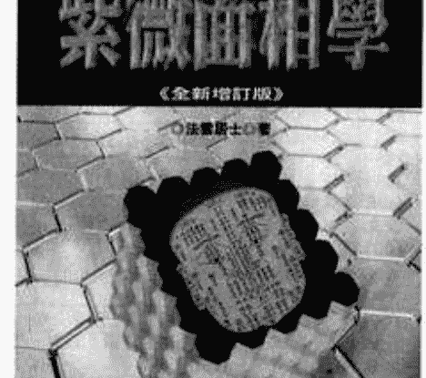
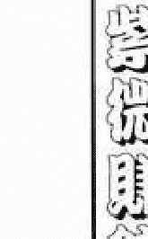
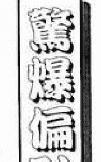
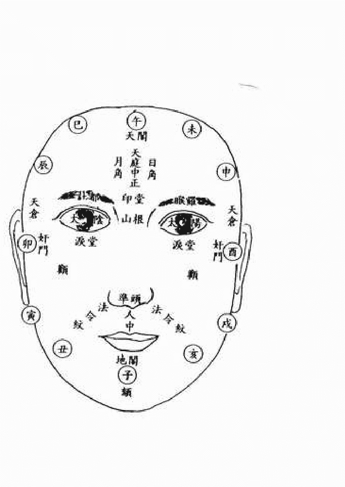
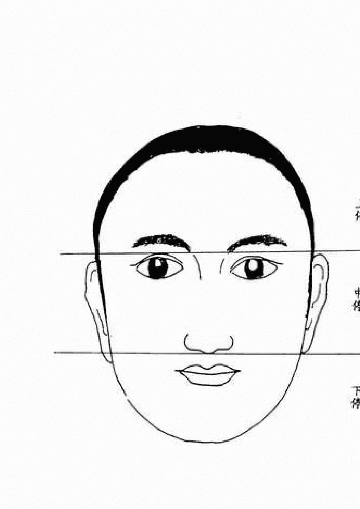
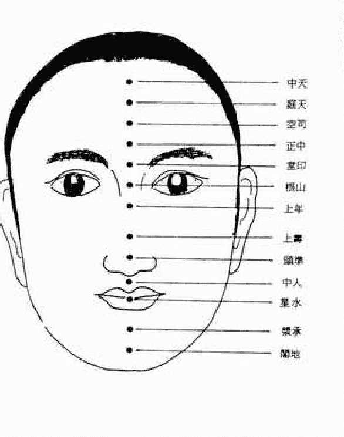
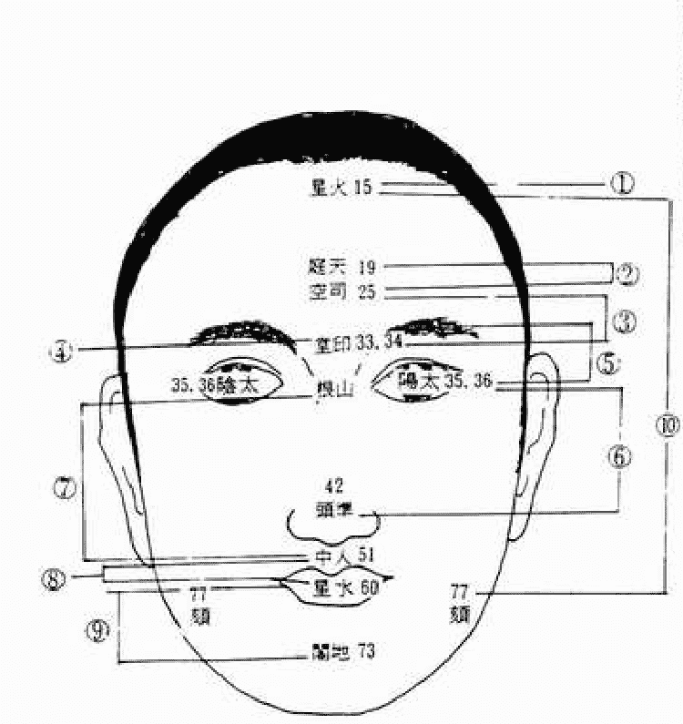
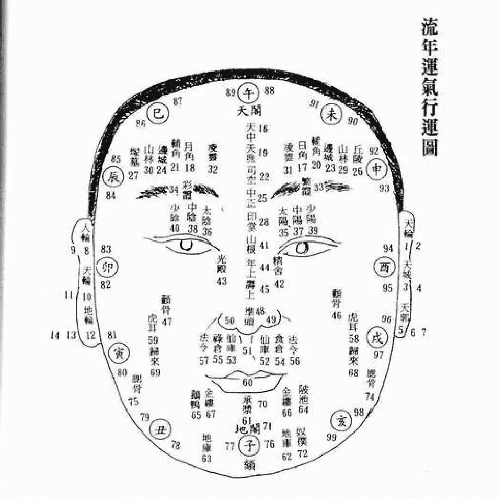
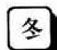

紫微面相學

《全新增訂版》

- http://www.金星出版社.com.tw
- http://www.venusco.com.tw
- E-mail: venusco@pchome.com.tw

法雲居士◎著

金星出版

·二版序·

『紫微面相學』這本書缺貨缺了好久之久，主要是因為我希望能再次重新校訂這本書，再重新檢查查看是否有遺漏的觀點沒有談到的。有許多喜愛命理的朋友頻頻催促，多次打電話到出版社反映，要求要買這本書，於是我只好找空檔時間，儘快的來完成這本新的增訂本。

『紫微面相學』和『看人過招三百回』本來是一套的書。可以藉由觀察人之外貌，進而瞭解其人的性格和處事風格，而加以應對。這對於從事販賣業、仲介業等等職業的人，在從事商業競爭時有直接的助益。同時也對於上司和屬下的關係，朋友對朋友的關係，即便是家庭成員中的關係，都會在相處的方法上有一個瞭解，而形成較好的溝通方式。人之親和度在於人緣桃花。人之親和度也在於對人之瞭解和溝通方法。『紫微面相學』是一種打開溝通之門的技巧方法。而『看人過招三百回』則是一把打開溝通之門的鑰匙。這兩者缺一不行。相互配合則能在人際關係中知己知彼，百戰百勝了。

『紫微面相學』可應用的範圍很廣。近來有許多適婚年齡或再婚的朋友想預測自己配偶的長相、性格和職業，以便往此方向尋找適合做配偶的人。這時候『紫微面相學』就很有用了，它可以和『如何掌握婚姻運』兩本書一起搭配來看，這樣你不但可尋找到人品格調兼備的人選，更確知了未來配偶的相貌和外型及職業類型。同時也保障了未來幸福的願景。

『紫微面相學』更可以和『紫微談判學』、『紫微推銷術』一同運用，在開標的場合、交易的場合、競爭談判的場合、知人善用的場合，都會是一項最佳的利器。『紫微面相學』更可以搭配『紫微交友術』、『如何創造事業運』來尋找知心的好朋友及共創事業的好搭擋。

『紫微面相學』能夠辨忠奸。更可以直接從一個人的面貌上，就直接看入此人的靈魂深處，瞭解那個人內心深處的喜惡、想法。更可以探知其人對是非認知的情況。所以聰不聰明？糊不糊塗？對金錢、好運有沒有敏感力？正不正直？性格寬不寬宏？是不是善良？是否會奸詐搞怪，就一目了然了。因此尋找知交朋友及尋找合夥人時，絕對能提供最詳細的資料來供你參考。

有些人活了一輩子都在分辨別人是好人或壞人？是善類或惡類？才小心翼翼的和那人做生意、做朋友。雖然極盡小心，仍不免在人生歷程中仍經歷一些坷坷絆絆、傷感情的事情，令人沮喪。『紫微面相學』會告訴你那些面相的人是磁場相同的人，是適合你去順利交往，而沒有後遺症的。那些面相的人是磁場不同、思想、行為和價值觀是不同的，同時也是相識容易、相處難的人。有了這樣一個判斷的標準，今後你再也不會因看錯人而氣餒憤慨了。更可以尋找到磁場相同、價值觀相同、想法相同的人在一起共創大事、一起生活愉快。這就是這本『紫微面相學』真正的用處了。願與讀者共享這份研究心得。

法雲居士 山居謹識

二〇〇一年四月

國家圖書館出版品預行編目資料

紫微面相學《全新增訂版》／法雲居士著. --第1版. --臺北市：金星出版：紅螞蟻總經銷，1998[民87]·2001[民90]增訂版 面； 公分--(命理生活新智慧叢書：18-1) ISBN 957-8270-31-3（平裝） 1. 命書

紫微面相學《全新增訂版》

| 项目 | 内容 |
|------|------|
| 作者 | 法雲居士 |
| 發行人 | 袁光明 |
| 社長 | 袁靜石 |
| 編輯 | 王翔 |
| 出版者 | 金星出版社 |
| 社址 | 台北市中山北路二段115巷43號3樓之3 |
| 電話 | 886-2-25630620 886-2-25418635 |
| 電傳 | 886-2-25630489 |
| 郵政劃撥 | 18912942金星出版社帳戶 |
| 總經銷 | 紅螞蟻圖書有限公司 |
| 地址 | 台北市內湖區文德路210巷30弄25號 |
| 電話 | (02)27999490 |
| 網址 | www.venusco.com.tw |
| E-mail | venusco@pchome.com.tw |
| 版次 | 1998年7月第1版 2001年4月第2版 |
| 登記證 | 行政院新聞局局版北市業字第653號 |
| 法律顧問 | 郭政延律師 |
| 定價 | 320元 |

行政院新聞局局版北市業字第653號 (本書遇有缺頁、破損倒裝請寄回更換) 版權所有·翻印必究 ISBN：957-8270-31-3 (平裝) *本著作經著作人授權發行，包括繁體字、簡體字。 凡本著作物任何圖片、文字及其他內容，均不得擅自重製、仿製或以其他方法加以侵害，否則一經查獲，必定追究到底，絕不寬貸。 (因掛號郵資漲價，凡郵購三冊以上，九折優惠。本社負擔掛號寄書郵資。 單冊及二冊郵購，恕無折扣，敬請諒察！)

一版序

很多人都對『紫微面相學』有兴趣。 卻也常有人來問我：『紫微斗數和面相會有直接的關係嗎？』

當然有囉！通常我們可以從紫微命盤的『命宮』裡得到一個人的很多資料，例如：相貌美丑、高矮胖瘦、臉型特徵、思想模式、身體狀況、成就高低、運氣好壞、六親緣分……等等。其他的十一個宮位裡的資料只是更加重輔助與修正命宮中資料的準確性及顯示運程起伏的律動而已。

今天在這本『紫微面相學』裡，我們則是將這些原本處於命盤中各宮位的資料，趣味化的綜合起來，再反轉過來談。直接讓你從一個人的外表面貌，就能判斷得知前述的資料，並且探索到其人的內心世界裡。也就是直接從一個人的面相，而瞭解到其人的想法、做事的態度、處世的輕重，與朋友、親戚相處的關係好壞，未來的發展等等的狀況。紫微面相術不但能幫助你看人、辨忠奸，也可幫助你的一目了然的閱讀『人』的滄桑史。

現今這個時代是個講究情緒控制的E Q時代，每個人為了某些利益和原因，而需要披著虛偽的外衣、面貌，在世間闖蕩打拼。到底那些是真？那些是假？那些是直？那些是非？紫微面相術的功力，可幫助你檢視周遭朋友的賢愚善惡。倘若你是一個正要招考新進職員的老闆或主管，怎樣從第一次見面中，就能確實應徵者的能力和對公司、上司主管的忠誠度？倘若你正為一場生意上的談判在絞腦汁，敵我立場分明，如何鬆動對方的意志力？摸清對方的思考模式，找出弱點與以瓦解。成功的打一場漂亮的生意戰！熟用『紫微面相學』的武功密笈，都會讓你得心應手。

『紫微面相學』是有異於傳統的『五星六府』之面相學的。傳統之面相學中，你很難瞭解天倉、日角、交鎖、玄武、蘭臺、承漿、地閣之部份。初學者更難做出合格與不合格之定論。再者，必須融會貫通百家學說，才能辨人之貴賤禍福，所需費時。稍一不慎，即有差之毫釐、失之千里之憾。

『紫微面相學』完全是以紫微斗數的命理角度而成就之面相學。摒棄了艱深難懂的命理術語與文言文的咬文嚼字，而以嶄新的智慧形態，單純由『人』的臉型、身型、氣度形勢而直接斷定其人的命宮坐星，及坐星的旺弱。由命宮主星所在的位置，我們可以知道，其人一生的處事的方法。再由命宮主星所在的位置，我們可以知道，其人一生的歷程與運程。如此簡單的一套面相學，實在是無可比擬。

『人』自呱呱墜地，即和『人』（父母、兄弟）產生互動的關係。而某些人與其家人共同生活了幾十年而不能相互瞭解，更別談交友交心、知人善任了。可是人與人之間互動的關係，又是個人財富、事業前途，生活上的必要條件，『知人』便是人類必備的智慧與知識了。

既然，『知人』在我們生活中佔有這麼重要的地位，『紫微面相學』還能應用到自我檢視運程，及自我修正命理結構（改運）的範圍。

『相由心起』自古以來便是不滅的定律。前人說：『四十歲以後，面貌必須由自己負責。』其實，二、三十歲你在找工作的時候，你已為你的面貌負起了責任。別人由你的面貌而產生了對待你的態度。倘若你是個常受到人際關係挫折感的人，那你就該檢討了！你的面貌是否展現出不夠穩重、誠懇的態度呢？要怎樣修正？才能得到別人的尊重與善意呢？

還有，臉上有疤痕破相的人，其命宮中或對宮或命宮三合處，定有擎羊、陀羅二星存在，亦或是本命破軍的人。由此我們可以知道此人命程中定有坎坷絆絆的運程。

近來有名夫人動了眼部整容手術而展現美麗的面貌，喧騰一時。眼部在面相學裡屬於田宅宮，田宅宮動刀，當然不利。而且我們還知道此人是年是月走的，一定是破軍運。走破軍運的人，在當運的年月裡，最喜做美容手術。

凡此種種的面相知識，你都可在『紫微面相學』中得到解答與印證。讓我們一起進入有趣的『人相』世界吧！

法雲居士
山居謹識

目錄

- 二版序
- 一版序
- 前言
- 第一章 如何從『外表特徵』來斷定其命宮主星
  - 第一節 從『臉型特徵』來判斷定命宮主星 ...... 〇二一
  - 第二節 從『命宮主星』來看臉型特徵 ...... 〇三三
- 第二章 從『身高及身體外型』來看命宮主星
  - 第一節 從『胖瘦高矮』所歸納之命宮主星 ...... 〇七七
- 第三章 從臉上、身上的疤痕、痣、特異標記來判斷命宮主星
  - 第一節 從『身高體型』來看命宮主星 ...... 〇八三
  - 第二節 從『疤痕、痣』來看命宮主星 ...... 一三一
- 第四章 從『五行格局』看紫微命格的面相法
  - 第一節 五行生剋、順合、逆合的關係 ...... 一四八
  - 第二節 五行人形的特徵 ...... 一五二
  - 第三節 順合及逆合形局的組成與成就 ...... 一五八
- 第五章 從陰陽五行看剛柔並濟之相格 ...... 一六一
- 第六章 面相十二宮與紫微十二宮相互關係
  - 第一節 面相十二宮 ...... 一七〇
  - 第二節 紫微命理十二宮與面相十二宮互相互對應之關係 ...... 一七七
- 第七章 面相流年測定法
  - 第一節 傳統面相流年的測定法 ...... 一九三
  - 第二節 紫微面相流年的測定法 ...... 一九六
  - 第三節 各星曜在紫微面相流年測定法中所代表之意義 ...... 二〇六
- 第八章 神形氣色的面相法
  - 第一節 神形儀態的親人法 ...... 二一七
  - 第二節 氣色與運限的面相法 ...... 二五三

法雲居士
◎紫微論命
◎代尋偏財運時間

問教處：台北市中山北路2段115巷43號3F-3
電 話：(02)2894-0292
傳 真：(02)2894-2014

前言

每個人的外在形貌、儀態、體型的高矮胖瘦、性格氣度的快慢緩急，都可顯露出其人命宮主星的特質。這就是『紫微面相學』的實質精神所在。

一般面相學所談的範疇，多半是『主貴』的相貌或凶相所代表的意義。雖然也會對個別性格有所陳述，但終究距離我們現實的生活太遠了，而且言詞籠統，重點散漫，不好統合利用。

這本『紫微面相學』，我則是以紫微命理的角度，來談談我們日常生活中所見到的『人』的面相。以我們所觀察到的第一印象來判斷對方人士的命宮所屬主星的星座，從而可知對方的性格、態度、對方心裡到底是怎麼想的？（觀點）、做人處事的方針、心情起伏的角度、脾氣好壞、發怒的易爆點，以及能接受反對意見的寬容度等等，從而達到知己知彼的優勢，以便應用在日常生活中，形成得心應手的人際關係。

一般講『面相』，談的好像是同一回事。其實『面』與『相』是其有不同意義的。

『面』指的是臉上的容貌。『相』指的是包括頭、手、足、身體，是一個人整體的印象。甚至包括了一個人身體的動感，舉手投足的舉動。一切的身體語言、和一個人從內在煥發出來顯現於外表的氣質。當然這也綜合了環境和教養加諸在人身上的影響。因此『相』的範圍是大過於『面』的範圍的。

現今我們常以為社會上的人普遍是『以貌取人』的現象。而這個『貌』字就包含了『面』與『相』的雙重境界。『面』是具有先天性、遺傳性的因素。而『相』則多半受後天影響、累積而成。因此『相』可以說是直接影響我們命運好壞最直接的因素。而現今有許多人為了要改運，而去整形美容，形成成本末倒置的一種做法。雖然在心理上會給自己一些鼓勵作用，似乎有一些效果。但是如能同時改變『相』的條件，使福相增厚，改變命運的契機會更快速而直接，所能得到的好運也會更多一些，命運不是也就被改變了嗎？

『面相』是一體兩面的事情，我們既然可以從一個人的外表，就能探測到其內心的世界，也就可以從這個人所發生的一些事情，得知這個人的運程，進而推測到此人一生命運的好壞。

例如我們從某個人的臉上、身上看到傷痕，再從其臉型、身體的形狀，可估量出此人的命宮中或遷移中定有羊陀、破軍等星。其人曾有牙齒斷裂的情況者，命宮中會有陀羅星。其人曾有開刀狀況者，不是命宮有羊刃、破軍等星，就是在羊刃、破軍運程。當然出車禍的人，尤其要注意羊刃的流年、流月，或『廉殺羊』格局存處於命局之中。我們從這些細微小節中，再加上此人容貌外型評估出來的主星，再加上上年紀多少的揣摩，即可完整的畫出此人的命盤，從而瞭解此人一生命運程式的走向了。

當然另一方面，我們也可以從一個人的喜事連連、升官佳兆、鴻運當頭，再加上此人的外型容貌所評估出來的命宮坐星，再加上上年紀的估計，也可對此人一生命運走向有一個完整的瞭解，這就是為什麼有那麼多算命師能一語道破你命運中的轉折點的道理了！

中國自古以來有許多的相術經典，例如《麻衣神相全篇》、《太清神鑑》、《玉管照神局》、《相理衡真》以及曾國藩所著之《冰鑑》等，莫不以『大貴之相有三：曰聲、曰神、曰氣。』為宗旨，而以五岳、四瀆來比喻解說。這麼多的相術經典，創造了許多不易讓常人瞭解的無數名詞，實則真正完美無缺的面相是很難見到的。就連上述經典名著的作家，縱然在相學中訂出許多的規矩，但窮其一生，也恐難見到一、二人有合格的相貌。既然如此，我們為什麼不卸除古典的窠臼，跟進時代的腳步，進入實用而簡捷的相術天地之中呢？

紫微斗數歷盡二千年的變化演進，現今在吾人命理的應用上，實則是一種快速、準確又實際的命理學問，它不但包含了相術、命運展現、運程的計算、吉凶災禍的警示，舉凡你遭遇一切的人際、物際、境遇關係，也都會展現在眼前。它也能告知你如何去使用它？因此紫微命理實則是現代人不可或缺的法寶，亦可說紫微命理整合了許多命理內涵、綜合性的發揮了它的價值。

因此，這本『紫微面相學』，從實務方面來說，是我用紫微命理的精華，加上常年命相的心得，與以整理而成就出的一本書。從精神方面來說，『紫微面相學』同時也是綜合了古代百家相術經典，使其邁向現代的、科學的、捷徑的一本書。在此謹與熱愛紫微命理的讀者們分享。

第一章 如何從『人的外表』來斷定其命宮主星

紫微命理中命宮主星即包含著人的相貌、外觀形態、性格急怒緩慢的心態。反轉過來，從人的外表再來探究命宮主星，亦不是難事了！

通常我們要從一個人的外表來指出其人是什麼星坐命的人，在實際上似乎是有些困難的事，尤其是雙星坐命時，其人在外貌與性格上都會產生兩個星座共同的特質，而有一些模糊點，讓人不能把握，而在有經驗的命理師的眼中，卻能很迅速的從這個人的外貌、體型、舉止中搜尋到最佳的情報資訊，並快速的在自己的電腦（頭腦）中整理、分類、判讀並計算、歸納，而形成結果，這也是命理師為什麼能預知人的命運的問題了。

到底命理師所得到的資訊有那些內容呢？這就是我們接下來要談的臉型特徵、身高、體型、疤痕、痣的特徵、神形氣色等的問題了。將這些問題綜合起來，你也可擁有命理師神鷹般銳利的眼神，而探知對方心靈的秘密了。這彷彿電腦網路上的「駭客」出擊一般的刺激，但這個秘密永遠只有你自己知道而已。

### 第一節 如何從「臉型特徵」來斷定命宮主星

在古籍《神相全篇》中有《十觀》即「觀人十法」。提到看人的十種法則即是：一、取威儀。二、看敦重精神。三、取清濁。四、看頭顱圓頂額高。五、看五岳三停。六、取五官六府。七、取腰圓背厚、胸坦腹墜。八、取手足。九、取聲音與心田。十、觀形局與五行。我們由上項法則中可知一至六項皆是由頭臉部所觀之的重點，因此也可知，事實上從古至今，凡是對人的印象，必先從頭臉部開始為第一印象，故而臉部的特徵，也就成為「人的外表」第一道先趨特使了。而且是掌握人生成敗的第一要件。

通常我們來談人的臉型相貌時，是以人三十歲的相貌做基準。主要是因為某些命宮主星的相貌在人年幼時，或年紀稍輕時，形成的特徵不夠完整，而讓人有模糊的感覺。而人在四、五十歲以後，又會因肥胖、衰老、臉肉下垮、形貌有些變異而不好認定，這就需要我們靠經驗來認清了。

例如說左輔、右弼坐命的人，是空宮坐命的人，在幼年時有形貌不清，很難認定之嫌。年長及三十歲、型貌穩定時，就可一見看出其命宮主星。又例如說：政治人物中的吳伯雄先生是貪狼坐命的人，本來應該是圓長臉型。但在中年以後成為大圓臉了。這就是貪狼居旺的人，很容易發生的事。我們可從其年輕的資料照片中很容易找出其命宮主星的特質。因此要達到形貌成熟度夠，而又不見變型，以三十歲做基準是最合適的看法了。再從此基準型上，以年紀的多寡，上、下加減，就不難看出其端倪。

#### 紫微坐命的人

紫微坐命的人有圓帶方的臉型，長相氣派，有威嚴。忠厚、穩重、受人敬重，一生都不會遇到不禮貌的對待。

#### 天機坐命的人

天機坐命的人，大多數都是瘦型的人，聰明外露，機智靈巧，行動力也很快速，性急無耐心，三分鐘熱度，在家多是非，情緒波動很大。

#### 武曲坐命的人
武曲坐命的人，多數為面方圓，中矮壯碩，聲音宏亮，性剛直、寬宏、頑固、喜怒無形於色、重言諾。做事速戰速決。勤快、勞心努力。

#### 太陽坐命的人
太陽坐命的人，大多數都有圓圓的大臉，有些人的臉型會較長或較短。身材也多數為高大的體型。是坦白、無心機的人。

## 機陰坐命的人
機陰坐命的人，無論男女都有姣美的面貌和身材，情緒容易起伏不定。一生驛馬強，波動盪不安，也喜歡做東奔西跑的工作。

#### 機梁坐命的人
機梁坐命的人，很喜歡說話，口才伶俐，善辯，臉瘦型，本身不主財，但愛動嘴賺錢。很多人是身宮落在財帛宮的人，視財如命，非常辛苦。

## 武杀坐命的人
武杀坐命的人，外型較粗，臉方圓，性格剛強頑固，有些古怪。好勝不認輸，敢愛敢恨，平常話少。做事斬釘截鐵，愛死拼。

## 天同坐命的人
天同坐命的人，命宮居廟的人較肥胖，居平、居陷皆矮瘦。性格溫和、慈善、謙虛、眉清目秀，不會發脾氣，但生活較懶散，沒有競爭力，愛享受、愛撒嬌、有小孩子脾氣。

## 廉贞坐命的人
廉贞坐命的人，顴骨高，眉寬口橫、中等身材，能言善道。臉型方，少年黃白色，老年紅黃色，主觀強，性烈、有衝勁、愛爭，事業心重，對政治最有興趣。為最多出現在政治圈中的命格。

### 廉破坐命的人
廉破坐命的人，多半有大嘴、高顴骨，臉面上骨象分明，長相粗醜。有昌、曲同宮的人為大嘴、大眼、輪廓深，具有西方美的人。其人口才很好，說話狂妄、大膽。平時很陰沈、話少、容易衝動，是吃苦耐勞，破祖離鄉，白手成家的人。

### 貪狼坐命的人
貪狼坐命的人是好運星坐命的人，臉型長圓，居廟，居旺的人，身材高大、身材好、長相不錯。頭腦一流，反應快，人緣特佳，多才多藝。性情喜怒無常、慾望多、愛表現、好爭、做事快速、性急、馬虎。一生有暴發運、有奇遇。

### 巨門坐命的人
巨門坐命的人，多半口大，嘴唇薄、口才好、善辯。性情多疑，做事進退反覆，多學少精。好欺騙，為人嘮叨、挑剔、注重小節。不滿現狀，性格捉摸不定。一生口舌是非多。

### 天相坐命的人
天相坐命的人，性格溫和，相貌忠厚老實，端正、不偏私、有正義感。喜歡調解紛爭，服務熱心、喜歡美食、衣著。不惹麻煩、愛清閒生活。

### 天梁坐命的人
天梁坐命的人，臉型方長，居廟時人高大強壯，居旺時，體型也厚重。居陷時人矮瘦。其人有固執、孤高、自負、有威嚴的特質。有機謀、善舌辯、愛競爭。少年臉色黃白色，老年為黃黑色。

### 陀罗坐命的人
陀罗坐命的人，头颅和脸型都是圆圆的。气质粗，性格顽固，多是非，不服输，有破相及牙齿、手足有伤灾。心中思想扭曲、精神不开朗，一生奔波劳碌、波折大、离开出生血地，离乡发展才会好。

### 擎羊坐命的人
擎羊坐命的人，中高身材，庙旺则胖，陷地剋瘦小。脸型为『羊』字脸。脸上有破相或伤残。陷落时有眇目、麻脸。面色为红带青或青黯色。性果决刚硬，有机谋、奸诈、冲动、霸道、爱计较之特质，恩怨分明，记恨心强。

### 破军坐命的人
破军坐生命的人，破军居庙为五短身材，腰肩斜。脸型为『风』字脸，唇厚、口大，脸宽、好胜心强，敢爱敢恨、性格大胆、干劲十足、做事先破後成。喜创业，为破祖离乡之人。

### 七杀坐命的人
七杀坐命的人，为方长脸型，个子不高，在寅、申宫坐命者，亦有高大的身材。少年脸色为青白色，老年时为红黄色，眼睛特别大，有威严、煞气。喜怒形於色，性情反覆无常，性格倔强、不认输。勇於承担责任。一生辛苦奔波。

# 紫微面相學

# 第一章 如何從『人的外表』來斷定其命宮主星

## 臉部的形狀
- 1. 長圓帶方形（同字型）的臉型：紫微坐命者、紫府坐命者、太陽坐命者、日月坐命者、廉府坐命者。
- 2. 長圓形的臉型：貪狼坐命者、紫貪坐命者、文昌坐命者、同陰坐命者、機陰坐命者、太陽居陷坐命者、火星坐命者、左輔坐命者。
- 3. 圓形的臉型：太陽坐命者、天魁坐命者。
- 4. 圓方形的臉型：武曲坐命者、天相坐命者、武府坐命者、陽梁坐命者、廉貪坐命者。
- 5. 小圓長的臉型：右弼坐命者、天機坐命者、文曲星坐命者、天空坐命者。
- 6. 短圓形的臉型：天鉞坐命者。

### 火星坐命的人
火星坐命的人，臉型為長圓臉，中等身材，面紅黃色，毛髮呈紅色或枯黃。其人愛辯論，急躁不安，喜爭強鬥狠，做事快速，有頭無尾，一生較勞碌。

### 铃星坐命的人
鈴星坐命的人，臉型多古怪、顴骨較突出，有的人眼睛突出，像銅鈴。面色黃裡透青色，或黯黑色。非常伶俐，有急智、性烈、內向，急躁不安，喜表現，心胸狹窄，但聰明異常很衝動，常會做讓人訝異的事情。

# 第一章 如何從「人的外表」來斷定其命宮主星
- 14. 中等長方形、兩腮寬闊（風字型）的臉型：破軍坐命者、廉破坐命者。
- 15. 菱形（申字形）的臉型：地劫坐命者。

### 以臉型橫向寬窄度歸納之命宮主星
寬臉的有：
- 紫微坐命者、紫殺坐命者、紫相坐命者、紫破坐命者、太陽居旺坐命者、武殺坐命者、陽梁坐命者、陽巨坐命者、武曲坐命者、天相居旺坐命者、武相坐命者、武破坐命者、天同坐命者、同梁坐命者、同巨坐命者、巨門居旺坐命者、廉貞坐命者、廉破坐命者、廉貪坐命者、巨門坐命者、陀羅坐命者、鈴星坐命者、地劫坐命者。

# 第一章 如何從「人的外表」來斷定其命宮主星
- 7. 長方形（略長）的臉型：天梁坐命者、天同坐命者、天府坐命者、巨門坐命者、機巨坐命者、機梁坐命者、祿存坐命者。
- 8. 中等長方帶圓型的臉型：武相坐命者、武貪坐命者、紫相坐命者、廉相坐命者。
- 9. 中等長方型腮骨明顯的臉型：七殺坐命者、廉殺坐命者、紫殺坐命者、武破坐命者。
- 10. 中等方形、額頭較寬（甲字形）的臉型：廉貞坐命者。
- 11. 短方形（田字形）的臉型：同巨坐命者、同梁坐命者、武殺坐命者、巨日坐命者、陀羅坐命者。
- 12. 狹長型的臉型：擎羊坐命者。
- 13. 短方形腮骨突出之臉型：鈴星坐命者。

# 第二節 從『命宮主星』來看臉型特徵

#### 紫微坐命的人
紫微坐命的人，具有長圓中帶方的臉型，五官端正、有氣派、相貌敦厚、穩重，面色凝重謹慎。紫微坐命的人，面色多土黃色，中年以後漸呈紫黃色。因其面部表情忠厚老成，給人很大的信賴感，故而得人尊重。例如美國柯林頓總統是紫微坐命的人。

#### 紫府坐命的人
紫府坐命的人，具有長圓帶方形的臉型，五官端正討喜，通常他們的臉龐並不大、相貌敦厚、老實、清秀。面色為淺黃帶白。紫府坐命的人，多從事金融機構、貿易公司、公教人員，以文職為主，故其面型...

### 普通型臉寬略的有：
- 紫府坐命者
- 紫貪坐命者
- 太陽居陷坐命者
- 武府坐命者
- 同陰坐命者
- 天機坐命者
- 機巨坐命者
- 機梁坐命者
- 機陰坐命者
- 廉殺坐命者
- 廉府坐命者
- 廉相坐命者
- 太陰坐命者
- 日月坐命者
- 貪狼坐命者
- 武貪坐命者
- 巨門居陷坐命者
- 天相居陷坐命者
- 天梁坐命者
- 七殺坐命者
- 武府坐命者
- 武破坐命者
- 文曲坐命者
- 左輔坐命者
- 右弼坐命者
- 天鉞坐命者
- 擎羊居旺坐命者

### 特別狹長臉型的有：
- 擎羊陷落坐命的人。
- 左輔坐命者
- 右弼坐命者
- 天鉞坐命者
- 擎羊居旺坐命者

# 第一章 如何從『人的外表』來斷定其命宮主星

#### 紫破坐命的人
紫破坐命的人，為中等長方形，兩腮較為明顯，有時略為寬闊的臉型。紫破坐命的人，大致看起來還算忠厚老實的外型，但其為人豪爽、敢做敢當，因此不算秀氣，是具有粗獷美的特質。紫破坐命的人，面色多為暗黃色、膚色較黑。多半為勞工階級的人。若做文職，必是窮困錢

#### 紫殺坐命的人
紫殺坐命的人，為中等方形略瘦的臉型，但兩顴骨有明顯的狀況，紫殺坐命的人，有一雙大眼，瞳仁既黑且大，其面部表情穩重威嚴、雙唇常緊閉、隱約顯露貴氣和殺氣。他們的特徵很明顯，可以一目了然的認出。其面色在少年時為青白帶黃色。中老年時為暗黃色。紫殺坐命的人，多從事藝術類（舞蹈及繪畫）或軍警類、及辛苦忙碌的職業。其面部氣質並不特別秀氣，是稍微粗獷或臉部皮膚較粗糙、毛細孔較大的氣質。被殺身亡的星相家陳靖怡即是紫殺坐命的人。

#### 紫相坐命的人
紫相坐命的人，為中等長方帶圓形的臉型。相貌忠厚老實，五官端正討人喜歡。年少時面色為青白色，中年以後為黃白色。紫相坐命的人，都有高級專業技術，因此面龐及外型皆文質秀氣得人敬重。

#### 紫貪坐命的人
紫貪坐命的人，為長圓形、下巴略帶方形臉型。男子俊俏，女子美麗，人緣特佳，是人見人愛的典型。但也不失端莊秀麗的外貌。其面色為少年時淺黃帶白，中年以後為紫黃色。紫貪坐命的人，喜愛美麗及風雅之事，故其人多為儒雅文質的外貌，外表看起來很外向，很重視別人對自己的感觀。前國防部長陳履安先生即為紫貪坐命的人。

# 紫微面相學
## ·第一章 如何從「人的外表」來斷定其命宮主星·

## 機陰坐命的人
機陰坐命的人，有長圓型的臉型，相貌秀麗，不論男女皆有俊秀的外貌氣質，討人喜歡。機陰坐命寅宮的人，較有人緣桃花，能吸引人氣。有文昌在寅宮同宮為陷落時，氣質差，人之相貌、舉止較粗俗。機陰坐命申宮的人，眉宇間會有黯淡的憂愁，人緣沒有那麼好，但依然外型與臉型都瘦瘦的。演員費玉清為機陰坐命的人。

#### 機巨坐命的人
機巨坐命的人，有長方形的臉型，臉龐上的骨象分明，像是一個很有個性的人，通常其體型也很大，骨架很大，長手長腳的。通常機巨坐命卯宮的人較高大，機巨坐命酉宮的人為中高身材。機巨坐命的人，常將其聰明智慧與頑固同時展現在臉上，讓人一看就知道他是個不好相處的人。機巨坐命的人，通常會做學術機構、高科技專業人才，因為他們多半會出現在這種地方。就算他在某一個公司工作，他也會具有特殊的專業才能而恃才傲物的。先總統蔣介石先生和小說家張愛玲女士都是機巨坐命的人。

# 紫微面相學
## ·第一章 如何从『人的外表』来断定其命宫主星 ·

#### 天機坐命的人
天機坐命的人，要看其主星的旺弱來分。通常他們是小圓長臉型、臉型瘦。天機在子、午宮雖然入廟，但天機在子宮的人，臉瘦。天機在午宮的人臉較圓、較胖一點。但都為中等身材。天機和陀羅同宮坐命時，有時候會受陀羅的影響較深，其人會較胖，頭顱圓大，臉型寬，體型胖壯，人也不夠聰明。天機單星在丑、未、巳、亥居陷時，是小圓長臉型、瘦削。天機坐命的人常有精明外露的問題，臉型秀氣，面色少年時為青白色，中老年時為黃中帶青的顏色。在與人初見時，天機坐命的人對人有稍許的冷漠，相交時，是非又多，因此在人緣交際上不算很順利。

#### 機梁坐命的人
機梁坐命的人，有長方形的臉型，臉型瘦。他們通常有一雙大眼，態度精明多計謀。年少時面色為淺黃帶青色。中年、老年為暗黃色。機梁坐命的人，常有一張能說善道的大嘴，嘴唇薄，很喜歡講話。是一個願意出計謀，卻不願負責任的人，只要一試便知。

#### 太陽坐命的人
太陽坐命的人，通常有一張大圓臉，面色在年少時為淺黃帶紅色，有時是白裡透紅。中年、老年為暗紅色。太陽居陷坐命的人，則為長圓帶方形的臉型，常會被誤以為貪狼坐命的人。在少年時面色為黃帶青色，中、老年為暗黃色。太陽居旺坐命的人，無論何時何地，都會將熱情、坦白、寬厚、真誠全寫在臉上，因此他這種人是非常好認的。前台北市長黃大洲先生就是太陽、祿存坐命宮的人。

#### 陽巨坐命的人
陽巨坐命的人，屬於短方形的臉型，又稱做『田字型』的臉型，面色為少年時為黃中帶青。中、老年以後為暗黃色。陽巨坐命的人，性格開朗、做事勤勞、重食祿、好吃、好說話。命宮坐在申宮的人，比較好吹噓，嘴旁有痣者，更甚。而且喜歡抬損。命坐在寅宮者較沒有這種情形。

#### 陽梁坐命的人
陽梁坐命的人有圓形帶方的臉型，面色為少年時白裡透紅。老年時暗黃透紅色。臉部表情穩重，態度爽朗、豪放、人緣極佳。陽梁坐命的人，愛面子，喜歡說話，愛管閒事。命坐酉宮的人，有貴氣，學歷高而增貴秀之氣。命坐酉宮的人，愛四處飄遊，臉色較黑，喜發牢騷。多做自由行業，為人四海，有草莽陽剛氣質。

#### 武曲坐命的人
武曲坐命的人，有圓形帶方的脸型，地閣小（下巴短）、眼睛大。體型稍矮壯。少年時面色為淡黃色帶青色，老年時為青黃色。武曲單星坐命的人，都有很好的人際關係，但他們性格剛直，會直話直說，喜歡講理，從不擔心會得罪別人。因此臉上會有剛毅的表情，而且他們具有清脆的聲音，也很容易認出他們這種人。前國防部長郝柏村先生就是武曲坐命的人。

#### 武府坐命的人
武府坐命的人，通常都有白皙的面貌，圓形帶方的臉型，比武曲坐命的人，臉頰略長，地閣（下巴部份）適中。他們是財庫星與正財星坐命的人，因此為人精明、穩重、五官在臉龐上的配置適中，給人很舒服很值得信賴的好感。武府坐命的人，謹言慎行，剛直、膽小、吝嗇，很愛思考，從不多言多語，受人敬重。新黨王建煊先生即是武府坐命有羊刃在對宮相照的人。武曲坐命，命宮中有化忌星，或有擎羊同宮、相照的人，體型會是瘦型或瘦高的身型。臉型也會瘦削，這是因為「刑財」的關係。

#### 武破坐命的人
武破坐命的人，有一張中等長方型、而腮骨有明顯痕跡的臉型，或是小圓臉帶煞氣。面色少年時為淺黃帶青色。中、老年時為暗黃帶青色。宽顎，而身材矮小。武破坐命的人，常不拘小節，喜歡冒險，因此其氣質也算是粗獷型的人了。臉上常粗黑，有傷痕，牙齒也會有不整齊的狀況。武破坐命的人，通常會做軍警、特技類、驚險的工作或工廠、粗重的工作，有文昌或文曲同在命宮或遷移宮時，會出現在文質的、精細的工作場合之內，但窮困也做不久長。特技演員柯受良乃武破坐命的人。

#### 武殺坐命的人
武殺坐命的人，都具有圓形帶方的臉型，有的人也會形成『田字臉』，在少年與中、老年時膚色都較一般人黑。給人的感覺是粗粗的，像是鄉下小孩出生的背景氣質。他們也會具有厚背與粗壯的矮壯體型。一般來說武殺坐命的人，臉上會有稍許的小凹洞，像是青春痘留下的痕跡，皮膚也較粗。他們非常勤勞，生命力旺盛，像是在工作上會出生入死會拼命的人，給人有可交付重任的可信賴的感覺。因白曉燕案升官的警局副局長侯友誼先生就是武殺坐命的人。鄧小平先生也是武曲化科、七殺、擎羊坐命的人。有武殺、擎羊同在命宮，尤其在卯宮，是臉大...

#### 武相坐命的人
武相坐命的人，具有中等長方形帶圓的臉型，面色為少年時淺黃帶青色，中、老年為黃青色。武相坐命的人，衣食無缺、一生快樂、性格穩重、剛直，會多替別人著想，眼睛大，聲音大，做事負責，喜愛衣食。故武相坐命的人，常有圓圓的下巴。有化忌同宮時，為瘦型。有陀羅在命宮時，較矮胖。

#### 武貪坐命的人
武貪坐命的人，具有長圓帶方的臉型，有些也會是略短圓方型臉型。少年時，面色為白裡透青的顏色，老年時面相較深暗為青黃色。武貪坐命的人，性格剛強，有主見，身體壯碩、威武、話少。本性吝嗇小氣、重言諾。只要沒有羊陀、化忌在命宮或對宮相照的人，人際關係非常好，一生有奇遇及暴發運。蔣夫人宋美齡女士即是武貪坐命的人。

# 紫微面相學
## ·第一章 如何從「人的外表」來斷定其命宮主星·

#### 同陰坐命的人
同陰坐命的人，具有長圓形的鵝蛋臉，非常溫和美麗。都具有慵懶的氣質，愛享福，做事還算負責，但不喜歡積極打拼。同陰坐命的男子，具有女性化的特徵，性格溫和，下巴略帶方形。命宮在「子」的人，有官貴、氣質是在文質彬彬中帶有貴氣。同陰坐命的女子，外貌美麗、輪廓分明、動人，皮膚白皙、豐腴、身材妖俏，大眼且顧盼生姿。喜留一頭長髮，是最具女性美的女人。命宮在午宮的人，臉型、體型較瘦、較矮，財運也不好，但仍有美麗的外貌，卻帶有苦味、憂愁的氣質，人緣也不好，能力也較差，較窮。

#### 同梁坐命的人
同梁坐命的人，具有方形帶圓的臉型。有些人臉較短，形成「田字型」臉型，身材中等。少年時面色為黃白色，中、老年時為黃黑色。同梁坐命的人，口才好，喜歡聊天說話，在人群中從不沈默，有時...

# 紫微面相學
## ·第一章 如何從「人的外表」來斷定其命宮主星·

## 天同坐命的人
天同坐命的人，具有長方型的臉型。有些人稍胖，下巴稍圓。面色在少年時較白，中、老年微黃。膚色屬於白皙之類的人。天同坐命的人，脾氣溫和、少怒、好商量，看似懦弱，其實是無爭鬥之心。因此態度穩重、緩慢。五官端正、清秀、慈善。命宮中有天同、陀羅同宮的人，會有斜眼、眇目、頭顱圓圓的情況。脾氣依然溫和，但情緒常會古怪。

#### 廉府坐命的人
廉府坐命的人，有長圓帶方的臉型，尤其額頭或下巴處（地閣）最方，同樣也有眉骨高露，眼光有神，性格有時堅強、有時軟弱，剛柔不濟，表情有嚴肅、沈著的特點，但是廉府坐命的人不愛說話，話少，但可從眼神中發覺其內心輾轉思維正在運用。廉府坐命的人，很吝嗇小氣，護己之心很嚴重，從言談態度中可以讓別人察覺出來。而且他們喜歡運用交際手腕或與人交換條件，以獲得對自己有利的利益。廉府坐命的人，年少時面色青白，中、老年以後為黃青色。副總統連戰先生為廉府坐命的人。

#### 同巨坐命的人
同巨坐命的人，具有短方形的臉型，有些人的下巴稍尖，臉上會有雀斑及痣或有胎記，尤其是有火星同在命宮的人，一定會有大痣或胎記明顯的特徵。面色為黃青色，成年、中年以後膚色較黑。同巨坐命的人，表面上看起來很溫和，又很會說話，實際性格急躁，不重視禮貌，喜愛遊樂之事，沒有事業心與責任心，比較愛享受。是非很多，常為口舌問題忙不停，生活比較散漫。

#### 廉貞坐命的人
廉貞坐命的人，有略似『甲』字型或短方型的臉型，額頭寬、口闊、很囉叨。為人四海，看起來似乎對人很熱絡，喜歡服務別人，但往往不能貫徹到底，因此有虎頭蛇尾的毛病，不能負完全的責任。他們很會解釋原因。這種溫和又帶有草莽性格的氣質，在他們的臉上會顯露出既不粗獷，又不夠文質秀氣的一種爛好人的氣質。

### 臉型特徵對應表
| 臉型特徵 | 可能主星 |
|---|---|
| 長圓帶方形（同字型） | 紫微、紫府、太陽、日月、廉府 |
| 長圓形 | 貪狼、紫貪、文昌、同陰、機陰、太陽居陷、火星、左輔 |
| 圓形 | 太陽、天魁 |
| 圓方形 | 武曲、天相、武府、陽梁、廉貪 |
| 小圓長 | 右弼、天機、文曲、天空 |
| 短圓形 | 天鉞 |
| 中等長方形、兩腮寬闊（風字型） | 破軍、廉破 |
| 菱形（申字形） | 地劫 |
| 長方形（略長） | 天梁、天同、天府、巨門、機巨、機梁、祿存 |
| 中等長方帶圓型 | 武相、武貪、紫相、廉相 |
| 中等長方型腮骨明顯 | 七殺、廉殺、紫殺、武破 |
| 中等方形、額頭較寬（甲字形） | 廉貞 |
| 短方形（田字形） | 同巨、同梁、武殺、巨日、陀羅 |
| 狹長型 | 擎羊 |
| 短方形腮骨突出 | 鈴星 |## 第一章 如何从「人的外表」来断定其命宫主星

### 廉破坐命的人

廉破坐命的人，有中等略似长方形的脸型，但额宽口阔，高颧骨，两腮骨横宽。眉骨高露，眉形宽，鼻梁骨山根处较低陷，鼻头（准头较宽），有些人的鼻孔大，外露。皮肤较粗糙等特征。年少时，面色为浅黄带青，中老年时较黝黑，为暗黄青色。

廉破坐命的人，性格刚强坚硬，不畏强权，狂傲多疑全表现在脸上。他们多半头面部有伤痕，命宫中有羊陀、火铃同宫或相照的人，会有麻面或因伤而残的外征。前警务署长姚高桥先生及台北市议员林瑞图都是廉破坐命的人。

普通廉破坐命的人都长相比较粗犷丑陋，但有文昌、文曲同在命宫时，其人有略似西方人美丽的外貌，脸的轮廓深、大嘴、大眼。但一生为穷困命格。

### 廉杀坐命的人

廉杀坐命的人，有中等长方形的脸型，在颧骨处很明显，面色在少年时为青白色，中、老年时为暗黄红色。眼睛比一般人大，双眼皮的人较多，有的人眼睛较横长，形成凤眼。

廉杀坐命的人，多半很沉静、顽固，喜欢胡思乱想。脸上有刚毅的表情，很冲动，肯吃苦。廉杀坐命的人，常会将事情复杂化，而自讨苦吃，但不失为一个良好的部属人材。有擎羊同坐命宫的人，烦恼、多思虑更严重。身体会有病，也会因伤灾丧命。有陀罗同在命宫的人，多烦恼、更顽固且笨。有文昌、文曲同坐命宫的人，比较好学懂礼。

#### 廉相坐命的人

廉相坐命的人，有方形带点圆的脸型，下巴圆，面色为少年是黄白色，中、老年时为红黄色。

廉相坐命的人，有眉露骨，额头宽，眼光温和，面色凝重谨慎，命宫三合处没有羊、陀、火、铃等煞星相照的人，会是很懂得礼仪、知进退的人，多在金融机构、管理阶级中出现，为人沉默胆小不喜言谈，在对下层时，面部表情较为高傲。如有煞星与命宫同宫或相照的人，会是沉默虚伪不实在的人。面部高傲的表情也较多。有桃花星同宫或相照者多的人为好色，品行不端。民选总统陈水扁先生就是廉相坐命的人。

廉相坐命，命宫中有廉贞化忌和擎羊同在命宫的人，出生时即有唇额裂的情形，一生中要经过无数次的开刀手术。

### 廉贪坐命的人

廉贪坐命的人，有圆形带方的脸型，有的人脸形稍长一点，但都是颧骨横宽，大嘴或嘴唇稍厚的人。面色为少年青白，中、老年时黯青色。

廉贪坐命的人，很爱说话，但心直口快，喜欢说些不讨人喜欢的话，做事时也没主见。初识时表面看起来是个好好先生，但多相处一、两个时辰便知是言不及义，多说少练之人了。廉贪坐命的人对异性有特殊的幻想，喜爱酒色财气。也易于和此道中人接近，当他们遇见正派人士时，多半眼光闪烁，不是转脸他顾，便是顾左右而言他，形象不够正派。空宫坐命有廉贪照命者亦然。白晓燕命案嫌犯林春生是廉贪坐命的人。

### 天府坐命的人

天府坐命的人，有长方形的臉型。女子下巴略圆。长相正派，温和中带有挺傲之气，皮肤白皙，看起来是规矩高尚人家出生的人。

天府坐命的人，为人谨慎小心，不会乱讲话，知分寸，守礼仪，很多能得人的好感。长相并不特别美丽，但中规中矩，为人尚称秀气。他们多半是公教人员、或在金融机构、大企业中担任要职。长相就会让人信赖，是很好的管理人才，尤其做企管、会计更是一流人选。台湾首富蔡万霖先生就是天府坐命的人。

天府坐命的人，若逢羊、陀、火、铃同宫或冲照时，下巴会较尖，或有宽脸、不秀实之相，性格上也会奸诈不正。

若有化忌在命宫的人，人缘更差，言语常错的离谱，惹人嫌恶。其人在面貌上也会有特殊的疤痕、痣记、或怪异的特征。

若有陀罗在命宫或与命宫相照的人，会有好色淫乱之相。

### 巨门坐命的人

巨门坐命的人，通常都有一张大嘴，某些人嘴唇薄，很会说话，也喜欢说话、爱辩，常喋喋不休。并且对吃食有特别兴趣。很多巨门坐命的人嘴边都有一颗痣，很容易认出来。同时他们也是最喜欢逞口舌之能多惹是非的人。民进党谢长廷先生就是巨门坐命子宫，对富有天机化权相照的人。李总统夫人曾文惠女士则是巨门坐命辰宫的人。

巨门坐命的人，通常都有长方形的脸型，某些人的脸型较短，巨门居旺的人，三十岁以后会发胖，脸型变圆。巨门居陷坐命的人，脸型瘦削，面色在少年时为黄青色。在中、老年时为黯青色。老年时为黄青色。

巨门坐命有火星同宫的人，脸上有异痣或胎记，特征很明显。他们在脸部表情与态度上都有遮遮掩掩的情况。

巨门坐命有擎羊星同宫或相照的人，容易有兔唇的现象。若有火星再在三合四方处照会，其人脸上表情阴霾，情绪悲观，会有想不开容易自杀的状况。

巨门坐命的人，喜欢用口指挥人，多说少做，命宫中有化权的人更甚。命宫中有巨门化禄的人，是用嘴油滑的人，较会花言巧语，也特别好吃。巨门居陷在命宫的人，常有不实在或言过其词、爱骗人的言词。

命宫中有巨门化忌的人，其面庞五官不清，多细小痣或斑痕、麻点、皮肤粗，言语反复，语意不清，头脑也有问题，常自造一些理论，有理也说不清。白晓燕案绑匪陈进兴就是巨门化忌、陀罗坐命的人。

凡巨门坐命的人，多与人相交是初善终恶，开始是甜如蜜，多情多义，但与人相交不及三个月便要换一批朋友，口舌是非不断，很难信义至终。

### 贪狼坐命的人

贪狼坐命的人，有圆长脸、相貌堂堂，少年时面色为白里带青。中、老年时为暗黄红色。贫狼居旺的人，三十岁以后渐发福变胖，脸变圆。吴伯雄先生就是贫狼坐命的人。

### 太阴坐命的人

太阴坐命的人，有圆带方形的脸型，外貌温和，文静而怕羞，气质很吸引异性，因此异性缘也好。面色是少年时为白里透青，中、老年时为黯青色。太阴坐命的人，面部表情很内敛，文质彬彬，外柔内刚，很富有感情，而且很容易感情冲动。性格上很沉静，容易猜疑，也容易流泪感动。太阴坐命的人，都是五官端正优美，不论男女，都有喜欢留长发、喜欢风花雪月且好酒的性格。太阴坐命再有羊刃在命宫的人，容易因感情问题而自杀。其人的下巴（地阁）也较小较尖。政大教授马英九先生是太阴、文曲坐命的人。演员于枫则是太阴、擎羊坐命的人。

### 天相坐命的人

天相坐命的人，有圆中带方的脸型，下巴呈方形。面色在少年时为青白色，中、老年时肤色稍深，为偏黄的青白色。

天相坐命的人，相貌敦厚，性情平和、态度沉稳、谨慎，有正义感，言语诚实，做人有礼貌、知进退、中规中矩，为人又热心又大方，喜欢助人和做公益之事，因此得人敬重和喜爱。他们和紫微坐命的人外貌有一些相似，都长得正派和气派。但紫微坐命的人，有威仪，讲话速度慢，给人在感觉上心机多了一点。而天相坐命的人，在外貌上端正体面，温和得体，对人的亲和力较佳，眼睛也较大。因此他们要比紫微坐命的人，人缘更好。

天相坐命，有昌曲在命宫的人，长相美丽，桃花问题很严重。

天相与天姚在命宫的人，不论男女皆妖俏好淫，属于含有邪桃花的人。
天相与擎羊同坐命宫的人，同样有忠厚老实的相貌，但脸瘦下巴稍尖，且眼大心狠。这是『刑印』的格局。其人为技术格的人，会拥有特殊技艺在身，但内心受计较，心狠手辣，但无法掌权。若再有廉贞在四方三合处相照的人为『刑囚夹印』，会因事发而遭官符，系身囹圄。
天相与火、铃同宫的人，面庞清秀、急躁、脾气不好，眉宇多忧愁，
身体瘦弱、病痛，为带疾延年之人或残障人士。

### 天梁坐命的人

天梁坐命的人，脸型为长方型。天梁居庙时，下巴较宽，天梁居陷时，地阁较小。面色为少年时是黄中带青白，中、老年时肤色较暗，为黄色偏黑。
天梁坐命的人，眼睛都不小，多半是双眼皮，眼神温和。天梁居旺的人，有机智谋略，善辩，也喜爱竞争，接受挑战。天梁居陷坐命的人，温和而没有竞争心，也不爱管别人的闲事。李登辉总统就是天梁化禄坐命午宫居庙的人。
天梁坐命的人，都有面色沉稳凝重的表情，不会三三八八的没有仪态，天梁加羊、陀、火、铃，会有心机深沉，脾气暴烈的情况，面部在深沉中会带有邪气。

### 七杀坐命的人

七杀坐命的人，有中等方型长脸及大眼。某些人的脸稍短，但腮骨会明显。眼睛的瞳仁很大，不怒而威。面色在少年时为青白色。中、老年时为暗黄色。
七杀坐命的人，很少有肥胖者，但有骨骼坚硬的感觉。脸庞皮肤平滑，但三十岁左右便有纹路，看起来很操劳努力的样子。是一种文质武相的感觉。命宫有煞星羊、火、铃同宫者，其人脸庞瘦削，微麻，或脸上有明显伤痕及肢体有伤残现象，例如少一指或五官中缺一种官能。
七杀坐命的人，脸上多会显露出一种坚定、顽固威武、煞气的表情，

### 破军坐命的人

破军坐命的人，是中等长方形的脸型，两颧骨高，两腮宽阔，很多人都是具有『风』字型的脸型。在少年时，面色是黄青色，中、老年时是暗黄色。破军坐命的人，通常因脸宽，而给人有胖胖的感觉。其人脸面头颅一定会有伤痕。嘴大，某些人的嘴唇还很厚。表面看起来为人很四海，初识时与什么人都能一拍即合，称兄道弟，实际无法长久，而且言语多不实在。他们也是不能遵守常规或一般规范的人，喜欢钻漏洞，套交情，虽然在某些时候很努力打拼，但对价值观和对金钱的处理方面有瑕疵，对是非正义也不能坚定固守，因此事业多成败，在金钱方面也破耗太多，他们是不适合做会计、金融管理业务的人。

### 禄存坐命的人

禄存坐命的人，都有长方形的脸型，有的人脸长，有的人脸小。脸部都是瘦瘦的感觉。面色是黄中带有青白色。禄存坐命的人，通常外表都有些邋遢，不是牙齿不整齐，就是脸上有伤痕，斑点，麻面等等。而且会在某些不适合的场合穿自以为很艺术、很嬉皮或是很乡土的穿着，做和别人很格格不入的服装打扮，标新立异，让别人很错愕。但是有文昌或文曲和破军同在命宫的人，面貌看起来较文质、有气质，依然头面会有伤痕，但都在不容易露出来的部位。其人也会注重外表的打扮穿着，而有不同于一般破军坐命的人的特殊气质。可是破军和昌、曲同坐命的人，长相虽美丽、有气质，却一生不富裕，为穷困命格。破军若有羊、陀、火、铃在命宫的人，脸面有伤痕、麻脸，亦露凶相，气质低粗，一眼即可识破。前考试院长许水德先生就是破军坐命的人。

通常禄存坐命的人，在与初识者见面时，脸上都是木然的表情，反应迟钝，很少言语，形态沉默。但禄存坐命的人是温和的，因为受羊陀相夹的关系，好似很害怕受人欺侮似的，故而在很多時候會露出逆來順受的表情。
祿存坐命的人多半有特殊的手藝或才能，做事兢兢業業很勞苦，很
愛奮鬥賺錢，對錢財較吝嗇，是只進不出，很會積蓄的人，這種人很適
合做出納，很會為老闆省錢。副總連戰的夫人連方瑀女士就是
祿存坐命的人。

### 文昌坐命的人

文昌坐命的人，有圆型的脸型，面色为黄中带青白色。中、老年时仍带青白色的脸色。
文昌坐命的人，都有五官端正，清秀，儒雅的外貌，文昌居旺时，较会在文艺气息浓厚的地方工作。文昌居陷坐命，再有廉、火、羊照命的人，是貌美而有娟妓之命的人，男子亦同。
文昌坐命的人，是空宫坐命的人，因此脸上会有一种单薄的感觉，若命宮不在旺位，再有煞星沖破的人，身體很差，臉上的斑痕很多。
命宮中是文昌化忌的人，斑點更多，而且眉宇不開展，頭腦糊塗。
文昌坐命的人，多半个性耿直孤僻，因此在脸庞的表情中带有傲气，与人相处并不是很合谐。他们会用很有距离感的礼貌来对待初识的人。新党赵少康先生是文昌坐命有紫贪、羊刃相照的人。因此唇部有伤。

### 文曲坐命的人

文曲坐命的人，有小圆长脸型，脸上一定有痣或斑点、胎记，大部分
份人是痣。某些人的脸会较圆一点。面色是黄中带青的颜色。
文曲坐命的人，通常都能言善辩，有些人的嘴巴较大。在性格上有
些孤僻，虽然他们很讨人喜欢，但有时也会感觉出他们有一些怪毛病。
文曲居陷坐命的人，说话常出错，因此通常他们较静。
文曲坐命的人，通常爱表现，展露自己的才华，也喜欢对异性施展
媚力。较正派的文曲坐命者，其命宫对宫的主星也一定是正派的星曜，
若命宫对宫的星曜为巨门、廉贪、羊陀、火铃时，其人较虚伪，且有不
高级不正派之面貌、态度。而且多惹邪淫桃花。
文曲化忌坐命的人，废话很多，词不达意，并招惹很多桃花是非缠身不断。国民党之章孝严先生为文曲坐命酉宫，有机巨相照的人。

### 左辅坐命的人

左辅坐命的人，有圆长形的脸型，有些人在下巴处略方。面色是黄中带白的脸色，脸型较瘦。左辅坐命的人，是空宫坐命的人，脸上五官较单薄，给人不突出，且不容易记得其面貌长相的感觉。同样的，其人受命宫对宫主星的影响很大，若对宫主星有廉贪、巨门、破军等耗星相照的人，其人外表粗俗，且不为善类。台塑集团王永庆先生就是左辅坐命有机巨相照的人。而中研院长李远哲博士也是左辅坐命有天机化权、巨门相照的人。

### 天魁坐命的人

天魁坐命的人，有圆形略带方的脸型。地阔小（下巴小），脸是瘦型。面色是黄中带红的颜色。天魁坐命的人，是空宫坐命的人，受对宫主星的影响很深。若对宫主星是正派星曜，天魁坐命的人，就会面庞出现有威严、风雅、温和善良的外貌。反之，则天魁坐命的人，则会被对宫的凶煞之星而盖过，形成不为善类的面貌了。前高雄市长吴敦义先生就是天魁坐命有武曲、食狼化禄相照命格的人。

### 天钺坐命的人

天钺坐命的人，有小短略带方形的圆脸，地阔小（下巴小），瘦型。面色为黄中带红白色。天钺坐命的人，也是空宫坐命的人，受命宫对宫主星的影响很深。若对宫主星是正派温和的星曜，天钺坐命的人，则气质高雅，受人喜爱，但桃花事件很多。若对宫主星为巨门、廉贪等星，则此人只是邪淫桃花的庸俗之辈了。

### 右弼坐命的人

右弼坐命的人，有小圆长脸型，面色是白中带青色。脸上有痣或斑点。同样是空宫坐命的人，五官单薄不突出，不容易让人记得。端看其命宫对宫相照的主星为何，是正派吉星者，其人是美丽、温和、耿直、面相正派、谨慎小心的人。有廉贞刑星，或与廉贞、巨门、羊陀、火铃同度相照的人，则不为善类，可从面貌上一眼便可认出。演员胡茵梦就是右弼坐命，有机阴相照命宫的人。

### 擎羊坐命的人

擎羊坐命的人，具有狭长形略似『羊』字型的脸型，擎羊居旺在命宫的人，脸型为长椭圆型。擎羊居陷在命宫的人，脸型狭长，有怪异的下巴，脸上有伤殇、破相、麻脸、眇目，目光凶狠，不为善类，性格奸佞，心术亦不正，多为鸡鸣狗盗之辈。擎羊居旺坐命的人，亦需看其命宫对宫的主星而定善恶。有吉星者，演演员陈为民即为擎羊坐命的人。

### 陀罗坐命的人

陀罗坐命的人，有圆形带方的脸型，面类很宽，圆胖，面色多不整齐，皮肤赘肉很多，脸上有伤痕，或唇齿定有伤、长相粗俗。面色为年少时白里透青，中、老年时黄中带青色。陀罗坐命的人，目光都不够平和，多怀疑，冲动，刚暴。不笑的时候或思考时很吓人。

### 摩罗坐命的人

摩罗坐命的人，有廉贞相照的人，因色犯刑，酒色成疾，是为低贱之人。陀罗坐命有羊刃在身宫的人，刑克重，多从事丧葬墓穴等工作，相貌粗俗。

### 火星坐命的人

火星坐命的人，有长圆脸型，脸面是黄中透红色。火星居旺的人，脸庞瘦削，有一点麻脸、雀斑或伤痕在脸上，头发呈乾枯的红黄色。
火星坐命的人，多半有厚厚的嘴唇，眼光闪烁、急躁、坐立难安，脚会抖动等毛病。他们属于阳刚气很重的人，喜欢言谈或与人聊天，速度很快，不会在一个地方停留很久，做事速战速决，虎头蛇尾。火星居旺的人通常都有偶发的赚钱机会，金钱运不错，因此他们不太会在乎别人的感受。火星陷落坐命的人，机运很差，性格刚强狠毒，脸庞瘦削、有麻脸、伤痕、头发乾枯之现象，形态猥琐。一生是非下贱。

### 铃星坐命的人

铃星坐命的人，脸型是短方形、腮骨突出，有些古怪的脸型。脸瘦露骨，有伤痕及麻面的现象，有时也有癫狂之症，性格怪异，大胆，眼露怀疑的凶光，情绪化的反应很严重，外表上即为猥琐不正派的小人。
铃星居旺坐命的人，也常有暴发运，有意外之财。铃星陷落坐命的人，则财运差，性格狠毒，不为善类。

### 地劫与天空坐命的人

地劫坐命的人，有近乎菱形的脸型，一般称作『申』字脸。上额小，天庭不满，下巴短，地阁不足。因是空宫坐命的人，会有形貌不清，多伤破相 etc. 状况。很多地劫坐命的人多命坐亥宫，对宫有廉贪相照，此为性格顽劣，喜怒无常，处处惹人嫌恶，不行正路，喜与邪佞之人相交往的人。

天空坐命的人，有小圆长的脸型，面色为青白色。因是空宫坐命的人，容易形貌不清，让人不容易记得。此命人多半眼神清彻，身体削薄，头脑虽聪明，但无主见，亦不多话，只活在自己的世界里。命坐酉宫，有阳梁相照的人，为万里无云格，会成为修炼得道的高僧或德高望重的人，但一生与世俗财利无缘。
国父孙中山先生就是天空命酉宫，有瞎眼目疾，贫穷的样貌。
阳梁相照的人，因此能大公无私，推翻封建帝制、创立民国。凡是地劫坐命和天空坐命的人都非常聪明。要看对宫相照的星是什么星？就会决定此人的性格、智慧和能力。地劫坐命对宫为紫贪的人，反能辅正，除掉邪淫桃花的恶习，成为一个正派、懂进退的人。

> 好运跟着你跑《全新增订版》

## 第二章 如何从身高及身体外型来看命宫主星

- 身高及身体外型的胖瘦，也可从命宫主星的星曜里看出端倪，吉星居旺的，体型高大。煞星居陷的人，矮小瘦弱。

当我们从一个人的身体外型来断定此人的命宫主星时，实际上就符合了『观人十法』中的七、取腰圆背厚、胸坦腹坠、八、取手足等两项法则。而在紫微命理里，身材的外型也会让你对此人的命宫主星的判断，具有决定性的影响。就像破军居旺坐命的人会具有五短的身材，宽肩厚背，而腰或肩有倾斜的状况。而破军居陷坐命的人（指廉破坐命、武破坐命的人），有瘦高而麻面、破相的情形，这是截然不同的状况。有了这些特征，再加上面貌脸型五官的配合，我们便不难认出此人命宫主星了。

### 第一节 从胖瘦高矮所归纳之命宫主星

1.  中等略矮壮硕，举止斯文者：紫微坐命者、紫杀坐命者。
2.  中等略矮较胖，举止斯文者：阳梁坐命西宫的人。同梁坐命寅宫者。
3.  中等略矮壮硕，举止威武者：七杀坐命者、武杀坐命者、紫杀坐命者。
4.  中等身材瘦型，举止斯文儒雅者：紫贪坐命者、文昌坐命者、机梁坐命者、天机居丑、未、巳、亥宫之坐命者、天府坐命者、机阴坐命者、廉府坐命者、太阴居卯、辰、巳宫坐命者、同阴坐命者、天空坐命者、文曲坐命者。
5.  中等身材矮瘦，举止文雅者：廉杀坐命者、天梁居陷坐命者、左辅坐命者、右弼坐命者、天魁、天钺坐命、天相坐命卯、酉宫的人。
6.  中等身材壮实，举止文雅者：廉相坐命者、太阴居旺坐命者、天同坐命卯、酉、辰、戌宫者、武府坐命者、紫府坐命者、武相坐命者、紫相坐命者、巨门居旺无煞星在对宫相照者、阳巨坐命者、天梁坐命丑、未宫者。
7.  中等身材壮硕，举止威武者：廉贞坐命者、贪狼坐命寅、申宫者、七杀坐命寅、申宫的人、武曲坐命者。
8.  中等略矮肥胖，形貌较粗者：破军坐命辰、戌、寅、申宫者。巨门、陀罗同坐命宫者、陀罗单星坐命者、地劫坐命者。
9.  中等身材瘦型、举止较粗者：火星坐命者、铃星坐命者、巨门居陷坐命者、武破坐命者、同巨坐命者、巨门居陷坐命者。
10. 中等身材壮硕，举止较粗者：廉破坐命者、廉贞坐命者、破军坐命者。

### 如何选取喜用神

- (上册)选取喜用神的方法与步骤
- (中册)日元甲、乙、丙、丁选取喜用神的重点与举例说明
- (下册)日元戊、己、庚、辛、壬、癸选取喜用神的重点与举例说明

每一个人不管命好、命坏，都会有一个用神和忌神。喜用神是人生活在地球上磁场的方位。喜用神也是所有命理知识的基础。及早成功、生活舒适的人，都是生活在喜用神方位的人。运蹇不顺、夭折的人，都是进入忌神死门方位的人。门向、桌向、床向、财方、吉方、忌方，全来自于喜用神的方位。用神和忌神是相对的两极。一个趋吉，一个是败地、死门。两者都是人类生命中最重要的部份。你算过无数的命，但是不知道喜用神，还是枉然。法云居士特别用简易明了的方式教你选取喜用神的方法，并且帮助你找出自己大运的方向。

## 第二章 如何從『身高及身體外型』來看命宮主星

## 第二節 從身高體型來看命宮主星

#### 紫微坐命的人
紫微坐命的人，身材都不很高，男性在一六〇公分至一七〇公分之間，女性為一五五公分至一六二公分之間，算做中等略矮身材。身材特徵：為腰背多肉，身材為上身長、下身短，沒有大胖子、也沒有扁瘦之人。通常紫微坐命的人，在二十幾歲時，就會擁有歐吉桑的體型，看起來身體的份量很重往下垮的樣子，其皮膚的顏色，較黝黑偏黃，手足都較短，動作緩慢、沈著，常讓人覺得他是一面在思考，一面在做舉手投足的動作的。

#### 紫府坐命的人
紫府坐命的人，身材也不很高，男性在一六○公分至一六六公分之間，女性為一五五公分至一六二公分之間，算做中等略矮的體型。身材特徵：體型較細緻，但依然腰背較壯，較有精神，不似紫微坐命的人，有身材下垮的型態。皮膚的顏色是黃中偏白的顏色。手足都較秀氣平實。這和紫府坐命偏好物質享受有關。其言行舉止穩重而勤快。

#### 紫相坐命的人
紫相坐命的人，身材屬於中等較高的型態。男性在一六五至一七八公分之間。女性為一六○公分至一六五公分之間，算做中等較高的身材了。身材特徵：體型較細緻，屬於坐辦公室或高文化水準環境裡的人的體型。三十歲以後會略漸發福，身體會變得胖胖壯壯的。其手足的長度也比前二者人較長。皮膚的顏色是黃中偏青白的顏色。其動作舉止穩重。

#### 紫貪坐命的人
紫貪坐命的人，身材屬於較修長的型態。男性的身高為一六五公分至一七六公分之間。女性為一六○至一六六公分之間。身材特徵：紫貪坐命的人，無論男女，都具有姣好的身材，手腳長瘦型，體型優雅。縱然三十歲以後略胖一點，但也不會變型的很厲害。只是更增穩重的氣質而已。身材的比例胖瘦得宜，很修長、細緻、皮膚為黃中偏青的顏色。如此的好身材，再配上姣美的面貌，優雅的氣質，無怪乎人人喜愛，桃花緣重，為「桃花犯主」的格局了。

#### 紫殺坐命的人
紫殺坐命的人，身材都不會很高，屬於中等略矮壯的體型。男性的身高在一五五公分至一六四公分之間。女性在一六四公分至一六八公分之間。身材特徵：紫殺坐命的人，都有骨骼感覺較粗大的形態，不會太胖或太瘦，三十歲以後較壯。體型的動感很有精神，是勤勞肯做事的人，速度感也很快。但是在心情惡劣時會變成病貓一般不愛動了。其人手部、足部關節部位較大突出，肢體是有骨感個性的人。皮膚的顏色為黃中偏青的顏色，某些人會為黃青白色。其人動作舉止在穩重中有速度感。

#### 天機坐命的人
天機坐命的人，分為很多種，命宮在子、午宮居旺的人，三十歲以後可能會發胖。但多半是中等不太高，身體為瘦型的人。尤其是天機在丑、未、巳、亥宮坐命的人，肯定是個子不高，較瘦矮的典型。命宮在子、午宮的人可有一七○公分的身高。女性的身高從一五三至一六二公分之間。

身材特徵：天機坐命的人，喜歡動腦和動身體，體型瘦瘦的很愛動，對於舞蹈、動感的活動很感興趣，因此有很強烈的參與感。他們的手腳都很細緻，頭腦動得快，也愛變，因此對東奔西跑型的工作、變化的業務，例如記者、攝影、櫥窗設計都會有興趣參與。只是耐性欠佳，常有頭無尾，人又喜歡變換環境跑走了。其膚色為黃中偏青白色。大致上天機坐命的人，多半會是文質彬彬的角色。除非命宮四方三合地帶煞星太多的人才會較粗俗。

#### 紫破坐命的人
紫破坐命的人，身材都不高，比紫殺的人還矮，屬於中等較矮的體型。男性的身高為一六○至一六五公分之間。女性的身高為一五三至一六○公分之間。

身材特徵：紫破坐命的人，無論男女都會有肩寬背部較厚的形態，此形態由其在三十歲以後更見明顯。紫破坐命的人在所有命宮有紫微星座的組群裡是形貌較粗、不夠細緻的人。言行舉止也較粗俗，不同於一般紫微星坐命的人，有較嚴謹、穩重的言行。他們只有在相貌上還維持。

#### 機梁坐命的人
機梁坐命的人，通常都是中等瘦型身材，其身高男性在一六〇至一七〇公分之間，女性的身高在一五三至一六〇公分之間。

身材特徵：機梁坐命的人，通常兩頰顴骨很高，兩腮露骨。身材偏瘦，手足皆有骨感的感覺。機梁坐命的人很沈著、精明，思想速度快，但都不動聲色，常有使人意外之動作。大致說起來機梁坐命的人，是屬於速度感較快的人，頭腦動得快，表面沈著但快手快腳，因懷疑心較重，也常判斷錯誤，這和他們自恃有過人的聰明是有關係的。

#### 機巨坐命的人
機巨坐命的人，是少數形體較高大的人之一。通常男性都在一七五至一八五公分之間，女性的身高在一六五至一八〇公分左右。

身材特徵：機巨坐命的人，擁有高大的身材，命卯宮的人較高大、坐命酉宮的人稍矮一點，但也比一般人高。某些人形態還算文質溫和。某些人因四方三合照會的煞星太多，不一定會有祥和的外貌。普通在他們的性裡都有不好相處的怪僻，有時言語怪吝，讓人受不了。但是他們會有特殊的才能來生存。機巨坐命的人，通常會在公家機關，學術研究單位。或文職單位中出現。

老總統蔣介石先生及小說家張愛玲女士都是機巨坐命卯宮的人。

#### 機月坐命的人
機月坐命的人，就是機陰坐命的人，都有優美文質細緻、良好的體型，外貌也較美麗、身材上短下長、腿長。男性通常會在一六七至一七六公分之間。女性會在一六〇至一六五公分之間，形態姣美。

身材特徵：機陰坐命的人，擁有好身材，令人稱羨，外表文質彬彬，形貌細緻。男性有陰柔的外貌。女性更有多愁善感的氣質。惹人憐愛。
其身材是上短下長，手長腳長，其膚色是黃白中偏向青色。其言行舉止穩重、內斂、害羞，對異性產生無限魅力，多半總度保守，愛多思慮。

#### 太陽坐命的人
太陽坐命的人，其身材通常都是胖胖大大的，男性的身高有一六八至一九○公分左右，女性的身高至少也在一六○至一七五公分之間。

身材特徵：太陽居旺坐命的人，身材體型是胖胖大大的很有福相、運氣也普遍的較好。太陽居陷坐命的人，骨架子也很大，但略瘦，只是輪廓依然很大而已。太陽居旺坐命的人，氣宇軒昂，態度寬和、快樂，不計較他人是非，性格爽朗、坦白。太陽居陷坐命的人，喜歡閃躲別人的目光，為人較靜，性格稍悶。太陽坐命的人，因為形體高大，因此動作較緩慢，心思也較慢、不喜歡和別人有衝突。雖然在性格上也算是剛強好動之人，但常會原諒別人，同情別人而趨溫和。

太陽坐命若為矮瘦的人，必是居陷坐命，或八字上有刑剋的人。

#### 陽巨坐命的人
陽巨坐命的人，身材都不算高，男子的身高在一五八至一六七公分之間。女性的身高在一五三至一六三公分之間。

身材特徵：陽巨坐命的人，命坐寅宮的人身材會較胖。命坐申宮的人較為瘦型。一般來說陽巨坐命的人，命坐寅宮的人，手腳不長，但喜歡勞碌奔波，口才很好。命坐寅宮的人，做事較勤奮，身體的動感很強，命坐申宮的人，好吹嘘，先勤後惰，喜歡用嘴命令人，若是有火星在命宮的人，臉上會有大痣，或有斑痕很明顯的狀況。

陽巨坐命的人，性格開朗愛講話，常常手忙腳亂，似乎很忙碌的樣子，正常的身材為矮胖型或略矮中等胖瘦，人緣不錯。

#### 陽梁坐命的人
陽梁坐命的人，命坐卯宮的人，身材是胖胖大大，很有官相或總經理的福相，男性身高在一七五至一八五公分之間，女性身高在一六二至一七五公分之間。命宮坐在酉宮的人，身材較矮。肩寬骨架很大，雖然不胖，但是看起來體型橫寬，男性的身高約在一六二至一六七公分左右。女性的身高在一五八至一六二公分之間。

身材特徵：陽梁坐命卯宮的人，是胖胖大大的典型，膚色為黃中帶紅色，膚色較淺較白，性格開朗，有正義感，喜歡幫助人。他們一生的運氣較好，學歷、成就也較高。會成為有權勢、有地位的人，也喜歡努力做大事。但全部是態度沈穩、莊重，有進取心，動作速度感快的人。

此命格的女子更有陽剛之氣，是能力很強的女強人。

陽梁坐命酉宮的人較矮，中等略矮的身材，面色凝重，膚色較黑，尤其唇部為暗黑色。此命的人性格豪邁灑脫，喜歡到處飄遊，一生的運氣並不太好，有一些人靠做跌打損傷的師父度日，或開國術館、算命為業。體型為上長下短的型式。

#### 武府坐命的人
武府坐命的人，個子不算高，中等身材，男性的身高約在一六四至一七五公分左右，女性的身材在一五八至一六六公分之間。

身材特徵：武府坐命的人，身材中等修長，不胖也不瘦，身體強壯。

外表看起來尚稱斯文。膚色較白，是白白淨淨中規中矩的人。武府坐命的人，物質生活好，故而注重外表儀態，會穿名牌服飾，講究生活品質。

因此算是外表美麗的人。在性格上武府坐命的人，是表面溫和，內心較固執剛強自有主見的人，為人有一些小氣。

武府坐命有化忌或擎羊同宮時，形貌較粗或不高，多煩惱和是非，亦是『刑財』的格局，其人更為慳吝。

#### 武相坐命的人
武相坐命的人，有中等的身材，但較胖胖、壯壯的，看起來身體很強壯健康。男性的身高在一六五至一七五公分左右，女性的身高在一五八至一六四公分左右。

身材特徵：武相坐命的人，中等身材略胖，也會有一〇〇公斤左右的大胖子，多半的人是屬於強壯健康的體型。

武相坐命的人，主觀意識很強烈，黑白分明，喜好美食，心情好的時候做事速度很快，心情不佳時不愛動。因是福星坐命的人，平時很少傷災。若有刑剋多半是耗財方面的問題。

#### 武曲坐命的人
武曲坐命的人，個子不高，中等略矮。男性的身高在一六〇至一六六公分之間，通常保持在一六五公分左右，女性的身高在一五五至一六〇公分之間，通常為一五六公分或一五八公分為最多。

身材特徵：武曲坐命的人，個子不高，體型中等，屬於壯實的體型，通常不會太胖或太瘦。面孔圓帶方型或小圓臉，但聲音大而清脆，其人個性剛直，說做就做，因此做事的速度感很快，不會拖拖拉拉，其膚色少年時是白中帶青色，而中、老年時為暗黃青色。心情好的時候，很愛動，心情不好時好靜，脾氣快發快過，手腳勤快。

武曲坐命有化忌、擎羊同宮或相照的人會較瘦高、臉上有傷痕。這是『刑財』的格局，也會常有錢財不順的煩惱。

前國防部長郝柏村先生即是武曲化祿坐命辰宮，再有貪狼化權照命的人。

#### 武貪坐命的人
武貪坐命的人，身材是武曲星座中較高的，男性的身高在一七〇至一七八公分之間。女性的身高約在一六〇至一七〇公分之間。

身材特徵：武貪坐命的人，其臉型與身高都與武曲星座中的人有異，其中有兩種體型的人。一種是體格高大壯碩型。一種是略矮、壯碩、頭顱圓圓的外型。高大壯碩型，多半命宮有權祿同宮或相照。有化忌、擎羊同宮時，人會瘦高。體型中矮、壯碩、頭臉圓的人，也要小心陀羅、化忌帶來的問題。強勢的性格寫在臉上。命宮中若沒有羊陀、火鈴、化忌、劫空等煞星來沖照的人，體型魁梧，有膽識，一生有奇運，這必須從面相與體型上沒有傷痕、疤痕、怪痣、殘缺等的狀況來看。倘若太過瘦、或臉上、身上有顯著的斑點、疤痕、痣，及手指、腳足有殘缺或功能不足的人，即是有煞星、化忌相照的人，一生較平凡，只求平順而已了。

蔣夫人宋美齡女士即是武貪坐命丑宮的人。

#### 武殺坐命的人
武殺坐命的人，身材中等略矮，男性的身高在一六二至一六六公分之間。女性的身高在一五三至一六〇公分之間。

身材特徵：武殺坐命的人，幾乎都有圓圓的頭顱和壯碩略矮的身體，身材型是胖胖壯壯的典型，其面容與皮膚有較粗糙的感覺，其外表氣質為粗壯不夠細緻的情形。其膚色較深為暗黃色。臉上容易出油光，有性格堅毅的表情，為人尚稱溫和，做事很打拚努力，一看便是勞碌命的氣質。

#### 同陰坐命的人
同陰坐命的人，有豐腴的身材，體型很不錯，屬於瘦型但身體有肉胖的體型，身高也比較高，天同居平陷之位的人，身材較矮一點，依然會有肥胖的人。天同居旺的人，男性有一七○至一七六公分高。女性有一六○至一六五公分的高度。天同在卯、酉宮的人，有中等的身材高度，男性在一七○公分左右上下，女性在一六二公分上下。天同在辰、戌宮的人較矮，男性在一六○至一六五公分左右。女性在一五五至一六四公分左右。

身材特徵：天同坐命巳、亥宮的人，個子略矮，身體體型較美麗，是豐腴型的體型。天同坐命的人，都是性格溫和、穩重、話少的人，神態一片祥和無爭之氣，讓別人都無法對他們生氣，他們的外貌非常好認，皮膚白淨，好脾氣，凡事沒有意見，眉清目秀，動作文雅，不粗俗，很討人喜歡。

同陰坐命午宮的人，因財星陷落的関係，眉宇間會有略露憂愁之貌。

同陰坐命的人，有豐腴的身材，命宮在子宮的人，骨骼細細而多肉，但不會很胖，而且白白細細的皮膚給人文雅的感覺。此命的女子妖俏美麗，有夢露般的魔鬼身材，還有慵懶的氣質相配，是男子追逐的對象。命宮在午宮的人，會體型稍瘦弱一些，個子也會略矮一點，同樣是骨架纖細的人，但命宮中再有擎羊星的人，會有橢圓型的臉型、下巴較尖，身材矮小、威武，面龐中有一股殺氣，適合做軍警武職，會有機智多謀，彪炳的功業。

男子的身高約在一七〇至一七七公分左右。女子的身材約在一六〇至一六八公分左右。

#### 武破坐命的人
武破坐命的人，身材為瘦型，有兩種體型，一種是個子不高，一種是很瘦高，接近一八○公分。較矮的男性為一六五公分左右，女性為一五二至一六八公分左右。

身材特徵：武破坐命的人，臉小，其頭顱較圓，臉型腮骨露出、大嘴，身材偏瘦型，身材結構較骨感，氣質為粗獷性質，多半做努力付出的工作，性格上大膽，眼大突出。喜歡冒險，常喜歡『置之死地而後生』，手足骨節微露，一臉勞碌相。言語大膽露骨，人緣並不太好。有文昌或文曲同在命宮的人，會風流倜儻，有女人緣，與人同居或三妻四妾，外表文雅一點。西安事變的主角張學良先生便是武破坐命的人。

天同坐命的人，多半是胖胖壯壯的身材，命宮居旺的人，會有更肥胖的人。

#### 同巨坐命的人
同巨坐命的人，因命宮中天同、巨門俱陷落的関係，身材不高、也不胖，為中等瘦型身材。男性的身高為一六〇至一六六公分之間。女性的身高在一五五至一六〇公分之間。

身材特徵：同巨坐命的人，身材為中等略矮瘦型的體型。

同巨坐命的人，沒有事業心和責任心，喜愛娛樂休閒之事。因此在這種場合多會遇見他們。性格是表面溫和，但喜歡貪小便宜，說話常惹是非的人。

#### 同梁坐命的人
同梁坐命的人，身材多不高，三十歲以後，身材會下半身比較有肉，是文官、學術機構等工作。通常還算是才德兼備，形貌正派的人。

#### 廉貞坐命的人
廉貞坐命的人，臉上多雀斑或小痣，也可能會有胎記之類的特徵。少年時膚色為黃中帶青色，三十歲以後膚色較深為暗黃偏黑的顏色。

廉貞坐命的人，身高為中等。男性約在一六五至一七六公分之間。女性身高在一五五至一六五公分之間。三十歲以後身材會橫向發展變寬。圓方型的臉型，高顴骨，眼大或眼球突出，寬眉口橫，嘴大卻時常緊閉。性格剛烈好奇、多計謀，做事會暗地裡有計劃的再進行。膚色為少年時黃中帶白，中、老年時膚色較黑，為暗黃中偏紅色。廉貞坐命的人，喜歡作官、搞政治，也容易犯官符、訟事。有這幾項特徵再加上前面所述身型、面型的特徵很容易認出他們來。例如宋楚瑜先生便是廉貞坐命的人。

#### 廉府坐命的人
廉府坐命的人，身材為中等稍高、瘦型的體型。男性的身高在一六七至一七八公分之間。女性的身高在一五八至一六六公分之間。廉府坐命的人，臉型較廉貞坐命的人為長，是真正『甲』字臉的人，下巴處（地閣）也較方。廉府坐命的人，身材普遍為中等瘦型，不會過胖與過瘦。眼神平和，為人有稍許的傲氣。前副總統連戰先生即是廉府坐命的人。

廉府坐命的人，其人對宮或三合地帶有羊陀、火鈴相沖照的人，臉上會有麻臉，或很多的雀斑，性格凶狠疏狂，一臉凶相。

#### 廉殺坐命的人
廉殺坐命的人，身材不高較矮，身材也較瘦，男性的身高在一五八至一六七公分之間，女性的身高在一五三至一六二公分之間。

身材特徵：廉殺坐命的人，普通是矮小、身體瘦瘦的很能吃苦，很衝動、不算聰明。其人眼大嘴大，輪廓分明，顴骨較高、腮骨明顯。性格沈穩話不多，喜歡在自己心中過度思慮。廉殺坐命的人，眉宇之間多不開朗。若命宮或對宮有擎羊相照時，其人身材瘦高，比較聰明，有一八○公分高。外傷多，有破相，下巴更尖。但有官符或傷災會發生。

廉殺坐命的人，命宮中有化忌星時，其人的面貌膚色為暗黃偏紅色，是是非災禍糾纏不清，其人思想上也混亂糊塗。

廉殺加文昌、文曲四星同在命宮，坐於丑宮的人，是幼年辛苦，但學習能力強，能懂禮儀的人。

廉殺坐命的人，身體多不好，有心臟方面會開刀的毛病，也會有暗疾叢生的毛病。

#### 廉相坐命的人
廉相坐命的人，身材中等較瘦，有些人在三十歲以後會變胖。男性的身高為一六三至一七八公分之間。女性的身高在一五八至一六四公分之間。

身材特徵：廉相坐命的人，身材體型通常有壯實的一種人，和相比較起來比較瘦小一點，外表較斯文的一種人。這兩種人同樣都會有不喜歡說話，外表性格上有些高傲，膽量很小，臉型是中等長方帶圓型的臉型的人。其人多半會做管理性的工作，或做金融、會計方面的工作。廉相坐命的人，有擎羊同宮或相照的人，為有『刑囚夾印』的命格。其體型會更瘦變小一號，臉型的下巴會較尖，容易犯官符。若四方三合照會的桃花星多的話，容易有色眯眯的眼睛，會惹上桃花色情官司。

有廉貞化忌、天相、擎羊、火鈴等多個煞星同宮坐命的人，會在出生時，即有殘缺，或有唇顎裂的情形，要多次開刀治療。

#### 日月坐命的人
日月坐命的人，就是太陽、太陰坐命的人。有中等略高的身材，體型不錯，身體強壯，舉止文雅。命宮丑宮的人，略為高一點。命宮未宮的人，身材寬一點，稍稍魁梧一點。男性身高約在一六五至一七八公分之間。女性的身高約在一六二至一六六公分之間。

身材特徵：日月坐命的人，都有陰陽相濟的外貌，命宮在丑宮的人，陰柔多一點，是剛中帶柔的外型，膚色會暗一點、略帶青色。而命宮在未宮的人，日月坐命的人，都有文質柔美的感覺，眉宇間常會因情緒的不穩定而輕蹙雙眉，有時也會帶有略微不耐煩的神色。但全部都是五官端正皎美，神態優雅的人。

## 第二章 如何從『身高及身體外型』來看命宮主星

### 天府坐命的人
天府坐命的人，有中等略高的身材，體型豐腴，不胖不瘦。男性的身高在一六七到一七六公分之間，女性的身高在一五八到一六五公分之間。天府坐命的人，身材不錯，胖瘦適中、上下平衡。大致看起來屬於瘦型壯實的體型。其人的氣質文質彬彬很平和，是外柔內剛的典型。其人的膚色較白，面相忠厚老實，做事負責，讓人信賴。天府坐命的人，對錢很小心，有些吝嗇。他們多半會從事金融、會計或公教人員，做事很踏實，喜歡按部就班，對錢很小心，有些吝嗇。天府坐命的人，若其命宮有羊陀、火鈴相沖害時，其人的性格更陰沈，有憂鬱病，臉色更暗。也會有傷災、殘疾、自殺等狀況發生，不善終。天府坐命的人，若其命宮有文昌或文曲同宮時，氣質會稍好，臉型會較美麗，尤其坐命酉宮的人，昌曲居旺，其人會有西方臉部輪廓深、大嘴、大眼的美麗面貌。但也會有起伏、窮困的人生和水厄之災。天府坐命又有擎羊同在命宮的人，外表雖仍是白白淨淨的上等人形，但眼神平和而有些高傲。

### 廉破坐命的人
廉破坐命的人，身材粗壯瘦型，為中等略高身型的人，男性的身高為一六五到一七五公分之間，女性的身高為一五八到一六五公分之間。廉破坐命的人，身材粗粗壯壯的，瘦型、骨骼很大，骨節明顯。其人的臉型為中等長方型，顴骨突出，看起來兩頰也很寬。其人顴骨很高，鼻樑塌陷，鼻頭大、鼻孔外露、四方嘴、嘴大、唇厚，臉上有破相，身上有傷痕，或開刀之疤痕。廉破坐命的人，通常都是一付黑臉，膚色很黑。平常不喜歡說話，為人陰沉強悍，但一開口便很狂妄，口才好，辯才佳，從不怕得罪人，被刺激時更有衝鋒陷陣、拚命不怕死的精神，讓人佩服。廉破坐命的人，若其命宮有羊陀、火鈴相沖害時，其人的性格更陰沈，有憂鬱病，臉色更暗。也會有傷災、殘疾、自殺等狀況發生，不善終。廉破坐命的人，有文昌或文曲同宮時，氣質會稍好，臉型會較美麗。

### 太陰坐命的人
太陰坐命的人，有中等略高的身材。命宮在酉、戌、亥宮居旺的人，其身材略胖。其命宮在卯、辰、巳宮居陷的人較瘦，也略矮一些。男性的身高為一六五到一七六公分之間。女性的身高為一五三到一六五公分之間。
身材特徵：太陰坐命的人，身材為中等略高，也略微較胖一點，臉型是鵝蛋臉。命宮居陷的人稍微較矮較瘦一點。其人的外貌文靜而有些害羞，很受到異性的喜愛。年輕時面色是白中帶青的顏色。中、老年時膚色較深為黃中帶青黑色。其人的臉是橢圓帶方的臉型，文質彬彬，乖巧可愛，一生中艷遇多。太陰坐命的人，都有性格穩重，有點陰沉，多疑多慮，心思很多的毛病，情緒容易起伏不定。初識時不愛說話，熟了便很熱絡。常有以「情」來論理，重情不重理的態度。
太陰坐命的人，命宮中再有擎羊星的人，面型下巴較尖，有時會形成瓜子臉，美麗而多疑。容易為感情問題而自殺，影星于楓便是此命格的人。

### 貪狼坐命的人
貪狼坐命的人，年輕時都有很好的身材，貪狼在子、午宮居旺的人較高，貪狼在辰、戌宮坐命的人，較胖是壯碩的體型。貪狼在寅、申宮坐命的人為中等較為矮一點、瘦一點的體型。男性身高約在一六五公分到一八〇公分之間。女性的身高約在一五八公分到一七〇公分之間。
身材特徵：貪狼坐命子、午宮的人有較高大的體型，儀表非凡，性格剛猛，有機謀。尤其喜歡吟遊風雅之事。此命的人容易出現在教育機構、文化、出版等業界。
貪狼坐命辰、戌宮的人，身體較為壯碩，也會為胖型，腰粗背厚，壯似威武的形象。吳伯雄先生即是貪狼坐命辰宮的人。
貪狼坐命寅、申宮的人，身材比前二者略瘦略矮一點，性格上也比前二者深沉一些，喜歡計劃營謀。桃花重，好酒色。
凡貪狼坐命的人都有共同的特徵，性子急，動作快，凡事速戰速決，絕不拖泥帶水。具有多種才藝，但都博學不精。貪狼坐命的人，人緣都極佳，從不得罪人，做人很圓滑，喜歡運用交際手腕以成大事。有鈴星同宮或相照命宮的人，面色是白裡透紅。一生常有暴發運，面部表情剛毅，行為有點怪異，性子更急，做事更馬虎，在人緣關係上有時也不能照顧得很好了。

### 巨門坐命的人
巨門坐命的人，會因所坐命宮方位的不同，其身材而有高矮不同。巨門坐命子、午宮的人身材會比較高大，男子身高從一六七公分到一七八公分的都有。女性在一六〇公分到一六八公分之間屬於中等略高的身材，三十歲以後也會變胖。巨門坐命巳、亥宮的人身高也在一六七公分到一七八公分之間。巨門坐命辰、戌宮的人較矮，男性的身高在一五八公分到一六五公分之間。女性的身高在一五二公分到一六〇公分之間。
身體較瘦小。身材特徵：巨門坐命的人最主要的特徵就是嘴大、愛說話、口才好、愛辯、臉上有痣或雀斑、胎記等明顯記號。痣多長在嘴部的周圍。也有在臉頰上的。巨門、火星坐命的人，會有大痣或滿臉小痣、麻臉、大片的胎記等現象。巨門居旺坐命的人，身材較高大。巨門居陷坐命在辰、戌宮的人，身材較瘦及矮小，有些也會是矮壯豐滿型。巨門居旺坐命子、午、巳、亥宮的人，四方三合地帶煞星少的人，還算清秀的面貌。有三顆以上煞星照會的人，形貌較粗，為人也不善。巨門坐命的人都有愛嘮叨，喜歡挑剔別人的毛病，一生口舌是非都多，疑心病重，反覆無常。與朋友相交，剛開始很甜蜜，相熟後便反目。是因誤會而結合，因瞭解而分手的明顯狀況。
- 有巨門化權在命宮的人，喜歡爭權奪利，說話誇大而有權威，很有說服力，性格固執。有化權相照命宮的人亦然。參選高雄市長的謝長廷先生即是巨門坐命而有天機化權相照的人。
- 有巨門化祿在命宮的人，說話油滑，很會以言語哄騙別人，人緣亦佳。若有煞星相照的人也會成為口蜜腹劍的人。
- 有巨門化忌在命宮的人，臉上的五官不開朗，較粗俗、多痣點或疤痕。會有頭腦不清，有扭曲邪惡的人格。一生也會多是非災禍。巨門居陷化忌的人更是嚴重。

### 天梁坐命的人
天梁坐命的人，在天梁坐命子、午宮時，身材很高大壯碩。男性的身高為一七五公分到一八五公分左右。女性的身高為一六二公分到一七五公分左右。
天梁在丑、未宮坐命的人，身材為中等穩重的體型。男性的身高為一六五公分到一七五公分左右。女性的身高為一五二公分到一六五公分左右。身材特徵：中年以後會發福，身體強健，五官端正。
天梁坐命己、亥宮坐命的人，體型略矮、瘦型。性格較不與人計較，為人懶散，喜愛享福、性格溫和善良。
天梁坐命而命宮有擎羊、陀羅、火星、鈴星、劫空在命宮或相照的人，眼神較不穩定，容易有凶相外露的狀況，面部及身上也容易破相留有疤痕。
天梁在巳、亥宮坐命的人，身材較為矮瘦。男性的身高約在一六〇公分到一六五公分之間。女性的身高約在一五六公分到一六二公分之間。
身材特徵：天梁坐命的人都有面色沉穩、莊重的儀態，性格溫和。面色在少年時為黃白帶青的顏色。中、老年以後為略黃偏黑的顏色。基本上天梁坐命的人都較陽剛。
- 天梁居旺坐命有化權在命宮的人，喜歡政治掌權的活動。為人嚴肅，有機謀，愛競爭。有化祿星在命宮的人，人緣較好、重財、重視自我利益。這兩種人都是有「陽梁昌祿」格的人，一生運勢不錯，也會走官途做大官。
前總統李登輝先生即是天梁化祿坐命午宮的人。
- 天梁坐命子、午宮的人，身材高大壯碩，有名士風度，行事果決，善辯，長方臉型，威嚴、固執、有傲氣。
- 天梁坐命丑、未宮的人，體型中等，略瘦，比前者略小一號。面部表情是沉穩而精明的態度。性格較善變，但仍不失厚重，溫和的樣貌。

### 天相坐命的人
天相坐命的人，為人都比較操勞，外表也會露出忙碌或做得很累的樣子。雖然性格溫和，不喜歡惹麻煩，但勞心勞力的狀況很明顯。
- 天相坐命卯、酉宮的人，身材矮小，瘦型。某些人在中年以後也會發胖。但這種人較少。是外貌忠厚，做事勤勞，長相端正的人。命宮中若有擎羊星時，其人的下巴較尖，臉型、身材更瘦，面貌雖忠厚，但眼神閃爍，為人較陰狠、多思慮，福不全。這是『刑印』的格局，無法掌權，一生沒有地位。可做與血光、傷災有關的工作。
- 天相坐命的巳、亥宮的人，身材中等，不會太胖或太瘦，身體強健。相貌忠厚，若有煞星沖照，臉上會有破相傷痕。
天相坐命的人，身材中等。天相居旺的人是胖胖大大、個子較高的人，男性身高在一六七公分到一八〇公分之間。女性的身高在一六二公分到一六六公分之間。天相在卯、酉宮為居陷的位置，其人的身材較瘦小，較矮，身高男性為一五八公分到一六五公分之間，女性的身高在一五二公分到一六〇公分之間。中年以後也可能會發胖。
身材特徵：天相坐命丑、未宮的人，身材都較高大壯碩，五官端正，相貌好，沒有羊陀、火鈴在命宮或四方三合處沖照的人，也不會有破相外傷的樣貌，忠厚老實，做人也實在。

### 七殺坐命的人
七殺坐命的人，身高多不高，是中等略矮的體型。男性的身高在一四八公分到一六二公分之間。女性的身高在一四八公分到一六二公分之間。
身材特徵：七殺坐命的人，很少是很胖的大胖子的，但骨架大、剛硬，是骨感十足的人。七殺居廟時，在寅、申宮的人，較會有身材高大的人，在辰、戌、子、午宮坐命的人，多半是身體健康體壯的身型。而且個子也不高。
七殺坐命的人，面部的輪廓分明腮骨露出。眼睛大，瞳仁很黑很大，嚴肅的時候很威武，有肅殺之氣。七殺單星坐命時都在廟旺之位，若有羊陀、火鈴等煞星相照的人，會有面部微麻，或臉尖眼凶的惡相。
- 七殺坐命的人，一般以坐命子、午宮的人較多，多半是公教人員或做生意的人較多，做事很努力，較喜歡賺錢。
- 七殺坐命辰、戌宮的人，體型較壯碩，中矮身材，也是辛苦打拚型，喜歡做老闆。
- 七殺坐命寅、申宮的人，命格較高，容易從軍警武職，會有高官位。或在與軍械武器、鐵器相關的行業中做主要負責人。
- 七殺坐命的人，都是幼年身體孱弱，成年以後身體漸成健壯的人，面色青黃，中老年以後身體漸成健壯的人，有謀略、嚴肅、肯負責任，喜愛冒險，性格強硬，喜怒形於色，但屬於沈穩慢性子的人。

### 破軍坐命的人
破軍坐命的人，命宮居子、午、辰、戌宮的人，為五短身材，身高男性為一五八公分到一六五公分之間，女性為一五二公分到一六〇公分之間。命宮居於寅、申宮的人為居得地之位，身材比前者略高，男性身高為一六〇公分到一六八公分之間，女性身高為一五四公分到一六二公分之間。廉破、武破坐命的人，命宮中的破軍居平陷之位，其人身材會較高。
- 破軍坐命的人，身材會略高一點，但仍屬於中矮型的人。
- 破軍坐命子、午、辰、戌宮的人，為肩寬背厚，體型肥壯，較矮、腰或肩有傾斜的情況。臉上有破相傷痕，臉寬嘴闊，嘴唇很厚，牙齒不整齊的狀況。就像考試院長許水德先生就是破軍坐命辰宮的人。
- 凡破軍坐命的人，都有性情多疑，反覆不定，會記恨、敢愛敢恨，做事說話很大膽，幹勁十足，喜歡創業，不計後果等特徵。但成就多成敗不定。其人在穿著上也會有怪異打扮，例如穿破破爛爛嬉皮式的衣服，海盜裝、工人褲或不合場合、時宜的服裝。這和他們的性格有關係。
- 破軍坐命者，有文昌、文曲在福德宮中的人，容易成為同性戀者，且好逸惡勞，不從正業。其外表忸怩，喜著異性穿著，動作與形態都怪異。
- 破軍坐命者，其命宮有文昌或文曲星同宮或在對宮相照會時，其人相貌會較文質氣派一點，穿著會講究一點，但會一生財運不濟，只求平順而已。

### 文昌坐命的人
文昌坐命的人，不論命宮的旺弱，都有中高的身材，男性的身高在一六五公分到一七八公分之間。女性的身高在一五八公分到一六五公分之間。
身材特徵：文昌在巳、酉、丑宮坐命的人，為中等瘦高的身材，臉型長方或略方圓，屬於長臉，外型儒雅，眉目清秀，舉止斯文。中年後會略胖，性格穩重而內斂，有些孤傲不群。文昌坐命如命宮對宮或三合宮位沖照的煞星多（有三個以上），則形態並不見定斯文，也可能是面目尚且清秀而舉止粗俗，心態險惡的人了。文昌居陷坐命的人亦然。文昌在寅、午、戌宮居陷坐命的人，身材矮小瘦弱或矮胖，形相粗，臉上多雀斑或深色斑痕。此人多為有特殊技藝謀生之人，而且身體較差，帶病延年，怪吝不善。文昌居旺坐命的人，多身體較精壯，文質彬彬，會在文化業界工作。有文昌化忌在命宮的人，臉上有斑、痕、胎記。有文昌、擎羊在命宮的人，有兔唇、顎裂的狀況。

### 文曲坐命的人
文曲坐命的人，中等身材，其身材比文昌坐命的人略矮。男性的身高在一六〇公分到一六七公分之間。女性的身高在一五八公分到一六三公分之間。
身材特徵：文曲坐命的人，有中等略矮的身材，年青時較瘦，三十歲以後趨壯。臉型是小圓臉或小形略長的圓臉，臉上定有痣。面色青黃略白。相貌清秀伶俐，討人喜歡，不像文昌坐命的人那樣孤高不群。這是因為文曲坐命者桃花較重的關係。文曲坐命的人，算是空宮坐命的人，要看命宮對宮的星曜吉凶來斷此人一生的吉凶與性格。文曲坐命巳、酉、丑宮雖為廟地。但文曲坐命巳宮時，對宮有廉貪居陷相照，若再有陀羅一同沖照，一生風流較淫亂，不會有什麼成就可言。文曲坐命丑宮有武貪相照時，其人性格頑固，政事顛倒，為人有某種程度的糊塗。但酉宮為桃花地，仍有風流成性的問題。章孝嚴是文曲坐命酉宮有機巨相照的人較好，一生成就較高。文曲坐命居旺的人，都有口才好，身體的律動感好，會演戲或跳舞，至少學起來也較快。而且異性緣較佳，容易落入情網等特徵。

### 天魁、天鉞坐命的人
天魁、天鉞坐命的人，身材都是矮瘦的體型，男性的身高在一五八公分到一六八公分之間。女性的身高在一四八公分到一六二公分之間。
身材特徵：天魁、天鉞坐命的人，身材都為矮瘦型的人。在臉型和氣質上略有不同而已。
天魁坐命的人臉略長圓，地閣小（下巴短），性格剛直，愛直話直說，為人較稍有陽剛之氣。
天鉞坐命的人，圓帶方的臉型較短，小臉，地閣小（下巴短），兩腮較寬較討喜，心性慈緩，桃花重，異性緣較佳。天鉞坐命的人，同樣屬於空宮坐命的人，要看命宮對宮主星的星曜為何，才能斷定性格的剛強快慢。有煞星多所沖照的人，其人的心性有所不同。例如天鉞坐命有陀羅同宮或相照的人，雖面目清秀一點，但心性與進程上仍有剛強、身體多傷、外虛內狠等性格，運程也有蹉跎不能前進的影響。例如天魁坐命，有武貪相照的命格，其人性格剛直，會和武貪坐命的人一樣，具有頑固強勢的心性，同時也會對金錢及政治有暴發運。

### 左輔坐命的人
左輔坐命的人，有中高瘦型的身材，身高男性為一六五公分到一七五公分左右，女性身高為一五八公分到一六四公分左右。
身材特徵：左輔坐命的人，有中等高瘦的身型，面色為黃中帶白色。面貌性格敦厚溫和，臉型是圓長帶方型，下巴略方。氣質較斯文，但臉上偶有怯懦的表情。這主要是其人幼年家境不好，離宗庶出或由祖父母或祖母帶大，與父母分離，不能得到父母照顧使然。年紀愈大，其態度愈沈穩。
- 左輔坐命的人有四煞冲破的人，有傷殘現象，也會為家人遺棄，一生命運起伏也較多。

### 右弼坐命的人
右弼坐命的人，比左輔坐命的人身材矮一些。男性的身高為一五八公分到一六五公分左右，女性的身高一四八公分到一六五公分之間。

### 擎羊坐命的人
擎羊坐命的人，命宮在辰、戌、丑、未宮居廟者，其身材為中高體型。男性的身高在一六五公分到一七五公分之間，形體粗壯。命宮在子、午、卯、酉宮居陷者，身材不是瘦小猥瑣，就是瘦高而有傷殘、眇目、麻臉之狀。身高矮小的約在一四五公分到一六〇公分之間。瘦高的在一七五公分左右。身材特徵：擎羊坐命在辰、戌、丑、未宮的人，體型粗壯厚實，較胖型，臉型亦是長圓型，面色較為白裡透紅色。有『羊』字型臉，下巴較長尖。表情剛毅果決，頭臉有傷痕。穩重而陰沉。性格剛暴，有報復心態。此命格的人較多從事法官、軍警、外科醫生、獸醫、監獄、法院、執法人員等工作。
擎羊坐命在子、午、卯、酉宮時為居陷落之位。此為居四敗地之位，刑剋極重，其下多形態猥瑣、麻臉、眇目，有傷殘現象，或臉上疤痕明顯之人。若再加耗殺、火鈴等星者，孤寡下賤，盜賊偷竊之輩，且容易凶死橫夭，不得善終。

### 陀羅坐命的人
陀羅坐命的人，有中等略矮胖的身材。陀羅居廟時，其人胖胖壯壯的，身材很壯碩，較為胖大。陀羅居陷時，為矮瘦型的人。男性的身高在一六五公分到一七二公分左右。女性的身高在一四五公分到一六五公分。
身材特徵：陀羅單星坐命在辰、戌、丑、未宮的人，多為身材壯碩，較有發展，做生意與文職無法耐久有成。離家外出發展。一生起起伏伏，進退不定，也飄蕩不安定。若從軍警職較有發展。必須離家發展。其人多與家人不和，唇齒有傷，臉上、頭上有傷、破相。臉型也是圓型較扁的臉型，面頰腮骨較寬，鼻樑塌陷，身材較胖胖寬寬的人。
- 陀羅坐命亥宮，有廉貪相照的人，有酒色之疾，並為色惰犯、強暴犯，因色犯刑。其人形態猥瑣下流，面目低俗。陀羅居陷在寅、申、巳、亥宮坐命的亦然，無廉恥之心，陰險狠毒，面目低俗猥瑣，為強盜宵小之輩。

### 鈴星坐命的人
鈴星坐命的人，身材不高，多為中等略矮瘦之人。身高男性在一五五公分到一六七公分之間，女性身高在一四八公分到一六二公分之間。身材特徵：鈴星坐命的人，有中等略矮瘦身型。臉面瘦型但腮骨較寬突出、露骨，面型有些怪異。且常有傷疤、麻臉、皮膚粗糙及青春痘。
- 鈴星坐命在丑宮遇武貪相照，在酉宮遇紫貪相照，能解鈴星之惡，形成偏財運。鈴星坐巳、亥宮有廉貪相照、廉貪俱陷落，而無法解鈴星之惡。此命亦主刑剋、是非、下賤之貌。
其人眼露精明，膽大妄為，性格孤僻，常會策劃一些別人不敢做的勾當，讓人詫異。

### 火星坐命的人
火星坐命的人，有中等的身材，身高男性在一六五公分到一七〇公分之間，女性的身高在一五四公分到一六五公分之間。
身材特徵：火星坐命的人，有中等身材，壯碩的身材，很有健康美，膚色是古銅色偏紅。頭髮也偏紅色，性格急躁不耐煩，做事的速度很快，講究效率而馬虎潦草。命宮在申、子、辰宮居陷的人，較矮瘦，面上有麻面或雀斑、青春痘，多傷痕，面色較黑，頭髮枯黃，其人眼睛會露出冷血狠毒的目光，外虛內狠，一生多是非、下賤，且多災厄。
- 火星坐命的人，如坐命在丑宮雖為弱地，但對宮有武貪相照，照會貪狼而解火星之惡，形成雙重偏財運，其人也會性格剛直，成為武將之材。如坐命在巳、亥宮有廉貪相照者，因廉貪俱陷落，會更增其人性格狠毒、刑剋、是非、下賤之貌。

### 地劫坐命的人
地劫坐命的人，一生多不順，常受外來的影響學壞，一生做事虛空不實在，飄泊勞碌，人緣不佳，性格孤僻、災厄較多。尤其命坐巳、亥宮有廉貪相照的人，多喜行邪僻，不行正道，惡行惡狀，自食其果。
地劫坐命在卯、酉宮，有紫貪相照的人，反而可因輔正『桃花犯主』的格局，其人成為正派之人。但其人仍喜歡東跑西跑，靜不下來，人緣還不錯，為薪水階級的命格。
身材特徵：地劫坐命的人，為空宮坐命的人，要依其對宮相照的主星來斷性格乖僻的程度。其對宮有吉星居旺時，其身型為矮胖型，其命宮對宮為煞星時，其人枯瘦矮小。地劫坐命的人，有天庭不滿，地閣不足的相貌，除了臉頰較寬，面孔上顎與下巴皆較小，成為『申』字型的臉型。
女性身高在一四五公分到一六〇公分之間。

### 天空坐命的人
天空坐命的人，其身材為中等略高，較瘦型的身型。男性的身高在一六五公分到一七五公分之間。女性的身高在一六〇公分到一六五公分之間。
身材特徵：天空坐命的人，身材瘦弱高挑，形態較文質。其命宮主星為吉星居旺時，其人神色較厚重一點。如命坐酉宮，有陽梁相照的人，有高道德、高智慧，為『萬里無雲』格。一生得人敬重。但命宮有『羊陀夾忌』的惡格時，有夭折之命運。凡天空坐命的人，都有面貌容易讓人記不清楚之現象。也會有氣質較清新脫俗，與眾不同的現象。

## 第三章

### 如何從臉上、身上的疤痕、痣，特異標記來判斷其人的命宮主星

- 疤痕、痣、胎記、麻臉、眇目、手足傷殘、一切特別的標記在身上產生時，都是有因果的。因此在命格中也會留下足夠的證據來顯示它。

## 紫微姓名學

法雲居士◎著

『紫微姓名學』是一本有別於坊間出版之姓名學的書，我們常發覺有很多人的長相和名字不合，因此讓人印象不深刻，也有人的名字意義不雅或太輕浮，以致影響了旺運和官運，以紫微命格為主體所選用的名字，是最能貼切人的個性和精神的好名字，當然會使人印象深刻，也最能增加旺運和財運了。『姓名』是一個人一生中重要的符號和標幟，也表達了這個人的精神和內心的想望，為人父母為子女取名字時，就不能不重視這個訊息的傳遞。法雲居士以紫微命格的觀點為你詳解『姓名學』中，必須注意的事項，助你找到最適合、助運、旺運的好名字。

### 第三章 如何從臉上、身上的疤痕、痣、特異標記來判斷命宮主星

在人的一生中若能周全到老，身上、臉上沒有一點傷災疤痕的人，幾乎是很少，可能只占人類的3%左右。如此特殊的一個比例，一定是受到完善的保護，這類人也算是特異的族群了。既然傷災的情況這麼普遍，受傷的部位又有不同，而這些疤痕常常又會在人的身上留下特殊的標記，因此要以此疤痕來分析一個人的運程也不算難事了。其他像痣、雀斑、胎記、兔唇、唇顎裂、無耳症、斜眼、羊白眼、牙齒破缺不整齊、肩腰歪斜、眼目有病、弱視或全瞎、耳聾或手足傷殘的人，也都會在紫微命盤上留下記錄，並且強烈的直接刺激剋害著命宮主星。

### 紫微算命講義

本書是法雲居士集多年論命之經驗，與對命理之體會所成就的一本書。本書本來是為研習命理的學生所作之講義，現今公開，供給一般對命理有興趣的朋友來應用參考。

本書內容豐富，把紫微星曜在每一個宮位，和所遇到的星曜相結合時所代表的特殊意義，都加以一一說明。星曜在每個位置所代表的吉度，亦有詳細分析，因此本書是迅速進入紫微命理世界的鑰匙。有了這本「紫微算命講義」，你算命的技巧，立刻就擁有深層的功力，是學命者不得不讀的一本書。

現在我們就以各類的特徵做一一的探究。

## 臉上有疤痕

臉上有疤痕的人，俗稱破相。表示人的相貌有了缺陷傷口。通常有破相之相的人，人數眾多。有的人是因為幼時頑皮或者是大人不慎而造成的傷災。有的人則是因車禍或時運不濟而引起的傷災。這些傷災的種類很多，例如因鐵器、刀類所傷（包括車禍的傷災）。跌倒因石塊所傷，這些所犯的是金屬性的羊刃，屬於『真羊刃』。另一些會因火傷、燙傷所犯的羊刃，稱為『火羊刃』。『真羊刃』多半發生於申、子、辰年，或申、子、辰月，或申、子、辰時。『火羊刃』多半發生於寅、午、戌年，或屬火性較重的年、月、日、時。即『丙、丁、巳、午、丑、未』的年、月、日、時。

## 臉上有疤痕的人，會因某些條件而形成

- 1. 命宮中有擎羊、陀羅星。例如紫微、擎羊雙星坐命的人。天相、擎羊雙星坐命的人。
- 2. 命宮的對宮有擎羊、陀羅相照的人。也就是其人的遷移宮中有羊陀二星的人，容易會有傷災、車禍所造成的血光之災而留下疤痕。
- 3. 命、財、官三方有擎羊、陀羅相照命宮的人，會有破相的徵兆。
- 4. 疾厄宮、福德宮有擎羊、陀羅、七殺、破軍、廉貞等星的人，會有開刀及因鐵器而造成的傷痕。
- 5. 命宮中有七殺、破軍、擎羊、陀羅、火星、鈴星的人，即為有煞星在命宮的人都有破相。臉上、頭上有傷疤的情況很明顯。
- 6. 命宮中有陀羅星或是有陀羅在對宮相照的人，臉上有細疤痕、牙齒有斷裂、受傷的跡象。

通常一般人縱使臉上有傷痕，其形狀都很小，或者某些人的傷疤可以淡化、或可隱藏起來。但臉上有大塊或大形條狀傷疤的人，多為煞星坐命，再有煞星相照，形成『命逢四煞』的人，此命非但不吉，其面相形狀也極為兇惡粗俗。另一種人或因職業的災害，或因車禍等意外而發生的災害而致頭臉部有大塊傷痕的人，則多半是有破軍星坐命宮，或是有煞星多個在『命、財、官、遷』等宮相照守，再有羊陀、火鈴、化忌相照，流年、流月再遇羊刃、四煞而形成的。

◎ 臉上有兔唇、口上有疤痕、先天性缺陷的人，其人在命宮裡或相照的對宮定有羊刃住守或命宮中有化忌和擎羊同宮糾纏。例如廉貞化忌、天相、擎羊坐命的人，有唇裂的現象，一生要經過多次開刀整形手術。例如新黨的趙少康先生唇上有疤痕（兔唇縫合的痕跡），即是其對宮有擎羊相照的結果。

我也曾經多次看到巨門坐命的人、破軍坐命的人、七殺坐命的人，尤其以破軍、擎羊坐命的人為最多。

## 如何由臉上的疤痕來看命宮主星

- ① 如果臉型是圓帶方型的如『同』字臉，下巴略尖、皮膚黃黑、氣派穩重、態度忠厚老實、額角上或頭頂上有傷痕、小傷疤的人，是紫微、擎羊坐命的人。而天相、羊刃坐命的人，則同樣是忠厚老實、下巴尖，但缺少氣派沉穩的『貴』氣，而其臉色較白。其臉兩頰稍寬。臉上、額頭、下巴處會有小疤痕。天相居陷加擎羊居陷在卯、酉宮的人，臉上的疤痕比較大。
- ② 若是有貪狼坐命宮，再有擎羊同宮的人，其臉型是瘦長圓形、下巴很尖。他們和擎羊獨坐命宮的人長相有些類似。也同樣是會在額頭、頭頂或身上有骨骼斷裂過的痕跡。但『貪狼、擎羊』坐命的人，外緣較好一點，面型稍為討喜一些。而擎羊獨坐命宮的人，比較陰沈、威武、煞氣重一些。
- ③ 命宮中有陀羅星的人，其人的臉頰都會較寬、臉大，而且在牙齒的部份有傷或缺口，或是牙齦曾摔斷裂過。其人額頭、下巴面頰也會威武、煞氣重一些。

有明顯的小疤痕。就像廉貪陀同坐命宮的人，就連肋骨也會較大，看起來像似大圓臉似的。其人外表好色卑賤，容易讓人看不起。

- 4. 命宮中有破軍星的人，無論是紫破、武破、廉破坐命的人，頭臉和身上都有無數的疤痕。也有多次的開刀經驗。有破軍在命宮的人，外表氣質粗獷，他們不怕痛，好動，對傷災一付無所謂的樣子。破軍是耗星、煞星，因此也造成身體上的破耗。很多破軍坐命的人，有牙齒不整齊，破破爛爛的，臉上也不平整、傷疤可見。身上的傷痕斑斑。破軍居旺坐命的人，他們多半是矮型、身體背厚肩寬的體型。只有廉破居命的人，因破軍居陷位，其身材反而較瘦高。其人臉上也會有傷疤和瘡子、不會很平滑。其膚色也較黑黃。
- 5. 命宮中有七殺星的人，也容易臉上有傷疤。他們也是容易有開刀之虞的人，一生中受到鐵器傷害的機率很大，同樣會遇到車禍的機率也很大。尤其是有廉貞、擎羊在大、氣度豪爽強勢之人。

## 臉上有癬子、橫肉

臉上容易出現癬子、橫肉的人，多半是因為生活中勞心勞力的事情太多，長期勞累的結果。臉上容易出現癬子的人，其形狀和麻臉是不同的，是一些小形的凹陷的小坑狀，或者是皮膚折疊形成的條狀小坑。通常臉上有癬子的人，都會形成臉部有橫肉出現的狀況。這會影響其人面相的善良感覺。而臉上有癬子的人，也多半是運用心機較深、勞心太過的人。因此「滿臉橫肉」是對粗鄙、奸詐的人之最佳形容詞。現今許多政治人物，因為政治局勢的詭異而勞心勞力，很多政治人物都出現了臉上粗黑癬子多、滿臉橫肉的狀況，如此不但會影響其人的政治前途，與民心的趨向。實際上皮膚也會透露出肝部的健康狀況。因此這種現象也是影響到身體健康的狀況的。臉上容易出現癬子、橫肉的人，有廉貞坐命的人、七殺坐命的人、破軍坐命的人、巨門坐命的人、貪狼坐命的人、天梁居旺坐命的人、機坐命的人，這些強勢星曜坐命者，其命宮及其對宮及命宮三合處有羊陀、火鈴，三顆星以上來照會的人，也容易有臉上麻臉傷剝之相。主要是其人的性情也會受到煞星的驅使，而有奸詐的惡質面貌了。

## 臉上有麻臉傷剋

臉上會有麻臉傷剋形象的人，給人的感覺多半是奸滑不仁、剛暴多是非、視親者為疏離，容易反臉成仇恨的無情之人。臉上有麻臉形態的人，多半不離有廉貞坐命，及命宮裡有羊、陀同宮或相照的人，以及七殺、破軍等星和多個煞星同坐命的人，以及羊、陀、火、鈴居陷位坐命的人。天梁生命、同梁坐命的人、廉破坐命的人、紫破坐命的人、武殺坐命的人、廉貪坐命的人、擎羊坐命的人、陀羅坐命的人、火星坐命的人、鈴星坐命的人等等。此外廉貞單星坐命的人、太陽坐命的人、貪狼坐命的人、巨門坐命、火鈴、四煞俱全的在三合處照的人。武破坐命的人，或廉破坐命的人，其命宮裡又有擎羊星或陀羅星來相照，更可能羊陀、紫殺或武殺坐命，會形成麻臉傷剋的狀況。

## 臉上有痣及胎記

- 1. 臉上多痣及雀斑的人，首推巨門坐命的人。就像陽巨坐命的人、機巨坐命的人以及同巨坐命的人，臉上都會多雀斑會有大痣明顯的特徵。
- 2. 其次是火星居陷坐命的人，臉上的斑痕很清楚。命宮中有鈴星居陷的人，整張臉長滿青春痘、爛爛的、紅紅的。
- 3. 再其次是命宮對宮或三合處有火星、鈴星出現的人，都會有雀斑、青春痘泛濫在臉上的煩惱。尤以火、鈴在命宮對宮直沖為最厲害。也就是說命宮有火、鈴星及其對宮有火、鈴星。亦或是『命、財、官』三合處有火、鈴星的人都可能會有雀斑、青春痘較多的困擾。例如天梁坐命巳、亥宮的人，其人財、官二位有火星時，也會臉上有雀斑、小痣很多的狀況。
- 4. 巨門與火星同坐命宮的人，胎上有明顯的胎記。我曾看到一位來相命的先生，即是巨門、火星同坐命亥宮，青色的胎記滿佈左邊的半邊臉，很是奇異，可算是陰陽臉了。更奇怪的是此人命犯桃花，依然得到好幾位女性同時追求，頻惹桃花是非。

因此要從臉上的痣及雀斑或胎記來看人的命宮非常簡單。只有三個原則。

臉上多痣及雀斑的人，面色較白、嘴型又很大、臉型是長方圓型大臉的人，肯定是巨門在命宮的人，再依次去細分到底是巨門單星坐命，還是陽巨、機巨、同巨坐命的人。比較高、女子也至少有一六五公分以上，男子有一八○左右身高的人，臉上表情較冷峻，不太好親近的人，是機巨坐命的人。若有麻臉狀況，則是天機化忌、巨門坐命宮的人。中等或矮身材，臉型較寬，態度蠻不在乎，罵兩句無所謂的人，是陽巨坐命的人。外表溫和懶洋洋、身材中等，愛表現聰明，喜歡佔小便宜，愛玩、工作做不長，喜歡做臨時工作的人，是同巨坐命的人。

- 2. 面型為較小的圓方型，臉色偏紅或粉紅色的，臉上再多有痣或雀斑的人，此種特徵是命宮或相照命宮的星曜有火星存在的命格。也就是說此人的「命、財、官」中有火星存在。
- 3. 面型長方圓或長方型、大嘴、嘴唇皮薄、面色黃中帶白，而臉上有明顯大痣或胎記的人，肯定是命宮中有巨門、火星同坐命宮的人。若命宮中尚有擎羊同宮或相照的人，其人的下巴較尖，外型上也有鬱悶的現象，常有自殺傾向。

## 第四章 從五行格局看紫微命格的面相法

陰陽五行的學說，自古以來就是中國面相學中很重要的部份。五行即是金、木、水、火、土。五行不但代表了天地之間的一切自然現象，其生剋的規律性相互變化，也影響了人類生命在延續進展中、生活中，以及一生的歷程中形成不同的面貌。因此在命相學裡，我們會把人從外型或是和內在的氣質加起來的形象，分類成金形人、木形人、水形人、火形人、土形人等五類形的人。這是以形貌來分的。

例如：紫微坐命的人，形象敦厚、體形中矮、膚色較暗黃土色，具有厚重土型的色彩，即為『土形人』。而武曲坐命的人，形小聲高，性格固執剛強，膚色略白透青，具有金屬剛硬的色彩，即屬『金形人』。

> 紫微星曜專論

此書為法雲居士重要著作之一，主要論述紫微斗數中的科學觀點，在大宇宙中，天文科學中的星和紫微斗數中的星曜實則只是中西名稱不一樣，全數皆為真實存在的事實。

在紫微命理中的星曜，各自代表不同的意義，在不同的宮位也有不同的意義，旺弱不同也有不同的意義。在此書中讀者可從法雲居士清晰的規劃與解釋中對每一顆紫微斗數中的星曜有清楚確切的瞭解，因此而能對命理有更深一層的認識和判斷。

此書為法雲居士教授紫微斗數之講義資料，更可為誓願學習紫微命理者之最佳教科書。

### 第一節 五行生剋、順合、逆合的關係

五行相互之間的關係，有相生、相剋。此關係在五行學說中稱之為“合”。

### 順合、逆合

『合』有『順合』、『逆合』之分。如木生火、水生木、金生水、火生土、土生金，稱之為『順合』。

『逆合』則是指金對木、金對火之間的關係。水對火、水對土之間的關係。火對水、火對金之間的關係。土對木、土對水之間的關係。這種關係是既有相剋，又有反剋的關係。

比方說金與火是不相容的，火會剋金，金會被火熔化。但有時金也能滅火（大塊的金），而形成反剋。此時我們稱為『金侮火』或是『金仇火』。

### 順合現象

在人的形貌上，不但會出現『順合現象』。也會產生『逆合現象』。這種現象就是『逆合』。

『順合現象』多半是很自然溫和、穩重、慈善的相貌。並且在其人外形上會形成特屬五行的特質。例如外型屬木的人，長相較瘦高、聰明、木訥、溫和。外型屬金的人，外型明亮、聲音宏亮、性格堅硬等外相。其人一生的運程也在一定的軌跡上運行，是屬於做事按部就班，一個層次、一個層次往人爬，中規中矩的人生運程。

### 逆合現象

而具有『逆合現象』的人，在形貌上就會有特殊並稍具怪異現象產生了。這是屬於一種性格本來應是溫和、柔順的面貌，但卻變為較為剛強、衝動、極端頑固。或有殺氣或刑剋較重的相貌。這種相貌常是外表太過於溫和懦弱而內心剛強，更會流於裡外都是強硬作風的人。

所謂有『逆合』現象的相貌者，例如金形的人，帶有火形人的氣質與形貌。或是火形人帶有金形人的形貌而言。在曾國藩所著之相人著作『冰鑑』中也有談到此種現象。『然所謂逆合者，金形帶火則然，火形帶金，則三十死矣；水形帶土則然，土形帶水，則孤寒老矣；木形帶金則然，金形帶木，則刀劍隨身矣。』

在曾國藩的觀察裡，有『逆合』現象的人，金形人帶有火相、主貴，火形人帶有金相主煞重。水形人帶土相主富貴。土形人帶水相則下賤孤貧。木形人帶金相主貴，而金形人帶木相，則有刀劍之災了。

上述的理論在紫微命理中也能得到完美的答案。在產生『逆合』現象的人中，金形人帶有火相的人，對宮有火貪相照，是擁有極大暴發運的人，不但主貴，也主富。最適合從軍警職或名商，即能富貴齊高。而火形人帶有金相的人，對宮有擎羊星來照會，剋煞重，有災禍而不長壽了。

又例如水形人帶有土形之相。如破軍坐命辰宮，對宮有紫相相照的人，能主貴。而土形人帶有水形之相，則如天梁坐命巳、亥宮，有天同相照之人，或是同梁坐命的人，容易有財運不濟之況。

木形人帶有金形之相的人，例如武貪坐命的人，身材壯碩、中等略高，從武職能貴顯。或是貪狼坐命的辰、戌宮的人，對宮有武曲相照，對宮有廉貪相照的人，或是武曲坐命的人，較高，從武職能貴顯。這些命格就容易有鐵器傷災（發生車禍亦算是）之禍了。

### 第二節 五行形相的特徵

## 金形人

- 外貌：面型及手足形狀較圓方，較小，較正，骨肉堅實，背厚，身方。
- 聲音：圓潤、清亮。
- 膚色：較白皙、帶青色。
- 性格：剛毅、穩重、思慮較多、謹慎、機智、行事果決、斬釘截鐵。
- 命宮屬性：武曲坐命的人、七殺坐命的人、擎羊坐命的人、武殺坐命的人、陀羅坐命的人、文昌坐命的人。
- 入格條件：金形人一定要高矮適中合於坐命星的屬性，形貌端正，不能太矮、太瘦高或面貌五官擁擠不舒展，也不能眉壓眼，形容憂戚。身體的頭、胸、腹、手足的比例要均稱，就會帶財。

## 木形人

- 外貌：木形人是挺直瘦長、骨節略為突出。面型長臉、眉清目秀、額頭高、手足較修長、儀態穩重木訥的人。
- 膚色：黃白中帶青色。
- 聲音：緩急適中、平和而宏亮。
- 性格：性寬仁、內斂、穩重，但遇事不周密，意志常不夠堅決。機智雖佳、勤勞謹慎，但耐心不足。
- 命宮屬性：貪狼坐命的人、天機坐命的人。
- 入格條件：木形人一定要身材、手足皆修長秀氣。眉目臉型也要端正、額高、下顎適中。而且要瘦而挺拔壯碩為上品，太過於瘦弱或四肢部份太軟弱像要折斷了似的，以及背部太扁都不行，腰部、肩部也不可傾斜。木型人主『文』，因此木型人溫和、文質氣質的外貌才算入格。

## 火形人

- 外貌：火形人的面貌是上尖下闊，額頭窄、下顎處寬，鼻子高挺，但略會上露鼻孔，頭髮黃枯而且少，性情急躁不穩定。其人身材中等，體型較壯，肩背較厚。
- 膚色：為古銅色或黝黑發紅色。
- 聲音：急促、速度快、音量大。音色粗低或高昂，起伏很大。
- 性格：性格剛毅、激烈、行動快速，高興的時候很快樂，生氣的時候很激昂，較不會隱藏自己的感情。做事很直接，不會拐彎抹角。
- 命宮屬性：最能顯露火形人面貌特徵的是火星坐命的人、鈴星坐命的人、其次是太陽坐命的人、廉貞坐命的人、天魁、天空坐命的人，但其額頭並一定窄，情況稍有不同。
- 入格條件：火形人一定要上尖、下圓，膚色發紅、舉止速度快、身材中等壯實，才為入相。火形人都有暴發運格，因此『入相』的人，會有奇遇。不可瘦弱乾扁，有氣無力，否則為失格。

## 水形人

- 外貌：水形人是身體渾圓肥胖，骨小而肉多的人，其人的臉型較圓，身材腰粗、肩背厚，眼睛大，眉寬粗。
- 膚色：黃中帶暗黑色。
- 聲音：說話快慢不定，音直而無起伏。
- 性格：快樂豪爽，喜歡享福，重感情，愛想像，情緒起伏很大，是重情不重理的人，聰明機智，外柔內剛。
- 命宮屬性：天同坐命的人、太陰坐命的人、巨門坐命的人、文曲坐命的人、天相坐命的人、同陰坐命的人、破軍坐命的人、文曲坐命的人、天同坐命的人。
- 入格條件：水形人一定要肥胖圓滿，不可露骨形粗，最忌諱肉多而臃腫不堪、行動緩慢。必須胖而靈活，手足的比例也要均稱，不可太短，癡肥愚鈍都不是上品。水型人要『清』，相貌清秀脫俗的人才算入格。若帶土氣，面貌粗俗，則失格不富。

## 第四章 從五行格局看紫微命格的面相法

節中一一列舉說明 其他尚有許多紫微命格格局的人，屬於混合型態的族群，在下

### 土形人

外貌：土形人的相貌是體型橫向發展，敦厚壯碩、肩背寬厚、頭圓脖子短，感覺上骨肉都很重的人，其人的五官也較寬闊肥大一些。

膚色：土黃色。

聲音：低沉渾厚、音質悠長。

性格：土形人的氣度穩重、行動遲緩、儀態安詳、深沈而睿智、外表冷漠、感情內斂、不喜歡表現出來。對人很講信用、對錢財較重視，為人尚稱寬宏。

命宮屬性：紫微坐命的人、天府坐命的人、天梁坐命的人、祿存坐命的人、左輔坐命的人、紫府坐命的人。

入格條件：土形人一定要厚重踏實、氣度練達、身體均稱。不可骨太重而體肉太少，骨節嶙峋、也不可五官太過於削薄尖銳，否則不算入相。亦無財福，亦為貧窮困頓之相。

## 第三節 順合及逆合形局的組成與成就

### 有「順合」形局的人

- 金水相生：武相坐命的人、武破坐命的人。
- 水木相生：機陰坐命的人、機巨坐命的人。
- 木火相生：廉貪坐命的人。
- 火土相生：陽梁坐命的人、廉府坐命的人。
- 土金相生：紫殺坐命的人、武府坐命的人。

### 有「逆合」形局的人

- 金木相仇：武貪坐命的人。
- 水土相仇：同梁坐命的人。
- 木水相仇：機梁坐命的人。

### 順合者多富

在命理學中，陰陽五行家認為『順合』者多富，即貴亦在浮沈之間。
而逆合者，其貴非常。
在命理上，命宮主星為『順合』者，一生較平安、富裕，大起大落的機會少，注重生活上的享受。因此認為他們是注重富裕安享的生活，在事業與人生的歷練上努力的程度較嫌不夠。

### 逆合者其貴非常

而命宮主星為『逆合』者，因性格上有些衝突，比較喜歡多思多慮。

- 火水相仇：廉破坐命的人、陽巨坐命的人、日月坐命的人、廉相坐命的人。
- 土水相仇：紫破坐命的人、紫相坐命的人。
- 火金相仇：廉殺坐命的人。
- 土木相仇：紫貪坐命的人。

## 第五章 從陰陽五行看剛柔並濟之相格

陰陽五行關乎人性格的剛性與柔性，
剛柔並濟，屬於內斂者，
『內斂者
功名可期。』可做大官、大事業。

在人生運程上也會具有某些衝突點，不能算得上平穩，比較會大起大落。
而且因為運程與個性相衝突的關係，其人較會努力衝破無數的禁忌而奮
往直前，故而事業上可以得到很大的發展，主貴的機會是很多的。因此在
命宮主星具有『逆合』狀況的人，是很可能達到『極貴』地位的人了。

### 星曜五行屬性

| 星名 | 紫微 | 天機 | 太陽 | 武曲 | 天同 | 廉貞 | 天府 | 太陰 | 貪狼 | 巨門 | 天相 | 天梁 | 七殺 |
| ---- | ---- | ---- | ---- | ---- | ---- | ---- | ---- | ---- | ---- | ---- | ---- | ---- | ---- |
| 屬性 | 己土 | 乙木 | 丙火 | 辛金 | 陽水 | 陰火 | 戊土 | 癸水 | 陽木 | 陰水 | 壬水 | 戊土 | 庚金 |

| 星名 | 破軍 | 祿存 | 文昌 | 文曲 | 天魁 | 天鉞 | 左輔 | 右弼 | 擎羊 | 陀羅 | 火星 | 鈴星 | 地劫 | 天空 |
| ---- | ---- | ---- | ---- | ---- | ---- | ---- | ---- | ---- | ---- | ---- | ---- | ---- | ---- | ---- |
| 屬性 | 癸水 | 己土 | 辛金 | 癸水 | 丙火 | 丁火 | 戊土 | 癸水 | 庚金 | 辛金 | 丙火 | 丁火 | 丙火 | 丙火 |

陰陽五行不但在人相學裡，控制著人外在的形象，實則也影響人『內在精神層面』的東西，這就是人天生的稟賦和氣質了。所謂的內在精神層面，也就是控制人的思想、行為、言語、動作，形成『形於外的性格、作為』。
我們常說人有陽剛之氣，或有陰柔之氣質。其實此種形容詞句，即是我们對其人整個的印象，做一個解讀的動作。古人對人的剛柔印象，是以『喜怒、跳伏、深淺』來論的。此意就是說是以表達喜怒哀樂的表情、情緒起伏的快慢、內心思慮的多寡來論定的。而以這些形態來分，可分成六種人。

### 剛柔並濟論相格

1.  普通一般人，有陽剛之氣的人，喜怒形於外表，高興時很快樂，生氣時很激昂，但氣得快，忘得也快的人，其形狀是近乎『粗』人的氣息。此種人很容易做事半途而廢的，就像武破坐命的人及武殺坐命的人。

2.  而另外一種人是屬於陽陰之氣過盛的人，情緒始終很平靜，沒有波動。與別人生氣時，也不會激昂輒怒，怎麼也氣不起來的人，這種人其外表與內在就近乎『蠢』人的形態了，例如天同坐命的人。

3.  而粗蠢各一半，具有剛柔兩性的人，剛的時候剛，柔的時候柔。此人的壽命會較長。主要是因為有怒時全部傾出，心情怡泰時又很好享福之故，例如同陰坐命的人。

4.  有一種人，是剛中有柔，柔中有剛的一種人。在遇到事情時，表面上好像並不怎麼用腦子，但慢慢靜下來時便會思考。細細思量，又會想得比較周密、完整。而且會做深入的觀察。這種人在相學上稱

5.  另有一種人是剛柔並濟的人，別人剛的時候，他能以柔克之。別人柔的時候，他能以前進。這種人能進能退，能獲得自己想望的一切名利、結果。此人必然是能成就一些功業和大名聲的人。因此古人論相時所說：『內斂者功名可期』就是這個道理了。但是這種人常會因名利而心情鬱悶，而造成其功業有進退維谷之憂，例如廉貞坐命的人、廉府坐命的人。

6.  有剛柔並濟之優點，內外俱奸之思慮，而能心胸開闊，舉止寬仁的人，做起事來能從大處著眼、小處著手，這種人一定能在事業上有一番作為，就不是前者所能比擬的了，例如陽梁坐命卯宮的人、紫府坐命的人即是。

7.  通常命宮中有居旺的擎羊星或有擎羊相照命宮的人，會具有愛用心機、多思慮的性格，同時也是足智多謀的人，就是屬於這種『內斂功名可期』的人類。例如前大陸領導鄧小平是武殺、擎羊在遷移宮相照生命的人，又例如蔣宋美齡女士是武貪坐命、有擎羊在遷移宮相照

的人。歷史上，這類命格的人比比皆是。

## 第六章 面相十二宮與紫微十二宮相互關係

面相十二宫与紫微十二宫，其理是相通的。面相上部位有问题的人，同样在紫微命盘宫位里也会有煞星侵入，而无法圆满。

紫微命理中有十二宮，分別是一、命宮。二、兄弟宮。三、夫妻宮。四、子女宮。五、財帛宮。六、疾厄宮。七、遷移宮。八、僕役宮。九、官祿宮。十、田宅宮。十一、福德宮。十二、父母宮。而在我們的面相上亦有此十二宮。但名稱、次序稍有不同，而是一、命宮。二、財帛宮。三、兄弟宮。四、田宅宮。五、男女宮。六、奴僕宮。七、妻妾宮。八、疾厄宮。九、遷移宮。十、官祿宮。十一、福德宮。十二、相貌宮。

### 第一節 面相十二宮

1.  命宮：在兩眉之間，山根（兩眼之間，鼻之上端較低陷的部份）之上，又稱『印堂』、『紫氣』之地，必須平廣、圓潤如珠，沒有直紋、顏色清明、主貴。

2.  財帛宮：面相中的財帛宮在鼻上，稱『土星』。必須鼻樑端正、挺拔，鼻準（鼻頭）圓厚豐隆，鼻孔不能上掀露出。鼻樑歪斜，鼻頭太尖，如鷹嘴者，是貧寒，老年孤獨之相。鼻頭過大者或酒糟鼻、紅腫者，土氣過重或帶火，亦不為『上相』。

3.  兄弟宮：面相上的兄弟宮位在雙眉。左眉稱『羅睺』、右眉稱『計都』。亦為保壽官。雙眉必須濃黑有光彩，長過眼睛，直入髮際為佳，有豐衣足食之相。或者眉如新月，會有超級

4.  田宅宮：面相上的田宅宮位居雙眼。右眼亦稱太陽星，左眼亦稱太陰星。眼部亦稱『官學堂』，此處不但是看家業財產的地方，同時也是看功名利祿的地方。眼長而深目光潤的人，主大貴。睛黑似漆的人，聰明而有文章之美，而食萬鐘之祿，終身產業豐厚。眼處最怕有紅絲侵入，年青的時候有此現象，會破敗家園。到老時還有赤脈侵睛的人，貧困無糧。雙眼若似枯乾，是田園不保的現象。紅眼睛、黑眼圈的人，容易家財散盡。

5.  男女宮：此即子女宮。在面相中位於兩眼之下，又稱為『淚堂』的地方。在眼睛下面即下眼皮的地方必須光潤平滑。若此處浮腫如臥蠶的人，會沒有子嗣。淚堂深陷的人，與子女無緣。有黑痣或斜紋的人，與兒孫相剋不睦。

6.  奴僕宮：此即僕役宮。在面相中位於地閣（下巴）之位。此處必須豐腴圓滿，不能太長，不能太短太窄。圓滿的人，會有一呼百諾，成群結隊的為自己所用之人。口部如『四』字的人，更能有驅動群眾的掌權之位。地閣（下巴）處歪斜、尖瘦的人，容易得到別人的恩惠反而思將仇報。下巴處陷落或多紋路的人，奴僕宮不好，無法有益助益。下巴太短，無法講威嚴、承諾。

7.  妻妾宮：此即夫妻宮，在面相上中位於眼睛和耳朵中間，太陽穴之下的這個地方。在面相上屬於『奸門』。此處豐隆平滿的人，可以有妻財。倘若額骨相連至眼尾，而此處隆起的人，會因妻子而得財祿。此處深陷的人，會常做新郎、新娘，有多次婚姻。魚尾紋很多的人，要防配偶惡死。此處有黑痣

8.  疾厄宮：疾厄宮在印堂之下，位於『山根』之地。也就是兩眼之間的鼻樑骨的地方。倘若此處與額頭相連處，豐滿、起伏有

9.  遷移宮：遷移宮在眉毛尾端的太陽穴的位置。在相學中號稱『天倉』的地方。此處豐隆美滿者，一生在外平順。此處低陷的人，到老時，居無定所。眉毛與此處相連的人，會破祖離家。

10. 官祿宮：官祿宮位於額頭的正中央。在相學中稱為『天庭、中正』之處，若有光瑩潔淨的額頭的人，會有聰明而顯達的前程，官榮而貴久。此處要與鼻樑骨相連處一起看才會準。如有額角堂堂明朗的狀況，即使犯了官司，也會有貴人解救。

11. 福德宮：福德宮位於額頭上，在相學中稱為『天倉』的地方。此處會牽連地閣（下巴）。倘若額頭與下顎處相對應的完美，會判旺相。若有紅眼睛，會判旺相。

12. 相貌宮：此即為父母宮。父母宮在日月角（眉頭上一指處）。此處須要明淨高圓，則父母會長壽且與父母有緣。若此處低陷，會幼年便失雙親。此處暗青色，父母有疾病、憂愁。日月角兩角入頂，父母有名聲，可受祖蔭。若額頭削薄、短小，雙眉相交，是為有『隔角煞』，是反臉無情的人，其人的父母也早已不存在了。

### 十二宮總訣

- 印堂為命宮。
- 鼻為財帛宮。
- 眉為兄弟宮。
- 眼為田宅宮。
- 淚堂男女宮。
- 地閣奴僕宮。
- 奸門妻妾宮。
- 山根疾厄宮。
- 天倉遷移宮。
- 中正官祿宮。
- 倉庫福德宮。
- 二角父母宮。

則其人德行與福壽俱全。若下頰（腮骨與下巴）處圓滿而額頭窄小的人，會在少年時很辛苦。額頭寬闊，下頰處尖的人，晚景不好。尤其是再加上眉壓眼，耳朵招風的人，是沒有福德可言的人。

### 第二節 紫微命理十二宮與面相十二宮 相互對應之關係

#### 1. 命宮：
在面相上之命宮處圓滿的人，在紫微命宮裡也同樣會是主星為吉星居旺的格式。若此處為凹窪低陷，在紫微命宮裡也同样有剋煞凶險。例如太陽居旺坐命的人，和武府坐命的人，都會有很平整的面相命宮，而且山根處也不會低落。而太陽居陷在子宫、亥宮的人，則在面相中的命宮處會有一些缺陷存在，不是面相命宮處有直紋或是山根低陷，造成在幼年時辛苦或一生命運中有些波折。而廉破坐命、同梁坐命的人，天梁坐命已、亥宮的人也容易在面相命宮處有紋路，及山根低落或鼻型不佳的情況，影響一生的際遇。

#### 2. 兄弟宮：
在面相中之兄弟宮是看雙眉。在紫微命相裡兄弟宮吉善的人，其眉型也會清秀美麗。例如太陰坐命卯、酉宮的人，其人的眉型整齊清秀如彎月型。其兄弟宮的為紫府，能得到兄弟姐妹的濃情厚誼，且更能得到兄弟姐妹的金錢資助。其他如武殺坐命的人，其眉型則不會有逆生、旋毛的狀況的。因此兄弟姐妹的情誼很友善而能相互扶持的。羊陀、火鈴入侵的人，其人的眉型寬闊粗獷，兄弟宮是同梁，只要沒有至於那些兄弟宮不好的，不能相互扶持、和樂相處的人，其兄弟宮中定有煞星存在，這些煞星不但是羊、陀、火、鈴，而且還包括了巨門星、七殺星、破軍星、貪狼星、廉貞星等星曜。而最重要的是兄弟宮不好的人，眉型也極差。不是逆毛而生或有旋毛糾結，要不然便是眉毛中間有斷缺的狀況，或如雜草叢生，或是眉毛清淺淡薄，像是無眉的狀況，都是不利兄弟姐妹情誼的相貌。因此每當有人受傷、傷及眉毛時，也就

#### 3. 夫妻宮：
在面相中之夫妻宮，主要是指位於眼睛和耳朵中間這個稱做『奸門』的地方。在這面相上的夫妻宮位處也會長得豐滿圓潤，而此處較窄或深陷的人，臉型也會較窄或被毛髮侵入形成髮際很靠近眼尾處。要不然就是有突出

#### 4. 子女宮：
的顴骨相連至妻妾宮之位，會因性格太剛強而傷害夫妻感情，而產生多次婚姻。例如紫破生命的人，在面相上的『奸門』處常有低陷，發青紫色狀況，其紫微命盤中的夫妻宮為空宮有廉貪相照的格局，配偶運不佳。
另外像天梁坐命的人，常在『奸門』處有小痣、斑痕、斜紋。夫妻間的是非口舌多，婚姻運起起伏伏不算順暢。在紫微命理中，天梁坐命的人的夫妻宮是巨門星，而巨門在面相上就會具有這些痣與斑點、紋路的特徵，因此得以應驗。天梁坐命的人，儘量不要找巨門坐命的人為配偶，要找臉上清朗無痕、無痣、無胎記、疤痕的人做配偶就不會婚姻不美滿了。
在面相上的子女宮，位於兩眼之下，稱為『淚堂』的地方。通常人至四、五十歲，都會有眼袋出現，在面相學稱此現象為『臥蠶』。而『臥蠶』出現時，大多數的人都已到了絕育的年齡了，因此說眼下有『臥蠶』的人沒有子嗣，這是自然的現象。

#### 5. 財帛宮：
在面相學中財帛宮在鼻準處（鼻頭）。鼻相好的人，鼻樑骨挺直高聳秀麗。在紫微相學裡，紫貪生命的人、同陰生命的人、機陰生命的人、陽梁坐命的人、機巨坐命的人，會有美麗的鼻子。但是某些人會有鼻樑骨較低、幼年不太順利。有些人會有鷹勾鼻，相學上稱『鷹嘴尖峰』，會有破財，老年貧寒之相。其中以機梁坐命的人為具有鷹勾鼻的人為最多。倘若其人的財帛宮之四方三合處多羊、陀、火、鈴等煞星的人，錢財守不住，在面貌上也會有鼻孔外露的現象。在六十二歲以後走到弱運時，正印證了年老孤苦無依貧寒之相了。有的人，甚至在中年時便開始起起伏伏，有財運不順的狀況，老年亦無好運。
低，鼻孔外露、朝天的人。其人一生辛苦勞碌、存不住錢財、破耗多，甚至會為錢財拼命，為錢想不開。
廉破坐命、武破坐命的人，有很多鼻準處寬、形狀不夠清秀、山根甚至會為錢財拼命，為錢想不開，金錢運始終不順利。幼年時期辛苦，與父母緣薄，得不到很好的照顧等現象。

#### 6. 疾厄宮：
在紫微斗數中稱為疾厄宮的地方，在面相上則在鼻樑山根至年上、壽上的位置，屬於鼻部中部的位置。此處豐隆平順的人，沒有病災。倘若深陷，幼年坎坷不吉，多疾病。有傷痕、紋路、痣、及斑痕的人，常有宿疾沈疴，尤其在中年大運至此，會有不吉的疾病產生。此處皮膚枯燥、低陷、有尖峰瘦削、歪曲傾斜的人，終身為炎病所苦。
我們可以看到同巨坐命的人，鼻樑山根處較低，且會有雀斑、小痣。在面頰上兩旁，並通過山根、年上、壽上等部位，其疾厄宮為破軍，一生會有多次開刀紀錄、身體狀況不算很好。此外例如疾厄宮、福德宮有火星、鈴星的人，會因鼻上的紋痕、痣、斑的出現也都有各目的病症，身體的破耗多。
在人的面相正中間這一條線，上自額頭髮際正中間開始，經命宮、山根、鼻部、人中、嘴、下巴正中間這一條中線上有痣或斑點、傷痕的人，容易有身體內部的疾病（在腹中），會有心臟、肺部、胃、腸、內臟的疾病。家母鼻準上有痣，以糖尿病、腸癌病亡，此證。

## 8. 僕役宮：

陀在命宮或遷移宮的人也都是一樣，容易造成『天倉』低陷不完美，出外多受阻礙、不順利的情形。
在紫微斗數中稱僮役宮的地方，在面相學上則是奴僕宮的所在地。此處在面相上，是位於地闊之位，也就是在臉上下巴、嘴唇之下的地方。此處要與口部連成一氣。口部大而成方形的人，看起來和藹可親，容易有親和力匯聚群眾。
嘴尖而下巴圓滿的人，看起來和藹可親，容易有親和力匯聚群眾。
食。在吃飽了的時候便揚長而去。
在紫微命理裡，擎羊坐命的人，下巴尖削，其人本身對人很陰險、計較，朋友運也不好。尤其擎羊居陷身命在卯、酉宮的人，多為盜竊宵小的鼠輩，其相交的友人也屬狐群狗黨之流。
太陰坐命辰、戌宮的人，僮役宮為武殺。即使有昌曲、祿存等的吉

## 7. 遷移宮：

在紫微斗數的遷移宮，在面相上則在額頭兩旁到髮際處稱『天倉』的地方，也就是在太陽穴的附近、眉梢與髮際之間的地方。此處宜明亮潔淨。則在外有吉祥的際遇。若此處晦暗發青、凹陷、有黑痣、傷痕、斑紋、胎記，則主外出不利。
人不但在『天倉』的部位要好，其四周相連的部位也要好。天倉部位豐滿光潤的人，在官途上主貴、可以威鎮各地，驛馬強，步步高陞。
髮際優美的人，可以俠客姿態遨遊四海。
會破祖離鄉，到外地發展，四處遊蕩。臉部歪斜的人，容易四處為家。
天倉和地庫都很削薄的人，是反覆無常的人。
◎在紫微命格中，像貪狼坐命子、午宮的人，會有紫微星在遷移宮。
他們的長相美麗、相貌好、臉是長橢圓型。一生生活在高尚、富美的環境之中。若有擎羊在命宮，就有臉部狹長，『天倉』的部位也
不好了。因此其人多煩憂、奸險，一生的運程也不佳了。其他有羊、

## 9. 官祿宮：

陽巨坐命的人，在臉型上有下巴較小、地閣較小的情況。其紫微命格的僕役宮中為空宮，對宮有武貪雙星，亦是朋友運不佳的狀況。

破軍坐命寅、申宮的人，臉上有下巴處多痣、凹陷小坑、麻子、痣子、斑痕。地閣不夠清爽明亮、滑潤。雖然下巴較寬、較圓，但依然僕役宮不好，在紫微命格中其僕役宮為同巨，可為印證。

在紫微斗數中的官祿宮，在面相上則在額頭上、「中正」的位置。此處要是平滿光潤的人，再加上寬闊的額角、明亮的眼神、印堂豐滿氣色好的人，會有很大的志氣，官途事業都順利。

此處若有直紋來破壞，其色又黑暗、會招是非橫事、有牢獄囚禁、瘟病之災。此處若傾斜、凹陷亦不佳，也有病死、徒刑之災禍。

額頭中正處有紅色浮現時，有刑獄訴訟之事、口舌是非、官非嚴重。

## 10. 田宅宮：

在紫微斗數中的田宅宮，在面相上則在兩眼的位置。兩眼必須清秀、黑白分明。再加上眼旁相伴之天倉、地庫要豐滿明亮、有潤光，不可眼部太低陷、昏暗之色，則主田產家業不豐。眼部最怕有血絲侵入瞳孔，

在紫微命格中，有完美官祿宮的人是陽梁坐命的人，天梁居旺坐命的人、天府坐命的人、天同化權坐命的人、紫破坐命的人、同巨坐命的人、武相坐命的人、武貪坐命的人、天梁坐命的人、天相坐命的人，我們可以發現其人有額頭都有短窄急促之貌，因此在前途上、人生事業上也都開展度不佳，以勞工階級的人較多。

有青色浮現時，有憂心、疑慮、傷腦筋的問題會持續很久，可能有訟事、牽連甚廣，在工作上會萬事不如意。

## 11. 福德宮：

在紫微斗數中的福德宮，在面相上則要看從「天倉」連到「地閣」的這一塊位置，其實已包括了整個的臉頰位置。此處要豐滿明潤，才能擁有富貴。

面相中，額稱「天」，地閣（下巴）處稱「地」。天與地相對稱，連接清秀、美而滿者，是事業早發的人。兼而有眼睛清澈、鼻樑端正的人，是五福俱全，前程遠大，且有高齡的人。

通常空宮坐命的人，意志力不夠強、努力不夠、眼神容易渙散，倘若命盤中田宅宮又不好，在田宅的積富上不夠積極，田宅財富較少，或容易失去，無法留存。

◎倘若眼睛周圍受過傷或眼睛部份受過傷，亦或是曾經眼睛開過刀，或做過美容手術的人，田宅宮就受到傷害了。此人容易在房地產上是有非、不易留存，或根本無法擁有的狀況了。

也不能終日怒目而視，眼神要有威嚴、溫和而不露精明，一定會有家產、田園昌盛。

眼睛四周的皮膚有青色浮現時，會有官非、事業退步，敗財、耗財之事。有黑色浮現時，有訟事、家產受損的情況。有白色浮現時，有丁愛、孝服、家中有喪事、或自己病如膏肓，接近死亡。有紅色浮現時，有家宅之喜。有黃色浮現，顏色明亮時，主有十年大旺之運。倘若眼睛四周的黃色如點點的小珠，則主有二十年的大旺運，會增置財產。想要什麼就都可得到了。做武職的人，如軍警業的人員，殺氣重的人，若有此相，也會有掌財政大權的機會。

◎在紫微命格中，紫貪坐命的人、機陰坐命的人、日月坐命的人、武府坐命的人、天同居辰、戌宮坐命的人，太陽巳、亥、子、午宮的人，廉殺坐命的人、陽梁坐命的人、廉相坐命的人、天府坐命卯、酉宮的人等等，都有漂亮美麗的大眼睛，是田宅宮不的人。而至於具有武人凶相的人，例如七殺坐命寅、申宮的人，廉貞坐命的人、廉破坐命酉宮的人，也會有田園阡陌無數，房地產

日月角發暗的人，父母有疾病。右邊日月角偏斜的人，與父不和相剋。左邊月角偏斜的人，與母不和相剋，或有繼母，或隨母再嫁。額頭塌陷，眉頭相交的人，是幼年為父母所拋棄的人。嘴唇尖起，髮際低落、額頭低矮的人，父母容易早逝。髮際濃低壓，是愚魯之人，容易早年失去父母。鼻部有皺紋相疊在一起的人，是凶狠頑強之輩，容易剋害父母。額高、日月角朝向天中的位置的人，前程遠大，能得到父母或父母無德的人。額高、髮際雙鬢入頂，其人父母也是高壽之人。

> ◎在紫微斗數命格中，父母宮中有天府、太陽居旺、天機居旺、貪狼、天梁等星的人，父母都會較長壽。而父母宮有太陽居旺的人，父親較長壽。父母宮有太陰居旺的人，母親較長壽。

例如：天相坐命丑、未宮的人，其父母宮為同梁。天相坐命的人，處愉快，父母很長壽。

命宮中有太陰星坐命的人，如太陰坐命、同陰坐命、機陰坐命的人，

## 12. 父母宮：

在紫微斗數中的父母宮，在面相上則要看額頭上日月二角之位置。額頭高的人，父母長壽。額頭髮際低壓的人，幼年容易失去雙親。額頭

> ◎面相上的福德宮其實也包括了人的福祿和權位的支配控制力量，更是一種尊嚴、面子的問題。倘若有傷痕、斑點，或是青春痘所造成的坑洞，此人勢必無掌權，地位也會受到影響。對環境中的主控力也會減弱。

> ◎在紫微命格中，貪狼坐命的人，臉蛋長圓，算是天倉與地庫相連優美的人，他們對生活上的享受也要求嚴格，貪得無厭，福德宮坐天相福星，是真正有高齡和前程遠大的人了。

其他的人或多或少在面相和命格上會有一些瑕疵，而形成福德不圓滿，辛苦勞碌，福份較淺的狀況了！

倘若下顎圓滿而額頭窄的人，在小時候必窮困。額頭寬潤而下顎尖削的人，晚景堪慮。

## 第七章

### 面相流年的測定法

+   - 臉部額、頰、眉、眼、鼻、口、下巴、臉頰、耳朵各部份的氣色，都
- 包含有特定的意義，可以測定流年的運氣。

## 第六章 面相十二宮與紫微十二宮相互關係

◎在面相上，父母宮的位置長得好的人，也具有貴人運和長輩運。和年紀大的人很接近。自然也可得到長輩或上司級的人經驗傳承與提拔了，也因此具有官運。等，都有明朗的額頭，其父母宮都有一顆貪狼星，如武貪、紫貪、廉貪等，雖和父母的緣份不是很深，但其父母也為長壽之人。

## 第七章 面相流年的測定法

一般我們在面相時，不但希望從這個人的臉龐上、相貌外觀獲得其內在個性上的秘密，更希望知道他的運氣好不好？不僅要知道他現在的運氣好不好？更想要知道他未來的運氣好不好？因此在面相學裡就有了“面相流年測定法”。『面相流年測定法』由於命理學門派的不一樣，而有各式的測定法，不一而同。現在我姑且以『傳統的面相流年測定法』和『紫微面相流年測定法』兩種方式來和大家談一談。

### 第一節 傳統面相流年測定法

在傳統的面相學裡，將人之面部分成上停、中停、下停三部份。眉以上的部份，包括整個的額頭為上停，屬離、為天、主貴。主幼年的福祿安康。眉至鼻以上的部份為中停，屬坤，為人，主壽。主中年的富貴豐隆。鼻以下為下停，屬坎，為地，主富。亦主晚年的富貴成敗。上停飽滿的人，幼年生活富裕，生活較幸福，會得到父母良好的照顧。中停豐盈的人，主中年運勢強，事業順利，身體健康，財運也很好。下停有缺陷，鼻低露孔，上掀或是有至邪、疤痕有痣的人，中年運差，多惹是非，錢財難進，事業破敗。下停豐厚飽滿的人，走晚年運，晚年富裕，田宅茂盛，生活舒適。

### 面部大運圖

### 面部大運的看法：

古代面相法，將人之面部自『天中』部位至『地』部位分成十三個部份（如左圖）。大運的算法是在每一個部位上，算行七年之運氣，當每一個部位上出現有黑痣、斑點、斑紋的時候，即主災厄將至。而其部位有顏色美好、皮膚平整、光滑、柔潤之相時，是大好的吉兆了。

### 面部大運緊要關限圖

### 面部大運緊要關限看法

+   - 面部大運緊要關限看法
1. 十五歲到火星為一關。
2. 十九歲到額中天庭處為一關。
3. 二十五歲由司空至眉心為一關。
4. 三十三歲、三十四歲在印堂處、眉心為一關。
5. 三十五、三十六歲由羅計之位（雙眉）到眼部為一關。
6. 由太陽、太陽（雙目）到鼻為四十二歲的一關。
7. 五十一歲為山根（兩眼之間）到溝洫（人中）為一關。
8. 六十歲為人中到水星（口）為一關。
9. 七十三歲為人中到地閣（下巴處）為一關。
10. 七十七歲，由下顎處又回覆到火星處為一關。

# 紫微面相學
· 第七章 面相流年測定法 ·

### 古法流年運氣圖的看法是：

一、二歲在左耳天輪上，三、四歲在左耳中間天城部位。五、六、七歲在左耳天郭垂珠的部位。八、九歲在右耳的上部。十、十一歲在右耳的中部。十二、十三、十四歲在右耳下部地輪處。如果耳朵的形狀不好、招風耳或者耳輪飛翻，會與父母相刑剋。十五歲運在額頂火星的位置。十六歲在額上天中的位置。十七、十八歲在日角、月角的位置。十九歲運在天庭的位置。二十、二十一歲在輔角的位置。二十二歲運氣在司空位。二十三歲、二十四歲在邊城的位置。二十五歲在中正的位置。二十六歲在丘陵的位置。二十七歲在塚墓的位置。二十八歲在印堂的位置。二十九歲、三十歲在山林的位置。三十一歲、三十二歲在凌雲的位置。三十三歲在繁霞（在左眉）的位置。三十四歲在彩霞（在右眉）的位置。三十五歲在太陽（左眼）的位置。三十六歲在太陰（右眼）的位置。三十七歲在中陽。

# 紫微面相學
· 第七章 面相流年測定法 ·

### 如何幫子女找一個好生肖

位。八十六、七歲在巳位。八十八、九歲在午位。九十、九十一歲在未位。九十二、九十三歲在申位。九十四、九十五歲在酉位。九十六、九十七歲在戌位。九十八、九十九歲在亥位。百歲之後再周而復始。

中陰的位置。三十九歲在少陽的位置。四十歲在少陰的位置。四十一歲在山根的位置。四十二歲在精舍（左眼角）的位置。四十三歲在光殿（右眼角）的位置。四十四歲在年上（鼻中間）的位置。四十五歲在壽上的位置。四十六、七歲在兩個顴骨的位置。四十八歲在鼻上準頭的位置。四十九歲在鼻上蘭台的位置。五十歲在右鼻廷尉的位置。五十一歲在人中的位置。五十二、三歲在法令的位置。五十四歲在食倉。五十五歲在祿倉。五十六、七歲在法的位置。五十八、九歲在虎耳的位置。六十歲在口部。六十一歲在承漿的位置。六十二、三歲在地庫（下巴）的位置。六十四歲在陂池的位置。六十五歲在鵝鴨的位置。六十六、七歲在金縷（在嘴角下）的位置。六十八、九歲的歸來（兩頰）的位置。七十歲在頌堂的位置。七十一歲在地閣的位置。七十二、三歲在奴僕的位置。七十四歲、七十五歲在腮骨的位置。七十六、七十七歲在子位。七十八、七十九歲在丑位。八十、八十一歲在寅位。八十二、三歲在卯位。八十四、五歲在辰位。

## 第七章 面相流年測定法

### 第二節 紫微命理的面相流年測定法

第一步：在紫微命理的面相流年測定法裡，我們首先要用本書前面所述及的方式，找出此人的命宮主星。

第二步：命宮主星確定後，便能知道此人的命盤格式了。

例如：我們想看一位初次見面的陳先生的流年，他也許是我們生意上或選舉上的對手，我想要知道他的運氣好不好？

我先從外觀上確定他的命宮主星。陳先生約莫三十五、六歲，有中高身材、瘦型、舉止溫文儒雅、面容長圓帶方下巴、相貌俊秀、有陰柔之氣、人緣好、很有人氣、溫和、感覺上有一點內向，但仍有積極的活力。眉宇間很聰慧。我確定他是機陰坐命的人。

機陰在寅宮的人，機運好、人緣好。機陰坐申宮的人，因財星陷落

的關係，人緣較差，眉宇也會有淡淡的愁緒。因此我確定他是機陰坐命
寅宮的人。

機陰坐生命寅宮的命盤格式是這樣的——

| | | 七殺
廉貞 | |
| --- | --- | --- | --- |
| 天相
巳 | 天梁
午 | 未 | 申 |
| 巨門
辰 | | 酉 |
| 貪狼
紫微
卯 | | 天同
戌 |
| 太陰
天機
寅 | 天府
丑 | 太陽
子 | 破軍
武曲
亥 |
| **命宮** | | | |

### 第三步：再觀察此人身上有何特徵？

臉上表情的特徵——有何特殊表情和以往不一樣的地方？
表情是快樂還是憂愁？臉色是明亮還是晦暗？氣度是穩定還是急躁

紫微面相學

### · 第七章 面相流年測定法 ·

207

206

身體的特徵—身上、臉上、外觀有沒有新的傷痕？是否有做美容手術、身體上的手術？傷痕的狀況是大還是小？受傷的部位在何處？臉上？身體？還是手足？是不是生病的樣子？健康狀態如何？

臉上表情快辣、安祥、穩重、氣度優雅、春風滿面、臉色明亮、身體健壯者，正是行運旺宮的人。所走的運程多是吉星、財星皆居旺位的運程。

臉上表情呆滯、憂愁、嗨暗、急躁不安、精神恍惚不集中、臉上身體有外傷、手術、生病，或即將生病、健康狀態不佳者，是行運弱宮的人。所走的運程多是財星陷落、或是火鈴煞星當道的運程。羊陀、殺、破相煞的運程，則是有傷災、車禍、外科手術、生病、健康不佳的情形發生。

陳先生的臉上、眉毛尾端、眼角處有些微擦傷的痕跡，從旁人口中得知其上個月有小車禍發生。

+   第四步：收集到上述資料後——其本命宮，為機陰雙星。

+   第五步：將此人的外觀資料整合，再在其命盤中尋找與資料吻合的宮位中的星座。可以找出其流月運氣。

例如現在是五月，陳先生上個月受傷，其羊刃就是在四月。我們知道道，命格中有『廉殺羊』格局時，最會因車禍受傷，嚴重時會有喪生之虞。尤其是年、月、日、日、時三重逢合之時，會有死亡的狀況。

陳先生的命格中有廉殺在『末』宮，極容易形成『廉殺羊』之格局。

我們再看陳先生目前的神形氣色：他目前是態度氣定神閒、人緣極佳、氣色清明、活動力強盛、臉上、身上看不出有什麼傷痕不便。因此我們可以找出目前這個月陳先生正走寅宮機陰運，而羊刃在丑宮了。

※倘若陳先生目前五月走申宮空宮運的話，羊刃在未宮。未宮直接形成『廉殺羊』同宮，傷勢會較重。而這個月的空宮運弱，臉上會有傷病、憂愁的面貌，氣數很敗落。因此與目前陳先生的神色不合。

第六步：至此我們就可分析出，此人今年、明年、後年的運氣。以及今年度、明年度各月份的運氣了。

陳先生寅年是走機陰運，五月也是走機陰運。下個月走紫貪運。這個月在生意上都是會大有斬獲的月份。若是參加競選，今年的機陰運有百分之六十的希望。明年紫貪運有百分之九十以上的希望。

※另外我們知道陳先生的羊刀在丑宮，有天府同宮。丑宮為陳先生的兄弟宮。而其僕役宮為廉殺。由此看來陳先生在工作事業上的助手，常有磨難不順的情形，他必須要小心這方面的問題，才會成功。否

例二：李總統夫人曾文惠女士，在三月份抱病未出席公眾場合，引起議論，事後證明其做眼部美容手術，此在紫微面相流年測定法裡亦可得到印證。

李登輝總統是天梁化祿坐命午宮的人。其夫妻宮為巨門居辰宮。而曾文惠女士正是身材嬌小豐滿、臉型長方、嘴大、巨門坐命辰宮的人。國曆三月，正是農曆二月剛過完年的時候，農曆二月走武曲、破軍運程。我們知道凡是走破軍運程的人，容易開刀、動手術。而且最喜歡做美容手術，這就像破軍坐命的人，愛做美容手術和開刀是同樣的道理。

曾女士農曆三月走太陽運在子宮為陷落的運程，因此在家修養。農曆四月，也就是國曆五月時，走天府運程，運氣轉好，曾女士出現公眾場合，美容後，形容煥發，眾聲嘩然！

### 預測面相流年時亦有許多輔助的辦法：

1. 倘若我們所獲得的資料裡有其與親人的關係、父母、配偶、子女的相貌外貌，職業、品德等相關資料，亦可幫助我們對其命宮主星有更確定的作用。

2. 倘若我們所獲得的資料裡，有其與朋友、上司、部屬之間關係好壞的資料，人緣關係的好壞，以及在男人、女人團體中的親和力、向心力、領導能力的上下標準，亦可幫助我們對其命宮主星有確定的作用。

3. 當你與此人會面時的時間與當時的狀況也是預測面相流年、流時的最好資料。

例如：當你見到這個人是在早上九、十時之間的巳時，而他給你的感覺是紅光滿面、意氣風發、中氣十足、熱情豪爽。亦或是友善溫和的態度的人。表示這個人在巳時的運氣走在旺運、吉運之上。而此人的命盤上之巳宮，同樣是有吉星存在的狀況。有熱情氣度的

人，很可能走的是太陽運。而有穩重溫和氣度的人，走的是天府或是天相運。若是恬噪愛說話的人，走的是巨門運。溫和、穩重、話不多、面貌慈善祥和的人，走的是天同或天梁運。態度嚴肅、穩重、忙個不停的人，走的是紫殺運。

倘若你在巳時遇見的人，外表雖然溫和，但臉色臭臭的，不太愛理人，他可能走的是太陰陷落運。而正在挨罵，運氣不好的人，他可能正走在天機陷落的運時上。態度隨便、禮貌很差、說話很沖的人，此時正走在破軍運、武破運或廉破運的時間上。此外，人緣不好、人又潑辣、愛說大話、自誇、挑剔別人、沒有禮貌、多說少做、

療話很多的人，此時他正走在廉貪運時間上。

我們也可從見面者的穿著上來預測此人的運氣。例如此人在正式的見面中，穿著邋遢或喜著工人褲、背帶褲或作鄉土打扮，穿著不合時宜的服裝者，他正是在走破軍運。其人的態度也會隨便、蠻不在乎。倘若多次見面，皆注重穿著整齊、保守者，他是正在走紫微運

或財星居旺、天府等運程的人。

由此類推，由『時間』和『對與接觸的感覺特性上』也可獲取資料。我們從一個人的勤勞與懶惰的工作態度上也可找出流年、流月運氣的資料來。

+   - 例如：一個人平常很勤奮努力，最近突然懶散了起來，我們可以知道這個人很可能正在走天同居平、居陷運，或天梁陷落的運程。
- 例如：一個人態度並不積極、溫和、愛耍嘴皮子。可是又忙碌非常，忙來忙去也沒有什麼業績的人，這個人在走同梁運程。
- 例如：一個人態度很積極、話多，會惹一些口舌是非，這是別人在走巨門化權的運程的人。很會說話，別人又肯聽他的，這個人在走巨門化祿的運程。口角油滑，喜歡說漂亮話的人，這個人在走巨門麻煩招惹眾怒，這個人是在走巨門陷落或巨門化忌的運程。

一個人工作很勤奮賣力，但是造成很多花費，有時也會造成自己身體受傷，所得的績效並不是很好。有時候這些花費看起來也很浪費。這個人走的是破軍的運程。

例如：一個人最近特別偏好好吃穿的享受，我們可以斷定他這個月在走天相運程。

+   - ◎ 一個人最近特別偏好買有價值的高級物品，而且買的都是自己的東西。這個人目前在走天府運。倘若這個人近來花費了許多錢，但都買得是亂七八糟的東西或者是弄不清楚很多錢花到哪裡去的人，走的是破軍運，而不是天府運了。
- ◎ 一個人倘若他突然會買古董或極貴重物品的人，若其氣度是沈穩的...

而有懶散、不積極、是非多、災禍多的年份、月份裡，不是遇到福星陷落愛享福、愛玩，就是遇到耗暗、凶煞之星當值。因此從其人的勤奮與懶惰上也可看出其行運的端倪。

我們從一個人的愛好與享受上，也可找出其流年、流月的運氣資料來。

## 第三节 各星曜在面相流年测定法里所代表的意义

### 紫微：
在流年与流月的宫位里出现，无论大小事都顺利吉祥。升官、发财之机会顺畅如意。其人的面色会带有黄色明亮、喜气的颜色、气度上稳重、谦和、知礼、令人敬重。若有羊、陀、火、铃同宫或在对宫相照时，会有稍许暴躁、不顺的情况，但为害不大，可平安度过。

### 紫府：
在流年、流月的宫位里出现时，一切顺利、祥和。钱财方面会多得，且能积蓄财富、开展商机、进财很多。其人的面色会有黄色偏白明亮的色彩，心情与气质佳。而且其人在此段时间中有精明干练，精于计算的才能。

若有陀罗、火铃同宫或相照时，会有稍许不顺或暴躁，但很快会恢复正常的稳重、精明。

人，他是在走紫微运。若性情急躁的人，他是在走贪狼运。走贪狼运的人，较会买贵重物品，较不会买古董、字画。

◎ 一个人突然与异性交往密切，或是有外遇，这个人是在走廉贞运。走廉贞运时，所遇之为邪桃花，其人脸上也有好色的形象。

◎ 一个人突然想过闲云野鹤的生活了，想隐居或是过田园生活的人，其气度沉稳，可以持续一、两个礼拜的人，是在走天梁运程。而气度急躁，过几天又回来出现的人，是在走贪狼运程的人，他们只是因心中有事急躁而躲避，并不是真心想过隐居生活。

◎ 一个人，最近手头拮据，他是在走财星陷落、太阴陷落的运程。

倘若屋漏还逢连夜雨，又有破耗、祸事产生、花费更大。又赚不到什么钱，那他就是在走“武破”、“廉破”的运程了。

### 紫相：
在运逢紫相的流年、流月里，一切平顺、祥和、享受好。在钱财、工作、学业上皆顺利。有紫微化权在宫位时，更可靠有主控权，控制所有的大小事物。在此段运程里，也喜欢享受平顺的物质生活。其人的面色和谐、稳重、对人关心、受人喜爱。脸色是黄中带白、温润有柔光。

若有羊陀、火铃同宫或相照时，会有急躁心闷的感觉，心情会稍懒，但一切还是会顺利。

### 紫贪：
在流年、流月的宫位里出现紫贪时，一切顺利，人缘特佳。在钱财方面会因人际关系带来好运。在升官上运气又佳。在参加选举上，能得到众人的支持而当选。其人的面色会带有微红的温润红光，其色讨喜。

### 紫杀：
在流年、流月的宫位里出现紫杀时，一切顺利而忙碌，其人沉稳但不严肃。若有火铃在此同宫或对照时，脸色会稍为泛青，情绪不稳，小心血光。

### 天机：
在流年、流月的宫位里出现天机时，其人脸上露出聪明的样子，脸色白里透亮。流年、流月的运气是在变化中有趋吉的运气。在变化中有转。天机在子、午宫居旺时，其人脸色白里透亮。若有羊陀、火铃同宫或对宫时，会有急躁暴戾的倾向，小心血光。其人气度是时而稳重，时而海派爽朗，时而有些疑神疑鬼的样子。

### 紫破：
在流年、流月的宫位里出现紫破时，是一切看起来顺利，但是很喜欢打拼、东奔西跑、忙碌、冲刺的情况。耗费了很多的精力和钱财，是一种表面荣景、骨子里入不敷出的情形。走此运时，其人脸色略带黄黑色，但发亮，有坚毅不挠的精神，眼光也很有神。若有陀罗、火铃同宫时，会有事情延宕或烦躁的情况，但也平安能过，但要小心血光之灾。而思虑辛劳，是劳心努力的一年或一个月。有苦干、实干的精神，会把好几个月的事情一起解决。走此运时，其人脸色黄中带青，是一种暗土黄色，但有明亮、坚毅的光芒，能震慑别人，并能藉此说服别人和你一同努力。

### 机巨：
在流年、流月宫位里有机巨出现时，其人的态度聪明有智慧，非常常好辩、喜欢抬杠、喜欢引经据典，跟人辩个不停，一直要对方认输方才罢休。因此常惹人厌烦，怕了他了！故而凡人走机巨运时，可以多做研究、喜欢追根究底，但是人缘全都不太好。此运只有在工作、研究、读书上会努力，但在金钱运与升官运上不算好。

- 当机巨运中有天机化忌或巨门化忌时，皆极为不吉，有是非灾祸降临，而且问题严重，很难扭转乾坤。脸上的嘴因活动量的关系特别明显。脸上有不耐烦，还有模糊、烦忧、敌视别人的神色。
- 机巨运里有天机化权或巨门化权同宫时，其人有掌握机运，或是可以口才称霸的特别才能，可增加机巨运的主控事情转机扭转乾坤的力量。走机巨运时，脸上的嘴因活动量的关系特别明显。

### 机阴：
在流年、流月宫位里有机阴出现时，你会非常忙碌，东奔西跑，在运气上有些暧昧不明，似乎起伏不定，让你内心很彷徨。当机调职，或者是得到一个较好的异动的机会，会因升官而较不吉，可能忙碌了半天，而遭上级将你调职降级，或是有自己的状况而迁居，情况不妙！

- 有天机化忌在流年、月的宫位时，无论天机是在旺宫或弱宫皆有是非不顺。有“羊陀夹忌”的恶格形成时，有灾祸降临，可能稍具一些润滑作用。
- 有天机化禄在流年、流月宫位中时，在子、午宫的人，你的额头和嘴角发亮，机运会在转变中让你得钱财。在丑、未、巳、亥宫时，得财有限，可能只是少破一点财罢了。嘴甜一点、在人缘上。
- 有天机化权在子、午宫时，你的气度沉稳，凡事有主控力，很能掌握“变”的时机，控制住整个的情况，因此每一事物是趋吉方发展的。天机在陷宫加化权时比较没用，只是会增加自己的固执性格而已，反而没有变通的能力以应付弱势的状态。

天机的形态。若天机居丑、未、巳、亥宫时为居平陷之地，其人脸色是白里透青黯色，做事推、拖、拉。凡事会有每下愈沉，愈有变动，愈产生破败的不良时机了。因此在这个时机最好是不要异动为妙。但是人在运气不好的时候，脸色很差，就愈想动、换工作、迁居，结果是一次比一次差，后悔莫及。

### 太阳：
太阳：在流年、流月的宫位里有太阳星出现时，要看此星居何宫位而定吉凶。太阳居旺宫在辰宫、巳宫、午宫的人，利于发财、事业顺利。家中有吉庆、旺运产生。凡事大吉。其人的脸上有红光、印堂发亮。太阳在戌、亥、子宫居陷时，其人有躲在人后做幕僚工作，不愿居功的状况，在男人团体中没有竞争力，财运不顺利，工作、人际关系无法开拓，只喜欢隐藏自己。其人在面貌气色上也会有脸色暗淡、发黑的状况。

- 有太阳化权在太阳居旺的流年、流月运程中，更能掌握主控事业、男人。在男人团体中具有领导力。讲话有份量，气势能震慑男性，使其臣服听话。太阳若居戌、亥、子宫居陷再加化权时，力道不强，是一种暗地里能掌权的力量。在男性社会团体中只能做一个地下司令，而无法到台面上做真正的领导者。
- 太阳运程中有太阳化禄时，对钱财以居旺时较多，其人的脸色，是圆润透亮。居陷时，多半没有实质的利益。其人的脸色较黯淡，发青或灰白。太阳化禄在人缘上的关系较圆融实在，在金钱上的利益不算大，至少不像财星化禄那么多。
- 太阳运程中有太阳化忌时，当年、当月眼目有伤、或有疾病，脸上有忧烦、不耐烦的神色。其年、其月，与男性是非多、不顺，金钱运也不好，有人生晦暗之现象。尤其是太阳陷落加化忌，或者是太阳居陷加擎羊同宫的人，运程到此，会有自杀灭亡之举止。

日月：当流年、流月的宫位中有日月（太阳、太阴）出现时，其人会有谨慎保守、自我保护色彩浓厚、情绪变化很大，一会儿柔、一会儿刚、眼神茫茫然的神采。当日在‘丑’宫时，其人该年、该月比较爱赚钱，钱财也多进。此年、此月的运气是与女人的关系较好，赚钱的运气较好。像升官、或与男性的关系较差。并且爱躲着男性亲友，性格刚直、讨厌讲人情的事物。
当日在‘未’宫时，其人该年、该月很喜欢做事，有关工作上的运气好、升官的运气好，与男性人缘关系较和谐。而与女性的人缘关系较差，并且财运较差。
因此日月运在‘丑’宫时，宜升官、工作，人在走日月运时，在‘丑’宫的人，脸色会有青白的现象。日月运在‘未’宫的人，脸上会有红光满面，升官吉兆。

阳巨：当流年、流月的宫位中有阳巨（巨日）出现时，其人会有稳重、谨慎、性格开朗、随和、口才好的优点，但是非也多。走阳巨运时，凡事要竞争，才有所得。没有竞争，就什么都失去了。因此凡人走阳巨运，必会勤奋努力，用口才得财。阳巨在‘寅’宫的运气较好，阳巨在‘申’宫为日落西山，运气较差。工作、财运都不顺利。
人在走阳巨运时，在‘寅’宫的人，脸色会有黄黑发红的现象。人在走阳巨运时，在‘申’宫的人，脸色为较暗淡的青白色。

### 武府：
当流年、流月的宫位中有武府时，其人该年、该月有非常好的金钱运，财多、有积蓄、物资财源好。走武府运时，为富足之貌。有擎羊同宫、或有化忌同宫在武府运中，会为人怪吝，对财富有伤，钱不会那么多了。

### 武曲：
阳梁运中有太阳化忌时，不顺利，是非多，运气不好，有灾祸。阳梁运中有武曲单星时，武曲是财星，因此有很好的赚钱机会与财运。在武曲运里，其人会很执着在赚钱上，性格刚直、顽固，做事很拼命，在武曲运里，也容易爆发财富，有暴发运、偏财运。有武曲化权的人，暴发运更强，在财富、政治势力上有强权力量。有武曲化禄的人，得到的钱财更丰厚。有武曲化忌的人，则其人金钱不顺，有是非、贫穷之苦。人在走武曲运时，脸色为青白色，额头有亮光，容颜焕发。走武曲化忌运时，其人脸色发青、脸上有模糊不开展的神色。

### 阳梁：
阳梁：当流年、流月的宫位中有阳梁出现时，会有升官、发财的机会。其人在此阳梁运中利于考试、升官。部份人会具有‘阳梁昌禄格’，尤其阳梁居‘卯’宫的人，阳梁在‘酉’宫时，运气最好。阳梁在‘酉’宫的人，会泛红光、透亮，气势旺的样子。走阳梁运在‘卯’宫时，其人脸色黄中带黯青，气势不旺。
- 阳梁运中若有太阳化权、天梁化权时，其人对运程有主控的力量，考试升官的机运更佳，财运也会不错。阳梁运中有太阳化禄或天梁化禄时，考试运与升官运，都比化权为次之。但依然很好。对人缘和财禄方面较为圆滑得利。

### 武贪：
在流年、流月的宫位里有武贪出现时，其人动作快，劳心努力，为人顽固、话少，喜欢拼命做事。但为人小气，讲究价值观。人在走武贪运时，有横发格、暴发运。在升官与发财上大有斩获，有意外的奇运。其人脸上有额头发亮、气势雄壮，凡事很积极。
- 武贪运中有武曲化权、贪狼化权的人，暴发运更强，人更固执。能掌握暴发运的机会，与具有政治权势的主控权。武贪运中有武曲化禄、贪狼化禄的人，暴发运也强，人缘较好，人较圆滑。财富的价值获得的较多，享受也好。

### 武杀：
在流年、流月的宫位里有武杀出现时，在此年、此月中，其人会性格刚强、顽固、很打拼做事，只顾蛮干、思虑欠周详，以至于很辛苦做事，而财运仍不佳。
- 在武杀运中有擎羊与武曲化忌时，财运更形困难，且有因财受伤，或因财与人拼命的劣劣情况，财因而气愤不平。人在走武杀运时，脸色黑黄、皮肤粗，容易出油光，常是满头大汗，气急败坏之貌。

### 武相：
人在走武府运时，其人脸色较白，有温润的光泽、有朝气、生气勃勃。当流年、流月的宫位中有武相时，在该年、该月的运气是财运顺利，爱享福的状况、生活稳定，而特别对吃与穿有兴趣，注重个人享受。此年、此月也较有事业心，愿意打拼，但主观意识太强，会有些顽固。
- 若有武曲化权在武相运中，对钱财的事物喜欢掌权。若有武曲化禄在武相运中，财运特好，财富多。若有武曲化忌时，则钱财不顺，有是非、困难，只是懒惰爱享受的运程罢了。人在走武相运时，脸色为青白色、神清气爽、气度坚定、温和。人在走武相运时，其人脸色较青暗，为人较寒伧。

### 武破：
在流年、流月的宫位里有武破出现时，其人有胆大妄为，性格粗暴，喜欢冒险，不顾后果之情形，财运不顺，赚钱不易，劳碌而败财，情绪也不好。
- 武破运中有武曲化权或破军化权的人，性格更刚暴、固执、行动力更快速，但无助于财运。武破运中有武曲化禄或破军化禄的人，人缘较顺畅，借钱可借得到，但财运并不算好、余债度日。武破运中有武曲化忌的人，命贱运蹇，钱财的是非纠缠，会为钱财被人驱策做坏事，一生无法翻身。人在走武破运时，其人脸色黑暗，没有礼仪，形粗无制，财运不济、悭吝、遇富者态度有卑微之貌。

### 天同：
在流年、流月的宫位里有天同星时，其人心地善良，不喜与人争，有懒散爱享受、喜欢玩乐的状况。在天同运中，财运平顺，没有竞争、激奋努力之心，只想休息、享乐。天同在辰、戌、卯、酉宫居平陷之位时，只会为享受、玩乐之事忙碌。

### 同阴：
在流年、流月的宫位里有同阴时，要看其宫位为何而定。同阴在‘子’宫的人，该年、该月是平顺、财运好的同阴运。而且享福较多，平安愉快。同阴在‘午’宫的人，平顺较懒。但有钱财困扰，财运不佳。
- 天同运中有天同化权时，为在平顺中能主控事物。凡事吉中而能掌权，更能掌握事物趋吉的机运，把坏事变成好事。天同运中有天同化禄在旺宫时，在安享中而能得财富。坐在家中就有人会送钱来。在陷宫时，为享受、玩乐之事而忙碌。天同运中有羊陀同宫时，其人较辛劳，做做事会较为有冲劲。人在走天同运时，脸色为较白、温润，有懒洋洋的味道。有羊陀同宫时，其人眼露精明、多心机、态度稳重。
- 同阴运在‘子’宫有天同化权、太阴化权、天同化禄、太阴化禄的人，对于享福、财禄、升官、考试有特殊的好运，且与女性的关系特佳，有女性贵人相助。同阴运在‘午’宫有天同化权、天同化禄、太阴化权、太阴化禄时，因福星天同居陷，财星太阴居平的关系，其人是懒洋洋、没有奋斗力的。爱享福而享不到福，即使有权禄相随，只有顽固、坚持，烦恼会多一点，无法真正享受到利益。人在同阴运时，脸色较白，有温润光泽。同阴在‘午’的人，人。

### 同巨：
在流年、流月宫位里有同巨时，运气不佳，是非多，犯小人，人缘运气衰退，辛苦忙碌，一事无成。金钱运也不佳。
- 同巨运中有天同化权、爱享乐，大家都得为他的享受而忙碌。有巨门化权时，喜欢强行说服别人，但说服力仍不好。因固执而是非口舌多。有天同化禄时，人缘较好、油滑。财运仍不是很好。借钱则可借到。有巨门化禄时，因油滑而增口舌是非，同巨运中有巨门化忌时，是非口舌加重，会自找麻烦，有灾祸降临。

人在走同巨运时，脸上会出现晦暗多斑痕、黑点的状况。人较懒散、思想不集中，运气也不好。

### 同梁：
在流年、流月的宫位里有同梁出现时，同梁在‘寅’宫时，为温和、鸡婆、喜爱享受、忙碍玩乐，但一切还顺利，金钱运也平顺，凡事都在稳定中发展。只是对事业没有冲劲，不想打拼，想偷懒又偷懒不成的状况。考试运也平平，不会有什么好的成绩出现。但有贵人运。同梁在‘申’宫时，同梁运为辛劳奔波，东跑西跑，好运少，但又想享乐、懒惰，财运也不顺。事业与升官，考试都有败落的情况。
- 同梁运中有天同化权和天梁化权的人，在‘寅’宫时，平安顺利，在无为中享有福份权威，且能得到长辈的提拔、贵人运很强。在‘申’宫时，有天同化权的人，有固执、较懒、贪好享受的心向。有天梁化权的人，固执、而没有贵人相助，化权无力，只是顽固霸道、心态懒散之人，喜欢用口指使别人做事。

人在走同梁运时，在‘寅’宫，其人的脸色平和、气度豪爽、不计较、有风范，有慈善心，能体谅人。在‘申’宫的人，懒惰、顽固、运气不佳。脸相松垮、稍暗。

### 廉贞：
在流年、流月的宫位中有廉贞星时，其人该年、该月会有性格刚烈、主观强，固执、不妥协的性格。做事冲劲十足，凡事爱争，喜欢暗地做计划、策划一些事物，并以此为乐。在廉贞运里，其人喜欢策划升官、发财之事，对于人际关系有刻意营造的企图心。
- 有廉贞化禄在廉贞运中时，会对酒色财气感兴趣，并有恣意享受、好色的心思。
- 有贪狼化权在对宫相照廉贞运的人，对升官和权势、地位有强烈的企图心。
- 有廉贞化忌在廉贞运中，运气大恶，有官司缠身，或者有桃花是非，所引起的官非。脸色是泛白，或满脸暗红色。

人在廉贞运时，其脸色为黑里透红，态度沉稳，稍具阴险多谋之外貌。

### 廉相：
在流年、流月的宫位里有廉相时，其人在该年、该月行为保守、谨慎、胆小。财运还不错，但其他的事物较保守，不会有长进。若有擎羊星同宫的人，为“刑囚夹印”之格，会因职务上的错误而有官司入狱的问题。若再有桃花星同宫的人，因桃花绯闻而致职务丧失，并有官非狱事。
- 廉相运中有廉贞化禄的人，更喜桃花韵事。好色、贪财。廉相运中有廉贞化忌和羊刃的人，有官非、头脑不清的状况发生。女子在廉相运中，会有乳癌开刀之状况。

### 廉府：
- 廉府运中，有廉贞化禄的人，自己爱享受、好色，又爱拉拢人缘。财运的部份并不多。人在走廉府运时，脸色为较白明亮，运气不错，讨人喜欢的样子。态度阴沈、少话、稍有阴险的智谋会呈现在脸上。
- 廉府运中，有廉贞化忌的人，官非多，头脑不清，人缘亦不佳，贪心，吝啬。

人在走廉相运时，行为、态度保守、谨慎、脸色润白略有红光。人缘特佳、稳重、沉默、小气吝啬，有嫉妒，贪欲之心，智慧不是很高，但喜欢用计谋在建造人缘关系上。

### 廉杀：
在流年、流月中有廉杀在宫位中出现时，其人在该年、该月很有冲劲，肯吃苦耐劳，喜欢蛮干，有时候内心思绪复杂，爱胡思乱想，钻牛角尖。但此月中财运顺利，做军警职或极端付出努力的人，打拼有成果，会升官，在考试运上不一定有利。
- 在廉杀运里，同宫或对宫有擎羊、陀罗时，为‘廉杀羊’、‘廉杀陀’的格局，会有车祸丧生、伤残之灾祸。有廉贞化忌同宫时最验，必死无疑。

### 廉破：
在流年、流月的宫位里有廉破时，其人该年、该月为人冲动，但话少，阴沈，内心较苦，开口时便很冲动，说话狂妄，性格烦躁。

凡事不顺，金钱运也不顺，且多破耗，常有‘屋漏偏逢连夜雨’的状况发生，情况很糟。有火铃、羊陀在廉破的宫位中或相照的宫位里出现时，会因事业败坏而自杀身亡。并且牵连很多人。
- 廉破运中有廉贞化禄的人，对钱财没有太大的帮助，但有助于人际关系。有廉贞化忌时，会因事业破败惹官非。再加羊陀火铃的。

### 廉贪：
在流年、流月的宫位里有廉贪时，运气很差，人缘不好，令人讨厌，财运恶劣，官运、考运都在谷底，无法突破。说话口直心快，冲动直接不讨人喜欢，意见多，废话多，一事无成，要小心度过才行。
- 走廉破运的人，脸色黯青带黄，一脸破败相，有时会因破败而要无赖。
- 在廉贪运里，有廉贞化禄和贪狼化禄的人，人缘稍好一点，但要小心桃花、邪淫的问题。有贪狼化权的人，因贪狼陷落的关系，好运虽不多，但仍想找到机运。此人有较强悍、强势的外表。
- 在廉贪运里有廉贞化忌的人，有官非狱事，头脑不清，身体有问题。有贪狼化忌的人，有人缘不佳，频惹是非，有好运时，随即会跟随着恶运的烦恼。身体也会有伤灾和造成特殊伤害的情况。

人在廉贪运里，脸色发青黑色，运蹇不佳，穷困，无法开展，没有贵人相助，只有忍耐、静待其度过。

# 天府
天府：在流年、流月的宫位中有天府星时，其人在该年、该月态度稳重、温和、做事思虑周全、公正、勤劳。财运富足，生活舒适，劳碌而自傲。对钱财爱计较、吝啬小气。
天府星独坐在丑、未宫最富裕，在酉宫次之，在卯、巳、亥宫更次之。在天府运中一切都是平顺、富裕、吉祥、快乐成功的。因此不但有利钱财、对升官、考试亦有大利，对人缘关系也极佳。
- 天府运中有羊陀、火铃同宫时，其人性格会趋于奸诈不正派，在财运上稍有伤害，但在享受上都没有妨碍。
人在走天府运时，其人脸色白润有光泽，气质变得很好，稳重谨慎，知礼，但有傲气。

# 太阴
太阴：当流年、流月的宫位中有太阴星时，要看其宫位为何才能定吉凶。
太阴单星居酉、戌、亥宫时，为居旺位，财星居旺，财利丰厚，若遇升官之事，也是以与会计、金融业务的职务较有优先权。否则就是升官后薪水会大增的职位。在考试方面也会得利，成绩在中等以上的成绩，在人缘方面与女性的关系亲密，有女贵人相助。
- 太阴单星在卯、辰、巳宫居陷位之时，财星居陷，财利不佳，万事不顺，须要忍耐。
在太阴运里，人都会有情绪起伏，多愁善感，对感情的问题很敏感，有喜欢感情用事的情况。在人的外观上也比较会有沉静、害羞、不直接的表达方式。思想上也趋于爱胡思乱想多猜疑的方式。
- 在太阴运里，有太阴化权时，在旺宫的人，对钱、对女人有主导权。在陷宫时的人，为人固执、对钱、对女人想掌权又无法掌握。
- 太阴运里，有太阴化禄时，在旺宫的人，财运好，对女人有极佳的人缘。在陷宫的人，财运有，但不多。对女人的人缘时好时坏。
- 太阴运里，有太阴化忌时，在亥宫的人，化忌不忌，钱财依然多得，仍与女人的是非口舌多，但终会化解。太阴化忌在戌、酉宫时，对钱财有伤害，与女人感情亦不和，问题较严重。

# 巨门
有的额头也会呈淡红色之状，有升官之兆。在流年、流月的宫位里有巨门单星时，巨门单星坐在子、午、巳、亥宫居旺时，有以口才得利的佳运。但口舌是非不免，在旺宫里有巨门化权时，有以口才得利的人，可藉此运达到目的。有巨门化禄的人，可藉此发财。有巨门化忌的人，是非多困扰、头脑不清楚、心境不清静、官非狱事相随，劳碌而无所获。
巨门单星坐在辰、戌宫的人，为居陷位，受对宫天同的影响，多说少做，喜欢享福，喜运用口舌便佞而得利，而自己不事生产，也不努力工作，只会用嘴指使别人。在居陷宫的巨门运里，若再有巨门化权，更会指使别人，奴役操控别人，而自己享福，是非更严重。若有巨门化禄，喜用口才得利，则财不多，人缘较好一点，是非口舌不断，很劳碌。若有巨门化忌的人，是头脑不清，自作聪明，频惹是非，混水摸鱼的人。

# 贪狼
- 在贪狼运里有贪狼化权的人，会增加暴发好运的速度。并且能掌控好运道的发生，对学业、事业、升官、选举有致胜的把握。
- 在贪狼运里有贪狼化禄时，人缘及好运有增强的趋势，在钱财的获得上有帮助，对做股票、中奖、升官、选举有致胜的佳绩。
- 在贪狼运中有贪狼化忌时，对人缘上造成伤害，是非多，且常在有好运发生后而出现恶运灾祸的状况，对人造成伤灾、死亡的情形。
人在贪狼运时，其人脸色光鲜，呈青白色光润的亮度，运气很好。贪狼：在流年、流月宫位里有贪狼单星时，在该年、该月有好运。有升官发财的机会，有暴发运。人缘关系也特佳。在贪狼运里，其人的性格急躁，爱争，做事速战速决。嫉妒心重、自傲、欲望多、好大喜功。在贪狼运里，有羊陀同宫时，会对好运有伤害，对暴发运、偏财运造成破格，形成不发或晚发的形式。

# 七杀
在流年、流月的宫位里有七杀星时，其人在该年、该月忙碌非常、勇猛打拼、吃苦耐劳、不畏艰辛、很有奋斗精神。在财运上还不错，但在其他方面较不佳。如在升官、考试上、努力很多，但结果不好。在其他方面，因太刚硬而与人不和谐。

# 天梁
在流年、流月的宫位里有天梁星时，天梁必须在子、午、丑、未等旺宫，才会有升官、考试的佳运。并且有名声响亮的声誉。天梁运居旺时，会因名声或考试、升官而带来平顺的财运。天梁运在巳、亥宫居陷时，天梁运居陷位有天梁化权时，多增固执性格，贵人运的助力差。人缘好、财运较弱但仍比普通人多。天梁化禄时，贵人运佳，与长辈缘份好。
人在天梁运里，其人的形象稳重、温和，脸色黄里发白，有亮光、气色好、运气佳。居陷宫的人，其外貌温和、内敛，脸色黄带青色。

# 天相
在流年、流月的宫位里有天相星时，其人在该年、该月一切顺利，喜欢享福，享受吃穿之乐，追求新潮时髦。金钱运顺利，事业、考试都平安顺利度过。天相是印星，因此也能掌权、升官。在天相运里，凡事顺利。
人在走天相运时，其脸色趋白有光泽、温润之现象，做人温和、慈善，有幽默感，忠厚老实、思想正派、喜欢服务别人，不惹麻烦。

# 破军
在流年、流月的宫位里有破军星时，其人在该年、该月会有打拼事业的冲动与创造力，会开创新事业或开拓新的商机。东征西战，得到好的机运。
但是破军运在金钱的获得方面不佳，而且对于金钱造成破耗浪费。破军运对于考试亦不佳，考运差。
人在走破军运时，其外形粗犷、行为豪放不羁，花钱浪费。破军居旺时，脸色会亮，气势强悍、凶猛。破军居平陷时，脸色黄带暗色，运途不佳。气度冲动，很容易花钱或受伤。
- 破军运中有文昌、文曲同宫或相对照时，人缘佳、外表气质会较好，但是贫困无钱，生活清高困苦。
- 破军运中有破军化权时，有利战斗力量，且能掌控突破困难的时机与主控权，会努力开拓升官、掌权的势力范围。
- 破军运中有陀罗同宫时，劳碌辛苦，周转度日。

# 禄存
在流年、流月的宫位里有禄存星时，其人在该年、该月在形态上会趋于孤独、畏缩，喜欢赚钱、存钱，为人较小气吝啬。对钱斤斤计较，不舍得花。
人在走禄存运时，脸色较白、温和、稳重、畏缩、一副老实相，但不喜欢与人交往，喜欢孤独，对赚钱是唯一的兴趣。

# 文昌
在流年、流月的宫位里有文昌星时，其人在该年、该月对文艺、知识的学问感兴趣。文昌运也利于考试，升官。在文昌运中人比较聪慧，但也精明、爱计较。此运中，人的计算能力会增加，理解能力、分析能力都很强，气质也会因多获知识而优雅。
人在走文昌运时，脸色较白，文昌在巳、酉、丑宫居旺时，有升官、考试之利。在寅、午、戌宫居陷时，脸上会有斑痕出现。聪明度较差，升官、考试的机缘亦不佳，人缘机会亦不好。有文昌居陷化忌运时，脸上有眼光呆滞、烦恼之貌。
- 在文昌运中不宜和破军同宫或相照，否则有贫困之险和水厄。

# 文曲
在流年、流月的宫位里有文曲星时，在巳、酉、丑、卯、辰、申、亥宫居旺宫时，有升官、发财的吉兆，财运亨通。在寅、午、戌陷宫时，财运不佳，吉兆全无。
人在走文曲运时，文曲居旺时，其人的脸上有白里透红光的喜气，人缘好、官运、考试、财运皆吉。文曲居陷时，其人的脸上会突然出现斑痕、黑点、人缘差，一切的运气差。
- 文曲运中有文曲化忌时，会因口舌而是非灾祸，财运不顺，官运也不顺。
- 文曲运中有文昌化忌时，会因文字、契约、头脑不清有官非灾祸。
在文曲运中，居旺时有口才、艺术、韵律等的特殊才艺。文曲运居陷时，口才不佳，且有是非、邪桃花纠缠。

# 左辅
在流年、流月的宫位里有左辅星时，如遇其他的吉星、财星居旺时，有钱财多进、贵人相助、升官之喜。但惟不利考试和婚姻，会有重考和离婚之兆。脸色偏黄。
- 左辅运若遇凶星如七杀、破军、羊、陀、火、铃、劫空时，万事不如意，因左辅会助纣为虐。破财、败事、血光灾祸会出现。脸色黄黯。

# 右弼
在流年、流月的宫位里有右弼星时，如遇其他的吉星同宫或相照的人，有学者扬名，贵人、升官等吉兆，脸色黄中偏白、发亮。如遇凶星，如杀、破、羊、陀、火铃、劫空等星则为不吉，会有破财、灾祸。脸色黄黯。
- 右弼运对考试与婚姻有严重不吉，会重考和有离婚之兆，要小心！

# 天魁
在流年、流月的宫位里有天魁星时，其人在该年、该月利于升官、考试。

# 铃星
在流年、流月的宫位里有铃星时，其人在该年、该月会有性情粗暴、急躁、冲动而喜报报复的心态。如果是铃星单星独坐居旺宫时，偏财运最强，火星居陷时，偏财运较弱。脸色红润，气势旺。
- 铃星若与贪狼同宫或相遇时，在该年、该月会有偏财运暴发。铃星居旺时，暴发力很强。脸色青但明亮。铃星居陷时，暴发力弱。

# 火星
在流年、流月的宫位里有火星时，其人在该年、该月会火气大、性格暴躁、言语冲动。如果是火星居旺独坐在寅、午、戌宫时，则主是年是月会有爆发运或偏财运。火星居陷或与煞星同宫时，考场、工作不如意、口舌是非多，且有遭嫉或亲友背信忘义，会破财、惹官非。全脸偏红或带不自然的红颜，或有青春痘、皮肤状况。
吉星同宫时，不顺的情况较小一点。单星及与煞星同宫时，不顺的状况较严重。
- 火星若遇贪狼同宫或相照，在该年、该月有偏财运爆发。火星居旺时，偏财运最强，火星居陷时，偏财运较弱。脸色红润，气势旺。

# 天钺
在流年、流月的宫位里有天钺星时，其人在该年、该月利于升官、考试、异性缘、谈恋爱、贵人运。但对钱财没有特别有利的帮助。脸色白。

# 擎羊
在流年、流月的宫位里有擎羊星时，其人在该年、该月要小心血光之灾、车祸或手足、身体的伤灾。
在擎羊运里，无论是和吉星同宫，亦或是单星驻守，都有不吉及伤克发生。对升官、财运、考试、人缘皆有不利的伤害。在擎羊的运程里，脸色发青或较暗色，辛苦劳碌、生病、开刀、头痛、有病灾、伤灾、血光的问题严重。

# 陀罗
在流年、流月的宫位里有陀罗星时，脸色为青白色。其人在该年、该月凡事都有不顺利，会拖延的状况，也有牙齿、手足、颜面的受伤者，会愤而用自杀来报复人。
在擎羊运里，其人也会变得神经质、冲动、不讲理、阴险、霸道，不肯与人善了，而喜报复杂生事。若在三合宫位中再遇巨门、火星，会发生郁结，自己跟自己过不去的状况发生，自克严重，会有出家、官非、牢狱之灾、火灾、破耗败财之事。其人脸色黠黑。

# 沐浴
在流年、流月的宫位里有沐浴星时，主桃花，较邪淫，喜入夫妻宫，在其他宫位不吉。在运逢沐浴运时，其人脸色泛红韵，有色之念。

# 红鸾
在流年、流月的宫位里有红鸾星时，红鸾在丑、寅、卯、辰、戌、亥宫为入庙，主吉。有婚庆之喜，进财添禄之旺运，其人脸色泛红韵。在其他的宫位主凶。但亦有异性缘。

# 天姚
在流年、流月的宫位里有天姚星时，其人在该年、该月有异性缘、主风流韵事。天姚星在丑、酉、戌、亥宫为入庙，天姚星运逢其位的人，能有高级桃花、风流富贵、学识亦佳。若居陷地，性情阴毒而好色，若有凶星同宫者，多为破败家产，因色犯刑、败财狱事随至。
- 在流年运、流月运逢天姚运时，其人脸色泛红光，或红韵。很容易结婚或有淫荡风流的关系，其人在该年、该月也爱美、爱时髦。

# 天刑
在流年、流月的宫位里有天刑星时，其人在该年、该月会有心情的慨叹！

# 天空
在流年、流月的宫位里有天空星时，其人在该年、该月会因内在的变化而发生万事成空，如泡影的消失状况。
- 凡人在走天空运时，其人脸色为白里透青。也要小心钱财的消耗、不动产的损失、职务的变化、考试上不能把握、身体上的疾病等。做丈夫的人也应注意妻子会受伤。在天空运里会有万事成空。

# 地劫
在流年、流月的宫位里有地劫星时，其人在该年、该月常因外来的影响造成破耗。例如原来该进的钱财，突然进不来了。原本该升的官职，突然没有了。考试也会遇到阻碍。孕妇在运行该年、该月时也要小心流产现象。走地劫运时，其人脸色发青。

# 第八章 神形气色的面相法
- 由人外貌之「色相」，可以了解人体内「气」的活动力，及运气好坏，这就是神形气色的面相法。

**台辅、封诰：** 在流年、流月的宫位里有台辅时，人喜庄重、衣著打扮高贵，运行台辅，主贵，吉运。
在流年、流月的宫位里有封诰时，脸上发亮、有清贵之气，主贵，可高升官职、吉运。

**孤辰、寡宿：** 在流年、流月的宫位里有孤辰时，人会孤独、沉默、内敛、运气不佳。需有吉星同宫化解为吉。
在流年、流月的宫位中有寡宿时，脸色青黯，人之内心孤独、异性缘差，尤其在流年、流月的夫妻宫出现时，夫妻感情差，有相隔两地之现象，无法同心同德。需有吉星同宫化解方可。

**阴煞：** 在流年、流月的宫位里有阴煞时，为犯小人，遇阴事，不吉，需小心。在阴煞运中有脸色发黯、青色，精神不集中、精神耗弱之现象，容易遇鬼、犯小人、多招是非、困难。此运过后，不吉现象就会消失。

# 紫微面相学
神形指的是内在的精神和外在的形象。『气色』指的是由内在精神而产生的活动力是『气』。再由活动力表现在外在形象之上的是『色』。神形气色实在是一种动静之间，让人产生一种特殊感觉的气质。我们再依据这种感觉来划分何者是趋吉，何者是趋凶的一种面相法。人的外形气质有千百种，但在这章我所要谈的是第一印象的外形气质，也就是在你第一次见到一个人时，由其人的外形气质如何而加以评定其内在善恶？处事公允？脾气固执与柔软度？运气好坏？可交不可交等的问题，也可以帮助自己找到应对之道。

# 命理生活新智慧·丛书
「男怕入错行，女怕嫁错郎」。现在的人都怕入错行。你目前的职业是否真是适合你的行业？入了这一行，为何不赚钱？你要到何时才会有自己满意的收入？法云居士用紫微命理帮你找出发财、升官之路，并且告诉你何时是你事业上的高峰期，要怎么做才会找到自己有兴趣的工作？要怎样做才能让工作一帆风顺、青云直上，没有波折？『紫微帮你找工作』就是这么一本处处为你着想，为你打算、帮助你思考的一本书。

# 四种形态中能成大器者
态度温和委婉，处处忍让的人是弱态。衣衫不整、口出狂言、旁若无人、形态粗鄙的人是狂态。随处而坐、举止答话不经过大脑，随遇而安的人是疏懒态。善工计、不苟言笑、能察言观色，使自己占尽便宜的人，是周旋态。这些形态的表现，多半是发自内心，再表现在身体动作上的，大致上不会随意的造作。
倘若人能够做到拥有柔弱委婉的态度，而不陷媚去奉承别人，柔而刚正、挺直，柔中带刚、刚中有柔。亦或是具有狂傲之态的人，而不喧哗叫嚣、无事生非、恶状欺人，而懂得洁身自爱的人。还有疏狂懒散的人，会以真诚待人，不攻心计，言而有信的人。以及善攻心计，能够察言观色，却能维持正义，不畏强权豪富，能够将事情折衷摆平，化大事为小事，化小事为无事的人，都是能成为栋梁的有用之材。
倘若做不到上述各点，而依然是柔而媚、狂而谄、疏懒不诚、善周旋而自肥的人，皆是败类之材了。日后也不会有什么大器之用。

# 第一节 神形仪态的观人法
观人看相，在神形仪态的观人之法中，我们大致将人分为两种。一种是内在修养较好，外在表达的风度较佳的人。其人行为举止较优雅、斯文，有大家的风范。就算他出现羞涩、退缩的情形，也会是得体的形态。例如英国的黛安娜王妃，生前即以羞涩的表情，博获其国民的敬重。
另一种人的举止幼稚冲动、情绪稍有波动便叫叫跳跳、嚷嚷没有仪态，常因此而显露出其人的面目与目的。更常用夸张的言词、粗鄙的动作去掩饰其原来的面目与目的，这是粗俗不堪的人。
我们在一般的场合中会很容易发现，很多人是同时具有这两种清与浊的混合神形气质的人。但是我们还是要依其举止形态而加以分别辨识。
曾国藩在其相人术的著作『冰鉴』中曾将人的形态分为四种：一弱态、二狂态、三疏懒态、四周旋态。

# 交友神形面相法
（一）与对方交谈时，对方心不在焉，目光在他处游移，可见诚之不足，明显的表示他对你的忽略与不尊重。此人是唯利是图、前倨后恭的小人，必须要小心。
另外在与人交谈对应时，也有几种难识的方法。
（二）众人正在谈笑之际，情怀温馨感人，却独有某人正独自冷笑，疏狂冷漠之表情，不为常理，亦无法与人和平相处。与之相交，久而久之，自己也会变得冷漠寡情、思想偏激了。
（三）所见到的人，是深沉、内敛、言语太沉默、城府深、居心不可测、难于接近的人。这种人是没法子和他套交情或建立友情的人，若要委曲求全的和他建立友情，也会必然受到伤害。
（四）与人交谈时，对于唯唯诺诺，并不认真听清楚你的话，便一直点头称是的人，是胸无定见，没有主见，是做人也不够真诚的人。
（五）还没有与人交往，便道听途说，以讹传讹，故意先去讲谤和诬蔑别人，达到自己先站到上风位置的人，是一个对任何事情都不会负责，随意批评，也不会讲信义、信诺的人。
（六）与人交谈时，凡事都不置可否，不愿意有准确的答案，处事时犹豫不决、烦恼焦躁，如临大敌的人，其优柔寡断的情况之严重，做朋友也会成为墙头草而不能讲求义气的。
（七）刚认识的人，感情很脆弱、动不动就落泪。有时候不是很严重的问题，一碰就哭，此乃妇人之仁，是不足以与之谈心中的大事，而推心置腹的。否则只会败事。
上述是七则看人交友，从面相神态鉴识人的方法。

# 第二节 气色与运限的面相法
『麻衣相法』里有云：『骨格管一生之荣枯，气色定行年之休咎。』而曾国藩也说：『面部如命，气色如运。大运固宜整齐，小运亦当康泰。』
又说：『大者主一生祸福，小者亦三月吉凶。』
因此我们知道，自古以来，中国人便是善于看人气色的民族，而且以『气色』做为一个评定人的标准。
就『气』而言，气是内在的精神。
就『色』而言，色是将内在的精神，显现于外在的一种表达方式。
因此气与色是互动关系而存在的。通常我们称『气色』实际是谈我们看得见的东西是『色』，而『气色』只是统称的名词罢了。气色虽然有主色与客色之分，但我们通常最关心的还是吉色与凶色的气色。
吉色：就是合于五行局的肤色之正色。以及合于春夏秋冬四时肤色之正色。
- 合于五行局肤色之正色就是：金形人肤色为青白色。木形人的肤色黄白中带青色。水形人的肤色为黄中带暗黑色。火形人的肤色为古铜色或黝黑发红色。土形人的肤色为土黄色。
- 四时肤色之正色就是以子、丑、寅、卯、辰、巳、午、未、申、酉、戌、亥等十二地支在人的面部位置而定的。
『春属木，青色，在面相上卯位。夏属火，赤色，在面相上离位。秋属金，白色，在面相上酉位。冬属水，黑色，在面相上子位。

# 气色五色吉凶
黄色：属土，人的脸色，其色如敷面温润的为佳。黄色是正色，与红紫二色皆主大吉、喜悦之色。以紫微坐命、天府坐命、左辅坐命、天梁坐命的人得之为佳。
青色：属木，人的脸色，其色如木欣欣向荣、流畅而有纹，面色练达。青色若如竹柳青的为正色。以天机坐命、贪狼坐命的人得之为佳。
赤色：属火，人的脸色如光泽灿烂而华丽，像是涂胭脂般红的为正色。以太阳坐命、廉贞坐命、火星坐命的人得之为佳。
白色：属金，人的脸色，其色温和润透，像玉一样长久而不会变的为正色。以武曲坐命、七杀坐命、擎羊坐命、陀罗坐命的人得之为佳。
黑色：属水，人的脸色，其色有风韵光彩，光芒闪烁的为正色。以破军坐命、巨门坐命的人得之为佳。

# 四时气色面相图
（此处为图片描述，原文信息保留）
（图片说明：图示为面相上十二地支的位置，对应四季气色。）

# 氣色凶兆

土形人：土形人臉上氣色如凝滯，像沾有污泥的人，幼年時遇之稱「犯土」，有三十年壞運，三十歲以後才開運。中年時遇之，稱「土病」，亦主三十年不吉。老年時遇之稱「土死」。此現象剋應在甲乙寅卯年（年干是甲乙，年支是寅卯的年份）。
（八字中土多，喜用神為甲木的人，容易有此面相。）
而在戊、己、辰、戌、丑、未年（屬土的年份）會轉旺運。

木形人：木形人臉上氣色如同乾枯之木凝結在一起，智慧閃爍不定、木訥、不聰敏之人，在幼年時，遇此情況，稱之「犯木」，有二十四年不吉。中年時遇之，稱為「木病」，有十年運蹇。晚年遇之，稱為「木死」。剋應在庚、辛、申、酉年（年干是庚、辛，年支是申、酉的年份）。而在甲、乙、寅、卯年（屬木的年份）轉好。
（八字中木多，而無庚、辛金，喜用神又是庚金的人，會有此面貌。）

火形人：火形人臉上的氣色若是光禿、焦燥、煩憂、剛烈的如同火焰般熾熱的情況。在幼年時遇之，稱為「犯火」，有二十年不吉。中年時遇之稱為「火病」，有四十年不吉。老年時遇之稱為「火死」。
此現象剋應在壬、癸、亥、子年（年干是壬癸，年支是亥、子的年份）。而在丙、丁、巳、午年（屬火的年份）會轉旺運。

金形人：金形人，若臉上泛青像蒙了污垢塵埃，性格剛硬，不夠溫潤，如乾燥焦烈的衣服一樣。此人若是幼年遇之，稱為「犯金」。有二十七年不吉。中年時遇之，曰「金病」，有十八年不順。老年時遇之，稱為「金死」。
此現象剋應在丙、丁、巳、午年（年干是丙、丁，年支是巳、午的年份）。而在庚、辛、申、酉（屬金的年份）年會轉旺。
（八字中金多，缺木的人、缺火的人。喜用神為甲木或丙火的人，有此面相。）

水形人：水形人若臉上有烟雾昏昏，四季都混浊不清的人。在幼年時遇到，称『犯水』，有十八年不吉。在中年時遇到，称『水病』。有十一年不吉。老年時遇到，称『水死』。此現象刻應在戊、己、辰、戌、丑、未年（年干是戊、己、辰、戌、丑、未的年份）。而在壬、癸、亥、子（属水的年份）年可转旺。（八字中水多无制寒冷，缺土来制的人，喜用神为戊土或丙火的人，有此面相。）

# 五行格局氣色之喜忌

木形人：脸上气色喜得黄色，为进财。主七月有财。喜得赤色、红色，会有名利升官之事。主十一月、十二月有异动。忌有白色有伤，主孝服身死之事。忌得黑色，有大灾，四月、八月不吉。忌得青色，主忧愁苦，三月、九月有口舌是非。

火形人：脸上气色喜得红紫色，但杀气重，有官非灾祸。喜得黄色，功成名就，有升官运。喜得白色为进财。忌得青色主破财、忧愁是非。忌得黑色、主重病、父母丧。黑色连着口或耳，会死。

水形人：脸上气色喜得青黑色为正色，光泽为吉，喜得白色为进财。喜得黄色为进财。忌得青色主忧愁、是非。忌得赤色，主官非、破财。

金形人：脸上气色喜得黑色，主进财，正月、五月进财。喜得白色，顺利。忌得青色有官非灾祸，在四月、五月、十一月主病及死。忌得赤色有讼事。

土形人：脸上气色喜得黄色为正色，在一月、五月、九月会进财。喜得白色主升官，六月、十月、十二月大吉。喜得赤色，会进财，四月、八月有财。忌得青色，正月、三月有阴人作灾。忌得黑色有官灾，四月、十一月有破耗。

# 第八章 神形氣色的面相法

面相氣色四時吉凶：

### 春

### 夏

屬於夏季的三個月屬火，為南方丙丁火，此處在面相學上的額頭之處。

-   ◎額頭有紅色，為旺運也。雖是旺運，也是先有口舌是非而後才有喜事。
-   ◎額頭出現黃、青二種氣色，是相生的顏色。先生出青色，先吉而後凶。而先產生黃色，則是先凶後吉。
-   ◎兩眼及法令紋中有晦暗之色，會有破耗消損，讓人不安之事發生。
-   如鼻翼兩旁黑暗發紅，有血光之疾，會開刀。
-   鼻樑、兩眼間之山根處有黑氣的人，輕者得病，重者死亡。鼻樑黑，主患病。準頭獨有光彩的人，會趨吉祥。
-   耳珠黑的人，主破財。
-   兩顴骨及鼻頭至山根，上入天庭有紅黃光彩的人，是行事得意，意氣風發的人。此處若有青黑色，則沒有進陞的機運。要求富貴顯達，是不會有成就的。
-   額上有紫色氣色，為官非，有不可預測之禍患。
-   額上有黑色氣息，主困，有疾病。
-   額上有白色氣息，主死。又有人說，夏天火是正色，紅色無妨，但黑色若太黑，此乃水剋火，也是不吉。

凡是鼻頭準頭處上至鼻樑山根、印堂，更上透天庭處有紅黃色光彩的人，主三十日內或四十日內有進財之喜。或是買進房屋田宅，或是有產子、娶妻等喜訊。

在面相上，要看四時氣色，如（262頁圖）。

-   ◎左顴骨在春天的三個月，為東方甲乙，此處在面相上在左顴骨處。
-   ◎此處顯現紅黑色，是先有口舌是非之災，再有吉事產生的狀況。
-   ◎此處顯現白色，是金剋木之狀，有牢獄之災。
-   ◎此處顯現黃白二色，是木剋土，主死。若再變白，主孝服。在春季九十日內若鼻子出現紅色，自己會遭受棒杖刑求。家人也會有血光之災。
-   ◎鼻樑山根處（兩眼之間）突起變黑色，兄弟會有災禍，家中僕人、家畜走失。

### 秋

-   - 右顴骨顯現白色有旺運。是先哭後笑的運勢。
-   右顴骨顯現黑色，是先生病再轉吉的運勢。
-   右顴骨顯現青色，主因，有病，或有獄事。顯現赤紅色會死。是火剋金之理也。
-   鼻子準頭處有火鉞般紅的人（酒糟鼻），有官非牢獄、破財之災。
-   在秋季，左眼下有紅色，主男子有憂愁之事。右眼下有紅色，主女子有災。
-   魚尾紋處有黑色，會有水厄之災。
-   在秋季，鼻的山根處若紅色有不清的狀態，主兄弟、朋友有災、家畜走失、患病。嘴角連腮處有黑氣，主有肺部之疾病。口邊最怕有黑色來侵犯，不論青黑，主有大災。

### 冬

屬於冬季三個月，屬水，為北方壬、子、癸。此處在面相學上在臉上地閤（下巴）之處。

-   ◎ 地閤出現黑色為旺運之色。雖為旺運，但也是先凶後吉。
-   ◎ 地閤出現青色，為先憂慮驚嚇後才轉吉。
-   ◎ 地閤出現紅色、赤色，主困，有疾病或牢獄之災。出現白色亦同。
-   ◎ 地閤出現黑黃氣的人，主家中人口運蹇，災禍連連不吉。
-   ◎ 冬季時，人的兩顴骨產生黑黃色主官非災禍、破財。
-   ◎ 冬季眼睛無光，主有疾病。山根黑黃，兄弟朋友有災。印堂有青黃色，主成績不佳。印堂有黑氣，有落水墜傷之災。
-   ◎ 冬季口部有白色主貧困。眼帶有青色，主有災厄。

# 紫微面相學

| 紫微命理學苑 |
| :--- |
| 法雲居士 |
| 親自教授 |
| ●紫微命理事修班 |
| -- 一期 12週 |
| 周六、日下午上課小班制 |
| 報名地址： |
| 台北市中山北路2段115巷43號3F-3 |
| 電 話：(02)25630620・25418635 |
| 傳 真：(02)25630489(報名請先傳真) |