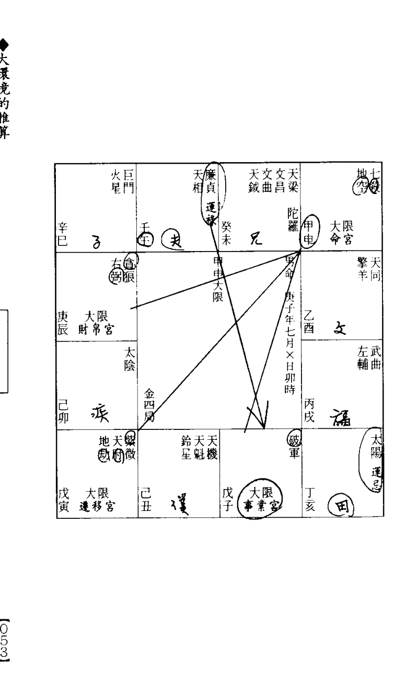
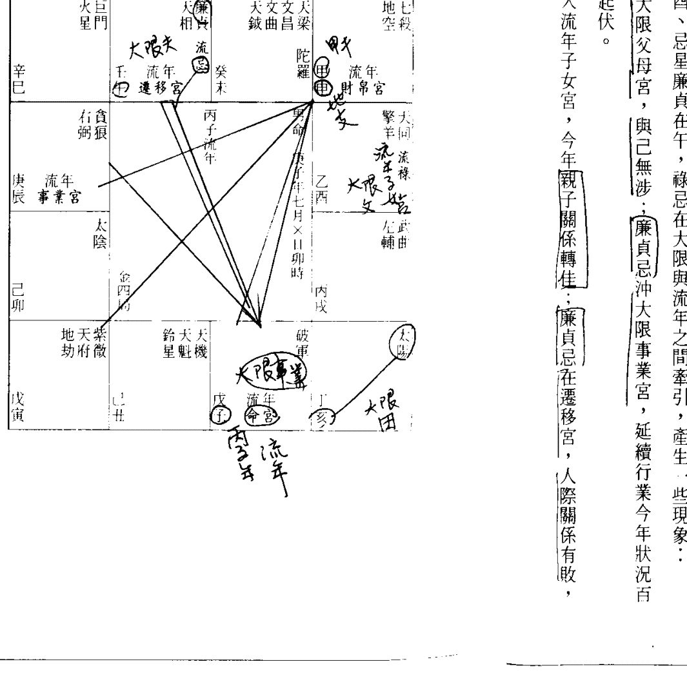
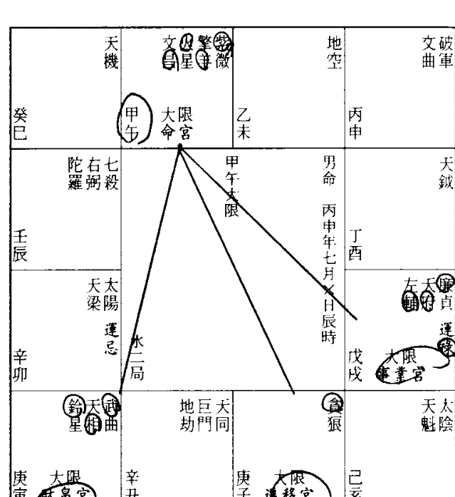
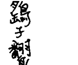
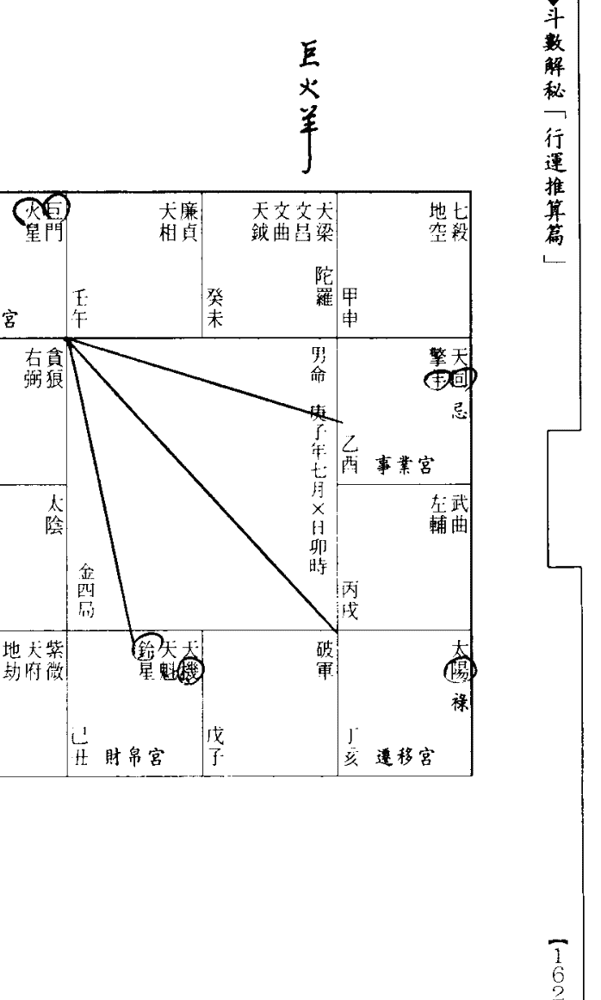

# 斗數解秘

## 〈行運推算篇〉

賴銘賢／著

禾馬文化

### 命運新趨勢

ISBN 957-799-394-X

00190

9 789577 993946

封面設計／黃惠靖

禾馬文化事業有限公司／發行

國家圖書館出版品預行編目資料

斗數解祕.行運推算篇／賴銘賢著.--初版.--臺北市：禾馬文化出版；[臺北縣中和市]：大河總經銷,1997[民86]面；公分.--(禾馬命運新趨勢；10)ISBN 957-799-394-X(平裝)1.命書 293.1 85012761

- 初版
- 排版
- 總經銷
- 發行人
- 主編
- 作者
- 出版社
- 地址
- 電話
- 傳真

禾馬命運新趨勢 010 斗數解祕 「行運推算篇」

國際書碼 ● ISBN 957-799-394-X Printed in Taiwan 定價 ● 新台幣 190 元

### 邊緣處的雲霧

### 《斗數解秘》「行運推算篇」自序

「宿命」的觀念一直深植在一般人的心屏中，宛如「金鐘罩」，即使命理學者、算命先生或江湖術士也無力突破，長久以來積非成是，幾乎所有的人馬包括算命者、被算者都目標一致，無不在「斷準」的框框上下功夫，久而久之，命理被渲染成大羅金仙的錦囊，上通天文，下知地理，無所不能，只要發生，必能從命盤（八字程式）議的力量，找到何時能覓得一份安定職業的答案。我告訴他：「命理無力提供正確的答案。」他不以為然地說：「怎麼會這樣呢？在此之前我曾算過命，算命先生明確預測我五月能謀得一份好差事，果然五月一到，我找到了目前這份工作，雖是約僱（一年一聘），但至少是個研究機構，所學終能獲得發揮。」他又以懷疑的眼光望著我，說：「該不會是你的功力火候不夠吧？」對此質疑，我只能告訴他預言純屬「偶合」，命理雖然被用來替當事人規畫一個上竄出蛛絲馬跡。最近曾與一個南非學成歸國的理工博士磋商對談。他老兄飄洋過海，喝過洋墨水，對中國玄術的認知卻完全茫然。他雖擁有人皆稱羨的學歷，無奈台灣經濟不景氣，人浮於事，「高學歷等於高失業率」，因此熱衷算命，冀望透過中國命理不可思

二

「這個命盤光在台灣就有八十個以上的人共有，難道其他諸人都跟閣下一樣擁有博士學位，並同時在五月謀得同樣差事？」

當我以這個問題反詰時，他目瞪口呆，面露詫異之色。類此問題可能是他生平首次被問及，也似乎只有我們這些搞學術的才會如此發問。按理說，獲得理工博士學位應該受過西洋方法科學邏輯訓練，顯然那些課程只應付考試之用，並未活用在日常接觸的事物的分辨思考上，否則像這樣一推即倒的邏輯演繹，他應該能夠辨別才是呀！

適當的人生，但對這類大環境強於命理因素的個案處理，仍要束手無策。算命先生無視於或不了解這項推論法則，逕下定論，即使精確到絲毫不差，也不能判定理論為真，蓋不能適用於所有同命諸人也。

三

傳統的邏輯定律是二元對立——「非黑即白」、「非此即彼」，亞里斯多德創立的「矛盾律」與「排中律」以顛撲不破的公理姿態主宰著邏輯天空，十六世紀後人又從中發展出或然率，用來解決不確定性的事項，理論似乎更趨縝密，因而深獲美國學術機構的尊崇，世人也毫無疑義地習慣這樣的推論模式。

現代知識分子對中國五術不屑一顧，一些推論的細節包括命理最基本的構成條件在內，他們不了解也漠不關心，不能苛責；倒是坊間有許多扛著博士招牌的人著書立說，也漠視這項嚴肅冷絕問題的存在，盡在古賦中翻滾，囫圇吞棗，不但自己永遠無法翻越宿命的萬仞高牆，難以超升，更引導讀者走入死胡同，量頭轉向。如此行為，實在有違博士學者應有的學術良知。

### ◆斗數解秘【行運推算篇】

正因為觀念根深柢固，當一九七三年加州大學柏克萊分校的俄裔美籍教授拉特飛．扎德（Lofti Zaden）提出「模糊邏輯」（Fuzzy Logic）的理念，並展示一架配合該理念製造而出的靈巧機器時，旋即受到學術界空前的反對與排斥。他們認為模糊邏輯容許前所未有的縱容，將會危及科學的方法，有人甚至大聲疾呼：「刪掉「模糊邏輯」的所有資料，我們已證明它缺乏周全的數學基礎。」 如此這般，模糊邏輯遭摒棄於美國學術大門之外，成為地下科技，日本人獨具慧眼，撿拾起來，用在一些複雜的工業製程上，結果大放異彩，發展出Fuzzy洗衣機、電視、吸塵器，乃至能自動對焦距、消除震動的攝影機，地下鐵的自動控制系統等等。當模糊邏輯受到日本人的重視，巧加利用，進而羅織出一片璀璨的天空時，美國人才警覺到昔日棄若糞土的學術的價值，開始急起直追，但已晚了日本好幾年的時光，而且差距仍在延伸中。

四

傳統的邏輯概念將所有的事物涵蓋面窄化、僵化，「非黑即白」，劃沙為界，涇渭分明，完全忽略了中間的灰色地帶，模糊邏輯挺身而出，容許所有的事物都有一定等級的刻度，打破了二元對立的強烈限制，也解決了中間灰色地帶的模糊窘狀。模糊邏輯並非一種模糊不清的邏輯，而是把含混不清的概念定出一個準度、理出一個頭緒，使人類更能看清事物的真相。

傳統的命理推論與早期的邏輯推論庶幾近之——答案「非A即B」、「非吉即凶」，終極目標找尋的是事項的「斷準」，完全忽略了一些空間因素的影響力，如此一來，反而將命理推向萬里雲霧中，久久無法找到正確的方向。

「非吉即凶」、「非凶即吉」，是算命先生的刻意窄化、僵化，世事應該沒有這

### ◆邊緣處的雲霧（自序）

### ◆斗數解秘『行運推算篇』

應簡單，吉與凶的劃分不像刀切東西，一刀兩斷，乾淨俐落，中間應該還存在一些「邊緣處的雲霧」，有待大家去開發與探究。

很多很多。細數的話應該包括門風背景、社會環境的互動情況與當事人的努力程度、呼應行為等等，隨便哪一項介入，都足以使推論結果存在著無窮的變數。退一步說，也唯有輸入這些條件，才能在雲深不知處中加深了推論的等級刻度，才能使模糊的焦距更加清晰。

「邊緣處的雲霧」指的是哪些事項？」有人問道。

吉凶可有一個界定標準？

吉非全吉、凶非全凶，沒有一個確切的界域。吉凶不在命盤上，「境由心生」，吉凶其實就是當事人內心的感受，如何超越它，需要一點膽識和智慧，只不過在功利掛帥的現今社會中，不易說到做到就是了。

五

本書是做完命理基本架構分析之後不可或缺的一本進階書。我們堅決反對傳統的宿命觀，深知「邊緣處的雲霧」的左右力道不容忽視，非得撥雲方能見日，因此對外在環境與各類星羣組合間的互動關係，做了一系列深入淺出的剖析。書中每篇文字分析都輔以一個或一個以上的命盤，力求「不厭其煩」的再三解釋、分析，無非是想讓初涉斗數的讀者能夠很快地解開紫微之奧秘，跨進萬仞高牆，一窺正宗斗數的堂奧。

一千多年來從未有人如此圖文並茂地寫過這類基礎命書，命理學者多半留一手，秘而不宣，就曾有個命書作者故作神秘地寫道：「我只能告訴你這些論斷，希望能夠包涵我不做學術性的解釋，好讓我混一口飯養家。」大概只有像我們這樣的「憨人」才會如此直指命理核心，切入主題，將論命技巧毫無掩飾地揭稟無餘。

### ◆邊緣處的雲霧（自序）

我永遠無法忘懷哲學家法蘭西斯．貝肯（Francis Bacon）說過的一句話：「排斥新療方的人，終難倖免新惡疾，因為時間是沛然莫之能禦的改革者。」正當坊間命書作者仍沉迷於古賦文化堆棧中咬文嚼字、遵古炮製的同時，我們掙脫一把剪刀、一盒漿糊，猛抄古籍的陋習，獨自端坐螢光幕前，凝目而視，埋首鍵入（Key in），希望注入新觀念、新療方，增強一般人對宿命的免疫能力，使推論技巧更形縝密，命理觀念更能適應科學昌熾的時代。

書中陳述的觀念無不蘊含有濃郁的自我主觀，充其量那是指月之手指，而非寶月圓成，有待聰明的讀者親身去體會與驗證，唯有如此，才是自己的寶貴經驗。

六

> 「寫作是苦悶的象徵」，一些善知識的愛護有加，一直是我苦悶荒漠中的精神甘泉，實在由衷感激，將秉持原有的服務熱忱，若對書中有任何疑問，歡迎來信或於下午二時至六時來電指教；唯不討論個人的命運。

地址：台中市南屯區南屯路二段四十四號。
電話：（04）三八九四七四七。

賴銘賢
序於南屯工作室
歲在丙子年仲夏

### 目 錄

- 邊緣處的雲霧（自序）...........018
- 命運不可改...................029
- 運限分析.....................029
- 大環境的推算.................042
- 到老榮昌......060
- 環境強弱對祿忌的感受......068
- 小兒童限......084
- 小環境的推算......096
- 流月的定宮......107
- 流時的定宮......110
- 終身細批......114
- 電腦算命......114
- 光耀門楣
- 沙盤演練......160
- 連程推斷法
- 大師的推論......173
- 實際演繹

### 命運不可改

#### 一、披著羊皮的狼

一九九五年底報載，有個計程車司機車內掛滿各式各樣的佛像與佛珠串項，燃起檀香，在滿車香煙裊裊中鼓起蓮花舌粲，以一知半解的佛學常識突破女乘客的心防，進而告知目前印堂發暗，恐有災難臨身，必須改運，否則「劫數」難逃。這番危言聳聽的話，往往使許多女乘客在恐懼不安、毫無危機意識的狀況下，破財失身。更讓人驚訝的是，具有大學學歷的知識分子，竟也無可避免栽在一個面貌平庸、舉止粗俗、

毫無學術涵養的計程車司機手上。此事件告訴我們，現代人的心防何其脆弱，對命理的認知更是一片空白。

台灣的命理界出現光怪陸離的現象，算命館大多兼具神明壇的作用，營業項目除了算命、看風水、取名、擇日和安神位、收驚之外，還兼為人祈福改運、外遇調回（廣告名詞，以符錄調回樂不思蜀的丈夫），項目繁雜，大小通吃，儼然是一所專治疑難雜症的現代綜合醫院。

現代的醫師必須經過七年的養成教育，畢業後通過國家舉辦的考試，取得醫師執照，還得在眾多專業領域中擇一而為，從最基層的住院醫師幹起（R1、R2……），誰也不敢自稱為「全方位醫師」。無論哪一門學問都需要長期專注於斯，精益求精，算命先生何德何能十八般武藝樣樣皆通，身跨各行各業，實在讓人費解。

祈福、改運的習俗彌漫於台灣民間（越是接近鄉下越見盛行），只見執法者身披道

### ◆斗數解秘「行運推算篇」

#### 二、定業不可改

是「惡業起現行，無處可逃」。根據「定業不可改」的鐵律，個人的「業」絕無從改變起，即使進入菩薩境界擁有神通的高僧，也無力扭轉，更遑論一般娑婆眾生了。

佛陀釋迦世尊成道之後，經年在外遊化，很少返回故國迦毘羅衛。

中哼著小調、踏著輕鬆的步伐返家的情形看來，心懸已久的重擔已卸下，至少在他們踏出大門時的『利那，心裏已獲得短暫的療慰。

袍，手執寶劍令旗，步罡踏斗，口中唸唸有詞，又是吹法器又是燒符咒，累得氣喘如牛，口吐白沫；當事人也隨著乩童高低起伏、陰陽頓挫的唸咒聲舉香『對拜』，叩頭如搗蒜。折騰、陣子，燒了紙錢、繳了費用，總算大功告成；有無實效？從當事人口

### ◆命運不可改

想擊退千軍萬馬可謂反掌折枝之易，但他不曾也不敢濫用神通；三次出現征途，於情

一般而言，禪修者只要進入菩薩境界，自然而然擁有神通，佛陀當然也不例外，

是無法挽救的定業，雖然同情與惋惜，也是愛莫能助。琉璃王終於得以率軍長驅直

兵。如此一進一退，歷經三次往返，到了第四次，佛陀深知這是釋迦族人的共業，也

炎熱，火鉄高張，世尊何以不坐在涼蔭樹下？」佛陀報以微笑，然後以充滿溫馨感人

的語氣說道：「親族之蔭故勝外人。」

舍衛國的青年國君琉璃大王，為了報復他少年時在迦毘羅衛國所受的侮辱，發動大

軍，誓言消滅迦毘羅衛國釋迦族。這件事為世尊所知曉，便一個人孤坐在琉璃王軍隊

必經的路途中的一棵枯樹下，任由烈日曝曬。琉璃王見狀以詫異的口吻問道：「天氣

### ◆斗數解秘「行運推算篇」

於理，算是仁盡義至，於法（循環法則）則瞭知無能為力，終於退出——這是一個覺者的處世觀。
台灣聲稱能為人祈福改運的那班人馬，永遠不了解「定業」連佛陀都轉不動，他們關心的只是如何騙取當事人的錢財。
患者到醫院看病，如果誤診，將會出現醫療糾紛；「消災解厄」之後，萬一發現毫無效果，會不會有人抗議索賠？奇怪的是似乎未曾出現這樣的鏡頭——除非騙財騙色，惹下滔天大禍，否則少有爭議。台灣神明壇之所以會充斥於大街小巷，如此姑息養奸的鄉愿作風，實有火上加油、助長聲勢的負面作用。

#### 三、誰替誰改運？

### ◆命運不可改

樣的人，層次不高，思考分辨能力不強，因此遭牽著鼻子走，任人宰割，一點都不意外。話說回來，那些聲稱能為人改運的人，有的連基本生活都成問題，「泥菩薩過江——自身難保」，哪有能力替人消災解厄？我們經常開玩笑說，立場正好相反，是改運者替那些道士改運消災，蓋大筆銀兩落入他們的口袋，生活品質因而獲得改善，吃香喝辣的。這些現象實在值得相信「改運」說的人士有所警惕。

> > 「人們將自己所想的理想次序誤認為那就是自然界的真實次序，於是幻想經由思想的作用就能夠或者似乎能夠對外在事物做有效的控制。」

迷信改運說的人無疑就是這種「錯誤聯想」的典型，因此寧願花費大筆錢財，獲得短暫的心理安慰。然而我們更相信，上述現象只要存在一天，科學對某些人永遠是麻木的、全無感應的，江湖迷信仍會代代相傳，綿延無盡期。

### ◆ 斗數解秘「行運推算篇」

#### 四、命運可以改變嗎？

「命運到底能不能改？」答案是否定的。 ①命是先天結構，②運是生命週期，命理時辰決定的同時，命理架構的優劣良窳與人生曲線亦隨之定位並開始運轉，除非重新來過，否則改變命運云云，充其量只是江湖術士不自量力的狂妄之詞，成為一種最佳的斂財手段。 這個丙子女命呱呱落地之後，命盤星羣、六吉六煞、祿忌定位就緒，命理結構大小優劣顯現，性格也就隨之凸顯：

- (1) 坐府會紫，竟找不到鳴鑼喝道的輔佐之臣，是個孤獨落寞的孤君。
- (2) 忌星坐命，心靈的連貫性被打亂，心頭浮動，屢思變異。
- (3) 忌星撼動諸煞（羊陀空劫），整個命局為之熱絡起來，勞心勞力，至死方休。

| 癸巳 | 甲午 財帛宮 | 乙未 | 丙申 |
|------|-------------|------|------|
| 壬辰 遷移宮 | 木三局 | 丁酉 | 戊戌 命宮 |
| 辛卯 | 辛丑 | 庚子 | 己亥 |
| 庚寅 事業宮 | 壬辰 遷移宮 | 丙申 | 戊戌 命宮 |

### ◆斗數解秘『行運推算篇』

除非移動坐標，重新來過，但試問誰有此能耐？
命與生俱來，當然是不能改變的；運好比路況報導，在開車上路之前收聽一下路況中心（命理語言）的報導，可以決定做或不做——改運其實不假外力，透過正確的命理推論，曉知此去運勢的窮通禍福，達到趨吉避凶之效。
現代的祿命術應該努力突破傳統「宿命」的金鐘罩——世事早定，人只不過是上帝的傀儡，時間一到，自然而然從事某業或走上哪條路途。現代命理咸認運程曼妙不一定功名富貴，唾手可得；運勢顛簸，也不必然乖蹇阻滯，破耗連連，端視有無「呼應」，也就是有無做出相應的行為。
行好運代表此去的環境盡是一片綠野平疇，大可放手一搏，適時掌握，多半能在須臾之間迅速竄起，締創一番彪炳勳業；如果只是守株待兔，心境保守，也是坐看雲起雲散，富貴利祿仍跟掛在天邊的彩雲一樣，遙不可及。

### ◆命運不可改

以改變，完全掌控在自我。
有人說：「命是先天結構，與生俱來，無從改起；運是後天環境，可經由外力加以改變。」
同樣道理，行劣運代表環境崎嶇顛簸，遍地荊棘，只要不「心動幡動」，隨勢共舞，地雷火砲未經引爆，八成可以履險如夷。職是之故，吉非全吉、凶非全凶，吉凶禍福實繫於行運者的判斷與抉擇。人之所以異於禽獸，乃在人類有思考分辨的能力，判斷錯誤就必須付出代價，是天經地義的事，咎由自取，一點都怨不得別人。
前者尚屬正確，後者則不敢苟同。勉強說來，運如果能夠改變，應該是找一個具有正確學術涵養、社會歷練豐富的命理學者或算命先生，透過命理層次追尋星垣轉移，掌握運勢的脈絡軌跡，隨勢而為，達到世俗所稱的「趨吉避凶」的效用；而不是進行祈福、改運或吃香灰等無知的行為，更不是逆向操作，「明知山有虎，偏向虎山」

### 斗数解秘「行运推算篇」

行」，一副「一夫当关，万夫莫敌」的豪情壮志，其实那是不知命、自我高估的一种狂妄浅见，有勇无谋，难成大器。

命理基本结构分析与事业规划的作用是指引当事人寻求一个适性、适格的谋生环境，只要是生为人类都应严谨面对的问题；运限分析则是人生某个交叉路口的方位辨别，以及对此去路程的顺畅蹇滞做个通盘检讨，适用的范围较小，大概只有迷惘于十字路口、面临重大抉择的人，才迫切需要了解的问题。尽管如此，这个项目无论是命理探讨抑或人生际遇，都占极重要的一环——前者属于斗数的菁华，也是最高阶的论命层次，足以考验论命的段数，后者则为人生是非成败的重要关键，不容丝毫的怠慢与忽视。

### 运限分析

在還未進入運限分析的解說之前，且讓我們來回顧一下古籍的運限推斷方式，藉此比較古今論命觀點有何不同。《陳希夷紫微斗數全集》有兩篇運限推斷的文字記載，其中《論分南北斗》做了如下的描述：

宮位有南北斗的隸屬，星辰落地，也分出了南北。從卯到酉為南，從戌到寅為北。因此南方人命宮坐守或會照南斗星系，北方人命宮坐守或會照北斗星系，十之八九都會飛黃騰達。

☆ 行運推國是綠命法最根曜海深的部分，有些人皓首窮經、殚精竭慮地苦研，也不

定能悟得箇中三昧，占賦卻憑三言兩語即道破玄機，撥雲見日，讓人不禁懷疑，命如果這麼好算，命理學者還要焚膏繼晷，夙夜匪解嗎？話又說回來，古人的論斷方式如果成立，豈不是只將命運粗分為南北星曜和南北人兩種，實在難以令人折服。我們不以為星曜分南北斗的理論可以成立，因為南北斗諸星在紫微命盤上都只是個抽象名詞，能否類分為南北斗方位，或定出南北適用區，無疑問。
古人推斷行運吉凶時，將星曜分為南北斗，陽男陰女南斗為福，陰男陽女北斗為福，北斗諸星吉凶斷上五年，小限斷上半年；南斗諸星吉凶斷下五年，小限斷下半年。這是古人論命的偏見。所有主星都只有基本性質，而無吉凶可言，正統的推算法則認為，大限的吉凶在十四顆主星、六吉六煞和大限祿忌尚未排定、彰顯之前，不足以驟下吉凶的評斷。

### 二

> 另一篇《论交限十年灾祸》则提到了吉煞星对运势的左右力道，内容如下：

> 如人交十年之限时，宫星吉多，上五年吉断，下五年和平。如煞星众，上五年断凶，下五年发福；若有吉众，悔少无灾，煞众者，灾多破财。

> 古人论命时除了六吉六煞之外，尚包含了主星吉凶的认定，「杀破狼」组合在他们眼中也是凶神恶煞，限运遇之，谓之为「竹箩三运」，必有凶灾、厄耗蓦然掩至，其实那是星生义的不当归纳，完全忽略了杀破狼星群所蕴涵的担当力与冲极性。

> 杀破狼不是凶神恶煞，它只是十四颗主星之一，也是布星的必然趋势，例如庚申年人贪狼坐命，事业宫必见七杀，财帛宫必见破军，三足鼎立，形影相随，因此命事财绝不虞出现空宫，这方面的承担力与自主力均足，至少不会受人蛊惑，遭环境拖着鼻子走。古人不解其义，视黄金若粪土，实不足以语命理。

> 准此而言，行运遇杀破狼也不主凶耗、灾难，盖意外事件无「不是特例，不具普遍性，古赋所谓「竹箩三运」云云，充其量只是一种「不充分统计」，无法放诸四海皆准。

> 事实上，**行运**见杀破狼结构，环境强势，使人精神为之武装起来，想有一番作为，例如这个庚申男命走到戊寅大限（46岁—55岁），就是杀破狼结构，此时的三方诸宫星曜和禄忌的引动情况如下：

> （1）命宫在寅，内有**贪狼**。
> （2）事业宫在午，内有**破军**。
> （3）迁移宫在申，内有**紫府**。
> （4）财帛宫在戊，内有**七杀**。

### ◆ 斗数解密『行运推算篇』

#### ◆ 运限分析

> (2)大限禄星贪狼在戌，此为财帛宫…忌星天机在未，台县之地。
> 杀破狼命局强势，再遇杀破狼连，尤其禄星贪狼推动整个环境，可望在卯酉之间赚进可观银两，绝对不是古赋形容的灾难掩至，横祸不断。
> 「大限禄星进入先天命宫，有何作用？」有人问道。
> 先天命宫在大限时化禄，心灵主控室感染，这些稳定作用，充满信心，但这纯属内在心境，不是外境，此时此宫的外境是十年的财宫，化禄之后，形成一个有利进财的环境，将本求利，可望日进斗金，堆黄积白。

> 煞星的本质是挫败与干扰，诸煞俱彰（包括在命宫或从外面照入），十年之内性败徒增，诸事不顺，故不可能如古赋所言，上五年断凶，下五年不但不凶反而兆祥呈瑞，

| 天机化忌 | | | | |
|---|---|---|---|---|
| 辛巳 | 壬午 | 癸未 | 甲申 | |
| | 太阳 | 文昌破军 | 陀罗天钺天机运 | 文曲紫微 |
| | | 大限事业宫 | 迁移宫 大限 | 福德宫 |
| 庚辰 | 火星武曲 | | 甲命 | 地空擎羊太阳 |
| | | | 庚申年十一月××寅时 | |
| 己卯 | 天同 | 大限命宫 | 丙戌 | 左辅贪狼化禄 |
| | | 大限命宫 | 大限财帛宫 | 廉贞天相右弼铃星 |
| | | | | 巨门 |
| 戊寅 | 己丑 | 戊子 | 丁亥 | |

> 46-55

### ◆斗数解秘「行运推算篇」

> 发得惊天动地。吉煞会照多寡与事业发展或财物支配的得失，并无直接关系（有的只是间接的关系），大限进行间，必须配合大限禄忌的转移，观察禄忌在哪些宫位彰显、调整，如此我们才能明确推断运限的吉凶；否则犹如一潭死水，激不起任何涟漪。

> 十年之间的穷通祸福，也不能粗略地划分为前半段（前五年）与后半段（后五年），而应一年一年移动搜索，并对照禄忌的引动，才能观察出岁运的脉动轨迹。

> 以戊午男命为例，行运遇机月同梁组合必是诸煞俱彰，例如甲子与甲寅大限的三方俱为机月同梁组合，不过其间稍有差异：

> - （1）甲子大限命宫无星，三方分见巨日和三分之一机月同梁组合，煞星方面，地劫坐之，会有三煞（空铃羊）。
> - （2）甲寅大限命宫无星，三方分见巨日和二分之一机月同梁组合，煞星方面，地劫坐之，会有三煞（空铃羊）。

| 己未 | 庚申 太限 迁移宫 | 辛酉 | 壬戌 大限 财帛宫 | 癸亥 |
| :--- | :--- | :--- | :--- | :--- |
| 巨门 禄羊 | 天同 天梁 天空 | 武曲 七杀 右弼 | 太阳 运忌 | 天机 |
| 甲寅大限 | 男命 戊午年×月×日卯时 | | | |
| 天府 | 金四局 | | | |
| 天破 紫微 魁军 | | | |

#### ◆运限分析

| 丁巳 | 戊午 太限 事业宫 | 己未 | 庚申 太限 迁移宫 | 辛酉 |
| :--- | :--- | :--- | :--- | :--- |
| 廉贪 运禄 | 铃星 擎羊 | 文昌 文曲 天钺 | 地空 天梁 天同 | 武曲 七杀 右弼 |
| 太阴 陀罗 火星 | | | 太阳 运忌 | |
| 天府 | | | | |
| 金四局 | | | | |
| 地劫 | 天破 紫微 魁军 | 天机 | | |
| 大限 命宫 乙丑 | | 甲子 | | 癸亥 |

#### ◆ 运限分析

| 己巳 子女宫 | 庚午 夫妻宫 | 辛未 兄弟宫 | 壬申 命宫 |
|:---|:---|:---|:---|
| 天梁 运禄 陀罗 | 七杀 文曲 | 擎羊 | 廉贞 文昌 天钺 |
| 戊辰 财帛宫 | 壬申大限 | 女命 己亥年七月×日寅时 | 癸酉 父母宫 |
| 紫微 天相 右弼 | 地空 |
| 丁卯 疾厄宫 | 土五局 | 甲戌 福德宫 |
| 天机 巨门 | 左辅 破军 |
| 丙寅 迁移宫 | 丁丑 合伙宫 | 丙子 事业宫 | 乙亥 田宅宫 |
| 贪狼 | 太阴 地劫 | 天府 天魁 铃星 运忌 | 天同 火星 |

> 如果只在诸煞所挟带的冲击上大作文章，保证什么也看不出来；加上大限禄忌的凸显、调整后，整个情势终于拨云见日，豁然开朗：

> (1) 甲子 廉贞禄在巳，此为合伙宫；太阳忌由戊照辰，大限的事业宫。
> (2) 甲寅 廉贞禄在巳，此为田宅宫；太阳忌在戊，大限财帛宫也。

> 禄忌所在宫位不同，吉凶自然迥异，由禄忌的彰显，我们可明白看出甲子、甲寅的运势差别——甲子忌冲事业宫，为一步拙劣事业运；甲寅忌在财宫，如假包换的破财运。

#### 运限的进行方式

> 运限行进间的变换与推测，有固定的模式可资遵循，方法如下：

> - (1) 不论顺行——阳男阴女，或逆行——阴男阳女，以十年为一个大限，运限走完，换另一个继续前进。

### ◆ 斗数解秘「行运推算篇」

#### ◆运限分析

> - (2) 十数与八字不同，前者使用太阳历，后者使用太阴历，因此完全不必考虑节气。
> - (3) 若是年（流年）限（大限）一起交替，则除夕夜十一点过后，宫垣与星曜同时变动，又是一个截然不同的大限与流年。以己亥女命为例，土五局，三十四岁（壬申中 除夕夜之前尚是壬申大限（25岁——34岁），过此，即交癸酉大限（35岁——44岁）。
> - (4) 大限变换时，命宫向前或向后移动一宫，其他宫位跟着连动，譬如这个己亥年女命壬申大限的命宫在申，兄弟宫在未，夫妻宫在午……父母宫在酉，这是命理虚構四十年大环境：进入癸酉大限后，即以酉为命宫，兄弟宫在申，夫妻宫在未，子女宫在午……父母宫在戌。

| 陀罗天梁 | 文曲七杀 | 擎羊 | 天文贞昌钺 |
|----------|----------|------|------------|
| 己巳 财帛宫 | 庚午 子女宫 | 辛未 夫妻宫 | 壬申 兄弟宫 |
| 右弼天相紫微 | 癸酉大限 | 女命 己亥年七月X日寅时 | 地空 |
| 戊辰 疾厄宫 |  |  | 癸酉 命宫 |
| 巨门天机 |  |  | 左辅破军禄 |
| 丁卯 迁移宫 | 土五局 |  | 甲戌 父母宫 |
| 贪狼运忌 | 地劫太阴太阳 | 铃星天府天魁武曲 | 火星天同 |
| 丙寅 合禄宫 | 丁丑 事业宫 | 丙子 田宅宫 | 乙亥 福德宫 |

### ◆斗数解秘「行运推算篇」

### 大环境的推算

### 一

> 所谓的「命运」，「命」指先天基本结构，「运」指后天环境，命盘虽同，个人所处的后天环境与努力程度不同，成就自然迥异，判若云泥。命与运的关系，我们以「车」与「路况」做个譬喻，车子好比先天结构，有豪华气派、性能甚佳的进口车与阳春型的国产车之分；路况就是后天环境，有路况极佳的平坦大道或高速公路，也有崎岖不平、颠簸难行的羊肠小径，甚或迂回曲折的山路。进口车若在宽敞大道驰骋，加足马力，常可尽情挥洒，畅行无阻。若碰上的是路况极差的乡间小路，性能再佳，亦属屠龙之技；这是「有命无运」的典型。相反地，即使是「全身都响，只有喇叭不响」的「铜管车」，遇上的尽是绿野平畴的宽敞大道，也还是能加足油门，安然驶抵目的地——虽不若进口车那样风驰电掣，拉风至极！若结构已弱，再遇路况其差无比，则将饱受各种突如其来的折磨与考验，随时都有抛锚的可能。

> 大限是后天大环境，亦称生命周期，涵盖的时间是十年。大限的行进方式为阳男阴女顺行、阴男阳女逆行。譬如庚子年男命（阳男）、乙未年女命（阴女），运限顺时钟方向前进；若是丁酉年男命（阴男）、丙寅年女命（阳女），刚好背道而驰，逆时钟方向前进；异中有同的是，二者俱以命宫为出发点。

### 二

> 《全书》独倡「命宫不起大限」，阳男阴女由父母宫、阴男阳女由兄弟宫起大限；台湾有这些门派奉此为圭臬，也认为命宫不应起大限，这样一来，运程吉凶将提早长达十年之久。譬如这个戊子男命三十三岁之后的甲子大限禄星廉贞在事业宫，是一步如假包换的事业运；如果命宫不起大限，势将在二十三岁即翩然而至，前者历尽沧桑，持事沉稳，思虑缜密，后者尚是初出茅庐的毛头小子，虽然朝气蓬勃，欣欣向荣，但能否找到一个可供踢腾的宽敞舞台，尚是未定之天。

> - (1) 起大限，命宫在子，为紫府廉武相星曜，三方俱有主星，环境颇为强势，廉贞

| 太阴 火星 | 贪狼 擎羊 | 天同 巨门 文昌 文曲 | 武曲 天相 天空 |
| :--- | :--- | :--- | :--- |
| 丁巳 | 戊午 大限 迁移宫 | 己未 | 庚申 大限 财帛宫 |
| 天府 廉贞 陀罗 | | 命宫 起大限 | 辛酉 先天 命宫 |
| 丙辰 大限 事业宫 | | | 壬戌 七杀 擎羊 |
| 乙卯 | 木三局 | | |
| 破军 左辅 地劫 | 天魁 铃星 | 紫微 右弼 | 天机 |
| 甲寅 | 乙丑 | 甲子 大限 命宫 | 癸亥 |

### ◆斗数解秘『行运推算篇』

> 禄在事业宫盘踞，利于事业的开疆辟域。

> - (2) 不起大限，命宫在丑，内无主星，三方所见是巨日兼机月同梁组合，弱势无疑，太阴忌在事业，天机禄在妻宫，事业状况起伏跌宕，无法有效控制与掌握。

> 由此观之，二限的环境强弱优劣之判，悬若云泥，坚持命宫不起大限，将会使当事人错失大好良机，令人扼腕。

> 据侧面了解，「中州派」的观念亦源自《全书》，但王亭之指出，此乃该派祖师辈暗下的伏笔，让后人以讹传讹。是否如此？无从考证，但他也极力主张命宫应该起大限。

> 《全书》晚于《全集》甚久，为目前命理学者所公认，《全书》经江西贫子子潘希尹补辑，补辑的结果非但未赋予新生命、新瞻观，反而将其窜改得面目全非，惨不忍卒睹。我们还是相信《全集》这本最原始版本的说法——应由命宫起大限，经过多方面的验证，各项证据也一致支持如此说法，毋庸置疑。

### ◆大环境的推算

| 甲寅 | 乙丑 | 甲子 | 癸亥 |
|---|---|---|---|
| 乙卯 | 大限命宫 | 壬戌 | 天机运禄 |
| 丙辰 | 木三局 | 辛酉 | 大限财帛宫 |
| 丁巳 | 大限事业宫 | 戊午 | 庚申 |
| 巳未 | 大限迁移宫 | 男命 戊子年十月×日卯时 | 天梁太阳 |
| 破军左辅地劫 | 铃星天魁 | 紫微右弼 | 七杀擎羊 |
| 廉贞天府陀罗 | 命宫不起大限 | 天同巨门文昌文曲 | 贪狼擎羊 |
| 太阴火星运忌 | 天相武曲地空 | | |
| 天同巨门文昌文曲 | 天钺 | | |

### ◆斗数解秘「行运推算篇」

### 三

> 观察运限的强弱与吉凶，其步骤与次第应该是这样的：

> - 一、观察三方四正有那些宫位无主星。
> - 二、观察六吉、六煞的分布情况。

> 斗数的微妙之处是讨论后天行运的消长时，不再另外排一张命盘，而是在原盘上顺逆转动。观察运势的荣枯与衰，仍然不脱先天架构的推论模式，就是结合命宫以及命宫三方宫位，盖大限每个宫位有每个宫位的职掌范畴，不管星曜为何，均须与外在三方（财帛、迁移、事业）配合，不能只考虑大限命宫或任何一个独立宫位，因为任何宫位的三方随时都有制冲、牵制和左右的作用，不能管若罔顾。

> - 第一、项的作用是推敲吉煞对环境可能造成的顺遂和蹇阻，以及观察吉煞与主星交集之后，有无构成一些特别格局如「君臣庆会」、「火贪」、「铃贪」等；若环境强势，有如锦上添花，具备一发如雷的条件；紫府在寅申的命盘，「机月同梁」、「巨日」组合虽然也不虞出现空宫，但受制于结构性质，仍不主横发。
> - 第三、项的作用是观察此去十年的运势吉凶——三方见禄不见忌，吉祥如意，动必有利可图；反之，见忌不见禄，起伏动荡，动辄得咎。

### ◆大环境的推算

> 所谓的「空宫」是指主星空（宫内不见一颗主星）而非辅星空。空宫的意义是该宫象征

### ◆大环境的推算

> 的人事物必弱，大限的命宫或三方有两个以上见空宫，弱势无疑，极易受制于外境，包括人、事、物在内。譬如此个丙寅男命行运遇庚寅大限时，三方（午申戌）空无一星（事业宫的左辅、火星、擎羊、地空，迁移宫的右弼、铃星，都是辅星），此为强命走弱限，十年的大环境忽然变得极其微弱，经不起任何的风吹草动。
> 观察吉煞的分布能够约略知晓此去环境的情况——吉多煞少，环境平坦，例如行运走到辛丑大限时，三方不见一煞，外在的阻力不多；进入庚寅之后，情况改观，煞多吉少，环境斑驳，阻碍必多，一波三折。
> 这些因素并不足以决定运势的荣枯兴衰，必须安上宫干，化出禄忌，才能明确捕捉运势的脉动，吉凶也才真正凸显出来。方法是由宫干化出禄忌，然后再根据禄忌在此限十二宫彰显的情况来判别吉凶。以庚寅大限为例，三方至弱，诸煞交迭，环境颇为颠簸，太阳禄在命宫自坐，内心笃定；天同忌（在子）挟煞冲击，发出一股邪恶

| 文曲紫微 | 地空火星擎羊左辅 | 铃星弼 |
| 癸巳 | 甲午 大限事业宫 | 乙未 | 丙申 大限迁移宫 |
| 陀罗天梁天机 | 天相 | 天同化忌冲事业宫 | 文曲天钺破军廉贞 |
| 巨门太阳运禄 | 贪狼武曲 | 太阴 | 天魁府 |

### 四

> 传统的运程吉凶推断方式，仍运用四化（化科、化权、化禄、化忌），而且将先天、太限、流年交相混杂，十二颗化星满盘飞窜，只见双忌夹、禄忌同宫、禄换忌、忌换禄……等现象纷纷出笼，让人越看越糊涂。

> 如此论法，缺点有二：

> （1）满天飞星，无法确定掌握吉凶。例如下列这个庚子男命，运程走到甲申大限时，若只考虑禄忌，至少有三种情况出现：

> - ① 先天忌星天同与大限忌星太阳联手冲击先天命宫。
> - ② 先天忌与大限忌所夹的宫位正是大限的福德宫。
> - ③ 戊寅流年天机忌与大限太阳忌夹大限事业宫（在子）。

> 

### ◆ 大环境的推算

> 

### ◆ 斗数解秘『行运推算篇』

> （2）沦为江湖上「看盘说故事」的工具——知道事实，然后从中找出理由来套命。
> 要是甲申大限不幸经商失败，上述三种情况任选其一，都能成为诠释的理由。

> ☆ 我们现在采用「命运分离」（此为了无居士首创），让先後天分家、岁运分家，何谓先後天分家？例如庚子年男命，大限行至中宫，先天的禄忌可以弃之不顾，只考虑甲干化出的禄（廉贞）、忌（太阳）究竟在大限十二宫中哪个宫位凸显即可，譬如大限忌星太阳所在是大限的田宅宫；禄星廉贞由午照子，此宫即大限的事业宫。

> 岁运分家是进入流年之后，只用流年的禄忌，不再去管大限的禄忌，例如丙子年的禄星天同在酉、忌星廉贞在午，禄忌在大限与流年之间牵引，产生一些现象：
> (1) 禄星入大限父母宫，与己无涉；廉贞忌冲大限事业宫，延续行业今年状况百出，颇有一番起伏。
> (2) 天同禄入流年子女宫，今年亲子关系转佳；廉贞忌在迁移宫，人际关系有败，

### 五

> 大限太阳忌与先天同忌夹大限福德宫，财源受制，利路难以亨通。

> 有人质疑道：「生处逢空，犹如半空折翅；命中遇劫，恰如浪裏行船」虽是古人言过其实的统计，但运限见空劫，总不会丝毫不受影响吧？

> 『禄逢空劫』，有人谓之为『禄逢冲破，吉中藏凶』，空劫（包括所有煞星）一直将被腐蚀殆尽，其实不然，空劫（诸煞）的特性是波动与阻隔，可能一波三折，也可能七折八扣，但禄的作用仍然存在，刻意求财，仍主进财可观，并非遗性全失。

> 禄已在推论行运时扮演画龙点睛的关键地位，也是人生脉络轨迹的「分道盘」

> 在这样的情况下，双禄夹、双忌夹……等自然不会在我们的命盘上出现。当然，有一个读者迫切需要了解的问题：「如此精简，准确度会不会因而大失？」

> 『放心！不但不会，反而比传统那种盘根错节、错综复杂的情形更能清楚看出运程的得失与衰。』

> 在命盘上，藉着星曜将大限禄忌分别带到不同的宫位，事实上，星曜本身如如不动，禄忌每运每年不同，我们根据禄忌的落宫，就能够明白看出此运或此年有什么吉凶之事临身。例如甲申大限廉贞禄由妻（在午）照事（在子），这是一步事业运；忌动，禄忌每年不同，我们根据禄忌的落宫，就能够明白看出此运或此年有什么吉程的得失与衰。

### ◆大环境的推算

> 环境是动是静、是吉是凶，由此分道扬镳。包括古人和许多现代学者虽安上宫干，但从头至尾未曾引用禄忌，整张命盘湛寂不动，静若止水，或者大量采用赋文、星性来断准一些芝麻小事，这些人在未进入轨道之前就已严重脱轨，斗数学者若再循此途径，盲修瞎练，不能突破这种错误的观念与认知的枷锁，将永无超升之日。

> 癸酉大限是紫府廉武相兼杀破狼组合，外境富丽堂皇，『铃贪』、『铃陀』成格，诱发人蠢蠢欲动，但上述状况仅止于蓄势待发而已，尚需禄星引动，有如菁英部队之等待拂晓出击一般，号角一响（禄忌引动），才会倾巢而出，摧枯拉朽，所向披靡；号角未响（禄忌不动），仍是英雄无用武之地。

### ◆斗数解秘『行运推算篇』

| 己巳 大限财帛宫 | 庚午 | 辛未 | 壬申 |
| :--- | :--- | :--- | :--- |
| 地空 武曲 破军 | 右弼 太阳 | 擎羊 天府 | 天机 太阴 天钺 左辅 |
| 大限 火星 天同 文昌 | 戊辰 | 辛酉 | 男命 癸酉年五月×日午时 |
| 丁卯 大限迁移宫 | 水二局 | 紫府廉武相 杀破狼 铃贪 铃陀 | 甲戌 |
| 丙寅 | 丁丑 大限事业宫 | 丙子 | 乙亥 |
| | 七杀 贞 | 天魁 天梁 | 天相 |

### 命 好 坏 之 分

### 到老荣昌

> 《全集》《注解骨髓赋》有「身好命好限好，到老荣昌」的主张，赋文所指为何？身命宫之一坐在长生或庙旺之地，便是好命一个。长生帝旺是八字的术语，即五行在十二个月的消长状况，譬如甲木长生在亥月；帝旺又称阳刃或羊刃，譬如甲在卯月。这样的界定并不切实际，现代斗数认为命应无好坏之分，实际论命讲求的是宫垣与星

> 曜的互动关系，而不在乎命宫有没有坐在长生帝旺之地；这是常识。古赋的吉星指的并非六吉星，而是十四颗主星吉凶的主观臆测，也非正规论法，不足为训。限好指「大小二限遇相生、吉地和会照六吉星」，据说得此便能「一世谋为，无不顺遂也」。相生、吉地专指五行属性与宫位属性的相辅相承而言，例如属水的天同进入属水的子宫，水与水相扶；进入属火的午宫，水火相克，便是弱地。斗数在明清期间，收录了许多八字的观念，交相应用，互通有无，最后你搞不清楚他究竟是在探讨斗数还是八字。斗数推论行运，观察三方星墓与六吉六煞的分布，加上禄忌的调整、彰显，即能窥出运势的荣枯兴衰，与五行生克宛如两条平行线，永无交集之日，故不宜混为一谈。

### 二

古赋认为大限见六吉星照耀，煞星遁形，限运吉祥，无不顺遂，如此推论，好像一切已臻完美；其实不然。

「为什么？」有人问道。

理由很简单。六吉六煞以不甚规则的状态分布十二宫中，若吉煞过度集中，在行运中必然呈现两极化——前十年吉、后十年凶。例如这个己酉男命行运遇丙寅大限时，三方所见尽是吉星（辅弼钺昌曲），化禄星引动，吉祥如意，婚姻事业，雨露均沾；岁运推移，进入丁丑大限后，接踵而来的是禄忌不见，环境无助，繁华褪去，顺遂不再，只感受诸煞俱彰的冲击（羊陀铃空劫），整个人生历程宛如洗三温暖，忽冷忽热，忽而踩在云端、忽而堕落地狱。因此你问我有没有“一辈子都走好运的人？”答案是，那是不可能发生的事。

### ◆斗数解秘『行运推算篇』

古人论命虽然安上宫干，但从头至尾未曾利用四化推论行运，因此老在吉煞分布上大作文章。吉煞的照耀只是显示环境的状况，仍需俟宫干化出的四化禄忌调和、整、彰显之后，运势的起伏消长才真正凸显出来。例如这个己酉男命行运分遇戊辰与丙寅大限时，三方所会照的六吉星几近之，按理说，吉凶应无多大差别才是。若作如是想，那是陷入古人设下的圈套而不自知。

禄忌有如命运红绿灯，而宫干又好像电流，必须输入，红绿灯才开始运作并掌控了人生道路的通顺蹇滞，缺少这道手续，控制系统的运作完全停顿，整个命盘混沌不清，吉凶难辨。

电流导入后，灯亮了，运势终于明朗，戊辰大限的红灯（天机忌）亮在命宫，干扰心灵的运作，成为此去十年的最大障碍；丙寅大限的红灯号志（廉贪忌）在合伙

### ◆到老荣昌

| 己巳 | 庚午 大限 事业宫 | 辛未 | 壬申 大限 迁移宫 |
| :---: | :---: | :---: | :---: |
| 戊辰 命宫 | 地天 劫煞 | 丙寅 大限 | 男命 己酉年五月×丑时 |
| 天相 | 大三 限局 | 癸酉 | 地破 空军 |
| 丁卯 | | 甲戌 大限 财帛宫 | 天府 |
| 丙寅 大限 命宫 | 丁丑 | 丙子 | 乙亥 |

忌在仆役(合伙)
绿灯 [天同禄] 在事业对宫燃起，意味着十年的大环境良好，可以加足油门，冲刺一番。由此可见，只在吉煞分布上打转，并不足以推断运势的得失消长，那只是一种命理的假相罢了。

### 三

如此说来，“身好命好限好，到老荣昌”充其量只是古赋一厢情愿的说法，不可能在这个世界上出现；不过，有些人就是得天独厚，宛若天之骄子，例如连战身兼副总统与阁揆重任，观其一生好像一帆风顺，宦海无波，这算不算是古赋描绘的那种类型？

我们不否认有些人降生在名门望族，西洋人形容这类人是“含着金汤匙”来到世间，譬如连战、宋楚瑜、吴伯雄，他们无不出身声势烜赫的家族，不必经过肉搏巷战，几番仆起，即能平步青云，掌权握势，宦途之顺遂，让人自觉地感到他们是“出世荣华”，好命一个。

这种人好命吗？深入研究，恐怕未必。他们虽然位高权重，却要通过尔虞我诈的宫闱内斗，平日还得日理万机，忙碌不堪，身不由己，这些都不是一般人能够忍受和体会的。

命理具有排他性，上述个案无一不是特例，八字也好、斗数也好，都无力解释归纳，因此古赋形容的现象，根本无法从命理程式上洞澈。

### 环境强弱对禄忌的感受

### 禄忌之重要

大限及其三方四正只有旺弱而无动静，动静要由禄忌来决定——禄忌引动，即是命理所谓的“动运”，当行运者“心动行动”时，吉凶于焉进发显现；禄忌未见牵引，即使环境再强势，不过是虚幻的假相，“静运”而已。静运不必然是如如不动，盖那是当事人自由意志的抉择，命理向来乐观其成；只能说，环境呈现静态，激不起阵阵涟漪，即使念兹在兹，勤勉奋进，也苦无环境的烘托，难收立竿见影之效。

同样禄星牵引，大环境的强弱有别，是否会有不同的效果产生？

环境强与弱，对禄的感受当然不会一样。

我们以皮球形容环境的强弱并举壬戌男命为例说明之。戊申大限命宫在申，内有武相；事业宫在子，内有紫微；迁移宫在寅，内有破军；财帛宫在辰，内有廉府；三方的环境强势，像极了一个充满气的皮球，禄星贪狼由申照事，撼动了整个环境，如虎添翼，反作用力强，弹得较高。环境弱势则宛如充气量百分之六十或泄了气的皮球，本质已弱，即使禄星照拂，反作用力不强，弹得不高、

如果前来引动的是忌，又是什么情况？

无论环境强弱都同样会感受忌星带来的震撼与阻境，不同的是，强运对外在冲击的负荷力较大，相对的承受的力量较强，破坏的层面也较大，弱运对忌杀所带来的

### ## 斗数解秘『行运推算篇』

### ### ◆ 环境强弱对禄忌的感受

皮球效应用来描绘命与环境的互动关系，也能适用。例如这个壬戌男命“火贪”、“铃贪”和“火羊”等成格，结构强旺，欲望旺盛，企图心强烈，有如充满气的皮球，对环境的感召、禄忌的撼动随时保有敏锐的触觉，一经戊申贪狼禄、己酉文曲忌的撩拨，多半会“随势而动”——前者顺势冲起，前途一片亮丽，后者亦足以使他在顷刻间一败涂地，一文不名。

准此而言，先天结构弱的人随势共舞的机率就较小啰？大致上应作如是观。盖弱命宛如泄了气的皮球，承担力弱，企图心不强，能拥有一份工作即感心满意足，环境的强弱，对他而言并不重要，即使后天偶遇强限，环境壮阔，“势比人强”，他可能视若无睹，也可能随波逐流，被牵着鼻子走。如果置身

凶祸较无力抵抗，相对的承受力较弱，破坏的层面较小。

**强命** 是否对环境的感召较强烈？

于弱势的环境，恐怕不会在他心湖上激起阵阵涟漪；万一环境已弱，又一头栽进忌星卷起的波澜中，只有眼睁睁地看着自己遭汨没于万丈红尘中。

大限的禄忌或因主星所属的组合相同，或因助星（文昌、文曲）化出等不确定性因素，经常出现禄忌并见的情况，应该如何推算，才算正确？

> 「如何明确分辨？」有人问道。

分辨的方法其实并不难，只要把禄忌在哪个宫位标显出来，即能看出吉凶所在。

禄星代表稳定、吉祥、成功率高。忌星代表干扰、挫折、成功率低。

禄星进入的宫位是十年最稳固、最吉祥的地方；忌星进入的宫位则是十年最脆弱、最凶耗之所在。趋吉避凶的不二法门就是“舍忌就禄”——禄在哪个宫位，尽量去“呼应”它，忌在哪个宫位，尽量避开它。

庚申男命行运遇庚辰大限时，出现的就是禄忌交迭，行业如何选择，才能无咎？

庚辰大限三方所见是日月兼四分之一的机月同梁组合，原则上只适合安步当车，不宜躐等；事业宫空无一星，右弼只是辅星，暗示此去的事业环境弱，不适合过度迅速地扩充。四化方面（禄忌），太阳禄在财帛宫（在子）、天同忌在迁移宫（年己开...

### 环境强弱对禄忌的感受

### 环境强弱对禄忌的感受

### 斗数解秘—行运推算篇

系，在戊，此去十年求财环境大好、人际关系大凶，根据“舍忌就禄”的法则，当然是避开外出求财的行业，退而求其次，选择门市生意，将本求利，才可望受禄星的庇荫，发财无数。万一阴错阳差，从事中盘商、代理商、业务代表等行业，那是“舍禄就忌”，必然屡吃闭门羹，将饱受忌星带来的摧残与施虐。
有些人做武市生意，无法舍忌就禄，该如何趋吉避凶？
运势分析是“路况报道”，具有普遍性，只要是共盘的人必然适应，因此吉凶差别，端视呼应行为。大限忌在迁移宫，此去十年的人际关系不佳，做武市生意的人不但新客户拓展不易，还容易把老顾客得罪，生意越作越萧条，这是十年中最大障碍，趋吉避凶的方法无他，认清时势，改道而行——转业从事门市生意，否则唯有在颠簸起伏的路况中，历尽沧桑，受尽苦楚。

| 文天曲相 | 左天辅梁 | 陀天七廉 | 右弼 |
| --- | --- | --- | --- |
| 辛巳 | 壬午 | 癸未 | 甲申 大限事业宫 |
| 庚辰 大限命宫 | 巨门 | 男命 庚申年×月×日丑时 | 擎羊 文昌 |
| 己卯 | 火贪紫微 星狠 | 水二局 | 乙酉 |
| 戊寅 | 太天阴机 | 天魁府 | 丙戌 大限迁移宫 |
| 己丑 | 地劫 | 戊子 大限财帛宫 | 丁亥 |

### ◆斗数解秘『行运推算篇』

天同，天同主物质享受、异性缘厚，但缺乏积极主动的企图心，容易满足现状，爱好大自然，悠游林泉。廉贞属火，今年属火的生意将一落千丈。

这是望文生义，不当归纳，未免简陋兼僵化。禄忌进入流年的宫位因人而异，运势吉凶迥异，若大限三方正是紫府廉武相或杀破狼星群，廉贞忌进入财事二宫，财与事的稳定受到严重干扰，收入才会大打折扣；反之，三方是机月同梁或巨日组合，天同或甲限或申年廉贞化禄，廉贞五行属火，从事火的行业大吉大利，属火的行业是

### ◆环境强弱对禄忌的感受

紫微斗数命盘表格，包含天干地支、星曜如左辅、狼、太阴、天机等，以及流年、大限等宫位信息。具体文字如：左辅、狼、太阴、天机、廉贞、天府、地劫、火星、铃星、陀罗、破军、紫微等。

### ◆斗数解秘【行运推算篇】

啥？销售消防器材的行业算不算属火？有人如是问道。
现代行业五花八门，分类极细，不能使用五行概括，而应以类型概括，包括生产业、贩卖业、服务业等。
有个开水电行的朋友开玩笑说，他的行业有水有火，水火正好相克。我问他理由安在，他妙答曰，“水电的水五行属水，大概不会有人反对；而现代照明器材在古代燃的是煤油，台湾话叫‘电火’，故应属火。”
对朋友的妙解，实在很难提出辩驳。盖金木水火土是抽象名词，含糊笼统，而这个多元化的社会行业庞杂繁琐，推陈出新，若以五行就想界定或尽情涵摄所有行业的属性，简直有老虎吃天的无力感，盖不知从何规范起也。是故，你问我属火的行业有哪些，我一定当场目瞪口呆。
观察延续行业运势包括大限和流年，宜分开来讨论，不应和稀泥，大打迷糊仗。观察延续行业

### ◆环境强弱对禄忌的感受

有人说，大限走到先天化禄的宫位（一生一次），同样有吉化的作用，若在限运的事业宫遇之，对此去的事业将有稳定、吉祥的作用。过去我们也曾作如是观，但经的吉凶祸福应以大限为主，新创行业的泰否与衰则以流年为重，譬如这个甲辰男命目前运走到丁丑大限，禄忌不动，是一步静运。丙子年的运势如何？分析如下：
(1) 天同禄星在申，流年财宫也，此年新创，进财顺遂。
(2) 廉贞忌在巳，大限的事业宫，延续行业今年状况百出，起伏显到。
如此推论，岁运的穷通祸福，一目了然；倘使目光如豆，只在星性上大钻牛角尖，保证看不出任何蛛丝马迹。

### 环境强弱对禄忌的感受

| 列1 | 列2 | 列3 | 列4 |
| :---: | :---: | :---: | :---: |
| 天右巨 | 大相 | 文曲昌梁 | 地空 |
| 丁巳 | 戊午 | 己未 | 庚申 事业宫 |
| 丙辰 | 命宫 | 男命 癸亥年六月二日卯时 | 左辅 天同 |
| 乙卯 | 土五局 | 辛酉 | 武曲 |
| 甲寅 | 乙丑 | 甲子 财帛宫 | 壬戌 迁移宫 |
| 地天紫 | 铃擎天 | ★破军 | 陀太阳 |
| 劫府微 | 星羊机 | 禄 | 罗 |

### 斗数解密「行运推算篇」

过无数次的探讨与实验，发现先天化禄、化忌在限运遇之，并无任何作用。我们隐约发现，禄忌在先天命盘是一辈子的事——禄是所在宫位，成为一生最迫切想要完成的愿望——忌是所在，成为一生最无力解决的弱点——纯属性格上的缺陷，比较无力改善。等到行运推论时，只考虑大限宫干化出的禄忌即可，此时先天禄忌可以功成身退。这个癸亥男命忌在命、禄在财，将显现何种情况？癸亥年人忌与禄在命财交替的情况是这样的：忌在命，自我封闭，自我折磨；禄在财，尽情享受，充分挥霍。财宫见禄，会把全副精神用在金钱的追逐上，只要户头的数字与日俱增，其他方面即使不怎么样，也不觉得遗憾。『火贪』成格，忌冲命宫，这种人克敌制胜，创造丰功伟业，超越自己、改造自我——他一生最大的敌人其实就是自己。

> > 丙同机昌廉
如？
大限流年
禄

### ◆环境强弱对禄忌的感受

甲寅大限25岁34岁，禄忌在运，纯为环境的偶遇，流年也是：运程的好坏吉凶有时空限制，大限主十年大环境，流年主一年，时间较短，很快就成为过眼云烟。

甲寅大限禄在事业宫，十年的事业环境良好，利于事业的开疆辟土，成功率也高，行运至此，精神为之紧绷，蠢蠢欲动，想有一番作为。

子女宫见忌，与子女的亲情忽然降至冰点，有一道无形的鸿沟，忌冲田宅宫，居住环境受到干扰，居无定所，经常出差、出远门。大限的田宅宫又称后天财库，忌星侵袭而入，财务状况不健全，千万莫做重大投资或回收慢的行业，以免夜长梦多，徒增变数。

这两项是此去十年最无力解决的困境。

### ◆斗数解秘「行运推算篇」

### 小儿童限

有人问道：“水二局由二岁、火六局由六岁起限，两者相差四岁之多，那么火六局六岁甚至土五局五岁之前的命运如何推算？”之所以有此一问，大概认为命理是天上神物，森罗万象，宇宙洪荒，事无大小，只要发生，俱能从命理层次获得合理解释，正因为如此，传统观念认为小儿襁褓多灾，夭折短命，都能从命理程式中窥知一二，算命的价值与功能也才能获得肯定。

这个丁巳年女命，火六局，六岁之前的命运如何推算？古人对小儿未入限之前另有一套推断法：一命二财三疾厄、四妻（夫）五福六官禄，也就是说，一岁看命宫、二岁看财宫、三岁看疾厄宫、…… 我们对此推论方式疑问有二：

+   (1) 推论的依据是什么？为何不是从命宫顺行或逆行，而要采跳跃的方式进行？
(2) 数的推论是结合命宫及三方宫位，按古人的说法，一岁的命宫与二岁的财帛宫都同样是兼俱紫府廉武相与杀破狼星群，理论上应无多大差别，此时吉凶应该如何辨别？

事实上，命理无力探讨小儿的体能状况与夭折与否，命理的功能也不在于此；更何况儿童无一在父母庇荫下成长，自主能力欠缺，此时推算吉凶祸福，似无必要（但命理分析例外），特别是算健康与灾难。

一般的础命书的大限表都写到一百多岁，有人问道：“那是否暗示我会活到那个岁数？”“我排命盘通常排到第七限，六十岁到七十岁，因此也有人问：“我难道非在七十岁就魂归离恨天？”“

一个人的寿元无法从“共盘”上获知，因为这是命理无力探讨的问题，如果有人说他能从命理程式中洞悉，那么章孝严、章孝慈这对孪生兄弟都要同时脑溢血，并在同一天撒手人寰，职是之故，替人算命必须假设来论者都能长命百岁，寿比彭祖。我们的习惯是无论是顺行（阳男阴女）或逆行（阴男阳女）都算到迁移位（第七个限运）。

### 二

《小儿论断》指出，“夫小儿者，其局数与大人有异，但有春夏秋冬四季关煞，如小儿犯之，不论星宿，只看重限，太岁流煞并命与身煞加盘，如俱见凶，必然难

> “夫小儿者，其局数与大人有异，但有春夏秋冬四季关煞，如小儿犯之，不论星宿，只看重限，太岁流煞并命与身煞加盘，如俱见凶，必然难

### ◆斗数解秘「行运推算篇」

| 天梁同 | 天相 | 擎羊辅相 | 巨门 | 贪狼 禄存 |
| :---: | :---: | :---: | :---: | :---: |
| 戊申 | 己酉 | 丁未 | 丙午 | 乙巳 |
| 天七武 钝杀曲 | 事业宫 | 女命 丁巳年四月X日子时 | 文曲 太阴 | 命宫 |
| 火文太 星昌阳 | 庚戌 | 辛亥 | 天机 | 地天 空劫 |
| 破紫 军微 | 壬子 | 迁移宫 | 癸丑 财帛宫 | 壬寅 |

‘疾厄宫难道不能窥出一个人的身体状况吗？’有人质疑道。
斗数有疾厄宫之设定，古人将疾厄解释为疾病，厄则泛指一切灾厄。不过，小儿是否‘歹腰饲’，是否多灾多难，以及寿元长短，俱非命理统辖范围，而与一个人的‘业力’有关。

养。”可见在传统的命理观念中，小儿未入限（例如火六局六岁）之前的岁月，另有一套命运的推算方式。
古代由于医学不发达，民众普遍缺乏医疗常识，小儿抵抗力又弱，故小儿夭折率偏高，茫茫天数，只有将小生命交付不可知的命运。《陈希夷紫微斗数全集》《太阴赋》概括）有‘童子限如水上之枢，老人限如风中之烛’，枢是水面上的白泡，随时都有消失的可能，充分显示古人对抗无情命运的无力感。
有鉴于此，江湖术士便制定一套小儿关煞，如百日关、短命关、鬼门关、阎王关、埋儿关、白虎关、将军箭……等重重关卡，只要遇上，就是‘歹腰饲’，甚至有短命之虞。这些关煞通常由月对照年，或日对照年订出，它的特色是充满强烈的主观臆测，语不惊人死不休。退一步说，若照见此干神煞必主夭亡，为人父母者闻讯，无疑是一种打击，还是不知的好。

### ◆ 斗数解秘『行运推算篇』

#### 小环境的推算

大限 10年，流年 (小限) 1年

行运有大限与流年 (小限) 之别

前者主宰十年大环境的吉凶，后者较短，仅统辖一年的运势消长。现代社会变化多端，而一项行业的开创与推展，通常不是一年半载即能立竿见影，立时收效，并非流年或小限的时光范围所能有效涵盖，因此在推论、评估一项新创行业的得失消长时，斟酌大限的穷通祸福，反而比流年来得重要。

许多行业一年不到就要收成（成败论定），是否要特别留意小限或流年的得失？

流年主掌一年的运势吉凶，如果是年初栽种、年底收成的行业，流年运势的荣枯兴衰扮演着举足轻重的角色，此时就不必在意大限环境是否推波助澜；不但上述情况如此，即使在大环境一片璀璨亮丽的情况下，也要选择一个吉祥的流年开张，这在心理上有增强的作用。

小环境的推算，台湾目前有小限、流年和小限、流年合参等三种不同的推算法，

+   三路人马拥术自重，谁也不让谁，堪称公说公有理，婆说婆有理，就普遍现象而言，使用流年推论的较多，也较合理；使用小限跟小限、流年合参的推论方式，只流行于江湖算命界，有被淘汰出局之虞。

☆小限

底下将三种方法列出，并分别做个比较：

+   小限的起法依生年年支为准，寅午戌年从辰宫起一岁，申子辰年从戌宫起，巳酉丑从未宫起，亥卯未从丑宫起。男命一律顺行，女命一律逆行。就以庚申年男命为例，申子辰年生人从戊宫起一岁顺时针行运，丙午年（二十七岁）的命宫在午宫。

### ◆ 小环境的推算

例

### ◆斗数解秘『行运推算篇』

为‘戊’，其三方及禄权科忌引动的情况如下：

+   (1) 事业宫在辰，内坐贪狼；迁移宫在午，内坐廉相；财帛宫在申，内坐七杀。
(2) 贪狼化禄、右弼化科在辰，事业宫也；太阴化权在卯，天机巨门在丑，不在命宫三方出现，与小限无涉。
若按他们的说法，事业宫见科禄加被，此年将是事业稳定，驰名享誉的年限。

### ◆小环境的推算

+   (1) 同样的流年，其他不同年支的人，小限却落在不同的宫位，显得有点紊乱。
(2) 宫干不随着流年的不同而变换，以后无论走到哪个岁运，都以同样的宫干推论，因此不但十二年前的星曜、宫干一样，十二年后重回原地，情况仍然不变，实在很难看出运势有何区别。

此种推算法缺点有二：## 流年

此法以流年地支为命宫，譬如今年流年丙子，即以子宫为命宫，加上三方星曜以及流年禄忌的牵引情况，推算今年的运程吉凶。

不过有人不以为然，他们反对的理由是：“全世界的人都用子宫的星曜算命，委实有点不可思议。”

其实这层顾虑是多余的，以己巳女命来说，流年命宫内有武府，财帛宫在申，内有廉贞；迁移宫在午，内有有七杀；事业宫在辰，内有紫相，环境强势；流年禄星天同在亥，此为兄弟宫，与巳无关，忌星廉贞在申，财帛宫也，今年财势起伏，进出频仍。

由此看来，命宫虽然同为子，其三方星曜不一定相同；即使相同，大限的星曜和宫干不必必然相同，命与运的推进轨迹自然互异。我们一直使用流年推算，那是我们的偏好，别人喜好使用小限那是他们的自由，在讲求学术自由的今日社会，向来获得尊重。就普遍性而言，流年与命宫同位，才是正确。

| 己巳 | 庚午 流年 迁移宫 | 辛未 | 壬申 流年 财帛宫 |
|---|---|---|---|
| 戊辰 流年 事业宫 | 水二局 | 癸酉 | 破军 |
| 丁卯 | 巨门 天机 | 甲戌 | 天同 |
| 丙寅 | 贪狼 地劫 | 丁丑 | 丙子 流年 命宫 | 乙亥 兄 |

### 三、流年和小限合参

采用此法者属于骑墙派，先看流年吉凶，再参酌小限得失，两者吻合，必然全吉或全凶；万一主吉一主凶，则判为吉凶参半。

举甲寅女命为例，寅午戌年从辰宫起一岁，女命逆行，丙子年为二十三岁，其三方四正与禄科权忌的引动情况如下：

- 1. 命宫在午，三方为机月同梁组合，三煞会照（火铃空），环境斑驳。
- 2. 宫干为庚，太阳化禄在子，小限的迁移宫；武曲化权在亥，此为合伙宫；太阴化科在寅，此为财帛宫；忌星天同在戌，事业宫也。科禄忌均在三方出现，若按小限派的解释，此为吉凶参半的年限。

流年方面：

- (1) 三方组合与小限庶几近之，唯一差别是财宫无星，财的承担力不足。
- (2) 丙年天同禄由戊照辰，这个辰即是事业宫；天机化权在寅，流年福德宫；文昌化科在丑、廉贞化忌在未，均与流年无关。

二者合参，如照他们的说法，这将是个出现两极化的年份，盖小限忌在事业，不利事业的经营，流年事业宫却见禄星加被，答案当然是——吉凶参半。此说虽可消除纷争，且有截长补短之效，但站在学术研究的立场观之，予人一种包山包海的感觉，不是做学问应有的方法。

| 宫位 | 星曜 |
|------|------|
| 己巳 | 巨门 |
| 午 | 天相 23岁 |
| 未 | 天梁 |
| 申 | 廉贞七杀左辅右弼 天钺 |
| 酉 | 女命 甲寅年四月×酉时 |
| 戌 | 火星 天同 |
| 亥 | 破军 武曲 |
| 子 | 铃星 太阳 |
| 丑 | 陀罗 |
| 寅 | 天府 天魁 天钺 文曲 文昌 |
| 卯 | 天机 太阴 地空 |
| 辰 | 紫微 贪狼 擎羊 |

### ◆斗数解秘『行运推算篇』

#### 流月的定宫

传统的定宫方式是在定流月之前，必须先找出斗君的位置，方法是利用生年取出斗君的正确位置——从生年地支算起，先逆至生月的宫位，再顺行到生时的宫位，斗君即在此——记下那是生年的什么宫位，譬如就是生年的事业宫，那么显示斗君永远在年的事业宫，以后无论走到哪年，斗君一看便知，堪称简洁明了。

斗君所在宫位，就是正月，流年的父母宫为二月，福德宫为三月，田宅宫为四月……余皆做此。以戊子女命为例，戊子年人从子宫逆行数至六月为未宫，再从未宫顺行数至戊时为巳宫，也就是斗君所在。此巳宫为生年的财帛宫，以后无论走到哪年，流年的财帛宫即是正月，流年的子女宫为二月，兄弟宫为三月……，余此类推。不过此种算法起始点不一，普遍性并不高。

丙子年各月份分别在哪些宫位？

已知此命的斗君永在流年的财帛宫，丙子年的财宫在申，以此宫取正月，其他月份分别是二月在酉，三月在戌，四月在亥，五月在子，六月在丑，七月在寅，八月在卯，九月在辰，十月在巳，十一月在午，十二月在未。

> “除此之外，是否还有其他方法？”有人问道。

有的。另一种方法根本不取斗君，而是直接以流年命宫做为正月，譬如戊子女命丙子年的命宫在子，然后顺行，流年的父母宫（丑）为二月，福德宫（寅）三月，田宅宫（卯）为四月……，余此类推。

| | 右天弼相 | 擎天羊梁 | 天七钞杀贞 | 铃星 |
| :--- | :--- | :--- | :--- | :--- |
| **斗君**丁巳 | 戊午 | 己未 | 正月庚申丙子财帛宫 | |
| 丙辰 | 陀巨罗门 | | 女命戊子年六月X日戌时 | 地左劫辅 |
| | 贪紫微禄 | 木三局 | 二月辛酉先天命宫 | 天同 |
| 乙卯 | 文太天曲阴机忌 | 地天天空魁府 | 文火太昌星阳 | 破武军曲 |
| 甲寅 | 乙丑 | 甲子丙子命宫 | 癸亥 | |

### ◆小环境的推算

有个专门以斗数预测股市起伏的大师认为，无论是传统的方法还是以流年命宫做为正月的方式，都无法将外境的变化一网打尽，经过多年的摸索印证，他极力主张流月的月干应该随着“节气”的变化而变动，以乙亥年农历十二月（戊子）为例，该月爆发“证所税”的口舌纠纷，不利商业支票契据，也不利口头下单，即使不在股市中沉沦，也会有喉痛、口舌是非等情事发生，如果用节气排宫干，则是己丑月，文曲忌，这些现象正好可以获得合理解释；如果采一般通行的方法，用戊子月，上述情况就无从知晓。如是主张，好似满符合逻辑的？

在回答问题之前，我们必须先确认命理的功能与界域到底在哪里。命理者，针对人而设计的禄命术也，它的功能与界域其实浅显明白，就是推算一个人生命历程的荣枯与衰，将命理广泛解释到大马者国运昌隆衰败，小焉者个人在股市的输赢起伏，那是将这套禄命术的无限度膨胀，毫无认同必要。

| 贪狼 廉贞 | 文昌 巨门 | 地空 天相 | 文曲 天梁 天同 |
| 辛巳 | 壬午 | 癸未 | 甲申 |
| 擎羊 右弼 太阴 | ？ | 男命 十月乙酉 | 七杀 武曲 |
| 庚辰 先天命宫 | 金四局 | 十二月丙戌 | 左辅 太阳 |
| 天府 | ？ | ？ | ？ |
| 己卯 | 铃星 陀罗 | 火星 破军 紫微 | 天机 天魁 禄 |
| 戊寅 | 己丑 | 戊子 | 丁亥 流年命宫 |

### ◆斗数解秘『行运推算篇』

斗数与八字不同，斗数使用太阴历，月底的十一时一过，就是新的月份开始，从来不必考虑节气。斗数以宫垣为准，配合流月禄忌的彰显，推论此月运势的起伏与衰，例如乙亥年十一月的命宫在酉，月氐亥时一过，命宫移至戌，因此考虑时节的变换，显然多余。

#### 甲己丙为首

《农民历》所载的《戊子》《己丑月》，仅供八字推论之用，而不适用于斗数。斗数流月宫干由“五虎遁月”取得，此法是将十天干分为五组，以月求法，所以叫“五虎遁月”（宫即生肖虎之别称，“遁”意为寻找之意也）：

乙庚戊从头
丙辛从庚起
丁壬壬位流
戊癸甲寅求

乙亥年十二月的宫干是啥？已知乙庚戊从头，顺数至戌，宫干为丙，想推测一下此月的运势如何，由天同禄、廉贞忌的踪迹即能隐约获知。此月的命宫在戌，内见太阳；事业宫在寅，内无主星；迁移宫在辰，内见太阴；财帛宫在午，内见巨门。天同禄由妻宫（在申）射入事业（在寅），利于行业的经营开拓；廉贞忌在巳，流年的疾厄宫，身体状况小有起伏。

专家之所以会认为戊子月不准，是事后比对外在环境，发现与现实状况出入太大，因此怀疑不适用，他对外环境因素永远强于或大于命理因素这个推算法则置若罔闻或不甚了了，因此老在一些大环境促成的事项中钻牛角尖，误以为能够从中悟得天大玄机。

证所税是国家的财税政策，台湾“万万税”，财税官员为增加税收而滥设条款，当然免不了掀起一番唇枪舌战，你来我往，甚至在议事堂上干起架来，那是大环境使然，勉强与命理牵扯在一起，显然有点不伦不类。退一步说，若世界上都使用己丑月，为什么只有台湾这个蕞尔小岛爆发“证所税”，其他国家未见发生？难道命理推论局限于某个界域？其实这是个极为简单的逻辑推论，他们竟然不懂，却喜爱聒噪得像树上的乌鸦一样，惹人生厌。

喉痛、口舌是非不断，时时刻刻在发生，前者系因流行性感冒病毒侵袭所致，与文曲化忌有何瓜葛；后者因人而异，必有其外因在焉，与命理可说毫无关系，命理学者勿陷文曲化忌于不义。

#### 流月的定宫

流月的推算法是古人设定的推论法则，除非自己重新设计一套，否则基本架构不能随意删改；何况命理无法精确到流月都算准的地步，将精力浪费在非程式所能及的细节上，有点白费心思，应该将精力用来使这套禄命术科学逻辑化，才是正途。

#### 小环境的推算

流日的宫位是根据流月而来的，没有固定的位置，而是依附在流月宫位上。流日的第一天（初一）与流月的命宫重叠，初二进一宫，初三再进一宫……一律顺行。由于命盘只有十二宫，所以初一、十三、二十五这三天，都同一个宫位（流日命宫）上。表面看来，星曜相同，吉凶程度应该一样，其实不然，盖流日的天干不同，四化随之变换，吉凶自然互异。

#### 推流日

流日的吉凶如何推论？请试就五月二十九日的运势推演一下。

丙子年的一月在子，顺时钟数到辰为五月，初一与流月命宫重叠，以此顺数至二十九为申，即是欲推算流日的命宫。流日的宫干是啥？有人说，很简单，查一下《万年历》便知。书中记载五月二十九日为己未日，己干武曲禄在亥，这是流日的田宅宫，文曲忌在子，事业宫也，禄忌的引动告诉我们当日的运势为事业动荡，起伏不定。

不过，这种方式与流月取宫干同样犯了八字、斗数混淆不清的弊病，例如流日的命宫在申为阳支，却出现与阴干（己）配对的突兀现象，牛头对马嘴，宛如四不像，由此可见，斗数在设计之初并未精确到流月、流日也能推论的理想境界，之所以有流日的推算，显系后人将这套禄命术无限度膨胀所致。

| 陀罗天相 | 火天星弼梁 | 地击七廉劫羊杀贞 | 29日 戊申 流日 命宫 | 左辅 |
| :--- | :--- | :--- | :--- | :--- |
| 乙巳 | 巨门 | 女命 丁酉年五月X日申时 | 天钺 | 己酉 天同 |
| 五月 甲辰 流日 财帛宫 | 地贪紫空狠微 | 金四局 | 庚戌 |
| 癸卯 | 文太天昌阴机 | 天府 | 一月 文曲太阳 日忌 | 铃天破武星魁军曲 日禄 |
| 壬寅 流日 迁移宫 | 癸丑 | 壬子 流日 事业宫 | 辛亥 |

#### 流时的定宫

古书记载，流时依据流日而来，以流日本宫为子时，顺时钟方向前进。流时的四化系依照当天的干支的“五鼠遁”而来，“五鼠遁”是八字寻找时干的方法：甲己日起甲、乙庚日起丙、丙辛日起戊、丁壬日起庚、戊癸日起壬。

这个辛亥男命丙子年四月二十日申时的命宫在哪？天干是啥？

四月二十日的命宫在戊，若依《万年历》的记载，当天是癸酉日，由此起子时，顺数至申时为午宫，这是流时的命宫；天干是啥？已知癸日起壬，从子起算，申为第九位，故为庚干，即用庚干来安四化。

不过，此说出出现矛盾现象，盖既然流日宫干的取得模糊不清，到此自然出现断层，因此无法确定天干的真正所属，也连带影响四化的应用。故在此情况下，最好舍弃此法，改采“定时”的方式来计算。所谓“定时”是指该流时的开始时间，而非流日与流时的结合。也就是以流时进入的时间点，直接换算成天干，再依其进行推断。

| 癸巳 | 甲午 | 乙未 | 丙申 |
|------|------|------|------|
| | 天相 | 天天钺梁 | 文文七廉曲昌杀贞 | 地陀左空罗辅 |
| | | 流时命宫 | | |
| 壬辰 | 左巨辅门禄 | | 男命 辛亥年一月×日卯时 | 天钺 |
| | | | 丁酉 | 擎右天羊弼同 |
| 四月辛卯 | 贪紫狼微 | 木三局 | 戊戌 流日命宫 | 破武军曲 |
| 庚寅 | 天太驸阴机 | 天府 | 文太昌阳 | 己亥 |

### ◆小环境的推算

好像自有类以来就有意识膨胀，政治人物对老百姓意识膨胀，为的是求取子民的安心与信任；商贾的意识膨胀，为的是激起顾客的购买欲；算命先生的意识膨胀，为的是证明自己俨然地上神仙；几乎所有“膨风”的目标都一致——为达目的，不择手段。

学术探讨应该有学术良知，不能算的还是不能算，不能为了赚钱，将命理毫无限度的意识膨胀。我们在此只是将月日时的推算方法做个简介，并不意味我们肯定这套禄命术能够精密到月日时发生的芝麻小事，都能了若指掌。如果有人说他能够达到如此境界，大罗金仙无疑。

### ◆斗数解密『行运推算篇』

层，五鼠神通再广大，也无从遁起，职是之故，古籍所载的流时取法，充其量只是聊备一格。

有人问道：『命理有那种能耐断准月日时所发生的事情吗？』答案是否定的。

命理以两个普通小时为单位时辰，两个小时中诞生的婴儿有八十人之多（一九九五年卫生署公布台湾平均一分半钟一个小孩出生，四分半钟一个人死亡），许多人共用一个命盘（八字共程式）是一个严肃残酷而又无可回避的问题，严格说来，它并不如一般人所想像那样上通天文、下知地理，充其量只是一种陋窳不堪的禄命术，能够推算到流年已经濒临范畴边界，想要断准月日时所发生的一些琐事，自然逾越了程式所能承担的负荷。

如果不能，为什么有人能将一小时前发生的事情，巨细靡遗，全盘托出？

### 终身细批

传统的习俗通常会在婴儿呱呱落地时，就近找一家命相馆或算命摊为小孩取名兼算个命，家境困顿者简单的做个眉批，短短几句江湖算命语词，言不及义；生活富裕者批“大流年”，几乎人手一册，等于锦囊妙计，随时翻开，做为一生待人处世的指导准则。

“大流年”又称“终身细批”，顾名思义，当然是把全部生命历程包括何时婚嫁、儿女几人、何年何月迈返道山、几子送终等等，透过毛笔字铁线银钩一道出。命谱厚厚的一本，洋洋洒洒，可是预言项目虽多，无一不是超越命理统辖的范畴，对当事人的人生指引，可说一点用处也没有。

#### 电脑算命

拜科学文明的进步，算命先生以毛笔书写的镜头难得再见，取而代之的是电脑软件的运用，他们请电脑专家为每一个命盘（或八字）预先写好程式，客人只要报上生辰资料，在滴滴答答声中，一份完整的流年命谱业已出炉，命格分析、一生运势的起伏曲线，尽在其中。

这样的论命方式是否能够取得大家的认同？据说效果还不错。台中就有一个在茶艺馆执业的“曾老师”，生意兴隆，门庭若市，找他算命的大排长龙，必须预约一个礼拜才能等到，所用的就是类似套装软件。

不过，这种说法让我们感到满腹狐疑，盖只要输入生辰资料，不消几分钟，一份命谱即展现眼前，比起我们批一个命要打三个钟头的电脑，实在轻松愉快太多；必须等上一个礼拜，未免夸张。

丙申朋友的命谱胪列了十二宫的详细说明，繁杂冗长，大多数的文字言不及义，甚至错误诠释了十二宫的职掌范畴，在此仅节录一小部分的命局分析及行运推论，并在往后的文章中逐项提出辩驳。

#### 一、命谱探讨

#### 命局分析

命宫见七杀，具有黄飞虎（纣王的忠臣）的威严、激烈。五行属金，不见四化，为将星，见煞，好掌权，为权令之星，不喜受人约束，好顶嘴。七杀主权令，多凶险，也是暗星，在旺地（辰戌丑未申寅）能横发，做事敢做敢当；若会煞星，成败都很迅速；若再见忌星同宫，财产将有在一夜之间化为乌有的可能。

七杀生命的人多半轮廓很深，五官端正，颧骨较高，会让妻子有压迫感，最好晚婚，否则妻子会受不了你的激烈个性，终致走上离婚一途。

黄飞虎是中国神怪小说《封神榜》中的人物，一些异想天开的斗术研究者将星曜与故事人物融而为一，例如认定紫微星是周文王的儿子伯邑死后居住的地方，代表正义；贪狠星是迷恋纣王的宠妃妲己的化身，代表声色情欲；廉贞是大奸臣费仲的化身，代表邪恶贪婪……，这类充满华德·迪士尼的旖旎玄想，大概只有那些“天才”一才想得出来。

十四颗主星并无吉凶作用，也不能与《封神榜》的人物融为一体，你侬我侬，毕竟那只是作者生花妙笔下的虚构人物，不是吗？

七杀坐命于旺地，即主横发？我们认为没有这么简单，至少要有如下条件配合：

- 1. 七杀坐命，财宫必为贪狠，必须会照火铃之一，譬如这丙申男命的财宫在子，火星由午照入，“火贪”成格，理财手段强悍，喜欢火中取栗，具备了横发的条件。
- 2. 必须走到财运，如果光有骤发资财的命局，运势不助财，也是徒呼奈何。
- 3. 仍要有相对的呼应行为，上班族或家庭主妇不主发财。

发财与破财俱非命定，同样都需要呼应的手续，随便根据一颗星曜或一个宫位，不考虑其他因素，即推断人家是个富命，抑或财富会在一夕之间败得一文不名，未免太过一厢情愿兼宿命。

一个人的五官与哪颗星曜坐命毫无关系，现代科学发达，连小学生也知道面貌与父母乃至祖代遗传有关，命理学者竟硬要将之牵扯在一起，显然观念仍停留在大宋时代，脑筋“抗古力”，科学的震憾对他们一点作用也没有。

#### 运程分析

行运方面，我走马观花，流览一遍，发现内容大抵不脱如下模式：

- (1) 己巳慎防破财，其中又以八月最凶。
- (2) 乙亥年运势大吉，有暗财入手之象。
- (3) 丙子年吉凶参半，七月慎防病痛之灾。

我问朋友：“准不准？”朋友答：“几乎矢矢中的，如斯应验。譬如己巳年他预言我慎防破财，尤以八月最凶，果然当年的财政部长郭婉容在中秋节前夕发布征收证交税，股票大跌好几天，害我亏了一千多万。”他又以无比讶异的神色说：“乙亥年「有暗财入手」，我果真就在那年卖掉厂房，偿还历年来股票亏损所欠下的债务。这两件人生最大的变故都在他预料之中，你能说不准吗？”

“外行看热闹，内行看门道”，在外行人眼中看似算命先生料事如神，内行人猛一瞧，即知那些论断包山包海，语气含混，之所以被认为丝毫不差，乃是当事人的“认知调整”（cognitive dissonance）——事情发生，当事人将预言与事实做一个整合性的联想。

我们认为类此论法，缺陷有三：

#### 一、过度意识膨胀。

我们不相信股市诡谲多变，投入的人又是多如过江之鲫，光从一个人的命盘就能够了若指掌。郭婉容实施证交税必有其独到的见解，那是大环境使然，假使能从斗数命盘（八字程式）了解起伏状况的话，那么六十年前甚至六十年后的中秋节，都将有一个财政部长出来发布重大措施，股市为之大崩盘。问题是六十年前没有，六十年后肯定也不会有，我们自无将此突发事件与命理牵扯在一起的道理。

#### 二、仍无法跳脱宿命的窠臼。

所有预言无不斩钉截铁，时间一到，自然发生，好像不发生将触犯灵霄宝殿的旨意，杀无赦。此外，有“暗财入手”应该指明暗财为何，到底是接受亲人的馈赠，或者处理房地产所得，还是摔了一跤捡到金块，不能打马虎眼。丙子年吉凶参半，也应该明确指出哪方面吉、哪方面凶，不能含混过关；病痛之灾更是逾越命理范畴，如何预卜？

#### 三、当事人无法发问。

命盘的程式早已设定妥当，一个萝卜一个坑，无从问起也无从改起，前来咨商的对象多半面临重大抉择，这样的论命方式，当然无法进入命理核心，找出因应对策。命理贵在规画适当人生，可惜的是无论命理学者或职业相士，都徘徊于万仞墙外，难得见到几个真正切入主题，将这项恢宏严谨的功能完全发挥出来。命谱的运势推断，除了犯上述毛病之外，最大的弊端还在于未能将大限的吉凶，以及大限与流年之间的互动情况详加阐述；这似乎也是时下论命的通病。

“如何推算，才能面面俱到？”有人问。

运势有大限、流年之分，主掌的时空范畴不同；流年的禄忌引动，铁定也会有不同的吉凶显示，应该明确地陈述出来，让当事人进退有所依据。

### ◆斗数解秘『行运推算篇』

经营事业不比投机行业，见好就收，无不需要长期抗战，惨淡经营，此时非有一个美妙的大环境拱衬莫办（财帛宫见禄），因此考虑大限的否泰兴衰，是充分而必要的条件。

### 二、甲午大限探讨

丙申朋友在丙子年初集资赴大陆投资，我们就命谱的推断以及此行吉凶，做了一番详细的咨商研讨，底下就是当时的对谈内容。

问：甲午大限的运势如何？

答：甲午是一步人生仅见的事业旺运，盖外在三方众星闪烁，强势耀眼，廉贞禄就坐大限事业宫，无论上班任职抑或自我开创，都有一个美妙的环境烘托着，可望开创一片亮丽的天空。

### ◆终身细批

问：我的确适时掌握机运，开了一家电脑刺绣工厂，不过业绩并不突出，倒是在丙寅年以低价购置了厂房，后来股票亏损于庚午年卖地偿债，盈亏结算，尚赚进两千多万，这算不算受运势之庇荫？

答：应该算是间接影响。试想，一个初出茅庐的年轻人有能力购地设厂，你能说不是托福运势之福吗？

问：为什么在岁运皆不利的情况，还会有购地之举？

答：购地盖厂房的原因很多，可能是因厂房不敷使用，所以才有设厂他迁之举，这些因素概为外因促成，在命盘上猛寻答案，绝对找不出任何蛛丝马迹。

问：丙寅年其实是十年中的运势低潮：

+   1. 廉贞忌冲击大限事业宫（在戊）
    2. 此宫正是流年的财宫，新的理财动作多半是个坏的开始。

答：丙寅年其实是十年中的运势低潮。

问：丁卯年开始进入乙未大限，此限运势是吉是凶？

答：乙未大限属于机月同梁兼巨日星群，结构较前限为弱，只宜安步当车，不宜躁进；命宫无星，暗示环境强于我，企图一切操之在我，全盘掌控，将要大失所望。此去运势如何？输入大限的禄马，便见真章。

问：岁运皆凶，尤其丙寅年走破财运，为何买了土地还涨价？

答：此事与运势吉凶无关。民国七十六年之前地价低廉，后来房地产飙涨，恐怕也是阁下始料未及，这些现象俱非命理因素，而与大环境有关——当年老兄躬逢其盛，有幸搭上了飙涨列车，若延至今再购地置产，恐将望地兴叹。

### 三、乙未大限探讨

蛛丝马迹。

### 四、流年探讨

乙武贪梁曲

### 答 问

乙巳年是否如描述的那样，是个破财运？

个如假包换的事业劣运；好在天机禄由妻宫照入，稍具稳定的作用，不过仍免不了起伏动荡，无法有效控制与掌握。运程是吉是凶，端视有无呼应行为，起心动念，从事新行业的创立或变革，就是误踏『时空陷阱』，甲午大限辛勤打拼得来的血汗钱，到此耗费殆尽，也在所不定。趋吉避凶的不二法门唯有『老神在在』，致力于原有行业的经营，虽然无法像往昔一样做得强强滚，至少不虞横败横破。

己巳年的禄星武曲在寅、忌星文曲在申，输入大限与流年之后，情况如下：

+   1. 对大限而言，禄忌不入三方，是个静运，多半可以高枕无忧。

| 癸巳 | 天机运禄 | 火擎文紫 | 地空 | 文破军 |
| 甲午 | 陀右七 | 乙未大限 | 男命 丙申年七月×日辰时 | 天钺 |
| 壬辰 | 罗弼杀 | 乙未大限 | 丁酉 | 左天府辅 |
| 辛卯 | 天梁阳太 | 水二局 | 戊戌 | 廉贞 |
| 庚寅 | 铃星相曲天 | 地劫巨门同天 | 贪狼 | 天魁太阴 |
| 辛丑 | 大限迁移宫 | 庚子 | 己亥 | 大限事业宫 |

### ◆斗数解秘「行运推算篇」

### 问

(2) 对流而言，禄忌不入三方，仍是个静运，唯一堪虑的是田宅宫遭冲，小心漏财。

### 答

我父亲就在这年因肾结石而住院开刀，此事与忌星文曲在大限的父母宫有关吗？父母宫的对宫是疾厄宫，前者用来隐约观察自己与父母的亲情缘份厚薄，后者则是了解自己的身体状况。

### 问

命盘显示的是自己的命理现象，以及约略推敲运势的穷通祸福，一旦牵涉到第三方的状况包括他们何时发财、何时生病住院，都不会在你的命盘上显现，更何况住院开刀属于意外灾难，即使费心在他们的命盘上搜索，仍然看不出任何的脉络轨迹。

### 答

既然如此，那就是当事人会有病痛缠身啰？我确实在此年身体状况起伏甚大。命盘显现的各种迹象，都只暗示某种状况「可能发生」，而非「必然发生」，疾厄宫坐禄，忌星冲之，只是隐约透露当事人的身体状况易有起伏，宜善加珍摄，并不是铁定会罹患疾病或恶疾缠身，否则推断某甲住院开刀，其他同命者也要排队挂号，同时挤进医院，医护人员不累死才怪。

### 问

乙亥年的运势大吉吗？

### 答

乙年的禄忌同属于机月同梁组合，因此出现禄忌并见的情况：

+   (1) 对大限而言，禄忌出现的宫位与大限相同——忌在事业、禄在妻宫，因此延续行业的经营，是十年来起伏最大的一年。
    (2) 对流年而言，太阴忌坐命宫，今年将显现心头浮动，屡思变异，如坐针毡；天机禄在迁移，外缘不错，左右逢源。

### ◆终身细批

### 问

我这目前为止仍是孤家寡人，单操一个，此年交际应酬，经常涉足风月场所，受到欢场女子的百般纠缠，有人说这是走桃花运，将会有一些意外灾难蓦然掩至。

| 文破 | 地空 | 文火擎紫 | 天机流禄 |
| 癸巳 | 流年 | 甲午 | 乙未流年丙申 |
| 陀罗右七 | 乙亥流年 | 男命丙申年七月×辰时 | 天钺 |
| 等等... |

此说可信度如何？欢场女子多半利字当头，重利不重情，一个多金的单身汉出现，在她们眼中俨然是一头肥羊，争相趋之若鹜，自不待言。她们的终极目标无非是想在这头肥羊身上揩足油水，然后扬长而去，徒留下一个多情汉无限的郁卒与悲叹。若说桃花运有什么灾难发生，大概仅止于此，其他的意外灾难像官讼、下狱、车祸和猝死，都与个人的『业障』有关，与桃花一点牵扯都没有。

一般所称的桃花星指的是哪些现象？以哪些星曜为主？

江湖传承的桃花星曜包括红鸾、天喜、天姚和咸池，一般认为红鸾、天喜主正桃花或墙内桃花，天姚、咸池列为外桃花或墙外桃花，前者主红鸾星动，未婚者遇之，必有婚喜，已婚者则有婚外情的可能；后者也有人称它为野桃花，多主声色犬马的爱欲情怀。

### ◆斗数解秘【行运推算篇】

其实，这些桃花俱为神煞，只是一种江湖算命的惯用语词，正统推论向来不用。我们观察大限或流年的禄忌在夫妻宫引动的情况，推敲婚姻的动静，也隐约得知出现对象的素质——禄星引动，多半是良偶，忌星引动，多半不如己者。

问
我这十年大运出现的对象是优是劣？

答
乙未大限天机禄入妻宫、太阴忌在事业宫，相互冲激，此去出现的对象参差不齐，择偶必须分外谨慎。就普遍现象而言，欢场女子朝秦暮楚，情薄如纸，像台湾歌谣《南都夜曲》描绘的「姑娘温酒等君憨打冷，无疑君心先冷变绝情」那样角色互异的情景，在这个拜金主义的社会，业已难得再见；况旦一入欢场之门，整个人生观、价值观完全扭曲，即使洗尽铅华，也不一定能适应平淡无奇的家居生活。因此想找一位能够出双入对、相夫教子的终身伴侣，还是往正常的人际关系互动中找寻，较为适当。

### 五、丙子年投资探讨

问
丙子年是否吉凶参半？

答
丙干的禄忌隶属不同组合，按理说星群不同，禄忌不可能同时出现，也就不会有吉凶参半的情况了，不过要是大限与流年的三方星群不同，此时还是会有不同的吉凶显现，应该分别道出：

+   (1) 对大限而言，天同禄在迁移宫，十年中以今年的人际关系最佳（另一次是辛未年）。廉贞忌冲田宅宫，今年财库出现漏洞，聚财不易。
    (2) 对流年而言，天同禄不入三方，廉贞忌由妻照事，新创行业的成功率低。

台湾投资环境丕变，工资太高，赚钱不易，因此一些友人集资新台币三亿元（每股三百万元），赴广东汕头开辟一座观光休闲高尔夫球场，由我出任总经理，从

### ◆终身细批

【135】

### ◆斗数解秘——行运推算篇——

### ◆终身细批

答
运势分析看，岂不是凶多吉少？
从事重大变革除了要有一个吉祥的大环境烘托，还要选择一个曼妙的流年，才能收立竿见影之效，这是心理学上所强调的增强作用。
丙子年是乙未大限的最后一年，选择这个凶年开创，一切进展阻碍较多，所幸明年（丁丑）迈入丙申大限，禄星天同进入的宫位正是乙未的迁移宫，对延续行业而言，人际关系的互动转佳，外销、贸易等可望大发利市；不过高尔夫球场经营的行业属性与此无关，受益不多。
事业经营的成败，并非只有命理单一因素，外在因素永远强于命理因素，这项法则不能置若罔顾。大陆人民穷兮兮兼苦哈哈，连基本生活都有问题，他们有那种开钱打「高尔夫」吗？

问
其实这几年台商蜂拥而入，汕头行政特区已非昔日冷落偏僻、穷苦潦倒的小镇可

| 天机 | 文火擎紫 | 地空 | 文破 |
|------|----------|------|------|
| 癸巳 | 甲午 | 乙未 | 丙申 |
| 陀罗 | 右弼 | 七杀 | 天钺 |
| 壬辰 | 流年事业宫 | 丁酉 | 左天府辅 |
| 天梁 | 太阳 | 水二局 | 戊戌 |
| 辛卯 | 铃星 | 武曲 | 贪狼 |
| 庚寅 | 辛丑 | 庚子 | 己亥 |

### ◆斗数解秘【行运推算篇】

答 有时候行业的经营与外境的盛衰有关，与个人的运势吉凶并无直接关连，例如这几年房地产不景气，行运即使再旺再盛，企划案推出，仍要乏人问津；倘使情势果真一片亮丽，人气沸腾至极，球场开辟不久，会员认证旋即销售一空，运势的好坏已无关宏旨，即使隔壁的阿牛来掌盘，照样游刃有余。

问 物换星移，丁丑年挥别乙未，正式迈入丙申大限，又是一个崭新的开始，此限运势吉凶如何？

### 六、丙申大限探討

答 此限所遇是杀破狼星群，外境强势，富丽堂皇，天同禄在合夥宫，廉贞忌冲击福德宫，此为一步破财运，成本增加，利润减少，平日意外支出特多的现象将无可避免。

问 禄在合夥宫位代表什么？与人合夥才能获利吗？

### ◆终身细批

问 我应该属于英年早达，虽然经营事业所赚有限，但房地产让我获利不少，因此这几年四处投资，却始终处于蚀本的情况，我今后是否有必要调整脚步？

答 丙申禄忌引动的宫位与前二限有点不同，甲午的禄、乙未的禄忌都在事业，好坏都由自己承担；此限仅见忌，禄在他人宫位，一副好处由别人独享、痛苦由自己承担的模样，行运至此，必须认清时势，帮人抬抬轿，别人吃肉我喝汤，才能避免一败涂地。

比，潮汕地区侨居外地的人甚多，他们具有独到的经商理念与手法，此处现在工厂林立，交通发达，富冠全国，打球风气鼎盛，即连高干也是人手一杆，就是缺少一座观光休闲球场，因此合夥人对前景大为看好，有的甚至预言两年内要将成本回收。

### 光耀门楣

答
一个尝到暴利甜头的人通常会执迷于火中取栗，骤发致富，反而对常态经营或蝇头小利不屑一顾。房地产的获利靠的是「福报」，凭的不是真本事，福报一旦用罄、机缘一旦丧失（例如现在房地产不景气），就会有一种沮丧失落的感觉。命理有「发过不再发」的自然律，意指发过的人此后不会再有好运可走，即使勤勉奋力，念兹在兹，也难以再创第二高峰。此说用来描绘阁下的际遇，颇为适称得体。甲午是人生的巅峰，历此之后，乙未走事业劣运、丙申遇破财运，这些都是拦路虎，「盲动」的结果，只会坐吃山空，甲午大限辛勤挣来的血汗钱，到此付诸东流。职是之故，重新调整人生脚步与钱财价值观，绝对有其必要。

| 天机 | 文昌 文曲 火星 紫微 | 地空 | 文曲 破军 |
|---|---|---|---|
| 癸巳 | 甲午 | 乙未 | 丙申 大限命宫 |
| 陀罗 右弼 七杀 | | 丙申大限 | 天钺 |
| 壬辰 大限财帛宫 | 天梁 太阳 | 男命 丙申年七月×日辰时 | 左辅 天府 廉贞 运忌 |
| | 水二局 | 丁酉 | 戊戌 |
| 铃星 天相 武曲 | 地劫 巨门 天同 运禄 | 贪狼 | 天魁 太阴 |
| 庚寅 大限迁移宫 | 辛丑 | 庚子 大限事业宫 | 己亥 |

### 一

这个戊戌男命幼年曾在乡下的命相馆做过八字简批（如附图），算命先生预言他将来定会发达显贵，光耀门楣，内容摘录如下：

| 时柱 | 节属黄钟丙火，元神柔而且弱，观其柱中正官克元，飞火缠 |
| --- | --- |
| 戊戌 | 时维葭月，节属黄钟丙火，元神柔而且弱，观其柱中正官克元，飞火缠 |
| 戊午 | 身有惠，然妙比印又嫌重叠，恐过旺之忧，喜见食神制官正印泄气，加 |
| 乙亥 | 之长生贵人提逢，应卜生人精英，将来定必振家声兴事业。此造但小限 |
| 戊寅 | 一、三、五岁恐难星入度，妙三台化下。 |

### 二、先天结构探讨

乡里的八字先生预言我「定必振家声兴事业」，使我对将来有一番美好的憧憬，双亲的期许也颇高。命理可有那种能耐观察出一个人的成就？中国五术虽玄虽妙，却无法「量度」，也就是说无力预言一生的事业拓展程度、

### 问

如此说来，我并不太适合自行创业啰？

### 答

坦白说，毫无奇特之处，只是个平凡的命局。

我这个命有无奇特之处？

阁下幼年算命，上述现象，概是未知数，算命先生骧下「必定振家声与事业」的论断，充其量只是夫子自道——自说自话。

+   1. 事业宫无星...辅昌只是助星...，承担力不足，事业野心不大。
    2. 左辅、文昌照入，处事干练，谦恭有礼，陀罗自坐，可惜未见火铃，无法成格，只能在世俗中讨生活，难望成为专家。

| 格子 | 内容 |
|------|------|
| 丁巳 | 天相、铃星 |
| 戊午 | 文曲、右弼 |
| 己未 | 天梁、七杀 |
| 庚申 | 廉贞、天钺、事业宫 |
| 丙辰 | 命宫、陀罗、巨门、喜、火、铃 |
| 中央 | 男命、戊戌年五月×日寅时 |
| 辛酉 | 地空 |
| 乙卯 | 贪狼、紫微、禄 |
| 中央 | 土五局 |
| 壬戌 | 天同、迁移宫 |
| 甲寅 | 太阴、天机、忌 |
| 乙丑 | 地劫、天魁、天府 |
| 甲子 | 太阳、财帛宫 |
| 癸亥 | 武曲、破军 |

### 三、戊午大限探讨

戊午大限的情况，分析如下：

+   (1) 命宫在午，三方所见为机月同梁组合，吉星见二（弼曲），煞星通形，环境柔和，阻碍不多，适合步步为营，稳定渐进。

问：有个算命先生说我妻宫坐忌，命定二婚，不过到目前为止我与妻子感情和睦，鹣鲽情深，那是否意味着将来妻子会被我刑剋而死或生意外？

答：什么都不是。婚姻成败不能从单一命盘窥知，盖尚不知对象是谁，况且婚姻需要互相沟通、调适，这些因素绝对比命理因素重要，乍见忌坐妻宫，便认定『命定二婚』，是陷入宿命的窠臼而不知。江湖论命才会有『刑剋而死』的论调，现代命理认为个人的命运不同，际遇千差万别，第三者发生意外灾难乃至死亡，均与我无关，除非是我亲手加害于他。

答：命理并未如此硬性规定。命盘相同，每个人的机缘不同，际遇有别，自己有充分的自由加以选择，命理只能客观评估或衡量所选的行业是否适性而已。原则上说，巨日组合，事业无星，会照的煞星又只一颗，向往稳定规律的生活，因此不宜从事压力太大、波动过度激烈的行业，以免缺点暴露，心余力细，活得毫无尊严。

问：我具备发财的条件吗？

答：左辅照命，待人处世，圆融纯熟，『你办事老板放心』，是个极佳的辅佐人才，为人作嫁，帮人成事，似乎较符合命理的趋势。财宫在子，三方会有四吉（辅弼昌曲）一煞（陀罗），物质欲望不高，理财手段温和渐进，故不主横发。

(2)贪狼禄在卯，不入三方，天机忌在寅，大限的财帛宫也。我高职念的是电工科，毕业后除了服役期间，我都在一家水电公司上班，因为收入有限加上父母的鼓励（他们一直相信预言为真），终于毅然决然在二十九岁跳出来创业。自己当老板后，情况并不理想，业务状况百出，一直到现在都处于亏本的状态，平日的支出都是靠父母的资助。请问我究竟是哪里出了问题？是不是跟我二十九岁那年的「歹狗」（台语九、狗同音）有关？

数字本身没有吉凶作用，若有也是人类主观意识的认定。不同的族群、不同的文化氛围，铁定会有不同的吉凶界定，西洋人认为七是吉祥数字（lucky seven），十三才是邪恶的，尤其十三号星期五出门千万不要遇上黑猫，否则将有大难临头。台湾人认定四为凶数（台语四、死发音接近），影响层面广阔，即令许多现代综合医院也不能免俗的要避之为上策——三楼更上一层就是五楼。九为...

何主凶？大概与「歹狗会咬人」的认定有关吧。一些专家倡导风水地理论、姓名吉凶论，好像宇宙穹苍，事无巨细，无一不在他们发展出来的各类大法的掌控下，顺之，意兴风发，财势两得，逆之，鸡飞狗跳，溃不成军。一些人也受到蛊惑，事业失败，怪罪风水地理或数字吉凶，好像事业的成败兴衰跟经营企画、产品优劣及个人努力无关，「成功者找原因，失败者找理由」，唯有不敢面对现实的人才会四处找理由，东推西诿，如此行径，岂是一个有担当、有胆识者应有的风范。

我经营态度一向严谨，战战兢兢，如临深渊，如履薄冰，从来不偷工减料，但施工过程不是工程拖延，就是材料突然飞涨，让我入不敷出，亏损连连。这些情况与行运有无关连？

工程拖延是人力物力出现断层或各路人马的配合度不够所造成的；材料突涨则是...

### 终身细批

### 问

大环境因素促成的，两者都无法从命理层次获得答案。二十九岁之凶并不在岁运逢九，而是走了悖运——戊午大限忌星天机坐财帛宫，这是一步破财运，经商理财，将面临成本增加、利润减少的损耗，即使阁下使尽吃奶力，也无可避免地要出现入不敷出、捉襟见肘的窘状。如果当年不起心动念，跳出来蛮干，情况是否会好些？应该会好一些。

### 答

理论上说，走破财运最忌跳出来呼应理财，忍耐一下，继续上你的班，风险由老板承担，破耗的程度铁定会减少，若不信邪，盲目冲刺，准有苦头吃。（话刚说完，他长吁一声，默坐片刻，才又启口。）

### 斗数解秘「行运推算篇」

| 丁巳 | 铃星天相 | 戊午大限命宫 | 文曲右弼天梁 | 己未 | 天钺七杀廉贞 | 庚申 | 文曲左辅 |
|------|----------|--------------|--------------|------|--------------|------|----------|
| 丙辰 | 陀罗巨门 | 戊午大限 | 戊午大限 | 辛酉 | 男命 戊戌年五月×日寅时 | 地空 | |
| 乙卯 | 火星贪狼紫微 | 运禄 | 壬戌大限事业宫 | 天同 | | | |
| 甲寅大限财帛宫 | 太阴天机运忌 | 乙丑 | 甲子大限迁移宫 | 癸亥 | 地劫天魁天府 | 太阳 | 破军武曲 |

### 四、己未大限探讨

创业之初，父母曾找人算了命，算命仙仔拍胸脯保证道：「安啦！稳赚不赔……。」就是这句脱口而出的话使我揹了一屁股债，最后周转不灵，只好在乙亥年结束营业。

公司关门后，我改采打游击或家庭维修的方式，勉强能维持生计，闲暇之余，我埋首于命理研究，顺便检视一下算命先生所言真伪。在一个偶然的机会里，我购得你的大作《紫微问答录》三书，深入研究，发现立论精辟，不泥古法，因此才在今天按址找上门，目的是想请教此后的人生该如何走？

> 那位相士依据什么理由下「稳赚不赔」的论断，我不清楚，不过，从行运的脉动轨迹观察，阁下的十年大环境确实不利钱财支配，应不如相士所言诸事顺遂。由此可见，一个正确的命理指引，可以改变当事人的一生，一个错误的判断，亦足以使他倾家荡产，人生秩序大乱，正应验一句名言：「水能载舟，亦能覆舟」。

甲戌年开始又迈入另一个运限，己未大限（35岁—44岁）命宫在未，廉杀坐命，三方星曜云集，气势非凡，禄星武曲在亥，大限事业宫也，这是一步事业旺运，若延至此时再跳出来开创事业，气势跟戊午大限将有云泥之别。

目前走事业旺运，我若把握机运，捲土重来，拓展旧有事业，能否东山再起？就禄忌引动的情况看，似乎未蒙其利，盖此限的忌星文曲就坐前限的命宫（在午），间接对旧环境的财帛、人际关系、事业施虐，也意味着新创行业才能感受禄星所带来的福泽。

说实在的，我除了水电工程在行之外，其它的行业从未触及，一时之间也想不出如何改变才好。你说我该如何转变，才能有效掌握这个人生仅见的事业运？

### ◆終身細批

問：此去十年哪些年份最吉祥如意？
答：當然，我們只是就運勢起伏情況做個客觀的建議，決定權還是在你。既然你短期間內想不出轉哪行較適當，為人作嫁，聽人使喚的意願又不高，那只有「外場點燈籠——照舊（舅）」，繼續老本行，「騎著驢子找馬」，或許哪天機緣出現，讓你找到一份適性的轉變行業，也在所不定。我看只好這樣了。

問：要我再回頭上班謀職，恐怕很難，因為我已習慣目前這種無拘無束的生活。是否還有其他的變通辦法？
答：走事業運跟旺財運不一樣，後者需要呼應理財，才能受運勢烘托；前者即使上班聽差，也能在業務上有所表現，易獲層峰賞識，被畀以重任。假使目前對原有的職業產生倦怠感，又苦無因應良方，退而求其次，選擇朝九晚五的上班生活，或許也能找到一個如魚得水的適性空間。

### ◆斗數解秘『行運推算篇』

一個4x5的命盤表格，包含天干地支（如甲寅、乙卯、丙辰等）、宮位名稱（如大限財帛宮、大限遷移宮等）和星曜名稱（如天機、太陰、貪狼、紫微等）。

### ◆斗數解秘『行運推算篇』

答 最吉祥的年份有三：
- 戊寅年（一九九八）利於錢財掙取。
- 己卯年（一九九九）利於事業拓展。
- 癸未年（二〇〇三）利事不利財。

問：諸行無常，世事難料，萬一某些機緣巧遇，我再度紅塵，選擇哪年開張最適當？
答：三個歲運中以己卯年最吉利，理由是武曲祿在亥，此宮既是大限的事業宮，也是流年的財帛宮，事半功倍，開張不久，即能利路亨通，是個好的開始。

### ◆終身細批

找上門來，實在也是心餘力絀，蓋我們並非銀行家，能夠貸借一筆款項，讓他疏解困境；話又說回來，他自己都束手無策了，我們又算老幾？更有些人一切已準備就緒，開張在即，才突然想到要了解一下前程吉凶，我們觀察運勢消長，判別此去正行好運，鴻圖大展可期，當然鼓勵他快馬加鞭，全力以赴；萬一是個劣運，該怎麼辦？他已抱注了全部的精神與錢財，箭在弦上，不得不發，據實以告形同潑他冷水，鐵定會在他心中留下陰影，帶來莫大的負面作用；粉飾太平，歪曲事實，告訴他環境曼妙，值得放手一搏，又違反學術良知，說不定哪天事業失敗了，登門興師問罪，把責任推卸給我，智者不為也。

### 晤談感言

有些運中不相信命運，認為一切操之在我，等到事業出了狀況，已經在跑路了，才何引動，躍下富貴貧賤的論斷，實不足以語命理。一些人即使相信命運，冀希透過命理層次解開命運的神祕面紗，找上他們與問道於盲何異，只會使往後的人生步調完全走樣，永遠沉淪，無力翻身。

命中吉多煞少的人，溫和柔馴，衝擊性不強，適合穩定而有規律的生活；事業宮無主星，承擔力有限，能擁有一份工作，即感心滿意足，不一定要創業。無奈陰錯陽差二度相信相士的鐵口直斷，也在父母過高的期許下，誤踏「時空陷阱」，跳出來與人一爭長短，種下了往後失敗痛苦的禍因。

人生在世應該「知命順勢」，知命的寓意是了解自己的個性與潛能，有句台灣話說：「烏鴉不要趁鳳凰飛」，有多少力量做多少事，千萬不要逾越能力負荷的範圍，否則就要付出代價；順勢則是瞭知目前的行運狀況是阻是助，一旦發現環境遍地荊棘，阻礙重重，不要觸動它，才不致被時空地雷炸得粉身碎骨。

戊戌男命若充分了解自己，不讓算命先生牽著鼻子走，安分守己，恬淡自甘，做個快樂的上班族，或者晚上幾年，等己未大限走事業運才「心動行動」，情況絕對改觀。當然這是馬後炮，木已成舟，所有的苦口婆心都於事無補。

- 机月同梁 → 婉约纤细，耐性特佳
- 巨日 → 慷慨公益，朗爽豪迈

### 沙盘演练

这个庚子年男命是我的朋友，从事建筑业，在乙亥年岁末来到我的工作室，为丙子年的新案推出做了一次谘商，预卜此案推出的吉凶祸福。我将谘商内容记载下来，成为大限、流年的实际沙盘演练，读者可从中获知大限与流年之间互动的脉动轨迹，以及窥出一些运势的推算诀窍。

### 一、先天结构探讨

巳宫安命，三方所见是「机月同梁」和「巨日」星群，前者婉约纤细，耐性特佳；后者热心公益，朗爽豪迈。由于会煞较多，又以「巨日」的特性较彰显，流露出一股叛逆九怪的性格，喜欢路见不平，拔刀相助；其他命理因素如下：

- 火星、铃星、擎羊俱为煞星，会对命局照成冲击，故思绪澎湃，不耐久坐，不服输的个性彰显。火星、铃星与擎羊会照成「火羊」、「铃羊」等异格，占书誉为「威权出众」，利于在世间百业中出类拔萃，笑傲江湖。煞星都与科技相应，必须引导向专业技术，潜能释出，成就方高；否则言语尖酸刻薄，伤人伤己。
- 经验法则指出，忌星所在，每每成为一生最弱的一环，己坐事业宫，事业经营的常态遭打乱，一生对事业经营存有不安定感，屡思变异，经常无端改变职业项目，无法累积经验，以致成就失色不少。
- 禄在迁移宫，此宫现代改称人际关系宫，外缘颇佳，能与人见如故。
- 天魁古称贵人星，传统观念认为出门在外，最宜照见此星，容易获得别人无条件的帮助。

### 问与答

問：我是巨門坐命，許多命書都說巨門主口舌是非，我一直是個是非中人，容易得罪人，看來書上的統計也有其準確性？
答：巨門主口舌是非乃星性化的觀念，不一定正確。十四顆主星都是中性的，不應有吉凶涵義的主觀判斷，所有主助星包括祿忌就好像一組拼圖，缺少其中一張，就無法完成構圖。斗數論命的樞紐在於三方四正，這些宮位，正好是大多數人一輩子的生活重心，因此應該將三方星曜相提並論，等量齊觀，否則難免失之偏頗。閣下一生口舌是非不斷，肇因不在巨門坐命，而是命中構成「巨火羊」惡格，忌星憾動，流露出一股乖違逆俗、離經叛道的性格，喜歡標新立異，語言尖酸刻薄，容易得罪人。如果將此特性轉化，從事律師、新聞記者或在野黨議員等，「以毒攻毒」，將是最為適性。

### 巨火羊

### 命盘表格

| 天梁 | 文昌 | 文曲 | 天鉞 | 陀羅 | 七殺 | 地空 |
| :--- | :--- | :--- | :--- | :--- | :--- | :--- |
| 巨門 | 火星 | | | | | |
| 廉貞 | 天相 | | 癸未 | 甲申 | 大限命宮 | 擎羊 |
| 天同 | 貪狼 | 右弼 | 辛巳 | 壬午 | | |
| 太陰 | | 庚辰 | 大限財帛宮 | 乙未 | 武曲 | 左輔 |
| 金四局 | | 己卯 | | | 丙戌 | |
| 紫微 | 天府 | 天機 | 天魁 | 鈴星 | 破軍 | 太陽 |
| 天刑 | | 戊寅 | 大限遷移宮 | 己丑 | 戊子 | 大限事業宮 | 丁亥 | 運忌 |

### 二、大限得失探討

問：我在甲戌年投入建築業，此時大環境的得失如何？
答：理論上說，應該不會。
問：互相抵制或互相融合？
答：「巨火羊」是個惡格，「火羊」卻是個吉格，二者同現，有何跡象彰顯？會不會吉格、惡格並行並著，互生互存，藏諸於內，形諸於外，端視人生歷程如何激發，導向專業技術或學術探討，成為打破沙鍋問到底、突破瓶頸的利器，「火羊」、「鈴羊」等格局彰顯，則不難在投身的行業中嶄露頭角、出類拔萃；若從事一成不變的文書尺牘工作，惡格萌芽生變，將屢思變異，心猿意馬，等於作繭自縛，思緒苦悶，無法從中開卻脫來。

### ◆斗數解秘「行運推算篇」

答：甲戊年大限入甲申大限（34歲—43歲），廉貞祿由己射入子，這個子即是大限的事業宮，此為一步事業好運，所有新創，將不離收運勢的推波助瀾。
問：甲戊年新創的運勢是吉是凶？

### 三、流年得失探討

太陽忌在亥宮，大限田宅宮也，此為居住處所，此去將居無定所，經常出差或出遠門；此宮現代被解釋為後天財庫，財庫被沖破，聚財不易，莫從事重大投資或回收慢的行業，以免夜長夢多，徒增變數。

### ◆沙盤演練

問：公司又將於丙子年推出新案，此年能否再創佳績？
答：簽約牽涉了另外一個不特定的對象，並不是單一命盤可以有效掌控。如果從命盤上勉強找答案，問題當在乙亥年太陰忌沖事業宮、天機祿加被福德宮，業務狀況起伏不定，狀況百出，但利路亨通，進財順遂。
問：我財力的確不是很雄厚，所以邀集親朋好友入股。乙亥年公司在台中縣霧峰鄉推出一案，銷售了七成，成績還算差強人意，不過簽約卻拖拖拉拉，費時半年才搞定，這種現象在命盤上可有蛛絲馬跡可尋？
答：甲戊流年的運勢情況如下：
- 廉貞祿由大限的妻宮照入事業宮，大環境曼妙無比。
- 廉貞祿所在正是流年的財宮，新創行業可望賺得不亦樂乎。
- 太陽忌沖大限財庫，財務狀況不健全，有漏財的現象。

問：丙子年的運勢如何？
答：丙子年的運勢不佳，分析如下：
- 丙子年忌星廉貞由大限的妻宮照入事業，呈現起伏顛倒的狀況，是個好運中一個頗簸的歲運。
- 該忌所在正是流年的人際關係宮，今年外出受阻，人際關係無法妥善圓滿的解決，必須審慎以對。

問：選擇哪一年較適當？
答：理論上說，以戊寅年（一九九八）最為妥當。蓋貪狼祿在辰，此宮既是大限財宮，也是流年的福德宮。（此時他面有難色，稍事猶豫，才又啟口。）

| 火巨星門 | 天廉相貞流祿 | 天文文天鉞曲昌梁陀羅 | 地七空殺 |
| 右貪弼狼 | 流年財帛宮癸未 | 甲戊流年 | 男命庚子年七月×日卯時乙酉 |
| 庚辰流年財帛宮 | 太陰 | 金四局 | 左武輔曲丙戊流年命宮 |
| 戊寅流年事業宮 | 己丑 | 戊子 | 丁亥太陽流忌 |

問：刚刚说过，我们是合伙的公司，既然成立并开始运作，就不可能有两年的时间一切停摆，届时不但公司发不出薪水，股东恐怕也会临阵抽腿，随之而来的将是公司垮台，树倒猢狲散。请问这个难题该如何解决才好？
答：目前前景气低迷，万业萧条，房地产首当其冲，丙子年又是阁下事业起伏最大、人际关系最劣的一年，公司是否有能力安然度过这一关，你老兄应该比我清楚才对。我们只是扮演「张老师」的角色，提供另一层面的建议，从不「自我涉入」，是否有强渡关山、冒险而行的必要，请阁下自己斟酌行事。
问：如果缓上一年，在丁丑年推出呢？
答：丁丑年的情况跟乙亥年没有两样，仍是利财不利事的现象，不过空屋率居高不下，能否再掀起乙亥年热烘烘的人气，尚是未定之天。今年有一件隐忧必须防患——巨门冲破大限的财库，多年财务不健全的弊病，在今年严重凸显，能够有效控制与掌握，公司才能立于不败之地。

| 巨门 火星 | 廉贞 天相 流忌 | 天梁 文昌 文曲 天钺 陀罗 | 七杀 地空 |
| 辛巳 | 壬午 | 癸未 | 甲申 |
| 贪狼 右弼 | 丙子流年 | 男命 庚子年七月×日卯时 | 天同 擎羊 流禄 |
| 庚辰 | | 乙酉 | 武曲 左辅 |
| 太阴 | 金四局 | | 丙戌 |
| 己卯 | | | |
| 紫微 天府 地劫 | 天机 天魁 铃星 | 破军 | 太阳 |
| 戊寅 | 己丑 | 戊子 流年命宫 | 丁亥 |

### ◆斗數解秘【行運推算篇】

問：甲申大限除了丙子年，還有哪些年份需要特別注意的？
答：此限除了丙子之外，就屬壬午年（二〇〇二）的運勢較差，其情況如下：
- 壬午年忌星武曲進入大限的福德宮，這是十年大環境的財源，財源被斷，除了不再利路亨通，所有的理財動作也都要經過一番波折與剝削。
- 忌星所在正是流年的事業宮，新推個案將是個壞的開始，故宜靜不宜動。

### 運程推斷法

### 大師的推論

最近香港的命書遠渡重洋，大量向台灣傾銷，銷路如何，不得而知。不過，香港的命理層次不高，水準遠低於台灣甚多，如今卻向台灣命理界灌輸其幼稚的初階文化，實有騎腳踏車的窮酸漢向開賓士人士施捨物資之譏。一個偶然的機會，我購得了一本香港命理大師的專著，觀賞拜讀之後，果然低落不堪，藉此機會我摘錄一篇與推論行運有關的文章，當作反教材，並詳細做了一次命格與大限的得失分析，以為這本書的總結。

一個寒風冷颼的冬日夜晚，街道上寂靜異常，平日車水馬龍、熙來攘往的人潮，已被這波寒流吹得銷聲匿跡，閃閃爍爍的燈飾和紅豔如火的聖誕紅告訴我西洋聖誕節的腳步已近。唉！日月如梭，歲月無情，乙亥年即將無聲無息地悄悄溜走，面對短暫人生，古人發出了『人生寄一世，奄忽若飄塵』的感嘆噓唏，引起了多少人心弦的共鳴，就連孔老夫子也喟嘆而曰：『逝者如斯夫，不捨晝夜。』

### ◆運程推斷法

### 二

就在這個寒風刺骨的夜晚，我隻身步入台中一家專賣佛學、命理叢書的瑞成書局，我大部分的佛學書籍都購自此處，也是我採擷命理資料的地方。進入室內後，直奔三樓，只見站滿了五術愛好者，人手一本，看得出神。我站在櫃台旁邊，信手拿起一本書翻閱，忽見書局的小弟非常熱心地說：『先生，你手上這本書是香港斗數大師嘔心瀝血之作，內容充實，理論精湛，深獲我們書局斗數班老師的好評與推薦，買一本回去，絕對物超所值。』該書局開了多種五術研習班，老師的肯定引起了我的興趣，於是花錢買了一本，認真拜讀一番。

這本書書名為《王亭之談星》。王亭之本名談錫永，香港的作家，自詡此書為『中州派』的不傳秘笈，今日公開，可謂金鍼度盡，讀者讀罷此書，入門有階矣。

### 三

#### 〈大限與流年的推斷〉

星性概括的範圍太多太雜，並非短短篇幅即能盡情涵蓋，在此要談的是最後一章〈大限與流年的推斷〉。此章太過冗長，我做了細節摘錄，並逐一提出辨駁。

按：原命盤排滿了各種江湖神煞，讓人眼花撩亂，我做了清道夫式的掃除工作，將一些無用的神煞剔除，只保留了原文提到的天馬和桃花星曜。括弧之內的文字是大限化出的科祿權忌：運祿則是大限的祿存，兩邊當然是如影隨形的擊羊陀羅。

| 天馬右弼 天機科 甲午 | 天姚 天喜 紫微 運祿 乙未 命宮 | 運羊 丙申 | 陀羅 破軍 |
| 文曲 七殺 壬辰 | 某女士 | 祿存 火星 左輔 丁酉 | |
| 天月 天梁 太陽 權 金四局 辛卯 | | 擎羊 文昌 天機 忌 戊戌 | 鈴星 天府 貪狼 |
| 天鉞 天相 武曲 庚寅 | 巨門 天同 祿忌 辛丑 | 咸池 紅鸞 貪狼 己亥 | 地空 地劫 太陰 祿 |

### 大限與流年的推斷

「圖一」為一位女士的星盤，最值得注意的是夫妻宮。在十四歲至二十三歲丙申大限時，夫妻宮在午宮，紫微對照貪狼，又見紅鸞、天喜、咸池、天姚等桃花諸曜，但可惜會照戌宮的文昌化忌；而這點忌星卻給大限的廉貞化忌在同宮沖起；文昌主禮樂之星，廉貞主感情，現在同宮化忌，故在這大限之中，找不到理想伴侶乃可想而知的事。更何況戊宮的擎羊鈴星，又給午宮的大限流羊沖起，所以必有感情波折。至於丁酉大限（二十四歲至三十三歲），大限夫妻宮在未宮，宮中無正曜，借對宮「天同巨門」安星，在丁限中巨門化忌，與原來的化祿組成「巨沖祿」的星系，同時與亥宮的太陰化祿、卯宮的太陽化權及天梁會照。陰陽祿權會合，所以為結婚的運程。在一九七八年戊午歲次，流年命宮及流年夫妻宮同會貪狼化祿，加上桃花諸曜同度，故主「非禮成親」，我們不妨看一看流年夫妻宮（辰宮）的情況，有流年陀羅同度，與命盤的陀羅沖會，並不值得恭維。在一九八四甲子年，福德宮（寅宮）的武曲天相，受卯宮的太陽化忌及流年擎羊，與丑宮巨門化忌及流年陀羅相夾，為「刑忌夾印」、「雙忌夾」、「羊陀夾」的三重組合，而且又是「鈴昌陀武」的壞局，故是年曾經自殺。唯幸得流年的祿存同度，會照午宮大限祿存，所以得以不死。

由以上的分析，相信读者对推断命盘的观察方法，应有一定的认识。

### 四

读完分析，不但不会有更进一步的认知，反而让人陷入更深邃的迷烟中，难以自拔。我们发现王亭之强作行家而已，其推断方式的弊病有二：
- 並未將運程分析的功能發揮。
- 完全在已知事實上套命。歸納一下，大約有四種既知事實被鎖定：
    - ① 命例在丁酉大限結婚，婚後魚水失歡，感情不睦。
    - ② 戊午年（一九七八）「非禮成婚」。
    - ③ 己未年（一九七九）結婚；癸亥年（一九八三）離婚，離異的理由是丈夫吸毒，導致精神備受困擾。
    - ④ 甲子年（一九八四）精神苦悶，解脫無門，因而尋短，幸經人發現獲救，免於一死。

### 五

運程分析是針對人生某個階段的蹇滯通達，做一個概略的探討，旨在提供另一層次的意見，幫助徘徊於人生十字路口的當事人做參考、判斷，探討的事項必須是條件式的，也是個人能憑自由意志選擇的事項（財帛、人際關係、事業），逾乎此，完全束手。

王亭之的分析中，並無隻字片語觸及這個大原則，只是引經據典在一些塵封往事上大作文章，對當事人的人生藍圖的規畫一點助益也沒有。

夫妻宮的優劣良窳並不是婚姻是非成敗的唯一關鍵，此宮只是用來隱約推測當事人對婚姻抱持怎樣的觀念與選擇對象的類型。

### ◆斗數解秘「行運推算篇」

婚姻既是一種契約，自然牽涉另外一個人，在此人尚未確定之前，永遠是一個變數（X），等到對象確定，變數成為常數（A），還要輸入雙方的條件，細心比對，婚姻的成敗才呼之欲出。即使如此，我們也不能據此驟下成敗的定論，蓋夫妻離異在法學上只是屬於「充分條件」，而非「必要條件」——離異的夫妻宮都不佳，但夫妻宮不佳卻百年好合的還是大有人在。王亭之不曾考慮這項因素，貿然為單一命盤下「實在不敢恭維」的註腳，理由再冠冕堂皇，仍然不能信其為真。
丙申大限（14歲—23歲）的夫妻宮（在午）會足了貪狼和紅鸞、天喜、咸池、天姚等桃花，就江湖論命的習慣，這干主助星俱帶有桃花性質，運限見之，必主「招手成婚」，為何找不到理想伴侶、感情必有波折？原來主禮樂的文昌和主感情的廉貞化忌，戊宮的擎羊鈴星又給午宮的大限擎羊沖起（此處嚴重錯誤，運羊在未，絕不可能與戊宮的擎羊沖起），才有感情波折。

### 運程推斷法

感情波折外因必多且難，豈是區區幾顆星曜所能解釋的。若按正常的教育進前進，這段歲月尚是就學階段，談戀愛談得死去活來，必然影響學業，何況懵懂少年的速食愛情觀，情為何物？他們不懂，石光電火，來得快去得也快，換男友像換衣裳那麽容易。
有人問道：「如此情況，該如何解釋？」
無法解釋。命理非地上神物，不可能上知天文，下測地理，森羅萬象，盡在掌握中，如果勉強推測，只能說丙申大限的夫宮在午，忌星廉貞由戊斜照而入，一旦荒於業、嬉於戲，出現的男友多半鶼鰈鳥，感情波折必多，一見鍾情，倉促結構，易為人生鑄下不如意的憾事。

### ◆斗數解秘「行運推算篇」

### 六

祿存、擎羊、陀羅除了先天命盤使用外，其他門派另有不同的使用方法：
- 流年重排一次，加一『流』字，以示區別。有人認為先天命盤『鈴昌陀武』缺陀羅時，『流陀』照入，也算湊足惡格。
- 香港『中州派』在大限中也置擎羊、祿存、陀羅，由宮干決定。

王亭之自稱隸屬中州派，因此在他的文章中出現了運祿、運羊、運陀、流祿……，這些名詞在實際論命時根本無用武之地，充其量只淪為江湖術士自圓其說的工具而已。

丁酉大限（24歲—33歲）的命宮和夫宮俱無主星，其寓意有二：
- 命宮無星，暗示此去十年的外境強於自我，只能順勢而為，無法達到一切操之在我的境界。
- 夫宮無星，暗示此去十年的婚姻基礎脆弱，一副岌岌可危的模樣，再也經不起任何的風吹草動；而不能膨脹解釋其他現象，諸如因丈夫吸毒而離異或自殺獲救等。

### 命盘表格

| 庚寅 | 辛丑 | 庚子 | 己亥 | 丙申 | 丁酉 | 戊戌 | 辛卯 | 壬辰 | 癸巳 | 甲午 | 乙未 |
|---|---|---|---|---|---|---|---|---|---|---|---|
| 武曲 天相 天魁 | 巨門 天同 違忌 | 貪狼 | 太陰 地空 地劫 運祿 | 破軍 陀羅 | 天府 文昌 擎羊 廉貞 鈴星 | | 太陽 天梁 | 七殺 文曲 | 右弼 天機 | 紫微 天鉞 | 夫限 夫宮 九五. 辛卯年六月X日子時 大限命宮 |

這個命盤經過一番淨化處理，所有無用的江湖神煞和連祿等全部剔除在外，總算恢復清新的原始面貌。

丁酉大限的凶不在會照哪些主助星，而是夫宮無星，又見忌星沖之，即使如此，也只能說此去十年的婚姻基礎脆弱，一副岌岌可危的模樣，再也經不起任何的風吹草動；而不能膨脹解釋其他現象，諸如因丈夫吸毒而離異或自殺獲救等。

### ◆運程推斷法

### ◆斗数解秘【行运推算篇】

### ◆运程推断法

无星，十年的婚姻基础脆弱，经不起任何的风吹草动，一遇不如意，处理方式不是流于依违两可，无力排解，就是“宁为玉碎，不为瓦全”。因此借宫安星显然叠床架屋，依旧改变不了宫弱的事实。

“命运分离”的观念是探讨后天运程时，先天命局可以摒弃不顾，只考虑大限三方的星曜，以及观察大限禄忌在十二宫哪个人事宫位凸显即可，在这样的推论法则下，王亭之的“阴阳禄权会合，所以为结婚的运程”，自是一种错误的思维。

丁酉大限其实不是一个良好的结婚运限，盖夫宫已弱（无主星），巨门忌冲之，呈现一副岌岌可危的模样，一旦遇上波折，只好眼巴巴地望着它一泻千里，无力拨乱反正。

戊午年“非礼成亲”是特例，我们不相信流年夫妻宫有流年陀罗同度，陀罗冲会，即构成“非礼成婚”，如果此论成真，那么只要条件符合，都将遭非礼并在同年结婚。毫无疑问，那是知道答案，然后从命盘上找理由。

如果借星安宫的事实存在，而且“夫妻宫借入太阳、天梁和天月一组星曜……”成为感情破裂的理由的话，辛酉年同样会足了这组星曜，婚姻早该在此年严重破裂，不必等到癸亥年才发生。最不可思议的是，破裂的原因竟是丈夫吸毒——吸毒事件从自己的命盘上都无法窥出端倪，遑论从妻子的命盘可以了若指掌。

自杀乃至自杀获救，无一不是特例，根据“共盘不能推论共性”的法则，应属不可推测，即使甲子年夫宫构成一些恶格，也不能据此罔下“自杀”的论断，否则其他同命者都要同时走上自我了断的不归路。

王亭之的论命方式并非独树一帜，而是坊间命书延传已久的通病——一直追求尘封住事的断准，从未运用学理严谨地论过一次命，如此方式，在命理水准日益提升的今日，自然不能满足读者的求知欲。

### 实际演绎

做完了连篇累牍的批判性文章后，当然需要提出一些正确观念的推论与演绎，否则难免被讥为“光说不练”。底下就是我们平日论命的习惯模式，提供另一层面的思考空间，不一定就是金科玉律。

### 一、命理结构的得失
未宫安命，命无主星，外在三方所见，乃是“机月同梁”及“巨日”星群，前者婉约纤细，耐性特佳；后者热心公益，侠骨柔情，有光有热。由于只会照煞星，又以“巨日”的特性较彰显，表现出来是一股乖违逆俗、离经叛道的性格，是个颠覆传统非正规A局系的前卫者，而不是一个传统的守护神；其他命理因素如下：

- (1) 命宫无主星，所有星曜都在外头，意味着势比人强，主观意识较薄弱，生思想行为都以外界为准绳，易受外在环境影响，改变初衷，是人生一项不可抹灭的缺点；乐于接受人家的谏言，随时改进自己的缺失，此为现代人所欠缺的优点；强记博闻，可望成为一位饱学之士。

- (2) 地空、地劫是煞星，蕴涵丰富的虚构、联想潜能，喜欢天马行空的思考，必须将之导入无中生有的文艺创作或技艺改良，成就方高，否则只是三十三天外的玄想，无三小路用。仅见煞不见吉，文艺项目不妨接触一些，从中薰陶文化气息，以免沦为庸脂俗粉。

- (3) 禄星居迁移宫，外缘不错；忌冲田宅宫，祖居无靠，离乡背井，出外打拼，也是因势利导的事；留在故乡，困守一业，才叫英雄气短。

### 运程推断法
命无主星，主观意识薄弱，对环境的触觉特别敏锐，行业选择也跟着流行走，多半较没有自己的特色。空劫会照，吉星半颗不见，这种命缺乏冲击，最好上班，公家最好，其次私人，最后才是自创。

“我是个家庭主妇，目前儿女业已长大成人，漫漫长日，闲得发慌，最近想重新投入社会，找一份工作打发时间；我从事何业较适当？”
“可有技术怀身，像打电脑、会计等？”
“我踏出校门之后，随即匆匆步上红毯，每天有忙不完的家事，跟社会已脱节多时，这方面的技术可说完全匮乏；不过我可以到保险公司上班，从事寿险业务的招揽。选择这项工作是否算是适性？”

禄在迁移，人际关系的互动能力佳，既然没有其他谋生技术，从事寿险业务招揽，也算是能够善用这项与生俱来的良性内涵，堪称适性。

> “我现运如何？对此番再度红尘有无推波助澜的作用？”

现运走到己亥大限，三方所见是机月同梁组合，财宫无星，财的承担力较弱；四化方面，禄忌未见前来牵引，是一步静运，对环境既无阻力也无助力。

> “我这辈子有没有遇到事业运？”

大限顺行，穷其一生与事业好运缘悭一面，想藉运势烘托，来个鸽子翻身，恐将美梦难圆；相反地，连遇两次事业劣运，分别是：

- (1) 乙未大限（4岁—13岁）太阴忌在事业宫。
- (2) 丁酉大限（24岁—33岁）巨门忌在丑，大限事业宫也。
乙未大限的太阴忌在事业宫，天机禄也同时在夫宫照耀，禄忌交迭，使这段岁月的学业时好时坏，起伏不定；丁酉大限初出茅庐即遇事业劣运横梗，不免换业频频，弄得信心全失。

其他的运程都与事业无关，既无阻力也无助力。

### 三、物质欲望及财运消长
此命主横发吗？财运的情况如何？

稳定渐进的命不主横发，当然也不主横破——唯有横发并瞬间达到巅峰的人，才有横发之后横败的可能。不过，后天行运硬是遇上了两次旺财运，经商理财，广拓财源，还是能够圆发财的美梦。

- (1) 丁酉大限（24岁—33岁）太阴禄在福德宫。
- (2) 戊戌大限（34岁—43岁）贪狼禄所在也是福德宫。

### ◆运程推断法

### 丁酉与戊戌的运势有何差别？

二运中丁酉巨门忌在事业、太阴禄在福德，出现利路亨通、不利事业开疆辟土的盘根错节现象，初试莺啼若找不到一个资本的供应者，只有眼睁睁地饱受巨门忌的施虐了；戊戌环境较强势，波涛洶涌，禄星震动，发出雷霆万钧的力道，可望赚得口袋麦克麦克的。

> > “没有事业运，何以来财？我若是个家庭主妇，财运有用吗？”

大哉斯问。事业运与财运略有不同，事业运无论自行开创或上班任职，都能受惠；财运则需要呼应理财，才可望赚进白花花的银两，若只是个家庭主妇，财运再好，也是佛祖嗅香烟——看有呷无。

戊戌之后可曾再遇好运？晚年会不会匮乏？

历此之后，繁华褪尽，一切归绚烂于平淡矣，接踵而来的己亥大限（44岁—53岁）、庚子大限（54岁—63岁）俱为静运，环境湛寂不动，水波不兴，再也激不起任何涟漪。

至于晚年会不会匮乏？大概不会。庚子是静运，但太阳禄在田宅宫，后天财库也，钱财放在银行，不易流失；唯一堪忧的是天同忌冲疾厄宫，年岁渐高，垂垂老矣，身体的调适宜分外注重，稍有不适及时就医，以免拖久成疾。

### 四、婚姻的得失
这个女命适合在适婚年龄婚嫁吗？

稳定渐进的命，原则上适合在适婚年龄结婚，不过丙申大限（14岁—23岁）忌星廉贞由福德宫斜射夫宫、丁酉大限（24岁—33岁）忌星巨门由事业宫直射夫宫，婚姻的稳定备受考验，出现的对象也多半不如己者，必须经过一段花前月下的爱情长跑，双方思绪缜密，才考虑步上红毯；否则容易为婚姻投下无穷的变数。

戊戌大限终于走到吉限，贪狼禄斜照入夫宫（在申），良偶易于现身，此时再来考虑终身大事，较无闪失；美中不足的是，年岁已大，美人迟暮，能否等到此刻再出阁，尚是未定之天。

> “有个算命先生说我一旦早婚，就会二度梅，他凭什么那样说？”

婚姻的得失很难骤下成败的定论，原因有二：(1)不知道她嫁给谁；(2)婚姻（家庭）需要经营，也要小心翼翼维护，这个部分从命盘上是看不出来的。

> “我该选择怎样的对象，可补某方面的不足？”

合婚的观念是命理对男女属性做个较适当的规范，分为“契融”和“刑克”两部分，底下提出的观念是我们平日的观察与验证，仅供参考。

夫妻宫星群的同与不同，称之为“契融”，星群相同，无论观念、个性与生活习性，庶几近之，“知性可以同居”（此处的同居系指相处在同一屋檐下，并不是“先同（诚恳）「门阵」），从此鶼鰈情深，只美鸳鸯不羡仙。此条件占重要一席之地，约七成左右；其他三成为年龄的相克问题，分别详述如下：

- (1) 契融部分：
    - ① 夫妻宫及其三方诸宫的星群组合，最好与女命的命宫及其三方诸宫的星群组合类同，例如妳的夫妻宫是“机月同梁”组合，那么对象的命宫最好也是“机月同梁”，才可望琴调瑟合。
    - ② 若嫁给“巨日”的男性，亦吉，也算成功了一半。
    - ③ 嫁给“杀破狼”或“紫府廉武相”的男性，由于“不契融”，将会增加婚姻的动荡，存在着无穷的变数。
- (2) 刑克部分：

| 命格类型 | 契融与否 | 对婚姻的影响 |
| :--- | :--- | :--- |
| **乙未年生人** | 禄忌交迭 | 婚姻生活略有起伏 |
| **丁酉年生人** | 禄星巩固婚姻 | 但无法受到妥善照顾 |
| **丙戊、辛卯生人** | 契融 | 能受到妥善照顾，是福气 |
| **丁酉、庚子年生人** | 不利婚姻 | 会受到拖累或虐待，能免则免 |
| **戊戌年生人** | 破坏婚姻稳定 | 说离就离 |

### ◆运程推断法

### 五、总评

巨日组合见煞的命，虽拥有一颗炽热的心，古道热肠，侠骨柔情，却天生反骨，举止行为，乖违逆俗，不是父母、师长心目中的好儿女、好学生；好在照煞仅二，不致于语言尖酸刻薄，激进犯禁。

其中嫁给乙未年、丁酉年生人，属于吉凶参半，盖前者禄忌交迭，婚姻生活为之略有起伏；后者虽对婚姻有巩固的作用，但无法受到妥善的照顾。

命无主星，外在环境足以影响她的思想行为，较无力抗拒五光十色、绮丽绚烂的繁华世界的各种诱惑，故常有惊人之举，因此成长期给予爱心呵护及良好的生长环境，非常重要，也是将来成龙转凤的重大关键。

当然，这是个群魔乱舞、轻贫重富的社会，世风日下，人心不古，功利挂帅使人心受到了空前的污染，即使成年人也无可避免的要沉溺在声色泛滥的波澜中，无法自拔，遑论一些心智未臻成熟的懵懂少年了。

胡适先生写过《我的儿子》一文，他说：“我未经他们同意，便将他们生了下来，我有义务将之养育成人，不使他们成为社会的祸源……。”任何为人父母者都应有此共识，儿女宛如一粒种子，无不需要肥沃的土壤（生长环境）和耐心的灌溉，才能使幼苗枝叶扶疏，长得快又壮，不致成为社会的乱源。

就行运而言，此命的行运相当奇特，劣运之神在丁酉大限之前一一降临，三十三岁之前的岁月饱受流离颠沛，遍尝人情冷暖，让她真正体会到“人生是苦”的真谛。如果能以学习之心面对，把吃苦当作吃补，努力充实自我，学得一技之长，到了三十四岁之后，“柳暗花明又一村”，否极泰来，此时发挥才干，呼应理财，赚钱改善生活品质的美梦，应能成真；若无技术怀身，从此走入厨房，相夫教子，也就空有一个美好的运程了。

算命，无非是充分了解自我，好像陶艺匠拉坯一般，有多少陶土，物尽其用，只够拉制杯子，千万不要自不量力，想要塑造茶壶，否则就是四不像；推论行运则是对人生的运势起伏，充分的了解与掌控，才能活得逍遥自在，不虚此生。