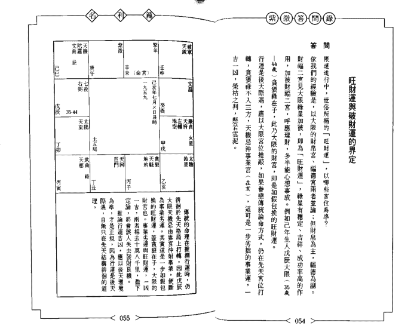
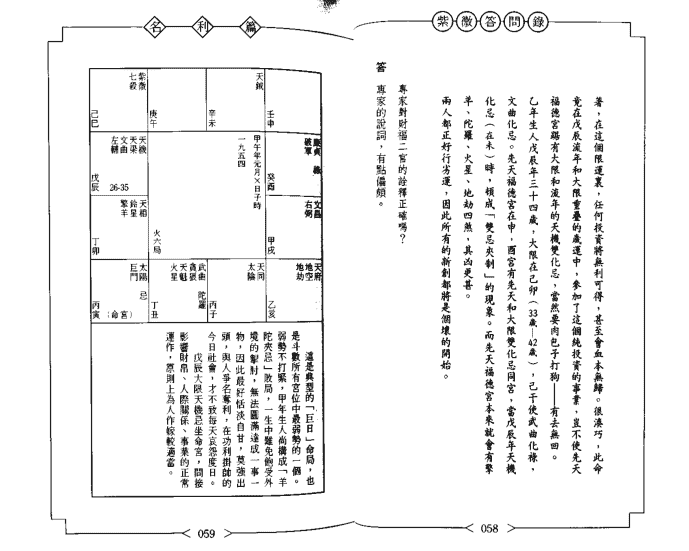
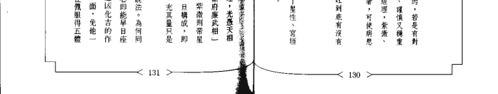
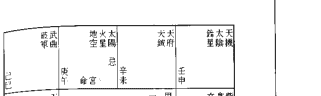
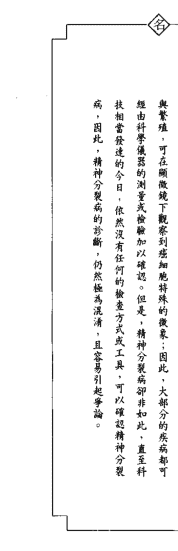

# 赖铭贤紫微答问录

# 宏觀的命理態度

> （素微古問錄）「名利篇」自序
> 本書詮釋的宮位計有財帛、疾厄、遷移、事業、田宅、福德，其中頭腦了可算部分的三方宮位：財帛、遷移、事業——這也是功利社會一生過活的終極目標，因此就以「名利篇」名之。
> 三方諸宮既然屬於自由意志的範疇，那麼詮釋這些宮位時，自然需要跳脫古經典命的窠臼——世間一切，上天早已安排妥當，人只不過是玉皇大帝的傀儡，再怎麼勤懇，都無法跳出宿命的藩籬。

命是靜態的，宛如一棵巨樹，樹上結滿了奇花異果——大有小有，光彩奪目。因先天結構而有所差別。觀察樹木大小、果實豐饒，因人、因方法而異，星星宮的論命以弱觀的方式攀上東樹賞玩，這樣一來，可能窮數年之力都無法盡覽樹木的輪廓（—株矮木），也容易受到盈枝果實的迷惑，迷失混淆，高下難分。有智慧的人謂以「宏觀」的態度面對，站在高處遠眺，不但結構大小一覽無遺，滿繁星也能清晰明辨，結構好壞，當下立判。

就命理現象而言，星星宮的論命方式雖有迷人之處，卻無法詮釋、推展，進而分析命造的優劣良窳，智者不為也。

運則為動態的好像，駛出航的帆船，天氣狀況左右了船隻的命運。掌舵者遷移時注意氣象局發布的天候狀況，遇上里晴空，風平浪靜，適時把握，風助船速，可迅速橫抵目的地；假若天況惡劣，風大浪高，此時不宜冒進，駛道避風港子是正確

運程──如雲載著。除了必須有精密的導航設備（正確的命理指引），更要隨時注意氣象狀況，運數吉凶、行運順暢，快馬加鞭，多能在須臾之間掌握機動，名利雙收；反之，逆運乖蹇，不知謹慎以對，仍然缺乏勇氣，冒險出擊，極遭沉沒於萬丈紅塵中，似乎也在意料之中。

運勢吉凶像極了氣象報告，明確告知此去路途的吉凶禍福，讓當事人事先防患，順遂者奮力前行看如何掌握；三方宮位的描述，無不在申述基本結構與技術分析，讀者若以「宏觀」的態度面對，定能正確做好先修的奠基工作。

三方之外的宮位仍事偶一、重新詮釋、定位，讓若不難發現所佔篇幅不少。原

因為算命過程遇到的問題特別多，千奇百怪、花樣翻新。這些問題逾越了命理極限，讓人走調，因此不費周章，提出矯正，未免有些較勁。

黑池爾說過：「凡是存在的，俱為合理」，問題的存在在另一種意義上說，人們因為有了豐富而活潑的想像力，才能自由發揮，反映了普同的思想模式、民間教訓和文化特色。當時的社會條件與人們的心理需求，正是這些命運物語出爐的催化劑。從另一個角度來看，這些生動活潑的思考方式──心理因果「與」地方文化」的交感，奠定水土不堅，難望符合科學時代自然與真理的要求，難逃兩次命運。

福德宮的豁棄是啥？迄今仍爭爭議，許多學者堅認這是一個觀點窄隘、偏分（補澤厚薄）的宮位。有人用來推斷選舉、考試的成败，看法分歧，莫衷一是。事實上選學、考試是讓人能受煎熬的苦思事，得失成敗探討起來，虛無縹緲，很難有效描述；有些人不吝費盡心力，心想事成，煞然親友：有些人納禍罹體，孜孜矻矽，付出

## 【卷二】

# 財帛宮

#### 財帛宮的涵義新詮

由命宮逆數至第四個宮位，即為財帛宮。屬個人意念能充分表達，是斗數命盤中可算的部分（另兩個是事業宮和遷移宮）。有些人認為財帛的進出、獲取多寡以及能享多少福，都能從財帛宮一覽無遺；此宮真有此能耐嗎？其真正作用為何？這是望文生義，不一定正確。大致上說，從財帛宮可以觀察下列狀況：

答
這望文生義，不一定正確。大致上說，從財帛宮可以觀察下列狀況：

+   - (1) 以哪種方式取財。能享多，尤其「火貪」、「火羊」、「鈴貪」、「天梁」等星格，多半希望賺錢；吉星則傾向溫和保守，不求非分之財，純上班族也。
- (2) 錢財的承擔力強弱。宮強星旺，承擔力強，較能發財；宮內無主星或三方呈弱，承擔力不足，易也虛榮，運通倒黴。
- (3) 物質享受的方式與滿足點。星曜越旺，這方面需求越強烈，滿足點相對越高。
- (4) 理財的觀念。紫星之空劫忌星照耀，欠缺理財觀念，有不擇精打細算的傾向。

至於能否斷出錢財進出的數量？仍是那句老話：「命理至今向無法量化。」不久之前，電視主持人潘恰恰的母親接受專訪，潘母提起小時候替他買過命，算命仔告訴她：「這孩子以後可望發得驚天動地，後半輩子靠他，生活可算無慮。」當時憑母半信半疑，蓋影恰恰小時候整天拖著一把鼻涕，其貌不揚，她作夢也夢不到現代社會「驕人行大運」，兒子果然日進斗金，跟算命先生的預言相符。

# 答問錄

我們沒有部份怡的生辰資料，無法驗證一下那位半仙所言爲真，頗爲遺憾；不過，在否與他同齡者有八十八人等多（一九九三年十月間筆者）於《分家》一個小柱出生、四分一燒二人死亡），根據補輯觀念，每個人都將跟您怡一樣，既能主持節目又會唱歌，賺錢像賺水，偶爾還在球場上露一手絕活，他還有得說嗎？

有人說：身財要具備發財的條件，這些條件包括哪些？

發財條件的觀察，以財帛宮爲主，該宮宮有十四主星之一，三方星強宮旺，煞星交織，且互成「火貪」、「祿貪」、「火羊」等異格，這類人金庫心雄盛，慾求甚高，財的承擔力亦足，多半希望擴設投資，累積較大錢財數目，炫耀親友，或爲一生追求的目標。

傳統觀念認爲只要條件俱足，便沒有不發的道理；其實不然，發與不發不是兩個極端，尚須配合否財帛動作，上班要則使錢再佳，欠缺理財的手段，也是徒勞一舉。因此說來，人既沒有發財的命，又走不到旺財運，豈不是註定要一輩子窮困？否則有命運，後呼與分

問答

我們認爲在作您發財的夢想之前，尤其發大財，都必須先驗證一下自己有沒有那個命，同時也必須觀察是否走了旺財運，以免盲目地攻城掠地，輕者造成生活困頓，重者株連旁人，引起遭難倒風暴。

走財運風奇，端視緣分的牽引而定，有的人一生行運連繫，非但走不到發財的途程，反而是又不斷地倒楣，可想而知。不過，既難

答

財帛宮有十四主星之一，三方星強宮旺，煞星交織，且互成「火貪」、「祿貪」、「火羊」等異格，這類人金庫心雄盛，慾求甚高，財的承擔力亦足，多半希望擴設投資，累積較大錢財數目，炫耀親友，或爲一生追求的目標。

傳統觀念認爲只要條件俱足，便沒有不發的道理；其實不然，發與不發不是兩個極端，尚須配合否財帛動作，上班要則使錢再佳，欠缺理財的手段，也是徒勞一舉。因此說來，人既沒有發財的命，又走不到旺財運，豈不是註定要一輩子窮困？否則有命運，後呼與分

問答

我們認爲在作您發財的夢想之前，尤其發大財，都必須先驗證一下自己有沒有那個命，同時也必須觀察是否走了旺財運，以免盲目地攻城掠地，輕者造成生活困頓，重者株連旁人，引起遭難倒風暴。

走財運風奇，端視緣分的牽引而定，有的人一生行運連繫，非但走不到發財的途程，反而是又不斷地倒楣，可想而知。不過，既難

# 紫微啟示錄

## 紫微啟示錄

不入自己命宮三方，必入旁人命位，純利利他人的運勢，此時必須認清命局，為人抬棺槓，所得雖然不多，總比自己捲起袖管，跳出來漫無目標地衝刺要好上許多。

未來學家托佛勒（>Tofler）是近一、二十年來，全球炙手可熱的人物，他在《大未來》一書的序言中提出了他對預測未來的看法。他說：

要對未來進行精密的預測簡直是無稽之談，生命本來就充滿現實的意外，即使那些看來最客觀的數據與模式，都只能是在微弱的板設上，尤其是針對人的事務……。然而，在我們進入不可知的未來之前，我們手中最好先握有一張雖不完整卻有粗略雛型的地圖，一路摸索、路更正修改，總比摸不著方向來得好。

站在命運的角度來說，命運不可改，但一個人的窮通禍福、榮枯興衰，卻可自由由意志加以抉擇、掌握。命理指引就好像張不完整卻略具雛型的地圖，雖然仍需要一面探索、面修正，但總比盲目而行來得好。

如果一個走財運的人投入股票市場，運勢稍濟助潮，是不是保證能賺得不亦樂乎？。

紫星具有穩定、吉祥、成功率高的作用，注意，只是成功率高，並非保證，台灣的股票市場尚在起步當中，無論是法令抑或投資人的心態、知識，一切都還未上軌道，稍微風吹草動，都可能造成巨震或崩盤。

有一位專門報明牌的股票專家，他所報的明牌多半能維持一段笑話般的股性。有一次，分析看某家個股股票應力雄厚，問答 021 020

# 目錄

盤跌多時，蓄勢待發，至少漲三個停板應沒問題。專家：「心動不如行動」，暗中掛進了一些股票，沒想到買進之後，接連好幾天股票不但不漲反而直直落，跌得他灰頭土臉。

為何會出現這種現象？究其原因，不外消息未曾發佈，沒有散戶搶進，獨木難撐天，只好眼睜睜地看著股票天天收黑單。藉此不尋常的情況，正正確了台灣股票市場的投機心態。

台灣的股票市場成為主力大戶作秀的天堂，不管是公司業績平平還是搖搖欲墜，只要輕薄短小，主力登高一呼，驅樣炒翻天。例如有一支復興木業的股票，年年虧損，被投入全額交割股，買股票當成放債項，主力作手照樣炒到一百二十多元，價格凌屬於謠傳假多寡，真是神話廣大。

台灣股票市場的散戶，對上市公司的獲利情況並不關心，記得一九八八年股票狂飆時，有一投資人被問到大盤股是什麼性質的公司，那位投資人辦事猶豫，始說，是不是花邊那個名聞中外的本會開過選區？買賣股票前應技術分析，若走錯誤路則一轍米糊糕－都知道，公司的營運狀況也漠不關心，只迷信明牌，盲目掛進掛出，運勢再佳，也會慘遭沉沒於演講多變、爾虞我計的股票之中。

有位朋友給人算命，算命先生告訴他命中「有財無庫」，這句話怎麼解釋？答：「有財無庫是八字的理念，辰戌丑未為四庫，我們應一則說明之。」

# 答

上述諸詞是世俗的看法，不一定正確。可想而知，神佛早已斷絕七情六慾，他們哪還那些種間功夫插手尋常間的俗事，派下通財童子跌時送金銀財寶到凡間散財，使國下坐擁無數的家產，富可敵國。

我們經常愛問玩笑說：若然書新福，祭拜牲體水果，神佛便應允開下所關的條件，現代的詞語是，接受一「賄賂」，玉皇大帝必會斬他們我去打四十大板再說。這種條件式交換的做法，未免太過一廂情願。

祭拜的儀式與祭品上，隨著時代的變化，不斷有了重大的修正，例如：

(1) 在祭品消耗方面。古人把整隻牛羊準備到大火中、埋入土裏或灑到水裏，這是如假包換的「牲體」。現代人可不問了，整條豬手出現的機會不多，只能在綠宴一「醮壇」大拜拜時一睹監況；其餘的祭祀，到超市買祭品時，首先考慮的是以燒香為財，丑為財富，若非生於五時，便是有財—應無緣（去）。不過，在現實的社會中，錢財本來就是流通的，要一「賺」幹嘛？每個人都有充分利用賺錢的自由，包括遠征極區大採購、買賣股票、轉投資，以及保守的人將它存在銀行利息在內，實不用勞駕命理在那裏瞎操心。

神佛，會插手尋常間的俗事嗎？

曾聽老一輩的人說：「大富在天，小富在人」，這句話的意思好像是富人一瓢由老天安排、左右，必須時時焚香頂禮膜拜，祈求神佛賜福，才可發財致富比王永慶，否則門都沒有。小富則由個人汲汲於蝇頭小利的追逐，點滴累積，聚少成多，終成小富。老一輩的人對大富、小富的詮釋是否正確？新樹食嘆嘆三果火的

##### 大富在天，小富在人？

(2) 在產品項目方面。古人獻鬼神以玉謂「為求表現真誠，必須把玉敲碎，或丟到河裏」。後來的人就『寧不為玉碎』了」，甚至於演變到如今連歌都還沒聽過有這樣的敬拜方式。

(3) 在廣告語方面。古代和神佛之間，有時候會發生評價價值的情況。關公就曾在家祭時說道：「爾之許我，我其以參與挂命命：不許我，我乃屏世與注」（※）或者要求，我把你作『否則』。

後來這個重心上未現的評價還價的五種方式也取除了。不管答不答應，那樣印頭如撒話，然後再舉祭全家人的買賣準、我們認為將「大當在天」解釋為：上天是不是給了你－那能夠稱讚的命，如願。

這些去拜儀式至其量只是信使的心理反射，因人而證。因時代環境而異，漫無標準。”

## 紫微問答
### 名刊稿

業力果報是一個嚴格的同類相應原則。善或惡的業因，一定會得到如其量其分的苦或樂之果報，絕無錯案。由此觀之，積善業一定會得到享福的果報；積惡業一定得不到享福的果報。

——佛經《正法念處經》

——紫微。釋達摩尼編撰成書時，但仍無法迴避晚年喪子的人間悲劇（順子離家二十歲不到就過世），無法免除晚年受背痛折磨痛苦難捱，可見世事無常，生命無常！有成必有敗，有盛必有衰，有生必有死，有合必有離。這是萬法的法性——緣起。無奈的法則，雖釋達摩尼世尊亦無法倖免，何況是一般慾望眾生，也逃過輪迴及子孫了。

有人說：中獎、抽獎（發夢、六合彩）的是橫財，留不住的；如果中了獎，要想辦法把它花掉，否則會發生意外。按照剛才所述的因果律，發財對善業的呈現，發生意外，尤其更是重大災難，是應受之現行，向來井水不犯河水，世人卻將之相提並論，是何道理？

答：八字有偏財、正財之分，正財為一般工作薪資所得，偏財為大筆財利，又稱橫財，由身旺並且走財運的人獲得。正財較單純，泛指一切固定薪水、工資或佣金，均屬正財；偏財則範圍較廣碎，諸如籌錯六合彩、買賣股票、投資房地產，以及八大特殊行業等帶有投機色彩的取財方式，都算偏財。

斗數論命並沒有正偏之分，但跟八字一樣，強調必須走到財運才能取得。「人無橫財不富，馬不吃夜草不肥」，橫財屬火中取栗，宛如刮板的兩面，容易刮則割得聲不動地，也容易瞬間山崩地裂，敗得不文名。得了財財後，卻不留得住？因人而異，通常視財宮的承擔力強弱與運勢的吉凶而定，不能一概論之。

功利掛帥的社會，人人都有追求財富，改善生活品質的權利與慾望，也都有支配錢財開支的自由。不過，橫發與發生意外卻是兩碼子事，不可能因為突然得了橫財，便有聲外強加掩至，那是種危言聳聽兼貽禍的見識。

問：「斗數派」作者蔡雲王人在《雜論》中曾言：「左輔文昌為財，較久遠而不斷；破軍之財，過者必敗；紅鸞天喜之時，財則別不存；咸池亦主時，見時，而後桃花也。」這些依各書不同的星性歸納而出的財星，觀念正確嗎？

答：斗數派因為有許多偏頗的星性認定，偏離正途，使得許多人學命多年，仍然無法學到真正的本數，癥結在此。過去有人認為武曲為財星，只認進本命或遷宮的財帛宮，便能發得富可敵國，從此躋身世界首富排行榜，那是庸俗影射的說法。

理論上說，進入財帛宮的主曜，便稱財星；譬如天梁坐命，財富必見太陰，這顆星便稱財官，不需單指武曲或任何一顆星曜。

左輔文昌為何久遠之財不在此？答案為「不清楚」，觀雲王人也未見說明，只好列為千古懸案。

破軍之財，為何遇者必敗？關鍵就在「破」字，不過此破非彼破，不能置上等號。發財或破財與運勢有關，有些人時來運轉，發得驚天地鬼神，神業得不可一世，但好景不常，不久一敗塗地，在此之前的一切努力瞬間化成一縷青煙，再也振擻不起來了。殺過即破，與運勢亦悖序有關，不應怪罪單星「破軍無罪」。

名篇紫微客問錄

問：「斗數派」作者蔡雲王人在《雜論》中曾言：「左輔文昌為財，較久遠而不斷；破軍之財，過者必敗；紅鸞天喜之時，財則別不存；咸池亦主時，見時，而後桃花也。」這些依各書不同的星性歸納而出的財星，觀念正確嗎？

答：斗數派因為有許多偏頗的星性認定，偏離正途，使得許多人學命多年，仍然無法學到真正的本數，癥結在此。過去有人認為武曲為財星，只認進本命或遷宮的財帛宮，便能發得富可敵國，從此躋身世界首富排行榜，那是庸俗影射的說法。

理論上說，進入財帛宮的主曜，便稱財星；譬如天梁坐命，財富必見太陰，這顆星便稱財官，不需單指武曲或任何一顆星曜。

左輔文昌為何久遠之財不在此？答案為「不清楚」，觀雲王人也未見說明，只好列為千古懸案。

破軍之財，為何遇者必敗？關鍵就在「破」字，不過此破非彼破，不能置上等號。發財或破財與運勢有關，有些人時來運轉，發得驚天地鬼神，神業得不可一世，但好景不常，不久一敗塗地，在此之前的一切努力瞬間化成一縷青煙，再也振擻不起來了。殺過即破，與運勢亦悖序有關，不應怪罪單星「破軍無罪」。

問：有罪的是後人胡亂說話。紅翠、天喜，或他等桃花星也主財，見財後必成「火山韋子」，沉淪於秦樓楚館。有人說，擎羊之財主戰爭，入廟戰事順利，落陷戰事失敗？

答：論命時應將三方的星星連同六吉六煞質量並觀，而不是單星單宮運作的論命方式。持此觀念者一輩子望屋成空罢了。單星的宮的缺點是「見樹不見林」；某些特殊情況只受困限，彼此隱晦，例如擎羊會照火星成「大水」格，能夠變發財時，若日主如豆玉，則如火星會照、相激相剋，迸出火花。產生的特殊潛能，兩者差別豈止以千里計。

若想從斗數局中找一個競爭取財的格局，那非「羊陀來財富」莫屬。蓋玥宮遇羊陀成制，一輩子都要受到無形的壓迫，故取財時爭也不過、戰不勝事，非常一條作即能一定論，尚需視從事實而定，若是朝九晚五的上班族，只要把頂頭上交代的任務與高漲即可，既不必曉也也不必爭。

問：事業病？「財富成『隱富島地』」，社會地位越高財富越多？」此論有何偏見？（全集《紫微斗數》、定星局）專門探討格局；「陽梁昌祿」、「古稱稱『皇殿朝班』」，認為這是：膽能夠爆發發聲的格局。中國官場傳承的心法是、「三年清知府，十萬雪花銀」。一旦紅袍加身，成為朝廷命官，沒有不富貴雙全的。現代人將當與做分開——「魚與熊掌不可兼得」，民主國家的政府官員擁有地位權勢，卻無法同時擁有很大的財富，除非利用職權謀財取巧、獲取不法利益，或本身即是名門豪族之後。承續了難以計數的家產，如連戰、吳伯雄等人，否則鮮少富貴雙全。

我們多年實驗，約略發現確是加減的宮位，成為一生重點所在。綠化林入財則，職統改革生活品質的慾望甚烈，卻不能將之轉化為能聚華華富貴於身，否則便是宿命論。

有人說，陀農主『此二星』，大限財官星系吉，陀羅照入，大多五年後才得財庫利。但財庫送與否，與此種照入有何遠離關繫？

答：毫無聯繫。這位仁兄八成正把『陀羅』當成原地打轉的『陀羅』，因此諸事日薄，原地踏步。

得財庫送與否，光靠大限財官星系吉，不一定有用，尚需化緣加強財帛宮或福德宮，形成一個有利的環境，當行運者『心動行動』時，花花綠綠的彩券才會安然落袋。大限官星陀羅主五年後才得財，結黨無稽之談。十年是個漫長的歲月，哪一年吉呢？以非得一年的地稅式搜索不可，不可能照見陀羅，整個環境為之改觀，這顆無星應該沒這種能耐。

問：命與運遭遇空劫的機會很高，他們一般如此嗎？

答：空劫以生時逢之，二號空命，產生一波三折的效應，一直是古代命理學家的夢魘。因此用科舉免於受冤案；近代學者受到懲處，也堅信不疑，只要空劫照命，視同洪水猛獸，避之唯恐不及。其實空劫並不如想像中那麼可怕，將這些巨性內涵往職中生有的發明、創作方向運華，績效斐然。

有位專家對空劫有的看法與詮釋，他認為：『此二星的共同特性為波動、流動指南方面，一爲感財，一爲感情。空劫最不利燈酒，只要命官或命客三方，協作方向運華，績效斐然。』

問：當遇見之，經商必有所投，幾乎無人者免。大限、流年逢空劫，必會損財。「他特別透視，對行——然的最好方法是，不要經商，無論巨資能虧或投資、買股票、林地皮皆不適合。」我們可以明顯看出上述論調隱含了「空劫恐遭亡」，不是嗎？

答：我們懷疑他下此定論，可能從未真正做過歸納與統計，蓋只要每月生人多半會照見空劫；後天行運同，此理不過，下個限踏足過上，無人能心有備恃，若按他所言，壬水慶、祿萬霖等富豪將不可能剝企業王國，即使事業如日中天，一如建立在沙灘上的城堡，隨時都有垮台的危險。

一個人要不要或會不會經商，那是個人視當時環境需要，可憑自由意願抉擇的事項，令理絕無插手餘地，不能根據空亡之一生命或三方會人，或照福祿宮，即叫人家不可輕聽從任何投資。

問：幸于文昌化忌，除了文昌化忌，每逢逢空亡，一些專家莫不大聲的呼籲，文昌忌入流於財官。除了為萬人作伐之外，應慎防破財、口舌是非，讓人防不勝防。專書則定文昌忌「文昌忌制因」、「口舌侵後」引來破財、口舌是非，讓人防不勝防。專書則定文昌忌「文昌化忌」，便會引來諸多是非的觀念，所以何來？

答：文昌、文昌曲為文昌形影的掌管，其中之一，坐命、舉之為「不讚詩事也可人，有人空司生意義，認為因文昌與曲書有關。文昌化忌，容易因交際往來的疏忽，大破其財；文昌化忌，難免與人文訴訟。文昌為何被視為「口舌侵後」？原因就在《全書》之《交曲入人命吉凶論》上說，「文昌守命最為長，相契宜官宅業昂……此人機巧口能言，唯在空門可通黃」，後人據此作「口舌侵後」的認定。這種詭詞與巨門坐命或坐財帛宮，便主「以口生財」，同屬過度牽強附會。

保子的拆字入「呆人」，意未为人作保，危機四伏，隨時有被拖下水的可能，極等激微問錄。

富警世萬策：因此在作候選算之前，應將對方的信用狀況調查得一清二楚，以免成為如假包換的「另一人」。

一般而言，破財運走大限或流年之財宮受忌衝擊，導致財務支配失衡，此時應慎防破財，包括與人交頭來往、買賣股票……等等，將化忌的星曜探底化、星性化，不但瓦解了真相，更會讓運勢變者。

#### 如何推算行運？

很完命盤的基本分析之後，接下來該如何推算行運消長？有無簡便的法則可套運？

命盤分析是基本分析，接下來的運勢分析，才是論命的重點，蓋玥來諮詢對象大多面臨了人生重大的抉擇，任何一個引導，都是成龍化蛇的關鍵，實在輕忽不得。

行運的推測法則，至少應包括如下幾項：

1. 不論順行（順考排本）或逆行（逆考排本），以十年為一個大限，運限走完，換。
2. 十數使用太陰曆，因此年限交接的日期是農曆元旦當天，也就是說，每年除夕夜十一點起，就進入新的一年。若是年～流年～限（大限）一起交替，則除夕夜十一點之後，又邁入一個新的大限與流年。以丁年生人為例，金四局，三十歲除夕夜十一時前尚是癸丑大限（24 歲～33 歲），過此，即交壬子大限（34 歲～43 歲）。
3. 大限變換時，命宮改變，其他宮位也跟著運動，譬如癸丑大限命宮在丑，兄弟宮在子……，進入壬子大限之後，即以子為十年命宮，兄弟宮在寅，子女宮在戊，時消宮在酉……父母宮在丑。大限每個宮位有每個宮位的特性，不管星曜為何，均須跟外在三萬（財帛、遷移、事業）配合，不能只考慮大限宮或任一個獨立宮位。

推論行運必須安上宮干、化出感忌，運勢的吉凶乃真正凸顯。方法是由新宮干化出感忌，譬如壬子大限，壬干緣馬天梁、忌星武曲，然後再根據轉到此大限十二宮影類的情況來判別吉凶。

感忌在推論行運上，具有畫龍點睛的重要關鍵，我們常見一些研究者雖安上宮干，但推算行運消長時間，卻只在試文和星性上打轉，離真正預卜人生某個階段的确如此。

答：推算流年是否也要比照辦理？

行運的吉凶，必須安上大限的緣忌，才見真象。方法是觀察大限宮干化出的感忌究竟是在十二宮中哪宮凸顯，轉示自己正在進行：反之，緣星不照、忌星入祿，亦無無疑。

例如壬子大限天梁祿在未，這是大限的疾厄宮，與己無涉，武曲忌沖事業，還嫌動盪不安，若說出來創業，有點動得過分之勢。

| | | | | | | | |
| :--- | :--- | :--- | :--- | :--- | :--- | :--- | :--- |
| 七殺文昌 | 文曲 | 天同天機 | 廉貞天相 | 武曲天府 | 紫微破軍 | 貪狼巨門 | 天梁太陰 | 太陽天同 |
| 甲辰 | 乙巳 | 丙午 | 丁未 | 戊申 | 己酉 | 庚戌 | 辛亥 |
| 壬子 | 癸丑 | 甲寅 | 乙卯 | 丙辰 | 丁巳 | 戊午 | 己未 |
| 24-33 | 34-43 | 44-57 | 58-67 | 68-77 | 78-87 | 88-97 | 98-107 |

| | | | | | | | |
| :--- | :--- | :--- | :--- | :--- | :--- | :--- | :--- |
| 天魁天鉞 | 天姚天喜 | 天虛天哭 | 天福天壽 | 天刑天煞 | 天馬天使 | 天空天月 | 天德天福 |
| 壬子 | 癸丑 | 甲寅 | 乙卯 | 丙辰 | 丁巳 | 戊午 | 己未 |
| 24-33 | 34-43 | 44-57 | 58-67 | 68-77 | 78-87 | 88-97 | 98-107 |

大限三方宮位是命理虛構的社會環境，唐辰是機月同梁組合，暗示此去十年的環物換星移，歲運變換，大限移動，宮垣隨著著變動，例如乙年生人庚辰大限是機月同梁組合，進入己卯大限之後，是個破軍狼星，這在命理環境上可有什麼吉凶誘惑？

斗數的大限十年大環境的消長，流年較短，主一年吉凶，遇入新的年度，面對的又是完全不同的宮星、星曜組合、移易。不過，環境與條件雖然不同，推測的方法仍然不變。

行運的推論，從本命、大限、流年，共有三張命盤，主星迥然不同，各自化出的搖忌滿天飛舞，該如何取捨，方爲正確？

無論探討任何事項，概以兩個命盤比對，例如：

- (1) 探討十年大限的興衰，利用大限和命宮兩個命盤疊合，觀察兩者之間的差異與互動關係。
- (2) 探討流年得失時，只參酌流年与大限之間星垣的變化即可，不再考慮先天大的作用（除非是想跳出來創業，或其他重大抉擇，此即「命運分離」的概念）。
- (3) 探討流月時，需一併考慮流年的作用，此時大限退居幕後即可。
- (4) 化星的運用情況亦同。譬如探討大限的大吉凶，只考慮本命与大限移易的牽引即可，當推演流年得失時，也只參酌流年与大限，共計四顆，本命的化星將之排除，蓋流年與本命之間的距離太過遙遠，鞭長莫及也。

這個部分稱爲命數論的菁華所在，命理學者需握並運用這些原則，才能面鑒一個人生命歷程的榮枯盛衰。不過其間的關係錯綜複雜，豈是三四兩語即能道盡玄機，也非一朝一夕所能頓悟，因此有待習命者平日多觀察、多比較，才能修成正果。

答：環境隨機式，只宜穩定中求進取，不平驕等，尤其事業當無主星（古例：天瓊只是助星），一年中的事業環境較軟，若遇波折，處理起來比較棘手。

進已卯大限後，兼見府廉武相與破軍宮星組合，環境當屬富貴堂皇，波濤洶湧。這表示外界的人事物起了很大的變化，內心為之顛動。

己卯環境由強轉強，是否代表有一個強勢的環境環繞，利於攻手一搏？

答：環境強勢，只是一個虛幻的外貌，並代表動必有利可圖，尚需觀察大限星曜引發動的情況而定，例如辛巳大限也是個強勢的環境，無奈綠忌不動（落在辰、戌在寅），充其量只是「假」靜運。

綠忌的牽引情況是任何觸動是非成败的關鍵，已卯大限見武曲加破軍宮「在寅」，當然王好的開始，若有所動，必有利可圖；若是癸未大限，貪狼坐財官（在甲），如假包換的破財運，即使外境當屬富貴堂皇，想讓銀兩安然落袋，恐將要推測行運時，大限的命宮隨著歲運的替換而變動。例如己卯大限的命宮在辰，進入已卯大限，命宮應轉落至酉宮。

| | 甲申 | 乙酉 | 丙戌 | 丁亥 |
| :--- | :--- | :--- | :--- | :--- |
| 天同 | 廉貞（一九九五） | 武曲 | 破軍 |
| 天機 | 太陰 | 太陽 | 巨門 |
| 紫微 | 天同 | 天相 | 貪狼 |
| 天府 | 武曲 | 七殺 | 廉貞 |
| 天相 | 太陰 | 天同 | 天梁 |
| 天機 | 太陽 | 巨門 | 貪狼 |
| 紫微 | 天同 | 天相 | 貪狼 |
| 天府 | 武曲 | 七殺 | 廉貞 |
| 天相 | 太陰 | 天同 | 天梁 |
| 天機 | 太陽 | 巨門 | 貪狼 |
| 紫微 | 天同 | 天相 | 貪狼 |
| 天府 | 武曲 | 七殺 | 廉貞 |
| 天相 | 太陰 | 天同 | 天梁 |
| 天機 | 太陽 | 巨門 | 貪狼 |
| 紫微 | 天同 | 天相 | 貪狼 |
| 天府 | 武曲 | 七殺 | 廉貞 |
| 天相 | 太陰 | 天同 | 天梁 |
| 天機 | 太陽 | 巨門 | 貪狼 |
| 紫微 | 天同 | 天相 | 貪狼 |
| 天府 | 武曲 | 七殺 | 廉貞 |
| 天相 | 太陰 | 天同 | 天梁 |
| 天機 | 太陽 | 巨門 | 貪狼 |
| 紫微 | 天同 | 天相 | 貪狼 |
| 天府 | 武曲 | 七殺 | 廉貞 |
| 天相 | 太陰 | 天同 | 天梁 |
| 天機 | 太陽 | 巨門 | 貪狼 |
| 紫微 | 天同 | 天相 | 貪狼 |
| 天府 | 武曲 | 七殺 | 廉貞 |
| 天相 | 太陰 | 天同 | 天梁 |
| 天機 | 太陽 | 巨門 | 貪狼 |
| 紫微 | 天同 | 天相 | 貪狼 |
| 天府 | 武曲 | 七殺 | 廉貞 |
| 天相 | 太陰 | 天同 | 天梁 |
| 天機 | 太陽 | 巨門 | 貪狼 |
| 紫微 | 天同 | 天相 | 貪狼 |
| 天府 | 武曲 | 七殺 | 廉貞 |
| 天相 | 太陰 | 天同 | 天梁 |
| 天機 | 太陽 | 巨門 | 貪狼 |
| 紫微 | 天同 | 天相 | 貪狼 |
| 天府 | 武曲 | 七殺 | 廉貞 |
| 天相 | 太陰 | 天同 | 天梁 |
| 天機 | 太陽 | 巨門 | 貪狼 |
| 紫微 | 天同 | 天相 | 貪狼 |
| 天府 | 武曲 | 七殺 | 廉貞 |
| 天相 | 太陰 | 天同 | 天梁 |
| 天機 | 太陽 | 巨門 | 貪狼 |
| 紫微 | 天同 | 天相 | 貪狼 |
| 天府 | 武曲 | 七殺 | 廉貞 |
| 天相 | 太陰 | 天同 | 天梁 |
| 天機 | 太陽 | 巨門 | 貪狼 |
| 紫微 | 天同 | 天相 | 貪狼 |
| 天府 | 武曲 | 七殺 | 廉貞 |
| 天相 | 太陰 | 天同 | 天梁 |
| 天機 | 太陽 | 巨門 | 貪狼 |
| 紫微 | 天同 | 天相 | 貪狼 |
| 天府 | 武曲 | 七殺 | 廉貞 |
| 天相 | 太陰 | 天同 | 天梁 |
| 天機 | 太陽 | 巨門 | 貪狼 |
| 紫微 | 天同 | 天相 | 貪狼 |
| 天府 | 武曲 | 七殺 | 廉貞 |
| 天相 | 太陰 | 天同 | 天梁 |
| 天機 | 太陽 | 巨門 | 貪狼 |
| 紫微 | 天同 | 天相 | 貪狼 |
| 天府 | 武曲 | 七殺 | 廉貞 |
| 天相 | 太陰 | 天同 | 天梁 |
| 天機 | 太陽 | 巨門 | 貪狼 |
| 紫微 | 天同 | 天相 | 貪狼 |
| 天府 | 武曲 | 七殺 | 廉貞 |
| 天相 | 太陰 | 天同 | 天梁 |
| 天機 | 太陽 | 巨門 | 貪狼 |
| 紫微 | 天同 | 天相 | 貪狼 |
| 天府 | 武曲 | 七殺 | 廉貞 |
| 天相 | 太陰 | 天同 | 天梁 |
| 天機 | 太陽 | 巨門 | 貪狼 |
| 紫微 | 天同 | 天相 | 貪狼 |
| 天府 | 武曲 | 七殺 | 廉貞 |
| 天相 | 太陰 | 天同 | 天梁 |
| 天機 | 太陽 | 巨門 | 貪狼 |
| 紫微 | 天同 | 天相 | 貪狼 |
| 天府 | 武曲 | 七殺 | 廉貞 |
| 天相 | 太陰 | 天同 | 天梁 |
| 天機 | 太陽 | 巨門 | 貪狼 |
| 紫微 | 天同 | 天相 | 貪狼 |
| 天府 | 武曲 | 七殺 | 廉貞 |
| 天相 | 太陰 | 天同 | 天梁 |
| 天機 | 太陽 | 巨門 | 貪狼 |
| 紫微 | 天同 | 天相 | 貪狼 |
| 天府 | 武曲 | 七殺 | 廉貞 |
| 天相 | 太陰 | 天同 | 天梁 |
| 天機 | 太陽 | 巨門 | 貪狼 |
| 紫微 | 天同 | 天相 | 貪狼 |
| 天府 | 武曲 | 七殺 | 廉貞 |
| 天相 | 太陰 | 天同 | 天梁 |
| 天機 | 太陽 | 巨門 | 貪狼 |
| 紫微 | 天同 | 天相 | 貪狼 |
| 天府 | 武曲 | 七殺 | 廉貞 |
| 天相 | 太陰 | 天同 | 天梁 |
| 天機 | 太陽 | 巨門 | 貪狼 |
| 紫微 | 天同 | 天相 | 貪狼 |
| 天府 | 武曲 | 七殺 | 廉貞 |
| 天相 | 太陰 | 天同 | 天梁 |
| 天機 | 太陽 | 巨門 | 貪狼 |
| 紫微 | 天同 | 天相 | 貪狼 |
| 天府 | 武曲 | 七殺 | 廉貞 |
| 天相 | 太陰 | 天同 | 天梁 |
| 天機 | 太陽 | 巨門 | 貪狼 |
| 紫微 | 天同 | 天相 | 貪狼 |
| 天府 | 武曲 | 七殺 | 廉貞 |
| 天相 | 太陰 | 天同 | 天梁 |
| 天機 | 太陽 | 巨門 | 貪狼 |
| 紫微 | 天同 | 天相 | 貪狼 |
| 天府 | 武曲 | 七殺 | 廉貞 |
| 天相 | 太陰 | 天同 | 天梁 |
| 天機 | 太陽 | 巨門 | 貪狼 |
| 紫微 | 天同 | 天相 | 貪狼 |
| 天府 | 武曲 | 七殺 | 廉貞 |
| 天相 | 太陰 | 天同 | 天梁 |
| 天機 | 太陽 | 巨門 | 貪狼 |
| 紫微 | 天同 | 天相 | 貪狼 |
| 天府 | 武曲 | 七殺 | 廉貞 |
| 天相 | 太陰 | 天同 | 天梁 |
| 天機 | 太陽 | 巨門 | 貪狼 |
| 紫微 | 天同 | 天相 | 貪狼 |
| 天府 | 武曲 | 七殺 | 廉貞 |
| 天相 | 太陰 | 天同 | 天梁 |
| 天機 | 太陽 | 巨門 | 貪狼 |
| 紫微 | 天同 | 天相 | 貪狼 |
| 天府 | 武曲 | 七殺 | 廉貞 |
| 天相 | 太陰 | 天同 | 天梁 |
| 天機 | 太陽 | 巨門 | 貪狼 |
| 紫微 | 天同 | 天相 | 貪狼 |
| 天府 | 武曲 | 七殺 | 廉貞 |
| 天相 | 太陰 | 天同 | 天梁 |
| 天機 | 太陽 | 巨門 | 貪狼 |
| 紫微 | 天同 | 天相 | 貪狼 |
| 天府 | 武曲 | 七殺 | 廉貞 |
| 天相 | 太陰 | 天同 | 天梁 |
| 天機 | 太陽 | 巨門 | 貪狼 |
| 紫微 | 天同 | 天相 | 貪狼 |
| 天府 | 武曲 | 七殺 | 廉貞 |
| 天相 | 太陰 | 天同 | 天梁 |
| 天機 | 太陽 | 巨門 | 貪狼 |
| 紫微 | 天同 | 天相 | 貪狼 |
| 天府 | 武曲 | 七殺 | 廉貞 |
| 天相 | 太陰 | 天同 | 天梁 |
| 天機 | 太陽 | 巨門 | 貪狼 |
| 紫微 | 天同 | 天相 | 貪狼 |
| 天府 | 武曲 | 七殺 | 廉貞 |
| 天相 | 太陰 | 天同 | 天梁 |
| 天機 | 太陽 | 巨門 | 貪狼 |
| 紫微 | 天同 | 天相 | 貪狼 |
| 天府 | 武曲 | 七殺 | 廉貞 |
| 天相 | 太陰 | 天同 | 天梁 |
| 天機 | 太陽 | 巨門 | 貪狼 |
| 紫微 | 天同 | 天相 | 貪狼 |
| 天府 | 武曲 | 七殺 | 廉貞 |
| 天相 | 太陰 | 天同 | 天梁 |
| 天機 | 太陽 | 巨門 | 貪狼 |
| 紫微 | 天同 | 天相 | 貪狼 |
| 天府 | 武曲 | 七殺 | 廉貞 |
| 天相 | 太陰 | 天同 | 天梁 |
| 天機 | 太陽 | 巨門 | 貪狼 |
| 紫微 | 天同 | 天相 | 貪狼 |
| 天府 | 武曲 | 七殺 | 廉貞 |
| 天相 | 太陰 | 天同 | 天梁 |
| 天機 | 太陽 | 巨門 | 貪狼 |
| 紫微 | 天同 | 天相 | 貪狼 |
| 天府 | 武曲 | 七殺 | 廉貞 |
| 天相 | 太陰 | 天同 | 天梁 |
| 天機 | 太陽 | 巨門 | 貪狼 |
| 紫微 | 天同 | 天相 | 貪狼 |
| 天府 | 武曲 | 七殺 | 廉貞 |
| 天相 | 太陰 | 天同 | 天梁 |
| 天機 | 太陽 | 巨門 | 貪狼 |
| 紫微 | 天同 | 天相 | 貪狼 |
| 天府 | 武曲 | 七殺 | 廉貞 |
| 天相 | 太陰 | 天同 | 天梁 |
| 天機 | 太陽 | 巨門 | 貪狼 |
| 紫微 | 天同 | 天相 | 貪狼 |
| 天府 | 武曲 | 七殺 | 廉貞 |
| 天相 | 太陰 | 天同 | 天梁 |
| 天機 | 太陽 | 巨門 | 貪狼 |
| 紫微 | 天同 | 天相 | 貪狼 |
| 天府 | 武曲 | 七殺 | 廉貞 |
| 天相 | 太陰 | 天同 | 天梁 |
| 天機 | 太陽 | 巨門 | 貪狼 |
| 紫微 | 天同 | 天相 | 貪狼 |
| 天府 | 武曲 | 七殺 | 廉貞 |
| 天相 | 太陰 | 天同 | 天梁 |
| 天機 | 太陽 | 巨門 | 貪狼 |
| 紫微 | 天同 | 天相 | 貪狼 |
| 天府 | 武曲 | 七殺 | 廉貞 |
| 天相 | 太陰 | 天同 | 天梁 |
| 天機 | 太陽 | 巨門 | 貪狼 |
| 紫微 | 天同 | 天相 | 貪狼 |
| 天府 | 武曲 | 七殺 | 廉貞 |
| 天相 | 太陰 | 天同 | 天梁 |
| 天機 | 太陽 | 巨門 | 貪狼 |
| 紫微 | 天同 | 天相 | 貪狼 |
| 天府 | 武曲 | 七殺 | 廉貞 |
| 天相 | 太陰 | 天同 | 天梁 |
| 天機 | 太陽 | 巨門 | 貪狼 |
| 紫微 | 天同 | 天相 | 貪狼 |
| 天府 | 武曲 | 七殺 | 廉貞 |
| 天相 | 太陰 | 天同 | 天梁 |
| 天機 | 太陽 | 巨門 | 貪狼 |
| 紫微 | 天同 | 天相 | 貪狼 |
| 天府 | 武曲 | 七殺 | 廉貞 |
| 天相 | 太陰 | 天同 | 天梁 |
| 天機 | 太陽 | 巨門 | 貪狼 |
| 紫微 | 天同 | 天相 | 貪狼 |
| 天府 | 武曲 | 七殺 | 廉貞 |
| 天相 | 太陰 | 天同 | 天梁 |
| 天機 | 太陽 | 巨門 | 貪狼 |
| 紫微 | 天同 | 天相 | 貪狼 |
| 天府 | 武曲 | 七殺 | 廉貞 |
| 天相 | 太陰 | 天同 | 天梁 |
| 天機 | 太陽 | 巨門 | 貪狼 |
| 紫微 | 天同 | 天相 | 貪狼 |
| 天府 | 武曲 | 七殺 | 廉貞 |
| 天相 | 太陰 | 天同 | 天梁 |
| 天機 | 太陽 | 巨門 | 貪狼 |
| 紫微 | 天同 | 天相 | 貪狼 |
| 天府 | 武曲 | 七殺 | 廉貞 |
| 天相 | 太陰 | 天同 | 天梁 |
| 天機 | 太陽 | 巨門 | 貪狼 |
| 紫微 | 天同 | 天相 | 貪狼 |
| 天府 | 武曲 | 七殺 | 廉貞 |
| 天相 | 太陰 | 天同 | 天梁 |
| 天機 | 太陽 | 巨門 | 貪狼 |
| 紫微 | 天同 | 天相 | 貪狼 |
| 天府 | 武曲 | 七殺 | 廉貞 |
| 天相 | 太陰 | 天同 | 天梁 |
| 天機 | 太陽 | 巨門 | 貪狼 |
| 紫微 | 天同 | 天相 | 貪狼 |
| 天府 | 武曲 | 七殺 | 廉貞 |
| 天相 | 太陰 | 天同 | 天梁 |
| 天機 | 太陽 | 巨門 | 貪狼 |
| 紫微 | 天同 | 天相 | 貪狼 |
| 天府 | 武曲 | 七殺 | 廉貞 |
| 天相 | 太陰 | 天同 | 天梁 |
| 天機 | 太陽 | 巨門 | 貪狼 |
| 紫微 | 天同 | 天相 | 貪狼 |
| 天府 | 武曲 | 七殺 | 廉貞 |
| 天相 | 太陰 | 天同 | 天梁 |
| 天機 | 太陽 | 巨門 | 貪狼 |
| 紫微 | 天同 | 天相 | 貪狼 |
| 天府 | 武曲 | 七殺 | 廉貞 |
| 天相 | 太陰 | 天同 | 天梁 |
| 天機 | 太陽 | 巨門 | 貪狼 |
| 紫微 | 天同 | 天相 | 貪狼 |
| 天府 | 武曲 | 七殺 | 廉貞 |
| 天相 | 太陰 | 天同 | 天梁 |
| 天機 | 太陽 | 巨門 | 貪狼 |
| 紫微 | 天同 | 天相 | 貪狼 |
| 天府 | 武曲 | 七殺 | 廉貞 |
| 天相 | 太陰 | 天同 | 天梁 |
| 天機 | 太陽 | 巨門 | 貪狼 |
| 紫微 | 天同 | 天相 | 貪狼 |
| 天府 | 武曲 | 七殺 | 廉貞 |
| 天相 | 太陰 | 天同 | 天梁 |
| 天機 | 太陽 | 巨門 | 貪狼 |
| 紫微 | 天同 | 天相 | 貪狼 |
| 天府 | 武曲 | 七殺 | 廉貞 |
| 天相 | 太陰 | 天同 | 天梁 |
| 天機 | 太陽 | 巨門 | 貪狼 |
| 紫微 | 天同 | 天相 | 貪狼 |
| 天府 | 武曲 | 七殺 | 廉貞 |
| 天相 | 太陰 | 天同 | 天梁 |
| 天機 | 太陽 | 巨門 | 貪狼 |
| 紫微 | 天同 | 天相 | 貪狼 |
| 天府 | 武曲 | 七殺 | 廉貞 |
| 天相 | 太陰 | 天同 | 天梁 |
| 天機 | 太陽 | 巨門 | 貪狼 |
| 紫微 | 天同 | 天相 | 貪狼 |
| 天府 | 武曲 | 七殺 | 廉貞 |
| 天相 | 太陰 | 天同 | 天梁 |
| 天機 | 太陽 | 巨門 | 貪狼 |
| 紫微 | 天同 | 天相 | 貪狼 |
| 天府 | 武曲 | 七殺 | 廉貞 |
| 天相 | 太陰 | 天同 | 天梁 |
| 天機 | 太陽 | 巨門 | 貪狼 |
| 紫微 | 天同 | 天相 | 貪狼 |
| 天府 | 武曲 | 七殺 | 廉貞 |
| 天相 | 太陰 | 天同 | 天梁 |
| 天機 | 太陽 | 巨門 | 貪狼 |
| 紫微 | 天同 | 天相 | 貪狼 |
| 天府 | 武曲 | 七殺 | 廉貞 |
| 天相 | 太陰 | 天同 | 天梁 |
| 天機 | 太陽 | 巨門 | 貪狼 |
| 紫微 | 天同 | 天相 | 貪狼 |
| 天府 | 武曲 | 七殺 | 廉貞 |
| 天相 | 太陰 | 天同 | 天梁 |
| 天機 | 太陽 | 巨門 | 貪狼 |
| 紫微 | 天同 | 天相 | 貪狼 |
| 天府 | 武曲 | 七殺 | 廉貞 |
| 天相 | 太陰 | 天同 | 天梁 |
| 天機 | 太陽 | 巨門 | 貪狼 |
| 紫微 | 天同 | 天相 | 貪狼 |
| 天府 | 武曲 | 七殺 | 廉貞 |
| 天相 | 太陰 | 天同 | 天梁 |
| 天機 | 太陽 | 巨門 | 貪狼 |
| 紫微 | 天同 | 天相 | 貪狼 |
| 天府 | 武曲 | 七殺 | 廉貞 |
| 天相 | 太陰 | 天同 | 天梁 |
| 天機 | 太陽 | 巨門 | 貪狼 |
| 紫微 | 天同 | 天相 | 貪狼 |
| 天府 | 武曲 | 七殺 | 廉貞 |
| 天相 | 太陰 | 天同 | 天梁 |
| 天機 | 太陽 | 巨門 | 貪狼 |
| 紫微 | 天同 | 天相 | 貪狼 |
| 天府 | 武曲 | 七殺 | 廉貞 |
| 天相 | 太陰 | 天同 | 天梁 |
| 天機 | 太陽 | 巨門 | 貪狼 |
| 紫微 | 天同 | 天相 | 貪狼 |
| 天府 | 武曲 | 七殺 | 廉貞 |
| 天相 | 太陰 | 天同 | 天梁 |
| 天機 | 太陽 | 巨門 | 貪狼 |
| 紫微 | 天同 | 天相 | 貪狼 |
| 天府 | 武曲 | 七殺 | 廉貞 |
| 天相 | 太陰 | 天同 | 天梁 |
| 天機 | 太陽 | 巨門 | 貪狼 |
| 紫微 | 天同 | 天相 | 貪狼 |
| 天府 | 武曲 | 七殺 | 廉貞 |
| 天相 | 太陰 | 天同 | 天梁 |
| 天機 | 太陽 | 巨門 | 貪狼 |
| 紫微 | 天同 | 天相 | 貪狼 |
| 天府 | 武曲 | 七殺 | 廉貞 |
| 天相 | 太陰 | 天同 | 天梁 |
| 天機 | 太陽 | 巨門 | 貪狼 |
| 紫微 | 天同 | 天相 | 貪狼 |
| 天府 | 武曲 | 七殺 | 廉貞 |
| 天相 | 太陰 | 天同 | 天梁 |
| 天機 | 太陽 | 巨門 | 貪狼 |
| 紫微 | 天同 | 天相 | 貪狼 |
| 天府 | 武曲 | 七殺 | 廉貞 |
| 天相 | 太陰 | 天同 | 天梁 |
| 天機 | 太陽 | 巨門 | 貪狼 |
| 紫微 | 天同 | 天相 | 貪狼 |
| 天府 | 武曲 | 七殺 | 廉貞 |
| 天相 | 太陰 | 天同 | 天梁 |
| 天機 | 太陽 | 巨門 | 貪狼 |
| 紫微 | 天同 | 天相 | 貪狼 |
| 天府 | 武曲 | 七殺 | 廉貞 |
| 天相 | 太陰 | 天同 | 天梁 |
| 天機 | 太陽 | 巨門 | 貪狼 |
| 紫微 | 天同 | 天相 | 貪狼 |
| 天府 | 武曲 | 七殺 | 廉貞 |
| 天相 | 太陰 | 天同 | 天梁 |
| 天機 | 太陽 | 巨門 | 貪狼 |
| 紫微 | 天同 | 天相 | 貪狼 |
| 天府 | 武曲 | 七殺 | 廉貞 |
| 天相 | 太陰 | 天同 | 天梁 |
| 天機 | 太陽 | 巨門 | 貪狼 |
| 紫微 | 天同 | 天相 | 貪狼 |
| 天府 | 武曲 | 七殺 | 廉貞 |
| 天相 | 太陰 | 天同 | 天梁 |
| 天機 | 太陽 | 巨門 | 貪狼 |
| 紫微 | 天同 | 天相 | 貪狼 |
| 天府 | 武曲 | 七殺 | 廉貞 |
| 天相 | 太陰 | 天同 | 天梁 |
| 天機 | 太陽 | 巨門 | 貪狼 |
| 紫微 | 天同 | 天相 | 貪狼 |
| 天府 | 武曲 | 七殺 | 廉貞 |
| 天相 | 太陰 | 天同 | 天梁 |
| 天機 | 太陽 | 巨門 | 貪狼 |
| 紫微 | 天同 | 天相 | 貪狼 |
| 天府 | 武曲 | 七殺 | 廉貞 |
| 天相 | 太陰 | 天同 | 天梁 |
| 天機 | 太陽 | 巨門 | 貪狼 |
| 紫微 | 天同 | 天相 | 貪狼 |
| 天府 | 武曲 | 七殺 | 廉貞 |
| 天相 | 太陰 | 天同 | 天梁 |
| 天機 | 太陽 | 巨門 | 貪狼 |
| 紫微 | 天同 | 天相 | 貪狼 |
| 天府 | 武曲 | 七殺 | 廉貞 |
| 天相 | 太陰 | 天同 | 天梁 |
| 天機 | 太陽 | 巨門 | 貪狼 |
| 紫微 | 天同 | 天相 | 貪狼 |
| 天府 | 武曲 | 七殺 | 廉貞 |
| 天相 | 太陰 | 天同 | 天梁 |
| 天機 | 太陽 | 巨門 | 貪狼 |
| 紫微 | 天同 | 天相 | 貪狼 |
| 天府 | 武曲 | 七殺 | 廉貞 |
| 天相 | 太陰 | 天同 | 天梁 |
| 天機 | 太陽 | 巨門 | 貪狼 |
| 紫微 | 天同 | 天相 | 貪狼 |
| 天府 | 武曲 | 七殺 | 廉貞 |
| 天相 | 太陰 | 天同 | 天梁 |
| 天機 | 太陽 | 巨門 | 貪狼 |
| 紫微 | 天同 | 天相 | 貪狼 |
| 天府 | 武曲 | 七殺 | 廉貞 |
| 天相 | 太陰 | 天同 | 天梁 |
| 天機 | 太陽 | 巨門 | 貪狼 |
| 紫微 | 天同 | 天相 | 貪狼 |
| 天府 | 武曲 | 七殺 | 廉貞 |
| 天相 | 太陰 | 天同 | 天梁 |
| 天機 | 太陽 | 巨門 | 貪狼 |
| 紫微 | 天同 | 天相 | 貪狼 |
| 天府 | 武曲 | 七殺 | 廉貞 |
| 天相 | 太陰 | 天同 | 天梁 |
| 天機 | 太陽 | 巨門 | 貪狼 |
| 紫微 | 天同 | 天相 | 貪狼 |
| 天府 | 武曲 | 七殺 | 廉貞 |
| 天相 | 太陰 | 天同 | 天梁 |
| 天機 | 太陽 | 巨門 | 貪狼 |
| 紫微 | 天同 | 天相 | 貪狼 |
| 天府 | 武曲 | 七殺 | 廉貞 |
| 天相 | 太陰 | 天同 | 天梁 |
| 天機 | 太陽 | 巨門 | 貪狼 |
| 紫微 | 天同 | 天相 | 貪狼 |
| 天府 | 武曲 | 七殺 | 廉貞 |
| 天相 | 太陰 | 天同 | 天梁 |
| 天機 | 太陽 | 巨門 | 貪狼 |
| 紫微 | 天同 | 天相 | 貪狼 |
| 天府 | 武曲 | 七殺 | 廉貞 |
| 天相 | 太陰 | 天同 | 天梁 |
| 天機 | 太陽 | 巨門 | 貪狼 |
| 紫微 | 天同 | 天相 | 貪狼 |
| 天府 | 武曲 | 七殺 | 廉貞 |
| 天相 | 太陰 | 天同 | 天梁 |
| 天機 | 太陽 | 巨門 | 貪狼 |
| 紫微 | 天同 | 天相 | 貪狼 |
| 天府 | 武曲 | 七殺 | 廉貞 |
| 天相 | 太陰 | 天同 | 天梁 |
| 天機 | 太陽 | 巨門 | 貪狼 |
| 紫微 | 天同 | 天相 | 貪狼 |
| 天府 | 武曲 | 七殺 | 廉貞 |
| 天相 | 太陰 | 天同 | 天梁 |
| 天機 | 太陽 | 巨門 | 貪狼 |
| 紫微 | 天同 | 天相 | 貪狼 |
| 天府 | 武曲 | 七殺 | 廉貞 |
| 天相 | 太陰 | 天同 | 天梁 |
| 天機 | 太陽 | 巨門 | 貪狼 |
| 紫微 | 天同 | 天相 | 貪狼 |
| 天府 | 武曲 | 七殺 | 廉貞 |
| 天相 | 太陰 | 天同 | 天梁 |
| 天機 | 太陽 | 巨門 | 貪狼 |
| 紫微 | 天同 | 天相 | 貪狼 |
| 天府 | 武曲 | 七殺 | 廉貞 |
| 天相 | 太陰 | 天同 | 天梁 |
| 天機 | 太陽 | 巨門 | 貪狼 |
| 紫微 | 天同 | 天相 | 貪狼 |
| 天府 | 武曲 | 七殺 | 廉貞 |
| 天相 | 太陰 | 天同 | 天梁 |
| 天機 | 太陽 | 巨門 | 貪狼 |
| 紫微 | 天同 | 天相 | 貪狼 |
| 天府 | 武曲 | 七殺 | 廉貞 |
| 天相 | 太陰 | 天同 | 天梁 |
| 天機 | 太陽 | 巨門 | 貪狼 |
| 紫微 | 天同 | 天相 | 貪狼 |
| 天府 | 武曲 | 七殺 | 廉貞 |
| 天相 | 太陰 | 天同 | 天梁 |
| 天機 | 太陽 | 巨門 | 貪狼 |
| 紫微 | 天同 | 天相 | 貪狼 |
| 天府 | 武曲 | 七殺 | 廉貞 |
| 天相 | 太陰 | 天同 | 天梁 |
| 天機 | 太陽 | 巨門 | 貪狼 |
| 紫微 | 天同 | 天相 | 貪狼 |
| 天府 | 武曲 | 七殺 | 廉貞 |
| 天相 | 太陰 | 天同 | 天梁 |
| 天機 | 太陽 | 巨門 | 貪狼 |
| 紫微 | 天同 | 天相 | 貪狼 |
| 天府 | 武曲 | 七殺 | 廉貞 |
| 天相 | 太陰 | 天同 | 天梁 |
| 天機 | 太陽 | 巨門 | 貪狼 |
| 紫微 | 天同 | 天相 | 貪狼 |
| 天府 | 武曲 | 七殺 | 廉貞 |
| 天相 | 太陰 | 天同 | 天梁 |
| 天機 | 太陽 | 巨門 | 貪狼 |
| 紫微 | 天同 | 天相 | 貪狼 |
| 天府 | 武曲 | 七殺 | 廉貞 |
| 天相 | 太陰 | 天同 | 天梁 |
| 天機 | 太陽 | 巨門 | 貪狼 |
| 紫微 | 天同 | 天相 | 貪狼 |
| 天府 | 武曲 | 七殺 | 廉貞 |
| 天相 | 太陰 | 天同 | 天梁 |
| 天機 | 太陽 | 巨門 | 貪狼 |
| 紫微 | 天同 | 天相 | 貪狼 |
| 天府 | 武曲 | 七殺 | 廉貞 |
| 天相 | 太陰 | 天同 | 天梁 |
| 天機 | 太陽 | 巨門 | 貪狼 |
| 紫微 | 天同 | 天相 | 貪狼 |
| 天府 | 武曲 | 七殺 | 廉貞 |
| 天相 | 太陰 | 天同 | 天梁 |
| 天機 | 太陽 | 巨門 | 貪狼 |
| 紫微 | 天同 | 天相 | 貪狼 |
| 天府 | 武曲 | 七殺 | 廉貞 |
| 天相 | 太陰 | 天同 | 天梁 |
| 天機 | 太陽 | 巨門 | 貪狼 |
| 紫微 | 天同 | 天相 | 貪狼 |
| 天府 | 武曲 | 七殺 | 廉貞 |
| 天相 | 太陰 | 天同 | 天梁 |
| 天機 | 太陽 | 巨門 | 貪狼 |
| 紫微 | 天同 | 天相 | 貪狼 |
| 天府 | 武曲 | 七殺 | 廉貞 |
| 天相 | 太陰 | 天同 | 天梁 |
| 天機 | 太陽 | 巨門 | 貪狼 |
| 紫微 | 天同 | 天相 | 貪狼 |
| 天府 | 武曲 | 七殺 | 廉貞 |
| 天相 | 太陰 | 天同 | 天梁 |
| 天機 | 太陽 | 巨門 | 貪狼 |
| 紫微 | 天同 | 天相 | 貪狼 |
| 天府 | 武曲 | 七殺 | 廉貞 |
| 天相 | 太陰 | 天同 | 天梁 |
| 天機 | 太陽 | 巨門 | 貪狼 |
| 紫微 | 天同 | 天相 | 貪狼 |
| 天府 | 武曲 | 七殺 | 廉貞 |
| 天相 | 太陰 | 天同 | 天梁 |
| 天機 | 太陽 | 巨門 | 貪狼 |
| 紫微 | 天同 | 天相 | 貪狼 |
| 天府 | 武曲 | 七殺 | 廉貞 |
| 天相 | 太陰 | 天同 | 天梁 |
| 天機 | 太陽 | 巨門 | 貪狼 |
| 紫微 | 天同 | 天相 | 貪狼 |
| 天府 | 武曲 | 七殺 | 廉貞 |
| 天相 | 太陰 | 天同 | 天梁 |
| 天機 | 太陽 | 巨門 | 貪狼 |
| 紫微 | 天同 | 天相 | 貪狼 |
| 天府 | 武曲 | 七殺 | 廉貞 |
| 天相 | 太陰 | 天同 | 天梁 |
| 天機 | 太陽 | 巨門 | 貪狼 |
| 紫微 | 天同 | 天相 | 貪狼 |
| 天府 | 武曲 | 七殺 | 廉貞 |
| 天相 | 太陰 | 天同 | 天梁 |
| 天機 | 太陽 | 巨門 | 貪狼 |
| 紫微 | 天同 | 天相 | 貪狼 |
| 天府 | 武曲 | 七殺 | 廉貞 |
| 天相 | 太陰 | 天同 | 天梁 |
| 天機 | 太陽 | 巨門 | 貪狼 |
| 紫微 | 天同 | 天相 | 貪狼 |
| 天府 | 武曲 | 七殺 | 廉貞 |
| 天相 | 太陰 | 天同 | 天梁 |
| 天機 | 太陽 | 巨門 | 貪狼 |
| 紫微 | 天同 | 天相 | 貪狼 |
| 天府 | 武曲 | 七殺 | 廉貞 |
| 天相 | 太陰 | 天同 | 天梁 |
| 天機 | 太陽 | 巨門 | 貪狼 |
| 紫微 | 天同 | 天相 | 貪狼 |
| 天府 | 武曲 | 七殺 | 廉貞 |
| 天相 | 太陰 | 天同 | 天梁 |
| 天機 | 太陽 | 巨門 | 貪狼 |
| 紫微 | 天同 | 天相 | 貪狼 |
| 天府 | 武曲 | 七殺 | 廉貞 |
| 天相 | 太陰 | 天同 | 天梁 |
| 天機 | 太陽 | 巨門 | 貪狼 |
| 紫微 | 天同 | 天相 | 貪狼 |
| 天府 | 武曲 | 七殺 | 廉貞 |
| 天相 | 太陰 | 天同 | 天梁 |
| 天機 | 太陽 | 巨門 | 貪狼 |
| 紫微 | 天同 | 天相 | 貪狼 |
| 天府 | 武曲 | 七殺 | 廉貞 |
| 天相 | 太陰 | 天同 | 天梁 |
| 天機 | 太陽 | 巨門 | 貪狼 |
| 紫微 | 天同 | 天相 | 貪狼 |
| 天府 | 武曲 | 七殺 | 廉貞 |
| 天相 | 太陰 | 天同 | 天梁 |
| 天機 | 太陽 | 巨門 | 貪狼 |
| 紫微 | 天同 | 天相 | 貪狼 |
| 天府 | 武曲 | 七殺 | 廉貞 |
| 天相 | 太陰 | 天同 | 天梁 |
| 天機 | 太陽 | 巨門 | 貪狼 |
| 紫微 | 天同 | 天相 | 貪狼 |
| 天府 | 武曲 | 七殺 | 廉貞 |
| 天相 | 太陰 | 天同 | 天梁 |
| 天機 | 太陽 | 巨門 | 貪狼 |
| 紫微 | 天同 | 天相 | 貪狼 |
| 天府 | 武曲 | 七殺 | 廉貞 |
| 天相 | 太陰 | 天同 | 天梁 |
| 天機 | 太陽 | 巨門 | 貪狼 |
| 紫微 | 天同 | 天相 | 貪狼 |
| 天府 | 武曲 | 七殺 | 廉貞 |
| 天相 | 太陰 | 天同 | 天梁 |
| 天機 | 太陽 | 巨門 | 貪狼 |
| 紫微 | 天同 | 天相 | 貪狼 |
| 天府 | 武曲 | 七殺 | 廉貞 |
| 天相 | 太陰 | 天同 | 天梁 |
| 天機 | 太陽 | 巨門 | 貪狼 |
| 紫微 | 天同 | 天相 | 貪狼 |
| 天府 | 武曲 | 七殺 | 廉貞 |
| 天相 | 太陰 | 天同 | 天梁 |
| 天機 | 太陽 | 巨門 | 貪狼 |
| 紫微 | 天同 | 天相 | 貪狼 |
| 天府 | 武曲 | 七殺 | 廉貞 |
| 天相 | 太陰 | 天同 | 天梁 |
| 天機 | 太陽 | 巨門 | 貪狼 |
| 紫微 | 天同 | 天相 | 貪狼 |
| 天府 | 武曲 | 七殺 | 廉貞 |
| 天相 | 太陰 | 天同 | 天梁 |
| 天機 | 太陽 | 巨門 | 貪狼 |
| 紫微 | 天同 | 天相 | 貪狼 |
| 天府 | 武曲 | 七殺 | 廉貞 |
| 天相 | 太陰 | 天同 | 天梁 |
| 天機 | 太陽 | 巨門 | 貪狼 |
| 紫微 | 天同 | 天相 | 貪狼 |
| 天府 | 武曲 | 七殺 | 廉貞 |
| 天相 | 太陰 | 天同 | 天梁 |
| 天機 | 太陽 | 巨門 | 貪狼 |
| 紫微 | 天同 | 天相 | 貪狼 |
| 天府 | 武曲 | 七殺 | 廉貞 |
| 天相 | 太陰 | 天同 | 天梁 |
| 天機 | 太陽 | 巨門 | 貪狼 |
| 紫微 | 天同 | 天相 | 貪狼 |
| 天府 | 武曲 | 七殺 | 廉貞 |
| 天相 | 太陰 | 天同 | 天梁 |
| 天機 | 太陽 | 巨門 | 貪狼 |
| 紫微 | 天同 | 天相 | 貪狼 |
| 天府 | 武曲 | 七殺 | 廉貞 |
| 天相 | 太陰 | 天同 | 天梁 |
| 天機 | 太陽 | 巨門 | 貪狼 |
| 紫微 | 天同 | 天相 | 貪狼 |
| 天府 | 武曲 | 七殺 | 廉貞 |
| 天相 | 太陰 | 天同 | 天梁 |
| 天機 | 太陽 | 巨門 | 貪狼 |
| 紫微 | 天同 | 天相 | 貪狼 |
| 天府 | 武曲 | 七殺 | 廉貞 |
| 天相 | 太陰 | 天同 | 天梁 |
| 天機 | 太陽 | 巨門 | 貪狼 |
| 紫微 | 天同 | 天相 | 貪狼 |
| 天府 | 武曲 | 七殺 | 廉貞 |
| 天相 | 太陰 | 天同 | 天梁 |
| 天機 | 太陽 | 巨門 | 貪狼 |
| 紫微 | 天同 | 天相 | 貪狼 |
| 天府 | 武曲 | 七殺 | 廉貞 |
| 天相 | 太陰 | 天同 | 天梁 |
| 天機 | 太陽 | 巨門 | 貪狼 |
| 紫微 | 天同 | 天相 | 貪狼 |
| 天府 | 武曲 | 七殺 | 廉貞 |
| 天相 | 太陰 | 天同 | 天梁 |
| 天機 | 太陽 | 巨門 | 貪狼 |
| 紫微 | 天同 | 天相 | 貪狼 |
| 天府 | 武曲 | 七殺 | 廉貞 |
| 天相 | 太陰 | 天同 | 天梁 |
| 天機 | 太陽 | 巨門 | 貪狼 |
| 紫微 | 天同 | 天相 | 貪狼 |
| 天府 | 武曲 | 七殺 | 廉貞 |
| 天相 | 太陰 | 天同 | 天梁 |
| 天機 | 太陽 | 巨門 | 貪狼 |
| 紫微 | 天同 | 天相 | 貪狼 |
| 天府 | 武曲 | 七殺 | 廉貞 |
| 天相 | 太陰 | 天同 | 天梁 |
| 天機 | 太陽 | 巨門 | 貪狼 |
| 紫微 | 天同 | 天相 | 貪狼 |
| 天府 | 武曲 | 七殺 | 廉貞 |
| 天相 | 太陰 | 天同 | 天梁 |
| 天機 | 太陽 | 巨門 | 貪狼 |
| 紫微 | 天同 | 天相 | 貪狼 |
| 天府 | 武曲 | 七殺 | 廉貞 |
| 天相 | 太陰 | 天同 | 天梁 |
| 天機 | 太陽 | 巨門 | 貪狼 |
| 紫微 | 天同 | 天相 | 貪狼 |
| 天府 | 武曲 | 七殺 | 廉貞 |
| 天相 | 太陰 | 天同 | 天梁 |
| 天機 | 太陽 | 巨門 | 貪狼 |
| 紫微 | 天同 | 天相 | 貪狼 |
| 天府 | 武曲 | 七殺 | 廉貞 |
| 天相 | 太陰 | 天同 | 天梁 |
| 天機 | 太陽 | 巨門 | 貪狼 |
| 紫微 | 天同 | 天相 | 貪狼 |
| 天府 | 武曲 | 七殺 | 廉貞 |
| 天相 | 太陰 | 天同 | 天梁 |
| 天機 | 太陽 | 巨門 | 貪狼 |
| 紫微 | 天同 | 天相 | 貪狼 |
| 天府 | 武曲 | 七殺 | 廉貞 |
| 天相 | 太陰 | 天同 | 天梁 |
| 天機 | 太陽 | 巨門 | 貪狼 |
| 紫微 | 天同 | 天相 | 貪狼 |
| 天府 | 武曲 | 七殺 | 廉貞 |
| 天相 | 太陰 | 天同 | 天梁 |
| 天機 | 太陽 | 巨門 | 貪狼 |
| 紫微 | 天同 | 天相 | 貪狼 |
| 天府 | 武曲 | 七殺 | 廉貞 |
| 天相 | 太陰 | 天同 | 天梁 |
| 天機 | 太陽 | 巨門 | 貪狼 |
| 紫微 | 天同 | 天相 | 貪狼 |
| 天府 | 武曲 | 七殺 | 廉貞 |
| 天相 | 太陰 | 天同 | 天梁 |
| 天機 | 太陽 | 巨門 | 貪狼 |
| 紫微 | 天同 | 天相 | 貪狼 |
| 天府 | 武曲 | 七殺 | 廉貞 |
| 天相 | 太陰 | 天同 | 天梁 |
| 天機 | 太陽 | 巨門 | 貪狼 |
| 紫微 | 天同 | 天相 | 貪狼 |
| 天府 | 武曲 | 七殺 | 廉貞 |
| 天相 | 太陰 | 天同 | 天梁 |
| 天機 | 太陽 | 巨門 | 貪狼 |
| 紫微 | 天同 | 天相 | 貪狼 |
| 天府 | 武曲 | 七殺 | 廉貞 |
| 天相 | 太陰 | 天同 | 天梁 |
| 天機 | 太陽 | 巨門 | 貪狼 |
| 紫微 | 天同 | 天相 | 貪狼 |
| 天府 | 武曲 | 七殺 | 廉貞 |
| 天相 | 太陰 | 天同 | 天梁 |
| 天機 | 太陽 | 巨門 | 貪狼 |
| 紫微 | 天同 | 天相 | 貪狼 |
| 天府 | 武曲 | 七殺 | 廉貞 |
| 天相 | 太陰 | 天同 | 天梁 |
| 天機 | 太陽 | 巨門 | 貪狼 |
| 紫微 | 天同 | 天相 | 貪狼 |
| 天府 | 武曲 | 七殺 | 廉貞 |
| 天相 | 太陰 | 天同 | 天梁 |
| 天機 | 太陽 | 巨門 | 貪狼 |
| 紫微 | 天同 | 天相 | 貪狼 |
| 天府 | 武曲 | 七殺 | 廉貞 |
| 天相 | 太陰 | 天同 | 天梁 |
| 天機 | 太陽 | 巨門 | 貪狼 |
| 紫微 | 天同 | 天相 | 貪狼 |
| 天府 | 武曲 | 七殺 | 廉貞 |
| 天相 | 太陰 | 天同 | 天梁 |
| 天機 | 太陽 | 巨門 | 貪狼 |
| 紫微 | 天同 | 天相 | 貪狼 |
| 天府 | 武曲 | 七殺 | 廉貞 |
| 天相 | 太陰 | 天同 | 天梁 |
| 天機 | 太陽 | 巨門 | 貪狼 |
| 紫微 | 天同 | 天相 | 貪狼 |
| 天府 | 武曲 | 七殺 | 廉貞 |
| 天相 | 太陰 | 天同 | 天梁 |
| 天機 | 太陽 | 巨門 | 貪狼 |
| 紫微 | 天同 | 天相 | 貪狼 |
| 天府 | 武曲 | 七殺 | 廉貞 |
| 天相 | 太陰 | 天同 | 天梁 |
| 天機 | 太陽 | 巨門 | 貪狼 |
| 紫微 | 天同 | 天相 | 貪狼 |
| 天府 | 武曲 | 七殺 | 廉貞 |
| 天相 | 太陰 | 天同 | 天梁 |
| 天機 | 太陽 | 巨門 | 貪狼 |
| 紫微 | 天同 | 天相 | 貪狼 |
| 天府 | 武曲 | 七殺 | 廉貞 |
| 天相 | 太陰 | 天同 | 天梁 |
| 天機 | 太陽 | 巨門 | 貪狼 |
| 紫微 | 天同 | 天相 | 貪狼 |
| 天府 | 武曲 | 七殺 | 廉貞 |
| 天相 | 太陰 | 天同 | 天梁 |
| 天機 | 太陽 | 巨門 | 貪狼 |
| 紫微 | 天同 | 天相 | 貪狼 |
| 天府 | 武曲 | 七殺 | 廉貞 |
| 天相 | 太陰 | 天同 | 天梁 |
| 天機 | 太陽 | 巨門 | 貪狼 |
| 紫微 | 天同 | 天相 | 貪狼 |
| 天府 | 武曲 | 七殺 | 廉貞 |
| 天相 | 太陰 | 天同 | 天梁 |
| 天機 | 太陽 | 巨門 | 貪狼 |
| 紫微 | 天同 | 天相 | 貪狼 |
| 天府 | 武曲 | 七殺 | 廉貞 |
| 天相 | 太陰 | 天同 | 天梁 |
| 天機 | 太陽 | 巨門 | 貪狼 |
| 紫微 | 天同 | 天相 | 貪狼 |
| 天府 | 武曲 | 七殺 | 廉貞 |
| 天相 | 太陰 | 天同 | 天梁 |
| 天機 | 太陽 | 巨門 | 貪狼 |
| 紫微 | 天同 | 天相 | 貪狼 |
| 天府 | 武曲 | 七殺 | 廉貞 |
| 天相 | 太陰 | 天同 | 天梁 |
| 天機 | 太陽 | 巨門 | 貪狼 |
| 紫微 | 天同 | 天相 | 貪狼 |
| 天府 | 武曲 | 七殺 | 廉貞 |
| 天相 | 太陰 | 天同 | 天梁 |
| 天機 | 太陽 | 巨門 | 貪狼 |
| 紫微 | 天同 | 天相 | 貪狼 |
| 天府 | 武曲 | 七殺 | 廉貞 |
| 天相 | 太陰 | 天同 | 天梁 |
| 天機 | 太陽 | 巨門 | 貪狼 |
| 紫微 | 天同 | 天相 | 貪狼 |
| 天府 | 武曲 | 七殺 | 廉貞 |
| 天相 | 太陰 | 天同 | 天梁 |
| 天機 | 太陽 | 巨門 | 貪狼 |
| 紫微 | 天同 | 天相 | 貪狼 |
| 天府 | 武曲 | 七殺 | 廉貞 |
| 天相 | 太陰 | 天同 | 天梁 |
| 天機 | 太陽 | 巨門 | 貪狼 |
| 紫微 | 天同 | 天相 | 貪狼 |
| 天府 | 武曲 | 七殺 | 廉貞 |
| 天相 | 太陰 | 天同 | 天梁 |
| 天機 | 太陽 | 巨門 | 貪狼 |
| 紫微 | 天同 | 天相 | 貪狼 |
| 天府 | 武曲 | 七殺 | 廉貞 |
| 天相 | 太陰 | 天同 | 天梁 |
| 天機 | 太陽 | 巨門 | 貪狼 |
| 紫微 | 天同 | 天相 | 貪狼 |
| 天府 | 武曲 | 七殺 | 廉貞 |
| 天相 | 太陰 | 天同 | 天梁 |
| 天機 | 太陽 | 巨門 | 貪狼 |
| 紫微 | 天同 | 天相 | 貪狼 |
| 天府 | 武曲 | 七殺 | 廉貞 |
| 天相 | 太陰 | 天同 | 天梁 |
| 天機 | 太陽 | 巨門 | 貪狼 |
| 紫微 | 天同 | 天相 | 貪狼 |
| 天府 | 武曲 | 七殺 | 廉貞 |
| 天相 | 太陰 | 天同 | 天梁 |
| 天機 | 太陽 | 巨門 | 貪狼 |
| 紫微 | 天同 | 天相 | 貪狼 |
| 天府 | 武曲 | 七殺 | 廉貞 |
| 天相 | 太陰 | 天同 | 天梁 |
| 天機 | 太陽 | 巨門 | 貪狼 |
| 紫微 | 天同 | 天相 | 貪狼 |
| 天府 | 武曲 | 七殺 | 廉貞 |
| 天相 | 太陰 | 天同 | 天梁 |
| 天機 | 太陽 | 巨門 | 貪狼 |
| 紫微 | 天同 | 天相 | 貪狼 |
| 天府 | 武曲 | 七殺 | 廉貞 |
| 天相 | 太陰 | 天同 | 天梁 |
| 天機 | 太陽 | 巨門 | 貪狼 |
| 紫微 | 天同 | 天相 | 貪狼 |
| 天府 | 武曲 | 七殺 | 廉貞 |
| 天相 | 太陰 | 天同 | 天梁 |
| 天機 | 太陽 | 巨門 | 貪狼 |
| 紫微 | 天同 | 天相 | 貪狼 |
| 天府 | 武曲 | 七殺 | 廉貞 |
| 天相 | 太陰 | 天同 | 天梁 |
| 天機 | 太陽 | 巨門 | 貪狼 |
| 紫微 | 天同 | 天相 | 貪狼 |
| 天府 | 武曲 | 七殺 | 廉貞 |
| 天相 | 太陰 | 天同 | 天梁 |
| 天機 | 太陽 | 巨門 | 貪狼 |
| 紫微 | 天同 | 天相 | 貪狼 |
| 天府 | 武曲 | 七殺 | 廉貞 |
| 天相 | 太陰 | 天同 | 天梁 |
| 天機 | 太陽 | 巨門 | 貪狼 |
| 紫微 | 天同 | 天相 | 貪狼 |
| 天府 | 武曲 | 七殺 | 廉貞 |
| 天相 | 太陰 | 天同 | 天梁 |
| 天機 | 太陽 | 巨門 | 貪狼 |
| 紫微 | 天同 | 天相 | 貪狼 |
| 天府 | 武曲 | 七殺 | 廉貞 |
| 天相 | 太陰 | 天同 | 天梁 |
| 天機 | 太陽 | 巨門 | 貪狼 |
| 紫微 | 天同 | 天相 | 貪狼 |
| 天府 | 武曲 | 七殺 | 廉貞 |
| 天相 | 太陰 | 天同 | 天梁 |
| 天機 | 太陽 | 巨門 | 貪狼 |
| 紫微 | 天同 | 天相 | 貪狼 |
| 天府 | 武曲 | 七殺 | 廉貞 |
| 天相 | 太陰 | 天同 | 天梁 |
| 天機 | 太陽 | 巨門 | 貪狼 |
| 紫微 | 天同 | 天相 | 貪狼 |
| 天府 | 武曲 | 七殺 | 廉貞 |
| 天相 | 太陰 | 天同 | 天梁 |
| 天機 | 太陽 | 巨門 | 貪狼 |
| 紫微 | 天同 | 天相 | 貪狼 |
| 天府 | 武曲 | 七殺 | 廉貞 |
| 天相 | 太陰 | 天同 | 天梁 |
| 天機 | 太陽 | 巨門 | 貪狼 |
| 紫微 | 天同 | 天相 | 貪狼 |
| 天府 | 武曲 | 七殺 | 廉貞 |
| 天相 | 太陰 | 天同 | 天梁 |
| 天機 | 太陽 | 巨門 | 貪狼 |
| 紫微 | 天同 | 天相 | 貪狼 |
| 天府 | 武曲 | 七殺 | 廉貞 |
| 天相 | 太陰 | 天同 | 天梁 |
| 天機 | 太陽 | 巨門 | 貪狼 |
| 紫微 | 天同 | 天相 | 貪狼 |
| 天府 | 武曲 | 七殺 | 廉貞 |
| 天相 | 太陰 | 天同 | 天梁 |
| 天機 | 太陽 | 巨門 | 貪狼 |
| 紫微 | 天同 | 天相 | 貪狼 |
| 天府 | 武曲 | 七殺 | 廉貞 |
| 天相 | 太陰 | 天同 | 天梁 |
| 天機 | 太陽 | 巨門 | 貪狼 |
| 紫微 | 天同 | 天相 | 貪狼 |
| 天府 | 武曲 | 七殺 | 廉貞 |
| 天相 | 太陰 | 天同 | 天梁 |
| 天機 | 太陽 | 巨門 | 貪狼 |
| 紫微 | 天同 | 天相 | 貪狼 |
| 天府 | 武曲 | 七殺 | 廉貞 |
| 天相 | 太陰 | 天同 | 天梁 |
| 天機 | 太陽 | 巨門 | 貪狼 |
| 紫微 | 天同 | 天相 | 貪狼 |
| 天府 | 武曲 | 七殺 | 廉貞 |
| 天相 | 太陰 | 天同 | 天梁 |
| 天機 | 太陽 | 巨門 | 貪狼 |
| 紫微 | 天同 | 天相 | 貪狼 |
| 天府 | 武曲 | 七殺 | 廉貞 |
| 天相 | 太陰 | 天同 | 天梁 |
| 天機 | 太陽 | 巨門 | 貪狼 |
| 紫微 | 天同 | 天相 | 貪狼 |
| 天府 | 武曲 | 七殺 | 廉貞 |
| 天相 | 太陰 | 天同 | 天梁 |
| 天機 | 太陽 | 巨門 | 貪狼 |
| 紫微 | 天同 | 天相 | 貪狼 |
| 天府 | 武曲 | 七殺 | 廉貞 |
| 天相 | 太陰 | 天同 | 天梁 |
| 天機 | 太陽 | 巨門 | 貪狼 |
| 紫微 | 天同 | 天相 | 貪狼 |
| 天府 | 武曲 | 七殺 | 廉貞 |
| 天相 | 太陰 | 天同 | 天梁 |
| 天機 | 太陽 | 巨門 | 貪狼 |
| 紫微 | 天同 | 天相 | 貪狼 |
| 天府 | 武曲 | 七殺 | 廉貞 |
| 天相 | 太陰 | 天同 | 天梁 |
| 天機 | 太陽 | 巨門 | 貪狼 |
| 紫微 | 天同 | 天相 | 貪狼 |
| 天府 | 武曲 | 七殺 | 廉貞 |
| 天相 | 太陰 | 天同 | 天梁 |
| 天機 | 太陽 | 巨門 | 貪狼 |
| 紫微 | 天同 | 天相 | 貪狼 |
| 天府 | 武曲 | 七殺 | 廉貞 |
| 天相 | 太陰 | 天同 | 天梁 |
| 天機 | 太陽 | 巨門 | 貪狼 |
| 紫微 | 天同 | 天相 | 貪狼 |
| 天府 | 武曲 | 七殺 | 廉貞 |
| 天相 | 太陰 | 天同 | 天梁 |
| 天機 | 太陽 | 巨門 | 貪狼 |
| 紫微 | 天同 | 天相 | 貪狼 |
| 天府 | 武曲 | 七殺 | 廉貞 |
| 天相 | 太陰 | 天同 | 天梁 |
| 天機 | 太陽 | 巨門 | 貪狼 |
| 紫微 | 天同 | 天相 | 貪狼 |
| 天府 | 武曲 | 七殺 | 廉貞 |
| 天相 | 太陰 | 天同 | 天梁 |
| 天機 | 太陽 | 巨門 | 貪狼 |
| 紫微 | 天同 | 天相 | 貪狼 |
| 天府 | 武曲 | 七殺 | 廉貞 |
| 天相 | 太陰 | 天同 | 天梁 |
| 天機 | 太陽 | 巨門 | 貪狼 |
| 紫微 | 天同 | 天相 | 貪狼 |
| 天府 | 武曲 | 七殺 | 廉貞 |
| 天相 | 太陰 | 天同 | 天梁 |
| 天機 | 太陽 | 巨門 | 貪狼 |
| 紫微 | 天同 | 天相 | 貪狼 |
| 天府 | 武曲 | 七殺 | 廉貞 |
| 天相 | 太陰 | 天同 | 天梁 |
| 天機 | 太陽 | 巨門 | 貪狼 |
| 紫微 | 天同 | 天相 | 貪狼 |
| 天府 | 武曲 | 七殺 | 廉貞 |
| 天相 | 太陰 | 天同 | 天梁 |
| 天機 | 太陽 | 巨門 | 貪狼 |
| 紫微 | 天同 | 天相 | 貪狼 |
| 天府 | 武曲 | 七殺 | 廉貞 |
| 天相 | 太陰 | 天同 | 天梁 |
| 天機 | 太陽 | 巨門 | 貪狼 |
| 紫微 | 天同 | 天相 | 貪狼 |
| 天府 | 武曲 | 七殺 | 廉貞 |
| 天相 | 太陰 | 天同 | 天梁 |
| 天機 | 太陽 | 巨門 | 貪狼 |
| 紫微 | 天同 | 天相 | 貪狼 |
| 天府 | 武曲 | 七殺 | 廉貞 |
| 天相 | 太陰 | 天同 | 天梁 |
| 天機 | 太陽 | 巨門 | 貪狼 |
| 紫微 | 天同 | 天相 | 貪狼 |
| 天府 | 武曲 | 七殺 | 廉貞 |
| 天相 | 太陰 | 天同 | 天梁 |
| 天機 | 太陽 | 巨門 | 貪狼 |
| 紫微 | 天同 | 天相 | 貪狼 |
| 天府 | 武曲 | 七殺 | 廉貞 |
| 天相 | 太陰 | 天同 | 天梁 |
| 天機 | 太陽 | 巨門 | 貪狼 |
| 紫微 | 天同 | 天相 | 貪狼 |
| 天府 | 武曲 | 七殺 | 廉貞 |
| 天相 | 太陰 | 天同 | 天梁 |
| 天機 | 太陽 | 巨門 | 貪狼 |
| 紫微 | 天同 | 天相 | 貪狼 |
| 天府 | 武曲 | 七殺 | 廉貞 |
| 天相 | 太陰 | 天同 | 天梁 |
| 天機 | 太陽 | 巨門 | 貪狼 |
| 紫微 | 天同 | 天相 | 貪狼 |
| 天府 | 武曲 | 七殺 | 廉貞 |
| 天相 | 太陰 | 天同 | 天梁 |
| 天機 | 太陽 | 巨門 | 貪狼 |
| 紫微 | 天同 | 天相 | 貪狼 |
| 天府 | 武曲 | 七殺 | 廉貞 |
| 天相 | 太陰 | 天同 | 天梁 |
| 天機 | 太陽 | 巨門 | 貪狼 |
| 紫微 | 天同 | 天相 | 貪狼 |
| 天府 | 武曲 | 七殺 | 廉貞 |
| 天相 | 太陰 | 天同 | 天梁 |
| 天機 | 太陽 | 巨門 | 貪狼 |
| 紫微 | 天同 | 天相 | 貪狼 |
| 天府 | 武曲 | 七殺 | 廉貞 |
| 天相 | 太陰 | 天同 | 天梁 |
| 天機 | 太陽 | 巨門 | 貪狼 |
| 紫微 | 天同 | 天相 | 貪狼 |
| 天府 | 武曲 | 七殺 | 廉貞 |
| 天相 | 太陰 | 天同 | 天梁 |
| 天機 | 太陽 | 巨門 | 貪狼 |
| 紫微 | 天同 | 天相 | 貪狼 |
| 天府 | 武曲 | 七殺 | 廉貞 |
| 天相 | 太陰 | 天同 | 天梁 |
| 天機 | 太陽 | 巨門 | 貪狼 |
| 紫微 | 天同 | 天相 | 貪狼 |
| 天府 | 武曲 | 七殺 | 廉貞 |
| 天相 | 太陰 | 天同 | 天梁 |
| 天機 | 太陽 | 巨門 | 貪狼 |
| 紫微 | 天同 | 天相 | 貪狼 |
| 天府 | 武曲 | 七殺 | 廉貞 |
| 天相 | 太陰 | 天同 | 天梁 |
| 天機 | 太陽 | 巨門 | 貪狼 |
| 紫微 | 天同 | 天相 | 貪狼 |
| 天府 | 武曲 | 七殺 | 廉貞 |
| 天相 | 太陰 | 天同 | 天梁 |
| 天機 | 太陽 | 巨門 | 貪狼 |
| 紫微 | 天同 | 天相 | 貪狼 |
| 天府 | 武曲 | 七殺 | 廉貞 |
| 天相 | 太陰 | 天同 | 天梁 |
| 天機 | 太陽 | 巨門 | 貪狼 |
| 紫微 | 天同 | 天相 | 貪狼 |
| 天府 | 武曲 | 七殺 | 廉貞 |
| 天相 | 太陰 | 天同 | 天梁 |
| 天機 | 太陽 | 巨門 | 貪狼 |
| 紫微 | 天同 | 天相 | 貪狼 |
| 天府 | 武曲 | 七殺 | 廉貞 |
| 天相 | 太陰 | 天同 | 天梁 |
| 天機 | 太陽 | 巨門 | 貪狼 |
| 紫微 | 天同 | 天相 | 貪狼 |
| 天府 | 武曲 | 七殺 | 廉貞 |
| 天相 | 太陰 | 天同 | 天梁 |
| 天機 | 太陽 | 巨門 | 貪狼 |
| 紫微 | 天同 | 天相 | 貪狼 |
| 天府 | 武曲 | 七殺 | 廉貞 |
| 天相 | 太陰 | 天同 | 天梁 |
| 天機 | 太陽 | 巨門 | 貪狼 |
| 紫微 | 天同 | 天相 | 貪狼 |
| 天府 | 武曲 | 七殺 | 廉貞 |
| 天相 | 太陰 | 天同 | 天梁 |
| 天機 | 太陽 | 巨門 | 貪狼 |
| 紫微 | 天同 | 天相 | 貪狼 |
| 天府 | 武曲 | 七殺 | 廉貞 |
| 天相 | 太陰 | 天同 | 天梁 |
| 天機 | 太陽 | 巨門 | 貪狼 |
| 紫微 | 天同 | 天相 | 貪狼 |
| 天府 | 武曲 | 七殺 | 廉貞 |
| 天相 | 太陰 | 天同 | 天梁 |
| 天機 | 太陽 | 巨門 | 貪狼 |
| 紫微 | 天同 | 天相 | 貪狼 |
| 天府 | 武曲 | 七殺 | 廉貞 |
| 天相 | 太陰 | 天同 | 天梁 |
| 天機 | 太陽 | 巨門 | 貪狼 |
| 紫微 | 天同 | 天相 | 貪狼 |
| 天府 | 武曲 | 七殺 | 廉貞 |
| 天相 | 太陰 | 天同 | 天梁 |
| 天機 | 太陽 | 巨門 | 貪狼 |
| 紫微 | 天同 | 天相 | 貪狼 |
| 天府 | 武曲 | 七殺 | 廉貞 |
| 天相 | 太陰 | 天同 | 天梁 |
| 天機 | 太陽 | 巨門 | 貪狼 |
| 紫微 | 天同 | 天相 | 貪狼 |
| 天府 | 武曲 | 七殺 | 廉貞 |
| 天相 | 太陰 | 天同 | 天梁 |
| 天機 | 太陽 | 巨門 | 貪狼 |
| 紫微 | 天同 | 天相 | 貪狼 |
| 天府 | 武曲 | 七殺 | 廉貞 |
| 天相 | 太陰 | 天同 | 天梁 |
| 天機 | 太陽 | 巨門 | 貪狼 |
| 紫微 | 天同 | 天相 | 貪狼 |
| 天府 | 武曲 | 七殺 | 廉貞 |
| 天相 | 太陰 | 天同 | 天梁 |
| 天機 | 太陽 | 巨門 | 貪狼 |
| 紫微 | 天同 | 天相 | 貪狼 |
| 天府 | 武曲 | 七殺 | 廉貞 |
| 天相 | 太陰 | 天同 | 天梁 |
| 天機 | 太陽 | 巨門 | 貪狼 |
| 紫微 | 天同 | 天相 | 貪狼 |
| 天府 | 武曲 | 七殺 | 廉貞 |
| 天相 | 太陰 | 天同 | 天梁 |
| 天機 | 太陽 | 巨門 | 貪狼 |
| 紫微 | 天同 | 天相 | 貪狼 |
| 天府 | 武曲 | 七殺 | 廉貞 |
| 天相 | 太陰 | 天同 | 天梁 |
| 天機 | 太陽 | 巨門 | 貪狼 |
| 紫微 | 天同 | 天相 | 貪狼 |
| 天府 | 武曲 | 七殺 | 廉貞 |
| 天相 | 太陰 | 天同 | 天梁 |
| 天機 | 太陽 | 巨門 | 貪狼 |
| 紫微 | 天同 | 天相 | 貪狼 |
| 天府 | 武曲 | 七殺 | 廉貞 |
| 天相 | 太陰 | 天同 | 天梁 |
| 天機 | 太陽 | 巨門 | 貪狼 |
| 紫微 | 天同 | 天相 | 貪狼 |
| 天府 | 武曲 | 七殺 | 廉貞 |
| 天相 | 太陰 | 天同 | 天梁 |
| 天機 | 太陽 | 巨門 | 貪狼 |
| 紫微 | 天同 | 天相 | 貪狼 |
| 天府 | 武曲 | 七殺 | 廉貞 |
| 天相 | 太陰 | 天同 | 天梁 |
| 天機 | 太陽 | 巨門 | 貪狼 |
| 紫微 | 天同 | 天相 | 貪狼 |
| 天府 | 武曲 | 七殺 | 廉貞 |
| 天相 | 太陰 | 天同 | 天梁 |
| 天機 | 太陽 | 巨門 | 貪狼 |
| 紫微 | 天同 | 天相 | 貪狼 |
| 天府 | 武曲 | 七殺 | 廉貞 |
| 天相 | 太陰 | 天同 | 天梁 |
| 天機 | 太陽 | 巨門 | 貪狼 |
| 紫微 | 天同 | 天相 | 貪狼 |
| 天府 | 武曲 | 七殺 | 廉貞 |
| 天相 | 太陰 | 天同 | 天梁 |
| 天機 | 太陽 | 巨門 | 貪狼 |
| 紫微 | 天同 | 天相 | 貪狼 |
| 天府 | 武曲 | 七殺 | 廉貞 |
| 天相 | 

##### 四化的爭議與命運分離的觀念

四化包括化祿、化權、化科、化忌，論命時需要兼思的凸顯、調整，而將科權之高低，有何依據？準確度會不會因此降低？

我們只採用緣起論命，目的在以簡御繁。

古人可能有感於人生必苦，因此詮釋人生時，吉有三凶只有一，寄望透過此來激勵人生，勇於邁開腳步。我們認為緣起猶如一體之兩面，有正必有反，有吉必有凶，有福必有禍，相當符合實體的因果互動：人生雖苦，卻不可憐而逃避，應該勇敢面對，才是正確的人生觀。

多年的經驗印證，發現化權不含有權威、權力、權柄、金圓心之意思；化科也無聰明、成名、名聲、聲望的暗示。四化並用，本命、大限、流年所用到的化星計有十二顆，只見無天化曜飛竄，後讀習命述例。

不過據觀察，有位朋友確實在化權加拱事業宮的情況下升官，故棄科權的賦性，是否一樣呢？

答：
化權乃表示能掌權運勢，協同實現、命理講究普遍定律。推論一事，只要出生命時間相同，必然同時發生，概無例外。某人見化權升官，按理說其他同命諸人也要同時高升，問題是並無此連動現象，因此只能算是特例，不能見化權即驟下定論。

退一步說，升官受外界影響的因素太多，絕非事業宮見化權這麼簡薄的理由，所能主宰。（事業宮有詳微的描述，欲請閱之。）

## 紫微斗數問答錄

不用四化，有什麼缺陷？

四化、祿忌，是斗數的精髓，無四化的牽引，整個命盤像一潭死水，缺乏一股靈動機巧。就以乙亥年生人為例，癸亥流年（紫府廉武相），一般破軍、臺命，三方照見三煞（空劫），十二年後的乙亥年，宮垣移轉，又回到原處，星盤上的主星、助星，無一不同，若不用祿忌，談如何研判運勢的吉凶？

安上祿後就大大不同了。癸亥年，乙亥年的宮與星不變，流年的宮卻不同。

紫微破軍雖自坐命宮，貴煞事業事富；乙亥年天機科、太陰忌皆未引動，只是個「靜態」。唯有如此，才能清楚發現運勢轉跡的吉凶。

依據的理由為何？實在不清楚。我們只知道該星代表穩定、吉祥、成功吉多，忌星代表衝擊、阻礙、成功率低，見祿一片吉祥，順暢愉快；忌星代表干擾、阻隔、成功率低，忌沖運途牽制，流離顛沛。因此見祿見忌都會發揮應有的作用，不可能僅多效消用失，忌多轉稱為福。

採用「命運分離」觀察行運才適宜帶時，先天祿忌已無不上用嗎，只使用大限祿忌，頂多再參考一下流年祿忌，因此祿忌還滿天飛的情形，已不可能在我們的命盤上出現，故不建議發生這些情況。

有人稱單祿、認為祿逢煞星，謂之為「祿逢破」，無緣可言。這種樹倒一樁的說詞，是否可靠？

見煞一波三折，也可能七折八扣，但祿是穩定的作用絕不會因照煞而效用盡失，那是古綠命盤認為煞然不吉，等而下之否定終生功名無緣的偏謬觀念，不足為訓。相對地，忌見空劫也會將忌星所帶來的破壞影響減低，蓋空劫具有轉換的作用

答：
見煞一波三折，也可能七折八扣，但祿是穩定的作用絕不會因照煞而效用盡失，那是古綠命盤認為煞然不吉，等而下之否定終生功名無緣的偏謬觀念，不足為訓。相對地，忌見空劫也會將忌星所帶來的破壞影響減低，蓋空劫具有轉換的作用

問：
答：
見煞一波三折，也可能七折八扣，但祿是穩定的作用絕不會因照煞而效用盡失，那是古綠命盤認為煞然不吉，等而下之否定終生功名無緣的偏謬觀念，不足為訓。相對地，忌見空劫也會將忌星所帶來的破壞影響減低，蓋空劫具有轉換的作用

答：
見煞一波三折，也可能七折八扣，但祿是穩定的作用絕不會因照煞而效用盡失，那是古綠命盤認為煞然不吉，等而下之否定終生功名無緣的偏謬觀念，不足為訓。相對地，忌見空劫也會將忌星所帶來的破壞影響減低，蓋空劫具有轉換的作用

## 答

“命運分離”雖然多餘，了無居士提出此論之後，爭議仍多。先天有先天的功能，後天行運又是另一層次，雖然不同，卻有連帶關係，譽善相抵，宛若鏡子、鏡花、光線的關係，缺少其中一樣，鏡花將不再生起。

後天自命先天，所謂生命周期，不過延續後天本體的一種“動態”，如果否定先天，後天從何起？鏡子與光又不能分離，不知如何判先後的強弱？

了無居士“但願風氣不為師”，首倡“命運分離”的法則，這是斗數教學的一個重大革新，疑聞一經推出，旋即受到斗術學界的愛用，據側面了解，引起的爭議並不多。蓋此論對行運的分析已完全掃除過去先天、大限、流年，乃至流月、流日等祕忌，盤根錯節、糾纏不清的毛病，只要大限總忌一定位，課程吉凶一目了然，無論很長厚的命理學者或者剛入門的初學者，增補一大篇章，受益匪淺。

或是過了一些習慣慣差錯錯，讓人眼花撩亂的“三代祕忌”論者，尚無法適應，否則他們竟得如此自負？乾乾淨淨地展現出來，不但歸感全失，更標榜中國玄學真的就這麼簡單？簡直以賣點！

這種情形如同台上表演得出神入化的魔術師簡穿魔術變的技巧，告訴台下如發如醉的觀眾，他的魔術表演過程就是這麼簡單，觀眾錯愕驚奇之餘，久久仍無法相信那是真的，除非親自上場演練一遍，證實所言不假，心中疑慮才完全消除。

無論哪個時代，有前瞻性的人物只要提出新銳的創見，都難免遭來守舊分子的異議，甚至排擠。十七世紀，伽利略出版“兩大世界體系間的對話”，公開證實哥白尼的「太陽中心說」——地球乃是繞著太陽運轉，卻為他招來禍殃。

十六世紀的歐洲人都認為：上地創造宇宙，宇宙的中心是地球；宇宙間所有的星球，都規則地繞著地球運行。所以當時教會的牧師帶著人們禱告時總是這樣感謝上帝的恩典：
「全能的主啊！感謝你造出美麗的世界，更感謝你的眷顧，使太陽、月亮繞著大地運轉，大地上因此晝夜分明，萬物得以生生不息。人們得以生存；燒著大地運轉的星星，更把這個世界點綴得多彩多姿……」

伽利略出版的《與大世界體系間的對話》，公開支持哥白尼的「太陽中心說」，完全否定「全能」的上帝，無異與教廷唱反調，因此當時的教皇烏爾班八世長為憤怒，認為犯了不可原諒的欺世罪行，堅持伽利略必須公開否認太陽中心說。但鐵骨铮铮如伽利略者，豈肯認服，於是他們也顧不得與伽利略交情甚厚，不但將之下獄，而且終該書查禁。

現代人當然知道地球是繞著太陽運轉，過去那些反對意見也隨著時間的逝去而灰飛煙滅。成為笑談飯後的笑話。「真金不怕火煉」，斗數的新王張當然需要學者的印證：至於愚蠢、操情於舊理論的人，那是他們的自由，在學術自由的領域嚴格說來，我們並不是只考慮後天的作用，完全摒棄先天不顧，只是認為大限行運是後天環境，應以大限的三方四正為主；等遇上重大抉擇時，譬如某個機緣巧合，當事人要說出創業，想從命理層次探討過不過合？此時便能從先大局獲得資訊，並非烏雲遮藏。

## 名利篇
### 問答錄

根據通行中、世俗所稱的「旺財運」，以哪些宮位為準？
依我們的經驗是，以大限的財帛宮、福德宮兩者並論：但財帛為主，福德為副。
財福二宮見大限星是加祿，即為「旺財運」，群星有穩定、吉祥、成功率高的作用，加被財祿之宮，呼應理財，多半能心想事成。例如己年生人戊辰大限（35 歲）44 歲，貪狼祿入三方，此乃大限宮位推嚴，如果會照傳統論命方式，仍在先天宮位打轉，貪狼祿不入三方，大限忌沖事業宮，在亥，這可是一步好運的事業運，一吉凶，兩友相去十萬八千里，煞下一定論，將會讓人失去發財良机。
推論行運吉凶，應以後天運逢遇，自無以在先天運演測的道理。

傳統的命理在推測行運時，仍徘徊於先天局上打轉，因此戊辰大限天機坐業宮沖事業宮，卻包括為的旺財星，要實踐在子、大限的財帛也。事業方憑與旺財運，一凶吉，兩友相去十萬八千里，煞下一定論，將會讓人失去發財良机。
推論行運吉凶，應以後天運逢遇，自無以在先天運演測的道理。

| 天機祿 | 紫微 | 廉貞 | 武曲 | 天同祿 | 文曲 | 太陽 | 巨門 | 天相 | 天梁 | 七殺 | 破軍 |
|---|---|---|---|---|---|---|---|---|---|---|---|
| 辛未 | 壬申 | 癸酉 | 甲戌 | 乙亥 | 丙子 | 丁丑 | 戊寅 | 己卯 | 庚辰 | 辛巳 | 壬午 |
| 天機祿 | 紫微 | 廉貞 | 武曲 | 天同祿 | 文曲 | 太陽 | 巨門 | 天相 | 天梁 | 七殺 | 破軍 |
| 己巳 | 庚午 | 辛未 | 壬申 | 癸酉 | 甲戌 | 乙亥 | 丙子 | 丁丑 | 戊寅 | 己卯 | 庚辰 |
| 天同祿 | 文曲 | 太陽 | 巨門 | 天相 | 天梁 | 七殺 | 破軍 | 廉貞 | 武曲 | 天同祿 | 文曲 | 太陽 |
| 戊辰 | 3544 | 丁卯 | 丙寅 | 乙丑 | 甲子 | 癸亥 | 壬戌 | 辛酉 | 庚申 | 己未 | 午馬 | 巳蛇 |

**問：**
太陰財福二宮見祿，是否就是轉發致富的保證？

一個人雖不犯刑，不能命中註定，不能只觀察總交的交感，尚需視人事而定。

是否有「相應的行為」，簡而言之，就是從事哪種行業？從事能夠發財的行業，才可望發財。相對的，必須與人金錢往來，才會破財。

**問：**
時福二宮若見忌，那就是「破財運」嗎？

忌星具有衝剋、干擾、成功率低的效應，對福德宮見忌，進財有礙；破財容易。

**問：**
忌星具有衝剋、干擾、成功率低的效應，對福德宮見忌，進財有礙；破財容易。運支阻隔，經商理財，想賺大錢兩難，豈不害死？

同樣劣勢運、「破財運」與「事業劣運」兩者有何差別？

**答：**
「很財運」與「事業劣運」雖然問題劣運，其間稍有差異。事業劣運只要不跳出來求業，可免去顧慮而順之若言：「破財運」即使不經商理財，仍難可避免平日額外支出特多，經常入不敷出，寅吃卯糧。

**問：**
總忌命財官和主權福宮對進財的影響，必有個別差異嗎？

無論旺財運或破財運。當以後忌自坐財官的影響力最直接，福德宮次之，由事業宮斜射而人的力道依次之。

**問：**
某時，若認為財常官的財主求財方法。得財難易與所得多寡；福德宮的財主利用既有的事業，將本求利，也就是偏向一種較投資的理財動作。例如甲年、乙年生人戊辰年初（一九八○）與朋友合夥開了一家外工廠，兩個人純投資不兼理業務，結果總是不當，年底即全隊重閉關，多年編織必敗、辛苦累積的血汗錢，毀於一旦。寒夜的觀點如下：

甲年生人戊辰年大限在戌辰（二六歲）三十五歲），處理重要，大限忌星太機在命宮自坐。此宮又正好是先天福德官與先天命官太陽忌至為引動，這意味

**問：**
忌星具有衝剋、干擾、成功率低的效應，對福德宮見忌，進財有礙；破財容易。運支阻隔，經商理財，想賺大錢兩難，豈不害死？

同樣劣勢運、「破財運」與「事業劣運」兩者有何差別？

**答：**
「很財運」與「事業劣運」雖然問題劣運，其間稍有差異。事業劣運只要不跳出來求業，可免去顧慮而順之若言：「破財運」即使不經商理財，仍難可避免平日額外支出特多，經常入不敷出，寅吃卯糧。

**問：**
總忌命財官和主權福宮對進財的影響，必有個別差異嗎？

無論旺財運或破財運。當以後忌自坐財官的影響力最直接，福德宮次之，由事業宮斜射而人的力道依次之。

**答：**
某時，若認為財常官的財主求財方法。得財難易與所得多寡；福德宮的財主利用既有的事業，將本求利，也就是偏向一種較投資的理財動作。例如甲年、乙年生人戊辰年初（一九八○）與朋友合夥開了一家外工廠，兩個人純投資不兼理業務，結果總是不當，年底即全隊重閉關，多年編織必敗、辛苦累積的血汗錢，毀於一旦。寒夜的觀點如下：

甲年生人戊辰年大限在戌辰（二六歲）三十五歲），處理重要，大限忌星太機在命宮自坐。此宮又正好是先天福德官與先天命官太陽忌至為引動，這意味

著。在這個限運裏，任何投資將無利可待，甚至會血本無歸，很洶湧，此命竟在戊辰運年和太限重疊的歲運中，參加了這個地投資的事業，且不使先父福德宮臨寅和大限和過年的天機變化足，當然要肉包子打狗——有去無回。

乙年生人及辰年三十四歲，大限在己卯（33 歲—42 歲），已干使武化祿，文曲化忌。先天福德宮在申，酉宮有先天和大限變化忌同宮，致使辰年天機化忌（在水）時，頓成「雙忌夾制」的現象。而先天福德宮本來就會有擎羊、陀羅、火星、地劫四煞，其凶更甚。

兩人都正好行方運，因此所有的計劃都將是個壞的開始。

答：
專家的說詞，有點偏頗。

| |天機|辛未|壬申|乙癸|庚軍|右弼星|地劫空宮|
|---|---|---|---|---|---|---|---|
|紫微|七殺|戊午|甲年元月六日時|一九五四|天同|左弼星|太陰|
|己巳|文曲|庚辰|丙子|乙酉|武曲|廉星|太陽|
|戊辰|26-35|辛卯|丁亥|甲戌|天機|巨門|天同|
|丁卯|火星|丙午|乙未|丙子|文昌|天魁|太陰|
|丙寅|（命宮）|丁丑|

這是典型的「一日」之局，一個是其所為，另一個是他人所為。弱勢不打緊，但一旦被人牽制或一掌扼來厄——敗局。甲年人易構成受外境的制肘，無法圓滿達成一事之物，因此最好恬淡自甘，莫強出頭，與人爭名奪利，在功利驅使的今日社會，才不致每天走空度日。戊辰大限天機忌星逢辛，間接影響財帛、人際關係運的正常運作原則上大人作較嚴重。

## 答

問：甲年生人戊辰大限貴祿入子女宮、天機星坐命宮；乙年生人祿星武曲在父母宮、忌星文曲在遷移宮。兩者共同的特點是，忌星都在己方，三合四正，出現祿星旁落他人宮位，顯示自己正行走運，原則上以人作伴，並非如專案所稱，福德宮是觀察合夥生意賺不賺錢的宮位。

答：很不容易懂「命運分種」的法制衡衡，又是什麼情況？情大為不同。

問：有人以八字批了一生的命運與結局，算命先生預測一九九二年將有一「暗財入手」，結果如斯應驗，那位先生在此年處理遺產，一筆為數可觀的銀兩進帳。「暗財入手」所指的是？算命先生的預言獲得實現，是怎麼瞎話過關？

答：江湖論斷與紫微斗數不同，前者超到全面，包山包海，福氣面域廣闊，聯想空間極大，越容易瞎話過關。「暗財入手」指的是可能是處理祖產之也可能不是，剛好有一筆錢進帳，也就將之聯想在一起，說是斷貓碰到死老鼠，一點都不為過。表面上看，算命先生的預言好像分厘不差，矢矢中的，但稍加深入探討，隨即發現應該不是那麼一回事。預言若越口語話該年有「暗財入手」，那麼所有同命者都將同時處理祖產，數鈔票數得不亦樂乎。問題是每個人的基礎點不同，門風背景大異其趣，並非個個都有祖產可得，並在同年同月同日處理進帳。常見命理學者或執業相士以斗數或八字推算財運，諸如（股市）行情大異其趣，並非個個都有祖產可得，並在同年同月同日處理進帳。

063
062

## 答

股市、期貨是一個上午或半天，賭馬是一場，棒球最多三小時與真章，打賭、簽注則有長有短，均非僅於宏觀的命理所能有效掌握。

德國物理學家海森堡發表的「不確定原理」或叫「測不準原理」，無疑的給這些依舊沉醉在虛幻中的人一個当头棒喝。他认为：「人類知識原就是不確定的；當然也可能在宇宙內在的本質原本就是不確定的，而人類去測量也測不準。」大環境境談論疑案，命理學者又如何依據一千多年前所設計、粗糙不堪的樁命程式，去推斷這些瞬息萬變的事物呢？

歲月、流日、流時在論命時幾乎派不上用場，因為兩個普通小時涵蓋了無數的命運，了解這個道理，不難發現這套樁命程式難以精細到月、日、時都那麼清晰有出的境界，推測這些事項，必須者應盡點，以及許多事情的終止雖在月，但起始點可能在上一個月或去年，對這些事項未加推敲，即四下定論，《宿命論者》無話。

「牛刀」，是對這套程式的不屑了。

不推歲月、流日、流時是否表示功力不夠，會讓人產生？

應該不會。因為問命者很多，一個結論要符合所有的人根本不可能：命理應該「是什麼說什麼」，逾越程式的範疇，不能算的是不能算，不必粉飾太平。

# 紫微答問錄

## 【卷二】

## 合輯

## 紫微占問錄

### 疾厄宮

#### 疾厄宮的涵義新詮

問：疾厄宮乃司人健康之宮位，右書上就有「大陸血氣之災，加四煞，寒熱氣疾；陷王疾災」、「天相平和，皮膚疾，好主殘疾」等描述，斗數的疾厄宮真能明顯看出可能罹患何種疾病嗎？

答：占書上的描述也許真正確過一些案例的統計，可是內容過度簡單，犯了下列錯誤：

(1) 斗數所有的星曜無法涵蓋所有的症狀。

現代文明給人類帶來了進步，卻也為地球帶來了前所未有的禍劫，臭氧層破壞、宇宙生態完全改變，隨之而來的是許多古代遺難都沒聽過的文明病，如癌症、口心等症狀。斗數一千多年前所創，如果患何種病狀能由疾厄宮看出，那麼請問，陳希夷又如何知道一千年後的事，還有這些現代病症，該由哪些星曜看出？

(2) 疾厄跟個人「業障」有關。

同一生般的人不會罹患同樣的疾病，死於同樣症狀，雖然他們的疾厄宮星曜的組合並沒有兩樣。

(3) 父母遺傳。

譯：
(1) 斗數所有的星曜無法涵蓋所有的症狀。
現代文明給人類帶來了進步，卻也為地球帶來了前所未有的禍劫，臭氧層破壞、宇宙生態完全改變，隨之而來的是許多古代遺難都沒聽過的文明病，如癌症、口心等症狀。斗數一千多年前所創，如果患何種病狀能由疾厄宮看出，那麼請問，陳希夷又如何知道一千年後的事，還有這些現代病症，該由哪些星曜看出？

(2) 疾厄跟個人「業障」有關。
同一生般的人不會罹患同樣的疾病，死於同樣症狀，雖然他們的疾厄宮星曜的組合並沒有兩樣。

(3) 父母遺傳。

## 名醫論

- 色盲、心臟病、高血壓、血友病都是遺傳病，個人後天的保養都足以影響一個人的體能狀況。這些外在因素，豈是區區個星曜所能解釋。
- 一般認為，疾厄宮既然被設定，必有飛剋或降神的作用存在，從理論上看，難道完全沒有嗎？
- 根據長期的觀察結果，從疾厄宮隱約可看出下列事項：

(1) 先天疾病或遺傳忌星侵入，健康時是生命中最弱的一環，一生之身體狀況宜善自珍攝；尤重邁入中年之後。父母所有的疾病可能會在本人身上發現。

(2) 忌神大限到運年疾宮之時，並非難定會有什麼惡疾纏身，而是此段期間可健康否遭遇到干擾、較易孳生小毛病，稍有不適，應即時就醫，以免拖久成疾。

有位命理前輩曾說：「在現實社會中，對命書重一斷準」，否則人人會覺得不過癮；疾厄宮除了可看出一個人將發生什麼疾病之外，重大災難像車禍、開刀，也可由此官隱知一二（疾忌的星曜法即指此而言）。時期教訓之後，覺得還滿合理的。

- 答：此人所言悉矣。因為些微論調，絕不過關門提出的那些檢證。災難之指外界界如其實的衝擊、帶給肉體或精神上帶至極大的創傷，甚至折損、煎熬焚炙。由於是突如其來、不可抗拒的，因此從單一的命盤上根本無法确切地捕捉它的軌跡。試圖從命盤尋其究竟，形成間道於西。

現代醫學談述，有各種的醫療器具，如X光、電腦斷層掃描、超音波……等能為患者精細的诊断症狀。給醫師一個明確的診斷、下處方的指引。算命先生、命理學者都不諳醫術，故把断症的事交給醫學界掌握即可，用不著命理在那裏瞎猜。

有人指出：太陽、太陰有「光」的性质，因此會與「光」有連帶關係的視覺相應；凡疾厄宮見二星坐守的人，就必須格外留心染上眼疾。

- 問
- 答：此人所言悉矣。因為些微論調，絕不過關門提出的那些檢證。災難之指外界界如其實的衝擊、帶給肉體或精神上帶至極大的創傷，甚至折損、煎熬焚炙。由於是突如其來、不可抗拒的，因此從單一的命盤上根本無法确切地捕捉它的軌跡。試圖從命盤尋其究竟，形成間道於西。

現代醫學談述，有各種的醫療器具，如X光、電腦斷層掃描、超音波……等能為患者精細的诊断症狀。給醫師一個明確的診斷、下處方的指引。算命先生、命理學者都不諳醫術，故把断症的事交給醫學界掌握即可，用不著命理在那裏瞎猜。

有人指出：太陽、太陰有「光」的性质，因此會與「光」有連帶關係的視覺相應；凡疾厄宮見二星坐守的人，就必須格外留心染上眼疾。

- 問
- 答：此人所言悉矣。因為些微論調，絕不過關門提出的那些檢證。災難之指外界界如其實的衝擊、帶給肉體或精神上帶至極大的創傷，甚至折損、煎熬焚炙。由於是突如其來、不可抗拒的，因此從單一的命盤上根本無法确切地捕捉它的軌跡。試圖從命盤尋其究竟，形成間道於西。

現代醫學談述，有各種的醫療器具，如X光、電腦斷層掃描、超音波……等能為患者精細的诊断症狀。給醫師一個明確的診斷、下處方的指引。算命先生、命理學者都不諳醫術，故把断症的事交給醫學界掌握即可，用不著命理在那裏瞎猜。

有人指出：太陽、太陰有「光」的性质，因此會與「光」有連帶關係的視覺相應；凡疾厄宮見二星坐守的人，就必須格外留心染上眼疾。

- 問
- 答：此人所言悉矣。因為些微論調，絕不過關門提出的那些檢證。災難之指外界界如其實的衝擊、帶給肉體或精神上帶至極大的創傷，甚至折損、煎熬焚炙。由於是突如其來、不可抗拒的，因此從單一的命盤上根本無法确切地捕捉它的軌跡。試圖從命盤尋其究竟，形成間道於西。

現代醫學談述，有各種的醫療器具，如X光、電腦斷層掃描、超音波……等能為患者精細的诊断症狀。給醫師一個明確的診斷、下處方的指引。算命先生、命理學者都不諳醫術，故把断症的事交給醫學界掌握即可，用不著命理在那裏瞎猜。

有人指出：太陽、太陰有「光」的性质，因此會與「光」有連帶關係的視覺相應；凡疾厄宮見二星坐守的人，就必須格外留心染上眼疾。

- 問
- 答：此人所言悉矣。因為些微論調，絕不過關門提出的那些檢證。災難之指外界界如其實的衝擊、帶給肉體或精神上帶至極大的創傷，甚至折損、煎熬焚炙。由於是突如其來、不可抗拒的，因此從單一的命盤上根本無法确切地捕捉它的軌跡。試圖從命盤尋其究竟，形成間道於西。

現代醫學談述，有各種的醫療器具，如X光、電腦斷層掃描、超音波……等能為患者精細的诊断症狀。給醫師一個明確的診斷、下處方的指引。算命先生、命理學者都不諳醫術，故把断症的事交給醫學界掌握即可，用不著命理在那裏瞎猜。

有人指出：太陽、太陰有「光」的性质，因此會與「光」有連帶關係的視覺相應；凡疾厄宮見二星坐守的人，就必須格外留心染上眼疾。

- 問
- 答：此人所言悉矣。因為些微論調，絕不過關門提出的那些檢證。災難之指外界界如其實的衝擊、帶給肉體或精神上帶至極大的創傷，甚至折損、煎熬焚炙。由於是突如其來、不可抗拒的，因此從單一的命盤上根本無法确切地捕捉它的軌跡。試圖從命盤尋其究竟，形成間道於西。

現代醫學談述，有各種的醫療器具，如X光、電腦斷層掃描、超音波……等能為患者精細的诊断症狀。給醫師一個明確的診斷、下處方的指引。算命先生、命理學者都不諳醫術，故把断症的事交給醫學界掌握即可，用不著命理在那裏瞎猜。

有人指出：太陽、太陰有「光」的性质，因此會與「光」有連帶關係的視覺相應；凡疾厄宮見二星坐守的人，就必須格外留心染上眼疾。

- 問
- 答：此人所言悉矣。因為些微論調，絕不過關門提出的那些檢證。災難之指外界界如其實的衝擊、帶給肉體或精神上帶至極大的創傷，甚至折損、煎熬焚炙。由於是突如其來、不可抗拒的，因此從單一的命盤上根本無法确切地捕捉它的軌跡。試圖從命盤尋其究竟，形成間道於西。

現代醫學談述，有各種的醫療器具，如X光、電腦斷層掃描、超音波……等能為患者精細的诊断症狀。給醫師一個明確的診斷、下處方的指引。算命先生、命理學者都不諳醫術，故把断症的事交給醫學界掌握即可，用不著命理在那裏瞎猜。

有人指出：太陽、太陰有「光」的性质，因此會與「光」有連帶關係的視覺相應；凡疾厄宮見二星坐守的人，就必須格外留心染上眼疾。

- 問
- 答：此人所言悉矣。因為些微論調，絕不過關門提出的那些檢證。災難之指外界界如其實的衝擊、帶給肉體或精神上帶至極大的創傷，甚至折損、煎熬焚炙。由於是突如其來、不可抗拒的，因此從單一的命盤上根本無法确切地捕捉它的軌跡。試圖從命盤尋其究竟，形成間道於西。

現代醫學談述，有各種的醫療器具，如X光、電腦斷層掃描、超音波……等能為患者精細的诊断症狀。給醫師一個明確的診斷、下處方的指引。算命先生、命理學者都不諳醫術，故把断症的事交給醫學界掌握即可，用不著命理在那裏瞎猜。

有人指出：太陽、太陰有「光」的性质，因此會與「光」有連帶關係的視覺相應；凡疾厄宮見二星坐守的人，就必須格外留心染上眼疾。

- 問
- 答：此人所言悉矣。因為些微論調，絕不過關門提出的那些檢證。災難之指外界界如其實的衝擊、帶給肉體或精神上帶至極大的創傷，甚至折損、煎熬焚炙。由於是突如其來、不可抗拒的，因此從單一的命盤上根本無法确切地捕捉它的軌跡。試圖從命盤尋其究竟，形成間道於西。

現代醫學談述，有各種的醫療器具，如X光、電腦斷層掃描、超音波……等能為患者精細的诊断症狀。給醫師一個明確的診斷、下處方的指引。算命先生、命理學者都不諳醫術，故把断症的事交給醫學界掌握即可，用不著命理在那裏瞎猜。

有人指出：太陽、太陰有「光」的性质，因此會與「光」有連帶關係的視覺相應；凡疾厄宮見二星坐守的人，就必須格外留心染上眼疾。

- 問
- 答：此人所言悉矣。因為些微論調，絕不過關門提出的那些檢證。災難之指外界界如其實的衝擊、帶給肉體或精神上帶至極大的創傷，甚至折損、煎熬焚炙。由於是突如其來、不可抗拒的，因此從單一的命盤上根本無法确切地捕捉它的軌跡。試圖從命盤尋其究竟，形成間道於西。

現代醫學談述，有各種的醫療器具，如X光、電腦斷層掃描、超音波……等能為患者精細的诊断症狀。給醫師一個明確的診斷、下處方的指引。算命先生、命理學者都不諳醫術，故把断症的事交給醫學界掌握即可，用不著命理在那裏瞎猜。

有人指出：太陽、太陰有「光」的性质，因此會與「光」有連帶關係的視覺相應；凡疾厄宮見二星坐守的人，就必須格外留心染上眼疾。

- 問
- 答：此人所言悉矣。因為些微論調，絕不過關門提出的那些檢證。災難之指外界界如其實的衝擊、帶給肉體或精神上帶至極大的創傷，甚至折損、煎熬焚炙。由於是突如其來、不可抗拒的，因此從單一的命盤上根本無法确切地捕捉它的軌跡。試圖從命盤尋其究竟，形成間道於西。

現代醫學談述，有各種的醫療器具，如X光、電腦斷層掃描、超音波……等能為患者精細的诊断症狀。給醫師一個明確的診斷、下處方的指引。算命先生、命理學者都不諳醫術，故把断症的事交給醫學界掌握即可，用不著命理在那裏瞎猜。

有人指出：太陽、太陰有「光」的性质，因此會與「光」有連帶關係的視覺相應；凡疾厄宮見二星坐守的人，就必須格外留心染上眼疾。

- 問
- 答：此人所言悉矣。因為些微論調，絕不過關門提出的那些檢證。災難之指外界界如其實的衝擊、帶給肉體或精神上帶至極大的創傷，甚至折損、煎熬焚炙。由於是突如其來、不可抗拒的，因此從單一的命盤上根本無法确切地捕捉它的軌跡。試圖從命盤尋其究竟，形成間道於西。

現代醫學談述，有各種的醫療器具，如X光、電腦斷層掃描、超音波……等能為患者精細的诊断症狀。給醫師一個明確的診斷、下處方的指引。算命先生、命理學者都不諳醫術，故把断症的事交給醫學界掌握即可，用不著命理在那裏瞎猜。

有人指出：太陽、太陰有「光」的性质，因此會與「光」有連帶關係的視覺相應；凡疾厄宮見二星坐守的人，就必須格外留心染上眼疾。

- 問
- 答：此人所言悉矣。因為些微論調，絕不過關門提出的那些檢證。災難之指外界界如其實的衝擊、帶給肉體或精神上帶至極大的創傷，甚至折損、煎熬焚炙。由於是突如其來、不可抗拒的，因此從單一的命盤上根本無法确切地捕捉它的軌跡。試圖從命盤尋其究竟，形成間道於西。

現代醫學談述，有各種的醫療器具，如X光、電腦斷層掃描、超音波……等能為患者精細的诊断症狀。給醫師一個明確的診斷、下處方的指引。算命先生、命理學者都不諳醫術，故把断症的事交給醫學界掌握即可，用不著命理在那裏瞎猜。

有人指出：太陽、太陰有「光」的性质，因此會與「光」有連帶關係的視覺相應；凡疾厄宮見二星坐守的人，就必須格外留心染上眼疾。

- 問
- 答：此人所言悉矣。因為些微論調，絕不過關門提出的那些檢證。災難之指外界界如其實的衝擊、帶給肉體或精神上帶至極大的創傷，甚至折損、煎熬焚炙。由於是突如其來、不可抗拒的，因此從單一的命盤上根本無法确切地捕捉它的軌跡。試圖從命盤尋其究竟，形成間道於西。

現代醫學談述，有各種的醫療器具，如X光、電腦斷層掃描、超音波……等能為患者精細的诊断症狀。給醫師一個明確的診斷、下處方的指引。算命先生、命理學者都不諳醫術，故把断症的事交給醫學界掌握即可，用不著命理在那裏瞎猜。

有人指出：太陽、太陰有「光」的性质，因此會與「光」有連帶關係的視覺相應；凡疾厄宮見二星坐守的人，就必須格外留心染上眼疾。

- 問
- 答：此人所言悉矣。因為些微論調，絕不過關門提出的那些檢證。災難之指外界界如其實的衝擊、帶給肉體或精神上帶至極大的創傷，甚至折損、煎熬焚炙。由於是突如其來、不可抗拒的，因此從單一的命盤上根本無法确切地捕捉它的軌跡。試圖從命盤尋其究竟，形成間道於西。

現代醫學談述，有各種的醫療器具，如X光、電腦斷層掃描、超音波……等能為患者精細的诊断症狀。給醫師一個明確的診斷、下處方的指引。算命先生、命理學者都不諳醫術，故把断症的事交給醫學界掌握即可，用不著命理在那裏瞎猜。

有人指出：太陽、太陰有「光」的性质，因此會與「光」有連帶關係的視覺相應；凡疾厄宮見二星坐守的人，就必須格外留心染上眼疾。

- 問
- 答：此人所言悉矣。因為些微論調，絕不過關門提出的那些檢證。災難之指外界界如其實的衝擊、帶給肉體或精神上帶至極大的創傷，甚至折損、煎熬焚炙。由於是突如其來、不可抗拒的，因此從單一的命盤上根本無法确切地捕捉它的軌跡。試圖從命盤尋其究竟，形成間道於西。

現代醫學談述，有各種的醫療器具，如X光、電腦斷層掃描、超音波……等能為患者精細的诊断症狀。給醫師一個明確的診斷、下處方的指引。算命先生、命理學者都不諳醫術，故把断症的事交給醫學界掌握即可，用不著命理在那裏瞎猜。

有人指出：太陽、太陰有「光」的性质，因此會與「光」有連帶關係的視覺相應；凡疾厄宮見二星坐守的人，就必須格外留心染上眼疾。

- 問
- 答：此人所言悉矣。因為些微論調，絕不過關門提出的那些檢證。災難之指外界界如其實的衝擊、帶給肉體或精神上帶至極大的創傷，甚至折損、煎熬焚炙。由於是突如其來、不可抗拒的，因此從單一的命盤上根本無法确切地捕捉它的軌跡。試圖從命盤尋其究竟，形成間道於西。

現代醫學談述，有各種的醫療器具，如X光、電腦斷層掃描、超音波……等能為患者精細的诊断症狀。給醫師一個明確的診斷、下處方的指引。算命先生、命理學者都不諳醫術，故把断症的事交給醫學界掌握即可，用不著命理在那裏瞎猜。

有人指出：太陽、太陰有「光」的性质，因此會與「光」有連帶關係的視覺相應；凡疾厄宮見二星坐守的人，就必須格外留心染上眼疾。

- 問
- 答：此人所言悉矣。因為些微論調，絕不過關門提出的那些檢證。災難之指外界界如其實的衝擊、帶給肉體或精神上帶至極大的創傷，甚至折損、煎熬焚炙。由於是突如其來、不可抗拒的，因此從單一的命盤上根本無法确切地捕捉它的軌跡。試圖從命盤尋其究竟，形成間道於西。

現代醫學談述，有各種的醫療器具，如X光、電腦斷層掃描、超音波……等能為患者精細的诊断症狀。給醫師一個明確的診斷、下處方的指引。算命先生、命理學者都不諳醫術，故把断症的事交給醫學界掌握即可，用不著命理在那裏瞎猜。

有人指出：太陽、太陰有「光」的性质，因此會與「光」有連帶關係的視覺相應；凡疾厄宮見二星坐守的人，就必須格外留心染上眼疾。

- 問
- 答：此人所言悉矣。因為些微論調，絕不過關門提出的那些檢證。災難之指外界界如其實的衝擊、帶給肉體或精神上帶至極大的創傷，甚至折損、煎熬焚炙。由於是突如其來、不可抗拒的，因此從單一的命盤上根本無法确切地捕捉它的軌跡。試圖從命盤尋其究竟，形成間道於西。

現代醫學談述，有各種的醫療器具，如X光、電腦斷層掃描、超音波……等能為患者精細的诊断症狀。給醫師一個明確的診斷、下處方的指引。算命先生、命理學者都不諳醫術，故把断症的事交給醫學界掌握即可，用不著命理在那裏瞎猜。

有人指出：太陽、太陰有「光」的性质，因此會與「光」有連帶關係的視覺相應；凡疾厄宮見二星坐守的人，就必須格外留心染上眼疾。

- 問
- 答：此人所言悉矣。因為些微論調，絕不過關門提出的那些檢證。災難之指外界界如其實的衝擊、帶給肉體或精神上帶至極大的創傷，甚至折損、煎熬焚炙。由於是突如其來、不可抗拒的，因此從單一的命盤上根本無法确切地捕捉它的軌跡。試圖從命盤尋其究竟，形成間道於西。

現代醫學談述，有各種的醫療器具，如X光、電腦斷層掃描、超音波……等能為患者精細的诊断症狀。給醫師一個明確的診斷、下處方的指引。算命先生、命理學者都不諳醫術，故把断症的事交給醫學界掌握即可，用不著命理在那裏瞎猜。

有人指出：太陽、太陰有「光」的性质，因此會與「光」有連帶關係的視覺相應；凡疾厄宮見二星坐守的人，就必須格外留心染上眼疾。

- 問
- 答：此人所言悉矣。因為些微論調，絕不過關門提出的那些檢證。災難之指外界界如其實的衝擊、帶給肉體或精神上帶至極大的創傷，甚至折損、煎熬焚炙。由於是突如其來、不可抗拒的，因此從單一的命盤上根本無法确切地捕捉它的軌跡。試圖從命盤尋其究竟，形成間道於西。

現代醫學談述，有各種的醫療器具，如X光、電腦斷層掃描、超音波……等能為患者精細的诊断症狀。給醫師一個明確的診斷、下處方的指引。算命先生、命理學者都不諳醫術，故把断症的事交給醫學界掌握即可，用不著命理在那裏瞎猜。

有人指出：太陽、太陰有「光」的性质，因此會與「光」有連帶關係的視覺相應；凡疾厄宮見二星坐守的人，就必須格外留心染上眼疾。

- 問
- 答：此人所言悉矣。因為些微論調，絕不過關門提出的那些檢證。災難之指外界界如其實的衝擊、帶給肉體或精神上帶至極大的創傷，甚至折損、煎熬焚炙。由於是突如其來、不可抗拒的，因此從單一的命盤上根本無法确切地捕捉它的軌跡。試圖從命盤尋其究竟，形成間道於西。

現代醫學談述，有各種的醫療器具，如X光、電腦斷層掃描、超音波……等能為患者精細的诊断症狀。給醫師一個明確的診斷、下處方的指引。算命先生、命理學者都不諳醫術，故把断症的事交給醫學界掌握即可，用不著命理在那裏瞎猜。

有人指出：太陽、太陰有「光」的性质，因此會與「光」有連帶關係的視覺相應；凡疾厄宮見二星坐守的人，就必須格外留心染上眼疾。

- 問
- 答：此人所言悉矣。因為些微論調，絕不過關門提出的那些檢證。災難之指外界界如其實的衝擊、帶給肉體或精神上帶至極大的創傷，甚至折損、煎熬焚炙。由於是突如其來、不可抗拒的，因此從單一的命盤上根本無法确切地捕捉它的軌跡。試圖從命盤尋其究竟，形成間道於西。

現代醫學談述，有各種的醫療器具，如X光、電腦斷層掃描、超音波……等能為患者精細的诊断症狀。給醫師一個明確的診斷、下處方的指引。算命先生、命理學者都不諳醫術，故把断症的事交給醫學界掌握即可，用不著命理在那裏瞎猜。

有人指出：太陽、太陰有「光」的性质，因此會與「光」有連帶關係的視覺相應；凡疾厄宮見二星坐守的人，就必須格外留心染上眼疾。

- 問
- 答：此人所言悉矣。因為些微論調，絕不過關門提出的那些檢證。災難之指外界界如其實的衝擊、帶給肉體或精神上帶至極大的創傷，甚至折損、煎熬焚炙。由於是突如其來、不可抗拒的，因此從單一的命盤上根本無法确切地捕捉它的軌跡。試圖從命盤尋其究竟，形成間道於西。

現代醫學談述，有各種的醫療器具，如X光、電腦斷層掃描、超音波……等能為患者精細的诊断症狀。給醫師一個明確的診斷、下處方的指引。算命先生、命理學者都不諳醫術，故把断症的事交給醫學界掌握即可，用不著命理在那裏瞎猜。

有人指出：太陽、太陰有「光」的性质，因此會與「光」有連帶關係的視覺相應；凡疾厄宮見二星坐守的人，就必須格外留心染上眼疾。

- 問
- 答：此人所言悉矣。因為些微論調，絕不過關門提出的那些檢證。災難之指外界界如其實的衝擊、帶給肉體或精神上帶至極大的創傷，甚至折損、煎熬焚炙。由於是突如其來、不可抗拒的，因此從單一的命盤上根本無法确切地捕捉它的軌跡。試圖從命盤尋其究竟，形成間道於西。

現代醫學談述，有各種的醫療器具，如X光、電腦斷層掃描、超音波……等能為患者精細的诊断症狀。給醫師一個明確的診斷、下處方的指引。算命先生、命理學者都不諳醫術，故把断症的事交給醫學界掌握即可，用不著命理在那裏瞎猜。

有人指出：太陽、太陰有「光」的性质，因此會與「光」有連帶關係的視覺相應；凡疾厄宮見二星坐守的人，就必須格外留心染上眼疾。

- 問
- 答：此人所言悉矣。因為些微論調，絕不過關門提出的那些檢證。災難之指外界界如其實的衝擊、帶給肉體或精神上帶至極大的創傷，甚至折損、煎熬焚炙。由於是突如其來、不可抗拒的，因此從單一的命盤上根本無法确切地捕捉它的軌跡。試圖從命盤尋其究竟，形成間道於西。

現代醫學談述，有各種的醫療器具，如X光、電腦斷層掃描、超音波……等能為患者精細的诊断症狀。給醫師一個明確的診斷、下處方的指引。算命先生、命理學者都不諳醫術，故把断症的事交給醫學界掌握即可，用不著命理在那裏瞎猜。

有人指出：太陽、太陰有「光」的性质，因此會與「光」有連帶關係的視覺相應；凡疾厄宮見二星坐守的人，就必須格外留心染上眼疾。

- 問
- 答：此人所言悉矣。因為些微論調，絕不過關門提出的那些檢證。災難之指外界界如其實的衝擊、帶給肉體或精神上帶至極大的創傷，甚至折損、煎熬焚炙。由於是突如其來、不可抗拒的，因此從單一的命盤上根本無法确切地捕捉它的軌跡。試圖從命盤尋其究竟，形成間道於西。

現代醫學談述，有各種的醫療器具，如X光、電腦斷層掃描、超音波……等能為患者精細的诊断症狀。給醫師一個明確的診斷、下處方的指引。算命先生、命理學者都不諳醫術，故把断症的事交給醫學界掌握即可，用不著命理在那裏瞎猜。

有人指出：太陽、太陰有「光」的性质，因此會與「光」有連帶關係的視覺相應；凡疾厄宮見二星坐守的人，就必須格外留心染上眼疾。

- 問
- 答：此人所言悉矣。因為些微論調，絕不過關門提出的那些檢證。災難之指外界界如其實的衝擊、帶給肉體或精神上帶至極大的創傷，甚至折損、煎熬焚炙。由於是突如其來、不可抗拒的，因此從單一的命盤上根本無法确切地捕捉它的軌跡。試圖從命盤尋其究竟，形成間道於西。

現代醫學談述，有各種的醫療器具，如X光、電腦斷層掃描、超音波……等能為患者精細的诊断症狀。給醫師一個明確的診斷、下處方的指引。算命先生、命理學者都不諳醫術，故把断症的事交給醫學界掌握即可，用不著命理在那裏瞎猜。

有人指出：太陽、太陰有「光」的性质，因此會與「光」有連帶關係的視覺相應；凡疾厄宮見二星坐守的人，就必須格外留心染上眼疾。

- 問
- 答：此人所言悉矣。因為些微論調，絕不過關門提出的那些檢證。災難之指外界界如其實的衝擊、帶給肉體或精神上帶至極大的創傷，甚至折損、煎熬焚炙。由於是突如其來、不可抗拒的，因此從單一的命盤上根本無法确切地捕捉它的軌跡。試圖從命盤尋其究竟，形成間道於西。

現代醫學談述，有各種的醫療器具，如X光、電腦斷層掃描、超音波……等能為患者精細的诊断症狀。給醫師一個明確的診斷、下處方的指引。算命先生、命理學者都不諳醫術，故把断症的事交給醫學界掌握即可，用不著命理在那裏瞎猜。

有人指出：太陽、太陰有「光」的性质，因此會與「光」有連帶關係的視覺相應；凡疾厄宮見二星坐守的人，就必須格外留心染上眼疾。

- 問
- 答：此人所言悉矣。因為些微論調，絕不過關門提出的那些檢證。災難之指外界界如其實的衝擊、帶給肉體或精神上帶至極大的創傷，甚至折損、煎熬焚炙。由於是突如其來、不可抗拒的，因此從單一的命盤上根本無法确切地捕捉它的軌跡。試圖從命盤尋其究竟，形成間道於西。

現代醫學談述，有各種的醫療器具，如X光、電腦斷層掃描、超音波……等能為患者精細的诊断症狀。給醫師一個明確的診斷、下處方的指引。算命先生、命理學者都不諳醫術，故把断症的事交給醫學界掌握即可，用不著命理在那裏瞎猜。

有人指出：太陽、太陰有「光」的性质，因此會與「光」有連帶關係的視覺相應；凡疾厄宮見二星坐守的人，就必須格外留心染上眼疾。

- 問
- 答：此人所言悉矣。因為些微論調，絕不過關門提出的那些檢證。災難之指外界界如其實的衝擊、帶給肉體或精神上帶至極大的創傷，甚至折損、煎熬焚炙。由於是突如其來、不可抗拒的，因此從單一的命盤上根本無法确切地捕捉它的軌跡。試圖從命盤尋其究竟，形成間道於西。

現代醫學談述，有各種的醫療器具，如X光、電腦斷層掃描、超音波……等能為患者精細的诊断症狀。給醫師一個明確的診斷、下處方的指引。算命先生、命理學者都不諳醫術，故把断症的事交給醫學界掌握即可，用不著命理在那裏瞎猜。

有人指出：太陽、太陰有「光」的性质，因此會與「光」有連帶關係的視覺相應；凡疾厄宮見二星坐守的人，就必須格外留心染上眼疾。

- 問
- 答：此人所言悉矣。因為些微論調，絕不過關門提出的那些檢證。災難之指外界界如其實的衝擊、帶給肉體或精神上帶至極大的創傷，甚至折損、煎熬焚炙。由於是突如其來、不可抗拒的，因此從單一的命盤上根本無法确切地捕捉它的軌跡。試圖從命盤尋其究竟，形成間道於西。

現代醫學談述，有各種的醫療器具，如X光、電腦斷層掃描、超音波……等能為患者精細的诊断症狀。給醫師一個明確的診斷、下處方的指引。算命先生、命理學者都不諳醫術，故把断症的事交給醫學界掌握即可，用不著命理在那裏瞎猜。

有人指出：太陽、太陰有「光」的性质，因此會與「光」有連帶關係的視覺相應；凡疾厄宮見二星坐守的人，就必須格外留心染上眼疾。

- 問
- 答：此人所言悉矣。因為些微論調，絕不過關門提出的那些檢證。災難之指外界界如其實的衝擊、帶給肉體或精神上帶至極大的創傷，甚至折損、煎熬焚炙。由於是突如其來、不可抗拒的，因此從單一的命盤上根本無法确切地捕捉它的軌跡。試圖從命盤尋其究竟，形成間道於西。

現代醫學談述，有各種的醫療器具，如X光、電腦斷層掃描、超音波……等能為患者精細的诊断症狀。給醫師一個明確的診斷、下處方的指引。算命先生、命理學者都不諳醫術，故把断症的事交給醫學界掌握即可，用不著命理在那裏瞎猜。

有人指出：太陽、太陰有「光」的性质，因此會與「光」有連帶關係的視覺相應；凡疾厄宮見二星坐守的人，就必須格外留心染上眼疾。

- 問
- 答：此人所言悉矣。因為些微論調，絕不過關門提出的那些檢證。災難之指外界界如其實的衝擊、帶給肉體或精神上帶至極大的創傷，甚至折損、煎熬焚炙。由於是突如其來、不可抗拒的，因此從單一的命盤上根本無法确切地捕捉它的軌跡。試圖從命盤尋其究竟，形成間道於西。

現代醫學談述，有各種的醫療器具，如X光、電腦斷層掃描、超音波……等能為患者精細的诊断症狀。給醫師一個明確的診斷、下處方的指引。算命先生、命理學者都不諳醫術，故把断症的事交給醫學界掌握即可，用不著命理在那裏瞎猜。

有人指出：太陽、太陰有「光」的性质，因此會與「光」有連帶關係的視覺相應；凡疾厄宮見二星坐守的人，就必須格外留心染上眼疾。

- 問
- 答：此人所言悉矣。因為些微論調，絕不過關門提出的那些檢證。災難之指外界界如其實的衝擊、帶給肉體或精神上帶至極大的創傷，甚至折損、煎熬焚炙。由於是突如其來、不可抗拒的，因此從單一的命盤上根本無法确切地捕捉它的軌跡。試圖從命盤尋其究竟，形成間道於西。

現代醫學談述，有各種的醫療器具，如X光、電腦斷層掃描、超音波……等能為患者精細的诊断症狀。給醫師一個明確的診斷、下處方的指引。算命先生、命理學者都不諳醫術，故把断症的事交給醫學界掌握即可，用不著命理在那裏瞎猜。

有人指出：太陽、太陰有「光」的性质，因此會與「光」有連帶關係的視覺相應；凡疾厄宮見二星坐守的人，就必須格外留心染上眼疾。

- 問
- 答：此人所言悉矣。因為些微論調，絕不過關門提出的那些檢證。災難之指外界界如其實的衝擊、帶給肉體或精神上帶至極大的創傷，甚至折損、煎熬焚炙。由於是突如其來、不可抗拒的，因此從單一的命盤上根本無法确切地捕捉它的軌跡。試圖從命盤尋其究竟，形成間道於西。

現代醫學談述，有各種的醫療器具，如X光、電腦斷層掃描、超音波……等能為患者精細的诊断症狀。給醫師一個明確的診斷、下處方的指引。算命先生、命理學者都不諳醫術，故把断症的事交給醫學界掌握即可，用不著命理在那裏瞎猜。

有人指出：太陽、太陰有「光」的性质，因此會與「光」有連帶關係的視覺相應；凡疾厄宮見二星坐守的人，就必須格外留心染上眼疾。

- 問
- 答：此人所言悉矣。因為些微論調，絕不過關門提出的那些檢證。災難之指外界界如其實的衝擊、帶給肉體或精神上帶至極大的創傷，甚至折損、煎熬焚炙。由於是突如其來、不可抗拒的，因此從單一的命盤上根本無法确切地捕捉它的軌跡。試圖從命盤尋其究竟，形成間道於西。

現代醫學談述，有各種的醫療器具，如X光、電腦斷層掃描、超音波……等能為患者精細的诊断症狀。給醫師一個明確的診斷、下處方的指引。算命先生、命理學者都不諳醫術，故把断症的事交給醫學界掌握即可，用不著命理在那裏瞎猜。

有人指出：太陽、太陰有「光」的性质，因此會與「光」有連帶關係的視覺相應；凡疾厄宮見二星坐守的人，就必須格外留心染上眼疾。

- 問
- 答：此人所言悉矣。因為些微論調，絕不過關門提出的那些檢證。災難之指外界界如其實的衝擊、帶給肉體或精神上帶至極大的創傷，甚至折損、煎熬焚炙。由於是突如其來、不可抗拒的，因此從單一的命盤上根本無法确切地捕捉它的軌跡。試圖從命盤尋其究竟，形成間道於西。

現代醫學談述，有各種的醫療器具，如X光、電腦斷層掃描、超音波……等能為患者精細的诊断症狀。給醫師一個明確的診斷、下處方的指引。算命先生、命理學者都不諳醫術，故把断症的事交給醫學界掌握即可，用不著命理在那裏瞎猜。

有人指出：太陽、太陰有「光」的性质，因此會與「光」有連帶關係的視覺相應；凡疾厄宮見二星坐守的人，就必須格外留心染上眼疾。

- 問
- 答：此人所言悉矣。因為些微論調，絕不過關門提出的那些檢證。災難之指外界界如其實的衝擊、帶給肉體或精神上帶至極大的創傷，甚至折損、煎熬焚炙。由於是突如其來、不可抗拒的，因此從單一的命盤上根本無法确切地捕捉它的軌跡。試圖從命盤尋其究竟，形成間道於西。

現代醫學談述，有各種的醫療器具，如X光、電腦斷層掃描、超音波……等能為患者精細的诊断症狀。給醫師一個明確的診斷、下處方的指引。算命先生、命理學者都不諳醫術，故把断症的事交給醫學界掌握即可，用不著命理在那裏瞎猜。

有人指出：太陽、太陰有「光」的性质，因此會與「光」有連帶關係的視覺相應；凡疾厄宮見二星坐守的人，就必須格外留心染上眼疾。

- 問
- 答：此人所言悉矣。因為些微論調，絕不過關門提出的那些檢證。災難之指外界界如其實的衝擊、帶給肉體或精神上帶至極大的創傷，甚至折損、煎熬焚炙。由於是突如其來、不可抗拒的，因此從單一的命盤上根本無法确切地捕捉它的軌跡。試圖從命盤尋其究竟，形成間道於西。

現代醫學談述，有各種的醫療器具，如X光、電腦斷層掃描、超音波……等能為患者精細的诊断症狀。給醫師一個明確的診斷、下處方的指引。算命先生、命理學者都不諳醫術，故把断症的事交給醫學界掌握即可，用不著命理在那裏瞎猜。

有人指出：太陽、太陰有「光」的性质，因此會與「光」有連帶關係的視覺相應；凡疾厄宮見二星坐守的人，就必須格外留心染上眼疾。

- 問
- 答：此人所言悉矣。因為些微論調，絕不過關門提出的那些檢證。災難之指外界界如其實的衝擊、帶給肉體或精神上帶至極大的創傷，甚至折損、煎熬焚炙。由於是突如其來、不可抗拒的，因此從單一的命盤上根本無法确切地捕捉它的軌跡。試圖從命盤尋其究竟，形成間道於西。

現代醫學談述，有各種的醫療器具，如X光、電腦斷層掃描、超音波……等能為患者精細的诊断症狀。給醫師一個明確的診斷、下處方的指引。算命先生、命理學者都不諳醫術，故把断症的事交給醫學界掌握即可，用不著命理在那裏瞎猜。

有人指出：太陽、太陰有「光」的性质，因此會與「光」有連帶關係的視覺相應；凡疾厄宮見二星坐守的人，就必須格外留心染上眼疾。

- 問
- 答：此人所言悉矣。因為些微論調，絕不過關門提出的那些檢證。災難之指外界界如其實的衝擊、帶給肉體或精神上帶至極大的創傷，甚至折損、煎熬焚炙。由於是突如其來、不可抗拒的，因此從單一的命盤上根本無法确切地捕捉它的軌跡。試圖從命盤尋其究竟，形成間道於西。

現代醫學談述，有各種的醫療器具，如X光、電腦斷層掃描、超音波……等能為患者精細的诊断症狀。給醫師一個明確的診斷、下處方的指引。算命先生、命理學者都不諳醫術，故把断症的事交給醫學界掌握即可，用不著命理在那裏瞎猜。

有人指出：太陽、太陰有「光」的性质，因此會與「光」有連帶關係的視覺相應；凡疾厄宮見二星坐守的人，就必須格外留心染上眼疾。

- 問
- 答：此人所言悉矣。因為些微論調，絕不過關門提出的那些檢證。災難之指外界界如其實的衝擊、帶給肉體或精神上帶至極大的創傷，甚至折損、煎熬焚炙。由於是突如其來、不可抗拒的，因此從單一的命盤上根本無法确切地捕捉它的軌跡。試圖從命盤尋其究竟，形成間道於西。

現代醫學談述，有各種的醫療器具，如X光、電腦斷層掃描、超音波……等能為患者精細的诊断症狀。給醫師一個明確的診斷、下處方的指引。算命先生、命理學者都不諳醫術，故把断症的事交給醫學界掌握即可，用不著命理在那裏瞎猜。

有人指出：太陽、太陰有「光」的性质，因此會與「光」有連帶關係的視覺相應；凡疾厄宮見二星坐守的人，就必須格外留心染上眼疾。

- 問
- 答：此人所言悉矣。因為些微論調，絕不過關門提出的那些檢證。災難之指外界界如其實的衝擊、帶給肉體或精神上帶至極大的創傷，甚至折損、煎熬焚炙。由於是突如其來、不可抗拒的，因此從單一的命盤上根本無法确切地捕捉它的軌跡。試圖從命盤尋其究竟，形成間道於西。

現代醫學談述，有各種的醫療器具，如X光、電腦斷層掃描、超音波……等能為患者精細的诊断症狀。給醫師一個明確的診斷、下處方的指引。算命先生、命理學者都不諳醫術，故把断症的事交給醫學界掌握即可，用不著命理在那裏瞎猜。

有人指出：太陽、太陰有「光」的性质，因此會與「光」有連帶關係的視覺相應；凡疾厄宮見二星坐守的人，就必須格外留心染上眼疾。

- 問
- 答：此人所言悉矣。因為些微論調，絕不過關門提出的那些檢證。災難之指外界界如其實的衝擊、帶給肉體或精神上帶至極大的創傷，甚至折損、煎熬焚炙。由於是突如其來、不可抗拒的，因此從單一的命盤上根本無法确切地捕捉它的軌跡。試圖從命盤尋其究竟，形成間道於西。

現代醫學談述，有各種的醫療器具，如X光、電腦斷層掃描、超音波……等能為患者精細的诊断症狀。給醫師一個明確的診斷、下處方的指引。算命先生、命理學者都不諳醫術，故把断症的事交給醫學界掌握即可，用不著命理在那裏瞎猜。

有人指出：太陽、太陰有「光」的性质，因此會與「光」有連帶關係的視覺相應；凡疾厄宮見二星坐守的人，就必須格外留心染上眼疾。

- 問
- 答：此人所言悉矣。因為些微論調，絕不過關門提出的那些檢證。災難之指外界界如其實的衝擊、帶給肉體或精神上帶至極大的創傷，甚至折損、煎熬焚炙。由於是突如其來、不可抗拒的，因此從單一的命盤上根本無法确切地捕捉它的軌跡。試圖從命盤尋其究竟，形成間道於西。

現代醫學談述，有各種的醫療器具，如X光、電腦斷層掃描、超音波……等能為患者精細的诊断症狀。給醫師一個明確的診斷、下處方的指引。算命先生、命理學者都不諳醫術，故把断症的事交給醫學界掌握即可，用不著命理在那裏瞎猜。

有人指出：太陽、太陰有「光」的性质，因此會與「光」有連帶關係的視覺相應；凡疾厄宮見二星坐守的人，就必須格外留心染上眼疾。

- 問
- 答：此人所言悉矣。因為些微論調，絕不過關門提出的那些檢證。災難之指外界界如其實的衝擊、帶給肉體或精神上帶至極大的創傷，甚至折損、煎熬焚炙。由於是突如其來、不可抗拒的，因此從單一的命盤上根本無法确切地捕捉它的軌跡。試圖從命盤尋其究竟，形成間道於西。

現代醫學談述，有各種的醫療器具，如X光、電腦斷層掃描、超音波……等能為患者精細的诊断症狀。給醫師一個明確的診斷、下處方的指引。算命先生、命理學者都不諳醫術，故把断症的事交給醫學界掌握即可，用不著命理在那裏瞎猜。

有人指出：太陽、太陰有「光」的性质，因此會與「光」有連帶關係的視覺相應；凡疾厄宮見二星坐守的人，就必須格外留心染上眼疾。

- 問
- 答：此人所言悉矣。因為些微論調，絕不過關門提出的那些檢證。災難之指外界界如其實的衝擊、帶給肉體或精神上帶至極大的創傷，甚至折損、煎熬焚炙。由於是突如其來、不可抗拒的，因此從單一的命盤上根本無法确切地捕捉它的軌跡。試圖從命盤尋其究竟，形成間道於西。

現代醫學談述，有各種的醫療器具，如X光、電腦斷層掃描、超音波……等能為患者精細的诊断症狀。給醫師一個明確的診斷、下處方的指引。算命先生、命理學者都不諳醫術，故把断症的事交給醫學界掌握即可，用不著命理在那裏瞎猜。

有人指出：太陽、太陰有「光」的性质，因此會與「光」有連帶關係的視覺相應；凡疾厄宮見二星坐守的人，就必須格外留心染上眼疾。

- 問
- 答：此人所言悉矣。因為些微論調，絕不過關門提出的那些檢證。災難之指外界界如其實的衝擊、帶給肉體或精神上帶至極大的創傷，甚至折損、煎熬焚炙。由於是突如其來、不可抗拒的，因此從單一的命盤上根本無法确切地捕捉它的軌跡。試圖從命盤尋其究竟，形成間道於西。

現代醫學談述，有各種的醫療器具，如X光、電腦斷層掃描、超音波……等能為患者精細的诊断症狀。給醫師一個明確的診斷、下處方的指引。算命先生、命理學者都不諳醫術，故把断症的事交給醫學界掌握即可，用不著命理在那裏瞎猜。

有人指出：太陽、太陰有「光」的性质，因此會與「光」有連帶關係的視覺相應；凡疾厄宮見二星坐守的人，就必須格外留心染上眼疾。

- 問
- 答：此人所言悉矣。因為些微論調，絕不過關門提出的那些檢證。災難之指外界界如其實的衝擊、帶給肉體或精神上帶至極大的創傷，甚至折損、煎熬焚炙。由於是突如其來、不可抗拒的，因此從單一的命盤上根本無法确切地捕捉它的軌跡。試圖從命盤尋其究竟，形成間道於西。

現代醫學談述，有各種的醫療器具，如X光、電腦斷層掃描、超音波……等能為患者精細的诊断症狀。給醫師一個明確的診斷、下處方的指引。算命先生、命理學者都不諳醫術，故把断症的事交給醫學界掌握即可，用不著命理在那裏瞎猜。

有人指出：太陽、太陰有「光」的性质，因此會與「光」有連帶關係的視覺相應；凡疾厄宮見二星坐守的人，就必須格外留心染上眼疾。

- 問
- 答：此人所言悉矣。因為些微論調，絕不過關門提出的那些檢證。災難之指外界界如其實的衝擊、帶給肉體或精神上帶至極大的創傷，甚至折損、煎熬焚炙。由於是突如其來、不可抗拒的，因此從單一的命盤上根本無法确切地捕捉它的軌跡。試圖從命盤尋其究竟，形成間道於西。

現代醫學談述，有各種的醫療器具，如X光、電腦斷層掃描、超音波……等能為患者精細的诊断症狀。給醫師一個明確的診斷、下處方的指引。算命先生、命理學者都不諳醫術，故把断症的事交給醫學界掌握即可，用不著命理在那裏瞎猜。

有人指出：太陽、太陰有「光」的性质，因此會與「光」有連帶關係的視覺相應；凡疾厄宮見二星坐守的人，就必須格外留心染上眼疾。

- 問
- 答：此人所言悉矣。因為些微論調，絕不過關門提出的那些檢證。災難之指外界界如其實的衝擊、帶給肉體或精神上帶至極大的創傷，甚至折損、煎熬焚炙。由於是突如其來、不可抗拒的，因此從單一的命盤上根本無法确切地捕捉它的軌跡。試圖從命盤尋其究竟，形成間道於西。

現代醫學談述，有各種的醫療器具，如X光、電腦斷層掃描、超音波……等能為患者精細的诊断症狀。給醫師一個明確的診斷、下處方的指引。算命先生、命理學者都不諳醫術，故把断症的事交給醫學界掌握即可，用不著命理在那裏瞎猜。

有人指出：太陽、太陰有「光」的性质，因此會與「光」有連帶關係的視覺相應；凡疾厄宮見二星坐守的人，就必須格外留心染上眼疾。

- 問
- 答：此人所言悉矣。因為些微論調，絕不過關門提出的那些檢證。災難之指外界界如其實的衝擊、帶給肉體或精神上帶至極大的創傷，甚至折損、煎熬焚炙。由於是突如其來、不可抗拒的，因此從單一的命盤上根本無法确切地捕捉它的軌跡。試圖從命盤尋其究竟，形成間道於西。

現代醫學談述，有各種的醫療器具，如X光、電腦斷層掃描、超音波……等能為患者精細的诊断症狀。給醫師一個明確的診斷、下處方的指引。算命先生、命理學者都不諳醫術，故把断症的事交給醫學界掌握即可，用不著命理在那裏瞎猜。

有人指出：太陽、太陰有「光」的性质，因此會與「光」有連帶關係的視覺相應；凡疾厄宮見二星坐守的人，就必須格外留心染上眼疾。

- 問
- 答：此人所言悉矣。因為些微論調，絕不過關門提出的那些檢證。災難之指外界界如其實的衝擊、帶給肉體或精神上帶至極大的創傷，甚至折損、煎熬焚炙。由於是突如其來、不可抗拒的，因此從單一的命盤上根本無法确切地捕捉它的軌跡。試圖從命盤尋其究竟，形成間道於西。

現代醫學談述，有各種的醫療器具，如X光、電腦斷層掃描、超音波……等能為患者精細的诊断症狀。給醫師一個明確的診斷、下處方的指引。算命先生、命理學者都不諳醫術，故把断症的事交給醫學界掌握即可，用不著命理在那裏瞎猜。

有人指出：太陽、太陰有「光」的性质，因此會與「光」有連帶關係的視覺相應；凡疾厄宮見二星坐守的人，就必須格外留心染上眼疾。

- 問
- 答：此人所言悉矣。因為些微論調，絕不過關門提出的那些檢證。災難之指外界界如其實的衝擊、帶給肉體或精神上帶至極大的創傷，甚至折損、煎熬焚炙。由於是突如其來、不可抗拒的，因此從單一的命盤上根本無法确切地捕捉它的軌跡。試圖從命盤尋其究竟，形成間道於西。

現代醫學談述，有各種的醫療器具，如X光、電腦斷層掃描、超音波……等能為患者精細的诊断症狀。給醫師一個明確的診斷、下處方的指引。算命先生、命理學者都不諳醫術，故把断症的事交給醫學界掌握即可，用不著命理在那裏瞎猜。

有人指出：太陽、太陰有「光」的性质，因此會與「光」有連帶關係的視覺相應；凡疾厄宮見二星坐守的人，就必須格外留心染上眼疾。

- 問
- 答：此人所言悉矣。因為些微論調，絕不過關門提出的那些檢證。災難之指外界界如其實的衝擊、帶給肉體或精神上帶至極大的創傷，甚至折損、煎熬焚炙。由於是突如其來、不可抗拒的，因此從單一的命盤上根本無法确切地捕捉它的軌跡。試圖從命盤尋其究竟，形成間道於西。

現代醫學談述，有各種的醫療器具，如X光、電腦斷層掃描、超音波……等能為患者精細的诊断症狀。給醫師一個明確的診斷、下處方的指引。算命先生、命理學者都不諳醫術，故把断症的事交給醫學界掌握即可，用不著命理在那裏瞎猜。

有人指出：太陽、太陰有「光」的性质，因此會與「光」有連帶關係的視覺相應；凡疾厄宮見二星坐守的人，就必須格外留心染上眼疾。

- 問
- 答：此人所言悉矣。因為些微論調，絕不過關門提出的那些檢證。災難之指外界界如其實的衝擊、帶給肉體或精神上帶至極大的創傷，甚至折損、煎熬焚炙。由於是突如其來、不可抗拒的，因此從單一的命盤上根本無法确切地捕捉它的軌跡。試圖從命盤尋其究竟，形成間道於西。

現代醫學談述，有各種的醫療器具，如X光、電腦斷層掃描、超音波……等能為患者精細的诊断症狀。給醫師一個明確的診斷、下處方的指引。算命先生、命理學者都不諳醫術，故把断症的事交給醫學界掌握即可，用不著命理在那裏瞎猜。

有人指出：太陽、太陰有「光」的性质，因此會與「光」有連帶關係的視覺相應；凡疾厄宮見二星坐守的人，就必須格外留心染上眼疾。

- 問
- 答：此人所言悉矣。因為些微論調，絕不過關門提出的那些檢證。災難之指外界界如其實的衝擊、帶給肉體或精神上帶至極大的創傷，甚至折損、煎熬焚炙。由於是突如其來、不可抗拒的，因此從單一的命盤上根本無法确切地捕捉它的軌跡。試圖從命盤尋其究竟，形成間道於西。

現代醫學談述，有各種的醫療器具，如X光、電腦斷層掃描、超音波……等能為患者精細的诊断症狀。給醫師一個明確的診斷、下處方的指引。算命先生、命理學者都不諳醫術，故把断症的事交給醫學界掌握即可，用不著命理在那裏瞎猜。

有人指出：太陽、太陰有「光」的性质，因此會與「光」有連帶關係的視覺相應；凡疾厄宮見二星坐守的人，就必須格外留心染上眼疾。

- 問
- 答：此人所言悉矣。因為些微論調，絕不過關門提出的那些檢證。災難之指外界界如其實的衝擊、帶給肉體或精神上帶至極大的創傷，甚至折損、煎熬焚炙。由於是突如其來、不可抗拒的，因此從單一的命盤上根本無法确切地捕捉它的軌跡。試圖從命盤尋其究竟，形成間道於西。

現代醫學談述，有各種的醫療器具，如X光、電腦斷層掃描、超音波……等能為患者精細的诊断症狀。給醫師一個明確的診斷、下處方的指引。算命先生、命理學者都不諳醫術，故把断症的事交給醫學界掌握即可，用不著命理在那裏瞎猜。

有人指出：太陽、太陰有「光」的性质，因此會與「光」有連帶關係的視覺相應；凡疾厄宮見二星坐守的人，就必須格外留心染上眼疾。

- 問
- 答：此人所言悉矣。因為些微論調，絕不過關門提出的那些檢證。災難之指外界界如其實的衝擊、帶給肉體或精神上帶至極大的創傷，甚至折損、煎熬焚炙。由於是突如其來、不可抗拒的，因此從單一的命盤上根本無法确切地捕捉它的軌跡。試圖從命盤尋其究竟，形成間道於西。

現代醫學談述，有各種的醫療器具，如X光、電腦斷層掃描、超音波……等能為患者精細的诊断症狀。給醫師一個明確的診斷、下處方的指引。算命先生、命理學者都不諳醫術，故把断症的事交給醫學界掌握即可，用不著命理在那裏瞎猜。

有人指出：太陽、太陰有「光」的性质，因此會與「光」有連帶關係的視覺相應；凡疾厄宮見二星坐守的人，就必須格外留心染上眼疾。

- 問
- 答：此人所言悉矣。因為些微論調，絕不過關門提出的那些檢證。災難之指外界界如其實的衝擊、帶給肉體或精神上帶至極大的創傷，甚至折損、煎熬焚炙。由於是突如其來、不可抗拒的，因此從單一的命盤上根本無法确切地捕捉它的軌跡。試圖從命盤尋其究竟，形成間道於西。

現代醫學談述，有各種的醫療器具，如X光、電腦斷層掃描、超音波……等能為患者精細的诊断症狀。給醫師一個明確的診斷、下處方的指引。算命先生、命理學者都不諳醫術，故把断症的事交給醫學界掌握即可，用不著命理在那裏瞎猜。

有人指出：太陽、太陰有「光」的性质，因此會與「光」有連帶關係的視覺相應；凡疾厄宮見二星坐守的人，就必須格外留心染上眼疾。

- 問
- 答：此人所言悉矣。因為些微論調，絕不過關門提出的那些檢證。災難之指外界界如其實的衝擊、帶給肉體或精神上帶至極大的創傷，甚至折損、煎熬焚炙。由於是突如其來、不可抗拒的，因此從單一的命盤上根本無法确切地捕捉它的軌跡。試圖從命盤尋其究竟，形成間道於西。

現代醫學談述，有各種的醫療器具，如X光、電腦斷層掃描、超音波……等能為患者精細的诊断症狀。給醫師一個明確的診斷、下處方的指引。算命先生、命理學者都不諳醫術，故把断症的事交給醫學界掌握即可，用不著命理在那裏瞎猜。

有人指出：太陽、太陰有「光」的性质，因此會與「光」有連帶關係的視覺相應；凡疾厄宮見二星坐守的人，就必須格外留心染上眼疾。

- 問
- 答：此人所言悉矣。因為些微論調，絕不過關門提出的那些檢證。災難之指外界界如其實的衝擊、帶給肉體或精神上帶至極大的創傷，甚至折損、煎熬焚炙。由於是突如其來、不可抗拒的，因此從單一的命盤上根本無法确切地捕捉它的軌跡。試圖從命盤尋其究竟，形成間道於西。

現代醫學談述，有各種的醫療器具，如X光、電腦斷層掃描、超音波……等能為患者精細的诊断症狀。給醫師一個明確的診斷、下處方的指引。算命先生、命理學者都不諳醫術，故把断症的事交給醫學界掌握即可，用不著命理在那裏瞎猜。

有人指出：太陽、太陰有「光」的性质，因此會與「光」有連帶關係的視覺相應；凡疾厄宮見二星坐守的人，就必須格外留心染上眼疾。

- 問
- 答：此人所言悉矣。因為些微論調，絕不過關門提出的那些檢證。災難之指外界界如其實的衝擊、帶給肉體或精神上帶至極大的創傷，甚至折損、煎熬焚炙。由於是突如其來、不可抗拒的，因此從單一的命盤上根本無法确切地捕捉它的軌跡。試圖從命盤尋其究竟，形成間道於西。

現代醫學談述，有各種的醫療器具，如X光、電腦斷層掃描、超音波……等能為患者精細的诊断症狀。給醫師一個明確的診斷、下處方的指引。算命先生、命理學者都不諳醫術，故把断症的事交給醫學界掌握即可，用不著命理在那裏瞎猜。

有人指出：太陽、太陰有「光」的性质，因此會與「光」有連帶關係的視覺相應；凡疾厄宮見二星坐守的人，就必須格外留心染上眼疾。

- 問
- 答：此人所言悉矣。因為些微論調，絕不過關門提出的那些檢證。災難之指外界界如其實的衝擊、帶給肉體或精神上帶至極大的創傷，甚至折損、煎熬焚炙。由於是突如其來、不可抗拒的，因此從單一的命盤上根本無法确切地捕捉它的軌跡。試圖從命盤尋其究竟，形成間道於西。

現代醫學談述，有各種的醫療器具，如X光、電腦斷層掃描、超音波……等能為患者精細的诊断症狀。給醫師一個明確的診斷、下處方的指引。算命先生、命理學者都不諳醫術，故把断症的事交給醫學界掌握即可，用不著命理在那裏瞎猜。

有人指出：太陽、太陰有「光」的性质，因此會與「光」有連帶關係的視覺相應；凡疾厄宮見二星坐守的人，就必須格外留心染上眼疾。

- 問
- 答：此人所言悉矣。因為些微論調，絕不過關門提出的那些檢證。災難之指外界界如其實的衝擊、帶給肉體或精神上帶至極大的創傷，甚至折損、煎熬焚炙。由於是突如其來、不可抗拒的，因此從單一的命盤上根本無法确切地捕捉它的軌跡。試圖從命盤尋其究竟，形成間道於西。

現代醫學談述，有各種的醫療器具，如X光、電腦斷層掃描、超音波……等能為患者精細的诊断症狀。給醫師一個明確的診斷、下處方的指引。算命先生、命理學者都不諳醫術，故把断症的事交給醫學界掌握即可，用不著命理在那裏瞎猜。

有人指出：太陽、太陰有「光」的性质，因此會與「光」有連帶關係的視覺相應；凡疾厄宮見二星坐守的人，就必須格外留心染上眼疾。

- 問
- 答：此人所言悉矣。因為些微論調，絕不過關門提出的那些檢證。災難之指外界界如其實的衝擊、帶給肉體或精神上帶至極大的創傷，甚至折損、煎熬焚炙。由於是突如其來、不可抗拒的，因此從單一的命盤上根本無法确切地捕捉它的軌跡。試圖從命盤尋其究竟，形成間道於西。

現代醫學談述，有各種的醫療器具，如X光、電腦斷層掃描、超音波……等能為患者精細的诊断症狀。給醫師一個明確的診斷、下處方的指引。算命先生、命理學者都不諳醫術，故把断症的事交給醫學界掌握即可，用不著命理在那裏瞎猜。

有人指出：太陽、太陰有「光」的性质，因此會與「光」有連帶關係的視覺相應；凡疾厄宮見二星坐守的人，就必須格外留心染上眼疾。

- 問
- 答：此人所言悉矣。因為些微論調，絕不過關門提出的那些檢證。災難之指外界界如其實的衝擊、帶給肉體或精神上帶至極大的創傷，甚至折損、煎熬焚炙。由於是突如其來、不可抗拒的，因此從單一的命盤上根本無法确切地捕捉它的軌跡。試圖從命盤尋其究竟，形成間道於西。

現代醫學談述，有各種的醫療器具，如X光、電腦斷層掃描、超音波……等能為患者精細的诊断症狀。給醫師一個明確的診斷、下處方的指引。算命先生、命理學者都不諳醫術，故把断症的事交給醫學界掌握即可，用不著命理在那裏瞎猜。

有人指出：太陽、太陰有「光」的性质，因此會與「光」有連帶關係的視覺相應；凡疾厄宮見二星坐守的人，就必須格外留心染上眼疾。

- 問
- 答：此人所言悉矣。因為些微論調，絕不過關門提出的那些檢證。災難之指外界界如其實的衝擊、帶給肉體或精神上帶至極大的創傷，甚至折損、煎熬焚炙。由於是突如其來、不可抗拒的，因此從單一的命盤上根本無法确切地捕捉它的軌跡。試圖從命盤尋其究竟，形成間道於西。

現代醫學談述，有各種的醫療器具，如X光、電腦斷層掃描、超音波……等能為患者精細的诊断症狀。給醫師一個明確的診斷、下處方的指引。算命先生、命理學者都不諳醫術，故把断症的事交給醫學界掌握即可，用不著命理在那裏瞎猜。

有人指出：太陽、太陰有「光」的性质，因此會與「光」有連帶關係的視覺相應；凡疾厄宮見二星坐守的人，就必須格外留心染上眼疾。

- 問
- 答：此人所言悉矣。因為些微論調，絕不過關門提出的那些檢證。災難之指外界界如其實的衝擊、帶給肉體或精神上帶至極大的創傷，甚至折損、煎熬焚炙。由於是突如其來、不可抗拒的，因此從單一的命盤上根本無法确切地捕捉它的軌跡。試圖從命盤尋其究竟，形成間道於西。

現代醫學談述，有各種的醫療器具，如X光、電腦斷層掃描、超音波……等能為患者精細的诊断症狀。給醫師一個明確的診斷、下處方的指引。算命先生、命理學者都不諳醫術，故把断症的事交給醫學界掌握即可，用不著命理在那裏瞎猜。

有人指出：太陽、太陰有「光」的性质，因此會與「光」有連帶關係的視覺相應；凡疾厄宮見二星坐守的人，就必須格外留心染上眼疾。

- 問
- 答：此人所言悉矣。因為些微論調，絕不過關門提出的那些檢證。災難之指外界界如其實的衝擊、帶給肉體或精神上帶至極大的創傷，甚至折損、煎熬焚炙。由於是突如其來、不可抗拒的，因此從單一的命盤上根本無法确切地捕捉它的軌跡。試圖從命盤尋其究竟，形成間道於西。

現代醫學談述，有各種的醫療器具，如X光、電腦斷層掃描、超音波……等能為患者精細的诊断症狀。給醫師一個明確的診斷、下處方的指引。算命先生、命理學者都不諳醫術，故把断症的事交給醫學界掌握即可，用不著命理在那裏瞎猜。

有人指出：太陽、太陰有「光」的性质，因此會與「光」有連帶關係的視覺相應；凡疾厄宮見二星坐守的人，就必須格外留心染上眼疾。

- 問
- 答：此人所言悉矣。因為些微論調，絕不過關門提出的那些檢證。災難之指外界界如其實的衝擊、帶給肉體或精神上帶至極大的創傷，甚至折損、煎熬焚炙。由於是突如其來、不可抗拒的，因此從單一的命盤上根本無法确切地捕捉它的軌跡。試圖從命盤尋其究竟，形成間道於西。

現代醫學談述，有各種的醫療器具，如X光、電腦斷層掃描、超音波……等能為患者精細的诊断症狀。給醫師一個明確的診斷、下處方的指引。算命先生、命理學者都不諳醫術，故把断症的事交給醫學界掌握即可，用不著命理在那裏瞎猜。

有人指出：太陽、太陰有「光」的性质，因此會與「光」有連帶關係的視覺相應；凡疾厄宮見二星坐守的人，就必須格外留心染上眼疾。

- 問
- 答：此人所言悉矣。因為些微論調，絕不過關門提出的那些檢證。災難之指外界界如其實的衝擊、帶給肉體或精神上帶至極大的創傷，甚至折損、煎熬焚炙。由於是突如其來、不可抗拒的，因此從單一的命盤上根本無法确切地捕捉它的軌跡。試圖從命盤尋其究竟，形成間道於西。

現代醫學談述，有各種的醫療器具，如X光、電腦斷層掃描、超音波……等能為患者精細的诊断症狀。給醫師一個明確的診斷、下處方的指引。算命先生、命理學者都不諳醫術，故把断症的事交給醫學界掌握即可，用不著命理在那裏瞎猜。

有人指出：太陽、太陰有「光」的性质，因此會與「光」有連帶關係的視覺相應；凡疾厄宮見二星坐守的人，就必須格外留心染上眼疾。

- 問
- 答：此人所言悉矣。因為些微論調，絕不過關門提出的那些檢證。災難之指外界界如其實的衝擊、帶給肉體或精神上帶至極大的創傷，甚至折損、煎熬焚炙。由於是突如其來、不可抗拒的，因此從單一的命盤上根本無法确切地捕捉它的軌跡。試圖從命盤尋其究竟，形成間道於西。

現代醫學談述，有各種的醫療器具，如X光、電腦斷層掃描、超音波……等能為患者精細的诊断症狀。給醫師一個明確的診斷、下處方的指引。算命先生、命理學者都不諳醫術，故把断症的事交給醫學界掌握即可，用不著命理在那裏瞎猜。

有人指出：太陽、太陰有「光」的性质，因此會與「光」有連帶關係的視覺相應；凡疾厄宮見二星坐守的人，就必須格外留心染上眼疾。

- 問
- 答：此人所言悉矣。因為些微論調，絕不過關門提出的那些檢證。災難之指外界界如其實的衝擊、帶給肉體或精神上帶至極大的創傷，甚至折損、煎熬焚炙。由於是突如其來、不可抗拒的，因此從單一的命盤上根本無法确切地捕捉它的軌跡。試圖從命盤尋其究竟，形成間道於西。

現代醫學談述，有各種的醫療器具，如X光、電腦斷層掃描、超音波……等能為患者精細的诊断症狀。給醫師一個明確的診斷、下處方的指引。算命先生、命理學者都不諳醫術，故把断症的事交給醫學界掌握即可，用不著命理在那裏瞎猜。

有人指出：太陽、太陰有「光」的性质，因此會與「光」有連帶關係的視覺相應；凡疾厄宮見二星坐守的人，就必須格外留心染上眼疾。

- 問
- 答：此人所言悉矣。因為些微論調，絕不過關門提出的那些檢證。災難之指外界界如其實的衝擊、帶給肉體或精神上帶至極大的創傷，甚至折損、煎熬焚炙。由於是突如其來、不可抗拒的，因此從單一的命盤上根本無法确切地捕捉它的軌跡。試圖從命盤尋其究竟，形成間道於西。

現代醫學談述，有各種的醫療器具，如X光、電腦斷層掃描、超音波……等能為患者精細的诊断症狀。給醫師一個明確的診斷、下處方的指引。算命先生、命理學者都不諳醫術，故把断症的事交給醫學界掌握即可，用不著命理在那裏瞎猜。

有人指出：太陽、太陰有「光」的性质，因此會與「光」有連帶關係的視覺相應；凡疾厄宮見二星坐守的人，就必須格外留心染上眼疾。

- 問
- 答：此人所言悉矣。因為些微論調，絕不過關門提出的那些檢證。災難之指外界界如其實的衝擊、帶給肉體或精神上帶至極大的創傷，甚至折損、煎熬焚炙。由於是突如其來、不可抗拒的，因此從單一的命盤上根本無法确切地捕捉它的軌跡。試圖從命盤尋其究竟，形成間道於西。

現代醫學談述，有各種的醫療器具，如X光、電腦斷層掃描、超音波……等能為患者精細的诊断症狀。給醫師一個明確的診斷、下處方的指引。算命先生、命理學者都不諳醫術，故把断症的事交給醫學界掌握即可，用不著命理在那裏瞎猜。

有人指出：太陽、太陰有「光」的性质，因此會與「光」有連帶關係的視覺相應；凡疾厄宮見二星坐守的人，就必須格外留心染上眼疾。

- 問
- 答：此人所言悉矣。因為些微論調，絕不過關門提出的那些檢證。災難之指外界界如其實的衝擊、帶給肉體或精神上帶至極大的創傷，甚至折損、煎熬焚炙。由於是突如其來、不可抗拒的，因此從單一的命盤上根本無法确切地捕捉它的軌跡。試圖從命盤尋其究竟，形成間道於西。

現代醫學談述，有各種的醫療器具，如X光、電腦斷層掃描、超音波……等能為患者精細的诊断症狀。給醫師一個明確的診斷、下處方的指引。算命先生、命理學者都不諳醫術，故把断症的事交給醫學界掌握即可，用不著命理在那裏瞎猜。

有人指出：太陽、太陰有「光」的性质，因此會與「光」有連帶關係的視覺相應；凡疾厄宮見二星坐守的人，就必須格外留心染上眼疾。

- 問
- 答：此人所言悉矣。因為些微論調，絕不過關門提出的那些檢證。災難之指外界界如其實的衝擊、帶給肉體或精神上帶至極大的創傷，甚至折損、煎熬焚炙。由於是突如其來、不可抗拒的，因此從單一的命盤上根本無法确切地捕捉它的軌跡。試圖從命盤尋其究竟，形成間道於西。

現代醫學談述，有各種的醫療器具，如X光、電腦斷層掃描、超音波……等能為患者精細的诊断症狀。給醫師一個明確的診斷、下處方的指引。算命先生、命理學者都不諳醫術，故把断症的事交給醫學界掌握即可，用不著命理在那裏瞎猜。

有人指出：太陽、太陰有「光」的性质，因此會與「光」有連帶關係的視覺相應；凡疾厄宮見二星坐守的人，就必須格外留心染上眼疾。

- 問
- 答：此人所言悉矣。因為些微論調，絕不過關門提出的那些檢證。災難之指外界界如其實的衝擊、帶給肉體或精神上帶至極大的創傷，甚至折損、煎熬焚炙。由於是突如其來、不可抗拒的，因此從單一的命盤上根本無法确切地捕捉它的軌跡。試圖從命盤尋其究竟，形成間道於西。

現代醫學談述，有各種的醫療器具，如X光、電腦斷層掃描、超音波……等能為患者精細的诊断症狀。給醫師一個明確的診斷、下處方的指引。算命先生、命理學者都不諳醫術，故把断症的事交給醫學界掌握即可，用不著命理在那裏瞎猜。

有人指出：太陽、太陰有「光」的性质，因此會與「光」有連帶關係的視覺相應；凡疾厄宮見二星坐守的人，就必須格外留心染上眼疾。

- 問
- 答：此人所言悉矣。因為些微論調，絕不過關門提出的那些檢證。災難之指外界界如其實的衝擊、帶給肉體或精神上帶至極大的創傷，甚至折損、煎熬焚炙。由於是突如其來、不可抗拒的，因此從單一的命盤上根本無法确切地捕捉它的軌跡。試圖從命盤尋其究竟，形成間道於西。

現代醫學談述，有各種的醫療器具，如X光、電腦斷層掃描、超音波……等能為患者精細的诊断症狀。給醫師一個明確的診斷、下處方的指引。算命先生、命理學者都不諳醫術，故把断症的事交給醫學界掌握即可，用不著命理在那裏瞎猜。

有人指出：太陽、太陰有「光」的性质，因此會與「光」有連帶關係的視覺相應；凡疾厄宮見二星坐守的人，就必須格外留心染上眼疾。

- 問
- 答：此人所言悉矣。因為些微論調，絕不過關門提出的那些檢證。災難之指外界界如其實的衝擊、帶給肉體或精神上帶至極大的創傷，甚至折損、煎熬焚炙。由於是突如其來、不可抗拒的，因此從單一的命盤上根本無法确切地捕捉它的軌跡。試圖從命盤尋其究竟，形成間道於西。

現代醫學談述，有各種的醫療器具，如X光、電腦斷層掃描、超音波……等能為患者精細的诊断症狀。給醫師一個明確的診斷、下處方的指引。算命先生、命理學者都不諳醫術，故把断症的事交給醫學界掌握即可，用不著命理在那裏瞎猜。

有人指出：太陽、太陰有「光」的性质，因此會與「光」有連帶關係的視覺相應；凡疾厄宮見二星坐守的人，就必須格外留心染上眼疾。

- 問
- 答：此人所言悉矣。因為些微論調，絕不過關門提出的那些檢證。災難之指外界界如其實的衝擊、帶給肉體或精神上帶至極大的創傷，甚至折損、煎熬焚炙。由於是突如其來、不可抗拒的，因此從單一的命盤上根本無法确切地捕捉它的軌跡。試圖從命盤尋其究竟，形成間道於西。

現代醫學談述，有各種的醫療器具，如X光、電腦斷層掃描、超音波……等能為患者精細的诊断症狀。給醫師一個明確的診斷、下處方的指引。算命先生、命理學者都不諳醫術，故把断症的事交給醫學界掌握即可，用不著命理在那裏瞎猜。

有人指出：太陽、太陰有「光」的性质，因此會與「光」有連帶關係的視覺相應；凡疾厄宮見二星坐守的人，就必須格外留心染上眼疾。

- 問
- 答：此人所言悉矣。因為些微論調，絕不過關門提出的那些檢證。災難之指外界界如其實的衝擊、帶給肉體或精神上帶至極大的創傷，甚至折損、煎熬焚炙。由於是突如其來、不可抗拒的，因此從單一的命盤上根本無法确切地捕捉它的軌跡。試圖從命盤尋其究竟，形成間道於西。

現代醫學談述，有各種的醫療器具，如X光、電腦斷層掃描、超音波……等能為患者精細的诊断症狀。給醫師一個明確的診斷、下處方的指引。算命先生、命理學者都不諳醫術，故把断症的事交給醫學界掌握即可，用不著命理在那裏瞎猜。

有人指出：太陽、太陰有「光」的性质，因此會與「光」有連帶關係的視覺相應；凡疾厄宮見二星坐守的人，就必須格外留心染上眼疾。

- 問
- 答：此人所言悉矣。因為些微論調，絕不過關門提出的那些檢證。災難之指外界界如其實的衝擊、帶給肉體或精神上帶至極大的創傷，甚至折損、煎熬焚炙。由於是突如其來、不可抗拒的，因此從單一的命盤上根本無法确切地捕捉它的軌跡。試圖從命盤尋其究竟，形成間道於西。

現代醫學談述，有各種的醫療器具，如X光、電腦斷層掃描、超音波……等能為患者精細的诊断症狀。給醫師一個明確的診斷、下處方的指引。算命先生、命理學者都不諳醫術，故把断症的事交給醫學界掌握即可，用不著命理在那裏瞎猜。

有人指出：太陽、太陰有「光」的性质，因此會與「光」有連帶關係的視覺相應；凡疾厄宮見二星坐守的人，就必須格外留心染上眼疾。

- 問
- 答：此人所言悉矣。因為些微論調，絕不過關門提出的那些檢證。災難之指外界界如其實的衝擊、帶給肉體或精神上帶至極大的創傷，甚至折損、煎熬焚炙。由於是突如其來、不可抗拒的，因此從單一的命盤上根本無法确切地捕捉它的軌跡。試圖從命盤尋其究竟，形成間道於西。

現代醫學談述，有各種的醫療器具，如X光、電腦斷層掃描、超音波……等能為患者精細的诊断症狀。給醫師一個明確的診斷、下處方的指引。算命先生、命理學者都不諳醫術，故把断症的事交給醫學界掌握即可，用不著命理在那裏瞎猜。

有人指出：太陽、太陰有「光」的性质，因此會與「光」有連帶關係的視覺相應；凡疾厄宮見二星坐守的人，就必須格外留心染上眼疾。

- 問
- 答：此人所言悉矣。因為些微論調，絕不過關門提出的那些檢證。災難之指外界界如其實的衝擊、帶給肉體或精神上帶至極大的創傷，甚至折損、煎熬焚炙。由於是突如其來、不可抗拒的，因此從單一的命盤上根本無法确切地捕捉它的軌跡。試圖從命盤尋其究竟，形成間道於西。

現代醫學談述，有各種的醫療器具，如X光、電腦斷層掃描、超音波……等能為患者精細的诊断症狀。給醫師一個明確的診斷、下處方的指引。算命先生、命理學者都不諳醫術，故把断症的事交給醫學界掌握即可，用不著命理在那裏瞎猜。

有人指出：太陽、太陰有「光」的性质，因此會與「光」有連帶關係的視覺相應；凡疾厄宮見二星坐守的人，就必須格外留心染上眼疾。

- 問
- 答：此人所言悉矣。因為些微論調，絕不過關門提出的那些檢證。災難之指外界界如其實的衝擊、帶給肉體或精神上帶至極大的創傷，甚至折損、煎熬焚炙。由於是突如其來、不可抗拒的，因此從單一的命盤上根本無法确切地捕捉它的軌跡。試圖從命盤尋其究竟，形成間道於西。

現代醫學談述，有各種的醫療器具，如X光、電腦斷層掃描、超音波……等能為患者精細的诊断症狀。給醫師一個明確的診斷、下處方的指引。算命先生、命理學者都不諳醫術，故把断症的事交給醫學界掌握即可，用不著命理在那裏瞎猜。

有人指出：太陽、太陰有「光」的性质，因此會與「光」有連帶關係的視覺相應；凡疾厄宮見二星坐守的人，就必須格外留心染上眼疾。

- 問
- 答：此人所言悉矣。因為些微論調，絕不過關門提出的那些檢證。災難之指外界界如其實的衝擊、帶給肉體或精神上帶至極大的創傷，甚至折損、煎熬焚炙。由於是突如其來、不可抗拒的，因此從單一的命盤上根本無法确切地捕捉它的軌跡。試圖從命盤尋其究竟，形成間道於西。

現代醫學談述，有各種的醫療器具，如X光、電腦斷層掃描、超音波……等能為患者精細的诊断症狀。給醫師一個明確的診斷、下處方的指引。算命先生、命理學者都不諳醫術，故把断症的事交給醫學界掌握即可，用不著命理在那裏瞎猜。

有人指出：太陽、太陰有「光」的性质，因此會與「光」有連帶關係的視覺相應；凡疾厄宮見二星坐守的人，就必須格外留心染上眼疾。

- 問
- 答：此人所言悉矣。因為些微論調，絕不過關門提出的那些檢證。災難之指外界界如其實的衝擊、帶給肉體或精神上帶至極大的創傷，甚至折損、煎熬焚炙。由於是突如其來、不可抗拒的，因此從單一的命盤上根本無法确切地捕捉它的軌跡。試圖從命盤尋其究竟，形成間道於西。

現代醫學談述，有各種的醫療器具，如X光、電腦斷層掃描、超音波……等能為患者精細的诊断症狀。給醫師一個明確的診斷、下處方的指引。算命先生、命理學者都不諳醫術，故把断症的事交給醫學界掌握即可，用不著命理在那裏瞎猜。

有人指出：太陽、太陰有「光」的性质，因此會與「光」有連帶關係的視覺相應；凡疾厄宮見二星坐守的人，就必須格外留心染上眼疾。

- 問
- 答：此人所言悉矣。因為些微論調，絕不過關門提出的那些檢證。災難之指外界界如其實的衝擊、帶給肉體或精神上帶至極大的創傷，甚至折損、煎熬焚炙。由於是突如其來、不可抗拒的，因此從單一的命盤上根本無法确切地捕捉它的軌跡。試圖從命盤尋其究竟，形成間道於西。

現代醫學談述，有各種的醫療器具，如X光、電腦斷層掃描、超音波……等能為患者精細的诊断症狀。給醫師一個明確的診斷、下處方的指引。算命先生、命理學者都不諳醫術，故把断症的事交給醫學界掌握即可，用不著命理在那裏瞎猜。

有人指出：太陽、太陰有「光」的性质，因此會與「光」有連帶關係的視覺相應；凡疾厄宮見二星坐守的人，就必須格外留心染上眼疾。

- 問
- 答：此人所言悉矣。因為些微論調，絕不過關門提出的那些檢證。災難之指外界界如其實的衝擊、帶給肉體或精神上帶至極大的創傷，甚至折損、煎熬焚炙。由於是突如其來、不可抗拒的，因此從單一的命盤上根本無法确切地捕捉它的軌跡。試圖從命盤尋其究竟，形成間道於西。

現代醫學談述，有各種的醫療器具，如X光、電腦斷層掃描、超音波……等能為患者精細的诊断症狀。給醫師一個明確的診斷、下處方的指引。算命先生、命理學者都不諳醫術，故把断症的事交給醫學界掌握即可，用不著命理在那裏瞎猜。

有人指出：太陽、太陰有「光」的性质，因此會與「光」有連帶關係的視覺相應；凡疾厄宮見二星坐守的人，就必須格外留心染上眼疾。

- 問
- 答：此人所言悉矣。因為些微論調，絕不過關門提出的那些檢證。災難之指外界界如其實的衝擊、帶給肉體或精神上帶至極大的創傷，甚至折損、煎熬焚炙。由於是突如其來、不可抗拒的，因此從單一的命盤上根本無法确切地捕捉它的軌跡。試圖從命盤尋其究竟，形成間道於西。

現代醫學談述，有各種的醫療器具，如X光、電腦斷層掃描、超音波……等能為患者精細的诊断症狀。給醫師一個明確的診斷、下處方的指引。算命先生、命理學者都不諳醫術，故把断症的事交給醫學界掌握即可，用不著命理在那裏瞎猜。

有人指出：太陽、太陰有「光」的性质，因此會與「光」有連帶關係的視覺相應；凡疾厄宮見二星坐守的人，就必須格外留心染上眼疾。

- 問
- 答：此人所言悉矣。因為些微論調，絕不過關門提出的那些檢證。災難之指外界界如其實的衝擊、帶給肉體或精神上帶至極大的創傷，甚至折損、煎熬焚炙。由於是突如其來、不可抗拒的，因此從單一的命盤上根本無法确切地捕捉它的軌跡。試圖從命盤尋其究竟，形成間道於西。

現代醫學談述，有各種的醫療器具，如X光、電腦斷層掃描、超音波……等能為患者精細的诊断症狀。給醫師一個明確的診斷、下處方的指引。算命先生、命理學者都不諳醫術，故把断症的事交給醫學界掌握即可，用不著命理在那裏瞎猜。

有人指出：太陽、太陰有「光」的性质，因此會與「光」有連帶關係的視覺相應；凡疾厄宮見二星坐守的人，就必須格外留心染上眼疾。

- 問
- 答：此人所言悉矣。因為些微論調，絕不過關門提出的那些檢證。災難之指外界界如其實的衝擊、帶給肉體或精神上帶至極大的創傷，甚至折損、煎熬焚炙。由於是突如其來、不可抗拒的，因此從單一的命盤上根本無法确切地捕捉它的軌跡。試圖從命盤尋其究竟，形成間道於西。

現代醫學談述，有各種的醫療器具，如X光、電腦斷層掃描、超音波……等能為患者精細的诊断症狀。給醫師一個明確的診斷、下處方的指引。算命先生、命理學者都不諳醫術，故把断症的事交給醫學界掌握即可，用不著命理在那裏瞎猜。

有人指出：太陽、太陰有「光」的性质，因此會與「光」有連帶關係的視覺相應；凡疾厄宮見二星坐守的人，就必須格外留心染上眼疾。

- 問
- 答：此人所言悉矣。因為些微論調，絕不過關門提出的那些檢證。災難之指外界界如其實的衝擊、帶給肉體或精神上帶至極大的創傷，甚至折損、煎熬焚炙。由於是突如其來、不可抗拒的，因此從單一的命盤上根本無法确切地捕捉它的軌跡。試圖從命盤尋其究竟，形成間道於西。

現代醫學談述，有各種的醫療器具，如X光、電腦斷層掃描、超音波……等能為患者精細的诊断症狀。給醫師一個明確的診斷、下處方的指引。算命先生、命理學者都不諳醫術，故把断症的事交給醫學界掌握即可，用不著命理在那裏瞎猜。

有人指出：太陽、太陰有「光」的性质，因此會與「光」有連帶關係的視覺相應；凡疾厄宮見二星坐守的人，就必須格外留心染上眼疾。

- 問
- 答：此人所言悉矣。因為些微論調，絕不過關門提出的那些檢證。災難之指外界界如其實的衝擊、帶給肉體或精神上帶至極大的創傷，甚至折損、煎熬焚炙。由於是突如其來、不可抗拒的，因此從單一的命盤上根本無法确切地捕捉它的軌跡。試圖從命盤尋其究竟，形成間道於西。

現代醫學談述，有各種的醫療器具，如X光、電腦斷層掃描、超音波……等能為患者精細的诊断症狀。給醫師一個明確的診斷、下處方的指引。算命先生、命理學者都不諳醫術，故把断症的事交給醫學界掌握即可，用不著命理在那裏瞎猜。

有人指出：太陽、太陰有「光」的性质，因此會與「光」有連帶關係的視覺相應；凡疾厄宮見二星坐守的人，就必須格外留心染上眼疾。

- 問
- 答：此人所言悉矣。因為些微論調，絕不過關門提出的那些檢證。災難之指外界界如其實的衝擊、帶給肉體或精神上帶至極大的創傷，甚至折損、煎熬焚炙。由於是突如其來、不可抗拒的，因此從單一的命盤上根本無法确切地捕捉它的軌跡。試圖從命盤尋其究竟，形成間道於西。

現代醫學談述，有各種的醫療器具，如X光、電腦斷層掃描、超音波……等能為患者精細的诊断症狀。給醫師一個明確的診斷、下處方的指引。算命先生、命理學者都不諳醫術，故把断症的事交給醫學界掌握即可，用不著命理在那裏瞎猜。

有人指出：太陽、太陰有「光」的性质，因此會與「光」有連帶關係的視覺相應；凡疾厄宮見二星坐守的人，就必須格外留心染上眼疾。

- 問
- 答：此人所言悉矣。因為些微論調，絕不過關門提出的那些檢證。災難之指外界界如其實的衝擊、帶給肉體或精神上帶至極大的創傷，甚至折損、煎熬焚炙。由於是突如其來、不可抗拒的，因此從單一的命盤上根本無法确切地捕捉它的軌跡。試圖從命盤尋其究竟，形成間道於西。

現代醫學談述，有各種的醫療器具，如X光、電腦斷層掃描、超音波……等能為患者精細的诊断症狀。給醫師一個明確的診斷、下處方的指引。算命先生、命理學者都不諳醫術，故把断症的事交給醫學界掌握即可，用不著命理在那裏瞎猜。

有人指出：太陽、太陰有「光」的性质，因此會與「光」有連帶關係的視覺相應；凡疾厄宮見二星坐守的人，就必須格外留心染上眼疾。

- 問
- 答：此人所言悉矣。因為些微論調，絕不過關門提出的那些檢證。災難之指外界界如其實的衝擊、帶給肉體或精神上帶至極大的創傷，甚至折損、煎熬焚炙。由於是突如其來、不可抗拒的，因此從單一的命盤上根本無法确切地捕捉它的軌跡。試圖從命盤尋其究竟，形成間道於西。

現代醫學談述，有各種的醫療器具，如X光、電腦斷層掃描、超音波……等能為患者精細的诊断症狀。給醫師一個明確的診斷、下處方的指引。算命先生、命理學者都不諳醫術，故把断症的事交給醫學界掌握即可，用不著命理在那裏瞎猜。

有人指出：太陽、太陰有「光」的性质，因此會與「光」有連帶關係的視覺相應；凡疾厄宮見二星坐守的人，就必須格外留心染上眼疾。

- 問
- 答：此人所言悉矣。因為些微論調，絕不過關門提出的那些檢證。災難之指外界界如其實的衝擊、帶給肉體或精神上帶至極大的創傷，甚至折損、煎熬焚炙。由於是突如其來、不可抗拒的，因此從單一的命盤上根本無法确切地捕捉它的軌跡。試圖從命盤尋其究竟，形成間道於西。

現代醫學談述，有各種的醫療器具，如X光、電腦斷層掃描、超音波……等能為患者精細的诊断症狀。給醫師一個明確的診斷、下處方的指引。算命先生、命理學者都不諳醫術，故把断症的事交給醫學界掌握即可，用不著命理在那裏瞎猜。

有人指出：太陽、太陰有「光」的性质，因此會與「光」有連帶關係的視覺相應；凡疾厄宮見二星坐守的人，就必須格外留心染上眼疾。

- 問
- 答：此人所言悉矣。因為些微論調，絕不過關門提出的那些檢證。災難之指外界界如其實的衝擊、帶給肉體或精神上帶至極大的創傷，甚至折損、煎熬焚炙。由於是突如其來、不可抗拒的，因此從單一的命盤上根本無法确切地捕捉它的軌跡。試圖從命盤尋其究竟，形成間道於西。

現代醫學談述，有各種的醫療器具，如X光、電腦斷層掃描、超音波……等能為患者精細的诊断症狀。給醫師一個明確的診斷、下處方的指引。算命先生、命理學者都不諳醫術，故把断症的事交給醫學界掌握即可，用不著命理在那裏瞎猜。

有人指出：太陽、太陰有「光」的性质，因此會與「光」有連帶關係的視覺相應；凡疾厄宮見二星坐守的人，就必須格外留心染上眼疾。

- 問
- 答：此人所言悉矣。因為些微論調，絕不過關門提出的那些檢證。災難之指外界界如其實的衝擊、帶給肉體或精神上帶至極大的創傷，甚至折損、煎熬焚炙。由於是突如其來、不可抗拒的，因此從單一的命盤上根本無法确切地捕捉它的軌跡。試圖從命盤尋其究竟，形成間道於西。

現代醫學談述，有各種的醫療器具，如X光、電腦斷層掃描、超音波……等能為患者精細的诊断症狀。給醫師一個明確的診斷、下處方的指引。算命先生、命理學者都不諳醫術，故把断症的事交給醫學界掌握即可，用不著命理在那裏瞎猜。

有人指出：太陽、太陰有「光」的性质，因此會與「光」有連帶關係的視覺相應；凡疾厄宮見二星坐守的人，就必須格外留心染上眼疾。

- 問
- 答：此人所言悉矣。因為些微論調，絕不過關門提出的那些檢證。災難之指外界界如其實的衝擊、帶給肉體或精神上帶至極大的創傷，甚至折損、煎熬焚炙。由於是突如其來、不可抗拒的，因此從單一的命盤上根本無法确切地捕捉它的軌跡。試圖從命盤尋其究竟，形成間道於西。

現代醫學談述，有各種的醫療器具，如X光、電腦斷層掃描、超音波……等能為患者精細的诊断症狀。給醫師一個明確的診斷、下處方的指引。算命先生、命理學者都不諳醫術，故把断症的事交給醫學界掌握即可，用不著命理在那裏瞎猜。

有人指出：太陽、太陰有「光」的性质，因此會與「光」有連帶關係的視覺相應；凡疾厄宮見二星坐守的人，就必須格外留心染上眼疾。

- 問
- 答：此人所言悉矣。因為些微論調，絕不過關門提出的那些檢證。災難之指外界界如其實的衝擊、帶給肉體或精神上帶至極大的創傷，甚至折損、煎熬焚炙。由於是突如其來、不可抗拒的，因此從單一的命盤上根本無法确切地捕捉它的軌跡。試圖從命盤尋其究竟，形成間道於西。

現代醫學談述，有各種的醫療器具，如X光、電腦斷層掃描、超音波……等能為患者精細的诊断症狀。給醫師一個明確的診斷、下處方的指引。算命先生、命理學者都不諳醫術，故把断症的事交給醫學界掌握即可，用不著命理在那裏瞎猜。

有人指出：太陽、太陰有「光」的性质，因此會與「光」有連帶關係的視覺相應；凡疾厄宮見二星坐守的人，就必須格外留心染上眼疾。

- 問
- 答：此人所言悉矣。因為些微論調，絕不過關門提出的那些檢證。災難之指外界界如其實的衝擊、帶給肉體或精神上帶至極大的創傷，甚至折損、煎熬焚炙。由於是突如其來、不可抗拒的，因此從單一的命盤上根本無法确切地捕捉它的軌跡。試圖從命盤尋其究竟，形成間道於西。

現代醫學談述，有各種的醫療器具，如X光、電腦斷層掃描、超音波……等能為患者精細的诊断症狀。給醫師一個明確的診斷、下處方的指引。算命先生、命理學者都不諳醫術，故把断症的事交給醫學界掌握即可，用不著命理在那裏瞎猜。

有人指出：太陽、太陰有「光」的性质，因此會與「光」有連帶關係的視覺相應；凡疾厄宮見二星坐守的人，就必須格外留心染上眼疾。

- 問
- 答：此人所言悉矣。因為些微論調，絕不過關門提出的那些檢證。災難之指外界界如其實的衝擊、帶給肉體或精神上帶至極大的創傷，甚至折損、煎熬焚炙。由於是突如其來、不可抗拒的，因此從單一的命盤上根本無法确切地捕捉它的軌跡。試圖從命盤尋其究竟，形成間道於西。

現代醫學談述，有各種的醫療器具，如X光、電腦斷層掃描、超音波……等能為患者精細的诊断症狀。給醫師一個明確的診斷、下處方的指引。算命先生、命理學者都不諳醫術，故把断症的事交給醫學界掌握即可，用不著命理在那裏瞎猜。

有人指出：太陽、太陰有「光」的性质，因此會與「光」有連帶關係的視覺相應；凡疾厄宮見二星坐守的人，就必須格外留心染上眼疾。

- 問
- 答：此人所言悉矣。因為些微論調，絕不過關門提出的那些檢證。災難之指外界界如其實的衝擊、帶給肉體或精神上帶至極大的創傷，甚至折損、煎熬焚炙。由於是突如其來、不可抗拒的，因此從單一的命盤上根本無法确切地捕捉它的軌跡。試圖從命盤尋其究竟，形成間道於西。

現代醫學談述，有各種的醫療器具，如X光、電腦斷層掃描、超音波……等能為患者精細的诊断症狀。給醫師一個明確的診斷、下處方的指引。算命先生、命理學者都不諳醫術，故把断症的事交給醫學界掌握即可，用不著命理在那裏瞎猜。

有人指出：太陽、太陰有「光」的性质，因此會與「光」有連帶關係的視覺相應；凡疾厄宮見二星坐守的人，就必須格外留心染上眼疾。

- 問
- 答：此人所言悉矣。因為些微論調，絕不過關門提出的那些檢證。災難之指外界界如其實的衝擊、帶給肉體或精神上帶至極大的創傷，甚至折損、煎熬焚炙。由於是突如其來、不可抗拒的，因此從單一的命盤上根本無法确切地捕捉它的軌跡。試圖從命盤尋其究竟，形成間道於西。

現代醫學談述，有各種的醫療器具，如X光、電腦斷層掃描、超音波……等能為患者精細的诊断症狀。給醫師一個明確的診斷、下處方的指引。算命先生、命理學者都不諳醫術，故把断症的事交給醫學界掌握即可，用不著命理在那裏瞎猜。

有人指出：太陽、太陰有「光」的性质，因此會與「光」有連帶關係的視覺相應；凡疾厄宮見二星坐守的人，就必須格外留心染上眼疾。

- 問
- 答：此人所言悉矣。因為些微論調，絕不過關門提出的那些檢證。災難之指外界界如其實的衝擊、帶給肉體或精神上帶至極大的創傷，甚至折損、煎熬焚炙。由於是突如其來、不可抗拒的，因此從單一的命盤上根本無法确切地捕捉它的軌跡。試圖從命盤尋其究竟，形成間道於西。

現代醫學談述，有各種的醫療器具，如X光、電腦斷層掃描、超音波……等能為患者精細的诊断症狀。給醫師一個明確的診斷、下處方的指引。算命先生、命理學者都不諳醫術，故把断症的事交給醫學界掌握即可，用不著命理在那裏瞎猜。

有人指出：太陽、太陰有「光」的性质，因此會與「光」有連帶關係的視覺相應；凡疾厄宮見二星坐守的人，就必須格外留心染上眼疾。

- 問
- 答：此人所言悉矣。因為些微論調，絕不過關門提出的那些檢證。災難之指外界界如其實的衝擊、帶給肉體或精神上帶至極大的創傷，甚至折損、煎熬焚炙。由於是突如其來、不可抗拒的，因此從單一的命盤上根本無法确切地捕捉它的軌跡。試圖從命盤尋其究竟，形成間道於西。

現代醫學談述，有各種的醫療器具，如X光、電腦斷層掃描、超音波……等能為患者精細的诊断症狀。給醫師一個明確的診斷、下處方的指引。算命先生、命理學者都不諳醫術，故把断症的事交給醫學界掌握即可，用不著命理在那裏瞎猜。

有人指出：太陽、太陰有「光」的性质，因此會與「光」有連帶關係的視覺相應；凡疾厄宮見二星坐守的人，就必須格外留心染上眼疾。

- 問
- 答：此人所言悉矣。因為些微論調，絕不過關門提出的那些檢證。災難之指外界界如其實的衝擊、帶給肉體或精神上帶至極大的創傷，甚至折損、煎熬焚炙。由於是突如其來、不可抗拒的，因此從單一的命盤上根本無法确切地捕捉它的軌跡。試圖從命盤尋其究竟，形成間道於西。

現代醫學談述，有各種的醫療器具，如X光、電腦斷層掃描、超音波……等能為患者精細的诊断症狀。給醫師一個明確的診斷、下處方的指引。算命先生、命理學者都不諳醫術，故把断症的事交給醫學界掌握即可，用不著命理在那裏瞎猜。

有人指出：太陽、太陰有「光」的性质，因此會與「光」有連帶關係的視覺相應；凡疾厄宮見二星坐守的人，就必須格外留心染上眼疾。

- 問
- 答：此人所言悉矣。因為些微論調，絕不過關門提出的那些檢證。災難之指外界界如其實的衝擊、帶給肉體或精神上帶至極大的創傷，甚至折損、煎熬焚炙。由於是突如其來、不可抗拒的，因此從單一的命盤上根本無法确切地捕捉它的軌跡。試圖從命盤尋其究竟，形成間道於西。

現代醫學談述，有各種的醫療器具，如X光、電腦斷層掃描、超音波……等能為患者精細的诊断症狀。給醫師一個明確的診斷、下處方的指引。算命先生、命理學者都不諳醫術，故把断症的事交給醫學界掌握即可，用不著命理在那裏瞎猜。

有人指出：太陽、太陰有「光」的性质，因此會與「光」有連帶關係的視覺相應；凡疾厄宮見二星坐守的人，就必須格外留心染上眼疾。

- 問
- 答：此人所言悉矣。因為些微論調，絕不過關門提出的那些檢證。災難之指外界界如其實的衝擊、帶給肉體或精神上帶至極大的創傷，甚至折損、煎熬焚炙。由於是突如其來、不可抗拒的，因此從單一的命盤上根本無法确切地捕捉它的軌跡。試圖從命盤尋其究竟，形成間道於西。

現代醫學談述，有各種的醫療器具，如X光、電腦斷層掃描、超音波……等能為患者精細的诊断症狀。給醫師一個明確的診斷、下處方的指引。算命先生、命理學者都不諳醫術，故把断症的事交給醫學界掌握即可，用不著命理在那裏瞎猜。

有人指出：太陽、太陰有「光」的性质，因此會與「光」有連帶關係的視覺相應；凡疾厄宮見二星坐守的人，就必須格外留心染上眼疾。

- 問
- 答：此人所言悉矣。因為些微論調，絕不過關門提出的那些檢證。災難之指外界界如其實的衝擊、帶給肉體或精神上帶至極大的創傷，甚至折損、煎熬焚炙。由於是突如其來、不可抗拒的，因此從單一的命盤上根本無法确切地捕捉它的軌跡。試圖從命盤尋其究竟，形成間道於西。

現代醫學談述，有各種的醫療器具，如X光、電腦斷層掃描、超音波……等能為患者精細的诊断症狀。給醫師一個明確的診斷、下處方的指引。算命先生、命理學者都不諳醫術，故把断症的事交給醫學界掌握即可，用不著命理在那裏瞎猜。

有人指出：太陽、太陰有「光」的性质，因此會與「光」有連帶關係的視覺相應；凡疾厄宮見二星坐守的人，就必須格外留心染上眼疾。

- 問
- 答：此人所言悉矣。因為些微論調，絕不過關門提出的那些檢證。災難之指外界界如其實的衝擊、帶給肉體或精神上帶至極大的創傷，甚至折損、煎熬焚炙。由於是突如其來、不可抗拒的，因此從單一的命盤上根本無法确切地捕捉它的軌跡。試圖從命盤尋其究竟，形成間道於西。

現代醫學談述，有各種的醫療器具，如X光、電腦斷層掃描、超音波……等能為患者精細的诊断症狀。給醫師一個明確的診斷、下處方的指引。算命先生、命理學者都不諳醫術，故把断症的事交給醫學界掌握即可，用不著命理在那裏瞎猜。

有人指出：太陽、太陰有「光」的性质，因此會與「光」有連帶關係的視覺相應；凡疾厄宮見二星坐守的人，就必須格外留心染上眼疾。

- 問
- 答：此人所言悉矣。因為些微論調，絕不過關門提出的那些檢證。災難之指外界界如其實的衝擊、帶給肉體或精神上帶至極大的創傷，甚至折損、煎熬焚炙。由於是突如其來、不可抗拒的，因此從單一的命盤上根本無法确切地捕捉它的軌跡。試圖從命盤尋其究竟，形成間道於西。

現代醫學談述，有各種的醫療器具，如X光、電腦斷層掃描、超音波……等能為患者精細的诊断症狀。給醫師一個明確的診斷、下處方的指引。算命先生、命理學者都不諳醫術，故把断症的事交給醫學界掌握即可，用不著命理在那裏瞎猜。

有人指出：太陽、太陰有「光」的性质，因此會與「光」有連帶關係的視覺相應；凡疾厄宮見二星坐守的人，就必須格外留心染上眼疾。

- 問
- 答：此人所言悉矣。因為些微論調，絕不過關門提出的那些檢證。災難之指外界界如其實的衝擊、帶給肉體或精神上帶至極大的創傷，甚至折損、煎熬焚炙。由於是突如其來、不可抗拒的，因此從單一的命盤上根本無法确切地捕捉它的軌跡。試圖從命盤尋其究竟，形成間道於西。

現代醫學談述，有各種的醫療器具，如X光、電腦斷層掃描、超音波……等能為患者精細的诊断症狀。給醫師一個明確的診斷、下處方的指引。算命先生、命理學者都不諳醫術，故把断症的事交給醫學界掌握即可，用不著命理在那裏瞎猜。

有人指出：太陽、太陰有「光」的性质，因此會與「光」有連帶關係的視覺相應；凡疾厄宮見二星坐守的人，就必須格外留心染上眼疾。

- 問
- 答：此人所言悉矣。因為些微論調，絕不過關門提出的那些檢證。災難之指外界界如其實的衝擊、帶給肉體或精神上帶至極大的創傷，甚至折損、煎熬焚炙。由於是突如其來、不可抗拒的，因此從單一的命盤上根本無法确切地捕捉它的軌跡。試圖從命盤尋其究竟，形成間道於西。

現代醫學談述，有各種的醫療器具，如X光、電腦斷層掃描、超音波……等能為患者精細的诊断症狀。給醫師一個明確的診斷、下處方的指引。算命先生、命理學者都不諳醫術，故把断症的事交給醫學界掌握即可，用不著命理在那裏瞎猜。

有人指出：太陽、太陰有「光」的性质，因此會與「光」有連帶關係的視覺相應；凡疾厄宮見二星坐守的人，就必須格外留心染上眼疾。

- 問
- 答：此人所言悉矣。因為些微論調，絕不過關門提出的那些檢證。災難之指外界界如其實的衝擊、帶給肉體或精神上帶至極大的創傷，甚至折損、煎熬焚炙。由於是突如其來、不可抗拒的，因此從單一的命盤上根本無法确切地捕捉它的軌跡。試圖從命盤尋其究竟，形成間道於西。

現代醫學談述，有各種的醫療器具，如X光、電腦斷層掃描、超音波……等能為患者精細的诊断症狀。給醫師一個明確的診斷、下處方的指引。算命先生、命理學者都不諳醫術，故把断症的事交給醫學界掌握即可，用不著命理在那裏瞎猜。

有人指出：太陽、太陰有「光」的性质，因此會與「光」有連帶關係的視覺相應；凡疾厄宮見二星坐守的人，就必須格外留心染上眼疾。

- 問
- 答：此人所言悉矣。因為些微論調，絕不過關門提出的那些檢證。災難之指外界界如其實的衝擊、帶給肉體或精神上帶至極大的創傷，甚至折損、煎熬焚炙。由於是突如其來、不可抗拒的，因此從單一的命盤上根本無法确切地捕捉它的軌跡。試圖從命盤尋其究竟，形成間道於西。

現代醫學談述，有各種的醫療器具，如X光、電腦斷層掃描、超音波……等能為患者精細的诊断症狀。給醫師一個明確的診斷、下處方的指引。算命先生、命理學者都不諳醫術，故把断症的事交給醫學界掌握即可，用不著命理在那裏瞎猜。

有人指出：太陽、太陰有「光」的性质，因此會與「光」有連帶關係的視覺相應；凡疾厄宮見二星坐守的人，就必須格外留心染上眼疾。

- 問
- 答：此人所言悉矣。因為些微論調，絕不過關門提出的那些檢證。災難之指外界界如其實的衝擊、帶給肉體或精神上帶至極大的創傷，甚至折損、煎熬焚炙。由於是突如其來、不可抗拒的，因此從單一的命盤上根本無法确切地捕捉它的軌跡。試圖從命盤尋其究竟，形成間道於西。

現代醫學談述，有各種的醫療器具，如X光、電腦斷層掃描、超音波……等能為患者精細的诊断症狀。給醫師一個明確的診斷、下處方的指引。算命先生、命理學者都不諳醫術，故把断症的事交給醫學界掌握即可，用不著命理在那裏瞎猜。

有人指出：太陽、太陰有「光」的性质，因此會與「光」有連帶關係的視覺相應；凡疾厄宮見二星坐守的人，就必須格外留心染上眼疾。

- 問
- 答：此人所言悉矣。因為些微論調，絕不過關門提出的那些檢證。災難之指外界界如其實的衝擊、帶給肉體或精神上帶至極大的創傷，甚至折損、煎熬焚炙。由於是突如其來、不可抗拒的，因此從單一的命盤上根本無法确切地捕捉它的軌跡。試圖從命盤尋其究竟，形成間道於西。

現代醫學談述，有各種的醫療器具，如X光、電腦斷層掃描、超音波……等能為患者精細的诊断症狀。給醫師一個明確的診斷、下處方的指引。算命先生、命理學者都不諳醫術，故把断症的事交給醫學界掌握即可，用不著命理在那裏瞎猜。

有人指出：太陽、太陰有「光」的性质，因此會與「光」有連帶關係的視覺相應；凡疾厄宮見二星坐守的人，就必須格外留心染上眼疾。

- 問
- 答：此人所言悉矣。因為些微論調，絕不過關門提出的那些檢證。災難之指外界界如其實的衝擊、帶給肉體或精神上帶至極大的創傷，甚至折損、煎熬焚炙。由於是突如其來、不可抗拒的，因此從單一的命盤上根本無法确切地捕捉它的軌跡。試圖從命盤尋其究竟，形成間道於西。

現代醫學談述，有各種的醫療器具，如X光、電腦斷層掃描、超音波……等能為患者精細的诊断症狀。給醫師一個明確的診斷、下處方的指引。算命先生、命理學者都不諳醫術，故把断症的事交給醫學界掌握即可，用不著命理在那裏瞎猜。

有人指出：太陽、太陰有「光」的性质，因此會與「光」有連帶關係的視覺相應；凡疾厄宮見二星坐守的人，就必須格外留心染上眼疾。

- 問
- 答：此人所言悉矣。因為些微論調，絕不過關門提出的那些檢證。災難之指外界界如其實的衝擊、帶給肉體或精神上帶至極大的創傷，甚至折損、煎熬焚炙。由於是突如其來、不可抗拒的，因此從單一的命盤上根本無法确切地捕捉它的軌跡。試圖從命盤尋其究竟，形成間道於西。

現代醫學談述，有各種的醫療器具，如X光、電腦斷層掃描、超音波……等能為患者精細的诊断症狀。給醫師一個明確的診斷、下處方的指引。算命先生、命理學者都不諳醫術，故把断症的事交給醫學界掌握即可，用不著命理在那裏瞎猜。

有人指出：太陽、太陰有「光」的性质，因此會與「光」有連帶關係的視覺相應；凡疾厄宮見二星坐守的人，就必須格外留心染上眼疾。

- 問
- 答：此人所言悉矣。因為些微論調，絕不過關門提出的那些檢證。災難之指外界界如其實的衝擊、帶給肉體或精神上帶至極大的創傷，甚至折損、煎熬焚炙。由於是突如其來、不可抗拒的，因此從單一的命盤上根本無法确切地捕捉它的軌跡。試圖從命盤尋其究竟，形成間道於西。

現代醫學談述，有各種的醫療器具，如X光、電腦斷層掃描、超音波……等能為患者精細的诊断症狀。給醫師一個明確的診斷、下處方的指引。算命先生、命理學者都不諳醫術，故把断症的事交給醫學界掌握即可，用不著命理在那裏瞎猜。

有人指出：太陽、太陰有「光」的性质，因此會與「光」有連帶關係的視覺相應；凡疾厄宮見二星坐守的人，就必須格外留心染上眼疾。

- 問
- 答：此人所言悉矣。因為些微論調，絕不過關門提出的那些檢證。災難之指外界界如其實的衝擊、帶給肉體或精神上帶至極大的創傷，甚至折損、煎熬焚炙。由於是突如其來、不可抗拒的，因此從單一的命盤上根本無法确切地捕捉它的軌跡。試圖從命盤尋其究竟，形成間道於西。

現代醫學談述，有各種的醫療器具，如X光、電腦斷層掃描、超音波……等能為患者精細的诊断症狀。給醫師一個明確的診斷、下處方的指引。算命先生、命理學者都不諳醫術，故把断症的事交給醫學界掌握即可，用不著命理在那裏瞎猜。

有人指出：太陽、太陰有「光」的性质，因此會與「光」有連帶關係的視覺相應；凡疾厄宮見二星坐守的人，就必須格外留心染上眼疾。

- 問
- 答：此人所言悉矣。因為些微論調，絕不過關門提出的那些檢證。災難之指外界界如其實的衝擊、帶給肉體或精神上帶至極大的創傷，甚至折損、煎熬焚炙。由於是突如其來、不可抗拒的，因此從單一的命盤上根本無法确切地捕捉它的軌跡。試圖從命盤尋其究竟，形成間道於西。

現代醫學談述，有各種的醫療器具，如X光、電腦斷層掃描、超音波……等能為患者精細的诊断症狀。給醫師一個明確的診斷、下處方的指引。算命先生、命理學者都不諳醫術，故把断症的事交給醫學界掌握即可，用不著命理在那裏瞎猜。

有人指出：太陽、太陰有「光」的性质，因此會與「光」有連帶關係的視覺相應；凡疾厄宮見二星坐守的人，就必須格外留心染上眼疾。

- 問
- 答：此人所言悉矣。因為些微論調，絕不過關門提出的那些檢證。災難之指外界界如其實的衝擊、帶給肉體或精神上帶至極大的創傷，甚至折損、煎熬焚炙。由於是突如其來、不可抗拒的，因此從單一的命盤上根本無法确切地捕捉它的軌跡。試圖從命盤尋其究竟，形成間道於西。

現代醫學談述，有各種的醫療器具，如X光、電腦斷層掃描、超音波……等能為患者精細的诊断症狀。給醫師一個明確的診斷、下處方的指引。算命先生、命理學者都不諳醫術，故把断症的事交給醫學界掌握即可，用不著命理在那裏瞎猜。

有人指出：太陽、太陰有「光」的性质，因此會與「光」有連帶關係的視覺相應；凡疾厄宮見二星坐守的人，就必須格外留心染上眼疾。

- 問
- 答：此人所言悉矣。因為些微論調，絕不過關門提出的那些檢證。災難之指外界界如其實的衝擊、帶給肉體或精神上帶至極大的創傷，甚至折損、煎熬焚炙。由於是突如其來、不可抗拒的，因此從單一的命盤上根本無法确切地捕捉它的軌跡。試圖從命盤尋其究竟，形成間道於西。

現代醫學談述，有各種的醫療器具，如X光、電腦斷層掃描、超音波……等能為患者精細的诊断症狀。給醫師一個明確的診斷、下處方的指引。算命先生、命理學者都不諳醫術，故把断症的事交給醫學界掌握即可，用不著命理在那裏瞎猜。

有人指出：太陽、太陰有「光」的性质，因此會與「光」有連帶關係的視覺相應；凡疾厄宮見二星坐守的人，就必須格外留心染上眼疾。

- 問
- 答：此人所言悉矣。因為些微論調，絕不過關門提出的那些檢證。災難之指外界界如其實的衝擊、帶給肉體或精神上帶至極大的創傷，甚至折損、煎熬焚炙。由於是突如其來、不可抗拒的，因此從單一的命盤上根本無法确切地捕捉它的軌跡。試圖從命盤尋其究竟，形成間道於西。

現代醫學談述，有各種的醫療器具，如X光、電腦斷層掃描、超音波……等能為患者精細的诊断症狀。給醫師一個明確的診斷、下處方的指引。算命先生、命理學者都不諳醫術，故把断症的事交給醫學界掌握即可，用不著命理在那裏瞎猜。

有人指出：太陽、太陰有「光」的性质，因此會與「光」有連帶關係的視覺相應；凡疾厄宮見二星坐守的人，就必須格外留心染上眼疾。

- 問
- 答：此人所言悉矣。因為些微論調，絕不過關門提出的那些檢證。災難之指外界界如其實的衝擊、帶給肉體或精神上帶至極大的創傷，甚至折損、煎熬焚炙。由於是突如其來、不可抗拒的，因此從單一的命盤上根本無法确切地捕捉它的軌跡。試圖從命盤尋其究竟，形成間道於西。

現代醫學談述，有各種的醫療器具，如X光、電腦斷層掃描、超音波……等能為患者精細的诊断症狀。給醫師一個明確的診斷、下處方的指引。算命先生、命理學者都不諳醫術，故把断症的事交給醫學界掌握即可，用不著命理在那裏瞎猜。

有人指出：太陽、太陰有「光」的性质，因此會與「光」有連帶關係的視覺相應；凡疾厄宮見二星坐守的人，就必須格外留心染上眼疾。

- 問
- 答：此人所言悉矣。因為些微論調，絕不過關門提出的那些檢證。災難之指外界界如其實的衝擊、帶給肉體或精神上帶至極大的創傷，甚至折損、煎熬焚炙。由於是突如其來、不可抗拒的，因此從單一的命盤上根本無法确切地捕捉它的軌跡。試圖從命盤尋其究竟，形成間道於西。

現代醫學談述，有各種的醫療器具，如X光、電腦斷層掃描、超音波……等能為患者精細的诊断症狀。給醫師一個明確的診斷、下處方的指引。算命先生、命理學者都不諳醫術，故把断症的事交給醫學界掌握即可，用不著命理在那裏瞎猜。

有人指出：太陽、太陰有「光」的性质，因此會與「光」有連帶關係的視覺相應；凡疾厄宮見二星坐守的人，就必須格外留心染上眼疾。

- 問
- 答：此人所言悉矣。因為些微論調，絕不過關門提出的那些檢證。災難之指外界界如其實的衝擊、帶給肉體或精神上帶至極大的創傷，甚至折損、煎熬焚炙。由於是突如其來、不可抗拒的，因此從單一的命盤上根本無法确切地捕捉它的軌跡。試圖從命盤尋其究竟，形成間道於西。

現代醫學談述，有各種的醫療器具，如X光、電腦斷層掃描、超音波……等能為患者精細的诊断症狀。給醫師一個明確的診斷、下處方的指引。算命先生、命理學者都不諳醫術，故把断症的事交給醫學界掌握即可，用不著命理在那裏瞎猜。

有人指出：太陽、太陰有「光」的性质，因此會與「光」有連帶關係的視覺相應；凡疾厄宮見二星坐守的人，就必須格外留心染上眼疾。

- 問
- 答：此人所言悉矣。因為些微論調，絕不過關門提出的那些檢證。災難之指外界界如其實的衝擊、帶給肉體或精神上帶至極大的創傷，甚至折損、煎熬焚炙。由於是突如其來、不可抗拒的，因此從單一的命盤上根本無法确切地捕捉它的軌跡。試圖從命盤尋其究竟，形成間道於西。

現代醫學談述，有各種的醫療器具，如X光、電腦斷層掃描、超音波……等能為患者精細的诊断症狀。給醫師一個明確的診斷、下處方的指引。算命先生、命理學者都不諳醫術，故把断症的事交給醫學界掌握即可，用不著命理在那裏瞎猜。

有人指出：太陽、太陰有「光」的性质，因此會與「光」有連帶關係的視覺相應；凡疾厄宮見二星坐守的人，就必須格外留心染上眼疾。

- 問
- 答：此人所言悉矣。因為些微論調，絕不過關門提出的那些檢證。災難之指外界界如其實的衝擊、帶給肉體或精神上帶至極大的創傷，甚至折損、煎熬焚炙。由於是突如其來、不可抗拒的，因此從單一的命盤上根本無法确切地捕捉它的軌跡。試圖從命盤尋其究竟，形成間道於西。

現代醫學談述，有各種的醫療器具，如X光、電腦斷層掃描、超音波……等能為患者精細的诊断症狀。給醫師一個明確的診斷、下處方的指引。算命先生、命理學者都不諳醫術，故把断症的事交給醫學界掌握即可，用不著命理在那裏瞎猜。

有人指出：太陽、太陰有「光」的性质，因此會與「光」有連帶關係的視覺相應；凡疾厄宮見二星坐守的人，就必須格外留心染上眼疾。

- 問
- 答：此人所言悉矣。因為些微論調，絕不過關門提出的那些檢證。災難之指外界界如其實的衝擊、帶給肉體或精神上帶至極大的創傷，甚至折損、煎熬焚炙。由於是突如其來、不可抗拒的，因此從單一的命盤上根本無法确切地捕捉它的軌跡。試圖從命盤尋其究竟，形成間道於西。

現代醫學談述，有各種的醫療器具，如X光、電腦斷層掃描、超音波……等能為患者精細的诊断症狀。給醫師一個明確的診斷、下處方的指引。算命先生、命理學者都不諳醫術，故把断症的事交給醫學界掌握即可，用不著命理在那裏瞎猜。

有人指出：太陽、太陰有「光」的性质，因此會與「光」有連帶關係的視覺相應；凡疾厄宮見二星坐守的人，就必須格外留心染上眼疾。

- 問
- 答：此人所言悉矣。因為些微論調，絕不過關門提出的那些檢證。災難之指外界界如其實的衝擊、帶給肉體或精神上帶至極大的創傷，甚至折損、煎熬焚炙。由於是突如其來、不可抗拒的，因此從單一的命盤上根本無法确切地捕捉它的軌跡。試圖從命盤尋其究竟，形成間道於西。

現代醫學談述，有各種的醫療器具，如X光、電腦斷層掃描、超音波……等能為患者精細的诊断症狀。給醫師一個明確的診斷、下處方的指引。算命先生、命理學者都不諳醫術，故把断症的事交給醫學界掌握即可，用不著命理在那裏瞎猜。

有人指出：太陽、太陰有「光」的性质，因此會與「光」有連帶關係的視覺相應；凡疾厄宮見二星坐守的人，就必須格外留心染上眼疾。

- 問
- 答：此人所言悉矣。因為些微論調，絕不過關門提出的那些檢證。災難之指外界界如其實的衝擊、帶給肉體或精神上帶至極大的創傷，甚至折損、煎熬焚炙。由於是突如其來、不可抗拒的，因此從單一的命盤上根本無法确切地捕捉它的軌跡。試圖從命盤尋其究竟，形成間道於西。

現代醫學談述，有各種的醫療器具，如X光、電腦斷層掃描、超音波……等能為患者精細的诊断症狀。給醫師一個明確的診斷、下處方的指引。算命先生、命理學者都不諳醫術，故把断症的事交給醫學界掌握即可，用不著命理在那裏瞎猜。

有人指出：太陽、太陰有「光」的性质，因此會與「光」有連帶關係的視覺相應；凡疾厄宮見二星坐守的人，就必須格外留心染上眼疾。

- 問
- 答：此人所言悉矣。因為些微論調，絕不過關門提出的那些檢證。災難之指外界界如其實的衝擊、帶給肉體或精神上帶至極大的創傷，甚至折損、煎熬焚炙。由於是突如其來、不可抗拒的，因此從單一的命盤上根本無法确切地捕捉它的軌跡。試圖從命盤尋其究竟，形成間道於西。

現代醫學談述，有各種的醫療器具，如X光、電腦斷層掃描、超音波……等能為患者精細的诊断症狀。給醫師一個明確的診斷、下處方的指引。算命先生、命理學者都不諳醫術，故把断症的事交給醫學界掌握即可，用不著命理在那裏瞎猜。

有人指出：太陽、太陰有「光」的性质，因此會與「光」有連帶關係的視覺相應；凡疾厄宮見二星坐守的人，就必須格外留心染上眼疾。

- 問
- 答：此人所言悉矣。因為些微論調，絕不過關門提出的那些檢證。災難之指外界界如其實的衝擊、帶給肉體或精神上帶至極大的創傷，甚至折損、煎熬焚炙。由於是突如其來、不可抗拒的，因此從單一的命盤上根本無法确切地捕捉它的軌跡。試圖從命盤尋其究竟，形成間道於西。

現代醫學談述，有各種的醫療器具，如X光、電腦斷層掃描、超音波……等能為患者精細的诊断症狀。給醫師一個明確的診斷、下處方的指引。算命先生、命理學者都不諳醫術，故把断症的事交給醫學界掌握即可，用不著命理在那裏瞎猜。

有人指出：太陽、太陰有「光」的性质，因此會與「光」有連帶關係的視覺相應；凡疾厄宮見二星坐守的人，就必須格外留心染上眼疾。

- 問
- 答：此人所言悉矣。因為些微論調，絕不過關門提出的那些檢證。災難之指外界界如其實的衝擊、帶給肉體或精神上帶至極大的創傷，甚至折損、煎熬焚炙。由於是突如其來、不可抗拒的，因此從單一的命盤上根本無法确切地捕捉它的軌跡。試圖從命盤尋其究竟，形成間道於西。

現代醫學談述，有各種的醫療器具，如X光、電腦斷層掃描、超音波……等能為患者精細的诊断症狀。給醫師一個明確的診斷、下處方的指引。算命先生、命理學者都不諳醫術，故把断症的事交給醫學界掌握即可，用不著命理在那裏瞎猜。

有人指出：太陽、太陰有「光」的性质，因此會與「光」有連帶關係的視覺相應；凡疾厄宮見二星坐守的人，就必須格外留心染上眼疾。

- 問
- 答：此人所言悉矣。因為些微論調，絕不過關門提出的那些檢證。災難之指外界界如其實的衝擊、帶給肉體或精神上帶至極大的創傷，甚至折損、煎熬焚炙。由於是突如其來、不可抗拒的，因此從單一的命盤上根本無法确切地捕捉它的軌跡。試圖從命盤尋其究竟，形成間道於西。

現代醫學談述，有各種的醫療器具，如X光、電腦斷層掃描、超音波……等能為患者精細的诊断症狀。給醫師一個明確的診斷、下處方的指引。算命先生、命理學者都不諳醫術，故把断症的事交給醫學界掌握即可，用不著命理在那裏瞎猜。

有人指出：太陽、太陰有「光」的性质，因此會與「光」有連帶關係的視覺相應；凡疾厄宮見二星坐守的人，就必須格外留心染上眼疾。

- 問
- 答：此人所言悉矣。因為些微論調，絕不過關門提出的那些檢證。災難之指外界界如其實的衝擊、帶給肉體或精神上帶至極大的創傷，甚至折損、煎熬焚炙。由於是突如其來、不可抗拒的，因此從單一的命盤上根本無法确切地捕捉它的軌跡。試圖從命盤尋其究竟，形成間道於西。

現代醫學談述，有各種的醫療器具，如X光、電腦斷層掃描、超音波……等能為患者精細的诊断症狀。給醫師一個明確的診斷、下處方的指引。算命先生、命理學者都不諳醫術，故把断症的事交給醫學界掌握即可，用不著命理在那裏瞎猜。

有人指出：太陽、太陰有「光」的性质，因此會與「光」有連帶關係的視覺相應；凡疾厄宮見二星坐守的人，就必須格外留心染上眼疾。

- 問
- 答：此人所言悉矣。因為些微論調，絕不過關門提出的那些檢證。災難之指外界界如其實的衝擊、帶給肉體或精神上帶至極大的創傷，甚至折損、煎熬焚炙。由於是突如其來、不可抗拒的，因此從單一的命盤上根本無法确切地捕捉它的軌跡。試圖從命盤尋其究竟，形成間道於西。

現代醫學談述，有各種的醫療器具，如X光、電腦斷層掃描、超音波……等能為患者精細的诊断症狀。給醫師一個明確的診斷、下處方的指引。算命先生、命理學者都不諳醫術，故把断症的事交給醫學界掌握即可，用不著命理在那裏瞎猜。

有人指出：太陽、太陰有「光」的性质，因此會與「光」有連帶關係的視覺相應；凡疾厄宮見二星坐守的人，就必須格外留心染上眼疾。

- 問
- 答：此人所言悉矣。因為些微論調，絕不過關門提出的那些檢證。災難之指外界界如其實的衝擊、帶給肉體或精神上帶至極大的創傷，甚至折損、煎熬焚炙。由於是突如其來、不可抗拒的，因此從單一的命盤上根本無法确切地捕捉它的軌跡。試圖從命盤尋其究竟，形成間道於西。

現代醫學談述，有各種的醫療器具，如X光、電腦斷層掃描、超音波……等能為患者精細的诊断症狀。給醫師一個明確的診斷、下處方的指引。算命先生、命理學者都不諳醫術，故把断症的事交給醫學界掌握即可，用不著命理在那裏瞎猜。

有人指出：太陽、太陰有「光」的性质，因此會與「光」有連帶關係的視覺相應；凡疾厄宮見二星坐守的人，就必須格外留心染上眼疾。

- 問
- 答：此人所言悉矣。因為些微論調，絕不過關門提出的那些檢證。災難之指外界界如其實的衝擊、帶給肉體或精神上帶至極大的創傷，甚至折損、煎熬焚炙。由於是突如其來、不可抗拒的，因此從單一的命盤上根本無法确切地捕捉它的軌跡。試圖從命盤尋其究竟，形成間道於西。

現代醫學談述，有各種的醫療器具，如X光、電腦斷層掃描、超音波……等能為患者精細的诊断症狀。給醫師一個明確的診斷、下處方的指引。算命先生、命理學者都不諳醫術，故把断症的事交給醫學界掌握即可，用不著命理在那裏瞎猜。

有人指出：太陽、太陰有「光」的性质，因此會與「光」有連帶關係的視覺相應；凡疾厄宮見二星坐守的人，就必須格外留心染上眼疾。

- 問
- 答：此人所言悉矣。因為些微論調，絕不過關門提出的那些檢證。災難之指外界界如其實的衝擊、帶給肉體或精神上帶至極大的創傷，甚至折損、煎熬焚炙。由於是突如其來、不可抗拒的，因此從單一的命盤上根本無法确切地捕捉它的軌跡。試圖從命盤尋其究竟，形成間道於西。

現代醫學談述，有各種的醫療器具，如X光、電腦斷層掃描、超音波……等能為患者精細的诊断症狀。給醫師一個明確的診斷、下處方的指引。算命先生、命理學者都不諳醫術，故把断症的事交給醫學界掌握即可，用不著命理在那裏瞎猜。

有人指出：太陽、太陰有「光」的性质，因此會與「光」有連帶關係的視覺相應；凡疾厄宮見二星坐守的人，就必須格外留心染上眼疾。

- 問
- 答：此人所言悉矣。因為些微論調，絕不過關門提出的那些檢證。災難之指外界界如其實的衝擊、帶給肉體或精神上帶至極大的創傷，甚至折損、煎熬焚炙。由於是突如其來、不可抗拒的，因此從單一的命盤上根本無法确切地捕捉它的軌跡。試圖從命盤尋其究竟，形成間道於西。

現代醫學談述，有各種的醫療器具，如X光、電腦斷層掃描、超音波……等能為患者精細的诊断症狀。給醫師一個明確的診斷、下處方的指引。算命先生、命理學者都不諳醫術，故把断症的事交給醫學界掌握即可，用不著命理在那裏瞎猜。

有人指出：太陽、太陰有「光」的性质，因此會與「光」有連帶關係的視覺相應；凡疾厄宮見二星坐守的人，就必須格外留心染上眼疾。

- 問
- 答：此人所言悉矣。因為些微論調，絕不過關門提出的那些檢證。災難之指外界界如其實的衝擊、帶給肉體或精神上帶至極大的創傷，甚至折損、煎熬焚炙。由於是突如其來、不可抗拒的，因此從單一的命盤上根本無法确切地捕捉它的軌跡。試圖從命盤尋其究竟，形成間道於西。

現代醫學談述，有各種的醫療器具，如X光、電腦斷層掃描、超音波……等能為患者精細的诊断症狀。給醫師一個明確的診斷、下處方的指引。算命先生、命理學者都不諳醫術，故把断症的事交給醫學界掌握即可，用不著命理在那裏瞎猜。

有人指出：太陽、太陰有「光」的性质，因此會與「光」有連帶關係的視覺相應；凡疾厄宮見二星坐守的人，就必須格外留心染上眼疾。

- 問
- 答：此人所言悉矣

# 答問錄

### 答

有遺精聚嗎？

古代只近視、遠視、老花眼……等現象便被視為眼疾；「近世進士，盡是近視」，校園中「四眼田雞」一大堆，他們都與日月星辰月宮有關嗎？我們彼此相見前，無論哪顆星星照生病苦，燈光不夠、沉迷於夜視有關，上述現象未改善之前，無論哪顆星星照生病苦，必屬「眼鏡族」，造成生活上之不便。

「今人」大俗賦詩云：「上，童子乘如水之車，老人則如風中之燭。」淚是水面上的高樓白液，隨都有消失的可能；風中楊柳思是，也有須史幻美之虞。不過現代社會醫學發達，賦文的描述應適應這當今何可惡的社會喔！

古代對於醫學不發達，民衆普遍缺乏醫療常識，農業社會生活又極為困苦，小兒營養不良，常如朽材，抵抗力弱，故夭折率偏高；老年人一遇病痛折磨，無法受到妥適正確的醫學治療，只好聽天由命，因此難免發出「童男如水之車淚，老到」人限如風中之楊」的無奈感慨。現代社會工商發達，生活富裕，營養均衡，而且能獲得完善的醫療照顧，「水上孤、風中燈」已逐漸消除中。

問（卷一）小兒繪影載有「夫小兒術，其長較與大人有異，但有春夏秋冬四季開然，如小兒之生，不似過渡，只看畫限，大歲過然並與流氣相宜，如嬰兒的，必然精細。」經常嚇到對命理，知平半的人，魂飛九霄，攜手靈華。小兒由於抵抗力弱，患疾稍久，若欲形影的「四季開然」有畫味嗎？

答

此說部分顯示古人對抗無情命運的無力感。有鑑於此，江湖術士便制定：套小兒無關，如百日關、短命關、鬼門關、閻王關、白虎關、將軍箭……等重開卡，高達三十幾關，只要遇上——保證一定遇上——有些小孩試真業，竟擁有三支箭、七個關——他就會「一萬腰阿」（註本書），嚴重的話還有短命之虞。

這些顯然通常由月對照年，或日對照年出，它的特色是充滿強烈的主觀臆測。

### 名科篇

**語不驚人死不休。**

斗數有疾厄宮的設定，疾病痛、厄則泛指一切災難。不過，小兒生在一夕腰間一，是否多見多類，以及屬元長短，俱非命理精窮的範圍，從命盤上一定找不到它發展的軌跡。兒童均在父母庇蔭下成長，自其能力欠缺，此時推算吉凶禍福（似無必要）運程發展的分佈例外，特別是推算健康與疾病。

有位八字先生生於線時指出：顧客令妹逢春盡現空城，最好一個和尚或道人為師。不然乾脆依你們，幼兒好養，否則在二十四歲之前不是凶災連連，便是橫禍不斷，甚至遭烏得奇病、危及性命；若佛伴拖過二十四歲，也是終生不順，一世孤寒。

如果遵照八字先生的指示行事，整個人從此配胎換骨，死如再生。由一個不善生產的海藻子，搖身一變，成為一個努力上進的有用之才。台灣過去常有抽神明做

**答**

這位八字先生的段數不高，江湖術士無疑。

八字以天干地支的生殖制化來推斷窮通禍福，除正法不用而改換蓋著工湖神無上講。是捨本逐末的做法，並不足取。

拜和尚或道士為師、皈依佛門，或給「神明」敬義士等行為，不可能發生任何作用，那麼數奉鬼夫愚昧的做法；若勉強說有些有用，大概是能使僅僅虛妄的心理獲得短暫的安慰吧！

科學時代宜用科學方法來處理一切事物。所有關在醫院的傳統觀念、言信都應挖掘出來，重新評估檢查，去粗存菁：「一味講求遠古炮製，古人怎麼講，現代人怎麼辦敬」是中國科學不進步的主因。

推斷疾病，最近連一姓名學（專家也插一脚。前不久接到一個信徒，有個中年婦

**答**

人哭著啼噓地說，她兒子一九九三年連續兩年因為腳底長了「緣邊腫瘤」，開了兩次刀，但並未痊癒。姓名專家建議她改名，始能禍吉避凶。她兒子本名「歐桑」，「桑」字的底部爲木，上面堆滿了火，所以腳部容易發生結變，改個名字，將能獲得改善。改了名字真的就能使疾病不藥而癒嗎？

無居士著有《推翻姓名學》一書，理論精湛，對時下流行的姓名學有深入的評論，讓世人有進一步的認知。借這本書已經絕版，雖真知灼見，現代人卻無緣一睹。「好東西要與好朋友分享」，我一再慫恿他再版，但他創作過程相當嚴謹，所有動作再改，都必須重新校對加注，目前又苦無時間整理，因此短時間內，此書以嶄新面目重現江湖的機會不大。

姓名學為「阿本仔」梅綺健所創，台灣所有自稱姓名專家、權威的，無一不是給人浮想。科學理論（冰河或定律）應是顛撲不破的，例如牛頓的「萬有引力定律」，愛因斯坦的「相對論」、海森堡的「測不準定律」，至少在今天仍無法推翻。

「阿本仔」所創的姓名學，相當簡陋，適直不勝一擊，隨便舉個例子即可證明它的定義是荒謬的：

| 項目 | 數值/內容 |
| :--- | :--- |
| **李登輝** | - |
| **外格** | 16 |
| **天格** | 8 |
| **人格** | 7 |
| **地格** | 19 |
| **總格** | 34 |

台灣活的人中叫李登輝的不少，其中一人是當今的總統。在姓名學所謂的「數理靈薄」中，是怎麼個情形呢？我把數理吉凶救渡於下，供大家觀仰。

天樞八劃，堅剛不怯之數。以鐵石之者志，粉碎硬敵之象。忍耐，克己，名副其實之道也。

進取運，可磨千難萬苦，有貴素志，遂成大功之吉靈動。然選剛安適者，或有遭難之厄患。

外格十六劃，心仁得之數。化凶反善之象。財、壽、福俱全之稜和首領運格，雖成大事大業，至雪榮達之好時示——此數由來，雖成首領，然婦女用之無妨。

人格十九劃「失勢逃亡」之數。此數乃風而後之河泥之象。

頗有智能，備有與之書實，獨生意外之傳者。內外不利，困難，亦慘不堪若在於主運，而之他之吉數以相扶者，陷於將、廢棄、不具、率例、孤寡、寂寞之非道。更一步者，有刑罰，殺傷，夭折等厄患。至於妻子之生死別，事業之中途挫折為最多之運格也。又一面有短命之凶禍示。

地格二十七劃「自我增長」數——挫敗中折之象。

多受誹謗攻擊，雖得有才之美，所謂難運也。剛情逞強，向外醒出不和，招致失敗之凶時示。假使表面溫順，亦不免裏面背後是非不息。賴其智謀，奮鬥努力，雖然得名名利，但經過中年易運越下，中途挫折，難以列者。又命運之關係，容易陷於刑罰、遭難、孤獨、變死等之危機。

總格三十四劃「破家亡身之數」——亂離之禍象。破壞之凶光。

名神問答錄
紫微斗數問答錄

### 名利會紫徽答問

#### 問

李小弟貪狼忌坐先天疾厄宮，身體狀況成為最一生最難克服的一項。目前行運入無功。眼中，那只是獲得心理上短暫的安慰，對改變既有事實，恐將緣起吹塵──徒勞如何，只有有富事人的造化了，蓋父母已噩到了他們愚蠢的心意。若尋求求問門左道，特當事者改名、改運，雖是天下父母心愛子心切的衷心表現，但在知命者的的生命軌跡，仍無法阻止颱風的肆虐、蹂躪，人類只能跟巴比倫望著遍地瓦礫、滿目凝視，仍總覺生。這些姓名某家自稱擁有不傳之秘，想要獨享過天，改變既定的善養義務。替他找個醫術精湛的醫師，對症下藥，才是正途；盡了心之後，後果古人有「先成人事，後聽天命」之說，現代科學發達，醫學進步，為人父母者應吃人。我們也不反對。

有人說那是江湖術士騙口飯拖久成疾。

#### 答

西十二月初一日，文丞相忌辰。神射啟言：這個辰辰正是大限的疾厄宮；甲戌流年大忌又沖這個官位，猶如雪上加霜，復患「綠腫疽瘡」的是否在此？剛剛說過，罹患疾病，手術開刀與命理無關，硬與命理牽扯一起，容易淪為宿命論之譏。

只能說，先天疾厄宮來就受忌衝擊，這是告知一生某個關鍵點在：密西大限文昌忌沖大限疾宮，這個十年身體容易有起伏，萬一不慎患病，猶如拖拖拉拉，經歷一段時間始能痊癒。十年中又以甲戌年（一九四○）、乙亥年（一九九五）、己卯年（一九九○）、辛巳年（二〇○○）等年最謹小心。

有些人會覺得這種說法是因為功力太菜，只好祭出這無傷大雅的「業障」加以搪塞，有點雞蛋殼裡的硬碰。對這發質論，該如何解釋？

世間的物相分「形而上」和「形而下」兩種，命理是世間法，只能就報世間的事。物，無法體悟這遠離萬象的一切事物，屬於「形而下」的範疇；對於發業、殘障、「火燒腦」、「惡性頭痛……等「形而上」的情況，即使使勁吃力，不能看的還是無法究竟其究竟。

命理學者應該將這些非人力所能左右的事項與個人充分抉擇的事項，楚河漢界，畫分清楚，才不致弄得大家新頭滿水。有些人因為老在一些根本不可能由命運層次得到訊息的事物上鑽牛角尖，因此雖在其一生做研究斗數，仍無法透得箇中三昧。

除了命理，還有什麼學問可以解釋人生命運變化？我認爲不必太硬性規定「能」與「不能」或「相對」與「絕對」，能研究多少算多少，努力做斗數要發光大。

雖然我們將模式的範疇界定，會使些認為婆娑世界的任何蛛絲馬跡，但只要發生，必定有脈絡可循的人感到不過癮，甚至嗔怒攻擊之，但我們還是堅守將座式的物，無法體悟這遠離萬象的一切事物，屬於「形而下」的範疇；對於發業、殘障、「火燒腦」、「惡性頭痛……等「形而上」的情況，即使使勁吃力，不能看的還是無法究竟其究竟。

命理學者應該將這些非人力所能左右的事項與個人充分抉擇的事項，楚河漢界，畫分清楚，才不致弄得大家新頭滿水。有些人因為老在一些根本不可能由命運層次得到訊息的事物上鑽牛角尖，因此雖在其一生做研究斗數，仍無法透得箇中三昧。

除了命理，還有什麼學問可以解釋人生命運變化？我認爲不必太硬性規定「能」與「不能」或「相對」與「絕對」，能研究多少算多少，努力做斗數要發光大。

雖然我們將模式的範疇界定，會使些認為婆娑世界的任何蛛絲馬跡，但只要發生，必定有脈絡可循的人感到不過癮，甚至嗔怒攻擊之，但我們還是堅守將座式的西十二月初一日，文丞相忌辰。神射啟言：這個辰辰正是大限的疾厄宮；甲戌流年大忌又沖這個官位，猶如雪上加霜，復患「綠腫疽瘡」的是否在此？剛剛說過，罹患疾病，手術開刀與命理無關，硬與命理牽扯一起，容易淪為宿命論之譏。

只能說，先天疾厄宮來就受忌衝擊，這是告知一生某個關鍵點在：密西大限文昌忌沖大限疾宮，這個十年身體容易有起伏，萬一不慎患病，猶如拖拖拉拉，經歷一段時間始能痊癒。十年中又以甲戌年（一九四○）、乙亥年（一九九五）、己卯年（一九九○）、辛巳年（二〇○○）等年最謹小心。

### 答問啟蒙

#### 疾厄與死亡

「能」與「不能」、「絕對」與「相對」，畫分清楚，有其必要。例如李小弟問部：「難產婦」間了兩次刀，這種情形，所有命者中命者就只有他遇此不幸，所以只是一個例外，想從共聲上窺知一二，必不得其門而入。

若將神數發掘光大，應高闢法眼地將其「宏觀化」，也就是把命理定位在現實一個普通人人生上，開發潜能，避開缺點，這是一項何其艱確的「宏觀」態度；若目光如豆，老於斷章一些芝麻小事，不但命理作宏嚴謹的功能遭蒙蔽，陳奇寒道長地下有知，恐怕也會傷心母老淚縱橫。

某些門派對疾厄宮有獨到精闢的見解，細心歸納出一些「奇星」，包括羊、陀、火、鈴、空、劫、化忌等星曜，只要沖會，或落在大限逢年的疾厄宮、命宮、福德宮，即是犯忌之期。就現實環境而言，兩星沖照大限逢年的疾厄宮、命宮、福德宮，弄出這樣的理論，天才無疑。

答厄宮、命宮、福德宮佔十二宮的四分之一，此說若真，那麼世界上將有四分之一的「要輛在病床上，打針吃药，醫院每天掛長龍，擠得本港不遠！這樁事情說給不懂命理的人聽，相信他們都會笑得前額後仰。

有些門派認爲，疾厄宮用於觀察生理上的疾病和災厄；命官用於推斷生死安危；福德宮用於觀察心理上的疾病。如此分類是否比較具體？

問答
我們一直堅認斗數星曜無法涵攝所有的病例，斗數學者天會接受醫學訓練，任何

#### 關於這個問題，我們每電腦為所說明之。最近幾年電腦成為所有公司行號必備的設備，更走入家庭，一切開支也都由電腦軟體代替，為人類帶來不少便捷。
電腦程序在設計之初，必有其使用的範圍，越過了範疇，通常會顯現一指令錯

#### 問
花錢參加某名醫主辦的命理班。有一次血來潮，提出表妹的身盤考老師，老師接受命盤，隨即貼在磁吸牆、宮垣演化中，他端詳老半天，始啟口說道：「明年（一九七九）歲次己酉，身體方面應格外小心；蓋丁卯年大限在戌午（二 3 至 32 歲），屆時天燒沖先天厄官，丁丙庚甲壬再度衝擊這隻馬兒可為煞官位，猶如車上加鞭。加上赤帝火、三忌東衝西恐怕罹患重病，危及性命。」結果不幸言中，表妹的身體狀況在卯年初出頭就病化，全身健康檢查後，發現罹患血癌，到了年底竟惡性同發，一命嗚呼！可見疾厄、死亡事件，並非不能推斷，而是功力淺薄的問題？

#### 問
個人的壽命長短，就像「油盡燈滅」一樣。當油料用盡的一刹那，也就是靈魂離開肉體的時候，進入死亡思想解釋：「中陰狀態一分、吸氣中陰」、「實相中陰」、「投胎中陰」「第三世」。正式宣告除兩關——命嗚矣！借火的油料究竟能點多久，就是壽命有多長，並非凡間人所能透析，也不必加以了解的問題。因為知道這些事情，或被告知壽命期限，對人生非無益，反而造成心理恐懼，徒增如困圖樣。
福德宮運籌策資源為一「福分」、「福氣」的官位，少數人將福德宮解釋為看心理健康的宮位；那是对此宫意義的不了解。【福應】总有其存在的設計，敬請參閱。

在下列欄斗數的時間內丙寅年、當時功力很菜，生性愚拙，領悟力不高，於是

## 命時不應發露

答：命時不應發露兩條補，有雙重意義，後事不應該再提。由很能天行運來推，不應該再提。以很能天行運來推，不應該再提。由很能天行運來推，不應該再提。

論命時不應發露兩條補，有雙重意義，後事不應該再提。由很能天行運來推，不應該再提。以很能天行運來推，不應該再提。

有人以管窺豹，試圖從星垣轉移的輾轉軌跡上，推斷從外來隨事象，那是一等乏迷日的愚劣作風，更令人對命無知的缺點。

一件意外事件，他逃過一劫，太太竟殃及遇害，終生坐在輪椅上。陳水扁大限命宮受太陽祿，先太極，及據存實輔，因此能夠逢凶化吉者；其妻則因忌沖本命妻宮（在夫妻），於是慘禍從此發生。他遭大難預官，十多年後的丁亥大限（53 歲→62 歲），大除由忌轉祿，與女士命盤復原。

根據了解，陳水扁應該無法從命盤上看出桃綠剪影，專家何以能突破無限時空，如昨晚截去脈？是女士屆時能知預言，完全復權。免去終生與輪椅為伍的痛苦嗎？

專家論命有雙重標準，推論陳水扁遠以化吉用大限命宮運雙祿來輔，其要卻採先妻受空受忌停機，說穿了不過是在算命——已知既定事實，然後在星盤上找答案。如果意外事件能從任何條命術中得到答案，他應該早一點告訴當事人，防患未然，這才老謀吉諷的道理。

|  | 天同太陰 | 文曲存 | 天機化權 | 武曲化忌 | 廉貞化祿 |
| :--- | :--- | :--- | :--- | :--- | :--- |
| 甲申 | 地空 | 陀羅 | 擎羊 | 火星 | 廉貞 |
| 壬午（命宮） | 太陽 | 天虛 | 文曲 | 巨門 | 天機 |
| 癸未 | 陳水扁先生 |  |  |  |  |
| 辛巳 | 太陰 | 地劫 | 擎羊 | 火星 | 廉貞 |
| 庚辰 | 天虛 | 文曲 | 巨門 | 天機 | 天同 |
| 己卯 | 右弼 | 天魁 | 擎羊 | 火星 | 廉貞 |
| 戊寅 | 天虛 | 文曲 | 巨門 | 天機 | 天同 |
| 丁丑 | 左輔 | 地劫 | 擎羊 | 火星 | 廉貞 |
| 丙戌 |  |  |  |  |  |
| 乙酉 |  |  |  |  |  |
| 甲申 |  |  |  |  |  |
| 癸未 | 陳水扁先生 |  |  |  |  |
| 壬午（命宮） | 太陽 | 天虛 | 文曲 | 巨門 | 天機 |
| 辛巳 | 太陰 | 地劫 | 擎羊 | 火星 | 廉貞 |
| 庚辰 | 天虛 | 文曲 | 巨門 | 天機 | 天同 |
| 己卯 | 右弼 | 天魁 | 擎羊 | 火星 | 廉貞 |
| 戊寅 | 天虛 | 文曲 | 巨門 | 天機 | 天同 |
| 丁丑 | 左輔 | 地劫 | 擎羊 | 火星 | 廉貞 |
| 丙戌 |  |  |  |  |  |
| 乙酉 |  |  |  |  |  |
| 甲申 |  |  |  |  |  |
| 癸未 | 陳水扁先生 |  |  |  |  |
| 壬午（命宮） | 太陽 | 天虛 | 文曲 | 巨門 | 天機 |
| 辛巳 | 太陰 | 地劫 | 擎羊 | 火星 | 廉貞 |
| 庚辰 | 天虛 | 文曲 | 巨門 | 天機 | 天同 |
| 己卯 | 右弼 | 天魁 | 擎羊 | 火星 | 廉貞 |
| 戊寅 | 天虛 | 文曲 | 巨門 | 天機 | 天同 |
| 丁丑 | 左輔 | 地劫 | 擎羊 | 火星 | 廉貞 |
| 丙戌 |  |  |  |  |  |
| 乙酉 |  |  |  |  |  |
| 甲申 |  |  |  |  |  |
| 癸未 | 陳水扁先生 |  |  |  |  |
| 壬午（命宮） | 太陽 | 天虛 | 文曲 | 巨門 | 天機 |
| 辛巳 | 太陰 | 地劫 | 擎羊 | 火星 | 廉貞 |
| 庚辰 | 天虛 | 文曲 | 巨門 | 天機 | 天同 |
| 己卯 | 右弼 | 天魁 | 擎羊 | 火星 | 廉貞 |
| 戊寅 | 天虛 | 文曲 | 巨門 | 天機 | 天同 |
| 丁丑 | 左輔 | 地劫 | 擎羊 | 火星 | 廉貞 |
| 丙戌 |  |  |  |  |  |
| 乙酉 |  |  |  |  |  |
| 甲申 |  |  |  |  |  |
| 癸未 | 陳水扁先生 |  |  |  |  |
| 壬午（命宮） | 太陽 | 天虛 | 文曲 | 巨門 | 天機 |
| 辛巳 | 太陰 | 地劫 | 擎羊 | 火星 | 廉貞 |
| 庚辰 | 天虛 | 文曲 | 巨門 | 天機 | 天同 |
| 己卯 | 右弼 | 天魁 | 擎羊 | 火星 | 廉貞 |
| 戊寅 | 天虛 | 文曲 | 巨門 | 天機 | 天同 |
| 丁丑 | 左輔 | 地劫 | 擎羊 | 火星 | 廉貞 |
| 丙戌 |  |  |  |  |  |
| 乙酉 |  |  |  |  |  |
| 甲申 |  |  |  |  |  |
| 癸未 | 陳水扁先生 |  |  |  |  |
| 壬午（命宮） | 太陽 | 天虛 | 文曲 | 巨門 | 天機 |
| 辛巳 | 太陰 | 地劫 | 擎羊 | 火星 | 廉貞 |
| 庚辰 | 天虛 | 文曲 | 巨門 | 天機 | 天同 |
| 己卯 | 右弼 | 天魁 | 擎羊 | 火星 | 廉貞 |
| 戊寅 | 天虛 | 文曲 | 巨門 | 天機 | 天同 |
| 丁丑 | 左輔 | 地劫 | 擎羊 | 火星 | 廉貞 |
| 丙戌 |  |  |  |  |  |
| 乙酉 |  |  |  |  |  |
| 甲申 |  |  |  |  |  |
| 癸未 | 陳水扁先生 |  |  |  |  |
| 壬午（命宮） | 太陽 | 天虛 | 文曲 | 巨門 | 天機 |
| 辛巳 | 太陰 | 地劫 | 擎羊 | 火星 | 廉貞 |
| 庚辰 | 天虛 | 文曲 | 巨門 | 天機 | 天同 |
| 己卯 | 右弼 | 天魁 | 擎羊 | 火星 | 廉貞 |
| 戊寅 | 天虛 | 文曲 | 巨門 | 天機 | 天同 |
| 丁丑 | 左輔 | 地劫 | 擎羊 | 火星 | 廉貞 |
| 丙戌 |  |  |  |  |  |
| 乙酉 |  |  |  |  |  |
| 甲申 |  |  |  |  |  |
| 癸未 | 陳水扁先生 |  |  |  |  |
| 壬午（命宮） | 太陽 | 天虛 | 文曲 | 巨門 | 天機 |
| 辛巳 | 太陰 | 地劫 | 擎羊 | 火星 | 廉貞 |
| 庚辰 | 天虛 | 文曲 | 巨門 | 天機 | 天同 |
| 己卯 | 右弼 | 天魁 | 擎羊 | 火星 | 廉貞 |
| 戊寅 | 天虛 | 文曲 | 巨門 | 天機 | 天同 |
| 丁丑 | 左輔 | 地劫 | 擎羊 | 火星 | 廉貞 |
| 丙戌 |  |  |  |  |  |
| 乙酉 |  |  |  |  |  |
| 甲申 |  |  |  |  |  |
| 癸未 | 陳水扁先生 |  |  |  |  |
| 壬午（命宮） | 太陽 | 天虛 | 文曲 | 巨門 | 天機 |
| 辛巳 | 太陰 | 地劫 | 擎羊 | 火星 | 廉貞 |
| 庚辰 | 天虛 | 文曲 | 巨門 | 天機 | 天同 |
| 己卯 | 右弼 | 天魁 | 擎羊 | 火星 | 廉貞 |
| 戊寅 | 天虛 | 文曲 | 巨門 | 天機 | 天同 |
| 丁丑 | 左輔 | 地劫 | 擎羊 | 火星 | 廉貞 |
| 丙戌 |  |  |  |  |  |
| 乙酉 |  |  |  |  |  |
| 甲申 |  |  |  |  |  |
| 癸未 | 陳水扁先生 |  |  |  |  |
| 壬午（命宮） | 太陽 | 天虛 | 文曲 | 巨門 | 天機 |
| 辛巳 | 太陰 | 地劫 | 擎羊 | 火星 | 廉貞 |
| 庚辰 | 天虛 | 文曲 | 巨門 | 天機 | 天同 |
| 己卯 | 右弼 | 天魁 | 擎羊 | 火星 | 廉貞 |
| 戊寅 | 天虛 | 文曲 | 巨門 | 天機 | 天同 |
| 丁丑 | 左輔 | 地劫 | 擎羊 | 火星 | 廉貞 |
| 丙戌 |  |  |  |  |  |
| 乙酉 |  |  |  |  |  |
| 甲申 |  |  |  |  |  |
| 癸未 | 陳水扁先生 |  |  |  |  |
| 壬午（命宮） | 太陽 | 天虛 | 文曲 | 巨門 | 天機 |
| 辛巳 | 太陰 | 地劫 | 擎羊 | 火星 | 廉貞 |
| 庚辰 | 天虛 | 文曲 | 巨門 | 天機 | 天同 |
| 己卯 | 右弼 | 天魁 | 擎羊 | 火星 | 廉貞 |
| 戊寅 | 天虛 | 文曲 | 巨門 | 天機 | 天同 |
| 丁丑 | 左輔 | 地劫 | 擎羊 | 火星 | 廉貞 |
| 丙戌 |  |  |  |  |  |
| 乙酉 |  |  |  |  |  |
| 甲申 |  |  |  |  |  |
| 癸未 | 陳水扁先生 |  |  |  |  |
| 壬午（命宮） | 太陽 | 天虛 | 文曲 | 巨門 | 天機 |
| 辛巳 | 太陰 | 地劫 | 擎羊 | 火星 | 廉貞 |
| 庚辰 | 天虛 | 文曲 | 巨門 | 天機 | 天同 |
| 己卯 | 右弼 | 天魁 | 擎羊 | 火星 | 廉貞 |
| 戊寅 | 天虛 | 文曲 | 巨門 | 天機 | 天同 |
| 丁丑 | 左輔 | 地劫 | 擎羊 | 火星 | 廉貞 |
| 丙戌 |  |  |  |  |  |
| 乙酉 |  |  |  |  |  |
| 甲申 |  |  |  |  |  |
| 癸未 | 陳水扁先生 |  |  |  |  |
| 壬午（命宮） | 太陽 | 天虛 | 文曲 | 巨門 | 天機 |
| 辛巳 | 太陰 | 地劫 | 擎羊 | 火星 | 廉貞 |
| 庚辰 | 天虛 | 文曲 | 巨門 | 天機 | 天同 |
| 己卯 | 右弼 | 天魁 | 擎羊 | 火星 | 廉貞 |
| 戊寅 | 天虛 | 文曲 | 巨門 | 天機 | 天同 |
| 丁丑 | 左輔 | 地劫 | 擎羊 | 火星 | 廉貞 |
| 丙戌 |  |  |  |  |  |
| 乙酉 |  |  |  |  |  |
| 甲申 |  |  |  |  |  |
| 癸未 | 陳水扁先生 |  |  |  |  |
| 壬午（命宮） | 太陽 | 天虛 | 文曲 | 巨門 | 天機 |
| 辛巳 | 太陰 | 地劫 | 擎羊 | 火星 | 廉貞 |
| 庚辰 | 天虛 | 文曲 | 巨門 | 天機 | 天同 |
| 己卯 | 右弼 | 天魁 | 擎羊 | 火星 | 廉貞 |
| 戊寅 | 天虛 | 文曲 | 巨門 | 天機 | 天同 |
| 丁丑 | 左輔 | 地劫 | 擎羊 | 火星 | 廉貞 |
| 丙戌 |  |  |  |  |  |
| 乙酉 |  |  |  |  |  |
| 甲申 |  |  |  |  |  |
| 癸未 | 陳水扁先生 |  |  |  |  |
| 壬午（命宮） | 太陽 | 天虛 | 文曲 | 巨門 | 天機 |
| 辛巳 | 太陰 | 地劫 | 擎羊 | 火星 | 廉貞 |
| 庚辰 | 天虛 | 文曲 | 巨門 | 天機 | 天同 |
| 己卯 | 右弼 | 天魁 | 擎羊 | 火星 | 廉貞 |
| 戊寅 | 天虛 | 文曲 | 巨門 | 天機 | 天同 |
| 丁丑 | 左輔 | 地劫 | 擎羊 | 火星 | 廉貞 |
| 丙戌 |  |  |  |  |  |
| 乙酉 |  |  |  |  |  |
| 甲申 |  |  |  |  |  |
| 癸未 | 陳水扁先生 |  |  |  |  |
| 壬午（命宮） | 太陽 | 天虛 | 文曲 | 巨門 | 天機 |
| 辛巳 | 太陰 | 地劫 | 擎羊 | 火星 | 廉貞 |
| 庚辰 | 天虛 | 文曲 | 巨門 | 天機 | 天同 |
| 己卯 | 右弼 | 天魁 | 擎羊 | 火星 | 廉貞 |
| 戊寅 | 天虛 | 文曲 | 巨門 | 天機 | 天同 |
| 丁丑 | 左輔 | 地劫 | 擎羊 | 火星 | 廉貞 |
| 丙戌 |  |  |  |  |  |
| 乙酉 |  |  |  |  |  |
| 甲申 |  |  |  |  |  |
| 癸未 | 陳水扁先生 |  |  |  |  |
| 壬午（命宮） | 太陽 | 天虛 | 文曲 | 巨門 | 天機 |
| 辛巳 | 太陰 | 地劫 | 擎羊 | 火星 | 廉貞 |
| 庚辰 | 天虛 | 文曲 | 巨門 | 天機 | 天同 |
| 己卯 | 右弼 | 天魁 | 擎羊 | 火星 | 廉貞 |
| 戊寅 | 天虛 | 文曲 | 巨門 | 天機 | 天同 |

# 答問錄

這個已五十年的人生可謂命途乖舛，幼年初是標準的「桑蠶子」，順時不隔日；長大了仍是一副「三寶身體」，四年前因嚴重的胃潰瘍，動手術切除一部分胃，去壞又發現肺部受癌細胞侵襲，目前除了將癌细胞侵入的部位剷除外，還接受六十照射的治療。讓人不解的是，他從來不曾抽煙，為何仍罹患惡性肺癌？是不是因為忌坐先天疾病客的關係呢？

我們說過，體質或體能上的重大障礙，多半跟「業障」有關，因此罹患慢性疾病與生活習慣沒有絕對關係，醫學界也只是指出某些不正常的生活方式或居住容易罹患某些癌症，例如吃檳榔罹患「口輕癌」、抽煙罹患「肺癌」的機率遠較一般人為高。先天忌侵疾厄宮，身體狀況的調適，成為一生最重要的一門課題，尤其遇入中年之後，更應年年接受全身健康檢查，達到事先防患之效。此命從幼年內黃大限（6歲—15歲）起，歷經丁丑大限（16歲—25歲）、近乙亥大限（36歲—45歲），疾厄宮須見忌干擾，因此體能時有起伏，萬一不幸患了病，恐怕不太容易痊癒。

忌星衝擊疾厄宮，並非註定非生重病不可，在邏輯上這只是屬於「充分條件」，而非「必要條件」——惡疾纏身的人多為忌煞頻臨，可是忌煞交迭，身強體健、百病不侵的還是大有人在。

## 【卷三】

### 遷移宮

遷移宮在命宮的對宮，向來被視為考慮是否適合外出的一個宮位，不過生活習慣、社會制度、居住環境已無於住舊。此宮是否應做個調整？

古代的環境是開拓的，日出而作、日落而息的農業社會，謀生不易，生死他鄉的可能性很高，因此視遷移背井為良途：一般人都「安土重遷」—— 安於本土，重視遷移（參考、命盤），除非有不得已的苦衷像外出做官、經商，極少外出謀生。所以遷移宮自古以來被視為考量遠遊、外出是否必要的宮位。近代就因為交通發達、社交風氣大開，遷徙用來觀察人際關係（看乙醜座）優秀，以及處理人情世故的手段。

一個人還不合外出，可從遷移宮看出一個梗概。古稱稱「化祿遷移位」，發財於遠鄉一，後指遷移位的人是否必要外出嗎？

此賦並非只呆得在遷移位的人，註定無遠遊鄉伴不可，蓋此類事項可憑自由意志加以選擇，趁居遷移，適合外出闖蕩，留在故鄉才叫英雄末路。現代泛指從事一切出門見財的行業，諸如國際貿易、中盤北投、業務代表……等，有利可圖。

從相反的角度看，忌在遷移宮，也就不適合遠名異域了？

忌在遷移，外緣欠佳，外出做法，無法與人一見如故，稍有名氣，隨即招來閒言。

問語，縱短流長（名滿天下，神亦隨之），這個部分是無法克服的致命傷。往外發展自然不樂觀；從事武市行業，也經常會吃虧鬥氣，因此只好退而求其次，做些門市生意。

总在後天運道的遷移，外出不利，有些算命先生據此断定外出容易遇上重大事故像車禍、凶殺、無災無禍；此說是否可信？

忌沖大限處移宮，這是十年的外出宮位，此宮受到衝擊，當然不利外出，容易發生意外，但這裏的意外僅指一些小意外、小傷害而言，並非重大車禍。

重大車禍是一種災難，牽涉個人的「業障」，那是宗教探討的範圍，命運這種神間法無力改變天機，若能從星盤上確知一二，其他同命者都將同時發生類似的不幸事件。

問 一九四四年四月間發生「名古屋」空襲事件，計有兩百多個人遭罹難，命運如何？

答 這類不幸事件仍然無法從命理層次獲得答案。

東漢時代，王充在《衡論》中會對許多人同時死亡的事件提出質疑，他說：「秦將白起長驅降卒於長平之下，四十萬同時皆死……如必有命，何其同也？」王充的質疑不無道理，按理說，四十萬越國毀卒，生辰有別，運勢有別，應該「各有其命」，為什麼會在同年同日同一種方式殞死？他自己作答道：

「國有國命」、「人有人命」，而「國命勝人命」，趙國慘敗於白起之手，大家被殲滅，乃是趙國的「國命」，四十萬倖卒雖「各有其命」，但在「國命」交了厄運之後，也都受到拖累，結果就同年同月同日死。

何解釋這些現象？

(1) 互相吸引：較好的，官，必然吸引較差的官位，若選得好過命官，特徵是事散外、好動，或離開生地、喜歡表現自己。

(2) 互相平衡：較好的一官，必受較好的一官情定而得以平衡，這種現象或是站在不好官位，與前項所逃剛好相反。

(3) 互相整合：「衡」之前的過程表現，無哪一官較好，多半被不好的官位牽制，這是站在能一吸引—另一官位表裏。

這些觀點相當具體，又是吸引，又是平衡，又是牽制，究竟是如何回事？命理有必要這麼麻煩嗎？

王充的必然理命在儒家世也獨尊的時代，算是相當嚴重的，他的解雖然不算離譜，但仍無將問題之圓滿解釋。佛教認為，許多人同時死於不幸事件，那是「共業」所致；「國命」一種「因」，而非「果」。

遷移官於人解釋為交官，有人稱為命官，有人反對對意見，認為是命移官，理由是命官人的地位是相當的，注富溝通，除非有大小股之分，有上司部屬關係。小股東來做幹部，才可定位為命官。這種說法合理嗎？

依我們看，遷移官有如假設般的交官命，因為命官的對官，是一個人往外發展的關卡，故有拓展人際關係的說法，此說比單純的喬遷、移居更切題。蓋出門之後，必然遇上一些人，從此開始社交活動。合夥對象是特定的別人，很穩定在自己的三方上—屬於自己可以充分發揮的官位。

有人主張：命與遷移官之間有互相吸引、平衡、牽制的作用；他們的觀點是：

### 移民與遷移宮的關係

有人說，從遷移宮可以直接下列諸事：(1)移民、夤運、貿易、外出等運氣；
(2)推斷個人與父母、兄弟、妻子、兒女的緣分，升遷的機遇及人際關係。因此遷移吉星者，貿易與旅遊的運氣自然較好。如此觀點是否正確？遷移宮的優秀良職是決定容易與旅遊吉山的因素嗎？
一個人外緣的好壞、能否左右逢源，可由遷移宮看出端倪；不過移民、遷運、貿易還是以天所適之事，此時不宜只在先天宮位打轉，應該考量後天環境的吉凶。

也從是要注意重大變三方的星曜，以及緣息引動的情況。

斗數共有十二宮，每個宮位分工合作，各司所司，想了解一下我與父母、兄弟、妻子、兒女這些親情緣分的濃薄，由職業宮位的星曜即可隱約看出端倪，不再無須限的膨脹。

台灣居住環境日益惡化，空氣混濁，社會治安更是每況愈下，生長於茲，隨時隨地都可能被暴亂槍擊，若想移民，應選哪個宮位？由宅命遷運還是移官？
哪個宮位都不用看。

移民分波動和選擇兩種，前者指職業頭仍烽火四起，在百般無奈的情況下，遠離母邦，譬如一九四九年國民黨政府節節敗退，「轉進」台灣，大陸的軍民迫於時勢，隨政府遷台，就是波動。後者即指環境生態遭破壞，居住品質不如前，為尋另一個適合居住的環境而舉家遷移海外，這是主動的抉擇。

為何不透過移民因素加以分析？無非是這個部分非合理因境的考量。命理師所提供的答案，在人生過程中，畢竟只佔極為渺小的部分，根本微不足道。換句話說，命家遠離離鄉，是非成敗，對往後難以計數的子影響太大；而移民不比年輕人出國留學或旅遊，它牽涉了家庭所有的成員，也牽涉了太多的外在因素，絕非任何祕密所能主宰、左右。

情為用心的入夥可投奔左鄰右舍風風光光的尋家移民，不難瞧又票班人馬黯然歸國，究其原因，不外水土不服，包括民俗民情、語言溝通、宗教信仰、生活圈子過窄、氣候不能適應、謀生不易等等。

必惡世界的任何人都有追求舒適生存環境的自由，移民國外，環境幽優，生活品質維佳，面對一個陌生環境，千頭萬緒，在需要重新適應，如果語言不通，溝通困難，跟哈巴沒有兩樣，造成生活圈子狹隘，過去編織的美夢，瞬間化為泡影，最後只好又捨舊行李，風塵僕僕，黯然重回祖國的懷抱。

總而言之，要移民移居前，上述因素必須從長計議，而不是異想天開，試圖從容理頭次找尋新答案。

上述說法仍難不聞煞星不吉的範疇，毫無參考價值。

壞的格局可能指「巨火羊」、「羊陀夾忌」、「綠逢沖破」、「君臣不義」等。惡格並不一定專指特別格局而言，在古書和某些人的觀念中，三方造殺（與煞星同宮、「殺破狼」也是惡格）也是惡格。惡格既成，是否就註定肇凶？

在傳統的論命觀上，那是當然的，《全書》中數骨賦註解『天陰除』都有流漏累積的記載。但在現代人的眼光中，那可不一定，尚需滿足一事——呂星引運，才會終出書籤黃鈞的力量，致福致禍，好像叱咤，如同台灣電力公司第三項除了重中見然不吉，尚提到宮內生有主星的重要。宮內無星的確是個缺憾，斗數星盤中，除了紫微天府在寅申兩張命盤，每個宮位僅能分配到一顆主星外，其他或多或少都有有主宮的現象出現，其中又以巨門太陽在寅申最為殘破不全；因此宮內無主星的現象，顯然相當普遍。

宮內無星，腦弱，承擔力不足，面對該宮所象徵的人事物的感受手腕容易流於依違兩可，堪憂革新。一遇挑山倒海而來的重大挫折，無力撥亂反正。

有人更認為，好的運程官除了具備上述基本条件之外，尚需下列事相配合：

- (1)有好的星曜，例如推馬交馳、綠馬佩印等。
- (2)有天魁、天姚、左輔、右弼，以及化權、化權、化科同宮。
- (3)有天魁、天姚和化權、化權、化科同宮，又有左輔、右弼、文昌相夾。

上述情況，依例逐條提出說明：

(1)『綠馬交馳』指祿存與天馬會照，動者必有利可圖，故利於動態性行業，而不利于文市行業。問曰生意；——『綠馬佩印』的原註，馬前有印即官宮，天馬只在寅申巳亥四宮出現，馬前一宮稱為子午卯酉，該宮有祿、祿者，必是乙（甲）丁己（壬）辛（酉）癸（子）這些陰年出生的人。

由上述條件可以看出，守申巳亥等四宮坐命的人才能享受綠馬帶來的福澤，子午卯酉坐命的人只有吃閉眼的份，顯然缺乏幸運性，職是之故，我們將天馬剋除在我們的書上自然不會出現『綠馬交馳』、『綠馬佩印』這類格局。

這些情況大部分屬於生命歷程中重大的事項，對現代人的抉擇而言，有無助益？
此人對於數育與的錯判，雖然用心良苦。論斷卻無法作出宿命或死胡同。逐項提出說明：
(1)十歲之前，台灣的小孩都還在小學教育中度過，完全在父母的庇蔭下成長，一點自主能力都沒有，會不會離家、主選擇生父母而不是子女，例如父母升有調職、無聲鳴房子被房東索回等等。父母動子女跟著跑，不可能因子女遷移善好得不行，鼓勵他搖背井。
(2)命理雖然在許多人心目中是萬能的，是一種能透析宇宙洪荒、森羅象的祕命術，但是對一些外在環境影響較大的條件，仍然要由祖彙輾轉。此項所達，就是罹病因素強於命理因素，若只在命理因素上打轉，仍然得不到什麼結果。
(3)這部分所述尚稱合理。不過，有無助梗是後天的際遇，必須大限緣上加被，發

所謂好、壞，是與見聞男女。遷移官不錯的人多有下列幾種現象：
(1)出生不久就隨父母搬遷，不待十歲或之後就有離鄉背井之象。
(2)一生中大在城市居住、工作、求學的時間較長。
(3)從事任外地發展、開拓的行業，例如觀光旅遊、大眾傳播、公共關係、交通運輸及易器等。機會較多，也較有收穫。
(4)移民的心願及機會較大，一生中遷居的次数也多。
(5)可因後天努力而有良好的入群關係。

(1)出生不久就隨父母搬遷，不待十歲或之後就有離鄉背井之象。
(2)一生中大在城市居住、工作、求學的時間較長。
(3)從事任外地發展、開拓的行業，例如觀光旅遊、大眾傳播、公共關係、交通運輸及易器等。機會較多，也較有收穫。
(4)移民的心願及機會較大，一生中遷居的次数也多。
(5)可因後天努力而有良好的入群關係。

(1)出生不久就隨父母搬遷，不待十歲或之後就有離鄉背井之象。
(2)一生中大在城市居住、工作、求學的時間較長。
(3)從事任外地發展、開拓的行業，例如觀光旅遊、大眾傳播、公共關係、交通運輸及易器等。機會較多，也較有收穫。
(4)移民的心願及機會較大，一生中遷居的次数也多。
(5)可因後天努力而有良好的入群關係。

(1)出生不久就隨父母搬遷，不待十歲或之後就有離鄉背井之象。
(2)一生中大在城市居住、工作、求學的時間較長。
(3)從事任外地發展、開拓的行業，例如觀光旅遊、大眾傳播、公共關係、交通運輸及易器等。機會較多，也較有收穫。
(4)移民的心願及機會較大，一生中遷居的次数也多。
(5)可因後天努力而有良好的入群關係。

(1)出生不久就隨父母搬遷，不待十歲或之後就有離鄉背井之象。
(2)一生中大在城市居住、工作、求學的時間較長。
(3)從事任外地發展、開拓的行業，例如觀光旅遊、大眾傳播、公共關係、交通運輸及易器等。機會較多，也較有收穫。
(4)移民的心願及機會較大，一生中遷居的次数也多。
(5)可因後天努力而有良好的入群關係。

(1)出生不久就隨父母搬遷，不待十歲或之後就有離鄉背井之象。
(2)一生中大在城市居住、工作、求學的時間較長。
(3)從事任外地發展、開拓的行業，例如觀光旅遊、大眾傳播、公共關係、交通運輸及易器等。機會較多，也較有收穫。
(4)移民的心願及機會較大，一生中遷居的次数也多。
(5)可因後天努力而有良好的入群關係。

(1)出生不久就隨父母搬遷，不待十歲或之後就有離鄉背井之象。
(2)一生中大在城市居住、工作、求學的時間較長。
(3)從事任外地發展、開拓的行業，例如觀光旅遊、大眾傳播、公共關係、交通運輸及易器等。機會較多，也較有收穫。
(4)移民的心願及機會較大，一生中遷居的次数也多。
(5)可因後天努力而有良好的入群關係。

(1)出生不久就隨父母搬遷，不待十歲或之後就有離鄉背井之象。
(2)一生中大在城市居住、工作、求學的時間較長。
(3)從事任外地發展、開拓的行業，例如觀光旅遊、大眾傳播、公共關係、交通運輸及易器等。機會較多，也較有收穫。
(4)移民的心願及機會較大，一生中遷居的次数也多。
(5)可因後天努力而有良好的入群關係。

(1)出生不久就隨父母搬遷，不待十歲或之後就有離鄉背井之象。
(2)一生中大在城市居住、工作、求學的時間較長。
(3)從事任外地發展、開拓的行業，例如觀光旅遊、大眾傳播、公共關係、交通運輸及易器等。機會較多，也較有收穫。
(4)移民的心願及機會較大，一生中遷居的次数也多。
(5)可因後天努力而有良好的入群關係。

(1)出生不久就隨父母搬遷，不待十歲或之後就有離鄉背井之象。
(2)一生中大在城市居住、工作、求學的時間較長。
(3)從事任外地發展、開拓的行業，例如觀光旅遊、大眾傳播、公共關係、交通運輸及易器等。機會較多，也較有收穫。
(4)移民的心願及機會較大，一生中遷居的次数也多。
(5)可因後天努力而有良好的入群關係。

(1)出生不久就隨父母搬遷，不待十歲或之後就有離鄉背井之象。
(2)一生中大在城市居住、工作、求學的時間較長。
(3)從事任外地發展、開拓的行業，例如觀光旅遊、大眾傳播、公共關係、交通運輸及易器等。機會較多，也較有收穫。
(4)移民的心願及機會較大，一生中遷居的次数也多。
(5)可因後天努力而有良好的入群關係。

(1)出生不久就隨父母搬遷，不待十歲或之後就有離鄉背井之象。
(2)一生中大在城市居住、工作、求學的時間較長。
(3)從事任外地發展、開拓的行業，例如觀光旅遊、大眾傳播、公共關係、交通運輸及易器等。機會較多，也較有收穫。
(4)移民的心願及機會較大，一生中遷居的次数也多。
(5)可因後天努力而有良好的入群關係。

(1)出生不久就隨父母搬遷，不待十歲或之後就有離鄉背井之象。
(2)一生中大在城市居住、工作、求學的時間較長。
(3)從事任外地發展、開拓的行業，例如觀光旅遊、大眾傳播、公共關係、交通運輸及易器等。機會較多，也較有收穫。
(4)移民的心願及機會較大，一生中遷居的次数也多。
(5)可因後天努力而有良好的入群關係。

(1)出生不久就隨父母搬遷，不待十歲或之後就有離鄉背井之象。
(2)一生中大在城市居住、工作、求學的時間較長。
(3)從事任外地發展、開拓的行業，例如觀光旅遊、大眾傳播、公共關係、交通運輸及易器等。機會較多，也較有收穫。
(4)移民的心願及機會較大，一生中遷居的次数也多。
(5)可因後天努力而有良好的入群關係。

(1)出生不久就隨父母搬遷，不待十歲或之後就有離鄉背井之象。
(2)一生中大在城市居住、工作、求學的時間較長。
(3)從事任外地發展、開拓的行業，例如觀光旅遊、大眾傳播、公共關係、交通運輸及易器等。機會較多，也較有收穫。
(4)移民的心願及機會較大，一生中遷居的次数也多。
(5)可因後天努力而有良好的入群關係。

(1)出生不久就隨父母搬遷，不待十歲或之後就有離鄉背井之象。
(2)一生中大在城市居住、工作、求學的時間較長。
(3)從事任外地發展、開拓的行業，例如觀光旅遊、大眾傳播、公共關係、交通運輸及易器等。機會較多，也較有收穫。
(4)移民的心願及機會較大，一生中遷居的次数也多。
(5)可因後天努力而有良好的入群關係。

(1)出生不久就隨父母搬遷，不待十歲或之後就有離鄉背井之象。
(2)一生中大在城市居住、工作、求學的時間較長。
(3)從事任外地發展、開拓的行業，例如觀光旅遊、大眾傳播、公共關係、交通運輸及易器等。機會較多，也較有收穫。
(4)移民的心願及機會較大，一生中遷居的次数也多。
(5)可因後天努力而有良好的入群關係。

(1)出生不久就隨父母搬遷，不待十歲或之後就有離鄉背井之象。
(2)一生中大在城市居住、工作、求學的時間較長。
(3)從事任外地發展、開拓的行業，例如觀光旅遊、大眾傳播、公共關係、交通運輸及易器等。機會較多，也較有收穫。
(4)移民的心願及機會較大，一生中遷居的次数也多。
(5)可因後天努力而有良好的入群關係。

(1)出生不久就隨父母搬遷，不待十歲或之後就有離鄉背井之象。
(2)一生中大在城市居住、工作、求學的時間較長。
(3)從事任外地發展、開拓的行業，例如觀光旅遊、大眾傳播、公共關係、交通運輸及易器等。機會較多，也較有收穫。
(4)移民的心願及機會較大，一生中遷居的次数也多。
(5)可因後天努力而有良好的入群關係。

(1)出生不久就隨父母搬遷，不待十歲或之後就有離鄉背井之象。
(2)一生中大在城市居住、工作、求學的時間較長。
(3)從事任外地發展、開拓的行業，例如觀光旅遊、大眾傳播、公共關係、交通運輸及易器等。機會較多，也較有收穫。
(4)移民的心願及機會較大，一生中遷居的次数也多。
(5)可因後天努力而有良好的入群關係。

(1)出生不久就隨父母搬遷，不待十歲或之後就有離鄉背井之象。
(2)一生中大在城市居住、工作、求學的時間較長。
(3)從事任外地發展、開拓的行業，例如觀光旅遊、大眾傳播、公共關係、交通運輸及易器等。機會較多，也較有收穫。
(4)移民的心願及機會較大，一生中遷居的次数也多。
(5)可因後天努力而有良好的入群關係。

(1)出生不久就隨父母搬遷，不待十歲或之後就有離鄉背井之象。
(2)一生中大在城市居住、工作、求學的時間較長。
(3)從事任外地發展、開拓的行業，例如觀光旅遊、大眾傳播、公共關係、交通運輸及易器等。機會較多，也較有收穫。
(4)移民的心願及機會較大，一生中遷居的次数也多。
(5)可因後天努力而有良好的入群關係。

(1)出生不久就隨父母搬遷，不待十歲或之後就有離鄉背井之象。
(2)一生中大在城市居住、工作、求學的時間較長。
(3)從事任外地發展、開拓的行業，例如觀光旅遊、大眾傳播、公共關係、交通運輸及易器等。機會較多，也較有收穫。
(4)移民的心願及機會較大，一生中遷居的次数也多。
(5)可因後天努力而有良好的入群關係。

(1)出生不久就隨父母搬遷，不待十歲或之後就有離鄉背井之象。
(2)一生中大在城市居住、工作、求學的時間較長。
(3)從事任外地發展、開拓的行業，例如觀光旅遊、大眾傳播、公共關係、交通運輸及易器等。機會較多，也較有收穫。
(4)移民的心願及機會較大，一生中遷居的次数也多。
(5)可因後天努力而有良好的入群關係。

(1)出生不久就隨父母搬遷，不待十歲或之後就有離鄉背井之象。
(2)一生中大在城市居住、工作、求學的時間較長。
(3)從事任外地發展、開拓的行業，例如觀光旅遊、大眾傳播、公共關係、交通運輸及易器等。機會較多，也較有收穫。
(4)移民的心願及機會較大，一生中遷居的次数也多。
(5)可因後天努力而有良好的入群關係。

(1)出生不久就隨父母搬遷，不待十歲或之後就有離鄉背井之象。
(2)一生中大在城市居住、工作、求學的時間較長。
(3)從事任外地發展、開拓的行業，例如觀光旅遊、大眾傳播、公共關係、交通運輸及易器等。機會較多，也較有收穫。
(4)移民的心願及機會較大，一生中遷居的次数也多。
(5)可因後天努力而有良好的入群關係。

(1)出生不久就隨父母搬遷，不待十歲或之後就有離鄉背井之象。
(2)一生中大在城市居住、工作、求學的時間較長。
(3)從事任外地發展、開拓的行業，例如觀光旅遊、大眾傳播、公共關係、交通運輸及易器等。機會較多，也較有收穫。
(4)移民的心願及機會較大，一生中遷居的次数也多。
(5)可因後天努力而有良好的入群關係。

(1)出生不久就隨父母搬遷，不待十歲或之後就有離鄉背井之象。
(2)一生中大在城市居住、工作、求學的時間較長。
(3)從事任外地發展、開拓的行業，例如觀光旅遊、大眾傳播、公共關係、交通運輸及易器等。機會較多，也較有收穫。
(4)移民的心願及機會較大，一生中遷居的次数也多。
(5)可因後天努力而有良好的入群關係。

(1)出生不久就隨父母搬遷，不待十歲或之後就有離鄉背井之象。
(2)一生中大在城市居住、工作、求學的時間較長。
(3)從事任外地發展、開拓的行業，例如觀光旅遊、大眾傳播、公共關係、交通運輸及易器等。機會較多，也較有收穫。
(4)移民的心願及機會較大，一生中遷居的次数也多。
(5)可因後天努力而有良好的入群關係。

(1)出生不久就隨父母搬遷，不待十歲或之後就有離鄉背井之象。
(2)一生中大在城市居住、工作、求學的時間較長。
(3)從事任外地發展、開拓的行業，例如觀光旅遊、大眾傳播、公共關係、交通運輸及易器等。機會較多，也較有收穫。
(4)移民的心願及機會較大，一生中遷居的次数也多。
(5)可因後天努力而有良好的入群關係。

(1)出生不久就隨父母搬遷，不待十歲或之後就有離鄉背井之象。
(2)一生中大在城市居住、工作、求學的時間較長。
(3)從事任外地發展、開拓的行業，例如觀光旅遊、大眾傳播、公共關係、交通運輸及易器等。機會較多，也較有收穫。
(4)移民的心願及機會較大，一生中遷居的次数也多。
(5)可因後天努力而有良好的入群關係。

(1)出生不久就隨父母搬遷，不待十歲或之後就有離鄉背井之象。
(2)一生中大在城市居住、工作、求學的時間較長。
(3)從事任外地發展、開拓的行業，例如觀光旅遊、大眾傳播、公共關係、交通運輸及易器等。機會較多，也較有收穫。
(4)移民的心願及機會較大，一生中遷居的次数也多。
(5)可因後天努力而有良好的入群關係。

(1)出生不久就隨父母搬遷，不待十歲或之後就有離鄉背井之象。
(2)一生中大在城市居住、工作、求學的時間較長。
(3)從事任外地發展、開拓的行業，例如觀光旅遊、大眾傳播、公共關係、交通運輸及易器等。機會較多，也較有收穫。
(4)移民的心願及機會較大，一生中遷居的次数也多。
(5)可因後天努力而有良好的入群關係。

(1)出生不久就隨父母搬遷，不待十歲或之後就有離鄉背井之象。
(2)一生中大在城市居住、工作、求學的時間較長。
(3)從事任外地發展、開拓的行業，例如觀光旅遊、大眾傳播、公共關係、交通運輸及易器等。機會較多，也較有收穫。
(4)移民的心願及機會較大，一生中遷居的次数也多。
(5)可因後天努力而有良好的入群關係。

(1)出生不久就隨父母搬遷，不待十歲或之後就有離鄉背井之象。
(2)一生中大在城市居住、工作、求學的時間較長。
(3)從事任外地發展、開拓的行業，例如觀光旅遊、大眾傳播、公共關係、交通運輸及易器等。機會較多，也較有收穫。
(4)移民的心願及機會較大，一生中遷居的次数也多。
(5)可因後天努力而有良好的入群關係。

(1)出生不久就隨父母搬遷，不待十歲或之後就有離鄉背井之象。
(2)一生中大在城市居住、工作、求學的時間較長。
(3)從事任外地發展、開拓的行業，例如觀光旅遊、大眾傳播、公共關係、交通運輸及易器等。機會較多，也較有收穫。
(4)移民的心願及機會較大，一生中遷居的次数也多。
(5)可因後天努力而有良好的入群關係。

(1)出生不久就隨父母搬遷，不待十歲或之後就有離鄉背井之象。
(2)一生中大在城市居住、工作、求學的時間較長。
(3)從事任外地發展、開拓的行業，例如觀光旅遊、大眾傳播、公共關係、交通運輸及易器等。機會較多，也較有收穫。
(4)移民的心願及機會較大，一生中遷居的次数也多。
(5)可因後天努力而有良好的入群關係。

(1)出生不久就隨父母搬遷，不待十歲或之後就有離鄉背井之象。
(2)一生中大在城市居住、工作、求學的時間較長。
(3)從事任外地發展、開拓的行業，例如觀光旅遊、大眾傳播、公共關係、交通運輸及易器等。機會較多，也較有收穫。
(4)移民的心願及機會較大，一生中遷居的次数也多。
(5)可因後天努力而有良好的入群關係。

(1)出生不久就隨父母搬遷，不待十歲或之後就有離鄉背井之象。
(2)一生中大在城市居住、工作、求學的時間較長。
(3)從事任外地發展、開拓的行業，例如觀光旅遊、大眾傳播、公共關係、交通運輸及易器等。機會較多，也較有收穫。
(4)移民的心願及機會較大，一生中遷居的次数也多。
(5)可因後天努力而有良好的入群關係。

(1)出生不久就隨父母搬遷，不待十歲或之後就有離鄉背井之象。
(2)一生中大在城市居住、工作、求學的時間較長。
(3)從事任外地發展、開拓的行業，例如觀光旅遊、大眾傳播、公共關係、交通運輸及易器等。機會較多，也較有收穫。
(4)移民的心願及機會較大，一生中遷居的次数也多。
(5)可因後天努力而有良好的入群關係。

(1)出生不久就隨父母搬遷，不待十歲或之後就有離鄉背井之象。
(2)一生中大在城市居住、工作、求學的時間較長。
(3)從事任外地發展、開拓的行業，例如觀光旅遊、大眾傳播、公共關係、交通運輸及易器等。機會較多，也較有收穫。
(4)移民的心願及機會較大，一生中遷居的次数也多。
(5)可因後天努力而有良好的入群關係。

(1)出生不久就隨父母搬遷，不待十歲或之後就有離鄉背井之象。
(2)一生中大在城市居住、工作、求學的時間較長。
(3)從事任外地發展、開拓的行業，例如觀光旅遊、大眾傳播、公共關係、交通運輸及易器等。機會較多，也較有收穫。
(4)移民的心願及機會較大，一生中遷居的次数也多。
(5)可因後天努力而有良好的入群關係。

(1)出生不久就隨父母搬遷，不待十歲或之後就有離鄉背井之象。
(2)一生中大在城市居住、工作、求學的時間較長。
(3)從事任外地發展、開拓的行業，例如觀光旅遊、大眾傳播、公共關係、交通運輸及易器等。機會較多，也較有收穫。
(4)移民的心願及機會較大，一生中遷居的次数也多。
(5)可因後天努力而有良好的入群關係。

(1)出生不久就隨父母搬遷，不待十歲或之後就有離鄉背井之象。
(2)一生中大在城市居住、工作、求學的時間較長。
(3)從事任外地發展、開拓的行業，例如觀光旅遊、大眾傳播、公共關係、交通運輸及易器等。機會較多，也較有收穫。
(4)移民的心願及機會較大，一生中遷居的次数也多。
(5)可因後天努力而有良好的入群關係。

(1)出生不久就隨父母搬遷，不待十歲或之後就有離鄉背井之象。
(2)一生中大在城市居住、工作、求學的時間較長。
(3)從事任外地發展、開拓的行業，例如觀光旅遊、大眾傳播、公共關係、交通運輸及易器等。機會較多，也較有收穫。
(4)移民的心願及機會較大，一生中遷居的次数也多。
(5)可因後天努力而有良好的入群關係。

(1)出生不久就隨父母搬遷，不待十歲或之後就有離鄉背井之象。
(2)一生中大在城市居住、工作、求學的時間較長。
(3)從事任外地發展、開拓的行業，例如觀光旅遊、大眾傳播、公共關係、交通運輸及易器等。機會較多，也較有收穫。
(4)移民的心願及機會較大，一生中遷居的次数也多。
(5)可因後天努力而有良好的入群關係。

(1)出生不久就隨父母搬遷，不待十歲或之後就有離鄉背井之象。
(2)一生中大在城市居住、工作、求學的時間較長。
(3)從事任外地發展、開拓的行業，例如觀光旅遊、大眾傳播、公共關係、交通運輸及易器等。機會較多，也較有收穫。
(4)移民的心願及機會較大，一生中遷居的次数也多。
(5)可因後天努力而有良好的入群關係。

(1)出生不久就隨父母搬遷，不待十歲或之後就有離鄉背井之象。
(2)一生中大在城市居住、工作、求學的時間較長。
(3)從事任外地發展、開拓的行業，例如觀光旅遊、大眾傳播、公共關係、交通運輸及易器等。機會較多，也較有收穫。
(4)移民的心願及機會較大，一生中遷居的次数也多。
(5)可因後天努力而有良好的入群關係。

(1)出生不久就隨父母搬遷，不待十歲或之後就有離鄉背井之象。
(2)一生中大在城市居住、工作、求學的時間較長。
(3)從事任外地發展、開拓的行業，例如觀光旅遊、大眾傳播、公共關係、交通運輸及易器等。機會較多，也較有收穫。
(4)移民的心願及機會較大，一生中遷居的次数也多。
(5)可因後天努力而有良好的入群關係。

(1)出生不久就隨父母搬遷，不待十歲或之後就有離鄉背井之象。
(2)一生中大在城市居住、工作、求學的時間較長。
(3)從事任外地發展、開拓的行業，例如觀光旅遊、大眾傳播、公共關係、交通運輸及易器等。機會較多，也較有收穫。
(4)移民的心願及機會較大，一生中遷居的次数也多。
(5)可因後天努力而有良好的入群關係。

(1)出生不久就隨父母搬遷，不待十歲或之後就有離鄉背井之象。
(2)一生中大在城市居住、工作、求學的時間較長。
(3)從事任外地發展、開拓的行業，例如觀光旅遊、大眾傳播、公共關係、交通運輸及易器等。機會較多，也較有收穫。
(4)移民的心願及機會較大，一生中遷居的次数也多。
(5)可因後天努力而有良好的入群關係。

(1)出生不久就隨父母搬遷，不待十歲或之後就有離鄉背井之象。
(2)一生中大在城市居住、工作、求學的時間較長。
(3)從事任外地發展、開拓的行業，例如觀光旅遊、大眾傳播、公共關係、交通運輸及易器等。機會較多，也較有收穫。
(4)移民的心願及機會較大，一生中遷居的次数也多。
(5)可因後天努力而有良好的入群關係。

(1)出生不久就隨父母搬遷，不待十歲或之後就有離鄉背井之象。
(2)一生中大在城市居住、工作、求學的時間較長。
(3)從事任外地發展、開拓的行業，例如觀光旅遊、大眾傳播、公共關係、交通運輸及易器等。機會較多，也較有收穫。
(4)移民的心願及機會較大，一生中遷居的次数也多。
(5)可因後天努力而有良好的入群關係。

(1)出生不久就隨父母搬遷，不待十歲或之後就有離鄉背井之象。
(2)一生中大在城市居住、工作、求學的時間較長。
(3)從事任外地發展、開拓的行業，例如觀光旅遊、大眾傳播、公共關係、交通運輸及易器等。機會較多，也較有收穫。
(4)移民的心願及機會較大，一生中遷居的次数也多。
(5)可因後天努力而有良好的入群關係。

(1)出生不久就隨父母搬遷，不待十歲或之後就有離鄉背井之象。
(2)一生中大在城市居住、工作、求學的時間較長。
(3)從事任外地發展、開拓的行業，例如觀光旅遊、大眾傳播、公共關係、交通運輸及易器等。機會較多，也較有收穫。
(4)移民的心願及機會較大，一生中遷居的次数也多。
(5)可因後天努力而有良好的入群關係。

(1)出生不久就隨父母搬遷，不待十歲或之後就有離鄉背井之象。
(2)一生中大在城市居住、工作、求學的時間較長。
(3)從事任外地發展、開拓的行業，例如觀光旅遊、大眾傳播、公共關係、交通運輸及易器等。機會較多，也較有收穫。
(4)移民的心願及機會較大，一生中遷居的次数也多。
(5)可因後天努力而有良好的入群關係。

(1)出生不久就隨父母搬遷，不待十歲或之後就有離鄉背井之象。
(2)一生中大在城市居住、工作、求學的時間較長。
(3)從事任外地發展、開拓的行業，例如觀光旅遊、大眾傳播、公共關係、交通運輸及易器等。機會較多，也較有收穫。
(4)移民的心願及機會較大，一生中遷居的次数也多。
(5)可因後天努力而有良好的入群關係。

(1)出生不久就隨父母搬遷，不待十歲或之後就有離鄉背井之象。
(2)一生中大在城市居住、工作、求學的時間較長。
(3)從事任外地發展、開拓的行業，例如觀光旅遊、大眾傳播、公共關係、交通運輸及易器等。機會較多，也較有收穫。
(4)移民的心願及機會較大，一生中遷居的次数也多。
(5)可因後天努力而有良好的入群關係。

(1)出生不久就隨父母搬遷，不待十歲或之後就有離鄉背井之象。
(2)一生中大在城市居住、工作、求學的時間較長。
(3)從事任外地發展、開拓的行業，例如觀光旅遊、大眾傳播、公共關係、交通運輸及易器等。機會較多，也較有收穫。
(4)移民的心願及機會較大，一生中遷居的次数也多。
(5)可因後天努力而有良好的入群關係。

(1)出生不久就隨父母搬遷，不待十歲或之後就有離鄉背井之象。
(2)一生中大在城市居住、工作、求學的時間較長。
(3)從事任外地發展、開拓的行業，例如觀光旅遊、大眾傳播、公共關係、交通運輸及易器等。機會較多，也較有收穫。
(4)移民的心願及機會較大，一生中遷居的次数也多。
(5)可因後天努力而有良好的入群關係。

(1)出生不久就隨父母搬遷，不待十歲或之後就有離鄉背井之象。
(2)一生中大在城市居住、工作、求學的時間較長。
(3)從事任外地發展、開拓的行業，例如觀光旅遊、大眾傳播、公共關係、交通運輸及易器等。機會較多，也較有收穫。
(4)移民的心願及機會較大，一生中遷居的次数也多。
(5)可因後天努力而有良好的入群關係。

(1)出生不久就隨父母搬遷，不待十歲或之後就有離鄉背井之象。
(2)一生中大在城市居住、工作、求學的時間較長。
(3)從事任外地發展、開拓的行業，例如觀光旅遊、大眾傳播、公共關係、交通運輸及易器等。機會較多，也較有收穫。
(4)移民的心願及機會較大，一生中遷居的次数也多。
(5)可因後天努力而有良好的入群關係。

(1)出生不久就隨父母搬遷，不待十歲或之後就有離鄉背井之象。
(2)一生中大在城市居住、工作、求學的時間較長。
(3)從事任外地發展、開拓的行業，例如觀光旅遊、大眾傳播、公共關係、交通運輸及易器等。機會較多，也較有收穫。
(4)移民的心願及機會較大，一生中遷居的次数也多。
(5)可因後天努力而有良好的入群關係。

(1)出生不久就隨父母搬遷，不待十歲或之後就有離鄉背井之象。
(2)一生中大在城市居住、工作、求學的時間較長。
(3)從事任外地發展、開拓的行業，例如觀光旅遊、大眾傳播、公共關係、交通運輸及易器等。機會較多，也較有收穫。
(4)移民的心願及機會較大，一生中遷居的次数也多。
(5)可因後天努力而有良好的入群關係。

(1)出生不久就隨父母搬遷，不待十歲或之後就有離鄉背井之象。
(2)一生中大在城市居住、工作、求學的時間較長。
(3)從事任外地發展、開拓的行業，例如觀光旅遊、大眾傳播、公共關係、交通運輸及易器等。機會較多，也較有收穫。
(4)移民的心願及機會較大，一生中遷居的次数也多。
(5)可因後天努力而有良好的入群關係。

(1)出生不久就隨父母搬遷，不待十歲或之後就有離鄉背井之象。
(2)一生中大在城市居住、工作、求學的時間較長。
(3)從事任外地發展、開拓的行業，例如觀光旅遊、大眾傳播、公共關係、交通運輸及易器等。機會較多，也較有收穫。
(4)移民的心願及機會較大，一生中遷居的次数也多。
(5)可因後天努力而有良好的入群關係。

(1)出生不久就隨父母搬遷，不待十歲或之後就有離鄉背井之象。
(2)一生中大在城市居住、工作、求學的時間較長。
(3)從事任外地發展、開拓的行業，例如觀光旅遊、大眾傳播、公共關係、交通運輸及易器等。機會較多，也較有收穫。
(4)移民的心願及機會較大，一生中遷居的次数也多。
(5)可因後天努力而有良好的入群關係。

(1)出生不久就隨父母搬遷，不待十歲或之後就有離鄉背井之象。
(2)一生中大在城市居住、工作、求學的時間較長。
(3)從事任外地發展、開拓的行業，例如觀光旅遊、大眾傳播、公共關係、交通運輸及易器等。機會較多，也較有收穫。
(4)移民的心願及機會較大，一生中遷居的次数也多。
(5)可因後天努力而有良好的入群關係。

(1)出生不久就隨父母搬遷，不待十歲或之後就有離鄉背井之象。
(2)一生中大在城市居住、工作、求學的時間較長。
(3)從事任外地發展、開拓的行業，例如觀光旅遊、大眾傳播、公共關係、交通運輸及易器等。機會較多，也較有收穫。
(4)移民的心願及機會較大，一生中遷居的次数也多。
(5)可因後天努力而有良好的入群關係。

(1)出生不久就隨父母搬遷，不待十歲或之後就有離鄉背井之象。
(2)一生中大在城市居住、工作、求學的時間較長。
(3)從事任外地發展、開拓的行業，例如觀光旅遊、大眾傳播、公共關係、交通運輸及易器等。機會較多，也較有收穫。
(4)移民的心願及機會較大，一生中遷居的次数也多。
(5)可因後天努力而有良好的入群關係。

(1)出生不久就隨父母搬遷，不待十歲或之後就有離鄉背井之象。
(2)一生中大在城市居住、工作、求學的時間較長。
(3)從事任外地發展、開拓的行業，例如觀光旅遊、大眾傳播、公共關係、交通運輸及易器等。機會較多，也較有收穫。
(4)移民的心願及機會較大，一生中遷居的次数也多。
(5)可因後天努力而有良好的入群關係。

(1)出生不久就隨父母搬遷，不待十歲或之後就有離鄉背井之象。
(2)一生中大在城市居住、工作、求學的時間較長。
(3)從事任外地發展、開拓的行業，例如觀光旅遊、大眾傳播、公共關係、交通運輸及易器等。機會較多，也較有收穫。
(4)移民的心願及機會較大，一生中遷居的次数也多。
(5)可因後天努力而有良好的入群關係。

(1)出生不久就隨父母搬遷，不待十歲或之後就有離鄉背井之象。
(2)一生中大在城市居住、工作、求學的時間較長。
(3)從事任外地發展、開拓的行業，例如觀光旅遊、大眾傳播、公共關係、交通運輸及易器等。機會較多，也較有收穫。
(4)移民的心願及機會較大，一生中遷居的次数也多。
(5)可因後天努力而有良好的入群關係。

(1)出生不久就隨父母搬遷，不待十歲或之後就有離鄉背井之象。
(2)一生中大在城市居住、工作、求學的時間較長。
(3)從事任外地發展、開拓的行業，例如觀光旅遊、大眾傳播、公共關係、交通運輸及易器等。機會較多，也較有收穫。
(4)移民的心願及機會較大，一生中遷居的次数也多。
(5)可因後天努力而有良好的入群關係。

(1)出生不久就隨父母搬遷，不待十歲或之後就有離鄉背井之象。
(2)一生中大在城市居住、工作、求學的時間較長。
(3)從事任外地發展、開拓的行業，例如觀光旅遊、大眾傳播、公共關係、交通運輸及易器等。機會較多，也較有收穫。
(4)移民的心願及機會較大，一生中遷居的次数也多。
(5)可因後天努力而有良好的入群關係。

(1)出生不久就隨父母搬遷，不待十歲或之後就有離鄉背井之象。
(2)一生中大在城市居住、工作、求學的時間較長。
(3)從事任外地發展、開拓的行業，例如觀光旅遊、大眾傳播、公共關係、交通運輸及易器等。機會較多，也較有收穫。
(4)移民的心願及機會較大，一生中遷居的次数也多。
(5)可因後天努力而有良好的入群關係。

(1)出生不久就隨父母搬遷，不待十歲或之後就有離鄉背井之象。
(2)一生中大在城市居住、工作、求學的時間較長。
(3)從事任外地發展、開拓的行業，例如觀光旅遊、大眾傳播、公共關係、交通運輸及易器等。機會較多，也較有收穫。
(4)移民的心願及機會較大，一生中遷居的次数也多。
(5)可因後天努力而有良好的入群關係。

(1)出生不久就隨父母搬遷，不待十歲或之後就有離鄉背井之象。
(2)一生中大在城市居住、工作、求學的時間較長。
(3)從事任外地發展、開拓的行業，例如觀光旅遊、大眾傳播、公共關係、交通運輸及易器等。機會較多，也較有收穫。
(4)移民的心願及機會較大，一生中遷居的次数也多。
(5)可因後天努力而有良好的入群關係。

(1)出生不久就隨父母搬遷，不待十歲或之後就有離鄉背井之象。
(2)一生中大在城市居住、工作、求學的時間較長。
(3)從事任外地發展、開拓的行業，例如觀光旅遊、大眾傳播、公共關係、交通運輸及易器等。機會較多，也較有收穫。
(4)移民的心願及機會較大，一生中遷居的次数也多。
(5)可因後天努力而有良好的入群關係。

(1)出生不久就隨父母搬遷，不待十歲或之後就有離鄉背井之象。
(2)一生中大在城市居住、工作、求學的時間較長。
(3)從事任外地發展、開拓的行業，例如觀光旅遊、大眾傳播、公共關係、交通運輸及易器等。機會較多，也較有收穫。
(4)移民的心願及機會較大，一生中遷居的次数也多。
(5)可因後天努力而有良好的入群關係。

(1)出生不久就隨父母搬遷，不待十歲或之後就有離鄉背井之象。
(2)一生中大在城市居住、工作、求學的時間較長。
(3)從事任外地發展、開拓的行業，例如觀光旅遊、大眾傳播、公共關係、交通運輸及易器等。機會較多，也較有收穫。
(4)移民的心願及機會較大，一生中遷居的次数也多。
(5)可因後天努力而有良好的入群關係。

(1)出生不久就隨父母搬遷，不待十歲或之後就有離鄉背井之象。
(2)一生中大在城市居住、工作、求學的時間較長。
(3)從事任外地發展、開拓的行業，例如觀光旅遊、大眾傳播、公共關係、交通運輸及易器等。機會較多，也較有收穫。
(4)移民的心願及機會較大，一生中遷居的次数也多。
(5)可因後天努力而有良好的入群關係。

(1)出生不久就隨父母搬遷，不待十歲或之後就有離鄉背井之象。
(2)一生中大在城市居住、工作、求學的時間較長。
(3)從事任外地發展、開拓的行業，例如觀光旅遊、大眾傳播、公共關係、交通運輸及易器等。機會較多，也較有收穫。
(4)移民的心願及機會較大，一生中遷居的次数也多。
(5)可因後天努力而有良好的入群關係。

(1)出生不久就隨父母搬遷，不待十歲或之後就有離鄉背井之象。
(2)一生中大在城市居住、工作、求學的時間較長。
(3)從事任外地發展、開拓的行業，例如觀光旅遊、大眾傳播、公共關係、交通運輸及易器等。機會較多，也較有收穫。
(4)移民的心願及機會較大，一生中遷居的次数也多。
(5)可因後天努力而有良好的入群關係。

(1)出生不久就隨父母搬遷，不待十歲或之後就有離鄉背井之象。
(2)一生中大在城市居住、工作、求學的時間較長。
(3)從事任外地發展、開拓的行業，例如觀光旅遊、大眾傳播、公共關係、交通運輸及易器等。機會較多，也較有收穫。
(4)移民的心願及機會較大，一生中遷居的次数也多。
(5)可因後天努力而有良好的入群關係。

(1)出生不久就隨父母搬遷，不待十歲或之後就有離鄉背井之象。
(2)一生中大在城市居住、工作、求學的時間較長。
(3)從事任外地發展、開拓的行業，例如觀光旅遊、大眾傳播、公共關係、交通運輸及易器等。機會較多，也較有收穫。
(4)移民的心願及機會較大，一生中遷居的次数也多。
(5)可因後天努力而有良好的入群關係。

(1)出生不久就隨父母搬遷，不待十歲或之後就有離鄉背井之象。
(2)一生中大在城市居住、工作、求學的時間較長。
(3)從事任外地發展、開拓的行業，例如觀光旅遊、大眾傳播、公共關係、交通運輸及易器等。機會較多，也較有收穫。
(4)移民的心願及機會較大，一生中遷居的次数也多。
(5)可因後天努力而有良好的入群關係。

(1)出生不久就隨父母搬遷，不待十歲或之後就有離鄉背井之象。
(2)一生中大在城市居住、工作、求學的時間較長。
(3)從事任外地發展、開拓的行業，例如觀光旅遊、大眾傳播、公共關係、交通運輸及易器等。機會較多，也較有收穫。
(4)移民的心願及機會較大，一生中遷居的次数也多。
(5)可因後天努力而有良好的入群關係。

(1)出生不久就隨父母搬遷，不待十歲或之後就有離鄉背井之象。
(2)一生中大在城市居住、工作、求學的時間較長。
(3)從事任外地發展、開拓的行業，例如觀光旅遊、大眾傳播、公共關係、交通運輸及易器等。機會較多，也較有收穫。
(4)移民的心願及機會較大，一生中遷居的次数也多。
(5)可因後天努力而有良好的入群關係。

(1)出生不久就隨父母搬遷，不待十歲或之後就有離鄉背井之象。
(2)一生中大在城市居住、工作、求學的時間較長。
(3)從事任外地發展、開拓的行業，例如觀光旅遊、大眾傳播、公共關係、交通運輸及易器等。機會較多，也較有收穫。
(4)移民的心願及機會較大，一生中遷居的次数也多。
(5)可因後天努力而有良好的入群關係。

(1)出生不久就隨父母搬遷，不待十歲或之後就有離鄉背井之象。
(2)一生中大在城市居住、工作、求學的時間較長。
(3)從事任外地發展、開拓的行業，例如觀光旅遊、大眾傳播、公共關係、交通運輸及易器等。機會較多，也較有收穫。
(4)移民的心願及機會較大，一生中遷居的次数也多。
(5)可因後天努力而有良好的入群關係。

(1)出生不久就隨父母搬遷，不待十歲或之後就有離鄉背井之象。
(2)一生中大在城市居住、工作、求學的時間較長。
(3)從事任外地發展、開拓的行業，例如觀光旅遊、大眾傳播、公共關係、交通運輸及易器等。機會較多，也較有收穫。
(4)移民的心願及機會較大，一生中遷居的次数也多。
(5)可因後天努力而有良好的入群關係。

(1)出生不久就隨父母搬遷，不待十歲或之後就有離鄉背井之象。
(2)一生中大在城市居住、工作、求學的時間較長。
(3)從事任外地發展、開拓的行業，例如觀光旅遊、大眾傳播、公共關係、交通運輸及易器等。機會較多，也較有收穫。
(4)移民的心願及機會較大，一生中遷居的次数也多。
(5)可因後天努力而有良好的入群關係。

(1)出生不久就隨父母搬遷，不待十歲或之後就有離鄉背井之象。
(2)一生中大在城市居住、工作、求學的時間較長。
(3)從事任外地發展、開拓的行業，例如觀光旅遊、大眾傳播、公共關係、交通運輸及易器等。機會較多，也較有收穫。
(4)移民的心願及機會較大，一生中遷居的次数也多。
(5)可因後天努力而有良好的入群關係。

(1)出生不久就隨父母搬遷，不待十歲或之後就有離鄉背井之象。
(2)一生中大在城市居住、工作、求學的時間較長。
(3)從事任外地發展、開拓的行業，例如觀光旅遊、大眾傳播、公共關係、交通運輸及易器等。機會較多，也較有收穫。
(4)移民的心願及機會較大，一生中遷居的次数也多。
(5)可因後天努力而有良好的入群關係。

(1)出生不久就隨父母搬遷，不待十歲或之後就有離鄉背井之象。
(2)一生中大在城市居住、工作、求學的時間較長。
(3)從事任外地發展、開拓的行業，例如觀光旅遊、大眾傳播、公共關係、交通運輸及易器等。機會較多，也較有收穫。
(4)移民的心願及機會較大，一生中遷居的次数也多。
(5)可因後天努力而有良好的入群關係。

(1)出生不久就隨父母搬遷，不待十歲或之後就有離鄉背井之象。
(2)一生中大在城市居住、工作、求學的時間較長。
(3)從事任外地發展、開拓的行業，例如觀光旅遊、大眾傳播、公共關係、交通運輸及易器等。機會較多，也較有收穫。
(4)移民的心願及機會較大，一生中遷居的次数也多。
(5)可因後天努力而有良好的入群關係。

(1)出生不久就隨父母搬遷，不待十歲或之後就有離鄉背井之象。
(2)一生中大在城市居住、工作、求學的時間較長。
(3)從事任外地發展、開拓的行業，例如觀光旅遊、大眾傳播、公共關係、交通運輸及易器等。機會較多，也較有收穫。
(4)移民的心願及機會較大，一生中遷居的次数也多。
(5)可因後天努力而有良好的入群關係。

(1)出生不久就隨父母搬遷，不待十歲或之後就有離鄉背井之象。
(2)一生中大在城市居住、工作、求學的時間較長。
(3)從事任外地發展、開拓的行業，例如觀光旅遊、大眾傳播、公共關係、交通運輸及易器等。機會較多，也較有收穫。
(4)移民的心願及機會較大，一生中遷居的次数也多。
(5)可因後天努力而有良好的入群關係。

(1)出生不久就隨父母搬遷，不待十歲或之後就有離鄉背井之象。
(2)一生中大在城市居住、工作、求學的時間較長。
(3)從事任外地發展、開拓的行業，例如觀光旅遊、大眾傳播、公共關係、交通運輸及易器等。機會較多，也較有收穫。
(4)移民的心願及機會較大，一生中遷居的次数也多。
(5)可因後天努力而有良好的入群關係。

(1)出生不久就隨父母搬遷，不待十歲或之後就有離鄉背井之象。
(2)一生中大在城市居住、工作、求學的時間較長。
(3)從事任外地發展、開拓的行業，例如觀光旅遊、大眾傳播、公共關係、交通運輸及易器等。機會較多，也較有收穫。
(4)移民的心願及機會較大，一生中遷居的次数也多。
(5)可因後天努力而有良好的入群關係。

(1)出生不久就隨父母搬遷，不待十歲或之後就有離鄉背井之象。
(2)一生中大在城市居住、工作、求學的時間較長。
(3)從事任外地發展、開拓的行業，例如觀光旅遊、大眾傳播、公共關係、交通運輸及易器等。機會較多，也較有收穫。
(4)移民的心願及機會較大，一生中遷居的次数也多。
(5)可因後天努力而有良好的入群關係。

(1)出生不久就隨父母搬遷，不待十歲或之後就有離鄉背井之象。
(2)一生中大在城市居住、工作、求學的時間較長。
(3)從事任外地發展、開拓的行業，例如觀光旅遊、大眾傳播、公共關係、交通運輸及易器等。機會較多，也較有收穫。
(4)移民的心願及機會較大，一生中遷居的次数也多。
(5)可因後天努力而有良好的入群關係。

(1)出生不久就隨父母搬遷，不待十歲或之後就有離鄉背井之象。
(2)一生中大在城市居住、工作、求學的時間較長。
(3)從事任外地發展、開拓的行業，例如觀光旅遊、大眾傳播、公共關係、交通運輸及易器等。機會較多，也較有收穫。
(4)移民的心願及機會較大，一生中遷居的次数也多。
(5)可因後天努力而有良好的入群關係。

(1)出生不久就隨父母搬遷，不待十歲或之後就有離鄉背井之象。
(2)一生中大在城市居住、工作、求學的時間較長。
(3)從事任外地發展、開拓的行業，例如觀光旅遊、大眾傳播、公共關係、交通運輸及易器等。機會較多，也較有收穫。
(4)移民的心願及機會較大，一生中遷居的次数也多。
(5)可因後天努力而有良好的入群關係。

(1)出生不久就隨父母搬遷，不待十歲或之後就有離鄉背井之象。
(2)一生中大在城市居住、工作、求學的時間較長。
(3)從事任外地發展、開拓的行業，例如觀光旅遊、大眾傳播、公共關係、交通運輸及易器等。機會較多，也較有收穫。
(4)移民的心願及機會較大，一生中遷居的次数也多。
(5)可因後天努力而有良好的入群關係。

(1)出生不久就隨父母搬遷，不待十歲或之後就有離鄉背井之象。
(2)一生中大在城市居住、工作、求學的時間較長。
(3)從事任外地發展、開拓的行業，例如觀光旅遊、大眾傳播、公共關係、交通運輸及易器等。機會較多，也較有收穫。
(4)移民的心願及機會較大，一生中遷居的次数也多。
(5)可因後天努力而有良好的入群關係。

(1)出生不久就隨父母搬遷，不待十歲或之後就有離鄉背井之象。
(2)一生中大在城市居住、工作、求學的時間較長。
(3)從事任外地發展、開拓的行業，例如觀光旅遊、大眾傳播、公共關係、交通運輸及易器等。機會較多，也較有收穫。
(4)移民的心願及機會較大，一生中遷居的次数也多。
(5)可因後天努力而有良好的入群關係。

(1)出生不久就隨父母搬遷，不待十歲或之後就有離鄉背井之象。
(2)一生中大在城市居住、工作、求學的時間較長。
(3)從事任外地發展、開拓的行業，例如觀光旅遊、大眾傳播、公共關係、交通運輸及易器等。機會較多，也較有收穫。
(4)移民的心願及機會較大，一生中遷居的次数也多。
(5)可因後天努力而有良好的入群關係。

(1)出生不久就隨父母搬遷，不待十歲或之後就有離鄉背井之象。
(2)一生中大在城市居住、工作、求學的時間較長。
(3)從事任外地發展、開拓的行業，例如觀光旅遊、大眾傳播、公共關係、交通運輸及易器等。機會較多，也較有收穫。
(4)移民的心願及機會較大，一生中遷居的次数也多。
(5)可因後天努力而有良好的入群關係。

(1)出生不久就隨父母搬遷，不待十歲或之後就有離鄉背井之象。
(2)一生中大在城市居住、工作、求學的時間較長。
(3)從事任外地發展、開拓的行業，例如觀光旅遊、大眾傳播、公共關係、交通運輸及易器等。機會較多，也較有收穫。
(4)移民的心願及機會較大，一生中遷居的次数也多。
(5)可因後天努力而有良好的入群關係。

(1)出生不久就隨父母搬遷，不待十歲或之後就有離鄉背井之象。
(2)一生中大在城市居住、工作、求學的時間較長。
(3)從事任外地發展、開拓的行業，例如觀光旅遊、大眾傳播、公共關係、交通運輸及易器等。機會較多，也較有收穫。
(4)移民的心願及機會較大，一生中遷居的次数也多。
(5)可因後天努力而有良好的入群關係。

(1)出生不久就隨父母搬遷，不待十歲或之後就有離鄉背井之象。
(2)一生中大在城市居住、工作、求學的時間較長。
(3)從事任外地發展、開拓的行業，例如觀光旅遊、大眾傳播、公共關係、交通運輸及易器等。機會較多，也較有收穫。
(4)移民的心願及機會較大，一生中遷居的次数也多。
(5)可因後天努力而有良好的入群關係。

(1)出生不久就隨父母搬遷，不待十歲或之後就有離鄉背井之象。
(2)一生中大在城市居住、工作、求學的時間較長。
(3)從事任外地發展、開拓的行業，例如觀光旅遊、大眾傳播、公共關係、交通運輸及易器等。機會較多，也較有收穫。
(4)移民的心願及機會較大，一生中遷居的次数也多。
(5)可因後天努力而有良好的入群關係。

(1)出生不久就隨父母搬遷，不待十歲或之後就有離鄉背井之象。
(2)一生中大在城市居住、工作、求學的時間較長。
(3)從事任外地發展、開拓的行業，例如觀光旅遊、大眾傳播、公共關係、交通運輸及易器等。機會較多，也較有收穫。
(4)移民的心願及機會較大，一生中遷居的次数也多。
(5)可因後天努力而有良好的入群關係。

(1)出生不久就隨父母搬遷，不待十歲或之後就有離鄉背井之象。
(2)一生中大在城市居住、工作、求學的時間較長。
(3)從事任外地發展、開拓的行業，例如觀光旅遊、大眾傳播、公共關係、交通運輸及易器等。機會較多，也較有收穫。
(4)移民的心願及機會較大，一生中遷居的次数也多。
(5)可因後天努力而有良好的入群關係。

(1)出生不久就隨父母搬遷，不待十歲或之後就有離鄉背井之象。
(2)一生中大在城市居住、工作、求學的時間較長。
(3)從事任外地發展、開拓的行業，例如觀光旅遊、大眾傳播、公共關係、交通運輸及易器等。機會較多，也較有收穫。
(4)移民的心願及機會較大，一生中遷居的次数也多。
(5)可因後天努力而有良好的入群關係。

(1)出生不久就隨父母搬遷，不待十歲或之後就有離鄉背井之象。
(2)一生中大在城市居住、工作、求學的時間較長。
(3)從事任外地發展、開拓的行業，例如觀光旅遊、大眾傳播、公共關係、交通運輸及易器等。機會較多，也較有收穫。
(4)移民的心願及機會較大，一生中遷居的次数也多。
(5)可因後天努力而有良好的入群關係。

(1)出生不久就隨父母搬遷，不待十歲或之後就有離鄉背井之象。
(2)一生中大在城市居住、工作、求學的時間較長。
(3)從事任外地發展、開拓的行業，例如觀光旅遊、大眾傳播、公共關係、交通運輸及易器等。機會較多，也較有收穫。
(4)移民的心願及機會較大，一生中遷居的次数也多。
(5)可因後天努力而有良好的入群關係。

(1)出生不久就隨父母搬遷，不待十歲或之後就有離鄉背井之象。
(2)一生中大在城市居住、工作、求學的時間較長。
(3)從事任外地發展、開拓的行業，例如觀光旅遊、大眾傳播、公共關係、交通運輸及易器等。機會較多，也較有收穫。
(4)移民的心願及機會較大，一生中遷居的次数也多。
(5)可因後天努力而有良好的入群關係。

(1)出生不久就隨父母搬遷，不待十歲或之後就有離鄉背井之象。
(2)一生中大在城市居住、工作、求學的時間較長。
(3)從事任外地發展、開拓的行業，例如觀光旅遊、大眾傳播、公共關係、交通運輸及易器等。機會較多，也較有收穫。
(4)移民的心願及機會較大，一生中遷居的次数也多。
(5)可因後天努力而有良好的入群關係。

(1)出生不久就隨父母搬遷，不待十歲或之後就有離鄉背井之象。
(2)一生中大在城市居住、工作、求學的時間較長。
(3)從事任外地發展、開拓的行業，例如觀光旅遊、大眾傳播、公共關係、交通運輸及易器等。機會較多，也較有收穫。
(4)移民的心願及機會較大，一生中遷居的次数也多。
(5)可因後天努力而有良好的入群關係。

(1)出生不久就隨父母搬遷，不待十歲或之後就有離鄉背井之象。
(2)一生中大在城市居住、工作、求學的時間較長。
(3)從事任外地發展、開拓的行業，例如觀光旅遊、大眾傳播、公共關係、交通運輸及易器等。機會較多，也較有收穫。
(4)移民的心願及機會較大，一生中遷居的次数也多。
(5)可因後天努力而有良好的入群關係。

(1)出生不久就隨父母搬遷，不待十歲或之後就有離鄉背井之象。
(2)一生中大在城市居住、工作、求學的時間較長。
(3)從事任外地發展、開拓的行業，例如觀光旅遊、大眾傳播、公共關係、交通運輸及易器等。機會較多，也較有收穫。
(4)移民的心願及機會較大，一生中遷居的次数也多。
(5)可因後天努力而有良好的入群關係。

(1)出生不久就隨父母搬遷，不待十歲或之後就有離鄉背井之象。
(2)一生中大在城市居住、工作、求學的時間較長。
(3)從事任外地發展、開拓的行業，例如觀光旅遊、大眾傳播、公共關係、交通運輸及易器等。機會較多，也較有收穫。
(4)移民的心願及機會較大，一生中遷居的次数也多。
(5)可因後天努力而有良好的入群關係。

(1)出生不久就隨父母搬遷，不待十歲或之後就有離鄉背井之象。
(2)一生中大在城市居住、工作、求學的時間較長。
(3)從事任外地發展、開拓的行業，例如觀光旅遊、大眾傳播、公共關係、交通運輸及易器等。機會較多，也較有收穫。
(4)移民的心願及機會較大，一生中遷居的次数也多。
(5)可因後天努力而有良好的入群關係。

(1)出生不久就隨父母搬遷，不待十歲或之後就有離鄉背井之象。
(2)一生中大在城市居住、工作、求學的時間較長。
(3)從事任外地發展、開拓的行業，例如觀光旅遊、大眾傳播、公共關係、交通運輸及易器等。機會較多，也較有收穫。
(4)移民的心願及機會較大，一生中遷居的次数也多。
(5)可因後天努力而有良好的入群關係。

(1)出生不久就隨父母搬遷，不待十歲或之後就有離鄉背井之象。
(2)一生中大在城市居住、工作、求學的時間較長。
(3)從事任外地發展、開拓的行業，例如觀光旅遊、大眾傳播、公共關係、交通運輸及易器等。機會較多，也較有收穫。
(4)移民的心願及機會較大，一生中遷居的次数也多。
(5)可因後天努力而有良好的入群關係。

(1)出生不久就隨父母搬遷，不待十歲或之後就有離鄉背井之象。
(2)一生中大在城市居住、工作、求學的時間較長。
(3)從事任外地發展、開拓的行業，例如觀光旅遊、大眾傳播、公共關係、交通運輸及易器等。機會較多，也較有收穫。
(4)移民的心願及機會較大，一生中遷居的次数也多。
(5)可因後天努力而有良好的入群關係。

(1)出生不久就隨父母搬遷，不待十歲或之後就有離鄉背井之象。
(2)一生中大在城市居住、工作、求學的時間較長。
(3)從事任外地發展、開拓的行業，例如觀光旅遊、大眾傳播、公共關係、交通運輸及易器等。機會較多，也較有收穫。
(4)移民的心願及機會較大，一生中遷居的次数也多。
(5)可因後天努力而有良好的入群關係。

(1)出生不久就隨父母搬遷，不待十歲或之後就有離鄉背井之象。
(2)一生中大在城市居住、工作、求學的時間較長。
(3)從事任外地發展、開拓的行業，例如觀光旅遊、大眾傳播、公共關係、交通運輸及易器等。機會較多，也較有收穫。
(4)移民的心願及機會較大，一生中遷居的次数也多。
(5)可因後天努力而有良好的入群關係。

(1)出生不久就隨父母搬遷，不待十歲或之後就有離鄉背井之象。
(2)一生中大在城市居住、工作、求學的時間較長。
(3)從事任外地發展、開拓的行業，例如觀光旅遊、大眾傳播、公共關係、交通運輸及易器等。機會較多，也較有收穫。
(4)移民的心願及機會較大，一生中遷居的次数也多。
(5)可因後天努力而有良好的入群關係。

(1)出生不久就隨父母搬遷，不待十歲或之後就有離鄉背井之象。
(2)一生中大在城市居住、工作、求學的時間較長。
(3)從事任外地發展、開拓的行業，例如觀光旅遊、大眾傳播、公共關係、交通運輸及易器等。機會較多，也較有收穫。
(4)移民的心願及機會較大，一生中遷居的次数也多。
(5)可因後天努力而有良好的入群關係。

(1)出生不久就隨父母搬遷，不待十歲或之後就有離鄉背井之象。
(2)一生中大在城市居住、工作、求學的時間較長。
(3)從事任外地發展、開拓的行業，例如觀光旅遊、大眾傳播、公共關係、交通運輸及易器等。機會較多，也較有收穫。
(4)移民的心願及機會較大，一生中遷居的次数也多。
(5)可因後天努力而有良好的入群關係。

(1)出生不久就隨父母搬遷，不待十歲或之後就有離鄉背井之象。
(2)一生中大在城市居住、工作、求學的時間較長。
(3)從事任外地發展、開拓的行業，例如觀光旅遊、大眾傳播、公共關係、交通運輸及易器等。機會較多，也較有收穫。
(4)移民的心願及機會較大，一生中遷居的次数也多。
(5)可因後天努力而有良好的入群關係。

(1)出生不久就隨父母搬遷，不待十歲或之後就有離鄉背井之象。
(2)一生中大在城市居住、工作、求學的時間較長。
(3)從事任外地發展、開拓的行業，例如觀光旅遊、大眾傳播、公共關係、交通運輸及易器等。機會較多，也較有收穫。
(4)移民的心願及機會較大，一生中遷居的次数也多。
(5)可因後天努力而有良好的入群關係。

(1)出生不久就隨父母搬遷，不待十歲或之後就有離鄉背井之象。
(2)一生中大在城市居住、工作、求學的時間較長。
(3)從事任外地發展、開拓的行業，例如觀光旅遊、大眾傳播、公共關係、交通運輸及易器等。機會較多，也較有收穫。
(4)移民的心願及機會較大，一生中遷居的次数也多。
(5)可因後天努力而有良好的入群關係。

(1)出生不久就隨父母搬遷，不待十歲或之後就有離鄉背井之象。
(2)一生中大在城市居住、工作、求學的時間較長。
(3)從事任外地發展、開拓的行業，例如觀光旅遊、大眾傳播、公共關係、交通運輸及易器等。機會較多，也較有收穫。
(4)移民的心願及機會較大，一生中遷居的次数也多。
(5)可因後天努力而有良好的入群關係。

(1)出生不久就隨父母搬遷，不待十歲或之後就有離鄉背井之象。
(2)一生中大在城市居住、工作、求學的時間較長。
(3)從事任外地發展、開拓的行業，例如觀光旅遊、大眾傳播、公共關係、交通運輸及易器等。機會較多，也較有收穫。
(4)移民的心願及機會較大，一生中遷居的次数也多。
(5)可因後天努力而有良好的入群關係。

(1)出生不久就隨父母搬遷，不待十歲或之後就有離鄉背井之象。
(2)一生中大在城市居住、工作、求學的時間較長。
(3)從事任外地發展、開拓的行業，例如觀光旅遊、大眾傳播、公共關係、交通運輸及易器等。機會較多，也較有收穫。
(4)移民的心願及機會較大，一生中遷居的次数也多。
(5)可因後天努力而有良好的入群關係。

(1)出生不久就隨父母搬遷，不待十歲或之後就有離鄉背井之象。
(2)一生中大在城市居住、工作、求學的時間較長。
(3)從事任外地發展、開拓的行業，例如觀光旅遊、大眾傳播、公共關係、交通運輸及易器等。機會較多，也較有收穫。
(4)移民的心願及機會較大，一生中遷居的次数也多。
(5)可因後天努力而有良好的入群關係。

(1)出生不久就隨父母搬遷，不待十歲或之後就有離鄉背井之象。
(2)一生中大在城市居住、工作、求學的時間較長。
(3)從事任外地發展、開拓的行業，例如觀光旅遊、大眾傳播、公共關係、交通運輸及易器等。機會較多，也較有收穫。
(4)移民的心願及機會較大，一生中遷居的次数也多。
(5)可因後天努力而有良好的入群關係。

(1)出生不久就隨父母搬遷，不待十歲或之後就有離鄉背井之象。
(2)一生中大在城市居住、工作、求學的時間較長。
(3)從事任外地發展、開拓的行業，例如觀光旅遊、大眾傳播、公共關係、交通運輸及易器等。機會較多，也較有收穫。
(4)移民的心願及機會較大，一生中遷居的次数也多。
(5)可因後天努力而有良好的入群關係。

(1)出生不久就隨父母搬遷，不待十歲或之後就有離鄉背井之象。
(2)一生中大在城市居住、工作、求學的時間較長。
(3)從事任外地發展、開拓的行業，例如觀光旅遊、大眾傳播、公共關係、交通運輸及易器等。機會較多，也較有收穫。
(4)移民的心願及機會較大，一生中遷居的次数也多。
(5)可因後天努力而有良好的入群關係。

(1)出生不久就隨父母搬遷，不待十歲或之後就有離鄉背井之象。
(2)一生中大在城市居住、工作、求學的時間較長。
(3)從事任外地發展、開拓的行業，例如觀光旅遊、大眾傳播、公共關係、交通運輸及易器等。機會較多，也較有收穫。
(4)移民的心願及機會較大，一生中遷居的次数也多。
(5)可因後天努力而有良好的入群關係。

(1)出生不久就隨父母搬遷，不待十歲或之後就有離鄉背井之象。
(2)一生中大在城市居住、工作、求學的時間較長。
(3)從事任外地發展、開拓的行業，例如觀光旅遊、大眾傳播、公共關係、交通運輸及易器等。機會較多，也較有收穫。
(4)移民的心願及機會較大，一生中遷居的次数也多。
(5)可因後天努力而有良好的入群關係。

(1)出生不久就隨父母搬遷，不待十歲或之後就有離鄉背井之象。
(2)一生中大在城市居住、工作、求學的時間較長。
(3)從事任外地發展、開拓的行業，例如觀光旅遊、大眾傳播、公共關係、交通運輸及易器等。機會較多，也較有收穫。
(4)移民的心願及機會較大，一生中遷居的次数也多。
(5)可因後天努力而有良好的入群關係。

(1)出生不久就隨父母搬遷，不待十歲或之後就有離鄉背井之象。
(2)一生中大在城市居住、工作、求學的時間較長。
(3)從事任外地發展、開拓的行業，例如觀光旅遊、大眾傳播、公共關係、交通運輸及易器等。機會較多，也較有收穫。
(4)移民的心願及機會較大，一生中遷居的次数也多。
(5)可因後天努力而有良好的入群關係。

(1)出生不久就隨父母搬遷，不待十歲或之後就有離鄉背井之象。
(2)一生中大在城市居住、工作、求學的時間較長。
(3)從事任外地發展、開拓的行業，例如觀光旅遊、大眾傳播、公共關係、交通運輸及易器等。機會較多，也較有收穫。
(4)移民的心願及機會較大，一生中遷居的次数也多。
(5)可因後天努力而有良好的入群關係。

(1)出生不久就隨父母搬遷，不待十歲或之後就有離鄉背井之象。
(2)一生中大在城市居住、工作、求學的時間較長。
(3)從事任外地發展、開拓的行業，例如觀光旅遊、大眾傳播、公共關係、交通運輸及易器等。機會較多，也較有收穫。
(4)移民的心願及機會較大，一生中遷居的次数也多。
(5)可因後天努力而有良好的入群關係。

(1)出生不久就隨父母搬遷，不待十歲或之後就有離鄉背井之象。
(2)一生中大在城市居住、工作、求學的時間較長。
(3)從事任外地發展、開拓的行業，例如觀光旅遊、大眾傳播、公共關係、交通運輸及易器等。機會較多，也較有收穫。
(4)移民的心願及機會較大，一生中遷居的次数也多。
(5)可因後天努力而有良好的入群關係。

(1)出生不久就隨父母搬遷，不待十歲或之後就有離鄉背井之象。
(2)一生中大在城市居住、工作、求學的時間較長。
(3)從事任外地發展、開拓的行業，例如觀光旅遊、大眾傳播、公共關係、交通運輸及易器等。機會較多，也較有收穫。
(4)移民的心願及機會較大，一生中遷居的次数也多。
(5)可因後天努力而有良好的入群關係。

(1)出生不久就隨父母搬遷，不待十歲或之後就有離鄉背井之象。
(2)一生中大在城市居住、工作、求學的時間較長。
(3)從事任外地發展、開拓的行業，例如觀光旅遊、大眾傳播、公共關係、交通運輸及易器等。機會較多，也較有收穫。
(4)移民的心願及機會較大，一生中遷居的次数也多。
(5)可因後天努力而有良好的入群關係。

(1)出生不久就隨父母搬遷，不待十歲或之後就有離鄉背井之象。
(2)一生中大在城市居住、工作、求學的時間較長。
(3)從事任外地發展、開拓的行業，例如觀光旅遊、大眾傳播、公共關係、交通運輸及易器等。機會較多，也較有收穫。
(4)移民的心願及機會較大，一生中遷居的次数也多。
(5)可因後天努力而有良好的入群關係。

(1)出生不久就隨父母搬遷，不待十歲或之後就有離鄉背井之象。
(2)一生中大在城市居住、工作、求學的時間較長。
(3)從事任外地發展、開拓的行業，例如觀光旅遊、大眾傳播、公共關係、交通運輸及易器等。機會較多，也較有收穫。
(4)移民的心願及機會較大，一生中遷居的次数也多。
(5)可因後天努力而有良好的入群關係。

(1)出生不久就隨父母搬遷，不待十歲或之後就有離鄉背井之象。
(2)一生中大在城市居住、工作、求學的時間較長。
(3)從事任外地發展、開拓的行業，例如觀光旅遊、大眾傳播、公共關係、交通運輸及易器等。機會較多，也較有收穫。
(4)移民的心願及機會較大，一生中遷居的次数也多。
(5)可因後天努力而有良好的入群關係。

(1)出生不久就隨父母搬遷，不待十歲或之後就有離鄉背井之象。
(2)一生中大在城市居住、工作、求學的時間較長。
(3)從事任外地發展、開拓的行業，例如觀光旅遊、大眾傳播、公共關係、交通運輸及易器等。機會較多，也較有收穫。
(4)移民的心願及機會較大，一生中遷居的次数也多。
(5)可因後天努力而有良好的入群關係。

(1)出生不久就隨父母搬遷，不待十歲或之後就有離鄉背井之象。
(2)一生中大在城市居住、工作、求學的時間較長。
(3)從事任外地發展、開拓的行業，例如觀光旅遊、大眾傳播、公共關係、交通運輸及易器等。機會較多，也較有收穫。
(4)移民的心願及機會較大，一生中遷居的次数也多。
(5)可因後天努力而有良好的入群關係。

(1)出生不久就隨父母搬遷，不待十歲或之後就有離鄉背井之象。
(2)一生中大在城市居住、工作、求學的時間較長。
(3)從事任外地發展、開拓的行業，例如觀光旅遊、大眾傳播、公共關係、交通運輸及易器等。機會較多，也較有收穫。
(4)移民的心願及機會較大，一生中遷居的次数也多。
(5)可因後天努力而有良好的入群關係。

(1)出生不久就隨父母搬遷，不待十歲或之後就有離鄉背井之象。
(2)一生中大在城市居住、工作、求學的時間較長。
(3)從事任外地發展、開拓的行業，例如觀光旅遊、大眾傳播、公共關係、交通運輸及易器等。機會較多，也較有收穫。
(4)移民的心願及機會較大，一生中遷居的次数也多。
(5)可因後天努力而有良好的入群關係。

(1)出生不久就隨父母搬遷，不待十歲或之後就有離鄉背井之象。
(2)一生中大在城市居住、工作、求學的時間較長。
(3)從事任外地發展、開拓的行業，例如觀光旅遊、大眾傳播、公共關係、交通運輸及易器等。機會較多，也較有收穫。
(4)移民的心願及機會較大，一生中遷居的次数也多。
(5)可因後天努力而有良好的入群關係。

(1)出生不久就隨父母搬遷，不待十歲或之後就有離鄉背井之象。
(2)一生中大在城市居住、工作、求學的時間較長。
(3)從事任外地發展、開拓的行業，例如觀光旅遊、大眾傳播、公共關係、交通運輸及易器等。機會較多，也較有收穫。
(4)移民的心願及機會較大，一生中遷居的次数也多。
(5)可因後天努力而有良好的入群關係。

(1)出生不久就隨父母搬遷，不待十歲或之後就有離鄉背井之象。
(2)一生中大在城市居住、工作、求學的時間較長。
(3)從事任外地發展、開拓的行業，例如觀光旅遊、大眾傳播、公共關係、交通運輸及易器等。機會較多，也較有收穫。
(4)移民的心願及機會較大，一生中遷居的次数也多。
(5)可因後天努力而有良好的入群關係。

(1)出生不久就隨父母搬遷，不待十歲或之後就有離鄉背井之象。
(2)一生中大在城市居住、工作、求學的時間較長。
(3)從事任外地發展、開拓的行業，例如觀光旅遊、大眾傳播、公共關係、交通運輸及易器等。機會較多，也較有收穫。
(4)移民的心願及機會較大，一生中遷居的次数也多。
(5)可因後天努力而有良好的入群關係。

(1)出生不久就隨父母搬遷，不待十歲或之後就有離鄉背井之象。
(2)一生中大在城市居住、工作、求學的時間較長。
(3)從事任外地發展、開拓的行業，例如觀光旅遊、大眾傳播、公共關係、交通運輸及易器等。機會較多，也較有收穫。
(4)移民的心願及機會較大，一生中遷居的次数也多。
(5)可因後天努力而有良好的入群關係。

(1)出生不久就隨父母搬遷，不待十歲或之後就有離鄉背井之象。
(2)一生中大在城市居住、工作、求學的時間較長。
(3)從事任外地發展、開拓的行業，例如觀光旅遊、大眾傳播、公共關係、交通運輸及易器等。機會較多，也較有收穫。
(4)移民的心願及機會較大，一生中遷居的次数也多。
(5)可因後天努力而有良好的入群關係。

(1)出生不久就隨父母搬遷，不待十歲或之後就有離鄉背井之象。
(2)一生中大在城市居住、工作、求學的時間較長。
(3)從事任外地發展、開拓的行業，例如觀光旅遊、大眾傳播、公共關係、交通運輸及易器等。機會較多，也較有收穫。
(4)移民的心願及機會較大，一生中遷居的次数也多。
(5)可因後天努力而有良好的入群關係。

(1)出生不久就隨父母搬遷，不待十歲或之後就有離鄉背井之象。
(2)一生中大在城市居住、工作、求學的時間較長。
(3)從事任外地發展、開拓的行業，例如觀光旅遊、大眾傳播、公共關係、交通運輸及易器等。機會較多，也較有收穫。
(4)移民的心願及機會較大，一生中遷居的次数也多。
(5)可因後天努力而有良好的入群關係。

(1)出生不久就隨父母搬遷，不待十歲或之後就有離鄉背井之象。
(2)一生中大在城市居住、工作、求學的時間較長。
(3)從事任外地發展、開拓的行業，例如觀光旅遊、大眾傳播、公共關係、交通運輸及易器等。機會較多，也較有收穫。
(4)移民的心願及機會較大，一生中遷居的次数也多。
(5)可因後天努力而有良好的入群關係。

(1)出生不久就隨父母搬遷，不待十歲或之後就有離鄉背井之象。
(2)一生中大在城市居住、工作、求學的時間較長。
(3)從事任外地發展、開拓的行業，例如觀光旅遊、大眾傳播、公共關係、交通運輸及易器等。機會較多，也較有收穫。
(4)移民的心願及機會較大，一生中遷居的次数也多。
(5)可因後天努力而有良好的入群關係。

(1)出生不久就隨父母搬遷，不待十歲或之後就有離鄉背井之象。
(2)一生中大在城市居住、工作、求學的時間較長。
(3)從事任外地發展、開拓的行業，例如觀光旅遊、大眾傳播、公共關係、交通運輸及易器等。機會較多，也較有收穫。
(4)移民的心願及機會較大，一生中遷居的次数也多。
(5)可因後天努力而有良好的入群關係。

(1)出生不久就隨父母搬遷，不待十歲或之後就有離鄉背井之象。
(2)一生中大在城市居住、工作、求學的時間較長。
(3)從事任外地發展、開拓的行業，例如觀光旅遊、大眾傳播、公共關係、交通運輸及易器等。機會較多，也較有收穫。
(4)移民的心願及機會較大，一生中遷居的次数也多。
(5)可因後天努力而有良好的入群關係。

(1)出生不久就隨父母搬遷，不待十歲或之後就有離鄉背井之象。
(2)一生中大在城市居住、工作、求學的時間較長。
(3)從事任外地發展、開拓的行業，例如觀光旅遊、大眾傳播、公共關係、交通運輸及易器等。機會較多，也較有收穫。
(4)移民的心願及機會較大，一生中遷居的次数也多。
(5)可因後天努力而有良好的入群關係。

(1)出生不久就隨父母搬遷，不待十歲或之後就有離鄉背井之象。
(2)一生中大在城市居住、工作、求學的時間較長。
(3)從事任外地發展、開拓的行業，例如觀光旅遊、大眾傳播、公共關係、交通運輸及易器等。機會較多，也較有收穫。
(4)移民的心願及機會較大，一生中遷居的次数也多。
(5)可因後天努力而有良好的入群關係。

(1)出生不久就隨父母搬遷，不待十歲或之後就有離鄉背井之象。
(2)一生中大在城市居住、工作、求學的時間較長。
(3)從事任外地發展、開拓的行業，例如觀光旅遊、大眾傳播、公共關係、交通運輸及易器等。機會較多，也較有收穫。
(4)移民的心願及機會較大，一生中遷居的次数也多。
(5)可因後天努力而有良好的入群關係。

(1)出生不久就隨父母搬遷，不待十歲或之後就有離鄉背井之象。
(2)一生中大在城市居住、工作、求學的時間較長。
(3)從事任外地發展、開拓的行業，例如觀光旅遊、大眾傳播、公共關係、交通運輸及易器等。機會較多，也較有收穫。
(4)移民的心願及機會較大，一生中遷居的次数也多。
(5)可因後天努力而有良好的入群關係。

(1)出生不久就隨父母搬遷，不待十歲或之後就有離鄉背井之象。
(2)一生中大在城市居住、工作、求學的時間較長。
(3)從事任外地發展、開拓的行業，例如觀光旅遊、大眾傳播、公共關係、交通運輸及易器等。機會較多，也較有收穫。
(4)移民的心願及機會較大，一生中遷居的次数也多。
(5)可因後天努力而有良好的入群關係。

(1)出生不久就隨父母搬遷，不待十歲或之後就有離鄉背井之象。
(2)一生中大在城市居住、工作、求學的時間較長。
(3)從事任外地發展、開拓的行業，例如觀光旅遊、大眾傳播、公共關係、交通運輸及易器等。機會較多，也較有收穫。
(4)移民的心願及機會較大，一生中遷居的次数也多。
(5)可因後天努力而有良好的入群關係。

(1)出生不久就隨父母搬遷，不待十歲或之後就有離鄉背井之象。
(2)一生中大在城市居住、工作、求學的時間較長。
(3)從事任外地發展、開拓的行業，例如觀光旅遊、大眾傳播、公共關係、交通運輸及易器等。機會較多，也較有收穫。
(4)移民的心願及機會較大，一生中遷居的次数也多。
(5)可因後天努力而有良好的入群關係。

(1)出生不久就隨父母搬遷，不待十歲或之後就有離鄉背井之象。
(2)一生中大在城市居住、工作、求學的時間較長。
(3)從事任外地發展、開拓的行業，例如觀光旅遊、大眾傳播、公共關係、交通運輸及易器等。機會較多，也較有收穫。
(4)移民的心願及機會較大，一生中遷居的次数也多。
(5)可因後天努力而有良好的入群關係。

(1)出生不久就隨父母搬遷，不待十歲或之後就有離鄉背井之象。
(2)一生中大在城市居住、工作、求學的時間較長。
(3)從事任外地發展、開拓的行業，例如觀光旅遊、大眾傳播、公共關係、交通運輸及易器等。機會較多，也較有收穫。
(4)移民的心願及機會較大，一生中遷居的次数也多。
(5)可因後天努力而有良好的入群關係。

(1)出生不久就隨父母搬遷，不待十歲或之後就有離鄉背井之象。
(2)一生中大在城市居住、工作、求學的時間較長。
(3)從事任外地發展、開拓的行業，例如觀光旅遊、大眾傳播、公共關係、交通運輸及易器等。機會較多，也較有收穫。
(4)移民的心願及機會較大，一生中遷居的次数也多。
(5)可因後天努力而有良好的入群關係。

(1)出生不久就隨父母搬遷，不待十歲或之後就有離鄉背井之象。
(2)一生中大在城市居住、工作、求學的時間較長。
(3)從事任外地發展、開拓的行業，例如觀光旅遊、大眾傳播、公共關係、交通運輸及易器等。機會較多，也較有收穫。
(4)移民的心願及機會較大，一生中遷居的次数也多。
(5)可因後天努力而有良好的入群關係。

(1)出生不久就隨父母搬遷，不待十歲或之後就有離鄉背井之象。
(2)一生中大在城市居住、工作、求學的時間較長。
(3)從事任外地發展、開拓的行業，例如觀光旅遊、大眾傳播、公共關係、交通運輸及易器等。機會較多，也較有收穫。
(4)移民的心願及機會較大，一生中遷居的次数也多。
(5)可因後天努力而有良好的入群關係。

(1)出生不久就隨父母搬遷，不待十歲或之後就有離鄉背井之象。
(2)一生中大在城市居住、工作、求學的時間較長。
(3)從事任外地發展、開拓的行業，例如觀光旅遊、大眾傳播、公共關係、交通運輸及易器等。機會較多，也較有收穫。
(4)移民的心願及機會較大，一生中遷居的次数也多。
(5)可因後天努力而有良好的入群關係。

(1)出生不久就隨父母搬遷，不待十歲或之後就有離鄉背井之象。
(2)一生中大在城市居住、工作、求學的時間較長。
(3)從事任外地發展、開拓的行業，例如觀光旅遊、大眾傳播、公共關係、交通運輸及易器等。機會較多，也較有收穫。
(4)移民的心願及機會較大，一生中遷居的次数也多。
(5)可因後天努力而有良好的入群關係。

(1)出生不久就隨父母搬遷，不待十歲或之後就有離鄉背井之象。
(2)一生中大在城市居住、工作、求學的時間較長。
(3)從事任外地發展、開拓的行業，例如觀光旅遊、大眾傳播、公共關係、交通運輸及易器等。機會較多，也較有收穫。
(4)移民的心願及機會較大，一生中遷居的次数也多。
(5)可因後天努力而有良好的入群關係。

(1)出生不久就隨父母搬遷，不待十歲或之後就有離鄉背井之象。
(2)一生中大在城市居住、工作、求學的時間較長。
(3)從事任外地發展、開拓的行業，例如觀光旅遊、大眾傳播、公共關係、交通運輸及易器等。機會較多，也較有收穫。
(4)移民的心願及機會較大，一生中遷居的次数也多。
(5)可因後天努力而有良好的入群關係。

(1)出生不久就隨父母搬遷，不待十歲或之後就有離鄉背井之象。
(2)一生中大在城市居住、工作、求學的時間較長。
(3)從事任外地發展、開拓的行業，例如觀光旅遊、大眾傳播、公共關係、交通運輸及易器等。機會較多，也較有收穫。
(4)移民的心願及機會較大，一生中遷居的次数也多。
(5)可因後天努力而有良好的入群關係。

(1)出生不久就隨父母搬遷，不待十歲或之後就有離鄉背井之象。
(2)一生中大在城市居住、工作、求學的時間較長。
(3)從事任外地發展、開拓的行業，例如觀光旅遊、大眾傳播、公共關係、交通運輸及易器等。機會較多，也較有收穫。
(4)移民的心願及機會較大，一生中遷居的次数也多。
(5)可因後天努力而有良好的入群關係。

(1)出生不久就隨父母搬遷，不待十歲或之後就有離鄉背井之象。
(2)一生中大在城市居住、工作、求學的時間較長。
(3)從事任外地發展、開拓的行業，例如觀光旅遊、大眾傳播、公共關係、交通運輸及易器等。機會較多，也較有收穫。
(4)移民的心願及機會較大，一生中遷居的次数也多。
(5)可因後天努力而有良好的入群關係。

(1)出生不久就隨父母搬遷，不待十歲或之後就有離鄉背井之象。
(2)一生中大在城市居住、工作、求學的時間較長。
(3)從事任外地發展、開拓的行業，例如觀光旅遊、大眾傳播、公共關係、交通運輸及易器等。機會較多，也較有收穫。
(4)移民的心願及機會較大，一生中遷居的次数也多。
(5)可因後天努力而有良好的入群關係。

(1)出生不久就隨父母搬遷，不待十歲或之後就有離鄉背井之象。
(2)一生中大在城市居住、工作、求學的時間較長。
(3)從事任外地發展、開拓的行業，例如觀光旅遊、大眾傳播、公共關係、交通運輸及易器等。機會較多，也較有收穫。
(4)移民的心願及機會較大，一生中遷居的次数也多。
(5)可因後天努力而有良好的入群關係。

(1)出生不久就隨父母搬遷，不待十歲或之後就有離鄉背井之象。
(2)一生中大在城市居住、工作、求學的時間較長。
(3)從事任外地發展、開拓的行業，例如觀光旅遊、大眾傳播、公共關係、交通運輸及易器等。機會較多，也較有收穫。
(4)移民的心願及機會較大，一生中遷居的次数也多。
(5)可因後天努力而有良好的入群關係。

(1)出生不久就隨父母搬遷，不待十歲或之後就有離鄉背井之象。
(2)一生中大在城市居住、工作、求學的時間較長。
(3)從事任外地發展、開拓的行業，例如觀光旅遊、大眾傳播、公共關係、交通運輸及易器等。機會較多，也較有收穫。
(4)移民的心願及機會較大，一生中遷居的次数也多。
(5)可因後天努力而有良好的入群關係。

(1)出生不久就隨父母搬遷，不待十歲或之後就有離鄉背井之象。
(2)一生中大在城市居住、工作、求學的時間較長。
(3)從事任外地發展、開拓的行業，例如觀光旅遊、大眾傳播、公共關係、交通運輸及易器等。機會較多，也較有收穫。
(4)移民的心願及機會較大，一生中遷居的次数也多。
(5)可因後天努力而有良好的入群關係。

(1)出生不久就隨父母搬遷，不待十歲或之後就有離鄉背井之象。
(2)一生中大在城市居住、工作、求學的時間較長。
(3)從事任外地發展、開拓的行業，例如觀光旅遊、大眾傳播、公共關係、交通運輸及易器等。機會較多，也較有收穫。
(4)移民的心願及機會較大，一生中遷居的次数也多。
(5)可因後天努力而有良好的入群關係。

(1)出生不久就隨父母搬遷，不待十歲或之後就有離鄉背井之象。
(2)一生中大在城市居住、工作、求學的時間較長。
(3)從事任外地發展、開拓的行業，例如觀光旅遊、大眾傳播、公共關係、交通運輸及易器等。機會較多，也較有收穫。
(4)移民的心願及機會較大，一生中遷居的次数也多。
(5)可因後天努力而有良好的入群關係。

(1)出生不久就隨父母搬遷，不待十歲或之後就有離鄉背井之象。
(2)一生中大在城市居住、工作、求學的時間較長。
(3)從事任外地發展、開拓的行業，例如觀光旅遊、大眾傳播、公共關係、交通運輸及易器等。機會較多，也較有收穫。
(4)移民的心願及機會較大，一生中遷居的次数也多。
(5)可因後天努力而有良好的入群關係。

(1)出生不久就隨父母搬遷，不待十歲或之後就有離鄉背井之象。
(2)一生中大在城市居住、工作、求學的時間較長。
(3)從事任外地發展、開拓的行業，例如觀光旅遊、大眾傳播、公共關係、交通運輸及易器等。機會較多，也較有收穫。
(4)移民的心願及機會較大，一生中遷居的次数也多。
(5)可因後天努力而有良好的入群關係。

(1)出生不久就隨父母搬遷，不待十歲或之後就有離鄉背井之象。
(2)一生中大在城市居住、工作、求學的時間較長。
(3)從事任外地發展、開拓的行業，例如觀光旅遊、大眾傳播、公共關係、交通運輸及易器等。機會較多，也較有收穫。
(4)移民的心願及機會較大，一生中遷居的次数也多。
(5)可因後天努力而有良好的入群關係。

(1)出生不久就隨父母搬遷，不待十歲或之後就有離鄉背井之象。
(2)一生中大在城市居住、工作、求學的時間較長。
(3)從事任外地發展、開拓的行業，例如觀光旅遊、大眾傳播、公共關係、交通運輸及易器等。機會較多，也較有收穫。
(4)移民的心願及機會較大，一生中遷居的次数也多。
(5)可因後天努力而有良好的入群關係。

(1)出生不久就隨父母搬遷，不待十歲或之後就有離鄉背井之象。
(2)一生中大在城市居住、工作、求學的時間較長。
(3)從事任外地發展、開拓的行業，例如觀光旅遊、大眾傳播、公共關係、交通運輸及易器等。機會較多，也較有收穫。
(4)移民的心願及機會較大，一生中遷居的次数也多。
(5)可因後天努力而有良好的入群關係。

(1)出生不久就隨父母搬遷，不待十歲或之後就有離鄉背井之象。
(2)一生中大在城市居住、工作、求學的時間較長。
(3)從事任外地發展、開拓的行業，例如觀光旅遊、大眾傳播、公共關係、交通運輸及易器等。機會較多，也較有收穫。
(4)移民的心願及機會較大，一生中遷居的次数也多。
(5)可因後天努力而有良好的入群關係。

(1)出生不久就隨父母搬遷，不待十歲或之後就有離鄉背井之象。
(2)一生中大在城市居住、工作、求學的時間較長。
(3)從事任外地發展、開拓的行業，例如觀光旅遊、大眾傳播、公共關係、交通運輸及易器等。機會較多，也較有收穫。
(4)移民的心願及機會較大，一生中遷居的次数也多。
(5)可因後天努力而有良好的入群關係。

(1)出生不久就隨父母搬遷，不待十歲或之後就有離鄉背井之象。
(2)一生中大在城市居住、工作、求學的時間較長。
(3)從事任外地發展、開拓的行業，例如觀光旅遊、大眾傳播、公共關係、交通運輸及易器等。機會較多，也較有收穫。
(4)移民的心願及機會較大，一生中遷居的次数也多。
(5)可因後天努力而有良好的入群關係。

(1)出生不久就隨父母搬遷，不待十歲或之後就有離鄉背井之象。
(2)一生中大在城市居住、工作、求學的時間較長。
(3)從事任外地發展、開拓的行業，例如觀光旅遊、大眾傳播、公共關係、交通運輸及易器等。機會較多，也較有收穫。
(4)移民的心願及機會較大，一生中遷居的次数也多。
(5)可因後天努力而有良好的入群關係。

(1)出生不久就隨父母搬遷，不待十歲或之後就有離鄉背井之象。
(2)一生中大在城市居住、工作、求學的時間較長。
(3)從事任外地發展、開拓的行業，例如觀光旅遊、大眾傳播、公共關係、交通運輸及易器等。機會較多，也較有收穫。
(4)移民的心願及機會較大，一生中遷居的次数也多。
(5)可因後天努力而有良好的入群關係。

(1)出生不久就隨父母搬遷，不待十歲或之後就有離鄉背井之象。
(2)一生中大在城市居住、工作、求學的時間較長。
(3)從事任外地發展、開拓的行業，例如觀光旅遊、大眾傳播、公共關係、交通運輸及易器等。機會較多，也較有收穫。
(4)移民的心願及機會較大，一生中遷居的次数也多。
(5)可因後天努力而有良好的入群關係。

(1)出生不久就隨父母搬遷，不待十歲或之後就有離鄉背井之象。
(2)一生中大在城市居住、工作、求學的時間較長。
(3)從事任外地發展、開拓的行業，例如觀光旅遊、大眾傳播、公共關係、交通運輸及易器等。機會較多，也較有收穫。
(4)移民的心願及機會較大，一生中遷居的次数也多。
(5)可因後天努力而有良好的入群關係。

(1)出生不久就隨父母搬遷，不待十歲或之後就有離鄉背井之象。
(2)一生中大在城市居住、工作、求學的時間較長。
(3)從事任外地發展、開拓的行業，例如觀光旅遊、大眾傳播、公共關係、交通運輸及易器等。機會較多，也較有收穫。
(4)移民的心願及機會較大，一生中遷居的次数也多。
(5)可因後天努力而有良好的入群關係。

(1)出生不久就隨父母搬遷，不待十歲或之後就有離鄉背井之象。
(2)一生中大在城市居住、工作、求學的時間較長。
(3)從事任外地發展、開拓的行業，例如觀光旅遊、大眾傳播、公共關係、交通運輸及易器等。機會較多，也較有收穫。
(4)移民的心願及機會較大，一生中遷居的次数也多。
(5)可因後天努力而有良好的入群關係。

(1)出生不久就隨父母搬遷，不待十歲或之後就有離鄉背井之象。
(2)一生中大在城市居住、工作、求學的時間較長。
(3)從事任外地發展、開拓的行業，例如觀光旅遊、大眾傳播、公共關係、交通運輸及易器等。機會較多，也較有收穫。
(4)移民的心願及機會較大，一生中遷居的次数也多。
(5)可因後天努力而有良好的入群關係。

(1)出生不久就隨父母搬遷，不待十歲或之後就有離鄉背井之象。
(2)一生中大在城市居住、工作、求學的時間較長。
(3)從事任外地發展、開拓的行業，例如觀光旅遊、大眾傳播、公共關係、交通運輸及易器等。機會較多，也較有收穫。
(4)移民的心願及機會較大，一生中遷居的次数也多。
(5)可因後天努力而有良好的入群關係。

(1)出生不久就隨父母搬遷，不待十歲或之後就有離鄉背井之象。
(2)一生中大在城市居住、工作、求學的時間較長。
(3)從事任外地發展、開拓的行業，例如觀光旅遊、大眾傳播、公共關係、交通運輸及易器等。機會較多，也較有收穫。
(4)移民的心願及機會較大，一生中遷居的次数也多。
(5)可因後天努力而有良好的入群關係。

(1)出生不久就隨父母搬遷，不待十歲或之後就有離鄉背井之象。
(2)一生中大在城市居住、工作、求學的時間較長。
(3)從事任外地發展、開拓的行業，例如觀光旅遊、大眾傳播、公共關係、交通運輸及易器等。機會較多，也較有收穫。
(4)移民的心願及機會較大，一生中遷居的次数也多。
(5)可因後天努力而有良好的入群關係。

(1)出生不久就隨父母搬遷，不待十歲或之後就有離鄉背井之象。
(2)一生中大在城市居住、工作、求學的時間較長。
(3)從事任外地發展、開拓的行業，例如觀光旅遊、大眾傳播、公共關係、交通運輸及易器等。機會較多，也較有收穫。
(4)移民的心願及機會較大，一生中遷居的次数也多。
(5)可因後天努力而有良好的入群關係。

(1)出生不久就隨父母搬遷，不待十歲或之後就有離鄉背井之象。
(2)一生中大在城市居住、工作、求學的時間較長。
(3)從事任外地發展、開拓的行業，例如觀光旅遊、大眾傳播、公共關係、交通運輸及易器等。機會較多，也較有收穫。
(4)移民的心願及機會較大，一生中遷居的次数也多。
(5)可因後天努力而有良好的入群關係。

(1)出生不久就隨父母搬遷，不待十歲或之後就有離鄉背井之象。
(2)一生中大在城市居住、工作、求學的時間較長。
(3)從事任外地發展、開拓的行業，例如觀光旅遊、大眾傳播、公共關係、交通運輸及易器等。機會較多，也較有收穫。
(4)移民的心願及機會較大，一生中遷居的次数也多。
(5)可因後天努力而有良好的入群關係。

(1)出生不久就隨父母搬遷，不待十歲或之後就有離鄉背井之象。
(2)一生中大在城市居住、工作、求學的時間較長。
(3)從事任外地發展、開拓的行業，例如觀光旅遊、大眾傳播、公共關係、交通運輸及易器等。機會較多，也較有收穫。
(4)移民的心願及機會較大，一生中遷居的次数也多。
(5)可因後天努力而有良好的入群關係。

(1)出生不久就隨父母搬遷，不待十歲或之後就有離鄉背井之象。
(2)一生中大在城市居住、工作、求學的時間較長。
(3)從事任外地發展、開拓的行業，例如觀光旅遊、大眾傳播、公共關係、交通運輸及易器等。機會較多，也較有收穫。
(4)移民的心願及機會較大，一生中遷居的次数也多。
(5)可因後天努力而有良好的入群關係。

(1)出生不久就隨父母搬遷，不待十歲或之後就有離鄉背井之象。
(2)一生中大在城市居住、工作、求學的時間較長。
(3)從事任外地發展、開拓的行業，例如觀光旅遊、大眾傳播、公共關係、交通運輸及易器等。機會較多，也較有收穫。
(4)移民的心願及機會較大，一生中遷居的次数也多。
(5)可因後天努力而有良好的入群關係。

(1)出生不久就隨父母搬遷，不待十歲或之後就有離鄉背井之象。
(2)一生中大在城市居住、工作、求學的時間較長。
(3)從事任外地發展、開拓的行業，例如觀光旅遊、大眾傳播、公共關係、交通運輸及易器等。機會較多，也較有收穫。
(4)移民的心願及機會較大，一生中遷居的次数也多。
(5)可因後天努力而有良好的入群關係。

(1)出生不久就隨父母搬遷，不待十歲或之後就有離鄉背井之象。
(2)一生中大在城市居住、工作、求學的時間較長。
(3)從事任外地發展、開拓的行業，例如觀光旅遊、大眾傳播、公共關係、交通運輸及易器等。機會較多，也較有收穫。
(4)移民的心願及機會較大，一生中遷居的次数也多。
(5)可因後天努力而有良好的入群關係。

(1)出生不久就隨父母搬遷，不待十歲或之後就有離鄉背井之象。
(2)一生中大在城市居住、工作、求學的時間較長。
(3)從事任外地發展、開拓的行業，例如觀光旅遊、大眾傳播、公共關係、交通運輸及易器等。機會較多，也較有收穫。
(4)移民的心願及機會較大，一生中遷居的次数也多。
(5)可因後天努力而有良好的入群關係。

(1)出生不久就隨父母搬遷，不待十歲或之後就有離鄉背井之象。
(2)一生中大在城市居住、工作、求學的時間較長。
(3)從事任外地發展、開拓的行業，例如觀光旅遊、大眾傳播、公共關係、交通運輸及易器等。機會較多，也較有收穫。
(4)移民的心願及機會較大，一生中遷居的次数也多。
(5)可因後天努力而有良好的入群關係。

(1)出生不久就隨父母搬遷，不待十歲或之後就有離鄉背井之象。
(2)一生中大在城市居住、工作、求學的時間較長。
(3)從事任外地發展、開拓的行業，例如觀光旅遊、大眾傳播、公共關係、交通運輸及易器等。機會較多，也較有收穫。
(4)移民的心願及機會較大，一生中遷居的次数也多。
(5)可因後天努力而有良好的入群關係。

(1)出生不久就隨父母搬遷，不待十歲或之後就有離鄉背井之象。
(2)一生中大在城市居住、工作、求學的時間較長。
(3)從事任外地發展、開拓的行業，例如觀光旅遊、大眾傳播、公共關係、交通運輸及易器等。機會較多，也較有收穫。
(4)移民的心願及機會較大，一生中遷居的次数也多。
(5)可因後天努力而有良好的入群關係。

(1)出生不久就隨父母搬遷，不待十歲或之後就有離鄉背井之象。
(2)一生中大在城市居住、工作、求學的時間較長。
(3)從事任外地發展、開拓的行業，例如觀光旅遊、大眾傳播、公共關係、交通運輸及易器等。機會較多，也較有收穫。
(4)移民的心願及機會較大，一生中遷居的次数也多。
(5)可因後天努力而有良好的入群關係。

(1)出生不久就隨父母搬遷，不待十歲或之後就有離鄉背井之象。
(2)一生中大在城市居住、工作、求學的時間較長。
(3)從事任外地發展、開拓的行業，例如觀光旅遊、大眾傳播、公共關係、交通運輸及易器等。機會較多，也較有收穫。
(4)移民的心願及機會較大，一生中遷居的次数也多。
(5)可因後天努力而有良好的入群關係。

(1)出生不久就隨父母搬遷，不待十歲或之後就有離鄉背井之象。
(2)一生中大在城市居住、工作、求學的時間較長。
(3)從事任外地發展、開拓的行業，例如觀光旅遊、大眾傳播、公共關係、交通運輸及易器等。機會較多，也較有收穫。
(4)移民的心願及機會較大，一生中遷居的次数也多。
(5)可因後天努力而有良好的入群關係。

(1)出生不久就隨父母搬遷，不待十歲或之後就有離鄉背井之象。
(2)一生中大在城市居住、工作、求學的時間較長。
(3)從事任外地發展、開拓的行業，例如觀光旅遊、大眾傳播、公共關係、交通運輸及易器等。機會較多，也較有收穫。
(4)移民的心願及機會較大，一生中遷居的次数也多。
(5)可因後天努力而有良好的入群關係。

(1)出生不久就隨父母搬遷，不待十歲或之後就有離鄉背井之象。
(2)一生中大在城市居住、工作、求學的時間較長。
(3)從事任外地發展、開拓的行業，例如觀光旅遊、大眾傳播、公共關係、交通運輸及易器等。機會較多，也較有收穫。
(4)移民的心願及機會較大，一生中遷居的次数也多。
(5)可因後天努力而有良好的入群關係。

(1)出生不久就隨父母搬遷，不待十歲或之後就有離鄉背井之象。
(2)一生中大在城市居住、工作、求學的時間較長。
(3)從事任外地發展、開拓的行業，例如觀光旅遊、大眾傳播、公共關係、交通運輸及易器等。機會較多，也較有收穫。
(4)移民的心願及機會較大，一生中遷居的次数也多。
(5)可因後天努力而有良好的入群關係。

(1)出生不久就隨父母搬遷，不待十歲或之後就有離鄉背井之象。
(2)一生中大在城市居住、工作、求學的時間較長。
(3)從事任外地發展、開拓的行業，例如觀光旅遊、大眾傳播、公共關係、交通運輸及易器等。機會較多，也較有收穫。
(4)移民的心願及機會較大，一生中遷居的次数也多。
(5)可因後天努力而有良好的入群關係。

(1)出生不久就隨父母搬遷，不待十歲或之後就有離鄉背井之象。
(2)一生中大在城市居住、工作、求學的時間較長。
(3)從事任外地發展、開拓的行業，例如觀光旅遊、大眾傳播、公共關係、交通運輸及易器等。機會較多，也較有收穫。
(4)移民的心願及機會較大，一生中遷居的次数也多。
(5)可因後天努力而有良好的入群關係。

(1)出生不久就隨父母搬遷，不待十歲或之後就有離鄉背井之象。
(2)一生中大在城市居住、工作、求學的時間較長。
(3)從事任外地發展、開拓的行業，例如觀光旅遊、大眾傳播、公共關係、交通運輸及易器等。機會較多，也較有收穫。
(4)移民的心願及機會較大，一生中遷居的次数也多。
(5)可因後天努力而有良好的入群關係。

(1)出生不久就隨父母搬遷，不待十歲或之後就有離鄉背井之象。
(2)一生中大在城市居住、工作、求學的時間較長。
(3)從事任外地發展、開拓的行業，例如觀光旅遊、大眾傳播、公共關係、交通運輸及易器等。機會較多，也較有收穫。
(4)移民的心願及機會較大，一生中遷居的次数也多。
(5)可因後天努力而有良好的入群關係。

(1)出生不久就隨父母搬遷，不待十歲或之後就有離鄉背井之象。
(2)一生中大在城市居住、工作、求學的時間較長。
(3)從事任外地發展、開拓的行業，例如觀光旅遊、大眾傳播、公共關係、交通運輸及易器等。機會較多，也較有收穫。
(4)移民的心願及機會較大，一生中遷居的次数也多。
(5)可因後天努力而有良好的入群關係。

(1)出生不久就隨父母搬遷，不待十歲或之後就有離鄉背井之象。
(2)一生中大在城市居住、工作、求學的時間較長。
(3)從事任外地發展、開拓的行業，例如觀光旅遊、大眾傳播、公共關係、交通運輸及易器等。機會較多，也較有收穫。
(4)移民的心願及機會較大，一生中遷居的次数也多。
(5)可因後天努力而有良好的入群關係。

(1)出生不久就隨父母搬遷，不待十歲或之後就有離鄉背井之象。
(2)一生中大在城市居住、工作、求學的時間較長。
(3)從事任外地發展、開拓的行業，例如觀光旅遊、大眾傳播、公共關係、交通運輸及易器等。機會較多，也較有收穫。
(4)移民的心願及機會較大，一生中遷居的次数也多。
(5)可因後天努力而有良好的入群關係。

(1)出生不久就隨父母搬遷，不待十歲或之後就有離鄉背井之象。
(2)一生中大在城市居住、工作、求學的時間較長。
(3)從事任外地發展、開拓的行業，例如觀光旅遊、大眾傳播、公共關係、交通運輸及易器等。機會較多，也較有收穫。
(4)移民的心願及機會較大，一生中遷居的次数也多。
(5)可因後天努力而有良好的入群關係。

(1)出生不久就隨父母搬遷，不待十歲或之後就有離鄉背井之象。
(2)一生中大在城市居住、工作、求學的時間較長。
(3)從事任外地發展、開拓的行業，例如觀光旅遊、大眾傳播、公共關係、交通運輸及易器等。機會較多，也較有收穫。
(4)移民的心願及機會較大，一生中遷居的次数也多。
(5)可因後天努力而有良好的入群關係。

(1)出生不久就隨父母搬遷，不待十歲或之後就有離鄉背井之象。
(2)一生中大在城市居住、工作、求學的時間較長。
(3)從事任外地發展、開拓的行業，例如觀光旅遊、大眾傳播、公共關係、交通運輸及易器等。機會較多，也較有收穫。
(4)移民的心願及機會較大，一生中遷居的次数也多。
(5)可因後天努力而有良好的入群關係。

(1)出生不久就隨父母搬遷，不待十歲或之後就有離鄉背井之象。
(2)一生中大在城市居住、工作、求學的時間較長。
(3)從事任外地發展、開拓的行業，例如觀光旅遊、大眾傳播、公共關係、交通運輸及易器等。機會較多，也較有收穫。
(4)移民的心願及機會較大，一生中遷居的次数也多。
(5)可因後天努力而有良好的入群關係。

(1)出生不久就隨父母搬遷，不待十歲或之後就有離鄉背井之象。
(2)一生中大在城市居住、工作、求學的時間較長。
(3)從事任外地發展、開拓的行業，例如觀光旅遊、大眾傳播、公共關係、交通運輸及易器等。機會較多，也較有收穫。
(4)移民的心願及機會較大，一生中遷居的次数也多。
(5)可因後天努力而有良好的入群關係。

(1)出生不久就隨父母搬遷，不待十歲或之後就有離鄉背井之象。
(2)一生中大在城市居住、工作、求學的時間較長。
(3)從事任外地發展、開拓的行業，例如觀光旅遊、大眾傳播、公共關係、交通運輸及易器等。機會較多，也較有收穫。
(4)移民的心願及機會較大，一生中遷居的次数也多。
(5)可因後天努力而有良好的入群關係。

(1)出生不久就隨父母搬遷，不待十歲或之後就有離鄉背井之象。
(2)一生中大在城市居住、工作、求學的時間較長。
(3)從事任外地發展、開拓的行業，例如觀光旅遊、大眾傳播、公共關係、交通運輸及易器等。機會較多，也較有收穫。
(4)移民的心願及機會較大，一生中遷居的次数也多。
(5)可因後天努力而有良好的入群關係。

(1)出生不久就隨父母搬遷，不待十歲或之後就有離鄉背井之象。
(2)一生中大在城市居住、工作、求學的時間較長。
(3)從事任外地發展、開拓的行業，例如觀光旅遊、大眾傳播、公共關係、交通運輸及易器等。機會較多，也較有收穫。
(4)移民的心願及機會較大，一生中遷居的次数也多。
(5)可因後天努力而有良好的入群關係。

(1)出生不久就隨父母搬遷，不待十歲或之後就有離鄉背井之象。
(2)一生中大在城市居住、工作、求學的時間較長。
(3)從事任外地發展、開拓的行業，例如觀光旅遊、大眾傳播、公共關係、交通運輸及易器等。機會較多，也較有收穫。
(4)移民的心願及機會較大，一生中遷居的次数也多。
(5)可因後天努力而有良好的入群關係。

(1)出生不久就隨父母搬遷，不待十歲或之後就有離鄉背井之象。
(2)一生中大在城市居住、工作、求學的時間較長。
(3)從事任外地發展、開拓的行業，例如觀光旅遊、大眾傳播、公共關係、交通運輸及易器等。機會較多，也較有收穫。
(4)移民的心願及機會較大，一生中遷居的次数也多。
(5)可因後天努力而有良好的入群關係。

(1)出生不久就隨父母搬遷，不待十歲或之後就有離鄉背井之象。
(2)一生中大在城市居住、工作、求學的時間較長。
(3)從事任外地發展、開拓的行業，例如觀光旅遊、大眾傳播、公共關係、交通運輸及易器等。機會較多，也較有收穫。
(4)移民的心願及機會較大，一生中遷居的次数也多。
(5)可因後天努力而有良好的入群關係。

(1)出生不久就隨父母搬遷，不待十歲或之後就有離鄉背井之象。
(2)一生中大在城市居住、工作、求學的時間較長。
(3)從事任外地發展、開拓的行業，例如觀光旅遊、大眾傳播、公共關係、交通運輸及易器等。機會較多，也較有收穫。
(4)移民的心願及機會較大，一生中遷居的次数也多。
(5)可因後天努力而有良好的入群關係。

(1)出生不久就隨父母搬遷，不待十歲或之後就有離鄉背井之象。
(2)一生中大在城市居住、工作、求學的時間較長。
(3)從事任外地發展、開拓的行業，例如觀光旅遊、大眾傳播、公共關係、交通運輸及易器等。機會較多，也較有收穫。
(4)移民的心願及機會較大，一生中遷居的次数也多。
(5)可因後天努力而有良好的入群關係。

(1)出生不久就隨父母搬遷，不待十歲或之後就有離鄉背井之象。
(2)一生中大在城市居住、工作、求學的時間較長。
(3)從事任外地發展、開拓的行業，例如觀光旅遊、大眾傳播、公共關係、交通運輸及易器等。機會較多，也較有收穫。
(4)移民的心願及機會較大，一生中遷居的次数也多。
(5)可因後天努力而有良好的入群關係。

(1)出生不久就隨父母搬遷，不待十歲或之後就有離鄉背井之象。
(2)一生中大在城市居住、工作、求學的時間較長。
(3)從事任外地發展、開拓的行業，例如觀光旅遊、大眾傳播、公共關係、交通運輸及易器等。機會較多，也較有收穫。
(4)移民的心願及機會較大，一生中遷居的次数也多。
(5)可因後天努力而有良好的入群關係。

(1)出生不久就隨父母搬遷，不待十歲或之後就有離鄉背井之象。
(2)一生中大在城市居住、工作、求學的時間較長。
(3)從事任外地發展、開拓的行業，例如觀光旅遊、大眾傳播、公共關係、交通運輸及易器等。機會較多，也較有收穫。
(4)移民的心願及機會較大，一生中遷居的次数也多。
(5)可因後天努力而有良好的入群關係。

(1)出生不久就隨父母搬遷，不待十歲或之後就有離鄉背井之象。
(2)一生中大在城市居住、工作、求學的時間較長。
(3)從事任外地發展、開拓的行業，例如觀光旅遊、大眾傳播、公共關係、交通運輸及易器等。機會較多，也較有收穫。
(4)移民的心願及機會較大，一生中遷居的次数也多。
(5)可因後天努力而有良好的入群關係。

(1)出生不久就隨父母搬遷，不待十歲或之後就有離鄉背井之象。
(2)一生中大在城市居住、工作、求學的時間較長。
(3)從事任外地發展、開拓的行業，例如觀光旅遊、大眾傳播、公共關係、交通運輸及易器等。機會較多，也較有收穫。
(4)移民的心願及機會較大，一生中遷居的次数也多。
(5)可因後天努力而有良好的入群關係。

(1)出生不久就隨父母搬遷，不待十歲或之後就有離鄉背井之象。
(2)一生中大在城市居住、工作、求學的時間較長。
(3)從事任外地發展、開拓的行業，例如觀光旅遊、大眾傳播、公共關係、交通運輸及易器等。機會較多，也較有收穫。
(4)移民的心願及機會較大，一生中遷居的次数也多。
(5)可因後天努力而有良好的入群關係。

(1)出生不久就隨父母搬遷，不待十歲或之後就有離鄉背井之象。
(2)一生中大在城市居住、工作、求學的時間較長。
(3)從事任外地發展、開拓的行業，例如觀光旅遊、大眾傳播、公共關係、交通運輸及易器等。機會較多，也較有收穫。
(4)移民的心願及機會較大，一生中遷居的次数也多。
(5)可因後天努力而有良好的入群關係。

(1)出生不久就隨父母搬遷，不待十歲或之後就有離鄉背井之象。
(2)一生中大在城市居住、工作、求學的時間較長。
(3)從事任外地發展、開拓的行業，例如觀光旅遊、大眾傳播、公共關係、交通運輸及易器等。機會較多，也較有收穫。
(4)移民的心願及機會較大，一生中遷居的次数也多。
(5)可因後天努力而有良好的入群關係。

(1)出生不久就隨父母搬遷，不待十歲或之後就有離鄉背井之象。
(2)一生中大在城市居住、工作、求學的時間較長。
(3)從事任外地發展、開拓的行業，例如觀光旅遊、大眾傳播、公共關係、交通運輸及易器等。機會較多，也較有收穫。
(4)移民的心願及機會較大，一生中遷居的次数也多。
(5)可因後天努力而有良好的入群關係。

(1)出生不久就隨父母搬遷，不待十歲或之後就有離鄉背井之象。
(2)一生中大在城市居住、工作、求學的時間較長。
(3)從事任外地發展、開拓的行業，例如觀光旅遊、大眾傳播、公共關係、交通運輸及易器等。機會較多，也較有收穫。
(4)移民的心願及機會較大，一生中遷居的次数也多。
(5)可因後天努力而有良好的入群關係。

(1)出生不久就隨父母搬遷，不待十歲或之後就有離鄉背井之象。
(2)一生中大在城市居住、工作、求學的時間較長。
(3)從事任外地發展、開拓的行業，例如觀光旅遊、大眾傳播、公共關係、交通運輸及易器等。機會較多，也較有收穫。
(4)移民的心願及機會較大，一生中遷居的次数也多。
(5)可因後天努力而有良好的入群關係。

(1)出生不久就隨父母搬遷，不待十歲或之後就有離鄉背井之象。
(2)一生中大在城市居住、工作、求學的時間較長。
(3)從事任外地發展、開拓的行業，例如觀光旅遊、大眾傳播、公共關係、交通運輸及易器等。機會較多，也較有收穫。
(4)移民的心願及機會較大，一生中遷居的次数也多。
(5)可因後天努力而有良好的入群關係。

(1)出生不久就隨父母搬遷，不待十歲或之後就有離鄉背井之象。
(2)一生中大在城市居住、工作、求學的時間較長。
(3)從事任外地發展、開拓的行業，例如觀光旅遊、大眾傳播、公共關係、交通運輸及易器等。機會較多，也較有收穫。
(4)移民的心願及機會較大，一生中遷居的次数也多。
(5)可因後天努力而有良好的入群關係。

(1)出生不久就隨父母搬遷，不待十歲或之後就有離鄉背井之象。
(2)一生中大在城市居住、工作、求學的時間較長。
(3)從事任外地發展、開拓的行業，例如觀光旅遊、大眾傳播、公共關係、交通運輸及易器等。機會較多，也較有收穫。
(4)移民的心願及機會較大，一生中遷居的次数也多。
(5)可因後天努力而有良好的入群關係。

(1)出生不久就隨父母搬遷，不待十歲或之後就有離鄉背井之象。
(2)一生中大在城市居住、工作、求學的時間較長。
(3)從事任外地發展、開拓的行業，例如觀光旅遊、大眾傳播、公共關係、交通運輸及易器等。機會較多，也較有收穫。
(4)移民的心願及機會較大，一生中遷居的次数也多。
(5)可因後天努力而有良好的入群關係。

(1)出生不久就隨父母搬遷，不待十歲或之後就有離鄉背井之象。
(2)一生中大在城市居住、工作、求學的時間較長。
(3)從事任外地發展、開拓的行業，例如觀光旅遊、大眾傳播、公共關係、交通運輸及易器等。機會較多，也較有收穫。
(4)移民的心願及機會較大，一生中遷居的次数也多。
(5)可因後天努力而有良好的入群關係。

(1)出生不久就隨父母搬遷，不待十歲或之後就有離鄉背井之象。
(2)一生中大在城市居住、工作、求學的時間較長。
(3)從事任外地發展、開拓的行業，例如觀光旅遊、大眾傳播、公共關係、交通運輸及易器等。機會較多，也較有收穫。
(4)移民的心願及機會較大，一生中遷居的次数也多。
(5)可因後天努力而有良好的入群關係。

(1)出生不久就隨父母搬遷，不待十歲或之後就有離鄉背井之象。
(2)一生中大在城市居住、工作、求學的時間較長。
(3)從事任外地發展、開拓的行業，例如觀光旅遊、大眾傳播、公共關係、交通運輸及易器等。機會較多，也較有收穫。
(4)移民的心願及機會較大，一生中遷居的次数也多。
(5)可因後天努力而有良好的入群關係。

(1)出生不久就隨父母搬遷，不待十歲或之後就有離鄉背井之象。
(2)一生中大在城市居住、工作、求學的時間較長。
(3)從事任外地發展、開拓的行業，例如觀光旅遊、大眾傳播、公共關係、交通運輸及易器等。機會較多，也較有收穫。
(4)移民的心願及機會較大，一生中遷居的次数也多。
(5)可因後天努力而有良好的入群關係。

(1)出生不久就隨父母搬遷，不待十歲或之後就有離鄉背井之象。
(2)一生中大在城市居住、工作、求學的時間較長。
(3)從事任外地發展、開拓的行業，例如觀光旅遊、大眾傳播、公共關係、交通運輸及易器等。機會較多，也較有收穫。
(4)移民的心願及機會較大，一生中遷居的次数也多。
(5)可因後天努力而有良好的入群關係。

(1)出生不久就隨父母搬遷，不待十歲或之後就有離鄉背井之象。
(2)一生中大在城市居住、工作、求學的時間較長。
(3)從事任外地發展、開拓的行業，例如觀光旅遊、大眾傳播、公共關係、交通運輸及易器等。機會較多，也較有收穫。
(4)移民的心願及機會較大，一生中遷居的次数也多。
(5)可因後天努力而有良好的入群關係。

(1)出生不久就隨父母搬遷，不待十歲或之後就有離鄉背井之象。
(2)一生中大在城市居住、工作、求學的時間較長。
(3)從事任外地發展、開拓的行業，例如觀光旅遊、大眾傳播、公共關係、交通運輸及易器等。機會較多，也較有收穫。
(4)移民的心願及機會較大，一生中遷居的次数也多。
(5)可因後天努力而有良好的入群關係。

(1)出生不久就隨父母搬遷，不待十歲或之後就有離鄉背井之象。
(2)一生中大在城市居住、工作、求學的時間較長。
(3)從事任外地發展、開拓的行業，例如觀光旅遊、大眾傳播、公共關係、交通運輸及易器等。機會較多，也較有收穫。
(4)移民的心願及機會較大，一生中遷居的次数也多。
(5)可因後天努力而有良好的入群關係。

(1)出生不久就隨父母搬遷，不待十歲或之後就有離鄉背井之象。
(2)一生中大在城市居住、工作、求學的時間較長。
(3)從事任外地發展、開拓的行業，例如觀光旅遊、大眾傳播、公共關係、交通運輸及易器等。機會較多，也較有收穫。
(4)移民的心願及機會較大，一生中遷居的次数也多。
(5)可因後天努力而有良好的入群關係。

(1)出生不久就隨父母搬遷，不待十歲或之後就有離鄉背井之象。
(2)一生中大在城市居住、工作、求學的時間較長。
(3)從事任外地發展、開拓的行業，例如觀光旅遊、大眾傳播、公共關係、交通運輸及易器等。機會較多，也較有收穫。
(4)移民的心願及機會較大，一生中遷居的次数也多。
(5)可因後天努力而有良好的入群關係。

(1)出生不久就隨父母搬遷，不待十歲或之後就有離鄉背井之象。
(2)一生中大在城市居住、工作、求學的時間較長。
(3)從事任外地發展、開拓的行業，例如觀光旅遊、大眾傳播、公共關係、交通運輸及易器等。機會較多，也較有收穫。
(4)移民的心願及機會較大，一生中遷居的次数也多。
(5)可因後天努力而有良好的入群關係。

(1)出生不久就隨父母搬遷，不待十歲或之後就有離鄉背井之象。
(2)一生中大在城市居住、工作、求學的時間較長。
(3)從事任外地發展、開拓的行業，例如觀光旅遊、大眾傳播、公共關係、交通運輸及易器等。機會較多，也較有收穫。
(4)移民的心願及機會較大，一生中遷居的次数也多。
(5)可因後天努力而有良好的入群關係。

(1)出生不久就隨父母搬遷，不待十歲或之後就有離鄉背井之象。
(2)一生中大在城市居住、工作、求學的時間較長。
(3)從事任外地發展、開拓的行業，例如觀光旅遊、大眾傳播、公共關係、交通運輸及易器等。機會較多，也較有收穫。
(4)移民的心願及機會較大，一生中遷居的次数也多。
(5)可因後天努力而有良好的入群關係。

(1)出生不久就隨父母搬遷，不

## 答問辨證錄
## 紫微堂

(4) 這部分仍是大環境因素使然，請參閱下個問題的答覆。
(5) 古儒鴨式的教育目的應是培養才幹。因此與社會嚴重脫節；此外學業不等於學習在某個階段，面對謀生多變、爾虞我詐的教慾社會，感到茫然，一切還得從頭來過。後天努力學習有沒有用？那可就因人而異了，有的人天生性善內向，雖然勤學不倦，顛頭調整自己的腳步，但先天素質已差，績效不彰；人際關係依舊艱難如故。有些人得天獨厚，未上就擁有八面玲瓏、圓融純熟的處世手腕，或是稍加磨練，命中的潛能隨即激發出來。哪些人擁有這項潛能？命宮自坐或三方會照左輔、右弼的人，都能勝有此些異禀。

(1) 在外地發展，情物孤獨，諸事不順，難有重大成就。
(2) 不利長途旅行，易發生意外事故。
(3) 不宜發展與遷移宮所見人相同的事業。

這些論調是否符合現代命理師要求的書的選定條？
上述論調，我們有的贊同，有的則不敢苟同。仍然提出辯駁：

(1) 原則上說，遷移星不佳，不適合外出闖蕩，這點倒是還能認同；若再膨脹為難有大成就，則不一定。蓋一個人有無成就，除了需有一個不凡的命局之外，還要走到強而有力的遠程，只要這些條件具備，無論在哪個地方，照样能夠一發如雷。
(2) 適不適合長途旅行，與身體狀況有關，有些人天生會盡量車暈，有些人罹患心

# 答問錄

## 名利篇

癢病，怕坐飛機；其他慢性疾病也不適長途旅遊，這些因素都與命理毫無關係──即使有關，也是特性。意外指突如其來，防不勝防，一千多年前留傳下來的命理程式，又如何應區區幾顆星曜，可能掌握一些繁然掩至的禍害？

(3) 害怕強力競爭，嫉妒人家的成就，恥笑他們「僥倖成名」，甚至發出一既生瑜、何生亮」的嘆嘆，都是中國人與避競爭的處世哲學；高瞻遠矚、心胸開闊者絕不屑一顧。他們的處世態度是積極奮進，勇往直前，一打勝手骨頭倒勇」，不斷從挫敗中記取教訓，努力超越巔峯。

# 紫微答問錄

【卷四】

### 奴僕宮

#### 奴僕宮的涵義新詮

奴僕的原始意義是下人（奴隸、長工之類）。現代已無奴隸，是否應該改個適當名詞，重新定位，才合乎潮流？

**答**

奴僕是封建時代的產物，一紙賣身契，終身牢籠就此簽定。古代因爲工頭不發達，沒有太多的職業可供選擇，一些富紳豪門的奴隸，有的就是一敗就是好幾代，堪稱「世代相襲」；現代社會勞工神聖，人格與僱主不相上下，奴僕一詞早就成爲匪語，奴僕宮重新予以定位，絕對有其必要。

**問**

古禮有「侍奉奴僕者，縱有官也奔馳」的說法，這句話怎麼解釋？

**答**

古航文的意圖是，命令煞已很同，好處都給了別人（官場都講造到他人官位），自己感受的反面只有熬煎交加，推卸煎熬，因此「縱有官也奔馳」。

現代的眼詞是，綠星所在的宮位每成為一生的重點：祿居合夥人（奴僕）宮位，對合夥人的付出無怨無悔，暗示「為人造嫁衣裳」遠比自己孤軍奮鬥來得吉祥如意。

**問**

有人認爲現代雖無主僕關係，主從關係還是存在，例如你借錢給人家，債權人與債務人就構成主從關係；公司的主管與部屬，也是主從關係，所以奴僕宮該保留。有一個寶貴的經驗——奴僕宮破，純借給人家常被剝。這種解釋合乎常理嗎？

**答**

台獨一句俗話，「錢銀三不便」，任何人都會有手頭拮據的時候，萬不得已開口向朋友或透過管道抵押借貸，這種關係不能稱之為主從關係，仍以債權人與債務人的關係相稱較為適當，但這種關係非平等的，不是主僕。

會被倒楣，應看債權人本身的財力富或福薄宮。因為要不不借錢給對方，自己可以選擇，絕對不出現在毫無還餘地的奴僕宮。我們的經驗是，透過行進間，財帛宮、福德宮易忌衝擊，正是一步破財運，這時與人談財家在應格外小心，「明知山有虎，偏向虎山行」，沒有不同包子打狗——一去無回。

認屬與上宮的宮位還平位在哪個宮位？我們認為哪個宮位都無法整齊如此緊跟細節，結緣複雜的人事關係，蓋有的 一年換二十四頭家，返家還來得及吃尾牙」，這種現該從何起？

**答**

依我們實驗的結果，此宮宜兼做合夥宮。

現代新設的結業富涵義為何？

現代的事業屬於企業經營，精細分工，因此台夥的現象甚為普遍。這些不特定的對象滿資金、人力聚集起來，分工合作，各展所學；當這些事實存在於同時，也就是合夥宮的用處顯現的時候，不但只是個補點——而不用別的宮位。

使用合夥宮之時，依例必須一輸入他們各自條件，特別是合夥人不只一位的時候。有人問道，有必要這麼麻煩嗎？確有必要，這種情形實在情非得已，因為不是我的命盤可以合夥，隨便跟隨三手四腳能來到這。

合夥之事並不重地，老否只要我適合合夥，與人合作便不會發生困難的。

一般而言，合夥可分成兩權，一是別人來合類，並經察大限的消長，才能定論。

**問**

**答**

合夥的種類有好幾種，當然無法以一個宮位加以涵攝，必須將合夥人的性質分類，並經察大限的消長，才能定論。一般而言，合夥可分成兩權，一是別人來合類，並經察大限的消長，才能定論。

**問**

**答**

合夥的種類有好幾種，當然無法以一個宮位加以涵攝，必須將合夥人的性質分類，並經察大限的消長，才能定論。一般而言，合夥可分成兩權，一是別人來合類，並經察大限的消長，才能定論。

**問**

**答**

合夥的種類有好幾種，當然無法以一個宮位加以涵攝，必須將合夥人的性質分類，並經察大限的消長，才能定論。一般而言，合夥可分成兩權，一是別人來合類，並經察大限的消長，才能定論。

我，一是我去合別人。其中還可細分為下列四種：

(1) 我獨自職業家業務，別人只是純投資，不管業務。
(2) 由我作主，別人兼拿業務。
(3) 別人職業業務，我只是純投資，不管業務。
(4) 我去合人，既投資又掌管業務。

到底在何種情況之下，合夥比獨出來營幹有利？

我們以命盤十二宮分成兩組來解釋：

偶數宮位是自己管轄的範圍，緣忌在這些宮位牽引，吉凶禍福與我息息相關；奇數宮位為合夥人的宮位，非個人意志所能及。理論上說，當大限或流年的緣星進入奇數宮位（令移人的正宮位），忌星進入偶數宮位時，自己正行考慮，自我開創，路途坎坷，起伏猶仿。此時應認清局勢，為人作嫁衣裳，別人吃肉我喝湯。

| 5 | 6 | 7 | 8 |
| :---: | :---: | :---: | :---: |
| | (遷移宮) | | (財帛宮) |
| 4 | | | 9 |
| | (事業宮) | | |
| 3 | | | 10 |
| | | | (夫妻宮) |
| 2 | 1 | 0 | 11 |
| | (福德宮) | (命宮) | |

# 答問錄

# 答問

## 答問合解

雖然不得不，總比一個人踽踽獨行，受盡流離顛沛要好許多。

反過來說，群體在自己宮位盤照，總是合夥人三方窩位，合戰事業自不樂觀。仰望群體事業賺錢，比登天還難——尤其是純投資，自己不需要務。

合夥事業通常有好幾個，想了解公司營業狀況，算命時使用誰的命盤分析才正確？

**答**

公司能運能否步入軌道？能否賺錢？找出公司掌聲人的命盤，推斷大限三方星曜及緣定交感的情況，即能隱約懂得一個梗概。蓋合夥事業是「命運共體」，公司的業績與他的運程吉凶相扶，如果操盤的那位老兄目前正行財運或事業旺盛，業績可望直線上升；墨劍佳韻，海鎮店一開就好幾家；若行才運，非但不敢妄圖業績蒸蒸日上，恐怕臨時有倒閉關門、捲鋪蓋走路的可能。

現代書者對紫微的訂定，會法分歧，要選一是，有人主張將奴僕宮改為交友言，所交對象是益友還是損友，可由該宮看出。朋友的交往情況頗爲複雜，這麼簡單地從此宮處畫玄機，可能嗎？

**答**

朋友交往或認識新朋友的宮位很指遷移宮，該宮又稱人際關係宮位，也就是出門踩的不特定對象，從此展開社交活動；在頻繁的應酬接觸中，友誼的維繫到底是谁如水的泛泛之交，還是肝胆相照、義薄雲天的側頭之交，個人都有寬裕的選擇空間，將朋友交往的情況定位在毫無選擇餘地的奴僕宮，一點道理沒有。

**問**

有人主張，奴僕宮是老闆與屬下關係的宮位。有的人知人善用，聘用的職員都能擔當重任，不負所託；有的人卻沒有那麼幸運，所聘之人不是緣款薄透，就是洩奴欺主？

**答**

朋友交往或認識新朋友的宮位很指遷移宮，該宮又稱人際關係宮位，也就是出門踩的不特定對象，從此展開社交活動；在頻繁的應酬接觸中，友誼的維繫到底是谁如水的泛泛之交，還是肝胆相照、義薄雲天的側頭之交，個人都有寬裕的選擇空間，將朋友交往的情況定位在毫無選擇餘地的奴僕宮，一點道理沒有。

## 名詞彙

## 解答問錄

答
我們的看法是這樣的：
(1) 人際關係好，運氣會好。在命宮的對宮，與奴僕宮既不對照也不相會，兩者既無邏輯聯繫，也無利害關係，為何稱奴僕宮好，人際關係就跟著好？實在搞不清楚。
(2) 奴僕宮好，不見得即能找到理想幫手的觀念，可能根據《全集》王豐發散論中「尊星列祿位，主人多勞；忌星廟宮，奴僕有助」一文衍生而來。後半段語譯為「邪惡的星辰落入命宮，吉星自然在奴僕之宮，表示他們對你忠貞不二。」
古賦文經出現互相矛盾，無法銜接的現象，經驗指出，煞忌入命，諸吉通彩，霸氣十足。語言多尖酸刻薄，凡事強出頭，易惹人反感；這個人多半人緣不佳，除非講之以重利，否則誰也無法忍受他開強的脾氣，更遑論找到一位忠誠的僱主。

答
條件嗎？是否要增補其他因素？
能否找到輔佐之士，先找奴僕宮吉拱照不一定有用，蓋「良農盡力而無食」，首先公司必須上軌道，待過渡期，才能吸收到一流的菁英人才；其次是老闆待人誠懇。相反的，正走破財運或失業潮，因緣際會，容易見得千里長駒。
窮，防不勝防。
有人指出，奴僕宮是決定受僱者好壞的一個宮位，該官不見六煞及忌星侵擾的人，除了人際關係好之外，也容易找到理想的幫手。但我們開中的祕密有二：(1) 遷移宮被定位為人際關係宮位，為何他們宣稱奴僕宮好，人際關係隨著轉佳？(2) 奴僕宮不見煞忌，就能找到好幫手嗎？

## 答

若想找一位乾幹、謹慎又穩重的秘書，或找一位能擔當重任的經理，尤無天相坐命、紫府貴賤同生命令，條件當然不充足。天相、紫微屬於「紫府廉武」組組合，其中略有不同，天相屬一朝廷（朝堂）→朝向帝座；是帝的臣下，而紫微則自坐台。無論何者若無照左輔、右弼，才入『君臣慶會』格，此格局構成，即擁有領導統御的素能，最佳輔佐人才無疑。假若左輔、右弼不照，充其量只是個不善領導、『一意孤行』的孤君。

天同、太陰坐命，必在寅申二宮，古稱有一『寅申最喜同梁會』的说法。為何同梁生命就是最佳特別護士人選，而且在她們細心呵護下，病患身心即能早日痊癒？因為有些人認為天同是一福星」，太陰是－壽星」，兼有逢凶化吉的作用，在二星並坐命宮的人照拂下，自然福壽雙全，闔家王網開一面，免他一死。對於這類天馬行空、荒誕不經、高遠勵想力的說詞，我們實在佩服得五體

身心俱健康。

我們的疑慮如下：(1)專家對星盤的定義正確嗎？(2)斗數的剋制陷日到底有沒有用?(3)能否找到稱職的工作伙伴，可由命理層次獲知嗎?

對於這些問題，逐项提出说明:

(1)這位專家(家)仍停留在原居聯宮的論命方式，所有的论断都只以廟不星性、宫垣的经验,这样的鑽牛角尖功夫，看来不過是一種相當落伍的观点。

## 名利

### 答問

對一位病者而言，能獲得醫讓人員無微不至的照顧，病情定能有長足的進步，不在話下；而醫療水準、醫生是否妙手回春，絕對與過往專業訓練有密切的關係，他們必須通過國家考試，取得執業執照，與同學是否生命一點牽扯都沒有，將兩者聯想在一起，那就「雞同鴨去牛虻了」。

(2) 星曜的廟旺利陷，正統命理學者早於束之東之高問，蓋劉旺昭的規定，沒有一套依據的準則，讓人無所適從；沿用一個來路不明的公式，對實際應用並無任何助益，只會徒增困擾。

(3) 尋長精確的工作伙伴，只要對方肯出示正確生辰資料，可由命理層次獲得一些蛛絲馬跡，原則上先正確的，但絕非他所強調的那些論調。命理除了隱約提示宿命格強弱之外，尚能有效指導行運的軌跡；假使有幸能找到具備上述條件，又

答

有一位專家認爲以當今軍命盤上的奴僕宮，可以省出他用人的人心態以及影響與他的關係，進而觀察他們是否忠心不二？

現代人雖然可以透過命理程式化的分析生命軌跡，但這類分析只是「可能發生」之事，而非「必然發生」；麾下的屬員屬於第三者，命程程式面對第三者的處理掌控，有「老虎吃天」的無力感。我們只能說那是「吹牛不必修草稿」的那麼愚蠢罷了。

有人曾以李登輝的命盤，透過獨門的秘法，預言國民黨會分裂，新黨將自立門戶；結果確實只少幾家另立門戶，並成爲國民黨的強力對手。可見少數預言世局，不是唬人說夢？

問
台灣何時出現這麼偉大的預言家，我們卻毫不知情，真是孤陋寡聞。

答
正値行好運的人，將是最高理想境界，也是老闆的福氣。

問
答
問
答
問
答
問
答
問
答
問
答
問
答
問
答
問
答
問
答
問
答
問
答
問
答
問
答
問
答
問
答
問
答
問
答
問
答
問
答
問
答
問
答
問
答
問
答
問
答
問
答
問
答
問
答
問
答
問
答
問
答
問
答
問
答
問
答
問
答
問
答
問
答
問
答
問
答
問
答
問
答
問
答
問
答
問
答
問
答
問
答
問
答
問
答
問
答
問
答
問
答
問
答
問
答
問
答
問
答
問
答
問
答
問
答
問
答
問
答
問
答
問
答
問
答
問
答
問
答
問
答
問
答
問
答
問
答
問
答
問
答
問
答
問
答
問
答
問
答
問
答
問
答
問
答
問
答
問
答
問
答
問
答
問
答
問
答
問
答
問
答
問
答
問
答
問
答
問
答
問
答
問
答
問
答
問
答
問
答
問
答
問
答
問
答
問
答
問
答
問
答
問
答
問
答
問
答
問
答
問
答
問
答
問
答
問
答
問
答
問
答
問
答
問
答
問
答
問
答
問
答
問
答
問
答
問
答
問
答
問
答
問
答
問
答
問
答
問
答
問
答
問
答
問
答
問
答
問
答
問
答
問
答
問
答
問
答
問
答
問
答
問
答
問
答
問
答
問
答
問
答
問
答
問
答
問
答
問
答
問
答
問
答
問
答
問
答
問
答
問
答
問
答
問
答
問
答
問
答
問
答
問
答
問
答
問
答
問
答
問
答
問
答
問
答
問
答
問
答
問
答
問
答
問
答
問
答
問
答
問
答
問
答
問
答
問
答
問
答
問
答
問
答
問
答
問
答
問
答
問
答
問
答
問
答
問
答
問
答
問
答
問
答
問
答
問
答
問
答
問
答
問
答
問
答
問
答
問
答
問
答
問
答
問
答
問
答
問
答
問
答
問
答
問
答
問
答
問
答
問
答
問
答
問
答
問
答
問
答
問
答
問
答
問
答
問
答
問
答
問
答
問
答
問
答
問
答
問
答
問
答
問
答
問
答
問
答
問
答
問
答
問
答
問
答
問
答
問
答
問
答
問
答
問
答
問
答
問
答
問
答
問
答
問
答
問
答
問
答
問
答
問
答
問
答
問
答
問
答
問
答
問
答
問
答
問
答
問
答
問
答
問
答
問
答
問
答
問
答
問
答
問
答
問
答
問
答
問
答
問
答
問
答
問
答
問
答
問
答
問
答
問
答
問
答
問
答
問
答
問
答
問
答
問
答
問
答
問
答
問
答
問
答
問
答
問
答
問
答
問
答
問
答
問
答
問
答
問
答
問
答
問
答
問
答
問
答
問
答
問
答
問
答
問
答
問
答
問
答
問
答
問
答
問
答
問
答
問
答
問
答
問
答
問
答
問
答
問
答
問
答
問
答
問
答
問
答
問
答
問
答
問
答
問
答
問
答
問
答
問
答
問
答
問
答
問
答
問
答
問
答
問
答
問
答
問
答
問
答
問
答
問
答
問
答
問
答
問
答
問
答
問
答
問
答
問
答
問
答
問
答
問
答
問
答
問
答
問
答
問
答
問
答
問
答
問
答
問
答
問
答
問
答
問
答
問
答
問
答
問
答
問
答
問
答
問
答
問
答
問
答
問
答
問
答
問
答
問
答
問
答
問
答
問
答
問
答
問
答
問
答
問
答
問
答
問
答
問
答
問
答
問
答
問
答
問
答
問
答
問
答
問
答
問
答
問
答
問
答
問
答
問
答
問
答
問
答
問
答
問
答
問
答
問
答
問
答
問
答
問
答
問
答
問
答
問
答
問
答
問
答
問
答
問
答
問
答
問
答
問
答
問
答
問
答
問
答
問
答
問
答
問
答
問
答
問
答
問
答
問
答
問
答
問
答
問
答
問
答
問
答
問
答
問
答
問
答
問
答
問
答
問
答
問
答
問
答
問
答
問
答
問
答
問
答
問
答
問
答
問
答
問
答
問
答
問
答
問
答
問
答
問
答
問
答
問
答
問
答
問
答
問
答
問
答
問
答
問
答
問
答
問
答
問
答
問
答
問
答
問
答
問
答
問
答
問
答
問
答
問
答
問
答
問
答
問
答
問
答
問
答
問
答
問
答
問
答
問
答
問
答
問
答
問
答
問
答
問
答
問
答
問
答
問
答
問
答
問
答
問
答
問
答
問
答
問
答
問
答
問
答
問
答
問
答
問
答
問
答
問
答
問
答
問
答
問
答
問
答
問
答
問
答
問
答
問
答
問
答
問
答
問
答
問
答
問
答
問
答
問
答
問
答
問
答
問
答
問
答
問
答
問
答
問
答
問
答
問
答
問
答
問
答
問
答
問
答
問
答
問
答
問
答
問
答
問
答
問
答
問
答
問
答
問
答
問
答
問
答
問
答
問
答
問
答
問
答
問
答
問
答
問
答
問
答
問
答
問
答
問
答
問
答
問
答
問
答
問
答
問
答
問
答
問
答
問
答
問
答
問
答
問
答
問
答
問
答
問
答
問
答
問
答
問
答
問
答
問
答
問
答
問
答
問
答
問
答
問
答
問
答
問
答
問
答
問
答
問
答
問
答
問
答
問
答
問
答
問
答
問
答
問
答
問
答
問
答
問
答
問
答
問
答
問
答
問
答
問
答
問
答
問
答
問
答
問
答
問
答
問
答
問
答
問
答
問
答
問
答
問
答
問
答
問
答
問
答
問
答
問
答
問
答
問
答
問
答
問
答
問
答
問
答
問
答
問
答
問
答
問
答
問
答
問
答
問
答
問
答
問
答
問
答
問
答
問
答
問
答
問
答
問
答
問
答
問
答
問
答
問
答
問
答
問
答
問
答
問
答
問
答
問
答
問
答
問
答
問
答
問
答
問
答
問
答
問
答
問
答
問
答
問
答
問
答
問
答
問
答
問
答
問
答
問
答
問
答
問
答
問
答
問
答
問
答
問
答
問
答
問
答
問
答
問
答
問
答
問
答
問
答
問
答
問
答
問
答
問
答
問
答
問
答
問
答
問
答
問
答
問
答
問
答
問
答
問
答
問
答
問
答
問
答
問
答
問
答
問
答
問
答
問
答
問
答
問
答
問
答
問
答
問
答
問
答
問
答
問
答
問
答
問
答
問
答
問
答
問
答
問
答
問
答
問
答
問
答
問
答
問
答
問
答
問
答
問
答
問
答
問
答
問
答
問
答
問
答
問
答
問
答
問
答
問
答
問
答
問
答
問
答
問
答
問
答
問
答
問
答
問
答
問
答
問
答
問
答
問
答
問
答
問
答
問
答
問
答
問
答
問
答
問
答
問
答
問
答
問
答
問
答
問
答
問
答
問
答
問
答
問
答
問
答
問
答
問
答
問
答
問
答
問
答
問
答
問
答
問
答
問
答
問
答
問
答
問
答
問
答
問
答
問
答
問
答
問
答
問
答
問
答
問
答
問
答
問
答
問
答
問
答
問
答
問
答
問
答
問
答
問
答
問
答
問
答
問
答
問
答
問
答
問
答
問
答
問
答
問
答
問
答
問
答
問
答
問
答
問
答
問
答
問
答
問
答
問
答
問
答
問
答
問
答
問
答
問
答
問
答
問
答
問
答
問
答
問
答
問
答
問
答
問
答
問
答
問
答
問
答
問
答
問
答
問
答
問
答
問
答
問
答
問
答
問
答
問
答
問
答
問
答
問
答
問
答
問
答
問
答
問
答
問
答
問
答
問
答
問
答
問
答
問
答
問
答
問
答
問
答
問
答
問
答
問
答
問
答
問
答
問
答
問
答
問
答
問
答
問
答
問
答
問
答
問
答
問
答
問
答
問
答
問
答
問
答
問
答
問
答
問
答
問
答
問
答
問
答
問
答
問
答
問
答
問
答
問
答
問
答
問
答
問
答
問
答
問
答
問
答
問
答
問
答
問
答
問
答
問
答
問
答
問
答
問
答
問
答
問
答
問
答
問
答
問
答
問
答
問
答
問
答
問
答
問
答
問
答
問
答
問
答
問
答
問
答
問
答
問
答
問
答
問
答
問
答
問
答
問
答
問
答
問
答
問
答
問
答
問
答
問
答
問
答
問
答
問
答
問
答
問
答
問
答
問
答
問
答
問
答
問
答
問
答
問
答
問
答
問
答
問
答
問
答
問
答
問
答
問
答
問
答
問
答
問
答
問
答
問
答
問
答
問
答
問
答
問
答
問
答
問
答
問
答
問
答
問
答
問
答
問
答
問
答
問
答
問
答
問
答
問
答
問
答
問
答
問
答
問
答
問
答
問
答
問
答
問
答
問
答
問
答
問
答
問
答
問
答
問
答
問
答
問
答
問
答
問
答
問
答
問
答
問
答
問
答
問
答
問
答
問
答
問
答
問
答
問
答
問
答
問
答
問
答
問
答
問
答
問
答
問
答
問
答
問
答
問
答
問
答
問
答
問
答
問
答
問
答
問
答
問
答
問
答
問
答
問
答
問
答
問
答
問
答
問
答
問
答
問
答
問
答
問
答
問
答
問
答
問
答
問
答
問
答
問
答
問
答
問
答
問
答
問
答
問
答
問
答
問
答
問
答
問
答
問
答
問
答
問
答
問
答
問
答
問
答
問
答
問
答
問
答
問
答
問
答
問
答
問
答
問
答
問
答
問
答
問
答
問
答
問
答
問
答
問
答
問
答
問
答
問
答
問
答
問
答
問
答
問
答
問
答
問
答
問
答
問
答
問
答
問
答
問
答
問
答
問
答
問
答
問
答
問
答
問
答
問
答
問
答
問
答
問
答
問
答
問
答
問
答
問
答
問
答
問
答
問
答
問
答
問
答
問
答
問
答
問
答
問
答
問
答
問
答
問
答
問
答
問
答
問
答
問
答
問
答
問
答
問
答
問
答
問
答
問
答
問
答
問
答
問
答
問
答
問
答
問
答
問
答
問
答
問
答
問
答
問
答
問
答
問
答
問
答
問
答
問
答
問
答
問
答
問
答
問
答
問
答
問
答
問
答
問
答
問
答
問
答
問
答
問
答
問
答
問
答
問
答
問
答
問
答
問
答
問
答
問
答
問
答
問
答
問
答
問
答
問
答
問
答
問
答
問
答
問
答
問
答
問
答
問
答
問
答
問
答
問
答
問
答
問
答
問
答
問
答
問
答
問
答
問
答
問
答
問
答
問
答
問
答
問
答
問
答
問
答
問
答
問
答
問
答
問
答
問
答
問
答
問
答
問
答
問
答
問
答
問
答
問
答
問
答
問
答
問
答
問
答
問
答
問
答
問
答
問
答
問
答
問
答
問
答
問
答
問
答
問
答
問
答
問
答
問
答
問
答
問
答
問
答
問
答
問
答
問
答
問
答
問
答
問
答
問
答
問
答
問
答
問
答
問
答
問
答
問
答
問
答
問
答
問
答
問
答
問
答
問
答
問
答
問
答
問
答
問
答
問
答
問
答
問
答
問
答
問
答
問
答
問
答
問
答
問
答
問
答
問
答
問
答
問
答
問
答
問
答
問
答
問
答
問
答
問
答
問
答
問
答
問
答
問
答
問
答
問
答
問
答
問
答
問
答
問
答
問
答
問
答
問
答
問
答
問
答
問
答
問
答
問
答
問
答
問
答
問
答
問
答
問
答
問
答
問
答
問
答
問
答
問
答
問
答
問
答
問
答
問
答
問
答
問
答
問
答
問
答
問
答
問
答
問
答
問
答
問
答
問
答
問
答
問
答
問
答
問
答
問
答
問
答
問
答
問
答
問
答
問
答
問
答
問
答
問
答
問
答
問
答
問
答
問
答
問
答
問
答
問
答
問
答
問
答
問
答
問
答
問
答
問
答
問
答
問
答
問
答
問
答
問
答
問
答
問
答
問
答
問
答
問
答
問
答
問
答
問
答
問
答
問
答
問
答
問
答
問
答
問
答
問
答
問
答
問
答
問
答
問
答
問
答
問
答
問
答
問
答
問
答
問
答
問
答
問
答
問
答
問
答
問
答
問
答
問
答
問
答
問
答
問
答
問
答
問
答
問
答
問
答
問
答
問
答
問
答
問
答
問
答
問
答
問
答
問
答
問
答
問
答
問
答
問
答
問
答
問
答
問
答
問
答
問
答
問
答
問
答
問
答
問
答
問
答
問
答
問
答
問
答
問
答
問
答
問
答
問
答
問
答
問
答
問
答
問
答
問
答
問
答
問
答
問
答
問
答
問
答
問
答
問
答
問
答
問
答
問
答
問
答
問
答
問
答
問
答
問
答
問
答
問
答
問
答
問
答
問
答
問
答
問
答
問
答
問
答
問
答
問
答
問
答
問
答
問
答
問
答
問
答
問
答
問
答
問
答
問
答
問
答
問
答
問
答
問
答
問
答
問
答
問
答
問
答
問
答
問
答
問
答
問
答
問
答
問
答
問
答
問
答
問
答
問
答
問
答
問
答
問
答
問
答
問
答
問
答
問
答
問
答
問
答
問
答
問
答
問
答
問
答
問
答
問
答
問
答
問
答
問
答
問
答
問
答
問
答
問
答
問
答
問
答
問
答
問
答
問
答
問
答
問
答
問
答
問
答
問
答
問
答
問
答
問
答
問
答
問
答
問
答
問
答
問
答
問
答
問
答
問
答
問
答
問
答
問
答
問
答
問
答
問
答
問
答
問
答
問
答
問
答
問
答
問
答
問
答
問
答
問
答
問
答
問
答
問
答
問
答
問
答
問
答
問
答
問
答
問
答
問
答
問
答
問
答
問
答
問
答
問
答
問
答
問
答
問
答
問
答
問
答
問
答
問
答
問
答
問
答
問
答
問
答
問
答
問
答
問
答
問
答
問
答
問
答
問
答
問
答
問
答
問
答
問
答
問
答
問
答
問
答
問
答
問
答
問
答
問
答
問
答
問
答
問
答
問
答
問
答
問
答
問
答
問
答
問
答
問
答
問
答
問
答
問
答
問
答
問
答
問
答
問
答
問
答
問
答
問
答
問
答
問
答
問
答
問
答
問
答
問
答
問
答
問
答
問
答
問
答
問
答
問
答
問
答
問
答
問
答
問
答
問
答
問
答
問
答
問
答
問
答
問
答
問
答
問
答
問
答
問
答
問
答
問
答
問
答
問
答
問
答
問
答
問
答
問
答
問
答
問
答
問
答
問
答
問
答
問
答
問
答
問
答
問
答
問
答
問
答
問
答
問
答
問
答
問
答
問
答
問
答
問
答
問
答
問
答
問
答
問
答
問
答
問
答
問
答
問
答
問
答
問
答
問
答
問
答
問
答
問
答
問
答
問
答
問
答
問
答
問
答
問
答
問
答
問
答
問
答
問
答
問
答
問
答
問
答
問
答
問
答
問
答
問
答
問
答
問
答
問
答
問
答
問
答
問
答
問
答
問
答
問
答
問
答
問
答
問
答
問
答
問
答
問
答
問
答
問
答
問
答
問
答
問
答
問
答
問
答
問
答
問
答
問
答
問
答
問
答
問
答
問
答
問
答
問
答
問
答
問
答
問
答
問
答
問
答
問
答
問
答
問
答
問
答
問
答
問
答
問
答
問
答
問
答
問
答
問
答
問
答
問
答
問
答
問
答
問
答
問
答
問
答
問
答
問
答
問
答
問
答
問
答
問
答
問
答
問
答
問
答
問
答
問
答
問
答
問
答
問
答
問
答
問
答
問
答
問
答
問
答
問
答
問
答
問
答
問
答
問
答
問
答
問
答
問
答
問
答
問
答
問
答
問
答
問
答
問
答
問
答
問
答
問
答
問
答
問
答
問
答
問
答
問
答
問
答
問
答
問
答
問
答
問
答
問
答
問
答
問
答
問
答
問
答
問
答
問
答
問
答
問
答
問
答
問
答
問
答
問
答
問
答
問
答
問
答
問
答
問
答
問
答
問
答
問
答
問
答
問
答
問
答
問
答
問
答
問
答
問
答
問
答
問
答
問
答
問
答
問
答
問
答
問
答
問
答
問
答
問
答
問
答
問
答
問
答
問
答
問
答
問
答
問
答
問
答
問
答
問
答
問
答
問
答
問
答
問
答
問
答
問
答
問
答
問
答
問
答
問
答
問
答
問
答
問
答
問
答
問
答
問
答
問
答
問
答
問
答
問
答
問
答
問
答
問
答
問
答
問
答
問
答
問
答
問
答
問
答
問
答
問
答
問
答
問
答
問
答
問
答
問
答
問
答
問
答
問
答
問
答
問
答
問
答
問
答
問
答
問
答
問
答
問
答
問
答
問
答
問
答
問
答
問
答
問
答
問
答
問
答
問
答
問
答
問
答
問
答
問
答
問
答
問
答
問
答
問
答
問
答
問
答
問
答
問
答
問
答
問
答
問
答
問
答
問
答
問
答
問
答
問
答
問
答
問
答
問
答
問
答
問
答
問
答
問
答
問
答
問
答
問
答
問
答
問
答
問
答
問
答
問
答
問
答
問
答
問
答
問
答
問
答
問
答
問
答
問
答
問
答
問
答
問
答
問
答
問
答
問
答
問
答
問
答
問
答
問
答
問
答
問
答
問
答
問
答
問
答
問
答
問
答
問
答
問
答
問
答
問
答
問
答
問
答
問
答
問
答
問
答
問
答
問
答
問
答
問
答
問
答
問
答
問
答
問
答
問
答
問
答
問
答
問
答
問
答
問
答
問
答
問
答
問
答
問
答
問
答
問
答
問
答
問
答
問
答
問
答
問
答
問
答
問
答
問
答
問
答
問
答
問
答
問
答
問
答
問
答
問
答
問
答
問
答
問
答
問
答
問
答
問
答
問
答
問
答
問
答
問
答
問
答
問
答
問
答
問
答
問
答
問
答
問
答
問
答
問
答
問
答
問
答
問
答
問
答
問
答
問
答
問
答
問
答
問
答
問
答
問
答
問
答
問
答
問
答
問
答
問
答
問
答
問
答
問
答
問
答
問
答
問
答
問
答
問
答
問
答
問
答
問
答
問
答
問
答
問
答
問
答
問
答
問
答
問
答
問
答
問
答
問
答
問
答
問
答
問
答
問
答
問
答
問
答
問
答
問
答
問
答
問
答
問
答
問
答
問
答
問
答
問
答
問
答
問
答
問
答
問
答
問
答
問
答
問
答
問
答
問
答
問
答
問
答
問
答
問
答
問
答
問
答
問
答
問
答
問
答
問
答
問
答
問
答
問
答
問
答
問
答
問
答
問
答
問
答
問
答
問
答
問
答
問
答
問
答
問
答
問
答
問
答
問
答
問
答
問
答
問
答
問
答
問
答
問
答
問
答
問
答
問
答
問
答
問
答
問
答
問
答
問
答
問
答
問
答
問
答
問
答
問
答
問
答
問
答
問
答
問
答
問
答
問
答
問
答
問
答
問
答
問
答
問
答
問
答
問
答
問
答
問
答
問
答
問
答
問
答
問
答
問
答
問
答
問
答
問
答
問
答
問
答
問
答
問
答
問
答
問
答
問
答
問
答
問
答
問
答
問
答
問
答
問
答
問
答
問
答
問
答
問
答
問
答
問
答
問
答
問
答
問
答
問
答
問
答
問
答
問
答
問
答
問
答
問
答
問
答
問
答
問
答
問
答
問
答
問
答
問
答
問
答
問
答
問
答
問
答
問
答
問
答
問
答
問
答
問
答
問
答
問
答
問
答
問
答
問
答
問
答
問
答
問
答
問
答
問
答
問
答
問
答
問
答
問
答
問
答
問
答
問
答
問
答
問
答
問
答
問
答
問
答
問
答
問
答
問
答
問
答
問
答
問
答
問
答
問
答
問
答
問
答
問
答
問
答
問
答
問
答
問
答
問
答
問
答
問
答
問
答
問
答
問
答
問
答
問
答
問
答
問
答
問
答
問
答
問
答
問
答
問
答
問
答
問
答
問
答
問
答
問
答
問
答
問
答
問
答
問
答
問
答
問
答
問
答
問
答
問
答
問
答
問
答
問
答
問
答
問
答
問
答
問
答
問
答
問
答
問
答
問
答
問
答
問
答
問
答
問
答
問
答
問
答
問
答
問
答
問
答
問
答
問
答
問
答
問
答
問
答
問
答
問
答
問
答
問
答
問
答
問
答
問
答
問
答
問
答
問
答
問
答
問
答
問
答
問
答
問
答
問
答
問
答
問
答
問
答
問
答
問
答
問
答
問
答
問
答
問
答
問
答
問
答
問
答
問
答
問
答
問
答
問
答
問
答
問
答
問
答
問
答
問
答
問
答
問
答
問
答
問
答
問
答
問
答
問
答
問
答
問
答
問
答
問
答
問
答
問
答
問
答
問
答
問
答
問
答
問
答
問
答
問
答
問
答
問
答
問
答
問
答
問
答
問
答
問
答
問
答
問
答
問
答
問
答
問
答
問
答
問
答
問
答
問
答
問
答
問
答
問
答
問
答
問
答
問
答
問
答
問
答
問
答
問
答
問
答
問
答
問
答
問
答
問
答
問
答
問
答
問
答
問
答
問
答
問
答
問
答
問
答
問
答
問
答
問
答
問
答
問
答
問
答
問
答
問
答
問
答
問
答
問
答
問
答
問
答
問
答
問
答
問
答
問
答
問
答
問
答
問
答
問
答
問
答
問
答
問
答
問
答
問
答
問
答
問
答
問
答
問
答
問
答
問
答
問
答
問
答
問
答
問
答
問
答
問
答
問
答
問
答
問
答
問
答
問
答
問
答
問
答
問
答
問
答
問
答
問
答
問
答
問
答
問
答
問
答
問
答
問
答
問
答
問
答
問
答
問
答
問
答
問
答
問
答
問
答
問
答
問
答
問
答
問
答
問
答
問
答
問
答
問
答
問
答
問
答
問
答
問
答
問
答
問
答
問
答
問
答
問
答
問
答
問
答
問
答
問
答
問
答
問
答
問
答
問
答
問
答
問
答
問
答
問
答
問
答
問
答
問
答
問
答
問
答
問
答
問
答
問
答
問
答
問
答
問
答
問
答
問
答
問
答
問
答
問
答
問
答
問
答
問
答
問
答
問
答
問
答
問
答
問
答
問
答
問
答
問
答
問
答
問
答
問
答
問
答
問
答
問
答
問
答
問
答
問
答
問
答
問
答
問
答
問
答
問
答
問
答
問
答
問
答
問
答
問
答
問
答
問
答
問
答
問
答
問
答
問
答
問
答
問
答
問
答
問
答
問
答
問
答
問
答
問
答
問
答
問
答
問
答
問
答
問
答
問
答
問
答
問
答
問
答
問
答
問
答
問
答
問
答
問
答
問
答
問
答
問
答
問
答
問
答
問
答
問
答
問
答
問
答
問
答
問
答
問
答
問
答
問
答
問
答
問
答
問
答
問
答
問
答
問
答
問
答
問
答
問
答
問
答
問
答
問
答
問
答
問
答
問
答
問
答
問
答
問
答
問
答
問
答
問
答
問
答
問
答
問
答
問
答
問
答
問
答
問
答
問
答
問
答
問
答
問
答
問
答
問
答
問
答
問
答
問
答
問
答
問
答
問
答
問
答
問
答
問
答
問
答
問
答
問
答
問
答
問
答
問
答
問
答
問
答
問
答
問
答
問
答
問
答
問
答
問
答
問
答
問
答
問
答
問
答
問
答
問
答
問
答
問
答
問
答
問
答
問
答
問
答
問
答
問
答
問
答
問
答
問
答
問
答
問
答
問
答
問
答
問
答
問
答
問
答
問
答
問
答
問
答
問
答
問
答
問
答
問
答
問
答
問
答
問
答
問
答
問
答
問
答
問
答
問
答
問
答
問
答
問
答
問
答
問
答
問
答
問
答
問
答
問
答
問
答
問
答
問
答
問
答
問
答
問
答
問
答
問
答
問
答
問
答
問
答
問
答
問
答
問
答
問
答
問
答
問
答
問
答
問
答
問
答
問
答
問
答
問
答
問
答
問
答
問
答
問
答
問
答
問
答
問
答
問
答
問
答
問
答
問
答
問
答
問
答
問
答
問
答
問
答
問
答
問
答
問
答
問
答
問
答
問
答
問
答
問
答
問
答
問
答
問
答
問
答
問
答
問
答
問
答
問
答
問
答
問
答
問
答
問
答
問
答
問
答
問
答
問
答
問
答
問
答
問
答
問
答
問
答
問
答
問
答
問
答
問
答
問
答
問
答
問
答
問
答
問
答
問
答
問
答
問
答
問
答
問
答
問
答
問
答
問
答
問
答
問
答
問
答
問
答
問
答
問
答
問
答
問
答
問
答
問
答
問
答
問
答
問
答
問
答
問
答
問
答
問
答
問
答
問
答
問
答
問
答
問
答
問
答
問
答
問
答
問
答
問
答
問
答
問
答
問
答
問
答
問
答
問
答
問
答
問
答
問
答
問
答
問
答
問
答
問
答
問
答
問
答
問
答
問
答
問
答
問
答
問
答
問
答
問
答
問
答
問
答
問
答
問
答
問
答
問
答
問
答
問
答
問
答
問
答
問
答
問
答
問
答
問
答
問
答
問
答
問
答
問
答
問
答
問
答
問
答
問
答
問
答
問
答
問
答
問
答
問
答
問
答
問
答
問
答
問
答
問
答
問
答
問
答
問
答
問
答
問
答
問
答
問
答
問
答
問
答
問
答
問
答
問
答
問
答
問
答
問
答
問
答
問
答
問
答
問
答
問
答
問
答
問
答
問
答
問
答
問
答
問
答
問
答
問
答
問
答
問
答
問
答
問
答
問
答
問
答
問
答
問
答
問
答
問
答
問
答
問
答
問
答
問
答
問
答
問
答
問
答
問
答
問
答
問
答
問
答
問
答
問
答
問
答
問
答
問
答
問
答
問
答
問
答
問
答
問
答
問
答
問
答
問
答
問
答
問
答
問
答
問
答
問
答
問
答
問
答
問
答
問
答
問
答
問
答
問
答
問
答
問
答
問
答
問
答
問
答
問
答
問
答
問
答
問
答
問
答
問
答
問
答
問
答
問
答
問
答
問
答
問
答
問
答
問
答
問
答
問
答
問
答
問
答
問
答
問
答
問
答
問
答
問
答
問
答
問
答
問
答
問
答
問
答
問
答
問
答
問
答
問
答
問
答
問
答
問
答
問
答
問
答
問
答
問
答
問
答
問
答
問
答
問
答
問
答
問
答
問
答
問
答
問
答
問
答
問
答
問
答
問
答
問
答
問
答
問
答
問
答
問
答
問
答
問
答
問
答
問
答
問
答
問
答
問
答
問
答
問
答
問
答
問
答
問
答
問
答
問
答
問
答
問
答
問
答
問
答
問
答
問
答
問
答
問
答
問
答
問
答
問
答
問
答
問
答
問
答
問
答
問
答
問
答
問
答
問
答
問
答
問
答
問
答
問
答
問
答
問
答
問
答
問
答
問
答
問
答
問
答
問
答
問
答
問
答
問
答
問
答
問
答
問
答
問
答
問
答
問
答
問
答
問
答
問
答
問
答
問
答
問
答
問
答
問
答
問
答
問
答
問
答
問
答
問
答
問
答
問
答
問
答
問
答
問
答
問
答
問
答
問
答
問
答
問
答
問
答
問
答
問
答
問
答
問
答
問
答
問
答
問
答
問
答
問
答
問
答
問
答
問
答
問
答
問
答
問
答
問
答
問
答
問
答
問
答
問
答
問
答
問
答
問
答
問
答
問
答
問
答
問
答
問
答
問
答
問
答
問
答
問
答
問
答
問
答
問
答
問
答
問
答
問
答
問
答
問
答
問
答
問
答
問
答
問
答
問
答
問
答
問
答
問
答
問
答
問
答
問
答
問
答
問
答
問
答
問
答
問
答
問
答
問
答
問
答
問
答
問
答
問
答
問
答
問
答
問
答
問
答
問
答
問
答
問
答
問
答
問
答
問
答
問
答
問
答
問
答
問
答
問
答
問
答
問
答
問
答
問
答
問
答
問
答
問
答
問
答
問
答
問
答
問
答
問
答
問
答
問
答
問
答
問
答
問
答
問
答
問
答
問
答
問
答
問
答
問
答
問
答
問
答
問
答
問
答
問
答
問
答
問
答
問
答
問
答
問
答
問
答
問
答
問
答
問
答
問
答
問
答
問
答
問
答
問
答
問
答
問
答
問
答
問
答
問
答
問
答
問
答
問
答
問
答
問
答
問
答
問
答
問
答
問
答
問
答
問
答
問
答
問
答
問
答
問
答
問
答
問
答
問
答
問
答
問
答
問
答
問
答
問
答
問
答
問
答
問
答
問
答
問
答
問
答
問
答
問
答
問
答
問
答
問
答
問
答
問
答
問
答
問
答
問
答
問
答
問
答
問
答
問
答
問
答
問
答
問
答
問
答
問
答
問
答
問
答
問
答
問
答
問
答
問
答
問
答
問
答
問
答
問
答
問
答
問
答
問
答
問
答
問
答
問
答
問
答
問
答
問
答
問
答
問
答
問
答
問
答
問
答
問
答
問
答
問
答
問
答
問
答
問
答
問
答
問
答
問
答
問
答
問
答
問
答
問
答
問
答
問
答
問
答
問
答
問
答
問
答
問
答
問
答
問
答
問
答
問
答
問
答
問
答
問
答
問
答
問
答
問
答
問
答
問
答
問
答
問
答
問
答
問
答
問
答
問
答
問
答
問
答
問
答
問
答
問
答
問
答
問
答
問
答
問
答
問
答
問
答
問
答
問
答
問
答
問
答
問
答
問
答
問
答
問
答
問
答
問
答
問
答
問
答
問
答
問
答
問
答
問
答
問
答
問
答
問
答
問
答
問
答
問
答
問
答
問
答
問
答
問
答
問
答
問
答
問
答
問
答
問
答
問
答
問
答
問
答
問
答
問
答
問
答
問
答
問
答
問
答
問
答
問
答
問
答
問
答
問
答
問
答
問
答
問
答
問
答
問
答
問
答
問
答
問
答
問
答
問
答
問
答
問
答
問
答
問
答
問
答
問
答
問
答
問
答
問
答
問
答
問
答
問
答
問
答
問
答
問
答
問
答
問
答
問
答
問
答
問
答
問
答
問
答
問
答
問
答
問
答
問
答
問
答
問
答
問
答
問
答
問
答
問
答
問
答
問
答
問
答
問
答
問
答
問
答
問
答
問
答
問
答
問
答
問
答
問
答
問
答
問
答
問
答
問
答
問
答
問
答
問
答
問
答
問
答
問
答
問
答
問
答
問
答
問
答
問
答
問
答
問
答
問
答
問
答
問
答
問
答
問
答
問
答
問
答
問
答
問
答
問
答
問
答
問
答
問
答
問
答
問
答
問
答
問
答
問
答
問
答
問
答
問
答
問
答
問
答
問
答
問
答
問
答
問
答
問
答
問
答
問
答
問
答
問
答
問
答
問
答
問
答
問
答
問
答
問
答
問
答
問
答
問
答
問
答
問
答
問
答
問
答
問
答
問
答
問
答
問
答
問
答
問
答
問
答
問
答
問
答
問
答
問
答
問
答
問
答
問
答
問
答
問
答
問
答
問
答
問
答
問
答
問
答
問
答
問
答
問
答
問
答
問
答
問
答
問
答
問
答
問
答
問
答
問
答
問
答
問
答
問
答
問
答
問
答
問
答
問
答
問
答
問
答
問
答
問
答
問
答
問
答
問
答
問
答
問
答
問
答
問
答
問
答
問
答
問
答
問
答
問
答
問
答
問
答
問
答
問
答
問
答
問
答
問
答
問
答
問
答
問
答
問
答
問
答
問
答
問
答
問
答
問
答
問
答
問
答
問
答
問
答
問
答
問
答
問
答
問
答
問
答
問
答
問
答
問
答
問
答
問
答
問
答
問
答
問
答
問
答
問
答
問
答
問
答
問
答
問
答
問
答
問
答
問
答
問
答
問
答
問
答
問
答
問
答
問
答
問
答
問
答
問
答
問
答
問
答
問
答
問
答
問
答
問
答
問
答
問
答
問
答
問
答
問
答
問
答
問
答
問
答
問
答
問
答
問
答
問
答
問
答
問
答
問
答
問
答
問
答
問
答
問
答
問
答
問
答
問
答
問
答
問
答
問
答
問
答
問
答
問
答
問
答
問
答
問
答
問
答
問
答
問
答
問
答
問
答
問
答
問
答
問
答
問
答
問
答
問
答
問
答
問
答
問
答
問
答
問
答
問
答
問
答
問
答
問
答
問
答
問
答
問
答
問
答
問
答
問
答
問
答
問
答
問
答
問
答
問
答
問
答
問
答
問
答
問
答
問
答
問
答
問
答
問
答
問
答
問
答
問
答
問
答
問
答
問
答
問
答
問
答
問
答
問
答
問
答
問
答
問
答
問
答
問
答
問
答
問
答
問
答
問
答
問
答
問
答
問
答
問
答
問
答
問
答
問
答
問
答
問
答
問
答
問
答
問
答
問
答
問
答
問
答
問
答
問
答
問
答
問
答
問
答
問
答
問
答
問
答
問
答
問
答
問
答
問
答
問
答
問
答
問
答
問
答
問
答
問
答
問
答
問
答
問
答
問
答
問
答
問
答
問
答
問
答
問
答
問
答
問
答
問
答
問
答
問
答
問
答
問
答
問
答
問
答
問
答
問
答
問
答
問
答
問
答
問
答
問
答
問
答
問
答
問
答
問
答
問
答
問
答
問
答
問
答
問
答
問
答
問
答
問
答
問
答
問
答
問
答
問
答
問
答
問
答
問
答
問
答
問
答
問
答
問
答
問
答
問
答
問
答
問
答
問
答
問
答
問
答
問
答
問
答
問
答
問
答
問
答
問
答
問
答
問
答
問
答
問
答
問
答
問
答
問
答
問
答
問
答
問
答
問
答
問
答
問
答
問
答
問
答
問
答
問
答
問
答
問
答
問
答
問
答
問
答
問
答
問
答
問
答
問
答
問
答
問
答
問
答
問
答
問
答
問
答
問
答
問
答
問
答
問
答
問
答
問
答
問
答
問
答
問
答
問
答
問
答
問
答
問
答
問
答
問
答
問
答
問
答
問
答
問
答
問
答
問
答
問
答
問
答
問
答
問
答
問
答
問
答
問
答
問
答
問
答
問
答
問
答
問
答
問
答
問
答
問
答
問
答
問
答
問
答
問
答
問
答
問
答
問
答
問
答
問
答
問
答
問
答
問
答
問
答
問
答
問
答
問
答
問
答
問
答
問
答
問
答
問
答
問
答
問
答
問
答
問
答
問
答
問
答
問
答
問
答
問
答
問
答
問
答
問
答
問
答
問
答
問
答
問
答
問
答
問
答
問
答
問
答
問
答
問
答
問
答
問
答
問
答
問
答
問
答
問
答
問
答
問
答
問
答
問
答
問
答
問
答
問
答
問
答
問
答
問
答
問
答
問
答
問
答
問
答
問
答
問
答
問
答
問
答
問
答
問
答
問
答
問
答
問
答
問
答
問
答
問
答
問
答
問
答
問
答
問
答
問
答
問
答
問
答
問
答
問
答
問
答
問
答
問
答
問
答
問
答
問
答
問
答
問
答
問
答
問
答
問
答
問
答
問
答
問
答
問
答
問
答
問
答
問
答
問
答
問
答
問
答
問
答
問
答
問
答
問
答
問
答
問
答
問
答
問
答
問
答
問
答
問
答
問
答
問
答
問
答
問
答
問
答
問
答
問
答
問
答
問
答
問
答
問
答
問
答
問
答
問
答
問
答
問
答
問
答
問
答
問
答
問
答
問
答
問
答
問
答
問
答
問
答
問
答
問
答
問
答
問
答
問
答
問
答
問
答
問
答
問
答
問
答
問
答
問
答
問
答
問
答
問
答
問
答
問
答
問
答
問
答
問
答
問
答
問
答
問
答
問
答
問
答
問
答
問
答
問
答
問
答
問
答
問
答
問
答
問
答
問
答
問
答
問
答
問
答
問
答
問
答
問
答
問
答
問
答
問
答
問
答
問
答
問
答
問
答
問
答
問
答
問
答
問
答
問
答
問
答
問
答
問
答
問
答
問
答
問
答
問
答
問
答
問
答
問
答
問
答
問
答
問
答
問
答
問
答
問
答
問
答
問
答
問
答
問
答
問
答
問
答
問
答
問
答
問
答
問
答
問
答
問
答
問
答
問
答
問
答
問
答
問
答
問
答
問
答
問
答
問
答
問
答
問
答
問
答
問
答
問
答
問
答
問
答
問
答
問
答
問
答
問
答
問
答
問
答
問
答
問
答
問
答
問
答
問
答
問
答
問
答
問
答
問
答
問
答
問
答
問
答
問
答
問
答
問
答
問
答
問
答
問
答
問
答
問
答
問
答
問
答
問
答
問
答
問
答
問
答
問
答
問
答
問
答
問
答
問
答
問
答
問
答
問
答
問
答
問
答
問
答
問
答
問
答
問
答
問
答
問
答
問
答
問
答
問
答
問
答
問
答
問
答
問
答
問
答
問
答
問
答
問
答
問
答
問
答
問
答
問
答
問
答
問
答
問
答
問
答
問
答
問
答
問
答
問
答
問
答
問
答
問
答
問
答
問
答
問
答
問
答
問
答
問
答
問
答
問
答
問
答
問
答
問
答
問
答
問
答
問
答
問
答
問
答
問
答
問
答
問
答
問
答
問
答
問
答
問
答
問
答
問
答
問
答
問
答
問
答
問
答
問
答
問
答
問
答
問
答
問
答
問
答
問
答
問
答
問
答
問
答
問
答
問
答
問
答
問
答
問
答
問
答
問
答
問
答
問
答
問
答
問
答
問
答
問
答
問
答
問
答
問
答
問
答
問
答
問
答
問
答
問
答
問
答
問
答
問
答
問
答
問
答
問
答
問
答
問
答
問
答
問
答
問
答
問
答
問
答
問
答
問
答
問
答
問
答
問
答
問
答
問
答
問
答
問
答
問
答
問
答
問
答
問
答
問
答
問
答
問
答
問
答
問
答
問
答
問
答
問
答
問
答
問
答
問
答
問
答
問
答
問
答
問
答
問
答
問
答
問
答
問
答
問
答
問
答
問
答
問
答
問
答
問
答
問
答
問
答
問
答
問
答
問
答
問
答
問
答
問
答
問
答
問
答
問
答
問
答
問
答
問
答
問
答
問
答
問
答
問
答
問
答
問
答
問
答
問
答
問
答
問
答
問
答
問
答
問
答
問
答
問
答
問
答
問
答
問
答
問
答
問
答
問
答
問
答
問
答
問
答
問
答
問
答
問
答
問
答
問
答
問
答
問
答
問
答
問
答
問
答
問
答
問
答
問
答
問
答
問
答
問
答
問
答
問
答
問
答
問
答
問
答
問
答
問
答
問
答
問
答
問
答
問
答
問
答
問
答
問
答
問
答
問
答
問
答
問
答
問
答
問
答
問
答
問
答
問
答
問
答
問
答
問
答
問
答
問
答
問
答
問
答
問
答
問
答
問
答
問
答
問
答
問
答
問
答
問
答
問
答
問
答
問
答
問
答
問
答
問
答
問
答
問
答
問
答
問
答
問
答
問
答
問
答
問
答
問
答
問
答
問
答
問
答
問
答
問
答
問
答
問
答
問
答
問
答
問
答
問
答
問
答
問
答
問
答
問
答
問
答
問
答
問
答
問
答
問
答
問
答
問
答
問
答
問
答
問
答
問
答
問
答
問
答
問
答
問
答
問
答
問
答
問
答
問
答
問
答
問
答
問
答
問
答
問
答
問
答
問
答
問
答
問
答
問
答
問
答
問
答
問
答
問
答
問
答
問
答
問
答
問
答
問
答
問
答
問
答
問
答
問
答
問
答
問
答
問
答
問
答
問
答
問
答
問
答
問
答
問
答
問
答
問
答
問
答
問
答
問
答
問
答
問
答
問
答
問
答
問
答
問
答
問
答
問
答
問
答
問
答
問
答
問
答
問
答
問
答
問
答
問
答
問
答
問
答
問
答
問
答
問
答
問
答
問
答
問
答
問
答
問
答
問
答
問
答
問
答
問
答
問
答
問
答
問
答
問
答
問
答
問
答
問
答
問
答
問
答
問
答
問
答
問
答
問
答
問
答
問
答
問
答
問
答
問
答
問
答
問
答
問
答
問
答
問
答
問
答
問
答
問
答
問
答
問
答
問
答
問
答
問
答
問
答
問
答
問
答
問
答
問
答
問
答
問
答
問
答
問
答
問
答
問
答
問
答
問
答
問
答
問
答
問
答
問
答
問
答
問
答
問
答
問
答
問
答
問
答
問
答
問
答
問
答
問
答
問
答
問
答
問
答
問
答
問
答
問
答
問
答
問
答
問
答
問
答
問
答
問
答
問
答
問
答
問
答
問
答
問
答
問
答
問
答
問
答
問
答
問
答
問
答
問
答
問
答
問
答
問
答
問
答
問
答
問
答
問
答
問
答
問
答
問
答
問
答
問
答
問
答
問
答
問
答
問
答
問
答
問
答
問
答
問
答
問
答
問
答
問
答
問
答
問
答
問
答
問
答
問
答
問
答
問
答
問
答
問
答
問
答
問
答
問
答
問
答
問
答
問
答
問
答
問
答
問
答
問
答
問
答
問
答
問
答
問
答
問
答
問
答
問
答
問
答
問
答
問
答
問
答
問
答
問
答
問
答
問
答
問
答
問
答
問
答
問
答
問
答
問
答
問
答
問
答
問
答
問
答
問
答
問
答
問
答
問
答
問
答
問
答
問
答
問
答
問
答
問
答
問
答
問
答
問
答
問
答
問
答
問
答
問
答
問
答
問
答
問
答
問
答
問
答
問
答
問
答
問
答
問
答
問
答
問
答
問
答
問
答
問
答
問
答
問
答
問
答
問
答
問
答
問
答
問
答
問
答
問
答
問
答
問
答
問
答
問
答
問
答
問
答
問
答
問
答
問
答
問
答
問
答
問
答
問
答
問
答
問
答
問
答
問
答
問
答
問
答
問
答
問
答
問
答
問
答
問
答
問
答
問
答
問
答
問
答
問
答
問
答
問
答
問
答
問
答
問
答
問
答
問
答
問
答
問
答
問
答
問
答
問
答
問
答
問
答
問
答
問
答
問
答
問
答
問
答
問
答
問
答
問
答
問
答
問
答
問
答
問
答
問
答
問
答
問
答
問
答
問
答
問
答
問
答
問
答
問
答
問
答
問
答
問
答
問
答
問
答
問
答
問
答
問
答
問
答
問
答
問
答
問
答
問
答
問
答
問
答
問
答
問
答
問
答
問
答
問
答
問
答
問
答
問
答
問
答
問
答
問
答
問
答
問
答
問
答
問
答
問
答
問
答
問
答
問
答
問
答
問
答
問
答
問
答
問
答
問
答
問
答
問
答
問
答
問
答
問
答
問
答
問
答
問
答
問
答
問
答
問
答
問
答
問
答
問
答
問
答
問
答
問
答
問
答
問
答
問
答
問
答
問
答
問
答
問
答
問
答
問
答
問
答
問
答
問
答
問
答
問
答
問
答
問
答
問
答
問
答
問
答
問
答
問
答
問
答
問
答
問
答
問
答
問
答
問
答
問
答
問
答
問
答
問
答
問
答
問
答
問
答
問
答
問
答
問
答
問
答
問
答
問
答
問
答
問
答
問
答
問
答
問
答
問
答
問
答
問
答
問
答
問
答
問
答
問
答
問
答
問
答
問
答
問
答
問
答
問
答
問
答
問
答
問
答
問
答
問
答
問
答
問
答
問
答
問
答
問
答
問
答
問
答
問
答
問
答
問
答
問
答
問
答
問
答
問
答
問
答
問
答
問
答
問
答
問
答
問
答
問
答
問
答
問
答
問
答
問
答
問
答
問
答
問
答
問
答
問
答
問
答
問
答
問
答
問
答
問
答
問
答
問
答
問
答
問
答
問
答
問
答
問
答
問
答
問
答
問
答
問
答
問
答
問
答
問
答
問
答
問
答
問
答
問
答
問
答
問
答
問
答
問
答
問
答
問
答
問
答
問
答
問
答
問
答
問
答
問
答
問
答
問
答
問
答
問
答
問
答
問
答
問
答
問
答
問
答
問
答
問
答
問
答
問
答
問
答
問
答
問
答
問
答
問
答
問
答
問
答
問
答
問
答
問
答
問
答
問
答
問
答
問
答
問
答
問
答
問
答
問
答
問
答
問
答
問
答
問
答
問
答
問
答
問
答
問
答
問
答
問
答
問
答
問
答
問
答
問
答
問
答
問
答
問
答
問
答
問
答
問
答
問
答
問
答
問
答
問
答
問
答
問
答
問
答
問
答
問
答
問
答
問
答
問
答
問
答
問
答
問
答
問
答
問
答
問
答
問
答
問
答
問
答
問
答
問
答
問
答
問
答
問
答
問
答
問
答
問
答
問
答
問
答
問
答
問
答
問
答
問
答
問
答
問
答
問
答
問
答
問
答
問
答
問
答
問
答
問
答
問
答
問
答
問
答
問
答
問
答
問
答
問
答
問
答
問
答
問
答
問
答
問
答
問
答
問
答
問
答
問
答
問
答
問
答
問
答
問
答
問
答
問
答
問
答
問
答
問
答
問
答
問
答
問
答
問
答
問
答
問
答
問
答
問
答
問
答
問
答
問
答
問
答
問
答
問
答
問
答
問
答
問
答
問
答
問
答
問
答
問
答
問
答
問
答
問
答
問
答
問
答
問
答
問
答
問
答
問
答
問
答
問
答
問
答
問
答
問
答
問
答
問
答
問
答
問
答
問
答
問
答
問
答
問
答
問
答
問
答
問
答
問
答
問
答
問
答
問
答
問
答
問
答
問
答
問
答
問
答
問
答
問
答
問
答
問
答
問
答
問
答
問
答
問
答
問
答
問
答
問
答
問
答
問
答
問
答
問
答
問
答
問
答
問
答
問
答
問
答
問
答
問
答
問
答
問
答
問
答
問
答
問
答
問
答
問
答
問
答
問
答
問
答
問
答
問
答
問
答
問
答
問
答
問
答
問
答
問
答
問
答
問
答
問
答
問
答
問
答
問
答
問
答
問
答
問
答
問
答
問
答
問
答
問
答
問
答
問
答
問
答
問
答
問
答
問
答
問
答
問
答
問
答
問
答
問
答
問
答
問
答
問
答
問
答
問
答
問
答
問
答
問
答
問
答
問
答
問
答
問
答
問
答
問
答
問
答
問
答
問
答
問
答
問
答
問
答
問
答
問
答
問
答
問
答
問
答
問
答
問
答
問
答
問
答
問
答
問
答
問
答
問
答
問
答
問
答
問
答
問
答
問
答
問
答
問
答
問
答
問
答
問
答
問
答
問
答
問
答
問
答
問
答
問
答
問
答
問
答
問
答
問
答
問
答
問
答
問
答
問
答
問
答
問
答
問
答
問
答
問
答
問
答
問
答
問
答
問
答
問
答
問
答
問
答
問
答
問
答
問
答
問
答
問
答
問
答
問
答
問
答
問
答
問
答
問
答
問
答
問
答
問
答
問
答
問
答
問
答
問
答
問
答
問
答
問
答
問
答
問
答
問
答
問
答
問
答
問
答
問
答
問
答
問
答
問
答
問
答
問
答
問
答
問
答
問
答
問
答
問
答
問
答
問
答
問
答
問
答
問
答
問
答
問
答
問
答
問
答
問
答
問
答
問
答
問
答
問
答
問
答
問
答
問
答
問
答
問
答
問
答
問
答
問
答
問
答
問
答
問
答
問
答
問
答
問
答
問
答
問
答
問
答
問
答
問
答
問
答
問
答
問
答
問
答
問
答
問
答
問
答
問
答
問
答
問
答
問
答
問
答
問
答
問
答
問
答
問
答
問
答
問
答
問
答
問
答
問
答
問
答
問
答
問
答
問
答
問
答
問
答
問
答
問
答
問
答
問
答
問
答
問
答
問
答
問
答
問
答
問
答
問
答
問
答
問
答
問
答
問
答
問
答
問
答
問
答
問
答
問
答
問
答
問
答
問
答
問
答
問
答
問
答
問
答
問
答
問
答
問
答
問
答
問
答
問
答
問
答
問
答
問
答
問
答
問
答
問
答
問
答
問
答
問
答
問
答
問
答
問
答
問
答
問
答
問
答
問
答
問
答
問
答
問
答
問
答
問
答
問
答
問
答
問
答
問
答
問
答
問
答
問
答
問
答
問
答
問
答
問
答
問
答
問
答
問
答
問
答
問
答
問
答
問
答
問
答
問
答
問
答
問
答
問
答
問
答
問
答
問
答
問
答
問
答
問
答
問
答
問
答
問
答
問
答
問
答
問
答
問
答
問
答
問
答
問
答
問
答
問
答
問
答
問
答
問
答
問
答
問
答
問
答
問
答
問
答
問
答
問
答
問
答
問
答
問
答
問
答
問
答
問
答
問
答
問
答
問
答
問
答
問
答
問
答
問
答
問
答
問
答
問
答
問
答
問
答
問
答
問
答
問
答
問
答
問
答
問
答
問
答
問
答
問
答
問
答
問
答
問
答
問
答
問
答
問
答
問
答
問
答
問
答
問
答
問
答
問
答
問
答
問
答
問
答
問
答
問
答
問
答
問
答
問
答
問
答
問
答
問
答
問
答
問
答
問
答
問
答
問
答
問
答
問
答
問
答
問
答
問
答
問
答
問
答
問
答
問
答
問
答
問
答
問
答
問
答
問
答
問
答
問
答
問
答
問
答
問
答
問
答
問
答
問
答
問
答
問
答
問
答
問
答
問
答
問
答
問
答
問
答
問
答
問
答
問
答
問
答
問
答
問
答
問
答
問
答
問
答
問
答
問
答
問
答
問
答
問
答
問
答
問
答
問
答
問
答
問
答
問
答
問
答
問
答
問
答
問
答
問
答
問
答
問
答
問
答
問
答
問
答
問
答
問
答
問
答
問
答
問
答
問
答
問
答
問
答
問
答
問
答
問
答
問
答
問
答
問
答
問
答
問
答
問
答
問
答
問
答
問
答
問
答
問
答
問
答
問
答
問
答
問
答
問
答
問
答
問
答
問
答
問
答
問
答
問
答
問
答
問
答
問
答
問
答
問
答
問
答
問
答
問
答
問
答
問
答
問
答
問
答
問
答
問
答
問
答
問
答
問
答
問
答
問
答
問
答
問
答
問
答
問
答
問
答
問
答
問
答
問
答
問
答
問
答
問
答
問
答
問
答
問
答
問
答
問
答
問
答
問
答
問
答
問
答
問
答
問
答
問
答
問
答
問
答
問
答
問
答
問
答
問
答
問
答
問
答
問
答
問
答
問
答
問
答
問
答
問
答
問
答
問
答
問
答
問
答
問
答
問
答
問
答
問
答
問
答
問
答
問
答
問
答
問
答
問
答
問
答
問
答
問
答
問
答
問
答
問
答
問
答
問
答
問
答
問
答
問
答
問
答
問
答
問
答
問
答
問
答
問
答
問
答
問
答
問
答
問
答
問
答
問
答
問
答
問
答
問
答
問
答
問
答
問
答
問
答
問
答
問
答
問
答
問
答
問
答
問
答
問
答
問
答
問
答
問
答
問
答
問
答
問
答
問
答
問
答
問
答
問
答
問
答
問
答
問
答
問
答
問
答
問
答
問
答
問
答
問
答
問
答
問
答
問
答
問
答
問
答
問
答
問
答
問
答
問
答
問
答
問
答
問
答
問
答
問
答
問
答
問
答
問
答
問
答
問
答
問
答
問
答
問
答
問
答
問
答
問
答
問
答
問
答
問
答
問
答
問
答
問
答
問
答
問
答
問
答
問
答
問
答
問
答
問
答
問
答
問
答
問
答
問
答
問
答
問
答
問
答
問
答
問
答
問
答
問
答
問
答
問
答
問
答
問
答
問
答
問
答
問
答
問
答
問
答
問
答
問
答
問
答
問
答
問
答
問
答
問
答
問
答
問
答
問
答
問
答
問
答
問
答
問
答
問
答
問
答
問
答
問
答
問
答
問
答
問
答
問
答
問
答
問
答
問
答
問
答
問
答
問
答
問
答
問
答
問
答
問
答
問
答
問
答
問
答
問
答
問
答
問
答
問
答
問
答
問
答
問
答
問
答
問
答
問
答
問
答
問
答
問
答
問
答
問
答
問
答
問
答
問
答
問
答
問
答
問
答
問
答
問
答
問
答
問
答
問
答
問
答
問
答
問
答
問
答
問
答
問
答
問
答
問
答
問
答
問
答
問
答
問
答
問
答
問
答
問
答
問
答
問
答
問
答
問
答
問
答
問
答
問
答
問
答
問
答
問
答
問
答
問
答
問
答
問
答
問
答
問
答
問
答
問
答
問
答
問
答
問
答
問
答
問
答
問
答
問
答
問
答
問
答
問
答
問
答
問
答
問
答
問
答
問
答
問
答
問
答
問
答
問
答
問
答
問
答
問
答
問
答
問
答
問
答
問
答
問
答
問
答
問
答
問
答
問
答
問
答
問
答
問
答
問
答
問
答
問
答
問
答
問
答
問
答
問
答
問
答
問
答
問
答
問
答
問
答
問
答
問
答
問
答
問
答
問
答
問
答
問
答
問
答
問
答
問
答
問
答
問
答
問
答
問
答
問
答
問
答
問
答
問
答
問
答
問
答
問
答
問
答
問
答
問
答
問
答
問
答
問
答
問
答
問
答
問
答
問
答
問
答
問
答
問
答
問
答
問
答
問
答
問
答
問
答
問
答
問
答
問
答
問
答
問
答
問
答
問
答
問
答
問
答
問
答
問
答
問
答
問
答
問
答
問
答
問
答
問
答
問
答
問
答
問
答
問
答
問
答
問
答
問
答
問
答
問
答
問
答
問
答
問
答
問
答
問
答
問
答
問
答
問
答
問
答
問
答
問
答
問
答
問
答
問
答
問
答
問
答
問
答
問
答
問
答
問
答
問
答
問
答
問
答
問
答
問
答
問
答
問
答
問
答
問
答
問
答
問
答
問
答
問
答
問
答
問
答
問
答
問
答
問
答
問
答
問
答
問
答
問
答
問
答
問
答
問
答
問
答
問
答
問
答
問
答
問
答
問
答
問
答
問
答
問
答
問
答
問
答
問
答
問
答
問
答
問
答
問
答
問
答
問
答
問
答
問
答
問
答
問
答
問
答
問
答
問
答
問
答
問
答
問
答
問
答
問
答
問
答
問
答
問
答
問
答
問
答
問
答
問
答
問
答
問
答
問
答
問
答
問
答
問
答
問
答
問
答
問
答
問
答
問
答
問
答
問
答
問
答
問
答
問
答
問
答
問
答
問
答
問
答
問
答
問
答
問
答
問
答
問
答
問
答
問
答
問
答
問
答
問
答
問
答
問
答
問
答
問
答
問
答
問
答
問
答
問
答
問
答
問
答
問
答
問
答
問
答
問
答
問
答
問
答
問
答
問
答
問
答
問
答
問
答
問
答
問
答
問
答
問
答
問
答
問
答
問
答
問
答
問
答
問
答
問
答
問
答
問
答
問
答
問
答
問
答
問
答
問
答
問
答
問
答
問
答
問
答
問
答
問
答
問
答
問
答
問
答
問
答
問
答
問
答
問
答
問
答
問
答
問
答
問
答
問
答
問
答
問
答
問
答
問
答
問
答
問
答
問
答
問
答
問
答
問
答
問
答
問
答
問
答
問
答
問
答
問
答
問
答
問
答
問
答
問
答
問
答
問
答
問
答
問
答
問
答
問
答
問
答
問
答
問
答
問
答
問
答
問
答
問
答
問
答
問
答
問
答
問
答
問
答
問
答
問
答
問
答
問
答
問
答
問
答
問
答
問
答
問
答
問
答
問
答
問
答
問
答
問
答
問
答
問
答
問
答
問
答
問
答
問
答
問
答
問
答
問
答
問
答
問
答
問
答
問
答
問
答
問
答
問
答
問
答
問
答
問
答
問
答
問
答
問
答
問
答
問
答
問
答
問
答
問
答
問
答
問
答
問
答
問
答
問
答
問
答
問
答
問
答
問
答
問
答
問
答
問
答
問
答
問
答
問
答
問
答
問
答
問
答
問
答
問
答
問
答
問
答
問
答
問
答
問
答
問
答
問
答
問
答
問
答
問
答
問
答
問
答
問
答
問
答
問
答
問
答
問
答
問
答
問
答
問
答
問
答
問
答
問
答
問
答
問
答
問
答
問
答
問
答
問
答
問
答
問
答
問
答
問
答
問
答
問
答
問
答
問
答
問
答
問
答
問
答
問
答
問
答
問
答
問
答
問
答
問
答
問
答
問
答
問
答
問
答
問
答
問
答
問
答
問
答
問
答
問
答
問
答
問
答
問
答
問
答
問
答
問
答
問
答
問
答
問
答
問
答
問
答
問
答
問
答
問
答
問
答
問
答
問
答
問
答
問
答
問
答
問
答
問
答
問
答
問
答
問
答
問
答
問
答
問
答
問
答
問
答
問
答
問
答
問
答
問
答
問
答
問
答
問
答
問
答
問
答
問
答
問
答
問
答
問
答
問
答
問
答
問
答
問
答
問
答
問
答
問
答
問
答
問
答
問
答
問
答
問
答
問
答
問
答
問
答
問
答
問
答
問
答
問
答
問
答
問
答
問
答
問
答
問
答
問
答
問
答
問
答
問
答
問
答
問
答
問
答
問
答
問
答
問
答
問
答
問
答
問
答
問
答
問
答
問
答
問
答
問
答
問
答
問
答
問
答
問
答
問
答
問
答
問
答
問
答
問
答
問
答
問
答
問
答
問
答
問
答
問
答
問
答
問
答
問
答
問
答
問
答
問
答
問
答
問
答
問
答
問
答
問
答
問
答
問
答
問
答
問
答
問
答
問
答
問
答
問
答
問
答
問
答
問
答
問
答
問
答
問
答
問
答
問
答
問
答
問
答
問
答
問
答
問
答
問
答
問
答
問
答
問
答
問
答
問
答
問
答
問
答
問
答
問
答
問
答
問
答
問
答
問
答
問
答
問
答
問
答
問
答
問
答
問
答
問
答
問
答
問
答
問
答
問
答
問
答
問
答
問
答
問
答
問
答
問
答
問
答
問
答
問
答
問
答
問
答
問
答
問
答
問
答
問
答
問
答
問
答
問
答
問
答
問
答
問
答
問
答
問
答
問
答
問
答
問
答
問
答
問
答
問
答
問
答
問
答
問
答
問
答
問
答
問
答
問
答
問
答
問
答
問
答
問
答
問
答
問
答
問
答
問
答
問
答
問
答
問
答
問
答
問
答
問
答
問
答
問
答
問
答
問
答
問
答
問
答
問
答
問
答
問
答
問
答
問
答
問
答
問
答
問
答
問
答
問
答
問
答
問
答
問
答
問
答
問
答
問
答
問
答
問
答
問
答
問
答
問
答
問
答
問
答
問
答
問
答
問
答
問
答
問
答
問
答
問
答
問
答
問
答
問
答
問
答
問
答
問
答
問
答
問
答
問
答
問
答
問
答
問
答
問
答
問
答
問
答
問
答
問
答
問
答
問
答
問
答
問
答
問
答
問
答
問
答
問
答
問
答
問
答
問
答
問
答
問
答
問
答
問
答
問
答
問
答
問
答
問
答
問
答
問
答
問
答
問
答
問
答
問
答
問
答
問
答
問
答
問
答
問
答
問
答
問
答
問
答
問
答
問
答
問
答
問
答
問
答
問
答
問
答
問
答
問
答
問
答
問
答
問
答
問
答
問
答
問
答
問
答
問
答
問
答
問
答
問
答
問
答
問
答
問
答
問
答
問
答
問
答
問
答
問
答
問
答
問
答
問
答
問
答
問
答
問
答
問
答
問
答
問
答
問
答
問
答
問
答
問
答
問
答
問
答
問
答
問
答
問
答
問
答
問
答
問
答
問
答
問
答
問
答
問
答
問
答
問
答
問
答
問
答
問
答
問
答
問
答
問
答
問
答
問
答
問
答
問
答
問
答
問
答
問
答
問
答
問
答
問
答
問
答
問
答
問
答
問
答
問
答
問
答
問
答
問
答
問
答
問
答
問
答
問
答
問
答
問
答
問
答
問
答
問
答
問
答
問
答
問
答
問
答
問
答
問
答
問
答
問
答
問
答
問
答
問
答
問
答
問
答
問
答
問
答
問
答
問
答
問
答
問
答
問
答
問
答
問
答
問
答
問
答
問
答
問
答
問
答
問
答
問
答
問
答
問
答
問
答
問
答
問
答
問
答
問
答
問
答
問
答
問
答
問
答
問
答
問
答
問
答
問
答
問
答
問
答
問
答
問
答
問
答
問
答
問
答
問
答
問
答
問
答
問
答
問
答
問
答
問
答
問
答
問
答
問
答
問
答
問
答
問
答
問
答
問
答
問
答
問
答
問
答
問
答
問
答
問
答
問
答
問
答
問
答
問
答
問
答
問
答
問
答
問
答
問
答
問
答
問
答
問
答
問
答
問
答
問
答
問
答
問
答
問
答
問
答
問
答
問
答
問
答
問
答
問
答
問
答
問
答
問
答
問
答
問
答
問
答
問
答
問
答
問
答
問
答
問
答
問
答
問
答
問
答
問
答
問
答
問
答
問
答
問
答
問
答
問
答
問
答
問
答
問
答
問
答
問
答
問
答
問
答
問
答
問
答
問
答
問
答
問
答
問
答
問
答
問
答
問
答
問
答
問
答
問
答
問
答
問
答
問
答
問
答
問
答
問
答
問
答
問
答
問
答
問
答
問
答
問
答
問
答
問
答
問
答
問
答
問
答
問
答
問
答
問
答
問
答
問
答
問
答
問
答
問
答
問
答
問
答
問
答
問
答
問
答
問
答
問
答
問
答
問
答
問
答
問
答
問
答
問
答
問
答
問
答
問
答
問
答
問
答
問
答
問
答
問
答
問
答
問
答
問
答
問
答
問
答
問
答
問
答
問
答
問
答
問
答
問
答
問
答
問
答
問
答
問
答
問
答
問
答
問
答
問
答
問
答
問
答
問
答
問
答
問
答
問
答
問
答
問
答
問
答
問
答
問
答
問
答
問
答
問
答
問
答
問
答
問
答
問
答
問
答
問
答
問
答
問
答
問
答
問
答
問
答
問
答
問
答
問
答
問
答
問
答
問
答
問
答
問
答
問
答
問
答
問
答
問
答
問
答
問
答
問
答
問
答
問
答
問
答
問
答
問
答
問
答
問
答
問
答
問
答
問
答
問
答
問
答
問
答
問
答
問
答
問
答
問
答
問
答
問
答
問
答
問
答
問
答
問
答
問
答
問
答
問
答
問
答
問
答
問
答
問
答
問
答
問
答
問
答
問
答
問
答
問
答
問
答
問
答
問
答
問
答
問
答
問
答
問
答
問
答
問
答
問
答
問
答
問
答
問
答
問
答
問
答
問
答
問
答
問
答
問
答
問
答
問
答
問
答
問
答
問
答
問
答
問
答
問
答
問
答
問
答
問
答
問
答
問
答
問
答
問
答
問
答
問
答
問
答
問
答
問
答
問
答
問
答
問
答
問
答
問
答
問
答
問
答
問
答
問
答
問
答
問
答
問
答
問
答
問
答
問
答
問
答
問
答
問
答
問
答
問
答
問
答
問
答
問
答
問
答
問
答
問
答
問
答
問
答
問
答
問
答
問
答
問
答
問
答
問
答
問
答
問
答
問
答
問
答
問
答
問
答
問
答
問
答
問
答
問
答
問
答
問
答
問
答
問
答
問
答
問
答
問
答
問
答
問
答
問
答
問
答
問
答
問
答
問
答
問
答
問
答
問
答
問
答
問
答
問
答
問
答
問
答
問
答
問
答
問
答
問
答
問
答
問
答
問
答
問
答
問
答
問
答
問
答
問
答
問
答
問
答
問
答
問
答
問
答
問
答
問
答
問
答
問
答
問
答
問
答
問
答
問
答
問
答
問
答
問
答
問
答
問
答
問
答
問
答
問
答
問
答
問
答
問
答
問
答
問
答
問
答
問
答
問
答
問
答
問
答
問
答
問
答
問
答
問
答
問
答
問
答
問
答
問
答
問
答
問
答
問
答
問
答
問
答
問
答
問
答
問
答
問
答
問
答
問
答
問
答
問
答
問
答
問
答
問
答
問
答
問
答
問
答
問
答
問
答
問
答
問
答
問
答
問
答
問
答
問
答
問
答
問
答
問
答
問
答
問
答
問
答
問
答
問
答
問
答
問
答
問
答
問
答
問
答
問
答
問
答
問
答
問
答
問
答
問
答
問
答
問
答
問
答
問
答
問
答
問
答
問
答
問
答
問
答
問
答
問
答
問
答
問
答
問
答
問
答
問
答
問
答
問
答
問
答
問
答
問
答
問
答
問
答
問
答
問
答
問
答
問
答
問
答
問
答
問
答
問
答
問
答
問
答
問
答
問
答
問
答
問
答
問
答
問
答
問
答
問
答
問
答
問
答
問
答
問
答
問
答
問
答
問
答
問
答
問
答
問
答
問
答
問
答
問
答
問
答
問
答
問
答
問
答
問
答
問
答
問
答
問
答
問
答
問
答
問
答
問
答
問
答
問
答
問
答
問
答
問
答
問
答
問
答
問
答
問
答
問
答
問
答
問
答
問
答
問
答
問
答
問
答
問
答
問
答
問
答
問
答
問
答
問
答
問
答
問
答
問
答
問
答
問
答
問
答
問
答
問
答
問
答
問
答
問
答
問
答
問
答
問
答
問
答
問
答
問
答
問
答
問
答
問
答
問
答
問
答
問
答
問
答
問
答
問
答
問
答
問
答
問
答
問
答
問
答
問
答
問
答
問
答
問
答
問
答
問
答
問
答
問
答
問
答
問
答
問
答
問
答
問
答
問
答
問
答
問
答
問
答
問
答
問
答
問
答
問
答
問
答
問
答
問
答
問
答
問
答
問
答
問
答
問
答
問
答
問
答
問
答
問
答
問
答
問
答
問
答
問
答
問
答
問
答
問
答
問
答
問
答
問
答
問
答
問
答
問
答
問
答
問
答
問
答
問
答
問
答
問
答
問
答
問
答
問
答
問
答
問
答
問
答
問
答
問
答
問
答
問
答
問
答
問
答
問
答
問
答
問
答
問
答
問
答
問
答
問
答
問
答
問
答
問
答
問
答
問
答
問
答
問
答
問
答
問
答
問
答
問
答
問
答
問
答
問
答
問
答
問
答
問
答
問
答
問
答
問
答
問
答
問
答
問
答
問
答
問
答
問
答
問
答
問
答
問
答
問
答
問
答
問
答
問
答
問
答
問
答
問
答
問
答
問
答
問
答
問
答
問
答
問
答
問
答
問
答
問
答
問
答
問
答
問
答
問
答
問
答
問
答
問
答
問
答
問
答
問
答
問
答
問
答
問
答
問
答
問
答
問
答
問
答
問
答
問
答
問
答
問
答
問
答
問
答
問
答
問
答
問
答
問
答
問
答
問
答
問
答
問
答
問
答
問
答
問
答
問
答
問
答
問
答
問
答
問
答
問
答
問
答
問
答
問
答
問
答
問
答
問
答
問
答
問
答
問
答
問
答
問
答
問
答
問
答
問
答
問
答
問
答
問
答
問
答
問
答
問
答
問
答
問
答
問
答
問
答
問
答
問
答
問
答
問
答
問
答
問
答
問
答
問
答
問
答
問
答
問
答
問
答
問
答
問
答
問
答
問
答
問
答
問
答
問
答
問
答
問
答
問
答
問
答
問
答
問
答
問
答
問
答
問
答
問
答
問
答
問
答
問
答
問
答
問
答
問
答
問
答
問
答
問
答
問
答
問
答
問
答
問
答
問
答
問
答
問
答
問
答
問
答
問
答
問
答
問
答
問
答
問
答
問
答
問
答
問
答
問
答
問
答
問
答
問
答
問
答
問
答
問
答
問
答
問
答
問
答
問
答
問
答
問
答
問
答
問
答
問
答
問
答
問
答
問
答
問
答
問
答
問
答
問
答
問
答
問
答
問
答
問
答
問
答
問
答
問
答
問
答
問
答
問
答
問
答
問
答
問
答
問
答
問
答
問
答
問
答
問
答
問
答
問
答
問
答
問
答
問
答
問
答
問
答
問
答
問
答
問
答
問
答
問
答
問
答
問
答
問
答
問
答
問
答
問
答
問
答
問
答
問
答
問
答
問
答
問
答
問
答
問
答
問
答
問
答
問
答
問
答
問
答
問
答
問
答
問
答
問
答
問
答
問
答
問
答
問
答
問
答
問
答
問
答
問
答
問
答
問
答
問
答
問
答
問
答
問
答
問
答
問
答
問
答
問
答
問
答
問
答
問
答
問
答
問
答
問
答
問
答
問
答
問
答
問
答
問
答
問
答
問
答
問
答
問
答
問
答
問
答
問
答
問
答
問
答
問
答
問
答
問
答
問
答
問
答
問
答
問
答
問
答
問
答
問
答
問
答
問
答
問
答
問
答
問
答
問
答
問
答
問
答
問
答
問
答
問
答
問
答
問
答
問
答
問
答
問
答
問
答
問
答
問
答
問
答
問
答
問
答
問
答
問
答
問
答
問
答
問
答
問
答
問
答
問
答
問
答
問
答
問
答
問
答
問
答
問
答
問
答
問
答
問
答
問
答
問
答
問
答
問
答
問
答
問
答
問
答
問
答
問
答
問
答
問
答
問
答
問
答
問
答
問
答
問
答
問
答
問
答
問
答
問
答
問
答
問
答
問
答
問
答
問
答
問
答
問
答
問
答
問
答
問
答
問
答
問
答
問
答
問
答
問
答
問
答
問
答
問
答
問
答
問
答
問
答
問
答
問
答
問
答
問
答
問
答
問
答
問
答
問
答
問
答
問
答
問
答
問
答
問
答
問
答
問
答
問
答
問
答
問
答
問
答
問
答
問
答
問
答
問
答
問
答
問
答
問
答
問
答
問
答
問
答
問
答
問
答
問
答
問
答
問
答
問
答
問
答
問
答
問
答
問
答
問
答
問
答
問
答
問
答
問
答
問
答
問
答
問
答
問
答
問
答
問
答
問
答
問
答
問
答
問
答
問
答
問
答
問
答
問
答
問
答
問
答
問
答
問
答
問
答
問
答
問
答
問
答
問
答
問
答
問
答
問
答
問
答
問
答
問
答
問
答
問
答
問
答
問
答
問
答
問
答
問
答
問
答
問
答
問
答
問
答
問
答
問
答
問
答
問
答
問
答
問
答
問
答
問
答
問
答
問
答
問
答
問
答
問
答
問
答
問
答
問
答
問
答
問
答
問
答
問
答
問
答
問
答
問
答
問
答
問
答
問
答
問
答
問
答
問
答
問
答
問
答
問
答
問
答
問
答
問
答
問
答
問
答
問
答
問
答
問
答
問
答
問
答
問
答
問
答
問
答
問
答
問
答
問
答
問
答
問
答
問
答
問
答
問
答
問
答
問
答
問
答
問
答
問
答
問
答
問
答
問
答
問
答
問
答
問
答
問
答
問
答
問
答
問
答
問
答
問
答
問
答
問
答
問
答
問
答
問
答
問
答
問
答
問
答
問
答
問
答
問
答
問
答
問
答
問
答
問
答
問
答
問
答
問
答
問
答
問
答
問
答
問
答
問
答
問
答
問
答
問
答
問
答
問
答
問
答
問
答
問
答
問
答
問
答
問
答
問
答
問
答
問
答
問
答
問
答
問
答
問
答
問
答
問
答
問
答
問
答
問
答
問
答
問
答
問
答
問
答
問
答
問
答
問
答
問
答
問
答
問
答
問
答
問
答
問
答
問
答
問
答
問
答
問
答
問
答
問
答
問
答
問
答
問
答
問
答
問
答
問
答
問
答
問
答
問
答
問
答
問
答
問
答
問
答
問
答
問
答
問
答
問
答
問
答
問
答
問
答
問
答
問
答
問
答
問
答
問
答
問
答
問
答
問
答
問
答
問
答
問
答
問
答
問
答
問
答
問
答
問
答
問
答
問
答
問
答
問
答
問
答
問
答
問
答
問
答
問
答
問
答
問
答
問
答
問
答
問
答
問
答
問
答
問
答
問
答
問
答
問
答
問
答
問
答
問
答
問
答
問
答
問
答
問
答
問
答
問
答
問
答
問
答
問
答
問
答
問
答
問
答
問
答
問
答
問
答
問
答
問
答
問
答
問
答
問
答
問
答
問
答
問
答
問
答
問
答
問
答
問
答
問
答
問
答
問
答
問
答
問
答
問
答
問
答
問
答
問
答
問
答
問
答
問
答
問
答
問
答
問
答
問
答
問
答
問
答
問
答
問
答
問
答
問
答
問
答
問
答
問
答
問
答
問
答
問
答
問
答
問
答
問
答
問
答
問
答
問
答
問
答
問
答
問
答
問
答
問
答
問
答
問
答
問
答
問
答
問
答
問
答
問
答
問
答
問
答
問
答
問
答
問
答
問
答
問
答
問
答
問
答
問
答
問
答
問
答
問
答
問
答
問
答
問
答
問
答
問
答
問
答
問
答
問
答
問
答
問
答
問
答
問
答
問
答
問
答
問
答
問
答
問
答
問
答
問
答
問
答
問
答
問
答
問
答
問
答
問
答
問
答
問
答
問
答
問
答
問
答
問
答
問
答
問
答
問
答
問
答
問
答
問
答
問
答
問
答
問
答
問
答
問
答
問
答
問
答
問
答
問
答
問
答
問
答
問
答
問
答
問
答
問
答
問
答
問
答
問
答
問
答
問
答
問
答
問
答
問
答
問
答
問
答
問
答
問
答
問
答
問
答
問
答
問
答
問
答
問
答
問
答
問
答
問
答
問
答
問
答
問
答
問
答
問
答
問
答
問
答
問
答
問
答
問
答
問
答
問
答
問
答
問
答
問
答
問
答
問
答
問
答
問
答
問
答
問
答
問
答
問
答
問
答
問
答
問
答
問
答
問
答
問
答
問
答
問
答
問
答
問
答
問
答
問
答
問
答
問
答
問
答
問
答
問
答
問
答
問
答
問
答
問
答
問
答
問
答
問
答
問
答
問
答
問
答
問
答
問
答
問
答
問
答
問
答
問
答
問
答
問
答
問
答
問
答
問
答
問
答
問
答
問
答
問
答
問
答
問
答
問
答
問
答
問
答
問
答
問
答
問
答
問
答
問
答
問
答
問
答
問
答
問
答
問
答
問
答
問
答
問
答
問
答
問
答
問
答
問
答
問
答
問
答
問
答
問
答
問
答
問
答
問
答
問
答
問
答
問
答
問
答
問
答
問
答
問
答
問
答
問
答
問
答
問
答
問
答
問
答
問
答
問
答
問
答
問
答
問
答
問
答
問
答
問
答
問
答
問
答
問
答
問
答
問
答
問
答
問
答
問
答
問
答
問
答
問
答
問
答
問
答
問
答
問
答
問
答
問
答
問
答
問
答
問
答
問
答
問
答
問
答
問
答
問
答
問
答
問
答
問
答
問
答
問
答
問
答
問
答
問
答
問
答
問
答
問
答
問
答
問
答
問
答
問
答
問
答
問
答
問
答
問
答
問
答
問
答
問
答
問
答
問
答
問
答
問
答
問
答
問
答
問
答
問
答
問
答
問
答
問
答
問
答
問
答
問
答
問
答
問
答
問
答
問
答
問
答
問
答
問
答
問
答
問
答
問
答
問
答
問
答
問
答
問
答
問
答
問
答
問
答
問
答
問
答
問
答
問
答
問
答
問
答
問
答
問
答
問
答
問
答
問
答
問
答
問
答
問
答
問
答
問
答
問
答
問
答
問
答
問
答
問
答
問
答
問
答
問
答
問
答
問
答
問
答
問
答
問
答
問
答
問
答
問
答
問
答
問
答
問
答
問
答
問
答
問
答
問
答
問
答
問
答
問
答
問
答
問
答
問
答
問
答
問
答
問
答
問
答
問
答
問
答
問
答
問
答
問
答
問
答
問
答
問
答
問
答
問
答
問
答
問
答
問
答
問
答
問
答
問
答
問
答
問
答
問
答
問
答
問
答
問
答
問
答
問
答
問
答
問
答
問
答
問
答
問
答
問
答
問
答
問
答
問
答
問
答
問
答
問
答
問
答
問
答
問
答
問
答
問
答
問
答
問
答
問
答
問
答
問
答
問
答
問
答
問
答
問
答
問
答
問
答
問
答
問
答
問
答
問
答
問
答
問
答
問
答
問
答
問
答
問
答
問
答
問
答
問
答
問
答
問
答
問
答
問
答
問
答
問
答
問
答
問
答
問
答
問
答
問
答
問
答
問
答
問
答
問
答
問
答
問
答
問
答
問
答
問

## 紫微斗數問答

### 命

一、紫府廉武相—星章，事業宮左輔照入，而「君臣慶會」成格，僅於福德祿衡，得以聚衆實力，共創彪炳事業。

重任，被尊以重任，個人擁有能力承擔。

還需一個巨大的舞台供他施展，才能無礙，否則多屬眼高手低，懷才不遇。

③專家所引用的時說有誤。李登輝的生涯是反面非牛，專爲天府在戌（羊）。為了避免佔去太長的篇幅，李總統的命格及行運分析，不再介紹，有興趣的朋友請參閱拙著《斗數簡說—政治圖鑑》一文，有精采詳盡的解說。

來談命，完全說不過去。本命與流年的距離實在太遙遠了，以先天的命局來了後天的生命週期，將有一「腰長莫及」之憾。

| | 天梁 | 天同 | 武曲 | 巨門 | 天機 | 太陽 | 文曲 | 廉貞 | 紫微 | 天府 | 天相 |
|---|---|---|---|---|---|---|---|---|---|---|---|
| | 天梁 | 天同 | 武曲 | 巨門 | 天機 | 太陽 | 文曲 | 廉貞 | 紫微 | 天府 | 天相 |

## 【卷五】

# 答問錄

#### 事業宮的涵義新設

**答**

官接言就改爲事業宮，似乎沒有出現大大的歧見。開始時爲什麼要稱做官稼育？傳統觀念“妻財子祿”中的祿，即指俸祿。封建社會的職業大致分爲士農工商———，而百業之首，還是重土抑商尚的證明。讀書人多半不事生產，每天搖筆晃腦吟詩作對，“駕馭年朝一日，金滿腰間”，魚躍龍門，從此金殿列班，集榮華富貴於一身。“萬般皆下品，唯有讀書高”，由此而來。

古代謀生環境很差，官紳、負外屬於中上階層，其下才是佃農、僕役，領俸祿的只有科舉的幸運兒———教官階級。古無錄命職中，官田錢不分家，才有官稼宮的設定。

封建時代一個人成就高低、仕途是否順遂，可從官稼宮觀察得知。從前的人認定科舉是“好命人”的專利，人人皆可爲自由意志選擇或決定從事哪種行業，因此討論命理時，有關事業經營與選擇的種種設定，都必須重新修改，否則準是負而不化。

現代是一種多元化的社會，行業性質複雜，範疇之廣、分類之多，絕非“士農工商”所能概括。處在這樣的社會，人人都可憑自由意志選擇或決定從事哪種行業，因此討論命理時，有關事業經營與選擇的種種設定，都必須重新修改，否則準是負而不化。

現代是一種多元化的機會，行業性質複雜，範疇之廣、分類之多，絕非“士農工商”所能概括。處在這樣的社會，人人都可憑自由意志選擇或決定從事哪種行業，因此討論命理時，有關事業經營與選擇的種種設定，都必須重新修改，否則準是負而不化。

現代是一種多元化的機會，行業性質複雜，範疇之廣、分類之多，絕非“士農工商”所能概括。處在這樣的社會，人人都可憑自由意志選擇或決定從事哪種行業，因此討論命理時，有關事業經營與選擇的種種設定，都必須重新修改，否則準是負而不化。

現代是一種多元化的機會，行業性質複雜，範疇之廣、分類之多，絕非“士農工商”所能概括。處在這樣的社會，人人都可憑自由意志選擇或決定從事哪種行業，因此討論命理時，有關事業經營與選擇的種種設定，都必須重新修改，否則準是負而不化。

現代是一種多元化的機會，行業性質複雜，範疇之廣、分類之多，絕非“士農工商”所能概括。處在這樣的社會，人人都可憑自由意志選擇或決定從事哪種行業，因此討論命理時，有關事業經營與選擇的種種設定，都必須重新修改，否則準是負而不化。

現代是一種多元化的機會，行業性質複雜，範疇之廣、分類之多，絕非“士農工商”所能概括。處在這樣的社會，人人都可憑自由意志選擇或決定從事哪種行業，因此討論命理時，有關事業經營與選擇的種種設定，都必須重新修改，否則準是負而不化。

現代是一種多元化的機會，行業性質複雜，範疇之廣、分類之多，絕非“士農工商”所能概括。處在這樣的社會，人人都可憑自由意志選擇或決定從事哪種行業，因此討論命理時，有關事業經營與選擇的種種設定，都必須重新修改，否則準是負而不化。

現代是一種多元化的機會，行業性質複雜，範疇之廣、分類之多，絕非“士農工商”所能概括。處在這樣的社會，人人都可憑自由意志選擇或決定從事哪種行業，因此討論命理時，有關事業經營與選擇的種種設定，都必須重新修改，否則準是負而不化。

現代是一種多元化的機會，行業性質複雜，範疇之廣、分類之多，絕非“士農工商”所能概括。處在這樣的社會，人人都可憑自由意志選擇或決定從事哪種行業，因此討論命理時，有關事業經營與選擇的種種設定，都必須重新修改，否則準是負而不化。

現代是一種多元化的機會，行業性質複雜，範疇之廣、分類之多，絕非“士農工商”所能概括。處在這樣的社會，人人都可憑自由意志選擇或決定從事哪種行業，因此討論命理時，有關事業經營與選擇的種種設定，都必須重新修改，否則準是負而不化。

現代是一種多元化的機會，行業性質複雜，範疇之廣、分類之多，絕非“士農工商”所能概括。處在這樣的社會，人人都可憑自由意志選擇或決定從事哪種行業，因此討論命理時，有關事業經營與選擇的種種設定，都必須重新修改，否則準是負而不化。

現代是一種多元化的機會，行業性質複雜，範疇之廣、分類之多，絕非“士農工商”所能概括。處在這樣的社會，人人都可憑自由意志選擇或決定從事哪種行業，因此討論命理時，有關事業經營與選擇的種種設定，都必須重新修改，否則準是負而不化。

現代是一種多元化的機會，行業性質複雜，範疇之廣、分類之多，絕非“士農工商”所能概括。處在這樣的社會，人人都可憑自由意志選擇或決定從事哪種行業，因此討論命理時，有關事業經營與選擇的種種設定，都必須重新修改，否則準是負而不化。

現代是一種多元化的機會，行業性質複雜，範疇之廣、分類之多，絕非“士農工商”所能概括。處在這樣的社會，人人都可憑自由意志選擇或決定從事哪種行業，因此討論命理時，有關事業經營與選擇的種種設定，都必須重新修改，否則準是負而不化。

現代是一種多元化的機會，行業性質複雜，範疇之廣、分類之多，絕非“士農工商”所能概括。處在這樣的社會，人人都可憑自由意志選擇或決定從事哪種行業，因此討論命理時，有關事業經營與選擇的種種設定，都必須重新修改，否則準是負而不化。

現代是一種多元化的機會，行業性質複雜，範疇之廣、分類之多，絕非“士農工商”所能概括。處在這樣的社會，人人都可憑自由意志選擇或決定從事哪種行業，因此討論命理時，有關事業經營與選擇的種種設定，都必須重新修改，否則準是負而不化。

現代是一種多元化的機會，行業性質複雜，範疇之廣、分類之多，絕非“士農工商”所能概括。處在這樣的社會，人人都可憑自由意志選擇或決定從事哪種行業，因此討論命理時，有關事業經營與選擇的種種設定，都必須重新修改，否則準是負而不化。

現代是一種多元化的機會，行業性質複雜，範疇之廣、分類之多，絕非“士農工商”所能概括。處在這樣的社會，人人都可憑自由意志選擇或決定從事哪種行業，因此討論命理時，有關事業經營與選擇的種種設定，都必須重新修改，否則準是負而不化。

現代是一種多元化的機會，行業性質複雜，範疇之廣、分類之多，絕非“士農工商”所能概括。處在這樣的社會，人人都可憑自由意志選擇或決定從事哪種行業，因此討論命理時，有關事業經營與選擇的種種設定，都必須重新修改，否則準是負而不化。

現代是一種多元化的機會，行業性質複雜，範疇之廣、分類之多，絕非“士農工商”所能概括。處在這樣的社會，人人都可憑自由意志選擇或決定從事哪種行業，因此討論命理時，有關事業經營與選擇的種種設定，都必須重新修改，否則準是負而不化。

現代是一種多元化的機會，行業性質複雜，範疇之廣、分類之多，絕非“士農工商”所能概括。處在這樣的社會，人人都可憑自由意志選擇或決定從事哪種行業，因此討論命理時，有關事業經營與選擇的種種設定，都必須重新修改，否則準是負而不化。

現代是一種多元化的機會，行業性質複雜，範疇之廣、分類之多，絕非“士農工商”所能概括。處在這樣的社會，人人都可憑自由意志選擇或決定從事哪種行業，因此討論命理時，有關事業經營與選擇的種種設定，都必須重新修改，否則準是負而不化。

現代是一種多元化的機會，行業性質複雜，範疇之廣、分類之多，絕非“士農工商”所能概括。處在這樣的社會，人人都可憑自由意志選擇或決定從事哪種行業，因此討論命理時，有關事業經營與選擇的種種設定，都必須重新修改，否則準是負而不化。

現代是一種多元化的機會，行業性質複雜，範疇之廣、分類之多，絕非“士農工商”所能概括。處在這樣的社會，人人都可憑自由意志選擇或決定從事哪種行業，因此討論命理時，有關事業經營與選擇的種種設定，都必須重新修改，否則準是負而不化。

現代是一種多元化的機會，行業性質複雜，範疇之廣、分類之多，絕非“士農工商”所能概括。處在這樣的社會，人人都可憑自由意志選擇或決定從事哪種行業，因此討論命理時，有關事業經營與選擇的種種設定，都必須重新修改，否則準是負而不化。

現代是一種多元化的機會，行業性質複雜，範疇之廣、分類之多，絕非“士農工商”所能概括。處在這樣的社會，人人都可憑自由意志選擇或決定從事哪種行業，因此討論命理時，有關事業經營與選擇的種種設定，都必須重新修改，否則準是負而不化。

現代是一種多元化的機會，行業性質複雜，範疇之廣、分類之多，絕非“士農工商”所能概括。處在這樣的社會，人人都可憑自由意志選擇或決定從事哪種行業，因此討論命理時，有關事業經營與選擇的種種設定，都必須重新修改，否則準是負而不化。

現代是一種多元化的機會，行業性質複雜，範疇之廣、分類之多，絕非“士農工商”所能概括。處在這樣的社會，人人都可憑自由意志選擇或決定從事哪種行業，因此討論命理時，有關事業經營與選擇的種種設定，都必須重新修改，否則準是負而不化。

現代是一種多元化的機會，行業性質複雜，範疇之廣、分類之多，絕非“士農工商”所能概括。處在這樣的社會，人人都可憑自由意志選擇或決定從事哪種行業，因此討論命理時，有關事業經營與選擇的種種設定，都必須重新修改，否則準是負而不化。

現代是一種多元化的機會，行業性質複雜，範疇之廣、分類之多，絕非“士農工商”所能概括。處在這樣的社會，人人都可憑自由意志選擇或決定從事哪種行業，因此討論命理時，有關事業經營與選擇的種種設定，都必須重新修改，否則準是負而不化。

現代是一種多元化的機會，行業性質複雜，範疇之廣、分類之多，絕非“士農工商”所能概括。處在這樣的社會，人人都可憑自由意志選擇或決定從事哪種行業，因此討論命理時，有關事業經營與選擇的種種設定，都必須重新修改，否則準是負而不化。

現代是一種多元化的機會，行業性質複雜，範疇之廣、分類之多，絕非“士農工商”所能概括。處在這樣的社會，人人都可憑自由意志選擇或決定從事哪種行業，因此討論命理時，有關事業經營與選擇的種種設定，都必須重新修改，否則準是負而不化。

現代是一種多元化的機會，行業性質複雜，範疇之廣、分類之多，絕非“士農工商”所能概括。處在這樣的社會，人人都可憑自由意志選擇或決定從事哪種行業，因此討論命理時，有關事業經營與選擇的種種設定，都必須重新修改，否則準是負而不化。

現代是一種多元化的機會，行業性質複雜，範疇之廣、分類之多，絕非“士農工商”所能概括。處在這樣的社會，人人都可憑自由意志選擇或決定從事哪種行業，因此討論命理時，有關事業經營與選擇的種種設定，都必須重新修改，否則準是負而不化。

現代是一種多元化的機會，行業性質複雜，範疇之廣、分類之多，絕非“士農工商”所能概括。處在這樣的社會，人人都可憑自由意志選擇或決定從事哪種行業，因此討論命理時，有關事業經營與選擇的種種設定，都必須重新修改，否則準是負而不化。

現代是一種多元化的機會，行業性質複雜，範疇之廣、分類之多，絕非“士農工商”所能概括。處在這樣的社會，人人都可憑自由意志選擇或決定從事哪種行業，因此討論命理時，有關事業經營與選擇的種種設定，都必須重新修改，否則準是負而不化。

現代是一種多元化的機會，行業性質複雜，範疇之廣、分類之多，絕非“士農工商”所能概括。處在這樣的社會，人人都可憑自由意志選擇或決定從事哪種行業，因此討論命理時，有關事業經營與選擇的種種設定，都必須重新修改，否則準是負而不化。

現代是一種多元化的機會，行業性質複雜，範疇之廣、分類之多，絕非“士農工商”所能概括。處在這樣的社會，人人都可憑自由意志選擇或決定從事哪種行業，因此討論命理時，有關事業經營與選擇的種種設定，都必須重新修改，否則準是負而不化。

現代是一種多元化的機會，行業性質複雜，範疇之廣、分類之多，絕非“士農工商”所能概括。處在這樣的社會，人人都可憑自由意志選擇或決定從事哪種行業，因此討論命理時，有關事業經營與選擇的種種設定，都必須重新修改，否則準是負而不化。

現代是一種多元化的機會，行業性質複雜，範疇之廣、分類之多，絕非“士農工商”所能概括。處在這樣的社會，人人都可憑自由意志選擇或決定從事哪種行業，因此討論命理時，有關事業經營與選擇的種種設定，都必須重新修改，否則準是負而不化。

現代是一種多元化的機會，行業性質複雜，範疇之廣、分類之多，絕非“士農工商”所能概括。處在這樣的社會，人人都可憑自由意志選擇或決定從事哪種行業，因此討論命理時，有關事業經營與選擇的種種設定，都必須重新修改，否則準是負而不化。

現代是一種多元化的機會，行業性質複雜，範疇之廣、分類之多，絕非“士農工商”所能概括。處在這樣的社會，人人都可憑自由意志選擇或決定從事哪種行業，因此討論命理時，有關事業經營與選擇的種種設定，都必須重新修改，否則準是負而不化。

現代是一種多元化的機會，行業性質複雜，範疇之廣、分類之多，絕非“士農工商”所能概括。處在這樣的社會，人人都可憑自由意志選擇或決定從事哪種行業，因此討論命理時，有關事業經營與選擇的種種設定，都必須重新修改，否則準是負而不化。

現代是一種多元化的機會，行業性質複雜，範疇之廣、分類之多，絕非“士農工商”所能概括。處在這樣的社會，人人都可憑自由意志選擇或決定從事哪種行業，因此討論命理時，有關事業經營與選擇的種種設定，都必須重新修改，否則準是負而不化。

現代是一種多元化的機會，行業性質複雜，範疇之廣、分類之多，絕非“士農工商”所能概括。處在這樣的社會，人人都可憑自由意志選擇或決定從事哪種行業，因此討論命理時，有關事業經營與選擇的種種設定，都必須重新修改，否則準是負而不化。

現代是一種多元化的機會，行業性質複雜，範疇之廣、分類之多，絕非“士農工商”所能概括。處在這樣的社會，人人都可憑自由意志選擇或決定從事哪種行業，因此討論命理時，有關事業經營與選擇的種種設定，都必須重新修改，否則準是負而不化。

現代是一種多元化的機會，行業性質複雜，範疇之廣、分類之多，絕非“士農工商”所能概括。處在這樣的社會，人人都可憑自由意志選擇或決定從事哪種行業，因此討論命理時，有關事業經營與選擇的種種設定，都必須重新修改，否則準是負而不化。

現代是一種多元化的機會，行業性質複雜，範疇之廣、分類之多，絕非“士農工商”所能概括。處在這樣的社會，人人都可憑自由意志選擇或決定從事哪種行業，因此討論命理時，有關事業經營與選擇的種種設定，都必須重新修改，否則準是負而不化。

現代是一種多元化的機會，行業性質複雜，範疇之廣、分類之多，絕非“士農工商”所能概括。處在這樣的社會，人人都可憑自由意志選擇或決定從事哪種行業，因此討論命理時，有關事業經營與選擇的種種設定，都必須重新修改，否則準是負而不化。

現代是一種多元化的機會，行業性質複雜，範疇之廣、分類之多，絕非“士農工商”所能概括。處在這樣的社會，人人都可憑自由意志選擇或決定從事哪種行業，因此討論命理時，有關事業經營與選擇的種種設定，都必須重新修改，否則準是負而不化。

現代是一種多元化的機會，行業性質複雜，範疇之廣、分類之多，絕非“士農工商”所能概括。處在這樣的社會，人人都可憑自由意志選擇或決定從事哪種行業，因此討論命理時，有關事業經營與選擇的種種設定，都必須重新修改，否則準是負而不化。

現代是一種多元化的機會，行業性質複雜，範疇之廣、分類之多，絕非“士農工商”所能概括。處在這樣的社會，人人都可憑自由意志選擇或決定從事哪種行業，因此討論命理時，有關事業經營與選擇的種種設定，都必須重新修改，否則準是負而不化。

現代是一種多元化的機會，行業性質複雜，範疇之廣、分類之多，絕非“士農工商”所能概括。處在這樣的社會，人人都可憑自由意志選擇或決定從事哪種行業，因此討論命理時，有關事業經營與選擇的種種設定，都必須重新修改，否則準是負而不化。

現代是一種多元化的機會，行業性質複雜，範疇之廣、分類之多，絕非“士農工商”所能概括。處在這樣的社會，人人都可憑自由意志選擇或決定從事哪種行業，因此討論命理時，有關事業經營與選擇的種種設定，都必須重新修改，否則準是負而不化。

現代是一種多元化的機會，行業性質複雜，範疇之廣、分類之多，絕非“士農工商”所能概括。處在這樣的社會，人人都可憑自由意志選擇或決定從事哪種行業，因此討論命理時，有關事業經營與選擇的種種設定，都必須重新修改，否則準是負而不化。

現代是一種多元化的機會，行業性質複雜，範疇之廣、分類之多，絕非“士農工商”所能概括。處在這樣的社會，人人都可憑自由意志選擇或決定從事哪種行業，因此討論命理時，有關事業經營與選擇的種種設定，都必須重新修改，否則準是負而不化。

現代是一種多元化的機會，行業性質複雜，範疇之廣、分類之多，絕非“士農工商”所能概括。處在這樣的社會，人人都可憑自由意志選擇或決定從事哪種行業，因此討論命理時，有關事業經營與選擇的種種設定，都必須重新修改，否則準是負而不化。

現代是一種多元化的機會，行業性質複雜，範疇之廣、分類之多，絕非“士農工商”所能概括。處在這樣的社會，人人都可憑自由意志選擇或決定從事哪種行業，因此討論命理時，有關事業經營與選擇的種種設定，都必須重新修改，否則準是負而不化。

現代是一種多元化的機會，行業性質複雜，範疇之廣、分類之多，絕非“士農工商”所能概括。處在這樣的社會，人人都可憑自由意志選擇或決定從事哪種行業，因此討論命理時，有關事業經營與選擇的種種設定，都必須重新修改，否則準是負而不化。

現代是一種多元化的機會，行業性質複雜，範疇之廣、分類之多，絕非“士農工商”所能概括。處在這樣的社會，人人都可憑自由意志選擇或決定從事哪種行業，因此討論命理時，有關事業經營與選擇的種種設定，都必須重新修改，否則準是負而不化。

現代是一種多元化的機會，行業性質複雜，範疇之廣、分類之多，絕非“士農工商”所能概括。處在這樣的社會，人人都可憑自由意志選擇或決定從事哪種行業，因此討論命理時，有關事業經營與選擇的種種設定，都必須重新修改，否則準是負而不化。

現代是一種多元化的機會，行業性質複雜，範疇之廣、分類之多，絕非“士農工商”所能概括。處在這樣的社會，人人都可憑自由意志選擇或決定從事哪種行業，因此討論命理時，有關事業經營與選擇的種種設定，都必須重新修改，否則準是負而不化。

現代是一種多元化的機會，行業性質複雜，範疇之廣、分類之多，絕非“士農工商”所能概括。處在這樣的社會，人人都可憑自由意志選擇或決定從事哪種行業，因此討論命理時，有關事業經營與選擇的種種設定，都必須重新修改，否則準是負而不化。

現代是一種多元化的機會，行業性質複雜，範疇之廣、分類之多，絕非“士農工商”所能概括。處在這樣的社會，人人都可憑自由意志選擇或決定從事哪種行業，因此討論命理時，有關事業經營與選擇的種種設定，都必須重新修改，否則準是負而不化。

現代是一種多元化的機會，行業性質複雜，範疇之廣、分類之多，絕非“士農工商”所能概括。處在這樣的社會，人人都可憑自由意志選擇或決定從事哪種行業，因此討論命理時，有關事業經營與選擇的種種設定，都必須重新修改，否則準是負而不化。

現代是一種多元化的機會，行業性質複雜，範疇之廣、分類之多，絕非“士農工商”所能概括。處在這樣的社會，人人都可憑自由意志選擇或決定從事哪種行業，因此討論命理時，有關事業經營與選擇的種種設定，都必須重新修改，否則準是負而不化。

現代是一種多元化的機會，行業性質複雜，範疇之廣、分類之多，絕非“士農工商”所能概括。處在這樣的社會，人人都可憑自由意志選擇或決定從事哪種行業，因此討論命理時，有關事業經營與選擇的種種設定，都必須重新修改，否則準是負而不化。

現代是一種多元化的機會，行業性質複雜，範疇之廣、分類之多，絕非“士農工商”所能概括。處在這樣的社會，人人都可憑自由意志選擇或決定從事哪種行業，因此討論命理時，有關事業經營與選擇的種種設定，都必須重新修改，否則準是負而不化。

現代是一種多元化的機會，行業性質複雜，範疇之廣、分類之多，絕非“士農工商”所能概括。處在這樣的社會，人人都可憑自由意志選擇或決定從事哪種行業，因此討論命理時，有關事業經營與選擇的種種設定，都必須重新修改，否則準是負而不化。

現代是一種多元化的機會，行業性質複雜，範疇之廣、分類之多，絕非“士農工商”所能概括。處在這樣的社會，人人都可憑自由意志選擇或決定從事哪種行業，因此討論命理時，有關事業經營與選擇的種種設定，都必須重新修改，否則準是負而不化。

現代是一種多元化的機會，行業性質複雜，範疇之廣、分類之多，絕非“士農工商”所能概括。處在這樣的社會，人人都可憑自由意志選擇或決定從事哪種行業，因此討論命理時，有關事業經營與選擇的種種設定，都必須重新修改，否則準是負而不化。

現代是一種多元化的機會，行業性質複雜，範疇之廣、分類之多，絕非“士農工商”所能概括。處在這樣的社會，人人都可憑自由意志選擇或決定從事哪種行業，因此討論命理時，有關事業經營與選擇的種種設定，都必須重新修改，否則準是負而不化。

現代是一種多元化的機會，行業性質複雜，範疇之廣、分類之多，絕非“士農工商”所能概括。處在這樣的社會，人人都可憑自由意志選擇或決定從事哪種行業，因此討論命理時，有關事業經營與選擇的種種設定，都必須重新修改，否則準是負而不化。

現代是一種多元化的機會，行業性質複雜，範疇之廣、分類之多，絕非“士農工商”所能概括。處在這樣的社會，人人都可憑自由意志選擇或決定從事哪種行業，因此討論命理時，有關事業經營與選擇的種種設定，都必須重新修改，否則準是負而不化。

現代是一種多元化的機會，行業性質複雜，範疇之廣、分類之多，絕非“士農工商”所能概括。處在這樣的社會，人人都可憑自由意志選擇或決定從事哪種行業，因此討論命理時，有關事業經營與選擇的種種設定，都必須重新修改，否則準是負而不化。

現代是一種多元化的機會，行業性質複雜，範疇之廣、分類之多，絕非“士農工商”所能概括。處在這樣的社會，人人都可憑自由意志選擇或決定從事哪種行業，因此討論命理時，有關事業經營與選擇的種種設定，都必須重新修改，否則準是負而不化。

現代是一種多元化的機會，行業性質複雜，範疇之廣、分類之多，絕非“士農工商”所能概括。處在這樣的社會，人人都可憑自由意志選擇或決定從事哪種行業，因此討論命理時，有關事業經營與選擇的種種設定，都必須重新修改，否則準是負而不化。

現代是一種多元化的機會，行業性質複雜，範疇之廣、分類之多，絕非“士農工商”所能概括。處在這樣的社會，人人都可憑自由意志選擇或決定從事哪種行業，因此討論命理時，有關事業經營與選擇的種種設定，都必須重新修改，否則準是負而不化。

現代是一種多元化的機會，行業性質複雜，範疇之廣、分類之多，絕非“士農工商”所能概括。處在這樣的社會，人人都可憑自由意志選擇或決定從事哪種行業，因此討論命理時，有關事業經營與選擇的種種設定，都必須重新修改，否則準是負而不化。

現代是一種多元化的機會，行業性質複雜，範疇之廣、分類之多，絕非“士農工商”所能概括。處在這樣的社會，人人都可憑自由意志選擇或決定從事哪種行業，因此討論命理時，有關事業經營與選擇的種種設定，都必須重新修改，否則準是負而不化。

現代是一種多元化的機會，行業性質複雜，範疇之廣、分類之多，絕非“士農工商”所能概括。處在這樣的社會，人人都可憑自由意志選擇或決定從事哪種行業，因此討論命理時，有關事業經營與選擇的種種設定，都必須重新修改，否則準是負而不化。

現代是一種多元化的機會，行業性質複雜，範疇之廣、分類之多，絕非“士農工商”所能概括。處在這樣的社會，人人都可憑自由意志選擇或決定從事哪種行業，因此討論命理時，有關事業經營與選擇的種種設定，都必須重新修改，否則準是負而不化。

現代是一種多元化的機會，行業性質複雜，範疇之廣、分類之多，絕非“士農工商”所能概括。處在這樣的社會，人人都可憑自由意志選擇或決定從事哪種行業，因此討論命理時，有關事業經營與選擇的種種設定，都必須重新修改，否則準是負而不化。

現代是一種多元化的機會，行業性質複雜，範疇之廣、分類之多，絕非“士農工商”所能概括。處在這樣的社會，人人都可憑自由意志選擇或決定從事哪種行業，因此討論命理時，有關事業經營與選擇的種種設定，都必須重新修改，否則準是負而不化。

現代是一種多元化的機會，行業性質複雜，範疇之廣、分類之多，絕非“士農工商”所能概括。處在這樣的社會，人人都可憑自由意志選擇或決定從事哪種行業，因此討論命理時，有關事業經營與選擇的種種設定，都必須重新修改，否則準是負而不化。

現代是一種多元化的機會，行業性質複雜，範疇之廣、分類之多，絕非“士農工商”所能概括。處在這樣的社會，人人都可憑自由意志選擇或決定從事哪種行業，因此討論命理時，有關事業經營與選擇的種種設定，都必須重新修改，否則準是負而不化。

現代是一種多元化的機會，行業性質複雜，範疇之廣、分類之多，絕非“士農工商”所能概括。處在這樣的社會，人人都可憑自由意志選擇或決定從事哪種行業，因此討論命理時，有關事業經營與選擇的種種設定，都必須重新修改，否則準是負而不化。

現代是一種多元化的機會，行業性質複雜，範疇之廣、分類之多，絕非“士農工商”所能概括。處在這樣的社會，人人都可憑自由意志選擇或決定從事哪種行業，因此討論命理時，有關事業經營與選擇的種種設定，都必須重新修改，否則準是負而不化。

現代是一種多元化的機會，行業性質複雜，範疇之廣、分類之多，絕非“士農工商”所能概括。處在這樣的社會，人人都可憑自由意志選擇或決定從事哪種行業，因此討論命理時，有關事業經營與選擇的種種設定，都必須重新修改，否則準是負而不化。

現代是一種多元化的機會，行業性質複雜，範疇之廣、分類之多，絕非“士農工商”所能概括。處在這樣的社會，人人都可憑自由意志選擇或決定從事哪種行業，因此討論命理時，有關事業經營與選擇的種種設定，都必須重新修改，否則準是負而不化。

現代是一種多元化的機會，行業性質複雜，範疇之廣、分類之多，絕非“士農工商”所能概括。處在這樣的社會，人人都可憑自由意志選擇或決定從事哪種行業，因此討論命理時，有關事業經營與選擇的種種設定，都必須重新修改，否則準是負而不化。

現代是一種多元化的機會，行業性質複雜，範疇之廣、分類之多，絕非“士農工商”所能概括。處在這樣的社會，人人都可憑自由意志選擇或決定從事哪種行業，因此討論命理時，有關事業經營與選擇的種種設定，都必須重新修改，否則準是負而不化。

現代是一種多元化的機會，行業性質複雜，範疇之廣、分類之多，絕非“士農工商”所能概括。處在這樣的社會，人人都可憑自由意志選擇或決定從事哪種行業，因此討論命理時，有關事業經營與選擇的種種設定，都必須重新修改，否則準是負而不化。

現代是一種多元化的機會，行業性質複雜，範疇之廣、分類之多，絕非“士農工商”所能概括。處在這樣的社會，人人都可憑自由意志選擇或決定從事哪種行業，因此討論命理時，有關事業經營與選擇的種種設定，都必須重新修改，否則準是負而不化。

現代是一種多元化的機會，行業性質複雜，範疇之廣、分類之多，絕非“士農工商”所能概括。處在這樣的社會，人人都可憑自由意志選擇或決定從事哪種行業，因此討論命理時，有關事業經營與選擇的種種設定，都必須重新修改，否則準是負而不化。

現代是一種多元化的機會，行業性質複雜，範疇之廣、分類之多，絕非“士農工商”所能概括。處在這樣的社會，人人都可憑自由意志選擇或決定從事哪種行業，因此討論命理時，有關事業經營與選擇的種種設定，都必須重新修改，否則準是負而不化。

現代是一種多元化的機會，行業性質複雜，範疇之廣、分類之多，絕非“士農工商”所能概括。處在這樣的社會，人人都可憑自由意志選擇或決定從事哪種行業，因此討論命理時，有關事業經營與選擇的種種設定，都必須重新修改，否則準是負而不化。

現代是一種多元化的機會，行業性質複雜，範疇之廣、分類之多，絕非“士農工商”所能概括。處在這樣的社會，人人都可憑自由意志選擇或決定從事哪種行業，因此討論命理時，有關事業經營與選擇的種種設定，都必須重新修改，否則準是負而不化。

現代是一種多元化的機會，行業性質複雜，範疇之廣、分類之多，絕非“士農工商”所能概括。處在這樣的社會，人人都可憑自由意志選擇或決定從事哪種行業，因此討論命理時，有關事業經營與選擇的種種設定，都必須重新修改，否則準是負而不化。

現代是一種多元化的機會，行業性質複雜，範疇之廣、分類之多，絕非“士農工商”所能概括。處在這樣的社會，人人都可憑自由意志選擇或決定從事哪種行業，因此討論命理時，有關事業經營與選擇的種種設定，都必須重新修改，否則準是負而不化。

現代是一種多元化的機會，行業性質複雜，範疇之廣、分類之多，絕非“士農工商”所能概括。處在這樣的社會，人人都可憑自由意志選擇或決定從事哪種行業，因此討論命理時，有關事業經營與選擇的種種設定，都必須重新修改，否則準是負而不化。

現代是一種多元化的機會，行業性質複雜，範疇之廣、分類之多，絕非“士農工商”所能概括。處在這樣的社會，人人都可憑自由意志選擇或決定從事哪種行業，因此討論命理時，有關事業經營與選擇的種種設定，都必須重新修改，否則準是負而不化。

現代是一種多元化的機會，行業性質複雜，範疇之廣、分類之多，絕非“士農工商”所能概括。處在這樣的社會，人人都可憑自由意志選擇或決定從事哪種行業，因此討論命理時，有關事業經營與選擇的種種設定，都必須重新修改，否則準是負而不化。

現代是一種多元化的機會，行業性質複雜，範疇之廣、分類之多，絕非“士農工商”所能概括。處在這樣的社會，人人都可憑自由意志選擇或決定從事哪種行業，因此討論命理時，有關事業經營與選擇的種種設定，都必須重新修改，否則準是負而不化。

現代是一種多元化的機會，行業性質複雜，範疇之廣、分類之多，絕非“士農工商”所能概括。處在這樣的社會，人人都可憑自由意志選擇或決定從事哪種行業，因此討論命理時，有關事業經營與選擇的種種設定，都必須重新修改，否則準是負而不化。

現代是一種多元化的機會，行業性質複雜，範疇之廣、分類之多，絕非“士農工商”所能概括。處在這樣的社會，人人都可憑自由意志選擇或決定從事哪種行業，因此討論命理時，有關事業經營與選擇的種種設定，都必須重新修改，否則準是負而不化。

現代是一種多元化的機會，行業性質複雜，範疇之廣、分類之多，絕非“士農工商”所能概括。處在這樣的社會，人人都可憑自由意志選擇或決定從事哪種行業，因此討論命理時，有關事業經營與選擇的種種設定，都必須重新修改，否則準是負而不化。

現代是一種多元化的機會，行業性質複雜，範疇之廣、分類之多，絕非“士農工商”所能概括。處在這樣的社會，人人都可憑自由意志選擇或決定從事哪種行業，因此討論命理時，有關事業經營與選擇的種種設定，都必須重新修改，否則準是負而不化。

現代是一種多元化的機會，行業性質複雜，範疇之廣、分類之多，絕非“士農工商”所能概括。處在這樣的社會，人人都可憑自由意志選擇或決定從事哪種行業，因此討論命理時，有關事業經營與選擇的種種設定，都必須重新修改，否則準是負而不化。

現代是一種多元化的機會，行業性質複雜，範疇之廣、分類之多，絕非“士農工商”所能概括。處在這樣的社會，人人都可憑自由意志選擇或決定從事哪種行業，因此討論命理時，有關事業經營與選擇的種種設定，都必須重新修改，否則準是負而不化。

現代是一種多元化的機會，行業性質複雜，範疇之廣、分類之多，絕非“士農工商”所能概括。處在這樣的社會，人人都可憑自由意志選擇或決定從事哪種行業，因此討論命理時，有關事業經營與選擇的種種設定，都必須重新修改，否則準是負而不化。

現代是一種多元化的機會，行業性質複雜，範疇之廣、分類之多，絕非“士農工商”所能概括。處在這樣的社會，人人都可憑自由意志選擇或決定從事哪種行業，因此討論命理時，有關事業經營與選擇的種種設定，都必須重新修改，否則準是負而不化。

現代是一種多元化的機會，行業性質複雜，範疇之廣、分類之多，絕非“士農工商”所能概括。處在這樣的社會，人人都可憑自由意志選擇或決定從事哪種行業，因此討論命理時，有關事業經營與選擇的種種設定，都必須重新修改，否則準是負而不化。

現代是一種多元化的機會，行業性質複雜，範疇之廣、分類之多，絕非“士農工商”所能概括。處在這樣的社會，人人都可憑自由意志選擇或決定從事哪種行業，因此討論命理時，有關事業經營與選擇的種種設定，都必須重新修改，否則準是負而不化。

現代是一種多元化的機會，行業性質複雜，範疇之廣、分類之多，絕非“士農工商”所能概括。處在這樣的社會，人人都可憑自由意志選擇或決定從事哪種行業，因此討論命理時，有關事業經營與選擇的種種設定，都必須重新修改，否則準是負而不化。

現代是一種多元化的機會，行業性質複雜，範疇之廣、分類之多，絕非“士農工商”所能概括。處在這樣的社會，人人都可憑自由意志選擇或決定從事哪種行業，因此討論命理時，有關事業經營與選擇的種種設定，都必須重新修改，否則準是負而不化。

現代是一種多元化的機會，行業性質複雜，範疇之廣、分類之多，絕非“士農工商”所能概括。處在這樣的社會，人人都可憑自由意志選擇或決定從事哪種行業，因此討論命理時，有關事業經營與選擇的種種設定，都必須重新修改，否則準是負而不化。

現代是一種多元化的機會，行業性質複雜，範疇之廣、分類之多，絕非“士農工商”所能概括。處在這樣的社會，人人都可憑自由意志選擇或決定從事哪種行業，因此討論命理時，有關事業經營與選擇的種種設定，都必須重新修改，否則準是負而不化。

現代是一種多元化的機會，行業性質複雜，範疇之廣、分類之多，絕非“士農工商”所能概括。處在這樣的社會，人人都可憑自由意志選擇或決定從事哪種行業，因此討論命理時，有關事業經營與選擇的種種設定，都必須重新修改，否則準是負而不化。

現代是一種多元化的機會，行業性質複雜，範疇之廣、分類之多，絕非“士農工商”所能概括。處在這樣的社會，人人都可憑自由意志選擇或決定從事哪種行業，因此討論命理時，有關事業經營與選擇的種種設定，都必須重新修改，否則準是負而不化。

現代是一種多元化的機會，行業性質複雜，範疇之廣、分類之多，絕非“士農工商”所能概括。處在這樣的社會，人人都可憑自由意志選擇或決定從事哪種行業，因此討論命理時，有關事業經營與選擇的種種設定，都必須重新修改，否則準是負而不化。

現代是一種多元化的機會，行業性質複雜，範疇之廣、分類之多，絕非“士農工商”所能概括。處在這樣的社會，人人都可憑自由意志選擇或決定從事哪種行業，因此討論命理時，有關事業經營與選擇的種種設定，都必須重新修改，否則準是負而不化。

現代是一種多元化的機會，行業性質複雜，範疇之廣、分類之多，絕非“士農工商”所能概括。處在這樣的社會，人人都可憑自由意志選擇或決定從事哪種行業，因此討論命理時，有關事業經營與選擇的種種設定，都必須重新修改，否則準是負而不化。

現代是一種多元化的機會，行業性質複雜，範疇之廣、分類之多，絕非“士農工商”所能概括。處在這樣的社會，人人都可憑自由意志選擇或決定從事哪種行業，因此討論命理時，有關事業經營與選擇的種種設定，都必須重新修改，否則準是負而不化。

現代是一種多元化的機會，行業性質複雜，範疇之廣、分類之多，絕非“士農工商”所能概括。處在這樣的社會，人人都可憑自由意志選擇或決定從事哪種行業，因此討論命理時，有關事業經營與選擇的種種設定，都必須重新修改，否則準是負而不化。

現代是一種多元化的機會，行業性質複雜，範疇之廣、分類之多，絕非“士農工商”所能概括。處在這樣的社會，人人都可憑自由意志選擇或決定從事哪種行業，因此討論命理時，有關事業經營與選擇的種種設定，都必須重新修改，否則準是負而不化。

現代是一種多元化的機會，行業性質複雜，範疇之廣、分類之多，絕非“士農工商”所能概括。處在這樣的社會，人人都可憑自由意志選擇或決定從事哪種行業，因此討論命理時，有關事業經營與選擇的種種設定，都必須重新修改，否則準是負而不化。

現代是一種多元化的機會，行業性質複雜，範疇之廣、分類之多，絕非“士農工商”所能概括。處在這樣的社會，人人都可憑自由意志選擇或決定從事哪種行業，因此討論命理時，有關事業經營與選擇的種種設定，都必須重新修改，否則準是負而不化。

現代是一種多元化的機會，行業性質複雜，範疇之廣、分類之多，絕非“士農工商”所能概括。處在這樣的社會，人人都可憑自由意志選擇或決定從事哪種行業，因此討論命理時，有關事業經營與選擇的種種設定，都必須重新修改，否則準是負而不化。

現代是一種多元化的機會，行業性質複雜，範疇之廣、分類之多，絕非“士農工商”所能概括。處在這樣的社會，人人都可憑自由意志選擇或決定從事哪種行業，因此討論命理時，有關事業經營與選擇的種種設定，都必須重新修改，否則準是負而不化。

現代是一種多元化的機會，行業性質複雜，範疇之廣、分類之多，絕非“士農工商”所能概括。處在這樣的社會，人人都可憑自由意志選擇或決定從事哪種行業，因此討論命理時，有關事業經營與選擇的種種設定，都必須重新修改，否則準是負而不化。

現代是一種多元化的機會，行業性質複雜，範疇之廣、分類之多，絕非“士農工商”所能概括。處在這樣的社會，人人都可憑自由意志選擇或決定從事哪種行業，因此討論命理時，有關事業經營與選擇的種種設定，都必須重新修改，否則準是負而不化。

現代是一種多元化的機會，行業性質複雜，範疇之廣、分類之多，絕非“士農工商”所能概括。處在這樣的社會，人人都可憑自由意志選擇或決定從事哪種行業，因此討論命理時，有關事業經營與選擇的種種設定，都必須重新修改，否則準是負而不化。

現代是一種多元化的機會，行業性質複雜，範疇之廣、分類之多，絕非“士農工商”所能概括。處在這樣的社會，人人都可憑自由意志選擇或決定從事哪種行業，因此討論命理時，有關事業經營與選擇的種種設定，都必須重新修改，否則準是負而不化。

現代是一種多元化的機會，行業性質複雜，範疇之廣、分類之多，絕非“士農工商”所能概括。處在這樣的社會，人人都可憑自由意志選擇或決定從事哪種行業，因此討論命理時，有關事業經營與選擇的種種設定，都必須重新修改，否則準是負而不化。

現代是一種多元化的機會，行業性質複雜，範疇之廣、分類之多，絕非“士農工商”所能概括。處在這樣的社會，人人都可憑自由意志選擇或決定從事哪種行業，因此討論命理時，有關事業經營與選擇的種種設定，都必須重新修改，否則準是負而不化。

現代是一種多元化的機會，行業性質複雜，範疇之廣、分類之多，絕非“士農工商”所能概括。處在這樣的社會，人人都可憑自由意志選擇或決定從事哪種行業，因此討論命理時，有關事業經營與選擇的種種設定，都必須重新修改，否則準是負而不化。

現代是一種多元化的機會，行業性質複雜，範疇之廣、分類之多，絕非“士農工商”所能概括。處在這樣的社會，人人都可憑自由意志選擇或決定從事哪種行業，因此討論命理時，有關事業經營與選擇的種種設定，都必須重新修改，否則準是負而不化。

現代是一種多元化的機會，行業性質複雜，範疇之廣、分類之多，絕非“士農工商”所能概括。處在這樣的社會，人人都可憑自由意志選擇或決定從事哪種行業，因此討論命理時，有關事業經營與選擇的種種設定，都必須重新修改，否則準是負而不化。

現代是一種多元化的機會，行業性質複雜，範疇之廣、分類之多，絕非“士農工商”所能概括。處在這樣的社會，人人都可憑自由意志選擇或決定從事哪種行業，因此討論命理時，有關事業經營與選擇的種種設定，都必須重新修改，否則準是負而不化。

現代是一種多元化的機會，行業性質複雜，範疇之廣、分類之多，絕非“士農工商”所能概括。處在這樣的社會，人人都可憑自由意志選擇或決定從事哪種行業，因此討論命理時，有關事業經營與選擇的種種設定，都必須重新修改，否則準是負而不化。

現代是一種多元化的機會，行業性質複雜，範疇之廣、分類之多，絕非“士農工商”所能概括。處在這樣的社會，人人都可憑自由意志選擇或決定從事哪種行業，因此討論命理時，有關事業經營與選擇的種種設定，都必須重新修改，否則準是負而不化。

現代是一種多元化的機會，行業性質複雜，範疇之廣、分類之多，絕非“士農工商”所能概括。處在這樣的社會，人人都可憑自由意志選擇或決定從事哪種行業，因此討論命理時，有關事業經營與選擇的種種設定，都必須重新修改，否則準是負而不化。

現代是一種多元化的機會，行業性質複雜，範疇之廣、分類之多，絕非“士農工商”所能概括。處在這樣的社會，人人都可憑自由意志選擇或決定從事哪種行業，因此討論命理時，有關事業經營與選擇的種種設定，都必須重新修改，否則準是負而不化。

現代是一種多元化的機會，行業性質複雜，範疇之廣、分類之多，絕非“士農工商”所能概括。處在這樣的社會，人人都可憑自由意志選擇或決定從事哪種行業，因此討論命理時，有關事業經營與選擇的種種設定，都必須重新修改，否則準是負而不化。

現代是一種多元化的機會，行業性質複雜，範疇之廣、分類之多，絕非“士農工商”所能概括。處在這樣的社會，人人都可憑自由意志選擇或決定從事哪種行業，因此討論命理時，有關事業經營與選擇的種種設定，都必須重新修改，否則準是負而不化。

現代是一種多元化的機會，行業性質複雜，範疇之廣、分類之多，絕非“士農工商”所能概括。處在這樣的社會，人人都可憑自由意志選擇或決定從事哪種行業，因此討論命理時，有關事業經營與選擇的種種設定，都必須重新修改，否則準是負而不化。

現代是一種多元化的機會，行業性質複雜，範疇之廣、分類之多，絕非“士農工商”所能概括。處在這樣的社會，人人都可憑自由意志選擇或決定從事哪種行業，因此討論命理時，有關事業經營與選擇的種種設定，都必須重新修改，否則準是負而不化。

現代是一種多元化的機會，行業性質複雜，範疇之廣、分類之多，絕非“士農工商”所能概括。處在這樣的社會，人人都可憑自由意志選擇或決定從事哪種行業，因此討論命理時，有關事業經營與選擇的種種設定，都必須重新修改，否則準是負而不化。

現代是一種多元化的機會，行業性質複雜，範疇之廣、分類之多，絕非“士農工商”所能概括。處在這樣的社會，人人都可憑自由意志選擇或決定從事哪種行業，因此討論命理時，有關事業經營與選擇的種種設定，都必須重新修改，否則準是負而不化。

現代是一種多元化的機會，行業性質複雜，範疇之廣、分類之多，絕非“士農工商”所能概括。處在這樣的社會，人人都可憑自由意志選擇或決定從事哪種行業，因此討論命理時，有關事業經營與選擇的種種設定，都必須重新修改，否則準是負而不化。

現代是一種多元化的機會，行業性質複雜，範疇之廣、分類之多，絕非“士農工商”所能概括。處在這樣的社會，人人都可憑自由意志選擇或決定從事哪種行業，因此討論命理時，有關事業經營與選擇的種種設定，都必須重新修改，否則準是負而不化。

現代是一種多元化的機會，行業性質複雜，範疇之廣、分類之多，絕非“士農工商”所能概括。處在這樣的社會，人人都可憑自由意志選擇或決定從事哪種行業，因此討論命理時，有關事業經營與選擇的種種設定，都必須重新修改，否則準是負而不化。

現代是一種多元化的機會，行業性質複雜，範疇之廣、分類之多，絕非“士農工商”所能概括。處在這樣的社會，人人都可憑自由意志選擇或決定從事哪種行業，因此討論命理時，有關事業經營與選擇的種種設定，都必須重新修改，否則準是負而不化。

現代是一種多元化的機會，行業性質複雜，範疇之廣、分類之多，絕非“士農工商”所能概括。處在這樣的社會，人人都可憑自由意志選擇或決定從事哪種行業，因此討論命理時，有關事業經營與選擇的種種設定，都必須重新修改，否則準是負而不化。

現代是一種多元化的機會，行業性質複雜，範疇之廣、分類之多，絕非“士農工商”所能概括。處在這樣的社會，人人都可憑自由意志選擇或決定從事哪種行業，因此討論命理時，有關事業經營與選擇的種種設定，都必須重新修改，否則準是負而不化。

現代是一種多元化的機會，行業性質複雜，範疇之廣、分類之多，絕非“士農工商”所能概括。處在這樣的社會，人人都可憑自由意志選擇或決定從事哪種行業，因此討論命理時，有關事業經營與選擇的種種設定，都必須重新修改，否則準是負而不化。

現代是一種多元化的機會，行業性質複雜，範疇之廣、分類之多，絕非“士農工商”所能概括。處在這樣的社會，人人都可憑自由意志選擇或決定從事哪種行業，因此討論命理時，有關事業經營與選擇的種種設定，都必須重新修改，否則準是負而不化。

現代是一種多元化的機會，行業性質複雜，範疇之廣、分類之多，絕非“士農工商”所能概括。處在這樣的社會，人人都可憑自由意志選擇或決定從事哪種行業，因此討論命理時，有關事業經營與選擇的種種設定，都必須重新修改，否則準是負而不化。

現代是一種多元化的機會，行業性質複雜，範疇之廣、分類之多，絕非“士農工商”所能概括。處在這樣的社會，人人都可憑自由意志選擇或決定從事哪種行業，因此討論命理時，有關事業經營與選擇的種種設定，都必須重新修改，否則準是負而不化。

現代是一種多元化的機會，行業性質複雜，範疇之廣、分類之多，絕非“士農工商”所能概括。處在這樣的社會，人人都可憑自由意志選擇或決定從事哪種行業，因此討論命理時，有關事業經營與選擇的種種設定，都必須重新修改，否則準是負而不化。

現代是一種多元化的機會，行業性質複雜，範疇之廣、分類之多，絕非“士農工商”所能概括。處在這樣的社會，人人都可憑自由意志選擇或決定從事哪種行業，因此討論命理時，有關事業經營與選擇的種種設定，都必須重新修改，否則準是負而不化。

現代是一種多元化的機會，行業性質複雜，範疇之廣、分類之多，絕非“士農工商”所能概括。處在這樣的社會，人人都可憑自由意志選擇或決定從事哪種行業，因此討論命理時，有關事業經營與選擇的種種設定，都必須重新修改，否則準是負而不化。

現代是一種多元化的機會，行業性質複雜，範疇之廣、分類之多，絕非“士農工商”所能概括。處在這樣的社會，人人都可憑自由意志選擇或決定從事哪種行業，因此討論命理時，有關事業經營與選擇的種種設定，都必須重新修改，否則準是負而不化。

現代是一種多元化的機會，行業性質複雜，範疇之廣、分類之多，絕非“士農工商”所能概括。處在這樣的社會，人人都可憑自由意志選擇或決定從事哪種行業，因此討論命理時，有關事業經營與選擇的種種設定，都必須重新修改，否則準是負而不化。

現代是一種多元化的機會，行業性質複雜，範疇之廣、分類之多，絕非“士農工商”所能概括。處在這樣的社會，人人都可憑自由意志選擇或決定從事哪種行業，因此討論命理時，有關事業經營與選擇的種種設定，都必須重新修改，否則準是負而不化。

現代是一種多元化的機會，行業性質複雜，範疇之廣、分類之多，絕非“士農工商”所能概括。處在這樣的社會，人人都可憑自由意志選擇或決定從事哪種行業，因此討論命理時，有關事業經營與選擇的種種設定，都必須重新修改，否則準是負而不化。

現代是一種多元化的機會，行業性質複雜，範疇之廣、分類之多，絕非“士農工商”所能概括。處在這樣的社會，人人都可憑自由意志選擇或決定從事哪種行業，因此討論命理時，有關事業經營與選擇的種種設定，都必須重新修改，否則準是負而不化。

現代是一種多元化的機會，行業性質複雜，範疇之廣、分類之多，絕非“士農工商”所能概括。處在這樣的社會，人人都可憑自由意志選擇或決定從事哪種行業，因此討論命理時，有關事業經營與選擇的種種設定，都必須重新修改，否則準是負而不化。

現代是一種多元化的機會，行業性質複雜，範疇之廣、分類之多，絕非“士農工商”所能概括。處在這樣的社會，人人都可憑自由意志選擇或決定從事哪種行業，因此討論命理時，有關事業經營與選擇的種種設定，都必須重新修改，否則準是負而不化。

現代是一種多元化的機會，行業性質複雜，範疇之廣、分類之多，絕非“士農工商”所能概括。處在這樣的社會，人人都可憑自由意志選擇或決定從事哪種行業，因此討論命理時，有關事業經營與選擇的種種設定，都必須重新修改，否則準是負而不化。

現代是一種多元化的機會，行業性質複雜，範疇之廣、分類之多，絕非“士農工商”所能概括。處在這樣的社會，人人都可憑自由意志選擇或決定從事哪種行業，因此討論命理時，有關事業經營與選擇的種種設定，都必須重新修改，否則準是負而不化。

現代是一種多元化的機會，行業性質複雜，範疇之廣、分類之多，絕非“士農工商”所能概括。處在這樣的社會，人人都可憑自由意志選擇或決定從事哪種行業，因此討論命理時，有關事業經營與選擇的種種設定，都必須重新修改，否則準是負而不化。

現代是一種多元化的機會，行業性質複雜，範疇之廣、分類之多，絕非“士農工商”所能概括。處在這樣的社會，人人都可憑自由意志選擇或決定從事哪種行業，因此討論命理時，有關事業經營與選擇的種種設定，都必須重新修改，否則準是負而不化。

現代是一種多元化的機會，行業性質複雜，範疇之廣、分類之多，絕非“士農工商”所能概括。處在這樣的社會，人人都可憑自由意志選擇或決定從事哪種行業，因此討論命理時，有關事業經營與選擇的種種設定，都必須重新修改，否則準是負而不化。

現代是一種多元化的機會，行業性質複雜，範疇之廣、分類之多，絕非“士農工商”所能概括。處在這樣的社會，人人都可憑自由意志選擇或決定從事哪種行業，因此討論命理時，有關事業經營與選擇的種種設定，都必須重新修改，否則準是負而不化。

現代是一種多元化的機會，行業性質複雜，範疇之廣、分類之多，絕非“士農工商”所能概括。處在這樣的社會，人人都可憑自由意志選擇或決定從事哪種行業，因此討論命理時，有關事業經營與選擇的種種設定，都必須重新修改，否則準是負而不化。

現代是一種多元化的機會，行業性質複雜，範疇之廣、分類之多，絕非“士農工商”所能概括。處在這樣的社會，人人都可憑自由意志選擇或決定從事哪種行業，因此討論命理時，有關事業經營與選擇的種種設定，都必須重新修改，否則準是負而不化。

現代是一種多元化的機會，行業性質複雜，範疇之廣、分類之多，絕非“士農工商”所能概括。處在這樣的社會，人人都可憑自由意志選擇或決定從事哪種行業，因此討論命理時，有關事業經營與選擇的種種設定，都必須重新修改，否則準是負而不化。

現代是一種多元化的機會，行業性質複雜，範疇之廣、分類之多，絕非“士農工商”所能概括。處在這樣的社會，人人都可憑自由意志選擇或決定從事哪種行業，因此討論命理時，有關事業經營與選擇的種種設定，都必須重新修改，否則準是負而不化。

現代是一種多元化的機會，行業性質複雜，範疇之廣、分類之多，絕非“士農工商”所能概括。處在這樣的社會，人人都可憑自由意志選擇或決定從事哪種行業，因此討論命理時，有關事業經營與選擇的種種設定，都必須重新修改，否則準是負而不化。

現代是一種多元化的機會，行業性質複雜，範疇之廣、分類之多，絕非“士農工商”所能概括。處在這樣的社會，人人都可憑自由意志選擇或決定從事哪種行業，因此討論命理時，有關事業經營與選擇的種種設定，都必須重新修改，否則準是負而不化。

現代是一種多元化的機會，行業性質複雜，範疇之廣、分類之多，絕非“士農工商”所能概括。處在這樣的社會，人人都可憑自由意志選擇或決定從事哪種行業，因此討論命理時，有關事業經營與選擇的種種設定，都必須重新修改，否則準是負而不化。

現代是一種多元化的機會，行業性質複雜，範疇之廣、分類之多，絕非“士農工商”所能概括。處在這樣的社會，人人都可憑自由意志選擇或決定從事哪種行業，因此討論命理時，有關事業經營與選擇的種種設定，都必須重新修改，否則準是負而不化。

現代是一種多元化的機會，行業性質複雜，範疇之廣、分類之多，絕非“士農工商”所能概括。處在這樣的社會，人人都可憑自由意志選擇或決定從事哪種行業，因此討論命理時，有關事業經營與選擇的種種設定，都必須重新修改，否則準是負而不化。

現代是一種多元化的機會，行業性質複雜，範疇之廣、分類之多，絕非“士農工商”所能概括。處在這樣的社會，人人都可憑自由意志選擇或決定從事哪種行業，因此討論命理時，有關事業經營與選擇的種種設定，都必須重新修改，否則準是負而不化。

現代是一種多元化的機會，行業性質複雜，範疇之廣、分類之多，絕非“士農工商”所能概括。處在這樣的社會，人人都可憑自由意志選擇或決定從事哪種行業，因此討論命理時，有關事業經營與選擇的種種設定，都必須重新修改，否則準是負而不化。

現代是一種多元化的機會，行業性質複雜，範疇之廣、分類之多，絕非“士農工商”所能概括。處在這樣的社會，人人都可憑自由意志選擇或決定從事哪種行業，因此討論命理時，有關事業經營與選擇的種種設定，都必須重新修改，否則準是負而不化。

現代是一種多元化的機會，行業性質複雜，範疇之廣、分類之多，絕非“士農工商”所能概括。處在這樣的社會，人人都可憑自由意志選擇或決定從事哪種行業，因此討論命理時，有關事業經營與選擇的種種設定，都必須重新修改，否則準是負而不化。

現代是一種多元化的機會，行業性質複雜，範疇之廣、分類之多，絕非“士農工商”所能概括。處在這樣的社會，人人都可憑自由意志選擇或決定從事哪種行業，因此討論命理時，有關事業經營與選擇的種種設定，都必須重新修改，否則準是負而不化。

現代是一種多元化的機會，行業性質複雜，範疇之廣、分類之多，絕非“士農工商”所能概括。處在這樣的社會，人人都可憑自由意志選擇或決定從事哪種行業，因此討論命理時，有關事業經營與選擇的種種設定，都必須重新修改，否則準是負而不化。

現代是一種多元化的機會，行業性質複雜，範疇之廣、分類之多，絕非“士農工商”所能概括。處在這樣的社會，人人都可憑自由意志選擇或決定從事哪種行業，因此討論命理時，有關事業經營與選擇的種種設定，都必須重新修改，否則準是負而不化。

現代是一種多元化的機會，行業性質複雜，範疇之廣、分類之多，絕非“士農工商”所能概括。處在這樣的社會，人人都可憑自由意志選擇或決定從事哪種行業，因此討論命理時，有關事業經營與選擇的種種設定，都必須重新修改，否則準是負而不化。

現代是一種多元化的機會，行業性質複雜，範疇之廣、分類之多，絕非“士農工商”所能概括。處在這樣的社會，人人都可憑自由意志選擇或決定從事哪種行業，因此討論命理時，有關事業經營與選擇的種種設定，都必須重新修改，否則準是負而不化。

現代是一種多元化的機會，行業性質複雜，範疇之廣、分類之多，絕非“士農工商”所能概括。處在這樣的社會，人人都可憑自由意志選擇或決定從事哪種行業，因此討論命理時，有關事業經營與選擇的種種設定，都必須重新修改，否則準是負而不化。

現代是一種多元化的機會，行業性質複雜，範疇之廣、分類之多，絕非“士農工商”所能概括。處在這樣的社會，人人都可憑自由意志選擇或決定從事哪種行業，因此討論命理時，有關事業經營與選擇的種種設定，都必須重新修改，否則準是負而不化。

現代是一種多元化的機會，行業性質複雜，範疇之廣、分類之多，絕非“士農工商”所能概括。處在這樣的社會，人人都可憑自由意志選擇或決定從事哪種行業，因此討論命理時，有關事業經營與選擇的種種設定，都必須重新修改，否則準是負而不化。

現代是一種多元化的機會，行業性質複雜，範疇之廣、分類之多，絕非“士農工商”所能概括。處在這樣的社會，人人都可憑自由意志選擇或決定從事哪種行業，因此討論命理時，有關事業經營與選擇的種種設定，都必須重新修改，否則準是負而不化。

現代是一種多元化的機會，行業性質複雜，範疇之廣、分類之多，絕非“士農工商”所能概括。處在這樣的社會，人人都可憑自由意志選擇或決定從事哪種行業，因此討論命理時，有關事業經營與選擇的種種設定，都必須重新修改，否則準是負而不化。

現代是一種多元化的機會，行業性質複雜，範疇之廣、分類之多，絕非“士農工商”所能概括。處在這樣的社會，人人都可憑自由意志選擇或決定從事哪種行業，因此討論命理時，有關事業經營與選擇的種種設定，都必須重新修改，否則準是負而不化。

現代是一種多元化的機會，行業性質複雜，範疇之廣、分類之多，絕非“士農工商”所能概括。處在這樣的社會，人人都可憑自由意志選擇或決定從事哪種行業，因此討論命理時，有關事業經營與選擇的種種設定，都必須重新修改，否則準是負而不化。

現代是一種多元化的機會，行業性質複雜，範疇之廣、分類之多，絕非“士農工商”所能概括。處在這樣的社會，人人都可憑自由意志選擇或決定從事哪種行業，因此討論命理時，有關事業經營與選擇的種種設定，都必須重新修改，否則準是負而不化。

現代是一種多元化的機會，行業性質複雜，範疇之廣、分類之多，絕非“士農工商”所能概括。處在這樣的社會，人人都可憑自由意志選擇或決定從事哪種行業，因此討論命理時，有關事業經營與選擇的種種設定，都必須重新修改，否則準是負而不化。

現代是一種多元化的機會，行業性質複雜，範疇之廣、分類之多，絕非“士農工商”所能概括。處在這樣的社會，人人都可憑自由意志選擇或決定從事哪種行業，因此討論命理時，有關事業經營與選擇的種種設定，都必須重新修改，否則準是負而不化。

現代是一種多元化的機會，行業性質複雜，範疇之廣、分類之多，絕非“士農工商”所能概括。處在這樣的社會，人人都可憑自由意志選擇或決定從事哪種行業，因此討論命理時，有關事業經營與選擇的種種設定，都必須重新修改，否則準是負而不化。

現代是一種多元化的機會，行業性質複雜，範疇之廣、分類之多，絕非“士農工商”所能概括。處在這樣的社會，人人都可憑自由意志選擇或決定從事哪種行業，因此討論命理時，有關事業經營與選擇的種種設定，都必須重新修改，否則準是負而不化。

現代是一種多元化的機會，行業性質複雜，範疇之廣、分類之多，絕非“士農工商”所能概括。處在這樣的社會，人人都可憑自由意志選擇或決定從事哪種行業，因此討論命理時，有關事業經營與選擇的種種設定，都必須重新修改，否則準是負而不化。

現代是一種多元化的機會，行業性質複雜，範疇之廣、分類之多，絕非“士農工商”所能概括。處在這樣的社會，人人都可憑自由意志選擇或決定從事哪種行業，因此討論命理時，有關事業經營與選擇的種種設定，都必須重新修改，否則準是負而不化。

現代是一種多元化的機會，行業性質複雜，範疇之廣、分類之多，絕非“士農工商”所能概括。處在這樣的社會，人人都可憑自由意志選擇或決定從事哪種行業，因此討論命理時，有關事業經營與選擇的種種設定，都必須重新修改，否則準是負而不化。

現代是一種多元化的機會，行業性質複雜，範疇之廣、分類之多，絕非“士農工商”所能概括。處在這樣的社會，人人都可憑自由意志選擇或決定從事哪種行業，因此討論命理時，有關事業經營與選擇的種種設定，都必須重新修改，否則準是負而不化。

現代是一種多元化的機會，行業性質複雜，範疇之廣、分類之多，絕非“士農工商”所能概括。處在這樣的社會，人人都可憑自由意志選擇或決定從事哪種行業，因此討論命理時，有關事業經營與選擇的種種設定，都必須重新修改，否則準是負而不化。

現代是一種多元化的機會，行業性質複雜，範疇之廣、分類之多，絕非“士農工商”所能概括。處在這樣的社會，人人都可憑自由意志選擇或決定從事哪種行業，因此討論命理時，有關事業經營與選擇的種種設定，都必須重新修改，否則準是負而不化。

現代是一種多元化的機會，行業性質複雜，範疇之廣、分類之多，絕非“士農工商”所能概括。處在這樣的社會，人人都可憑自由意志選擇或決定從事哪種行業，因此討論命理時，有關事業經營與選擇的種種設定，都必須重新修改，否則準是負而不化。

現代是一種多元化的機會，行業性質複雜，範疇之廣、分類之多，絕非“士農工商”所能概括。處在這樣的社會，人人都可憑自由意志選擇或決定從事哪種行業，因此討論命理時，有關事業經營與選擇的種種設定，都必須重新修改，否則準是負而不化。

現代是一種多元化的機會，行業性質複雜，範疇之廣、分類之多，絕非“士農工商”所能概括。處在這樣的社會，人人都可憑自由意志選擇或決定從事哪種行業，因此討論命理時，有關事業經營與選擇的種種設定，都必須重新修改，否則準是負而不化。

現代是一種多元化的機會，行業性質複雜，範疇之廣、分類之多，絕非“士農工商”所能概括。處在這樣的社會，人人都可憑自由意志選擇或決定從事哪種行業，因此討論命理時，有關事業經營與選擇的種種設定，都必須重新修改，否則準是負而不化。

現代是一種多元化的機會，行業性質複雜，範疇之廣、分類之多，絕非“士農工商”所能概括。處在這樣的社會，人人都可憑自由意志選擇或決定從事哪種行業，因此討論命理時，有關事業經營與選擇的種種設定，都必須重新修改，否則準是負而不化。

現代是一種多元化的機會，行業性質複雜，範疇之廣、分類之多，絕非“士農工商”所能概括。處在這樣的社會，人人都可憑自由意志選擇或決定從事哪種行業，因此討論命理時，有關事業經營與選擇的種種設定，都必須重新修改，否則準是負而不化。

現代是一種多元化的機會，行業性質複雜，範疇之廣、分類之多，絕非“士農工商”所能概括。處在這樣的社會，人人都可憑自由意志選擇或決定從事哪種行業，因此討論命理時，有關事業經營與選擇的種種設定，都必須重新修改，否則準是負而不化。

現代是一種多元化的機會，行業性質複雜，範疇之廣、分類之多，絕非“士農工商”所能概括。處在這樣的社會，人人都可憑自由意志選擇或決定從事哪種行業，因此討論命理時，有關事業經營與選擇的種種設定，都必須重新修改，否則準是負而不化。

現代是一種多元化的機會，行業性質複雜，範疇之廣、分類之多，絕非“士農工商”所能概括。處在這樣的社會，人人都可憑自由意志選擇或決定從事哪種行業，因此討論命理時，有關事業經營與選擇的種種設定，都必須重新修改，否則準是負而不化。

現代是一種多元化的機會，行業性質複雜，範疇之廣、分類之多，絕非“士農工商”所能概括。處在這樣的社會，人人都可憑自由意志選擇或決定從事哪種行業，因此討論命理時，有關事業經營與選擇的種種設定，都必須重新修改，否則準是負而不化。

現代是一種多元化的機會，行業性質複雜，範疇之廣、分類之多，絕非“士農工商”所能概括。處在這樣的社會，人人都可憑自由意志選擇或決定從事哪種行業，因此討論命理時，有關事業經營與選擇的種種設定，都必須重新修改，否則準是負而不化。

現代是一種多元化的機會，行業性質複雜，範疇之廣、分類之多，絕非“士農工商”所能概括。處在這樣的社會，人人都可憑自由意志選擇或決定從事哪種行業，因此討論命理時，有關事業經營與選擇的種種設定，都必須重新修改，否則準是負而不化。

現代是一種多元化的機會，行業性質複雜，範疇之廣、分類之多，絕非“士農工商”所能概括。處在這樣的社會，人人都可憑自由意志選擇或決定從事哪種行業，因此討論命理時，有關事業經營與選擇的種種設定，都必須重新修改，否則準是負而不化。

現代是一種多元化的機會，行業性質複雜，範疇之廣、分類之多，絕非“士農工商”所能概括。處在這樣的社會，人人都可憑自由意志選擇或決定從事哪種行業，因此討論命理時，有關事業經營與選擇的種種設定，都必須重新修改，否則準是負而不化。

現代是一種多元化的機會，行業性質複雜，範疇之廣、分類之多，絕非“士農工商”所能概括。處在這樣的社會，人人都可憑自由意志選擇或決定從事哪種行業，因此討論命理時，有關事業經營與選擇的種種設定，都必須重新修改，否則準是負而不化。

現代是一種多元化的機會，行業性質複雜，範疇之廣、分類之多，絕非“士農工商”所能概括。處在這樣的社會，人人都可憑自由意志選擇或決定從事哪種行業，因此討論命理時，有關事業經營與選擇的種種設定，都必須重新修改，否則準是負而不化。

現代是一種多元化的機會，行業性質複雜，範疇之廣、分類之多，絕非“士農工商”所能概括。處在這樣的社會，人人都可憑自由意志選擇或決定從事哪種行業，因此討論命理時，有關事業經營與選擇的種種設定，都必須重新修改，否則準是負而不化。

現代是一種多元化的機會，行業性質複雜，範疇之廣、分類之多，絕非“士農工商”所能概括。處在這樣的社會，人人都可憑自由意志選擇或決定從事哪種行業，因此討論命理時，有關事業經營與選擇的種種設定，都必須重新修改，否則準是負而不化。

現代是一種多元化的機會，行業性質複雜，範疇之廣、分類之多，絕非“士農工商”所能概括。處在這樣的社會，人人都可憑自由意志選擇或決定從事哪種行業，因此討論命理時，有關事業經營與選擇的種種設定，都必須重新修改，否則準是負而不化。

現代是一種多元化的機會，行業性質複雜，範疇之廣、分類之多，絕非“士農工商”所能概括。處在這樣的社會，人人都可憑自由意志選擇或決定從事哪種行業，因此討論命理時，有關事業經營與選擇的種種設定，都必須重新修改，否則準是負而不化。

現代是一種多元化的機會，行業性質複雜，範疇之廣、分類之多，絕非“士農工商”所能概括。處在這樣的社會，人人都可憑自由意志選擇或決定從事哪種行業，因此討論命理時，有關事業經營與選擇的種種設定，都必須重新修改，否則準是負而不化。

現代是一種多元化的機會，行業性質複雜，範疇之廣、分類之多，絕非“士農工商”所能概括。處在這樣的社會，人人都可憑自由意志選擇或決定從事哪種行業，因此討論命理時，有關事業經營與選擇的種種設定，都必須重新修改，否則準是負而不化。

現代是一種多元化的機會，行業性質複雜，範疇之廣、分類之多，絕非“士農工商”所能概括。處在這樣的社會，人人都可憑自由意志選擇或決定從事哪種行業，因此討論命理時，有關事業經營與選擇的種種設定，都必須重新修改，否則準是負而不化。

現代是一種多元化的機會，行業性質複雜，範疇之廣、分類之多，絕非“士農工商”所能概括。處在這樣的社會，人人都可憑自由意志選擇或決定從事哪種行業，因此討論命理時，有關事業經營與選擇的種種設定，都必須重新修改，否則準是負而不化。

現代是一種多元化的機會，行業性質複雜，範疇之廣、分類之多，絕非“士農工商”所能概括。處在這樣的社會，人人都可憑自由意志選擇或決定從事哪種行業，因此討論命理時，有關事業經營與選擇的種種設定，都必須重新修改，否則準是負而不化。

現代是一種多元化的機會，行業性質複雜，範疇之廣、分類之多，絕非“士農工商”所能概括。處在這樣的社會，人人都可憑自由意志選擇或決定從事哪種行業，因此討論命理時，有關事業經營與選擇的種種設定，都必須重新修改，否則準是負而不化。

現代是一種多元化的機會，行業性質複雜，範疇之廣、分類之多，絕非“士農工商”所能概括。處在這樣的社會，人人都可憑自由意志選擇或決定從事哪種行業，因此討論命理時，有關事業經營與選擇的種種設定，都必須重新修改，否則準是負而不化。

現代是一種多元化的機會，行業性質複雜，範疇之廣、分類之多，絕非“士農工商”所能概括。處在這樣的社會，人人都可憑自由意志選擇或決定從事哪種行業，因此討論命理時，有關事業經營與選擇的種種設定，都必須重新修改，否則準是負而不化。

現代是一種多元化的機會，行業性質複雜，範疇之廣、分類之多，絕非“士農工商”所能概括。處在這樣的社會，人人都可憑自由意志選擇或決定從事哪種行業，因此討論命理時，有關事業經營與選擇的種種設定，都必須重新修改，否則準是負而不化。

現代是一種多元化的機會，行業性質複雜，範疇之廣、分類之多，絕非“士農工商”所能概括。處在這樣的社會，人人都可憑自由意志選擇或決定從事哪種行業，因此討論命理時，有關事業經營與選擇的種種設定，都必須重新修改，否則準是負而不化。

現代是一種多元化的機會，行業性質複雜，範疇之廣、分類之多，絕非“士農工商”所能概括。處在這樣的社會，人人都可憑自由意志選擇或決定從事哪種行業，因此討論命理時，有關事業經營與選擇的種種設定，都必須重新修改，否則準是負而不化。

現代是一種多元化的機會，行業性質複雜，範疇之廣、分類之多，絕非“士農工商”所能概括。處在這樣的社會，人人都可憑自由意志選擇或決定從事哪種行業，因此討論命理時，有關事業經營與選擇的種種設定，都必須重新修改，否則準是負而不化。

現代是一種多元化的機會，行業性質複雜，範疇之廣、分類之多，絕非“士農工商”所能概括。處在這樣的社會，人人都可憑自由意志選擇或決定從事哪種行業，因此討論命理時，有關事業經營與選擇的種種設定，都必須重新修改，否則準是負而不化。

現代是一種多元化的機會，行業性質複雜，範疇之廣、分類之多，絕非“士農工商”所能概括。處在這樣的社會，人人都可憑自由意志選擇或決定從事哪種行業，因此討論命理時，有關事業經營與選擇的種種設定，都必須重新修改，否則準是負而不化。

現代是一種多元化的機會，行業性質複雜，範疇之廣、分類之多，絕非“士農工商”所能概括。處在這樣的社會，人人都可憑自由意志選擇或決定從事哪種行業，因此討論命理時，有關事業經營與選擇的種種設定，都必須重新修改，否則準是負而不化。

現代是一種多元化的機會，行業性質複雜，範疇之廣、分類之多，絕非“士農工商”所能概括。處在這樣的社會，人人都可憑自由意志選擇或決定從事哪種行業，因此討論命理時，有關事業經營與選擇的種種設定，都必須重新修改，否則準是負而不化。

現代是一種多元化的機會，行業性質複雜，範疇之廣、分類之多，絕非“士農工商”所能概括。處在這樣的社會，人人都可憑自由意志選擇或決定從事哪種行業，因此討論命理時，有關事業經營與選擇的種種設定，都必須重新修改，否則準是負而不化。

現代是一種多元化的機會，行業性質複雜，範疇之廣、分類之多，絕非“士農工商”所能概括。處在這樣的社會，人人都可憑自由意志選擇或決定從事哪種行業，因此討論命理時，有關事業經營與選擇的種種設定，都必須重新修改，否則準是負而不化。

現代是一種多元化的機會，行業性質複雜，範疇之廣、分類之多，絕非“士農工商”所能概括。處在這樣的社會，人人都可憑自由意志選擇或決定從事哪種行業，因此討論命理時，有關事業經營與選擇的種種設定，都必須重新修改，否則準是負而不化。

現代是一種多元化的機會，行業性質複雜，範疇之廣、分類之多，絕非“士農工商”所能概括。處在這樣的社會，人人都可憑自由意志選擇或決定從事哪種行業，因此討論命理時，有關事業經營與選擇的種種設定，都必須重新修改，否則準是負而不化。

現代是一種多元化的機會，行業性質複雜，範疇之廣、分類之多，絕非“士農工商”所能概括。處在這樣的社會，人人都可憑自由意志選擇或決定從事哪種行業，因此討論命理時，有關事業經營與選擇的種種設定，都必須重新修改，否則準是負而不化。

現代是一種多元化的機會，行業性質複雜，範疇之廣、分類之多，絕非“士農工商”所能概括。處在這樣的社會，人人都可憑自由意志選擇或決定從事哪種行業，因此討論命理時，有關事業經營與選擇的種種設定，都必須重新修改，否則準是負而不化。

現代是一種多元化的機會，行業性質複雜，範疇之廣、分類之多，絕非“士農工商”所能概括。處在這樣的社會，人人都可憑自由意志選擇或決定從事哪種行業，因此討論命理時，有關事業經營與選擇的種種設定，都必須重新修改，否則準是負而不化。

現代是一種多元化的機會，行業性質複雜，範疇之廣、分類之多，絕非“士農工商”所能概括。處在這樣的社會，人人都可憑自由意志選擇或決定從事哪種行業，因此討論命理時，有關事業經營與選擇的種種設定，都必須重新修改，否則準是負而不化。

現代是一種多元化的機會，行業性質複雜，範疇之廣、分類之多，絕非“士農工商”所能概括。處在這樣的社會，人人都可憑自由意志選擇或決定從事哪種行業，因此討論命理時，有關事業經營與選擇的種種設定，都必須重新修改，否則準是負而不化。

現代是一種多元化的機會，行業性質複雜，範疇之廣、分類之多，絕非“士農工商”所能概括。處在這樣的社會，人人都可憑自由意志選擇或決定從事哪種行業，因此討論命理時，有關事業經營與選擇的種種設定，都必須重新修改，否則準是負而不化。

現代是一種多元化的機會，行業性質複雜，範疇之廣、分類之多，絕非“士農工商”所能概括。處在這樣的社會，人人都可憑自由意志選擇或決定從事哪種行業，因此討論命理時，有關事業經營與選擇的種種設定，都必須重新修改，否則準是負而不化。

現代是一種多元化的機會，行業性質複雜，範疇之廣、分類之多，絕非“士農工商”所能概括。處在這樣的社會，人人都可憑自由意志選擇或決定從事哪種行業，因此討論命理時，有關事業經營與選擇的種種設定，都必須重新修改，否則準是負而不化。

現代是一種多元化的機會，行業性質複雜，範疇之廣、分類之多，絕非“士農工商”所能概括。處在這樣的社會，人人都可憑自由意志選擇或決定從事哪種行業，因此討論命理時，有關事業經營與選擇的種種設定，都必須重新修改，否則準是負而不化。

現代是一種多元化的機會，行業性質複雜，範疇之廣、分類之多，絕非“士農工商”所能概括。處在這樣的社會，人人都可憑自由意志選擇或決定從事哪種行業，因此討論命理時，有關事業經營與選擇的種種設定，都必須重新修改，否則準是負而不化。

現代是一種多元化的機會，行業性質複雜，範疇之廣、分類之多，絕非“士農工商”所能概括。處在這樣的社會，人人都可憑自由意志選擇或決定從事哪種行業，因此討論命理時，有關事業經營與選擇的種種設定，都必須重新修改，否則準是負而不化。

現代是一種多元化的機會，行業性質複雜，範疇之廣、分類之多，絕非“士農工商”所能概括。處在這樣的社會，人人都可憑自由意志選擇或決定從事哪種行業，因此討論命理時，有關事業經營與選擇的種種設定，都必須重新修改，否則準是負而不化。

現代是一種多元化的機會，行業性質複雜，範疇之廣、分類之多，絕非“士農工商”所能概括。處在這樣的社會，人人都可憑自由意志選擇或決定從事哪種行業，因此討論命理時，有關事業經營與選擇的種種設定，都必須重新修改，否則準是負而不化。

現代是一種多元化的機會，行業性質複雜，範疇之廣、分類之多，絕非“士農工商”所能概括。處在這樣的社會，人人都可憑自由意志選擇或決定從事哪種行業，因此討論命理時，有關事業經營與選擇的種種設定，都必須重新修改，否則準是負而不化。

現代是一種多元化的機會，行業性質複雜，範疇之廣、分類之多，絕非“士農工商”所能概括。處在這樣的社會，人人都可憑自由意志選擇或決定從事哪種行業，因此討論命理時，有關事業經營與選擇的種種設定，都必須重新修改，否則準是負而不化。

現代是一種多元化的機會，行業性質複雜，範疇之廣、分類之多，絕非“士農工商”所能概括。處在這樣的社會，人人都可憑自由意志選擇或決定從事哪種行業，因此討論命理時，有關事業經營與選擇的種種設定，都必須重新修改，否則準是負而不化。

現代是一種多元化的機會，行業性質複雜，範疇之廣、分類之多，絕非“士農工商”所能概括。處在這樣的社會，人人都可憑自由意志選擇或決定從事哪種行業，因此討論命理時，有關事業經營與選擇的種種設定，都必須重新修改，否則準是負而不化。

現代是一種多元化的機會，行業性質複雜，範疇之廣、分類之多，絕非“士農工商”所能概括。處在這樣的社會，人人都可憑自由意志選擇或決定從事哪種行業，因此討論命理時，有關事業經營與選擇的種種設定，都必須重新修改，否則準是負而不化。

現代是一種多元化的機會，行業性質複雜，範疇之廣、分類之多，絕非“士農工商”所能概括。處在這樣的社會，人人都可憑自由意志選擇或決定從事哪種行業，因此討論命理時，有關事業經營與選擇的種種設定，都必須重新修改，否則準是負而不化。

現代是一種多元化的機會，行業性質複雜，範疇之廣、分類之多，絕非“士農工商”所能概括。處在這樣的社會，人人都可憑自由意志選擇或決定從事哪種行業，因此討論命理時，有關事業經營與選擇的種種設定，都必須重新修改，否則準是負而不化。

現代是一種多元化的機會，行業性質複雜，範疇之廣、分類之多，絕非“士農工商”所能概括。處在這樣的社會，人人都可憑自由意志選擇或決定從事哪種行業，因此討論命理時，有關事業經營與選擇的種種設定，都必須重新修改，否則準是負而不化。

現代是一種多元化的機會，行業性質複雜，範疇之廣、分類之多，絕非“士農工商”所能概括。處在這樣的社會，人人都可憑自由意志選擇或決定從事哪種行業，因此討論命理時，有關事業經營與選擇的種種設定，都必須重新修改，否則準是負而不化。

現代是一種多元化的機會，行業性質複雜，範疇之廣、分類之多，絕非“士農工商”所能概括。處在這樣的社會，人人都可憑自由意志選擇或決定從事哪種行業，因此討論命理時，有關事業經營與選擇的種種設定，都必須重新修改，否則準是負而不化。

現代是一種多元化的機會，行業性質複雜，範疇之廣、分類之多，絕非“士農工商”所能概括。處在這樣的社會，人人都可憑自由意志選擇或決定從事哪種行業，因此討論命理時，有關事業經營與選擇的種種設定，都必須重新修改，否則準是負而不化。

現代是一種多元化的機會，行業性質複雜，範疇之廣、分類之多，絕非“士農工商”所能概括。處在這樣的社會，人人都可憑自由意志選擇或決定從事哪種行業，因此討論命理時，有關事業經營與選擇的種種設定，都必須重新修改，否則準是負而不化。

現代是一種多元化的機會，行業性質複雜，範疇之廣、分類之多，絕非“士農工商”所能概括。處在這樣的社會，人人都可憑自由意志選擇或決定從事哪種行業，因此討論命理時，有關事業經營與選擇的種種設定，都必須重新修改，否則準是負而不化。

現代是一種多元化的機會，行業性質複雜，範疇之廣、分類之多，絕非“士農工商”所能概括。處在這樣的社會，人人都可憑自由意志選擇或決定從事哪種行業，因此討論命理時，有關事業經營與選擇的種種設定，都必須重新修改，否則準是負而不化。

現代是一種多元化的機會，行業性質複雜，範疇之廣、分類之多，絕非“士農工商”所能概括。處在這樣的社會，人人都可憑自由意志選擇或決定從事哪種行業，因此討論命理時，有關事業經營與選擇的種種設定，都必須重新修改，否則準是負而不化。

現代是一種多元化的機會，行業性質複雜，範疇之廣、分類之多，絕非“士農工商”所能概括。處在這樣的社會，人人都可憑自由意志選擇或決定從事哪種行業，因此討論命理時，有關事業經營與選擇的種種設定，都必須重新修改，否則準是負而不化。

現代是一種多元化的機會，行業性質複雜，範疇之廣、分類之多，絕非“士農工商”所能概括。處在這樣的社會，人人都可憑自由意志選擇或決定從事哪種行業，因此討論命理時，有關事業經營與選擇的種種設定，都必須重新修改，否則準是負而不化。

現代是一種多元化的機會，行業性質複雜，範疇之廣、分類之多，絕非“士農工商”所能概括。處在這樣的社會，人人都可憑自由意志選擇或決定從事哪種行業，因此討論命理時，有關事業經營與選擇的種種設定，都必須重新修改，否則準是負而不化。

現代是一種多元化的機會，行業性質複雜，範疇之廣、分類之多，絕非“士農工商”所能概括。處在這樣的社會，人人都可憑自由意志選擇或決定從事哪種行業，因此討論命理時，有關事業經營與選擇的種種設定，都必須重新修改，否則準是負而不化。

現代是一種多元化的機會，行業性質複雜，範疇之廣、分類之多，絕非“士農工商”所能概括。處在這樣的社會，人人都可憑自由意志選擇或決定從事哪種行業，因此討論命理時，有關事業經營與選擇的種種設定，都必須重新修改，否則準是負而不化。

現代是一種多元化的機會，行業性質複雜，範疇之廣、分類之多，絕非“士農工商”所能概括。處在這樣的社會，人人都可憑自由意志選擇或決定從事哪種行業，因此討論命理時，有關事業經營與選擇的種種設定，都必須重新修改，否則準是負而不化。

現代是一種多元化的機會，行業性質複雜，範疇之廣、分類之多，絕非“士農工商”所能概括。處在這樣的社會，人人都可憑自由意志選擇或決定從事哪種行業，因此討論命理時，有關事業經營與選擇的種種設定，都必須重新修改，否則準是負而不化。

現代是一種多元化的機會，行業性質複雜，範疇之廣、分類之多，絕非“士農工商”所能概括。處在這樣的社會，人人都可憑自由意志選擇或決定從事哪種行業，因此討論命理時，有關事業經營與選擇的種種設定，都必須重新修改，否則準是負而不化。

現代是一種多元化的機會，行業性質複雜，範疇之廣、分類之多，絕非“士農工商”所能概括。處在這樣的社會，人人都可憑自由意志選擇或決定從事哪種行業，因此討論命理時，有關事業經營與選擇的種種設定，都必須重新修改，否則準是負而不化。

現代是一種多元化的機會，行業性質複雜，範疇之廣、分類之多，絕非“士農工商”所能概括。處在這樣的社會，人人都可憑自由意志選擇或決定從事哪種行業，因此討論命理時，有關事業經營與選擇的種種設定，都必須重新修改，否則準是負而不化。

現代是一種多元化的機會，行業性質複雜，範疇之廣、分類之多，絕非“士農工商”所能概括。處在這樣的社會，人人都可憑自由意志選擇或決定從事哪種行業，因此討論命理時，有關事業經營與選擇的種種設定，都必須重新修改，否則準是負而不化。

現代是一種多元化的機會，行業性質複雜，範疇之廣、分類之多，絕非“士農工商”所能概括。處在這樣的社會，人人都可憑自由意志選擇或決定從事哪種行業，因此討論命理時，有關事業經營與選擇的種種設定，都必須重新修改，否則準是負而不化。

現代是一種多元化的機會，行業性質複雜，範疇之廣、分類之多，絕非“士農工商”所能概括。處在這樣的社會，人人都可憑自由意志選擇或決定從事哪種行業，因此討論命理時，有關事業經營與選擇的種種設定，都必須重新修改，否則準是負而不化。

現代是一種多元化的機會，行業性質複雜，範疇之廣、分類之多，絕非“士農工商”所能概括。處在這樣的社會，人人都可憑自由意志選擇或決定從事哪種行業，因此討論命理時，有關事業經營與選擇的種種設定，都必須重新修改，否則準是負而不化。

現代是一種多元化的機會，行業性質複雜，範疇之廣、分類之多，絕非“士農工商”所能概括。處在這樣的社會，人人都可憑自由意志選擇或決定從事哪種行業，因此討論命理時，有關事業經營與選擇的種種設定，都必須重新修改，否則準是負而不化。

現代是一種多元化的機會，行業性質複雜，範疇之廣、分類之多，絕非“士農工商”所能概括。處在這樣的社會，人人都可憑自由意志選擇或決定從事哪種行業，因此討論命理時，有關事業經營與選擇的種種設定，都必須重新修改，否則準是負而不化。

現代是一種多元化的機會，行業性質複雜，範疇之廣、分類之多，絕非“士農工商”所能概括。處在這樣的社會，人人都可憑自由意志選擇或決定從事哪種行業，因此討論命理時，有關事業經營與選擇的種種設定，都必須重新修改，否則準是負而不化。

現代是一種多元化的機會，行業性質複雜，範疇之廣、分類之多，絕非“士農工商”所能概括。處在這樣的社會，人人都可憑自由意志選擇或決定從事哪種行業，因此討論命理時，有關事業經營與選擇的種種設定，都必須重新修改，否則準是負而不化。

現代是一種多元化的機會，行業性質複雜，範疇之廣、分類之多，絕非“士農工商”所能概括。處在這樣的社會，人人都可憑自由意志選擇或決定從事哪種行業，因此討論命理時，有關事業經營與選擇的種種設定，都必須重新修改，否則準是負而不化。

現代是一種多元化的機會，行業性質複雜，範疇之廣、分類之多，絕非“士農工商”所能概括。處在這樣的社會，人人都可憑自由意志選擇或決定從事哪種行業，因此討論命理時，有關事業經營與選擇的種種設定，都必須重新修改，否則準是負而不化。

現代是一種多元化的機會，行業性質複雜，範疇之廣、分類之多，絕非“士農工商”所能概括。處在這樣的社會，人人都可憑自由意志選擇或決定從事哪種行業，因此討論命理時，有關事業經營與選擇的種種設定，都必須重新修改，否則準是負而不化。

現代是一種多元化的機會，行業性質複雜，範疇之廣、分類之多，絕非“士農工商”所能概括。處在這樣的社會，人人都可憑自由意志選擇或決定從事哪種行業，因此討論命理時，有關事業經營與選擇的種種設定，都必須重新修改，否則準是負而不化。

現代是一種多元化的機會，行業性質複雜，範疇之廣、分類之多，絕非“士農工商”所能概括。處在這樣的社會，人人都可憑自由意志選擇或決定從事哪種行業，因此討論命理時，有關事業經營與選擇的種種設定，都必須重新修改，否則準是負而不化。

現代是一種多元化的機會，行業性質複雜，範疇之廣、分類之多，絕非“士農工商”所能概括。處在這樣的社會，人人都可憑自由意志選擇或決定從事哪種行業，因此討論命理時，有關事業經營與選擇的種種設定，都必須重新修改，否則準是負而不化。

現代是一種多元化的機會，行業性質複雜，範疇之廣、分類之多，絕非“士農工商”所能概括。處在這樣的社會，人人都可憑自由意志選擇或決定從事哪種行業，因此討論命理時，有關事業經營與選擇的種種設定，都必須重新修改，否則準是負而不化。

現代是一種多元化的機會，行業性質複雜，範疇之廣、分類之多，絕非“士農工商”所能概括。處在這樣的社會，人人都可憑自由意志選擇或決定從事哪種行業，因此討論命理時，有關事業經營與選擇的種種設定，都必須重新修改，否則準是負而不化。

現代是一種多元化的機會，行業性質複雜，範疇之廣、分類之多，絕非“士農工商”所能概括。處在這樣的社會，人人都可憑自由意志選擇或決定從事哪種行業，因此討論命理時，有關事業經營與選擇的種種設定，都必須重新修改，否則準是負而不化。

現代是一種多元化的機會，行業性質複雜，範疇之廣、分類之多，絕非“士農工商”所能概括。處在這樣的社會，人人都可憑自由意志選擇或決定從事哪種行業，因此討論命理時，有關事業經營與選擇的種種設定，都必須重新修改，否則準是負而不化。

現代是一種多元化的機會，行業性質複雜，範疇之廣、分類之多，絕非“士農工商”所能概括。處在這樣的社會，人人都可憑自由意志選擇或決定從事哪種行業，因此討論命理時，有關事業經營與選擇的種種設定，都必須重新修改，否則準是負而不化。

現代是一種多元化的機會，行業性質複雜，範疇之廣、分類之多，絕非“士農工商”所能概括。處在這樣的社會，人人都可憑自由意志選擇或決定從事哪種行業，因此討論命理時，有關事業經營與選擇的種種設定，都必須重新修改，否則準是負而不化。

現代是一種多元化的機會，行業性質複雜，範疇之廣、分類之多，絕非“士農工商”所能概括。處在這樣的社會，人人都可憑自由意志選擇或決定從事哪種行業，因此討論命理時，有關事業經營與選擇的種種設定，都必須重新修改，否則準是負而不化。

現代是一種多元化的機會，行業性質複雜，範疇之廣、分類之多，絕非“士農工商”所能概括。處在這樣的社會，人人都可憑自由意志選擇或決定從事哪種行業，因此討論命理時，有關事業經營與選擇的種種設定，都必須重新修改，否則準是負而不化。

現代是一種多元化的機會，行業性質複雜，範疇之廣、分類之多，絕非“士農工商”所能概括。處在這樣的社會，人人都可憑自由意志選擇或決定從事哪種行業，因此討論命理時，有關事業經營與選擇的種種設定，都必須重新修改，否則準是負而不化。

現代是一種多元化的機會，行業性質複雜，範疇之廣、分類之多，絕非“士農工商”所能概括。處在這樣的社會，人人都可憑自由意志選擇或決定從事哪種行業，因此討論命理時，有關事業經營與選擇的種種設定，都必須重新修改，否則準是負而不化。

現代是一種多元化的機會，行業性質複雜，範疇之廣、分類之多，絕非“士農工商”所能概括。處在這樣的社會，人人都可憑自由意志選擇或決定從事哪種行業，因此討論命理時，有關事業經營與選擇的種種設定，都必須重新修改，否則準是負而不化。

現代是一種多元化的機會，行業性質複雜，範疇之廣、分類之多，絕非“士農工商”所能概括。處在這樣的社會，人人都可憑自由意志選擇或決定從事哪種行業，因此討論命理時，有關事業經營與選擇的種種設定，都必須重新修改，否則準是負而不化。

現代是一種多元化的機會，行業性質複雜，範疇之廣、分類之多，絕非“士農工商”所能概括。處在這樣的社會，人人都可憑自由意志選擇或決定從事哪種行業，因此討論命理時，有關事業經營與選擇的種種設定，都必須重新修改，否則準是負而不化。

現代是一種多元化的機會，行業性質複雜，範疇之廣、分類之多，絕非“士農工商”所能概括。處在這樣的社會，人人都可憑自由意志選擇或決定從事哪種行業，因此討論命理時，有關事業經營與選擇的種種設定，都必須重新修改，否則準是負而不化。

現代是一種多元化的機會，行業性質複雜，範疇之廣、分類之多，絕非“士農工商”所能概括。處在這樣的社會，人人都可憑自由意志選擇或決定從事哪種行業，因此討論命理時，有關事業經營與選擇的種種設定，都必須重新修改，否則準是負而不化。

現代是一種多元化的機會，行業性質複雜，範疇之廣、分類之多，絕非“士農工商”所能概括。處在這樣的社會，人人都可憑自由意志選擇或決定從事哪種行業，因此討論命理時，有關事業經營與選擇的種種設定，都必須重新修改，否則準是負而不化。

現代是一種多元化的機會，行業性質複雜，範疇之廣、分類之多，絕非“士農工商”所能概括。處在這樣的社會，人人都可憑自由意志選擇或決定從事哪種行業，因此討論命理時，有關事業經營與選擇的種種設定，都必須重新修改，否則準是負而不化。

現代是一種多元化的機會，行業性質複雜，範疇之廣、分類之多，絕非“士農工商”所能概括。處在這樣的社會，人人都可憑自由意志選擇或決定從事哪種行業，因此討論命理時，有關事業經營與選擇的種種設定，都必須重新修改，否則準是負而不化。

現代是一種多元化的機會，行業性質複雜，範疇之廣、分類之多，絕非“士農工商”所能概括。處在這樣的社會，人人都可憑自由意志選擇或決定從事哪種行業，因此討論命理時，有關事業經營與選擇的種種設定，都必須重新修改，否則準是負而不化。

現代是一種多元化的機會，行業性質複雜，範疇之廣、分類之多，絕非“士農工商”所能概括。處在這樣的社會，人人都可憑自由意志選擇或決定從事哪種行業，因此討論命理時，有關事業經營與選擇的種種設定，都必須重新修改，否則準是負而不化。

現代是一種多元化的機會，行業性質複雜，範疇之廣、分類之多，絕非“士農工商”所能概括。處在這樣的社會，人人都可憑自由意志選擇或決定從事哪種行業，因此討論命理時，有關事業經營與選擇的種種設定，都必須重新修改，否則準是負而不化。

現代是一種多元化的機會，行業性質複雜，範疇之廣、分類之多，絕非“士農工商”所能概括。處在這樣的社會，人人都可憑自由意志選擇或決定從事哪種行業，因此討論命理時，有關事業經營與選擇的種種設定，都必須重新修改，否則準是負而不化。

現代是一種多元化的機會，行業性質複雜，範疇之廣、分類之多，絕非“士農工商”所能概括。處在這樣的社會，人人都可憑自由意志選擇或決定從事哪種行業，因此討論命理時，有關事業經營與選擇的種種設定，都必須重新修改，否則準是負而不化。

現代是一種多元化的機會，行業性質複雜，範疇之廣、分類之多，絕非“士農工商”所能概括。處在這樣的社會，人人都可憑自由意志選擇或決定從事哪種行業，因此討論命理時，有關事業經營與選擇的種種設定，都必須重新修改，否則準是負而不化。

現代是一種多元化的機會，行業性質複雜，範疇之廣、分類之多，絕非“士農工商”所能概括。處在這樣的社會，人人都可憑自由意志選擇或決定從事哪種行業，因此討論命理時，有關事業經營與選擇的種種設定，都必須重新修改，否則準是負而不化。

現代是一種多元化的機會，行業性質複雜，範疇之廣、分類之多，絕非“士農工商”所能概括。處在這樣的社會，人人都可憑自由意志選擇或決定從事哪種行業，因此討論命理時，有關事業經營與選擇的種種設定，都必須重新修改，否則準是負而不化。

現代是一種多元化的機會，行業性質複雜，範疇之廣、分類之多，絕非“士農工商”所能概括。處在這樣的社會，人人都可憑自由意志選擇或決定從事哪種行業，因此討論命理時，有關事業經營與選擇的種種設定，都必須重新修改，否則準是負而不化。

現代是一種多元化的機會，行業性質複雜，範疇之廣、分類之多，絕非“士農工商”所能概括。處在這樣的社會，人人都可憑自由意志選擇或決定從事哪種行業，因此討論命理時，有關事業經營與選擇的種種設定，都必須重新修改，否則準是負而不化。

現代是一種多元化的機會，行業性質複雜，範疇之廣、分類之多，絕非“士農工商”所能概括。處在這樣的社會，人人都可憑自由意志選擇或決定從事哪種行業，因此討論命理時，有關事業經營與選擇的種種設定，都必須重新修改，否則準是負而不化。

現代是一種多元化的機會，行業性質複雜，範疇之廣、分類之多，絕非“士農工商”所能概括。處在這樣的社會，人人都可憑自由意志選擇或決定從事哪種行業，因此討論命理時，有關事業經營與選擇的種種設定，都必須重新修改，否則準是負而不化。

現代是一種多元化的機會，行業性質複雜，範疇之廣、分類之多，絕非“士農工商”所能概括。處在這樣的社會，人人都可憑自由意志選擇或決定從事哪種行業，因此討論命理時，有關事業經營與選擇的種種設定，都必須重新修改，否則準是負而不化。

現代是一種多元化的機會，行業性質複雜，範疇之廣、分類之多，絕非“士農工商”所能概括。處在這樣的社會，人人都可憑自由意志選擇或決定從事哪種行業，因此討論命理時，有關事業經營與選擇的種種設定，都必須重新修改，否則準是負而不化。

現代是一種多元化的機會，行業性質複雜，範疇之廣、分類之多，絕非“士農工商”所能概括。處在這樣的社會，人人都可憑自由意志選擇或決定從事哪種行業，因此討論命理時，有關事業經營與選擇的種種設定，都必須重新修改，否則準是負而不化。

現代是一種多元化的機會，行業性質複雜，範疇之廣、分類之多，絕非“士農工商”所能概括。處在這樣的社會，人人都可憑自由意志選擇或決定從事哪種行業，因此討論命理時，有關事業經營與選擇的種種設定，都必須重新修改，否則準是負而不化。

現代是一種多元化的機會，行業性質複雜，範疇之廣、分類之多，絕非“士農工商”所能概括。處在這樣的社會，人人都可憑自由意志選擇或決定從事哪種行業，因此討論命理時，有關事業經營與選擇的種種設定，都必須重新修改，否則準是負而不化。

現代是一種多元化的機會，行業性質複雜，範疇之廣、分類之多，絕非“士農工商”所能概括。處在這樣的社會，人人都可憑自由意志選擇或決定從事哪種行業，因此討論命理時，有關事業經營與選擇的種種設定，都必須重新修改，否則準是負而不化。

現代是一種多元化的機會，行業性質複雜，範疇之廣、分類之多，絕非“士農工商”所能概括。處在這樣的社會，人人都可憑自由意志選擇或決定從事哪種行業，因此討論命理時，有關事業經營與選擇的種種設定，都必須重新修改，否則準是負而不化。

現代是一種多元化的機會，行業性質複雜，範疇之廣、分類之多，絕非“士農工商”所能概括。處在這樣的社會，人人都可憑自由意志選擇或決定從事哪種行業，因此討論命理時，有關事業經營與選擇的種種設定，都必須重新修改，否則準是負而不化。

現代是一種多元化的機會，行業性質複雜，範疇之廣、分類之多，絕非“士農工商”所能概括。處在這樣的社會，人人都可憑自由意志選擇或決定從事哪種行業，因此討論命理時，有關事業經營與選擇的種種設定，都必須重新修改，否則準是負而不化。

現代是一種多元化的機會，行業性質複雜，範疇之廣、分類之多，絕非“士農工商”所能概括。處在這樣的社會，人人都可憑自由意志選擇或決定從事哪種行業，因此討論命理時，有關事業經營與選擇的種種設定，都必須重新修改，否則準是負而不化。

現代是一種多元化的機會，行業性質複雜，範疇之廣、分類之多，絕非“士農工商”所能概括。處在這樣的社會，人人都可憑自由意志選擇或決定從事哪種行業，因此討論命理時，有關事業經營與選擇的種種設定，都必須重新修改，否則準是負而不化。

現代是一種多元化的機會，行業性質複雜，範疇之廣、分類之多，絕非“士農工商”所能概括。處在這樣的社會，人人都可憑自由意志選擇或決定從事哪種行業，因此討論命理時，有關事業經營與選擇的種種設定，都必須重新修改，否則準是負而不化。

現代是一種多元化的機會，行業性質複雜，範疇之廣、分類之多，絕非“士農工商”所能概括。處在這樣的社會，人人都可憑自由意志選擇或決定從事哪種行業，因此討論命理時，有關事業經營與選擇的種種設定，都必須重新修改，否則準是負而不化。

現代是一種多元化的機會，行業性質複雜，範疇之廣、分類之多，絕非“士農工商”所能概括。處在這樣的社會，人人都可憑自由意志選擇或決定從事哪種行業，因此討論命理時，有關事業經營與選擇的種種設定，都必須重新修改，否則準是負而不化。

現代是一種多元化的機會，行業性質複雜，範疇之廣、分類之多，絕非“士農工商”所能概括。處在這樣的社會，人人都可憑自由意志選擇或決定從事哪種行業，因此討論命理時，有關事業經營與選擇的種種設定，都必須重新修改，否則準是負而不化。

現代是一種多元化的機會，行業性質複雜，範疇之廣、分類之多，絕非“士農工商”所能概括。處在這樣的社會，人人都可憑自由意志選擇或決定從事哪種行業，因此討論命理時，有關事業經營與選擇的種種設定，都必須重新修改，否則準是負而不化。

現代是一種多元化的機會，行業性質複雜，範疇之廣、分類之多，絕非“士農工商”所能概括。處在這樣的社會，人人都可憑自由意志選擇或決定從事哪種行業，因此討論命理時，有關事業經營與選擇的種種設定，都必須重新修改，否則準是負而不化。

現代是一種多元化的機會，行業性質複雜，範疇之廣、分類之多，絕非“士農工商”所能概括。處在這樣的社會，人人都可憑自由意志選擇或決定從事哪種行業，因此討論命理時，有關事業經營與選擇的種種設定，都必須重新修改，否則準是負而不化。

現代是一種多元化的機會，行業性質複雜，範疇之廣、分類之多，絕非“士農工商”所能概括。處在這樣的社會，人人都可憑自由意志選擇或決定從事哪種行業，因此討論命理時，有關事業經營與選擇的種種設定，都必須重新修改，否則準是負而不化。

現代是一種多元化的機會，行業性質複雜，範疇之廣、分類之多，絕非“士農工商”所能概括。處在這樣的社會，人人都可憑自由意志選擇或決定從事哪種行業，因此討論命理時，有關事業經營與選擇的種種設定，都必須重新修改，否則準是負而不化。

現代是一種多元化的機會，行業性質複雜，範疇之廣、分類之多，絕非“士農工商”所能概括。處在這樣的社會，人人都可憑自由意志選擇或決定從事哪種行業，因此討論命理時，有關事業經營與選擇的種種設定，都必須重新修改，否則準是負而不化。

現代是一種多元化的機會，行業性質複雜，範疇之廣、分類之多，絕非“士農工商”所能概括。處在這樣的社會，人人都可憑自由意志選擇或決定從事哪種行業，因此討論命理時，有關事業經營與選擇的種種設定，都必須重新修改，否則準是負而不化。

現代是一種多元化的機會，行業性質複雜，範疇之廣、分類之多，絕非“士農工商”所能概括。處在這樣的社會，人人都可憑自由意志選擇或決定從事哪種行業，因此討論命理時，有關事業經營與選擇的種種設定，都必須重新修改，否則準是負而不化。

現代是一種多元化的機會，行業性質複雜，範疇之廣、分類之多，絕非“士農工商”所能概括。處在這樣的社會，人人都可憑自由意志選擇或決定從事哪種行業，因此討論命理時，有關事業經營與選擇的種種設定，都必須重新修改，否則準是負而不化。

現代是一種多元化的機會，行業性質複雜，範疇之廣、分類之多，絕非“士農工商”所能概括。處在這樣的社會，人人都可憑自由意志選擇或決定從事哪種行業，因此討論命理時，有關事業經營與選擇的種種設定，都必須重新修改，否則準是負而不化。

現代是一種多元化的機會，行業性質複雜，範疇之廣、分類之多，絕非“士農工商”所能概括。處在這樣的社會，人人都可憑自由意志選擇或決定從事哪種行業，因此討論命理時，有關事業經營與選擇的種種設定，都必須重新修改，否則準是負而不化。

現代是一種多元化的機會，行業性質複雜，範疇之廣、分類之多，絕非“士農工商”所能概括。處在這樣的社會，人人都可憑自由意志選擇或決定從事哪種行業，因此討論命理時，有關事業經營與選擇的種種設定，都必須重新修改，否則準是負而不化。

現代是一種多元化的機會，行業性質複雜，範疇之廣、分類之多，絕非“士農工商”所能概括。處在這樣的社會，人人都可憑自由意志選擇或決定從事哪種行業，因此討論命理時，有關事業經營與選擇的種種設定，都必須重新修改，否則準是負而不化。

現代是一種多元化的機會，行業性質複雜，範疇之廣、分類之多，絕非“士農工商”所能概括。處在這樣的社會，人人都可憑自由意志選擇或決定從事哪種行業，因此討論命理時，有關事業經營與選擇的種種設定，都必須重新修改，否則準是負而不化。

現代是一種多元化的機會，行業性質複雜，範疇之廣、分類之多，絕非“士農工商”所能概括。處在這樣的社會，人人都可憑自由意志選擇或決定從事哪種行業，因此討論命理時，有關事業經營與選擇的種種設定，都必須重新修改，否則準是負而不化。

現代是一種多元化的機會，行業性質複雜，範疇之廣、分類之多，絕非“士農工商”所能概括。處在這樣的社會，人人都可憑自由意志選擇或決定從事哪種行業，因此討論命理時，有關事業經營與選擇的種種設定，都必須重新修改，否則準是負而不化。

現代是一種多元化的機會，行業性質複雜，範疇之廣、分類之多，絕非“士農工商”所能概括。處在這樣的社會，人人都可憑自由意志選擇或決定從事哪種行業，因此討論命理時，有關事業經營與選擇的種種設定，都必須重新修改，否則準是負而不化。

現代是一種多元化的機會，行業性質複雜，範疇之廣、分類之多，絕非“士農工商”所能概括。處在這樣的社會，人人都可憑自由意志選擇或決定從事哪種行業，因此討論命理時，有關事業經營與選擇的種種設定，都必須重新修改，否則準是負而不化。

現代是一種多元化的機會，行業性質複雜，範疇之廣、分類之多，絕非“士農工商”所能概括。處在這樣的社會，人人都可憑自由意志選擇或決定從事哪種行業，因此討論命理時，有關事業經營與選擇的種種設定，都必須重新修改，否則準是負而不化。

現代是一種多元化的機會，行業性質複雜，範疇之廣、分類之多，絕非“士農工商”所能概括。處在這樣的社會，人人都可憑自由意志選擇或決定從事哪種行業，因此討論命理時，有關事業經營與選擇的種種設定，都必須重新修改，否則準是負而不化。

現代是一種多元化的機會，行業性質複雜，範疇之廣、分類之多，絕非“士農工商”所能概括。處在這樣的社會，人人都可憑自由意志選擇或決定從事哪種行業，因此討論命理時，有關事業經營與選擇的種種設定，都必須重新修改，否則準是負而不化。

現代是一種多元化的機會，行業性質複雜，範疇之廣、分類之多，絕非“士農工商”所能概括。處在這樣的社會，人人都可憑自由意志選擇或決定從事哪種行業，因此討論命理時，有關事業經營與選擇的種種設定，都必須重新修改，否則準是負而不化。

現代是一種多元化的機會，行業性質複雜，範疇之廣、分類之多，絕非“士農工商”所能概括。處在這樣的社會，人人都可憑自由意志選擇或決定從事哪種行業，因此討論命理時，有關事業經營與選擇的種種設定，都必須重新修改，否則準是負而不化。

現代是一種多元化的機會，行業性質複雜，範疇之廣、分類之多，絕非“士農工商”所能概括。處在這樣的社會，人人都可憑自由意志選擇或決定從事哪種行業，因此討論命理時，有關事業經營與選擇的種種設定，都必須重新修改，否則準是負而不化。

現代是一種多元化的機會，行業性質複雜，範疇之廣、分類之多，絕非“士農工商”所能概括。處在這樣的社會，人人都可憑自由意志選擇或決定從事哪種行業，因此討論命理時，有關事業經營與選擇的種種設定，都必須重新修改，否則準是負而不化。

現代是一種多元化的機會，行業性質複雜，範疇之廣、分類之多，絕非“士農工商”所能概括。處在這樣的社會，人人都可憑自由意志選擇或決定從事哪種行業，因此討論命理時，有關事業經營與選擇的種種設定，都必須重新修改，否則準是負而不化。

現代是一種多元化的機會，行業性質複雜，範疇之廣、分類之多，絕非“士農工商”所能概括。處在這樣的社會，人人都可憑自由意志選擇或決定從事哪種行業，因此討論命理時，有關事業經營與選擇的種種設定，都必須重新修改，否則準是負而不化。

現代是一種多元化的機會，行業性質複雜，範疇之廣、分類之多，絕非“士農工商”所能概括。處在這樣的社會，人人都可憑自由意志選擇或決定從事哪種行業，因此討論命理時，有關事業經營與選擇的種種設定，都必須重新修改，否則準是負而不化。

現代是一種多元化的機會，行業性質複雜，範疇之廣、分類之多，絕非“士農工商”所能概括。處在這樣的社會，人人都可憑自由意志選擇或決定從事哪種行業，因此討論命理時，有關事業經營與選擇的種種設定，都必須重新修改，否則準是負而不化。

現代是一種多元化的機會，行業性質複雜，範疇之廣、分類之多，絕非“士農工商”所能概括。處在這樣的社會，人人都可憑自由意志選擇或決定從事哪種行業，因此討論命理時，有關事業經營與選擇的種種設定，都必須重新修改，否則準是負而不化。

現代是一種多元化的機會，行業性質複雜，範疇之廣、分類之多，絕非“士農工商”所能概括。處在這樣的社會，人人都可憑自由意志選擇或決定從事哪種行業，因此討論命理時，有關事業經營與選擇的種種設定，都必須重新修改，否則準是負而不化。

現代是一種多元化的機會，行業性質複雜，範疇之廣、分類之多，絕非“士農工商”所能概括。處在這樣的社會，人人都可憑自由意志選擇或決定從事哪種行業，因此討論命理時，有關事業經營與選擇的種種設定，都必須重新修改，否則準是負而不化。

現代是一種多元化的機會，行業性質複雜，範疇之廣、分類之多，絕非“士農工商”所能概括。處在這樣的社會，人人都可憑自由意志選擇或決定從事哪種行業，因此討論命理時，有關事業經營與選擇的種種設定，都必須重新修改，否則準是負而不化。

現代是一種多元化的機會，行業性質複雜，範疇之廣、分類之多，絕非“士農工商”所能概括。處在這樣的社會，人人都可憑自由意志選擇或決定從事哪種行業，因此討論命理時，有關事業經營與選擇的種種設定，都必須重新修改，否則準是負而不化。

現代是一種多元化的機會，行業性質複雜，範疇之廣、分類之多，絕非“士農工商”所能概括。處在這樣的社會，人人都可憑自由意志選擇或決定從事哪種行業，因此討論命理時，有關事業經營與選擇的種種設定，都必須重新修改，否則準是負而不化。

現代是一種多元化的機會，行業性質複雜，範疇之廣、分類之多，絕非“士農工商”所能概括。處在這樣的社會，人人都可憑自由意志選擇或決定從事哪種行業，因此討論命理時，有關事業經營與選擇的種種設定，都必須重新修改，否則準是負而不化。

現代是一種多元化的機會，行業性質複雜，範疇之廣、分類之多，絕非“士農工商”所能概括。處在這樣的社會，人人都可憑自由意志選擇或決定從事哪種行業，因此討論命理時，有關事業經營與選擇的種種設定，都必須重新修改，否則準是負而不化。

現代是一種多元化的機會，行業性質複雜，範疇之廣、分類之多，絕非“士農工商”所能概括。處在這樣的社會，人人都可憑自由意志選擇或決定從事哪種行業，因此討論命理時，有關事業經營與選擇的種種設定，都必須重新修改，否則準是負而不化。

現代是一種多元化的機會，行業性質複雜，範疇之廣、分類之多，絕非“士農工商”所能概括。處在這樣的社會，人人都可憑自由意志選擇或決定從事哪種行業，因此討論命理時，有關事業經營與選擇的種種設定，都必須重新修改，否則準是負而不化。

現代是一種多元化的機會，行業性質複雜，範疇之廣、分類之多，絕非“士農工商”所能概括。處在這樣的社會，人人都可憑自由意志選擇或決定從事哪種行業，因此討論命理時，有關事業經營與選擇的種種設定，都必須重新修改，否則準是負而不化。

現代是一種多元化的機會，行業性質複雜，範疇之廣、分類之多，絕非“士農工商”所能概括。處在這樣的社會，人人都可憑自由意志選擇或決定從事哪種行業，因此討論命理時，有關事業經營與選擇的種種設定，都必須重新修改，否則準是負而不化。

現代是一種多元化的機會，行業性質複雜，範疇之廣、分類之多，絕非“士農工商”所能概括。處在這樣的社會，人人都可憑自由意志選擇或決定從事哪種行業，因此討論命理時，有關事業經營與選擇的種種設定，都必須重新修改，否則準是負而不化。

現代是一種多元化的機會，行業性質複雜，範疇之廣、分類之多，絕非“士農工商”所能概括。處在這樣的社會，人人都可憑自由意志選擇或決定從事哪種行業，因此討論命理時，有關事業經營與選擇的種種設定，都必須重新修改，否則準是負而不化。

現代是一種多元化的機會，行業性質複雜，範疇之廣、分類之多，絕非“士農工商”所能概括。處在這樣的社會，人人都可憑自由意志選擇或決定從事哪種行業，因此討論命理時，有關事業經營與選擇的種種設定，都必須重新修改，否則準是負而不化。

現代是一種多元化的機會，行業性質複雜，範疇之廣、分類之多，絕非“士農工商”所能概括。處在這樣的社會，人人都可憑自由意志選擇或決定從事哪種行業，因此討論命理時，有關事業經營與選擇的種種設定，都必須重新修改，否則準是負而不化。

現代是一種多元化的機會，行業性質複雜，範疇之廣、分類之多，絕非“士農工商”所能概括。處在這樣的社會，人人都可憑自由意志選擇或決定從事哪種行業，因此討論命理時，有關事業經營與選擇的種種設定，都必須重新修改，否則準是負而不化。

現代是一種多元化的機會，行業性質複雜，範疇之廣、分類之多，絕非“士農工商”所能概括。處在這樣的社會，人人都可憑自由意志選擇或決定從事哪種行業，因此討論命理時，有關事業經營與選擇的種種設定，都必須重新修改，否則準是負而不化。

現代是一種多元化的機會，行業性質複雜，範疇之廣、分類之多，絕非“士農工商”所能概括。處在這樣的社會，人人都可憑自由意志選擇或決定從事哪種行業，因此討論命理時，有關事業經營與選擇的種種設定，都必須重新修改，否則準是負而不化。

現代是一種多元化的機會，行業性質複雜，範疇之廣、分類之多，絕非“士農工商”所能概括。處在這樣的社會，人人都可憑自由意志選擇或決定從事哪種行業，因此討論命理時，有關事業經營與選擇的種種設定，都必須重新修改，否則準是負而不化。

現代是一種多元化的機會，行業性質複雜，範疇之廣、分類之多，絕非“士農工商”所能概括。處在這樣的社會，人人都可憑自由意志選擇或決定從事哪種行業，因此討論命理時，有關事業經營與選擇的種種設定，都必須重新修改，否則準是負而不化。

現代是一種多元化的機會，行業性質複雜，範疇之廣、分類之多，絕非“士農工商”所能概括。處在這樣的社會，人人都可憑自由意志選擇或決定從事哪種行業，因此討論命理時，有關事業經營與選擇的種種設定，都必須重新修改，否則準是負而不化。

現代是一種多元化的機會，行業性質複雜，範疇之廣、分類之多，絕非“士農工商”所能概括。處在這樣的社會，人人都可憑自由意志選擇或決定從事哪種行業，因此討論命理時，有關事業經營與選擇的種種設定，都必須重新修改，否則準是負而不化。

現代是一種多元化的機會，行業性質複雜，範疇之廣、分類之多，絕非“士農工商”所能概括。處在這樣的社會，人人都可憑自由意志選擇或決定從事哪種行業，因此討論命理時，有關事業經營與選擇的種種設定，都必須重新修改，否則準是負而不化。

現代是一種多元化的機會，行業性質複雜，範疇之廣、分類之多，絕非“士農工商”所能概括。處在這樣的社會，人人都可憑自由意志選擇或決定從事哪種行業，因此討論命理時，有關事業經營與選擇的種種設定，都必須重新修改，否則準是負而不化。

現代是一種多元化的機會，行業性質複雜，範疇之廣、分類之多，絕非“士農工商”所能概括。處在這樣的社會，人人都可憑自由意志選擇或決定從事哪種行業，因此討論命理時，有關事業經營與選擇的種種設定，都必須重新修改，否則準是負而不化。

現代是一種多元化的機會，行業性質複雜，範疇之廣、分類之多，絕非“士農工商”所能概括。處在這樣的社會，人人都可憑自由意志選擇或決定從事哪種行業，因此討論命理時，有關事業經營與選擇的種種設定，都必須重新修改，否則準是負而不化。

現代是一種多元化的機會，行業性質複雜，範疇之廣、分類之多，絕非“士農工商”所能概括。處在這樣的社會，人人都可憑自由意志選擇或決定從事哪種行業，因此討論命理時，有關事業經營與選擇的種種設定，都必須重新修改，否則準是負而不化。

現代是一種多元化的機會，行業性質複雜，範疇之廣、分類之多，絕非“士農工商”所能概括。處在這樣的社會，人人都可憑自由意志選擇或決定從事哪種行業，因此討論命理時，有關事業經營與選擇的種種設定，都必須重新修改，否則準是負而不化。

現代是一種多元化的機會，行業性質複雜，範疇之廣、分類之多，絕非“士農工商”所能概括。處在這樣的社會，人人都可憑自由意志選擇或決定從事哪種行業，因此討論命理時，有關事業經營與選擇的種種設定，都必須重新修改，否則準是負而不化。

現代是一種多元化的機會，行業性質複雜，範疇之廣、分類之多，絕非“士農工商”所能概括。處在這樣的社會，人人都可憑自由意志選擇或決定從事哪種行業，因此討論命理時，有關事業經營與選擇的種種設定，都必須重新修改，否則準是負而不化。

現代是一種多元化的機會，行業性質複雜，範疇之廣、分類之多，絕非“士農工商”所能概括。處在這樣的社會，人人都可憑自由意志選擇或決定從事哪種行業，因此討論命理時，有關事業經營與選擇的種種設定，都必須重新修改，否則準是負而不化。

現代是一種多元化的機會，行業性質複雜，範疇之廣、分類之多，絕非“士農工商”所能概括。處在這樣的社會，人人都可憑自由意志選擇或決定從事哪種行業，因此討論命理時，有關事業經營與選擇的種種設定，都必須重新修改，否則準是負而不化。

現代是一種多元化的機會，行業性質複雜，範疇之廣、分類之多，絕非“士農工商”所能概括。處在這樣的社會，人人都可憑自由意志選擇或決定從事哪種行業，因此討論命理時，有關事業經營與選擇的種種設定，都必須重新修改，否則準是負而不化。

現代是一種多元化的機會，行業性質複雜，範疇之廣、分類之多，絕非“士農工商”所能概括。處在這樣的社會，人人都可憑自由意志選擇或決定從事哪種行業，因此討論命理時，有關事業經營與選擇的種種設定，都必須重新修改，否則準是負而不化。

現代是一種多元化的機會，行業性質複雜，範疇之廣、分類之多，絕非“士農工商”所能概括。處在這樣的社會，人人都可憑自由意志選擇或決定從事哪種行業，因此討論命理時，有關事業經營與選擇的種種設定，都必須重新修改，否則準是負而不化。

現代是一種多元化的機會，行業性質複雜，範疇之廣、分類之多，絕非“士農工商”所能概括。處在這樣的社會，人人都可憑自由意志選擇或決定從事哪種行業，因此討論命理時，有關事業經營與選擇的種種設定，都必須重新修改，否則準是負而不化。

現代是一種多元化的機會，行業性質複雜，範疇之廣、分類之多，絕非“士農工商”所能概括。處在這樣的社會，人人都可憑自由意志選擇或決定從事哪種行業，因此討論命理時，有關事業經營與選擇的種種設定，都必須重新修改，否則準是負而不化。

現代是一種多元化的機會，行業性質複雜，範疇之廣、分類之多，絕非“士農工商”所能概括。處在這樣的社會，人人都可憑自由意志選擇或決定從事哪種行業，因此討論命理時，有關事業經營與選擇的種種設定，都必須重新修改，否則準是負而不化。

現代是一種多元化的機會，行業性質複雜，範疇之廣、分類之多，絕非“士農工商”所能概括。處在這樣的社會，人人都可憑自由意志選擇或決定從事哪種行業，因此討論命理時，有關事業經營與選擇的種種設定，都必須重新修改，否則準是負而不化。

現代是一種多元化的機會，行業性質複雜，範疇之廣、分類之多，絕非“士農工商”所能概括。處在這樣的社會，人人都可憑自由意志選擇或決定從事哪種行業，因此討論命理時，有關事業經營與選擇的種種設定，都必須重新修改，否則準是負而不化。

現代是一種多元化的機會，行業性質複雜，範疇之廣、分類之多，絕非“士農工商”所能概括。處在這樣的社會，人人都可憑自由意志選擇或決定從事哪種行業，因此討論命理時，有關事業經營與選擇的種種設定，都必須重新修改，否則準是負而不化。

現代是一種多元化的機會，行業性質複雜，範疇之廣、分類之多，絕非“士農工商”所能概括。處在這樣的社會，人人都可憑自由意志選擇或決定從事哪種行業，因此討論命理時，有關事業經營與選擇的種種設定，都必須重新修改，否則準是負而不化。

現代是一種多元化的機會，行業性質複雜，範疇之廣、分類之多，絕非“士農工商”所能概括。處在這樣的社會，人人都可憑自由意志選擇或決定從事哪種行業，因此討論命理時，有關事業經營與選擇的種種設定，都必須重新修改，否則準是負而不化。

現代是一種多元化的機會，行業性質複雜，範疇之廣、分類之多，絕非“士農工商”所能概括。處在這樣的社會，人人都可憑自由意志選擇或決定從事哪種行業，因此討論命理時，有關事業經營與選擇的種種設定，都必須重新修改，否則準是負而不化。

現代是一種多元化的機會，行業性質複雜，範疇之廣、分類之多，絕非“士農工商”所能概括。處在這樣的社會，人人都可憑自由意志選擇或決定從事哪種行業，因此討論命理時，有關事業經營與選擇的種種設定，都必須重新修改，否則準是負而不化。

現代是一種多元化的機會，行業性質複雜，範疇之廣、分類之多，絕非“士農工商”所能概括。處在這樣的社會，人人都可憑自由意志選擇或決定從事哪種行業，因此討論命理時，有關事業經營與選擇的種種設定，都必須重新修改，否則準是負而不化。

現代是一種多元化的機會，行業性質複雜，範疇之廣、分類之多，絕非“士農工商”所能概括。處在這樣的社會，人人都可憑自由意志選擇或決定從事哪種行業，因此討論命理時，有關事業經營與選擇的種種設定，都必須重新修改，否則準是負而不化。

現代是一種多元化的機會，行業性質複雜，範疇之廣、分類之多，絕非“士農工商”所能概括。處在這樣的社會，人人都可憑自由意志選擇或決定從事哪種行業，因此討論命理時，有關事業經營與選擇的種種設定，都必須重新修改，否則準是負而不化。

現代是一種多元化的機會，行業性質複雜，範疇之廣、分類之多，絕非“士農工商”所能概括。處在這樣的社會，人人都可憑自由意志選擇或決定從事哪種行業，因此討論命理時，有關事業經營與選擇的種種設定，都必須重新修改，否則準是負而不化。

現代是一種多元化的機會，行業性質複雜，範疇之廣、分類之多，絕非“士農工商”所能概括。處在這樣的社會，人人都可憑自由意志選擇或決定從事哪種行業，因此討論命理時，有關事業經營與選擇的種種設定，都必須重新修改，否則準是負而不化。

現代是一種多元化的機會，行業性質複雜，範疇之廣、分類之多，絕非“士農工商”所能概括。處在這樣的社會，人人都可憑自由意志選擇或決定從事哪種行業，因此討論命理時，有關事業經營與選擇的種種設定，都必須重新修改，否則準是負而不化。

現代是一種多元化的機會，行業性質複雜，範疇之廣、分類之多，絕非“士農工商”所能概括。處在這樣的社會，人人都可憑自由意志選擇或決定從事哪種行業，因此討論命理時，有關事業經營與選擇的種種設定，都必須重新修改，否則準是負而不化。

現代是一種多元化的機會，行業性質複雜，範疇之廣、分類之多，絕非“士農工商”所能概括。處在這樣的社會，人人都可憑自由意志選擇或決定從事哪種行業，因此討論命理時，有關事業經營與選擇的種種設定，都必須重新修改，否則準是負而不化。

現代是一種多元化的機會，行業性質複雜，範疇之廣、分類之多，絕非“士農工商”所能概括。處在這樣的社會，人人都可憑自由意志選擇或決定從事哪種行業，因此討論命理時，有關事業經營與選擇的種種設定，都必須重新修改，否則準是負而不化。

現代是一種多元化的機會，行業性質複雜，範疇之廣、分類之多，絕非“士農工商”所能概括。處在這樣的社會，人人都可憑自由意志選擇或決定從事哪種行業，因此討論命理時，有關事業經營與選擇的種種設定，都必須重新修改，否則準是負而不化。

現代是一種多元化的機會，行業性質複雜，範疇之廣、分類之多，絕非“士農工商”所能概括。處在這樣的社會，人人都可憑自由意志選擇或決定從事哪種行業，因此討論命理時，有關事業經營與選擇的種種設定，都必須重新修改，否則準是負而不化。

現代是一種多元化的機會，行業性質複雜，範疇之廣、分類之多，絕非“士農工商”所能概括。處在這樣的社會，人人都可憑自由意志選擇或決定從事哪種行業，因此討論命理時，有關事業經營與選擇的種種設定，都必須重新修改，否則準是負而不化。

現代是一種多元化的機會，行業性質複雜，範疇之廣、分類之多，絕非“士農工商”所能概括。處在這樣的社會，人人都可憑自由意志選擇或決定從事哪種行業，因此討論命理時，有關事業經營與選擇的種種設定，都必須重新修改，否則準是負而不化。

現代是一種多元化的機會，行業性質複雜，範疇之廣、分類之多，絕非“士農工商”所能概括。處在這樣的社會，人人都可憑自由意志選擇或決定從事哪種行業，因此討論命理時，有關事業經營與選擇的種種設定，都必須重新修改，否則準是負而不化。

現代是一種多元化的機會，行業性質複雜，範疇之廣、分類之多，絕非“士農工商”所能概括。處在這樣的社會，人人都可憑自由意志選擇或決定從事哪種行業，因此討論命理時，有關事業經營與選擇的種種設定，都必須重新修改，否則準是負而不化。

現代是一種多元化的機會，行業性質複雜，範疇之廣、分類之多，絕非“士農工商”所能概括。處在這樣的社會，人人都可憑自由意志選擇或決定從事哪種行業，因此討論命理時，有關事業經營與選擇的種種設定，都必須重新修改，否則準是負而不化。

現代是一種多元化的機會，行業性質複雜，範疇之廣、分類之多，絕非“士農工商”所能概括。處在這樣的社會，人人都可憑自由意志選擇或決定從事哪種行業，因此討論命理時，有關事業經營與選擇的種種設定，都必須重新修改，否則準是負而不化。

現代是一種多元化的機會，行業性質複雜，範疇之廣、分類之多，絕非“士農工商”所能概括。處在這樣的社會，人人都可憑自由意志選擇或決定從事哪種行業，因此討論命理時，有關事業經營與選擇的種種設定，都必須重新修改，否則準是負而不化。

現代是一種多元化的機會，行業性質複雜，範疇之廣、分類之多，絕非“士農工商”所能概括。處在這樣的社會，人人都可憑自由意志選擇或決定從事哪種行業，因此討論命理時，有關事業經營與選擇的種種設定，都必須重新修改，否則準是負而不化。

現代是一種多元化的機會，行業性質複雜，範疇之廣、分類之多，絕非“士農工商”所能概括。處在這樣的社會，人人都可憑自由意志選擇或決定從事哪種行業，因此討論命理時，有關事業經營與選擇的種種設定，都必須重新修改，否則準是負而不化。

現代是一種多元化的機會，行業性質複雜，範疇之廣、分類之多，絕非“士農工商”所能概括。處在這樣的社會，人人都可憑自由意志選擇或決定從事哪種行業，因此討論命理時，有關事業經營與選擇的種種設定，都必須重新修改，否則準是負而不化。

現代是一種多元化的機會，行業性質複雜，範疇之廣、分類之多，絕非“士農工商”所能概括。處在這樣的社會，人人都可憑自由意志選擇或決定從事哪種行業，因此討論命理時，有關事業經營與選擇的種種設定，都必須重新修改，否則準是負而不化。

現代是一種多元化的機會，行業性質複雜，範疇之廣、分類之多，絕非“士農工商”所能概括。處在這樣的社會，人人都可憑自由意志選擇或決定從事哪種行業，因此討論命理時，有關事業經營與選擇的種種設定，都必須重新修改，否則準是負而不化。

現代是一種多元化的機會，行業性質複雜，範疇之廣、分類之多，絕非“士農工商”所能概括。處在這樣的社會，人人都可憑自由意志選擇或決定從事哪種行業，因此討論命理時，有關事業經營與選擇的種種設定，都必須重新修改，否則準是負而不化。

現代是一種多元化的機會，行業性質複雜，範疇之廣、分類之多，絕非“士農工商”所能概括。處在這樣的社會，人人都可憑自由意志選擇或決定從事哪種行業，因此討論命理時，有關事業經營與選擇的種種設定，都必須重新修改，否則準是負而不化。

現代是一種多元化的機會，行業性質複雜，範疇之廣、分類之多，絕非“士農工商”所能概括。處在這樣的社會，人人都可憑自由意志選擇或決定從事哪種行業，因此討論命理時，有關事業經營與選擇的種種設定，都必須重新修改，否則準是負而不化。

現代是一種多元化的機會，行業性質複雜，範疇之廣、分類之多，絕非“士農工商”所能概括。處在這樣的社會，人人都可憑自由意志選擇或決定從事哪種行業，因此討論命理時，有關事業經營與選擇的種種設定，都必須重新修改，否則準是負而不化。

現代是一種多元化的機會，行業性質複雜，範疇之廣、分類之多，絕非“士農工商”所能概括。處在這樣的社會，人人都可憑自由意志選擇或決定從事哪種行業，因此討論命理時，有關事業經營與選擇的種種設定，都必須重新修改，否則準是負而不化。

現代是一種多元化的機會，行業性質複雜，範疇之廣、分類之多，絕非“士農工商”所能概括。處在這樣的社會，人人都可憑自由意志選擇或決定從事哪種行業，因此討論命理時，有關事業經營與選擇的種種設定，都必須重新修改，否則準是負而不化。

現代是一種多元化的機會，行業性質複雜，範疇之廣、分類之多，絕非“士農工商”所能概括。處在這樣的社會，人人都可憑自由意志選擇或決定從事哪種行業，因此討論命理時，有關事業經營與選擇的種種設定，都必須重新修改，否則準是負而不化。

現代是一種多元化的機會，行業性質複雜，範疇之廣、分類之多，絕非“士農工商”所能概括。處在這樣的社會，人人都可憑自由意志選擇或決定從事哪種行業，因此討論命理時，有關事業經營與選擇的種種設定，都必須重新修改，否則準是負而不化。

現代是一種多元化的機會，行業性質複雜，範疇之廣、分類之多，絕非“士農工商”所能概括。處在這樣的社會，人人都可憑自由意志選擇或決定從事哪種行業，因此討論命理時，有關事業經營與選擇的種種設定，都必須重新修改，否則準是負而不化。

現代是一種多元化的機會，行業性質複雜，範疇之廣、分類之多，絕非“士農工商”所能概括。處在這樣的社會，人人都可憑自由意志選擇或決定從事哪種行業，因此討論命理時，有關事業經營與選擇的種種設定，都必須重新修改，否則準是負而不化。

現代是一種多元化的機會，行業性質複雜，範疇之廣、分類之多，絕非“士農工商”所能概括。處在這樣的社會，人人都可憑自由意志選擇或決定從事哪種行業，因此討論命理時，有關事業經營與選擇的種種設定，都必須重新修改，否則準是負而不化。

現代是一種多元化的機會，行業性質複雜，範疇之廣、分類之多，絕非“士農工商”所能概括。處在這樣的社會，人人都可憑自由意志選擇或決定從事哪種行業，因此討論命理時，有關事業經營與選擇的種種設定，都必須重新修改，否則準是負而不化。

現代是一種多元化的機會，行業性質複雜，範疇之廣、分類之多，絕非“士農工商”所能概括。處在這樣的社會，人人都可憑自由意志選擇或決定從事哪種行業，因此討論命理時，有關事業經營與選擇的種種設定，都必須重新修改，否則準是負而不化。

現代是一種多元化的機會，行業性質複雜，範疇之廣、分類之多，絕非“士農工商”所能概括。處在這樣的社會，人人都可憑自由意志選擇或決定從事哪種行業，因此討論命理時，有關事業經營與選擇的種種設定，都必須重新修改，否則準是負而不化。

現代是一種多元化的機會，行業性質複雜，範疇之廣、分類之多，絕非“士農工商”所能概括。處在這樣的社會，人人都可憑自由意志選擇或決定從事哪種行業，因此討論命理時，有關事業經營與選擇的種種設定，都必須重新修改，否則準是負而不化。

現代是一種多元化的機會，行業性質複雜，範疇之廣、分類之多，絕非“士農工商”所能概括。處在這樣的社會，人人都可憑自由意志選擇或決定從事哪種行業，因此討論命理時，有關事業經營與選擇的種種設定，都必須重新修改，否則準是負而不化。

現代是一種多元化的機會，行業性質複雜，範疇之廣、分類之多，絕非“士農工商”所能概括。處在這樣的社會，人人都可憑自由意志選擇或決定從事哪種行業，因此討論命理時，有關事業經營與選擇的種種設定，都必須重新修改，否則準是負而不化。

現代是一種多元化的機會，行業性質複雜，範疇之廣、分類之多，絕非“士農工商”所能概括。處在這樣的社會，人人都可憑自由意志選擇或決定從事哪種行業，因此討論命理時，有關事業經營與選擇的種種設定，都必須重新修改，否則準是負而不化。

現代是一種多元化的機會，行業性質複雜，範疇之廣、分類之多，絕非“士農工商”所能概括。處在這樣的社會，人人都可憑自由意志選擇或決定從事哪種行業，因此討論命理時，有關事業經營與選擇的種種設定，都必須重新修改，否則準是負而不化。

現代是一種多元化的機會，行業性質複雜，範疇之廣、分類之多，絕非“士農工商”所能概括。處在這樣的社會，人人都可憑自由意志選擇或決定從事哪種行業，因此討論命理時，有關事業經營與選擇的種種設定，都必須重新修改，否則準是負而不化。

現代是一種多元化的機會，行業性質複雜，範疇之廣、分類之多，絕非“士農工商”所能概括。處在這樣的社會，人人都可憑自由意志選擇或決定從事哪種行業，因此討論命理時，有關事業經營與選擇的種種設定，都必須重新修改，否則準是負而不化。

現代是一種多元化的機會，行業性質複雜，範疇之廣、分類之多，絕非“士農工商”所能概括。處在這樣的社會，人人都可憑自由意志選擇或決定從事哪種行業，因此討論命理時，有關事業經營與選擇的種種設定，都必須重新修改，否則準是負而不化。

現代是一種多元化的機會，行業性質複雜，範疇之廣、分類之多，絕非“士農工商”所能概括。處在這樣的社會，人人都可憑自由意志選擇或決定從事哪種行業，因此討論命理時，有關事業經營與選擇的種種設定，都必須重新修改，否則準是負而不化。

現代是一種多元化的機會，行業性質複雜，範疇之廣、分類之多，絕非“士農工商”所能概括。處在這樣的社會，人人都可憑自由意志選擇或決定從事哪種行業，因此討論命理時，有關

## 常問常新

### 答

事業宮空及三方宮位可以判斷下列事項：

(1) 可以從約推斷出一個人此生的成就量。成工作重。方法是以身業宮為準，會合該宮的三方星羅組合，如果強旺，全圓心大，多半相擁有事業；倘使成格，假以時日，必在各行各業中出類拔萃，崢嶸頭角；如果弱勢，宮內無星或相當位無生主，則無事業好心，不一定要創業，能獲取一份職業已感心滿意足了。

(2) 適合從事哪種性質的行業。理論上說，會照吉祥的人由於命盤穩定，選往穩定安逸的生活，適合大書尺幅的行政工作或穩定性高的行業，必須強力競爭或波動度太高，恐非所適。

(3) 行通過過程的動態抉擇。譬如上班族族過膩了朝九晚五的生活，或受不慣老闆的壓迫，便想，想跳出來創業，這時候大限的事業宮境可提供一些資訊，協助他做判斷。

斗數。

問

答

「食邑」的現代說法是「不務正業」、「學非所用」。一生變化經常改弦易轍，無須換職業項目或型態，故宜學習一套通吃各行各業的學問，諸如管理、行銷、語言、做人的道理等，才能立於不敗之地。

舉凡所用的現象在今日社會可取非常普遍，難道這些人命中都構成「食邑」不成？

可將煞星的魄力揮出，也可減輕人生的波動。

成，人生該如何走，才能達到趨吉避凶的效果？

「食邑」的現代說法是「不務正業」、「學非所用」。一生變化經常改弦易轍，無須換職業項目或型態，故宜學習一套通吃各行各業的學問，諸如管理、行銷、語言、做人的道理等，才能立於不敗之地。

舉凡所用的現象在今日社會可取非常普遍，難道這些人命中都構成「食邑」不成？

「食邑」的思格，古賦稱「政事剝削」，現代說法是什麼？此答——旦構成

成，人生該如何走，才能達到趨吉避凶的效果？

「食邑」的現代說法是「不務正業」、「學非所用」。一生變化經常改弦易轍，無須換職業項目或型態，故宜學習一套通吃各行各業的學問，諸如管理、行銷、語言、做人的道理等，才能立於不敗之地。

舉凡所用的現象在今日社會可取非常普遍，難道這些人命中都構成「食邑」不成？

「食邑」的思格，古賦稱「政事剝削」，現代說法是什麼？此答——旦構成

成，人生該如何走，才能達到趨吉避凶的效果？

「食邑」的現代說法是「不務正業」、「學非所用」。一生變化經常改弦易轍，無須換職業項目或型態，故宜學習一套通吃各行各業的學問，諸如管理、行銷、語言、做人的道理等，才能立於不敗之地。

舉凡所用的現象在今日社會可取非常普遍，難道這些人命中都構成「食邑」不成？

## 名利

法國知名的統計學家高里寧（G. GOURIN）曾花了二十餘年的時間，收集歐洲仙」自居，接受性順從中國文化為高。來統緒規範這個偌大的世界，其窮陋可見一斑。時為單位，尚無法達到一個命星將全世界的入口區分為十二種，以月為單位取得，例如五月十一日至四月二十日生為牡羊座，四月二十二日至五月二十日生為金牛座……，也就是說將人口等分為十二種個性，十二種命運。中國命術則以兩小座為單位，尚無法達到一個命星將全世界的入口區分為十二種，以月為單位取得，例如五月十一日至四月二十日生為牡羊座，四月二十二日至五月二十日生為金牛座……，也就是說將人口等分為十二種個性，十二種命運。中國命術則以兩小時為單位，尚無法達到一個命星將全世界的入口區分為十二種，以月為單位取得，例如五月十一日至四月二十日生為牡羊座，四月二十二日至五月二十日生為金牛座……，也就是說將人口等分為十二種個性，十二種命運。中國命術則以兩小座為單位，尚無法達到一個命星將全世界的入口區分為十二種，以月為單位取得，例如五月十一日至四月二十日生為牡羊座，四月二十二日至五月二十日生為金牛座……，也就是說將人口等分為十二種個性，十二種命運。中國命術則以兩小時為單位，尚無法達到一個命星將全世界的入口區分為十二種，以月為單位取得，例如五月十一日至四月二十日生為牡羊座，四月二十二日至五月二十日生為金牛座……，也就是說將人口等分為十二種個性，十二種命運。中國命術則以兩小座為單位，尚無法達到一個命星將全世界的入口區分為十二種，以月為單位取得，例如五月十一日至四月二十日生為牡羊座，四月二十二日至五月二十日生為金牛座……，也就是說將人口等分為十二種個性，十二種命運。中國命術則以兩小時為單位，尚無法達到一個命星將全世界的入口區分為十二種，以月為單位取得，例如五月十一日至四月二十日生為牡羊座，四月二十二日至五月二十日生為金牛座……，也就是說將人口等分為十二種個性，十二種命運。中國命術則以兩小座為單位，尚無法達到一個命星將全世界的入口區分為十二種，以月為單位取得，例如五月十一日至四月二十日生為牡羊座，四月二十二日至五月二十日生為金牛座……，也就是說將人口等分為十二種個性，十二種命運。中國命術則以兩小時為單位，尚無法達到一個命星將全世界的入口區分為十二種，以月為單位取得，例如五月十一日至四月二十日生為牡羊座，四月二十二日至五月二十日生為金牛座……，也就是說將人口等分為十二種個性，十二種命運。中國命術則以兩小座為單位，尚無法達到一個命星將全世界的入口區分為十二種，以月為單位取得，例如五月十一日至四月二十日生為牡羊座，四月二十二日至五月二十日生為金牛座……，也就是說將人口等分為十二種個性，十二種命運。中國命術則以兩小時為單位，尚無法達到一個命星將全世界的入口區分為十二種，以月為單位取得，例如五月十一日至四月二十日生為牡羊座，四月二十二日至五月二十日生為金牛座……，也就是說將人口等分為十二種個性，十二種命運。中國命術則以兩小座為單位，尚無法達到一個命星將全世界的入口區分為十二種，以月為單位取得，例如五月十一日至四月二十日生為牡羊座，四月二十二日至五月二十日生為金牛座……，也就是說將人口等分為十二種個性，十二種命運。中國命術則以兩小時為單位，尚無法達到一個命星將全世界的入口區分為十二種，以月為單位取得，例如五月十一日至四月二十日生為牡羊座，四月二十二日至五月二十日生為金牛座……，也就是說將人口等分為十二種個性，十二種命運。中國命術則以兩小座為單位，尚無法達到一個命星將全世界的入口區分為十二種，以月為單位取得，例如五月十一日至四月二十日生為牡羊座，四月二十二日至五月二十日生為金牛座……，也就是說將人口等分為十二種個性，十二種命運。中國命術則以兩小時為單位，尚無法達到一個命星將全世界的入口區分為十二種，以月為單位取得，例如五月十一日至四月二十日生為牡羊座，四月二十二日至五月二十日生為金牛座……，也就是說將人口等分為十二種個性，十二種命運。中國命術則以兩小座為單位，尚無法達到一個命星將全世界的入口區分為十二種，以月為單位取得，例如五月十一日至四月二十日生為牡羊座，四月二十二日至五月二十日生為金牛座……，也就是說將人口等分為十二種個性，十二種命運。中國命術則以兩小時為單位，尚無法達到一個命星將全世界的入口區分為十二種，以月為單位取得，例如五月十一日至四月二十日生為牡羊座，四月二十二日至五月二十日生為金牛座……，也就是說將人口等分為十二種個性，十二種命運。中國命術則以兩小座為單位，尚無法達到一個命星將全世界的入口區分為十二種，以月為單位取得，例如五月十一日至四月二十日生為牡羊座，四月二十二日至五月二十日生為金牛座……，也就是說將人口等分為十二種個性，十二種命運。中國命術則以兩小時為單位，尚無法達到一個命星將全世界的入口區分為十二種，以月為單位取得，例如五月十一日至四月二十日生為牡羊座，四月二十二日至五月二十日生為金牛座……，也就是說將人口等分為十二種個性，十二種命運。中國命術則以兩小座為單位，尚無法達到一個命星將全世界的入口區分為十二種，以月為單位取得，例如五月十一日至四月二十日生為牡羊座，四月二十二日至五月二十日生為金牛座……，也就是說將人口等分為十二種個性，十二種命運。中國命術則以兩小時為單位，尚無法達到一個命星將全世界的入口區分為十二種，以月為單位取得，例如五月十一日至四月二十日生為牡羊座，四月二十二日至五月二十日生為金牛座……，也就是說將人口等分為十二種個性，十二種命運。中國命術則以兩小座為單位，尚無法達到一個命星將全世界的入口區分為十二種，以月為單位取得，例如五月十一日至四月二十日生為牡羊座，四月二十二日至五月二十日生為金牛座……，也就是說將人口等分為十二種個性，十二種命運。中國命術則以兩小時為單位，尚無法達到一個命星將全世界的入口區分為十二種，以月為單位取得，例如五月十一日至四月二十日生為牡羊座，四月二十二日至五月二十日生為金牛座……，也就是說將人口等分為十二種個性，十二種命運。中國命術則以兩小座為單位，尚無法達到一個命星將全世界的入口區分為十二種，以月為單位取得，例如五月十一日至四月二十日生為牡羊座，四月二十二日至五月二十日生為金牛座……，也就是說將人口等分為十二種個性，十二種命運。中國命術則以兩小時為單位，尚無法達到一個命星將全世界的入口區分為十二種，以月為單位取得，例如五月十一日至四月二十日生為牡羊座，四月二十二日至五月二十日生為金牛座……，也就是說將人口等分為十二種個性，十二種命運。中國命術則以兩小座為單位，尚無法達到一個命星將全世界的入口區分為十二種，以月為單位取得，例如五月十一日至四月二十日生為牡羊座，四月二十二日至五月二十日生為金牛座……，也就是說將人口等分為十二種個性，十二種命運。中國命術則以兩小時為單位，尚無法達到一個命星將全世界的入口區分為十二種，以月為單位取得，例如五月十一日至四月二十日生為牡羊座，四月二十二日至五月二十日生為金牛座……，也就是說將人口等分為十二種個性，十二種命運。中國命術則以兩小座為單位，尚無法達到一個命星將全世界的入口區分為十二種，以月為單位取得，例如五月十一日至四月二十日生為牡羊座，四月二十二日至五月二十日生為金牛座……，也就是說將人口等分為十二種個性，十二種命運。中國命術則以兩小時為單位，尚無法達到一個命星將全世界的入口區分為十二種，以月為單位取得，例如五月十一日至四月二十日生為牡羊座，四月二十二日至五月二十日生為金牛座……，也就是說將人口等分為十二種個性，十二種命運。中國命術則以兩小座為單位，尚無法達到一個命星將全世界的入口區分為十二種，以月為單位取得，例如五月十一日至四月二十日生為牡羊座，四月二十二日至五月二十日生為金牛座……，也就是說將人口等分為十二種個性，十二種命運。中國命術則以兩小時為單位，尚無法達到一個命星將全世界的入口區分為十二種，以月為單位取得，例如五月十一日至四月二十日生為牡羊座，四月二十二日至五月二十日生為金牛座……，也就是說將人口等分為十二種個性，十二種命運。中國命術則以兩小座為單位，尚無法達到一個命星將全世界的入口區分為十二種，以月為單位取得，例如五月十一日至四月二十日生為牡羊座，四月二十二日至五月二十日生為金牛座……，也就是說將人口等分為十二種個性，十二種命運。中國命術則以兩小時為單位，尚無法達到一個命星將全世界的入口區分為十二種，以月為單位取得，例如五月十一日至四月二十日生為牡羊座，四月二十二日至五月二十日生為金牛座……，也就是說將人口等分為十二種個性，十二種命運。中國命術則以兩小座為單位，尚無法達到一個命星將全世界的入口區分為十二種，以月為單位取得，例如五月十一日至四月二十日生為牡羊座，四月二十二日至五月二十日生為金牛座……，也就是說將人口等分為十二種個性，十二種命運。中國命術則以兩小時為單位，尚無法達到一個命星將全世界的入口區分為十二種，以月為單位取得，例如五月十一日至四月二十日生為牡羊座，四月二十二日至五月二十日生為金牛座……，也就是說將人口等分為十二種個性，十二種命運。中國命術則以兩小座為單位，尚無法達到一個命星將全世界的入口區分為十二種，以月為單位取得，例如五月十一日至四月二十日生為牡羊座，四月二十二日至五月二十日生為金牛座……，也就是說將人口等分為十二種個性，十二種命運。中國命術則以兩小時為單位，尚無法達到一個命星將全世界的入口區分為十二種，以月為單位取得，例如五月十一日至四月二十日生為牡羊座，四月二十二日至五月二十日生為金牛座……，也就是說將人口等分為十二種個性，十二種命運。中國命術則以兩小座為單位，尚無法達到一個命星將全世界的入口區分為十二種，以月為單位取得，例如五月十一日至四月二十日生為牡羊座，四月二十二日至五月二十日生為金牛座……，也就是說將人口等分為十二種個性，十二種命運。中國命術則以兩小時為單位，尚無法達到一個命星將全世界的入口區分為十二種，以月為單位取得，例如五月十一日至四月二十日生為牡羊座，四月二十二日至五月二十日生為金牛座……，也就是說將人口等分為十二種個性，十二種命運。中國命術則以兩小座為單位，尚無法達到一個命星將全世界的入口區分為十二種，以月為單位取得，例如五月十一日至四月二十日生為牡羊座，四月二十二日至五月二十日生為金牛座……，也就是說將人口等分為十二種個性，十二種命運。中國命術則以兩小時為單位，尚無法達到一個命星將全世界的入口區分為十二種，以月為單位取得，例如五月十一日至四月二十日生為牡羊座，四月二十二日至五月二十日生為金牛座……，也就是說將人口等分為十二種個性，十二種命運。中國命術則以兩小座為單位，尚無法達到一個命星將全世界的入口區分為十二種，以月為單位取得，例如五月十一日至四月二十日生為牡羊座，四月二十二日至五月二十日生為金牛座……，也就是說將人口等分為十二種個性，十二種命運。中國命術則以兩小時為單位，尚無法達到一個命星將全世界的入口區分為十二種，以月為單位取得，例如五月十一日至四月二十日生為牡羊座，四月二十二日至五月二十日生為金牛座……，也就是說將人口等分為十二種個性，十二種命運。中國命術則以兩小座為單位，尚無法達到一個命星將全世界的入口區分為十二種，以月為單位取得，例如五月十一日至四月二十日生為牡羊座，四月二十二日至五月二十日生為金牛座……，也就是說將人口等分為十二種個性，十二種命運。中國命術則以兩小時為單位，尚無法達到一個命星將全世界的入口區分為十二種，以月為單位取得，例如五月十一日至四月二十日生為牡羊座，四月二十二日至五月二十日生為金牛座……，也就是說將人口等分為十二種個性，十二種命運。中國命術則以兩小座為單位，尚無法達到一個命星將全世界的入口區分為十二種，以月為單位取得，例如五月十一日至四月二十日生為牡羊座，四月二十二日至五月二十日生為金牛座……，也就是說將人口等分為十二種個性，十二種命運。中國命術則以兩小時為單位，尚無法達到一個命星將全世界的入口區分為十二種，以月為單位取得，例如五月十一日至四月二十日生為牡羊座，四月二十二日至五月二十日生為金牛座……，也就是說將人口等分為十二種個性，十二種命運。中國命術則以兩小座為單位，尚無法達到一個命星將全世界的入口區分為十二種，以月為單位取得，例如五月十一日至四月二十日生為牡羊座，四月二十二日至五月二十日生為金牛座……，也就是說將人口等分為十二種個性，十二種命運。中國命術則以兩小時為單位，尚無法達到一個命星將全世界的入口區分為十二種，以月為單位取得，例如五月十一日至四月二十日生為牡羊座，四月二十二日至五月二十日生為金牛座……，也就是說將人口等分為十二種個性，十二種命運。中國命術則以兩小座為單位，尚無法達到一個命星將全世界的入口區分為十二種，以月為單位取得，例如五月十一日至四月二十日生為牡羊座，四月二十二日至五月二十日生為金牛座……，也就是說將人口等分為十二種個性，十二種命運。中國命術則以兩小時為單位，尚無法達到一個命星將全世界的入口區分為十二種，以月為單位取得，例如五月十一日至四月二十日生為牡羊座，四月二十二日至五月二十日生為金牛座……，也就是說將人口等分為十二種個性，十二種命運。中國命術則以兩小座為單位，尚無法達到一個命星將全世界的入口區分為十二種，以月為單位取得，例如五月十一日至四月二十日生為牡羊座，四月二十二日至五月二十日生為金牛座……，也就是說將人口等分為十二種個性，十二種命運。中國命術則以兩小時為單位，尚無法達到一個命星將全世界的入口區分為十二種，以月為單位取得，例如五月十一日至四月二十日生為牡羊座，四月二十二日至五月二十日生為金牛座……，也就是說將人口等分為十二種個性，十二種命運。中國命術則以兩小座為單位，尚無法達到一個命星將全世界的入口區分為十二種，以月為單位取得，例如五月十一日至四月二十日生為牡羊座，四月二十二日至五月二十日生為金牛座……，也就是說將人口等分為十二種個性，十二種命運。中國命術則以兩小時為單位，尚無法達到一個命星將全世界的入口區分為十二種，以月為單位取得，例如五月十一日至四月二十日生為牡羊座，四月二十二日至五月二十日生為金牛座……，也就是說將人口等分為十二種個性，十二種命運。中國命術則以兩小座為單位，尚無法達到一個命星將全世界的入口區分為十二種，以月為單位取得，例如五月十一日至四月二十日生為牡羊座，四月二十二日至五月二十日生為金牛座……，也就是說將人口等分為十二種個性，十二種命運。中國命術則以兩小時為單位，尚無法達到一個命星將全世界的入口區分為十二種，以月為單位取得，例如五月十一日至四月二十日生為牡羊座，四月二十二日至五月二十日生為金牛座……，也就是說將人口等分為十二種個性，十二種命運。中國命術則以兩小座為單位，尚無法達到一個命星將全世界的入口區分為十二種，以月為單位取得，例如五月十一日至四月二十日生為牡羊座，四月二十二日至五月二十日生為金牛座……，也就是說將人口等分為十二種個性，十二種命運。中國命術則以兩小時為單位，尚無法達到一個命星將全世界的入口區分為十二種，以月為單位取得，例如五月十一日至四月二十日生為牡羊座，四月二十二日至五月二十日生為金牛座……，也就是說將人口等分為十二種個性，十二種命運。中國命術則以兩小座為單位，尚無法達到一個命星將全世界的入口區分為十二種，以月為單位取得，例如五月十一日至四月二十日生為牡羊座，四月二十二日至五月二十日生為金牛座……，也就是說將人口等分為十二種個性，十二種命運。中國命術則以兩小時為單位，尚無法達到一個命星將全世界的入口區分為十二種，以月為單位取得，例如五月十一日至四月二十日生為牡羊座，四月二十二日至五月二十日生為金牛座……，也就是說將人口等分為十二種個性，十二種命運。中國命術則以兩小座為單位，尚無法達到一個命星將全世界的入口區分為十二種，以月為單位取得，例如五月十一日至四月二十日生為牡羊座，四月二十二日至五月二十日生為金牛座……，也就是說將人口等分為十二種個性，十二種命運。中國命術則以兩小時為單位，尚無法達到一個命星將全世界的入口區分為十二種，以月為單位取得，例如五月十一日至四月二十日生為牡羊座，四月二十二日至五月二十日生為金牛座……，也就是說將人口等分為十二種個性，十二種命運。中國命術則以兩小座為單位，尚無法達到一個命星將全世界的入口區分為十二種，以月為單位取得，例如五月十一日至四月二十日生為牡羊座，四月二十二日至五月二十日生為金牛座……，也就是說將人口等分為十二種個性，十二種命運。中國命術則以兩小時為單位，尚無法達到一個命星將全世界的入口區分為十二種，以月為單位取得，例如五月十一日至四月二十日生為牡羊座，四月二十二日至五月二十日生為金牛座……，也就是說將人口等分為十二種個性，十二種命運。中國命術則以兩小座為單位，尚無法達到一個命星將全世界的入口區分為十二種，以月為單位取得，例如五月十一日至四月二十日生為牡羊座，四月二十二日至五月二十日生為金牛座……，也就是說將人口等分為十二種個性，十二種命運。中國命術則以兩小時為單位，尚無法達到一個命星將全世界的入口區分為十二種，以月為單位取得，例如五月十一日至四月二十日生為牡羊座，四月二十二日至五月二十日生為金牛座……，也就是說將人口等分為十二種個性，十二種命運。中國命術則以兩小座為單位，尚無法達到一個命星將全世界的入口區分為十二種，以月為單位取得，例如五月十一日至四月二十日生為牡羊座，四月二十二日至五月二十日生為金牛座……，也就是說將人口等分為十二種個性，十二種命運。中國命術則以兩小時為單位，尚無法達到一個命星將全世界的入口區分為十二種，以月為單位取得，例如五月十一日至四月二十日生為牡羊座，四月二十二日至五月二十日生為金牛座……，也就是說將人口等分為十二種個性，十二種命運。中國命術則以兩小座為單位，尚無法達到一個命星將全世界的入口區分為十二種，以月為單位取得，例如五月十一日至四月二十日生為牡羊座，四月二十二日至五月二十日生為金牛座……，也就是說將人口等分為十二種個性，十二種命運。中國命術則以兩小時為單位，尚無法達到一個命星將全世界的入口區分為十二種，以月為單位取得，例如五月十一日至四月二十日生為牡羊座，四月二十二日至五月二十日生為金牛座……，也就是說將人口等分為十二種個性，十二種命運。中國命術則以兩小座為單位，尚無法達到一個命星將全世界的入口區分為十二種，以月為單位取得，例如五月十一日至四月二十日生為牡羊座，四月二十二日至五月二十日生為金牛座……，也就是說將人口等分為十二種個性，十二種命運。中國命術則以兩小時為單位，尚無法達到一個命星將全世界的入口區分為十二種，以月為單位取得，例如五月十一日至四月二十日生為牡羊座，四月二十二日至五月二十日生為金牛座……，也就是說將人口等分為十二種個性，十二種命運。中國命術則以兩小座為單位，尚無法達到一個命星將全世界的入口區分為十二種，以月為單位取得，例如五月十一日至四月二十日生為牡羊座，四月二十二日至五月二十日生為金牛座……，也就是說將人口等分為十二種個性，十二種命運。中國命術則以兩小時為單位，尚無法達到一個命星將全世界的入口區分為十二種，以月為單位取得，例如五月十一日至四月二十日生為牡羊座，四月二十二日至五月二十日生為金牛座……，也就是說將人口等分為十二種個性，十二種命運。中國命術則以兩小座為單位，尚無法達到一個命星將全世界的入口區分為十二種，以月為單位取得，例如五月十一日至四月二十日生為牡羊座，四月二十二日至五月二十日生為金牛座……，也就是說將人口等分為十二種個性，十二種命運。中國命術則以兩小時為單位，尚無法達到一個命星將全世界的入口區分為十二種，以月為單位取得，例如五月十一日至四月二十日生為牡羊座，四月二十二日至五月二十日生為金牛座……，也就是說將人口等分為十二種個性，十二種命運。中國命術則以兩小座為單位，尚無法達到一個命星將全世界的入口區分為十二種，以月為單位取得，例如五月十一日至四月二十日生為牡羊座，四月二十二日至五月二十日生為金牛座……，也就是說將人口等分為十二種個性，十二種命運。中國命術則以兩小時為單位，尚無法達到一個命星將全世界的入口區分為十二種，以月為單位取得，例如五月十一日至四月二十日生為牡羊座，四月二十二日至五月二十日生為金牛座……，也就是說將人口等分為十二種個性，十二種命運。中國命術則以兩小座為單位，尚無法達到一個命星將全世界的入口區分為十二種，以月為單位取得，例如五月十一日至四月二十日生為牡羊座，四月二十二日至五月二十日生為金牛座……，也就是說將人口等分為十二種個性，十二種命運。中國命術則以兩小時為單位，尚無法達到一個命星將全世界的入口區分為十二種，以月為單位取得，例如五月十一日至四月二十日生為牡羊座，四月二十二日至五月二十日生為金牛座……，也就是說將人口等分為十二種個性，十二種命運。中國命術則以兩小座為單位，尚無法達到一個命星將全世界的入口區分為十二種，以月為單位取得，例如五月十一日至四月二十日生為牡羊座，四月二十二日至五月二十日生為金牛座……，也就是說將人口等分為十二種個性，十二種命運。中國命術則以兩小時為單位，尚無法達到一個命星將全世界的入口區分為十二種，以月為單位取得，例如五月十一日至四月二十日生為牡羊座，四月二十二日至五月二十日生為金牛座……，也就是說將人口等分為十二種個性，十二種命運。中國命術則以兩小座為單位，尚無法達到一個命星將全世界的入口區分為十二種，以月為單位取得，例如五月十一日至四月二十日生為牡羊座，四月二十二日至五月二十日生為金牛座……，也就是說將人口等分為十二種個性，十二種命運。中國命術則以兩小時為單位，尚無法達到一個命星將全世界的入口區分為十二種，以月為單位取得，例如五月十一日至四月二十日生為牡羊座，四月二十二日至五月二十日生為金牛座……，也就是說將人口等分為十二種個性，十二種命運。中國命術則以兩小座為單位，尚無法達到一個命星將全世界的入口區分為十二種，以月為單位取得，例如五月十一日至四月二十日生為牡羊座，四月二十二日至五月二十日生為金牛座……，也就是說將人口等分為十二種個性，十二種命運。中國命術則以兩小時為單位，尚無法達到一個命星將全世界的入口區分為十二種，以月為單位取得，例如五月十一日至四月二十日生為牡羊座，四月二十二日至五月二十日生為金牛座……，也就是說將人口等分為十二種個性，十二種命運。中國命術則以兩小座為單位，尚無法達到一個命星將全世界的入口區分為十二種，以月為單位取得，例如五月十一日至四月二十日生為牡羊座，四月二十二日至五月二十日生為金牛座……，也就是說將人口等分為十二種個性，十二種命運。中國命術則以兩小時為單位，尚無法達到一個命星將全世界的入口區分為十二種，以月為單位取得，例如五月十一日至四月二十日生為牡羊座，四月二十二日至五月二十日生為金牛座……，也就是說將人口等分為十二種個性，十二種命運。中國命術則以兩小座為單位，尚無法達到一個命星將全世界的入口區分為十二種，以月為單位取得，例如五月十一日至四月二十日生為牡羊座，四月二十二日至五月二十日生為金牛座……，也就是說將人口等分為十二種個性，十二種命運。中國命術則以兩小時為單位，尚無法達到一個命星將全世界的入口區分為十二種，以月為單位取得，例如五月十一日至四月二十日生為牡羊座，四月二十二日至五月二十日生為金牛座……，也就是說將人口等分為十二種個性，十二種命運。中國命術則以兩小座為單位，尚無法達到一個命星將全世界的入口區分為十二種，以月為單位取得，例如五月十一日至四月二十日生為牡羊座，四月二十二日至五月二十日生為金牛座……，也就是說將人口等分為十二種個性，十二種命運。中國命術則以兩小時為單位，尚無法達到一個命星將全世界的入口區分為十二種，以月為單位取得，例如五月十一日至四月二十日生為牡羊座，四月二十二日至五月二十日生為金牛座……，也就是說將人口等分為十二種個性，十二種命運。中國命術則以兩小座為單位，尚無法達到一個命星將全世界的入口區分為十二種，以月為單位取得，例如五月十一日至四月二十日生為牡羊座，四月二十二日至五月二十日生為金牛座……，也就是說將人口等分為十二種個性，十二種命運。中國命術則以兩小時為單位，尚無法達到一個命星將全世界的入口區分為十二種，以月為單位取得，例如五月十一日至四月二十日生為牡羊座，四月二十二日至五月二十日生為金牛座……，也就是說將人口等分為十二種個性，十二種命運。中國命術則以兩小座為單位，尚無法達到一個命星將全世界的入口區分為十二種，以月為單位取得，例如五月十一日至四月二十日生為牡羊座，四月二十二日至五月二十日生為金牛座……，也就是說將人口等分為十二種個性，十二種命運。中國命術則以兩小時為單位，尚無法達到一個命星將全世界的入口區分為十二種，以月為單位取得，例如五月十一日至四月二十日生為牡羊座，四月二十二日至五月二十日生為金牛座……，也就是說將人口等分為十二種個性，十二種命運。中國命術則以兩小座為單位，尚無法達到一個命星將全世界的入口區分為十二種，以月為單位取得，例如五月十一日至四月二十日生為牡羊座，四月二十二日至五月二十日生為金牛座……，也就是說將人口等分為十二種個性，十二種命運。中國命術則以兩小時為單位，尚無法達到一個命星將全世界的入口區分為十二種，以月為單位取得，例如五月十一日至四月二十日生為牡羊座，四月二十二日至五月二十日生為金牛座……，也就是說將人口等分為十二種個性，十二種命運。中國命術則以兩小座為單位，尚無法達到一個命星將全世界的入口區分為十二種，以月為單位取得，例如五月十一日至四月二十日生為牡羊座，四月二十二日至五月二十日生為金牛座……，也就是說將人口等分為十二種個性，十二種命運。中國命術則以兩小時為單位，尚無法達到一個命星將全世界的入口區分為十二種，以月為單位取得，例如五月十一日至四月二十日生為牡羊座，四月二十二日至五月二十日生為金牛座……，也就是說將人口等分為十二種個性，十二種命運。中國命術則以兩小座為單位，尚無法達到一個命星將全世界的入口區分為十二種，以月為單位取得，例如五月十一日至四月二十日生為牡羊座，四月二十二日至五月二十日生為金牛座……，也就是說將人口等分為十二種個性，十二種命運。中國命術則以兩小時為單位，尚無法達到一個命星將全世界的入口區分為十二種，以月為單位取得，例如五月十一日至四月二十日生為牡羊座，四月二十二日至五月二十日生為金牛座……，也就是說將人口等分為十二種個性，十二種命運。中國命術則以兩小座為單位，尚無法達到一個命星將全世界的入口區分為十二種，以月為單位取得，例如五月十一日至四月二十日生為牡羊座，四月二十二日至五月二十日生為金牛座……，也就是說將人口等分為十二種個性，十二種命運。中國命術則以兩小時為單位，尚無法達到一個命星將全世界的入口區分為十二種，以月為單位取得，例如五月十一日至四月二十日生為牡羊座，四月二十二日至五月二十日生為金牛座……，也就是說將人口等分為十二種個性，十二種命運。中國命術則以兩小座為單位，尚無法達到一個命星將全世界的入口區分為十二種，以月為單位取得，例如五月十一日至四月二十日生為牡羊座，四月二十二日至五月二十日生為金牛座……，也就是說將人口等分為十二種個性，十二種命運。中國命術則以兩小時為單位，尚無法達到一個命星將全世界的入口區分為十二種，以月為單位取得，例如五月十一日至四月二十日生為牡羊座，四月二十二日至五月二十日生為金牛座……，也就是說將人口等分為十二種個性，十二種命運。中國命術則以兩小座為單位，尚無法達到一個命星將全世界的入口區分為十二種，以月為單位取得，例如五月十一日至四月二十日生為牡羊座，四月二十二日至五月二十日生為金牛座……，也就是說將人口等分為十二種個性，十二種命運。中國命術則以兩小時為單位，尚無法達到一個命星將全世界的入口區分為十二種，以月為單位取得，例如五月十一日至四月二十日生為牡羊座，四月二十二日至五月二十日生為金牛座……，也就是說將人口等分為十二種個性，十二種命運。中國命術則以兩小座為單位，尚無法達到一個命星將全世界的入口區分為十二種，以月為單位取得，例如五月十一日至四月二十日生為牡羊座，四月二十二日至五月二十日生為金牛座……，也就是說將人口等分為十二種個性，十二種命運。中國命術則以兩小時為單位，尚無法達到一個命星將全世界的入口區分為十二種，以月為單位取得，例如五月十一日至四月二十日生為牡羊座，四月二十二日至五月二十日生為金牛座……，也就是說將人口等分為十二種個性，十二種命運。中國命術則以兩小座為單位，尚無法達到一個命星將全世界的入口區分為十二種，以月為單位取得，例如五月十一日至四月二十日生為牡羊座，四月二十二日至五月二十日生為金牛座……，也就是說將人口等分為十二種個性，十二種命運。中國命術則以兩小時為單位，尚無法達到一個命星將全世界的入口區分為十二種，以月為單位取得，例如五月十一日至四月二十日生為牡羊座，四月二十二日至五月二十日生為金牛座……，也就是說將人口等分為十二種個性，十二種命運。中國命術則以兩小座為單位，尚無法達到一個命星將全世界的入口區分為十二種，以月為單位取得，例如五月十一日至四月二十日生為牡羊座，四月二十二日至五月二十日生為金牛座……，也就是說將人口等分為十二種個性，十二種命運。中國命術則以兩小時為單位，尚無法達到一個命星將全世界的入口區分為十二種，以月為單位取得，例如五月十一日至四月二十日生為牡羊座，四月二十二日至五月二十日生為金牛座……，也就是說將人口等分為十二種個性，十二種命運。中國命術則以兩小座為單位，尚無法達到一個命星將全世界的入口區分為十二種，以月為單位取得，例如五月十一日至四月二十日生為牡羊座，四月二十二日至五月二十日生為金牛座……，也就是說將人口等分為十二種個性，十二種命運。中國命術則以兩小時為單位，尚無法達到一個命星將全世界的入口區分為十二種，以月為單位取得，例如五月十一日至四月二十日生為牡羊座，四月二十二日至五月二十日生為金牛座……，也就是說將人口等分為十二種個性，十二種命運。中國命術則以兩小座為單位，尚無法達到一個命星將全世界的入口區分為十二種，以月為單位取得，例如五月十一日至四月二十日生為牡羊座，四月二十二日至五月二十日生為金牛座……，也就是說將人口等分為十二種個性，十二種命運。中國命術則以兩小時為單位，尚無法達到一個命星將全世界的入口區分為十二種，以月為單位取得，例如五月十一日至四月二十日生為牡羊座，四月二十二日至五月二十日生為金牛座……，也就是說將人口等分為十二種個性，十二種命運。中國命術則以兩小座為單位，尚無法達到一個命星將全世界的入口區分為十二種，以月為單位取得，例如五月十一日至四月二十日生為牡羊座，四月二十二日至五月二十日生為金牛座……，也就是說將人口等分為十二種個性，十二種命運。中國命術則以兩小時為單位，尚無法達到一個命星將全世界的入口區分為十二種，以月為單位取得，例如五月十一日至四月二十日生為牡羊座，四月二十二日至五月二十日生為金牛座……，也就是說將人口等分為十二種個性，十二種命運。中國命術則以兩小座為單位，尚無法達到一個命星將全世界的入口區分為十二種，以月為單位取得，例如五月十一日至四月二十日生為牡羊座，四月二十二日至五月二十日生為金牛座……，也就是說將人口等分為十二種個性，十二種命運。中國命術則以兩小時為單位，尚無法達到一個命星將全世界的入口區分為十二種，以月為單位取得，例如五月十一日至四月二十日生為牡羊座，四月二十二日至五月二十日生為金牛座……，也就是說將人口等分為十二種個性，十二種命運。中國命術則以兩小座為單位，尚無法達到一個命星將全世界的入口區分為十二種，以月為單位取得，例如五月十一日至四月二十日生為牡羊座，四月二十二日至五月二十日生為金牛座……，也就是說將人口等分為十二種個性，十二種命運。中國命術則以兩小時為單位，尚無法達到一個命星將全世界的入口區分為十二種，以月為單位取得，例如五月十一日至四月二十日生為牡羊座，四月二十二日至五月二十日生為金牛座……，也就是說將人口等分為十二種個性，十二種命運。中國命術則以兩小座為單位，尚無法達到一個命星將全世界的入口區分為十二種，以月為單位取得，例如五月十一日至四月二十日生為牡羊座，四月二十二日至五月二十日生為金牛座……，也就是說將人口等分為十二種個性，十二種命運。中國命術則以兩小時為單位，尚無法達到一個命星將全世界的入口區分為十二種，以月為單位取得，例如五月十一日至四月二十日生為牡羊座，四月二十二日至五月二十日生為金牛座……，也就是說將人口等分為十二種個性，十二種命運。中國命術則以兩小座為單位，尚無法達到一個命星將全世界的入口區分為十二種，以月為單位取得，例如五月十一日至四月二十日生為牡羊座，四月二十二日至五月二十日生為金牛座……，也就是說將人口等分為十二種個性，十二種命運。中國命術則以兩小時為單位，尚無法達到一個命星將全世界的入口區分為十二種，以月為單位取得，例如五月十一日至四月二十日生為牡羊座，四月二十二日至五月二十日生為金牛座……，也就是說將人口等分為十二種個性，十二種命運。中國命術則以兩小座為單位，尚無法達到一個命星將全世界的入口區分為十二種，以月為單位取得，例如五月十一日至四月二十日生為牡羊座，四月二十二日至五月二十日生為金牛座……，也就是說將人口等分為十二種個性，十二種命運。中國命術則以兩小時為單位，尚無法達到一個命星將全世界的入口區分為十二種，以月為單位取得，例如五月十一日至四月二十日生為牡羊座，四月二十二日至五月二十日生為金牛座……，也就是說將人口等分為十二種個性，十二種命運。中國命術則以兩小座為單位，尚無法達到一個命星將全世界的入口區分為十二種，以月為單位取得，例如五月十一日至四月二十日生為牡羊座，四月二十二日至五月二十日生為金牛座……，也就是說將人口等分為十二種個性，十二種命運。中國命術則以兩小時為單位，尚無法達到一個命星將全世界的入口區分為十二種，以月為單位取得，例如五月十一日至四月二十日生為牡羊座，四月二十二日至五月二十日生為金牛座……，也就是說將人口等分為十二種個性，十二種命運。中國命術則以兩小座為單位，尚無法達到一個命星將全世界的入口區分為十二種，以月為單位取得，例如五月十一日至四月二十日生為牡羊座，四月二十二日至五月二十日生為金牛座……，也就是說將人口等分為十二種個性，十二種命運。中國命術則以兩小時為單位，尚無法達到一個命星將全世界的入口區分為十二種，以月為單位取得，例如五月十一日至四月二十日生為牡羊座，四月二十二日至五月二十日生為金牛座……，也就是說將人口等分為十二種個性，十二種命運。中國命術則以兩小座為單位，尚無法達到一個命星將全世界的入口區分為十二種，以月為單位取得，例如五月十一日至四月二十日生為牡羊座，四月二十二日至五月二十日生為金牛座……，也就是說將人口等分為十二種個性，十二種命運。中國命術則以兩小時為單位，尚無法達到一個命星將全世界的入口區分為十二種，以月為單位取得，例如五月十一日至四月二十日生為牡羊座，四月二十二日至五月二十日生為金牛座……，也就是說將人口等分為十二種個性，十二種命運。中國命術則以兩小座為單位，尚無法達到一個命星將全世界的入口區分為十二種，以月為單位取得，例如五月十一日至四月二十日生為牡羊座，四月二十二日至五月二十日生為金牛座……，也就是說將人口等分為十二種個性，十二種命運。中國命術則以兩小時為單位，尚無法達到一個命星將全世界的入口區分為十二種，以月為單位取得，例如五月十一日至四月二十日生為牡羊座，四月二十二日至五月二十日生為金牛座……，也就是說將人口等分為十二種個性，十二種命運。中國命術則以兩小座為單位，尚無法達到一個命星將全世界的入口區分為十二種，以月為單位取得，例如五月十一日至四月二十日生為牡羊座，四月二十二日至五月二十日生為金牛座……，也就是說將人口等分為十二種個性，十二種命運。中國命術則以兩小時為單位，尚無法達到一個命星將全世界的入口區分為十二種，以月為單位取得，例如五月十一日至四月二十日生為牡羊座，四月二十二日至五月二十日生為金牛座……，也就是說將人口等分為十二種個性，十二種命運。中國命術則以兩小座為單位，尚無法達到一個命星將全世界的入口區分為十二種，以月為單位取得，例如五月十一日至四月二十日生為牡羊座，四月二十二日至五月二十日生為金牛座……，也就是說將人口等分為十二種個性，十二種命運。中國命術則以兩小時為單位，尚無法達到一個命星將全世界的入口區分為十二種，以月為單位取得，例如五月十一日至四月二十日生為牡羊座，四月二十二日至五月二十日生為金牛座……，也就是說將人口等分為十二種個性，十二種命運。中國命術則以兩小座為單位，尚無法達到一個命星將全世界的入口區分為十二種，以月為單位取得，例如五月十一日至四月二十日生為牡羊座，四月二十二日至五月二十日生為金牛座……，也就是說將人口等分為十二種個性，十二種命運。中國命術則以兩小時為單位，尚無法達到一個命星將全世界的入口區分為十二種，以月為單位取得，例如五月十一日至四月二十日生為牡羊座，四月二十二日至五月二十日生為金牛座……，也就是說將人口等分為十二種個性，十二種命運。中國命術則以兩小座為單位，尚無法達到一個命星將全世界的入口區分為十二種，以月為單位取得，例如五月十一日至四月二十日生為牡羊座，四月二十二日至五月二十日生為金牛座……，也就是說將人口等分為十二種個性，十二種命運。中國命術則以兩小時為單位，尚無法達到一個命星將全世界的入口區分為十二種，以月為單位取得，例如五月十一日至四月二十日生為牡羊座，四月二十二日至五月二十日生為金牛座……，也就是說將人口等分為十二種個性，十二種命運。中國命術則以兩小座為單位，尚無法達到一個命星將全世界的入口區分為十二種，以月為單位取得，例如五月十一日至四月二十日生為牡羊座，四月二十二日至五月二十日生為金牛座……，也就是說將人口等分為十二種個性，十二種命運。中國命術則以兩小時為單位，尚無法達到一個命星將全世界的入口區分為十二種，以月為單位取得，例如五月十一日至四月二十日生為牡羊座，四月二十二日至五月二十日生為金牛座……，也就是說將人口等分為十二種個性，十二種命運。中國命術則以兩小座為單位，尚無法達到一個命星將全世界的入口區分為十二種，以月為單位取得，例如五月十一日至四月二十日生為牡羊座，四月二十二日至五月二十日生為金牛座……，也就是說將人口等分為十二種個性，十二種命運。中國命術則以兩小時為單位，尚無法達到一個命星將全世界的入口區分為十二種，以月為單位取得，例如五月十一日至四月二十日生為牡羊座，四月二十二日至五月二十日生為金牛座……，也就是說將人口等分為十二種個性，十二種命運。中國命術則以兩小座為單位，尚無法達到一個命星將全世界的入口區分為十二種，以月為單位取得，例如五月十一日至四月二十日生為牡羊座，四月二十二日至五月二十日生為金牛座……，也就是說將人口等分為十二種個性，十二種命運。中國命術則以兩小時為單位，尚無法達到一個命星將全世界的入口區分為十二種，以月為單位取得，例如五月十一日至四月二十日生為牡羊座，四月二十二日至五月二十日生為金牛座……，也就是說將人口等分為十二種個性，十二種命運。中國命術則以兩小座為單位，尚無法達到一個命星將全世界的入口區分為十二種，以月為單位取得，例如五月十一日至四月二十日生為牡羊座，四月二十二日至五月二十日生為金牛座……，也就是說將人口等分為十二種個性，十二種命運。中國命術則以兩小時為單位，尚無法達到一個命星將全世界的入口區分為十二種，以月為單位取得，例如五月十一日至四月二十日生為牡羊座，四月二十二日至五月二十日生為金牛座……，也就是說將人口等分為十二種個性，十二種命運。中國命術則以兩小座為單位，尚無法達到一個命星將全世界的入口區分為十二種，以月為單位取得，例如五月十一日至四月二十日生為牡羊座，四月二十二日至五月二十日生為金牛座……，也就是說將人口等分為十二種個性，十二種命運。中國命術則以兩小時為單位，尚無法達到一個命星將全世界的入口區分為十二種，以月為單位取得，例如五月十一日至四月二十日生為牡羊座，四月二十二日至五月二十日生為金牛座……，也就是說將人口等分為十二種個性，十二種命運。中國命術則以兩小座為單位，尚無法達到一個命星將全世界的入口區分為十二種，以月為單位取得，例如五月十一日至四月二十日生為牡羊座，四月二十二日至五月二十日生為金牛座……，也就是說將人口等分為十二種個性，十二種命運。中國命術則以兩小時為單位，尚無法達到一個命星將全世界的入口區分為十二種，以月為單位取得，例如五月十一日至四月二十日生為牡羊座，四月二十二日至五月二十日生為金牛座……，也就是說將人口等分為十二種個性，十二種命運。中國命術則以兩小座為單位，尚無法達到一個命星將全世界的入口區分為十二種，以月為單位取得，例如五月十一日至四月二十日生為牡羊座，四月二十二日至五月二十日生為金牛座……，也就是說將人口等分為十二種個性，十二種命運。中國命術則以兩小時為單位，尚無法達到一個命星將全世界的入口區分為十二種，以月為單位取得，例如五月十一日至四月二十日生為牡羊座，四月二十二日至五月二十日生為金牛座……，也就是說將人口等分為十二種個性，十二種命運。中國命術則以兩小座為單位，尚無法達到一個命星將全世界的入口區分為十二種，以月為單位取得，例如五月十一日至四月二十日生為牡羊座，四月二十二日至五月二十日生為金牛座……，也就是說將人口等分為十二種個性，十二種命運。中國命術則以兩小時為單位，尚無法達到一個命星將全世界的入口區分為十二種，以月為單位取得，例如五月十一日至四月二十日生為牡羊座，四月二十二日至五月二十日生為金牛座……，也就是說將人口等分為十二種個性，十二種命運。中國命術則以兩小座為單位，尚無法達到一個命星將全世界的入口區分為十二種，以月為單位取得，例如五月十一日至四月二十日生為牡羊座，四月二十二日至五月二十日生為金牛座……，也就是說將人口等分為十二種個性，十二種命運。中國命術則以兩小時為單位，尚無法達到一個命星將全世界的入口區分為十二種，以月為單位取得，例如五月十一日至四月二十日生為牡羊座，四月二十二日至五月二十日生為金牛座……，也就是說將人口等分為十二種個性，十二種命運。中國命術則以兩小座為單位，尚無法達到一個命星將全世界的入口區分為十二種，以月為單位取得，例如五月十一日至四月二十日生為牡羊座，四月二十二日至五月二十日生為金牛座……，也就是說將人口等分為十二種個性，十二種命運。中國命術則以兩小時為單位，尚無法達到一個命星將全世界的入口區分為十二種，以月為單位取得，例如五月十一日至四月二十日生為牡羊座，四月二十二日至五月二十日生為金牛座……，也就是說將人口等分為十二種個性，十二種命運。中國命術則以兩小座為單位，尚無法達到一個命星將全世界的入口區分為十二種，以月為單位取得，例如五月十一日至四月二十日生為牡羊座，四月二十二日至五月二十日生為金牛座……，也就是說將人口等分為十二種個性，十二種命運。中國命術則以兩小時為單位，尚無法達到一個命星將全世界的入口區分為十二種，以月為單位取得，例如五月十一日至四月二十日生為牡羊座，四月二十二日至五月二十日生為金牛座……，也就是說將人口等分為十二種個性，十二種命運。中國命術則以兩小座為單位，尚無法達到一個命星將全世界的入口區分為十二種，以月為單位取得，例如五月十一日至四月二十日生為牡羊座，四月二十二日至五月二十日生為金牛座……，也就是說將人口等分為十二種個性，十二種命運。中國命術則以兩小時為單位，尚無法達到一個命星將全世界的入口區分為十二種，以月為單位取得，例如五月十一日至四月二十日生為牡羊座，四月二十二日至五月二十日生為金牛座……，也就是說將人口等分為十二種個性，十二種命運。中國命術則以兩小座為單位，尚無法達到一個命星將全世界的入口區分為十二種，以月為單位取得，例如五月十一日至四月二十日生為牡羊座，四月二十二日至五月二十日生為金牛座……，也就是說將人口等分為十二種個性，十二種命運。中國命術則以兩小時為單位，尚無法達到一個命星將全世界的入口區分為十二種，以月為單位取得，例如五月十一日至四月二十日生為牡羊座，四月二十二日至五月二十日生為金牛座……，也就是說將人口等分為十二種個性，十二種命運。中國命術則以兩小座為單位，尚無法達到一個命星將全世界的入口區分為十二種，以月為單位取得，例如五月十一日至四月二十日生為牡羊座，四月二十二日至五月二十日生為金牛座……，也就是說將人口等分為十二種個性，十二種命運。中國命術則以兩小時為單位，尚無法達到一個命星將全世界的入口區分為十二種，以月為單位取得，例如五月十一日至四月二十日生為牡羊座，四月二十二日至五月二十日生為金牛座……，也就是說將人口等分為十二種個性，十二種命運。中國命術則以兩小座為單位，尚無法達到一個命星將全世界的入口區分為十二種，以月為單位取得，例如五月十一日至四月二十日生為牡羊座，四月二十二日至五月二十日生為金牛座……，也就是說將人口等分為十二種個性，十二種命運。中國命術則以兩小時為單位，尚無法達到一個命星將全世界的入口區分為十二種，以月為單位取得，例如五月十一日至四月二十日生為牡羊座，四月二十二日至五月二十日生為金牛座……，也就是說將人口等分為十二種個性，十二種命運。中國命術則以兩小座為單位，尚無法達到一個命星將全世界的入口區分為十二種，以月為單位取得，例如五月十一日至四月二十日生為牡羊座，四月二十二日至五月二十日生為金牛座……，也就是說將人口等分為十二種個性，十二種命運。中國命術則以兩小時為單位，尚無法達到一個命星將全世界的入口區分為十二種，以月為單位取得，例如五月十一日至四月二十日生為牡羊座，四月二十二日至五月二十日生為金牛座……，也就是說將人口等分為十二種個性，十二種命運。中國命術則以兩小座為單位，尚無法達到一個命星將全世界的入口區分為十二種，以月為單位取得，例如五月十一日至四月二十日生為牡羊座，四月二十二日至五月二十日生為金牛座……，也就是說將人口等分為十二種個性，十二種命運。中國命術則以兩小時為單位，尚無法達到一個命星將全世界的入口區分為十二種，以月為單位取得，例如五月十一日至四月二十日生為牡羊座，四月二十二日至五月二十日生為金牛座……，也就是說將人口等分為十二種個性，十二種命運。中國命術則以兩小座為單位，尚無法達到一個命星將全世界的入口區分為十二種，以月為單位取得，例如五月十一日至四月二十日生為牡羊座，四月二十二日至五月二十日生為金牛座……，也就是說將人口等分為十二種個性，十二種命運。中國命術則以兩小時為單位，尚無法達到一個命星將全世界的入口區分為十二種，以月為單位取得，例如五月十一日至四月二十日生為牡羊座，四月二十二日至五月二十日生為金牛座……，也就是說將人口等分為十二種個性，十二種命運。中國命術則以兩小座為單位，尚無法達到一個命星將全世界的入口區分為十二種，以月為單位取得，例如五月十一日至四月二十日生為牡羊座，四月二十二日至五月二十日生為金牛座……，也就是說將人口等分為十二種個性，十二種命運。中國命術則以兩小時為單位，尚無法達到一個命星將全世界的入口區分為十二種，以月為單位取得，例如五月十一日至四月二十日生為牡羊座，四月二十二日至五月二十日生為金牛座……，也就是說將人口等分為十二種個性，十二種命運。中國命術則以兩小座為單位，尚無法達到一個命星將全世界的入口區分為十二種，以月為單位取得，例如五月十一日至四月二十日生為牡羊座，四月二十二日至五月二十日生為金牛座……，也就是說將人口等分為十二種個性，十二種命運。中國命術則以兩小時為單位，尚無法達到一個命星將全世界的入口區分為十二種，以月為單位取得，例如五月十一日至四月二十日生為牡羊座，四月二十二日至五月二十日生為金牛座……，也就是說將人口等分為十二種個性，十二種命運。中國命術則以兩小座為單位，尚無法達到一個命星將全世界的入口區分為十二種，以月為單位取得，例如五月十一日至四月二十日生為牡羊座，四月二十二日至五月二十日生為金牛座……，也就是說將人口等分為十二種個性，十二種命運。中國命術則以兩小時為單位，尚無法達到一個命星將全世界的入口區分為十二種，以月為單位取得，例如五月十一日至四月二十日生為牡羊座，四月二十二日至五月二十日生為金牛座……，也就是說將人口等分為十二種個性，十二種命運。中國命術則以兩小座為單位，尚無法達到一個命星將全世界的入口區分為十二種，以月為單位取得，例如五月十一日至四月二十日生為牡羊座，四月二十二日至五月二十日生為金牛座……，也就是說將人口等分為十二種個性，十二種命運。中國命術則以兩小時為單位，尚無法達到一個命星將全世界的入口區分為十二種，以月為單位取得，例如五月十一日至四月二十日生為牡羊座，四月二十二日至五月二十日生為金牛座……，也就是說將人口等分為十二種個性，十二種命運。中國命術則以兩小座為單位，尚無法達到一個命星將全世界的入口區分為十二種，以月為單位取得，例如五月十一日至四月二十日生為牡羊座，四月二十二日至五月二十日生為金牛座……，也就是說將人口等分為十二種個性，十二種命運。中國命術則以兩小時為單位，尚無法達到一個命星將全世界的入口區分為十二種，以月為單位取得，例如五月十一日至四月二十日生為牡羊座，四月二十二日至五月二十日生為金牛座……，也就是說將人口等分為十二種個性，十二種命運。中國命術則以兩小座為單位，尚無法達到一個命星將全世界的入口區分為十二種，以月為單位取得，例如五月十一日至四月二十日生為牡羊座，四月二十二日至五月二十日生為金牛座……，也就是說將人口等分為十二種個性，十二種命運。中國命術則以兩小時為單位，尚無法達到一個命星將全世界的入口區分為十二種，以月為單位取得，例如五月十一日至四月二十日生為牡羊座，四月二十二日至五月二十日生為金牛座……，也就是說將人口等分為十二種個性，十二種命運。中國命術則以兩小座為單位，尚無法達到一個命星將全世界的入口區分為十二種，以月為單位取得，例如五月十一日至四月二十日生為牡羊座，四月二十二日至五月二十日生為金牛座……，也就是說將人口等分為十二種個性，十二種命運。中國命術則以兩小時為單位，尚無法達到一個命星將全世界的入口區分為十二種，以月為單位取得，例如五月十一日至四月二十日生為牡羊座，四月二十二日至五月二十日生為金牛座……，也就是說將人口等分為十二種個性，十二種命運。中國命術則以兩小座為單位，尚無法達到一個命星將全世界的入口區分為十二種，以月為單位取得，例如五月十一日至四月二十日生為牡羊座，四月二十二日至五月二十日生為金牛座……，也就是說將人口等分為十二種個性，十二種命運。中國命術則以兩小時為單位，尚無法達到一個命星將全世界的入口區分為十二種，以月為單位取得，例如五月十一日至四月二十日生為牡羊座，四月二十二日至五月二十日生為金牛座……，也就是說將人口等分為十二種個性，十二種命運。中國命術則以兩小座為單位，尚無法達到一個命星將全世界的入口區分為十二種，以月為單位取得，例如五月十一日至四月二十日生為牡羊座，四月二十二日至五月二十日生為金牛座……，也就是說將人口等分為十二種個性，十二種命運。中國命術則以兩小時為單位，尚無法達到一個命星將全世界的入口區分為十二種，以月為單位取得，例如五月十一日至四月二十日生為牡羊座，四月二十二日至五月二十日生為金牛座……，也就是說將人口等分為十二種個性，十二種命運。中國命術則以兩小座為單位，尚無法達到一個命星將全世界的入口區分為十二種，以月為單位取得，例如五月十一日至四月二十日生為牡羊座，四月二十二日至五月二十日生為金牛座……，也就是說將人口等分為十二種個性，十二種命運。中國命術則以兩小時為單位，尚無法達到一個命星將全世界的入口區分為十二種，以月為單位取得，例如五月十一日至四月二十日生為牡羊座，四月二十二日至五月二十日生為金牛座……，也就是說將人口等分為十二種個性，十二種命運。中國命術則以兩小座為單位，尚無法達到一個命星將全世界的入口區分為十二種，以月為單位取得，例如五月十一日至四月二十日生為牡羊座，四月二十二日至五月二十日生為金牛座……，也就是說將人口等分為十二種個性，十二種命運。中國命術則以兩小時為單位，尚無法達到一個命星將全世界的入口區分為十二種，以月為單位取得，例如五月十一日至四月二十日生為牡羊座，四月二十二日至五月二十日生為金牛座……，也就是說將人口等分為十二種個性，十二種命運。中國命術則以兩小座為單位，尚無法達到一個命星將全世界的入口區分為十二種，以月為單位取得，例如五月十一日至四月二十日生為牡羊座，四月二十二日至五月二十日生為金牛座……，也就是說將人口等分為十二種個性，十二種命運。中國命術則以兩小時為單位，尚無法達到一個命星將全世界的入口區分為十二種，以月為單位取得，例如五月十一日至四月二十日生為牡羊座，四月二十二日至五月二十日生為金牛座……，也就是說將人口等分為十二種個性，十二種命運。中國命術則以兩小座為單位，尚無法達到一個命星將全世界的入口區分為十二種，以月為單位取得，例如五月十一日至四月二十日生為牡羊座，四月二十二日至五月二十日生為金牛座……，也就是說將人口等分為十二種個性，十二種命運。中國命術則以兩小時為單位，尚無法達到一個命星將全世界的入口區分為十二種，以月為單位取得，例如五月十一日至四月二十日生為牡羊座，四月二十二日至五月二十日生為金牛座……，也就是說將人口等分為十二種個性，十二種命運。中國命術則以兩小座為單位，尚無法達到一個命星將全世界的入口區分為十二種，以月為單位取得，例如五月十一日至四月二十日生為牡羊座，四月二十二日至五月二十日生為金牛座……，也就是說將人口等分為十二種個性，十二種命運。中國命術則以兩小時為單位，尚無法達到一個命星將全世界的入口區分為十二種，以月為單位取得，例如五月十一日至四月二十日生為牡羊座，四月二十二日至五月二十日生為金牛座……，也就是說將人口等分為十二種個性，十二種命運。中國命術則以兩小座為單位，尚無法達到一個命星將全世界的入口區分為十二種，以月為單位取得，例如五月十一日至四月二十日生為牡羊座，四月二十二日至五月二十日生為金牛座……，也就是說將人口等分為十二種個性，十二種命運。中國命術則以兩小時為單位，尚無法達到一個命星將全世界的入口區分為十二種，以月為單位取得，例如五月十一日至四月二十日生為牡羊座，四月二十二日至五月二十日生為金牛座……，也就是說將人口等分為十二種個性，十二種命運。中國命術則以兩小座為單位，尚無法達到一個命星將全世界的入口區分為十二種，以月為單位取得，例如五月十一日至四月二十日生為牡羊座，四月二十二日至五月二十日生為金牛座……，也就是說將人口等分為十二種個性，十二種命運。中國命術則以兩小時為單位，尚無法達到一個命星將全世界的入口區分為十二種，以月為單位取得，例如五月十一日至四月二十日生為牡羊座，四月二十二日至五月二十日生為金牛座……，也就是說將人口等分為十二種個性，十二種命運。中國命術則以兩小座為單位，尚無法達到一個命星將全世界的入口區分為十二種，以月為單位取得，例如五月十一日至四月二十日生為牡羊座，四月二十二日至五月二十日生為金牛座……，也就是說將人口等分為十二種個性，十二種命運。中國命術則以兩小時為單位，尚無法達到一個命星將全世界的入口區分為十二種，以月為單位取得，例如五月十一日至四月二十日生為牡羊座，四月二十二日至五月二十日生為金牛座……，也就是說將人口等分為十二種個性，十二種命運。中國命術則以兩小座為單位，尚無法達到一個命星將全世界的入口區分為十二種，以月為單位取得，例如五月十一日至四月二十日生為牡羊座，四月二十二日至五月二十日生為金牛座……，也就是說將人口等分為十二種個性，十二種命運。中國命術則以兩小時為單位，尚無法達到一個命星將全世界的入口區分為十二種，以月為單位取得，例如五月十一日至四月二十日生為牡羊座，四月二十二日至五月二十日生為金牛座……，也就是說將人口等分為十二種個性，十二種命運。中國命術則以兩小座為單位，尚無法達到一個命星將全世界的入口區分為十二種，以月為單位取得，例如五月十一日至四月二十日生為牡羊座，四月二十二日至五月二十日生為金牛座……，也就是說將人口等分為十二種個性，十二種命運。中國命術則以兩小時為單位，尚無法達到一個命星將全世界的入口區分為十二種，以月為單位取得，例如五月十一日至四月二十日生為牡羊座，四月二十二日至五月二十日生為金牛座……，也就是說將人口等分為十二種個性，十二種命運。中國命術則以兩小座為單位，尚無法達到一個命星將全世界的入口區分為十二種，以月為單位取得，例如五月十一日至四月二十日生為牡羊座，四月二十二日至五月二十日生為金牛座……，也就是說將人口等分為十二種個性，十二種命運。中國命術則以兩小時為單位，尚無法達到一個命星將全世界的入口區分為十二種，以月為單位取得，例如五月十一日至四月二十日生為牡羊座，四月二十二日至五月二十日生為金牛座……，也就是說將人口等分為十二種個性，十二種命運。中國命術則以兩小座為單位，尚無法達到一個命星將全世界的入口區分為十二種，以月為單位取得，例如五月十一日至四月二十日生為牡羊座，四月二十二日至五月二十日生為金牛座……，也就是說將人口等分為十二種個性，十二種命運。中國命術則以兩小時為單位，尚無法達到一個命星將全世界的入口區分為十二種，以月為單位取得，例如五月十一日至四月二十日生為牡羊座，四月二十二日至五月二十日生為金牛座……，也就是說將人口等分為十二種個性，十二種命運。中國命術則以兩小座為單位，尚無法達到一個命星將全世界的入口區分為十二種，以月為單位取得，例如五月十一日至四月二十日生為牡羊座，四月二十二日至五月二十日生為金牛座……，也就是說將人口等分為十二種個性，十二種命運。中國命術則以兩小時為單位，尚無法達到一個命星將全世界的入口區分為十二種，以月為單位取得，例如五月十一日至四月二十日生為牡羊座，四月二十二日至五月二十日生為金牛座……，也就是說將人口等分為十二種個性，十二種命運。中國命術則以兩小座為單位，尚無法達到一個命星將全世界的入口區分為十二種，以月為單位取得，例如五月十一日至四月二十日生為牡羊座，四月二十二日至五月二十日生為金牛座……，也就是說將人口等分為十二種個性，十二種命運。中國命術則以兩小時為單位，尚無法達到一個命星將全世界的入口區分為十二種，以月為單位取得，例如五月十一日至四月二十日生為牡羊座，四月二十二日至五月二十日生為金牛座……，也就是說將人口等分為十二種個性，十二種命運。中國命術則以兩小座為單位，尚無法達到一個命星將全世界的入口區分為十二種，以月為單位取得，例如五月十一日至四月二十日生為牡羊座，四月二十二日至五月二十日生為金牛座……，也就是說將人口等分為十二種個性，十二種命運。中國命術則以兩小時為單位，尚無法達到一個命星將全世界的入口區分為十二種，以月為單位取得，例如五月十一日至四月二十日生為牡羊座，四月二十二日至五月二十日生為金牛座……，也就是說將人口等分為十二種個性，十二種命運。中國命術則以兩小座為單位，尚無法達到一個命星將全世界的入口區分為十二種，以月為單位取得，例如五月十一日至四月二十日生為牡羊座，四月二十二日至五月二十日生為金牛座……，也就是說將人口等分為十二種個性，十二種命運。中國命術則以兩小時為單位，尚無法達到一個命星將全世界的入口區分為十二種，以月為單位取得，例如五月十一日至四月二十日生為牡羊座，四月二十二日至五月二十日生為金牛座……，也就是說將人口等分為十二種個性，十二種命運。中國命術則以兩小座為單位，尚無法達到一個命星將全世界的入口區分為十二種，以月為單位取得，例如五月十一日至四月二十日生為牡羊座，四月二十二日至五月二十日生為金牛座……，也就是說將人口等分為十二種個性，十二種命運。中國命術則以兩小時為單位，尚無法達到一個命星將全世界的入口區分為十二種，以月為單位取得，例如五月十一日至四月二十日生為牡羊座，四月二十二日至五月二十日生為金牛座……，也就是說將人口等分為十二種個性，十二種命運。中國命術則以兩小座為單位，尚無法達到一個命星將全世界的入口區分為十二種，以月為單位取得，例如五月十一日至四月二十日生為牡羊座，四月二十二日至五月二十日生為金牛座……，也就是說將人口等分為十二種個性，十二種命運。中國命術則以兩小時為單位，尚無法達到一個命星將全世界的入口區分為十二種，以月為單位取得，例如五月十一日至四月二十日生為牡羊座，四月二十二日至五月二十日生為金牛座……，也就是說將人口等分為十二種個性，十二種命運。中國命術則以兩小座為單位，尚無法達到一個命星將全世界的入口區分為十二種，以月為單位取得，例如五月十一日至四月二十日生為牡羊座，四月二十二日至五月二十日生為金牛座……，也就是說將人口等分為十二種個性，十二種命運。中國命術則以兩小時為單位，尚無法達到一個命星將全世界的入口區分為十二種，以月為單位取得，例如五月十一日至四月二十日生為牡羊座，四月二十二日至五月二十日生為金牛座……，也就是說將人口等分為十二種個性，十二種命運。中國命術則以兩小座為單位，尚無法達到一個命星將全世界的入口區分為十二種，以月為單位取得，例如五月十一日至四月二十日生為牡羊座，四月二十二日至五月二十日生為金牛座……，也就是說將人口等分為十二種個性，十二種命運。中國命術則以兩小時為單位，尚無法達到一個命星將全世界的入口區分為十二種，以月為單位取得，例如五月十一日至四月二十日生為牡羊座，四月二十二日至五月二十日生為金牛座……，也就是說將人口等分為十二種個性，十二種命運。中國命術則以兩小座為單位，尚無法達到一個命星將全世界的入口區分為十二種，以月為單位取得，例如五月十一日至四月二十日生為牡羊座，四月二十二日至五月二十日生為金牛座……，也就是說將人口等分為十二種個性，十二種命運。中國命術則以兩小時為單位，尚無法達到一個命星將全世界的入口區分為十二種，以月為單位取得，例如五月十一日至四月二十日生為牡羊座，四月二十二日至五月二十日生為金牛座……，也就是說將人口等分為十二種個性，十二種命運。中國命術則以兩小座為單位，尚無法達到一個命星將全世界的入口區分為十二種，以月為單位取得，例如五月十一日至四月二十日生為牡羊座，四月二十二日至五月二十日生為金牛座……，也就是說將人口等分為十二種個性，十二種命運。中國命術則以兩小時為單位，尚無法達到一個命星將全世界的入口區分為十二種，以月為單位取得，例如五月十一日至四月二十日生為牡羊座，四月二十二日至五月二十日生為金牛座……，也就是說將人口等分為十二種個性，十二種命運。中國命術則以兩小座為單位，尚無法達到一個命星將全世界的入口區分為十二種，以月為單位取得，例如五月十一日至四月二十日生為牡羊座，四月二十二日至五月二十日生為金牛座……，也就是說將人口等分為十二種個性，十二種命運。中國命術則以兩小時為單位，尚無法達到一個命星將全世界的入口區分為十二種，以月為單位取得，例如五月十一日至四月二十日生為牡羊座，四月二十二日至五月二十日生為金牛座……，也就是說將人口等分為十二種個性，十二種命運。中國命術則以兩小座為單位，尚無法達到一個命星將全世界的入口區分為十二種，以月為單位取得，例如五月十一日至四月二十日生為牡羊座，四月二十二日至五月二十日生為金牛座……，也就是說將人口等分為十二種個性，十二種命運。中國命術則以兩小時為單位，尚無法達到一個命星將全世界的入口區分為十二種，以月為單位取得，例如五月十一日至四月二十日生為牡羊座，四月二十二日至五月二十日生為金牛座……，也就是說將人口等分為十二種個性，十二種命運。中國命術則以兩小座為單位，尚無法達到一個命星將全世界的入口區分為十二種，以月為單位取得，例如五月十一日至四月二十日生為牡羊座，四月二十二日至五月二十日生為金牛座……，也就是說將人口等分為十二種個性，十二種命運。中國命術則以兩小時為單位，尚無法達到一個命星將全世界的入口區分為十二種，以月為單位取得，例如五月十一日至四月二十日生為牡羊座，四月二十二日至五月二十日生為金牛座……，也就是說將人口等分為十二種個性，十二種命運。中國命術則以兩小座為單位，尚無法達到一個命星將全世界的入口區分為十二種，以月為單位取得，例如五月十一日至四月二十日生為牡羊座，四月二十二日至五月二十日生為金牛座……，也就是說將人口等分為十二種個性，十二種命運。中國命術則以兩小時為單位，尚無法達到一個命星將全世界的入口區分為十二種，以月為單位取得，例如五月十一日至四月二十日生為牡羊座，四月二十二日至五月二十日生為金牛座……，也就是說將人口等分為十二種個性，十二種命運。中國命術則以兩小座為單位，尚無法達到一個命星將全世界的入口區分為十二種，以月為單位取得，例如五月十一日至四月二十日生為牡羊座，四月二十二日至五月二十日生為金牛座……，也就是說將人口等分為十二種個性，十二種命運。中國命術則以兩小時為單位，尚無法達到一個命星將全世界的入口區分為十二種，以月為單位取得，例如五月十一日至四月二十日生為牡羊座，四月二十二日至五月二十日生為金牛座……，也就是說將人口等分為十二種個性，十二種命運。中國命術則以兩小座為單位，尚無法達到一個命星將全世界的入口區分為十二種，以月為單位取得，例如五月十一日至四月二十日生為牡羊座，四月二十二日至五月二十日生為金牛座……，也就是說將人口等分為十二種個性，十二種命運。中國命術則以兩小時為單位，尚無法達到一個命星將全世界的入口區分為十二種，以月為單位取得，例如五月十一日至四月二十日生為牡羊座，四月二十二日至五月二十日生為金牛座……，也就是說將人口等分為十二種個性，十二種命運。中國命術則以兩小座為單位，尚無法達到一個命星將全世界的入口區分為十二種，以月為單位取得，例如五月十一日至四月二十日生為牡羊座，四月二十二日至五月二十日生為金牛座……，也就是說將人口等分為十二種個性，十二種命運。中國命術則以兩小時為單位，尚無法達到一個命星將全世界的入口區分為十二種，以月為單位取得，例如五月十一日至四月二十日生為牡羊座，四月二十二日至五月二十日生為金牛座……，也就是說將人口等分為十二種個性，十二種命運。中國命術則以兩小座為單位，尚無法達到一個命星將全世界的入口區分為十二種，以月為單位取得，例如五月十一日至四月二十日生為牡羊座，四月二十二日至五月二十日生為金牛座……，也就是說將人口等分為十二種個性，十二種命運。中國命術則以兩小時為單位，尚無法達到一個命星將全世界的入口區分為十二種，以月為單位取得，例如五月十一日至四月二十日生為牡羊座，四月二十二日至五月二十日生為金牛座……，也就是說將人口等分為十二種個性，十二種命運。中國命術則以兩小座為單位，尚無法達到一個命星將全世界的入口區分為十二種，以月為單位取得，例如五月十一日至四月二十日生為牡羊座，四月二十二日至五月二十日生為金牛座……，也就是說將人口等分為十二種個性，十二種命運。中國命術則以兩小時為單位，尚無法達到一個命星將全世界的入口區分為十二種，以月為單位取得，例如五月十一日至四月二十日生為牡羊座，四月二十二日至五月二十日生為金牛座……，也就是說將人口等分為十二種個性，十二種命運。中國命術則以兩小座為單位，尚無法達到一個命星將全世界的入口區分為十二種，以月為單位取得，例如五月十一日至四月二十日生為牡羊座，四月二十二日至五月二十日生為金牛座……，也就是說將人口等分為十二種個性，十二種命運。中國命術則以兩小時為單位，尚無法達到一個命星將全世界的入口區分為十二種，以月為單位取得，例如五月十一日至四月二十日生為牡羊座，四月二十二日至五月二十日生為金牛座……，也就是說將人口等分為十二種個性，十二種命運。中國命術則以兩小座為單位，尚無法達到一個命星將全世界的入口區分為十二種，以月為單位取得，例如五月十一日至四月二十日生為牡羊座，四月二十二日至五月二十日生為金牛座……，也就是說將人口等分為十二種個性，十二種命運。中國命術則以兩小時為單位，尚無法達到一個命星將全世界的入口區分為十二種，以月為單位取得，例如五月十一日至四月二十日生為牡羊座，四月二十二日至五月二十日生為金牛座……，也就是說將人口等分為十二種個性，十二種命運。中國命術則以兩小座為單位，尚無法達到一個命星將全世界的入口區分為十二種，以月為單位取得，例如五月十一日至四月二十日生為牡羊座，四月二十二日至五月二十日生為金牛座……，也就是說將人口等分為十二種個性，十二種命運。中國命術則以兩小時為單位，尚無法達到一個命星將全世界的入口區分為十二種，以月為單位取得，例如五月十一日至四月二十日生為牡羊座，四月二十二日至五月二十日生為金牛座……，也就是說將人口等分為十二種個性，十二種命運。中國命術則以兩小座為單位，尚無法達到一個命星將全世界的入口區分為十二種，以月為單位取得，例如五月十一日至四月二十日生為牡羊座，四月二十二日至五月二十日生為金牛座……，也就是說將人口等分為十二種個性，十二種命運。中國命術則以兩小時為單位，尚無法達到一個命星將全世界的入口區分為十二種，以月為單位取得，例如五月十一日至四月二十日生為牡羊座，四月二十二日至五月二十日生為金牛座……，也就是說將人口等分為十二種個性，十二種命運。中國命術則以兩小座為單位，尚無法達到一個命星將全世界的入口區分為十二種，以月為單位取得，例如五月十一日至四月二十日生為牡羊座，四月二十二日至五月二十日生為金牛座……，也就是說將人口等分為十二種個性，十二種命運。中國命術則以兩小時為單位，尚無法達到一個命星將全世界的入口區分為十二種，以月為單位取得，例如五月十一日至四月二十日生為牡羊座，四月二十二日至五月二十日生為金牛座……，也就是說將人口等分為十二種個性，十二種命運。中國命術則以兩小座為單位，尚無法達到一個命星將全世界的入口區分為十二種，以月為單位取得，例如五月十一日至四月二十日生為牡羊座，四月二十二日至五月二十日生為金牛座……，也就是說將人口等分為十二種個性，十二種命運。中國命術則以兩小時為單位，尚無法達到一個命星將全世界的入口區分為十二種，以月為單位取得，例如五月十一日至四月二十日生為牡羊座，四月二十二日至五月二十日生為金牛座……，也就是說將人口等分為十二種個性，十二種命運。中國命術則以兩小座為單位，尚無法達到一個命星將全世界的入口區分為十二種，以月為單位取得，例如五月十一日至四月二十日生為牡羊座，四月二十二日至五月二十日生為金牛座……，也就是說將人口等分為十二種個性，十二種命運。中國命術則以兩小時為單位，尚無法達到一個命星將全世界的入口區分為十二種，以月為單位取得，例如五月十一日至四月二十日生為牡羊座，四月二十二日至五月二十日生為金牛座……，也就是說將人口等分為十二種個性，十二種命運。中國命術則以兩小座為單位，尚無法達到一個命星將全世界的入口區分為十二種，以月為單位取得，例如五月十一日至四月二十日生為牡羊座，四月二十二日至五月二十日生為金牛座……，也就是說將人口等分為十二種個性，十二種命運。中國命術則以兩小時為單位，尚無法達到一個命星將全世界的入口區分為十二種，以月為單位取得，例如五月十一日至四月二十日生為牡羊座，四月二十二日至五月二十日生為金牛座……，也就是說將人口等分為十二種個性，十二種命運。中國命術則以兩小座為單位，尚無法達到一個命星將全世界的入口區分為十二種，以月為單位取得，例如五月十一日至四月二十日生為牡羊座，四月二十二日至五月二十日生為金牛座……，也就是說將人口等分為十二種個性，十二種命運。中國命術則以兩小時為單位，尚無法達到一個命星將全世界的入口區分為十二種，以月為單位取得，例如五月十一日至四月二十日生為牡羊座，四月二十二日至五月二十日生為金牛座……，也就是說將人口等分為十二種個性，十二種命運。中國命術則以兩小座為單位，尚無法達到一個命星將全世界的入口區分為十二種，以月為單位取得，例如五月十一日至四月二十日生為牡羊座，四月二十二日至五月二十日生為金牛座……，也就是說將人口等分為十二種個性，十二種命運。中國命術則以兩小時為單位，尚無法達到一個命星將全世界的入口區分為十二種，以月為單位取得，例如五月十一日至四月二十日生為牡羊座，四月二十二日至五月二十日生為金牛座……，也就是說將人口等分為十二種個性，十二種命運。中國命術則以兩小座為單位，尚無法達到一個命星將全世界的入口區分為十二種，以月為單位取得，例如五月十一日至四月二十日生為牡羊座，四月二十二日至五月二十日生為金牛座……，也就是說將人口等分為十二種個性，十二種命運。中國命術則以兩小時為單位，尚無法達到一個命星將全世界的入口區分為十二種，以月為單位取得，例如五月十一日至四月二十日生為牡羊座，四月二十二日至五月二十日生為金牛座……，也就是說將人口等分為十二種個性，十二種命運。中國命術則以兩小座為單位，尚無法達到一個命星將全世界的入口區分為十二種，以月為單位取得，例如五月十一日至四月二十日生為牡羊座，四月二十二日至五月二十日生為金牛座……，也就是說將人口等分為十二種個性，十二種命運。中國命術則以兩小時為單位，尚無法達到一個命星將全世界的入口區分為十二種，以月為單位取得，例如五月十一日至四月二十日生為牡羊座，四月二十二日至五月二十日生為金牛座……，也就是說將人口等分為十二種個性，十二種命運。中國命術則以兩小座為單位，尚無法達到一個命星將全世界的入口區分為十二種，以月為單位取得，例如五月十一日至四月二十日生為牡羊座，四月二十二日至五月二十日生為金牛座……，也就是說將人口等分為十二種個性，十二種命運。中國命術則以兩小時為單位，尚無法達到一個命星將全世界的入口區分為十二種，以月為單位取得，例如五月十一日至四月二十日生為牡羊座，四月二十二日至五月二十日生為金牛座……，也就是說將人口等分為十二種個性，十二種命運。中國命術則以兩小座為單位，尚無法達到一個命星將全世界的入口區分為十二種，以月為單位取得，例如五月十一日至四月二十日生為牡羊座，四月二十二日至五月二十日生為金牛座……，也就是說將人口等分為十二種個性，十二種命運。中國命術則以兩小時為單位，尚無法達到一個命星將全世界的入口區分為十二種，以月為單位取得，例如五月十一日至四月二十日生為牡羊座，四月二十二日至五月二十日生為金牛座……，也就是說將人口等分為十二種個性，十二種命運。中國命術則以兩小座為單位，尚無法達到一個命星將全世界的入口區分為十二種，以月為單位取得，例如五月十一日至四月二十日生為牡羊座，四月二十二日至五月二十日生為金牛座……，也就是說將人口等分為十二種個性，十二種命運。中國命術則以兩小時為單位，尚無法達到一個命星將全世界的入口區分為十二種，以月為單位取得，例如五月十一日至四月二十日生為牡羊座，四月二十二日至五月二十日生為金牛座……，也就是說將人口等分為十二種個性，十二種命運。中國命術則以兩小座為單位，尚無法達到一個命星將全世界的入口區分為十二種，以月為單位取得，例如五月十一日至四月二十日生為牡羊座，四月二十二日至五月二十日生為金牛座……，也就是說將人口等分為十二種個性，十二種命運。中國命術則以兩小時為單位，尚無法達到一個命星將全世界的入口區分為十二種，以月為單位取得，例如五月十一日至四月二十日生為牡羊座，四月二十二日至五月二十日生為金牛座……，也就是說將人口等分為十二種個性，十二種命運。中國命術則以兩小座為單位，尚無法達到一個命星將全世界的入口區分為十二種，以月為單位取得，例如五月十一日至四月二十日生為牡羊座，四月二十二日至五月二十日生為金牛座……，也就是說將人口等分為十二種個性，十二種命運。中國命術則以兩小時為單位，尚無法達到一個命星將全世界的入口區分為十二種，以月為單位取得，例如五月十一日至四月二十日生為牡羊座，四月二十二日至五月二十日生為金牛座……，也就是說將人口等分為十二種個性，十二種命運。中國命術則以兩小座為單位，尚無法達到一個命星將全世界的入口區分為十二種，以月為單位取得，例如五月十一日至四月二十日生為牡羊座，四月二十二日至五月二十日生為金牛座……，也就是說將人口等分為十二種個性，十二種命運。中國命術則以兩小時為單位，尚無法達到一個命星將全世界的入口區分為十二種，以月為單位取得，例如五月十一日至四月二十日生為牡羊座，四月二十二日至五月二十日生為金牛座……，也就是說將人口等分為十二種個性，十二種命運。中國命術則以兩小座為單位，尚無法達到一個命星將全世界的入口區分為十二種，以月為單位取得，例如五月十一日至四月二十日生為牡羊座，四月二十二日至五月二十日生為金牛座……，也就是說將人口等分為十二種個性，十二種命運。中國命術則以兩小時為單位，尚無法達到一個命星將全世界的入口區分為十二種，以月為單位取得，例如五月十一日至四月二十日生為牡羊座，四月二十二日至五月二十日生為金牛座……，也就是說將人口等分為十二種個性，十二種命運。中國命術則以兩小座為單位，尚無法達到一個命星將全世界的入口區分為十二種，以月為單位取得，例如五月十一日至四月二十日生為牡羊座，四月二十二日至五月二十日生為金牛座……，也就是說將人口等分為十二種個性，十二種命運。中國命術則以兩小時為單位，尚無法達到一個命星將全世界的入口區分為十二種，以月為單位取得，例如五月十一日至四月二十日生為牡羊座，四月二十二日至五月二十日生為金牛座……，也就是說將人口等分為十二種個性，十二種命運。中國命術則以兩小座為單位，尚無法達到一個命星將全世界的入口區分為十二種，以月為單位取得，例如五月十一日至四月二十日生為牡羊座，四月二十二日至五月二十日生為金牛座……，也就是說將人口等分為十二種個性，十二種命運。中國命術則以兩小時為單位，尚無法達到一個命星將全世界的入口區分為十二種，以月為單位取得，例如五月十一日至四月二十日生為牡羊座，四月二十二日至五月二十日生為金牛座……，也就是說將人口等分為十二種個性，十二種命運。中國命術則以兩小座為單位，尚無法達到一個命星將全世界的入口區分為十二種，以月為單位取得，例如五月十一日至四月二十日生為牡羊座，四月二十二日至五月二十日生為金牛座……，也就是說將人口等分為十二種個性，十二種命運。中國命術則以兩小時為單位，尚無法達到一個命星將全世界的入口區分為十二種，以月為單位取得，例如五月十一日至四月二十日生為牡羊座，四月二十二日至五月二十日生為金牛座……，也就是說將人口等分為十二種個性，十二種命運。中國命術則以兩小座為單位，尚無法達到一個命星將全世界的入口區分為十二種，以月為單位取得，例如五月十一日至四月二十日生為牡羊座，四月二十二日至五月二十日生為金牛座……，也就是說將人口等分為十二種個性，十二種命運。中國命術則以兩小時為單位，尚無法達到一個命星將全世界的入口區分為十二種，以月為單位取得，例如五月十一日至四月二十日生為牡羊座，四月二十二日至五月二十日生為金牛座……，也就是說將人口等分為十二種個性，十二種命運。中國命術則以兩小座為單位，尚無法達到一個命星將全世界的入口區分為十二種，以月為單位取得，例如五月十一日至四月二十日生為牡羊座，四月二十二日至五月二十日生為金牛座……，也就是說將人口等分為十二種個性，十二種命運。中國命術則以兩小時為單位，尚無法達到一個命星將全世界的入口區分為十二種，以月為單位取得，例如五月十一日至四月二十日生為牡羊座，四月二十二日至五月二十日生為金牛座……，也就是說將人口等分為十二種個性，十二種命運。中國命術則以兩小座為單位，尚無法達到一個命星將全世界的入口區分為十二種，以月為單位取得，例如五月十一日至四月二十日生為牡羊座，四月二十二日至五月二十日生為金牛座……，也就是說將人口等分為十二種個性，十二種命運。中國命術則以兩小時為單位，尚無法達到一個命星將全世界的入口區分為十二種，以月為單位取得，例如五月十一日至四月二十日生為牡羊座，四月二十二日至五月二十日生為金牛座……，也就是說將人口等分為十二種個性，十二種命運。中國命術則以兩小座為單位，尚無法達到一個命星將全世界的入口區分為十二種，以月為單位取得，例如五月十一日至四月二十日生為牡羊座，四月二十二日至五月二十日生為金牛座……，也就是說將人口等分為十二種個性，十二種命運。中國命術則以兩小時為單位，尚無法達到一個命星將全世界的入口區分為十二種，以月為單位取得，例如五月十一日至四月二十日生為牡羊座，四月二十二日至五月二十日生為金牛座……，也就是說將人口等分為十二種個性，十二種命運。中國命術則以兩小座為單位，尚無法達到一個命星將全世界的入口區分為十二種，以月為單位取得，例如五月十一日至四月二十日生為牡羊座，四月二十二日至五月二十日生為金牛座……，也就是說將人口等分為十二種個性，十二種命運。中國命術則以兩小時為單位，尚無法達到一個命星將全世界的入口區分為十二種，以月為單位取得，例如五月十一日至四月二十日生為牡羊座，四月二十二日至五月二十日生為金牛座……，也就是說將人口等分為十二種個性，十二種命運。中國命術則以兩小座為單位，尚無法達到一個命星將全世界的入口區分為十二種，以月為單位取得，例如五月十一日至四月二十日生為牡羊座，四月二十二日至五月二十日生為金牛座……，也就是說將人口等分為十二種個性，十二種命運。中國命術則以兩小時為單位，尚無法達到一個命星將全世界的入口區分為十二種，以月為單位取得，例如五月十一日至四月二十日生為牡羊座，四月二十二日至五月二十日生為金牛座……，也就是說將人口等分為十二種個性，十二種命運。中國命術則以兩小座為單位，尚無法達到一個命星將全世界的入口區分為十二種，以月為單位取得，例如五月十一日至四月二十日生為牡羊座，四月二十二日至五月二十日生為金牛座……，也就是說將人口等分為十二種個性，十二種命運。中國命術則以兩小時為單位，尚無法達到一個命星將全世界的入口區分為十二種，以月為單位取得，例如五月十一日至四月二十日生為牡羊座，四月二十二日至五月二十日生為金牛座……，也就是說將人口等分為十二種個性，十二種命運。中國命術則以兩小座為單位，尚無法達到一個命星將全世界的入口區分為十二種，以月為單位取得，例如五月十一日至四月二十日生為牡羊座，四月二十二日至五月二十日生為金牛座……，也就是說將人口等分為十二種個性，十二種命運。中國命術則以兩小時為單位，尚無法達到一個命星將全世界的入口區分為十二種，以月為單位取得，例如五月十一日至四月二十日生為牡羊座，四月二十二日至五月二十日生為金牛座……，也就是說將人口等分為十二種個性，十二種命運。中國命術則以兩小座為單位，尚無法達到一個命星將全世界的入口區分為十二種，以月為單位取得，例如五月十一日至四月二十日生為牡羊座，四月二十二日至五月二十日生為金牛座……，也就是說將人口等分為十二種個性，十二種命運。中國命術則以兩小時為單位，尚無法達到一個命星將全世界的入口區分為十二種，以月為單位取得，例如五月十一日至四月二十日生為牡羊座，四月二十二日至五月二十日生為金牛座……，也就是說將人口等分為十二種個性，十二種命運。中國命術則以兩小座為單位，尚無法達到一個命星將全世界的入口區分為十二種，以月為單位取得，例如五月十一日至四月二十日生為牡羊座，四月二十二日至五月二十日生為金牛座……，也就是說將人口等分為十二種個性，十二種命運。中國命術則以兩小時為單位，尚無法達到一個命星將全世界的入口區分為十二種，以月為單位取得，例如五月十一日至四月二十日生為牡羊座，四月二十二日至五月二十日生為金牛座……，也就是說將人口等分為十二種個性，十二種命運。中國命術則以兩小座為單位，尚無法達到一個命星將全世界的入口區分為十二種，以月為單位取得，例如五月十一日至四月二十日生為牡羊座，四月二十二日至五月二十日生為金牛座……，也就是說將人口等分為十二種個性，十二種命運。中國命術則以兩小時為單位，尚無法達到一個命星將全世界的入口區分為十二種，以月為單位取得，例如五月十一日至四月二十日生為牡羊座，四月二十二日至五月二十日生為金牛座……，也就是說將人口等分為十二種個性，十二種命運。中國命術則以兩小座為單位，尚無法達到一個命星將全世界的入口區分為十二種，以月為單位取得，例如五月十一日至四月二十日生為牡羊座，四月二十二日至五月二十日生為金牛座……，也就是說將人口等分為十二種個性，十二種命運。中國命術則以兩小時為單位，尚無法達到一個命星將全世界的入口區分為十二種，以月為單位取得，例如五月十一日至四月二十日生為牡羊座，四月二十二日至五月二十日生為金牛座……，也就是說將人口等分為十二種個性，十二種命運。中國命術則以兩小座為單位，尚無法達到一個命星將全世界的入口區分為十二種，以月為單位取得，例如五月十一日至四月二十日生為牡羊座，四月二十二日至五月二十日生為金牛座……，也就是說將人口等分為十二種個性，十二種命運。中國命術則以兩小時為單位，尚無法達到一個命星將全世界的入口區分為十二種，以月為單位取得，例如五月十一日至四月二十日生為牡羊座，四月二十二日至五月二十日生為金牛座……，也就是說將人口等分為十二種個性，十二種命運。中國命術則以兩小座為單位，尚無法達到一個命星將全世界的入口區分為十二種，以月為單位取得，例如五月十一日至四月二十日生為牡羊座，四月二十二日至五月二十日生為金牛座……，也就是說將人口等分為十二種個性，十二種命運。中國命術則以兩小時為單位，尚無法達到一個命星將全世界的入口區分為十二種，以月為單位取得，例如五月十一日至四月二十日生為牡羊座，四月二十二日至五月二十日生為金牛座……，也就是說將人口等分為十二種個性，十二種命運。中國命術則以兩小座為單位，尚無法達到一個命星將全世界的入口區分為十二種，以月為單位取得，例如五月十一日至四月二十日生為牡羊座，四月二十二日至五月二十日生為金牛座……，也就是說將人口等分為十二種個性，十二種命運。中國命術則以兩小時為單位，尚無法達到一個命星將全世界的入口區分為十二種，以月為單位取得，例如五月十一日至四月二十日生為牡羊座，四月二十二日至五月二十日生為金牛座……，也就是說將人口等分為十二種個性，十二種命運。中國命術則以兩小座為單位，尚無法達到一個命星將全世界的入口區分為十二種，以月為單位取得，例如五月十一日至四月二十日生為牡羊座，四月二十二日至五月二十日生為金牛座……，也就是說將人口等分為十二種個性，十二種命運。中國命術則以兩小時為單位，尚無法達到一個命星將全世界的入口區分為十二種，以月為單位取得，例如五月十一日至四月二十日生為牡羊座，四月二十二日至五月二十日生為金牛座……，也就是說將人口等分為十二種個性，十二種命運。中國命術則以兩小座為單位，尚無法達到一個命星將全世界的入口區分為十二種，以月為單位取得，例如五月十一日至四月二十日生為牡羊座，四月二十二日至五月二十日生為金牛座……，也就是說將人口等分為十二種個性，十二種命運。中國命術則以兩小時為單位，尚無法達到一個命星將全世界的入口區分為十二種，以月為單位取得，例如五月十一日至四月二十日生為牡羊座，四月二十二日至五月二十日生為金牛座……，也就是說將人口等分為十二種個性，十二種命運。中國命術則以兩小座為單位，尚無法達到一個命星將全世界的入口區分為十二種，以月為單位取得，例如五月十一日至四月二十日生為牡羊座，四月二十二日至五月二十日生為金牛座……，也就是說將人口等分為十二種個性，十二種命運。中國命術則以兩小時為單位，尚無法達到一個命星將全世界的入口區分為十二種，以月為單位取得，例如五月十一日至四月二十日生為牡羊座，四月二十二日至五月二十日生為金牛座……，也就是說將人口等分為十二種個性，十二種命運。中國命術則以兩小座為單位，尚無法達到一個命星將全世界的入口區分為十二種，以月為單位取得，例如五月十一日至四月二十日生為牡羊座，四月二十二日至五月二十日生為金牛座……，也就是說將人口等分為十二種個性，十二種命運。中國命術則以兩小時為單位，尚無法達到一個命星將全世界的入口區分為十二種，以月為單位取得，例如五月十一日至四月二十日生為牡羊座，四月二十二日至五月二十日生為金牛座……，也就是說將人口等分為十二種個性，十二種命運。中國命術則以兩小座為單位，尚無法達到一個命星將全世界的入口區分為十二種，以月為單位取得，例如五月十一日至四月二十日生為牡羊座，四月二十二日至五月二十日生為金牛座……，也就是說將人口等分為十二種個性，十二種命運。中國命術則以兩小時為單位，尚無法達到一個命星將全世界的入口區分為十二種，以月為單位取得，例如五月十一日至四月二十日生為牡羊座，四月二十二日至五月二十日生為金牛座……，也就是說將人口等分為十二種個性，十二種命運。中國命術則以兩小座為單位，尚無法達到一個命星將全世界的入口區分為十二種，以月為單位取得，例如五月十一日至四月二十日生為牡羊座，四月二十二日至五月二十日生為金牛座……，也就是說將人口等分為十二種個性，十二種命運。中國命術則以兩小時為單位，尚無法達到一個命星將全世界的入口區分為十二種，以月為單位取得，例如五月十一日至四月二十日生為牡羊座，四月二十二日至五月二十日生為金牛座……，也就是說將人口等分為十二種個性，十二種命運。中國命術則以兩小座為單位，尚無法達到一個命星將全世界的入口區分為十二種，以月為單位取得，例如五月十一日至四月二十日生為牡羊座，四月二十二日至五月二十日生為金牛座……，也就是說將人口等分為十二種個性，十二種命運。中國命術則以兩小時為單位，尚無法達到一個命星將全世界的入口區分為十二種，以月為單位取得，例如五月十一日至四月二十日生為牡羊座，四月二十二日至五月二十日生為金牛座……，也就是說將人口等分為十二種個性，十二種命運。中國命術則以兩小座為單位，尚無法達到一個命星將全世界的入口區分為十二種，以月為單位取得，例如五月十一日至四月二十日生為牡羊座，四月二十二日至五月二十日生為金牛座……，也就是說將人口等分為十二種個性，十二種命運。中國命術則以兩小時為單位，尚無法達到一個命星將全世界的入口區分為十二種，以月為單位取得，例如五月十一日至四月二十日生為牡羊座，四月二十二日至五月二十日生為金牛座……，也就是說將人口等分為十二種個性，十二種命運。中國命術則以兩小座為單位，尚無法達到一個命星將全世界的入口區分為十二種，以月為單位取得，例如五月十一日至四月二十日生為牡羊座，四月二十二日至五月二十日生為金牛座……，也就是說將人口等分為十二種個性，十二種命運。中國命術則以兩小時為單位，尚無法達到一個命星將全世界的入口區分為十二種，以月為單位取得，例如五月十一日至四月二十日生為牡羊座，四月二十二日至五月二十日生為金牛座……，也就是說將人口等分為十二種個性，十二種命運。中國命術則以兩小座為單位，尚無法達到一個命星將全世界的入口區分為十二種，以月為單位取得，例如五月十一日至四月二十日生為牡羊座，四月二十二日至五月二十日生為金牛座……，也就是說將人口等分為十二種個性，十二種命運。中國命術則以兩小時為單位，尚無法達到一個命星將全世界的入口區分為十二種，以月為單位取得，例如五月十一日至四月二十日生為牡羊座，四月二十二日至五月二十日生為金牛座……，也就是說將人口等分為十二種個性，十二種命運。中國命術則以兩小座為單位，尚無法達到一個命星將全世界的入口區分為十二種，以月為單位取得，例如五月十一日至四月二十日生為牡羊座，四月二十二日至五月二十日生為金牛座……，也就是說將人口等分為十二種個性，十二種命運。中國命術則以兩小時為單位，尚無法達到一個命星將全世界的入口區分為十二種，以月為單位取得，例如五月十一日至四月二十日生為牡羊座，四月二十二日至五月二十日生為金牛座……，也就是說將人口等分為十二種個性，十二種命運。中國命術則以兩小座為單位，尚無法達到一個命星將全世界的入口區分為十二種，以月為單位取得，例如五月十一日至四月二十日生為牡羊座，四月二十二日至五月二十日生為金牛座……，也就是說將人口等分為十二種個性，十二種命運。中國命術則以兩小時為單位，尚無法達到一個命星將全世界的入口區分為十二種，以月為單位取得，例如五月十一日至四月二十日生為牡羊座，四月二十二日至五月二十日生為金牛座……，也就是說將人口等分為十二種個性，十二種命運。中國命術則以兩小座為單位，尚無法達到一個命星將全世界的入口區分為十二種，以月為單位取得，例如五月十一日至四月二十日生為牡羊座，四月二十二日至五月二十日生為金牛座……，也就是說將人口等分為十二種個性，十二種命運。中國命術則以兩小時為單位，尚無法達到一個命星將全世界的入口區分為十二種，以月為單位取得，例如五月十一日至四月二十日生為牡羊座，四月二十二日至五月二十日生為金牛座……，也就是說將人口等分為十二種個性，十二種命運。中國命術則以兩小座為單位，尚無法達到一個命星將全世界的入口區分為十二種，以月為單位取得，例如五月十一日至四月二十日生為牡羊座，四月二十二日至五月二十日生為金牛座……，也就是說將人口等分為十二種個性，十二種命運。中國命術則以兩小時為單位，尚無法達到一個命星將全世界的入口區分為十二種，以月為單位取得，例如五月十一日至四月二十日生為牡羊座，四月二十二日至五月二十日生為金牛座……，也就是說將人口等分為十二種個性，十二種命運。中國命術則以兩小座為單位，尚無法達到一個命星將全世界的入口區分為十二種，以月為單位取得，例如五月十一日至四月二十日生為牡羊座，四月二十二日至五月二十日生為金牛座……，也就是說將人口等分為十二種個性，十二種命運。中國命術則以兩小時為單位，尚無法達到一個命星將全世界的入口區分為十二種，以月為單位取得，例如五月十一日至四月二十日生為牡羊座，四月二十二日至五月二十日生為金牛座……，也就是說將人口等分為十二種個性，十二種命運。中國命術則以兩小座為單位，尚無法達到一個命星將全世界的入口區分為十二種，以月為單位取得，例如五月十一日至四月二十日生為牡羊座，四月二十二日至五月二十日生為金牛座……，也就是說將人口等分為十二種個性，十二種命運。中國命術則以兩小時為單位，尚無法達到一個命星將全世界的入口區分為十二種，以月為單位取得，例如五月十一日至四月二十日生為牡羊座，四月二十二日至五月二十日生為金牛座……，也就是說將人口等分為十二種個性，十二種命運。中國命術則以兩小座為單位，尚無法達到一個命星將全世界的入口區分為十二種，以月為單位取得，例如五月十一日至四月二十日生為牡羊座，四月二十二日至五月二十日生為金牛座……，也就是說將人口等分為十二種個性，十二種命運。中國命術則以兩小時為單位，尚無法達到一個命星將全世界的入口區分為十二種，以月為單位取得，例如五月十一日至四月二十日生為牡羊座，四月二十二日至五月二十日生為金牛座……，也就是說將人口等分為十二種個性，十二種命運。中國命術則以兩小座為單位，尚無法達到一個命星將全世界的入口區分為十二種，以月為單位取得，例如五月十一日至四月二十日生為牡羊座，四月二十二日至五月二十日生為金牛座……，也就是說將人口等分為十二種個性，十二種命運。中國命術則以兩小時為單位，尚無法達到一個命星將全世界的入口區分為十二種，以月為單位取得，例如五月十一日至四月二十日生為牡羊座，四月二十二日至五月二十日生為金牛座……，也就是說將人口等分為十二種個性，十二種命運。中國命術則以兩小座為單位，尚無法達到一個命星將全世界的入口區分為十二種，以月為單位取得，例如五月十一日至四月二十日生為牡羊座，四月二十二日至五月二十日生為金牛座……，也就是說將人口等分為十二種個性，十二種命運。中國命術則以兩小時為單位，尚無法達到一個命星將全世界的入口區分為十二種，以月為單位取得，例如五月十一日至四月二十日生為牡羊座，四月二十二日至五月二十日生為金牛座……，也就是說將人口等分為十二種個性，十二種命運。中國命術則以兩小座為單位，尚無法達到一個命星將全世界的入口區分為十二種，以月為單位取得，例如五月十一日至四月二十日生為牡羊座，四月二十二日至五月二十日生為金牛座……，也就是說將人口等分為十二種個性，十二種命運。中國命術則以兩小時為單位，尚無法達到一個命星將全世界的入口區分為十二種，以月為單位取得，例如五月十一日至四月二十日生為牡羊座，四月二十二日至五月二十日生為金牛座……，也就是說將人口等分為十二種個性，十二種命運。中國命術則以兩小座為單位，尚無法達到一個命星將全世界的入口區分為十二種，以月為單位取得，例如五月十一日至四月二十日生為牡羊座，四月二十二日至五月二十日生為金牛座……，也就是說將人口等分為十二種個性，十二種命運。中國命術則以兩小時為單位，尚無法達到一個命星將全世界的入口區分為十二種，以月為單位取得，例如五月十一日至四月二十日生為牡羊座，四月二十二日至五月二十日生為金牛座……，也就是說將人口等分為十二種個性，十二種命運。中國命術則以兩小座為單位，尚無法達到一個命星將全世界的入口區分為十二種，以月為單位取得，例如五月十一日至四月二十日生為牡羊座，四月二十二日至五月二十日生為金牛座……，也就是說將人口等分為十二種個性，十二種命運。中國命術則以兩小時為單位，尚無法達到一個命星將全世界的入口區分為十二種，以月為單位取得，例如五月十一日至四月二十日生為牡羊座，四月二十二日至五月二十日生為金牛座……，也就是說將人口等分為十二種個性，十二種命運。中國命術則以兩小座為單位，尚無法達到一個命星將全世界的入口區分為十二種，以月為單位取得，例如五月十一日至四月二十日生為牡羊座，四月二十二日至五月二十日生為金牛座……，也就是說將人口等分為十二種個性，十二種命運。中國命術則以兩小時為單位，尚無法達到一個命星將全世界的入口區分為十二種，以月為單位取得，例如五月十一日至四月二十日生為牡羊座，四月二十二日至五月二十日生為金牛座……，也就是說將人口等分為十二種個性，十二種命運。中國命術則以兩小座為單位，尚無法達到一個命星將全世界的入口區分為十二種，以月為單位取得，例如五月十一日至四月二十日生為牡羊座，四月二十二日至五月二十日生為金牛座……，也就是說將人口等分為十二種個性，十二種命運。中國命術則以兩小時為單位，尚無法達到一個命星將全世界的入口區分為十二種，以月為單位取得，例如五月十一日至四月二十日生為牡羊座，四月二十二日至五月二十日生為金牛座……，也就是說將人口等分為十二種個性，十二種命運。中國命術則以兩小座為單位，尚無法達到一個命星將全世界的入口區分為十二種，以月為單位取得，例如五月十一日至四月二十日生為牡羊座，四月二十二日至五月二十日生為金牛座……，也就是說將人口等分為十二種個性，十二種命運。中國命術則以兩小時為單位，尚無法達到一個命星將全世界的入口區分為十二種，以月為單位取得，例如五月十一日至四月二十日生為牡羊座，四月二十二日至五月二十日生為金牛座……，也就是說將人口等分為十二種個性，十二種命運。中國命術則以兩小座為單位，尚無法達到一個命星將全世界的入口區分為十二種，以月為單位取得，例如五月十一日至四月二十日生為牡羊座，四月二十二日至五月二十日生為金牛座……，也就是說將人口等分為十二種個性，十二種命運。中國命術則以兩小時為單位，尚無法達到一個命星將全世界的入口區分為十二種，以月為單位取得，例如五月十一日至四月二十日生為牡羊座，四月二十二日至五月二十日生為金牛座……，也就是說將人口等分為十二種個性，十二種命運。中國命術則以兩小座為單位，尚無法達到一個命星將全世界的入口區分為十二種，以月為單位取得，例如五月十一日至四月二十日生為牡羊座，四月二十二日至五月二十日生為金牛座……，也就是說將人口等分為十二種個性，十二種命運。中國命術則以兩小時為單位，尚無法達到一個命星將全世界的入口區分為十二種，以月為單位取得，例如五月十一日至四月二十日生為牡羊座，四月二十二日至五月二十日生為金牛座……，也就是說將人口等分為十二種個性，十二種命運。中國命術則以兩小座為單位，尚無法達到一個命星將全世界的入口區分為十二種，以月為單位取得，例如五月十一日至四月二十日生為牡羊座，四月二十二日至五月二十日生為金牛座……，也就是說將人口等分為十二種個性，十二種命運。中國命術則以兩小時為單位，尚無法達到一個命星將全世界的入口區分為十二種，以月為單位取得，例如五月十一日至四月二十日生為牡羊座，四月二十二日至五月二十日生為金牛座……，也就是說將人口等分為十二種個性，十二種命運。中國命術則以兩小座為單位，尚無法達到一個命星將全世界的入口區分為十二種，以月為單位取得，例如五月十一日至四月二十日生為牡羊座，四月二十二日至五月二十日生為金牛座……，也就是說將人口等分為十二種個性，十二種命運。中國命術則以兩小時為單位，尚無法達到一個命星將全世界的入口區分為十二種，以月為單位取得，例如五月十一日至四月二十日生為牡羊座，四月二十二日至五月二十日生為金牛座……，也就是說將人口等分為十二種個性，十二種命運。中國命術則以兩小座為單位，尚無法達到一個命星將全世界的入口區分為十二種，以月為單位取得，例如五月十一日至四月二十日生為牡羊座，四月二十二日至五月二十日生為金牛座……，也就是說將人口等分為十二種個性，十二種命運。中國命術則以兩小時為單位，尚無法達到一個命星將全世界的入口區分為十二種，以月為單位取得，例如五月十一日至四月二十日生為牡羊座，四月二十二日至五月二十日生為金牛座……，也就是說將人口等分為十二種個性，十二種命運。中國命術則以兩小座為單位，尚無法達到一個命星將全世界的入口區分為十二種，以月為單位取得，例如五月十一日至四月二十日生為牡羊座，四月二十二日至五月二十日生為金牛座……，也就是說將人口等分為十二種個性，十二種命運。中國命術則以兩小時為單位，尚無法達到一個命星將全世界的入口區分為十二種，以月為單位取得，例如五月十一日至四月二十日生為牡羊座，四月二十二日至五月二十日生為金牛座……，也就是說將人口等分為十二種個性，十二種命運。中國命術則以兩小座為單位，尚無法達到一個命星將全世界的入口區分為十二種，以月為單位取得，例如五月十一日至四月二十日生為牡羊座，四月二十二日至五月二十日生為金牛座……，也就是說將人口等分為十二種個性，十二種命運。中國命術則以兩小時為單位，尚無法達到一個命星將全世界的入口區分為十二種，以月為單位取得，例如五月十一日至四月二十日生為牡羊座，四月二十二日至五月二十日生為金牛座……，也就是說將人口等分為十二種個性，十二種命運。中國命術則以兩小座為單位，尚無法達到一個命星將全世界的入口區分為十二種，以月為單位取得，例如五月十一日至四月二十日生為牡羊座，四月二十二日至五月二十日生為金牛座……，也就是說將人口等分為十二種個性，十二種命運。中國命術則以兩小時為單位，尚無法達到一個命星將全世界的入口區分為十二種，以月為單位取得，例如五月十一日至四月二十日生為牡羊座，四月二十二日至五月二十日生為金牛座……，也就是說將人口等分為十二種個性，十二種命運。中國命術則以兩小座為單位，尚無法達到一個命星將全世界的入口區分為十二種，以月為單位取得，例如五月十一日至四月二十日生為牡羊座，四月二十二日至五月二十日生為金牛座……，也就是說將人口等分為十二種個性，十二種命運。中國命術則以兩小時為單位，尚無法達到一個命星將全世界的入口區分為十二種，以月為單位取得，例如五月十一日至四月二十日生為牡羊座，四月二十二日至五月二十日生為金牛座……，也就是說將人口等分為十二種個性，十二種命運。中國命術則以兩小座為單位，尚無法達到一個命星將全世界的入口區分為十二種，以月為單位取得，例如五月十一日至四月二十日生為牡羊座，四月二十二日至五月二十日生為金牛座……，也就是說將人口等分為十二種個性，十二種命運。中國命術則以兩小時為單位，尚無法達到一個命星將全世界的入口區分為十二種，以月為單位取得，例如五月十一日至四月二十日生為牡羊座，四月二十二日至五月二十日生為金牛座……，也就是說將人口等分為十二種個性，十二種命運。中國命術則以兩小座為單位，尚無法達到一個命星將全世界的入口區分為十二種，以月為單位取得，例如五月十一日至四月二十日生為牡羊座，四月二十二日至五月二十日生為金牛座……，也就是說將人口等分為十二種個性，十二種命運。中國命術則以兩小時為單位，尚無法達到一個命星將全世界的入口區分為十二種，以月為單位取得，例如五月十一日至四月二十日生為牡羊座，四月二十二日至五月二十日生為金牛座……，也就是說將人口等分為十二種個性，十二種命運。中國命術則以兩小座為單位，尚無法達到一個命星將全世界的入口區分為十二種，以月為單位取得，例如五月十一日至四月二十日生為牡羊座，四月二十二日至五月二十日生為金牛座……，也就是說將人口等分為十二種個性，十二種命運。中國命術則以兩小時為單位，尚無法達到一個命星將全世界的入口區分為十二種，以月為單位取得，例如五月十一日至四月二十日生為牡羊座，四月二十二日至五月二十日生為金牛座……，也就是說將人口等分為十二種個性，十二種命運。中國命術則以兩小座為單位，尚無法達到一個命星將全世界的入口區分為十二種，以月為單位取得，例如五月十一日至四月二十日生為牡羊座，四月二十二日至五月二十日生為金牛座……，也就是說將人口等分為十二種個性，十二種命運。中國命術則以兩小時為單位，尚無法達到一個命星將全世界的入口區分為十二種，以月為單位取得，例如五月十一日至四月二十日生為牡羊座，四月二十二日至五月二十日生為金牛座……，也就是說將人口等分為十二種個性，十二種命運。中國命術則以兩小座為單位，尚無法達到一個命星將全世界的入口區分為十二種，以月為單位取得，例如五月十一日至四月二十日生為牡羊座，四月二十二日至五月二十日生為金牛座……，也就是說將人口等分為十二種個性，十二種命運。中國命術則以兩小時為單位，尚無法達到一個命星將全世界的入口區分為十二種，以月為單位取得，例如五月十一日至四月二十日生為牡羊座，四月二十二日至五月二十日生為金牛座……，也就是說將人口等分為十二種個性，十二種命運。中國命術則以兩小座為單位，尚無法達到一個命星將全世界的入口區分為十二種，以月為單位取得，例如五月十一日至四月二十日生為牡羊座，四月二十二日至五月二十日生為金牛座……，也就是說將人口等分為十二種個性，十二種命運。中國命術則以兩小時為單位，尚無法達到一個命星將全世界的入口區分為十二種，以月為單位取得，例如五月十一日至四月二十日生為牡羊座，四月二十二日至五月二十日生為金牛座……，也就是說將人口等分為十二種個性，十二種命運。中國命術則以兩小座為單位，尚無法達到一個命星將全世界的入口區分為十二種，以月為單位取得，例如五月十一日至四月二十日生為牡羊座，四月二十二日至五月二十日生為金牛座……，也就是說將人口等分為十二種個性，十二種命運。中國命術則以兩小時為單位，尚無法達到一個命星將全世界的入口區分為十二種，以月為單位取得，例如五月十一日至四月二十日生為牡羊座，四月二十二日至五月二十日生為金牛座……，也就是說將人口等分為十二種個性，十二種命運。中國命術則以兩小座為單位，尚無法達到一個命星將全世界的入口區分為十二種，以月為單位取得，例如五月十一日至四月二十日生為牡羊座，四月二十二日至五月二十日生為金牛座……，也就是說將人口等分為十二種個性，十二種命運。中國命術則以兩小時為單位，尚無法達到一個命星將全世界的入口區分為十二種，以月為單位取得，例如五月十一日至四月二十日生為牡羊座，四月二十二日至五月二十日生為金牛座……，也就是說將人口等分為十二種個性，十二種命運。中國命術則以兩小座為單位，尚無法達到一個命星將全世界的入口區分為十二種，以月為單位取得，例如五月十一日至四月二十日生為牡羊座，四月二十二日至五月二十日生為金牛座……，也就是說將人口等分為十二種個性，十二種命運。中國命術則以兩小時為單位，尚無法達到一個命星將全世界的入口區分為十二種，以月為單位取得，例如五月十一日至四月二十日生為牡羊座，四月二十二日至五月二十日生為金牛座……，也就是說將人口等分為十二種個性，十二種命運。中國命術則以兩小座為單位，尚無法達到一個命星將全世界的入口區分為十二種，以月為單位取得，例如五月十一日至四月二十日生為牡羊座，四月二十二日至五月二十日生為金牛座……，也就是說將人口等分為十二種個性，十二種命運。中國命術則以兩小時為單位，尚無法達到一個命星將全世界的入口區分為十二種，以月為單位取得，例如五月十一日至四月二十日生為牡羊座，四月二十二日至五月二十日生為金牛座……，也就是說將人口等分為十二種個性，十二種命運。中國命術則以兩小座為單位，尚無法達到一個命星將全世界的入口區分為十二種，以月為單位取得，例如五月十一日至四月二十日生為牡羊座，四月二十二日至五月二十日生為金牛座……，也就是說將人口等分為十二種個性，十二種命運。中國命術則以兩小時為單位，尚無法達到一個命星將全世界的入口區分為十二種，以月為單位取得，例如五月十一日至四月二十日生為牡羊座，四月二十二日至五月二十日生為金牛座……，也就是說將人口等分為十二種個性，十二種命運。中國命術則以兩小座為單位，尚無法達到一個命星將全世界的入口區分為十二種，以月為單位取得，例如五月十一日至四月二十日生為牡羊座，四月二十二日至五月二十日生為金牛座……，也就是說將人口等分為十二種個性，十二種命運。中國命術則以兩小時為單位，尚無法達到一個命星將全世界的入口區分為十二種，以月為單位取得，例如五月十一日至四月二十日生為牡羊座，四月二十二日至五月二十日生為金牛座……，也就是說將人口等分為十二種個性，十二種命運。中國命術則以兩小座為單位，尚無法達到一個命星將全世界的入口區分為十二種，以月為單位取得，例如五月十一日至四月二十日生為牡羊座，四月二十二日至五月二十日生為金牛座……，也就是說將人口等分為十二種個性，十二種命運。中國命術則以兩小時為單位，尚無法達到一個命星將全世界的入口區分為十二種，以月為單位取得，例如五月十一日至四月二十日生為牡羊座，四月二十二日至五月二十日生為金牛座……，也就是說將人口等分為十二種個性，十二種命運。中國命術則以兩小座為單位，尚無法達到一個命星將全世界的入口區分為十二種，以月為單位取得，例如五月十一日至四月二十日生為牡羊座，四月二十二日至五月二十日生為金牛座……，也就是說將人口等分為十二種個性，十二種命運。中國命術則以兩小時為單位，尚無法達到一個命星將全世界的入口區分為十二種，以月為單位取得，例如五月十一日至四月二十日生為牡羊座，四月二十二日至五月二十日生為金牛座……，也就是說將人口等分為十二種個性，十二種命運。中國命術則以兩小座為單位，尚無法達到一個命星將全世界的入口區分為十二種，以月為單位取得，例如五月十一日至四月二十日生為牡羊座，四月二十二日至五月二十日生為金牛座……，也就是說將人口等分為十二種個性，十二種命運。中國命術則以兩小時為單位，尚無法達到一個命星將全世界的入口區分為十二種，以月為單位取得，例如五月十一日至四月二十日生為牡羊座，四月二十二日至五月二十日生為金牛座……，也就是說將人口等分為十二種個性，十二種命運。中國命術則以兩小座為單位，尚無法達到一個命星將全世界的入口區分為十二種，以月為單位取得，例如五月十一日至四月二十日生為牡羊座，四月二十二日至五月二十日生為金牛座……，也就是說將人口等分為十二種個性，十二種命運。中國命術則以兩小時為單位，尚無法達到一個命星將全世界的入口區分為十二種，以月為單位取得，例如五月十一日至四月二十日生為牡羊座，四月二十二日至五月二十日生為金牛座……，也就是說將人口等分為十二種個性，十二種命運。中國命術則以兩小座為單位，尚無法達到一個命星將全世界的入口區分為十二種，以月為單位取得，例如五月十一日至四月二十日生為牡羊座，四月二十二日至五月二十日生為金牛座……，也就是說將人口等分為十二種個性，十二種命運。中國命術則以兩小時為單位，尚無法達到一個命星將全世界的入口區分為十二種，以月為單位取得，例如五月十一日至四月二十日生為牡羊座，四月二十二日至五月二十日生為金牛座……，也就是說將人口等分為十二種個性，十二種命運。中國命術則以兩小座為單位，尚無法達到一個命星將全世界的入口區分為十二種，以月為單位取得，例如五月十一日至四月二十日生為牡羊座，四月二十二日至五月二十日生為金牛座……，也就是說將人口等分為十二種個性，十二種命運。中國命術則以兩小時為單位，尚無法達到一個命星將全世界的入口區分為十二種，以月為單位取得，例如五月十一日至四月二十日生為牡羊座，四月二十二日至五月二十日生為金牛座……，也就是說將人口等分為十二種個性，十二種命運。中國命術則以兩小座為單位，尚無法達到一個命星將全世界的入口區分為十二種，以月為單位取得，例如五月十一日至四月二十日生為牡羊座，四月二十二日至五月二十日生為金牛座……，也就是說將人口等分為十二種個性，十二種命運。中國命術則以兩小時為單位，尚無法達到一個命星將全世界的入口區分為十二種，以月為單位取得，例如五月十一日至四月二十日生為牡羊座，四月二十二日至五月二十日生為金牛座……，也就是說將人口等分為十二種個性，十二種命運。中國命術則以兩小座為單位，尚無法達到一個命星將全世界的入口區分為十二種，以月為單位取得，例如五月十一日至四月二十日生為牡羊座，四月二十二日至五月二十日生為金牛座……，也就是說將人口等分為十二種個性，十二種命運。中國命術則以兩小時為單位，尚無法達到一個命星將全世界的入口區分為十二種，以月為單位取得，例如五月十一日至四月二十日生為牡羊座，四月二十二日至五月二十日生為金牛座……，也就是說將人口等分為十二種個性，十二種命運。中國命術則以兩小座為單位，尚無法達到一個命星將全世界的入口區分為十二種，以月為單位取得，例如五月十一日至四月二十日生為牡羊座，四月二十二日至五月二十日生為金牛座……，也就是說將人口等分為十二種個性，十二種命運。中國命術則以兩小時為單位，尚無法達到一個命星將全世界的入口區分為十二種，以月為單位取得，例如五月十一日至四月二十日生為牡羊座，四月二十二日至五月二十日生為金牛座……，也就是說將人口等分為十二種個性，十二種命運。中國命術則以兩小座為單位，尚無法達到一個命星將全世界的入口區分為十二種，以月為單位取得，例如五月十一日至四月二十日生為牡羊座，四月二十二日至五月二十日生為金牛座……，也就是說將人口等分為十二種個性，十二種命運。中國命術則以兩小時為單位，尚無法達到一個命星將全世界的入口區分為十二種，以月為單位取得，例如五月十一日至四月二十日生為牡羊座，四月二十二日至五月二十日生為金牛座……，也就是說將人口等分為十二種個性，十二種命運。中國命術則以兩小座為單位，尚無法達到一個命星將全世界的入口區分為十二種，以月為單位取得，例如五月十一日至四月二十日生為牡羊座，四月二十二日至五月二十日生為金牛座……，也就是說將人口等分為十二種個性，十二種命運。中國命術則以兩小時為單位，尚無法達到一個命星將全世界的入口區分為十二種，以月為單位取得，例如五月十一日至四月二十日生為牡羊座，四月二十二日至五月二十日生為金牛座……，也就是說將人口等分為十二種個性，十二種命運。中國命術則以兩小座為單位，尚無法達到一個命星將全世界的入口區分為十二種，以月為單位取得，例如五月十一日至四月二十日生為牡羊座，四月二十二日至五月二十日生為金牛座……，也就是說將人口等分為十二種個性，十二種命運。中國命術則以兩小時為單位，尚無法達到一個命星將全世界的入口區分為十二種，以月為單位取得，例如五月十一日至四月二十日生為牡羊座，四月二十二日至五月二十日生為金牛座……，也就是說將人口等分為十二種個性，十二種命運。中國命術則以兩小座為單位，尚無法達到一個命星將全世界的入口區分為十二種，以月為單位取得，例如五月十一日至四月二十日生為牡羊座，四月二十二日至五月二十日生為金牛座……，也就是說將人口等分為十二種個性，十二種命運。中國命術則以兩小時為單位，尚無法達到一個命星將全世界的入口區分為十二種，以月為單位取得，例如五月十一日至四月二十日生為牡羊座，四月二十二日至五月二十日生為金牛座……，也就是說將人口等分為十二種個性，十二種命運。中國命術則以兩小座為單位，尚無法達到一個命星將全世界的入口區分為十二種，以月為單位取得，例如五月十一日至四月二十日生為牡羊座，四月二十二日至五月二十日生為金牛座……，也就是說將人口等分為十二種個性，十二種命運。中國命術則以兩小時為單位，尚無法達到一個命星將全世界的入口區分為十二種，以月為單位取得，例如五月十一日至四月二十日生為牡羊座，四月二十二日至五月二十日生為金牛座……，也就是說將人口等分為十二種個性，十二種命運。中國命術則以兩小座為單位，尚無法達到一個命星將全世界的入口區分為十二種，以月為單位取得，例如五月十一日至四月二十日生為牡羊座，四月二十二日至五月二十日生為金牛座……，也就是說將人口等分為十二種個性，十二種命運。中國命術則以兩小時為單位，尚無法達到一個命星將全世界的入口區分為十二種，以月為單位取得，例如五月十一日至四月二十日生為牡羊座，四月二十二日至五月二十日生為金牛座……，也就是說將人口等分為十二種個性，十二種命運。中國命術則以兩小座為單位，尚無法達到一個命星將全世界的入口區分為十二種，以月為單位取得，例如五月十一日至四月二十日生為牡羊座，四月二十二日至五月二十日生為金牛座……，也就是說將人口等分為十二種個性，十二種命運。中國命術則以兩小時為單位，尚無法達到一個命星將全世界的入口區分為十二種，以月為單位取得，例如五月十一日至四月二十日生為牡羊座，四月二十二日至五月二十日生為金牛座……，也就是說將人口等分為十二種個性，十二種命運。中國命術則以兩小座為單位，尚無法達到一個命星將全世界的入口區分為十二種，以月為單位取得，例如五月十一日至四月二十日生為牡羊座，四月二十二日至五月二十日生為金牛座……，也就是說將人口等分為十二種個性，十二種命運。中國命術則以兩小時為單位，尚無法達到一個命星將全世界的入口區分為十二種，以月為單位取得，例如五月十一日至四月二十日生為牡羊座，四月二十二日至五月二十日生為金牛座……，也就是說將人口等分為十二種個性，十二種命運。中國命術則以兩小座為單位，尚無法達到一個命星將全世界的入口區分為十二種，以月為單位取得，例如五月十一日至四月二十日生為牡羊座，四月二十二日至五月二十日生為金牛座……，也就是說將人口等分為十二種個性，十二種命運。中國命術則以兩小時為單位，尚無法達到一個命星將全世界的入口區分為十二種，以月為單位取得，例如五月十一日至四月二十日生為牡羊座，四月二十二日至五月二十日生為金牛座……，也就是說將人口等分為十二種個性，十二種命運。中國命術則以兩小座為單位，尚無法達到一個命星將全世界的入口區分為十二種，以月為單位取得，例如五月十一日至四月二十日生為牡羊座，四月二十二日至五月二十日生為金牛座……，也就是說將人口等分為十二種個性，十二種命運。中國命術則以兩小時為單位，尚無法達到一個命星將全世界的入口區分為十二種，以月為單位取得，例如五月十一日至四月二十日生為牡羊座，四月二十二日至五月二十日生為金牛座……，也就是說將人口等分為十二種個性，十二種命運。中國命術則以兩小座為單位，尚無法達到一個命星將全世界的入口區分為十二種，以月為單位取得，例如五月十一日至四月二十日生為牡羊座，四月二十二日至五月二十日生為金牛座……，也就是說將人口等分為十二種個性，十二種命運。中國命術則以兩小時為單位，尚無法達到一個命星將全世界的入口區分為十二種，以月為單位取得，例如五月十一日至四月二十日生為牡羊座，四月二十二日至五月二十日生為金牛座……，也就是說將人口等分為十二種個性，十二種命運。中國命術則以兩小座為單位，尚無法達到一個命星將全世界的入口區分為十二種，以月為單位取得，例如五月十一日至四月二十日生為牡羊座，四月二十二日至五月二十日生為金牛座……，也就是說將人口等分為十二種個性，十二種命運。中國命術則以兩小時為單位，尚無法達到一個命星將全世界的入口區分為十二種，以月為單位取得，例如五月十一日至四月二十日生為牡羊座，四月二十二日至五月二十日生為金牛座……，也就是說將人口等分為十二種個性，十二種命運。中國命術則以兩小座為單位，尚無法達到一個命星將全世界的入口區分為十二種，以月為單位取得，例如五月十一日至四月二十日生為牡羊座，四月二十二日至五月二十日生為金牛座……，也就是說將人口等分為十二種個性，十二種命運。中國命術則以兩小時為單位，尚無法達到一個命星將全世界的入口區分為十二種，以月為單位取得，例如五月十一日至四月二十日生為牡羊座，四月二十二日至五月二十日生為金牛座……，也就是說將人口等分為十二種個性，十二種命運。中國命術則以兩小座為單位，尚無法達到一個命星將全世界的入口區分為十二種，以月為單位取得，例如五月十一日至四月二十日生為牡羊座，四月二十二日至五月二十日生為金牛座……，也就是說將人口等分為十二種個性，十二種命運。中國命術則以兩小時為單位，尚無法達到一個命星將全世界的入口區分為十二種，以月為單位取得，例如五月十一日至四月二十日生為牡羊座，四月二十二日至五月二十日生為金牛座……，也就是說將人口等分為十二種個性，十二種命運。中國命術則以兩小座為單位，尚無法達到一個命星將全世界的入口區分為十二種，以月為單位取得，例如五月十一日至四月二十日生為牡羊座，四月二十二日至五月二十日生為金牛座……，也就是說將人口等分為十二種個性，十二種命運。中國命術則以兩小時為單位，尚無法達到一個命星將全世界的入口區分為十二種，以月為單位取得，例如五月十一日至四月二十日生為牡羊座，四月二十二日至五月二十日生為金牛座……，也就是說將人口等分為十二種個性，十二種命運。中國命術則以兩小座為單位，尚無法達到一個命星將全世界的入口區分為十二種，以月為單位取得，例如五月十一日至四月二十日生為牡羊座，四月二十二日至五月二十日生為金牛座……，也就是說將人口等分為十二種個性，十二種命運。中國命術則以兩小時為單位，尚無法達到一個命星將全世界的入口區分為十二種，以月為單位取得，例如五月十一日至四月二十日生為牡羊座，四月二十二日至五月二十日生為金牛座……，也就是說將人口等分為十二種個性，十二種命運。中國命術則以兩小座為單位，尚無法達到一個命星將全世界的入口區分為十二種，以月為單位取得，例如五月十一日至四月二十日生為牡羊座，四月二十二日至五月二十日生為金牛座……，也就是說將人口等分為十二種個性，十二種命運。中國命術則以兩小時為單位，尚無法達到一個命星將全世界的入口區分為十二種，以月為單位取得，例如五月十一日至四月二十日生為牡羊座，四月二十二日至五月二十日生為金牛座……，也就是說將人口等分為十二種個性，十二種命運。中國命術則以兩小座為單位，尚無法達到一個命星將全世界的入口區分為十二種，以月為單位取得，例如五月十一日至四月二十日生為牡羊座，四月二十二日至五月二十日生為金牛座……，也就是說將人口等分為十二種個性，十二種命運。中國命術則以兩小時為單位，尚無法達到一個命星將全世界的入口區分為十二種，以月為單位取得，例如五月十一日至四月二十日生為牡羊座，四月二十二日至五月二十日生為金牛座……，也就是說將人口等分為十二種個性，十二種命運。中國命術則以兩小座為單位，尚無法達到一個命星將全世界的入口區分為十二種，以月為單位取得，例如五月十一日至四月二十日生為牡羊座，四月二十二日至五月二十日生為金牛座……，也就是說將人口等分為十二種個性，十二種命運。中國命術則以兩小時為單位，尚無法達到一個命星將全世界的入口區分為十二種，以月為單位取得，例如五月十一日至四月二十日生為牡羊座，四月二十二日至五月二十日生為金牛座……，也就是說將人口等分為十二種個性，十二種命運。中國命術則以兩小座為單位，尚無法達到一個命星將全世界的入口區分為十二種，以月為單位取得，例如五月十一日至四月二十日生為牡羊座，四月二十二日至五月二十日生為金牛座……，也就是說將人口等分為十二種個性，十二種命運。中國命術則以兩小時為單位，尚無法達到一個命星將全世界的入口區分為十二種，以月為單位取得，例如五月十一日至四月二十日生為牡羊座，四月二十二日至五月二十日生為金牛座……，也就是說將人口等分為十二種個性，十二種命運。中國命術則以兩小座為單位，尚無法達到一個命星將全世界的入口區分為十二種，以月為單位取得，例如五月十一日至四月二十日生為牡羊座，四月二十二日至五月二十日生為金牛座……，也就是說將人口等分為十二種個性，十二種命運。中國命術則以兩小時為單位，尚無法達到一個命星將全世界的入口區分為十二種，以月為單位取得，例如五月十一日至四月二十日生為牡羊座，四月二十二日至五月二十日生為金牛座……，也就是說將人口等分為十二種個性，十二種命運。中國命術則以兩小座為單位，尚無法達到一個命星將全世界的入口區分為十二種，以月為單位取得，例如五月十一日至四月二十日生為牡羊座，四月二十二日至五月二十日生為金牛座……，也就是說將人口等分為十二種個性，十二種命運。中國命術則以兩小時為單位，尚無法達到一個命星將全世界的入口區分為十二種，以月為單位取得，例如五月十一日至四月二十日生為牡羊座，四月二十二日至五月二十日生為金牛座……，也就是說將人口等分為十二種個性，十二種命運。中國命術則以兩小座為單位，尚無法達到一個命星將全世界的入口區分為十二種，以月為單位取得，例如五月十一日至四月二十日生為牡羊座，四月二十二日至五月二十日生為金牛座……，也就是說將人口等分為十二種個性，十二種命運。中國命術則以兩小時為單位，尚無法達到一個命星將全世界的入口區分為十二種，以月為單位取得，例如五月十一日至四月二十日生為牡羊座，四月二十二日至五月二十日生為金牛座……，也就是說將人口等分為十二種個性，十二種命運。中國命術則以兩小座為單位，尚無法達到一個命星將全世界的入口區分為十二種，以月為單位取得，例如五月十一日至四月二十日生為牡羊座，四月二十二日至五月二十日生為金牛座……，也就是說將人口等分為十二種個性，十二種命運。中國命術則以兩小時為單位，尚無法達到一個命星將全世界的入口區分為十二種，以月為單位取得，例如五月十一日至四月二十日生為牡羊座，四月二十二日至五月二十日生為金牛座……，也就是說將人口等分為十二種個性，十二種命運。中國命術則以兩小座為單位，尚無法達到一個命星將全世界的入口區分為十二種，以月為單位取得，例如五月十一日至四月二十日生為牡羊座，四月二十二日至五月二十日生為金牛座……，也就是說將人口等分為十二種個性，十二種命運。中國命術則以兩小時為單位，尚無法達到一個命星將全世界的入口區分為十二種，以月為單位取得，例如五月十一日至四月二十日生為牡羊座，四月二十二日至五月二十日生為金牛座……，也就是說將人口等分為十二種個性，十二種命運。中國命術則以兩小座為單位，尚無法達到一個命星將全世界的入口區分為十二種，以月為單位取得，例如五月十一日至四月二十日生為牡羊座，四月二十二日至五月二十日生為金牛座……，也就是說將人口等分為十二種個性，十二種命運。中國命術則以兩小時為單位，尚無法達到一個命星將全世界的入口區分為十二種，以月為單位取得，例如五月十一日至四月二十日生為牡羊座，四月二十二日至五月二十日生為金牛座……，也就是說將人口等分為十二種個性，十二種命運。中國命術則以兩小座為單位，尚無法達到一個命星將全世界的入口區分為十二種，以月為單位取得，例如五月十一日至四月二十日生為牡羊座，四月二十二日至五月二十日生為金牛座……，也就是說將人口等分為十二種個性，十二種命運。中國命術則以兩小時為單位，尚無法達到一個命星將全世界的入口區分為十二種，以月為單位取得，例如五月十一日至四月二十日生為牡羊座，四月二十二日至五月二十日生為金牛座……，也就是說將人口等分為十二種個性，十二種命運。中國命術則以兩小座為單位，尚無法達到一個命星將全世界的入口區分為十二種，以月為單位取得，例如五月十一日至四月二十日生為牡羊座，四月二十二日至五月二十日生為金牛座……，也就是說將人口等分為十二種個性，十二種命運。中國命術則以兩小時為單位，尚無法達到一個命星將全世界的入口區分為十二種，以月為單位取得，例如五月十一日至四月二十日生為牡羊座，四月二十二日至五月二十日生為金牛座……，也就是說將人口等分為十二種個性，十二種命運。中國命術則以兩小座為單位，尚無法達到一個命星將全世界的入口區分為十二種，以月為單位取得，例如五月十一日至四月二十日生為牡羊座，四月二十二日至五月二十日生為金牛座……，也就是說將人口等分為十二種個性，十二種命運。中國命術則以兩小時為單位，尚無法達到一個命星將全世界的入口區分為十二種，以月為單位取得，例如五月十一日至四月二十日生為牡羊座，四月二十二日至五月二十日生為金牛座……，也就是說將人口等分為十二種個性，十二種命運。中國命術則以兩小座為單位，尚無法達到一個命星將全世界的入口區分為十二種，以月為單位取得，例如五月十一日至四月二十日生為牡羊座，四月二十二日至五月二十日生為金牛座……，也就是說將人口等分為十二種個性，十二種命運。中國命術則以兩小時為單位，尚無法達到一個命星將全世界的入口區分為十二種，以月為單位取得，例如五月十一日至四月二十日生為牡羊座，四月二十二日至五月二十日生為金牛座……，也就是說將人口等分為十二種個性，十二種命運。中國命術則以兩小座為單位，尚無法達到一個命星將全世界的入口區分為十二種，以月為單位取得，例如五月十一日至四月二十日生為牡羊座，四月二十二日至五月二十日生為金牛座……，也就是說將人口等分為十二種個性，十二種命運。中國命術則以兩小時為單位，尚無法達到一個命星將全世界的入口區分為十二種，以月為單位取得，例如五月十一日至四月二十日生為牡羊座，四月二十二日至五月二十日生為金牛座……，也就是說將人口等分為十二種個性，十二種命運。中國命術則以兩小座為單位，尚無法達到一個命星將全世界的入口區分為十二種，以月為單位取得，例如五月十一日至四月二十日生為牡羊座，四月二十二日至五月二十日生為金牛座……，也就是說將人口等分為十二種個性，十二種命運。中國命術則以兩小時為單位，尚無法達到一個命星將全世界的入口區分為十二種，以月為單位取得，例如五月十一日至四月二十日生為牡羊座，四月二十二日至五月二十日生為金牛座……，也就是說將人口等分為十二種個性，十二種命運。中國命術則以兩小座為單位，尚無法達到一個命星將全世界的入口區分為十二種，以月為單位取得，例如五月十一日至四月二十日生為牡羊座，四月二十二日至五月二十日生為金牛座……，也就是說將人口等分為十二種個性，十二種命運。中國命術則以兩小時為單位，尚無法達到一個命星將全世界的入口區分為十二種，以月為單位取得，例如五月十一日至四月二十日生為牡羊座，四月二十二日至五月二十日生為金牛座……，也就是說將人口等分為十二種個性，十二種命運。中國命術則以兩小座為單位，尚無法達到一個命星將全世界的入口區分為十二種，以月為單位取得，例如五月十一日至四月二十日生為牡羊座，四月二十二日至五月二十日生為金牛座……，也就是說將人口等分為十二種個性，十二種命運。中國命術則以兩小時為單位，尚無法達到一個命星將全世界的入口區分為十二種，以月為單位取得，例如五月十一日至四月二十日生為牡羊座，四月二十二日至五月二十日生為金牛座……，也就是說將人口等分為十二種個性，十二種命運。中國命術則以兩小座為單位，尚無法達到一個命星將全世界的入口區分為十二種，以月為單位取得，例如五月十一日至四月二十日生為牡羊座，四月二十二日至五月二十日生為金牛座……，也就是說將人口等分為十二種個性，十二種命運。中國命術則以兩小時為單位，尚無法達到一個命星將全世界的入口區分為十二種，以月為單位取得，例如五月十一日至四月二十日生為牡羊座，四月二十二日至五月二十日生為金牛座……，也就是說將人口等分為十二種個性，十二種命運。中國命術則以兩小座為單位，尚無法達到一個命星將全世界的入口區分為十二種，以月為單位取得，例如五月十一日至四月二十日生為牡羊座，四月二十二日至五月二十日生為金牛座……，也就是說將人口等分為十二種個性，十二種命運。中國命術則以兩小時為單位，尚無法達到一個命星將全世界的入口區分為十二種，以月為單位取得，例如五月十一日至四月二十日生為牡羊座，四月二十二日至五月二十日生為金牛座……，也就是說將人口等分為十二種個性，十二種命運。中國命術則以兩小座為單位，尚無法達到一個命星將全世界的入口區分為十二種，以月為單位取得，例如五月十一日至四月二十日生為牡羊座，四月二十二日至五月二十日生為金牛座……，也就是說將人口等分為十二種個性，十二種命運。中國命術則以兩小時為單位，尚無法達到一個命星將全世界的入口區分為十二種，以月為單位取得，例如五月十一日至四月二十日生為牡羊座，四月二十二日至五月二十日生為金牛座……，也就是說將人口等分為十二種個性，十二種命運。中國命術則以兩小座為單位，尚無法達到一個命星將全世界的入口區分為十二種，以月為單位取得，例如五月十一日至四月二十日生為牡羊座，四月二十二日至五月二十日生為金牛座……，也就是說將人口等分為十二種個性，十二種命運。中國命術則以兩小時為單位，尚無法達到

## 名利答問

干支文化化科，這是一顆「黑路功名」星。主正途進舉之外的才藝，例如藝術、命理、宗教，無法經由科舉、專考等途徑獲得無過，位居要津，因爲牽「王速」的黑曜。

文昌已經化忌。專家的化忌觀念是正確嗎？

持此論調，顯然將化星的涵義誤解。

化星包括化科、化權、化祿、化忌等四種。我們已簡化科、化權從中剔除，因為化科不代表功名在望，金榜題名；化權不表示掌握權柄，位高權重；祿又屬於方法學上「二元對立」，蓋有吉必有凶，有因必有果，好事不會讓一人佔盡，正是「一榮榮辱，此事古難全」的最佳寫照。

化星經由主副星帶入之後，宮位受到四化調整，此後便與主副星分開運作。換句話說，化星能入十二宮中任何一個宮位，該宮所掌管的「人事物受到沖擊，吉凶難料論」；因干干式文化科並非著有「財名」，太陽化忌也並非註定招來災禍。

古典與命學所謂的「黑路功名」，指的是命宮三方見忌斷破，五成特殊暗格的人，不能或不想要過正常的生活獲得功名利祿，而需從別的方向另謀一條生路。

文昌化忌便主「異路功名」，此人可能想把文昌當成尋考考，世俗人都要前往頂禮膜拜的文昌帝君，所以文昌帝君，且惡怒，註定此生頑功名利無緣。

根據某些專家研究，文昌化忌，考慮運途差了一點，明明白確寫足，卻無法如願考上理想學校，頗爲遺憾。他們堅持，最幸運的格局是「陽德忌祿」，其中文昌化科、太陽、天梁化權，若君照進一顆小星「忌光」，就會有意想不到的高考運程臨。結果真的是中特的唯一條件？忌光就是小星曜，何以能左右考試的成敗？

忌星由主星帶人之後，開始執行任務：忌星若有干祿、權收，或功率低的負面作用，無論進入哪個官位都會使該官失勢，進入事業宮，將為應付考試票用頭昏腦脹、疲於奔命。忌星的破壞力遠都事量，不應自對文昌化忌情有獨鍾。

「陽梁昌祿」是個吉格，古稱譽之為「皇殿朝班」，現代則解釋為：經後天努力，因緣際會，容易進入權力的核心。

考生面對強力競爭的考試，運氣雖然重要，平時的努力（實力）更是舉足輕重，不可能在校成績「滿江紅」，行運至「陽梁昌祿」文昌帝君助一臂之力，於是，過關斬將，如入無人之地。換一個角度說，即使小斗小的事業宮均見忌沖，只能說考試競爭激烈較多，只要三更燈火五更踏地苦讀，準備充足，仍能救出萬重圍！如願擠進高中或大學的官門

文昌坐守的宮位起初一順時鐘方向數到生日再退後一步，即安星之光。據說此星最喜坐命或事業宮，如與太陽同宮再遇吉星，則主有官運或高職長官召見，進而有所封勳。

有此主掌的人與社會有點脫節，思想停留在封建時代，認為只要榮主百官見，對應得法，獻心大悅，便能被恩賜一官半爵；他們不知民主國家的文官需經國家考試、政績斐然，循序漸進，方能步步高昇。

恩光屬乙級小星，在正統星盤上，並無它立足之地，蓋十四顆主星加上六吉六煞、終忌，分工合作，各職所司，已足夠濟命之用；這些神煞無一不是一期所的花瓶——擺著好看！窮熬不上用場的小神煞——一排上，只見滿天繁星，讓人眼花撩亂，徒增迷惑而已。

一些執掌命師常以推息在事業宮牽引的對象，一線口直斷「人家官升遷或降調，這種做法是否適地強論的新聞？

# 答問錄

### 名科

這類愈趋命理極限的做法，自屬技術規範。一個人會否出洋，外在因素的影響力絕對不關乎命運；這些因素包括：

(1) 個人在工作崗位的真力演出。

(2) 老腔或層革意識，緣際會，某個部門正好有個鬆軟，順理成章的予以提拔。

由於老闆還有生殺大權，要不要或不會提拔你，端看他的意願、緣分，不可說閒下著善言見機，頂頭上司就非升遷你不可。

從命理的角度探討，大限或流年事業業輪星曜化，環境優美，在順境當中易被昇以重任，加上業績蒸蒸日上，從此平步青雲，扶搖直上；在這樣的年限，若有所動，將是個好的開始。

忌星代表衝擊、干擾、成功半低，凡事一波三折，業務容易出差錯，較重的話可能遭遇到職或降級處分；萬一調職或另創新業，將是個壞的開始，有損延緩轉業的趨勢。

問 哪些命令適合跳出創業？

答 理論說，殺破狼（煞）的人適合創業，因為此種人披荊斬草，慾望旺盛，好像顆充滿氣的皮球，加壓越大，反彈越高；其他星曜組合，如煞、顆以上也適當。不過，必須滿足一個大前提，那就是他們必須正行好運；如果條件俱足，欠缺單板（運動），仍是「常使英雄淚滿襟」的下場。

若遇上的是個「機月同梁加吉」者，行運再奇妙，我們通常勸他更較非份之想，甚至類人耐性極低，卻少了一股「憂患意識」，缺乏積極進取、冒險犯難的適不適合跳出創業，有哪些因素必須考慮？

像顆充滿氣的皮球，加壓越大，反彈越高；其他星曜組合，如煞、顆以上也適當。不過，必須滿足一個大前提，那就是他們必須正行好運；如果條件俱足，欠缺單板（運動），仍是「常使英雄淚滿襟」的下場。

若遇上的是個「機月同梁加吉」者，行運再奇妙，我們通常勸他更較非份之想，甚至類人耐性極低，卻少了一股「憂患意識」，缺乏積極進取、冒險犯難的

氧氣：如果仍然摩拳擦掌，躍躍欲試，我們將會建議他做一點確定性的門市生意。例如如文具店、生鮮超市等，較為適性。

理論上說，行運是後天際遇，此時就應脫離先天宮位，改以大限的命宮及命宮三方四正的星曜為準，方法是先排到三方宮位的星星旺弱，然後推斷有然的分佈情況，最後才是觀察大限宮干化出的祿忌在大限的哪顆宮位引動。

我們最樸素引動的情況，將運勢分為「靜運」和「動運」。祿忌不入大限三方宮位，即為「靜運」，環境呈停止狀態，若有所動，表現時是不疾不徐，無法立竿見影；祿忌進入三方為「動運」，環境呈動態，是人感情的動物，通常受環境影響，會有一些想法、一些動作。動又有吉凶之分，祿星加派，穩定性高，成功添提升，此例來動，當然主吉；若忌星臨場，衝擊、干擾、失敗率多，鑫鑫欲

事業運勢的吉凶如何分辨？答案是觀察大限事業宮的祿忌引動情況，即能獲知。例如丙子年同轉夫妻二宮牽引，即為世俗所稱的「事業狂運」，有關事業經營、執掌的成功率高，廣自己切入、情況正好相反、「事業衰運」之疑。

行運分大限與流年，若想創業，應以大限爲重，還是流年？

大限大環境，二十年的運勢吉凶；流年是細年，主一年的運勢，過了除夕夜，一切迎原。開創事業除非是投機生意，見好即收，否則光憑流年呈現吉兆還不夠，非大限就難奏。

廖先生是一位專精的廚師，甲戌年開了一家餐飲店，生意卻不佳，門可羅雀，不久便搬遷關門。在創業之前曾經算過命，算命先生指出一算，告知目前正行事業運，大可放手一

意

問

動、多事生凶。

答

問

紫微斗數答客問

## 紫微斗數
### 答問解惑

**壬子**

| 乾宮 | 坤宮 | 巽宮 | 艮宮 | 震宮 | 離宮 | 兌宮 | 坎宮 |
| :--- | :--- | :--- | :--- | :--- | :--- | :--- | :--- |
| 天樞星 | 文曲星 | 武曲星 | 廉貞星 | 紫微星 | 太陽星 | 太陰星 | 巨門星 |
| 貪狼星 | 右弼星 | 左輔星 | 文昌星 | 文魁星 | 天鉞星 | 天馬星 | 天使星 |
| 天哭星 | 天虛星 | 華蓋星 | 劫煞星 | 亡神星 | 將軍星 | 力士星 | 病符星 |
| 歲建星 | 地解星 | 大耗星 | 小耗星 | 龍德星 | 咸池星 | 披麻星 | 天厄星 |
| 天壽星 | 天空星 | 華蓋星 | 亡神星 | 將軍星 | 力士星 | 病符星 | 歲建星 |
| 地解星 | 大耗星 | 小耗星 | 龍德星 | 咸池星 | 披麻星 | 天厄星 | 天壽星 |
| 天空星 | | | | | | | |

**甲辰**

| 乙巳 | 丙午 | 丁未 | 戊申 | 己酉 | 庚戌 | 辛亥 | 壬子 | 癸丑 |
| :--- | :--- | :--- | :--- | :--- | :--- | :--- | :--- | :--- |
| 天鉞星 | 文曲星 | 武曲星 | 廉貞星 | 紫微星 | 太陽星 | 太陰星 | 巨門星 | 貪狼星 |
| 右弼星 | 左輔星 | 文昌星 | 文魁星 | 天鉞星 | 天馬星 | 天使星 | 天哭星 | 天虛星 |
| 華蓋星 | 劫煞星 | 亡神星 | 將軍星 | 力士星 | 病符星 | 歲建星 | 地解星 | 大耗星 |
| 小耗星 | 龍德星 | 咸池星 | 披麻星 | 天厄星 | 天壽星 | 天空星 | 華蓋星 | 亡神星 |
| 將軍星 | 力士星 | 病符星 | 歲建星 | 地解星 | 大耗星 | 小耗星 | 龍德星 | 咸池星 |
| 披麻星 | 天厄星 | 天壽星 | 天空星 | 華蓋星 | 亡神星 | 將軍星 | 力士星 | 病符星 |
| 歲建星 | 地解星 | 大耗星 | 小耗星 | 龍德星 | 咸池星 | 披麻星 | 天厄星 | 天壽星 |
| 天空星 | | | | | | | |

**答**

算命先生的推斷，理論上還算正確。不過，一個人運不通發出來創業，不應只博。讓他一直無法釋懷的是，爲何事業運勢仍落得一敗塗地？

考據大限吉凶，除了觀察命格是否吉潤之外，尚需找個吉祥的流年，才能如愿。

甲戌年（一九九四）是壬子大限（二十四歲～三十三歲）。最後一年，睦星廉貞在西，與大限、流年無涉；忌星太陽在寅，此乃大限的福德宮、流年的財帛宮也。大環境小壞境皆破，將談財神拋下去，宛如石沉大海，富不意外。

年吉運年凶？必須逐年輸入統計，才能見真章。

甲戌年（一九九四）是壬子大限（二十四歲～三十三歲）。最後一年，睦星廉貞在西，與大限、流年無涉；忌星太陽在寅，此乃大限的福德宮、流年的財帛宮也。大環境小壞境皆破，將談財神拋下去，宛如石沉大海，富不意外。

此命實在不適合作創業家，蓋因官運、財祿吉兆無主見，一生就此一項最爲弱

## 常微問答錄

### 名科

命無主業，主觀意識薄弱，遇重災大挫捱，僅未軍斷。但帶木財帛富貴，財的承載力不足，別意求財，反而阻力較多。在這樣的前提下，算命先生只考慮「鉅花」成信、「威風出眾」，利於技術類科的突破。他應該往技藝方向進軍，不妨利用這段空檔充電，好好學習新領域的知識，而不是感受運勢的任何觸動，輕易聽信算命先生的誤導。特由自取。

問：總忌分別在大限與流年之間引動，該如何辨別吉凶？行運間常會出現條星進入大限三方，烏眉部逢流年三方的情況，盤根錯節，讓人迷惘，該如何研判，才能在看風如風的情況中，理清頭緒？

答：推論行運吉凶有一個原則：大限主事十年的大環境，流年主一年吉凶。除夕夜一過、命宮隨著歲月的變換而移動，面對的將是不同星曜組合、不同生死的狀況。緣起分別進入大限、流年的情況，統計一下約有六種，將之列舉於下：

(1) 錄入大限，忌入流年。例如甲年生人行運至受西大限（36歲）44歲），廉貞祿在出，這是大限的事業宮；忌星太陽在牛，正是成年的財富。
(2) 進入大限，錄入流年。例如丙子年廉貞忌在丑，此乃大限的事業宮；天同碌在辰，這是流年的事業宮。
(3) 總忌均逢入大限三方宮位。對大限而言，是個動的年限；對流年來說，則是個靜運年。例如癸酉年貪狼忌在大限命宮自坐，被軍輔加祿財富。
(4) 終忌均連走流人大限三方宮位。情況正好與前三項相反，大限呈静止狀。

> (1) 錄入大限，忌入流年。例如甲年生人行運至受西大限（36歲）44歲），廉貞祿在出，這是大限的事業宮；忌星太陽在牛，正是成年的財富。
(2) 進入大限，錄入流年。例如丙子年廉貞忌在丑，此乃大限的事業宮；天同碌在辰，這是流年的事業宮。
(3) 總忌均逢入大限三方宮位。對大限而言，是個動的年限；對流年來說，則是個靜運年。例如癸酉年貪狼忌在大限命宮自坐，被軍輔加祿財富。
(4) 終忌均連走流人大限三方宮位。情況正好與前三項相反，大限呈静止狀。

## 名科雜編

答：譜綜的解結中擷出一個正確的頭緒，因此並非三弄二句即能撥雲見日，僅得箇中三昧。對命者面對此類問題，除了必須接受正確的理論之外，還要應過一段漫長歲月的切身實際印證，才可望修成正果。任何學問都不是「速食麵」，開水沖泡，即能端上桌，非得不斷地摸索、體證，絕非一朝一夕即能堂入室。

(5) 誤讀星盤。例如癸酉年大限與流年同宮，餘忌的感受程度均為差。
(6) 修正師未引動。例如乙亥年太陽、太陰忌同在申宮，都不見大限、流年的三止，進而不敢，就是含糊觀玩，混淆不清，即使著書立說，也隻止於庸才對世事態。

一般命理學者命盤分析講得頭頭是道，一通如此盤根錯節的問題，不是嘎然而止，就是含糊觀玩，混淆不清，即使著書立說，也隻止於庸才對世事。例如庚午年太陽進入命宮，天同星由大夫妻沖事業宮。

出現感心交迭的情況，確實著書立說的專家也不見得能在複雜一「套命」，這樣的傳承，初學者如何自覺，才能更上一層樓？

(5) 誤讀星盤。例如癸酉年大限與流年同宮，餘忌的感受程度均為差。
(6) 修正師未引動。例如乙亥年太陽、太陰忌同在申宮，都不見大限、流年的三止，進而不敢，就是含糊觀玩，混淆不清，即使著書立說，也隻止於庸才對世事。

如何在本命盤與大限、流年之間，如何在複雜條件的迷思中進出頭緒，這是對命者的一大難題。

## 解答問

技術分析是十數最高階的算命技巧，一般算命者達到算正術爲人算命說道，窮通過福，需要花費多少時間？

答：任何學問想登堂入極，徹底了解學而無裝的不二法門，就是必須方法正確。如果方法不正確，即使窮其一生，廢寢忘食地埋首苦研，仍只徘徊於萬仞牆外，無法一窺堂奧。

泡，即能端上桌，非得不斷地摸索、體證，絕非一朝一夕即能堂入室。
技術分析是十數最高階的算命技巧，一般算命者達到算正術爲人算命說道，窮通過福，需要花費多少時間？

答：任何學問想登堂入極，徹底了解學而無裝的不二法門，就是必須方法正確。如果方法不正確，即使窮其一生，廢寢忘食地埋首苦研，仍只徘徊於萬仞牆外，無法一窺堂奧。

如果方法正確，且有高人指點，一年可望學成；如果未經高人指點，自己苦修，歷時三年也可望學成。要是方法不正確，雖窮畢生精力，專注於斯，仍勉強修正成正果。

# 紫微答問錄

## 【卷六】

#### 名利
##### 第一卷 微答問錄

### 田宅宮
#### 田宅宮的涵義新詮

問：現代的田宅宮幾乎成了房屋、土地的代名詞，舉凡購屋、租屋、辦公室以及陰陽宅的風水吉凶，都可從田宅宮找到答案。田宅宮被賦予運程的功能，合理嗎？先天田宅宮屬於祖基或祖居，刑者是抽象名詞，就是祖傳門風，後者則是具體名稱，就是祖傳、出生時的星宅和四周環境……。但這些說詞都無法圓滿解釋這個宮位的優劣，因為同一生辰者，有的生長在名門豪族，有的則在三教不繼的貧困家庭出世，雖於田宅宮的星曜無一不同，貧富差距卻是極為懸殊。我們可以肯定，田宅宮與祖基、租屋無關，不能觀察上述那些具體事項的得失與興衰。購屋自住或投資，前者只要滿足了銀兩，隨時可辦交屋手續，與田宅宮好壞沒有關係；後者只想保值、增值，目的在賺差價，此時應看事業宮或財帛宮，而非田宅宮。有人認為田宅宮的作用不止於此，廣義的田宅宮可以看出一個家族的產業、家業繼承、家屬之間的人際關係包括同心力或離心施德等等，以及一個人的生活空間狀況。此說是否有過度膨脹之嫌？之所以有如此想，大概是以地上神仙自居，在他們的心目中，只要功夫到家，任

答：世代的田宅宮幾乎成了房屋、土地的代名詞，舉凡購屋、租屋、辦公室以及陰陽宅的風水吉凶，都可從田宅宮找到答案。田宅宮被賦予運程的功能，合理嗎？先天田宅宮屬於祖基或祖居，刑者是抽象名詞，就是祖傳門風，後者則是具體名稱，就是祖傳、出生時的星宅和四周環境……。但這些說詞都無法圓滿解釋這個宮位的優劣，因為同一生辰者，有的生長在名門豪族，有的則在三教不繼的貧困家庭出世，雖於田宅宮的星曜無一不同，貧富差距卻是極為懸殊。我們可以肯定，田宅宮與祖基、租屋無關，不能觀察上述那些具體事項的得失與興衰。購屋自住或投資，前者只要滿足了銀兩，隨時可辦交屋手續，與田宅宮好壞沒有關係；後者只想保值、增值，目的在賺差價，此時應看事業宮或財帛宮，而非田宅宮。有人認為田宅宮的作用不止於此，廣義的田宅宮可以看出一個家族的產業、家業繼承、家屬之間的人際關係包括同心力或離心施德等等，以及一個人的生活空間狀況。此說是否有過度膨脹之嫌？之所以有如此想，大概是以地上神仙自居，在他們的心目中，只要功夫到家，任

問事房與生育有關係，八或是認為田宅宮與子女宮遙通相望，購買後田宅宮出現變數，子女宮遭到沖激，胎兒可能受傷。這類豐富的想像力，只是想當然爾，缺乏科學根據。有人堅持科學、理性的立場，而是著重古諺文的生生活對立，運用學術影響的力道。台灣話說，個人、鍋口銅錢槽，形容揮霍固執的拗個性。遇上這種人，你如果沒有提供一系列證據來說服他，打死他也不會相信；但是——橫變紅入灶的人卻不一樣。他們明明知道古諺命觀對跟不上時代潮流，命理程式並非一人所獨有，命理無法一紙斷難的評註所有物相認識，但他們寧願沉醉在老祖宗的命觀中，也不願調整腳步。對於這些頑冥不靈的人，實在不知道該怎麼說才好。

古碑有一「天同同羅夜易」、「紫微四破財，迷吉自富」或「巨門在是非事業，入廟自富」等經驗統計，這些歸納有無參考的價值？想不想買屋以投資置產的種馬，與大限的田宅宮吉凶有關，而與田宅宮無關。例如一個走投路的人，想要設計，騙自騙人說夢。相反的，財運旺盛，環境蓬勃助興，你別刻意求財，想賺進白花花的銀兩落袋，並非難事。任何人只要賺到了銀兩，都可稱屋置產，做生意的找一停車庫車位、人氣熱絡的透天店面，總還妥當；如果住家，則找環境優雅、公共設施完善的花園大廈，絕對錯不了。這些現實問題，當事人最清楚。

有人說，已婚若未實施家庭計畫，想要生育，最好不買買房子。尤其有些婦女先天上容易流产，宜等產後再來考慮。她們買房子為什麼非等產後不可？

## 紫微啟問錄

### 問

乏實驗的基礎，往往誤讀了命理學者。如此說來，田宅宮豈不是毫無作用了嗎？理論上說，田宅宮的作用是隱晦的，降約用來觀察下列事項：

(1) 先天田宅宮被忌星沖破，等於祖基破敗，可能會選擇離鄉背井，但個人要不要離家，他可當時的環境、情況，加以光澤選擇，與田宅宮的星曜組合無必然因果關係。對於難堪而言，至少涵蓋下列一種：

(2) 大限田宅者的作用是多義的，至少涵蓋下列一種：

① 任何。該宮化忌或被忌星侵入（祿存、忌星、或化權宮射入），暗示此去十年居無定所，或出差、出遠門的機會大增。

② 時運。大限田宅宮被引伸為財庫，則應坐旺（太陽星破入），可望累積財富，衣食無缺；財庫破損，遺志汗渇，聚財不易，生息人有破產的危機。

### 答

不宜從事量大投價或回收慢的行業以免夜長夢多，徒增懊惱。走旺財運（祿存宮、福德宮見星）與田宅宮同類，何者殊勝？這是兩種不同的類型：旺財時逢財聚而流瀉，經商理財想賺進無落袋，美夢大多能成真；由田宅（祿存）見祿，只不嫌財庫旺，賺進來的錢多半可以強積起來，故能累積致富，不懼破財。對爭財來講，走旺財運勝略勝一籌。

因田宅後場地運盛極而衰，歸根柢於淡矣！有人係單看年大限化忌，主業發災禍，一夕之間風雲變色。「好事由來最易醒」，使盲目投機的土地倒車由美夢中驚醒。尤其是逢渡重洋，赴大陸炒地的台商，從沒想到人民幣大貶值，中共又緊縮銀根，台商無頭爛額，決非推諉。

### 問

「有土斯有財」的觀念深植中國人的心腦中，天涯海角，無論旺定何處，落地為

### 答

答：田宅宮旺，則宅運好。

所有星曜被賦予各種不同的宅性，哪顆星曜進入哪個宮位，便有什麼情況衍生，若見煞星；若見煞星；若見煞星；若見煞星；若見煞星；若見煞星；若見煞星；若見煞星；若見煞星；若見煞星；若見煞星；若見煞星；若見煞星；若見煞星；若見煞星；若見煞星；若見煞星；若見煞星；若見煞星；若見煞星；若見煞星；若見煞星；若見煞星；若見煞星；若見煞星；若見煞星；若見煞星；若見煞星；若見煞星；若見煞星；若見煞星；若見煞星；若見煞星；若見煞星；若見煞星；若見煞星；若見煞星；若見煞星；若見煞星；若見煞星；若見煞星；若見煞星；若見煞星；若見煞星；若見煞星；若見煞星；若見煞星；若見煞星；若見煞星；若見煞星；若見煞星；若見煞星；若見煞星；若見煞星；若見煞星；若見煞星；若見煞星；若見煞星；若見煞星；若見煞星；若見煞星；若見煞星；若見煞星；若見煞星；若見煞星；若見煞星；若見煞星；若見煞星；若見煞星；若見煞星；若見煞星；若見煞星；若見煞星；若見煞星；若見煞星；若見煞星；若見煞星；若見煞星；若見煞星；若見煞星；若見煞星；若見煞星；若見煞星；若見煞星；若見煞星；若見煞星；若見煞星；若見煞星；若見煞星；若見煞星；若見煞星；若見煞星；若見煞星；若見煞星；若見煞星；若見煞星；若見煞星；若見煞星；若見煞星；若見煞星；若見煞星；若見煞星；若見煞星；若見煞星；若見煞星；若見煞星；若見煞星；若見煞星；若見煞星；若見煞星；若見煞星；若見煞星；若見煞星；若見煞星；若見煞星；若見煞星；若見煞星；若見煞星；若見煞星；若見煞星；若見煞星；若見煞星；若見煞星；若見煞星；若見煞星；若見煞星；若見煞星；若見煞星；若見煞星；若見煞星；若見煞星；若見煞星；若見煞星；若見煞星；若見煞星；若見煞星；若見煞星；若見煞星；若見煞星；若見煞星；若見煞星；若見煞星；若見煞星；若見煞星；若見煞星；若見煞星；若見煞星；若見煞星；若見煞星；若見煞星；若見煞星；若見煞星；若見煞星；若見煞星；若見煞星；若見煞星；若見煞星；若見煞星；若見煞星；若見煞星；若見煞星；若見煞星；若見煞星；若見煞星；若見煞星；若見煞星；若見煞星；若見煞星；若見煞星；若見煞星；若見煞星；若見煞星；若見煞星；若見煞星；若見煞星；若見煞星；若見煞星；若見煞星；若見煞星；若見煞星；若見煞星；若見煞星；若見煞星；若見煞星；若見煞星；若見煞星；若見煞星；若見煞星；若見煞星；若見煞星；若見煞星；若見煞星；若見煞星；若見煞星；若見煞星；若見煞星；若見煞星；若見煞星；若見煞星；若見煞星；若見煞星；若見煞星；若見煞星；若見煞星；若見煞星；若見煞星；若見煞星；若見煞星；若見煞星；若見煞星；若見煞星；若見煞星；若見煞星；若見煞星；若見煞星；若見煞星；若見煞星；若見煞星；若見煞星；若見煞星；若見煞星；若見煞星；若見煞星；若見煞星；若見煞星；若見煞星；若見煞星；若見煞星；若見煞星；若見煞星；若見煞星；若見煞星；若見煞星；若見煞星；若見煞星；若見煞星；若見煞星；若見煞星；若見煞星；若見煞星；若見煞星；若見煞星；若見煞星；若見煞星；若見煞星；若見煞星；若見煞星；若見煞星；若見煞星；若見煞星；若見煞星；若見煞星；若見煞星；若見煞星；若見煞星；若見煞星；若見煞星；若見煞星；若見煞星；若見煞星；若見煞星；若見煞星；若見煞星；若見煞星；若見煞星；若見煞星；若見煞星；若見煞星；若見煞星；若見煞星；若見煞星；若見煞星；若見煞星；若見煞星；若見煞星；若見煞星；若見煞星；若見煞星；若見煞星；若見煞星；若見煞星；若見煞星；若見煞星；若見煞星；若見煞星；若見煞星；若見煞星；若見煞星；若見煞星；若見煞星；若見煞星；若見煞星；若見煞星；若見煞星；若見煞星；若見煞星；若見煞星；若見煞星；若見煞星；若見煞星；若見煞星；若見煞星；若見煞星；若見煞星；若見煞星；若見煞星；若見煞星；若見煞星；若見煞星；若見煞星；若見煞星；若見煞星；若見煞星；若見煞星；若見煞星；若見煞星；若見煞星；若見煞星；若見煞星；若見煞星；若見煞星；若見煞星；若見煞星；若見煞星；若見煞星；若見煞星；若見煞星；若見煞星；若見煞星；若見煞星；若見煞星；若見煞星；若見煞星；若見煞星；若見煞星；若見煞星；若見煞星；若見煞星；若見煞星；若見煞星；若見煞星；若見煞星；若見煞星；若見煞星；若見煞星；若見煞星；若見煞星；若見煞星；若見煞星；若見煞星；若見煞星；若見煞星；若見煞星；若見煞星；若見煞星；若見煞星；若見煞星；若見煞星；若見煞星；若見煞星；若見煞星；若見煞星；若見煞星；若見煞星；若見煞星；若見煞星；若見煞星；若見煞星；若見煞星；若見煞星；若見煞星；若見煞星；若見煞星；若見煞星；若見煞星；若見煞星；若見煞星；若見煞星；若見煞星；若見煞星；若見煞星；若見煞星；若見煞星；若見煞星；若見煞星；若見煞星；若見煞星；若見煞星；若見煞星；若見煞星；若見煞星；若見煞星；若見煞星；若見煞星；若見煞星；若見煞星；若見煞星；若見煞星；若見煞星；若見煞星；若見煞星；若見煞星；若見煞星；若見煞星；若見煞星；若見煞星；若見煞星；若見煞星；若見煞星；若見煞星；若見煞星；若見煞星；若見煞星；若見煞星；若見煞星；若見煞星；若見煞星；若見煞星；若見煞星；若見煞星；若見煞星；若見煞星；若見煞星；若見煞星；若見煞星；若見煞星；若見煞星；若見煞星；若見煞星；若見煞星；若見煞星；若見煞星；若見煞星；若見煞星；若見煞星；若見煞星；若見煞星；若見煞星；若見煞星；若見煞星；若見煞星；若見煞星；若見煞星；若見煞星；若見煞星；若見煞星；若見煞星；若見煞星；若見煞星；若見煞星；若見煞星；若見煞星；若見煞星；若見煞星；若見煞星；若見煞星；若見煞星；若見煞星；若見煞星；若見煞星；若見煞星；若見煞星；若見煞星；若見煞星；若見煞星；若見煞星；若見煞星；若見煞星；若見煞星；若見煞星；若見煞星；若見煞星；若見煞星；若見煞星；若見煞星；若見煞星；若見煞星；若見煞星；若見煞星；若見煞星；若見煞星；若見煞星；若見煞星；若見煞星；若見煞星；若見煞星；若見煞星；若見煞星；若見煞星；若見煞星；若見煞星；若見煞星；若見煞星；若見煞星；若見煞星；若見煞星；若見煞星；若見煞星；若見煞星；若見煞星；若見煞星；若見煞星；若見煞星；若見煞星；若見煞星；若見煞星；若見煞星；若見煞星；若見煞星；若見煞星；若見煞星；若見煞星；若見煞星；若見煞星；若見煞星；若見煞星；若見煞星；若見煞星；若見煞星；若見煞星；若見煞星；若見煞星；若見煞星；若見煞星；若見煞星；若見煞星；若見煞星；若見煞星；若見煞星；若見煞星；若見煞星；若見煞星；若見煞星；若見煞星；若見煞星；若見煞星；若見煞星；若見煞星；若見煞星；若見煞星；若見煞星；若見煞星；若見煞星；若見煞星；若見煞星；若見煞星；若見煞星；若見煞星；若見煞星；若見煞星；若見煞星；若見煞星；若見煞星；若見煞星；若見煞星；若見煞星；若見煞星；若見煞星；若見煞星；若見煞星；若見煞星；若見煞星；若見煞星；若見煞星；若見煞星；若見煞星；若見煞星；若見煞星；若見煞星；若見煞星；若見煞星；若見煞星；若見煞星；若見煞星；若見煞星；若見煞星；若見煞星；若見煞星；若見煞星；若見煞星；若見煞星；若見煞星；若見煞星；若見煞星；若見煞星；若見煞星；若見煞星；若見煞星；若見煞星；若見煞星；若見煞星；若見煞星；若見煞星；若見煞星；若見煞星；若見煞星；若見煞星；若見煞星；若見煞星；若見煞星；若見煞星；若見煞星；若見煞星；若見煞星；若見煞星；若見煞星；若見煞星；若見煞星；若見煞星；若見煞星；若見煞星；若見煞星；若見煞星；若見煞星；若見煞星；若見煞星；若見煞星；若見煞星；若見煞星；若見煞星；若見煞星；若見煞星；若見煞星；若見煞星；若見煞星；若見煞星；若見煞星；若見煞星；若見煞星；若見煞星；若見煞星；若見煞星；若見煞星；若見煞星；若見煞星；若見煞星；若見煞星；若見煞星；若見煞星；若見煞星；若見煞星；若見煞星；若見煞星；若見煞星；若見煞星；若見煞星；若見煞星；若見煞星；若見煞星；若見煞星；若見煞星；若見煞星；若見煞星；若見煞星；若見煞星；若見煞星；若見煞星；若見煞星；若見煞星；若見煞星；若見煞星；若見煞星；若見煞星；若見煞星；若見煞星；若見煞星；若見煞星；若見煞星；若見煞星；若見煞星；若見煞星；若見煞星；若見煞星；若見煞星；若見煞星；若見煞星；若見煞星；若見煞星；若見煞星；若見煞星；若見煞星；若見煞星；若見煞星；若見煞星；若見煞星；若見煞星；若見煞星；若見煞星；若見煞星；若見煞星；若見煞星；若見煞星；若見煞星；若見煞星；若見煞星；若見煞星；若見煞星；若見煞星；若見煞星；若見煞星；若見煞星；若見煞星；若見煞星；若見煞星；若見煞星；若見煞星；若見煞星；若見煞星；若見煞星；若見煞星；若見煞星；若見煞星；若見煞星；若見煞星；若見煞星；若見煞星；若見煞星；若見煞星；若見煞星；若見煞星；若見煞星；若見煞星；若見煞星；若見煞星；若見煞星；若見煞星；若見煞星；若見煞星；若見煞星；若見煞星；若見煞星；若見煞星；若見煞星；若見煞星；若見煞星；若見煞星；若見煞星；若見煞星；若見煞星；若見煞星；若見煞星；若見煞星；若見煞星；若見煞星；若見煞星；若見煞星；若見煞星；若見煞星；若見煞星；若見煞星；若見煞星；若見煞星；若見煞星；若見煞星；若見煞星；若見煞星；若見煞星；若見煞星；若見煞星；若見煞星；若見煞星；若見煞星；若見煞星；若見煞星；若見煞星；若見煞星；若見煞星；若見煞星；若見煞星；若見煞星；若見煞星；若見煞星；若見煞星；若見煞星；若見煞星；若見煞星；若見煞星；若見煞星；若見煞星；若見煞星；若見煞星；若見煞星；若見煞星；若見煞星；若見煞星；若見煞星；若見煞星；若見煞星；若見煞星；若見煞星；若見煞星；若見煞星；若見煞星；若見煞星；若見煞星；若見煞星；若見煞星；若見煞星；若見煞星；若見煞星；若見煞星；若見煞星；若見煞星；若見煞星；若見煞星；若見煞星；若見煞星；若見煞星；若見煞星；若見煞星；若見煞星；若見煞星；若見煞星；若見煞星；若見煞星；若見煞星；若見煞星；若見煞星；若見煞星；若見煞星；若見煞星；若見煞星；若見煞星；若見煞星；若見煞星；若見煞星；若見煞星；若見煞星；若見煞星；若見煞星；若見煞星；若見煞星；若見煞星；若見煞星；若見煞星；若見煞星；若見煞星；若見煞星；若見煞星；若見煞星；若見煞星；若見煞星；若見煞星；若見煞星；若見煞星；若見煞星；若見煞星；若見煞星；若見煞星；若見煞星；若見煞星；若見煞星；若見煞星；若見煞星；若見煞星；若見煞星；若見煞星；若見煞星；若見煞星；若見煞星；若見煞星；若見煞星；若見煞星；若見煞星；若見煞星；若見煞星；若見煞星；若見煞星；若見煞星；若見煞星；若見煞星；若見煞星；若見煞星；若見煞星；若見煞星；若見煞星；若見煞星；若見煞星；若見煞星；若見煞星；若見煞星；若見煞星；若見煞星；若見煞星；若見煞星；若見煞星；若見煞星；若見煞星；若見煞星；若見煞星；若見煞星；若見煞星；若見煞星；若見煞星；若見煞星；若見煞星；若見煞星；若見煞星；若見煞星；若見煞星；若見煞星；若見煞星；若見煞星；若見煞星；若見煞星；若見煞星；若見煞星；若見煞星；若見煞星；若見煞星；若見煞星；若見煞星；若見煞星；若見煞星；若見煞星；若見煞星；若見煞星；若見煞星；若見煞星；若見煞星；若見煞星；若見煞星；若見煞星；若見煞星；若見煞星；若見煞星；若見煞星；若見煞星；若見煞星；若見煞星；若見煞星；若見煞星；若見煞星；若見煞星；若見煞星；若見煞星；若見煞星；若見煞星；若見煞星；若見煞星；若見煞星；若見煞星；若見煞星；若見煞星；若見煞星；若見煞星；若見煞星；若見煞星；若見煞星；若見煞星；若見煞星；若見煞星；若見煞星；若見煞星；若見煞星；若見煞星；若見煞星；若見煞星；若見煞星；若見煞星；若見煞星；若見煞星；若見煞星；若見煞星；若見煞星；若見煞星；若見煞星；若見煞星；若見煞星；若見煞星；若見煞星；若見煞星；若見煞星；若見煞星；若見煞星；若見煞星；若見煞星；若見煞星；若見煞星；若見煞星；若見煞星；若見煞星；若見煞星；若見煞星；若見煞星；若見煞星；若見煞星；若見煞星；若見煞星；若見煞星；若見煞星；若見煞星；若見煞星；若見煞星；若見煞星；若見煞星；若見煞星；若見煞星；若見煞星；若見煞星；若見煞星；若見煞星；若見煞星；若見煞星；若見煞星；若見煞星；若見煞星；若見煞星；若見煞星；若見煞星；若見煞星；若見煞星；若見煞星；若見煞星；若見煞星；若見煞星；若見煞星；若見煞星；若見煞星；若見煞星；若見煞星；若見煞星；若見煞星；若見煞星；若見煞星；若見煞星；若見煞星；若見煞星；若見煞星；若見煞星；若見煞星；若見煞星；若見煞星；若見煞星；若見煞星；若見煞星；若見煞星；若見煞星；若見煞星；若見煞星；若見煞星；若見煞星；若見煞星；若見煞星；若見煞星；若見煞星；若見煞星；若見煞星；若見煞星；若見煞星；若見煞星；若見煞星；若見煞星；若見煞星；若見煞星；若見煞星；若見煞星；若見煞星；若見煞星；若見煞星；若見煞星；若見煞星；若見煞星；若見煞星；若見煞星；若見煞星；若見煞星；若見煞星；若見煞星；若見煞星；若見煞星；若見煞星；若見煞星；若見煞星；若見煞星；若見煞星；若見煞星；若見煞星；若見煞星；若見煞星；若見煞星；若見煞星；若見煞星；若見煞星；若見煞星；若見煞星；若見煞星；若見煞星；若見煞星；若見煞星；若見煞星；若見煞星；若見煞星；若見煞星；若見煞星；若見煞星；若見煞星；若見煞星；若見煞星；若見煞星；若見煞星；若見煞星；若見煞星；若見煞星；若見煞星；若見煞星；若見煞星；若見煞星；若見煞星；若見煞星；若見煞星；若見煞星；若見煞星；若見煞星；若見煞星；若見煞星；若見煞星；若見煞星；若見煞星；若見煞星；若見煞星；若見煞星；若見煞星；若見煞星；若見煞星；若見煞星；若見煞星；若見煞星；若見煞星；若見煞星；若見煞星；若見煞星；若見煞星；若見煞星；若見煞星；若見煞星；若見煞星；若見煞星；若見煞星；若見煞星；若見煞星；若見煞星；若見煞星；若見煞星；若見煞星；若見煞星；若見煞星；若見煞星；若見煞星；若見煞星；若見煞星；若見煞星；若見煞星；若見煞星；若見煞星；若見煞星；若見煞星；若見煞星；若見煞星；若見煞星；若見煞星；若見煞星；若見煞星；若見煞星；若見煞星；若見煞星；若見煞星；若見煞星；若見煞星；若見煞星；若見煞星；若見煞星；若見煞星；若見煞星；若見煞星；若見煞星；若見煞星；若見煞星；若見煞星；若見煞星；若見煞星；若見煞星；若見煞星；若見煞星；若見煞星；若見煞星；若見煞星；若見煞星；若見煞星；若見煞星；若見煞星；若見煞星；若見煞星；若見煞星；若見煞星；若見煞星；若見煞星；若見煞星；若見煞星；若見煞星；若見煞星；若見煞星；若見煞星；若見煞星；若見煞星；若見煞星；若見煞星；若見煞星；若見煞星；若見煞星；若見煞星；若見煞星；若見煞星；若見煞星；若見煞星；若見煞星；若見煞星；若見煞星；若見煞星；若見煞星；若見煞星；若見煞星；若見煞星；若見煞星；若見煞星；若見煞星；若見煞星；若見煞星；若見煞星；若見煞星；若見煞星；若見煞星；若見煞星；若見煞星；若見煞星；若見煞星；若見煞星；若見煞星；若見煞星；若見煞星；若見煞星；若見煞星；若見煞星；若見煞星；若見煞星；若見煞星；若見煞星；若見煞星；若見煞星；若見煞星；若見煞星；若見煞星；若見煞星；若見煞星；若見煞星；若見煞星；若見煞星；若見煞星；若見煞星；若見煞星；若見煞星；若見煞星；若見煞星；若見煞星；若見煞星；若見煞星；若見煞星；若見煞星；若見煞星；若見煞星；若見煞星；若見煞星；若見煞星；若見煞星；若見煞星；若見煞星；若見煞星；若見煞星；若見煞星；若見煞星；若見煞星；若見煞星；若見煞星；若見煞星；若見煞星；若見煞星；若見煞星；若見煞星；若見煞星；若見煞星；若見煞星；若見煞星；若見煞星；若見煞星；若見煞星；若見煞星；若見煞星；若見煞星；若見煞星；若見煞星；若見煞星；若見煞星；若見煞星；若見煞星；若見煞星；若見煞星；若見煞星；若見煞星；若見煞星；若見煞星；若見煞星；若見煞星；若見煞星；若見煞星；若見煞星；若見煞星；若見煞星；若見煞星；若見煞星；若見煞星；若見煞星；若見煞星；若見煞星；若見煞星；若見煞星；若見煞星；若見煞星；若見煞星；若見煞星；若見煞星；若見煞星；若見煞星；若見煞星；若見煞星；若見煞星；若見煞星；若見煞星；若見煞星；若見煞星；若見煞星；若見煞星；若見煞星；若見煞星；若見煞星；若見煞星；若見煞星；若見煞星；若見煞星；若見煞星；若見煞星；若見煞星；若見煞星；若見煞星；若見煞星；若見煞星；若見煞星；若見煞星；若見煞星；若見煞星；若見煞星；若見煞星；若見煞星；若見煞星；若見煞星；若見煞星；若見煞星；若見煞星；若見煞星；若見煞星；若見煞星；若見煞星；若見煞星；若見煞星；若見煞星；若見煞星；若見煞星；若見煞星；若見煞星；若見煞星；若見煞星；若見煞星；若見煞星；若見煞星；若見煞星；若見煞星；若見煞星；若見煞星；若見煞星；若見煞星；若見煞星；若見煞星；若見煞星；若見煞星；若見煞星；若見煞星；若見煞星；若見煞星；若見煞星；若見煞星；若見煞星；若見煞星；若見煞星；若見煞星；若見煞星；若見煞星；若見煞星；若見煞星；若見煞星；若見煞星；若見煞星；若見煞星；若見煞星；若見煞星；若見煞星；若見煞星；若見煞星；若見煞星；若見煞星；若見煞星；若見煞星；若見煞星；若見煞星；若見煞星；若見煞星；若見煞星；若見煞星；若見煞星；若見煞星；若見煞星；若見煞星；若見煞星；若見煞星；若見煞星；若見煞星；若見煞星；若見煞星；若見煞星；若見煞星；若見煞星；若見煞星；若見煞星；若見煞星；若見煞星；若見煞星；若見煞星；若見煞星；若見煞星；若見煞星；若見煞星；若見煞星；若見煞星；若見煞星；若見煞星；若見煞星；若見煞星；若見煞星；若見煞星；若見煞星；若見煞星；若見煞星；若見煞星；若見煞星；若見煞星；若見煞星；若見煞星；若見煞星；若見煞星；若見煞星；若見煞星；若見煞星；若見煞星；若見煞星；若見煞星；若見煞星；若見煞星；若見煞星；若見煞星；若見煞星；若見煞星；若見煞星；若見煞星；若見煞星；若見煞星；若見煞星；若見煞星；若見煞星；若見煞星；若見煞星；若見煞星；若見煞星；若見煞星；若見煞星；若見煞星；若見煞星；若見煞星；若見煞星；若見煞星；若見煞星；若見煞星；若見煞星；若見煞星；若見煞星；若見煞星；若見煞星；若見煞星；若見煞星；若見煞星；若見煞星；若見煞星；若見煞星；若見煞星；若見煞星；若見煞星；若見煞星；若見煞星；若見煞星；若見煞星；若見煞星；若見煞星；若見煞星；若見煞星；若見煞星；若見煞星；若見煞星；若見煞星；若見煞星；若見煞星；若見煞星；若見煞星；若見煞星；若見煞星；若見煞星；若見煞星；若見煞星；若見煞星；若見煞星；若見煞星；若見煞星；若見煞星；若見煞星；若見煞星；若見煞星；若見煞星；若見煞星；若見煞星；若見煞星；若見煞星；若見煞星；若見煞星；若見煞星；若見煞星；若見煞星；若見煞星；若見煞星；若見煞星；若見煞星；若見煞星；若見煞星；若見煞星；若見煞星；若見煞星；若見煞星；若見煞星；若見煞星；若見煞星；若見煞星；若見煞星；若見煞星；若見煞星；若見煞星；若見煞星；若見煞星；若見煞星；若見煞星；若見煞星；若見煞星；若見煞星；若見煞星；若見煞星；若見煞星；若見煞星；若見煞星；若見煞星；若見煞星；若見煞星；若見煞星；若見煞星；若見煞星；若見煞星；若見煞星；若見煞星；若見煞星；若見煞星；若見煞星；若見煞星；若見煞星；若見煞星；若見煞星；若見煞星；若見煞星；若見煞星；若見煞星；若見煞星；若見煞星；若見煞星；若見煞星；若見煞星；若見煞星；若見煞星；若見煞星；若見煞星；若見煞星；若見煞星；若見煞星；若見煞星；若見煞星；若見煞星；若見煞星；若見煞星；若見煞星；若見煞星；若見煞星；若見煞星；若見煞星；若見煞星；若見煞星；若見煞星；若見煞星；若見煞星；若見煞星；若見煞星；若見煞星；若見煞星；若見煞星；若見煞星；若見煞星；若見煞星；若見煞星；若見煞星；若見煞星；若見煞星；若見煞星；若見煞星；若見煞星；若見煞星；若見煞星；若見煞星；若見煞星；若見煞星；若見煞星；若見煞星；若見煞星；若見煞星；若見煞星；若見煞星；若見煞星；若見煞星；若見煞星；若見煞星；若見煞星；若見煞星；若見煞星；若見煞星；若見煞星；若見煞星；若見煞星；若見煞星；若見煞星；若見煞星；若見煞星；若見煞星；若見煞星；若見煞星；若見煞星；若見煞星；若見煞星；若見煞星；若見煞星；若見煞星；若見煞星；若見煞星；若見煞星；若見煞星；若見煞星；若見煞星；若見煞星；若見煞星；若見煞星；若見煞星；若見煞星；若見煞星；若見煞星；若見煞星；若見煞星；若見煞星；若見煞星；若見煞星；若見煞星；若見煞星；若見煞星；若見煞星；若見煞星；若見煞星；若見煞星；若見煞星；若見煞星；若見煞星；若見煞星；若見煞星；若見煞星；若見煞星；若見煞星；若見煞星；若見煞星；若見煞星；若見煞星；若見煞星；若見煞星；若見煞星；若見煞星；若見煞星；若見煞星；若見煞星；若見煞星；若見煞星；若見煞星；若見煞星；若見煞星；若見煞星；若見煞星；若見煞星；若見煞星；若見煞星；若見煞星；若見煞星；若見煞星；若見煞星；若見煞星；若見煞星；若見煞星；若見煞星；若見煞星；若見煞星；若見煞星；若見煞星；若見煞星；若見煞星；若見煞星；若見煞星；若見煞星；若見煞星；若見煞星；若見煞星；若見煞星；若見煞星；若見煞星；若見煞星；若見煞星；若見煞星；若見煞星；若見煞星；若見煞星；若見煞星；若見煞星；若見煞星；若見煞星；若見煞星；若見煞星；若見煞星；若見煞星；若見煞星；若見煞星；若見煞星；若見煞星；若見煞星；若見煞星；若見煞星；若見煞星；若見煞星；若見煞星；若見煞星；若見煞星；若見煞星；若見煞星；若見煞星；若見煞星；若見煞星；若見煞星；若見煞星；若見煞星；若見煞星；若見煞星；若見煞星；若見煞星；若見煞星；若見煞星；若見煞星；若見煞星；若見煞星；若見煞星；若見煞星；若見煞星；若見煞星；若見煞星；若見煞星；若見煞星；若見煞星；若見煞星；若見煞星；若見煞星；若見煞星；若見煞星；若見煞星；若見煞星；若見煞星；若見煞星；若見煞星；若見煞星；若見煞星；若見煞星；若見煞星；若見煞星；若見煞星；若見煞星；若見煞星；若見煞星；若見煞星；若見煞星；若見煞星；若見煞星；若見煞星；若見煞星；若見煞星；若見煞星；若見煞星；若見煞星；若見煞星；若見煞星；若見煞星；若見煞星；若見煞星；若見煞星；若見煞星；若見煞星；若見煞星；若見煞星；若見煞星；若見煞星；若見煞星；若見煞星；若見煞星；若見煞星；若見煞星；若見煞星；若見煞星；若見煞星；若見煞星；若見煞星；若見煞星；若見煞星；若見煞星；若見煞星；若見煞星；若見煞星；若見煞星；若見煞星；若見煞星；若見煞星；若見煞星；若見煞星；若見煞星；若見煞星；若見煞星；若見煞星；若見煞星；若見煞星；若見煞星；若見煞星；若見煞星；若見煞星；若見煞星；若見煞星；若見煞星；若見煞星；若見煞星；若見煞星；若見煞星；若見煞星；若見煞星；若見煞星；若見煞星；若見煞星；若見煞星；若見煞星；若見煞星；若見煞星；若見煞星；若見煞星；若見煞星；若見煞星；若見煞星；若見煞星；若見煞星；若見煞星；若見煞星；若見煞星；若見煞星；若見煞星；若見煞星；若見煞星；若見煞星；若見煞星；若見煞星；若見煞星；若見煞星；若見煞星；若見煞星；若見煞星；若見煞星；若見煞星；若見煞星；若見煞星；若見煞星；若見煞星；若見煞星；若見煞星；若見煞星；若見煞星；若見煞星；若見煞星；若見煞星；若見煞星；若見煞星；若見煞星；若見煞星；若見煞星；若見煞星；若見煞星；若見煞星；若見煞星；若見煞星；若見煞星；若見煞星；若見煞星；若見煞星；若見煞星；若見煞星；若見煞星；若見煞星；若見煞星；若見煞星；若見煞星；若見煞星；若見煞星；若見煞星；若見煞星；若見煞星；若見煞星；若見煞星；若見煞星；若見煞星；若見煞星；若見煞星；若見煞星；若見煞星；若見煞星；若見煞星；若見煞星；若見煞星；若見煞星；若見煞星；若見煞星；若見煞星；若見煞星；若見煞星；若見煞星；若見煞星；若見煞星；若見煞星；若見煞星；若見煞星；若見煞星；若見煞星；若見煞星；若見煞星；若見煞星；若見煞星；若見煞星；若見煞星；若見煞星；若見煞星；若見煞星；若見煞星；若見煞星；若見煞星；若見煞星；若見煞星；若見煞星；若見煞星；若見煞星；若見煞星；若見煞星；若見煞星；若見煞星；若見煞星；若見煞星；若見煞星；若見煞星；若見煞星；若見煞星；若見煞星；若見煞星；若見煞星；若見煞星；若見煞星；若見煞星；若見煞星；若見煞星；若見煞星；若見煞星；若見煞星；若見煞星；若見煞星；若見煞星；若見煞星；若見煞星；若見煞星；若見煞星；若見煞星；若見煞星；若見煞星；若見煞星；若見煞星；若見煞星；若見煞星；若見煞星；若見煞星；若見煞星；若見煞星；若見煞星；若見煞星；若見煞星；若見煞星；若見煞星；若見煞星；若見煞星；若見煞星；若見煞星；若見煞星；若見煞星；若見煞星；若見煞星；若見煞星；若見煞星；若見煞星；若見煞星；若見煞星；若見煞星；若見煞星；若見煞星；若見煞星；若見煞星；若見煞星；若見煞星；若見煞星；若見煞星；若見煞星；若見煞星；若見煞星；若見煞星；若見煞星；若見煞星；若見煞星；若見煞星；若見煞星；若見煞星；若見煞星；若見煞星；若見煞星；若見煞星；若見煞星；若見煞星；若見煞星；若見煞星；若見煞星；若見煞星；若見煞星；若見煞星；若見煞星；若見煞星；若見煞星；若見煞星；若見煞星；若見煞星；若見煞星；若見煞星；若見煞星；若見煞星；若見煞星；若見煞星；若見煞星；若見煞星；若見煞星；若見煞星；若見煞星；若見煞星；若見煞星；若見煞星；若見煞星；若見煞星；若見煞星；若見煞星；若見煞星；若見煞星；若見煞星；若見煞星；若見煞星；若見煞星；若見煞星；若見煞星；若見煞星；若見煞星；若見煞星；若見煞星；若見煞星；若見煞星；若見煞星；若見煞星；若見煞星；若見煞星；若見煞星；若見煞星；若見煞星；若見煞星；若見煞星；若見煞星；若見煞星；若見煞星；若見煞星；若見煞星；若見煞星；若見煞星；若見煞星；若見煞星；若見煞星；若見煞星；若見煞星；若見煞星；若見煞星；若見煞星；若見煞星；若見煞星；若見煞星；若見煞星；若見煞星；若見煞星；若見煞星；若見煞星；若見煞星；若見煞星；若見煞星；若見煞星；若見煞星；若見煞星；若見煞星；若見煞星；若見煞星；若見煞星；若見煞星；若見煞星；若見煞星；若見煞星；若見煞星；若見煞星；若見煞星；若見煞星；若見煞星；若見煞星；若見煞星；若見煞星；若見煞星；若見煞星；若見煞星；若見煞星；若見煞星；若見煞星；若見煞星；若見煞星；若見煞星；若見煞星；若見煞星；若見煞星；若見煞星；若見煞星；若見煞星；若見煞星；若見煞星；若見煞星；若見煞星；若見煞星；若見煞星；若見煞星；若見煞星；若見煞星；若見煞星；若見煞星；若見煞星；若見煞星；若見煞星；若見煞星；若見煞星；若見煞星；若見煞星；若見煞星；若見煞星；若見煞星；若見煞星；若見煞星；若見煞星；若見煞星；若見煞星；若見煞星；若見煞星；若見煞星；若見煞星；若見煞星；若見煞星；若見煞星；若見煞星；若見煞星；若見煞星；若見煞星；若見煞星；若見煞星；若見煞星；若見煞星；若見煞星；若見煞星；若見煞星；若見煞星；若見煞星；若見煞星；若見煞星；若見煞星；若見煞星；若見煞星；若見煞星；若見煞星；若見煞星；若見煞星；若見煞星；若見煞星；若見煞星；若見煞星；若見煞星；若見煞星；若見煞星；若見煞星；若見煞星；若見煞星；若見煞星；若見煞星；若見煞星；若見煞星；若見煞星；若見煞星；若見煞星；若見煞星；若見煞星；若見煞星；若見煞星；若見煞星；若見煞星；若見煞星；若見煞星；若見煞星；若見煞星；若見煞星；若見煞星；若見煞星；若見煞星；若見煞星；若見煞星；若見煞星；若見煞星；若見煞星；若見煞星；若見煞星；若見煞星；若見煞星；若見煞星；若見煞星；若見煞星；若見煞星；若見煞星；若見煞星；若見煞星；若見煞星；若見煞星；若見煞星；若見煞星；若見煞星；若見煞星；若見煞星；若見煞星；若見煞星；若見煞星；若見煞星；若見煞星；若見煞星；若見煞星；若見煞星；若見煞星；若見煞星；若見煞星；若見煞星；若見煞星；若見煞星；若見煞星；若見煞星；若見煞星；若見煞星；若見煞星；若見煞星；若見煞星；若見煞星；若見煞星；若見煞星；若見煞星；若見煞星；若見煞星；若見煞星；若見煞星；若見煞星；若見煞星；若見煞星；若見煞星；若見煞星；若見煞星；若見煞星；若見煞星；若見煞星；若見煞星；若見煞星；若見煞星；若見煞星；若見煞星；若見煞星；若見煞星；若見煞星；若見煞星；若見煞星；若見煞星；若見煞星；若見煞星；若見煞星；若見煞星；若見煞星；若見煞星；若見煞星；若見煞星；若見煞星；若見煞星；若見煞星；若見煞星；若見煞星；若見煞星；若見煞星；若見煞星；若見煞星；若見煞星；若見煞星；若見煞星；若見煞星；若見煞星；若見煞星；若見煞星；若見煞星；若見煞星；若見煞星；若見煞星；若見煞星；若見煞星；若見煞星；若見煞星；若見煞星；若見煞星；若見煞星；若見煞星；若見煞星；若見煞星；若見煞星；若見煞星；若見煞星；若見煞星；若見煞星；若見煞星；若見煞星；若見煞星；若見煞星；若見煞星；若見煞星；若見煞星；若見煞星；若見煞星；若見煞星；若見煞星；若見煞星；若見煞星；若見煞星；若見煞星；若見煞星；若見煞星；若見煞星；若見煞星；若見煞星；若見煞星；若見煞星；若見煞星；若見煞星；若見煞星；若見煞星；若見煞星；若見煞星；若見煞星；若見煞星；若見煞星；若見煞星；若見煞星；若見煞星；若見煞星；若見煞星；若見煞星；若見煞星；若見煞星；若見煞星；若見煞星；若見煞星；若見煞星；若見煞星；若見煞星；若見煞星；若見煞星；若見煞星；若見煞星；若見煞星；若見煞星；若見煞星；若見煞星；若見煞星；若見煞星；若見煞星；若見煞星；若見煞星；若見煞星；若見煞星；若見煞星；若見煞星；若見煞星；若見煞星；若見煞星；若見煞星；若見煞星；若見煞星；若見煞星；若見煞星；若見煞星；若見煞星；若見煞星；若見煞星；若見煞星；若見煞星；若見煞星；若見煞星；若見煞星；若見煞星；若見煞星；若見煞星；若見煞星；若見煞星；若見煞星；若見煞星；若見煞星；若見煞星；若見煞星；若見煞星；若見煞星；若見煞星；若見煞星；若見煞星；若見煞星；若見煞星；若見煞星；若見煞星；若見煞星；若見煞星；若見煞星；若見煞星；若見煞星；若見煞星；若見煞星；若見煞星；若見煞星；若見煞星；若見煞星；若見煞星；若見煞星；若見煞星；若見煞星；若見煞星；若見煞星；若見煞星；若見煞星；若見煞星；若見煞星；若見煞星；若見煞星；若見煞星；若見煞星；若見煞星；若見煞星；若見煞星；若見煞星；若見煞星；若見煞星；若見煞星；若見煞星；若見煞星；若見煞星；若見煞星；若見煞星；若見煞星；若見煞星；若見煞星；若見煞星；若見煞星；若見煞星；若見煞星；若見煞星；若見煞星；若見煞星；若見煞星；若見煞星；若見煞星；若見煞星；若見煞星；若見煞星；若見煞星；若見煞星；若見煞星；若見煞星；若見煞星；若見煞星；若見煞星；若見煞星；若見煞星；若見煞星；若見煞星；若見煞星；若見煞星；若見煞星；若見煞星；若見煞星；若見煞星；若見煞星；若見煞星；若見煞星；若見煞星；若見煞星；若見煞星；若見煞星；若見煞星；若見煞星；若見煞星；若見煞星；若見煞星；若見煞星；若見煞星；若見煞星；若見煞星；若見煞星；若見煞星；若見煞星；若見煞星；若見煞星；若見煞星；若見煞星；若見煞星；若見煞星；若見煞星；若見煞星；若見煞星；若見煞星；若見煞星；若見煞星；若見煞星；若見煞星；若見煞星；若見煞星；若見煞星；若見煞星；若見煞星；若見煞星；若見煞星；若見煞星；若見煞星；若見煞星；若見煞星；若見煞星；若見煞星；若見煞星；若見煞星；若見煞星；若見煞星；若見煞星；若見煞星；若見煞星；若見煞星；若見煞星；若見煞星；若見煞星；若見煞星；若見煞星；若見煞星；若見煞星；若見煞星；若見煞星；若見煞星；若見煞星；若見煞星；若見煞星；若見煞星；若見煞星；若見煞星；若見煞星；若見煞星；若見煞星；若見煞星；若見煞星；若見煞星；若見煞星；若見煞星；若見煞星；若見煞星；若見煞星；若見煞星；若見煞星；若見煞星；若見煞星；若見煞星；若見煞星；若見煞星；若見煞星；若見煞星；若見煞星；若見煞星；若見煞星；若見煞星；若見煞星；若見煞星；若見煞星；若見煞星；若見煞星；若見煞星；若見煞星；若見煞星；若見煞星；若見煞星；若見煞星；若見煞星；若見煞星；若見煞星；若見煞星；若見煞星；若見煞星；若見煞星；若見煞星；若見煞星；若見煞星；若見煞星；若見煞星；若見煞星；若見煞星；若見煞星；若見煞星；若見煞星；若見煞星；若見煞星；若見煞星；若見煞星；若見煞星；若見煞星；若見煞星；若見煞星；若見煞星；若見煞星；若見煞星；若見煞星；若見煞星；若見煞星；若見煞星；若見煞星；若見煞星；若見煞星；若見煞星；若見煞星；若見煞星；若見煞星；若見煞星；若見煞星；若見煞星；若見煞星；若見煞星；若見煞星；若見煞星；若見煞星；若見煞星；若見煞星；若見煞星；若見煞星；若見煞星；若見煞星；若見煞星；若見煞星；若見煞星；若見煞星；若見煞星；若見煞星；若見煞星；若見煞星；若見煞星；若見煞星；若見煞星；若見煞星；若見煞星；若見煞星；若見煞星；若見煞星；若見煞星；若見煞星；若見煞星；若見煞星；若見煞星；若見煞星；若見煞星；若見煞星；若見煞星；若見煞星；若見煞星；若見煞星；若見煞星；若見煞星；若見煞星；若見煞星；若見煞星；若見煞星；若見煞星；若見煞星；若見煞星；若見煞星；若見煞星；若見煞星；若見煞星；若見煞星；若見煞星；若見煞星；若見煞星；若見煞星；若見煞星；若見煞星；若見煞星；若見煞星；若見煞星；若見煞星；若見煞星；若見煞星；若見煞星；若見煞星；若見煞星；若見煞星；若見煞星；若見煞星；若見煞星；若見煞星；若見煞星；若見煞星；若見煞星；若見煞星；若見煞星；若見煞星；若見煞星；若見煞星；若見煞星；若見煞星；若見煞星；若見煞星；若見煞星；若見煞星；若見煞星；若見煞星；若見煞星；若見煞星；若見煞星；若見煞星；若見煞星；若見煞星；若見煞星；若見煞星；若見煞星；若見煞星；若見煞星；若見煞星；若見煞星；若見煞星；若見煞星；若見煞星；若見煞星；若見煞星；若見煞星；若見煞星；若見煞星；若見煞星；若見煞星；若見煞星；若見煞星；若見煞星；若見煞星；若見煞星；若見煞星；若見煞星；若見煞星；若見煞星；若見煞星；若見煞星；若見煞星；若見煞星；若見煞星；若見煞星；若見煞星；若見煞星；若見煞星；若見煞星；若見煞星；若見煞星；若見煞星；若見煞星；若見煞星；若見煞星；若見煞星；若見煞星；若見煞星；若見煞星；若見煞星；若見煞星；若見煞星；若見煞星；若見煞星；若見煞星；若見煞星；若見煞星；若見煞星；若見煞星；若見煞星；若見煞星；若見煞星；若見煞星；若見煞星；若見煞星；若見煞星；若見煞星；若見煞星；若見煞星；若見煞星；若見煞星；若見煞星；若見煞星；若見煞星；若見煞星；若見煞星；若見煞星；若見煞星；若見煞星；若見煞星；若見煞星；若見煞星；若見煞星；若見煞星；若見煞星；若見煞星；若見煞星；若見煞星；若見煞星；若見煞星；若見煞星；若見煞星；若見煞星；若見煞星；若見煞星；若見煞星；若見煞星；若見煞星；若見煞星；若見煞星；若見煞星；若見煞星；若見煞星；若見煞星；若見煞星；若見煞星；若見煞星；若見煞星；若見煞星；若見煞星；若見煞星；若見煞星；若見煞星；若見煞星；若見煞星；若見煞星；若見煞星；若見煞星；若見煞星；若見煞星；若見煞星；若見煞星；若見煞星；若見煞星；若見煞星；若見煞星；若見煞星；若見煞星；若見煞星；若見煞星；若見煞星；若見煞星；若見煞星；若見煞星；若見煞星；若見煞星；若見煞星；若見煞星；若見煞星；若見煞星；若見煞星；若見煞星；若見煞星；若見煞星；若見煞星；若見煞星；若見煞星；若見煞星；若見煞星；若見煞星；若見煞星；若見煞星；若見煞星；若見煞星；若見煞星；若見煞星；若見煞星；若見煞星；若見煞星；若見煞星；若見煞星；若見煞星；若見煞星；若見煞星；若見煞星；若見煞星；若見煞星；若見煞星；若見煞星；若見煞星；若見煞星；若見煞星；若見煞星；若見煞星；若見煞星；若見煞星；若見煞星；若見煞星；若見煞星；若見煞星；若見煞星；若見煞星；若見煞星；若見煞星；若見煞星；若見煞星；若見煞星；若見煞星；若見煞星；若見煞星；若見煞星；若見煞星；若見煞星；若見煞星；若見煞星；若見煞星；若見煞星；若見煞星；若見煞星；若見煞星；若見煞星；若見煞星；若見煞星；若見煞星；若見煞星；若見煞星；若見煞星；若見煞星；若見煞星；若見煞星；若見煞星；若見煞星；若見煞星；若見煞星；若見煞星；若見煞星；若見煞星；若見煞星；若見煞星；若見煞星；若見煞星；若見煞星；若見煞星；若見煞星；若見煞星；若見煞星；若見煞星；若見煞星；若見煞星；若見煞星；若見煞星；若見煞星；若見煞星；若見煞星；若見煞星；若見煞星；若見煞星；若見煞星；若見煞星；若見煞星；若見煞星；若見煞星；若見煞星；若見煞星；若見煞星；若見煞星；若見煞星；若見煞星；若見煞星；若見煞星；若見煞星；若見煞星；若見煞星；若見煞星；若見煞星；若見煞星；若見煞星；若見煞星；若見煞星；若見煞星；若見煞星；若見煞星；若見煞星；若見煞星；若見煞星；若見煞星；若見煞星；若見煞星；若見煞星；若見煞星；若見煞星；若見煞星；若見煞星；若見煞星；若見煞星；若見煞星；若見煞星；若見煞星；若見煞星；若見煞星；若見煞星；若見煞星；若見煞星；若見煞星；若見煞星；若見煞星；若見煞星；若見煞星；若見煞星；若見煞星；若見煞星；若見煞星；若見煞星；若見煞星；若見煞星；若見煞星；若見煞星；若見煞星；若見煞星；若見煞星；若見煞星；若見煞星；若見煞星；若見煞星；若見煞星；若見煞星；若見煞星；若見煞星；若見煞星；若見煞星；若見煞星；若見煞星；若見煞星；若見煞星；若見煞星；若見煞星；若見煞星；若見煞星；若見煞星；若見煞星；若見煞星；若見煞星；若見煞星；若見煞星；若見煞星；若見煞星；若見煞星；若見煞星；若見煞星；若見煞星；若見煞星；若見煞星；若見煞星；若見煞星；若見煞星；若見煞星；若見煞星；若見煞星；若見煞星；若見煞星；若見煞星；若見煞星；若見煞星；若見煞星；若見煞星；若見煞星；若見煞星；若見煞星；若見煞星；若見煞星；若見煞星；若見煞星；若見煞星；若見煞星；若見煞星；若見煞星；若見煞星；若見煞星；若見煞星；若見煞星；若見煞星；若見煞星；若見煞星；若見煞星；若見煞星；若見煞星；若見煞星；若見煞星；若見煞星；若見煞星；若見煞星；若見煞星；若見煞星；若見煞星；若見煞星；若見煞星；若見煞星；若見煞星；若見煞星；若見煞星；若見煞星；若見煞星；若見煞星；若見煞星；若見煞星；若見煞星；若見煞星；若見煞星；若見煞星；若見煞星；若見煞星；若見煞星；若見煞星；若見煞星；若見煞星；若見煞星；若見煞星；若見煞星；若見煞星；若見煞星；若見煞星；若見煞星；若見煞星；若見煞星；若見煞星；若見煞星；若見煞星；若見煞星；若見煞星；若見煞星；若見煞星；若見煞星；若見煞星；若見煞星；若見煞星；若見煞星；若見煞星；若見煞星；若見煞星；若見煞星；若見煞星；若見煞星；若見煞星；若見煞星；若見煞星；若見煞星；若見煞星；若見煞星；若見煞星；若見煞星；若見煞星；若見煞星；若見煞星；若見煞星；若見煞星；若見煞星；若見煞星；若見煞星；若見煞星；若見煞星；若見煞星；若見煞星；若見煞星；若見煞星；若見煞星；若見煞星；若見煞星；若見煞星；若見煞星；若見煞星；若見煞星；若見煞星；若見煞星；若見煞星；若見煞星；若見煞星；若見煞星；若見煞星；若見煞星；若見煞星；若見煞星；若見煞星；若見煞星；若見煞星；若見煞星；若見煞星；若見煞星；若見煞星；若見煞星；若見煞星；若見煞星；若見煞星；若見煞星；若見煞星；若見煞星；若見煞星；若見煞星；若見煞星；若見煞星；若見煞星；若見煞星；若見煞星；若見煞星；若見煞星；若見煞星；若見煞星；若見煞星；若見煞星；若見煞星；若見煞星；若見煞星；若見煞星；若見煞星；若見煞星；若見煞星；若見煞星；若見煞星；若見煞星；若見煞星；若見煞星；若見煞星；若見煞星；若見煞星；若見煞星；若見煞星；若見煞星；若見煞星；若見煞星；若見煞星；若見煞星；若見煞星；若見煞星；若見煞星；若見煞星；若見煞星；若見煞星；若見煞星；若見煞星；若見煞星；若見煞星；若見煞星；若見煞星；若見煞星；若見煞星；若見煞星；若見煞星；若見煞星；若見煞星；若見煞星；若見煞星；若見煞星；若見煞星；若見煞星；若見煞星；若見煞星；若見煞星；若見煞星；若見煞星；若見煞星；若見煞星；若見煞星；若見煞星；若見煞星；若見煞星；若見煞星；若見煞星；若見煞星；若見煞星；若見煞星；若見煞星；若見煞星；若見煞星；若見煞星；若見煞星；若見煞星；若見煞星；若見煞星；若見煞星；若見煞星；若見煞星；若見煞星；若見煞星；若見煞星；若見煞星；若見煞星；若見煞星；若見煞星；若見煞星；若見煞星；若見煞星；若見煞星；若見煞星；若見煞星；若見煞星；若見煞星；若見煞星；若見煞星；若見煞星；若見煞星；若見煞星；若見煞星；若見煞星；若見煞星；若見煞星；若見煞星；若見煞星；若見煞星；若見煞星；若見煞星；若見煞星；若見煞星；若見煞星；若見煞星；若見煞星；若見煞星；若見煞星；若見煞星；若見煞星；若見煞星；若見煞星；若見煞星；若見煞星；若見煞星；若見煞星；若見煞星；若見煞星；若見煞星；若見煞星；若見煞星；若見煞星；若見煞星；若見煞星；若見煞星；若見煞星；若見煞星；若見煞星；若見煞星；若見煞星；若見煞星；若見煞星；若見煞星；若見煞星；若見煞星；若見煞星；若見煞星；若見煞星；若見煞星；若見煞星；若見煞星；若見煞星；若見煞星；若見煞星；若見煞星；若見煞星；若見煞星；若見煞星；若見煞星；若見煞星；若見煞星；若見煞星；若見煞星；若見煞星；若見煞星；若見煞星；若見煞星；若見煞星；若見煞星；若見煞星；若見煞星；若見煞星；若見煞星；若見煞星；若見煞星；若見煞星；若見煞星；若見煞星；若見煞星；若見煞星；若見煞星；若見煞星；若見煞星；若見煞星；若見煞星；若見煞星；若見煞星；若見煞星；若見煞星；若見煞星；若見煞星；若見煞星；若見煞星；若見煞星；若見煞星；若見煞星；若見煞星；若見煞星；若見煞星；若見煞星；若見煞星；若見煞星；若見煞星；若見煞星；若見煞星；若見煞星；若見煞星；若見煞星；若見煞星；若見煞星；若見煞星；若見煞星；若見煞星；若見煞星；若見煞星；若見煞星；若見煞星；若見煞星；若見煞星；若見煞星；若見煞星；若見煞星；若見煞星；若見煞星；若見煞星；若見煞星；若見煞星；若見煞星；若見煞星；若見煞星；若見煞星；若見煞星；若見煞星；若見煞星；若見煞星；若見煞星；若見煞星；若見煞星；若見煞星；若見煞星；若見煞星；若見煞星；若見煞星；若見煞星；若見煞星；若見煞星；若見煞星；若見煞星；若見煞星；若見煞星；若見煞星；若見煞星；若見煞星；若見煞星；若見煞星；若見煞星；若見煞星；若見煞星；若見煞星；若見煞星；若見煞星；若見煞星；若見煞星；若見煞星；若見煞星；若見煞星；若見煞星；若見煞星；若見煞星；若見煞星；若見煞星；若見煞星；若見煞星；若見煞星；若見煞星；若見煞星；若見煞星；若見煞星；若見煞星；若見煞星；若見煞星；若見煞星；若見煞星；若見煞星；若見煞星；若見煞星；若見煞星；若見煞星；若見煞星；若見煞星；若見煞星；若見煞星；若見煞星；若見煞星；若見煞星；若見煞星；若見煞星；若見煞星；若見煞星；若見煞星；若見煞星；若見煞星；若見煞星；若見煞星；若見煞星；若見煞星；若見煞星；若見煞星；若見煞星；若見煞星；若見煞星；若見煞星；若見煞星；若見煞星；若見煞星；若見煞星；若見煞星；若見煞星；若見煞星；若見煞星；若見煞星；若見煞星；若見煞星；若見煞星；若見煞星；若見煞星；若見煞星；若見煞星；若見煞星；若見煞星；若見煞星；若見煞星；若見煞星；若見煞星；若見煞星；若見煞星；若見煞星；若見煞星；若見煞星；若見煞星；若見煞星；若見煞星；若見煞星；若見煞星；若見煞星；若見煞星；若見煞星；若見煞星；若見煞星；若見煞星；若見煞星；若見煞星；若見煞星；若見煞星；若見煞星；若見煞星；若見煞星；若見煞星；若見煞星；若見煞星；若見煞星；若見煞星；若見煞星；若見煞星；若見煞星；若見煞星；若見煞星；若見煞星；若見煞星；若見煞星；若見煞星；若見煞星；若見煞星；若見煞星；若見煞星；若見煞星；若見煞星；若見煞星；若見煞星；若見煞星；若見煞星；若見煞星；若見煞星；若見煞星；若見煞星；若見煞星；若見煞星；若見煞星；若見煞星；若見煞星；若見煞星；若見煞星；若見煞星；若見煞星；若見煞星；若見煞星；若見煞星；若見煞星；若見煞星；若見煞星；若見煞星；若見煞星；若見煞星；若見煞星；若見煞星；若見煞星；若見煞星；若見煞星；若見煞星；若見煞星；若見煞星；若見煞星；若見煞星；若見煞星；若見煞星；若見煞星；若見煞星；若見煞星；若見煞星；若見煞星；若見煞星；若見煞星；若見煞星；若見煞星；若見煞星；若見煞星；若見煞星；若見煞星；若見煞星；若見煞星；若見煞星；若見煞星；若見煞星；若見煞星；若見煞星；若見煞星；若見煞星；若見煞星；若見煞星；若見煞星；若見煞星；若見煞星；若見煞星；若見煞星；若見煞星；若見煞星；若見煞星；若見煞星；若見煞星；若見煞星；若見煞星；若見煞星；若見煞星；若見煞星；若見煞星；若見煞星；若見煞星；若見煞星；若見煞星；若見煞星；若見煞星；若見煞星；若見煞星；若見煞星；若見煞星；若見煞星；若見煞星；若見煞星；若見煞星；若見煞星；若見煞星；若見煞星；若見煞星；若見煞星；若見煞星；若見煞星；若見煞星；若見煞星；若見煞星；若見煞星；若見煞星；若見煞星；若見煞星；若見煞星；若見煞星；若見煞星；若見煞星；若見煞星；若見煞星；若見煞星；若見煞星；若見煞星；若見煞星；若見煞星；若見煞星；若見煞星；若見煞星；若見煞星；若見煞星；若見煞星；若見煞星；若見煞星；若見煞星；若見煞星；若見煞星；若見煞星；若見煞星；若見煞星；若見煞星；若見煞星；若見煞星；若見煞星；若見煞星；若見煞星；若見煞星；若見煞星；若見煞星；若見煞星；若見煞星；若見煞星；若見煞星；若見煞星；若見煞星；若見煞星；若見煞星；若見煞星；若見煞星；若見煞星；若見煞星；若見煞星；若見煞星；若見煞星；若見煞星；若見煞星；若見煞星；若見煞星；若見煞星；若見煞星；若見煞星；若見煞星；若見煞星；若見煞星；若見煞星；若見煞星；若見煞星；若見煞星；若見煞星；若見煞星；若見煞星；若見煞星；若見煞星；若見煞星；若見煞星；若見煞星；若見煞星；若見煞星；若見煞星；若見煞星；若見煞星；若見煞星；若見煞星；若見煞星；若見煞星；若見煞星；若見煞星；若見煞星；若見煞星；若見煞星；若見煞星；若見煞星；若見煞星；若見煞星；若見煞星；若見煞星；若見煞星；若見煞星；若見煞星；若見煞星；若見煞星；若見煞星；若見煞星；若見煞星；若見煞星；若見煞星；若見煞星；若見煞星；若見煞星；若見煞星；若見煞星；若見煞星；若見煞星；若見煞星；若見煞星；若見煞星；若見煞星；若見煞星；若見煞星；若見煞星；若見煞星；若見煞星；若見煞星；若見煞星；若見煞星；若見煞星；若見煞星；若見煞星；若見煞星；若見煞星；若見煞星；若見煞星；若見煞星；若見煞星；若見煞星；若見煞星；若見煞星；若見煞星；若見煞星；若見煞星；若見煞星；若見煞星；若見煞星；若見煞星；若見煞星；若見煞星；若見煞星；若見煞星；若見煞星；若見煞星；若見煞星；若見煞星；若見煞星；若見煞星；若見煞星；若見煞星；若見煞星；若見煞星；若見煞星；若見煞星；若見煞星；若見煞星；若見煞星；若見煞星；若見煞星；若見煞星；若見煞星；若見煞星；若見煞星；若見煞星；若見煞星；若見煞星；若見煞星；若見煞星；若見煞星；若見煞星；若見煞星；若見煞星；若見煞星；若見煞星；若見煞星；若見煞星；若見煞星；若見煞星；若見煞星；若見煞星；若見煞星；若見煞星；若見煞星；若見煞星；若見煞星；若見煞星；若見煞星；若見煞星；若見煞星；若見煞星；若見煞星；若見煞星；若見煞星；若見煞星；若見煞星；若見煞星；若見煞星；若見煞星；若見煞星；若見煞星；若見煞星；若見煞星；若見煞星；若見煞星；若見煞星；若見煞星；若見煞星；若見煞星；若見煞星；若見煞星；若見煞星；若見煞星；若見煞星；若見煞星；若見煞星；若見煞星；若見煞星；若見煞星；若見煞星；若見煞星；若見煞星；若見煞星；若見煞星；若見煞星；若見煞星；若見煞星；若見煞星；若見煞星；若見煞星；若見煞星；若見煞星；若見煞星；若見煞星；若見煞星；若見煞星；若見煞星；若見煞星；若見煞星；若見煞星；若見煞星；若見煞星；若見煞星；若見煞星；若見煞星；若見煞星；若見煞星；若見煞星；若見煞星；若見煞星；若見煞星；若見煞星；若見煞星；若見煞星；若見煞星；若見煞星；若見煞星；若見煞星；若見煞星；若見煞星；若見煞星；若見煞星；若見煞星；若見煞星；若見煞星；若見煞星；若見煞星；若見煞星；若見煞星；若見煞星；若見煞星；若見煞星；若見煞星；若見煞星；若見煞星；若見煞星；若見煞星；若見煞星；若見煞星；若見煞星；若見煞星；若見煞星；若見煞星；若見煞星；若見煞星；若見煞星；若見煞星；若見煞星；若見煞星；若見煞星；若見煞星；若見煞星；若見煞星；若見煞星；若見煞星；若見煞星；若見煞星；若見煞星；若見煞星；若見煞星；若見煞星；若見煞星；若見煞星；若見煞星；若見煞星；若見煞星；若見煞星；若見煞星；若見煞星；若見煞星；若見煞星；若見煞星；若見煞星；若見煞星；若見煞星；若見煞星；若見煞星；若見煞星；若見煞星；若見煞星；若見煞星；若見煞星；若見煞星；若見煞星；若見煞星；若見煞星；若見煞星；若見煞星；若見煞星；若見煞星；若見煞星；若見煞星；若見煞星；若見煞星；若見煞星；若見煞星；若見煞星；若見煞星；若見煞星；若見煞星；若見煞星；若見煞星；若見煞星；若見煞星；若見煞星；若見煞星；若見煞星；若見煞星；若見煞星；若見煞星；若見煞星；若見煞星；若見煞星；若見煞星；若見煞星；若見煞星；若見煞星；若見煞星；若見煞星；若見煞星；若見煞星；若見煞星；若見煞星；若見煞星；若見煞星；若見煞星；若見煞星；若見煞星；若見煞星；若見煞星；若見煞星；若見煞星；若見煞星；若見煞星；若見煞星；若見煞星；若見煞星；若見煞星；若見煞星；若見煞星；若見煞星；若見煞星；若見煞星；若見煞星；若見煞星；若見煞星；若見煞星；若見煞星；若見煞星；若見煞星；若見煞星；若見煞星；若見煞星；若見煞星；若見煞星；若見煞星；若見煞星；若見煞星；若見煞星；若見煞星；若見煞星；若見煞星；若見煞星；若見煞星；若見煞星；若見煞星；若見煞星；若見煞星；若見煞星；若見煞星；若見煞星；若見煞星；若見煞星；若見煞星；若見煞星；若見煞星；若見煞星；若見煞星；若見煞星；若見煞星；若見煞星；若見煞星；若見煞星；若見煞星；若見煞星；若見煞星；若見煞星；若見煞星；若見煞星；若見煞星；若見煞星；若見煞星；若見煞星；若見煞星；若見煞星；若見煞星；若見煞星；若見煞星；若見煞星；若見煞星；若見煞星；若見煞星；若見煞星；若見煞星；若見煞星；若見煞星；若見煞星；若見煞星；若見煞星；若見煞星；若見煞星；若見煞星；若見煞星；若見煞星；若見煞星；若見煞星；若見煞星；若見煞星；若見煞星；若見煞星；若見煞星；若見煞星；若見煞星；若見煞星；若見煞星；若見煞星；若見煞星；若見煞星；若見煞星；若見煞星；若見煞星；若見煞星；若見煞星；若見煞星；若見煞星；若見煞星；若見煞星；若見煞星；若見煞星；若見煞星；若見煞星；若見煞星；若見煞星；若見煞星；若見煞星；若見煞星；若見煞星；若見煞星；若見煞星；若見煞星；若見煞星；若見煞星；若見煞星；若見煞星；若見煞星；若見煞星；若見煞星；若見煞星；若見煞星；若見煞星；若見煞星；若見煞星；若見煞星；若見煞星；若見煞星；若見煞星；若見煞星；若見煞星；若見煞星；若見煞星；若見煞星；若見煞星；若見煞星；若見煞星；若見煞星；若見煞星；若見煞星；若見煞星；若見煞星；若見煞星；若見煞星；若見煞星；若見煞星；若見煞星；若見煞星；若見煞星；若見煞星；若見煞星；若見煞星；若見煞星；若見煞星；若見煞星；若見煞星；若見煞星；若見煞星；若見煞星；若見煞星；若見煞星；若見煞星；若見煞星；若見煞星；若見煞星；若見煞星；若見煞星；若見煞星；若見煞星；若見煞星；若見煞星；若見煞星；若見煞星；若見煞星；若見煞星；若見煞星；若見煞星；若見煞星；若見煞星；若見煞星；若見煞星；若見煞星；若見煞星；若見煞星；若見煞星；若見煞星；若見煞星；若見煞星；若見煞星；若見煞星；若見煞星；若見煞星；若見煞星；若見煞星；若見煞星；若見煞星；若見煞星；若見煞星；若見煞星；若見煞星；若見煞星；若見煞星；若見煞星；若見煞星；若見煞星；若見煞星；若見煞星；若見煞星；若見煞星；若見煞星；若見煞星；若見煞星；若見煞星；若見煞星；若見煞星；若見煞星；若見煞星；若見煞星；若見煞星；若見煞星；若見煞星；若見煞星；若見煞星；若見煞星；若見煞星；若見煞星；若見煞星；若見煞星；若見煞星；若見煞星；若見煞星；若見煞星；若見煞星；若見煞星；若見煞星；若見煞星；若見煞星；若見煞星；若見煞星；若見煞星；若見煞星；若見煞星；若見煞星；若見煞星；若見煞星；若見煞星；若見煞星；若見煞星；若見煞星；若見煞星；若見煞星；若見煞星；若見煞星；若見煞星；若見煞星；若見煞星；若見煞星；若見煞星；若見煞星；若見煞星；若見煞星；若見煞星；若見煞星；若見煞星；若見煞星；若見煞星；若見煞星；若見煞星；若見煞星；若見煞星；若見煞星；若見煞星；若見煞星；若見煞星；若見煞星；若見煞星；若見煞星；若見煞星；若見煞星；若見煞星；若見煞星；若見煞星；若見煞星；若見煞星；若見煞星；若見煞星；若見煞星；若見煞星；若見煞星；若見煞星；若見煞星；若見煞星；若見煞星；若見煞星；若見煞星；若見煞星；若見煞星；若見煞星；若見煞星；若見煞星；若見煞星；若見煞星；若見煞星；若見煞星；若見煞星；若見煞星；若見煞星；若見煞星；若見煞星；若見煞星；若見煞星；若見煞星；若見煞星；若見煞星；若見煞星；若見煞星；若見煞星；若見煞星；若見煞星；若見煞星；若見煞星；若見煞星；若見煞星；若見煞星；若見煞星；若見煞星；若見煞星；若見煞星；若見煞星；若見煞星；若見煞星；若見煞星；若見煞星；若見煞星；若見煞星；若見煞星；若見煞星；若見煞星；若見煞星；若見煞星；若見煞星；若見煞星；若見煞星；若見煞星；若見煞星；若見煞星；若見煞星；若見煞星；若見煞星；若見煞星；若見煞星；若見煞星；若見煞星；若見煞星；若見煞星；若見煞星；若見煞星；若見煞星；若見煞星；若見煞星；若見煞星；若見煞星；若見煞星；若見煞星；若見煞星；若見煞星；若見煞星；若見煞星；若見煞星；若見煞星；若見煞星；若見煞星；若見煞星；若見煞星；若見煞星；若見煞星；若見煞星；若見煞星；若見煞星；若見煞星；若見煞星；若見煞星；若見煞星；若見煞星；若見煞星；若見煞星；若見煞星；若見煞星；若見煞星；若見煞星；若見煞星；若見煞星；若見煞星；若見煞星；若見煞星；若見煞星；若見煞星；若見煞星；若見煞星；若見煞星；若見煞星；若見煞星；若見煞星；若見煞星；若見煞星；若見煞星；若見煞星；若見煞星；若見煞星；若見煞星；若見煞星；若見煞星；若見煞星；若見煞星；若見煞星；若見煞星；若見煞星；若見煞星；若見煞星；若見煞星；若見煞星；若見煞星；若見煞星；若見煞星；若見煞星；若見煞星；若見煞星；若見煞星；若見煞星；若見煞星；若見煞星；若見煞星；若見煞星；若見煞星；若見煞星；若見煞星；若見煞星；若見煞星；若見煞星；若見煞星；若見煞星；若見煞星；若見煞星；若見煞星；若見煞星；若見煞星；若見煞星；若見煞星；若見煞星；若見煞星；若見煞星；若見煞星；若見煞星；若見煞星；若見煞星；若見煞星；若見煞星；若見煞星；若見煞星；若見煞星；若見煞星；若見煞星；若見煞星；若見煞星；若見煞星；若見煞星；若見煞星；若見煞星；若見煞星；若見煞星；若見煞星；若見煞星；若見煞星；若見煞星；若見煞星；若見煞星；若見煞星；若見煞星；若見煞星；若見煞星；若見煞星；若見煞星；若見煞星；若見煞星；若見煞星；若見煞星；若見煞星；若見煞星；若見煞星；若見煞星；若見煞星；若見煞星；若見煞星；若見煞星；若見煞星；若見煞星；若見煞星；若見煞星；若見煞星；若見煞星；若見煞星；若見煞星；若見煞星；若見煞星；若見煞星；若見煞星；若見煞星；若見煞星；若見煞星；若見煞星；若見煞星；若見煞星；若見煞星；若見煞星；若見煞星；若見煞星；若見煞星；若見煞星；若見煞星；若見煞星；若見煞星；若見煞星；若見煞星；若見煞星；若見煞星；若見煞星；若見煞星；若見煞星；若見煞星；若見煞星；若見煞星；若見煞星；若見煞星；若見煞星；若見煞星；若見煞星；若見煞星；若見煞星；若見煞星；若見煞星；若見煞星；若見煞星；若見煞星；若見煞星；若見煞星；若見煞星；若見煞星；若見煞星；若見煞星；若見煞星；若見煞星；若見煞星；若見煞星；若見煞星；若見煞星；若見煞星；若見煞星；若見煞星；若見煞星；若見煞星；若見煞星；若見煞星；若見煞星；若見煞星；若見煞星；若見煞星；若見煞星；若見煞星；若見煞星；若見煞星；若見煞星；若見煞星；若見煞星；若見煞星；若見煞星；若見煞星；若見煞星；若見煞星；若見煞星；若見煞星；若見煞星；若見煞星；若見煞星；若見煞星；若見煞星；若見煞星；若見煞星；若見煞星；若見煞星；若見煞星；若見煞星；若見煞星；若見煞星；若見煞星；若見煞星；若見煞星；若見煞星；若見煞星；若見煞星；若見煞星；若見煞星；若見煞星；若見煞星；若見煞星；若見煞星；若見煞星；若見煞星；若見煞星；若見煞星；若見煞星；若見煞星；若見煞星；若見煞星；若見煞星；若見煞星；若見煞星；若見煞星；若見煞星；若見煞星；若見煞星；若見煞星；若見煞星；若見煞星；若見煞星；若見煞星；若見煞星；若見煞星；若見煞星；若見煞星；若見煞星；若見煞星；若見煞星；若見煞星；若見煞星；若見煞星；若見煞星；若見煞星；若見煞星；若見煞星；若見煞星；若見煞星；若見煞星；若見煞星；若見煞星；若見煞星；若見煞星；若見煞星；若見煞星；若見煞星；若見煞星；若見煞星；若見煞星；若見煞星；若見煞星；若見煞星；若見煞星；若見煞星；若見煞星；若見煞星；若見煞星；若見煞星；若見煞星；若見煞星；若見煞星；若見煞星；若見煞星；若見煞星；若見煞星；若見煞星；若見煞星；若見煞星；若見煞星；若見煞星；若見煞星；若見煞星；若見煞星；若見煞星；若見煞星；若見煞星；若見煞星；若見煞星；若見煞星；若見煞星；若見煞星；若見煞星；若見煞星；若見煞星；若見煞星；若見煞星；若見煞星；若見煞星；若見煞星；若見煞星；若見煞星；若見煞星；若見煞星；若見煞星；若見煞星；若見煞星；若見煞星；若見煞星；若見煞星；若見煞星；若見煞星；若見煞星；若見煞星；若見煞星；若見煞星；若見煞星；若見煞星；若見煞星；若見煞星；若見煞星；若見煞星；若見煞星；若見煞星；若見煞星；若見煞星；若見煞星；若見煞星；若見煞星；若見煞星；若見煞星；若見煞星；若見煞星；若見煞星；若見煞星；若見煞星；若見煞星；若見煞星；若見煞星；若見煞星；若見煞星；若見煞星；若見煞星；若見煞星；若見煞星；若見煞星；若見煞星；若見煞星；若見煞星；若見煞星；若見煞星；若見煞星；若見煞星；若見煞星；若見煞星；若見煞星；若見煞星；若見煞星；若見煞星；若見煞星；若見煞星；若見煞星；若見煞星；若見煞星；若見煞星；若見煞星；若見煞星；若見煞星；若見煞星；若見煞星；若見煞星；若見煞星；若見煞星；若見煞星；若見煞星；若見煞星；若見煞星；若見煞星；若見煞星；若見煞星；若見煞星；若見煞星；若見煞星；若見煞星；若見煞星；若見煞星；若見煞星；若見煞星；若見煞星；若見煞星；若見煞星；若見煞星；若見煞星；若見煞星；若見煞星；若見煞星；若見煞星；若見煞星；若見煞星；若見煞星；若見煞星；若見煞星；若見煞星；若見煞星；若見煞星；若見煞星；若見煞星；若見煞星；若見煞星；若見煞星；若見煞星；若見煞星；若見煞星；若見煞星；若見煞星；若見煞星；若見煞星；若見煞星；若見煞星；若見煞星；若見煞星；若見煞星；若見煞星；若見煞星；若見煞星；若見煞星；若見煞星；若見煞星；若見煞星；若見煞星；若見煞星；若見煞星；若見煞星；若見煞星；若見煞星；若見煞星；若見煞星；若見煞星；若見煞星；若見煞星；若見煞星；若見煞星；若見煞星；若見煞星；若見煞星；若見煞星；若見煞星；若見煞星；若見煞星；若見煞星；若見煞星；若見煞星；若見煞星；若見煞星；若見煞星；若見煞星；若見煞星；若見煞星；若見煞星；若見煞星；若見煞星；若見煞星；若見煞星；若見煞星；若見煞星；若見煞星；若見煞星；若見煞星；若見煞星；若見煞星；若見煞星；若見煞星；若見煞星；若見煞星；若見煞星；若見煞星；若見煞星；若見煞星；若見煞星；若見煞星；若見煞星；若見煞星；若見煞星；若見煞星；若見煞星；若見煞星；若見煞星；若見煞星；若見煞星；若見煞星；若見煞星；若見煞星；若見煞星；若見煞星；若見煞星；若見煞星；若見煞星；若見煞星；若見煞星；若見煞星；若見煞星；若見煞星；若見煞星；若見煞星；若見煞星；若見煞星；若見煞星；若見煞星；若見煞星；若見煞星；若見煞星；若見煞星；若見煞星；若見煞星；若見煞星；若見煞星；若見煞星；若見煞星；若見煞星；若見煞星；若見煞星；若見煞星；若見煞星；若見煞星；若見煞星；若見煞星；若見煞星；若見煞星；若見煞星；若見煞星；若見煞星；若見煞星；若見煞星；若見煞星；若見煞星；若見煞星；若見煞星；若見煞星；若見煞星；若見煞星；若見煞星；若見煞星；若見煞星；若見煞星；若見煞星；若見煞星；若見煞星；若見煞星；若見煞星；若見煞星；若見煞星；若見煞星；若見煞星；若見煞星；若見煞星；若見煞星；若見煞星；若見煞星；若見煞星；若見煞星；若見煞星；若見煞星；若見煞星；若見煞星；若見煞星；若見煞星；若見煞星；若見煞星；若見煞星；若見煞星；若見煞星；若見煞星；若見煞星；若見煞星；若見煞星；若見煞星；若見煞星；若見煞星；若見煞星；若見煞星；若見煞星；若見煞星；若見煞星；若見煞星；若見煞星；若見煞星；若見煞星；若見煞星；若見煞星；若見煞星；若見煞星；若見煞星；若見煞星；若見煞星；若見煞星；若見煞星；若見煞星；若見煞星；若見煞星；若見煞星；若見煞星；若見煞星；若見煞星；若見煞星；若見煞星；若見煞星；若見煞星；若見煞星；若見煞星；若見煞星；若見煞星；若見煞星；若見煞星；若見煞星；若見煞星；若見煞星；若見煞星；若見煞星；若見煞星；若見煞星；若見煞星；若見煞星；若見煞星；若見煞星；若見煞星；若見煞星；若見煞星；若見煞星；若見煞星；若見煞星；若見煞星；若見煞星；若見煞星；若見煞星；若見煞星；若見煞星；若見煞星；若見煞星；若見煞星；若見煞星；若見煞星；若見煞星；若見煞星；若見煞星；若見煞星；若見煞星；若見煞星；若見煞星；若見煞星；若見煞星；若見煞星；若見煞星；若見煞星；若見煞星；若見煞星；若見煞星；若見煞星；若見煞星；若見煞星；若見煞星；若見煞星；若見煞星；若見煞星；若見煞星；若見煞星；若見煞星；若見煞星；若見煞星；若見煞星；若見煞星；若見煞星；若見煞星；若見煞星；若見煞星；若見煞星；若見煞星；若見煞星；若見煞星；若見煞星；若見煞星；若見煞星；若見煞星；若見煞星；若見煞星；若見煞星；若見煞星；若見煞星；若見煞星；若見煞星；若見煞星；若見煞星；若見煞星；若見煞星；若見煞星；若見煞星；若見煞星；若見煞星；若見煞星；若見煞星；若見煞星；若見煞星；若見煞星；若見煞星；若見煞星；若見煞星；若見煞星；若見煞星；若見煞星；若見煞星；若見煞星；若見煞星；若見煞星；若見煞星；若見煞星；若見煞星；若見煞星；若見煞星；若見煞星；若見煞星；若見煞星；若見煞星；若見煞星；若見煞星；若見煞星；若見煞星；若見煞星；若見煞星；若見煞星；若見煞星；若見煞星；若見煞星；若見煞星；若見煞星；若見煞星；若見煞星；若見煞星；若見煞星；若見煞星；若見煞星；若見煞星；若見煞星；若見煞星；若見煞星；若見煞星；若見煞星；若見煞星；若見煞星；若見煞星；若見煞星；若見煞星；若見煞星；若見煞星；若見煞星；若見煞星；若見煞星；若見煞星；若見煞星；若見煞星；若見煞星；若見煞星；若見煞星；若見煞星；若見煞星；若見煞星；若見煞星；若見煞星；若見煞星；若見煞星；若見煞星；若見煞星；若見煞星；若見煞星；若見煞星；若見煞星；若見煞星；若見煞星；若見煞星；若見煞星；若見煞星；若見煞星；若見煞星；若見煞星；若見煞星；若見煞星；若見煞星；若見煞星；若見煞星；若見煞星；若見煞星；若見煞星；若見煞星；若見煞星；若見煞星；若見煞星；若見煞星；若見煞星；若見煞星；若見煞星；若見煞星；若見煞星；若見煞星；若見煞星；若見煞星；若見煞星；若見煞星；若見煞星；若見煞星；若見煞星；若見煞星；若見煞星；若見煞星；若見煞星；若見煞星；若見煞星；若見煞星；若見煞星；若見煞星；若見煞星；若見煞星；若見煞星；若見煞星；若見煞星；若見煞星；若見煞星；若見煞星；若見煞星；若見煞星；若見煞星；若見煞星；若見煞星；若見煞星；若見煞星；若見煞星；若見煞星；若見煞星；若見煞星；若見煞星；若見煞星；若見煞星；若見煞星；若見煞星；若見煞星；若見煞星；若見煞星；若見煞星；若見煞星；若見煞星；若見煞星；若見煞星；若見煞星；若見煞星；若見煞星；若見煞星；若見煞星；若見煞星；若見煞星；若見煞星；若見煞星；若見煞星；若見煞星；若見煞星；若見煞星；若見煞星；若見煞星；若見煞星；若見煞星；若見煞星；若見煞星；若見煞星；若見煞星；若見煞星；若見煞星；若見煞星；若見煞星；若見煞星；若見煞星；若見煞星；若見煞星；若見煞星；若見煞星；若見煞星；若見煞星；若見煞星；若見煞星；若見煞星；若見煞星；若見煞星；若見煞星；若見煞星；若見煞星；若見煞星；若見煞星；若見煞星；若見煞星；若見煞星；若見煞星；若見煞星；若見煞星；若見煞星；若見煞星；若見煞星；若見煞星；若見煞星；若見煞星；若見煞星；若見煞星；若見煞星；若見煞星；若見煞星；若見煞星；若見煞星；若見煞星；若見煞星；若見煞星；若見煞星；若見煞星；若見煞星；若見煞星；若見煞星；若見煞星；若見煞星；若見煞星；若見煞星；若見煞星；若見煞星；若見煞星；若見煞星；若見煞星；若見煞星；若見煞星；若見煞星；若見煞星；若見煞星；若見煞星；若見煞星；若見煞星；若見煞星；若見煞星；若見煞星；若見煞星；若見煞星；若見煞星；若見煞星；若見煞星；若見煞星；若見煞星；若見煞星；若見煞星；若見煞星；若見煞星；若見煞星；若見煞星；若見煞星；若見煞星；若見煞星；若見煞星；若見煞星；若見煞星；若見煞星；若見煞星；若見煞星；若見煞星；若見煞星；若見煞星；若見煞星；若見煞星；若見煞星；若見煞星；若見煞星；若見煞星；若見煞星；若見煞星；若見煞星；若見煞星；若見煞星；若見煞星；若見煞星；若見煞星；若見煞星；若見煞星；若見煞星；若見煞星；若見煞星；若見煞星；若見煞星；若見煞星；若見煞星；若見煞星；若見煞星；若見煞星；若見煞星；若見煞星；若見煞星；若見煞星；若見煞星；若見煞星；若見煞星；若見煞星；若見煞星；若見煞星；若見煞星；若見煞星；若見煞星；若見煞星；若見煞星；若見煞星；若見煞星；若見煞星；若見煞星；若見煞星；若見煞星；若見煞星；若見煞星；若見煞星；若見煞星；若見煞星；若見煞星；若見煞星；若見煞星；若見煞星；若見煞星；若見煞星；若見煞星；若見煞星；若見煞星；若見煞星；若見煞星；若見煞星；若見煞星；若見煞星；若見煞星；若見煞星；若見煞星；若見煞星；若見煞星；若見煞星；若見煞星；若見煞星；若見煞星；若見煞星；若見煞星；若見煞星；若見煞星；若見煞星；若見煞星；若見煞星；若見煞星；若見煞星；若見煞星；若見煞星；若見煞星；若見煞星；若見煞星；若見煞星；若見煞星；若見煞星；若見煞星；若見煞星；若見煞星；若見煞星；若見煞星；若見煞星；若見煞星；若見煞星；若見煞星；若見煞星；若見煞星；若見煞星；若見煞星；若見煞星；若見煞星；若見煞星；若見煞星；若見煞星；若見煞星；若見煞星；若見煞星；若見煞星；若見煞星；若見煞星；若見煞星；若見煞星；若見煞星；若見煞星；若見煞星；若見煞星；若見煞星；若見煞星；若見煞星；若見煞星；若見煞星；若見煞星；若見煞星；若見煞星；若見煞星；若見煞星；若見煞星；若見煞星；若見煞星；若見煞星；若見煞星；若見煞星；若見煞星；若見煞星；若見煞星；若見煞星；若見煞星；若見煞星；若見煞星；若見煞星；若見煞星；若見煞星；若見煞星；若見煞星；若見煞星；若見煞星；若見煞星；若見煞星；若見煞星；若見煞星；若見煞星；若見煞星；若見煞星；若見煞星；若見煞星；若見煞星；若見煞星；若見煞星；若見煞星；若見煞星；若見煞星；若見煞星；若見煞星；若見煞星；若見煞星；若見煞星；若見煞星；若見煞星；若見煞星；若見煞星；若見煞星；若見煞星；若見煞星；若見煞星；若見煞星；若見煞星；若見煞星；若見煞星；若見煞星；若見煞星；若見煞星；若見煞星；若見煞星；若見煞星；若見煞星；若見煞星；若見煞星；若見煞星；若見煞星；若見煞星；若見煞星；若見煞星；若見煞星；若見煞星；若見煞星；若見煞星；若見煞星；若見煞星；若見煞星；若見煞星；若見煞星；若見煞星；若見煞星；若見煞星；若見煞星；若見煞星；若見煞星；若見煞星；若見煞星；若見煞星；若見煞星；若見煞星；若見煞星；若見煞星；若見煞星；若見煞星；若見煞星；若見煞星；若見煞星；若見煞星；若見煞星；若見煞星；若見煞星；若見煞星；若見煞星；若見煞星；若見煞星；若見煞星；若見煞星；若見煞星；若見煞星；若見煞星；若見煞星；若見煞星；若見煞星；若見煞星；若見煞星；若見煞星；若見煞星；若見煞星；若見煞星；若見煞星；若見煞星；若見煞星；若見煞星；若見煞星；若見煞星；若見煞星；若見煞星；若見煞星；若見煞星；若見煞星；若見煞星；若見煞星；若見煞星；若見煞星；若見煞星；若見煞星；若見煞星；若見煞星；若見煞星；若見煞星；若見煞星；若見煞星；若見煞星；若見煞星；若見煞星；若見煞星；若見煞星；若見煞星；若見煞星；若見煞星；若見煞星；若見煞星；若見煞星；若見煞星；若見煞星；若見煞星；若見煞星；若見煞星；若見煞星；若見煞星；若見煞星；若見煞星；若見煞星；若見煞星；若見煞星；若見煞星；若見煞星；若見煞星；若見煞星；若見煞星；若見煞星；若見煞星；若見煞星；若見煞星；若見煞星；若見煞星；若見煞星；若見煞星；若見煞星；若見煞星；若見煞星；若見煞星；若見煞星；若見煞星；若見煞星；若見煞星；若見煞星；若見煞星；若見煞星；若見煞星；若見煞星；若見煞星；若見煞星；若見煞星；若見煞星；若見煞星；若見煞星；若見煞星；若見煞星；若見煞星；若見煞星；若見煞星；若見煞星；若見煞星；若見煞星；若見煞星；若見煞星；若見煞星；若見煞星；若見煞星；若見煞星；若見煞星；若見煞星；若見煞星；若見煞星；若見煞星；若見煞星；若見煞星；若見煞星；若見煞星；若見煞星；若見煞星；若見煞星；若見煞星；若見煞星；若見煞星；若見煞星；若見煞星；若見煞星；若見煞星；若見煞星；若見煞星；若見煞星；若見煞星；若見煞星；若見煞星；若見煞星；若見煞星；若見煞星；若見煞星；若見煞星；若見煞星；若見煞星；若見煞星；若見煞星；若見煞星；若見煞星；若見煞星；若見煞星；若見煞星；若見煞星；若見煞星；若見煞星；若見煞星；若見煞星；若見煞星；若見煞星；若見煞星；若見煞星；若見煞星；若見煞星；若見煞星；若見煞星；若見煞星；若見煞星；若見煞星；若見煞星；若見煞星；若見煞星；若見煞星；若見煞星；若見煞星；若見煞星；若見煞星；若見煞星；若見煞星；若見煞星；若見煞星；若見煞星；若見煞星；若見煞星；若見煞星；若見煞星；若見煞星；若見煞星；若見煞星；若見煞星；若見煞星；若見煞星；若見煞星；若見煞星；若見煞星；若見煞星；若見煞星；若見煞星；若見煞星；若見煞星；若見煞星；若見煞星；若見煞星；若見煞星；若見煞星；若見煞星；若見煞星；若見煞星；若見煞星；若見煞星；若見煞星；若見煞星；若見煞星；若見煞星；若見煞星；若見煞星；若見煞星；若見煞星；若見煞星；若見煞星；若見煞星；若見煞星；若見煞星；若見煞星；若見煞星；若見煞星；若見煞星；若見煞星；若見煞星；若見煞星；若見煞星；若見煞星；若見煞星；若見煞星；若見煞星；若見煞星；若見煞星；若見煞星；若見煞星；若見煞星；若見煞星；若見煞星；若見煞星；若見煞星；若見煞星；若見煞星；若見煞星；若見煞星；若見煞星；若見煞星；若見煞星；若見煞星；若見煞星；若見煞星；若見煞星；若見煞星；若見煞星；若見煞星；若見煞星；若見煞星；若見煞星；若見煞星；若見煞星；若見煞星；若見煞星；若見煞星；若見煞星；若見煞星；若見煞星；若見煞星；若見煞星；若見煞星；若見煞星；若見煞星；若見煞星；若見煞星；若見煞星；若見煞星；若見煞星；若見煞星；若見煞星；若見煞星；若見煞星；若見煞星；若見煞星；若見煞星；若見煞星；若見煞星；若見煞星；若見煞星；若見煞星；若見煞星；若見煞星；若見煞星；若見煞星；若見煞星；若見煞星；若見煞星；若見煞星；若見煞星；若見煞星；若見煞星；若見煞星；若見煞星；若見煞星；若見煞星；若見煞星；若見煞星；若見煞星；若見煞星；若見煞星；若見煞星；若見煞星；若見煞星；若見煞星；若見煞星；若見煞星；若見煞星；若見煞星；若見煞星；若見煞星；若見煞星；若見煞星；若見煞星；若見煞星；若見煞星；若見煞星；若見煞星；若見煞星；若見煞星；若見煞星；若見煞星；若見煞星；若見煞星；若見煞星；若見煞星；若見煞星；若見煞星；若見煞星；若見煞星；若見煞星；若見煞星；若見煞星；若見煞星；若見煞星；若見煞星；若見煞星；若見煞星；若見煞星；若見煞星；若見煞星；若見煞星；若見煞星；若見煞星；若見煞星；若見煞星；若見煞星；若見煞星；若見煞星；若見煞星；若見煞星；若見煞星；若見煞星；若見煞星；若見煞星；若見煞星；若見煞星；若見煞星；若見煞星；若見煞星；若見煞星；若見煞星；若見煞星；若見煞星；若見煞星；若見煞星；若見煞星；若見煞星；若見煞星；若見煞星；若見煞星；若見煞星；若見煞星；若見煞星；若見煞星；若見煞星；若見煞星；若見煞星；若見煞星；若見煞星；若見煞星；若見煞星；若見煞星；若見煞星；若見煞星；若見煞星；若見煞星；若見煞星；若見煞星；若見煞星；若見煞星；若見煞星；若見煞星；若見煞星；若見煞星；若見煞星；若見煞星；若見煞星；若見煞星；若見煞星；若見煞星；若見煞星；若見煞星；若見煞星；若見煞星；若見煞星；若見煞星；若見煞星；若見煞星；若見煞星；若見煞星；若見煞星；若見煞星；若見煞星；若見煞星；若見煞星；若見煞星；若見煞星；若見煞星；若見煞星；若見煞星；若見煞星；若見煞星；若見煞星；若見煞星；若見煞星；若見煞星；若見煞星；若見煞星；若見煞星；若見煞星；若見煞星；若見煞星；若見煞星；若見煞星；若見煞星；若見煞星；若見煞星；若見煞星；若見煞星；若見煞星；若見煞星；若見煞星；若見煞星；若見煞星；若見煞星；若見煞星；若見煞星；若見煞星；若見煞星；若見煞星；若見煞星；若見煞星；若見煞星；若見煞星；若見煞星；若見煞星；若見煞星；若見煞星；若見煞星；若見煞星；若見煞星；若見煞星；若見煞星；若見煞星；若見煞星；若見煞星；若見煞星；若見煞星；若見煞星；若見煞星；若見煞星；若見煞星；若見煞星；若見煞星；若見煞星；若見煞星；若見煞星；若見煞星；若見煞星；若見煞星；若見煞星；若見煞星；若見煞星；若見煞星；若見煞星；若見煞星；若見煞星；若見煞星；若見煞星；若見煞星；若見煞星；若見煞星；若見煞星；若見煞星；若見煞星；若見煞星；若見煞星；若見煞星；若見煞星；若見煞星；若見煞星；若見煞星；若見煞星；若見煞星；若見煞星；若見煞星；若見煞星；若見煞星；若見煞星；若見煞星；若見煞星；若見煞星；若見煞星；若見煞星；若見煞星；若見煞星；若見煞星；若見煞星；若見煞星；若見煞星；若見煞星；若見煞星；若見煞星；若見煞星；若見煞星；若見煞星；若見煞星；若見煞星；若見煞星；若見煞星；若見煞星；若見煞星；若見煞星；若見煞星；若見煞星；若見煞星；若見煞星；若見煞星；若見煞星；若見煞星；若見煞星；若見煞星；若見煞星；若見煞星；若見煞星；若見煞星；若見煞星；若見煞星；若見煞星；若見煞星；若見煞星；若見煞星；若見煞星；若見煞星；若見煞星；若見煞星；若見煞星；若見煞星；若見煞星；若見煞星；若見煞星；若見煞星；若見煞星；若見煞星；若見煞星；若見煞星；若見煞星；若見煞星；若見煞星；若見煞星；若見煞星；若見煞星；若見煞星；若見煞星；若見煞星；若見煞星；若見煞星；若見煞星；若見煞星；若見煞星；若見煞星；若見煞星；若見煞星；若見煞星；若見煞星；若見煞星；若見煞星；若見煞星；若見煞星；若見煞星；若見煞星；若見煞星；若見煞星；若見煞星；若見煞星；若見煞星；若見煞星；若見煞星；若見煞星；若見煞星；若見煞星；若見煞星；若見煞星；若見煞星；若見煞星；若見煞星；若見煞星；若見煞星；若見煞星；若見煞星；若見煞星；若見煞星；若見煞星；若見煞星；若見煞星；若見煞星；若見煞星；若見煞星；若見煞星；若見煞星；若見煞星；若見煞星；若見煞星；若見煞星；若見煞星；若見煞星；若見煞星；若見煞星；若見煞星；若見煞星；若見煞星；若見煞星；若見煞星；若見煞星；若見煞星；若見煞星；若見煞星；若見煞星；若見煞星；若見煞星；若見煞星；若見煞星；若見煞星；若見煞星；若見煞星；若見煞星；若見煞星；若見煞星；若見煞星；若見煞星；若見煞星；若見煞星；若見煞星；若見煞星；若見煞星；若見煞星；若見煞星；若見煞星；若見煞星；若見煞星；若見煞星；若見煞星；若見煞星；若見煞星；若見煞星；若見煞星；若見煞星；若見煞星；若見煞星；若見煞星；若見煞星；若見煞星；若見煞星；若見煞星；若見煞星；若見煞星；若見煞星；若見煞星；若見煞星；若見煞星；若見煞星；若見煞星；若見煞星；若見煞星；若見煞星；若見煞星；若見煞星；若見煞星；若見煞星；若見煞星；若見煞星；若見煞星；若見煞星；若見煞星；若見煞星；若見煞星；若見煞星；若見煞星；若見煞星；若見煞星；若見煞星；若見煞星；若見煞星；若見煞星；若見煞星；若見煞星；若見煞星；若見煞星；若見煞星；若見煞星；若見煞星；若見煞星；若見煞星；若見煞星；若見煞星；若見煞星；若見煞星；若見煞星；若見煞星；若見煞星；若見煞星；若見煞星；若見煞星；若見煞星；若見煞星；若見煞星；若見煞星；若見煞星；若見煞星；若見煞星；若見煞星；若見煞星；若見煞星；若見煞星；若見煞星；若見煞星；若見煞星；若見煞星；若見煞星；若見煞星；若見煞星；若見煞星；若見煞星；若見煞星；若見煞星；若見煞星；若見煞星；若見煞星；若見煞星；若見煞星；若見煞星；若見煞星；若見煞星；若見煞星；若見煞星；若見煞星；若見煞星；若見煞星；若見煞星；若見煞星；若見煞星；若見煞星；若見煞星；若見煞星；若見煞星；若見煞星；若見煞星；若見煞星；若見煞星；若見煞星；若見煞星；若見煞星；若見煞星；若見煞星；若見煞星；若見煞星；若見煞星；若見煞星；若見煞星；若見煞星；若見煞星；若見煞星；若見煞星；若見煞星；若見煞星；若見煞星；若見煞星；若見煞星；若見煞星；若見煞星；若見煞星；若見煞星；若見煞星；若見煞星；若見煞星；若見煞星；若見煞星；若見煞星；若見煞星；若見煞星；若見煞星；若見煞星；若見煞星；若見煞星；若見煞星；若見煞星；若見煞星；若見煞星；若見煞星；若見煞星；若見煞星；若見煞星；若見煞星；若見煞星；若見煞星；若見煞星；若見煞星；若見煞星；若見煞星；若見煞星；若見煞星；若見煞星；若見煞星；若見煞星；若見煞星；若見煞星；若見煞星；若見煞星；若見煞星；若見煞星；若見煞星；若見煞星；若見煞星；若見煞星；若見煞星；若見煞星；若見煞星；若見煞星；若見煞星；若見煞星；若見煞星；若見煞星；若見煞星；若見煞星；若見煞星；若見煞星；若見煞星；若見煞星；若見煞星；若見煞星；若見煞星；若見煞星；若見煞星；若見煞星；若見煞星；若見煞星；若見煞星；若見煞星；若見煞星；若見煞星；若見煞星；若見煞星；若見煞星；若見煞星；若見煞星；若見煞星；若見煞星；若見煞星；若見煞星；若見煞星；若見煞星；若見煞星；若見煞星；若見煞星；若見煞星；若見煞星；若見煞星；若見煞星；若見煞星；若見煞星；若見煞星；若見煞星；若見煞星；若見煞星；若見煞星；若見煞星；若見煞星；若見煞星；若見煞星；若見煞星；若見煞星；若見煞星；若見煞星；若見煞星；若見煞星；若見煞星；若見煞星；若見煞星；若見煞星；若見煞星；若見煞星；若見煞星；若見煞星；若見煞星；若見煞星；若見煞星；若見煞星；若見煞星；若見煞星；若見煞星；若見煞星；若見煞星；若見煞星；若見煞星；若見煞星；若見煞星；若見煞星；若見煞星；若見煞星；若見煞星；若見煞星；若見煞星；若見煞星；若見煞星；若見煞星；若見煞星；若見煞星；若見煞星；若見煞星；若見煞星；若見煞星；若見煞星；若見煞星；若見煞星；若見煞星；若見煞星；若見煞星；若見煞星；若見煞星；若見煞星；若見煞星；若見煞星；若見煞星；若見煞星；若見煞星；若見煞星；若見煞星；若見煞星；若見煞星；若見煞星；若見煞星；若見煞星；若見煞星；若見煞星；若見煞星；若見煞星；若見煞星；若見煞星；若見煞星；若見煞星；若見煞星；若見煞星；若見煞星；若見煞星；若見煞星；若見煞星；若見煞星；若見煞星；若見煞星；若見煞星；若見煞星；若見煞星；若見煞星；若見煞星；若見煞星；若見煞星；若見煞星；若見煞星；若見煞星；若見煞星；若見煞星；若見煞星；若見煞星；若見煞星；若見煞星；若見煞星；若見煞星；若見煞星；若見煞星；若見煞星；若見煞星；若見煞星；若見煞星；若見煞星；若見煞星；若見煞星；若見煞星；若見煞星；若見煞星；若見煞星；若見煞星；若見煞星；若見煞星；若見煞星；若見煞星；若見煞星；若見煞星；若見煞星；若見煞星；若見煞星；若見煞星；若見煞星；若見煞星；若見煞星；若見煞星；若見煞星；若見煞星；若見煞星；若見煞星；若見煞星；若見煞星；若見煞星；若見煞星；若見煞星；若見煞星；若見煞星；若見煞星；若見煞星；若見煞星；若見煞星；若見煞星；若見煞星；若見煞星；若見煞星；若見煞星；若見煞星；若見煞星；若見煞星；若見煞星；若見煞星；若見煞星；若見煞星；若見煞星；若見煞星；若見煞星；若見煞星；若見煞星；若見煞星；若見煞星；若見煞星；若見煞星；若見煞星；若見煞星；若見煞星；若見煞星；若見煞星；若見煞星；若見煞星；若見煞星；若見煞星；若見煞星；若見煞星；若見煞星；若見煞星；若見煞星；若見煞星；若見煞星；若見煞星；若見煞星；若見煞星；若見煞星；若見煞星；若見煞星；若見煞星；若見煞星；若見煞星；若見煞星；若見煞星；若見煞星；若見煞星；若見煞星；若見煞星；若見煞星；若見煞星；若見煞星；若見煞星；若見煞星；若見煞星；若見煞星；若見煞星；若見煞星；若見煞星；若見煞星；若見煞星；若見煞星；若見煞星；若見煞星；若見煞星；若見煞星；若見煞星；若見煞星；若見煞星；若見煞星；若見煞星；若見煞星；若見煞星；若見煞星；若見煞星；若見煞星；若見煞星；若見煞星；若見煞星；若見煞星；若見煞星；若見煞星；若見煞星；若見煞星；若見煞星；若見煞星；若見煞星；若見煞星；若見煞星；若見煞星；若見煞星；若見煞星；若見煞星；若見煞星；若見煞星；若見煞星；若見煞星；若見煞星；若見煞星；若見煞星；若見煞星；若見煞星；若見煞星；若見煞星；若見煞星；若見煞星；若見煞星；若見煞星；若見煞星；若見煞星；若見煞星；若見煞星；若見煞星；若見煞星；若見煞星；若見煞星；若見煞星；若見煞星；若見煞星；若見

## 問答

是日出而作日入而息的機械式生活，年輕女子一聽相親的對象是農夫「腳尾就重」，連見都不想見。曾幾何時，這些昔日最讓人看不起的「做田人」，拜都市重劃之賜，個個搖身一變，成為「田僑」。有的是別墅，腕上戴的是勞力士「滿天星」金錶，出門以寶士車代步。生活方式雖大幅改變，精神操守卻依然低落，有的人出山成「鄉」，習性仍不改，只見他們腳穿拖鞋，口嚼槟榔，行進間車門一打開，「砰」的一聲，鮮紅色的標汁濺滿街道，讓人感到實在甚不搭配。

命定的範圍有些是即使使用盡辦法也無法改變、早經註定的，諸如六親緣分、陰生在同種選擇……等等；有些是可以選擇的、自由自主的，諸如事業的抉擇、較好在同樣的選擇……等，都可適當時環境的變遷，自我主宰。

能否翻轉祖業，要看因下有沒有那福分了。降生在「田僑」家庭，這是命定的部分，非自由意志所選擇的事項。

天梁落陷主不得祖業，甚至一輩子無法獨有恆產的說法太過武斷，這個憑冷水的論斷方式，非但沒有給對方一個正確的指引，還會讓懵懂的人生觀，把他推落萬丈深淵。殺破如果想復業，除了天梁田宅宮要堅化之外，尚要參考一顆小星「孤辰」，別會這是一顆小星曜，其作用大矣，若不慎重處理，恐將禍滿門。孤辰除了尋孤獨之外，在田宅也主「分散」，獨立出去開墾之意。孤辰是顆小神煞，早爲正統命理排除在外，爲什麼這些專家仍鍾愛有加，且在斗數中扮演举足輕重的角色？

## 問答
使用泥年田宅宮來揣測買賣房子的吉凶，自是「一項一錯誤的類比」，因為田宅宮現代被解釋為 (1) 住所，(2) 後天財庫。「類比」錯誤，鑑定得不到答案。
房子買貴差勁的外在因素也很多，例如經濟景氣、當事人的財務狀況、房子坐落的地點等，如果經濟不景氣，當事人想移民或正缺一筆資金開頭，又地處一個偏僻荒涼、鳥不生蛋的地方，迫於形勢，只好硬著頭皮搞到愛。流年田宅宮再旺，仍然無補於事。

自己居住的較，這個理論，滿合邏輯的。
無怨無尤並不置於向需求感孤辰，我們並不贊同。孤辰是一顆小星曜，正統斗數不殺此星已久，到現在還視它的左右力量，還在強調它的重要性，顯然觀念仍存留在大時代，讓讀者恥笑大方。

「樹大分枝」，現代就會流行小家底詞。「五代同堂」已隨著時代巨輪的不停往前輾轉。早已高聲罷休，成為歷史名詞。「吃蛇飯碗」的慘形，大概只能在電視劇中才將一睹風采。「分狀」是時代潮流的產物，命理學者不必引經據典，在星曜上大作文章——尤其搬弄小神煞。

有人認爲買賣房子的運勢，可由流年的田宅宮看出，流年田宅宮旺，無論買或賣房子皆亨利，剝削上比較不會出差錯，費能買到好價錢，更能買到既便宜、條件又不錯的房子。這些說詞是不是與事實有點出入？

## 問答
「數宜應有《命理宮微陰陽二宅合論》（命理宮微陰陽二宅所屬吉凶總論兩篇，詮釋斗數探討風水地理的觀念。現代學者固國苦衷，如法炮製，也大力提倡風水地理與田宅宮的關係

## 答
使用泥年田宅宮來揣測買賣房子的吉凶，自是「一項一錯誤的類比」，因為田宅宮現代被解釋為 (1) 住所，(2) 後天財庫。「類比」錯誤，鑑定得不到答案。
房子買貴差勁的外在因素也很多，例如經濟景氣、當事人的財務狀況、房子坐落的地點等，如果經濟不景氣，當事人想移民或正缺一筆資金開頭，又地處一個偏僻荒涼、鳥不生蛋的地方，迫於形勢，只好硬著頭皮搞到愛。流年田宅宮再旺，仍然無補於事。

## 答
命理程式主要功能在預知一個人命運的窮通禍福，影脈為風水學家地理，那就違悖了命理的精義。

《斗數》作者觀雲主人，在命理型態陰陽二宅合集中也承認斗數是推算命運的書籍。他開宗明義即說：「紫微斗數，本為推命之書者，全盤星曜，六十三位，分佈於十二宮中，各有所司。關係命理文化，然關鍵於陰陽二宅，亦有所屬，故發明之，宜其真也。」我們翻遍古籍，並無星子片語透露斗數跟風水地理有任何牽扯。此段文字讓後人逐漸看出，陰陽二宅之所以與斗數有關連，觀測主人實為始作俑者。

陰陽二宅之稱為中國人心智與文化的交流，它所提供的各種「秘訣」，只對中國文化溫馨的氛圍具有意義，也才能得到認同。例如為宅十書裏就煞有其事地說：「凡宅門前忌有雙池，謂之哭，西頭有泡為白虎開口，皆忌之。這種文字象徵的運用，說給外國人類，可能笑話；但前後合台，卻能美談。中國人在進行心理象徵的運用，說給外國人類，可能笑話；但前後合台，卻能美談。

時，卻一輪輾轉，讓人想起了九九九一年的則有關陽宅的新聞趣事。當時捷運發生輕件大案，卻破案無門，搞得警局同仁焦頭爛額。台北縣的治安狀況愈下，當時捷運發生輕件大案，卻破案無門，搞得警局同仁焦頭爛額。

難怪治安大亂，重案紛至沓來。後來有關單位位書如此：「蔡維言」，將大門走進道整修成有弧度的半圓形，以破其霸氣。但整修後刑警大隊幾個月內還是連續發生三宗掏錢或意外事件，讓北市警局兵頭痛不已。這時候，又有堪輿大師話說了，他們說，整修後的圓弧形大門像個「弓」，而三根旗桿則變成了「三隻

## 答
張牙舞爪的老虎。台中企銀面對的就是新門（省政府），又是虎口，果然有兩位經理提到物化之任上。台中企銀的領導人物經名師指點後，從事如流，將大門改向後，目前已不再有類似不拿事件發生。
大坪、再強調風水磁場的重要，也一則提示這並不是迷信，不信邪、不怕死的人進去住看看，即可得到答案。風水地理真能決定一個人的壽命多短嗎？

## 問
前陣子閒來無事，會電視打發時間。某有線電視台內有一個動感大師，演播飛正在大坪建宅華，透露他宅業的不傳之秘——「門宅不可對新門」舊屋翻新後不宜居」。他特舉台中中小企銀為例，證明他所言非虛。
台中企銀的大門面對的即是台中市政府，到達台中的人大多知道該建築係自日據時代遺留下來的辦公房舍。在大坪的很中，房屋由高而低、層次分明；好像一隻

新」一脈大因緣故，因此橫衝直撞、常不意外。在心理學上，這種行為為是一種「認知（包調整）。台灣社會風氣敗壞，犯罪率年年攀升，警紀鬆弛，有關單位不思大刀改革，找出癥結所在，並狠抽新，卻找家書與師，編出一大堆理由來調整、轉移社會大眾的認知——都是這些地雷因素。治安才這麼亂，與執勤人員無關。中國人聰明、智慧高人一等，在這個地方能找到答案。

## 問答
以嚴謹的態度去從事統計婚嫁。如果上述狀況發生在中國境內，堪輿師們將欣喜若狂，無不熱口同聲地說道：「你看，這都是風水破場的緣故，病人才能好得快！」

此緣之隔。

一個人的壽命長短，係受再生「業報」所感，宛如一盞油燈，有一定的數量，當油盡時，燈亦隨之而滅，人也即從此離開人間。至於一個人的油料（身中）能用多久？人既非仙亦非佛，也未修得個免運，因此無法測知壽命的長短。可以確定的是，除非發生戰爭、天災地變等意外災難，其他人的死因因素無法也不會減短或增長既定的壽命。九九四年，名古屋空難事件死了兩百多人，不可思議的是竟尚有生還者，可見不該死的他還是能夠虎口脫生，大難不死。那些幸運者既未請道去祈福解運，也未請地理大師看風水陽宅。不該來的不會來，該來的逃不掉，有此共諒，不再杞人憂天，不再迷信一些荒誕不經的胡言亂語，拜得心神不寧。

「宮前廟後不宜居」這句話我原則上同意；不過並未有定風水地理之說，而是從小居住在土地廟後，那種身居其境的痛苦，實非一般人所能體會。蓋嘆音不斷、空氣污染、紙錢滿天飛，尤其到了選舉時，成為兵家必爭之地，每天政見演說、講排得滿滿的，幾乎片刻難寧，讓人起了「居不易」的喟嘆。

寫在廟後的環境生長了四十多年，至今全家大小仍活得舒舒服服的，沒因戰亂而死，可見形勢與環境都非不足信。

有每年度一月或十二月遷居，主張繼承承租或接受親友贈贈的房子，最好安排在每年農曆十二月底十二月遷居。也許在此之前，還會有其他方面的好運，如此才不會錯遠。擇日專家的言論，是不是一種誤導？

能繼承遺產或接受親友饋贈，那是一種福分，誰也強求不得；一個無緣無故蜗牛尖、癩腳頭兩家的氣已久，還教他忍耐到年底，那是強人所難。要是我說話，我會
在辦好登記手續後，管他三七二十一，遷家吧！搬遷過去住，正式簽約，破爛不堪的行列，擺袍於借運來之不幸的殼——哪怕這個殼不久失修，破爛不堪。

搬家甚至至歲末，是否就會有其他意外的好運來臨，那只有天曉得，因為這種事牽涉個人的運氣，即使用盡所有辦法，亦無跡可尋，更遑論去改變它的軌跡。

有位某家稱，由子女參加考試到放榜期間，不宜訂購、裝修或是買賣房子；不過我們懷疑子女一試與上述論調並無任何關係，不是嗎？

的確沒有關係。

斗數的運用不會一板三反，天馬行空、毫無拘束地自由發揮，子女參加各類考試全憑真刀真槍見高下，與訂購、裝修或是買賣房子一點牽扯也沒有；即令有補救，也僅止於修葺或卖掉房子帶來的不便。不過現代草學子讀書的門路多如他們可致書中心去啃苦讀，也可到圖書館去吹免費的冷氣，何懼找不到讀書場所。

隨着年輕人喜歡訂購、買房子的時間長後，有時候可能會耽誤置產的良機，例如前幾年房地產好轉，若建議將時間擱後，只好坐看房地產一日三市，欲追之力，本來可以買透天店面的，現在只能買到一層公寓，當心一人寄情——直到老妻棄地掉招牌。

此人擁有高度的聯想力，卻未能將這項與生俱來的潛能用於正途，只在追求些雞零狗碎的事項，猛在「斷章」一下下功夫，著實有點可惜；斗數交給他們來新

## 名利禍福

### 問答案例

傳，前途自不敬袍以重觀。

某專系究出，田宅首推新宅吉凶的祕訣，據說屢試不爽。方法是考命盤同宅宮的三方有無火鈴及其他煞星，其中又以火鈴克制宅宮最凶，蓋火鈴屬火，最容易發生火災。火災應是特別，能從星盤上窺察天機嗎？

這個經驗相當有趣。大鈴五行屬火，兩把烈火燒田宅宮團團圍住，不發生火災也難。台中一新嶺康一西氣聽發生大火災，有六十多人喪生，是不是就因為這個原因，如果是，那麼請告訴我們該有誰的田宅宮？屋主？業主？還是罹難者中的哪些人？

了無居士談及此事最喜歡開玩笑說，「火燒厝」若從星盤上看出，那麼台屬同一時間將有數十個地方隆重發生火災。」根據邏輯概念，同命者是雙無一不同，其中之一。發生不幸事件，其他人自然無法倖免。問題是台屬目前沒有出現這種惡況，因此肯定「火燒厝」事件無法推論，命理學者應該將命理研究導向較有意義的人生現實上，而不是將時間浪費在一些命理學不可能及的事項上。

# 紫微答問錄
## 【卷七】

## 科名
### 紫微宮答問錄

### 福德宮

一般人都將福德的意義分爲內在、外在兩種，內在指精神上的享受；外在指物質上的所有享受。因爲星曜各有一些不同的屬性（基本性質），因此範圍、標準亦不同。福德宮若如此細分，有意義嗎？

答：

福德宮是所有宮位中最曖昧不明、最難以確定的一个，迄今我們仍無法給予確切的定義。

有人認爲，福德宮專指精神的層面，描繪一個人的福氣、福分（福澤廣厚），諸吉照曜，可享清福，眾然雲集，心性略發，必是終生勞碌之人。把福德當作福吉凶耀，可享清福，眾然雲集，心性略發，必是終生勞碌之人。

答：

佛陀曾說,「有因有緣世間樂」, 有因爲綠世間感」,任何事物的生死起落都有一定的原因。人類之所以會焦慮、自卑、不安也都有原因的，造成不安的原因是什麼？從心理學家馬斯洛提出的論點，可獲得最佳的詮釋。他認爲，人類不安的原

答：

精神層次的成命極式給予規範。「福氣」、「福分」都是佛家術語, 約指一個人時常行善、累積了相當的程度的有德善行，來世可獲福報，這種抽象名詞顯然跟精細層次同樣難以拿捏。

有人說，精神上的煎熬折辱，亦爲福德宮的管理範圍；不過精神上的折磨多半主觀的設定, 例如有人夜晚睡覺必須問一畫燈，室內漆黑，伸手不見五指，就無法睡得安穩。精神上的折磨與福禍官的狀況有無因果關係？

答：

精神層次的成命極式給予規範。「福氣」、「福分」都是佛家術語, 約指一個人時常行善、累積了相當的程度的有德善行，來世可獲福報，這種抽象名詞顯然跟精細層次同樣難以拿捏。

有人說，精神上的煎熬折辱，亦爲福德宮的管理範圍；不過精神上的折磨多半主觀的設定, 例如有人夜晚睡覺必須問一畫燈，室內漆黑，伸手不見五指，就無法睡得安穩。精神上的折磨與福禍官的狀況有無因果關係？

## 答問解惑
### 紫微斗數

(3)受的需求，需要被人愛。

(4)被別人尊重的需求，希望從別人的眼中獲得肯定與讚賞。

(5)自我實現，在真、善、美、樂、愛、智發展的需要。

當上述五項需求遭到挫折或未達到預期理想的時候，人就會不安。上這理念雖能正確地解釋人不安的原因，有一要素卻未能道出，那就是人無法自由運用自己的心力，例如明明知道「不敬勸心事，夜半不怕鬼敲門」，但晚上有點燈，仍會看見莫名的緊張、恐懼起來，以致輕轉難眠。

從婆羅門與生俱來都擁有這些心理，而福德宮好像沒有關係。我們可以肯定的答案是，在這些心理未克服之前，誰也無法避免恐懼。

有些人甚至用福德宮戰星聚集、集羣來作基礎；此論的據足點角何？支持此論的據點為何？我們實在不清楚，可能又把福德宮當成福分的官位。有福的人容易富通。

選舉成功必須靠事業宮或人際關係官位。請參考第本書，有許真明的解說、判斷。從福德宮鐵定看不出所以然來，因為這項基礎完全靠平日深入基層辛勤耕耘而得。與福德宮好像無關。有位朋友突然發說，認為福德宮是配偶的事業，讓人感到納悶的是福德官怎麼怎樣了？華僑來說，某男命的妻宮在巳，酉宮為福德宮，當巳宮成為配偶的命宮

這位弟兄八成把夫妻當成配偶的命宮，因此福德官設顧理成章的成為配偶的事業宮了。華僑來說，某男命的妻宮在巳，酉宮為福德宮，當巳宮成為配偶的命宮

(2)安全需要，希望能夠獲得保證、確定自己能夠得到安全。

(1)饑渴的需求，以及性的部分得不到滿足。

(因)是由於五種需求的匱乏造成：

(答)有福德的人容易富通。

## 答
### 答

別人好你賺錢，福德宮更形重要。因為這個首位也代表一個人一福分的厚薄和大小。所謂命大福大，只要投資出錢，自然有人代勞，賺錢與你分享，假若福薄當然受天役，勞碌奔波，則無福消受。賭錢時的掙取額分爲自己經營和投資而得，方法正確嗎？

經驗法則指出：「忌思所在宮位，每每爲此生無法克服的致命傷。」福德宮忌忌財源被斷，好似所有的理財動作，都難免流到、番別剋。退一步說，就因爲財源被斷，自己理財，不盡如意，寄望找到一位有理財觀念的人來代勞，才是趨吉避凶之道。投資能從福德宮看出端倪的說法，並不正確。合夥事業，尤其是純投資自己不管理的行業，掌盤人運勢的吉凶且舉足輕重的地位，如果那位老兄自前正行好運，自然能夠主宰其故，否則不敢寄以厚望。

在一張朋友聚會中，有個朋友翻出命理講義指出，天空入福德宮，比較傾向於逃

後，巴宮於是搖身一變，成爲事業宮。

斗數在名路是鋪好漢西堅一堂、百家鳴的結果，千奇百怪的論命招式，紛紛出籠，宛如倒運一盆鹽雨中拌和，從此再也再是非分明。我們認爲一個別約命運經由各自的命盤推排，才覺客觀，所有的借宮方法只會使斗數陷入亂中。

也有學者將借書當作財庫，因爲與身居高官達通相宜、互通有無。對源之指求財的方向、項目、種類，也是指一個人應選擇哪種方法獲得生活之資。也說能否獲得大家的認同？

可否脫離高。原則上，福德宮星羣旺盛、吉星庇護的人，財源廣招，財通四海，什麼錢都敢來攢；相反的，該宮微弱，見吉而無煞，只能賺兩種財，上班族多屬於此類。

有人疑稱時幣當運的錢，比較傾向於由體力努力、辛苦賺來。若是經由投資,

問
### 問

問

答

問

答

問

答

## 編
### 論
#### 答
##### 問

避責任、逃避現實、做事消極，可能有害於宗教或學術、玄學。講起透露的訊息，是否合乎事實？

命中三萬照見虛空的人具有高度的智慧，虛構能力，往學術或生命探討方向進軍，績效斐然；若落入專業知識或技藝，只是追逐一些毫無體驗的事物，說多做少，也是「無三小路用」。地勢在福德宮，並未在命宮三万，也就無法擁有該項潛能。

一個人之所以逃避責任、逃避現實，做事消極，與個人心性的關係是直接的，與命理則是間接的。人類是心性最複雜的動物，心理學家透過科學方法，迄今都無法有效地捕捉一個人的心性，就理以總體呈現予人要捉。

有一個不傳之秘指出，福德宮陀羅加化宅，或單見雙化宅，皆王可能發生「意識、精神」分裂，有發狂或成於瘋狂的可能。根據醫學報導，精神分裂與遺傳有關

問

回答這個問題之前，我們先來看看精神科專家的看法。省立台中醫院精神科主任李秀娟著有《精神分裂症照證》一書，對精神分裂病狀有詳盡的介紹，其中一段摘錄如下，供大家參考：

人的疾病大都有很好的定義，諸如高血壓被定義為收縮壓大於130毫米汞柱，糖尿病大於20毫克/分升，此可以用血壓計測量得知；癌症則是細胞不正常地生長與繁殖，可在顯微鏡下觀察到癌細胞特殊的現象；因此，大部分的疾病都可經由科學儀器的測量或檢驗加以確認。但是，精神分裂病卻非如此，直至科技相當發達的今日，依然沒有任何檢查方式或工具，可以確認精神分裂，因此，精神分裂症的診斷，仍然極為混淆，且容易引起爭論。

## 紫微開篇錄

「精神分裂症」這個名詞，由瑞士精神病醫師庫津·布洛爾（Karl Bonhoeffer）在一九一九年首度使用，意指思考過程的個別步驟的分裂。精神分裂患者在思考者的清晰，表現在外的則是語無倫次、答非所問、思想不連貫、思想鬆散。

（當兩面雙胞胎有此情況），則指出非遺傳因素的重要性。

我的空話在台中「靜和醫院」當護理長，這家醫院規模甚大，以收治精神病患者，名聲遐邇。蛻蟬斗數不久，曾試圖以這些患者的病歷了解到底什麼命理因素，或哪顆星曜作祟，促使他們罹患精神分裂症；經過大量證之後，才發現精神病患者根本與命理無關，也與遺傳無關，而是跟個人的「業障」有關（佛教認為，業是實實在在起作用，無法可滅）。命理學者想從命理層次破除迷思，無異於「扶桑山以超北海，是不能也，非不为也。」

長久細觀察，發現精神病患者即使在醫院中情緒很穩定，一旦步入弱肉強食的社會之後，仍不能適應，不久又發作，再度重返生活單純、與世隔絕的醫院來「靜養。」

某案是張令宮運瀕一初，福德宮囊括精神與物質，載著任何層位的變化，皆需同時參酌命宮與福德宮，把每一顆星曜的海義撈出來，然後分析、比較，再反觀自己的想法，不難發現原來命運操之在我。從現實環境的發展而言，命運真的操之在我嗎？

答
我們一直強調，斗數是一種集體式的宿命術，星盤被分為「己方」和「他方」。實際論命時，只考慮「己方」的三方星聚，以及終結在哪個宮位牽引。如果命運

與福德宮合為三方宮位，自然需要同時考慮，才能面面俱到。例如推算命運時，假設觀察的宮位在寅，三方為午、申、戌，把寅午戌中（合稱四正）的若彙聯合起來，加上祕忌的星曜，不難看出此宮運勢的榮枯興衰；至於在己方之外的宮位，則不會影響運作。基於這個道理，命宮、福德宮若在推算宮位的三方，自然必須齊觀並論，若否，隨時都要考慮它們的存在，顯然多此一舉。

社會學家和教育學家信賴旦也表示，命運掌握在自己的手中：歐洲中古世紀馬其頓帝國的皇帝亞歷山大也吼著：「機會嗎？看我製造機會！」一頭「力拔山兮氣蓋世」、頂天立地的架式，齒於言表，其實那是對命運的無知，一種狂傲踴躍，不知天高地厚的淺見。命理專家談命說運，專門替人排解人生疑難雜症，若再說出「命運原來操在我一的話，那就不可原諒了。

命理在規畫一個適當的謀生環境，西藏語語說，「獅子跳躍的地方，兔子不要學跳躍，否則準會粉身碎骨。」巨不量力，欲出逾越能力所及之事，那就要兔子學跳躍，無不跌個首尾狼狽。

