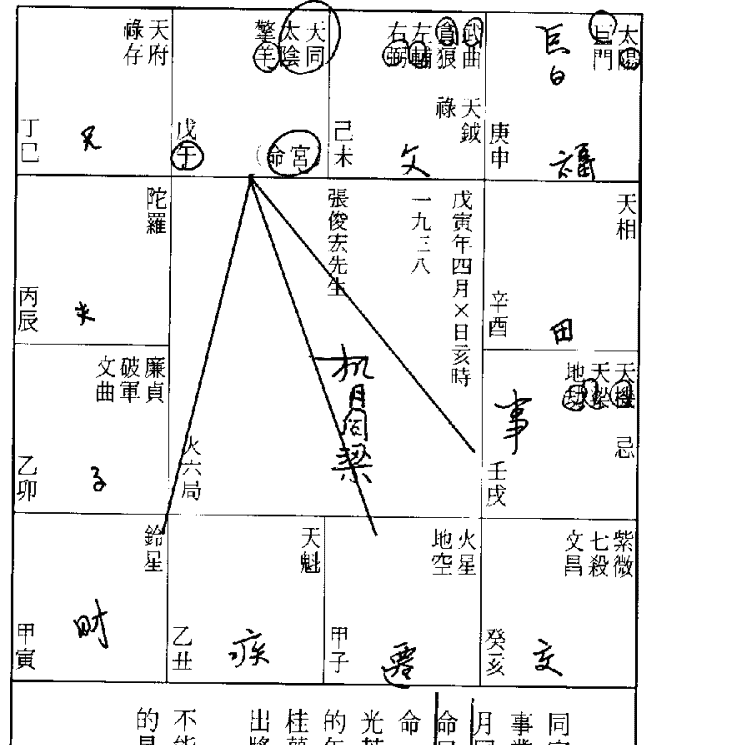
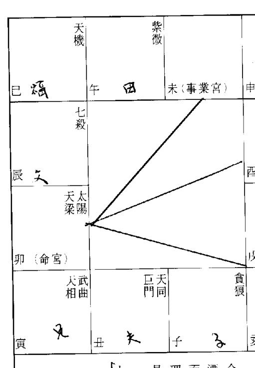
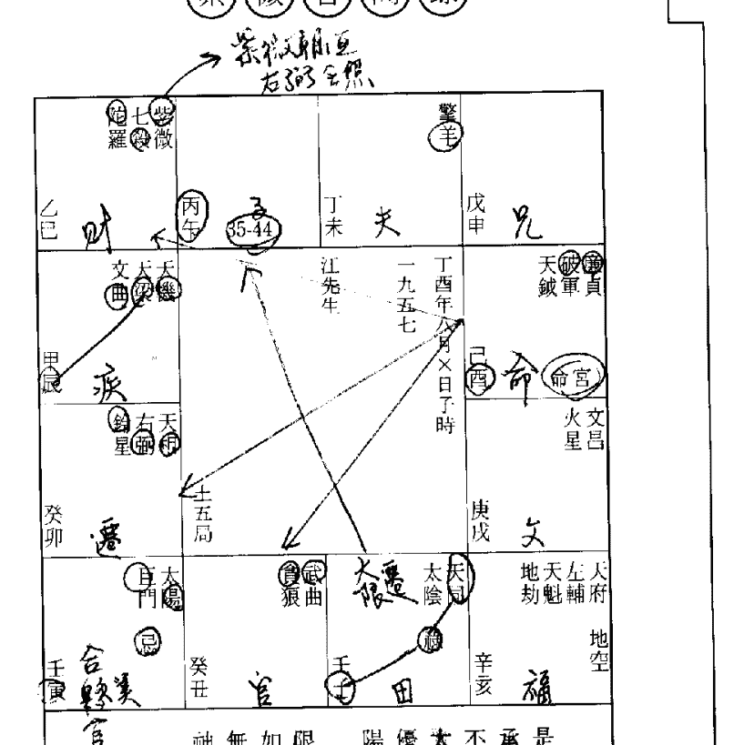

## 紫微答問錄

## 推論篇

賴銘賢/著

命運新趨勢 禾馬006

命運新趨勢 006

賴銘賢/著

M 禾馬文化

光是台灣一地，每一個命理單位(兩小時)內，就有八十名初生兒呱呱落地，他們共用同一命盤，但此後的遭遇都一樣嗎？這是許多人的疑問，對命理學者而言，更是一項嚴肅而殘酷的挑戰！賴銘賢先生有鑑於此，嘔心瀝血將十二宮之可算與不可算及其涵義，做了最新的詮釋，導正坊間江湖術士的錯誤觀念，並且提供不同方向的思考，寫就這部三冊各自獨立，合則為一的「紫微答問錄」。〈推論篇〉的特色在於技術分析與條件輸入，此乃斗數最高層次的論命技術，目的在破除坊間大多數命書注重塵封往事斷準的弊病。

ISBN 957-799-225-0
9 789577 992253
00190

封面設計／彭琇珠

賴銘賢／著

禾馬文化事業有限公司／發行

國立中央圖書館出版品預行編目資料

紫微答問錄．推論篇／賴銘賢著.-- 初版.-- 臺北市：禾馬文化出版； [臺北縣中和市]：大河總經銷, 1996[民85] 面； 公分.--(禾馬命運新趨勢 ; 6) ISBN 957-799-225-0(平裝) 1.命書 293.1 84013039

作者 賴銘賢
發行人 林淑華
主編 冷麗娟
出版者 禾馬文化事業有限公司
社址 台北市南京東路五段230號6樓之7
聯絡地址 台北市南京東路五段24號11樓之4
電話 (02)762-7905～6
傳真 (02)746-660
總經銷 大河圖書物流事業有限公司
電話 (02)338-907（代表號）
傳真 (02)305-5099
排版 建宏排版有限公司
初版 一九九六年二月

◎行政院新聞局版臺業字第6187號 本公司法律顧問／王惠光律師 有著作權．翻印必究 ※本書禁止出租，否則進行法律訴訟 ※本著作物經著作權人授權發行，包含繁體字、簡體字。凡本著作物任何圖片、文字及其他內容，均不得擅自重製、仿製或以其他方法加以侵害，否則一經查獲，必定追究到底。 （本書遇有缺頁、破損倒裝，請寄回更換）

禾馬命運新趨勢006 紫微答問錄 《推論篇》

國際書碼 ● ISBN 957-799-225-0 Printed in Taiwan 定價 ● 新台幣190元

## 一招半式闖江湖
### 《紫微答問錄》「推論篇」自序

坊間的斗數書籍可謂汗牛充棟，琳琅滿目，翻開任何一本，瀏覽一遍，發現詮釋的方法五花八門，多如牛毛，多半在單星單宮的死胡同中圍繞，好像不那樣便是矯情，必然遭來奚落，甚至口誅筆伐。

在斗數的領域裏，單星單宮的論命方式是「因果互動關係」的誤解，認為眾星有情，所有星曜都賦有各自不同的性質，進入哪個宮位，便產生情況。這類誤解有如西洋人認為樹上的蘋果含有豐富的感情，越接近地面，感情越豐富，瓜熟蒂落就是基於這層「互動關係」。牛頓獨排眾議，首倡蘋果無情，有情的是地心引力——蘋果落地乃是地心引力的關係，離地面越近，地心引力越強，速度也就越快。牛頓細心推敲，瞭知蘋果與地面的「因果互動」關係，因而發現了顛撲不破的「萬有引力定律」。

斗數學者認為所有星曜都具有不同的性質，這顯然是接受古籍誤導，無力改善，情有可原；不過，斗數在草創之初，一切未臻圓滿完美，有待後人不斷演繹，逐項改進，現代人若仍錯就錯，遵循著古人的腳步，囫圇吞棗，如法炮製，那就不可原諒了！

眾星被賦予星性與西洋人誤認蘋果有情的觀念，如出一轍，依照邏輯三段論式，前提失真，結論必不可能有效，命理真相往往因此蒙蔽，功能從此混淆。學者宜效法牛頓勇於顛覆傳統的精神，斗數研究才可望撥雲見日，導入正途。

《斗數宣微》可說是最早擺脫單宮單星論命的一部古籍，推斷民國初年一些叱吒風雲的英雄豪傑，無不如斯響應，矢矢中的，但是詳加研究，卻又發現作者觀雲主人立論雖新，同樣犯了時下命理學者的通病，無法擺脫在既知事實「套命」的窠臼。官干雖然依法安上，他從未運用宮干四化（祿忌），推論當事人的窮通禍福，整張命盤宛如一潭死水，水波不興，激不起任何漣漪。

我們隱約發現，觀雲主人八字強於斗數甚多，因此將八字引進斗數界域，只見滿紙八字術語，諸如「金空則鳴」、「火空則發」……等等，斗數與八字合參，你儕我儔，不再涇渭分明，最後你搞不清楚他究竟在探討斗數還是八字。

古籍《全集》、《全書》也好，《斗數宣微》也好，無一不是在推銷「宿命」、強調「斷準」，在這樣的傳承下，業餘研究或算命先生只能亦步亦趨地圍繞在宿命與斷準的氛圍中，盲修瞎練，無法超升。在一般民眾的心目中，算命先生應該是仙風道骨，不食人間煙火，好像《封神榜》裏的姜子牙或《三國演義》裏的蜀漢軍師諸葛亮那樣，羽扇綸巾，掐指一算，宇宙穹蒼、森羅萬象，了然於胸，應對自如。

這些人固步自封，閉門造車，終其一生追求的只是古賦文或「秘笈」的解讀，對於高段的技術分析與條件輸入，從不關心，也不屑一顧；有人提出一些符合方法邏輯學的科學理念，他們一概嗤之以鼻，認為「殺雞焉用牛刀」。傳統祿命術一旦與西洋方法學結合，「神仙論斷」的神話將立刻破滅，神秘色彩盡失，人客從此不再大呼過癮，江湖算命的神秘感與權威性遭到質疑，隨即而來的是門可羅雀，生活匱乏，你說他們樂於見到此情此景的發生嗎？

命定的範圍有些是註定的、無力自主的，例如門風背景、六親緣分；有些非命定的、可以自我主宰的，例如婚姻、財帛、人際關係、事業。命理只考慮時間，從未考量空間，蓋時間條件相同，星曜無一不同，按理說，成就應該一樣，何以出現差異？歸究起來，發現問題的癥結就在於個人所屬的空間（生長環境）、教育程度、後天努力，以及某些機緣巧遇大大不同，因此成就懸殊，宛若兩般人。台灣的官場景觀相當奇特，升遷調職，不按牌理出牌，讓人難以捉摸，明明政績平平，乏善可陳，卻平地一聲雷，迅速竄起，譬如連戰、陳履安、錢復等人，他們不像一般人必須浴血沙場，歷經選戰，步步為營，循序漸進，而是驀然沖起，一飛沖天晉升之速，歷代罕見。究其原因，無非家中有個能幹出色的老爸，不是黨國元老，就是財閥宿耆。未曾考慮上述因素，拚命在命理層次捕風捉影，緣木求魚何異。命理無力捕捉空間因素與六親緣分，許多學者卻一直無法認清，大鑽牛角尖，奮力求尋一些斷準的因素，結果治絲益棼，雖窮畢生精力，依然鏤影吹塵，徒勞無功。

> 哲學家史賓諾莎（Spinoza）說，「自由乃是對必然性的一種體認」

我們在體認必然性（命定）後，要選擇和它維持一種怎樣的關係，才算「自由」呢？「推論篇」詮釋的都是命理充分統轄的範疇，包括命宮、夫妻、財帛、遷移（羣己關係）、事業，合稱四正；這些都是個人所能及的事項，符合史賓諾莎的「自由」範疇。有人質疑道，「光這一招半式，足以闖蕩江湖嗎？」項目雖少，卻是每個人終其一生追求的目標，一招半式已足矣。心理學有所謂的「選擇性的認知」，反映人類的普遍心理——多數人總是牢記住偶爾兌現的一個預言（巧合），輕易忘懷九十九個沒有兌現的謊言。兌現的必勝之於文，載於書卷，未獲兌現的銷聲匿跡，不是丟進垃圾筒就是略而不提——久了，淡忘啦！學術探討標榜「互為檢驗性」，透過大量觀察、反覆實驗，方法正確，答案必然有效，絕不能張三適用，李四卻不適用。斷準了，應有紮實的數據支撐，這是典型的歸納推理；斷不準，也應把癥結找出，對症下藥。「準了才算，不准不算」，不過是回避挫折的處世態度，不是嚴謹的學術探討應有的認知。

本書的特色在於技術分析與條件輸入，這是斗數最高層次的論命技術，破除坊間大多數命書注重塵封往事斷準的弊病。所有的問題都是平日業餘研究中的遭遇，經過一番深思熟慮、重複實證後，呈現出來，立論客觀，數據禁實，希望有助於讀者跳出宿命的框框，早日登堂入室，一窺正統斗數的堂奧。

《古命今論》、《斗數閱微》出版後，受到許多熱心朋友的愛顧與鞭策，實在銘感肺腑。購，於今新書問世，特地刊載聯絡住址與電話，若對本書或任何書籍有所指教，請親臨或來信。

台中市南屯區南屯路二段四十四號，
或於下午兩點以後六點之前來電（○四）三八九四七四七。

賴銘賢
序於南屯工作室
歲在乙亥教師節

## 目錄

### 【卷一】

### 自序

### 命宮

### 星羣組合的類分與蘊含的涵義

### 斗數的格局與論命的次第

## 【卷二】

### 空宮與借星

### 夾的作用

### 夫妻宮

### 契融與刑剋

### 婚姻的調適法則

### 重婚與離婚

### 【卷三】

## 財帛宮

### 殺破狼是否必主開創？

## 【卷四】

## 遷移宮

- 照見空劫便不適合理財嗎？ 086
- 發過不再發的自然律 092
- 代夫出征適當嗎？ 099
- 遷限進行中遷移宮的作用 109
- 祿在遷移為何難暢其流？ 110
- 運動，哪些人隨心心動的機率較高？ 126

### 【卷五】

## 事業宮

- 轉業所應考慮的因素有哪些？ 136
- 考試、選舉、升官，與事業宮的良窳有關嗎？ 146
- 從命盤能看出一個人的事業成就嗎？ 163
- 史蒂芬·霍金的啟示 167
- 限運進行中祿忌並見，該如何分辨？ 173

## 【卷一】

### 命宮

### 星羣組合的類分與蘊含的涵義

問：坊間的斗數書籍大多以單星或單宮的方式論命，例如太陽坐命男主幼年剋父，晚年剋己，女命則刑夫，晚年剋子；廉貞坐夫妻宮，必主三婚。有人說，這些論調不但充滿危言聳聽，而且無法將外在三方的優劣點一一道出，是否如此？

答：單宮或單星論命，難免有「以管窺豹」，無法全盤考量的遺憾，如果把命宮與命宮三方諸星（四正）視為一個族羣，將可避免這項缺失。

斗數講求『三方四正』的宮位，等量齊觀，可視為一個「結構共同體」，互相制衡、互相牽制，有著牢不可分的密切關係，這些宮位（命宮、財帛宮、遷移宮、事業宮）。正好是大多數人一輩子追求的重心，詳細推敲這些宮位坐守的主星、六吉六煞、祿忌的分佈情況，便能明確看出結構的優劣良窳。

- 我們約略統計，約可分為下列四種組合：
- 第一種是「殺破狼」。
- 第二種是「紫府廉武相」。
- 第三種是「機月同梁」。
- 第四種是「巨日」。

### 問

四組星羣當中，隨著紫微、天府星系佈星的異動，第一種和第二種、第三種和第四種會出現重疊的現象，例如前者紫殺在巳亥、武貪在丑未，後者同巨在丑未、機巨在卯酉。有些組合不一定會齊，例如天府在巳，財帛宮無主星、遷移宮為紫府廉武相；太陽在子午坐命，財帛宮少廉貞與武曲，所以只是五分之三的「紫府廉武相」；太陽在子午坐命，財帛宮無主星、遷移宮為天梁、事業宮為巨門，因此是完整的「巨日」和四分之一的「機月同梁」。「殺破狼」星羣，必成三足鼎立，見七殺，財帛宮必為貪狼，事業宮必為破軍，如影隨形，亦步亦趨，這是佈星的自然趨勢。「殺破狼」只與「紫府廉武相」交疊，絕對與「機月同梁」或「巨日」不共戴天；不過，我們在古籍中卻不難發現兩者並論的怪異文字，自屬一種錯誤的引導。四種組合各自概括了哪些涵義？

### 答

四種星羣涵義只是隨著環境的需求、社會生態的變化，應運而生，無非是方便對星羣寓意的統計與歸納，難免充滿著濃烈的自我主觀，僅供參考。

- 1. 「殺破狼」：①本質波動，不耐久坐，生命曲線呈拋物線式，落差其大；②多半選擇離鄉背井，赴外地打拚；③衝擊性較強的武市行業成為這類人的最愛，並有晚發的跡象。
- 2. 「紫府廉武相」：性格平穩，自信獨立，成就高低端視輔弼之有無照入，照則「君臣慶會」，待人處事，圓融純熟，擁有領導統御的能力，能與人戮力同心，共創一番大業；不照則「孤君」，不擅領導，也不喜歡受人領導。
- 3. 「機月同梁」：思緒細膩，耐力特強，適於擔任文書尺牘的行政工作，個性謹慎內斂，生命週期呈階梯式，只宜安步當車，無法躁進。
- 4. 「巨日」：性格朗爽，喜歡幫助別人、了解別人，稍具叛逆古怪的性格。

### 斗數的格局與論命的次第

問：上述涵義只是就普遍性而言，真正的定義尚需依六吉六煞、祿忌安妥，才能下定論。例如「殺破狼」並非只要構成就註定一生營營擾擾，死而後已，尚需觀察照煞多寡而定，原則上說，煞星照人越多，波動飄泊的性質就越顯著，準此而言，波動難安並非「殺破狼」的專利，其他組合只要照煞四顆以上，仍主波動飄蕩，無法安寧。

答：格局雖有四十一種，卻只有「君臣慶會」、「火貪」、「鈴貪」等是真正的格局。

問：《全集》《諸星皆取貴》臚列了四十一種格局，照古賦的說法，只要構成，功名富貴宛如囊中取物。天下果真有這麼如意的美事嗎？

問：斗數真正的格局構成條件為何？吉格與凶格各有哪些？

答：無論吉格或凶格，概由兩顆或兩顆以上的主副星相互照耀，生光化電，產生特殊能量。形成格局的條件，只要在三方會齊即算，不限定非同宮不可。吉格、凶格局，其他所謂的格局如「天同在子，水澄桂萼」、「巨機在卯，位至三公」…等等，只能算是佈星的正常現象，不能稱為格局。
古人的統計未免太過一廂情願，認為只要構成，公侯將相，榮華富貴，順手拈來，絲毫不沾痕跡，完全忽略了個人的運勢吉凶、機緣巧合，以及後天的苦幹實幹，宿命論無疑。
約略統計一下，應有下列幾種：

- (1)「君臣慶會」。

### 問

構成吉格並非注定功名富貴，唾手可得。

### 問

這些吉格之間有什麼差別？原則上，「君臣慶會」、「陽梁昌祿」與「火貪」、「鈴貪」、「火羊」……等格局，略有不同。前二者以文職取貴，「君臣慶會」古稱「一呼百諾」，擁有領導統御的潛能，後天勤勉奮進，每每成為社會中堅、國家棟樑；「陽梁昌祿」古...功能雷同，效果略遜。

其中「火陀」、「鈴羊」、「鈴陀」等是我們根據古籍「火羊」格附加上去的，

### 吉

- 凶格：
- (1)「鈴昌陀武」鈴星、文昌、陀羅、武曲
- (2)「羊陀夾忌」擎羊、陀羅
- (3)「貪昌」。貪狼、文昌
- (4)「廉昌」。廉貞、文昌
- (5)「巨火羊」。巨門、火星、擎羊
- 功能雷同，效果略遜。

## 紫微答問錄

## 答問

> 凶格會帶來哪些破壞？是不是必定肇凶？

高。底下分析諸凶格可能造成的殺傷力，並就古今觀點做個比較：

- 1. 「鈴昌陀武」。古籍稱「限至投河」，實在有點駭人聽聞，現代將之解釋為，生命歷程中起落頗仍，有瞬間暴敗之虞，似乎較明智而合理。

### 廉昌

- 2. 「羊陀夾忌」。此凶格可能肇何凶禍，請參閱〈夾的作用〉，此處不贅。
- 3. 「貪昌」。古籍稱「政事顛倒」，現代則解釋為「生無法避免「不務正業」、「用非所學」，故宜學習一套放諸四海皆準的學問，譬如管理學、語文、做人的道理，才能立於不敗之地。」
- 4. 「廉昌」。古籍稱「粉身碎骨」，好像極易由顛峰摔下，跌個粉身碎骨，同樣屬於語不驚人死不休的價值判斷；現代的說詞是，容易因判斷錯誤，造成無法彌補的過失。
- 5. 「巨火羊」。古籍稱「終身縊死」，意味著一生易遇凶變，導致走上自我了斷的路途。此賦跟「鈴昌陀武」、「廉昌」一樣，都是充滿濃烈的自我主觀，應該從寬解釋為人生路途一波三折，卻又苦無對應良策，以致精神緊繃，解脫無門。

## 紫微答問錄

## 答問

命盤排定後，如何推算命運？
斗數是一種整體性的祿命術，必須結合命宮和命宮之外的三方星曜，才是正規論法。推論命運的步驟與次第應該是這樣的：

- (1) 推敲星曜結構的優劣。命理結構宛如建築藍圖，觀圖可知結構優劣良窳，我們將命局粗分為強命與弱命兩種：
①強命：三方四正皆有主星坐守，也就是這些宮位所象徵的人事物，都能面面俱到。
②弱命：命宮或三方有兩個宮位是空宮（內無主星），該宮象徵的人事物承擔力較弱，面臨重大事件的抉擇，優柔寡斷，成為一生中最弱的一環。

原則上，凶格不註定肇凶，必須後天行運中，忌星再度觸及，地雷火炮引爆，才兆凶禍；一旦缺乏引動的手續，凶格充其量只是個啞彈，不虞為人生帶來任何震撼。

## 推論篇

- (2)注意命中構成哪些特殊格局或凶格。
- (3)探討行運得失。行運是後天環境，又叫「生命週期」，限運進行間，無論男女一律由命宮起大限，然後陽男陰女順時針方向，陰男陽女逆時針方向行運。
雖不同，十二宮的定位方法仍不變，就是以大限宮位為命宮，依次為兄弟宮、夫妻宮……、父母宮。想探知命與社會環境結合，在此階段有哪些得失，同樣應考慮三方星曜，以及大限宮干化出的祿忌的牽引情況，才能隱約了解此限有哪些得失消長。這部分只介紹到此，詳細情況請參閱〈財帛宮〉、〈事業宮〉，將有更深入的探討。

大限以十年為進位，運限走完，換另一個繼續前進。邁入嶄新的運限，宮與星曜

## 推論篇

## 紫微答問錄

### 空宮與借星

問：沒有十四顆主星的宮位稱為空宮，斗數星盤以紫府在寅申的兩張命盤最為完整，其他命盤至少都有兩個以上的空宮，其中又以紫殺在巳亥的兩張最殘破不全（有四個空宮），出現不是星曜過度集中，就是支離破碎，殘缺不全。

有些主張，宮內無主星，可引對宮星曜用之，稱為「借星」，譬如命宮無星，可向遷移宮商借，財帛宮無星，可向福德宮商借，像這樣楚材晉用的商借方式，有其必要嗎？

答：似無必要。

三方四正佔了命盤三分之一的宮位，上述主張要是成立，那麼將有三分之一的宮位被涵蓋，只見星曜飛來飛去，絡繹於途，大打迷糊仗無疑。

問：有人認為，不應稱為「借」，而是「照」，因為星曜從外照射而入，所以感應的力道必須打折。如此解釋，似乎比較婉轉，也較合理？

答：「借」或「照」的詞面解釋並不重要，重要的是認清空宮的定義為何。
空宮所象徵的人事物必弱，承擔力不足，每每成為一生最弱的一環。譬如命宮無星，主觀意識薄弱，隨勢俯仰；財帛宮無星，無法承擔太多的錢財；遷移宮無星，人際關係的互動能力弱；事業無星，無力承擔重責。這些現象只要存在一天，所有的借星安宮不過是畫蛇添足，仍掩飾不了上述缺陷。

問：「紫府廉武相」、「殺破狼」、「巨日」、「機月同梁」四種組合中，哪一種組合出現空宮的機率較高？

答：四種組合中，「殺破狼」在等邊三角形上屹立，七殺坐命，財帛宮必為貪狼，事業宮必為破軍；貪狼坐命，財帛宮必見破軍，事業宮必見七殺；破軍坐命，財帛宮必見七殺，事業宮必見貪狼，走遍天下並無二致，因此命財事絕無空宮的機會，對宮則可能，例如武貪在丑未、紫貪在卯酉、廉貪在巳亥，對宮皆為空宮。『紫府廉武相』三方出現空宮的機會也不多，只有在上述宮位與貪狼同度，才見空宮；此外，天府獨坐，財帛宮永遠是空宮。相對而言，『巨日』和『機月同梁』出現空宮的機率高出很多，其中又以『巨日』在寅申的空宮最多，財帛、遷移、事業宮俱無主星，最為柔弱。

### 問

空宮屬弱，是否意味著一生毫無成就可言，只好懵懵懂懂，悒鬱以終？

### 答

命理只考慮時間因素，時間相同，命盤星曜一模一樣，例如巨日在寅申坐命，三方不見半顆主星坐守，外在三方所給予的助力不多，競爭力亦弱，但不能廣泛的解釋為『一世入撿角』。只能說，類此命局即使位居要津，擁權握勢，也只能當

### 問

空宮的現象對殺破狼和機月同梁造成的影響，如人飲水，必有不同的感受吧？

### 答

殺破狼只有對宮可能構成空宮（必與紫府廉武相同位），命財事永遠不虞出現弱勢，尤其見火鈴之一，慾望盛盛，滿足度高，運勢見祿星引動，常能一鳴驚人，發得驚天地泣鬼神；忌星入侵，從雲端摔下，瞬間化為烏有。對這類人而言，橫發與橫破好像永遠毗鄰而居——就好比棒球比賽，全壘打與「接殺」永遠是一線之隔——全壘打接受羣眾英雄式歡呼，接殺剛好相反，英雄氣短，黯然出局。機月同梁的空宮出現不特定狀況，時而遷移、時而命財事，不一而足，如果財帛宮見之，想要賺發財財，並非易事，即使行運推波助瀾，硬是發了不少，也是運## 紫微答問錄
## 答問

古籍常把六吉星中的輔弼、魁鉞、昌曲夾命宮當成一種貴格，這些方法正確嗎？六吉星由於安法互異，故分布十分散落，我們將各種不同的夾列出，並對古籍的看法提出辨正：

-   (1) 輔弼：三、五月生夾未，九、十一月夾丑。《陳希夷紫微斗數全集》《注解太陰賦》上稱「輔弼夾帝為上品」，紫微、天府這兩顆帝星坐命或會照，依例必須照見輔弼，方成「君臣慶會」巨格，夾輔只是別人來幫襯，不是本身擁有領導統御的潛能，故毫無實質作用可言。
-   (2) 魁鉞：丙丁年人夾戌宮，壬癸年生人夾辰宮。魁鉞古稱「貴人星」，《注解骨髓賦》上說「夾貴夾祿少人知」，此貴即指魁鉞，古籍譽之為「富貴必矣！」夾不如照是不爭的事實，夾只是前後有所憑恃，若進而許以富貴，顯然有點唐突兼荒謬。蓋上述年次生人，只要命坐辰或戌，便是既富且貴，天下豈有這等好事？
-   (3) 昌曲：寅辰時生夾未，申戌時生夾丑。《注解骨髓賦》內載「夾昌夾曲主貴兮」，《諸星格局皆取貴論》更譽為「文昌暗拱格」，得此便是明經科舉的幸連兒，談笑封侯，來得甚易。昌曲只夾丑未二宮，要讓昌曲夾命宮，必是八月寅時、十月辰時、八月申時、十月

### 六吉星

-   六吉星↓
左輔  右弼
天魁  天鉞
文昌  文曲

相對的，橫敗的機會也少；唯有欲望熾盛並迅速行抵巔峰的人，才可能橫發之後橫敗。

過即倒，一切還原。但是這種機率並不高，蓋財宮既弱，發財的欲望多半不高，

夾的作用

## 推論篇

問 《全集》註解骨髓賦》中載有「夾空夾劫主貧賤，夾羊夾陀為乞丐」，讓人望之生畏；遭空劫夾制，就註定一生阮囊羞澀或沿門托缽乞食嗎？

答 賦文有點駭人聽聞。

如果說，吉星夾是兩名保鑣扶持，那麼，煞星夾就宛如遭兩名凶神惡煞挾制，勢將動彈不得，萬一本宮化忌，更是無力擺脫，有著「無米兼閏月」的淒慘。

古籍所載的煞星夾有：

-   (1) 空劫夾：已未時生夾巳宮，丑亥時生夾亥宮。
(2) 火鈴夾：寅午戌年生人，得夾任何一宮。
(3) 羊陀夾：任何年次生人，除辰戌丑未之外，都有受夾的機會。

三種情況中，空劫夾、火鈴夾，僅某些特定對象有機會構成，無法適用於任何

問 羊陀所夾宮位的旺弱，必有不同效果衍生，其情況各為何？

答 問。 人, 難成普遍定律, 因此我們習慣上只確認羊陀夾, 而將空劫夾、火鈴夾束之高閣。 夾制宮位的旺弱，必有不同效果衍生，其情況各為何？

-   (1) 命宮有星。自主力強，雖受環境掣肘，仍會有所掙扎，努力掙脫命運環環相扣的鎖鏈；不過意志力雖強，卻讓人感到一輩子都在艱辛奮鬥，相當辛苦。
(2) 命宮無星。命局本弱，自主力不強，再受羊陀夾制，更是處處受制；不過本身已弱，企圖心不大，圖個溫飽即心滿意足，因此倒也安分守己的。
(3) 羊陀夾忌。命宮受羊陀所夾，原已受制，本身又化忌，更有著「屋漏偏逢連夜雨」的淒慘。
(4) 羊陀夾祿。祿的人慵定，也相對懶散，凡事淡然處之，即使受到環境的辛

-   (1) 甲年生人，巨門、太陽在寅坐命。
(2) 乙年生人，太陰在卯坐命。
(3) 丙年生人，廉貞、貪狼在巳坐命。
(4) 丁年生人，巨門坐命於午。
(5) 戊年生人，天機坐命於巳。
(6) 己年生人，文曲在午坐命。
(7) 庚年生人，天同、天梁坐命於申。
(8) 辛年生人，文昌在酉坐命。
(9) 壬年生人，武曲、破軍在亥坐命。
(10) 癸年生人，貪狼在子坐命。

任何年次構成「羊陀夾忌」的機會均等，這些宮位到底有哪些？忌星不一定由十四主星化出，例如己、羊的忌星就不是主星，而是由文曲、文昌，儘管如此，仍然透露了此蛛絲馬跡：

制，也以樂觀的態度面對，苦中作樂的型態。

問
羊陀夾忌有「屋漏偏逢連夜雨」的淒慘，不過，根據前面所述，受夾宮位的旺弱，個人的人生觀必定有一些差異吧？

答
夾的宮垣強弱有正反兩種意義衍生，茲舉一例說明之：

-   (1) 羊年生人構成羊陀夾忌，宮內無主星，夾力更甚，當文昌化忌時，猶如泥菩薩過江——自身難保，更遑論擺脫外在環境給予的強大壓迫了。不過這種人倒還滿認命的，默默地承受各方所加諸的拂逆，只要肯誠心幫助他人，別人吃肉我喝湯，倒也無災無悔。

認命的，默默地承受各方所加諸的拂逆，只要肯誠心幫助他人，別人吃肉我喝湯，倒也無災無悔。

-   (2) 己年生人也是構成「羊陀夾忌」，但宮強星旺，其中「君臣慶會」、「鈴貪」

左页命盘（紫微斗数排盘）：

**命盘中心**：
郝柏村

**宫位与星曜分布**（按地支顺序排列）：
- 巳宫（己巳）：天机、天梁
- 午宫（庚午）：七杀、右弼、命宫（圈出）
- 未宫（辛未）：紫微、文曲、忌
- 申宫（壬申）：破军、文昌、天钺、擎羊
- 酉宫（癸酉）：地空
- 戌宫（甲戌）：廉贞、天府、左辅
- 亥宫（乙亥）：贪狼、铃星、天姚
- 子宫（丙子）：天同、巨门、地劫
- 丑宫（丁丑）：武曲、天相、禄
- 寅宫（丙寅）：无主星
- 卯宫（丁卯）：太阳、天梁
- 辰宫（戊辰）：七杀、右弼

**备注**：
- 本命盘为“土五局”。
- 出生时间：己未年七月×日寅时。

右页命盘（紫微斗数排盘）：

**宫位与星曜分布**（按地支顺序排列）：
- 巳宫（癸巳）：天机、天梁
- 午宫（甲午）：七杀、天刑
- 未宫（乙未）：紫微、天魁
- 申宫（丙申）：破军、陀罗、文昌、忌、命宫（圈出）
- 酉宫（丁酉）：无主星，有“辛未年九月×日丑时”标注
- 戌宫（戊戌）：廉贞、天府、火星、擎羊、地劫
- 亥宫（己亥）：贪狼、铃星、地劫、左辅
- 子宫（庚子）：天同、巨门、禄
- 丑宫（辛丑）：武曲、天相、天钺、右弼
- 寅宫（庚寅）：无主星
- 卯宫（辛卯）：太阳、天梁、火星、天刑
- 辰宫（壬辰）：七杀

**备注**：
- 本命盘为“火六局”。
- 盘中有一条从“卯”宫（太阳天梁）指向“酉”宫的对角线。

左页文字（命理解释）：

这个命盘的主人为郝柏村先生。北斗帝星坐命，受羊陀所夹，夹的若是一般星曜，将能自我约束，不料夹的是帝君星，自命不伏，必会负隅顽抗。

郝军头半生戎马，指挥千军万马，从容若定；直至褪去戎装，贵为阁揆，列席立法院时，面对立法委员的质询，仍不改其铁腕作风，仍是对立委颐指气使，经常将立法院的气氛弄得剑拔弩张，紧张不已。

右页文字（命理解释）：

命受羊陀所夹，待人处世趋于谨慎小心，本宫无主星，又受忌干扰，更蕴含量或隐的悲剧性格，终其一生，无力走出这道阴影。

三方吉星多照，煞星不临，温柔敦厚，谦恭有礼，必须认清命局，清心寡欲，恬淡自甘，选择稳定性高的行业，较无闪失；若不甘寂寞，线短汲长，自不量力，投入竞争剧烈、波动异常的环境，必然疲于奔命，心余力绌，痛不欲生。

## 紫微答問錄
## 推論篇

問 張俊宏先生天同太陰在午坐命，按古書的說法，在午不如在子坐命吉祥，蓋天同屬水，午宮屬火，水火相沖。某專家指出，經他多年細心的研究，發現尚有例外出現水午同陰在午，只有戊年生人最佳，理由有二：(1) 左右鄰官構成雙祿夾命，這個貪狼化祿是一個橫發的格局；(2) 午官坐擎羊，此煞雖具鍛伐、挫敗、打擊，但擎羊屬金，助生同陰水，因此能夠反敗為勝。「馬頭帶箭」必須符合上述條件，才算成格。專家的議論合情合理嗎？

答 擎羊是顆強悍勇猛的大煞星，有如劍戟，古人認為五行屬金的擎羊，進入屬火的午宮，金必受燦，有如八字學的食神制煞，「假煞為權」，反為吉兆。午在生肖馬，故稱「馬頭帶劍」，專家所稱「馬頭帶箭」是錯誤的詮釋。 科學的論述講求普遍性與客觀性，絕對不可能張三適用，李四就不適用；斗數的論命也應作如是觀。擎羊在午，只有丙、戊年生人才有機會構成；專家又將範圍縮小為戊年貪狼祿與祿存夾命才適格，條件又比原來的更嚴苛，如此狹隘的祿命觀，普遍性與客觀性當然不夠，遲早會被淘汰出局。 雙祿夾輔是鄰方強旺，暗示兄弟、父母有助，鐵定不在自己的三方，因此即使如他所說，貪狠祿是個橫發的格局，也是兄弟的事，並不代表自己擁有該項潛能，仍與發財緣慳一面。 此命財帛宮、遷移宮俱無主星，屬弱無疑；財宮無星，可以解釋為不會把全副精力用在賺錢上，即使勉強為之，所得也不會太多。準此觀之，此命應不可能在短期內發得驚天地泣鬼神。

### 問

某專家堅稱，張俊宏同陰在午坐命，水火相沖，澎湃起伏，有如海水衝擊岸，一生驚險萬狀，潮起潮落，好運來得快去得也快。回顧他半生坎坷，在戒嚴的白色恐怖時期，艱辛倍嘗，居然能夠歷劫歸來，稱他「壓不扁的玫瑰」，實不為過。

### 答

張俊宏坎坷的命運，跟同陰在午坐命是否有關？
無論在哪個時代、哪個國度裡，體制越獨裁、越專制，白色恐怖就越瀰漫，生命財產就越沒有保障。很不幸的，民進黨的「理論大師」張俊宏就出生在那個充滿白色恐怖的時代裡，更不幸的是他投入了當時尚是「黨外」的民主行列，因此遭受政治迫害，銀鐺入獄，應是當初投入民主陣營已有的共識。
目前民主政治已逐漸紮根，那種「欲加之罪，何患無詞」的白色恐怖，已在民主鬥士拋頭顱、灑熱血的艱辛奮鬥下，早成歷史陳漬，相信如果張先生遲至今日再加入民主殿堂，將不致發生類似的不幸事件；是故，他半生乖蹇的命運，絕對與

## 紫微答問錄

張俊宏

同宮，財帛宮、遷移宮俱無主星，事業宮為天機天梁，為典型的「機月同梁」組合，是一個相當柔弱的命局。不過古人卻對同陰在子坐命，情有獨鍾，認為太陰在子正值光芒綻放，天同屬水，也強於屬火的午宮，並冠以溢美之詞為「水澄桂萼」，據說擁有此格局者，即能出將入相，集榮華富貴於一身。
理論上說，同陰在子午坐命並不能視為格局，那只是個稀鬆平常的星曜組合。

天同在午坐命毫無牽扯。或許有人說，張俊宏差一顆煞星（陀羅）就是「六煞俱彰」，煞星具有強烈的衝擊、挫折，會聚越多，凝煞的力道越大，摧枯拉朽，一生將飽受無情命運的煎熬與折磨，讓他痛不欲生。話雖這麼說沒錯，但我們仍不能一口咬定张先生就是這些因素而坐牢，蓋銀鐺入獄是一種災難，其他同命者若安分守己，不參與鼓吹民主改革，就不致於身陷囹圄。好運來得快去得也快，那是後天的際遇，僅憑天同在午坐命這樣的條件，並不足以描繪人生某個階段的休咎榮辱。

## 紫微答疑錄
## 【卷二】

### 夫妻宫
### 契融與刑剋

契融 70%
刑剋 30%

> 問
傳統的習慣，男女由互相愛慕，進而譜出戀曲，幾經花前月下，你儂我儂的交往過程，認定足以互託終身之際，通常都由家長或當事人找算命先生合一下婚。斗數的合婚是怎麼合法？

> 答
合婚的觀念，無論在古籍或老祖師手抄本中，絕無任何隻字片語的披露，傳統的

算命先生不是祭出江湖神煞，就是以生肖刑剋來判斷吉凶。在此提出我們客觀的看法，僅供參考。就命理而言，理想的姻緣，首要的條件是「契融」；另一個條件則為「刑剋」。「契融」與「刑剋」雖是兩個主要因素，但分量略有差別，前者較重，約佔七成左右，後者較輕，約佔三成不到，因此「契融」的因素扮演舉足輕重的角色。

> 按：此處的「刑剋」，指的是只是命理的刑剋，並非世俗觀念中生老病死的刑剋。

夫妻宮星群的同與不同，我們稱它為「契融」或「不契融」。所謂的契融，就是無論個性、生活方式、處世待人的方法和人生觀，兩人都庶幾近之，符合古人所說的「知性」，可以同居也（此處的同居僅指共同生活在一個屋簷下），婚姻是一輩子的事，相處方能天長地久，地老天荒。「不契融」的情況，剛好相反，兩者的觀念相去甚遠，生活步調不一，婚姻自然

命局是否強大，應該以三方宮位的旺弱為衡量標準，而不是只依據命宮所坐的主星，即能下定論。太陽、天梁在卯坐命的這個命，其實是個相當弱勢的命局，蓋遷移宮、事業宮分不到半顆主星，面對該二宮所象徵的人事物的處理，常流於依違兩可，一點都不像是個「女暴君」。會不會「奪夫權」？必須輸入丈夫的條件，始能窺出端倪。

### 問

有人對「契合」的看法提出質疑，認為契合或許有緣結為好友，但評論男女交往，仍以星辰強弱配合月令五行來研判，較為妥當。就以太陽、天梁在卯坐命為例，女命若生於六月，兩星皆旺，天梁主個性倔強，脾氣暴躁，太陽則豪邁朗爽，交遊廣闊，異性緣佳，丈夫能否忍受？無疑問。況且女命如此強勢，古人有云：「奪夫權」，凌駕其上，丈夫豈甘屈居下風？因此坐命的主星雖同，卻不一定交集，除非男的生在冬天，太陽火、天梁土俱弱，男弱女強，尚可搭配，否則個性衝突太大，更遑論「契合」了。由此觀之，配合五行月令的研判，似乎比「契合」的觀念來得重要？

答：筆者從來不用月令與五行相剋，將八字的觀念移植斗數，有點不倫不類，就像含有砂粒的美食，難以下嚥。
斗數的星曜不能公式化或類化為固定模式，例如不能認定天樑必主個性倔強，脾氣暴躁；太陽必為豪邁朗爽，交遊廣闊，異性緣佳，否則一輩子走不出宿命的死胡同。

問：理論上說，任何星曜都是中性的，不應加入主觀臆測，個人是否生性固執、脾氣暴戾？端視六吉六煞的分布而定——吉星照耀，煞忌遁形，性格傾向溫柔馴和；反之，憤世嫉俗，脾氣暴戾。

答：讓我們來一窺究竟。陽樑坐命，財宮為太陰，遷移、事業俱無主星，命局柔弱，遷移無星，人際關係的處理無法面面俱到；事業無星，承擔力不足，企圖心不高。如此柔弱的命局竟是個河東獅吼、婦奪夫權的女強人，實在無法讓人信服。

問：古籍列舉了諸星進入夫妻宮可能衍生的情況，看似證據確鑿，故有人奉為圭臬，深信不疑。譬如廉貞坐夫妻宮，定主三婚，依據的理由就是《論命身十二宮吉凶星訣便覽》所載：「廉貞入夫妻宮，男剋三妻，女剋三夫，加四煞，生離。」如此理直氣壯的說詞，是否有待商榷？

答：婚姻行為通常是一種「契約」。所謂的契約，指的是這個行為由雙方締結，經過雙方同意。是故，婚姻之事自然牽涉男女雙方，跟甲結婚，跟乙結婚，其「契融」程度必然不同，必須逐一輸入條件，相互比對，才能為婚姻窮通禍福。憑單一命盤即罔下定論，論斷再精準，立論再玄妙，亦屬偶合——不小心被猜中。

問：民間傳說三、六歲結禍，屬相剋，大凶；農民曆也有生肖相剋，例如雞配狗，謂之為「雞犬不寧」，這些經驗談可有憑據？

## 推論篇

那些畢竟是鄉野傳說，毫無根據的經驗談。

答

差三歲或六歲是否大凶，尚需命盤排定，輸入條件之後，吉凶方現；生肖只是一種代名詞，有人說，屬猴者都有不耐久坐的個性，「猴手猴腳」，實在是一竿子打翻整條船，純屬無稽之談。斗數另有合婚的方法，包括星星組合的搭配、年齡的刑剋，已在前面的文章中述及，此處不贅。

問

有個女孩出生不久，家人給她算了命，算命先生說，此女命帶「刑剋」，為免除將來論及婚嫁時，男方退避三舍，建議更改一個較「好命」的時辰。這種做法真的就此改變了命運嗎？

答

「刑剋」這類危言聳聽之詞是江湖術士的慣用語詞，經常嚇得一般缺乏命理常識的泛泛眾生驚慌失措，臉色蒼白。

為避刑剋而改生辰，這種事聽來既乖張且荒唐。

## 紫微答問錄

斗數研究人格特質、研判傾向，相當準確，頗有參考價值，譬如武曲星對婚姻狀況的研判，準確度就高得嚇人。

其實「刑剋」從命盤上是看不出來的，因為那是特例，並非天下所有同命者所共有的現象。

命，應無好壞之分，若有，也是主觀的粗糙認定。江湖術士由於欠缺正統的命理常識，只要煞忌俱彰或夫妻宮坐忌，便以刑剋論斷，即使彭祖這位「長壽伯」娶到她，經此一剋，天折無疑。

問

某專家稱，女命武曲在申酉戌等宮坐命或坐夫宮，秋天出生，通常以「女強人」稱之，事業企圖心熾盛，職業婦女居多，不過帶孤，對象不容易找，多半遲婚，即使勉強結婚，感情生活仍是孤獨寂寞，與夫婿兒女分居，親緣淡薄，萬一化忌，十個有八個婚姻破裂。

## 推論篇

底下二命例的婚姻因第三者的介入而亮起紅燈，瀕臨破鏡邊緣，一些好友無不出

### 婚姻的調適法則

經驗法則指出，「當判斷一事時，若牽涉另一條件，必須將另一條件輸入，論斷才不致偏頗。」婚姻自是兩個人共同攜手經營的人生大事，判斷婚姻得失，將另一半的條件同時輸入是必備的，僅憑單一命盤，妄下孤剋，是錯誤的示範——尤其僅憑武曲坐命宮或夫妻宮這麼牽強微薄的條件。

屬「紫府廉武相」星羣，或龍化蛇的關鍵在於左輔、右弼，照則「君臣慶會」，雖為女性，照樣呼風喚雨，不讓鬚眉，女強人無疑；不照則「孤君」，小格小調，難成大器。

### 答

讓人費解的是，為何女命武曲在上述宮位坐命或坐夫妻宮，秋天出生，註定就是「女強人」？武曲為何主孤，尤其其化忌之後，婚姻難保和諧美滿？

古籍記載，武曲五行屬金，有人認為秋天的節令和申酉戌等宮位，有扶金為強的作用，據此認定只要坐命，即為女強人，這就是單星單宮的典型論調，也是一種偏頗的言詞。斗數若只憑上述條件即能論命，我們何必大費周章，安十二宮和排其他主副星？武曲有的人稱它為「財星」，臨財帛宮便是堆金積玉，富甲一方的「好額人」，為何女命帶孤，……。旦化忌，婚姻十個有八個破裂？原因就在提出這些論調的人，心存先入為主的偏見，無一不是帶有濃郁個人色彩的主觀意識，因此星曜相同，看法卻背道而馳，也就不足為奇了。

正統的命理觀認為武曲既不為財星，也不主孤；它應該是中性的，是不是女強人，必須結合其他外在三方的主星、六吉六煞、祿忌，才見真章。武曲坐命，必

| 陀羅破軍 | 文昌太陽 | 地空擎羊鈴星天府 | 文曲陰機 |
|----------|----------|------------------|----------|
| 乙巳 (命宮) | 丙午 文 | 丁未 天府 | 戊申 田 |
| 甲辰 兄 | 地右劫弼 | 火六局 | 巨門 忌 |
| 癸卯 夫 | 火星 | 土廉祿貞 | 天梁 天左天相 |
| 壬寅 36-45 | 癸丑 財 | 壬子 官 | 辛亥 達 |

「契合」的觀念是尋見一個焦距相近，頻率能夠交集的伴侶，這樣的異性，無論生活習性、個性、人生觀，庶幾近之，婚姻生活方有望水乳交融，鵝蝶情深；若頻率和焦距相去甚遠，宛如兩條平行線，永遠找不到交集點，也就難保婚姻和諧；勉強生活在一起，必然痛苦萬分。

## 紫微答問錄

> 答
面排解，想盡辦法挽救這段即將破碎的婚姻。就命理而言，兩人屬契合還是不契合？

男命：
茲就契合與刑剋部分，分析如下：

-   (1) 契合部分：
①夫妻宮為『紫府廉武相』星群組合，選擇命宮是『紫府廉武相』星群的女性為伴侶，兩性契合，才算適格適性。
②要不然娶『殺破狼』星群組合的異性，亦屬不錯，也可保婚姻和諧。
③所娶的對象若是『機月同梁』或『巨日』，那就『不契合』了，婚姻路途必多齟齬。

(2) 刑剋部分：

| 天鉞天機 | 地左紫 劫輔微 | 火右破 星弼軍 |
|----------|--------------|--------------|
| 乙巳     | 丙午         | 丁未         | 戊申 |
| 地七 空殺 | 子           | 未           | 兄   |
| 甲辰     | 秋           |              |      |
| 天文天太 魁昌梁陽 祿 | 土五局 | 己酉 (命宮) 陀鈴天廉 羅星府貞 |
| 癸卯     | 愛           | 庚戌         | 夫   |
| 天武 相曲 忌 | 巨天 門同   | 擎貪 羊狠   | 文太 曲陰 |
| 壬寅     | 文           | 癸丑 奪      | 壬子 囚 | 辛亥 福 25-34 |

夫宮無主星，屬弱，弱宮的缺點是難以自處，一遇婚姻挫折，不是優柔寡斷，無力扶正，就是走極端，佈滿荊棘，令人為之捏一把冷汗。

婚姻之事並非只有命理因素，外在因素必多且難，先把牽絲扳藤、錯綜複雜的因果關係，一一化解，才為上策；過度依賴命理來解決難題，是捨本逐末的做法，並不足取。

### 女命：

### 契融部分：

①娶到己亥年生人可望受到妥善的照顧與愛護，算是佳偶。萬一不幸娶到壬寅年的女孩，可能受到拖累或虐待，婚姻生活變得之味無趣。
②能娶到戊戌年的女孩，則會鞏固婚姻，家庭充滿溫馨。娶到癸卯年的女孩，雖會受到盡情呵護，不過嚴重破壞婚姻的穩定，會讓人深覺家庭生活缺乏安全感，婚姻不美滿，連帶使事業無法順利衝刺。

①夫妻宮及其三方諸宮的星羣組合，最好與男命的命宮及其三方諸宮的星羣組合同類，例如壬寅女命的夫妻宮是「機月同梁」組合，那麼對象的命宮最好也是「機月同梁」，才可望琴瑟調瑟合。
②若嫁給「巨日」的男性，亦吉，也算成功了一半。

## Empathy. 移情作用

心理學上有所謂「移情作用」（empathy），又稱「情感的誤植」（pathetic fallacy）。這種作用是要把自己融入劇情中，對文藝而言，不是「旁觀者」，而是「分享者」。有一個英國老太太，觀賞「哈姆雷特」（Hamlet）最後決鬥時，竟情不自禁地在劇院中大聲警告：「當心！那把劍沁過毒藥！」這就是分享到了極致，陶然忘我的「自我涉入」。命理分析也一樣，無論站在任何立場，處理這類事情都應防自我涉入。

「解鈴還需繫鈴人」，婚姻之事必須把問題的癥結找出來，由當事人坦然面對，努力尋求問題的解決之道，才是正途。

中國人由於善良保守，面對婚姻糾紛，通常是「勸和不勸離」，不過「兩害相權取其輕」，假若這個結是個打不開的死結，仍由男女雙方自己權衡得失，尋覓一個對自己傷害最輕的途徑即可，大可不必擺起老夫子的說教方式，祭出五千年的傳統道德思想，訓斥一頓，蓋任何的勉強促成，都只是幫倒忙而已。魯迅先生說：「我不做調人」，即是這個道理。

問

照分析看來，兩人不但不契合，年齡也相剋，我們這群好友實在不用大費口舌，大力挽救這段同床異夢的婚姻，任他們自由發展即可？

準此而言，嫁給庚寅年生人雖會獲得照顧，但婚姻穩定受衝擊，嫁給辛卯年生人，情況剛好相反，屬吉凶參半。

- ①能嫁給壬辰、庚寅的男孩，是她的福氣，將會受到妥善照顧。若嫁給甲午、辛卯年生的男孩，將會受到拖累或虐待，能免則免。
- ②嫁給丙寅、辛卯年生的男孩，對鞏固婚姻穩定，甚有助力，屬吉配。若婚嫁的對象是庚寅、丁酉年生的男孩，則破壞婚姻的穩定，說離就離。
- ③嫁給「殺破狼」或「紫府廉武相」的男性，由於「不契合」，將會增加婚姻的動盪。

(2) 刑剋部分：

## 重婚與離婚

問

命例的男主角有了外遇，他的如意算盤是「一箭雙鵰」，但「明眼人眼裏容不下一粒砂子」，女方卻不允許丈夫金屋藏嬌，大享齊人之福，堅持丈夫必須跟那個狐狸精分手，否則離婚終結。她若想離婚，離得成嗎？

答

這是現實問題，無法從命理的角度來解析這些現象。
訴求離婚必須符合法定的原因才可以請求，所謂「法定原因」，原本民法上規定有十種原因：

- (1) 重婚者。
- (2) 與人通姦者。
- (3) 夫妻之一方受他方不堪同居之虐待者。
- (4) 夫妻之一方對於他方之直系尊親屬虐待，或受他方之直系尊親屬之虐待，致不堪為共同生活者。
- (5) 夫妻之一方以惡意遺棄他方在繼續狀態中者。
- (6) 夫妻之一方意圖殺害他方者。
- (7) 有不治之惡疾者。
- (8) 有重大不治之精神病者。
- (9) 生死不明已逾三年者。
- (10) 被處三年以上徒刑或因犯不名譽之罪被處徒刑者（參閱民法一○五二條）。

自從民國七十四年民法親屬篇修正部分公佈實施以後，民法第一千零五十二條增加了一項原因，就是「有前項以外之重大事由，難以維持婚姻者」。這項規定的公布，許多原本不能請求判決離婚的，現在有了通融的餘地。但必須是確實無法維持婚姻生活者才適用。至於是不是「難以維持婚姻」，必須按實際情形，由法院裁定。

判決離婚並不是一方告了之後，法院就必定判決。現代法律講求證據，命例的男主角顯然犯了上述第二項「與人通姦」的罪行，只要女方提出確鑿的證據，當然可請求法院判決離婚。

女方現在面臨的問題是沒有謀生能力，如果離異必定造成生活困頓，她有權力請求贍養費嗎？此外，目前育有一子一女的監護權歸屬何人？

判決離婚通常是發生在一方不同意離婚或行跡不明時。上述情形，沒有過失的一方，可以向有過失的一方請求賠償；若因離婚而造成生活困頓，也可以請求贍養費。至於子女監護方面，法院也可以基於保護子女權益之考慮，判決由一方或第三人擔任監護人。

> 如果女方默許男方的行為，也就是允許男方「納妾」，後來發現男方樂不思蜀，對原配逐漸疏遠，甚至不聞不問，女方為之大起反感，若提出「重婚」的告訴，這項罪行能成立嗎？

依照民法的規定，已經結了婚的人，再度舉行公開的結婚儀式和找到兩人以上的證人的再婚行為，便構成了「重婚」。命例的男主角顯然沒有娶那位小姐當配偶的意思，因此不構成「重婚」。女方若以「重婚」的理由提出告訴，將會因為理由不正確而敗訴。

> 如果以「通姦罪」提出刑事告訴，會成立嗎？

答

「通姦」在民法上可以成為判決離婚的理由，在刑法上構成「通姦罪」，最高可判一年徒刑。由於「通姦罪」是「告訴乃論」，必須配偶堅決提出告訴，法官才能根據所觸刑法，加以處罰。而「納妾」的家庭，夫和妻既沒有離婚，夫和妾也沒有被判刑，這是因為出自妻的容忍，並未請求判決離婚或提出告訴。一旦妻反悔想追究的話，夫和妾仍要負民、刑事上的責任（即判決離婚和被判刑）。不過，責任的追究也有時效性，民法第一千零五十三條上規定，有請求權之一方於事前同意，或事後有恕，或知悉後已逾六個月，或自其情事發生已逾兩年者，即喪失了追究的權力。

問

祿星天梁所值宮位正是大限妻宮，照耀事業宮，為此去的事業襯托出一片綠野平疇的美景。不過事業雖曼妙，有一點必須注意，那就是祿入妻宮，已婚男女易有婚外情滋生；相對的說法是，耽於色、荒於業，將重心擺在拈花惹草，追求靈與肉的滿足上，事業將起伏顛倒，毫無成就可言。

問

有人問道：「祿星引動，已婚的人都會有外遇嗎？」答案是否定的。祿星引動與外遇的關係是「充分條件」，而非「必要條件」，蓋外在因素牽涉的變數太多，豈能以祿星的交感即驟下定論。

問

女方夫宮無主星，代表婚姻的自主能力較弱，出現無力撥亂反正，或寧為玉碎不為瓦全的現象。雙方若婚姻破裂，「你走你的獨木橋，我過我的陽關道」，從女方的行運看來，找到理想對象的機率不大，蓋辛亥大限（25歲—34歲）忌星文昌由卯沖酉，此宮正是大限的夫宮，因此若執意分手，另尋一片天地，尋覓對象最好交往一段時日，等真正互相了解時才考慮，以免重蹈覆轍。

問

配偶有外遇是個相當棘手的問題，某專家提議，這段期間應給對方三年的適應期，除了忍耐，並設法挽回感情外，應改變自己的生活方式型態。方法是把自己所有的習慣、興趣與個性逐一列在紙上，越詳細越好，然後設法改變所列項目中的一半。例如原來喜歡藍色，不妨改為黃色或其他顏色；原來喜歡看電影，不妨試著減少看電影的次數，或改為閱讀。
此外，加強自己的生存條件與謀生能力，也十分重要。在這段適應期裏，應多學習新的技能，盡量不要使大腦空閒。到了第四年，再決定應否離婚，也許你早已建立了信心，配偶也回心轉意，挽救了婚姻。專家所提的妙方很多，對挽救瀕臨破裂的婚姻有效嗎？

答

這些方法純屬「土法煉鋼」，有的能派上用場，有的不一定有用。
配偶有外遇，牽涉的事因既多且雜，如何在詭譎複雜的情結中逐項清理解決，是一門大學問，並非改變生活習慣、個性、興趣，就能輕鬆化解。世事若有這麼單純，這個社會不會變得這麼亂！
上述方法跟台灣有一門派堅信改變生活上的小細節，諸如房間色彩的佈置、在入門處放一面鏡子……等等，就能使有外遇的丈夫回心轉意的說法，有異曲同工之妙。如果遵照指引，婚姻即能破鏡重圓，峯迴路轉，那些婚姻專家再也沒有存在的必要，蓋只要找上他們，任何疑難雜症均能迎刃而解；話又說回來，果真有這麼簡單，台灣的離婚率便不會居高不下，年年攀升。

《愛·生活與學習》是一本暢銷書，作者里奧·巴士卡力在美國四處巡迴演講，所到之處無不造成轟動，聽眾如癡如醉，只差沒把他當作現代救世主。里奧認為婚姻的解決之道，並不困難，只要你愛對方，並以具體行動表現出來，一切問題便能迎刃而解。

讓人難以置信的是，這位四處傳播福音的專家，竟是一個終生未娶的「羅漢腳」，他以「旁觀者」的身分，語帶輕鬆地告訴大家應該如何愛配偶和家人。或許有人說，「旁觀者清，當局者迷」，旁觀者的立場客觀，能夠明確地指出問題的癥結所在，讓當事人循此途徑，解決問題。

《心經》是《般若經》三部經典（另一部是《金剛經》、《小品般若經》）中最短、最精簡的一部，文字雖短，卻道盡了諸法為因緣和合而生，萬物萬象皆無自性的真諦。其中有一句世人皆能朗朗上口的偈語：「色即是空，空即是色」。色並不是感官的顏色，而是現象世界或物質世界。前者的意思是，當我們認識此世界時，了解這世界的本質為空，含有認識論的意味；後者的意義由認識論轉到實踐方面，也就是說，空的本質呈現於娑婆世界，要獲得真理，唯有落實在現實世界中，不可離開現象世界，到另一處虛無縹緲的境界去體證真理。換言之，真理一定要落實在現實層面中，離開經驗世界是無法體認真理的。

同樣道理，一個未經戀愛過程，進而體會婚姻束縛的人，哪能了解家庭生活的困境與互相容忍的真理。婚姻生活雖然必定要有愛的滋潤，但有些婚姻摩擦並非來自愛的缺乏，而是有許多的基本差異，例如個性、人生觀、生活習性，當事人沒辦法調適、排解。里奧以充滿溫馨的口吻告訴別人應該怎麼愛家人，並不代表他遇上問題，也能夠輕鬆化解這些牽絲扳藤的糾纏情結。

「性學大師」金賽博士以調查美國人的性行為，舉世聞名，卻很少人知道他在從事這項調查之前是一個昆蟲專家，他對黃蜂性行為的了解比人類性行為的了解要多出太多。當他接到美國印第安那大學的指派命令時，有點茫然，不知從何下手，最後只好利用平日對昆蟲的研究，融合了剛發展成形的統計學，開始了他前所未有的資料調查。據聞，金賽博士是一個既不熱情也不體貼的丈夫，有一次和太太到鄉下從事昆蟲收集時，太太碰上一條毒蛇，嚇得臉色發白，呼叫金賽前來解危，但金賽正為私事忙碌，只遙喊著：「自己想辦法殺掉牠！」這樣一個毫無情趣可言的男性沙文主義者，竟成為「性與婚姻」的專家，該是社會的一種反諷吧！理論上說，給自己甚至另一半一段調適期，是必要且必須的，但並不是在改變一些不著邊際的花樣上大作文章，應該把婚變的癥結找出來，努力尋求調適之道，才是健康正確的婚姻觀。

## 紫微答問錄

【卷二二】

## 財帛宮

### 殺破狼星羣是否必主開創？

問：乙年生人是「殺破狼」命局，主波動異常，後天行運中，兩己兩戊的祿星武曲、貪狼都引動先天命宮和財宮，可謂如意順遂，可是他至今仍是個安分守己的公職人員。讓人深感疑惑的是，「殺破狼」本質動盪，何以在祿星皆引動的情況下，他仍老僧入定，從未與運勢共舞？

紫微斗数命盘表格，包含宫位和星曜信息，如辛巳、壬午、癸未、甲申等宫位，以及大機祿、破紫軍微、鈴天星鉞等星曜。

此命後天行運歷經兩己、兩戊，對先天命局、後天環境，都造成引動現象，面對此牽絲扳藤的情結，容易讓初學者陷入五里迷霧中，無法辨別吉凶。戊子大限祿星貪狼引動先天財宮，忌星卻衝擊後天人際關係宮，這種複雜錯綜的互動情況，該如何判斷？請看我們的分析。

答

從前的祿命觀念仍在先天、後天格局的相互呼應上盤旋，因此出現「雙祿拱照」、「雙忌夾制」的現象，這些觀念牽絲扳藤，只是見招拆招，毫無章法可循，讓人無所適從。
先天宮位主內在的潛意識，祿星武曲、貪狼引動先天命、財二宮，蟄伏的潛意識受到鼓舞、喚醒。引動先天結構，只是內心隱約受某些啓發、觸動，會有一些想法，或感到信心十足，但先天結構與後天環境完全是兩碼子事，推算行運消長，若只考慮先天結構，忽略後天環境的重要，經常會誤導他人，以致血本無歸。
「命運分離」的觀念強調，命是先天構造，呈現靜態；運是後天行運，也叫生命週期，呈現動態，隨著運限的移動而異位。譬如乙年生人戊子大限（35歲－44歲），命宮移至子，三方宮位分別是財帛宮在申、遷移宮在午、事業宮在巳，其中中宮（財帛宮）、巳宮（事業宮）均無主星，十年的大環境就以此二宮所象徵的人事物最弱。大限祿星貪狼在亥，這是大限的兄弟宮；忌星天機在午，人際關係宮也，此去十年感受到的只是忌星天機的作用，也就是人際關係有敗，無法左右逢源。
如果誤斷貪狼祿入先天財宮是個旺財運，慫恿人家捲起袖管，投入商場，尤其是從事出門見財的行業，由於羣己關係的互動能力弱，外緣與親和力均嫌不足，铩羽而歸，似乎也是可以預期的。
理論上說，己丑大限才是時運，蓋大限武曲祿由卯射酉，這個酉即是大限財宮，將本求利，不難賺進可觀的銀兩。但發財、破財並非命中註定，必須有相應的手段，否則也是坐看雲起雲散，到頭來還是兩手空空。
此命不應只稱「殺破狼」命局，而是兼具「紫府廉武相」、「殺破狼」兩種組合，是斗數幾個最強大的星羣之一（三方會照七顆主星，其他如廉貞破軍在卯酉、紫微七殺在巳亥等等）。星曜雖然強大，卻不一定主波動，尚需觀察吉煞照入多寡而定，此命左輔、右弼會照，煞僅一顆（地劫），吉多煞少，傾向柔和穩定；命宮受羊陀所夾，性格趨向拘謹小心，不是一位大鳴大放、高瞻遠矚的英雄人物，因此儘管祿忌一再撼動，環境波濤洶湧，他仍是置若罔聞，如如不動。

## 紫微答問錄

## 推論篇

問

有人聲稱，武曲是財帛宮主，兼之祿存坐命，應是個「橫發」的格局，何以他目前仍一文不名？

答

我們一再強調，所有主星應該都是中性的，宛如一種原始元素，絲毫不沾任何的性質或意義，必須加上六吉六煞、祿忌這些催化劑之後，真正的型態、涵義才變現出來。此命由「紫府廉武相」、「殺破狼」兩種組合構成，前者仰仗左輔、右弼扶持，才成「君臣慶會」巨格，利於追求社會名聲，建立社會地位；後者端賴火星、鈴星，好成「火貪」、「鈴貪」，得以驟發資財。

論命時不妨採古典祿命觀，將命三分為「貴格」、「富格」，此命「君臣慶會」成格，利於求貴，求富稍遜；並不如世人所稱「武曲為財帛宮主，易於驟發資財」。

祿存被形容為「祿存屬土，北斗第三，司爵之星也。十二宮中唯身命田宅財帛為緊，主富。」按古籍的說法，祿存最喜坐命身宮、田宅、財帛宮，見者必主富。

這種說詞，猛一瞧即知宿命論無疑。

我們已將祿存剔除在外，因為那是八字術語，斗數星垣中並無它容身之地。祿存前後必遭羊陀所夾，宛如受兩名彪形大漢挾制，勢將動彈不得——坐命宮，處事待人轉趨保守謹慎；坐財宮，不會活用錢財，只以最原始保守的方式理財，身處講求以錢滾錢的現代社會，自屬弱勢無疑，應不如古賦所說「見者必富」。

| 巳 | 午 | 未 | 申 | 酉 | 戌 | 亥 | 子 | 丑 | 寅 | 卯 | 辰 |
|---|---|---|---|---|---|---|---|---|---|---|---|
| 鈴星、右弼、破軍、武曲、陀羅 | 地劫、太陽 | (丁未) | 擎羊、天府、戊申 | 太陰、天機、祿、科 | (空) | 紫微、貪狼、左輔、天鉞 | 巨門、忌 | 天梁、天相、天魁、文曲 | 七殺、廉貞、天同、火星、地空、天梁、文昌 | 木三局 | 壬寅 |
| 乙巳 | 丙午 | 丁未 (53-62) | 戊申 | 己酉 | 庚戌 | 辛亥 | 壬子 (命宮) | 癸丑 | 甲辰 | 癸卯 | (空) |
| 王先生
丁卯年六月X日未時
一九二七 | (空) | (空) | (空) | (空) | (空) | (空) | (空) | (空) | (空) | (空) | (空) |

### 照見空劫便不適合理財嗎？

問

王先生是我的好朋友，他於丙寅年（一九八七）經商，雖然生意興隆，日日見財，最後卻關門大吉，讓一些親友始料未及。生意結束之後，其妻經人介紹，特地跑到台北找上一個知名相士算命。那位相士做了如下的評語：

（1）從事現金交易的行業，又因產品獨特，所以生意興隆，遠近馳名，造成高收入。

（2）嗜賭成性，幾度瀕臨破產，並一再以事業為賭債之抵押品，終因積欠賭債而銀鐺入獄。

財務狀況：高收入。負債。且因負債而入獄。目前無積蓄。

物質享受：甚為重視。

就命理因素而言，其錢財成因：

名家的觀點必有異於常人之處，他的論點是否合情合理？

命盤上雖安有宮干，但從頭至尾並未引用宮干化出的祿忌推算行運，只在先天宮位的星曜上「套命」。對於他的說詞，我們提出觀點如下：

### 錢財狀況成因方面：

- (1) 生意興隆，門庭若市，遠近馳名，造成高收入，與從事「現金交易、產品獨特」的行業並無直接關連，與運勢的吉凶大有關係。
- (2) 嗜賭成性，幾度瀕臨破產，並一再以事業為賭債之抵押品，終因積欠賭債而銀鐺入獄。

### 命盤特點：

- (1) 財帛宮太陰化祿，主富，天機化科，主聲名，天機本性浮動，較難聚財，從事日日見財的生意，反符合其特性，而有高收入，田宅宮又吉，具有致富的條件。
- (2) 命宮坐天梁，又會照地劫、地空，本不宜作生意，財帛宮的特性為：投資越大，損失越重。王先生因賭博，終造成負債。
- (3) 事業宮坐地空、火星，對宮巨門化忌沖之，所做生意雖曾賺過不少錢財，但終不能持久，結果因財遭災。

### 命理特點方面：

- (1) 化祿入先天財宮，田宅宮又吉，具有致富的條件，那是先天的事，後天行運是否得助、是否呼應理財又是另一回事，不能相提並論，蓋結構再佳，後天環境（行運）不助財，也是無濟於事。
- (2) 王先生嗜賭成性，乃至積欠賭債入獄，那都是特例，並非尋求普遍性的命理法則所能涵攝，如果能從命理層次找到答案，那麼請告訴我們應該觀察哪個宮位、哪顆星曜？
- (3) 事業宮坐地空、火星，兼之巨門忌來沖，呈現一副岌岌可危的樣子，追根究柢，無非婚姻不美滿，事業遭池魚之殃。但我們知道，王先生事業做垮是因欠下賭債，導致無法持久。「外在因素永遠強於命理因素」的法則千萬不能置若罔聞。
- (4) 現代的社會多元化，可供自由追求、選擇的事物很多很多，推定某人只適合走哪條路或不適合走哪條路，都是故意「窄化」，因此天梁坐命宮並非註定不宜做生意，蓋不做生意個人可憑自由意志選擇，沒有硬性規定。原則上，祿入財宮，賺錢改善生活品質的心理甚殷，成為一生重心所在，可能會汲汲於錢財的追逐。
- (5) 命中照見地空、地劫的人，有輕財、不擅理財的傾向，如此而已，不能膨脹為投資越大，損失越重。大破其財，必是後天運程走悖了。王先生之所以負債累累，顯係豪賭成性之故，不能怪罪地空、地劫。

此人對地空、地劫產生先入為主的排斥——只要照見，便是諸事不宜。空劫會對命局造成衝擊，產生一波三折的效應，但不能解釋成障礙重重、寸步難行，蓋後天行運遇上的機率太高。就以王先生生命盤為例，壬子、庚戌、戊申、丙午……等限何者不照；流年每三年必有兩年碰上，概率顯然比想像中高出太多，人生路途豈不是遍地佈滿地雷，隨時都有被炸得身首異處的可能嗎？

| 破武軍曲 | 太陽 | 火天星府 | 鈴天星鉞太陰天機 |
| 辛巳 | 壬午 | 癸未 | 甲申 |
| 擎天羊同 | 乙未年十二月×日戌時 | 乙酉 | 地劫貪狼紫微 |
| 庚辰 | 左輔 | 壬五局 | 丙戌 |
| 己卯 | 陀文羅曲 | 地七廉空殺貞 | 文天魁昌梁 | 右天弼相 |
| 戊寅 | 己丑 | 25-34 | 戊子 | 丁亥 |

初出茅廬的己丑大限即遇事業運，可望有一個良好的環境烘托，無論自行創業或上班任職，都將能收立竿見影之效。
過完好運，接下來的戊子大限仍是個動運，不過這是個破財運，若有所動，尤其是呼應理財，有點動輒得咎的趨勢。
祿忌的分配並非十分規則，通常早遇祿星，往後的路程見忌的機率大增，路途為之坎坷顛簸。

### 發過不再發的自然律

問

有些人士英年早發，顧鞍自盼，威風得不可一世，不旋踵又敗得一文不名，猶如落湯雞，昔日頤指氣使的盛氣已不復見。這種現象是不是如《斗數宣微》《雜論八》所描繪的「七殺陀羅之財，來則必破，或橫發之後，或散去，或非我所享」？

答

《斗數宣微》的描述是錯誤的誤導。

命理分析並不注重塵封往事的斷準，蓋那些事已成明日黃花，當事人對此瞭若指掌，毋庸贅述。
命理貴在規畫人生，提供另一層面的資訊，讓當事人解開胸中疑竇，適時給彷徨於十字路口的人一個明確的指引，俾能挽救狂瀾於既倒。
賭博、下獄之事，顯然是個案，離命理統轄範疇甚遠，鐵定無法從命理層次獲得答案；如果有人說他能從命盤洩盡天機，正暴露了不知命的缺點。

運；但祿星天同在戌，流年的福德宮也，此宮向稱「財源」，祿星加被，財源廣進，新創行業想賺進可觀銀兩，宛如反掌折枝之易。

## 紫微答問錄

單憑七殺陀羅坐財宮這樣的條件，並不足以涵攝一生的榮枯與衰。少年得志，英姿風發，那是後天遇上的美事，必是隨勢沖起，與任何星曜坐先天財宮無直接關係。有些少年得志，搖擺得不可一世，卻如曇花一現，不久兵敗如山倒，雲消煙散；有的源遠流長，歷久不衰，究其原因，不外如下二因：

- (1) 財帛宮無主星，財的承擔力弱，又見忌煞交侵，理財觀念欠缺，因此無法承受較大或較多的錢財或物質。
- (2) 橫發必是旺財運或事業運烘托，順勢來個鴿子翻身，等到下個運限遇上的是個破財運或事業劣運，此時若不知守成，仍無限度的擴充，橫發之後橫破，當在意料之中。

譬如乙未年命，己丑大限（25 歲～34 歲）遇事業運，可望將事業經營得有聲有色；進入戊子大限之後，天機忌沖破財宮，財務狀況無法有效控制與掌握，若沖財宮，如假包換的破財運，行運者如何自處，才能免於橫破橫敗？

### 問

毫无危機意識，一再盲目投資，前限辛勤累積的血汗錢，可能到此耗費殆盡。台灣的企業傾向家族企業化，父子相授，一脈傳承，個人的運勢左右了整個公司的營運狀況，掌權者的運勢走悖了，公司亦隨之垮台，樹倒猢猻散。王永慶、蔡萬霖等關係企業之所以能綿延不絕，睥睨全台，最主要的關鍵在於知人善用，讓別人來分擔風險，故能屹立不搖。戊子也是個「動運」，人是感情的動物，除非是恬淡自甘，嚮往優遊自在的林泉生活，或者深山古利看破紅塵、與世無爭的僧尼，否則運動，通常也會隨之共舞，尤其己丑大限環境一片綠野平疇，成功率必高，獲利也多，處在順遂的環境中，多半身陷險境而不自知。

### 問

古賦有「武貪墓中居，三十才發跡」之形容，貪狼坐命必屬「殺破狼」組合，特性是橫衝直撞，動盪難安，生命週期呈拋物線，一直奮鬥到三十歲左右才能安定下來，事業略有所成。「殺破狼」若行早運，能否衝破古賦設下的藩籬？

### 答

論命不應侷限於武貪在丑坐命，應該從寬解釋為「殺破狼」星象才正確。原則上照煞越多，波動的情況越明顯，多半選擇離鄉背井，赴外地打拼，三十歲以後才逐步發跡。發與不發不是命中註定，晚發只是殺破狼星群的常態分配，只要早行好運，誰也無法禁止異態出現。

### 問

殺破狼走好運，早遇與晚遇有何差別？無論任何組合，接受社會環境歷練的程度恰與成就成正比。古有明訓：「創業維艱，守成不易。」社會歷練越多，挫敗越高，累積的經驗越豐富，多半能艱守得來不易的成果，即使遇上拂逆，也能憑藉豐富的經驗一一化解，安然度過難關，然後退休交棒。

### 答

反觀早行好運的人，太早發跡，事業有成，羨煞同齡；不過來得其易，不懂得惜緣惜福，容易目空一切，忘了他是誰；況且未經環境的磨練，心智未臻成熟，欠缺一股百折不撓的氣度，當年胼手胝足、筚路藍縷的艱辛奮鬥史，早已忘得一乾二淨，運勢轉劣後，手忙腳亂，無力撥亂反正，只好眼巴巴地望著它，鴻千里。殺破狼不主早發，萬一早發，容易躊躇滿志，從此不再力圖精進，成就反而不如晚發的人高；況且他必須接受「發過不再發」的常態分配，也就是此限是人生的最高點，過此，再也不見陌頭春色，無法另創第二高峰。例如丙申年命，甲午過事業運後，接下來的運程分別是：
- (1) 乙未大限：天機祿、太陰忌分照妻事二宮，事業環境起伏動盪。
- (2) 丙申大限：廉貞忌坐福德宮，財源被斷，不再財通四海。

甲午大限若能把握，不難開拓一片天地，歷此，炫爛不再，日薄崦嵫矣，若不能知命順勢，只沉醉於往昔的順遂環境，盲目轉投資或擴充，先前的一切努力有如空中樓閣，隨時都有幻滅的可能。

| 癸巳 | 甲午 22-31 (命宮) 水二局 | 乙未 | 丙申 |
| :--- | :--- | :--- | :--- |
| 鈴星文昌陀羅七殺 | 天梁太陽 | (命宮) | 天鉞 |
| 壬辰 | | 丙申年九月X日午時 | 丁酉 |
| 辛卯 | | | 文曲天府廉貞忌 |
| 庚寅 | 辛丑 | 巨門天同祿 庚子 | 貪狼左輔 己亥 |
| | | | 天魁太陰 |
| | 天空地劫天機 | 擎羊紫微 | 火星破軍 |

殺破狼本質波動難安，心頭浮動，尤其三煞互成異格，要他一輩子寄人籬下，可能強人所難。
甲午大限的事業好運，足以衝起事業，接下來的乙未大限祿忌迭見、丙申大限見忌不見祿，亦足以使他從雲端摔下，先前的一切努力瞬間化為春泥。
「知命順勢」意指，瞭知運勢的吉凶，順勢而為，若「明知山有虎，偏向虎山行」，劣運之神旋即施予無情打擊，絲毫不爽。

| 行/列 | 天右文 | 天機 | 破軍紫 |
|-------|--------|------|--------|
| 丁巳 | 天右文 鈸弱昌 丁巳 | 天機 己未 | 破軍紫 祿 庚申 |
| 丙辰 | 鈴太 星陽 丙辰 | 蘇先生 辛酉 | 左文 輔昌 府 |
| 乙卯 | 天魁 武殺曲 乙卯 | 火六局 | 地太 空陰 壬戌 |
| 甲寅 | 天同 梁同 甲寅 | 擎羊相 甲子 | 地劫門 癸亥 |

機月同梁的命並不具備橫發的條件，只能靠平日勤勞節儉，鐺銖必較，累積致富，無法頃刻間發得驚天地泣鬼神，當然也不虞瞬間一瀉千里，敗得一文不名。
發財除了要有發財的條件，尚需好運相助，若這些條件都不曾考慮，只相信「舞何人也，予何人也，有為者亦若是」，一味追求財利，勢將遭氾沒於茫茫人海中，而不自知。

### 答

以在甲戌年毅然而結束經營已久的公司業務，賦閒在家。平日餐風宿露、南北奔波，天生勞碌命的他，實在過不慣目前這種優聞的靜態生活，乙亥年準備再度紅塵，從新創業。就命理而言，此時刻意求財，能否如願？ 所走又是什麼樣的運勢？ 僅見煞不見吉的命，傾向波動性、或以技術帶動錢財的工作，才算適性。地空、地劫之星蘊含豐富的聯想、虛構與模仿潛能，喜歡不按牌理出牌，無論從事哪方面工作，最好都要保留思考的空間，興趣才得以充分發揮，否則極易出現職業倦怠感。 此命終其一生未走財運；丙辰大限（26歲–35歲）是一步事業好運，蓋天同祿由寅射申，這個申即是大限的事業宮。蘇先生經營事業正呼應了這步曼妙的運程，略利於錢財的爭取。

### 問

甲戌年公司業務告一段落後，投入股票市場浮沉一段時日，但總是輸多贏少，此年運勢是否走在「卯」上？

### 答

甲戌年廉貞祿在亥，這是大限的財宮，十年中延續行業以今年進財最順遂，可惜蘇先生已結束公司的營運，未能受益；太陽忌在辰，這是流年的遷移宮，影響所及，外在環境早靜止狀態，即使有心改革，奮力演出，仍然續效不彰，無法立竿見影。這種情形相當無奈，卻是此去十年所有新創之初所應有的心理準備。
目前行運在乙卯大限（36歲—45歲），這是一步「靜運」，所謂的靜運，指的是大環境使然，也是個人自由意志的抉擇，命理向來樂觀其成。

爭劇烈，利潤大不如前等因素，因而心萌倦怠，毅然結束經營多年的業務，這是（在午）牽引；不過據蘇先生說，台灣工人不好找，老闆必須忍氣吞聲，加上競爭劇烈，利潤大不如前等因素，因而心萌倦怠，毅然結束經營多年的業務，這是理論上說，乙卯若延續丙辰的舊業，應該還有利可圖，蓋天機祿在內辰的福德宮吉祿加臨，煞忌遁形的命，思想單純，毫無心機，古人盛讚這樣的命是好命一個。不過，類此命局，身處詭譎多變的功利社會，稍嫌弱勢，蓋不會煞則無法學習專業技術，欠缺百折不撓的奮鬥精神，稍有成就即躊躇滿志，不圖精進，因此有人說，成大事者都是「歹命人」的專利，實不為過。
於今，好命人感受良辰美景當前，凡心大動，前景如何？請看分析。

## 答問

及只是今年外出有阻，容易受到物議，與財帛無涉。有人說，台灣的股票市場是作手的天堂，這些人官商勾結，呼風喚雨，吃定了散戶，散戶只不過是大戶的俎上肉，歷年來有多少英雄好漢被坑殺於此，但這些血淋淋的事實卻未喚起他們的戒心，仍見前仆後繼，絡繹於途。平心而論，台灣的股市太過投機，除非是長期投資，否則想短線獲利，安然下車，難上加難。命理有「發過不再發」的常態分配，蘇先生過完丙辰好運，是否再遇佳運烘托？「發過不再發」指早行好運的人以後再也難遇佳運，難再創第二高峰——若有也只是小丘陵、小山坡。類此說法用來描繪蘇先生的遭遇，頗為適稱。丙辰大限遇事業運後，即未再遇；相反的，分遇甲辰（破財運）、甲子（事業劣運）、兩次劣運，其中又以甲寅大限（46歲－55歲）殺傷力較大，畢竟此段期間正值中年，尚是錙銖必較的階段，通常「運」動，內心也會蠢蠢欲動，隨勢共舞，盲目衝刺，輕者造成終生困頓，重者引起經濟風暴，株連別人。這種現象值得蘇先生注意與防患。

### 答

### 問

戊年生人是蘇太太，如果代夫出征，找一家店面做生意，據命盤顯示，目前正行旺財運，應該妥當。她有如下的疑惑：（1）從事何業較為適性；（2）此時出馬，是否適當？

丙辰大限（36歲－45歲）的確是一步財運，蓋祿星天同在財帛宮，經商理財，發財改善生活品質的美夢，大概都能成真。不過，這是一個相當柔弱的命局，命無主星，三方所見，吉祿照耀，煞忌遁形，古典祿命觀的「好命人」也，婚後即走入廚房，洗手做羹湯，應是最理想、最適意的人生選擇，大可不必拋頭露面，為錢財奔波。

### 問

如果選擇乙亥年開張，能否獲運勢庇蔭，事業做得赫赫叫，日進斗金？
當然，要不要創業，由當事人決定，絕非一般人認定的冥冥中早有安排，行運所至，自然而然走上那條路途。命理只是客觀分析，適時提供另一層次的資訊，協助行運者作判斷，絕不「自我涉入」；至於要不要或會不會跳出來創業，此事關繫市場調查、景氣、店面人氣，在在需要當事人親自逐項解決，也是當事人可憑自由意志決定的事，命理向來抱持尊重的態度。
命無主星，自我主觀較弱，常受外在因素左右，有句台灣話形容為「耳空輕」，但也有不可抹滅的長處，那就是對外境的觸覺特別敏銳，經常隨著流行走。如果佳運當前，執意自行創業，好好發揮一下，不妨朝這個方向進軍，從事一些走在流行尖端的行業，諸如金飾店、服飾店、咖啡餐飲等等。穩定的命局，從事穩定性高的職業，較為適性，強力競爭、淘汰率高的工作，還是少碰為妙。

### 答

乙亥年新創應以流年為主，命宮在亥，天機祿、太陰忌並未在三方引動，對新創行業來講，呈現靜態，缺乏運勢的推波助瀾，無法做出「強強滾」。

### 問

丙子、丁丑年的運勢如何？

## 紫微答問錄

## 【卷四】

| | 陀羅 破軍 武曲 | 火 星 左輔 太陽 | 擎羊 鈴星 天府 | 太陰 天機 地劫 右弼 |
| :--- | :--- | :--- | :--- | :--- |
| | 乙巳 | 丙午 | 丁未 (命宮) | 戊申 |
| | 甲辰 | 天同 | 一九六七 丁未年三月X日酉時 | 己酉 |
| | 癸卯 | 水二局 | | 庚戌 |
| | 壬寅 | 地空 | 文昌 文曲 七殺 廉貞 天梁 | 辛亥 天魁 天相 |

坊間大多數的斗數書籍，連篇累牘，無不引經據典，高談闊論，表面上好似言之有物，其實無不在一些塵封往事上大發謬論。雖然厚重的一本書，但從頭至尾，難得看到這些專家真正嚴肅地論過一次命，如果有人說他們不懂命理，實在最恰當不過。

發生意外事故，屬於特性，無法從眾人共用的星盤上窺之一二，即使卯足吃奶力，照樣仍是個謎。

## 遷移宮

## 運限進行中遷移宮的作用

> 問
丁年生人是一位充滿幹勁的年輕人，當完兵後娶妻生子，目前在一家貿易公司跑外務。甲戌年底，因交際應酬喝了點酒，竟在高速公路發生車禍，不幸車毀人亡。其妻帶著尚未滿足歲的稚子趕到現場，抱著丈夫的遺體，呼天搶地，悲傷得痛不欲生。後來其妻為亡夫算了命，算命先生做了如下的評論：

發生意外事故，屬於特性，無法從眾人共用的星盤上窺之一二，即使卯足吃奶力，照樣仍是個謎。

## 推論篇

先天遷移宮即使構成任何惡格，也必須滿足一個條件——忌星引動，惡格的殺傷力爆發，才會肇凶；甲戌年（28歲）忌星太陽入大限福德宮，不利求財，並未引動惡格，仍跟關在籠子裏的猛虎一樣，傷不了人。換另一個角度說，即使引動，也不能解釋為車禍罹難，否則所有同命者都將同時發生不幸事件，魂歸離恨天。七殺破軍必屬「殺破狼」星羣組合，最喜火星、鈴星之一來成格，三方不見其一，只是暴虎馮河，魯莽跋扈，生懵懵懂懂，平凡度日，毫無精采可言。古人統計可能只侷限於七殺破軍是邪惡的凶星，若再見鈴陀，形同助紂為虐，火上加油，凶性大發，「鈴貪」、「鈴陀」等特殊格局卻被忽視，因此吉凶之判，失之毫厘，差之千里。災難原本就無法從命盤中窺出蛛絲馬跡，「七殺廉貞同位，路上埋屍」只是古人缺乏邏輯思考的偏頗統計，現代人都具有思考分辨的能力，若再對古賦文句囫圇吞...

## 紫微答問錄

### 答

遷移宮廉殺坐之，羊陀沖衝，相當於《太陰賦》所謂的「七殺破軍專依鈴羊之虐」、「七殺廉貞同位，路上埋屍」，因此有橫死之誘導。言下之意，好像生死已定，問題完全出在先天遷移宮構成惡格，因此發生車禍，人車兩毀。古賦的詮釋正確嗎？算命先生的鐵口直斷，是否具有參考價值？誠如亞里士多德在《悲劇論》中所言，「死亡的本身不是悲劇，悲劇的因素是在墳前痛哭的孤兒寡婦。「撒手人寰，天人兩隔是世間最悲慘的事件，但呼天搶地仍無力起死回生，「人生無不散的筵席」，緣盡情了，各奔東西，乃宇宙間非常自然的循環法則，任誰也無法牽強。此時節哀順變是最重要的，畢竟人生的路途尚遙遠漫長。

|    | 天機       | 陀羅天破軍 | 紫微 |
|----|------------|------------|------|
| 辛巳 | 壬午       | 癸未       | 甲申 |
| 文太陽曲祿 |            | 一九七○   | 乙酉 |
| 庚辰 | 鈴七武星殺曲 |            | 文太陰昌 |
| 己卯 | 土五局     |            | 丙戊 (命宮) |
| 戊寅 | 右天弼梁同忌 | 火天魁相   | 左巨輔門 | 地地劫狼貪 (命宮) |

文昌、文曲、右弼俱為吉星，煞星半顆不見，這樣的命傾向文職顯貴。右弼照命，處世待人，圓融純熟，是個極佳的輔佐人才。煞星都與科技相應，不見一煞則無法學習專業技術，難成頂尖高手；忌坐事業，打亂了事業經營的一貫性，因此換業頻仍，本身又苦無技藝可供蛻變，不免要受命運之神愚弄、擺佈。

### 問

庚年生人祿在遷移宮，外緣頗佳，善用這項與生俱來的優點，應能將命中的特性充分釋出。目前從事的正是出門見財的外務工作，卻處處碰壁，老吃閉門羹，導致經常換業，他經常無語問蒼天，到底問題出在哪裏？

### 答

「機月同梁加吉」生命週期呈靜止狀態，慾望不高，嚮往的是穩定安逸的林泉生活；不過，事業宮坐忌，先天上對事業經營總存有不安定感，凡事不圖長久計，因此命局雖穩定，從事太過呆板、一成不變的行政業務，不一定能勝任，倒不如以毒攻毒，乾脆從事先破後立的文藝創作、封面設計等行業，或許能另闢一條生路。祿在遷移宮，出外能夠兩面討好，左右牟利，要不然善用這項與生俱來的良性內涵，應該也有如魚得水、鳥縱山林的適性感。

| 乙巳 陀罗 文曲 天相 | 丙午 巨门 总 (命宫) | 丁未 右弼 左辅 七杀 廉贞 | 戊申 擎羊 |
| :--- | :--- | :--- | :--- |
| 甲辰 | | | |
| 癸卯 紫微贪狼 火六局 | | | |
| 壬寅 天机太阴 禄 | 癸丑 天府 | 壬子 地劫太阳 | 辛亥 铃星天魁 破军武曲 |

忌坐命宮，衝擊心靈，造成心頭浮動，經常否定自我，以致難安一事一業，必須『順勢而為』，從事經常求變的職業，才可望趨於穩定。經營畫廊跟一般生意一樣，都必須有專業的知識、鑑賞的眼光；所不同的是，它非得受畫家肯定，樂於與之合作，畫展才能順利舉辦。而這關卡並非一朝一夕所能辦到，也非差性質所能迎刃而解，如何逐項克服，將是藝廊壽命長短的關鍵。

### 問

丁年生人係公職人員，所屬單位員工眾多，業務甚少，一個星期幾乎辦不了幾件公文，其他時間不是溜班就是串門子，日子可說過得相當悠哉。閒暇時間他都勤揮，何嘗不是『塞翁失馬，焉知非福』。歷練，進入己丑大限（35歲—44歲）走旺財運時，將有一個寬敞的舞台可供發。造健康樂觀的人生觀的最佳機會。『不經一番寒徹骨，焉得梅花撲鼻香』，經此造對，『他山之石，可以攻錯』，當作一種滌礪鍊心志、累積豐富經驗與重新塑造圓滿，當不意外。初出茅廬走劣運，恆鬱不得志，相當嘔氣；不過，如果勇敢面對移宮，出門接洽業務，正呼應了十年中最弱的部分，人際關係的處理，無法盡善後天環境走悖了，是後天行運的問題。戊子大限（25歲—34歲）忌星天機就坐遷移宮，出門接洽業務，正呼應了十年中最弱的部分，人際關係的處理，無法盡善其流？關鍵在於先天祿進入的宮位，每每成為一生的重點所在，那是先天的事，理論上說，當外務員正呼應『祿在遷移』的這項優點，為何無法左右逢源，貨暢...

## # 答

此命由「巨日」兼四分之一的「機月同梁」星羣組成，前者星羣完整，當以「巨日」為主導，光芒四射，熱情洋溢。坐忌會煞的命局，思緒一直澎湃洶湧，無法久居一位一職，實在不適合從事文書尺牘的行政工作：煞主科技，必須轉化為專業知識或特殊技術，否則語言尖酸刻薄，傷人傷己。

根據觀察，他目前行運在壬子大限（46歲—55歲），天梁祿入先天福德宮，此宮也是大限的人際關係宮，可謂人際關係、財源皆吉，此時新創，應是個好的開始？

練書法、國畫，由於興趣所至，家中收藏了不少名畫。乙亥年更在朋友的慫恿下，利用公餘之暇，興致勃勃地跳出來開了一家畫廊，由收藏家一躍而為經營者。

推論行運消長時，不必執著在先天宮位打轉，應該考慮大限命宮和命宮以外的三方星羣，以及祿忌在哪個人事宮位牽引，才能將運勢的吉凶禍福，盡窺眼底。壬子大限祿在遷移宮，人際關係大好，外緣頗佳，趨吉避凶之道，無非去呼應十年最好的部分，也就是善用人際關係來拓展財源。經營畫廊並不算直接呼應這項優點，雖然找人買畫也需要良好的人際關係，但畫廊都屬門市生意，行業性質接近靜態，最好遇事業運，才屬大吉。若執意甚堅，勢在必行，也應「靜中求動」，經常在外尋求客源，努力透過新聞媒體打知名度，才能真正呼應祿在遷移的這項優點。畫廊需要投入大量的時間與血汗，諸如檔期的安排、畫家的拜訪聯繫、各種活動的促銷與廣告，以及平日人脈的建立等等，均非以兼差的經營性質所能勝任。這些因素俱為開業之前所應評估的事項，除非能找到一位字畫的鑒賞行家，具有運籌帷幄本事的經理人才，否則三天捕魚兩天曬網，不久便曳甲棄兵，降重關門了。

### 問

壬申年（一九九二）五月間，台中市某單位舉辦「內蒙古右旗文化之旅」（內蒙古分「左旗」、「右旗」），此行的成員皆為藝術界頗負盛名的文藝工作者或收藏家，由於文人雅士的參與，格外受到內蒙古執政單位的重視，獻上「哈達禮」迎接他們一行人的到訪。此間的電視台也以頭條新聞處理，每天重複地播放這些消息並沿途追蹤行跡。其中有一位李先生也躬逢其盛，對彼岸的熱情接待，倍感溫馨。

## 祿在遷移為何難暢其流？

內蒙古以「巴林」盛產的雞血石聞名於世。中國境內出產雞血石的地方有二，分別為昌化和巴林，昌化所產的凝聚力較強，顏彩朱紅，豔麗奪目，價錢較高；巴林所產的較為鬆散，顏彩略遜，價錢也比較便宜。兩地所產，各有千秋，端視個人的喜愛與收藏的動機而定。

## 推論篇

林的凝聚...他們此行的目的除了採擷當地的風文物外，最主要的目的是參觀雞血石的盛產地——巴林礦坑。
值得一提的是，在歡迎酒會上，內蒙古的高幹鼓起蓮花舌燦，誇張地介紹當地的特產——駱駝毛毯，毯毛取自駱駝雙峯，加工處理後，以手工編製而成，堪稱「稀世珍寶」。李先生受了蠱惑，內心蠢蠢欲動，當場答應與他們合作，並簽下合約書，也預付了一筆為數可觀的訂金，以示誠意。合約內容為向內蒙古外事單位購買兩千件毛毯，由對方負責送至台灣，每件毛毯價格為新台幣一千五百元。
熟料，中共的辦事效率慢如蝸牛，績效不彰，原本預定十月交貨，正好趕上冬天應市，卻遲至癸酉年（一九九二）四月才到貨，李先生急得如熱鍋上的螞蟻，也使得本已接洽好的貿易商望之怯步，取消了合作的契約。這還不打緊，貨到之後，才發現駱駝毛雖稀貴，但並不如對方吹噓的「稀世珍寶」，而是洗了變型、蓋了脫毛，品質不佳的次級品。最主要的關鍵還是，價格過高，一件次級品開價三千，消費者看了之後猛搖頭；後來雖降價促銷，仍乏人問津。時至今日，只好擺著滿屋子的毛毯，自我解嘲道：「要不要買『稀世珍寶』，越蓋越『起毛』的喔！」

李先生申年行運在辛丑大限（33歲—42歲），巨門祿在遷移，一步利於中盤貿易的運程，應是外出順遂，無往不利，何以出現如此尷尬的場面？

此命為「殺破狼」組合，三方會有四煞（火星、鈴星、擎羊、陀羅），其中火星、鈴星與貪狼會照，格成「火貪」、「鈴貪」；四煞交迭，也互成「火羊」、「鈴陀」等異格，古書盛讚前者「威鎮諸邦」，後者「威權出眾」。這些格局俱為武格，利於波動性行業或技術開發，潛力釋出，常能一鳴驚人。

## 紫微答問錄

| 宫位 | 天干地支 | 星曜 |
|------|----------|------|
| 疾 | 癸巳 | 太陰 |
| 財 | 甲午 | 紫微天機 |
| 未知 | 乙未 | 空宮 |
| 夫 | 丙申 | 武曲天相 |
| 官(事) | 庚寅 | 太陽天梁 |
| 未知 | 辛丑 | 地劫 |
| 福 | 庚子 | 紫微 |
| 父 | 己亥 | 天機 |
| 未知 | 庚寅 | 鈴星 |
| 田 | 辛丑 | 武曲破軍 |
| 未知 | 庚子 | 巨門 |
| 未知 | 己亥 | 天府 |

『殺破狼』加四煞，猶如火上加油，使原本波動的本質更加劇烈，不喜歡過樸實無華的安逸生活，喜歡橫衝直撞，多彩多姿的多樣化人生。因此生命周期起伏甚大，橫發橫敗，各在一線間。
財帛宮看來最精采，『火貪』、『火羊』自成格局，『遇財運烘托，確能在一夜間爆發致富，羨煞親友；不過也必須慎防『貪昌』的作用，可能會將錢財用在一些虛無縹緲的投資上，影響錢財的正常運用。

## 推論篇

遷移宮的天府為南斗帝君，與自坐的左輔恰成「君臣慶會」，這是一個文格，以文職發跡。眾格拱命，潛能相對越多，越需要大舞台供其馳騁，若找不到這樣的舞台，龍困淺灘，將有懷才不遇的喟嘆。
忌坐遷移宮，與人交往無法一見如故，人情世故的處理無法盡善圓融，稍有名氣，旋即引來蜚短流長，鬧得滿城風雨。
辛丑大限走的是星曜關係良好的佳運，出外謀財，應該有利可圖，何以出現貨物滯銷的窘狀？走運的人並不是出門閉著眼睛，撿了跤都能撿到金塊。行銷貨品首重品質良窳，以及信用調查，中國大陸長期在共產主義的腐蝕下，思想封閉保守，安貧樂道，與世無爭，處世態度慢條斯理，這樣的民族習性，延遲半年才交貨，趕不上冬天應市，「過時賣日曆」，一點都不意外。
「越蓋越起毛」的品質、過高的價格，也是貨難暢其流的主因，這些因素俱為在訂立合約之前都應詳細斟酌考量的事。李先生太衝動了，未經過番慎嚴格的市場調查、品質檢驗，即貿然簽下一紙合約，面對這些外因的層層阻撓，雖遇住運的推波助瀾，仍難蒙庇蔭。

有些人太相信命運，認為命理能涵攝世間的一切事物，反而忽略了外在因素——經驗的重要。有的人正確時辰不知，從未算過命，事業還不是照樣做得「嚇嚇叫」，連鎖店連開好幾家，他們所憑的無非是豐富的人生經驗。「命運」在人生旅程中，只不過是扮演參考、諮商的角色，不能喧賓奪主。

他老兄並不是不相信命運，而是不曉得找誰算命較可信；即使遇上，也不知從何問起。壬申年（一九九二）受不慣老闆的頤指氣使，跳出來創業，從事自動控制周邊儀器的銷售，並簽下了國內某家上市公司的Timer儀器銷售權，沒想到經營之後，一帆風順，業績直線上升，一年營業額好幾千萬，讓一些老同事刮目相看。

命盤顯現，他目前行運在丙午（35歲—44歲），天同樑在子，這是大限的遷移宮，「無心插柳柳成蔭」，從事中盤代理商，正呼應了此十年最佳的部分，讓人直覺感到造化冥冥中自有安排，不是嗎？

答 過分強調老天冥冥中自有安排，將是一種錯誤的宿命觀。

理論上說，祿忌引動，即是所謂的動運，身處動態環境中的人多半會受到鼓勵，不知不覺地隨勢共舞。

哪些人較容易受到環境鼓舞？答案是會越多人，尤其是命中構成一些特殊格局的人，必不甘蟄伏；由於衝擊性強，生命周期起伏大，容易受到動態環境的感召，進而劍及履及，說做就做。若煞少見，或根本不會煞生命周期呈水平狀態，即人，必不甘蟄伏；由於衝擊性強，生命周期起伏大，容易受到動態環境的感召，使外境富麗堂皇，波濤洶湧，他們可能也是置若罔聞，文風不動，因此不能一概而論。 紫微天府 武曲 天相

此命甚為壯觀，由「紫微天府」與「殺破狼」兩種星曜組成，承擔力、自主力 俱足，既積極又進取；其他命理因素如下：

- 1. 「紫微朝垣」，右弼（臣）會照，「君臣慶會」成格，此格一旦構成，即是繁 繫大材，待人接物，手腕高超，擅長領導統御，古書上稱這種人「一呼百諾， 才善經邦」，現代的說詞是，易進入權力核心，成為舉足輕重的要角。
- 2. 鈴星與貪狼構成「鈴貪」，與陀羅構成「鈴陀」，這些都是特別格局，前者

問 壬申年開創新業，運勢可曾助一臂之力？

命局巍峨壯麗，宜在大單位、大機構中展翅翱翔，若有不錯的門風背景，自然水到渠成，風起雲湧；若找不到這個舞台，加上運勢無助，將要比別人奮鬥的更艱辛，將有龍困淺灘、懷才不遇的喟嘆。

格局越多，潛能相對越多，富於衝勁和冒險犯難的精神，擔力足，能被畀以重任。「君臣慶會」是個貴格，適於求貴，機緣成熟，將比別人容易獲得他夢寐以求的名聲地位。

## 推論篇

問
江先生待人處事可謂八面玲瓏，圓滑至極，取得某上市公司的代理權之後，頻繁的交際中認識了公司的總經理夫人，兩人交談甚歡，於是進一步拜她為乾姊，拜這層關係之賜，進貨的成本降低不少，業務也更容易拓展。
甲戌年更雄心勃勃與朋友合夥，在香港成立一家公司，準備將觸角伸展至大陸，發揮『祿在遷移，發財於遠郡』的優點；不過，公司設立之初，障礙重重，一波三折，迄今仍未正常營運，在斗數命盤上可有什麼誘導？

答
江先生可謂「天之驕子」，不但大限見祿即自然呼應，從事中盤代理，壬申年的開創也是個好的開始，蓋壬申流年祿星在大限妻宮（在辰），射向戌宮，此宮正是大限的事業宮；而天梁祿所在的辰宮，也正是流年的財宮「利於新創的求財也。在歲運皆吉的情況下，跳出來創業，應該能收事半功倍之效。可見上蒼垂愛有加。

## 紫微答問錄

是計數命盤中最強勢的命局之一，承擔力與自主力均足，是為優點；不過中國命理講求中庸之道，太弱太強均非佳構。太弱則處事情，太強則呈現優柔寡斷，拖泥帶水；陽剛，剛則易折易碎。
丙午大限是今生唯一見祿的運限，應該好好把握發揮，否則光陰如白駒過隙，一晃眼，十年時光已無聲無息地流消而去，徒令人扼腕神傷。

## 答問

起伏不定。

邁入乙亥年之後，可望轉佳嗎？

乙亥年出現的是祿忌並見的現象，祿星天機由辰射戌，這是大限的事業宮，事業環境轉佳；忌星太陰在子，這是大限的人際關係宮位，十年中人際關係以今年最差（另一個是庚辰，二OOO年）。準此而論，乙亥年的事業環境雖較甲戌年為佳，人際關係卻有敗，面對這種盤根錯節的亂象，有待當事人憑經驗、智慧去一一化解。

### 答

「紫微朝垣」是朝覲帝座，一生中最宜找一個主子，或做人家下游，主子平步青雲，我也樂得扶搖直上，將可減少很多奮鬥歷程。跟總經理夫人結拜，有助於拉近距離，為業務的接洽與拓展帶來莫大的方便，正呼應命中的特性，不失為一條「終南捷徑」。
三十五歲之前未遇好運，因此寄人籬下，懷才不遇；三十五歲之後，枯木逢春，時來運轉，祿在遷移宮（人際關係宮），若能善用這項良性內涵，從事中盤批發或代理商尚，不難拓展一片天地。
就限運而言，甲戌年的情況並不順遂，蓋太陽忌侵大限財帛宮，在亥上，是十年中最不利錢財支配的一年，有成本增加、利润减少，或被倒帳、遲收帳款等情況發生。
對流年而言，忌星所在宮位正是流年的事業宮，因此新行業的創立，一波三折，

## 紫微答问录

## 卷五

## 事業宮

## 轉業所應考慮的因素有哪些？

問
壬年生的這位老兄目前在某政府機構上班，去年（甲戌）長官異動，新上任的課長跟他對不上眼，將之架空，以前所轄的職務全部找身邊的心腹替代，昔日前呼後擁、呼風喚雨的盛況，頓時幻滅，掌聲頓失，讓他鬱卒兼失志，因此辦公室氣氛僵滯，上班如坐針氈。坐冷板凳是否受丙午大限的運勢影響？

答：上述情況乃大環境使然，星盤上絕無任何蛛絲馬跡可尋。
丙午大限是一步事業劣運，蓋廉貞忌就坐事業宮，難免業務起伏顛倒，狀況百出，但不能據此驟下被削權奪勢的定論，否則也是宿命論——時間一到，註定被打入冷宮，翻身不得。
世事無常，世間的一切俱非永恆，普天之下，誰也無法保證永遠擁有一些周遭的事物。而人類就因為無法認清這一點，一味追求一些可變的、不可控的物相，不管是是有形的、無形的，還是名聲地位、精神理念，凡有追求，在尚未擁有之前，引頸企盼的心情是苦緊、罣礙，等到如願以償，又有一種依戀不捨的情懷，產生得而復失的不安與恐懼，因此無法避免痛苦。
任何擁有權勢者都應該有這層認知，隨時有下台一鞠躬的心理準備，如果達到這種境界，「春有百花秋有月，夏有涼風冬有雪，若無閒事掛心頭，便是人間好時節」，環境的優劣，對他來講已不重要，就當作是一種考驗吧。

問
有一點仍讓人百思不解，甲戌年廉貞由忌轉祿，十年中的事業應以今年最如意順暢，為何反而搞得烏煙瘴氣，諸事不順？

答
理論上說，甲戌應是十年中事業最佳的一年，蓋廉貞所在正是大限的事業宮，無奈半路殺出「程咬金」，正是外境因素強於命理因素的鐵證。

順不順遂完全在於個人的體會，一味執著權勢名利，一旦被剝權削勢，猶如武林人物被廢去武功一樣，痛不欲生；若易地而處，豈不是正好可以利用這個千載難逢的良機，修身養性，充實自我，或是重新探討一下生命的真諦，未嘗不是「塞翁失馬，焉知非福」。

問
乙亥年堂堂邁入丁未大限（44歲－53歲），這步運程吉凶如何？今年不得志之餘，想改個環境，讓所學能有個淋漓盡致的發揮，此時來動，適當嗎？

答
丁未大限三方是「機月同梁」星羣，宜在穩定中求進取，不可躁進；命宮無星，暗示外在環境強於個人，也就是財帛、人際關係、事業普受外境左右，只能順勢而為，無法達到一切操之在我的境界。

此限與丙午大限的際遇，判若雲泥，丙午環境雖強勢，卻是事業劣運，蓋廉貞化忌在事業宮，引爆「鈴昌陀武」惡格，有關事業的執掌、開拓，起伏顛倒，變數甚多。進入丁未大限後，終於擺脫忌星的陰影，祿星太陰眷顧事業（在亥），新創行業將有一個不錯的環境拱襯。

乙亥年的轉變，吉凶如何？大環境雖佳，太陰化忌卻進入大限的事業宮，此宮也是流年的命宮，造成大限、流年雙破；尤其要注意的是，亥宮受羊陀所夾，宮內太陰再化忌時，頓成「羊陀夾忌」的敗局，因此今年若有所動，將應驗在心頭浮動，內心苦悶，諸事受掣肘，造成無法放手一搏的困境。

| 天左天鉞輔機 | 紫微 | 破軍 |
|--------------|------|------|
| 乙巳 福 | 丙午 田 | 丁未 44-53 |
| 甲辰 文 | 天魁 天梁 太陽 祿 | 金四局 |
| 癸卯 (命宮) | 天武相曲 忌 | 壬寅 兄 |
| 壬寅 兄 | 癸丑 夫 | 壬子 子 |

「命運分離」的法則，在這裏能獲得最佳的詮釋。

有的人看到正走好運，便迫不待的捲起袖管，跳出來創業，結果事與願違，投資的鉅額全數肉包子打狗——有去無回。究其原因，乃是只考慮後天環境，忽略了先天命理結構的重要。

此命人際關係、事業均無主星，弱勢無疑，外境雖富麗堂皇，在隨勢共舞之前，宜三思而後行，以免上述缺點暴露，弄得生活步調大亂，悔不當初。

答 問

當然，要不要換單位，由當事人自己決定，我們只是就命理角度進行深入淺出的分析，讓他事有個心理準備。

此限外在環境雖不如前限強勢，但事業見祿星催化，否極泰來，運勢曼妙，適合自己創業嗎？

事業環境曼妙，原則上適合自行創業；不過，此限祿忌並見——忌星切入遷移宮（人際關係）——事業大佳，人際關係有敗，假若過膩了朝九晚五的上班族生涯，想跳出來發揮一下，應該避開武市生意，退而求其次從事門市生意，才能無咎。

「命運分離」的觀念，在這裏能獲得最佳的詮釋。命指先天架構；運指後天環境，又叫生命周期。面臨重大抉擇時，不應只考慮「運」的單一因素，尚需回過頭來檢視一下命理結構適不適性。此命事業、遷移俱無主星，事業無星，可以解釋為不喜歡承擔重責，大概能擁有一份事業，即感心滿意足，不一定要創業；勉

## 推论篇

整，忌煞冲激，巨门的特性完全彰显，表现出來是一股充满活泼热情的豪迈个性，温驯中稍带些许的叛逆，喜欢路见不平，拔刀相助。类此组合，原则上步步为营，按部就班，无法一飞冲天。火星、铃星侵入，为命局带来了些许冲激，唯不见擎羊、陀罗前來成格，难成顶尖好手，只能在世俗中讨生活。财帛宫见忌，理财观念欠缺，一旦荣退，投入商场，缺点暴露，将成为致命伤。就运势而言，甲戌年大限入甲子（33岁—42岁），禄星廉贞（在戊）照入事业（在辰），一步曼妙的事业运；忌星太阳入田宅宫，冲破财库，聚财不易，不宜从事重大投资或回收慢的行业，以免夜长梦多，徒增变数。甲戌年禄星自坐命宫，心頭笃定，各项革新的方案规畫，胸有成竹；在大环境、流年均有利的情况下，若不想户位素餐，外行领导内行，今年应该可以考虑。

## 紫微答问录

## 问

强為之，即使能有斩获，也会「以物易物」——某方面如愿以偿，却又以某些宝贵的东西易之，得不偿失。戊年生人是职业军人，目前被调到一个冷门单位（工地监工），他完全外行，深恐因经验全无而出错，加上其妻对团聚的机会不多，家庭不像个家庭，颇有怨言，因此在甲戌年心萌退意。这是人生一个重要的转换点，请就命格与运势做个分析，推敲到底适不适合荣退？

### 答

军中的生活严肃刻板，多半与社会脱节，带兵的习惯是颐指气使、言听计从，往养成了自大的习性，把军中那一套搬到现实的社会，必然处处碰钉子。因此在卸甲荣归之前，必须先将心理状况做一番调适，才能适应波谲诡变、尔虞我诈的现实舞台。命无主星，三方为四分之三的「机月同梁」和「巨日」组合，由于后者星群完全

## 答 問

過，先天財宮坐忌，欠缺理財的手段，直接理財的行業能不做就不做，以免不擅理財，拖垮事業。他被調到一個從前從未接觸過的單位，在命盤上可有任何引動或暗示？這位老兄被調到一個完全陌生的環境，星盤上絕無脈絡可尋。軍中講求一個口令一個動作，上級下達命令，除非他甘冒抗命被革職查辦的危險，否則只有趕鴨子上架的份。如果勉強推測，該引動當是前一限（癸亥大限）的事業宮（在卯）進入甲子大限後，太陽化忌入侵干擾，使其環境或職務發生變化，可能被調到一個不適性的單位，也可能留在原單位，但易生倦怠感。不過，這些都是「事後諸葛亮」，蓋環境因素永遠強於命理因素。

| 天機忌 | 戊午 夫 | 紫微擎羊 | 己未 子 | 天鉞 | 庚申 兄 | 破軍 |
|--------|---------|----------|---------|------|---------|------|
| 陀文七殺 | 羅曲 | 戊戌年八月×日子時 | 辛酉 | （命宮） | 文昌府頁貞 |  |
| 鈴右天太 | 星弼梁陽 | 乙卯 遷 | 天武相曲 | 火天巨天 | 星魁門同 | 貪狼 祿 |
| 地地左太 | 劫空輔陰 | 甲寅 僕 | 乙丑 田 | 甲子 33-42 | 癸亥 福 |  |

職業軍人想跨進一個與軍中生活完全迥異的社會，如何調適，是一門大學問。首先必須放下身段，努力擺脫過去管理士兵那種頤指氣使的習性，以社會大學「菜鳥」的學習態度，重新投入，方能立於不敗。理論上說，甲子大限是一步事業佳運，不好好發揮一下，死不瞑目。但是忌坐先天財宮，輕財、不擅理財，因此行業選擇應以間接理財為主，也就是從事以技術服務帶動錢財的行業為佳。

## 紫微答問錄

問：有人說，考試由流年福德宮或事業宮可以隱約獲知一個梗概。這種說詞正不正確？

答：依常理推論，應該觀察事業宮的狀況才正確。因為求學期間，學業就是事業，學業（包括各種考試）的得失，觀察事業宮的消長，可以隱約推敲。但學業的好壞、考試能否中榜，又與個人的努力程度有關，不能全靠事業運，否則同一生辰者都將高中。

問：鳳凰花開，一年容易又夏天；驪歌初動，許多莘莘學子踏出校門，有的踏入社會，成為社會大學青澀的「新鮮人」，更多的人投入另一個戰場，接受「一戰決定生死」的歷練。每年這個時候都有一個奇特的景象——大多數的考生家長都到文昌廟燒香膜拜，祈望文昌帝君能庇佑考上理想學校；文昌廟也隨俗地做出許多動作，諸如燒準考證影印本、辦法會等等。這些世俗的宗教儀式對考生有幫助嗎？

## 推論篇

答：台灣宗教已經嚴重變質，可謂天上飛的、陰間遊的，只要利益所趨，認為能夠賜福解厄，無不叩頭如搗蒜。我曾見過一本「一貫道」的傳教書，「扶鸞」時也把耶穌請到場，此舉引來基督教徒的抗議，因為基督教義聲稱，「除了耶穌之外不可以有別的神」。說也奇怪，從此之後耶穌不再現身，這究竟是怎麼一回事，我相信那些「扶鸞」者個個「瞎子吃湯圓——心裡有數」。台灣廟宇林立，氾濫至極，有的人寧願捐錢給寺廟，一捐就是幾十幾百萬，而不願意捐給學校、育幼院或療養院，他們的心態無非是冀望經由奉獻，博取神明歡心，進而庇佑賺進更大筆的銀兩。

## 紫微问答录

佛教传入中国之后，到了梁武帝时代，严重变质，他动用国库，大兴土木，广建寺庙，与原始佛教“明心见性”的本质，大大违逆。禅宗初祖达摩从广州登陆，见到了梁武帝，武帝问曰：“大师，朕斋僧、建庙很多，这个福报应该很大吧？”达摩笑曰：“此乃人天小果，有漏之因。”斋僧、建庙的福报是有漏之果，顶多寿尽之后在天国享清福，福报用罄，还是得重回六道轮回，接受生生灭灭、灭灭生生，不断轮迴转世之苦。“有漏之因”就是有限度的福报，不是无漏之果，无漏是无污染。

为了求自己的福报及功德而修一切善法，这是有所为的人天果报，凡夫的为善。

真正的善法是为“菩提道果”的行善，虽行善而不著行善之念。

台湾的神明可谓八仙过海，各显神通，生意人拜财神爷，保佑财源广进，堆金积玉；六合彩赌客拜济公或孤魂野鬼，赐下一些连科学家也看不懂的怪异符号，什

## 推论篇

### 問

有人问道：“命理能够推断考试的成败吗？”如果不能，为什么一些算命先生拍著胸脯向当事人保证铁定上榜或落榜？

据传，文昌帝君职掌功名，因此每逢考季以牲醴水果供奉巴结祂老人家，似乎也是顺理成章的事，问题是“平时不努力，临时抱佛脚”有用吗？换個方式问，祂老人家面对万头钻动的膜拜祈福者，到底要庇佑哪个？标准为何？是捐款数目多寡，还是礼敬的牲醴较多者？这恐怕是个让祂伤透脑筋的难题！

话又说回来，神佛早已断绝七情六慾，哪还插手管这些凡间俗事；如果真凡心大动，接受人间的供奉，作福庇荫，那是接受“贿赂”，玉皇大帝知晓，会将这些神祇大打四十大板再说。

历人拜什么神，这种景观实在有点滑稽。可以肯定的是，无论正邪，都与信徒的心态有关——正邪充其量只是信徒的心理反射。

這些神仙論斷的傳承，由來已久，我們若說那些都是騙人的，鐵定遭來鳴鼓擊之。然而，學術探討不能空穴來風，必有紮實理論與數據支撐，否則一推即倒。算命先生的「鐵口直斷」，從未考慮搭同船報到的一大堆人，如果推測某甲將考上台大，那麼根據邏輯觀念，與他同時辰出生的所有諸人，都將同時擠進台大，教育廳臨時增建校舍，恐怕仍無法容納。換個角度說，如果被告知鑑定錄取或上榜無望，那麼書也不用讀了，蓋一切命定，前者在家坐等入學通知即可，後者即使三更燈火五更雞地苦讀，仍難逃落榜的命運，讀書何用！考試成敗與命理沒有直接關係，若有也是間接關係，只能說，運氣好可能讀到的題目大多躍然紙上，或改考卷的老師評分標準較寬鬆，上榜的機率增高；運氣不好，也非註定落榜，而是所考題目從沒接觸過或一知半解，此時落榜機率相對大增。

問 有些人天賦異稟，聞一知十，「大考大玩，小考小玩，不考更玩」，談笑應試，仍然過關斬將，如入無人之地。這些情形與命盤上哪些星曜有關？是否如一些人強調的文昌、文曲、化科等星照耀的緣故？

答 研究佛學、命理多年，隱約發現考試中榜與一個人的福報有關，有些人得天獨厚，大學聯考在即，還是不通過任何一齣連續劇，「涼勢涼勢」，照樣輕騎過關，考上理想學校，羨煞親友；有些人每試必考，連考了七、八次，仍舊名列於孫山兄之後——落榜啦！實在鬱卒兼失望。蘇東坡參禪禮佛，曾發出「書到今生讀已遲」的喟嘆，該是最佳的詮釋吧。
「福報」是宗教探討的問題，虛無縹緲，卻像空氣一樣時時圍繞在我們的身邊，無色無味，很難有效地捕捉它的蹤跡。舉個實例說，翁大戶三搬兩弄，一個利益輸送，幾億元就進了荷包；有些人棲棲惶惶，奔走終日，所得仍是勉強圖個溫飽。禪宗祖師說過一句令人省思的話：「欲知前世因，今生受者是；欲知後世果，今生作者是。」自造因自受果，完全咎由自取，一點都怨不得別人，只有逆來順受，既無奈又不甘。
人在生命河流中不斷地輪迴轉世，有些是前世的潛沉基因，係前輩子累積的「種子」，藏諸於「阿賴耶識」中，所以有人引申蘇東坡的名言，「書是為下輩子讀的」，細心思量，好似也不無道理。天賦異稟，那只是少數人的專利，大多數的人只有乾瞪眼的份，因此只有一步一腳印，循序漸進，無法躥等，相信只要孜孜矻矻，勉力奮進，既為這輩子打拼，也為來世積善知識，仍舊有出頭的一天。

## 答問

很多人喜歡以命理來預卜選舉的得失；命理真能準確預卜這些事項嗎？
- 候選人的造勢情況。
- 在地方的聲望。
- 銀彈攻勢（陳水扁先生所言，實力不敵孫中山和蔣中正）。
- 運勢吉凶。

通常選舉都不是同額競選，如果閣下目前正行好運，但要是其他候選人運勢比你強時，當選的會是別人，而非閣下。
歷年來有多少英雄好漢，在江湖衛士「穩的啦，兔驚」的慫恿保證下，勇氣十足地投入選戰；可是「穩」有兩種——一種穩當選，一種穩落選，那些術士講的可能是指後者吧！
很多術士看準了人們的弱點，便投其所好，大發利市，一時間彷彿個個都是鐵口直斷，其實，連他自己的前途都看不準呢！
當然，我們也不能一竿子打翻一船人，確也有少數人具有非凡的洞察力與判斷力，能見微知著，明察秋毫。不過，這與職業無關，而在乎個人的智慧與學識修養。真正的高人，往往隱於市井，甚至不屑與術士為伍。因此，若真想趨吉避凶，與其求神問卜，不如反求諸己，多積善德，自然能逢凶化吉，遇难呈祥。
這並非否定命理的價值，而是希望人們能正確對待它。命理是一種統計學，也是一種人生哲學，它能提供參考，但不能完全依賴。人生的主導權，終究掌握在自己手中。

很多喜歡以命理來預卜選舉的得失；命理真能準確預卜這些事項嗎？
候舉人的當選與否，外在牽涉的因素同樣很多，包括：

| 庚寅 (命宫) | 辛卯 | 壬辰 | 癸巳 (命宫) | 甲午 | 乙未 | 丙申 | 丁酉 | 戊戌 | 己亥 |
| :--- | :--- | :--- | :--- | :--- | :--- | :--- | :--- | :--- | :--- |
| 武曲天相 | 天梁太阳 |   | 七杀铃星 | 文曲天机 | 紫微右弼 | 破军左辅 | 天钺文昌 | 天刑廉贞 | 天魁太阴 |
| 戊子 (32-41) | 辛丑 |   |   |   | 丁未 |   | 丁酉 | 戊戌 | 己亥 |
| 巨门天同 | 天姚 |   |   |   |   |   | 地空天刑 | 地劫贪狼 |   |
| 庚子 | 辛丑 |   |   |   |   |   |   |   |   |

夹必在命宫的前后，推论行运时，这些宫位必不在自己三方，与己无涉。因此即使巨门化禄，构成「财荫夹印」的格局，对行运来讲，也是「为人作嫁」、「图利他人」的运程。
选舉之事，行運有關，实力更重要；换句话说，即使事业宫三禄 (先天禄、大限禄、流年禄) 加被，行运旺极，頗有一夫当關、万夫莫敌的气势，本身实力却很菜，仍然无濟于事。

話，相信不会有那股衝動，奮不顾身地捲入選戰，既勞民又傷財。
有一位斗數學者的妻子 辛未年 投入選戰，在強敵環伺之下，辛勤造勢，終於殺出萬重圍，脫穎而出；他老兄研究老半天，始恍然大悟，原來當選的原因是大限命宮構成「財蔭夾印」。「財蔭夾印」所指為何？與當選有直接關連嗎？

答：天相在命宮，前一宮必是天梁，后一宮必是巨門，這是佈星的自然趨勢。「財蔭夾印」指的是天相前一宮天梁 (蔭星)，后一宮是巨門，一旦辛年巨門化祿，便成為他所稱的「財蔭夾印」了。

> 辛未年大限入庚寅大限 (32 歲–41 歲)，命宮武曲天相坐守，天同忌在兄弟宮 (丑宮)，太陽祿在父母宮 (在卯)，對運勢來講，這是一步靜運，難怪他老兄要望盤興嘆，於 是找出「財蔭夾印」的理由來自圓其說。

| 列1 | 列2 | 列3 | 列4 |
|-----|-----|-----|-----|
| 陀羅 文昌 | 地空 天機 | 擎羊 破軍 紫微 | 鈴星 |
| 乙巳 | 丙午 35-44 | 丁未 | 戊申 |
| 地左 劫輔 太陽 | 李先生 丁酉年 一月×日巳時 | 天府 文曲 天鉞 | (命宮) |
| 甲辰 |  | 己酉 | 右弼 太陰 祿 |
| 火七 星殺 武曲 | 土五局 |  | 庚戌 |
| 癸卯 |  |  |  |
| 天天 梁同 | 天相 | 巨門 忌 | 天魁 廉貪 |
| 壬寅 | 癸丑 | 壬子 | 辛亥 |

警察升遷制度漫無標準，但憑一己之喜，因此考績年年甲等，並不代表升遷迅速，扶搖直上。
「孤君」欠缺「一面抹壁雙面光」的玲瓏手腕，必須勇於克服這項先天障礙，成就方高。
上述二項因素未掃除之前，即令正行事業運，也只有眼巴巴地望著別人青雲直上，自己卻被打入冷宮，永無翻身之日。

### 問

當選與否，命理因素僅佔微不足道的部分，拙著《斗數闡微》《君子之爭》曾舉陳水扁與謝長廷兩人的行運為例，解說運勢與當選，並無直接關聯——甲戌年謝長廷的事業宮見祿（廉貞），卻敗於見忌（太陽忌坐命宮）的陳水扁之手，關鍵在於陳水扁獲得新潮流等派系的支持，運勢再劣，也無礙其嶄露頭角，勝券在握。
那位老兄如果了解這番道理，就不必大費周章，想得頭昏腦脹，在星垣移轉中猛尋答案。我們相信其妻順利當選，必是平日辛勤跑腿，無怨無悔地奉獻，獲得選民的肯定與支持，即使在運勢無助的狀況下，仍能馬到成功，輕騎過關。
李先生是警官學校科班出身，甲戌年由迅雷小組組長的職位調任內勤科員，坐了冷板凳，眼看許多與他同期的同學個個晉升分局長，拉風得不得了，唯獨他被打入冷宮。心裏一直不平衡的是，考績總是名列前茅，為何反被削權降位？是不是目前正行劣運，以致諸事拂逆？

## 推論篇

## 紫微答問錄

答

在回答問題之前，我們先就命格做個分析：

(1)天府自坐，此為南斗帝君星，自命不凡，最不喜看人家的臉色或頤指氣使，宜照入左輔、右弼，好成「君臣慶會」大格。可惜輔弼不照，僅是個「孤君」，暗示主觀意識強烈，剛愎自用，不易妥協，只相信自己，不懂得領導統御，孤軍奮鬥，相當辛苦。

(2)火星、陀羅俱為煞星，會對命局造成衝擊，心性略波，不服輸的個性彰顯。火星與陀羅會照成「火陀」，「威權出眾」，利於在世間百業中出類拔萃，笑傲江湖。煞星都與科技相應，必須引導向專業技術，潛能釋出，成就方高。

(3)文昌、文曲、天鉞俱為吉星，蘊含著溫文儒雅、謙恭敦厚的氣息。文武並照，堪稱允文允武。

(4)忌在田宅宮，祖基無靠，遠離鄉梓，赴外地打拚，好似也是因勢利導的事，留在故鄉，困守一業，才叫英雄末路。該忌衝子女宮，與子女的親情較淡薄，有著一道鴻溝，乃今生最刻骨銘心之事也。

警察機關的升等考核，漫無章法可循，但憑主掌生殺大權者的主觀認定，尸位素餐、遊手好閒的人反而升遷較快，向為一般人所詬病。一些剛踏出校門、充滿幹勁的基層警員，除了無法享受一般家庭的溫馨和樂外，漫長的工作時間、缺乏正常的休假活動、民眾投來異樣的眼光，都讓他們無法忍受，最牽腸掛肚的還是升遷困難。許多奮發向上的警員雖通過乙等特考，但礙於制度，升遷遙遙無期；即使想轉敘其他單位，也不可得；因此情緒低落，甚至有的走上自殺的不歸路。如此不尋常的現象，實在值得有關單位三思。

純就命理而言，迅雷小組必須領導組員為打擊犯罪而天天忙碌，必須具備的就是領導統御的能力，無奈這是個「孤君」，「校長兼敲鐘」也，總認為屬下皆昏庸不堪，唯獨自己最行，是故，「台上演得流汗，台下嫌得流涎」。「孤君」暗示性格孤獨冷峻，不易妥協，待人處世不夠圓融純熟，不懂得巴結逢迎主上，也不懂得領導統御，如此個性在爾虞我詐的社會，自屬吃虧。因此雖考續年年甲等，仍無法引來上司垂愛的眼神，照樣「冷凍」不誤。他目前正行旺財運，祿星天同斜射，事業受些許澤被，略利開拓，有位算命先生預言，乙亥年升官有峯。他一直想了解的是，何時能「解凍」？升何官職？

### 答

命理無力洞悉，因為這些問題都是外在因素強於命理因素。升不升官，由老闆或主掌上司決定，李先生既非警政署長，也非具有生殺大權的老闆，只好聽命於他人，不可能因為目前正行好運，頂頭上司或老闆就非升你的職位不可。退一步說，若遇上好運便能平步青雲，升官晉祿，那麼目前台灣兩個小時有八十個初生嬰兒呱呱落地（命理以兩個普通小時為單位，命盤上的星曜無一不同），這些人都將同時高升，主掌人事的人員將忙死，天下豈不大亂。命理也礙於這項無奈的事實，至今尚無法「量化」。所謂的量化，就是此生能賺多少錢，官做多大，考試考第幾名，……等等，蓋那都是屬於宗教探討的範圍，也就是牽涉了「福報」的問題，我們舉目可見，蕭天讚每做官必發生問題，吳耀寬違紀脫選立委，結果賠上了性命，細心推敲，不難發現他們屬「福報不深」的類羣，卻對名利無法釋懷，刻意追逐，因此都出了問題。當然這些問題絕非凡夫俗子所能洞燭機先。警官學校科班出身，無論職位、前途，都比警校生好上太多，人比人氣死人，「有人怨嘆沒鞋穿，有人卻連穿鞋的腳都沒有」，只要隨緣、惜福，恬淡自甘，平安是福，夫復何求？理論上說，丙午大限（35歲—44歲）是一步旺財運，事業受些許澤被，略利開拓。不過，乙亥年（一九九四）的運勢是丙午大限中最低的一年（另一個是甲戌年，一九九四，並不如算命先生所說的升官有望，仍是隨勢而為的歲運，不必強出頭，汲汲於名利的追逐。何時擺脫劣運的糾纏？答案是丙子年（一九九六）可望漸入佳境，真正好運在丁丑年（一九九七）、庚辰年（二○○○）。此時好好充實自我，屆時再度紅塵，將是個好的開始。在此有提出解釋的必要，以免讀者誤解。行好運不代表升官有望，行劣運不表示與升官無緣。只能說，在吉祥的年份有所動，是個好的開始；若正行劣運，是個壞的開始，有越換越糟的趨勢。

### 問

台灣「經營之神」王永慶先生的命盤，坊間流傳的版本很多，讓人難辨真假。有人認為他手上的命盤是透過管道而得，如假包換的正版。他對王的事業評詁如下：

從命盤能看出一個人的事業成就嗎？

> 命坐七殺，財宮乃「馬頭帶劍」格，歷盡艱辛，終於發了大財。

> 七殺講實力原則，若非將軍，就是搞實業開工廠，而且頗有管理統御的能力，此盤與王永慶眾所周知的事蹟，頗為吻合。

> 此人行業應以火的事業為主題，我們回顧他中年以前曾從事木業，很不順利，後來投身塑膠業，塑膠乃石油相關製品，屬火，從此逐步發跡，一躍躋身世界首富排行榜。

> 而且，他的貴人方應以南方為主，因此六輕在各縣市都碰壁，只有在南方的雲林成功；而西方中國大陸海滄計畫也無疾而終，西方運與他較無緣。

### 答

七殺在戌坐命，對宮必見天府，乃「天府朝垣」。天府為南斗帝君，必須照見臣子（左輔、右弼），「君臣慶會」才得以格成，此命照見擎羊、陀羅、煞，六吉星遁形，欠缺吉星帶來的儒雅與吉祥；輔弼不照，呈現「孤君」狀態，處世待人，剛愎自用，不懂領導統御，凡事親躬，應不如所稱的繁樑大材，頗有管理統御能力的。

七殺坐命便護實力原則，若非將軍，就是搞實業開工廠、今尚未歸納出什麼命局便註定當某官位或從事某業；職業是一種選擇，選擇工廠、當軍人後，公司究竟能擴充到什麼程度、官位能升到何種階級？命理尚無法量化。根據七殺坐命即斷人家若非將軍就是搞工廠，仍無法跳出宿命的框框。

| 火星 太陰 | 擎羊 貪狼 | 文曲 文昌 天同 巨門 | 地劫 天相 武曲 |
|---|---|---|---|
| 癸巳 | 甲午 | 乙未 | 祿 丙申 |
| 廉貞 破軍 | 天機 祿存 | 王永慶 先生 | 一九一六 丙辰年 十二月X日卯時 太陽 天梁 |
| 忌 | 左輔 | 木三局 | 丁酉 |
| 壬辰 | 辛卯 | 庚子 | 己亥 |
| 地空 天機 | 鈴星 | 紫微 | 天魁 右弼 天機 |
| 辛丑 | 庚子 | 己亥 | 戊戌（命宮） |
| 七殺 |

王永慶先生的生辰資料，眾說紛紜，真偽難辨；不過，有一個行動一致的特點，幾乎所有提供資料的專家都異口同聲地說，他的資料絕對正確無訛。大家且姑妄聽之。
站在學術研討的立場，我們引用這個命盤，用意不在分辨真偽，而是把他當成一個普通的命盤，做個客觀的分析與探討。

世事早定，時間一到，必然如此，人只不過去呼應那些既定的事實。擎羊是一顆煞星，不可能因為入午宮便反凶為吉，當然也不可根據單星單宮，便成為能庇蔭人橫發的特殊格局。午宮坐貪狼、擎羊，最喜會照火鈴之一，相激相勵，互成「火貪」、「鈴貪」、「火羊」、「鈴羊」等格，因緣際會兼時來運轉，才能一發如雷。僅憑擎羊在午坐財帛宮這樣的條件，便能驟發資財的話，丙、戊年生人，命坐戊宮，都能發得跟王永慶一樣，富可敵國，條件未免太過簡單，這種人將滿街跑。我們不知道王永慶的事業應以火為準、貴人出現在南方的論斷，是根據斗數中的哪個宮位？哪顆星曜？金木水火土只是一種抽象名詞，因此不會有從事與火有關的行業便主大發，從事與木有關的行業便起伏顛倒、賺錢不易；在西方運勢乖蹇，諸事不順，到了南方卻大發利市，日進斗金。

創了一片事業王國。或悖運；轉入塑膠業後，除了正逢景氣高潮，工資、原料便宜，環保意識尚未抬頭等外因，可能還遇運勢的推波助瀾。這些機緣巧合，使得王永慶趁勢竄起，締尚有一些外在因素必須同時考慮。王永慶從事木業做得並不出色，可能正走靜運事業的榮枯與衰與行業所屬的五行無關，而與行運吉凶，息息相關，除此之外，中國大陸並不是一個良好的投資環境，蓋政策朝令夕改，變數太多，台商大舉遷入，虧本的多賺錢的少。王永慶放棄大陸海滄計畫，選擇六輕在雲林建廠，這是大環境使然，也是個人利益權衡的抉擇，與五行方位毫無關係。

## 史蒂芬・霍金的啟示

### 問

甲年生人小時候因發燒過度，肢體萎縮，不良於行，但不服輸的個性強烈，仍想在滾滾紅塵中與正常人一較長短。如此個性在命盤上可有任何暗示？

### 答

「天府朝垣」，輔弼一坐一照，格成「君臣慶會」，以文職顯貴；煞星照見四顆（鈴星、陀羅、地空、地劫），波動加劇，其中鈴星與陀羅成「鈴陀」異格，「威鎮諸邦」；兩種格局兼具，文武雙全，內心潛藏一股發達顯貴的冀望甚殷，雖先天上身體缺陷，與常人一爭常短的企圖心仍不減。

理論上說，此命要是一個正常人，將比一般人容易異軍突起，笑傲江湖；壬申大限（33歲一42歲）祿星天梁照入事業宮，事業佳運無疑，一個俱足發達條件的命，再遇十年好運相助，應能在短期內拱起事業，締創一片事業王國。

根據了解，壬申年曾參加一項投資，卻落得血本無歸，最近已阮囊羞澀，捉襟見肘，該如何解釋？

| 己巳 (命宮) | 天相 左輔 | 庚午 | 天梁 | 辛未 | 七殺 廉貞 天鉞 祿 | 壬申 33-42 |
|---|---|---|---|---|---|---|
| 戊辰 | 巨門 | | | 一九五四 甲午年一月X日戌時 | 癸酉 | 地劫 右弼 |
| 丁卯 | 紫微 貪狼 擎羊 | 木三局 | | | 甲戌 | 天同 |
| 丙寅 | 天機 太陰 文曲 | 丁丑 | 天府 天魁 鈴星 陀羅 地空 丙子 | 忌 乙亥 | 太陽 文昌 | 破軍 武曲 火星 |

「天府朝垣」，左輔、右弼坐照，「君臣慶會」格成，三方「鈴陀」成格，錦上添花，堪稱允文允武，內心潛藏獲得功名利祿的企圖甚熾，雖不良於行，不服輸的個性仍然彰顯，努力掩飾先天上的缺點，意圖與常人一爭長短，因此吃足苦頭，乃在意料之中。
一般而言，身體某方面有缺陷的人都有異於常人的心智，應該把這些天賦異稟發揮出來，從事文藝創作或探討人生奧秘，才能知命守分，高人一等。

## 紫微答問錄

問：與人投資必須看當事人究竟是實際參與，還是純投資、掌控權旁落他人身上。

答：他對投資的行業完全外行，因此並未參與實際操作，只是純投資。發財與否，尚需如此類分嗎？

問：參酌是否實際參與，是重要且必須的。

答：如果只是純投資，仰望別人賺錢給你花用，必須觀察對方是否正行好運。若有幸遇上正行住運的合夥人，透過對方賺錢與你朋分的美夢，大概可以成真；若正行歹運，將錢押挹下去，非但不敢奢想分紅，隨時還有石沉大海的可能。相信那位掌盤人目前可能正行歹運，以致生意做垮，株連朋友。

原則上，自己行好運，親自出馬，掌理業務，才可望將業績推向新高，尤其壬申年歲運重逢，天梁祿分照太限、流年事業宮，無論新創、舊業，都將是個好的開始，無奈陰錯陽差，捨自己的祿去就旁人的忌，當然人仰馬翻，鍛羽而歸。

## 推論篇

問：他老兄目前養精蓄銳，準備在丙子年交癸酉大限（43歲—52歲）行旺財運時，再度紅塵，一展身手。這枝壓不扁的玫瑰能一戰功成，獲得夢寐以求的富貴利祿嗎？

答：癸酉大限的確是此生僅見的一步旺財運，蓋破軍祿由亥射巳，此宮即為大限的財宮，刻刻意求財，白花花的銀兩不難落袋。此限的缺點有二：(1)命宮無星，意味著外在環境強於個人，順勢而為尚可，想挽狂瀾於既倒，較無可能；(2)貪狼忌在遷移宮，疊已關係轉劣，滿招損，切忌強出頭。

不過，運勢雖盡是一片花團錦簇、綠意盎然的春天，當事者卻有不良於行的缺憾，能否克服這項先天障礙，在爾虞我詐、詭譎多變的社會中殺出一條生路，值得懷疑，也值得他三思而後行。

史蒂芬·霍金是世界知名的劍橋大學物理學家，以宇宙中「黑洞」的理論見重于## 問

限運進行中常會出現祿忌並見的現象，有位朋友從事中盤商行業，最近公司一個外務員公款私用，將錢完全花費在電動玩具消遣上。命盤跡象透露，那位老兄目前行運在庚辰大限（25歲—34歲），太陽祿照事業宮，天同忌切入財帛宮，面對

## 限運進行中祿忌並見，該如何分辨？

科學界，但他卻是一個重度的身體殘障者，因「肌肉萎縮性側索硬化症」而終生坐在輪椅上。這種殘障為他帶來很多不便，譬如他無法活用雙手拿著書本或翻書，必須設計搖桿操作的翻書機代勞，讀論文時，需先請人分欄影印，然後依序列，才能閱讀。

他的發音也因疾病的關係，常人難以聽懂，所以無論教書或演講，都必須找一個聽懂他的話的秘書在旁翻譯，或將口述的理論直接打入文字處理機。

史蒂芬·霍金認為，殘障者的身體雖有某方面的缺陷，但頭腦完全正常，他們應該該在智力方面發揮所長，如果想在需要身體活動的領域裏和正常人競爭，不但不會有太多的歡樂，簡直就是自討苦吃。

「上帝關了一扇門，就會開另一扇門」，身體殘缺，行動不靈活，造成生活上諸多不便，卻擁有比常人冷靜、清晰的頭腦，史蒂芬·霍金善用了這項與生俱來的才能。

## 推論篇

答

如此紊亂的情況，行運者該如何自處，才能無咎？
祿忌並見的機會相當多，乙干（天機祿、太陰忌）、丁干（太陰祿、巨門忌）、庚干（太陽祿、天同忌）、癸干（破軍祿、貪狼忌），這些宮干所屬的星曜組合相同，只要遇上，便出現祿忌並見的情況。另外，還有兩個情況較為特殊，己干（武曲祿、文曲忌）辛干（巨門祿、文昌忌）化星由助星引導，因此出現游離現象，萬一在三方出現，祿忌交迭的情況乃成，如果不格外謹慎，小心辨識，容易出錯。
原則上，祿入三方宮位，即是「行好運」，反之，忌侵而入，即是「行劣運」。
庚年生人庚辰大限太陽祿射事業宮、天同忌侵襲財帛宮，事業大好，進帳維艱，破財容易，趨吉避凶之法不外，努力事業拓展，忘卻了金錢的依賴，才能無災無悔。不過，這種情形在功利掛帥的今日社會，不易說到做到。
財帛宮無主星，財的承擔力弱，也可以解釋為不會將全副精神用在賺錢上；地劫

| 左文七紫 輔曲殺微 | 辛巳 | 壬午 | 癸未 | 甲申 | 陀天 鉞羅 |
| 鈴天天 星梁機 | (庚辰) 25-34 | 天相 | 庚戌年二月X日丑時 一九七O | 乙酉 | 右文破廉 輔昌軍貞 擊羊 |
| 火巨太 星門陽 (命宮) | 己丑 | 天武 貪狼 曲 | 地太天 劫陰同 忌 | 丙戌 | 地空 |
| | 戊子 | 丁亥 | 天府 |

財帛宮無主星，財的承擔力弱，無法驟發致富；即使勉力為之，所得可能也是不多，發財的美夢恐將難圓。
庚辰大限出現利於事業發展、不利財帛掙取的情況，趨吉避凶的不二法門是，捨忌就祿，專注於事業發展，以事業帶動錢財，才能免於破耗連連。
沉湎電動遊樂場，是一種賭博的投機行為，「十賭九輸」，人腦難勝電腦，即使不遇破財運，也不輸得與家當產。

## 推論篇

## 紫微答問錄

### 問

此劫人侵，理財觀念欠缺，不懂得精打細算。目前所遇又是個破財運，只要涉及金錢遊戲，忌星旋即施予無情的打擊，私毫不爽。
臺灣社會紙醉金迷，年輕一代已迷失自我，電動遊樂場三步一間，五步一店，門庭若市，熱鬧無比，老闆無不賺得「笑鼻笑」；這些懵懵少年輸得頭青目腫之餘，終於鋌而走險，搶劫、綁票、偷竊，挪用公款，造成惡性循環，社會風氣乃逐日敗壞。

### 問

到電動遊樂場若只是消遣，訓練反應兼打發時間，偶爾為之，尚無傷大雅；若貪圖小便宜，沉溺賭博電動，無法自拔，那是目不量力，人腦哪贏得了電腦！
甲年生女命目前未婚，開了兩家男飾店、一家皮鞋店。乙亥大限（22歲 - 31歲）所遇運程正好與庚年生人相反，大限忌星太陰干擾事業宮，祿星天機加被福德宮，事業大凶，財路寬廣。她慘澹經營，賺進了兩棟樓房、一輛高級房車和可觀的銀行存款。讓人感到納悶的是，事業運不佳，何以賺錢如此順遂？

### 答

事業運不佳，經營事業，起伏很大，難以有效控制與掌握，經營服飾店可能應驗在一日三市，但是福德宮見祿，財源廣進，綿延不絕，若在周邊設計上巧下心思，也就是多角化經營，前途仍然大有可為。

### 問

財運需要「呼應」的手續，一般二十多歲的女性大多無經濟的自主能力，此命相當幸運能找到一個供給資本的支持者，適時做出了經商理財的手段，又遇旺財運之助，財源廣招，才能累積致富。這也是她與其他同命者際遇不同的最大關鍵。
此命雖為女性，卻不讓鬚眉，儼然以女強人自居。目前在順境中更「雌」心勃勃，擬延伸觸角，朝男士服飾開發的方向進軍，時間預計在乙亥年設廠營運。不知道這項新創，行運能否助一臂之力？

### 答

三煞照命（火星、鈴星、陀羅），衝擊性強，生命曲線起伏很大，三煞湊在一起，

## 推論篇

生光化電，分別格成「火陀」、「鈴陀」，這些都是特殊格局，利於在世間百業中異軍突起，崢嶸頭角。成格命多半不甘蟄伏，追逐聲名地位、自我肯定的冀望甚殷，雖為女性照樣呼風喚雨，不讓鬚眉。

- (1) 父母宮受干擾，與尊親的情緣較淡薄。
- (2) 沖射疾厄宮，身體狀況易有起伏，宜善自珍攝。

乙亥年正好排別乙亥大限堂堂邁入甲戌大限（32歲—41歲），外境富麗堂皇，巍峨壯麗，廉貞祿進入財宮（在午），如假包換的旺財運也，將本求利，刻意求財，不難賺進可觀的銀兩。忌星入父母宮，此去十年將有下列事項彰顯：就流年而言，天機祿在福德宮，太陰忌在事業宮，情況與前限相彷彿，仍是利路亨通，事業狀況百出的情況。經營工廠純以事業帶動錢財，事業起伏頻仍，連帶影響錢財的求取，因此這項因素將成為今年新創的一個重大難題，必須有效地防範。

## 紫微答問錄

| 宮位1 | 宮位2 | 宮位3 | 宮位4 | 宮位5 | 宮位6 |
|-------|-------|-------|-------|-------|-------|
| 巨門鈴星 庚午 | 天相天府 辛未 | 天機天梁 壬申 | 七殺 癸酉 |  |  |
| 右弼貪狼 戊辰 | 天同 甲戌 | 火星 |  |  |  |
| 文昌太陰 丁卯 | 武曲左輔 甲戌 |  |  |  |  |
| 紫微天府 丙寅 | 天機天梁 丁丑（命宮） | 破軍 丙子 | 太陽文曲 乙亥 |  |  |

機月同梁的命只能按部就班，循序漸進，仿效「殺破狼加煞」者，想一步登天，由雲端摔下的機率大增，「獅子跳躍的地方，兔子不要學著跳」，就是這個道理。判斷一項重大抉擇的吉凶與衰，命理因素固然重要，外在環境的左右力道也不能等閒視之，否則棋錯、滿盤輸。純就命理因素而言，甲戌強於乙亥甚多，蓋僅見祿不見忌，若一切障礙掃除，應該可以好好發揮一下。

大環境是一片綠野平疇，不好好發揮．下，死不瞑目，不過，「機月同梁」的命局只宜穩定中求進取，不宜躁進猛等；開工廠不比門市生意單純，必須有下列顧慮：

- (1) 前衛的資訊（服飾業皆走在流行尖端）。
- (2) 景氣的問題。有些人太相信命運，命理環境顯現一片綠野平疇，海闊天空，在環境剛好相反，景氣低迷，萬業蕭條，他竟然視而不見、置若罔聞，只相信命理萬能，仍然不畏強風暴雨，勇往邁進，這就是典型的宿命論者。
- (3) 開發人員、操作人員等員工的聘請（台灣工人實在不易找也不好伺候，尤其開發設計的人才更是鳳毛麟角，延攬不易。）。

此外，「魚與熊掌不能兼得」，命局本身並未具備領導統御的能力（輔弼不

這些外在因素不妨在夜闌人靜，心無雜念的時候，返身觀照，逐項考量之後，再付諸行動，較為妥當。