# 飞星紫微斗数

## 序—打开天窗说亮话

### 第一节 开宗明义

甲、坊书有云：「多忌」反「不忌」。
精美无暇的「紫微斗数」，竟出现了突兀的睁眼瞎话，谬深义远、遗惑千古！

乙、某以仰俯之至诚而白：「三吉」〈禄、权、科〉不足奇，『忌』里乾坤大。

- ① 「一忌」曰「执」：涵盖了收藏、累积、劳忙、责任、付出、执著、忧恼、苦恨、贪、嗔、痴、债，以及「惜情重义」或「忠信孝悌」等伦常。不论得失、善恶，皆为红尘里惯看的「想当然耳」事。
- ② 「二忌」为「病」：存在于格外的烦心、劳累，疲惫的潜在了「坏」的开端。
- ③ 「三忌」为「败」：产生了苦其心智、空乏其身，行拂乱其所为。
- ④ 「四忌」〈以上〉则「大势不妙」：
存在于生死一线间，甚或江山尽失、其言也善。

以「忌」为「执」，终不离「收藏」与「付出」之间；乃差别于其所择为「善」与「非善」耳，于焉而产生了「得」与「失」、「苦」与「乐」和「贤」与「愚」的结果。也就是说，「单忌」的坐守，在庸碌汲营的红尘中，于己于人的做人处事，所表现「利己」抑或「立人」的潜在性向与处世态度。

譬如「单忌」于「金钱利益」言，得其所（坐「田宅」三方）曰「藏」，不得其所（坐「交友」三方）为「失」；于「待人接物」上，得其所（坐「交友」三方）则「忠孝节义」，不得其所（坐「田宅」三方）为「利己存私」。

故而「单一宫位」的「单忌」其「执」，虽存于善恶、得失，但仅为红尘的常态，恰似棋盘中的一颗颗小棋子。如果没有「大限」、「流年」等「动盘」四化的牵引契应，各宫间的单一其「忌」，它们是不会串联产生「吉凶」的大作用。

然而「动盘」的牵引，盘中的「宫位串联」呈「双忌」者，气起不纯，为病之始；「双忌以上」则乱大局，现困境、起狂澜；「多忌」则败经乱纬、破纵裂横而大势不妙，甚或江山尽失、灰飞烟灭等。

是以「得、失」皆出乎于『忌』，唯以「宫位」的串联分别其内涵与事理方向，以「忌之汇集」的多寡权衡轻重，其义既深且奥。

> 注：因为，人间的汲营算计不尽然能如愿的富贵荣显，散财佈施也未必因以穷困潦倒。是以「单忌」所落之任何宫位，仅为个人的「性向」耳，何足强据论之于成败哉？

丙、「佛家」的「成、住、坏、空」对应于斗数「四化」，『禄、权、科』仅蕴育于「成」，而「住、坏、空」都属「忌」的层面所辖。换句话说，『禄、权、科』只是事情「因缘」与「转圜」的变化过程而已，『忌』才是最终的「果实」。

然而，「果实」毕竟有甘甜可口的，也有苦涩难尝的。所以，斗数命盘也存在于一

「道藏飞秘」的逻辑与功法

004. 序一打开天窗说亮话

- 1. 「禄、权、科」：「成」〈因缘、蕴育与成长〉。
- 2. 「一忌」：「住」〈果实—含得与失〉。
- 3. 「二忌、三忌」：「坏」〈二忌为病、三忌呈败〉。
- 4. 「四忌」〈以上〉：「空」〈消逝〉。

注：「宇宙」存在于「成住坏空」的周而复始，人们的「命运荣衰」亦复如是。

「一忌」为「住」，在——

- 1. 「命三方」—红尘的作为。
- 2. 「田宅三方」—作为之间的勤惰、奢俭而后产生了不同获得的果实。
- 3. 「福德三方」—性格、因缘与际遇、果报的现前。之于「福德」重享受，之于「迁移」直而拙，之于「夫妻」为缘定三生。
- 4. 「交友三方」—待人接物的处世德行。之于「交友」惜情重义，之于「父母」百善孝为先，之于「子女」慈心悲悯。

故而有谓一「三吉」〈禄、权、科〉学一年，「一忌」学三年。故而所谓一「四化」为斗数的「用神」；而其「忌」者，乃「四化精髓」所在。
注：「用」者运筹帷幄，「神」者变化莫测。

## 第二节 「四化」是能量符号

『禄、权、科、忌』是「斗数命盘」上不同质地的「能量符号」，它不同于数学解题里头的「数值」。不同「宫位」与「四化」的串联罗佈，产生了不同的事理现象与事态轻重。

因此，斗数论命，只有放诸四海皆准的「理气释象」来评估事情，没有套尽天下皆中的「标准公式」找出答案。因为，『四化』推命，它是「能量」上的「逻辑归纳」，必须凭理藉气上的法则衍义释象，是因盘而异的「随机契应」，理出了『绝对理则』而后的问题解析。它很像「几何学」里头〈因为/所以〉的概念，不似「数学」的「数字解题」。

注：一人一命，每张命盘的组合上自有其千变万化间产生「自成一格」的「不同结构」。故于不同结构的不同命盘中，同样的论其某件大事，只能以万变不离其宗的理气解析找到答案。同事于不同命盘，绝不可能用同一手法一概可及。

006. 序—打开天窗说亮话

因此，『四化论命』也是存在于生活即是道的「世间觉」中作思想对应。也就是说，学习斗数必须融入生活中得到广泛思考、体悟的常道里头。

譬如学理上所谓的「禄」为「福」、「忌」是「债」，这也常是在没有绝对的标准值之下，所得是出自因人而异的「自由心证」结果。所以每个人学了斗数之后，是「根器」与「努力」决定了你「自由心证」那把心中尺的精准度！其结果的多少是与非，唯能以「满招损、谦受益」共勉。

- 君子五德：
  - 温
  - 良
  - 恭
  - 俭
  - 让

### 第三节 多宫位『串联释象』

凡所有大〈特殊〉事，都不可能由某宫的「单一」化象或某两宫间单纯的「平面」之化，就能成就此大局 面。从来不曾见过「一禄即大发」，也没看到「一忌判生死」的命盘组成。

因为，单一的「禄」或「忌」，就像棋盘上两颗分开的棋子，少了整体布局，何能成就攻守间的大局面？

譬如论置产，以「田宅宫」立太极，并观「兄弟」、「财帛」两宫的金钱流向予共斟酌，甚或参酌于「命」、「疾厄」、「福德」、「迁移」、「父母」等宫，观其变化而定夺吉凶与因缘；因为，不动产是花钱买的，但也有可能来自于父母「赠与」、祖上「继承」，甚至结婚得产……等。就算是花钱置产，而钱的来路可以自己赚的，也可以是配偶帮的，或者父母给的，甚至中奖而……。

是以凡论所有事涉入的宫位，少有可能由「单一宫

位」的「单向」思考就能作命理的推衍，道理就是这么简单。

因此，论事于各宫位的「化禄」、「化忌」、「禄转忌」、「忌转忌」与「追禄」、「追权」、「追忌」的「汇集因缘」之间，必定将串联于「二或三宫」（甚或以上）而后分析因缘、组合化象，这就形成了必要又有点困难的多宫位『串联释象』。

因为，只有通过多宫位的『串联组合』，斗数命盘才能呈现「立体」的四化组象，它才能让你的视野更宽更广。也唯有宽广的四化示现，才能涵盖一个人一生如此复杂、缜密的人、事、物诸相。

举目所望，满坑满谷的斗数书籍，大都以「一禄即大发」、「一忌判生死」大论口沫横飞，急功近利之后误人深矣。昔时某贤以一句：「无竹使人俗，无肉使人瘦。」身陷阿鼻，戒之！慎之！

### 第四节 理气的『逻辑归纳』

命理只有累积经验，才能从「宫位」、「四化」及「星曜」襄理出事理的方向与下断准则，而后心知肚明的权衡轻重。

譬如「财帛」忌入「子女」，它是会教你「失财」，但绝对不是一次就「江山尽失」的大破财；它是平常就「点滴流失」的耗财。

易以「兄弟」忌入「子女」，它是「整笔流失」的较大失财，乃「兄弟」为现金收藏〈积蓄〉的「库位」故也。

如若易以「田宅」忌入「交友三方」或「迁移」串联呈「三忌」〈或以上〉之破，那就有可能「江山尽失」的大破其财啦！

以上其例，全凭「宫位」和「化象」上作功夫，清楚的分别了事态轻重与事理方向，这就是理气的『逻辑归纳』。

010. 序一打开天窗说亮话

归纳」。因此，斗数的逻辑归钠学理，它很像佛法里头的「捻花微笑」，是不容易短时间能弄清楚、搞明白的法则。

最近在网络，瞥见有谓四化中的「禄转忌」与「忌转忌」是某些自作聪明的斗数人「自创」、「瞎掰」者，非为正统；也有谓研读我的「四化解象」，有如看于「天书」。这意味著有太多人不了解「飞星四化」论命的『逻辑归纳』与『基本功法』，因此发醒我对飞星紫微传承上的积极责任。

很多人都知道，「四化」是斗数的『用神』；也知道「道传斗数」的精微在以往多以道脉相承，其玄奥者少有流入民间。然而南派紫微，自宋代以来行其道已久，非为不传之秘，其秘者何？陋见以为，其秘者乃玄奥于「禄、权、科、忌」的发微而已！

> > 韩信基碑：生死一知己，存亡两妇人！

### 第五节 繫语

一部圣经可以各自解读，但论命者面对命盘主人的抉择，你只能想尽办法给予不偏倚的正确答案。所以，读圣经只要恭敬虔诚，而从事命学则必须谨慎戒惧。唯精益求精，才能庶几无愧。

本书以毫不保留的态度，于有幸闻道而后战兢，公开了我研究斗数二十余年的浅知陋见，只盼益于后学诸贤。

虽然研究「飞星四化」二十余年，鲁钝的我还是处于不断磨练的而后知而后觉阶段。从千变万化的命盘里，不断的理出「宫位」与「四化」的规则性；但盼至性不寂寞、至情传千里。

发明家「爱迪生」说：我只是从不断的实验里头发现到真理的「发现家」，上帝才是真正的「发明家」。

陋以不才，混沌无知的闯进绝学迷宫，仅以「发现

「道藏飞秘」的逻辑与功法

012. 序—打开天窗说亮话

」所得，蔽帚不敢自珍的竭智述化，愿高智慧的古中国绝学，勿以藏私陋性而沉沦断灭，抛砖引玉为薪传。

也愿斗数传承大启无疆之休，广荫子孙知命立命、自觉觉他；更愿契缘诸大德习智臻善，造福世人。

江山万里，处处有贤德；五黄居中，指日可耀宇。中华文化博大精深；生而闻道，福庥其厚矣。

既习斗数，等同入之于道门。既入道门，当明白今生造化源于累世果报；既知果报，当积极立善进德；但盼后学大德善念善行、俱足善果，当下般若菩提。劝君善利人我，身入道门好修行！

岁次戊子初夏 梁若瑜 谨识## 第一章 「祿轉忌」、「忌轉忌」 與「追祿」、「追權」、「追忌」

「祿轉忌」、「忌轉忌」是「追因溯果」（追根究底），與「追祿」、「追權」、「追忌」的「彙集因緣」等手法交互運用，串聯於各化宮間作吉凶的「統合歸納」、「組合因果」。並以多宮位的「串聯釋象」，理出了最終的「整體象義」。

「祿」是「因」、「忌」是「果」，凡所有事都不會離開「因果」的範疇。因此，『善觀祿忌』的掌握因果，而後凡事不離其中矣。

「祿轉忌」與「忌轉忌」是「深入因果」、「追根究底」的作為。「追祿」、「追權」（同星曜）與「追忌」（非必同星曜）等串聯手法，則是找出所有「物以類聚」、「本自相應」的相關聯宮位，形成一氣貫連的「彙集因緣」，得而解析事理與權衡輕重。

### 014. 第一章

- 註①觀其吉者，以論事必要宮位的「化祿」、「祿轉忌」及「追祿」、「追權」〈同星曜〉等手法，組合而成「祿、權交拱」、「雙祿會吉」，乃至於「諸吉串聯」而益彰其得，增廣了評估範疇。
- ②觀其凶者，以論事必要宮位的「化忌」、「忌轉忌」及「追忌」〈非必同星曜〉手法，組合而成「雙忌為病」、「三忌為破」乃至於「多忌呈敗」的沖擊；彙集其「忌」愈多，事愈不妙。

註：譬如「生年祿」坐A宮，其「轉忌」〈挾生年祿〉化入B宮，則等同B宮亦得於生年祿其氣，為B宮得吉；易以「生年忌」坐A宮，其「轉忌」〈挾生年忌〉化入B宮，則等同B宮亦得於生年忌其氣，為B宮得「扎實一忌」。

> 善念：
> 悲憫之心人皆有之；
> 為善之得未必其應如響，
> 乃因果未盡其算使然！

飛星紫微斗數

## 第一節 『祿轉忌』與『忌轉忌』

### 甲、「祿轉忌」

凡「祿」者，多為其「福」、「緣」、「財」、「喜」或「機會」、「希望」、「樂趣」，然而其所得者為何物？轉此「祿宮」化出之「忌」觀其落象，可以更察其吉者何？

譬如「交友」坐「生年祿」，象主你所交的朋友「品質」多不壞（生年祿不論落何宮皆主我福），但確切的好處在哪？此刻轉「交友宮」所化出的「忌」飛入何宮，「宮位」說明了事理的方向，由此就可以看出了些端倪。

設若此「交友」轉忌（挾生年祿）入於「命」、「福德」或「疾厄」，那麼你的「人際關係」將給你諸多的「方便」和「快樂」。而且於不同的大限、流年，會有不同好處的人情交流（含精神、物質）。

註：上式可能一

### 016. 第一章

- ①你的人緣好，是個不寂寞的人，人家喝茶聊天都可能會想到你。你有了困難，朋友也會樂意幫助你。
- ②你也是個性「樂觀」、「好相處」的人，你的做人處事讓週邊人喜歡親近你，你的快樂也多來自於週邊的人際善緣。
- ③上式等同於「交友」祿入「命、福德、疾厄」。象主容易有經常善緣相聚的「死黨同好」。

承上式，設若易以此「交友」所化之忌〈挾生年祿〉入於「財帛」，那麼你的朋友多「通財之義」，只要開口就能幫上你財務問題的小忙，而你這一生也可能會與人較多的「金錢往來」。

> 註：此式等同於「交友」祿入「財帛」。你也就很像是個做「現金生意」的人〈手頭方便象〉，與人多金錢流通。「財帛」為現金位，本式指「小額」的金錢往來。

承上式，設若此「交友」化忌〈挾生年祿〉入於「遷移」，那麼你的交友素質多「正直」、「平易近人」和「委婉忠言」者。你的人際除了「合和熟絡」外，所交還多數是「正直可靠」的朋友。

飛星紫微斗數

### 第一節 『祿轉忌』與『忌轉忌』 .017

註：凡「祿轉忌」入於第二宮者，此所轉之「忌」必「挾祿」以入第二宮，則此第二宮應視同得「祿」。

註：上式也說明了一

- ① 我「人緣好」、「外緣佳」（等同我「遷移」得祿）。我的際面廣、社交多（非活躍）。
- ② 我多「益友」，朋友「親和」（交友祿）、「耿直」（遷移忌）。此即存在於多屬「正直委婉」的「君子之交」。
- ③ 如若易以「交友」直接祿入「遷移」，是際層面廣而「交遊活躍」的現象，卻少了「忌入遷移」的處世「正直」面。與前式相較兩者乍看似乎等同，實則其趣有異。
- ④ 以上舉例只屬兩宮間的「平面釋象」。在實際論命的運用上，可能於「化祿」、「化忌」、「祿轉忌」、「忌轉忌」及「追祿」、「追權」、「追忌」的手法間，常匯三到四宮的「串聯釋象」，方得事件的完整象義。體會多寡，只能先生領入門，修行在個人。

### 018. 第一章

### 乙、「忌轉忌」

凡「忌」者多為其「執」、「債」、「憂」、「勞」、「苦」或「付出」、「責任」與「果實」、「收藏」，然而其結果為何物？轉此「忌宮」化出之「忌」觀其落象，得而更察其吉凶者何？

設若「交友」坐「生年忌」，此言你對朋友「惜情重義」〈為果報上的「業力」債〉，但確實的壞處在哪？此刻觀「交友宮」所化出的「忌」落於何宮，「宮位」會說明事理的方向與事態輕重，就可以看出了些端倪。

譬如此「交友」所化之忌〈挾生年忌〉入於「財帛」，那麼你所交的朋友就「很有問題」；容易交到「小心眼」、「愛計較」的朋友，你一定得防長遠的被佔便宜。

就算你的「惜情重義」遇上了的是個好人，也容易是碰上「手頭缺錢」或「正行霉運」〈沖福德〉的好人，這也可能要小心你的運氣會垃圾成堆的被帶衰。

### 第一節 『祿轉忌』與『忌轉忌』 .019

設若「交友」坐生年忌，轉忌入於「遷移」、「父母」，那麼你交的朋友「更有問題」，你的朋友不是「倒楣透頂」就是「嫉世憤俗」、「孤陋寡聞」，或者「怨怒形色」又「難以溝通」的濫人；否則也容易是遇上「不仁不義」、「翻臉不認帳」的小人。

小心你的交遊會像呆子般的吃虧、被利用或受拖累。還可能讓真正值得交往的好人會不屑的疏遠你。

> 註：凡「忌轉忌」入於第二宮者，此轉「忌」必「挾忌」以入第二宮，則第二宮得「扎實一忌」。衍其義—
> - 1. 「坐忌」在先而後「挾忌」以入第二宮，類之於「有備而來」的算計，其害自深。猶如蓄意取求或挾怨而來，不存仁心。
> - 2. 設若易以「財帛坐忌」，而後「挾忌」入「田宅三方」〈沖交友三方〉，則此人少情多算計，容易庸碌汲營的為財所役。

### 020. 第一章

註：上式「交友」坐「生年忌」，轉忌入「遷移」則廣義的可能一

- ①你的朋友本來就不多，深交朋友更少，卻又很容易遇上「固執」（交友忌）又「憨直」（遷移忌）的人。
- ②真正的好朋友容易「倒楣」、「落魄」或「遠在他鄉」，甚至也可能「知交早亡」、「知己者稀」！
- ③此式也要小心理財（交友坐忌則沖「兄弟」庫位），否則「經濟」終將日漸蕭條。
- ④千萬別雞婆，容易「公親變事主」；也千萬別借錢予人，可能失了錢財還丟了朋友。
- ⑤你也是個「耿直」人，但同樣可能不是一個理智的聰明人。你只能老實的閒事少理、安穩生計。
- ⑥設若為「交友」坐「生年忌」，轉忌又入「田宅三方」，保證所交儘是「覬覦利益」的「小人糾纏」。

飛星紫微斗數

## 第二節『追祿』、『追權』與『追忌』

「追祿」、「追權」、「追忌」的目的，是要「整合」、「彙集」本自俱足的「得失因緣」，讓事理更明白、更完整呈現的「因果統合」。

甲、譬如「交友」坐「生年忌」，而我「財帛」化「祿」（同星曜）以入，則我財恰如肉包子打狗似的「祿忌成雙忌」（祿隨忌走）（加倍之損）。這就是「追祿」觀得失。

註：是以非「祿」即吉，也非「忌」為凶。乃「得失」皆出於「宮位」的評估。

如為非同星曜的「祿、忌相交」，不得作「祿忌成雙忌」之論。星曜不同象義各異，事態當然有別；祿喜〈得〉忌勞〈失〉分別存在。

譬如「田宅」忌入「命宮」逢「生年祿」，如為「同星曜」其化，則我蔭於家庭、為家庭付出，家庭缺多我也收入多的支應；如為「不同星曜」之化，則我的收入與家庭支出未必取得平衡。

### 022. 第一章

乙、又譬如「田宅」坐「生年忌」，而我「財帛」化「祿」（同星曜）以入，則為我本「勤快儉約」、「顧家盡責」，呈辛苦可以多得的「祿忌成雙祿」（祿隨忌走）（加倍之得）。這容易形成我似長子的擔責任、白手成家；此生辛苦之餘可以收入好，終將擁有不止一筆財產。這也是「追祿」觀得失。

註：「單忌」坐於「田宅三方」，謂之：「收藏星」入「收藏宮」，適得其所。《批：「忌」為「化象」而非星曜，所謂「收藏星」者，是指受「忌」化後的「星曜化象」而言。》

註：以上所述仍非「田宅宮」的最後結果象。乃「田宅」既坐「生年忌」為長遠負擔；設若此式轉「田宅」化忌飛入「交友三方」或「遷移」呈破（雙忌以上），則終其一生雖汲營獲財置產，但仍恐是一場虛花，財產終究拱手讓人。

丙、設若「田宅」坐「生年祿」（有祖蔭、也容易發財富），而我「財帛」化「忌」（同星曜）以入，為我「勤儉」、「愛財」、「儲蓄」，也會有較多的「賺錢機會」，而後財富可期的「祿忌成雙祿」（加倍之得〉。

飛星紫微斗數

### 第二節 『追祿』、『追權』與『追忌』 .023

註：凡「命三方」化忌入「田宅三方」者，都屬勤快儉約與守成。

這讓我此生必定擁財產不止一筆，還可能會有漂亮的銀行存款及值錢的有價物品。這是「追忌」觀得失。

註：「田宅宮」所主非必僅止於不動產，舉凡證券、股票、骨董及金銀珠寶等「有價物」皆屬。縱令「命三方」坐「生年忌」在先，而後化忌入「田宅三方」也非為失，是存在於小心眼的「汲營勞碌」與「私心計較」，終究為得。

丁、又譬如「交友」坐「生年祿」，而我「財帛」化「忌」〈同星曜〉以入，則我得「友財」，取、用於茲或週轉方便〈未必存餘〉。這也是「追忌」觀得失。

註：「交友」為有緣〈含善、惡緣〉接觸的人際對象，非必屬熟捻者。

### 024. 第一章

戊、設若易以「交友」坐「生年忌」，而我「財帛」化「忌」〈非必同星曜〉以入，則我非常不善理財，必定寅吃卯糧的經濟吃緊，也容易與人金錢不清不楚，久之人必厭我。

> 註①設「財帛」化「忌」入「交友」逢「生年祿」〈同星曜〉，是我本就多花用，而人際予我許多的方便、外在的取財也容易，當多轉圜支出〈終究是不能留〉一缺口多大轉圜就有多少，經常是「對等性」的「小額」金錢往來。此式如果做現金生意，一定是個不大計較的生意人，薄利多銷生意佳。而且手頭越緊，生意越好。
- ②上式如易以「兄弟」化「忌」入「交友」逢「生年祿」〈同星曜〉，其「祿、忌」交會則屬於「較大金額」的流通、週轉，乃屬「庫位」〈經濟〉之流動故也。
- ③如易以「田宅」化「忌」入「交友」逢「生年祿」〈同星曜〉，此「祿、忌」交會則很容易一輩子「方便」的寄人籬下、租屋借住。方便付房租，沒存錢買房子。《批：這卻可能會遇上「好房東」或「好鄰居」。
- ④是以「田宅」和「兄弟」皆為「庫位」，而「

「田宅」為涵蓋所有財富總和的「大庫」，「兄弟」則僅顯示現於經濟狀態的「小庫」。

因此，所謂「追祿」與「追忌」手法，其目的即為「統合」本來既有的得失「因緣」，用以評估事理。以化出、化入宮位的不同，非為見「祿」即言於吉，亦非見「忌」即以為凶。

而「追權」者，譬如「田宅」化祿入「遷移」逢「事業」飛來同星曜的化權會，則我可營商好收入；譬如「事業」化祿入「遷移」逢「交友」飛來同星曜的化權會，則我得助於人際而工作順遂。這就是「追權」而彰其得。又譬如「福德」坐生年忌，逢「命」或「財帛」化權來會，容易奢侈浪費。這也是「追權」而彰其失。

> > 何丹溪：
> > 大樂其如無愧怍，至誠乃得有經綸。

## 第三節 同宮的『雙化』

### 甲、『祿、權』會：『錦上添花』、『相得益彰』。

祿喜權擎，權愛祿拱。『同星曜』的祿、權交拱最殊勝，乃得『一氣專旺』。非同星曜則遜色。

- 1. 註①譬如『田宅』祿入『遷移』或『父母』〈形於外宮〉逢『福德』化權來會，容易豪華其屋或房子越換越大。《批：『福德』化權入『遷移』、『父母』，好勝、愛面子。》
- 2. 『權』為能力，『祿』是機會。『能力』需要『機會』而彰顯，『機會』也要『能力』而成就。兩者交媾，相得益彰。
- 3. 譬如『命宮』化權入『遷移』逢生年祿〈能力加上機會〉，機伶果敢而圓融，無往不利，此人很容易創業或升遷。《批：是『創業』抑或『升遷』，還須取決於『格局』的高低—『田宅三方』的強弱而定。》
- 4. 又譬如『財帛』得『祿、權』者，每欲旺財收入而不屑蠅頭小利；乃『祿』似源頭活水，『權』生慾望企圖。

### 第三節 同宮的「雙化」 .027

註：又譬如「命宮」坐「生年權」具主見，此刻即應以「追祿」而後「轉忌」的手法，詳察此命權的發揮空間。設若：

- ①設「交友」化祿〈同星曜〉來會，轉其「忌」入我「命三方」，則緣於人際之福得而成就於人、我的互蒙其利。
- ②如若「交友」化祿〈同星曜〉來會，轉其「忌」還入「交友」三方，則緣於人際而得於助人的好評，我未必實蒙利益。
- ③此即「追祿會權」手法，藉以深入事態虛實。

### 乙、「祿、科」會：「羅曼蒂克」、「慢條斯理」、「源遠流長」，「悠悠其情」、「柔情似水」。

註：譬如一

- ①「田宅」得「祿、科」，其發達也久遠。
- ②「夫妻」得「祿、科」，其情也纏綿。
- ③「疾厄」得「祿、科」，慢條斯理。
- ④「交友」得「祿、科」，其情也悠悠、懷念特別多。
- ⑤「父母」得「祿、科」，含和儒雅、明亮可人，形象佳。
- ⑥「遷移」得「祿、科」，高雅、親和，聲形俱佳。
- ⑦「福德」得「祿、科」，很有情調。精緻高尚。

### 丙、『同星曜』的『祿、忌相交』：

#### （一）『祿、忌成雙祿』〈加倍之得〉—譬如「命宮」化忌入「田宅」逢任何一宮的飛來「同星曜」的「祿」會，於我必有增益。

註：「命三方」化忌入「田宅」〈單忌無破〉，是生性儉約、辛苦有得的累積象，本來就會日有所長。

註①譬如「田宅」坐「生年忌」，逢「遷移」飛「祿」來會〈同星曜〉，則「祿忌成雙祿」。象主「辛苦多得」、「勤儉有福」的必然「進財發產」〈果報的增上緣〉。
- ②又譬如「福德」坐「生年忌」，逢「財帛」飛「祿」來會〈同星曜〉；以「金錢」的立場而言，象主本來就「捨得花用」於其所好，又有好的收入來滿足他，當然會呈現更多的花費支出，為「祿忌成雙忌」。易以「嗜好」的立場而言，則為「祿忌成雙祿」，可以得到「更多

### 第三節 同宮的「雙化」.029

的滿足。

- ③譬如「命」坐「生年忌」，逢「遷移」飛「祿」來會〈同星曜〉，則「祿忌成雙祿」。象主某方面的「擇善固執」或「精微其藝」、「見解獨到」〈會權尤顯〉的現象。《批：乃「遷移」之祿為「根器因緣」及「廣大客觀」的孚眾之得，屬「較大格局」象；如易以會「交友」飛來祿者，雖亦獲肯定，但「格局小」矣，乃恐失之於「小人諂媚」。》

#### （二）「祿、忌成雙忌」〈加倍之損〉

―譬如「生年忌」坐「交友」逢「命三方」飛「同星曜」的「祿」以入，則我恰似肉包子打狗的自招其損。

如易以「生年忌」坐「交友」逢「田宅三方」飛「同星曜」的「祿」以入，則損失大矣。

譬如「財帛」坐「生年忌」，逢「福德三方」其一宮飛「祿」〈同星曜〉以入，則我本手頭不闊的固定收入或賺辛苦錢，但卻有不錯的財源益我。

註：此象存義於有意外的收入或機緣順暢的多勞多得。而且手頭越緊，來財則越順〈對等狀態〉。如為非同星曜的祿、忌相交，亦具收入與支出象，但非為對等狀態。

### 030. 第一章

### 丁、「權、科」會：「精明細膩」、「強而不銳」。
註：譬如「遷移」得「權、科」，緩銳氣而精明細膩。加「祿」則圓融練達。

### 戊、「權、忌」會：「剛愎自用」、「好與爭勝」、「好勇鬥狠」、「格外勞碌」、「特立獨行」、「奢侈浪費」。

註①「權、忌」入「命宮」，剛愎自用、自以為是、很難溝通。
- ②「權、忌」入「福德宮」，近乎奢侈浪費。
- ③「權、忌」入「疾厄宮」，負重操持、格外勞累。
- ④「權、忌」入「遷移宮」，憨膽衝動、特立獨行。
- ⑤「遷移」與「福德」共化「權、忌」入「交友宮」，防人事「紛爭」。
- ⑥「福德」化「忌」逢「生年」或「命」、「疾厄」所化的「權」於「遷移」、「父母」〈形於外宮〉，容易衝動、好勇鬥狠。
- ⑦「福德」化「權」逢「生年」或「命」、「疾厄」所化的「忌」於「遷移」、「父母宮」，容易「不平則鳴」、「不服輸」、「不低頭」。
- ⑧「福德」化「權」入「交友宮」逢「命忌」或「生年忌」，防自以為是的主動為人作嫁。

### 己、「科、忌」會：「藕斷還絲連」、「拿不起放不下」、「剪不斷理還亂」、「優柔寡斷」。

註：譬如——

- ①「科、忌」在「命宮」—不乾不脆、優柔寡斷。
- ②「科、忌」在「夫妻」—感情藕斷還絲連、緣斷情未了、亂麻少快刀、剪不斷理還亂。
- ③「科、忌」在「父母」或「遷移」—東施效顰、靦腆斯文。
- ④「科、忌」在「福德」—享受品味、精緻考究。
- ⑤「科、忌」在「田宅」—房子小而雅緻、陳舊卻整潔，麻雀雖小五臟俱全。
- ⑥「科、忌」在「交友」—待人誠懇細心、金石情。

### 庚、同宮的三化或多化，仍仿此存心衍象。

## 第四節 如何串聯而得「雙忌」、「三忌」、「四忌」……？

### 甲、凡任何大〈特殊〉的「壞事」，都不可能由某單一宮位的「單一化忌」，即能衍生重大事故。任何大的壞事，都至少由「兩宮」〈或以上〉所化的「串聯」組合成「三忌」〈或以上〉的沖激。

通常某宮的單一之「忌」，其表現的只是命盤主人在這方面的潛在特質、性向；當它與事理「相關聯」的「第二宮」所化，造成「雙忌」的同宮或兩對宮沖激時，即成立了某壞事發生的契機與方向。

如果又與事理「相關聯」的「第三宮」所化再加入沖激串聯呈「三忌」，則「串聯」三宮的釋象，事情狀態將更明確矣。

> 註：以上所述如串聯於「遷移」或「父母」兩形於外的宮位呈破，即可能造成喧然大波，或窘態畢露。串聯於「交友」，防起人事紛爭。

## 034. 第一章

例：譬如某乾造戊戌年生人，「命宮」坐乙丑。家道中落，年50-餘仍未婚。

| | 天府 | 武曲 | 太陽《樞》【忌】 | 貪狼《祿》 |
| :--- | :--- | :--- | :--- | :--- |
| | 32-41 | 42-51 | | |
| 〈事〉丁 | 〈友〉戊 | 〈遷〉己 | 〈疾〉庚 |
| 破軍 | | | 天機《忌》【祿】 |
| 22-31 | | | 巨門 |
| 〈田〉丙 | | | 〈財〉辛 |
| | 忌 | 忌 | 紫微【科】 |
| | | | 天相 忌 |
| 〈福〉乙 | | | 〈子〉壬 |
| 廉貞 | | 七殺 | 天梁【樞】 |
| 2-11 | | | |
| 〈父〉甲 | 《命》乙 | 〈兄〉甲 | 〈夫〉癸 |

①「命」〈乙丑〉與「福德」〈果報宮〉〈乙卯〉變化太陰忌入「遷移」；而其「父母」〈甲寅〉與「兄弟」〈甲子〉則變化太陽亦忌入「遷移」。此「四宮」共破於「遷移」〈果報宮〉，因此生而父母、兄弟緣薄，出身寒微、經濟單薄，己身亦以健康、學識、際遇、社會背景非佳，人生立足點由是差矣！

②此造的「田宅」〈丙辰〉以廉貞忌入「父母」〈甲寅〉，轉而化太陽亦忌入「遷移」呈破。則此「田宅」、「福德」、「命宮」、「兄弟」共破於「遷移」，有生之年「家道中落」、「孤寡病苦」。哀哉！此即「田宅」與「福份」互傷的「四忌」串聯呈破，果報為禍而現窘於外。何得孤寡？乃「夫妻」〈癸亥〉以貪狼忌入「疾厄」，會沖於「田宅」所化廉貞忌於「父母」〈婚姻的田宅〉，則果報亦串聯共破其婚姻。

譬如「離婚」或「失婚」一事，至少涉及了「夫妻」與「田宅」〈家庭〉、「父母」〈婚姻家庭〉三宮的以「忌」相沖激，還需佐以「命」、「疾厄」、「福德」等「情緒反應」宮，呈「三忌以上」的串聯呈破，而更臻完善於「因緣破敗」的論定。

又譬如「人事糾紛」，至少也涉及「遷移」〈處世宮〉與「交友」〈人際位〉的兩者以「忌」沖激，甚至還涉入了「父母」〈文書宮、涵養位〉，或「命」、「疾厄」、「福德」等「情緒宮」的「多忌」串聯呈破，才可能發生喧然大波或對簿公堂的囂事。

飛星紫微斗數

註：凡「對簿公堂」，必須於「破敗忌」的串聯過程中涉及「廉貞忌」〈法律星〉及「巨門忌」〈是非星〉。

乙、以「壞事」的立場而言，至少與此事件『相關聯』的必要「兩宮」〈或以上〉，其所化出之『第一忌』或『忌轉忌』間，令兩宮之「忌」匯入第三宮呈「同宮相迫」或「兩對宮相沖激」呈「雙忌」，且其忌或轉忌之間也可能又交會或沖照於「生年忌」、「命忌」〈含其轉忌〉。此即以「化忌」、「忌轉忌」及「追忌」等「組合因緣」的手法〈立體化〉彙得多忌之破，「雙忌」、「三忌」、「四忌」……由此「串聯」而得。

> > 歐必達：
> 百藝之成，固賴天賦；
> 實以言之，勤勉而已！

## 第五節 如何串聯而得「雙祿」、「三祿」、「四祿」……？

甲、論「好事」，以「緣分」〈祿為緣〉的立場而言，與事理「相關聯」的第一宮，其所化出之「祿」及「祿轉忌」〈其轉忌為挾祿而來，所入之宮應視同得祿〉間，再與事理相關聯的第二宮以「追祿」手法飛來了「同星曜」的「祿、忌交會」於第三宮。

因為，凡所有「祿」皆可轉其「忌」得而深入因果，故於「追祿」造成第三宮的祿、忌交會後，仍可「挾祿」再轉忌於第四宮；再由與事理相關聯的它宮又以「追祿」手法〈同星曜〉入於第四宮，而後依舊可能再續挾祿的「轉忌」……。

如此，運用「化祿」、「祿轉忌」及「追祿」的手法，只要是「同星曜」的「祿、忌」交會，就可以一再串聯其化至第三宮、四宮……，於焉產生了「契機延伸」、「內涵增廣」的變化。

註：不得「同星曜」的祿忌交媾，其氣不得連貫，無法串聯延伸。

以「同星曜」的「祿、忌」交會，產生了橋搭式的延伸化象，由此「串聯」而得「雙祿」、「三祿」、「四祿」……等組合。

此「串聯手法」的延伸化象，即為「彙集因緣」的深入作為。它可以使事理由點而線而面，縱橫經緯〈立體化〉的拓展開來。讓你可以更清晰整個事件的脈絡，以及其吉化的涵蓋範圍，由此也能藉以評估其格局高低。

> 諸葛亮：
> 非澹泊無以明志，非寧靜無以致遠。

『道藏飛祕』的邏輯與功法

例：譬如乾造甲午（43）年9月午時生，論婚姻。

| | 天陰【權】 | 貪狼【祿】 | 天同巨門 | 武曲《科》天相 |
| :--- | :--- | :--- | :--- | :--- |
| 13-22 〈父〉己 | 23-32 〈福〉庚 | 33-42 〈田〉辛 | 43-52 〈事〉壬 |
| 天府廉貞《祿》文昌 3-12 《命》戊 | 忌 | | 太陽《忌》天梁 〈大限〉 53-62 〈友〉癸 |
| 忌 | | 忌 | 七殺·文曲 忌 63-72 〈遷〉甲 |
| 〈兄〉丁 | | | |
| 破軍《權》 右弼【科】 〈夫〉丙 | 〈子〉丁 | 紫微左輔 〈財〉丙 | 天機【忌】 〈疾〉乙 |

①「夫妻」〈丙寅〉化廉貞忌入「命宮」，逢「田宅」〈辛未〉化文昌亦忌入「命宮」汇成双忌。《批：此即以「化忌」、「追忌」手法组合其不佳的因缘，彰显出婚姻潜藏的病灶。》

②而其「父母宫」〈己巳〉〈婚姻的田宅〉则化文曲忌入「迁移」〈甲戌〉冲「命宫」。《批：再度以「追忌」手法组合与事件「相关联」的不佳因缘。》

③則「夫妻」和「田宅」、「父母」令「命、遷移」兩頭呈三忌為破，婚姻、家庭已然大受其損而潛在危機。

④轉「遷移」以太陽〈挾三忌力〉忌入「交友」又逢太陽「生年忌」，計「四忌」破於婚姻的「共宗六位」，顯然呈嚴重危機的病態婚姻。

⑤此累「四忌」之破即以「化忌」、「轉忌」及「追忌」等手法並用的「宮位串聯」而得。

⑥坊書的「一忌斷生死」，猶如大霧行舟、亂槍打鳥，教人捏冷汗。

> 孟子：
> 反身而誠，樂莫大焉。

例：譬如乾造甲午（43）年9月午時生，論姻緣。

| 欄位1 | 欄位2 | 欄位3 | 欄位4 |
| :--- | :--- | :--- | :--- |
| 天陰【權】 —權 〈24歲〉 13-22 〈父〉己 | 貪狼【祿】 〈大限〉 23-32 〈福〉庚 | 天同 巨門 忌 33-42 〈田〉辛 | 武曲《科》 天相 43-52 〈事〉壬 |
| 天府 廉貞《祿》 文昌 3-12 《命》戊 | 祿 | | 太陽《忌》 天梁 53-62 〈友〉癸 |
| | 祿 | | 七殺 文曲 63-72 〈遷〉甲 |
| 破軍《權》 右弼【科】 〈夫〉丙 | 〈子〉丁 | 紫微 左輔 〈財〉丙 | 天機【忌】 〈疾〉乙 |

①「命宮」〈戊辰〉化貪狼〈感情曜〉祿入「福德」〈庚午〉，轉而天同忌入「田宅」逢「夫妻」〈丙寅〉飛來天同祿會。則「夫妻」與「命宮」所化透過「福德」呈「雙祿」交緣於『田宅』，具足結婚成家象。《批：此即以「祿轉忌」及「追祿」手法串聯彙集而得其婚姻緣向。》

②大限行於「福德宮」踏貪狼〈感情星〉「命祿」，為「本命命宮」祿入「大限命宮」，主此限必生「感情」喜悦。此刻也成為「大限夫妻」〈本命命宮〉與「本命夫妻」的「雙祿」婚緣於「本命田宅」，是完整的「結婚成家」象。《批：此即為「對等宮位」的「契應」手法。》

③當24歲「流年」踏「本命父母」〈婚姻的家〉〈己巳〉時，「流年命宮」即化貪狼「權」入「大限命宮」〈本命福德〉會貪狼「命祿」，呈貪狼「祿權交拱」。「父母宮」為「婚姻的田宅」，所以斯年感情昇華得而結婚成家。《批：此即「追權會祿」的手法，強化其緣。》

④以流年言，「大限命宮」〈福德〉乘旺緣為「流年父母」，而匯入因妻緣飛來成候的「本命田宅」。則「本命夫妻」喜應於「大限夫妻」〈本命命宮〉，「本命福德」喜應於「流年福德」〈本命田宅〉。此一路以「本命」、「大限」、「流年」的「福德」及「夫妻」對應於婚姻之緣入於「本命田宅」，而找出了結婚的時間點。此即「天、地、人」三元合一而成候。

### 乙、上式可喻為：

設 A 宮坐的「祿」隨「轉忌」入於 B 宮，得 C 宮飛來「同星曜」的化「祿」交會〈追祿〉，由是 A 宮和 C 宮共媾「雙祿」於 B 宮。

C 宮既化祿入 B 宮，當轉此 B 宮的化「忌」〈挾雙祿〉入於 D 宮，而後依舊可用「同星曜」的「追祿手法」找到 E 宮飛來的「祿」再交集，由是 D 宮得「三祿」。

換句話說，只要運用「化祿」、「祿轉忌」與「追祿」的手法，構成「同星曜」的「祿、忌」交會，即得交緣而「延伸」了「契機」與「內涵」；一再的「同星曜」之「祿、忌」交緣串聯，此契機的延伸則愈長，而彙集之氣則愈旺而事態愈彰。不得「同一星曜」的「祿、忌」交會，其氣不得貫連則無法延伸其象，其交化至此即須終止。

依此法則即可彙得「雙祿」、「三祿」、「四祿」……等串聯；命盤結構不同，「串聯」所得之彙「祿」多寡自異，此亦即牽涉於「格局」的高低及「因緣」的促永。

飛星紫微斗數

註：以上法則得而「彙集因緣」、「串聯成象」，凡「多祿」則「緣厚如意」，譬如：

1.  「命宮」多祿—有福諸事順心，但防歡喜自滿。
2.  「兄弟」多祿—經濟優，但防順遂而後理財不精算。
3.  「夫妻」多祿—情緣厚，還防新人笑、舊人哭。
4.  「子女」多祿—小輩緣佳，須防失之於寵溺沒教養。
5.  「財帛」多祿—財源廣進，但防手頭順而懶汲營。
6.  「疾厄」多祿—悠遊自在，還防懶散與發胖。
7.  「遷移」多祿—外緣好、際遇佳，還防阿諛言好牆頭草。
8.  「交友」多祿—含和愉悅，還防只是空虛笑談。
9.  「事業」多祿—運氣好，但防工作順遂而後不夠敬業。
10. 「田宅」多祿—發產樂天倫，須防居安少思危。
11. 「福德」多祿—心想事成、隨遇而安，還防滿足不積極。
12. 「父母」多祿—多禮和顏，但防失之於阿諛附和。

## 第六節 多宮位的『串聯釋象』

譬如前面所舉例子，可以理解到「化祿」、「祿轉忌」與「化忌」、「忌轉忌」之間，可能又加諸了「追祿」、「追權」與「追忌」，而後宮位與化象產生了許多變易，並且還要留意於轉化過程可能與「生年祿、忌」、「命宮祿、忌」〈及其轉忌〉等交會或碰撞，在在都可能產生結構上的變化，造成了「景上添花」或者「雪上加霜」。

於論事過程，所化祿、忌的轉忌及追祿、追權、追忌等手法運用之間，必然聯合了多宮位的串聯。於焉產生了困難的多宮位「串聯釋象」。

- 註① 多宮位『串聯釋象』，首須謹慎於論事借宮所化的「回歸太極」，也就是「用歸於體」的解釋象義。
- ② 所謂「用」必須歸於「體」釋象，即是藉以為「用」的宮位，其飛化所落之宮悉皆歸回「原命盤」的「初始宮位」釋義，否則就容易造成「偏離本義」、「雞同鴨講」的局面。
- ③ 複雜的多宮位串聯，須始終秉持「用」不離「體」的對待關係，來組合、詮釋人、事、物的狀況。

解決這個多宮位『串聯釋象』的問題，首先你必須熟悉「命盤十二宮」，每宮廣義的「宮位本義」，以及每「兩宮」之間互化的「基礎釋象」，而後進一步做串聯於第三宮的「串聯釋象」。

這時候，你必須考慮到此三宮與問事的太極點，於原命盤上是呈什麼樣的對待立場，而決定你的敘述方向〈用不離體〉，否則你的描繪將偏離標的而搔不著癢處。

註：通常自「第一宮」飛化至「第二宮」時，其象義存在於廣泛的可能性狀態，有點像盲人摸象；但串聯至「第三宮」時，呈三個宮位的串聯，此刻就會開始明朗了些事態的方向。

『串聯釋象』有點複雜，初學者很難釐清本義而理不出頭緒；尤其「事件輕重」的權衡，全憑涉入的「宮位」與「化象」作拿捏。因此，「兩宮」間的「基礎釋象」必須瞭然於胸，始能玩味入於多宮的「串聯釋象」。

只有靠自己不斷的揣摩練習，從不同命盤的相同事件中作客觀的學理剖析與比較，比對出必然的理氣基點，而後才能玩出屬於你自己的命學心得。

## 046. 第一章

註：以我個人的經驗淺見，生活即是「道」，命理必需融入於生活中的人事法則與社會見聞之間作廣泛體悟。

例：譬如乾造甲午〈43〉年9月午時生。
以多宮位的「串聯釋象」手法論其「配偶」的性格：

| | 天陰【權】 | 貪狼【祿】 | 天同 巨門 | 武曲《科》天相 |
| :--- | :--- | :--- | :--- | :--- |
| 權↑ 13-22 〈父〉己 | 23-32 〈福〉庚 | 33-42 〈田〉辛 | 43-52 〈事〉壬 |
| 天府 廉貞《祿》 文昌〈妻福〉 3-12 《命》戊 | → ← （箭头指向武相/事宫） | | 太陽《忌》 天梁 53-62 〈友〉癸 |
| 〈妻父〉 祿 忌 〈兄〉丁 | 自化祿← （箭头指向杀曲/迁宫） | | 七殺 文曲 63-72 〈遷〉甲 |
| 破軍《權》 右弼【科】 〈夫〉丙 | 〈子〉丁 | 紫微 左輔 〈財〉丙 | 天機【忌】 〈疾〉乙 |

① 「夫妻」〈丙寅〉以廉貞〈感情曜〉忌入「命宮」〈戊辰〉逢生年廉貞祿〈祿忌成雙忌〉，言妻可能因「執著」而不好溝通，但我能多所忍讓〈祿隨忌走〉；且容易以「多情〈戀〉」〈廉貞祿忌〉纏我，怎麼看都像很愛本造。

戀愛的時候會像小鳥般的依偎著人，婚後則又呈緊迫盯人的醋罈子〈夫妻化廉貞忌入命〉。「當下」的她是真的深愛本造，但誰也不知道，日後竟成為可以桃花雙鞍馬的人！

> 《批：對她而言，是廉貞「祿忌成雙祿」—存在了外遇呈雙向情。》

②轉「命宮」化天機〈挾祿忌〉忌入「疾厄」〈乙亥〉逢天機「自化祿出」〈此時又再「祿忌呈雙忌」〉，以「廉貞忌」〈桃花星〉契入「疾厄」逢「自化祿出」，則更可以評為此妻「多情多慾」，還真教人以為她是愛死了本造而死纏爛打〈別懷疑，當下的她對本造都是真情。只是她的背後，還隱藏著日後莫名的雙向情〉。

此一性格，平日的生活可能就須要處處遷就於她〈兩逢「祿隨忌走」〉；她喜歡聽感性的话〈夫妻忌入命得廉貞感情祿〉；也會像跟屁蟲一樣的要求出入對〈疾厄宮的祿隨忌走〉，讓人以為她是深情繾綣。

以其雙重的「祿忌成雙忌」為「重複需求」之象，故也衍生了婚後桃花於外的一馬雙鞍。

③另者，上式的「情執」轉入「疾厄」即見太陰「忌出」於「父母」，而妻之「父母」〈兄弟宮〉〈丁卯〉形於表宮，又化來太陰（漂亮曜）祿會。此言其妻：

- ◎ 愛漂亮，「太陰祿忌」於「父母」者，穿著喜愛花枝招展的示現。
- ◎ 多情（挾桃花祿）流露於外（父母），嫵媚氣息易招引蜂蝶。合上二式主其「華麗於表」的「引人目光」。
- ◎ 其「福德」（命宮）化太陰「權」亦入「父母」宮，會其「父母」（兄弟宮）之太陰「祿」，則呈「虛榮」愛漂亮，很喜歡別人的讚美聲。

④以上敘述，就是運用於多宮位的「串聯釋象」手法，以「宮、星、化」併釋，作廣泛的闡義。

註：命盤「十二宮」，宮宮都能論人「性向」，不同宮位說的是不同方向的「個人性格」，此即謂的命盤十二宮，「宮宮皆是春」。

> 憨山大師：
> 春日才看楊柳綠，秋風又見菊花黃。

## 048. 第一章

例：譬如本造甲午〈43〉年9月午時生。

| | 天陰【權】 | 貪狼【祿】 | 天同巨門 | 武曲《科》天相 |
| :--- | :--- | :--- | :--- | :--- |
| 13-22 〈父〉己 | 23-32 〈福〉庚 | 33-42 〈田〉辛 | 43-52 〈事〉壬 |
| 天府 廉貞《祿》 文昌 3-12 《命》戊 | ← 祿 | 忌 忌出 | 太陽《忌》 天梁 〈大限〉 53-62 〈友〉癸 |
| ← 忌 | 七殺 文曲 63-72 〈遐〉甲 |
| 自化祿 |
| 破軍《權》 右弼【科】 | 紫微 左輔 | 天機【忌】 |
| 〈夫〉丙 | 〈子〉丁 | 〈財〉丙 | 〈疾〉乙 |

論本造其二性格：

①「財帛」〈丙子〉化廉貞〈博弈星〉忌入「命宮」〈戊辰〉逢廉貞「生年祿」，言此人愛「賭」而多勞神形〈祿隨忌走〉。《批：「財帛」忌入「命宮」，為財所役象。》

②轉天機〈挾祿、忌〉忌入「疾厄」〈乙亥〉逢天機「自化祿出」〈祿隨忌走〉，為每邀必賭，樂此不疲。《批：①+②式等同「財帛」忌入「疾厄」，是『道藏飞秘』的逻辑与功法惜财象。这也显示此人平常不花冤枉钱，却是逢邀必赌、多输少赢。

> 《批：此式亦主其「长相」讨好，容易多桃花生春。也容易遇难呈祥。》

③另者，其「迁移」〈甲戌〉化廉贞禄入「命宫」〈戊辰〉，言其得「外在」的「机遇」或「乐趣」多。

④如以①+②+③式合之，则其「赌」的「机会多」、「类别也多」，从大家乐到六合彩，乃至于麻将、天九等，输掉了约一栋公寓。

> 《批：以「迁移」为「广大因缘位」，故也赌的兴趣广泛、机缘也多。》

⑤如就③式往下延伸，转天机〈挟禄〉忌入「疾厄」〈乙亥〉逢天机「自化禄出」，即见以太阴「忌出」〈消散〉于「父母」。此一多宫位的「串联释象」可解为此人「桃花机缘多」而「肉欲」也多，常有对象不同的「露水姻缘」〈疾厄忌出消散〉。

> 《批：「迁移」或「父母」化「桃花禄」者，多「妩媚」、「俊美」，自然桃花多；终于「疾厄」的太阴「忌出」，则送往迎来，春梦了无痕。》

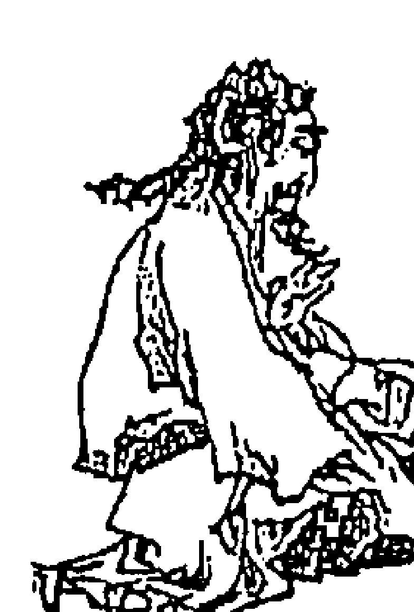

## 第七節「忌轉忌」而後可能的「二度轉忌」與「三度轉忌」

凡所有「忌轉忌」的轉忌「所落之宮」，此宮如逢以下狀況，可以造成「二度」甚或「三度」的「轉忌」：

-   ①坐「生年祿」〈同星曜〉或「生年忌」〈非必同星曜〉。
-   ②坐「命宮祿」〈同星曜〉或「命宮忌」〈非必同星曜〉。
-   ③該宮的「本宮自化祿出」〈同星曜〉。
-   ④該宮的「本宮自化忌出」〈非必同星曜〉。
-   ⑤該宮直接「忌出於對宮」〈非必同星曜〉。

前述凡所有「忌」皆須「轉忌」用以深究其果，然而逢以上五式本就自應再化其忌用以深入其咎。是以所有「忌轉忌」的「轉忌」間，只有逢以上五式，才產生了「二度轉忌」。

設某「轉忌」所落之宮逢「忌出於對宮」（此即造成二度轉忌），又遇坐「生年」或「命宮」的「祿」〈同星曜〉、「忌」〈非必同星曜〉時，應予再度「轉忌」，此時即造成「三度轉忌」。

以學理立場言，「忌轉忌」只能作「一次的轉忌」，除非在遇到上五式的狀況下才可作「二或三度」的「轉忌」。否則漫無休止的無制轉忌，將扯遠諭事『體』與『用』的本來「對待」意義。

然「祿轉忌」的「轉忌」所落之宮，只要找到與事理相關聯的「第二宮」飛來「同星曜」的化祿橋搭〈追祿〉，即得交緣而延伸化象；反覆斯作，直至不得同星曜的「祿、忌」不得交緣則止。因此，「祿轉忌」的「轉忌」，有著極大的延展空間。

是以，「祿轉忌」的轉忌與「忌轉忌」的轉忌，因緣有大別，不可作同日語。

註①凡「祿轉忌」所落之宮逢該宮直接「忌出於對宮」，好事容易「曇花一現」或「得而復失」，甚或經常「重複其事」或「重蹈覆轍」。《批：故而命盤中多見「自化忌出」或直接「忌出於對宮」者，此命造主人個性容易存在於「沒耐性」、「少原則」等「不具智慧」的性格裏，無法累積「生活智慧」，格局將打折扣，好景也將不恆常。》

-   ②「忌轉忌」所落之宮逢該宮「忌出於對宮」或「本宮自化忌出」者，人、事、物容易瞬間消失、殘敗或破相、死亡、器官摘除等。如若「福厚」逃過一劫，也將會厄運盡去而後「否極泰來」。

-   ③「忌入對宮」的「忌出」與「本宮」的「自化忌出」，「忌入遷移」沖「命」、「忌入父母」沖「疾厄」的「忌出」，都有「異曲同工」之妙。唯「本宮自化忌出」是屬「無執」的消散，可能產生「非理性」的作為或「不和諧」、「非常態性」的人事現象。

> 禮記：
琴淡得古趣，心清聞妙香；
世事靜乃見，人情澹始長。

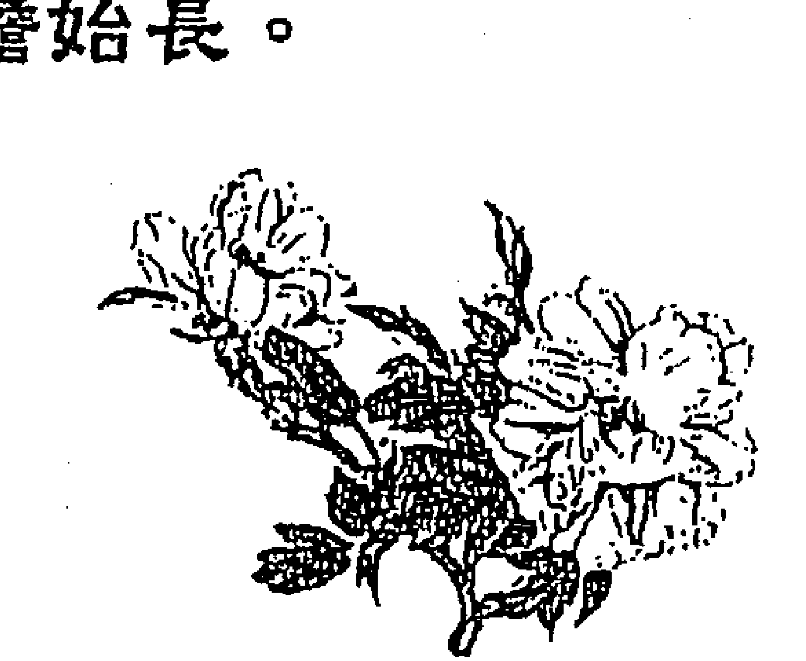

## 第八節 「忌入」逢「本宮自化祿出」與「祿」入逢「本宮自化忌出」

甲、A 宮「化忌」入 B 宮逢「同星曜」的「自化祿出」
一則 B 宮遭劫而失，是 B 宮以熱臉迎 A 宮的冷屁股，或為 B 宮的不設防而遭 A 宮入劫。

對 A 宮而言，是「祿忌成雙祿」的「加倍之得」；
對 B 宮而言，是「祿忌成雙忌」的「加倍之損」。

乙、A 宮「化祿」入 B 宮逢「同星曜」的「自化忌出」
一則 A 宮遇人不淑遭劫而失，或為 A 宮拿熱臉貼 B 宮的冷屁股。

對 A 宮而言，是「祿忌成雙忌」的「加倍之損」；
對 B 宮而言，是「祿忌成雙祿」的「加倍之得」。

以上所述，如為「非同星曜」的祿、忌同宮，無法契緣，不得同作以上論述。

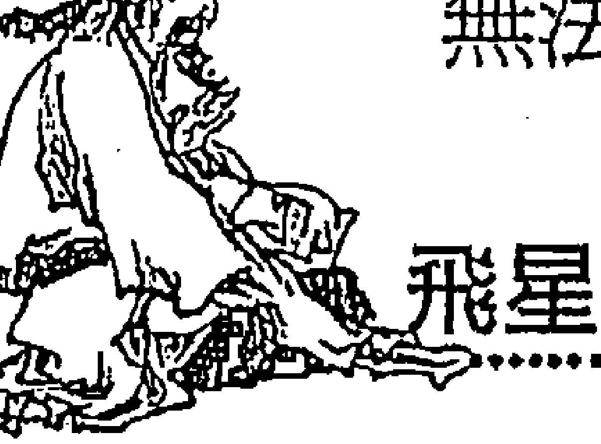

飛星紫微斗數

丙、上二式皆「非常態性」的得失，最容易產生「糾紛」、「怨恨」、「打架」、「糾葛」等情事，或存在於「非理性」、「引人詬病」的人事關係。

乃「自化祿出」與「自化忌出」，皆處無心或做人、做事的「失原則」，所以容易產生「糾紛」、「怨恨」等「非常態性」的人事狀態，很容易新人笑、舊人哭。

例：譬如前例乾造甲午〈43〉年9月午時生。

||陰【權】|貪【祿】|同巨|武《科》相|
|---|---|---|---|---|
|13-22〈父〉己|府廉《祿》昌|忌|自化祿|陽《忌》梁|
|23-32〈福〉庚|3-12《命》戊||忌|53-62〈友〉癸|
|33-42〈田〉辛|||紫左|殺曲|
|43-52〈事〉壬|破《權》右【科】|||63-72〈遷〉甲|
|〈兄〉丁|〈夫〉丙|〈子〉丁|〈財〉丙|〈疾〉乙|

「命宫」坐戊辰，其「兄弟宫」（丁卯）化巨门（户籍星）忌入「田宅」（辛未）逢巨门「自化禄出」，呈「禄忌成双忌」。「兄弟宫」为「父母」的婚姻宫，其父之于婚姻有不正之妻；本造主人即为庶出，是后娘所生。且仍有其大妈所生的两个同父异母兄弟。

同理，其「子女宫」亦以巨门忌入「田宅」逢巨门「自化禄出」，故而现今与一离婚女子同居，也抚养了非己出的小孩。

> > 曾文正公：
君子之道，
其大乎以忠诚为天下倡。

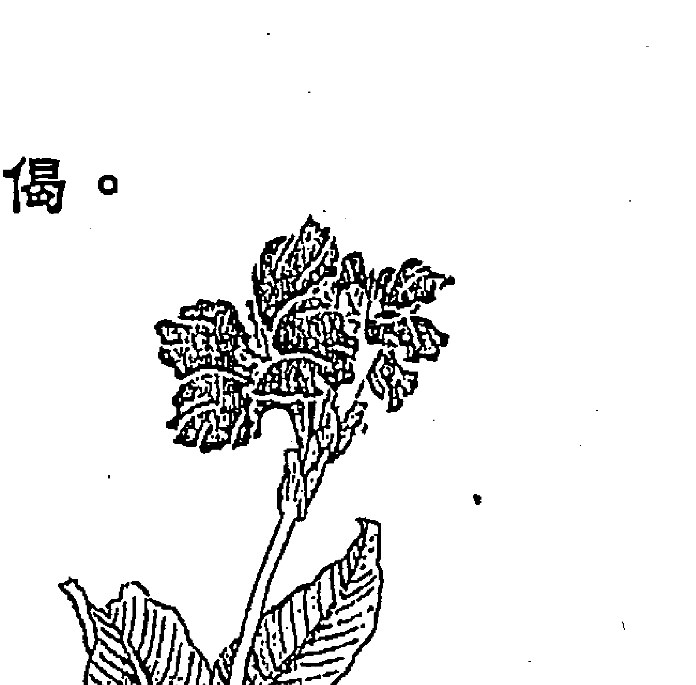

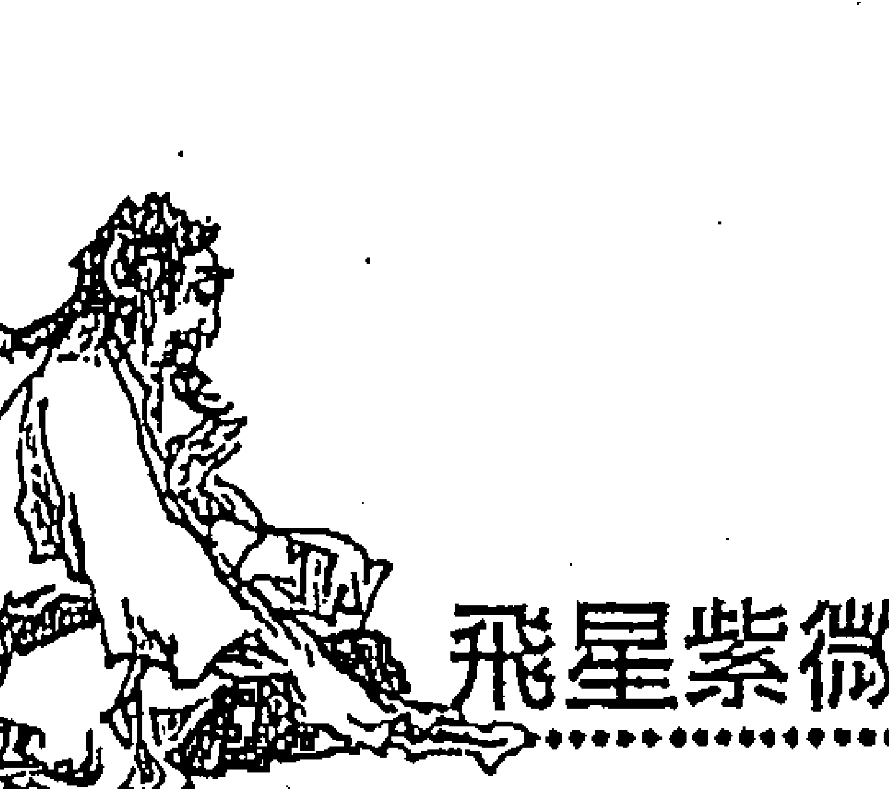

## 第九節 論事的『天、地、人』三盤對應與『回歸太極』的釋象法則

### 甲、什麼是『天、地、人』三盤？

所謂的「天、地、人」三盤即為「本命」、「大限」、「流年」三盤。凡論所有事的「契機點」及「相關」宮位，其所化〈祿或忌〉必須能緊密的對應於「天、地、人」三盤之間，環環相扣、缺一不可的串聯，方足以「完整」的申論事態休咎。

也就是說，「靜盤」〈本命盤〉本無吉凶，乃「吉凶休咎」生乎「動」。所謂「動」者，即因「時間流轉」而生「動盤」，「動盤」一「大限」、「流年」、「流月」、「流日」、「流時」的轉換，就產生了「契緣觸機」，並留下「吉凶休咎」的軌跡。

「靜盤」〈本命盤〉雖不生吉凶，但已決定了一個人命格上的窮通貴賤與妻、財、子、祿、壽。當歲月流轉，「動盤」於焉開始作用，產生了「動盤」與「靜盤」間「對上應下」的契應，而牽動了「本命盤」存在的既有現象，「吉凶休咎」由是而展現！換句話說，「靜盤」只是顯示了命格上有此「現象」，此現象何時才現前生事？這就須要配合時間的流轉，待大限、流年等「動盤」契合了「靜盤」現象上的「對應角度」，於焉才產生了人事吉凶。

「天、地、人」三盤的對應論事，是「道家學說」裡頭「三元歸一」〈或稱三才合一〉的運作。出自人法地、地法天，乃至道法自然的學說，產生了「天、地、人」三才合一的思想架構，緊密的結合「理、數、象」三要件，它是道家思想的重要法門。三才合而氣象生，三元缺一而說命，離知命遠矣！只會成為一個拼湊答案的「玩命之徒」。

### 乙、「回歸太極」一「用」歸於「體」的釋象法則。

即是凡所有化象皆不能離於體，不能離開命盤「本體宮位」〈初始宮位〉的意義去解釋化象。此即所謂的「用」歸於「體」一「回歸太極」。論一切論事借以為用的「借用宮位」，此「用宮」的「其化所入」之宮，皆須「回歸」於原命盤「本體宮位」〈初始宮位〉的釋象方向。

因為，「命格」一如人身既定的骨架，「運限」恰似身上的肌肉，好、壞運限就像身體的變胖、變瘦；體態再怎麼變，骨架還是始終不會改變。是以，凡所有「借宮」之化都應依本命盤組合上的既定範疇內作象義闡釋，其意義就像肌肉的變化永遠不會離開本來的骨架。

譬如「夫妻」宮化祿入原命盤的「遷移」宮，本來就是一「夫妻」祿入「遷移」，象義就是配偶親和開朗、外緣好，以及婚後諸事順遂。千萬不可以把它說成一「夫妻」祿入〈配偶的〉「財帛」，說配偶很會賺錢。將失毫釐而差千里矣！

因此，所謂「用歸於體」的「體」，指的就是「原命盤」的「初始十二宮位」。此初始十二宮之化的吉凶，形成了所謂的「既定命格」，而命盤格局的組合決定了你解釋命理的論事方向。掌握了「命格」，你就不會對著達官貴人論命卻描述了販夫走卒的低層生活面諸事。

舉例來說，譬如原命盤的「夫妻宮」並無離婚跡象，而踏至某大限時的「大限夫妻宮」逢沖破。那麼，你應檢視此「大限夫妻」的「借宮為用」是借了原命盤十二宮裡頭的哪個宮位？而此宮之化是影響了原命夫妻的何則之事？雖然在命盤上是顯示了此大限的配偶將可能發生倒楣事，但也決不會是發生拆散家庭的離婚事；因為，此造命格本來就不是離婚命。

因此，你如果不細心詳察而直接告訴對方：小心你會離婚！那麼將會得到了什麼樣的結果？！

這就是「用」不歸「體」釋象的離譜錯誤。一如乞丐命的好運道也只會是遇上了個好人而多分些錢吃他的大餐，但再怎麼說，乞丐就是乞丐，乞丐行好運也絕不可能讓他一夕變皇帝。

這就是「回歸太極」—「用」必須歸於「體」的方式「解釋象義」。那麼，你對問命者的述說，它就不會像是說神話或談聊齋，甚至雞同鴨講。

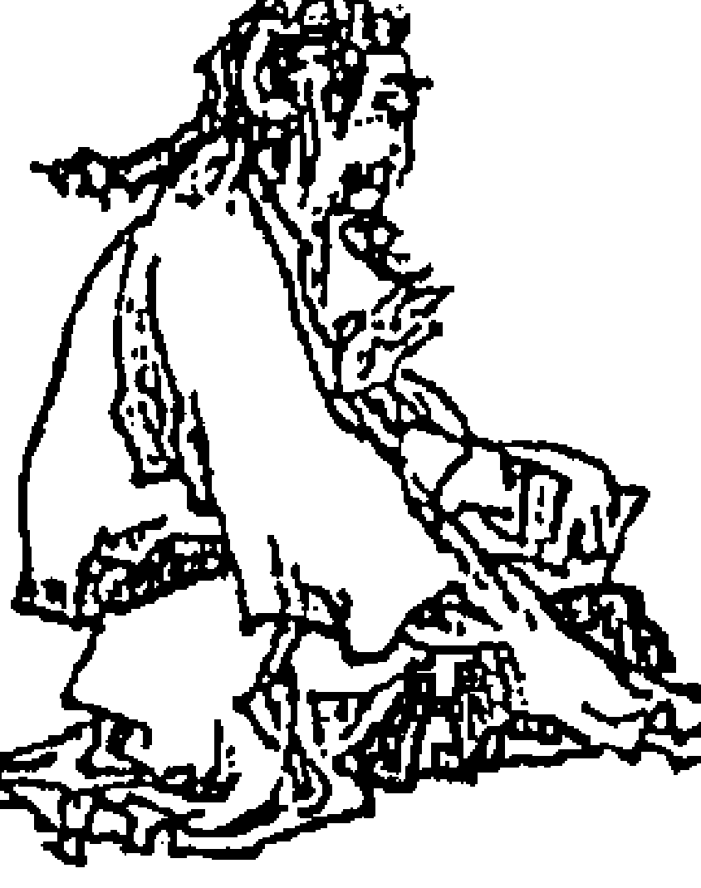

## 第十節 「命盤」自己會說話

「李昌鈺」博士：證據會說話。陋見以為：斗數學理通達之後，你會發現每張命盤的結構都具有其「自成一格」的「規則性」組合。此規則性契諸於「大限」、「流年」時，其「規則點」產生了「對等宮位」的一路「相契應」，契應的時間點就會自然浮現，這就是我所謂的一命盤自己會說話。

每張命盤，都有其某方面結構的「特殊組合」。吉凶既定，成敗由斯結構而起。然而吉凶休咎的「契應」於何限、何年？運用以其「自成一格」的特殊點下手，得而隨勢一路契應入「大限」、「流年」〈此即三元合一〉。

也就是說命盤已顯像了這個「契應點」，而你只要掌握這個重點做好隨勢的對上應下於「動盤」與「靜盤」之間，事情發生的時間點就會一一浮現。

例：譬如乾造甲午〈43〉年9月午時生，40歲離婚。

| 阴【权】 | 貪【禄】 | 同巨（大限） | 武《科》相 |
| --- | --- | --- | --- |
| 13-22《父》己 | 〈37岁〉23-32《福》庚 | 33-42《田》辛 | 43-52《事》壬 |
| 府 廉 昌 |  | 忌 | 阳《忌》梁 〈40岁〉 |
| 3-12《命》戊 |  | 忌出 | 53-62《友》癸 |
| 《兄》丁 |  | 忌 | 殺 曲 |
| 破《权》右【科】 | 紫 左 |  | 63-72《遷》甲 |
| 〈大限疾厄〉 |  |  | 機【忌】 |
| 〈夫〉丙 | 〈子〉丁 | 〈財〉丙 | 〈疾〉乙 |

-   ① 「夫妻」〈丙寅〉化廉贞「忌入命」，转天机〈挟忌〉忌入『疾厄』，即见太阴『忌出』於「父母」〈二度转忌〉。《批：此「疾厄」的「忌出」於「父母」消散象，即为婚姻缘尽的「败笔」处，可以将它作为一路契应的关键「对应」点。》
-   ② 当「大限」踏於「田宅」〈33-42岁〉，本命「夫妻」宫则转成『大限疾厄』。以「本命疾厄」串联对应於「大限疾厄」〈夫妻〉，佐以「田宅」和「父母」〈婚姻的田宅）两宫与「夫妻」所化的冲激共破于「命宫」，故而此限婚姻当然潜藏危机。
-   37 岁流年踏本命「福德」，以「本命夫妻」对应于「流年夫妻」〈本命命宫〉，斯年起其妻外遇。
-   ③以夫妻「忌入命」为「欠债婚姻」，必然产生折磨，故而哀哀怨怨的拖磨至 40 岁方以离婚收场。40 岁「流年疾厄」为「本命命宫」，乃形成「本命疾厄」凶应于「大限疾厄」〈本命夫妻〉，复凶应于「流年疾厄」〈本命命宫〉而生事。
-   ④以上诸式，都缘于「夫妻」所化忌转忌入『疾厄』复见『忌出』于「父母」为其「致命败笔」，故而一路以天地人三盘的「疾厄」作为对应事情发生的时间点。
-   ⑤这就是所谓的『命盘自己会说话』，由是得以「掌握癥结」而后依势下断。

> > 清静经：
人能常清静，天地悉皆归。

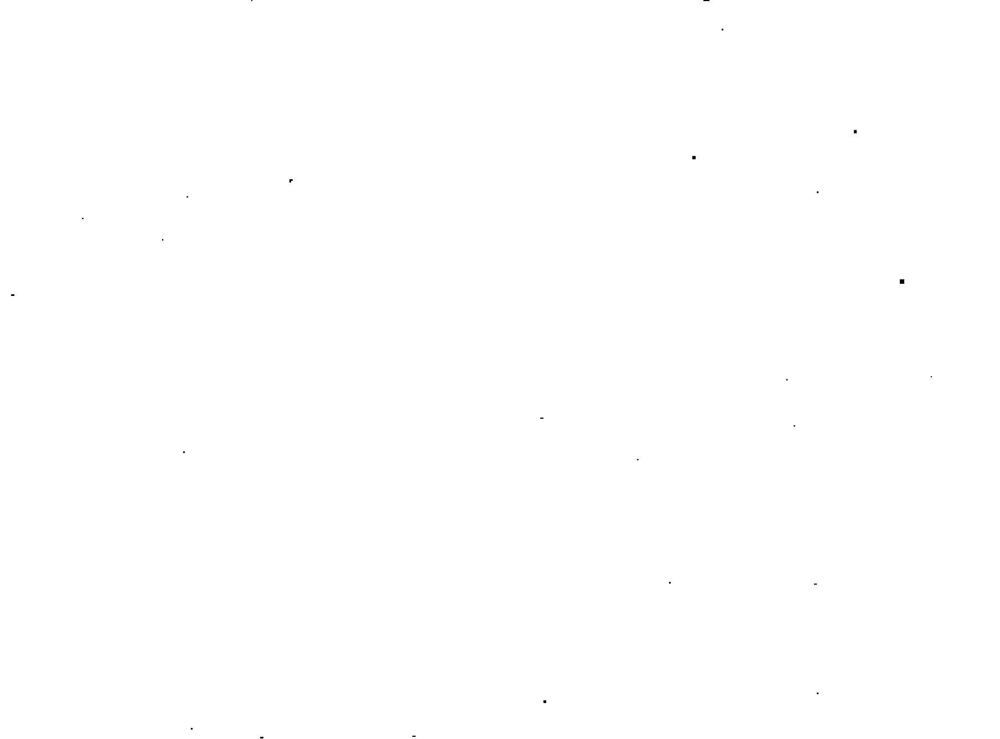

『道藏飞秘』的逻辑与功法

# 第二章 『善觀祿忌』解析問題

「四化論命」是「宮位」、「四化」與「星曜」三者相倚而產生了「化象」，常串聯多宮而得其「整體釋義」，造成多宮位的「串聯釋象」，產生了其複雜性的衍義。

「祿」是「因」、「忌」是「果」，凡所有象都不會離開「因果」的範疇。因此，『善觀祿忌』的「掌握因果」，而後凡事不離其中矣。

「因」決定「事理」，「果」呈現「成敗」；因此，唯以「善觀祿忌」下手的組合因果、釐清吉凶，才是解析問題的「不二法門」。

> 註：「宮位」和「四化」是傳動造化「事理方向」和「事態輕重」的樞紐，加上「星性」而呈現出最終的「結果象」。三者相倚，缺一則無可說白於人、事、物。

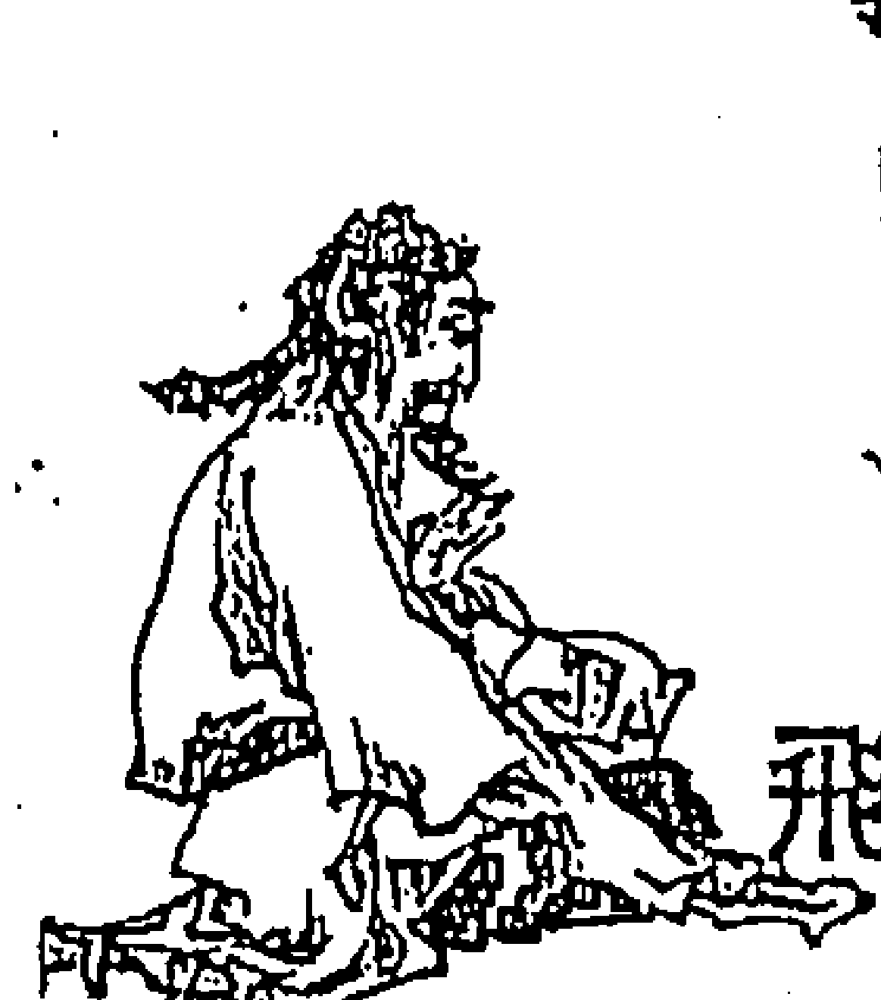

譬如論於吉者，以「化祿」、「祿轉忌」及「追祿」、「追權」等彙集善緣；論於凶者，以「化忌」、「忌轉忌」及「追忌」等彙集惡緣。是以，「祿」、「忌」皆可為「緣」，只爭其「善惡」之別耳。

然於實際論命，因觀事角度的不同，常引「祿」援「忌」作為因，也常援「祿」據「忌」以為果，是因又是果、互因還互果。譬如「命宮」化忌入「田宅」之勤儉守成引為善，故而此「善忌」既是「因」也是「果」；譬如「命宮」化祿入「福德」為滿足不積極引為惡，則此「祿」既是「惡因」也是「惡果」。

> 古賢云：「識得乾坤顛倒顛，才是人間大神仙」！乃識得宮位與化象間的清晰分別於「得、失」耳。

> 長春子：山林多少幽開趣，何必榮封萬戶侯？

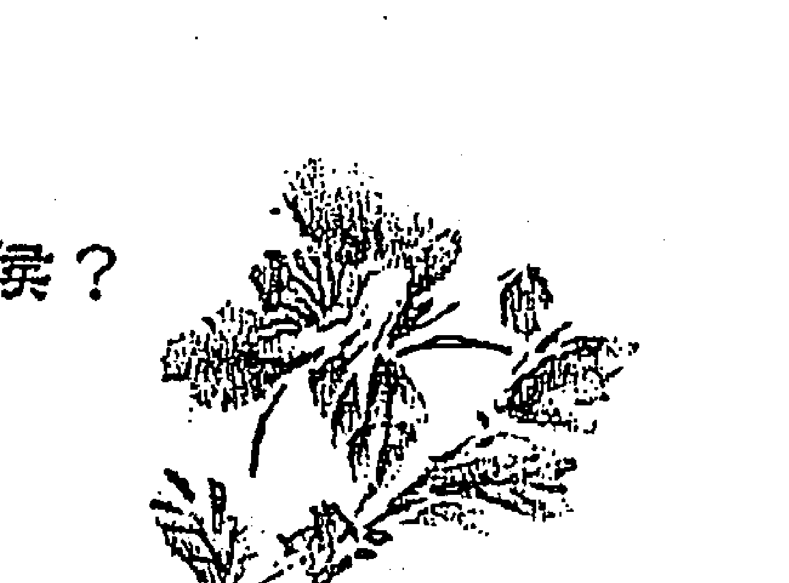

## 第一節 論事『相關聯宮位』所化的串聯，決定了『事理方向』與『事態輕重』

凡論任何事，都需依狀況而找出與「事理」相關聯的「宮位」，化出祿、忌得而「整合因果」。因事情狀況的不同，「下手宮位」所涵蓋的相關聯範圍常達二至三宮〈或以上〉。

於「化祿」、「化忌」、「祿轉忌」、「忌轉忌」及「追祿」、「追權」、「追忌」的運作之間，飛化所觸及宮位的不同，「串聯釋象」其義也因而峰迴路轉。

因此，你必須先熟析於命盤十二宮〈廣義〉的宮位涵義，知道論什麼事應找什麼宮位下手。也知道所化「多忌串聯」呈破觸及什麼宮位，會產生什麼程度的敗相；以及串聯呈「多祿會吉」、「祿權交拱」觸及什麼宮位，會產生什麼程度的美好果實。舉例來說，譬如：

-   ①「田宅」化祿入「命宮」：非長子格、享家庭福、有祖蔭、得助置產、物質生活豐足。

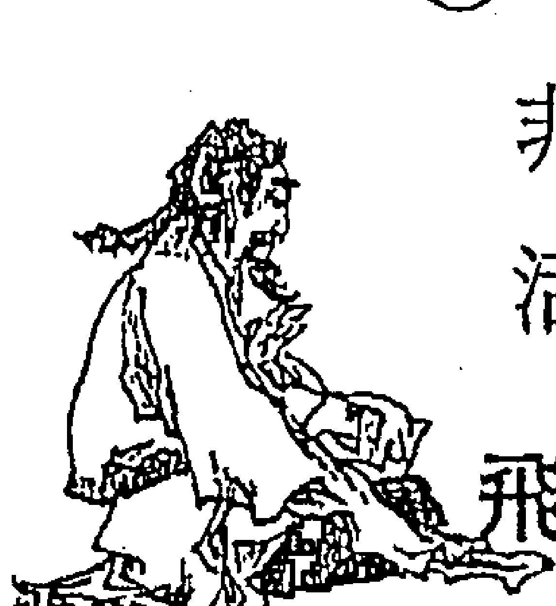

-   ②「田宅」化祿入「遷移」：祖德流芳、發田發產、光耀門楣、家大業大、房子越換越漂亮。
   註：②式力道大大勝於①式，這就是「宫位」的涵蓋要義，象義的輕重緩急由此生。
-   ③「田宅」化忌入「命宫」：長子格、承擔家計、出身較差、六親少助、碌碌勞苦、經濟少裕、居住環境不佳、宅舍舊小。
-   ④「田宅」化忌入「遷移」：門風凋蔽、宗門不興、六親無力、財退丁頹。家道中落、遷徙流離〈雙忌以上〉。

以上所述，可以領悟到事態的輕重，全憑「宫位」拿捏。「宫位」不同，其趣大異。所以，不能深入理解宫位涵義，只能看熱鬧，不懂看門道。又譬如：

-   ①「財帛」化忌入「交友三方」：個性厚道或不夠精明，不善汲營及理財，平常就會點滴流失的耗財或收入不佳。
-   ②「兄弟」化忌入「交友三方」：不善汲營及理財，常整筆錢的支出，積蓄難盈。
-   ③「田宅」化忌入「交友三方」：不善汲營及理財，常大筆錢的支出或錯誤投資，造成財庫空虛；呈三忌〈以上〉，容易財產易主、家徒四壁。

例：乾造己巳〈18〉年五月午時生，「命宮」丙子坐紫微，文曲「生年忌」在「夫妻宮」。

| 隕 | 貪《樞》右 | 巨同【祿】 | 武《祿》相左 |
| :--- | :--- | :--- | :--- |
| 〈友〉己 | 〈遷〉庚 | 〈大限〉〈疾〉辛 | 42-51〈財〉壬 |
| 府 廉【忌】 昌【科】 〈60歲〉 〈事〉戊 | | | 梁《科》陽 |
| 32-41〈子〉癸 | | | |
| 〈田〉丁 | | | 殺曲《忌》 |
| 22-31〈夫〉甲 | | | |
| 破 | | 紫 | 機【樞】 |
| 〈58歲〉〈福〉丙 | 〈父〉丁 | 2-11《命》丙 | 12-21〈兄〉乙 |

-   ① 其「命宮」〈丙子〉與「福德」〈丙寅〉共化廉貞雙忌入「事業宮」，當「大限」踏入「疾厄」〈辛未〉又化文昌忌再入「事業宮」。
-   ② 以其「命宮」、「福德」、「疾厄」三宮所化會「飛星紫微斗數」...

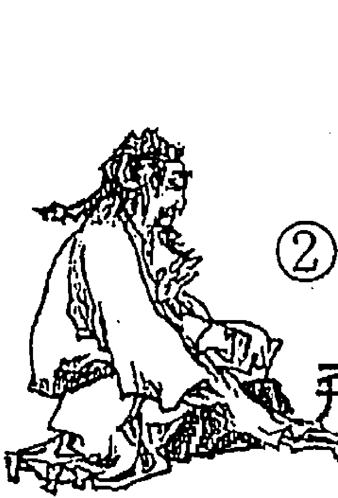

「生年忌」呈四忌沖激於「事業宮」，故而58歲「流年命宮」踏「本命福德」，因替女婿銀貸作保而敗產；60歲「流年命宮」踏「本命事業」則發病尿毒，不多時而亡。

上例以其「命宮」、「福德」、「疾厄」三情緒宮所化破盡於「事業宮」逢廉貞、文曲共呈四忌，故得於作保官非〈廉貞忌〉，與尿毒症〈廉貞、文曲忌〉亡身，此即「宮位」所化的串聯，決定了「事理方向」與「事態輕重」。

因此，宮位似骨四化為肉，兩者相倚串聯成候。不能深入理解宮位涵義，如何分析化象而拿捏命盤秤斤兩？如何深入化象而貼近問命者的心房？

註①命盤十二宮，每個宮位的背後都隱含著『廣義的宮位涵義』。譬如『兄弟宮』，它代表「手足之情」位，也是「經濟位」〈財帛的田宅宮—現金的累積位〉、「成就宮」〈事業的共宗六位〉、「閨房」〈夫妻對待的田宅宮〉、「體質」〈疾厄的事業宮〉、「母親」〈父親的配偶宮〉、「身邊的朋友」〈交友的遷移宮〉、「配偶的學識修養」〈夫妻的...# 070. 第二章 『善觀祿忌』解析問題

父母宮〉……等，不勝枚舉。

+   ②又譬如『遷移宮』，它代表「驛馬」位，也是「社會」；更代表一個人的「模樣」、「器宇」、「根器」、「智慧」、「心靈」、「因緣」、「際遇」、「果報」、「處世應對」、「性格」等等。其餘宮位，每宮也各具類此的「廣義涵義」。

斗數三合派多以大小「星曜」作文章，少有「宮位」的深耕著墨，故曰：易學難精。乃只看花、果，未識根、苗其病故也。

> 共勉：
「忌」為執，
憂惱忿怒與擇善固執同出於此，
一念間賢愚立判。

飛星紫微斗數

## 第二節「祿因、忌果」，道盡紅塵無限事

「祿因忌果」，衍化了「人、事、物」的所有象，紅塵中的一切狀態，都不會離開「因果」的範疇，故而論任何事，悉皆從「善觀祿忌」下手，以：

+   1. 「祿」為一
   - 「初始」、「因緣」、「希望」、「喜悅」、「獲得」〈含精神、物質〉、「情感」、「幸福」、「滿足」、「懶散」等。
   2. 「忌」為一
   - 「盡責」、「堅持」、「付出」〈含精神、物質〉、「勞累」〈含身、心〉、「果實」、「收藏」、「守成」、「執著」、「狹隘」、「固執」、「憂惱」、「貪、嗔、痴」、「是非」等。呈「雙忌以上」則「為病為敗」，甚或「灰飛煙滅」。

因此，『祿、忌』涵蓋著所有事的「因緣起滅」，以及其過程與結果的「喜怒哀樂」，乃至最終下斷的「吉凶論定」。

# 072. 第二章 『善觀祿忌』解析問題

註：「祿」一喜、樂，「忌」一怒、哀；喜、怒、哀、樂顯象了一切「吉凶休咎」的人性反應。

所以，唯有運用追因溯果、彙集因緣的『善觀祿忌』手法，才是切入問題、剝繭抽絲的不二法門。

然「忌」者，從「單忌」的付出、勞累到果實、收藏，乃至於「雙忌以上」的破敗、幻滅皆為其所轄，最是義深奧遠。

譬如論「婚姻」，「緣」多出於「祿」，當觀於「夫妻」宮所化之「祿」於何限、何年與「父母」或「田宅」作交緣結婚；而其「忌」是否與「父母」或「田宅」交迫呈敗，造成晚婚或離異、失婚？大約觀此「夫妻」、「父母」、「田宅」三宮，婚姻狀況即可明白大半，再佐參於「命」、「疾厄」、「福德」的得喜失憂情緒反應，知之過半矣。

至於「權、科」，其作用在於增益與轉圜之間。它是處在事情於緣起與緣滅間的調味佐料，它可能變化事物而呈現出不同的面貌。

+   註：「權、科」之用，譬如——
   1. 「遷移宮」，應「以權為將」、「以祿為相」，兩者相得而果敢親和〈近乎英明〉凡事可以水到渠成。
   2. 而「父母宮」則喜「祿、科相倚」的和藹、文質，近乎彬彬君子。《批：「遷移」得「權」，果敢大方；「父母」得「權」，得理不饒人。兩者各異其趣。》
   3. 又如「權、忌」坐「遷移」，剛猛有餘而細膩不足〈憨膽短思〉，會「科」則可銳緩而思缜。
   4. 譬如「福德」忌入「遷移」逢「科」，化戾氣致祥和。如易以「命宮」忌入「遷移」逢「科」，還防優柔覥腆。
   5. 譬如「交友」坐「科」或「交友」化科入「命」，常有久別而後傳音訊，復得聯繫。

> 漢書：
涓流雖寡，浸成江河；
燭火雖微，卒能燎野。

## 第三節 廣論諸要

### 一、論「婚姻」〈感情〉

甲、以「夫妻宮」及「田宅」、「父母」為主。以「財帛」、「交友」為輔。並參酌「命」、「福德」、「疾厄」三「情緒反應」宮。

+   - 註①「田宅」為「家庭」，涵蓋整體的「家」。
- ②「父母」專屬結婚成家的「家」。
- ③「財帛」看婚姻之間相互的「對待關係」〈為「夫妻」的「夫妻宮」—先天上兩人的「善惡因緣」位〉。
- ④「交友」為婚姻的「共宗六位」。
- ⑤「情緒」的好壞，必然是婚姻關係的重要指標。

譬如「夫妻」祿入「財帛」，或「夫妻」祿入「福德」照「財帛」，皆為善緣之婚，「對待必佳」〈佳偶〉的美滿姻緣。

反之，「夫妻」忌入「財帛」〈名：「相欠債」婚姻〉，或「夫妻」忌入「福德」沖「財帛」，以及「夫妻」與「財帛」兩宮之化共破於第三宮者，皆為非善緣之婚，「對待關係」較差。

註：「對待差」的怨偶也未必會離異，「離婚」的條件是把「家」給拆了〈父母、田宅串聯成三忌以上呈破〉。

譬如「夫妻」與「命」、「福德」、「疾厄」其一宮，於化祿或祿轉忌間作同星曜的「雙祿會吉」，甚或與其二宮再作同星曜的追祿呈「三祿交緣」者，則此婚姻相敬如賓矣！

反之，「夫妻」與「命」、「福德」、「疾厄」其一宮，於化忌或忌轉忌間作「雙忌彙惡」〈非必同星曜〉，甚或與其二宮再作追忌呈「三忌破緣」〈非必同星曜〉者，則此婚姻相敬如冰矣！

設「交友」忌入「子女」沖「田宅」，或「田宅」忌入「兄弟」沖「交友」，或「交友」忌入「父母」沖「疾厄」，或「疾厄」忌入「兄弟」沖「交友」呈「雙忌」以上者，容易婚姻相處時間少；呈「三忌」以上者，聚少離多或早分床、房。

# 076. 第二章 『善观禄忌』解析问题

是以「交友」、「田宅」、「疾厄」三宫所化呈「三忌」以上冲激共破，重者如王寶釧苦守寒窯，容易造成「分居」，但未必離婚。此言夫妻雙方的身體，不能圓滿的共處同一屋簷下。

如果「夫妻」與「田宅」、「父母」所化串聯呈「三忌」以上共破者，則接近「離婚」的標準一把家給拆了。

> 註：離婚半屬個性、涵養等因素下的抉擇，樂觀、涵養好者少離異。故而觀離婚，應注意「命」、「福德」、「疾厄」三「情緒反應」宮所化其忌是否介入乘亂？情緒常是壓垮驢子的最後一根稻草。

譬如「命」忌入「夫妻」為「我執」於感情〈婚姻〉，如果產生問題，半屬一廂情願的「咎由自取」。

如果「生年忌」坐「夫妻」或「夫妻」忌入「命」，是我「欠感情〈婚姻〉債」的無奈。可怕的是「生年忌」坐「夫妻宮」，轉其忌又入於「命宮」、「疾厄」或「福德」者，是沒完没了的「感情〈婚姻〉債〉，最宜晚婚。

譬如「夫妻」忌入「遷移」，為配偶率直或個性保守、傳統，不善於營造氣氛，非為惡緣；如若轉「遷移」化〈挾忌〉忌入「交友三方」，則容易是「平淡」的婚姻。設轉「遷移」化〈挾忌〉忌入於「福德」或「命宮」，則此婚姻恐將「相見倆不歡」，甚或「貌合神離」〈忌出〉矣！

> 註：凡「六親」忌入「福德三方」〈忌出於命三方〉及「交友三方」〈忌出於田宅三方〉，容易產生「不協」、「離心力」。

如若「夫妻宮」的「自化忌出」，也容易是「兩心不相繫」、「沒有交集」或無味的「平淡婚姻」；設其「田宅」或「父母」逢破，則此婚姻也存在了離異的警訊。

設若「命宮」化忌入「夫妻」，轉而〈挾忌〉忌入「遷移」—欲寄君衣君不還，不寄君衣君又寒……妾身千萬難。乃既執且拙的傳統、古板、靦腆之情，容易愛你在心口難開。

# 078. 第二章 『善觀祿忌』解析問題

設「命宮」化祿入「夫妻」，逢「交友」或「遷移」以同星曜化忌來相交，還恐他人「阻擋感情」；逢桃花曜，可能遭人「橫刀奪愛」。

或「夫妻」化桃花曜祿、「交友」以同星曜化忌，兩宮所化交集於第三宮，也防他人「橫刀奪愛」。此即配偶「多情不貞」象。
註：乃配偶其「命」〈夫妻〉與「疾厄」〈交友〉的自衍桃花「祿忌成雙祿」，防外遇或劈腿。

設若「交友」與「遷移」以忌串聯桃花曜呈破，涉入「命」、「福德」、「疾厄」三「情緒反應」其一或二宮，容易產生「桃色糾紛」。乃「交友」與「遷移」共破者多「人事問題」。

乙、「論感情」，也可以直接觀察於「命」、「福德」、「疾厄」三「情緒反應宮」，其化是否得「廉貞」、「貪狼」等「感情星」〈桃花星〉的「祿、忌」交緣。祿為「情愫」與「春風」、「喜悅」，忌為「情執」或「苦愛」、「縱慾」。

或「交友」（人際位）及「事業」（婚姻之外）、「遷移」（廣大因緣位）、「夫妻」（異性）、「子女」（桃花宮）、「父母」（相貌宮）坐「桃花星」祿、忌，轉其忌（挾桃花祿、忌）入我三「情緒反應宮」；抑或上述宮位直接以「桃花星」化祿、忌入我「三情緒宮」即著於善惡情緣。

譬如「父母」以「桃花曜」化祿入「夫妻」，容易色引春顏、語柔聲嗲。或三「情緒宮」以「桃花曜」化祿入「父母」、「遷移」者，結果近似。

「感情星」（桃花星）得「祿」者「喜悅」，「多祿」則多情種子、一樹桃花千朵紅。註：所謂「多祿」者，譬如於論事過程的「化祿」、「祿轉忌」與「追祿」之間逢「同星曜」祿、忌交緣，即呈「多祿」。轉化間逢其一「桃花曜」化，即概括作「桃花多祿」。

凡「父母」或「遷移」以「驛馬星」會「桃花曜」化祿串聯入「交友」者，稱「驛馬桃花」（遍地桃花），容易招手成婚；乃「父母」或「遷移」與「交友」以祿交緣者，善攀緣故也。

# 080. 第二章 『善觀祿忌』解析問題

註：驛馬星—天機、太陽、太陰、文昌、文曲。

易以「父母」或「遷移」以「桃花曜」化祿串聯入「夫妻」、「子女」、「疾厄」、「事業」、「田宅」等宮，也容易春風笑顏。

例：坤造丁未〈56〉年5月亥時生。其四舅貌似潘安，桃花多如過江之鯽。

| 巨《忌》【忌】〈四舅田〉〈夫〉乙 | 廉相〈兄〉丙 | 梁 2-11《命》丁 | 殺〈四舅遷〉12-21〈父〉戊 |
| :--- | :--- | :--- | :--- |
| 貪〈子〉甲 | （箭头：忌） | （空格） | 同《權》【權】22-31〈福〉己 |
| 陰《祿》【祿】右曲〈四舅父母〉〈財〉癸 | （箭头：祿） | （空格） | 武 32-41〈田〉庚 |
| 紫府〈四舅命〉〈疾〉壬 | 機【科】《科》〈遷〉癸 | 破〈友〉壬 | 陽左昌〈事〉辛 |

## 第三節 廣論諸要（一） .081

+   1. 「四舅」〈佔疾厄宮〉，其「父母」〈癸卯〉〈財帛宮〉坐太陰雙祿，長相姣好親和；轉貪狼〈桃花曜〉〈挾雙祿〉忌入「子女」〈桃花宮〉。而其「遷移宮」〈戊申〉〈父母〉化來貪狼祿亦入「子女」，會前式呈桃花三祿，宜其貌似潘安而多拂面春風。《批：凡「太陰」化祿會「桃花曜」的串聯者，尤易多引春風，乃「太陰」曜化祿得「月圓引情思」其義，正是「遍地桃花」。》
   2. 「田宅」為「歡樂宮」。四舅的「田宅」〈夫妻〉〈乙巳〉化天機祿入「本命遷移」〈癸丑〉，驛馬出外象；轉而化貪狼〈挾祿〉忌入「子女」，會其「遷移宮」〈父母〉〈戊申〉飛來貪狼祿，此主其生活間桃花馳騁，亦主桃花得財。

女命逢「廉貞」或「貪狼」串聯，呈雙忌坐入「福德」、「遷移」、「子女」等果報宮者，小心遭「桃花劫」的強撫、性侵等騷擾。

「廉貞」、「貪狼」化『忌』坐於「命」、「疾厄」、「福德」者，為「執情」、「情債」，或沉迷「情慾」；「多忌」呈破則「多情還恐空遺恨」，或「枯木難為春」。設若桃花曜串聯呈「多忌

# 082. 第二章『善觀祿忌』解析問題

」破於「父母」或「遷移」者，處世必然拙於表達或外緣差；妨於成就外，當然也容易「枯木難為春」。

「田宅」、「父母」兩宮，逢多忌呈破者多妨於「成家緣」，常晚婚或失婚、離婚的獨守空閨。

例：上造其二舅〈佔「子女」宮〉東吳大學畢業，條件非差卻終生未娶。

| 巨《忌》【忌】〈二舅父母〉〈夫〉乙 | 廉相〈兄〉丙 | 梁 2-11《命》丁 | 殺 12-21〈父〉戊 |
| :--- | :--- | :--- | :--- |
| 貪忌〈二舅命〉〈子〉甲 | | | 同《樞》【樞】 22-31〈福〉己 |
| 陰《祿》【祿】右曲〈財〉癸 | 忌 ← ↗ 忌 | | 武忌〈二舅遷移〉32-41〈田〉庚 |
| 紫府〈疾〉壬 | 機【科】《科》〈遷〉癸 | 破〈友〉壬 | 陽左昌〈事〉辛 |

## 第三節 廣論諸要 (一) .083

+   - ① 二舅其「父母宮」〈夫妻〉〈乙巳〉坐下巨門雙忌，長相及氣質不討好；化太陰〈挾雙忌〉忌入「財帛」。
- ② 二舅其「遷移宮」〈田宅〉〈庚戌〉化天同忌入「福德」〈己酉〉，轉而化文曲〈挾忌〉也忌入「財帛」，兩頭呈「雙忌」。此言其孤陋，少主動逢迎。
- ③ 合上式則二舅的「父母」與「遷移」共四忌破於「財帛宮」，因此孤僻少與人打交道，收入也不安定。
- ④ 「財帛」既逢太陰祿，當轉化貪狼〈挾四忌〉忌入「子女」沖「田宅」。「貪狼」者感情曜，以四忌沖破「田宅」，宜其一再錯過因緣而失婚。

+   - 另者—①「命宮」坐甲干而「福德」丙；
- ②「命宮」坐癸干而「疾厄」戊；
- ③「疾厄」坐癸干而「福德」戊者。

以「命」、「疾厄」、「福德」皆為我「情緒宮」，呈既「多情」復「執情」的複雜「情聖〈盛、剩〉」，只怕會造成新人笑、舊人哭！可以每次的當下：你〈妳〉是我的全部，但不是我的唯一。

# 084. 第二章 『善觀祿忌』解析問題

「夫妻」化桃花星的「祿、忌」〈或祿轉忌〉入「子女」，容易發生婚外情與二度婚。乃「子女」為桃花宮，也是二婚位。

> 註：此式如非為桃花曜之化，不得強作此論。

如若「命」、「疾厄」、「福德」、「子女」以桃花曜化祿相交串聯於「父母」或「遷移」者，春鳴隔室聞。乃「悅形於外」故也。

設若「夫妻宮」坐「生年忌」〈不論何星曜〉者，即主本造命上應少作「齊人福」之想。所化串聯呈雙忌以上者，還防「桃花惹禍」而自招其辱。

引發仙人跳或桃花官非者，理應桃花曜化「忌」坐「命」、「福德」或「疾厄」〈迷戀情慾〉，並串聯於「遷移」與「交友」呈多忌共破，與會及「廉貞」法律星、「巨門」是非星化忌。

> 註：此即自身「迷情感慾」，復惹「人事是非」而得。

設「命」、「福德」、「疾厄」、「兄弟」等其一或二宮，與「子女」以桃花星化多忌串聯呈破。

## 第三節 廣論諸要（一） .085

者〈雙忌以上〉，還防不性福，健康其礙故也。

「遷移」以桃花曜化祿於「交友三方」其一宮者，是嫻媚可人的穿花蝴蝶，串聯「太陰祿」尤為多姿。格局佳者，玲瓏親和，利於公關、業務等交際攀緣；格局差者，還防暮春蚊蠅舞。

凡「命」、「福德」、「疾厄」三「情緒宮」與任何一宮作「廉貞」、「貪狼」的「祿、忌」相交者，都可能產生不同型態的桃花象。

> 註：譬如某坤造，「夫妻」以桃花祿入「財帛」，轉忌〈挾桃花祿〉入「疾厄」逢「田宅」化祿〈同星曜〉來會，即見「疾厄」又自化忌出。此女從事「特種行業」多年，蚊蠅亂舞。乃「桃花挾財」入身而紙醉金迷，復以疾厄「自化忌出」而送往迎來。《批：善用祿出、忌出者，妙不可言。》

凡「夫妻宮」坐「祿」或「夫妻」祿入「命宮」者，異性緣好、情緣也較早，容易獲異性福，桃花少禍；「夫妻宮」坐「桃花祿」者，必然異性緣好反而感情未必單純。反之，「夫妻宮」坐「忌」

## # 086. 第二章『善觀祿忌』解析問題

或「夫妻」忌入「命宮」者，感情單純、異性緣較差、情緣以晚為佳（早緣恐為債），桃花易惹禍。

凡「夫妻」化祿入「命」、「兄弟」、「子女」或「遷移」、「父母」及「夫妻」自化祿者，容易情緣早發，逢桃花曜尤顯；或「命」、「兄弟」、「夫妻」、「子女」及「遷移」、「父母」坐下桃花曜「生年祿」或「命祿」等，也都容易情緣早發。

註：「兄弟」、「子女」兩為近親位，引喻異性近緣；「遷移」、「父母」則多屬氣質、長相之利，也近異性緣。

> **勵志：**
譬如病業就是定數，
能治好與治不好也還是定數；
唯一能改變命運定數的是自己的心，
心可改境；
己心不改就合而成「忌」隨波逐流。

## 第三節 廣論諸要（一） .087

例：譬如前例乾造甲午〈43〉年9月午時生，論婚姻。

| 陰【權】 | 貪【祿】 | 同巨 | 武《科》相 |
| :---: | :---: | :---: | :---: |
| 〈24歲〉 13-22 〈父〉己 | 23-32 〈福〉庚 | 33-42 〈田〉辛 | 43-52 〈事〉壬 |
| 府 廉《祿》 昌 3-12 《命》戊 | &nbsp; | &nbsp; | 陽《忌》 梁 53-62 〈友〉癸 |
| &nbsp; | 忌出〈二度轉忌〉 | &nbsp; | &nbsp; |
| 忌 | 忌 | &nbsp; | 殺 曲 63-72 〈遷〉甲 |
| 〈兄〉丁 | &nbsp; | &nbsp; | &nbsp; |
| 破《權》 右【科】 | &nbsp; | 紫 左 | 機【忌】 |
| 〈夫〉丙 | 〈子〉丁 | 〈財〉丙 | 〈疾〉乙 |

+   1. 「夫妻」〈丙寅〉化廉貞「忌入命」〈戊辰〉逢生年「廉貞祿」〈祿隨忌走〉，轉天機忌入「疾厄」〈乙亥〉隨即以太陰「忌出」於「父母」。
   2. 夫妻「忌入命」逢「生年祿」，象主本造欠「婚姻債」。以「祿忌成雙忌」，所以是兩度的欠妻債，主「二婚」仍恐遇人不淑。〈事實果然〉
   3. 之於其妻立場言，其妻可謂「命帶桃花」的欠「

# # 088. 第二章『善觀祿忌』解析問題

感情債」，以廉貞「祿忌成雙忌」於命，妻外遇造成一馬雙鞍，當然也是「情剩」！

+   ④ 當大限行於「福德宮」，24歲流年踏「父母宮」時結婚，是為「夫妻債」最直接的顯例。以「本命夫妻」的「忌入命宮」而對應成「本命夫妻」忌入「大限夫妻」〈本命命宮〉；而「大限夫妻」既為「本命命宮」，則其二度轉忌串聯入於「流年命宮」〈父母〉，明白顯示斯年是要債而來的「惡緣之婚」。

> > 註：如易以其「妻」之「福德」〈命宮〉與「疾厄」〈交友〉出發，觀其感情狀況：
> 
> （請見右頁命盤）

+   ① 妻「福德」〈本命命宮〉〈戊辰〉化貪狼祿入「本命福德」；妻「疾厄」〈交友〉〈癸酉〉既坐太陽「生年忌」，復以貪狼〈挾忌〉亦忌入「本命福德」〈無智札實忌〉。
此即言盡其妻的既「多情」復「執情」，日後當然移情他戀。

+   ② 轉「本命福德」〈庚午〉以天同〈挾感情祿、忌〉忌入「田宅」，逢「妻命」〈丙寅〉化來天同祿會。由是自其妻的「福德」、「疾厄」乃至「田宅」，其妻共媾兩個「祿忌成雙祿」，則此一生婚前、婚後的春風幾渡玉門關？其妻與本造離婚後旋即再婚，不數年仍又以離婚收場。

| 陰【權】 | 貪【祿】 | 同巨 | 武《科》相 |
|----------|----------|------|------------|
| 13-22〈父〉己 | 23-32〈福〉庚 | 33-42〈田〉辛 | 43-52〈事〉壬 |
| 府廉《祿》昌〈妻福德〉《命》戊 | 禄 | 忌 | 陽《忌》梁〈妻疾厄〉53-62〈友〉癸 |
| 〈兄〉丁 |  |  | 殺曲63-72〈遯〉甲 |
| 破《權》右【科】〈夫〉丙 | 〈子〉丁 | 紫左〈財〉丙 | 機【忌】〈疾〉乙 |

### 二、論「才華」、「根器」與「嗜好」

「廉貞」、「貪狼」兩萬惡淫為首的「桃花曜」，卻也是至高的「才華」表現曜。故云：自古才子多風流。

舉凡一切運動、武術、瑜珈、玄學、發明、科學、醫術、超能力等大家，乃至於音樂、美學、烹調、文學、藝術、品味、哲學、巧藝的頂尖極致者，甚至於修行者的禪定、智慧、大慈悲等超凡入聖、不可思議的傑出佼佼者，概不離先天既有的「根器」範疇。

陃以經驗發現，所有「大根器」者的命盤飛化，常見「福德」、「遷移」、「子女」三根器宮，化以「多祿會吉」或「祿、權交拱」的串聯於「廉貞」、「貪狼」二曜化祿、權。故而「貪狼」為「桃花曜」，宜其也化氣名為『修煉』：

設「命」、「疾厄」、「福德」其一或二宮得「廉貞」、「貪狼」化「單忌」坐下，逢「福德」、「遷移」、「子女」三根器位其一或二宮化來祿會，則具某方面的「才華性向」。如若上述諸宮於化祿、祿轉忌、追祿、追权闰彙集成多禄会吉或禄权交拱者，根器高矣！

> 註：陋以經驗所得，論之於「根器」與「成就」的表現，當首推「遷移宮」。乃「遷移宮」之美者，其所獲兼具了先天的「天份智慧」與後天的「掌聲響起」，由是美玉難掩其華。

另者，難戒的「不良嗜好」，也容易牽涉於「命」、「疾厄」、「福德」三宮，坐下「廉貞」或「貪狼」呈「雙忌以上」之破者。以其呈破，故曰「不良」。

此三宮其一或二宮化「廉貞」、「貪狼」忌還入於「命」、「疾厄」、「福德」等宮呈雙忌〈以上〉之破，以其「忌入」此三宮者，容易造成難以割捨的惡習。串聯其忌愈多，則惡習愈重，甚或敗家蕩產、死而後已！舉凡「吸毒」、「嗜賭」、「酒色淫慾」等敗財傷身者，必以「雙忌」〈甚或以上〉之敗串聯入於「命」、「疾厄」、「福德」等其一或二宮。

或若不良嗜好其忌呈破串聯入於「田宅」收藏宮者，也是的惡習難改。乃祿、忌入收藏宮者，吉凶皆永。

## 092. 第二章『善观禄忌』解析问题

例：乾造〈1962〉壬寅年正月卯时生。

家道中落、伤丁损财，出身遗腹子。上有一兄长未婚，年近半百仍吸毒难戒，二十余年进出监狱不知凡几，恐怕是死而后已！

| 陽【權】 | 破 | 機 曲【科】 昌【忌】 | 紫《權》 府 |
|---|---|---|---|
| 〈遷〉乙 | 〈疾〉丙 | 〈財〉丁 | 〈子〉戊 |
| 武《忌》 左《科》 | | 陰 54-63 《友〉甲 | 〈夫〉己 |
| 同 忌 〈大限〉 44-53 〈事〉癸 | | | 忌 忌 忌 |
| | | | 貪 右 〈兄〉庚 |
| | | | 殺 34-43 〈田〉壬 |
| | | | 梁《祿》 24-33 〈福〉癸 |
| | | | 〈兄福〉 廉 相 14-23 〈父〉壬 |
| | | | 巨 4-13 《命》辛 |

+   ① 兄之「福德」〈父母〉〈壬子〉化武曲〈财星〉忌入「交友」〈甲辰〉逢武曲「生年忌」呈双忌，此言其爱财孤僻少人气；转而化太阳〈挟双忌〉入「迁移」，则为无智而易遭社会唾弃。《批：凡「迁移」得双忌者无智与畏缩。「迁移」与「交友」共破者，處世是非多。》
+   ②「兄弟」〈庚戌〉化天同忌入「事業」〈癸卯〉，轉而化貪狼〈慾望曜〉〈挾忌〉還忌入「兄弟」。合於①式的「交友」坐武曲雙忌呈兩頭「三忌」之破，無怪乎其愚昧染毒。此兄既生而無智，當然也將惡習難戒。《批：凡惡習難戒者必存於無智。》
+   ③其「田宅」〈壬寅〉化武曲亦忌入「交友」呈破，轉而化太陽〈挾破敗忌〉忌入「遷移」〈果報宮〉，此即「家道中落」的「丁財凋零」象。是以己身未出生而喪父、兄不肖，以及生三女未得子息，豈非果報傷丁的父死、兄昧與斷嗣乎？
+   ④吸毒本象應為「廉貞化忌」，本例借宮觀兄長事必存折扣，故以「貪狼化忌」為兄長吸毒的概括示象。

# 程子：

涵養到著落處，心便清明高遠。

# 『道藏飛祕』的邏輯與功法

## 094. 第二章『善觀祿忌』解析問題

### 三、論『小人』、『是非』與『車禍』、『意外』

#### 甲、是非、小人

以「遷移」〈處世宮〉、「父母」〈涵養位〉對應於「交友」〈人際位〉、「子女」〈人事位〉得三忌〈以上〉的沖激呈破者，不免是非。並參串聯入於「命」、「福德」、「疾厄」三「情緒反應」其一或二宮，但見心煩。逢「廉貞」〈官非星〉、「巨門」〈口舌星〉化忌，則是非可能造成結怨傷身或官非訴訟等。得忌愈多，為禍愈烈。

再細觀沖激其間與餘者何宮化忌「串聯」或以「追忌」涉入，則該宮必然與事件產生關聯性。

凡「遷移」〈智慧〉、「父母」〈聰明〉呈破者，多令人「無明」、「糊塗」、「少智慧」，有理也怕說不清，最容易發生倒楣事，應少與人爭訟。

## 第三节 广论诸要（三） .095

例：前例乾造甲午〈43〉年9月午时生。
父母因房地与邻居纠纷结怨，令本造于 21 岁该
年手臂遭仇邻刀伤。

| 阴【权】 〈流年田〉 〈大限〉 13-22 〈父〉己 | 贪【禄】 ——忌→| 同巨 〈流年友〉 〈田〉辛 | 武《科》 相 43-52 〈事〉壬 |
|---|---|---|---|
| 府 廉《禄》 昌 3-12 《命》戊 | ←忌——→ | 忌 53-62 〈友〉癸 | 阳《忌》 梁 〈流年疾〉 忌 |
| 〈兄〉丁 | 禁（空） | 忌 | 杀 曲 〈大限友〉 63-72 〈迁〉甲 |
| 破《权》 右【科】 〈21岁〉 〈夫〉丙 | 〈子〉丁 | 紫 左 〈财〉丙 | 机【忌】 〈疾〉乙 |

①「大限」踏「父母宫」〈己巳〉，以文曲忌入「
迁移」〈甲戌〉冲命；转而化太阳忌入「交友」
又逢太阳「生年忌」，呈双忌之破。《批：凡「
大限命宫」所化呈双忌冲击于「本命命宫」者，
主此限必然有晦。》

②「福德」〈庚午〉〈果报宫〉化天同忌、「子女」〈丁丑〉〈人事位〉以「巨門」〈是非星〉化忌同入「大限福德」〈田宅〉，呈雙忌激盪於家門。

轉「田宅」〈辛未〉化文昌〈挾雙忌〉忌入「本命命宮」，煩心象。合於1式則呈四忌激盪於本命的「命宮」與「遷移」，踏此「父母大限」，豈能無咎？

③子女化「巨門」忌入「田宅」逢「自化祿出」，即主由外而來的「是非入宅」，此為田宅遭劫而後我失彼得的「祿忌成雙忌」，容易結仇生怨。

④而大限的「子女」為本命的「夫妻宮」〈疾厄的田宅〉，化廉貞〈血光星〉又忌入「命宮」，會以上諸式令「命宮」、「遷移」計呈「五忌」之破。轉「命宮」化天機〈手〉〈挾五忌〉忌入「本命疾厄」。

⑤21 歲流年踏「夫妻宮」，則為「流年命宮」〈夫妻〉共「大限命宮」〈父母〉破於「本命命宮」，是晦極之象，故而免生恙。
以「本命田宅」之破轉成「流年交友」，而串聯沖激於「本命交友」；「流年田宅」〈父母〉串聯沖激於「本命田宅」，故而斯年禍起於父母與鄰人因土地結怨而身受其害。

飛星紫微斗数

+   ⑥ 凡論所有事於「天、地、人」三盤間，皆以「對等宮位」作為三盤的論事「契應點」，則生事的時間自然呼之欲出。
+   ⑦ 以「果報」而言，「福德、遷移、子女」三宮緊繫業報之應，串聯呈破當然生憾。

#### 乙、車禍、意外

以觀「遷移」、「子女」兩「意外位」〈果報宮〉為主，與「疾厄」、「兄弟」、「福德」或「事業」〈運氣位〉等宮呈三忌以上的串聯沖激，並會及「廉貞」〈血光星〉，及「天機」〈意外星—恍神或車輛、機械故障等〉或「巨門」〈暗曜〉、「太陰」〈暗曜〉、天同〈福星〉等化忌。

設串聯於「遷移」、「父母」其一宮呈嚴重之破者，還防造成失憶、破相、殘障等。

## 098. 第二章 『善觀祿忌』解析問題

例：坤造丁未〈56〉年5月亥時生。

其五舅媽〈佔「事業」宮〉，2005 年車禍住加護病房近月，從此右半身手足失仁。

| 巨《忌》【忌】〈五舅媽遷〉 | 廉相 | 梁 | 殺〈五舅媽子〉 |
| :--- | :--- | :--- | :--- |
| 〈夫〉乙 | 〈兄〉丙 | 2-11《命》丁 | 12-21〈父〉戊 |
| 貪 忌 | 自化忌↓ | | 同《權》【權】〈2005年〉22-31〈福〉己 |
| | 忌 | 忌 | 武 |
| 〈子〉甲 | | | 〈大限〉32-41〈田〉庚 |
| 陰《祿》【祿】右曲 | | | |
| 〈財〉癸 | | | |
| 紫府 | 〈五舅〉機【科】《科》 | 破 | 〈五舅媽〉陽左昌 |
| 〈疾〉壬 | 〈遷〉癸 | 〈友〉壬 | 〈事〉辛 |

+   ①五舅媽的「子女宮」〈意外位〉〈父母〉〈戊申〉化天機〈意外曜〉忌入「遷移」〈意外位〉〈癸丑〉，轉而化貪狼〈挾忌〉忌入「本命子女」〈意外位〉。
+   ②五舅媽的「遷移」〈意外位〉〈夫妻〉〈乙巳〉既坐巨門〈意外星〉雙忌，化太陰〈挾雙忌〉忌入「財帛」〈癸卯〉〈沖福德〉，轉而化貪狼〈挾雙忌〉亦忌入「本命子女」。
+   ③ 「本命子女」彙成三忌沖於「大限命宮」〈田宅〉；則上朔其「財帛」的多忌沖於「福德」，即傷於 2005「流年命宮」〈福德〉，故而斯年禍起於騎機車撞上道路護牆受傷。
+   ④ 五舅媽其福既破，又見其「疾厄」〈兄弟〉〈丙午〉以廉貞〈血光星〉「自化忌出」，當生於血光之晦。而其「遷移」〈夫妻〉坐巨門雙忌，則容易破相傷殘徵出於表。
+   ⑤ 以其「遷移」得雙忌，故而失憶半年與手足近殘。

> 論語：
內省不疚，夫何憂何懼？

### 四、論「讀書」、「考試」，以及「嗜好」、「興趣」的學習

#### 甲、正規學習的讀書、考試

以觀「父母宮」〈學習位〉為主，「交友宮」〈競爭位—考運〉為輔。並觀「遷移宮」〈際遇〉、「福德」〈果報位〉等宿世因緣於我之損益，並參酌「命」、「疾厄」的情緒反應。

+   1. 「父母宮」也稱為「光明宮」，乃高學歷有助於立足社會，可獲較高職位和薪資，故而以「財帛」為「父母」的共宗六位。
+   2. 「父母宮」也專屬於『文書宮』，涵蓋一切的文憑、證照、契約、權狀、證券、傳票、稅單、罰單等。

注：真正的好考運常緣於「福至心靈」與「手氣順遂」，故與「福德」、「遷移」、「命」、「疾厄」產生關聯。

#### 乙、觀「父母」所化

喜其『祿、權』化入我「命三方」，可以水到渠成；化入「田宅三方」則學習緣長，化入「福德三方」可以心有靈犀，大益學習。或「父母」坐生年『祿、權』者，亦為「聰明愉悅」的讀書象。

設若「父母」化權逢「交友」〈競爭位—考運〉化祿入我「命宮」、「疾厄」、「福德」者，是為眾星拱月的聰明可人象。任何出眾者，皆不離於人際競爭而得。

如若「父母」與「遷移」、「福德」兩方之化以『多祿會吉』或『祿、權交拱』者，常福至心靈、手氣大順而利於讀書、考試。「父母」與「命」或「疾厄」宮，兩方之化交吉者，也順遂於讀書、考試。而「父母」與「交友」兩方之化交吉者，則利於考試競爭。此式應於就業、升等考試尤妙。

「父母」最愛與「遷移」作「多祿會吉」、「祿權交拱」，是不可多得的天資聰穎者，容易博學多能、舉一反三；處世應對耳聰目明、風趣幽默。串聯於「巨門」會「貪狼」〈或廉貞〉或「天機」會「天梁」的祿、權交吉者，可以是理壯氣潤、字句珠璣的演講家。此式必以「遷移」對應於「父母」兩方所化的祿、權為主。

註：古書云一機梁善談兵者，乃天機主智慧、天梁善膨風；而「巨門」會「貪狼」（或廉貞）者，具語言的藝術與天份。

註：約「遷移」主「智慧」應對，「父母」主「聰明」學習。

反之，「遷移」、「父母」多忌呈破者，表達能力差，心猿意馬少根筋、無智忘性少原則。

「命宮」忌入「父母」（單忌無破）者，為認真讀書的專注象；組合佳者也可以高學歷，但防只是書呆子。父母宮坐「多忌」則笨拙或不能專心（沖疾厄）而破壞讀書緣。

「生年忌」坐「父母宮」，為一分耕耘一分收穫的讀書「辛勤」象；也多拿「私立學校」或「補校」、「夜間部」及另類的「在職進修」等文憑。

「父母宮」所化其「忌」，不喜入於「命」、「福德」、「疾厄」三「情緒宮」，容易「厭煩文事」或讀書「不得要領」、「沒興趣」的辛苦象，以及科目上好惡分明的「選擇性」讀法。亦嘗見類此組合，出於環境因素的無奈而放棄學業者。

「父母宮」所化得「雙忌」以上者，容易「學歷偏低」或混「野雞學校」文憑；此式如逢「父母宮」所化祿、權與「三情緒宮」交緣尚佳者，也多中斷後仍又重拾課本。

「父母宮」所化之「忌」，亦不得冲會於「生年忌」、「命忌」及「交友」、「福德」、「遷移」、「疾厄」等所化之忌呈破，妨於讀書、考運。

約以「父母宮」的「祿」主「記性」，偏於文科；「權」為「理解分析」，偏於數理。祿、權交拱者，聰明可人。如若「父母」與「遷移」作「多祿會吉」、「祿權交拱」者，則智慧圓融、文理兩相宜。

「生年祿」坐「父母宮」者，必然優於「命宮」化祿入「父母宮」。後者但防失之於小聰明而讀書「囫圇吞棗」的未盡全力；乃以「祿」為「福」，雖「聰明」而多「自滿」，容易小考優而大考差，失之於當下小聰明的懂卻沒有持之以恆的持續用心。

#### 丙、再看「交友」

喜其化「祿、權」入我宮而「考運好」，如若其化「忌沖」我宮則「考運差」，「忌入」我宮則為「對手難纏」。

「交友」飛化其忌，不得會沖「生年忌」、「命忌」及「父母」、「福德」、「遷移」、「疾厄」所化之忌呈破，也會「考運差」。

或有斗數習者，執以「文昌曜」及「化科」論讀書，此學理思維恐將失之於偏枯束縛，不足取。

> 莎士比亞：正直者，策略之上乘也。
> 薛文清：一念之善，景星卿雲；一念之惡，烈風疾雨。

例：乾造癸丑〈1973〉年6月卯時生。兄弟孿生，雙雙同班畢業於清大博士研究所。兩人的唸書實力於伯仲之間，但弟始終優於兄長些許。命造本人〈兄〉的讀書——

| 機【權】 右 | 紫 | 昌【科】 曲 | 破《祿》 |
| :--- | :--- | :--- | :--- |
| 〈父〉丁 | 〈福〉戊 | 〈田〉己 | 〈事〉庚 |
| 殺 梁 5-14 《命》丙 | 祿 權 | 忌 | 左 |
| 陽 梁 15-24 〈兄〉乙 | 祿 權 | 祿 忌 | 〈友〉辛 |
| 〈大限〉 武 相 25-34 〈夫〉甲 | 同【祿】 巨《權》 35-44 〈子〉乙 | 貪【忌】 忌 45-54 〈財〉甲 | 陰《科》 55-64 〈疾〉癸 |

+   ①「事業」〈運氣位〉〈庚申〉坐破軍「生年祿」，以天同〈挾生年祿〉忌入「子女」會天同「命祿」呈「雙祿」。〈祿轉忌的追緣〉
「父母」〈讀書宮〉〈丁巳〉化天同權入「子女」〈乙丑〉會上述的「雙祿」，轉而化太陰〈挾雙祿一權〉忌入「疾厄」。
+   ②「交友」〈考運位〉〈辛酉〉化巨門祿入「子女」〈乙丑〉逢巨門「生年權」，轉而化太陰〈挾一祿一權〉亦忌入「疾厄」。
+   ③則①+②式令「疾厄」呈「三祿二權」吉會，又逢「父母」〈丁巳〉飛來太陰祿會〈追祿〉。計彙四祿二權於「疾厄」矣，宜其讀書順心如意。

# 命造其弟的讀書一

| 機【權】 右 | 紫 | 昌【科】 曲 | 破《祿》 |
| :--- | :--- | :--- | :--- |
| 〈弟福〉 〈父〉丁 | 〈福〉戊 | 〈田〉己 | 〈事〉庚 |
| 殺 祿 〈弟父〉 5-14 《命》丙 | | | 左 〈弟遅〉 〈友〉辛 |
| 陽 梁 〈弟命〉 15-24 〈兄〉乙 | | | 府 廉【忌】 65-74 〈遅〉壬 |
| 〈大限〉 武 相 25-34 〈夫〉甲 | 同【祿】 巨《權》 35-44 〈子〉乙 | 貪【忌】 45-54 〈財〉甲 | 陰《科》 55-64 〈疾〉癸 |

①「事業」〈庚申〉坐破軍「生年祿」，化天同（挾生年祿）忌入「子女」〈乙丑〉會其「父母」〈命宮〉〈丙辰〉化來天同祿呈「雙祿」，轉而化太陰〈挾雙祿〉忌入「疾厄」。
②「弟命」〈兄弟〉〈乙卯〉化天機祿入「父母」〈讀書宮〉〈丁巳〉逢「命權」，轉而化巨門〈挾一祿一權〉忌入「子女」；而「弟遷移」〈交友〉〈果報位〉〈辛酉〉化巨門祿亦入「子女」共會巨門「生年權」呈「二祿二權」〈追祿〉。轉「子女」〈乙丑〉化太陰〈挾二祿二權〉亦忌入「疾厄」。
③則1+2式令「疾厄」呈「四祿二權」吉會，又逢「弟福德」〈果報位〉〈父母〉〈丁巳〉飛來太陰祿會〈追祿〉。計彙五祿二權於「疾厄」，宜其讀書更為如意順遂。已受聘於美國某知名電子公司任職晶片研發工程師。
④兩造相較，兄長以「遷移」〈智慧宮〉坐廉貞命忌，當遜色於處世的機伶應對。而弟之「遷移」與「福德」交緣於「疾厄」，當如意順遂天地廣，宜其驛馬他鄉得樂。

## 108. 第二章 「善觀祿忌」解析問題

丁、除了讀書外，尚有許多正規、非正規的興趣或嗜好的「學習」：

論之於「天份」或「根器」者，需深入「福德」、「遷移」、「子女」〈福德的共宗六位〉三「因果宮」〈根器位〉，屬「宿世因緣」中的「阿賴耶意識」所轄。所化呈「多祿會吉」或「祿、權交拱」者，先天因緣好。

舉凡一切才藝（才華）的頂尖高手，必然契緣於本來具有的「宿世根器」，以及經過一段持之以恆的「煉鍊」〈擇善固執〉成候。

是以，除了有好的「天份」、「根器」外，還需「命宮」或「疾厄」、「福德」坐或化此藝能星曜之「忌」〈執〉而會其「根器宮」所化之「祿」〈緣〉者，則相得於「天份」與「努力」間的提升成就。最愛「單忌」其執，始終如一；雙忌則瑕矣，不得圓滿。

此乃以「忌」為「執」，得「祿」則「樂」，呈浸淫間的持之以恆、樂而不疲。於「才華星」者，非「廉貞」、「貪狼」二曜莫屬。

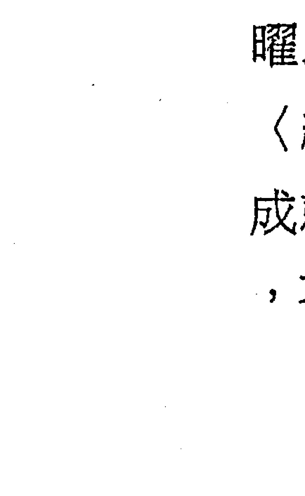

## 第三節 廣論諸要（四）

例：譬如乾造丁卯〈76〉年6月未時生。其母精於琴藝，是鋼琴老師：

| 府 右 | 陰《祿》 同《權》 | 貪 武【忌】 | 陽 巨《忌》 祿 (母子女) (財) 戊 |
| :--- | :--- | :--- | :--- |
| (友) 乙 | (遷) 丙 | (疾) 丁 | 相 左【科】 忌 33-42 (子) 己 |
| (事) 甲 | 祿 忌 祿 | | 機《科》 梁【祿】 |
| 廉 破 昌 | | | 23-32 (夫) 庚 |
| (田) 癸 | | 紫【權】 |
| (福) 壬 | (母福德) (父) 癸 | 3-12 (命) 壬 | 殺、曲 (母命宮) (兄) 辛 |

①借「兄弟宮」看母。母之「子女宮」〈戊申〉〈財帛宮〉〈天份位〉化貪狼〈才藝星〉祿入本命「疾厄」，而母之「福德宮」〈父母宮〉〈嗜好位〉〈癸丑〉則化貪狼忌入「疾厄」，共會前述天份之緣。「疾厄宮」逢「祿」而「喜」、得「忌」則「勤」，此即為「天份」加「努力」象。

## 110. 第二章 「善觀祿忌」解析問題

- 2. 轉「疾厄」〈丁未〉化巨門〈挾祿忌〉還忌入「財帛」〈戊申〉逢「母命宮」〈兄弟宮〉〈辛亥〉飛來巨門祿會呈「雙祿」。此即以興趣為業，於茲動口生財〈教授鋼琴〉。
- 3. 轉「財帛」〈戊申〉化天機〈挾雙祿〉忌入「夫妻」照「事業」，又逢「母遷移」〈交友〉〈乙巳〉〈天份位〉化來祿天機祿會呈「三祿」交吉，故而以興趣為業，也助長了其母的教學相長，所以精藝。

> 劉忠介：
古銘云：「恭則壽。」此理真實。
我常見厖眉鶴髮之人，
必有謙抑恭敬沉潛簡重之色；
彼輕浮驕恃者，往往夭折。
自古才子不永天年，
總是器小自滿耳。

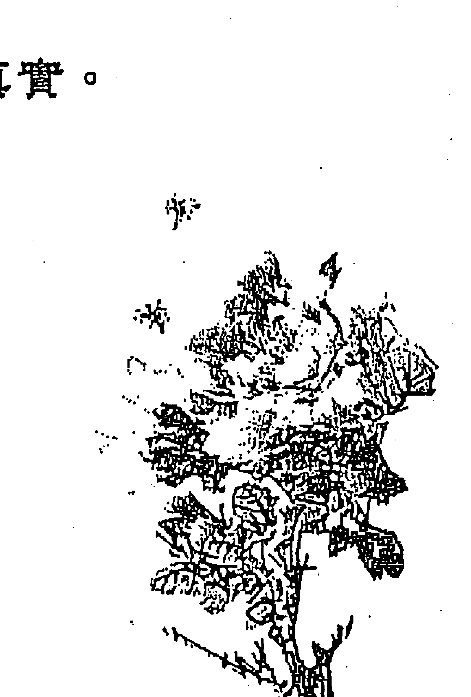

### 五、社會「地位」〈升遷、選舉〉

甲、最愛「遷移」〈社會〉化「權」會「交友」化「祿」，兩者交吉入於「命」或「田宅」、「福德」等三方，具領導能力，得於眾擁猶如綠葉托牡丹，可以得貴或得富；交吉於入「父母」者則言道理、善說服；交吉於入「子女」者撥亂反正、調難解紛，草莽也英雄。

註：上式吉化入於「福德三方」主「貴」，入於「命三方」次之，入於「田宅三方」主「富」。

得上述入局，命格佳者，可以領導群倫、生財發產、出人頭地；命格差者，至少也容易汲營、生計無虞。此式與「命」、「福德」或「田宅」三方，作愈多的祿、權串聯交吉，地位愈高、氣勢越旺。

約「太陽、太陰」領導群倫，「貪狼、破軍」汲營得利，「天機、貪狼」修行，「武曲」鬥士，「天梁」善說，「天機」謀士，「巨門」說客，「天機、天梁」善談兵。併參酌於「命」、「福德」、「疾厄」，察其心境。

## 112. 第二章「善觀祿忌」解析問題

是以社會「地位」〈或升遷〉，當以「權」為主，以「禄」為輔。「能力」、「際遇」〈遷移〉與「人氣」〈交友〉三者相輔交融。

例：譬如乾造甲戌〈23〉年11月卯時生。出身富家，年輕時好勇鬥狠、結黨壯勢，儼然一方角頭；失意時樹倒猢猻散。

| 巨【權】 | 廉《祿》相 | 梁昌曲 | 殺 |
| :--- | :--- | :--- | :--- |
| 〈財〉己 | 〈子〉庚 | 〈夫〉辛 | 〈兄〉壬 |
| 貪【忌】 自化祿→ | ↑ 祿 ↑ 忌 → 權 ↗ | | 同 4-13 《命》癸 武《科》 |
| 〈疾〉戊 | | | |
| 陰【科】 | | | |
| 〈遷〉丁 | | | |
| 紫府左 | 機 | 破《權》【祿】 右 34-43 〈田〉丙 | 陽《忌》 24-33 〈福〉乙 |
| 〈友〉丙 | 〈事〉丁 | | |

- ①以何出身富家？「命宮」〈癸酉〉化破軍〈偏財星〉禄入「田宅」〈丙子〉逢「父母」〈甲戌〉

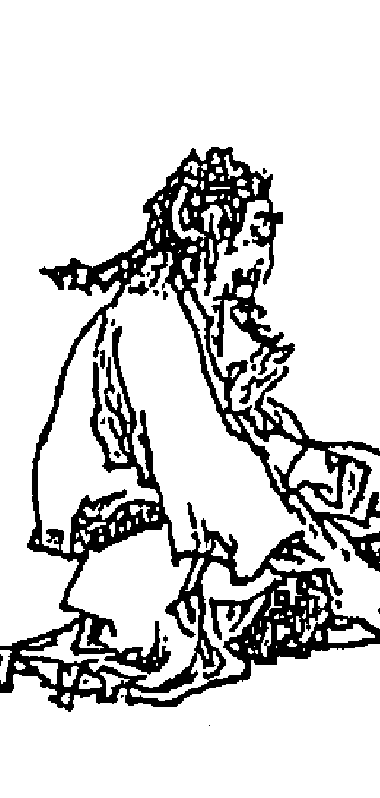

飛星紫微斗數

化來破軍權並會「生年權」，富象；轉而化廉貞〈挾一祿雙權〉忌入「子女」又會「父母」〈甲戌〉化來廉貞〈偏財星〉祿及「生年祿」呈「三祿二權」交旺，此言本造得於父母旺蔭。轉「子女」〈庚午〉化天同〈挾三祿二權〉忌入「命宮」，又逢「田宅」〈丙子〉化來天同祿會，呈偏財曜四祿二權於「命宮」，宜其得天獨厚的出身富家。

- ②「交友」〈丙寅〉化天同祿入「命宮」逢「遷移」〈丁卯〉化來天同「權」〈同星曜〉會，猶如綠葉托牡丹。《命盤於下頁》「田宅」坐吉化，以廉貞〈挾祿、權〉忌入「子女」〈庚午〉逢生年廉貞祿坐下，此言以財施惠而孚眾，轉而化天同〈挾諸吉〉亦忌入「命宮」。則「交友」、「田宅」、「子女」以「多祿權」會「遷移權」拱於「命宮」，故經常滿座的道上兄弟而儼然領袖群倫。此得於「子女」祿權相拱，善於調解人事，受尊為大哥級人物。

- ③轉「命宮」〈癸酉〉化貪狼〈挾人氣〉忌入「疾厄」逢自化祿，予取予求而樂此不疲。

- ④何以好勇鬥狠？乃「福德」〈乙亥〉既坐太陽生

年忌，化太陰（挾生年忌）忌入「遷移」逢「疾厄」（戊辰）化來太陰權會，偏執叛逆與暴力象。

⑤何以失意時樹倒猢猻散？乃「遷移」（丁卯）化巨門忌入「財帛」，遥對「福德」所坐的太陽「生年忌」呈「雙忌」為迫。「遷移」受迫必然失勢，也存在了日後的孤僻不喜逢迎。

> > 《批：「福德」、「遷移」串聯呈果報破福，轉「財帛」（己巳）化文曲（挾雙忌力）忌入「夫妻」；而其「疾厄」（戊辰）則化天機忌入「事業」，果報之破也沖激於身體，故而58 歲亡於喉癌。》

| 巨【權】 | 廉《祿》相忌 | 梁昌曲 | 殺 |
| :--- | :--- | :--- | :--- |
| 〈財〉己 | 〈子〉庚 | 〈夫〉辛 | 〈兄〉壬 |
| 貪【忌】 | 自化祿 忌 | 同 | |
| 〈疾〉戊 | | 祿 忌 | 4-13《命》癸 |
| 陰【科】 | 權 忌 | 禄 | 武《科》 |
| 〈遷〉丁 | 禄 忌 | 禄 | 14-23〈父〉甲 |
| 紫府左 | 機 | 破《權》【祿】 | 陽《忌》 |
| 〈友〉丙 | 〈事〉丁 | 右34-43〈田〉丙 | 24-33〈福〉乙 |

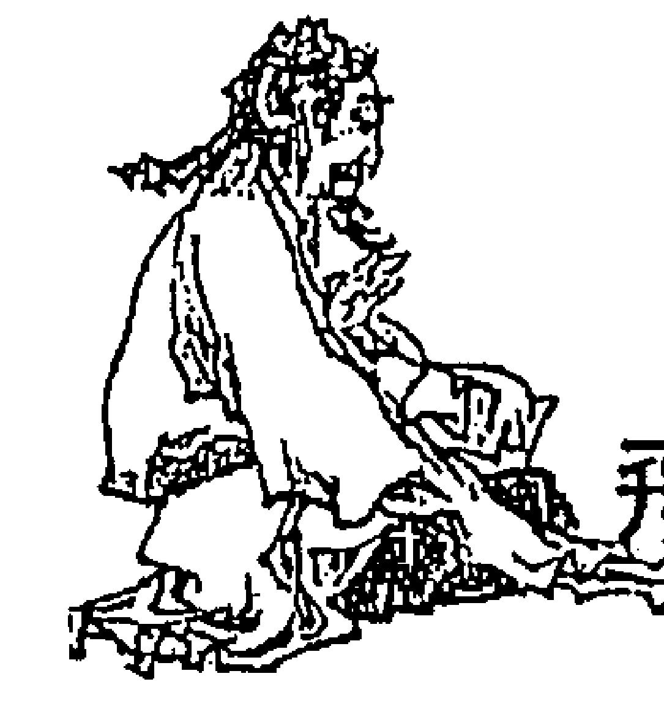

## 乙、「兄弟宮」為「經濟位」、「成就宮」，其共宗六位為「遷移宮」，此二宮得「祿、權」坐下，或「遷移」與「兄弟」作「祿、權交拱」者，也容易獲致成就而得提升社會地位。

此式如若與我「田宅三方」作更多的「多祿會吉」或「祿權交拱」串聯者愈佳，容易致富；與「命三方」交吉者亦吉。

例：某地知名首富戊辰〈1928〉年6月亥時生。名利雙收。

| 陽【祿】右《科》〈子〉丁武【權】〈財〉丙同【忌】曲〈大限〉73-82〈疾〉乙殺63-72〈遷〉甲 | 破〈夫〉戊梁53-62〈友〉乙 | 機《忌》〈兄〉己廉相43-52〈事〉甲 | 紫府3-12《命》庚陰《權》【科】左13-22〈父〉辛貪《祿》23-32〈福〉壬巨昌祿33-42〈田〉癸 |
| :--- | :--- | :--- | :--- |

## 116. 第二章 「善觀祿忌」解析問題

- ①「遷移」〈甲寅〉〈果報宮〉以破軍〈偏財星〉權入「夫妻」逢「田宅」〈癸亥〉〈財富宮〉化來破軍祿會，宜其橫發。《批：凡大富者，必得「田宅」與「福德三方」呈「多祿會吉」或「祿權交拱」等「偏財星」彙吉。》
- ②轉「夫妻」〈戊午〉化天機〈挾偏財祿、權〉忌入「兄弟」〈經濟位〉，逢「交友」〈乙丑〉化來天機祿會，則四方來財、眾星拱月，宜其名利雙收。《批：此「遷移權」與「交友祿」透過「田宅」、「夫妻」而串聯交拱於「兄弟宮」成就位，宜其名成利就。》
- ③「命宮」〈庚申〉化太陽祿逢「父母」〈辛酉〉化太陽權同入「子女」〈丁巳〉，轉而化巨門〈挾祿權〉忌入「田宅」；其「父母」〈辛酉〉又化來巨門祿會，計彙「雙祿一權」於「田宅」。此言其能言善道利於協調，與屬下溝通必佳。轉「田宅」〈癸亥〉化貪狼〈才華曜〉〈挾雙祿一權〉忌入「福德」又逢貪狼「生年祿」，必深具說話技巧與言語藝術。

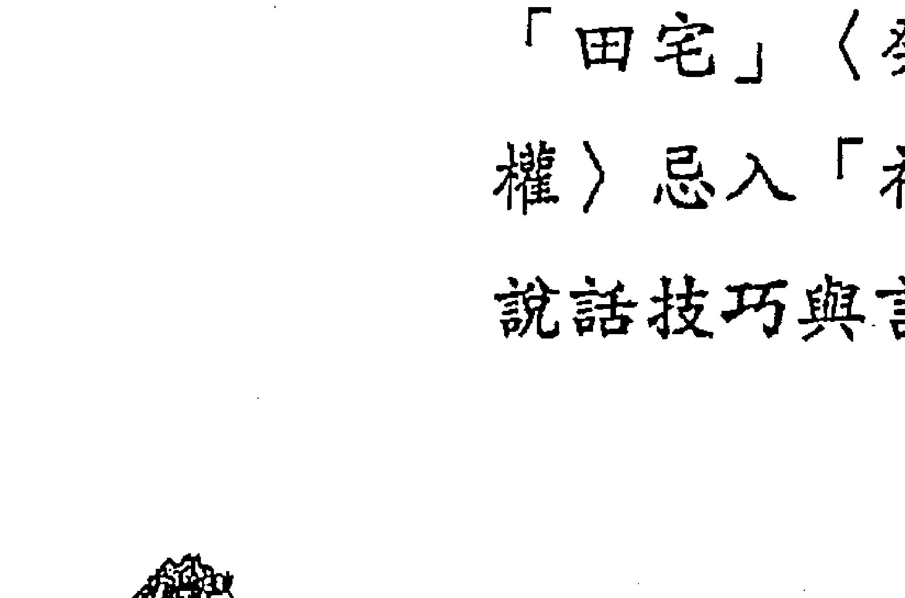

## 第三節 廣論諸要（五）.117

例：乾造己未（68）年七月戌時生。

其父30歲左右即以外人獨當一面的升任某大水泥廠經理（私人大企業的要職多為自家人所踞），難能可貴。

| 同〈父遷〉疾己 | 府武《祿》【科】〈財〉庚 | 陽【忌】陰〈子〉辛 | 貪《權》26-35〈夫〉壬 |
| :--- | :--- | :--- | :--- |
| 破【權】右〈父友〉〈遷〉戊 | (包含箭頭和“權”、“祿”、“忌”等標註) | (空白或連接線) | 機巨16-25〈兄〉癸 |
| (空白) | (包含從“武”指向“貪”的箭頭和“祿”字) | (包含從“破”指向“武”的“忌”箭頭) | 紫相左6-15《命》甲 |
| 廉【祿】曲《忌》〈事〉丙 | 〈田〉丁 | 殺昌〈父父〉〈福〉丙 | 梁《科》〈父〉乙 |

- 1. 「父遷移」〈疾厄〉〈己巳〉化貪狼權入「夫妻」逢「父交友」〈遷移〉〈戊辰〉化來貪狼祿共「生年權」會吉，得一祿二權照「本命事業」。
- 2. 轉「夫妻」〈壬申〉化武曲〈挾一祿二權〉忌入「財帛」〈庚午〉逢「生年祿」，以及「父遷移」。

## 第二章「善觀祿忌」解析問題

〈疾厄〉〈己巳〉也化來武曲祿會，共媾三祿二權拱吉於「財帛」矣。轉「財帛」〈庚午〉化天同忌而挾諸吉入「疾厄」，又逢「父母」〈丙子〉化來天同祿會，宜其善道而父年輕得志。
- ③另者，「父命宮」〈乙亥〉以天機化祿入「兄弟」〈成就位〉〈癸酉〉，轉貪狼〈挾祿〉亦忌入「夫妻」會前述之吉化，景上再添花。

丙、「福德三方」坐「權」逢「祿」會吉者，地位勝於「命三方」坐「祿、權」。譬如「命宮」坐「祿」的通情達理，遠不如「遷移」得「祿」的圓融智慧。「命宮」坐「權」的具主見，遠不如「遷移」得「權」的果斷應變、獨當大局。

丁、公職人員，首先需通過國家的考試制度，其升遷也需受長官賞識與提拔；故以「父母宮」〈考試、上司、表達能力〉和「遷移宮」〈際遇〉並重，仍舊須得於「交友宮」之吉化拱托，而利於人事拔擢。並參酌於「命」、「疾厄」、「福德」三情緒宮察其心境。

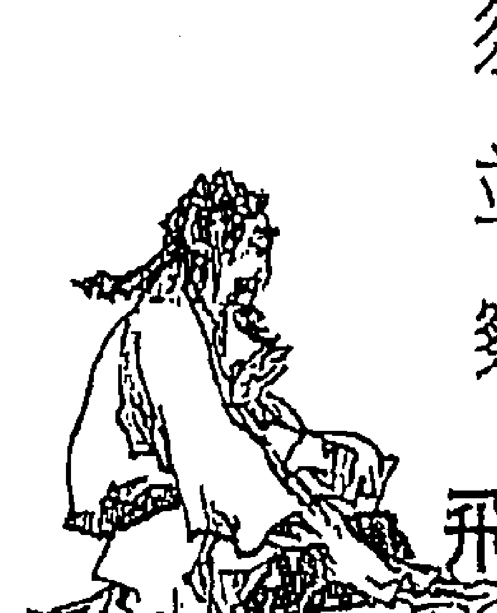

## 第三節 廣論諸要（五）.119

例：乾造〈1959〉己亥年2月酉時生。

現任職高階警官。

| 巨左 | 廉相 | 梁《科》 | 殺 |
| :--- | :--- | :--- | :--- |
| 15-24 權〈兄〉己 | 5-14《命》庚 | 〈父〉辛 | 〈福〉壬 |
| 貪《權》 | 祿 | 忌 | 同【忌】右 |
| 25-34〈夫〉戊 | 自化祿 | | 〈田〉癸 |
| 陰【科】 | | | 武《祿》【權】 |
| 35-44〈子〉丁 | 忌 忌 | 祿 權 | 〈事〉甲 |
| 紫府〈大限〉 | 機昌曲《忌》 | 破 | 陽【祿】 |
| 45-54〈財〉丙 | 〈疾〉丁 | 〈遷〉丙 | 〈友〉乙 |

- ① 「事業」〈甲戌〉化廉貞祿入「命宮」〈庚午〉，轉而化天同〈挾祿〉忌入「田宅」，此言其工作順心。
- ② 「遷移」〈際遇位〉〈丙子〉化天同祿入「田宅」會①式呈「雙祿」，轉而化貪狼〈挾雙祿〉忌入「夫妻」逢「兄弟」〈成就位〉〈己巳〉化來貪狼權及共貪狼生年權與自化祿出，計彙得「三

## 120. 第二章 「善觀祿忌」解析問題

祿二權」還照「事業」。
- ③「夫妻」〈戊辰〉彙得三祿二權，以其自化祿出故得而轉天機〈挾三祿二權〉忌入「疾厄」，逢「交友」〈乙亥〉及「遷移」〈丙子〉共化來天機祿、權彙拱，計得「四祿三權」於「疾厄」矣。
- ④「疾厄」〈丁丑〉彙得四祿三權，以巨門〈挾四祿三權〉還忌入「兄弟」成就位，又逢「父母」〈長官位〉〈辛未〉化來巨門祿會，「兄弟宮」計彙入「五祿三權」，宜其獲賞識而升遷順遂！
- ⑤「事業」〈甲戌〉化破軍權入「遷移」，逢「田宅」〈癸酉〉化來破軍祿會，能力好亦利於升遷發財。

> 謹記：
有一言而可常行者，恕也；
有一行可以常履者，正也。

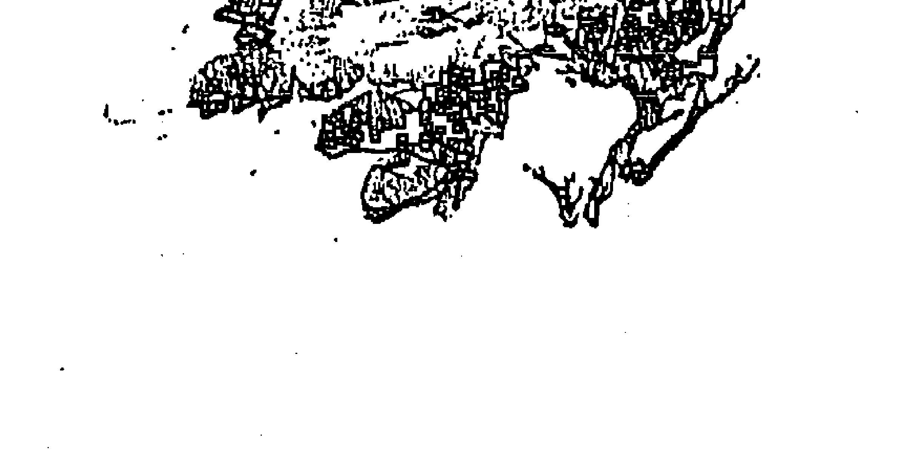

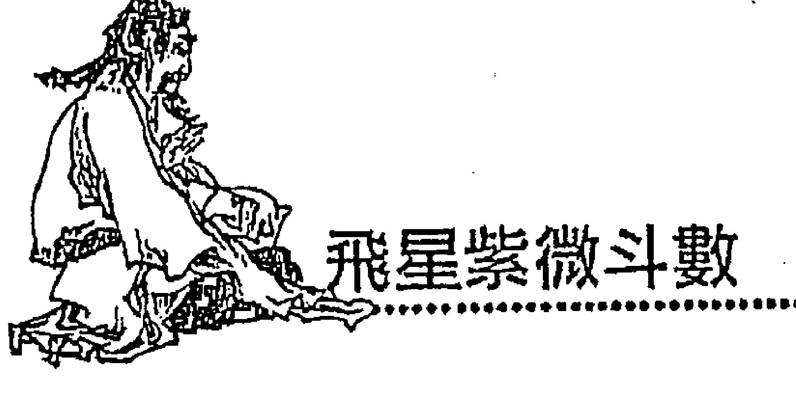

### 六、「驛馬」

甲、以「遷移宮」立太極。觀「遷移宮」是否坐「生年祿、忌」或「命宮祿、忌」，以及觀其〈遷移〉所化的「祿」、「忌」是否觸及「田宅、子女」線〈容易離鄉背井〉或「疾厄、父母」線〈多為往復奔馳〉。並觀與「命」、「福德」兩宮的觸緣。

乙、以「遷移」的坐或化，得「祿」者為「如意」、「收穫」的「良馬」，得「忌」則為「無奈」或「不如意」的「拙馬」與「勞忙」、「奔波」的「勞馬」。

譬如「遷移」坐生年祿或命祿〈良馬〉，轉忌〈挾祿〉入於「田宅」，或「遷移」直接祿入「田宅」；此二馬皆可發達異鄉、外地置產，可以衣錦榮歸的「榮身驛馬」。本式逢「偏財星」或「天梁星」尤妙。

> 註：古書—「天梁」化祿在「遷移」，巨商高賈〈善說、膨風〉。

## 122. 第二章 「善觀祿忌」解析問題

「遷移」坐生年祿或命祿〈良馬〉，轉忌〈挾祿〉入於「子女」，或「遷移」直接祿入「子女」，則容易是他鄉來去的轉進驛馬，難言根歸何處。這也可能只是一場外務攀緣間的「空華驛馬」〈非實於庫〉。

註：此式偏屬「人事攀緣」的驛馬，也可能偏向小輩交遊；或為日後子女將發達蔭我，乃果報榮於子女。

易以「遷移」祿入「父母」，則為攀緣善說、幽默可人的短程「逢迎驛馬」，逢桃花曜，風度翩翩、金玉其外。用於善途，人生可得諸多方便。

註：此式也容易果報榮於「父母」的父母發達。

「遷移」忌入「田宅」，容易他鄉作故鄉，但防社會資源差、孤軍奮戰的「碌碌驛馬」，乃果報不興家道故也。設若「遷移」坐生年忌〈拙馬〉，轉忌〈挾忌〉入於「田宅」，也會他鄉作故鄉而鬱抑不得展志、事與願違，乃果報傷庫的「庸碌驛馬」，當歎月是故鄉明；「雙忌」〈以上〉，還防財凋丁頹、門暗庭荒、天降橫禍。

凡「遷移」坐「忌」的驛馬，以其耿直不善鑽

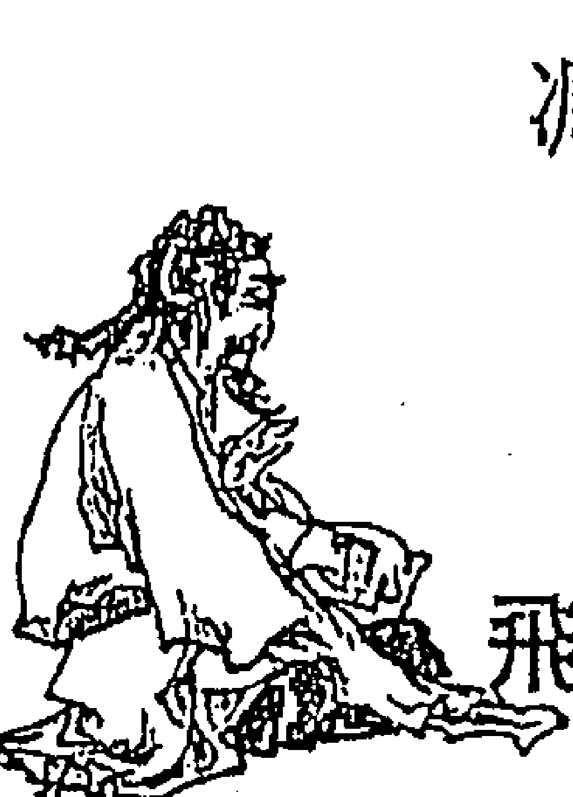

## 第三節 廣論諸要（六）.123

營，處人生地不熟的異地必苦，曰「拙馬奔出」，恨不逢時。逢「雙忌」〈以上〉，還防門風凋蔽或財敗丁頹、「家道不興」，乃果報相欺。

「遷移」忌入「子女」沖田宅，也會驛馬他鄉，但容易是一場不喜逢迎、他鄉來去而勞多獲少〈果報沖庫〉的「勞馬」。設若「遷移」坐忌〈拙馬〉，轉忌〈挾忌〉入於「子女」沖「田宅」，不善逢迎少貴人，還防「驛馬無根」徒勞忙、困頓他鄉，乃果報破庫不興家。「雙忌」〈以上〉，還防災厄損壽、「丁財凋零」、淪落天涯。

「遷移」忌入「父母」沖疾厄，多短程來回的「庸碌勞馬」。「雙忌」〈以上〉，還防粗俗孤陋、招非惹議、災傷意外。

譬如「遷移」坐「生年祿」〈良馬〉，轉忌〈挾祿〉入於「命」、「疾厄」、「福德」者，則為際遇好、貴人多的「快樂驛馬」，容易逍遙自在、遇難呈祥，常流連〈旅遊〉在外、歡笑不絕耳，乃得於果報之善者多樂。而「遷移」直接祿入「命」、「疾厄」、「福德」者，也多逍遙快樂。逢「桃

## 124. 第二章『善观禄忌』解析问题

花曜，是为可人的「花月驿马」。

反之，「迁移」化忌入「命」、「福德」、「疾厄」者，则为「奔波」或「无奈」的「郁抑劳马」。设若「迁移」坐「生年忌」〈拙马〉，转忌〈挟忌〉入「命」、「福德」、「疾厄」者，奔波劳忙而事倍功半，粒粒皆辛苦，乃果报役人的「庸碌拙马」；「双忌」〈以上〉，还防是非意外、灾劫病苦，天不从人愿。

注：设「迁移」所化呈「双忌」〈以上〉入：

- ①「命三方」— 孤军奋战贵人不显，有功无赏祸先当。
- ②「田宅三方」— 祖德无芳亲少力，家道不兴退财产。
- ③「福德三方」— 生不逢时际遇差，有志难展还防病灾缠。
- ④「交友三方」— 孤僻好静少逢迎，亲疏朋离门庭冷。

例：作者陋造辛卯（40）年8月巳時生，54歲正是「拙馬奔出」。「命宮」〈壬辰〉化武曲忌入「遷移」〈戊戌〉，轉而天機〈扶忌〉忌入「子女」沖「田宅」，此即不善袖舞、際遇不佳、難以守成的「空忙拙馬」。

| 巨《祿》昌《忌》 | 廉相 | 梁【祿】 | 殺（54歲） |
| :--- | :--- | :--- | :--- |
| 〈父〉癸 | 〈福〉甲 | 〈田〉乙 | 〈事〉丙 |
| 貪 | 同曲《科》 | 2-11《命》壬 | 〈友〉丁 |
| 陰右12-21〈兄〉辛 | | 武【忌】 | 〈遷〉戊 |
| 紫【權】府22-31〈夫〉庚 | 機32-41〈子〉辛 | 破42-51〈財〉庚 | 陽《權》左【科】52-61祿〈疾〉己 |

- ①「遷移」坐忌個性為「拙」，轉而沖「田宅」傷「庫」，必然少蓄、不善逢迎與汲營，財路不穩。《批：「遷移」忌破「田宅三方」呈同宮的雙

## 第二章『善观禄忌』解析问题

忌以上者，人脈薄、手氣差，也容易好景不常。》
- ②文昌「生年忌」坐「父母」〈癸巳〉，以貪狼〈挾忌〉忌入「命宮」，則遙對於「遷移」的武曲「命忌」呈雙忌，個性呈內方外不圓。52-61大限踏「疾厄」，「大限遷移」〈父母〉制肘於文昌生年忌串聯對應於「本命遷移」的武曲命忌，正是拙馬奔出的運限。
- ③以原命盤之「體」為「遷移」化忌入「子女」沖「田宅」，故而對應於54歲「流年子女」〈父母〉的文昌「生年忌」沖於54歲「流年田宅」〈疾厄〉，由是拙馬再動。《批：此即「體、用」之間，凡論所有事必須作「對等宮位」的契應。》

## 丙、「命」、「遷移」、「子女」、「田宅」，稱為『四正位』：

「命」、「田宅」屬「內」〈主靜〉而「子女」、「遷移」為「外」〈主動〉—

- ①「內」祿於「內」或「內」祿於「外」或「外」祿入「內」，皆主吉。
- ②「內」忌於「外」或「外」忌入「內」或「外」忌於「外」，皆不主吉。

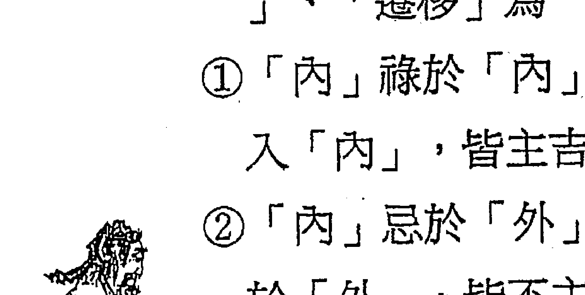

## 第三節 廣論諸要（六）

註：現代人的「驛馬」必然愈來愈頻繁，故以觸及「遷移」所化的「祿、忌」及其「轉忌」與「追祿」、「追忌」的交化所得，皆可能為「驛馬動緣」，只爭際遇得失有別耳。

「忌」〈收斂〉坐「命」、「田宅」兩內宮者，驛馬不易生動；或為工作、俗務的短暫驛馬，終究歸去來兮，落葉還歸根。

凡「遷移」祿入「交友三方」者多人事攀緣，即存「驛馬」其性，多為「短程往復」象。

> 吕近溪：
謙卑何曾致禍？忍默沒招個災！
厚積深藏遠器，輕發小逞凡才！

### 七、論「健康」與「壽元」

甲、凡「福德」〈果報位〉與「遷移」〈果報位〉、「子女」〈福德共宗六位〉等「三果報宮」佳者，主多壽少病，或病得良醫貴人顯、遇難呈祥，「老運」也會比較好。

「夫妻宮」也屬果報位，偏主「少小限」〈第二大限前的年歲〉的健康。凡「夫妻宮」得「雙忌」〈以上〉坐或沖者，幼限恐多乖違，從俗者多重拜父母或契為神佛義子〈女〉。

> > 註：「夫妻宮」為色身的「收藏宮」，也是健康的指標位。

「福」之厚薄涉及「壽限」，也當然影響「健康」。然而健康與壽限非絕對成正比，故言「壽倚於福」，福厚則壽多。

> > 註：壽元攸關「果報」。體壯如牛而一覺不醒者，比比皆是，皆福之不足故也。

是以觀壽，「祿」〈福〉為主、「權」〈生命力強韌〉為輔。此「三果報宮」最愛「祿、權交拱」或「多祿會吉」而益彰其得。

「三果報宮」喜其「坐祿」，或此三宮的「互化祿」及於「化祿」、「祿轉忌」與「追祿」、「追權」之間，呈「多祿會吉」、「祿、權交拱」者上吉。或此「三果報宮」所化與「命」或「田宅三方」會吉者亦佳。

以上所述，串聯於「壽星」者尤妙。壽星入「壽鄉」，福壽綿延。如為「非壽星」之化媾好，其力較遜，仍不失於增福益壽。

> 註：「壽鄉」者，即「三果報宮」與「田宅」皆屬。「田宅」為安身立命的收藏宮，凡「果報」及「色身」〈疾厄〉化吉入「田宅」，或兩方交吉者其福可久駐，已然具壽相。

反之，上述宮位之化串聯逢「多忌呈破」則「福薄壽減」。壽之多寡，需「祿、忌皆參」，權衡其禍福輕重，而後用遞增減歲限。

> 註：此式須累積經驗，方得玩味入髓。然以死亡為世間至哀，勸君切莫輕言，以免口業難轉。

## 130. 第二章 『善觀祿忌』解析問題

「祿」為「福」，「三福宮」之祿最能「解危制厄」〈真貴人〉；祿多福厚，常大事化小甚或禍不臨身。或有雜多祿多忌共存者，常病情反覆，也未必置死。

註：初學者多以「科」為「貴人」，著墨於解危制厄，觀念左矣！

「子女」為「福德」的共宗六位，故關係於壽元。或謂「子女」佳者，事關「腎氣」充而精滿神足（性功能佳），宜其壽駐。

「壽星」者，「紫微」、「天相」、「天同」、「天梁」、「貪狼」等五星曜。以「貪狼」〈修煉星〉、「天梁」〈延壽星〉、「天同」〈益壽星〉得於「祿權雙化」，最能顯著延年。

註①論福以「祿」為主，而紫微、天相不得祿化，故較遜色。

②紫微、天相不得祿化，以坐「福德」、「遷移」、「子女」、「田宅」等壽鄉得同宮旁曜之祿化者即約莫獲福。

「貪狼」為道家修煉星〈煉精化氣、煉氣化神、煉神還虛〉，得於「精滿神足」而壽世。中醫云「腎」〈貪狼〉主「精、氣、神」，故而腎功能的強弱必然攸關壽元，縱慾必損於壽。「天梁」是草本的袪病「中藥」，故得延壽其名。「天同」則福星解危厄，故曰益壽。

註：設若「天同」得多忌破福者，限至衰地常禍入生死交關。譬如重度車關、開心、開腦、昏迷、植物人等，常致生死一線間。

乙、凡「疾厄」〈色身〉、「兄弟」〈疾厄的氣數位—體質宮〉佳者體質好、少久病磨，但未必多壽。壽元與健康非絕對成正比。觀於「健康狀況」，以「權」〈生命力強韌〉為主，以「祿」〈福〉為輔。

「疾厄」最愛與「田宅」〈收藏宮〉、「夫妻」〈疾厄的田宅〉串聯呈「祿權交拱」或「多祿彙吉」者，色身得駐有助於壽元。逢「壽星」之化者尤妙。

如若「疾厄」與「田宅」，或「疾厄」與「三福宮」串聯壽星星呈「祿權交拱」、「多祿會吉」者，大大俾益於壽元。

## 132. 第二章 「善觀祿忌」解析問題

例：內舉作者陋造，辛卯（40）年8月巳時生。

「長伯父」壽至九十有三，沒有不良嗜好，無疾而終。何德坐擁斯壽？

命理如何說？陋造「命宮」〈壬辰〉坐貪狼，長伯父借「命宮」〈父母的兄弟〉為用。

| 巨《祿》昌《忌》忌〈父〉癸 | 廉相〈福〉甲 | 天梁【祿】〈田〉乙 | 〈事〉丙 |
| :--- | :--- | :--- | :--- |
| 貪2-11《命》壬 | 自化祿 | 祿 | 武【忌】祿〈遷〉戊 |
| 12-21〈兄〉辛 | 祿 權忌 | 忌 | 陽《權》左【科】52-61〈疾〉己 |
| 22-31 | 機32-41〈子〉辛 | 42-51 | 52-61〈疾〉己 |

+   ①「福德」〈甲午〉坐「廉貞、天相」，「天相」壽星得本宮廉貞自化祿為吉。則「壽鄉」獲「壽星」坐下祿地，得其一喜。
②「遷移」〈戊戌〉（果報位）化「貪狼」〈壽星〉祿入「命宮」逢「疾厄」〈己亥〉飛來貪狼權會，而「父母」〈癸巳〉坐巨門「生年祿」，也以貪狼〈挾祿〉忌入「命宮」，得「雙祿一權」交拱；轉「命宮」〈壬辰〉化武曲〈挾二祿一權〉還忌入「遷移」，又逢「疾厄」〈己亥〉飛來武曲祿會，則「遷移」〈果報宮〉獲壽星「三祿一權」串聯呈吉，得其二喜。

+   ③「遷移」〈戊戌〉得吉，轉以天機〈挾三祿一權〉忌入「子女」逢「田宅」〈乙未〉化來天機祿會。則「色身」之福喜獲與「收藏宮」交吉，壽星會壽鄉，增益其壽矣。

+   ④以「福德」、「遷移」兩壽鄉得喜，復以「田宅」坐擁天梁壽祿，宜其享高壽。

> 《批：凡「田宅三方」得「壽星」化祿、權坐下者皆得於壽吉。》

+   ⑤陋以菸酒度日，忖於自作孽不可活，不敢妄臆於己。

共勉：

有麝自然香，何須當風立！

『道藏飛秘』的邏輯與功法

丙、尖齒動物食肉，平齒動物食素，這是宇宙的自然法則。人類是平齒動物，當以素食為主，何苦殺生滿足口腹，反其道而行？前賢：順天者昌逆天亡，言簡意賅，而聽者渺渺。世上多刀兵災劫，或恐緣於此惡。勸君多吃蔬果、收斂口腹，以及養生運動、流汗消業等，保證延年益壽。

丁、世上多見窮人命短、富者多壽，何也？乃果報宮與收藏宮交吉者，福厚發產也發壽；果報宮與收藏宮交凶者，福薄敗產也易促其壽。

易以「疾厄」與「田宅」交吉，也是家運興與壽得永；「疾厄」與「田宅」交凶，則家運不興與色身不得久藏。

> 邵康節：
不作風波於世，自無冰炭哽胸！

### 八、「勤儉」與「懶散」

甲、「生年忌」坐「田宅三方」，或「命三方」忌入「田宅三方」者，多勤儉守份，白手可以成家〈長子格〉。會「權」尤能拼勞。

註：上式是「單忌」〈主收藏〉無破者而言，如其一宮得「雙忌以上」呈破，還防空勞少餘。

易以「田宅三方」忌入「命三方」，則容易存在於環境壓力下的無奈勞忙，也會勤儉。設「田宅三方」坐忌復轉忌入「命三方」者，家運不興、庸碌劬勞。

「生年忌」坐「命三方」，以及「命三方」互忌者，已然具紅塵責任的「基本勞相」〈不作凶論〉。

註：譬如女命的「事業」、「財帛」或「田宅三方」坐「忌」者，多為職婦。

## 136. 第二章 『善觀祿忌』解析問題

乙、『事業』忌入『疾厄』、『兄弟』忌入『疾厄』、『田宅』忌入『疾厄』，與『疾厄』忌入『命』或『田宅』者，人生總是有諸多勞忙，甚或身不由己、無人能替；常工作負重、忙碌、緊張或工作時間長。『雙忌』以上防過勞傷害、積勞成疾。

丙、反之，『生年祿』、『命祿』坐『田宅三方』、『福德三方』，或『田宅三方』、『福德三方』化祿入『命宮』者，少責任、少辛勞。

丁、尤以『生年祿』或『命祿』入『疾厄』、『福德』，或『命』、『疾厄』、『福德』三宮的『互化祿』者較懶散與容易滿足、享受現成；或者此三宮於『化祿』、『祿轉忌』及『追祿』之間串聯呈多祿者福厚懶散，得祿愈多愈散漫。

戊、『命』、『疾厄』、『福德』三宮與『遷移』所化『以祿相交』，或於『化祿』、『祿轉忌』及『追祿』之間串聯呈『多祿』交媾者，容易多冶遊、樂逍遙，是另類的懶散。「福德」、「遷移」與「交友三方」的「以祿相交」，或於「祿轉忌」及「追祿」之間串聯呈「多祿」交媾者，也容易浸淫歡樂，耽擱正事。

> 例：坤造丙辰（1976）年 10 月申時生。
其母個性逍遙。

+   ①「母福德」〈父母〉〈壬辰〉化天梁祿入「遷移」，「母命」〈兄弟〉〈庚寅〉化太陽祿亦入「遷移」〈丁酉〉呈雙祿；轉巨門〈挾雙祿〉忌入「事業」又會巨門「命祿」，三祿矣。此言其母怕寂寞、在家待不住〈外向〉，每邀朋友逍遙竟日，樂而不疲，此為另類的「懶散」。

## 138. 第二章 『善觀祿忌』解析問題

轉「事業」〈乙未〉化太陰〈挾三祿〉忌入「原命福德」又逢「母疾厄」〈遷移〉〈丁酉〉化來太陰祿會，四祿矣。《批：此式即以祿轉忌逢命祿而作二度的轉忌。》

+   ②另者，「母遷移」〈交友〉〈丙申〉化天同祿入「事業」〈乙未〉，轉太陰〈挾祿〉忌入「福德」逢「母疾厄」〈遷移〉〈丁酉〉化來太陰祿會。則母「遷移」與「疾厄」串聯會成雙祿而悠遊。

+   ③合①+②二式，則「母福德」與「母疾厄」、「母遷移」所化串聯呈五祿，故而少煩惱、好心情、愛聊天，逍遙忌志，是個外向、快樂的人。

> 白居易：我有一言君記取，世間自取苦人多！

### 九、「儉約」與「浪費」

甲、凡「福德」忌入「財帛」者，容易為錢傷腦筋，否則就是個不大惜福的人〈福德忌出〉，容易浪費。
註：轉「財帛」化忌入「命」及「田宅」兩三方者，多算計；入「交友」及「福德」兩三方者，多浪費。

若「財帛」於化忌或轉忌間逢「武曲」財星忌入「命宮」、「福德」、「疾厄」者，多所算計惜財。易以「命」忌入「財帛」，是有「金錢觀」的簡約勤快，但未必吝嗇。

乙、「福德」以「武曲」正財星化忌或其轉忌，不論落入何宮，或「命」、「財帛」以「武曲」化忌或轉忌入「福德」，或「福德」坐「武曲」生年忌、命忌者，多算計金錢〈之於己身的花用未必儉約〉。

丙、約「命三方」忌入「田宅三方」〈收藏宮〉者較儉約惜福與勤快，但難免存私心、具城府；反之「命三方」忌入「交友三方」則重義少惜福而少城府。

## 140. 第二章『善觀祿忌』解析問題

「命三方」坐「生年忌」，轉忌入「田宅三方」沖「交友三方」者，容易「工於心計」、「愛財算計」而少情。城府深。

凡「交友」及「福德」兩三方逢「多忌」之破者，皆容易少城府、玩物浪費或不善汲營、點滴多耗，有損於格局；還防人生逢逆運而顛沛、災病。

「命」忌入「財帛」，轉忌〈挾忌〉入「疾厄」者，典型的錢花在刀口上、愛財勤快〈惜福〉。

丁、「命」、「財帛」化忌入「福德」或「生年忌」坐「福德」者，執於喜好而多花用，會「權」則近奢華浪費。「雙忌」以上則亂章法，不知惜福。

戊、「福德」化權入「交友三方」會「祿」者，好場面而多浪費，會「遷移」之祿者尤甚。「福德」化權入「遷移」、「父母」會「祿」者，虛榮好勝、好大喜功〈好高騖遠〉也產生浪費。『福德』權入『遷移』逢『父母』化祿來相交，或『福德』權入『父母』逢『遷移』化祿來相交者，也是虛榮、好面子而多花用。

己、「福德」化忌入「田宅三方」者，很容易存在於「自我」、「偏執」中，「日積月累」的形成「小心」、「謹慎」、「惜福」、「小氣」、「算計」、「勞神」等性格。但防造成「孤僻」、「龜毛」、「鑽牛角尖」、「小心眼」而「少知己」。

> 註：「福德」化出的「忌」為因人而異的特有「偏執」性格。此式乃「偏執」性入於「收藏宮」所衍其象。

反之，「福德」化忌入「交友三方」者，則少惜福，乃福德「忌出」於「收藏宮」故也；「福德」化忌入「遷移」也是少惜福。或「福德」宮的「自化忌出」亦少惜福。

庚、「財帛」忌入「交友三方」或「遷移」呈「雙忌」以上者，容易亂章法而多花用，常造成「阮囊羞澀」、經濟少盈。

## 142. 第二章 「善觀祿忌」解析問題

「田宅」忌入「兄弟」或「財帛」逢「自化祿出」〈同星曜〉，及「兄弟」忌入「財帛」逢「自化祿出」〈同星曜〉，是「理財無方」多花錢；此式最好置產繳房貸。上述易「自化祿出」為「自化忌出」〈非必同星曜〉，則更是「毫無原則」的無制亂花錢。

「命」、「財帛」化忌入「交友三方」呈同宮「雙忌」〈以上〉者，平常就會多耗浪費；易以「兄弟」化忌入「交友三方」得同宮「雙忌」〈以上〉者，是根本就不懂打算的消耗浪費。如為「田宅」化忌入「交友三方」得同宮「雙忌」〈以上〉者，須防大好江山淪入外人手。

例：乾造丙戌〈35〉年6月丑時。其妻愛財計較卻不善理財，偏好自身享受。

| 陰曲右〈兄〉癸 | 貪4-13《命》甲 | 同《祿》巨14-23〈父〉乙 | 武【科】相24-33〈福〉丙 |
| :--- | :--- | :--- | :--- |
| 府 廉《忌》【祿】〈夫〉壬 | 祿 | 忌 | 忌陽【忌】梁 昌《科》左34-43〈田〉丁 |
| 3-12〈子〉辛 | | | 殺44-53〈事〉戊 |
| 破【權】〈財〉庚 | 〈疾〉辛 | 紫64-73〈遷〉庚 | 機《權》54-63〈友〉己 |

+   1. 「夫妻」〈壬辰〉坐廉貞「生年忌」，個性執著不好溝通；化武曲財星〈挾忌〉忌入「福德」〈札實忌〉。此言其妻愛財計較，卻重己身享受。
2. 轉「福德」〈丙申〉化廉貞還忌入「夫妻」會廉貞「生年忌」，造成雙忌沖激，久之衍生了夫妻為錢爭執的不滿情緒。
3. 「命宮」〈甲午〉以廉貞祿入「夫妻」會上式的雙忌，為欠妻債的飽受予取予求〈祿隨忌走〉。

## 144. 第二章 『善觀祿忌』解析問題

④其妻何以不善理財？乃「夫妻」所化畢竟是「雙忌」呈破，此狹隘偏執，豈能得於成就？
⑤凡六親命宮得「雙忌」〈或以上〉者，必有其失，謂之「破格」。非性格其破則事業或健康生顛沛、挫折等。多忌則容易壽促或帶病、破相而延生。

> 諺語：
饒人不是癡漢，癡漢不懂饒人。

> 德諺：
早婚多成後悔之基，思惟不成熟故也！

### 十、「果報」

「福德」或「遷移」，與「田宅」所化沖激呈破〈三忌以上〉者，容易「家道中落」、「丁財凋零」，也防病磨、壽促或孤獨冷僻，親疏朋離、晚景淒涼等。但防成為社會邊緣人。這就是「業報傷宅」或「祖有餘殃」的「果報相欺」。以「遷移」對應於「田宅」尤甚。

註：這也可能是「住家風水」不佳，串聯巨門、太陰化忌者，但防「陰邪祟宅」〈僅供參考〉。

註：所謂「丁」者，指的是男丁。凋零則常見男丁平庸、敗產、浪蕩、挫折、病業、破相或損壽等。

「福德」或「遷移」與「田宅三方」共化祿、權串聯乘旺者，容易「祖德流芳」而「家道興隆」、好事臨門，也會宗門鼎盛、庭前和樂、子肖孫賢、老運好。以「遷移」應對於「田宅」尤顯。

凡「福德三方」多得祿、權者，開明、爽朗、果敢、大方，人生必然諸多順遂，大利於治家與財富開創。故以「福德三方」為「田宅三方」的共宗六位。此即所謂：財富之根在果報。

## 146. 第二章『善觀祿忌』解析問題

例：坤造甲午〈43〉年12月亥時生。
婚姻不美，晚近夫得腦癌亡身。
日前以55之齡仍租屋過日，且己身已洗腎13年，豈非果報相欺？

| 〈田〉己 | 機【權】〈事〉庚 | 紫 破《權》〈友〉辛 | 〈遷〉壬 |
| :--- | :--- | :--- | :--- |
| 陽《忌》〈福〉戊 | 忌↓ | 忌↗ | 府〈疾〉癸 |
| 武《科》殺左曲〈父〉丁 | | | 陰〈大限〉46-55〈財〉甲 |
| 同梁〈命〉丙6-15 | 相〈兄〉丁16-25 | 巨〈夫〉丙26-35 | 廉《祿》【忌】貪右昌【科】〈子〉乙 |

+   1. 「田宅」〈己巳〉以文曲忌入「父母」，「遷移」〈果報宮〉〈壬申〉以武曲亦忌入「父母」呈雙忌〈沖「疾厄」—家運〉，此即「家庭」與「果報」相激，造成「丁財凋零」。
2. 轉「父母」〈丁卯〉化巨門〈挾雙忌〉忌入「夫妻」；而「福德」〈果報宮〉〈戊辰〉坐太陽「生年忌」，化天機〈挾生年忌〉忌入「事業」，令「夫妻」、「事業」一線呈三忌。

③合①+②式，串聯釋象為果報傷宅、家道中落。以其沖激於夫妻、財帛，故而傷財、傷夫，因此至今55 歲仍以租屋過日，以及晚近夫罹腦癌亡身。

④「命宮」〈丙寅〉化廉貞忌入「子女」〈乙亥〉沖「田宅」，轉而化太陰〈挾忌〉忌入「財帛」。會照於「福德」太陽「生年忌」，又復串聯於果報傷子。

⑤所喜者，「子女」坐下廉貞「生年祿」，晚境仍不失其福，可得子女守病榻。

> 抱朴子：
寸火能焚雲夢，蟻穴常決大堤。

『道藏秘飛』的邏輯與功法## 第二章 善观禄忌解析问题

#### 何以己身已洗肾13年？

| | 机【权】 | 紫破《权》 | |
| :--- | :--- | :--- | :--- |
| 〈田〉己 | 〈事〉庚 | 〈友〉辛 | 〈迁〉壬 |
| 阳《忌》 | | | 府 |
| 〈福〉戊 | 忌 | | 56-65 〈疾〉癸 |
| 武《科》 杀 左 曲 〈父〉丁 | 忌出 | | 阴 忌 〈大限〉 |
| | | | 忌46-55 〈财〉甲 |
| 同 梁 | 相 | 巨 | 廉《禄》【忌】 |
| 6-15 《命》丙 | 忌 忌 | 26-35 〈夫〉丙 | 贪右 昌【科】〈子〉乙 |
| | 16-25 〈兄〉丁 | | |

①“命宫”〈丙寅〉化廉贞〈血光、发炎、毒素〉忌入“子女”，其“疾厄”〈癸酉〉又化来贪狼〈肝、胆、肾、腿〉亦忌入“子女”〈福德的共宗六位〉。

②转“子女”〈乙亥〉化太阴〈挟双忌〉忌入“财帛”〈甲戌〉，即见以太阳〈挟双忌〉忌出于“福德”会太阳“生年忌”呈“三忌”。

③“福德”既坐“生年忌”，当化天机〈挟三忌力〉忌入“事业”，而其“兄弟”〈身体气数宫〉〈丁丑〉则化巨门〈西药星〉忌入“夫妻”。合之呈“四忌”破于“夫妻”〈疾厄的田宅〉，宜其13年来洗肾度日。

+ ④待“大限命宫”转入“疾厄”，56岁流年踏“本命兄弟”，为“本命命宫”与“大限命宫”〈疾厄〉共破于“本命子女”冲“田宅”，则串联凶应于56岁“流年田宅”〈本命福德〉的“忌出”呈破，恐其音容将渺。《批：“疾厄”最忌与“田宅”交破，有色身将败不复于宅的“死亡”象。》

> 邵二泉：
觉人之诈，不形于言；
受人之侮，不动于色。
此中意味无穷，受用不尽。

#### 道藏飞秘的逻辑与功法

## 150. 第二章 善观禄忌解析问题

例：乾造甲午〈43〉年9月午时生。

38年父母自大陆迁台，身少分文楼陋巷的违章房舍。

此即于父母手中的“家道中落”。

| 阴【权】 | 贪【禄】 | 同巨 | 武《科》相 |
| --- | --- | --- | --- |
|  | <大限> |  |  |
| 13-22 | 23-32 | 33-42 | 43-52 |
| 〈父〉己 | 〈福〉庚 | 〈田〉辛 | 〈事〉壬 |
| 府廉昌 |  |  | 阳《忌》梁〈大田〉〈29岁〉〈友〉癸 |
| 3-12 |  |  | 杀曲忌 |
| 《命》戊 |  |  | 63-72〈迁〉甲 |
| 〈兄〉丁 |  |  |  |
| 破《权》右【科】 |  | 紫左 | 机【忌】 |
| 〈夫〉丙 | 〈子〉丁 | 〈财〉丙 | 〈疾〉乙 |

+ ①“父母”〈己巳〉化文曲忌入“迁移”〈甲戌〉〈果报宫〉，转而化太阳〈挟忌〉忌入“交友”逢太阳“生年忌”呈双忌。此言父母处世将“挫折”、“孤僻”，难以荣显。
+ ②“田宅”〈辛未〉则化文昌忌入“命宫”，会上式呈“三忌”为破。此“父母”、“田宅”、“迁移”共破，即于父母手中家道中落、丁财凋零。其田宅与迁移、交友共破，当然也少敦亲睦邻。
+ ③是以本造出身陋巷，也是独子（据闻其母先前亦曾数度获男儿胎，非不足月流产则产下即夭）。
+ ④“福德大限”的29岁“流年”踏“本命交友”，其父罹尿毒症而日薄西山，此亦属果报上的家道之伤。以“本命田宅”串联凶应于“大限田宅”〈交友〉，“本命父母”串联凶应于“流年父母”〈迁移〉故也。

#### 要言：

> 万事处之以宽，则福自厚矣。

### 十一、“性格”

甲、“福德”与“迁移”以忌共破〈双忌以上〉于“交友三方”〈冲田宅三方〉者，个性孤独少逢迎，容易亲疏朋离，还防病磨、寿促，以及家道不兴〈冲田宅三方〉。“父母”〈修养宫〉与“迁移”〈处世宫〉以忌共破〈双忌以上〉于“交友”者，也是孤陋粗俗、不善表达、少逢迎、少朋友。

“父母”与“福德”所化呈双忌共破于“交友”或“迁移”者，生气时口不择言；此式如若再串联于“生年”、“命”或“疾厄”所化呈权忌共破，可以泼妇骂街。乃“父母”为涵养宫，而“福德”所化之忌为偏执象，逢权则激烈故也。

乙、“福德”化权共“迁移”化禄入“交友三方”者，多逢迎攀缘的趋炎附势，还防朱门酒肉臭。易以“迁移”化权会“福德”化禄于“交友”者，善于人脉运作，也容易攀龙附凤。“父母”化禄与“福德”化权共媾于“交友”，防阿谀奉承、锦上添花。“福德”化禄与“父母”化权共于“交友”、“迁移”者，说话臭屁消遣人。设“父母”与“交友”化禄共媾于任何一宫，善排解沟通。

设“父母”化巨门忌入“命”、“福德”、“疾厄”、“田宅”逢巨门禄者，话比猫身的毛还要多。或“命”、“福德”、“疾厄”其一宫化巨门忌入任何一宫逢巨门禄者亦近似其质。

丙、“迁移”〈或父母〉与“交友”、“子女”以忌共破逢巨门忌者，容易犯小人多是非，防孤独处世，临急贵人少。尤以“迁移”与“交友”所化共破，非必巨门忌即容易犯小人。

譬如“命宫”坐“生年忌”〈冲迁移〉而后化忌〈挟生年忌〉入“交友”，必属偏执交游人缘差。“命宫”坐“生年忌”而后转忌入于“迁移”者，恐偏执形外少人缘；入“父母”者，防怨尤迁怒修养差。“迁移宫”坐忌复化忌入“交友三方”呈双忌以上者，庸拙处世、孤陋寡闻少心计，容易人脉差、贵人少、遭设计。公亲变事主。

丁、“命”、“疾厄”、“福德”三宫所化彙多忌呈破于“迁移”、“父母”者，防性格浮躁、修养差、失进退、少根筋、乱章法、没耐性等坏事。容易朝三暮四，一事无成。如不修德养性，还防闲惹是非、灾病恶祸。

戊、“单忌”坐守于“田宅三方”者，城府较深；“单忌”坐于“命三方”者，次之。“生年忌”坐“命三方”而后转忌入“田宅三方”者，城府最深。

“生年忌”、“命三方”化忌入“交友三方”或“迁移”者，城府较浅。命盘十二宫多“自化忌出”者，城俯亦浅。“生年忌”、“命忌”坐“迁移”而后转忌入“交友三方”者，城府尤浅。

### 十二、“体型”〈体能〉与“健康”

甲、“疾厄”坐“权”则体型结实或健壮，少小病之扰；“疾厄”化“权”入“命宫”或“迁移”者，也会体型健壮少病。

註：“疾厄”化“权”入“迁移”，个性干脆、生命力强韧。

“疾厄”化“权”入“夫妻”或“事业”，有运动细胞（也较喜欢运动），体型当然较健壮。“疾厄”化“权”逢“事业”化“禄”相交于第三宫者，也会喜欢运动练身。

乙、“疾厄”坐禄或“疾厄”化禄入“命宫”，比较“懒”也容易“发福”；“疾厄”化“禄”入“事业”、“夫妻”及“迁移”、“父母”者，很容易“发胖”。

註：“疾厄”得“单禄”主丰腴；所谓“胖”者须会“双禄”（以上）。

“疾厄”与“迁移”以禄〈同星曜〉相交于“夫妻”、“事业”者，“很会胖”；或“疾厄”化禄入“迁移”或“父母”，转忌〈挟禄〉入“夫妻”或“事业”逢同星曜的“生年禄”或“命禄”，小心喝水也会胖，而且减肥不易。

设“疾厄”化禄入“迁移”，转忌入“田宅”逢“夫妻”飞来同星曜的禄会，也是会胖。

“疾厄”与“福德”、“迁移”以禄相交者，胖不离“福”〈运气变好、诸事顺遂〉。“疾厄”与“田宅”交禄，也是胖不离“福”〈家运变好〉，两者都会少病多寿。

> 要言：
+ 见善如渴，闻恶装聋。

### 第三节 广论诸要（十二）.157

例：坤造〈1953〉癸巳年2月寅时。还防过胖倾向。

| 同左44-53〈事〉丁 | 府武曲〈大限〉54-63〈友〉戊 | 阳阴【忌】《科》←─────（遯）己 | 贪《忌》昌─────→禄〈疾〉庚 |
| :--- | :--- | :--- | :--- |
| 破【禄】34-43〈田〉丙 | ^ │ │ │ │ │ │ v | 机【禄】巨《权》〈财〉辛 |  |
| 右24-33〈福〉乙 | ↑ 忌│ │ 自化禄→ | 紫【科】相〈子〉壬 |  |
| 廉14-23〈父〉甲 | 4-13《命》乙 | 杀〈兄〉甲 | 梁【权】〈夫〉癸 |

+ ① “夫妻”〈疾厄的收藏宫〉〈癸亥〉化破军禄入“田宅”〈丙辰〉逢破军“生年禄”，转而化廉贞〈挟双禄〉忌入“父母”〈形于外宫〉〈甲寅〉又逢廉贞“自化禄出”，彙成“三禄”。
+ ② “父母”〈甲寅〉逢自化禄，当转化太阳〈挟三禄〉忌入“迁移”〈形于外宫〉，逢“疾厄”〈庚申〉化来太阳禄会，彙成“四禄”。串联于两“形于外宫”得多禄，宜其体型着实福态。《批：逢“父母”自化禄而作二度转忌。》

丁、疾厄化权逢福德、迁移、子女、田宅化禄拱吉者，运动养生有成效〈会贪狼寿星尤佳〉。

戊、疾厄化忌入事业、夫妻者，容易瘦。疾厄化忌入迁移、父母者也容易瘦，但防性子急。设疾厄化忌入夫妻，转忌入迁移成双忌以上者，可以骨瘦如柴。

凡疾厄所化得多禄者，非胖则懒；反之，所化得多忌者，非瘦即病。

註：胖瘦应以疾厄宫所化禄、忌共参而后对应于大限、流年予评估。其所化的禄、忌及其转忌所入之宫而决定不同大限的不同体态。

己、疾厄坐或化贪狼〈甲木〉、天梁〈荫星一大树〉、太阳〈在天而高〉、太阴〈在天而高〉、廉贞〈火性炎上〉禄、权者，身材容易较高。

凡疾厄与迁移两方互以禄、权相交化逢上述诸星曜者，身材也会较高。

疾厄坐或化出忌逢天机〈乙木花草〉、太阴〈水性低下〉、文曲〈水性低下〉、文昌〈辛金小零件〉者，身材容易缩水。双忌〈以上〉则呈娇小。

疾厄与迁移两方，其化呈双忌以上共破逢上述星曜者，体型也容易缩水。

庚、权、忌同坐疾厄，或事业化忌入疾厄逢权，或疾厄忌入命逢权者格外劳累，容易劳、撞伤或运动伤害〈双忌以上〉，逢廉贞忌〈含自化忌〉〈非必同星曜〉尤显。

迁移、子女〈意外位〉化忌会疾厄化权逢廉贞忌（含自化忌）者，也容易发生劳、撞伤或运动伤害（双忌以上）。

辛、疾厄坐忌、疾厄本宫自化忌出，或疾厄忌出于父母、迁移，以及疾厄忌入夫妻、事业者，容易减肥。反之，易以化禄则减肥较不易。

壬、疾厄禄入田宅，或疾厄与田宅以禄相交于福德、迁移、子女等果报宫者，可以寿长（会寿星尤妙）。

癸、疾厄与田宅冲激或串联呈破，以及疾厄与福德、迁移、子女等果报宫冲激或串联呈破者，防损减寿元。福德、迁移、子女等果报宫所化不佳，又逢疾厄本宫“自化忌出”者，容易器官摘除或瞬间死亡。

### 十三、“禄”“忌”之用，以“命”“迁移”为例

甲、“田宅”禄入“命”—
承祖业家荫、得助置产、住家宽敞舒适、衣食无忧、六亲协力，但防惯于养尊处优。

“田宅”禄入“迁移”—
家世好、背景优，祖德流芳、门风鼎盛、宗亲显耀。己身也容易开创财富，可以兴家旺宅、光耀门楣。（田宅禄出）

“田宅”忌入“命”—
房子小旧、生活环境差、承担家计、家运蹇滞、家庭不谐、六亲拖累，长子格、必须白手成家。

“田宅”忌入“迁移”—
门昏楣暗、祖德不彰、家运不振、门风不佳，容易多耗难盈、脱产搬家、名下无产。双忌以上，防宗门凋零、家道中落，也防丁虚财退、天伦不乐、六亲无力、住家风水差。甚或举债倒闭、流离失所、各奔东西。（田宅忌出）

> 道藏飞秘的逻辑与功法

## 162. 第二章 善观禄忌解析问题

乙、财帛禄入命—
衣食无忧、手头方便〈未必富有〉、来财容易、收入好〈未必全由己赚得〉，适合从商或分红薪水。

财帛禄入迁移—
财运好、汲营有道、手头方便〈未必富有〉，财如源头活水〈未必全由己赚得〉、赚钱容易、周转方便，少计较金钱而外缘佳，很适合做日日见财的现金生意。〈财帛禄出〉

财帛忌入命—
固定收入或赚辛苦钱。格局不佳者，需俭约度日；运限差时手头紧〈未必贫穷无产〉、不爱管帐。逢“武曲”财星化忌，还防多所算计、为财所役。

财帛忌入迁移—
不善汲营〈不适合做生意〉、没有金钱概念，城府浅、少算计。运限差时捉襟见肘〈未必穷困无产〉。〈财帛忌出〉
註：凡“命三方”忌入“迁移”，都属不善汲营者。

丙、“疾厄”禄入“命”—
物质生活好、悠闲、宽心，少久病纠缠、病得良医，懒惰、少流汗，易发胖。

“疾厄”禄入“迁移”—
好相处、好情绪、小病少、病得良医贵人显、安逸优游、心想事成、家运好，容易发胖。〈疾厄禄出〉

“疾厄”忌入“命”—
格外劳碌、性不闲、容易瘦，较多的压力、工作忙、多烦躁；运限差时，还防久病纠缠〈慢性病〉、自我意识较浓、不好相处。

“疾厄”忌入“迁移”—
躁急、没耐性、团团转，容易瘦。格局破者，情绪多反复、处事少章法；福破者，轻则器官摘除，重则瞬间死亡。〈疾厄忌出〉

共勉：临财勿苟，义而后取。

## 164. 第二章 善观禄忌解析问题

丁、福德禄入命—
物质生活好、乐观、自在、满足、好情绪、少冲劲，福厚少病磨、心想事成。

福德禄入迁移—
乐天、外向、爱热闹、好脾气、多欢乐，心想事成、贵人多，但防逍遥怠志、流连忘返。（福德禄出）

福德忌入命—
杞人忧天、自寻烦恼、偏执龟毛、情绪易差，格局不佳者防病疾纠缠、孤僻恶习，自我意识浓。

福德忌入迁移—
性烈福薄、爱恨分明，会“权”冲动易怒、惹是生非、不知惜福，运限差时防病疾灾厄、横祸加身；格局差者，怨天尤人、恶疾重症。（福德忌出）

> 左传：匹夫无罪，怀璧其罪！

飞星紫微斗数

戊、“交友”禄入“命”—
容易遇上知己、益友多助、友情绵长，人缘好、好友常联系。

“交友”禄入“迁移”—
容易遇善知识或见多识广者，人脉宽广、人际活络，多社会闻达的交游，还防趋炎附势、朱门酒肉。〈交友禄出〉

“交友”忌入“命”—
防小人纠缠或好友行霉运，容易遇上固执对象、臭气才相投，还防不相知而相惜、相知而相离的人际往来。

“交友”忌入“迁移”—
孤独僻性、知己稀，少交游、人脉差、人际不活跃，或好友凋零、知已在天边。〈交友忌出〉

> 张横渠：
越奸巧越贫穷，奸巧原来天不容！

## 166. 第二章 善观禄忌解析问题

己、“父母”禄入“命”— 师长缘佳、上司缘好、父母开明、长辈庇荫，己身聪明、唸书缘好，利于考试、证照、公职。

“父母”禄入“迁移”— 含和讨喜、风趣、善表达、形象佳，考运好、举一反三、学习能力强、学习环境佳，外地唸书、学有所用。长辈活跃人脉广。〈父母禄出〉

“父母”忌入“命”— 长辈固执或曾经辛苦过来。长辈疼我、须担负孝养之责。读书辛苦或不爱唸书，容易偏执课业、选择性读法。容易长期银贷、还防文书困扰。

“父母”忌入“迁移”— 父母老大人脉差、少父母荫，考运不好、唸书缘较差，或者学非所用，多缄默或表达能力不佳。甚或不学无术、出口成脏、形象差。〈父母忌出〉
註：凡“父母”化忌入“迁移”或“交友、子女”呈双忌者，表达能力必逊色。

飞星紫微斗数

### 十四、“生年禄”不论落何宫皆为我“福”

“生年禄”需作转忌的察查虚实，与一

+ 甲、“福德三方”所化以同星曜的双禄会吉或禄、权交拱者，主得际遇、果报之福而乐。
+ 乙、“田宅三方”所化以同星曜的双禄会吉或禄、权交拱者，主得家庭、财富、物质、健康而乐。
+ 丙、“交友三方”所化以同星曜的双禄会吉或禄、权交拱者，主得交游处世的人际而乐。
+ 丁、“命三方”所化以同星曜的双禄会吉或禄、权交拱者，主事业、金钱上的汲营得乐。

註：以上诸式其福者何？全依：

+ ①“生年禄”坐本命盘何宫〈1宫〉？转其忌入于何宫〈2宫〉？
+ ②与本命盘的何宫〈3宫〉所化“追禄”交吉？
+ ③合①+②化象所落触的“宫位”及“星曜”，用不离体的三者串联併释。

例：譬如作者陋造〈40〉辛卯年8月巳时生。

| 巨《禄》昌《忌》(父)癸 | 廉相(福)甲 | (田)乙 | (事)丙 |
| :--- | :--- | :--- | :--- |
| 贪2-11《命》壬 | | | 武【忌】12-21〈迁〉戊 |
| 〈兄〉辛 | 机22-31 | 32-41〈子〉辛 | 阳《权》左【科】42-5152-61〈疾〉己 |

+ ①巨门“生年禄”坐“父母”〈癸巳〉，此言我易获长辈福；化贪狼〈挟禄〉忌入“命宫”，则为长辈疼我。此象亦主此生与“动口”〈巨门〉、“命理”〈贪狼〉有不解缘。
+ ②“迁移”〈戊戌〉〈根器位〉化来贪狼禄入“命宫”，乃果报之福益我。会①式两者呈“双禄会吉”于命宫。父母因此而中年发达，我也曾两得助於父母的置產。此象亦主我此生與「命理」的「宿世因緣」〈遷移〉與「後天學習」〈父母〉緣佳，呈「雙祿」於「命宮」而後浸淫得樂。

- ③之於命理，「命宮」〈壬辰〉彙得根器上的「貪狼雙祿」之福，轉武曲〈挾雙祿〉還入「遷移」，則喜色形外。逢「疾厄」〈己亥〉化來武曲祿會呈「三祿交吉」，樂而不疲。《批：「遷移」與「疾厄」交緣，屬天從人願與驛馬樂象。》

- ④轉「遷移」〈戊戌〉化天機〈命理星〉〈挾三祿〉忌入「子女」，逢「田宅」〈乙未〉化來天機祿會，彙「四祿」於「子女」宮〈學生位〉矣。此乃之於命理研究，可以緣長事久〈交緣於「田宅」、「疾厄」兩收藏宮〉，也或可桃李一方而教學相長〈子女〉。

> > 古詩：
> 百事早為他日計，一生其討眼前歡！

『道藏飛祕』的邏輯與功法

### 十五、「田宅三方」

「交友」與「田宅」兩三方同屬陰宮，「田宅」主收藏為陰中之陰宮，「交友」則屬陰中之陽宮。

「祿、權」屬「陽化」，坐於「交友三方」（陰中之陽宮）則人際熱絡、人緣好，或人際間多遇順遂、成就的對象，可以人際得樂或利樂於人，未必實於己庫；適合公教職、民代、業務或服務業等。以其吉化處於庫外，己身創業還防只是一場虛花。

「科、忌」屬「陰化」，喜得陰宮而「藏」之；尤以「單忌斂守」入於「田宅三方」（陰中之陰宮），個性「具城府」、「穩練守成」，勤儉之餘可以「累積成果」，謂之「收藏星」入「收藏宮」適得其所。

「忌」坐於「交友三方」則為「沖庫」，容易「城府淺」、「少算計」而多漏財、變動、難守成。是以，「祿、權、科、忌」於「田宅三方」，皆以「坐守為上」。

飛星紫微斗數

## 第三節 廣論諸要（十五）.171

「雙忌」（或以上）坐或沖的受破者，最宜上班安定，否則—

- 甲、防「工作不穩」、「收入不定」。凡所有大投資的生意很容易挫敗。「沒當老闆」的命。
- 乙、防「金錢難蓄」、「財路中斷」、「家庭不諧」、「生活匱乏」。最宜「強化理財」、「精打細算」、「庭前合和」。
- 丙、還防城府淺、不穩練、六親無力、家庭不圓滿、親疏朋離。

註：「財帛」為養命之源，「田宅」為榮身之本。凡人生所有大的「動盪」、「破產」，以及「事業」、「財路」等中斷異變，多緣於「田宅三方」之敗。
前賢「周清河」老師：「事業」、「財帛」不怕「忌」沖激，只怕「庫破」無根！因為，「事業」、「財帛」只是顯示工作形態和現金狀況，與財富非成絕對的對等狀態。

### 十六、「官非」、「訴訟」

甲、「遷移」〈處世宮、際遇位〉、「父母」〈涵養位、文書宮〉與「交友」〈人際位〉、「子女」〈人事位〉串聯呈三忌〈以上〉的沖激共破者。

乙、串聯沖激於「事業宮」運氣位或串聯入「命」、「福德」、「疾厄」三情緒宮而呈倒霉或煩擾。

丙、串聯過程必然出現「廉貞忌」〈法律星〉，也容易逢「巨門忌」〈是非星〉。

丁、得三忌〈以上〉呈敗，以「廉貞忌」的串聯入於「田宅」或「疾厄」者，但防「官非久纏」或血光、災晦等，甚或「判刑入獄」失自由身。

戊、凡「遷移」與「父母」兩宮不佳，或串聯呈「雙忌以上」之破者，容易令人無明；會於「廉貞」化忌，應少作法律興訟，常「懷壁其罪」、「有理說不清」，也容易「官非敗訴」。

## 第三節 廣論諸要（十六）.173

例：乾造己巳〈18〉年生，踏「財帛大限」，42歲時，因舊屋改建生不動產糾紛成訟上法庭，43歲官非定讞以侵占罪入獄半年餘。

| 陰 | 貪《權》右
忌→ | 同【祿】巨
52-61〈疾〉辛 | 武《祿》相左
〈大限〉〈財〉壬 |
| :--- | :--- | :--- | :--- |
| 府 廉【忌】昌【科】
〈事〉戊 | ←忌 | 忌↗ | 陽 梁《科》
32-41〈子〉癸 |
| | 忌↘ | 忌↘ | 殺 曲《忌》
〈42歲〉
〈大限福〉
〈夫〉甲 |
| 〈田〉丁 | 忌↗ | | |
| 破 | | 紫
〈大限事〉2-11 《命》丙 | 機【權】
〈43歲〉12-21〈兄〉乙 |
| 〈流年事〉〈福〉丙 | 〈父〉丁 | | |

- ①「交友」〈己巳〉以文曲忌入「夫妻」逢文曲「生年忌」呈「雙忌」沖事業〈運氣位〉。
- ②「遷移」〈庚午〉化天同忌、「田宅」〈丁卯〉化巨門忌共入「疾厄」〈辛未〉呈雙忌，轉而化文昌〈挾雙忌〉忌入「事業」；而「命宮」〈丙子〉及「福德」〈丙寅〉也飛來「廉貞」雙忌入「事業」，則「事業宮」計窠入「四忌為破」〈追忌手法〉。

> 《批：此式「遷移」與「田宅」共破，即存於「家道不興」象。》

- ③①+②式呈六忌破於「事業」、「夫妻」一線。
- ④凡「遷移」與「交友」兩宮的多忌沖激必生是非，其串聯於「命」、「福德」、「田宅」、「疾厄」共破，故得於不動產糾紛產生官非煩擾。此「多忌呈破」又逢「巨門」〈是非星〉、「廉貞」〈法律星〉皆忌，宜其法律興訟；串聯呈破於「遷移」則現審，故而官非敗訴。以其「遷移」制肘於「疾厄」串聯廉貞忌呈破，宜其入獄失於自由身。
- ⑤以「大限福德」〈夫妻〉嚴重受破而串聯凶應於「本命福德」當煩極；而「大限事業」〈命宮〉則串聯凶應於「本命事業」、「大限疾厄」〈田宅〉亦串聯凶應於「本命疾厄」而晦極。禍起斯限，理當顯矣。
- ⑥42歲流年踏「本命夫妻」宮，則「流年事業」〈福德〉會同「大限事業」〈命宮〉凶應於「本命事業」。適為「流年福德」〈命宮〉會同「本命福德」而串聯沖破於「大限福德」〈夫妻〉，故於42歲是年官非興訟。
- ⑦以「原命命宮」忌入「原命事業」〈戊辰〉呈大破，轉而化天機忌〈挾破敗忌〉入於43歲「流年命宮」〈兄弟〉，斯年當晦極！宜其身陷囹圄。

例：再一例，乾造甲戌〈23〉年11月卯時生。40歲投資失利、經濟呈窘，41歲以詐欺罪犯官跑路。本造37歲投入建築業，初時頗順。40歲再募股投資大型社區建設，適逢石油危機、物價上漲，虧損累累終致崩盤，41歲犯官跑路。

| 巨【權】〈財〉己 | 廉《祿》相〈子〉庚 | 梁昌曲〈夫〉辛 | 殺〈兄〉壬 |
| :--- | :--- | :--- | :--- |
| 貪【忌】〈疾〉戊 | 忠 忠 忌 |  | 同 4-13《命》癸 |
| 陰【科】〈遷〉丁 | 忠 |  | 武《科》 |
| 〈41歲〉紫府左〈友〉丙 | 〈40歲〉機〈事〉丁 | 〈大限〉破《權》【祿】右34-43〈田〉丙 | 24-33〈福〉乙 陽《忌》 |

## 176. 第二章「善觀祿忌」解析問題

以「遷移」〈社會信用〉及「父母」〈文書宮、交友財〉而言：

- ①「父母」〈甲戌〉化太陽忌入「福德」逢太陽「生年忌」呈「雙忌」，容易與人溝通不良或產生金錢上的不和諧。
- ②「遷移」〈丁卯〉化巨門〈是非星〉忌入「財帛」，會①式呈兩頭「三忌」的沖激而金錢糾紛四起。以「遷移」及「父母」三忌破「財帛」必令窘困而失於社會信用。
- ③「福德」〈乙亥〉承「三忌」沖激，轉太陰〈挾三忌〉忌入「遷移」，財露窘態形於外。
- ④41 歲踏「交友宮」〈丙寅〉，則「流年命宮」化廉貞忌入「子女」〈庚午〉〈沖大限命宮—本命田宅〉；轉而化天同〈挾忌〉忌入「本命命宮」。合於③式，則「命」、「遷移」呈四忌。人際是非轉為法律糾纏，是年遭法院以詐欺罪名通緝。此例即屬「遷移」、「交友」、「父母」、「子女」的串聯呈破，又逢「巨門」、「廉貞」兩皆忌，起於金錢糾紛而犯官。
- ⑤所有破產跑路，乃串聯沖激迫入「遷移」、「父母」與「田宅」庫位，令財庫空蕩窘形於外。

### 十七、「財產」

甲、凡「生年祿」、「命祿」坐「田宅」者，容易「得助置產」或「發財進產」。或「田宅」祿入「命」、「福德」、「疾厄」、「遷移」無破者，也容易得助置產或發財進產。乃至於「六親宮位」祿入我「田宅」並串聯於「福德」、「遷移」之祿者，也都可能助我於產（果報增上緣）。

如若「田宅」與「福德三方」所化呈「以祿交吉」或「祿權交拱」者，容易「得助置產」或「發財進產」。逢「偏財星」或「天梁星」尤佳，可以致富興家，此即「家道興隆」象。

「田宅坐祿」或「田宅」祿入「命」、「福德」、「疾厄」、「遷移」者，則容易買新或大或好的房子，也可能是地段佳、會發財增值的房子，會「權」更吉；反之，「田宅坐忌」或「田宅」忌入「命」、「福德」、「疾厄」者，則容易買中古或小的房子，或者是地段較差、風水不佳者。

## 178. 第二章 『善觀祿忌』解析問題

乙、譬如「田宅」祿入「命」者，是「有祖蔭」或「得助置產」；易以「田宅」祿入「遷移」，除了可能得助置產外，還會「興家旺宅」、「光宗耀祖」，以及「房產值錢」〈偏財星〉或「房子越住越漂亮」的增上象。

此式逢「偏財星」及「天梁星」祿、權交旺，可以坐擁黃金店面〈地段〉、房產價值高或偏發不動產財。

「田宅」化祿入「交友三方」或「田宅」與「交友三方」以祿交媾者，容易住「市區」熱鬧。

丙、凡「生年忌」坐入「田宅」，或「命三方」忌入「田宅」者，多屬可「白手起家」自力置產；第一次置產也容易是購「中古屋」，或「小房產」、「小套房」之類。

註：上式以「單忌」而言，乃忌者非「舊」即「小」，或地處偏僻、陋巷等。如逢「雙忌」〈或以上〉，則不動產緣差矣。

「田宅」忌入「命」、「福德」、「疾厄」者，多需白手起家；置產時千萬「量力而為」，還防造成「經濟壓力」；也可能會買到產權不清的房子或風水不好的房子造成諸多困擾。此式與「遷移」、「交友」串聯呈破者，防產權糾紛或惡鄰不睦等。

「田宅」化忌入「交友三方」呈「雙忌以上」之破者，非地處偏僻則防居陋巷、鄰不睦，容易門前冷落、親疏朋離；此亦主投資錯誤、經濟難盈、家道不興，也容易產生較多搬遷、售屋。

或「遷移」與「交友」所化呈破，復串聯於「田宅」逢巨門化忌者，還防惡鄰相擾、是非串門。

丁、凡「田宅」忌破「福德三方」，或「福德三方」坐忌而後挾忌轉入「田宅」呈破，應少作不動產「投機」，多偷雞不著蝕把米。乃「福」之不足故也。

戊、「財帛」忌入「兄弟」、「財帛」忌入「田宅」、或「兄弟」忌入「田宅」者，勤儉可以起家，辛苦而後累積興家。反之，「田宅」忌入「財帛」、「兄弟」忌入「財帛」或「田宅」忌入「兄弟」者，都屬「退財」的「逐漸蕭條」象。

## 180. 第二章 『善觀祿忌』解析問題

### 十八、『投機』與『賭』

甲、凡「命三方」坐「忌」則沖「福德三方」，只宜老實生計，少作「投機」與「賭」。乃「命三方」坐「忌」為基本「紅塵勞相」，豈得不勞而獲？

「福德三方」與「田宅三方」所化沖激呈破者，乃「果報破庫」，更是少賭為妙，還防破財敗產；以及「田宅」、「兄弟」庫位逢「雙忌」以上呈破者，久賭必輸。

如若「命」、「福德」、「疾厄」坐「廉貞」、「貪狼」星雙忌〈以上〉者，可能偏愛「賭、色」或其他不良嗜好；而「遷移」坐忌則正直少賭。註：凡「不良嗜好」絕非「單忌」所得。既曰不良，必呈「雙忌」以上之害。

乙、「福德三方」無「偏財星」〈廉貪、貪狼、破軍〉祿、權坐或交拱化吉入「命」、「田宅」兩三方者，不適合賭與投機，只會徒勞神形。

丙、凡「福德三方」多坐「祿、權」者，至少人生最其碼的基本面就不差，再怎麼壞的運限都有轉圜的餘地；好運時則福至心靈而扭轉乾坤。

反之，「福德三方」多坐「忌」者，人生必以踏實為上，天上不會掉下禮物；運限衰時，還防頭頂飛上鳥屎。

丁、唯「福德三方」與「田宅三方」互以偏財星作「多祿會吉」或「祿權交拱」者，比較有賭本，適合放長線的投資。

坊書有以「天梁星」參「文昌星」專看股票投機，謬復其謬！乃天梁為「蔭星」，取其義用股票以保障我財，等同於壽險保單之蔭我，何生其亂？論之於股票與投機，非「偏財曜」與「福德三方」莫屬。

世上屢見久賭的輸家、傾家蕩產的智慧殘障者，勸君莫賭，久賭必輸，狗急而後的跳牆則不復廉恥、鮮情寡義，切莫成為可恨的可憐人。天梁言蔭，股票當以放長線作蔭我投資而非短線的投機造虐。聰明人何做糊塗事？

『道藏飛祕』的邏輯與功法

### 十九、「遷移」與「父母」知多少？

甲、「遷移宮」為半屬天性上、與生俱來的「判斷」與「應變」、「融合」等『處世能力』，乃至於「秉性」、「天份」、「根器」、「智慧」的表現位。也是呈現一個人的『意志』、『器宇』的顯象宮。

乙、「父母宮」偏屬後天透過「學習」而得的「常識」、「知識」、「學問」，乃至於「讀聖賢書」而後的「修養」、「內涵」、「氣質」、「表達」的表現位。

丙、故約言「遷移」屬「智慧」，「父母」主「聰明」。綜言此二「形於外宮」表現了一個人的「形象」、「外貌」、「內涵」、「氣質」、「智慧」、「器字」、「表達」、「應對」、「判斷」，以及「精神」、「意志」等。換句話說，「遷移」、「父母」兩宮，是綜合了「秉性」與「修為」、「內涵」之後，所衍生「處世應對」、「立足社會」的「機能」表現宮。

丁、透過「學習」，也可以讓人提升「智慧」；「學歷高」也容易「職位高」；見多識廣當然會讓處事能力變強、社會地位攀高。故以「父母宮」為「遷移宮」的共宗六位。

戊、凡「遷移」或「父母」多坐祿、權，或「遷移」與「父母」互化祿、權交吉者，聰明智慧、客觀圓融、風趣親和，可以見多識廣與舉一反三、應變能力佳。大利於讀書、考試與處事應對、職場升遷，人生產生較多的「光明面」。

反之，「遷移」與「父母」兩宮的「以忌相迫」，處世可能會比較「鈍」，或做糊塗事、臨急慌亂等，容易遭白眼、惹閑議。而「命宮」、「疾厄」、「福德」坐「忌」者，則容易「狹隘我執」，產生較濃的「自我意識」，相對的「降低人緣」。

「遷移」或「父母」得「忌」則屬「直」、「拙」、「怯」、「保守」、「嚴肅」與「忘性」、「喜怒形色」、「表達能力差」，腦筋比較不能急轉彎，「數理」大致較差〈屬大原則，非絕對值〉。

## 184. 第二章 『善觀祿忌』解析問題

己、「祿」者圓融，「權」者應變；約「父母」喜「祿」得含和客觀，「遷移」愛「權」則果敢機伶。更喜「祿權交拱」於此二宮而相得益彰。

庚、「遷移」或「父母」是「處世」與「道德」的規範宮。此二宮呈「雙忌」以上之破者，容易「渾噩」、「少根筋」、「亂章法」、「沒主見」、「少見識」、「臨急少智」、「思惟幼稚」、「無頭蒼蠅」、「朝三暮四」、「出口成髒」、「形象不佳」、「不學無術」、「表達能力差」、「沒有耐性」、「做糊塗事」、「招非惹議」等，必然大大影響成就；運限差時，還防是非災難、病疾糾纏。

> 莎士比亞：
人若安貧，與富者等身。

### 二十、化「權」

「福德」化權入「遷移」及「交友三方」者，好勝愛面子。「命宮」化權入「交友三方」，雞婆。「父母」化權入「交友」、「遷移」，臭屁佔上風。「遷移」化權入「交友三方」，善運作人脈、調解人事。「疾厄」化權入「遷移」或「交友三方」者，性格乾脆活力〈會忌容易過動〉。

- 甲、「福德」化權會「遷移」化祿相交於「父母」（或交友、子女），或「福德」化權會「父母」化祿相交於「遷移」（或交友、子女）者，是「虛榮愛現」好面子，也防「好高騖遠」、「眼高手低」，及說話訓誡、臭屁口吻。同星曜的祿、權相交尤顯。格局差者，容易金玉其外而敗絮其中。註：所謂「虛榮」者，「福德」以權會「遷移」或「父母」之祿，乃「形於外」得「鋒頭之健」而樂。
- 「福德」化權入「交友三方」逢「遷移」或「父母」化祿交拱者，其義近於上，但防「趨炎附勢」、「阿諛讚嘆」、「錦上添花」。

## 186. 第二章『善觀祿忌』解析問題

乙、「福德」化權於「遷移」或「父母」會「忌」〈不樂〉者，「不平則鳴」；會「祿」〈得樂〉則愛「佔上風」，或多「訓誡口吻」。還防自大自滿、愛聽奉承話。易以「父母」化權入「交友」逢「福德」或「遷移」化來祿會，則愛消遣別人。

丙、「福德」坐「忌」會「權」者，奢華浪費；「財帛」化忌入「福德」會「權」者，同義。

丁、「遷移」化權入「命」或「田宅」兩三方逢「交友」化祿來相拱者，可以「眾星拱月」獲成就。逢「太陽」與政治有緣；逢「太陰」也能攀高。

- 「交友」化權入「遷移」者，多「達貴」的交遊。
- 「財帛」化權入「遷移」者，經濟能力讓人高估。
- 「父母」化權入「遷移」者，說大話、大嗓門。
- 「福德」化權入「遷移」者，好場面、不服輸。
- 「命宮」化權入「遷移」者，果斷、能力。
- 「夫妻」化權入「遷移」者，婚姻相處，配偶強勢。

### 二十一、「經濟衰退」與「破產倒閉」

甲、「兄弟」〈財帛的田宅—積蓄、經濟位〉、「田宅」〈財富宮〉二宮交化混亂呈破；以及「田宅三方」忌入「福德」或「交友」兩三方者，容易造成事業下滑、經濟衰退、事不恆常。而「命三方」多化忌入「交友三方」沖「田宅三方」者，保守為上，否則也容易多變數、難守成。

「財帛」化忌入「交友三方」或「遷移」呈雙忌以上者，容易「阮囊羞澀」。「兄弟」化忌入「交友三方」或「遷移」呈雙忌以上者，則「少積蓄」、「難盈餘」，但兩者未必是「無產窮人」。
- 註①增進象〈點滴累積〉—「財帛」忌入「兄弟」、「兄弟」忌入「田宅」、「財帛」忌入「田宅」。
- ②退敗象〈逐漸耗散〉—「兄弟」忌入「財帛」、「田宅」忌入「兄弟」、「田宅」忌入「財帛」。

# 第二章 『善觀祿忌』解析問題

乙、「田宅」為「財產位」，此宮重破者可以「江山盡失」、「灰飛煙滅」。「田宅」之破串聯沖激於「父母」〈交友的財帛—銀行或借貸〉、「遷移」〈社會信用〉呈「三忌以上」者，小心「信用破產」、「倒閉跑路」。

只有「田宅」沖激呈破串聯入「父母」或「遷移」，才是產生財務「空洞化」的「真正破產」。否則為居心不良的惡性倒閉。此式如逢「巨門」、「廉貞」化忌串聯入「命」、「疾厄」、「福德」其一或二宮，防是非起、官司纏。

丙、當經濟困厄時，應觀於「福德三方」有否化祿、權入「田宅」、「兄弟」？或者「田宅」、「兄弟」有否與「福德三方」所化以同星曜作祿、權交緣？論之於任何事，「福德三方」所化之「祿」即為我果報上的「真福」，「真貴人」出於此。

譬如病急危難，則尋於「福德」、「遷移」或「子女」三果報宮所化之「祿」為「解厄貴人」；而「遷移宮」化祿所入之宮即為我處事的「貴人方」。坊書多以「科」為解厄貴人，用違義遠矣！

例：前例乾造甲戌〈23〉年11月卯時生。

出身富家，27歲生意大敗幾瀕盡家產。

| 巨【權】〈大限遷〉〈財〉己 | 廉《祿》相 〈子〉庚 | 梁昌曲 〈夫〉辛 | 殺 〈兄〉壬 |
|---|---|---|---|
| 貪【忌】〈疾〉戊 | | | 同 4-13 《命》癸 |
| 陰【科】 | | | 武《科》 14-23 〈父〉甲 |
| 〈遷〉丁 | | | |
| 紫府左〈友〉丙 | 機〈事〉丁 | 〈27歲〉破《權》【祿】右〈大父〉〈田〉丙 | 〈大限〉陽《忌》24-33 〈福〉乙 |

①大限踏「福德」〈乙亥〉坐太陽「生年忌」，化太陰〈挾忌〉忌入「遷移」〈忌出〉，此為福之不足、天不從人願象。《批：「大限命宮」踏忌即得於憂苦或勞忙，復挾忌沖於「原命命宮」，此即為敗筆運限。》轉「遷移」〈丁卯〉化巨門〈是非星〉忌入「財帛」，會沖於「福德」太陽「生年忌」，是「福破財敗」的一瀉千里〈福德的二度忌出〉。

# 「道藏飛祕」的邏輯與功法

# 190. 第二章『善觀祿忌』解析問題

②本命「田宅」〈丙子〉坐破軍祿、權而美，出身於富家。然以「廉貞」「忌出」於「子女」〈庚午〉為「財富流失」象；轉而天同忌入「命宮」，是為「財富萎縮」義。

③會前述的福破財敗，則「福德」與「田宅」所化沖激於「命宮」、「遷移」呈三忌，終令「財富」幾消失殆盡。《批：此「田宅」與「福德」、「遷移」共破者，即「家道中落」象。故而少小喪父、年輕敗產，己身58歲也亡於喉癌。》

④27歲流年踏「本命田宅」，則「流年命宮」、「本命命宮」、「大限命宮」一舉串聯沖破，該年大手筆投資令富家的高樓幾夷為平地。

⑤此即「田宅」與「遷移」呈三忌以上共破，財富可以灰飛煙滅，乃「形於外」的空乏其象〈「忌出」消散〉。

張文昌：

妙藥難醫怨孽病，橫財不富無福人。

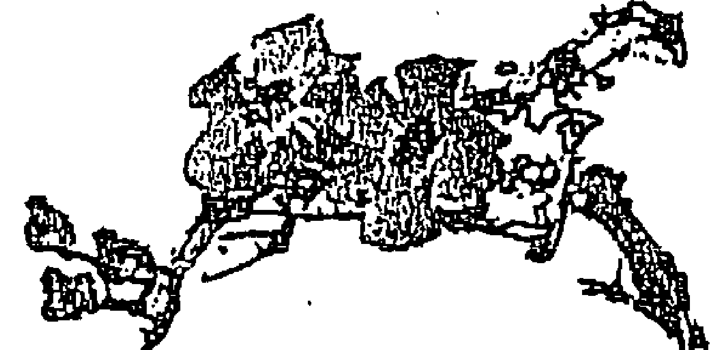

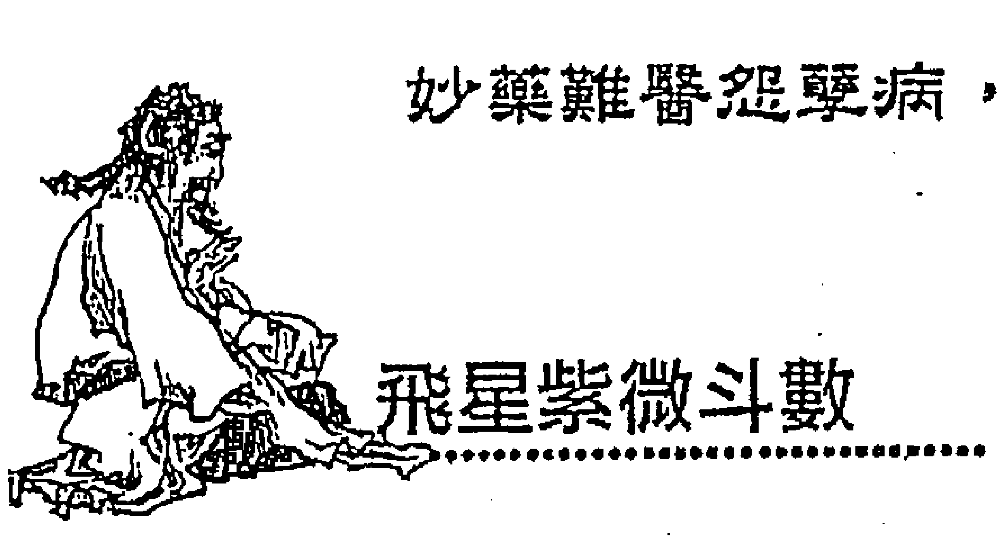

### 二十二、所謂『忌出』者，存於『無緣』與『消散』

「忌出」為消散象，容易「無所執」；凡散漫無所執者當不生「智」，「擇善固執」反近智。

註：何為「擇善固執」？譬如「命宮」坐「忌」得「遷移」以同星曜化祿來拱者，近乎「擇善固執」。乃「遷移」為廣大孚眾位。

#### 甲、本宮的「自化忌出」—「無所執」的「消散」。則「少智」、「忘性」、「少心機」、「沒耐性」、「脾氣快」、「粗枝大葉」，容易「失然諾」。

①好處是—「不記仇」、「不記恨」、「少心計」，事情過了就罷了。

②壞處是—不「記取教訓」、「少堅持」、「沒原則」、「不了了之」，防「好事不恆常」，也防「修行」者的無智「頑空」。

乙、本宮「忌入對宮」的「忌出」—也少堅持，多忘性與後知後覺。存在於去〈棄〉意之「執」的「消散」〕象，仍屬「有所執」。

+   1. 好處是— 性格上「厚道」、「耿直」、「無私」、「無偽」，「少心計」。修行上「阿羅漢」果位的一身清淨。
+   2. 壞處是— 「孤獨」、「傲骨」、「靦腆」、「憨直」、「不圓融」、「少堅持」、「不喜逢迎」、「後知後覺」。只能「獨善其身」，難以「承擔大任」。

丙、任何一宮飛「忌」入論事立太極的「對宮」—

譬如以「田宅」立太極，設若「財帛」化忌入「子女」，我們稱之為「財帛忌出」於「田宅」，容易金錢不蓄或財不入庫〈賺不到錢〉象。

又譬如「事業」坐「生年忌」沖夫妻，轉忌入「交友三方」〈沖田宅三方〉者，容易造成婚姻相處時間較少或離心力，產生刻板少趣的婚姻生活，此即「夫妻宮」的「忌出」故也。

丁、任何一宮飛「忌」入「遷移」或「父母」— 飛星紫微斗數........

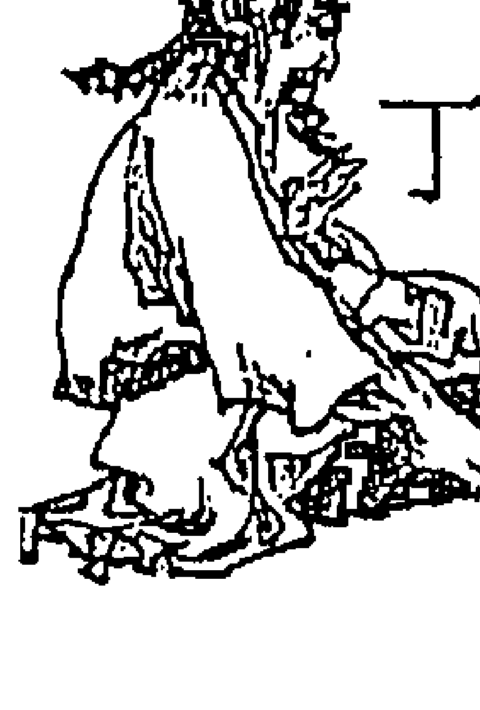

# 192. 第二章『善觀祿忌』解析問題

+   1. 譬如「田宅」忌入「遷移」，我們稱之為「田宅忌出」，有退財、搬遷、家門不興象；雙忌以上，容易敗產、六親無力、家道中落。
+   2. 譬如「兄弟」忌入「父母」，很容易有貸款的支出；雙忌以上，還防入不敷出。
+   3. 譬如「六親」化忌入「交友三方」〈沖田宅三方〉或「遷移」呈雙忌〈以上〉者，此親即屬忌出無緣，非聚少離多則個性不和，甚或此親平庸、遭挫敗、病疾損壽等。

丁、設A宮坐單忌逢本宮「自化忌出」，則此宮之「忌」其力自弱矣。設A宮坐雙忌逢本宮「自化忌出」，則否極仍將泰來。設A宮坐三忌〈或以上〉逢本宮「自化忌出」，則恐將灰飛煙滅而後已！

> 金纓：
作事要留餘地，責人切忌盡言。

> 安樂銘：
君莫傷時悲不遇，世間多少布衣人。

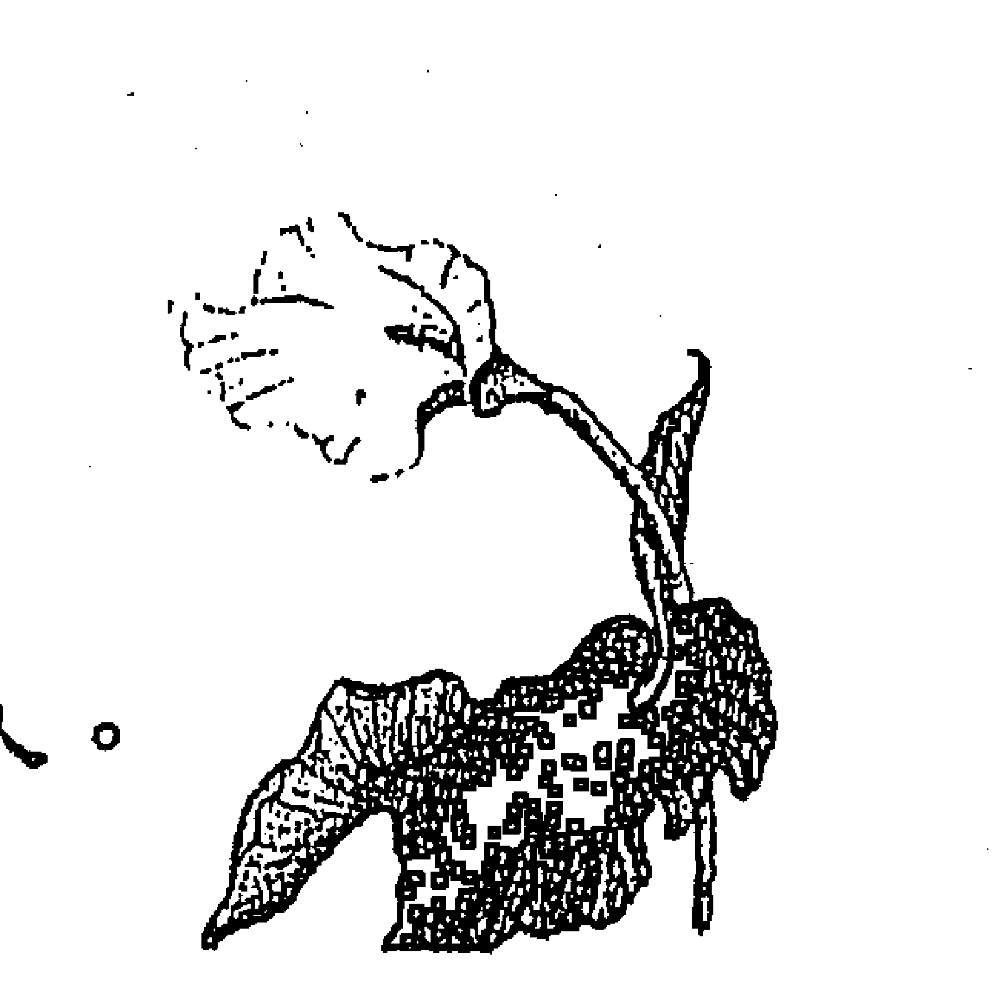

# 『道藏飛祕』的邏輯與功法

### 二十三、「生年祿」與「命祿」，象義有別

甲、「生年祿」坐「夫妻宮」—

異性緣好、感情早發、感情順利、容易早婚、配偶好相處、婚姻幸福、獲異性福或婚後諸事如意。可能劈腿〈桃花曜〉，田宅或父母逢破者，容易再婚。

「命宮」祿入「夫妻宮」—

多情〈未必堅貞〉、包容、一廂情願〈感情未必順利〉、放任配偶、感情早發，容易劈腿〈桃花曜〉，田宅或父母逢破者，也容易再婚。

乙、「生年祿」坐「交友宮」—

人緣好、人際獲福、含和愉悅，多益友、朋友常相聚、友情綿長。

「命宮」祿入「交友宮」—

喜歡熱鬧、多情歡樂、予人愉快，也是含和愉悅、關心別人，多情而未必惜情。

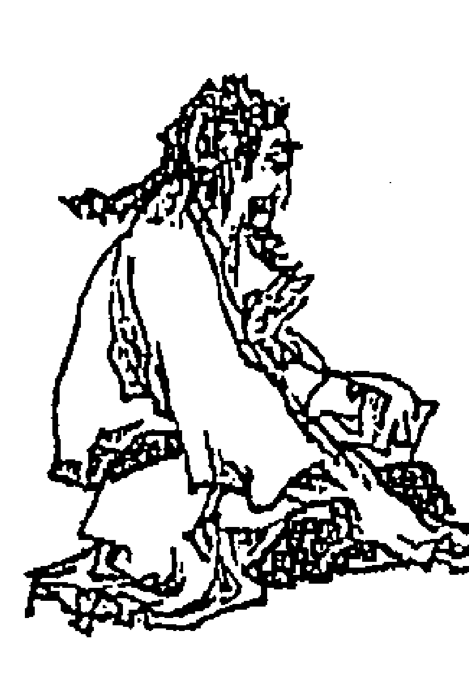

#### 丙、「生年祿」坐「父母宮」—

聰明愉悅、和藹可親、處世客觀、長輩緣好、善表達、有禮貌、利於讀書考試、個性平和。

#### 「命宮」祿入「父母宮」—

看似愉悅親和，但防阿諛附和、嘴甜討好、表面功夫，也防聰明有餘而讀書未盡全力〈祿者為興趣、關心，非為專注、認真〉。

#### 丁、「生年祿」坐「事業宮」—

工作機會好、工作輕鬆、運氣好、手氣順。

#### 「命宮」祿入「事業宮」—

也容易機會好、工作如意，但防少積極、不敬業。

#### 戊、「生年祿」坐「子女宮」—

小孩平安、乖巧、貼心，小輩緣好、有子福，容易生兒子，晚景有靠。

#### 「命宮」祿入「子女宮」—

喜歡小孩、小孩緣好，但防寵小孩、管教不嚴，會吵的小孩有糖吃。

# 196. 第二章 『善觀祿忌』解析問題

#### 己、「生年祿」坐「財帛宮」一

與財有緣、賺錢容易、收入好、手頭方便（未必是自己賺得），很適合做日日見財的現金生意。

#### 「命宮」祿入「財帛宮」一

也會收入好、手頭方便（未必是自己賺得），金錢觀念不強、夠用就好，不夠積極、少用心汲營。

# 佳言：

> 終身為善不足，一日為惡有餘！

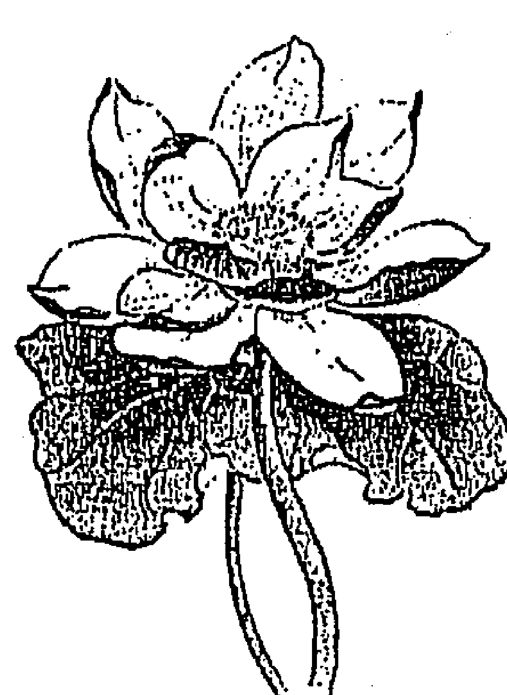

### 二十四、「生年忌」與「命忌」，象義有別

兩者象義近似而非等於一

+   甲、「生年忌」坐「田宅宫」—
  與生俱來的家庭「責任」、「負擔」，需一切靠己、「白手起家」，少「祖產餘蔭」、「六親少助」。環境所使而後養成「勤儉守成」、校長兼撞鐘的個性。
  「命宫」忌入「田宅宫」—
  生性「儉約顧家」、「守成安穩」、「謹慎內斂」、「累積財富」、「具城府」、「勤快生計」，容易加班兼職、老闆兼夥計。〈我執〉
+   乙、「生年忌」坐「夫妻宫」—
  配偶固執、不好溝通，或感情不順、婚姻宜晚、配偶少助；格局差者，還防欠「感情〈婚姻〉債」。
  「命宫」忌入「夫妻宫」—
  感執著情、呵護配偶，用心經營感情〈婚姻〉；格局差者，「為情所苦」、欠「感情〈婚姻〉債」。〈我執〉

# 198. 第二章 『善觀祿忌』解析問題

#### 丙、「生年忌」坐「財帛宮」—

賺辛苦錢或固定薪資、適合現金生意（少風險），為五斗米折腰。

#### 「命宮」忌入「財帛宮」—

金錢觀強，愛財不怕勞累、大小錢都賺，容易加班兼職、老闆兼夥計。〈我執〉

#### 丁、「生年忌」坐「子女宮」—

子女執著、固執，防代溝、不聽話，或小孩乖違、不健康、捅簍子等，欠子債、為子女操心。

#### 「命宮」忌入「子女宮」—

疼子、呵護小孩、為子女操心勞忙、善盡教養之責〈我執〉。

#### 戊、「生年忌」坐「父母宮」—

長輩固執、長輩辛苦過來者、產生代溝、需盡孝養責任，容易喜怒形色、唸書必需認真〈勤能補拙〉、小心文書困擾、慎防與人金錢往來。

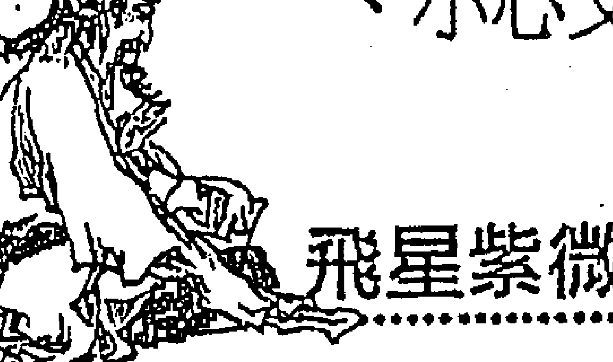

#### 「命宮」忌入「父母宮」—

單忌為孝順、愛唸書、仗義直言、不偽飾，也會喜怒形於色。〈屬我執〉

註：「雙忌」則為病，產生不圓滿；「三忌」為敗則適得其反。

> 陸游：
樹欲靜，風不止；子欲養，親不留。
夜頌此語涕其收。

> 白居易：
賓客歡娛童僕飽，始知作官爲他人。

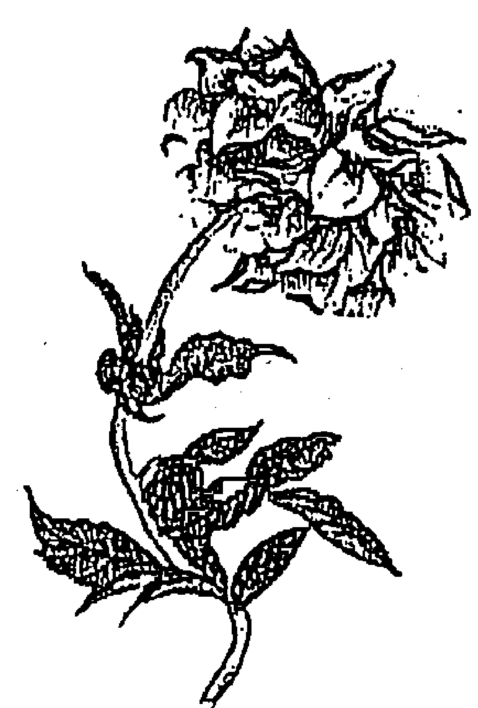

### 二十五、「命忌」與「福德忌」、「疾厄忌」象義有別

以「遷移宮」為例一

甲、「命宮」忌入「遷移宮」一

耿直、憨厚、忘性、嚴肅、保守、靦腆、不矯飾，直來直往、後知後覺，不善逢迎。

逢「雙忌以上」者，少根筋、亂章法、沒主見、渾噩、臨急失智、顧此失彼、意志不堅、天不從人願等而少有成就，還防破相、損壽〈命宮忌出〉。

乙、「福德」忌入「遷移宮」一

躁烈、衝動、叛逆、壞脾氣、不惜福、少深思而容易壞大局，會「權」尤烈。

逢「雙忌以上」者，招災惹禍、行拂亂為、天降橫禍、病業災難、好景不常、天違人願等，也防破相、損壽。〈福德忌出〉

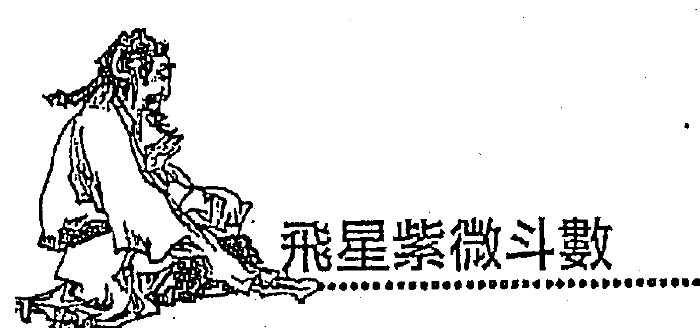

#### 丙、「疾厄」忌入「遷移宮」—

性子急、脾氣快、性少定、團團轉、沒耐性、容易瘦，還防失之於不穩練而壞大事。

逢「雙忌以上」者亂陣腳、少章法，事多反覆、工作變動，好景不常等，還防病疾意外、殘障、器官摘除。〈疾厄忌出〉

#### 丁、「命宮」、「疾厄」、「福德」多化忌於「遷移」、「父母」者，必多遷怒、怨尤、煩亂、失神、反覆、無章法、天不從人願，也防病疾、橫禍及招惹災難。

> 要言：大禍奇災，不入謹慎家門。

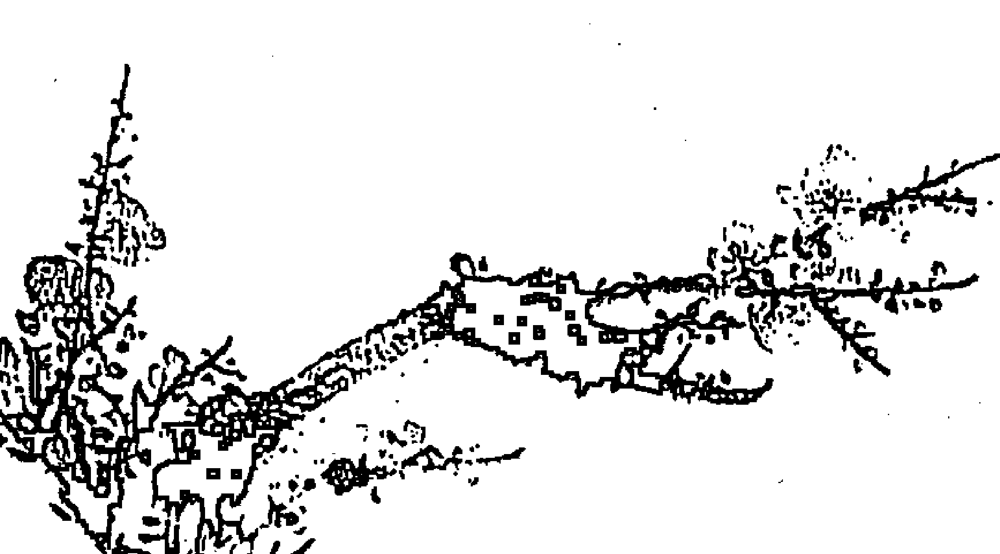

『道藏飛秘』的邏輯與功法

# 202. 第二章『善觀祿忌』解析問題

### 二十六、生年四化入「命宮」與「遷移」，象義有大別

#### 甲、生年「四化」入「命宮」—

祿—通情達理、好溝通、好情緒、好相處、和悅近人、人緣好、衣食無憂〈生年祿為福〉。

權—自信、主見。

註：「命宮」坐「權」的「主見」，想法未必絕對正確得而發揮，格局差者，還防「自以為是」。設若獲「事業」或「財帛」以「同星曜」化來「祿」會，則此「命權」得而發揮矣。易以「兄弟」、「田宅」以「同星曜」化來「祿」會，則此「命權」將獲致成就；易以「遷移」以「同星曜」化「祿」來會，則此「命權」必以獲致掌聲與肯定。此即「追祿會權」手法的剖析事理。如易以「交友」以「同星曜」化來「祿」會，則此「命權」雖也能獲致掌聲，但防只是阿諛者的諂媚奉承。

科—屬「長相」、「心性」的秀氣、文質、優柔。

忌—容易執著、偏激、記恨、小器、生氣、狹隘、苦恨、憂惱、固執己見、不好相處、人緣差。

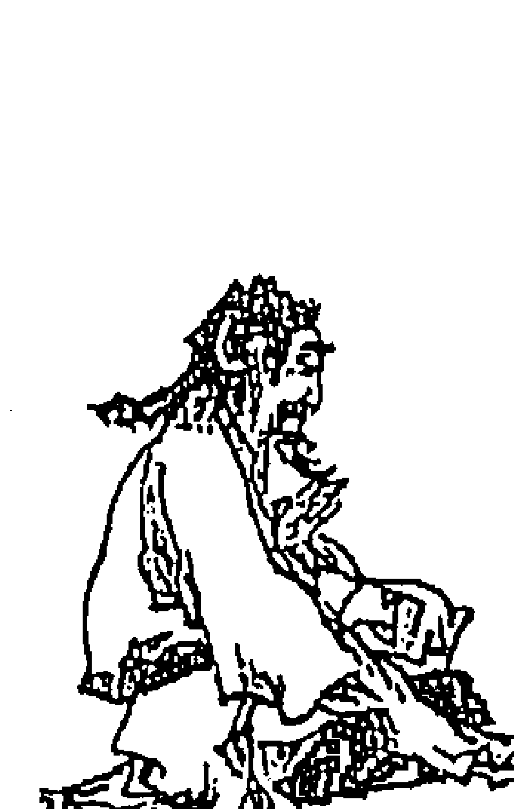

惡習難改〈雙忌以上〉。

#### 乙、生年「四化」入「遷移」—

+   - 祿—開明智慧、見多識廣、親和圓融、客觀開朗，普受歡迎。
- 權—果斷、能力、膽識，機伶應變與獨當一面〈會「祿」則善週圓、解人意、果敢含和，可以面面俱到〉。
- 科—較屬「舉止」上的秀氣、斯文，或多或少存於矯柔。
- 忌—靦腆、憨直、忘性、守正、嚴肅、不矯飾、少逢迎、不重外表。

佳言：

> > 子孝雙親樂，家和萬事興。

諺語：

> > 臨崖勒馬收韁晚，船到江心補漏遲。

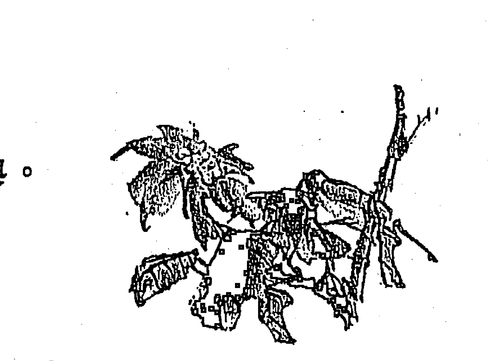

### 二十七、觀「格局之善」者

『田宅』與『福德』兩三方佳者，格局自高；乃興家旺宅、家道興隆象。尤以「田宅」與「遷移」兩宮所化呈「多祿會吉」或「祿權交拱」於我宮者大吉，得「偏財星」及「天梁星」尤妙，很容易「發財進產」、「天降橫財」。易以「命」與「福德」兩三方互交「祿、權」吉化，則「汲營順遂」，利於升遷、高收入。

「遷移」化「權」與「交友」化「祿」會吉於我宮，復與「命」或「田宅」兩三方所化，串聯成「多祿、權」交吉者，最能「出人頭地」，「非富即貴」。以及大根器、大成就的修行者，同作如是觀，僅別於得天機、天梁、貪狼等「善曜」耳。

譬如「富可敵國」的企業家，豈非緣於「果報之善」而得於厚福任產乎？皆「田宅」與「福德」兩三方呈「偏財星」多「祿、權吉媾」，並會於「交友」化祿拱我而得其大成就。此即「財富」之根在「果報」。

> 註：陋見認為論格局，以「田宅」、「遷移」兩宮居於領袖地位。

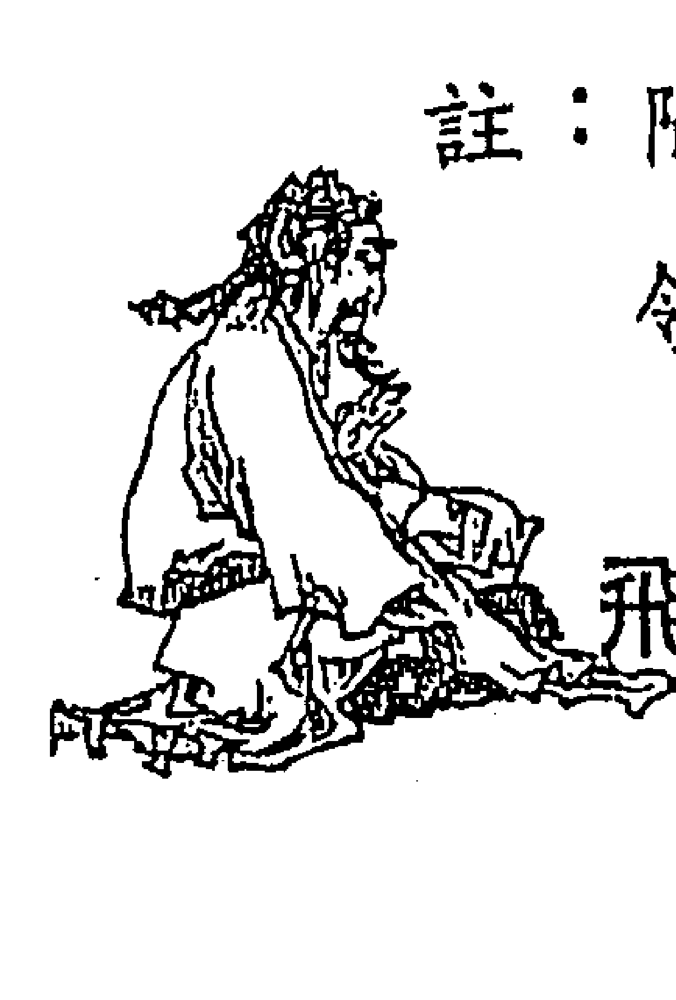

例：乾造甲午〈43〉年8月巳時生，富命。

| 相昌 | 梁 | 廉《祿》殺 |  |
| 13-22《父》己 | 23-32《福》庚 | 33-42《田》辛 | 43-52《事》壬 |
| 巨 |  |  | 曲 |
| 3-12《命》戊 |  |  | 53-62《友》癸 |
| 紫貪【祿】右【科】《兄》丁 | 府《子》丁 | 陽《忌》《財》丙 | 同樞祿《遷》甲 |
| 機【忌】陰【樞】《夫》丙 |  |  | 武《科》破《樞》左《疾》乙 |

① 「遷移」〈果報宮〉〈甲戌〉化廉貞〈偏財星〉祿入「田宅」逢廉貞「生年祿」，呈雙「偏財祿」旺宅。

② 「夫妻」〈福份財〉〈丙寅〉與「財帛」〈丙子〉雙化天同祿入「遷移」〈甲戌〉，言其財源好，轉而化太陽〈挾雙祿〉還忌入「財帛」；逢「福德」〈果報宮〉〈庚午〉化太陽祿亦入「財帛」〈丙子〉與上述呈三祿吉會，轉而化廉貞〈挾三祿〉忌入『田宅』。

③ 「交友」〈癸酉〉化破軍祿共「遷移」〈甲戌〉化破軍權於「疾厄」〈乙亥〉，儼然領袖姿；轉而化太陰〈挾祿權〉忌入「夫妻」，而「兄弟」〈丁卯〉〈經濟位〉則化來太陰祿入「夫妻」〈丙寅〉與之交吉呈兩祿一權。轉「夫妻」〈丙寅〉化廉貞〈挾兩祿一權〉忌又入「田宅」。

④合①+②+③式令「田宅」呈「六祿一權」媾吉。此即「厚福進產」、「興家旺宅」象，故而以一個鄉下電器行起家，累積財富近億，乃果報善使也。

另者一（命盤請見右頁）

①「命宮」〈戊辰〉化貪狼〈偏財曜〉祿入「兄弟」〈丁卯〉〈庫位〉，轉而化巨門〈挾祿〉還忌入「命宮」逢「田宅」〈辛未〉化來巨門祿會，此為經濟好的發財增產象。

②轉「命宮」〈戊辰〉化天機〈挾雙祿〉忌入「夫妻」，又逢「疾厄」〈乙亥〉〈財產運〉化來天機祿會，則「田宅」與「疾厄」呈三祿吉媾於「夫妻」照事業。

③再轉「夫妻」〈丙寅〉化廉貞〈挾三祿〉亦還忌入「田宅」，會前述的「厚福進產」，計累「八祿交吉」於「田宅」矣。此即「果報蔭宅」的「格局之善」者。所以致富。

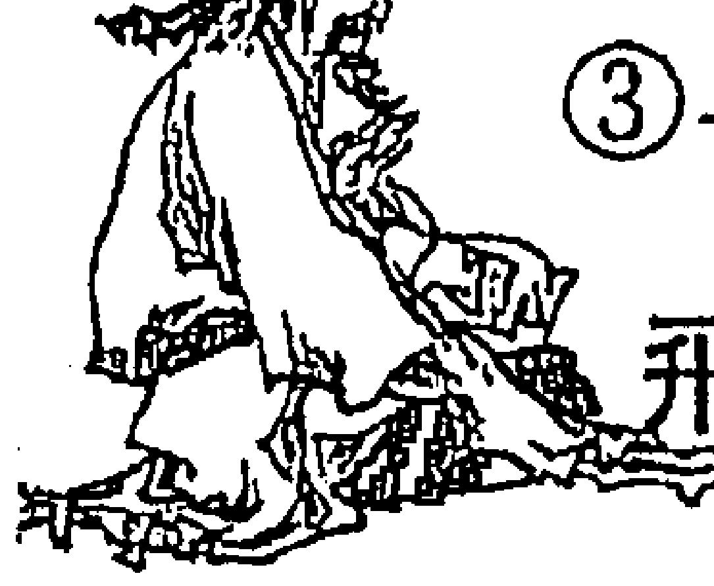

# 第三節 廣論諸要（二十七）207

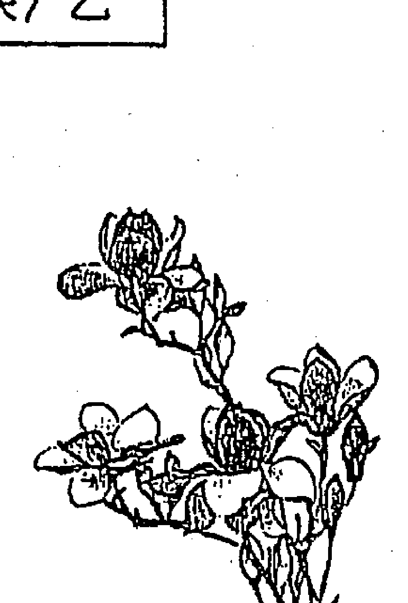

> 無名氏：
無義錢財湯攪雪，儻來田地水推沙。

### 二十八、观「格局之恶」者

「田宅三方」与「福德三方」所化串联呈「多忌共破」者，还防「家道中落」、「丁财凋零」；尤以「田宅」对应于「迁移」呈破而祸重，「田宅」与「福德」所化串联呈破者，也是门昏楣暗、宗们无力、「家道不兴」。

注：所谓丁者主家男，「凋零」则主男丁少或庸碌、不才、残喘、不寿等，也或为平庸少出息者。

设若「田宅」化忌入「交友三方」呈破者，也防亲不敦、邻不睦；如若串联多忌呈破于「迁移」者，则家散财散、亲疏朋离，六亲无力、门庭冷清。

> 放下：
宠辱其惊，闲看庭前花开花落；
得失无意，但随天边云卷云舒。

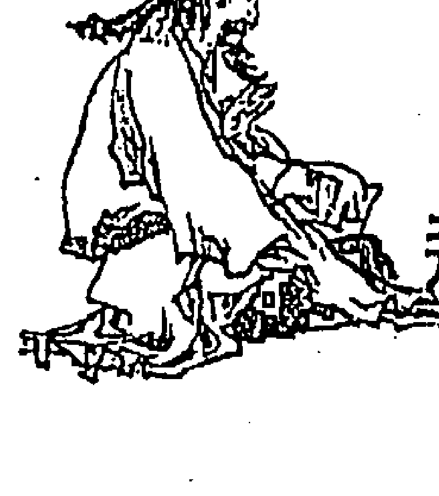

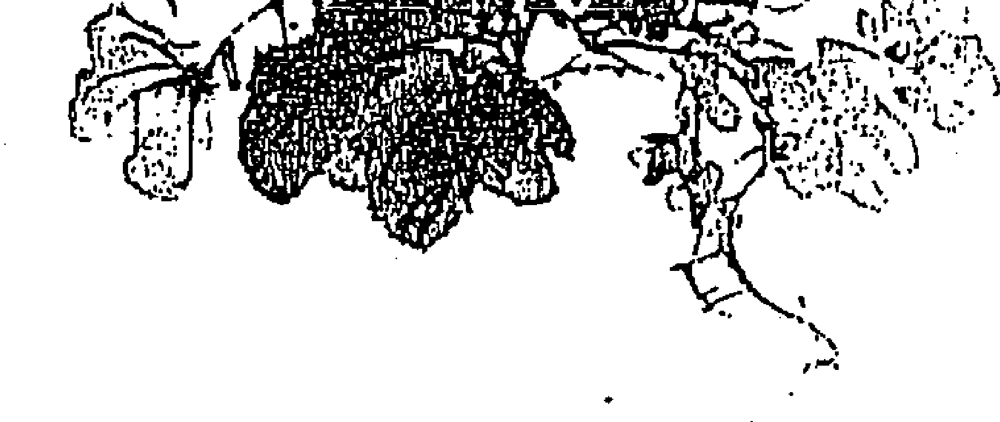

例：譬如上例乾造甲午（43）年8月巳时生。

| 相昌 13-22 〈父〉己 | 梁 23-32 〈福〉庚 | 廉《禄》杀 〈50岁〉 33-42 〈田〉辛 |  43-52 〈事〉壬 |
|---|---|---|---|
| 巨 3-12 《命》戊 | 忌 |  | 曲 53-62 〈友〉癸 |
|  紫贪【禄】 右【科】 忌 〈兄〉丁 | 忌 |  | 同 〈53岁〉 〈迁〉甲 |
| 机【忌】 阴【权】 〈夫〉丙 | 府 〈子〉丁 | 阳《忌》 忌 〈财〉丙 | 武《科》 破《权》 左 〈疾〉乙 |

前述本造虽以厚福致富，却也福破于田宅而无己出子嗣〈抱养一子〉，及50岁丧妻〈交通事故〉、53岁罹癌亡身，乃其「福德」、「迁移」与「田宅」共破之恶也，不数年而人口相继凋零。

+   ①「命宫」〈戊辰〉化天机忌入「夫妻」；其「疾厄」〈乙亥〉化太阴亦忌入「夫妻」，则「夫妻宫」得「命」、「疾厄」〈家运、健康〉两宫汇入双忌。转「夫妻」〈丙寅〉化廉贞〈挟双忌〉忌入「田宅」。
+   ②其「福德」〈果报宫〉〈庚午〉化天同忌入「遷移」〈甲戌〉沖「命宮」，轉而化太陽忌入「財帛」〈丙子〉又逢「生年忌」，呈雙忌回沖於「福德」。

> 《批：此即福德「雙忌出」的薄福象。》

「財帛」既坐「生年忌」，當轉化廉貞〈挾雙忌〉忌入「田宅」〈此即二度轉忌〉。

+   ③則「命」、「疾厄」〈家運〉與「遷移」〈果報位〉、「福德」〈果報位〉呈「四忌」共破於「田宅」。此即「業力」傷於「家庭」、「配偶」及己身「健康」。嗚呼！南柯夢一場。

> 姜太公：
勤乃無價寶，慎即護身符。

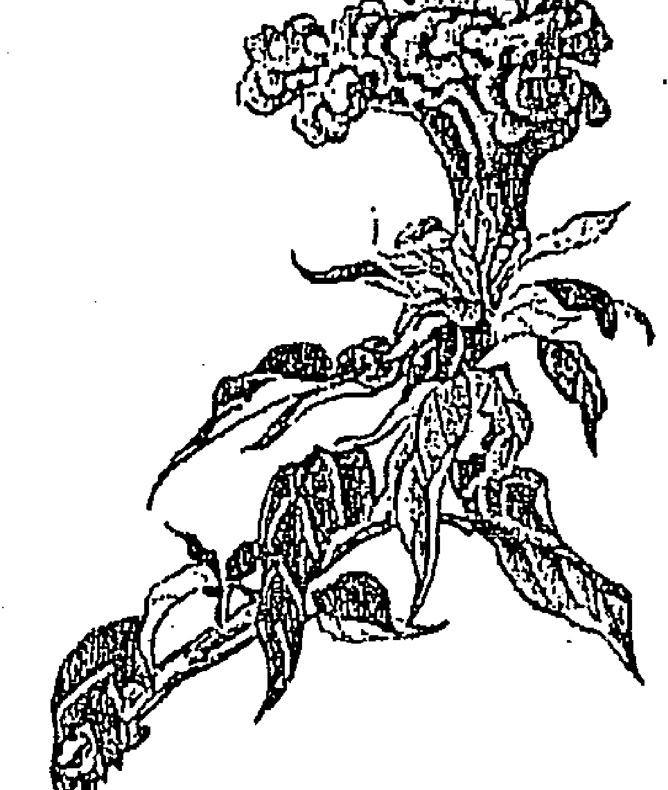

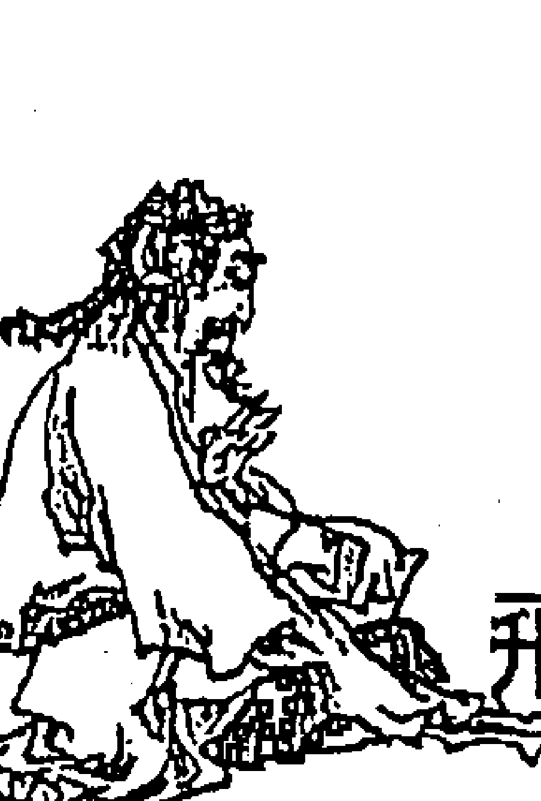## 例：再一例，乾造己亥（48）年4月申时生。果报伤宅。

| 同 | 武（禄）府 | 阳阴（科）左 | 贪（权）（忌） |
|---|---|---|---|
| （大限）44-53（财）己 | 34-43（子）庚 | 右（夫）辛 | 14-23（兄）壬 |
| 破（禄） | | | 机巨忌 |
| 54-63（疾）戊 | | | 4-13（命）癸 |
| 64-73（迁）丁 | | | 紫相 |
| | | | （父）甲 |
| 廉昌 | | 杀（忌）曲 | 梁（科） |
| （友）丙 | （事）丁 | （田）丙 | （福）乙 |

- ①「迁移」（果报宫）（丁卯）化巨门忌入「命宫」（癸酉），转而化贪狼（挟忌）忌入「兄弟」。
- ②其「田宅」（丙子）坐文曲「生年忌」，以廉贞（挟忌）忌入「交友」。

①+②式，则业报之力令「兄弟」、「田宅」受迫于「双忌」之碍。《批：此田宅坐「生年忌」，先天上已然「丁财受缚」，复串联于「迁移」果报宫之败呈札实破碍，难免其损。》

## 212. 第二章 『善观禄忌』解析问题

③是以未及二十岁而父、弟两亡，其「子女宫」虽坐武曲「生年禄」，也仅生二女而未得子嗣，此即果报力之损于人丁象。
其「福德」（乙亥）化太阴忌入「夫妻」（辛未），转而化文昌（挟忌）忌亦入「交友」会前述之破，则业力之使还防婚姻半百。

④其「财帛」（己巳）以文曲忌入「田宅」，串联前述则果报之力则也大伤于「经济」，以一个薪水阶级者竟于二十年间负债累近400万，无力可回天而宣布破产，莫非命也！

> > 佳言：
> 诸葛一生惟谨慎。

> > 易经：
> 满招损，谦受益。

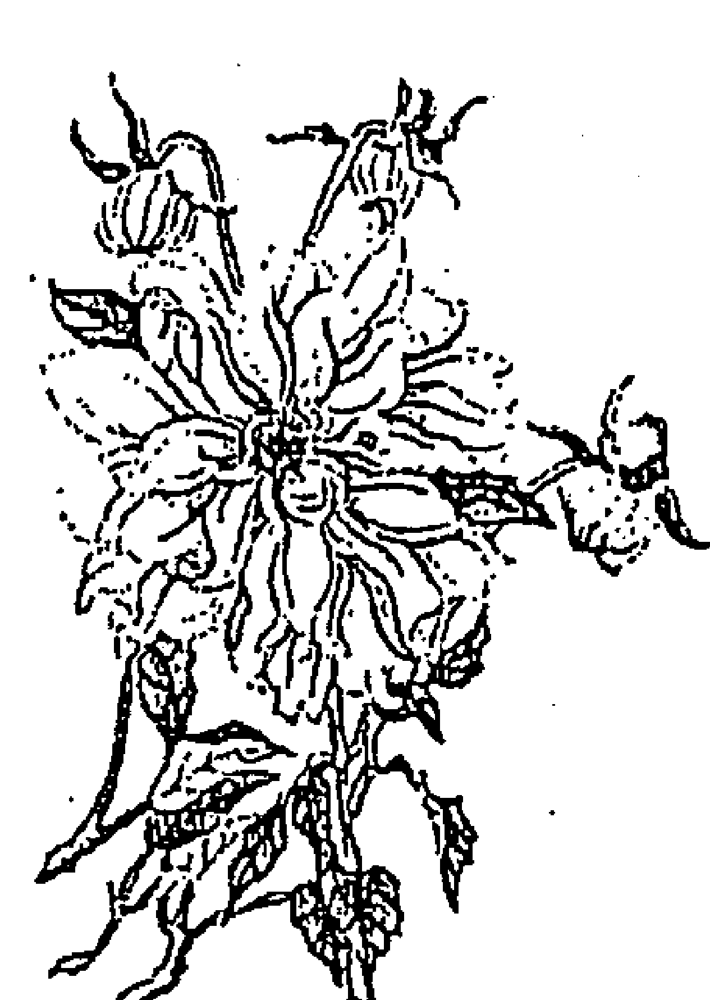

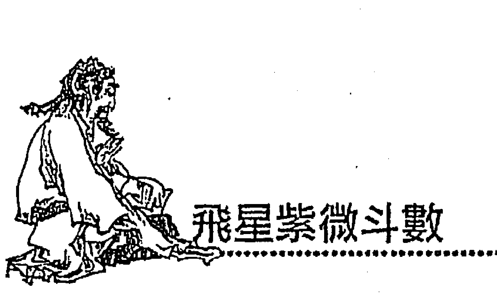

### 二十九、「大太极」中的「小太极」

#### 观「六亲」周边事的重要法则一

「本命盘」可视为「大太极」，而「六亲命」则为大太极中的「小太极」。凡论「六亲」的周边事，须先判别此亲的「格局」高低，藉以评估其周边事的吉凶轻重。

六亲「小太极」的格局若高，则其周边事之化应予加分；「小太极」格局若低，则其周边事应予减分。

甲、论六亲事，先必须记住「借宫」所化，悉皆「用归于体」的回归「原命盘」宫位作象义解释。不论申论何事，「用」归于「体」的「回归太极」释象，是论事的不二法则。

乙、譬如问三姊夫事业状况若何？切勿直接以「交友宫」（三姊夫的事业宫）作为论事太极下手申论，保证你会常踢到铁板。需：

- ①先观三姊（借「田宅宫」立为三姊「命宫」）的

## 214. 第二章 『善观禄忌』解析问题

- ①「田宅」（迁移宫），斟酌其「财富位」的三方若何？
②再观三姊的「福德」（交友宫），斟酌其「果报位」的三方又若何？
③结合三姊的「田宅」与「福德」两三方之吉化相交若何？凶应冲激又若何？

丙、正常的婚姻，夫妻是祸福一体、休咎均沾。如若三姊的「田宅」与「福德」两三方之化呈佳象者，福厚格高自得诸顺遂，强将之下岂有弱兵？因此三姊夫的事业理应不致太差。除非是两心不系、各自为政之下的缺憾或离异婚姻，才可能各看造化。

这就是「大太极」之内观「六亲」周边事，须先确定「小太极」的格局高低，是「家道兴隆」抑或「果报衰宅」？藉此斟酌评估的「方向」与「份量」。

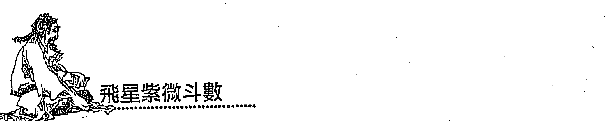

#### 例：乾造戊午（67）年4月卯时生。观其父母与家庭。

| 巨 | 廉（禄）相 | 梁右（科）左昌曲 | 杀 |
|---|---|---|---|
| 32-41 (田)丁 | 42-51 (事)戊 | (友)己 | (迁)庚 |
| 贪（禄） 禄 （大限） 22-31 (福)丙 | | | 同 |
| 阴（权） 忌出→ | | | 武（科） |
| 12-21 (父)乙 | | | (财)壬 |
| 紫府 | 机（忌） | 破（权） | 阳（忌） |
| 2-11 (命)甲 | (兄)乙 | (夫)甲 | (子)癸 |

- 1. 生年「天机忌」坐「兄弟」（乙丑），转太阴（挟忌）入「父母」逢太阴「生年权」及「自化忌出」，则「父母」坐「一权一忌」与自化忌出，必然是曾经打拼辛苦的过来者。《批：凡「六亲」宫位坐忌者，多为曾经辛苦过来，否则必有挫折、病磨等它痛，乃「业力」所使。》
2. 「命宫」（甲寅）化廉贞（偏财星）禄入「事业」

## 216. 第二章 『善观禄忌』解析问题

」，而「福德」《果报宫》《丙辰》坐贪狼《偏财星》「生年禄」，化廉贞《挟生年禄》亦忌入「事业」，则事业宫得「双偏财禄」会吉。〈此亦即「追禄」手法。〉转「事业」《戊午》化天机《挟双偏财禄》忌入「兄弟」，逢「父母」《乙卯》化来天机禄会，则「兄弟」经济位呈「三禄」吉象。《批：此言果报荫于父母。》

- ③「兄弟」《乙丑》坐得偏财之利而后化太阴《挟三禄》还忌入「父母」，逢「田宅」《丁巳》化来太阴禄会，则终见「田宅」以四禄（含二偏财禄）荣于「父母」矣。

- ④以其吉化的串联过程会「福德」、「父母」、「田宅」，即可言其厚福荫于家庭与父母，父母必然可以于辛苦间兴家致富，现已小富有余的拥资产数千万。此为近乎所谓的「祖德流芳」、「家道兴隆」象。

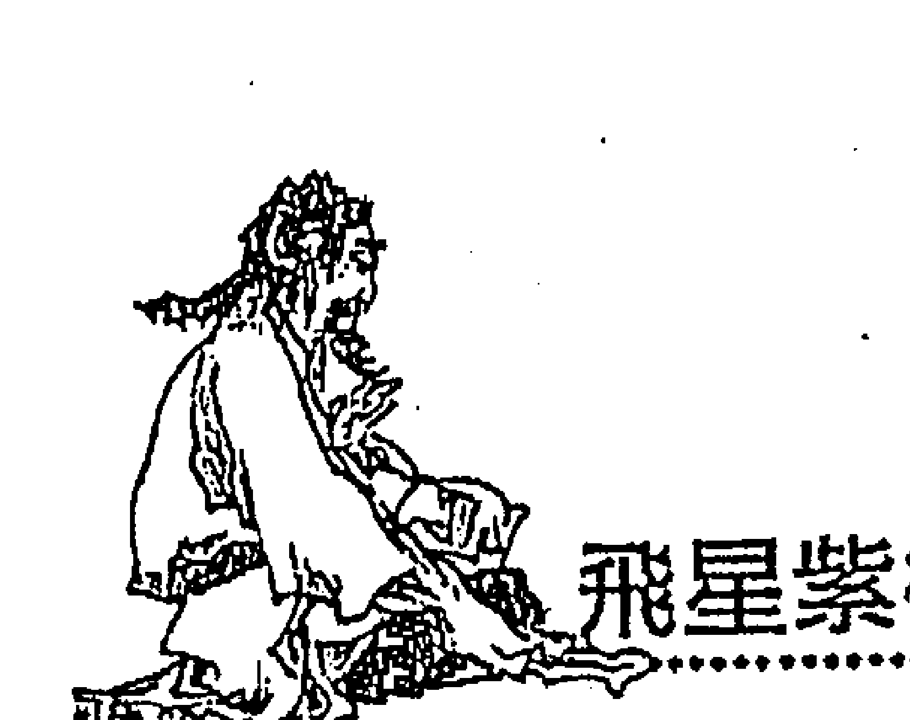

### 三十、所谓「一、六共宗」

易经：天一生壬水，地六癸成之。

不谈「易经」的高深理论，我们直接以命盘十二宫的架构上思考。譬如「命」（一）与「疾厄」（六），两者必然相维相系、共存共荣，成就了「完整」的「我」，这就是「一、六共宗」的本来意义。

以通俗的想法，「命」与「疾厄」它讲的是一个人「精神」与「肉体」的唇齿相依；也可以把它想成是一个人「思想」与「行为」的结合与执行。两者是「互为表里」的祸福与共、相维相系，故言为「一、六共宗」。

#### 十二宫的同理譬喻—

- ① 「家庭」肇始于「婚姻」，故以「夫妻宫」为「田宅宫」的「共宗六位」。
② 「晚景」仰赖「子女」孝养，故以「子女宫」为「福德宫」的「共宗六位」。
③ 「纵欲」可以「毁福报」、「害健康」，故以「子女宫」为「疾厄宫」的「共宗六位」。

## 218. 第二章 「善观禄忌」解析问题

女宫」为「福德宫」的「共宗六位」。

- 4. 「经济能力」攸关于「事业规模」，故以「兄弟宫」为「事业宫」的「共宗六位」。

- 5. 「成就高低」攸关于「社会地位」，故以「迁移宫」为「兄弟宫」的「共宗六位」。

- 6. 「财富」的多寡累积于「金钱」的营蓄，故以「田宅宫」为「财帛宫」的「共宗六位」。

- 7. 「婚姻」、「感情」缘起于「人际对象」，故以「交友宫」为「夫妻宫」的「共宗六位」。

- 8. 「学识」、「专业」有助于「立足社会」，「修为」、「涵养」裨益于「待人处世」，故以「父母宫」为「迁移宫」的「共宗六位」。

- 9. 「法律」、「道德」规范了「社会秩序」，故以「父母宫」为「迁移宫」的「共宗六位」。

- 10. 「孝养父母」、「礼敬师长」可以「种福田」、「广际遇」，故以「父母宫」为「迁移宫」的「共宗六位」。

- 11. 「性格」、「个性」左右了「人缘」的好坏，故以「命宫」为「交友宫」的「共宗六位」。

- 12. 「福德」一先天福份与后天德行紧系着人命「寿元」的促永，故以「福德宫」为「疾厄宫」的「共宗六位」。

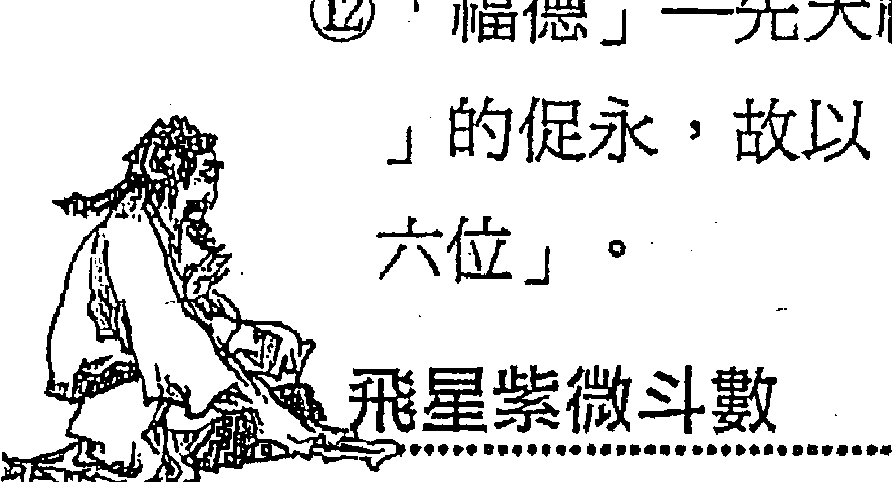

- ⑬「达观」、「仁慈」、「善德」可以「健康快乐」；「简约惜福」必然「延年益寿」，「奢华浪费」当然「折福减算」（福尽人亡）。故以「福德宫」为「疾厄宫」的「共宗六位」。

- ⑭「财富之根」在「果报」，故以「福德三方」为「田宅三方」的「共宗六位」。

- ⑮「利益当头」最容易考验一个人的「修为涵养」，故以「财帛宫」为「父母宫」的「共宗六位」。

> > 曾文正公：
家败不离一个奢字，
人败不离一个逸字，
讨人厌不离一个骄字。

> > 王一庵：
其烦恼前头失处，且喜乐今日觉处。

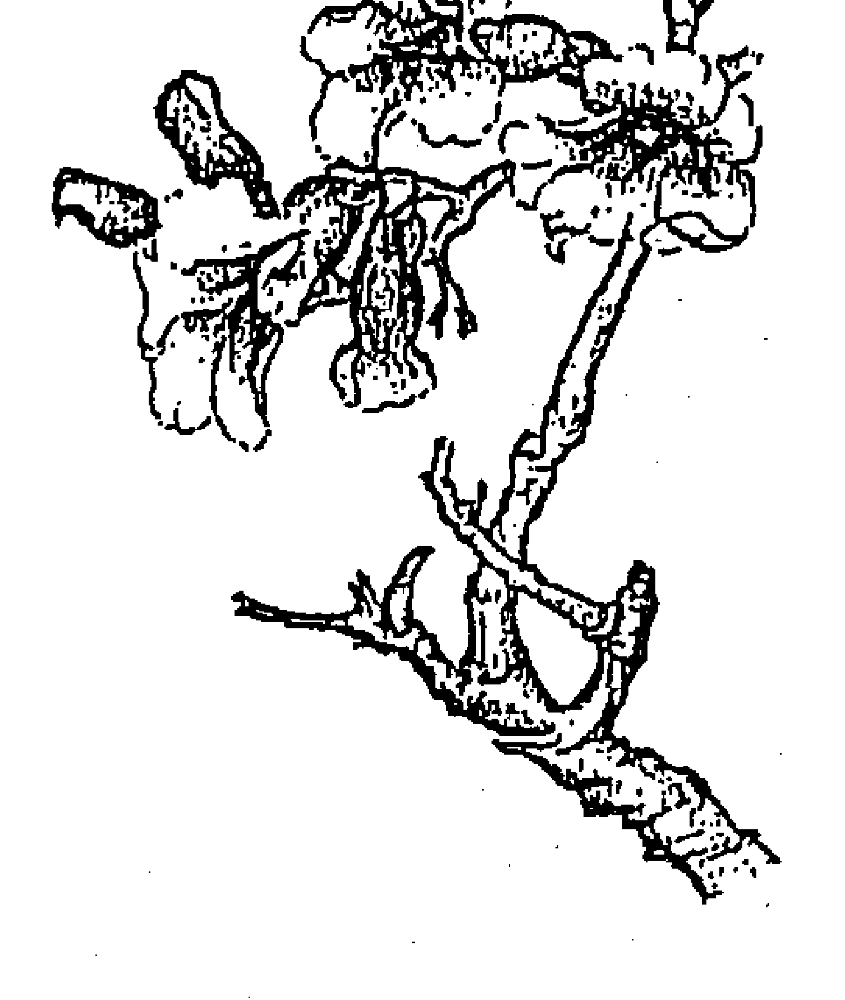

## 220. 第二章『善观禄忌』解析问题

### 三十一、四化入「命」、「福德」、「疾厄」，象义有别

甲、『禄』入『命』一
通情达理、好商量、好相处、好情绪、人缘好、衣食无忧。

『权』入『命』一
具主见、自信；设若未能得遇而展志，或也只能徒呼负负。

『科』入『命』一
文质、秀气。

『忌』入『命』一
固执、自我、忧恼、小器、猜忌、生气、先入为主、自以为是的自断生趣，还防庸人自扰、人缘差。恶习难改（双忌以上）。

乙、『禄』入『福德』一
满足、优游、喜乐、好情绪、随遇而安，还防散漫、不积极、胸无大志。

『权』入『福德』一
欲望、企图、好胜，防好大喜功、爱面子；格局差

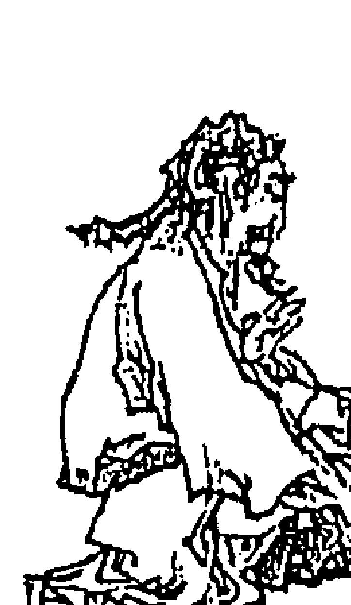

者，容易眼高手低、大起大落。

#### 「科」入「福德」—

恬淡、安适、品味、内涵、精致、化戾。

#### 「忌」入「福德」—

执所好、重享受、舍得花用、沉迷癖嗜，防容易烦躁、自我意识浓、人缘不佳。难改恶习（双忌以上）。

#### 丙、「禄」入「疾厄」—

懒散无劲、怠惰忘志、清闲自得、耽于逸乐、好脾气、容易胖。

#### 「权」入「疾厄」—

健壮、结实、运动、抗压、粗线条，权、忌相逢则格外劳碌，还防过劳、运（劳）动伤害。

#### 「科」入「疾厄」—

举止优雅、不疾不徐、优柔、不胖不瘦。

#### 「忌」入「疾厄」—

不胖、劳碌不闲，防容易烦躁、自我意识浓、人缘不佳。恶习难改（双忌以上）。

## 222. 第二章『善观禄忌』解析问题

### 三十二、「一、六共宗」的同参论事

譬如论「财帛」，必观于「田宅」；
论「事业」，应斟酌「兄弟」；
论之「命宫」，当同参「疾厄」。譬如：

- 1. 甲、看「疾厄」论健康，必同观于「福德」；
「福德」佳者，福厚则少病，也会有病得良医。
2. 乙、看「福德」论晚境，必同观于「子女」；
「子女」佳者，晚景有靠何来忧虑？
3. 丙、看「兄弟」论成就，必同观于「迁移」；
「迁移」不佳者际遇差，当然有志难伸。
4. 丁、看「交友」论人际，必同观于「命宫」；
「命宫」坐忌难沟通，人缘怎好？
5. 戊、看「迁移」论际遇，必同观于「父母」；
「涵养」不佳者际遇必差，粗俗者何登大雅堂？

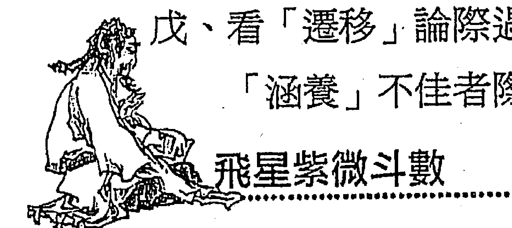

也就是说，论「命三方」的汲营，需确切斟酌于「田宅三方」的果实；以「田宅三方」论成果，还需认真分析于「福德三方」的果报；说「福德三方」的果报，则必需明白是否得到「交友三方」的众孚；是否得于「交友三方」的众孚，又必须回归于「命三方」的汲营处世。

作以反向思考，何以贫者人气寒而富者人气骄？乃我「田宅三方」即为「交友」的「福德三方」；何以贫者多病而富者多寿？乃「田宅三方」以「福德三方」为其共宗六位。

### 佳言：

> > 心诚色温，气和词婉，必能动人。

> > 彬彬君子，人皆敬之；

> > 孔子作春秋，乱臣贼子惧！

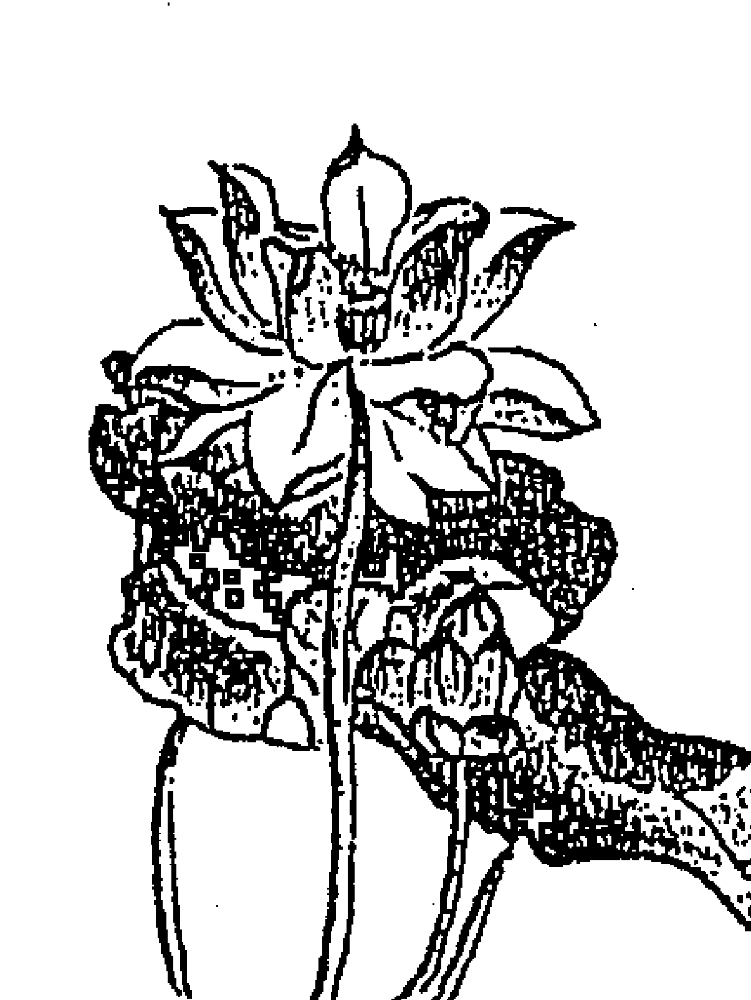

### 三十三、「合夥事业」与「理财投资」

甲、小型合作（合夥事业）：股东兼同事的少数人共同创业。此项合夥以「子女」（交友的事业）为主，看对手的运气若何？次以「交友」为辅，看工作上的人气融合。此二宫与我「命」或「田宅」两三方化禄、权交吉者，人事得吉可以合夥；反之，与我「命」或「田宅」两三方化忌冲激呈破者，合夥失财或缘不久长，少合为妙。

乙、大型合夥（理财投资）：非个人可以掌控运作的大型企业投资是否得利。譬如长线的股票投资，半属福份之财，必须取决于「交友」与「迁移」（际遇位）两宫，观其所化是否得于禄、权交吉串联入我「田宅」或「命」两三方？所化是否以忌冲激呈破串联入于我「田宅」或「命」两三方？此即取决果报上是否得于人际的拱荫于我。

「交友」与「迁移」所化禄、权交吉串联入我「田宅三方」者上吉，交吉串联入我「命三方」者次吉，可以投资。反之，「交友」与「迁移」所化

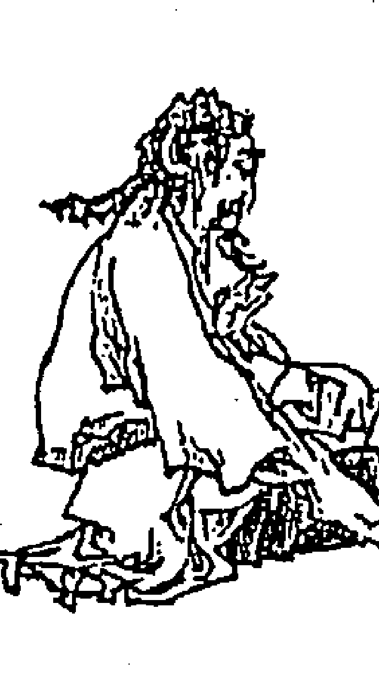

## 第三节 广论诸要（三十三） .225

以忌呈破串联入我宫者，少投资为妙。

设若「田宅」与「福德三方」作偏财曜禄、权交吉者，非常适合投资理财，串联会于「交友」化禄者尤佳，富贵逼人。

例：乾造己丑（1949）年6月申时生。 从事模具制造及塑胶射出成型工作，学徒出身，今设厂国内外三地，俨然已呈企业大家。

| 紫（科） 杀 右 66-75 （运）己 | （大限） 56-65 （疾）庚 | 46-55 （财）辛 | 36-45 （子）壬 |
|---|---|---|---|
| 机（禄） 梁（权） （科） （友）戊 | 权 禄权 禄 忌 忌 | 自化禄 禄 | 廉 破 左 26-35 （夫）癸 |
| 相 | | | |
| （事）丁 | | | |
| 阳 巨 昌 忌 （田）丙 | 武（禄） 贪（权） | 阴（忌） 同 曲（忌） （父）丙 | 府 （命）乙 |

- ①「迁移」（际遇位）（己巳）化武曲禄、贪狼权入「福德」，逢「交友」（戊辰）化来贪狼禄、

> 『道藏飞秘』的逻辑与功法

## 226. 第二章 『善观禄忌』解析问题

「疾厄」（庚午）（财产运）化来武曲权，共「生年」武曲禄、贪狼权会；「福德」计汇入「三禄三权」。此获人际福犹如众星拱月，出任董事长一职。

- ②转「福德」（丁丑）化巨门（挟三禄三权）忌入「田宅」，逢「财帛」（辛未）化来巨门禄会呈「四禄三权」。「田宅」（丙寅）汇诸吉，转而化廉贞（偏财曜）（挟四禄三权）忌入「夫妻」照「事业」。厚福化作大财利。

- ③「兄弟」（经济、成就位）（甲戌）再化廉贞禄、破军权（偏财曜）入「夫妻」并会破军「自化禄」，共财利之福呈「六禄四权」于「夫妻」照「事业」。

「夫妻」（癸酉）汇吉，以贪狼（偏财曜）（挟六禄四权）还忌入「福德」会前述的「交友」化来贪狼禄。此即以小型合夥起家，愈做愈旺而不断扩张，已粗具大企业规模。

- ④本造即为企业家的标准命格。所惜者父母宫多忌为破，存在了危机风险。

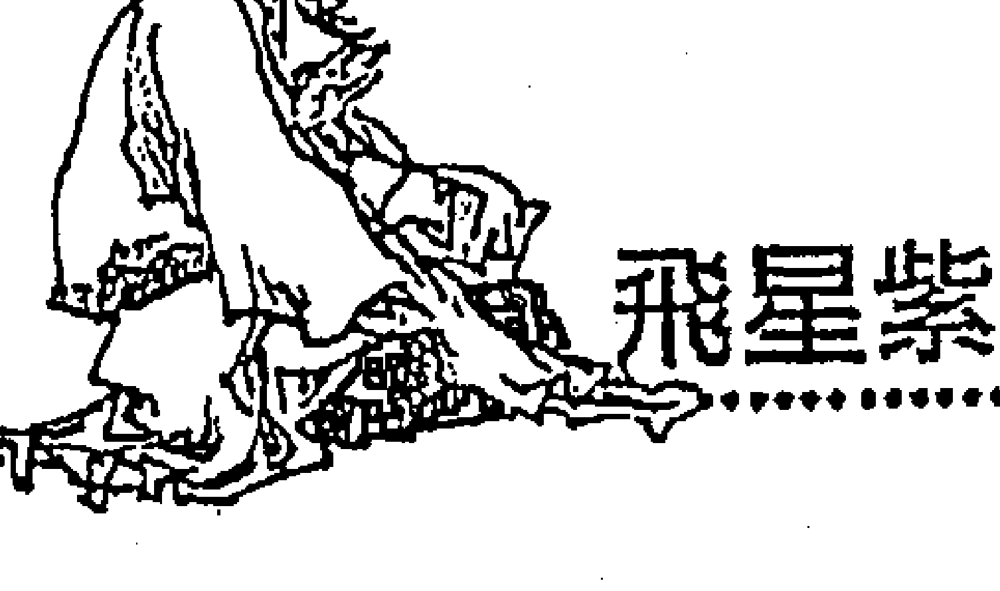

### 三十四、学会「观六亲」，理气得其圆融练达

你我都真的用心于命理，却总是屡屡算不准、摆不平的生辰。不要气馁，乃生辰非「绝对论」，非命理之罪也！

何谓生辰非绝对论？因为，现行太多的催生、剖腹，当然改变了原本的自然生辰；以及怀孕妇女不当的运动、操劳、意外等，也都容易动了胎气而致提前生产。

在在的原因都可能让生产的时日给改变了，如何尽相天下士？给你一个衷心的建议，学会命盘中「观六亲」与熟练「回归太极」释象，问题将迎刃而解。

先从己身命盘练习观周边亲人的个性、工作、成就，乃至其健康与财富。由兄弟、姐妹到堂叔、舅舅；甚或姑妈、表妹等。只要记住任何「借用宫位」的「用宫」之「其化所入」宫位，皆须「回归」于原命盘「本体宫位」（初始宫位）的释象方向。凡所有「象」皆不离于「体」的作为之后，仍须磨练于多宫位的「串联释象」。耐心磨练，久之必有所获。

## 228. 第二章 「善观禄忌」解析问题

学会手中一张准确命盘，就可以道尽周边亲人的性格嗜好与命格运势。「善观六亲」，你的命理已臻然成熟。

如果学会了看媳知翁、观子道父的手法，可以让人举座皆惊。那么，只要「借宫论断」，也就可以摆脱很多生辰不确、命盘不准的困扰。

#### 《子时的错乱》

晚上的23：00～00：00，人们称它为「夜子时」，00：00～01：00称为「早子时」。于是有人认为在排斗数命盘时，生日数逢「夜子时」是维持在当天不变，「早子时」才算第二天的日子。不确！
邬以多年论命经验，凡23：00以后出生其生日数就该加一天；换句话说「夜子时」出生其生日数就是第二天的日子，如此才能吻合命理的精确度。因为23：00～00：00的子时就是第二天的第一个时辰，何来生日数问题？因此，斗数排盘没有「夜子时」与「早子时」的分别。

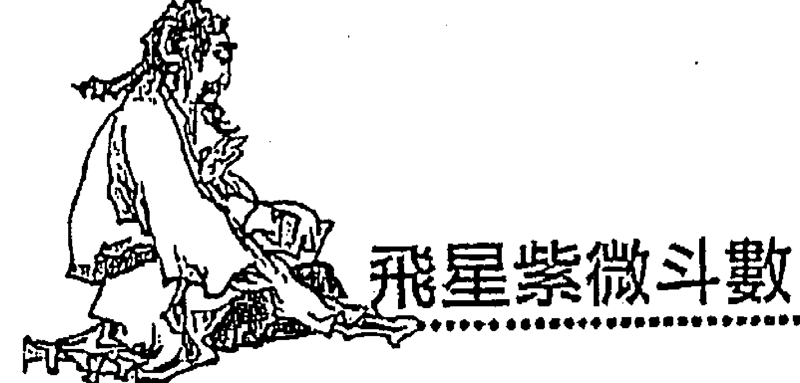

### 三十五、寄语

一个人「心性」与「作为」的「阴阳」，常与行限运气的阴阳相维相系、相互消长。

阴阳消长，就像螳螂捕蝉黄雀在后；「阴消阳长」、「阳消阴生」是「大宇宙」绝对的运作法则。

为善一如阶前春草，自是日有所长；为恶恰似庭前秋木，必然风起叶落。切勿人为财死，鸟为食亡。生命的意义岂是狭隘的—

- ①「多计较」者必「少涵养」，「少涵养」者「际遇必差」，「际遇差」者「成就当小」（非局限于财富论）。
②故以「财帛」（金钱）为「父母」（涵养）的共宗六位，「父母」（涵养）则为「迁移」（际遇）的共宗六位，而「迁移」（际遇）即是「兄弟」（成就）的共宗六位。
③故而术命者当知「有容乃大」、「无欲则刚」。需知心性的阴阳消长，运气也跟着起落改变。君子本当「思无邪」，况乎斗数为「道门」之学，习者惟

## 230.第二章『善观禄忌』解析问题

宜「术德兼修」。

④凡「命宫」坐忌复忌入「田宅三方」（私心算计），及「命、福德、疾厄」三宫化忌入「父母」或「迁移」两形于外之宫呈破（双忌以上）（身、心扭曲）者，皆宜修心养性。

⑤格局佳者固为喜，格局差者也勿忧；天生我材必有用，一枝草总也含着一点露。学命应秉众生平等、富贵皆同（大机台的组合也不能少了一根小螺丝钉）的思想。

⑥唯有婉转劝慰、众善奉行，说好话、做好事的「向阳心性」，而后才能玩味入髓，成为神而明之的真正「知天命」者。急功近利只会成为跳梁小丑，还恐造成如影随形的业力累积。

⑦色不异空，唯善得乐。莫待兔死狗烹、鸟尽弓藏而后方知人之将死其言也善！

⑧命学浩瀚，何足尽论？富贵天定、穷通由人！祸福相倚、喜怒皆已。人家骑马我骑驴，回头又见推车汉—比上不足下仍余。唯道至乐，不知老之将至。

> 注：「道」法自然，是大至宇宙星辰，小至浮游半日的亘古不变理则。天地不仁，以万物为刍狗；圣人不仁，以百姓为刍狗—这就是道法自然。言谛听渺，概不离因果范畴。

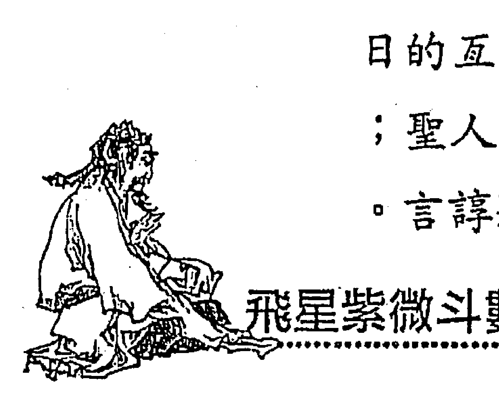

# 第三章 如何『解析命盘』

甲、凡「生年」及命盘「十二宫」所化的「禄」、「忌」，皆应作「转忌」动作，用以「追根究底」的吉凶查察。

凡论所有事，应将与事理「相关联」宫位所化的「禄」、「忌」及其「转忌」作吉凶的「串联」与「统合」，用以「评估得失」。

注：凡事都不离「因果」的范畴，故以「善观禄忌」作为综论所有事的「不二法门」。

乙、「命宫」为「绝对太极点」，凡论任何事，不得忽略其化。「命宫四化」其力等同「生年四化」，乃命造主人的「性格」、「个性」必然左右着人生的得失成败。

注：「生年四化」属先天造化定格，没有选择余地；「命宫四化」为后天性格佐使，当然影响成败。

故而一张完整的命盘，必须载下「生年」及「命宫」两组四化。否则将失于许多论断触机而准确性将大打折扣。

譬如「命宫」化忌入「迁移」或「交友三方」，转而〈挟忌〉忌入「事业」或「财帛」呈双忌者，个性上必然不善汲营，当然非为做大生意的料子，比较适合上班安定，也可能不会有太高的升迁机会。这就是性格左使命运。

丙、凡论所有事，必须掌握其重点宫位。譬如论婚姻相处的好坏，必观于「夫妻」与「财帛」、「命」、「福德」、「疾厄」等的禄、忌对待；论结婚、离婚〈失婚〉，则观于「夫妻」与「田宅」、「父母」的禄、忌交缘，详察其家庭是否圆满？

又譬如论子息，必观于「子女」与「田宅」，察其家庭与天伦；甚或参看「福德」与「迁移」，是否祖有余殃而损于家道，造成人丁之稀？

譬如论驿马，以「迁移」立太极，观其所化禄、忌是否触及「子女」与「田宅」而离乡背井的远方得财抑或拙马徒劳。

> **赫显理**：
> 动为财之左手，俭为财之右手。

> **安乐铭**：
> 过后方知前事错，老来才觉少年非。

## 第一节 观其『吉』者

运用「化禄」、「禄转忌」及「同星曜」的「追禄」、「追权」而得其一气贯连的串联乘旺。以其串联的「宫位」与「禄、权化数」，得而解析「事理方向」与权衡「事态轻重」。

> 注：所谓「同星曜」者，是指此「禄转忌」的「转忌」受化星曜，与「追禄」而来的化曜为「同一星曜」，藉此产生一气贯连。

### 甲、「禄转忌」—

譬如「生年禄」〈1宫〉或「命宫禄」〈1宫〉的落坐宫位在哪？它可能存在了什么象义？此「禄宫」的「转忌」又入于何宫〈2宫〉？则前后两宫〈1+2宫〉的串联又该作何释象〈单纯两宫间的化象仍然存在于广义的人事范围〉？

> 注甲：譬如「生年禄」坐「父母」，转其忌入「命宫」。则此「转忌」必挟「生年禄」入于「命宫」，至少可作以下诸义释象：
>
> 1.  我「长辈缘好」、「父母疼我」，也可以得「父母庇荫」。
> 2.  「父母开明」，我亦「含和愉悦」〈涵养位〉与「通情达理」〈命宫视同得禄〉，容易受欢迎。
> 3.  我「聪明」、「唸书缘好」，且「唸书缘长」。可能产生不同时段有不同术业的「终身学习」。
> 4.  与人「金钱往来」顺畅，没有「房贷压力」。也少「文书困扰」。
> 5.  长子的「工作顺遂」。
> 6.  配偶家的「家道兴隆」。
>
> 以上诸义皆是，然而何则与我较为密切？即以「追禄」及「追禄」而后的「转忌」手法，由是「串缘」，就可以越来越明确的理出了事理的「方向」与事情发生的「时间点」。

### 乙、「追禄」—

承上文，「禄转忌」其「转忌」坐定〈2宫〉而后，再观与事理相关联的何宫位〈3宫〉能以「同星曜」化「禄」来会〈追禄〉？则前后三宫〈1+2+3宫〉的串联又该作何释象？

> 注：1+2宫的广泛象义，经3宫的介入即渐露了事理的「方向」。
>
> 注乙：
> 承注甲，「生年禄」坐「父母」，转其忌入「命宫」，设「田宅」飞来同星曜的禄会于「命宫」呈双禄，为：
>
> 1.  父母持家有道，家道兴隆顺遂。
> 2.  父母疼我，将赠我财产或我得助于父母的置产，以及可能承接家业。
> 3.  我与父母缘深厚，终其一生将与父母同住。
> 4.  父也福厚，乐观多寿〈田宅为父母的福德〉。
> 5.  我唸书缘好，将获高学历〈任何事与收藏宫交禄则缘长〉。
> 6.  我的婚姻不会太晚，且配偶与我两亲家往来合谐〈父母为配偶原本的家，田宅为我家〉。

### 丙、「追禄」而后可以再「转忌」—

上式「追禄」的得气贯连，而后依旧可以再作「转忌」观其所入于何宫〈4宫〉而延伸了化象。则前后四宫〈1+2+3+4宫〉的串联又该作何释象？

> 注：4宫的出现，事理的「方向」几乎已被导定在某范围内。
>
> 注丙：
> 承注乙，「生年禄」坐「父母」，转其忌入「命宫」，逢「田宅」飞来同星曜的禄会呈双禄，设转其忌而挟双禄入「事业」，则：
>
> 1.  父母的家庭与事业两顺遂，第二大限父母的财富仍旧蒸蒸日上（事业为第二大限的田宅）。
> 2.  我承家荫，于第二大限即蒙其福。
> 3.  第二大限我唸书、考试一路顺遂。

### 丁、依旧可以再「追禄」—

依上述法则，依旧可以再找与事理相关联的何宫（5宫）位能以「同星曜」化来禄会（追禄）？则前后五宫（1+2+3+4+5宫）的串联又该作何释象？

> 注：5宫的出现，增确了事理的「方向」与缩小了事理「范围」。
>
> 注丁：
> 承注丙，「生年禄」坐「父母」，转其忌入「命宫」，逢「田宅」飞来同星曜的禄会呈双禄；再转「命宫」化其忌而挟双禄入「事业」，设「夫妻」以同星曜飞禄入「事业」交吉，则：
>
> 1.  第二大限我红鸾动，自然两家都首肯。
> 2.  两家互动和谐，几近允婚。
> 3.  父母为了我日后的婚事也准备了宅舍，并希望我结了婚即承于家业。

戊、换句话说，与事理相关联的宫位，只要得「同星曜」的「禄、忌」桥搭串联，可以持续的作此「禄转忌」及「追禄」的一气贯连，直至「不得同星曜」的「禄、忌」不得其缘桥搭即止。

这种作为，可以深入的汇足了本自具足的各宫其「缘」〈福〉所涉层面，并且知道此缘〈福〉的「方向」、「厚薄」及对应于大限、流年的「时间点」。

己、其实，任何一宫飞出的「禄」，都可以依上述反复作「禄转忌」及「追禄」的手法，得其「一气贯连」的「汇集因缘」。

如此，则各「宫位」之间，其「禄」〈缘或福〉的关联性，可以剥茧抽丝的了然于胸，利以评估其「吉气的走势」与「吉气的厚薄」，以及吉象发生的「时间点」。

庚、「追权」—
既估其「吉」，也可以将与事理相关联的宫位，以「同星曜」的「追权会禄」手法，获于「禄权交拱」而益彰其得。

> 注：此即「权喜禄拱」、「禄爱权挈」。

辛、如是，每张命盘都可以仿此串联出若干的「多禄会吉」与「禄权交拱」，依此判别其吉者何而厘清命造主人的「命格高低」，以及一生的际遇〈果报〉、性向与成就。依此法则，可以进退有据的作出评估。

凡「格局」高者，串联的「多禄会吉」或「禄权交拱」必多；格局低者，串联的吉交则少。尤以「田宅」及「福德」两三方，仿此作「追根究底」的动作，而后「命格」的高低，呼之欲出矣！

例：譬如某地知名首富乾造戊辰（1928）年6月亥时生。

| 阳【禄】 右《科》 （子）丁 | 破 （夫）戊 | 机《忌》 （兄）己 | 紫府 3-12 《命》庚 |
| :--- | :--- | :--- | :--- |
| 武【权】 （财）丙 | 禄（道禄） 忌（挟禄） 自化禄↑ | | 阴《权》 【科】 左 13-22 （父）辛 |
| 同【忌】 曲 （大限） 73-82 （疾）乙 | | | 贪《禄》 23-32 （福）壬 |
| 杀 63-72 （迁）甲 | 梁 53-62 （友）乙 | 廉相 43-52 （事）甲 | 巨昌 33-42 （田）癸 |

①贪狼「生年禄」坐「福德」（果报宫）（壬戌），福厚愉悦。然其乐者何？转其忌化武曲（挟禄）忌入「财帛」，言此其厚福可以横生财利，乃「贪狼禄」为「偏财曜」。《批：此即运用于「禄转忌」手法，确定了「生年禄」之「福」的「方向」。》

②其「兄弟」（己未）（经济位）化武曲禄入「财帛」与上式交吉并会武曲「命权」。则「福德」与「兄弟」共媾「二禄一权」吉化于「财帛」，成为「厚福荫财」而「经济活络」象。《批：此即运用「追禄」手法的汇集善缘。》

易以「田宅」及「迁移」两宫出发〈观格局〉

| 栏位1 | 栏位2 | 栏位3 | 栏位4 |
| :--- | :--- | :--- | :--- |
| 阳【禄】 右《科》  〈子〉丁 | 破  忌〈挟一禄一权〉  〈夫〉戊 | 机《忌》   〈兄〉己 | 紫府  3-12 《命》庚 |
| 武【权】   〈财〉丙 | 权 禄  自化禄↑ | 禄     | 阴《权》 【科】 左 13-22 〈父〉辛 |
| 同【忌】 曲  〈大限〉 73-82 〈疾〉乙 | 权    | 禄     | 贪《禄》   23-32 〈福〉壬 |
| 杀  63-72 〈迁〉甲 | 梁  53-62 〈友〉乙 | 廉相  43-52 〈事〉甲 | 巨昌  33-42 〈田〉癸 |

+   ①「田宅」〈财富宫〉〈癸亥〉化破军〈偏财曜〉禄入「夫妻」〈福份财〉，逢「迁移」〈际遇、果报宫〉〈甲寅〉化来破军权会，衬托出其财富的「宽广强势」。《批：此即以「追权会禄」手法，呈现了「财库」与「果报」的囊吉相举，彰显其财富的「强势」。》
+   ②转「夫妻」〈戊午〉化天机〈挟一禄一权〉忌入「兄弟」〈库—经济位〉，逢「交友」〈乙丑〉化来天机禄会。则「田宅」财富宫得「人际」与「果报」共化吉拱托，犹如绿叶衬牡丹，可以「四方来财」，成就了财富霸业。《批：凡论所有事，其化串联于「迁移」、「交友」交吉者，此事必然可以「水涨船高」。》

> 安楽铭：
> 服仅文身，何必太绚；食惟果腹，岂可过丰？

例：大陆某星相家乾造丁巳（1977）年2月申时生，聪颖智慧。

| 梁 左〈夫〉乙 | 杀 〈兄〉丙 | 2-11 《命》丁 | 廉 〈父〉戊 |
| :--- | :--- | :--- | :--- |
| 紫 相 禄 〈子〉甲 | \n**忌〈抉禄〉**
\n (箭头指向: 杀、廉、太阴) | \n**禄 权**
\n (箭头指向: 廉、天同) | 同《权》【权】
22-31〈福〉己 |
| 机《科》【科】
巨《忌》【忌】
〈财〉癸 | \n **忌〈抉四禄一权〉**
\n (箭头指向: 廉、天同) | 府 武 曲 〈友〉壬 | 破
〈大限〉
32-41
〈田〉庚 |
| 贪 昌
←**忌〈抉三禄〉**
〈疾〉壬 | 阳 阴《禄》【禄】
〈迁〉癸 | 同《权》【权】
〈事〉辛 |

①「疾厄」〈壬寅〉化天梁〈宗教曜〉禄入「夫妻」〈乙巳〉，具善念；转而化太阴〈抉禄〉忌入「迁移」〈智慧、根器宫〉逢太阴「生年禄」与「命禄」呈三禄。《批：「迁移」得「三禄」者，圆融光采；会「疾厄」化来「善曜」，已然具根器智慧。》

②「迁移」〈癸丑〉汇三智慧禄，以贪狼〈抉三禄〉还忌入「疾厄」，得其自在（「迁移」得「生年禄」及「命禄」，当作二度转忌）。《批：此刻应视同其根器得「贪狼」三禄；贪狼者，山医命相卜。》

③其「父母」〈学习位〉〈戊申〉化贪狼禄、「福德」〈根器位〉〈己酉〉化贪狼权亦入「疾厄」。以其汇「四禄一权」五术善缘于「疾厄」，无怪乎上登当代名教师殿堂。

④「疾厄」〈壬寅〉汇「四禄一权」斗术善缘，转化武曲〈挟诸吉〉忌入「交友」，又逢「福德」〈己酉〉化来武曲禄会。诸吉汇入人际宫，可以解惑悦人、嘉惠众生。《批：凡「迁移」与「父母」两宫以吉化交拱者，聪颖过人；转而挟吉入「交友」，当负盛名受好评。》

> 曾文正公：余近年得力，惟有一悔字诀。

## 第二节 观其「凶」者

运用「化忌」、「忌转忌」及「追忌」（非必「同星曜」）汇集不佳因缘的统合因果。以其所化串联的「宫位」与「忌化数」，得而解析其失的「事理方向」与「事态轻重」。

### 甲、「忌转忌」一

譬如「生年忌」（1宫）或「命忌」（1宫）的落座宫位在哪？它可能涵盖什么象义？此「忌宫」的「转忌」又飞入何宫（2宫）？前后两宫（1+2宫）的串联又该作何释象？

### 乙、「追忌」一

+   ① 再观此「转忌」所坐（2宫）之宫，有何与事理相关联的宫位（3宫）飞忌而来，造成「双忌」的同宫相迫（2宫）或两对宫相冲激（非必「同星曜」）？则此前后三宫（1+2+3宫）的串联又该作何释象？
+   ② 另者，譬如「生年忌」（1宫）或「命忌」（1宫）的落坐宫位，有何与事理相关联的宫位〈2宫〉化忌而来造成「双忌」的同宫相迫〈1宫〉或两对宫相冲激〈非必「同星曜」〉？则前后两宫〈1+2宫〉的串联又该作何释象？

而「生年忌」〈1宫〉或「命忌」〈1宫〉的落坐宫位，本来自当转忌观其得失，此刻所转其忌〈挟双忌力〉入于第3宫。则此前后三宫〈1+2+3宫〉的串联又该作何释象？

丙、凡所有论事「立太极」之宫〈1宫〉，其所化出之忌逢「生年忌」或「命宫忌」，造成了同宫相迫〈2宫〉或两对宫的相冲激呈双忌。此刻既逢「生年忌」或「命宫忌」，当再转其忌〈挟双忌力〉入于第3宫。则此前后三宫〈1+2+3宫〉的串联又该作何释象？

丁、凡所有论事「立太极」之宫〈1宫〉，其化出之忌与事理相关联的宫位〈2宫〉化忌来造成「双忌」的同宫相迫〈3宫〉或两对宫相冲激〈非必「同星曜」〉？则前后三宫〈1+2+3宫〉的串联又该作何释象？

戊、譬如论「离婚」或「失婚」，必观于「夫妻」、「田宅」、「父母」三宫，以及参酌于「命」、「疾厄」、「福德」三「情绪反应宫」。

设「夫妻」、「田宅」、「父母」三宫所化其忌，与「生年忌」、「命忌」等串联冲激呈破达「三忌」者，婚姻亮红灯；「三忌以上」，就容易「离婚」或「失婚」。

至于对应于「财帛」〈对待位〉或「交友」〈婚姻的共宗六位〉之破，也可能造成感情不佳或聚少离多的平淡姻缘，但只要「田宅」、「父母」未破，仍不见得会离婚、失婚。

> 诗经：钟鼓于宫，声闻于外。
>
> 论语：君子不患人不知，患其不能也。

例：坤造乙未〈1955〉年10月辰时生。

一婚离、二婚死，本就寡宿其命。

| 紫《科》
杀 | 昌
忌→ | 3-12
《命》癸 | 13-22
〈父〉甲 |
| :--- | :--- | :--- | :--- |
| 〈夫〉辛 | 〈兄〉壬 | | 廉
破 [禄] |
| 机《禄》
梁《樑》 | 忌↓ | | 23-32
〈福〉乙 |
| 〈子〉庚 | | | ↑
忌 |
| 相 | | | |
| 5-14
〈财〉己 | | | 33-42
〈田〉丙 |
| 阳
巨【权】 | 武
贪【忌】
左右 | 〈大限〉
同
阴《忌》
【科】 | 府
43-52 |
| 〈疾〉戊 | 〈迁〉己 | 〈友〉戊 | 〈事〉丁 |

> ①「田宅」〈丙戌〉化廉贞忌入「福德」〈果报宫〉〈乙酉〉，转而化太阴〈挟忌〉忌入「交友」〈夫妻的共宗六位〉逢太阴「生年忌」呈「双忌」。〈忌转忌〉
>
> ②「夫妻」〈辛巳〉化文昌忌入「兄弟」冲「交友」。则「田宅」与「夫妻」令婚姻的「共宗六位」呈「三忌之破」，容易婚姻上天伦有憾，厝内无夫象。〈追忌〉
>
+   ③转「兄弟」〈壬午〉化武曲〈挟三忌力〉忌入「迁移」〈果报宫〉又逢贪狼命忌呈「四忌」，婚姻终以四忌的「忌出」于「迁移」而烟消雾散。《批：此即「果报」破宅伤夫，宜其孤寡。》
+   ④以上即运用于「化忌」、「忌转忌」及「追忌」的汇集不佳因缘手法，并以二忌为病、三忌为破、四忌为败等，统合伤夫伤宅的不佳缘份。

> > 老子：
> >
> > 祸莫大于不知足。
>
> > 陆逊：
> >
> > 忍辱所以负重。

## 第三节 再谈观「格局」

「田宅」与「福德」两个三方，互以禄、权「吉化交媾」者，「格局自高」，容易开创财富与事业；乃祖德流芳家业隆、发田旺产。串联呈「多禄权交拱」者，所谓「家道兴隆」子孙贤，德门常临「福禄寿」。此式更得「交友」化禄相拱者，犹如丹红叶绿、花园景簇，名扬利万。

反之，「田宅」与「福德」两三方，互以忌「凶化呈破」者，则「格局偏低」，多天不从人愿、败产伤丁；乃祖德余殃、家道不兴。此式呈「多忌交迫」为果报伤宅，此即所谓「家道中落」、「丁财凋零」，每多见于「孤贫天」。

> 注：以上所述，以「田宅」对应于「迁移」，吉凶其应最显，「福德」次之。

设若「福德」与「命宫」两三方，互以「吉化交媾」者，虽未必成就于大富贵，人生必也得汲营诸顺遂。

## 252. 第三章 如何「解析命盘」

设若「田宅」与「命宫」两三方，互以「吉化交媾」者，是为禄禄有成。

易以「福德」与「交友」两个三方，互以「吉化交媾」者，处世圆融人气旺；以「迁移」权会「交友」禄者，利于仕途、选举、举荐等交游攀缘而趋「贵」。设若此「吉化」串联入于「命三方」者，容易一呼百诺而功名顺遂；此「吉化」串联入「田宅三方」者，人气鼎盛而名利双收。

批：「田宅三方」主一个人的「产业财富」以及「家庭环境」、「物质生活」、「健康状况」等；论之于「格局」，当推「田宅宫」为首。而「福德三方」则偏向「精神层面」的「好坏嗜性」、「气宇胸襟」，以及「因果层面」的「因缘际遇」、「善恶果报」等；论之于「格局」，「迁移宫」无出其右者。

例：乾造戊子（1948）年7月亥时生。外表明亮健谈，却始终理财无方、经济紊乱，48岁正月猝死于重度脑溢血，身后两袖清风。此即「田宅」与「福德」共破，「福之不藏」所使。

| 廉贪《禄》 | 巨【禄】〈48岁疾〉 | 相 | 同梁 |
| --- | --- | --- | --- |
| 〈财〉丁 | 〈子〉戊 | 〈夫〉己 | 〈兄〉庚 |
| 阴《权》右《科》 | 忌出 | 武杀 |
| 〈疾〉丙 | 3-12《命》辛 |
| 府曲【科】 | 13-22《父》壬 |
| 〈遁〉乙 |
| 〈友〉甲 | 紫破43-52〈事〉乙 | 机《忌》33-42〈田〉甲 | 昌【忌】23-32〈福〉癸 |

+  ①「福德」〈癸亥〉化贪狼忌入「财帛」〈福德忌出〉，还照于「福德」所坐的文昌「命忌」，两头呈「双忌」，此即福破为病。
②转「财帛」〈丁巳〉化巨门〈挟双忌力〉入「子女」〈戊午〉，即见天机「忌出」于「田宅」又逢天机「生年忌」，呈「四忌」破碍于「子女」、「田宅」一线。

+  - ③合①+②式，言其「金钱」与「福份」共破于「收藏宫」，宜其经济紊乱与英年猝死。
- ④何以英年早逝、亡于脑溢血？其「疾厄」〈丙辰〉化廉贞〈血液、血光〉忌入「财帛」，会上述「福德」所化「破败忌」与天机「生年忌」呈「五忌」串联破碍入「田宅」收藏宫。《批：「疾厄破田宅」者，色身不得藏，容易「促寿」。》
- ⑤「田宅」〈甲子〉既坐「生年忌」，当转而化太阳〈头、眼、心血管〉〈挟五忌力〉忌入「父母」。《批：此即可视为以「五忌」令「疾厄」呈「忌出消散」而致令瞬间死亡。》

何亡于48岁？为「流年命宫」踏「本命福德」文昌「命忌」必有晦。而48岁「流年疾厄」〈子女〉踏破败忌伤本命田宅为身不容于宅的「死亡」象。则「大限田宅」〈疾厄〉串联凶应于「本命田宅」，「流年疾厄」〈子女〉串联凶应于「本命疾厄」，天、地、人合一而生凶。

## 254. 第三章 如何「解析命盘」

## 第四节 「人事」问题

凡所有「人事是非」，皆出于「迁移」（处世宫）与「交友三方」两者化忌的串联共破呈「三忌」以上。其余任合一宫飞「忌」涉入此「破败」宫位，则该宫必也将牵连此事端。

此破败忌串联入于「命」、「福德」、「疾厄」者，烦心困扰；串联入于「田宅三方」者，容易近身纠缠。

譬如「命」、「福德」、「疾厄」其一宫坐「贪狼」或「廉贞」生年或命忌，本难逃情欲关，设又串联于「迁移」、「父母」与「交友」逢「巨门」忌冲激者，小心「感情纠纷」或「仙人跳」。

设「迁移」与「子女」交破，串联入「命」、「福德」、「疾厄」逢巨门、廉贞、天机、天同化忌者，则防车祸、意外，以及感染流行恶疾等。

反之，「迁移」与「交友」以禄相交，人际逢迎得体相悦而人气旺。以「迁移」禄入「交友」者，广交游、善攀缘；「交友」禄入「迁移」者，攀龙附凤、政商名流的人际往来，很容易受到提携拔擢。

例：坤造辛丑（1961）年6月卯时生。27岁时以表姊弟恋横遭父母阻拦，弄得沸扬街坊。

| 巨《禄》右 12-21 〈父〉癸 | 廉相〈大限〉22-31 〈福〉甲 | 梁【禄】昌《忌》曲《科》32-41 〈田〉乙 | 杀 42-51 〈事〉丙 |
|----------------------------|-----------------------------|----------------------------------------|-------------------|
| 贪〈大限夫妻〉2-11 《命》壬 |                              | 同左【科】52-61 〈友〉丁                |                   |
| 阴〈27岁〉〈兄〉辛           |                              | 武【忌】〈27岁疾〉〈迁〉戊               |                   |
| 紫【权】府〈夫〉庚           | 机〈子〉辛                   | 破〈财〉庚                              | 阳《权》〈疾〉己   |

+  ①文昌「生年忌」坐于「田宅」〈乙未〉，转太阴〈挟忌〉忌入「兄弟」；而「夫妻」〈庚寅〉则化天同忌入「交友」。此「田宅」与「夫妻」共破于婚姻的共宗六位，言其感情将受挫，阻于「成家」缘。

+  ② 「大限夫妻」〈本命命宫〉〈壬辰〉化武曲忌入「迁移」〈戌戌〉，转而化天机〈挟忌〉忌入「子女」冲「田宅」。此为拙于处世、不圆融的伤情象，亦阻于「成家」缘。

+  ③两式合之，则「命宫」、「田宅」与「夫妻」共三忌串联呈破于「交友」〈婚姻的共宗六位〉，当碍于「结婚成家」。

+  ④27岁流年踏「兄弟宫」，「流年命宫」坐下「田宅」〈挟生年忌〉转来的太阴忌，「流年疾厄」〈本命迁移〉坐武曲命忌，此二情绪宫受迫，当生于苦。

+  ⑤以其「交友」、「迁移」共「夫妻」所化串联呈破，宜其表姊弟的感情事闹得沸沸扬扬，街坊交耳。

> > 先贤：哀莫大于心死，乐莫大于志萌。

## 第五节 观于「缘」，利趋避

「缘」多出于「禄」，毋须赘言；然「忌」亦为缘，只争因缘的「善恶」有别耳。以「单禄」非大善，「单忌」也非大恶；串联呈「双禄」以上者可言善哉、呈「双忌」以上则其恶矣！

所谓善恶缘，含「宿世因缘」及「个人性格」上造成的善恶果实。尝见一乾造「夫妻宫」坐「生年忌」，却感情极佳而婚姻半百的妻死于脑癌，这是宿世因缘非善，非个人性格上造成了恶果。

譬如「夫妻宫」飞「禄」入「命宫」，可能早发情缘，而「夫妻宫」其「忌」化入「福德」呈「双忌」，则早缘亦恐非为善，理当晚婚，用以趋吉避凶。

承上式，以男女的「大限」顺逆行有别，设「第三大限」踏入「夫妻宫」，则「流年」至少要走过「福德宫」之后，才可以考虑婚事；或若「第三大限」踏入「福德宫」，则「流年」至少要走过「夫妻宫」之后，才能够谈婚。这就是观「缘」利趋避的法则，期以圆满。

## 258. 第三章 如何「解析命盘」

例：前例坤造辛丑〈1961〉年6月卯时生。

| 巨《禄》右 12-21 〈父〉癸 | 廉相〈大限〉22-31 〈福〉甲 | 梁【禄】昌《忌》曲《科》32-41 〈田〉乙 | 杀 42-51 〈事〉丙 |
|---|---|---|---|
| 贪忌 〈大限夫妻〉 2-11 《命》壬 | [图示：飞星箭头] | 同左【科】 52-61 〈友〉丁 | |
| 阴 〈27岁〉 〈兄〉辛 | [图示：飞星箭头] | 武【忌】 〈迁〉戊 | |
| 紫【权】府 〈夫〉庚 | 机 〈27岁夫〉 〈子〉辛 | 破 〈36岁〉 〈财〉庚 | 阳《权》 〈35岁〉 〈疾〉己 |

+  ① 譬如前例的表姊弟恋，该年父母阻其畸恋而慌急失智的将之许配他君，据闻日后也是以离婚收场。
② 该年又以何而得于二度情缘结婚？乃「本命夫妻」化天同忌入「交友」〈丁酉〉，转而巨门忌入「父母」逢巨门「生年禄」，造成「禄忌成双忌」。此即「以忌得缘」而非善。
既会巨门「生年禄」于「父母」〈癸巳〉，当转贪狼〈挟禄〉忌入「命宫」逢「流年疾厄」〈迁移〉化来贪狼禄会。「贪狼」者「感情曜」，得天再降于缘；而「父母」为「结婚成家」位，故得二度情缘而婚。

+  3. 然「田宅」与「夫妻」共破于「兄弟」、「交友」，则「田宅」所坐的文昌「生年忌」必然串联成「双忌力」冲于27岁「流年夫妻」〈子女〉。

+  4. 而「大限夫妻」〈本命命宫〉化忌入「迁移」而后转忌亦入「流年夫妻」〈子女〉，会于上式则「流年夫妻」呈三忌之破。此即「田宅」与「迁移」共破的「家道中落」丁财散象。串联于「本命夫妻」与「流年夫妻」，故而注定斯年成婚为不得于白首的非善之缘。《批：此「家道中落」令本造35岁丧母、36岁丧父，己身也婚变，小孩归夫家抚养，至此孑然一身。》

谚语：

> > 不著袈裟嫌多事，一著袈裟事更多！

〈苦乐由己〉

## 第六节 详察「动盘」的「喜怒哀乐」

甲、「命」、「福德」、「疾厄」为三「情绪反应」宫，「动盘」用之：

+  ①「禄」一得于喜悦、顺遂或希望、期盼。
②「权」一产生欲望企图或得势居高。
③「科」一文雅或优柔。
④「忌」一为「劳心〈力〉」、「执着」或「忧烦」、「苦恼」。

乙、凡论任何事，宜多留意于「动盘」〈大限及以下诸盘〉当下的「命」、「福德」、「疾厄」三「情绪反应」宫，乃凡事都不离「得喜失忧」的人性反应，善观「喜怒哀乐」，则「吉凶休咎」知之过半。

「命、福德、疾厄」三「情绪反应」宫的「得喜失忧」人性反应，用于「天、地、人」三盘，皆可同作「独立分论」。详查当下的「情绪反应」，大益于定夺事态得失。

丙、凡「禄」入于「动盘」〈大限及其以下〉的「命」、「福德」、「疾厄」三宫者有「喜」。

于「动盘」的「命」、「福德」、「疾厄」三宫虽坐「禄」有喜，但须细察此「禄」是落坐于「原命盘」的何宫位〈用归于体〉？转其忌又入于原命盘何宫位？用以深入虚实。

凡「忌」入于「动盘」的「命」、「福德」、「疾厄」三宫必见「烦、忧」或「劳、累」。也须细察此「忌」是落坐于「原命盘」的何宫位〈用归于体〉？转其忌又入于原命盘何宫位？用以定夺得失。

譬如「田宅宫」坐「命忌」为勤俭，当「大限」踏入「田宅」，为「本命命宫」忌入「大限命宫」，主此限必有汲营之劳，是勤俭用心而非恶事。

设「田宅」转忌入于「父母宫」，则主此「大限」必汲营劳累于「房贷」（或为迁居一冲疾厄）；以「流年命宫」踏入「原命父母」时为甚。设「田宅」转忌入于「财帛宫」，则「流年命宫」踏「原命财帛」斯年，必将劳于金钱支出（田宅忌入财帛为耗财）。

## 264. 第三章 如何「解析命盘」

又譬如「交友宫」坐「命忌」为惜情重义，转其忌入「田宅」，则为交友不慎、引狼入室。如若「大限」行于「田宅」，「流年命宫」踏入「交友」时，则「交友宫」的「命忌」契入「流年命宫」，此刻必现遇人不淑或因友失财。

至于「权」者容易生「自信」、「企图」与「开创」，入于「动盘」的「命」、「福德」、「疾厄」三宫，多升「欲望」和「企图」、「冲劲」。但仍须察于此「权」是落于「太极盘」（原命盘）的何宫位，并以「追禄」会权而后「转忌」手法察其涉宫，以观吉之趋使何则？

注：「命宫」得「权」为主见、自信，「迁移」得「权」是果断、能力，「福德」得「权」则好胜、爱场面。

注：譬如丁年生人「命」坐辰宫，巨门生年忌在「父母」。当「大限命宫」踏「本命父母」（乙巳），但见「大限福德」（田宅）（丁未）化忌入「大限命宫」逢生年忌呈巨门「双忌」，主此限必有口舌烦扰，可能是「家庭」与「父母」间的问题或居住环境不佳；转而飞太阴（挟双忌）忌入「兄弟」，那么你大可猜测到这个家庭可能在父母手里因经济不裕而要退产搬家啦；不然至少也是家不和、事不兴象。
因为，「田宅」既忌入「父母」呈双忌，为家道不兴的退象。当流年踏入「本命田宅」时，为「流年命宫」忌入「大限命宫」，问题必然由是而启。

丁、譬如原命盘的「事业」忌入「命宫」逢「生年忌」呈双忌，为工作上「劳忙」或「压力较大」；逢运限差时，则可能产生「不如意」或「职业倦怠」等不佳现象。

当「大限」、「流年」的「动盘」三「情绪宫」分别契入本命的「事业宫」与「命宫」时，即得上项感受。

设「大限」踏于本命「事业宫」，为「大限命宫」化忌入「本命命宫」，斯限即可能发生「劳忙」或「倦烦」、「压力」等感受。当「流年」行于「子女」、「夫妻」或「福德」、「交友」这四宫时，则上项感受可能会比较强烈：

## 264. 第三章 如何「解析命盘」

+  1. 「流年」行于「子女」一为「流年疾厄」〈本命事业〉忌入「本命命宫」，烦劳之始。
2. 「流年」行于「夫妻」一为「大限命宫」〈本命事业〉忌入「流年福德」，持续烦劳。
3. 「流年」行于「福德」一为「流年福德」〈本命事业〉忌入「本命命宫」，烦劳方兴未艾。
4. 「流年」行于「交友」一为「大限命宫」〈本命事业〉忌入「流年疾厄」，食之无味、弃之不能。

但是，以上叙述仅止于「事业」与「命」两宫间的平面化象而已，因此列举出「流年」行于「子女」、「夫妻」或「福德」、「交友」这四宫时，重叠以「三情绪宫」而得上项感受。然而到底哪一年可以脱离苦海或工作变动？这就很难拿捏了。

这是因为「事业」忌入「命」只存在两宫间的平面化象而已，因为没有做到「转忌」的「追根究底」动作，所以就无法确定事理最终的「状态」及发生的「时间点」。

承上式，设原命盘的「事业」忌入「命宫」呈双忌，其「转忌」入「交友三方」〈冲田宅三方造成宫〉，当流年踏入其转忌坐落之宫，此时必然产生工作上的异动，就可能会调职或转任他职（大限命宫化忌入本命命宫，转忌入流年命宫）。

## 第六节 详察「动盘」的「喜怒哀乐」

例：譬如乾造甲午〈43〉年9月午时生。
其妹在大陆经营人造花厂，本造39岁辞公职转而赴任人造花厂总经理。何以辞公职而它就？

| 阴【樑】13-22 〈父〉己 | 贪【禄】23-32 〈福〉庚 | 同巨〈大限〉33-42 〈田〉辛 | 武《科》相〈39岁〉43-52 〈事〉壬 |
|---|---|---|---|
| 府 廉《禄》昌 3-12 《命》戊 | 忌 禄 | 樑 | 阳《忌》梁 〈大限福〉53-62 〈友〉癸 |
| (兄)丁 | 忌 | 樑 禄 | 杀忌 曲 〈39岁福〉63-72 〈迁〉甲 |
| 破《樑》右【科】 〈大限疾〉〈夫〉丙 | 〈子〉丁 | 紫左 〈财〉丙 | 机【忌】 〈疾〉乙 |

+  - ①39岁「流年福德」〈本命迁移〉〈甲戌〉化太阳忌入「大限福德」〈本命交友〉逢太阳「生年忌」呈双忌。言其外在的人事造成厌烦、心境难平〈前述其妻外遇〉；以其冲「兄弟」安定位〈事业的共宗六位〉，故而产生工作上的离职去意。
②转「大限福德」〈本命交友〉〈癸酉〉化贪狼〈挟双忌〉忌入「原命福德」又逢贪狼「命禄」，宜其迎新去旧。

> 《批：以「流年福德」对应于「大限福德」呈破，复对应于「本命福德」而生厌；逢于「命禄」则为得新遇而乐。此即「流年」、「大限」、「本命」三盘以「福德」串联成候，天地人三才备而气象生焉。》

就「机遇」立场—

+  ①以命盘「本体」而言，「迁移」〈甲戌〉化破军权入「夫妻」会破军「生年权」，逢「交友」〈癸酉〉飞来破军禄会，此「迁移」共「交友」以禄权交拱「照」于原命「事业」，有职务居高象。

> 《批：禄、权于「命三方」，「照」胜于「坐」。》

+  ②转「夫妻」〈丙寅〉化廉贞〈挟一禄二权〉忌入「命宫」又逢廉贞「生年禄」及「迁移」〈甲戌〉也飞来廉贞禄会。诸吉〈三禄两权〉入「命宫」而得福自天降。

+  ③「生年禄」既坐命宫，当转「命宫」〈戊辰〉化天机〈挟诸吉〉忌入「疾厄」，宜其得遇乐而驿马他乡。《批：「迁移」之福入于「疾厄」，即为「驿马」动缘。》

+  ④凡「三情绪宫」得「禄」而生「乐」：
以大限立场言，为「大限福德」〈交友〉禄入「大限疾厄」〈夫妻〉而得其乐；以本命立场言，为「交友」禄入「夫妻」照于「事业」而得于人气之「拱」。则「体」、「用」于两盘皆利我，自是福至天成。《批：此式串联于「交友」、「夫妻」、「疾厄」三宫，并触及「廉贞」桃花曜，故于驿马他乡的得志之际，却纠随了几许浓浓春意。》

+  ⑤以「大限疾厄」〈夫妻〉串联吉应于「本命疾厄」，「大限福德」〈交友〉串联吉应于39岁「流年福德」〈迁移〉，两者交汇，天地人三才备而气象生。

> 曾文正公：
知足天地宽，贪得宇宙隘。

## 268. 第三章 如何「解析命盘」

## 第七节 善用「忌出」之妙趣，以及「对等宫位」于天、地、人三盘间的契应

甲、凡所有「本宫自化忌」、「忌入对宫」，以及「忌入迁移」、「忌入父母」的「忌出」，都有消散、放弃、虎头蛇尾、少坚持象，事情容易划上句点，好、坏事也将烟消云散。

注：命盘十二宫，逢本宫「自化禄出」、「自化忌出」及「忌出」于对宫或「忌出」于「迁移」、「父母」，达「六宫」者，个性倾向「少原则」，处世多反复的「事不恒常」，少「择善固执」、「没有耐性」。格局将偏低。

另者，譬如「财帛」化忌入「子女」，称之为财帛「忌出」于「田宅」的不守成。此为化忌入「论事太极」的对宫之「忌出」，也是消散象。

乙、命盘入手，找到其「命格组成」上的吉凶特殊结构处。观此特殊结构其妙趣是缘起于哪宫跟哪宫间的交化串联，就掌握这几个重点宫位于天、地、人三盘间的契应点，而後以「动盘」（大限、流年）切入，看其何时、何宫触动此一「结构」，则事理「吉凶」与「应期」自然明朗。

丙、所谓「对等宫位」，即「天盘」（本命盘）、「地盘」（大限盘）、「人盘」（流年盘）同一宫位的「天、地、人」三才叠加处。例如：本命「命宫」、大限「命宫」、流年「命宫」，三者重叠时，其力量最强。以此类推。

丁、善用「对等宫位」叠加时，其宫干四化会引发出「天、地、人」三盘同宫位间的连锁反应，藉此可以精细地定位出事理的「起源点」、「发展过程」与「最终结果」。

作「對等宮位」的契應，事理的浮現即可呼之欲出。

註：譬如作者陋造。

| 巨《祿》昌《忌》〈27歲〉忌〈父〉癸 | 廉相〈福〉甲 | 梁【祿】〈田〉乙 | 殺〈事〉丙 |
| :--- | :--- | :--- | :--- |
| 貪2-11《命》壬 | | | 同曲《科》〈友〉丁 |
| 陰右12-21〈兄〉辛 | 箭头指向：忌 | 箭头指向：忌 | 武【忌】〈遷〉戊 |
| 紫【權】府22-31〈夫〉庚 | 機32-41〈子〉辛 | 破42-51〈財〉庚 | 〈33歲〉陽《權》左【科】52-61祿〈疾〉己 |

+   ①文昌「生年忌」坐「父母」沖「疾厄」，也稱「忌出」於「疾厄」（守成宮），轉而貪狼忌入「命宮」。而「命宮」則化武曲忌入「遷移」也是「忌出」。前後串聯呈「雙忌出」。
    ②「命宮」化武曲忌入「遷移」，自當轉其忌化天機挾「雙忌力」入於「子女」，致令「田宅」（守成宫〉也呈雙忌的「忌出」。以「雙忌出」於「疾厄」、「田宅」兩「守成宫」，故而人生動盪、起伏、難守成，好景也不常。

## 270. 第三章 如何「解析命盘」

+   ③上述令作者一生工作多次大變動，舉其三例：

+   ◎27歲〈踏父母〉辭職轉行業—
    「大限」踏「夫妻」，「流年命宫」踏文昌「生年忌」，呈「大限田宅」〈父母〉串聯衝激於「本命田宅」，「流年命宫」〈父母〉挾「生年忌」而忌入「本命命宫」呈倦勤，形成天、地、人三盤「對等宫位」的「忌出」相對應，故而斯年辭職轉行。

+   ◎33歲〈踏疾厄〉遭家庭内鬥又丢工作—
    「大限」踏「子女」，「流年命宫」踏「疾厄」。則「大限」踏的天機「雙忌出」衝「田宅」，「流年命宫」踏「疾厄」得文昌「忌出」於「原命疾厄」，故而斯年丢掉工作。這也是「對等宫位」的「忌出」契應於天、地、人三盤。

+   ◎37歲〈踏兄弟〉煩極又換行業—
    以「流年福德」〈父母〉坐「文昌生年忌」、 「流年疾厄」〈遷移〉坐「武曲命忌」必煩心

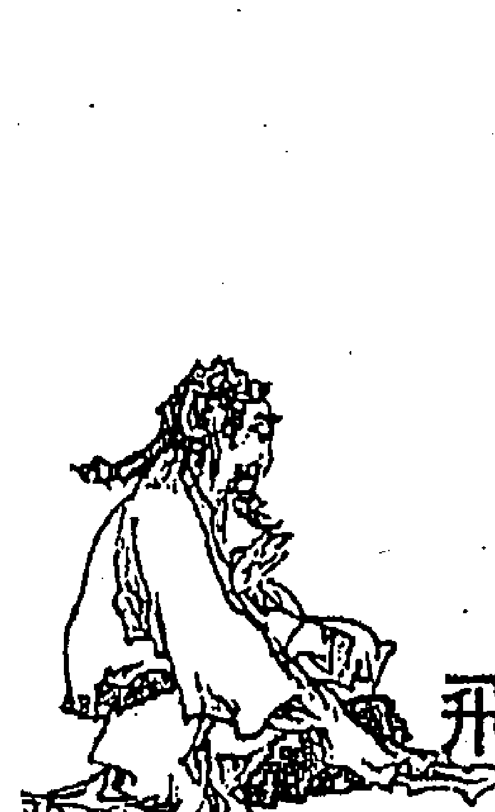

；以其串联呈破入於「大限命宫」〈子女〉，故於斯限的斯年烦极而思动。
也因为「流年疾厄」坐「武曲命忌」为「本命命宫」的「忌出」於「迁移」，所以思变。

> 佳言：
将相本无种，英雄不怕出身低。

> 荀子：
岁不寒，无以知松柏；
事不难，无以知君子。

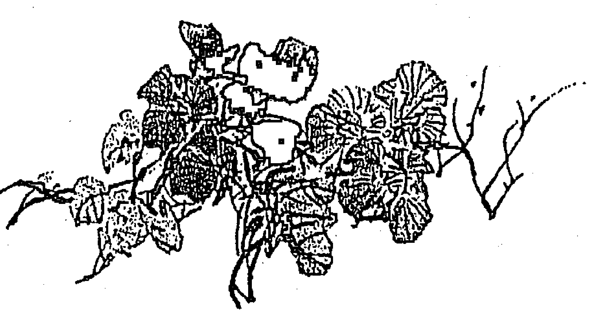

# 『道藏飞秘』的逻辑与功法

## 第八節 非以「命三方」論「格局」

坊書多以「命三方」論「格局」，那是井蛙觀天、以蠡測海的深謬！乃「命三方」者，僅紅塵的混飯模樣耳，無關格局高低。

譬如「事業」坐祿、權，當然工作上容易順遂，但未必見得是創業有成的老闆，也不一定是富有多金的成就者。又譬如「財帛」坐祿、權，當然口袋的現金方便，但也不見得口袋現金放少的就是窮人。

唯「命宮」較怕「坐忌」，容易糾纏業力，徒增煩擾；非天降憂勞，即個性上的庸人自擾；呈「雙忌」以上者，常生於憂患、死於安樂，也容易因性格扭曲而自招其咎，或為災難、挫折、病磨、壽促等，但未必直接關係於財富與成就。

是以「財帛」與「事業」何患其「忌」？僅為紅塵的多勞之相，並無直接關係於成就高低。君不見許多企業大家常是事必躬親的勞碌者？皆因「忌執」的「敬業」得而立業興家、成就大局。是以，何患「財帛」、「事業」之呈破？

屢見命盤「多忌」於「財帛」、「事業」者，照樣雄姿英發，何也？乃「田宅」與「福德」或「命」與「福德」兩三方以吉化相交，「因果」上的善業之報得而成就。

社會上也常見某些人於事業上，可以三年不開張、開張吃三年的高收入者；或若田僑仔的翹二郎腿收租金過好日子。這就是「田宅」與「福德」兩三方的吉化交拱，得其「果報」上的善業之使故也。

> > 魏了翁：
造物能予人豐年，
卻不能植不耕之田。

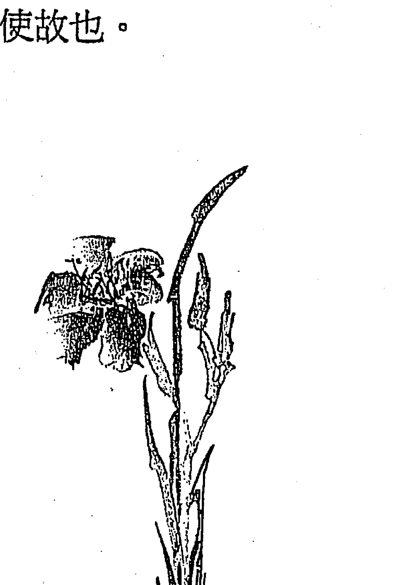

## 274. 第三章 如何「解析命盘」

例：譬如某田僑仔乾造丁酉〈1957〉年8月未時生。賦閒一生未事任何行業，僅以收房地租金即月入數十萬，悠游渡日。

| 梁【祿】〈田〉乙 | 殺〈事〉丙 | 〈友〉丁 | 廉〈遷〉戊 |
| :--- | :--- | :--- | :--- |
| 紫【權】相 祿〈福〉甲 | 忌 | 祿 祿 | 〈大限〉53-62〈疾〉己 |
| 巨《忌》機《科》右昌〈父〉癸 | ↘ | ↘ | 破43-52〈財〉庚 |
| 貪 ←忌 3-12《命》壬 | 陰《祿》陽忌→ 13-22〈兄〉癸 | 府武【忌】↓ 23-32〈夫〉壬 | 同《權》左【科】曲3-42〈子〉辛 |

+   ①「命宮」〈壬寅〉化天梁祿入「田宅」〈財富宮〉〈乙巳〉，轉太陰〈挾祿〉忌入「兄弟」〈經濟位〉逢太陰「生年祿」呈雙祿。此言其庫美而經濟優。

+   ②「兄弟」〈癸丑〉既坐太陰「生年祿」，當轉其忌而化貪狼〈挾雙祿〉忌入「命宮」，逢「遷移〈果報宮〉〈戊申〉又化來貪狼〈偏財曜〉祿會，此即「祖德流芳」而得蔭多產。

> 《批：「田宅」與「遷移」以偏財曜多祿交吉，宜其富有多金。而「天梁祿」者，獨愛涉於「田宅」與「遷移」兩宮。乃於「田宅」者，可以坐擁高樓別墅；入於「遷移」者，可以能言善道登鉅賈。》

+   ③何以收租金即月入數十萬？乃「田宅」〈乙巳〉坐天梁命祿為福，化太陰〈袂祿〉忌入「兄弟」逢「交友」〈丁未〉化來太陰祿會。《批：「太陰」者，出租業；而「交友」祿入「兄弟」，即得四方來財。》
    「交友」既化吉拱我「兄弟」庫位，轉而復與「遷移」交化善報入於「命宮」呈偏財曜四祿，宜其坐擁多產而收租金月入數十萬。

+   ④「命宮」〈壬寅〉既得旺財，化武曲〈袂旺財〉忌入「夫妻」逢「疾厄」〈己酉〉化來武曲祿會，此即經濟好而優游象。《批：凡「遷移」與「疾厄」以多祿交吉者，消遙。》

+   ⑤雖無業卻擁高收入，此即「命格」高低不在「命三方」的典型範例。

## 276. 第三章 如何「解析命盤」

例：譬如台中某富商乾造戊子（1948）年8月未時生，經營高級餐飲，擁有三家頂級餐廳。

| 宫位 | 天干 | 年龄段 | 星宿与四化 | 其他信息 |
| :--- | :--- | :--- | :--- | :--- |
| (命) | 甲 | 2-11 |  |  |
| (父) | 乙 | 12-21 | 府 右《科》 昌 |  |
| (福) | 丙 | 22-31 | 陰《權》 祿 忌 |  |
| (田) | 丁 | 32-41 | 貪《祿》 廉【祿】→ 忌 ←祿 |  |
| (事) | 戊 | 42-51 | 巨 祿 忌 |  |
| (友) | 己 | 52-61 | 相〈大限〉 祿 |  |
| (遷) | 庚 | 62-71 | 同 梁 |  |
| (疾) | 辛 |  | 武【科】 殺 陽【忌】 |  |
| (財) | 壬 |  | 左曲 忌 |  |
| (夫) | 甲 |  | 機《忌》 |  |
| (兄) | 乙 |  | 紫 破【權】 |  |
| (子) | 癸 |  |  |  |

*注：表格内含有多条表示四化飞星路径的箭头线，如从“巨”到“貪”的“忌”，从“機”到“巨”的“忌”等。*

+   ①「事業」〈戊午〉化天機忌入「夫妻」逢天機「生年忌」，呈「雙忌」回沖於「事業」。
    ②轉「夫妻」〈甲子〉化太陽〈挾雙忌〉忌入「財帛」又逢太陽「命忌」，則「三忌」破財帛矣！
    「事業」與「財帛」既串聯呈「三忌」之敗，何以照樣日進斗金？此即「命格」高低不在「命三方」的確切明證。

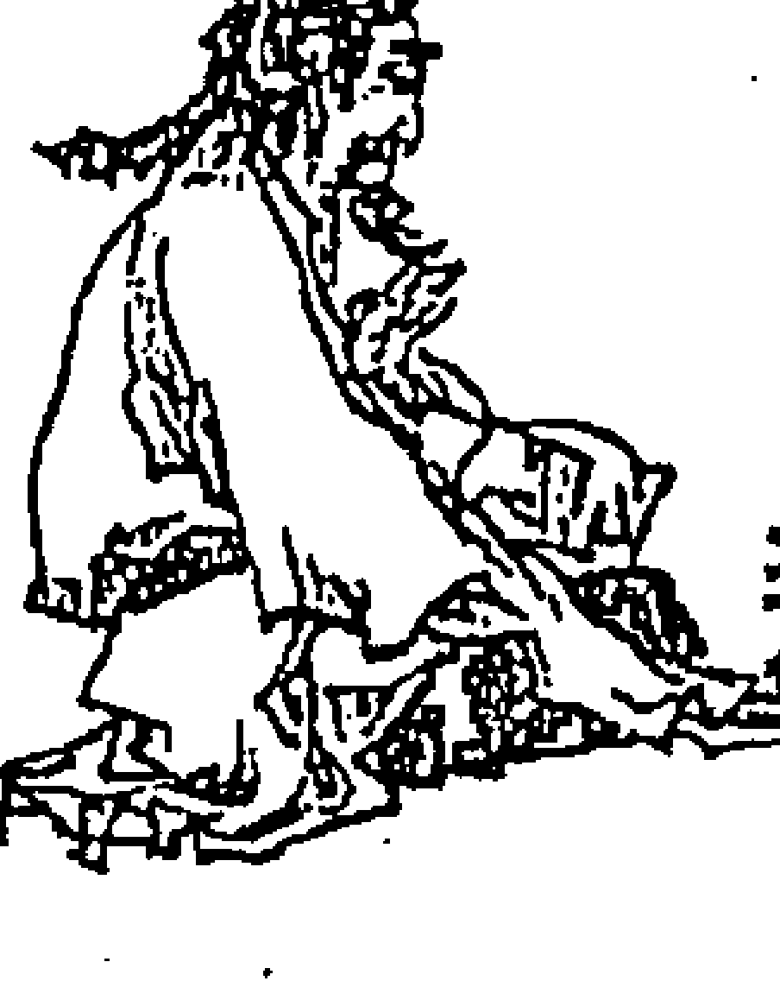

## 第八節 非以「命三方」論「格局」 .277

+   ③乃「田宅」〈丁巳〉化太陰祿入「福德」〈丙辰〉逢太陰「生年權」，轉而化廉貞〈挾一祿一權〉還忌入「田宅」逢廉貞〈偏財曜〉「命祿」及貪狼〈偏財曜〉「生年祿」，計彙得「三祿一權」於「田宅」，財庫其厚矣。其「事業」〈戊午〉也化貪狼〈偏財曜〉祿再入「田宅」〈丁巳〉，合之呈偏財曜「四祿一權」大益於庫，轉而化巨門〈挾四祿一權〉忌入事業又會「疾厄」〈財產運〉〈辛酉〉化來巨門祿會，宜其發達致富。

+   ④此即「福德」與「田宅」的交吉而得善報發庫，這就是「觀格局」的重點所在，何由苦惑於「命三方」的格局論？

> 佳言：
誰能滿足汝？惟己而已！〈境由心造〉

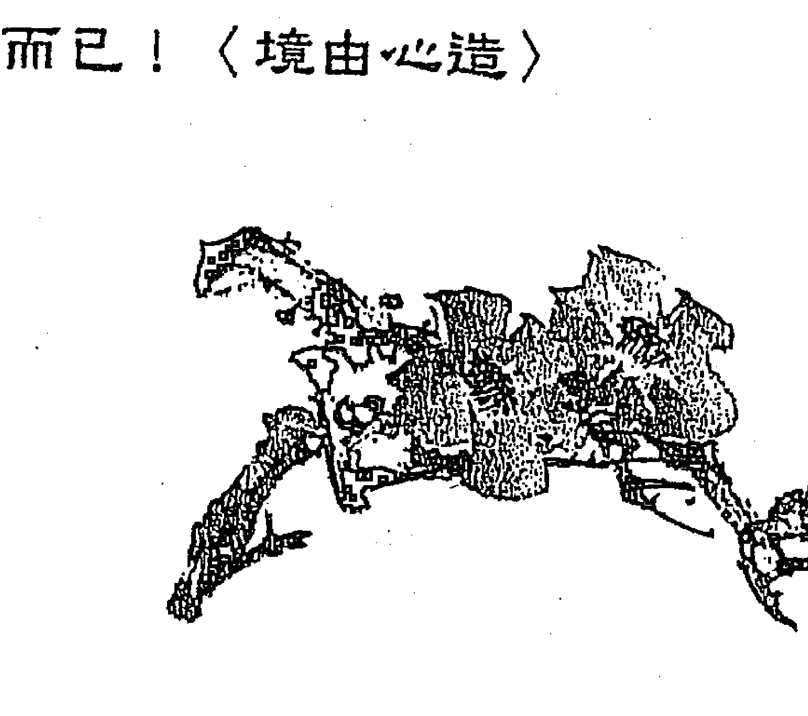

## 第九節 不可輕忽的「果報左使」

大部份的人都不善探討「福德三方」的「果報」力量，以為那只是表現「嗜好興趣」（福德）、「形象器宇」（遷移）與「兒女私情」（夫妻）的宮位。

實則，「福德三方」其用大矣！譬如前述每言「祿、權」之於「命三方」，其力是「照」勝於「坐」，道理就在這。乃「祿、權」照「命三方」即為「祿、權」坐於「福德三方」，得於「果報」之善化，豈非福至天成、得遇顯貴、事半功倍、貴人相助、心有靈犀、果斷多智、如願順遂、光采明亮嗎？

就以「遷移」為例，它涵蓋了「果報」裡頭的「處世應對」、「機緣際遇」、「根器」、「天份」、「智慧」、「廣大因緣」、「外在形象」、「社會地位」等等。譬如「遷移」化祿入：

+   1. 事業—必然工作順手、水到渠成。
    2. 財帛—現金方便、財源不竭。
    3. 兄弟—經濟活絡、週轉容易，鴻圖日展、步步高陞。

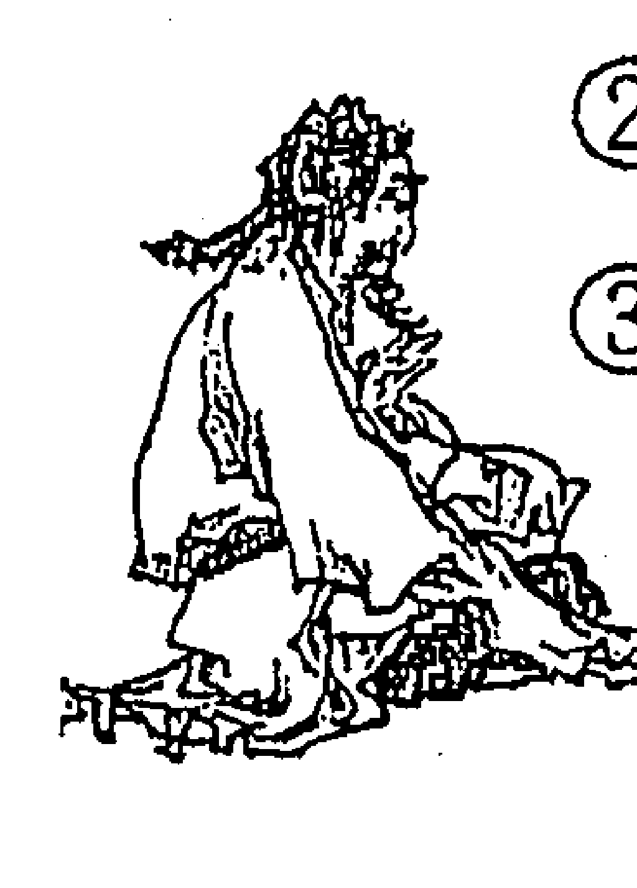

+   ④田宅—容易得助置產，或者天降鴻福而後發田進產。
    ⑤交友—合群、受歡迎，可以廣結善緣、寬闊人脈、到處受歡迎。
    ⑥父母—天資聰穎、風趣幽默，機伶智慧、圓融應對，甚或長袖善舞、聞一知十、能言善道。

以上所述，即隱含於——只要是「遷移」化祿所入之宮，該宮即現活絡、順遂與生趣，存在了「倍增其吉」、「起死回生」〈真貴人〉的功效。實則「福德三方」化祿所入之宮於不同的事理上，都有「天降鴻福」、「扭轉乾坤」的不同佳效。譬如：

+   ①「命」祿入「疾厄」—
    可能只是性格上的好脾氣、容易發胖、懶散、檢現成，或為一生少久病之磨、家運平順等。
    ②「遷移」祿入「疾厄」—
    則為「果報」裡頭的諸多順遂、貴人顯旺、歪打正著、心想事成、病得良醫遇難呈祥，物質生活佳，也多旅〈治〉遊與歡樂。

上述兩者存在了迥然的差異，此即「果報左使」產生了的不同果實。譬如「福德三方」其一宮化「祿」入「兄弟」或「田宅」，其經濟上縱令逢山窮水盡疑無路

，也容易柳暗花明又一村。此即得「真貴人」的解危制厄，也是「果報左使」產生了的好結果。

又譬如「疾厄」和「福德」、「遷移」、「子女」兩方所化，串聯成「三忌」〈以上〉的破敗，很容易造成惡疾、意外的折磨或死亡，否則也是帶疾〈破相〉延生。

註：破相多串聯於「父母」或「遷移」兩形於外宮呈破。

設若「福德」或「遷移」和「田宅」兩方所化，串聯成「三忌」〈以上〉入「夫妻」、「子女」的破敗，則很容易造成鰥寡孤獨、敗財退產，甚至家道中落、天倫有憾的不佳人生。

> 佳言：
呼吸一過，千載無我；
形神一離，萬古難求！
〈人身難得〉

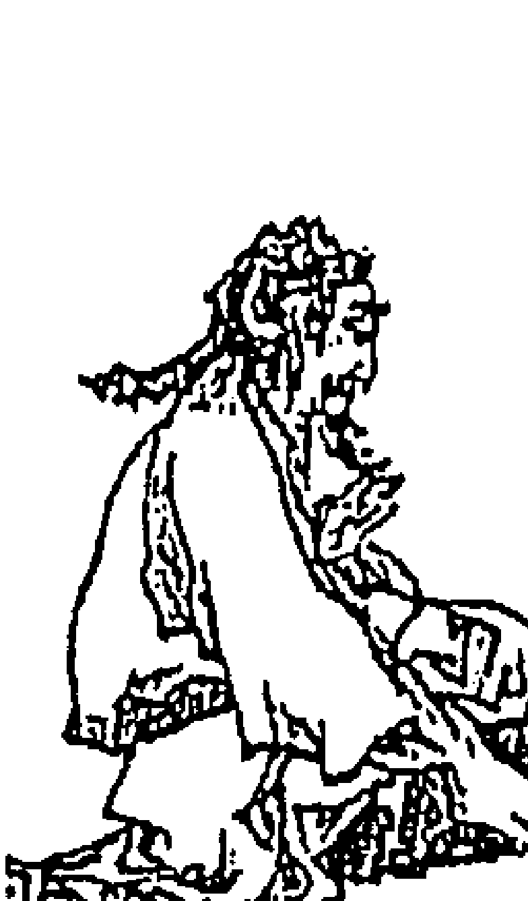

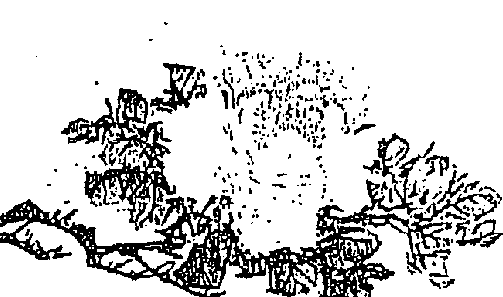

例：乾造甲午〈1954〉年8月巳時生。

46 歲罹胰臟發炎化膿，經長庚群醫緊急開刀並待加護病房兩個月而後轉普通病房一個月，終逃離鬼門關，幸運的病癒返家。

| 相昌 | 梁 | 廉《祿》殺 | (大限) |
| :--- | :--- | :--- | :--- |
| 13-22 (父)己 | 23-32 (福)庚 | 33-42 (田)辛 | 43-52 (事)壬 |
| 巨忌3-12《命》戊 | 忌 | 忌 | 曲 |
| 紫〈大疾〉貪【祿】右【科】〈46歲〉〈兄〉丁 | 忌 | 忌 | 同 |
| 機【忌】陰【樞】 | 府 | 陽《忌》 | 武《科》破《樞》左 |
| 〈夫〉丙 | 〈子〉丁 | 〈財〉丙 | 〈疾〉乙 |

+   ①「疾厄」〈乙亥〉化太陰忌入「夫妻」〈丙寅〉，轉而化廉貞〈挾忌〉忌入「田宅」。《批：病發時瘦骨如柴。》
    ②「兄弟」〈丁卯〉〈身體運〉化巨門忌入「命宮」，而「福德」〈庚午〉〈果報宮〉則化天同忌入「遷移」〈果報宮〉。合之令「命宮」、「遷移」一線呈兩頭見忌的「雙忌」。

## 282. 第三章 如何「解析命盤」

+   ③轉「遷移」〈甲戌〉化太陽〈挾雙忌力〉忌入「財帛〉逢太陽「生年忌」，呈「三忌」回沖於「福德」。
+   ④「財帛」〈丙子〉既坐「生年忌」當作二度轉忌，化廉貞〈挾三忌〉亦忌入「田宅」。
+   ⑤合①+②+③+④式，「田宅」彙成「四忌」呈破。凡病疾之惡者化入「田宅」收藏宮，必然困厄跟轉時間長，還恐拖上後遺症〈實則本造日後病情兩度復發終亡身於52歲〉。
+   ⑥以「本命疾厄」串聯對應於「太限疾厄」〈兄弟〉與46歲「流年疾厄」〈遷移〉串聯共破，故而斯年發病。

> 《批：凡「疾厄」破於「田宅」無救應者，主肉身將腐而掃地出門—死亡象。》

朱用純：
一粥一飯，當思來處不易！

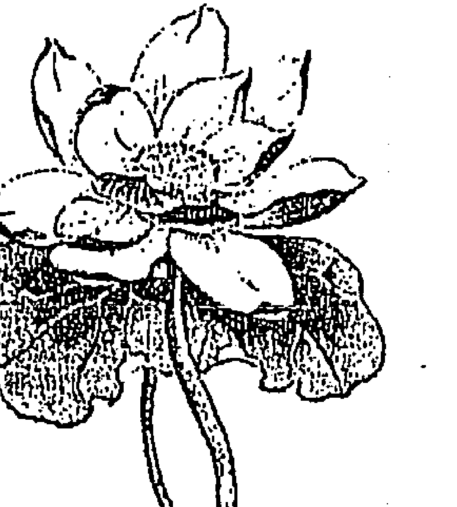

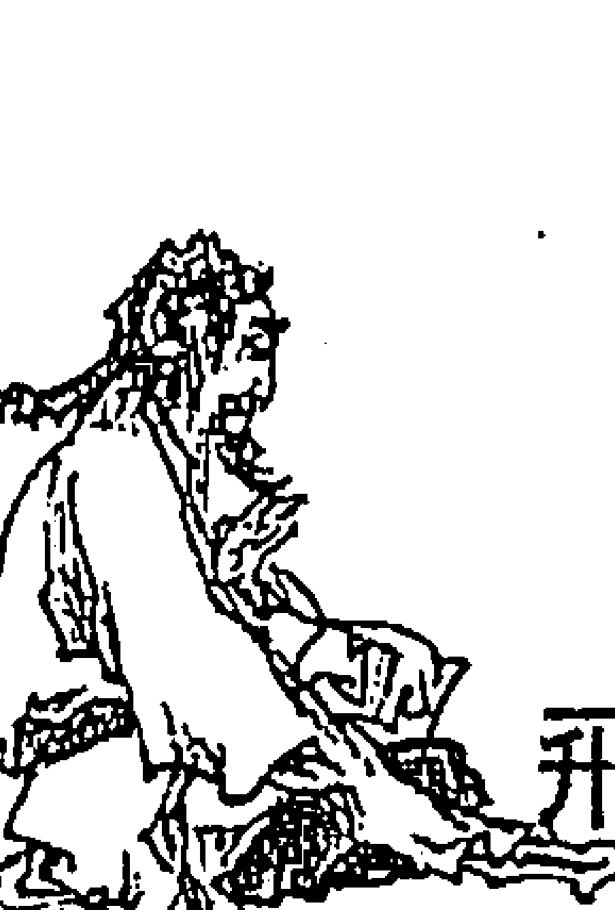

# 46歲其厚福救命——

| 相昌 | 梁 | 廉《祿》殺 | 曲 |
| :--- | :--- | :--- | :--- |
| 13-22 | 〈46田〉23-32 | 33-42 | 〈大限〉43-52 |
| 〈父〉己 | 〈福〉庚 | 〈田〉辛 | 〈事〉壬 |
| 巨 | 忌 祿 忌 祿 | 同 |
| 3-12 | | 53-62 |
| 《命》戊 | | 〈友〉癸 |
| 紫〈大疾〉貪【祿】右【科】〈46歲〉〈兄〉丁 | | 〈46疾〉〈遷〉甲 |
| 祿 機【忌】陰【權】 | 府 | 陽《忌》祿 | 武《科》破《權》左 |
| 〈夫〉丙 | 〈子〉丁 | 〈財〉丙 | 〈疾〉乙 |

① 「遷移」〈甲戌〉〈果報宮〉〈流年疾厄〉化廉貞祿入「田宅」逢廉貞「生年祿」，呈「雙祿」吉象。
② 「兄弟」〈丁卯〉〈流年命宮〉化太陰祿入「夫妻」，而「疾厄」〈乙亥〉化天機祿亦入「夫妻」呈「雙祿」。轉「夫妻」〈丙寅〉化廉貞〈挾雙祿〉又忌入「田宅」。
③ 「福德」〈庚午〉〈流年田宅〉化太陽祿入「財帛」〈丙子〉，轉而化廉貞〈挾祿〉也忌入「田宅」。

『道藏飛秘』的邏輯與功法

## 284. 第三章 如何「解析命盤」

④合①+②+③式，其「遷移」、「兄弟」、「疾厄」、「福德」等宮共彙「五祿」厚福於「田宅」收藏宮。乃即「流年命宮」與「流年疾厄」其福仍得穩當斂守，宜其逃離鬼門關。《批：凡多祿厚福化入「田宅」收藏宮者，得於「福祿壽」。最忌「果報」之宮破於「田宅」，屢見「損壽凋零」。》

> 漢書：
當斷不斷，反受其亂。
> 左傳：
畏首畏尾，身其餘己？

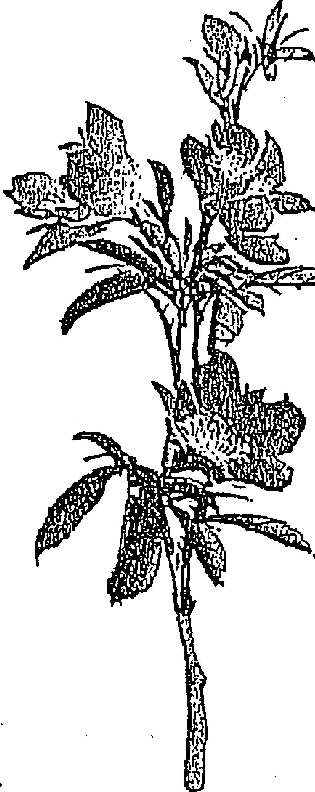

# 第四章 「斗數陽宅」的概念

命盤十二宮各宮的「宮位吉凶」，即精密的說明了屬於個人「命格」上的好壞「方位」，可以藉此精準的構設「陽宅佈局」。換句話說：斗數命盤即為精密的「個人方位學」。

甲、「陰宅」首重來龍〈坐山〉，「陽宅」專看納氣〈來路、開門、立向〉。

「陽宅」以「陽」為名。陽者主「動」，當於住所內外的「動線」之中下功夫。乃藉人們的進出門戶之間〈動〉，以「房子」及「大門」的「立向」，先過濾好、壞氣於宅門之前，趨吉而避凶，故「陽宅」首重「開門」與「立向」。

「宅門」開「吉方」與立「吉向」，得以納好氣、拒凶氣，庶幾瑞氣盈庭而增福減禍。

## 286. 第四章 「斗數陽宅」的概念

除了「開門」與「立向」為「主納氣」外，譬如房宅周邊的空曠方位設有窗戶，得於採光與空氣的流通，即得於「副納氣」。此空曠方是否為吉，仍然需斟酌。

> 註：納氣而後產生了陽宅的「氣場」。所謂氣場是涵蓋於磁場、採光與空氣的對流等。它是屬於多元性的整體「能量場」。

乙、「斗數命盤」主宰個人的命運，故而可以精密於「適合個人」陽宅上的吉凶配置。人體也是複雜的能量場，是以「陽宅學」的目的是要陽宅的大能量場與人體的小能量場，產生和諧共榮，達成趨吉避凶與益我順遂。

> 註：譬如某宅的前任房客諸事大吉，而後任的房客則諸多乖違，何也？乃因個人「命格」的不同，與此宅「氣場」的「吉凶感應」，當然會產生大不相同的結果。

舉凡住宅、店面、辦公室、辦公桌、櫃檯、神龕、床位等的「立向」與坐下的「方位」，以及來路、開門、玄關、客廳、走道乃至於寢室、書房、倉庫、廚房、廁所、儲藏室、後門等坐下的「方位」，皆宜作趨吉避凶的安排，其結果可以精準靈驗。註：陽宅二要——「形勢」與「理氣」。
之於「形勢」，坊書多所闡述，大同小異。而「理氣」者，言陽宅及其諸構設的「方位」與「立向」的吉凶而已，藉由「斗數命盤」可以鉅細靡遺的作好精確安排。
「形勢」與「理氣」必須相維共繫。因此，陽宅設計不得依形勢而悖理氣，或就理氣而違形勢。

丙、太極生「兩儀」，兩儀者「陰、陽」而已。
陽「動」〈生發〉而陰「靜」〈斂守〉。故於陽宅學，凡「立向」只宜「坐陰向陽」〈向祿、權〉；凡動陽構設〈大門、客廳、玄關、走道、神龕、廚房、櫃檯、後門〉皆宜坐「陽方」〈祿、權方〉，凡靜陰構設〈房間、書房、儲藏室、廁所〉只宜坐「陰方」〈科、忌方〉。然「祿」為少陽，存陰餘氣，故此方最宜主臥室；「科」為少陰，存陽餘氣，故此方最適合書房。「祿、科」二方也應避免廁所其汙。

## 288. 第四章『斗數陽宅』的概念

兩儀而後生「四象」，恰似一年中的四季—

+   1. 「祿」為「春」—「少陽」〈尚存陰之餘氣〉。
    2. 「權」為「夏」—「老陽」。
    3. 「科」為「秋」—「少陰」〈尚存陽之餘氣〉。
    4. 「忌」為「冬」—「老陰」。

故而「向」取「祿、權」，「坐」入「科、忌」；以及所有「動陽」構設應取「祿、權」方，「靜陰」構設只宜「科、忌」方。

註：

+   1. 俗云—「向陽」門第春常早。
    2. 「斗數陽宅」的所謂「向陽」，即取「向」於「祿、權」方得而生發，獨愛「坐」於「忌」地可以斂守。《批：坐「忌」其義，乃得「守成」其義，至少可以「立於不敗」之地。》
    3. 陰陽不違，則進可攻、退可守，必然繁華。

註：「祿」為陽中有陰，「科」為陰中有陽。於陽宅諸構設中，難以盡善的陰陽調配時，此二化可權用為「可坐可向」。而「權」為強陽，大利於「立向」不宜「坐」；「忌」為強陰，只宜「坐」而切不可「立向」。

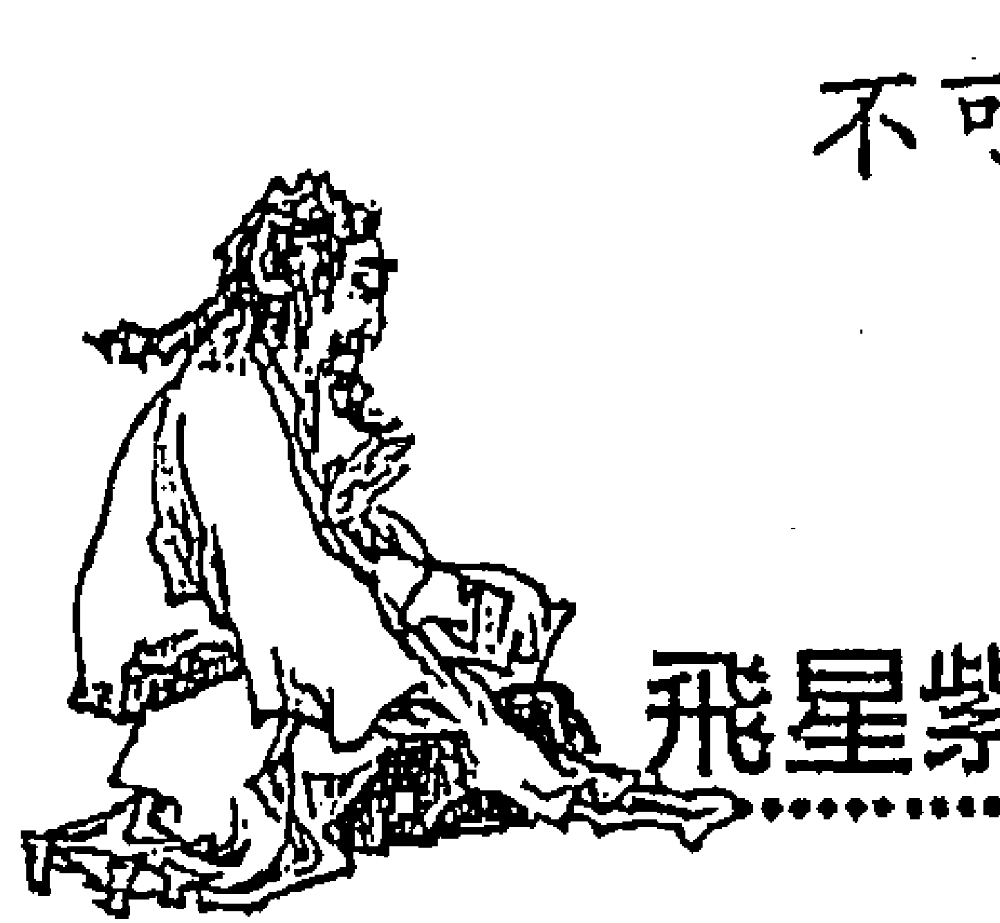

## 丁、命盘中「四化」运用的实务操作：

-   ①命盘中，「出生年干」或「命宫干」所化入的「禄、权」之坐宫，可以立此宫以为「向」。
-   ②或命盘十二宫，不论何宫的化「禄、权」入我「命」、「福德」及「田宅」三个三方，而其化「忌」不冲「命」及「田宅」两三方者，则该宫即可以立以为向。
-   ③举凡来路、开门、玄关、客厅、走道、厨房等「动线」，亦需设于「禄、权」动阳「吉方」。

注：凡欲取立向之宫，该宫所化其「忌」与「生年忌」或「命忌」落于同宫或两对宫冲激者，即为「破局」，则此宫大不宜立以为向。不得取「生年忌」或「命忌」所落之宫立以为「向」，名为「正冲」。而「自化忌出」之宫则其害稍逊，亦不足取。

注：阳宅学上的左阳右阴、前阳后阴、外阳里阴等，亦应尽量予配合，则更臻完善。

-   ④只要生辰正确、命盘精准，以斗数盘决定个人吉凶的「方」与「向」，其精密度为坊间任何阳宅学无能出其右者。
-   ⑤阳宅下罗盘的两立「太极点」一

## 290. 第四章 『斗数阳宅』的概念

-   a. 以房子「大门」立太极，观附近周遭的车站、市集、学校、路口、巷道、空地等汇聚气场的吉凶占方。
    b. 以房子「中心点」立太极，观大门、玄关、客厅、走道、办公室<桌>、柜台、神龛乃至于寝室、书房、厨房、仓库、厕所、储藏室、后门等的吉凶占方。

大抵「禄、权」方宜动，「科、忌」方宜静。唯碍于形势时，「禄」、「科」两方「动、静」皆可权用。

-   ⑥大门纳气的「立向」及「占方」之宫，皆应予飞出四化。欲其「禄权」入我「命三方」、「福德三方」与「田宅三方」，而其「忌」不冲我「命」或「田宅」两三方。

大门、玄关、客厅、走道等「动线」位置「转折点」的「占方」，以及后门的「占方」，亦得予飞化参酌吉凶。

注：「气」之流行〈动〉所以成「象」，故凡所有「动阳」之要衡者皆得而化之。
凡走道等「动线位置」穿过「忌方」者，此「忌方」之内，应作转折。譬如筑墙、置柜，或放盆景等「剪裁方式」，令改变行径动线以缓转气场的穿堂而过。

-   ⑦大门、玄关、客厅、神龛及走道、楼梯之起点必须占「禄、权」吉方；主卧室则以「禄、科」皆吉，少用「权」方〈强阳，难眠〉，其余卧房则「科、忌」无妨；厨房也宜「禄、科」方，平和健康；书房独爱于「科」，文入文方；储藏室、厕所必属「忌」方，乃得其所。

批：以「阳宅」理气上的「前阳后阴」、「左阳右阴」，配以斗数四化，则喜其「禄、权」多落「前」、「左」方，「科、忌」则爱「后」、「右」方。

-   ⑧凡大门「立向」，以其向所化「禄、权」吉气，最好令落入客厅、办公室〈桌〉、神龛、主卧室等所占宫位的「纳而用之」；而所化其「忌」者，则欲其落入宅内后〈右〉半部「阴方」的紧实守藏。如此气场则动静兼得。

-   ⑨凡「向阳」之门（与外界气场交通的枢纽—围墙大门、客厅大门）需论「立向」吉凶；而宅内非属向阳的房、室小门则免议于此，徒画蛇添足，但房门宜设房间内小太极（中心点）的吉方。譬如卧室，则房门宜在床铺的吉方。
-   ⑩宅外「禄、权」方宜其空旷畅快，「科、忌」方则宜紧实而不迫。譬如「禄、权」方远处得大楼高耸者亦吉，谓之「吉星高照」；「忌」方得大楼则益发其凶，为「煞星出头」，愈近愈凶。

> > 注：凡所有高楼大厦之迫近者，不论居何方皆所不吉〈大欺小〉。

-   ⑪凡向「生年忌」或「命忌」的房子，或房向「化忌」冲我「命宫」者，称之为「正冲」凶宅，大为不吉。多破财、伤身，或败产、死亡等，称「家道不兴」象。
-   ⑫凡所有动态装饰（喷泉、流水、鱼缸、风铃）者宜置「禄、权」阳方；静态装饰（水晶洞、宝石、古物、古董）者以「科、忌」阴方为宜。盆栽则动静皆宜。
-   ⑬如若住宅位于大楼内的某层楼，常见楼下「大门向」与我「宅向」并不相同，此刻则应兼顾于此二向皆须合于我命盘之吉方与吉向。

-   ⑭「斗数阳宅学」是以个人命盘上的吉凶克择，所以「命格高者」布局可以愈佳、得吉也多；而「命格低者」容易捉襟制肘，诸多无奈。
斗数阳宅学，非为江湖术士的口沫横飞——能让乞丐变皇帝。然以天悯万物、神爱世人，虽以格破命差，只要命造主人心性无恶，用之以「斗数阳宅学」的趋吉避凶，而後亦足温饱矣。
-   ⑮家庭中不论男女老少，以担负经济责任的生产者〈非必一家之长〉的命盘为主，择而趋避。
-   ⑯「办公室」的安排，以阳宅大门立太极所化「禄、权」吉方决定董事长〈或主管〉室位置，及以阳宅中心点立太极而後决定所属员工办公位置，然而员工办公位置最好处于主管室的吉方。
-   ⑰凡所有阳方构设必须采光亮、空气流通，而阴方则适可即好。
-   ⑱历代五术家皆极言其阴阳平衡的中庸之道，然以阳宅学而言，应阳稍偏强于阴，始得生发旺象；一如人体言其酸碱平衡，仍以稍偏碱者较为健康。
是以透彻的明亮通风与阴暗晦滞都属于孤阴不生、独阳不长的非平衡常态，必令身心不平和健康，必也干扰了周边的事业财运。故以「厅光房暗」、「前光後暗」为基本原则。

## 294. 第四章『斗数阳宅』的概念

附：命盘十二宫的方位配合台湾各行政区的地理概念图

| | | | |
| :--- | :--- | :--- | :--- |
| 屏东 〈巳〉 南南东 | 高雄 〈午〉 正南 | 嘉南 〈未〉 南南西 | 彰云 〈申〉 西西南 |
| 台东 〈辰〉 东东南 | | | 台中 〈酉〉 正西 |
| 花东 〈卯〉 正东 | | | 竹苗 〈戌〉 西西北 |
| 花莲 〈寅〉 东东北 | 宜兰 〈丑〉 北北东 | 台北 〈子〉 正北 | 桃园 〈亥〉 北北西 |

注：一圆周 360 度/12 宫，每宫占 30 度。

注：又譬如命盘的生年或命宫四化所落之宫位在上图之何宫，凡迁徙、业务、工作、人事等的趋避，宜多往「禄、权」吉方求财谋事，勿滞于「忌」之凶方生晦。
或某宫所化之「禄、权」入或照我而「忌」不冲我者，此宫亦属我吉方，可以前往谋吉。

## ⑲重要的元运〈地运〉时间表：

开门立向与来路动线得地运，配以命盘「禄权」吉方的趋避，庶几巧夺天工。

-   一运—自西元 2044 年起至 2061 年止
-   二运—自西元 2062 年起至 2085 年止
-   三运—自西元 1906 年起至 1929〈民 18〉年止
-   四运—自西元 1930〈民 19〉年起至 1953〈民 42〉年止
-   六运—自西元 1954〈民 43〉年起至 1974〈民 63〉年止
-   七运—自西元 1975〈民 64〉年起至 1995〈民 84〉年止
-   八运—自西元 2096〈民 85〉年起至 2116〈民 105〉年止
-   九运—自西元 2117〈民 106〉年起至 2143〈民 132〉年止

## 296. 第四章『斗数阳宅』的概念

| 东南 〈巽〉 | 南 〈离〉 | 西南 〈坤〉 |
| :--- | :--- | :--- |
| 东 〈震〉 | | 西 〈兑〉 |
| 东北 〈艮〉 | 北 〈坎〉 | 西北 〈乾〉 |

注：一、三、六、八运以「标楷体字」〈乾、离、艮、兑〉为地运得气方宜动〈开门、立向、玄关、走道〉；以「细明体字」为不得气方宜静。二、四、七、九运以「细明体字」〈坤、坎、震、巽〉为地运得气方宜动；以「标楷体字」为不得气方宜静。

阳宅开门、立向得当之向与方固吉，然时间流转换运而後呈非得运者，宜于换运後三、五年间余气未尽前即应寻吉它迁。

注：上图为「八卦」所主的八方〈每宫占45度〉，转配以斗数「命盘十二宫」〈每宫占30度〉而斟酌之。

## ⑳市售罗盘与命盘十二宫的对照：

十二地支占命盘十二宫，360 度 / 12 宫，则每宫占 30 度。
