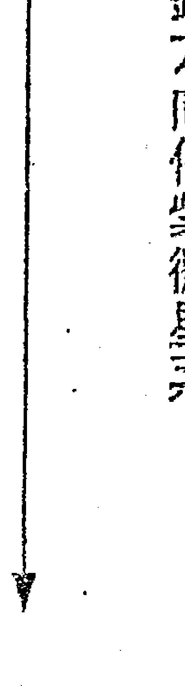
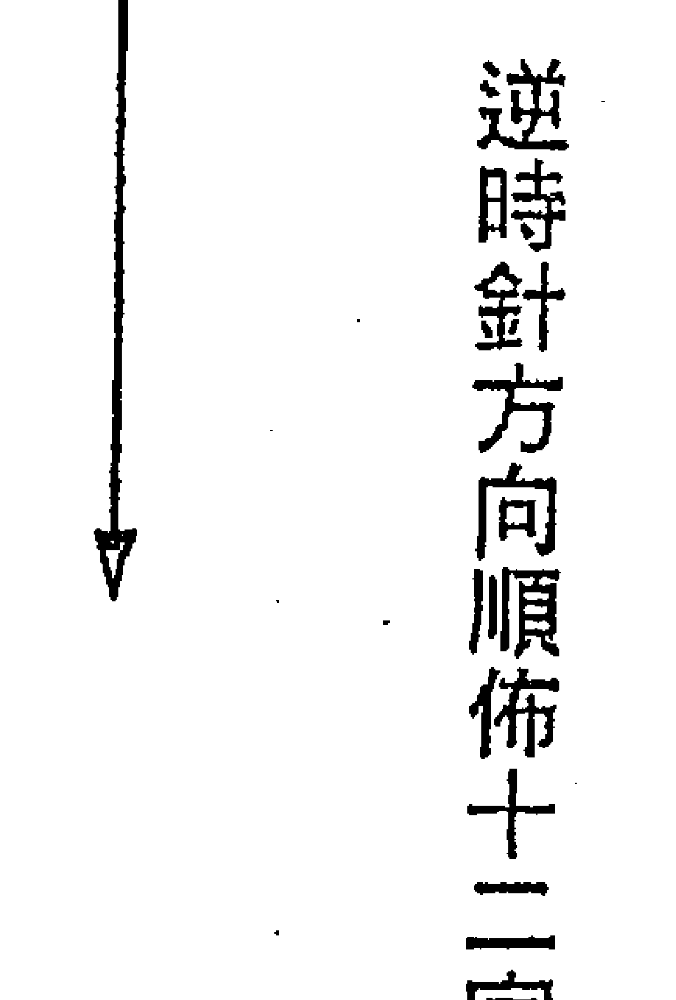

# 飞星紫微斗数专论四化

## 自序

命学精深，本可匡世，用作扶倾，为人决疑解惑。所谓命者，乃累世所积之因，今世所得之果也。善因善果，恶因恶果，显于命盘，丝毫不爽。奈何世风日下，江湖术士，用以惑世，害人匪浅；是以顽愚小人得之，如虎添翼，遗祸人间。故学命者应修善业，匡正己心，否则知法犯法，坠阿鼻更速。

鄙恐误传小人而祸世，犹如矛盾，迟不成章。益友曰：天地有德传善华，如得而不薪传，是欲将古人智慧沈棺化土乎？汝有罪！曰：君子无罪，怀璧其罪。汝恐流入顽徒，然善者何辜？善念虽佳而不得圆满，智慧远矣！

职此之故，茅塞顿开，执笔虽不成章。

鄙之于斗术，初闻道于中和周清河老师，复得至友徐静观先生反复叙述，稍具心得；后再拜于蔡明宏老师门下，始以论命拾数年，稍具心得。

鄙帚不敢自珍，望善者玩味；书中命例皆有真人可考，非凭空虚构。后学者若有所得，用之济世，鄙愿足矣。

庚辰年春  若瑜  谨识

## 飞星紫微斗数 序

### 孙序

余自弱冠之时，对玄学五术深感兴趣。但其间学理浩翰，派别纷杂，加上才疏学浅且不得其门而入，徒增慨叹而已。然于心中无时无刻不对人性之参差、人生之变化，人间之因果业力怀好奇与探究之心。

八十年自美赋归，任教之余，乃重拾昔日之兴趣，至坊间书店阅览。发现学有专精之士多如过江之鲫，有关五术方面之著述更是琳琅满目，多不胜数。一时之间，不知如何选择，困惑不已。然因缘际会，先后与詹老师、李老师、陈老师、梁老师结缘。对于易理、堪舆、八字、紫斗、符咒等有了初步之认识。自此之后，闲暇之余，便成为书店之常客，对于相关书籍之搜集更是不遗余力。

吾得以认识紫斗之学乃结缘于梁老师。梁师昔日在高雄为人论命，颇得好评。回故里后，吾有缘得以毘邻而居。然不时有求教者前来乞命问事，吾得以在旁细听琢磨。以梁师之修养及对飞星紫斗所下之功夫，再加上其对人性之良窳、人间世事之繁琐折冲之认知，论命推理可谓圆熟之至，常令问事者拍案，折服不已。自此得师徒之缘耳。

据说紫斗之学乃希夷先生藉禅定之功，神游太虚所悟所创是也。紫斗之学乃星相理气之学。可分南、北二派。南派即三合派重星之本质，北派即飞星派重星之化气也。

三合派乃以星辰之拱照齐冲来断吉凶，以太岁神煞来论流年之否泰。所用之星辰多达一百多颗。再加上大运、流年、星辰之等级十二宫之配置，格局之归属等诸多条件。若非记性特佳且有志此学之人士，一般而言，不易进入化境且运用自如。然而，飞星派仅用及十八颗星。若能明白五行四时，星性象义，宫位象义，四化飞星之理气及星辰碰撞所产生之变化原理并配合时空之流转。一般而言，虽非专业人士，但假以时日，亦能有所领悟。吾以梁师对飞星紫微之精研，有其独到之处，赞佩之余，乃促成著书立说之愿，以享同好，也希望能藉此抛砖引玉，以达共同切磋之效，昔古人传徒授艺，未能悉尽心意，尽拋所学，时有保留。乃至于古圣先贤之智慧精华，未能畅流于民间有志之士，以至于失传，殊为遗憾可惜。故此次与梁师共同达此愿望，而梁师亦愿倾囊。实乃吾辈后学之福也。

孙永芳谨识

庚辰年

# 第一章 紫微斗数之缘起——封神榜的故事

### ※飞星紫微斗数※

三千多年前，有殷商暴君「纣王」；纣王善射，一日率臣子出猎，遇暴雨而歇于庙，乃九天玄女之庙。王见玄女塑像，美若天仙，叹后宫佳丽皆俗，起淫心而作秽诗谶讽。

九天本慈悲，面对万人福祉之君王，竟淫妄胡语，忧天下苍生，乃禀玉皇天尊。天尊知悉，命灭商纣，以维纲纪，造福群黎。

九天衔命，遂命千年狐精，化作美人扰乱朝纲，倾商纣而使天下得太平。

「妲己」虽为狐狸精怪，化善而修行千年。九天命其灭商，衔命不违。

时值纣王淫心大起，广募天下美女入宫；得一要莲之女，貌胜西施、沉鱼落雁。

入宫途中，妲己身换其魂魄，移乾转坤；入宫之后乱其纲纪，杀戮无辜，欲令商纣灭亡。

殷商西边有部落曰周，农业生计甚佳，天下太平，皆以领导有方且慈悲为怀施德政；此部落之长乃「文王」。

文王精于易理八卦，善卜，故能先知先觉而忧国忧民。虽知天下祸乱已近，此为定数，哀苍生何辜？

纣王经妲己多次谗言，召文王入宫欲诛之，文王受诏入宫被缚，宣其心图叛乱，将之投入狱中。文王长子「伯邑」，生性至孝，闻讯入京，请罪于纣王；纣王安抚伯邑，留宿于邑间。伯邑乃绝世美男子，貌比潘安，好学且善琴艺。是夜以未能谋会父面，心急不寐，起身抚琴；夜深人静，琴声悠扬，传于宫中。妲己闻之，着薄纱往探，窥于门缝，妲己见伯邑俊美，淫心即起，叩门以入，百般调戏。伯邑不为所动，妲己心不死，再嬉之；伯邑恼火，斥为荡妇，予疾颜厉色。妲己生恨，回宫谗纣王；纣王杀伯邑并做成肉包，命人送至狱中喂食文王。

文王善卦，见肉包而心知不祥。然以其仁慈忧民，一切以天下苍生为重，故忍辱于心，欣然食尽肉包。

纣王闻讯，心笑文王非智者，食子肉而不知，何能成就天下？遂令释放文王回周。

文王回周途中，经大草原以神力吐出肉包，肉包变作可爱小白兔，乃伯邑之化身，但见小白兔行礼而去。

天界召回伯邑灵魂，受封为「紫微星」。故紫微星主「善良、尊贵」。

文王回周，誓灭商纣，除暴安民。乃屯粮、练兵以备战，并广召天下高人名仕。遇「姜尚」钓于渭水。知其为能者，延入府中以为军师。

姜尚又名子牙，学道于昆仑，下山后以时运未济，算卜维生，并以六十开外之龄，娶马家庄老处女「马千金」为妻。马千金善妒、舌尖牙厉，难以共处；子牙虽心知肚明，终以定数难违而婚。不多时即以杯水倾地、覆水难收而休妻。于后钓于渭水之上，以八十高龄遇文王。

纣王之忠臣，皇叔「比干」见王顽靡，挺身挞伐，忠言直谏。纣王迷恋酒色，充耳不闻。日久恼怒，信其奸臣危言欲令比干入罪；比干利刀自剖胸，挖心以示忠贞，死后受封「太阳星」。主「光明、无私」。故主「政治」。

妲己千年狐精，受封「贪狼星」。主「桃花、才艺与修行」。以其修行千年之功故曰「化气为善」。

暴君纣王，贪花恋酒，造酒池肉林，与妲己嬉于其间，不问朝政。

纣王死后，受封「破军星」。主「消耗、破损」。

武王于后受封为「武曲星」。主「刚毅不屈」。

文王欲灭商纣，然天不从人愿，中道崩殂。「武王」即位，继承父志。武王即伯邑之弟。

姜子牙于后自封为「天机星」。掌「智慧」。

文王以德治世，故得众拥爱戴，四方能人志士齐心效忠。以其福德深厚，死后受封「天同星」。主「福气、融合」。

纣王身边有大奸臣「费仲」，阿谀献媚，诬害忠良，加速殷商灭亡；费仲终被捕，子牙斥为畜牲，令斩首示众。费仲死后，受封为「廉贞星」。主「奸邪」犯法，助长「淫虐」。

纣王元配「姜太后」，是贤德妇人。妲己善妒，将之谋害凌辱致死；灵魂召回天，受封「天府星」。掌「禄库」及「物产」。

纣王有忠烈猛将「黄飞虎」，屡拒武王大军，武王难胜；后以飞虎夫人遭纣王戏而跳楼玉殒，飞虎大怒投周，终灭纣。飞虎不幸于绳池一役战死；灵魂召回天，受封为「七杀星」。主「勇猛」。

周军有元帅「李天王」，百战不死，忠贞爱国；未死即受封为「天梁星」。主「解危制厄」及享「高寿」。

纣王另一出将入相之忠臣「闻太师」，头生三眼，目光如炬。纣王暴虐，唯惧闻太师。妲己邪狐亦惧太师威德，皆避走。纣王不得已，将其遣调边陲，远离京都至前方迎敌，终致战死。灵魂召回天，受封为「天相星」。主「英明」，「掌印」，亦掌「食禄」。

商营猛将黄飞虎经年征战在外，其妻「贾夫人」年轻貌美，为妲己所妒。妲己假意示好，诏其入宫相叙，篡纣王戏之；贾夫人性贞烈，跳楼玉殒。以其贞烈，受封为「太阴星」。主「洁净美丽」。武王灭商得天下，行德政，拥财富，国泰民安，享天寿而逝，未死即受封「武曲星」。主掌「财富」与「武勇」。

与「家室住宅」。
子牙恶妻马千金，刻薄善妒；受封「巨门星」，主「是非口舌」。
注：故事背景乃缘于殷商末代，地广人稀，多山川精怪，上天难抚其乱，故命以周灭商，令各精怪投胎转世，各为其主，转战立功，各司其职。以其各为其主，战死有功，则受封有名。
姜尚佐周灭商，功成后上天令其筑台封神。子牙谦逊，不敢封己，待众神一一受封完毕，已无重要神职可封。太白星君促之，乃封己为开职「门神」，「天机星」是也；以门常开阖，主「转动轴承」，亦主「智慧」，化气曰「善」。

# 第二章 基础篇

### 第一节 阴阳与五行

宇宙形成之初，清轻者上升为天，浊重者下降为地，天地形成则见日夜寒暑，暑、日为阳，寒、夜为阴。

易经又以寒暖、燥湿、刚柔、动静、往复、奇偶等释阴阳之义，譬如寒属阴、暖为阳，燥为阳、湿为阴，刚为阳、柔为阴，动为阳，静为阴，往为阳、复为阴，奇为阳、偶为阴。

阳者，由孕育而生长，壮旺进气之象。

阴者，由壮旺而衰老，死绝退气之象。

譬如人之出生由胎孕而生长，以至二十岁上下壮盛之年，身体组织细胞，日益坚盛，为进气，为阳。

约三十许岁之后周身组织细胞慢慢递减，逐渐衰老，是退气，为阴。

天地形成之后，五行之气流行其中，周而复始。每一年间，五行之气流行一次，即春、夏、秋、冬，现寒暑温凉等自然现象。春木、夏火、秋金、冬水，而土者间杂之气；春夏之交，木气未尽而火气已来，其间夹者为辰（三月），五行为土。夏秋之交，火气未尽，金气已来，间夹为未（六月），五行亦属土。秋冬之交，金气未尽，水气已来，间夹为戌（九月），五行亦属土。冬春之交，水气未尽，木气已来，间夹为丑（十二月），五行为土。以春夏秋冬周而复始，则五行之气流行，春木、夏火、秋金、冬水出矣，土则间夹其中。五行流行，周而复始，生克不息。生克如左图：

### ※飞星紫微斗数※

### 相生：

- 金生水
- 水生木
- 木生火
- 火生土
- 土生金

（图片描述：边线箭头为相生 内线箭头为相克）

### 相克：

- 金克木、木克土、土克水、水克火、火克金。

北方阴极而生寒生水；南方阳极而生热生火；东方阳散而生风生木；西方阴上而生燥生金；中央阴阳交而生湿生土。

五行之相生，所以相维。相克，所以相制。生克平衡谓之有伦。是以大凡健康的生命体，五行生克自然趋平衡。

火为太阳，其性炎上；水为太阴，其性润下；木为少阳，性腾上而无所止；金为少阴，性沉下而有所止；土无常性，视四时（四季）所乘，欲使相济所得，勿令太过与不及。万物负阴而抱阳，冲气以为和，太过与不及，皆为乖道。

正五行为：甲、乙、寅、卯东方属木，丙、丁、巳、午南方属火，庚、辛、申、酉西方属金，壬、癸、亥、子北方属水，戊、己、辰、戌、丑、未中央属土。

则右述之天干地支其源为何？

黄帝时，有蚩尤作乱。黄帝忧民，战蚩尤于涿鹿之野，不能胜治。斋戒筑坛，祷告天地，天降十干与十二支；帝以干为天，支为地，布象而治。

帝又以天干地支定方位，得方位而知去向（发明指南针），故大败蚩尤，安定群黎。

尔后有大挠氏出为后人忧，以十天干、十二地支分配组合成六十干支传后世，称之为六十甲子，用以辨时日、明年月。用之治理天下大事和闲杂小事，条理不紊。

右述所论，即不离空间（方位——上下、前后、左右）与时间的符号。

清阳为天，五行彰而十干立；浊阴为地，八方定而十二支分；是以「天干属气，地支为形」；形气合而成体。

> 古书云：「甲者，坼也，言万物剖符甲而出。乙者万物初生而曲孽未伸。丙言万物炳然著见。丁言万物壮实之形，故邦国之强宜多丁（多生男子）。戊者茂也，茂盛。己为纪也，言有形可记识。庚为坚强貌，万物有实收斂。辛为利金，万物盛而见制，收成。壬，妊也，阴阳再交，以期萌芽。癸者，冬土既平，万物揆度」。天干是生成。

地支则：子，孽也，阳气始明，孽生于下。丑，纽也，寒气自属曲也。寅，髓也，阳气欲出，阳尚强而髓演于下。卯，冒也，万物出于地之伸展。辰，伸也。万物舒伸而出、成长。已，已也，阳气毕布已矣。午，仵也，阴阳交相悖而仵也。未，昧也，日中则昃，阳须向幽。申，甲束又成，万物成体。酉，就也，万物成熟。戌，减也，万物采收灭尽。亥，核也，收臧以核坚质。

以阴阳别之则：

甲、丙、戊、庚、壬为阳干（奇数），乙、丁、己、辛、癸为阴干（偶数）。

### 飞星紫微斗数

子、寅、辰、午、申、戌为阳支（奇数），丑、卯、巳、未、酉、亥为阴支（偶数）。六十甲子组成，其法为阳干配阳支，阴干配阴支，犹如木之干与枝，次第推排，用以记时间，时明则事物有序。

既有五行，何又言十干十二支？以阴阳而生五行，而五行中亦各有阴阳。论木，甲者乙之气，乙者甲之质；在天为生之气，甲也；在地为万物，承兹生气者，乙也。何以复言寅卯？寅卯者，与甲乙分阴阳、天地而言。干属天、支属地之别而已，言木之在天成象与地成形，二者兼备，形象俱足，事理更明；譬言之，甲乙如官长，寅卯是辖属区域范围，则人事分明。

前述以甲乙、寅卯为例，其余干支既配五行，其理同源、同推，学者自明。

又五行属相，以火为「红」、水主「黑」、木属「青」、土即「黄」、金是「白」，此皆以自然之相引喻。

> 补：地支言：子，孳也，阳气始明；阳之明故曰「天开于子」。丑，纽也，寒气自属曲也；寒生于湿下，故曰「地辟于丑」。此即传说中的「盘古开天辟地」。而寅者髓也，阳尚强而髓演于下，则万物生；故曰「人生于寅」。一如正月为寅、为春初，万物始生发，征于生命之始，故言人生于寅。

### 第二节 六十甲子与纳音五行

以阳干配阳支，阴干配阴支，则十天干配十二地支得六十组不同干支组合，用之以订定时间。紫微命盘，十二宫各有干支组合，定其五行局，则以前贤所留歌诀为用。

- 「甲乙锦江烟」。
「丙丁河尧坚」。
「戊己秋堂柳」。
「庚辛卦林钱」。
「壬癸木钟满」。
以上歌诀，不知原委，背诵不易。分辨纳音五行以定命宫局数有简易歌诀。

以右述歌诀中字的「部首」定其五行。如锦之部首为金，江之部首为水等。又天干配地支，则六十甲子将其地支分成二组：子丑、寅卯、辰巳为一组；午未、申酉、戌亥为二组。配以歌诀见。

### 飞星紫微斗数

| 地支\天干 | 甲乙 | 丙丁 | 戊己 | 庚辛 | 壬癸 |
|-----------|------|------|------|------|------|
| 子丑      | 锦(金) | 河(水) | 秋(火) | 卦(土) | 木(木) |
| 寅卯      | 江(水) | 烛(火) | 堂(土) | 林(木) | 钟(金) |
| 辰巳      | 烟(火) | 坚(土) | 柳(木) | 钱(金) | 满(水) |
| 午未      | 锦(金) | 河(水) | 秋(火) | 卦(土) | 木(木) |
| 申酉      | 江(水) | 烛(火) | 堂(土) | 林(木) | 钟(金) |
| 戌亥      | 烟(火) | 坚(土) | 柳(木) | 钱(金) | 满(水) |

如为纳音五行属水，则水一局。木为三局。金为四局。土为五局。火为六局。

### 十二地支与时间及方位的关系

| 地支 | 月令 | 时辰 | 方位 |
|------|------|------|------|
| 寅 | 正月 | 3-5 | 东东北 |
| 卯 | 二月 | 5-7 | 正东 |
| 辰 | 三月 | 7-9 | 东东南 |
| 巳 | 四月 | 9-11 | 南南东 |
| 午 | 五月 | 11-13 | 正南 |
| 未 | 六月 | 13-15 | 南南西 |
| 申 | 七月 | 15-17 | 西西南 |
| 酉 | 八月 | 17-19 | 正西 |
| 戌 | 九月 | 19-21 | 西西北 |
| 亥 | 十月 | 21-23 | 北北西 |
| 子 | 十一月 | 23-1 | 正北 |
| 丑 | 十二月 | 1-3 | 北北东 |

寅为木、初春，正月。卯亦为木，茁壮之春，二月。辰则为暮春三月，进入春夏相交。巳为火，为初夏……以此类推。
土居中央，间于四季之中，则四季不过木火金水之循环而已。
即寅卯辰会「东方」木，属春。巳午未会「南方」火，属夏。申酉戌会「西方」金，属秋。亥子丑会「北方」水，属冬。由是三者一组，构成四季，周而复始曰年。
又每日时辰，以二小时为一辰；一日二十四小时共十二时辰，周而复始。

### ※飞星紫微斗数※

# 第三章 星性象义

紫微斗数「飞星派」论命用及十八颗星，即紫微星、天机星、太阳星、武曲星、天同星、廉贞星及天府星、太阴星、贪狼星、巨门星、天相星、天梁星、七杀星、破军星以及文昌星、文曲星和左辅星、右弼星。

诸星单论无吉凶。吉星入命未必富贵，凶星入命亦未必潦倒；须以四化贯连后方能判定格局好坏。论命是整体鉴定，非片面妄断。故有「斗数以四化为用神」之说。四化者，「天干所属气之流行，因地制宜故显其相」。

余尝见紫微入命之人，虽相貌堂堂却懒散成性，职业一变再变，一日打鱼三天晒网，终致一无所成，蹉跎到老；虽见紫微帝座又何足称吉？反之常有凶星入命，然以四化细琢，格局俊秀，终有一片好江山。譬如巨门暗曜，主是非口舌，然古书又有「石中隐玉」之说，乃格局优劣之别耳。

是以了解星性，须以前述封神榜故事之各星座所代表人物的精神、个性为主轴加以发挥推阐，不必死记熟读而食古不化。兹将十八颗星之星性象义诠释如下：

紫微：伯邑，文王的长子，五行己土，北斗帝座。尊贵俊秀。主高价位物品、珍奇骨董饰物、高级家具、钻石珠宝、满天星铁、电脑、豪华进口轿车。高地、高楼、华厦。

### 飞星紫微斗数

### 天机

姜尚，文王的军师，五行乙木。「性善」、聪敏、禅定、宗教佛法、冥想、多思、企划、命理。忌则易钻牛角尖。驿动、驿马。花草、小树、藤葛。应于人身为筋及精神、神经系统、手、趾、毛发（乙木）。小机器、承轴、机车、小五金、零件。

### 太阳

比干，纣王的忠臣，五行丙火日照天下。主父、夫、子。以其无私故「主政治」。日出日落亦主驿马。能源、石油、电力。贸易、电话、大型电器、变电所。太阳星系之主宰，应于人身主头、心脏、眼睛（光明）。

### 武曲

武王，文王的次子，五行辛金。「财帛主」，为正财星。刚毅心直、主观、寡宿（刚则孤）。五行属金故应于人身为齿、骨、胸部、鼻、肺。金子、金银制品、钱币、金融、银行。

### 天同

文王，周部落酋长，五行壬水。化气曰「福」，为「益寿星」。福则好食，主消化系统。应于人体为泌尿、耳朵、内分泌。服务业。文王善演易，故主卦理，方位，堪舆、罗盘。大医院、美食、阴阳疝气。社交、俱乐部。化禄主口福。福星化忌主灾重。

### 廉贞

费仲，纣王的奸臣，五行丁火，「化气曰囚」，「次桃花星」。性奸邪、近酒色、肉欲。古书云：廉贞贪狼，男浪荡、女贪淫。娟妓、官非。赌、投机、偏财（化禄）。化忌则防意外、刀伤等血光之灾及发炎、癌、瘤、中毒、烫伤、火灾。毒品、香烟。法律、军# 飞星紫微斗数

## 警
小家电、精密仪器。血液。水果。音乐、歌舞、娱乐界。

### 天府
姜皇后，纣王的贤德妻子，五行戊土，『禄库』之星。为大地之表，可畜牧养殖、山产、土产之类。自我、排场、好面子。应于人身脾、胃。

### 太阴
贾夫人，黄飞虎之妻，冰心玉洁，五行癸水。洁净、温婉。每个月月圆缺一次，征于女人之月事。月出月落主驿马、旅游、大饭店。化妆品、服饰、美容、美发、清洁用品。出租业、计程车、游览车。眼睛（光明）。皮肤。进口高级轿车。『田宅主』，宅舍。主母、妻、女。

### 贪狼
妲己，狐狸精，纣王爱妾，五行甲木。『化气为善』（狐精千年，主修炼），名曰桃花。主感情、酒、色、偏财（化禄、权），投机、赌。艺术、文学、才艺、烹饪。纸、木材、棺。教化之始、文教。神仙术、山、医、命、相、卜、养生。巧艺、艺术品。娱乐界。大树（甲木）。寿星（狐精千年不死）。

### 巨门
马千金，姜尚之恶妻，五行癸水。暗曜星，主阴湿、是非、口舌、下水道、走私。神鬼、小庙、神坛、公墓、陋巷、三叉路口。化忌意外、瘤、癌、慢性病。西药、小诊所、药罐子（久病）。门户、户口。化忌无执照工作者、密医、符仔仙、乩童、道士、江湖术士、小人、灰色思想。禄权则律师、老师、业务工作。麻将（古以动物骨制）。

天相：闻太师，纣王的忠臣，五行壬水，「化气为印」。爵位。命相（人相、坟相、宅相）。和事佬。热心正直，有道之财。古书云，天相司衣食。故天相主美食。

天梁：李天王，武王的忠臣师，五行戊土，「荫星」。「延寿之星」。庇荫别人，大树（荫），高地。中医药（延寿）。品茶。清高。别墅。高楼。古书云：机梁善谈兵及天梁化禄在迁移巨商高贾。老大星，言过其实（迁移化禄）。证券、股票。保险业（荫）。

七杀：黄飞虎，纣王的猛将，五行庚金。古书云：「化杀为权」，主勇猛、果决。军警。恐怖类、爬虫、蛇、蝎、蜈蚣。火车、轮船、重工业、重机械、大五金。大型金融机构。

破军：纣王，商末代皇帝，暴君，五行癸水，大海水，「破耗星」。杂乱、市场、垃圾、玩具、运输业、水产、怪手、海运、建筑。摊贩。偏财星（化禄、权）。

文昌：五行辛金，主科甲声名。属正统文学（藏诸名山），文章、书籍、支票、契约、证件、笔、纸、礼品。于人身则支气管、肾带、斑点。文书工作、护理。时系星，主变动、驿马、神经及精神系统。打针、小手术。

文曲：五行癸水，属才华、另类的文学（稗官野史、小说）、口才。化忌则唠叨。时系星，亦主精神及神经系统，泌尿系统，时系星故主驿马。人缘好交涉广，感情较多采多姿。古书云：杨妃好色，三合昌曲（文采生风流）。

※ 飞星紫微斗数 ※

# ※ 飞星紫微斗数 ※
左辅：五行戊土，助善之星。辅者、秘书、参谋。左右皆为旋之意，故司机、司轮机。

右弼：五行癸水，助善之星。善解、传令。好管闲事、排难解纷。仲介。亦主司机、司输机。

> 注：星性之记忆须以封神榜人物的个性及精神为主轴，则其义更易神而明之。

# 第四章 斗数命盘排盘法

| 列1 | 列2 | 列3 | 列4 |
|------|------|------|------|
| 30年次 90年次 ( )巳 | ( )午 | 20年次 80年次 ( )未 | ( )申 |
| ( )辰 | 注：每逢民国「拾」之年其天干必为「辛」， 譬如民国10/70年、干支为辛酉-40/100 年为辛卯，余同推。 | | 10年次 70年次 ( )酉 |
| 40年次 100年次 ( )卯 | | | ( )戌 |
| ( )寅 | 50年次 ( )丑 | ( )子 | 60年次 ( )亥 |

注：每逢民国「拾」之年其天干必为「辛」，譬如民国10/70年、干支为辛酉-40/100年为辛卯，余同推。

# ※ 飞星紫微斗数 ※

## 一、求取出生年之天干地支：
客欲批命，告知为民国四十一年生，则此人出生当年之干支若何？观右图，以每逢十之年天干必为辛，譬如民国二十年与八十年，其干支为辛未，此二年皆为辛未太岁。又如民国四十年，则为辛卯年。客言其生于四十一年，则四十年辛卯，四十一年即往后推一千支，得辛→壬、卯→辰，四十一年即壬辰年。若客言其为五十九年次，其干支若何？查右图五十年为辛丑，往后推九千支，则得庚戌，五十九年为庚戌年。或以查六十年为辛亥，则往前推一千支亦为庚寅。欲求出生年干支皆倣此。

## 二、佈十二宫天干：
十二宫干支实则为当生太岁（出生之年）中十二个月份的「月干支」，查万年历可得。若欲速求，则公式如下：

五虎遁口诀

-   甲己之年丙作首，乙庚之岁戊为头。
-   丙辛岁首寻庚起，丁壬壬顺流行。
-   若问戊癸何方发，甲寅之上好追求。

右歌诀所言为立「寅宫」之天干法则，将出生年之天干以五虎遁歌诀起「寅」宫天干。

譬如四十五年出生，其当生太岁干支为丙申，五虎遁中丙辛岁首寻庚起，故寅宫之天干为庚，以下顺布即庚寅、辛卯、壬辰、癸巳……至己亥、庚子、辛丑即完成十一宫之布干，其余类推。

又例若民国六十七年生，其命盘十二宫天干若何？查六十七年太岁为戊午年，则五虎遁中若问戊癸何方发，甲寅之上好追求，即十二宫干支为甲寅、乙卯、丙辰、丁巳……顺布。

# ※ 飞星紫微斗数 ※ 例：四十五年生命盘佈十二宫天干：

| 丙申 ( ) | 乙未 ( ) | 甲午 ( ) | 癸巳 ( ) |
| 丁酉 ( ) | 四十五年为丙申太岁生，则以五虎遁中丙辛岁首尊「庚」起，于寅宫中立庚干，为庚寅，顺布则辛卯，壬辰……。 | 壬辰 ( ) |  |
| 戊戌 ( ) |  | 辛卯 ( ) |  |
| 己亥 ( ) | 庚子 ( ) | 辛丑 ( ) | 庚寅 ( ) |

## 三、求命宫：
以出生月份从「寅」宫起顺数，即依地支子丑寅卯辰……亥之顺序，顺时针方向数至出生月份。数完出生月份所停之宫再逆数（逆时针方向）出生之时辰，所停留之宫即立为命宫。譬如五月份，巳时出生之人，其命宫位置在丑，如左图所示。

> ※飞星紫微斗数※

# ※ 飞星紫微斗数 ※

## 例：安五月、巳时生人之命宫

| 丑时 四月 () 巳 | 子时 五月 () 午 | () 未 | () 申 |
| 寅时 三月 () 辰 | (顺时针方向数月份) (逆时针方向数生时) | () 酉 | (1 顺时针方向数月份) (2 逆时针方向数生时) (3 所停留之宫立「命宫」) |
| 卯时 二月 () 卯 | () 戌 | () 亥 | () 子 |
| 辰时 正月 已时 () 丑 | () 寅 |  |  |

# 安紫微星所用五行局之坐宫及计算方向图

# ※飞星紫微斗数※

| ( ) 已 | 土五局 | ( ) 未 | ( ) 申 |
| ( ) 辰 木三局 |        |        | ( ) 酉 火六局 |
| ( ) 卯 |        |        | ( ) 戌 |
| ( ) 寅 | 水二局 ( ) 丑 | ( ) 子 | 金四局 ( ) 亥 |

## 四、安紫微星及其星系诸星
首先以命宫干支求取纳音五行，以定局数。水为一局、木为三局、金为四局、土为五局、火为六局，然后以生日数除以局数确定紫微星所在的宫位。一旦确定紫微星所在的宫位后，再依口诀：
紫微天机逆行旁，隔一阳武天同当，
又隔二位廉贞地，空三复见紫微郎。
依逆时针方向安置天机星，隔一宫位后安置太阳星、武曲星、天同星，又隔两个宫位后，再安置廉贞星。即完成紫微星系诸星之安置。
下述两种方法皆可确定紫微星所在之宫位，但不论哪一种方法皆需记住酉、午、亥、辰、丑、寅之顺序。

### 第一法：
酉宫为火六局一日生者之紫微星之宫位，二日生者紫微星在午宫，依次为三亥、四辰、五丑、六寅。
午宫为土五局一日生者之紫微星之宫位，二日生者紫微星在亥宫，依次为三辰、四丑、五寅。
亥宫为金四局一日生者之紫微星之宫位，二日生者紫微星在辰宫，依次为三丑、四寅。
辰宫为木三局一日生者之紫微星之宫位，二日生者紫微星在丑宫，依次为三寅。

# 飞星紫微斗数
又如金四局十一日生，则十一除以四得商数为二，余数为三。依金四局，三日在丑宫起算顺进

如火六局二十日生，则二十除以六得商数为三，余数为二。依火六局，二日在午宫起算顺进四位〈四等于三加一〉至酉宫，则紫微星在酉宫。

若余数不为零，则余数为起算用〈依酉午亥辰丑寅各局数一日之宫位起算〉，而商数加一为进宫位之用。

若余数为零，则由寅宫起依商数顺时针方向进位。如商数为一，则紫微星在寅宫。若商数为五，则紫微星在午宫。若商数为十四，则紫微星在卯宫。

出生日数 ÷ 局数 = 商数 …… 余数

而各命局其余出生日之紫微星之宫位，可依下列公式推之

丑宫为水二局一日生者之紫微星之宫位，二日生者紫微星在寅宫。

# ※ 飞 星 紫 微 斗 數 ※
三位（三等于一加一）至卯宫，则紫微星在卯宫。 再如木三局三日生，则三除以三得商数为一，余数为零，则紫微星在寅宫， 第二法： 所依之公式为 （出生日数减一） ÷ 局数 ＝ 商数 …… 余数

-   火六局命之紫微星之宫位推算如下：
    -   若余数为零，则由酉宫起零顺数至第「商数」个宫位，安紫微星。
    -   若余数为一，则由午宫起零顺数至第「商数」个宫位，安紫微星。
    -   若余数为二，则由亥宫起零顺数至第「商数」个宫位，安紫微星。
    -   若余数为三，则由辰宫起零顺数至第「商数」个宫位，安紫微星。
    -   若余数为四，则由丑宫起零顺数至第「商数」个宫位，安紫微星。
    -   若余数为五，则由寅宫起零顺数至第「商数」个宫位，安紫微星。

# ※ 飞星紫微斗数 ※

-   土五局命之紫微星之宫位推算如下：
    -   若余数为零，则由午宫起零顺数至第「商数」个宫位，安紫微星。
    -   若余数为一，则由亥宫起零顺数至第「商数」个宫位，安紫微星。
    -   若余数为二，则由辰宫起零顺数至第「商数」个宫位，安紫微星。
    -   若余数为三，则由丑宫起零顺数至第「商数」个宫位，安紫微星。
    -   若余数为四，则由寅宫起零顺数至第「商数」个宫位，安紫微星。

-   金四局命之紫微星之宫位推算如下：
    -   若余数为零，则由亥宫起零顺数至第「商数」个宫位，安紫微星。
    -   若余数为一，则由辰宫起零顺数至第「商数」个宫位，安紫微星。
    -   若余数为二，则由丑宫起零顺数至第「商数」个宫位，安紫微星。
    -   若余数为三，则由寅宫起零顺数至第「商数」个宫位，安紫微星。

-   木三局命之紫微星之宫位推算如下：
    -   若余数为零，则由辰宫起零顺数至第「商数」个宫位，安紫微星。
    -   若余数为一，则由丑宫起零顺数至第「商数」个宫位，安紫微星。
    -   若余数为二，则由寅宫起零顺数至第「商数」个宫位，安紫微星。

# ※ 飞 星 紫 微 斗 數 ※
水二局命之紫微星之宫位推算如下：

若余数为零，则由丑宫起零顺数至第「商数」个宫位，安紫微星。

若余数为一，则由寅宫起零顺数至第「商数」个宫位，安紫微星。

以下举例说明之：

如火六局二十日生，则十九除以六得商数为三，余数为一。依火六局之推算法，由午宫起零，顺数至第三个宫位，即零、一、二、三至酉宫，则安紫微星在酉宫。

又如金四局十一日生，则十除以四得商数为二，余数为二。依金四局之推算法，由丑宫起零，顺数至第二个宫位，即零、一、二至卯宫，则安紫微星在卯宫。

再如木三局三日生，则二除以三得商数为零，余数为二。依木三局之推算法，由寅宫起零，顺数至第零个宫位，停在寅宫，则安紫微星于寅宫。

# ※飞星紫微斗数※

## 例：安辛卯年七月廿七日午时生人之紫微星系

| 天同 | 武曲 | 太阳 | <空一格> |
| 癸巳 | 甲午 | 乙未 | 丙申 |
| <空一格> | 壬辰 | 辛卯年七月廿七日午时生<木三局> | 丁酉 |
| 辛卯 | 逆时针方向佈紫微星系 | 紫微 | 戊戌 |
| <空一格> | 辛丑 | 庚子 | 己亥 |
| 廉贞 | 庚寅 | (命宫) |

> 逆时针方向佈紫微星系

# # ※ 飞 星 紫 微 斗 數 ※

## 紫微与天府所落宫位之定则：
紫微与天府在十二地支宫位的对应关系表格。除寅、申二宫紫微天府同宫外，其余宫位紫微与天府分别位于斜角线两端。

除寅、申二宫紫微、天府同坐外。余则分坐斜角线两端之宫。

譬如紫微坐亥，天府则居于巳。反之紫微坐巳，天府则居于亥。

## 五、安天府及其星系诸星
寅、申二宫，紫微、天府必坐同宫。其余则天府必落于紫微星所居之左上或右下之斜对角宫，如右图所示。

譬如前例辛卯年七月廿七日午时生人，已知紫微在戌宫，则天府必居于午宫（左上斜对角）。

> 然后再依口诀：天府太阴与贪狼，巨门天相与天梁，七杀空三破军位，八星顺时针方向推布。

依顺时针方向安置太阴、贪狼、巨门、天相、天梁、七杀，空三个宫位后再安置破军星。则前例辛卯年七月廿七日午时生之人，已知天府在午。

# 飞星紫微斗数

## 其天府星系佈如后图：
> 辛卯年七月廿七日午时生
顺时针方向佈天府星系
→

这是一个十二宫排盘图。

| 宫位（天干地支） | 星宿 |
| :--- | :--- |
| 丙申 | 贪狼 |
| 乙未 | ( ) |
| 甲午 | 太阴 |
| 癸巳 | 天府 |
| 壬辰 | 破军 |
| 辛卯 | ( ) (空三格) |
| 庚寅 | (命) (空二格) |
| 辛丑 | ( ) (空一格) |
| 庚子 | 七杀 |
| 己亥 | 天梁 |
| 戊戌 | ( ) |
| 丁酉 | 天相 |
| 丙申 | 巨门 |
| 辛卯年七月廿七日午时生 |

## 六、安左辅、右弼星
以「戌」宫为起点，「逆时针」方向数出出生月份所停之宫即安「右弼」。
譬如前例辛卯年七月廿七日午时生人，其右弼则落于辰宫，如后图例所示。
以「辰」宫为起点，「顺时针」方向数出出生月份所停之宫安「左辅」。
前例之左辅落于戌宫，如后图例二所示。

### 例一：安右弼

# ※飞星紫微斗数※

| 六月 (癸巳) | 五月 (甲午) | 四月 (乙未) | 三月 (丙申) |
| 七月 (壬辰) |   | 二月 (丁酉) |   |
| 辛卯 ( )   |   | 一月 (戊戌) |   |
| 庚寅 (命)  | 辛丑 ( ) | 庚子 ( ) | 己亥 ( ) |

辛卯年七月廿七日午时生
逆时针方向数出生月份
安「右弼」

### 例二：安左辅

※ 飞星紫微斗数 ※

| 二月 | 三月 | 四月 | 五月 |
|---|---|---|---|
| ( ) 癸巳 | ( ) 甲午 | ( ) 乙未 | ( ) 丙申 |
| 一月 (起点) 壬辰 |  | 辛卯年七月廿七日午时生 | 六月 ( ) 丁酉 |
| ( ) 辛卯 |  | 顺时针方向数出生月份 安「左辅」 | 左辅 七月 ( ) 戊戌 |
| (命) 庚寅 | ( ) 辛丑 | ( ) 庚子 | ( ) 己亥 |

顺时针方向数出生月份 安「左辅」

# ※ 飞 星 紫 微 斗 數 ※

## 七、安文昌、文曲星
以「戌」宫为起点，「逆时针」方向数出生时辰所落之宫安「文昌」。
譬如前例辛卯年七月廿七日午时生，其文昌星落于辰宫，见后图例一。
以「辰」宫为起点，「顺时针」方向数出生时辰所落之宫安「文曲」。
前例之文曲则落戌宫，见后图例二。

### 例一：安文昌

※飞星紫微斗数※

| 巳时 | 辰时 | 卯时 | 寅时 |
| --- | --- | --- | --- |
| () | () | () | 丙申 |
| 癸巳 | 甲午 | 乙未 | ( ) |
| 文昌 |  |  | 丑时 |
| 午时 |  |  | 丁酉 |
| 壬辰 |  |  | ( ) |
|  |  |  | 子时 (起点) |
| 辛卯 |  |  | 戊戌 |
| ( ) |  |  | ( ) |
| 庚寅 |  |  | 己亥 |
| ( ) |  |  | ( ) |

### 例一：安文曲
飞星紫微斗数

| 丑时 癸巳 () | 寅时 甲午 () | 卯时 乙未 () | 辰时 丙申 () |
|---|---|---|---|
| 子时（起点） 壬辰 () |  | 辛卯年七月廿七日午时生 | 巳时 丁酉 () |
|  | 顺时针方向数出生时辰 安「文曲」 |  | 午时 文曲 戊戌 () |
| 辛卯 () |  |  |  |
| 庚寅 () | 辛丑 () | 庚子 () | 己亥 () |

顺时针方向数出生时辰
安「文曲」

辛卯年七月廿七日午时生

## 八、佈十二宫之名
譬如前例辛卯年七月廿七日午时生之人，以七月和午时安命宫于寅位。既得命宫于寅位，再以「逆时针」方向顺佈兄弟于丑、夫妻于子、子女于亥、财帛于戌、疾厄于酉、迁移于申、交友于未、事业于午、田宅于巳、福德于辰、父母于卯。如后图所示：

### 例·佈十二宫宫名

# ※飞星紫微斗数※

| (田宅) 癸巳 | (事业) 甲午 | (交友) 乙未 | (迁移) 丙申 |
| (福德) 壬辰 | 辛卯年七月廿七日午时生 逆时针方向顺佈十二宫位名 | | (疾厄) 丁酉 |
| (父母) 辛卯 | | | (财帛) 戊戌 |
| (命) 庚寅 | (兄弟) 辛丑 | (夫妻) 庚子 | (子女) 己亥 |

## 九、安大限
以命宫局数为起限年龄，譬如右例其命宫为庚寅，纳音五行属木，木三局。

即以命宫为第一大限，起三至十一岁。然后以其当生太岁天干之阴阳而定其阴、阳、男、女。

若此命是男命，则辛卯年生是阴男，大限则逆时针顺布，则第二大限十三至二十一岁落于兄弟宫，二十三至三十一在夫妻，三十三至四十一在子女，以下类推。

若右例为女命，则辛卯年生是阴女，大限即顺时针方向顺布；第二大限十三至二十一落在父母，二十三至三十一在福德，以下类推。

总之，若「阳男、阴女」，大限「顺时针」方向顺布。「阴男、阳女」，大限「逆时针」方向顺布。

> 「命宫无大限论」

少小限在「夫妻宫」：

第一大限在命宫，此法法则不合正理，何也？以命宫天干所飞化之禄、权、科、忌事关命格高低，主宰一生吉凶。如第一大限在命宫，则命格高之人，不就出生即得福乎？

然则有很多成就者，出身寒微，少小贫病。故以命宫立第一大限之论不确。

在第一大限之前的年龄，为「少小限」，以父母的子女宫（夫妻宫）为大限，借夫妻宫看第一大限之前的吉与凶称之「少小限」。

+   ※ 飞星紫微斗数 ※## 十、流年
於命盤中找與流年太歲相同地支之宮，此宮即是流年命宮。譬如今年為庚辰流年，則命盤中今年的流年命宮即在辰宮。是以每人之流年命宮在相同一年內都在同一位置上。

## 十一、流月
寅為正月，譬如命盤中寅宮坐「夫妻」，則不論任何流年之正月份皆落於「流年夫妻宮」。二月則落流年兄弟宮，三月為流年命宮，四月為流年父母宮。以下「順時針」方向例推。

## 十二、流日
以流月所落之宮「順時針」方向的下一宮即為一日。譬如流月落於田宅宮，則一日在事業宮，二日在交友宮，三日在遷移宮，以下例推。正月稱「斗君」，則初一為斗君。

## 十三、流時
以流日所落之宮起子時，「順時針」方向數丑、寅、卯……等時辰。譬如流日坐遷移，則遷移為子時，而疾厄為丑時，財帛為寅時，子女為卯時。以下例推。

| 宮位 | 壬申（夫妻） | 癸酉（兄弟） | 甲戌（命） | 乙亥（父母） | 丙子（福德） | 丁丑（田宅） | 戊寅（事業） | 丁卯（交友） | 戊辰（遷移） | 己巳（疾厄） | 庚午（財帛） | 辛未（子女） |
|------|--------------|--------------|------------|--------------|--------------|--------------|--------------|--------------|--------------|--------------|--------------|--------------|
| 主星 | 天機 太陰 文曲 | 紫微 貪狼 | 巨門 右弼 | 天相 | 天梁 | 廉貞 七殺 | 武曲 破軍 科 權 | | 天同 左輔 | | 太陽 文昌 忌 忌 | 天府 |
| 大限/流年 | | | 6-15 | 16-25 | 26-35 | 36-45 | 46-55 | 56-65 | 66-75 | | 76-85 | |
| 其他信息 | | | （命） | （父母） | （福德） | （田宅） | （事業） | （交友） | （遷移） | （疾厄） | （財帛） | （子女） |
| 中心信息 | 乾造甲子年正月廿日辰時生 | | | | | | | | | | | |
| 中心信息 | 陽男 火六局 七十七歲 | | | | | | | | | | | |

## ※ 飛星紫微斗數 ※
### 排盤命例一解說：乾造 甲子年正月廿日辰時生
- 一、定十二宮干。按五虎遁月法，甲子年之正月為丙寅。後按地支之順序依次為丁卯、戊辰、己巳、庚午、辛未、壬申、癸酉、甲戌、乙亥、丙子、丁丑。
- 二、置命宮及十二宮。由正月〈寅宮〉順數至出生之月份〈正月〉，故寅宮即為子時位再逆數至出生時〈辰時〉停留在戌宮，戌即為命宮之位置。命宮〈戌〉確定後，逆時針方向依次安置兄弟宮〈酉〉、夫妻宮〈申〉、子女宮〈未〉……至福德宮〈子〉、父母宮〈亥〉。
- 三、定五行局。此造命宮之宮干為甲〈錦江煙〉且支在戌，故為火六局。
- 四、置大限。此造為火六局。且為陽男〈乾造為男、坤造為女；生年干甲、丙、戊、庚、壬者為陽；乙、丁、己、辛、癸者為陰〉故由命宮起第一大限六歲至十五歲，陽男順時針方向，安父母宮為第二限十六歲至二十五歲，福德宮為第三限二十六歲至三十五歲，……等。
- 五、安紫微星系諸星。火六局廿日生，則二十除以六得商數為三，餘數為二。依火六局一日在酉，二日在午，以午宮起算順進四位〈四等於三加一〉至酉宮，則在酉宮安紫微星。再依口訣：紫微天機逆行旁，隔一陽武天同當，又隔二位廉貞地，空三復見紫微郎。故逆時針方向在申宮安天機星，隔一宮至午宮、巳宮、辰宮分別安置太陽星、武曲星、天同星。又隔兩宮至丑宮安置廉貞星。又隔三個宮就回到酉宮—即紫微星所在之宮也。

## ※ 飛星紫微斗數 ※
- 六、安天府星系諸星。已知此造之紫微星在酉宮，則天府星在未宮〈未宮為酉宮斜對角之宮〉。再依口訣：天府太陰與貪狼，巨門天相及天梁，七殺空三破軍位，八星順數細推詳。故順時針方向，安置太陰星〈申宮〉、貪狼星〈酉宮〉、巨門星〈戌宮〉、天相星〈亥宮〉、天梁星〈子宮〉、七殺星〈丑宮〉，空三個宮至巳宮則安置破軍諸星。
- 七、安左輔、右弼星。以戌宮為正月之起點，逆時針方向數至出生之月份〈正月〉，故右弼星安置在戌宮。以辰宮為正月之起點，順時針方向數至出生之月份〈正月〉，故左輔星安置在辰宮。
- 八、安文昌、文曲星。以戌宮為子時之起點，逆時針方向數至出生之時辰〈辰時〉至午宮，故文曲星安置在午宮。以辰宮為子時之起點，順時針方向數至出生之時辰〈辰時〉至申宮，故文昌星安置在申宮。

## ※ 飛星紫微斗數 ※ 排盤命例二
| 丙申（父母） | 乙未（命） 廉貞七殺 4-13 | 甲午（兄弟） 天梁權 14-23 | 癸巳（夫妻） 天相 右弼 24-33 |
|---|---|---|---|
| 丁酉（福德） 左輔 | - 乾造辛丑年六月十一日子時生 - 陰男 金四局 四十歲 | 壬辰（子女） 巨門科 文曲科 大限/流年 34-43 | |
| 戊戌（田宅） 天同 文昌忌 | | 辛卯（財帛） 紫微科 貪狼 | |
| 己亥（事業） 武曲 破軍 | 庚子（交友） 太陽權 | 辛丑（遷移） 天府 | 庚寅（疾厄） 天機祿 太陰忌 |

四八

## 排盤命例二解說：乾造 辛丑年六月十一日子時生
- 一、定十二宮干。按五虎遁月法，辛丑年之正月為庚寅。後按地支之順序依次為辛卯、壬辰、癸巳、甲午、乙未、丙申……庚子、辛丑。
- 二、置命宮及十二宮。由正月（寅宮）順數至出生之月份（六月）至未宮，故未宮起子時逆數至出生時（子時）停留在未宮，此即為命宮之位置。逆時針方向依次安置兄弟宮（午）、夫妻宮（巳）……父母宮（申）。
- 三、定五行局。此造命宮之宮干為乙（錦江煙）且支在未，故為金四局。
- 四、置大限。此造為金四局。且為陰男。故由命宮起第一大限四歲至十三歲，逆時針方向，兄弟宮行第二大限十四歲至二十三歲，夫妻宮行第三大限二十四歲至三十三歲，……等。
- 五、安紫微星系諸星。金四局十一日生，則十一除以四得商數為二，餘數為三，依金四局二日，在丑宮起算順進三位（三等於二加一）至卯宮，則在卯宮安紫微星。再依口訣安置天機、太陽、武曲、天同、廉貞諸星。
- 六、安天府星系諸星。天府星在丑宮（丑宮為卯宮之斜對角之宮）。再依口訣安置太陰、貪狼、巨門、天相、天梁、七殺、破軍星。
- 七、安左輔、右弼星。以戌宮為正月逆時針方向數至出生月（六月）至巳宮，安右弼星。由辰宮起正月順時針方向數至出生月（六月）至酉宮，安左輔星。

## ※飛星紫微斗數※
- 八、安文昌、文曲星。以戌宮起子時逆時針方向數至出生之時辰（子時）至戌宮，安文昌星。由辰宮起子時，順時針方向數至出生之時辰（子時）至辰宮，安文曲星。

## 排盤命例三
## ※飛星紫微斗數※
| 巨門 (田宅) 癸巳 | 天相 廉貞 (交友) 甲午 | 天梁 (交友) 乙未 | 七殺 (遷移) 丙申 |
|------------------|-----------------------|------------------|------------------|
| <流年> 貪狼 (福德) 壬辰 | 陽女 木三局 二十五歲 | 天同 (疾厄) 丁酉 |                  |
| 太陰 (父母) 辛卯 |                       | 武曲 (財帛) 戊戌 |                  |
| 紫微天府 左輔文曲 3-12 (命) 庚寅 | 天機 13-22 (兄弟) 辛丑 | <大限> 破軍 右弼文昌 23-32 (夫妻) 庚子 | 太陽 (子女) 己亥 |

## ※ 飛 星 紫 微 斗 數 ※
### 排 盤 命 例 三 之 解 說 ： 坤 造 丙 辰 年 十 一 月 初 三 日 戌 時 生
- 一、定十二宮干。按五虎遁月法，丙辰年之正月為庚寅。後按地支之順序依次為辛卯、壬辰、癸巳、甲午、乙未、丙申……庚子、辛丑。
- 二、置命宮及十二宮。由正月（寅宮）順時針方向數至出生之月份（十一月）至子宫，故子宫起子時逆時針方向數至出生時（戌時）停留在寅宮，此即為命宮之位置。逆時針方向依次安置兄弟宮（丑）、夫妻宮（子）……父母宮（卯）。
- 三、定五行局。此造命宮之宮干為庚（卦林錢）且支在寅，故為木三局。
- 四、置大限。此造為木三局。且為陽女。故由命宮起第一大限二歲至十一歲，逆時針方向，兄弟宮行第二大限十三歲至二十二歲，夫妻宮行第三大限二十三歲至三十五歲，……等。
- 五、安紫微星系諸星。木三局三日生，則三除以三得商數為一，餘數為零，則在寅宮安紫微星。再依口訣安置天機、太陽、武曲、天同、廉貞諸星。
- 六、安天府星系諸星。天府星在寅宮。再依口訣安置太陰、貪狼……、破軍諸星。
- 七、安左輔、右弼星。以戌宮為正月逆時針方向數至出生月（十一月）至子宫，安右弼星。由辰宮起正月順時針方向數至出生月（十一月）至寅宮，安左輔星。

## ※ 飛星紫微斗數 ※
- 八、安文昌、文曲星。以戌宮起子時逆時針方向數至出生之時辰（戌時）至子宫，安文昌星。由辰宮起子時，順時針方向數至出生之時辰〈戌時〉至寅宮，安文曲星。

## # 排盤命例四
### ※飛星紫微斗數※
廉貪 | 巨門忌 | 天相 | 天同樑科
26-35 | <大限>36-45 | | 
己巳 (福德) | 庚午 (田宅) | 辛未 (事業) | 壬申 (交友)
--- | --- | --- | ---
太陰科文昌 | | 坤造己亥年八月十五日午時生 | 武曲科七殺
<流年>16-25 | | | 
戊辰 (父母) | 陰女 火六局 四十二歲 | | 癸酉 (遷移)
天府右弼 | | | 太陽文曲忌
6-15 | | | 
丁卯 (命) | | | 甲戌 (疾厄)
紫微破軍 | 天機科 | 左輔 |
丙寅 (兄弟) | 丁丑 (夫妻) | 丙子 (子女) | 乙亥 (財帛)

## 排盘命例四之解说：坤造 己亥年八月十五日午时生
- 一、定十二宫干。按五虎遁月法，己亥年正月为丙寅。后按地支之顺序依次为丁卯、戊辰、己巳、庚午、辛未、壬申……丙子、丁丑。
- 二、置命宫及十二宫。由正月（寅宫）顺时针方向数至出生之月份（八月）至酉宫，故酉宫起子时逆时针方向数至出生时（午时）停留在卯宫，此即为命宫之位置。逆时针方向依次安置兄弟宫（寅）、夫妻宫（丑）……父母宫（辰）。
- 三、定五行局。此造命宫之宫干为丁（河洛玺）且支在卯，故为火六局。
- 四、置大限。此造为火六局。且为阴女。故由命宫起第一大限六岁至十五岁，顺时针方向，父母宫行第二大限十六岁至二十五岁，福德宫行第三大限二十六岁至三十五岁，……等。
- 五、安紫微星系诸星。火六局十五日生，则十五除以六得商数为二，余数为三，依火六局二日在亥宫起算顺进三位（三等于二加一）至丑宫，则在丑宫安紫微星。再依口诀安置天机、太阳、武曲、天同、廉贞诸星。
- 六、安天府星系诸星。天府星在卯宫（因为卯宫为丑宫之斜对角之宫位也）。再依口诀安置太阴、贪狼……、破军星。
- 七、安左辅、右弼星。以戌宫为正月逆时针方向数至出生月（八月）至卯宫，安右弼星。由辰宫起正月顺时针方向数至出生月（八月）至亥宫，安左辅星。

## # ※ 飛星紫微斗數 ※
- 八、安文昌、文曲星。以戌宫起子时逆时针方向数至出生之时辰〈午时〉至亥宫，安文昌星。由辰宫起子时，顺时针方向数至出生之时辰〈午时〉至戌宫，安文曲星。

# 第五章 十二宮宮位象義
十二宮即：一、命宮。二、兄弟宮。三、夫妻宮。四、子女宮。五、財帛宮。六、疾厄宮。七、遷移宮。八、交友宮。九、事業宮。十、田宅宮。十一、福德宮。十二、父母宮。

宮位象義，不可狹意釋之。譬如夫妻宮非僅言婚姻，它涵蓋桃花及異性緣份。它也是福德的財帛宮，是觀福份財的宮位。有人一生懶散，不事生產卻衣食豐足；年少父供給，年長娶妻賢，老來子息佳。一生不匱乏何也？福有厚財故也。

又如遷移宮，通論為驛馬位，外出狀況。然人事紛雜，何能以單純思考模式論之？故遷移宮可視為社會、際遇、形象、根器或因果、天份位。試問為官居高位者皆智慧乎？非也，福份厚、際遇好佔極大要素。一國之總統，他的才識、智慧是天下第一嗎？為何他能居高你不能？人比人氣死人，皆緣於際遇不同耳。

是以宮位象義必須以廣泛的、合時宜的想法去釋義，須上至達官貴人，下至升斗小民之舉止思維皆能有所契合。惟理氣正確，則放諸四海皆準。

## 甲、何謂三方、四正位？
三方者即「申子辰」、「寅午戌」、「亥卯未」、「巳酉丑」等三合之方。三合力大，力學稱之為「剛體」。《三角結構體不論承受壓力或拉力時，皆能平均分攤於各結構組件中》。

十二地支構成四個三合體，故斗數十二宮有四個三合方之組合。

即：一、命、財帛、事業〈官祿〉。二、田宅、兄弟、疾厄。三、交友〈奴僕〉、子女、父母。四、福德、夫妻、遷移。

命、田宅、子女、遷移為「四正位」。象分內外，命、田是內主靜主藏；子、遷是外主動、主表象。四正位是看〈內〉收藏和〈外〉驛馬及人生際遇的狀況。

譬如以交友立太極，則與福德、財帛、兄弟亦聯成屬交友宮的四正位；試想：於人際上來說，朋友有通財之義—財帛。臭氣相投而物以類聚—福德。知心至友情同手足—兄弟。以上再再說明希望先生智慧絕妙！

## 乙、何謂一、六共宗？
天一生壬水、地六癸成之。用之於命盤，則一命宮、六疾厄。命宮代表內在的我〈思想、精神〉；疾厄則代表形體、秉性之我〈身體、行為、情緒〉；如是則命與疾厄兩者方能合成較完整的我，此即所謂一、六共宗之義。

## 丙、十位之重要性：
十為田宅宮，為收藏位。田宅顯示人生最後成果的宮位，何也？君不見多少少年有成而老來淒冷之人？田宅見破不藏故也。放眼所及世上不變的真理是時時刻刻不停的變；「易經」是中國人的聖典，何以名為「易」？易即「變遷」也。春夏秋冬是變，晨昏也是變，青絲變白髮、頑石變塵土。萬物分秒皆變，人事分秒亦變，運勢當然也不離變。是以人生蓋棺論定之宮即為田宅。註：觀田宅當須三合方共參，即田宅、兄弟、疾厄同斟酌；田宅主物質（含金錢）外，亦涵精神層面的親情、天倫、健康。

## 丁、十二宮象義詮釋如下：
命宮：為太極，是命盤主軸，簡言之即是「我」。命宮為我，但非指完整的我，是偏向「精神」與「意識」、「思想」的我。意念生於命宮，再指導行為〈疾厄〉，契合於命運趨勢，衍生吉凶禍福。

兄弟：觀手足。是財帛的十位，現金的收藏宮，「經濟實力」位。是事業的六位，事業的虛實宮，「成就」位。綜言之兄弟宮是人生的「實力位」、「成就位」。註：常見大企業家精氣神足，故能掌大業。何也？兄弟〈一〉、遷移〈六〉必佳故也。看兒子用子女宮，看大女兒則上溯兩格，由「兄弟」宮觀之，此即所謂『借宮』。二女兒則借用命宮、三女兒借父母宮，以此類推。同理，看岳父也是「兄弟」宮，岳母則為用兄弟的夫妻〈子女〉宮觀之。看父親用父母宮，母親則用「兄弟」宮。其餘週邊親人皆倣此。如您排行老三，則老大用「兄弟」宮，老二則借夫妻宮，老三你是命宮，老四子女宮。「兄弟」為身邊好友〈交友的遷移〉，情如手足。至交。常相聚的人們。夫妻臥房、主臥房〈夫妻對待—財帛之田宅〉。

夫妻：看配偶、婚姻狀況及一生的異性緣份。是福德的財帛宮，稱「福份中的財」位。是遷移的「事業」宮，稱「出外運氣」位。

子女：看後代好壞，子福厚薄，子女緣的深淺。看「大兒子」用子女宮，次子則借財帛宮，三子疾厄，餘倣此。看「親戚」用子女宮，乃親戚由婚姻而來，即「夫妻宮」之後。看「晚景」，為福德的六位，共宗位。看「合夥」，為交友的事業宮。「驛馬位」，田宅之遷移，子女宮見忌則易搬家，或在外時間多、在家較坐不住。如做生意應店、宅分開。離婚再婚，則再婚對象須觀「子女宮」。如果看外婆（外面的老婆），則又以事業宮為主。是看「少小」的宮位，以其為父母的子女宮。譬如水二局命，則十一歲前的吉凶是以「夫妻宮」觀之。夫妻宮差，少小即應重拜父母或契神佛為義子。夫妻為田宅之六位，故以婚姻（夫妻）為成家（田宅）之共宗位。廚房〈田宅之疾厄位〉。

財帛：「現金位」，財帛佳非一定是會賺錢的人（現金的取得常來自贈予）。是婚姻的「對位」，以其為夫妻的夫妻宮故也。若夫妻化忌入財帛，即為「相欠債」的婚姻。是「父親的疾厄」宮，看父親的健康。『姪兒』位，兄弟的子女宮。

疾厄：看健康狀況。看胖瘦。看「秉性」、「情緒」、「行為」。分辨勤與惰。是田宅的事業宮｜家運位。是事業的田宅宮，「工作的地方」（辦公室、生產線、店鋪……）。

遷移：驛馬位。社會。外緣。際遇。機緣〈因果定數〉。因果、根器、才華、天分、天賦〈福德的事業〉。地位、能力、應變等處世狀況。成就宮〈兄弟〉的共宗六位。故成就大者則常社會地位高。看晚年是否能含飴弄孫，天倫是否有樂〈孫子位〉。個性表象位。外表與形象。信仰。玄學、哲理、智慧。客廳、前廳。〈宅內配置中與外界最先接觸之所〉。

交友：泛指人際的關係，<非定指熟識對象><善緣、惡緣皆為緣>。是夫妻的疾厄，一六共宗，顯示婚姻的親密狀況與配偶的健康。少小時的健康狀態，即第二大限前的健康情形。與人際間的共同嗜好〈福德的田宅宮〉。與上司工作上的互動關係。同事或同行的經營者。上游廠商經營狀況。考試運位。競標、競選等「競爭位」。神廳、神位。〈福德的田宅位｜精神寄託之所〉

事業：工作。賺錢的方式〈財帛的財帛位，金錢的取得方式〉。為氣數位〈九為陽數之極化為氣〉。兒子的健康位。祖墳〈福德之福德〉。婚外情、午妻、偏夫〈夫妻的遷移宮〉。〈遜於小老婆之後的感情關係位〉。生時的糞、尿，死後的蛆、蟲，終歸塵土｜化氣之位。書房、書桌。〈父母的田宅宮｜學習的收藏位〉。

田宅：家庭。房地產。一生貧富的總結果，稱「收藏宮」。天倫〈父母的福德宮〉〈子女的遷移─表象位〉。一切有價的財物。含動產、不動產、現金、珠寶、證券、車子……。居住房環境。家族宗親。歡樂宮〈含天倫之樂及男女之歡〉。

福德：「福」份〈先天因果定數〉。後天「德」行〈非定數〉。嗜好、天性。精神狀況。身後歸屬─棺、墳。身後哀或榮〈田宅為身前所居，福德則為死後歸屬〉。衣著表象〈財帛之遷移宮〉。

# 第六章 六親宮位綜述〈借宮法〉

論六親，常須借宮論述；然關係之親、疏，論述所得結果之準確度亦有所差距。

譬如論父母兄弟與表兄弟，以表兄弟在血緣上距離遠，故其顯象所得僅近似值而已，不若論親兄弟之精準。

又因中國人重男輕女的古老觀念，論女性親人均須借宮而為；命盤中但見兄弟宮，不見姊妹位即是明證。

譬如論母，則借兄弟宮為用。因兄弟宮為父母的夫妻宮是也。換言之，在專論時，父母宮僅代表命者之父親，男女命皆同此論點。然而父母宮在概論上則代表一般長輩、長上、上司等，不論親疏下的綜義顯象位。

同理，論子女宮，專論上它代表長子，概論上則代表本命者與小孩的關係概象，譬如子女宮見祿，可解說為本命與小孩能打成一片、有小孩緣。除了己身之小孩外，與別人小孩亦和諧。

同理再推，兄弟宮除了代表己身的同胞兄或弟之外，亦代表常在身邊的好友。以濃郁之友情常勝於手足之情故也。

兄弟宮代表手足，則長兄〈弟〉以兄弟宮觀之，次兄〈弟〉則借夫妻宮論述，三兄〈弟〉借子女宮為用，依此順數借用。然論姊妹，以兄弟宮為基點，逆數第二宮即父母宮為長姊（妹）位，二姊（妹）則借福德宮論述，以下同此例。

理氣上稍嫌牽強，故論週邊女命，亦屬得近似值而已。

又論兄弟、姊妹、子女時，以其排行借宮順數，故須謹慎詳察。譬如一男命問其大弟吉凶，自言兄弟居長，則大弟理應借兄弟宮推，然其答案始終牛頭不對馬嘴，疑惑之餘問其是否有兄長少小折夭？

曰：有一人，出生後不數日即歿。此時論其大弟，須騰開兄弟宮不用，應借夫妻宮論之方準。

以其大弟實乃排行老三。學命者不得疏忽。

又有另例，父娶二妻，問命者為續弦所生，則論述其兄弟時，應將大媽所生之子先計，何也？

以其雖不同母，但仍屬同父所生，亦為我兄弟。

今設一命，命宮在辰，其六親借用宮狀況列圖於后：

※ 飛星紫微斗數 ※

| （父母） 巳 | （福德） 午 | （田宅） 未 | （事業） 申 |
|-------------|-------------|-------------|-------------|
| （命） 辰 | 注：「田宅宮」泛指同姓之「家族位」。 「子女宮」泛指因婚姻而來<不同姓氏> 的「親戚位」。 | （交友） 酉 | （遷移） 戌 |
| （兄弟） 卯 |  |  |  |
| （夫妻） 寅 | （子女） 丑 | （財帛） 子 | （疾厄） 亥 |

# 第七章 四化之認知

四象即春夏秋冬。

四化即「化祿」、「化權」、「化科」、「化忌」。

四象所徵之義即為「四化」。四化為象之徵義而非星曜，以天干主「氣之流行」所衍生諸相。〈在天—天干為生之氣，流行成象；在地—地支為承氣生形，萬物生焉。〉

春：五行屬木、生機無限、播種春耕，希望無窮，萬物生發。

斗數中稱為「化祿」。〈少陽〉

象義為：聰明。生發。開始。喜悅。吉慶。年輕。希望。機會。美好。健康。光明。順暢。輕鬆。隨緣、隨和。自在。福氣。享受。散漫。樂觀。滿足。懶散。肥胖。

夏：五行屬火，人們夏耘，作物茁壯、結實。萬物成長向旺。

斗數中稱為「化權」。〈老陽〉

象義為：結實。壯大。領導。能力。霸氣。企圖。積極。突破。擴張。爭鬥。應變。抵抗。果斷。主觀。自信。慾望。行動、運動。大的。強烈的。旺盛的。

秋：五行屬金，收成的季節〈動用鋒利刀具〉。萬物有實收斂，盛而見制；聖人則之而制禮教、生文明。斗數中稱為「化科」。〈少陰〉

象義為：聲名。科甲〈主鋒利，所謂刀筆〉。〈古之科舉考試每于秋收之後舉行，故有秋舉、秋试之说〉。貴人〈轉環〉〈大事化小〉。文質。書香。秀氣。精緻。猶豫。做作。緩和。優柔。鑽研。不大不小。

冬：五行屬水，是人們收藏和蟄伏的時候，萬物合藏蘊孕之象，以期陰陽再交，萌芽生新。

斗數中稱為「化忌」。〈老陰〉

象義為：收藏。收斂。守成〈安定〉。固執。執著。爭執。煩惱。怨、恨。忿怒。是非。真。義氣。結果。老舊。髒亂。醜陋。狹隘。小的。障礙。陰暗。小人。貪、憎、癡。勞碌。付出。債〈有形、無形〉。耿直。率。

> 注：勿見執著、固執即言不善，譬如修心、修行者即為「擇善」的固執，豈能盡言為惡？ 凡所有事物皆善其中庸不倚，過與不及即為不美。譬如祿多則知足反成散漫，權多則自信而生霸氣；科多則雅儒反成優柔；忌多則窒斂而生障礙。

> 注：坊間有書云：多忌反不忌。荒謬不確！

# 第八章 四化入十二宮釋義

### 天干四化表〈天干化氣流行所衍諸象〉〈四化為象而非星曜〉

| 干 | 祿 | 權 | 科 | 忌 |
|---|---|---|---|---|
| 甲 | 廉貞 | 破軍 | 武曲 | 太陽 |
| 乙 | 天機 | 天梁 | 紫微 | 太陰 |
| 丙 | 天同 | 天機 | 文昌 | 廉貞 |
| 丁 | 太陰 | 天同 | 天機 | 巨門 |
| 戊 | 貪狼 | 太陰 | 右弼 | 天機 |
| 己 | 武曲 | 貪狼 | 天梁 | 文曲 |
| 庚 | 太陽 | 武曲 | 太陰 | 天同 |
| 辛 | 巨門 | 太陽 | 文曲 | 文昌 |
| 壬 | 天梁 | 紫微 | 左輔 | 武曲 |
| 癸 | 破軍 | 巨門 | 太陰 | 貪狼 |

一、祿入：

命宮。主福〈一生少憂、衣食無慮〉，隨緣不固執，少記恨、好相處、易溝通。少計較。通達、明理。

兄弟宮。手足緣較好〈多〉。成就位見祿，一生事業多順少逆。經濟平順，縱令疑似山窮水盡常現柳暗花明。身邊不乏至友、少孤僻。閨房可樂（夫妻對待之田宅）。體質少病、精氣神好。母緣不差。夫妻臥房大。理財順暢。

夫妻宮。異性緣佳或夫妻恩愛或主不只一妻（夫）。一生金錢較不虞匱乏（福德之財帛）。出外運較佳，少小無大礙。易因異性獲福，外遇少出紕漏。祿照事業宮甚吉。廚房大。

子女宮。小孩緣好，與小輩能打成一片。子息較多或子福厚。親戚親近。桃花較重。合夥緣多或好。離家機會較多。晚景不孤老運佳。做生意應向外招攬，或店、宅不要同處則較多獲利。

財帛宮。「祿入財鄉」為適得其所，一生不缺花用財。來財較易或收入好。婚姻較美滿（對待位）。父少為病痛所累。

疾厄宮。少為惡疾纏身所苦（非指不病，乃有病亦易控制）。懶、少動、肥胖。工作環境易佳。與媳婦能相處。家運平順。父外緣好。本人較好相處。

> 註：祿主福，祿入財帛非主富，也不表示很會賺錢，是主來財較易而少匱乏。

> 註：祿為福，疾厄見祿則身體有福，但並不表示長壽，長壽與否須觀命盤中之福份若何而定。有人生來藥罐不離，仍享長壽，何也？福厚故也。

遷移宮。主外緣佳、受歡迎、風評好。遇難呈祥。見祿主驛馬，但非奔波。機遇佳，常水到渠成、事半功倍。意外事故少。背景好、機遇佳。有福報。少是非。累世積厚德。聰敏、圓融。最適宜業務與公關工作。

> 註：現今社會型態，非農業社會。人際往來密切，追求功名利祿或僅求溫飽皆不能離群索居，故遷移宮份量常勝於命宮。命遷二宮，當以命為體，遷移為用，兩宮同為見祿，其義大不相同。故說命、財、官喜祿照而勝于祿坐。

交友宮。人緣佳，朋友有助力。福報亦厚。婚姻較甜蜜，夫妻默契或溝通較佳。累世有佈施、積福。

事業宮。工作容易入手，機會好或多；工作較如意，得心應手。配偶外緣好。小孩較好養。防婚外情〈桃花星〉。可以不止一種行業。九宮為化氣位，常主運氣好。

田宅宮。一切成就的最後果實和福份因緣所生的價值總和宮。有祿即有福，故財產之得可能來自贈予或得他助，減少奮鬥。家庭和樂、不擅計較。環境好。房子好。房子較大或較值錢。子息多或家庭興旺。子息機遇較佳。父有福。天倫有樂。享家庭福。宗親和諧多往來。得祖產祖蔭。

> 註：理數中，數自0、1、11……九又歸於0，0不用，故一起命宮，二兄弟……九事業，則十宮田宅是另類的第一宮，與命宮不等義而等份量。命宮主精神、思想；田宅偏屬金錢、物資。

福德宮。福厚、逢凶化吉。易滿足、樂觀但防散漫、不積極、自在、惰性。因果佳。福厚帛為吉。如能會權則最吉，積極知足，強勢圓融。常水到渠成。逢凶化吉。不喜約束。做事雷大雨小、虎頭蛇尾。少計較。祿照財帛。

> 註：福德宮事關因果，福厚乃累世必有積德，雖平時散漫，然常運至則發或心想事成。

父母宮。文書宮得祿，唸書、考試較順。長輩緣討好。聰明。性溫不烈。相貌敦實融合，不討人厭。出外緣好。父母蔭佳。借貸容易。與人金錢少糾紛。

> 註：古書云：父母為「相品位」，後天品德好壞形之於表的宮位，乃相由心生故也。又父母宮為疾厄之遷移，是表現情緒之位，故「品可入相」。

> 註：財帛見祿固可喜，但不若福德見祿之福至天成與事半功倍。

二、權入：

命宮。較主見、主觀、不虛心，自以為是。性剛、任性。格局好掌權、能幹、自信、積極。

> 註：命格組成佳，則權於命可論「成就」。格局低，則權入命為性剛、防孤寡，及易招禍端。

兄弟宮。兄弟中有成就者，兄弟中有年齡長於我或個性佔長者。本身事業、金錢積極則易開創。利於升遷。理財能力好。本身體質甚佳。兒子個性較不服輸。母能力強。閨房大。

夫妻宮。主配偶能幹或性剛，夫妻宮組成如不佳則易生爭執。男命妻宮不喜見生年權，宜忍讓。福份財好。權照事業為吉象。廚房大。

子女宮。子女中會有成就或個性強者。管教須費神。子息緣較旺。親戚有強者。退而不休老運佳。合夥有助力。做生意不宜店、宅同處或向外求財佳，宜積極招攬〈權表主動〉。〈限行遷移入老運，以子女為老運之收藏位，故先進國家重社會福利。〉

財帛宮。積極則財旺，喜賺大錢〈心大〉。愛鑽營、易開創。有勞碌傾向〈積極〉。父親身體硬朗。

疾厄宮。身體較硬朗結實，抵抗力強，易塑造成運動家。工作地方大。家運強。加忌則常格。外勞碌或易運動傷害或積勞成疾。父果斷、能力強且有社會地位。

遷移宮。領導力和能力皆強、果斷，利於升遷。社會地位好。防霸氣。應變能力強。當機立斷。

交友宮。交上有成就的朋友，本身格局好則朋友成就我。配偶身體硬朗。兄弟有成就者。父差，權忌同入遷移耿直重然諾，一言九鼎。

事業宮。工作掌權、主管、老闆。有勞碌傾向〈積極〉。利於升遷。配偶能力強。小孩健康好養。收入較多。頗俱開創、執行能力。

田宅宮。大宅、房子值錢，喜氣派、裝潢。白手可成家。環境佳。宗親間有份量或宗親強旺。家大業大。子女能力好。房子出租佳。掌家權。父好勝心強。兄弟事業有成。經濟能力不差，理財有方。易擴張與再投資、開創。

福德宮。好勝不服。意志力佳。獨斷。自我。堅持。重外表〈財帛的遷移，帛者衣著〉。講場面，較海派。加忌則會只要我喜歡，有什麼不可以。自以為是、不喜約束。

父母宮。父母較有成就。父強勢。本人聰明。唸書較順。個性較強，得理不饒人。權沖疾厄防撞、跌傷。加忌則粗魯多爭、脾氣嫌燥與偏激，不耐靜。如多讀聖賢書則語出鏗然。

> 註：祿權於命財官喜照不喜坐，在田宅三方喜坐不喜照。以田宅宜收斂於內，命財官則須發揚於外。開源者命財官見祿權科照而機遇好，節流則田宅三方宜坐忌以為守。

三、科入：

命宮。科為文質，入命長相清秀。個性較溫文。

兄弟宮。兄弟溫文。經濟得貴人助。病得良醫。

夫妻宮。配偶長相好看。家世較單純。助我。舊識再遇。藕斷絲連。

子女宮。子女較乖巧、秀麗。少惹麻煩。

財帛宮。財有貴人〈不能稱吉〉，不多不少〈吃不很飽，也餓不死〉。財如涓滴流水，適合薪水階層或小生意。

疾厄宮。轉移戾氣。行事防猶豫。病得良藥。

遷移宮。貴人多，防嬌柔。聲名較佳。平順。

交友宮。人際間貴人助我。有君子之交象。舊識多年不遇又相逢。

事業宮。工作較平穩，波動較小。適合薪水階層，源遠流長。

田宅宮。宅雖不大，五臟俱全。非豪華，卻整齊精緻。書香氣息。樸素整潔。有格調。

福德宮。喜寧靜清福。逢凶化吉。常遇貴人化解。大事可化小。不求多福，福似涓流。

父母宮。相品文雅。氣質較佳。長輩是我貴人。上司亦為我貴人。少與人爭，學習得智，愈長愈明。因科為慢條斯理，祿常先覺，雙化同入常舉止優雅與福至心靈，忌為學而後知，須一步一步腳印。科處覺與知之間，以其謙和與耐性，故常石中隱玉，越陳越香，然防多所粉飾。

> 註：父母、遷移宮多見科，形於外當非先天不美，常徒後天之勞。以其掩飾而做作，率性嫌不足。形諸人事，但見雅儒，還防有矯飾、猶豫、率氣不足之缺失。

四、忌入：

命宮。執著、固執、記恨、煩惱、難溝通。貪、憎、癡。常入死胡同而不自知。愛恨不明而自認感受最深。防無事尋苦惱，有事又庸人擾。皆因執著起愛恨則是非不分。

> 註：忌為收斂，不平則多擾，愛恨（一切人事）皆因執著起。然忌為執，可能偏激。縱觀格局與根器，方斷吉與凶。忌入命之人最宜多讀聖賢智慧之學，轉成擇善之固執。

兄弟宮。守成盡本份，雖苦亦知足。知己者少或少相聚。喜清淨，少社交。女命賢淑持家，安靜守份。責任心重，理財量入為出。是為守成，但乏大企圖，步步為營。雖見成就，必自一步一步腳印。

夫妻宮。配偶執著，不易溝通。或我執於情，不以為苦。或欠婚姻債。不利婚外情，桃花敗家或惹一身騷。除非離異，何能一（夫）妻，難享齊人福。欲偕白首，忍功須更上層樓。勿賭、少投機（福德的財帛宮）。

> 註：勿以夫妻見忌即言婚姻不佳，嘗見愛之深切，任勞任怨尚且為樂，債也。夫妻坐忌則沖事業，如守成則何憂？好高騖遠必失。

子女宮。疼子過甚或子女不佳，或乖違欠安，甚或資質行為欠佳，令我多憂多煩。多驛馬、搬宅、在家時間較少。置產防不恆常，少登記已名下。老來稍嫌孤，最宜修身增智慧（福德六位）。因其沖田宅（庫）故主守成較不易。

財帛宮。薪水族或現金生意最適。生意做大仍以現金買賣為主。累積起家，積砂成塔。故性較節儉。忌屬水，做生意適合貨物進出及客人來去及現金出入等流動現象。

> 註：勿以財見忌而不富，富與不富須綜觀兄弟與田宅，詳察收藏宮是否大而實。譬如有人上班一輩子，收入雖不豐然祖蔭厚，祖產價連城。又財帛宮為現金位，與賺錢能力非絕對成正比，因財可能取自週邊抑或親人供給。又常見小生意發大財，「辛苦」致富，故勿以財帛見忌而自餒。

疾厄宮。見忌則勞碌，閒不住。盡本份（為田宅收藏三方之一，皆主斂）。加權則活動量大，格外勞碌或運動傷害。見雙忌或雙忌以上則必成疾。單忌則多動反健康。

遷移宮。耿直、羞怯、憨厚、不善於長袖之舞。顏容嚴肅不討好，面惡無毒。賭或投機少勝算。多驛馬他鄉，遷移宮單忌不見破，常落葉不歸根。面噁心善。不圓滑，易得罪人。不得雞婆、少與人爭，否則招惹麻煩。最宜修身或修行。德行好則容易長壽。

交友宮。重義、疏財、為人重諾付出。講信用。沖兄弟（破庫），積蓄易流出，少聚財，理財不得要領。慷慨重義，此人可深交。配偶勞碌。考試不可大意。最適積德增福壽。

> 註：交友為福德之收藏（田宅）宮，此宮破（雙忌以上）亦主妨壽（沖身體氣數）。

事業宮。工作專注盡責，多勞之象。格局佳則忌而不忌，三方差，須守成而為，好高必失。男命事業不要怕化忌，保證不會做無業遊民。配偶常非本地人或配偶敦厚且心直口快。

田宅宮。為「收藏象」入「收藏宮」，適得其所。為人花錢有分寸，顧家，但嫌自私。自私則傷福德之六位（沖子女），除非造福修德，防晚景嫌孤（縱令以錢作枕，精神仍恐不全美）。家累。家庭不旺，儉約不忌。

福德宮。沈迷嗜好、甚或玩物喪志。只要我喜歡，花錢甚捨得。以其沖財，故主財流失。不樂觀〈女性尤顯〉多煩惱。此為福不厚之象，應儉約修德、修智慧。易得宿疾〈忌為債主折磨〉。沖破〈雙忌以上〉則防險傷惡疾、不治之症，妨壽。

父母宮。直性子、喜怒易形於色，宜多讀聖賢書。唸書一分耕耘一分收穫，考試少撿便宜。雖孝順，嘴不甜。個性不作假，少討人歡心。契約、證件方面應仔細研訂及保管〈文書宮〉，免惹煩惱。不善掩飾〈疾厄之遷移—情緒表現位〉。雙忌則須檢點，三忌以上防身體欠安或個性偏頗不受教，須防惹大禍或喪身，加權尤顯。

> 註：田宅為收藏，其三方多見單忌雖主守成，但恐自私少與人交往；以其沖交友三方，故防親朋較疏，濟急無門。此即所謂福德之收藏見破。

> 福德見忌之於男命多主重享受，女命則多憂，差距何若此？即陰、陽之異應於男命、女命，顯象自是有別。大抵男命重事業、遷移〈含三方〉〈陽宮〉，女命重田宅〈家庭〉、子女〈含三方〉〈陰宮〉，此即陰陽有別之象。

> 以上所言專指單化。然論命則見十二宮滿盤四化，重重疊疊，象義紛雜，須細心斟酌推敲方能明白其義 〈熟讀下篇論命訣雜談〉。

# 第九章 論命訣雜談

「四化」為「斗數之用神」，然須熟習星性與十二宮的廣泛象義後，始可飛化不紊。化有化入、化出及自化（化中）。譬如A宮飛祿入B宮，對A宮言是化出，對B宮言是化入。譬如A宮所化之祿在本宮，叫A宮自化祿。

生年干四化與十二宮干之化其力相等，然生年干四化屬先天定格，十二宮干四化導後天行運。

當十二宮干飛出四化後，在同宮或對宮之間產生交錯的情形，加上生年干四化則更形複雜；而論事常須數宮同觀，於焉是生多祿、多權、多科、多忌或祿權交、祿科交、祿忌交、權科交、權忌交、科忌交．．．等錯綜現象，須明立太極後清晰宮位活盤象義與四化象義，方能解讀出在不同時間上發生的不同人事現象。（多化之會敘於後段）

命、財、官三合方飛祿、權、科「三吉化」入自家三方，也就是命財官三方互化，當然是吉。

三方的「四化」飛進田宅三方，皆論為吉。

> 註：忌為「收藏之化」以飛入「收藏宮」為吉，其條件仍須以單忌而論，若見雙忌或雙忌以上則為破局，反不主收藏。

田宅三方飛「三吉化」入自家或命財官三方當然是吉，然田宅三方之忌落何宮方能論吉？細論之皆不能稱吉，只是較凶與不凶之別耳。譬若田宅忌入命主家庭擔子的背負或不動產帶來煩惱，雖未可言凶，然亦不能稱吉。田宅忌入事業亦屬羈室，忌入財帛則為退財。是以命理組成常「富不過三代、守成難」非虛語。

四化中祿權科「三吉化」易解，「忌最難明」。何也？以「忌為收藏、收斂與專注」，入我宮則未必凶，入他宮則為失；然則我、他又如何分別？乃以論事的立足點〈太極〉不同而區分。如見雙忌以上之會，不論落於何宮，皆主凶；忌愈多於同宮或對宮則愈凶。

以宮位言，一忌入六為吉，一忌入十亦為吉；若以六忌入一及十忌入一則不能稱吉。若夫十忌入六或六忌入十，則吉凶參半；以其孤陰或孤陽〈宮〉為偏故也〈立太極點不同而異〉。大抵命、財、官三方飛忌於田宅三方為吉，反之則縱不為凶亦不能稱吉。

若問交友三方化忌入何宮方為吉？不損我財？不礙我事？然立足社會何能如此？譬如父母與子女皆為至親，何能舍？除非孤獨一生或遺世獨立。如若孤獨與遺世，則又何論妻財子祿？人處於世必有諸多的煩惱與快樂，故紅塵中不能離五行。

不離五行則盈虧必見。是以富貴之家常見損子或不肖、病苦等憂，貧困之門反見丁旺或壽長；五行之內，福難全。

孫《六》必賢。郭子儀何能五世其昌？別無他途，唯有修德造福而已。依一六共宗之理則，積厚福《一》者子。

是交友損我。忌之來去，差異何若此？乃人不爲已，天誅地滅。故論命當以人性爲出發點。若論修德造福，則不離施與受；受者何人？週邊人際也。故以交友爲福德之田宅收藏位。推而廣之，則交友三方中父母宮爲福德之兄弟宮（成就位），子女爲福德的共宗宮（疾厄六位）。故欲積德，首重孝養父母，學習善知識。二要教養子孫，童蒙啓善益社會。三要佈施造福，有捨方有得（德）。

由此推之，福德三方飛忌於交友三方不作凶論，有捨有得（德）之象。縱不蔭己，亦蔭子孫。設若福德三方飛忌於命財官三方，則爲福德三方飛化互沖自家三方，是自私必自損之象。反之若福德三方互忌於自家三方則必沖命財官三方，仍旧是自私自損。故福須捨而勿藏，是以若福德三方忌入田宅（收藏）三方，苟不見凶亦勞心努力，偏頗不稱吉。大抵陰宮忌入陽宮不爲吉，陽宮忌入陰宮不爲凶，以陰陽動靜有別，而吉凶休咎生平動；欲其以動（陽）就靜（陰）爲「順、藏」，反之爲「逆、揚」。若夫陽宮忌入陽宮，及陰宮忌入陰宮，非事態激顯則晦暗不明；故主吉凶參半，以其孤陰、孤陽失之於偏故也。

## ※飛星紫微斗數※

常聞命、財、官三方互忌不作凶論，則可論爲吉乎？非也。是縱不凶亦多勞多慮之象（紅塵之想當然耳），故縱不作凶論，亦未可言吉，畢竟屬孤陽之化象。故以三方互忌多，「格局有損」。

以上所言，皆以單忌而論，如爲雙忌或雙忌以上於本宮或兩相對宮則曰「破」，主不能藏，屬凶。

四化有化出、化入與自化。《化中》自化以自化祿及自化忌之變易甚大。自化祿或自化忌皆稱「出」，即祿出或忌出；所謂「出」者，其義爲「不易守、易流失」之意。自化非絕對不吉，然以其飛化無著落點而易有所失，尤以自化祿，自化忌爲甚，何也？自化祿恰似財之露白易遭劫；自化忌則不能守與歛，終有所失。

-   「祿出」有二：
    -   一、本宮自化祿。
    -   二、本宮飛祿入對宮。

祿飛入對宮之祿出乃屬飛化有著落點，非必爲凶；然本宮自化祿之祿出，曰「露白」而易遭劫，非吉象。譬如命盤中不論何宮自化祿，若逢他宮以忌飛化而入，造成爭奪不諧，生怨生恨。故以本宮自化祿，必有所失，以其終究不牢靠，易受外在所左右而不能守。

-   「忌出」有一：
    -   一、本宮自化忌。
    -   二、本宮飛忌入對宮。

本宮自化忌出爲「消散」，表無意識或無主見之失，兵敗則如山倒；然則本宮飛忌入對宮雖云忌出，仍屬有飛化之著落點，不離執性，非空妄與虛無。二者相較，縱見同有所失，後者則當事人應屬了然。

一張命盤見自化祿或自化忌多達六宮者，爲「破格」之命。可斷定此人心性不定，少原則。雖信誓旦旦，終究容易變卦。一生工作防不穩定，以至無成。故命盤中自化祿與自化忌不可多見，多見則波動多。以命盤主人之個性看似不執著卻常行事少原則，不能擇善固執而志向易受環境左右。

若A宮化祿入B宮逢B宮自化忌，則祿忌成雙忌，對A宮來說是加倍之損，對B宮來說是倒貼於我。
如A宮化忌入B宮逢B宮自化祿，亦祿忌成雙忌，對A宮來說是乘虛而入，是得；反之B宮則爲加倍之損，此爲另類倒貼。

上述不論祿入逢自化忌出或忌入逢自化祿出，皆主「不諧」，恐生怨與恨，縱爲得亦屬不全吉之象。

祿、忌都須再追忌，如此可更明事態。何也？祿爲因、忌是果，祿轉忌是更明其因或倒果證因，反覆鑑察之義也。忌轉忌是已知如此，再察其得失程度，或打破砂鍋問到底。
祿轉忌通常不以凶論，然忌轉忌則凶多吉少或多勞心力，尤以忌轉忌之沖，災情必重。以此二法論命，須持穩問事之立場，並辨明我宮、他宮，始能斷言得失。
大抵問命者欲求事情的答案，而論命者則須掌握其「喜、怒、哀、樂」，見其現象是喜〈祿於我宮〉必吉，如爲衰〈忌於他宮〉則不吉。大抵凡夫皆心隨境轉，悲喜之間事態瞭爲。權能開創與表現能力，但命格如不佳，反可能自大或自不量力而惹禍。科爲貴人，能緩忌傷；然科忌糾纏，則有不甘不脆，徒增煩擾之失。

「祿爲福」，福厚自遇「貴人」或凶不臨身；以其自然天成，其用常勝於「科」之貴人。祿雖爲吉，然祿如春木嫩枝，不禁攀折，故逢他宮飛忌來劫，祿化成忌則失矣。故「祿喜權護」，老幹發新枝，華而實。

有失。田宅三方則祿忌皆宜坐不宜照。交友三方宜祿權科入，忌入則爲我損。何爲忌沖？譬如忌於交友，則沖我庫位〈兄弟〉，於財爲我失，乃財庫流〈忌〉出。或我重義而多疏財。

如若交友、兄弟兩頭皆見忌，則爲沖激，破財更兇，財盡而止。雖不情願〈兄弟見忌爲守〉，亦難擋頹勢。

苟若兄弟自化忌，又逢交友見忌，則大勢去矣；迷糊之間財空恐還須負債。反之如兄弟見忌而交友自化忌，則此人無義，私心甚重；或行事少原則，人際緣不持久易成空。

紫微論命若遇閏月出生之人，則可作：一、本月論〈十五日前〉。二、下月論〈十五日後〉。

然不論作本月或下月論，皆有缺失。何也？譬如正三月與閏三月生人，其出生之年、日、時皆同，此時若作本月論，則相差一個月亦同命。試想，論命既不可差日、時，何能相差一月尚且同命運，豈不謬乎？若作下月論（將生月改成四八月），不亦同謬？是以閏月之推，得近似值而已！

命理具有深遠的文化背景，而紫微斗數自希夷先生仰觀天象，深度禪定而發明之；其後始終未得廣傳於世，且歷代帝王秘而不宣，視之爲「宮廷絕學」，一般百姓，難窺堂奧；至清末民初，始逐漸公諸於世。

命理雖精妙，但欲盡論世人之命，卻有絕對的困難度，何也？非命理有誤，乃出生時辰非絕對性。換言之，出生時辰可以人爲改變；譬如催生、剖腹以及因孕婦意外而早產等，均可左右其出生時日，以致論命時不能放諸四海皆準，學者須深思。

或曰：不論何種狀況，胎兒呱呱落地之時即決定此人之命。然以鄙之論命經驗，此一立論不確，何也？試想設若天下人皆以預先安排好之吉日良時剖腹，人人皆得貴子，世上無貧賤之人，則此一人間豈像人間？滿街的人都是位登極品，都是帝王將相，則天下不亂也難。

人間的遊戲規則是有許多升斗小民才能成就高官達貴，有一群辛勤勞動者才有大企業家。必然要由命格有高低的多數人，才能成就一個完整的社會。

是以鄙之論命經驗，如若此人其過去發生的事實與命理理論不符時，應尋其週邊親人之命輔助反推之，不可含糊，否則誤人大事恐積惡業。

四化於命盤中有「生年四化」及「十一官干之化」，但見滿盤祿、權、科、忌，如何解讀？須：

-   一、先「持穩問事立場」，區分我宮及他宮，以定得失。譬如問財，則命財官三方及田宅三方爲我宮，交友三方則爲他宮；如問子女成就則又以交友三方爲我宮，飛化歸回於原命盤（歸太極）以推斷。
-   二、「辨明四化象義」及「飛出之宮與所落宮位象義」，作綜合性之判斷。

然常見多化交會於一宮，該作何釋？今將單宮複合之化概述於下：

-   甲、雙祿以上之會：於事爲錦上添花，心想事成。於人則喜悅愉快，但防逍遙不力、滿足忘形。
-   乙、雙權以上之會：於事爲積極與開創。於人則防霸道自大、自信太過，鬧意是非。偏離中庸之道。
-   丙、雙科以上之會：於事化暴戾致祥和。於人則恐過雅懦而顯文弱，或處事做作與猶豫，優柔寡斷。
-   丁、雙忌以上之會：一忌爲斂，二忌爲病，三忌則不妙，四忌無解則非加護病房即近太平間。於事忌愈多破耗越大，於人則多忌多乖違，甚或無緣和死亡。

> 註：大抵「多祿防散漫，多權生霸氣，多科反優柔，多忌見破敗」。

-   戊、祿權交會：老幹發新枝，外華內實、相得益彰。積極順暢、水到渠成。
-   己、祿科交會：羅曼蒂克。美麗聰敏。精緻悠雅。賞心悅目。慢條斯理。福澤消長。
-   庚、祿忌交會：祿隨忌走，或祿忌成雙忌。或守成福厚，發而不止，加倍之得。或我福遭劫，好事成空，加倍之失。
-   辛、權科交會：剛柔並濟，強而不銳。中庸順暢。
-   壬、權忌交會：格外勞碌，務實見成就。或耿介登高，一步一腳印。或固執自信、剛愎自用。或衝動激烈、招惹麻煩。或積勞成疾及運動傷害。
-   癸、科忌交會：糾纏不清，或藕斷絲連。剪不斷、理還亂。或不乾不脆、徒增惱苦。或提不起也放不下。進退失據，反覆不決。

> 註：祿忌成雙忌非定爲失，譬如財帛忌入田宅逢生年祿是守成又有福，易置雙產，不失反成加倍之福。或財帛忌入交友逢生年祿，是友、我的通財有義，有借有還。如若財帛化祿入交友逢生年忌，則爲肉包子打狗，多情空遺恨。

> 註：以上所言四化交會於同宮，若爲同星之重化，其性尤顯。若爲不同星之重化，亦有前述象義，唯其質性則須兼酌各星曜之屬性，綜合解讀。若一宮見三化或四化，則其性複雜，以四化象義，詳細斟酌，如此則不中亦不遠。

營聞某市井有神算，求算者驅之若鶩。有婦往問歸來，嘖嘖稱奇。詢以何方式推算？曰：斗術。乞命盤觀之，竟然排盤即誤，何又推斷如此精準？百思不解。同好笑曰：通靈。

有一命理同好者追求通靈，問余可否？余告以拙見：不足取。何也？乃通靈多非自性靈通。若執意追求，幸運則遇高級靈來附，倒帽則引鬼上身，何苦冒險來哉？況乎無形世界複雜參差，非我輩能懂，除非己身善緣好、根器高，清靜自在，否則一日踏入恐茫然成不歸路。前人有曰：請神容易送神難，汝宜三思！

命理源於道家，乃根據宇宙現象（引力）及星辰運行法則，彙集成式，發而明之。以其日月星辰輝映大地，引力（磁場、氣場）時刻皆變；雖千變萬化，總不離一定理則，天、地、人思想自然而生。人既存於天地，時刻受其左右，所謂大宇宙映於小宇宙，命理之學於焉誕生。

命學雖深，但大智慧總不離週身垂手可得的小道理，何也？所謂天地有德，大小宇宙共存共榮；自希夷的仰觀天星以至於你我生活間的見微知著，其理一也。後學者勿妄自匪薄。

極目所見，日月星辰等爲大宇宙，而人身複雜，又何嘗不是宇宙？僅大小之別耳。況乎天地有德及天行健，眾生平等勿自餒，與後學君子共勉。

又若田宅三方見單忌坐日守，不論生年或命財官三方飛忌之入皆屬，象義爲儉約與勤快。譬如財帛忌入疾厄，此人必不懶，且於金錢決不亂花用；如再逢命或生年忌入田宅，此人則生性節儉。

設田宅三方皆見單忌，則必屬吝嗇自私之人。反之，交友三方多見忌，則此人必慷慨重義，不利於財；或有邪僻惡息，敗家蕩產。

譬若命忌入交友逢自化忌，有二義：

-   甲、我義於友，但遇人不淑，熱臉貼冷屁股尚且不屑。
-   乙、我個性須自省，雖有義而少原則，防交友不慎或益友拂袖而去。

其餘各宮逢類此現象，持穩我、他立場，皆一理同推，得失立判。廣義思考，反覆鑒察。

然則遷移忌入交友作何解？爲：

-   甲、我不善交際，只掃自家門前雪。
-   乙、不喜喧譁熱鬧，擇人而交，會科有所謂君子之交象。

同屬忌入交友，則命、遷所化差距甚大，何也？乃命〈內、個性〉所化主情義，遷〈外、形象〉所化主緣份。以情義緣於執而易生恩怨，而不若遷移之化所得之緣的本來與自然〈定數〉。

命忌入對宮「遷移」爲耿直、不圓滑，疾厄忌入對宮「父母」爲喜怒形於色。同屬忌出率直，象義不同。乃命主思想而疾厄屬行爲，表象意義自是不同。

有一己年生人，命坐生年文曲忌，又以癸貪狼飛忌入交友，遲未成婚。問緣份？余間：汝曾爲情所苦乎？曰：有，且時日甚長。何也？以其命既見生年忌，個性本執，復以貪狼感情星化忌於交友，則執情必太過，恐令人生畏。於情如此，處事亦若是，此生必有所失；雖言有義，然關心太過不得要領，嘮叨〈文曲忌〉誰能忍？

設一命，命宮飛忌入遷移，轉忌入交友，則此人雖重義，但耿直決不討好，須事久見人心。如交友又逢生年忌坐，則此人個性須檢討，慎防無知已或妒世憤世。此乃耿直太過或不得要領，不能圓滿。

飾而愈陳愈香。

設交友忌入疾厄，何解？有小人之交象，防糾纏不清，蚊蠅亂舞。反之疾厄忌入交友，以無嬌。

如爲交友忌入田宅或兄弟，本爲劫財，然做生意現金生意且固守「不賒欠」原則，反而門庭若市。

所謂一、六共宗，非指兩宮等義，乃指兩宮爲「唇齒相依而相輔相成」。譬如命忌入財帛與疾厄忌入財帛，兩者吉凶象義則相去甚遠，前者爲我在乎錢，有勤儉愛財之象，後者則可能身體欠安或口袋不能多放錢、多放多失，象義截然不同。何若此？乃思想宮與行爲宮之別耳。

又若疾厄忌入事業與事業忌入疾厄之差異若何？事業忌入疾厄曰：忙碌，保證不會是無業遊民。疾厄忌入事業則爲身體日益消瘦〈一沖十〉或工作不順手。相去之趣，宜多玩味。

設若事業忌入兄弟，踏實則安定長遠，不主凶，反之兄弟忌入事業，日見窘室而須收斂，當不爲吉。

何若此？所謂大抵陽宮忌入陰宮不爲凶，陰宮忌入陽宮不爲吉，欲其以陽就陰爲「藏得其所」。

「命宮無大限」：命宮所飛四化，可決定格局高低，牽動一生之吉凶。苟若第一大限即立於命宮，則格局高者豈不少小即發？則何來英雄不怕出身低之語？古來帝王將相常出身寒微，少小顛沛，歷經奮鬥而成就日後大業。此即可證第一大限決非立於命宮，是借「夫妻宮」爲用。以：

1.  「夫妻宮」爲父母之子女宮，隱喻是少小的我。
2.  醫學未發達前，幼兒福若不厚者常見夭折，父母常以福不能居作自我安慰。幼運既與福份有關，則福德三方中，以遷移看長大後的人生福份（際遇）位，而「夫妻宮」即爲「少小的福份位」。故第一大限及第一大限前之年齡，借夫妻宮以觀之。

大凡陽宮對陽宮之化，事情與現象速而顯，反之陰宮對陰宮之化，則爲緩而隱。陽宮對陰宮之化，拙實；陰宮對陽宮之化，竊虛。

如論聰明才智，「父母」主智商，IQ；「遷移」主才華，EQ。智商可經由學習而提升，才華則半屬先天之能，強求未必可得。

現今社會，投機風氣日盛，求算者常問偏財若何？

## 偏財有二：

-   甲、正規偏財，即自己打拼的強勢收入或祖蔭之得。
-   乙、偏門偏則，譬如六合彩、麻將、股票短線、期貨等賭博之類屬。

賭不可取，論命者最好避開此一問題，免造惡業。偏財之論須宮、星兼參，宮者以命財官三方及福德三方爲主飛化觀之。星者以廉貞、貪狼、破軍等星曜化祿、權爲主。

若命財官三方及福德三方見上述諸星祿、權之化入我，財必屬旺；或飛命財官三方及福德三方得上述諸星祿、權入自家三方及田宅三方皆屬旺財。亟須注意者命、財、官自家三方祿、權照長勝於祿、權坐，田宅則祿、權、科、忌皆宜坐不宜照，照則蔭於他人而未入我。

若夫福德三方見忌，少賭爲妙，此曰福不足厚、沒軟錢命，務實〈忌〉爲上。

天梁雖非偏財星，然見祿、權之化於遷移或田宅，亦主強發，以其高尚〈宅〉或善道〈遷〉故也。

譬如田宅、子女兩頭皆見忌，主：

-   甲、易搬家或去產。田宅見忌本爲守，理應少動；然子女見忌爲沖，沖則動。雙忌爲破。
-   乙、子息少或傷或不肖，天倫有憾。晚景還防不美。

上述諸多可能狀況，如何判斷何時生何事？

-   一、先觀雙忌從何宮飛來？再轉兩者之忌看落於何宮？
-   二、再觀所生四忌應於某大限爲何事，再轉某大限又爲何事，則知之過半矣。或第一忌應於大限，轉忌應於流年；或大限應於流年等等，總不離天、地、人三盤交錯斟酌。

所謂天、地、人三盤，即指本命、大限與流年盤，論命時始終不離三盤同時上下思考、契合角度，反覆驗證。
如若以大限、流年、流月合之，則又屬另類天、地、人三盤。合流年、流月、流日亦見天、地、人三盤。
記住三盤併用是論命手法而已，非必劃地自限，以免自縛手腳。所謂活盤活用，熟練能生巧。轉承交錯，存乎一心，則須歷經一番磨練，非一蹴可及。

前已述及大限命、流年命入於何宮，然則流月如何起算？以斗君爲正月，正月即寅月。譬如命盤寅宮爲夫妻宮，則每年之流年夫妻宮，即爲該年正月位，其餘月份依「順時針方向」次第順數。
流日則以流月順數下一宮爲一號，再下一宮爲二號，以下例推。退一宮即君臣有義象。
流時則以流日本宮起子時，下一宮爲丑時，以下例推。

吉凶生乎動，時間分秒流動，則大限以下至流日、時皆動，宮位則次第更替，吉凶於焉而生。

> ※飛星紫微斗數※

## 飛星紫微斗數

任何時間盤即爲借宮活盤，任何時間盤所飛四化，皆應回歸太極〈原命盤〉以作廣泛詮釋。何言廣泛？以人事紛雜、時空各異，斷命何能一層不變？

何以借盤所化須回歸原命盤？譬如命忌入交友，則此人重義，當生：一、失財。二、爲友排難解紛。則此見忌之交友宮轉爲大限、流年之遷移時，須防人際是非或人負我。如轉爲大限、流年之疾厄、事業，則爲人事所累。如爲大限、流年之財帛，還防失財。如爲大限、流年之命宮，則人際惹煩惱。

是以時間不同自有不同象義，實則原命盤上早成定數，大限、流年踏之而示象，其飛化示象仍不離原命盤所既有，此即所謂歸太極；「原命盤爲體，活盤〈流盤、借宮盤〉爲用」體用兼備則吉凶有據。

格局高低如何定？首觀兄弟與遷移，再看田宅與命財官。

何以兄弟宮是如此重要？一切局面皆不離事業與金錢；兄弟宮爲事業的共宗〈六〉位，又爲財帛的收藏〈十〉宮，份量當可知；故以「成就位」相稱。而兄弟之六位即爲遷移，是以成就高者顯於外在〈遷移〉的能力或份量必重，際遇亦佳，兩宮互爲表裏。常見兄弟與遷移宮佳者，五分實力能成就十分局面，何也？此即能力與際遇俱足。

田宅爲財富之總和宮，份量當然重。俗有云：有錢就有勢〈地位〉。然君不見多少田僑仔，除錢多外，餘則一無所有。有錢無能力，依舊無法創大局。然而縱使能力好、發財無數，田宅見破則一切終成鏡花水月，格局又豈能稱佳？

命財官三方好，是指盡人事則順之好，固屬佳象。但不若兄弟、遷移的美，以其能力足、際遇好，常水到渠成、福至心靈與自然天成，即所謂盡人事而後知天命之屬，同爲盡心力，果食何不同？

何以懷才不遇？福德三方之敗也。何以小人當道，雞犬能升天？福德三方佳。

命、遷分內、外，其用何別？譬如命、遷各祿入事業，象義則相去甚遠：命祿入事業：充其量工作順手愉快〈未必盡忠職守〉。遷移祿入事業則機遇好，常事半功倍。尤以中央民代，或影歌紅星，遷移飛化必美。

或問同屬家喻戶曉的王永慶與劉德華相比，兩者遷移差異若何？民代或影歌星之紅，僅須遷移與交友作多祿權交會〈未必庫足〉，而王永慶則必屬遷移與兄弟、事業、田宅等成就、財富宮作極美的多祿權交會。

命（內）忌入田宅主收藏、安定；遷移（外）忌入田宅主驛馬及門戶須檢點防失。如爲遷移忌沖田宅三方即忌入交友三方，單忌不以凶論。何也？出外靠朋友，天經地義。以命理立場言，命（內）單忌化入田宅三方主收藏、安定；同理，遷移（外）以交友三方爲收藏，故單忌化入不主凶。

### ※ 飛星紫微斗數 ※

## ※ 飛星 紫微斗數 ※

但如見雙忌以上則大不吉，主是非、意外。本身福德如又不佳，妨壽。

大抵遷移、父母皆見忌，必拙於處世。雖言耿率，但缺圓融，不善作秀，不易爲自己創造機會。吃力還防不討好，非中庸之道。譬如命化忌入父母，本爲孝順、心繫父母而嘴不甜；設若父母既坐生年忌而成雙忌。則：

-   甲、代溝重（或爲不得要領）。
-   乙、不利於唸書。
-   丙、個性形色太過，易得罪人，還須防沖疾厄傷身。

前式若夫福德再飛權入父母，則成雙忌一權的局面，作何釋？言此人個性激烈衝動，易生事端。若易父母爲遷移見雙忌一權，其結果相仿。許多問題少年或飆車族等，多類此格局。福德差者，則終高堂明鏡悲白髮。

吾有一友男命乙未生人，命宮坐丙戌飛廉貞忌入遷移，單忌本無妨。轉庚天同忌入子女，主驛馬、心於外（在家呆不住）。然福德又以戊天機忌入父母，逢命內飛天機權會，且對宮疾厄又坐太陰生年忌，性不平和；轉丁巨門忌同落子女，子女宮計得三忌一權，剛烈好勝。此人年少輕狂，刀槍齊出。退伍後洗手收斂，勤快節儉；以其遷移見單忌，不離正直，終得棄曲就正。

命忌入遷移爲耿直，如以命忌入疾厄再轉忌入遷移，則此人較叛逆，令我往東，偏向西行。

※ 飛星紫微斗數 ※

權來會，必定成武林高手「任我行」。若易以命忌入疾厄再轉忌入父母，其結果亦相類同。設若遇福德飛權來會，偏激不受教。

大抵一、六之對宮遷移及父母皆不喜多見忌，多忌個性非平和，與善知識緣薄，還防傷身或損壽；加權尤甚。

有一長者出身富家，少年叛逆、好勇鬥狠。甲戌年生，命坐癸酉，太陽生年忌落福德，以乙太陰飛忌入遷移逢疾厄戊太陰權來會。遷移逢權忌，性烈，轉丁巨門忌入財帛為忌出。福份既已差復見忌出，則只要我高興，有什麼不可以！再觀疾厄，戊天機忌入事業，轉丁巨門亦忌入財帛。計福份與疾厄得三忌一權，沖激甚烈；叛逆鬥狠，良有以也。

以其福破，除年少輕狂外，亦主妨壽；五十八歲喉癌病逝。

命忌入福德，本為重享受或多憂煩，如若命坐生年忌，再轉忌入福德，則此人執性太過多憂苦。或為生性使然執性成痴。或為平常不儉約，少存隔夜糧，遇急則成可恨的可憐人。或為生來命苦，遇人不淑。或兒孫不肖，煩惱難拋。

大抵四化論命，須明全盤優劣之所，知優劣而觀吉應交集若何？救應是否得力？上至錦上添花，下至夜雨屋漏皆了然，則少誤人誤己之失。善惡由己，勿陷因果囹圄。

# 第十章 論妻財子祿壽

### 一、夫妻〈異性情緣〉：

看婚姻及異性情緣當宮星同參，宮者即以夫妻宮爲主，星者以感情〈桃花〉星爲主，兩者共參方能較完善。然則夫妻宮不見桃花星，豈不成孤寡？非也，夫妻宮所落之星即非桃花星亦屬情緣星，及其所飛出之四化皆主情緣。

然以當今社會，男女關係日趨複雜，何能以區區一夫妻宮得窺人一生之感情全貌？是以觀感情除夫妻宮外，仍須參看子女、田宅宮〈歡樂線〉，及事業宮〈午妻、偏夫〉。至於交友、疾厄、遷移皆可佐觀情緣之宮。

緣之起千變萬化，可能萍水相逢或相識多年的同學〈事〉，或青梅竹馬或經人介紹或：：：是以論情緣之起，須以相關各宮飛化細酌，或以桃花宿爲定軸而尋何宮令其化祿或忌，則知之過半。祿是緣，然忌亦是緣，乃善、惡緣之別耳。

夫妻宮看大老婆，子女宮則爲二老婆，如離婚再婚，以子女爲第二春〈二婚〉之位。田宅則涵蓋一切的歡樂事〈歡樂宮〉，即便一夜夫妻之桃花亦屬。若上述宮位之化又屬桃花星〈廉貪、貪狼〉，則其情更熾。

如若遷移所飛之忌見桃花星逢自化祿於他宮，防仙人跳、第三者介入等感情怨憎，以遷移所飛之忌常主是非故也。

## 命例一 己亥男

飛星紫微斗數

| 干支 | 宫名   | 星曜               | 大限/年龄        |
|------|--------|--------------------|------------------|
| 壬申 | （兄弟） | 贪狼（禄）         | <第一大限> 14-23 |
| 辛未 | （夫妻） | 太阳、太阴（科）   | <第二大限> 24-33 |
| 庚午 | （子女） | 武曲（禄）、天府   | <第三大限> 34-43 |
| 己巳 | （财帛） | 天同、破军（禄）   |                  |
| 戊辰 | （疾厄） |                    |                  |
| 丁卯 | （迁移） | 廉贞、文昌         |                  |
| 丙寅 | （交友） |                    |                  |
| 丁丑 | （事业） | 七杀、文曲（忌）   |                  |
| 丙子 | （田宅） |                    |                  |
| 乙亥 | （福德） | 天梁（科）         | <廿五岁>         |
| 甲戌 | （父母） |                    |                  |
| 癸酉 | （命）   | 紫微、天相         |                  |
| 壬申 | （兄弟） | 天机、巨门         | 4-13             |

上造夫妻辛巨門祿入命，主其異性緣佳。轉癸貪狼忌入兄弟，情必早發；第二限踏之即生情緣。以其命飛貪狼之忌主此人感情執著（當下）。大限行於兄弟宮，二十一歲踏夫妻宮結識其妻，是流年命祿入原命，轉而入大限命故也。
然此人並未於第一限內成婚，何也？以夫妻辛文昌忌入交友，而「田宅」坐文曲生年忌轉丙廉貞忌亦入交友，加上命癸貪狼忌於兄弟，則兄弟、交友（婚姻共宗位）見三忌之破，大限踏兄弟得命忌，雖緣旺而份仍當有阻。緣（祿）與份（忌）須分論。

二十五歲奉子命成婚，何也？以疾厄戊貪狼祿入兄弟逢命宮忌，感情沉醉，轉兄弟壬武曲忌入子女又逢生年祿，是情緣會子緣象。二十五歲流年入亥宮，大限轉踏夫妻宮，是大限命（夫妻）祿入本命（流年夫妻）。流年夫妻（命宮）得巨門祿後轉貪狼忌入兄弟（流年子女）。又逢本疾貪狼祿來交會，復以壬武曲忌入子女（流年子女）。得生年祿，則成本命疾厄飛化入流年疾厄（子女）。以流年子女化入本命子女逢生年祿，故主廿五歲子緣入身，孕而婚。

然子女之對宮田宅坐文曲生年忌復飛忌入交友見「忌出」，當下必有胎之欲隨不墮的困擾。以子女宮畢竟見「生年祿」於流年疾厄，子女緣當厚而反促婚。

婚後夫妻少聚，何也？前述田宅、夫妻、命三忌破兄弟，交友線而延遲婚事；大限轉入夫妻宮，則交友見三忌之沖，為大限疾厄，當生少聚之象，以田宅、疾厄、交友三宮皆傷故也。所幸者交友以廉貞自化忌出，主非長久之相離。

## 命例一 甲午男

### ※飞星紫微斗数※

紫微斗数命盘表格，包含以下宫位及内容：
- 命宫（戊辰）：廉贞（禄）、文昌、破军
- 兄弟宫（丁卯）：（空）
- 夫妻宫（丙寅）：破军（权）、右弼（科）
- 子女宫（丁丑）：（空）
- 财帛宫（丙子）：紫微、左辅
- 疾厄宫（乙亥）：天机（忌）
- 迁移宫（甲戌）：七杀、文曲
- 交友宫（癸酉）：天梁、太阳（忌）
- 事业宫（壬申）：天相、武曲（科）
- 田宅宫（辛未）：巨门、天同（忌）
- 福德宫（庚午）：贪狼（禄）
- 父母宫（己巳）：太阴（权）
表中标注了飞星四化（禄、权、科、忌）的箭头流向，并注有大限年份（如<大限>23-32，<廿四岁>13-22等）。

右造於二十四歲年初經介紹與妻交往，該年五月結婚。

命戊化貪狼祿入福德大限踏之，貪狼之祿於福德必生感情喜悅，轉庚天同忌入田宅，得夫妻以丙天同飛祿來交會，言感情喜悅將成家矣。田宅得夫妻天同祿後轉辛文昌入命，則本命夫妻飛化入大限夫妻。本命福德飛化入流年（父母）福德，祿當成熟。五月踏田宅得祿交，成婚。

父母宮為婚姻的田宅位，流年踏入以己貪狼化權入大限（福德）與貪狼之祿交會，更是強化其質，是水到渠成或父母相促之象。

又夫妻以丙廉貞飛忌入命逢生年祿轉戊天機入疾厄逢又自化祿，主本人感情自主性較差，情易動而少能拒。

夫妻宮以丙廉貞飛忌入命，逢遷移甲飛廉貞祿來會，亦為桃花象，然以夫妻既忌入命，主此桃花為一對一及分段式之組成，非同時間享多對象的齊人福。

設若易以夫妻祿入命，逢生年忌坐於命，則斂，不斂則生弊端，債也。

> > 註：夫妻忌入命之造應少惹桃花，惹桃花則易為情所累（債），或引婚姻爭執，何也？忌為

然則右造之夫妻忌入命得生年廉貞祿坐，何義？平常乃妻執我順之意，所謂祿隨忌走之象，常不能拒。

此象亦可釋為其妻於房事常多需索（廉貞桃花祿逢忌）。如若離婚再婚，其二婚之妻恐仍非善。此即謂祿忌成雙忌，於婚防二次累。

### 命例三 甲午男

| 辛未 (田宅) 33-42 | 壬申 (事业) | 癸酉 (交友) <四十岁> | 甲戌 (迁移) | 乙亥 (疾厄) |
| :--- | :--- | :--- | :--- | :--- |
| 巨门 天同 (大限) | 天相 武曲 (科) | 天梁 太阳 (忌) | 七杀 文曲 | 天机 (忌) |
| (禄) ↓ | | (忌) ↑ | | |
| 庚午 (福德) 23-32 (忌) | | | | |
| 贪狼 (禄) | | | | |
| 己巳 (父母) 13-22 | | | | |
| 太阴 (权) | | | | |
| 戊辰 (命) 3-12 | | | | |
| 廉贞 (禄) 文昌 天府 | | | | |
| (忌) → | | | | |
| 丁卯 (兄弟) | | | | |
| 丙寅 (夫妻) | 丁丑 (财帛) | 丙子 (疾厄) | | |
| 破军 (权) 右弼 (科) | 紫微 左辅 | | | |

一〇七

何以婚姻多怨多恨，終以妻外遇而離異？
夫妻宮見破軍生年權，言妻性較悍，坐丙廉貞「忌入命」，挾「權」以入乃「強而執」，易生怨生恨。然命宮坐生生年廉貞祿則祿忌相交成雙忌，乃本造主人個性上較隨緣〈命坐祿〉，可供妻之予取予求，即妻債也。轉戊則飛天機忌入疾厄逢白化祿，足見此人心善〈天機祿〉而相忍太過的不和諧。然疾厄復以乙太陰忌飛父母宮忌出，終見解脫之意。
綜上述可解為因妻之無理紛擾而屢屢相讓，久煩則終有放棄之念，為離異潛因。又命宮戊太陰權逢前式最後的疾厄太陰忌出交會於父母，忌出逢權，是掙扎後生主見，最後的抉擇——放棄。
福德主精神狀態位，坐庚天同忌入田宅，轉辛文昌忌入命，表示我於家庭有心煩之象。則與前述夫妻所化之忌成雙忌於命宮，是家庭、婚姻不和諧之義。
父母宮是夫妻之田宅宮，因婚姻而來的家；坐己文曲忌飛入遷移沖命，則命、遷移見三忌。轉甲太陽逢生年忌成雙忌於交友；以婚姻言，是田宅、夫妻、父母、疾厄、交友四忌之破的不吉象。
綜合以上各式，則命、遷移二宮累多忌之破，且又終見於疾厄之忌出，家庭、婚姻自有煙消霧散之時。
然何以哀哀怨怨十六載方休？以夫妻丙廉貞忌入命為債，煩夠方止。又夫妻丙文昌科亦入命，轉而科忌主糾纏。
四十歲流年踏交友宮，大限入田宅，則大限疾厄〈夫妻宮〉化忌入流年疾厄宮〈命宮〉，轉而忌入本命疾厄復見忌出破于父母，婚姻的田宅見傷，是年婚姻以忌出化為烏有。恩怨與誰述？新人歡笑舊人哭。

又何知其妻以桃花而令婚姻生變？夫妻以丙廉貞「忌入命」，次桃花星見忌必執於情慾，得生年祿則祿忌相交成雙忌，迷惑戀之深難言喻，聞者嘆惜。以夫妻坐大限疾厄，忌入三十七歲夫妻〈命宮〉，轉而入原命疾厄故也。三十七歲起妻即惹桃花不能自拔。

註：此命婚姻見夫妻、田宅、父母、交友、疾厄皆破，是以夫妻無義、漸行漸遠終致家庭緣滅，典型離婚格。

故以夫妻宮為一，六則為交友，十為父母。此三宮見破，婚姻易生憾，小則不睦，大則見無義與反背。尤以婚姻之收藏宮〈父母〉不能破，破則易見婚姻危機。若逢田宅又飛忌來衝激，則風雨飄搖、家庭緣疏。

「權能成事也能敗事」，前述之命飛太陰權入父母，逢疾厄忌出呈權忌相戰局面，為快刀斬亂麻象，反增婚姻之破。是以權入吉化之會，為錦上添花、美麗結實。而權忌同宮，則執著爭勝，無可理解。權逢多忌會，玉石俱碎。

大凡不論任何事之吉凶推斷，皆先觀祿，以祿為因，事之始，然非必見祿則得吉，得失之斷須：

+   1. 祿是否入我宮？
    2. 祿若入他宮，則轉其忌再觀是否入我宮。

如入我宮，則謂我之得福乃緣於他人引介。

即便祿坐我宮，如非屬庫祿，未必為實，仍須轉其忌再觀虛實，我宮坐祿，逢他宮來忌則為「劫」，故「祿喜得權護」。

## 命例四 己亥男
飛星紫微斗數

| 宫位 | 星曜 | 干支 | 年龄范围 | 飞星 |
|------|------|------|----------|------|
| 巳 (财帛) | 天同 | 己巳 | | |
| 午 (子女) | 天府、武曲 | 庚午 | 34-43 | 禄 |
| 未 (夫妻) | 太阳、太阴、太辅、右弼 | 辛未 | 24-33 | 忌 |
| 申 (兄弟) | 贪狼 | 壬申 | 14-23 | 权、忌 |
| 酉 (命) | 天机、巨门 | 癸酉 | 4-13 | 忌 |
| 戌 (父母) | 紫微、天相 | 甲戌 | | 禄 |
| 亥 (福德) | 天梁 | 乙亥 | | 科 |
| 子 (田宅) | 文曲、七杀 | 丙子 | | 忌 |
| 丑 (事业) | | 丁丑 | | |
| 寅 (交友) | 文昌、廉贞 | 丙寅 | | 忌 |
| 卯 (迁移) | | 丁卯 | | 忌 |
| 辰 (疾厄) | 破军 | 戊辰 | | 禄 |

註：忌出之用，主好事、壞事皆消散，學者二思後得失瞭焉。

命癸破軍祿入疾厄，轉戊天機忌回命宮逢福德乙飛來天機祿來會，曰此人有善緣，而命以癸貪狼忌入兄弟又逢疾厄戊貪狼祿來會，則天機、貪狼兩見祿，顯見其佛、道皆有緣，故此人智慧之學與哲理素養甚好。

上式雖有極佳善緣，然見貪狼祿忌之會，轉而入子女〈桃花宮〉又逢生年武曲祿，桃花之象重。如非真正修身律己，不免多情多慾而妨道真。又疾厄戊貪狼祿與生年權會於兄弟宮，顯見其體質甚佳，腎功能強；命忌逢權易衝動，難節制。〈修行須：一、祿——得善緣，二、忌——堅定心；祿忌相兼則「知行合一」。加權反生激盪，駁雜而妨善性之定。〉

前述所言在在皆說明其多情與體壯，則風流一生乎？非也。既見命貪狼忌於兄弟，而田宅坐文曲生年忌轉丙廉貞忌入交友宮逢廉貞自化忌出，則兄弟、交友線兩「桃花星」皆見忌而後忌出，見破復消散，當生倦意。

故大限行於子女之時，流年四十歲入交友，性能力應下降〈桃花星見雙忌〉與生年權，斗室當減春〈田宅坐忌復轉而忌出於交友〉；又以其本俱善根復見交友宮桃花星自化忌出，宜其遞減於風流事。

若以夫妻宮出發，則辛巨門飛祿入命，轉癸貪狼忌入兄弟，而疾厄戊貪狼飛祿與之相會，亦主此人異性緣特佳，相處相歡〈疾厄祿〉，轉而入子女得生年祿，故多生情慾。此人之上半生——一樹桃花千朵紅，朵朵含笑舞春風。

## 命例五 辛卯男

| 宫位 (地支) | 星曜配置 | 备注 |
|:---|:---|:---|
| 命宫 (巳) | 天机, 文昌(忌) | 2-11岁大限，文昌化忌 |
| 父母宫 (午) | 紫微 | (廿八岁) |
| 福德宫 (未) | (空宫) | 有飞星箭头指向 |
| 田宅宫 (申) | 破军(禄) | 破军化禄 |
| 事业宫 (酉) | 文曲(科) | 文曲化科 |
| 交友宫 (戌) | 廉贞, 天府 | |
| 迁移宫 (亥) | 太阴(科), 左辅 | 太阴化科 |
| 疾厄宫 (子) | 贪狼(忌) | 贪狼化忌 |
| 财帛宫 (丑) | 巨门(禄), 天同(权) | 巨门化禄，天同化权 |
| 子女宫 (寅) | 武曲, 天相 | 32-41岁大限 |
| 夫妻宫 (卯) | 天梁, 右弼, 太阳(权) | 太阳化权，22-31岁大限 |
| 兄弟宫 (辰) | 七杀 | 12-21岁大限 |

**飞星关系 (箭头指示):**
- 命宫(天机忌) → 田宅宫(破军禄)
- 福德宫 → 田宅宫
- 父母宫(紫微) → 事业宫(文曲科)
- 事业宫 → 交友宫
- 迁移宫(太阴科) → 疾厄宫(贪狼忌)
- 财帛宫(天同权) → 夫妻宫(太阳权)

此造廿八歲年底結婚，以命干癸破軍祿入田宅，轉丙廉貞忌入交友，言屋簷下有喜樂〈廉貞桃花星〉，流年行父母宮，大限踏夫妻，則大限福德〈命宮〉化祿流入流年福德〈田宅〉，而流年福德又為大限交友，則大限交友以坐破軍命祿轉而廉貞忌應於原命交友，得流年〈父母—婚姻的田宅〉甲飛廉貞祿來會，緣至婚成之象。
田宅、交友見桃花交祿，當斗室生春。
婚前岳父極度反對，何也？夫妻之田宅〈父母〉為婚前妻之家庭，甲太陽忌入夫妻宮，乃妻家在乎我婚姻之義，轉辛文昌忌入命逢生年忌成雙忌，適為大限福德宮，見雙忌必苦恨。何以言恨？以其為命宮坐生生年忌必執，命干癸貪狼化忌入疾厄，貪狼為感情之宿，見忌情苦，則本為執著之性復以感情星化忌於疾厄，宜其婚姻受阻而為情生苦恨。
又大限坐夫妻宮飛忌入原命成雙忌為苦，轉而入疾厄沖父母，此亦有妨姻緣。二十八歲正月踏夫妻為正沖，苦極。然以田宅坐破軍命祿於流年福德，六月踏之，破涕為笑。
此命異性緣佳，何也？右式田宅見命祿復以廉貞忌飛入交友，則為歡樂宮串聯桃花星，此其一也。
又福德乙天機祿入命，歡娛之象，轉癸貪狼忌入疾厄得交友戊貪狼飛祿來相交，疾厄見貪狼祿忌，桃花倆相歡。此其二也。此式如心堅於「善」，必遇「善知識」。
以父母〈學習宮〉甲廉貞祿入交友，轉戊天機忌入命，得福德乙天機祿來會。亦意為此人必得善知識。

## 命例六 戊申女

| 宫位 | 天干地支 | 大限年龄 | 星曜（四化） | 关系宫位 |
| :--- | :--- | :--- | :--- | :--- |
| | | 5-14 | 文昌、太阴(权) | (命) 丁巳 |
| | | | 贪狼(禄) | (父母) 戊午 |
| | | | 巨门(忌)、天同(权) | (福德) 己未 |
| | | | 武曲、天相 | (田宅) 庚申 |
| | | 15-24 | 廉贞、天府 | (兄弟) 丙辰 |
| | | | 太阳、天梁、文曲 | (事业) 辛酉 |
| | | 25-34 | 七杀 | (交友) 壬戌 |
| | | 35-44 | 破军、右弼(科) | (子女) 甲寅 |
| | | | 紫微、左辅 | (疾厄) 乙丑 |
| | | | 天机(忌)(科) | (迁移) 甲子 |
| | | | | (财帛) 乙丑 |

此命現〈庚辰年〉已三十三歲，大限踏夫妻宮，未婚，何也？
夫妻宮乙天機飛祿照命，大陰忌入命逢自化祿出〈濫情多擾〉，在在皆有異性緣旺之象，且夫妻天機祿於遷移逢生年忌〈忌出〉，為夫緣形於外〈看似緣好而份反不足〉，轉而貪狼忌入父母又逢生年祿與自化祿，主感情複雜不諧，非福。尤以現年三十三歲踏兄弟，流年疾厄見天機祿及忌出，為大限命〈夫妻〉祿入流年疾厄見天機忌出，轉忌逢雙祿於流年福德〈父母〉照本命疾厄，流年福德得祿固有喜，然一路飛化雜亂矛盾，復以生年忌於遷移為忌出，故感情複雜矛盾之餘而生去留抉擇。
今年可能去燕存菁，考慮婚事，但應未能成婚，何也？以遷移見忌為忌出，故右述之象雖複雜，對象應有三，以忌出而呈出局去燕。又父母為婚姻的田宅，雖見祿，卻坐成天機再令遷移成雙忌之忌出，且夫妻〈大限命〉乙太陰又忌入命，則命遷見三忌〈流年父母〉。本命丁巨門忌入福德，又逢田宅庚天同亦忌入福德，合成四忌，破流年田宅〈福德〉傷歸宿。是本命田宅破流年田宅，大限福德破本命福德，故三十三歲雖見旺緣而無正份。又以其巨門見忌，故感情複雜之間還防口舌。
設若以命出發，丁巨門忌入福德，而福德又以己文曲忌入事業，事業再辛以文昌忌入命，此「循環忌」又逢遷移生年忌之忌出，合夫妻乙太陰忌之入命，破甚難婚。以其矛盾不定性格而傷姻緣，故此人異性緣雖佳，然以自身個性之失，多所蹉跎。幾度歡笑幾多愁？滿池春水因風皺！無夫命。

## 命例七 己酉女
### ※飞星紫微斗数※

| 宫位 (地支) | 星曜与注解 | 大限年龄 | 天干 |
| :--- | :--- | :--- | :--- |
| 命宫 (巳) | 天同 | 3-12 | 己巳 |
| 父母宫 (午) | 武曲 (禄), 天府 | 13-22 | 庚午 |
| 福德宫 (未) | 太阳, 太阴, 左辅, 右弼 (大限) | 23-32 | 辛未 |
| 田宅宫 (申) | 贪狼 (权) | | 壬申 |
| 兄弟宫 (辰) | 破军, 文曲 (忌) | | 戊辰 |
| 事业宫 (酉) | 巨门, 天机 | | 癸酉 |
| 交友宫 (戌) | 紫微, 天相, 文昌 | | 甲戌 |
| 夫妻宫 (卯) | | | 丁卯 |
| 子女宫 (寅) | 廉贞 | <三十岁> | 丙寅 |
| 财帛宫 (丑) | | | 丁丑 |
| 疾厄宫 (子) | 七杀 | | 丙子 |
| 迁移宫 (亥) | 天梁 (科) | | 乙亥 |

此女命以经济大困而夫妻分居，三十岁正式签字离异。命宫干己文曲逢生年忌成双忌于兄弟〈冲交友〉，又见大限命〈福德〉辛文昌化忌入交友宫，则兄弟线成三忌，其义有二：
- 甲、财库大破。
- 乙、婚姻的疾厄〈交友〉生病——夫妻对待情义尽失。

夫妻坐丁巨门忌入事业曰忌出，缘当日减，与前述之兄弟、交友既见三忌，而兄弟以戊天机忌出〉，致令分居〈交友多忌冲激〉。

又前述事业见四忌冲破婚姻，转癸贪狼忌破田宅；田宅既破而伤家庭缘，婚姻当劳燕分飞。

> 注：本命与大限命飞化见破于兄弟线形成互冲，主此限必有蹇晦，故此限除财困、离婚、脱产外，事业亦动荡、收入不平稳等诸多乖逆。

田宅以壬天梁禄于迁移，转乙太阴忌入福德，得夫妻以丁太阴禄来会，是再婚可得美眷。然以右述之冲破且破甚，好缘须晚，对象应较年轻〈太阴禄〉，婚后仍以聚少离多为美〈婚姻既见破，则小别胜新婚〉。

财帛丁太阴禄入福德，故此女以美容为业，虽嫌工作不够稳定，但收入颇丰。以其福德辛巨门禄入事业，转癸贪狼忌于田宅，得兄弟飞戊贪狼禄来会逢双权，而转壬武曲忌入父母又会双禄，其财旺并与人金钱多大笔往来〈债务周转〉。

## ※飞星紫微斗数※
## 二、财：
泛指现金、积蓄、财产(含动产、不动产、金银珠宝和有价物品)与赚钱方式和赚钱能力。

「现金」看财帛宫，「积蓄」则属兄弟所管(财帛之田宅)，「财富的总和」即为田宅宫，然而看赚钱能力则又复杂矣。赚钱能力须观命财官三方，又须兼顾福德三方。譬如投机行业赚钱甚速者，常见福德三方化偏财星吉化交会坐旺于我宫。何者为偏财星——破军化禄权，廉贞化禄、贪狼禄权之属。

综言之，言财则须观命、财帛、事业、田宅、兄弟、福德、迁移、夫妻等约八官。

尝见一命，喝酒泡茶，悠游自在，但以命盘夫妻宫多禄多权集于一身。据闻其为惧内会会长，老婆能干独当，花用皆自老婆供给。

至于交友或父母化禄入我财帛等，非必为我赚得，常属借贷、赠予之财或以物易财，或为代收转手、银行工作者之属。

譬如我财帛坐忌复忌于交友，财困少蓄，若夫交友坐禄，则为得友助我。如见巨门、贪狼等忌，我为无义之人。

总之，宫官皆是财，只是来财之方式有别，结果也不尽相同。大抵看赚钱能力以禄权入命三方为佳，照则更吉，坐田宅三方则为实。

## 命例八 甲午男
### 吴翔星紫微斗数

| 宫位 | 天干 | 星曜/大限 |
| :--- | :--- | :--- |
| （父母） | 己巳 | 天相 文昌 13-22 天梁 23-32 七杀 廉贞 33-42 |
| （事业） | 壬申 | 文曲 43-52 <大限> |
| （交友） | 癸酉 | 天同 |
| （迁移） | 甲戌 | 武曲 破军 左辅 科 橛 |
| （疾病） | 乙亥 | |
| （疾病） | 丙子 | 太阳 橛 |
| （财帛） | 丙子 | |
| （子女） | 丁丑 | |
| （夫妻） | 丙寅 | |
| （兄弟） | 丁卯 | |
| （命宫） | 戊辰 | 紫微 贪狼 禄 右弼 科 权忌 |

### ※飞星紫微斗数※
上造田宅三方极佳，见廉贞生年禄于田宅、贪狼命禄于兄弟及破军生年权入疾厄，家境甚好。

然福德庚天同忌入迁移冲命转而甲太阳忌入财帛逢生年忌成双忌，主此生福份有不足之嫌，亦主此生无不劳而获之财，或此人一生中即使不破大财亦必有大灾之时。

此命三方中，命干戊天机化忌入夫妻冲事业，财帛见太阳生年忌坐，则三方中见两忌，非属大格局。然人一生之财富，常非与事业大小成正比。君不见许多大老板穷跑银行三点多？或有卖猪血汤者聚财甚丰而开区购置一、二、三栋店宅？

右造虽命三方见两忌，然以兄弟见贪狼命禄，田宅见廉贞生年禄，双偏财之宿主命中财旺。财帛虽坐生年太阳忌，乃主赚钱辛劳，非指收入不丰，转丙廉贞忌入田宅逢生年禄，是为劳累而收入好。故此人难以电器行为业，生意甚兴隆。

此命何以成为老板？以其权多故也。一、兄弟〈成就位〉丁太阴飞禄入夫妻逢命宫化来太阴权，则太阴禄权交会照事业。二、兄弟丁天同权飞入迁移逢财帛丙天同禄来交会。三、事业壬紫微亦飞权入兄弟。计为两禄权及一单权，故退伍即创业迄今，未曾上班领薪。

财帛见生年忌及事业壬武曲忌飞入疾厄，主粒粒皆辛苦。然综观全盘，禄权交会坐旺，宜其能白手起家且累积财富甚厚，祖荫亦丰。

## 命例九 己亥男
### ※飞星紫微斗数※

| 宫位 | 星曜与干支 | 备注 |
| :--- | :--- | :--- |
| 财帛 | 天同 (己巳) | |
| 子女 | 天府 武曲 (庚午) | 禄，<三十一岁> 34-43 |
| 夫妻 | 太阴 左辅 右弼 (辛未) | 科，24-33，<第三大限> |
| 兄弟 | 贪狼 (壬申) | 忌，14-23 |
| 疾厄 | 破军 (戊辰) | 禄 |
| 命宫 | 紫微 天相 (癸酉) | 权，<三十六岁> |
| 父母 | 天机 巨门 (甲戌) | 忌，4-13 |
| 交友 | 文昌 廉贞 (丙寅) | |
| 田宅 | 文曲 七杀 (丁丑) | 忌 |
| 福德 | 天梁 (乙亥) | 科，<三十七岁> |

### # ※飞星紫微斗数※
右造事业丁巨门忌入命宫，见忌非必为凶，守成则无忧；而财帛以己文曲忌入田宅逢生年忌成双忌，转丙廉贞忌入交友，则双忌同入交友；命宫又以癸贪狼忌入兄弟，则兄弟、交友线呈三忌之破，库〈兄弟〉破格局有损，一生宜上班族安定守成。此人原为军职，二十一岁退下，何也？

田宅三方中见单忌主守成安定。而本命田宅坐文曲生年忌，转丙廉贞忌入交友逢自化忌出，自化忌为守成意志松动之象；且与命宫癸贪狼之忌于兄弟呈兄弟线两头皆忌之冲激，故主守成之心不足而生异动。三十一岁流年入子女宫，大限踏夫妻，则大限福德〈命宫〉以贪狼忌入流年福德〈兄弟〉，合前述田宅之破生激荡；复见流年福德坐贪狼生年权，权忌相激，以莫明之冲动上递辞呈。

三十二岁退下欲开创新局〈流年福德贪狼权〉，先投入股票和期货市场，不多时便亏损累又加上朋友倒钱成负债状态。何以出师不利？乃流年田宅〈命宫〉会本命田宅冲破兄弟库位则伤及流年财帛故也。到三十三岁年中再就公职，始安定。

前述三十一岁起退财种下负债之因，至三十六岁方约抚平，何以负债四年余？

三十三岁前大限行夫妻宫，本命财帛己文曲逢生年忌成双忌入田宅破大限兄弟，库破财当退。

转丙廉贞忌双忌入交友，与兄弟宫贪狼命忌成三忌破本命之库位，即大限兄弟破本命兄弟，宜其负债生苦。

三十六岁行父母，大限转入子女宫，仍见贪狼、廉贞多忌破于大限财帛，然本命财帛化己武曲逢生年成双禄于子女，大限命宫坐下，曰此限中极有手头方便而多支出之象〈子女为库之外，见禄则手头方便而易流失〉；又前述之福德天机禄入命逢田宅化权来交会，转而忌于兄弟，于库〈田宅、兄弟〉为我本有福之象，而本命疾厄〈田宅运〉戊贪狼飞禄入兄弟来会，福德、疾厄交禄必愉悦，转壬武曲忌入子女〈大限命〉逢前述之武曲双禄，为我有福而库渐足，愉悦于债务之归还顺畅。三十六岁流年疾厄〈本命财帛〉化禄于流年财帛〈大限命宫、本命子女宫〉，与前述本命福德、疾厄之吉会相交，则本命疾厄与流年疾厄之吉应是债务将清而身轻之意。
三十七岁行福德宫，债务偿清，何也？
流年行于福德宫，踏乙天机飞禄入命〈大限田宅〉，得本命田宅〈库位〉丙天机权来会，谓我本有福而库自见足；转癸贪狼忌于大限福德〈兄弟〉，则流年命〈福德〉吉化应于本命，本命福德应于大限福德，又见本命田宅飞权会禄强化大限田宅〈命宫〉，库位见旺，宜其无债一身轻。
此命又何以不能玩股票、做期货等赌注？凡一切赌皆须见偏财星化禄权入我，此命迁移〈福德之气数〉以丁巨门忌入命，是以外劫内，言踏实为上，少思不劳而获；转癸贪狼忌于兄弟；复见文曲生年忌坐于田宅转丙廉贞忌于交友冲库〈兄弟〉，双偏财星化忌而破福，如何能赌？

## 命例十 己亥男
### * 飞星紫微斗数 *
紫微斗数命盘表格，包含十二宫位和星曜分布：
- 财帛宫 (己巳): 天同
- 子女宫 (庚午): 天府 武曲(禄) 34-43
- 夫妻宫 (辛未): 太阴(科) 太阳 左辅 右弼 忌 24-33
- 兄弟宫 (壬申): 贪狼(权)(忌) 14-23
- 疾厄宫 (戊辰): 破军(禄) <四十二岁>
- 命宫 (癸酉): 天机 巨门 忌 4-13
- 父母宫 (甲戌): 紫微 天相
- 迁移宫 (丁卯): (无文本)
- 交友宫 (丙寅): 廉贞 文昌
- 事业宫 (丁丑): (无文本)
- 田宅宫 (丙子): 七杀 文曲(忌) 天梁(科) <三十七岁>
- 福德宫 (乙亥): (无文本)
中间有箭头连接和化忌、化权、化禄等符号。

### 三十七岁以公教贷款而置产，何也？
流年行至福德宫，干坐乙天机禄入命（大限田宅），逢本命田宅丙天机权交会，则禄权吉会于大限田宅，置产缘旺；转癸贪狼忌入大限福德（兄弟）逢生生年及财帛之化成双权，则本命田宅吉应大限田宅，流年命应于本命，本命福德应大限福德，体用契合，置产之象明矣。

又本命田宅见文曲生年忌照大限命宫（子女），干丙廉贞忌入大限财帛（交友），逢父母（银行、交友之财帛）甲廉贞飞禄来会，则本命父母之禄与流年父母（本命田宅）之生年忌飞化会于大限财帛（交友）冲库（兄弟），贷款置屋而转手金钱。

右述兄弟、交友线见破，除主库破财厄外，亦主身体有灾。以兄弟宫亦为身体气数位，故此人曾于三十三岁车祸断腿骨，贪狼（腿）、廉贞（血光、发炎）及武曲（齿、骨、呼吸器官）见忌之害也。

### 今年庚辰年四十二岁，财又窘，九月尤甚。何也？
大限踏本命所转飞来之武曲忌，对宫田宅又坐文曲生年忌，双忌。四十二岁流年财帛踏双忌之缴（一、六共破），主财窘。九月踏本命财帛，时间长〈六——十一月〉。流年福德（子女）见生年禄及命转来之忌，为手头方便而多支出，诱发今年的财窘。

### ※ 飞星紫微斗数 ※
一二五

## 命例十一 甲午男
### ※ 飞星紫微斗数 ※

| 戊辰 (命) | 丁卯 (兄弟) | 丙寅 (夫妻) | 丁丑 (子女) | 丙子 (财帛) | 乙亥 (疾厄) | 甲戌 (迁移) | 癸酉 (交友) | 壬申 (事业) | 辛未 (田宅) | 庚午 (福德) | 巳巳 (父母) |
| :--- | :--- | :--- | :--- | :--- | :--- | :--- | :--- | :--- | :--- | :--- | :--- |
| 文昌 廉贞 ◎ 禄 天府 3-12 | (无主星) | 破军 ◎ 权 右弼 ◎ 科 | (无主星) | 紫微 左辅 | 天机 ◎ 忌 | 七杀 文曲 | 天梁 太阳 ◎ 忌 | 天相 武曲 ◎ 科 43-52 <大限> | 巨门 天同 ◎ 忌 33-42 <大限> | 贪狼 ◎ 禄 23-32 <三十七岁> | 太阴 ◎ 权 13-22 <三十六岁> |

右造于三十六岁签约置产，三十七岁迁入新居，何也？
大限行于田宅位，则命宫戊飞贪狼禄入福德，转庚天同忌于田宅〈大限命〉，是本命飞化之禄转入大限，既为福德先见禄转而应于大限，主此限必有喜。大限踏田宅为流年〈三十六岁〉福德，则本命福德吉应于流年福德，本命吉应大限命，宜其三十六岁见置产之缘。
田宅既见命先禄于福德转而天同忌来入，复得夫妻及财帛皆丙天同化双禄入田宅，则福至而天成，合二人财力成就田产之象。故于三十六岁〈踏父母〉流年福德〈田宅〉见吉化而签约订屋。至三十七岁行福德宫，则本命禄吉应流年命，流年命转而应于大限命，喜悦于迁入新居。
然此新居迁入后仅三年即再售出，化为乌有，何也？四十岁，大限仍踏田宅，坐辛文昌忌入命，而财与夫妻皆坐丙，廉贞双忌亦入命，三忌必烦。此为婚姻、金钱、家庭破甚不谐。又见命以戊天机忌入疾厄转而乙太阴忌出于父母，谓不耐其烦而放弃之象。故流年四十岁入交友宫，则见大限命〈田宅、流年夫妻〉忌入流年疾厄〈命宫〉，而大限疾厄〈本命夫妻〉亦忌入流年疾厄，家庭、婚姻郁卒而终见于疾厄忌出，不耐其烦而不动产、婚姻两皆放弃。
其父当年于大陆未撤退时，是广东木业巨子，何也？以父之兄弟宫〈命〉见生年廉贞禄，得其事业〈交友〉癸破军禄入夫妻逢生年之交会，转丙廉贞忌逢前述命宫之禄，偏财星双禄一权会，宜其横发一时。然父命以己文曲忌冲命，转而甲太阳逢生年忌成双忌冲兄弟，库破而繁华终归清冷。
### ※飞星紫微斗数※
一二七

## # ※飞星紫微斗数※ 命例十二 辛卯男

| 癸巳 (父母) | 甲午 (福德) | 乙未 (田宅) | 丙申 (事业) |
| :---: | :---: | :---: | :---: |
| 文昌忌 巨门禄 | 天相 廉贞 | 天梁禄 | 七杀 |
| **壬辰 (命)** | **辛卯 (兄弟)** | **庚寅 (夫妻)** | **丁酉 (交友)** |
| 贪狼 | 太阴 右弼 | 天府 紫微权 | 天同 文曲科 |
| **戊戌 (迁移)** | **己亥 (疾厄)** | **庚子 (财帛)** | **辛丑 (子女)** |
| 武曲忌 | 太阳权 左辅科 | 破军 | 天机 |
| | | **第四大限 32-41** | **第五大限 42-51** |

### 飞星紫微斗数
右造财帛宫庚天同忌飞入交友冲兄弟《冲库》，是不蓄财之象，逢生年科则涓滴之失，久漏亦成空；转丁巨门忌入父母逢生年文昌成双忌冲疾厄，则与财缘差之象明矣。大抵不论何宫令「命、迁移」或「父母、疾厄」一线呈多忌者，该宫即为本命败笔所在，此即一、六见破之实也。

兄弟库位辛文昌忌亦飞入父母宫，此刻化成二忌矣；转癸贪狼化忌入命，以其入命为「债」必有财困苦甚之时。既见贪狼忌入命，复见壬武曲正财星忌于迁移，则形成命、迁移两头见忌，细数之会成四忌矣。论财见多忌冲破「命、疾厄」，必拙于赚钱与理财。《冲命、忌入迁移则绌相毕露，冲疾厄——忌入父母则财易露白或多与人金钱纠葛。》

命宫壬武曲忌入迁移，转戊天机忌入子女冲田宅《库》，则行子女大限必晦，以忌出为拙复转而冲田宅伤库故也。三十二岁流年入迁移宫，则本命化忌入流年命，即见逆势；转而忌入大限冲田宅，主此限驿马奔出与财不能守，身心俱疲。

右述诸不吉于行子女大限期，一箭中的；三十一岁踏武曲命忌即见不顺，离乡颠沛。大限迁移难坐天梁禄，仍一路耗财成空。以大限福德《兄弟》所化会多忌而后忌入原命，经济窘困而苦极。

三十七岁得本命田宅之天梁命禄转乙太阴入流年命而脱产解困。此为本命化禄照大限命，转而入流年命，故得福脱困。

何以三十七岁以脱产方式解困？大限田宅〈命宫〉壬武曲忌入迁移，谓之忌出《于流年疾厄》，转戊天机忌回冲原命田宅，大限踏之，则所谓命、田两忌出而不能守，故见脱产。

### ※ 飞星紫微斗数※
本命壬武曲忌出于迁移，转戊天机忌入子女，大限转入财帛宫时，则子女为大限之父母宫。而本命兄弟〈蓄财位〉辛巨门禄文昌忌皆入原命父母，会生年禄、忌成双禄双忌，为本命兄弟冲照大限兄弟乃与人金钱往来〈禄〉而失财〈忌〉之象。原命交友以丁巨门忌又入父母〈大限交友〉，则与前述之巨门双禄忌纠葛，是我财露白而失于友，综合观之，巨门禄忌与文昌忌计得五忌，必大破。转癸贪狼忌入命又见壬武曲忌出，四十四岁踏武曲命忌之年〈迁移〉，经济本不裕，又被倒会百余万。四十五岁行疾厄宫，以己武曲禄入迁移逢命忌，转戊天机忌照大限疾厄〈田宅〉，得田宅乙天机禄来会，故驿马再动而归乡，接父业得家荫〈田宅天梁命禄〉。又以疾厄飞禄照命为福，故四十五岁踏疾厄则流年禄应原命，主该年得福。何言得父荫？本命壬天梁禄入田宅得本宫自化权会，言家庭福厚；转乙太阴忌入兄弟〈大限田宅〉，是家庭助我经济之义。大限疾厄〈田宅〉见禄必愉快，为四十五流年财帛，故得父荫。以财立太极为命，则田宅为财帛之疾厄，是一、六共宗位，兄弟则为财帛之田宅〈现金收藏：积蓄位、经济位〉。前述之田宅天梁禄是财帛六位见禄，转乙太阴忌又入财帛之十位，则一、六、十位会齐之年必见福，故四十五岁流年之财帛宫见天梁禄，即为父荫之始。

## 英飞星紫微斗数
### 命例十三 甲戌男

| 宫位 | 星曜 | 天干地支 | 年龄大限 |
| :--- | :--- | :--- | :--- |
| 财帛 | 巨门(权) | 己巳 | |
| 子女 | 天相、廉贞(禄) | 庚午 | |
| 夫妻 | 天梁、文昌、文曲 | 辛未 | |
| 兄弟 | 七杀 | 壬申 | 4-13 |
| 疾厄 | 贪狼(忌) | 戊辰 | |
| 命 | 天同 | 癸酉 | |
| 父母 | 武曲(科) | 甲戌 | 14-23 |
| 福德 | 太阳(忌) | 乙亥 | 24-33 |
| 迁移 | 太阴 | 丁卯 | |
| 事业 | 天机 | 丁丑 | 44-53 |
| 田宅 | 破军(禄)、右弼 | 丙子 | 34-43 |
| 交友 | 紫微、天府、左辅 | 丙寅 | 52-63 |

### ※ 飞星紫微斗数 ※
一三二
此命大限行于田宅，流年四十一岁立于交友，该年以经济破败而官非跑路，何也？
兄弟壬武曲忌入父母〈窘形于外〉，与疾厄坐命飞贪狼之忌成双忌，转而甲太阳忌入福德又逢生年忌，则累三忌破福生苦。易以福德出发，既见福败，又以乙太阴忌入迁移冲命，是福极不佳之象，转丁巨门忌入财，是福不佳必遇财大困之义。
大限行田宅，虽见坐破军禄、权，以丙廉贞忌入子女为忌出之「退象」，转庚天同忌入命又与既破福德所飞之太阴忌对冲于命、迁移上。综合言之，是福不佳久耗则财困必退产。累前后各式细数之至少有五忌，以其中又见「迁移」太阴之忌，亦为「形于外」的窘境，此即「跑路」之象。
流年四十岁走事业宫，大限之财帛〈兄弟〉飞武曲忌冲疾厄，转而太阳成三忌破大限兄弟〈福德〉，是大限财破本命财。四十岁则呈流年疾厄冲破本命疾厄，财去将空，是年种财困之祸因。
流年四十一岁转入交友宫，又见天干丙与大限同为廉贞忌双会于子女，应防官非。以福德见大破，复与田宅所飞伤于命、迁移上，则四十一岁疾厄踏命宫得天同、太阴多忌之激，跑路〈田宅忌出、迁移见忌亦为忌出〉乃当然耳。
田宅坐禄权而忌入子女逢生年禄，忌出逢禄于库之外，主其年轻因家境好而多挥霍，转而天同忌入命与见破之福德飞化冲激于命、迁，败家之象。实则福德既破，其飞化一路忌至夫妻复自化忌出，忌出者乃不负责任之无义象，宜其跑路。

注：此命主人现已往生作古，据其亲口叙述：出生富家，在高雄市盐埕区本有大片祖产，以其# ※ 飛星紫微斗數 ※

年少輕狂、好打不平而重義疏財；收斂後事業又屢屢敗北，幾乎蕩盡家產。

福破之憾，此例最顯；以其福破，壽亦不越一甲子。

此人聰明、智慧甚高，然天不從人願，命運乖舛。何言此人聰明過人？父母為文書宮（學習），稱「光明宮」。坐甲廉貞祿逢生年祿於子女，破軍權逢命祿於田宅，轉丙廉貞忌飛入子女逢雙廉貞祿，則可視為三祿一權之美會，故其學習能力強；父母甲太陽飛入福德成雙忌，少小冥頑失學，後以自學通儒、道。

此人之於文學、玉石、藝品、禪定、佛學、道家思想等皆無師自通，且造詣甚深。乃命以貪狼飛忌入疾厄逢自化祿而自得其樂，貪狼「化氣為善」；轉戊天機忌入事業又得福德乙天機祿來會，是言其根性甚好，樂而不疲，浸淫半生自有所得。

註：佛家言放下，以至如如自在、無我無相。斗數中以何象言「自在」？唯以遷移為用觀之。

遷移者，淺言為社會、際遇，形而上又屬先天之天份與根器。若言當下精神之極緻發揚，亦屬形而上之學。佛家的自在，自是遷移莫屬。初不許祿、權、科現，唯忌以用。以祿、權、科仍沾緣結因，如何放下？然忌既執著，又如何自在？須命宮無主化，但見遷移坐忌。則純粹無擾，砥礪自我

得空無，即忌出是也。若夫以自化忌言空，必屬無智頑空。右造則以福德坐生年忌轉而忌入遷移，同為忌出放下，乃屬執性之空；以其空執，故不離五行（業力）。

## 命例十四 戊子男 飛星紫微斗數

| （命） 甲寅 紫微 破軍 權 2-11 | （兄弟） 乙丑 <五十歲> | （夫妻） 甲子 天機 權 | （子女） 癸亥 左輔 文曲 |
| （父母） 乙卯 天府 右弼 文昌 忌 12-21 | （福德） 丙辰 太陰 祿 祿 22-31 | （田宅） 丁巳 貪狼 祿 廉貞 權 忌 32-41 | （事業） 戊午 巨門 |
| （交友） 己未 天相 <大限>42-51 | （遷移） 庚申 天同 天梁 52-61 | （疾厄） 辛酉 武曲 科 七殺 | （財帛） 壬戌 太陽 忌 <四十七歲> |

一二四

右造二十二歲起一路大發，創造億計資產。四十七歲後財路漸萎，五十歲因替胞弟作保背書，弟逝而經濟近崩盤。

生年貪狼祿在田宅，偏財星見祿坐庫，大吉之象，又田宅丁太陰祿入福德逢生年權，轉丙廉貞復忌回田宅得命甲廉貞祿來會，又見偏財祿。事業戊貪狼祿再入田宅，滿堂偏財宿吉化於庫位，顯其財旺之極。是以十數年間累財富數億。
大限行於田宅踏偏財宿見旺坐庫，又為本命化祿入大限命，生發吉象；大限挾多祿而以丁巨門忌入事業，得疾厄〈田宅運〉辛巨門祿來會，此式計挾貪狼、廉貞、太陰、巨門等五祿，且田宅以太陰化祿會生年權於福德〈大限兄弟〉，是以雄姿英發。
大限轉入事業宮，戊貪狼祿入田宅，餘氣仍旺。奈何以戊天機忌入夫妻遇生年忌成雙忌，轉甲太陽忌入財帛又與命宮飛忌來會，計得三忌，沖激甚重，故四十七歲踏財帛宮，流年得三忌，財源見萎。本命宮之忌與大限忌及生年忌一氣呵成之沖激，自是不吉。
五十歲弟喪而以作保之累導致經濟崩盤、財產法拍。
以田宅論，雖見其美，但細觀之敗筆亦極為嚴重，坐丁巨門忌入事業，轉戊天機忌入夫妻逢生年忌。夫妻宮既坐生年忌復以甲太陽又會命同忌於財帛，則前述田宅飛化合成四忌；五十歲又踏庫〈兄弟宮〉乙太陰飛忌於福德，則財帛宮共會四忌一沖，五忌之力豈能回天？

# ※ 飛星紫微斗數 ※

# ※飛星紫微斗數※

何言其田產遭法拍？以其父母〈文書宮〉乙太陰忌又入福德會前述之五忌，大敗之相，轉丙廉貞忌於田宅，廉貞為法律星，多見忌則難敗部復活。任何見破之忌不可飛入命、疾厄、福德三宮，否則必有格外苦感，避之又不能〈忌入〉。

右造若以福德開始飛化，則丙廉貞忌入田宅→巨門忌入事業→天機忌入夫妻→太陽忌入財帛→武曲忌入疾厄，則為福德飛化多忌沖激終入疾厄必苦。以命、福德、疾厄三宮是對人事的「感受宮」。

註：大限、流年所踏之宮，化出之忌若入遷移沖命，或入與生年忌同宮及對宮，皆主不吉。譬如右造，命格雖高，然行於第三大限時，仍受制於太陽命忌之沖而不見其發。轉入事業大限

同理，若夫運限、流年踏入生年忌或命忌所沖坐之宮，亦主有晦；雖非必失財，仍不免憂勞困頓。譬如右造，命格雖高，然行於第三大限時，仍受制於太陽命忌之沖而不見其發。轉入事業大限

若例以命飛忌入田宅，則行子女大限時，本命沖運限，此限言凶乎？未必。可議為此限家累重或置產而辛苦，守成勤儉當無憾。

是以凡收藏〈田宅〉三方坐單忌之沖大限、流年，不作凶論。

### 三、子息：

當今人皆懂節育，不若前人多子多孫多福氣，故論子息人數可免，但問是否有子及子息賢卑則不能免。

子女宮見祿，未必是小孩有大成就，但絕對是天倫有樂，子女少忤逆、操心與代溝。與別人之

子女亦能打成一片。也較易得子。反之，見忌則子女緣較薄或兒子較少，對小孩溝通差或生叛逆子

或為小孩付出多、傷腦筋，多生多累。但不見得子女忌即子女沒有成就。

譬如生年祿在子女與命宮飛祿入子女其象義不盡相同。生年祿在子女，不生惡子、不須為子女

操太多的心，然命飛祿入子女是我縱寵子女之象，此祿不能言全吉。如為子女飛祿入我命宮，則為

得子福，當為吉論。反之生年忌在子女是子女讓我操心，不吉，然而命宮飛忌入子女表我個性多操

心于子女，子女未必不佳。

又論子女之人數時，亦應參酌田宅宮，見祿權於田宅，是家庭旺相，自然生兒子機率大。女兒

大抵以子女見生年祿權或子女祿入我命，或田宅見祿權，或田宅祿入我命，皆主有子。

命盤中地支之子位，為人下陰，男命見「太陽忌」恐精蟲不足而難孕，女命見「太陰忌」則防

子宮虛，冷而不孕。

# ※ 飛星紫微斗數 ※

# 命例十五 辛卯男

# 飛星紫微斗數

父母宮：癸巳，巨門(祿)，文昌(忌)。

福德宮：甲午，天相，廉貞。

田宅宮：乙未，天梁(祿)忌。

事業宮：丙申，七殺。

命宮：壬辰，貪狼。大限：<五十歲> 2-11。

交友宮：丁酉，天同，文曲(科)。

兄弟宮：辛卯，右弼(祿忌)，太陰。大限：12-21。

遷移宮：戊戌，武曲(忌)。

夫妻宮：庚寅，天府，紫微(權)。大限：22-31。

子女宮：辛丑，天機。<長子>。大限：32-51。

財帛宮：庚子，破軍(權)。<次子>。<大限> 42-51。

疾厄宮：己亥，左輔(科)，太陽(權)。

圖中包含飛星四化飛動的關係線，標註有「祿」、「忌」、「權」等字樣。

此命子息生兩人，皆為男，何也？以命宮壬飛天梁祿入田宅得自化權，田宅見祿權交會，旺家之象，應多丁。

然子女宮辛巨門祿、文昌忌飛入父母，轉癸貪狼忌入命，是祿與忌皆入命，則表我有子福但也為子女所累，尤以忌逢生年忌是為隔閡或少聚之象（沖疾厄）。

又命干壬武曲忌入遷移為忌出，轉戊天機忌入子女，則表我須為子女操心，惟第一忌是忌出，其象為：我操心、督促，如果仍頑石不化，我將放棄之意。或為耿直規子，疾言厲色而不得要領。

子女宮看長子，長子之學業若何？長子之父母宮（夫妻）庚太陽「祿入疾厄」，唸書態度非認真。子女宮辛太陽化權亦入疾厄交祿，則長子之頭腦非差，庚武曲權又飛入遷移照命，則更可證長子腦袋不笨。

然則實際上長子學業甚差，何也？以其命（子女）與福德（兄弟）兩宮皆辛，化巨門雙祿、文昌雙忌飛入父母，轉癸貪狼忌入命；知此子個性非中庸，既「散漫」且「執著」。不積極（祿）又討厭文事（文昌忌），讀書何曾用心？

次子之唸書又若何？財帛為次子命宮，其父母宮為子女位，則其命庚太陽化祿入疾厄，父母辛太陽權亦入疾厄，是聰明象，惜者祿入疾厄則懶散。又次子之福德宮（夫妻）庚亦以太陽又祿入疾厄，惰性可知；加上其疾厄（田宅）又見天梁命祿，懶散成性，故成績亦不理想。所幸者，其命與福德之祿會受

※ 飛 星 紫 微 斗 數 ※

一 三 九

# # ※ 飛星紫微斗數 ※

母（子女）之權相交於疾厄後，轉己文曲忌落交友宮，交友為唸書運位，故主其唸書緣與福尚佳，可唸較長的書。綜言之，次子成績非佳，但至少專科畢業，如勤督促，應可跨越一技門檻。

長子以命及福德皆辛巨門祿、文昌忌入父母宮，轉癸貪狼忌入命，言其個性討人歡心亦形色太過，既散漫又固執，性離中庸，日後工作亦恐失耐性而無成。是象如何得解？以其命及福德終貪狼忌於命，則觀何宮所化可令其得祿、權，是宮即為此子福之所在；乃得祿樂則少疲。以夫妻（疾厄）、子女（遷移）二宮令其得祿、權，則結婚生子後性應生定。

以本命宮出發則壬武曲忌於遷移，轉戊天機飛忌入子女，亦言我欠子女債，此象非定指欠長子。

是但個性言，長子確有腦筋易打結、疑神疑鬼及不知原由的脫髮（天機忌）現象。

長子唸國小時候，後腦會遭磚擊，縫了多針，何也？以其疾厄（事業）丙廉貞忌入福德，主血光。轉甲太陽忌入疾厄，主頭傷。此象亦主長子命屬勞碌，此生汲營多粗活。

長子於五歲前後，鼻病經年，至今仍未斷根，此乃我命化『武曲忌』之害，以其轉而天機忌入子女故也。

三十二歲踏遷移宮得武曲命忌，轉而天機忌入子女（大限命），是年以不明原因避孕失敗而連得二孕，在不得已下人工流產二次。何以人工流產？乃踏忌出之年為放棄之意，轉而忌入子女而大限踏之，故以流產去二子女。

## 命例十六 己巳男

# ☆飛星紫微斗數☆

| 宫位 | 星曜 | 干支 | 宫位名称 | 年龄 | 飞星标注 |
|------|------|------|----------|------|----------|
| 交友宫 | 太阴 | 己巳 | (交友) | - | - |
| 迁移宫 | 贪狼、右弼 | 庚午 | (迁移) | 62-71 | 忌箭头 |
| 疾厄宫 | 巨门、天同 | 辛未 | (疾厄) | 52-61 | 禄箭头、忌箭头 |
| 财帛宫 | 武曲、天相、左辅 | 壬申 | (财帛) | 42-51 | 忌箭头 |
| 子女宫 | 天梁、太阳 | 癸酉 | (子女) | 32-41 | 科箭头 |
| 夫妻宫 | 七杀、文曲 | 甲戌 | (夫妻) | 22-31 | 忌箭头 |
| 兄弟宫 | 天机 | 乙亥 | (兄弟) | 12-21 | 忌箭头 |
| 命宫 | 紫微 | 丙子 | (命) | <次女>2-11 | 忌箭头 |
| 父母宫 | - | 丁丑 | (父母) | - | 忌箭头 |
| 福德宫 | 破军、科忌 | 丙寅 | (福德) | - | 科忌箭头 |
| 田宅宫 | - | 丁卯 | (田宅) | - | 科忌箭头 |
| 事业宫 | 天府、廉贞、文昌 | 戊辰 | (事业) | - | 忌箭头 |

# ※ 飛星紫微斗數 ※

此命生子女六人，男僅二，比率差距不小，何也？
以其子女癸貪狼忌入遷移沖命，稍礙子緣，此其一也。又事業與夫妻線兩頭皆見多忌〈廉貞、文曲忌〉，而夫妻既坐文曲生年忌復以甲太陽忌入子女，此亦主傷及子緣。二式綜而言之，子緣薄。實則雖生二男而長子不孝，次子則少小即離鄉從軍職〈士官學校〉，不克奉養，晚境雖與長子同住而不得供養，三餐須自炊，與無子何異？

長子命宮在子女位，見天梁生年科，長相俊秀。然其父母宮〈夫妻〉見文曲生年忌，對宮〈事業〉廉貞命忌，則雙忌破其唸書宮，學業僅私立高職。

長子工作為業務員起身，何也？其事業宮〈父母〉丁巨門忌逢自化祿，天同權逢命祿於疾厄宮，巨門動口行業、天同服務業，宜其從事業務工作。

晚境與長子、媳相處極不睦，何也？
田宅丁「巨門忌」飛入疾厄逢自化祿，言家庭「口舌」不諧而能忍；轉辛文昌忌入事業與命及福德飛雙廉貞忌成三忌沖激，加上對宮〈夫妻〉文曲生年忌，則此四忌紛擾家豈能和？夫妻既見多忌沖激轉而以太陽忌入子女，故長子對父母怨恨甚多；長子坐癸飛貪狼忌入遷移，故怨形於表，街坊議為大不孝。據聞本造主人晚年以替二女婿作保而蕩盡家產，故而長子怨深。

次子〈財帛宮〉唸士校當軍人，何也？次子之事業〈命宮〉丙廉貞忌入原命事業逢對宮〈夫

妻〉自化忌沖，故離鄉背井；事業逢父疾線天機、巨門，機巨主動，且巨門為口舌、是非、門面，機巨主變動、波動，宜其軍旅生涯。次子之財帛〈命宮〉飛貪狼忌入原命遷移沖命，主其人出外謀生；財帛宮丁巨門忌逢自化祿，言其人以口舌生財，且有自化祿，故軍旅中或能得小利，但終究忌沖，財來財去。

次子之夫妻〈疾厄〉坐辛文昌忌，對宮〈遷移〉飛貪狼忌沖，主其婚姻波折；次子之子女〈父母〉坐癸貪狼忌，對宮〈疾厄〉文昌忌沖，主其子緣亦薄。次子之父母〈疾厄〉坐丁巨門忌逢自化祿，主其父母宮〈疾厄〉口舌不諧，但有自化祿，故能忍。次子之田宅〈福德〉坐丙廉貞忌入原命事業，主其田宅〈福德〉不安，且逢對宮〈父母〉自化忌沖，故田宅〈福德〉不寧。

次子之疾厄〈夫妻〉坐辛文昌忌，對宮〈遷移〉飛貪狼忌沖，主其身體易有災疾，且婚姻亦不順。次子之遷移〈命宮〉坐癸貪狼忌，對宮〈疾厄〉文昌忌沖，主其出外謀生，但奔波勞碌，且身體易有災疾。次子之事業〈命宮〉丙廉貞忌入原命事業逢對宮〈夫妻〉自化忌沖，故離鄉背井；事業逢父疾線天機、巨門，機巨主動，且巨門為口舌、是非、門面，機巨主變動、波動，宜其軍旅生涯。

妻》文曲生年忌沖激損格局，廉貞主軍警類屬，又觀其三方，命宮武曲自化忌，財帛亦見廉貞、文曲等忌，格局不高。

次子年近不惑未成婚，何以無得歸宿？次子之田宅（兄弟）乙太陰忌出於交友，復轉己文曲忌入夫妻宮逢多忌之破，乃田宅破婚姻也。又次子之夫妻宮（遷移）雖見貪狼生年權，以庚天同忌入疾厄又逢命祿，本應有對象緣纏附於我，然轉辛文昌又忌飛於事業宮，與前述多忌合而亦見破，當主沒名份（文昌、廉貞忌），或同居而已。若其能成婚，亦屬甚晚，否則難諧白首。

次女感情早發，高二即熱戀，早婚。借命宮看次女，其結果莫非父女同命乎？當然不可能。是以論週邊女命常得近似值而已。其夫妻宮甲廉貞祿入事業，轉戊天機飛入「兄弟宮」逢自化祿，乃情緣早發及有雙重緣象。何言早發？夫妻之祿（緣）飛入手足位故也。其命宮以丙廉貞忌入事業，得前述夫妻之祿交會，情發而執醉，高二之齡即陷情海。

再觀其福德亦坐丙，則成廉貞忌沖夫妻，此象主早緣不佳，婚姻不能白首。據聞其夫婿於後借款開中古汽車公司，未幾即經營不善而拋妻棄子跑路，此即早婚不吉所衍生之果。

以其有重緣之象，故主離婚、再婚，至少梅開二度，及一非長緣的不正偏夫。

## 命例十七 甲戌男

# 飛星紫微斗數

| (財帛) 巨門權 己巳 | (子女) 天相、廉貞祿 庚午 | (夫妻) 文曲、文昌、天梁 辛未 | (兄弟) 七殺 壬申 |
| (疾厄) 貪狼忌 戊辰 | (命) 天同、武曲科 癸酉 4-13, 14-23 | (父母) 太陽忌 甲戌 | (福德) 乙亥 24-33 |
| (遷移) 太陰科 丁卯 | (事業) 天機 丁丑 44-53 | (田宅) 破軍權祿、右弼 丙子 34-43 | (交友) 紫微天府左輔 丙寅 54-63 |

此命子女五人，女一，餘皆為男。以命癸破軍祿逢生年權於田宅，旺家多生丁，轉丙廉貞忌於子女宮又得生年祿坐，是子緣旺相，故多發丁。

長子相貌儒雅，碩士畢業，何也？長子觀子女宮，庚太陰科入遷移〈形於表〉，又長子父母〈相品宮〉〈夫妻〉見文曲自化科，得雙科而文質於外。其父母〈夫妻〉辛巨門祿逢命權於財帛，太陽權逢其命〈子女〉庚太陽祿交於福德，是雙祿、權之吉會，當主學歷高。

又長媳為小兒麻痺患者，何也？

長媳看子女的夫妻宮〈疾厄〉，雖見貪狼命忌，不足以證為破相。破相必為福德、疾厄、遷移、父母、兄弟等宮有破，何也？以福德有破、外表異於常人〈遷移、父母〉及健康有問題〈疾厄、兄弟〉等綜合參酌。長媳福德宮〈子女〉見生年祿，有福之人何以破相？乃庚天同忌入命又逢其疾厄宮〈福德〉既坐生年太陽忌，復以乙太陰忌入遷移，則命、遷移見雙忌；其命〈疾厄〉坐戊天機忌入事業，轉丁會成三忌沖激原命福德；兄弟〈遷移〉丁巨門化忌亦入財帛沖福德，則計交會成四忌之破。然以其福德見生年祿，故雖破相，拄杖而行不須坐輪椅。

本命癸貪狼化忌入疾厄〈長媳〉逢自化祿，是此人與長媳緣厚之象，何也？長輩化忌入小輩是為關愛，逢自化祿則見回饋。

> ※飛星紫微斗數※

註：此命主人之長子當初因愛苦甚，其母以不娶破相媳而阻婚，求助於父，父以圓融智慧，力

# ※ 飛 星 紫 微 斗 數 ※

化其阻，終破涕為笑。翁媳由是感恩融洽。又何知長子於情如此執著？以原命癸貪狼忌於疾厄，轉而戊天機忌入事業；事業宮為長子之疾厄，故長子亦有貪狼、天機忌等執性，於情自是愛甚生苦。然其命坐生年廉貞祿，庚天同飛忌入命；轉以癸貪狼化忌入疾厄逢自化祿，此為多情慾之象，他日必見婚外情。以其夫妻宮見貪狼忌逢自化祿，當主不止一妻。又其妻之命與疾厄飛化天機祿忌於事業，日後當為修行中人。次子曾與表姊相戀遭姑媽斥退而生苦，何也？以其夫妻宮〈遷移〉坐丁太陰自化祿，而其遷移〈福德〉坐太陽生年忌，復以乙太陰飛忌來入；此太陰自化祿出逢遷移坐忌復飛忌來入，主是非不諧，故見非正常情緣。以太陽忌及太陰忌之化，故主年長〈表姊〉之對象緣。兩媳之宮皆為自化祿逢忌入，故兩兄弟感情皆見波折。此命雖田宅、子女見多祿交會，天倫是有樂，但嫌責任心不足；多祿之福反成逍遙，非中庸之道。命造主人當初以婆媳問題，夫妻分居拾數年，子女由妻獨立撫養成人，故街坊多所非議。

## 命例十八 己亥男

| 宫位 | 天干地支 | 星曜 | 四化 |
|------|----------|------|------|
| 财帛 | 己巳 | 天同 | |
| 子女 | 庚午 | 天府、武曲 | 禄(武曲) |
| 夫妻 | 辛未 | 太阳、太阴、左辅、右弼 | 科(太阴) |
| 兄弟 | 壬申 | 贪狼 | 权、忌(贪狼) |
| 疾厄 | 戊辰 | 破军 | 禄(破军) |
| 命宫 | 癸酉 | 天机、巨门 | |
| 父母 | 甲戌 | 天相、紫微 | |
| 迁移 | 丁卯 | | |
| 田宅 | 丙子 | 七杀、文曲 | 忌(文曲) |
| 福德 | 乙亥 | 天梁 | 科(天梁) |
| 交友 | 丙寅 | 文昌、廉贞 | |
| 事业 | 丁丑 | | |

# ※ 飛星紫微斗數 ※

此命子女宮見生年武曲祿，何以二胎生兩女而無男？子女宮庚天同化忌沖福德，轉己文曲忌入田宅逢生年忌成雙忌，是不旺家宅之象。命癸貪狼化忌入兄弟，轉壬武曲忌飛子女與右式之田宅忌合成三忌之激，亦主丁不旺。

再觀田宅，既見生年文曲忌，轉丙廉貞忌入交友又見自化忌，且對宮〈兄弟〉又見貪狼命忌，與田宅生年忌形成沖激。故此人於拾餘歲時〈兄弟大限〉，兩年之間喪父與弟；乃「命宮之忌在在皆顯示「家庭非旺相」。

然此命果真無子乎？非也。以其僅生兩胎即止；又何節育？田宅坐忌復化入交友逢忌出故。子女為福德之疾厄宮，福德之共宗六位；既見武曲生年祿，雖未生兒，老來亦不至孤苦，想必女兒亦將饋哺。

此命雖忌入兄弟，轉而忌入子女，理應操心小孩，實則不甚然；以其田宅雖見生年忌，本為顧家，卻又見田宅飛忌入交友逢自化忌出，乃得樂而忘懷；且兄弟、交友兩頭見忌，顯然顧家之心

因忌出而有所不足。忌入子女逢生年武曲祿，則成向外多逗留。

長女唸書小時了了，長大反見退步，何也？借兄弟宮看長女，其父母宮〈命〉癸破軍祿入疾厄，轉戊天機又忌回命宮，是聰明而不夠認真之象；癸巨門自化權，乃督促則佳，放鬆則忌；癸太陰科入夫妻屬吉。然癸貪狼忌入兄弟則沖交友沖考試氣數。又與生年文曲忌於田宅，轉丙廉貞忌入交友，則廉貞、貪狼兩忌，唸書緣如何不傷？又長女命坐壬天梁祿入福德，見祿難免散漫，轉乙太陰忌飛入夫妻與疾厄（遷移）丁太陰飛祿交會，是福德與疾厄雙祿之交，祿多則懶。

> 註：唸書雖有命，仍與個性有關，聰明自恃，疏於功課，何能登峰？余常見父母宮見忌者，踏實勤讀，照樣獲高學歷。是以父母宮見祿主聰明而唸書未必高；忌則須認真，唸書亦未必差。

或問常見書讀不高之人，何以社會歷練如此豐厚？實則論人生之學習位有二：

- 一、「父母宮」：後天學習位，知識、常識的取得位；勤學使人聰明，改變氣質。
- 二、「遷移宮」：先天根器位、才華位，是形而上的學習位，譬如才藝之學，有人進步神速，有人力窮仍無所成。社會歷練之學習，即為遷移所屬，是智慧、應變、能力的表徵位。

故一、六共宗，其形諸於表的宮位——遷移、父母皆屬學習位。

本命高中畢業後轉讀軍事學校一年半，二十一二歲時長官迫以參加公職人員乙種特考，毫無準備之下，迷糊上榜，何也？

父母宮甲破軍權入疾厄，得命飛祿交會，祿、權吉慶；轉戊天機忌化回命，逢福德乙天機祿於命再交會。大限、流年同踏兄弟宮，則本命福德與流年福德化吉會於流年父母，亦即本命父母化吉會於流年父母，十月應試，踏父母宮，飛出破軍祿、權交旺，無心插柳柳成蔭。

# ※飛星紫微斗數※

# 命例十九 壬辰男
※ 飛星紫微斗數 ※

| 戊申 (財帛) | 丁未 (疾厄) | 丙午 (遷移) | 乙巳 (交友) |
| :--- | :--- | :--- | :--- |
| （空宮） | 廉貞 七殺 | 天梁 祿 | 天相 |
| （子女） | （夫妻） | （兄弟） | （命宮） |
| 己酉 | 庚戌 | 辛亥 | 壬子 |
| （空宮） | （空宮） | 破軍 武曲 忌 | 太陽 文曲 |
| （田宅） | （福德） | （父母） | （命宮） |
| 癸卯 | 壬寅 | 癸丑 | 壬子 |
| 紫微 貪狼 權 | （空宮） | 天府 | （空宮） |
| （事業） | （交友） | （遷移） | （疾厄） |
| 甲辰 | 乙巳 | 丙午 | 丁未 |
| 巨門 右弼 | （空宮） | （空宮） | （空宮） |

# ※ 飛星紫微斗數 ※

本命生三女無子，以子女宮己文曲忌入命，轉壬武曲入兄弟會生年忌成雙忌，有破。又福德再飛武曲成三忌入兄弟，福不居子；觀其田宅又見貪狼自化忌出，家庭非旺相，子息緣見薄。
綜言之，子緣較薄，多生多產方可得子；然以其子女既忌入命，縱爲生兒，恐爲欠債索還，徒煩心多勞而已。
然子女以己武曲祿逢命忌，謂之得福，女兒亦必盡孝道。
大女兒借兄弟宮看，見武曲雙忌，業力稍重。其父母（命）唸書宮為壬天梁祿入遷移照命，轉丙廉貞忌入疾厄；而其交友唸書運位（事業）坐甲，廉貞祿入疾厄與前述之祿交會，再轉則丁巨門化忌入事業逢其命（兄弟）辛巨門化祿來會，計得二祿，唸書緣長，可高學歷。惜者福德（父母）癸破軍祿入兄弟，轉辛文昌忌入原命福德，以及疾厄（遷移）見天梁雙祿，唸書必未盡心。
然其父母（命）宮畢境壬武曲雙忌入兄弟沖交友，唸書過程易中斷或重考。
高，其遷移（交友）乙天梁權入原命遷移得雙祿，爲能力強、機遇好。事業（田宅）又見紫微權，且癸巨門權化入原命事業得其命辛巨門祿交。命（兄弟）辛太陽又化權入原命宮。成就位兄弟宮（夫妻）庚武曲權入原命兄弟。其財帛（疾厄）丁天同權入夫妻照事業，可斷言此女來日必掌高位、高薪或自行創業。然其命及田宅（福德）飛化見武曲多忌，一生不兔大起大落。

# 命例二十 甲午男

# ※飞星紫微斗数※

| 星曜 | 天干地支 (宫位) | 年龄范围 |
| :--- | :--- | :--- |
| 太陰(權) | 己巳 (父母) | 13-22 |
| 貪狼(祿) | 庚午 (福德) | 23-32 |
| 天同, 巨門 | 辛未 (田宅) | 33-42 |
| 武曲(科), 天相 | 壬申 (事業) | 43-52 |
| 天府, 廉貞(祿), 文昌 | 戊辰 (命) | 3-12 |
| 天梁, 太陽(忌) | 癸酉 (交友) | - |
| 七殺, 文曲 | 甲戌 (遷移) | - |
| 破軍(權), 右弼(科) | 丙寅 (夫妻) | - |
| (空) | 丁丑 (子女) | - |
| 紫微, 左輔 | 丙子 (財帛) | - |
| 天機(忌) | 乙亥 (疾厄) | - |
| (空) | - | - |

一五三

右命生子女三人，第一、二胎皆为女，第三胎是儿子。 何以此命女多男少？先观田宅，辛文昌忌入命，转戊天机忌入疾厄复以太阴忌出，曰其家庭缘不足，丁少与之有关。又福德（精神、福份）宫庚天同与子女丁巨门同忌入田宅，双忌冲激，转辛文昌忌入命，是我之于子女必有憾事或心烦等不足之憾象，故当女多于子或子女有不肖者，令我烦心生憾。

又子女丁巨门忌入田宅逢自化禄，表此人恐婚外生子，巨门自化禄出逢忌，不同门户的不谐之义，即有同父不同母之子女。

同理，其兄弟宫亦坐丁，则其飞化结果与右述之象相等。事实上此人之父一娶，果真有两个同父异母兄弟。

此造之子现唸国中，成绩非佳，何也？以命（子女）、福德（兄弟）皆坐丁巨门双忌入田宅，转辛文昌忌入命，是不定性、不静心之象；而其父母宫（夫妻）虽见破军生年权，脑筋非差，坐丙廉贞忌又入命与前述文昌之忌成三忌，转戊天机入疾厄又见太阴忌出。故可言其子不爱唸书，心不在焉（忌出），成绩当然不理想。然以其父母化忌入命得生年禄，主读书缘仍厚，学历不致太低。

# ※飛星紫微斗數※

其長女自國中畢業後，一連串休學、補習、重考後上私專，終又休學而未取得文憑，蹉跎歲月

# ※ 飛星紫微斗數 ※

長女看兄弟宮，丁巨門忌入田宅，轉辛文昌忌入命，謂其個性固執並煩於文事，且其福德（父母）宮坐太陰命權復以己文曲忌飛入遷移沖命，個性燥烈；轉甲太陽逢生年忌於交友，計命、福二宮見三忌破「遷移」，則性烈固執，惡形諸表。上述諸象串聯後，終以太陽化忌於交友，故以其異常個性而傷讀書運，屢屢休學。

其父母（命宮）位見廉貞生年祿主聰明，奈何戊天機忌入疾厄逢自化祿，主其重拾學業之機會多，但終究見太陰忌出，緣份消散而輟罷於學業。

此命福德、田宅、兄弟、夫妻、子女、財帛飛化之忌終聚一堂，復以入疾厄再見忌出，故見家庭有憾、婚姻離異、子女叛逆及各奔東西、因工作而作客異鄉，住所亦多異動、經濟負擔重等諸乖逆。

長女除近視外，出生即得黃膽，何也？其遷移坐太陽生年忌沖其命，主頭、眼、心臟之疾；轉而癸貪狼化忌入福德，為肝、膽、腎、生殖系統、腳之疾。同理，交友為夫妻之疾厄，故其妻亦有多年的頭痛、近視、婦科、坐骨神經等疾。

註：凡沖命之忌所坐星曜，命造主人必得此星性之疾病或災厄，病況輕、重則視此人福份如何而定。

# 四、禄：

指俸禄、官階、財祿、福祿以至於人生際遇、地位尊卑、部屬、財產、健康、壽限及享受等等的份量與結果。亦即解讀人生的具體福份之事。

祿即為福，涵蓋甚廣。譬如事業是否如意？職位高或低？清閑或勞碌？有沒有事半功倍或不勞之獲？祖蔭、子蔭若何？配偶賢卑？交友損益？乃至晚景佳否等等得失評估。

以四化言，化祿即為福，命財官三方多見祿一生多順少逆；然不若福德三方見祿之自然天成，逢凶化吉。但凡事皆以中庸為上，福德多見祿反散漫，不作全吉論。

祿猶如春枝嫩葉，雖美而不堪摧殘；權則似老幹，無懼風雨。祿權相會，一如老幹發新枝，相得益彰。

疾厄尤不可見多祿，非癡肥即懶散，徒耗光陰。苟若疾厄坐忌而福德見祿，「勤奮樂觀」；兄弟坐忌而遷移見祿，是「守成和樂」。有守有為，盡責圓融，豈非人生美事？

是以忌之於田宅三方亦可差作福論，收藏得宜即得福。非必見祿方論喜。然田宅三方中皆見單忌坐守，則又偏離中庸，自私吝嗇，親疏朋離。

# 命例二十一 己巳男
飛星紫微斗數

| 宫位 | 地支 | 星曜 |
| :--- | :--- | :--- |
| 交友 | 己巳 | 太陰 |
| 遷移 | 庚午 | 貪狼右弼 |
| 疾厄 | 辛未 | 巨門天同 |
| 財帛 | 壬申 | 武曲天相左輔 |
| 事業 | 戊辰 | 天府廉貞文昌 |
| 子女 | 癸酉 | 太陽天梁 |
| 田宅 | 丁卯 | 破軍 |
| 夫妻 | 甲戌 | 七殺文曲 |
| 福德 | 丙寅 | |
| 父母 | 丁丑 | |
| 命 | 丙子 | 紫微 |
| 兄弟 | 乙亥 | 天機 |

右造之命與福德皆丙廉貞雙忌入事業，對宮〈夫妻〉坐文曲生年忌，匯成三忌，福破。轉戊天機忌入兄弟逢自化祿，乃加倍之失，復以乙大陰化忌「忌出」於交友，福破而不復回。

事實上此人福份破甚，一生中一再以為人作保而破大財。是廉貞雙忌轉天機忌逢自化祿於兄弟〈財帛之田宅，庫位〉，自化祿出逢忌為劫，終又見忌出於交友，遇劫成空〈兄弟化忌入交友為忌出，庫空〉。

此造福份大破，亦主不壽，六十出頭即死於尿毒症〈廉貞、太陰、文曲等忌〉。又事業及夫妻既見多忌沖激，其妻亦未及四十即逝於腦癌。同理夫妻、事業既見多忌，復見夫妻以甲太陽忌入子女破子福，主薄福無子蔭。次子從軍經年在外不能供養，而晚年雖與長子同住卻不得饋哺，三餐仍須自炊，聞者唏嘘。

武曲生年祿於財帛宮，言其有現金之福，每於經濟崩潰之際則得父援或脫產得財，一生花用從無匱乏。

又命與福德雙丙天同一祿入疾厄逢疾厄又見巨門自化祿，三祿過福，庸憊可知。壯年之期四十二至五十一歲大限前後無業賦閒十餘年，以疾厄見三祿轉辛文昌忌入事業照大限福德〈夫妻〉故也。

又此人一生數次以仲介土地獲橫財，何也？以事業戊貪狼祿入遷移會生年權照命，貪狼偏財宿，照命主得機遇，轉庚天同忌入疾厄逢命、福德丙化天同雙祿來交會，田宅復以丁天同飛權強化其福，故得橫財置田產。另者夫妻〈福德之

# 飛星紫微斗數

# ※ 飞星紫微斗数 ※

財帛〉坐甲廉貞祿入事業，亦主偏發。是以前述疾厄見天同雙祿本為慵懶，此刻則化為得機遇而成

就田產之福，造化之趣難言喻。

又前述以廉貞雙忌逢文曲生年忌而福大破，除刑剋夫妻外，亦主官非〈廉貞雙忌〉之累。四十

二至四十三歲以建屋購宅而惹官非，敗訴後入獄半年。四十三歲年中出獄歸來不敷月其妻又得腦

癌，命運半點不由人。又福德見破於事業後，復以戊天機忌入兄弟即見太陰忌出，主兄弟緣薄；手

足五人，皆遠走異國他鄉，真個「少小是兄弟，長大各東西」。

此人何以建屋惹官非？田宅丁巨門忌入疾厄逢自化祿，主是非不諧；轉辛文昌忌入事業，與與

前述福破之化沖激盪漾於大限福德，廉貞雙忌，官非何能免？四十二正踏夫妻得父之忌之激，官非纏

訟入身；四十三歲踏兄弟宮，乃本命之忌一路飛化入流年命宮，踏忌生晦入獄。

此人原配過世後再娶，何也？

夫妻宮坐甲廉貞化祿於事業，得子女〈一婚位〉癸破軍祿於福德，轉丙廉貞忌與夫妻之祿交

會，五十三歲再婚。乃大限福德（子女）祿應本命福德，五十一歲得祿照，結識再婚妻。

再婚之妻晚近亦得腮腺癌，何也？以疾厄（事業）見廉貞、文曲等忌沖激，復以天機忌入兄

弟。而其福德（兄弟）以乙太陰忌入交友，再見沖激，福破主災。幸得命〈子女〉癸破軍祿入福德，

仍屬有福，早發現早治療，死裡逃生。

# 命例十五 辛卯男
※飛星紫微斗數※

| 宫位 | 干支 | 星曜 | 备注 |
| :--- | :--- | :--- | :--- |
| 父母 | 癸巳 | 巨门、文昌 | (父母) |
| 福德 | 甲午 | 廉贞、天相 | (福德) |
| 田宅 | 乙未 | 天梁 | (田宅) |
| 事业 | 丙申 | 七杀 | (事业) |
| 命 | 壬辰 | 贪狼 | (命) <四十九岁> |
| 交友 | 丁酉 | 天同、文曲 | (交友) |
| 兄弟 | 辛卯 | 太阴、右弼 | (兄弟) <四十九岁> |
| 迁移 | 戊戌 | 武曲 | (迁移) |
| 夫妻 | 庚寅 | 紫微、天府 | (夫妻) |
| 子女 | 辛丑 | 天机 | (子女) |
| 财帛 | 庚子 | 破军 | (财帛) |
| 疾厄 | 己亥 | 太阳、左辅 | (疾厄) |

# ※ 飛 星 紫 微 斗 數 ※

右命爲作者本人之陋造。父，命坐生年巨門祿、文昌忌，個性雙重，既健談也固執。以癸貪忌入本命，則愈見其執性過重，記恩記恨。復以壬武曲忌於遷移，得疾厄〈財帛〉庚武曲權來會，權忌於遷移愛恨分明。

其遷移〈疾厄〉坐太陽生年權，復以己貪狼權入命；雙權之化，於鄉里頗具份量。所惜者年少家窮失於學，草莽英雄。

其福德〈田宅〉落天梁星命祿與自化權，福份稱厚。疾厄〈財帛〉庚太陽祿逢生年權於本命疾厄，身體硬朗有福；庚武曲權入遷移逢其遷移〈疾厄〉己武曲化祿來會，言福厚而生命力強韌，有病得貴人〈遷移祿〉解，一生少近藥。

本命之大限行於財帛宮時，父身體漸衰，何也？

- 1. 大限踏財帛，是父之疾厄位，飛庚天同入交友逢生年科沖兄弟（身體運），科忌糾纏而時好時壞；轉丁巨門逢生年文昌雙忌沖疾厄，藥罐緣生。以第一忌沖兄弟，則巨門第二忌所沖是大限兄弟，故身體生恙。
- 2. 父命宮既坐文昌生年忌復忌入本命，而本命以壬曲忌入遷移轉戊天機忌落於子女沖田宅；
    - 甲、父命宮化忌入本命復以武曲忌出，有緣薄將失之象。
    - 乙、父命宮既坐生年忌，飛化終見忌入子女沖〈大限父母〉田宅，象義甚是不吉，有緣盡

# # 將去之義。

是此造行於財帛大限，四十二歲起父健康一路起伏，四十九歲年底，父腳底知覺漸不仁，雙腳使喚現鈍，常暈眩摔跤，日趨嚴重。
今年庚辰流年見父憂喪問：晚近深覺欠安，日甚一日，莫非大限將至乎？
田宅為父之福德宮，既見天梁祿、權，轉乙太陰忌入兄弟（大限田宅）；此為本命父之福德仍垂吉象於大限父之福德，其福尚在。又其遷移（疾厄）以己武曲祿入原命遷移，轉戊天機忌得其福德（田宅）乙天機祿來會照大限疾厄（大限父之遷移）。綜此其福德與遷移之垂象仍見厚福，告以福厚何憂？此即「壽緣於福」，福厚則遇難呈祥。故常聞「積德增福延壽算」。
投以：一、清肝降火藥（貪狼忌）。二、百合固金湯補氣固肺（文昌、武曲忌）。三、行氣行血藥（天機忌）。約月餘即漸見神采又煥然。
父以遷移（疾厄）己武曲祿入原命遷移，得疾厄（財帛）庚武曲權交會，其齒骨本甚佳，喜食連皮甘蔗。然現行大限壬戌年七十一歲，突齒危髮白，何也？武曲、天機忌之害也。
其遷移（福運）己己武曲祿入原命遷移，轉戊天機忌於子女，得福德（田宅）乙天機祿來會，福厚具壽相。命盤何以安福德宮名？意乃德為後天行為之善惡可增減福報。
健康與長壽須得厚福，病得良藥亦須有福。台諺：先生（醫者）緣，主人福，良有以也。
苟若吸毒嗜酒，飛蛾撲火福自傷，勿論壽。不盡人事，何談天命？

- 一、清肝降火藥（貪狼忌）
- 二、百合固金湯補氣固肺（文昌、武曲忌）
- 三、行氣行血藥（天機忌）

※飛星紫微斗數※

| 宫位 | 星曜 | 年龄段 | 干支 | 宫位 | 星曜 | 年龄段 | 干支 |
| :--- | :--- | :--- | :--- | :--- | :--- | :--- | :--- |
| (交友) | 天相 | 53-62 | 乙巳 | (迁移) | 天梁(禄) | (大限) | 丙午 |
| (事业) | 巨门 右弼 | 43-52 | 甲辰 | (子女) | (无) | (无) | 己酉 |
| (田宅) | 紫微(权) 贪狼 | 33-42 | 癸卯 | (夫妻) | 天同 左辅(科) | (无) | 庚戌 |
| (福德) | 天机 太阴 文昌 | 23-32 | 壬寅 | (父母) | 天府 | (无) | 癸丑 |
| (无) | (无) | (无) | (无) | (命) | 太阳 文曲 | 3-12 | 壬子 |
| (无) | (无) | (无) | (无) | (兄弟) | 武曲(忌) 破军 | (三十一岁) | 辛亥 |

*注：图中尚有复杂箭头线连接各宫，标示“禄”、“忌”等飞星路径，此Markdown表格仅能呈现宫位基础布局与星曜。*

一六二

右造命、福德與生年干皆壬，則天梁化祿於遷移照命，古書云：「天梁化祿在遷移，巨商高賈」。又云：「機、梁善談兵」。由是可知天梁祿於形於外之宮必口才伶俐。

天梁祿於遷移能言善道〈甚或言過其實〉。形於外極能圓融討好，處世、賺錢兩得利。天梁三祿在遷移以丙廉貞忌入疾厄逢事業甲廉貞化祿來交會，成四祿。時來運轉其際遇與氣數順暢可知，是大格局命。

又疾厄見四祿會後轉丁巨門忌入事業得兄弟〈成就位〉辛巨門祿來會，轉甲太陽忌飛回命宮；前後匯五祿輾轉化入命宮，運至則銳不可擋。

此人於福德大限，流年三十一歲行兄弟宮時，經濟困窘。以大限踏壬，再飛武曲呈三忌於兄弟宮，三十二歲坐下三忌，何能無憂？

大限轉入田宅，三十四歲轉順遂，三十五歲起勢如破竹。現行事限，依舊意氣風發，四十六歲踏本命福德，現行大限之疾厄〈兄弟〉得三忌，必生隱晦，防心肺功能及慢性病之礙，五十一歲病當發表。五十三歲後大限見沖而當斂守。

右述天梁之祿是福，對外可圓融盡歡，對內則財源滾滾，古書之云：「巨商高賈」。非虛語。

廉貞偏財宿見多祿於疾厄，財帛又以戊貪狼偏財祿入田宅，田宅則癸破軍偏財祿入兄弟，滿盤偏財宿見祿，宜其光耀。

所惜者，財帛戊天機忌入福德曰忌出，轉壬武曲忌入兄弟逢多忌，防庫破而少蓄，運落成空，最宜置產保值。其福雖厚，亦伏敗筆，晚境還防身體欠安，頑疾近藥。福德與命三忌見破故也。

※ 飛星紫微斗數 ※

一六二二

# 命例二十四 癸卯女

## *飛星紫微斗數*

| 列1 | 列2 | 列3 | 列4 |
| :--- | :--- | :--- | :--- |
| (命) 丁巳 廉贞贪狼(忌) 文曲 | (父母) 戊午 巨门右弼(权) | (福德) 己未 天相 | (田宅) 庚申 天同天梁左辅(权) |
| (兄弟) 丙辰 太阴(科)(禄) | — | — | (事业) 辛酉 武曲七杀文昌 |
| (夫妻) 乙卯 天府 | — | — | (交友) 壬戌 太阳 |
| (子女) 甲寅 | (财帛) 乙丑 紫微破军(禄) | (疾厄) 甲子 天机(科) | (迁移) 癸亥 |

此女命宮丁太陰祿入兄弟，逢財帛挾破軍生年之祿以乙太陰飛忌來會，則兄弟宮得雙祿，破軍又為偏財宿，故此女以美容美髮〈太陰祿〉起家，生意向旺。
若論其本質個性，則命丁太陰祿入兄弟，轉丙廉貞回忌命宮，得疾厄及子女以甲廉貞雙祿來交會，轉丁巨門忌入父母，象為此女多情多慾，與異性相談歡愉，嬌媚〈廉貞祿〉則形於表〈父母〉，桃花氣質濃。又其事業〈夫之外、偏夫位〉辛巨門祿入父母與前述之化相交會，轉戊天機忌入疾厄，又得夫妻乙天機祿會，則夫必有正、偏齊發之時。疾厄得夫祿以甲太陽忌得田宅庚太陽祿會於交友〈夫之疾厄〉，一夜夫妻亦屬〉，斗室常生春。故此女財色兩佳，如不潔身，恐入不正行業。然以其命既坐生年忌，復飛忌於父母與疾厄，形色太過，執其所欲為而多生是非。
觀其命宮坐貪狼生年忌，貪狼忌必執於感情。坐丁巨門忌於父母，轉戊天機忌入疾厄逢夫妻乙天機祿會，第二大限踏父母，十七歲踏夫妻宮即動情，十八歲情溢於表〈父母〉。再者夫妻以太陰忌入兄弟得命祿，轉丙廉貞忌回命又得子女、疾厄雙祿來會，復以丁巨門忌入第一大限；十七歲流年子女〈疾厄〉即飛出桃花祿而生情。
若觀其福份，則差矣。以命既見生年貪狼忌，福德又以己文曲忌入命，遷移癸復貪狼再化忌於命，福份破盡，且命丁巨門忌沖疾厄復轉戊天機以忌出飛入疾厄，防有惡疾災難來纏〈忌入疾厄〉，恐非壽相，或破相延生。亟須廣修善德。
※ 飛星紫微斗數 ※

## 飛星紫微斗數

# 五、壽：

談壽須論健康，然而健康者並非絕對長壽，今日車多人擁，事故頻傳，加以環境污染、濫用農藥，危機四伏，故健康何能保證長壽？又常見有人一生藥罐不離，然保養得宜，殘燭不滅，仍享高齡。是以壽之長或促，皆以先天福之厚薄，以及後天之造福積德若何而定。故觀壽，首重福德、遷移，次觀兄弟、疾厄。見吉化固佳，見忌亦無須憂，只要非雙忌以上之破又何妨？譬如福德見單忌本為礙，不奢華、憂惱則無妨於壽。疾厄見單忌，多勞多動反而健康。

論壽必觀『祿』；『權』為結實強壯，不易被病魔擊倒，也是長壽之一條件。但前述之意外頻傳，雖得權亦難絕對保命。是以苟能祿權同見，『祿得權護』則健康有福。大抵論福喜見交祿之會，論健康則欲加權以會。

科能緩危，其力不若祿之禍少臨身，但仍有助。然科忌同宮，還防病魔糾纏、拖累。忌為欲，如得壽則可能：

- 1. 修身
- 2. 積善
- 3. 損財富

《忌入交友三方於財欲權以壯之》

> 註：術者若不善，不離孤貧夭；既得善知識，當修善德。命盤列福德宮，何名福德？乃先天因果與後天德行之總和，是以命理非絕對定數，但不離恆常軌跡。修福折福皆由己，故大善大惡之命不能評。

或問：遷移見忌則沖命，於壽有損乎？非也。若單忌，主為人正直厚道，何來損壽？常見遷移坐單忌之命反倒正直得壽，以其耿介不阿，少生惡業故也。

福德三方見祿權科固佳，交友三方見忌雖不利於財但利於德，何也？以交友三方為後天之德行位，為福德之田宅收藏位。譬如父母宮見忌為孝順。子女宮見忌為疼子（非寵）用心，督導較力。交友見忌則重義。為己身之外的付出，皆屬造福。何以福德與財帛兩宮設為相對宮？乃德與財互為陰陽消長。故壽者常非富命，除非福德三方及福德之疾厄〈子女〉極佳，方得福祿壽全歸。

「天梁」制厄而壽、「貪狼」孤精千年故主壽。「天同」益壽星。見祿權之會大吉。福德見祿得福主壽；疾厄見祿則非必主壽，但可不為病痛久磨，或病得良藥。疾厄、福德見單忌坐，少見當下死亡，以忌為債當受折磨。遷移之祿入命、福德、疾厄主少災。苟若福德、遷移所飛化與兄弟，疾厄作多祿、權交會，此人具壽相。

兄弟宮主體質與健康狀況，見祿、權固可喜，見忌亦無須憂。持之以恆做柔性運動或養生術，陰〈病〉陽〈動〉平衡百病自消。

自化忌主消散，疾厄、遷移、福德、兄弟皆不喜多見，格局如不佳，常好端端的狀況下突然死亡消失。譬如意外、心臟病、中風、中毒等。

常見有人嗜酒，有人好色，有人酒、色齊發，有人吸毒不能戒，類此飛蛾撲火則以何論壽？自作孽不可活。

## 命例二十五 辛卯男 ※飛星紫微斗數※

| 巨門 文昌 (父母) 癸巳 | 天相 廉貞 (福德) 甲午 | 天梁 (田宅) 乙未 | 七殺 (事業) 丙申 |
|---|---|---|---|
| 貪狼 (命) 壬辰 2-11 | 禄 忌 權 科 箭头区域 | 天同 文曲 (交友) 丁酉 | |
| 太陰 右弼 (兄弟) 辛卯 12-21 | <己卯流年> | 武曲 (遷移) 戊戌 | |
| 天府 紫微 (夫妻) 庚寅 22-31 | 天機 (子女) 辛丑 32-41 | 破軍 (財帛) 庚子 42-51 | <第三大限> <大限> 42-51 |

右造之大伯父；今年《庚辰流年》已九十一岁，尚且声音宏亮，何享高寿？

大伯父以父母之兄弟宫即借「命宫」观之。坐壬天梁禄逢自化权于田宅，寿星得禄权乃佳象；转乙太阴入兄弟《疾厄之气数》，言其体质甚好，此其一也。

迁移虽见武曲命忌，厚道耿直何害？坐戊贪狼禄飞入命得疾厄已贪狼权来会，言其体质强，且得累世冥中善报《迁移禄入命》。复以壬武曲忌还入迁移得疾厄已武曲禄会，双禄一权会，自是逢凶化吉，一生少病，此其二也。

福德亦见廉贞自化禄，如若严以律己，桃花不犯、烟酒节制，亦属有福，此其三也。

福德又以甲破军权入财帛得父母宫《相品》癸破军禄来会，转庚天同忌入交友《福德之收藏宫》，以其生平热心邻里，劝修善德，且晚年仍充义工任职庙祝，当有厚福，宜其享高龄，此其四也。

己卯流年九十岁行兄弟宫，命造主人现行大限踏财帛宫，流命《兄弟宫》辛巨门禄、文昌忌合三忌之冲，故主身体有恙。急诊于长庚，几近死亡，却又福至境迁，安然渡过。何也？

流年疾厄《迁移》戊贪狼禄入命，而本命疾厄已贪狼化权来交会；本命兄弟又以辛巨门成双禄于父母照大限兄弟《疾厄》，转而癸贪狼忌又会前述之禄权于命。复以壬武曲忌于迁移得大限兄弟（疾厄）己武曲飛祿來會，計得四祿一權，宜其大難不死。右式爲流年命飛吉應原命，本命疾厄飛祿入流年疾厄，本命兄弟飛祿照大限兄弟，多所見吉，福厚厄自解。論回本命，本人於三十歲庚申年初得肝炎，何也？第三大限行夫妻宮，流年行事業宮。本命之兄弟(流年疾厄)辛文昌見雙忌於父母沖疾厄；而流年踏事業(運氣位)丙廉貞忌入福德逢自化祿，曰雙忌，轉甲太陽忌入疾厄與前述文昌之忌於父母疾厄沖照，雖見太陽權、左輔科仍不能全解，是以疾厄線上見多忌之傷。又父母得文昌雙忌後轉癸貪狼(肝、腎、腿)忌入命會遷移武曲忌沖，得肝炎，面黃肌瘦。四十九歲前因肝病服冷藥傷及腎臟，尿見白濁，此亦為貪狼忌之害也。四十九歲行兄弟宮，大限踏財帛宮，年底得妙藥，健康大轉機，何也？此即前述大伯父九十歲近死亡又安然渡過之象同式，宜細玩味。本命以武曲忌於遷移，故兩「門牙」皆撞斷裝義齒，何若此？以武曲屬金為齒、骨、胸、肺，而遷移為「形於表」之位故也。武曲忌於遷移，轉而天機忌入子女，故於肝疾傷及腎臟時，髮落頂禿，此即天機忌之為禍。

## ※ 飛星紫微斗數 ※

## 命例二十六 己亥男

| 宫位 | 星曜组合 | 干支 | 大运年龄 | 飞星四化 |
|---|---|---|---|---|
| 田宅 | 天梁(科)、文曲(忌)、七杀 | 丙子 | - | 科自子宫飞入，忌自子宫飞入 |
| 事业 | 文曲(忌) | 丁丑 | - | 忌自丑宫飞入 |
| 交友 | 廉贞、文昌 | 丙寅 | - | - |
| 迁移 | (无主星) | 丁卯 | - | 忌自卯宫飞入 |
| 疾厄 | 破军(权) | 戊辰 | - | 权自辰宫飞入 |
| 财帛 | 天同 | 己巳 | - | 忌自巳宫飞入 |
| 子女 | 武曲(禄)、天府 | 庚午 | 34-43 | 禄自午宫飞入，忌飞向父母宫 |
| 夫妻 | 太阳、太阴(科)、左辅、右弼 | 辛未 | 24-33 | 科自未宫飞入，禄、权、忌多飞向此宫 |
| 兄弟 | 贪狼(禄、忌) | 壬申 | 14-23 | 禄、忌自申宫飞入飞出 |
| 命 | 天机、巨门 | 癸酉 | - | 禄、忌、权飞向此宫 |
| 父母 | 紫微、天相 | 甲戌 | - | 忌、禄飞向此宫 |
| 福德 | 天梁(科) | 乙亥 | - | 科自亥宫飞入 |

*注：表格内箭头表示飞星四化（禄、权、科、忌）的飞行路径，需结合原图箭头方向理解。*

原有兄弟三人，右造主人居次，其弟於十九歲時偕女友遊西子灣，嬉水溺死於海，何也？

老三借夫妻宮觀之，則其兄弟〈身體氣數〉宮即子女位，坐庚天同忌入財帛沖福德，轉己文曲逢生年忌成雙忌於田宅。天同福星，化忌禍重。

其弟之福德〈命宮〉癸貪狼忌入兄弟，命〈夫妻〉辛文昌忌入交友，且生年文曲忌於田宅，轉丙廉貞忌亦入交友，則兄弟、交友線見廉貞、貪狼、文昌成四忌後交友〈弟之疾厄〉又以丙廉貞自化忌忌出，曰福破又見消散，故此人瞬間逝去。

註：多忌則破，復見忌出，則有突然消散之意；若無此自化忌出，則可能歷經掙扎後方能解脫。

回觀本命，此人之福德乙天機祿入命，是有福之象。而命宮癸破軍祿入疾厄，轉戊天機忌回命宮與福德所化交吉會，福厚可知。命得雙祿後以癸貪狼忌入兄弟而疾厄又以戊飛貪狼飛祿來會，逢生年權坐，言其福厚且生命力強韌。而兄弟宮得吉化之會復壬武曲忌入子女又得生年祿，子女為福德之六位，則四祿一權相交，應可享高壽。除非己身為惡折福而減壽算。

又兄弟壬天梁祿入福德逢自化權，壽宿得祿權交；轉乙太陰忌入夫妻逢遷移〈福德之氣數〉丁太陰飛祿來會，則天梁制厄之星，亦能化險得壽。

右造得天梁、貪狼雙壽宿化祿權，長壽相。然而此人一生福厚而全無災病乎？非也。事實上此人一生傷腳多次，並曾撞斷腿骨，何也？以貪狼忌會廉貞忌於兄友線及武曲見命忌會沖文曲生年忌故也。 是以祿多福厚非必無恙，但縱使有災亦能化難呈祥。 其父甲太陽忌入夫妻轉辛文昌忌入交友逢自化忌，父之疾厄（財帛）己文曲逢生年忌成雙忌於田宅，轉丙廉貞忌又同入交友，合兄弟宮之貪狼忌則兄友線亦見四忌與自化忌出，謂父緣沖破消散，故得病當下即藥石罔效。此亦同為見破又逢自化忌出之應也。

- 註：何以中風？
    - 甲、太陽忌（頭、心臟）
    - 乙、廉貞忌（血液）
    - 丙、貪狼忌（腎性高血壓）

此命以田宅見忌轉而令兄弟、交友線星沖復見忌出，為命盤之瑕疵點。傷及家庭緣、兄弟緣、子女緣、夫妻緣、身體氣數、經濟狀況及人際緣。故見十餘歲喪父、弟，生二女無子，經濟起落大，車禍斷腳，與母、兄少相聚，知己者稀等諸人事現象。 何言此命傷子女緣，以子女見武曲命忌及會田宅之文曲忌沖，且田宅坐忌又飛忌入交友得自化忌出，乃不欲續生的放棄之念。

## 紫微斗数命盘

| 宫位 | 地支 | 星曜与四化 | 飞星关系 |
|---|---|---|---|
| 田宅 | 己巳 | 紫微、七杀、文昌(科)、右弼 | 接收迁移宫禄、权 |
| 事业 | 庚午 | | 发出忌至迁移宫 |
| 交友 | 辛未 | | 发出忌至迁移宫 |
| 迁移 | 壬申 | 廉贞(禄)(忌)、破军(权)、文曲、左辅 | 接收事业宫、交友宫忌；发出禄、权至田宅宫；发出忌至田宅宫、疾厄宫 |
| 福德 | 戊辰 | 天机(权)、天梁 | 发出忌至迁移宫、疾厄宫 |
| 疾厄 | 癸酉 | | 接收福德宫、迁移宫忌 |
| 父母 | 丁卯 | 天相 | 大限16-25；发出禄、权至田宅宫、疾厄宫 |
| 财帛 | 甲戌 | 天府 | 发出忌至子女宫 |
| 命 | 丙寅 | 太阳(忌)、巨门 | 小限6-15；发出忌至迁移宫、疾厄宫；接收子女宫忌 |
| 兄弟 | 丁丑 | 武曲(科)、贪狼 | |
| 夫妻 | 丙子 | 天同(禄)、太阴 | 发出忌至命宫 |
| 子女 | 乙亥 | | 发出忌至命宫、财帛宫 |

此命四十出頭時，妻以腦癌病逝，何也？

其夫妻、事業線見廉貞命福雙忌、文曲生年忌，此即刑剋妻宮之象。大凡六親所佔之宮見多忌則為緣薄或死亡。又夫妻之疾厄（交友）己文曲又飛忌令夫妻、事業線成四忌。夫妻宮既見沖激轉而以太陽化忌「沖田宅」，沖田宅則主緣更形薄。而廉貞忌既已沖夫妻，轉戊天機忌沖夫妻之疾厄（交友）復以乙太陰忌出，主緣破傷及夫妻六位。則夫妻一、六皆傷，厄不能免。故大限行財帛宮，大限之福德（夫妻）、田宅（兄弟）見多忌之破，故見喪妻之慟。以其夫妻忌沖田宅，故應於大限田宅（天機多忌）。而太陽之忌主頭、眼、心臟；廉貞忌主瘤、癌、血光、發炎、毒素。

又其本人於六十三歲死于尿毒，何也？

命、福德皆坐丙，廉貞雙忌入事業沖照夫妻宮所坐文曲生年忌，計得三忌；又大限入遷移（福運）坐庚天同忌入疾厄，轉辛文昌又忌入事業，則大限命與本命四忌互沖于夫妻、事業線。

事業宮既得多忌，轉戊天機忌入兄弟又見太陰忌出，亦主多忌之破又見消散，故此人發病後堅持不就醫（天機忌，腦筋打結）（太陰忌出，放棄求生欲），不多時即逝。

或謂行疾厄大限時亦同為大限命與本命相沖破，何能不死？須知，疾厄大限踏本命及福德丙飛來之天同雙祿，是本命祿入大限命、大限疾厄（福德）祿入本命疾厄，得福當然無恙。然則事實上此人行疾厄大限時，其面色漸黑，腎功能已日漸不住。腎屬水，水主黑。只是福尚在，病未發表而已。

> 註：天同、太陰、文曲等多忌與泌尿系統當有關，廉貞忌則為發炎、血光或瘤、癌或毒素。遷移為福運位，與命、福德二宮冲破，主倒楣事多，故其一生以作保〈廉貞忌〉破大財多次、官非入獄一次、喪妻、手足各奔東西及晚景又以子不孝、尿毒症等折磨，命運弄人。實則此人于行疾厄大限六十一歲時（踏交友宮），受一女婿作保之累而散盡家產，北上投靠長子而不得孝養，三餐自理。於物質、精神兩刺激下，宿病漸顯。以其命、福德所化終見忌出，故於發病成尿毒時，堅不就醫，求死心切。

## 命例二十八 甲戌男

## ※飞星紫微斗数※

| 巨门(权) (财帛) 己巳 | 天相 (子女) 庚午 | 天梁 文昌 文曲 <五十七岁> (夫妻) 辛未 | 七杀 <五十八岁> (兄弟) 壬申 |
|---|---|---|---|
| 贪狼(忌) (疾厄) 戊辰 | | | 天同 (命) 癸酉 4-13 |
| 太阴(科) (迁移) 丁卯 | | | 武曲(科) (父母) 甲戌 14-23 |
| 紫微 天府 左辅 (交友) 丙寅 54-63 | 天机 (事业) 丁丑 44-53 | 破军 右弼 (田宅) 丙子 34-43 | 太阳(忌) (福德) 乙亥 24-33 |

此造已不在人世，五十八歲死於咽喉癌。

據本人相告，此人年少輕狂，家業屬一方豪門，老大自居，一呼百諾。以其遷移見太陰科，父母見武曲雙科。且福德以乙天機祿入事業，得疾厄坐戊貪狼自化祿復化天機忌來會，仍屬不離善而金盆洗手。然當初何以年少輕狂？

以福德坐太陽生年忌而情緒非平和，復挾忌以乙太陰忌入遷移逢自化祿，得疾厄戊太陰權來會，性烈不諧得眾擁。然前述其本性畢竟不離善，故其年少好打不平、聚眾強出頭。

> 註：福德化忌入遷移即屬性烈，何況既坐忌又飛忌入遷移逢疾厄化權來會，則執性本重加權成戾，故性烈而剛〈權〉，好勇鬥狠。

既見其福德坐忌又忌入遷移為忌出，轉丁巨門忌於財帛，則財帛、福德頭皆見忌成忌出之局，而更形偏頗。一式兩忌出，為其所欲為，行為必傷德。又疾厄以戊天機忌入事業，轉丁巨門又忌於財帛，則福德與疾厄三忌相雜破，行為常令人難理解。綜言之此人因年少性烈得眾喝〈遷移太陰自化祿〉，執性成亂，不免積下不智惡業。

以其福德大破，故壽不越一甲子，五十八歲辭世。

大限行交友，丙廉貞忌入子女，轉庚天同忌入命宮，則與前述福德之敗象飛化於命、遷移相沖激，謂大限命沖激本命；大限福德〈疾厄〉破本命福德，令命、遷移破盡，敗筆立現。

善果。交友乃福德之田宅位，為後天德行的累積位。以其年少狂戾，不免種下惡因，限行交友即得不激更甚，為大限福德破本命福德。流年五十七歲行於子女宮，踏大限丙飛來廉貞之忌，亦踏本命疾厄忌於流年疾厄之年發病，翌年歿。

註：大凡死亡皆於忌沖或忌出之年。此造命癸貪狼忌於疾厄，轉成天機忌沖五十八歲流年，沖則消散，西方作佛。

如若細論，福德與疾厄終皆飛忌入財帛破福，而財帛則以己文曲忌入夫妻逢文昌自化忌出，此亦為不壽之其一原因。又以命飛貪狼忌於疾厄，轉天機忌於事業，則夫妻、事業線上呈福德、疾厄、命三宮沖激之破，禍重可想見。

註：據其親屬相告，此人於得病主往生時，常自之業重無力掙脫，何若此？果報之象也。以福德、遷移飛化見太陰、巨門等忌易沾惹陰晦鬼神。科學既已昌明，則佛曰不可說而估妄說之。

## 飞星紫微斗数 第十一章 实例命盘纵横谈

## 命例一之一 甲子男

紫微斗数命盘（甲子男）

| 宫位 | 天干地支 | 主星与辅星 | 宫位 | 天干地支 | 主星与辅星 |
|---|---|---|---|---|---|
| （田宅） | 己巳 | 紫微、七杀、文昌(科)、右弼 | （迁移） | 壬申 | 廉贞(禄)、破军(权)、文曲、左辅 |
| （福德） | 戊辰 | 天机(权)、天梁 | （疾厄） | 癸酉 | （空） |
| （父母） | 丁卯 | 天相 16-25 | （财帛） | 甲戌 | （空） |
| （命） | 丙寅 | 巨门、太阳(忌) 6-15 | （子女） | 乙亥 | 天府 |
| （兄弟） | 丁丑 | 武曲(科)、贪狼 | （夫妻） | 丙子 | 天同(禄)、太阴 |
| （事业） | 庚午 | （空） | （交友） | 辛未 | （空） |

*注：表中箭头及“禄权”、“忌”等四化飞星标记未在表格文本中详细列出，仅概括主要星曜分布。*

右例生於民國七十三年，現年（庚辰流年）十七歲。

其母以美容、美髮為業，開店多年，何也？

以兄弟宮（父母之婚姻位）論母，則坐丁太陰祿、天同權入夫妻照事業，得命與夫妻本宮丙天同雙祿來會，吉象之一。

其財帛（疾厄）見生年廉貞祿、破軍權，復見其本宮自化破軍祿，則其財帛見雙祿一權，吉象之二。

其事業（田宅）見命宮所化之文昌科，適合美的行業，坐己武曲祿、貪狼權飛入兄弟（成就位），吉象之三。

綜言之，太陰祿（美）、天同祿權（服務業），故其母以美容美髮為業，老闆之格。

吉象既多，何以其母僅為美容院之小老闆而非企業家？

三方（命、財、官）雖佳，然細觀之則見缺點如下：

- 一、母命坐丁巨門忌入命逢生年太陽忌成雙忌「損格局」，敗筆其一。
- 二、母之兄弟（夫妻）（少小限命）丙廉貞忌入疾厄，逢前述巨門太陽雙忌損格局於命後轉丙亦廉貞飛忌入疾厄成三忌，敗筆其二。
- 三、事業（田宅）己文曲忌又入疾厄，與前述之廉貞忌會成四忌，敗筆其三。

父為公務員，年輕時職位不高，何也？
以父母宮論父，則其遷移〈疾厄〉見生年廉貞祿、破軍權逢自化祿，當有相當等級之職位。又其事業〈交友〉辛巨門祿、太陽權亦飛入命，轉丙廉貞忌入疾厄與生年廉貞祿再交會，佳象也。應有如意風發之日。
然其父命丁巨門忌逢生年太陽忌成雙忌於命宮「損格局」，敗筆其一。財帛〈子女〉宮乙太陰忌入夫妻〈少小限命〉沖事業，轉丙成廉貞逢命忌成二忌於疾厄，敗筆其二。綜此四忌，格局有破，故升遷畢竟有阻。
其父之事業〈交友〉辛文昌飛忌入田宅，主工作安定。父之成就位兄弟〈命宮〉既見生年太阳忌亦主安定，故為公務員。大凡收藏宮〈田宅〉三方多見單忌，為安定之象。
十六歲後大限轉入父母宮，以丁太陰化祿、天同化權飛入夫妻宮照事業，轉而會父遷移〈疾厄〉之生年廉貞祿父必見升遷；惜者丁巨門忌入命逢生年忌，則大限命忌入本命成雙忌，主仍有重憂，得肝炎。
父得肝炎，何也？
以父之兄弟宮〈命〉為疾厄氣數位，見太阳生年忌，單忌本無礙，奈何父命〈大限命〉又丁巨門忌入成雙忌，是業力稍重現象。父之疾厄〈財帛〉又見坐甲太阳忌入命成三忌，轉以丙廉貞三忌飛星紫微斗數## 飞星紫微斗数

飞入疾厄成发炎现象。文命既见廉贞忌来冲，转而贪狼忌入兄弟，故主父得肝疾发炎。

又父福德〈田宅〉坐己文曲再飞忌同入疾厄成四忌之会，福破恐有促寿之嫌。

大限现行父母宫，曰大限命忌入本命见破，可断言此限中父必有厄。如无血光、手术，恐其肝炎将更形恶化而损寿。唯以廉贞生年禄照大限，理应尽人事仍有施治空间。

流年十八岁行父之福德〈田宅〉宫，则大限命、本命、流年命皆破于疾厄，此年其父应忧。

右命田宅以文曲忌入疾厄，而父母及兄弟同坐丁成巨门双忌入命，转以廉贞再己忌疾厄，夫妻亦丙廉贞忌入疾厄。多忌入疾厄主：

- 一、家庭缘薄，与父母及兄弟生隔阂或刑剋、少聚。
- 二、早婚防离异。田宅、夫妻、命三忌冲激。
- 三、父母婚姻亦不美。三忌于命，各执著不合。
- 四、己身防与药有不解之缘。酒色过多伤身。
- 五、经济必有拮据崩盘之时。田宅，兄弟双库皆破。

## 命例一之二 甲子男

紫微斗数命盘表格，包含12宫：
- 田宅宫 (己巳): 紫微、七杀、文昌(科)、右弼
- 事业宫 (庚午): 无主星
- 交友宫 (辛未): 无主星
- 迁移宫 (壬申): 廉贞(忌)、破军(禄)、文曲、左辅
- 福德宫 (戊辰): 天机(权)、天梁
- 疾厄宫 (癸酉): 禄权
- 父母宫 (丁卯): 太阳(忌)、巨门
- 兄弟宫 (丁丑): 武曲(科)、贪狼
- 夫妻宫 (丙子): 天同(权)、太阴
- 子女宫 (乙亥): 天府
- 命宫 (丙寅): 太阳(忌)、巨门
- 财帛宫 (甲戌): 天府

飞星四化用箭头连接表示。

## ※ 飛星紫微斗數 ※

此人幼時曾予人批命曰：此子日後唸書必佳，可攻取博士。問余若何？曰：不然！何也？
父母宮（唸書位）丁太陰祿，天同權於夫妻又得天同命祿及本宮自化祿，當爲佳象，轉丙廉貞忌入疾厄得生年祿，會三祿一權，聰明有餘。
然父母宮丁巨門忌入命逢生年忌，雙忌破，煩燥不愛讀書之象。又其疾厄見廉貞、破軍雙祿必順，挾雙祿又以癸貪狼忌飛兄弟得福德戊貪狼祿來會成三祿之交，散漫悠遊，必疏於學業。
綜合上述，其唸書之煩燥又偷懶，豈有博士之格？
此命日後必有旺財，致富快而起落亦大，工作不穩，何也？
兄弟丁太陰祿，天同權得命祿及自化祿於夫妻照事業，是雙祿一權，轉丙廉貞忌入疾厄，得財帛宮與生年甲廉貞雙祿會於疾厄，甲破軍權合生年權並逢破軍自化祿於疾厄，在在皆見偏財星，財旺可期。
疾厄既見旺財之入，轉癸貪狼忌入兄弟又得福德戊貪狼祿來會，亦主偏發；田宅又以巳貪狼權化入兄弟壯福德之祿。綜此，偏財星集多祿之會，必有大發之時。

## 命例一之四 甲子男

## 飞星紫微斗数

| 宫位 | 地支 | 星曜 | 标注 |
|------|------|------|------|
| 田宅 | 巳 | 紫微、七杀、文昌、右弼 | 科 |
| 事业 | 午 | | |
| 交友 | 未 | | |
| 迁移 | 申 | 廉贞、破军、文曲、左辅 | 忌、権、科 |
| 福德 | 辰 | 天机、天梁 | 権 |
| 疾厄 | 酉 | | |
| 父母 | 卯 | 太阳、巨门 | 忌、<大限>16-25 |
| 财帛 | 戌 | 天府 | |
| 命 | 寅 | | 忌、6-15 |
| 兄弟 | 丑 | 武曲、贪狼 | 科 |
| 夫妻 | 子 | 天同、太阴 | 禄 |
| 子女 | 亥 | | |

## ※ 飛星紫微斗數 ※

財帛甲太陽忌入命，兄弟〈庫位〉丁巨門又忌入命，而命宮本坐生年太陽忌，則成三忌之破。

轉丙廉貞三忌入疾厄，而田宅〈收藏宮〉己文曲又飛忌來會，星四忌敗象。綜此，財帛及其共宗六位〈田宅〉與十位〈兄弟〉皆破，失運必敗。以忌見於命、疾厄，苦極之數。

遷移以壬武曲忌入兄弟為劫財，轉丁巨門忌入命成破局，失運之時必見金錢紛紛〈巨門忌〉，恐有江山盡失及財產被查封〈廉貞忌〉之窘境。又其父其母宮〈借貸位〉丁巨門忌亦入命成亂象，防貸於地下錢莊而爛帳生是非。

大凡多忌之破易失信於人，而多忌之破其飛化之末又見自化忌出，更屬無信可言，飛化其間如與父母、遷移等宮相破，則必屬「跑路」之格。以單忌見「義」，多忌及自化忌出則生無義；加以外在表象宮父母、遷移之駁雜，必屬無義劣徒。此造命例即為標準失信於人的「跑路格」。

此子命坐生年忌又飛廉貞忌於疾厄得生年祿，桃花星逢祿忌主感情早發並執情極深，以廉貞祿逢命忌照第二大限即生情緣。又何言執情極深？乃本性即執〈命坐生年忌〉，復以「廉貞忌」入疾厄，星迷戀糾葛。如再細觀，疾厄既見桃花之宿，轉而癸貪狼忌於兄弟，得福德戊貪狼祿來會，兩桃花星之化成雙祿忌複雜象。日後不免貪花戀酒、慾海沉浮。

如細論夫妻宮，得天同命祿及自化祿，言多情與異性緣佳，轉而廉貞忌入疾厄得生年祿，亦屬情多慾多。此既執情又多情之亂象，每於面對情慾的當下——妳是我的全部，但不是唯一。

## 命例二之一 戊子男

## ※飛星紫微斗數※

| 財帛（丁巳） 廉貪（祿） 太陰（權） 右弼（科） | 子女（戊午） 巨門（祿） | 夫妻（己未） 天相（權） | 兄弟（庚申） 天同、天梁（祿） |
|---|---|---|---|
| 疾厄（丙辰） | | | 命（辛酉） 武曲、七殺 3-12 |
| 迁移（乙卯） 天府、文曲（科） | | | 父母（壬戌） 太陽（權）、左輔 |
| 交友（甲寅） | 事業（乙丑） 紫微、破軍 43-52 | 田宅（甲子） 天機（祿） 33-42 | 福德（癸亥） 文昌（忌） 23-32 |

## 飛星紫微斗數

右造此人驛馬離鄉，一生奔波在外，為一工程公司負責人。從事焚化爐工程營建與設計。命坐辛巨門祿飛子女，轉戊天機忌入田宅逢生年忌，與遷移乙飛天機祿來會，言其在家之外（子女見祿）緣厚，且命與遷移各飛祿交於田宅，曰驛馬大動，久住他鄉成故鄉；且一生在外多停留，在家時間少。又畢竟田宅見雙忌，則為不定驛馬，主奔波四方。

右述其命和遷移以巨門、天機等祿作交會，亦言其外在之人緣甚佳，健談（巨門祿）親和（天機祿）；閒暇之餘，仍愛在外與人聊天喝茶。

其事業與遷移皆坐乙，則天機雙祿與前述命所飛出之祿轉忌交於田宅，田宅以坐甲飛太陽忌入父母，除言其驛馬外亦主智能甚高（得遷移祿），能言善道。兄弟則庚太陽化祿入父母，與前述交會又見坐太陽命權，故知其有令人折服之專業技術，為一從事設計並親自招攬工程之甚佳人才。

何以自設工程公司當老闆？以其財帛丁太陰祿入疾厄逢生年權，得一祿權。遷移與事業皆乙，化天梁雙權入兄弟。財帛丁天同亦飛權入兄弟，一祿四權矣。命辛太陽權雖入父母，似乎無助於大局；然其兄弟以庚太陽飛祿來會，轉壬武曲忌入命，則此權有助於成就局面。總計得一祿五權，宜其年輕即自組公司。

此人事業接單順利且忙碌，何以經濟始終不佳？乃命格權重而財輕故也。尤以四十五歲此年經濟幾近崩盤。

## ※飛星紫微斗數※

## 命例二之二戊子男

## 〈四十五歲〉

| 庚申 (兄弟) | 己未 (夫妻) | 戊午 (子女) | 丁巳 (財帛) |
| :--- | :--- | :--- | :--- |
| 天同 天梁 | 天相 | 巨門 權 | 貪狼 廉貞 |
| (命) 辛酉 3-12 | (父母) 壬戌 13-22 | (福德) 癸亥 <四十八歲> 23-32 | (田宅) 甲子 33-42 |
| 太陽 權 左輔 | 文昌 忌 | 天機 忌 | (大限) 43-52 乙丑 |
| (疾厄) 丙辰 | (遷移) 乙卯 | (交友) 甲寅 | (事業) 乙丑 |
| 右弼 科 太陰 祿 | 天府 文曲 科 | 紫微 破軍 | (大限) 43-52 乙丑 |

## # ※ 飛星紫微斗數 ※

命辛文昌既忌於福德，而福德以癸貪狼忌出飛入財帛，此曰福破為財煩心，理財不善而財窘連年；雖得生年貪狼祿於財帛，亦僅手邊花用不虞匱乏而已，寅吃卯糧；換言之此人常缺大財而不差小錢。而財帛丁巨門飛忌入子女逢命祿與田宅天機生年忌相沖；祿忌相雜成三忌，足見其手頭方便則浮濫支用〈祿、忌於子女〈庫之外〉，少留隔日糧。
田宅見生年天機忌，由前述之衝激，庫大破矣。坐申以太陽忌入父母，言經濟既已虛浮而與人金錢不諧往來，負債常無力償還；雖逢命權飛入，乃掙扎之象耳；轉壬武曲忌又入命，言欠債苦極。況且本命宮即為大限財帛宮，契合本財之沖激。
四十五歲流年行兄弟宮，坐庫位庚天同自化忌出，主經濟空乏。流年田宅〈福德〉大破本命財帛，而本命田宅亦破流年福德〈父母〉，故見財窘生苦。
綜論其果，則為大限財帛沖破本命財帛，流年田宅沖破本命田宅，大限兄弟〈田宅〉既見破，流年又踏本命兄弟忌出之破，主該年經濟空乏困頓。
此人四十八歲猝逝於腦溢血，壽何若此促？其疾厄見生年太陰權，右弼科，體質硬朗，一生少病。然前述其福德「坐忌復忌出」見破後又轉與田宅生年忌沖激，加上疾厄丙廉貞亦忌沖福德，四忌激盪，福破當主壽促。則流年入福德踏文昌命忌復見忌出，為本命破流年命。大限田宅〈疾厄〉破本命田宅，本命疾厄破應流年疾厄〈子女〉，故四十八歲流年踏命忌，氣數盡矣。以田宅坐生年天機忌，轉而「太陽忌」沖疾厄，及疾厄「廉貞忌」沖福德，故逝於腦溢血。

## 命例三之一 辛卯男

## ※ 飞星紫微斗数 ※

| 宫位与干支 | 16-25 (丙申) | 26-35 (乙未) | 36-45 (甲午) | 46-55 (癸巳) |
| :--- | :--- | :--- | :--- | :--- |
| **星曜与四化** | 天梁 天同(权) <第三大限> | 天相 | 巨门(禄)(忌) | 文曲(科) 贪狼 廉贞 |
| **宫位名称** | (兄弟) | (夫妻) | (子女) | (财帛) |
| **其他星曜** | (16-15 位于命宫：文昌(忌)、七杀、武曲) | | | |
| **大限干支** | 丙申 | 乙未 | 甲午 | 癸巳 |

| 宫位与干支 | (疾厄) 壬辰 | (命) 丁酉 | (父母) 戊戌 | (福德) 己亥 |
| :--- | :--- | :--- | :--- | :--- |
| **星曜与四化** | 太阴(禄) | 太阳(禄) | | |
| **宫位名称** | (疾厄) | (命) | (父母) | (福德) |
| **大限干支** | 壬辰 | 丁酉 | 戊戌 | 己亥 |

| 宫位与干支 | (迁移) 辛卯 | (事业) 辛丑 | (田宅) 庚子 | (交友) 庚寅 |
| :--- | :--- | :--- | :--- | :--- |
| **星曜与四化** | 天府 | 破军 紫微 | 左辅 天机(科) | 右弼 |
| **宫位名称** | (迁移) | (事业) | (田宅) | (交友) |
| **大限干支** | 辛卯 | 辛丑 | 庚子 | 庚寅 |

## ※ 飛 星 紫 微 斗 數 ※

右造僅生一女即節育，子女宮既見巨門生年祿，何以一胎不得男而生女？此非無子息命，以其命宮既見文昌生年忌，復以丁巨門忌入子女，我執而欲妨子緣，僅一胎而不再孕。大限行於夫妻宮時，坐乙太陰忌入大限子女〈疾厄〉，與本命子女既見巨門忌復以甲太陽忌入父母沖疾厄，則本命子女與大限子女相破矣！前述大限命與本命子女相破，轉壬武曲忌回命宮逢生年文昌忌，亦言夫妻不諧，雙忌破大限福德，為夫妻倆皆執而不欲再生，甚或分房分床〈夫妻破疾厄〉，故僅得一女即止。若以子女宮立太極言，子女既坐巨門命忌，又以甲太陽忌入父母沖疾厄，一、六兩傷，與子女之緣見薄。再轉戊天機忌入田宅，兩頭見忌之忌出，緣更形侷促。子女雖坐生年祿，故僅一產而不欲再生，得一女即止。然遷移與事業以辛巨門飛祿入子女得財帛癸巨門權來會，轉甲甲太陽忌入父母得交友及田宅庚太陽雙祿會。此為出外之人緣甚佳，相談甚歡之象，極適合業務工作。

## ※飛星紫微斗數※

## 命例二之一 辛卯男

| 宫位 | 星曜 | 说明 |
|------|------|------|
| 命宫 | 武曲、七杀、文昌（忌） | 第一大限，6-15岁，丁酉 |
| 兄弟 | 天同、天梁（权） | 第二大限，16-25岁，丙申 |
| 夫妻 | 天相 | 第三大限，26-35岁，乙未 |
| 子女 | 巨门（禄、忌） | 第四大限，36-45岁，甲午 |
| 财帛 | 贪狼、文曲（科）、廉贞 | 第五大限，46-55岁，癸巳 |
| 疾厄 | 太阴（禄） | 壬辰 |
| 迁移 | 天府 | 辛卯 |
| 交友 | 右弼 | 庚寅 |
| 事业 | 紫微、破军 | 第五大限，46-55岁，癸巳 |
| 田宅 | 天机（科）、左辅 | 第四大限，36-45岁，甲午 |
| 福德 | 空宫 | 己亥 |
| 父母 | 太阳（权） | 戊戌 |

## ※ 飛星紫微斗數 ※

右造於二十五歲因合夥被坑數百萬，以致脫產仍不足償清債務。轉丁巨門忌於子女，三忌之破合夥必不吉；前述之破得子女巨門生年祿（緣）後，復以甲太陽飛忌沖照大限子女〈疾厄〉，故主第三大限有不善之合夥緣。 大限踏夫妻，以命宮為大限福德見多忌，不守成必惹煩憂。復見巨門忌於子女，合夥必生口舌；三十五歲流年踏事業宮飛祿入子女、飛忌入原命〈大限福德〉，該年合夥緣生而亦立見煩憂。 何言其被坑？乃遷移飛忌入命的結果，主外來橫禍；轉而又見巨門之忌入子女，巨門暗曜，得生年祿為我未設防則沖我田宅〈庫〉。而遷移又為大限之財帛，主此限遇小人則被坑錢，庫破財不保。 何知其負債？交友與田宅皆庚天同飛雙忌入兄弟逢自化祿，祿忌糾纏成加倍之失，為我本退財糾紛。轉丙廉貞忌入財帛又逢貪狼自化忌出，為我之於財退盡成空。福德亦以己文曲忌入財帛，是為福薄無法居財居產。加以命既坐生年忌復飛忌入子女沖田宅，亦屬沖庫不守。 以田宅言，是「一路退財」到底，且以財帛自化忌為終結點，退敗而終化烏有。以其廉貞見忌，故法拍而產空。

> 〈註：遷移之忌入我宮，非必巨門忌，即主意外、是非、小人等禍。〉

## 命例二之三 辛卯男

## ※飞星紫微斗数※

紫微斗数命盘表格，包含十二宫位、天干地支、主星辅星及四化飞星连线。

## # ※ 飛星紫微斗數 ※

命丁太陰祿入疾厄，轉壬武曲忌回命宮，得福德己武曲飛祿及田宅庚武曲權來會，曰此人仍有厚福再置產。前述之失乃因執著〈文昌忌〉與重義〈巨門忌入子女〉，惜情無設防所致。以福德武曲祿忌於命，主有素緣，茹素得福。

夫妻乙天機祿入田宅，言妻蔭家；乙太陰忌入疾厄，言其愛潔淨；然轉壬武曲忌入命逢生年文昌忌，則夫妻倆皆固執不和諧。又以田宅及交友〈夫妻之疾厄〉皆庚天同雙忌入兄弟〈臥房〉：夫妻對待〈財帛的田宅〉；轉丙廉忌入財帛〈對待位〉逢貪狼又自化忌出，對待見破，主分床分房。

妻之庫位〈子女〉雖坐生年巨門祿，以甲飛太陽忌於父母，言其經濟方便而與人多金錢往來；然其妻命以太陰化忌入疾厄，父母、疾厄兩見忌復以壬武曲忌入命，是妻亦以執著、庫破必傷大財。武曲財星忌入命而生苦，一生慎防為財惹煩惱。

前述此人雖有厚福，然並非全無災難；命既坐忌，以巨門忌及轉而太陽忌沖疾厄。又兄弟宮以丙廉貞忌及福德以己文曲忌同入財帛回沖福德，故曾於工地遭落磚擊中頭部，當場昏厥。

以其福屬厚而傷勢無大礙。

據聞此人已經年茹素，此皆武曲見祿之功也；設若問其與何者神聖緣厚？則與太陰之聖者有關係，譬如觀世音菩薩、金母、王母及媽祖等緣較深。

## 命例四之一 戊戌女

| 宫位 | 干支 | 年龄范围 | 星曜与四化 | 备注 |
|------|------|----------|------------|------|
| 命 | 庚申 | 3-12 | 贪狼(禄)、文曲 | (命) |
| 兄弟 | 己未 | 13-22 | 太阴(权)、太阴(科)、太阳(禄) | <三十四岁> |
| 夫妻 | 戊午 | 23-32 | 武曲(权)、文昌、天府 | <大限> |
| 子女 | 丁巳 | 33-42 | 天同(忌) | (子女) |
| 财帛 | 丙辰 | 43-52 | 破军 | (财帛) |
| 疾厄 | 乙卯 | | | (疾厄) |
| 迁移 | 甲寅 | | 左辅、廉贞 | (迁移) |
| 交友 | 乙丑 | | | (交友) |
| 事业 | 甲子 | | 七杀、右弼(科)、七杀 | (事业) |
| 田宅 | 癸亥 | | 天梁 | (田宅) |
| 福德 | 壬戌 | | 紫微、天相 | (福德) |
| 父母 | 辛酉 | | 天机(忌)、巨门 | (父母) |

## ※ 飛星紫微斗數※

## 右造坤命，夫妻坐戊化貪狼祿入命。既見命得夫妻祿，主情緣佳，何遲至三十四歲年底方成婚？

夫妻戊天機飛忌入父母宮逢生年忌，雙忌傷婚姻之田宅；又命宮庚天同忌「沖田宅」傷家庭緣，轉丁巨門忌又入父母呈三忌。

結婚即成家，命盤中見本命田宅與夫妻之田宅〈父母〉須具一定程度緣之契合，始有成家之象。

右述田宅既沖，父母宮又三忌見破，故主晚婚。如若早婚，亦恐不能白首偕老。

三十四歲行兄弟宮，大限立於子女位；則本命夫妻戊貪狼祿入原命，轉而庚天同忌入流年夫妻〈子女〉，適為大限命宮踏之，此其一象〈實則三十二歲年底已結識其夫，次年論婚〉。

> 大喜；曰：我想〈福德祿〉成家〈田宅祿〉，緣至而婚成。

流年田宅〈福德〉壬天梁祿入本命田宅，轉癸貪狼忌於大限田宅〈命宮〉得夫妻祿交會，感情大喜；曰：我想〈福德祿〉成家〈田宅祿〉，緣至而婚成。

上述三十四歲既成婚，又何至年底方結？以流年夫妻〈子女宮、大限命〉既坐命忌沖原命田宅，轉忌又破父母〈流年福德〉，故主該年婚事仍有小阻，是以拖至年底方成。

前述之夫妻戊貪狼祿入命，轉庚天同忌入子女，此象亦主情緣至則子緣來；大限既踏子女天同忌，又為流年之夫妻宮，故此年未婚先孕，奉子命而結。

## ※ 飛星紫微斗數 ※

## 命例四之二 戊戌女

| 天同忌 | 天府 武曲權 文昌 | 太陽祿 太陰權科 | 文曲 貪狼祿 |
| :--- | :--- | :--- | :--- |
| 33-42 丁巳 (子女) | 23-34 戊午 (夫妻) | 13-22 己未 (兄弟) | 3-12 庚申 (命) |
| 破軍 | | 巨門 天機忌 | 紫微 天相 |
| 43-52 丙辰 (財帛) | | | 辛酉 <四姐夫> (父母) |
| | | 七殺 右弼科 | 天梁 |
| 乙卯 (疾厄) | | 甲子 (事業) | 壬戌 (福德) |
| 廉貞 | | | |
| 甲寅 (遷移) | 乙丑 (交友) | | 癸亥 (田宅) |

# ※飛星紫微斗數※

此命姊妹排行老五，其四姊夫任公立學校教職工作，課餘教授小提琴，收入甚豐。

命又得生年貪狼祿，雙祿吉會，主其才華甚佳。又其福德〈事業〉甲廉貞飛祿入遷移照命，亦主才華風流。以福德化祿於遷移，主個性外向及情緒抒發於外〈遷移〉。

何言收入甚豐？右式既得天梁祿於田宅，言蔭其家〈天梁祿主華屋〉，轉忌貪狼入命，除得生年祿外，復得其財帛〈夫妻宮〉亦戊貪狼飛祿入命，雙偏財宿化祿，主其才華佳而收入豐，故置豪宅。又其福德〈事業〉及事業〈遷移〉皆甲破軍雙權飛入財帛，亦主財旺。

四姊夫之福德〈事業宮〉，坐甲則廉貞飛祿照命，廉貞屬音樂、歌藝方面才華。轉甲太陽忌入兄弟得命飛祿來會，主才華生財，成就事業。

> 註：廉貞桃花星之於才藝，以其偏屬風流抒發，則動態才藝較高，故主音樂、歌舞諸藝。貪狼桃花則偏向精神感受，主琴、棋、書、畫、文學、巧藝、美學等才華。故同屬桃花，貪狼較主情，廉貞偏於欲〈慾〉。

> 一如文事：文昌較主文章、書籍，文曲偏屬語言、口才。廉貞、貪狼既屬才藝，又為桃花之宿，故演藝界多蜚聲短流長。

# 命例四之三 戊戌女

| 天干地支 | 庚申 (命) | 己未 (兄弟) | 戊午 (夫妻) | 丁巳 (子女) |
| :--- | :--- | :--- | :--- | :--- |
| **年龄** | 3-12 | 13-22 | 23-32 | 33-42 |
| **主星** | 贪狼 ● 文曲 | 太阴 ▲ 太阳 ● 文昌 ◆ | 文昌 武曲 ▲ 天府 | 天同 ▼ |
| **副星/杂曜** | | | | |
| **四化** | 贪狼 ● | 太阴 ▲ 太阳 ● 文昌 ◆ | 武曲 ▲ | 天同 ▼ |
| **备注** | | | 忌 → | → 忌 |

| 天干地支 | 辛酉 (父母) | 壬戌 (福德) | 癸亥 (田宅) | 甲子 (事业) |
| :--- | :--- | :--- | :--- | :--- |
| **年龄** | | | | |
| **主星** | 巨门 天机 ▼ | 天相 紫微 | 天梁 | 七杀 右弼 ◆ |
| **副星/杂曜** | | <八十二年> 四姊夫 | | |
| **四化** | 天机 ▼ | | | 右弼 ◆ |
| **备注** | ← 禄 | | | |

| 天干地支 | 乙丑 (交友) | 甲寅 (迁移) | 乙卯 (疾厄) | 丙辰 (财帛) |
| :--- | :--- | :--- | :--- | :--- |
| **年龄** | 43-52 | | | |
| **主星** | | 廉贞 左辅 | | 破军 |
| **副星/杂曜** | | | | |
| **四化** | | | | |
| **备注** | 禄 ← | | 忌 ↑ | 禄 → |

右造之四姊夫，八十二年因與年輕學生有染，遭仙人跳而大破其財，何也？四姊夫之夫妻〈命宮〉見貪狼生年祿，貪狼祿主幼齒異性緣。坐庚天同忌入子女，轉丁巨門忌入父母逢自化祿，祿忌不諧主因桃花生怨、生非。其「遷移」〈財帛〉宮內廉貞忌入原命遷移，逢其福德〈事業〉甲廉貞飛祿來會，且又逢廉貞自化祿出，祿忌不諧主好色而遭設計，故惹法律〈廉貞忌〉官非。轉甲太陽忌入大限福德〈兄弟〉，照大限財帛〈大限四姊夫之遷移〉，則本命財帛忌應大限財帛，八十二年遷移應於本命遷移。

> 註：「遷移」所飛之忌，常主是非、小人及發生意外等情事，見桃花星則防「風流劫」。

貪狼、太陰等見祿主年輕對象；太陽、巨門、天機等見忌主年長於我對象。右造四姊夫之夫妻宮既坐貪狼生年祿，主異性緣好；庚天同忌入子女，逢其遷移〈財帛〉丙天同祿來交會，必有艷福。轉丁巨門忌入父母又逢自化祿，巨門〈門戶星〉不諧之祿忌乃指娶偏房之義，唯其忌轉忌逢自化祿，主偏妻僅為地下夫人，不得正名；此為典型婚外不正夫妻之象。又其福德甲廉貞祿於遷移〈色欲形於表〉，轉甲太陽忌入兄弟得其夫妻〈命〉庚太陽祿會，乃必因好色而心向於外，而結婚外異果——春風吹繩一池春水。

# 命例五之一 癸巳男

※飛星紫微斗數※

12宫位命盘表格，包含星曜分布、宫位名称、天干地支及大限年龄范围（6-15至56-65）

# 飛星紫微斗數

右造乾命，三十八歲因桃花而離婚。其夫妻宮坐丁太陰祿入命，未主婚姻美滿，反倒是交幼齒〈太陰祿〉對象導致離婚，何也？先從此人個性談起，命宮己文曲忌入交友，應屬惜情重義之人，轉甲太陽忌又飛回命宮，則此個性屬我執重義，最易沒事找石頭砸自己的腳。

福德辛文昌忌入疾厄逢父母坐貪狼生年忌，兩頭見忌，性不平和；疾厄轉甲太陽又忌飛回命；與前述合之，則命宮見三忌，謂此個性不開朗、自找麻煩〈忌入命、疾厄〉、難溝通及時而出言不遜〈父母坐生年忌〉。

> 註：精神、情緒、思想等宮飛化之忌，如化入點屬我〈內〉之宮主斂於內，輕則自艾自嘆，重則自閉、憂鬱、自殺。如化入點屬他〈外〉之宮主輕則燥鬱、多怒，重則抓狂、暴力、殘忍。此皆個性有別故也。

右述一式飛化中文昌、文曲二時系星皆見忌，主思維與精神系統有些障礙。平時無妨，遇刺激則易自閉、燥鬱，以其貧狼生年忌於父母，轉而巨門化忌於夫妻，故其不悅時亦有責難、惡語等抒表現，妻何能忍？

生年忌坐父母，主此人喜怒形色；況又見命宮飛貪狼權會，權、忌得理不饒人。

綜合右述各式：此人脾氣平時尚好，若遇刺激則舊恨新仇齊湧，情緒糾結難撫，偏激鬱燥。

# ※飛星紫微斗數※

父母疾厄线上见贪狼忌及合文昌、文曲、太阳等计多忌串联。换句话说，虽见贪狼一忌于父母，实则有三忌之力冲激，个性偏激执著与怒形于色。父母坐贪狼挟三忌之力而以庚天同化忌入夫妻，婚姻何能不伤？贪狼桃花忌主执于感情，应于大限（子女）必属外面桃花（本命父母应于大限父母），执于桃花则婚姻必破，以父母为婚姻之田宅故也。又子女宫坐破军生年禄，转丙廉贞忌入疾厄逢桃花星自化禄，主本自好色，桃花岂能拒？疾厄得廉贞忌则冲动父母宫贪狼桃花之破败忌，转而伤夫妻宫，则其妻何能忍？夫妻宫受三忌之伤，坐丁巨门忌入福德逢自化禄，不谐必起怨，禄忌成双忌而呈感情交替。又田宅壬武曲飞忌入兄弟冲交友，以交友本已坐命忌，婚姻共宗位多忌见伤；兄弟见忌转天机忌复入福德会前述夫妻之忌。则前后汇集，福德宫计得四忌，婚姻必起争执于桃花之恨，冲破父母与田宅，宜其发妻下堂求去。四十二岁结识另一女子，旋即再婚。四十一岁之夫妻宫（父母）坐贪狼权、忌，转而庚天同忌入原命夫妻，得子女（二婚位）（大限命）丙天同禄来会。则流年夫妻应于原命夫妻，本命父母应于大限父母，故主该年又见其缘。唯以忌得缘，恐非为善，如不能相忍，婚姻仍防重蹈覆辙。

# 命例五之二 癸巳男 飛星紫微斗數

| 庚申 (父母) | 辛酉 (福德) | 壬戌 (田宅) | 癸亥 (事業) |
| :--- | :--- | :--- | :--- |
| 貪狼(忌)權 | 巨門(權) 天機 | 紫微 天相 | 天梁(科) |
| **6-15 巳未 (命)** | **(兄弟)** | **戊午 (16-25) 武曲(祿) 天府 忌** | **丁巳 (26-35) 天同 左輔** |
| **(大限) 丙辰 36-45 破軍(祿)** | **(子女)** | **(財帛)** | **甲寅 (疾厄) 廉貞 文昌** |
| **乙丑 (遷移)** | **甲子 (交友) 七殺 文曲(忌)** | **癸亥 (事業) 天梁(科)** | **壬戌 (田宅)** |
| **乙卯 (46-55) 祿** | **(財帛)** | **(子女)** | **(大限) 丙辰 36-45 破軍(祿)** |

# 此命何以三十八歲離婚？

大限踏子女桃花宮坐破軍生年祿，見祿有喜，復以丙廉貞忌入疾厄逢交友甲廉貞祿來會，且疾厄又見廉貞自化祿出；桃花必生於此限，為對方主動示好。乃因子女宮本桃花位見祿，其飛化又屬桃花星忌於疾厄，而自化祿逢忌入則順水推舟；復見交友又以桃花祿入我疾厄再交會，主此限必遇桃花而不能拒〈疾厄廉貞自化祿即為本身有色意〉。據命盤主人相告：三十七歲已過桃花，為理容小姐。以其對象宮位見桃花星化祿忌，故主屬不正行業中人。三十七歲行夫妻宮，前述則本命子女應於流年子女；流年疾厄應於本命疾厄。本命疾厄以祿轉忌應流年福德，是以三十七歲桃花舞春風。以貪狼既合多忌於父母破婚姻田宅〈上節已述〉，轉庚天同則多忌於大限父母〈夫妻〉，命限重疊。然其夫妻宮〈大限父母〉既挾多忌，又轉丁巨門忌於本命福德；三十八歲踏兄弟宮，則流年福德〈父母〉見隱藏多忌轉應於本命福德，而本命父母則破於大限父母。故主其妻本不耐其孤僻性格，復以桃花相擾，下堂求去。新人歡笑舊人哭。

# 命例六之一 甲午男

# ※飛星紫微斗數※

| (父母) 太陰 權 13-22 己巳 | (福德) 貪狼 祿 23-32 庚午 | (田宅) 天同 巨門 33-42 辛未 | (事業) 武曲 天相 科 壬申 |
| :--- | :--- | :--- | :--- |
| (命) 天府 廉貞 祿 文昌 3-12 戊辰 | | | (交友) 太陽 天梁 忌 癸酉 |
| (兄弟) 破軍 權 右弼 科 丁卯 | | | (遷移) 七殺 文曲 甲戌 |
| (夫妻) 破軍 權 右弼 科 丙寅 | (子女) 丁丑 | (財帛) 紫微 左輔 丙子 | (疾厄) 天機 忌 乙亥 |

右乾造，高中畢業考大學，第一年上高師學院，放棄重考，第二年上海海洋學院，讀完一年後，二十一歲轉學插班成功大學，僅準備一星期，竟然以第一名高中成大。
觀其父母宮，見太陰命宮飛權以入，不服輸之象；坐巳，則武曲祿入事業屬吉逢自化忌，有重考、重讀之象。貪狼化權入福德逢命祿，祿權相交，吉象之會。

右述父母飛化得雙祿一權，象意甚吉，何又重考再考？以父母己文曲忌冲命，轉甲太陽入交友〈競爭位〉與生年忌合成雙忌，考試運、讀書運見冲激故也。

又命宮坐廉貞生年祿，以戊天機忌入疾厄逢自化祿，言其所愛者，廢寢忘食而不倦〈天機祿忌好思〉；轉乙太陰忌入父母，有愛讀書之象。畢竟唸書宮成兩頭見忌，亦主重考、選擇之義。

又何以二十一歲轉學之試成績特佳？二十一歲流年踏夫妻宮，大限行父母位。則：1、父母〈大限命〉化武曲祿照流年命。2、本命父母化貪狼權入大限父母〈福德〉逢流年福德〈命宮〉戊貪狼飛祿相交。3、考試運〈交友〉癸飛破軍祿逢生年權於流年命宮〈夫妻〉，轉丙廉貞忌逢生年祿及大限交友〈遷移〉亦飛廉貞祿於命宮相交會照大限唸書運，是二祿一權之會，為本命交友化吉與大限交友飛吉化相交，而應於流年福德，福德得多祿自是格外順利。

> 註：遷移所化之祿入命，即爲天降我福，恰爲大限之考識運〈交友〉，猜題準確是此象之因。

# ※ 飛 星 紫 微 斗 數 ※

# # 飛星紫微斗數

據其本人相告：插班之考乃看舊報紙而臨時起意，時間倉促。譬如數學一科，僅勾十題自認重點以讀之，待至考堂，見試題僅六，皆於其臆測範圍內，數學一科成績一百分。其餘科目亦多順手，成績斐然，以第一名錄取，非己所料。

故以遷移所化之祿入命，於不同運限，自有不同象義，於此命中舉凡桃花、橫財、旅遊、再婚、機遇、根器等皆出於此。運限不同則衍生不同事態。

以遷移所化之祿入命，轉而戊天機忌入疾厄逢自化祿，足見其善根甚重。然以自化祿及忌出於父母，漫不經心而妨善學之精進。

佛法於唐朝傳入中國，遠後於固有道家思想，何能融合之速？以眾生平等契合道法自然故也。然佛法於今日印度幾已滅渡而仍興盛於中土子民，何也？以茹素、斷慾、清淨出發而得大乘境界。

斗數中以乙天機祿為善緣之始，乃至壬武曲忌而言堅定茹素。古書天干釋義云：「乙者萬物初生而曲孽未伸」。類之於童蒙形未定，最易啟善，故得「天機化祿」，善緣之始。又云：「壬者妊也，陰陽再交，以期萌芽」。以欲得善果則須堅心清淨、茹素致善，故得「武曲化忌」，以盼生新。由是可知「善念始於天機祿」而「善行出於武曲忌」。壬為干九，九為陽之極而化氣，故武曲化忌，忌者最終的執著——茹素、斷慾以致善生新〈往生如意世界〉。

# 飛星紫微斗數

# 命例六之二 甲午男

此为一张紫微斗数命盘图，为竖排表格。
**宫位与星曜分布：**
- **右上（壬申）**：事业宫。内有天相、武曲（科）。大限：43-52。
- **上中右（辛未）**：田宅宫。内有巨门、天同。大限：33-42。
- **上中左（庚午）**：福德宫。内有贪狼（禄）。大限：23-32。
- **左上（己巳）**：父母宫。内有太阴（权）。大限：13-22。
- **左中上（戊辰）**：命宫。内有天府、廉贞（禄）、文昌。大限：3-12。
- **左中下（丁卯）**：兄弟宫。图中无主星标注。
- **左下（丙寅）**：夫妻宫。内有破军（权）、右弼（科）。
- **下中左（丁丑）**：子女宫。图中无主星标注。
- **下中右（丙子）**：财帛宫。内有紫微、左辅。
- **右下（乙亥）**：疾厄宫。内有天机（忌）。
- **右中下（甲戌）**：迁移宫。内有七杀、文曲。
- **右中上（癸酉）**：交友宫。内有太阳（忌）、天梁。
**四化飞星连线：**
图中有多条箭头连线，表示四化飞星（禄、权、科、忌）在宫位间的飞伏关系。例如：
- 命宫（戊辰）有「权」飞向父母宫（己巳）。
- 福德宫（庚午）有「忌」飞向命宫（戊辰）。
- 田宅宫（辛未）有「权」飞向交友宫（癸酉）。
- 迁移宫（甲戌）有「忌」飞向子女宫（丁丑）。
- 等等，具体连线关系复杂，交织于各宫位之间。

此人於二十四歲成大畢業即就業於國營鋼鐵公司，三十九歲以家庭、情緒等因素離職心起離鄉他就，任一千餘人之工廠總經理。
大限踏田宅，辛文昌飛忌入命，是大限命化忌入本命，象為此限必有家庭心煩之事，夫妻既坐破軍生年權，為大限疾厄，則挾權〈強悍〉以丙廉貞亦忌入命，顯見家庭間有婚姻之煩。又命宮既見煩，以戊天機忌入疾厄復以太陰忌出於父母，言其久煩則欲去之而快。
故大限疾厄〈夫妻〉忌入四十歲流年疾厄〈命宮〉，復轉忌於本命疾厄見太陰忌出，婚姻離異，遠走異鄉。
三十九歲行事業宮，踏自化忌出，主變動，是年之疾厄〈兄弟〉丁巨門與大限兄弟〈福德〉庚天同雙飛忌於流年兄弟〈田宅、大限命〉，轉而文昌忌入命又逢財帛亦廉貞忌入命，心煩而由是興換職之念。該年先以請長病假離鄉他赴，次年正式遞辭呈。
三十九歲流年福德〈遷移〉甲廉貞祿入命，言因有某機會而歡心，轉戊天機忌逢自化祿於疾厄，心動則行動。乃遷移之機緣觸動疾厄之行，復以太陰忌於父母，得流年疾厄〈兄弟〉丁太陰祿與命宮太陰權會之於父母。言新工作機會到來，歡心將赴。此即流年疾厄祿應原命疾厄。
> 註：右述以兄弟宮為事業的共宗位，疾厄宮則為事業的田宅宮，既見沖激及忌出，當換工作。
綜此可知去職而驛馬他鄉就新任。

# 飛星紫微斗數

右造迁移坐甲，太阳化忌入交友逢生年忌，双忌则此人不爱（善）交际，少近热闹喧哗。转癸贪狼忌于福德，则必有外来之烦。三十九岁流年踏事业，则流年福德（迁移）飞忌入大限福德（交友），转而飞忌入原命福德。是以此年乃烦于第三者介入令婚姻乌烟瘴气。

前述其个性不爱交际热闹，如遇事烦极则思变思迁（换环境），三十九岁即因此离乡。

何以知其三十九岁驿马大动？

大限坐田宅，则原命迁移甲廉贞禄入命，转戊天机忌入疾厄（驿马入身）复以太阴忌出于父母（迁移六位），得大限迁移（子女）丁太阴禄来会；三十九岁流年田宅得天机太阴忌出之化，驿马当动。

又何以知其此去是居留于外而非旅游性的短暂驿马？

前所言大限迁移（子女）丁太阴禄会于父母触动驿马之缘，复以己文曲忌回「原命迁移」，此即象为长期驿马。

> 註：舉凡一切流動活盤飛化之應，應回本命盤則此事事態明顯而表現時間長，應於大限則力稍減，應於流年再遞減，其餘流月、流日同理斟酌。

一二一五

# 命例六之三 甲午男
※飛星紫微斗數※

何能身就近千人之總經理？以其遷移甲破軍權入大限疾厄〈夫妻〉逢生年權，雙權照原命事業，得交友〈大限福德〉以癸破軍祿來交會，雙權一祿自是水漲船高得擁眾，就高位此其一因也。

又命宮戊太陰權入父母得弟弟丁太陰飛祿來會，且子女〈交友之事業、大限遷移〉亦以太陰祿來會，主為人作嫁，人權予我。轉己文曲忌照本命宮〈流年福德〉。契合時間機緣，得高位此其二因也。

其餘譬若事業壬飛紫微權入財帛，兄弟丁天同權入田宅得財帛丙天同祿來會，皆有利於職位。

然兄弟以權、忌皆入田宅，轉而文昌「忌入命」，此為雖居上位卻仍事須躬親。

右造離婚後遠走他鄉任新職，四十一歲異地再婚，對象年齡差距甚大。

交友以癸破軍祿入夫妻轉丙廉貞忌入命，逢遷移甲廉貞祿亦入命，祿權旺會；轉戊天機忌入疾厄復以太陰忌出於父母，得子女〈二婚位〉丁太陰祿來會。則大限與本命之遷移飛化相交而應於流年遷移。大限疾厄〈夫妻〉應於本命疾厄。流年夫妻〈交友〉應於本命夫妻，四十二歲緣至再婚。

何以對象為幼齒？二婚位坐下飛「太陰祿」故也。

| 父母宫 | 福德宫 | 田宅宫 | 事业宫 |
| :--- | :--- | :--- | :--- |
| 太陰權 己巳 13-22 <三十六歲> 廉貞祿 文昌 天府 | 貪狼祿 庚午 23-32 標 | 天同 巨門 辛未 33-42 <大限> | 武曲科 天相 壬申 |
| **命宫** | | | **交友宫** |
| 天府 廉貞 文昌 3-12 戊辰 | | | 太陽忌 天梁 癸酉 <四十歲> |
| **兄弟宫** | | | **迁移宫** |
| 破軍權 右弼科 丁卯 標 | | | 文曲 七殺 甲戌 |
| **夫妻宫** | **子女宫** | **财帛宫** | **疾厄宫** |
| 破軍 右弼 丙寅 | 紫微 左輔 丁丑 | 天機忌 丙子 | 乙亥 |

※飛星紫微斗數※

命造主人三十六歲置產，四十歲夫妻離異而脫產；四十歲該年以國營公司民營化提前退休得退休金，又置他產。

三十六歲置產，以命戊貪狼祿飛入福德，有福；轉庚天同忌入田宅〈大限〉逢夫妻及財帛雙丙天同雙祿來會，是我有福，得妻財之助而置產。

大限行於田宅，坐右述轉來天同、貪狼之福；貪狼既先祿於福德，轉而忌入大限命〈田宅〉為流年福德，此曰福入田宅，得他助而成就田產。以積蓄〈兄弟〉言，丁巨門飛忌入大限命，轉辛文昌忌入流年兄弟〈命宮〉，意該年置產而財緊。

四十歲脫產，前述以婚姻之變，離異並脫產；田宅辛、夫妻丙，兩宮皆飛忌入命，轉而入疾厄復見忌出，則四十歲則流年夫妻〈大限命宮、本命田宅〉與大限疾厄〈本命夫妻〉同時忌入流年疾厄〈命宮〉，轉而入本命疾厄即見太陰忌出，曰不勝其煩而放棄，故婚姻與田宅同時消失。

四十歲再置產，以提前退休而得退休金，即再置產。如何知其得財？遷移〈大限田宅〉甲廉貞祿飛入命，是喜悅之象，何知此為財喜？財帛〈流年田宅〉以丙廉貞忌入命逢遷移之祿，而丙天同則祿應於本命田宅〈大限命〉，知此遷移之祿必有化為財喜之時。

而遷移既化廉貞祿入命，轉戊天機忌入疾厄復以太陰忌出於父母，得大限財帛〈兄弟〉丁太陰祿來會，並得命權於父母，言此限得大財〈廉貞祿〉於我又復出，流去〈忌入父母宮為錢入交友口〉。

## ※ 飛星紫微斗數 ※

蓋，正入四十歲流年財帛。何知轉手之財用於置產？父母既得太陰祿權，其忌入文曲則飛入大限田宅（遷移），此其一象因。前述之命飛貪狼祿入福德，轉庚天同忌得流年田宅（財帛）丙飛天同祿來會於本命田宅，大限坐下，故流年四十歲其再置產。

註：右造命，其事業宮武曲自化忌出。或問以從事何種行業最佳？則：如命格高，可創業，仍以買賣業為佳；貨物流通，即為忌出。如命格不高，以上班領薪，固定其收入較好。

又其疾厄既見命天機忌入，復以太陰忌出於父母，其弊有：
- 一、主其父不能享高壽，沖激故也。
- 二、主本人個性愛之則廢寢忘食，倦之則去之。職此，則其田宅、夫妻、財帛皆忌入命，而命以忌入疾厄復見太陰忌出，故此生中婚姻不美、子女少聚、離鄉背井、金錢多耗難守等變數較多。

## 飛星紫微斗數

## 命例七之一 己亥男

| 宮位 | 星曜與四化 | 大限年齡 | 地支 | 備註 |
| :--- | :--- | :--- | :--- | :--- |
| 兄弟 | 左輔 巨門 | 15-24 | 己巳 | |
| 命 | 天相 廉貞 | 5-14 | 庚午 | |
| 父母 | 天梁 科 | | 辛未 | |
| 福德 | 七殺 | | 壬申 | |
| 夫妻 | 貪狼 權 | 25-34 | 戊辰 | |
| 田宅 | 天同 忌 右弼 | | 癸酉 | |
| 子女 | 太陰 科 | 35-44 | 丁卯 | <大限> |
| 事業 | 武曲 祿 | | 甲戌 | |
| 財帛 | 紫微 天府 | | 丙寅 | |
| 疾厄 | 天機 文昌 文曲 忌 | | 丁丑 | |
| 遷移 | 破軍 | | 丙子 | |
| 交友 | 太陽 權 | | 乙亥 | <三十七歲> |

右造長相俊秀，高階警官，離婚又再婚。父母為父母宮，見生年天梁科，主清秀好看。財帛丙廉貞忌入命，廉貞法律星，與軍警有緣。何以居高位？兄弟（成就位）巳武曲祿逢生年祿雙祿於事業，得命庚武曲權來會，一權挾雙祿。兄弟貪狼化權入夫妻逢生年權成雙權會本宮自化祿，則雙權挾一祿。事業以甲廉貞祿入命，轉庚天同忌入田宅得遷移、財帛丙天同雙祿來會，是其機遇與際遇（遷移）甚佳，事業甲破軍化權入遷移照命，此亦為高階之因。註：高位須得旺權，更喜得祿相交輝映；祿權吉會，水到渠成、事半功倍。何以離婚、再婚？田宅既坐天同命忌，以癸貪狼飛忌入夫妻宮逢自化祿。此即雙婚之象。轉戊天機忌入疾厄逢生年文曲忌。則田宅、夫妻雙忌破於疾厄；父母又以辛文昌忌入疾厄會成三忌之破。父母為婚姻的田宅忌出見破，主離異。何以三十七歲再婚？前述此命既主二婚，命庚天同忌入田宅，得遷移丙天同飛祿來會，謂天降我福。何福？田宅以癸貪狼飛忌入夫妻宮逢自化祿，乃再婚之緣。則大限田宅（命宮）應於本命田宅；本命遷移應於大限遷移，三十七歲流年夫妻（田宅）應於本命夫妻。

## ※ 飛星紫微斗數 ※

## 命例七之二 己亥男

- 兄弟：左輔 巨門（長兄）15-24 己巳
- 命：天相 廉貞 5-14 庚午
- 父母：天梁 科 辛未
- 福德：七殺 壬申
- 夫妻：貪狼 祿 25-34 戊辰
- 田宅：天同 右弼 癸酉
- 子女：太陰 科 35-44 丁卯
- 事業：武曲 權 甲戌
- 財帛：紫微 天府 丙寅
- 疾厄：天機 文曲 文昌 丁丑
- 遷移：破軍 丙子
- 交友：太陽 祿 乙亥

## ※ 飛 星 紫 微 斗 數 ※

此造兄弟排行居次，其長兄原本任職公營事業，因迷戀風塵女而大破家財（八十七、八十八年）。又借貸於地下錢莊，金錢是非禍延父、弟。

長兄之財帛宮（疾厄）既見文曲生年忌，坐丁巨門忌飛入兄弟，言其財宜保守收斂，動則生咎。轉己文曲復忌入疾厄成雙忌，言其庫破，入疾厄則必告急。

又長兄之庫位（夫妻宮）見貪狼生年權逢自化祿，言守成則經濟甚好；然戊天機又飛忌於疾厄，則三忌庫破入於疾厄，是必經濟告急而行不智，借貸於地下錢莊（巨門忌），巨門逢多忌則是非駁雜，爛帳一本。

長兄之遷移（交友）雖見太陽命祿，坐乙太陰忌入子女逢自化祿，不和諧之象，且對宮田宅見天同命忌，則不和諧又成雙忌之激，轉丁巨門忌又與前述之財帛現象匯成五忌，風雲起而江山失。

幸得遷移見命祿，每況愈下則得貴人扶危，大限行於子女，八十七年流年踏財帛宮，則流年兄弟（疾厄）重疊大限夫妻，則長兄之命與庫位（夫妻）見破而告急於流年盤之兄弟宮，且原命兄弟見巨門多忌又為大限之福德，是非紛雜、霉運臨頭。

長兄又何以迷戀風塵女？乃疾厄（遷移）丙廉貞次桃花星忌飛入命。以疾厄宮主情緒、行為而非主思想，故為無智桃花。轉而天同忌入田宅（大限遷移——大限兄之疾厄），桃花忌入收藏位主情痴時日長而不能自拔。

## 命例七之三 己亥男

※飛星紫微斗數※

| 宮位 | 星曜（含四化） | 大限 | 四化標注 |
| :--- | :--- | :--- | :--- |
| 兄弟 | 左輔 巨門 | 15-24 己巳 | |
| 命 | 廉貞 天相 | 25-34 戊辰 | |
| 父母 | 天梁 科 | 5-14 庚午 | 忌、祿 |
| 福德 | 七殺 | 壬申 | |
| 夫妻 | 貪狼 祿 | 25-34 戊辰 | 忌、祿 |
| 田宅 | 天同 忌 右弼 | 癸酉 | 忌、祿 |
| 子女 | 太陰 科 | 35-44 丁卯 | 忌、祿 |
| 事業 | 武曲 祿 權 | 甲戌 | 祿、權 |
| 財帛 | 天府 紫微 | 45-54 丙寅 | |
| 疾厄 | 天機 文昌 文曲 忌 | 丁丑 | 忌、祿 |
| 遷移 | 破軍 | 丙子 | 祿、權 |
| 交友 | 太陽 祿 | 乙亥 | 祿、權 |

## 飛星紫微斗數

其弟，排行居老三（借夫妻宮看），外賈生意，但屢起屢仆，歷經驚濤駭浪卻皆化險為夷，何也？

弟居夫妻宮，以戊天機忌於疾厄逢生年文曲忌，是不如意則空虛忙亂之象；轉丁巨門忌入兄弟，又逢其兄弟庫位（子女）亦以丁巨門忌飛入，庫見三忌之破。巨門之害，是以此人每月酒店之交際費動輒一、二十萬元。

又其財帛（遷移）宮，坐丙廉貞忌入命，言其不收斂必遇財苦。

然其遷移（事業）宮，見武曲生年祿與命權，祿權交會，言其能力與機緣甚佳。坐甲廉貞飛祿入命，破軍權入遷移，偏財之宿化祿權，足見其能力、機遇非同小可。

又其遷移（事業）甲廉貞祿入命，轉庚天同忌入田宅；得財帛（遷移）丙天同祿與兄弟（子女）丁天同權來會，言其來財極易，發蹟快而逢窘境亦得過轉，厚福化險。故遷移之祿與財帛吉交，福能化財。

批：右造命盤之敗筆處不離兄弟、夫妻、子女、疾厄四宮，飛化見駁雜亂象，故其長兄、大弟、子息及其本身婚姻皆見波折，包括其父辛文昌亦忌入疾厄，長兄財敗亦拖累老父。

由生年忌復飛巨門忌於兄弟，轉而以文曲再忌回疾厄，足見其個性嘮叨不平和，轉入財帛大限必見蹇滯，以兄弟宮得雙忌應於大限兄弟（疾厄）故也。

## ※飞星紫微斗数※

## 命例八之一 辛卯男

| 父母 癸巳 | 福德 甲午 | 田宅 乙未 | 事業 丙申 |
| :--- | :--- | :--- | :--- |
| 巨门 禄 文昌 忌 | 廉贞 天相 | 天梁 禄 | 七杀 |
| 命 壬辰 2-11 | | | 交友 丁酉 天同 文曲 科 |
| 兄弟 辛卯 12-21 | | | 遷移 戊戌 武曲 忌 |
| 夫妻 庚寅 22-31 <四十八岁> | 子女 辛丑 32-41 | 財帛 庚子 42-51 <大限> | 疾厄 己亥 太阳 左辅 科 禄 |

右造为作者本人之陋命，大限行于财帛，戊寅流年四十八岁时，至友病容沮丧问命于余。曰：身体迅速减重，面黄发落，日益痛苦，医生曰胰脏炎，何日可康复？或药石罔效辞世乎？

既为至友，余以己身命盘「交友宫」推之。交友坐丁，巨门化忌逢生年文昌忌于大限交友（父母），转癸贪狼则双忌入命。此意为本大限必有友人令余忧心，以其巨门化忌则可能长瘤、癌或脓包，又见转忌入命，则必有一番痛苦煎熬。以忌入命为偿，岂能迅速康复？

交友之疾厄（命宫）又以壬武曲忌出，则与前述贪狼之忌成三忌冲激。以其疾厄见忌出，恐有生命之危。

交友之兄弟（事业）宫，身体气数以丙廉贞忌入福德逢自化禄，言加倍之苦；转甲太阳忌于疾厄与前述父母巨门、文昌等汇成四忌，冲激甚重。廉贞、太阳之忌亦主血光，终进长庚手术房。

虽成四忌，但见其间亦有文昌、左辅等科星相缓救急，然以科忌纠缠，复见忌入命，故一拖再拖，延误就医。迨至长庚，家属问医生存活机率若何？曰：十分之一。其母闻之掩泣。

右述推断乃以己身命盘评估他人吉凶祸福，此法类于断机法（下）；以其非以问事者本人之命盘推论，故准确度当有折扣，论命者勿自信太过。

## 命例八之二 辛卯男

※飞星紫微斗数※

| 宫位与地支 | 星曜与四化 | 备注 |
| :--- | :--- | :--- |
| 父母 癸巳 | 巨门(禄) 文昌(忌) | |
| 福德 甲午 | 天相 廉贞 | |
| 田宅 乙未 | 天梁(禄) | |
| 事業 丙申 | (八月) 七杀 | |
| 命 壬辰 | 贪狼 | 2-11 |
| 兄弟 辛卯 | 太阴 右弼 | 12-21 |
| 夫妻 庚寅 | 紫微(权) 天府 | 22-31 <四十八岁> |
| 子女 辛丑 | 天机 | |
| 財帛 庚子 | 破军 | 32-41 <大限> |
| 疾厄 己亥 | 太阳(禄) 左辅(科) | 42-51 |
| 交友 丁酉 | 天同 文曲(科) | |
| 遷移 戊戌 | 武曲(忌) | |

## ※ 飛 星 紫 微 斗 數 ※

然觀其福德（疾厄）宮，既坐生年太陽權與左輔命科，生命力應屬強韌且得貴人助。于己武曲飛祿照命，轉戊天機忌照大限疾厄（田宅），是友人之本福仍照大限之友福，福運仍當頭照；故慰以曰：汝之病情日欠債，以福仍當道，無生命之憂；既為「病債」當受相當折磨，離痊癒尚有一段時日，汝勿心急，必得康復，時值五月下旬。

再問何月可離病苦？余以其疾厄（命宮）壬天梁祿入田宅，轉乙太陰忌入兄弟逢友命（交友宮）以丁太陰化祿來會，照戊寅流年（夫妻宮）之疾厄，則月令行八月踏天梁祿，此時應無憂矣。

實情為五月底發病，日見消瘦；先以地區性小醫院就診，無起色。余屢諫言赴長庚，推拖而轉就中醫，待病情已重，自忖生死關頭，方就診於長庚；醫群以其危急，迅速開刀。其父問醫：機率若何？曰：十分之一。余撫曰：其厚福尚在，不進鬼門關。

住院半月後出院，以其手術傷口不收，膿汁不止。一日余往探慰，告以其苦；余以排膿助氣藥單，囑其調養；待傷口縮平，值八月入秋矣。

古人智慧絕妙，吾等小輩學命，當莊嚴恭謙，以感恩于古人絕妙智慧之薪傳。

※ 飛 星 紫 微 斗 數 ※

## 嘮叨：

右造遷移，坐命飛來武曲之忌；又見父母坐文昌生年忌，兩形於外之宮皆忌，則粗陋難免。然以耿率，反可得福，何言得福？
鄙所謂之福，非指濃肥甘辛或日進斗金，而是種後日之福。
何曰後福？當孝養父母、處世少計較、疾顏規子、講信修睦。處世雖不週圓，但教率直無憾。
苟若前生處處圓滿，當不隨人道來投胎；既入人道，尚稱有福，理應惜福。
是以「忌」若「耿直守份」反不造業，「祿」若「阿諛獻媚」反結惡緣；故勿以「見祿為喜」，則「見忌何憂」？
天行健，何虧於你我？暗室捫心，自省何德？此為學命諸君子不可或忘。
諸君勿以見己之命盤為劣則憂，得失皆緣於因果定數。當思吾以善因不足，亟須種德，以謀後福。
論命是大業，存善得善報——身入江湖（鳳雞同籠）好積德，生歹念則以知命而造惡業，輕則害己，重則禍延子孫，君子切記。

## 飛星紫微斗數

## 命例九 己亥女

飛星紫微斗數

| 宮位 | 星曜與四化 | 備註 |
| :--- | :--- | :--- |
| 父母 巳 | 天相 | |
| 福德 午 | 天梁 科 | ← 忌 |
| 田宅 未 | 廉貞 七殺 | → 祿 忌 |
| 事業 申 | | |
| 命 辰 | 巨門 左輔 | ↑ 忌 |
| 兄弟 卯 | 紫微 貪狼 祿 權 | |
| 夫妻 寅 | 天機 忌 太陰 權 文曲 忌 | ↑ 忌 少小限 |
| 子女 丑 | 天府 | ← 忌 |
| 財帛 子 | 太陽 文昌 | |
| 疾厄 亥 | 武曲 祿 破軍 | 一一歲 |
| 交友 酉 | | |
| 遷移 戌 | 天同 右弼 科 | |

右造坤命，以一歲之幼齡，得雙腳麻痺症。以「命宮無大限」論，第二大限前之齡稱「少小限」，借於夫妻宮。何也？以夫妻宮為父母之子女宮、福德之財帛位也（財為養命之源）。醫學未發達以前，幼年子女經常夭折；以命理言，太極未定。因此第一大限及大限前之年齡，皆以借夫妻論少小幼運，此為定訣。少小限既坐生年文曲忌。而兄弟宮（身體之氣數位）以丁巨門忌入命宮與福德庚天同忌於遷移沖命，則雙忌見破於命、遷移，福不足當傷其身，命宮既見破，轉戊天機忌入夫妻會疾厄乙太陰忌及生年文曲忌，四忌破於少小限。又少小之吉凶須參酌父母宮，以少小無自給能力，一切皆靠父母庇蔭，右造之父母坐己，飛忌入夫妻宮，則幼運更形蹇晦。此象或主其父母於此童之照應上有疏忽的缺失。綜此，則本命飛忌於少小大限命（夫妻），本命福德破少小限福德（命）；一歲行於疾厄宮，若依習俗，此命少小限（夫妻）既見破，當須重拜父母，或契神佛為義子，託外福或可稍解其厄。然福德以庚太陽祿入財帛，轉丙廉貞忌入事業得遷移甲飛廉貞飛祿交會，則仍有厚福，盡人事必可尋得良醫。

## ※ 飛星紫微斗數 ※

## 命例十之一 辛亥女

| 宮位 | 星曜 | 大限年齡 | 地支 |
| :--- | :--- | :--- | :--- |
| 命 | 天相 | 2-11 | 癸巳 |
| 父母 | 天梁 文昌 | | 甲午 |
| 福德 | 七殺 廉貞 | | 乙未 |
| 田宅 | 文曲 | | 丙申 |
| 兄弟 | 巨門 | 12-21 | 壬辰 |
| 事業 | 天同 | | 丁酉 |
| 夫妻 | 紫微 貪狼 右弼 | 22-31 | 辛卯 |
| 交友 | | | 戊戌 |
| 子女 | 天機 太陰 | 32-41 | 庚寅 |
| 財帛 | 天府 | 42-51 | 辛丑 |
| 疾厄 | 太陽 | 52-61 | 庚子 |
| 遷移 | 武曲 破軍 | | 己亥 |

右造女命，早婚（二十歲），復離異（二十六歲）。
先了解此人個性，命宮癸貪狼忌入夫妻，言其感情執著（當下），轉辛文昌遇生年忌成雙忌於父母，復見甲太陽忌出於父母入疾厄。此象言其執情復見矛盾多變（父母多忌復忌出），不順心想形於表；然父母宮之太陽忌出逢疾厄生年權，曰執而欲行，任誰也擋不住（權、忌入疾厄）。其畢竟為忌出，言個性不平和則衝動（權忌相激）易變，綜此則今日愛之而信誓旦旦，他日倦之則去之為快。又疾厄自化祿逢權忌，是行事憑感覺，故感情複雜不持久，但多為一對一的更替。
何言一對一？以其畢竟命以貪狼忌入夫妻宮，忌為單一之象。尋得新歡則舊愛棄之如敝履。
何以婚姻早發、情緣早動？夫妻宮飛辛巨門祿入第一大限（兄弟宮），轉壬武曲忌逢自化祿於大限疾厄（遷移）宮照命，以一入大限命、一照原命，言其第二大限即發情緣，甚或有短暫雙向並行之感情（遷移忌入逢自化祿），十七歲踏夫妻宮即得緣；但以其不離執性，終必擇一而去。
二十歲流年行於父母宮，則除踏生年文昌忌外，亦踏本命飛貪狼忌於夫妻轉而文昌忌入流年命（父母），流年命既見雙忌，其年必生執與爭，為情不相讓。大限既踏夫妻飛來巨門之祿會命權成氣候，又為二十歲流年夫妻宮。是本命夫妻祿入大限命（流年夫妻），轉忌照原命，故主二十歲有婚象。但以其畢竟是踏雙忌之年而婚，當主非善之緣，故見日後離異。
以其文昌雙忌破婚姻之田宅（父母）復見太陽忌出，早婚必離。

## ★飞星紫微斗数★ 命例十一之二 辛亥女

- 命：天相
- 父母：天梁 文昌(忌)
- 福德：廉贞 七杀
- 田宅：文曲(科)
- 兄弟：巨门(禄) 12-21 壬辰 <大限> 22-31 辛卯
- 事业：天同
- 子女：天机 太阴(科)
- 财帛：天府
- 疾厄：太阳(权)
- 迁移：武曲 破军(禄)

婚後即常生口角不悅，次年（二十一歲）提離婚之議，何以延至二十六歲方成勞燕分飛？

據此女親口述：二十歲堅持成婚，二十一歲即因志趣相左，思去而不可得，延至二十六歲乃簽字離婚。

何以結婚次年二十一歲即生去意，除個性使然外，乃夫妻辛文昌忌加生年忌成雙忌於父母（大限福德），主婚姻不諧，故提離婚之議（文昌忌）。復以甲太陽忌出入於父母入疾厄，忌出則生倦欲去，入疾厄則又為欠債須還（折磨），故拖延煩累，償完始得離。父母宮為婚姻田宅位，見多忌之激知其欲破，且復見忌出，當破，唯時運未正切入耳。

二十一歲流年行福德宮，流年夫妻宮（命）飛貪狼忌入原命夫妻宮，轉文昌忌見多忌之激於大限福德宮（父母）。大限「福德」坐下文昌雙忌，心煩當提離婚之議。又流命踏本命福德，乙太陰忌沖田宅，轉而與己沖破之疾厄亦庚天同成多忌入交友，夫妻之六位激盪，情義盡失。

註：論婚姻，交友不得多見忌，輕則同床異夢，重則分床分房或聚少離多（沖兄弟）— 夫妻臥房

二十六歲何以如願成離？夫妻飛文昌逢生年忌成雙忌於父母，復見父母以太陽忌入疾厄，成三忌之破；忌出乃消散之象。大限轉入夫妻宮，是本命忌於大限命，二十六歲行疾厄位，則大限命沖破流年命，則本命、大限命、流年命一舉順破，宜其下堂。

※ 飛星紫微斗數 ※## 飞星紫微斗数 命例十之三 辛亥女

| 癸巳 (父母) | 甲午 (福德) | 乙未 (田宅) | 丙申 (事业) |
| :--- | :--- | :--- | :--- |
| 天梁 | 廉贞七杀 | 文曲科 | |
| 文昌忌 | | | |
| **(命)** | **癸巳** | **甲午** | **乙未** | **丙申** |
| 巨门禄权 | 2-11 癸巳 | <廿九岁> 12-21 壬辰 | | (事业) |
| **(兄弟)** | | **壬辰** | **(事业)** | **丁酉** |
| 紫微 贪狼恩 右弼 | | <大限> | | 天同 |
| **(夫妻)** | 22-31 辛卯 | | (交友) |
| **(子女)** | 庚寅 (财帛) | 辛丑 (疾厄) | 庚子 (迁移) |
| 天机 太阴科 | 天府 | 太阳权 | 武曲 破军禄 |
| **(子女)** | **庚寅** | **(财帛)** | **辛丑** | **(疾厄)** | **庚子** | **(迁移)** | **己亥** |

图中包含复杂的箭头连线系统，标注了“禄”与“忌”的飞星路径。例如：从文曲科（田宅宫）向左的箭头标有“忌”；从巨门禄权（命宫）向上指向田宅宫的箭头标有“禄”；从太阳权（疾厄宫）向上指向福德宫的箭头标有“禄”；从破军禄（迁移宫）向上指向交友宫的箭头标有“禄”。此外，从父母宫、福德宫、疾厄宫、迁移宫等多处有标有“忌”的箭头指向夫妻宫。

此造复于二十九岁深交一男友并论及婚嫁，至三十岁遇故人而旧情复发，弃新迎旧，断然欲去，何也？前开宗则先言其个性易变与不定，行事凭感觉强决（忌入疾厄逢生年权及自化禄出），此为潜因。又何以三十岁行双向感情？以大限既踏夫妻宫，辛巨门禄入三十岁流年命宫（兄弟），为大限命禄入流年命，转壬武曲忌于迁移逢自化禄出冲照本命，即流年命宫飞化照本命。得禄之忌又逢自化禄出，成双向感情之不谐象。本命既癸贪狼忌入夫妻（大限命）宫，本为执于情，转文昌忌逢生年忌及忌出破于父母疾厄线，今流年福德宫见破碍，故以其矛盾个性又生择一而去的紊乱章法；且流年命宫坐本命飞来之巨门权，得权不免自信强决。此式与第一大限二十岁成婚之事，有异曲同工之妙，唯时空有别而事况不同耳，实则理气基础相类。据闻此女二十六岁离婚后，不久又再婚，但不数月旋即离异。婚姻若儿戏。此皆夫妻坐忌复飞忌于父母、疾厄见多忌之激与忌出又逢疾厄自化禄及坐权为败也。田宅内廉贞忌入福德，言家庭之烦；而福德以乙太阴忌转入子女，串联后象义为家庭烦我而离家以去，家庭缘见薄。子女与疾厄则庚天同双忌于交友，转以戊天机忌复回子女；与前述合成三忌，则田宅忌出复见子女与疾厄之冲，故主缘薄少聚（田宅、疾厄两皆伤），少予关怀。此象亦主在家较待不住及夫妻相处时间应较少。

※ 飞星紫微斗数 ※

## 命例十一之二 飞星紫微斗数

| 丁巳 22-31 (福德) 戊午 32-41 (田宅) 己未 42-51 (事业) 庚申 (交友) |
| :--- | :--- | :--- | :--- |
| 文昌 | 天机忌禄 | 紫微科 破军 | 天府 文曲 |
| 丙辰 12-21 (父母) | | 辛酉 (迁移) | 壬戌 (疾厄) |
| 太阳 右弼科 | | 左辅 太阴权忌 | 廉贞 贪狼禄 |
| 乙卯 2-11 (命) | 甲寅 (兄弟) | 乙丑 (夫妻) | 甲子 (子女) | 癸亥 (财帛) |
| 武曲 七杀 | 天同 天梁权 | 天相 | 巨门 | |

右造六岁行于少小限踏财帛宫，其父因胞弟之累而大破其财，家产几荡尽。何也？
田宅坐生年天机忌复见自化忌出，库破必失。此其一因。
兄弟宫为家庭经济位〈田宅的财帛〉，坐甲太阳忌飞入父母，父母之财帛〈子女〉亦以甲太阳忌同飞入父母，而对宫〈疾厄〉坐命宫所化之太阴忌，三忌冲激。父母转丙廉贞忌飞入本命财帛〈六岁流命〉又见贪狼自化忌出，则合太阳、太阴、廉贞等多忌复见贪狼忌出，合前述则双库皆破，此象为库破退尽成空。此其二因。
兄弟库位既一路退败至财帛宫见贪狼自化忌出，田宅复以戊贪狼禄来会，为未设防成加倍之“大损”，此其三因。此象主理财财大不善，以其“父母”〈交友财〉见三忌之激，必借重资。
注：疾厄坐命宫所化之太阴忌，冲会父母太阳双忌，成三忌，然疾厄又以壬武曲回忌命宫，入命则主事态令人烦甚，债也。
田宅、兄弟两库皆破，两皆见忌出，主大不吉。父母为少小限之田宅，则本命田宅与少小限田宅相破，而流年田宅〈兄弟〉亦破少小限田宅，三宅同破则无力回天。
重点：右述几荡产之败笔乃：一、兄弟〈库位〉忌入父母冲疾厄，再忌入财帛，终以自化忌出了结；一路退财后又以烟消雾散〈忌出〉作为结束点，兵败如山倒。二、兄弟库位最终既以忌出了结，而田宅又以坐忌又忌出之败相，复飞禄与兄弟最终之忌出作禄忌的交会，损失自是非同小可。

※ 飞星紫微斗数 ※

※ 飞星紫微斗数 ※

## 命例十一之二 戊午男

一二四二

| 庚申 (交友) | 辛酉 (迁移) | 壬戌 (疾厄) | 癸亥 (财帛) (六岁) (十八岁) |
| :--- | :--- | :--- | :--- |
| 破军 紫微科 42-51 己未 (事业) | 文曲 天府 | 太阴权忌 左辅 | 贪狼禄 廉贞 |
| 天机忌权 32-41 戊午 (田宅) | | | 巨门 |
| 文昌 22-31 丁巳 (福德) | 太阳 右弼科 12-21 丙辰 (父母) | 武曲七杀 2-11 乙卯 (命) | 天梁权 天同 |
| 天相 | | 甲子 (子女) | 甲寅 (兄弟) | 乙丑 (夫妻) |

## 飞星紫微斗数

大限行于父母，十八岁流年与前述六岁同属财帛宫，此年为父母再置产而经济绷紧。何以父母再置产？又何以经济绷紧？
田宅宫生年天机忌复忌出，而命以乙天机禄来会，禄忌成双为再置产象（不吉）。大限福德（田宅）见禄有喜，然田宅毕竟已破败，则禄入逢忌出之不谐，乃预算不足而置产举重债。
十八岁流年再踏财帛，与前述六岁同属该年有财空之象，然以大限不同而事态相异；十八岁之年乃流年田宅（兄弟）甲廉贞禄入财帛（流年命）照大限父母，而本命父母（大限命）以丙廉贞忌入财帛，禄忌相交复见贪狼自化忌出，此即为父母手头方便而财出尽之象。得本命田宅以戊贪狼禄来会，此即大限福德（田宅）禄照本命福德而知其置产财出。

> 注：田宅飞禄入财帛本非恶事，以财帛见自化忌出则变数大；每置产则防经济过空，如逢运限不佳则恐财竭又见退产。而父母之化终见于财帛自化忌出，财竭则有欲去之象——失义跑路。

※ 飞星紫微斗数 ※

## 《兄弟》命例十二 庚戌男

| 戊寅 (命) | 己丑 (兄弟) | 戊子 (夫妻) | 丁亥 (子女) |
| :--- | :--- | :--- | :--- |
| 太阳(禄) 巨门 | 武曲(权) 贪狼(禄) | 天同(忌) 太阴(科) 权 | 天府 |
| 天相 | | | (财帛) 丙戌 |
| 天梁(大限) 天机(忌) 禄权 | | | (疾厄) 乙酉 |
| (田宅) | (事业) 壬午 | (交友) 癸未 | (迁移) 甲申 |
| 紫微 | 右弼(科) 文昌 | 文曲 左辅 | |
| <卅一岁> 35-44 辛巳 | | | |
| 忌 | | | |
| 禄 25-34 庚辰 | | | 忌 权 |
| 忌 | 忌 | 忌 | |
| 忌 权 | | | |
| 忌 | | | |
| 15-24 己卯 | | | |
| 权 -> 禄 | | <- 权 禄 |

天机忌

禄权

忌

忌

禄

忌

忌

忌

禄权

忌

忌

禄权

忌

禄

忌

忌

禄权

禄 权

禄

禄

权

忌

科

权

禄

## 飞星紫微斗数

右造命宫坐太阳生年禄，个性不固执，以戊天机飞忌入福德，此人必爱多思。先禄而后忌，多思而非钻牛角尖。然福德转庚天同忌入夫妻逢生年忌，双忌非平和，思绪不免反覆，进退失据。

福德坐命忌又以庚天同转忌入夫妻宫逢生年忌，双忌之激，亦主婚姻不谐不可早。夫妻宫又以戊天机再忌入福德成三忌，早婚则必离。以其夫妻宫既坐生年忌，复飞天机成双忌于福德，言其妻个性过执似神经质〈天机忌〉，早婚将不得安宁，纵令貌合亦神离。

此人现年三十一岁未婚。大限行福德宫踏命忌，二十七岁流年踏夫妻宫之天同生年忌与现女友从此争执不断又挥之不去。问何若此？曰：忌为债。则流年命踏还债之忌与原命同飞天机忌冲激于大限命宫，感情债之局面当由是而起。

> 日：何时刻脱？三十二岁流年踏田宅，坐辛文昌再冲夫妻宫，家庭缘冲破感情〈夫妻宫〉缘，缘尽当分手。然以夫妻宫见多忌坐于流年疾厄，必以激烈、纠缠、爱恨相煎之余方划下休止符。

余告以三十二岁得荫置产。乃流年踏田宅，坐辛巨门禄、太阳权得福德化太阳禄及生年禄交会于命，转戊天机忌入福德〈大限命〉又得疾厄〈田宅运〉以乙天机飞禄来会。是流年命禄、权入本命，转而应于大限，置产之象明矣。

> 何言得荫置产？田宅飞禄入命，即为获福之象。常事半功倍，故言得荫。

观格局高低，首重「迁移与兄弟」，次论命财官。以迁移为社会地位与份量、能力表征宫，而兄弟为实力与成就之位，故论成就以兄弟宫为一，则迁移为其共宗六位。

## 飞星紫微斗数

右造兄弟宫坐武曲生年权得本宫之自化禄，命戊贪狼禄入兄弟交会本宫之自化权，乃双禄双权吉会，吉象其一。迁移坐甲廉贞禄、破军权同入疾厄，得交友癸破军飞禄来会，转乙太阴忌入夫妻宫照事业，又得子女（交友的事业）丁太阴禄来会。此为象其外在之人际缘旺，颇得众孚。无怪乎此子告余日后欲以参选涉入政治，予拊掌赞焉，吉象其二。然以迁移甲太阴忌入命得生年禄，太阳主政治，忌入命则多烦多劳多付出。此子于三十岁即组工程公司，投入公共工程标案，获利颇丰。何能若此？格局好故也。工程标案、参选与“考试”类同，皆须以“交友宫”为主，称之为“竞争位”；如若得迁移与之吉化相交会，必属大吉。若得兄弟吉化来交会，亦属吉利；至若为命、财、官三方与之吉化相交会，则其力较逊。何也？以其外在气数之流行，非迁移宫之吉化莫属，无能出其右。其余兄弟及命、财、官之吉应，属内应于外，不若迁移吉会之得气顺畅。右述迁移吉象，以迁移为大限事业宫，化禄，权入疾厄照二十岁流命，转而照原命事业故也。此子大姊现年三十余未嫁，问因？大姊命宫（借父母宫）与夫妻（兄弟宫）同坐己，飞文曲双忌冲命，转甲太阳又双忌入命，四忌冲激，份当有阻。又其父母宫（婚姻田宅）（福德宫）与福德（田宅）化天同、文昌呈多忌冲激会照于本命夫妻宫，亦碍婚缘甚或无心于婚。然观其夫妻宫禄、权多坐旺，何来蹉跎岁月？乃缘旺而份不足耳。
