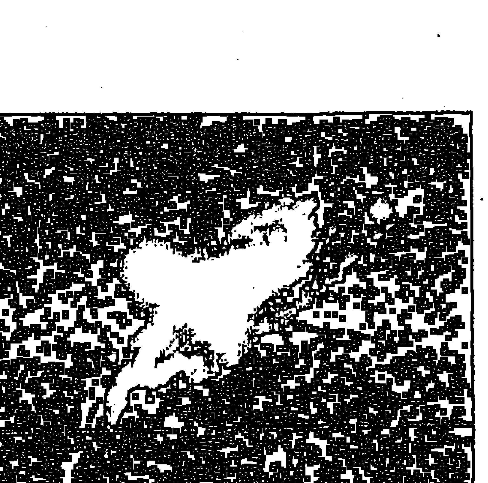
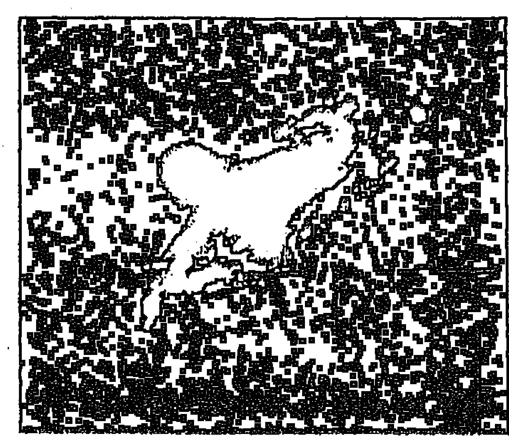
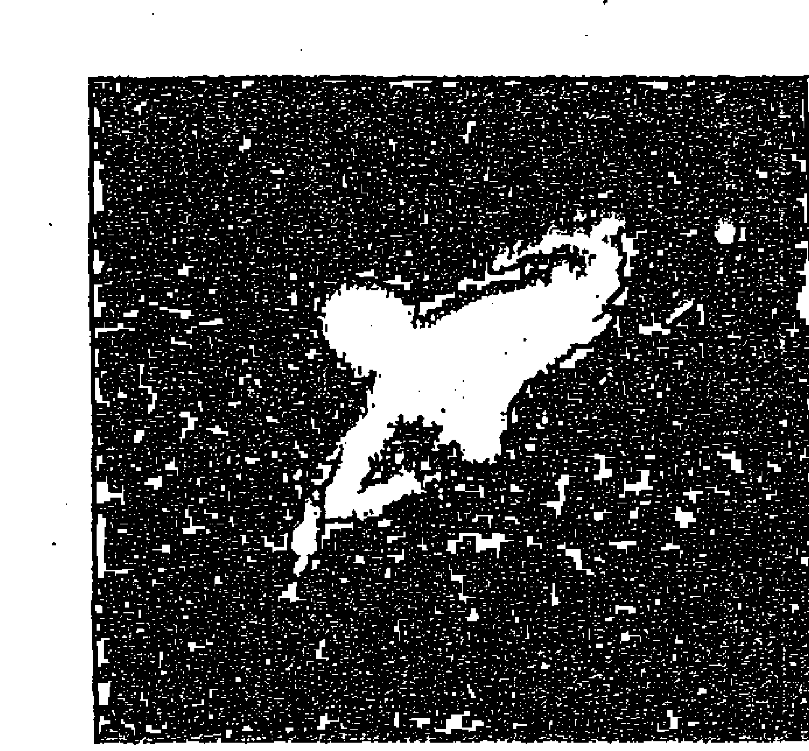
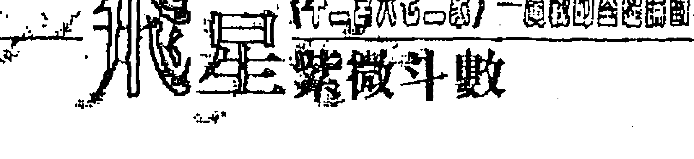

# 飞星紫微斗数十二宫

## 序言

飞星紫微斗数，精确有余，但易学难精。在帝王时代的愚民政策之下，多为秘而不宣的「宫廷绝学」；或之于道脉，也一直是属于修行人师徒的有缘相授而少有外传。直至清末民初，帝制倾灭、天地德新，而始流入民间。由于飞星紫微斗数易学难精、所遗民间资料又极其有限、钻研不易，因此坊间几无发扬其髓的『实务论断』著述，深阻后生之学。或有冠冕堂皇的古经典资料问世，但见高姿态的「学院派」论调，空虚名利，离知命尚有距离。因此，时至今日，坊间仍少有深入发微、落实论命见地的基本著作。

凡所有习四化论命不能登堂入室者，大多阻于「宫位」与「四化」间的「基本释象」不能明白，致差毫厘失千里，不得其门而入，令徘徊困惑者众。

有鉴于此，不揣固陋，谨以二十五年的玩命经验，竭尽智能而完稿于此「十二宫六七二象广义的基础论断诀」，祈以大助益于后学广大诸贤，能跨入基本门槛，利以修德习智。期尽绵薄之力而抛砖引玉，共襄薪传大举。免令中国的古大智慧绝学，断灭于无智的人性之私！

陋见以为，天地妙智是用以嘉惠苍生而非为私欲图利。因此，紫微斗数是属于『千秋万代子孙』的东西，不应藏私于己。人生于浩瀚宇宙间，虽数十寒暑，其比例上的微渺脆弱，与蜉蝣之朝生暮死并无太大差异，何能利欲熏心？苟若透彻于命理，当明白天地造化精确、果报毕缕分明，何德恃才傲物、利己存私？

江山万里，代有奇才承启，愿尽无私棉力了此薪传夙愿。蓦然回首，总是浑噩间鬓发日白，人生究竟有多少几何？陋见以为，生而能闻道，胜诸浓肥甘辛矣！

陋以不才、思维有限，必多所遗珠或曲释其象而不克竟意，尚盼高妙大德不吝赐正！

岁次丙戌年冬 梁若瑜 谨识

飞星紫微斗数的「四化」论断，有绝对的「理气」轨迹，它不是江湖术士嘴里的「神话故事」。从平面的十二宫六七二象基础论断诀，到「禄转忌」与「忌转忌」的交会串联，以及「禄、权」和「禄、忌」等，追寻手法相拱辉映，并以观得「忌」多寡之残伤程度，决定了格局的高低，让斗数命盘成了「立体」的整体释象。此复杂却精密的论断手法，非一蹴可及，但它是如此的朴实而迷人，就像棋局中的高手对奕—「风吹草动藏伏兵，柳暗花明村外村。」

## 飞星紫微斗数的「入门」

### 第一节 属于飞星派的《星曜释义》

飞星论命，主要的常用星曜仅十八。乃飞星论命是以命盘十二宫的「宫位」为轴，以「四化」为「用神」；需四化贯穿全局而后的「宫位」、「星曜」、「化象」三者并释的理气解象，得而「定格局」、「决休咎」。有别于「三合派」多如牛毛的满盘大小星曜、神煞，组合吉凶。

譬如紫微吉星入命而相貌堂堂的人，却何以迟迟不见其发达？乃四化而后始能见其格局之不佳故也。反之常见凶星坐命的人却获致大成就，皆因整体格局的四化得其吉会共荣故也。

紫微斗数的星曜象义，都出自于「封神榜」故事里的人物特质。如果有心研究紫微，最好先略读封神榜，建立些许概念，有助于理解与记忆，进而大裨益于日后的命盘释象。

#### （一）星曜象义

##### (1) 紫微：

五行「己土」。「伯邑」，周文王的长子。中天帝座，主尊贵。制化解厄、「消灾延寿」。故为「寿星」。

- 1. 珍奇古董。珠宝钻石。满天星錶。进口高级轿车。高级傢俱。高楼大厦。
- 2. 精密、高贵、高价位的物品。电脑。

##### (2) 天机：

五行「乙木」。「姜尚」（吕望），文王的军师。「益算之星」、化气曰「善」、曰「智」。运筹帷幄。

- 1. 聪敏、智慧。思考。企划。善缘。化禄，多变、多点子，不善实践；化「忌」，喜欢「钻研」，格局差，防「钻牛角尖」。
- 2. 禅定、冥想、哲学、命理。佛法。
- 3. 驿马星，迁徙、变动（天机主思想，变化快）。
- 4. 轴承、家庭五金、机车、一般进口轿车、轨道、小工厂、车库、汽车保养场、小机器。

##### (3) 太阴：

五行「癸水」。、「天机」兄弟主、「太阴」田宅主。、「癸水」柔情似水、感性、阴柔。阴：「小人」。夜晚、阴柔、女人、内助。太阴与「田宅主」：置产、储蓄、房地产。太阴与「癸水」：智慧、财星、流动财。阴：「小人」。

- 5. 应于人身：筋骨。精神、神经系统。手、趾、毛发〈乙木，肢体末稍〉。酸痛、失眠、神经衰弱、精神耗弱、精神病。
- 6. 花草、矮木〈乙木〉、盆栽。

##### (4) 太阳：

五行「丙火」。「比干」，纣王的忠臣。「光明磊落」、宽宏大量、「博爱」。

- 1. 日照天下，主光明、泛爱众〈博爱〉。无私，主政治。
- 2. 日出日落，主「驿马」，忙碌奔波。
- 3. 贸易、电话、传真、资讯、视讯、电视、电脑网路。
- 4. 代表能源、电力、变电所、发电机、大型电器设备。石油、马达、引擎。
- 5. 应于人身：主头、心脏〈人身主宰者〉、眼〈光明〉。头疼、晕眩、心脏病、血压、中风、栓塞、心血管疾病。
- 6. 主父、夫、子。

##### (5) 武曲：

五行「辛金」。「周武王」。「正财星」、「财帛主」，刚毅正直、主观、寡宿〈刚则孤寡〉。

- 1. 喜会贪狼〈偏财星〉，辰戌处对宫胜于丑未坐同宫。
- 2. 也代表银行、金融业、金银制品、纸钱、硬币、采购组、会计、出纳、税捐处。
- 3. 可以经营金属类的轻重工混合厂。
- 4. 应于人身：主胸〈乳房〉、肺、鼻子、牙齿、骨骼、结石〈发出声音及硬或浑圆的东西属金〉。

##### (6) 天同：

五行「壬水」。「周文王」。化气曰「福」〈福星〉，为「益寿星」。

- 1. 文王善卜，故主「卦理」及「方位学」〈罗盘、堪舆，阳宅学、阴宅学〉。
- 2. 美食〈福星，化禄主口福〉、餐饮业、俱乐部。
- 3. 大型综合医院〈福患病患〉。
- 4. 壬水〈阳水〉，主「流动」的水。大沟渠、池塘、自来水、食用水。

## 壹、飛星紫微斗數的『入門』

- 5. 「服務業」。
- 6. 應於人身：泌尿系統〈壬水〉、消化系統〈福星〉、免疫系統、內分泌、耳、墜腸疝氣。頻尿、盲腸炎。
- 7. 「壽星」。

## (6)廉貞:
五行「丁火」。費仲，紂王的奸臣。化氣曰『囚』，次『桃花星』。
- 1. 囚星—表犯罪、奸邪，是非多爭。官非、訴訟、罰單。軍警、法律。
- 2. 古書云：男浪蕩，女貪淫。近酒色、肉慾淫邪，娼妓。酒廊、夜總會、特種營業、娛樂界。
- 3. 音樂、歌舞、技藝〈也是『才華星』〉。
- 4. 偏財星，賭、投機。
- 5. 應於人身：丁火主『血液』，『循環、代謝系統』。容易婦女病〈婦科多血病〉、意外、血光、手術、受傷。燙傷、發炎、中毒、瘤、癌。花柳病。
- 6. 自化「祿」，容易流血。自化「權」，容易瘀血。自化「忌」，容易內傷。
- 7. 毒品、香菸。水果（解毒）。
- 8. 電腦、冰箱、洗衣機、冷（暖）氣機、飲水機、吸塵器、縫紉機、果汁機、吹風機等小家電。

##### (7)天府：
五行「戊土」。姜太后，紂王的賢德妻子。「祿庫」。主「大地之表」（天生萬物以養人）。
- 1. 可畜牧、養殖，山產、土產（譬如香菇、竹筍、地瓜、木耳、落花生、金針花）。
- 2. 好面子（擺場面）、講究衣著（女命可能愛裁縫、打毛線、逛百貨公司）。
- 3. 應於人身：主脾、胃（屬土）。

##### (8)太陰：
五行「癸水」。賈夫人，黃飛虎的妻子。「潔淨溫婉」，「玉潔冰心」。母性的「築巢慾」，故為「田宅主」。
- 1. 入田宅見「忌」，重視金錢（田宅為財帛的共宗六位）（忌入田宅—守成惜福）、房子乾淨。
- 2. 月出月落，主「驛馬」。
- 3. 主旅遊、大飯店、出租業（套房、計程車、遊覽車）。
- 4. 漂亮、乾淨：化妝品、清潔用品。服飾、裝飾品、飾物、整形、美容、美髮、室內裝潢。
- 5. 應於人身：征於女人的「月事」（二七天癸至）、眼睛（光明）、皮膚。中邪、陰氣（化忌）。
- 6. 家具、床、頂級名牌「進口轎車」、高級住宅（田宅主），化學品。
- 7. 主母、妻、女。

##### (9)貪狼：
五行「甲木」（氣屬甲木，體屬癸水）。妲己，千年狐精。名曰「桃花」（癸水）。主『修煉』（甲木），化氣『修行』（道家功夫）。
- 1. 主感情、酒、色。私生活不檢點、「桃花」、「偷腥」。
- 2. 「偏財星」（祿、權）、貪婪，「賭、投機」。
- 3. 「教化之始」（古之竹簡、冊—甲木制作），容易是「老師」、「文教」、「文化」工作者。
- 4. 才藝、文學、藝術、藝品〈骨董〉、烹飪、繪畫巧藝。
- 5. 「五術」—山、醫、命、相、卜。武術、養生術、神仙術、道家修煉功夫。
- 6. 「大樹」〈甲木〉，紮根於地，引喻為萬物的「根基」、「根本」。〈註：人之本：『教育』。宅之本：『建材』。物之本：『原料』。〉
- 7. 紙、木材、建材、原料、棺木。
- 8. 「壽星」〈狐精千年〉〈喜入「壽位」—子、午、辰、戌宮〉。〈註：子、午天地定位。辰、戌天羅地網。〉
- 9. 應於人身：主肝、腎。腳〈腿〉。
- 10. 主「動見觀瞻」〈人身健康〉的「精、氣、神」。〈抱元守一的道家修煉：煉精化氣，煉氣化神，煉神還虛〉。

##### (10)巨門：
五行「癸水」。姜太公的惡妻。伶牙利齒。「暗曜」，猜忌、疑惑、是非。在天『品萬物』，在地「司五穀」。
- 1. 化「忌」，主小人、是非、口舌、猜忌、疑惑、疑心暗鬼、邪念、意外、車禍。
- 2. 邪術、鬼魅、神壇、小廟、公墓、墳堆、陋巷、破宅、三叉路口、暗溝、下水道。麻將牌〈古以動物骨製〉。
- 3. 家門、門戶、戶口、戶籍。
- 4. 化「忌」，無執照的工作者、密醫、乩童、符仙、地理師、江湖術士、金光黨、竊盜、詐騙集團。
- 5. 西藥、小診所。
- 6. 「零食」，愛吃、胃口好〈品萬物之星〉。
- 7. 應於人身：食道、胃。化「忌」，瘤、癌、慢性病、藥罐子〈久病吃藥〉、中邪、陰氣。
- 8. 鐵道、運輸、卡車、國產車〈非高級〉。

##### (11)天相：
五行「壬水」。聞太師，紂王的忠臣。化氣為「印」〈主「權」，官職〉。司「衣食」，主「爵位」。
- 1. 瀑布、噴泉（非食用水）。
- 2. 手相、面相、摸骨、宅相、墳相、動物相。
- 3. 精緻美食。
- 4. 雞婆星、和事佬。
- 5. 痣星。

##### (12)天梁：
五行「戊土」。李天王，周營主帥，百戰不死。『蔭星』，『延壽星』。
- 1. 「蔭星」，又稱「父母星、老大星」。官員、警政、調查局、軍人、將官。
- 2. 「藥用植物」、中藥、中醫（會貪狼）、專科醫院（延壽）。
- 3. 大樹（蔭）、大樓、「別墅」、高級住宅。
- 4. 清高、格調、竹（高風亮節）、茶葉（品味）、蘭花。
- 5. 「膨風星」，言過其實。古書云：天梁「化祿」在「遷移」，巨商高賈。
- 6. 股票（長線）、證券、獎券、保險業（蔭）。（註：「短線」進出的股票為「賭」，偏於廉貞、貪狼，非天梁所屬。）
- 7. 壽星。

##### (13)七殺：
五行「庚金」。黃飛虎，紂王猛將，起義投周。化殺為『權』。『肅殺』之星，與『死亡』有關。主「勇猛果決」。
- 1. 恐怖類、蛇、蝎、蜈蚣、爬蟲。獅、虎。
- 2. 軍人、警察、軍隊〈肅殺〉。
- 3. 火車、聯結車、輪船、飛機場、火車站、軍區。
- 4. 重機械、大型五金、重工業〈如中鋼、中船〉。
- 5. 大型金融機構〈屬金〉。

##### (14)破軍：
五行「癸水」。紂王，暴君，商朝末代皇帝。主『破耗』。
- 1. 大海水，主水產、海產。
- 2. 運輸、海運、倉庫、貨櫃、貨櫃車、大拖車。
- 3. 玩具、消耗品。怪手〈破耗〉、建築業。
- 4. 市場、攤販、夜市、鬧區。
- 5. 貯藏室、垃圾堆〈髒亂〉。建築工地。

##### (15)文昌：
五行「辛金」。主「科甲」、「聲名」。
- 1. 正統文學。文章、書籍。
- 2. 支票、契約、證件、禮品、紙、筆、文具。
- 3. 護理工作、注射、「手術刀」。
- 4. 應於人身：支氣管、聲帶、斑點。精神、神經系統。
- 5. 驛馬星〈時系星—變換快〉，主變動。

##### (16)文曲：
五行「癸水」。主「才華」、「說話能力」。
- 1. 另類的文學、稗官野史、小說、雜誌。
- 2. 格局好則口才佳，化忌則嘮叨、口吃。
- 3. 人緣好、廣交際，感情較「多采多姿」。古書：「楊妃」好色，三合「昌曲」。
- 4. 泌尿系統，精神、神經系統。
- 5. 驛馬星〈時系星—變換快〉，主變動。

##### (17)左輔：
五行「戊土」。『助善』之星。
- 1. 秘書、參謀、幕僚。
- 2. 左右為旋，斡旋、圓巧。司機。

##### (18)右弼：
五行「癸水」。『助善』之星。『貴人』星。
- 1. 善解、機智、傳令。
- 2. 排難解紛、斡旋。司機。

## 第一節 屬於飛星派的《星曜釋義》

#### （二）星性補遺：
- 1. 「紫微」、「天相」、「天同」、「天梁」、「貪狼」都是『壽星』。主長壽。除貪狼屬「偏財」星外，餘皆為正財『俸祿星』。入命則多不發『少年人』。〈註：不論何曜，凡「忌」入「福德」三方者，多屬不發少年。以「遷移」見忌最顯。〉
- 2. 凡命格局少得『偏財星』者，以少大投資為佳。
- 3. 「驛馬星」：「天機」、「太陽」、「太陰」、「文昌」、「文曲」。凡『驛馬星』入命者，多有「夜貓子」的習性。晚歸、晚睡，日夜顛倒。
- 4. 「天同」、「天相」、「天梁」皆為「和事佬」。又可細分：天同一里長伯、天相一和事佬、天梁一公道伯〈古代制度〉。
- 5. 「武曲」、「七殺」的組合代表火車站、鐵路邊。
- 6. 「太陰」代表旅館、飯店，也代表套房、床。
- 7. 「天刑」是較小的狗，「破軍」大型的狗或馬牛。
- 8. 「巨門」會「天刑」，易習『邪術』；「貪狼」會「天刑」，易習『正術』。
- 9. 凡夫妻宮坐「天梁」星或「太陽」、「太陰」、「天機」、「巨門」等星曜「化忌」，婚姻容易「老少配」。
- 10. 五術：命理〈貪狼、天機〉。手面相〈貪狼、天相〉。堪輿〈貪狼、天同、天相〉。武術〈貪狼、武曲〉。養生術〈貪狼〉。醫〈貪狼、天梁〉。卜卦〈天同、天機〉。氣功〈貪狼〉。禪定〈天機〉。
- 11. 廉貪、貪狼兩「桃花星」皆主「才華、才藝」。
- 12. 天同、天相皆屬「流動的」水，但唯天同是可食用的水。
- 13. 天府為「祿庫」，雖不〈四〉化而隱含化「祿」；天相「印星」掌「權」，雖不化而含化「權」；七殺本來就俱化殺為「權」。

### 第二節 認識宮位的象義

#### （一）十二宮的四個三方：
三方的定義：三方是一體的，是缺一不可、共存共榮的「整體組合」。是力學上所謂的「三角剛體」的三組件，永遠結合在一起，分開它則「物不成器」、「無以為用」。
- (1)命三方：
    包括「命」、「財帛」、「事業」三個宮位。是顯像一個人身在紅塵的「生存方式」。也是一個人的『汲營』、『作為』宮。
- (2)田宅三方：
    包括「田宅」、「兄弟」、「疾厄」三個宮位。是顯象一個人的「身世」、「背景」、「宗族」、「家庭」、「親情」、「經濟」、「財富」、「健康」及「生活」的狀況位。是人生的『物質』、『守成』、『收藏』宮。或者可稱之為人生的『果實』。
- (3)福德三方：
    包括「福德」、「夫妻」、「遷移」三個宮位。是顯像一個人的「秉性」、「嗜好」、「天份」、「精神」、「因緣」、「際遇」、「根器」、「婚姻」等『因緣果報』而來的情事。也是顯示一個人『心靈沉浮』、『人生觀』、『價值觀』的宮位。是修行人的重要指標位。
- (4)交友三方：
    包括「交友」、「父母」、「子女」三個宮位。是顯象一個人的「情性」、「心智」、「學問」、「修養」，以及「忠」、「孝」、「慈」、「善」或「仁」、「義」、「禮」、「智」、「信」等等的『待人接物』與處世的『德行涵養』位。

#### (二)廣泛的十二宮『宮位涵義』:

##### (1)命宮:
- 1. 太極點、命盤「中樞」。也是萬變不離其宗的「宗」。
- 2. 偏向「精神」、「意志」、「思想」、「性向」的「我」，簡言之為「我」。
- 3. 顯象「個性」、「天性」與「思考」。
- 4. 表現「喜、怒、哀、樂」的感情抒發位。
- 5. 大伯〈叔〉父、祖母、外公位、大姨媽。

##### (2)兄弟宮:
- 1. 觀「手足之情」。
- 2. 現金的「收藏宮」，是「積蓄」、「銀行存款」的「經濟位」。也是家中的「保險庫」、銀行的「保險箱」。簡稱「財庫位」。
- 3. 「事業」的「共宗六位」，是看事業大小的「規模」位。
- 4. 合前二式，又稱兄弟宮為「成就位」。
- 5. 顯像「領導統馭」的能力〈得「權」照交友〉。
- 6. 是「疾厄」的九位「氣數」宮—「身體運」位，又稱「體質」位。
- 7. 也是顯象「物質生活」位。
- 8. 父母的婚姻—看「媽媽」的借宮之位。也是二伯〈叔〉父位。
- 9. 是「婚姻對待」〈財帛—夫妻的夫妻宮〉的田宅宮，也就是「主臥房」、「床」位。
- 10. 是因結婚而來的「岳〈翁〉」位、大姨子位。
- 11. 看小孩的「福份、嗜好」位〈子女的福德宮〉。
- 12. 「大哥〈弟〉」、「大女兒」位、二叔〈伯〉。

##### (3)夫妻宮：
- 1. 看『感情』、『婚姻』。也是「異性緣」宮。
- 2. 『少小限』的借宮之位〈主第二大限前的所有年歲〉。
- 3. 看因果「福報」中的『福份財』—福德的財帛宮。
- 4. 結婚『成家』—田宅的「共宗六位」。
- 5. 廚房〈疾厄的田宅—健康的收藏宮〉。
- 6. 出外的運氣位—「遷移」的九位「氣數」宮。
- 7. 看「體型」—疾厄的「田宅宮」。
- 8. 大舅、二哥〈弟〉位。
- 9. 兄弟的「經濟狀況」〈兄弟的兄弟宮〉。

##### (4)子女宮：
- 1. 看子息的「緣分」、「多寡」、「賢愚」。
- 2. 「性」〈疾厄的福德—身體的「享受」宮〉。
- 3. 「桃花」宮、「外遇」位〈逢桃花星〉。
- 4. 「再婚對象」位、「小老婆」位。
- 5. 「親戚」位〈是夫妻宮的下一宮—引申為因婚姻而來的人際關係位置〉。
- 6. 「妯娌」〈兄弟的夫妻宮〉、「二舅」、「大舅子」、「長子」位。
- 7. 「驛馬」位〈田宅的遷移—離家在外位〉。
- 8. 「意外」、「業力病」〈雙忌以上為破〉。
- 9. 看「小輩」、「下屬」、「學生」與我的關係。
- 10. 「合夥位」〈子女—交友的事業〉。
- 11. 「慈心」、「根器」、「善緣」、「福報」表現位。〈較屬後天修行機緣、環境牽引的性向緣〉。也是「德性」位。
- 12.「老運」、「晚景」位〈福德的共宗六位〉。
- 13.住宅入門的「玄關」。

> 註：「再婚」是以『子女宮』為『用』，但還是不能離開『夫妻宮、家庭宮』的『體』；如果體過分的差，再婚恐怕也依舊是不幸福。

##### (5)財帛宮：
- 1. 手邊的錢、與現金的緣份位〈與貧富沒有絕對關係〉。
- 2.「行業」、「賺錢的狀況」。
- 3.個人的「金錢觀」、「價值觀」。也是最容易令人引發『慾望』的宮位，故為父母—德行宮的共宗六位。
- 4.婚姻的『對待關係』〈夫妻的夫妻宮〉。
- 5.顯示父母的「健康狀況」、「情緒」位〈父母的疾厄宮〉。
- 6.「次子」、「二舅子」、「姪兒」位。
- 7.客房〈交友的田宅宮〉。

##### (6)疾厄宮：
- 1. 「命宮」的「共宗六位」—「肉體」、「身體」，也是「行為」的促成位。
- 2. 看「健康」狀況。看「胖、瘦」。
- 3. 顯示與人相處的「個性本質」位（疾厄—交友的福德）。
- 4. 看「習性」反應及個人的「活動量」。
- 5. 顯示「喜、怒、哀、樂」的「情緒」反應位。
- 6. 「家運」位（田宅的事業宮）。
- 7. 顯示「物質生活」位。
- 8. 店、辦公室、生產線、「工作環境」、「工作地方」（疾厄—事業的田宅）。
- 9. 父母的社會關係、地位、能力位（疾厄—父母的遷移）。
- 10. 顯示兄弟的金錢狀況（疾厄—兄弟的財帛）。
- 11. 「三子」、「大媳婦」位。

##### (7)遷移宮：
- 1. 形於外的「外表」、「模樣」。「表象宮」。
- 2. 「社交」、「活動（力）」、人生的「舞台」、顯象『身份』、『地位』、『器宇』。
- 3. 『驛馬』位。非特定對象的廣大『人氣位』。
- 4. 因果裡頭人生『因緣』、『際遇』的果報位。
- 5. 人生經驗、視野、判斷、應變、智慧的『學習位』、成長的『歷練位』。人生的『價值觀』位。
- 6. 阿賴耶意識裡頭的『天份』、『才華』、過去世的特殊經驗，以及修行人『善緣』、『根器』、『智慧』的提升位，和『放下』、『自在』位。
- 7. 與『意外』、『災難』、『因果病』有關。
- 8. 兄弟的『健康狀況』、『情緒』位（兄弟的疾厄宮）。
- 9. 配偶的『金錢狀況』位（夫妻的財帛宮）。
- 10. 『二媳婦』、『長孫』位。
- 11. 『老運』、『壽限』位（福德三方主果報）。
- 12. 庭院、門外。

##### (8)交友宮：
- 1. 『婚姻狀況』的『指標』位（交友—夫妻的『共宗六位』）。
- 2. 配偶的「健康狀況」、「情緒」位〈交友—夫妻的疾厄宮〉。
- 3. 兄弟的「地位」、「能力」、「形象」表現位。
- 4. 「有緣接觸」的「人際狀況」位。「人氣」位。
- 5. 「競爭」、「考運」位。
- 6. 「人性」的「情」與「義」，待人處世的表現位。「心胸器量」位。
- 7. 父母的工作。
- 8. 顯示子女的「金錢狀況」宮位。
- 9. 行善、佈施的「積德」位〈福德的田宅宮〉。
- 10. 家庭中的「佛堂」、「神龕」位〈福德的田宅宮〉。

##### (9)事業宮：
- 1. 「運氣位」〈九數為陽之極，「化氣」流行〉。
- 2. 「工作」、「行業」，賺錢的「方式」。
- 3. 配偶的「形象」、「能力」、「社會地位」表現位〈夫妻的遷移宮〉。
- 4. 婚外情〈桃花星〉〈夫妻的遷移—婚姻之外的感情位〉。
- 5. 顯示子女「健康狀況」、「情緒」的宮位〈子女的疾厄宮〉。
- 6. 祖墳〈福德的「福德」位，福德也代表個人「先天因果」及身後歸宿—「墳」〉。
- 7. 書房、書桌〈父母的田宅宮〉。

##### (10)田宅宮：
- 1. 宗親、「家族」、「家世」、「出身背景」。
- 2. 「家庭」、天倫、親情。
- 3. 「財富」的「收藏宮」—「財帛」的「共宗六位」〈含動產、不動產、有價證券、珠寶鑽石、珍貴藝品、銀行存款、現金——一切的有價物〉。簡稱「財富」、「財庫」位。
- 4. 居住環境〈含鄰居相處〉。物質生活。
- 5. 客廳。
- 6. 歡樂宮〈天倫樂、男歡女愛〉。
- 7. 父母的「嗜好」、「興趣」位〈父母的福德〉。
- 8. 小孩的「地位」、「能力」、「形象」表現位。
- 9. 「祖上」、「祖德」位〈福德的前一宮〉。
- 10. 「二姑媽」位。

##### (11)福德宮：
- 1. 累世「因果」位，「果報」位。
- 2. 「秉性」、「嗜好」、「興趣」、「享受」位。
- 3. 看「壽限」、「晚景」位。
- 4. 反應「精神」、「感受」（喜、怒、哀、樂的表現位）。也主導「健康與病痛」（果報）。
- 5. 「品味」、「內涵」，以及修行人的「善緣」、「根器」，和「放下」、「自在」、「智慧」位（精神面的提升）。人生的自我「價值觀」位。
- 6. 「身後」歸屬儀式場的「哀榮」場面，以及託後的「棺、墳」。
- 7. 「金錢」、「欲望」的表象宮（財帛的遷移宮）。個人的物質偏好宮。
- 8. 「祖父」位。
- 9. 「飯廳」（享受位）。
- 10. 配偶的工作（夫妻的事業）。
- 11. 「情感、情緒」的抒發位。
- 12. 「大姑媽」位。

##### (12)父母宮：
- 1. 『父母』、『長者』、『長輩緣』、『上司』。
- 2. 「修養」、「內涵」、「氣質」等形於色的『表象』位，也稱之為『相品宮』、「修養位」。
- 3. 學歷、讀聖賢書、做人、知識、常識的『學習位』，也稱之為『光明宮』。
- 4. 引申為處理一切文件的『文書宮』。
- 5. 外〈夫〉家的「家庭狀況」位。
- 6. 子女的工作。
- 7. 遷移的「共宗六位」—社會的『道德規範』位。
- 8. 百善『孝』為先的『積德』位。
- 9. 父母者，庇蔭於我，引申為『政府機關』。
- 10. 父母者，交友之財帛宮，引申為『銀行』、「互助會」、「私人借貸」等與人『金錢往來』位。
- 11. 「二姨媽」位。

> 註：人間諸多禍端多出於「財與色」。故應於命盤十二宮，財帛為父母〈涵養宮〉的共宗六位；子女為福德〈積德〉的共宗六位。

### 第三節 四化的認知

#### （一）認識祿、權、科、忌：

太極生「兩儀」〈陰、陽〉，兩儀生「四象」〈少陽、老陽、少陰、老陰〉。四象者，最簡單的比方就是我們生活中所看到的「春、夏、秋、冬」。

從「春天」來了百花開、種子萌芽、老樹發新枝開始，自然界充滿了「生發」、「希望」，人們也於是開始忙碌於一年之始的春耕。到了「夏天」，萬物已經「茁壯」、「旺盛」，人們愉快的看到了果實。進入「秋天」，秋風落葉、滿天的肅殺之氣，這是自然界「見盛而制」的法則，人們也忙於用利器〈屬金〉收成，稻穀盈倉。到了「冬天」，千山鳥飛絕、萬徑人蹤滅，萬物「蟄伏」，人們也「收藏」過冬，休息是為了走更遠的路。

春夏秋冬週而復始，年復一年。因此：

- 1. 「春天」花開葉綠，是屬「木」旺的季節。
- 2. 「夏天」烈日炎炎，是屬「火」旺的季節。
- 3. 「秋天」肅殺滿天、葉落枝枯，是屬「金」旺的季節。
- 4. 「冬天」滿天霜雪、萬物蟄伏，是屬「水」旺的季節。

氣之流行而「在天成象」。古來的許多智慧都緣於「道法自然」，因此，斗數的「四化」即為「法」自然界的『四象』而來。也就是說，斗數的「四化」就是自然界的四象—『春、夏、秋、冬』。

茲將四化歸類，以便容易理解、記憶：

（1）「祿」：是『少陽』也是「春天」，是屬『木』旺之象，萬物『希望』、「生發」。綜合象義為：
- 1. 喜悅、吉慶、美好、輕鬆、順暢、樂觀、隨緣、逍遙、自在、親和、圓融。
- 2. 福氣、希望、機會、光明、健康。
- 3. 年輕、初始、原因。
- 4. 浪漫、情感、綺思、美夢、幻想。
- 5. 享受、滿足、散漫、懶惰、肥胖。
- 6. 大的、新的、多的、好的。

（2）『權』：是『老陽』也是「夏天」，是屬『火』旺之象，萬物『向旺』、『茁壯』。綜合象義為：
- 1. 自信、主見、企圖、抱負、積極、慾望。
- 2. 領導、開創、拓展、突破、結實、壯大、權力、地位。
- 3. 主觀、能力、應變、果斷、剛毅。
- 4. 膽識、行動、運動、強硬、自大、霸氣、尖銳、爭鬥。
- 5. 大的、新的、多的、好的。

（3）『科』：是『少陰』也是「秋天」，是屬『金』旺之象，萬物「肅殺」，大自然的見盛而制。聖人則之而制『禮教』，生『文明』。綜合象義為：
- 1. 名聲、科甲。
- 2. 貴人、轉圜、緩和。
- 3. 謙和、文質、書香、斯文、秀氣、俊美、小巧、精緻、優美。
- 4. 優柔、猶豫、做作、矯飾。
- 5. 大小適中。

（4）「忌」：是『老陰』也是『冬天』，是屬『水』旺之象，萬物『蟄伏』、『收藏』，等待新的希望。綜合象義為：
- 1. 憨厚、拙機、率真、耿直、忠貞、義氣、惜情。
- 2. 收藏、固守、守成、小器、安定、成果、結果。
- 3. 執著、固執、煩惱、憂傷、欠債、勞碌。
- 4. 小人、是非、仇恨、憤怒、痛苦、辛苦、忍耐。
- 5. 貪慾、癡迷、憎恨、妄念、邪思、自私。
- 6. 室礙、狹隘、小心眼、畏縮、屈就、陰暗、髒亂、醜陋、破舊。
- 7. 小的、少的、老的。

> 註：勿見『祿』而言善，多祿反而『逍遙無志』；勿見『忌』而言凶，『擇善固執』乃得其忌而所以成就。多『權』還防『霸氣』，多『科』反生『便柔』。

> 註：四化為象，故「祿、權、科、忌」為化『象』，而非屬「星曜」。

> 註：坊書云：「多忌」反「不忌」，荒謬矣！以『一忌』坐守，為「守成」或「欠債」、「付出」、「勤勞」（紅塵的當然耳事）。『雙忌』同宮或兩對宮，為「破敗」之始。『三忌』同宮或兩對宮，則「大勢不妙」。『四忌』同宮或兩對宮，常面臨「生死」、「去留」。

> 註：譬如交友坐生年忌而我財帛飛祿以入，則「祿、忌」呈『雙忌』之失。反之，如交友坐生年祿而我財帛飛忌以入，則「祿、忌」呈『雙祿』，週轉方便支出多。得失全視「宮位」而定。

> 註：
> A.「單忌」之吉凶全視坐守之「宮位」而定。單忌落「命三方」和「田宅三方」不能論之為「失」。單忌落「交友三方」和「福德三方」始約可言其為「失」。
> B.「雙忌」以上不論落於何宮，都屬「破敗」之始。

#### （二）十天干的四化：

干為「天」，支為「地」。有所謂氣之流行〈因時間流轉而變化〉，而在天成「象」，在地成「形」。四化為象，必倚天干而化；不同的天干，衍生出了不同的化象。

| 化祿／化權／化科／化忌 |
| :--- |
| 甲干： 廉貞 破軍 武曲 太陽 |
| 乙干： 天機 天梁 紫微 太陰 |
| 丙干： 天同 天機 文昌 廉貞 |
| 丁干： 太陰 天同 天機 巨門 |
| 戊干： 貪狼 太陰 右弼 天機 |
| 己干： 武曲 貪狼 天梁 文曲 |
| 庚干： 太陽 武曲 太陰 天同 |
| 辛干： 巨門 太陽 文曲 文昌 |
| 壬干： 天梁 紫微 左輔 武曲 |
| 癸干： 破軍 巨門 太陰 貪狼 |

> 註：或有坊書云：庚干天同化科、太陰化忌，不確。以星配卦及納甲理則，「庚」干必為「太陰化科」、「天同化忌」。

### 第四節 論事手法所運用的必要宮位

切記！『命宮』為『絕對太極』。無論任何事的推斷，均不得忽略『命宮的四化』。『命宮四化』乃天赋性格所造就的吉凶，其力等同於「生年四化」的影響一生，必須同載其化於原始命盤中。

- （1）論感情：
  - 1. 以「夫妻宮」立太極。
  - 2. 「交友宮」〈對象〉。
  - 3. 「福德宮」〈表現情緒〉。
  - 4. 可參酌「田宅」、「父母」、「遷移」、「疾厄」。
  > 注：也可直接尋「廉貞」、「貪狼」二星曜。不論入何宮都約主「感情」、「情欲」的事。

- （2）論結婚：
  - 1. 以「夫妻宮」立太極。
  - 2. 「田宅宮」〈成家〉。
  - 3. 「父母宮」〈因婚姻而得的家庭〉。
  - 4. 可參酌「福德」、「疾厄」、「交友」。

- （3）論離婚：
  - 1. 以「夫妻宮」立太極。
  - 2. 「田宅宮」〈拆散家庭〉。
  - 3. 「父母宮」〈文書宮〉。
  - 4. 可參酌「福德」、「疾厄」〈表現情緒〉、「交友宮」。

- （4）分房、床、分居：
  - 1. 以「夫妻宮」立太極。
  - 2. 「交友宮」〈配偶的身體〉。
  - 3. 「疾厄宮」〈我的身體〉。
  - 4. 「兄弟宮」〈房間、床〉。
  - 5. 「田宅宮」、「父母宮」〈不同房子〉。
  - 6. 可參酌福德宮〈表現情緒〉。

- （5）官非、入獄：
  - 1. 以「父母宮」〈文書宮〉立太極。
  - 2. 以「事業宮」〈運氣位〉、「遷移宮」〈福運、社會〉為「用」。
  - 3. 以「命」、「福德」、「疾厄」〈情緒反應位〉為「用」，凡見『廉貞忌』入上三宮者官非纏身，多忌成破者入獄或死刑。

- （6）病痛：
  - 1. 以「疾厄宮」立太極。
  - 2. 「福德宮」〈福份〉。
  - 3. 「兄弟宮」〈身體運〉。
  - 4. 須參酌「遷移」〈福運〉、「子女」〈福德共宗六位〉。
  > 註：瘤、癌則需尋「巨門」〈暗曜〉、「廉貞」〈毒素〉二星曜。癌症須集三～四忌的大破敗。

- （7）死亡：
  - 1. 以「福德宮」立太極。
  - 2. 「疾厄宮」〈健康狀況〉。
  - 3. 「遷移宮」〈福運〉。
  - 4. 可參酌「兄弟」〈身體運〉、子女〈福德共宗六位〉。
  > （須集合四忌或以上的交集沖破）。

- （8）意外、因果病：
  - 1. 以「遷移或福德宮」兩立太極。
  - 2. 「疾厄宮」〈健康狀況〉。
  - 3. 「子女宮」〈福德共宗六位〉。
  - 4. 可參酌「兄弟」〈身體運〉。

- （9）定命格（窮、通）：
  - 1. 以「田宅三方」為主〈收藏宮〉。
  - 2. 以「福德三方」為主〈福份〉。
  - 3. 以「命三方」為輔〈盡人事〉。

- （10）論際遇：
  - 1. 以「遷移宮」立太極。
  - 2. 「福德」〈福份〉。
  - 3. 「命三方」〈盡人事〉、「交友三方」〈人際損益〉。

- （11）論守成與安定：
  - 1. 以「田宅三方」為主〈收藏宮〉。
  - 2. 「命三方」為輔〈盡人事〉。

- （12）驛馬：
  - 1. 以「遷移宮」立太極。
  - 2. 「疾厄宮」〈身體〉。
  - 3. 「田宅宮」〈住所〉。
  - 4. 可參酌「父母」〈遷移共宗六位〉、「子女」〈驛馬位〉。

- （13）搬家：
  - 1. 以「田宅宮」立太極。
  - 2. 「遷移宮」〈驛馬位〉。
  - 3. 「子女宮」〈驛馬位〉。
  - 4. 「疾厄宮」〈住宅運〉。

- （14）置產：
  - 1. 以「田宅宮」立太極。
  - 2. 「財帛宮」、「父母宮」〈金錢與貸款〉。
  - 3. 「兄弟宮」〈經濟位〉。
  - 4.「疾厄宮」〈財產運〉。
  - 5. 可參酌「福德」、「遷移」〈福份－得助置產〉。

- （15）社會地位：
  - 1. 以「遷移宮」立太極。
  - 2. 「交友宮」〈人際位〉。
  - 3. 「兄弟宮」〈實力位〉、〈遷移為兄弟的共宗六位〉。
  > 注：欲其遷移之「權」入我「命三方」或「田宅三方」得交友之「祿」入相交拱。

- （16）競選：
  - 1. 以「遷移宮」立太極。
  - 2. 「交友宮」〈競爭位〉。
  - 3. 「兄弟宮」〈實力位〉。

- （17）升遷：
  - 1. 以「父母宮」立太極。
  - 2. 「交友宮」〈競爭位〉。
  - 3. 「遷移宮」〈際遇位〉。

- （18）考試：
  - 1. 以「父母宮」立太極。
  - 2. 「交友宮」〈競爭位〉。
  - 3. 喜「福德宮」、「遷移宮」與父母宮祿、權交拱。

- （19）演藝界：
  - 1. 以「遷移宮」立太極。〈遷移亦主才華〉。
  - 2. 「交友宮」〈觀眾〉。
  - 3. 「福德宮」〈才華〉。

- （20）論子息多寡：
  - 1. 以「子女宮」立太極。
  - 2. 必觀「田宅宮」〈家庭旺衰〉。
  - 3. 「福德宮」〈福分〉。

- （21）天份、根器：
  - 1. 「福德宮」為主。
  - 2. 「遷移宮」為主。
  - 3. 「命宮」。
  - 4.「疾厄宮」。

- （22）愛生氣、鬧脾氣與愉快、好脾氣：
  - 1. 「命宮」、「福德宮」、「疾厄宮」坐「忌」。
  - 2. 「命宮」、「福德宮」、「疾厄宮」化「多忌」入「遷移」、「父母」宮〈形於外〉。
  - 3. 上二式將「忌」易為「祿」，即得「愉快、好脾氣」。

- （23）幼稚、少根筋、城府淺、意志不堅、精氣神不足或行拂亂所為：
  - 1. 「遷移」、「父母」兩宮〈形於外〉多見「忌」破者。

> 註：以上條例，僅為『原則性』的論斷法則。通常實例論命，須以盤中論事必要宮位的「化象走勢」，順勢導入「流動的動盤」，用以下斷吉、凶應驗之限、歲。

> 註：上項皆為平面敍述，學者尚須深入「祿、忌」皆應『轉忌』的抽絲剝繭手法，始能得心應手。

## 貳 《十二宮六七二象》基礎論斷訣

（此處為圖片占位符：）

### 飛星紫微斗數

#### 圖。《十二宮六七二象》宮位論題詮

飛星紫微斗數的解讀命盤，在未涉及星性釋義之前，任何「單宮」的「自化」到「兩宮位間」的「互化」，即存在於它們特有的象義。也就是說，宮位和四化就已先決的塑造了「釋象的方向」；宮位之間的不同，其四化的象義必然有不相同結果的解讀。

解讀命盤時先有了「釋象方向」的定位，而後再加上星曜質性的綜合論述，庶幾得而圓滿少失。然命盤宮位僅十二，而世間「人事問題」卻存在於難以想像的紛雜，故宮位和四化的釋象，必定是「廣泛」而「靈活」的，因此需要：

- 1. 每一宮位的「平面」定義到該宮深層的「活盤」意義，必先瞭然於胸，然後才能「立體化」的交織化象。
- 2. 「廣義」的思考、「生活化」的闡釋「祿、權、科、忌」象義於各宮位之間。令「喜、怒、哀、樂」能『貼近生活』的躍然於紙上。

凡所有習飛星四化多年而難以登堂入室者，多困惑於宮位與四化釋象的基本環節，致令無法深入其髓。於基本概念認識不足的情況下，拼湊出來的答案常左其本義，甚或離經逆道，其結果多令求算者不能苟同或者啼笑皆非。

譬如，「命宮」飛祿入「事業宮」，我們稱之命宮為「化出」宮，而事業宮則為「化入」宮。此象我們又簡稱為：「命祿入事業」。

兩宮之化而產生了對待關係，以對待立場而言，化出之宮我們約可稱之為「因宮」，而化入宮則約可稱為「果位」。一切的人事現象與吉凶休咎，都不會離開「因果」的範疇。

「靜盤」（本命盤或稱天盤、太極盤）的存象未可即言吉凶，因歲月流轉而有了「動盤」（大限、流年...等時間盤），有了動盤的契應，於是乎產生了吉凶消長。

吉凶休咎生乎動，乃「動」而生（四）「化」，化而後生「象」，然後以象判吉凶。恰如一年之間，因時間流轉（動）而有了「春、夏、秋、冬」四象，因象的變化而產生了希望（祿）、壯盛（權）、收成（科）、蟄伏（忌）等不同的人事現象。

當命盤某宮的飛化現象產生了符合大自然法則的合諧或不符合大自然法則的窒礙，吉凶休咎於焉而判。

#### （十二宮太乙數）一開篇的宏觀問題

當動盤〈用〉牽動而契應本命靜盤〈體〉時，產生『對待化象』，而生吉凶。也就是說，靜盤本具有的某一化象，於不同時間點〈大限、流年...的不同），不同的人事狀況之下當然產生了不相同結果。舉例來說：

我們知道，父母、命宮、兄弟三宮在關係上是至親的宮位。設本命盤的夫妻宮化祿入命，則：

行於第二大限時，我們稱之為本命夫妻祿入大限的兄弟〈大限順行〉或大限的父母〈大限逆行〉；不論兄弟或父母都屬至親宮，因此可以大膽推測此夫妻祿入本命於第二大限時，必然開始春風吻上臉的有了情緣機會。換至第三大限時，則為本命夫妻祿入大限的夫妻〈大限順行〉或大限命宮〈本命夫妻〉祿入本命命宮〈大限逆行〉，此刻在對待關係上是直接契入了當事宮位，情緣當然必更臻成熟矣！

如若某宮位所演化的化星還是落在「本宮」〈沒有飛入他宮〉，此象我們稱之為本宮『自化』。本宮自化亦存在於它特有的象義。

譬如命宮所化的祿星，此星曜仍坐於本命宮，此象我們稱之為：命宮自化「祿出」，簡稱「命宮自化祿』。

其餘化權、化科、化忌於本宮，皆倣此呼其名象。

凡『自化』稱之為『出』者，其義：
- 1. 「於情於性」：容易用情於當下，事後多所「漫不經心」，雖看似自在卻「少了原則性」。亦或「空乏自恃」、「優柔矛盾」、「耐性不足」、「不了了之」、「不能記取教訓」等等缺失。凡所有缺失都緣於少了『擇善固執』的「理性」與「執性」。
- 2. 「於事於物」：無中生有〈自化祿〉、空張聲勢〈自化權〉；或悠悠人事，若有似無〈自化科〉，甚或頑空自滅、有也變無〈自化忌〉。少有大局觀，終究經不起衝擊、考驗。

乃「自化」者，即存義於本宮的『自我消散』。尤以「自化祿出」及「自化忌出」存在危機較重。自化祿出有如金錢露白，容易遭劫；自化忌出則本宮自我的暗耗或消散，終究屬虛。

易以修行立場引喻，自化〈出〉的隨緣、放下、空無，多屬渾噩的「無明受覺」，離開了智慧與明白，非屬明心見性的妙有真空！

『體』與『用』須分明，否則其釋象將荒漫散亂。何為「體」與「用」？

「體」者，本命「命盤十二宮」；「用」者，指論事時必要的「下手宮位」。譬如問兄弟事，當以兄弟宮為用，而本命命盤十二宮則為體矣。設兄弟宮化忌入遷移，則該解釋為我兄弟耿直憨厚。此即兄弟宮所飛化的忌之落點宮，此宮仍需歸回於命造本體的遷移宮去解釋象義。這就是所謂『回歸太極』的釋象法則。

也就是說以「化出」的宮位為「用」，而「化入」的宮位須歸回原命盤的本「體」宮位去釋義。如果用不歸體，上式則可能解釋成兄弟化忌入兄弟的疾厄，那豈不就成了兄弟的個性勤快勞碌嗎？荒腔走板矣！

「用」之所化必須歸回於「體」的『回歸太極』釋象，是飛星四化論事手段的不二法門。

斗數是探究人生的智慧之學，其學理契應於人事現象，是屬於『邏輯觀念』下的思考解象，而不能以數學的加減乘除來計算其結果。乃「四化」本身即為涵義廣泛的「符號」，可以當它是某一範圍〈方向〉的『能量值』，而決不等於數學上的定值『數字』。

學習四化釋象，當亟須用心於四化與宮位間的斟酌。苟若基本象義既已不清，其飛化結果終將致滿盤混沌，因噎廢食於未求甚解之始也！

以下飛星四化十二宮『六七二訣』，僅以公式化的立場而言，純屬單一方向的論述。如下述所化碰撞他宮飛來的四化或與生年四化相交會，其象義將可能產生重大變易。

況且，論命是『縱觀全局』的評估，而不是以任何單一化象即能作斬釘截鐵的結果論，以免失之於以偏概全。

#### 十二宮『六百七十二象』者：

- 1. 十二宮「互化」的四化「對待」象義（12乘12乘4等於576象）。
- 2. 十二宮「自化」的象義（12乘4等於48象）。
- 3. 「生年四化」入十二宮的象義（12乘4等於48象）。

總計：672象

### 第一節 生年四化入命盤十二宮的象義

#### （一）命宮：

- （1）生年祿入命：
  - 1. 主『福』。一生少憂，衣食無虞。處世較平和。
  - 2. 「通情達理」，隨緣「不固執」。多「好心情」、「好情緒」，令人愉悅。也較「隨遇而安」。
  - 3. 「不記恨」，「好相處」。『人緣好』（命宮—交友的共宗六位）。好情緒。
  - 4. 主「婚姻」、「家庭」乃至與「父母」、「子女」間的容易相處融洽（命宮為夫妻的福德宮）。
  - 5. 父母經濟『不虞匱乏』（命宮—父母的兄弟宮）。

- （2）生年權入命：
  - 1. 「主觀」、主見、「自我」、自信。
  - 2. 容易不虛心、防「自以為是」、「自恃甚高」。
  - 3. 性「剛」、任性（權沖遷移，不能圓滿）。
  - 4. 格局好，掌權、能幹、積極，可以「開創」。
  - 1. 加『忌』則『剛愎自用』，秀才遇到的『兵』。
  - 2. 父母『經濟好』。

- （3）生年科入命：
  - 1. 長相『斯文』、『秀氣』。
  - 2. 個性較為溫文、少戾氣。

- （4）生年忌入命：
  - 1. 『執著』、『固執』、偏執狹隘，難溝通。
  - 2. 容易『記恨』、『煩惱』、『生氣』、小心眼。
  - 3. 『貪』、『嗔』、『癡』，防入死胡同不自知。
  - 4. 具『業力』，人生多了點『煩心勞苦』。
  - 5. 防『猜忌』、『疑心生暗鬼』、『是非不明』。
  - 6. 『人緣較差』。防氣度、器量不夠大。少交遊。
  - 7. 防糾纏『宿疾』、長久的『毛病』〈業力〉。

> 註：忌入命為個性『閉斂』於內，不能敞開心胸。遇事情容易自我『多思慮』、『煩擾』；格局差者，甚或『焦躁』、『自閉』。最愛得『福德、遷移、子女』飛『祿』〈因果之善〉入命來會，可轉成『擇善固執』。否則內〈家〉外緣皆差。

#### （二）兄弟宮：

- （1）生年祿入兄弟：
  - 1. 兄弟平順如意、兄弟是「我福」。
  - 2. 兄弟好相處，『手足情深』。易兄弟多於姐妹。
  - 3. 一生事業、金錢多順少逆〈兄弟宮—成就位〉，利於「升遷」、「創業」〈會「權」尤顯〉。
  - 4. 『人氣旺』，不寂寞，身邊不乏朋友〈兄弟宮—交友的遷移位〉。
  - 5. 體質少病〈兄弟宮—身體運位〉。
  - 6. 母緣佳。
  - 7. 主臥房大、盡眉樂。

> 註：兄弟宮也是『經濟狀況』位，得祿則經濟佳、遇轉容易。縱令山窮水盡也很快「柳暗花明」。

- （2）生年權入兄弟：
  - 1. 兄弟容易「有主見」、「有成就」。
  - 2. 容易上有「兄長」。
  - 3. 我也容易事業、金錢有成〈會「祿」尤順〉。
  - 4. 領導能力、〈權沖交友〉。
  - 5. 體質強（兄弟宮—身體運位）。

### 第一節 生年四化入命盤十二宮的象義

#### (3)生年科入兄弟：
- 1. 兄弟文質。
- 2. 收入不多，但「理財」有計劃、收支平衡。
- 3. 宜上班安穩。
- 4. 養生、健檢。

#### (4)生年忌入兄弟：
- 1. 收入不高或支出多，生活須「儉約」。
- 2. 多為「上班族」或現金「小生意」者。
- 3. 「守成」、「安定」、「顧家」。「內斂」。
- 4. 「事多躬親」、老闆兼夥計。
- 5. 朋友不廣交，喜歡「內斂」、清靜〈沖交友〉。
- 6. 女命容易是「職業婦女」。
- 7. 命格佳，「積沙成塔」。
- 8. 容易是「長子」〈為兄弟付出〉。
- 9. 兄弟較執著不好溝通或手足情較薄、成就不高。
- 母個性也較煩惱多憂。

### 飛星紫微斗數
### 《十二宮六七二局》——飛星紫微斗數
#### (三) 夫妻宮：
##### (1)生年祿入夫妻：
- 1. 『異性緣佳』、『婚姻〈異性〉得福』。
- 2. 容易「感情早動」、「早婚」。
- 3. 或我『多情』，容易「桃花」、「齊人之福」〈桃花星〉。祿為福，當然外遇也較少出紕漏。
- 4. 婚後『較多如意』。
- 5. 一生工作運較如意〈祿照事業〉。
- 6. 「少小運」平妥無礙（第二大限前的所有年歲曰「少小限」）。
- 7. 一生花用的金錢順遂〈夫妻—『福德的財帛宮』〉。
- 8. 配偶「通情達理」、好相處、好商量。
- 9. 逢「偏財星」，投機、中獎。

##### (2)生年權入夫妻：
- 1. 配偶『主見性』強，但防容易起「爭執」。
- 2. 我工作運強〈權照事業〉。
- 3. 少小運平妥無礙（第二大限前的所有年歲）。
- 4. 逢「偏財星」，投機、中獎。
- 5. 一生金錢多順遂〈夫妻一福德的財帛〉。
- 6. 一生工作運較如意〈權照事業〉。

##### (3)生年科入夫妻：
- 1. 配偶文質、秀氣。
- 2. 或配偶「家世較單純」。
- 3. 容易「藕斷絲連」的感情。

##### (4)生年忌入夫妻：
- 1. 配偶『執著』，不易溝通。或病災急難之累。
- 2. 「執著於情」，防『遇人不淑』。晚婚為宜。
- 3. 欠婚姻債，防諸多「波折」、「乖違」。
- 4. 不利於桃花、婚外情，慎防『感情債』〈破財或身敗名裂〉。
- 5. 勿賭、投機〈福分財不厚〉。
- 6. 婚後適合單純的『小家庭』。
- 7. 『欠婚姻債』，縱令離婚也必經「拖磨」煩累。
- 8. 適合上班安穩或現金生意〈沖事業〉。
- 註：凡『福德三方』見『忌』者，福之不足，都不適合做『投機』生意與『賭』。

#### （四）子女宮：
##### （1）生年祿入子女：
- 1. 容易「得子息」、多生兒子。但防「寵」小孩。
- 2. 有『子福』，小孩比較不會學壞、也不容易出敗家子。
- 3. 親戚多往來〈子女宮—親戚位〉。
- 4. 比較多「合夥機會」，『合夥容易賺錢』。
- 5. 防桃花〈桃花星〉。
- 6. 『驛馬』。離家機會多，或喜歡往外跑。
- 7. 容易『遇難呈祥』、『晚景』好，有依靠、好情緒〈子女—福德的共宗六位〉。
- 8. 小輩緣厚，喜歡小孩。也容易有『忘年之交』。
- 9. 宜「向外求財」〈『祿』者為福，『福』落於田宅之外〉。

##### （2）生年權入子女：
- 1. 格局好，子女『主見強』，格局好容易獲成就。
- 2. 格局差，小孩個性強而不好教，管教需費神。
- 3. 子息緣旺。
- 4. 『合夥容易有成』。
- 5. 宜「向外求財」。
- 6. 「晚景」好。生命力較「強韌」。

##### (3)生年科入子女：
- 1. 小孩文質、秀氣。
- 2. 小孩較「乖巧」。

##### (4)生年忌入子女：
- 1. 小孩「固執」，不好溝通。
- 2. 「欠子債」，防小孩沒出息、不聽話或健康乖違、欠安。
- 3. 或對子女教養「不得要領」、「疼子」太過。
- 4. 自己也容易「在家待不住」。
- 5. 「驛馬」、「搬家」、「退財」、「去產」，少「理財計劃」，防人生「多起伏」、「難守成」、收入不穩定〈田宅宮「忌出」消散〉。
- 6. 不動產少登記「自己名下」。
- 7. 防「沉迷色慾」〈桃花星〉。
- 8. 防「意外、病痛」。防「晚景差」，宜「修心養性」、「積德」〈子女—福德的共宗六位〉。

### 飛星紫微斗數
同《十二宮六七二象》基訣論斷
- 註：「縱慾促壽」與「利令智昏」（色、財多是非），故以「子女」和「財帛」兩宮為『修心養性』位。有別於『父母宮』請善知識的所謂『修養表現位』。
- 註：財帛宮為父母的共宗六位，故談修養應以淡泊名利為先。
- 註：凡交友三方忌多者，此人雖多情義，但防處世少用「智慧」。
- 註：單「忌」入田宅三方稱之為「收藏星」入「收藏宮」而適得其所。此「收藏星」是指存義於該化忌之『星曜』，非言「忌為星曜」。「祿、權、科、忌」為星曜受化而得之『象』，星曜本身不自主吉凶，乃受化而後得晦吝。

### 第一節 生年四化入命盤十二宮的象義
#### (五)財帛宮：
##### (1)生年祿入財帛：
- 1. 「與錢有緣」、「財路好」，但非必自己賺得。
- 2. 一生「衣食無憂」。
- 3. 「賺錢機會多」或「賺錢容易」，收入好。
- 4. 父母少病痛、好相處〈財帛—父母的疾厄宮〉。
- 5. 婚姻較好相處〈財帛—婚姻的「對待位」〉。
- 6. 現金緣好，適合「銷售」及「業務」工作，也可以從事「現金生意」。
- 7. 「祿」喜「權」會，則「機遇」會更扎實、「拓展」的空間更大。會「科」則「財源綿長」，會「忌」則「辛苦多得」。
- 8. 宜分紅薪水。不宜固定薪資〈祿為福〉。

##### (2)生年權入財帛：
- 1. 「有見地」、「積極」，能力好。
- 2. 「善汲營」，收入好。
- 3. 適合業務的開發、拓展、領導工作。利於「升遷」，也可以「創業」。
- 4. 不宜固定薪資，適合分紅薪水。
- 5. 父母身體硬朗〈財帛—父母的疾厄宮〉。
- 6. 「權」喜『祿』會，則「機遇」會更扎實、「拓展」的空間更大。
- 7. 宜『專業』、『專技』，能高薪、高職。

##### (3)生年科入財帛：
- 1. 收入不高，剛好夠用。
- 2. 「小額週轉」容易。
- 3. 「涓涓滴流」，不無小補。
- 4. 適合「上班族」。

##### (4)生年忌入財帛：
- 1. 適合『固定薪資』或辛苦之得的『現金生意』。
- 2. 賺錢辛苦、賺辛苦錢。
- 3. 格局好，「勞碌」、「操心」，卻愛賺錢。
- 4. 容易「事多躬親」。
- 5. 女命易為『職業婦女』。
- 6. 格局佳，小生意賺大錢、『積沙成塔』。
- 7. 父母勤快。
- 8. 防見利忘義〈財帛—父母相品宮的共宗六位〉。

### 第一節 生年四化入命盤十二宮的象義
#### （六）疾厄宮：
##### (1)生年祿入疾厄：
- 1. 「懶散」、「少流汗」，小心「發胖」。
- 2. 容易『隨遇而安』、『不夠積極』而耽誤正事。
- 3. 「物質生活」條件較『優渥』、『享受』。「生活空間」也較舒適〈但個性未必挑剔〉。
- 4. 家運好，少操心。多『好情緒』。
- 5. 少『久病糾纏』的折磨。
- 6. 「工作環境」佳〈疾厄—事業的田宅〉。
- 7. 與『媳婦』好相處〈疾厄—長媳位〉。
- 8. 父母開朗「外緣佳」〈疾厄—父母的遷移〉。
- 9. 本人亦『好脾氣』、『好相處』、『好商量』〈疾厄—交友的福德〉。

##### (2)生年權入疾厄：
- 1. 身體『結實』、『硬朗』。
- 2. 「抵抗力」較強，小病少。
- 3. 比較『活力』、『多動』。
- 4. 個性較「乾脆」、「直線條」。
- 5. 但防「跌、撞」、「運動傷害」。
- 6. 父能力強、果斷，容易有成就。
- 7. 加「忌」則「活動量大」、「格外勞碌」。

##### (3)生年科入疾厄：
- 1. 容易病得良醫、良藥，身體的「貴人」好。
- 2. 少「戾氣」、舉止斯文。
- 3. 防「優柔」、「扭捏」。

##### (4)生年忌入疾厄：
- 1. 「勞碌」、不得閒。格局差，多勞煩。
- 2. 盡「本分」。守成。「內斂」。可以吃苦。
- 3. 加「權」，「格外勞碌」。
- 4. 兼職、加班。女命容易是「職業婦女」。
- 5. 父母「耿直」、「厚道」。
- 6. 不容易「發胖」，胖則防病。
- 7. 命格差，防「宿疾」久病，須持續的運動強身。
- 8. 最好「退而不休」，閒則似病。
- 9. 「自我意識」較濃，與人相處「不夠隨緣」、少顧及別人的「感受」〈疾厄—交友的福德宮〉。
- 註：凡「田宅三方」坐「忌」者即沖交友三方，於個性言，總是『自我意識』較濃，隱具私心而少重情義。如若田宅三方皆入單忌坐守，此命格於人無情甚矣！噶論一造，命坐生年忌，而命宮復以貪狼忌入疾厄（沖父母）。此人每於利益當頭，心機沉狠，乃挾其執性而傷於交友三方，其害可以想見。
- 註：屢見命三方坐忌復挾忌入田宅三方者，之於利益當頭常不手軟，每有斬獲。但以鄙見（二十餘年的玩命經驗與觀察），必然得此而失彼。獲財損壽、得利傷身；或有損人丁、破天倫者不勝枚舉。何也？仍忌坐命三方必沖激福德三方故也！

## ### （七）遷移宮：
##### (1)生年祿入遷移：
- 1. 「圓融」、「親和」、「機伶」、「幽默」、「開朗」，「外緣好」、識大體、受歡迎。
- 2. 「聰敏」、善「察言觀色」，「容易攀緣」。機會多、「際遇佳」，「事多順遂」。加「權」能力好，可以「長袖善舞」〈天梁尤甚〉。
- 3. 容易「逢凶化吉」、「遇難呈祥」。多「如意順遂」、「心想事成」。也較能「隨遇而安」。
- 4. 「驛馬」，出外「機會多」，也應該「向外求財」。「出外發達」。
- 5. 適合「公關」、「業務」工作。宜「分紅薪水」〈機遇總是比人較好，可以多收入〉。
- 6. 「晚運佳」、「壽相」。
- 7. 「天份」、「智慧」、「善緣」、「根器」〈才華星、宗教星〉。眾生緣厚。好情緒。器量大。
- 8. 格局差，防太過「鄉愿討好」而少「是非分明」、「見義勇為」的魄力。也防「趨炎附勢」、「奉承巴結」。
- 9. 逢「偏財星」，投機、中獎。
- 10. 會『科』則「形象特佳」，容易獲『聲名』。
- 註：遷移「多祿」防『逍遙忘志』，容易『流連忘返』、耽誤正事。

##### (2)生年權入遷移：
- 1. 『積極』、『活力』、『開創』。『自信』。
- 2. 『果斷』、『膽識』、『應變』、『聰敏』、『能力』、『謀略』。
- 3. 「反應敏捷」、記性佳，容易『見多識廣』、『獲成就』。
- 4. 適合『領導』、『開創』工作。可以獨當一面。
- 5. 適合「專業」、「專技」，利於『升遷』、『創業』。
- 6. 可以高薪或分紅薪水。
- 7. 可獲「高職位」、高『社會地位』。
- 8. 格局差，『尖銳』、『自負』、「不謙虛」、『霸氣』、結怨。『不納忠言』。
- 9. 「偏財星」，投機、中獎。
- 註：遷移『權』最喜會『祿』，則兼具『能幹』與『圓融』，相得益彰、「無往不利」。加『忌』，防狹隘的「自恃」與「獨斷」。曲高和寡。

##### (3) 生年科入遷移：
- 1. 「高雅」、秀氣、文質、「形象好」。
- 2. 防「矯飾」。

##### (4) 生年忌入遷移：〈命宮忌出〉
- 1. 「耿直」、「憨厚」、「內向」、「靦腆」、「拙樸」、「膽怯」。「忘性」、「嚴肅」、「刻板」、「保守」、少心機、應變能力差、臨急容易慌亂。「率真有餘」而畢竟吃虧不討好。
- 2. 「無私」、「正直」。加權，不平則鳴〈包青天的命格想必是『權、忌』坐遷移宮〉。
- 3. 不善『察顏觀色』，容易『實話實說』、『直來直往』、『城府淺』而吃虧、不討好。小器量。
- 4. 「不善裝扮」、「不重外表」。不愛繁華熱鬧、不喜虛榮偽飾。〈如命宮坐生年忌—執著，復見命宮忌出於遷移，常見『嫉惡如仇』、『嫉世憤俗』，乃內方外又不圓故也。〉
- 5. 「拙驛馬」〈容易出外，卻又不容易早成就〉。
- 6. 宜閒事少理、「獨善其身」。少能掌控大局。
- 7. 不得賭、投機。人算不如天算。須一步一腳印。
- 8. 「不發少年人」、「大器也晚成」。年輕宜「上班安穩」。
- 9. 防「耐性」不足、「意志力」不堅〈忌出〉。
- 10. 命格差，防『眼界狹隘』、「故步自封」。孤獨少趣。或有「嫉惡如仇」等「正義化身」之偏狹個性。運限差，「天不從人願」。
- 11. 女命多「安靜守分」，「無才便是德」（多為傳統婦女的個性）。
- 12. 格局差，防「意外」、「業力」病。
- 13. 修行：「一身清靜」的『阿羅漢』果位。
- 註：遷移見忌，年輕時多有「拋心處世」的熱忱，而人生幾經挫折之餘，個性也容易轉成「獨善其身」的「不問世事」，或有「遺世獨立」的「無爭名利」。格局差者，「憤世嫉俗」。
- 註：設若遷移坐「生年忌」，而命三方復見其一宮再飛「忌」入遷移成「雙忌」者，此格容易「臨急無智」成「無頭蒼蠅」，格局打折扣。

#### (八) 交友宮：
##### (1) 生年祿入交友：
- 1. 對人『和善』、予人「愉悦」，『人緣好』。多情、好客。
- 2. 獲「交友福」，容易得到人際的幫助。多益友。
- 3. 配偶好相處〈交友—夫妻的疾厄〉。
- 4. 配偶身材丰腴、容易「發胖」。
- 5. 「考運好」、利於競爭。
- 6. 「經濟好」，方便而多支出〈理財少嚴謹〉。
- 7. 兄弟親和、「開朗」、「外緣好」，也多如意。
- 8. 父母事業平順〈交友—父母的事業〉。
- 9. 防「巧善阿諛」。格局差，防「虛有其表」。

##### (2) 生年權入交友：
- 1. 容易交上「能力好」、「有成就」的朋友。
- 2. 「兄弟」有地位、成就。
- 3. 配偶身體硬朗。
- 4. 長輩事業有成。
- 5. 考運強，加「忌」則容易「棋逢對手」。
- 6. 格局好，交友「成就」我。格局差，容易被「牽著鼻子」走。
- 7. 防『趨炎附勢』。格局差，防「虛有其表」。

##### (3)生年科入交友：
- 1. 所交朋友多『溫文謙和』。君子之交象。
- 2. 「友情綿長」、君子悠悠情。
- 3. 少『不良嗜好』的朋友。

##### (4)生年忌入交友：
- 1. 為人『惜情』、『重義』、「仗義疏財」、『重然諾』。
- 2. 『散財』、少蓄、理財『不得要領』，不容易存錢〈沖兄弟—「庫位」〉。
- 3. 「配偶勞碌」不得閒，但防『婚姻少情趣』。
- 4. 『考運較差』。也不利於「競爭」、「升遷」。
- 5. 格局差，還防人生『多起伏』、『難守成』、收入不穩定，宜上班安定〈沖兄弟守成宮〉。
- 6. 防「體質」不夠健康〈沖兄弟體質位〉。
- 7. 兄弟「憨厚」、「耿直」。

#### （九）事業宮：
##### （1）生年祿入事業：
- 1. 『運氣好』，工作『容易上手』、工作『機會多』，也容易心想事成。
- 2. 『接單機會』也會較穩當。職場多如意。
- 3. 配偶開朗、『外緣好』〈事業—夫妻的遷移〉。
- 4. 小孩健康好養〈事業—子女的疾厄〉。
- 5. 防感情『外向』、『婚外情』〈桃花星〉〈事業—婚姻外之宮〉。

##### （2）生年權入事業：
- 1. 『積極』、『應變』、『活力』，『能力好』。
- 2. 『善汲營』，收入好。
- 3. 適合『開發』、『拓展』、『領導』工作，利於『升遷』、也可以『創業』。
- 4. 擁『專業』、『專技』尤佳。
- 5. 配偶『能力強』，能夠獨當一面。
- 6. 小孩身體『健康』。

##### （3）生年科入事業：
- 1. 『貴人』好〈事業—運氣位〉。
- 2. 「平穩有餘」、但防「魄力不足」。
- 3. 宜上班安穩。適合「文職」或「企劃」工作。
- 4. 防行事『多思猶豫』。

##### (4)生年忌入事業：
- 1. 工作『忙碌』或『壓力重』、工作『時間長』。
- 2. 『專注』、『事多躬親』。老闆兼夥計。
- 3. 適合「上班安穩」或「現金生意」〈三方見忌者，只宜「辛苦之得」的生意〉。
- 4. 女命也是『職業婦女』。
- 5. 配偶『耿直』、『憨厚』，不善「甜言蜜語」。格局差，但防婚姻少情趣，甚或產生離心力的『貌合神離』〈婚姻忌出〉。
- 6. 「爛婚外情」〈桃花星〉〈夫妻「忌出」而失情義。格局差，桃花容易破壞了婚姻〉。
- 7. 小時候宜『重拜父母』，當人養、契、義子〈沖夫妻宮少小限〉。
- 8. 格局差，則「煩心」、「辛苦」，格局好，也是「多勞」之得。

#### (十) 田宅宮：
##### (1) 生年祿入田宅：
- 1. 『家庭福厚』、『家庭和樂』，與家人『好相處』。物質生活較『優渥』。
- 2. 得『祖蔭』、承『祖業』，『祖地』可以發跡。
- 3. 父母『安逸有福』、具『壽相』(田宅—父母的福德)。
- 4. 逢『偏財星』，容易發富。
- 5. 住宅『環境好』或『房子大』、『房子舒適』、『房子值錢』、『地段好』、『新房子』。不動產容易『升值』(偏財星尤顯)。
- 6. 『子息旺』，多生兒子。子孫也較『有出息』。
- 7. 『宗門興旺』、祖上有德。『宗親』多往來。
- 8. 可自家『開店營利』。也適合『店、家合一』。
- 9. 不動產緣好，容易『早置產』或『得助置產』。
- 10. 逢『偏財星』，可從事『不動產』投資。
- 11. 女命『旺夫益子』。

##### (2) 生年權入田宅：
- 1. 『家世好』或『家族旺』。
- 2. 或本身可以『開拓財富』、也容易『創業』。
- 3. 家庭富『積極』、『活力』或家教較嚴謹。
- 4. 房子大、不動產『值錢』或『地段好』。
- 5. 也可以自家『開店營利』或房產『出租』。
- 6. 逢『偏財星』，容易『發富』。也可從事『不動產』行業。

##### (3)生年科入田宅：
- 1. 房子不大，但『樸實』有餘。
- 2. 家中『書香氣息』，少有爭囉。物質生活『恬淡』。

##### (4)生年忌入田宅：
- 1. 生活的『壓力』或『責任心重』，容易生『錢財慾望』。第一次置產也宜〈容易〉買『二手屋』。格局差，容易『出身較差』或『家庭債』。
- 2. 房子『小』或『舊』，或『環境不佳』。或『髒』、『亂』、採光差、空氣不流通。應予改善，否則運氣容易『惡性循環』。
- 3. 『守成』、『儉約』、『顧家』，『內斂』、『勤快』，辛苦起家。也能「守祖業」。勿投機（沖子女一福德共宗六位）。
- 4. 宜「上班族」安定，或「現金生意」。
- 5. 格局佳，『積沙成塔』、小生意賺大錢。
- 6. 顧家而不免存私心，較少人事交際往來（沖交友）。雙忌以上破者，防損福壽（沖子女一福德共宗六位）。
- 7. 容易是『長子』（家庭責任）。也可能「子息緣」弱（沖子女）、欠「家庭債」。
- 8. 父母辛苦起家，或為有憾、欠安（田宅—父母的福德）。
- 9. 格局差，防「子息少」或子孫「不肖」。
- 註：「田宅」為「財帛」的共宗六位，故田宅坐「忌」容易生「金錢慾望」。

### 第一節 生年四化入命盤十二宮的象義

#### （十一）福德宮：

##### (1) 生年祿入福德：
- 1. 「樂觀」、「樂天知足」、「少計較」。「享受現成」。容易「自在」、「隨遇而安」。
- 2. 「興趣廣」，但防「頭熱尾涼」、博學而少專精，說多而做少（不夠專注、堅持）。
- 3. 防「散漫」、「不積極」、「滿足現狀」、「胸無大志」。依賴。
- 4. 「福報好」、安逸，常「不求自得」、「心想事成」。也能「遇難呈祥」或「禍不臨身」。
- 5. 「壽相」、「晚景優」。好情緒。器量大。
- 6. 少「惡疾」、「久病」之折磨。
- 7. 適合「興趣」、「才華」、「心靈」、「藝術」、「精神」、「文化」等工作，也可從事「休閒」、「旅遊」事業。可以寓興趣於工作。
- 8. 逢「偏財星」，中獎、意外財，不勞而獲。

##### (2) 生年權入福德：
- 1. 積極、自信、「企圖」、「慾望」。
- 2. 「敢賺敢花」、容易著重「物質生活」。
- 3. 格局好，常「如願」。格局差，「眼高手低」。
- 4. 防「好大喜功」、「愛面子」，造成「奢華浪費」。會「祿」，「虛榮」好勝。
- 5. 擁「專業」、「專技」常「大筆」收入〈權照財帛〉。
- 6. 做生意喜歡走高格調〈品質〉、高價位、大手筆的作法。
- 7. 逢「偏財星」，投機、中獎。

##### (3) 生年科入福德：
- 1. 「恬淡安適」、「修心養性」、「平實無華」。
- 2. 個性平和、「不疾不徐」。「內涵」、「品味」、「清靜」。
- 3. 臨急「貴人」好。

##### (4) 生年忌入福德：
- 1. 防「重享受」、「不滿足」、「敢花錢」〈財帛「忌出」〉。少了金錢概念。
- 2. 格局差，防「執一棄萬」而不能顧全大局，或「玩物喪志」、「沉迷嗜好」而人生偏廢、荒眈。
- 3. 適合「專業性」的『研發』、『設計』等興趣、專精、鑽研的工作〈會祿權顯達〉。
- 4. 很適合仲介、技術、會計、顧問、代書等『服務業』〈沖財帛，應避免「囤貨」、「壓本」、「被倒帳」等風險〉。
- 5. 少投機，遠賭、毒、酒、色等「不良嗜好」，以免「迷情妄慾」，也防「著於愛恨」、「偏執喜樂」的自誤前程。
- 6. 命格差，「業力較重」，容易「杞人憂天」、「憂患太過」〈女命尤顯〉。容易計較、小器量。
- 7. 命格不佳，命運容易「乖違」、「顛沛」等困頓。運限差時，容易出現「業力病」、「破財」。

註：『命』、『疾厄』、『福德』三宮為反應『喜怒哀樂』的『情緒位』。凡大限乃至以下的『動盤』，常藉此三宮觀其情緒狀況，吉凶休咎知之過半矣。〈喜、樂—祿，怒、哀—忌〉 同理，上述三宮化『祿』於遷移、父母兩形於外之宮，必屬愉悅、好脾氣；化『忌』於父母、遷移必見其激動或洩氣之失。

#### （十二）父母宮：

##### (1) 生年祿入父母：
- 1. 『和顏悅色』、『恭敬有禮』。『善表達』、「開明識大體」、討好。『聰敏』。好脾氣。
- 2. 「長輩緣好」、父母「好溝通」。
- 3. 利於「唸書」、『考試』、「公職」。『證照』取得。
- 4. 獲「父母之蔭」，也容易『長官拔擢』。
- 5. 外〈夫〉家「家境好」。
- 6. 子女「事業順利」〈父母—子女的事業宮〉。
- 7. 學習緣好，容易『見多識廣』器量大。
- 8. 防『阿諛諂媚』、『虛偽奉承』〈會「權」尤顯〉。
- 9. 加『科』，謙恭而得『形象佳』、『好名聲』。
- 10. 婚後可與長輩同住〈父母—婚姻的田宅〉。

##### (2) 生年權入父母：
- 1. 防『得理不饒人』、『傲慢』、「尖銳」、「不謙虛」，個性『太沖』。加『忌』則容易「草莽、魯直」性格。
- 2. 格局好，記性佳。利於唸書、『考試』、公職。『證照』取得。
- 3. 宜多讀聖賢書，則「談吐有物」、「仗義直言」。或學習「專業」、「專技」，則更具「說服力」，利於提昇「社會立足點」。
- 4. 父母「主見性」高。子女也容易『事業有成』。
- 5. 外〈夫〉家「家境優」。
- 6. 加福德「忌」，防「容易激動」、「易怒」、穢言、無禮。

##### (3) 生年科入父母：
- 1. 「謙和」、「氣質」。
- 2. 談吐「斯文」、「平和」。

##### (4) 生年忌入父母：
- 1. 防「脾氣快直」、「快人快語」，喜怒「形於色」，容易「得罪人」〈疾厄「忌出」〉。長輩緣差。狹隘的預設立場。小器量。
- 2. 格局不佳，防「忘性」、「沒耐性」、意志力不堅，人生「變動多」、「難守成」〈疾厄—守成責任宮「忌出」消散〉。
- 3. 父母「固執」、不好溝通。防『代溝』。
- 4. 表情『嚴肅』、個性『刻板』、『不婉轉』、『實話直說』。不善『察言觀色』、『不善表達』。容易『面噁心善』。『吃虧』、『不討好』。
- 5. 格局差，防「不學無術」、『眼界狹隘』、「沒氣質」、「不知禮儀」。容易激動。壞脾氣。
- 6. 「讀書」、「考試」需要認真，一分耕耘一分收穫，很難『投機取巧』。
- 7. 格局好，『孝順』、『愛唸書』。但容易是「嘴巴不甜」的『孝子』。格局差，欠「父母債」。
- 8. 需盡「孝養之責」、或幫父母「分憂解勞」。
- 9. 小心與人『金錢往來』被倒帳（父母—交友的財帛）。
- 10. 容易「房貸」，也防戶籍、稅單、證件、契約、罰單、支票等『文書問題』。
- 11. 外〈夫〉家「生活辛勞」。配偶容易是長子（女）或擔家計。
- 12. 婚後適合「小家庭」。

### 第二節 命三方自化及互化的對待象義

#### (一) 命宮／事業宮：

##### (1) 命祿入事業：
- 1. 『樂觀』、『點子多』，也有『好運氣』，容易找到自己「興趣」的工作，『職場如意』或『工作愉快』。
- 2. 但可能『不很積極』、『不夠敬業』，容易滿足於現狀。工作如非興趣也容易『見異思遷』、想「轉行」或想「提前退休」。
- 3. 適合做自己『興趣』的行業（最好擁有一技之長）或「自由業」。
- 4. 配偶「開朗」、「外緣好」。
- 5. 但防『婚外情』〈桃花星〉〈事業宮為婚姻之外的非正式感情位—午妻、外婆〉。
- 6. 「祿」喜「權」會，則「機遇」會更扎實、「拓展」的空間更大。會『科』則「穩當綿長」。會『忌』則「辛苦多得」。

##### (2) 事業祿入命：
- 1. 「運氣好」、「樂觀有福」。
- 2. 工作「容易入手」，也容易「工作順心」（含「收入」、「升遷」與「拓展」等前瞻性）、「職場如意」、「逢對時機」、「入對行業」。
- 3. 可以自由業或做生意，以及自己興趣的工作，上班也容易如意順遂。最怕滿足而失去持續鬥志。
- 4. 宜業績「分紅薪水」（祿為「福」—運氣好，可以多收入）。也容易付出多而收入增。
- 5. 與「子女」相處愉快（事業—子女的疾厄宮）。
- 6. 「祿」喜「權」會，則「機遇」會更好、「拓展空間」更大。會「科」則事業「穩當綿長」，會「忌」則「辛苦多得」。

##### (3) 命權入事業：
- 1. 具「見識」、「積極」、「開創」、「自信」、「活力」。「謀略」、「應變」能力。註：「權」者，「權謀」及「權變」，為「開創」與「應變」的能力。
- 2. 能力好，容易「升遷」、「創業」。
- 3. 宜「開發」、「企劃」、「專技」、「專業」的『領導』、『執行』。
- 4. 「權」喜『祿』會，則更具「順手」與「發揮」的空間；會「科」則兼具「果敢」與「細膩」；會「忌」則為拼命三郎、老闆兼夥計。
- 5. 對配偶的態度較強勢〈權沖夫妻〉。

##### (4) 事業權入命：
- 1. 『運氣強』，容易『開創有成』，可以發揮創造。常職場得意，事業越做越大。
- 2. 具前瞻的「見識」與「自信」，「積極」與「開展」。適合『領導』、『開發』。
- 3. 容易「受拔擢」，利於『升遷』、『創業』。擁「專技」、「專業」尤佳。
- 4. 「權」喜『祿』會，則更具「天時、地利、人和」，會『科』則兼具「果敢」與「細膩」，會「忌」則「工作吃重」、「非常累人」。

##### (5) 命科入事業：
- 1. 『平穩有餘』、但防『魄力不足』。

##### (6) 事業科入命：
- 1. 平穩。
- 2. 多得「貴人」助。

##### (7) 命忌入事業：
- 1. 「敬業」、「專注」、「勤快」。個性容易「事必躬親」，多校長兼撞鐘。
- 2. 命格差，但防個性專注一方成「偏廢」的不能「顧全大局」（許多技藝專精的老師父之所以無法創業，即存在於此一個性）。
- 3. 適合「專職」「專業」及「專門技術」的工作。
- 4. 當然也適合於上班安穩。如果創業（最好會「權」），也必然老闆兼夥計。
- 5. 女命為「職業婦女」（勤快）。
- 6. 格局好，可以「勞有所獲」，「辛苦有成」。
- 7. 爛「婚外情」（桃花星）（夫妻「忌出」而失情義、不專情。格局差，還防壞了婚姻）。
- 8. 小時候宜「重拜父母」，當人「養、契、義」子〈沖夫妻宮「少小限」〉。〈雙忌以上〉。
- 9. 不宜賭、投機〈沖夫妻〉。

註：以福德三方為「因果」宮位，人之一生常有非盡人事可及的禍福、得失，此皆牽繫於福德三方果報之力所使。福德三方含「夫妻」、「遷移」、「福德」三宮，歸納以：
- A. 「少小」看夫妻：「命宮無大限」，第二大限之前的所有年歲都借夫妻宮為用，以「夫妻宮」為「少小限」。凡事業、夫妻得雙忌以上破礙者，防少小顛沛或健康、夭折之礙。
- B. 「有為」仗遷移：縱令條件相同、努力也相同而最後卻成就各異，何也？此「際遇」有別故也。「遷移宮」牽繫人生際遇，即為累世因緣的「果報」位。
- C. 「晚景」倚福德：老來無力自主。健康乎？子孝乎？常非盡人事可以掌控，全賴「福報」繫命。

註：福德三方佳者，晚景少憂。而「子女宮」為福德的「共宗六位」，也是看晚景優劣的宮位。

##### (8) 事業忌入命：
- 1. 「勞累」（含「壓力大」、「忙碌」或「工作時間長」）。也稱「欠事業債」，容易「勞碌到老」、「退而不休」。
- 2. 格局差，多「煩心」、「不順」。格局好，也多「勞累」所得。
- 3. 格局差，常「多苦勞」而「少功勞」，或「報酬率」不佳，久之容易產生「職業倦怠」。
- 4. 女命易為「職業婦女」。
- 5. 適合「上班安定」，或「小生意」的辛勞之得。
- 6. 最容易「校長兼撞鐘」。還防「事倍功半」。
- 7. 不宜賭、投機（沖遷移）。

註：命三方之「忌」者常為「固定收入」或「辛勞所得」。此忌多令人放不下，天性或責任心使然。

註：以「宮位」言，通常命三方互忌多屬「勞心」，以事業忌入命尤顯。而「事業」忌入「疾厄」則屬「勞力」；「兄弟」（事業的共宗六位）忌入「疾厄」，尤其「勞累」，常少得替手。

#### (二) 命宮／財帛宮：

##### (1) 命祿入財帛：
- 1. 『與錢有緣』〈未必富有〉、『來財容易』〈非必全由自己賺得〉、『用錢方便』。也容易「衣食無憂」。
- 2. 樂觀、不積極，對金錢「容易滿足」。也比較不「汲營」、「計較」，「金錢觀念」不強烈。
- 3. 「金錢方便」而容易『多花多用』，宜加強金錢管理。
- 4. 可以『業務』、『銷售』的工作或從事「現金生意」〈現金緣好，但宜加強「積極性」〉。
- 5. 與「父母」好相處〈財帛—父母的疾厄宮〉。
- 6. 「祿」喜『權』會，則「機遇」會因積極而更扎實，「拓展」的空間也更大。會『科』則「財源綿長」，會『忌』則踏實而「辛苦多得」。

##### (2) 財帛祿入命：
- 1. 「樂觀有福」、『財神爺』喜歡你〈非必全由自己賺得〉。「來財容易」、「現金方便」〈未必富有〉。但防「樂不思蜀」、「滿於現狀」。
- 2. 收入好。容易高所得或來財容易，不宜『固定薪資』，最好業績『分紅薪水』。
- 3. 現金緣好，適合『業務』、『銷售』等工作以及做『現金生意』(現金緣好，直接見利)。
- 4. 「父母」健康平順。
- 5. 「祿」喜「權」會，則「機遇」會更扎實，「積極」、「拓展」的空間更大。會「科」則「財源綿長」，會「忌」則「踏實多得」。

註：「祿」為「福」，容易有發展的空間，所以不宜受限於「固定薪資」。

##### (3) 命權入財帛：
- 1. 具有「企圖」，「積極」、「開創」與「多謀」、「應變」能力。
- 2. 「敢賺敢用」、「活動力強」。常「利潤高」或「大筆的收入」(權)。
- 3. 容易「升遷」、「創業」，也容易「兼職」、「副業」。(不滿足)。
- 4. 適合市場的「開發」、「領導」與「銷售」。宜「專業」、「專職」。
- 5. 「權」喜『祿』會，則「機遇」會更好、「拓展」的空間更大。
- 6. 能高薪、高職，也宜業績『分紅薪水』。

註：『財帛』為現金位。得「祿」、「權」者，都適合市場的『開發』、『銷售』等直接『創造利潤』的作為。當然也適合現金生意。

註：於『財帛』言，『祿』似綿綿的春雨，『權』像夏天午後的傾盆陣雨。

##### (4) 財帛權入命：
- 1. 「積極」、「自信」、「拓展」、「能力好」、「有作為」。
- 2. 可以「高收入」、「高利潤」。
- 3. 適合「開發」、「領導」與「銷售」的工作，利於『升遷』、『創業』。
- 4. 最好擁「專業」、「專技」、「專職」，可以高薪、高職，宜業績「分紅薪水」。
- 5. 「權」喜『祿』會，則「機遇」會更好、「拓展」的空間更大。

##### (5) 命科入財帛：
- 1. 「量入為出」、「平穩溫飽」。方便小額週轉。
- 2. 對金錢「企圖心」不大，也宜上班族安穩。

##### (6) 財帛科入命：
- 1. 「細水長流」財，也適合「小生意」或「薪資收入」。
- 2. 量入為出。

##### (7) 命忌入財帛：
- 1. 「愛財」、「算計」，「不怕辛苦」、「賺錢認真」〈與收入多寡沒有絕對的關係〉。「大、小」錢都賺。
- 2. 「為財勞碌」、容易「事多躬親」。
- 3. 女命也易為「職業婦女」。
- 4. 格局佳，「小生意」也「賺大錢」，但不免「多勞」。格局差則「為財煩勞」、「賺辛苦錢」。
- 5. 可上班、兼業或「現金生意」。

> 註：命忌入財帛亦為「急功近利」作為，故常主「現金生意」。

##### (8) 財帛忌入命：
- 1.『賺血汗錢』或『利潤微薄』的『小生意』。當然也最適合於安定上班的『固定薪資』〈忌者亦主固定〉。常為五斗米折腰。
- 2. 格局好，必也是『辛苦之得』；格局差，則防『為錢苦急』、『為財所役』、求之不可得。
- 3. 或有討厭為錢傷腦筋而『不愛理財』、也沒有『金錢概念』者。
- 4. 宜『精打細算』、『開源節流』、不辭勞苦。
- 5. 逢『偏財星』化忌，防『好賭』。逢『桃花星』化忌，防沉迷『酒、色』而自作其孽。

註：凡『福德三方』沖破者，勿賭。「財帛」忌入「命」則沖遷移—福運，毫無賭運。而忌入「命」者，也是最容易『沉迷』。反之，財帛忌入「遷移」沖「命」者—忌出，反不容易嗜賭。

註：凡令人『沉迷』的嗜好者，其『忌』必坐於「命、疾厄、福德」三宮，始見其持久癖性。或「命、福德」之忌落於「田宅三方」，也容易有持久的興趣，乃田宅三方為收藏宮故也。

#### （三）財帛宮／事業宮：

##### （1）財帛祿入事業：
- 1. 「生意好」，「資金週轉快」、生意「越做越順」。盡人事而後「不求自得」。
- 2. 容易高薪、高職，也宜業績「分紅薪水」。
- 3. 宜「變現快」的「現金生意」。
- 4. 「財路寬廣」，賺錢「手氣順」。容易「誤打也誤中」（財帛→事業的事業宮）。
- 5. 「祿」喜「權」會，則「機遇」會更好、「拓展」的空間更大。會「科」則「財源綿長」，會「忌」則「辛苦多得」。

> 註：命三方內都屬「動陽」宮，其互化都有「經常性」的「循環投資」象，祿權尤顯。

##### （2）事業祿入財帛：
- 1. 「生意好」、投資「回收快」、「利潤好」或「銷路大」。
- 2. 容易高薪、高職、高收入。
- 3. 宜「變現快」的「現金生意」，或業績「分紅薪水」。
- 4. 祿喜「權」會，則「機遇」會更好、「拓展」的空間更大。會「科」則「財源綿長」，會「忌」則「辛苦多得」。

##### (3) 財帛權入事業：
- 1.「積極」、「拓展」《「經常性」的「循環投資」象》。容易生意越做越大、資金越滾越多。
- 2. 容易高薪、高職，宜業績「分紅薪水」。
- 3. 也容易「升遷」、「創業」。
- 4. 最好「專業」、「專技」、「專職」，市場的「開發」、「領導」等工作。
- 5.「權」喜「祿」會，則「機遇」會更好、「拓展」的空間更大。

##### (4) 事業權入財帛：
- 1.「主見」、「積極」，有「拓展」空間。可以「高單價」、「高利潤」、「高收入」。
- 2. 最好「專業」、「專技」、「專利性」產品，適合「開發」、「領導」的工作。
- 3. 可以高薪、高職位，或業績「分紅薪水」。
- 4. 也容易『創業』、『升遷』。
- 5. 「權」喜「祿」會，則「機遇」更好、「拓展」的空間更大。

註：不論「財帛」祿入「事業」或「事業」祿入「財帛」皆指事業上的「現金緣好」，故宜從事「業務」與「銷售」工作。財帛「權」入事業或事業「權」入財帛則適合於事業與專職的「領導」、「開創」工作。

##### (5) 財帛科入事業：
- 1. 「平順」就是福，勿貪大、勿求高利潤。
- 2. 宜「文宣」、「廣告」工作。
- 3. 也宜上班族安穩。

##### (6) 事業科入財帛：
- 1. 利潤不大、平順就是福。
- 2. 宜「企劃」、「理財」、「作帳」。
- 3. 也宜上班族安穩。

##### (7) 財帛忌入事業：
- 1. 不適合資金大、回收慢的『生產行業』。
- 2. 適合『不囤貨、壓本』的『小本生意』或買賣、仲介、技術、顧問、會計、代書等『服務業』。
- 3. 最好上班族「固定薪資」。
- 4. 不宜賭、投機〈沖夫妻福份財〉。

##### (8) 事業忌入財帛：
- 1. 只適合『利潤薄』的『小生意』。格局好也多「劬勞之得」。
- 2. 防大投資而『回收難』，切不可「囤貨」、「壓本」。
- 3. 最宜上班族的『固定薪水』。
- 4. 不宜賭、投機〈沖福德〉。

提示：命三方互忌或生年忌坐入者，則沖「福德三方」，人生以務實為上，千萬勿「賭、投機」。

#### （四）命宫自化：

##### (1)命宫自化禄：〈禄出〉
- 1. 个性虽也「通达、乐观」、「好相处」，但防「随性」、「没原则」、「见异思迁」、「少用心」而容易变成「信口开河」、「失然诺」。
- 2. 防「头热尾凉」、「半途而废」、「大而化之」、「好奇喜新」、兴趣广而少专精。少「坚毅耐力」。
- 3. 若逢他宫飞忌以入「挟」此自化之「禄」（同星曜「禄忌」成「双忌」），则我「热脸贴人冷屁股」、「遭设计」或「倒贴于人」，将结怨生恨。

##### (2)命宫自化权：〈权出〉
- 1. 个性虽也「自信」，防「少了定见」、不自觉的「爱膨风」、「乌贼吐墨」。
- 2. 看似积极，但防「不坚持」、「雷大雨小」、「虎头蛇尾」，「自以为是」、多「反复决策」。防当下快意冲动而「失远虑」。
- 3. 防似尘灰遇风而威扬的「重看不重用」、气势「不能持久」。

##### (3)命宫自化科：〈科出〉
- 1. 『文质』、『秀气』、『乖巧』。
- 2. 但防『优柔』、容易『做作』。

##### (4)命宫自化忌：〈忌出〉
- 1. 『不记恨』、『不坚持』、『忘性』，但防做人做事『少了原则』。不长智慧。出尔反尔。城府不深、少了冷静。也容易见异思迁的自我否定。
- 2. 事情『过就算了』、不能『记取教训』。
- 3. 但防少了『自主定见』而『看似自在』的『无所谓』、『没关系』，实则容易自我『意志』与『耐性』的不足，终致『不了了之』。
- 4. 逢他宫飞『禄』以入〈同星曜『禄忌』成『双禄』〉，是人『倒贴于我』、得了便宜还卖乖，最容易『结怨生仇』。

注：凡所有「自化」皆属『轻漫』与『消散』，代表处世少了『择善固执』之「理性」与「原则」的『自主意识』，容易没有「大局观」。

## 第二节 命三方自化及互化的对待象义

#### （五）财帛宫自化：

##### (1)财帛自化禄：〈禄出〉
- 1. 现金「容易来」，当然也因『手头方便』又没有「理财概念」而多花用，少有『金钱规划』。
- 2. 很适合『现金生意』的『日日见财』，但须严格的自我「金钱管理」，有钱随时生意上的循环投资或养成『储蓄累积』的习惯。很利于买卖业。
- 3. 口袋千万别放太多钱，很容易『浪费』多花用。
- 4. 逢他宫飞「忌」以入〈同星曜的『禄忌』成『双忌』〉，则『我财遭劫』、『倒贴于人』，很容易被卖了还帮人数钞票。

##### (2)财帛自化权：〈权出〉
- 1. 金钱容易『整笔来』，但也容易『大笔花用』。
- 2. 宜现金生意切货、脱手的『循环生财』，最好走『潮流』、『时尚』等领先市场的产品销售。俗话说的：『时机财』，好也不会太长久。所以适合不断『推陈出新』的企划与产品变化。
- 3. 宜上班领薪资。也适合「买卖业」。
- 4. 看似积极、能干却没有长远的『计划』与『管理』，须「加强理财」养成「随时储蓄」的习惯。

##### (3)财帛自化科：〈科出〉
- 1. 宜『小生意』的『细水长流』或上班族。
- 2. 防理财计划欠周全，虽然周转容易却增添了不少借贷麻烦〈小额款项调度容易〉。

##### (4)财帛自化忌：〈忌出〉
- 1. 『现金缘差』。口袋经常没法多带钱，多了总是有事将钱花掉。或钱老是花在非刀口上。
- 2. 此象最好『别做生意』，否则不是『生意差』、『利润微薄』、『风险损失』，就是多赚也多外务花用。
- 3. 最适合上班领『固定薪水』，或从事『技术』、『中介』、『顾问』、『会计』、『代书』等『服务业』〈少成本投资〉。
- 4. 逢他宫飞『禄』以入〈同星曜『禄忌』成『双禄』〉，得了便宜还卖乖，最容易『生仇结怨』。

注：财帛宫『自化』，代表『金钱管理』有问题或『财源』、『财务』状况上的『不易掌控』。

#### （六）事业宫自化：

##### (1)事业自化禄：〈禄出〉
- 1. 不应投资回收慢的「生产行业」，也不宜「本重」、「耗时间」、「单一产品」、「单向财路」的投资〈譬如承包工程〉。
- 2. 宜『短期回收』、『重复需求』的「消耗品」或符合『潮流创新』下产品「推陈出新」的销售。以及开发相关性的附属产品，增广财路。
- 3. 最宜『多点子』、『时尚创意』的产品，也可以『会员直销』〈自化禄—自我膨胀〉或『速战速决』、『机动化』的赚钱方式。也很适合『广告业』〈自我膨胀〉。
- 4. 逢他宫飞「忌」以入挟自化禄〈同星曜『禄忌』成『双忌』〉，防『倒贴于人』，傻呼呼被人利用。
- 5. 利于「买卖业」。

##### (2)事业自化权：〈权出〉
- 1. 看似积极，但防『虎头蛇尾』或『不得要领』。
- 2. 当老板较不长久稳妥。
- 3. 做生意以『追求时尚』、『领先潮流』、『创新产品』的做法为佳。生意手法也应以「机动性」、「多元化」、『且战且走』为佳。
- 4. 适合于『专技』、『专业』的工作。不适合投资大、回收慢的生产事业。
- 5. 利于「买卖业」。

##### (3)事业自化科：〈科出〉
- 1. 可以加强『精致』于「文宣」、「包装」。
- 2. 也宜上班领薪。

##### (4)事业自化忌：〈忌出〉
- 1. 「上班领薪」最稳妥。
- 2. 做生意宜『速战速决』，『无囤货』、『不压本』，「通路快」的做法。现金买卖业。
- 3. 适合「顾问」、「中介」、「技术」等『服务业』。或『杂货』、『日用品』、『消耗品』等『生活所需』用品〈忌出「消散」，最宜消耗品的『重复需求的产品』〉。
- 4. 非常不适合费时经营的『生产事业』。
- 5. 逢他宫飞「禄」以入〈同星曜禄忌成「双禄」〉，得了便宜还卖乖，也容易「结怨生仇」。

注：凡同一星曜的「自化禄」逢他宫「忌」入，或「自化忌」逢他宫「禄」入，皆属不合「人性常态」下的禄忌成「双禄」或「双忌」。得失之间最容易产生『纠纷』、『结怨』、『打架』等情事。

注：凡「自化」入命三方者，做生意很难做到不变的产品就能永续经营，所以比较不适合「生产行业」。

#### （七）综言：
命三方相互的四化，不论飞出于何宫与飞入何宫，都仍属于三方内本自一家的性向，故三方内相互的化象，约可统一其思考、归纳为：

##### （1）多「禄」：
- 1. 为「有福」，个性也多「乐观」、「随缘」而如意。虽非全力以赴、汲汲营营，却容易「水到渠成」、「财源顺畅」。
- 2. 但防「不够积极」、「容易满足」。创业虽好，唯须加强「企图」与「敬业」心。
- 3. 多禄则容易高薪、高职、高收入，故不宜「固定薪水」。

##### （2）多「权」：
- 1. 具「主见、干劲」，「应变、拓展」，「活力、积极」，「上进、学习」，也容易成为「能者多劳」。
- 2. 易「高薪」、「高职位」。可以多劳多得、兼业跨行。
- 3. 具「专业」、「专技」则更有发挥空间。容易「升迁」与『创业」。
- 4. 格局佳，生意常越做越大、资金越滚越多。格局差，则常「霸气自负」，防众叛亲离。

##### (3)多「科」：
- 1. 平稳有余，防魄力不足。平顺就是福。勿贪大、勿求高利润。
- 2. 宜「企划」、「文宣」及「精致包装」。
- 3. 还防行事「优柔」、「多豫」，果断力不足。
- 4. 适宜「上班族」安稳或小生意的「细水长流」财。

##### (4)多「忌」：
- 1. 业力较重，多劳、多付出（未必收入多），或利润较薄、血汗钱。
- 2. 只宜急功近利的「现金生意」或「老板兼伙计」的「辛苦之得」。
- 3. 宜上班族。也适合「消耗品」、「服务业」、「中介业」、「技术界」等「通路快」、「不囤货、压本」的现金生意（少风险）。
- 4. 不适合「资本大」、「回收慢」的「生产事业」〈夜长则梦多〉。
- 5. 不得好高骛远、没有不劳而获〈冲福德三方，少捡便宜〉。
- 6. 格局好，人生累得有代价。格局差，防劳多获少、甚或动辄得咎、事倍功半。

### 第三节 福德三方自化及互化的对待象义

#### （一）福德宫／夫妻宫：

##### （1）福德禄入夫妻：
- 1. 对异性多「感性」、「柔情」。但防「多情怠志」、每每容易「沉醉」温柔乡。婚后诸多顺遂。
- 2. 但防「多情」而容易冲昏理智的「见异思迁」，产生「劈腿」、「婚外情」。
- 3. 禄照事业「赚钱顺遂」。配偶事业亦顺遂〈福德—夫妻的事业〉。人生总是「诸多如意」。
- 4. 工作或赚钱，应多找「异性对象」客户为佳。
- 5. 逢「偏财星」，中奖、意外财。横发。
- 6. 少祸事而且容易「逢凶化吉」。福厚衣食无忧。

##### （2）夫妻禄入福德：
- 1. 婚姻〈异性〉让我「幸福」，「美眷良缘」、「美好姻缘」。「幸福婚姻」〈禄照对待位，善缘之婚〉。
- 2. 婚后「诸事如意」。获「异性」福。
- 3. 容易一马双鞍的享『齐人之福』〈桃花星〉。
- 4. 逢「偏财星」，容易中奖、意外财。横发。
- 5. 福厚「衣食丰足」、「金钱少忧」。少小少灾。

##### (3)福德权入夫妻：
- 1. 对感情的『占有、支配欲』强。恋爱攻势强劲、婚后约法三章。
- 2. 如果用心于事业将易获成就，但防「好高骛远」〈权照事业〉。格局差「眼高手低」。
- 3. 逢「偏财星」，容易中奖、意外财。横发。

> 注: 『福德的权』常存在于『好胜心』，以权入命三方的对宫—福德三方，及父母宫等『表象』位尤显〈注：福德三方即为命三方的表象宫〉。

##### (4)夫妻权入福德：
- 1. 配偶好胜心强，婚后可能较重『物质生活』，也容易『奢华浪费』。
- 2. 恋爱多『对方主动』。
- 3. 婚后『财运较佳』。
- 4. 逢「偏财星」，容易中奖、意外财。横发。
- 5. 容易「衣食丰足」、「金钱少忧」。

##### (5) 福德科入夫妻：
- 1. 谈感情较重「气氛」与「感觉」。会「禄」：非常「罗曼蒂克」。容易旧情悠悠。
- 2. 多得「异性贵人」。

##### (6) 夫妻科入福德：
- 1. 异性（配偶）「悠悠柔情」。加「禄」：罗曼蒂克。
- 2. 婚姻偏重「精神生活」，恬然愉悦。

##### (7) 福德忌入夫妻：
- 1. 「偏执」的爱，对感情强烈的「专注」、「执迷」，加「权」，防爱之欲其生恨之欲其死。
- 2. 格局差，防执迷桃花而抛夫（妻）弃子、情圣（剩、盛）（贪狼、廉贞桃花星尤显）。
- 3. 勿「赌、投机」（夫妻—福分财，不厚）。
- 4. 防格局差而工作倦怠、不稳定（事业忌出）。

##### (8)夫妻忌入福德：
- 1.『恶缘』的婚姻〈感情〉。欠『婚姻债』、『感情债』〈宗教的因果论〉。
- 2.配偶〈异性〉执迷所欲而『难沟通』。
- 3.格局差，婚姻〈感情〉带来极大『痛苦』、『乖违』、『迷乱』等伤害，甚或『生离死别』。
- 4.勿赌、投机〈夫妻一福分财，不厚〉。没有丝毫的『不劳而获』。防少小也多灾。

注：凡任何人事问题，其『忌』落『命』、『疾厄』、『福德』三宫者，皆主其『债』，容易纠缠烦累，痛苦而后已。

注：福德三方所得的苦乐，偏属个人自由心证的感受，自性使然。格局佳者，笑谈得失；格局差者，悲欢妄趣。

#### （二）福德宫／迁移宫：

##### （1）福德禄入迁移：
- 1.『欢乐』、『逍遥』、『开朗』、『温和』、『好脾气』。无所谓、少计较、好商量，很容易『随遇而安』。凡事往好处想。很容易『自我调适』。好脾气。
- 2.喜欢『新鲜』的事、物，喜欢到外面『溜搭』、喜欢『热闹』，怕寂寞。也『随缘』好相处。
- 3.还防太过『感性』的『迷情感境』、『移情忘志』，少了「积极性」、「责任心」耽误了前程。
- 4.防没有『忧患意识』、容易忘记『前车之鉴』、「重蹈覆辙」。「爱作梦」。「耽于逸乐」。
- 5.有福，容易『遇难呈祥』、『大事化小』。具『寿相』、「老运好」。
- 6.逢「偏财星」，容易中奖、意外财。横发。
- 7.善念与修行的『放下』、『自在』〈宗教星〉。

注：凡『命』、『疾厄』、『福德』三宫「多禄」入迁移者，皆主其『欢乐』、『逍遥』、『少了积极』与『不甘寂寞』。

##### (2)迁移禄入福德：
- 1. 「有福」、「随缘自在」、「开朗」，很容易忘掉「忧愁」、「烦恼」。善长「自我调适」。
- 2. 容易「流连惑境」、沉醉美好的受觉。多「旅游」（太阴禄）、爱好出外流连。防「逍遥」少责任心。容易「得意忘形」。也会自我编织美梦。
- 3. 容易「好事临门」、「天降横福」（财或寿）、「心想事成」、「遇难呈祥」、大事化小。「福至心灵」。「福至天成」。「享受现成」。
- 4. 「寿相」、「老运好」。「含饴弄孙」。
- 5. 逢「偏财星」，容易中奖、意外财。横发。
- 6. 「天份」高、「才华」好（才艺星）。
- 7. 喜欢人家的「奉承」、爱听好听的话。
- 8. 格局差，容易养成船到桥头自然直的懒散个性。
- 9. 修行人：「根器」、「善缘」、「随缘」、「智慧」（宗教星）。器量大，好情绪。

注：凡迁移与福德两宫飞化作双福〈双禄交会〉交拱于田宅三方者，福禄寿全。

##### (3)福德权入迁移：
- 1. 『好胜』、『傲骨』、『膨风』、『爱面子』、『自大』。『唱高调』。
- 2. 加『禄』：『虚荣心』。加『忌』：『个性激烈』、『坏脾气』。
- 3. 格局好，积极与进取。格局差，但防『好高骛远』、『眼高手低』，容易金玉其外，败絮其中。
- 4. 逢『偏财星』，中奖、意外财。横发。

##### (4)迁移权入福德：
- 1. 艺高胆大、聪明机伶，容易『自信、傲骨』，『自恃甚高』。还防只是『浪得虚名』，看高不看低。不自量力。格局佳，主动积极，行动力强。
- 2. 『爱面子』、『讲排场』、『气派』、『好大喜功』、『趋炎附势』，也喜欢人家『奉承』。防『奢华』、『浪费』。
- 3. 逢偏财星，中奖、意外财。横发。
- 4. 修行者，『根器高』、『勇猛精进』〈宗教星〉。

##### (5)福德科入迁移：
- 1.『修养』，『品味』。
- 2.「心平气和」、「涵养好」，多得『贵人』。
- 3. 可接触『宗教』、『哲学』等心灵之学。

##### (6)迁移科入福德：
- 1. 「平和」、「细腻」的「思维举止」。行事『谨慎』、『不疾不徐』。
- 2. 近『智慧』，可接触「宗教」、「哲学」、义工等『心灵指导』工作〈宗教星〉。

##### (7)福德忌入迁移：
- 1. 个性『爱恨激烈』、『冲动』、『暴戾』、『残忍』。容易『招惹是非』、『遭灾引祸』。
- 2.『个性浮躁』、『怨天尤人』，或少『深谋远虑』，容易坏大事。少思维、凭感觉，直截了当。
- 3.『福薄、折福』，防「灾厄」、「业力病」、「损寿」、「孤寡」、「怨尤」、「不如人意」。
- 4. 最宜『简约惜福』、『修心养性』〈福不足〉。
- 5. 勿赌、投机。
- 6. 修行者，『无缘大慈』、『同体大悲』〈宗教星〉。
- 7. ）。小器量，最宜修持德行。

注：此即福德的『忌出』，不能平和。非善即恶。

##### (8)迁移忌入福德：
- 1. 偏离常态之『僻嗜』、『癖性』，容易『作茧自缚』、『招灾惹祸』。格破则「孤寡」。
- 2. 容易纠缠业力，防『意外』、『乖违』、『灾病』、『损寿』。逢「廉贞」化忌，防血光、官非。『巨门』化忌，防意外、瘤癌、是非小人。
- 3. 还防『嫉世愤俗』而『不得自在』。『孤僻冷漠』而不能『随遇而安』。狭隘的偏激喜恶。
- 4. 千万勿赌、投机。福不厚，最宜修心养性。
- 5. 修行人：『俭约惜福』、『安贫乐道』；『遗世独立』、『闭关苦行』；『明心见性』、『妙有真空』〈宗教星〉。
- 6. 最宜脚踏实地，不得依赖、捡现成。

注：凡福德之「禄」化入迁移、父母〈两形于外之宫〉逢「忌」者，不知『惜福』，加「权」尤甚。

### (三) 夫妻宫／迁移宫：

##### (1)夫妻禄入迁移：
- 1. 配偶『外缘好』。令人『称羡的婚姻』，只羡鸳鸯不羡仙的感情。加『科』：感情『罗曼蒂克』，特别愉快的恋爱。
- 2. 『异性缘旺』〈桃花星〉、善于感情的『表露』、容易发生『桃花』〈桃花星〉〈夫妻双方皆同〉。
- 3. 异性处处庇荫我。
- 4. 容易『桃花气质』过重的『一见如故』、『漫天欢喜』感情，或『善调情』、『一夜情』〈桃花星〉。
- 5. 婚后『诸事顺遂』。也容易福厚一生衣食丰足，金钱少忧。少小也少灾。
- 6. 防『感性太过』、『容易动情』，产生『劈腿』、『婚外情』。
- 7. 特种行业的『桃花财』〈桃花星〉。
- 8. 逢『偏财星』，中奖、意外财。横发。

> > 注：典型生张熟魏的『桃花财』，容易是『疾厄』飞桃花星化『禄、权』入『财帛宫』或事业宫、兄弟宫、田宅宫等。

##### (2)迁移禄入夫妻：
- 1. 容易『邂逅』情、『风花雪月』情，防得来容易的成为『多情种子』〈桃花星〉。也容易「招手成婚」。
- 2. 形象好，容易得『异性青睐』；逢廉贪、贪狼「桃花星」，魅力十足。还防『处处留情』。
- 3. 特种行业『桃花财』〈桃花星〉。
- 4. 『际遇好』〈禄照事业〉。也容易「逢凶化吉」。
- 5. 往来人际交情『异性』胜于同性。
- 6. 逢「偏财星」，中奖、意外财。横发。

> > 注：凡『桃花星化禄』坐或化于『迁移』、『父母』—形于外之宫者，长相必然迷人。

##### (3)夫妻权入迁移：
- 1. 配偶『能力强』，独当一面。
- 2. 婚后较能「有作为」。
- 3. 婚后容易『置产』〈夫妻—田宅的共宗六位〉。
- 4. 逢「偏财星」，中奖、意外财。横发。
- 5. 容易一生「衣食丰足」、「金钱少忧」。

##### (4)迁移权入夫妻：
- 1. 「际遇强」，容易「开创」获致「地位」、「成就」。
- 2. 「出外」较有「发展」的机会〈权照事业〉。
- 3. 逢「偏财星」，中奖、意外财。横发。
- 4. 容易「因夫〈妻〉而贵」。

##### (5)夫妻科入迁移：
- 1. 配偶秀慧于外。
- 2. 婚姻「好名声」。

##### (6)迁移科入夫妻：
- 1. 旧情悠悠或相思两地愁。
- 2. 加「禄」，容易有「回肠荡气」的一段感情。

##### (7)夫妻忌入迁移：
- 1. 配偶「耿直」、「憨厚」。「不善营造」气氛、「少了情趣」的婚姻。或苦恨年年压金线。
- 2. 己身异性缘非佳，也不善「表达感情」。
- 3. 防婚姻的「貌合神离」或夫妻间产生了『离心力』，各怀异志的「渐失情义」。
- 4. 勿赌、投机。防「少小多灾」。

##### (8)迁移忌入夫妻：
- 1. 防『第三者』介入或『外力』破坏（阻碍）我婚姻（感情）。不被祝福或平淡的婚姻。
- 2. 「不善伪饰」、不会「甜言蜜语」。
- 3. 防「意外」、「灾病」、「横祸」（冲事业）。
- 4. 勿赌、投机。

### 第三节 福德三方自化及互化的对待象义

#### （四）福德宫自化：

##### （1）福德自化禄：〈禄出〉
-   1. 『乐天少觉』，『随缘忘志』、『感性烂漫』。『漫不经心』、『好情绪』。『爱做梦』、『自得其乐』、『随遇而安』、『好商量』。
-   2. 防『逍遥自在』、『没有目标』。少了『忧患意识』，没有『生涯规划』。不积极、没冲劲。
-   3. 逢他宫飞『忌』以入〈同星曜「禄忌」成「双忌」〉，『倒贴于人』，被卖了还帮着数钞票。
-   4. 宜稳敛自持，冷眼内观。不得依赖，自我激励。

##### （2）福德自化权：〈权出〉
-   1. 防『自大』、『爱现』、『好面子』，不自觉的『自我膨胀』、得意时的『好大喜功』〈格局差，搞不清楚局面〉。
-   2. 看似积极，但防『五分钟热度』或『少了缜密计划』。容易冲动行事。
-   3. 防『重看不重用』，『虎头蛇尾』。纸老虎。

##### （3）福德自化科：〈科出〉
飞星紫微斗数
### 贰。《十二宫六七十二象》密法心传口诀
-   1. 虽恬淡自适，但防「优柔」。

##### （4）福德自化忌：〈忌出〉
-   1. 防『无名烦恼』、『喜乐非常』、『多愁善感』、『好恶自变』。『心境不定』，不能『随遇而安』。防脾气快而少辨是非，看心情作决策，不冷静，『自乱阵脚』。
-   2. 防『耐性不足』、『不够坚持』，流失机遇。
-   3. 逢他宫飞「禄」以入，得了便宜还卖乖（同星曜「禄忌」成『双禄』），徒生仇怨。
-   4. 福不足，折福、不惜福，防「灾病」。格局差，防伤残及器官摘除。
-   5. 看似自在而少了执性、没有原则，决非修行人的「妙有真空」。
-   6. 不宜赌、投机。别指望天上会掉下礼物。
-   7. 老运还自珍重。

#### （五）夫妻宫自化：

##### （1）夫妻自化禄：〈禄出〉
-   1. 看似『异性缘旺』，但防『缘浅』或『情不恒常』。
-   2. 『没原则』、『好嘴斗』的不正常『感情观』，容易『一夜情』、『春花又秋月』〈桃花星〉。滥情。
-   3. 『看似甜蜜』，还防『貌合神离』。经不起考验〈用心不足〉。
-   4. 配偶『自给自足』、善『自求多福』。
-   5. 容易『感情遭劫』〈他宫同星曜『忌』入〉。或我『意乱情迷』，行为失则〈我宫同星曜『忌』入〉。徒生『怨、恨』。

##### （2）夫妻自化权：〈权出〉
-   1. 配偶较『自恃』或『任性』、『自以为是』，但未必能有大作为。
-   2. 防婚姻『各怀异志』、『各自为政』宜多沟通。

##### （3）夫妻自化科：〈科出〉
飞星紫微斗数
### 《十二宫六七二象》基本论断
-   1. 配偶秀气，防『优柔寡断』。
-   2. 防两心渐不紧、说无情还又似有情。
-   3. 婚缘常由已结识。也容易旧情搭上线。

##### （4）夫妻自化忌：〈忌出〉
-   1. 防『不善经营』或『少聚情疏』的婚姻。
-   2. 防『貌合神离』、感情生了『离心力』。
-   3. 不宜赌、投机。还防少小灾病。
-   4. 宜用心经营婚姻。

注：命盘十二宫之化象皆涉及命造主人之『个性』。
譬如夫妻宫坐「生年忌」而常闻当事者言其遇人不淑。实则于「相对论」的道理上，必也是命造主人之于感情不够理智、冷静的遭遇；也就是说，此造主人必不善处理感情事而得的结果。
凡事都容易出自于初始的没有太用心而伸出了两个巴掌，由此而衍生了命运的轨迹。
又譬如夫妻宫「自化忌」，别只怨配偶的有口无心造成婚姻不能精神契合，实则也须检讨于己身对于婚姻的经营态度是真用心了吗？
以上所言，是初学者必须具备的「重要观念」。

#### （六）迁移宫自化：

##### （1）迁移自化禄：〈禄出〉
-   1. 『喜新尝鲜』、『漫自欢欣』。容易『随缘生境』、『浑然忘我』。逍遥。耽于逸乐。少原则。
-   2. 防『移情忘志』、『附和曲直』，少了『自我意志』(或少了「用心」)。防外缘虽好而情不恒长，少了「用心」应对。情绪常好而意志力差。
-   3. 易『受人左右』，还防『被人利用』(他宫同曜『忌』入『禄忌』成『双忌』)，产生「怨、恨」。

##### （2）迁移自化权：〈权出〉
-   1. 防『爱现、自负』、『自我膨胀』。虚荣『好面子』(会「禄」尤显)。纸老虎。
-   2. 『少了原则』、『稳敛不足』。容易冲动行事。
-   3. 但防『五分钟热度』、『表面功夫』。或事过境迁的『小聪明』。也防趋炎附势、为虎作伥。

##### （3）迁移自化科：〈科出〉
-   1. 『斯文』、防『矫揉作饰』。

##### （4）迁移自化忌：〈忌出〉
-   1. 防『耿直而少智』、少了自主意识的『乱无章法』。临急容易成了『无头苍蝇』。幼稚。
-   2. 防『粗枝大叶』、『忘性不敏』而少有『防人之心』〈笨〉，不能记取『得失教训』、滥交游。
-   3. 或有『不爱交游』、『不喜逢迎』，防『遗世渺俗』、『亲疏朋离』。应对人事少圆满。
-   4. 格局差，防『孤僻冷漠』的不好相处、或少『智慧』的不爱用心、不辨是非、不冷静。不能『随遇而安』、乱无章法的『行为模式』。
-   5. 不宜赌、投机。别指望天上会掉下礼物。
-   6. 宜沉思深敛，观察学习。增长见闻、记取教训。
-   7. 老运自珍重。

注：凡命盘十二宫多见自化者，个性容易不够『沉稳内敛』，精神、意志防『涣散』，而影响成就。尤以见四至六宫得『自化禄、忌』者，显然格局已损，意志无定、起伏难常。

### 第四节 田宅三方自化及互化的对待象义

#### （一）田宅宫／兄弟宫：

##### （1）田宅禄入兄弟：
-   1. 家庭「环境好」〈或家世好〉、「家庭和睦」、「生活优渥」。
-   2. 『财库盈溢』，支出方便，但防『理财不严谨』而家庭多花用支出。
-   3. 家庭〈族〉生财，最宜开店营利、经营家族事业。可以『店家合一』。家庭容易「自给自足」。
-   4. 家庭庇荫兄弟，『兄弟利多』、兄弟得福。
-   5. 「不动产生财」，适合经营休闲产业、饭店、旅馆、出租业。也利于「房地产投资」〈偏财星会「权」尤佳〉。
-   6. 家族『人气好』〈禄照交友〉。

##### （2）兄弟禄入田宅：
-   1. 『兄弟和睦』、「手足情浓」，少有计较。
-   2. 「收入好」、「经济丰足」。事业越做越顺。产业、财富『蒸蒸日上』。
-   3. 经济日增，可以陆续『置产』〈增进象〉。
-   4. 容易是「长子」格〈兄弟少担家庭责任〉。

##### （3）田宅权入兄弟：
-   1. 家境『经济好』〈或家世好〉。『物质生活』高档。家庭「活力、积极」。
-   2. 宜自家开店营利、家庭〈族〉生财。
-   3. 『经济雄厚』，家庭「成就兄弟」，也「助我经济」。
-   4. 「不动产生财」、也可以投资房地产业务〈偏财星〉。也宜不动产出租。
-   5. 防家门霸气〈权冲交友〉、「奢华浪费」。

##### （4）兄弟权入田宅：
-   1. 『善经营』，钱越滚越多、事业「越做越顺」〈增进象〉。
-   2. 兄弟「扩张产业」。还防兄弟「霸气争产」。
-   3. 经济强势，「购屋置产」、「蒸蒸日上」。
-   4. 兄弟占权，「非长子」格。

##### （5）田宅科入兄弟：
-   1. 家庭计划性理财、「收支平衡」。
-   2. 生活恬淡、简约。

##### （6）兄弟科入田宅：
-   1. 兄弟淡处〈不失礼仪〉。
-   2. 经济平安、计划性「理财」。

##### （7）田宅忌入兄弟：
-   1. 家境差，或兄弟『承担家计』。『非长子』格。
-   2. 格局差，防兄弟「营私」、「独立门户」。
-   3. 防『退财』、『耗散』，『逐渐萧条』、「入不敷出」。终致家庭穷困。亟需「加强理财」。
-   4. 不适合「店家合一」。
-   5. 防渐『亲疏朋离』、『门前冷落』车马稀〈忌冲交友〉。
-   6. 婚姻容易「聚少离多」或「相处时间少」〈冲婚姻六位〉。
-   7. 格局佳，也不免多耗、支出大。六亲少助。

##### （8）兄弟忌入田宅：
-   1. 防兄弟「婚后」『各顾自家』、『各存私心』。
-   2. 兄弟俭约，常「非长子」格。防手足情淡，助力不大。
-   3. 『俭约』、『储蓄』、逐渐『累积』。格局佳，可以『积沙成塔』。
-   4. 需一步一脚印，俭约起家。
-   5. 容易是「上班族」或「勤俭」起家。

注：凡田宅三方逢破者，宜注意健康之碍，平常须留意养生。乃疾厄外，兄弟主身体运，而田宅受破必伤子女宫—福德的共宗六位破损。

#### （二）田宅宫/疾厄宫：

##### （1）田宅禄入疾厄：
-   1. 『家庭和睦』、『家运平顺』。
-   2. 『生活悠闲』，或住所「宽敞舒适」。
-   3. 物质生活『优渥』、衣食丰足。防惯安逸而少积极。
-   4. 适合『店家合一』营利。
-   5. 享受生活，「非长子」格。

##### （2）疾厄禄入田宅：
-   1. 『家运』好、『家安宅和』〈疾厄—田宅的事业宫，家运位〉。
-   2. 『在家时间多』、与家人愉快『好相处』。
-   3. 喜欢『宽敞、明亮』的空间、『享受生活』。
-   4. 健康好，但防「运动量」不足、「发胖」。
-   5. 可以经营「家庭事业」或自家开店营利。

##### （3）田宅权入疾厄：
-   1. 生活环境『积极』、『有劲』，家庭『朝气』、『活力』。容易开创。
-   2. 『物质生活』高档。
-   3. 适合『自家开店』营利。

##### （4）疾厄权入田宅：
-   1. 『家运』兴旺。可以经营『家庭事业』。
-   2. 喜欢『明亮、宽大』空间。
-   3. 『健康、活力』、『少病痛』，也容易『持续性』的活〈运〉动。

##### （5）田宅科入疾厄：
-   1. 生活环境『恬适』、『高雅』、『清静』。

##### （6）疾厄科入田宅：
-   1. 生活『恬淡』、淡中有味。

##### （7）田宅忌入疾厄：
-   1. 生活环境『窒碍』。防『家庭纷扰』、『家宅不宁』。家运不强。住所宜加强采光及空气流通。
-   2. 欠『家庭债』。生活『忙碌』、『汲营』。多『刻苦耐劳』、『勤俭起家』、粒粒皆辛苦。
-   3. 不宜「店家合一」〈疾厄—事业的田宅〉。
-   4. 格局差，容易「在家待不住」。
-   5. 须俭约守成，也适合上班安定而后兼差、兼职。
-   6. 容易是「长子」。
-   7. 配偶容易有「狐群狗党」的人际交往〈田宅—夫妻的交友宫〉。

##### （8）疾厄忌入田宅：
-   1. 防『宿疾』、『久病』，情绪「不开朗」。
-   2. 个性容易『足不出户』，少社交。
-   3. 『家运滞窒』。宜改变宅内行走「动线」。〈最宜开启命盘「禄、权」动阳方〉。
-   4. 亟需「运动」、亲近「大自然」〈阳长阴自消〉。
-   5. 格局佳，也「庸碌到老」，「六亲少助」。

#### （三）兄弟宫／疾厄宫：

##### （1）兄弟禄入疾厄：
-   1. 『手足情浓』、兄弟『多聚』、『投缘』、『好商量』。
-   2. 『经济裕如』、『手头方便』、『赚钱轻松』。适合做生意、共同经营『家庭事业』或开店营利。具『长子』象，但防兄弟有好逸者。
-   3. 『体质健康』、少病痛。
-   4. 『物质生活』好。

##### （2）疾厄禄入兄弟：
-   1. 『亲近兄弟』。
-   2. 『健康平顺』、『享受生活』。
-   3. 『亲近子女』（兄弟—子女的福德宫）。
-   4. 『工作场』宜宽敞；赚钱会更顺。可以营商。

##### （3）兄弟权入疾厄：
-   1. 『兄弟体壮』、个性粗线条。
-   2. 我工作『耗体力』、『活动量大』。
-   3. 『抗压性高』，越操越『健康』。
-   4. 收入高、「经济优」，敢拼敢享受〈重物质生活〉。
-   5. 可以经营「家庭事业」。

##### （4）疾厄权入兄弟：
-   1. 「活力」、「健康」、运动、健身。
-   2. 「耐力」、「抗压」。肯拼敢赚，可以高收入。
-   3. 个性「粗犷」、「干脆」、「主动」〈权冲交友〉。

##### （5）兄弟科入疾厄：
-   1. 「手足淡情」〈不失礼仪〉。
-   2. 兄弟文质之身。

##### （6）疾厄科入兄弟：
-   1. 「养生」、「保健」。

##### （7）兄弟忌入疾厄：
-   1. 「兄弟勤劳」或我为「兄弟所累」。
-   2. 「手足不亲」，各顾自家〈六亲忌入田宅三方者，不免顾自而少情〉。
-   3. 我工作『忙碌』、『过劳』，少得替代帮手。
-   4. 格局佳，也是粒粒皆辛苦。还防多耗、支出大。

##### （8）疾厄忌入兄弟：
-   1. 格局差，『体质欠佳』、情绪『不开朗』。
-   2. 少『逢迎来往』的『社交』（冲交友）。
-   3. 防『宿疾』、『羸弱体质』，亟需持续的养生与运动。
-   4. 安定就是福，最宜『守成勤俭』、温饱有余。
-   5. 防店面、工作场、办公室的『风水不佳』。

> 注：疾厄忌入兄弟，兄弟忌入田宅，田宅忌入疾厄为『勤快』、『俭约』而『日有所增』。
> 反之，疾厄忌入田宅，田宅忌入兄弟，兄弟忌入疾厄为『退败』、『晦耗』而『逐渐萧条』。纵令格局佳，也在所难免的『劳忙庸碌』，『六亲少助』。

#### （四）田宅宫自化：

##### （1）田宅自化禄：〈禄出〉
-   1. 「少有用心」于家务与理财。家庭『责任心』不足。防家庭成员不够团结、积极及依赖性。『少了计划』的持家。
-   2. 家庭容易「表象」好看而「里子」凝聚力不足。
-   3. 家庭宜经营『现金生意』可日日见财，也很容易『自给自足』。
-   4. 逢他宫「忌」入，则『我库遭劫』（同星曜「禄忌」成『双忌』）。

##### （2）田宅自化权：〈权出〉
-   1. 家宅看似兴旺，但防『各自为政』、意见多。
-   2. 但防成员多「强出头」而『不团结』。
-   3. 统筹规划及强制性理财可以令家庭兴旺。

##### （3）田宅自化科：〈科出〉
-   1. 书香、朴实、名声自扬。

##### （4）田宅自化忌：〈忌出〉
-   1. 防『漏财』、『暗耗』，『经济日虚』。家庭「空洞化」。格局差，防人生『多起伏』、『难守成』。也防财路不安定。
-   2. 最忌『采光不足』、「杂物堆积」、『脏乱窒碍』，致『家运』产生「恶性循环」。
-   3. 防对家庭『用心不足』，产生家庭『离心力』，各怀异志。也防『宗疏亲离』。
-   4. 容易『搬家』、『脱产』。在家时间少或在家待不住。家庭少了温馨的感觉。
-   5. 房产缘不足，不动产少登记『自己名下』。
-   6. 宜上班族的「收入安定」。
-   7. 少了天伦乐，晚境自珍重。

注：凡田宅三方自化忌，防家庭中的亲和力不足。

#### （五）兄弟宫自化：

##### （1）兄弟自化禄：〈禄出〉
-   1. 手足「看似有情」，但防「兄弟」随性『失然诺』。兄弟也不够团结。但防兄弟的依赖性。
-   2. 可以「经济自足」，但少有『理财计划』。
-   3. 最宜现金生意的『日日见财』，或销售、业务、服务业等短期见利的工作，但宜认真于管理。
-   4. 逢他宫「忌」入，则我『库遭劫』〈同星曜「禄忌」成『双忌』〉。

##### （2）兄弟自化权：〈权出〉
-   1. 兄弟「膨胀」、「自傲」、强出头。兄弟『各自为政』、『不团结』、意见多。
-   2. 经济虽强但防没有缜密「理财计划」，也防无意义的「支出」、「浪费」。
-   3. 适合现金生意或销售、业务、技术、专业等服务业，不压本、回收快的工作。
-   4. 看似积极，但防少了明确的『目标和方向』。

##### （3）兄弟自化科：〈科出〉
飞星紫微斗数 《十二宫六七二局》基础论断篇
-   1. 兄弟文质。兄弟「优柔寡断」。
-   2. 宜计划理财。

##### （4）兄弟自化忌：〈忌出〉
-   1. 「手足情淡」各顾自，或无情「少助力」。兄弟「若有似无」。
-   2. 我容易「漏财」、「暗耗」，不容易「积蓄」、还防收入不稳定。亟需加强「财务管理」。
-   3. 防「体质下降」，亟需持续运动、养生。
-   4. 宜上班族的「收入安定」。

#### （六）疾厄宫自化：

##### （1）疾厄自化禄：〈禄出〉
-   1. 『安乐』、『慵懒』、『享受生活』、『随遇而安』，没耐性『半途而废』，也小心『发胖』。
-   2. 虽然『好相处』，但防『漫不经心』、『依赖』、原则意志不足，容易被『牵着鼻子』走〈疾厄—交友的福德〉。
-   3. 『欠积极』、『温敦缓散』，『机会』容易从『手边溜去』。

##### （2）疾厄自化权：〈权出〉
-   1. 体型『结实』、『多动少静』。
-   2. 个性『粗线条』、『不矫饰』。憨胆、冲动。
-   3. 最容易撞、跌『瘀』、『内伤』，『运动伤害』。
-   4. 行动力有余，但防少了『方向』的莽撞。

##### （3）疾厄自化科：〈科出〉
-   1. 文质有余，但防「优柔」、「矫饰」。

##### （4）疾厄自化忌：〈忌出〉
-   1. 容易『过劳』或少意志的『空忙碌』。
-   2. 防『耐性不足』、『阵脚慌乱』。少了方向感。
-   3. 格局差，容易发病则药石罔效或『很快死亡』、也容易『残伤』（缺陷或器官摘除）（疾厄「忌出」）。
-   4. 防情绪『起落反复』不好相处及不能『随遇而安』（疾厄—交友的福德，忌出无趣）。
-   5. 也宜上班族的安定。

> 注：田宅三方多得「禄、权」者，格局高则「兴家旺宅」；格局差也可以自家「开店营利」、「安家活口」。田宅三方多得「忌」者，只宜「保守而为」或「上班安稳」，不得轻易大笔投资。
> 注：田宅三方「自化忌」，六亲之缘难免较薄或「不得力」，乃「忌出」为消散故也。田宅三方「自化忌」，除注意理财外，还防工作上的不稳定（含收入），乃「忌出」而易生「反复」，故以「上班安定」为上策。

### 第五节 交友三方自化及互化的对待象义

#### （一）交友宫／父母宫：

##### （1）交友禄入父母：
-   1. 容易交『礼貌』、『温和』、『幽默』、『见多识广』，『涵养好』、亲近尊长的朋友。
-   2. 人际多『和气愉悦』，交友颇得『长辈缘』。
-   3. 交友多『善读书』、『学识好』者。
-   4. 或有『忘年之交』。但防喜欢人家奉承。
-   5. 配偶「好脾气」〈交友─夫妻的疾厄〉。

##### （2）父母禄入交友：
-   1. 长上人际缘好。
-   2. 父母『开明』识大体。父母友我之朋。
-   3. 容易交往『年长』或『涵养好』的朋友。
-   4. 喜欢说『圆融好话』。外表、形象也容易「光鲜亮丽」、「和悦亲人」。
-   5. 格局差，防「阿谀奉承」、「虚伪赞叹」。

##### （3）交友权入父母：
-   1. 格局佳，交友有『善读书』、『见多识广』者。
-   2. 格局差，防「朋友」中有『傲慢』、『偏见』、『得理不饶人』、『修养不足』者。
-   3. 防交友「素质不佳」，人际有『趋炎附势』、『为虎作伥』者。

##### （4）父母权入交友：
-   1. 长辈『约束』我的「人际交往」。
-   2. 「父母」于人际间『德高望重』或父母的交往的人际「素质颇高」。
-   3. 我或有术德皆好的『忘年之交』或我「术德诲人」。
-   4. 但防已身修养差，说话「臭屁」、「占上风」。

##### （5）交友科入父母：
-   1. 朋友素质好。多「雅儒交游」、「谦和君子」之交。

#### （6）父母科入交友：## 第五節 交友三方自化及互化的對待象義

- 1. 長輩多君子交。
- 2. 我文、禮會友，君子交。形象好。防矯揉作飾。

##### (7) 交友忌入父母：

- 1. 格局佳，交『喜讀書、孝順、說實話』的朋友。
- 2. 格局差，防交友有『偏激』、『無禮』、『修養差』、「出口成髒」、「不學無術」者。
- 3. 朋友不多，『知己』反而『不常相聚』、甚或好友的『生離死別』〈沖疾厄〉。朋友理財欠佳。
- 4. 防人際『口舌』較多。防小人七嘴八舌。
- 5. 配偶「耐性差」或「喜怒形色」。

##### (8) 父母忌入交友：

- 1. 父母「惜情重義」。
- 2. 長輩關心〈干涉〉我的人際交往，長輩能庇蔭我的「人脈資源」有限。還防己身修養差，『言辭慳吝』。
- 3. 不利『考試』、『競爭』。
- 4. 格局差，防交「亂花錢」的損友，或己身修養不好，造成「形象不佳」、「不討好」。

#### (二) 交友宮／子女宮：

##### (1) 交友祿入子女：

- 1. 多結識『仁慈善良』、『喜歡小孩』的朋友。
- 2. 小孩遇上『好師長』。或子女多交『益友』。
- 3. 或我容易有小輩的『忘年之交』。
- 4. 配偶『親近小孩』〈交友—配偶之疾厄〉。
- 5. 配偶『性能力』好〈桃花星〉。

##### (2) 子女祿入交友：

- 1. 能與『子女的朋友』打成一片。子女親近我友。
- 2. 子女親近配偶。我亦容易有『忘年之交』。
- 3. 子女『人緣好』，『受誇讚』。
- 4. 性生活美滿〈桃花星〉〈子女—疾厄的福德宮〉。
- 5. 合夥防『重看不重用』。

##### (3) 交友權入子女：

- 1. 格局差，防小孩『結黨變壞』。
- 2. 格局佳，小孩容易遇上『嚴格』的師長。
- 3. 配偶對小孩『管教粗魯』〈配偶疾厄權入子女〉
- 4. 配偶「性能力」強〈桃花星〉。

##### (4) 子女權入交友：

- 1. 防小孩『強出頭』，惹事生非。
- 2. 合夥防『重看不重用』。

##### (5) 交友科入子女：

- 1. 子女容易遇到「良師益友」。

##### (6) 子女科入交友：

- 1. 子女朋友不多，但多君子益友。

##### (7) 交友忌入子女：

- 1. 防小孩『被帶壞』。
- 2. 父母宜注意已身的交遊，好為子女的「身教榜樣」。格局佳，多交「用心」、「疼子」的朋友。
- 3. 防交友「性好漁色」〈桃花星〉。
- 4. 交友「不長久」或知己「少相聚」，知交朋友不多〈沖田宅〉。或朋友「理財欠佳」、不守成。
- 5. 配偶與子女不親（配偶疾厄忌入子女），或配偶性慾過多、性功能障礙、魚水不歡（桃花星）。
- 6. 防『合伙營私』。也容易遇待人不誠懇的朋友。

##### (8) 子女忌入交友：

- 1. 防小孩『交壞朋友』。小孩「惜情重義」。
- 2. 子女小時候「愛纏配偶」。也防子女體質不佳。
- 3. 防合夥被「獨斷營私」或合夥『不賺錢』。
- 4. 防性功能障礙。老運自珍重。

註：福德之「德」者，乃後天之『德行』。格局佳，以『交友』三方為『德之收藏』宮，故約可言：凡祿、忌入『交友』者，重『情、義』；祿、忌入『父母』者，多『禮、孝』；祿、忌入『子女』者，屬『戀、愛』。

註：凡命三方及生年之化令『交友三方』多見『忌』者，『少合夥』為妙。而交友三方的互化多忌於交友的自家三方—沖我「田宅三方」（傷庫）者，亦以少合夥為妙。兩式都屬可能合夥的『時運不濟』或犯小人的『營私舞弊』。

#### (三) 父母宮／子女宮：

##### (1) 父母祿入子女：

- 1. 長輩「慈愛」，祖孫關係好。長輩「寵」小孩。
- 2. 我好「言辭」、「文禮」、「形象」的教導。
- 3. 子女容易遇到「好師長」。

##### (2) 子女祿入父母：

- 1. 小孩「嘴甜」、「有禮貌」，甚是「討好」。
- 2. 子女「成績好」、「師長緣好」。
- 3. 子女聰明，但防唸書「未盡全力」。

##### (3) 父母權入子女：

- 1. 盡責「教養」（栽培）小孩，但防習慣性訓誡。
- 2. 子女遇到「嚴格」的師長。

##### (4) 子女權入父母：

- 1. 防小孩「無禮」、「傲慢」、「不好教」，宜講究方法的教導。
- 2. 格局好，小孩聰明「善讀書」。

## 貳、《十二宮六七二象》吉凶論斷訣

##### (5) 父母科入子女：

- 1. 對子女「言教」，『民主式』、「講道理」的教養。

##### (6) 子女科入父母：

- 1. 小孩『書香味』、『教養好』。
- 2. 子女清秀乖巧。

##### (7) 父母忌入子女：

- 1. 長輩疼小孩。祖疼孫。
- 2. 我對小孩教養『不得要領』、『疾顏厲色』或『我形象』非好榜樣。

##### (8) 子女忌入父母：

- 1. 小孩「耿直」、『喜怒形色』。
- 2. 格局好，小孩「懂事」、「孝順」、「愛讀書」、善體人意、說實話。
- 3. 格局差，小孩「無理」、「偏激」、「不受教」（加「權」尤顯）。老運自珍重。
- 4. 合夥『難成事』或合夥『緣不長久』。

#### (四) 交友宮自化：

##### (1) 交友自化祿：〈祿出〉

- 1. 『愛熱鬧』、交遊隨性『少擇人』或交「沒原則」、「隨性」的朋友。容易少理性的臭氣相投。
- 2. 看似廣結善緣，但防多交『信口開河』、「附和曲直」、「阿諛奉承」的朋友。
- 3. 看似『合諧』，但防「少存至性」，「盡是虛歡」。格局佳，人緣廣而人際和諧。
- 4. 但防相識滿天下、『知心』能幾人？

##### (2) 交友自化權：〈權出〉

- 1. 交友多『愛現』、「膨風」。物以類聚，多非真情至性。防虛張沸騰。
- 2. 防交友盡是『虛榮』（加祿尤顯）、「自傲」，必然「樹倒猢猻散」。
- 3. 格局佳，多熱心主動的朋友。

##### (3) 交友自化科：〈科出〉

- 1. 雖非思情久悠悠，尚屬君子之交象。

##### (4) 交友自化忌：〈忌出〉

- 1. 交友「不長久」、防友情經不起『考驗』、「交友少情、無義」。或我待人不夠誠懇用心。
- 2. 我之於朋友的態度存『不喜逢迎』、「至情真性」乎？但防「用情少智」而後終「心灰意冷」。
- 3. 終究『知己難得』或『知心凋零』。
- 4. 或有己身『孤癖』，敷衍應事、人緣不厚。
- 5. 閒事少理，防公親變事主。也防知己不得力。

註：凡事不能只怨他人，也應內省於己。事多出於相對的「兩個巴掌」才能打得響。交友之失，也必應自省於己的人際「交遊態度」。

#### (五) 父母宮自化：

##### (1) 父母自化祿：〈祿出〉

- 1. 父母「自給自足」，恐怕是少了盡心『孝養』、還防諂媚的『假孝』。
- 2. 「溫和愉悅」、「討好歡喜」，但防只是「有口無心」、「阿諛言好」、會「奉承」的「偽君子」。容易討好卻輕慢不莊嚴。
- 3. 但防讀書、學習聰明有餘而用心不足，「未盡全力」、「不求甚解」。

##### (2) 父母自化權：〈權出〉

- 1. 個性容易「膨脹」、「裝腔」、「傲慢」、「尖銳」。
- 2. 防「快意脫口」、「招惹是非」。
- 3. 學習快，但防粗枝大葉、少了「甚解」。

##### (3) 父母自化科：〈科出〉

- 1. 清秀、氣質。與長輩關係尚好。

##### (4) 父母自化忌：〈忌出〉

- 1. 格局差，「不愛唸書」、「不虛心」、「不受教」。
- 2. 討厭「繁文縟節」、不愛「偽文多禮」。不重「形象」外表、「快意偏辭」。或「生性靦腆」、「不善表達」、「實話直說」。
- 3. 少了「氣質」、差了「形象」。
- 4. 命格佳，雖率直「不拘小節」、「不喜文飾」，究竟是容易「失禮」、「不討好」。

#### (六) 子女宮自化：

##### (1) 子女自化祿：〈祿出〉

- 1. 格局佳，子女可以「自給自足」。
- 2. 小孩緣雖好，但防對小孩教養「沒盡責」，「少耐心」。善哄小孩。
- 3. 逢「桃花星」，防嘴鬥好、沒原則的「濫桃花」、「半路情」、「風花雪月情」。
- 4. 只適合「短期合作」，不適合常期合夥。

##### (2) 子女自化權：〈權出〉

- 1. 防「小孩難教」、小孩「自恃」、「傲慢」、「頑皮」、不聽話。
- 2. 防教養小孩「不得要領」。
- 3. 只適合「短期合作」，不適合長期合夥。

##### (3) 子女自化科：〈科出〉

- 1. 小孩文質不會變壞，但防「優柔寡斷」。

##### (4) 子女自化忌：〈忌出〉

- 1. 「少用心」於子女的「教養」或「不得要領」、「沒原則」的教導作為。
- 2. 小孩「馬耳東風」或子女對我產生「離心力」。
- 3. 子息「緣〈福〉不厚」，養兒未必能「防老」，還防「晚境自珍」〈若有似無〉。
- 4. 合夥「難成事」或合夥「緣不長久」。
- 5. 逢「桃花星」，「饑不擇食」的「濫桃花」，也防「性能力」早衰、過度「沒原則」的房事。

### 第六節 命三方與田宅三方互化的對待象義

#### (一) 命宮／田宅宮：

##### (1) 命祿入田宅：

- 1. 『福入家庭』、『蔭家庭』或出身家世不惡。也主『財源綿長』。〈田宅—財帛的共宗六位〉。
- 2. 『家庭少災』，與家人好相處。『父母福壽』〈田宅—父母的福德宮〉。經濟平穩。
- 3. 『親近尊長』、『宗親多往來』。
- 4. 與家人相處『合諧』、『親情濃』、『少計較』。對物質生活也少挑剔。家庭也容易自給自足。
- 5. 有福而個性『不汲營』、『責任心不強』、『少理財規劃』，『昆仲常居小』〈不必擔負家庭責任，或有排行老大，個性也不像為人大哥的負責盡職〉。
- 6. 『不動產緣』較『早』或容易有『得助置產』、『遺產』、『贈與』。
- 7. 『多出子息』、『蔭子孫』或少出『不肖子』、『天倫有樂』。
- 8. 女命『旺夫益子』蔭家庭。
- 9. 喜會「權」，強化企圖與積極性，收入倍增。

##### (2) 田宅祿入命：

- 1. 『家世好』、『得祖蔭』、『承祖業』、獲『家庭福』。家庭很容易「自給自足」。
- 2. 有福『享受現成』、生活條件『優渥』。少積極、防『養尊處優』。會「權」則有拓展力，利於「升遷」、「創業」。
- 3. 『祖地』可發跡。格局好，資金足而生意越做越大。適合經營「家庭〈族〉事業」。
- 4. 『天倫樂』，家庭「和諧、少災」。『安居樂業』。容易出身好、配偶賢良、子孫賢肖。
- 5. 常『昆仲居小』。
- 6. 家宅旺，「有子息」、少出『不肖子』。
- 7. 『不動產緣早』。也容易有『得助置產』、『遺產』、『贈與』。常「年輕有產」。
- 8. 財產容易『增值上漲』、『地段熱鬧』或『地價高』〈逢偏財星祿、權尤顯〉。
- 9. 房地產多、不動產可『生財』，適合出租、自家開店營利。也可以經營旅館、飯店、咖啡、餐飲、休閒事業。(容易營造賓至如歸的溫馨感)。
- 10. 住所『舒適或寬大』，住家容易有『庭院』、『空地』或面向大馬路(空曠)。
- 11. 女命『旺夫益子』。

##### (3) 命權入田宅：

- 1. 家庭中『佔權』、對子女也『管教嚴格』。
- 2. 多有『抱負』、『朝氣』、『活力』，可以『拓展』財富。利於『升遷』、『創業』。喜會『祿』，得福而更能『水到渠成』。
- 3. 喜歡『高大』、『氣派』的住宅，也容易『整修增建』、『裝潢』、頂樓『加蓋』。
- 4. 住家有『庭院』、『空地』或面向大馬路〈空曠〉。
- 5. 可自家開店營利、房屋出租。
- 6. 較重『物質生活』。
- 7. 女命也儼然成為一家之主。

註：『田宅』權入『事業』或田宅『權』會事業『祿』于我方者，容易房子『整修增建』。

##### (4) 田宅權入命：

- 1. 『家教嚴』或『家世好』。家庭予我的條件好。
- 2. 家庭『朝氣』、『活力』、容易家庭『成就』『栽培』我，也容易承祖產、祖業。
- 3. 住所『高大』、『氣派』或鬧區『好地段』、『地價高』（逢偏財星祿尤佳）。
- 4. 房地產『多』、房產『值錢』或可房產『生財』（出租、或開店自家營利）。
- 5. 『物質生活』高。
- 6. 格局好，資金足而生意越做越大。利於『升遷』、『創業』。會『祿』尤佳。

##### (5) 命科入田宅：

- 1. 喜歡『樸質』、『幽靜』、『書香』的環境。
- 2. 房子『大小適中』。

##### (6) 田宅科入命：

- 1. 家庭平順，生活『樸實』、『恬適』。
- 2. 家庭『書香』氣息。

##### (7) 命忌入田宅：

- 1. 個性『守成』、『顧家』、『勤快』、『儉約』、『惜福』、『儲蓄』〈與窮富未必有直接關聯〉。容易『事必躬親』。具家庭「責任心」。
- 2. 多為『長子』格〈或非長子而具長子個性〉。
- 3. 格局好，可以『白手起家』、『老闆兼夥計』。善「守祖業」。
- 4. 個性『內斂』，對外難免「私心」、「不吃虧」、「不多情」、『少社交』〈沖交友三方〉。
- 5. 格局好，可以『勤儉致富』、『積沙成塔』。
- 6. 『驛馬難動』。
- 7. 女命「顧家」，容易為『職業婦女』。
- 8. 常見公職或大企業『上班安定』到退休，也容易勤快的『兼職』、『加班』。做生意，由小而大，步步為營。
- 9. 適合『現金生意』〈忌，『點滴累積』〉。
- 10. 適合『生活必須品』的銷售。〈忌入田宅〉。
- 11. 「收藏星」〈忌〉入『收藏宮』，適得其所。
- 12. 「子息緣」較弱。或放不下而為兒孫所役。

註：「命、遷移、子女、田宅」四宮稱為「四正位」。『命及田宅』主『内』，而『子女、迁移』主『外』。凡『忌』坐命、田宅者，主『驿马难动』；『忌』坐子女、迁移者，主『驿马多动』。忌入迁移，驿马他乡；忌入子女，驿马来去。

##### (8) 田宅忌入命：

- 1. 担负『家庭责任』、欠『家庭债』，『多劳』、『生活压力』。多『家运不济』或『理财欠妥』。也容易『家运蹇滞』。
- 2. 多为『长子』格（或具长子个性），需要『辛苦起家』。可从事买卖业，不宜『生产行业』。
- 3. 『家世不旺』或有『家道中落』，常见家中成员『平庸』或『少出息』。也可能『子息缘薄』。
- 4. 防『经济压力』（收入少或支出大）、『投资败财』。不可以作『回收慢』的投资。
- 5. 置产靠己（千万量力而为，以免负担过重）。第一次置产容易买中古屋。不动产『投机』败财。
- 6. 住宅『旧、小』或生活『环境窒碍』。防室内阴湿、脏乱，空气不足、采光差。宜除旧布新，以免家运恶性循环。
- 7. 防家中「人事不安」，多子孫少福氣。「固守為上」，小心多投資多負擔〈財庫小〉。
- 8. 也容易在家『待不住』。
- 9. 宜『上班安穩』、或『小本經營』外，亟需『開源節流』、「精打細算」，也宜兼職、加班。
- 10. 適合從事「不囤貨、壓本」的「技術」、「仲介」、「顧問」、「會計」、「代書」等「風險少」的『服務業』。
- 11. 不動產登記『自己名下』者不宜貪多。
- 12. 女命常擔家計，多為『職業婦女』。

> 註：命三方『祿入』田宅三方者，都約屬『昆仲居小』的「不夠積極」、無須「擔負責任」的個性。反之命三方『忌入』田宅三方者，都約屬『昆仲居長』的「盡責」、「擔當」。
> 註：田宅三方『祿、權』入命三方者，屬家庭「環境較好」的「生活優渥」。田宅三方『忌入』命三方者，家庭「環境較劣」的「壓力、負擔」。
> 註：凡田宅三方『忌入』命三方者，創業容易做「現金」、「成本不大」的『買賣生意』，格局受限故也。

#### (二) 命宮／兄弟宮：

##### (1) 命祿入兄弟：

- 1. 對兄弟『不計較』、『手足有情』，「母緣亦佳」。
- 2. 對外『人氣旺』〈祿照交友〉。
- 3. 家庭收入好、『經濟常足』、週轉方便、事業較順。財源綿長。
- 4. 少『精打細算』、多『不虞匱乏』。也少『理財規劃』。對物質生活也少計較。
- 5. 有福而『不汲營』，『慾望不強』。
- 6. 薪資高或『收入好』，也宜分紅薪水。
- 7. 體質『少病』，畫眉有樂〈兄弟—夫妻對待的田宅〉。
- 8. 與『子女』相處和樂〈兄弟—子女的福德宮〉。
- 9. 喜會『權』，強化企圖與積極性；收入倍增。

##### (2) 兄弟祿入命：

- 1. 兄弟『順遂』、兄弟『通情達理』、『手足情深』、『兄弟是我福』。
- 2. 我亦『事業順遂』、『豐衣足食』、經濟『不虞匱乏』。格局好，資金足而生意越做越大。
- 3. 家庭『生發』，『收入好』、『週轉方便』。
- 4. 「生活」條件『優渥』、『享受』。但防「養尊處優」。
- 5. 『體質好』、「晝眉樂」。
- 6. 利於「高薪」、「分紅薪水」。也可以『創業』，會「權」尤佳。
- 7. 「母緣佳」。與「子女」相處和樂。

##### (3) 命權入兄弟：

- 1. 容易『昆仲居長』或對兄弟「佔權」。
- 2. 有「見地」、「抱負」、「活力」，也具『企圖』、『開創』、『積極』。敢策劃、投資。
- 3. 具『膽識』與『決斷』、『領導』能力〈權冲交友〉〈防霸氣〉。
- 4. 開源、兼職、『創業』。「敢賺敢花」，『理財有方』。
- 5. 容易重『物質生活』。
- 6. 「體質較好」、少小病之擾。
- 7. 喜會「祿」，得福而更能「水到渠成」。

##### (4) 兄弟權入命：

- 1. 兄弟有『能幹』者。
- 2. 昆仲「不居長」，『兄弟掌權』、兄弟「成就我」。
- 3. 「體質較好」、『活力』、『朝氣』。小病少。
- 4. 事業、經濟『實力』兩皆佳，事業容易水漲船高、資金越滾越大。
- 5. 利於「升遷」、「開創」，具『老闆』格。
- 6. 重「物質生活」。

##### (5) 命科入兄弟：

- 1. 理財『量入為出』。經濟平穩。
- 2. 與兄弟「有商量」。

##### (6) 兄弟科入命：

- 1. 經濟平安妥、細水長流財。
- 2. 痛得貴人。
- 3. 兄弟「文質」。

##### (7) 命忌入兄弟：

- 1. 個性『守成』、『勤快』、『儉約』、『盡責』、『儲蓄』，『白手可起家』、老闆兼夥計。容易『事必躬親』。做生意常「由小而大」。
- 2. 容易是『長子』、拉拔兄弟。
- 3. 交友「不多情」（適可而止），「內斂」、「少社交」（沖交友）。
- 4. 可以『上班安穩』、容易「兼職、加班」，也可以「做生意」，大小錢都賺。一步一腳印。
- 5. 適合「現金生意」（忌，點滴累積）。
- 6. 命格佳，『勤儉致富』、「積沙成塔」。
- 7. 女命常為『職業婦女』。
- 8. 收藏星（忌）入『收藏宮』，適得其所。

##### (8) 兄弟忌入命：

- 1. 也容易是『長子』拉拔兄弟，或非長子而為「兄弟所累」。
- 2. 防有『經濟壓力』（收入少或支出多），防『投資敗財』、『回收慢』。也防家運不濟或理財欠妥。不可投資生產行業（財庫小）。
- 3. 宜「精打細算」、「謹慎理財」並「開源節流」。

# 飞星紫微斗数

须「俭约」、「耐劳」。「辛苦起家」。
- 最宜「上班安定」或「小本经营」。或从事「不囤货、压本」的「技术」、「中介」、「顾问」、「会计」、「代书」等「服务业」。
- 女命易为「职业妇女」。
- 人生须「尽责、多劳」，但宜注意养生。

註：凡「疾厄」及「兄弟」—事业的疾厄坐忌者，人生都属较为「劳碌」。如若兄弟忌入疾厄者，尤其「劳累」。

註：凡田宅三方坐「忌」即近多劳。若加「权」则更形忙劳。

註：凡田宅三方「忌」入命三方者，须常存「危机意识」。非「生而忧患」即防「家道中落」。

# 第六節

# 命三方與田宅三方互化的對待象義

#### (三) 命宮/疾厄宮：

##### (1)命祿入疾厄：

- 「懶得動」、容易「發胖」。
- 「沒耐心」、「沒恆心」、「欠積極」。
- 防「懶得擔當」、「享受生活」、「緩散自在」而容易坐失良機。但懶人有懶福〈家運不惡〉。
- 「好情緒」、「隨遇而安」。「衣食少憂」。對物質生活少計較。防習慣於「養逸安悠」。
- 「容易相處」、「好商量」、「人緣好」〈疾厄—交友的福德宮〉。
- 與「媳婦」好相處〈疾厄—媳婦位〉。
- 喜會「權」，強化積極性，動靜兼得；會「忌」，對興趣的事「樂而不疲」。

##### (2)疾厄祿入命：

- 「懶散」、「不想多動」、也容易「發胖」。
- 「家運好」、少「操心擔當」、生活條件「優渥」、「享受現成」。「心情常好」。懶人懶福。
- 「工作地方」〈店、工場、辦公室〉「舒適」。
- 「緩散有福」，少「久病苦纏」。但防慣於「養尊處優」。
- 「容易相處」、「好商量」、「人緣好」〈疾厄—交友的福德宮〉。
- 「媳婦緣」好。小孩也異性緣早來。
- 格局好，店面越做越大。大店面，生意好。

##### (3)命權入疾厄：

- 「好動」、「積極」、「耐力」、「運動」。
- 「抗壓性」高、蠻皮、「拖病延醫」。
- 個性「不矯飾」、「粗線條」。
- 體型「結實」、健康，「小病少」。防「運動傷害」，「瘀、內傷」（「權、忌」同宮尤顯）。
- 容易「運動量大」的工作，也重「物質生活」。
- 喜會「祿」，動靜兼得，有志竟成。適合「開店營利」。
- 家運強。

##### (4)疾厄權入命：

- 天生「耐操」、「健壯」，「抗壓性」。
- 體質好。「小病少」，「抵抗力強」。「活力」。
- 「家運強」。格局好，可以選擇大店面做生意。
- 「敢拼敢享受」，重「物質生活」。
- 適合「運動量大」的工作。
- 持續運動，一生極少病痛。

##### (5)命科入疾厄：

- 「不胖不瘦」、身影「優雅」。病得良醫。
- 個性「不疾不徐」。少「戾氣」。防「優柔」。

##### (6)疾厄科入命：

- 身材適中、身影「文弱」。
- 個性較「溫文平和」。

##### (7)命忌入疾厄：

- 「愛勞」、「閒不住」、「不耐靜」。勤儉。
- 「耐力」、堅持。容易「事必躬親」，校長兼撞鐘。做生意，多從小店開始。白手可起家。
- 多勞多動，「不易發胖」。會「權」，更能耐勞抗壓。

##### (8)疾厄忌入命：

- 「忙碌」、「壓力」、「身不由己」、「勞碌命」。常工作「量多」、「累重」、「過勞」。
- 個性「即說即做」，不喜拖拖拉拉。
- 命格好，個性較「沉穩內斂」。命格差，容易「情緒化」、「惱火」、「煩心」，不能放下〈鬆〉。不能「隨遇而安」。
- 防「慢性病」、「職業病」、「久病之磨」〈例如疫病、糖尿、血壓、心臟病〉。
- 家運較「蹇滯」。容易生於憂患勞忙而病於安樂〈業力之纏〉。
- 不易發胖、「胖者反為病」。
- 女命多為「職業婦女」。男命也有「長子」格。
- 做生意，店面不宜貪大，店大反不聚財。
- 小心投資，不可以做「回收慢」的事業。
- 應退而不休〈勞碌命〉或規劃養生、運動、義工等事做。否則容易「年輕操勞」而「老來操病」。最容易有「久病宿疾」纏身。

#### （四）財帛宮／田宅宮：

##### (1)財帛祿入田宅：

- 「來財容易」、「財源綿長」（福入收藏）。容易「發財」格，常非「汲營勞累」之得。
- 「蔭家庭」、「少計較」、「收入好」、「家境優」。會「權」可以收入倍增。
- 容易與父母「同住」（財帛—父母的疾厄宮）。
- 可高薪、業績「分紅薪水」。也很適合「做生意」。
- 興家旺宅，容易「購屋置產」。（增進象）

##### (2)田宅祿入財帛：

- 得「家庭福」、「家蔭好」、「生活優渥」。享受現成。
- 「經濟好」、「金錢進出」多。防「錢財方便」而「多花用」，少了「理財計劃」。
- 善理財，可以錢滾錢。家庭很容易「自給自足」，很適合經營「家庭事業」。
- 「不動產生財」，適合不動產「出租」、自家「開店營利」，也可以經營飯店、旅館、休閒、餐飲業。
- 也可以從事〈投資〉「不動產行業」〈逢「偏財星」祿、權〉。
- 可「與父母同住」〈財帛—父母的疾厄宮〉。

##### (3)財帛權入田宅：

- 有「活力」與「企圖心」。
- 「理財」、「活用」、「經營」、「開創」，可以收入高、「創造財富」。會「祿」更如意。
- 「專業」、「專技」，更具拓展空間。
- 可以高薪、業績「分紅薪水」，也適合「創業」。
- 容易「裝潢」、「增建」、「再置產」，換「更大的房子」〈增進象〉。

##### (4)田宅權入財帛：

- 「家世好」、「經濟強」，家庭「活力」、「朝氣」。可以經營「家庭事業」、創造財富。
- 如善理財，可以錢滾錢。
- 容易「大筆錢」出入〈權〉。
- 可自家「開店營利」、不動產「出租」、經營飯店旅館。也可以不動產「投資理財」〈逢「偏財星」祿、權，橫發〉。
- 重「物質生活」。防「奢華浪費」〈敢花用〉。

##### (5)財帛科入田宅：

- 收入不高但容易有「細水長流」財。
- 「收支平衡」。宜上班安穩。

##### (6)田宅科入財帛：

- 「作帳、理財」，量入為出。

##### (7)財帛忌入田宅：

- 個性「儉約」、「儲蓄」。「勤快」、「累積」、「辛苦錢」。有「長子」格。
- 「守成」、「安定」。常為上班族的「固定收入」，或「現金生意」〈忌，「點滴累積」〉。
- 也適合「生活必需品」的銷售。〈忌入田宅〉。
- 格局好，可以「勤儉致富」、「積沙成塔」。
- 個性較「內斂」，對朋友不多情，「少社交」〈沖交友三方〉。
- 收藏星〈忌〉入「收藏宮」，適得其所。

##### (8)田宅忌入財帛：

- 防「漏財」、「耗散」、「退敗」、「經濟壓力」。多「家運不濟」或「理財欠妥」。
- 防「負擔沉重」或「收入少」，不容易存錢，卻很容易「負債」。也有擔負家計的「長子」格。
- 格局差，人生「多起伏」、「難守成」。
- 最宜上班的「固定收入」。或從事「不囤貨、壓本」的「技術」、「仲介」、「顧問」、「會計」、「代書」等「服務業」。
- 宜精打細算、小心理財，防「事業萎縮」、「投資敗財」、「財產退敗」。〈退敗象〉
- 「置產」千萬「量力而為」，還防房貸「負擔過重」。
- 少作不動產或生產行業的投資，「容易虧錢」。
- 亟需「開源節流」，烙銘「危機意識」。
- 不動產登記「自己名下」者不宜貪多。
- 不可以投資「回收慢」的事業。

#### （五） 財帛宮／兄弟宮：

##### (1)財帛祿入兄弟：

- 「進財順暢」、「收入好」。
- 來財容易，「經濟優」，「日有所增」或「財源綿長」。〈增進象〉
- 適合高薪、「分紅薪水」。也很適合「創業」、「做生意」〈會「權」優佳〉。
- 與兄弟金錢「少計較」。給「小孩」零用錢也充裕〈兄弟—子女的福德宮〉。
- 「父母」健康平順〈財帛—父母的疾厄宮〉。

##### (2)兄弟祿入財帛：

- 「兄弟」有「經濟好」者。兄弟是我福，兄弟與我「通財」、少計較。
- 「我經濟好」、「手頭方便」〈非必自己賺得〉。生活條件「優渥」。享受現成。
- 週轉「變現快」，很適合「現金生意」。
- 但防少「理財計劃」而「多花用」。
- 「物質生活」好。

##### (3)財帛權入兄弟：

- 富「活力」、「積極」，「容易開創」。
- 收入大筆，「經濟能力」好〈增進象〉。
- 宜「專業」、「專技」，更可以「收入高」。
- 可高薪、「分紅薪水」，也可以「創業」。

##### (4)兄弟權入財帛：

- 「兄弟」有「賺錢能力強」者。
- 我經濟能力好、「手頭方便」。容易「大筆錢」進出。也可以高薪、高職。
- 家庭經濟好。如能「善理財，錢滾錢」。
- 週轉「變現快」，很適合「現金生意」。
- 重「物質生活」。出手闊，防「奢修浪費」。

##### (5)財帛科入兄弟：

- 理財「儲蓄」。積蓄不多、足用應急。

##### (6)兄弟科入財帛：

- 理財、作帳。「量入為出」。

##### (7)財帛忌入兄弟：

- 個性「勤快」、「儉約」、「儲蓄」、「守成」、「安定」。有「長子」格。
- 適合「上班族」，可「加班、兼差」。也適合現金「小生意」〈忌，點滴累積〉。「老闆兼夥計」。
- 格局好，「勤儉致富」、「小生意賺大錢」。
- 個性「內斂」，對朋友不多情，「少社交」〈沖交友〉。
- 收藏星〈忌〉入「收藏宮」，適得其所。

##### (8)兄弟忌入財帛：

- 防「退財」、「耗散」、「支出多」或「收入少」。常「時運不濟」或「理財欠妥」。也有「長子」格。
- 防「不善理財」、「不容易存錢」，容易產生「經濟壓力」。
- 格局差，防人生「多起伏」、「難守成」。
- 最宜「上班族」固定收入。或從事「不囤貨、壓本」的「技術」、「仲介」、「顧問」、「會計」。
- 防「投資敗財」、「事業萎縮」。
- 健康「走下坡」（身體的氣數位沖福德）。
- 防「兄弟之累」，小心與兄弟金錢往來。或兄弟賺錢不易，收入有限。
- 不可以投資「回收慢」的事業。也不適合從事「生產行業」。

#### （六） 財帛宮／疾厄宮：

##### (1)財帛祿入疾厄：

- 「賺錢容易」、「來財輕鬆」、「財源綿長」(非必全由自己賺得)。
- 「手頭方便」，常非「汲營勞累」之得。
- 也欠缺「理財計劃」及少「金錢慾望」。
- 可以「高薪」或業績「分紅薪水」。
- 「逢對時機」的財路。也常生活物質「優渥」。
- 桃花財〈桃花星〉。
- 可從事健康食品、器材銷售，也適合服飾、化粧品、休閒、養生、娛樂行業。

##### (2)疾厄祿入財帛：

- 「風花雪月財」、「賺軟錢」〈桃花星〉。
- 「少流汗」、「不辛勞」的賺錢方式〈祿照福德〉。也容易「現金收入」。
- 「物質生活」優渥。「悠遊享受」。
- 防「來財容易」、「隨性花用」。沒有「理財觀念」。
- 「逢對時機」的財路。

##### (3)財帛權入疾厄：

- 「積極」、「活力」、「幹勁」。不怕「勞累」，可以「好收入」。
- 個性「主動」、「乾脆」。具「耐力」與「抗壓性」。敢賺敢花。
- 適合「技術性」粗活、「打拼之財」。
- 格局好，「大筆錢」的收入。可以「高薪」、「高職」或業績「分紅薪水」。
- 也可以「創業」，但容易「老闆兼夥計」〈權入疾厄—勞其筋骨〉。

註：「權」入疾厄者，容易是「耗體力」的工作。

##### (4)疾厄權入財帛：

- 「賣體力」的「辛苦錢」、「肯操勞」的收入。
- 身體越操「越健康」〈權照福德〉。
- 防「瘀、撞傷」，「內傷」、「職業傷害」。
- 具「挑戰性」的工作。
- 敢操敢享受，重「物質生活」。

##### (5)財帛科入疾厄：

- 口袋裝不多、剛好夠用。
- 收入「細水長流」、花錢多「思豫」。

##### (6)疾厄科入財帛：

- 身影優柔、文弱。
- 祥和、有病得貴人。

##### (7)財帛忌入疾厄：

- 個性「節儉」、「勤快」、「算計」、「毫不浪費」。錢花在「刀口上」。有「長子」格。
- 賺「辛苦錢」，「為財勞碌」。「老闆兼夥計」。適合「生活必需品」的銷售。
- 個性「內斂」，對朋友不多情，「少社交」〈沖交友三方〉。
- 適合「現金生意」〈忌，點滴累積〉。
- 格局佳，「積沙成塔」、小生意賺大錢。
- 收藏星〈忌〉入「收藏宮」，適得其所。

##### (8)疾厄忌入財帛：

- 「過勞」的賺錢，或具「危險性」、「職業傷害」的賺錢。
- 「亂無章法」的花錢，或「狗急跳牆」的撈錢、「辛苦」的賺錢。
- 「病痛」、「不良嗜好」的花錢，或「長時間」的「醫藥費」。「脾氣躁烈」（福德忌出）。
- 適合從事「不囤貨、壓本」的「技術」、「仲介」、「顧問」、「會計」、「代書」等「服務業」。
- 「家運弱」，家庭中的「病痛」、「暗耗」、「乖違」等等的花錢。
- 容易遇上「計較」、「貪小便宜」的對象（疾厄—交友的福德。）
- 常「時運不濟」或「理財欠妥」抽象，須常存「危機意識」。
- 宜「小店經營」。不可以投資「回收慢」的事業。也不宜從事「生產行業」。

#### （七） 事業宮／田宅宮：

##### (1)事業祿入田宅：

- 「蔭家庭」、「少計較」。
- 工作「順遂穩當」、如意綿長〈福入收藏宮〉。
- 可從商，適合「建築」〈偏財星〉及「五金」、「裝潢」、「水電」、「家電」、「家具」、「日用品」等的「家庭用品」行業。
- 格局佳，也可從事生產行業。
- 可「高薪」、「高職」，或業績「分紅薪水」。

##### (2)田宅祿入事業：

- 出身「家世好」。得「祖蔭」、承「祖業」。
- 「家運平順」，得家庭福、生活條件「優渥」。享受現成。
- 可投資〈從事〉「不動產行業」、「建築業」〈偏財星〉、不動產可生財，可以房屋「出租」、「營利」，也可以從事「飯店」、「旅館」、「休閒」等產業。也適合「家族〈庭〉事業」。
- 容易房子「增建」、「裝潢」、「整修」〈會「權」尤顯〉。

##### (3)事業權入田宅：

- 具「積極」、「衝勁」。事業多穩固、「拓展」（權入收藏宮）。
- 利於「升遷」、「創業」。擁「專技、專業」尤佳。格局佳，可以從事生產行業。
- 適合房地產、建築業（偏財星）、五金、裝潢、水電、家電、家具、家庭用品行業。
- 可「高薪」、「高職」或業績「分紅薪水」。

##### (4)田宅權入事業：

- 「家福祖蔭」、「家世好」、承「祖業」。
- 「家運興旺」，重「物質生活」。
- 可「自家開店」、不動產「出租」、「營利」。也可以從事「不動產」行業（偏財星）。
- 容易房子「增建」、「裝潢」、「整修」（會「祿」尤顯）。
- 也可以「家族（庭）事業」。

##### (5)事業科入田宅：

- 上班族安定或小生意。平穩是福。
- 適合「裝潢」、「室內設計」。

##### (6) 田宅科入事業：

- 可從事「代書」、「會計」、「財務管理工作」。
- 家裡喜歡擺裝飾品、書香物。

##### (7) 事業忌入田宅：

- 個性「守成」、「安定」、「盡責」。常公職、大企業「上班安定」到退休。
- 與家人胼手胝足的「現金生意」〈忌，點滴累積〉。可以「家、店合一」。適合「生活必需品」的銷售。
- 個性較「內斂」，對朋友不多情，「少社交」〈沖交友三方〉。
- 收藏星〈忌〉入「收藏宮」，適得其所。

##### (8) 田宅忌入事業：

- 家庭的「責任」、「負擔」。有「長子」格。
- 婚後最好離祖「獨立」，適合小家庭〈沖夫妻〉。
- 適合安定的「上班族」。或小本經營的「辛苦起家」。也適合從事「不囤貨、壓本」的「技術」、「仲介」、「顧問」、「會計」、「代書」等「服務業」。
- 宜店、家分開。小店經營。
- 宜「小本經營」、「現金生意」、「日用品」、「消耗品」、「雜貨」、「五金」等「家庭用品」。
- 婚姻宜「相處時間少」（沖夫妻，少相處反為吉）。格局差，夫妻分居。
- 還防「家運不濟」或「時不予我」等挫折。不可以投資「回收慢」的事業。也不宜從事「生產行業」。

#### （八） 事業宮／兄弟宮：

##### (1)事業祿入兄弟：

- 事業多「順心」、「穩當」，但非「汲營勞累」之得。多「綿長如意」。
- 收入好、越做越順手。利於升遷，也可以「創業」。
- 待遇好、高收入。也宜業績「分紅薪水」。
- 事業「蔭兄弟」、少計較。可與「兄弟合夥」。

##### (2)兄弟祿入事業：

- 「兄弟」事業順暢、「手足有情」、「兄弟蔭我」。可從事「家庭事業」。
- 「資金充足」、「週轉順暢」，可以「循環營利」。可以從事「生產行業」會偏財「權」尤佳。
- 收入好，利於「升遷」、「創業」。
- 兄弟工作順心，與「兄弟合夥」或家庭事業佳。
- 生活條件「優渥」。享受現成。

##### (3)事業權入兄弟：

- 個性「積極」、「開創」。事業「穩固」、「拓展」。
- 週轉順暢、越做越大。
- 宜「專技」、「專業」，更具發展空間。
- 事業可以「成就兄弟」。
- 利於「升遷」、「創業」。

##### (4)兄弟權入事業：

- 「兄弟」有「成就」者、「兄弟助我」。
- 資金充足、「投資擴張」。
- 兄弟有能力佳者，可與兄弟「合作事業」或「家族事業」。可從事「生產行業」〈會偏財「祿」尤佳〉。
- 利於「升遷」、「創業」。
- 重「物質生活」。

##### (5)事業科入兄弟：

- 「細水長流」的事業、平穩有餘。
- 上班安定。

# (6)兄弟科入事業：## 第六節 命三方與田宅三方互化的對待象義

### (一) 命宮/田宅宮：

##### (1) 命祿入田宅：

- 1. 宜做好『企劃管理』、謀定而後動。

##### (7) 事業忌入兄弟：

- 1. 個性『安定』、『守成』。辛苦累積。容易公職或大企業「上班安定」到退休。
- 2. 容易『事必躬親』、「老闆兼夥計」。
- 3. 個性較「內斂」，對朋友不多情，「少社交」（沖交友）。
- 4. 也適合「現金生意」（忌，點滴累積）。
- 5. 收藏星〈忌〉入『收藏宮』，適得其所。

##### (8) 兄弟忌入事業：

- 1. 「兄弟」有『敬業者』。
- 2. 最好『上班安定』，或「現金」、「無囤貨」的「小本生意」，或從事「技術」、「仲介」、「顧問」、「會計」、「代書」等『服務業』。
- 3. 須「謹守本分」、「守成收斂」。一步一腳印。否則常「時不予我」、「用兵之罪」。
- 4. 不可投資「回收慢」的事業。也不宜從事「生產行業」。

#### (九) 事業宮/疾厄宮：

##### (1) 事業祿入疾厄：

- 1. 『工作輕鬆』、『職場順心』、『事業如意』。工作『機會』也容易入手。
- 2. 非『汲營勞累』、『不很敬業』，卻容易『心想事成』、『吉人天相』。
- 3. 格局好，可以『收入高』、越做越順手。
- 4. 宜業績『分紅薪水』。也可以『做生意』。
- 5. 可以從事『休閒』、『養生』、『娛樂』、『美容』、『服務』等行業。

##### (2) 疾厄祿入事業：

- 1. 防『不積極』、『不敬業』。
- 2. 工作場『大、舒適』。店面越舒適生意越好。
- 3. 生活條件『優渥』、『愛享受』，最容易『心寬體胖』、『過胖』。享受現成。
- 4. 防很不容易『減肥』（喝水也會胖）。
- 5. 『家運好』（懶人有懶福）。可以經營『家庭事業』。適合『生產行業』（會偏財『權』尤佳）。也適合『生產行業』（會偏財『權』尤佳）。

##### (3) 事業權入疾厄：

- 1. 「活力」、「幹勁」。工作常「負重」。
- 2. 事業容易「拓展」，但「耗體力」、「活動量大」。
- 3. 個性「主動」、「乾脆」。具「耐力」與「抗壓性」。
- 4. 最宜「技術性粗活」。
- 5. 格局好，收入高。「敢賺敢花」。

##### (4) 疾厄權入事業：

- 1. 「身材健壯」。「愛運動」、多為「運動員」。
- 2. 個性「粗線條」、「活力」、「乾脆」。
- 3. 「工作場大」。店面大反而生意好。
- 4. 重「物質生活」。
- 5. 可以從事「生產行業」（會偏財「祿」尤佳）。

##### (5) 事業科入疾厄：

- 1. 工作平順。
- 2. 容易「文職」、少流汗的工作。

##### (6) 疾厄科入事業：

- 1. 體型文弱（非必多病）或動作溫文。
- 2. 工作場不大、適中。開店宜注意擺設及氣氛。

##### (7) 事業忌入疾厄：

- 1. 工作『勞累』（時間長或工作量多、粗重）、『忙碌』、『緊張』。
- 2. 容易『職業倦怠』、『過勞』。
- 3. 欠『事業債』、容易『工作到老』、少得替手。
- 4. 個性較『內斂』對朋友不多情，『少社交』（沖交友三方）。
- 5. 容易是『製造業』、『加工業』、『技術界』或現金『小生意』（點滴、辛苦）的工作。
- 6. 『事多躬親』，『老闆兼夥計』。
- 7. 防兄弟的人際交往『狐群狗黨』（事業—兄弟的交友宮）。

##### (8) 疾厄忌入事業：

- 1. 工作場『小、劣』或『環境差』。宜小店經營。
- 2. 『職災』、『過勞』。或工作常『不稱心』、『辛苦』。
- 3. 宜上班安定，或從事不囤貨、壓本的「技術」、「仲介」、「顧問」、「會計」、「代書」等「服務業」。切不宜「生產事業」。
- 4. 「體型瘦弱」，不容易胖。
- 5. 還防「時不予我」。不宜「回收慢」的事業。

> 註：田宅三方為「守成宮」，「單忌」坐守則雖「辛勞或收入固定」而「安稳有餘」，「雙忌以上」於本宮或兩對宮沖激則「動盪」、「破敗」，防「金錢」、「事業」兩不順，甚或「退財」、「敗產」。

> 註：
> A. 「命三方」化「祿」入「田宅三方」，雖屬「順暢有福」，但非「積極衝動」，尚且容易「隨遇而安」；而「田宅三方」化「祿」入「命三方」，則為「有福發富」，而物質條件較為「優渥」，「現金緣」也較佳。
> B. 「命三方」化「權」入「田宅三方」，屬「活力企圖」，可以「開疆闢土」；而「田宅三方」化「權」入「命三方」，則條件較佳的「本壯利揚」、「容易發富」，也較重視『物質生活』，『現金緣』也較好。
> C. 「命三方」化『科』入「田宅三方」，屬精神生活的『書香文氣』；而「田宅三方」化『科』入「命三方」，則物質生活『恬淡安適』。
> D. 「命三方」化『忌』入「田宅三方」，屬『勤儉益責』、『守成安分』；「田宅三方」化『忌』入「命三方」，則為條件不佳之下的『逆境力爭』或『責任壓力』，『手頭』也沒那麼方便。

> 注：
> A. 「命三方」化『祿』入「田宅三方」或「田宅三方」化『祿』入「命三方」，都適合直接見利的『銷售』、『業務』。
> B. 「命三方」化『權』入「田宅三方」或「田宅三方」化『權』入「命三方」，具積極活力的『創業』、『升遷』。
> C. 「命三方」化『科』入「田宅三方」或「田宅三方」化『科』入「命三方」，宜『細水長流』，『平穩是福』。
> D.「命三方」化「忌」入「田宅三方」或「田宅三方」化「忌」入「命三方」，适合「上班安定」或「辛苦累積」。尤以「田宅三方」忌入「命三方」者，切勿投资「回收慢」的「生産行业」，以及「投机」、「風险」性的投资，冲「福德三方」故也。

> 註：「禄、權」喜相逢，錦上添花。「禄喜權護」、「權爱禄拱」，相得而益彰。

> 提示：「田宅三方」化禄、權入「福德三方」照命三方為大吉，其力勝於禄、權直接入命三方。乃以田宅之福蔭入於福報之宫而稱吉故也（祖德流芳）。反之，田宅三方「忌」入「命三方」勝於「忌」入「福德三方」。乃忌入命三方雖辛苦猶可得，忌入福德三方則為冲（忌出消散），遲早將失，非「家道中落」即「丁财虚寒」。

> 提示：田宅三方化禄、權入福德三方，可以逐漸成富；反之福德三方禄、權入田宅三方則時來運轉時，可以快速致富。得偏财星尤顯。

### 第七節 命三方與福德三方互化的對待象義

#### (一) 命宮/福德宮：

##### (1) 命祿入福德：

- 1. 『樂天』、『滿足』、『隨遇而安』。『散漫』、『逍遙』。快樂、少計較、少記恨、少用心。
- 2. 一生「不愁花用」的錢、也容易『衣食無憂』（祿照財帛）。懶人懶福。水到渠成。好情緒。
- 3. 少了『積極進取』心、少『憂患意識』。沒有「生涯規劃」。容易多幻想、興趣廣而少實踐。
- 4. 多『頭熱尾涼』、少了「堅持」與「耐力」。
- 5. 最好能以『熱衷的興趣』為業，「盡人事」則常『福至天成』。逢偏財星、中獎、意外財。
- 6. 但防個性『依賴』、「習慣現成」，而容易『胸無大志』、『吃不了苦』而「沒有出息」（最宜女命不宜男命）。

##### (2) 福德祿入命：

- 1. 『福報』好、『樂天知命』，樂觀『少計較』。
- 2. 個性也容易「凡事往好處想」、編織美夢。
- 3. 安逸有福、常「不求自得」、「心想事成」。「衣食豐足」。喜歡「悠閒」。善「自我調適」。
- 4. 容易「遇難呈祥」或「禍不臨身」。
- 5. 具「壽相」、「晚景優」。器量大。興趣廣。
- 6. 少「久病惡疾」之「折磨」。
- 7. 適合「藝術」、「才華」、「心靈」、「文化」等「精神工作」，也可從事「休閒」、「旅遊」、「時尚」等事業。最好寓「興趣」於工作。
- 8. 逢「偏財星」，中獎、意外財，不勞而獲。

##### (3) 命權入福德：

- 1. 「不服輸」、「好大喜功」、「敢賺敢花」。
- 2. 講「排場」、愛「體面」（格局不佳反成「好高騖遠」、「眼高手低」）。會「祿」成虛榮心。
- 3. 擁「專業」、「專技」常大筆收入。
- 4. 做生意容易走「高品質（格調）」、「高價位」或「大手筆」的作法。
- 5. 重「物質生活」，愛用高級貨（彰顯財力）。防「奢華」、「浪費」。

> 註：福德宮—財帛的「遷移宮」，是「財力」的「彰顯位」。這也說明財之多寡乃依福份而定。

##### (4) 福德權入命：

- 1. 「積極」、「有福」、「意志力」強。格局佳，行動力強，得嚐宿願。生命力也較強韌。
- 2. 格局佳，講求「實務」，「企圖」、「鬥志」與「不服輸」。格局差，「傲骨」、「自大」。
- 3. 擁「專業」、「專技」更佳，具拓展空間。
- 4. 重視「物質生活」。

##### (5) 命科入福德：

- 1. 「恬淡安逸」、「不好虛華」。
- 2. 個性平和、「不疾不徐」。臨急「貴人」好。

##### (6) 福德科入命：

- 1. 「修心養性」、「安適恬淡」。
- 2. 「內涵」、「品味」、「清靜」。（菜根譚：真味只是淡）

##### (7) 命忌入福德：

- 1. 『執著所好』、『偏執其欲』。容易大成大敗。
- 2. 『重視享受』、『捨得花錢』（財帛忌出）。
- 3. 格局佳，能「寓興趣」於工作、「鑽研專注」；格局差，『玩物喪志』、「荒功廢業」。
- 4. 適合『研發』、『設計』工作（會祿權），也適合「不囤貨」、「不壓本」的仲介、技術、顧問、會計、代書等『服務業』（沖財帛）。
- 5. 少「投機」，遠「賭」、「毒」，「酒色」等『不良嗜好』，以免『迷情妄慾』，自毀前程。
- 6. 命格差，容易『杞人憂天』、「憂患太過」（女命尤顯）。也容易沾染「不良嗜好」。
- 7. 格局差、運限低，防『病痛折磨』、「有事憂惱」（雙忌以上）。適合宗教的修心（行）。

##### (8) 福德忌入命：

- 1. 『業力較重』。『多憂常惱』或『庸人自擾』。格局佳，亦多「竭盡智能」、多苦勞少功勞。
- 2. 常見命運「乖違」、「顛沛」、「病痛」等困頓。或不良嗜好無力戒除，傷財傷身（忌入命）。
- 3. 命格差者『著於愛恨』、『偏執喜樂』。甚或癡迷狂漫的少了『智慧』。最愛得「遷移、夫妻、子女」飛「祿」來會，以「因果之福」緩禍或擇善。狹隘小器量。多計較。適合修心（行）。
- 4. 勿「賭、投機」，少妄想『不勞而獲』。
- 5. 譬如福德飛出之「忌」或「轉忌」逢『武曲』正財星者，常為金錢「分毫計較」的『視財如命』，致令親疏朋離。
- 6. 又譬如福德以『廉貞』、『貪狼』忌入『命』、『疾厄』，常「意亂情迷」、「貪花戀酒」，或沉迷「賭、毒」，難以自拔（需『雙忌』以上的「破格」方顯）。
- 7. 格局差，防『病痛折磨』、『業力糾纏』。

> 註：命三方，『祿』、『權』（陽化）『喜照不喜坐』。「照」（陽中之陽宮）則生發開展，可以「起而行」的發揚於外；「坐」（陽中之陰宮）則自負自得，容易「坐而言」的空談於內。反之，『科』、『忌』（陰化）當然『喜坐不喜照』。換句話說，『祿』、『權』喜其入『福德三方』，而『科』、『忌』則欲其坐於『命三方』。

#### (二) 命宮／夫妻宮：

##### (1) 命祿入夫妻：

- 1. 「尊重」、「開心」配偶（異性）。配偶也「通情達理」，與配偶「溝通良好」。註：「祿」者為「歡喜」，非為「專注」。命「忌」入夫妻才是愛深情切的「用心」。
- 2. 容易「感情早發」，甚或「多情」、「早婚」（心智多未成熟，非幸福者居多）。
- 3. 對配偶「放任」、「自由」，但防己身「多情而容易動情」，常見「劈腿」、「婚外情」。
- 4. 事業較順（祿照事業）。一生不愁「花用的錢」（夫妻—福德的財帛，「福分財」）。
- 5. 可從事婚友社、房地產、家具、家電、裝潢、水電等工作（夫妻—田宅的共宗六位）。
- 6. 逢「偏財星」，多意外財。

##### (2) 夫妻祿入命：

- 1. 獲「婚姻（異性）福」。「配偶賢良」。配偶「不固執」、「好溝通」。婚姻（感情）協調。
- 2. 「異性緣好」（但防劈腿、外遇）。「情（婚）緣」早發。
- 3. 婚後『諸事順遂』。婚後「運氣轉好」。
- 4. 『外遇』多能紙包得住火（有福）。
- 5. 格局差，當小白臉也容易混吃喝。格局好，『雙妻命』，得『妻財』、『妻助』、『異性助』。
- 6. 做業務，多找『異性對象』為客戶。『異性合夥』亦佳。異性的上司、下屬、員工多較好。
- 7. 一生「衣食無憂」、金錢「不虞匱乏」。逢「偏財星」，中獎、意外財（夫妻—福分財）。
- 8. 『少小』運限平妥（第二大限前所有年歲）。

##### (3) 命權入夫妻：

- 1. 對婚姻（感情）『佔權、支配』的慾望（但防容易起爭執）。
- 2. 『理智型』的感情世界。
- 3. 很容易『獲致成就』（權照事業）。
- 4. 擁「專業」、「專技」尤能開創。
- 5. 逢「偏財星」，中獎、意外財。

##### (4) 夫妻權入命：

- 1. 配偶『有主見』（婚姻需多包容）。（六親「化權入命」為主見，「化權八遷移」為能幹）。
- 2. 異性『成就我』。『婚後』較能獲致成就。
- 3. 一生衣食無憂（夫妻—福份財）。
- 4. 逢「偏財星」，中獎、意外財。

##### (5) 命科入夫妻：

- 1. 配偶「漂亮」或「有氣質」。
- 2. 情緣悠悠、緣斷情未了。加『祿』：戀愛非常「羅曼蒂克」。
- 3. 防第三者介入。

##### (6) 夫妻科入命：

- 1. 配偶有氣質。情斷緣未了。

##### (7) 命忌入夫妻：

- 1. 對「感情執著」、「疼惜配偶」、「負責」。
- 2. 命格差，婚姻（感情）「乖違」，諸多「付出」、「苦恨」。也或有「情到深處無怨尤」。
- 3. 命格差，有「迷情怠志」、「沉迷感情」，甚或拋夫（妻）棄子，產生『愛恨情仇』。
- 4. 勿「賭、投機」，別妄想『不勞而獲』（福分財不旺、忌沖事業）。
- 5. 適合「上班安定」或「不囤貨、不壓本」，日常用品、消耗品的『買賣生意』，宜仲介、技術、會計、顧問、代書等「服務業」（事業忌出）。
- 6. 不宜單一產品（事業忌出，不能長久安穩）。

##### (8) 夫妻忌入命：

- 1. 『配偶固執』、『不好溝通』或『處處干涉』、『緊迫盯人』。婚姻需多容忍包涵。
- 2. 『欠債』的婚姻（感情），或配偶諸多「乖違」（譬如健康問題、破財）、「過錯」，甚或「外遇」（桃花星）問題，帶來極多惱苦。
- 3. 或有婚後個性反而漸「收斂」而「不活躍」（忌沖遷移）。
- 4. 只宜晚婚。（心智較成熟，問題會較少）
- 5. 防「遇人不淑」、「桃花」惹麻煩（感情債）、外遇紙包不住火。防『感情劫』、『桃花債』。
- 6. 勿「賭、投機」，沒有『不勞而獲』。

#### (三) 命宮／遷移宮：

##### (1) 命祿入遷移：（命宮祿出）

- 1. 『樂觀開朗』、『外緣好』。可以「見多識廣」（會「權」尤顯）。寬廣大器量，好脾氣。
- 2. 「親和」、「幽默」、「圓融」、「聰敏」、「爽朗」、識大體、受歡迎。具『群眾魅力』，人生較多的「光采」。
- 3. 個性『外向』，出外『機會多』、『驛馬』多動。向外求財。可以建立『口碑』、『信譽』。
- 4. 「社會資源」及「公共關係」好，『際遇』、『機會』也會較好（祿照命）。
- 5. 利於選舉、競爭。（會「權」尤佳）。
- 6. 適合『公關』、『業務』、『銷售』、『休閒』、『旅遊』、『服務業』、『娛樂』等工作。
- 7. 少大災厄、容易『遇難呈祥』。老運好。
- 8. 善攀緣。格局差，防「偽善」、「作秀」、「譁眾取寵」。
- 9. 防「鄉愿」討好、少了「是非分明」。
- 10. 逢「偏財星」，中獎、意外財。

> 註：人生的兩大「學習宮」即「父母」與「遷移」。父母者，是「知識」與「常識」的學習宮；而處世機伶的『智能應對』，則非「遷移宮」莫屬，不是父母宮的學習所能及。從「天生我材」的生存應變智能到修行人的「開悟」、得『大智慧』，屬宿世累積的「根器」所轄，是存在於「遷移宮」所涵蓋的累世因緣與阿賴耶意識間之所使，非強求可得。

> 註：利於選舉、升遷等競爭，為「遷移」的權會「交友」祿於命三方或田宅三方，能力與掌聲。

##### (2) 遷移祿入命：

- 1. 「際遇好」、「機會多」、「容易攀緣」、「受禮遇」。善用社會資源，常心想事成。
- 2. 「聰穎」、「才華」。修行人的「根器高」（宗教星），（會「權」尤佳）。器量大。興趣廣。
- 3. 宜「公關」工作或「業務」發展。也容易獲「機遇」、「受拔擢」。攀緣如意。
- 4. 「出外發達」、「四方有財」，也容易「多旅遊」、「驛馬」動。
- 5. 「福報好」、「貴人旺」、「遇難呈祥」。
- 6. 「老運好」、不會寂寞。善長「自我調適」。
- 7. 喜歡人家的「奉承」。防「逍遙流連」。
- 8. 逢「偏財星」，中獎、意外財，會「權」尤佳。

##### (3) 命權入遷移：

- 1. 「活力」、「能幹」、「果斷」、「智慧」、「膽識」、「權變」、「意志力」。
- 2. 「應變佳」、「善謀略」（權變），可以「領導統馭」、「開創拓展」。
- 3. 利於「升遷」、「創業」。
- 4. 擁「專業」、「專技」尤佳。
- 5. 格局不佳，「獨斷」、「霸氣」、「自負」，容易結怨。喜會「祿」而得兼容並蓄。

##### (4) 遷移權入命：

- 1. 「社會地位」好，也容易「汲營得勢」、「創造機會」、「獨當大局」（會交友「祿」尤佳）。
- 2. 「智慧」、「膽識」、「積極」、「謀略」、「領導統馭」。行動力強。
- 3. 「際遇佳」、「能力強」，「出外」成就好，最宜『向外拓展』。
- 4. 善用社會資源，利於『升遷』、『創業』。
- 5. 但防「趨炎附勢」、「傲骨」、「自大」。
- 6. 擁「專技」、「專業」尤佳，會交友「祿」，常傲視群倫。
- 7. 逢「偏財星」，中獎、意外財，會「祿」尤佳。

##### (5) 命科入遷移：

- 1. 高雅、秀氣、平和。防「矯飾」。
- 2. 「貴人」好、「逢凶化吉」。

##### (6) 遷移科入命：

- 1. 處世溫文、『謹慎』、「慢條斯禮」。「修養」、「品味」。
- 2. 得「貴人」、「名聲」。

##### (7) 命忌入遷移：（命宮忌出）

- 1. 「耿直」、「憨厚」、「忘性」、「嚴肅」、「刻板」、「內向」、「少心機」、不善「察言觀色」、「後知後覺」。不善「逢迎攀緣」。
- 2. 「不重形象」，不喜歡「繁華虛榮」。「拙樸」而容易「害臊」、「緊張」。「直來直往」。
- 3. 「正直有餘」而「圓融不足」，容易「招排擠」。宜「閒事少理」、「謹防小人」，只能「獨善其身」（別妄想兼善天下）。不善汲營。
- 4. 勿「投機、賭」，別妄想「不勞而獲」，最好「老實處世」（福不足）。最宜「一技在身」謀生活。勿追求高名、利，否則「高處不勝寒」。
- 5. 「不發少年人」（拙樸憨直須多磨練）。
- 6. 「欄驊馬」（少寄望年輕衣錦還鄉）。
- 7. 可以為「正人君子」，還需留意人情事故、增廣見聞。容易自我預設立場。
- 8. 女命「安靜守分」（無才便是德，多為「傳統婦女」個性）。
- 9. 修行：「一身清靜」，「阿羅漢」果位。
- 10. 格局差，防「意外」、「業力病」（「雙忌」以上）。

> 註：「遷移」、「父母」兩形於外之宮多得「忌」者，個性容易「幼稚」、「反覆」、「渾噩」、「沒主見」、「忘性」、「少根筋」，必見其...## 第七节 命三方与福德三方互化的对待象义

漂浮无定、「错失良机」、「无见识」、「没定见」，甚或处事「乱无章法」等严重之失。

> 注：如生年「忌」坐命复转忌入迁移，个性容易「嫉恶如仇」、「狭隘处世」。（此格命迁双忌为破，未必明辨曲直，一无是处）

> 注：凡「迁移」、「父母」多见忌者，容易「损寿」或「破相」（忌出）。譬如逢「天机忌」者，很容易因忘性而演化成「老人痴呆」，其余星曜化忌也容易老来迟缓或肢体不仁等症状。

##### (8) 迁移忌入命：

- 1. 「不善攀缘」、「不喜逢迎」。社会资源差。
- 2. 防「犯小人」、「是非入身」、「不名誉事」。也不可招摇、鸡婆，容易「遭诬陷」、惹麻烦。
- 3. 际遇不佳，防莫须有的「招灾惹祸」、「破财」、「传染病」。天不从人愿。防一筹莫展。
- 4. 少作「投机、赌」，别妄想不劳而获。
- 5. 宜「谨言慎行」、还防「怀璧其罪」。
- 6. 格局破，「孤独僻性」、「固步自封」，少交游、无逢迎，人气寒而知己稀。狭隘小器。
- 7. 容易先『预设立场』，不喜欢欠『人情债』或特殊癖性等。不能『随遇而安』。
- 8. 『驿马』，容易离乡背井〈未必出外有成〉。
- 9. 老运防『孤、寡』、子孙无力〈业力〉。
- 10. 格局差，『防意外』、『业力病』，以及人生『挫折』、『压力』、『自闭』等诸般苦趣临身，此皆业力使然。此刻如得「福德、夫妻、子女」飞「禄」〈因果之善〉入命来会〈同星曜尤佳〉，可转成「福厚困自解」。

提示：凡任何宫之「忌入命」成苦趣烦心者，皆爱「福德、迁移、夫妻、子女」飞禄入命来会；譬如为财帛忌入命之因财而苦，逢夫妻禄入命即得解，或得迁移、福德禄入命亦可缓厄。此皆以「因果之福」解祸之所以然。乃「福德三方」为「因果位」，「子女」亦为其共宗六位故也。

#### (四) 财帛宫／福德宫：

##### (1) 财帛禄入福德：〈财帛禄出〉

- 1. 「乐观有财」、「来财容易」〈非必全由自己赚得〉、「衣食丰足」〈非必富有〉。
- 2. 少「金钱观念」，少「理财规划」，少「危机意识」。花钱多「随性」。容易满足却有福享受。
- 3. 一生「不愁花用」的钱，很适合现金生意的「日日见财」。防「现金方便」而多支出〈禄出〉。
- 4. 但防「不积极」、「依赖」，「捡现成」、少了「企图心」、「胸无大志」。
- 5. 适合「业务」、「销售」等「买卖业」〈禄出〉。也可以从事旅游、休闲、服饰、珠宝、精品、才艺、心灵、文化等事业。可以多样化经营。
- 6. 最好能以热衷的「兴趣」为业，「尽人事」则常「福至天成」。

##### (2) 福德禄入财帛：〈福德禄出〉

- 1. 「福厚财自来」，「福报好」、「四方来财」、「来财容易」、常「不求自得」〈非必全由自己赚得〉。
- 2. 一生『衣食丰足』、金钱『不虞匮乏』。逢山穷水尽也都柳暗花明。
- 3. 乐观『不计较』，『好商量』。『随缘』、『不汲管』，凡事多往好处想〈福德禄出〉。
- 4. 「懒得算计」、不强求，却多「顺遂如愿」、「享受」。器量大。
- 5. 格局好，能以「兴趣」为业，快乐赚钱。
- 6. 适合「才华」、「心灵」、「精神」、「文化」、「宗教」等工作。也可从事「休闲产业」、「流行时尚」、「娱乐事业」。
- 7. 逢「偏财星」，容易中奖、意外财。

##### (3) 财帛权入福德：

- 1. 「积极」、「活力」。对赚钱有「企图心」。
- 2. 「爱现」、「好体面」、「敢赚敢花」。
- 3. 容易以金钱「满足欲望」〈福德—财帛的表象位〉。
- 4. 多重「物质生活」。防「奢华」、「浪费」。
- 5. 宜「专业」、专技、「特殊巧艺」。
- 6. 也适合精品、艺品、骨董及贵重物品销售。

##### (4) 福德权入财帛：

- 1. 「金钱欲望」大、想赚「大〈快〉钱」。喜欢口袋装饱。「敢赚多花」。行动力强。
- 2. 「积极」、「干劲」，防「好大喜功」。
- 3. 宜「专业」、「特殊技能」、创造风潮生财。
- 4. 逢「偏财星」，投机、偏发。

##### (5) 财帛科入福德：

- 1. 平实无华、「少欲无灾」。

##### (6) 福德科入财帛：

- 1. 金钱欲望淡薄、收支平衡。
- 2. 小额金钱周转容易。

##### (7) 财帛忌入福德：〈财帛忌出〉

- 1. 「重享受」、「舍得花用」〈是选择性的花在自己喜欢的事、物上〉〈执著欲望〉。
- 2. 格局差，口袋留不住钱、钱多带多花用、「不善理财」、「乱花钱」。运限差，「为钱苦急」。
- 3. 防「沉迷所好」、「玩物丧志」而所费不赀。
- 4. 最不宜「赌、毒」、「酒、色」等不良嗜好，防『颠迷颓废』、自作其孽。

##### (8) 福德忌入财帛：

- 1. 格局差，「为财烦恼」、「为钱伤神」、「缺钱难过」。一筹莫展。
- 2. 或有『精打细算』、『爱财如命』、『贪小便宜』〈逢『武曲』财星化「忌」，最容易是『守财奴』的「斤斤计较」〉。偏执小器量。
- 3. 执一而弃万的「兴趣变化」、不合喜好则「少耐性」。防『性格狭隘』、『偏执算计』，而亲疏朋离。
- 4. 或有「投机好赌」、「嗜财算计」，招惹孽祸。
- 5. 「薄福」、「损福」。格局差，但防『灾厄』、『残伤』、『损寿』〈福德忌出〉。

注：财帛忌入福德是偏欲的『重享受』；财帛禄入福德是有福而『很享受』。

注：财帛禄入福德虽可以很享受而吉，但仍不若福德禄入财帛的—上帝会满足你的金钱需求。

#### (五) 财帛宫／夫妻宫：

##### (1) 财帛禄入夫妻：

- 1. 对配偶「不计较」金钱。『理财互信』多商量。
- 2. 『赚钱顺畅』、「来财容易」〈禄照事业〉。很适合见利快的「买卖业」〈事业禄出〉。
- 3. 『默契好』，婚姻多和乐。『结善缘』而来的婚姻〈财帛—婚姻的「对待位」〉。
- 4. 婚后「财务顺畅」，很容易『置产安家』〈夫妻—田宅共宗六位〉。
- 5. 适合『业务』、「销售」〈财帛禄照事业〉。
- 6. 也适合精品、艺品、饰品等贵重物品销售。

注：凡财帛禄入「福德三方」，皆可从事满足「精神层面」的物品销售。

##### (2) 夫妻禄入财帛：

- 1. 『美满良缘』、『相敬和乐』，好姻缘，善缘之婚〈婚姻对待关系好〉。
- 2. 配偶「不计较」金钱。婚后『赚钱顺遂』。
- 3. 「异性客户」讨好、『异性多助』，容易获『异性财』。
- 4. 可从事营造业、房产仲介〈偏财星〉、寝具、家电用品、家具〈夫妻宫为田宅共宗六位〉，婚友社。
- 5. 『特种营业』、『娱乐界』〈桃花星〉。
- 6. 逢「偏财星」，中奖、意外财〈会「权」尤佳〉。
- 7. 一生金钱「不虞匮乏」，逢山穷水尽也都柳暗花明。

##### (3) 财帛权入夫妻：

- 1. 双方「配合理财」可更顺遂。婚后「收入」可以更高。
- 2. 主动积极、赚钱顺利〈权照事业〉。适合大宗的「买卖业」〈事业权出—近利的过手获益〉。
- 3. 容易『置产安家』〈夫妻为田宅共宗六位〉。
- 4. 逢「偏财星」，投机、意外财〈会「禄」尤佳〉。

##### (4) 夫妻权入财帛：

- 1. 配偶『掌钱〈权〉』。配偶「赚钱能力」好。
- 2. 配偶〈异性〉「成就」我赚钱。婚后『收入』较好。
- 3. 可从事营造业、房产仲介〈偏财星〉、寝具、家电、家庭用品〈夫妻—田宅的共宗六位〉。
- 4. 逢「偏财星」，投机、意外财〈会「禄」尤佳〉。

##### (5) 财帛科入夫妻：

- 1. 理财互有『商量』。

##### (6) 夫妻科入财帛：

- 1. 婚姻平实、「精神契合」、淡中有味。

##### (7) 财帛忌入夫妻：

- 1. 婚姻『平淡少味』〈财帛—婚姻对待，少趣〉。
- 2. 最好『各自理财』。免为财伤感情。
- 3. 防「际遇不佳」，收入『不稳定』〈冲事业〉。
- 4. 不宜囤货、压本，宜「现金」、「回收快」的生意。或少风险的仲介、技术、顾问、代书、会计等「服务业」。
- 5. 不宜「投机、赌」。
- 6. 适合上班「固定薪资」或稳当「小生意」〈冲事业〉。也适合薄利的「买卖」〈事业忌出〉。

##### (8) 夫妻忌入财帛：

- 1. 「贫贱夫妻」百事哀、防婚姻「多争」或相处「冷淡」。但防「相厌」。
- 2. 「相欠债」的婚姻〈因果论〉，防「沟通不良」、相处「没有味道」。
- 3. 婚后宜「谨慎理财」，避免「为财伤情」。
- 4. 不宜「共同事业」，以免「多争」不相让。
- 5. 不宜「赌、投机」。
- 6. 很容易「桃花破财」、「桃花债」。少有「齐人之福」。

> 注：「财帛」不仅为婚姻对待位，实则也是「修养宫—父母」的共宗六位。故夫妻忌入财帛非仅为财相争不睦，亦主两人之间修养欠佳而相处不悦。此即广义释象之处。

#### (六) 财帛宫／迁移宫：

##### (1) 财帛禄入迁移：〈财帛禄出〉

- 1. 格局好，『财源活络』，『手头方便』〈未必富有〉。少计较。
- 2. 现金方便『进出多』、周转『变现快』。『来财容易』，只要用心，钱财垂手可得。
- 3. 很适合「现金生意」的『日日见财』。
- 4. 「外缘好」、广得『人和』、『信誉』也佳。
- 5. 善理财，可以钱滚钱。
- 6. 适合『业务』、『公关』、『销售』的工作或『出外』好赚钱。也适合精品、饰物、骨董销售。
- 7. 格局较差者，重看不重用。也容易是『银行行员』、『财务经手』人员。

##### (2) 迁移禄入财帛：

- 1. 『际遇』〈机会〉好、『容易攀缘』、『四方来财』山穷水尽也即现柳暗花明。
- 2. 财源广进、「赚钱容易」、赚钱「机会多」、「出外」好赚钱。善运用『社会资源』、『广告宣传』、『领先潮流』，很能开创财路与收入。
- 3. 「天降横福」(财、寿)、大事化小、「遇难呈祥」(禄照福德)。器量大。
- 4. 适合「分红薪水」、「业务」工作。格局好，应该「创业」、做生意。善用「宣传广告」，可鸿福化财来。只要尽人事，财神爷不会亏待你。
- 5. 适合「旅游」、「休闲」产业，「流行时尚」。也可从事于「精神」、「心灵」、「宗教」、「才华」、「文化」等工作(迁移-福德的事业，也是精神诉求宫)。也适合「进出口贸易」。
- 6. 配偶收入好(迁移-夫妻的财帛宫)。

注：就学理言，『迁移』禄入「财帛」或「事业」者，从事任何行业都能「得天独厚」，『适应良好』的水到渠成。

##### (3) 财帛权入迁移：

- 1. 格局好，支出「能力强」或「信用佳」。
- 2. 「积极」、「自信」，拥「专业」、「专技」或「特殊技能」，收入更好。可以建立口碑。
- 3. 格局好，善汲营，容易「大笔钱」进出。
- 4. 格局差，有面子没里子，防「重看不重用」、「财大气粗」。或为银行『理财专员』。
- 5. 也适合精品、骨董、艺品及「贵重物品」销售。

##### (4) 迁移权入财帛：

- 1. 「能力」强、『善攀缘』，向外可求多财。
- 2. 格局好，容易『掌控时机』，『创造利润』。
- 3. 拥「专技」、「专业」可以精艺，收入更好。
- 4. 善用社会资源，利于『升迁』、『创业』，可以「位居要津」。善广告、创风潮，鸿福化财。
- 5. 容易高职、高薪、高收入。
- 6. 配偶『收入高』。
- 7. 格局好，『汲管得势』、『借力使力』、行动力强。格局差，防『虚荣炫耀』、『眼高手低』。

> > 注：社会上常见局面差者反而大张旗鼓、壮其门面，藉以利其周转使力。

##### (5) 财帛科入迁移：

- 1. 理财、用钱有计划。宜上班族。
- 2. 「容易调现」。

##### (6) 迁移科入财帛：

- 1. 「涓涓滴流」，不无小补。宜上班族。

##### (7) 财帛忌入迁移：

- 1. 个性『拙朴』、『憨直』、不善『汲营』、不善『攀缘』、憨厚少心机〈算计〉、『赚钱能力』较差。
- 2. 防际遇不佳，利润微薄、来财较不顺、财运不持续，吃力不讨好。
- 3. 上班较稳当，少做生意为妙。
- 4. 防少「自主性」的口袋钞票放不热、支出『难预期』。迷糊、后知后觉。
- 5. 时运不济的时候『阮囊羞涩』、「窘态毕露」。
- 6. 千万勿「冒风险」，及「赌、投机」。

##### (8) 迁移忌入财帛：

- 1. 格局差，『不善攀缘』或『不喜逢迎』。防『财路狭隘』、『无力开源』。狭隘小器量。
- 2. 「社会资源差」、「际遇不佳」，闲事少理。
- 3. 防『意外破财』、「罚单」、「犯小人」、「遭设计」，小人『挡财路』、『恶性竞争』、『人算不如天算』。
- 4. 格居差，防金钱压力、『窘态毕露』。
- 5. 防『意外』、『业力病』、『流行疾病』〈冲福德〉。
- 6. 天不从人愿，千万『勿赌、投机』。
- 7. 配偶容易是『固定薪资』或小生意的『赚辛苦钱』。

提示：唯『廉贪』、『贪狼』见『忌』者，易染『赌、酒、色、毒』等不良习惯。以入『命』则难戒，入『迁移』〈忌出〉易戒。通常也是迁移坐忌者，不良嗜好较少。

#### (七) 事业宫／福德宫：

##### (1) 事业禄入福德：

- 1. 「乐观知足」。也运气好、事多如愿。容易「事半功倍」。
- 2. 事业如意、顺畅。也容易找到合「兴趣」或「轻松」的工作。勤快的话，收入很能如愿。
- 3. 适合「娱乐」、「旅游」、「咖啡」、「茶艺」、「餐饮」、「休闲」、「心灵」、「才华」、「艺品」、「流行时尚」事业。
- 4. 夫妻可以共同事业〈福德—配偶的事业宫〉。
- 5. 也适合精品、艺品、骨董及「贵重物品」销售。

##### (2) 福德禄入事业：

- 1. 「随缘自在」，防「非积极」、「不够敬业」。
- 2. 福厚如愿，「福至心灵」、「心想事成」。
- 3. 适合寓「兴趣」于工作。器量大、兴趣广。
- 4. 适合园艺、餐饮、「休闲」产业，也可以从事「才华」、「精神」、「心灵」、「娱乐」、「旅游」、「咖啡」、「茶艺」、「流行时尚」等工作。
- 5. 配偶工作如意〈福德—夫妻的事业〉。

##### (3) 事业权入福德：

- 1. 「积极」、「干劲」，具「企图」与「信念」。
- 2. 爱面子，讲「排场」、多「应酬」。容易「大手笔」的作为。
- 3. 会赚钱，越做越大。容易「大笔」收入。
- 4. 宜「专业」、「特殊」技能。
- 5. 也适合精品、艺品、骨董及「贵重物品」销售。

##### (4) 福德权入事业：

- 1. 防「好大喜功」、要面子、「大手笔」、「炫耀」、「场面」。
- 2. 积极、干劲，多「交际」、「应酬」。容易「创业」。行动力强。
- 3. 最适宜「专业」、「特殊技能」、「独门生意」。也适合企划、创造，推陈出新。
- 4. 格局差，防「好高骛远」、「眼高手低」。
- 5. 配偶事业有成。

##### (5) 事业科入福德：

- 1. 适合精緻、美学、精神、宗教、艺文事业。

##### (6) 福德科入事业：

- 1. 适合从事心灵、文化、哲学、休闲事业。

##### (7) 事业忌入福德：

- 1. 最宜从事「兴趣」的工作，可以「执一专精」。工作不合意则多「职业倦怠」。
- 2. 容易运气不佳，防事业「竞争」、「薄利」、「亏损」、「不如意」。凡「风险大」、「回收慢」、「压本」、「囤货」的事业皆所不宜（冲财帛）。
- 3. 宜小本生意、仲介、技术、顾问、会计、代书等「服务业」（冲财帛）。
- 4. 防「职灾」、「意外伤害」（双忌以上）。
- 5. 最宜「上班安稳」。

##### (8) 福德忌入事业：

- 1. 最好能以「兴趣」为业。否则也容易「职业倦怠」。很适合专注、研发的工作。
- 2. 防性格「狭隘」、「偏执」的处事态度，也防事业「叫好不叫座」。小器量。龟毛自扰。
- 3. 命格差，入错行、用错心，失望、挫折、「天不从人愿」等诸多困扰或「事倍功半」。
- 4. 宜「一技在身」，也可以从事艺术、美学、才华、心灵、宗教、精神、文化事业。
- 5. 适合「上班安稳」。
- 6. 防婚姻「貌合神离」（精神宫冲婚姻）。
- 7. 男命多娶「职妇」。

提示：命三方「禄、权」入福德三方虽言其吉，但仍不若福德三方「禄、权」入命三方之「福至天成」。反之福德三方「忌」入命三方的「耿怀计较」，还不如命三方「忌」入福德三方的「执一事精」。

## (十二宫六七二局) 紫微斗数星曜

#### (八) 事业宫／夫妻宫：

##### (1) 事业禄入夫妻：〈事业禄出〉

- 1. 事业顺畅、赚钱〈禄出〉。适合「过手」的买卖业。也适合广泛产品的推陈出新。创新、领先。
- 2. 婚后事业较稳当。工作荫配偶。
- 3. 适合以『异性』对象为客户。工作上的异性缘旺、好。
- 4. 『信誉好』，也宜『贸易』、『买卖业』〈事业禄出〉，比较不宜单一产品的『生产行业』。
- 5. 适合『公关』、『销售』、『广告』业务〈禄出—昇扬于外〉。也适合婚友社。
- 6. 特种营业〈偏财星〉。
- 7. 房屋销售、仲介〈偏财星〉家电、家具业〈夫妻为田宅的共宗六位〉。
- 8. 防『婚外情』〈桃花星〉〈事业宫—婚姻之外非正常的感情位〉。
- 9. 也适合精品、艺品、骨董及贵重物品销售。

##### (2) 夫妻禄入事业：〈夫妻禄出〉

- 1. 「婚后」事业顺畅。配偶〈异性〉「荫我」事业。
- 2. 『异性合作』事业佳、『异性客户』或『异性员工』缘好。
- 3. 『四方有财』，宜加强『公关』、『业务』、『文宣』、『广告』。也宜『进出口贸易』。
- 4. 特种营业〈偏财星〉。
- 5. 防『婚外情』〈桃花星，感情『禄出』〉。

##### (3) 事业权入夫妻：

- 1. 配偶婚后亦将更有发展〈事业—配偶的迁移，化权返照原命事业〉。
- 2. 我事业顺畅、赚钱〈权照事业〉。适合过手的「仲介」、「买卖」业〈权出〉。
- 3. 品质好、信誉佳〈权出〉，事业可以「拓展」销售版图。宜推陈出新的企划与销售，领先潮流。
- 4. 适合先立业后成家。
- 5. 也适合精品、艺品、骨董及「贵重物品」销售。

##### (4) 夫妻权入事业：

- 1. 『配偶能幹』有成就、配偶〈异性〉「成就我」事业。「异性」员工助力好。
- 2. 最适合「专技」、「专利」等独门事业或建立品牌。〈事业的迁移化权入事业，外权入于内〉。
- 3. 婚后有助于创业，婚后事业更顺。
- 4. 适合先成家后立业。
- 5. 收入好〈福分财化权入事业〉。

##### (5) 事业科入夫妻：

- 1. 应『精緻』于包装、文宣、广告。

##### (6) 夫妻科入事业：

- 1. 适宜「细水长流」的销售方式。
- 2. 姻缘容易来自于「职场」的相识。

##### (7) 事业忌入夫妻：〈事业忌出〉

- 1. 防工作『变动』多、耐性不足，或际遇较差的「好景不常」〈忌出〉。
- 2. 适合『现金销售』业，不宜投资「回收慢」的「生产行业」〈忌出〉。
- 3. 适宜『上班安定』。也适合技术、顾问、仲介、## 第七節 命三方與福德三方互化的對待象義

買賣、代書等『服務業』（無須囤貨、不壓本金）（忌出者，不得冒風險）。

- 4. 創業需夫妻「胼手胝足」。
- 5. 防第三者『爛桃花』介入而破壞婚姻（桃花星）。

##### (8)夫妻忌入事業：〈夫妻忌出〉

- 1. 配偶『事業心重』。男命容易娶『職婦』。
- 2. 防「婚姻」的『離心力』，恐貌合神離（桃花星）（配偶桃花，夫妻「忌出」）。
- 3. 夫妻最好不要「共同的工作」，否則須防多意見、口舌（夫妻忌出—配偶個性快直）。
- 4. 容易是『挑戰性』或『吃力不討好』的工作（象義等同於遷移忌入命）。
- 5. 勿「賭、投機」。

註：事業「四化」入夫妻者，其化象謂之為「出」，即隱含為順應需求、見機行事的「買賣行業」，絕不適合產品不變的生產行業。然以事業忌入夫妻又只宜「現金銷售」，以免貨品及金錢皆空。

#### （九）事業宮／遷移宮：

##### (1)事業祿入遷移：

- 1. 『外緣好』、廣得『人和』，『機會』多、『際遇』好，工作容易入手〈祿出一昇揚於外〉。
- 2. 工作『向外發展』好、「運氣」順暢。
- 3. 善用『廣告』、『文宣』可成長業績。
- 4. 可以建立好的『口碑』、『信譽』，廣受歡迎。
- 5. 適合「業務」、「公開」工作，也適合運輸業，旅遊〈太陰祿〉、休閒產業、貿易〈太陽祿〉往來。寬廣大器量。可以領先潮流。
- 6. 配偶『圓融』、『外緣好』〈事業一夫妻的遷移〉。
- 7. 也適合精品、藝品、骨董及「貴重物品」銷售。

##### (2)遷移祿入事業：

- 1. 「際遇」好、「機會多」、「容易攀緣」、得人和。好『口碑』、好『信譽』。可以創造風潮。
- 2. 有福，「運氣好」，利潤佳、「訂單」容易入手。也容易「心想事成」。善汲營。
- 3. 「出外」好賺錢。容易逢「貴人」，最能大事化小、『遇難呈祥』。
- 4.『四方有財』，適合『公關』、『業務』、『廣告』、貿易往來、運輸業。也可從事於「休閒」、「旅遊」、「育樂」，「流行時尚」等工作。
- 5.「特種營業」〈桃花星〉。

##### (3)事業權入遷移：

- 1.「能力好」、「積極」、「活力」。
- 2.最適合擁有「專業」、「專技」、「專利」，利於「開創」、「領導」。領先流行。
- 3.容易營造「氣勢」、可以「建立品牌」、口碑。
- 4.利於「升遷」、「創業」。
- 5.配偶「能力強」、社會「地位好」〈事業—夫妻的遷移宮〉。
- 6.也適合精品、藝品、骨董及貴重物品銷售。

##### (4)遷移權入事業：

- 1.「社會地位」好，容易「攀緣得勢」、「獨當大局」。
- 2.「應變」、「能力」，最利於「升遷」、「創業」。擁「事業」、「專技」、「專利」，可以「精藝創局」、「獨到營造」。
- 3. 容易攀緣『創造局勢』。行動力強。創造風潮。
- 4. 善用「社會資源」，水漲船自高。「四方有財」。福厚，也容易『位居要津』。
- 5. 社會「地位愈高」，「事業愈順」。
- 6. 配偶收入高〈遷移—夫妻的財帛〉。

##### (5)事業科入遷移：

- 1. 應精緻於「包裝」與「文宣」。

##### (6)遷移科入事業：

- 1. 容易逢『貴人』。

##### (7)事業忌入遷移：

- 1. 『拙樸憨直』、不善『手腕』、『攀緣』，不討好〈事業忌出〉。敏銳度不足。容易預設立場。
- 2. 『際遇非佳』、『天不從人願』，少從商、勿投機。勿賭。不善汲營。
- 3. 不適合創業，防「接單不順」、工作停擺。
- 4. 宜仲介、顧問、技術、會計、代書等『服務業』（不需囤貨、壓本）。或薄利「買賣」營生。
- 5. 最宜公職、大企業『上班安穩』。

##### (8)遷移忌入事業：

- 1. 『不善攀緣』或『不喜逢迎』。狹隘小器量。
- 2. 閒事少理、還防『小人』、『意外』、阻撓、『倒楣』、『不名譽』等情事。天不從人願。
- 3. 『際遇不佳』，容易人事紛擾、橫生枝節、吃力不討好。宜謹言慎行、勿強出頭。
- 4. 運輸業、司機、「遊牧式」的工作環境。
- 5. 逢「廉貞」化忌，防官非、血光。
- 6. 不適合『冒風險』，不宜「賭、投機」。

> 註：命三方「祿」入福德三方屬「樂觀」、「圓巧」、「討好」而容易「獲利」的作為，故適合「公關」、「銷售」等『業務工作』。而命三方「權」入福德三方則屬「企圖」、「應變」、「開創」的「求功」作為，故適合「領導」、「執行」等『拓展工作』。苟能「祿得權撐」，「權得祿拱」，則錦上添花、相得益彰矣。

### 第八節 命三方與交友三方互化的對待象義

#### （一）命宮／交友宮：

##### (1)命祿入交友：

- 1. 對人『親和』、『歡愉』、『多情』、『好相處』、『少計較』、『受歡迎』。但防擇友『不夠嚴謹』。利於『學術』、『事業』交流。利於『公職』處世。利於『人事』對待。
- 2. 多交往『通情達理』、『志趣相投』的朋友。
- 3. 利於『選舉』、『競爭』、『考試』。
- 4. 手頭方便『多支出』，少認真『理財』〈兄弟庫位祿出〉。
- 5. 職場上與上司、同事相處多和諧歡喜。
- 6. 與配偶『好相處』，配偶也容易『發胖』〈交友—夫妻的疾厄〉。
- 7. 但防熱臉貼人冷屁股〈逢交友坐『生年忌』，祿忌成『雙忌』〉。防人之心不可無。

> 註：『交友宮』為『有緣接觸』的人際對象位，而『遷移宮』是廣大『不特定對象』的人際緣位。所謂的人際緣者，包含「善緣」與「惡緣」。

##### (2)交友祿入命：

- 1. 『人際獲福』、多得『益友』。
- 2. 容易結『善緣』的朋友。朋友多『志趣相投』或「親近愉悅」、『通情達理』。
- 3. 交『有錢』或『多情』的朋友。利於「合夥」。
- 4. 適合「公關」、「業務」工作。「四方有財」。
- 5. 職場也人緣和諧、常受人助。「合夥」少失。
- 6. 父母「事業如意」〈交友—父母的事業〉。
- 7. 利於「選舉」、「競爭」、「考試」。
- 8. 配偶「好相處」，也容易「發胖」。

##### (3)命權入交友：

- 1. 「雞婆」〈熱心〉、「愛現」、「替人出頭」。或喜歡「支配」、「成就」他人。利於學術的專業涵養。或「公職」的服務人群。
- 2. 善於「人事運作」，可以成就別人。利於「幕僚」工作〈能成就上司、老闆〉。

> 註：如若「權」入「田宅三方」的「收藏宮」則當歷成就自己。

- 3. 格局差，防『自以為是』，「不納忠言」、「曲高和寡」；或防『金玉其外』、『虚有其表』。
- 4. 利於「競爭」、「考試」、「公職」。

##### (4)交友權入命：

- 1. 格局好，多交『有能力』、『有成就』的朋友。也容易遇到『能力好』的上司、老闆。
- 2. 「人際層面」高，朋友『成就』我。
- 3. 格局差，容易被人「牽著鼻子」走。
- 4. 考試、競爭、升遷容易『棋逢強手』。
- 5. 同行的『競爭壓力』（會「忌」尤顯）。
- 6. 配偶身體健壯。
- 7. 父母事業有成。利於「合夥」。

##### (5)命科入交友：

- 1. 君子「淡交」、友情「悠遠」。
- 2. 朋友「久失聯」仍「搭上線」。
- 3. 臨急得『貴人』。

##### (6)交友科入命：

- 1. 「友情綿長」。
- 2. 少「不良嗜好」、多「文質謙和」的朋友。

##### (7)命忌入交友：

- 1. 個性「惜情」、『重義』、『磊落』、『散財』，為人守信『重然諾』、『仗義疏財』。
- 2. 防平常『少計較』、『多支出』、『不善汲營』，『理財觀念差』、『事倍功半』。
- 3. 格局差，『人生多起伏』、『難守成』，小心與人金錢往來（沖兄弟『庫』位，主『失、耗』，多『變動』、斷財路、收入不穩定）。
- 4. 格局差，防『濫情無智』、『交友無義』。
- 5. 不利於『競爭』、『考試』、『升遷』。
- 6. 防體質早衰、健康下坡（沖兄弟宮身體運）。
- 7. 配偶勤快、「閒不住」。
- 8. 不利於『合夥』。防『信人太過』或人事不濟。
- 9. 不利於創業，適合「上班安穩」。

##### (8)交友忌入命：

- 1. 謹防『交友無義』、初始甜如蜜的『小人糾纏』。需要慎選朋友，否則「惜情傷己」。小心被「算計」。
- 2. 容易交上『固執』、『是非』或『倒楣』、『困境』、『苦惱』的朋友。小心「惹禍上身」。
- 3. 朋友「不好溝通」，久之容易『疑心生暗鬼』，「橫生是非」。因熟生仇。
- 4. 不利於「選舉」、「考試」、「升遷」等競爭。利於專業涵養及專技工作，則人求之於我。
- 5. 不利於『同行競爭』。也不適合『合夥』。
- 6. 配偶勤快、「不得閒」。運限差，配偶『久病宿疾』。
- 7. 少與人『金錢往來』，容易吃虧、遭設計。

注：凡交友三方多坐「忌」者，除「不善理財」外，亦多「不善汲營」，少了「競爭能力」。以其惜情重義，故不善「私心利己」故也。

注：交友三方「忌」過多者，則必然是無智的「濫情交遊」，損己之後還常『樹倒猢猻散』的無義之交。也應少作仰賴於人的「合夥」投資。

#### （二）命宮／父母宮：

##### (1)命祿入父母：〈疾厄祿出〉

- 1. 『長輩緣好』、與父母「少代溝」。親近尊長。
- 2. 小時的「乖巧」、「嘴甜」、「討好」。一臉「聰明相」〈父母—形於表的宮位〉。
- 3. 『溫和』、『有禮』、「親切」、「幽默」、「和藹」、識大體、「受歡迎」、喜歡說『好話』〈父母—『相品宮』〉。好脾氣、好修養。
- 4. 格局差，防「虛和偽禮」、「阿諛言辭」，聰明而『唸書』未盡全力。
- 5. 利於證照、就業、升遷等『考試』。也利於「公職」。
- 6. 「上司」緣好，「長輩客戶」也討好。
- 7. 提升學歷、歷練、知識、涵養，當然利於『立足社會』。

注：父母宮為「唸書宮」、「學習位」、「相品宮」、「光明宮」、立足社會的「基礎宮」、社會道德的「規範位」—遷移〈社會〉的共宗六位。

- 8. 與外〈夫〉家關係良好。婚後可與父母同住。
- 9. 小孩事業順利〈父母—子女的事業宮〉。

##### (2)父母祿入命:

- 1. 得『父母蔭』、有『長輩緣』。父母『開明』。
- 2. 『聰明』、『利於學習』，可以『見多識廣』。也利於『唸書』、『升遷』、『證照』等『考試』。與『公職』較『有緣』。
- 3. 少『文書困擾』（父母宮為『文書宮』）。
- 4. 最宜『長輩客戶』生意。容易長輩（長官）『提攜』。遇到好長官、上司。專業涵養可生財。
- 5. 容易有『忘年之交』。
- 6. 外（夫）家家境好。婚後可與父母同住。
- 7. 小孩事業順利。

##### (3)命權入父母:

- 1. 格局差，個性『直沖』，『得理不饒人』、『大嗓門』、『霸氣』容易得罪人。
- 2. 格局差，『傲慢』、『失禮』、『偏見』、『惹是非』。
- 3. 格局好，『善讀書』、『多學習』、『高學歷』、『專技』、『專業』，利於立足社會。
- 4. 加『福德』或『疾厄』『忌』，則性情『陰躁』、『粗魯』，容易『動怒』壞大局。
- 5. 利於「公職」。利於「唸書」、「考試」。
- 6. 成就小孩的事業。

##### (4)父母權入命：

- 1. 父母的「主見」、「能力」。
- 2. 父母『管束』嚴。父母（長輩、長官）的『提攜』。專業涵養利於立足社會。
- 3. 外〈夫〉家「家境好」，成就〈助〉我。
- 4. 利於「唸書」、就業、升遷、「證照」等「考試」，也利於「公職」。
- 5. 小孩「事業有成」。

註：父母「權」入命尚不如其權入「遷移」，以其得局面故也。

##### (5)命科入父母：

- 1. 文質、秀氣。性情斯文、平和。父亦雅儒。

##### (6)父母科入命：

- 1. 父母文質，多言教。
- 2. 我個性平和，涵養可以與日俱增。

##### (7)命忌入父母：〈疾厄忌出〉

- 1. 防『個性快直』、『喜怒形於色』、『修養欠佳』。容易『得罪人』。城府淺、少耐性。
- 2. 格局好，『孝順父母』。也『愛唸書』。
- 3.『嘴不甜』、『不虛偽』、不『奉承討好』、『嚴肅』、不善『察顏觀色』。也是對人的『惜情重義』象。處世不得要領，『事倍功半』。
- 4. 格局差，『心直口快』〈可能心無毒〉、『招惹是非』〈加命、疾厄或福德『權』，性烈〉。
- 5. 格局差，防人生『多起伏』、『難守成』〈沖疾厄「守成宮」〉。小心與人金錢往來。
- 6. 防被『倒帳』、不可幫人『保證』、『背書』〈「雙忌」以上〉〈父母—交友的財帛宮、「文書宮」〉。也防合伙「帳目不清」。
- 7. 宜多讀聖賢書，則兼具「內涵」與「率直」。
- 8. 很容易有『銀行貸款』的負擔。

##### (8)父母忌入命:

- 1. 『父母疼我』。須盡人道『孝養』之責（或謂欠「父母債」）。
- 2. 父母『執著多惱』，謹防『代溝』。父母曾『辛苦過來』或曾受過「挫折」、「災病」（業力之纏）。
- 3. 容易有「長期性」的『銀行貸款』（忌入命）。
- 4. 少與人金錢借貸往來，防被『倒帳』。不可幫人『作保』、『背書』，小心支票、互助會。也防『文書困擾』（父母─文書宮、交友財）。
- 5. 外（夫）家「家運不旺」。
- 6. 格局差，腦筋不好、「唸書辛苦」、自食其力的『半工半讀』，或「不愛唸書」。
- 7. 小孩「工作忙碌」或為「上班族」。

> 註：凡命三方忌入交友三方者，皆主『惜情重義』象，容易吃虧。而交友三方忌入命三方者為『小人糾纏』，亦主吃虧。因此須：(a)小心與人金錢往來。(b)少合夥共事。(c)少幫人作保。(d)少跟互助會。(e)不要太雞婆。(f)交遊適可而止，須知君子之交淡若水，放清楚腦袋而知所進退。

#### （三）命宮／子女宮：

##### (1)命祿入子女：

- 1. 「慈愛」、「喜歡小孩」、「小輩緣佳」。「親近子女」、「天倫樂」。
- 2. 格局差，防「教養」未盡「責任心」、會吵的小孩有糖吃、「寵壞」小孩。
- 3. 「驛馬」多動，「出外」錢賺較容易。或個性也「外向」，喜歡「往外跑」。適合「業務」、送貨、服務業、外面跑的工作。向外求財。
- 4. 有「合伙緣」〈但不一定賺錢〉。
- 5. 「親戚」多往來〈子女為親戚位〉。
- 6. 看得開，少為子女操心，「晚運好過」。一生容易「逢凶化吉」〈子女—福德的共宗六位〉。
- 7. 防「桃花」〈桃花星〉。〈子女為「桃花宮」〉。

> 注：命祿入子女為慈愛。真正的「大慈悲」者為「天機〈化氣為善〉」化忌入子女，常他人之痛能感同身受。乃「子女」為「福德」的共宗六位，而「忌者專注」故也。

##### (2)子女祿入命：

- 1. 容易『子息緣旺』，子女也『多有出息』、『享子福』。子女孝敬我。
- 2. 子女個性『通情達理』。子女「親近」我。
- 3. 可做小孩子的『生意』，適合幼教、托嬰、兒童用品。適合「向外求財」〈子女—田宅之外〉。
- 4. 「親戚」多往來〈子女—婚姻而來的親戚位〉。
- 5. 「合夥佳」，會賺錢。
- 6. 「晚運吉祥」。容易「逢凶化吉」〈子女—福德的共宗六位〉。
- 7. 「驛馬」，出外有錢賺。適合跑業務，「四方有財」。
- 8. 性生活較美滿，也防桃花外遇〈桃花星〉。

註：子女得「祿」者，乃「興趣」於桃花；子女得「忌」者，為容易「沉迷」於桃花。逢廉貪、貪狼尤顯。

##### (3)命權入子女：

- 1. 『栽培』、『管束』子女（加福德、疾厄「忌」，「嚴苛霸道」）。
- 2.「成就合夥」或容易「合夥掌權」。
- 3.防「房事過度」〈桃花星〉。〈加忌尤顯〉。
- 4.不適合「守株待兔」，宜「向外求財」。

##### (4)子女權入命：

- 1. 子女性格強、『有主見』。格局好，子女能有「成就」。
- 2. 格局差，『子女難教』，防出「叛逆子」。〈加忌：忤逆〉。
- 3.『合夥有成』。
- 4.同行「競爭壓力」。也適合「向外求財」。
- 5.性能力強〈逢「貪狼」權尤顯〉。

##### (5)命科入子女：

- 1. 對子女「講道理」，「文明」、「書香」。
- 2. 與子女不即不離、「民主式」教養。

##### (6)子女科入命：

- 1. 子女「文質」，可培養子女「書香氣息」。

##### (7)命忌入子女：

- 1. 『疼子』、『用心』於小孩。『愛深責切』。
- 2. 格局差，為子辛勞、『欠子債』、『代溝』。
- 3. 容易『驛馬』、『搬家』、『脫產』、『退財』。空『勞忙』。收入『不穩定』。
- 4. 防庫破『不能守財』、『理財觀念』差（沖田宅庫位），人生『起伏多』、『難守成』。
- 5. 防『合夥不順』，須多費心。或合夥人運勢蹇滯。合夥人非大格局。
- 6. 自己也『在家待不住』。
- 7. 小心與人金錢往來（沖庫退財）。
- 8. 防性好漁色的桃花（桃花星）。

註：「單忌」的桃花化象未必惹禍，須「雙忌」以上的破格乃生禍端。

##### (8)子女忌入命：

- 1. 『欠子債』，小孩『固執』、『難溝通』或『乖違』（健康、學業、行為），教養總多費心。
- 2. 子息『緣薄』或小孩『少』、『沒出息』。
- 3. 『合夥』運『蹇滯』，合夥不賺錢。
- 4. 不利於「同行競爭」。
- 5. 防「意外」、「災厄」、「病痛」、「晚運差」（福德的共宗六位）。
- 6. 親戚情較淡。
- 7. 防「桃花債」（桃花星）。
- 8. 男命防「性功能」障礙，女命防「婦科」疾病（逢「貪狼忌」尤顯，逢「廉貞忌」為性病或婦科血病）。

註：「交友宮」為有緣接觸的小範圍人際緣，「遷移宮」為大範圍的人事際遇緣。

提示：凡生年及命三方之「祿」化入交友三方者，可稱之為「福於人際」。而交友三方為田宅三方之「外宮」（對宮），故福於人際之格，工作應傾向於走出家門、服務大眾的社會工作者。

#### （四）財帛宮／交友宮：

##### (1)財帛祿入交友：

- 1. 『手頭方便』而『多支出』〈未必富有〉、但防缺少『理財觀念』。
- 2. 「人緣熱絡」，與人金錢多往來而『少計較』。
- 3. 錢財往來『信用好』、『風評佳』。
- 4. 格局差，還防「外華裡虛」；逢交友坐『忌』則「肉包子打狗」〈祿忌成「雙忌」〉。
- 5. 很適合『人潮』、『變現快』、『循環投資』的「現金生意」，或『口碑』取勝的『服務業』。也適合「大賣」、『直銷』方式的銷售。
- 6. 適合賣場、專櫃、店員等金錢過手的上班族或銀行行員。

注：財帛祿入交友未必本身有錢，但會常經手錢。

##### (2)交友祿入財帛：

- 1. 與人多「金錢往來」。
- 2. 『人緣好』、『客源佳』。很適合做『現金生意』、『四方來財』。
- 3. 多交『手頭方便』、『少計較』的朋友。也容易## 飛星紫微斗數

多交「做生意」的朋友。利於「合夥」。

- 4. 利於「競爭」、「考試」。

註：「交友宮」與「財帛宮」互化「祿」，格局好者，多屬金錢往來頻繁的「現金生意」格。

##### (3)財帛權入交友：

- 1. 「敢花錢」、好面子（不見得有裡子）。
- 2. 常「大筆支出」、「信用」好、「風評」佳。
- 3. 活躍、金錢助人。小心「金錢露白」，招盜引賊，也防浪費、多花用。
- 4. 適合「大筆批發」或「高價位」的生意。也適合賣場、專櫃的上班族或銀行行員。

##### (4)交友權入財帛：

- 1. 多交「會賺錢」、「敢花錢」或「做生意」、「手頭綽」的朋友。
- 2. 格局好，交友「成就我」。利於「合夥」。
- 3. 格局差，小心同行「競爭壓力」。
- 4. 宜「高價位」、「高格調」的生意。

註：「交友宮」與「財帛宮」互化「權」者，多屬金錢大筆往來的『批發』或『高價位』的生意。

### 第八節 命三方與交友三方互化的對待象義

註：以「財帛宮」化「祿、權」入「交友宮」者，縱令生意場上風光，畢竟祿、權不入『庫』，還防終究是一場生活有餘、重看不重用的繁華夢。

註：「田宅庫位」的三方，「祿、權」以入「坐」為實，「照」則終究屬虛。

##### (5)財帛科入交友：

- 1. 君子的小額通財〈適可而止〉。
- 2. 支出多有計劃。往來信用良好。
- 3. 容易「分期付款」。

##### (6)交友科入財帛：

- 1. 交友救急〈未必救窮〉。
- 2. 借錢予人，對方容易分期的「小額歸還」。

##### (7)財帛忌入交友：

- 1. 「惜情重義」、「仗義疏財」、「漏財不蓄」、「不善理財」、「支出多」。運限不佳時，防「手頭不方便」、經濟窘困〈沖兄弟庫位〉。
- 2. 或『利潤微薄』、『惜情少賺』，賺錢『不得要領』、『事倍功半』〈沖庫〉。
- 3. 命格差，『入不敷出』、『收入不穩』，還防『欠債背信』。防人生『起伏大』、『難守成』。
- 4. 少與人太多「金錢」的『借貸往來』，防『交友無義』，人去樓空。
- 5. 不宜『合夥』，容易找到『行霉運』的合夥人。
- 6. 不適合『創業』，上班較安穩。

註：財帛為交友的田宅，財忌入友易碰上窮對象。

##### (8) 交友忌入財帛：

- 1. 容易交上『算計錢財』、『不仁不義』或『窮困潦倒』的對象。「忌入財帛」常「臨急不義」。
- 2. 容易『犯小人』，防『遭人算計』，被『蠶食鯨吞』或『斷我財路』。也容易『被倒帳』。
- 3. 多檢點財務，免遭『小人覬覦』、破財。
- 4. 交窮朋友，小心急狗跳進了你家的牆。
- 5. 不利於同行『競爭』、『殺價』。『合夥』也可能『營私舞弊』。

#### （五）財帛宮／父母宮：

##### (1)財帛祿入父母：

- 1. 與銀行多金錢往來。也容易與人多「金錢往來」〈譬如互助會、做生意的人〉。
- 2. 與人金錢往來「信用良好」。
- 3. 金錢「供養」父母。與外〈夫〉家多金錢往來。
- 4. 也容易是『銀行行員』、『理財專員』、『代收帳款』、『公司會計』。

##### (2)父母祿入財帛：

- 1. 「信用好」。借貸容易，或參與「互助會」。
- 2. 與『銀行』多往來〈父母宮—銀行〉。
- 3. 父母「賺錢容易」、「手頭寬裕」。父母資助我錢財。
- 4. 利於「唸書」、「考試」。
- 5. 外〈夫〉家經濟好。
- 6. 子女工作上賺錢順暢〈父母—子女的事業〉。
- 7. 利於從事『現金生意』、『四方來財』。金錢「調度方便」。

##### (3)財帛權入父母：

- 1. 與人多金錢往來。
- 2. 金錢往來「信用好」、「金額大」。
- 3. 「好面子」，防浪費、多花用。格局差，防金玉其外，敗絮其中。
- 4. 容易是『銀行行員』、「理財專員」。

##### (4)父母權入財帛：

- 1. 父母「賺錢能力」好。父母約束我的金錢。
- 2. 信用好，容易『大筆金錢』往來。
- 3. 委託『金融理財』。
- 4. 外〈夫〉家經濟強。子女事業賺錢。
- 5. 利於「唸書」、「考試」。
- 6. 利於『高格調』、『高價位』的銷售。

##### (5)財帛科入父母：

- 1. 理財做帳、收支平衡。
- 2. 容易『分期付款』。

##### (6)父母科入財帛：

- 1. 父母有理財作帳的習慣。
- 2. 我計畫性理財、凡事量力而為。

##### (7)財帛忌入父母：

- 1. 不善『理財作帳』。花錢『少思考』或『支出多』、防口袋的錢放不熱，容易花掉。也防收入不穩〈沖疾厄—容易流失財源〉、事倍功半。
- 2. 格局差，防『入不敷出』、『信用破產』、『銀貸難償』，人生『多起伏』、『難守成』。
- 3. 運限差時，經濟差，需銀行『借貸』、朋友『調度』、『互助會』週轉。容易『捉襟見肘』。
- 4. 人欠我金錢，很容易『被倒帳』。做生意以『現金』往來最佳。
- 5. 很容易有『長期銀貸』。

註：財帛為交友的田宅，故財帛忌入父母很容易碰上「無產階級」的窮對象，防被倒錢。

##### (8)父母忌入財帛：

- 1.『父母儉約』、父母『收入固定』或父母『勤於賺錢』。也可能『父母缺錢』〈格局差〉。
- 2. 父母操心我金錢。
- 3. 人欠我金錢，容易「借大還小」或「拖拖拉拉」。也防合約、文書牽絆、傷財。
- 4. 防與人『作保』、『背書』的破財、吃虧（文書宮）。謹慎簽「合約」。
- 5. 防『銀貸壓力』、『罰單』，被『倒會』、『倒帳』。少使用支票為上（父母—文書宮）。
- 6. 唸書辛苦或自籌學費。
- 7. 外（夫）家「家境清寒」。
- 8. 婚後宜獨立『小家庭』（父母—夫妻的田宅、財帛—父母的疾厄。）

註：財帛宮得祿來入或財帛祿飛他宮，僅指現金方便或財源活路，與整體財富並無直接關聯。譬如財帛坐忌的手頭不綽，但田宅宮漂亮者常見田僑仔—沒有現金的富人。

#### （六）財帛宮/子女宮：

##### (1)財帛祿入子女：

- 1. 給子女『充裕』的「零用錢」〈防「寵溺」〉。為人也較少計較金錢。
- 2. 『現金方便』，少理財計劃而「多花用」。
- 3. 宜「向外求財」，應加強『業務』〈不適合等客上門〉。
- 4. 有「合夥」象〈未必賺錢〉。
- 5. 金錢『孝敬父母』〈子女—父母的財帛〉。

##### (2)子女祿入財帛：

- 1. 小孩的「收入好」、『會賺錢』〈但不一定富有〉。
- 2. 子女金錢「孝敬我」。
- 3. 『合夥』會賺錢。
- 4. 『出外』有錢賺、『四方有財』〈子女—驛馬位〉。
- 5. 「父母」的金錢「不虞匱乏」。
- 6. 適合做『小孩子』的「生意」，幼教、托兒、嬰兒用品生意。

##### (3)財帛權入子女：

- 1. 金錢成就〈栽培、幫助〉子女。
- 2. 「敢花錢」、有面子〈不見得有裡子〉。還防「浪費」。容易「大筆支出」〈權〉。
- 3. 格局差，防金玉其外，敗絮其中。

##### (4)子女權入財帛：

- 1. 小孩『能力強』、「收入高」、會賺錢。
- 2. 父母「收入好」〈子女—父母的財帛〉。
- 3. 適合做「小孩子」的「生意」。
- 4. 同行「競爭壓力」。也適合「向外求財」。
- 5. 「合夥佳」。

##### (5)財帛科入子女：

- 1. 支出多有計劃。
- 2. 給小孩零用錢有節制。

##### (6)子女科入財帛：

- 1. 小孩的收入有限。
- 2. 子女理財有計劃。

##### (7)財帛忌入子女：

- 1. 格局好，『疼子女』、捨得花錢。格局差，小孩必須『承擔經濟』，本身也不會精打細算。
- 2. 『庫漏不蓄』、有錢存不住、『退敗』、『不善理財』，防人生『多起伏』、『難守成』、防財路中斷〈沖田宅庫位〉。『事倍功半』。
- 3. 父母容易不與我同住〈父母的疾厄沖我田宅〉。
- 4. 『不宜合夥』。

> 註：財帛為交友的田宅，財忌入子小心碰上『無產階級』的窮對象。

##### (8)子女忌入財帛：

- 1. 小孩「愛賺錢」、或小孩「收入固定」。
- 2. 格局差，欠小孩的「錢債」。
- 3. 「合夥虧錢」。
- 4. 不利於「同行競爭」。
- 5. 還防「晚運」須儉約度日。也防「意外」、「因果病」〈福德的六位沖一位〉。
- 6. 父母收入固定或賺辛苦錢。

#### （七）事業宮／交友宮：

##### (1)事業祿入交友：

- 1. 「人緣好」、惠人方便、「庇蔭於人」。職場愉快。上班族很能替老闆賺錢。好幕僚。
- 2. 需要「人氣」的事業經營，宜「鬧市」、「賣場」的人潮生意或「口碑」取勝的「服務業」。
- 3. 適合「大賣」、「直銷」、「超商」，「售後服務」。
- 4. 利於升遷，未必利於創業。

##### (2)交友祿入事業：

- 1. 「人氣旺」。「人緣好」，惠我諸多方便或蔭我事業。容易遇好老闆、好上司。
- 2. 「朋友」多「事業如意」者，或交往多「做生意」的朋友。
- 3. 得父母事業之蔭〈交友—父母的事業〉。
- 4. 利於「競爭」、「考試」。
- 5. 利於「合夥」。利於廣告、宣傳與口碑生意。

##### (3)事業權入交友：

- 1. 「活耀」、愛現，「成就別人」。工作上成就老闆〈上司〉、助益同事。好的『幕僚』格。
- 2. 適合促銷、「大賣」、「批發」，「口碑」與「信譽」的生意。
- 3. 是父母工作上的得力助手。
- 4. 格局差，防「好高騖遠」，重看不重用。
- 5. 利於升遷，未必利於創業。

##### (4)交友權入事業：

- 1. 「朋友」多事業「有成就」者。
- 2. 得人助我事業。容易遇強勢老闆或上司。
- 3. 父母〈上司〉的工作能力強。
- 4. 「競爭壓力」、「棋逢對手」。但利於讀書、考試。
- 5. 利於「合夥」。

##### (5)事業科入交友：

- 1. 多作文宣、廣告。加強『精緻』包裝。

##### (6)交友科入事業：

- 1. 多利用媒體、訊息。多讀取相關知識。

##### (7)事業忌入交友：

- 1. 格局不旺，「少當老闆」。最宜『上班族』或『小生意』格。只適合生活「消耗品」銷售。
- 2. 但防『重義輕利』或經營『不得要領』、事倍功半，也防人生『多起伏』、異動、『難守成』。
- 3. 防盡心盡力仍苦勞多於功勞。防被「損友拖垮」、也『不宜合夥』防「被倒帳款」。

註：事業為交友的兄弟庫位，事忌入友小心碰上無縫日程的窮對象。

##### (8)交友忌入事業：

- 1. 容易交上『事業心重』的朋友，或朋友中有「工作忙碌」者。
- 2. 格局差，防「小人作梗」，也不利於同行『競爭』、「殺價」。
- 3. 不利於『考試』、『升遷』、『競爭』。
- 4. 幫父母〈上司〉分攤工作。
- 5. 防合夥『營私』、「舞弊」。

《十二宮六七二象》曾通論圖說

#### （八）事業宮／父母宮：

##### (1)事業祿入父母：

- 1. 工作讓長輩〈上司〉滿意，容易『受賞識』。
- 2. 事業上『口碑』好、『信譽』佳，適合「廣告」、「文宣」、「業務」、學有專精等工作。
- 3. 適合老人「看護」、「文教」、「廣告事業」。
- 4. 喜歡『說好話』、『做好事』。好幕僚格。
- 5. 利於『在職進修』、『邊做邊學』。

##### (2)父母祿入事業：

- 1. 長輩、上司『關心』、『提攜』我。
- 2. 利於「證照」、「就業」、「升遷」等「考試」，也利於『公職』。
- 3. 利於接洽『公家機關』業務，也利於「長輩對象」的生意。也適合「文化工作」者。
- 4. 『學以致用』。高學〈經〉歷可以高薪、高職。
- 5. 外〈夫〉家「家運好」。父母工作如意。

##### (3)事業權入父母：

- 1. 利於「專業性」、「專利性」、「專技性」工作。
- 2. 「積極」、「活躍」，利於「專業講師」、「學有專精」等具「說服力」工作。
- 3. 利於「廣告」、「促銷」。
- 4. 「在職進修」、「邊做邊學」。

##### (4)父母權入事業：

- 1. 父母能力強、事業有成。
- 2. 長輩「提攜」〈成就〉我。
- 3. 利於證照、就業等「考試」。「利於公職」。
- 4. 「學以致用」、「學有專精」、高學〈經〉歷可以高薪、高職位。
- 5. 外〈夫〉家家運強。
- 6. 利於強力「廣告促銷」。

##### (5)事業科入父母：

- 1. 宜企劃工作。
- 2. 精緻產品包裝。廣告、文宣。
- 3. 文教事業。

##### (6)父母科入事業：

- 1. 文宣、廣告。
- 2. 在職進修。

##### (7)事業忌入父母：

- 1. 不善「阿諛奉承」，「有苦勞」、「少功勞」。
- 2. 防工作吃力不討好、「不好勝任」，或「不得要領」、「事倍功半」。宜安定於公職或大企業。
- 3. 格局差，防工作、收入「不安定」、「情緒起落」，人生「多起伏、變動」。『難守成』。
- 4. 不宜「合夥」，小心碰上「窮光蛋」。
- 5. 容易打工、做做停停、「遊牧式」的工作環境。

##### (8)父母忌入事業：

- 1. 父母『執著工作』、『敬業』、「工作穩定」。
- 2. 長輩操心我工作。也防合約牽絆、礙事。
- 3. 長輩〈上司〉加諸我的「工作壓力」。
- 4. 須幫父母分憂解勞。也須盡「孝養」之責。
- 5. 唸書辛苦、「半工半讀」〈忌入命三方同論〉。
- 6. 外〈夫〉家辛勞。

#### （九）事業宮/子女宮：

##### (1)事業祿入子女：

- 1. 有「合夥機會」，『蔭合夥』〈未必賺錢〉。
- 2. 小孩可以「承傳」我的工作，或事業『庇蔭』小孩。
- 3. 可以從事「幼教」、「托嬰」、「兒童用品」事業。
- 4. 宜離家「向外」求財。或加強「業務」工作。

##### (2)子女祿入事業：

- 1. 「合夥緣好」、『合夥興隆』。
- 2. 子女「工作如意」、但防「不夠敬業」。
- 3. 離家「出外」有錢賺。
- 4. 適合做小孩子的生意。

##### (3)事業權入子女：

- 1. 成就〈栽培〉子女。
- 2. 工作上「助益合夥」。或多掌權合夥。
- 3. 『專業』的的小孩教養工作。

##### (4)子女權入事業：

- 1. 合夥『有成就』。也適合「向外求財」。
- 2. 「子女」能力好、「事業心強」者。
- 3. 同行「競爭壓力」。

##### (5)事業科入子女：

- 1. 培養小孩書香氣息。
- 2. 文教工作。

##### (6)子女科入事業：

- 1. 可從事小孩的文教用品、事業。

##### (7)事業忌入子女：

- 1. 工作全家忙。適合生活消耗品的現金小生意。
- 2. 合夥「須費心」(不佳)，小心碰上窮對象。
- 3. 格局差，防「事業不順」、「收入不穩」，人生「多起伏」。『難守成』。『事倍功半』。
- 4. 宜公職或大企業「上班安定」。
- 5. 宜店、家分開。

##### (8)子女忌入事業：

- 1. 小孩『事業心重』。
- 2. 合夥「難發展」不利於「同行競爭」。
- 3. 小心意外、災病（福德共宗六位忌入運氣宮）。

註：事業、財帛宮的「四化」多入交友三方者，屬為人作嫁格—尤以「忌」為甚，多屬適合於上班的『幕僚格』，較不適合創業。

##### 綜言：

1.  交友三方多得生年或我命三方之「祿、權」者，利於「競爭」或「服務人群」，故最宜多讀書、多充實技能、好修養，親和、討喜的立足於社會，事半而功倍矣。故也利於「公職」人員的好辦事。可以敬上和下的無往不利。
2.  交友三方多得生年或命三方之「忌」者，宜習「德、智」、謹慎「交遊」，以「守成」為上、「安定」是福，用情適可而止。並多習「專技」、「專業」等技能，以利立足社會。
3.  命三方化「權」入交友三方多屬熱心難婆。而福德三方化「權」入交友三方，則多屬炫耀自恃。

### 第九節 福德三方與田宅三方互化的對待象義

#### (一) 福德宮／田宅宮：

##### (1) 福德祿入田宅：

- 1. 「福蔭子孫」、「旺家益宅」。
- 2. 「祖德流芳」或祖上「曾經發達」。
- 3. 「和氣入室」、「家安宅吉」、「歡喜天倫」、「享受生活」、「福蔭子孫」。衣食豐足。
- 4. 少有「認真理財」，但容易「不虞匱乏」。
- 5. 「和睦宗親」、「親情濃厚」。
- 6. 風生水起蔭「福宅」。逢偏財星，橫發。喜會「權」，增益其積極性與企圖心。

##### (2) 田宅祿入福德：

- 1. 「家庭蔭我」、承「祖產祖蔭」之福。
- 2. 「宗親和睦」、「祖上餘蔭」（福德—祖父，田宅—祖上）。
- 3. 家庭「收入好」、生活「優渥」、「享受」。
- 4. 「家運好」、「家安宅吉」、「宅生和氣」。
- 5. 住宅「舒適」。「不動產」獲福。
- 6. 可從事「生產行業」〈偏財星〉。

##### (3)福德權入田宅：

- 1. 祖上曾經有『能者』。祖父輩家宅興旺。
- 2. 宅內「強出頭」，或「斯巴達」式的管教。對家〈人、產〉「護持心」強。
- 3. 「活力」、「積極」、「開創」，「旺家興宅」、「擴張產業」。逢偏財星，橫發，會「祿」尤順。
- 4. 講究「物質生活」、「著重門面」而開銷大。
- 5. 會「祿」增益順遂，但防「奢華」太過。

##### (4)田宅權入福德：

- 1. 「家運強」、「經濟好」、收入高。或「祖上餘蔭」。
- 2. 家庭「朝氣」、「活力」、「希望」。
- 3. 「物質生活」高檔、「體面奢華」。防大筆開銷、過於浪費。朱門酒肉臭。
- 4. 可從事「生產行業」〈偏財星〉。

##### (5)福德科入田宅：

- 1. 「量入為出」，多慮少失。家中常備不時之需。
- 2. 重『精神生活』，恬淡簡樸、書香繞宅。

##### (6)田宅科入福德：

- 1. 精神有託，書香、淡雅、「整潔清靜」。
- 2. 祖蔭不厚。祖上遺「書香」。
- 3. 家中少有吼嚷。

##### (7)福德忌入田宅：

- 1. 『偏執』的叮嚀、嘮叨，與家人「不好相處」。
- 2. 防個性『自私自利』、「狹隘偏執」、「思慮過度」。〈沖交友三方〉
- 3. 格局差，長久「難戒」的『不良嗜好』、玩物喪志的『惡習』、特殊「癖性」〈入收藏宮〉。
- 4. 「祖德無芳」、「家宅欠寧」。
- 5. 防「親疏朋離」、『為富不仁』。格局差，防老運「孤獨」或長久疾病。
- 6. 最宜修習「仁慈」、「智慧」、「哲理」〈『福』固不可入「收藏宮」，福『藏』則「無德」可延〉。

註：凡福德「忌」入田宅三方者，防「放不下心」或「思慮過度」，乃偏執之礙、狹隘有餘。

##### (8)田宅忌入福德：

- 1. 居家『環境差』、或陽宅『氣場欠佳』。
- 2. 家宅『不寧』、『退財』、『疾病』、『乖違』諸事，也容易『無法守成』〈沖財〉。
- 3. 防『家道中落』、『宗疏親離』、『祖德餘殃』。
- 4. 情緒不對、諸多『煩心』、容易在家『待不住』。
- 5. 容易『好景總是不久長』、『家運不濟』。

## 第九節
## 福德三方與田宅三方互化的對待象義

#### （二）福德宮／兄弟宮：

##### (1)福德祿入兄弟：
- 1. 重「兄弟情」、沒有計較〈近乎有容乃大〉。
- 2. 「福厚居財」，金錢、事業「順遂」。
- 3. 福厚「少病」、健康「多壽」。
- 4. 夫〈妻〉、子兩悅。
- 5. 樂觀知足，少有「汲營計較」，但「厚福自足」。兄弟家庭亦經濟豐足〈福德—兄弟的田宅〉。
- 6. 逢偏財星，發財甚速。得「權」增益積極企圖。

##### (2)兄弟祿入福德：
- 1. 兄弟「樂天知足」、也「手足情濃」好相處。
- 2. 「經濟裕足」、事業平順、「賺錢輕鬆」、物質生活「優渥」。長子象〈兄弟樂天少責任〉。
- 3. 家庭收入好、「衣食豐足」。
- 4. 健康「平和少病」。體質好，也容易病逢貴人。
- 5. 可從事「生產行業」〈偏財星〉。

##### (3)福德權入兄弟：
- 1. 「強出頭」於兄弟間，防與兄弟「多爭不讓」。
- 2. 多思進取，『積極』、『幹勁』。格局差，防『好大喜功』。格局佳，逢偏財星，發財甚速。
- 3. 最好『專技』、『專業』，可以『開發』、『創造』、『拓展』。逢『祿』尤順。
- 4. 防『主觀』過重，『不納忠言』〈權沖交友〉。
- 5. 『健康』、『活力』、『意志力』。

##### (4)兄弟權入福德：
- 1. 「兄弟」有好勝、愛體面或『奢華浪費』者。
- 2. 「經濟強」、家庭『收入好』、事業多順。
- 3. 積極幹勁，『敢賺敢花』、『物質生活』高檔。
- 4. 『健康』、『活力』體質強。
- 5. 可從事『生產行業』〈偏財星〉。

##### (5)福德科入兄弟：
- 1. 『儲蓄』、『保險』，備而少憂。
- 2. 「養生」、保健。

##### (6)兄弟科入福德：
- 1. 涓涓滴流，不無小益。
- 2. 兄弟恬淡悠遊。

##### (7)福德忌入兄弟：
- 1. 格局差，為人『偏佞』、『無情』、『狹礙』、『自私自利』〈沖交友〉〈『福』不可入『收藏宮』，福『藏』則『無德』可延〉。
- 2. 防『手足情窒』或憂心兄弟。『兄弟退財』〈福德—兄弟的田宅〉。
- 3. 防『憂疑』健康、思慮過度。防早衰。不性福。
- 4. 防婚姻『貌合神離』〈沖婚姻共宗六位〉。

> 註：田宅忌入兄弟、財帛與兄弟忌入財帛者皆主『退象』。

##### (8)兄弟忌入福德：
- 1. 「兄弟」有『重享受』者。
- 2. 防『手足不睦』與兄弟『志趣不相投』。
- 3. 『庫漏難蓄』、『經濟退散』，『無法守成』〈退敗象〉。也防事業下坡，經濟蕭條。
- 4. 長時間的『健康下坡』，唯宜養生、運動。
- 5. 防容易『好景不常』。

#### (三) 福德宮／疾厄宮：

##### (1)福德祿入疾厄：
- 1. 「心寬體胖」、「享受悠閒」。「懶散」、「逍遙」、不起勁、不想流汗。好情緒。
- 2. 「身心自在」、「隨遇而安」。家運好，懶人有懶「福」〈天塌下也自有人頂〉。
- 3. 防「慵懶成性」、「胸無大志」、自誤前程。
- 4. 福厚少病。興趣廣而少專精。善於「自我調適」，也多「感性」、「溫和」，好相處。
- 5. 逢偏財星，心想事成，發財甚速〈會「權」尤顯〉。

##### (2)疾厄祿入福德：
- 1. 懶得動怕流汗，很容易「發胖」。「不積極」。
- 2. 「無久病」之折磨，小病「好醫」、大病「好死」〈少痛苦之磨〉。病痛最容易「逢凶化吉」。
- 3. 「家運好」、「家安宅吉」。好情緒。
- 4. 「物質生活」好，「優渥享受」〈家運好而物質條件高〉。但防「耽於逸樂」而少衝勁。
- 5. 可從事「生產行業」〈偏財星〉〈會「權」尤佳〉。

##### (3)福德權入疾厄：
- 1.「活力」、「多動」、幹勁，「抗壓性」足。
- 2. 很適合「耐力」、「膽識」的「專技」、「挑戰性」工作。
- 3.「敢吃苦」、「敢享受」。講究「物質生活」。
- 4. 逢偏財星，橫發、如願。

##### (4)疾厄權入福德：
- 1.「健壯」、「少病」。多動、「耐勞」、幹勁。
- 2. 個性「粗獷」，大口酒肉、「痛快」、「滿足」。蠻勁、自信膽大。少病痛。
- 3. 會「祿」，防多肉慾、暴飲食〈貪狼〉。格局偏頗，「特立獨行」。
- 4. 可從事「生產行業」〈偏財星，會「祿」尤佳〉。

##### (5)福德科入疾厄：
- 1. 舉止「優雅」、不疾不徐、「慢條斯禮」〈加「祿」尤顯〉。處事『謹慎』。
- 2. 温文、平和、優柔。

##### (6)疾厄科入福德：
- 1. 健檢、養生、惜福。
- 2. 家運平和。

##### (7)福德忌入疾厄：
- 1. 『樂好不疲』、『耿懷龜毛』。『乾淨潔癖』、『愛美整型』〈太陰星〉。『孤僻嗜性』。
- 2. 格局差，「玩物喪志」、「焦慮自殘」、「偏枯僻性」、「沉迷嗜好」等，或有『荒功廢業』、「自陷孽禍」、自閉、過動而『不好相處』。
- 3. 『憂疑』健康。格局差，「業力病」糾纏。
- 4. 『苦行修持』、『身心合一』〈宗教星〉。
- 5. 不容易相處，只喜歡找「臭氣相投」的朋友。〈疾厄—交友的福德〉。最宜親近善知識。
- 6. 但防「長子」的人際交往『狐群狗黨』〈福德—子女的交友宮〉。

##### (8)疾厄忌入福德：
- 1. 生活環境的『緊張』、『壓力』。或生於憂患，病於安樂。
- 2. 運限差，『久病』、『沉疴』。身心憔悴〈業力糾纏〉。或有難改的惡習、天性，自陷其孽。
- 3. 容易情緒『不開朗』、精神不暢快，妨害工作與賺錢。也容易「家運不振」、「好景不常」。
- 4. 病痛花錢〈沖財帛〉。
- 5. 防『耽於嗜樂』。格局差，「荒功廢業」、「傷財、傷身」。也容易染「不良嗜好」而難以戒除。
- 6. 亟需運動養生、親近善知識，調適身、心、靈。

#### (四) 夫妻宮／田宅宮

##### (1)夫妻祿入田宅：
- 1. 『結婚成家』、也容易『置產結婚』。
- 2. 婚姻「生活愉悅」。婚後經濟「平穩順暢」。
- 3. 配偶量大『容易相處』，但未必「顧家」。
- 4. 「配偶蔭家」、得妻〈夫〉財、容易「配偶有財產」。
- 5. 「婚姻、置產」兩相近或配偶「相助置產」。
> 註：結婚是否置產仍舊須以田宅所化為衡量準繩。
- 6. 異性「助我生財」。異性親近我「生活圈」。
- 7. 但防容易『異性介入』家庭、婚姻，隱含「雙妻〈夫〉」格。〈桃花星〉。
- 8. 少小「家境不惡」，一生『衣食豐足』〈夫妻者「福德的財帛」，祿之於田宅「庫位」，一生有福無匱乏〉。
- 9. 逢『偏財星』，發富甚速。常見發財也發桃花。

##### (2)田宅祿入夫妻：
- 1. 「置產結婚」，也容易「不動產」登記「配偶名下」、家庭「庇蔭」我婚姻。
- 2. 婚姻家庭生活快樂，少「婆媳姑嫂」問題。
- 3. 逢「偏財星」會「權」，可投資「不動產」獲利（夫妻宮—福分財）。也可從事「生產行業」。
- 4. 婚後財富「更穩當」。一生衣食少憂。
- 5. 容易是家人（或鄰居）關心（促成）的婚姻。

##### (3)夫妻權入田宅：
- 1. 配偶『善持家』（格局差一配偶家中佔權）。
- 2. 婚後很『容易置產』。婚後「賺錢較順」。
- 3. 逢偏財星，發財甚速（會「祿」尤佳）。
- 4. 少小家境不惡。一生『衣食無憂』。

##### (4)田宅權入夫妻：
- 1. 家庭成就（支配）我婚姻。
- 2. 「置產結婚」，也容易再換更大（好）的房子。
- 3. 婚後可以更多（穩當）的財富成就。
- 4. 逢「偏財星」，可投資「房產獲利」。也可從事「生產行業」（權照事業，會「祿」尤佳）。

##### (5)夫妻科入田宅：
- 1. 配偶善持家，「有條不紊」、「乾淨雅適」。
- 2. 婚姻可能「介緣」於家人或鄰居。

##### (6)田宅科入夫妻：
- 1. 清靜『恬淡』的婚姻、重視「精神生活」。

##### (7)夫妻忌入田宅：
- 1. 配偶雖『不善情趣』，但『勤儉顧家』。
- 2. 男命多娶『職業婦女』。婚後適合獨立小家庭。
- 3. 少妄想「齊人之福」，一山不容二虎。
- 4. 慎防『桃花敗產』。

##### (8)田宅忌入夫妻：
- 1. 婚後不宜大家庭，『獨立門戶』免紛擾。
- 2. 配偶『分擔家計』。胼手胝足的持家、置產。
- 3. 夫妻宜相處時間少〈多則「相厭」〉。
- 4. 防家庭生活『刻板』的婚姻。
- 5. 少作「投機性」的投資。〈福份財不厚〉。
- 6. 防事業不能『長久穩定』。宜上班安穩。
> 註：田宅「守成」三方不宜沖命三方，沖則動盪。

#### （五）夫妻宮／兄弟宮：

##### （1）夫妻祿入兄弟：
- 1. 「配偶量大」，與我兄弟亦好相處。
- 2. 配偶「財力好」。或婚後「經濟佳」。
- 3. 「感情」容易「早發」（第二大限即得緣）。
- 4. 閨房「畫眉樂」。
- 5. 妯娌相親近〈兄弟—妯娌的福德〉。也少「婆媳問題」〈兄弟宮—婆婆、妯娌的福德〉。
- 6. 一生「衣食豐足」（夫妻者「福德的財帛」，祿之於兄弟庫位，經濟無乏）。
- 7. 逢「偏財星」，發財甚速（會「權」尤佳）。

##### （2）兄弟祿入夫妻：
- 1. 「兄弟」對異性多情。或兄弟婚姻平順。
- 2. 兄弟和我「事業」、「賺錢」都「順遂」（祿照事業）。
- 3. 「妯娌相親近」。
- 4. 少「婆媳問題」。
- 5. 長久的體質狀況好〈兄弟—身體運、夫妻—疾厄的田宅〉。
- 6. 可從事「生產行業」〈偏財星會「權」尤佳〉。

##### (3)夫妻權入兄弟：
- 1. 『配偶能幹』、有作為、善理財。
- 2. 配偶「健康」、「活力」。
- 3. 婚後金錢、事業多「順遂」。
- 4. 一生『衣食無憂』。
- 5. 防「妯娌相爭」。
- 6. 逢「偏財星」，發財甚速（會「祿」尤佳）。

##### (4)兄弟權入夫妻：
- 1. 兄弟有作為，「兄弟」容易創業。
- 2. 我容易『有作為』〈「成就位」化權照事業〉。可從事「生產行業」〈偏財星會「祿」尤佳〉。
- 3. 防妯娌不相讓，兄弟也強勢。

##### (5)夫妻科入兄弟：
- 1. 婚後仍可能與婚前情緣搭上線。
- 2. 婚後理財量入為出。

##### (6)兄弟科入夫妻：
- 1. 容易是「青梅竹馬」，或有因「同學」、「同事」的久處生情而得的婚姻〈福德科同論〉。

##### (7)夫妻忌入兄弟：
- 1. 配偶『勤儉守分』，男命多娶『職業婦女』。
- 2. 各自忙碌、婚姻『相處時間少』、少『畫眉之樂』或草率房事〈沖婚姻共宗六位〉。
- 3. 兄弟各自婚後將「手足情」漸淡。婚後也容易朋友較少往來。兄弟各自婚後不宜家族共同事業。
- 4. 「婚姻倦怠」症候群〈沖婚姻共宗六位〉。

##### (8)兄弟忌入夫妻：
- 1. 兄弟婚後「各顧自家」。兄弟「執於感情」。
- 2. 婚後宜「獨立門戶」。
- 3. 防「健康因素」或相處時間少，婚姻「少畫眉」。
- 4. 容易「投資失利」，宜「上班安穩」〈事業的六位沖一位〉。凡事也容易「好景不常」。

#### (六) 夫妻宮／疾厄宮：

##### (1)夫妻祿入疾厄：
- 1. 配偶〈異性〉『體貼』，或對方較多情〈溫柔〉。婚姻生活悠閒。
- 2. 『異性緣好』，『久處』容易『生情』。
- 3. 也容易『一夜情』〈桃花星〉。
- 4. 配偶少『干涉行動』的自由。配偶『好相處』。
- 5. 配偶容易『發胖』，可能也較懶散。我婚後也容易身體『發福』。
- 6. 逢『偏財星』，發財甚速〈會『權』尤佳〉。

##### (2)疾厄祿入夫妻：
- 1. 最容易『過胖』，『減肥不易』，終致越來越『懶得動』。
- 2. 『溫柔體貼』、『肢體傳情』。
- 3. 『家運好』〈祿照事業〉。
- 4. 做生意宜『門面』顯眼。不宜小店經營。
- 5. 可從事『生產行業』〈偏財星會『權』尤佳〉。

##### (3)夫妻權入疾厄：
- 1. 配偶（異性）「健康」、「活力」，戀愛時對方較「主動」、熱情。
- 2. 配偶干涉〈主導〉行動。
- 3. 配偶「健康多動」，個性「粗線條」、「乾脆」。
- 4. 逢「偏財星」，發財甚速〈會「祿」尤佳〉。

##### (4)疾厄權入夫妻：
- 1. 「身強體健」、「持續運動」，容易是「運動員」〈夫妻為疾厄的田宅—身體的「收藏宮」〉。
- 2. 健壯〈美〉，「活力」、「好動」。
- 3. 性能力好。
- 4. 可從事「生產行業」〈偏財星會「祿」尤佳〉。

##### (5)夫妻科入疾厄：
- 1. 感情悠柔、含蓄〈加「祿」則羅曼蒂克〉。輕聲、溫柔。
- 2. 情斷緣未了、藕斷還絲連。

##### (6)疾厄科入夫妻：
- 1. 身材適中、好看。
- 2. 行止優雅。

##### (7)夫妻忌入疾厄：
- 1. 配偶『勤快』、閒不住。
- 2. 防婚姻『少情趣』，『緊張』、『刻板』的婚姻生活。
- 3. 或配偶〈異性〉很黏人、跟屁蟲，戀愛時『形影不離』，婚後『緊迫盯人』。

##### (8)疾厄忌入夫妻：
- 1. 體質『瘦』或『弱』。不容易胖。
- 2. 防性能力不足，婚姻生活少趣。
- 3. 防工作不安穩或遊牧式的工作環境（田宅『守成』三方不宜沖命三方）。
- 4. 凡事也容易『好景不常』。

#### （七）遷移宮／田宅宮：

##### (1)遷移祿入田宅：
- 1. 「外地緣」好、「出外」機遇多。離祖可發跡。
- 2. 『驛馬』、容易『他鄉變故鄉』，可以『發達異鄉』，也容易在『外地置產』。能夠『衣錦還鄉』。
- 3. 緣善福厚，容易『旺家蔭宅』，『五福臨門』、「天降橫福」、『得助置產』、『發財發富』。常「無心插柳柳成蔭」、『田僑仔』。（逢偏財星）會「權」尤佳）可以「光宗耀祖」。
- 4. 開店『地段好』、生意好做、『八方來財』。
- 5. 「戀親念舊」。『老運亨通』、『子孫發達』（遷移宮—孫子位）。
- 6. 「鄰里和睦」。『家安宅吉』。
- 7. 「祖德流芳」，祖上或有過發達者。
> 註：『五福』者，『妻、財、子、祿、壽』。

##### (2)田宅祿入遷移：
- 1. 『家世好』、家大業大。『家運好』、『發財富』、可從事『生產行業』（偏財星會『權』尤佳）。格局佳，可以「光宗耀祖」。
- 2. 住所「門面好」、「房子大」、有庭有院。
- 3. 「家族興旺」、宗門「社會關係」好。
- 4. 會搬家、房子「越搬越好」。容易住上「新〈好〉的」房子。容易「全額置產」〈無銀貸〉。
- 5. 常有「外宿」的機會。
- 6. 門外「空曠」或馬路大，「環境怡人」。也可能「地段值錢」〈偏財星〉。
- 7. 「鄰里和睦」、「親朋熱絡」。
- 8. 容易宗門出有「仕紳聞人」或「門第名聲」好。

##### (3) 遷移權入田宅：
- 1. 「活力」、「開創」，頗得「助緣」，「容易發富」。也容易是「田僑仔」〈逢偏財星尤顯〉。
- 2. 可以「外鄉發達」、「衣錦還鄉」。也能「外地置產」。
- 3. 天降橫福發「財富」〈偏財星會「祿」尤佳〉。
- 4. 「黃金店面」、「熱鬧地段」〈偏財星〉。
- 5. 利於「創業從商」。
- 6. 祖上或有「公門為官」者。

##### (4)田宅權入遷移：
- 1. 『家世好』、『家大業大』。『宗門鼎盛』。
- 2. 『豪宅』、大面積、大門面（偏財星『祿、權』交會）。
- 3. 家庭『活力』、『朝氣』，『蒸蒸日上』。『家運旺』、發富、可從事『生產行業』（偏財星會『祿』尤佳）。格局佳，可以『光宗耀祖』。
- 4. 宗門多『公職』人員或宗門『社會地位』高。
- 5. 門外『鬧區、市集』或馬路大。
- 6. 宗門『成就高』、『政商關係』。還防財大氣粗，朱門酒肉臭。

##### (5)遷移科入田宅：
- 1. 住宅環境安靜雅適。
- 2. 祖上或有仕紳聞人。

##### (6)田宅科入遷移：
- 1. 門第『名聲好』。
- 2. 宗門文風、書香家庭。

##### (7)遷移忌入田宅：
- 1. 家族『社會關係』不佳，還防『家道中落』。
- 2. 『離鄉背井』、『不守祖業』、他鄉作故鄉。
- 3. 防『暗漏』、無名支出多、『外鬼通內神』。
- 4. 『小心門戶』，還防賊盜、天災、人禍。
- 5. 勿賭、投機，很容易外來因素敗產。還防「家運不濟」。
- 6. 更防「老來」「形單影隻」（子息少或子孫各奔東西）。或有老來淒冷病疾（福德九沖六位）。
- 7. 終究須防『門前冷落』車馬稀、世事難料人氣寒。

##### (8)田宅忌入遷移：〈田宅忌出〉〈退敗象〉
- 1. 『身世差』或『家道中落』。
- 2. 容易「搬遷」、「脫產」、「退財」、「耗散」等人生『多起伏』、『不守成』、收入不穩定。
- 3. 不適合『自己名下』置產。不動產也『緣較薄』。置產應購「中古屋」較吉。
- 4. 「房子舊」、「門面差」。住所『偏僻』或住家『環境窒礙』、雜亂。
- 5. 防『丁財兩虛』〈男丁少或沒出息及退財〉。
- 6. 門第『名聲差』，『宗疏親離』。
- 7. 凡事也容易『好景不常』。最宜『守成安份』。

> 提示：田宅三方逢『雙忌以上』之破者，不宜從事『生產行業』。同理，田宅三方沖破命三方成雙忌以上之破者，亦不宜生產行業。乃田宅三房為『財富的累積宮』，沖破則少能致富故也。

> 提示：凡觀所有事皆須縱觀全局而後下定論，譬如田宅及福德兩三方的『祿、權』雖美，苟若其『忌』疊疊見破，人生亦虛花一場或只是曾經擁有。

#### (八) 遷移宮／兄弟宮：

##### (1) 遷移祿入兄弟：
- 1. 『際遇好』，賺錢『機會多』。或善『交際』、容易「攀緣牟利」。〈遷移為因緣、福運位〉。
- 2. 可『八方來財』、財源廣進，最宜『業務』、「公關」的推展工作。
- 3. 容易運作「社會關係」、「社會資源」惠我良多。〈遷移為社會，人生舞台位〉。
- 4. 『天降其福』，容易『心想事成』，也會無心插柳柳成蔭。逢「偏財星」，發財甚速（會「權」尤佳）。
- 5. 「健康良好」、有病常得『貴人』〈福厚〉。
- 6. 利於升遷、創業、從商。
- 7. 『偏發』、『投機』〈偏財星〉。

##### (2) 兄弟祿入遷移：
- 1. 兄弟『社會關係』好、「財力足」，兄弟也多『如意』。
- 2. 我『事業順遂』、「經濟裕如」，「實力」、「信譽」、「地位」皆「彰顯」〈遷移—兄弟的共宗六位〉。〈兄弟宮佳者，通常社會地位亦好〉
- 3. 「週轉方便」，「信用良好」。善理財者，可以錢滾錢。
- 4. 善用廣告、文宣、媒體，容易「助長業務」、「開發商機」。
- 5. 好「口碑」，適合推展「業務」、「銷售」，也利於「創業」、「升遷」。
- 6. 「健康」、「愉悅」、「如意」、「吉祥」。
- 7. 昆仲、岳〈翁〉皆榮顯於社會。
- 8. 兄弟緣旺〈多〉，『手足和睦』。
- 9. 可從事「生產行業」〈偏財星會「權」尤佳〉。

##### (3)遷移權入兄弟：
- 1. 「際遇佳」，容易『得緣造勢』。「積極」、「活躍」，『社會地位』自高。
- 2. 運作「社會資源」，容易『創造局面』。
- 3. 利於『升遷』、「創業」。也利於「競爭」、「競選」〈會交友緣〉，『拓展』、『開創』。
- 4. 可以『出人頭地』，富〈貴〉可期〈偏財星會「祿」尤佳〉。

### 第九節 福德三方與田宅三方互化的對待象義

### (四) 兄弟權入遷移：

- 1.「實力」強、「財力」厚，容易獲致「社會地位」。可從事「生產行業」〈偏財星會「祿」尤佳〉。
- 2.「健康」、「活力」、「積極」、「開創」。
- 3.縝密於「行銷策略」、廣告宣傳，收穫必多。
- 4.善理財者，錢滾錢。
- 5.「信譽」、「品牌」、「專業」、「技術」最可「取勝」。
- 6.昆仲、岳〈翁〉皆活耀於社會或成就高。
- 7.利於「創業」、「升遷」。

註：兄弟宮為「財帛的田宅」—「經濟位」，也是「事業的疾厄」一生財的「局面位」；故以「兄弟宮」為評估其「整體實力」的「成就宮」。所以兄弟宮好，其場面必佳。而「遷移宮」為兄弟宮的「共宗六位」，故兄弟宮佳者，其「社會地位」必也「水漲船高」。

- 5.「健康愉悅」、「吉祥如意」。

##### (5) 遷移科入兄弟：

- 1. 逢凶化吉、大事化小〈健康〉。

##### (6) 兄弟科入遷移：

- 1. 理財記帳、收支平衡。
- 2. 企劃管理。

##### (7) 遷移忌入兄弟：

- 1. 社會資源較差，須「白手起家」、「獨立奮鬥」。格局差，天欲亡我經濟、事業、健康。
- 2. 「不善袖舞」、「不善攀緣」〈沖交友〉，機遇較差。
- 3. 福運差，不得「投機」、「好高騖遠」、「冒風險」，天上不會掉下禮物。人算不如天算。
- 4. 防「外務耗散」、「破財」、「天災人禍」。
- 5. 亟需「理財做帳」，縝密財務。
- 6. 防「流行疾病」、「意外傷身」、「因果病業」。
- 7. 適合上班安定。

##### (8) 兄弟忌入遷移：〈兄弟忌出〉〈退敗象〉

- 1. 「兄弟」有「憨厚」、「成就不高」者。兄弟少助力。
- 2. 我『不善理財』、『收入差』或『支出重』、「經濟疲疲」、「投資敗財」，甚或『窘態畢露』。格局差，人生『多起伏』、『難守成』、收入不穩定。
- 3. 適合「上班安定」或「不囤貨」、「不壓本」、「少風險」的仲介買賣、技術服務、專業顧問、現金小生意等。
- 4. 勿從事本大、回收慢的「生產行業」。容易「好景不常」。

### 第九節 福德三方與田宅三方互化的對待象義

#### (九) 遷移宮／疾厄宮：

##### (1) 遷移祿入疾厄：

- 1. 「多旅行」、「好冶遊」。性「逍遙」、「閒情逸緻」。 「享受現成」。 「心想事成」。
- 2. 喜歡「新鮮感受」、流連「美好情境」。
- 3. 容易「放鬆」，「忘志」、少了「積極責任」。
- 4. 「福厚少災」、「好事臨身」。一生少「久病折磨」，有病也容易得「貴人」。 「遇難呈祥」。
- 5. 喜歡人家「奉承」、侍候。但也擅長「自我調適」、「隨遇而安」。
- 6. 修行人「放下」、「自在」〈宗教星〉。
- 7. 逢「偏財星」會田宅、兄弟、財帛之「權」，發財甚速。

##### (2) 疾厄祿入遷移：

- 1. 「脾氣隨和」、「容易相處」、「好商量」。
- 2. 容易「發胖」，但也少「久病折磨」。
- 3. 小病少，大病也容易得「良醫」。
- 4. 「不夠積極」、「優遊自在」，「隨遇而安」，而「意志」也容易受「環境左右」。
- 5. 『工作環境』好。逢偏財星會『權』，可從事『生產行業』。
- 6. 本身個性好相處，也容易多交『隨緣』的朋友〈疾厄─交友的福德〉。

##### (3) 遷移權入疾厄：

- 1. 環境或工作常需『緊張』、「費勁」或『多活（週）勁量』。
- 2. 『活力』、『朝氣』、『勇猛』，身體也『健康少病』。具『抗壓性』。
- 3. 但防容易『勞、內傷』，意外的『瘀、撞傷』。
- 4. 逢「偏財星」會田宅、兄弟、財帛之「祿」，發財甚速。

##### (4) 疾厄權入遷移：

- 1. 身體「健壯」、「活力」、「抵抗力」強，「好動」、「抗壓」、「蠻皮」、「膽大」鎮定。
- 2. 個性「粗線條」、「乾脆」、「恁膽」、「大方」、「蠻勁」。也容易「特立獨行」。
- 3. 「工作場」大。適合「生產行業」〈偏財星會「權」〉。

##### (5) 遷移科入疾厄：

- 1. 出外『逢凶化吉』。處事『小心』、謹慎。

##### (6) 疾厄科入遷移：

- 1. 有病容易得『好藥、良醫』。
- 2. 舉止『優雅』、『慢條斯禮』。但防『優柔、多豫』。
- 3. 保養得宜，身材可以『婀娜多姿』。

##### (7) 遷移忌入疾厄：

- 1. 『奔波驛馬』，汲營勞忙『性不閑』。
- 2. 生活緊張、團團轉、『身不由己』。本身個性也少能『隨遇而安』。不喜歡太多『外宿』。
- 3. 『危險性高』的工作。但防『災厄』、『職傷』、『過勞』，『流行病毒』、『意外』。
- 4. 防『人事紛雜』、『小人糾纏』。
- 5. 格局差，『業力病』〈雙忌以上〉。
- 6. 父親曾經有『狐群狗黨』的人際往來〈遷移—父母的交友宫〉。

##### (8) 疾厄忌入遷移：〈疾厄忌出〉

- 1. 個性『躁急』、没耐性、沉不住氣、叛逆、壞脾氣、人緣不好。容易『壞了大事』。坐立難安。
- 2. 防處事『少章法』、『自亂陣腳』、不好相處。
- 3. 『工作環境』差或『遊牧式』的工作地點。
- 4. 『瘦』、不容易發胖，防『胖則病』。
- 5. 格局差，容易『傷殘』、『血光』，或很快的死亡〈疾厄『忌出』〉〈缺陷、『破相』或器官摘除〉。
- 6. 不宜從事生產行業，防『好景不常在』。

## 提示：

- 1. 田宅三方化『祿、權』入福德三方，容易持續性發財富。如得偏財星祿、權交拱吉會，可從事大企業的經營。〈祖德流芳〉
- 2. 如若福德三方化偏財星『祿、權』入田宅三方，可一夜致富或橫發一時，但非持續性的財富。格局差者，也可以解一時的經濟窘態。〈福蔭家宅〉

### 第十節 福德三方與交友三方互化的對待象義

#### （一） 福德宮／交友宮：

##### (1) 福德祿入交友：

- 1. 『喜歡熱鬧』、『樂善親和』、『歡喜待人』。以「興趣」、「樂趣」會友。喜歡『說好話』。
- 2. 熱情，把「歡樂愉快」氣氛感染給週遭的人。朋友常「有樂同享」。寬以待人、老少咸宜。
- 3. 多情『少計較』、『不計嫌』。好脾氣。
- 4. 物以類聚，喜歡跟『樂觀』、『快樂』的人「做朋友」。器量大。
- 5. 與配偶相處愉快〈交友—夫妻的疾厄〉。

##### (2) 交友祿入福德：

- 1. 多交『樂天派』的朋友。
- 2. 人緣好、「熱鬧歡愉」。多『氣味相投』、「少用心機」的朋友。人情味濃。
- 3. 喜歡打屁、泡茶、品味〈非必山珍海味〉、出遊。容易我醉君復樂，陶然共忘機。
- 4. 「身後」也「哀榮」〈福德亦屬「身後」位〉。
- 5. 與配偶相處投緣。

##### (3) 福德權入交友：

- 1.「表現慾」、「好面子」。多「海派」、「豪氣」。格局差，「臭屁」、「高姿態」。
- 2.喜歡結交「豪門貴族」。
- 3.防酒肉杯盤、『奢侈浪費』。
- 4.防「趨炎附勢」、「空乏虛榮」。格局差，狗眼看人低、為虎作倀。傲慢失禮。死要面子。
- 5.喜歡「支配」配偶。

##### (4) 交友權入福德：

- 1.多交「豪氣」、「海派」、「愛現」、「不服輸」的朋友。
- 2.格局差，「眼高手低」、「自不量力」。
- 3.但防趨炎附勢，庸俗的上流美、朱門酒肉臭。
- 4.適合「高品味」、「高價位」的產品銷售。
- 5.配偶身體「健康」、「活力」。

##### (5) 福德科入交友：

- 1. 君子『淡交』，溫良恭儉讓。

##### (6) 交友科入福德：

- 1. 交友多『知性』，往來盡「風雅」。「謙謙君子」交。
- 2. 配偶「身影優雅」。

##### (7) 福德忌入交友：

- 1. 怕『孤獨』、『寂寞』。但防「偏執」、「憑感覺」的人際對待。偏執小器量。偏執的用情。
- 2. 防因『癖嗜以聚』，『垃圾成堆』、『物以類聚』。多「偏執」性的人際交往。
- 3. 修行者的『慈悲喜捨』、『無畏佈施』〈宗教星〉。

##### (8) 交友忌入福德：

- 1. 多交『重享受』的朋友。防交友「多耗」、「傷財」。
- 2. 「小人之交」甜如蜜〈但防友情不久長，反臉將成仇〉。
- 3. 或個性「偏執孤僻」，只能交「嗜好相同」、「氣味相投」的朋友。
- 4. 知己不得志，得意非知己。
- 5. 「知心」能幾人？終究是「孤獨」！
- 6. 防配偶健康不佳。

### 第十節 福德三方與交友三方互化的對待象義

#### （二） 福德宮／父母宮：

##### （1） 福德祿入父母：

- 1. 「和顏悅色」，「歡喜溫和」。「幽默可人」。
- 2. 「祖上」有『餘蔭』、「父母」有『祖蔭』。
- 3. 『親近尊長』。興趣廣泛，但防『多學少精』。
- 4. 喜歡『說好話』。『含和溢表』。好脾氣器量。
- 5. 防「阿諛鄉愿」、「盡說好話」。

##### （2） 父母祿入福德：

- 1. 父母「樂天」、長輩〈上司〉「和悦」。
- 2. 與『長輩投緣』、「天倫多趣」，得『長輩福蔭』。或思想成熟，長輩愉悅。
- 3. 『聰明樂利』，「利於學習」〈但防自我要求不高〉。宜多讀聖賢書，『樂智利慧』。也善於「自我調適」。
- 4. 適合公職。利於「唸書」、「考試」。
- 5. 外〈夫〉家和樂。
- 6. 喜歡聽『好聽的話』。

##### （3） 福德權入父母：

- 1. 「活耀」、「傲骨」、「愛現」、愛說「佔上風」的話、說大話。加祿，「虛榮」。加忌，「躁烈不遜」、「傲慢無禮」、「目無尊長」。
- 2. 最好習得專業、專技、哲理則談吐有物。
- 3. 格局好，求「知慾高」；容易習得「智慧」、「哲理」。
- 4. 格局差，防「貢高我慢」、逞「口舌快意」、「理想高」而卻「眼高手低」、「死要面子」。

##### (4) 父母權入福德：

- 1. 長輩「期望高」。父母「愛面子」。
- 2. 格局佳，「求知慾」的滿足。格局差，「空談大話」、「好高騖遠」的自我期許。喜歡別人「奉承」。
- 3. 「聰明」，利於「讀書」、「考試」。
- 4. 利於公職、升遷及專業「證照」的「取得」。

##### (5) 福德科入父母：

- 1. 修養好，「談吐優雅」。格局差，但防「矯揉做作」。
- 2.『謹言慎行』。長輩貴人。

##### (6) 父母科入福德：

- 1. 學智近慧，可移情轉性。
- 2. 父母「恬淡愉悅」。

##### (7) 福德忌入父母：

- 1. 『偏激躁烈』、『出言不遜』〈加權尤劣〉、『不學無術』。『愛恨激烈』。「不愛唸書」、『不受教』。「斯文掃地」。偏執小器量。
- 2. 厭惡繁文縟節、不愛「禮教束縛」。
- 3. 防潔癖、愛美、僻性等空勞忙。
- 4. 防違背「社會道德」與「離經叛道」的思想、行為。
- 5. 運限差時，防病痛傷殘〈沖疾厄〉。
- 6. 「慈悲喜捨」〈宗教星〉。

##### (8) 父母忌入福德：

- 1. 「不愛唸書」、『望文興嘆』。拙於學習。「考運不佳」。
- 2. 長輩「執著所好」或「父母多慮」、「代溝」。
- 3. 外〈夫〉家「家道不興」。
- 4. 婚後宜「小家庭」。
- 5. 少與人金錢「往來借貸」、「互助會」，以免被倒帳吃虧。
- 6. 防罰單、契約、支票、證件、保證、背書等「文書困擾」。

#### （三） 福德宮／子女宮：

##### (1) 福德祿入子女：

- 1. 個性『喜歡小孩』、『天倫快樂』。『慈心善真』、『福蔭子孫』。也容易有『子孫福』。
- 2. 對小孩『和悦放任』，但防『寵愛』太過。
- 3. 自己也喜歡『往外跑』。
- 4. 逢桃花星，『多情』。防『好色』。〈『祿』為喜歡，『忌』為沉迷〉。
- 5. 『善良』、『壽相』，很容易『逢凶化吉』〈子女一福德的共宗六位〉。
- 6. 『慈悲喜捨』、『根器』〈宗教星〉。好器量。

##### (2) 子女祿入福德：

- 1. 『享子女福』、喜歡小孩，與子女『打成一片』。子女平安順從，少得操心。『子女貼心』。
- 2. 防『子女樂天』、散漫不積極。
- 3. 性生活愉悅〈桃花星〉。
- 4. 『晚境無憂』、『天倫有樂』。
- 5. 『遇難呈祥』、『壽相』。『晚景優』。
- 6. 『合夥賺錢』。
- 7. 親戚往來熱絡（子女—親戚位）。

##### (3) 福德權入子女：

- 1. 「斯巴達式」教養、絕對的服從。
- 2. 「望子成龍」、欲鐵成鋼。
- 3. 喜歡在小孩面前說「臭屁話」、「出口訓誠」。

##### (4) 子女權入福德：

- 1. 格局差，防子女的自恃、傲慢，「難管教」。
- 2. 格局好，子女個性「獨立」、「上進」。
- 3. 「合夥賺錢」。

##### (5) 福德科入子女：

- 1. 悠悠天性、精神教養。

##### (6) 子女科入福德：

- 1. 小孩好的「書香氣息」、「精神素養」。

##### (7) 福德忌入子女：

- 1. 防對小孩「寵愛溺甚」或「失策管教」，防愛之適足以害之。偏執的小器量。
- 2. 多「偏頗執著」的「操心子女」、防「代溝」。
- 3. 自己也容易在家「待不住」。
- 4. 防己身染有「癖習嗜性」（子女—福德的共宗六位）。沉迷「色慾」不擇食（桃花星）。
- 5. 「慈悲喜捨」（宗教星）。

##### (8) 子女忌入福德：

- 1. 多「為子女操心」。或子女不「盡如人意」、「沒出息」。也防己身小器量。
- 2. 防小孩「玩物喪志」、「沉迷惡習」或人事、健康等的「乖違」。也防子女「亂花錢」。
- 3. 「合夥」難成事或「合夥虧錢」。
- 4. 但防「老來有憂」、「晚境自憐」。
- 5. 防「意外災病」、「業力病」。
- 6. 「子息緣」薄或「少子息」。「子福較薄」。
- 7. 性生活不美滿，性能力差（桃花星）。
- 8. 格局佳，有懂事、善體人意的思想早熟子女。

#### （四） 夫妻宮／交友宮：

##### (1) 夫妻祿入交友：

- 1. 配偶「人緣好」、「開明」識大體。
- 2. 「婚後」反而增廣『人際緣』。
- 3. 「出雙入對」，只羨鴛鴦不羨仙。
- 4. 被眾人「祝福」的婚姻，「幸福」的婚姻生活。
- 5. 防己身「異性緣佳」而「婚外情」〈桃花星〉。

##### (2) 交友祿入夫妻：

- 1. 「配偶」容易『過胖』。
- 2. 朋友多「婚姻美滿」或「友人多情」。
- 3. 防配偶多情發生「桃花」〈感情星〉〈交友—夫妻的疾厄宮〉。人際緣親近我配偶。
- 4. 朋友有事業順遂者〈祿照事業〉。

##### (3) 夫妻權入交友：

- 1. 「體面」的婚姻。
- 2. 配偶干涉、「篩選」我的交友。
- 3. 配偶在朋友間「佔權」。配偶「雞婆」愛現。
- 4. 婚後交往多「有成就」的朋友。

##### (4) 交友權入夫妻：

- 1. 配偶健康、活力、『好運動』。
- 2. 交友多有成就〈權照事業〉、婚姻體面者。

##### (5) 夫妻科入交友：

- 1. 防婚後與「配偶認識」的朋友「劈腿」。
- 2. 「重視感覺」的婚姻生活。
- 3. 防我有「藕斷絲連」的感情。

##### (6) 交友科入夫妻：

- 1. 感情慢工細活、羅曼蒂克。
- 2. 「心有靈犀」的婚姻生活。
- 3. 防配偶有「藕斷絲連」的感情。

##### (7) 夫妻忌入交友：

- 1. 配偶個性「惜情重義」，胳臂往外彎。
- 2. 防「刻板」、「公式化」的婚姻生活。
- 3. 配偶「干涉」我的交友，婚後「朋友變少」。

##### (8) 交友忌入夫妻：

- 1. 配偶身體「瘦弱」。防婚姻生活日漸「乏味」。
- 2. 防「第三者」介入，或為「刻板」的婚姻生活。

### 第十節 福德三方與交友三方互化的對待象義

#### （五） 夫妻宮／父母宮：

##### （1） 夫妻祿入父母：

- 1. 配偶『長輩緣好』。配偶『脾氣好』、『開明』配偶明亮討喜。
- 2. 未婚者的感情『喜悦形色』，或為『婚期近矣』〈父母—婚姻的田宅〉。
- 3. 善於感情的『表達』。看起來很『適配』的婚姻。
- 4. 『名正言順』的婚姻。被『祝福』的婚姻。
- 5. 少有『婆媳問題』。婚後可與『長輩同住』。
- 6. 婚後仍有『唸書緣』。

##### （2） 父母祿入夫妻：

- 1. 長輩的『婚姻合諧』。
- 2. 父母對婚姻、感情的看法很『開明』。
- 3. 婚後可與『長輩同住』。
- 4. 長輩『促成』、外〈夫〉家的呵護的婚姻。
- 5. 『名正言順』的婚姻。

##### （3） 夫妻權入父母：

- 1. 格局差，防配偶『傲慢無禮』、得理不饒人。
- 2. 格局佳，配偶『善讀書』或『見多識廣』。
- 3. 常見的『公證結婚』〈加「忌」尤顯〉。
- 4. 婚後可以獨立「小家庭」。

##### (4) 父母權入夫妻：

- 1. 父母左右〈主導〉我的感情、婚姻。
- 2. 父母容易「有成就」〈權照事業〉。
- 3. 外〈夫〉家「成就好」，外〈夫〉家「成就我」〈權照事業〉。
- 4. 也容易是「公證結婚」〈加「忌」尤顯〉。

##### (5) 夫妻科入父母：

- 1. 配偶文質、秀氣。
- 2. 長輩「介緣」的婚姻〈福德科入父母同論〉。

##### (6) 父母科入夫妻：

- 1. 縱令分居也名份未除。

##### (7) 夫妻忌入父母：

- 1. 「同居」無名份。
- 2. 防離婚的「名份消失」。
- 3. 夫妻「不同戶籍」。
- 4. 防婚姻「怨形於色」。
- 5. 配偶孝順，太過「顧外〈夫〉家」。
- 6. 格局好，配偶「孝順」、配偶「好學不倦」。格局差，配偶喜怒「形於色」、配偶「耐性差」。
- 7. 婚後宜「小家庭」。

##### (8) 父母忌入夫妻：

- 1. 長輩「煩惱我婚姻」。
- 2. 父母〈外家〉在乎〈拖累、反對〉我婚姻。
- 3. 「不正常」、「問題」的婚姻、感情。

註：「父母宮」可引申為社會的「道德規範位」。

#### （六） 夫妻宮／子女宮：

##### (1) 夫妻祿入子女：

- 1. 配偶與小孩能打成一片。配偶對子女「管教放任」。
- 2. 配偶「喜歡小孩」，容易結婚即孕或因孕而婚。
- 3. 「妯娌」間「好相處」（子女—兄弟的夫妻宮）。
- 4. 我容易「婚外情」（桃花星）。
- 5. 配偶「驛馬」、喜歡往外跑。
- 6. 防「婚外情」（桃花星）。

##### (2) 子女祿入夫妻：

- 1. 容易「因孕而婚」。
- 2. 性生活較美滿。
- 3. 親戚關心（促成）我的婚姻，或有表兄妹親上加親的婚姻（子女為親戚位）。
- 4. 「合夥賺錢」（祿照事業）。

註：夫妻與子女兩宮之祿、忌於轉忌問祿逢忌交會於第三宮，很容易生親戚間的兒女私情。

### 第十節 福德三方與交友三方互化的對待象義

（3）夫妻權入子女：

- 1. 配偶對子女「教子有方」或管教較嚴厲。

（4）子女權入夫妻：

- 1. 容易「奉子成婚」。
- 2. 小孩「成就好」（權照事業）。
- 3. 「合伙」容易有成。

（5）夫妻科入子女：

- 1. 「親戚介緣」的婚姻。
- 2. 配偶文明的教導小孩。
- 3. 容易二婚（桃花）與配偶舊識或有往來聯繫。

（6）子女科入夫妻：

- 1. 再婚仍與元配往來。
- 2. 外遇對象與配偶認識。

（7）夫妻忌入子女：

- 1. 「配偶疼子」。
- 2. 防婚姻「離心力」與「婚外情」（桃花星）（沖田宅一容易破壞了原本的婚姻）。
- 3. 婚後宜『小家庭』。

（8）子女忌入夫妻：

- 1. 「先孕後婚」。
- 2. 小孩喜歡「黏纏配偶」。
- 3. 小孩不宜多，防拖累〈沖事業〉。
- 4. 子女「執於感情」。
- 5. 防桃花的「鳩佔雀巢」。
- 6. 「合伙」難成事或合伙「緣不長久」。

#### （七）遷移宮／交友宮：

##### （1）遷移祿入交友：

- 1. 『廣交際』、『善攀緣』、『八面玲瓏』、『長袖善舞』。主動、親和。很容易融入陌生團體。
- 2. 『圓融』、『親和』，『老少咸宜』、『群眾魅力』。很能融入別人的生活圈。心胸寬廣。
- 3. 『到處』都『交有朋友』。也擅長『攀親援故』。器量大。貴人旺。善轉圜。
- 4. 善『借力使力』，『順水人情』多。
- 5. 防『虛偽讚嘆』、『阿諛諂媚』。鄉愿討好。
- 6. 喜歡『奉承』人家。最容易處理事務。
- 7. 適合『政治』（太陽星）、『演藝』（貪狼、廉貞星）、『公關』、『業務』工作（可以廣受歡迎）。
- 8. 臨急『多貴人』。

##### （2）交友祿入遷移：

- 1. 『熱鬧』、『歡愉』、『社交圈廣』。活躍。
- 2. 多與『有錢』、『榮顯』、『親和』、『外緣好』的朋友為伍。
- 3. 「社會關係」好、「人脈」佳。「交友得力」。
- 4. 慎防遇「奉承巴結」、「虛偽言好」之人。
- 5. 防我「金玉其外」，敗絮其中，喜歡聽「奉承好話」。
- 6. 防「盡是虛歡」、「少存至性」的人際往來。
- 7. 配偶個性隨和好相處（交友—夫妻的疾厄）。

##### （3）遷移權入交友：

- 1. 格局好，「社交」能力好，善長「人脈資源」的「運作」。
- 2. 「活躍」、「主動」，容易出風頭，喜歡凸顯自己。格局差，「炫耀」、「高姿態」、「佔上風」，容易招惹是非。但防成過眼雲煙的「虛榮」、「傲慢」。
- 3. 可從事「創意」、「開發」，專業、「引領風騷」、「領導流行」等工作（產品）。
- 4. 容易「趨炎附勢」、「結交權貴」。
- 5. 防太「講究場面」、「朱門酒肉臭」、「虛華浪費」。

##### （4）交友權入遷移：

- 1. 多交有「身分地位」、有「成就」的朋友。
- 2. 容易往來『政商名流』。「交友得力」。
- 3. 慎防遇『吹噓』、『唬爛』之人。
- 4. 防「不自量力」、有面子「沒裡子」的「趨炎附勢」「為虎作倀」。眼睛「看高不看低」。
- 5. 「配偶」健康，個性「直線條」、大方、乾脆。

##### （5）遷移科入交友：

- 1. 外在「形象佳」、「名聲好」。
- 2. 防『沽名釣譽』、「偽善矯飾」。
- 3. 朋友久失聯仍搭上線。他鄉遇故知。悠悠故人情。

##### （6）交友科入遷移：

- 1. 往來皆文士，逢迎盡風雅。
- 2. 配偶舉止優雅〈交友—夫妻的疾厄〉。

##### （7）遷移忌入交友：

- 1. 「不愛熱鬧」、「不善交際」、不喜「逢迎攀緣」。孤獨個性。狹隘小器量。不善轉圜。
- 2. 「遺世獨立」、「享受清靜」。格局差，還防「嫉世憤俗」、臨急「少貴人」。

##### （8）交友忌入遷移：

- 1. 「不善逢迎」、「不喜熱鬧」，朋友間少交遊。
- 2. 「知己」在「遠方」。
- 3. 多交「直來直往」、「正人君子」的朋友。
- 4. 「配偶」個性「躁急」。
- 5. 不利於「競爭」、「考試」、「升遷」。
- 6. 朋友少或朋友間「人事凋零」。交友「不得力」。或有「孤性僻嗜」、「自以為是」而「知己者稀」。

> 提示：形於外之兩宮「父母」及「遷移」化權入交友、子女者，容易「高姿態」或「訓誡」晚輩之潛在意識、習性。而「福德」、「遷移」化權入「交友三方」者亦約類此。

#### （八）遷移宮／父母宮：

##### （1）遷移祿入父母：

- 1. 「外在緣好」，『學習快』、『反應佳』，「現學現賣」。『八面玲瓏』。「見多識廣」。
- 2. 格局佳，『見多識廣』、『圓融和善』，善『察顏觀色』、投其所好而「處世圓滿」。器量大。
- 3. 喜歡與長輩〈長官〉或社會上層人士『攀緣』。
- 4. 格局差，『逢迎附和』、「虛偽讚嘆」。表面功夫。
- 5. 格局差，防喜歡他人『奉承』或多『巧言令色』，喜歡『好聽』的表面話。「浪得虛名」。
- 6. 防「金玉其外」、「虛有其表」。
- 7. 「考運好」、「手氣佳」、「反應快」。學習機緣好。學習能力強。善轉圜。
- 8. 「根器高」、「智慧圓融」〈宗教星〉。

##### （2）父母祿入遷移：

- 1. 父母「外緣好」、「開明識大體」，父母惠我的「社會資源好」。也容易遇上「好長官」。
- 2. 容易與『長者』或『德高望重』者交遊。
- 3. 容易遇上闊達、善袖舞的長輩（長官）。
- 4. 格局佳，修養（內涵）好、禮貌、「形象佳」、「含和溢表」、「端莊親和」。也善於「自我調適」。格局差，防「虛言偽飾」、「表裏不一」。
- 5. 岳〈翁〉家顯榮於社會。
- 6. 格局佳，「學〈經〉歷」好、「世故練達」，能創造「立足社會」的好條件，容易高職、高薪。
- 7. 利於唸書、升學、證照等「考試」。利於「公職」、「升遷」。也適合「文化工作」者、「慈善事業」。
- 8. 記性特佳，可以「見多識廣」。

##### （3）遷移權入父母：

- 1. 學習快、反應佳，容易「見多識廣」。
- 2. 適宜「在職進修」、「邊做邊學」。學習機緣好。也容易「現學現賣」、「學為所用」。
- 3. 考運強、手氣好。
- 4. 善「攀緣造勢」，上層社會關係好。
- 5. 格局差，防「趨炎附勢」、「倚勢傲慢」、「為虎作倀」。愛說「佔上風」話、「虛榮愛現」〈會祿〉。
- 6. 防喜歡「說大話」、「死要面子」。

##### （4）父母權入遷移：

- 1. 「父母」成就好、地位高，父母予我的「社會資源」也佳。
- 2. 利於「唸書」、「考試」，「公職」、「升遷」、「證照取得」。
- 3. 高學〈經〉歷、「學有專精」，容易受長官〈上司〉「拔擢」高遷，也容易高職、高薪。
- 4. 岳〈翁〉家「活躍」於社會。
- 5. 格局好，「術德兼修」，可以「德高望重」。格局差，「說話臭屁」佔上風、「出言傲慢」、「說大話」。

##### （5）遷移科入父母：

- 1. 活到老，學到老。
- 2. 「聲輕言慎」，防「矯揉做飾」、「沽名釣譽」的「外在形象」。

##### （6）父母科入遷移：

- 1. 修養與日俱增，端莊樸實。
- 2. 我形象佳、名聲好。
- 3. 長輩形象好。

##### （7）遷移忌入父母：

- 1. 『孤陋寡聞』或『個性靦腆』、『封閉』、『木訥』。表達能力差。『後知後覺』。不善轉圜。
- 2. 『不喜攀緣』或『冷漠孤僻』，社會關係差。
- 3. 或對人事的『理解』、『反應』能力較差，人云亦云，容易『盲從』、『瞎猜』。
- 4. 命格差，或有『行為乖僻』、『涵養不足』、『離經叛道』、『不理性』、『不受教』。
- 5. 出外防『意外』、『罰單』，也容易糾纏『文書問題』。
- 6. 阻礙或不利於『唸書』、『考試』。
- 7. 但防『個性冷漠』而不容易近。狹隘小器量。

##### （8）父母忌入遷移：

- 1. 父母『憨厚』、『社會地位』不高（能庇蔭我的社會背景較差〉。或長輩緣較差〈沖命〉。
- 2. 本身「學歷不好」或「歷練」、「表達能力」不佳。立足於社會的條件較差。木訥、嚴肅不利己。
- 3. 防「惡習隨性」、「出口成髒」、「言辭怪吝」、「不學無術」、「形象不佳」。少轉圜。
- 4. 不利於「唸書」、「考試」（「關鍵大考」常出狀況）。也拙於「學習」。觀察不入微。
- 5. 外〈夫〉家不旺。

> 註：遷移化「祿、權」入父母約，為「理解性」佳，反應快。反之，父母「祿、權」入遷移則為「記性」佳，也非常利於學習。
> 
> 有一例，命坐亥宮干癸。則父母坐子干甲，以廉貞「祿」入遷移；以破軍「權」入福德逢命祿，轉福德乙太陰忌〈挾祿、權〉入交友會遷移丁化來太陰祿。則父母與遷移成多祿、權交構，故此子於唸書、考試勢如破竹，輕易拿下留美博士學位。以其父母之「權」終與遷移交線，故言談間容易口出得意忘形的「臭屁話」。

#### （九）遷移宮／子女宮：

##### （1）遷移祿入子女：

- 1. 「小輩」面前「形象佳」，「親和力」好。
- 2. 或「人際往來」多小輩對象。容易「寵」小孩。
- 3. 「驛馬」。「在外」時間多，容易「流連忘返」。也容易是「非定點」的來去驛馬。
- 4. 運用「社會資源」『庇蔭子女』。
- 5. 『老運好』。老來「不孤寂」，容易兒孫相伴〈孫子祿入兒子〉。也容易有「發達於子孫」象。
- 6. 防「飛來豔福」〈桃花星〉。
- 7. 具「善根、善緣」〈宗教星〉。器量大。

##### （2）子女祿入遷移：

- 1. 小孩「外緣好」。容易「生兒子」。
- 2. 子女「教養好」，受歡迎、多好評。
- 3. 兒女多有「出息」。因子女而榮顯。
- 4. 「子女順遂」，無須我操心。兒孫蔭我。
- 5. 屬下「素質好」。親戚有「顯榮」者。
- 6. 「合伙緣旺」，「合伙佳」。
- 7. 可以「桃李滿天下」。也容易「遇難呈祥」。

##### （3）遷移權入子女：

- 1. 身教子女〈遷移—「形象位」〉。但防喜歡「高姿態」、「出口訓誡」。
- 2. 善用『社會資源』成就子女。發達於子孫象。
- 3. 『望子成龍』、欲子女「出人頭地」。

##### （4）子女權入遷移：

- 1. 「子女」有『能力強』者。
- 2. 格局好，小孩『獨立』、『有出息』。格局差，但防青少年期的『叛逆』不好教。
- 3. 下屬得力。
- 4. 『合伙有成』、蒸蒸日上。

##### （5）遷移科入子女：

- 1. 小輩面前『形象好』。

##### （6）子女科入遷移：

- 1. 小孩文秀。小孩教養好、在外『好名聲』。

##### （7）遷移忌入子女：

- 1. 晚輩面前『形象不佳』、對子女的「管教不當」或『不得要領』。
- 2. 『奔波驛馬』、『無定驛馬』、東奔西跑，防『勞而無功』（沖田宅收藏宮）。狹隘小器量。
- 3. 容易迷路、也防『意外災傷』、『是非橫禍』。
- 4. 宜加強修養，「閒事少理」、莫道他人長短，最容易『招惹是非』、『懷璧其罪』。少貴人。
- 5. 防老來膝下「難承歡」、晚運還恐自珍重（子女—福德的共宗六位）。也防「冷漠人事」孤獨。

##### （8）子女忌入遷移：

- 1. 子女『在遠方』。
- 2. 小孩常『不在身邊』或『子息虛寒』。
- 3. 子女「憨厚」或小孩『成就差』。
- 4. 最容易『有出息』的小孩在「外邊」，『沒出息』的小孩在「身邊」。
- 5. 老運較差，養兒未必能「防老」。
- 6. 合伙『難成事』或合伙『緣不長久』。
- 7. 格局差，防『意外橫禍』、『業力病』（雙忌以上）。宜多種福田。

### 第十一節 田宅三方與交友三方互化的對待象義

#### （一）田宅宮／交友宮：

##### （1）田宅祿入交友：〈賓至如歸〉

- 1. 家庭經濟「支出能力」好〈庫位祿出〉。
- 2. 家庭〈族〉『人氣旺』、『人脈好』，『親朋』多往來。
- 3. 住家緊臨車站、鬧區、夜市、學校等『人潮』多的地方。
- 4. 可從事咖啡、茶藝、餐飲、飯店、休閒產業。
- 5. 『鄰里和睦』、往來呼應。
- 6. 格局好，家業大員工多。格局差，空虛的繁華。

##### （2）交友祿入田宅：〈人氣旺〉

- 1. 「人氣」旺家庭、「好客」、「四方來財」。
- 2. 親朋、鄰里多「熱絡」。近悅遠來。
- 3. 交往朋友多「富者」或容易與富者「化臨」。
- 4. 利於與朋友「合伙」、「共同經營」。
- 5. 可從事餐飲、飯店、旅館、咖啡、茶藝、休閒產業。

##### （3）田宅權入交友：

- 1. 經濟好而多「大筆支出」〈庫位權出〉。
- 2. 家庭〈族〉『人脈』強、『政商關係』好。
- 3. 格局好，家業大員工多。
- 4. 可從事批發、大賣、房產出租。
- 5. 格局好，家大業大員工多。格局差，中看不中用。

##### （4）交友權入田宅：

- 1. 往往朋友多『財勢佳』者。
- 2. 人際可以「成就」我財富、「利於合伙」。
- 3. 容易與富者「化臨」。
- 4. 可從事『不動產』、高貴物品行業〈偏財星〉。

##### （5）田宅科入交友：

- 1. 家庭名聲好、往來相扶持。

##### （6）交友科入田宅：

- 1. 往來多仕紳、書香入宅第。

##### （7）田宅忌入交友：〈退敗象〉

- 1. 防「退財」、「去產」、「破耗」，「入不敷出」「經濟危機」。人生「多起伏」「難守成」。
- 2. 住所偏僻「人煙少」。防「寄人籬下」。
- 3. 家庭〈族〉「人氣不旺」。防親不敦、鄰不睦，「門前冷落」車馬稀。防「內神通外鬼」。
- 4. 婚後宜「小家庭」〈交友—婚姻的共宗六位〉。
- 5. 但防「好景不常」，最宜「守成安份」。

##### （8）交友忌入田宅：

- 1. 防損友「是非耗財」、「小人入宅」、「蠶食鯨吞」。
- 2. 「檢點門戶」，防賊盜登堂、宵小入室、「歹徒覬覦」。防「外鬼通內神」。
- 3. 小心「惡鄰」，是非串門。
- 4. 少與人金錢「借貸往來」，防被倒錢。
- 5. 宜休閒產業、咖啡、茶藝〈消磨時間〉，食品、雜貨、零售業、消耗品、日用品等「現金生意」。
- 6. 防夫妻間的「家庭生活」刻板〈交友—夫妻的共宗六位〉。

> 註：「田宅三方」除了涵蓋「財富」外，亦可代表「物質生活」與「生活環境」。

#### （二）田宅宮/父母宮：

##### （1）田宅祿入父母：

- 1. 「門風和樂」。『家庭〈族〉』風評好。
- 2. 安家定宅，『孝養父母』。父母愉悅。
- 3. 家運好、可能『再換房子』。也會住外表『漂亮好看』的房子〈父母宮—形於外〉。
- 4. 宗親往來多『舍和』往來。
- 5. 宗門『文風盛』、『書香家庭』，或家族中有多〈任〉『公職』者。與『公門』關係佳。
- 6. 可從事老人『休閒』、『安養』事業。
- 7. 容易『全額置產』〈沒有銀行貸款〉。

##### （2）父母祿入田宅：

- 1. 「父母」生活安適、『經濟穩妥』。
- 2. 『父母開明』，『和樂同堂』。『家教民主』。
- 3. 父母熱衷於「家族往來」，或宗門「長輩」多往來。
- 4. 長輩『幫助置產』、助我生活所需。
- 5. 『貸款置產』。
- 6. 家族曾出「有學問者」。或「文風入宅」。
- 7.「親家」、「姻親」多往來。

##### （3）田宅權入父母：

- 1. 住宅外觀『氣派』、『值錢』。
- 2. 宗門中多『善讀書者』或家族中有（多）任『公職』者。與『公門』關係門路好。
- 3. 家族中有『德高望重』的長者。
- 4. 格局差，還防家族『氣勢過炎』。
- 5. 『全額置產』。

##### （4）父母權入田宅：

- 1. 長輩「家教甚嚴」。
- 2. 父母『財富甚佳』，成就好。
- 3. 父母在家族中「具份量」。
- 4. 家族中「長輩活躍」。
- 5. 長輩『成就』我財富或『幫助』我置產。
- 6. 高額『貸款置產』。
- 7. 家族曾有「公門為官」者。
- 8. 外〈夫〉「家境好」。

##### （5）田宅科入父母：

- 1. 住家環境恬靜、書香、幽雅。
- 2. 「門第名聲好」、宗親多雅士。「書香家庭」。

##### （6）父母科入田宅：

- 1. 書香繞宅。長輩民主。家中容易佈置書、畫品。
- 2. 家中少有爭吵吼嚷。

##### （7）田宅忌入父母：〈退敗象〉

- 1. 防多「搬家」、「脫產」。退財、「經濟不穩」、「少盈餘」、甚或「入不敷出」。格局差，人生「多起伏」、「難守成」。
- 2. 與長輩難以久住、少能「長久供養」父母。家庭令長輩操心。或家業始終掌握於父母。
- 3. 「拖欠」銀行「貸款」。
- 4. 住所非「戶籍地址」。
- 5. 不宜「名下登記」不動產。
- 6. 防被「倒債」、不可幫人「房貸作保」。
- 7. 防門第「名聲差」或「文化水平」低、防「門前冷落」車馬稀。
- 8. 婚後宜「小家庭」。
- 9. 但防「好景不常」，最宜「守成安份」。

##### （8）父母忌入田宅：

- 1. 父母「儉約持家」。父母辛苦過來者。
- 2. 長輩為我家庭操心。
- 3. 必須「盡孝養」之責。
- 4. 長時間的「銀行貸款」。
- 5. 格局差，宗族固陋「文風衰」。
- 6. 外〈夫〉家儉約。

#### （三）田宅宮／子女宮：

##### （1）田宅祿入子女：

- 1. 「財產」蔭子孫。『祖業』傳小孩。
- 2. 容易不動產『買賣』。
- 3. 多『外宿』、『搬家』。『換房子』。
- 4. 家教不嚴謹，給小孩有「自由」的空間。
- 5. 可從事托嬰、幼教事業。

##### （2）子女祿入田宅：

- 1. 「子女蔭家」、小孩『經濟有成』、子女『置產』、『成家立業』。子息旺家。
- 2. 「多子息」〈多生兒子〉、「相處融洽」、「少代溝」。『天倫樂』。可以三代同堂。
- 3. 防『桃花』〈桃花星〉。
- 4. 「親戚」多往來。
- 5. 可從事托兒所、幼稚園。做小孩的生意。

##### （3）田宅權入子女：

- 1. 財富「成就」子女。
- 2. 家庭〈族〉『重視教養』、成就〈幫助〉小孩。
- 3. 祖業成就晚輩。

##### （4）子女權入田宅：

- 1. 格局好，小孩「能幹」，擴張產業、「光宗耀祖」。子女「成就」家庭。子女「獨立」。
- 2. 格局差，子女家中「佔權」，還防「爭產」、「不睦」〈加「忌」尤顯〉。

##### （5）田宅科入子女：

- 1. 家庭「書香氣息」、小孩「濡染文雅」。
- 2. 「民主式」教養。書香傳子。

##### （6）子女科入田宅：

- 1. 小孩秀慧、乖巧，少惹麻煩。

##### （7）田宅忌入子女：〈忌出〉〈退敗象〉

- 1. 格局差，小孩需「分擔家計」。「父債子償」。
- 2. 我在家「待不住」。
- 3. 供給子女教養有限或不得要領。
- 4. 防「搬家」、「脫產」、「退財」，「庫破」。

### 第十一節 田宅三方與交友三方互化的對待象義

「經濟危機」。格局差，人生『多起伏』、『難守成』〈忌出〉。

- 5. 防家庭「離心力」、「宗疏親離」。
- 6. 但防「好景不常」，最宜「守成安份」。

##### (8) 子女忌入田宅：

- 1. 格局好，小孩「獨立性」佳。小孩「勤儉顧家」、「自立門戶」。
- 2. 格局不佳，防子女「私心」、「計較」、「爭財、爭產」。會「權」尤顯。
- 3. 或子女「覬覦產業」、「小人入宅」、「外賊侵內」、「禍事臨門」、「是非串戶」。

#### （四）兄弟宮／交友宮：

##### （1）兄弟祿入交友：

- 1. 兄弟有人緣佳者。
- 2. 『善攀機緣』，多『往來交易』。
- 3. 『經濟好』，平常『支出多』（庫位祿出）。
- 4. 適合『人潮』生意，也適合『流行』、『時尚』、『休閒用品』的事業。
- 5. 適合『批發』、『大賣』、『直銷』的生意。

##### （2）交友祿入兄弟：

- 1. 『不寂寞』，人際緣『親近』我。身邊『不乏朋友』（非必熟稔者）。（人氣旺）。
- 2. 『近悅遠來』，適合從事旅遊、旅館、民宿、休閒等行業。
- 3. 可以『四方來財』、財源廣進，適合『口碑』生意。也適合咖啡、茶藝、餐飲、休閒事業。
- 4. 配偶體質好。閨房多趣。
- 5. 朋友多『經濟好』者。

##### （3）兄弟權入交友：

- 1. 善於「掌握」、「創造」商機。
- 2. 「經濟」能力好，「大筆錢」支出（庫位權出）。
- 3. 兄弟有好勝、「強出頭」者。
- 4. 可從事「批發」、「大賣」、「專業」、「開發」，領先潮流、創意時尚等生意。

##### (4) 交友權入兄弟：

- 1. 身邊多「有成就」的朋友。
- 2. 格局佳，朋友「成就我」賺錢。
- 3. 「四方旺財」，可從事精品、貴重物品、高價位商品買賣。
- 4. 配偶體質強。加「忌」，房事過度（桃花星）。

##### (5) 兄弟科入交友：

- 1. 收支平衡、量入為出。

##### (6) 交友科入兄弟：

- 1. 涓涓滴流，不無小補。

##### (7) 兄弟忌入交友：〈忌出〉〈退拜象〉

- 1. 「退財」、「冷破」、「少積蓄」、「入不敷出」、「不善理財」〈庫位忌出〉。
- 2. 格局差，還防「負債累累」。人生「多起伏」、「難守成」。須謹慎行事，小心投資。
- 3. 很容易遇到「無義」的朋友，借錢予人「難收回」。也防「內神通外鬼」。
- 4. 「健康下滑」，注意養生、運動。
- 5. 防健康問題，造成「閨房少趣」。

##### (8) 交友忌入兄弟：

- 1. 交友素質差，防損友「糾纏多耗」。
- 2. 交遊「未設防」，防「小人洞悉」我「財務」狀況，「恐遭覬覦」。
- 3. 「朋友」有「經濟吃緊」或「多算計」者，小心財務「遭盜劫」、「被設計」。
- 4. 檢點財務，防「引狼入室」、「小人近身」。外鬼通內神。
- 5. 婚姻生活刻板，畫眉少樂。

#### (五) 兄弟宮／父母宮：

##### (1) 兄弟祿入父母：

- 1. 兄弟「甜嘴」、「討好」，容易得長輩歡欣。
- 2. 「兄友弟恭」〈也許僅止於作表面〉。
- 3. 兄弟或有「學業佳」者。
- 4. 我「經濟寬裕」、「信用好」。
- 5. 體質好，『神清氣爽』〈父母—形於色〉。
- 6. 最宜注重信譽及產品形象。〈父母—形於外之宮〉。

##### (2) 父母祿入兄弟：

- 1. 長輩「經濟好」、「健康狀況」佳。
- 2. 「父執輩」〈伯、叔〉「多往來」。
- 3. 父母較親近我兄弟。
- 4. 「信用好」、與「銀行」多金錢「往來」。
- 5. 外〈夫〉家「經濟好」。
- 6. 利於唸書、考試。常「學為所用」。
- 7. 加強形象廣告，利於銷售。

##### (3) 兄弟權入父母：

- 1. 「兄弟」有「無禮」、「傲慢」者。
- 2. 格局好，兄弟有「學業佳」者。
- 3. 我「經濟能力好」、容易「整筆」支出、「信用好」。事業上可以強化產品廣告宣傳。

##### (4) 父母權入兄弟：

- 1. 父母「成就高」、「經濟好」。
- 2. 父母成就〈管束〉兄弟。
- 3. 我信用好「大筆銀貸」或長輩「助我經濟」。
- 4. 利於唸書、考試。
- 5. 外〈夫〉家經濟能力佳。

##### (5) 兄弟科入父母：

- 1. 理財作帳，量入為出。
- 2. 喜歡「分期付款」的支出。
- 3. 宜重視產品精緻包裝。

##### (6) 父母科入兄弟：

- 1. 與人金錢往來不多。
- 2. 借錢予人，常整筆借出，分期回收。
- 3. 宜精緻產品文宣廣告，提昇知名度。

##### (7) 兄弟忌入父母：〈退敗象〉

- 1. 「兄弟孝順」或兄弟喜怒「形於色」。
- 2. 我經濟「支出大」、「不善理財」。格局差，防「入不敷出」、「負債」。
- 3. 格局差，防人生「多起伏」、「難守成」、「變動大」。
- 4. 格局差，防會款、銀貸、借貸的「壓力」。
- 5. 小心與人金錢往來，防借錢予人「被倒帳」。

##### (8) 父母忌入兄弟：

- 1. 父母「疼我兄弟」、或為我兄弟操心。
- 2. 「父母」生活「儉約」、「守成」。
- 3. 我有「銀行貸款」。
- 4. 防「被倒帳」、小心互助會、不可幫人「作保」〈父母—文書宮〉。防契約、文書破財。
- 5. 外〈夫〉家「經濟不佳」。

#### (六) 兄弟宮／子女宮：

##### (1) 兄弟祿入子女：

- 1. 兄弟喜歡寵小孩。
- 2. 我『經濟好』、平常『支出多』、少有『理財觀念』（庫位祿出）。
- 3. 給小孩『零用錢』充裕。
- 4. 健康好，性生活美滿。（桃花星）。
- 5. 「小孩」喜歡『往外跑』、小孩『樂天』（兄弟一子女的福德）。
- 6. 有『合夥機會』（未必為吉）。

##### (2) 子女祿入兄弟：

- 1. 小孩出生之後收入變好。
- 2. 子女『收入多』、『經濟好』。
- 3. 「子女體質好」，健康平順。
- 4. 「合夥賺錢」。
- 5. 「齊眉樂」。

##### (3) 兄弟權入子女：

- 1. 兄弟嚴以教子。
- 2. 我「經濟好」、多『大筆支出』〈庫位權出〉。
- 3. 經濟成就子女、給小孩零用錢慷慨。
- 4. 健康好，「性能力」強。
- 5. 有能力『成就合夥』。

##### (4) 子女權入兄弟：

- 1. 小孩『有出息』。小孩長大「助我經濟」。
- 2. 子女「體質好」，健康少病。
- 3. 性生活宜節制，小心揠苗助長、防油盡燈枯。

##### (5) 兄弟科入子女：

- 1. 理財「量入為出」。
- 2. 性生活重情調〈有節制〉。

##### (6) 子女科入兄弟：

- 1. 性生活有情趣。
- 2. 小孩有計劃性的理財。

##### (7) 兄弟忌入子女：〈退敗象〉

- 1. 「兄弟」宜各自「獨立門戶」。兄弟不同心協力。
- 2. 『庫漏』、存不了錢、『不善理財』。格局差，防『負債』、事業萎縮〈庫位忌出〉。
- 3. 格局差，人生『多起伏』、『難守成』、『變動大』。收入不穩定。
- 4. 防健康下坡、性能力早衰。
- 5. 防小孩在家『待不住』〈兄弟一子女的福德沖田宅〉。
- 6. 房事草率，閨房少樂。

##### (8) 子女忌入兄弟：

- 1. 小孩『儉約』、『守成』、工作『安定』。
- 2. 不性福，皺眉不樂、房事少趣。

#### (七) 疾厄宮／交友宮：

##### (1) 疾厄祿入交友：

- 1. 健康好脾氣、與人「好相處」，容易散發親和的「肢體語言」。「親切」、「魅力」。〈疾厄—交友的福德〉。
- 2. 異性間防「耳鬢廝磨」而擦槍走火〈桃花星〉。
- 3. 店面「人潮多」，可從事咖啡、茶藝、餐飲、休閒行業。
- 4. 適合予人愉快的「服務業」。

##### (2) 交友祿入疾厄：

- 1. 「容易親近」、交友多「好相處」。多得人緣、令人愉快。
- 2. 容易交往個性「溫和」、「好情緒」的朋友。
- 3. 異性間防「耳鬢廝磨」而擦槍走火。
- 4. 可從事服飾、精品及咖啡、茶藝、餐飲、休閒、娛樂等「服務業」。
- 5. 配偶健康，脾氣好。

##### (3) 疾厄權入交友：

- 1. 「活力」、「健康狀況好」。
- 2. 與人相處較『主動』、『大方』。格局差，『粗魯』、『臭屁』。

##### (4) 交友權入疾厄：

- 1. 對方主動、大方。格局差，遇『粗魯』之人。
- 2. 容易交往『活力』、『健康』的朋友。
- 3. 配偶身體強健。

##### (5) 疾厄科入交友：

- 1. 與人相處斯文、優柔、含蓄。

##### (6) 交友科入疾厄：

- 1. 對方若即若離、含情脈脈或慢條斯禮、輕聲細語。

##### (7) 疾厄忌入交友：〈退敗象〉

- 1. 與人相處較『冷漠』，也不善『肢體語言』。不懂得『體貼』。友情無法熱絡。
- 2. 小心健康下滑。
- 3. 防夫妻『同床異夢』，相處刻板少趣。
- 4. 小心『壞的習性』，令人不悅。
- 5. 格局差，還防工作不穩當，收入不平均。（沖兄弟事業的共宗六位）。

##### (8) 交友忌入疾厄：

- 1. 「配偶」是『跟屁蟲』。或配偶『閒不住』。
- 2. 怕『寂寞』，沒有選擇性的『濫交朋友』、『糾結纏膩』。防『小人濫情』、『狐群狗黨』。
- 3. 防『小人糾纏』（忌入疾厄—初始的小人之交『甜如蜜』，而後必然『樹倒猢猻散』。沖父母相品宮—少有『仁義』）。
- 4. 配偶勤快有餘，還防夫妻相處『沒情趣』。

註：父母者，社會道德規範位。凡多『沖』交友三方者，少『仁義道德』。

註：凡田宅三方忌入交友三方者，有『忌出』或『互化目沖』象，防『守成』不牢，安穩度不足。

#### （八）疾厄宫／父母宫：

##### (1) 疾厄禄入父母：

- 1. 「脾气好」、「心情」常「愉快」、脸上多笑容。「和蔼」。
- 2. 「温和」、「好言」、「幽默」、「好相处」。
- 3. 亲近、体贴「长者」。
- 4. 格局差，防「阿谀谄媚」，「好言奉承」。

##### (2) 父母禄入疾厄：

- 1. 父母「性喜自在」、「悠闲」。善于自我「调适」。
- 2. 我长辈缘好，「长者亲近」、容易与长辈相处。
- 3. 修养入佳境，心境「放下」、「轻松」。也适合从事「文化」工作。
- 4. 週转方便，调度容易。

##### (3) 疾厄权入父母：

- 1. 言行「鲁直」、「臭屁」，「容易冲动」、「特立独行」。「加忌」则「口无遮拦」、「大嗓门」、「恶言」、「修养差」。
- 2. 宜讀聖賢書，則「仗義直言」。或培養「專業」、「專技」，滔滔辯才、行動力強。

##### (4) 父母權入疾厄：

- 1. 父母「健康好動」。
- 2. 我抗壓性高、意志力強。
- 3. 讀聖賢書，守為分明。

##### (5) 疾厄科入父母：

- 1. 文雅有禮。舉止平和。但防「優柔做作」。

##### (6) 父母科入疾厄：

- 1. 修養好，心境悠然。

##### (7) 疾厄忌入父母：〈忌出〉〈退敗象〉

- 1. 『脾氣快直』、『喜怒形色』、『修養欠佳』、「城府淺」而「少深思」、沉不住氣〈加「權」則「衝動易怒」、「叛逆晦辱」〉。
- 2. 嘴雖惡而心無毒。然『少耐性』、『不耐靜』。人生「大不討好」、「起伏多失」、「不易守成」。『不受歡迎』。
- 3. 格局差，發病則藥石罔效或很快死亡，也容易「缺陷傷殘」〈破相或器官摘除〉〈疾厄忌出〉。

##### (8) 父母忌入疾厄：

- 1. 『不愛唸書』。討厭「繁文縟節」、不喜歡「中規中矩」、「被束縛」。
- 2. 父母「緊迫盯人」「嘮叨」、「溝通不良」。
- 3. 「父母」個性勞碌。
- 4. 小心「文書問題」纏身。
- 5. 防「次子」有「狐群狗黨」的人際交往〈父母—次子的交友宮〉。

#### （九）疾厄宫／子女宫：

##### (1) 疾厄禄入子女：

- 1. 「亲近小孩」。对小孩「和悦」、「耐性」，很能讨小孩的喜欢。
- 2. 防「多欲」〈桃花星〉。
- 3. 喜欢外面「溜搭」。

##### (2) 子女禄入疾厄：

- 1. 「小孩缘好」、「子女亲近」我。
- 2. 有「会撒娇」的小孩。
- 3. 防子女「被动」、「依赖」。
- 4. 容易「桃花」入身〈桃花星〉。

##### (3) 疾厄权入子女：

- 1. 多动「不耐静」、最「喜欢溜搭」。
- 2. 健康、「性能力」强。
- 3. 对小孩管教容易「命令式」的「粗鲁」不当。

##### (4) 子女权入疾厄：

- 1. 小孩「好动」，容易「撞跌」。
- 2. 子女「健康」。
- 3. 性生活宜「節制」，小心揠苗助長，油盡燈枯。

##### (5) 疾厄科入子女：

- 1. 身教好。
- 2. 與小孩若即若離，對小孩和悅輕聲。

##### (6) 子女科入疾厄：

- 1. 舊生型的小孩、教養好、有規矩。

##### (7) 疾厄忌入子女：〈退敗象〉

- 1. 「身教不佳」。或『不耐煩』，不喜歡小孩纏我。小孩也會不喜歡我。
- 2. 『不耐靜』、「沒耐性」，愛「無聊溜搭」。
- 3. 個性『不穩定』、「城府淺」，防人生「起伏多失」、好事也會從身邊溜走。坐立難安。
- 4. 房事頻繁或公式化、少了『情趣』。或傷了身。
- 5. 防早衰，運限差時『容易死亡』〈沖田宅—身體被打包裝箱送出門〉。

##### (8) 子女忌入疾厄：

- 1. 小孩愛「纏我」、「溺我」。
- 2. 當「小孩」小時「不健康」或過動「不耐靜」，但長大能「獨立」，也能「吃苦耐勞」。
- 3. 我不『性』福。或縱慾過度〈桃花星〉。
- 4. 防『意外』、『業力病』〈雙忌以上〉。
- 5. 『合夥累人』或合夥『不如意』。
- 6. 防「桃花惱人」〈桃花星〉或不性福〈貪狼尤顯〉。

### 提示：

1. 祿、權、科、忌皆喜入田宅坐而吉，尤以忌坐田宅乃辛苦、守成之得，亦居為「實」。
2. 反之，祿、權之入於交友三方照田宅三方，恐為物質生活有餘的一場虛榮，中看而不中用。最不喜忌入交友三方「沖」田宅三方，沖為「忌出」耗散，難以守成。
3. 凡交友三方「祿」入我田宅三方者，隱含交友驛馬之親近於我，做生意應放大格局而得「四方來財」。

### 後語：

以上敘述，僅止於說明四化於單宮的本質和兩宮之間的對待象義。

而命盤十二宮之間，存在著許多的四化相交會。也就是說任何一宮都可能存在其他宮位飛來的四化重疊，因此有了：

- 1. 「祿權」相交為「錦上添花」。
- 2. 「祿科」相逢是「悠遠」與「羅曼蒂克」。
- 3. 「祿忌」相會成「加倍損益」。
- 4. 「權科」則「剛柔並濟」。
- 5. 「權忌」乃「剛復勞奮」。
- 6. 「科忌」為「剪不斷、理還亂」。

以及「雙忌」的「格外勞傷」、「三忌」的「大勢不妙」、「四忌」則「萬事休矣」等多宮共化的「串聯釋象」，有著許多的艱深複雜性。

由於多宮相交的四化重疊，才構繪出了命盤的立體藍圖。據統計，星曜、天干、宮位等不同結合，組成了二十幾萬種不同命盤的組合，如何近釋其象？它深奧似海，足讓你、我窮畢生精力仍不克竟意！

論命手法最重要的是必須會使用「祿轉忌」與「忌轉忌」的追因尋果，則運用的學理更是龐大複雜。二十五年的學習揣摩，令我的人生既豐富也寂寞，心領神會能與誰共享？歡迎有緣人共與琢磨：

## 參 一些該要有的觀念

### (一)「化出」與「化入」及「體」與「用」：

譬如「財帛」所化之忌落入「命宮」，我們稱之為「財帛忌入命」。之於財帛而言，「財帛宮」是『化出』宮，而「命宮」則是『化入』宮。此象主賺辛苦錢或固定薪資收入，如若逢格局差或運氣不佳的時候，還可能為財苦急。

如果易以為「財帛祿入命」，則象主「來財容易」、「用錢沒煩惱」〈非必自己賺得〉，人生較多快樂。但防樂不思蜀，少了積極。

因此，有了「化出宮」和「化入宮」，再加上「化象」，令財帛與命產生了「對待象義」，由此決定了事情的「吉凶休咎」。

「大限以下」的流動盤，都屬「借宮」為「用」；論「六親」也須借宮為用。凡所有借宮為用之化，皆須回歸「原命盤」的宮位釋象，這叫做「用歸體」，也稱之為「回歸太極」。

也就是說，原命盤的十二宮就是「體」，一切論事的借宮即屬「用」。

### （二）「忌入」与「忌出」及「自化」：

譬如「生年忌」落入「命宫」，谓之为『忌入命』；落入「迁移宫」称为「忌入迁移」，也可以称之为『命宫忌出』。乃命宫处于「内」，而迁移宫为「外」，故以忌入迁移为「忌出」。

忌星入命宫是个性执着、不好沟通、不好相处，甚或杞人忧天的自寻烦恼。凡生年化忌之星入于任何宫位都是我之于该宫的「执着」或「付出」象，纵不为失亦属劳心劳力。

譬如生年忌落入事业宫，我们俗称为「欠事业债」。此象当须为工作劳忙尽力，甚或老板兼伙计。女命得之，必然也是职业妇女。然而红尘本苦海，福分因人各异，应视劳忙为人生「当然尔」的事。

譬如生年忌落入交友宫，我们俗称为「欠交友债」。此象容易做人有情有义，为人付出。

忌入交友则冲「兄弟」，是冲我「收藏宫」三方的守成「库位」，少有能守成、安定，当然属不吉。

生年化忌之星唯入「田宅三方」「收藏宫」是属于绝对象。此即所谓的「收藏星」入「收藏宫」，适得其所，劳忙守份必有相对成果。

### (三)「忌入對宮」的「忌出」與「自化忌出」：

如若忌星落入遷移的「命忌出」，是個性耿直、憨厚、不虛榮與不重外表。也就是說，「忌出」之象落於任何某宮的「對宮」，之於本宮而言，都有「出而不藏」之象。

譬如「財帛」化忌入「福德」，是捨得花錢在自己高興的人、事、物上。對財帛而言，是財帛「流出」不能固守而多花用，人生長此以往，當然是屬不為吉。

又譬如「夫妻」忌入「事業」，我們稱之為「夫妻忌出」。此象之於夫妻宮而言，是配偶執著於工作或婚姻的感情向外流失之象，可能令婚姻漸「貌合神離」。我們當然不能據此以言其婚姻將離異，但它的確是婚姻潛藏的危機。

凡所有「忌入對宮」的「忌出」，雖有所失，但仍屬於不離其『執性』之下的作為，其所以失，自己應該還是「心知肚明」的。

另外還有一種不同型態的「忌出」。譬如「命宮」甲干，而「太陽」星卻坐於命宮之上，即甲干所化太陽忌仍落於本宮，此象我們稱之為命宮『自化忌出』。

凡任何宮的「自化忌出」，都屬「沒有原則」之下的「自我消散」。上式命宮「自化忌出」，其個性必然屬於「了無執性」的「大而化之」、「不堅持」、「沒耐性」，事過即境遷。此象個性雖不記恨，卻也容易「不能記取」人生的「教訓」，勢必一再「重蹈覆轍」。

設若上式易為命宮「自化祿出」，其個性必然屬於雖也「通達、樂觀」、「好相處」，但防「隨性」、「少用心」而「失然諾」，常「信口開河」、「頭熱尾涼」、也「大而化之」。

## （三）你能掌控的「尽人事」六宫与非你能掌控的「知天命」六宫：

命盘十二宫可分成：

- 「命三方」。
- 「田宅三方」。
- 「福德三方」。
- 「交友三方」。

所谓「尽人事」六宫为「命三方」与「田宅三方」，而「知天命」六宫则为「福德三方」与「交友三方」。

谁都知道尽人事需做到「有守」、「有为」。守者为用心于「田宅三方」，为者是努力于「命三方」。

人虽尽人事的有守有为，但成就仍各异，甚或得失有天壤之别，何也？每个人一路的「际遇」有别故也！际遇好坏，源于累世所积的「善恶业」，而显祸福于运限之间。业不可改，是由「福德三方」所管，非人力所能变更（除非大善、大恶）。

「交友三方」由交友、父母、子女三宫所组成。父母、子女是绝对的定业，无选择余地；而广大人际间的交友，成我败我亦常不能由己主控，仍属定业。

## （四）「一六共宗」的衍生—你对「田宅三方」知多少？

天一生壬水，地六癸成之。「一六共宗」学理由此而生。

- 一「命」六「疾厄」：是「思想、意志」的我加上「肉体、行为」的我才是「完整的我」。肉体消失时，也是我啥事都甭说的烟消云散时。或为精神、意志顽病时，命宫则无法指挥疾厄，人生至此也属惘然。
- 一「财帛」六「田宅」：「现金」加上「财产」才是完整的「财富观」。
- 一「事业」六「兄弟」：「赚钱的方式」加上实质的「整体经济」才是完整的「成就观」。

是以「田宅三方」恒为「命三方」的「共宗六位」，也是人一生所有成就的「盖棺论定」位。

因此，命三方好坏不能决定格局高低。「观格局」，应以田宅三方为体，命三方为用。如为巨富或赤贫，此「观格局」则须田宅三方与福德三方共参。巨富则为田宅与福德两三方作偏财星之「禄、权」多吉之会；赤贫则属田宅与福德两三方「多忌破尽」。

### （五）「禄、权、科、忌」与「科、权、禄、忌」的「五行属性」争议：

常见坊书论「四化属性」云：科属木、权属火、禄属金、忌属水。

此项科、权、禄、忌的五行属性说法缘于「河图」。谁都知道，河图属「先天」的「体」，而「洛书」是属「后天」方能为「用」。

禄、权、科、忌既为实务的运用于人事间论吉凶休咎，当以后天的「洛书五行」属性为切身的实务之用，方能尽人事而知天命。

是以「禄」必属「春天」，故得而「生发」、「喜悦」、「希望」之象，若易以「禄属金」，而金映于四季为秋，则秋之「肃杀」、「萧条」景象，如何圆满「禄」之「生发、喜悦、希望」？学者务请三思。

### （六）「命宫」与「福德宫」的忌，两忌意义相去远矣：

「命宫」忌入任何一宫，皆属此人对于该宫的「执着」与「付出」，当事人于生事的当下，常不以为苦。

譬如命忌入夫妻，此人必执于感情，纵令所遇非善仍执迷不悟，甚或乐此不疲。是以「忌」者皆为苦乎？非也！

若易以「福德宫」忌入夫妻，则属「偏执」、「少包容」之爱，虽用心良苦，但防容易因爱成仇。常见的情杀多类于此，爱之欲其生，恨之欲其死。

尤以福德忌入「迁移」、「父母」等「形于外」之宫位，个性必烈，加权则好勇斗狠；乃忌入迁移、父母为鲁莽宣泄于外而不能忍。

注：「父母宫」为「迁移」的共宗六位，是一个人修养的表现位、「涵养位」。推而广之，父母宫也是社会的「道德规范」位。

### （七）缅怀先贤—已作古的飞星紫微斗数高人「周清河」先生：

民国七十一年中秋节前后，笔者慕名前往台北「中和市」，第一次见到了周清河先生，画下了惊叹号。从此，我陷入迷恋「飞星紫微斗数」到无法自拔的地步，该年我去求教了他两次。但，对我而言，他像颗灿烂的流星，美丽而短暂。该年年底，他因严重的脑溢血走了！

周师留给我的印象是和蔼可亲、有问必答。有一苗栗乡下女子未婚，往问周师婚缘。师答：快了。明年年初订婚、年底结婚。女子蹙眉曰：现已近年底，八字仍未见半撇，周师不是说神话故事吧！师曰：想不想印证？女子兴致勃勃点首。师曰：听好！妳的未婚夫是妳隔壁村庄的人、现年几岁、长相如何如何，下个月的某日某时，他会经过妳家门前的三叉路口。女子问曰：该时辰的路过者又非仅止一人，我如何辨分明？师对以：妳未婚夫肚皮上有颗红痣。女子依示等候，果见一男子与周师描述相吻合。趋前问是否隔壁村庄人？是几岁？男子诧异：素昧平生，如何知道？女子趁势曰：所知者不仅止如此，还知道你的肚皮上有颗鲜为人知的红痣。男子惊讶问因。该女羞红脸，娓娓道来请教周师事，相谈竟甚欢，果为有缘人。未几而订婚、结婚，师言果真一一应验。

### （八）「禄转忌」与「忌转忌」是论吉凶、追根究底的必要手法：

譬如「生年禄」入「交友」，不转其忌则如何知道此「交友之禄」是属何「福」？设此交友宫之忌是飞入我命三方，则为交友挟福（禄）予我，综其象为：我人缘好、得益友，常得人际的帮助。

设若此交友宫之忌是飞入我田宅三方，则：我高朋满座、财源广阔，人际益我良多。

又譬如「生年忌」坐交友，为我惜情重义，于财亏失。设交友之忌是飞入我「命三方」，则我尤「执情于友」的死脑筋，再三吃亏仍学不乖。如若交友之忌是入我「田宅三方」，则：狐群狗党，久损而后树倒猢狲散，烂摊子还得自己收拾。

如欲化解交友三方忌入我田宅三方之败，应从事日常用品贩售，以其切身之需而近我生活环境，窘态自解；况以生活必需品多属现金交易，人际之累自少。

### （九）小富由俭，大富由天：

「俭」者，用心于「田宅三方」，守本分、尽责任，固守家园。

而大企业家的富可敌国则当由天而定，何为「天」？

天者「先天福报」。大富是累世所积大功德而得的「大善报」。谈到善报，你一定会想到「福德三方」。

财富的多寡看「田宅三方」，但在有限的田宅三方化象里，恐仍不足以显示富可敌国。切记！观财富需同观田宅三方的共宗六位。

- 田宅三方的「共宗六位」即「福德三方」，即为先天果报宫。福德三方含：
  1. 福德宫—先天「业报」与后天「积德」。
  2. 夫妻宫—「福德的财帛」，简称「福份财」。
  3. 迁移宫——一切的「际遇」、「机缘」与先天根器、「天份」位。

譬如田宅飞禄入迁移照命，得福德三方其一宫化权来拱，则君臣庆会。设若转（迁移）之忌入命复得财帛化禄来会，锦上再添花。类此之象，不富也难。

### （十一）「劳心」与「劳力」：

「劳」为既入红尘的当然耳事，只要不是过劳、有碍健康的累，劳是「消业」的好办法。

譬如乡下农夫天天流汗而少小病，劳可消业。佛家朝山的不断跪拜，当然也会消业健康。天天练太极拳、养生术、气功的人，许多是业力全消的无疾而终。

福报与业障是相对的，多消耗了一分福报必也令业障多了一分的抬头；是以多劳者少病，浓肥甘辛的养尊处优者容易生病。

就命理言：

命忌入疾厄是个性闲不住的劳。疾厄忌入命是想闲没得闲，工作逼人或压力所迫的劳。事业忌入命多属压力大、忙碌的劳（心）。命忌入事业则为负责尽职、事必躬亲的劳。

事业忌入疾厄为工作吃重或工作时间过长的劳（力）。兄弟（事业六位）忌入疾厄亦同属为忙碌的劳（力）。

注：约，忌入命多属劳心，忌入疾厄多属劳力。

### （十二）「福德宫」的「德」：

福德宫可分论为「福」与「德」两件不同的事。过去世界积的德成现在世的福，现在世界积的德是未来世的福。

「德」如何积？即广行方便施惠于「交友三方」；命理上也就是生年忌或命三方多飞忌于交友三方者，此即为要你这一生多「积德」。故以「交友」为福德的田宅「收藏宫」，凡所有「德」都付诸于「交友三方」。

> 注：上式指单忌而言，如今交友三方成双忌以上于一宫者，失矣！非但无德，且损人也不利己。乃其个性、思想必有所偏颇，其结果是紊乱无章法，需自我深省。

或有命既坐生年忌，复飞忌入交友，虽言此人重义，但以其偏执待人，恐教人不敢恭维，不可言「德」，除非是修行人的「无缘大慈」、「同体大悲」。忌入交友三方即为冲田宅三方，当我失而方能致「德」，彦云：施比受更有福。

譬如「命忌入父母」是尽孝道的百善孝为先；「命忌入子女」是用心调教小孩，令其日后造福社会，岂非善乎？ 或问：行善可抵业力乎？曰：大善差可抵，小善则不足道矣。

飞星紫微斗数 《紫微斗数》一篇的紫微金钥匙

一些该有的观念

### （十三） 为庙、旺、利、陷说法（仅供参考）：

星曜五行与所属宫位地支五行的生克状况而得星曜的庙、旺、利、陷之说，是「三合派」的论命利器，但「飞星派」则不作如是观。

因为，命盘所布星曜即为出生当下的天上星曜分布状况，各「星曜」间的「引力」是绝对精密「平衡」的。

引力既属绝对平衡，则何来得地与不得地之说？加上四化之演，不就已精密的表现了引力于未来的恒星、行星间，在不同角度而得不同的平衡状况吗？

是以，用四化论命的人，最好丢掉王大娘又臭又长的缠脚布。

甚或偶见命盘竟然安上四柱推命的长生、沐浴、冠带、临官...等等，那就跟我的长相一样，说像猪又像狗的四不像，人家王永庆就是上相（猴）而得大富。

飞星紫微斗数

### （十四）透析命盘主人的「个性」、善观运限的「喜怒哀乐」，凡事知之过半矣：

不好的个性常坏大事，当然影响前途。

譬如命「忌出」于迁移谓之耿直、是非分明、不爱热闹、不重外表、不作秀、少交际应酬，好吗？必然吃亏！

又譬如福德忌入「迁移」、「父母」的性情燥烈、没耐性、脾气不好，能不坏大事吗？

譬如命既坐生年忌，其宫干所化复忌于交友，则言其重义之性必属偏执无智，谁能消受？能不坏事？

譬如命忌入福德，转忌再入田宅，象主本来此人就是重享受而多花少蓄，如果他怨经济不好，那么他是不是个可恨的可怜人？

举一例：我长子于我命盘坐辛丑子女宫，其福德为我的兄弟宫，其干支为辛卯。则其命与福德飞文昌双忌逢生年亦文昌忌于我父母宫，三忌大破矣！转父母癸贪狼复忌入命。故：

- 长子以双忌逢生年忌于父母（三忌），个性必不稳敛，情绪快直、喜怒多变、无恒心、没耐性（疾厄忌出）。
- 转父母癸贪狼（挟三忌）忌入命。上式已足以造成人生颠沛，复见忌入命之执性，容易生气、脑筋打结，故每于激动总是无智毁事。工作做做停停、常以电玩为业，哀哉奈何？

## 叁、一些该有的观念

飞星紫微斗数

### （十五）论「根器」：

「根器」乃出于过去世的熟悉经验，而显于现在世所谓的「阿赖耶意识」里，类似我们常说的「天份」、「才华」。

看根器须以「福德」及福德的事业「迁移」和福德的共宗六位「子女」为主，再佐以「命」、「疾厄」同观。

一女命丁未年五月亥时生，命宫丁未坐天梁。其父（吾友）小学教员退休，偶然间走入以打坐、手印、禅定为主的道家修行路，十数年来乐此不疲。

父坐申宫七杀，干戊贪狼化禄入子女。而本命生年及命宫干两丁化太阴两禄于父疾厄（财帛宫），转癸贪狼化忌挟双禄与前述之贪狼禄交会于子女，则其父的道家修行缘厚矣。

父命既得三禄于子女，转甲太阳忌入事业，复得父福德（田宅宫）以庚化太阳禄来会，四禄交集，宜其善缘深厚，乐道不疲。

### （十六）不是神话故事：

十多年前一文质彬彬年轻人切磋命理于余，他本身研究四柱推命多年。

事已隔多年，我忘了这个命盘，但我始终忘不了他告诉我有关他爸的故事。

我记得在他的命盘上，父母宫严重冲破，我问：你父缘甚薄，可能父寿有损。答：今已七十有余，尚健在。

余蹙眉：学理上说不过去啊，除非奇迹。答：是奇迹！我父亲是高雄后驿有名的大善人，祖产上甲土地皆因布施而空。有一次，因盖庙就捐数分地，现仅余住的陋宅一栋。唉！可能我没那个命，否则我也是个亿万富翁！

他又再次强调：不信你到后驿问问老一辈的人，我爸名某某，老一辈的人谁不识他？

谓余：他老人家于五十余岁时，得肝的重大毛病呈昏迷。高雄医学院见大势已去，嘱家属退院预备料理后事。

及至归家后日复一日昏迷而心跳仍在，虽备齐奠品而莫敢动，但见其父于昏迷中眉毛日长。

如此持续近月，其父忽苏醒唤饿极！急进以稀饭，数日而健。再返高医门诊，病症全消，医生蹙眉不解。

是以大德大善可解业力，非妄语。

> > 道德经云：祸福无门，惟人自招。

这是绝对真实的过去事，它不是神话故事。

### （十七）「清净」与「通灵」：

清净经：人能常清净，天地悉皆归。
此即说明「清净无我」之后的万物同体，而后通达透澈、现大智慧。故而佛家说：无缘大慈、同体大悲。

以上所说的是「自性灵通」，是放下一切的清净无我之后所示现，绝非一般常见的「借体通灵」（他通）。

许多人误以为得「通灵」是修行的成果，远矣！尤其是现代的功利社会人，学了五术而嫌成果太慢的读书求甚解，最好有其他办法的短时间能通天澈地，于是打坐，于是…佛曰不可说。

如果真是如此的出发点，我看：不是佛曰不可说，是佛也懒得说你。

儒家：「定、静、安、虑、得」，讲的也是「清净」而得。学斗数当然也要做到清净而得，千万不要在有所求之后的打坐，不清之静小心变成满脑子的怪力乱神而不自知，还自以为是根器高的能力示现。

天底下绝没有白吃午餐的道理。太极之内，阴阳总是周而复始的互为消长。学斗数的人最好别把自己弄成「阳消阴长」，记住广钦上人说「老实念佛」的道理。

做人为生活所需，骗吃骗喝则罢，白吃白喝小心业力如影随形。

两腿一伸：万般皆不是，只有业随身。（仅供参考）

一些该有的观念

### （十八）如果你止于「命三方」论「格局」，那就一井蛙观天：

你看到的无尽苍穹是「大宇宙」，你体内的微小细菌看整个的你也是无尽苍穹大宇宙。你就是身处大宇宙中的一个五行平衡、精密运作的「小宇宙」。大宇宙是含藏无尽的奥秘，而拥有精密小宇宙的你也绝不逊色于大宇宙。

斗数命盘即是道尽无限奥秘的你，它是精密的大智慧结晶。如果你的鉴赏素养够的话，它是佛曰不可说的「美丽极品」。

如果你止以命三方论格局，那就像「井蛙观天」。

命三方是「作为宫」，它只是描述你在红尘里混碗饭的吃相。吃好、吃坏，吃多、吃少那还得看上帝的旨意。

命三方的对宫（迁移位）为福德三方。命三方皆阳宫（阳主动一主作为）而仍属于「里」宫。命三方的「对宫」是福德三方，也是命三方形于「外」的宫位。里为阴外为阳，是以命三方为「阳中之阴」，而福德三方为「阳中之阳」。

## 飞星紫微斗数 《十干合化忌》一、福德三方的业因果报

卷。一些应该有的观念

阳中之阳为阳之极，阳极必生阴。是以福德三方存在着过去世的业报，以及现在世的阴德。

于命理，福德三方的阳极生阴，而阴者为何物？乃宿世因果业力之使也，那就是看不见、摸不着的上帝的旨意。

宿世因果业力当然含藏善、恶业，引伸出际遇与根器等吉、凶之因缘果报。

自古多见好人常怀才不遇，却遍见小人得志鸡犬升天。狗屎莽夫娶贤妻而善良好人讨恶婆。好人不长命而祸害遗千年。好人生子不肖而坏竹偏出好笋。

你呕吗？别怨天尤人，该恨自己上辈子为什么不多干点好事！

你可以当我说的是天方夜谭，但它也绝对不是神话。（仅供参详）

当因缘果报宫（福德三方）化禄、权与田宅收藏三方交吉，必有好运发达之时。

其实，福德三方即为田宅三方的共宗六位；这就像命宫与疾厄得禄、权交吉而健康愉悦，而田宅与福德两三方四化交吉，当然家庭蒸蒸日上。

### （十九）「执性」：

「忌出」有二类，象义之趣相远：

- 本宫「自化忌」：此「忌出」纯属该宫无着落点的自我消散之象，是无原则、少了自我的「不具执性」。
- 本宫「忌入对宫」：是「具执性」的作为，此「忌出」虽以率直而失圆满，但仍存其个性与自我意识。

「无执」则人生不能记取教训，少原则性而不免反复，常犯贰过。凡事虽不记爱、恨，似乎潇洒的挥挥手、烟消云散，而少择善固执，但终其一生仍恐不能成就为真正的「明白」人。

坤造戊午年八月寅时生，命宫己未坐廉贞、七杀。其疾厄坐生年天机忌，忌之执性本令其个性不得开；奈何转甲太阳忌于交友又逢太阳自化忌出，是不甘寂寞纠结于交友而仍终缘于不长久。

若易以命宫出发，己文曲忌于兄弟，转戊天机再忌于疾厄逢生年忌，双忌不协为破，生凌乱之思考、举止。此亦触动上式交友之自化忌出，则命宫一气所化，经破乱复以消散为终，必少「择善固执」而「有始无终」。故于情爱，送旧复迎新；于工作，做做又停停。

是似又不似李白诗：解释春风无限恨，沉香亭北倚栏杆。此命终以无执性，故其恨也不久，当然其爱也不牢。

「过执」则庸人自扰或天降忧苦，须从智慧处下手，扭转为「择善固执」以释其怀。

另一男命辛卯年九月丑时生，命宫丁酉坐武曲、七杀及生年文昌忌。命宫得生年忌个性自是执着，疾厄复以壬武曲再忌入命呈双忌，人生必多逢行拂乱其所为的事，最要保守而为过活。三十二岁年底辞公职转投资经商大挫败，顿成一无所有。

命宫虽坐忌，但转丁巨门忌入子女得生年及迁移（福运）辛巨门两禄来会，是保守仍有福，逆境中守成得平妥。

此命既坐忌，转而忌入子女冲田宅破收藏宫，注定动则得咎。然「吉凶休咎」生乎动，保守无动当少吉凶之应。

何以三十二岁铸错？乃命挟忌而飞忌入大限命（子女宫），转甲太阳忌入三十二岁流命（父母宫），业力一气呵成。

此人具善根，自挫败后茹长素（疾厄化武曲忌入命得福德己武曲禄会而择善固执）清净，是无浓肥甘辛之耗福，当减其业障索蹇。

### （二十）生辰问题：

人为因素过多的「催生」、「剖腹」，提早了出生的时辰，偏离本来的命格，无法论准。

故论命需「自然生产」的原本时辰。

设若人人皆找吉日良时剖腹产子，则人人皆生得贵子。那么，将来不就成了满街的王永庆和陈水扁吗？谁来当市井小民？天下不乱也难！

「人为」的生产时辰，是改变不了自然界既定的「因果状态」。

> 如果我没有记错，香港的紫微大师王亭之先生的著述里头曾说：『不准但用三时断』。

此一说法即为：所给的本时辰论断起来不能与事实吻合的话，应拿其上、下时辰作客观推断。也就是说不要太执着于生辰，应理性的以三个时辰作正确的评估与判断，务必求出命理与事实不脱节的正确生辰。

我也认为瓜熟蒂落是不可能精准得分秒不差。一只贪婪的鸟或一阵强风都能提早自然界的瓜熟蒂落。人类的生产方式也是理当如此！

利於記憶化象的概念法則

## 飞星紫微斗数

命盘十二宫七六二象，且每一象中因「立太极点」之不同，又产生了不同事理而有不同方向的「事象」解析，其错综复杂可谓极矣！如何记忆？唯先明瞭其「大原则」的「理气方向」，厘清「宫位」架构与分别「体、用」的关系，然后才能深切明白四化串联于各宫位间的象义。这个问题是复杂而一言难尽的，谨能举多方要点以导入思考路径。

- ※1. 命、福德、疾厄三宫的「禄」化入其他任何宫位，皆主其于该宫的「福」或「情」。因此，之于禄入的该宫，都存在于：容易满足、乐观、少计较、不积极、不太尽责任、少得失观念的个性表现。然而事情总是「一体两面」的存在于「有得有失」之间；少了积极斗志，却多了清闲愉悦。
- 2. 如若命、福德、疾厄三宫「飞禄互化」，则明显的属「乐天、逍遥、自在、懒惰、随遇而安、胸无大志」的本质，少了「积极」与「企图心」而可能影响成就。
- 3. 如若命、福德、疾厄三宫「飞忌互化」，则为「自我意识」较浓之下的容易封闭自扰、杞人忧天，或执于所好、狭隘见闻的「不好相处」，甚或## 飛星紫微斗數

阻斷『機緣、財路』，也勢必影響成就。運限差時，還防產生「疾病」、「災厄」等問題。

註：

A. 忌入命—沖遷移，阻絕機緣、狹隘見聞必多自擾。
B. 忌入福德—沖財帛，阻絕財路、執一棄萬的作繭自縛，吉凶天定。
C. 忌入疾厄—沖父母，阻絕知識、眼界，少能見多識廣的靈活應對，狹隘了格局。

命、福德、疾厄三宮為『情緒反應』位。凡本命「靜盤」到大限、流年以下的任何「動盤」，見此三宮多得『祿』者為「順遂愉悅」；多得『權』者為「自信開創」；多得『忌』者則為「苦憂煩勞」。依此法則，吉凶立判。

※任何一宮的『祿』入：
『命 宮』—是為『享受現成』的「得福」，雖言其好卻成較少的『拓展空間』。
『遷移宮』—具『生發性』、『開展性』，是真正的生氣『有福』。

### 飛星紫微斗數

### 風·刻於記憶化成解讀的法則

譬如：『田宅禄入命』一得『家庭福、財產福、享受現成』。但可能僅止於享福。
『田宅禄入遷移』容易『財富生發』，逢偏財星會『權』則『天降橫福』，『富〈貴〉可期』。

※任何一宫的『忌』入：
『命 宫』一為『債』，容易『煩惱有餘』、『棄之不能由己』的受折磨。
『迁移宫』一為『冲』〈忌出消散〉，可以『一翻兩瞪眼』，『生死立决』。事情反而來得乾脆不拖拉。

譬如：『田宅忌入命』一沒完没了的『家庭債』，為長時間的責任壓力。而『田宅忌入遷移』容易『去產、退財』，命格差則容易『灰飛煙滅』成無產階級，重新洗牌（還有希望）。

又譬如：『財帛忌入命』如格局差逢廉貞、貪狼，則容易『沉迷』酒色與賭。而『財帛忌入遷移』為『忌出』〈消散〉，反倒容易戒除惡習。或『疾厄忌入命』，格局差最容易久病糾纏，讓你『沒那麼便宜』好死，可能百般折磨。而『疾厄忌入遷移』則容易『一翻兩瞪眼』的沒死就能好好的再活下去。

同理，不論任何事的忌入『命、福德、疾厄』三宫，皆可循同義理解。

※「命宫」忌入其他任何一宫，皆主對於該宮的「執著」與「付出」，得與失全視問事的方向而下定論。譬如：

- 命忌入兄弟：於「財」為「守成」、「安定」。於「情」為「私心」、「少情」。
- 命忌入子女：於「人」為「疼子」。於「財」為「庫破不蓄」（田宅忌出）。
- 命忌入疾厄：於「個性」為「勤勞」、「盡責」。於「人緣」為「不好相處」、「不好商量」（疾厄—交友的福德）。
- 命忌入交友：於「個性」為「惜情重義」。於「財」為「庫破不蓄」（兄弟忌出）。
- 命忌入事業：於「工作」為「敬業」、「負責」。於「婚姻」為「感情淡化」（夫妻忌出）。
- 命忌入福德：於「個性」為「執其所好」。於「財帛」為「捨得花錢」〈財帛忌出〉，格局差則自我「阻斷財路」。
- 命忌入父母：於「事」為「難守成」。於「情」為「孝順」。於「個性」為喜怒形色。

※遷移「忌入」命三方者，為「自我意識」上「阻絕」的內斂。格局差者，挫折之餘容易步入自我「預設立場」、「氣餒」、「消沉」或「故步自封」、「孤獨」的思維傾向，也常見「嫉世憤俗」或「怨天尤人」的偏激反應。此皆業力果報之現。

※遷移「忌入」田宅三方者，為最典型的『破財可消災』格。如若田宅三方已坐忌在先，則恐『災傷』、『促壽』、『家道中落』、『丁財冷退』。乃忌坐田宅三方而少德〈沖交友三方〉，加諸在先的遷移坐忌，則福分之破立竿見影，非傷財即傷身，何若此？乃遷移者，果報位顯於外的具『警世作用』宮。

1. 『祿、權』照勝於坐『命三方』，『科、忌』坐勝於照『命三方』。
2. 『祿、權、科、忌』皆宜坐『田宅三方』。
3. 『交友三方』只宜坐『祿、權、科』，不宜坐『忌』。坐『忌』則沖我『守成三方』，必失。
4. 『福德三方』也只宜坐『祿、權、科』，不宜坐『忌』。坐『忌』則沖我『命三方』為偏執、薄福之失。

1. 『命三方』坐『祿』者一人生『有福、水到渠成、事多如願』。
2. 『命三方』坐『忌』者一生需『盡責、煩勞』，少能『不勞而獲』。格局佳者〈田宅三方吉〉，可以『勤儉致富』、『積沙成塔』。

1. 『福德三方』坐『祿』者一『福厚、享受現成、事半功倍』，防『滿足、散漫、不積極』。
2. 『福德三方』坐『忌』者一『福不厚、事倍功半』，人生不得『賭、投機』，須『安分、踏實』。

### 飛星紫微斗數

※『命宫』禄入『交友三方』一个性『親和、多情、好修養、慈愛』。
『命宫』权入『交友三方』—『雞婆、好面子、熱心、成就別人』。常為好的『幕僚』人才。
『命宫』科入『交友三方』一个性『文質、修養好、君子之交』。臨急遇貴人。
『命宫』忌入『交友三方』一个性『惜情重義，容易受人事環境左右、難守成』。
『迁移』禄入『交友三方』一个性『巧善圓融、八面玲瓏、善攀緣』。
『迁移』权入『交友三方』一个性『智巧、善用人脈』。
『迁移』科入『交友三方』一个性『文質、形象、名聲』。
『迁移』忌入『交友三方』一个性『靦腆、孤獨、不喜逢迎』。

※田宅三方互化，『喜』：
1. 田宅忌入疾厄：這是一個「忙碌」的家庭。是比較『勞累』，但它就保證了這個「汲汲營營」的家庭是不容易退步的。
2. 疾厄忌入兄弟：這也是一種「忙」或「守本分」的付出現象，沒有太多時間或也不想與人打屁、逍遙（沖交友），當然也是不會退步的。
3. 兄弟忌入田宅：這是一個「辛勤累積」或「儉約儲蓄」的家庭。當然它也會讓這個家庭逐漸進步的。

## ※田宅三方互化，『忌』：

1. 田宅忌入兄弟：把「不動產」轉換成「現金」。這就是「退步」的現象，當大筆錢用完的時候，也就是「一切皆空」。最宜有一份「固定薪水」。
2. 兄弟忌入疾厄：它是「賺辛苦錢」的現象。格局好，錢是賺到了，還防人也「過勞」的累倒病了。格局差，錢難賺，甚至被「經濟壓力」追著跑呢！還是最宜有一份「固定薪水」。
3. 疾厄忌入田宅：家運遲遲不開。或「自我意識」閉塞下的「踏不出去」，人生自然是機會較少。運限差時，還防「宿疾纏身」。也最宜有一份「固定薪水」。

### 飛星紫微斗數

固定薪水。

※論錢，譬如『財帛宮』飛化：
1. 「祿」入命：有『經常性』的好收入，可以說成『財如春雨』。也很像現金生意的『日日見財』，手頭常方便。因為畢竟是『與錢有緣』，如果上班的話，就該選擇空間較大的『分紅薪水』。
2. 「權」入命：比較屬於『非經常性』的大數目收入。接近做『較大生意』的大筆收入，或高薪人員的大筆月薪所得。因為你命上的收入畢竟是『高所得的』，如果上班的話，也是該選擇空間較大的『分紅薪水』。
3. 「科」入命：這是小生意或上班族『細水長流』型的收入。說多不多、說少又夠用。
4. 「忌」入命：這是賺『辛苦』、『薄利』的錢或『固定薪資』收入。如果要創業的話，那也只能夠做利潤有限的『小生意』罷了。

※凡『命三方』多見『忌』者主人生需『守分務實』，不得『賭』或『投機』。乃命三方坐忌即沖『福德三方』，福受破之損故也。『田宅宮』坐忌亦同此論，乃冲『子女』一破福德的共宗六位。

※凡『福德三方』多見『忌』者即為「命三方」的『忌出』，非屬大格局。只能從事少風險的『現金生意』，也最適合於『消耗性』的『日常用品』、『雜貨』、『食品』等買賣行業〈忌出〉。

※人生的兩大「學習宮」即『父母』與『遷移』〈一六共宗〉。父母者，是「知識」與「常識」的學習宮；而處世機伶應變的『智能反應』，則非「遷移宮」所莫屬，不是父母宮的學習所能一蹴可及。從『天生我材』的生存應變智能到修行人的開悟、得『大智慧』，屬「天性」與「根器」所轉，是存在於『遷移宮』所涵蓋的累世因緣與阿賴耶意識間之所使，非強求可得。然父母宮的「好學不倦」，自然也能累積成就遷移宮的「智能應對」。

## 《命宮三方自化祿忌與互化祿忌》

命三方自化祿忌：

1. 《命宫自化禄出》有點像小孩天真爛漫的「隨性」、「不經意」，因此看似「通情達理」卻少了原則。故而容易「少用心思」的輕出然諾，當然也會很快的又把事情給忘記了。所以容易『信口開河』的失信於人。
2. 《命宫自化忌出》少了「自我意識」、也不存在於「擇善固執」的理性，容易於「沒原則」之下所產生『事過境遷』與『不會記恨』的個性。因此處理事情總是『沒有耐性』去深思熟慮、不能『記取教訓』的『重蹈覆轍』。
3. 《财帛宫自化禄出》象主很沒有「理財計劃」。對錢的態度是「隨性」、「不經意」，因此也少了「積極」與「企圖心」，也少有「精打細算」和「刻意汲營」。但自化祿雖無積極自主定見，但畢竟也是『福』，所以很適合「現金生意」的「日日見財」〈買賣業〉〈祿出〉。
4. 《财帛宫自化忌出》對金錢容易「少用心」與「沒有概念」，因此不太適合做「生意」，以免做生意的手頭方便反而多花用〈忌出〉。除非格局好，可以從事薄利的「買賣業」。否則最好安定上班的「固定薪資」為上策。
5. 《事業宮自化祿出》對工作的態度是「隨性」、「不很用心」，所以容易「不夠積極」與「不敬業」，也容易受環境的左右而「換工作」、「換產品」甚至「換行業」。但自化祿畢竟也是「福」，所以找工作還是不會太難。如果做生意的話，產品最好是可以不斷推陳出新的專職企劃或「買賣業」〈祿出〉。
6. 《事業宮自化忌出》運氣總是「沉浮不定」、好也不久長，或個性也「無法專注」，很不安穩。格局佳，也只能做不囤貨的「買賣業」〈忌出〉。否則，還是以上班較為穩當。

### 命宮祿入事業：

命三方內的互化祿，總是不離自我的「樂觀」情緒。因此對工作非為「全力以赴」，還可能有些「不夠敬業」。然而「祿」畢竟是「福」，因此在「胸無銳志」、不求「絕對高遷」、容易「將就環境」的態度下，工作上還常能「懶人有懶福」的找到合適的事做。如果想創業，必須加強「敬業心」。

### 命、財、官宮位飛化象解析的心法與原則

### 命宮忌入事業：

對工作是「執著」和「敬業」，這就有「勞碌」與「盡責」的個性，因此容易「事必躬親」、「校長兼撞鐘」。格局好，可以「積沙成塔」、「勤儉致富」。格局差者，則適合上班或小生意。

### 事業祿入命宮：

這就比較屬「確實」的「福」。因為，「事業宮」本身就是一個「運氣位」〈九宮〉。因此事業祿入命宮，可稱之為經常有比別人更多的「好手氣」。因為「運氣好」，所以很適合「做生意」或領「分紅薪水」。

### 事業忌入命宮：

這叫「欠事業債」，非常「累人」。但此象可以保證不會當「無業遊民」。格局差者，常出現「工作壓力」，甚至產生「職業倦怠」。格局好者，也多「勞累」〈身心〉所得。很適合上班族或小生意。

### 命宮祿入財帛：

在不離自我的「樂觀」情緒下，對金錢沒有「積極」的概念，容易「滿足」、「隨遇而安」。然而「祿」畢竟是「福」，因此平常花用的錢常「不虞匱乏」。或有不足之時，也容易「福至天成」的自然有來路而解決問題。如果想創業，必須加強『敬業心』。

### 命宮忌入財帛：

是「重視金錢」或「愛賺錢」的勞碌現象。做生意可能「大、小」錢都賺，上班族則容易「加班」、「兼差」。也很容易「校長兼撞鐘」。適合上班或現金生意。

### 財帛祿入命宮：

這也比較屬「確實」的『福』，也是你該得的「福報」。可以說成：錢跟你有緣、財神爺喜歡把錢給你。如果願意努力的話，你可以有「好的收入」。也會讓你平常花用的錢常「不虞匱乏」。也會於不足之時，自然「柳暗花明」的解決了問題。因錢跟你有緣，所以很適合做「現金生意」或領「分紅薪水」。

### 財帛忌入命宮：

這是「收入固定」或「賺辛苦錢」的現象。做生意總是薄利或比較勞累之得，因此很適合上班的「固定薪水」。運限差時，還可能「為錢傷腦筋」。這種命格千萬不宜「賭」和「不良嗜好」，否則必自找苦吃。

### 事業祿入財帛：

直接的顯示是你在工作上「會賺錢」的。也就是說因為你的「運氣好」，財神爺喜歡讓你的付出有相對的回報。

### 事業忌入財帛：

這是工作上的收入是「固定的」或「薄利的」。這種象義還是「上班」較穩妥，創業也頂多是做個「小生意」。

### 財帛祿入事業：

這是你的工作上「會賺錢」，然後「資金充裕」的又投回事業，是「生生不息」的循環投資與不斷的獲取利潤。這是「流轉生財」佳象。

### 財帛忌入事業：

這就只能做個安定的「上班族」，因為它的象義會讓你做生意除了「利潤薄」以外，還容易回收慢的「壓本」。

## 實例論命

## 伍、實例論命

### 飛星紫微斗數專論四化

乾造 43甲午 年 9 月 日 午 時生 53 歲

| 太陰[權] <24歲> 6.權 5.祿 13-22 己巳<父母> | 貪狼[祿] <37歲> 7.忌 23-32 庚午<福德> | 天同 巨門 33-42 辛未<田宅> | 武曲[科] 天相 43-52 壬申<事業> |
| :--- | :--- | :--- | :--- |
| 天府 廉貞[祿] 文昌 3-12 戊辰<命> | 2.忌 8.忌 10.忌 4.忌 14.祿 | 祿出 9.忌 | 太陽[忌] 天梁 <40歲> <大限> 53-62 癸酉<交友> |
| 1.忌 | 3.忌 12.祿 11.忌 13.權 | 祿出 | 七殺 文曲 |
| 破軍[權] 右弼[科] 丁卯<兄弟> | 紫微 左輔 | 天機[忌] | 63-72 甲戌<遷移> 73-82 乙亥<疾厄> 丙子<財帛> 丁丑<子女> 丙寅<夫妻> |

#### 命例一

妻外過，40歲離婚

##### (1)本造的離婚條件：

1. 以「夫妻宮」立太極。
2. 「田宅宮」之破壞〈家庭拆散〉。
3. 「父母宮」之破壞〈父母—婚姻的田宅〉。
4. 「疾厄宮」忌出破緣〈情緒反應位〉。

本造夫妻以1.丙廉貞「忌入命」宮逢「生年祿」：欠「婚姻債」，「祿、忌呈雙忌」於命宮，其妻子予取予求。
註：此式亦主欠二次婚姻債。本造42歲再婚亦不諧，礙以贍養費談不攏而擱置，分居多年。

田宅以2.辛文昌又「忌入命宮」，而父母〈婚姻的田宅〉則以8.己文曲「忌入遷移」。命、遷兩頭見雙忌為破。

合上式婚姻債，則「命宮」兩頭累三忌之敗，煩極累甚〈田宅及夫妻「忌入命」〉而後轉3.戊天機忌入疾厄隨即「忌出」消散於父母，此刻「夫妻」、「田宅」、「父母」三宮皆破，婚姻當然不保。

##### (2)本造之妻何以外遇？

1. 本造夫妻以1. 丙廉贞〈桃花星〉忌入命宫逢生年禄：其妻必「执于情欲」。逢生年禄为「禄、忌呈双忌」于命宫，感情一马双鞍象。
2. 夫妻之「疾厄」〈交友〉坐太阳「生年忌」〈迷惑的债〉，以9. 癸贪狼〈桃花星〉忌入「福德」又逢5. 命宫化来之禄，也是禄、忌呈双忌于福德，谓之「沉迷情欲」，又是一马双鞍象。
3. 则其妻之命〈夫妻〉、疾厄〈交友〉两宫都逢桃花星禄、忌会，情欲不免过重，宜其桃花舞春风。

##### (3)何以40岁离开任职多年的「公职」、转换跑道？

离开公职必属「冲动」「守成安定」位〈田宅三方〉，本造的「离职」条件：
1. 兄弟宫〈大限财帛〉以10. 丁巨门忌入「大限命」〈田宅—守成位〉，转2. 辛文昌忌入「命宫」。此象即为初则安定上班〈兄弟忌入田宅为安定〉，久之而生厌烦倦〈忌入命〉。
2. 本命「财帛」以11. 丙廉贞又忌入「命宫」，会
上式则呈「双忌」冲动于「命宫」。此即为离职的变换财路、不同收入之象。
3. 命宫既得双忌，转3. 戊天机挟双忌入「疾厄」〈守成位〉复见4. 太阴「忌出」〈消散、变换〉于父母。
4. 本造田宅三方的守成之破，而终以忌落疾厄〈心烦〉而「忌出消散」，当然离职。
5. 又大限福德〈交友〉坐太阳生年忌〈冲原命兄弟〉，必令心烦；转贪狼忌入福德〈大限兄弟〉逢命禄，象主心烦得他遇，助长离职而他就。是本命兄弟之冲对应于大限兄弟，守成宫受冲而动。

##### (4)本造离开公职转任大陆台商人造花厂「总经理」，员工近九百人

凡高职位者容易是得「迁移」之权与「交友」之禄吉化交拱。本造任职「总经理」的条件：
1. 交友以12. 癸破军禄入「夫妻」会生年权照事业〈禄、权最宜照命三方〉，逢「迁移」再飞来
13. 甲破军权于「夫妻」会交友禄，计得一禄二权。此「迁移之权」事关命格中的「社会地位」，得交友之偏财星「禄」拱，是得天时与人和。
2. 夫妻宫得一禄二权，转1. 丙廉贞挟诸吉忌入「命宫」，又逢「迁移」以14. 甲廉贞禄及生年禄于命宫。计汇得三禄两权，宜其事业高迁。

##### (5)因赌输钱逾两百万

1. 「财帛」以11. 丙廉贞〈赌博星〉忌入「命宫」逢生年禄，禄、忌成双忌〈加倍之损〉，象主因赌而得苦〈忌入命〉。
2. 田宅〈库位〉以2. 辛文昌又忌入「命宫」，会前式呈「双忌」为破。此式为「破库」之象〈财帛、田宅共破于命〉，故而因赌失财。
3. 「命宫」得双忌，转3. 戊天机挟双忌入「疾厄」〈得烦苦〉复见4. 太阴「忌出」〈消散〉于父母。此忌出将令其赌性渐失。「忌出」者为「消散」而不长久，之于好事为凶象，之于坏事反为事过境迁之吉。

##### (6)本造数度投资生意，无功而返

凡所有成就都不会离开「有守」、「有为」。「命三方」即為『作為宮』，而「田宅三方」則是『守成宮』。凡命三方與田宅三方之化見多忌沖激成破格者，不宜創業。
1. 本造「田宅」（庫位）與「財帛」兩皆化忌於命宮，庫破難守，不利於創業。
2. 生年「太陽忌」坐交友沖「兄弟」（庫位），轉9. 發貪狼忌入福德沖財帛。象主自身「理財不佳」，也不利於「商場競爭」。
3. 事業宮武曲自化忌出，自耗其力。
4. 命宮以3. 戊天機忌入「疾厄」（守成位）復見4. 太陰「忌出」（消散）於父母，有「事不恆常」之象，也不利於創業。
5. 綜合上四式，不能長久穩當，當然不利於創業，最宜上班安穩。

### 飛星紫微斗數

### 《斗数宣微》一书的部份修正图例

#### 飞星紫微斗数专论四化

##### 乾造 44乙未年 2月 日午时生 52 龄

| | | | |
| :--- | :--- | :--- | :--- |
| 太阴〈忌〉 文昌〔科〕 左辅 | 贪狼 | 天同〔禄〕 巨门 | 武曲 天相 |
| | 〈大限〉 45-54 壬午〈财帛〉 | 35-44 癸未〈子女〉 | 25-34 甲申〈夫妻〉 |
| 天府 廉贞〔忌〕 | 5. 忌 忌出 → 2. 忌 ← 8. 禄 | 9. 禄 4. 忌 | 太阳 天梁〈权〉 文曲 右弼 |
| 65-74 庚辰〈迁移〉 | | | 15-24 乙酉〈兄弟〉 |
| | | | 七杀 |
| 75-84 己卯〈交友〉 | | | 5-14 丙戌〈命〉 |
| 破军 | 6. 忌 | 紫微〈科〉 | 天机〈禄〉〔权〕 7. 权 ↓ |
| 戊寅〈事业〉 | 己丑〈田宅〉 | 戊子〈福德〉 | 丁亥〈父母〉 |

命例二
生二女一子

命宫以丙天同禄入子女，何以生二女而仅一子息的女多于男？（婚后连生二女，隔多年复得一子）

- 1. 命宫以丙廉贞忌入迁移，转庚天同忌入「子女」。
- 2. 福德以戊天机忌入「父母」遥对「疾厄」的太阴「生年忌」，两头呈「双忌」。转父母以丁巨门忌（挟双忌之力）再入「子女」。
- 3. 综合上二式，子女宫计得「三忌」为破。此言本造『福薄』（福德、迁移共破），除本身防「灾病」及「子息必少」外，纵令能得子，也别指望儿子他日能「尽孝道」。此独子竟于十余岁罹红斑性狼疮，莫非命乎？

###### (1) 独子得红斑性狼疮

- 1. 子之「福德」（兄弟宫）以乙太阴会生年忌呈「双忌」于「疾厄」，此言其儿子福份有碍，防健康问题。
- 2. 子之疾厄〈事业宫〉以戊天机忌又入「父母」，遥对上式的「疾厄」太阴「双忌」，则两头呈「三忌」。其子之健康确有大问题。
- 3. 「父母」宫既汇「三忌」之力，以丁巨门忌〈挟三忌之力〉入「子女」。
- 4. 而前述命宫之「忌转忌」得「天同忌」于子女，会上式三忌之破呈「四忌」，则子女之健康确实有大碍，恐将妨寿。

注：其命宫之丙廉贞忌入迁移，转庚天同忌入「子女」。廉贞忌者「病毒」、「毒素」，而天同忌者「免疫系统」、「内分泌」，与「红斑性狼疮」自是有关。而「太阴」忌者，皮肤病症。

###### (2) 本造青少年期好勇斗狠，眼角留下斗殴的刀伤疤痕—差点失明破相

- 1. 命宫以丙廉贞忌入迁移，转庚天同忌入「子女」。
- 2. 福德以戊天机忌入「父母」逢命宫丙天机权，又遥对「疾厄」的太阴「生年忌」，两头呈「双忌一权」激荡。「忌、权」会形于外的「父母」〈相品宫、修养位〉，当然「个性火爆」。
- 3. 转父母以丁巨门忌〈挟双忌一权之力〉再入「子女」，会前述命宫之忌转忌呈「三忌一权」。
- 4. 命与福德两宫最终交会成「三忌一权」，其过程又显于「父母」之激。多忌逢权，行拂乱为。无怪乎其青少年期的「好勇斗狠」。其「疾厄」的太阴〈眼〉「生年忌」复以辛文昌自化忌出，加上命与福德两宫之破，自当留下破相的疤痕。
- 5. 何以幸运的避开破相之厄？乃疾厄辛巨门禄会天同命禄于子女宫〈福德共宗位〉，转癸贪狼挟双禄入财帛再逢福德戊化贪狼禄来会。则其福德三禄之会，自能免于失明之厄。

###### (3) 何以一改前非，金盆洗手？

- 1. 「命」以丙廉贞「忌出」于「迁移」，不失其「耿直」天性故也。
- 2. 生年「天机〈善〉禄」于「父母」，转丁巨门忌入子女逢「疾厄」辛巨门飞禄来会，善缘增上，善性不灭。

〈十二宫六七二象〉一书中的案例分析

###### (4) 感情早动，当兵前结婚

- 1. 夫妻以甲廉贞禄入迁移〈第二大限的疾厄〉照命，大限疾厄得禄，此限当然心生喜悦、感情早发。
- 2. 转第二大限疾厄〈迁移〉庚天同〈挟禄〉忌入「子女」，逢命宫飞来之丙天同禄。则本命夫妻之缘契应于第二大限的夫妻〈子女〉会成双禄，是夫妻契缘于子女，宜其早婚生小孩。

伍、实例论命

命例三

本造出身家境好，踏田宅大限而创业发迹

乾造 37戊子 年 8 月 日未 时生 59 岁

| 宫位 | 星宿 | 年龄范围 | 四化飞星标注 |
| :--- | :--- | :--- | :--- |
| 甲寅〈命〉 | 贪狼〈禄〉 | 2-11 | 1. 忌 |
| 乙丑〈兄弟〉 | 廉贞〔禄〕 | 12-21 | 2. 禄 |
| 甲子〈夫妻〉 | 巨门 | 22-31 | 3. 忌 |
| 癸亥〈子女〉 | 天相 | 32-41 | 4. 忌 |
| 壬戌〈财帛〉 | 天同 | 42-51 | 5. 忌 |
| 辛酉〈疾厄〉 | 天梁 | 52-61 | 6. 忌 |
| 庚申〈迁移〉 | 太阴〈权〉 | 62-71 | 7. 禄 |
| 己未〈交友〉 | 武曲〔科〕 | 72-81 | 8. 禄 |
| 戊午〈事业〉 | 七杀 |  | 9. 禄 |
| 丁巳〈田宅〉 | 太阳〔忌〕 |  | 10. 忌 |
| 丙辰〈福德〉 | 文曲 |  | 11. 忌 |
| 乙卯〈父母〉 | 左辅 |  |  |
|  | 紫微 |  |  |
|  | 破军〔权〕 |  |  |
|  | 天机〈忌〉 |  |  |
|  | 天府 |  |  |
|  | 文昌 |  |  |
|  | 右弼〈科〉 |  |  |

本命田宅坐「贪狼」生年禄及「廉贞」命禄，两「偏财星」同入「财库」位，宜其出身家境好。而田宅以太阴禄入福德〈祖上余荫〉，转丙廉贞回忌入田宅逢命禄多吉交拱而家宅吉。

然而在31岁前，以本命「事业」坐戊化天机忌逢生年忌呈「双忌」于「夫妻宫」，转夫妻甲太阳挟双忌之力入本命「财帛」又逢命忌呈「三忌」之破。是以「第三大限」行于福德，仍见大限财帛〈夫妻宫〉应于本命财帛坐破，故而已身事业未发。何以行「田宅」大限而创业发迹？

- 1. 田宅大限踏廉贞、贪狼双「偏财禄」，自是人逢喜事精神爽。也称之为「本命」化禄入「大限命」，乃其「福」正入之吉也。
- 2. 大限命以丁巨门忌〈挟双偏财禄〉入「事业」，逢大限事业〈疾厄—财产运〉辛飞来巨门禄会，呈「三禄」大吉象，偏财星会拱宜其横发。

> 注：「命」三方倚「田宅」三方之「收藏」而「壮大」。是以——
> - A. 「事业宫」喜与「疾厄宫」交会禄、权。
> - B. 「财帛宫」喜与「兄弟宫」交会禄、权。
> - C. 「命宫」喜与「田宅宫」交会禄、权。

##### (1) 本造元配离异

- 1. 「夫妻宫」之破：夫妻宫坐生年天机忌（婚姻债），以甲太阳（挟生年忌）忌入财帛，逢命宫以亦甲太阳忌入财帛。此夫妻既坐忌复以「双忌」破败于「婚姻对待」位，其害大矣。
- 2. 「父母宫」之破：父母宫坐乙化太阴忌入福德，逢对上式财帛宫的婚姻对待位双忌，则「三忌」令「婚姻的田宅」破尽矣。
- 3. 「田宅宫」之破：田宅坐丁化巨门忌入事业「冲夫妻」（夫妻忌出），而夫妻既已坐生年天机忌，则两头见忌。象主婚姻难容于家庭（家庭破婚姻，忌出缘失）。
- 4. 父母、田宅、夫妻、财帛严重之破，婚姻自当不保。

##### (2) 47岁再婚，对象亦为离婚妇，长相极美

- 1. 上式婚姻严重之破，故于离婚之后虽处高优条件而仍迟至47岁方再婚。
- 2. 再婚对象〈子女宫〉的「迁移位」〈田宅宫〉坐「贪狼」生年禄及「廉贞」命禄，自然是容貌出众。

注：凡「迁移」或「父母」两形于外宫位得「桃花星」化禄者，长相皆迷人。

- 3. 本造「田宅」以丁太阴禄入「福德」〈大限夫妻〉，转丙廉贞忌回田宅，逢本命夫妻飞来甲廉贞禄会，是感情〈婚姻〉缘入家庭的欢愉旺象，必然再婚。
- 4. 大限踏「事业宫」。上式本命田宅得夫妻禄，以丁巨门忌〈挟夫妻禄〉入「事业」，逢「大限田宅」〈疾厄〉辛飞来巨门禄会。象主家庭中的夫妻生活甚美，当然再婚。
- 5. 47岁之婚，则：「大限田宅」吉应于「本命田宅」。「流年福德」〈本命夫妻〉吉应于「本命福德」。「本命疾厄」吉应于「流年疾厄」〈本命田宅〉。

##### (3) 二婚对象身体手术多次，也曾因长瘤拿掉子宫

- 1. 二婚对象占「子女宫」，其「福德」〈兄弟宫〉以乙太阴忌入福德逢对宫财帛太阳命忌，转丙廉贞〈毒素〉挟双忌之力入田宅。〈逢廉贞命禄亦主禄忌成多忌，重复灾难〉
- 2. 子女宫〈二妻〉以癸贪狼又忌入田宅会上式呈「三忌」，转丁巨门〈瘤〉忌〈挟三忌〉入「事业」，随即以戊天机「忌出」于夫妻再逢生年忌，计得「四忌」。宜其多次手术。

> > 注：「廉贞」、「巨门」多忌为破，容易长「瘤」、「癌」。
> > 注：逢「忌出」者，容易手术摘除器官或组织。如为女命，此「忌出」又逢「太阴」见破者，容易拿掉「子宫」而没有「月事」。
> > 注：上造二婚对象〈子女宫〉以贪狼忌入田宅，逢其疾厄〈事业宫〉以戊贪狼禄会于田宅，是禄忌成「双忌」，也主重复灾难。

##### (4) 50岁该年大弟猛爆性肝炎过世

- 1. 本造兄弟居长，大弟占兄弟宫。此弟从事营造业，承包公共建设，交际应酬甚多。
- 2. 大弟的「身体运」〈夫妻宫〉坐生年天机忌，转甲太阳忌入财帛宫逢命忌，呈「双忌」冲「福德」。
- 3. 大弟的命〈兄弟宫〉、福德〈父母宫〉天干皆乙，化太阴双忌入「福德」。会上式则「四忌」破釜福份、冲破财帛矣。此象亦主其「经济凌乱」，身后遗下债务数千万。
- 4. 大弟的命四忌破福德，转丙廉贞忌「田宅」。则大限兄弟〈田宅宫〉破败相应于本命兄弟；50岁流年田宅〈福德宫〉破败，相应于本命田宅。

> 注：凡「六亲」命、福德两宫「多忌」破于「田宅」者，非颠沛困顿则造成死亡，且容易祸延亲人。

- 5. 本造因命禄入田宅（有情于家庭）而帮大弟银贷作保，大弟亡后令本造受累，二笔大房产遭查封，损失亿计。

伍、实例论命

命例四

本造昆仲四人，兄弟居长

乾造 43甲午年8月 日巳时生 53岁

| | | | |
| :--- | :--- | :--- | :--- |
| 天相 文昌 | 天梁 | 廉贞〈禄〉 七杀 | |
| 13-22 己巳〈父母〉 | 23-32 庚午〈福德〉 | 33-42 辛未〈田宅〉 | 43-52 壬申〈事业〉 |
| 巨门 | | | 文曲 |
| 戊辰〈命〉 | | |  （大限） 53-62 癸酉〈交友〉 |
| 紫微 贪狼〈禄〉 右弼〈科〉 | | | 天同 |
| 丁卯〈兄弟〉 | | | 甲戌〈迁移〉 |
| 天机〈忌〉 太阴〈权〉 | 天府 | 太阳〈忌〉 | 破军〈权〉 武曲〈科〉 左辅 |
| 丙寅〈夫妻〉 | 丁丑〈子女〉 | 丙子〈财帛〉 | 乙亥〈疾厄〉 |

- 1. 命以戊贪狼禄入兄弟，对兄弟不计较；转兄弟丁巨门忌入命，为欠兄弟债。此象即具兄弟居长。
- 2. 财帛宫既坐太阳生年忌，复以丙廉贞忌入「田宅」，顾家之念重矣。亦主兄弟居长象。
- 3. 兄弟以丁太阴禄入夫妻，转丙廉贞忌入田宅逢生年禄，则兄弟化出成双禄于家庭，主兄弟缘旺。

##### (1) 经营电器行

- 1. 凡家电产品与「太阳」（能源、电力、动力）、「廉贞」（电、电器制品）有关。
- 2. 「财帛」坐生年太阳忌，转丙廉贞忌入「田宅」（财富宫）逢生年「廉贞禄」。言其赚「辛苦钱」（财帛忌），却有很多的发财机会，可以「勤俭致富」（田宅偏财禄）。

注：此「禄、忌同宫」是呈「双禄」，为加倍之得。此象亦主容易「多置产」，一生中买了三栋透天厝及两笔共计近甲良田。

- 3. 「迁移」〈福运、际遇位〉甲廉贞再禄入田宅会吉〈福入库〉，「财库位」得两偏财禄。
- 4. 福德宫〈福分〉以庚太阳禄入财帛，转而丙化廉贞忌入田宅逢上式之库位双禄，乃福至天成的「富格」。

> 注：田宅得福德、迁移〈福运〉之偏财禄，福至天成的「富格」。

##### (2) 妻年长二岁，婚后茹素

- 1. 命宫以戊「天机」〈化气为善〉忌入夫妻宫，妻「善」之执性甚重。

> 注：凡夫妻宫得「天梁」、「太阳忌」、「太阴忌」、「天机忌」、「巨门忌」者，婚姻容易老少配。

- 2. 妻之迁移宫〈因缘、根器位〉〈事业宫〉坐壬化天梁〈荫星〉禄入本命福德，此亦主妻宗教缘。

> 注：「善、荫」之星，与「宗教〈佛法〉」有缘。

- 3. 妻迁移以壬「武曲」忌入本命「疾厄」，当身体力行的「茹素」。

注：其妻迁移「武曲」忌入「疾厄」，除了茹素缘外，也主「驿马」奔波。其妻为一贯道讲师，经常往来各忙碌于「传道」车献。

##### (3) 妻不孕而抱养一子，92年妻命丧于交通事故，95年己身也癌症过世

本造何以「人丁」不旺尚且家庭凋零？命格的破败在哪里？

- 1. 看人丁须观「田宅」，乃田宅除代表「财富」、「物质生活」外，还代表「家庭状况」。
- 2. 本造田宅虽得廉贞生年禄，理应家庭坐旺，然：
    - A. 命宫以戊天机忌入夫妻，而其家迁〈疾厄〉则以乙太阴亦忌入「夫妻宫」得「双忌」。转丙廉贞挟双忌之力入「田宅」。
    - B. 迁移〈因果际遇〉以甲太阳忌入财帛逢生年忌〈双忌〉，转丙廉贞挟「双忌」之力再入「田宅」。
    - C. 则命、疾厄、迁移三宫令「田宅」叠四忌，致令家庭缘破败「虚寒」。故而结婚无生子息、夫妻俩皆寿不及一甲子而猝逝。

注：本造于53岁过世。由于「迁移」之败共会破命、疾，晚近的个性愈来愈「孤僻」，嫉世愤俗、不容易相处，知交离散。故「迁移之破」者，容易脱节于社会、人群。

##### (4) 父母的婚姻极其合谐，相处间不曾有过一句重语

- 1. 父母宫〈主父〉以己武曲禄入「疾厄」，转乙太阴〈挟禄〉忌入夫妻。

注：「疾厄得禄」而愉悦，少发脾气。

- 2. 兄弟宫〈主母〉以丁太阴亦禄入夫妻宫会前式之福，可视为夫妻宫得「双禄」之会。转丙廉贞忌挟双禄之力入「田宅」再逢廉贞生年禄，则「三禄」汇于「家庭」，厚缘入宅。
- 3. 其母〈兄弟宫〉既坐戊贪狼命禄，转丁巨门〈挟命禄〉忌回命宫与父福德〈田宅〉以辛飞来巨门禄交吉。又是水乳交融。
- 4. 得以上诸吉，父母婚姻之合谐可以想见。

##### (5) 其父两眉生寿毫甚长，应具寿相

数年前与本造的偶然话家常，谓余：其父虽已年届七十余而毫无老态，且两眉寿毫日长，是为寿者相乎？余信口对曰：当然！

事后命理推验，令余深具信心：

- 1. 「田宅」坐生年禄，是为其父之「福德宫」，有福其一。
- 2. 父之福德〈田宅〉以辛巨门禄入「命」，转戊「天机」忌入夫妻宫，得父「迁移」〈疾厄宫〉〈福运位〉飞乙天机禄来会。则父之福德、迁移又得「双禄」交，有福其二。
- 3. 其父疾厄〈财帛宫〉以丙「天同」〈益寿星〉禄入「迁移」〈福运、晚运位〉，亦主其寿。

早婚，32岁以财务状况不佳而劳燕分飞

坤造 61壬子 年 11 月    日 辰 时生 35 岁

| | | | |
| :--- | :--- | :--- | :--- |
| 天相 《大限》 35-44 乙巳（子女） | 天梁（禄） 文昌 25-34 丙午（夫妻） | 廉贞 七杀 15-24 丁未（兄弟） | 文曲 5-14 戊申（命） |
| 巨门 45-54 甲辰（财帛） 紫微（权） 贪狼（禄） 忌出 | 9. 忌 2. 禄 7. 忌 | 3. 忌 | 6. 忌 |
| 55-64 癸卯（疾厄） 天机（忌） 太阴（权） 左辅（科） | 天府 12. 禄 10. 禄 | 太阳 右弼（科） 8. 忌 | 破军 武曲（忌） 庚戌（福德） |
| 65-74 壬寅（迁移） | 75-84 癸丑（交友） | 壬子《官禄》 |  |

##### (1) 感情早动

- 1. 凡夫妻宫得「生年禄」或「命禄」者，容易「感情早发」。
- 2. 生年天梁禄入夫妻宫，转丙廉贞〈挟生年禄〉忌入兄弟宫〈近身的对象位〉。「廉贞」感情星，更主容易感情早动〈第二大限〉。

##### (2) 不宜早婚，早婚防离异

- 1. 迁移宫〈因果位〉坐壬以武曲忌入田宅宫逢生年忌，「双忌」破碍『家庭缘』。最容易外在因素败家、财〈库〉。
- 2. 田宅得双忌，转辛文昌〈挟双忌〉忌入夫妻宫，则「家庭债」转为破婚姻宫。家庭令「夫妻宫双忌」自是不美。
- 3. 财帛宫—婚姻「对待位」坐甲，以化太阳忌入事业冲夫妻宫，令夫妻宫共得「三忌」，婚姻恐怕是『贫贱夫妻百事哀』。
- 4. 父母宫—婚姻的田宅坐己，以文曲忌入命宫即以戊天机『忌出』于迁移。婚姻的田宅得「忌出」则有不牢靠之象。
- 5. 综合之，婚姻已碍，复加「田宅」与「父母」皆败，早婚防「财务危机」引发离异。〈田宅与财帛共破于夫妻线〉。

##### (3) 理财不佳，还防经济崩溃

- 1. 前述迁移令田宅「双忌」而破『库』。〈注：迁移破田宅容易兵败如山倒，否则伤福损身—冲子女—福德的共宗六位，迁移破田宅，窘态暴露〉
- 2. 财帛坐甲以化太阳忌入事业，转壬武曲忌再入田宅。会上式则田宅宫『三忌』破败矣。田宅会迁移〈社会〉大破，无力回天。〈迁移者，社会。其破则常令人寸步难行。〉

##### (4) 此造财旺而库破，不得沾惹投机、风险行业。又何言财旺？

- 1. 财帛宫坐甲化廉贞〈偏财星〉禄入兄弟宫，会夫妻坐天梁生年禄所转来的丙廉贞〈损财年报〉忌入兄弟宫，「库位」得「二禄」旺财。
- 2. 兄弟宫库位得二禄，转丁巨门〈挟二禄〉忌入财帛，会田宅飞来辛巨门禄。则兄弟与田宅两库位共得「三禄」旺财。必得一时的畅旺。
- 3. 财帛宫坐甲化破军〈偏财星〉权入田宅，逢疾厄〈财产运位〉以癸化破军禄又入田宅吉会，则田宅「库位」再得「偏财」禄权坐旺。
- 4. 综合言之，其财势旺。必也有过投机偏发。
- 5. 然「迁移」令田宅成双忌之破，福迢伤库，不得投机。否则一场空欢喜，终防「窘态毕露」〈迁移—形于外〉。

##### (5) 福分有破，防病磨、损寿、晚境凄冷

- 1. 前述迁移〈因果位〉破田宅〈双忌〉，转而双忌入夫妻。而兄弟化忌入财帛，转而忌入事业。则夫妻、事业呈三忌。业力较重。

注：忌入田宅即冲子女，冲福德的共宗六位，亦属伤福。

- 2. 复以疾厄贪狼自化忌、福德天同自化忌，加重其

命例六
30岁农润七月烧炭自杀

乾造 66丁巳 年 7 月 日 寅 时生 30 岁

| | | | |
| :--- | :--- | :--- | :--- |
| 廉贞〔忌〕 贪狼 乙巳《兄弟》 12-21 | 巨门〈忌〉 文曲 丙午《命》 2-11 | 天相 丁未《父母》 （空） | 天同〈权〉〔禄〕 天梁 文昌〔科〕 戊申《福德》 （空） |
| 太阴〈禄〉 左辅 甲辰《夫妻》 22-31 天府 | （飞星路径区域） | （空） | 武曲 七杀 己酉《田宅》 （空） |
| （空） | 紫微 破军 癸卯《子女》 32-41 | 天机〈科〉〔权〕 庚戌《事业》 （空） | 太阳 右弼 己酉《田宅》 （空） |
| 壬寅《财帛》 42-51 | 辛丑《疾厄》 52-61 | 庚子《迁移》 62-71 | 己亥《交友》 （空） |## 命例六
##### 30歲農曆七月燒炭自殺

其父亦於兩年前亡故，壽不足一甲子。

(1)一筆爛帳，經濟壓力有如泰山壓頂

1. 財帛、「遷移」兩宮各化1. 2. 武曲〈財星〉成雙忌入「田宅」破「庫」，轉3. 己文曲〈挾雙忌〉忌入「命」又逢生年巨門忌呈三忌大破。凡遷移破田宅者，必致顛沛；轉其忌終入命則壓力如影隨形，令長時間無法解套。
2. 凡「命宮」坐「忌」者，容易執著而鑽牛角尖，抗壓性差；逢諸火上加油的外在壓力，很容易精神崩潰。而「巨門」忌入命者，逢衝擊最易存在於「灰色黯淡」的意識、思想間。
3. 父母宮〈交友的財帛〉以4. 丁巨門忌再忌入命；「四忌於命」，債務壓力之重常令生不如死。

(2)「命宮」坐「忌」愛鑽牛角尖。格局差者，容易造成自閉的自我的傷害

1. 命坐忌，以5. 西廉貞挾忌入兄弟，逢疾厄及子女〈福德共宗六位〉雙癸化6.7. 貪狼二忌也入兄弟。兄弟宮得「扎實」的三忌，其情堪憂。
2. 兄弟既大破，以8. 太陰〈挾三忌〉忌入夫妻，即見9. 甲太陽「忌出」於事業。沖激之餘再逢忌出「消散」者，容易與死亡、破相等相連結。

綜合之，遷移〈福運〉、命、疾厄、子女四宮之破敗連貫成一氣呵成，終復忌出，死而後已！

##### (3)何因造成若此敗象？

- 1. 命既「坐忌」復以「廉貞」忌入兄弟，而疾厄「貪狼」忌又同入兄弟，呈多忌混亂破敗，容易酒色貪花、好賭、吸毒等惡習或執著感情之敗。以其命坐忌容易鑽入死胡同而引發的破敗惡習、執性，放下之事宛如登天其難。
- 2. 「父母」〈遷移的共宗六位〉「巨門」忌，加諸「遷移」忌轉忌共入命宮呈亂局，最容易中邪惡的設局、圈套，也可能禍從口出（父母巨門忌）；也甚或有因此撞邪、著魔〈巨門、太陰忌〉等情事。凡被設定為獵物或邪魔糾纏成瘋者，本身格局必屬具備敗筆的倒楣鬼。

##### (4)何以父壽不及一甲子？

父命以4. 丁巨門忌入命，合生年忌呈雙忌破格。父福德又以3. 己文曲再忌入命，計三忌。大凡如此格局，生而憂患、死不安樂，且也勢將折損壽元。除非破相（譬如小兒麻痺不方便於行的苦趣消業）的帶疾延年。

註：舉凡嗜酒、好賭、吸毒、貪花戀色、執著感情等任何不良所好無法放下者，必見其「格局破敗」。且都為「廉貞」、「貪狼」兩星曜之「化忌入命」，或「命坐忌」復以化忌延伸上述兩惡曜。見忌於命，乃其「執性」所使，最容易令智慧迷失，陷於萬劫。易以貪慾之星入「福德」、「疾厄」見格破者，也是容易犯上述憾事。
