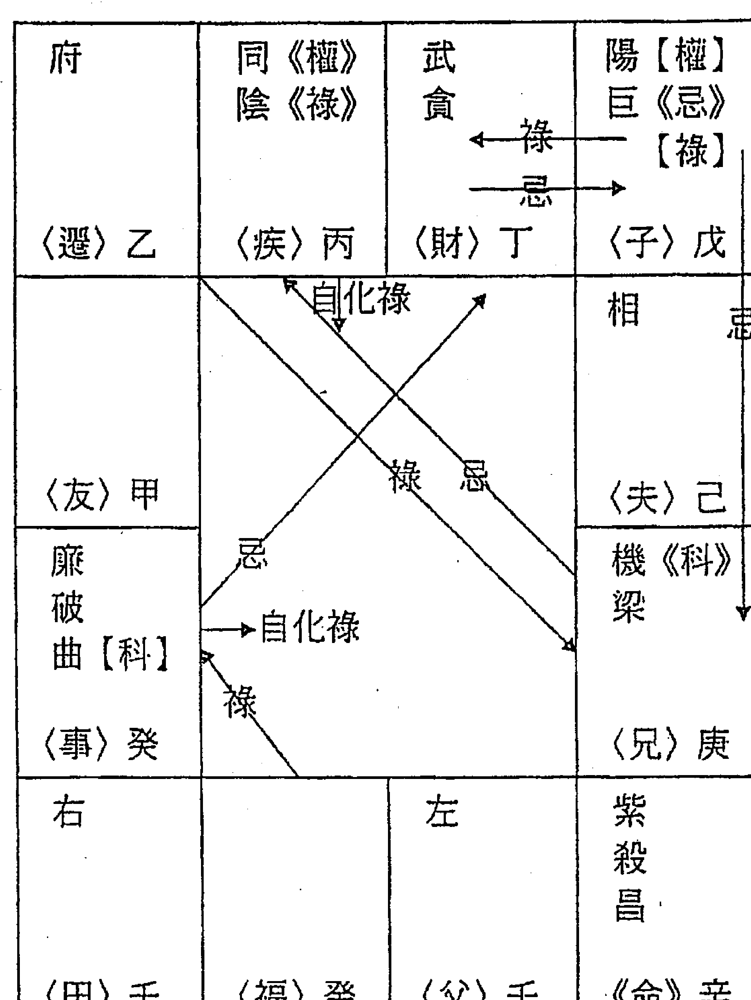
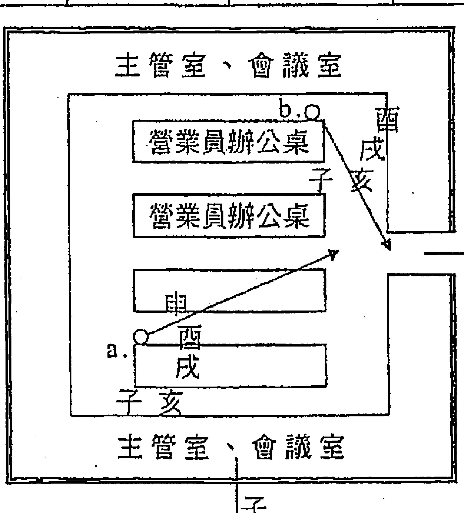
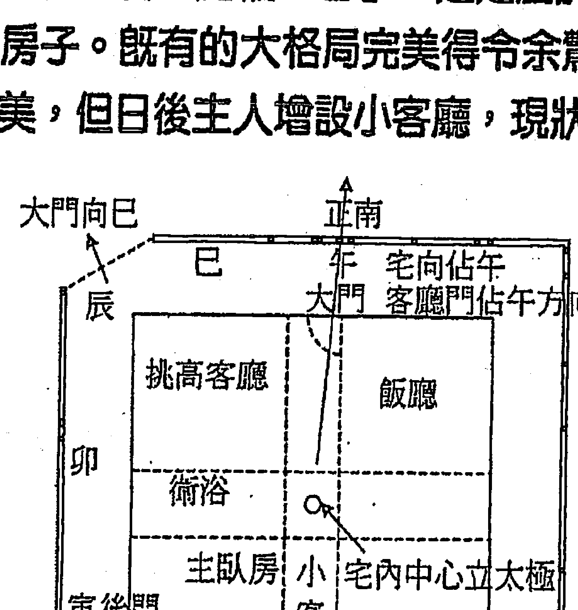
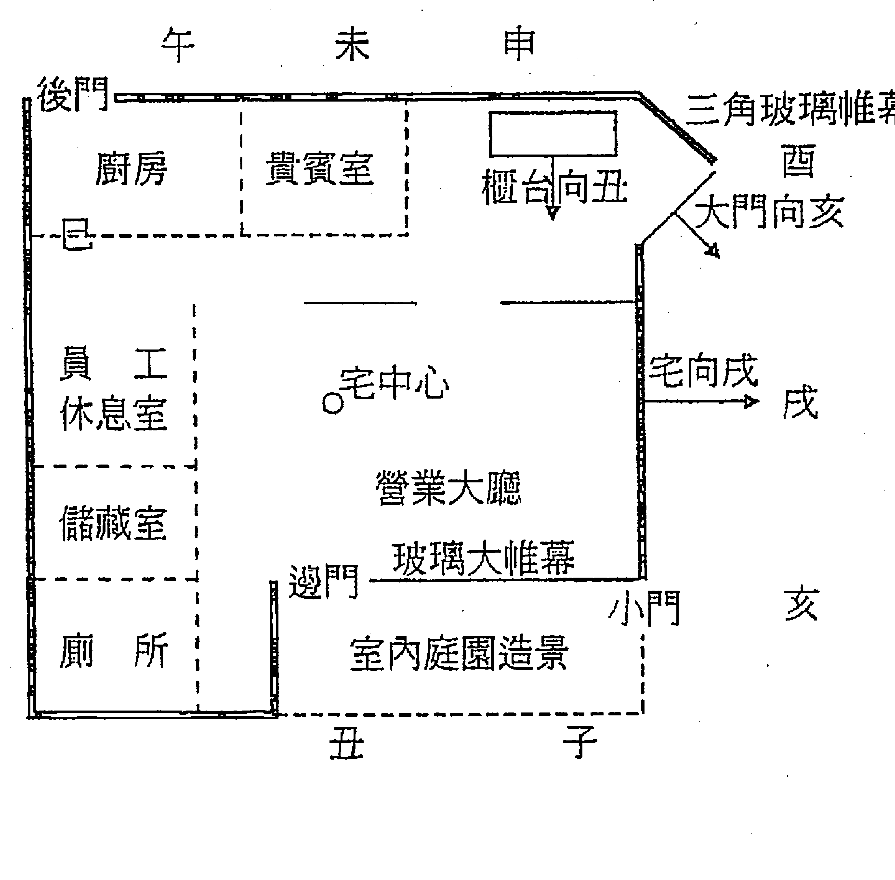
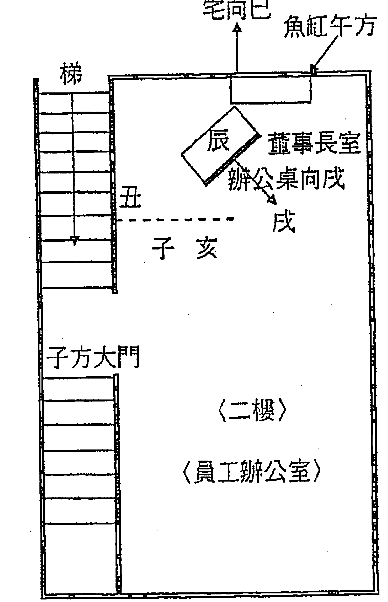
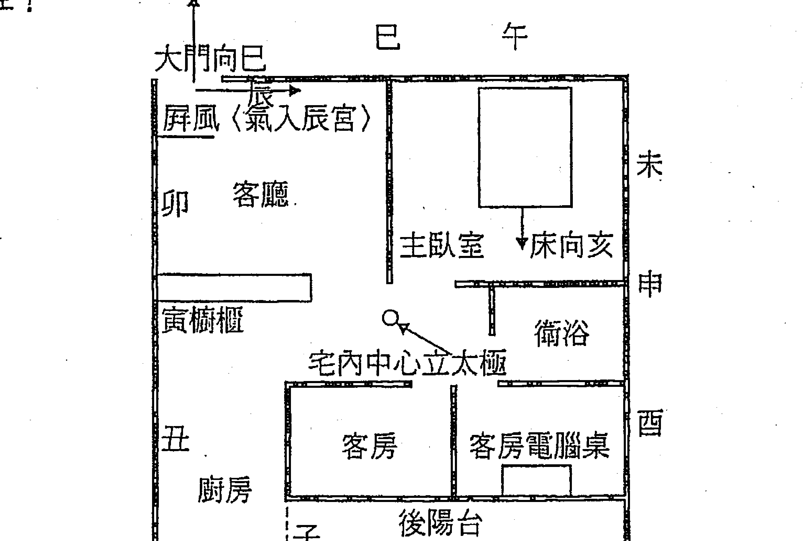

# 飞星紫微斗数生命解码

## 自序

「四化論命」，務必於大量的「實例命盤」中廣泛臨摹、細膩比對出自己的命學心得。因為，一人一命，張張命盤各有其「自成一格」的命理組合；命盤千變萬化，而其結構也跟著錯綜複雜。因此，學理研究必需經過千錘百鍊的實證經驗，理論與實際才能合而為一的厚植命學實力。

據統計，不同組合的命盤約有「二十幾萬種」之多，一個人窮畢生之力也可能沒辦法看完它、透徹它。因為不同命盤的不同組合，就有它因架構不同而產生不同的解盤與推論手法。

是以「實例命盤」的廣方研究、累積經驗，是提升斗數功力的「不二法門」。孟子：大匠能與人規矩，不能使人巧。諺云：各人吃飯各人飽，各人洗臉各人光。理氣雖一而手法各異，如果你想成為「命理達人」，只有親近它、熟悉它，好好把玩「實例命盤」才能透徹。如何才能精微其藝？乃鐘鼎山林、各有天性，但看個人的「根器」與「努力」！所謂：練達人情皆學問，洞明世事即經綸。它就像練武術，從你學會了它之後還得天天磨練它，讓它熟能生巧，爾後才會有場上行雲流水的無礙表現。

「祿轉忌」、「忌轉忌」與「追祿」、「追權」、「追忌」是千金難買、說穿了卻不值一文錢的斗數解盤「不二手法」。凡所化串聯呈「多祿彙吉」或「祿權交拱」者得於「如意順遂」；尤以「田宅三方」與「福德三方」所化作如斯交吉，則「格局」自然水漲船高；所彙祿權愈多、串連愈長而格局愈妙、發達愈久。所化串聯「多忌呈破」則事必有否，彙忌愈多則事愈不祥。不論是看財富、健康、壽命、感情、婚姻、子嗣……等等，都一理同出，只是下手點（立太極）不同而已。

譬如觀「財富」，當斟酌於「田宅」與「福德」兩三方之化，以「田宅」與「遷移」兩宮為首要掛帥，次看「兄弟」、「福德」。「田宅」以「夫妻」〈果報宮〉為其共宗六位，「兄弟」以「遷移」〈果報宮〉為其共宗六位，在在說明了「財富之根」在「果報」。又譬如「政治路」，當詳察於「交友」與「遷移」，以「交友」化「祿」逢「遷移」化「權」相拱於我宮，則牡丹與綠葉拱托共榮。譬如觀「是非小人」，當詳察於「交友」與「遷移」或「父母」兩處世與涵養宮，所化是否沖激呈破逢「巨門化忌」〈是非曜〉、「太陰化忌」〈暗曜〉等，累忌愈多，事更麻煩。

「遷移」與「父母」兩宮，為人生舞台上的黑白與彩色、黯淡或光彩皆現形於斯而無所遁形。乃「父母」顯氣質，「遷移」現器宇，詳察此二宮，氣勢「清濁自分」，人焉廋哉？「遷移」與「父母」所化，跟任何一宮之化沖激呈破，則該宮必見其損；尤以「遷移」是人生大舞台，涵蓋看得見的「器宇」與看不見的「果報」呈雙向作用，與任何一宮所化沖激呈破，該宮必大見其敗。反之，「遷移」與「父母」所化，跟任何一宮之化以祿、權交吉，則該宮必見其喜。凡所有吉化串連入「命宫」、「疾厄」与「福德」三情绪宫呈多禄者，必得于「如意顺遂」。凡所有吉化串连入「迁移」、「父母」〈两形于表宫〉者，必得于「光彩形外」与「事半功倍」；反之则否。

「三合派」论格局，偏重「命三方」的组合；「飞星四化」论格局，则专注于「果报三方」〈福德三方〉与「财库三方」〈田宅三方〉所化作比对斟酌；尤需观于「迁移」〈社会〉与「田宅」〈财富〉二宫，看是「果报伤宅」还是「家道兴隆」，兴衰由此定论。红尘尽是俗务，遍见名利过客；「名」者出自「迁移」，而「利」则常驻「田宅」，观此二宫命格高低知之过半矣。

「希夷先生」大觉者是天纵英才，创斗数传后泽世。天既纵圣哲于前，必也将垂贤者继后。陋以斗数三十年而后蓦然回首，倏忽顶秃眼茫；前不见古人，后不见来者，念天地之悠悠……；至盼后学英才继往开来，薪传于后。祈以广荫后世子孙知命立命，立己利他。

陋以有幸得于「周清河」老师的部分讲学资料，得以导入思维正途；再穷以精力潜研三十年，竭智推思、揣摩玩味，侥幸获致小成。与周师相逢虽仅二面薄缘，然承其厚导启智则罄竹难书，但盼师德绵延、泽后万世。由是，陋以为：斗数是属「华夏千秋万代子孙的所有，不应藏私于己。」故而不揣固陋的尽言薪传，也盼后贤能发微启新、更上一层楼，则福禄无疆于后世矣。

「斗数命理」是华夏千年的宝藏绝学，也是人类「智慧精髓」的產物，亟待發揚與傳承，後學者切勿再犯藏私陋習復令斗數蒙塵，切勿讓後學者茫然走上誤途。坊間今著，但見急功近利者的拼湊學理、沐猴而冠，斷章取義、自掰公式，致令翻覆古賢智慧、扭曲聖哲本意，誤導後學既深且遠矣。

譬如某坊書云：「多忌反不忌！」昏天暗地的遺惑千古、毒於後學其害大矣，莫非出自數學裡頭的負負得正說？牛頭硬是對上了馬嘴。前賢：知之為知之，不知為不知，乃真知也。嗟乎世風其衰、難棲鳳凰食。噫！文章千古事，何得草莽登殿堂？莫非似武帝問達摩：何為末法？曰：燈火倒掛！某前賢一句：「無肉使人瘦。」而誤陷阿鼻，問君能不戒慎恐懼哉？

人生三不朽：立功、立德、立言。余以斷簡殘篇而後組合有得的皮毛之悟，不揣固陋堅以傳承，非為華報與立萬，只盼務實之得能與廣大同好分享、發微，共襄「正導後學」盛舉。所以厚顏立言相傳於後者，丹心不二。唯憾才疏學淺、表達無方，千言萬語仍恐不克竟意，深怕誤人於後而汗顏徒悲。人生在世轉眼夕陽白髮，驀然回首，但見老陳一一凋謝，碌碌生涯又何異於浮游半日其悲！掙扎自壯：「虎死猶留皮一襲，丈夫豈能空白頭！」所以當仁且放膽、無私而不讓，起而礪行、埋首文章。所以仰俯以至誠，但盼古道共顏色。戰兢履冰而後氣壯言直：「急功近利非大器、藏私掩訣皆庸工。」放懷蓬廬。

## 第一章 命格與運限

### 第一節 善觀祿忌

凡所有「解析命盤」手法，皆不離「善觀祿忌」一訣。乃「祿因忌果」、「祿始忌終」或「祿喜忌憂」、「祿緩忌急」、「祿動忌靜」（單忌坐守為靜，多忌紛爭為敗）為千古不變的亙常人事現象，只要掌握論事「必要宮位」的飛化，運用「祿、忌」的串連因果、抽繭剝絲，事態則呼之欲出矣。

所有「解析命盤」手法也不離「組合因緣」一訣。所謂「組合」，就是要「組合吉者」與「組合凶者」。從單純的兩宮之化，到多宮多宮的化象串連，這就是「組合因緣」得而明白究竟：

- （一）「論其吉者」，運用「化祿」、「祿轉忌」及「追祿」、「追權」的手法，以「同星曜」的「祿忌相交」而得其一氣貫聯的串連乘旺，呈「多祿彙吉」或「祿權交拱」吉會，推斷吉化其涵蓋層面。此即「彙集因緣」、「組合因果」手法，以觀其吉。以其串聯的「宮位」與「祿、權化數」，得而解析「事理方向」與權衡「事態輕重」。

> 註⊙設 a 宮坐「生年祿」，其干「化忌」入於 b 宮，則此化忌必挾「生年祿」入 b 宮，由是 b 宮亦視同得於「生年祿」。

設 a 宮「化祿」入 b 宮，而 b 宮又「轉忌」入於 c 宮，則此 b 宮的「轉忌」必挾 a 宮所化的「祿」入於 c 宮，是 c 宮亦得 a 宮的「化祿」。

註(一)設 a 宮「化祿」入 b 宮，其「轉忌」入於 c 宮；逢 d 宮飛來「同星曜」的「化祿」相交於 c 宮（此即追祿—追 d 宮的祿），則 a 宮與 d 宮共構「雙祿」於 c 宮。這就是藉「祿轉忌」與「追祿」的「祿忌相交」（同星曜），產生串連的「組合因緣」手法。此式若為「非同星曜」的「祿忌同宮」則不得於一氣貫聯，是呈現不同事態、不同象義的兩碼事件。
「追祿」而後可以「轉忌」，上式追 d 宮的祿入 c 宮，當然還可以化 c 宮的轉忌（挾雙祿）入於 e 宮。

- (二)「論其凶者」，運用「化忌」、「忌轉忌」及「追忌」（非必同星曜）的手法彙集不佳因緣、組合不佳因果的串連，理出「多忌呈破」的凶化。以其串連的「宮位」與「得忌數」多寡，得而解析其失的「事理方向」與「事態輕重」。

註：凡任何一宮其坐或化出的「單忌」皆不主凶，所謂：「一忌」為紅塵當然耳事，「雙忌」為病（隱藏病灶），「三忌」為破（狀況不佳），「四忌」為敗（大勢不妙）。所以，論任何壞事，都不可能「一忌」就立判生死，就算是得了「雙忌」，也僅止於問題之兆、產生煩忙；而真正壞大局者，必須於此事的相關宮位間，至少彙「三忌」或「三忌以上」的串連呈破，才足以構成敗象。

【例1】：乾造〈1929〉己巳年5月午時生。

其「命宮」〈丙子〉與「福德」〈丙寅〉雙化天同祿入「疾厄」〈辛未〉，而其「疾厄」又見本宮巨門「自化祿出」，則「疾厄」〈情緒宮〉得於「三祿」其福，不免慵懶有餘。然慵懶而人生一無是處乎？非也！此「疾厄」得於「三祿」，令其年輕多次仲介土地買賣而獲大偏財。

| 阴 | 貪《權》右 | 同【祿】巨 | 武《祿》相左 42-51 |
| (友)己 | (遲)庚 | (疾)辛 | (財)壬 |
| 府 廉【忌】 昌【科】 | 祿 追權 祿 | 自化祿 | 陽 梁《科》 32-41 |
| (事)戊 |  | 祿 | (子)癸 |
| (田)丁 |  |  | 殺 曲《忌》 22-31 |
| 破 |  | 紫 | (夫)甲 |
| (福)丙 | (父)丁 | 《命》丙 | 機【權】 (兄)乙 |

- ①其「事業」〈戊辰〉化貪狼祿〈偏財曜〉入「遷移」〈庚午〉〈果報宮〉逢貪狼「生年權」，轉而化天同忌〈挾祿、權〉入「疾厄」會前述「命宮」與「福德」所化天同雙祿呈「三祿一權」。此言其運氣好（事業祿入遷移）、能力強（遷移坐權），得機遇而喜於心、順於行象（疾厄得祿）。然「疾厄」雖是收藏宮，卻不主財富；故而此式僅指得機遇而順心，不代表發了財。

- ②「田宅」（丁卯）化天同權也入「疾厄」（財產運），彙於上式令「疾厄」呈「三祿二權」。此言其得機遇而順心，發於財產。

- ③「疾厄」本不主財，卻因「疾厄坐祿」逢「田宅」化權相拱而發財富。是以觀察某些單宮之化，容易只是看到了表象。苟若不懂得運用「追其吉化」、「追其凶化」而後「串連成象」的手法，你對命盤還能深入多少？

註：凡所有吉化串連入「命宮」、「疾厄」與「福德」三情緒宮呈多祿者，必得於如意順遂。凡所有吉化串連入「遷移」、「父母」（兩形於外宮）者，必得於「光彩形外」與「事半功倍」。這是非常重要的基本概念，切記！

【例2】：乾造（1959）己亥年3月申時生。

「子女宮」雖坐武曲「生年祿」，卻連生二女無子，何也？乃「家道不興」的果報所使。

| 同 | 府 武《祿》左 | 陽 陰【科】 | 貪《權》【忌】 |
|---|---|---|---|
| 〈大限〉44-53〈財〉己 | 34-43〈子〉庚 | 24-33〈夫〉辛 | 右 14-23〈兄〉壬 |
| 破【祿】 | | | 機 巨 轉忌 |
| 54-63〈疾〉戊 | 忌（斜箭头指向右下） | | 4-13〈命〉癸 |
| 64-73〈遷〉丁 | | | 紫 相 |
| | | | 〈父〉甲 |
| 廉 昌 | | 殺 曲《忌》 | 梁《科》 |
| 〈友〉丙 | 〈事〉丁 | 《田》丙 | 〈福〉乙 |
| 忌（水平箭头指向左） | | | |

- ①「田宅」〈丙子〉坐文曲「生年忌」，化廉貞忌〈挾紮實忌〉入「交友」。此即庫破的經濟不佳象。
- ②其「遷移」〈丁卯〉〈果報宮〉化巨門〈是非曜〉忌入「命宮」〈癸酉〉，轉而化貪狼忌〈挾忌〉入「兄弟」〈經濟位〉。
- ③合前二式，則「田宅」既坐「生年忌」，復與「遷移」果報宮共破呈「紮實雙忌」於「交友」、「兄弟」線，此即「家道不興」的損於丁財象。是以「子女宮」雖坐「生年祿」，故而生二女仍不得於子，子緣較薄。
- ④此「遷移」化忌入「命宮」〈情緒宮〉而後串連於「家道不興」，並涉入「兄弟」、「交友」，即見外在的經濟壓力與是非臨身。

註：本造如多產，當然還是可以得子，但慎防子嗣的品質可能也不盡如意，子反不如女，乃「家道不興」使然。

註：不論忌落同宮或兩對宮，都屬呈「雙忌」象。以及—

- 譬如某宮坐「生年忌」又逢本宮「自化忌出」，則此「生年忌」力將被「自化忌出」所消耗，凶也少凶。然此象必產生少了定見的反復與情緒波動。
- 譬如某宮坐「雙忌」又逢本宮「自化忌出」，必生反復的病態舉止，煩躁又無厘頭，但遲早會否極而泰來。
- 譬如某宮坐「三忌」又逢本宮「自化忌出」，則煩亂痛苦卻無對策，呆滯而後自生滅。福之不足者近崩解邊緣。福之足者也會事過境遷，但見狼藉。
- 譬如某宮坐「四忌」又逢本宮「自化忌出」，則精盡人亡，其言也善。
- 論之個性脾氣，某宮坐「多忌」又逢本宮「自化忌出」，則此人於該宮之事，易現粗糙、煩亂、短思的處置方法，脾氣快猛而玉石俱焚。

- (三)因此，論命是必需綜觀全局。上例別以為「子女宮」坐「生年祿」就必然有子，還是要以「格局」得失，然後才做最終下斷。譬如下例的「田宅宮」坐破軍（偏財曜）「生年權」會「命祿」，雖出生富門，而後運衰照樣傾家蕩產。

【例3】乾造（1934）甲戌年11月卯時生。

| 巨【權】 | 廉《祿》 | 梁昌曲 | 殺 |
|---|---|---|---|
| <財>己 | <子>庚 | <夫>辛 | <兄>壬 |
| 貪【忌】 | 忌 | 同 | 4-13 <命>癸 |
| <疾>戊 | 忌出 | 武《科》 | 14-23 <父>甲 |
| 陰【科】 | | | |
| <遷>丁 | | | |
| 紫府左 | 機 | 破《權》【祿】右 | 陽《忌》 |
| 54-63 <友>丙 | 44-53 <事>丁 | 34-43 <田>丙 | 24-33 <福>乙 |

- ①「遷移」〈丁卯〉〈果報宮〉化巨門忌入「財帛」，遙對「福德」〈果報宮〉所坐太陽「生年忌」，兩頭呈「雙忌」。而「福德」〈乙亥〉〈果報宮〉則化太陰忌〈挾雙忌〉還入「遷移」，「遷移」（果報宮）亦得於「雙忌」，業障稍重。
- ②「田宅」〈丙子〉雖坐破軍祿、權，化廉貞忌入「子女」〈庚午〉，此即「田宅忌出」的退耗象，雖有雄厚本錢卻是不斷的流失；轉而化天同忌〈挾忌〉入「命宮」。
- ③兩式相加，令「命宮」與「遷移」呈「三忌」之破，則為「果報衰宅」，終將財產損失殆盡。

### 第二節 祿轉忌與忌轉忌所衍生的再度轉忌

一甲一「追祿」而後可以「轉忌」

凡「論其吉者」，必以問事的「重點宮位」立太極為起點，所化再與問事的「相關宮位」作串連，必然衍生「追祿」而後再「轉忌」：

- (一)設此「重點宮位」為A宮，A宮化祿入B宮，轉其忌（挾祿）入C宮，逢（追）D宮飛「同星曜」的化祿來會（同星曜的祿忌相交則一氣貫聯），則A宮與D宮共構「雙祿」於C宮。此D宮之化即稱之為「追祿」，而D宮也必然是問事的「相關宮位」，否則追而無義，何勞空忙？「追祿」的目的是要彙集更多的相關因緣，才能蒐尋到完整的結果。
- (二) C宮既得D宮追祿來會，當「二度」轉其忌（挾雙祿）入E宮，設又逢（追）F宮飛「同星曜」的化祿來會，則E宮呈「三祿」矣。當然F宮也必需是問事的「相關宮位」。此「追祿」而後可以「轉忌」的串連手法，是「飛星論命」的重要環節，唯有如此才能作更深入的命盤解析。
- (三) E宮既追得F宮飛祿來會，當「三度」轉其忌（挾三祿）入G宮，設G宮又坐了「同星曜」的「生年祿」、「命祿」或本宮「自化祿出」而呈「四祿」，此刻G宮因得「生年祿」、「命祿」或本宮「自化祿出」，當然必需再作「四度」轉其忌（挾四祿）入H宮。

換言之，凡「祿轉忌」的忌落之宮，如得「同星曜」的「生年祿」、「命祿」或本宮「自化祿出」坐該宮，則此宮當然必須作「二度轉忌」。或者「祿轉忌」的忌所落之第一宮，如得第二宮「追同星曜」的化祿來會，則此第一宮當然必須作「二度轉忌」到第三宮。此即「追祿」而後就能「轉忌」的手法，藉此串連諸宮呈「多祿彙吉」。串連「祿數」愈多，吉氣愈長，吉者愈吉。

此即「論其吉者」手法，常運用於「化祿」、「祿轉忌」及「追祿」、「追權」（必須同星曜）之間，而得其一氣貫聯的串連乘旺，呈「多祿彙吉」或「祿權交拱」的吉會。以其串聯的「宮位」與「祿、權化數」，得而解析「事理方向」與權衡「事態輕重」。凡「論其吉者」的「多祿彙吉」或「祿權交拱」，串連的祿、權數越多，則吉氣越長，而其「格局」也就越高；串連短者，格局自有折扣矣。下圖示意：

| 3.   （遷） | 4.   **〈同星曜〉追祿**   （疾） | （財） | （子） |
| :--- | :--- | :--- | :--- |
| 6.   （友） | **二度轉忌**   **三度轉忌**   **轉忌**   **〈同星曜〉追祿**   **祿**   **四度轉忌** | 5.   **〈同星曜〉**   **命祿、生**   **年祿或自**   **化祿** | 2.   （兄） |
| （事） | （福） | （父） | 8.   **《命》** |
| 1.   **重點宮位**   **立太極**   （田） | 7. | | |

然「祿轉忌」逢「己」、「辛」兩干的「轉忌」化「文曲忌」與「文昌忌」時，即因無法再追祿來會而當然就會中斷了彙祿的串連；以及命盤十二宮多逢本宮「自化忌出」者，也容易中斷了彙祿的串連，格局自是有折扣。

> 註：命盤十二宮多逢「自化忌出」者，必然「格局有損」。乃命造主人性格容易「少方向」、「少耐性」、「少堅持」、「少城府」、「不冷靜」、「短思」、「大而化之」，而讓許多事情半途而廢、許多機會也將擦身而過。

## 乙-「追忌」而後可以「轉忌」

凡「論其凶者」，必以問事的「重點宮位」立太極為起點，所化再與問事的「相關宮位」作串連，必然衍生「追忌」而後再「轉忌」：

(一)設此「重點宮位」為A宮，A宮化忌入B宮，轉其忌（挾忌）入C宮，逢（追）D宮飛忌（不必同星曜）來會，則A宮與D宮共構「雙忌」於C宮。此D宮之化即稱之為「追忌」，而D宮也必然是問事的「相關宮位」，否則追而無義，何勞空忙？

| (遷) | (疾) | (財) | (子) |
| :--- | :--- | :--- | :--- |
| 6. (友) | | | 5. 命忌或生年忌 (夫) |
| 7. 追忌 (事) | (轉忌/四度轉忌) | (二度轉忌/三度轉忌) | 2. (兄) |
| 1. 重點宮位 立太極 (田) | (福) | (父) | 8. (命) |

(二)C宮既得D宮飛忌來會，當作「二度」轉其忌（挾雙忌）入E宮，設又逢〈追〉F宮飛忌〈不必同星曜〉來會，則E宮呈「三忌」矣。當然F宮也需要是問事的「相關宮位」。此「追忌」而後可以「轉忌」的串連手法，是「飛星論命」的重要環節，唯有如此才能作更深入的命盤解析。

（二）E宮既得F宮飛忌來會，當作「三度」轉其忌〈挾三忌〉入G宮，假設G宮坐了「生年忌」或「命忌」，則G宮呈「四忌」，此刻G宮因坐「生年忌」或「命忌」，當然必需作「四度」轉其忌〈挾四忌〉入H宮。設G宮呈「四忌」，卻逢本宮「自化忌出」，則所化即終止，無法再度向下延伸。

註：「自化忌出」為消散。以健康為例，設「疾厄」彙「一忌」即逢本宮「自化忌出」，為小病一樁，稍作調適即癒。「疾厄」彙「二忌」逢本宮「自化忌出」，為中病一樁，看醫生、服藥而後痊癒。「疾厄」彙「三忌」逢本宮「自化忌出」，為大病一樁，急診、看醫生、住院、打針〈甚或手術切除〉、服藥一段時間而後痊癒。「疾厄」彙「四忌」逢本宮「自化忌出」，為病情危急，非進住加護病房即轉往太平間。

（四）此即「論其凶者」手法常運用的「化忌」、「忌轉忌」及「追忌」之間，彙成「多忌呈敗」的串連。以其串連的「宮位」與「忌化數」，得而解析「事理方向」與權衡「事態輕重」。由於「論其凶者」的化忌與追忌，不需同星曜之會即能作成串連，因此紅塵中：人生不如意事十常八九。歹命人多好命者少。

## 一丙一重要的「祿」、「忌」分論法則

好事歸好事論、壞事歸壞事談，別好壞不分的把祿、忌混著看，弄得腦袋一團亂：

「論其吉者」的手法是專以「祿、權」為用以「科」為輔，你就一路只看「祿、權」的飛化與其串連，別把旁邊的「忌」也硬加在一起解釋，弄得滿盤烏煙瘴氣、眼花撩亂；而「論其凶者」也專以「化忌」為用，當然不應把「祿、權」併著看，否則腦筋不打結才怪。

譬如論某人現在的健康若何？你就算算看現在的他在健康運勢上是彙集了幾祿幾權？又彙集了幾忌？設祿、權數多於忌數，那他還是會平安過關的。設祿、權數少於忌數，那他是不平安的。一定要「祿」、「忌」分論，然後再作吉凶比較，這樣腦袋才不會糊塗。

註：「科」可緩「忌」而非解「忌」。「一科一忌」同宮，事將拖拖拉拉。「二科一忌」同宮，則壞事有氣也無力。

註：坊間許多書籍云科為貴人，可解忌厄，差矣！凡所有惡事，皆須尋祿而解，唯祿之為福，最能勝禍。

－丁－只有「祿轉忌」與「忌轉忌」的用法，沒有坊間「祿轉祿」與「忌轉祿」的無稽論談：
「祿」是「因」，「忌」是「果」。「祿轉忌」是知因而尋果，祿是已知的誘因或已知其吉，祿而後轉忌的目的是要知道是否真吉與吉者何事或吉者有到底有多吉（斟酌所化串連的宮位與化象）？「忌轉忌」是打破砂鍋再問結果；忌可能是你的付出或勞煩，忌而後轉忌的目的是要知道你需付出甚麼或付出多少？或者勞煩者何事？或勞煩到甚麼程度？總而言之，「祿轉忌」與「忌轉忌」的目的就是要追根究底的明白事理方向與事態輕重。

「祿」是「因」，當然接下來隨時間的延伸與導向就是「果」，果就是「忌」，所以「祿」當然要轉「忌」，用以明白事情的延伸與結果。而坊間的「祿轉祿」豈不是存在知因又復求因的矛盾乎？沒頭沒腦亂湊一通、誤導後學！所以命理的運用上絕沒有「祿轉祿」的道理。而「忌轉祿」則更是矛盾的倒轉因果，是果能求因？還是果能生因？只會讓人更糊塗！假設論生死，「忌」是結果、是進入了死亡，那麼「忌轉祿」豈不是死後還要不著邊際的去探討如何死而復生或往生何處的事麼？

### 第三節 如何觀格局、評大限、斷流年

所有「解析命盤」手法不離先「觀格局」的高低，而後「評大限」的休咎，再來「斷流年」的好壞。命盤格局的高低不一，猶如大海中的大小船隻；當遇上暴風雨時，小船可能檣傾楫摧甚至翻覆滅頂；大船則風雨飄搖而後仍然可以乘風破浪。「格局」高者，經得起沖激考驗，終究得以根深葉茂；「格局」低者，即應勿作多求，平安就是福（適合上班領薪或風險少的現金生意）。

人生的命運就像大自然的天候，難免遇上陰晴寒暖與乍寒乍暖；命格高者可以承受各種的大小焠鍊，而命格低者則可能經不起太多的考驗。所以，不知「命格高低」，則無所據而難以解析「運限休咎」；既難測於運限休咎，則必然妄談於「流年吉凶」。

#### 一甲一如何「觀格局」？譬如：

-   (一)「福德三方」（果報位）與「田宅三方」（收藏宮、庫位），兩方的「互化祿、權」；或兩方於「化祿」、「祿轉忌」與「追祿」、「追權」之間，作「同星曜」的「多祿彙吉」或「祿權交拱」，得其串連乘旺者，乃「果報益庫」、「家道興隆」。尤以「田宅」財富宮與「遷移」或「福德」兩果報宮得上述吉化，且逢「偏財曜」的祿、權串連，可以天降鴻福、致富顯榮而光宗耀祖。此即格局高者象。

易以「福德三方」〈果報位〉與「田宅三方」〈收藏宮、庫位〉，兩方的「互化忌」；或兩方於「化忌」、「忌轉忌」與「追忌」之間，逢「生年忌」或「命忌」串連成「多忌呈破」〈三忌、四忌或以上〉者，則「果報傷庫」、「破財傷身」的動輒得咎。尤以「田宅」與「遷移」或「福德」兩方所化串連「多忌呈破」，容易「果報傷宅」、「家道不興」而傷財、傷丁；累忌愈多者，甚或出現「家道中落」、「丁財凋零」等晦厄；它可能讓「家庭」甚至「宗門」產生了「門昏楣暗」，出現「窮困」、「潦倒」、「挫折」、「破財」、「敗產」、「病厄」、「損壽」、「折嗣」、「丁萎」、「不成材」、「遲無婚嫁」等諸般磨難。此即格局低者象。

(二)「福德三方」〈果報位〉與「命三方」〈汲營宮〉，兩方的「互化祿、權」，或兩方於「化祿」、「祿轉忌」與「追祿」、「追權」之間，作「同星曜」的「多祿彙吉」或「祿權交拱」，得其串連乘旺者，則果報相蔭，可以「汲營順遂」、「貴人顯助」，也多「天從人願」、「心想事成」，逢「偏財曜」之化祿、權尤佳。然類此組合，如果沒有彙吉串連入於「收藏宮」〈田宅三方〉者，或為一場虛花而終不實庫，未必因以致富。

易以「福德三方」〈果報位〉與「命三方」〈汲營宮〉，兩方的「互化忌」；或兩方於「化忌」、「忌轉忌」與「追忌」之間，串連成「多忌呈破」〈三忌、四忌或以上〉者，則多「處世笨拙」、「汲營不順」、「事與愿違」、「天不從人愿」等，應以守成為上、不冒風險、平安就是福。宜少風險的現金生意或上班領薪。

(三)「福德三方」〈果報位〉與「交友三方」〈人際位〉，兩方的「互化祿、權」，或兩方於「化祿」、「祿轉忌」與「追祿」、「追權」之間，作「同星曜」的「多祿彙吉」或「祿權交拱」，得其串連乘旺者，可以「善攀緣」、「愛熱鬧」、「阿諛悅言」、「人氣鼎盛」。尤以「遷移」化權與「交友」化祿得上述組合，甚或可以「風雲際會」、「一呼百諾」而「登高趨貴」。然類此之化，如果沒有串連入於「收藏宮」〈田宅三方〉者，或為一場人際熱鬧而終不實於庫，也未必致富。

易以「福德三方」〈果報位〉與「交友三方」〈人際位〉，兩方的「互化忌」；或兩方於「化忌」、「忌轉忌」與「追忌」之間，串連成「多忌呈破」〈三忌、四忌或以上〉者；容易「遇人不淑」、「是非加身」，或者「性格偏僻」、「孤陋寡聞」、「偏激結怨」等。尤以「遷移」〈處世〉與「交友」〈人際〉所化多忌呈破，常「不善交遊」、「冷漠孤獨」、「小人橫行」、「不得貴人」等非常不宜紅塵人事。

## 【例4】：乾造〈1950〉庚寅年9月辰時生。曾經位居九五。

| 廉貪 | 巨昌 | 相 | 梁【祿】 同《忌》 曲 |
| :--- | :--- | :--- | :--- |
| (兄)辛 | 3-12 《命》壬 | 13-22 《父》癸 | 23-32 《福》甲 |
| 陰《科》 |  |  | 武《權》 【忌】 殺 祿 |
| (夫)庚 府 |  |  | 33-42 《田》乙 |
| (子)己 |  |  | 陽《祿》 |
| 右 紫【權】 破 | 機 左【科】 |  | 43-52 〈事〉丙 |
| 73-82 〈疾〉己 | 63-72 〈邏〉戊 |  | 53-62 〈友〉丁 |

+   ① 「交友」〈丁亥〉〈人際位〉化太陰祿、「遷移」〈戊子〉〈社會〉化太陰權入「夫妻」〈照事業〉〈庚辰〉呈「一祿一權」，轉而化天同忌〈挾祿權〉入「福德」〈果報宮、情緒位〉。此言其人氣旺、社會地位好的如意象。

> 註：凡得人氣眾擁者，以「太陽」化祿、權的日照天下為上選，而「太陰」化祿、權雖較遜色，但仍不失於光耀天下，亦稱吉。政治人物命盤，多見「太陽」、「太陰」兩曜多化祿、權。

②逢〈追〉「事業」〈丙戌〉化天同祿入「福德」，彙上式呈「二祿一權」；追祿而後可以轉忌，轉「福德」〈甲申〉化太陽忌〈挾二祿一權〉還入「事業」又逢太陽〈政治曜〉「生年祿」呈「三祿一權」。此言政治路得人氣旺拱與厚福天助而諸多順遂。

③「事業」〈丙戌〉既坐太陽「生年祿」，當轉而化廉貞忌〈挾三祿一權〉入「兄弟」〈成就宮〉，逢〈追〉「福德」〈甲申〉〈果報宮〉化來廉貞祿〈偏財曜〉會呈「四祿一權」，則兼具天時與人和而「風雲際會」、步步高陞矣。

---

(四)「田宅三方」〈收藏宮〉與「命三方」〈汲營宮〉，兩方的「互化祿、權」；或兩方於「化祿」、「祿轉忌」與「追祿」、「追權」之間，作「同星曜」的「多祿彙吉」或「祿權交拱」，得其串連乘旺者，可以「開創事業」與「經營獲利」。如串連於「偏財曜」的祿、權，則獲利速、收入高。

易以「田宅三方」〈收藏宮〉與「命三方」〈汲營宮〉，兩方的「互化忌」；或兩方於「化忌」、「忌轉忌」與「追忌」之間，串連成「多忌呈破」〈三忌、四忌或以上〉者，容易「工作不安」、「收入不穩」、「不善汲營」、「少積蓄」，甚或「失業」、「退財」、「收攤」、「倒閉」、「窮困」等。也應以守成為上、不冒風險。只宜少風險的現金生意或上班領薪。

(五)「田宅三方」〈收藏宮〉與「交友三方」〈人際位〉，兩方的「互化祿、權」；或兩方於「化祿」、「祿轉忌」與「追祿」、「追權」之間，作「同星曜」的「多祿彙吉」或「祿權交拱」，得其串連乘旺者，可以「處鬧區」與「人氣旺」、「生活機能好」，或「高朋滿座」、「里鄰和睦」、「親朋多往來」。如其祿權串連不入我「命三方」，則未必益於我的工作、賺錢。

易以「田宅三方」〈收藏宮〉與「交友三方」〈人際位〉，兩方的「互化忌」；或兩方於「化忌」、「忌轉忌」與「追忌」之間，串連成「多忌呈破」〈三忌、四忌或以上〉者，但防「家有惡鄰」、「小人侵宅」、「交友不慎」或「身居陋巷」、「孤僻自處」、「門前冷落」、「家庭衰頹」。

(六)「命三方」〈汲營宮〉與「交友三方」〈人際位〉，兩方的「互化祿、權」；或兩方於「化祿」、「祿轉忌」與「追祿」、「追權」之間，作「同星曜」的「多祿彙吉」或「祿權交拱」，得其串連乘旺者，可以「人氣好」與「親朋多」、「好友密」、「謙恭有禮」、「往來熱絡」、「老少咸宜」。如其祿、權串連不入我「田宅三方」，則恐一場虛花，未必實於我庫。

易以「命三方」〈汲營宮〉與「交友三方」〈人際位〉，兩方的「互化忌」；或兩方於「化忌」、「忌轉忌」與「追忌」之間，串連成「多忌呈破」〈三忌、四忌或以上〉者，但防「孤僻自處」、「不善逢迎」、「拙於汲營」、「交友無助」或「小人作梗」、「親疏朋離」、「人氣寒微」、「知己凋零」。

(七)命格結構，經常是「複合式」的組合，上述六種結構，少有可能單一組合出現在一張命盤上。俗云：生死有命，富貴在天。所謂「天」者，即屬於前三類者涉於「福德三方」因果的組合，講的就是「果報之使」的吉凶。而第四、五、六類則無關「果報」，較屬人性空間的「勤儉」、「處事應對」與「盡人事」而後產生的結果。所以，「複合式」的命格組成，是「果報」與「盡人事」間雜交纏，必須理出合理的釋象與評估。

## 【例5】：坤造〈1964〉甲辰年3月寅時生。

舞蹈老師，夫因年輕創業被嚴重倒帳而負債至今，二十年來不得翻身。

+   1. 「田宅」〈己巳〉〈財富宮〉化文曲忌入「事業」，而「夫妻」〈丙子〉化廉貞亦忌入「事業」，逢「事業」〈庚午〉又坐廉貞「命忌」呈「三忌」。此言婚姻與家庭將出現大礙，轉而化天同忌〈挾三忌〉入「疾厄宮」〈情緒宮〉，必苦。
2. 「兄弟」〈丁丑〉〈經濟位〉化巨門忌入「田宅」，遙對於「子女」所坐太陽「生年忌」呈「雙忌」；而「子女」〈乙亥〉既坐「生年忌」，當轉化太陰忌〈挾雙忌〉入「父母」〈借貸位〉。

③合前二式，則「田宅」之破串連入「父母」、「疾厄」一線呈「五忌」。凡「田宅」之破串連入「父母」或「遷移」者，為庫虛而「窘形於外」、「束手無策」象。本造見五忌之破串連於「父母」，故而負債多年，無力回天。

| 巨 | 廉《祿》【忌】相左曲 | 梁 | 殺昌【科】右 |
| :--- | :--- | :--- | :--- |
| 忌 | | | |
| 〈田〉己 | 〈事〉庚 | 〈友〉辛 | 〈遷〉壬 |
| 貪 | | | 同【祿】 |
| | | 忌 | |
| 〈福〉戊 | 忌 | 忌 | 56-65〈疾〉癸 |
| 陰 | | | 武《科》 |
| | | | 46-55〈財〉甲 |
| 〈父〉丁 | | | |
| 紫府 | 機【權】 | 破《權》 | 陽《忌》 |
| 6-15〈命〉丙 | 16-25〈兄〉丁 | 26-35〈夫〉丙 | 36-45〈子〉乙 |

> 註：凡所有事呈「多忌」之敗串連於「父母」或「遷移」者，必見空洞、呆滯、空虛、迷茫、無能、無力、渾噩、失望、窘迫、破相、難看、不光彩、放棄、消散等義。

## 【例6】:乾造〈1952〉壬辰年1月卯時生。

尚未出生即亡父為遺腹子，其長兄也吸毒不成材，本造生三女未得男丁，此即「家道不興」、「丁財凋零」者。

| 陽【權】〈遷〉乙 | 破〈大限〉〈疾〉丙 | 機昌【忌】曲【科】〈財〉丁 | 紫《權》府〈子〉戊 |
| :--- | :--- | :--- | :--- |
| 武《忌》左《科》〈友〉甲 | | | 陰〈夫〉己 |
| 同忌 44-53〈事〉癸 | 忌 | 忌 | 貪右〈兄〉庚 |
| 殺 34-43〈田〉壬 | 梁《祿》24-33〈福〉癸 | 廉相〈兄福〉14-23〈父〉壬 | 巨4-13《命》辛 |

+   ①「田宅」〈壬寅〉與「父母」〈壬子〉雙化武曲忌入「交友」〈甲辰〉逢武曲「生年忌」呈「三忌」，轉而化太陽忌〈挾三忌〉入「遷移」〈果報宮〉。此即父母不榮的門庭冷落。

+   ②「財帛」〈丁未〉坐文昌「命忌」沖「福德」〈果報宮〉，化巨門忌〈挾忌〉入「命宮」。彙於前式，則「田宅」令「命宮」與「遷移」一線呈「四忌」之破，此即「家道不興」、「丁財凋零」象。故而本造生二女而不得丁。

③因此未及出生即見父殁，以其「交友」見多忌冲「兄弟」，故而家道損兄、兄不成材。

④長兄何以吸毒？「兄弟」〈庚戌〉化天同忌入「事業」〈癸卯〉，轉而化貪狼忌〈欲望曜〉還入「兄弟」，「兄福」〈父母〉〈壬子〉化武曲忌入「交友」逢武曲「生年忌」。則「兄弟」與「兄福」所化合之呈「三忌」。凡「命宮」、「福德」與「疾厄」三性格宮所化多忌呈破者，非健康有礙即性格扭曲，會「貪狼」、「廉貞」兩邪淫曜化忌，則不免「酒色煙毒」、「拐騙偷搶」等惡習欲望。

> 註：凡「家道不興」所化呈破路徑，任何六親宮位化忌與之碰撞沖激，則該親必見其咎。譬如本造「夫妻」〈己酉〉化文曲忌入「財帛」與其「家道不興」造成沖激，故而本造是為獨對夕陽的老來孤獨象。

## 一乙一如何「評大限」、「斷流年」：

### （一）觀動盤（大限及其以下諸盤）「喜怒哀樂」的情緒反應：

(1)論不同時間的不同運勢，需細觀於「動盤」的「喜怒哀樂」，乃「祿喜」、「忌愛（勞）」為人性「得失」間的常態反應，只要洞察情緒，則任何「動盤」的「吉凶休咎」可以知之過半。譬如：

觀「生年」與「命宮」兩組四化的「祿」與「權」。於動盤（大限及其以下諸盤）而言，「祿」為希望、愉悅或順遂，「權」為開創與謀略、自信。此二化加入於「大限盤」的「命宮」、「疾厄」與「福德」三情緒宮，則此大限當具「生趣」，容易「如意」、「順遂」、「企圖」、「拓展」。同理，此「祿」、「權」二化加入於「流年」、「流月」、「流日」、「流時」諸動盤的三情緒宮，則此流盤當同具「生趣」。

「生年」與「命宮」的「忌」，為「憂苦」或「辛勤」、「付出」；「雙忌」（或以上）加入於「大限盤」的「命」、「疾厄」與「福德」三情緒宮，則此大限必當生於「苦趣」。同理，此化加入於「流年」、「流月」、「流日」、「流時」諸盤的三情緒宮，則此流盤當同具「苦趣」。「忌」數愈多愈難過。

(2)直接觀大限（及其以下諸動盤）的「命」、「疾厄」與「福德」三情緒宮，三情緒宮如能直接互化「祿」、「權」的交拱汇吉，也得于生趣；或此三情绪宫于于“化禄”、“禄转忌”与“追禄”、“追权”之间，作“同星曜”的交集呈“多禄汇吉”或“禄权交拱”，甚或串连于“生年禄权”、“命宫禄权”等，则产生更多生趣与顺遂。

设若观大限及其以下诸动盘的“命”、“疾厄”与“福德”三情绪宫，直接“以忌互化”，必见于劳烦苦趣；此“忌”所入之宫及其对宫，设又逢“生年忌”或“命忌”造成冲激，则更不顺遂矣；累忌愈多，苦趣愈显。或者此三情绪宫于“化忌”、“忌转忌”与“追忌”之间，产生多忌相破，也必见苦趣；甚或与“生年忌”或“命忌”产生串连再破，则更是落井下石、火上加油。

注：以上所述大限及其以下的诸动盘，其“命”、“疾厄”与“福德”三情绪宫所得苦乐，仍必须参酌于该宫为“原命盘”上本来的何许宫位，如此释象才能“用不离体”的不离本义。譬如某流盘的“命”或“疾厄”或“福德”三情绪宫的其一宫如为“本命交友”，则此忧喜可能与人际有了关联性；如为“本命夫妻”，则此忧喜可能与异性或感情有了关联性。余仿此类推。

### (二)观“论事宫位”的从“本命盘”到“动盘”间，作“对等宫位”的天、地、人三盘契应，以论此一动盘当下的吉凶：

- (1)比如下图，“田宅”化禄入“兄弟”，转其忌〈挟田宅禄〉入“迁移”〈形于外宫〉〈果报宫〉。此为“家道必兴”的吉象，乃言其经济好（兄弟宫得禄），不动产或住宅迟早会有形于外的好看，或者也可以说成这个家庭状况好，在社会层次上迟早会蒸蒸日上。

| 1.   <大限疾厄>   <周>   <友>   <事>   2.   <大限福德>   <田> |   <疾>               <福> |   <财>               <父> |   <子>     <夫>     1.   <大限命宫>   <兄>   2.   <大限命宫>   <命> |
| :--- | :--- | :--- | :--- |

(2)设“第二大限”踏“兄弟”，则此大限内必然开始“家道兴隆”，何也？乃“本命田宅”化禄入“大限命宫”（兄弟），转而化忌（挟禄）入“迁移”回照于“本命命宫”。此即以“大限命宫”得吉应回照于“本命命宫”而得于福，故言此限必然发达。这就是“论事宫位”于动盘上所作“对等宫位”的契应。

## 第一章 命格与运限

(三)实际论命时，也常需将观“喜怒哀乐”的情绪反应，与“论事宫位”于天、地、人三盘上作“对等宫位”的契应，两式随机切入、交互运用。甚至还可能用上只要“宫位”与“化象”上能合乎于人情事理，事情就能成立的“逻辑推理”法则：

- (1)上例你也可以把它想成：“本命田宅”化禄入“兄弟”，转其忌〈挟田宅禄〉入“大限疾厄”〈迁移〉。“大限疾厄”〈情绪宫〉得禄必喜，喜者何事？乃“田宅”之乐耳。这就是上述观“喜怒哀乐”的情绪反应论吉凶。

| 1. 〈大限财帛〉 |          |          |          |
| :--- | :--- | :--- | :--- |
| 〈迁〉          | 〈疾〉   | 〈财〉   | 〈子〉   |
| 2. 〈大限田宅〉 |          |          | 1. 〈大限命宫〉 |
| 〈友〉          |          |          | 〈夫〉   |
| 〈事〉          |          |          | 〈兄〉   |
|                 | 2. 〈大限命宫〉 | 〈父〉   | 《命》  |
| 〈田〉          | 〈福〉   |          |          |

(2)男女的行限方向有别，如果假设“第二大限”改踏“父母”，则此大限内也是必然开始“家道兴隆”，何也？乃“大限福德”〈田宅〉化禄入“兄弟”，转其忌〈挟禄〉入“迁移”回照于“本命命宫”。等同“大限福德”〈田宅〉〈情绪宫〉化禄照于“本命命宫”的喜象，喜者何事？同样是“田宅”之乐耳。这也是上述观“喜怒哀乐”的情绪反应而论吉凶。

(3)设“第三大限”踏“夫妻”，则此大限内仍旧存在“家道兴隆”的余絮，何也？乃“本命田宅”化禄入“兄弟”，转其忌〈挟禄〉入“大限财帛”〈迁移〉。此象等同“本命田宅”化禄入“大限财帛”〈迁移〉，所以此限还是财力耀人、日子过得好。这就是合乎情理的“逻辑推理”法则判断吉凶。

(4)设“第三大限”踏“福德”，则此大限内仍旧存在“家道兴隆”的余絮，何也？乃“本命田宅”化禄入“兄弟”照“大限田宅”〈交友〉，转其忌〈挟禄〉入“本命迁移”。此即以“本命田宅”吉应于“大限田宅”而得吉。这又回到“论事宫位”于动盘上所作“对等宫位”的契应论吉凶。

(5)譬如相同年月日时出生的男与女，他〈她〉们命盘相同，但大限顺逆排法不同，难道他〈她〉们的命运就大不相同了吗？否！命格既同则运势也绝对相去不远，虽大限的排法顺逆有别，实则一也，理由就如上述的推理法则。

## 【例7】笔者陋造：乾造〈1951〉辛卯年8月巳时生。

第二大限的17岁出外读书，从此与故乡缘分变薄。第二大限也是父母发迹，家道兴隆的开始。

| 宫位 | 内容 | 年龄/天干 |
| :--- | :--- | :--- |
| 癸 | 巨《禄》《忌》 | 〈父〉 |
| 甲 | 廉相 | 〈福〉 |
| 乙 | 梁【禄】 （17岁） | 〈田〉 |
| 丙 | 杀 | 〈事〉 |
| 壬 | 贪 （2-11）《命》 | 辛 | 〈兄〉 |
| （流迁） | 紫【权】府 （22-31） | 庚 | 〈夫〉 |
| 辛 | 机 （32-41） | 壬 | 〈子〉 |
| 破 | （42-51） | 己 | 〈疾〉 |
| 丁 | 同 曲《科》 （72-81） | 〈友〉 |
| 戊 | 武【忌】 （62-71） | 迁 | 〈疾〉 |
| 己 | 阳《权》 左【科】 | （52-61） |

### ◎17岁离乡：

- ①“迁移”〈戊戌〉〈驿马位〉化贪狼禄入“命宫”〈壬辰〉，转而化武曲忌〈挟禄〉还入“迁移”，逢〈追〉“疾厄”〈己亥〉化来武曲禄会呈“双禄”，此即驿马奔动象。“迁移”与“疾厄”交禄，是愉快驿马；以“本命疾厄”对应“大限疾厄”〈迁移〉，故而第二大限驿马奔动。这是“论事宫位”于动盘上所作“对等宫位”的契应。

注：“迁移”与“疾厄”或“田宅”交禄，驿马奔动。

- ②追禄而后可以转忌，“迁移”〈戊戌〉得“双禄”，转而化天机忌〈挟双禄〉入“子女”，逢〈追〉“田宅”〈乙未〉化来天机禄会呈“三禄”，则落脚他乡。

注：“迁移”与“田宅”交禄，落脚他乡。

- ③17岁“流年命宫”踏“田宅”，则以“本命迁移”应对“流年迁移”〈子女〉，故而斯年驿马星动。这也是“论事宫位”于动盘上所作“对等宫位”的契应。

- ④“大限”与“本命”以“疾厄”相对应，“流年”与“本命”则以“迁移”相对应，即完构了“天地人”三盘合一的论事条件。

### ◎第二大限家道兴隆：

上述的“驿马”组合，从“迁移”与“疾厄”到与“田宅”的交禄汇吉，其实就是“果报兴家”的组合。乃“迁移”〈果报宫〉与“田宅”透过“疾厄”〈家运〉，毕竟产生了“多禄汇吉”的果报兴家象。

- ①第二大限的“大限疾厄”〈迁移〉〈戊戌〉〈果报宫〉化贪狼禄〈偏财曜〉入“命宫”，而“大限福德”〈父母〉〈癸巳〉坐巨门“生年禄”，也化贪狼忌〈挟禄〉入“命宫”交缘呈“双禄”。此“大限疾厄”〈情绪宫〉与“大限福德”〈情绪宫〉的交禄入“本命命宫”〈情绪宫〉，必然有喜，喜者何事？串连于上述，此即父母得遇顺遂、果报兴家始于父母象，故而第二大限父母发迹。这就是观“喜怒哀乐”的情绪反应论吉凶。

- ②另者，“田宅”〈乙未〉既坐天梁“命禄”〈高格调曜〉，转而化太阴忌〈挟命禄〉入第二“大限命宫”〈兄弟〉。为透过“田宅”令“本命命宫”的化禄转入“大限命宫”，故而第二大限搬家住好房子。这就是运用“对等宫位”的契应手法，看出第二大限家庭兴旺迁居好房子。

#### 第四节 命盘如何下手与分析

一张命盘摆到面前，如何下手？从何分析？这是个一言难尽的大问题。因为，张张命盘各有其不同的“四化走势”与“宫位组合”。组合的不同，下手方式当然也不同，决没有任何公式可以直接套用解盘。只有举证实例，因盘而异、按步就班的逐步分析，一一整合的逻辑思考，才能深入命盘。由单纯的两宫之化，到三宫、四宫乃至于多宫的化象串连，组合出可能的事理方向与事态轻重，进而推论它的吉凶休咎。譬如如下例：

【例8】：坤造〈1970〉庚戌年8月丑时生。

- 1. 首先看到“命宫”坐武曲“生年权”，她可能是有主见、有个性的女人。如果你再加以旁敲侧击，会有很多新发现，譬如追“疾厄”〈己卯〉化来同星曜的武曲禄入“命宫”〈甲申〉呈“一禄一权”交拱，转而化太阳忌〈挟一禄一权〉入“父母”又逢太阳“生年禄”呈“双禄一权”。那么，她可能是内坚强〈命权〉、外和颜〈父母双禄〉的人，温和〈疾厄化禄入父母涵养宫〉又孝顺〈命宫忌入父母〉。这一手法，说尽了她某方面的性格是个很好的女人。

- 2. 再来看到她的“迁移”坐破军“命权”，知道她可能是个有能力又果断的女人。然而，这个能力、果断能给她带来甚么样的好处？追“兄弟”〈癸未〉〈财库〉化来“同星曜”的破军〈偏财曜〉禄入“迁移”〈戊寅〉呈“一禄一权”，转而化天机忌〈挟一禄一权〉入“田宅”。此言她的能力让她赚钱迅速，发财养家活口、买房子。逢〈追〉“父母”〈乙酉〉也化“同星曜”的天机禄入“田宅”汇呈“二禄一权”，此言父母因此无忧、安享生活。

| 阴《科》曲 | 贪 | 同《忌》巨 | 武《权》相 |
| :--- | :--- | :--- | :--- |
| 32-41〈子〉辛 | 22-31〈夫〉壬 | 12-21〈兄〉癸 | 2-11〈命〉甲 |
| 府廉【禄】 | 追禄 | 转忌【忌】 | 阳《禄》 梁昌〈父〉乙 |
| 42-51〈财〉庚 | 追禄 | 杀 | 追禄 |
| 右 |  |  | 〈福〉丙 |
| 〈疾〉己 |  |  |  |
| 破【权】 | 转忌 | 紫 | 机左 |
| 〈迁〉戊 | 〈友〉己 | 〈事〉戊 | 〈田〉丁 |

- ③譬如“财帛”坐廉贞〈偏财曜〉“命禄”，是现金缘好的高收入象。收入到底有多少？是五万还是十五万或者五十万？“财帛”〈庚辰〉坐廉贞〈偏财曜〉“命禄”，化天同忌〈挟禄〉入“兄弟”〈库位〉逢〈追〉“福德”〈丙戌〉〈果报宫〉化来“同星曜”的天同禄来会呈“双禄”，此言其果报好、赚钱容易。因为果报宫与任何一宫交禄，该宫即得于乘旺而倍增其吉。

“追禄”而后可以“转忌”，“兄弟”〈庚辰〉〈库位〉得“双禄”，当转而化贪狼〈偏财曜〉忌〈挟双禄〉入“夫妻”〈福分财〉，逢〈追〉“迁移”〈戊寅〉〈果报宫〉及〈追〉“事业”〈戊子〉双化来贪狼〈偏财曜〉禄会呈“四禄”，收入是真的很高耶。

“追禄”而后可以“转忌”，“夫妻”〈壬午〉〈福分财〉得“四禄”，转而化武曲忌〈挟四禄〉入“命宫”，逢〈追〉“疾厄”〈己卯〉化来“同星曜”的武曲禄会，则“命宫”得“五禄”矣。此言其偏财旺、赚钱容易〈疾厄化财禄入命〉、多异性攀缘与四方来财〈迁移禄入夫妻〉，是绝对的高收入者。然此一收入串连于“迁移”、“疾厄”、“夫妻”会“廉贞”、“贪狼”两“桃花曜”，故而她高中毕业即投身于欢场的纸醉金迷，为的是要赚快钱孝养父母。

| 阴《科》 曲  32-41 〈子〉辛 | 贪 ←转忌← 22-31 〈夫〉壬 | 同《忌》 巨 转忌→ 12-21 〈兄〉癸 | 武《权》 相  2-11 《命》甲 |
| :--- | :--- | :--- | :--- |
| 府 廉【禄】  42-51 〈财〉庚 | 追禄  追禄  （箭头指向“忌”）    | 追禄                                        | 阳《禄》 【忌】 梁 昌  〈父〉乙 |
| 右  〈疾〉己                       | （追禄箭头）                         | （追禄箭头）                                | 杀  〈福〉丙                       |
| 破【权】  〈迁〉戊                 | 〈友〉己                             | 紫  〈事〉戊                          | 机 左  〈田〉丁                 |

- ④譬如“迁移”〈戊寅〉〈果报宫〉化天机忌入“田宅”〈丁亥〉，转而化巨门忌（挟果报忌）入“兄弟”逢天同“生年忌”呈“双忌”；而〈追〉“福德”〈丙戌〉〈果报宫〉化廉贞忌入“财帛”〈庚辰〉，转而化天同忌再入“兄弟”；合于上述，“迁移”与“福德”两果报宫令“田宅”、“兄弟”串连呈“三忌”。此言其“果报伤宅”而“家道不兴”，所以家里穷，兄弟也庸碌少出息。“兄弟”〈癸未〉既坐“生年忌”，当转贪狼忌（挟果报伤宅三忌）入“夫妻”，则为果报不止破了她的家庭、兄弟，也阻碍了她本人的婚姻，所以这辈子可能难觅夫婿、老来独向夕阳。这就是用“组合手法”找出坏的因缘，事情就会一一浮现。

| 隐《科》 曲 32-41 〈子〉辛 | 贪 ←忌巨 忌→ 22-31 〈夫〉壬 | 同《忌》 巨 12-21 〈兄〉癸 | 武《权》 相 2-11 〈命〉甲 |
| :--- | :--- | :--- | :--- |
| 府 廉【禄】 追忌 42-51 〈财〉庚 | 追忌 转忌 | 阳《禄》 【忌】 梁昌 〈父〉乙 | |
| 右 | 追忌 转忌 | 杀 | |
| 〈疾〉己 | | 〈福〉丙 | |
| 破【权】 ←忌→ 〈迁〉戊 | 紫 〈友〉己 | 机 →左 〈事〉戊 | 〈田〉丁 |

- ⑤譬如以“兄弟”出发，“兄弟”〈癸未〉既坐天同“生年忌”，化贪狼忌〈挟忌〉入“夫妻”，等同“夫妻”亦得生年忌，这就可以解释为欠“感情债”之象，因此难免异性纠缠；转“夫妻”〈壬午〉又化武曲〈正财星〉再忌〈挟忌〉入“命宫”，此言纠缠〈忌入命宫〉的异性不但没钱，还会伸手跟她要钱（这是她本人的亲口直言），果然是很重的“感情债”。

事实上，她的“迁移”〈社会观感宫〉所化，串连入“田宅”、“兄弟”，最后又落入“夫妻”呈破，其间逢巨门忌〈是非曜〉与贪狼忌〈感情曜〉，明白说这就是引人非议的感情，当了几次人家的小三。“迁移”化来的业障令她吃尽苦头而后才逃离魔掌。

- ⑥譬如论“子女”，其“父母”〈乙酉〉坐太阳“命忌”，化太阴忌〈挟忌〉入“子女”，而追“疾厄”〈己卯〉则化文曲忌亦入“子女”，令“子女”呈“双忌”，此言子缘有小碍，其怀孕、生产过程可能会有点小麻烦。

然而上述的“果报伤宅”，其“迁移”〈果报宫〉忌入“田宅”转而化忌入“兄弟”呈“双忌”，往前回溯则“田宅”等同亦得“双忌”，就会冲于“子女”。两式合之呈“四忌”破了“子女”与“疾厄”，岂非“果报伤宅”也伤了小孩么？因此，她可能容易流产或者不孕，因为“果报伤宅”可能造成命中无缘子的孤独象。

这就是“飞星论命”非常基本、合理的逻辑推理法则。飞星论命不是什么了不起的高深学问，做的只是合乎情理的逻辑推理而已！

## 【例9】：乾造〈1974〉甲寅年5月午时生。

|      | 机【权】 右 | 紫 破《权》 | 左   |
| :--- | :--- | :--- | :--- |
| 〈友〉己 | 〈过〉庚     | 〈疾〉辛     | 〈财〉壬 |
| 阳《忌》 昌【科】 | 转忌         |               | 府   |
| 〈事〉戊 |               |               | 〈子〉癸 |
| 武《科》 杀 |               | 忌出         | 阴 曲 |
| 32-41 〈田〉丁 | 追忌         |               | 忌 〈夫〉甲 |
| 同【禄】 梁 | 相           | 巨           | 廉《禄》 【忌】 贪 |
| 22-31 〈福〉丙 | 12-21 〈父〉丁 | 2-11 《命》丙 | 〈兄〉乙 |

这张命盘，只要把“兄弟”〈乙亥〉所坐的廉贞“命忌”给转太阴忌〈挟命忌〉入“夫妻”，即见“夫妻”〈甲戌〉直接化太阳“忌出”到“事业”又逢太阳“生年忌”，这样不就产生“夫妻”、“事业”线呈“三忌”之破吗？这时候你可以把“事业”想成有了“三忌力”之破，也可以把“夫妻”同样想成有“三忌力”之破，这样可能会或多或少的影响到了他的婚姻和工作。这种组合式的手法就是“飞星论命”在命盘上找问题的方法之一。

如果继续往下“追”，你就会发现影响他婚姻或工作的程度到哪？这时候你可以在“事业宫”下手，因为“事业”〈戊辰〉坐了太阳“生年忌”，当然还可以转天机忌〈挟三忌〉入“迁移”，令“迁移”也呈“三忌”。“迁移”是形于外的“表象宫”也是“社会”的观感位，所以年轻时候的他，工作跟感情都是动荡不安、不被看好甚至教人为之侧目的。这就是“飞星论命”的逻辑推理方法！

如果继续往下再“追”，他的“父母”〈丁丑〉化巨门忌〈是非曜〉入“命宫”，就会与前述“兄弟”、“夫妻”、“事业”串连入“迁移”呈“三忌”的问题再度产生冲激，让“命宫”与“迁移”一线呈“四忌”之破。这就可能：

- ①他爸妈的婚姻会有问题。因为我们是从他的“兄弟”〈母〉坐廉贞“命忌”出发，最后串连到“父母”〈父〉化忌入“命宫”呈“四忌”之破，这就是爸与妈的缘分破掉了，其间还串连了多忌入“迁移”〈社会观感〉，这就容易把爸妈的婚姻丑态形于外的众人皆知，那就更肯定爸妈必然貌合神离、分道扬镳的婚姻。

再说，以他爸而言，“父母”〈父〉化忌入“命宫”就是爸爸个性“固执”，会前述毕竟是串连呈“多忌”之破，他老爸那就不只是性格固执而已，是爸爸的性格扭曲故障啦！因为，凡六亲所化得多忌呈破者，此亲非性格扭曲即病厄、挫折、寿促等。他爸爸离婚后从来没为这个家庭尽过半点责任，还把钞票痛快的花成了卡奴，是个卖田卖产老不死的卡奴。

# 042 紫飛星紫微斗數一生命解碼《周師手法》

還有，「父母」也是「讀書宮」，「父母」化忌入「命宮」或「福德」或「疾厄」三情緒宮就會不愛讀書，或者有喜惡分別心的挑著書讀；何況是呈「四忌」之破，那就更肯定會把書讀得亂七八糟。另外，「父母」也是「相品宮」，化巨門忌〈是非曜〉與「遷移」〈處世應對〉串連呈「四忌」之破，這就可能品行有大問題，事實上年輕的他是個道道地地的不幹好事，搞電玩、換女人、日夜顛倒、杯盤狼藉，非常惹人非議的人。

而且，「父母」〈主聰明〉與「遷移」〈主智慧〉是兩「形於表」的氣質、器宇宮，呈「四忌」共破，會讓人莫名其妙的看他過著渾噩、幼稚、沒有章法的日子，他也一定是個沒有設定人生目標和方向的人，就像行屍走肉、想到什麼就搞什麼，總是走歪路、抄捷徑卻又半途而廢的麻煩人。這就是「飛星論命」的推理解讀命盤化象。

1. 如果繼續再往下「追」，他的「田宅」〈丁卯〉也是化巨門忌〈暗曜〉入「命宮」，彙於前述，則「命宮」與「遷移」線呈「五忌」之破，這時候的解讀又起了大變化。這更加強了父母與家庭的亂象，除了父母早離婚、家庭破碎外，也表示他「出身寒微」〈田宅、父母與遷移串連呈破〉，從小是個無產階級、住租來的房子長大的。長大後的他，也是把家當成旅館來過日子的人，因為「田宅」忌入「命宮」呈「五忌」之破，這個家總是讓他覺得很不爽。因為，「田宅」與「遷移」這個「果報宮」的串連呈破，也稱「家道不興」、「門庭零落」的凶象，容易非居陋巷即住窮鄉。也因為「家道不興」就有可能出現「丁財凋零」，所以他老爸是個不顧家、老卡奴的扭曲渾丁，而年輕歲月的他也與他爸的功力不相上下，渾渾噩噩的糟蹋了不少寶貴時光。

2. 可是，他竟然浪子回頭了，34 歲的他結了婚之後忽然變成了一副好模樣，為擔家計考進了國營事業單位上班，還一心想多存點錢買個屬於自己的房子來安頓家庭，怎麼會爛泥巴變黃金的判若兩人？命理上怎麼說？

|        | 機【權】右 | 紫破《權》 | 左   |
| :----- | :--------- | :--------- | :--- |
| <友>己 | <遷>庚     | <疾>辛     | <財>壬 |
| 陽《忌》昌【科】  <事>戊 武《科》殺 <大限>32-41 <田>丁 | 追祿 轉忌 追祿 |          | 府  <子>癸 陰 曲 祿  <夫>甲 |
| 同【祿】梁  22-31 <福>丙 | 相  12-21 <父>丁 | 巨  2-11 <命>丙 | 廉《祿》【忌】 忠 貪 <兄>乙 |

# 044 紫微斗數一生生命解碼《周師手法》

這些全都是來自於「果報」之福，你睜大眼看個清楚：「夫妻」〈甲戌〉化廉貞〈偏財曜〉祿入「兄弟」〈乙亥〉〈庫位〉逢廉貞「生年祿」呈「雙祿」，轉而化太陰忌〈抉雙祿〉還入「夫妻」逢〈追〉「田宅」〈丁卯〉化來同星曜的太陰祿會呈「三祿」。此「兄弟」與「田宅」交吉於「夫妻」呈「三祿」，說的是他婚後會有好的經濟能力〈兄弟宮雙祿〉而後買房子。追祿而後可以轉忌，轉「夫妻」〈甲戌〉化太陽忌〈抉三祿〉入「事業」，逢〈追〉「遷移」〈庚午〉〈果報宮〉化來太陽祿會呈「四祿」。這種「遷移」與「夫妻」的串連交祿拱起了「田宅」，說的就是「果報」上他有「婚姻之福」，容易婚後「家庭圓滿」與「得助置產」〈果報之福—「遷移」與「田宅」交祿〉。

所以，凡「遷移」〈果報宮〉與任何一宮交祿，該宮即得於果報之福而得乘旺，他的「遷移」與「夫妻」、「兄弟」、「田宅」、「事業」等宮串連交吉，難怪他婚後浪子回頭了，考上國營事業上班，還存錢想買房子。當年任誰也想不到他會有如此重大的改變。我可以告訴你，那是果報上有好婚姻、好家庭的福氣而造成的改變，也可以說成他的老婆、孩子不是苦命人，所以他應該要變好。這就是「飛星論命」的邏輯思考。

【例10】：坤造（1967）丁未年1月亥时生。我们看到了「命宫」〈癸卯〉坐了巨门「生年忌」，想像她可能会有某方面的「执著」或「不如意」，化贪狼忌〈挟生年忌〉入「兄弟」。如果把「兄弟」看成事业的共宗六位，那她可能是非常执著于工作的人，她容易是个职业妇女。是幼教老师。

注：凡女命的「田宅三方」〈收藏宫〉坐「生年忌」或「命忌」，或者「事业」坐「生年忌」或「命忌」，以及「事业」化忌入「命宫」或「田宅三方」者，必为职业妇女。

| 梁 | 杀 | 〈大限〉 | 廉 |
| :--- | :--- | :--- | :--- |
| 24-33 〈福〉乙 | 34-43 〈田〉丙 | 44-53 〈事〉丁 | 〈友〉戊 |
| 紫相左 14-23 〈父〉甲 | | | 〈遷〉己 |
| 機《科》巨《忌》曲 4-13 《命》癸 | | | 破【祿】右 〈疾〉庚 |
| 貪【忌】 〈兄〉壬 | 陽陰《祿》【科】 〈夫〉癸 | 府武 〈子〉壬 | 同《權》昌 〈財〉辛 |

# 046 湲飛星紫微斗數—生命解碼《周師手法》

1. 如果把「貪狼忌」解釋為「感情」的事，那麼她可能會對感情非常執著。因為「生年忌」坐命在先而後轉了扎實「貪狼忌」，當然非常執著於感情。可是我們看到了（追）「夫妻」（癸丑）也化了貪狼忌入「兄弟」呈「雙忌」，我們可以感覺到她的婚姻可能不圓滿。再找下去，看到她的（追）「田宅」（丙午）化了廉貞忌入「交友」，令「兄弟」、「交友」線呈「三忌」，那她的婚姻就很有問題了，因為「命宮」、「夫妻」、「田宅」所化共破，這個家還能像正常的家嗎？

2. 如果我們往「經濟」方向想，上述「命宮」與「田宅」所化共破令「兄弟」呈「雙忌」，我們可以感覺到她的經濟欠佳，而她的（追）「遷移」（己酉）化了文曲忌入「命宮」逢巨門「生年忌」呈「雙忌」，想像她可能會有外在的是非與壓力，串連之下入「兄弟」不是呈「三忌」了麼？你要知道她是「田宅」與「遷移」，透過「交友」與「命宮」造成亂象，這不是經濟不佳、壓力大、是是非非，最後只得放棄財產的亂象麼？串連的是「田宅」廉貞（法律曜）化忌、「命宮」巨門（是非曜）化忌、「兄弟」貪狼（慾望曜）化忌，所以她家可能因賭而「敗產」與「家道中落」，當然「婚姻」也跟著完了。這就是「飛星論命」的邏輯思考。

| 梁 24-33 <福>乙 | 殺 34-43 <田>丙 | <大限> 追忌 44-53 <事>丁 | 廉 <友>戊 |
| :--- | :--- | :--- | :--- |
| 紫相左 14-23 <父>甲 | | 追忌 | <遷>己 |
| 機《科》巨《忌》曲 4-13 <命>癸 | | | 破【祿】右 <疾>庚 |
| 貪【忌】<兄>壬 | 陽陰《祿》【科】<夫>癸 | 府武<子>壬 | 同《權》昌<財>辛 |

3. 如果我們從「交友」〈戊申〉出發，化貪狼祿入「兄弟」〈壬寅〉逢貪狼〈桃花曜〉「命忌」，顯然她的感情執著是有對象會來讓她滿足的，轉而化武曲忌〈挾桃花祿忌〉入「子女」〈桃花宮〉，又逢〈追〉「遷移」〈己酉〉〈廣大因緣位〉化來武曲祿會，這就可能多春風啦。因為，這是「遷移」與「交友」共交桃花曜化祿入子女桃花宮，當然人氣好而桃花機會也多。可是「子女」〈壬子〉〈桃花宮〉坐擁桃花祿又見武曲「自化忌出」，這當然可能產生了迎新送舊咯，那不是遍地桃花嗎？懂吧？！這就是「飛星論命」的邏輯思考。

# 048 紫微斗数生命解码《周师手法》

| 梁 | 杀 | <大限> | 廉 |
| :--- | :--- | :--- | :--- |
| 24-33 <福>乙 | 34-43 <田>丙 | 44-53 <事>丁 | <友>戊 |
| 紫相左 14-23 <父>甲 | | | <迁>己 |
| 机《科》 巨《忌》 曲 4-13 <命>癸 | | | 破【禄】 右 |
| 贪【忌】 <兄>壬 | 阳 阴《禄》 【科】 <夫>癸 | 府 武 <子>壬 | 同《权》 昌 <财>辛 |

4. 如果再仔细斟酌，她不是「交友」（戊申）化天机忌、「迁移」（己酉）化文曲忌，两忌共入「命宫」（癸卯）再逢巨门「生年忌」呈「三忌」麽？这就是人际是非多；转而化「贪狼忌」（桃花曜）入「兄弟」，呈桃花惹是非。为了什麽？这就有可能是对象不对、风风雨雨、惹人非议的感情。合于上述的迎新送旧，那不就接近「风花雪月」的感情吗？

# 第二章 廣論諸要的真訣精髓

## 第一節 婚姻、感情與桃花、小三、同性戀

### 一、異性感情：

論感情，單一的「祿」是「有情」、「有緣」與「喜悅」，多祿則防「祿多情多」、「雨露紛飛」；單一的「忌」是「情執」、「堅貞」、「付出」。多忌還恐「執而少智」、「迷戀墮落」，或者「感情不順」、「挫折中斷」。紅塵雜遝，已經夠麻煩了，何必再無端翻覆雲雨，須知愛恨都是輪迴上死也不會休止的可怕種子。論兩性間的感情，觀：

1.  「夫妻宮」：夫妻宮是專指「異性」的宮位，也是論「異性感情」與「婚姻」的必要宮位。
    1.  「生年祿」坐「夫妻宮」：「生年祿」不論坐於何宮，該宮即為我「福」。所以，「生年祿」坐「夫妻宮」，可以解釋為「異性緣好」、「異性多助」、「情竇早開」、「善緣之婚」或「婚姻美好」、「婚後順遂」等義。

> 註：別以為「生年祿」是無往不利的通天寶物。「夫妻宮」坐「生年祿」是有婚姻之福，但「夫妻」化出的「忌」，如果與「田宅」、「父母」所化呈破者，照樣離婚、再婚〈夫妻坐祿易再婚〉。

    2.  「生年忌」坐「夫妻宫」：「生年忌」不論坐何宮，該宮即為我的「義務」、「責任」、「債」、「勞煩」、「付出」等。「生年忌」坐「夫妻宮」，可以解釋為「感情債」、「情路坎坷」、「感情困擾」或「婚姻債」、「配偶固執」、「不好溝通」等。或者「責任加身」、「煩惱配偶」、「付出多」、「婚後辛苦」的婚姻。如果「夫妻宮」坐生年「貪狼忌」或「廉貞忌」，則另一半「愛吃醋」，或為我「欠桃花債」，隱喻一個老婆就夠多啦，拈花惹草只會引火焚身。但單一之「忌」絕非大禍，只是紅塵的當然耳事；但怕婚姻的相關宮位飛忌再入「夫妻」呈「多忌」，或者「夫妻」飛忌入他宮呈「多忌」者，則必然成為婚姻的病灶。

註：「夫妻宮」不得與「田宅」或「父母」所化沖激呈破，也不喜與「遷移」或「福德」兩果報宮所化沖激呈破，都容易不能白首。

    3.  設若「夫妻宮」坐「貪狼」或「廉貞」等「桃花曜」的「生年祿」：為我容易遇上「有才華」或「多情」、「善體人意」的「異性對象」，也容易擁有「幸福的婚姻」。然而，既是「夫妻宮」坐「桃花祿」，當然我應防異性緣好而產生「劈腿」或婚後擁「小三」等。但「生年祿」畢竟為我福，所以就算碰上了「外遇」糊塗事，也不至於遇人不淑弄成下場淒涼。甚至還有可能「異性助我」、「外遇得福」等。值得一提：「夫妻宮」是「福德」的「財帛」宮，是「福分財」位，苟若節制情慾，天必將賜我諸它順遂（上帝要你關上這扇窗，就一定會帮你打开另一扇门。

注：「夫妻宫」坐「桃花」生年禄，等于夫妻的「命宫」坐「桃花禄」，是否也可以说成配偶有桃花呢？其实在还没将此桃花禄「转忌」与「追禄」的追根究底之前，切不可妄断其配偶将发生桃花事件。譬如下例：

【例11】：乾造〈1978〉戊午年3月酉时。

| 廉 貪《禄》 【權】 〈夫〉丁 | 巨 左 忌→ 〈兄〉戊 | 相 6-15 《命》己 | 梁【科】 同 右《科》 16-25 〈父〉庚 |
| :--- | :--- | :--- | :--- |
| 陰《權》 忌↑ 〈子〉丙 | （表格内部有箭头连接线，表示“追禄”、“转忌”等关系） | 武【禄】 殺 26-35 〈福〉辛 | 府 〈財〉乙 |
| | 紫 破 曲【忌】 昌 〈遷〉乙 | 機《忌》 〈友〉甲 | 陽 〈田〉壬 |
| | | | 〈事〉癸 |

1.  「夫妻」坐貪狼〈桃花曜〉「生年祿」，可能我異性緣好，也可能是我的配偶將發生桃花。到底是發生桃花還是配偶發生桃花？這個問題需在「化忌」與「追祿」之間，於命盤中就事論事的全盤兼顧。
2.  「夫妻」〈丁巳〉坐貪狼「生年祿」，化巨門忌〈挾祿〉入「兄弟」，逢〈追〉「福德」〈辛酉〉化來巨門祿會呈「雙祿」。此「夫妻」化忌入「兄弟」收藏宮，即代表其妻「安靜守分」，非為桃花外露象。所以，配偶發生桃花的機率不高。而「夫妻」與「福德」〈情緒位〉〈果報宮〉交祿於「兄弟」，則為善緣之婚、閨房頗多畫眉樂象。

> > 註：「兄弟」為「財帛」〈婚姻的對待位〉的「田宅」，為夫妻的閨房。

3.  「夫妻」〈丁巳〉化巨門忌入「兄弟」〈戊午〉，轉而化天機忌入「交友」又逢天機「生年忌」，令「兄弟」、「交友」一線呈「三忌」之破，顯然其妻人際緣較差，所以配偶發生桃花的機率更是不高。
4.  那麼，是命造主人會發生桃花？冤枉啊大人！因為，「遷移」〈乙丑〉既坐文曲「命忌」為性格厚道，化太陰忌〈挾忌〉入「子女」；而〈追〉「交友」〈甲子〉既坐天機「生年忌」，化太陽忌〈挾生年忌〉入「田宅」，令「田宅」、「子女」一線呈「扎實雙忌」。此「遷移」與「交友」共破者是「不善攀緣」的孤陋象。
5.  轉「子女」〈丙辰〉化廉貞〈桃花曜〉忌〈抉扎實雙忌〉入「夫妻」，則手腕相當笨拙的「不善異性攀緣」，是以本造主人何來之有生桃花？

    4.  「命祿」坐「夫妻宮」：也就是「命宮」化祿入「夫妻宮」，是我對異性的「有情」、「多情」象；容易婚前輕聲細語，婚後還都可能給對方很大的自由空間，這當然是「容易動情」、「異性緣好」、「感情早動」、「可能早婚」、「婚姻幸福」等象。

設若「命宮」化祿入「夫妻宮」逢「貪狼祿」或「廉貞祿」等「桃花曜」，那就可能是我的性格「多情多愛」、「喜歡葷腥」，當然很有可能「劈腿」，婚後也有可能找「外婆」、養「小三」，照樣可能引發婚姻危機。

註㈠「生年祿」和「命祿」：「生年祿」屬先天福報定數，「命祿」則事關後天個人的性格、性向表現。因此，任何一宮的坐「生年祿」或「命祿」，兩者其義相近而不是相等。

註㈡「夫妻宮」坐「命祿」是有緣，但也未必就能廝守到老；設「夫妻宮」化出的「忌」與「父母」、「田宅」或「福德」、「遷移」所化串連呈破，仍舊存在「離婚」的危機。

# 054 淼飛星紫微斗數—生命解碼《周師手法》

    5.  「命忌」坐「夫妻宫」：也就是「命宫」化忌入「夫妻宫」，是我對異性或配偶的「情執」、「專注」象；相對的也容易遇上「固執」、「多煩惱」、「不好溝通」的異性或配偶。或者我「煩惱配偶」、「需要付出」、「婚後辛苦」等的婚姻或感情。「命宫」化忌入「夫妻」逢「廉貞」、「貪狼」兩曜，則為我感情專注堅貞。但單一之「忌」絕非呈禍，是紅塵的當然耳事；但怕婚姻相關宮位飛忌入於「夫妻」呈「雙忌」，或者「夫妻」飛忌入他宮呈「雙忌」，則必然產生婚姻上的病灶。
    6.  「夫妻宫」化出的「禄」：「夫妻宫」化「禄」入「父母」、「命宫」、「兄弟」、「子女」等至親宮位，是容易「異性緣早來」〈像身邊親人〉的現象。而「夫妻宫」的「自化禄出」，或「夫妻宫」化「禄」入「遷移」、「父母」、「事業」〈稱為夫妻禄出〉，四者都容易異性緣早來，乃「禄出」的本義為「因緣顯露」。反之，「夫妻宫」化「忌」入「父母」、「命宫」、「兄弟」、「子女」等至親宮位，容易「異性緣較晚」的現象；呈「雙忌」者還防「姻緣晚」、「感情不順」。而「夫妻宫」的「自化忌出」，或「夫妻宫」化「忌」入「遷移」、「父母」、「事業」〈稱為夫妻忌出〉，四者也是容易異性緣晚或緣不交集。乃「忌出」的本義為「緣分不願」，甚至婚後「貌合神離」。
    7.  大凡「夫妻宫」化禄入「田宅三方」、「命三方」為「近水樓台」或「親人牽線」的異性因緣；配偶也比較「好溝通」、「情趣多」。反之，「夫妻宫」化忌入「田宅三方」、「命三方」為配偶比較「顧家」、「守分」、「內斂」，或為生活「用心」、「多慮」、「勞忙」。「雙忌」（以上）則容易產生「摩擦」、「不和諧」、「少情趣」。

「夫妻宮」化祿入「交友三方」、「福德三方」為「人際介紹」或「邂逅之情」的異性緣；配偶也比較「大方」、「討好」、「開朗」、「好相處」。反之，「夫妻宮」化忌入「交友三方」、「福德三方」為婚姻比較「平淡」、「少助」、「少趣」。「雙忌」（以上）則「不投緣」、「貌合神離」，甚或產生「各自為政」。

### （二）「性格」與「異性感情」：

「命宮」、「疾厄」、「福德」三「性格宮」，坐或化出「貪狼」或「廉貞」等「感情星」的「祿」，那就可能是我具「多情」的性格；設坐或化出「貪狼」或「廉貞」等「感情星」的「忌」，那就可能是我具「專情」、「執著感情」的個性。三「性格宮」的「化忌」或「忌轉忌」所落之宮，逢「生年忌」或「命忌」呈「貪狼雙忌」或「廉貞雙忌」者，則感情不順遂或多慾象；三「性格宮」化「貪狼忌」或「廉貞忌」，與「遷移」或「父母」所化沖激呈破者，則為「性格扭曲」或「狀況扭曲」、不被看好、不被祝福的感情事件，當然感情也不盡順遂。

註：「父母」和「遷移」兩形於外宮為「道德檢驗」、「社會觀感」宮。

設若「命宮」、「疾厄」、「福德」三性格宮，一坐「甲」、一坐「丙」或一坐「戊」、一坐「癸」，因三性格宮表現的都是我自身的個性，那就呈現我既「多情」也「專情」，此即所謂的「祿忌呈雙」、「一馬雙鞍」的感情，用情絕難堅貞不二，這就容易「多情劈腿」。很可能造孽似的教人間產生許多的愛恨交織，容易「移情別戀」、「雙腳踏雙船」、「新人笑、舊人哭」等。設若此式會「父母」或「遷移」所化呈破，則感情益發凌亂、風花雪月、違反風俗或社會體制矣。

【例12】乾造（1954）甲午年9月午時生。

37歲時妻外遇。

1.  其「妻福德」〈命宮〉〈戊辰〉化貪狼〈桃花曜〉祿入「本命福德」；而其「妻疾厄」〈交友〉〈癸酉〉坐太陽「生年忌」，化貪狼忌〈挾扎實忌〉亦入「本命福德」〈庚午〉，則「祿忌呈雙」而近乎其妻多情多慾；轉而化天同忌〈挾祿、忌〉入「本命田宅」〈收藏宮〉，形成成氣候的外遇。
2.  當「大限」踏入「本命田宅」時，本命的「妻疾厄」〈交友〉坐太陽「生年忌」為「大限福德」，此「生年忌」即起作用的對應於「本命福德」；當「流年」踏入「本命福德」時，此「生年忌」即起作用的對應於「流年田宅」。故而37歲該年其妻外遇。

3.  觀另一角度，「妻福德」〈命宮〉既坐廉貞〈桃花曜〉「生年祿」，多情象；而「妻命」〈丙寅〉化廉貞忌入「命宮」〈戊辰〉會「生年祿」，也是「祿忌呈雙」的其妻多情，轉而化天機忌〈挾祿、忌〉入「疾厄」，則難免產生多情慾。
4.  以「大限疾厄」〈夫妻〉應對於「本命疾厄」，「本命夫妻」應對於37歲「流年夫妻」，仍舊呈現妻桃花飛舞。

| 陰【權】  13-22 〈父〉己 | 貪【祿】  〈37歲〉——忌——→ 23-32 〈福〉庚 | 同巨  〈大限〉 〈田〉辛 | 武《科》相  43-52 〈事〉壬 |
| :--- | :--- | :--- | :--- |
| 府 廉《祿》 昌 〈妻福〉 《命》戊 ↑       〈兄〉丁 | ^祿↗ ↖忌 　 ↗忌      　 | ^忌↗ 　 　       　 | 陽《忌》 梁 〈妻疾〉 〈友〉癸  殺 曲  63-72 〈遷〉甲 |
| 破《權》 右【科】   〈夫〉丙 | 　 | 紫 左     〈財〉丙 | 機【忌】        〈疾〉乙 |## 058 紫微斗數一生生命解碼《周師手法》

### －乙－「桃花」：

（一）上式「命宮」、「疾厄」、「福德」等三「性格宮」如坐「甲」化「廉貞祿」或坐「戊」化「貪狼祿」入於「遷移」或「父母」、「財帛」〈福德的表象宮〉三「表象宮」者，容易「桃花形於色」。或者「遷移」或「父母」兩「表象宮」於「化祿」或「祿轉忌」入「命宮」或「疾厄」或「福德」及「夫妻」、「交友」、「子女」逢「廉貞」、「貪狼」者，也防「蜂蝶飛舞」。以及「遷移」或「父母」或「財帛」三「表象宮」坐「廉貞祿」或「貪狼祿」或廉貞、貪狼「自化祿出」者，則桃花氣質「形於表」，也是容易「招蜂引蝶」。此類組合容易表現出外在的「花枝招展」、「輕柔巧語」或類似「才子風流」的討好模樣。

> 註：上式容易於動情之間，表現嗲聲嗲氣或聲輕語柔或煽情話語、肢體語言等。也許自身不存邪思，但不免引人遐想。

### 【例13】：乾造（1954）甲午年9月午時生。

39歲起風花雪月。

- ①何言其風花雪月？乃「遷移」〈甲戌〉〈廣大因緣位〉化廉貞祿出於「父母」則立而消散，是鶯燕飛舞、送往迎來矣。
- ②「父母」得三祿，又逢「子女」〈丁丑〉〈桃花宮〉化來太陰祿〈幼齒對象〉會呈「四祿」，則「一樹桃花千朵紅」矣。以其見桃花多祿入身〈疾厄宮〉復又「忌出」於「父母」，是送往迎來象，故而言為「風花雪月」。
- ③以「本命遷移」對應於「大限遷移」〈子女〉，「本命子女」應對於39歲「流年子女」〈父母〉，從此風流大解放。

| | | | |
|---|---|---|---|
| 陰【權】 〈流年子〉  13-22 〈父〉己 | 貪【祿】   23-32 〈福〉庚 | 同 巨  〈大限〉 〈田〉辛 | 武《科》 相 〈39歲〉 43-52 〈事〉壬 |
| 府 廉《祿》 昌  3-12 《命》戊 | | | 陽《忌》 梁   53-62 〈友〉癸 |
| | | | 殺 曲   63-72 〈遷〉甲 |
| 〈兄〉丁   破《權》 右【科】  〈夫〉丙 | 〈子〉丁   〈大限遷〉 | 紫 左   〈財〉丙 | 機【忌】    73-82 〈疾〉乙 |

（二）设「迁移」或「父母」两「表象宫」坐「甲」或「戊」，化桃花的「禄」（或禄转忌）入于「夫妻宫」或「交友三方」者，也多「异性攀缘」而容易发生桃花。乃此二宫化出「廉贞」、「贪狼」的「桃花禄」，则可能具「貌美」或独特的「异性魅力」、「风流倜傥」模样，容易桃花迎风摇曳。

> 注一「迁移」或「父母」化禄入「交友三方」者，即属「善攀缘」。逢「桃花曜」则异性缘旺。

> 注二「迁移」是先天本性直接反应的「天性表象宫」；而「父母」则较属后天耳濡目染养成的「习性表象宫」；至于「财帛」则为因人而异的不同兴趣、嗜好（福德宫）的性格反应，姑且名为「嗜好表象宫」。

### 【例14】：坤造（1964）甲辰年11月未时生。

风花雪月何时了？

- ①「福德」（辛未）化巨门禄入「疾厄」（丙子），转而化廉贞忌（挟禄）入「迁移」逢廉贞（桃花曜）「生年禄」呈「双禄」，此即健谈、外向的个性，但不免存在桃花气息形于外。
- ②逢（追）「交友」（甲戌）也化廉贞禄入「迁移」呈「三禄」，会于前式则喜欢热闹而桃花机会多。
- ③追禄而后可以转忌，「迁移」（乙亥）既得桃花「三禄」，转而化太阴忌（挟桃花三禄）复入「交友」，逢（追）「夫妻」〈丁卯〉〈異性〉化來太陰祿會，則容易產生異性緣旺的「招手成婚」、「露水姻緣」等。

註：凡「夫妻」坐或化出「太陰祿」、「貪狼祿」、「廉貞祿」者，多偏好幼齒桃花。

- ④「交友」〈甲戌〉會得桃花「多祿」，卻即見化太陽「忌出」到「兄弟」又逢「生年忌」呈破，則緣來又緣去的「送往迎來」、「花開花謝」矣。

|   | 機 | 紫破《樞》 |   |
|---|----|------------|---|
| 3-12《命》己 | 〈父〉庚 | 〈福〉辛 | 〈田〉壬 |
| 陽《忌》 |   | 祿 | 府 |
| 13-22〈兄〉戊 |   |   | 〈事〉癸 |
| 武《科》【祿】 殺昌 23-32〈夫〉丁 | 祿 |   | 陰 |
| 同梁【科】 左 33-42〈子〉丙 | 相〈大限〉 43-52〈財〉丁 | 巨右 〈疾〉丙 | 廉《祿》 貪【樞】 曲【忌】 〈遷〉乙 |

## 062 淼飛星紫微斗數—生命解碼《周師手法》

### 【例15】：坤造（1954）甲午年5月午時生。一樹桃花千朵紅。

|  | 機【權】右 <遷>庚 | 紫破《權》 <大限>52-61 <疾>辛 | 左 42-51 <財>壬 |
|---|---|---|---|
| <友>己 陽《忌》 昌【科】 <事>戊 | 祿 | 祿 | 府 |
| 武《科》 殺 <田>丁 | 忌出 |  | 32-41 <子>癸 |
| 同【祿】 梁 <福>丙 | 相 | 巨 忌 → | 廉《祿》 【忌】 貪 |
|  | <父>丁 | 2-11 《命》丙 | 12-21 <兄>乙 |

- ①「疾厄」〈辛未〉化巨門祿入「命宮」〈丙子〉，轉而化廉貞忌〈挾祿〉入「兄弟」逢廉貞〈桃花曜〉「生年祿」呈「雙祿」，此即健談生春象。
- ②而〈追〉「夫妻」〈甲戌〉化廉貞〈桃花曜〉祿又入「兄弟」呈「三祿」，則滿室春意；追祿而後可以轉忌，轉「兄弟」〈乙亥〉化太陰忌〈挾三祿〉還入「夫妻」，又逢〈追〉「父母」〈丁丑〉〈形於表宮〉化來太陰祿同入「夫妻」呈「四祿」，此即善異姓攀緣〈父母祿入夫妻〉而滿園春色。
- ③「夫妻」〈甲戌〉雖得桃花多祿，但即見化太陽「忌出」到「事業」又逢太陽「生年忌」呈破，這也是「送往迎來」、「花開花謝」的週而復始矣。

註：凡桃花多祿串連於「遷移」或「父母」兩形表之宮者，招蜂引蝶象，最容易招手成婚、遍地桃花。

註：凡本宮「自化忌出」或「忌出」到對宮，以及「忌入遷移」〈命宮忌出〉、「忌入父母」〈疾厄忌出〉等的忌出，都有消失、消散、不堅持之象。

- ④「遷移」〈廣大因緣位〉〈庚午〉化太陽祿入「事業」又與前述桃花多祿交會，更是西湖歌舞幾時休？

## 064 炎 飛星紫微斗數—生命解碼《周師手法》

### 一丙一「引人非議」的感情：

譬如「同性戀」、「風花雪月情」、「偷情」、「濫情」、「騙色」、「小三」或交往「已婚對象」，以及身分懸殊、背景不當的「老少配」、「不倫戀」、「近親戀」等。

凡「命宮」、「疾厄」、「福德」三「性格宮」如於第一忌或轉忌之間化「廉貞忌」或「貪狼忌」而產生「執情」，且與「遷移」或「父母」兩「表象」宮所化串連呈破，逢「巨門忌」〈是非曜〉、「太陰忌」〈暗曜〉呈「雙忌」以上之破者。則此情執必然「受爭議」、「引人非議」、「不被祝福」或「受騙玩弄」、「遭非禮」、「性侵」等。乃「遷移」為「社會觀感宮」，「父母」為「道德涵養宮」，兩宮所化與「性格宮」所化感情曜串連呈破（雙忌或以上），則感情行為容易偏離世俗或遇人不淑、桃花劫等，故而引人非議或壞事傳千里。在所有的串連過程中，單逢「廉貞忌」或「貪狼忌」其一曜者，事態扭曲程度較輕；兩曜皆俱者，事態扭曲程度較嚴重。

或「命宮」或「福德」化忌入「夫妻」（也是執情），轉忌會「遷移」或「父母」兩「表象」宮所化串連呈破，逢「巨門忌」、「太陰忌」呈「雙忌」（或以上）之破者，其義同上。值得一提者，「男命」設若「命」、「疾厄」與「福德」之其二宮所化，於「第一忌」或「轉忌」之間，俱足「廉貞忌」與「貪狼忌」兩曜皆串連呈破，復與「遷移」或「父母」兩「表象」宮所化串連共破，容易產生非常態的「性需求」、「性癖好」、「性變態」，甚或成為「性侵害」的罪犯、會「權」尤顯。

### 【例16】: 坤造〈1980〉庚午年9月子時生。

游戏人生。

| 相 | 梁 | 廉【忌】殺 | 
| <疾> 辛 | <財> 壬 | 35-44 <子> 癸 | 25-34 <夫> 甲 |
| 巨昌【科】 | | | 〈大限〉 15-24 〈兄〉 乙 |
| 紫貪 | | | 同《忌》 曲 |
| <友> 己 | | | 《命》 丙 |
| 機【樞】 陰《科》 右 | 府 | 陽《祿》 左 | 武《樞》 破 |
| <事> 戊 | <田> 己 | <福> 戊 | <父> 丁 |

- ①「命宮」〈丙戌〉坐天同「自化祿出」與天同「生年忌」，俱自我矛盾的執性〈祿忌呈雙忌〉象；化廉貞〈桃花曜〉忌〈挾祿忌〉入「子女」〈桃花宮〉〈性〉，逢〈追〉「夫妻」〈甲申〉化來廉貞祿〈桃花曜〉會，言其矛盾所執非單一對象的「桃花亂象」。象主本造沉迷於桃花性事而非真正執著於感情。
- ② 然以「遷移」〈庚辰〉〈處世宮〉出發，化天同忌入「命宮」逢天同「生年忌」呈「雙忌」，則糊塗生矣；串連於上式入「子女」、「夫妻」，是為惹人非議的「桃花是非」，故而本造多與「有婦之夫」暗渡陳倉，且同時週旋於二至三男之間。這是本造親口陳述。
- ③ 何言其遊戲人生？乃「交友」〈己卯〉化武曲祿入「父母」〈丁亥〉，轉而化巨門忌〈挾祿〉入「遷移」逢〈追〉其「疾厄」〈辛巳〉化來巨門祿會，此言常遇健談對象而相談甚歡象。
- ④ 「遷移」〈庚辰〉既追得「疾厄」飛來的祿，當轉天同忌〈挾雙祿〉入「命宮」又逢天同「自化祿出」，自須再轉廉貞忌〈挾三祿〉入「子女」，又與「夫妻」〈甲申〉所化廉貞祿會，則外在的人際上有太多的方便讓她招手成婚。

註：凡任何因緣化祿苟若串連於「遷移宮」〈廣大因緣位〉者，則此機遇將變寬廣而方便成事。本造以「疾厄」化祿入「遷移」而後串連於桃花事呈「廉貞多祿」於「子女」桃花宮，所以稱之為遊戲人生。

註：「子女」稱桃花宮者，乃「子女」來自於性，故而「子女」為「疾厄」的「福德」，意指子女為肉體的享受宮。

註：凡涉入「子女」之化非逢桃花曜〈廉貞、貪狼〉者，不得妄作桃花論，以免傷人自尊、毀人名節。

### 【例17】：乾造（1974）甲寅年12月巳时生。

本造于9岁车祸早夭，其大姊天生丽质，离婚后两度荒唐与不同的有妇之夫婚外生子。

| 子 (己) | 夫 (庚) | 兄 (辛) | 命 (壬) |
| :--- | :--- | :--- | :--- |
| 紫【权】杀昌 | | 姊夫 | |
| 机梁【禄】 | 禄 | 忌 | 廉《禄》破《权》曲 <大姊> |
| (财) 戊 | | 忌禄 | (父) 癸 |
| 相左【科】姊迁 | 禄 | 禄 | 姊父 |
| (疾) 丁 | | | (福) 甲 |
| 阳《忌》巨 忠 | 武《科》忌【忌】贪 | 阴同 | 府右 |
| (迁) 丙 | (友) 丁 | (事) 丙 | (田) 乙 |

- ①「大姊迁移」（丁卯）（疾厄）（表象宫）化太阴禄入「本命事业」（丙子），转而化廉贞忌（挟禄）入「本命父母」逢廉贞「生年禄」，与「大姊父母」（甲戌）（福德）（相貌宫）也化廉贞（桃花曜）禄入「本命父母」。则大姊的「父母」与「迁移」共构「廉贞三禄」于「本命父母」（相貌宫〉，是而「天生麗質」。
- ② 大姊佔「父母宮」〈癸酉〉化貪狼〈感情曜〉忌入「交友」〈丁丑〉逢武曲「命忌」呈「雙忌」，此言其姊執著於不和諧的異性感情；轉而化巨門〈是非曜〉忌〈挾雙忌〉入本命「遷移宮」〈處世宮〉又逢太陽「生年忌」呈「三忌」，則「感情是非」重矣。又何以一而再的重蹈覆轍？乃感情既得「巨門多忌」於本命「遷移宮」，又逢大姊「夫妻宮」〈兄弟〉〈辛未〉化來巨門祿會，則感情壞事「祿忌成多忌」矣。
- ③ 實則「大姊父母」〈福德宮〉〈甲戌〉與「大姊遷移」〈疾厄宮〉〈丁卯〉，各化太陽忌與巨門忌共入本命「遷移宮」，彙於上述呈多忌之破，則大姊何其無智，當然錯事連篇。

> 註：凡「遷移」與「父母」串連呈多忌之破者，容易「腦袋壞掉」，其某方面「思想」或「行為」必見愚昧。

### 【例18】:乾造〈1972〉壬子年9月戌時生。

本造於襁褓期間，其母出軌惹非議桃花，父母因此離異。本造長女也於國中二年級公開談戀愛，屢遭校方制止而生軒然大波。

| 同 | 府〈母疾〉武《忌》【忌】 | 陽陰 | 貪 |
|---|---|---|---|
| 53-62 | 63-72 | | |
| 〈友〉乙 | 〈遷〉丙 | 〈疾〉丁 | 〈財〉戊 |
| 破 | | | 機巨 |
| 43-52 | | | 〈子〉己 |
| 〈事〉甲 | | | 紫《權》【權】 |
| | | | 相 |
| 〈大限〉 | | | 〈夫〉庚 |
| 33-42 | | | 梁《祿》【祿】 |
| 〈兄〉癸 | | | 〈母命〉 |
| 廉右曲 | 〈母福〉 | 殺左《科》昌 | 〈兄〉辛 |
| 23-32 | 13-22 | 3-12 | |
| 〈福〉壬 | 〈父〉癸 | 《命》壬 | |

- ①「母命宮」與「長女命宮」皆同借「兄弟宮」為用，故而兩者間發生相似的問題。
- ②「母疾」〈遷移〉〈丙午〉〈性格宮〉坐武曲雙忌，必有不諧的偏執行為；化廉貞〈桃花曜〉忌〈挾雙忌〉入「福德」〈性格宮〉，是為偏執的感情象。而「母福」〈父母〉〈癸丑〉〈性格宫〉则化贪狼〈桃花曜〉忌入「财帛」，令「福德」、「财帛」一线呈「三忌」。此二性格宫令两桃花曜皆破，感情错乱矣。
- ③转「福德」〈壬寅〉化武曲忌〈挟三忌〉还入「迁移」〈处世宫〉，形于外则「桃花是非」满天飞矣；况且「母命」〈辛亥〉〈兄弟〉又化文昌忌入「命宫」，令「命宫」与「迁移」呈「四忌」，则母之偏执桃花是非很重。此即「迁移」或「父母」见「多忌」呈破者，非「思维愚昧」即「行为是非」惹祸。
- ④「长女」〈兄弟〉与母同宫，也容易发生类似事件。然以「疾厄」与「福德」的串联呈破逢「廉贞忌」者，也容易发生「意外血光」或「遭非礼」的「桃花劫」等。

成为「小三」者，可能存在于「命宫」、「疾厄」或「福德」化「廉贞忌」、「贪狼忌」的「情执」，串联于「迁移」或「父母」呈破外，复与「夫妻」、「田宅」所化串联，涉入「巨门」〈户籍星〉、「太阴」〈暗曜〉、文昌、文曲〈文书星〉等曜化忌；或者「夫妻」与「田宅」或「父母」所化串联呈破逢巨门、太阴等曜化忌，成为名不正、言不顺的「地下夫人」。

设其「田宅」、「夫妻」与「迁移」或「福德」两方所化串联呈「多禄聚会」或「禄权交拱」逢「偏财曜」者，则此「小三」得于「丰厚供养」。

### 【例19】：坤造（1955）乙未年4月申时生。

高中毕业以家境因素而下海捞钱养家，风花雪月中却几度滥情而心甘情愿的倒贴为人小三，替人养家活口，是人财两失的笨小三。

||机《禄》【禄】|紫《科》【科】破右左||
|---|---|---|---|
|〈财〉辛|〈子〉壬|〈夫〉癸|〈兄〉甲|
|阳|忠|府|
|〈疾〉庚|忌出|2-11 《命》乙|
|武杀|阴《忌》【忌】|
|〈迁〉己|12-21 〈父〉丙|
|同昌梁《权》【权】|相|巨←忌 曲—禄→|忌廉贪|
|〈友〉戊|42-51 〈事〉己|32-41 〈田〉戊|22-31 〈福〉丁|

- ①「命宫」〈乙酉〉化太阴忌入「父母」〈丙戌〉逢太阴〈暗曜〉「生年忌」呈「双忌」，是愚昧象；转而化廉贞〈感情曜〉忌〈挟双忌〉入「福德」，则存在于愚昧、不被祝福的「情执」。

注：「父母」是读书宫，主聪明；「迁移」是处世应对宫，主智慧。两者都是形于外的道德检验与社会观感宫。

- ②其〈追〉「夫妻」〈癸未〉化贪狼〈桃花曜〉忌亦入「福德」〈丁亥〉，汇于上式呈「三忌」，此即感情愚昧混乱；转而化巨门忌〈户籍曜〉〈挟三忌〉入「田宅」〈戊子〉，即见化天机「忌出」〈挟三忌〉到「子女」〈桃花宫〉，又逢天机「双禄」。此即「多忌为破」、「忌出消散」却又逢双禄交杂的一而再、再而三，呕心沥血其滥爱的小三。
- ③何言替人养家活口？「命宫」忌入「父母」呈「双忌」，必见愚昧，转廉贞忌〈挟双忌〉入「福德」，逢「兄弟」〈甲申〉〈库位〉化来廉贞禄会呈彼得我失的「禄随忌走」，则愚爱伤库失财；而上式「夫妻」化贪狼〈桃花曜〉忌入「福德」，逢「田宅」〈戊子〉化来贪狼禄来会又呈彼得我失的「禄随忌走」，是滥情之间的肉包打狗。

「一夜情」者，多为邂逅而后的短暂缱绻，此式近乎所谓的「招手成婚」。凡「迁移」或「父母」逢「廉贞禄」或「贪狼禄」坐或化入「交友」、「子女」或「夫妻」及三「情绪宫」，转其忌所落之宫逢「忌出」到对宫或逢本宫「自化忌出」者，容易发生一夜情。或者「迁移」或「父母」与上述诸宫，两方所化交桃花禄，转其忌所落之宫逢「忌出」到对宫或逢本宫「自化忌出」者，容易多衍生一夜情。

注：桃花之会逢「忌出」者，巫山云雨散。「忌出」是一夜情的关键点，切记！

### 【例20】：坤造〈1976〉丙辰年3月午时生。有过数次「一夜情」。

| 巨 | 廉《忌》相左 | 梁 | 杀 右【科】 |
| 〈疾〉癸 | 〈财〉甲 | 33-42〈子〉乙 | 23-32〈夫〉丙 |
| 贪【禄】昌《科》 | | | 同《禄》 |
| 〈迁〉壬 | | | 13-22《兄》丁 |
| 阴【权】禄 | | | 武曲 |
| 〈友〉辛 | | | 3-12《命》戊 |
| 紫府 | 机《权》【忌】 | 破 | 阳 |
| 〈事〉庚 | 〈田〉辛 | 〈福〉庚 | 〈父〉己 |

- ①「交友」〈辛卯〉化巨门禄入「疾厄」、逢〈追〉「兄弟」〈丁酉〉既坐天同「生年禄」，化巨门忌〈挟生年禄〉亦入「疾厄」呈「双禄」，此言人际得近身相处〈兄弟生年禄〉，相谈欢娱象。
- ②「疾厄」〈癸巳〉得「双禄」，转而化贪狼忌〈挟双禄〉入「迁移」会贪狼「命禄」呈「三禄」，此即相处甚欢而生桃花於外的机缘巧合〈迁移命禄〉象。
- ③「迁移」〈壬辰〉得桃花曜「三禄」而春意浓，即见化武曲「忌出」到「命宫」，此即巫山云雨兴又散。

注：「子女宫」是桃花宫，但其化不见廉贞、贪狼两桃花曜者，不得作桃花论。乃「子女宫」涵盖桃花〈性〉与小孩，不得桃花曜之化，何得强言桃花？坊间书籍，不少犯谬。

### －丁－「結婚」：

「田宅」以「夫妻」為其「共宗六位」，這就說明了「家庭」肇始於「婚姻」；所以，論婚姻必觀於「田宅」與「夫妻」。

事實上，結婚是把原本兩個不同的家庭，組合成一個新的家庭。在象義上，結婚就是把原本配偶的家（父母宮）與我的家（田宅宮），變成一個新的家；因此論婚姻大原則必觀於「夫妻」、「田宅」、「父母」為主。我們稱「父母宮」為：結婚成家的「家」。「父母」為文書宮，也是婚姻註冊宮。

### 【例21】：乾造〈1955〉乙未年2月巳時生。
年少輕狂，17 歲談戀愛，19 歲高中畢了業即奉子成婚。

- ①「夫妻宮」〈甲申〉化廉貞祿入「遷移」〈庚辰〉（形於外宮），轉而化天同忌入「子女」逢天同「命祿」呈「雙祿」，此言其姻緣顯露（祿入遷移）、感情早動，容易藍田種玉（串連入子女逢祿）。
- ②則「本命夫妻」契應於「第二大限」的「夫妻」（子女）；為17 歲的「流年子女」（夫妻）與「本命子女」交集因緣，故而是年紅鸞大動。
- ③何以19 歲成婚？乃本命「子女」〈癸未〉（大限夫妻）既坐## 076 紫微斗数生命解码《周师手法》

天同「命禄」，当化贪狼忌〈挟双禄〉入「财帛」〈婚姻对待位〉，逢「大限田宅」〈戊子〉〈福德〉化来贪狼禄会，以及「本命田宅」〈己丑〉化来贪狼权拱，奉子成婚之象俱足矣。则19岁「流年田宅」〈迁移〉坐「本命夫妻」所化来的廉贞禄，令「本命田宅」与19岁「流年田宅」以禄、权串联，故而是年奉子成婚。

| 阴《忌》昌【科】左〈疾〉辛 | 贪←忌45-54〈财〉壬 | 同【禄】巨35-44〈子〉癸 | 武相25-34〈夫〉甲 |
| :--- | :--- | :--- | :--- |
| 府廉【忌】〈19流田〉65-74〈迁〉庚 | 禄→→忌↗权↑禄↑禄↑ |  | 阳梁《权》曲〈大限〉右15-24〈兄〉乙 |
|  |  |  | 杀5-14《命》丙 |
| 破〈事〉戊 | 〈19岁〉〈田〉己 | 紫《科》〈大田〉〈福〉戊 | 机《禄》【权】〈17岁〉〈父〉丁 |

## 【例22】：乾造（1954）甲午年8月巳时生。

26岁结婚，妻长二岁，笃信一贯道。

| 相昌13-22〈父〉己 | 梁〈大限〉23-32〈福〉庚 | 廉《禄》杀〈26岁〉33-42〈田〉辛 | 曲43-52〈事〉壬 |
| :--- | :--- | :--- | :--- |
| 巨〈大夫〉3-12《命》戊 | 禄 |  | 曲53-62〈友〉癸 |
| 紫贪【禄】右忌〈兄〉丁 |  |  | 同〈迁〉甲 |
| 机【忌】阴【权】〈夫〉丙 | 府〈子〉丁 | 阳《忌》〈财〉丙 | 武《科》破《权》左〈疾〉乙 |

- ①「大限命宫」踏「福德」。26岁「流年命宫」踏「田宅」〈辛未〉，化巨门禄入「本命命宫」〈戊辰〉〈大限夫妻〉，转而化天机忌〈挟田宅禄〉入「本命夫妻」。此具成家象。
- ②以「田宅」所化和「夫妻」交缘，故而是年成婚。为「流年命宫」〈田宅〉契应于「本命命宫」，「大限夫妻」〈本命命宫〉契应于「本命夫妻」的三盘合一、一气呵成。
- ③「夫妻」坐天機「命忌」，故妻年歲較長。天機曜化氣為善，故而篤信一貫道。
- ④以另一立場思維，「命宮」〈戊辰〉〈大限夫妻〉化天機忌入「本命夫妻」，轉而化廉貞忌〈挾夫妻忌〉入「田宅」〈流年命宮〉逢廉貞〈桃花曜〉「生年祿」，此式亦主婚象。然以忌得緣，非為圓滿，故而婚後頗多怨言。以「祿隨忌走」言，「夫妻」忌入「田宅」逢「生年祿」，故而其妻屢將生意所得藏為私房。

「夫妻」本緣自「宿世因緣」，俚語：十年結來同船渡，百年結成共枕眠；以及三世姻緣等說法，這就說明了婚姻來自於善惡「因緣」的因果關係，當然也就有「善緣」與「非善之緣」的不同結合。

設若「夫妻」化祿入「命宮」或「福德」或「疾厄」三情緒宮，轉忌〈挾祿〉入第三宮又復與「遷移」或「福德」等「果報宮」化祿作「同星曜」的交吉，則必然是因果上的「善緣之婚」。或者「夫妻」化祿入「財帛」〈婚姻對待位〉，轉忌與「命宮」或「福德」或「疾厄」或「遷移」等宮化祿作「同星曜」的交吉，則婚姻得樂，也是「善緣之婚」。

註：或者「福德」或「遷移」化祿入某宮，其轉忌〈挾祿〉入「命宮」或「福德」或「疾厄」，逢「夫妻」化來同星曜的祿會，其義也同於上述。

## 【例23】：乾造〈1954〉甲午年8月巳時生。

從未見過他的父母口角，父母的婚姻是人間難得的佳偶。

| 宫位 | 天干地支 | 星曜 | 化曜 | 年龄范围 | 备注 |
| :--- | :--- | :--- | :--- | :--- | :--- |
| 父母宫 | 己巳 | 武曲、破军 | 科、权 | 13-22 | 父亲 |
| 福德宫 | 庚午 | 天同、天梁 | | 23-32 | 福德 |
| 田宅宫 | 辛未 | 廉贞、贪狼 | 禄、杀 | 33-42 | 父福、田宅 |
| 官禄宫 | 壬申 | 天机、太阴 | 忌、权 | 3-12 | 命宫、命 |
| 交友宫 | 癸酉 | 紫微、天府 | | 43-52 | 事业、事 |
| 迁移宫 | 甲戌 | 七杀、破军 | 科、权 | 53-62 | 大限、友 |
| 疾厄宫 | 乙亥 | 天机、太阴 | 忌、权 | | 疾 |
| 夫妻宫 | 丙子 | 天同、天梁 | | | 夫 |
| 子女宫 | 丁丑 | 紫微、天府 | | | 子 |
| 财帛宫 | 戊寅 | 廉贞、贪狼 | 禄、杀 | | 财 |
| 兄弟宫 | 己卯 | 天机、太阴 | 忌、权 | | 兄 |
| 田宅宫 | 庚辰 | 武曲、破军 | 科、权 | | 田 |
| 官禄宫 | 辛巳 | 天同、天梁 | | | 官 |
| 交友宫 | 壬午 | 紫微、天府 | | | 交 |
| 迁移宫 | 癸未 | 七杀、破军 | 科、权 | | 迁 |
| 疾厄宫 | 甲申 | 天机、太阴 | 忌、权 | | 疾 |
| 夫妻宫 | 乙酉 | 天同、天梁 | | | 夫 |
| 子女宫 | 丙戌 | 紫微、天府 | | | 子 |
| 财帛宫 | 丁亥 | 廉贞、贪狼 | 禄、杀 | | 财 |

- ①「父母宫」〈己巳〉〈父親〉化武曲祿入「疾厄」〈乙亥〉〈情緒宮〉，轉而化太陰忌〈挾祿〉入「夫妻」；而「兄弟宫」〈丁卯〉〈母親〉則化太陰祿亦入「夫妻」呈雙祿。
- ②父與母所化透過「疾厄」〈情緒宮〉交祿在「夫妻」，此言兩老相處〈疾厄〉愉悅；既迨得「夫妻」〈丙寅〉呈「雙祿」，當轉廉貞忌〈挾雙祿〉入「田宅」又會廉貞「生年祿」，也逢（追）「迁移宫」（甲戌）（果报宫）化来廉贞禄会；则果报兴家始于父母的婚姻，令「田宅」得四禄之吉，是善缘之婚，无怪乎其父母婚姻始终相敬如宾。
- ③另者，「兄弟宫」（丁卯）（母亲）既坐贪狼「命禄」，化巨门忌（挟禄）入「命宫」，逢「父福德」（田宅）（辛未）化来巨门禄会呈「双禄」。「命宫」得双禄，这也是两相愉悦。

## 080 紫微斗数—生命解码《周师手法》

## 戊一「离婚」：

离婚是「夫妻」与「田宅」、「父母」〈婚姻的家〉三宫间的飞化串连呈多忌（至少三忌以上）相破，乃「离婚」的定义就是把「家」给拆了，婚姻也就消失了。

除了上述法则外，如果「福德」或「迁移」两果报宫化忌与「夫妻」、「田宅」、「父母」三宫所化再串连相破，那就更容易离婚，我们称之为「果报破婚姻」。此式如呈多忌（三忌或以上）之破，则容易离婚后「没有再婚」。甚或也可能从年轻打光杆一辈子都「没有结婚」。果报破婚姻如不造成离婚就可能丧偶或有名无实。

也有些命格是「田宅」与「福德」或「迁移」两果报宫所化造成了多忌冲激，这就是「果报伤宅」、「家道不兴」；设又见「夫妻」所化其忌与此「果报伤宅」串连呈破，则「家庭缘」与「婚姻缘」两皆薄，致令结了婚也不能白首到老（离婚或丧偶），或者根本就无婚。

屡见「夫妻」与「田宅」、「父母」三宫间的飞化串连呈多忌相破，似乎没有婚象，但只要「夫妻」所化与「福德」或「迁移」两果报宫所化「以禄交缘」，促成了中年甚或黄昏之恋，照样幸福。何也？乃毕竟存于「善缘之婚」故也。

> 注：「善缘之婚」是累世因结了善缘而来的婚姻。迟早都会琴瑟合鸣。

## 082 紫微飞星紫微斗数—生命解码《周师手法》

## 【例24】：坤造〈1969〉己酉年12月子时生。
现年四十馀仍未婚，此即果报伤及婚姻、家庭。

| 同【权】＜大限＞42-51＜事＞己 | 府武《禄》＜友＞庚 | 阳阴【禄】＜迁＞辛 | 贪《权》＜疾＞壬 |
| :--- | :--- | :--- | :--- |
| 破曲《忌》32-41＜田＞戊 |  | 忌忌自化忌 | 机【科】巨【忌】＜财＞癸 |
| 左22-31＜福＞丁 |  | 杀 | 紫相昌＜子＞甲 |
| 廉12-21＜父＞丙 | 2-11《命》丁 | ＜兄＞丙 | 梁《科》右＜夫＞乙 |

- ①「夫妻」＜乙亥＞化太阴忌入「迁移宫」＜辛未＞＜果报宫＞冲「命宫」，转而化文昌忌入「子女」冲「田宅」，又逢「田宅」坐文曲「生年忌」呈两头见忌的「双忌」，此即夫缘「忌出」＜忌入迁移＞缘薄后又迫于「田宅」，当然有些妨碍结婚成家。此即果报碍婚姻。
- ②再由「田宅」＜戊辰＞出发，化天机忌＜挟伤婚姻的双忌力＞入「財帛」又逢巨門「命忌」及「福德」〈丁卯〉〈果報宮〉也化來巨門忌會，呈「四忌」大破婚姻與家庭。此即「果報」破「婚姻」與「家庭」而礙於「結婚成家」象。

註：「夫妻」之破，最忌逢巨門忌〈戶籍曜〉、文昌忌〈文書星〉、文曲忌〈文書星〉、廉貞忌〈法律曜〉。

- ③本造「田宅」與「命宮」、「福德」共破於「財帛」，此屬「家道不興」象，傷及婚姻外，也防傷丁、傷財。

## 【例25】：乾造〈2000〉庚辰年2月亥時生。

其父結離二次婚，本造為二婚所生。

- ①其父的婚姻看「兄弟」宮，逢對宮「交友」〈乙酉〉坐天同「生年忌」及「命忌」呈「雙忌」，複化太陰忌〈挾雙忌〉再入「兄弟」〈己卯〉令兩頭呈「三忌」的破敗，又見「兄弟」〈己卯〉以文曲「自化忌出」。忌出為「消散」，言父的婚姻宮破敗而後煙消霧散，宜其結離二次，終無婚姻。
- ②其父何能婚於二度？乃父的婚姻宮「兄弟」〈己卯〉化武曲祿入「遷移」逢武曲「雙權」相拱，異性緣旺故也；況且父的「福德」〈田宅〉〈癸未〉與父的「疾厄」〈財帛〉〈戊子〉，各化「貪狼」祿與忌同入「命宮」，此即其父多情好色象，難免梅開二度。此即緣份不足的多妻象。

| 巨左〈父〉辛 | 廉相〈福〉壬 | 梁〈父福〉〈田〉癸 | 杀〈事〉甲 |
| :--- | :--- | :--- | :--- |
| 贪《命》庚 |  |  | 同《忌》【忌】右〈友〉乙 |
| 阴《科》【科】曲〈兄〉己 |  |  | 武《权》【权】〈迁〉丙 |
| 紫府〈夫〉戊 | 机〈子〉己 | 破〈父疾〉〈财〉戊 | 阳《禄》【禄】昌〈疾〉丁 |

註：余之論命經驗，看過許多雷同命盤，幾乎相似的兩命盤其週邊事也不盡相同。乃紅塵諸事常常半由因果半由人，非為絕對定數不可改。不然，所謂知命、立命，不就流於空談！

## 一己一「喪偶」：

前述「福德」或「遷移」與「夫妻」所化相破，呈「果報破婚姻」；此時再加上「夫妻」、「事業」線逢「生年忌」或「命忌」的沖激，或者「夫妻」飛出的忌逢「生年忌」或「命忌」呈多忌的沖激呈破，稱之為配偶「業障重」，這就容易「刑傷配偶」或「喪偶」。

或者「福德」、「遷移」與「夫妻」、「田宅」、「父母」所化相破呈「果報破婚姻」、「獨對夕陽」的沖激，再加上配偶的健康相關宮位飛化又不佳，也是容易「喪偶」。另者，設「田宅」與「福德」或「遷移」所化呈多忌之破的「果報傷宅」，逢任何一「六親宮」化忌串連入此果報傷宅者，該親即可能受害凋零。

註：「配偶」健康的相關宮位為：「夫妻」（配偶的命宮）、「命宮」（配偶的福德—果報宮）、「交友」（配偶的疾厄宮）、「事業」（配偶的遷移—果報宮）、「疾厄」（配偶的子女—果報宮）、「子女」（配偶的兄弟—身體運位）等宮位。

註：凡「六親」佔宮所化造成「多忌呈破」者，該親可能：
- 1. 性格扭曲、不良嗜好。
- 2. 病厄、促壽。
- 3. 挫折、顛沛。

## 【例26】：乾造（1954）甲午年8月巳时生。

五十岁时车祸亡妻。

| 相昌13-22〈父〉己 | 梁23-32〈福〉庚 | 廉《禄》杀33-42〈田〉辛 | 〈大限〉43-52〈事〉壬 |
| :--- | :--- | :--- | :--- |
| 巨3-12《命》戊 | 忌 | 忌 | 曲〈妻疾〉忠〈友〉癸 |
| 紫贪【禄】右【科】〈兄〉丁 | 忌 |  | 同忠〈迁〉甲 |
| 机【忌】△阴【权】〈夫〉丙 | 府〈子〉丁 | 阳《忌》〈财〉丙 | 武《科》破《权》左〈疾〉乙 |

- ①「福德」〈果报宫〉〈庚午〉化天同忌入「迁移」〈果报宫〉〈甲戌〉，转而化太阳忌入「财帛」逢太阳「生年忌」呈「双忌」。此即存在于「业障」现象。而「财帛」〈丙子〉既坐太阳「生年忌」，当再转而化廉贞忌〈挟双忌〉入「田宅」。此即「果报伤宅」象。
- ②而「妻疾」〈交友宫〉〈癸酉〉化贪狼忌入「兄弟」〈丁卯〉，转而化巨门忌入「命宫」。合于上式则「福德」与「妻疾」共破呈「三忌」而后串连入于「田宅」。
- ③「命宫」〈戊辰〉化天机忌入「夫妻」〈丙寅〉，转而化廉贞忌亦入「田宅」。
- ④三式相加令「田宅」呈「四忌」之破，此即「果报伤宅」冲击「夫妻」与「妻疾」而破于家庭，必然伤及「配偶」的缘分。
- ⑤当大限踏于「事业宫」，则「本命迁移」凶应于「大限迁移」〈夫妻〉、「本命田宅」应对于50岁「流年田宅」〈迁移〉，因此该年丧偶。嗟呼！此即「家道不兴」而伤及婚姻，而本造也于53岁癌亡。
- ⑥凡论命必先定格局，看出「家道不兴」。此即先「定格局」而后运用组合吉凶的手法，很快就会看出命盘的长短处，这就是「飞星论命」的入室功夫。

## 一庚一「再婚」：

常见许多离婚又再婚者，当然可能他〈她〉的「夫妻」、「田宅」、「父母」三宫不佳所以离婚，然何以能再婚？必然有其婚姻旺缘：
- 1. 「夫妻」坐「生年禄」或「命禄」，则夫〈妻〉缘较旺即可能再婚。
- 2. 「夫妻」化禄或禄转忌入「田宅」、「父母」，或者「夫妻」与「田宅」或「父母」两方化禄呈多禄交缘，也容易有再婚机会。
- 3. 「夫妻」化禄或禄转忌入「命宫」、「福德」、「疾厄」、「迁移」、「子女」〈二婚位〉等宫，复与「田宅」、「父母」所化交禄串连者，更容易再婚。
- 4. 「夫妻」与「福德」或「迁移」两果报宫，两方以禄相交，则有「善缘之婚」、「果报荫婚姻」，离婚后也很有机会再婚。

## 【例27】：坤造 (1965) 乙巳年10月亥時生。

25 歲第一次婚姻未滿一年即另結新歡，26 歲沸沸揚揚的鬧離婚與再婚。

| 〈25歲〉陽46-55〈事〉庚 | 機《祿》【忌】〈26歲〉〈遐〉壬 | 紫《科》破〈疾〉癸 | 〈財〉甲 |
| :--- | :--- | :--- | :--- |
| 武殺曲36-45〈田〉己 | 祿 | 忌 | 府〈子〉乙 |
| 梁《樞》同26-35〈福〉戊 | 忌 | 巨—祿→ | 陰《忌》【權】〈夫〉丙 |
|  | 相右【科】左16-25〈父〉己 | 〈命〉戊 | 廉貪【祿】昌〈兄〉丁 |

- 1. 先談何以婚後劈腿？乃其「命宮」〈戊子〉與「福德」〈戊寅〉雙化貪狼〈感情曜〉祿入「兄弟」，而其「疾厄」〈癸未〉則化貪狼忌亦入「兄弟」，是為情盛又情專〈當下〉的複雜感情象，此式當然容易多情劈腿，造成新人笑、舊人哭。
- 2. 以其「疾厄」既化貪狼忌入「兄弟」〈丁亥〉，轉而化巨門〈是非曜〉忌〈挾忌〉入「命宮」〈戊子〉，即見天機化忌的「忌出」於「遷移」〈社會觀感〉，令「命宮」、「遷移」呈「雙忌」之破，此即異常情執〈貪狼忌〉惹人非議〈巨門忌破遷移〉象。
- 3. 何以25歲成婚？乃「夫妻」〈丙戌〉化天同祿入「福德」〈戊寅〉，轉而化天機忌〈挾祿〉入「遷移」逢天機「生年祿」呈「雙祿」，此言婚姻喜悅形於外，眾所週知。
- 4. 「遷移」〈壬午〉既坐「生年祿」，當轉而化武曲忌〈挾雙祿〉入「田宅」〈己卯〉又逢本宮武曲「自化祿」，及「父母」〈己丑〉也化來武曲祿會，則婚姻與家庭呈「四祿」交吉，俱足結婚象。
- 5. 則「本命福德」吉應於「大限福德」〈田宅〉，「本命夫妻」吉應於「流年夫妻」〈田宅〉，故而25歲成婚。

註：此象「夫妻」既令「福德」、「遷移」與「父母」、「田宅」彙呈多祿，自是離婚之後也容易再婚象。

- 6. 何以26歲鬧離婚？乃「夫妻」〈丙戌〉既坐太陰「生年忌」，化廉貞忌〈挾生年忌〉入「兄弟」〈丁亥〉，轉而化巨門〈是非曜〉忌〈挾生年忌〉入「命宮」〈戊子〉，即見化天機忌〈挾生年忌〉「忌出」於「遷移」，令「命宮」、「遷移」呈「雙忌」之礙；而「福德」〈戊寅〉〈大限命宮〉亦化天機忌入「遷移」呈「三忌」之破。凡所有多忌敗象串連入「遷移」或「父母」兩形於外之宮者，除毫無理性的恩斷義絕外還恐招非惹議。

註：「夫妻」終以「忌出」於「遷移」呈破，是貌合也神離的無情象。串連巨門〈是非曜〉忌入「遷移」呈破，故言沸沸揚揚。

- 7. 則「本命夫妻」凶應於「大限夫妻」〈命宮〉，而26歲「流年命宮」〈遷移〉則踏「本命命宮」及「大限命宮」〈福德〉所化其雙忌，故而該年以「忌出」於「遷移」社會觀感宮令婚姻撕破了臉。
- 8. 本造迅速離婚再婚，事實上最後二婚也分了手，為何？乃「夫妻」與「福德」、「遷移」兩果報宮串連共破，恐怕終就是「獨對夕陽」的命格。
- 9. 本造婚姻與因果共破，卻又婚姻祿入「福德」與「遷移」兩果報宮呈「雙祿」，則日後仍有伴侶而未必會三婚。

## 一辛一「分居」與「分床」、「分房」：

我的「疾厄」與「配偶的疾厄」〈交友〉，兩宮於化忌或轉忌之間造成同宮或兩對宮的沖激，則我與配偶的「相處緣」較差或無趣，也可能相處時間少；設此沖激串連於「生年忌」、「命忌」或「夫妻」所化之忌造成多忌，則婚姻的「相處緣」更差或聚少離多。《不得以疾厄、交友之破視為離婚原因》

上述其忌，如串連破於「兄弟宮」〈房間位〉，則容易分床、分房。如串連破於「田宅宮」，則容易分居；而多忌重破「田宅」者，就很有可能「有名無實」的婚姻。

## 【例28】：坤造〈1976〉丙辰年10月申時生。

父親是船員，父母的婚姻總是聚少離多。

- ① 其父命「父母」〈壬辰〉化武曲忌入「交友」，遙對與「兄弟」坐文昌「命忌」呈「雙忌」；此即「兄弟」〈房間位〉受制而少畫眉樂。
- ② 轉「交友」〈丙申〉化廉貞忌〈挾雙忌〉還入「父母」又逢廉貞「生年忌」，呈「三忌」。往前推朔，則等同「交友」亦得「三忌」沖「兄弟」破於閨房。

> 註①「兄弟宮」為閨房者，乃「兄弟」為「婚姻對待」〈財帛宮〉的「田宅宮」。

> 註②上式亦主其父於人際間具「孤獨僻性」。凡「遷移」或「父母」兩「形於表」之宮，所化與「交友」共破，都屬「不善攀緣」者；多忌則呈「孤獨僻性」。

- ③「父疾」〈財帛〉〈己亥〉化文曲忌入「子女」〈庚子〉沖「田宅」，也是少在家象；轉而化天同忌〈挾忌〉入「事業」。而「母疾」〈遷移〉〈丁酉〉則化巨門忌也入「事業」彙呈「雙忌」。
- ④前述「父母宮」令「兄弟」、「交友」線共彙「三忌」破於閨房，轉「兄弟」〈庚寅〉化天同忌〈挾三忌〉亦入「事業」，與3.式共構呈「五忌」傷於婚姻相處，是以其父往返間，一年至少有八個月不在家。

| 陰〈福〉癸 | 贪〈田〉甲 | 同《禄》巨【禄】〈事〉乙 | 武相〈友〉丙 |
| :--- | :--- | :--- | :--- |
| 府廉《忌》〈父〉壬 | 忌 | 忌 | 阳【樑】梁〈母疾〉63-72〈迁〉丁 |
| 3-12《命》辛 |  |  | 53-62〈疾〉戊 |
| 破昌《科》【忌】〈兄〉庚 | 左右23-32〈夫〉辛 | 紫←忌曲【科】33-42〈子〉庚 | 机《樑》〈父疾〉43-52〈财〉己 |

## 第二節 驛馬

走出家門，就歸於「遷移宮」管轄。「遷移宮」除了說明離家在外的「遷徙」、「奔波」、「出差」、「洽公」、「考察」、「跑業務」或「治遊」、「休閒」、「旅行」等種種「驛馬」外，也同時隱含著個人深層的許多意義。

註：「遷移宮」涵蓋了人生屬於「果報」層面的好壞「際遇」、「機緣」與個人「處事應對」的「器宇」、「胸襟」、「智慧」等。簡單的說，「遷移宮」其實它就是你個人「處世應對」的「大社會」，它也是充滿無限可能與無限變數的「廣大因緣」位，也是你面對「人生汲營」的「大舞台」。因此「遷移宮」涵蓋著人生的極大廣泛面，它就是個人無盡的天空，它就像是你個人人生作畫的大畫板，其比重勝過「命宮」太多太多。

## 一甲一驛馬其一

「遷移宮」坐「生年」或「命宮」飛來的「祿」或「忌」，它就產生了「驛馬」的誘因，只是良、拙有別而已。

然「遷移」的「祿」或「忌」都必須「轉忌」作觀察，方得究竟。設「遷移」坐「生年」或「命宮」的祿、忌，其「轉忌」入「子女、田宅」線或「父母、疾厄」線，則「驛馬」已然成立。「轉忌」入其餘宮位，未必是屬「驛馬」事件。或者「遷移」直接化祿、忌入「子女、田宅」或「父母、疾厄」，也是「驛馬」之象。

如果「遷移」坐「多祿」〈命祿、生年祿、福德祿、疾厄祿、遷移自化祿〉，或者「遷移」的「化祿」或「祿轉忌」入「命宮」或「疾厄」或「福德」三情緒宮，都可能屬「愛玩」、「冶遊」、「喜歡旅行」的性格。還有，「福德」的「化祿」或「祿轉忌」入「遷移」者，則更是「外向」、「愛玩」、「喜歡溜搭」、「流連忘返」的性格，但非必一定要長途旅行。或者「遷移」與「命宮」或「疾厄」或「福德」三情緒宮，於「化祿」、「祿轉忌」與「追祿」之間，造成「多祿彙集」者，也會「驛馬得樂」甚或「樂不思蜀」。

-   (一)「遷移」坐「祿」：代表「機伶圓融」、「客觀愉悅」、「見多識廣」、「形象好」、「受歡迎」、「貴人旺」〈果報佳〉、「親和」等，當然得於諸多順遂，出外容易發達；
    -   (1)「遷移」坐祿，設其「轉忌」〈挾祿〉入「田宅」：則「田宅」得「遷移」飛來的祿，此即「果報蔭宅」、「祖德流芳」象，也可以解釋為「驛馬得財」、「發達異鄉」、「異鄉置產」、「天賜財富」或「衣錦榮歸」等。此即「良馬多得」、「出外發達」或「四方來財」象。
    -   註：假設
        -   ●「交友」化祿入「田宅」與上式呈「同星曜」的交會成「雙祿」，則「交游廣闊」、「人氣熱鬧」、「高朋滿座」，很容易汲營順遂的果報與家。
        -   ②設「財帛」化祿入「田宅」與上式作「同星曜」的交會呈「雙祿」，則「財源活絡」、「汲營如意」、「意外得財」。
        -   ③設「疾厄」化祿入「田宅」與上式作「同星曜」的交會呈「雙祿」，則非常適合「跑業務」得「驛馬財」、「愛外宿」以及「住所舒服」等。

## 【例29】：乾造（1987）丁卯年7月午時生。

未婚，少小運限即見家道興隆，婚後想必遷居外鄉。

| 廉貞 | 巨門《忌》 | 天相 | 天梁【祿】天同《權》 |
| :--- | :--- | :--- | :--- |
| 〈田宅〉乙 | 〈事業〉丙 | 〈交友〉丁 | 64-73〈遷移〉戊 |
| 太陰《祿》文昌右弼〈流年〉〈福德〉甲 | 化忌 化祿 | 化祿 | 武曲【忌】七殺 |
| 天府 | 化祿 | 化忌 | 54-63〈疾厄〉己 |
| 〈少小田宅〉〈父母〉癸 | 紫微【權】破軍 | 天機《科》〈少小限〉 | 太陽左輔【科】文曲 |
| 4-13《命宮》壬 | 14-23〈兄弟〉癸 | 24-33〈夫妻〉壬 | 44-53〈財帛〉庚 |
|  |  |  | 34-43〈子女〉辛 |

①此子出生即見家道興隆，七個月時父母置大產。乃「遷移」(戊申)(果報宮)坐天梁(高格調曜)「命祿」而福報好，化天機忌(挾命祿)入「夫妻」(少小限)逢(追)「田宅」(乙巳)化來天機祿會呈「雙祿」，此即「果報」與「家庭」交福拱於「少小限」也。

註：「田宅」喜會破軍、貪狼、廉貞等偏財曜及天梁高格調曜化祿、權，發財甚速。

②此例以「遷移」坐祿而後與「田宅」化祿交福於「夫妻」，而得於「果報蔭宅」；此式也主婚後容易遷居外地。

③何以出生七個月時父母置大產？「本命父母」(癸卯)(少小限田宅)化破軍(偏財曜)祿入「少小限父母」(兄弟經濟位)(癸丑)，此即父母高收入象；轉而化貪狼忌(挾父母祿)入「本命田宅」，又逢(追)「遷移」(戊申)(果報宮)化來貪狼(偏財曜)祿會，這也還是「果報興家」。

④出生七個月流年踏「本命福德」(二歲)，則「本命父母」(少小限田宅)吉應於「少小限父母」(兄弟)，轉而吉應於「流年父母」(本命田宅)，故而斯年父母置大產。

## 098 紫微斗数—生命解码《周师手法》

-   (2)「迁移」坐禄，设其「转忌」〈挟禄〉入「子女」：则「子女」得其「迁移」飞来的禄，此即「在家坐不住」、「喜欢溜搭」象，为「广攀缘」、「多外务」、「少灾伤」的「短程驿马」，也或为「小辈缘佳」、喜欢「小辈往来」。
    -   注：假设
        -   ①「交友」化禄入「子女」〈人事宫〉与上式作「同星曜」的交会呈「双禄」，则人气热闹、老是外务多的东奔西跑。
        -   ②设「财帛」化禄入「子女」与上式作「同星曜」的交会呈「双禄」，则「财源活络」的多来多去多花用，过手钱不少。
        -   ③设「疾厄」化禄入「子女」与上式作「同星曜」的交会呈「双禄」，则外向「喜欢溜搭」的往外跑，也会「多冶游」、「多外宿」、「乐不思蜀」等。
-   (3)「迁移」坐禄，设其「转忌」〈挟禄〉入「疾厄」：则「疾厄」得其「迁移」飞来的禄，此即「旅游驿马」、「喜欢溜搭」、「健康如意」、「遇难呈祥」、「天从人愿」、「逍遥」及身体上的「逢凶化吉」、少「意外横祸」等。
    -   注：假设
        -   ①「交友」化禄入「疾厄」与上式作「同星曜」的交会呈「双禄」，则人气热闹的共欢乐、同出游。好友常相聚。
        -   ②设「财帛」化禄入「疾厄」与上式作「同星曜」的交会呈「双禄」，则「财源活络」、「来财容易」、「口袋方便」。
        -   ③设「田宅」化禄入「疾厄」与上式作「同星曜」的交会呈「双禄」，则家境富裕的「住所宽敞」、「享受现成」、「生活优渥」、「外地有产」，甚或坐拥「度假屋」等。

## 【例30】：乾造〈1954〉甲午年9月午時生。

39歲年底因工作而驛馬他鄉，卻也伴隨而來了風花雪月。

| 宮位 (天干) | 宮位 (天干) | 宮位 (天干) | 宮位 (天干) |
| :--- | :--- | :--- | :--- |
| 太陰【權】 13-22 〈父母〉己 | 貪狼【祿】 23-32 〈福德〉庚 | 天同 巨門 〈大限〉33-42 〈田宅〉辛 | 武曲《科》 天相 〈39歲〉 〈事業〉壬 |
| 天府 廉貞《祿》 文昌 3-12 〈命宮〉戊 | 化忌 | 化祿 | 太陽《忌》 天梁 〈交友〉癸 |
| 化忌 | | | 七殺 文曲 〈遷移〉甲 |
| 破軍《權》 右弼【科】 〈夫妻〉丙 | 〈子女〉丁 | 紫微 左輔 〈財帛〉丙 | 天機【忌】 〈疾厄〉乙 |

①本命「交友」〈癸酉〉化破軍祿與「遷移」〈甲戌〉化破軍權同入「夫妻」照「事業」，此即社會地位有「水漲船高」的高職象，是而異地有主管缺相聘。

## 100 無飛星紫微斗數一生命解碼《周師手法》

-   ②以大限而言，是為「大限福德」〈交友〉化祿入「大限疾厄」〈夫妻〉，自是喜悅。以流年而言，是為「流年福德」〈遷移〉與「大限福德」〈交友〉以祿、權相拱於「夫妻」照「事業」，故而39歲有喜。
-   ③前述「交友」與「遷移」交祿、權於「夫妻」〈丙寅〉，轉而化廉貞忌〈挾祿、權〉入「命宮」〈戊辰〉，逢〈追〉「遷移」〈甲戌〉化來廉貞祿會呈「二祿一權」的天降強福，轉而化天機忌〈挾二祿一權〉入「疾厄」。
-   ④此式等同「遷移」祿入「疾厄」的「驛馬」象，其間挾著「水漲船高」的工作機遇，因此他鄉高就。卻也挾雜著桃花〈廉貞祿〉方便入身〈疾厄〉象，於焉伴隨而來風花雪月。
-   (4)「遷移」坐祿，設其「轉忌」〈挾祿〉入「父母」：則「父母」得其「遷移」飛來的祿，此即「聰明愉悅」、「禮貌親和」、「見多識廣」、多短程「外務驛馬」〈照疾厄〉、「公關人才」、「頂尖說客」；或為「長輩攀緣」、「親近有德」等。但防「阿諛言好」、「長袖善舞」、善長「形象包裝」。
    -   註：假設：
        -   ⑤「交友」化祿入「父母」與上式呈「同星曜」的交會成「雙祿」，則人氣往來熱鬧、歡樂，但防盡是阿諛好話。
        -   ②假設「財帛」化祿入「父母」與上式呈「同星曜」的交會成「雙祿」，則「財源活絡」、「口袋方便」的金錢「往來流通」、「打臉充胖」、但防「中看不中用」。
        -   ③假設「田宅」化祿入「父母」與上式呈「同星曜」的交會成「雙祿」，則最好「開店營利」、「四方來財」。

## 【例31】：乾造 (1954) 甲午年8月巳時生。

二十歲餘即開電器行，生意興隆。

| | 天梁 化忌 （大限） 23-32 《福德》庚 | 廉貞《祿》 七殺 33-42 《田宅》辛 | |
| :--- | :--- | :--- | :--- |
| 天相 文昌 ← 13-22 《父母》己 |  |  | 43-52 《事業》壬 文曲 |
| 巨門 3-12 《命宮》戊 |  | 化祿 ↑ 化忌 | 《交友》癸 天同 |
| 紫微 貪狼【祿】 右弼【科】 《兄弟》丁 祿 ↓ | 天府 | 太陽《忌》 | 《遷移》甲 |
|  |  | 權 ↓ 祿 ↓ 武曲《科》 破軍《權》 左輔 |  |
| 天機【忌】 太陰【權】← 化忌 → 《夫妻》丙 | 《子女》丁 | 《財帛》丙 | 《疾厄》乙 |

## 102 紫飛星紫微斗數—生命解碼《周師手法》

①「交友」〈癸酉〉化破軍〈偏財星〉祿和「遷移」〈甲戌〉化破軍權同入「疾厄」〈乙亥〉，轉而化太陰忌〈挾祿、權〉入「夫妻」照「事業」，此言其能力獲肯定而裨益於工作。

②而〈追〉「兄弟」〈事業的共宗六位〉〈丁卯〉化太陰祿亦入「夫妻」〈丙寅〉會上式呈「二祿一權」，轉而化廉貞〈偏財星〉忌〈挾二祿一權〉入「田宅」〈財富宮〉又逢廉貞〈偏財曜〉「生年祿」呈「三祿一權」，此言生意興隆。

③逢〈追〉「遷移」〈果報宮〉〈甲戌〉再化來廉貞祿入「田宅」呈「四祿一權」矣，此即圓融練達、四方來財的「果報興家」。

④追祿而後可以轉忌，「田宅」〈辛未〉坐「四祿一權」，化文昌忌〈挾四祿一權〉入「父母」，此即「開店營商」象；以其多見偏財祿、權，故而生意極佳。

註：「田宅」化祿入「交友」三方，容易住在人多的「市區」；或「田宅」與「交友」兩方所化交祿，也是容易住生活機能方便的鬧區。「田宅」化祿入「父母」〈交友的財帛〉〈表達宮〉，很容易開店營利。

註：「田宅三方」多見祿、權者，容易創業。「命三方」多得祿、權，而「田宅三方」不佳者，照樣沒有當老闆的命！故而不得以「命三方」論格局！此即三合派其左。

-   (一)「遷移」坐「忌」：代表「耿直」、「厚道」、「膽怯」、「忘性」、「硯腆」、「少圓融」、「少攀緣」、「不偽飾」、「機會比人差」〈果報非佳〉等，當諸多吃虧：
    -   (1)「遷移」坐忌，設其「轉忌」〈挾忌〉入「田宅」：則「田宅」得「遷移」飛來的「札實忌」，單忌雖無大礙，然即存於「果報抑宅」，容易「家道受縛」或「宗門非興」，必須「白手起家」、「自立自強」，也「不善攀緣」、「較少貴人」、「社會資源較差」、「笨拙汲營」〈財庫受束縛〉等象。呈「雙忌」則容易「時不予我」、「無奈驛馬」，「抑鬱他鄉」、「孤獨少助」、「勞多獲少」、「外在劫財」。「雙忌以上」則防「橫禍入宅」、「家道中落」、「丁財凋零」、「天不從人願」、「老來孤寂」、「子孫不肖」。需「安份守成」及「修德教子」。此即近乎「拙馬空勞」。
    -   (2)「遷移」坐忌，設其「轉忌」〈挾忌〉入「子女」：則「子女」得「遷移」飛來的「札實忌」〈沖田宅〉，單忌雖無大礙，然即存於「果報洩宅」，容易「家道趨頹」、「子嗣平庸」、「為子操勞」等象。呈「雙忌」容易「無奈驛馬」、「空勞他鄉」、「不善汲營」〈沖則財不入庫〉、「奔波少助」、「笨拙得咎」、「事倍功半」，此即近乎「庸碌拙馬」象；「雙忌以上」則防「意外橫禍」、「子孫不肖」、「家道中落」、「丁財凋零」、「老來孤獨」等。需「謹守本分」及「修德教子」。

## 【例32】：作者陋造。乾造（1951）辛卯年8月巳時生。

十餘歲即離家，半生在外而子息欠佳、驛馬空勞。

| 巨門《祿》 文昌《忌》 | 廉貞 天相 | 天梁【祿】 | 七殺 |
| :--- | :--- | :--- | :--- |
| <父母>癸 | <福德>甲 | <田宅>乙 | <事業>丙 |
| 貪狼 化忌 2-11 《命宮》壬 |  |  | 天同 文曲《科》 72-81 <交友>丁 |
| 太陰 右弼 12-21 <兄弟>辛 |  |  | 武曲【忌】 62-71 <遷移>戊 |
| 紫微【權】 天府 22-31 <夫妻>庚 | 天機 32-41 <子女>辛 | 破軍 42-51 <財帛>庚 | 太陽《權》 左輔【科】 <大限> <疾厄>己 |

①「父母」〈癸巳〉坐文昌「生年忌」，化貪狼忌〈挾生年忌〉入「命宮」，則「命宮」得「紮實一忌」。

②再由「命宮」〈壬辰〉出發，化武曲〈正財星〉忌入「遷移」〈果報宮〉，此刻命、遷兩頭呈「雙忌」。轉「遷移」〈戊戌〉化天機忌〈挾雙忌力〉入「子女」〈沖田宅〉，此即「拙馬奔波」、「不善汲營」〈武曲正財星化忌在遷移〉、「退財」或「財不入庫」〈沖田宅〉等，以及業力上的「家道不興」、「子孫不肖」等。

③以大限言，則本命「父母」所坐文昌「生年忌」，串連於「命宮」、「遷移」呈「雙忌」之破，沖激對應於52-61的「大限遷移」〈父母〉，是為「正沖」之限；故而本限屬心力交瘁。

## 【例33】：乾造〈1976〉乙卯年12月亥時生。

出身富家，有自閉傾向，長時間沒工作，也少金錢概念。

| 天機《祿》【忌】 | 紫微《科》破軍 |
| :--- | :--- |
| <田宅>辛 | <事業>壬 | <交友>癸 | 65-74<遷移>甲 |
| 太陽 | | | |
| 天府 | | | |
| <福德>庚 | | | |
| 武曲 七殺 文曲 左輔 | | | |
| <父母>己 | | | |
| 天梁《權》天同 | | | 55-64<疾厄>乙 |
| 太陰《忌》【權】 | | | |
| 45-54<財帛>丙 | | | |
| 廉貞 文昌 | | | |
| 貪狼【祿】 | | | |
| 右弼【科】 | | | |
| 5-14《命宮》戊 | 15-24<兄弟>己 | | |
| 天相 | | | 25-34<夫妻>戊 |
| 巨門 | | | |
| 35-44<子女>丁 | | | |

## 106 紫飛星紫微斗數—生命解碼《周師手法》

①「遷移」〈果報宮〉〈甲申〉化太陽忌入「福德」，遙對「財帛」坐的太陰「生年忌」呈「雙忌」，而〈追〉「疾厄」〈乙酉〉也化太陰忌入「財帛」，呈「三忌」：
a.轉「福德」〈庚辰〉則化天同忌〈挾三忌力〉入「命宮」，此即不喜迎逢的「孤獨」性格。乃「遷移」的處世應對與「命宮」、「疾厄」兩性格宮串連呈破，性格少能融合於外界。
b.轉「財帛」〈丙戌〉則化廉貞忌〈挾三忌力〉入「子女」，逢〈追〉「交友」〈癸未〉化來貪狼忌會呈「四忌」，則其「遷移」與「交友」呈「四忌」沖破「田宅」收藏宮，當「不愛攀緣」、「沒知己」的孤僻象。
c.兩式串連相加，可視為其「遷移」與「交友」呈「四忌」亦忌入「命宮」，則其排斥外在的自閉傾向明矣。

②彙於上述令其「遷移」與「交友」、「疾厄」呈多忌共破，此即難以立足社會、與人共處。以其「守成三方」的「疾厄」、「田宅」兩宮俱破，故而經常無業賦閒沒工作。

③是以「遷移」非僅示現於驛馬，更涵蓋著「處世應對」與「果報際遇」。本造以「遷移」、「疾厄」共破，還防不永天年。

④又何以出身富家？「遷移」〈甲申〉化廉貞〈偏財曜〉祿入「子女」〈丁亥〉，轉而化巨門忌〈挾祿〉入「夫妻」逢〈追〉「田宅」〈辛巳〉化來巨門祿會呈「雙祿」，此言其「果報蔭宅」的家道興隆。

⑤追祿而後可以轉忌，「夫妻」〈戊子〉坐擁「雙祿」，當轉而化天機忌〈挾雙祿〉入「事業」又逢天機「生年祿」，及〈追〉「疾厄」〈乙酉〉〈財產運〉化來天機祿會呈「四祿」，果然厚福享受、天才富二代。

⑥追祿而後可以轉忌，「事業」〈壬午〉坐擁「四祿」，當轉而化武曲忌〈挾四祿〉入「父母」又逢〈追〉「兄弟」〈己丑〉〈經濟位〉化來武曲祿會呈「五祿」。此言果報興家，始於父母，父為某大航運公司高層主管。

---

-   (三)「遷移」坐忌，設其「轉忌」〈挾忌〉入「疾厄」：則「疾厄」得「遷移」飛來的「紮實忌」，單忌雖無大礙，然即存於「奔波勞碌」的「無奈驛馬」，容易「少得便宜」、「耗體力」或「不得閒」；呈「雙忌」〈或以上〉則防「團團轉」、「少章法」、「事倍功半」、「事與願違」、「無端災禍」、「驛馬庸勞」、「年輕辛苦老來病」、「業力病」、「意外災傷」、「孤老無依」等象。
-   (四)「遷移」坐忌，設其「轉忌」〈挾忌〉入「父母」：則「父母」得「遷移」飛來的「紮實忌」，單忌雖無大礙，然即存於「憨厚」、「孤獨」、「少見識」或「不善表達」、「不善逢迎」，或容易「少交游」、「少人脈」、「少貴人」；呈「雙忌」(或以上)則防「粗俗孤陋」、「無端是非」、「意外災傷」、「木訥」、「短視」、「無智」、「渾噩」、「亂章法」、「團團轉」、「事與願違」、「驛馬空勞」、「社會地位低」，也防「老來孤獨」、「意外災傷」、「業力病」等。

## 【例34】: 乾造(1984)甲子年9月午時生。父從事冷凍工程，辛苦起家，身為老闆，卻由其「母」獨當大局的掌控業務。

| 太陽《忌》 | 破軍《權》 | 天機【忌】 | 紫微天府 |
| :--- | :--- | :--- | :--- |
| 13-22 | <大限> | 33-42 | 43-52 |
| 《父母》己 | 23-32 | 《田宅》辛 | 《事業》壬 |
| 武曲《科》文昌 |  |  | 太陰【權】 |
| 3-12 |  |  | 53-62 |
| 《命宮》戊 |  |  | 《交友》癸 |
| 天同 |  |  | 貪狼【祿】 |
|  |  |  | 文曲 |
| 《兄弟》丁 |  |  | 63-72 |
|  |  |  | 《遷移》甲 |
| 七殺 | 天梁 | 廉貞《祿》 | 巨門 忠貞 |
| 右弼【科】 |  | 天相 |  |
| 《夫妻》丙 | 《子女》丁 | 左輔 | 《疾厄》乙 |
|  |  | 《財帛》丙 |  |

-   ①其父佔「父母宮」〈己巳〉坐太陽「生年忌」，化文曲忌〈挾生年忌〉〈紮實忌〉入「遷移」〈甲戌〉，此其執而拙於應對；轉而化太陽忌〈挾紮實忌〉還入「父母」又會太陽「生年忌」呈「雙忌」。
-   ②以其父的立場言，則「執著」性格盡形於「表象宮」〈父母、遷移〉，呈「雙忌」則難免容易激動而少城府〈命宮坐忌易惱，復又忌出於遷移、父母，則惱怒形外〉，故而其父僅適合於技術層面的專業工作。一切業務接洽應對，都由母一手包辦。母何由能幹？
-   ③乃母佔「兄弟宮」〈丁卯〉化太陰祿入「交友」〈癸酉〉，人緣較好；轉而化貪狼忌〈挾祿〉入「遷移」逢貪狼「命祿」呈「雙祿」，則處事應對圓融有餘，自是公關、業務的好料子。而母「遷移」〈交友〉坐太陰「命權」，也是能力佳象。
-   ④況且「田宅宮」〈辛未〉〈財庫〉化巨門祿入「疾厄」〈乙亥〉，謂之家運好；轉而化太陰忌〈挾祿〉入「交友」會太陰「命權」。與上式的母親化祿入「交友」、「遷移」相交呈「三祿一權」，則母人緣好的圓融應對可以令家庭興旺矣，是為透過母親而得「家道興隆」象。

> 註：凡「遷移」或「父母」見雙忌者，生氣時最容易背後罵皇帝，以其不善爭辯故也。

# 110 紫微斗数—生命解码《周师手法》

## 一乙一 驿马其二

“迁移宫”化“禄”或“禄转忌”及化“忌”或“忌转忌”入“子女”、“田宅”线或“父母”、“疾厄”线，驿马即成立，只是良拙有别。“迁移”化“禄”或“禄转忌”入“命宫”或“福德”、“疾厄”，也会有快乐驿马；“迁移”化“忌”或“忌转忌”入“命宫”或“福德”、“疾厄”，如果是驿马则保证快乐不来：

- (一) “迁移”化“禄”入“田宅”：容易“他乡作故乡”、“驿马如意”、“远方有财”、“发达异乡”、“异乡置产”、“天赐财富”、“衣锦荣归”、“福荫家庭”、“祖德流芳”。
- (二) “迁移”化“禄”入“子女”：容易“喜欢溜搭”、“亲近小辈”、“善缘儿孙”、“多人事外务”、“攀亲援戚”、“少灾伤”、“短程驿马”。
- (三) “迁移”化“禄”入“疾厄”：容易“热衷旅游”、“喜欢溜搭”、“逍遥自在”、“健康如意”、“遇难呈祥”、“天从人愿”及健康上的“贵人好”、“少横祸”等。
- (四) “迁移”化“禄”入“父母”：容易“聪明愉悦”、“礼貌亲和”、“见多识广”、短程“外务驿马”（照疾厄），或为“长辈攀缘”、“亲近有德”等；但防“阿谀言奸”、“长袖善舞”。
- (五) “迁移”化“忌”入“田宅”：此即“家道受缚”，多需“白手起家”、“自立自强”，也“贵人较少”、“社会资源较差”。容易“时不予我”、“无奈驿马”、“孤独少助”，呈“双忌”（或以上）还防“天不从人愿”、“劳多获少”、“家道中落”、“丁财凋零”、“小人劫财”、“盗贼侵宅”，也防“老来孤寂”、“抑郁他乡”。需“安份守成”及“修德教子”。此即“拙马辛劳”。
- (六) “迁移”化“忌”入“子女”：容易“家道非兴”（果报冲田宅）、“子嗣平庸”等象，也容易“无奈驿马”、“空劳他乡”、“不善汲营”（冲库则少财）、“奔波少助”、“事倍功半”，此即近乎“庸碌驿马”象；呈“双忌”（或以上）则防“意外横祸”、“无端是非”、“小人作祟”、“家道中落”、“丁财凋零”、“老来孤独”等。需“谨守本分”及“修德教子”。
- (七) “迁移”化“忌”入“疾厄”：此即“奔波”的“无奈驿马”，容易“少得便宜”、“耗体力”；呈“双忌”（或以上）则防“团团转”、“少章法”、“事倍功半”、“事与愿违”、“无端惹祸”、“是非加身”、“驿马庸劳”、“业力病”、“意外灾伤”、“孤老无依”等象。
- (八) “迁移”化“忌”入“父母”：此即“少见识”或“不善表达”或“出言不逊”，容易“少攀缘”、“少贵人”；呈“双忌”（或以上）则防“粗俗孤陋”、“无端是非”、“长辈缘差”、“意外灾伤”、“木讷”、“短视”、“无智”、“浑噩”、“乱章法”、“团团转”、“事与愿违”、“驿马空劳”、“社会地位低”，也防“老来孤独”、“业力病”等象。
- (九) “迁移”化“禄”入“命宫”或“福德”、“疾厄”：设其“转忌”入“子女”、“田宅”线或“父母”、“疾厄”线，同样会多出外、旅游、休闲、外宿、聚餐、应酬、美食或卡拉OK、夜店等的快乐。“迁移”化“忌”入“命宫”或“福德”、“疾厄”：设其“转忌”入“子女”、“田宅”线或“父母”、“疾厄”线，如果是驿马则多无奈或忙碌或压力或健康不佳、精神不济、事与愿违、不合群等，保证快乐不来。

## 一丙一 “驿马难动”：

- (一) “命宫”或“田宅”坐“生年忌”或“命忌”，则驿马难动。乃“命宫”、“迁移”、“子女”、“田宅”为“四正位”，“命宫”与“田宅”属“内”，而“迁移”与“子女”则属“外”。“忌”者“收藏”，属“阴”为“静”；因此“命宫”与“田宅”等属“内”的宫位坐“忌”，自是不易生动，故而“驿马难动”，或者驿马动也不持久。
- (二) “迁移宫”所化之“忌”（或转忌），如逢“生年忌”与“命忌”造成同宫或两对宫的冲激呈“双忌”，则“驿马缘破”矣，即便驿马他乡，也恐停留时日不能天长地久。或者“迁移宫”所化之“忌”（或转忌），与“田宅”或“疾厄”所化之“忌”，造成同宫或两对宫的冲激呈双忌，也是驿马缘破，仍旧不能久留异地。设若某命造既已驿马缘重而必然出外，却见“迁移”所化也呈双忌（或以上），则此人可能是较辛苦的“来回驿马”或“转进驿马”或“荆棘于途”、“充满变数”的奔波象。

#### 第三节 置产、脱产、搬家与居住环境

### 一甲一 “置产”：

凡“田宅宫”坐“生年禄”或“命禄”者，或者“田宅”化禄入“命宫”、“福德”、“疾厄”三宫，容易“得助置产”或获“赠与之产”；当然也可能于时来运转财运亨通而“天助置产”。或者“迁移”或“福德”两果报宫化禄入“田宅”，以及“田宅”化禄入“迁移”或“福德”，这都是“果报兴家”的吉象（逢偏财星尤显），极有可能“得助置产”或“天助置产”。另者，“财帛”或“兄弟”化忌入“田宅”逢“生年禄”或“命禄”（同星曜）者，则最爱储蓄置产。

设若“迁移”或“福德”两果报宫与“田宅”，两方于“化禄”、“禄转忌”与“追禄”、“追权”之间作同星曜的“多禄汇吉”或“禄权交拱”，也会天降横福的“得助置产”或“天助置产”、“赠与之产”（逢偏财星尤佳）等。凡欲作置产升值或炒作房产获利者，如不得“田宅”与“果报宫”化“天梁”高格调曜与“廉贞”、“破军”、“贪狼”三偏财曜化“禄、权”交吉者，少能获大利。

注：“疾厄”为“田宅”的“事业”位，称“家运”或“财产运”的宫位。“田宅”与“疾厄”交禄，也是财富事半功倍的吉象。

【例35】：乾造（1954）甲午年8月巳时生。

二十六岁父母帮其置产开业电器行，生意兴隆。三十一岁又自力购店，此后也陆续再置田宅。

| 相 | 梁 | 廉《禄》 |  |
| :--- | :--- | :--- | :--- |
| 昌 | 忌 | 杀 |  |
| 13-22 | （大限） | （26岁） | 43-52 |
| （父）己 | 23-32 | 33-42 | （事）壬 |
| 巨 |  |  | 曲 |
| 忌 忌 禄 | 禄 |  | （友）癸 |
| 《命》戊 |  | 忌 |  |
| 紫 贪【禄】 |  | 禄 | 同 |
| 右【科】 |  |  |  |
| （兄）丁 |  |  | （迁）甲 |
| 机【忌】 阴【权】 | 府 | 阳《忌》 | 武《科》 破《权》 左 |
| （夫）丙 | （子）丁 | （31岁） （财）丙 | （疾）乙 |

1.  “田宅”（辛未）坐廉贞“生年禄”，而“迁移”（甲戌）（果报宫）再化廉贞禄入“田宅”此即存在“得助置产”或“赠与之产”、“天助置产”象；转而化文昌忌（挟禄）入“父母”，则是容易购店开业营利。
2.  “本命田宅”既坐“生年禄”为“大限父母”，则“大限父母”（田宅）吉应于“本命父母”；26岁“流年命宫”（本命田宅）踏“生年禄”自是有喜，以及“流年田宅”（迁移）（甲戌）又化廉贞禄吉应于“本命田宅”故而该年父母帮其置产开店。
3.  何以26岁父母帮其置产？“父母”（辛巳）化文曲忌（挟禄）入“命宫”（戊辰），逢（追）“疾厄”（乙亥）（财产运）化来天机禄会呈“双禄”，是为父母有钱而“喜形于色”；逢禄可以转忌，“命宫”（戊辰）得“双禄”转而化贪狼禄（挟双禄）入“兄弟”（丁卯）（库位），逢（追）“父母”（田宅）吉应于“本命父母”；26岁“流年命宫”（本命田宅）踏“生年禄”自是有喜，以及“流年田宅”（迁移）（甲戌）又化廉贞禄吉应于“本命田宅”故而该年父母帮其置产开店。
4.  何以31岁自力购店？“命宫”（戊辰）化贪狼（偏财曜）禄入“兄弟”（库位）（丁卯）经济好，转而化巨门忌（挟禄）迁入“命宫”，逢（追）“田宅”（辛未）化来巨门禄会呈“双禄”，是为经济佳而後“财产增进”象。
5.  追禄而後可以转忌，“命宫”（戊辰）得“双禄”，化天机忌（挟双禄）入“夫妻”（丙寅）（照事业），逢（追）“疾厄”（乙亥）（财产运）化来天机禄会呈“三禄”，宜其财运兴发。
6.  追禄而後可以转忌，转“夫妻”化廉贞（偏财曜）忌（挟三禄）入“田宅”又会廉贞“生年禄”，呈现“四禄兴宅”。逢禄可以转忌，“田宅”（辛未）得“四禄”转而化文昌忌（挟四禄）入“父母”（喜形于色）。
7.  以“本命田宅”吉应于“流年田宅”（兄弟），“大限父母”（田宅）吉应于“本命父母”，故而31岁又购店。
8.  本造“财帛”（丙子）坐太阳生年忌，化廉贞忌（挟生年忌）入“田宅”又会廉贞“生年禄”，是“勤俭持家”又“喜欢置产”象；再逢“迁移”（甲戌）化来廉贞（偏财曜）禄会，则呈“果报兴家”与勤俭爱置产的多产富命。

“田宅”坐“生年忌”或“命忌”，以及“田宅”忌入“命宫”、“疾厄”、“福德”，都属需自立自强的“白手起家”格，也或为较具责任心的“长子”格局；此象第一次购屋，适合买较价廉的“中古屋”、“二手屋”或“较小房子”，不得贪大或贪好，避免可能负担重而经济吃紧。凡“命宫”、“财帛”、“兄弟”等宫，化忌入“田宅”者，都可能勤俭起家、点滴累积而後的置产，守成性格最是牢靠。以上所述指“单忌”而言，逢“双忌”则呈辛苦，“三忌”或以上则呈祸害，还防失产。

注：上述的“长子格局”，是指性格上的尽责俭约、肯为家庭付出，非必排行大哥或大姊。社会上许多兄不如弟之顾家者，此弟即俱“长子格局”。女命亦作如是论。

### 一乙一 “脱产”、“搬家”：

“田宅”（守成宫）化出之“忌”，不喜落入“迁移”或“交友三方”（冲田宅三方），为“退财”象，此式若又会“生年忌”或“命忌”于同宫或两对宫呈“双忌”者，运限不佳时很容易“失财”、“损产”甚或“脱产”、“搬家”，或者经济需求时却“赚不到钱”、“财不入库”等。呈“双忌以上”之破者，经济势必与日凋零。

或若“命三方”化忌冲“田宅”逢“生年忌”或“命忌”呈“双忌”者，谓之“库位忌出”（破守成宫），也属不稳定的“退财”、“损产”、“失业”象。若于“命三方”的“化忌”及“忌转忌”之间，造成多忌冲激“田宅”呈破，复串连于“迁移”或“父母”两表象宫者，那将形成颠疲困厄的窘形于外、无力回天，更容易“脱产”、“搬家”。

注：凡“单忌”之冲，皆不足以言凶；产生困顿者，至少需累“二——三忌”（或以上）之破。

“脱产”、“搬家”当以“田宅”为主，除“田宅”所化出之“忌”入“迁移”或“交友三方”外，或逢“生年忌”、“命忌”坐“子女”冲“田宅”，也就有可能“搬家”。设若“田宅”化“忌”入“迁移”或“父母”逢“生年忌”或“命忌”呈“双忌”，那也可能“脱产”、“搬家”。呈“双忌以上”，须防“败产跑路”。

【例36】：作者陋造。乾造（1951）辛卯年8月巳时生。

37岁因经济欠佳，脱产搬家。

| 巨《禄》 昌《忌》 〈流福〉 〈父〉癸 | 廉 相 〈福〉甲 | 梁【禄】 〈田〉乙 | 杀 〈事〉丙 |
| :--- | :--- | :--- | :--- |
| 贪 忌 忌 2-11 《命》壬 | | | 同 曲《科》 72-81 〈友〉丁 |
| 阴 右 〈37岁〉 〈兄〉辛 | 忌 | | 武【忌】 〈流疾〉 62-71 〈迁〉戊 |
| 紫【权】 府 22-31 〈夫〉庚 | 机 〈大限〉 32-41 〈子〉辛 | 破 42-51 〈财〉庚 | 阳《权》 左【科】 52-61 〈疾〉己 |

1.  “命宫”（壬辰）化武曲忌入“迁移”（戊戌），转而化天机忌（挟命忌）入“子女”冲“田宅”库位，此不善汲营（忌入迁移）复冲于库，天生不蓄财象。
2.  而“兄弟”（辛卯）（经济位）化文昌忌入“父母”（银行、借贷位）逢文昌“生年忌”呈“双忌”，此即贷款偿还的吃紧象；转而化贪狼忌（挟双忌）入“命宫”（情绪位），必生苦恼（忌入命宫）。
3.  两式合之，令“命宫”与“迁移”呈“三忌”之过，笨拙（迁移见忌）而束手无策。是以命格组合呈“三忌”串连破于“疾厄”、“田宅”、“兄弟”三“守成宫”，故而动荡不安、收入不稳与无奈脱产搬家。
4.  “大限”踏“子女”，令“大限命宫”承于“三忌”为苦，是“本命命宫”忌转忌入“大限命宫”，自是苦恼有余；37岁流年踏“兄弟”，又是“流年命宫”的忌转忌入“本命命宫”，由斯而苦恼生焉，脱产搬家。
5.  若以“流年”的动盘立场言，“流年福德”（情绪宫）（父母）与“流年疾厄”（情绪宫）（迁移）两皆见忌，复与“流年命宫”（情绪宫）（兄弟）所化串连呈破，动盘三情绪宫皆破，斯年岂无心烦于经济之苦？

注：观所有动盘（大限、流年、流月、流日、流时）的“命宫”、“疾厄”、“福德”三情绪宫，可以吉凶无所遁形、凡事知之过半。

注：凡“田宅三方”收藏宫呈“双忌”（或以上）者，最好上班安稳。做生意则应取本小的现金生意较合适，避免风险，否则即应以人求于我的技术服务取胜。

### 一丙一 “居住环境”：

“田宅”化“禄”或“禄转忌”入（或照）“交友三方”或“福德三方”者，容易住“都市”、“市集”或“街上”等人气较旺、生活机能方便的地方；或“田宅”与“交友”于“化禄”、“禄转忌”与“追禄”间作“同星曜”的交缘，也容易住在人气旺的地方。

反之，“田宅”化“忌”或“忌转忌”入（或冲）“交友三方”及“福德三方”呈“双忌”者，则容易住都市里头的“巷弄”或人气较不旺的“村庄”、“乡下”地方，也是房宅较不值钱象。汇忌愈多住所愈偏僻不值钱。设逢此忌串连入“迁移”、“父母”或逢忌落之宫遇本宫“自化忌出”者，及“田宅”本宫“自化忌出”与“田宅”化忌入“子女”，或“子女”坐“生年忌”、“命忌”等，皆称之为“住所忌出”，则容易住“无尾巷”或“巷中巷”，或只有来路“没有去路”的房子。

【例37】：乾造（1959）己亥年4月申时生。

父为警察，本造从小就是住无尾巷中的警察宿舍。结婚成家也还是买社区无尾巷中的房子。53 岁才脱离了无尾巷中的住所。

1.  田宅（丙子）既坐文曲“生年忌”，言其住所受束缚而不能尽如人意；化廉贞忌（换生年忌）入“交友”，逢对宫“兄弟”坐贪狼“命忌”呈“双忌”，益发加强了住所的不能如人意。
2.  “交友”（丙寅）汇“双忌”之力，即见廉贞“自化忌出”。此“田宅”之化呈“双忌”复见“忌出”于“交友”，是以此生许多岁月皆身处人气不热闹的“无尾巷”中。

| 同〈大限〉44-53〈财〉己 | 府武《禄》34-43〈子〉庚 | 阳阴【科】左右〈夫〉辛 | 贪《权》【忌】14-23〈兄〉壬 |
| :--- | :--- | :--- | :--- |
| 破《禄》〈疾〉戊 | | | 机巨4-13《命》癸 |
| | | | 紫相〈父〉甲 |
| 〈迁〉丁 | ↗ 自化忌 | | 梁《科》〈福〉乙 |
| 廉昌〈友〉丙 | 急 | 杀曲《忌》〈田〉丙 | |
| | 〈事〉丁 | | |

注：凡“田宅”与“交友”串连忌破逢“忌出”者，意指人气消失，故容易是住“无尾巷”或“巷中巷”。此式也隐含邻居少往来。

【例38】：乾造（1955）乙未年2月巳时生。出生村落内的无尾巷中。

| 阴《忌》 昌【科】 左 <大限> <疾>辛 | 贪 45-54 <财>壬 | 同【禄】 巨 35-44 <子>癸 | 武 相 25-34 <夫>甲 |
| 府 廉【忌】 65-74 <迁>庚 | 忌出 | 忌 | 阳 梁《权》 曲 右 15-24 <兄>乙 |
| <友>己 | | | 杀 5-14 <命>丙 |
| 破 <事>戊 | <田>己 | 紫《科》 <福>戊 | 机《禄》【权】 <父>丁 |

1.  “田宅宫”（己丑）及“交友宫”（己卯）双化文曲忌入“兄弟”（乙酉），此言其住所人气薄（隐含邻居住来也不热络）；转太阴忌（挟双忌）入“疾厄”又逢太阴“生年忌”呈“三忌”，此即言房舍小或老旧，生活机能不方便、门前冷落车马稀象。凡所有忌破串连入三情绪宫皆为不如人意。
2.  “田宅”的忌转忌入“疾厄”（辛巳），即见文昌“自化忌出”的终止象，故而出身于小村庄里头的“无尾巷”内。

【例39】：坤造（1982）壬戌年6月寅时生。

嫁入台北市信义计划区的田侨仔，可以养尊处优。

| | 梁《禄》 | 杀 | | 廉 | |
| :--- | :--- | :--- | :--- | :--- | :--- |
| | 右 | 曲 | | 昌 | |
| **《命》乙** | **（父）丙** | **（福）丁** | **（田）戊** | | |
| | 紫《权》【科】相 | 自化权 → | 禄 ↑ | 左《科》 | |
| | **（兄）甲** | 忌 ↓ | 禄 ↗ | **（事）己** | |
| | 机【禄】巨 | ← | | 破 | |
| | **（夫）癸** | | | 禄 | |
| | | | | **（友）庚** | |
| | 贪 | 忌 ↓ | 忌 | 府 | 同 |
| | | 阳 | 武《忌》 | | |
| | | 阴【忌】忌→ | | | |
| | **（子）壬** | **（财）癸** | **（疾）壬** | **（迁）辛** | |

1.  “福德”（丁未）（果报宫）化太阴禄入“财帛”（癸丑）是果报荫财，而“命宫”（乙巳）既坐天梁（高格调曜）“生年禄”，化太阴忌（挟禄）亦入“财帛”呈“双禄”，转而化贪狼（偏财曜）忌（挟双禄）入“子女”。
2.  “迁移”（辛亥）（果报宫）化巨门禄入“夫妻”（癸卯）是善缘之婚，转而化贪狼忌（挟禄）亦入“子女”。
3.  逢（追）“田宅”（戊申）化贪狼禄（偏财曜）亦入“子女”（壬寅），汇于前二式呈“四禄”，转而化武曲忌（挟四禄）入“疾厄”（情绪宫）。合以上诸式，言其果报厚福、遇良人，因婚姻而得于富足安逸（疾厄得禄）象。
4.  其“交友”（庚戌）化太阳禄入“财帛”（癸丑），转而化贪狼忌（挟禄）入“子女”与“田宅”（戊申）化来的贪狼禄（偏财曜）共交拱吉，此言人际来财拱库，可以开店营利或店宅出租获利，显示其所在地段相当热闹值钱。

注：本造“田宅”所化串连于天梁、贪狼、太阴等高格调曜、偏财曜、漂亮曜汇呈多禄，宜其富有。

注：“田宅”与“交友”交禄逢“偏财曜”，容易得地段好、价位高的房产，人气热闹故也。

#### 第四节 专论福德三方与真贵人

### 一甲一 “福德三方”：

现世的“贫贱富贵”都缘自于累世的“因缘果报”。所谓大富由天、小富由俭，讲的就是做人该尽人事而後知天命的道理。而所谓大富由天的“天”，讲的就是“果报”，果报之使不就是上帝的旨意么？谁是上帝，其实你的心也就是上帝，乃相由心改、境由心生！而常人的心总是被业力所束缚。我们经常看到：脑袋好不好不等于财富好不好，高学历的人不见得可以当成老板！果报之福可以让人心有灵犀、事半功倍，果报之业也可以让人横祸加身、人算不如天算。因此，不能透彻于“福德三方”的果报因缘，就无知于汲营吉凶，更无以据论一个人的“贫贱富贵”。“福德三方”所化，串连于任何宫位，说明了一个人的累世“善恶因缘”所垂示于现世“吉凶果报”，与事态轻重和吉凶方向。

通常“福德三方”组合漂亮的人，进取者但见其事半功倍、心想事成；就算是不极者也容易混吃弄喝、逍遥度日。人生在世本就应该努力进取，但还是有很多人的努力而後天未必从人愿，这就是善恶的果报之使。不论出身寒微、怀才不遇与奸巧汲营、小人得志等，红尘中的林林总总都不离开善恶业报所使。如果能了解自己的“因缘果报”与“命格高低”，至少可以让人生比较进退有据、少走些冤枉路。

#### 第五节 贫贱富贵与破产、卡奴、出身寒微

明白上一节“福德三方”的果报左使，就容易理解于“贫贱富贵”的命理缘由。试论于后：

### 一甲一“富”与“贵”：

（一）“富”：凡“田宅”与“福德三方”的两方于“化禄”、“禄转忌”与“追禄”、“追权”之间，作“同星曜”的串连交会，则为“果报荫宅”、“家道兴隆”象。苟若得于“贪狼”、“廉贞”、“破军”等偏财星，或“天梁”高格调曜的“多禄汇集”或“禄权交拱”，则祖德流芳、财运亨通、其富可期。“田宅三方”以“田宅”财产宫涵盖层面大，为“财富”的首要论述宫；而“福德三方”则以“迁移”涵盖因缘际遇与社会地位，故为“果报”的第一论述位。

> 注：通常“富贵”两相连，富者容易“因富而贵”，贵者也可能“因贵致富”。然真正的“贵”者，需要人气之拥（交友化禄会迁移权拱入我宫）。

> 注：论富贵“福德三方”以“迁移”力巨，“福德”次之，“夫妻”再次之。乃“迁移”兼俱看得见的“社会”层面与看不见的“果报”层面。

### 【例43】：乾造〈1928〉戊辰年6月亥时生。

某地首富，出身寒微，奋发上进终成巨富。

| 阳【禄】右《科》 | 破 | 机《忌》 | 紫府 |
| :--- | :--- | :--- | :--- |
| 〈子〉丁 | 〈夫〉戊 | 〈兄〉己 | 《命》庚 |
| 武【权】 |  | 阴《权》【科】左 |  |
| 83-92〈财〉丙 |  | 13-22〈父〉辛 |  |
| 同【忌】曲 |  | 贪《禄》 |  |
| 73-82〈疾〉乙 |  | 23-32〈福〉壬 |  |
| 杀 | 梁禄 | 廉相 | 巨忠 |
| 63-72〈迁〉甲 | 53-62〈友〉乙 | 43-52〈事〉甲 | 33-42〈田〉癸 |

-   ① “福德”坐贪狼〈偏财曜〉“生年禄”，而追其“夫妻”〈戊午〉〈福分财〉亦化贪狼禄入“福德”，则“福德”呈偏财曜“双禄”，厚福而乐。追禄而后可以转忌，转“福德”〈壬戌〉化武曲忌〈挟双禄〉入“财帛”逢武曲“命权”呈“双禄一权”，是为福厚生旺财吉象。
-   ② 追“兄弟”〈己未〉〈库位〉化来武曲禄亦入“财帛”，汇于上式呈“三禄一权”，财气乘旺。
-   ③ 追禄而后可以转忌，“财帛”〈丙辰〉得“三禄一权”，化廉贞忌〈挟三禄一权〉入“事业”，逢〈追〉“迁移”〈甲寅〉化来廉贞〈偏财曜〉禄会与“事业”〈甲子〉本宫廉贞“自化禄出”呈“五禄一权”矣，满盘偏财。
-   ④ 追禄而后可以转忌，“事业”〈甲子〉得“五禄一权”，化太阳忌〈挟五禄一权〉入“子女”〈丁巳〉又逢太阳“命禄”呈“六禄一权”；逢禄而后可以转忌，当转而化巨门忌〈挟六禄一权〉入“田宅”财富位，宜其成就巨富。

> 注：凡“禄转忌”的忌入之宫逢同星曜的“生年禄”或“命禄”时，自当作再度转忌。上述呈多禄权而后由“子女”忌化〈挟多禄权〉入“田宅”，即为坊称的“逆水忌”而大放。设若“子女”先坐“生年忌”或“命忌”而无禄，复挟忌入“田宅”，则此“逆水忌”非但不发，且还防恶子败产乱家或外在劫财等。切勿迷信坊间无厘头的命理公式。

-   ⑤ 何以出身寒微？“兄弟”〈己未〉坐天机“生年忌”，化文曲忌〈挟生年忌〉入“疾厄”〈乙卯〉逢天同“命忌”呈双忌；逢命忌当再转太阴忌〈挟双忌〉入“父母”，则“父母”、“疾厄”两头呈三忌冲激，故而少小丧亲失怙，生活清苦。“父母”〈辛酉〉既破，化文昌忌再入“田宅”，故而出身寒微。

（二）“贵”：“迁移化权”与“交友化禄”，作“同星曜”的“禄权交拱”于“命三方”或“田宅三方”或“福德三方”者，可得于人气簇拥而登高；设此“禄权交拱”迁入于“交友三方”者，则也草莽可以论英雄。

注：譬如“迁移”坐丁、“交友”坐丙，共化“天同”〈公道伯〉禄、权入“子女”〈人事宫〉，此格局必然善长摆平人事纷争，是有份量的“和事佬”。这就是所谓的“草莽也英雄”。

然论“贵”者，也是必须得于“果报”之“厚福”，始能平步青云。故而上述的“迁移化权”与“交友化禄”的“禄权交拱”于我宫之后，其“禄转忌”与“追禄”、“追权”所涉入宫，也最好多为拱我；而其吉化苟能与“福德”或“命宫”两三方化吉串连越长，则吉气更旺、贵气更重。

### 【例44】：坤造〈1978〉戊午年2月戌时生。

夫以亲切、尽责、菩萨心肠，晋身某大医院脑外科主治名医。

-   - ① “夫迁”〈辛酉〉〈事业〉〈社会〉化太阳权、“夫友”〈庚申〉〈田宅〉化太阳禄共入“夫妻”〈乙卯〉照“事业”，转而化太阴忌〈挟禄、权〉入“迁移”会太阴“命禄”呈“双禄一权”。此言其夫得人气而受敬重。
-   - ② “迁移”〈癸亥〉〈际遇宫〉既坐太阴“命禄”，当转而化# 144 紫微斗数—生命解码《周师手法》

贪狼忌〈挟双禄一权〉入「疾厄」又逢贪狼「生年禄」呈「三禄一权」。此言其夫地位高、如意顺遂。

③另者，「夫命」〈乙卯〉化天机禄、「夫父」〈丙辰〉〈兄弟〉〈上司位〉化天机权共入「命宫」〈丁巳〉，转而化巨门忌〈挟禄权〉入「财帛」逢〈追〉「夫迁」〈辛酉〉〈事业〉〈际遇宫〉化来巨门禄会呈「二禄一权」。此亦属升迁上的如意顺遂。

| 机《忌》左 5-14《命》丁 | 紫 〈父〉戊 |  〈福〉己 | 破 〈夫友〉 〈田〉庚 |
| 杀 禄 权 〈夫父〉 15-24〈兄〉丙 | 忌 | 禄 | 右《科》〈夫迁〉 〈事〉辛 |
| 阳 梁 〈大限〉 25-34〈夫〉乙 | 权 禄 | 忌 | 府 廉 〈友〉壬 |
| 武 相 曲 35-44〈子〉甲 | 同【权】巨【忌】 45-54〈财〉乙 | 贪《禄》昌 〈疾〉甲 | 阴《权》【禄】 〈迁〉癸 |

# 【例45】：乾造〈1955〉乙未年2月巳時生。

長兄官任警務處高階主管。

| 險《忌》昌【科】左〈大限〉〈疾〉辛 | 貪 | 同【祿】巨 | 武相 |
| 〈大限〉45-54〈疾〉辛 | 〈財〉壬 | 〈子〉癸 | 〈夫〉甲 |
| 府廉【忌】〈兄疾〉65-74〈遷〉庚 | | | 陽梁《權》曲右15-24〈兄〉乙 |
| | 樞 祿 | | 殺 |
| 〈兄遷〉 | 祿 | 祿 | 5-14〈命〉丙 |
| 破 | | 紫《科》 | 機《祿》【權】 |
| 〈兄友〉〈事〉戊 | 〈田〉己 | 〈福〉戊 | 〈兄福〉〈父〉丁 |

+   1. 「長兄遷移」〈己卯〉〈交友〉〈社會〉化貪狼權、「長兄交友」〈戊寅〉〈事業〉化貪狼祿共入「財帛」〈壬午〉，轉而化武曲忌〈挾祿權〉入「夫妻」照「事業」，此即利於升遷象。
    2. 而〈追〉「長兄遷移」〈己卯〉〈交友〉〈社會〉又化武曲祿入「夫妻」〈甲申〉，彙於前式呈「雙祿一權」，更是順...

遂；追祿而後可以轉忌，轉太陽忌〈挾雙祿一權〉入「本命兄弟」〈成就宮〉，逢〈追〉「長兄疾厄」〈庚辰〉〈遷移〉〈情緒宮〉化來太陽祿會呈「三祿一權」，此言其貴人好、利升遷，順心如意。

③追祿而後可以轉忌，「兄弟」〈乙酉〉得「三祿一權」，化太陰忌〈挾三祿一權〉入「疾厄」，又逢〈追〉「長兄福德」〈丁亥〉〈父母〉〈果報宮〉化來太陰祿會，計得「四祿一權」於「疾厄」，自是「志得意滿」矣。此即福分厚、際遇佳、貴人旺而大利升遷。

> 註：凡所有吉事之化，苟能與「命宮」、「疾厄」或「福德」三情緒宮所化交吉，則得於「如意順遂」。

## -乙-「貧賤」：

「田宅」化忌入「交友三方」或「福德三方」會「生年忌」或「命忌」呈「雙忌」〈以上〉者，家庭狀況必然不美；或者「田宅」與「遷移」或「父母」兩方所化會「生年忌」、「命忌」呈「雙忌」〈以上〉者，一樣容易家庭狀況不佳。乃「田宅」破於「遷移」或「父母」等形於表宮，則財富與家道多不亮麗，容易居陋巷、身寒微。破重者甚或成為聚街角的遊民。

註：「出身寒微」者，多「田宅」與「父母」、「遷移」三宮所化共破並串連於「交友三方」，則父母家境不好，容易生活在陋巷或地處人稀的住所。

或若「田宅」與「福德」或「遷移」〈兩果報宮〉的兩方於「化忌」、「忌轉忌」及「追忌」間，呈「多忌」之破者則「家道不興」，串連入「交友三方」或「遷移」者人氣薄，也容易居陋巷、身寒微。

註：「田宅三方」為「收藏宮」，不喜：

+   1. ❶化忌入「交友三方」，此即為「收藏宮」的「忌出」而難以「守成」象，容易失財或財不入庫、財路不穩、工作不安定、沒有積蓄等。「多忌」呈破甚或「敗財破產」、「一無所有」、「負債跑路」。
    2. ❷化忌入「福德三方」，這就是「收藏宮」的「忌出」於「命三方」呈「雙忌」，偏屬果報上的「家道不興」、「天不從人願」，一樣會工作不安定、財路不穩定而少蓄，「多忌」呈破甚或「破產敗財」、「負債跑路」、「無力回天」、「家道中落」、「丁財凋零」。

【例46】：乾造〈1929〉己巳年5月午時生。晚年財產破盡，棲寒微而抑鬱病終〈61歲〉。

| 陰 | 貪《權》右忌→ | 同【祿】巨〈大限〉52-61 | 武《祿》相左42-51 |
|----|---------------|-------------------------|-------------------|
| 〈友〉己 | 〈遷〉庚 | 〈疾〉辛 | 〈財〉壬 |
| 府廉[忌]昌【科】〈60歲〉〈事〉戊 | （交叉忌线） | （交叉忌线） | 陽梁《科》32-41〈子〉癸 |
| 〈田〉丁 | （交叉忌线） | （交叉忌线） | 殺曲《忌》22-31〈夫〉甲 |
| 破 | （空） | 紫 | 機【權】 |
| 〈58歲〉〈福〉丙 | 〈父〉丁 | 2-11《命》丙 | 12-21〈兄〉乙 |

+   1. 「田宅」〈丁卯〉〈財富宮〉化巨門忌、「遷移」〈庚午〉〈果報宮〉化天同忌，兩宮雙化忌入「疾厄」〈財產運〉呈「雙忌」，此即「家道不興」象。

+   2. 「疾厄」〈辛丑〉承「雙忌」，轉而化文昌忌〈執雙忌〉入「事業」逢廉貞「命忌」，及〈追〉「福德」〈丙寅〉〈果報宮〉也化來廉貞忌會，令「事業」呈「四忌」。遙對其「夫妻」所坐文曲「生年忌」，則「事業宮」呈「五忌」之破。以其「田宅」與「遷移」、「福德」共破，造成果報上的「家道中落」、「丁財凋零」慘象。

+   ③追忌而後可以轉忌，上述「田宅」所化呈「五忌」破於「事業」〈戊辰〉，轉而化天機忌〈挾五忌〉入「兄弟」〈乙亥〉，即見化太陰忌〈挾五忌〉「忌出」於「交友」。象主無立足地而遠離親朋、落破異鄉。

+   ④58歲踏「本命福德」，則「流年命宮」〈福德〉、「本命命宮」與「大限命宮」〈疾厄〉共破於「本命事業」，故而58歲作保破產；以其本命的「命宮」、「疾厄」、「福德」共破於「事業」〈戊辰〉60歲流年命宮踏「事業」，尿毒病發，轉而化天機忌〈挾五忌〉入「兄弟」〈乙亥〉，即見化太陰忌〈挾五忌〉「忌出」於「交友」。61歲踏「本命交友」，則「命宮」、「疾厄」、「福德」三「生命元素位」以「忌出」而呈煙消霧散的死亡象。

+   ⑤以其「家道中落」，故而本造昆仲五人居次，四人皆移居巴西，兄弟若有亦無。據聞本造亡後，竟無兄弟參與告別式。

## 一丙一「破產」與「卡奴」：

「田宅」為財富總和宮，涵蓋「不動產」、「動產」、「現金」、「股票」、「證券」、金銀珠寶及一切有價物。當「田宅」受破，串連於「遷移」或「父母」，造成多忌沖激，可以江山盡失。或者「田宅」與「遷移」或「父母」，兩方於「化忌」、「忌轉忌」及「追忌」間，呈「多忌」之破者，也可能成為無產階級。串連出現「廉貞忌」容易有法律問題、「巨門忌」是非糾紛，及「文昌忌」、「文曲忌」等文書問題。

> 註：「遷移宮」可以說成處世應對的「社會信用」位，而「父母宮」則為「文書宮」或「借貸位」。何為「借貸位」？乃「父母宮」即「交友」的「財帛宮」，是與人「金錢往來」的宮位，以及所往來的「銀行」。凡「田宅宮」與「遷移宮」、「父母宮」所化呈破者，不適合名下有產。

年輕人未必擁有房產，而現今又見信用卡氾濫。因此，年輕人的破產就成「卡奴」，當觀其「兄弟」（經濟、積蓄）庫位與「財帛」（現金位）。比照於上述法則，一樣可以造成年輕人山窮水盡成卡奴。串連「父母」或「遷移」出現「廉貞忌」容易有法律問題、「巨門忌」是非糾紛，及「文昌忌」、「文曲忌」等文書問題。

> 註：凡任何事呈破串連於「父母」、「遷移」，必現乖違、無奈、窘態、貧賤、寒微、跑路、痴呆、破相、無智、失策、惹非議、失信於人，無力回天等象。

【例47】：乾造（1981）辛酉年1月戌时生。

未曾置产，交友不慎荒耽酒色、结党寻欢，29岁经济欠佳而跑路、避债，树倒猢狲散。

| 巨《禄》 （父）癸 | 廉相 （福）甲 | 梁【禄】 （田）乙 | 杀 （事）丙 |
|---|---|---|---|
| 贪右 | | | 同 （流财） |
| 2-11 《命》壬 | | 忌出 | 72-81 （友）丁 |
| 阴右 | | | 武【忌】 左【科】 （大财） |
| 12-21 （兄）辛 | | | 62-71 （迁）戊 |
| 紫【权】 府（大限） 曲《科》 22-31 （夫）庚 | 机（29） 忌 | 破 昌《忌》 42-51 （财）庚 | 阳《权》 52-61 （疾）己 |

+   ① 「迁移」（戊戌）坐武曲「命忌」，化天机忌（挟命忌）入「子女」（辛丑），转而化文昌忌（挟命忌）入「财帛」逢文昌「生年忌」呈「双忌」。此言其处事应对少金钱观（迁移坐武曲忌）而多耗财（冲田宅）终见窘。外在的金钱是非。

    ② 而（追）「兄弟」（辛卯）也化文昌忌入「财帛」，汇于上式呈「三忌」之破。此「兄弟」〈财库〉与「迁移」〈社会〉串连共破，为经济落陷与信用破产象。

    **註：** 凡「田宅」忌入「兄弟」或「兄弟」忌入「财帛」或「田宅」忌入「财帛」等，皆为「退财」象，忌愈多愈严重。

+   ③追忌而后可以转忌，转「财帛」〈庚子〉化天同忌〈挟三忌〉入「交友」，此即经济破产而失信于人象。

    **註：** 此即「迁移」透过「兄弟」与「财帛」而破于「交友」，为经济问题而难以立足社会象。

+   ④为「本命财帛」串连凶应于「大限财帛」〈迁移〉，也串连凶应于29岁「流年财帛」〈交友〉。故而斯年避债跑路。

+   ⑤何言交友不慎、树倒猢狲散？乃「交友」〈丁酉〉化巨门忌入「父母」逢巨门「生年禄」则臭气相投相谈欢象〈禄随忌走〉，转而化贪狼忌〈挟禄忌〉入「命宫」，此即苍蝇贪甜、挥之不去；即见「命宫」〈壬辰〉化武曲「忌出」于「迁移」而消散。

    **註：** 「交友」与「迁移」或「父母」所化串连呈破〈双忌或以上〉，逢巨门忌〈是非曜〉，太阴忌〈暗曜〉者多小人是非。

    **註：** 「交友」化忌入「迁移」或「父母」呈破者，防人际素质差或好友落魄、破相、寿促、分手等情事。

【例48】：坤造〈1959〉己亥年8月戌時生。

好賭六合彩，長時間的經濟欠佳，43歲賣產，50歲無力回天而跑路避債。

| (43歲) | 機【祿】 | 紫【科】破 | |
|---|---|---|---|
| (遷) 己 | (疾) 庚 | (財) 辛 | (子) 壬 |
| 陽 忌 (友) 戊 武《祿》 殺 右 (大限) 46-55 (事) 丁 | | | 府 (夫) 癸 陰【忌】 (兄) 甲 |
| 梁《科》 【權】 同 曲《忌》 (田) 丙 | 相 忌 26-35 (福) 丁 | 巨 (50) 昌 忌 16-25 (父) 丙 | 廉 貪《權》 左 《命》乙 |

①「遷移」〈己巳〉〈果報宮〉化文曲忌入「田宅」〈丙寅〉逢文曲「生年忌」呈「雙忌」，轉而化廉貞忌〈挾雙忌〉入「命宮」，此即財庫窄小、果報糾纏、經濟困頓的壓力象。

②「福德」〈丁丑〉化巨門〈是非曜〉忌入「父母」〈丙子〉〈交友的財帛〉，轉而化廉貞〈賭博曜〉忌〈挾忌〉也入「命宮」。

③合前二式，其「迁移」、「福德」两果报宫串连共破「田宅」，复令「命宫」呈「三忌」相迫；此即好赌造成长时间的经济欠佳、与人金钱纠纷象，心烦困顿。36岁起，大限行于「田宅」踏「生年忌」，则「大限命宫」（田宅）挟「扎实忌」入「本命命宫」，由此处于日益严重的负债局面。

**注：**凡「命」、「疾厄」与「福德」化或坐「廉贞」或「贪狼」呈「双忌」（或以上）者，容易有「不良嗜好」或「坏习惯」（烟酒赌毒色）。

④43岁「流年命宫」踏「迁移」（己巳）化文曲再忌入「田宅」（大限命宫），串连于前述，则局面差而卖产。以「流年命宫」串连入于「大限命宫」和「本命命宫」呈破故露窘态。

**注：**凡「迁移」或「父母」化忌串连入「田宅」呈破者，必然局面颓危而容易失产。串连入「命宫」呈破现压力。

⑤ 50岁「大限」踏「事业宫」，合并前述，则「大限福德」（迁移）串连凶应于「本命福德」，也串连凶应于50岁「流年福德」（本命田宅），由是该年为避债而突然失去行踪、至今下落不明。

⑥本造的「迁移」、「福德」与「田宅」共破，这就是「家道中落」的「丁财凋零」象，故而其财产、婚姻（曾二婚）、金钱与小孩皆如幻似梦。

【例49】：坤造〈1976〉丙辰年10月已時生。

本造偏愛食衣住行的高級享受，終成卡奴。

| 相 昌《科》 13-22 〈兄〉癸 | 梁 禄 23-32 《命》甲 | 廉《忌》 【禄】 杀 ← 忌 33-42 〈父〉乙 | 43-52 〈福〉丙 |
|--------------------------------------|------------------------------|------------------------------------------------------|-------------------|
| 巨 〈夫〉壬                       |                              |                                                      | 曲 〈田〉丁   |
| 紫 貪 〈子〉辛                 |                              |                                                      | 同《禄》 〈事〉戊 |
| 機《權》 陰 〈財〉庚           | 府 左 右 〈疾〉辛   | 陽【忌】 〈遷〉庚                                 | 武【科】 破【權】 〈友〉己 |

①何以喜歡高級享受？乃「命宮」〈甲午〉化廉貞祿入「父母」〈乙未〉〈形於表〉，轉而化太陰〈漂亮曜〉忌〈挾祿〉入「財帛」，故而喜歡穿金戴銀；逢「田宅」〈丁酉〉化來太陰祿會呈「雙祿」。此言其金玉其外〈父母祿〉的開好車、租好厝快樂生活。乃「財帛」為「福德」享受的表象宮。註：凡「廉貞」會「太陰」化祿串連於「父母」、「遷移」者，多爱金玉其外。『廉贞』会『太阴』化禄为金碧之美。

②「财帛」得「双禄」，转而化天同忌〈挟双禄〉入「事业」，逢「福德」〈丙申〉化来天同禄〈福星，主享受与美食〉会呈「三禄」，故而偏爱食衣住行的美好享受。

③又何以成为「卡奴」？乃「父母」〈乙未〉〈借贷宫〉既坐廉贞〈法律曜〉「生年忌」，而〈追〉「福德」〈丙申〉又化来廉贞忌彙呈「双忌」，转而化太阴忌〈挟双忌〉入「财帛」，这就是借贷而后的偿还无力成「卡奴」之象。

④其「迁移」〈庚子〉既坐太阳「命忌」，化天同忌〈挟忌〉入「事业」；而其〈追〉「田宅」〈丁酉〉则化巨门忌入「夫妻」，令「夫妻」、「事业」两头呈「双忌」。此亦为形外见窘的库虚之象。

⑤转「事业」〈戊戌〉化天机忌〈挟双忌〉亦入「财帛」；彙于前式则「父母」与「迁移」共破于「财帛」呈「四忌」，金钱必窘形于外。以其「父母」既见廉贞「法律星」串连入「财帛」呈破，理所当然成为「卡奴」。

## 一丁一出身寒微，必然：

+   (1)「父母」無力：少小時父母的供給條件差。
    (2)「田宅」不佳：家庭不圓滿與或經濟差。
    (3)上二式所化，串連入「遷移」〈形於外〉、「交友」〈人際〉呈破，非身居陋巷即住窮鄉，門前冷落車馬稀。

【例50】：乾造〈1954〉甲午年9月午時生。 庶出，出身陋巷中的偽章建築。

| 阴【权】〈少小田〉 | 贪【禄】 | 同巨 | 武《科》相 |
|-------------------|----------|------|------------|
| 〈父〉己          | 〈福〉庚 | 〈田〉辛 | 〈事〉壬 |
| 府廉昌《禄》《命》戊 |          |      | 阳《忌》梁〈友〉癸 |
| 〈兄〉丁          |          | 杀曲63-72〈迁〉甲 | |
| 破《权》右【科】〈少小限〉〈夫〉丙 | | 紫左〈财〉丙 | 机【忌】〈疾〉乙 |

①「兄弟」〈丁卯〉〈父母的婚姻〉化巨門〈門戶星〉忌入「田宅」〈辛未〉〈家庭〉，轉而化文昌忌入「命宮」，而「父母」〈己巳〉則化文曲忌入「遷移」〈社會〉，令「命宮」、「遷移」呈「雙忌」。此即母非父的元配—「庶出」象。乃父母的婚姻串連呈破於「遷移」，違背世俗。門戶有問題。

②上述「父母」化忌入「遷移」呈「雙忌」，此「雙忌」涵蓋「父母」與「田宅」之破；轉「遷移」〈甲戌〉化太陽忌〈挾雙忌力〉入「交友」，此即父母無力、家道不興，在社會上〈遷移〉的門前冷落〈交友忌〉象。

③以「父母」忌入「遷移」，轉忌入「交友」，所以父母無力，串連「田宅」則經濟衰。以「本命田宅」串連對應於「少小田宅」〈父母〉，所以出身寒微，棲於巷中巷的違章建築。

# 【例51】: 坤造〈1979〉己未年3月寅時生。
庶出，父、弟倆皆早亡，少小寒微、家道不興。

①「兄弟」〈丁丑〉〈父母的婚姻〉與「父母」〈丁卯〉〈文書宮〉〈父親〉雙化巨門〈門戶星〉忌入「事業」逢文曲「生年忌」呈「三忌」。是惹非議的門戶問題。

②而〈追〉「田宅」〈己巳〉〈家庭〉也化文曲〈文書星〉忌入「事業」〈庚午〉，彙上式呈「四忌」，轉而化天同忌〈挾四忌〉入「遷移」〈社會〉。這是形外的門凋庭蔽象。

③「田宅」與「兄弟」兩財庫共破當經濟不佳，復轉入「遷移」則門第凋蔽，無怪乎庶出而少小寒微。此亦說明其家庭與父母的婚姻在社會上備受非議。

④何以父、弟倆皆早亡？乃其「田宅」與「父母」、「兄弟」串連呈多忌破於「遷移」〈果報宮〉，此即所謂家道不興、丁財凋零故也。

| 廉【忌】 貪《權》 ——忌——→ 〈田〉己 | 巨 曲《忌》 左 | 相 忌——→右 | 梁《科》 同【祿】 昌【科】 |
| --- | --- | --- | --- |
| 陰 | | | 武《祿》 殺 |
| 〈福〉戊 | 忌 忌 | | 56-65 〈疾〉癸 |
| 府 〈少小田〉 | | | 陽 |
| 〈父〉丁 | | | 46-55 〈財〉甲 |
| | 紫 破 | 機【權】 〈少小限〉 | |
| 6-15 《命》丙 | 16-25 〈兄〉丁 | 26-35 〈夫〉丙 | 36-45 〈子〉乙 |

# 第二章 廣論諸要 159

## 第六節 觀週邊六親〈必先觀此親的家道興衰〉

觀週邊「六親」，必先觀此親的「田宅」與「果報」，看清楚他〈她〉的「家道」若何？先理解於此親的「家道興衰」，就容易理解此親的「吉凶順逆」與「格局高低」。

譬如客問「未婚」的某堂弟如何？你必先釐清此堂弟是我第幾伯〈叔〉的第幾個兒子？而我此伯〈叔〉的「田宅」與「果報」所化又若何？是「家道衰落」或者「家道興隆」？先拿捏其家庭運勢，再論於此堂弟的前途，則庶幾少失矣。

設此堂弟出身於「家道興隆」的家庭，則此子的「基本條件」已然不差，是而此子至少有個平穩的立足點，而後也就比較容易更上一層樓；再觀於此子本身的「田宅」與「果報」所化是否吉利？設若又判得此子本身的「福報好」、「格局高」，則此子的前途無量矣。乃家運好則強將手下少弱兵故也。

設此堂弟出身於「家道不興」的家庭，而此子的「命宮」所化又與其「家道不興」串連呈破，則此子的「命格」差矣；甚或再觀此子本身的「田宅」與「果報」所化是否吉利？設若又判得此子本身的「福報不好」、「田宅不佳」，則此子的前途無亮矣。乃家運不好則弱將手下必多弱兵。

不論觀週邊「六親」或觀「六親其親」的成就、財富與婚姻、健康、子嗣等，都須仿於此法則，雖不中亦不遠。

觀「六親」有個大問題，譬如看「大姊」是借「父母宮」為用，則父與姊豈非命格相仿、成就相近乎？實則紅塵所見，經常是大大有別。何則？乃「家道」〈田宅〉不同故也。對男命而言，「父母」永遠與我是共一「田宅」，是「家道相同」產生同喜同憂的「田宅」，我「田宅」旺則父母亦得於安寧；然而「大姊」嫁出而後另組家庭，其「家道」所繫自是大不相同，故而看大姊必觀於「大姊田宅」，也就是必須借於「事業宮」看「大姊家庭」，然後再與她的果報宮位—「大姊福德」〈田宅〉、「大姊遷移」〈疾厄〉、「大姊夫妻」〈兄弟〉作四化比對，用以決定大姊命格高低。

觀週邊「六親」，是比較麻煩；觀「六親其親」更是複雜，需下點功夫磨練。凡觀「六親」所化，悉皆「回歸太極」—歸於原命盤的宮位釋象，方不致紊亂思維。苟若熟能生巧，則於整體斗數的功力必然也會更上一層樓！

## 【例52】：乾造（1959）己亥年4月申時生。

家道不興，本身生二女無子，昆仲三人居次，弟早亡，兄雖生二子卻吸毒不成材，果真丁財凋零。

-   ①本造「遷移」〈丁卯〉〈果報宮〉化巨門忌入「命宮」〈癸酉〉，轉而化貪狼忌〈挾忌〉入「兄弟」；而其〈追〉「田宅」〈丙子〉坐文曲「生年忌」，化廉貞忌〈挾生年忌〉入「交友」。則其「遷移」與「田宅」所化，令「兄弟」與「交友」兩頭呈「雙忌」。
-   ②其「福德」〈乙亥〉〈果報宮〉化太陰忌入「夫妻」〈辛未〉，轉而化文昌忌〈挾忌〉又入「交友」。彙於前式，其「遷移」、「福德」與「田宅」彙呈「三忌」共破於「兄弟」、「交友」線，此即「家道不興」傷於兄弟及夫妻〈大弟〉，恐日後亦將傷及配偶。故而本造20歲左右父弟皆亡。
-   ③其兄之二子又何以低劣沒出息？此亦屬「家道不興」、「丁財凋零」使然；查其「長兄之子女位」〈財帛宮〉〈己巳〉，亦化文曲忌再破於「本命田宅」，豈非徒然敗家？

| 同〈兄子〉〈大限〉44-53〈財〉己 | 府武《祿》左34-43〈子〉庚 | 陽陰【科】〈大弟〉24-33〈夫〉辛 | 貪《機》【忌】右〈長兄〉〈兄〉壬 |
| :--- | :--- | :--- | :--- |
| 破【祿】54-63〈疾〉戊 |  | 忌忌忌 | 機巨4-13《命》癸 |
| 64-73〈遷〉丁 |  | 忌 | 紫相〈父〉甲 |
| 廉昌〈友〉丙 | 〈事〉丁 | 殺曲《忌》〈田〉丙 | 梁《科》〈福〉乙 |

## 【例53】：乾造（1971）辛亥年11月辰時生。昆仲居長，其「大弟」爭氣有為，職場快速升遷。

| 廉【忌】貪 | 巨《祿》昌《忌》【科】〈弟兄〉（子）甲 | 相（大弟）（兄）乙 | 梁同曲《科》《命》丙 |
| :--- | :--- | :--- | :--- |
| 陰（財）壬 | 自化忌 自化祿 祿 祿 權 |  | 武殺（父）丁 |
| 府（疾）辛 | 祿 | 祿 | 陽《權》（弟田） |
| 左（遷）庚 | 紫破（弟遷）（友）辛 | 機【權】右（弟友）（事）庚 | 《田》己 |

-   ①「弟遷」（辛丑）（交友）化巨門祿入「夫妻」（甲午）逢巨門「生年祿」呈「雙祿」照「事業」，轉而化太陽忌（挾雙祿）入「福德」，逢（追）「弟友」（庚子）（事業）化來太陽祿與（追）「弟遷」（辛丑）（交友）化來太陽權共彙呈「三祿一權」交拱。此言其弟能力強、圓融善言、利領導與升遷象。
-   ②追祿而後可以轉忌，「福德」〈戊戌〉既得「三祿一權」，轉而化天機忌〈挾三祿一權〉入「事業」，逢〈追〉「弟命」〈兄弟〉〈乙未〉化來天機祿會呈「四祿一權」。此言其弟工作上的順遂得志。
-   ③追祿而後可以轉忌，「事業」〈戊戌〉擁「四祿一權」，轉而化天同忌〈挾四祿一權〉入「命宮」〈丙申〉又逢天同「自化祿出」呈「五祿一權」矣，此言其弟升遷順遂〈祿入命〉。
-   ④「命宮」〈丙申〉既逢「自化祿出」，當再轉而化廉貞忌〈挾五祿一權〉入「子女」，又逢〈追〉「弟兄」〈夫妻〉〈甲午〉〈成就位〉化來廉貞祿〈偏財曜〉會呈「六祿一權」，宜乎其弟升遷勢如破竹。
-   ⑤「子女」〈癸巳〉得「六祿一權」，即見貪狼「自化忌出」，又逢〈追〉「弟田」〈戊戌〉〈福德〉化來貪狼祿〈偏財曜〉會呈「七祿一權」，則其弟必將「高薪高職」，甚或日後還可能成為業界榜上的企業大家。

## 第七節 壽元與疾病、絕症、意外、殘障、遭強暴

## 甲一「壽元」：

許多人的觀念中，壽元的長短好像是「宿命」中早有的「定數」，這應該是不確的。過去的醫學與生活條件差，因此平均壽命短，以致有六十為耆、七十古稀之說。但現代的人在意外頻傳、緊張壓力的不良生活條件下，平均壽命還能逼近八十。所以，人類的壽命是可以透過人為的因素與環境而改變的，所以它不是絕對的定數。

壽元雖然不是定數，但卻有著它一定的規則性，那就是「福報」與「業力」仍緊繫著「壽元長短」。人為的因素與環境是把人類健康的起伏線往上拉高了水平，進步的醫學也把許多過去容易死亡的疾病變成了普通病。

如何下手看「福報」的厚薄牽繫「壽元」的長短？當然不離：

（一）觀「果報」所轄的「福德宮」、「遷移宮」及「子女宮」（福德的共宗六位）與「疾厄」（肉身）間的飛化狀況，查肉身與果報其福之牽繫情形。而「祿」者就是「福」，查福之厚薄當以果報宮的「化祿」為主，乃病得良醫、良藥，及遇難呈祥或大事化小者皆需存在於「果報之福」（真貴人）解厄；而「權」者為輔，乃「權」能增益於生命力的韌度。

譬如「遷移」、「福德」或「子女」與「疾厄」，兩方互化「祿、權」者就屬於吉象，或者「遷移」、「福德」、「子女」與「疾厄」，兩方於「化祿」、「祿轉忌」及「追祿」、「追權」之間，產生同星曜串連呈「多祿彙吉」或「祿權交拱」則吉，而其彙集的祿、權數越多，也就越是吉祥壽永，以得「壽曜」（貪狼、天同、天梁）之化為最佳，不得壽曜之化次吉。

反之，「遷移」、「福德」、「子女」與「疾厄」，兩方以「忌」互化串連呈「雙忌以上」之破者，即為不吉；或者「遷移」、「福德」、「子女」與「疾厄」兩方，於「化忌」、「忌轉忌」及「追忌」之間，串連呈「多忌之破」也當然不吉。彙集的忌數越多，則「業力」愈重而恐將妨於壽元，串連於「天同」福星化忌尤不妙。

（二）詳查於「疾厄」與「田宅」（收藏宮）所化的對待關係，仿於上述手法作出推斷。設「疾厄」與「田宅」互化祿、權，就有益於壽元，得「壽曜」之化尤佳。或者「疾厄」與「田宅」兩方，於「化祿」、「祿轉忌」及「追祿」、「追權」之間，產生「多祿彙吉」或「祿權交拱」者，則肉身之福得久藏而其壽將永。設「疾厄」與「田宅」所化沖破呈破，或所化產生了「多忌」串連，則肉身不永（破收藏宮）亦將妨於壽元。得忌愈多而愈損於壽。

註：任一宮與「田宅」收藏宮交祿、權者，此宮之緣即變好變長，交祿、權數愈多緣愈厚；凡任何一宮與「田宅」收藏宮交忌呈「雙忌」者，則此宮之緣較差，忌數愈多緣愈薄。

（三）如果「遷移」、「福德」、「子女」與「疾厄」和「田宅」〈收藏宮〉三組壽元相關宮位所化，能產生「多祿彙吉」或「祿權交拱」的串連，則更是「福駐壽永」、福澤綿長。設「遷移」、「福德」、「子女」與「疾厄」和「田宅」三組壽元相關宮位所化，產生了「多忌」串連沖激，則福薄業重，非「病疾纏身」即「孑然孤寡」或者「帶病延年」、「破相延生」，多忌重破者甚或「英年早夭」等。

## 【例54】：乾造〈1965〉乙巳年8月午時生。

家道不興，其父於三十餘歲即病歿，而本造43歲亦罹癌亡身。

-   1. 「遷移」〈乙酉〉〈果報宮〉化太陰忌入「命宮」〈己卯〉逢太陰「生年忌」呈「雙忌」，轉而化文曲忌〈挾雙忌〉入「疾厄」。此即業力重容易諸般天不從人願與礙於健康，事實上本造年輕的事業百變波折而壯年卻罹癌亡身。此「遷移」破「疾厄」者，多乖違挫折或病業加身、不永天年。
    註：凡「遷移」、「福德」、「子女」〈果報宮─引申為無形世界〉化忌或轉忌逢「巨門」、「太陰」兩暗曜呈「雙忌」〈或以上〉者，容易「撞邪」、「著煞」、「陰祟」等。此為前賢所述，筆者姑妄言之。
-   2. 「福德」〈辛巳〉〈果報宮〉又化文昌忌入「父母」，彙於前式令「父母」、「疾厄」一線呈「三忌」之破。
-   3. 「田宅」〈壬午〉〈收藏宮〉化武曲忌再入「疾厄」〈丙戌〉呈「四忌」，轉而化廉貞〈血光、發炎、毒素、癌症〉忌〈挾四忌〉還入「田宅」，則其「遷移」、「福德」兩果報宮串連呈破於「疾厄」、「田宅」，儼然「祖有餘殃」、「家道不興」的顛沛凋零。以其果報串連「疾厄」、「田宅」呈多忌共破，是為福薄肉身不永〈破收藏宮〉象，故而英年癌亡。
-   4. 何以亡於43歲？以「本命田宅」串連凶應於「大限田宅」〈命宮〉，43歲「流年疾厄」〈田宅〉凶應於「本命疾厄」故也。是以「疾厄」最怕破於「田宅」收藏宮而壽難永。

| 巨〈福〉辛 | 廉相〈田〉壬 | 梁《權》【科】〈事〉癸 | 殺〈友〉甲 |
| :--- | :--- | :--- | :--- |
| 貪【權】昌〈父〉庚 | 忌 | 同〈遷〉乙 |  |
| 陰《忌》右5-14《命》己 |  | 武【祿】曲【忌】〈疾〉丙 |  |
| 紫《科》府15-24〈兄〉戊 | 機《祿》25-34〈夫〉己 | 破〈大限〉35-44〈子〉戊 | 陽左〈43歲〉〈財〉丁 |

## 【例55】：乾造〈1948〉戊子年7月亥時生。

命造主人創業工程公司，專營焚化爐設計，但始終經濟不佳，48歲正月突發嚴重腦溢血亡身。

| 廉貪《祿》〈財〉丁 | 巨【祿】忌〈流疾〉〈子〉戊 | 相〈夫〉己 | 梁同〈兄〉庚 |
| :--- | :--- | :--- | :--- |
| 陰《權》右《科》〈大田〉〈疾〉丙 | 忌出 忌出 |  | 武殺3-12《命》辛 |
| 府曲【科】〈遷〉乙 |  |  | 陽【權】左 忌13-22〈父〉壬 |
| 〈友〉甲 | 紫破〈大限〉43-52〈事〉乙 | 機《忌》33-42〈田〉甲 | 昌【忌】〈48歲〉〈福〉癸 |

-   ①「命宮」〈辛酉〉化文昌忌入「福德」〈癸亥〉〈果報宮〉，轉而化貪狼忌〈挾命忌〉入「財帛」〈忌出〉。兩頭見忌呈「雙忌」，此其「福德忌出」的福不足象。
-   ②其「疾厄」〈丙辰〉化廉貞〈血液〉忌入「財帛」，彙於前式呈「三忌」則業重傷身；轉「財帛」〈丁巳〉化巨門忌〈挾三忌〉入「子女」〈戊午〉，即見化天機「忌出」到「田宅」〈庫位〉又逢天機「生年忌」，彙呈「五忌」大破。此即「家道不興」的傷身、傷庫，故而經濟差、壽命促。
    註：「疾厄」承多忌復見「忌出」者，容易瞬間死亡象。更何況為「疾厄」多忌破於「田宅」收藏宮，自是肉身難永。
-   ③何以48歲亡於腦溢血？乃「田宅」呈「五忌」大破損壽，而「田宅」〈甲子〉既坐天機「生年忌」，當轉而化太陽〈頭、眼、心血管疾病〉忌〈挾五忌〉入「父母」沖激於「大限田宅」〈疾厄〉。則「本命田宅」串連凶應於「大限田宅」〈疾厄〉，而「本命疾厄」串連凶應於48歲「流年疾厄」〈子女〉故亡。

## （四）

「天同」〈益壽星〉、「天梁」〈延壽星〉、「貪狼」〈道家修煉星〉為得以祿、權之化的「壽曜」，故而以上所述吉化苟得此「三壽曜」的祿、權交吉，則大裨益於「解危制厄」、「遇難呈祥」、「延年益壽」。如非得於「壽曜」吉化，力雖較遜而仍不失於吉。

> 註：天作孽猶可違，自作孽不可活。舉凡殘暴、犯罪、吸毒、嗜酒、好飲食及重色慾者，乃自斷生機必當減算，何足論之於命運乎？

## 乙一「疾病」與「絕症」：

飛星論命，絕沒能單以「疾厄宮」所坐星曜，在沒有四化的狀況下就能論疾病、斷生死。飛星論病，是以健康的「相關宮位」，作出「化忌」、「忌轉忌」及「追忌」之間，彙集其「忌化數」的多寡與串連所涉的「宮位」與「星性」，作出整體推斷。通常「單忌」（勞忙）絕不足為病，彙「二忌」則非憂勞即衍生於病灶，「三忌」則已然呈病需尋於醫，「四忌」（或以上）則病情不妙，是否康復則端看其「果報」中的「福分」（真貴人）多寡而定。以餘論命經驗，深深體會到善惡德行的現世報不可輕忽，舉頭三尺有神明。所謂陰隙最難評。

然而，健康的「相關宮位」為何？不離：

-   （1）「疾厄」：肉身。
-   （2）「兄弟宮」：是「疾厄」的「事業宮」（運氣位），也就是「身體運」位、「體質」變化的宮位。
-   （3）「果報宮」：涵蓋了「福德」、「遷移」與「子女」。

十二宮裡頭，健康的「相關宮位」占五宮，比例相當高，這豈不令人動輒得咎嗎？沒錯。但除了「果報宮」屬「先天定數」而較不好掌控外，唯「疾厄」與「兄弟」兩宮可借由人為的飲食、睡眠、情緒與養生、運動、醫學等做好調控。

健康的「相關宮位」，造成「四忌」（或以上）沖激者則病情不妙，尤以涉於果報之破者，常罹「惡疾」或「絕症」，此即俗稱的「因果病」。此式必須尋於「果報」中既有的「真貴人」。真貴人即「果報宮」與「疾厄」之間，所化如能產生「多祿彙吉」或「祿權交拱」者，則「福厚壽駐」而容易逢凶化吉。如若再與「田宅」所化交吉，更是「福駐壽永」。譬如病得「五忌」，則上述相關宮位所化的祿權彙數，至少必須多於五數，始能順利解於危厄。

然以陋之論命經驗，也常見其命盤上的福報勝於業力，命造主人卻仍不能避開蒙主寵召，多所迷惑。經久思量：此客其「福」雖然有餘，或恐其生平有失若干「德行」也未可知，何需於此多傷己神？既學於命則應堅信「因果」如影隨形，「果報」絲毫不爽。凡所有禍福得失的降臨，上帝從來沒弄糊塗過。

不同的「星曜化忌」〈單忌不足為病，需串連呈雙忌或以上〉，產生不同的病症；有關「星曜」與「病症」的關聯性：

-   （一）「天機」：乙木，多忌屬「手」、「手指」、「腳趾」之傷或人體末梢的「毛、髮」、「掉髮」、「禿頂」及「末梢行血」的問題。也會造成筋骨的「酸疼」或行血不良的「麻」、「痺」或「痛風」〈會文曲忌〉、「坐骨神經」〈會武曲忌〉、「手足不仁」或「漸凍人」、「帕金森氏症」〈會文昌、文曲忌〉等狀況。天機又主思維、理解或記性，多忌容易造成「數理障礙」，或為「失眠」〈會文昌、文曲忌〉、「日夜顛倒」，甚或「憂鬱」、「躁鬱」〈會文昌、文曲忌〉、「暈眩」、「恍惚」、「自殘」、「自殺」〈會巨門忌、文昌忌、文曲忌〉的問題；設其多忌呈破串連於「遷移」或「父母」〈忌出〉兩形於外宮，或多忌呈破又逢忌入對宮的「忌出」及本宮的「自化忌出」者，都容易產生「記性差」甚或「低能」、「老人痴呆」、「精神異常」〈會文昌、文曲忌〉等形於表的障礙或殘障。串連於「遷移」、「子女」與「疾厄」所化串連呈破，容易產生機械故障或恍神而發生「意外」、「車禍」〈會巨門忌、太陰忌、廉貞忌〉。
-   （二）「太陽」：以自然界言，太陽是太陽星系裡頭的主軸，應於人體主控制精神、神經系統的「頭」，也是主管全身肉體的「心臟」。太陽又主光明，所以也代表「眼睛」。多忌容易造成「頭疼」、「暈眩」、「高、低血壓」、「心血管疾病」，嚴重者呈「腦溢血」、「中風」、「心臟病」等危險病症。或為「近視」、「老花」、「閃光」、「白內障」、「青光眼」等眼疾，設其多忌串連於「遷移」或「父母」〈忌出〉兩形於外宮，或者多忌又逢忌入對宮的「忌出」及本宮「自化忌出」者，都可能造成「弱視」或「瞎眼」、「脫窗」〈瞳子異位〉〈會太陰忌〉等殘障或缺憾。
-   （三）「武曲」：屬金，主呼吸器官〈金一發出聲音〉的「胸部」、「肺」、「鼻」及「乳房」，和主「齒」、「骨」、「指甲」及「結石」〈金一硬物〉等。多忌則舉凡「久咳」、「肺積水」、「肺炎」、「肺結核」（會廉貞忌），甚至嚴重者的「肺癌」、「骨癌」或「乳癌」（會廉貞忌、巨門忌）。或者「骨質疏鬆」、「骨折」、「蛀牙」、「牙周病」、「無齒之徒」，以及「膽結石」、「腎結石」、「膀胱結石」或「輸尿管結石」等。設此多忌串連於「遷移」或「父母」（忌出）兩形於外宮，或多忌又逢忌入對宮的「忌出」及本宮「自化忌出」者，則可能造成形於表的「門牙」斷裂、掉落或門牙不整齊。
-   （四）「天同」：福星，主「消化系統」。多忌防「食慾」、「大小腸」的毛病及「腹脹」、「腹瀉」、「便祕」、「腸胃炎」、「腸癌」、「痔瘡」（會廉貞忌、巨門忌）等毛病。福星也主「免疫系統」、「抗體」、「內分泌」的問題。它是壬水（陽水），是流動的水，故主「膀胱」、「輸尿管」等問題。因為天同是福星，如果串連呈多忌，容易發生「大災難」或「危險性高」（會廉貞忌）的手術、意外、流行性惡疾等倒霉事。另外，天同也主「耳朵」、「聽力」，及相關性的「聾啞」（會巨門忌）問題。
-   （五）「廉貞」：屬丁火，多忌主身體的「虛火」、「發炎」、「發燒」、「潰瘍」、「化膿」；火為紅色，故也主「血液」、「血光之災」、「血癌」，及血病的「血虛」、「血崩」、「血濃」、「血熱」、「循環不良」、「栓塞」等毛病。廉貞既屬火，故主不良嗜好裡的「香菸」、「毒品」，彙多忌則呈難戒的「吸毒」、「縱慾」（會貪狼忌），當然也可以引申為熬夜、飲食不當的多食烤炸而產生體內燥熱的「毒素」或外來的「流行病毒」（會巨門忌）、「中毒」、「服毒自殺」（會巨門忌、天機忌）、「燒燙傷」（會太陰忌）、「花柳病」等。尤其是難治的「癌症」（會巨門忌），是絕對的毒素累積所以致病；「癌症」是絕症，必然串連至少呈「四忌」（或以上）之大破。所謂：忌多為「癌」，忌少為「瘤」；癌、瘤由此分別。
    註：「命宮」、「疾厄」、「福德」坐或化「廉貞」或「貪狼」忌呈「雙忌」以上者，容易沾惹難戒的「不良嗜好」（酒、色、煙、毒、賭）。
-   （六）「太陰」：屬陰水，代表膀胱以上的「泌尿系統」問題。太陰是月亮，多忌則徵於女人「月事不順」、「經痛」（會廉貞忌）的毛病。太陰主「漂亮」，故也代表「皮膚病」（會廉貞忌）、「整容」問題。涉於「果報」宮位（引申為無形世界）所造成的病症，多忌則可能有「中邪」、「陰煞」（會巨忌）等麻煩。月亮是發光體，徵於人體也是「眼睛」，當然與「近視」、「老花」、「閃光」、「白內障」、「青光眼」（會太陽忌）等眼疾、視障有關，設其多忌串連於「遷移」或「父母」（忌出）兩形於外宮，或者多忌又逢忌入對宮的「忌出」及本宮「自化忌出」者，都可能造成「視障」或「失明」等缺憾。

多忌呈破串连于「迁移」或「父母」〈忌出〉两形于外宫，或多忌呈破又逢忌入对宫的「忌出」及本宫「自化忌出」者，都可能造成「弱视」或「眼盲」〈会太阳忌〉等残疾。

## （七）「贪狼」：
甲木，于人体主「大腿」、「肝」、「肾」、「胰脏」，多忌则引发「腿疾」、「截肢」、「小儿麻痹」；「肝炎」、「肝硬化」、「肝脓疡」、「肝癌」、「肾脏炎」〈会廉贞忌〉、「肾萎缩」、「尿酸」〈会天机忌〉、「糖尿」〈会廉贞忌〉或「肾癌」、「尿毒洗肾」〈会廉贞忌〉等问题。「胰脏癌」〈会廉贞忌、天同忌、巨门忌〉。
贪狼化气属水故主肾，肾虚则容易「耳鸣」、「掉发」、「腰膝无力」、「腰酸背痛」、「精神不济」、「倒阳」、「性冷感」，以及女人生育方面的「妇科疾病」〈会廉贞忌〉等。贪狼也主酒色，多忌防「纵欲」〈会廉贞忌〉、「肾亏」、「好饮」、「嗜酒」等毛病。「纵欲」必然精气神日虚，久之百病丛生，但防「精尽人亡」。

## （八）「巨门」：
暗曜，主「西药」、「吃药缘」、「药罐子」，容易是「慢性病」、「长瘤」、「癌症」〈多忌又会廉贞忌〉。巨门品万物代表「口」与「胃」，多忌主「口腔」、「语言障碍」、「聋哑」〈会天同忌〉、「胃病」。以其为暗曜，多忌故也容易「病情反覆」、「小病不断」。
涉于「迁移」、「子女」所化串连「疾厄」呈多忌，容易产生「意外」、「车祸」（会天机忌、太阴忌、廉贞忌）、「中邪」、「着煞」（会天机忌、文昌忌、文曲忌）等。涉于「命宫」、「疾厄」、「福德」所化多忌呈破，性格容易造成「灰色思想」、「自残」、「自杀」（会天机忌、文昌忌、文曲忌）的坏念头。
注：巨门主西药、天梁主中药。故以天梁为「延寿星」。

### （九）「文昌」：
时系星，故主「脑神经」。多忌也容易造成「记性差」、「失眠」、「忧郁」、「躁郁」（会天机忌）、「恍惚」。属阴金，容易「支气管炎」、「声带沙哑」；会「廉贞忌」则容易上医院「手术」、「注射」（辛金）。也与「肝斑」、「雀斑」、「老人斑」有关。

### （十）「文曲」：
时系星，故主「脑神经」。多忌也容易造成「记性差」、「失眠」、「忧、躁郁」（会天机忌）、「恍惚」、「口吃」、「唠叨」。属阴水，代表膀胱以上的「泌尿系统」，多忌可能引发「痛风」（会贪狼、天机忌）、「尿毒」（会太阴忌、廉贞忌）问题。
注：不化「忌」的星曜皆不主病痛、灾疾。论病不能猜猜猜！

## 【例56】：乾造〈1929〉己巳年5月午时生。
晚年财产破尽，贫病交加、拒绝洗肾而尿毒亡身（61岁）。

| 阴 〈61岁〉 〈友〉己 | 贪《权》 右 〈迁〉庚 | 同【禄】 巨 〈大限〉 52-61 〈疾〉辛 | 武《禄》 相 左 42-51 〈财〉壬 |
| :--- | :--- | :--- | :--- |
| 府 廉【忌】 昌【科】 〈事〉戊 | 禄 | 忌 | 阳 梁《科》 32-41 〈子〉癸 |
| 忠 | 忌 忌出 | 杀 曲《忌》 22-31 〈夫〉甲 |  |
| 〈田〉丁 |  |  | 机【权】 12-21 〈兄〉乙 |
| 破 |  | 紫 |  |
| 〈福〉丙 | 〈父〉丁 | 2-11 《命》丙 |  |

1.  「疾厄」〈辛未〉化文昌忌、「福德」〈丙寅〉〈果报宫〉化廉贞〈毒素〉忌，两宫双化忌入「事业」又逢廉贞「命忌」及遥对於「夫妻」所坐的文曲〈泌尿〉「生年忌」，汇呈「四忌」大破，此即「果报伤身」的病苦象。
2.  「事业」〈戊辰〉承「四忌」之破，转而化天机忌〈挟四忌〉入「兄弟」〈乙亥〉〈身体运〉，即见化太阴〈泌尿〉「忌出」〈挟四忌〉到「交友」。
3.  以「本命命宫」串连「大限命宫」〈疾厄〉呈多忌共破於「事业」〈60岁流年命宫〉，此限必有健康问题，故而60岁发病；终以多忌的「忌出」到61岁的「流年命宫」〈交友〉而亡，忌出消散是死亡象。
4.  此即「命宫」、「疾厄」与「福德」汇多忌共破，复见「忌出」而烟消雾散，标准的死亡象。以「文曲」、「太阴」加「廉贞」串连多忌呈破，故与尿毒症有关。

## 【例57】：乾造〈1955〉乙未年2月巳时生。
56岁动口腔癌手术，愈后状况尚好。
1.  「兄弟」〈乙酉〉〈身体运〉化太阴忌入「疾厄」逢太阴「生年忌」呈「双忌」；而「福德」〈戊子〉〈果报宫〉化天机忌入「父母」，令「父母」、「疾厄」一线汇呈「三忌」。
2.  转「父母」〈丁亥〉化巨门〈瘤、癌〉忌〈挟三忌力〉入「子女」〈果报宫〉；而「迁移」〈庚辰〉〈果报宫〉坐廉贞〈毒素〉「命忌」，亦化天同〈福星〉忌〈挟命忌〉入「子女」汇呈「四忌」。
3.  则「本命迁移」凶应於「大限迁移」〈父母〉，56岁「流年子女」〈父母〉凶应於「本命子女」而发病。
4.  以其「命忌」坐「迁移」为「忌出」，其「疾厄」也见「自化忌出」，故而切股肉填补手术伤口。
5.  何以手术后状况不差？「父母」〈丁亥〉坐天机「生年禄」与「命权」，化巨门忌〈换禄权〉入「子女」〈果报宫〉，逢〈追〉「疾厄」〈辛巳〉化来巨门禄会，加诸「子女」本宫坐天同「命禄」呈「三禄一权」。此其身体上的果报尚厚。
6.  追禄而后可以转忌，「子女」〈癸未〉〈果报宫〉得「三禄一权」，化贪狼忌〈换三禄一权〉入「财帛」，又逢〈追〉「福德」〈戊子〉〈果报宫〉化来贪狼〈寿曜〉禄会，计汇「四禄一权」矣。此「福德」与「疾厄」交吉为福，当然容易「遇难呈祥」。

| 阴《忌》 | 贪 | 同【禄】 | 武相 |
| :--- | :--- | :--- | :--- |
| 昌【科】 | 忌 巨 | 禄 |  |
| 左 |  |  |  |
| (大限) | 45-54 | 35-44 | 25-34 |
| (疾) 辛 | (财) 壬 | (子) 癸 | (夫) 甲 |
| 府 | 忌出 | 忌 | 阳 |
| 廉【忌】 | 忌 | 忌 | 梁《权》 |
| 65-74 |  |  | 曲 |
| (迁) 庚 |  |  | 右 15-24 |
|  |  |  | (兄) 乙 |
|  |  |  | 杀 |
| (友) 己 |  |  | 5-14 |
| 破 |  |  | 《命》丙 |
| (56岁) |  | 紫《科》 | 机《禄》 |
| (事) 戊 | (田) 己 | (福) 戊 | 【权】 |
|  |  |  | → (流子) |
|  |  |  | (父) 丁 |

## 一丙一「意外」、「车祸」与「残障」：
绝大部分的意外、车祸都发生在家的外面，故以「迁移」〈果报宫〉〈出外〉、「子女」〈果报宫〉〈住家外面〉为看意外的主要宫位。设此二宫与「疾厄」所化，於「化忌」、「忌转忌」及「追忌」之间，串连呈「三忌」〈以上〉之破，容易发生意外、车祸或感染果报恶疾。或者串连於「兄弟」〈身体运〉、「福德」〈果报宫〉，都可能造成伤害。意外、车祸多为下列星曜的组合：
-   (1) 容易造成血光及法律问题—「廉贞」忌。
-   (2) 机械故障或恍神—「天机」忌。以及事后记忆不清。
-   (3) 产生是非、纠纷或撞邪—「巨门」忌。
-   (4) 撞邪或视线不佳—「太阴」忌。

上述星曜化忌之外，如会「太阳」忌则易头、脸、眼睛之伤，会「贪狼」忌易伤脚、大腿、腰部，会「武曲」忌易伤胸部、牙齿、骨折，会「太阴」忌易伤皮肤、眼睛，会「天机」忌易伤手、手指、脚趾以及筋骨挫伤、失智、酸疼问题，会「天同」忌易伤及腹部或危险性较高的头、心脏及要害等伤害。
凡有关健康的「相关宫位」所化呈多忌之破，串连涉入「迁移」、「父母」两「形於表」之宫；或者此多忌串连之终宫，逢忌入对宫的「忌出」或本宫的「自化忌出」者，容易「手术摘除」某些器官、肢体，或产生遗憾外露的「破相」，重者还可能造成永远为憾的「残障」。也容易对事故状况记忆不清。

## 【例58】：乾造〈1943〉癸未年8月午时生。
其次子多次车祸，胸、腿、手骨都断裂过，多次进住加护病房而後死里逃生，身体留下多处手术疤痕。

| 阳 〈次子迁〉〈福〉丁 | 破《禄》 〈田〉戊 | 机【禄】 〈事〉己 | 紫【科】府〈次子子〉72-81〈友〉庚 |
| :--- | :--- | :--- | :--- |
| 武昌 〈父〉丙 |  |  | 阴《科》【忌】 62-71〈迁〉辛 |
| 同右 2-11《命》乙 |  |  | 贪《忌》曲〈次子兄〉52-61〈疾〉壬 |
| 杀 12-21〈兄〉甲 | 梁【权】 22-31〈夫〉乙 | 廉相 32-41〈子〉甲 | 巨《权》左〈次子〉42-51〈财〉癸 |

1.  「次子子女」〈交友〉〈庚申〉〈意外位〉化天同〈福星〉忌入「命宫」，会「迁移」的太阴〈暗曜〉「命忌」呈「双忌」；而「迁移」〈辛酉〉既坐太阴「命忌」，必然转而化文昌忌〈挟双忌〉入「父母」。
2.  〈追〉「次子兄弟」〈疾厄〉〈身体运〉〈壬戌〉既坐贪狼〈腿〉「生年忌」，化武曲〈胸、骨〉忌〈挟生年忌〉亦入「父母」。汇於上式，则「父母」、「疾厄」两头呈「四忌」。
3.  追忌而後可以转忌，转「父母」〈丙辰〉化廉贞〈血光星〉忌〈挟四忌〉入「子女」〈意外宫〉，此言次子有血光之灾，恐生断腿〈贪狼忌〉、骨折、胸挫〈武曲忌〉之厄。
4.  「次子迁移」〈福德〉〈丁巳〉〈意外位〉化巨门〈意外曜〉忌入「财帛」〈癸亥〉冲「福德」，转而化贪狼又还忌入「疾厄」。汇於上述诸式，则「疾厄」串连得「五忌」。
5.  综合之，次子的「迁移」、「子女」意外位与「兄弟」身体运，串连巨门、廉贞、天同、贪狼、武曲等曜化多忌呈破，果真业重而数度车祸伤及胸腿等骨折。以其多忌串连入「子女」〈甲子〉逢廉贞「自化禄出」呈「加倍之损」，无怪乎身上手术刀疤累累。也曾经手术失败而一再补刀。
6.  此子自云：於加护病房醒来，问探病亲友——我为何躺此？可见意外常发生於恍神或撞邪。姑妄言之。

## 【例59】：坤造〈1967〉丁未年5月亥时生。
2005年五舅妈大车祸伤头，加护病房住两个月，留下些许不良於行的後遗症〈残障〉。

| 巨《忌》[忌] 〈舅妈迁〉 〈夫〉乙 | 廉相右 〈舅妈疾〉 〈兄〉丙 | 梁 2-11 〈命〉丁 | 杀左 12-21 〈父〉戊 |
| :--- | :--- | :--- | :--- |
| 贪 忌 〈子〉甲 | 自化忌 |  | 同《权》[权] 忌〈2005〉 22-31 〈福〉己 |
| 阴《禄》[禄]↓ 曲 〈财〉癸 |  |  | 武 〈舅妈兄〉 〈大限〉 32-41 〈田〉庚 |
| 紫府 〈疾〉壬 | 机《科》[科] 〈舅妈福〉 〈迁〉癸 | 破 〈友〉壬 | 阳昌 〈五舅妈〉 〈事〉辛 |

1.  「五舅妈兄弟」〈庚戌〉〈田宅〉〈身体运〉化天同〈福星〉忌入「福德」〈己酉〉〈果报宫〉，转而化文曲忌〈挟忌〉入「财帛」冲「福德」，令「财帛」、「福德」两头呈「双忌」而果报稍差。
2.  〈追〉「五舅妈迁移」〈乙巳〉〈夫妻〉〈意外位〉坐巨门〈意外曜〉「双忌」，也存在了业障；化太阴〈暗曜〉忌〈挟双忌〉入亦「财帛」。汇上式於「财帛」呈「四忌」冲破「福德」果报宫，则五舅妈必然业重而损於健康。
3.  追忌而後可以转忌，「五舅妈迁移」所化既令「财帛」〈癸卯〉呈「四忌」，当转而化贪狼忌〈挟四忌〉入「子女」〈意外位〉。
4.  「五舅妈福德」〈癸丑〉〈迁移〉也化贪狼〈腿〉忌再入「子女」，汇上式呈「五忌」，转而化太阳〈头〉忌〈挟五忌〉入「事业」〈辛亥〉，即见文昌「自化忌出」〈破相之征〉。
5.  凡所有病厄呈多忌之破串连於「迁移」或「父母」及、「忌出」到对宫、「自化忌出」者，容易留下「遗憾於表」的後遗症。故而五舅妈车祸伤头而後有些不良於行的後遗症。
6.  何以发生於2005年？乃「本命迁移」〈五舅妈福德〉凶应於「大限迁移」〈子女〉，亦串连凶应於「流年迁移」〈财帛〉故也。
7.  借宫论命着实复杂，但对斗数功力有确切的提昇作用。学会观六亲，命理臻然纯熟。
8.  五舅妈的疾厄〈兄弟〉，但见廉贞「自化忌出」，也征於血光之灾的内伤瘀血。

## 【例60】：坤造（1959）己亥年3月丑时生。
长相美，是小儿麻痹拄杖的残障者。离婚後与对她百般呵护的幼齿对象同居多年，未育子女。

| 曲《忌》 | 机【科】 左 | 紫 破 | 右 |
| :--- | :--- | :--- | :--- |
| 26-35 〈福〉己 | 36-45 〈田〉庚 | 46-55 〈事〉辛 | 56-65 〈友〉壬 |
| 阳 | 禄 → | 府 昌 |
| 16-25 〈父〉戊 | 忌出 → | 忠 66-75 〈迁〉癸 |
| 武《禄》 杀 | 禄 ↖ | 际【禄】 |
| 6-15 《命》丁 | 禄 ↗ | 〈疾〉甲 |
| 梁《科》 同【权】 | 相 —忌→ 巨【忌】 | 廉 忠 贪《权》 |
| 〈兄〉丙 | 〈夫〉丁 | 〈子〉丙 | 〈财〉乙 |

## ◎长相美与幼齿对象：
1.  「父母」〈戊辰〉〈相貌宫〉化贪狼禄〈桃花曜〉入「财帛」〈乙亥〉，转而化太阴忌〈换禄〉入「疾厄」逢太阴〈漂亮曜〉「命禄」呈「双禄」，此即貌美引桃花之象，但也容易桃花入身〈疾厄〉招蜂蝶。
2.  其「夫妻」〈丁丑〉化太阴禄〈幼齿对象〉入「疾厄」交缘，则易攀得幼齿异性缘。
3.  何来幼齿对象百般呵护？乃「夫妻」化太阴禄入「疾厄」〈甲戌〉而温暖愉悦，转而化太阳忌〈挟夫妻禄〉入「父母」〈表象宫〉，则幸福形於色；逢〈追〉「田宅」〈庚午〉〈收藏宫〉化来太阳禄会，是同居、恒久的幸福象。
4.  何以多年同居而不婚？乃「夫妻」〈丁丑〉化巨门〈户籍星〉忌入「子女」逢巨门「命忌」呈「双忌」，而「父母」〈戊辰〉〈婚姻的田宅〉则化天机忌入「田宅」，令婚姻呈「三忌」破於家庭；转「子女」〈丙子〉化廉贞忌〈挟三忌〉入「财帛」，又遥对於「福德」〈果报宫〉所坐文曲「生年忌」呈「四忌」，此即终究果报伤夫、伤子的独对夕阳命格，同居反胜於结婚。
注：此独对夕阳之命格如欲婚，应以不穿白纱、不放鞭炮、不铺张的不昭告天下，甚或悄悄的夜奔夫家，庶几可避其厄。这是命理界前辈的说词，姑妄听之。

## ◎小儿麻痹〈残障〉：
1.  「子女」〈丙子〉〈果报宫〉既坐巨门「命忌」，化廉贞忌〈挟忌〉入「财帛」，遥对於「福德」〈果报宫〉所坐文曲「生年忌」呈「双忌」；而〈追〉「迁移」〈癸酉〉〈果报宫〉又化来贪狼〈腿〉忌入「财帛」汇呈「三忌」，此言其果报差。
2.  追忌而後可以转忌，转「财帛」化太阴忌〈挟三忌〉入「疾厄」〈甲戌〉，此即果报差而生於病厄，即见化太阳忌「忌出」到「父母」〈表象宫〉，两头呈「四忌」之破，故而小儿麻痹残障形於表矣。
3.  上述象义非仅止於残疾，以其果报之破涉入「子女」与「疾厄」两宫，故亦存在「不孕症」的无育子女象。
> 注：女命「子女」与「疾厄」所化串连共破者，逢「太阴忌」月事不顺，逢「廉贞忌」防经血问题、妇科开刀或剖腹产，逢「巨门忌」长瘤或长期药缘。逢「贪狼忌」肾虚冷感，还防受孕率低。尤以「太阴忌」於地支「子」宫〈下阴宫〉串连「贪狼」忌於「子女」、「疾厄」者，容易不孕。男命则不喜「太阳忌」坐地支「子宫」串连入於「疾厄」。另者，女命「子女」与「疾厄」化忌串连呈破，逢串连「忌入迁移」、「忌入父母」及「忌出」到对宫或「本宫自化忌出」者，容易不孕或流产〈含人工流产〉。

## 一丁一「遭强暴」〈桃花劫〉：
遭强暴、非礼的「桃花劫」多为女性，其实「桃花劫」与倒楣的车祸、意外的组合很相近似，只是存在於「桃花曜」化忌串连呈破的其福有损，而让她遇上了专属性方面的灾难，称之为「桃花劫」。
「迁移」、「子女」为看车祸、意外的必要宫位，凡「福德」或「迁移」、「子女」三宫与「疾厄」，两方於「化忌」、「忌转忌」与「追忌」之间，串连了「贪狼忌」与「廉贞忌」两曜并俱，且会「巨门忌」（是非曜）、「太阴忌」（暗曜）呈多忌之破者，就有可能倒楣遇上遭非礼或强暴，会「权」尤显；如若多忌呈破串连入「迁移」或「父母」，就有可能弄成「沸沸扬扬」、「坏事传千里」。此象组合，平时也当然应注意於「妇科疾病」、「流产」、「不孕症」等。

## 【例61】：坤造（1957）丁酉年5月子时生。
轻度小儿麻痹，12岁时遭近亲强暴。
1.  「福德」（戊申）（果报宫）坐廉贞（桃花曜）「命忌」，化天机忌（挟命忌）入「子女」（癸卯）（桃花宫）逢巨门「生年忌」呈「双忌」；逢忌可以再转忌，转而化贪狼（桃花曜）忌（挟双忌）入「财帛」。
2.  而（追）「疾厄」（癸丑）也化贪狼忌入「财帛」，汇於上式令「福德」、「财帛」一线呈「三忌」，此即福报差引发桃花劫象。

| 梁 (兄)乙 | 杀 右 2-11 《命》丙 | (大限) 12-21 《父》丁 | 廉【忌】左 《12岁》 (福)戊 |
| :--- | :--- | :--- | :--- |
| 紫相曲 (夫)甲 | 禄 | 自化忌 | (田)己 |
| 机《科》 【权】 巨《忌》 (子)癸 | 忌 | 忌 | 破 昌【科】 (事)庚 |
| 贪 (财)壬 | 阴《禄》 (疾)癸 | 府 武 (迁)壬 | 同《权》 【禄】 (友)辛 |

3.  追忌而后可以转忌，转「财帛」〈壬寅〉化武曲忌〈挟四忌〉入「迁移」，则坏事传千里。而「迁移」〈壬子〉又见武曲「自化忌出」，坏事也很快就会事过境迁。
4.  又何以残障？也就是以上所述「桃花劫」的相同学理所造成，其多忌串连「疾厄」、「迁移」，则破相形於表。
5.  何以仅是轻度小儿麻痹？乃其「疾厄」〈癸丑〉坐太阴「生年禄」，化贪狼忌〈挟生年禄〉入「财帛」，逢「福德」〈戊申〉〈果报宫〉化来贪狼会，则否中有吉故也。

## 【例62】：坤造〈1987〉丙寅年12月亥时生。
本造据闻15岁遭非礼。以陋拙见，应属幼稚无知的叛逆、外向，致交友不慎而遇人不淑，传遭非礼不似偶然。试述如下：

| 阴【科】 | 贪 | 同《禄》【忌】 | 武【权】相 |
| :--- | :--- | :--- | :--- |
| ─忌──→ |  | 巨 ←──忌 | ←──禄 |
| 〈田〉癸 | 〈事〉甲 | 〈友〉乙 | 〈迁〉丙 |
| 府 廉《忌》 〈15岁〉 〈福〉壬 |  |  | 阳【禄】 梁 63-72 〈疾〉丁 |
| 左 曲 |  | 禄 | 杀 |
| 〈父〉辛 |  |  | 〈财〉戊 |
| 破 | 〈大限〉 | 紫 | 机《权》 右 昌《科》 |
| 3-12 《命》庚 | 13-22 〈兄〉辛 | 〈夫〉庚 | 〈子〉己 |

## ◎叛逆：
1.  「福德」〈壬辰〉〈情绪宫〉化武曲忌入「迁移」〈丙申〉逢武曲「命权」，转而化廉贞忌〈挟权忌〉还入「福德」逢廉贞〈桃花曜〉「生年忌」呈「双忌一权」。回朔之可视同「迁移」亦得「双忌一权」，此权、忌交战在形於外宫〈迁移〉，必刚烈不逊、幼稚无知〈迁移智慧宫〉，叛逆不受教。

# 紫飞星紫微斗数—生命解码《周师手法》

②「迁移」得「双忌一权」，当第二大限踏「兄弟」时，则「本命迁移」为「大限疾厄」（情绪宫）得「双忌一权」，由兹情绪起横逆。13岁起心境渐趋混乱，15岁「流年命宫」踏「本命福德」得「双忌一权」，业障当头必然变本加厉。然以廉贞桃花曜破福，容易衍生「滥桃花」事件。

## ◎外向：

-   ①「迁移」（丙申）化天同禄入「交友」（乙未），逢天同「生年禄」呈「二禄」，是多攀缘、人气旺、热闹的快乐象；转而化太阴忌（挟二禄）入「田宅」，逢〈追〉「疾厄」（丁酉）化来太阴（治游、休闲曜）禄会呈「三禄」，则呼朋引伴、乐不思蜀、流连忘返。
-   ②追禄而后可以转忌，「田宅」（癸巳）得「三禄」，当转而化贪狼（桃花曜）忌（挟三禄）入「事业」，此则恐生「遍地桃花」。乃「迁移」与「疾厄」以桃花多禄交缘，则西湖歌舞几时休？
-   ③设若追根究底，上式人气欢乐、蚊蚋乱舞得贪狼多禄于「事业」，逢〈追〉「财帛」（戊戌）化来贪狼禄会，则恐日后灯红酒绿而后「桃花财」绕身（疾厄），风尘收入丰矣。

## 第八節 私生子與庶出、養子〈女〉

### 一甲一「私生子」與「庶出」：

父母沒有正式婚姻的未婚生子為「私生子」，而「庶出」是小妾所生的子女，當然也是私生子。差別在「庶出」的父母還有可能在名不正言不順的關係上生活在同一屋簷下，而「私生子」的父母就可能各奔東西，許多私生子從小即送入育幼院或為人養子〈女〉，天倫斷滅。

觀「私生子」或「庶出」，問題出在「父母」的「婚姻關係」與「社會觀感」、「戶籍文書」上，命理立場：

-   （一）「兄弟宮」：就是「母親」的宮位，也是「父母的婚姻位」。就算母親非為父親的「正宮夫人」，可是在命理立場上母親永遠是佔在「兄弟宮」，因為「兄弟宮」就是「媽媽」的宮位。設母親只是父親的「小妾」，那麼在我命盤上的大媽佔哪宮？是：「大媽」佔「夫妻」。換句話說，「二媽」是佔「子女」，以下類推。
    「兄弟宮」是「父母」的「婚姻宮」。詳觀「兄弟」坐曜之化或飛出之化，就可以明白父與母之間的「因緣關係」。
-   （二）「父母宮」：是「爸爸」的宮位，也是文書登記的宮位。既是「私生子」或「庶出」，則「父母宮」的飛化也可能就會出現一些不和諧、引人非議狀況。
    「父母宮」也是「文書宮」，「私生子」或「庶出」在戶籍資料上，也一定會有些不諧調。所以「巨門忌」（門戶星、暗曜）或「太陰忌」（暗曜）與「文昌忌」、「文曲忌」（文書星），也可能出現「廉貞忌」（法律星），這些就是「私生子」或「庶出」的「關鍵星曜」。
-   （三）「田宅宮」：就是「門戶」、「家庭」的宮位。「私生子」或「庶出」在戶籍、家庭上，當然是非和諧狀態，其化必然見沖激。
-   （四）「遷移宮」：就是「社會」（觀感、秩序）的宮位。「私生子」或「庶出」都是「不被社會認同」或外在「備受爭議」的非婚生子女。所以，「私生子」或「庶出」的化象，與「遷移宮」所化很容易出現矛盾與非議。舉例說明：

【例63】：坤造（1964）甲辰年3月午時生。
父早亡，母漂亮入風塵，本造為「非婚生子女」。

-   ①「田宅」（丁丑）化巨門（戶籍曜、是非曜）忌入「父母」（父親、文書宮），遙對「疾厄」坐的太陽「雙忌」呈「三忌」；此即「家道不興」、「門前是非」或「父親緣不佳」、「戶籍亂象」，故而「生父早亡」及家庭「招非惹議」。
-   ②「父母」（乙亥）既得「三忌」，轉而化太陰（暗曜）忌（挾三忌）入「兄弟」（母親、父母的婚姻）。此言母親在戶籍上亦不和諧，故而本造為「非婚生子女」（私生子）。
-   3. 母漂亮：「母遷」〈丁卯〉〈交友〉化太陰〈漂亮曜〉祿入「兄弟」〈癸酉〉，轉而化貪狼〈桃花曜〉忌〈挾祿〉入「命宮」逢「母疾」〈戊辰〉〈遷移〉化來貪狼祿〈桃花曜〉會。則「母遷」〈表象宮〉與「母疾」共化桃花祿交旺而「漂亮」，尤以徐娘半老身材猶佳。
-   4. 以另一角度看「家道」，「田宅」〈丁丑〉化太陰祿入「兄弟」〈癸酉〉，轉而化貪狼〈偏財曜〉忌〈挾祿〉入「命宮」逢〈追〉「遷移」〈戊辰〉化來貪狼祿〈偏財曜〉會，此亦「家道興旺」的「天降橫財」象，想必其母風塵打滾如意順遂，財源廣進。

| 陽《忌》【忌】〈疾〉己 | 破《權》【權】左〈財〉庚 | 機〈子〉辛 | 紫府右〈夫〉壬 |
| :--- | :--- | :--- | :--- |
| 武《科》【科】昌〈母疾〉〈遷〉戊 |  |  | 陰忠〈母〉〈兄〉癸 |
| 同〈母遷〉 |  |  | 貪曲忠 |
| 殺〈事〉丙 | 梁〈田〉丁 | 廉《祿》【祿】相〈福〉丙 | 巨〈父〉乙 |

【例64】：乾造〈1964〉甲辰年11月子時生。父經營特種行業，也愛葷腥，頗受非議，本造庶出為三妾所生。

| 機【權】52-61〈友〉己 | 紫破《權》62-71〈遷〉庚 | 〈疾〉辛〈財〉壬 |
| :--- | :--- | :--- |
| 陽《忌》曲42-51〈事〉戊 |  | 府〈子〉癸 |
| 武《科》殺〈父福〉32-41〈田〉丁 | 祿忌箭头指向 | 陰昌【科】忠〈夫〉甲 |
| 同【祿】梁左22-31〈福〉丙 | 相12-21〈父〉丁忌 | 巨右2-11《命》丙廉《祿》【忌】貪〈兄〉乙 |

-   1. 「田宅」〈丁卯〉與「父母」〈丁丑〉共化巨門〈是非星、戶籍曜〉雙忌入「命宮」。
-   2. 「事業」〈戊辰〉坐太陽「生年忌」，轉而化天機忌〈挾生年忌〉入「遷移」〈社會〉。
-   3. 合上二式令「命宮」、「遷移」彙呈「三忌」之破，則其家庭與父母在社會上「備受爭議」。而「田宅」為父之「福德」，故以上諸式的串連呈破，亦主其父性格扭曲。
-   ④其父何以多妻妾？「父福」〈田宅〉〈丁卯〉與「父命」〈丁丑〉共化太陰雙祿〈幼齒對象〉入「夫妻」，逢〈追〉「父妻」〈兄弟〉〈乙亥〉坐廉貞「生年祿」，化太陰忌〈換生年祿〉亦入「夫妻」彙呈「三祿」，此言其父多愛幼齒葷腥與多妻〈父妻宮坐桃花祿〉象。
-   ⑤何以本造為妾所生？「母命」〈兄弟〉〈乙亥〉〈父母的婚姻〉化太陰〈暗曜〉忌入「夫妻」，遙對「事業」所坐的太陽「生年忌」呈「雙忌」。此與前述1.和2.式的家庭與父母在社會上「備受爭議」作串連呈「五忌」之破，故而母為名不正言不順的三妾，而非正宮夫人。然以母命畢竟坐生年祿，故而較受恩寵。

註：大凡「遷移」或「父母」化忌入「命宮」、「疾厄」、「福德」三情緒宮呈「雙忌」〈或以上〉者，容易外在環境帶來壓力引發情緒波動。

註：「邪思」、「邪行」必生「邪門」而禍延子孫，君子能不三思？

# 紫飞星紫微斗数—生命解码《周师手法》

【例65】：坤造〈1953〉癸巳年6月巳時生。漂亮，無婚，卻未婚生一子。

| 陽《忌》昌右 | 破《祿》【權】 | 機 | 紫府 |
| :--- | :--- | :--- | :--- |
| 〈田〉丁 | 〈事〉戊 | 〈友〉己 | 〈遷〉庚 |
| 武【科】 | 忌 | 【空】 | 陰《科》左曲 |
| 【空】 | 【空】 | 【空】 | 52-61〈疾〉辛 |
| 〈福〉丙 | 【空】 | 【空】 | 貪《忌》 |
| 同 | 忌 | 忌出 | 42-51〈財〉壬 |
| 【空】 | 忌忌 | 忠 | 【空】 |
| 〈父〉乙 | 自化祿 | 【空】 | 【空】 |
| 殺 | 梁祿 | 廉《祿》相 | 巨《權》 |
| 2-11《命》甲 | 12-21〈兄〉乙 | 22-31〈夫〉甲 | 32-41〈子〉癸 |

## ◎漂亮與子緣：

-   - ① 「命宮」〈甲寅〉化廉貞祿〈桃花曜〉入「夫妻」〈甲子〉逢廉貞「自化祿」呈「雙祿」，轉而化太陽忌〈挾雙祿〉入「田宅」，逢〈追〉「遷移」〈庚申〉〈果報宮〉化來太陽祿會呈「三祿」。此即「遷移」〈形於外〉所化串連「廉貞雙祿」〈桃花曜〉而漂亮，但難免蚊蠅亂舞、橫發財產。
-   ②「遷移」〈果報宮〉與「夫妻」串連呈「三祿」於「田宅」〈丁巳〉，轉而化巨門忌〈挾三祿〉入「子女」，逢「疾厄」〈辛酉〉化來巨門祿會，此即天降桃花會麟兒入身象。
-   ③「父母」〈乙卯〉〈文書宮〉化太陰〈暗曜〉忌入「疾厄」〈辛酉〉，轉而化文昌〈文書星〉忌〈挾忌〉入「田宅」；而其〈追〉「命宮」〈甲寅〉與「夫妻」〈甲子〉也雙化太陽忌入「田宅」〈丁巳〉呈「三忌」，轉而化巨門〈戶籍曜〉忌〈挾三忌〉入「子女」，是為戶籍上名不正、言不順的感情與子女象。乃「命宮」、「夫妻」與「田宅」、「子女」所化共破逢「太陰」、「巨門」二曜呈多忌破門戶故也。

## ◎終生無婚：

-   ①「田宅」〈丁巳〉化巨門忌入「子女」〈忌出〉，逢〈追〉「命宮」〈甲寅〉與〈追〉「夫妻」〈甲子〉雙化太陽忌於「田宅」，讓婚姻與家庭呈「三忌」破緣。
-   ②「子女」〈癸亥〉既得「三忌」之破，轉而化貪狼忌〈挾三忌〉入「財帛」〈壬戌〉又逢貪狼「生年忌」呈「四忌」，即見化武曲忌〈挾四忌〉「忌出」到「福德」〈果報宮〉呈「五忌」。此即「家道不興」、「獨對夕陽」的家庭緣薄〈忌出〉象，所以至此無婚，果報破婚姻與家庭。
-   ③本造「田宅」、「子女」、「福德」串連共破，非但門庭凋蔽，也恐子不成材與子壽不永。

## -乙-「養子〈女〉」：

「養子〈女〉」的定義是「少小」就離開原生家庭，依附於非親生的養父母家。以前的農業社會不懂節育而多子多孫，養不起的時候只好送人當養子〈女〉；或者小孩多病難養，古俗認為重拜父母可以獲致健康而送人當養子〈女〉。但現代則可能多為未婚生子，不得已而成為養子〈女〉；不管甚麼理由成為養子〈女〉，在命理立場：

### (一)「少小限」〈夫妻宮〉必然不佳：

從出生的一歲開始，到第二大限前的年歲都屬於「少小限」所管轄；在懵懵懂懂的時候就被撕裂了天倫，當然是「少小限」〈夫妻宮〉不佳所致。

設「疾厄」、「福德」〈果報宮〉、「遷移」〈果報宮〉所化會「生年忌」、「命忌」，沖激於「夫妻宮」〈少小限〉呈「三忌」〈或以上〉之破，則「少小限」處福之不足，可能產生「多病難養」或「天倫逆境」〈「夫妻」是「田宅」的共宗六位，「夫妻」不佳者則家庭緣也會受干擾〉等諸晦。

### (二)「田宅宮」〈家庭緣〉與「父母宮」有礙：

設上述沖激令「夫妻」〈少小限〉不佳，而「田宅」或「父母」與「夫妻」〈少小限〉所化造成串連沖激呈破者，則少小即可能產生離開原生家庭、撕裂天倫的「顛沛逆境」。

【例66】：乾造〈1951〉辛卯年3月申時生。
幼運多病難養，不得已送人當「養子」。本造親言：說來怪異，換個門戶之後，百病竟然不藥而癒。從第一晚吃飽喝足之後一覺睡到天亮，就此健康成長。

| 陽《樞》 | 破左〈少小限〉(夫)甲 | 機【樞】(兄)乙 | 紫府右《命》丙 |
| :--- | :--- | :--- | :--- |
| 武 |  |  | 陰〈少小田〉(父)丁 |
| 〈財〉壬 |  |  | 貪 |
| 同【祿】 |  |  | 〈福〉戊 |
| 〈疾〉辛忌忌 |  |  | 忠 |
| 殺昌《忌》【科】(遷)庚 | 梁(友)辛 | 廉【忌】相曲《科》←─忌─(事)庚 | 巨《祿》↓(田)己 |

## ◎幼運多病難養：

-   ①「疾厄」〈辛卯〉化文昌忌入「遷移」〈庚寅〉〈果報宮〉逢文昌「生年忌」呈「雙忌」，轉而化天同忌〈挾雙忌〉還入「疾厄」。
-   ②「事業」〈庚子〉坐廉貞化「命忌」沖「夫妻宮」〈少小限〉，化天同忌〈挾生年忌〉亦入「疾厄」，彙前式則「疾厄」呈「三忌」。
-   ③往前推朔令「事業」所坐的廉貞「命忌」等同得於「三忌力」矣。則「疾厄」之破串連入「事業」呈「三忌」沖於「夫妻宮」〈少小限〉，幼運當然體弱多病。

## ◎送人當「養子」：

「父母」〈丁酉〉〈少小田宅〉化巨門〈戶籍曜〉忌入「田宅」〈己亥〉，轉而化文曲忌〈挾忌〉再入「事業」，彙前述呈「四忌」，則少小的父母與家庭緣皆薄產生天倫異動，故而送人當「養子」。

註：送人當養子〈女〉容易會巨門〈門戶星〉、文昌、文曲〈文書星〉。

註：「少小限」不佳者應重拜父母〈乾爹乾媽〉，舊俗取對方米、水煮粥餵食。也可以契神佛為義子〈女〉。

# 第九節 讀書、考試

看「讀書」、「考試」的重要宮位：

-   - (一)「父母宮」〈學習宮〉為主：
    「父母宮」是「學習宮」。打從襒襒時跟「父母」〈或長輩〉的有樣學樣，到長大則跟學校「老師」的學習；乃至於課外讀物的自我修習，都歸「父母宮」管轄。因此，從古代的讀聖賢書到現代的知識、常識、社會、宗教、哲學、數學、物理、才華、藝術，乃至於科技、醫學、生化、航太等高深理論的一切學習，也都不離「父母宮」管轄。
    「父母宮」是讀書的宮位，所以也稱「文書宮」、「學習宮」、「讀書宮」。古代的讀聖賢書可以陶冶性情、明禮知義而後「溫文雅儒」、「相由心生」的改變行為、品德、氣質，所以也稱「父母宮」為「相品宮」、「涵養宮」、「相貌宮」、「氣質宮」、「表達宮」，故而「父母宮」也可以引申成為「道德規範」的宮位。不論是古代到現代的各種學習，積累了好的學問以後，小則可以興業齊家，大則能夠安邦定國；甚或科學家、思想家、宗教家、教育家的學識還可以造福人類、增進社會福祉、促進大同；所以「父母宮」又稱為「光明宮」。而「命宮」與「疾厄」是我的一六共宗相繫位，所以兩相對的「遷移宮」與「父母宮」都是一個人「喜怒哀樂」、「賢愚睿智」、「氣質魅力」、「器宇氣度」等形於外的「表象宮」。
    通常「父母宮」坐「生年」或「命宮」所化的「祿」、「權」，當然主聰明，讀書會比較順遂；然父母坐「忌」者就是笨蛋乎？非也，「忌」就是「付出」，自應腳踏實地的一分耕耘才有一分收穫，當然有可能坐「忌」沒坐「祿」、「權」者來得聰明。但真正的頂尖學者高人，必定是聰明加上努力；所以，頂尖的學者很容易是「命宮」化忌入「父母宮」逢祿會權，他們的執著得樂可以終其一生不斷的學。

## （二）「交友」（競爭位）為輔：

讀書伴隨的就是「考試」，從就學考試到就業考試在在都是「競爭」，所以考試必看「交友宮」競爭位。設「交友宮」坐生年或命宮所化的「祿權」，當然利於考試競爭；或「父母宮」與「交友宮」兩方互化祿、權，或者兩方於「化祿」、「祿轉忌」與「追祿」、「追權」之間，作「同星曜」的交緣產生「多祿彙吉」或「祿權交拱」者，則「考試運」必佳，大利於考試競爭。

設「交友宮」坐生年或命宮所化的「忌」，則考運沒得撿便宜；或「父母宮」與「交友宮」兩方互化忌，或者兩方於「化忌」、「忌轉忌」與「追忌」之間，造成多忌沖激者，則「考試運」差矣。多見在校成績優，升學大考卻不盡如意者，非常可能是「交友宮」不佳所致。尤以現代日益競爭的社會求職不易，為五斗米折腰的「公職考試」，錄取率之低恐成萬般無奈、僅存一瓢的選擇；因此，「交友宮」差者，公職考試需加倍努力與謹慎應試。

## （三）「遷移」〈果報宮〉〈智慧宮〉〈際遇宮〉為輔：

有些人刁鑽滑頭反應快、也有些人後知後覺慢半拍，這種「處事應對」的機靈與遲鈍因人而異，這全都會表現在「遷移宮」，我們也稱它為「智慧宮」、「處世宮」。機靈應變的好壞反應，當然直接關係於學習與讀書、考試。所以，「遷移宮」以「父母宮」為其共宗六位，說的就是透過各種知識、常識的學習，可以讓人增強處事應變的能力，可以讓人更具智慧。

「遷移宮」坐生年或命宮所化「祿、權」，必然利於汲營，當然有助於考試的臨場應變；設「父母宮」與「遷移」兩方互化祿、權，或者兩方於「化祿」、「祿轉忌」與「追祿」、「追權」之間，作「同星曜」的交緣串連產生「多祿彙吉」或「祿權交拱」者，則「天資聰穎」、「反應敏捷」的很能「舉一反三」，也非常懂得讀書要領與抓重點，大利於讀書、考試。尤以「遷移宮」所化之祿即為「果報之福」，與「父母宮」彙吉，當然也大利於考試競爭的「手氣」順遂。

> 【例67】：乾造〈1973〉癸丑年6月卯時生。
> 昆仲皆精英，畢業於清大博士班。兄讀書更是天才。〈於「道藏飛秘」書中，作者弄錯其昆仲排行，特此致歉！〉

## 長兄讀書：

-   ①「兄弟」〈乙卯〉〈長兄〉化天機祿入「父母」〈丁巳〉逢天機「命權」，轉而化巨門忌〈挾祿權〉入「子女」，再逢〈追〉「兄遷」〈辛酉〉〈交友〉〈果報宮〉化來巨門祿會呈「二祿一權」，此言其兄「遷移」〈智慧宮〉與「父母」〈聰明宮〉彙吉而智慧出眾。
-   ②而〈追〉兄的讀書宮「兄父」〈丙辰〉〈命宮〉也化天同祿入「子女」，彙前式呈「三祿一權」；逢〈追〉「兄友」〈庚申〉〈事業〉〈競爭位〉坐破軍「生年祿」，化天同忌〈挾生年祿〉又入「子女」呈「四祿一權」。
-   ③追祿而後可以轉忌，「子女」〈乙丑〉得「四祿一權」，轉而化太陰忌〈挾四祿一權〉入「疾厄」，再逢「兄福」〈丁巳〉〈父母〉〈果報宮〉化來太陰祿會呈「五祿一權」。宜乎兄聰穎過人，未畢業即高薪預聘於美國某大電腦公司。

一個紫微斗数命盘图示。包含12宫位格子，内有星曜名称、干支、宫位名称（如兄福、父、福、田、事、兄父、命、兄、夫、子、财、疾等）及四化符号（祿、權、科、忌）。图中有箭头连线表示四化飞伏關係。

設「父母宮」與「遷移宮」兩方互化忌，或者兩方於「化忌」、「忌轉忌」與「追忌」之間，造成多忌沖激，則「資質魯頓」、「後知後覺」或「手氣不佳」而差矣。因為「遷移宮」是「果報宮」，所以這種組合也經常會造成考運差、抓錯重點、弄錯方向、生病應試、糊塗錯答等，當然是不利於讀書、考試。

-   - 四、「命」、「疾厄」、「福德」〈三情緒宮〉為輔：
    「情緒宮」對人而言，每個人遇上興趣的事都可能會讓人全神貫注甚或廢寢忘食，這當然悠關於讀書、學習；而所謂「福至心靈」、「如於得水」也不是假話，關鍵時刻的「心有靈犀」、「靈光乍現」常能化腐朽為神奇。或者以另一方向想，重要考試成績的好壞，必然會反映心情的快樂與沮喪，所以三情緒宮也是讀書的重要「指標」宮位。
    假如「父母宮」化祿、權入「三情緒宮」，想必讀起書來就容易得心應手，當然成績就會較好。或「父母宮」與「三情緒宮」的兩方互化「祿、權」，或者兩方於「化祿」、「祿轉忌」與「追祿」、「追權」之間，作「同星曜」的交緣產生「多祿彙吉」或「祿權交拱」，讀書、考試更是容易「得心應手」而產生「興致勃勃」的唸書心境，當然利於讀書、考試。
    反之，假如「父母宮」化忌入「三情緒宮」，讀起書來比較容易厭煩，或者「分別心」重的把喜、惡的課本挑著讀。「父母宮」化忌入「三情緒宮」呈「雙忌」者，分別心更重，當然影響成績；「雙忌以上」者根本不愛唸書，保證很會「讀輸」。

# 紫飛星紫微斗數—生命解碼《周師手法》

【例68】：作者陋造：乾造〈1951〉辛卯年8月巳時生。本人唸書小時了了大未必佳。長子庸碌更不愛唸書。

| 巨《祿》 | 廉 | 梁【祿】 | 殺 |
| :--- | :--- | :--- | :--- |
| 昌《忌》 | 相 | | |
| (父) 癸 | (福) 甲 | (田) 乙 | (事) 丙 |
| 貪 忠 | | 同 | |
| | | 曲《科》 | |
| 忠 2-11 | | 72-81 | |
| 《命》 壬 | | (友) 丁 | |
| 陰 | | 武【忌】 | |
| 右 | | | |
| 〈子福〉 | | | |
| 〈兄〉 辛 | | 62-71 | |
| | | 〈遷〉 戊 | |
| 紫【權】 | 機 | 破 | 陽《權》 |
| 府 | | | 左【科】 |
| 22-31 | 32-41 | 42-51 | 52-61 |
| 〈夫〉 庚 | 〈子〉 辛 | 〈財〉 庚 | 〈疾〉 己 |

-   1. 陋造本人：「父母」〈癸巳〉坐文昌「生年忌」，化貪狼忌〈挾生年忌〉入「命宮」〈壬辰〉，即見化武曲「忌出」到「遷移」，兩頭呈「雙忌」。此即心煩〈父母坐生年忌復忌入命宮〉、排斥〈命宮忌出到遷移〉唸書的渾噩〈父母、遷移兩形於外之宮串連呈雙忌之破〉象。
-   2. 「父母」〈癸巳〉〈學習宮〉坐巨門「生年祿」，化貪狼忌

#### 第十节 风花雪月与下海捞女

### 一甲一「风花雪月」：

「迁移」或「父母」两形于表之宫与「交友三方」，两方于「化禄」、「禄转忌」与「追禄」之间，作「同星曜」的串连呈「多禄汇集」，且串连于「命宫」或「疾厄」或「福德」或「夫妻」逢「廉贞禄」或「贪狼禄」者，则此人可能长相俊美或独具异性媚力而多于「桃花攀缘」，或多惹荤腥、春花秋月何时了。

或者，「迁移」或「父母」化「廉贞禄」或「贪狼禄」入「交友三方」，转忌入「命宫」、「疾厄」、「福德」、「夫妻」者，也会多「异性攀缘」，容易「见色心喜」、「多情种子」的乐于此道。这是飞星论命的逻辑法则，有别于古书的武断：「廉贪在亥，男浪荡女邪淫。」老是把廉、贪坐命的人给污秽啦！殊不知廉贪坐命者多才子佳人耶。

或者「命宫」或「疾厄」或「福德」化「廉贞」、「贪狼」禄入「迁移」或「父母」，转忌入「交友三方」或「夫妻」者，则「桃花气息浓」的形于表而产生勾搭，容易情不自禁的轻声巧语、温柔体贴而后「招蜂引蝶」、「酒不醉人人自醉」。或者「命宫」、「疾厄」、「福德」化「廉贞」、「贪狼」禄入「交友三方」或「夫妻」，转忌入「迁移」或「父母」者，则「桃花形色」、「温柔巧语」形于表的攀缘，容易满园春色关不住，一枝红杏出墙来。

另者，「迁移」或「父母」化「廉贞」、「贪狼」禄入「夫妻」，转忌入「命宫」、「疾厄」、「福德」或「交友三方」者，也喜欢「异性攀缘」、「见色心喜」。或者「迁移」或「父母」与「夫妻」，两方于「化禄」、「禄转忌」、「追禄」之间，作「同星曜」的串连呈「多禄汇集」逢「廉贞」或「贪狼」化禄者，也是情种处处的「遍地桃花」、「招手成婚」。

「命宫」或「疾厄」或「福德」或「子女」，其两两之宫互化禄，或于「化禄」、「禄转忌」与「追禄」之间，作「同星曜」的串连呈「多禄汇集」逢「廉贞」或「贪狼」者，性趣浓。设「迁移」或「父母」与「命宫」、「疾厄」或「福德」等宫，两方于「化禄」、「禄转忌」与「追禄」之间，作「同星曜」的串连呈「多禄汇集」逢「廉贞」或「贪狼」者，也很容易「外向桃花」、「遍地桃花」。

以上诸式「多禄汇集」的桃花诸象，逢「命宫」或「疾厄」或「福德」化「廉贞忌」或「贪狼忌」，串连入此桃花诸象，则风花雪月何时了？巫山云雨几时休的沉迷情欲象。凡所有火山孝子或执迷情欲者，皆不离「命宫」、「疾厄」或「福德」化「廉贞忌」或「贪狼忌」，复串连于「迁移」或「父母」形于表之宫，会「巨门忌」或「太阴忌」呈多忌之败。

## 【例70】：坤造（1988）戊辰年5月已时生。16-18岁叛逆休学、流连夜店，竟然风花雪月、财源狂滚。

| 阳 昌 | 破 右《科》 | 机《忌》【禄】〈16岁〉 | 紫【科】府 左 |
| :--- | :--- | :--- | :--- |
| 〈事〉丁 | 〈友〉戊 | 〈迁〉己 | 〈疾〉庚 |
| 武 | 禄 忌 | 阴《权》【忌】曲 | |
| 〈田〉丙 | | 〈财〉辛 | |
| 同 | 禄 出 | 贪《禄》 | |
| 〈福〉乙 | 自化权 | 自化禄 | 〈子〉壬 |
| 杀 | 梁 禄 | 廉 相 | 巨 |
| 〈父〉甲 | 4-13 《命》乙 | 14-23 〈兄〉甲 | 24-33 〈夫〉癸 |

- ◎叛逆：
①「命宫」〈乙丑〉与「福德」〈乙卯〉双化太阴忌逢太阴「生年权」于「财帛」〈福德的表象宫〉呈「双忌一权」激荡，此心烦性烈的叛逆象。

> 注：「福德」忌入「财帛」即为「福德忌出」的脾气快象，「多忌」则脾气坏，逢「权」即呈「激烈」。

②「迁移」〈己未〉〈处世宫〉既坐天机「生年忌」，化文曲忌〈抉生年忌〉亦入「财帛」呈「三忌一权」，汇两式则性烈少智，故而16岁踏「迁移」〈大限疾厄—情绪宫〉的天机「生年忌」，即叛逆辍学、流连夜店，麻醉于灯红酒绿。

## ◎何言风花雪月、财源狂滚？

- 1. 「迁移」〈己未〉〈形于表、果报宫〉化武曲禄入「田宅」；而〈追〉「子女」〈壬戌〉〈桃花宫〉坐贪狼〈偏财曜〉「生年禄」，化武曲忌〈抉生年禄〉亦入「田宅」汇呈「双禄」。此即果报获旺财，缘于桃花；亦主其在外夜宿流连不归。
- 2. 「田宅」〈丙辰〉得双禄，转而化廉贞忌〈抉双禄〉入「兄弟」〈库位〉，逢〈追〉「父母」〈甲寅〉〈长辈〉化来廉贞禄〈桃花偏财〉会与本宫廉贞「自化禄」呈「四禄」。此言灯红酒绿下的桃花偏财亨发。曾经多次扮演中年男子包养的得财「小三」。
- 3. 「兄弟」〈甲寅〉〈库位〉既得偏财四禄，化太阳忌〈抉四禄〉入「事业」，逢〈追〉「疾厄」〈庚申〉化来太阳禄会。此言肉体生旺财，纸醉金迷的纠缠了金钱、肉欲。

## 乙-「下海捞女」与「二奶」、「小三」的命理条件：

(一)「疾厄」:付出「肉体」而后取得「金钱」。

(二)「夫妻」:必然存在于「异常」的「男女关系」层面，夫妻宫显像决不单纯。

- (1)「夫妻」坐「生年禄」、「命禄」而得异性福，遇恩客。或「夫妻」化「禄」所入与「疾厄」、「财帛」之化串连汇聚得财，逢「廉贞禄」或「贪狼禄」。
- (2)而「夫妻」所化其忌为本宫「自化忌出」或直接忌入对宫的「忌出」，以及「夫妻」化「忌」入「父母」、「迁移」的「忌出」。忌出「消散」者，则生张熟魏的「送往迎来」。

以上所述是偏属「下海捞女」的格局。设「夫妻」所化未逢「忌出」消散，则可能为固定某些对象的桃花财源，容易是让人包养的「二奶」或「小三」等。或若「夫妻」坐「生年禄」、「命禄」遇恩客，又未逢「忌出」消散，及「夫妻」与「迁移」或「父母」所化交禄，则容易左右逢源、花开并蒂的周旋在不只一个对象上，财源更是滚滚来。

(三)「财帛」、「兄弟」、「田宅」:上述诸宫所化得「贪狼禄」、「廉贞禄」的「桃花偏财」，串连於上述诸宫则肉体生於桃花旺财。此式如串连於「迁移」或「福德」等果报宫化禄，则生意兴隆甚或获赠财产。

(四)以上诸宫所化之忌，容易与「迁移」或「父母」串连呈破逢「巨门忌」〈是非曜〉、「太阴忌」〈暗曜〉而不被认同。

## 【例71】：坤造（1948）戊子年4月卯时生。

风花雪月赚钱无数。

| 阳【忌】 | 破【权】 | 机《忌》 右《科》 左昌曲 | 紫府 |
| :--- | :--- | :--- | :--- |
| 〈田〉丁 | 〈事〉戊 | 〈友〉己 | 〈迁〉庚 |
| 武【科】 | | 阴《权》 【忌】 62-71 〈疾〉辛 | |
| 同 | 禄 忌出 | 贪《禄》 禄 | |
| 〈父〉乙 | | 自化禄 〈财〉壬 | |
| 杀 | 梁 禄 | 廉【禄】 相 | 巨 忌 |
| 《命》甲 | 4-13 〈兄〉乙 | 14-23 〈夫〉甲 | 24-33 〈子〉癸 |

①「命宫」（甲寅）化廉贞禄（桃花、偏财曜）入「夫妻」（甲子）逢廉贞「自化禄」呈「双禄」，此言其亲和异性、异性缘好。也会多遇恩客。

②「夫妻」（甲子）得廉贞「双禄」，转而化太阳忌（换双桃花禄）入「田宅」（财库），逢（追）「迁移」（庚申）（广大因缘位）化来太阳禄会呈「三禄」，此言其桃花重，容易蜂蝶飞舞而旺於财富。当然也可能获赠财产或因异性而发富。

③追禄而后可以转忌，「田宅」〈丁巳〉得「三禄」，当转而化巨门忌〈挟三禄〉入「子女」〈桃花宫〉，逢〈追〉「疾厄」〈辛酉〉化来巨门禄会呈「四禄」，此言其肉体可以生财、满园春色矣。

④追禄而后可以转忌，「子女」〈癸亥〉既得「四禄」，化贪狼忌〈挟四禄〉入「财帛」，又逢贪狼〈桃花财〉「生年禄」及「事业」〈戊午〉也化来贪狼禄会，则「财帛宫」汇桃花财「六禄」乘旺矣，蚊蝇乱舞之间大发利市。

⑤「夫妻」虽挟禄入「田宅」为福，但又见「忌出」到「子女」，「忌出」消散缘必不久长，自是送往迎来、生张熟魏。

> 注：据闻此女现年六十余仍具风韵，乃其「命宫」、「迁移」、「疾厄」串连多桃花禄故也。
> 以其「夫妻」得桃花旺禄与「迁移」所化交吉於「田宅」，故而徐娘已老而仍得火山孝子持续供养，果真枯木逢春犹再发、百足之虫死而不僵。

## 【例72】：乾造〈1949〉己丑年2月子时生。

本造属「家道不兴」的无妻无子命格，与元配离异后，第二春同居多年，始发现同居人是捞女而分道扬镳。孑然一身。

| 左 | 机【科】 | 紫破〈二春疾〉 | |
| :--- | :--- | :--- | :--- |
| 〈福〉己 | 〈田〉庚 | 〈事〉辛 | 〈友〉壬 |
| 阳曲《忌》 | 忌出 | 禄 | 府右 |
| 〈父〉戊 | | | 〈迁〉癸 |
| 武《禄》杀 | | | 阴【禄】昌〈二春夫〉 |
| 6-15 《命》丁 | | | 禄〈疾〉甲 |
| 同【权】梁《科》 | 相 | 巨【忌】〈二春〉 | 廉贪《权》忌 |
| 16-25 〈兄〉丙 | 26-35 〈夫〉丁 | 36-45忌→ | 〈财〉乙 |

①何言「家道不兴」的无妻格？「父母」〈戊辰〉既坐文曲「生年忌」，化天机忌〈扶生年忌〉入「田宅」，遥对「子女」所坐的巨门「命忌」呈「双忌」。

②转「子女」〈丙子〉化廉贞忌〈扶双忌〉入「财帛」，逢〈追〉「迁移」〈癸酉〉〈果报宫〉化来贪狼忌会呈「三忌」冲於「福德」〈果报宫〉。此「田宅」之破串连於「迁移」、「福德」两果报宫，是为标准的「家道不兴」象。

- ③何言无妻格？前述果报破「田宅」的家道不兴，而「夫妻」〈丁丑〉也化巨门忌同入「子女」串连共破，故为「家道不兴」的妻、子两衰格，当孑然一身、独对夕阳向晚天。

- ④何以二春同居人是捞女？「二春疾」〈辛未〉〈事业〉化巨门禄入「子女」〈丙子〉〈桃花宫〉，转而化廉贞忌〈换禄〉入「财帛」，逢〈追〉「二春夫」〈甲戌〉〈疾厄〉化来廉贞禄〈桃花财〉会呈「双禄」。此言「二春」的「疾厄」与「夫妻」共构「桃花财」，则「二春」容易为钱沾腥。

- ⑤追禄而后可以转忌，「财帛」〈乙亥〉得桃花财「双禄」，转而化太阴忌〈换双禄〉入「疾厄」〈甲戌〉又逢太阴「命禄」呈「三禄」，即见化太阳忌「忌出」到「父母」。此言异性得欢、付款而后扬长去象，是典型捞女格局。

#### 第十一节 命理、宗教、才华等根器

凡所有出众的命理、宗教、玄学、才华的成就者，其学习背后潜隐的「根器」，皆不离於先天所带下来「阿赖耶识」的种子，此潜藏的累世经验或智慧，经由後天的努力而後萌芽、茁壮，乃至有成。清净（或专注）而後生智慧，智慧从何而来？其实也是从「阿赖耶识」的开发而来的；换句话说，宗教的禅定与学者、科学家心无旁骛的专注，都是可以达到清净生智慧。

就以简单的写字来说，社会上有许多人读到大学甚至研究所毕业，写了多少又多少年的字，结果还是不如历经颠沛、没读几年书的老粗老爹随手拈来。写字是如此，唱歌、绘画、跳舞、烹饪、才艺、棋艺也是如此，都跟个人「阿赖耶识」的开发有关；乃至於文学、艺术、创作、设计、数理、科技等「才华」、「天份」的开发、创造，也都离不开个人先天既有的「阿赖耶识」所使。

好的「阿赖耶识」种子存在累世的经验与智慧，它就是推动学习者最终造诣的「根器」。有不少人在某些学习过程中会出现或多或少似曾相识的感觉，那可能就是「阿赖耶识」抬头之始。「根器」好的人，在全神贯注的学习过程，浸淫间就可能浮现「心有灵犀」、「灵光乍现」等「阿赖耶识」的衔接，乃至於「心领神会」、「豁然开朗」的让学习成果更上一层楼。

既然「阿赖耶识」来自於累世的经验与智慧，这个种子潜藏在个人的意识深处，等待发掘，所以它当然是属於「宿世因缘」里头的东西。命盘上「福德三方」的「福德」、「迁移」、「夫妻」三宫讲的就是「宿世因缘」之使，串连於今生的「因缘果报」，推动了个人的兴趣与嗜好，所以它们就是属於个人的「根器位」；除了「福德三方」外，「子女宫」为「福德」的共宗六位，当然也不离「宿世因缘」所辖，所以也是属於个人「根器」的宫位。通常「夫妻」较偏属个人的异性因缘或婚姻状况，较少用之论「根器」。

学习的「根器」是来自於「宿世因缘」，可是学习的成就还得仰赖於个人後天的「努力」与「坚持」，才有可能相得益彰的获致成就。通常是根器好则学习兴趣会较浓，也容易学而有成。如何分析一个人的努力与坚持？那就要看个人命盘上的「命宫」、「福德」、「疾厄」三「性格宫」所化。

此三「性格宫」所化的「禄」是「兴趣」、「性向」，所化的「忌」是「执着」而後产生的「坚持」与「努力」。但一个人的「根器」与「成就」若何？那就需要以命盘中的「福德」、「迁移」、「子女」等「根器位」，与「命宫」、「福德」、「疾厄」三「性格宫」作出化象比对。

比如谈「才华」，某一「根器位」与某一「性格宫」的两方互化禄、权，或两方於「化禄」、「禄转忌」与「追禄」、「追权」之间，作「同星曜」的串连呈「多禄汇吉」或「禄权交拱」逢「贪狼禄」或「廉贞禄」两才华曜者，则此人具某方面才华的浓厚兴趣与根器；设此「多禄汇吉」或「禄权交拱」的组合，又逢其一「性格宫」飞来「同星曜」的「化忌」来相交串连，则俱足了根器、兴趣与执着，这就容易学有所成。试论各种不同根器的命理组合於下：

### 一甲一「命理、五术根器」：

- (一)「贪狼」：五术曜，涵盖山、医、命、相、卜。「山」者，道家修行、炼气、符咒、养生术等功夫；有所谓炼精化气、炼气化神、炼神还虚。「医」者，中医〈望、闻、问、切〉、中药、针灸、拔罐、推拿、食疗等。「命」者，譬如四柱推命、紫微斗数、铁板神数、姓名学等。「相」者，人相：手相、面相、体相、骨相、观气色等。风水地理：宅相、坟相等。「卜」者，金钱卦、米卦、奇门遁甲、六壬神课、梅花易数等。

> 注：凡卜卦、地理风水易逢「天同」之化串连。乃「天同」文王主卦理，而八卦主八方，是中国人原始的「方位学」。

- (二)「天机」：较属於「四柱推命」，但也约涵於「紫微斗数」、「铁板神数」、「姓名学」等纯属於命理的学问。

- (三)前述「根器位」的其一或二宫坐「生年」或「命宫」所化的「贪狼禄」或「天机禄」，则本造可能粗具命理、五术因缘。或者，「根器位」的其一或二宫坐「戊干」或「乙干」，就能化出「贪狼禄」或「天机禄」，这也可能本造具有命理、五术的因缘。

或若三「性格宫」坐「贪狼禄」或「天机禄」，则本造也可能具命理、五术的兴趣；或者，三「性格宫」坐「戊干」或「乙干」，则化出「贪狼禄」或「天机禄」，这也可能本造具有命理、五术的兴趣。但「性格宫」所化出的兴趣，如果无法与「根器位」所化交缘串连，则可能因缘不足而难达登峰。

设「根器位」所化「命理曜」的「贪狼禄」或「天机禄」飞入我「性格宫」的其一宫，能逢我「性格宫」的第二宫，直接化「贪狼忌」或「天机忌」与之作「同星曜」的交缘，则得於命理的先天缘份与後天执着，学习状况将会更好。

或者，「根器位」与「性格宫」两方，於「化禄」、「禄转忌」与「追禄」、「追权」之间，得「命理、五术曜」的「同星曜」禄、忌交缘，呈「多禄汇集」或「禄权交拱」者，则根器厚而学习缘深。汇集的禄权愈多，则缘份越长、成就越高。

必需一提，凡论所有好事的「多禄汇集」，设能再与「田宅」收藏宫所化作串连汇集，则好事将更绵长、更悠远。同理，设命盘上已得「多禄汇集」的命理、五术缘，且能与「田宅」收藏宫所化作「同星曜」的串连汇集，则此命造之於命理、五术缘既深且厚，也必然获致高成就。

【例73】：乾造〈1971〉辛亥年11月辰时生。斗数根器颇高。

| 廉【忌】贪 | 巨《禄》昌《忌》【科】 | 相 | 梁同曲《科】 |
| --- | --- | --- | --- |
| <子>癸 | <夫>甲 | <兄>乙 | <命>丙 |
| 阴 |  |  | 武杀 |
| <财>壬 | 禄 |  | <父>丁 |
| 府 |  | 横 | 阳《权》禄 |
| <疾>辛 | 禄 | 忌 | <福>戊 |
| 左 | 紫破 | 机【权】右 |  |
| <退>庚 | <友>辛 | <事>庚 | <田>己 |

1. 「田宅」〈己亥〉〈收藏宫〉化武曲禄入「父母」〈丁酉〉，逢〈追〉「迁移」〈庚寅〉〈根器位〉化来武曲权会呈「一禄一权」；转而化巨门忌〈挟一禄一权〉入「夫妻」逢巨门「生年禄」，及〈追〉「疾厄」〈辛卯〉也化来巨门禄〈动口〉会，则「夫妻」坐拥「四禄一权」。
2. 追禄而后可以转忌，「夫妻」〈甲午〉得「四禄一权」，转而化太阳〈网路〉忌〈挟四禄一权〉入「福德」〈戊戌〉〈根器位〉逢太阳「生年权」及〈追〉「迁移」〈庚寅〉〈根器位〉化来太阳禄会呈「五禄二权」，此则命理根器甚好象。
3. 再往下探讨，追禄而后可以转忌，「福德」〈戊戌〉得「五禄二权」，化天机〈命理曜〉忌〈挟五禄二权〉入「事业」，它日有可能以此为业。
4. 所惜者，以其「交友」〈辛丑〉与「父母」〈丁酉〉〈涵养宫〉共化文昌忌、巨门忌〈口舌曜〉双入「夫妻」〈甲午〉又逢文昌「生年忌」呈「三忌」，防话不婉转与口舌之争而比较适合于纯教学。

【例74】：乾造〈1957〉丁酉年9月亥时生。
喜好阴阳宅与斗数命理。

1. 「福德」〈癸丑〉〈根器位〉化破军禄入「事业」〈癸卯〉逢破军「自化禄」呈「双禄」，转而化贪狼〈五术曜〉忌〈挟双禄〉入「财帛」，逢〈追〉「子女」〈戊申〉〈根器位〉化来贪狼禄会呈「三禄」。
2. 追禄而后可以转忌，「财帛」〈丁未〉得「三禄」，转而化巨门忌〈挟三禄〉还入「子女」〈根器位〉又逢巨门「命禄」呈「四禄」。
3. 「子女」〈戊申〉既坐巨门「命禄」，当再化天机忌〈换四禄〉入「兄弟」，而〈追〉「迁移」〈乙巳〉〈根器位〉又化来天机〈命理曜〉禄会。则「兄弟宫」坐拥「五禄」，其五术缘既深且厚，他日必有一番荣景。
4. 何以喜好阴阳宅？追禄而后可以转忌，乃既得五术缘「五禄」于「兄弟」〈庚戌〉，当化天同忌〈换五禄〉入「疾厄」〈丙午〉逢天同「自化禄」呈「六禄」，「天同」者文王演卦，而八卦主八方，应运而生「阴阳宅」的「方位学」。

228 紫飞星紫微斗数一生命解码《周师手法》

### -乙-「宗教根器」：

(一)「天机」与「天梁」：「天机」主智慧，化气为善；「天梁」荫星，逢凶化吉延寿星也属善。书云：「善荫」之星主宗教。「天机」与「天梁」在中国人的世界里属「佛法」，也近似于西洋人的「耶稣」、「基督」。「佛法」主张众生平等、慈悲为怀，与西洋「基督」的博爱精神相近。「佛法」主张肉体为臭皮囊，精神的极致提升从「清净」开始而后生出「智慧」，进而得以了脱生死、免于轮回之苦。

天干「甲」为一数，阳之始也。甲者植物种子的壳，大地上的植物种子，在环境条件够了的时候就准备萌芽，所以甲干即为生命之旅中「一阳复始」的阳动之始。「乙」干为植物萌芽伸展出来的弯曲状（象形文字），就像人类的初生稚儿，充满了洁淨无暇的纯真。所以「乙」干的「天机化禄」讲的就是佛法的至真至善，说的就是修行必须像童稚般的「返璞归真」而达于「清淨自在」。因为，唯有「清淨」才能生出「智慧」，唯有「智慧」才能「了脱生死」。

「佛法」也主张「茹素」的不结众生恶缘，让身心皆得清淨，利于修行归空。「茹素」单看「武曲」一曜，乃「壬」干数九，九为「阳之极」，阳极生阴而后即趋近死亡，所以天干第十为「癸」，与「鬼」即同音也近义。阳极将生阴的「壬」干，所以化「天梁」为禄、「武曲」为忌。乃「天梁化禄」就近乎人之将死其言也「善」的善念、善德，砥励人们即时行善、乘早修行；而「武曲化忌」者，即财〈武曲财星、人〉为身外物，人之将死财又何用？进而茹素淨身，断众生恶缘，尽抛众欲得而身心清淨，利于了脱生死。

(二)「贪狼」：「贪狼」为「封神榜」里头修行千年的狐精「妲己」，故而化气主「修炼」。修炼为道家的修行功法，所谓僻穀服气专注于「精、气、神」的极致提升，进而达到精诚致魂魄的「性、命双修」，最终目的是白日飞昇、长生不老。故而「贪狼」主「道家」思想与修炼，也衍生了的「道教」的传承。

「道家」的主流是「老子」思想，「老子」的圣号为「太上老君道德大天尊」，为「道教」教主。「老子」思想的高妙智慧，以「道法自然」说尽了宇宙法则与红尘中处世应对的种种道理。举凡山、医、命、相、卜等术数，都是道家的功夫。

(三)论「宗教根器」，以「根器位」坐「生年」或「命宫」所化的「天机禄」或「天梁禄」，则可能存在了「佛法」因缘；「根器位」坐「生年」或「命宫」所化的「贪狼禄」，则此造可能存在了「道法」因缘。或若「根器位」坐「乙干」或「壬干」或「戊干」，必然化出「天机禄」、「天梁禄」或「贪狼禄」，则可能存在了佛法或道法的因缘。

设若三「性格宫」坐了「生年」或「命宫」所化的「天机禄」、「天梁禄」或「贪狼禄」，只能说此造可能存在了佛法或道法「兴趣」；或者「性格宫」坐「乙干」或「壬干」或「戊干」，必然化出「天机禄」、「天梁禄」或「贪狼禄」，则此造也可能存在了佛法或道法的兴趣。

设「根器位」的其一宫所化「宗教曜」的「禄」飞入之宫，能逢我「性格宫」的其一宫，直接化「宗教曜」的「忌」与之作「同星曜」的交缘，则得于宗教的先天缘份与后天执着，学习状况将会更好。

设「根器位」与「性格宫」两方互化「宗教曜」的禄、权，或者两方于「化禄」、「禄转忌」与「追禄」、「追权」之间，得「宗教曜」的「同星曜」交缘，呈「多禄汇集」或「禄权交拱」者，则根器厚而学习缘深。汇集的禄权愈多，则缘份越长、成就越高。

注：譬如「命宫」、「疾厄」、「福德」三性格宫所化与「子女」〈慈悲宫〉串连逢天机禄、忌者，同情心重，多爱弱小动物，甚或眷养宠物。

「田宅」为收藏宫，设命盘上已得「多禄汇集」的宗教缘，苟能与「田宅」收藏宫所化再作「同星曜」的交缘串连，则此造之于宗教缘深且厚，假以时日，必然获致成就。

【例75】: 乾造 (1976) 丙辰年 8 月辰时生。
本造昆仲居次，长兄笃信佛法无婚念，乐善好施，生活严谨似苦行僧。长兄以佛法理念经营事业，财富日益庞大。

| 机《权》 | 紫 昌《科》 | | 破【禄】 曲 |
|----------|-------------|---|-------------|
| ← 禄     | 〈兄福〉     | 〈兄田〉 | 〈兄事〉     |
| 2-11     | 12-21       | 22-31   | 32-41       |
| 《命》癸 | 〈父〉甲     | 〈福〉乙 | 〈田〉丙     |
| 杀       |             |         | 忠         |
| 〈兄〉壬 |             |         | 42-51      |
| 阳 梁 右 |             |         | 〈事〉丁    |
| 〈夫〉辛 |             |         | 府 廉《忌》 |
| 武 相    | 同《禄》 巨【权】 | 贪【忌】 | 〈兄逻〉    |
| 〈子〉庚 | 〈财〉辛     | 〈疾〉庚 | 阴【科】 左 |
|          |             |         | 62-71      |
|          |             |         | 〈逻〉己    |

### ◎长兄的福德与事业：

1. 「兄福」〈父母〉〈甲午〉〈根器位〉化廉贞禄〈偏财曜〉入「交友」，而〈追〉「兄事」〈田宅〉〈丙申〉坐破军〈偏财曜〉「命禄」，化廉贞忌〈挟命禄〉亦入「交友」〈戊戌〉呈「双禄」，转而化天机〈佛法〉忌〈挟双禄〉入「命宫」。此即长兄于人际亲和乐善，事业上的利益人我，皆大欢喜。
2. 「命宫」得于天机「双禄」，逢〈追〉「兄田」〈福德〉〈乙未〉〈财富宫〉〈收藏宫〉再化来天机禄会呈「三禄」，则善缘深、财富厚矣。
3. 追禄而后可以转忌，转「命宫」〈癸巳〉化贪狼忌〈挟三禄〉入「疾厄」，逢〈追〉「兄迁」〈交友〉〈戊戌〉〈果报宫〉化来贪狼〈偏财曜〉禄会呈「四禄」。此则果报旺库、广结善缘、四方来财吉象。

### ◎长兄《乐善好施》：
前述的「兄福」〈父母〉〈甲午〉〈根器位〉化廉贞禄〈偏财曜〉入「交友」〈戊戌〉逢廉贞「生年忌」，则禄随忌走；转而化天机〈善曜〉忌入「命宫」逢「兄田」〈福德〉〈乙未〉〈收藏宫〉又化来天机会。此即彼得我施的乐利众生郤财库不空，施比受更有福。乃「福德」与「田宅」交偏财禄，为果报旺库，串连于「交友」则利益众生。

### ◎长兄生活严谨似苦行僧，无婚念：
1. 「兄迁」〈交友〉〈戊戌〉〈处世宫〉既坐廉贞「生年忌」，耿介端正；化天机〈佛法〉忌〈挟生年忌〉入「命宫」，则性格外方内正，笃行佛法戒律、守正不阿。
2. 『廉贞』本属「廉洁坚贞」曜，唯见忌于『迁移』则守正不阿、端正无暇；此忌复入于「命宫」，则执戒断欲、始终如一。此象设若为古封建时代的妇女，必属贞烈不事二夫者。

### 丙一「才华根器」：
「才华曜」唯二，「廉贞」、「贪狼」而已。

设「根器位」坐「生年」或「命宫」所化的「廉贞禄」或「贪狼禄」，则本造可能存在了某才华的种子。或若「根器位」坐「甲干」或「戊干」，必然化出「廉贞禄」或「贪狼禄」，此造也可能存在了某才华的种子。

设若三「性格宫」坐了「生年」或「命宫」所化的「廉贞禄」或「贪狼禄」，此造可能存在了某才华的「兴趣」；或者「性格宫」坐「甲干」或「戊干」，必然化出「廉贞禄」或「贪狼禄」，则此造也可能存在了某才华的兴趣。

设「根器位」所化「才华曜」的「禄」飞入之宫，能逢我「性格宫」的其一宫，直接化「才华曜」的「忌」与之作「同星曜」的交缘，则得于才华的先天缘分与后天执着，学习状况将会更好。

另者，「根器位」与「性格宫」两方互化「才华曜」的禄、权，或者两方于「化禄」、「禄转忌」与「追禄」、「追权」之间，得「才华曜」的「同星曜」禄、忌交缘，呈「多禄汇集」或「禄权交拱」，则根器厚而学习缘深。汇集的禄权愈多，则缘份越长、成就越高。

「田宅」为收藏宫，设命盘上已得「多禄汇吉」的才华缘，苟能与「田宅」收藏宫所化以「同星曜」再交缘串连，则此造之于才华缘深且厚，假以时日，必然获致成就。

【例76】：坤造（1964）甲辰年3月寅时生。
舞蹈老师。

| 巨 | 廉《禄》【忌】相左曲 | 梁 | 杀右昌【科】 |
| --- | --- | --- | --- |
| (田) 己 | (事) 庚 | (友) 辛 76-82 | (迁) 壬 66-75 |
| 贪 | 
忌 →

← 忌

自化禄 →

忌 ↙
 | | 同【禄】 |
| (福) 戊 | 
↘ 禄
 | | (疾) 癸 56-65 |
| 阴 | | | 武《科》(大限) |
| (父) 丁 | | | (财) 甲 46-55 |
| 紫府 | 机【权】 | 破《权》 | 阳《忌》 |
| 6-15《命》丙 | 16-25(兄) 丁 | 26-35(夫) 丙 | 36-45(子) 乙 |

1. 「事业」（庚午）坐廉贞（才华曜）「生年禄」，化天同忌（挟生年禄）入「疾厄」逢天同「命禄」呈「二禄」，此即具才华，以舞蹈为业。
2. 逢禄而后可以转忌，「疾厄」（癸酉）得「二禄」，化贪狼（才华曜）忌（挟二禄）入「福德」（戊辰）（根器位）又逢贪狼「自化禄」呈「三禄」；「福德」既逢「自化禄」当再转而化天机忌〈挟三禄〉入「兄弟」，逢〈追〉「子女」〈乙亥〉〈根器位〉又化来天机会呈「四禄」。此即才艺根器高，可以桃李天下。
3. 以其「事业」终与「子女」交缘，故而教学童舞蹈。

#### 第十二节 人际缘与社会地位

### 一甲一「人际缘」：
「迁移」（或「父母」）化禄入「交友」，个性较「明亮」、「亲和」、「活跃」受欢迎，可以人际多攀缘，则「人缘好」、「人脉广」，利于社会「知名度」的提升；易以「交友」化禄入「迁移」（或「父母」），则我所交多「亲和」、「活跃」、「礼貌」、「见多识广」者，也有助于我「人脉」的开拓。设「迁移」（或「父母」）与「交友」两方，于「化禄」、「禄转忌」与「追禄」之间，产生了「同星曜」的串连呈「多禄汇集」，则人际缘更为宽广、交游更是广阔。

> 注：「父母」与「迁移」都属「形于外」的处事应对宫。然而「迁移」为广大因缘大社会中的「处世应对」位，而「父母」则较属生活层面的「做人处事」位，两者所辖有些差别；故而论「交游」以「迁移」为主，「做人」以「父母」为要。所以「迁移」以「父母」为其共宗六位。

「迁移」（或「父母」）与「交友」两方所化，呈「多禄汇集」于我「命三方」、「田宅三方」者，则此「人缘好」、「贵人旺」，必然有助于我的人生汲营。易以「多禄汇集」是入「交友三方」或「福德三方」，则存在于喜欢热闹与欢乐的性格，所以更是交游活络、人脉宽广；但防只是一场阿谀应对，巧言欢笑、不甘寂寞的人际热闹。

因此，「迁移」（或「父母」）与「交友」两方所交吉化，最好能与我「命三方」、「福德三方」或「田宅三方」所化作更多「同星曜」的串连交吉，则我将左右逢源、处处贵人，也必然大利于人生汲营、名利双收。禄、权串连愈多，愈是吉利。此即是得于天时、地利、人和而兴旺。

【例77】：乾造（1966）丙午年4月辰时生。从业业务工作，善攀缘与调和人事，37岁即位升高阶主管。

| 机《枢》 | 紫《37》昌《科》【忌】 | 左 右 禄 | 破曲【科】 |
|----------|-----------------------------|----------|--------------|
| 45-54〈事〉癸 | 〈友〉甲 | 〈迁〉乙 | 〈疾〉丙 |
| 杀(大限) | 忌 忌 禄 | 禄 | 忌 |
| 35-44〈田〉壬 | | | 〈财〉丁 |
| 阳【权】梁 | | | 府廉《忌》 |
| 25-34〈福〉辛 | | 禄 | 〈子〉戊 |
| 武 相 | 同《禄》巨〈流疾〉 | 贪 | 阴 |
| 15-24〈父〉庚 | 5-14《命》辛 | 〈兄〉庚 | 〈夫〉己 |

1. 「事业」〈癸巳〉化破军〈偏财曜〉禄入「疾厄」〈丙申〉〈情绪位〉，言其工作顺心；转而化廉贞忌〈挟禄〉入「子女」〈下属〉，逢〈追〉「交友」〈甲午〉化来廉贞〈偏财曜〉禄会呈「双禄」，此言工作得于人气，也必须多在外〈子女〉游走穿梭。
2. 追禄而后可以转忌，「子女」〈戊戌〉既得双禄，转而化天机忌〈挟双禄〉迭入「事业」，逢〈追〉「迁移」〈乙未〉化来天机〈智慧曜〉禄会呈「三禄」之吉。此其机灵祥和的处事应对颇得众孚。
3. 综合上述，其「迁移」与「交友」串连交集多禄则善攀缘而人气热闹的吉汇于「事业」，故而极适合于从业业务工作。
4. 追禄而后可以转忌，「事业」〈癸巳〉得「三禄」，化贪狼忌〈挟三禄〉入「兄弟」〈成就位〉，又逢〈追〉「子女」〈戊戌〉〈下属〉化来贪狼禄会，则「兄弟」成就位得「四禄」矣。
5. 追禄而后可以转忌，「兄弟」〈庚子〉得「四禄」，转而化天同忌〈挟四禄〉入「命宫」逢天同「生年禄」，以及〈追〉「疾厄」〈丙申〉〈情绪宫〉也化来天同禄会，计得「六禄」于「命宫」，宜其势如破竹。

> **注：** 凡所有事交吉串连于「命宫」、「疾厄」或「福德」者，必得其如意顺遂。

6. 以其「本命事业」串连吉应于「大限事业」〈疾厄〉，而「本命疾厄」则串连吉应于37岁「流年疾厄」〈命宫〉，故而是年意气风发，位升高阶。
7. 此即「迁移」与「交友」汇吉而善攀缘，串连于「事业」、「兄弟」与「疾厄」，得于天时〈福德三方〉、地利〈田宅三方〉、人和〈交友三方〉而职场如意。其间串连了「廉贞」、「贪狼」、「破军」三「偏财曜」，故而高职也高薪。

### 一、『社会地位』与『职场升迁』、『选举竞争』：
此式以「权」为主、「禄」为辅。「权」喜「禄」拱，「禄权交拱」如鱼得水。

（一）『兄弟宫』为『经济位』，也是『事业』的『共宗六位』，它是展现一个人的「经济实力」、「事业局面」的宫位，所以又称之『成就宫』。『兄弟宫』以『迁移宫』为其『共宗六位』者，乃一个人的「汲营成就」必须取之于「社会资源」（迁移宫）故也。设「兄弟」坐「生年权」或「命权」，复得「迁移」（或「父母」）化来「同星曜」的「禄」会呈「禄权交拱」；或者「兄弟」与「迁移」（或「父母」）互化禄权，及两方于「化禄」、「禄转忌」与「追禄」、「追权」之间，呈「多禄彙吉」或「禄权交拱」者，都容易获致成就与提升「社会地位」，也有助于「职场升迁」与「事业开创」。上述如又逢「田宅宫」化吉串连者，则很容易「创业有成」、「汲营致富」。

或若「事业」坐「生年权」或「命权」，得「迁移」（或「父母」）化来「同星曜」的「禄」会呈「禄权交拱」；或者「事业」与「迁移」（或「父母」）两方于「化禄」、「禄转忌」与「追禄」、「追权」之间，呈「多禄彙吉」或「禄权交拱」者，也利于「职场升迁」。

> 注（一）『事业』得再多的「禄权交拱」也未必能创业有成。何也？乃「田宅三方」（守成宫、库位）不美者，库不实终究存在危机，恐怕再多的努力也仍旧只是一场梦幻泡影。

注二 凡一切不良异动与疆土失守，皆不能苛责于「事业」与「财帛」之劣。真正的究因在于「田宅三方」（守成宫、库位）其破。凡所有创业有成者，必见「田宅三方」其美。笔者以数十年之陋得，论格局首推崇于「田宅」者，非为空穴来风。这就是飞星紫微斗数之所以摒弃「命三方」论格局。

（二）「迁移宫」就是「社会」—是「人生的舞台」，坐「生年权」或「命权」，复得「交友宫」化来「同星曜」的「禄」呈「禄权交拱」者必然能出人头地。乃「迁移」坐权则具果断、能力、领导，得「交友」化禄相拱，则能力强得众孚，「社会地位」自然容易水涨船高，这当然利于「选举竞争」，也非常有助于「职场升迁」。

（三）或者，「迁移宫」化「权」与「交友宫」化「禄」，作「同星曜」的交缘呈「禄权交拱」于我宫（命三方或田宅三方或福德三方），则能力强得众孚似绿叶托牡丹，「社会地位」容易水涨船高，这当然也利于「选举竞争」，也非常有助于「职场升迁」。

设「迁移宫」（或「父母」）化「权」与「交友宫」化「禄」交吉串连入我宫呈能力强得众孚，复与「福德三方」（果报宫）、「田宅三方」（收藏宫）所化又产生了「多禄彙吉」或「禄权交拱」的串连交集，则洪福齐天、青云得志，时来运转时常生意想不到的身价暴涨、名利双收。当红的政治人物或影、歌明星大都类此命格；唯政治人物权重于禄，而影、歌星则禄胜于权。

## （四）「公职」的「职场升迁」，则须以「父母宫」为重点宫位。
因为，从通过国家「考试」的到职开始，乃至于日后仕途上「长官」给「考绩」、「拔擢」等升迁的生杀大权，都离不开「父母宫」所辖。
设「兄弟」或「事业」坐「生年权」或「命权」，复得「父母」（或「迁移」）化来「同星曜」的「禄」呈「禄权交拱」，就容易获赏识拔擢。或者「兄弟」或「事业」化「权」入我宫，逢「父母」（或「迁移」）化来「同星曜」的「禄」来会呈「禄权交拱」，也容易获赏识拔擢。若此「兄弟」、「事业」与「父母」（或「迁移」）所化呈「禄权交拱」，又逢「福德三方」或「命三方」、「田宅三方」等宫再化吉串连，则其气更旺，大利于公职升迁。
「禄」、「权」于阳宫（命三方与福德三方）喜照不喜坐，故而「禄」、「权」入于「福德三方」较入于「命三方」为优。设「福德三方」坐「生年权」或「命权」，逢「迁移」或「父母」化禄来拱，此即具升迁高职称象。设此「禄权交拱」转其忌（挟禄权）又入我「命三方」或「田宅三方」，则大利于处世汲营。

### 【例78】：乾造(1966)丙午年3月戌时生。
任公职，年轻得志升迁快速，41-42却屡遭新主管排挤。

| 机《权》 | 紫左 | 禄 | 破【权】右 |
|----------|------|----|------------|
| 〈兄〉癸 | 4-13《命》甲 | 14-23〈父〉乙 | 24-33〈福〉丙 |
| 杀 | | | 忠〈大限〉 |
| 〈夫〉壬 | | | 34-43〈田〉丁 |
| 阳【忌】梁 | | | 府〈41〉廉《忌》【禄】 |
| 〈子〉辛 | | | 〈事〉戊 |
| 武【科】相曲 | 同《禄》巨 | 贪昌《科》 | 阴〈42〉 |
| 〈财〉庚 | 〈疾〉辛 | 〈迁〉庚 | 〈友〉己 |

### ◎升迁快：
-   ①「兄弟」〈癸巳〉〈成就位〉化破军禄入「福德」〈丙申〉逢破军「命权」，言其工作顺遂、具野心；转而化廉贞忌〈挟一禄一权〉入「事业」，逢〈追〉「命宫」〈甲午〉化来廉贞〈偏财曜〉禄会呈「双禄一权」，此言工作上意气风发。

> 注：公职命格多会「偏财曜」者，虽公职非能进大财，但以其力壮，大益于升迁。故而「偏财曜」非仅利财，亦利于事。

-   ②追禄而后可以转忌，「事业」〈戊戌〉得「双禄一权」，化天机忌〈挟双禄一权〉还入「兄弟」〈成就位〉，逢天机「生年权」及〈追〉「父母」〈乙未〉〈上司〉化来天机会呈「三禄二权」，此上司拔擢象，宜其年轻官场得志。
-   ③追禄而后可以转忌，「兄弟」〈癸巳〉得「三禄二权」，化贪狼忌〈挟三禄二权〉入「迁移」又逢〈追〉「事业」〈戊戌〉化来贪狼禄会呈「四禄二权」，宜其青云得志、光彩颜色〈迁移得禄〉。
-   ④追禄而后可以转忌，「迁移」〈庚子〉得「四禄二权」，化天同忌〈挟四禄二权〉入「疾厄」〈情绪宫〉又逢天同「生年禄」及〈追〉「福德」〈丙申〉〈果报宫〉化来天同禄会呈「六禄二权」，则势如破竹、尽如人意。

### ◎41-42 屡遭新主管排挤：
-   1. 「大限父母」〈事业〉〈戊戌〉〈上司〉坐廉贞「生年忌」，化天机忌〈挟生年忌〉入「兄弟」；而「本命父母」〈乙未〉〈上司〉则化太阴忌入「交友」冲「兄弟」，令「兄弟」成就位受制于「双忌」，则上司干碍，当生不如意。
-   2. 41岁「流年命宫」〈情绪宫〉〈事业〉踏生年忌，转天机忌又入「流年疾厄」〈情绪宫〉〈兄弟〉并会「流年父母」〈交友〉坐「本命父母」飞来的太阴忌呈「双忌」，由兹当生不悦于新上司的干碍。

### 一丙一「升迁窒碍」：
「迁移」与「父母」两「形于外」之宫，坐「生年忌」或「命忌」者，以耿介、不伪善、不拍马屁、直来直往而诸多吃亏；设「迁移」与「父母」所化，逢「生年忌」或「命忌」呈「双忌」者，则人生「光彩锐减」、「际遇非佳」。呈「多忌之破」，则非「性格弩钝」、「孤独少交游」即「际遇差」、「手腕劣」，很难活跃于人生舞台，应以平安为福、踏实第一，勿作份外多想。如若「迁移」、「父母」与「田宅三方」、「命三方」所化串连冲激呈「多忌之破」，更是守成为上、勿作妄想。而「兄弟」为成就位，所化呈破亦妨于升迁。
「迁移」与「父母」两「形于外」之宫破重者，也常见于清洁工、丧葬社、按摩业、色情业、粗活、捆工、司机等社会地位不高的工作者命盘，乃形于外的非光彩故也。然职业何分贵贱？切勿持以异样眼光。乃不起眼的小螺丝，也是大机台里不可或缺的之一零件。凡形外之宫呈破逢巨门忌易拙言或口出三字经。

### 【例79】：坤造〈1967〉丁未年6月巳时生。
遇人不淑，丈夫拖垮了经济而离婚，不得已从事清洁工养家活口，社会地位不高。2008 年夫债务四面楚歌而自杀身亡。
-   ①「父母」〈借贷位〉坐武曲「命忌」，而「夫妻」〈壬子〉既坐巨门「生年忌」，又化武曲〈正财星〉忌〈挟生年忌〉来会，令「父母」〈癸卯〉呈「双忌」，象主婚姻难堪与经济危机；转而化贪狼忌〈挟双忌〉入「子女」冲「田宅」，此即婚姻与经济两皆差。
-   ②「迁移」〈戊申〉〈果报宫〉化天机忌入「事业」〈丙午〉，这对于而「夫妻」所坐巨门「生年忌」呈「双忌」，转而化廉贞忌〈挟双忌〉亦入「子女」。汇前式呈「四忌」冲于「田宅」，此即「家道不兴」、「丁财凋零」的夫、子、财皆伤。
-   ③但见「财帛」坐太阴「生年禄」〈漂亮、洁净曜〉，为何不是化妆师而业清洁工？此即其「父母」与「迁移」两「形于外」宫串连呈「四忌」之破，社会地位自是少了光彩。

| 右昌 | 机《科》〈大限〉 | 紫【权】破 | |
|---|---|---|---|
| 34-43〈田〉乙 | 44-53〈事〉丙 | 54-63〈友〉丁 | 忌 ← 64-73〈迁〉戊 |
| 阳 | | | 府左【科】曲 |
| 24-33〈福〉甲 | 忌 | | 〈疾〉己 |
| 武【忌】杀 | | | 阴《禄》 |
| 14-23〈父〉癸 | 白化禄 | 忌→ 忌→ | 〈财〉庚 |
| 同《权》梁 | 相 | 巨《忌》 | 廉贪 |
| 4-13〈命〉壬 | 〈兄〉癸 | 〈夫〉壬 | 〈子〉辛 |

#### 第十三节 中奖、投机事业与赌博
所有不费力气、天上掉下礼物来，都离不开「果报之福」。果报者，当观于命盘上「福德三方」的优劣。比如下例命造，她就很会中发票几百块的小奖，却从来没中大奖。

### 【例80】：坤造〈1969〉己酉年12月子时生。因「果报伤宅」而难以便宜致富，所以没中大奖的福气。但往后在事业上，必然时来运转而后有雨后春笋的丰厚收入。

| 同【权】 ←忌← 武《禄》 〈大限〉 42-51 〈事〉己 | 府 ←← 禄→ | 阳 阴【禄】 忌 | 贪《权》 | 破 曲《忌》 32-41 〈田〉戊 | 禄 忌→ | 机【科】 巨【忌】 忌 〈财〉癸 | 左 22-31 〈福〉丁 | 禄 忌→ | 紫 相 昌 〈子〉甲 | 廉 12-21 〈父〉丙 | 2-11 《命》丁 | 杀 | 梁《科》 右 〈夫〉乙 |

-   ①「迁移」〈辛未〉〈果报宫〉化巨门禄入「财帛」〈癸酉〉，为来财容易象；转而化贪狼忌〈挟禄〉入「疾厄」〈库位〉，逢〈追〉「田宅」〈戊辰〉〈库位〉化来贪狼禄〈偏财曜〉会呈「双禄」。此即「果报荫库」，这就是容易中奖的理由，但为什么没大奖？乃「家道不兴」故也。
-   ②其所以「家道不兴」者，乃「田宅」〈戊辰〉〈库位〉既坐文曲「生年忌」，化天机忌〈挟生年忌〉入「财帛」，而〈追〉「命宫」〈丁丑〉与〈追〉「福德」〈丁卯〉〈果报宫〉也双化巨门忌入「财帛」呈「三忌」，则为「果报破库」，当然没有天上掉下来的大财。也是「家道不兴」象。
-   ③然①式的「果报荫库」呈「双禄」于「疾厄」，命格虽没软钱，但只要勤奋，时来运转在工作上老天仍然会给许多钱。
-   ④追「田宅」禄而后可以转忌，转「疾厄」〈壬申〉化武曲忌〈挟双禄〉入「交友」又逢武曲「生年禄」及〈追〉「事业」〈己巳〉也化来武曲禄会呈「四禄」，此即工作发财、置业于生活机能方便的市区。

> 注：「田宅」与「交友」串连呈多禄，住人气旺的市区。

-   ⑤逢「交友」〈庚午〉坐「生年禄」，当再转而化天同忌〈挟四禄〉入「事业」会天同「命权」及「兄弟」〈丙子〉〈成就位〉化来天同禄会呈「五禄一权」，假以时日必现佳绩。

「中奖」与「投机事业」（赌性、偏门、期货、股票短线），需得「偏财曜」——「廉贞禄」、「贪狼禄、权」、「破军禄、权」之化：

-   (一)「福德三方」（果报）与「命三方」（汲营）：
    两方互化「偏财曜」禄、权，当然有旺财。或者两方于「化禄」、「禄转忌」与「追禄」、「追权」之间，产生了「同星曜」的串连呈偏财曜「多禄汇吉」或「禄权交拱」者，来财更旺。此式多意外财路，或高利润、高收入等，适合分红薪水或做投机营利，不应领固定薪资。
    上述所化虽得于旺财，设其所化不串连入于「库位」（田宅三方）则不蓄，可能最后只是一场财来财去的金钱游戏。
-   (二)「福德三方」（果报）与「田宅三方」（库位）：
    两方互化「偏财曜」禄、权，当然福厚财旺，甚或「发田进产」。但不若两方于「化禄」、「禄转忌」与「追禄」、「追权」之间，产生了「同星曜」的「偏财曜」串连呈「多禄汇吉」或「禄权交拱」者，则「果报荫库」、「福泽绵长」、「天降横财」而来财更旺，甚或可能「一夕致富」、「中头彩」。
    注：「田宅」喜得偏财曜禄权之化，也喜得「天梁」高格调曜禄权之化。
-   (三)最好是上述「田宅三方」（库位）、「福德三方」（果报）与「命三方」（汲营）三个三方所化，于「化禄」、「禄转忌」与「追禄」、「追权」之间，混合产生了「同星曜」的串连呈「多禄汇吉」或「禄权交拱」会「偏财曜」，这就很能投机、冒风险，事业也常会歪打正着的「汲营横发」、「果报兴家」。

### 【例81】：乾造〈1993〉癸酉年7月丑时生。
父下注乐透彩，2011年手气渐顺，预估其下半年应得大奖。

| 机曲 | 紫〈2014〉 | | 破《禄》 |
| 5-14《命》丁 | 〈流宅〉〈父〉戊 | 〈福〉己 | 〈田〉庚 |
| 杀右《大限》15-24〈兄〉丙 | 禄 | 忌 | 禄昌〈事〉辛 |
| 阳梁〈2011〉〈夫〉乙 | 禄 | | 府廉左〈友〉壬 |
| 武相〈子〉甲 | 同【权】巨《权》【忌】 | 贪《忌》忌 | 阴《科》【禄】→〈大疾〉 |

-   ①「迁移」〈癸亥〉〈果报宫〉化破军禄〈偏财曜〉入「田宅」〈庚申〉〈库位〉逢破军「生年禄」呈「二禄」，转而化天同忌〈挟二禄〉入「财帛」，又逢〈追〉「兄弟」〈丙辰〉〈库位〉化来天同禄会呈「三禄」。此即「果报兴家」的横发象。
-   ②追禄而后可以转忌，「财帛」〈乙丑〉拥三禄，化太阴忌〈挟三禄〉入「迁移」〈果报宫〉又逢太阴「命禄」呈「四禄」，果真「果报兴家」。
-   ③逢禄而后可以转忌，「迁移」〈癸亥〉拥四禄，化贪狼忌〈挟四禄〉入「疾厄」，再逢〈追〉「父母」〈戊午〉化来贪狼禄会呈「五禄」于「疾厄」，恐将乐翻天。
-   ④则「本命疾厄」串连吉应于「大限疾厄」〈迁移〉，而「本命田宅」串连吉应于2011「流年田宅」〈父母〉。
-   ⑤何以预估其下半年得大奖？乃「命宫」〈丁巳〉与「田宅」〈庚申〉各化巨门与天同忌入「财帛」〈乙丑〉呈「双忌」冲于「大限田宅」〈福德〉，转而化太阴忌〈挟双忌〉入「迁移」；而「流年田宅」〈父母〉〈戊午〉则化天机忌入「命宫」，令「命宫」与「迁移」呈「三忌」。故而流月至少需走过「流年田宅」〈父母〉之宫〈农七月〉，始不受制于忌缚。
-   ⑥预估其2014年亦属吉象，乃「流年疾厄」〈财帛〉串连吉应于「大限疾厄」〈迁移〉，转而串连吉应于「本命疾厄」。

-   (四)反之，「福德三方」所化会「生年忌」、「命忌」呈破，则福之不足而少能投机获利。或者「福德三方」与「命三方」于「化忌」、「忌转忌」与「追忌」之间，产生了「多忌呈破」的串连，也是少能投机胜算。尤以「福德三方」与「田宅三方」于「化忌」、「忌转忌」与「追忌」之间，产生了「多忌呈破」的串连，但防「果报破宅」，甚或「家道中落」，更别想中大奖，不得投机与赌，动辄得咎。只能老实生计，保证屡试不爽。
-   (五)「赌」毕竟不是正途，人间鸿福齐天者有如凤毛麟角，滚滚红尘内几乎都是大、小的庸碌命格，哪有一辈子捡不完便宜的人？就算是福报再好的人也不可能年年中奖、天天过年。看尽了古今中外不知凡几的赌鬼，终究是下场凄凉。如果只是小赌怡情，那也不能有上述第四式的组合，恐怕只会逢赌必输、搞成心浮气躁、精神衰弱而得不偿失。

#### 第十四节 城府深浅与金光党、江湖术士、仙人跳

### 一、甲一「城府深浅」：
-   1. (1)「田宅三方」〈收藏宫〉坐「生年忌」或「命忌」者具城府，懂得保护自己。
-   2. (2)设「命三方」坐「生年忌」，复化忌入「田宅三方」者则城府较深，懂得算计。
-   3. (3)「福德」化忌入「田宅三方」〈收藏宫〉者思维缜密、城府尤深。设「福德」坐「生年忌」，复化忌入「田宅三方」者尤老谋深算、城府最是深沉。必然自私、计较、心机重。
-   4. (4)反之，「交友三方」或「迁移」坐「生年忌」或「命忌」者少城府。
-   5. (5)设「命三方」坐「生年忌」，复化忌入「交友三方」或「迁移」者没有城府，还防予人不悦、热脸贴人冷屁股。
-   6. (6)「福德」化忌入「交友三方」或「迁移」者直来直往不具城府。设「福德」坐「生年忌」，复化忌入「交友三方」或「迁移」者更是不具城府的直接了当，也防脾气快、予人不悦。

> 注：「福德」是个特殊的「性格宫」。「福德」化出之忌，为因人而异的「偏好」或「偏执」之性。譬如「福德」化忌入「子女」呈「双忌」者，对小孩的教养可能存在于匪夷所思的行为模式，或者流于没头没脑的「溺爱之爱」。

-   7. (7)「命宫」或「福德」逢本宫「自化忌出」者城府浅。「命宫」或「福德」化忌入「交友三方」或「迁移」，却逢该宫「自化忌出」者亦然。
    化忌出者，城府尤浅。城府浅者「毛躁」、「短思」、「直肠子」或「正直」、「坦白」、「厚道」、「少心机」、「少计较」、「说真话」、「不伪饰」等，容易多吃亏上当。尤以串连「迁移」、「父母」两形于外之宫呈「双忌以上」者，过于憨厚少心眼，或者思绪松散、短虑，思前就忘了顾后，做起事来总是少根筋、弄不清楚状况，一生中会有吃不完的亏。尤其「福德」化忌入「迁移」、「父母」两形于外之宫者，脾气快直、没耐性，不喜欢拐弯抹角、最怕啰哩叭嗦，是独行侠、直来直往的做事方式。也容易小不忍而乱大谋。
    城府深者「隐藏」、「掩饰」、「计较」、「护己」，甚至「瞒骗」、「算计」、「耍手段」，不太容易吃亏，也不愿意吃亏。尤以「福德」化忌入「田宅三方」者，心思缜密、多虑，就算不见得会害人，也一定很懂得保护自己。比如一家人同时出游，他（她）可能会将家人分乘两班飞机，避免空难而后没自家人能去领回该拿的保险金。尤以「福德」化忌入「疾厄」，转忌入「财帛」，这就是典型的「爱财计较」，如多忌呈破逢「廉贞」、「贪狼」两「邪淫曜」及「巨门」、「太阴」两暗曜者，心地尤险，处世可以「不仁不义」、「见利忘义」、「偷抢拐骗」。
    注：以上所述爱财计较、不仁不义，也非必绝对如此，后天的环境与教育必然左右心性善恶。笔者曾遇类此命盘求算者，熏陶于佛法或书香家庭，但见其爱财而确无取之不义。

### -乙-「金光党」、「江湖术士」与「拐骗偷抢」：
-   (一)前述「福德」化忌入「田宅三方」〈收藏宫〉者城府尤深。甚或「福德」坐「生年忌」或「命忌」，复化忌入「田宅三方」者城府最是深沉，转而化忌入「财帛」者则「唯利是图」、「不仁不义」。设串连呈多忌之破逢「廉贞」、「贪狼」两「邪淫曜」及「巨门」、「太阴」两「暗曜」者尤烈，则「性格扭曲」的「老谋深算」，甚或「谋财害命」者有之。
    典形的「谋财算计」者，常见：「福德」〈性格宫〉化忌入「疾厄」〈性格宫〉，转忌入「财帛」；或「福德」化忌入「财帛」，转忌入「疾厄」〈性格宫〉。两者串连呈「双忌」〈或以上〉逢「廉贞」、「贪狼」两「邪淫曜」及「巨门」、「太阴」两「暗曜」者，利益当头很难自清。乃「福德」〈嗜好宫〉与「疾厄」〈收藏宫〉双「性格宫」的「财」和「收藏」之间纠葛呈破，难免「性格扭曲」的心私欲重而为钱算计；累忌愈多，性格愈扭曲。上述设「福德」坐「生年忌」或「命忌」在先者，则性格愈是扭曲、享受欲特强且「贼性难改」，可以不择手段的以「取财为乐」、满足金钱的欲望，非为穷困却「拐骗偷抢」等事都能干得出来。笔者也见过不少女命逢这种组合竟然「寡廉鲜耻」、「下海淘金」、「诈骗钓鱼」、「色情陷阱」，为的只是满足她的吃喝玩乐。

> 注：凡「命宫」、「福德」、「疾厄」三「性格宫」所化串连呈破，不离「坏脾气」或「健康有损」或「性格扭曲」等。

    笔者多年的观察统计，几乎所有坏脾气或性格扭曲者，都迟早健康必损，乃命格即存于业力使然。所以拐骗偷抢者的性格扭曲，人生的下场也必然扭曲难看。
-   (二)金光党与江湖术士，必然是「因财」而是非满天、「惹人非议」，故上述的组合很容易又逢「迁移」〈处世宫〉或「父母」〈涵养宫〉与「交友」所化串连呈「多忌」之破，并涉及是非曜「巨门忌」及财星「武曲忌」。

### 【例82】：乾造（1957）丁酉年2月寅时生。
学命理，是典型备受争议的「江湖术士」，好运的时候年收入近千万，鼓如簧之舌的帮人改运招祥，然以好赌败财而始终不富。
-   ①「福德」〈癸卯〉化贪狼〈邪淫曜〉忌入「疾厄」〈戊申〉〈收藏宫〉逢贪狼「命忌」呈「双忌」，转而化天机忌〈挟双忌〉入「财帛」又逢巨门〈是非曜〉「生年忌」呈「三忌」，故而城府深沉的鼓如簧之舌帮人改运敛财。
-   ②「迁移」〈丁未〉〈处世宫〉化巨门〈是非曜〉忌再入「财帛」〈己酉〉呈「四忌」，则因财是非；转而化文曲忌〈挟四忌〉入「交友」；而「父母」〈涵养宫〉〈壬寅〉则化武曲〈正财曜〉忌也入「交友」呈「五忌」之破，典形的取财不义惹非议的人。外在风评臭、亲疏朋离。
-   ③何以高收入？「命宫」〈癸丑〉与「福德」〈癸卯〉化破军〈偏财曜〉双禄入「田宅」，财库旺象。而「田宅」〈甲辰〉则化廉贞〈偏财曜〉禄入「父母」〈壬寅〉，转而化武曲忌〈挟禄〉入「交友」，逢〈追〉「财帛」〈己酉〉化来武曲禄会呈「双禄」，此亦属财库旺象，住市区值钱地段。
-   ④以其「田宅宫」两得旺象，故而好运时年收入近千万。所惜者，「田宅」〈甲辰〉化太阳忌入「迁移」〈丁未〉，为「财库忌出」的不守象；转而化巨门忌入「财帛」呈「四忌」之破，是以长期好赌〈疾厄坐贪狼忌〉而不富。本造的「贪狼忌」为「贪不义财」与「贪赌」间呈扭曲残败的性格与局面。

| 同《权》左<事>乙 | 府武曲<友>丙 | 阳阴《禄》【科】<迁>丁 | 贪【忌】昌<大限>53-62<疾>戊 |
| :--- | :--- | :--- | :--- |
| 破【禄】<田>甲 | | | 机《科》巨《忌》【权】右<财>己 |
| 禄 禄 | 忌 忌 | 忌 忌 | 忠 |
| | | | 紫相 |
| <福>癸 | | | 33-42<子>庚 |
| 廉<父>壬 | 《命》癸<3-12 | 杀<兄>壬<13-22 | 梁<夫>辛<23-32 |## 一丙一「仙人跳」〈桃花破財〉：

仙人跳的「設計者」，大約不離前述拐騙偷搶的組合。然「仙人跳」的「受害者」為何，命理怎麼說？

- (1)「遷移」〈或「父母」〉與「交友」所化串連沖激呈破〈雙忌或以上〉逢「巨門忌」或「太陰忌」者，則容易「遭小人」、「遭設陷」，甚或外在成了茶餘飯後的話柄。
- (2)「命宮」、「福德」或「疾厄」化出「廉貞忌」或「貪狼忌」，串連於上式小人、是非的組合而獲罪，可能已身好葷腥或者無辜倒楣的掉入桃花陷阱。
- (3)輕者「兄弟」、重者「田宅」，與前二式串連呈「多忌共破」者，則必然「桃花破大財」。

## 【例83】：乾造（1977）丁巳年1月辰時生。

餐飲海產店東，2008年妻網路交友遭騙財騙色。

- ①「妻命宮」〈戊申〉〈性格宮〉化貪狼〈桃花曜〉祿、「妻疾厄」〈交友〉〈性格宮〉〈癸卯〉化貪狼忌共入「子女」〈桃花宮〉，自行桃花旺象容易「多情劈腿」。
- ②「交友」〈癸卯〉與「田宅」〈癸丑〉雙化貪狼〈邪淫曜〉忌共入「子女」〈丁未〉，轉而化巨門〈是非曜〉忌〈挾雙忌〉入「夫妻」逢巨門「生年忌」呈「三忌」。此言人際是非礙及婚姻、家庭、財庫〈沖田宅〉。而〈追〉「遷移」〈甲辰〉則化太陽（網路、視訊、電話）忌也入「夫妻」呈「四忌」。這也是「果報傷宅」的「遷移」與「田宅」共破，原因在小人與配偶惹禍。乃遷移與交友共破逢巨門則必遭小人。
- ③「夫妻」〈戊申〉既坐巨門「生年忌」，當轉而化天機忌〈挾四忌〉入「命宮」。則「大限命宮」踏「夫妻」逢多忌復挾忌入「本命命宮」，主此限必晦，而「本命夫妻」則串連凶應於 2008「流年夫妻」〈命宮〉，故而是年妻網路桃花惹禍，捲款離家、拋夫棄子。

| 府 | 同《樞》【忌】 | 武【樞】貪 | 陽【祿】巨《忌》 |
| :--- | :--- | :--- | :--- |
| (疾)乙 | (財)丙 | (子)丁 | (夫)戊 |
| 左 |  | 相 | 14-23 (兄)己 |
| (遷)甲 |  | 機梁《流妻》右4-13 | (命)庚 |
| 廉破 | (友)癸 | <2008> | 紫《科》殺 |
| (事)壬 | (田)癸 | (福)壬 | (父)辛 |

## 【例84】：坤造〈1966〉丙午年11月巳時生。夫家田僑仔，2008 夫遭仙人跳破財賣產。

| 陰【忌】昌《科》〈夫〉癸 24-33 | 貪〈兄〉甲 14-23 | 同《祿》巨《命》乙 4-13 | 武相〈父〉丙 |
| :--- | :--- | :--- | :--- |
| 府廉《忌》〈大限〉〈子〉壬 34-43 | 忌→ | 梁【權】曲〈福〉丁 | 陽 殺 |
| 44-53〈財〉辛 | 祿 祿 祿 | 〈田〉戊 | 〈事〉己 |
| 破左〈疾〉庚 54-63 | 〈遷〉辛 | 紫【科】右〈友〉庚 | 機《權》【祿】 |

### ◎夫家田僑仔：

- ①「遷移」〈辛丑〉〈果報宮〉化巨門祿入「命宮」〈乙未〉，轉而化太陰忌〈換祿〉入「夫妻」，逢〈追〉「福德」〈丁酉〉〈果報宮〉也化太陰祿入「夫妻」〈癸巳〉呈「雙祿」，轉而化貪狼忌〈換雙祿〉入「兄弟」〈庫位〉。又逢〈追〉「田宅」〈戊戌〉〈財富宮〉化來貪狼〈偏財曜〉祿會呈「三祿」，此即因婚姻而帶來財富的「果報興家」。
- ②追祿而後可以轉忌，「兄弟」〈甲午〉〈庫位〉得「三祿」，轉而化太陽忌〈挾三祿〉還入「福德」〈果報宮〉，再逢〈追〉「疾厄」〈庚寅〉〈財產運〉化來太陽祿會呈「四祿」，此即婚後「家道興隆」的愉悅象。故而下嫁田僑仔。

| 陰【忌】昌《科》 | 貪忌→ | 同《祿》巨 | 武相 |
| :--- | :--- | :--- | :--- |
| 24-33〈夫〉癸 | 14-23〈兄〉甲 | 4-13《命》乙 | 〈父〉丙 |
| 府廉《忌》〈大限〉34-43〈子〉壬 |  |  | 陽梁【權】曲〈福〉丁殺 |
| 44-53〈財〉辛 |  |  | 〈田〉戊 |
| 破左54-63〈疾〉庚 | 〈遷〉辛 | 紫【科】右〈友〉庚 | 機《樞》忌【祿】〈事〉己 |

### ◎2008 夫遭仙人跳破家產：

- ①「夫妻」〈癸巳〉坐太陰「命忌」而存於執性；化貪狼〈桃花曜〉忌入「兄弟」，則此老公可能有葷腥之好或情執。
- ②「遷移」〈辛丑〉〈果報宮〉化文昌忌入「夫妻」逢太陰「命忌」呈「雙忌」，而「田宅」〈戊戌〉則化天機忌入「事業」，令「夫妻」、「事業」呈「三忌」之破，此為「果報破宅」的因夫傷產。
- ③「交友」〈庚子〉化天同忌入「命宮」，轉而化太陰〈暗曜〉忌〈換忌〉亦入「夫妻」。彙以上諸式，則「遷移」與「交友」串連共破於「夫妻」和「田宅」，會「太陰忌」、「貪狼忌」，故而夫遭仙人跳破了部份家產。

註：「遷移」與「交友」所化共破逢「巨門忌」、「太陰忌」兩暗曜呈「雙忌」（或以上）者，必遭小人。串連「田宅」呈破則「小人劫產」。

註：本造命格以「家道興隆」而下嫁田僑仔，卻又以「家道不興」令其夫遭陷仙人跳而破部份家產，乃「遷移」與「田宅」所化破於「夫妻」、「事業」線故也。造化弄人不可思議。

## 第十五節 口舌是非、官非與判刑入獄

### 一甲一「口舌是非」：

- (一)「遷移」〈處世宮〉或「父母」〈涵養宮〉與「交友」，兩方互化忌逢「生年忌」或「命忌」串連呈「雙忌」以上之破，防「人際是非」；或者「遷移」或「父母」與「交友」，兩方於「化忌」、「忌轉忌」及「追忌」之間，逢「生年忌」或「命忌」串連呈「雙忌以上」之破者，但防「人際是非」或「小人作祟」。串連「忌數」愈多，麻煩愈大。
- (二)上式所化逢「巨門忌」者，橫生口舌或遭人暗算；逢「太陰忌」者，暗箭之傷；逢「文曲忌」者，爭辯不休；逢「文昌忌」者，筆戰難停；逢「太陽忌」者，網路、媒體話醜聞，壞事傳千里；逢「廉貞忌」者，行政處分或法律訴訟。串連入「命宮」、「福德」者則橫生困擾，串連入「田宅」〈收藏宮〉或「疾厄」〈收藏宮〉者為小人難纏。

註：「遷移」或「父母」與「交友」所化呈破者，也常見命造主人具孤獨僻性，少與人往來；呈「三忌」〈或以上〉之破者，獨來獨往，眼中沒親朋戚友。然孤僻者必不得人緣，當然也會臨事「少貴人」，陽消陰必長。

## 【例85】: 乾造（1959）己亥年4月申時生。

因週轉失靈，2008-2010年多金錢是非。

| 同 | 府 武《祿》 | 陽 陰【科】 | 貪《權》【忌】 |
| :--- | :--- | :--- | :--- |
| 〈大限〉44-53〈財〉己 | 34-43〈子〉庚 | 右 左 24-33〈夫〉辛 | 〈大田〉14-23〈兄〉壬 |
| 破【祿】 | 機 巨 忌 |  | 4-13〈命〉癸 |
| 〈疾〉戊 |  | 紫相 | 〈父〉甲 |
| 〈遷〉丁 |  |  | 梁《科》 |
| 廉 昌 ← 忌 → 曲《忌》〈2008〉 | 〈事〉丁 | 〈田〉丙 | 〈福〉乙 |

- ①「遷移」〈丁卯〉〈處世宮〉化巨門〈是非曜〉忌入「命宮」〈癸酉〉，轉而化貪狼忌入「兄弟」〈庫位〉。此言理財不佳的外在劫庫或因財是非。
- ②「財帛」〈己巳〉化文曲忌入「田宅」〈丙子〉〈財富宮〉逢文曲「生年忌」呈「雙忌」，轉而化廉貞忌〈挾雙忌〉入「交友」沖「兄弟」經濟位。此即入不敷出，經濟呈窘象。
- ③兩式合之，則透過「財帛」、「田宅」而令「遷移」與「交友」串連呈的「三忌」之破，經濟不佳引發金錢的是非糾紛。
- ④「田宅」與「遷移」串連共破，亦屬「家道不興」象，容易「丁財凋零」。凡破敗串連於「遷移」或「父母」呈多忌之破者，容易壞事傳千里，也是無力回天象。
- ⑤以「本命田宅」對應於「大限田宅」〈兄弟〉，2008「流年命宮」〈田宅〉踏文曲「生年忌」而是非生焉；這也是「大限命宮」〈財帛〉化忌入「流年命宮」〈田宅〉而苦。所幸者，逢「交友」〈丙寅〉廉貞「自化忌出」，故而2010年終究是非漸散。

## 【例86】：乾造〈1979〉己未年8月亥時生。

父母以低電磁波的手機有益於健康，2008 年讓廠商在住家樓頂裝設基地台，遭附近住戶群起圍宅、謾罵。

|  | 機 | 紫破【權】 | 〈大限〉 |
| :--- | :--- | :--- | :--- |
| 〈疾〉己 | 〈財〉庚 | 〈子〉辛 | 26-35〈夫〉壬 |
| 陽【忌】 |  |  | 府 |
| 〈遷〉戊 |  |  | 16-25〈兄〉癸 |
| 武《祿》殺 曲《忌》右〈流田〉 〈友〉丁 |  |  | 陰〈大福〉 |
|  |  |  | 6-15《命》甲 |
| 同梁《科》〈事〉丙 | 相忌〈大友〉〈田〉丁 | 巨〈2008〉〈福〉丙 | 廉【祿】貪《權》昌左〈父〉乙 |

- 1. 「命宮」〈甲戌〉化太陽忌入「遷移」〈戊辰〉〈處世宮〉，轉而化天機忌〈換忌〉入「財帛」；逢〈追〉「交友」〈丁卯〉坐文曲「生年忌」，化巨門〈是非曜〉忌〈換扎實忌〉入「福德」。則「遷移」與「交友」產生了是非串連於「財帛」、「福德」線呈「雙忌」〈扎實忌〉。
- 2. 「田宅」〈丁丑〉也化巨門〈是非曜〉忌入「福德」，彙上式則「財帛」、「福德」一線呈「三忌」，產生住家與鄰人間的糾紛。
- ③則「大限福德」〈命宮〉串連凶應於「本命福德」，「本命田宅」串連凶應於2008「流年田宅」〈交友〉而是非生焉。

## 【例87】：坤造〈1991〉辛未年7月辰時生。

父母是旅多明尼加華僑，母為留美生命科學博士，於多明尼加行醫多年，是當地的風雲人物，幾成副總統候選人。2010 年因政黨暗鬥兩度遭荷槍軍人綁架未死，2011 年終失望歸台。

### ◎論格局：

- ①為什麼其母曾經是多明尼加風雲人物？是命造本人在格局上的「家道興隆」始於父母。「兄弟」〈辛卯〉〈母親〉化巨門祿入「父母」〈癸巳〉〈形於表宮〉逢巨門「生年祿」呈「雙祿」，轉而化貪狼忌〈挾雙祿〉入「命宮」，逢〈追〉「遷移」〈戊戌〉〈果報宮〉化來貪狼〈偏財曜〉祿入「命宮」呈「三祿」，此即累世與父母結善緣而來成為一家人，也是「果報」榮於父母象。
- ②追祿而後可以轉忌，「命宮」〈壬辰〉得「三祿」，轉而化武曲忌〈挾三祿〉還入「遷移」，逢〈追〉「疾厄」〈己亥〉〈家運〉化來武曲祿會呈「四祿」，此即果報上的家運興隆、家庭如意象。
- ③追禄而后可以转忌，「迁移」〈戊戌〉得「四禄」，转而化天机忌〈挟四禄〉入「子女」，逢〈追〉「田宅」〈乙未〉化来天机〈善曜〉禄会呈「五禄」，此即「家道兴盛」的始于父母，尤以「兄弟」〈母亲〉化气之顺而呈「五禄」其壮，故而其母非泛泛之辈。

| 巨《禄》 | 廉相昌《忌》 | 梁【禄】 | 杀曲《科》 |
| :--- | :--- | :--- | :--- |
| ↑(大限) | 22-31《福》甲 | 32-41《田》乙 | (母友)(事)丙 |
| 贪 忌 | 忌 | 禄 | 同(母遷) |
| 2-11《命》壬 |  |  | 52-61《友》丁 |
| 阴右 |  |  | 武【忌】 |
| (2011)《兄》辛 |  |  | 62-71《遷》戊 |
| 紫【權】府 | 机 | 破 | 阳《權》左【科】 |
| (2010)《夫》庚 | (子)辛 | (财)庚 | 禄 (疾)己 |

### ◎論母的小人是非：

- ①「母友」〈丙申〉〈事业〉化廉贞〈血光曜〉忌入「福德」逢文昌「生年忌」呈「双忌」，而〈追〉「母命」〈辛卯〉〈兄弟〉亦化文昌忌入「福德」〈甲午〉呈「三忌」，此言其母人際損福，防遭謀害；追忌而後可以轉忌，轉而化太陽〈政治曜〉忌〈挾三忌〉入「疾厄」。此即從政惹禍的小人糾纏象。
- ②「母遷」〈丁酉〉〈交友〉化巨門〈是非曜〉忌入「父母」〈形於外宮〉，彙於上式令「父母」、「疾厄」一線呈「四忌」，此言其母政治是非重矣，破於「福德」、「疾厄」，恐有生命危難。
- ③此即「母遷移」與「母交友」所化串連共破，逢「巨門忌」〈是非曜〉、「廉貞忌」〈血光曜〉、「太陽忌」〈政治曜〉所衍生小人大風暴。政治污濁面可見一斑。
- ④以「大限」言，「母遷移」〈交友〉〈丁酉〉化巨門忌入「大限命宮」〈父母〉〈癸巳〉，轉而化貪狼忌入「本命命宮」逢「遷移」坐武曲「命忌」呈「雙忌」之破。是為「大限命宮」〈父母〉凶應於「本命命宮」。
- ⑤以2011流年而言，是「流年遷移」〈交友〉串連凶應於「本命遷移」，故而2011年舉家遷回台。乃「遷移」〈戊戌〉坐武曲「命忌」，轉而化天機忌沖「田宅」而搬遷異動故也。

## 乙、「官非」與「判刑入獄」：

- （一）「遷移」〈處世宮〉或「父母」〈文書宮〉與「交友」，兩方於「化忌」、「忌轉忌」及「追忌」之間，逢「生年忌」或「命忌」的串連呈「三忌」〈或以上〉之破者，容易惹嚴重「是非小人」；設此式所化也串連入「命宮」、「疾厄」或「福德」，且涉「巨門忌」〈是非曜〉、「廉貞忌」〈法律星〉者，宜防「法律訴訟」、「官非糾纏」。
- （二）上式所化達「四忌」〈或以上〉之重破者，則此「官非」不輕，小心遭「判刑」。尤以「官非」所化其忌串連入「田宅」、「疾厄」者，為「官非」糾纏入「生活環境」之中，則「判刑入獄」的機率更高。
- （三）凡「遷移」〈處世宮〉或「父母」〈文書宮〉坐「生年祿」或「命祿」者，則「少是非」、「少官非」，縱令犯官也「官非易解」；或者「遷移」〈果報宮〉或「父母」〈文書宮〉與「命宮」〈情緒宮〉、「福德」〈果報宮〉、「疾厄」〈情緒宮〉與「交友三方」；於「化祿」、「祿轉忌」及「追祿」、「追權」之間，得於「同星曜」的串連呈「多祿彙吉」或「祿權交拱」者，則也「少是非」、「少官非」，縱令犯官也容易找到「貴人相助」，容易「官非得解」。
- （四）反之，設若「遷移」〈處世宮〉或「父母」〈文書宮〉兩皆坐「生年忌」或「命忌」者，不宜興訟，但防有理說不清。 或者「遷移」〈處世宮〉或「父母」〈文書宮〉與「交友三方」 或「命宮」或「疾厄」或「福德」等宮，所化呈「多忌串連」 之破者，則更不宜興訟，恐怕是凶多吉少。

## 【例88】: 乾造 (1929) 己巳年 5月午時生。 42 歲建屋犯侵占罪官司纏身，43 歲判刑定讞入獄。

| 陰 | 貪《樞》右 | 同【祿】巨 | 武《祿》相左〈大限〉 |
| :--- | :--- | :--- | :--- |
| 〈友〉己 | 〈遷〉庚 | 52-61〈疾〉辛 | 〈財〉壬 |
| 府 廉【忌】 昌【科】 | | 忌 | 陽 梁《科》 |
| 〈事〉戊 | | 忌 | 32-41〈子〉癸 |
| | 忌 | 忌忌 | 殺〈42〉 曲《忌》 |
| 〈田〉丁 | | 忌 | 22-31〈夫〉甲 |
| 破 | | 紫 | 機【樞】〈43〉 |
| 〈福〉丙 | 〈父〉丁 | 2-11《命》丙 | 12-21〈兄〉乙 |

- ①「父母」〈丁丑〉〈文書宮〉化巨門〈是非曜〉忌、「遷移」〈庚午〉〈處世宮〉化天同忌、「田宅」〈丁卯〉化巨門忌；三宮所化呈「三忌」同入「疾厄」。此即建屋惹是非糾纏入身〈疾厄〉。
- ②「疾厄」〈辛未〉得「三忌」，轉而化文昌忌〈挾三忌〉入「事業」逢廉貞〈法律星〉「命忌」及遙對於「夫妻」所坐的文曲「生年忌」，彙呈「五忌」大破，而〈追〉「交友」〈己巳〉又化文曲忌再入「夫妻」，則「事業」、「夫妻」一線呈「六忌」。此即建屋是非演變成「官非訴訟」。
- ③以大限立場言，「大限福德」〈夫妻〉〈情緒宮〉與「大限疾厄」〈田宅〉〈情緒宮〉串連呈多忌之破，必然有苦。42歲「流年命宮」〈夫妻〉〈情緒宮〉又踏「六忌」沖激之宮，故而斯年必然生苦而遭興訟上法院。
- ④「事業」、「夫妻」一線呈「六忌」，而「事業」〈戊辰〉既坐廉貞〈法律星〉「命忌」，當轉而化天機忌〈挾六忌〉入「兄弟」，則「本命命宮」所化其忌的轉忌入了43歲「流年命宮」〈兄弟〉，斯年也必然生苦而遭判刑發監七個月。以「本命命宮」的忌轉忌所化呈破入於「流年命宮」故也。

## 【例89】：坤造〈1960〉庚子年3月丑时生。

事业曾经非常风光，但好大喜功、扩张太快、周转不灵而倒闭，串连引发欺诈罪，46岁入险境、47岁官非缠身。

| 曲【忌】 | 机左 | 紫破 | 右 |
| :--- | :--- | :--- | :--- |
| 枢 |  |  |  |
| 〈福〉辛 | 〈田〉壬 | 〈事〉癸 | 〈友〉甲 |
| 阳《禄》 | 自化禄→ 忌 | 禄 | 府昌 |
|  | ↓ |  | 〈迁〉乙 |
| 〈父〉庚 |  |  | 阴《科》 |
| 武《枢》杀 忌→自化禄→ |  |  |  |
| 6-15《命》己 |  | 禄 | 〈疾〉丙 |
| 同《忌》↓ 梁【科】 | 相 | 巨 | 廉贪【枢】〈大限〉 |
| 16-25〈兄〉戊 | 26-35〈夫〉己 | 36-45〈子〉戊 | 〈财〉丁 |

### ◎好大喜功、得势扩张：

- ①「福德」〈辛巳〉〈性格宫〉化太阳权入「父母」〈庚辰〉〈形于外宫〉逢太阳「生年禄」及「自化禄」而乐，转而化天同忌〈挟二禄一权〉入「兄弟」〈成就宫〉〈事业的共宗六位〉逢〈追〉「疾厄」〈丙戌〉〈财产运〉化来天同禄会呈「三禄一权」。此即好大喜功、乐而不疲的拓展事业象。
- ② 追禄而后可以转忌，「兄弟」〈戊寅〉得「双禄一权」，转而化天机忌〈挟双禄一权〉入「田宅」，逢〈追〉「迁移」〈乙酉〉〈果报宫〉化来天机禄会呈「三禄一权」。此即得果报厚福、如意顺遂的进财增产与扩张象。
- ③ 另者，「田宅」〈壬午〉化天梁〈高格调曜〉禄、「迁移」〈乙酉〉〈果报宫〉化天梁权共入「兄弟」库位，亦属富象。

### ◎倒闭与官非：

- ① 「交友」〈甲申〉〈人际位〉化太阳忌入「父母」、「迁移」〈乙酉〉〈处世宫〉化太阴忌入「疾厄」，令「疾厄」〈情绪宫〉受制于「双忌」。此言外在人际是非产生压力〈忌入疾厄〉。
- ② 转「疾厄」〈丙戌〉化廉贞〈法律星〉忌〈挟双忌力〉入「财帛」，遥对于「福德」〈情绪宫〉所坐文曲「命忌」呈「三忌」。则人际是非涉于金钱上的法律问题纠缠入身〈疾厄〉，必然困顿苦楚。此亦具足身失自由的入狱象。
- ③ 「福德」〈辛巳〉〈情绪宫〉得「三忌」之迫为苦，转而化文昌忌〈挟三忌力〉入「迁移」，则「迁移」呈「三忌」而窘形于外、难扭颓势。
- ④「田宅」〈壬午〉〈财产宫〉则化武曲忌入「命宫」，合于上式令「命宫」、「迁移」一线呈「四忌」之破，故而破产倒闭。

註：「田宅」多忌之破串连於「遷移」或「父母」兩形於外宮，則為「多忌呈破」的「忌出」消散，財產可以煙消霧散。

| 曲【忌】 | 機 左 | 紫 破 | 右 |
| :--- | :--- | :--- | :--- |
| 〈福〉辛 | 〈田〉壬 | 〈事〉癸 | 〈友〉甲 |
| 陽《祿》 |  |  | 府 昌 |
| 〈父〉庚 |  |  | 〈46〉〈遷〉乙 |
| 武《樞》殺 | 自化祿 |  | 陰《科》忌 〈47〉 |
| 6-15《命》己 |  |  | 忠 〈疾〉丙 |
| 同《忌》梁【科】 | 相 | 巨 | 廉 貪【權】 |
| 16-25〈兄〉戊 | 26-35〈夫〉己 | 36-45〈子〉戊 | 46-55〈財〉丁 |

## 第十六節 好、壞脾氣與好勇鬥狠

### 一甲「好、壞脾氣」：

#### （一）「好脾氣」：

「命宮」、「疾厄」、「福德」三「情緒宮」，互化祿串連入「遷移」或「父母」或「財帛」三「形於表」宮者，容易好情緒形外，脾氣較好、修養也好。或者三「情緒宮」的兩兩之宮於「化祿」、「祿轉忌」及「追祿」之間，得於「同星曜」的串連呈「多祿彙吉」者，且串連入「遷移」或「父母」或「財帛」三「形於表」宮則脾氣更好。或者三「情緒宮」所化之祿於某宮，又逢該宮「自化忌出」者，也是脾氣好、修養好。或若三「情緒宮」所化的祿串連入於「交友三方」者，也會讓人感覺到脾氣好、修養好。彙「祿」越多，修養越好。

> 註：「命宮」、「疾厄」、「福德」三「情緒宮」，論脾氣以「福德」所化之祿為優，「疾厄」所化次之，「命宮」所化再次之。

#### 【例90】：乾造 (1979) 己未年8月亥時生。

其父脾氣極好，修養堪稱一流。

- ① 「父命」〈乙亥〉〈情緒宮〉坐廉貞「命祿」，化太陰忌〈挾祿〉入「命宮」〈甲戌〉，逢〈追〉「父福」〈田宅〉〈丁丑〉〈情緒宮〉化來太陰祿會呈「雙祿」，轉而化太陰忌〈挾雙祿〉入「遷移」〈形於外宮〉，此言其父樂觀圓融、和顏於表。
- ②「遷移」〈戊辰〉得「雙祿」，逢〈追〉「父疾」〈財帛〉〈庚午〉〈情緒宮〉化來太陽祿會呈「三祿」，轉而化天機〈善曜〉忌〈挾三祿〉還入「財帛」〈形於表宮〉，又是和顏於外。
- ③「財帛」〈庚午〉〈形於表宮〉得「三祿」，又逢〈追〉「父命」〈乙亥〉〈情緒宮〉化來天機〈化氣為善〉祿會呈「四祿」，再度和顏向外。

| | 機〈父疾〉 | 紫破【樞】 | 〈大限〉 |
| :--- | :--- | :--- | :--- |
| 〈疾〉己 | 〈財〉庚 | 〈子〉辛 | 26-35〈夫〉壬 |
| 陽【忌】 | 祿 忌 | | 府 |
| 〈遷〉戊 | 忌 | 祿 | 16-25〈兄〉癸 |
| 武《祿》【科】 曲《忌》 殺 右 〈友〉丁 | | 忌 | 陰 忠 6-15《命》甲 |
| 同梁《科》〈事〉丙 | 相〈父福〉〈田〉丁 | 巨〈福〉丙 | 廉【祿】 貪《樞》 昌 左 〈父〉乙 |

#### （二）「壞脾氣」：

「命宮」、「疾厄」、「福德」三「情緒宮」的互化忌逢「生年忌」或「命忌」呈「雙忌以上」，串連入「遷移」或「父母」、「財帛」三「形於表」宮者，容易脾氣不好、修養差。或者三「情緒宮」互化忌於某宮呈「雙忌以上」，又逢該宮直接「忌出」到對宮或逢該宮「自化忌出」者，也是脾氣不好，直接了當的發洩怒怨於外。設三「情緒宮」所化的忌呈「雙忌以上」入於「交友三方」人際位，也會脾氣不好、修養差，予人不愉快。

> 註：「情緒宮」化「忌」在「遷移」為「忌出」於「命宮」，化「忌」在「父母」為「忌出」於「疾厄」，化「忌」在「財帛」為「忌出」於「福德」，都是情緒的宣洩象。「情緒宮」的化「忌」所落之宮逢本宮「自化忌出」或飛忌到對宮的「忌出」，也是情緒的直接宣洩。

所以，凡「遷移」或「父母」或「財帛」多見忌者，以及十二宮多見「自化忌出」及「忌出到對宮」者，均屬「渾身氣急」，小不忍則亂大謀，格局打折扣矣。

「命宮」、「疾厄」、「福德」三「情緒宮」的兩兩之宮，於「化忌」、「忌轉忌」與「追忌」之間，串連成「多忌呈破」入「遷移」或「父母」或「財帛」三「形於表」宮，以及「多忌呈破」入於「交友三方」人際位者，脾氣壞、修養差。「壞脾氣」必然無智，也容易衍生「是非」、「血光」、「法律」等問題，故也常串連於「天機忌」（無智）、「巨門忌」、「廉貞忌」等。

> 註：「命宮」、「疾厄」、「福德」三「情緒宮」，以「福德」所化之忌為烈，「疾厄」所化次之，「命宮」所化再次之。

#### 【例91】：乾造〈1988〉戊辰年3月戌時生。

未婚，外在的異性緣極佳，是令不少小女生傾心的男人，但與他共同生活的家人，莫不搖頭嘆息他的壞脾氣。是個標準金玉其外，敗絮其中的人。

| 梁 | 殺 | 〈大限〉 | 廉 |
| :--- | :--- | :--- | :--- |
| 〈兄〉丁 | 左 |  | 右《科》【科】 |
| 柴相 | 6-15《命》戊 | 16-25〈父〉己 | 26-35〈福〉庚 |
| 〈夫〉丙 | 忌 | 祿 | 忌 |
| 機《忌》【忌】 | 祿 | 忌 | 36-45〈田〉辛 |
| 巨 |  |  | 破 |
| 〈子〉乙 | 自作忌 |  | 46-55〈事〉壬 |
| 貪《祿》【祿】 | 陽←忌-府 |  | 同 |
| 曲 | 陰《權》【權】 |  | 忌 |
| 〈財〉甲 | 武、昌 | 〈遷〉甲 | 〈友〉癸 |

- ◎異性緣佳：
  - ①「遷移」〈甲子〉〈表象宮〉化廉貞〈桃花曜〉祿入「福德」〈庚申〉，轉而化天同忌〈換祿〉入「事業」，逢〈追〉「夫妻」〈異性位〉〈丙辰〉化來天同祿會呈「雙祿」。此其長相好看或獨具魅力。據聞父母也算不清他交過幾個女友。
  - ②追祿而後可以轉忌，「事業」〈癸亥〉既得「雙祿」，轉而化貪狼忌〈換祿〉入「財帛」〈形於表宮〉逢貪狼〈桃花、偏財曜〉「雙祿」呈「四祿」，此即本造異性緣特佳，容易輕柔巧語，日後也極適合做「異性生意」、賺「異性財」。

- ◎脾氣差：
  - ①「命宮」〈戊午〉〈情緒宮〉化天機〈智慧曜〉忌入「子女」〈乙卯〉逢天機「生年忌」呈「雙忌」，城府淺〈雙忌沖破收藏宮〉、思緒紊亂象；轉而化太陰忌〈挾雙忌〉入「疾厄」〈乙丑〉〈情緒宮〉逢太陰「雙權」呈「雙權、雙忌」，即見太陰「自化忌出」。此「情緒宮」得「雙權忌」的交戰，則脾氣激動不平穩，復見「自化忌出」則瞬間「爆發怒怨」。
  - ②「遷移」〈甲子〉〈處世宮〉化太陽忌也入「疾厄」，匯於上式則此人容易「車禍意外」，也容易「臨急無智」、「失體統」、「魯莽」、「渙散」、「亂章法」，處世必多「惹人嫌」。

> 註：凡「遷移」、「子女」兩意外宮共破於「疾厄」，逢天機忌、巨門忌兩意外曜者，最容易發生意外、車禍。

#### 【例92】：乾造〈1976〉丙辰年3月子時生。

脾氣壞、修養差，生氣時口不擇言，卻又非常喜歡說話佔上風、貸款開名車炫耀，是個金玉其外敗絮其中的濫胚子。

|  | 機《樞》左【科】樞 | 紫【權】破 | 右 |
| :--- | :--- | :--- | :--- |
| 〈父〉癸 | 〈福〉甲 | 〈田〉乙 | 〈事〉丙 |
| 陽曲 |  |  | 府 |
| 《命》壬 |  |  | 〈友〉丁 |
| 武【忌】殺 |  |  | 陰昌《科》 |
| 〈兄〉辛 |  |  | 〈遷〉戊 |
| 同《祿》梁【祿】 | 相 | 巨 | 廉《忌》貪 |
| 〈夫〉庚 | 〈子〉辛 | 〈財〉庚 | 〈疾〉己 |

- ◎開名車炫耀：
  「福德」〈甲午〉〈嗜好位〉化破軍〈偏財曜〉權入「田宅」〈乙未〉，逢〈追〉「父母」〈癸巳〉〈表象宮〉化來破軍祿會，此即炫耀財富而得樂；轉而化太陰〈進口名車〉忌〈挾祿權〉入「遷移」〈表象宮〉，又逢〈追〉「交友」〈丁酉〉化來太陰祿會，則聞掌聲而得意忘形。
- ◎脾氣壞、修養差、口不擇言：
  - ①「父母」〈癸巳〉〈涵養宮〉化貪狼忌入「疾厄」〈己亥〉〈性格宮〉逢廉貞「生年忌」呈「雙忌」，修養有問題；轉而化文曲忌〈挾雙忌〉入「命宮」〈性格宮〉，逢〈追〉「福德」〈甲午〉〈性格宮〉化來太陽忌會呈「三忌」，此言其性格上多怒怨、情緒波濤而修養差。此式亦主令父母傷心難過。
  - ②「命宮」〈性格宮〉既得「三忌」，又逢〈追〉「兄弟」〈辛卯〉坐武曲「命忌」，化文昌忌〈挾命忌〉入「遷移」〈形於外宮〉，令「命宮」、「遷移」呈「四忌」。
  - ③此即「命宮」、「疾厄」、「福德」三情緒宮所化呈多忌之破串連於「父母」與「遷移」兩形於外宮，故而性格扭曲、脾氣壞、修養差、怨怒形外口不擇言矣。

> 註：凡所有脾氣壞、修養差、口不擇言者，皆緣於「命宮」、「疾厄」、「福德」三性格宮所化多忌呈破見「忌出」所使；然此三宮亦涉於健康，侍運限跌落時，則病厄苦疾之纏亦將令其有口難言或苦不堪言！智者應恐懼戒慎。

> 註：壞脾氣的「忌出」：「忌入遷移」、「忌入父母」、「忌入財帛」、「忌入對宮」、「本宮自化忌出」。

### 一乙「好勇鬥狠」：

「福德」化忌入「遷移」或「父母」或「財帛」三「形於外」宮，逢「生年忌」或「命忌」或「疾厄忌」呈「雙忌以上」者，容易性格扭曲、脾氣火快；設又會於「生年權」或「命權」、「疾厄權」、「福德權」於三「形於外」宮呈「權、忌同宮」之破，則脾氣剛猛，容易快速的宣洩情緒而產生「火爆浪子」或「好勇鬥狠」。

設「福德」化忌入某宮逢「生年忌」或「命忌」或「疾厄忌」呈「多權忌」同宮的情緒激盪，又逢該宮直接「忌出」到對宮或本宮「自化忌出」者，也是會快速的宣洩情緒而生「火爆浪子」、「好勇鬥狠」。「好勇鬥狠」必然無智，也容易衍生是非、血光、法律等問題，故也常串連於「天機化忌」（無智）、「巨門化忌」、「廉貞化忌」等。

「福德」既是「情緒宮」，也是「果報宮」，所化呈破就已存在於「福之不足」象，本應積德造命、早防災病，何足逞兇鬥狠復傷於德？是以凡性格扭曲、脾氣火快、好勇鬥狠者，非年輕惹事獲罪，則晚來寒門病侵，或為壞榜學壞樣而子孫不賢的現世果報。筆者一堂伯孔武高大而性猛剛烈，早年練武善鬥而失手取二人於非命，正值二戰兵慌而險脫刑責；後雖結婚生四子，早夭者二、英年亡一，餘一者卻至今五十餘仍獨身未娶，幾近絕嗣斷後。筆者好命理，已年六二，親眼所證於因果業報者，不知凡幾。嗚呼！果報之使，如影隨形。君子戒慎！

#### 【例93】:乾造（1955）乙未年2月巳時生。

年輕好勇鬥狠，晚近歷經口腔癌手術，現為廟宇志工。

| 陰《忌》 昌【科】 左 〈大限〉 〈疾〉辛 | 貪   45-54 〈財〉壬 | 同【祿】 巨  35-44 〈子〉癸 | 武 相  25-34 〈夫〉甲 |
| :--- | :--- | :--- | :--- |
| 府 廉【忌】  65-74 〈遷〉庚 | 忌出 忌 忌出    |       | 陽 梁《權》 曲 右 15-24 〈兄〉乙 |
| 〈友〉己 | | | 殺  5-14 〈命〉丙 |
| 破  〈事〉戊 | | 紫《科》  〈福〉戊 | 機《祿》 【權】  〈父〉丁 |

- ①「福德」〈戊子〉化天機忌入「父母」〈形於表宮〉。逢天機「命權」，及遙對「疾厄」坐太陰「生年忌」呈「雙忌一權」於「父母」、「疾厄」線，此即性情剛烈象。

> 註：「疾厄」〈辛巳〉的文昌「自化忌出」逢「福德」化忌入「父母」的「疾厄忌出」，呈雙重的「忌出」會「權」，脾氣自是火爆。

- ②轉「父母」〈丁亥〉化巨門〈是非曜〉忌〈挾雙忌一權〉入「子女」；而〈追〉「遷移」〈庚辰〉〈處世宮〉既坐廉貞〈血光曜〉「命忌」，轉而化天同忌〈挾忌〉亦入「子女」呈「三忌一權」。
- ③本例即以「福德」、「疾厄」與「命宮」共棄「三忌一權」串連於「父母」與「遷移」兩形於外之宮，故而曾經年少輕狂、拿刀拿槍，也曾打架受傷差點傷眼失明〈太陰忌〉。
- ④何以現為廟宇志工？以「福德」〈戊子〉化天機忌入「父母」〈丁亥〉逢天機「生年祿」，天機化氣為善而終執於善念；轉而化巨門忌〈挾祿〉入「子女」〈慈悲位〉逢〈追〉「疾厄」〈辛巳〉化來巨門祿會呈「雙祿」，故為廟宇義工。

> 註：「子女」宮為幼吾幼以及人之幼的宮位，故而引申為愛護弱小的「慈悲宮」。也是惹人疼愛的「寵物宮」。

> 註：本造以「福德」、「遷移」兩果報宮串連共破於「子女」沖「田宅」，此即「家道不興」象。除了己身罹口腔癌外，其獨子罹紅斑性狼瘡，在在是業力的痕跡。

> 註：「福德」的「忌出」呈破逢「權」，復串連於「子女」慈悲宮者，性格偏殘忍；串連呈「三權忌」〈或以上〉之「忌出」者，殘暴少人性，絕難善終。

## 第十七節 同性戀與變性人

### 一甲「同性戀」：

前述凡「命宮」、「疾厄」、「福德」三性格宮如坐「丙干」化「廉貞忌」或坐「癸干」化「貪狼忌」，於第一忌或轉忌之間，會「生年忌」或「命忌」呈「雙忌」〈或以上〉逢「巨門忌」〈是非曜〉、「太陰忌」〈暗曜〉，且串連入於「遷移」〈社會觀感〉或「父母」〈道德涵養〉兩「形於外」宮位者，則此我執之情必「引人非議」、「不被祝福」或被「受騙玩弄」的感情。這也是「同性戀」的標準模式。在所有的串連過程中，單逢「廉貞忌」或「貪狼忌」其中一曜者，事態扭曲程度較輕；兩曜皆俱者，事態扭曲程度較重。

或者，「命宮」、「疾厄」或「福德」坐「貪狼忌」或「廉貞忌」，與「遷移」或「父母」兩方所化以忌相破呈「雙忌以上」串連「巨門忌」或「太陰忌」者，與上述近義。乃「遷移」為「處世宮」，「父母」為「涵養宮」，兩宮所化與「性格宮」之化串連呈破者，則行為偏離世俗、不合常儀，故惹「感情」或「桃花」的非議。「同性戀」就是標準「惹人非議」的感情。

#### 【例94】：坤造〈1980〉庚申年2月巳時生。

長相漂亮、短髮俏麗，扮一號的同性戀者，卻也是賺取桃花財的雙性戀者〈酒店坐檯〉，想必她的內心世界是扭曲與變形。

| 相 左 昌【科】 〈疾〉辛 | 梁 | 廉【忌】 殺 35-44 〈子〉癸 | 〈大限〉 祿 25-34 〈夫〉甲 |
| :--- | :--- | :--- | :--- |
| 巨 | 忌 | 忌 | 右 曲 15-24 〈兄〉乙 |
| 〈遷〉庚 | 權 | 忌 | 同《忌》 |
| 紫 貪 | 祿 | 自化祿← | 5-14 《命》丙 |
| 〈友〉己 | 權 祿 | 陽《祿》 | 武《權》 破 |
| 機【權】 陰《科》 〈事〉戊 | 府 〈田〉己 | 〈福〉戊 | 〈父〉丁 |

- ①「父母」〈丁亥〉〈涵養宮〉化巨門〈是非曜〉忌入「遷移」，而「遷移」〈庚辰〉〈處世宮〉化天同忌入「命宮」逢天同「生年忌」，令「遷移」及「命宮」兩頭呈「三忌」，又逢「命宮」的天同「自化祿出」，此即重複其事、矛盾、扭曲的「外在是非」，轉而化廉貞〈桃花曜〉忌〈挾祿忌〉入「子女」〈桃花宮〉，逢〈追〉「夫妻」〈甲申〉化來廉貞祿會呈「二祿三忌」。此即引非議、一再舊事重演、複雜難理解的「桃花是非」象。此象亦主感情惹非議，容易與不正常對象往來。
- ②追祿而後可以轉忌，「子女」〈癸未〉〈桃花宮〉既得廉貞祿忌，化貪狼〈桃花曜〉忌〈挾桃花祿忌〉入「交友」逢〈追〉「福德」〈戊子〉化來貪狼〈桃花曜〉祿會呈「三祿三忌」。則益發感情混亂、樂此不疲、漫天是非。
- ③何以得異性旺財？「夫妻」〈甲申〉〈異性位〉化廉貞祿入「子女」，轉而化貪狼〈挾祿〉忌入「交友」逢〈追〉「福德」〈戊子〉〈果報宮〉化來貪狼〈桃花曜〉祿會呈「雙祿」。此即正常的異性桃花愉悅象，但見〈追〉「田宅」〈己丑〉化來貪狼〈偏財曜〉權會，則「桃花拱財庫」而得旺財。凡「福德」或「遷移」兩果報宮與「田宅」所化以吉交彙逢偏財曜者，多得於偏發財富。
- ④何以扮演同志一號，乃「遷移」〈庚辰〉化武曲權入「父母」又逢武曲「生年權」，形於外陽剛之性較重故也。
- ⑤類似本造命格，常見交往已婚有家室者，或不倫戀、近親戀、風花雪月戀，以及遇人不淑、遭騙財騙色等。

### 一乙「變性人」：

凡「命宮」、「疾厄」、「福德」三「性格宮」如坐「丙干」或「癸干」，於「化忌」或「忌轉忌」之間化「廉貞忌」或「貪狼忌」串連入「遷移」或「父母」或「財帛」三「表象宮」呈「雙忌以上」之破〈忌出〉者。此為異常的「桃花忌出」象，設此破敗彙集串連於「疾厄」與「子女」，則有「性別錯亂」的可能，否則也是身理上的「性冷感」或「性無能」、「性變態」等毛病。此性趣上的「異常性格」，必需在所有的串連過程，俱足了「廉貞忌」、「貪狼忌」兩曜皆在。

既是「變性人」，其背後必然存在大量「驚世駭俗」、「引人非議」的「異樣眼光」。所以，上述之化也必然串連入「遷移」或「父母」逢「巨門忌」呈破，產生了令人非議的行為。

#### 【例95】：乾造〈1986〉丙寅年8月辰時生。

2010 年動手術的變性者。

- ①「事業」〈丁酉〉坐廉貞〈血光曜、桃花曜〉「生年忌」沖「夫妻」異性，化巨門〈是非曜〉忌〈挾生年忌〉入「子女」〈性〉；逢〈追〉「父母」〈甲午〉〈形於外宮〉化太陽忌亦入「子女」呈「雙忌」；此即存於違背世俗、疏遠異性的影子。「子女」〈性宮〉〈庚寅〉得「雙忌」，轉而化天同忌〈挾雙忌〉入「疾厄」〈庚子〉，即見天同「自化忌出」。

> 此即存於「性錯亂」象，乃「疾厄」的「自化忌出」有身體某部分去之為快的涵義。

- ②「命宮」〈癸巳〉化貪狼〈桃花曜〉忌入「財帛」〈辛丑〉〈福德忌出〉，轉而化文昌忌〈挾忌〉入「父母」〈疾厄忌出〉。
- ③合三式則「父母」、「疾厄」呈「三忌」之破，以其兩桃花曜串連於性宮共破，且「忌出」於「福德」、「疾厄」，此即造成「性錯亂」，引爭議的去勢象。

| 紫殺 (2-11)《命》癸 | 昌《科》(12-21)〈父〉甲 | (大限) 22-31〈福〉乙 | 曲 (田)丙 |
| :--- | :--- | :--- | :--- |
| 機《權》梁 〈兄〉壬 | | | 廉《忌》破【祿】〈事〉丁 |
| 相 右 | | | |
| 〈夫〉辛 | | 自化忌 | 〈友〉戊 |
| 陽 巨【權】(2010)〈子〉庚 | 武 貪【忌】〈財〉辛 | 陰【科】同《祿》〈疾〉庚 | 府 己〈遷〉己 |

## 第十八節 子嗣

子曰：不孝有三，無後為大。中國人重男輕女，無後為大的「後」指的當然是「子嗣」，就是傳承香火的兒子。在命理立場，廣論時，「子女宮」泛指小輩，包括了兒子、女兒與和我有緣的小輩們。但細論時，「子女宮」指的是「長子」，而「財帛宮」為「次子」。「女兒」則借「兄弟宮」為用看「長女」，以「命宮」看「次女」，以此類推。凡論週邊女命，都是借宮為用，所以準確率只能約六成。

譬如「生年祿」或「命祿」坐「子女宮」，可能小輩緣會比較好，也很能跟小輩打成一片，當然也比較容易生兒子，除非「福德」或「遷移」兩果報宮與「子女宮」所化沖激呈破，這才會「果報傷子嗣」，可能造成「子嗣單薄」或「沒生兒子」的狀況。尤以現今社會的低生育率，逢「果報傷子嗣」的命格，就更可能造成許多人沒生兒子；但「子女宮」既坐「生年祿」或「命祿」，就是「有小孩的福」，縱令沒生兒子，女兒也照樣會孝順。論命必須廣義思考。

反之，「生年忌」或「命忌」坐「子女宮」，這你可能需在小孩身上多下點功夫，要多付出與多關心，原因就是你「欠子債」。如果你不想多付出，那就反過來可能是小孩會讓你頭疼，原因出在小孩的健康或小孩的個性問題上。「生年忌」或「命忌」坐「子女宮」，當然也有可能「兒子緣較薄」或「子嗣單薄」。

## 第三章「斗數陽宅」的立論與實踐

### 第一節 講不完的陽宅學派：

任何各門各派的「陽宅學」，都離不開談「形勢」與「理氣」兩大課題。論「形勢」者，各家各派說法都大同小異，說的是房子的模樣與週邊環境、內部構設等硬體問題。然而論及「理氣」的部分則有極大的差異；理氣是從「易經」、「八卦」的學理發展到陽宅上趨吉避凶的理論運用，有三合、三元、九星、四大局、奇門、玄空……等等不同派別、不同立論，可以說是百家爭鳴。

陽宅學理氣雖然歷經數千年的百花齊放，但從來沒人把「易經」學理演化而來的「命理」，作為緊密契合於「個人命格」、專屬配合於「個人吉凶方位」的「命理陽宅學」。專屬契合於個人命格的「命理陽宅學」，豈不是更可以「精準」的截長補短，發揮個人命格優勢、強化個人運勢的陽宅構設學麼？

中國人喜歡自立山頭，搞一套與眾不同的東西就想功成名就的成為一代宗師、名垂千古，於是各家學說林立，各派看法爭鳴而不免意見相左、思維相爭，尤以文人相輕自古皆然的中國人總是妳排我擠、爭得面紅耳赤。把剛入門的後學者弄得滿頭霧水、無所適從；也把想借「陽宅學」升官發財、改造命運的人搞得糊裡糊塗、破財也不一定能消災。既然想藉「陽宅學」改造命運，那麼把「命格」跟「陽宅」作結合的「命理陽宅學」，保證是個精準的好點子。

最真實確切的，那就是「斗術命盤」的十二宮好壞，非常明白的說明了屬於你個人的十二個吉凶方位，精確的指導個人的趨吉避凶之道。所以，「斗數命盤」它就是專屬你個人吉凶的「個人方位學」。用於陽宅論方位座向，它不是可以精準的安排屬於你的最佳陽宅構設麼？「斗術陽宅學」是祖師爺留下來的高智慧好東西，我只是想把它好好的做到薪傳的責任，而不讓好東西的傳承斷滅而已。所以這裡只是斗數傳承的一部份，而不是我想冒出頭、自掰了甚麼新門派。

曾聞，有位善男子，家境很不惡、也學了五術。他的環境條件甚麼都好，就是么兒的健康不是很好，得了先天性的什麼又怎麼的毛病，醫生說無法根治，還可能影響壽命。他愛兒心切，以傾力鑽研的「陽宅學」作安排，把兒子的房間從後面搬到前面、樓下搬到樓上，還封了這扇門打了那片牆、收了小魚缸放上大水晶，最後還是沒能怎麼樣，么兒仍舊不能停藥。只好狠下心的賣了房子換了在他所懂的陽宅學裡頭說的好住家，結果寶貝么兒還是什麼又怎麼的不停上醫院。束手無策的最後，自認為可能學藝不精而找來了幾個地理名師看過他家的房宅。最後………么兒還是死了，他也燒了所有買來的「風水學」書本，從此專心禮佛。他是幹嘛啦？而「陽宅學」又是怎麼回事？

中國人的「風水學」是騙人的麼？如果不是的話，那為什麼西洋墓園裡頭的墓碑全都是同一個方向的排排站，卻能站出了世界的強權國家？排排站不是會與許多死者的生肖不合，造成沖、剋等倒大楣、全家死光光的大問題麼？中國人的「風水學」到底是怎麼的啦？「陽宅學」又為什麼會有不靈驗的時候？

千萬可別讓一堆的問題把你腦袋給弄亂！中華文化五千年的智慧絕不會假，假的是沒幾個人能真正搞懂「陽宅學」裡頭的基本道理，拚命講易經天一生壬水地六癸成之的高深大理論，殊不知易經放頭頂，也是不能直接超拔有問題人們的痛苦。那麼，甚麼才是「陽宅學」裡頭的基本道理？

為什麼一棟出租的房子，前面的房客沒住幾年就發了財出去買田置宅？又為什麼後面那個年輕輕的房客住了進來，卻生場大病到差點掛掉的地步？是這個房子不好嗎？那為什麼有人在這裡發了大財風光走出去？這房子好嗎？那又為什麼有人住這裡生了場幾乎要命的大病？這房子到底是好還是不好？

其實這都跟個人的「命格」與「運勢」有關！好運的人很容易租到合他命格的好房子，倒楣的人就會鑽進與他命格不合的壞房子。換句話說，房子的好壞，就在於房子的「坐向」與「格局」，是不是合於個人「命格」上的吉凶方位，你必須先有了趨吉避凶的作為而後才能理解房子的好壞。所以，許多搞「陽宅學」而不懂「命理」的風水師，他們是改變了房子，卻沒有改變房子主人的命運。最後只能搪塞一句：「福地福人居」，粉飾了一切的對與錯。

試問幾個風水師知道懂「陽宅」就必需懂得「命理」作為配合的緊要道理？幾個風水師會深入「個人命格」與「陽宅立向」作精密組合？幾個風水師能把個人命格上的「吉凶方位」與「陽宅動線」作缜密的結合？許多風水師只會食古不化的把大門開在「左青龍」的「動陽方」、把廁所放在「右白虎」的「靜陰方」。說甚麼大門開在白虎方會老婆打老公、媳婦罵姑翁？說甚麼廁所放在青龍方會讓人生病全家不安寧？你不知道鹿港「辜家祖厝」的大門就是開在右白虎方麼？但好像從來沒聽說辜家曾出現過垂簾聽政的慈禧大太后；而民雄的「劉家祖厝」大門好像也沒出甚麼差錯，卻變成了不能住人的出名鬼屋！那是啥道理？

事實上任何「陽宅學」就是想要把住家弄成讓你明天會更好的學問，而活生生的你就是宇宙裡頭最合乎自然的宇宙運行中之一完整小宇宙，人們健康的活著就是合乎宇宙、順應自然的狀態。因此，只有合乎你個人命格的「命理陽宅學」，就是合乎自然、順天應人的最好學理。所以，「斗數陽宅學」就是順天者昌的個人「生活氣場學」。這就讓我們很容易理解到：同一個房子給不同的人住，當然會有不同的好壞結果。

甚麼是「陽宅學」的基本道理？首先，就是「陽宅納氣」需配合於「個人命盤」吉凶方位的「納吉引氣」。因為「陽宅」首重「納氣」，只有納得專屬合於你個人「命格」上需要的好氣，才能讓你住得如魚得水、平安順遂。因此，「斗術陽宅學」的運用，就是要創造你個人好氣場的好陽宅，能夠時時刻刻滋潤你的運勢、補救你頹勢的好房子。

但「命格」是既定的，誰都沒法改變它；所以，「斗術陽宅學」的運用，也只是把你既有的福報，藉由「陽宅氣場」的設計，把它調整到最高點，讓你更加順遂；讓你既有的業障調整到最少、最輕，讓你變得吉多凶少而已！它不是通天神術或者乾坤大挪移，它決沒辦法讓乞丐一夕變皇帝。所以，上面那個故事是要你別執著，「陽宅學」不是「造命術」，它不可能改變嚴重的因果業力，它只是趨吉避凶的好工具，讓你明天會更好而已。如果鬼迷心竅的想要藉陽宅學造好命、升官發大財，那還不如多多行善佈施吧，勸你別花冤枉錢！

「斗術陽宅學」是配合專屬個人命格上的「吉凶方位」，而後安排陽宅的來路、開門、立向，乃至於庭院、大門、玄關、客廳、走道、臥室、廚房、廁所、儲藏室、後門等動線的位置，盡量做到趨吉避凶而得圓滿。因此，「斗術陽宅學」的「一人一命造、各取所需要」的切實做法，才能真正做出造福人們的陽宅。因此「斗數陽宅學」是以人為本、貼近大自然法則的「人本陽宅學」。有別於過往以屋為本的生冷學理。

「斗數陽宅學」在五術界，這門學術讓人的感覺是陌生的，因為到目前為止精於斗數四化運用的人不算多，當然懂得「斗數陽宅學」的人更是不多。不能深入「斗數命理」的四化解析，對「斗數陽宅」裡依個人「命格」的「吉凶方位」，作出「趨吉避凶」的「納氣」學理運用，只有望門興嘆的份。孟子：余豈好辯哉？余不得已也！但盼五術界諸大德，體諒善意、包涵真誠。

## 第二節 斗數陽宅的學理與實例

### 一甲一陰陽〈兩儀〉：

無極〈混沌〉生太極〈混沌初開〉，太極生兩儀〈陰陽成就萬物〉。宇宙萬物皆不離「陰陽」的一體兩面，陰陽和而庶生。生命始於陰陽，而生命的興衰，也都離不開「陰陽消長」之間。

#### （一）「陰陽」的象義：

「陽」：代表「剛」、「大」、「高」、「寬」、「動」、「立向」、「前方」、「明亮」、「生發」、「積極」、「拓展」、「壯大」等義。
「陰」：代表「柔」、「小」、「矮」、「窄」、「靜」、「坐山」、「後方」、「暗沉」、「收斂」、「含藏」、「守成」、「鞏固」等義。

#### （二）「陽宅」的「陰陽」：

- ① 宅前陽、宅後陰。
- ② 宅外陽、宅內陰。
- ③ 前庭陽、後院陰。
- ④ 宅前半部陽、宅後半部陰。
- ⑤ 宅左半部陽、宅右半部陰。
- ⑥ 客廳陽、臥室陰。
- ⑦ 廚房陽、儲藏室陰。
- ⑧ 走道與樓梯陽、浴室與衛生間陰。
- ⑨ 宅與大門的「立向」為陽、宅與大門的「坐山」為陰。

上述「陽宅」的「陰陽」即為「形勢」上的「陰陽」，配合於個人命盤的斗數四化者即為「理氣」的「陰陽」。「形勢」与「理气」的阴阳合和，则构筑之宅庶几无失矣。

### 一乙一「四化」〈四象〉：

无极生太极，太极生两仪，两仪生「四象」。四象者，春夏秋冬。斗数的「四化」，即人法天的法大自然「四象」而得。

- 1. 『禄』：少阳。春天。属木。初阳。一「阳」复始，万象回春。种子萌芽、老树发嫩叶，一片生机、充满希望。象主「生发」、「希望」与「和谐」、「顺遂」。
- 2. 『权』：老阳。夏天。属火。强阳。烈日当空，万物茁壮、林荫茂盛与结实累累。象主「积极」、「企图」与「壮盛」、「拓展」。
- 3. 『科』：少阴。秋天。属金。初阴。秋风落叶、一片肃杀，稻谷收成、准备过冬。万物盛而见制，圣人则之制礼教、生文明。象主「书香」、「雅致」、「文质」。
- 4. 『忌』：老阴。冬天。属水。强阴。冰天雪地、万物冬眠。此即收藏蛰伏、含藏蕴孕，休息是为了走更远的路。象主「敛藏」、「守成」、「执著」、「窒碍」。

### 一丙一「陽宅」的「立太極點」下羅盤：

| 南南東 | 正南 | 南南西 | 西西南 |
|--------|------|--------|--------|
| 巳     | 午   | 未     | 申     |
| 東東南 |      | 正西   |        |
| 辰     |      | 酉     |        |
| 正東   |      | 西西北 |        |
| 卯     |      | 戌     |        |
| 東東北 | 北北東 | 正北 | 北北西 |
| 寅     | 丑   | 子     | 亥     |

*斗數命盤十二宮 十二方位 <每宮佔30°>*

- (1)以「圍牆大門」的中央立太極點，量「來路」位於太極點的何方？如為街上的店家，則量附近的「交通路口」、「巷口」，或者附近看得見的「空地」、「公園」等「大氣場」的凝聚，或突出的「高樓」位於店門中央太極點的何方？
- (2)在「客廳大門」的中央立太極點，量圍牆的大門落於客廳大門的何方？
- (3)在宅內「使用範圍」的「中心點」立太極點，量客廳大門、玄關、客廳、走道、臥室、廚房、飯廳、廁所、儲藏室、神龕、書房、後門等落於宅內太極點的何方？

### 一丁一「四化」於「阳宅」的运用与实例：

举凡来路、围墙大门、停车间、客厅大门、玄关、客厅、走道、楼梯、厨房、餐厅、後门等，都属「动阳设施」，应得於命盘中的「禄、权」阳方。以及「宅向」、「大门位置」、「大门门向」、「床向」、「办公室位置」、「办公桌向」、「神龛向」等，也都属「动阳」设施，也应得於命盘中的「禄、权」阳化。而房间、厕所、储藏室、书房等「静阴设施」，即应坐於「科、忌」阴方。然「科」为少阴仍存阳之馀气，不得落入厕所，最适合设为书房、禅房；而「禄」为少阳仍存阴之馀气，最适合设为主卧室、神龛等，更不得设为「厕所」。

「向」者为「阳」，动阳之物者得於「四化」以观其吉凶。凡宅向、大门向、床向、办公桌向、神龛向等，都需对应於命盘飞出四化以观察吉凶。而来路、大门、停车间、玄关、客厅、後门等「动阳设施」所「坐」的「方位」，一样可以对应於命盘飞出四化观察吉凶。换句话说，只要是「动阳设施」都应将其占宫飞出四化。至於「静阴设施」的房间、厕所、储藏室、书房等，就不应予飞化，免增困扰。乃阴者蛰伏，何来其化？

注：宅内为阴，所有室内的「房间门向」，皆不应飞化论吉凶。然床和办公桌、神龛同处宅内，何论其向？乃床和办公桌、神龛为心有所求的「向阳之物」，当然必需论向。

所谓命盘中的「禄、权」阳化者，除了「生年禄、权」与「命宫禄、权」外，其馀十一宫所化的「禄、权」都属，不需

## 294 紫微斗數—生命解碼《周師手法》

「詞較少」，但僅單一的化忌，不見得就此斷了香火，只是可能生兒子的機率比較低而已。但如果「生年忌」或「命忌」坐「子女宮」，卻又很會生兒子，那你就得小心將來要為小孩作牛作馬啦，俗稱「欠子債」。

設「子女宮」坐「生年忌」或「命忌」，又與「福德」或「遷移」兩果報宮所化沖激呈破，則肯定是「果報傷子嗣」，那就比較沒生兒子的機會；如果還真是隨便的就進出了個兒子，你也先別高興，因為這個兒子極有可能是來「要債」的，不是將來健康有大問題，就是性格扭曲或人生挫折等大麻煩，總之你就是得多為小孩操心，講白話是你命上「欠子債」的非善緣小孩。

設「福德」或「遷移」兩果報宮與「子女宮」，兩方於「化祿」或「祿轉忌」與「追祿」之間，造成「多祿彙吉」者，那你就很有小輩緣了，也必然有子嗣，他們還是上輩子跟你結善緣而來的小孩，保證老來會讓你晚景絕不淒涼。然而「出家人」沒結婚，當然沒自己的小孩，這時候就成了「徒子徒孫」緣佳，晚景一定會有小輩隨侍在側。

設「子女宮」化祿入「命宮」、「疾厄」或「福德」，那你可能會有「貼心」的小孩，也不應該生不出兒子。如果「子女宮」與「命宮」、「疾厄」或「福德」兩方，於「化祿」或「祿轉忌」與「追祿」之間，造成「多祿彙吉」者，你不但小輩緣好，也會有父子像兄弟般、沒存在半點代溝的小孩，保證你晚景也不淒涼。

比如「父母」或「遷移」兩形於外宮與「子女宮」，兩方於「化祿」或「祿轉忌」與「追祿」、「追權」之間，造成「多祿彙吉」或「祿權交拱」者，則必然生出讓你臉上有光的小孩；不管生男生女，可能你會有成績好或孝順、有出息的子女，讓你心爽有面子。但「父母」與「遷移」有些差別，「遷移」是果報宮而「父母」是非果報宮；如果「子女」與「父母」所化是交了吉，而「子女」與「福德」或「遷移」所化是交凶呈破的話，照樣可能沒有子福；見過太多「留美」讀書的兒女果真「人留美國」不回來了，年老體衰的父母竟空虛病榻的讓鄰人代為照顧，從捏兒女的一把屎一把尿，到擦自己的一把眼淚一把鼻涕，情何以堪！

比如「子女」化忌入「田宅」，轉忌入「遷移」或「交友三方」會「生年忌」或「命忌」，呈「雙忌」（或以上）之破者，你就是「子嗣不佳」，勸你別生兒子，因為兒子是來「敗家產」的。比如「子女」化忌入「命宮」、「疾厄」或「福德」，轉忌入「遷移」或「父母」會「生年忌」或「命忌」，呈「雙忌」（或以上）之破者，這個兒子分明是要你痛苦、要你丟臉的，沒生兒子反倒是福氣，千萬搞清楚啊！

從前農業社會多子多孫，生不出兒子的人會問命師：我們哪年懷孕生兒子的機率較高？很簡單，只要他不是「果報沒子嗣」，你就讓他在「本命子女」化祿或祿轉忌所入的「大限」、「流年」或「大限子女」、「流年子女」的時間點懷孕，自然生兒子的機率就會比較高。

少數女命，她的「疾厄」與「子女」兩宮所化，沖激呈一蹋糊塗，又逢什麼「廉貞忌」、「貪狼忌」、「太陰忌」、「巨門忌」等，讓她月事亂七八糟、婦科毛病一堆，縱使懷了孕也都要防流產，所以這也可能會影響到她的「子嗣」問題。這時候人家問你該怎麼辦？你大可把問題直接推給婦產科醫生，準沒你的錯。

過去見過幾個案例，夫妻結婚多年就是沒半點信兒，醫生也信誓旦旦拍過胸脯說夫妻生理一切正常，可是他們就是天不從人願。我看他們命盤的結果是「家道不興」的沖激甚重。也就是說，「田宅」與「福德」或「遷移」兩果報宮所化沖激過重，造成了「丁財凋零」。所以他們家已兩代單傳，她老公也是獨子，家族普遍人丁不旺。現在的問題不僅是沒兒子，是連女兒都生不出來，請看下面的實例：

- 註：如果不孕，除求醫外，也可將夫妻改換臥房或改換床向等方法試試，常得意想不到的效果。尤以床向〈床尾向〉「生年祿」、「命祿」或「子女宮」化祿所入之宮為吉，庶幾得利。
- 註：男命而言，「子女」化「祿」或「忌」入「交友」〈配偶的疾厄〉易孕。女命而言，「子女」化「祿」或「忌」入「疾厄」則孕。

### 【例96】：坤造〈1972〉壬子年6月寅時生。

她沒結婚，共三姊妹與一個弟弟，弟弟一婚沒生育而離了再婚，還是照樣母雞下不了蛋，連醫生也搖頭搞不清楚，直說兩人健康沒問題。

| 機右 | 紫《權》【科】曲忌 |      | 破昌 |
|------|-------------------|------|------|
| 《命》乙 | 〈父〉丙 | 〈福〉丁 | 〈田〉戊 |
| 殺 |      |      | 左《科》忌 |
| 〈大弟〉 |      |      | 〈事〉己 |
| 〈兄〉甲 |      |      | 府廉 |
| 陽 |      |      | 〈友〉庚 |
| 梁《祿》【樞】 |      |      |      |
| 〈夫〉癸 |      |      |      |
| 武《忌》相 | 同巨 | 貪 | 陰【忌】 |
| 〈子〉壬 | 〈財〉癸 | 〈疾〉壬 | 〈遷〉辛 |

- ①「命宮」〈乙巳〉化太陰〈暗曜〉忌入「遷移」〈果報宮〉，而「田宅」〈戊申〉則化天機忌入「命宮」，令「命宮」與「遷移」兩頭呈「雙忌」，產生家庭的責任〈田宅忌入命〉、不愉快與家道不興〈田宅破遷移〉。
- ②轉「遷移」〈辛亥〉化文昌忌〈挾雙忌〉還入「田宅」，遙對於「子女」所坐的武曲「生年忌」呈「三忌」。
- ③此果報宮〈遷移〉與田宅串連呈破，即為「家道中落」象，容易「丁財凋零」。影響所及令本造年四十餘仍未婚，也令單傳的弟弟結了兩次婚仍然膝下空虛。
- ④此「果報宮」與「田宅」串連呈破，涉於太陰〈暗曜〉忌及文昌〈文書星〉忌，故而家中供奉兩副不同姓氏的祖先牌位，由此祖先不諧而「家道不興」〈僅供參考〉。涉巨門忌、文曲忌亦作同論。

### 【例97】：乾造〈1955〉乙末年2月巳時生。

早婚，連生三女，停了多年才得某神尊指示決定再孕，如願以償的得了男丁，可惜卻身染紅斑性狼瘡，「果報傷嗣」故也。

- ①「福德」〈戊子〉〈果報宮〉化天機忌入「父母」，及遙對「疾厄」坐太陰「生年忌」呈「雙忌」於「父母」、「疾厄」線，此即福之不足象。
- ②轉「父母」〈丁亥〉化巨門〈暗曜〉忌〈挾雙忌〉入「子女」；而〈追〉「遷移」〈庚辰〉〈果報宮〉坐廉貞「命忌」，轉而化天同忌〈挾忌〉亦入「子女」。
- ③兩式相加，令「子女」呈「三忌」，此「福德」、「遷移」與「子女」串連共破，為果報傷嗣。「子女宮」雖坐天同「命祿」而得子，卻遺憾的困擾於紅斑性狼瘡。
- ④其「田宅」〈己丑〉化文曲忌入「兄弟」〈乙酉〉，轉而化太陰忌〈挾忌〉入「疾厄」，串連於1.式呈「四忌」的「果報傷宅」。據聞其宗族諸房，各房都有傷丁之象，非低能即促壽。本造上有一兄下有一弟，其弟三十出頭也罹口腔癌英年早逝，果報之使！

| 陰《忌》昌【科】左《疾》辛 | 貪〈財〉壬 | 同【祿】巨〈子〉癸 | 武相〈夫〉甲 |
|----------------------------|------------|--------------------|--------------|
| 府廉【忌】〈遐〉庚 | 箭头：忌出 →箭头：忌 →箭头：忌 ↗ | 箭头：忌 ↑箭头：忌 ↗ | 陽梁《權》曲右 15-24〈兄〉乙 |
| 〈友〉己 | 〈田〉己 | 紫《科》〈福〉戊 | 殺《命》丙 5-14 |
| 破〈事〉戊 | 〈田〉己 | 紫《科》→〈福〉戊 | 機《祿》【權】〈父〉丁 |

## 第三章「斗數陽宅」的立論與實踐

（此标题与前面重复，应为书页排版标记，保留内容但去重）

### 第一節 講不完的陽宅學派：

（内容已合并至前文相应部分）

## 300 紫飛星紫微斗數—生命解碼《周師手法》

（此标题应为书名或章节名，保留）

從此專心禮佛。他是幹嘛啦？而「陽宅學」又是怎麼回事？

（此段为上一段的延续）

中國人的「風水學」是騙人的麼？如果不是的話，那為什麼西洋墓園裡頭的墓碑全都是同一個方向的排排站，卻能站出了世界的強權國家？排排站不是會與許多死者的生肖不合，造成沖、剋等倒大楣、全家死光光的大問題麼？中國人的「風水學」到底是怎麼的啦？「陽宅學」又為什麼會有不靈驗的時候？

千萬可別讓一堆的問題把你腦袋給弄亂！中華文化五千年的智慧絕不會假，假的是沒幾個人能真正搞懂「陽宅學」裡頭的基本道理，拚命講易經天一生壬水地六癸成之的高深大理論，殊不知易經放頭頂，也是不能直接超拔有問題人們的痛苦。那麼，甚麼才是「陽宅學」裡頭的基本道理？

為什麼一棟出租的房子，前面的房客沒住幾年就發了財出去買田置宅？又為什麼後面那個年輕輕的房客住了進來，卻生場大病到差點掛掉的地步？是這個房子不好嗎？那為什麼有人在這裡發了大財風光走出去？這房子好嗎？那又為什麼有人住這裡生了場幾乎要命的大病？這房子到底是好還是不好？

其實這都跟個人的「命格」與「運勢」有關！好運的人很容易租到合他命格的好房子，倒楣的人就會鑽進與他命格不合的壞房子。換句話說，房子的好壞，就在於房子的「坐向」與「格局」，是不是合於個人「命格」上的吉凶方位，你必須先有了趨吉避凶的作為而後才能理解房子的好壞。所以，許多搞「陽宅學」而不懂「命理」的風水師，他們是改變了房子，卻沒有改變房子主人的命運。最後只能搪塞一句：「福地福人居」，粉飾了一切的對與錯。

試問幾個風水師知道懂「陽宅」就必需懂得「命理」作為配合的緊要道理？幾個風水師會深入「個人命格」與「陽宅立向」作精密組合？幾個風水師能把個人命格上的「吉凶方位」與「陽宅動線」作缜密的結合？許多風水師只會食古不化的把大門開在「左青龍」的「動陽方」、把廁所放在「右白虎」的「靜陰方」。說甚麼大門開在白虎方會老婆打老公、媳婦罵姑翁？說甚麼廁所放在青龍方會讓人生病全家不安寧？你不知道鹿港「辜家祖厝」的大門就是開在右白虎方麼？但好像從來沒聽說辜家曾出現過垂簾聽政的慈禧大太后；而民雄的「劉家祖厝」大門好像也沒出甚麼差錯，卻變成了不能住人的出名鬼屋！那是啥道理？

事實上任何「陽宅學」就是想要把住家弄成讓你明天會更好的學問，而活生生的你就是宇宙裡頭最合乎自然的宇宙運行中之一完整小宇宙，人們健康的活著就是合乎宇宙、順應自然的狀態。因此，只有合乎你個人命格的「命理陽宅學」，就是合乎自然、順天應人的最好學理。所以，「斗數陽宅學」就是順天者昌的個人「生活氣場學」。這就讓我們很容易理解到：同一個房子給不同的人住，當然會有不同的好壞結果。

甚麼是「陽宅學」的基本道理？首先，就是「陽宅納氣」需配合於「個人命盤」吉凶方位的「納吉引氣」。因為「陽宅」首重「納氣」，只有納得專屬合於你個人「命格」上需要的好氣，才能讓你住得如魚得水、平安順遂。因此，「斗術陽宅學」的運用，就是要創造你個人好氣場的好陽宅，能夠時時刻刻滋潤你的運勢、補救你頹勢的好房子。

但「命格」是既定的，誰都沒法改變它；所以，「斗術陽宅學」的運用，也只是把你既有的福報，藉由「陽宅氣場」的設計，把它調整到最高點，讓你更加順遂；讓你既有的業障調整到最少、最輕，讓你變得吉多凶少而已！它不是通天神術或者乾坤大挪移，它決沒辦法讓乞丐一夕變皇帝。所以，上面那個故事是要你別執著，「陽宅學」不是「造命術」，它不可能改變嚴重的因果業力，它只是趨吉避凶的好工具，讓你明天會更好而已。如果鬼迷心竅的想要藉陽宅學造好命、升官發大財，那還不如多多行善佈施吧，勸你別花冤枉錢！

「斗術陽宅學」是配合專屬個人命格上的「吉凶方位」，而後安排陽宅的來路、開門、立向，乃至於庭院、大門、玄關、客廳、走道、臥室、廚房、廁所、儲藏室、後門等動線的位置，盡量做到趨吉避凶而得圓滿。因此，「斗術陽宅學」的「一人一命造、各取所需要」的切實做法，才能真正做出造福人們的陽宅。因此「斗數陽宅學」是以人為本、貼近大自然法則的「人本陽宅學」。有別於過往以屋為本的生冷學理。

「斗數陽宅學」在五術界，這門學術讓人的感覺是陌生的，因為到目前為止精於斗數四化運用的人不算多，當然懂得「斗數陽宅學」的人更是不多。不能深入「斗數命理」的四化解析，對「斗數陽宅」裡依個人「命格」的「吉凶方位」，作出「趨吉避凶」的「納氣」學理運用，只有望門興嘆的份。孟子：余豈好辯哉？余不得已也！但盼五術界諸大德，體諒善意、包涵真誠。

## 第三章 「斗數陽宅」的立論與實踐

（此标题与前面重复，应为书页排版标记，保留内容但去重）

### 第一節 講不完的陽宅學派：

（内容已合并至前文相应部分）

### 第二節 斗數陽宅的學理與實例

（内容已合并至前文相应部分）

### 一甲一陰陽〈兩儀〉：

（内容已合并至前文相应部分）

### 一乙一「四化」〈四象〉：

（内容已合并至前文相应部分）

### 一丙一「陽宅」的「立太極點」下羅盤：

（内容已合并至前文相应部分）

### 一丁一「四化」於「阳宅」的运用与实例：

（内容已合并至前文相应部分）

举凡来路、围墙大门、停车间、客厅大门、玄关、客厅、走道、楼梯、厨房、餐厅、後门等，都属「动阳设施」，应得於命盘中的「禄、权」阳方。以及「宅向」、「大门位置」、「大门门向」、「床向」、「办公室位置」、「办公桌向」、「神龛向」等，也都属「动阳」设施，也应得於命盘中的「禄、权」阳化。而房间、厕所、储藏室、书房等「静阴设施」，即应坐於「科、忌」阴方。然「科」为少阴仍存阳之馀气，不得落入厕所，最适合设为书房、禅房；而「禄」为少阳仍存阴之馀气，最适合设为主卧室、神龛等，更不得设为「厕所」。

「向」者为「阳」，动阳之物者得於「四化」以观其吉凶。凡宅向、大门向、床向、办公桌向、神龛向等，都需对应於命盘飞出四化以观察吉凶。而来路、大门、停车间、玄关、客厅、後门等「动阳设施」所「坐」的「方位」，一样可以对应於命盘飞出四化观察吉凶。换句话说，只要是「动阳设施」都应将其占宫飞出四化。至於「静阴设施」的房间、厕所、储藏室、书房等，就不应予飞化，免增困扰。乃阴者蛰伏，何来其化？

注：宅内为阴，所有室内的「房间门向」，皆不应飞化论吉凶。然床和办公桌、神龛同处宅内，何论其向？乃床和办公桌、神龛为心有所求的「向阳之物」，当然必需论向。

所谓命盘中的「禄、权」阳化者，除了「生年禄、权」与「命宫禄、权」外，其馀十一宫所化的「禄、权」都属，不需## 第三章 「斗數陽宅」的立論與實踐

分别我宫他宫。而“忌”为静阴，不论“生年忌”与“命忌”，或其余十一宫所化出的“忌”，它们在运用上，也不需分别我宫他宫。但有其一定的遵循法则：

- （一）“生年禄权”或“命宫禄权”等“动阳”之化不论落于命盘的何宫，都可以立该宫所占方位以为“向”〈宅向、门向、床向、办公桌向、神龛向〉，或把大门、玄关、客厅等纳气上重要的“动阳设施”〈开放空间〉设于此“禄权占方”；或此“动阳设施”于命盘所占之宫，化出的“禄权”飞入我宫〈命三方、田宅三方、福德三方〉，则此宅即纳了“禄权阳气”而得生发。

“阳宅”重“纳气”，而房子纳气的最重要关键点在于与外界气场交通的：①“围墙大门”的占方与立向。②“客厅大门”的占方与立向。③“宅向”。④“客厅”的占方。此四要件不得半点有误，否则即呈破局，毋庸他论。此四要件如果处理得宜，则此宅已然成为吉宅矣。其余次要设施，即便安排有瑕疵，也无碍于大局。

换句话说，宅向与围墙大门向、客厅大门向都必须得命盘“生年禄、权”或“命宫禄、权”所落之宫；或者它们在命盘上所占的向宫之化，必须是化“禄、权”入我“命三方”或“田宅三方”、“福德三方”，始称为吉，尽量攫取“偏财曜”禄、权之化为上妙，而“正财曜”禄、权之化其力则较逊。

而围墙大门与客厅大门、客厅所占之方，也必须是命盘“生年禄、权”或“命宫禄、权”所落之宫；或者它们所占之宫，于命盘必须是化“禄、权”入我“命三方”或“田宅三方”、“福德三方”，始称为妥。此四要件安排圆满，则保证纳入吉气，庶几无失矣。

- （二）含“命宫”在内，命盘十二宫不分我宫他宫，任何一宫所化的“禄、权”，只要能飞入我“命三方”、“田宅三方”或“福德三方”者，该宫所占方位就是我的“吉向”、“吉方”，用之立以为“向”，或置纳气上的“动阳设施”即为我福，此宅即纳了“禄权生气”。

- （三）然而，设命盘十二宫的某宫，所化“禄、权”虽入我“命三方”、“田宅三方”或“福德三方”为吉，而该宫所化其“忌”却是“冲”我“命三方”或“田宅三方”者，则此宫存于“吉凶参半”的气场作用上，理应另择它向；设若碍于形势而非立此驳杂之宫为“向”不可，这时候则需在阳宅内部构设上下功夫，将此冲我之“忌”在命盘上的所落宫位占方，设以客房、储藏室、闲房等非开放性空间的“静阴设施”，让气场停滞少流动，则此冲我之忌将受缚而无以为祸。或者命盘十二宫的某宫，所化“禄、权”虽入我“命三方”、“田宅三方”或“福德三方”为吉，而该宫所化其“忌”落之宫逢“生年忌”、“命忌”呈“双忌”，则该宫亦属不吉，仅适合静阴设施，不得立以为向；设若碍于形势而非立此宫为“向”不可，这时候需仿于上述，将此“双忌”落宫设以“静阴设施”，让气场停滞少流动而少碍矣。

- （四）凡“生年忌”或“命忌”不论落于何宫，皆不得立此宫以为“向”〈宅向、门向、床向、办公桌向、神龛向〉，也不可以把大门、玄关、客厅等纳气上重要的“动阳设施”设于此忌宫所占之“方”。乃“忌”为“静阴”，忌方置“动阳设施”则因阳反背而终将生于祸害。

- （五）或者，命盘十二宫的不论何宫，只要该宫所化的“忌”入“交友三方”或“福德三方”，则冲我“田宅三方”或“命三方”而犯大损。不得立此宫以为“向”〈宅向、门向、床向、办公桌向〉，或把大门、玄关、客厅等纳气上重要的“动阳设施”设于此宫所占之“方”，以免生凶。

- （六）综言之，命盘十二宫不论何宫，只要该宫所化的“禄、权”入我“命三方”、“田宅三方”或“福德三方”，而该宫所化其“忌”不冲我“命三方”或“田宅三方”者，该宫就是我最好的“吉方”、“吉向”，用之可以得福。以及宅向、大门向、办公桌向于命盘的“向宫”之化，最爱得于“甲、戊、己、癸”等干化“廉贞”、“贪狼”、“破军”三“偏财曜”的“禄权”入我宫，力道强悍而快速生发。

- （七）凡宅向、大门向的“向宫”之化，其“禄权”所落之宫，最好得于“客厅”、“玄关”、“走道”、“饭厅”等“动阳设施”于命盘的占宫之内，乃所纳“吉气”于宅内再得于“动阳扩张”则益发其吉；如碍于形势，至少也应将此“禄权”所落之宫，设为“办公室”、“主卧室”、“神龛”等设施，好让吉气长相荫我。

- （八）譬如某宅向命盘的“癸未”宫，则化“破军禄”〈偏财曜〉入“田宅宫”为吉，如果“客厅”设于宅内右前方“甲申”占宫，并开大门、置玄关于此，必然化“破军权”再入“田宅宫”呈“禄权交拱”，则锦上添花、吉上加吉。换句话说，宅向“癸未”既得破军化禄为吉，刻意置客厅及大门于“甲申”方，令破军化权拱于破军化禄而倍增其吉，这是非常必要的阳宅气场调配“手法”。切记！

- （九）譬如上班族于大办公室中，如何选择适合于我的办公座位？除了当然必须选择“办公桌向”在我命盘上利我之外，更重要的事是让办公室的大门〈纳气口〉，是我“办公桌”的“吉方”，则我办公桌向吉方、纳吉气得而顺遂矣，这也是非常必要的阳宅气场调配“手法”。

- （十）许多人喜欢在庭院里置水缸或设计小桥流水，增进庭园情趣。“水主财”，必需安排得宜，可以得锦上添花的加分作用。水的流向以及水的停聚位置，都必须是命盘上的“生年禄、权”或“命宫禄、权”所落之宫；或者它们于命盘上所占之宫，必须是化“禄、权”入我“命三方”或“田宅三方”、“福德三方”，即得加分作用。反之，水的流向或停聚于我命盘上的“生年忌”或“命忌”方，或者它们于命盘上所占之宫，化忌冲我“命三方”或“田宅三方”，则得不偿失。

注：床的坐向—“床头”为坐，“床尾”为向。

+   **注：凡所有重要设施的立向—**
- 得“禄”：得于生发顺遂，当然利于财利。
- 得“权”：得于拓展开创，利于升迁、创业。

### 一戊一 “鱼缸”、“室内盆景”、“屏风”、“矮柜”、“宝石”、“水晶”、“骨董”、“雕塑”的摆设：

“禄权”阳化于宅内，愈动愈吉，故“禄权”吉方应设为“动阳设施”则相得益彰。而“忌”阴化，愈动愈凶，故“忌”凶方应落入“静阴设施”得于敛藏而吉。因此阳宅坐向，最喜欢坐忌方向禄、权方。或尽量让“生年忌”、“命忌”落阳宅后半部非开放空间。

凡“禄权”吉方得“鱼缸”、“盆景”等活络气场之物可以更吉，相得而益彰。凡“忌”凶方落于玄关、客厅、走道、楼梯等“动阳设施”，则阴阳反背而生凶，应置“屏风”、“矮柜”用以稍作气场缓和停滞，再置“盆景”改变气场而得吉。盆景是有生命的“生气”之物，可以让气场变得更好；盆景稍见其萎即应立刻更换，保持生气。“忌”凶方千万不可放“鱼缸”，乃鱼缸水不断流动的动阳状态，会让“忌”的气场变得更悍。

许多人喜欢收藏“宝石”、“水晶”等高贵物品，风水师也说它有强化气场能量的作用，殊不知它却也造成遇吉增吉、遇凶倍凶的气场效果。所以“宝石”、“水晶”放在“禄权”吉方，气场当然会更好；如果放在“忌”凶方，气场也会变得凶悍。或问：“宝石”、“水晶”这类高贵物品不是永远存在好气场么？非也！不相信的话，请多注意身边戴宝石的朋友，当这位朋友他健康状况好的时候，宝石是越戴越亮。当他健康状况不好的时候，宝石就会褪色。

> > 宗教人士认为：“宝石”、“水晶”、“骨董”、“雕塑”等是人们“感觉良好”的吉祥物，其实也是灵界祂们“感觉良好”的最爱依附品；不同空间里头的“物以类聚”是可怕的，最后的倒霉鬼当然是人类。所以宗教人士有一说：凡“宝石”、“水晶”等宝物，或“骨董”、“古玩”、“古钱”、“古陪葬物”、“人像雕刻”等高级饰物，只宜收藏玻璃橱柜内，不宜外炫；乃由于它的贵气或具某特殊磁场的能量，外炫则容易招来外灵依附遁住，久之则收藏者将生恶趣，似乎也言之有理。唯笔者孤陋，所知有限，姑妄言之以供参考。

> > 注：以宅内中心点立太极，设客厅大门位于太极点的凶方，则可置屏风或矮柜令其改变行进路线，延至吉方始作出入口，庶几可达趋吉避凶之妙。

【例98】：乾造〈1965〉乙巳年8月辰时生。

| 武破《命》辛 | 阳【权】昌【忌】〈父〉壬 | 府忌〈福〉癸 | 机《禄》阴《忌》曲【科】〈田〉甲 |
| :--- | :--- | :--- | :--- |
| 同 |  |  | 紫《科》贪 |
| 12-21〈兄〉庚 |  |  | 〈事〉乙 |
| 右 |  | 禄 | 巨【禄】 |
| 22-31〈夫〉己 |  |  | 72-81〈友〉丙 |
|  | 廉杀42-51〈财〉己 | 梁《权》52-61〈疾〉戊 | 相左禄62-71〈迁〉丁 |
| 32-41〈子〉戊 |  |  |  |

# 316 紫微斗数生命解码《周师手法》

①本造为保险业务员，2007-2009 年坐 a.的位置，办公桌向“子”〈正北〉，此三年业绩不出色。办公桌向“疾厄”〈戊子〉化贪狼禄入“事业”〈我宫〉、太阴权入“田宅”〈我宫〉为佳象，也是向天梁“生年权”为吉。然大门纳气口位于办公桌的“申”方，“申”宫“田宅”坐了太阴“生年忌”，而“忌方”宜静不宜动，用之动阳“纳气”则阴阳反背当生于不吉。且“田宅”〈甲申〉坐太阴“生年忌”，化太阳忌〈挟忌〉入“父母”又逢文昌“命忌”呈“双忌”，则等同“申”宫亦得于“双忌”之碍，令“申”方来气犯“双忌之破”，无怪乎此三年业绩不能出色。

② 2009 年底劝其改坐 b.的位置，办公桌同样向“子”〈正北〉，然大门纳气口则位于办公桌的“亥”方。办公桌向“疾厄”〈戊子〉化贪狼禄〈偏财曜〉入“事业”〈乙酉〉，命盘酉宫得大门动气，当转太阴忌〈挟禄〉入“田宅”，再逢“亥”宫“迁移”〈丁亥〉〈纳气口〉化来太阴禄会，则“田宅”计汇得“双禄”矣。

③此即藉“立向”与“纳气方”串连作成“双禄汇吉”；并偏重于取偏财曜之化，增益其吉。

④迁办公座位后约半年，询其状况，云：此半年来业绩已超过去年一整年总和。

## 第三章 “斗数阳宅”的立论与实践

【例99】：乾造（1948）戊子年8月未时生。
约1992年起曾住围墙大门及客厅大门都向“正北”的豪宅，命盘正北“子”位“夫妻宫”坐天机“生年忌”，此即所谓“正冲”（向忌）命造主人的房子。事实上“夫妻宫”（甲子）既坐“生年忌”，当转而化太阳忌入“财帛”逢太阳“命忌”呈“双忌”，则回溯之等同“夫妻宫”亦得“双忌”，向正北即呈“双忌正冲”之大凶宅。
1997年起即因作保破财一路崩盘，豪宅遭法院查封。2000年命造主人又发现肝肿瘤作切除手术，也差点要了命。

| 廉【禄】贪《禄》 | 巨 | 相 | 梁同 |
|----------------|----|----|------|
| 32-41 〈田〉丁 | 42-51 〈事〉戊 | 52-61 〈友〉己 | 62-71 〈迁〉庚 |
| 阴《权》 | | | 武【科】杀 |
| 22-31 〈福〉丙 | | | 72-81 〈疾〉辛 |
| 府昌右《科》 | | | 阳【忌】 |
| 〈父〉乙 | | | 〈财〉壬 |
| | 柴破【权】 | 机《忌》 | 曲左 |
| 2-11 《命》甲 | 〈兄〉乙 | 〈夫〉甲 | 〈子〉癸 |

一甲一2001年购中古的二手别墅欲做整修迁入，嘱余堪舆。此宅是向“午”却有一点偏“巳”，还是属于向“正南”30度范围内的房子。既有的大格局完美得令余惊艳，稍作内部改造即得完美，但日后主人增设小客厅，现状如下图：

①“客厅”位置占辰“福德”、巳“田宅”到午“事业”之间，而“福德”坐太阴“生年权”为吉，“田宅”坐贪狼〈偏财曜〉“生年禄”与廉贞〈偏财曜〉“命禄”呈双禄更吉；而“午”宫“事业”〈戊午〉开“客厅大门”即化贪狼禄〈偏财曜〉入“田宅”，“宅向”及“客厅大门向”都是向“午”，则“事业”〈戊午〉又再化贪狼禄〈偏财曜〉入“田宅”。由是“田宅”得多偏财旺禄，美极。

②命盘巳宫“田宅”坐贪狼〈偏财曜〉“生年禄”与廉贞〈偏财曜〉“命禄”呈双禄极美，特将围墙大门立此巳宫为向纳吉气。围墙大门占命盘辰宫“福德”，得太阴“生年权”。围墙大门向巳宫“田宅”〈丁巳〉化太阴禄入“福德”〈丙辰〉〈客厅动阳〉逢太阴“生年权”，转而化廉贞〈偏财曜〉忌〈挟禄权〉还入“田宅”〈客厅〉逢廉贞“命禄”呈多禄、权汇吉，甚美。主人进住此宅近十年，再发资产近亿。

③唯命盘“子”宫〈夫妻〉坐天机“生年忌”，而“宅向”及“客厅大门向”都是向“午”宫“事业”〈戊午〉，也化天机忌入“夫妻”，因此“子”宫“夫妻”理应不得设为“动阳空间”，而日后主人却将它整修成“小客厅”，笔者也曾为此耿怀难言。

# 一乙一2008年租大店面开顶级牛排馆，嘱余堪舆：

# 320 紫微斗数—生命解码《周师手法》

①本造成戌宫“财帛”坐太阳“命忌”，而“夫妻”〈甲子〉坐天机“生年忌”，也化太阳忌入“财帛”，则戌宫“财帛”得“双忌”。此店宅正向“戌”宫双忌，余告予：无能为力。命造主人不死，曰：“这是地点难得的好店面，请倾力趋吉避凶。”不得已，仅能令大门伸出三角玻璃帷幔〈如上图〉让大门坐“西方”向“亥宫”开门。则亥宫“子女”〈癸亥〉化破军〈偏财曜〉禄入“兄弟”〈库位〉〈乙丑〉会破军“命权”，丑宫得“一禄一权”，又特将结账柜台立“丑向”纳大门引入的吉气。

②本造巳位“田宅”坐廉贞〈偏财曜〉“命禄”与贪狼〈偏财曜〉“生年禄”极美，而“事业”〈戊午〉也化贪狼禄入“田宅”。置厨房及开后门等“动阳设施”于“巳、午”方，巳位“田宅”〈丁巳〉化巨门忌〈挟三禄〉入“事业”，逢“疾厄”〈辛酉〉化来巨门禄会呈“四禄”，故而特于“酉宫”开店面大门，产生“增益财库”的气场相应。

③堪后半年因它事与命造主人再度碰面，询之营运状况，云：日收入平均十万以上。

【例100】：乾造（1959）己亥年2月酉时生。

上有一长兄，下有一大弟。大弟命格高，1999年大弟租屋嘱余作办公室的堪舆。仅以取其命格之优处立办公桌向，效果竟然令人咋舌。

| 巨 左 | 廉 相 | 梁《科》 | 杀 |
| :--- | :--- | :--- | :--- |
| 15-24 〈兄〉己 | 5-14 《命》庚 | 〈父〉辛 | 〈福〉壬 |
| 贪《权》 〈大弟〉25-34 〈夫〉戊 | 自化禄 → 禄 ← 忌 | 禁 ← | 同【忌】 右 〈弟友〉 〈田〉癸 |
| 阴【科】 | 忌 | 武《禄》 【权】 〈弟迁〉 |
| 35-44 〈子〉丁 | 禁 ← | 禁 禁 擎 | 〈事〉甲 |
| 紫 府〈弟夫〉 〈大限〉 〈财〉丙 | 机 曲《忌》 昌 55-64 〈疾〉丁 | 破 〈弟财〉 〈迁〉丙 | 阳【禄】 〈友〉乙 |

# -甲-大弟命格高：

+   ① “弟迁”〈事业〉坐武曲“生年禄”与“命权”，主大弟能力强、际遇好，格局自高。
② “弟迁”〈事业〉〈甲戌〉化破军〈偏财曜〉权逢“弟友”《田宅》《癸酉》化来破军禄共入“迁移”呈“禄权交拱”，此即大弟社会地位水涨船高象。

+   ③转“迁移”《丙子》化廉贞忌（挟禄权）入“命宫”，追“弟迁”《事业》《甲戌》《果报宫》化来廉贞（偏财曜）禄会呈“双禄一权”，此即弟外在际遇好、大顺遂。

+   ④追禄而后可以转忌，“命宫”《庚午》得偏财曜“双禄一权”，转而化天同忌（挟双禄一权）入“田宅”，逢“弟财”《迁移》《丙子》、“弟夫”《财帛》《丙寅》《福分财》化来天同双禄会，呈“四禄一权”于“田宅”，此即“格局高”的发财象。

# —乙—立大弟办公桌向：

+   ①宅向“巳”，则“兄弟”《己巳》化武曲禄入“戌”宫《事业》，照大弟命宫《夫妻》，故立办公桌向“戌”以取阳宅纳入之吉气。

+   ②“戌”宫《事业》《弟迁》也是大弟命格高的关键宫位，更当立以为办公桌向。

+   ③“弟迁”《事业》《甲戌》化廉贞禄于“午”宫、破军权“子”宫，故取办公桌的“子”方为大门纳气口取其吉气，取办公桌的“午”方置鱼缸用以活络气场。

④堪后二十余日，余以电话探状况，云：此二十余日即得三个月工作量的订单，无忧矣。

# 324 紫微飞星紫微斗数—生命解码《周师手法》

【例101】：乾造（1966）丙午年11月丑时生。家道不兴。父性格扭曲，逍遥败产，致令少小颠沛流离，自言高中前即搬家十余次。本造至今创业数次皆遭滑铁卢、负债累累，身心俱疲。今得其妹一空宅，坐亥向巳，欲往迁而问吉凶。

| 同《禄》曲【忌】 | 府武【禄】 | 阳阴 | 贪【权】 |
| --- | --- | --- | --- |
| 破 |  |  | 机《权》巨昌《科》 |
|  |  |  |  |
| 廉《忌》左 |  | 杀右 | 梁 |
| 〈田〉庚 | 〈福〉辛 | 〈父〉庚 | 《命》己 |

+   ①“田宅”〈庚寅〉既坐廉贞“生年忌”，复化天同忌〈挟生年忌〉入“迁移”〈果报宫〉又逢文曲“命忌”呈“双忌”，此即“家道不兴”象，故而人生颠沛。

+   ②此即“田宅”财富宫得“双忌出”之破，天不从人愿。败笔在于“田宅”与“迁移”两宫。然其妹此空宅，坐亥向巳，巳宫“迁移”坐文曲“命忌”，即为“正冲”之宅，如何进住？

③上述大门向巳为“正冲”之宅，然巳宫“迁移”亦坐天同“生年禄”，仍有可取之处，非为全凶；况且向巳“迁移”〈癸巳〉化破军〈偏财曜〉禄入“交友”〈壬辰〉在客厅大门边的动阳空间，当转而化武曲忌〈挟偏财禄〉入“疾厄”〈库位〉〈午宫〉逢武曲“命禄”呈“双禄”，吉象也。

④午宫“疾厄”既得“双禄”为主卧房，则吉气浸淫于睡眠时间八小时，自是顺遂于后矣。

⑤上述大门向巳为“正冲”，缓解之策为门前置屏风，取挡煞作用，庶几少祸。也藉屏风令进气位置改变至辰宫，则引进之气转吉。乃大门向“迁移”〈癸巳〉化破军禄入“交友”〈壬辰〉，而“辰宫”为出入必经的“动阳空间”，必转而化武曲忌〈挟禄〉入“疾厄”会武曲“命禄”呈“双禄”构吉。屏风之作用由是一举两得，俱挡煞与改变行进路线而得吉方动气。

⑥寅宫“田宅”〈庚寅〉坐廉贞“生年忌”，此方必须令气场绝对停滞，动则生凶；特令置高橱柜靠墙，阻断气场活动，庶几少失。

⑦子宫“父母”〈庚子〉开后门通阳台，此门应禁止通行；动则化天同忌再入“迁移”造成多忌冲命，必有大损。特令锁紧后门勿进出。

## 第三章“斗数阳宅”的立论与实践

附：命盘十二宫可以代表宅内各种不同的设施，这是以宫位象义所衍生出的各种不同构设，与阳宅方位学的作法无绝对性的关联。作者本人也尚未悟出真谛，但盼读者发微〈此立论为古籍所载，应俱研究价值〉：

| 神位 〈禅房〉 〈田福〉 〈友〉 | 储藏室 〈田田〉 〈迁〉 | 客厅 〈田事〉 〈疾〉 | 客房 〈田友〉 〈财〉 |
| :--- | :--- | :--- | :--- |
| 书房 〈田父〉 〈事〉 | | | 大门 〈及门外〉 〈田迁〉 〈子〉 |
| 我的家 〈田〉 | | | 厕所 〈田疾〉 〈夫〉 |
| 餐厅 〈田兄〉 〈福〉 | 厨房 〈田夫〉 〈父〉 | 走道 〈田子〉 《命》 | 主卧室 〈田财〉 〈兄〉 |

注：譬如“福德”为享受宫，故为餐厅。“财帛”为“交友”的“田宅”，故为客房。“交友”为“福德”的田宅，精神的收藏宫，故为神位或禅房。类此而推。

國家圖書館出版品預行編目資料

飛星紫微斗數生命解碼《周師手法》
／梁若瑜著.——一版——臺中市：瑞成，
2012.03 面： 公分
ISBN 978-957-785-764-4(精裝)
1. 紫微斗數
293.11 101004777

## 飛星紫微斗數
### 生命解碼《周師手法》

- 作 者：梁若瑜
- 發行所：瑞成書局(D2)
- 出版部：台中市東區天乙街107號
- 電 話：(04)2280-8033
- 傳 真：(04)2280-8035
- 台中總店：台中市雙十路1段4-33號
- 電 話：(04)2212-0708
- 傳 真：(04)2212-0709
- 高雄分店：高雄市左營區孟子路678號(華夏路口)
- 電 話：(07)349-7799
- 傳 真：(07)349-7700
- 設 計：Sophia
- 郵政劃撥：00200373
- 戶 名：瑞成書局
- 定 價：450元
- 行政院新聞局出版事業登記證局版台業字第0519號
- 網 址：www.ruicheng.com.tw
- ISBN：978-957-785764-4
- 西元2012年3月1版1刷
- 西元2013年5月1版2刷
- ◎版權所有・翻印必究◎