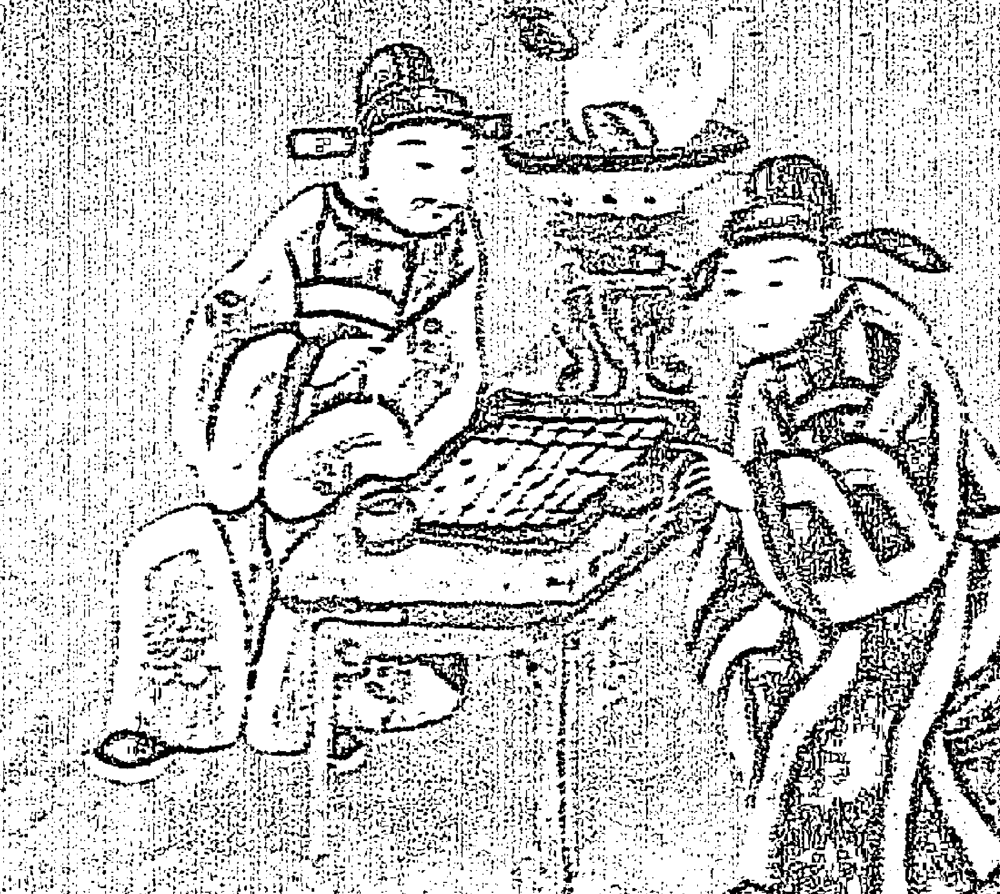

# 飞星紫微斗数说命上

蓋萬物之理，莫不自命而推。人道之由，實賴於術。術之最上者，命星是也。蓋人之命，上繫於天星，下根於形氣。是以星度有變，人事隨之。然則命星者，豈不微妙哉？然術者，不可泥於星命，亦不可棄星命。運用之妙，存乎一心耳。

## 北京 王力軍老師序

紫微斗數是傳統命理學最重要的支派之一，以星宿配合十二宮的數術算命方法來推斷吉凶。因其推演系統裡以紫微星為諸星之首，故得名為「紫微斗數」。依照紫微斗數的理論，一個人出生時的星相決定人一生的宿命；同時，按一定次序出現的星曜對相對應的人的命運也具有特定的影響，因而分析人出生時的星相亦可以判斷人的流年大運。

紫微斗數斷命，先查出人的出生年、月、日、時干支，繼後畫出人的十二宮圖（命宮、父母宮、兄弟宮、夫妻宮、男女宮、財帛宮、疾厄宮、遷移宮、奴僕宮、官祿宮、福德宮、父母宮），依出生圖的五行局查出相應的星名（包括天文學上沒有的天機星、天府星、文曲星、羊刃星等虛星）分別填入十二宮內，排出命盤，然後結合各宮的星相組合、干支理論，來預測一個人的流年運程、吉凶禍福。

相對于子平術而言，紫微斗數淵源較早，二者同源而分流，故並稱為中國傳統命理學的兩大派別。相比子平推命術、五星術而言，紫微斗數流傳較廣，斷語明確，應用簡易，不像徐子平術、五星術那樣複雜難斷；而且紫微斗數推命術既具有道家宇宙觀的神秘色彩，又具有注重社會環境、人際關係的近代意蘊，因而在多種神秘文化中卓立特出，名列「五大神數」之首，號稱「天下第一神數」。

紫微斗數始于宋朝的陳希夷，距今已有一千多年的歷史，但傳統的紫微古籍並不多見，研究者也不算很多。在民國二、三十年代，只有《紫微斗數全書》、《策天十八飛星紫微斗數》、《斗數宣微》、《斗數觀測錄》等書傳世。到民國六十年代，港臺地區逐漸形成「斗數熱」，其著作也如雨後春筍，至今已達六百多種。現代紫微斗數主要分為兩大派別，即星情三合派與四化飛星派。紫微斗數的要點在星情、格局、四化，三合派重星情，飛星派重點在四化，四化是斗數的精髓。

臺灣當今紫微斗數大師梁若瑜先生，精研紫微斗數三十多年，大徹大悟，是非常難得的明師，可以說是代表了當今斗數最高水準。梁先生的主要著作有：《飛星紫微斗數一『道藏飛秘』的邏輯與功法》、《飛星紫微斗數一專論四化》、《飛星紫微斗數一『十二宮六七二象』廣義的基礎論斷訣》、《飛星紫微斗數一生命解碼『周師手法』》等著作問世。最近梁先生新作《飛星紫微斗數一說命『生活化的斗術四化精華』》完成，其書通俗易懂，並附大量詳實案例，是一本值得向廣大學人和讀者推薦的佳作，余樂為之序。

北京周易研究會 副秘書長
飛盤奇門遁甲《奇門鳴法》傳人 王力軍

2014年11月20日

## 自序

飛星「四化論命」是門不怎麼深奧卻很繁瑣的學問，理由是一人一命、各有造化，造化不同所以命盤組合串連的變化也大不相同，容易讓人眼花撩亂。因此四化論命只能用絕對「邏輯」與「理氣」的分析才能解開千變萬化、不同組合的具體象義，決沒有不傷腦筋、一網打盡、放諸四海皆準的「套用公式」。從命盤上命理的解釋象到對求算者口語化的精準敘述，非經千錘百鍊、深切體悟命理的「邏輯」與「理氣」解析外，別無他法。

對於命盤的分析，我們必須思考從「達官貴人」乃至「販夫走卒」間不同的社會層次，就有不同的人事背景和思維與不同的喜怒哀樂，做到「生活化」的紅塵體悟，而後對於命理的釋象，才能做到「口語化」恰如其分的事理敘述。只有融於感同身受的命理體會，而後你就會知道甚麼叫做「心領神會」。本書名為《說命》，是想以口語化的敘述，讓諸君把命理融入生活喜怒哀樂的受覺中，庶幾可以明瞭命運裏頭的「因緣果報」產生的吉凶晦吝等軌跡。也願各位「知命」、「立命」，趨吉避凶。

吉避凶而后「立己利人」。

太極生兩儀，兩儀生四象。斗數的「四化」即緣於「四象」，也就是大自然界的「春夏秋冬」—四季（四時）覺受的衍化。春夏秋冬给人类带来了无限经验的累積。从春耕播种的充满希望到夏耘壯盛的結實累累，乃致於秋收時北風黃葉的肅殺，到冰天雪地的冬藏蟄伏，成就了人類於生存間的許多智慧。靜觀萬物、道法自然的更讓人類從生活所需到精神層面提升而後產生「形而上」的學問，紫微斗數就是「道法自然」的精準套用天候變化，所產生高度智慧的形而上命理學，道盡了紅塵的「喜怒哀樂」，運用於紜紜人事而妙不可言。

現代人「兩個恰恰好」的少生育理念，讓臺灣幾乎每兩個年輕人就有一個是頭一胎，而頭一胎的生產過程難免較多不順遂，於是「催生」、「剖腹」的機率就大大提高，弄亂了本來的自然生產時間。正確的命盤組合是來自於絕對自然的生產過程，而現代人被加工過的生辰必然多所失準，須先費時費力的「定盤」而後才能論其一生吉凶晦吝，否則將誤人大事、徒造口業。

所謂定盤者，是把求算者「本身」或「周邊親人」已經發生過的大事，拿來找尋與核對出正確的生辰命盤，那是繁瑣的工程。其實，命盤如果生辰正確，論本身或週邊親人發生過的大事，都會八九不離十的令人詫異。「飛星紫微斗數」是絕對「邏輯法則」的論命術，半點都不能打馬虎眼。尤其論到六親諸事，會讓你明白的感覺到一家人的賢愚親疏，早就是定數，也就是能成為一家人是來自於「累世善惡因緣」的果報定數。

某些命理界人士信誓旦旦的說剖腹、催生的生辰照準，因為他（她）就是在這個契機接觸到大氣、來到了人間，所以理所當然照準。於是「擇日」剖腹逐漸風行，也相信剖腹可以開創人類無限的福祉（這是瞎了心眼的大商機）。如果擇吉剖腹可行的話，那麼只要找來一個真正的命理高手，不就可以創造出滿街的王永慶與郭台銘等人麼？欸！「命運」是來自於個人累世「善惡業力」所產生「因緣果報」的具體呈現，甚至還加上祖德的佐使，任誰都沒有德能去改變紅塵本就既定的命運果報。

佛法為什麼說菩薩畏因眾生畏果？是因為菩薩的廣大神通力，也都無能為力改變你早就命定的善惡果報。那麼，人間誰有德能的去改變人世（事）的「既定因果」？藉剖腹生產讓每個人都「生貴子」？藉剖腹生產讓每個家庭都成為「未來富豪」？那豈不是讓這個社會只有達官貴人沒有販卒走夫麼？試問只有達貴沒有販卒，這還能是個社會嗎？告訴你，如果剖腹生產可以讓每個孩子都成為帝王將相的話，我保證這個世界將不得安寧。多帝王將相則必多爭鬥殺戮的戰爭，誰會喜歡：「可憐河邊無定骨，猶是春閨夢裏人！」所以，「擇吉造命」生貴子，還不如「行善佈施」、「孝養父母」、「尊師敬長」、「善導子女」等德行當下、澤蔭於後來得有效果！

然而話說回來，找個吉日良時剖腹生產—討個吉利、寬點人心是人之常情，那又何妨？擇吉造命不可能人定勝天。就像人類過度的開發創造之後，人定勝天的結果—小心大自然無情的反撲！海水淹沒陸地也是人類人定勝天的惡果—地球暖化了；濫墾的結果—土石流沖走了整個村落。這是上帝有錯還是人類自己搞出來的錯？

算命是用「出生當地時間」來運算的，因此不能完全依賴時鐘的時間為準則。因為「時鐘時間」是把地球劃了若干「時區」之後該時區的「統一時間」，面對地球儀位在任何時區靠右邊的地方，一定會比位在同時區靠左邊的地方早天亮，所以「當地時間」因所在地經度的不同，與「統一時間」必然產生或多或少的正負差距。
比如說台北跟北京為同一時區（中原標準時間），所以時鐘時間顯示是相同的，但經度不同，台北本來就比北京早一點天亮，所以台北的當地時間會比北京的當地時間快個些許分鐘。同一時區因經度的不同，最大誤差可以達近一小時。標準的當地時間是夏天早上約五點左右天即將亮，可是一個幅員廣大橫跨數個時區的國家，統一時間之後就會讓某些地方的時鐘六點或七點甚至八點以後才天亮，誤差大矣。所以論命必須搞清楚出生當地時間。

比如新加坡的時鐘跟台灣的時鐘時間相同，但在農曆五月左右的早上五點鐘，在台灣東方已經開始泛白，而新加坡卻要等到六點前後才會天亮，這是因為新加坡把時間訂定與馬來西亞時間同步所致。因此新加坡的「當地時間」與「時鐘時間」幾乎相差一小時有餘，這是典型的實際狀況，別死腦筋的依賴時鐘時間當成論命標準值。也因為使用統一時間，所以在「大陸內蒙古」的晚上八點還正「夕陽無限美」呢！時間的流動運轉是以太陽照射的角度來計算的，懂得經緯度就能精準算出當地的時間，研究命理的人是該下點功夫。

有人說外國出生的人，要把他的出生時間換算成中國的「洛陽時間」來批命，有必要嗎？難道中國的「古洛陽城」主宰了古今中外全世界人們的命運？別天才啦！算命是用「出生的當地時間」為準。

還有，很多人執著於「晚子時」與「早子時」，而造成晚子時的「天數計算」問題，這絕對是天下本無事，庸人自擾之。凡過了晚上11點後就交「子時」，它就是第二天的第一個時辰，所以過了晚上11點後的命該算「第二天」的日子，不必懷疑。古書著墨的「晚子」、「早子」是腦袋陳舊的「纏足思維」。台灣「新竹貢丸」打出的招牌是「自做自售」。

試想，如果堅持「晚子」、「早子」的天數不同，那麼一天中00:00－01:00與23:00－24:00出生的人不就「不同命」了嗎？子時就是子時，同一時辰就是一個命，沒理由變成兩個命！另者，遇上兩個時辰交界的邊緣時間出生的命盤也是難搞的，最好是上、下時辰給定盤推敲一下，否則容易失了準頭、誤人誤事。

> > 記得有書云：『不准但用三時（前後時辰）斷。』良有以也。

「雙胞胎」的生辰相同，卻不可能命運也相同。雖然他們是同年同月同日同時生，但絕不可能同年同月同日同時娶老婆、生小孩、生病與死亡，差異在那？假設他們是第一胎，則男雙胞胎是一個佔「命宮」、另一個則佔「兄弟宮」，女雙胞胎是一個佔「命宮」、另一個就佔「父母宮」（姊妹宮）。如果他們上已有一兄長而不是第一胎，那麼男雙胞胎一個佔「命宮」、另一個是佔「夫妻宮」。假設她們上已有一大姊沒大哥而不是第一胎，則女雙胞胎是一個佔「命宮」、另一個佔「福德宮」。人倫有序是明白的定位，不能搞混。坊間有一說：男女雙胞胎都一樣，一個佔「命宮」、另一個佔「遷移宮」；把遷移宮當成胞弟、胞妹？欸！「遷移」是社會，是廣大因緣位，是人生大舞台，也是悠關人生得失際遇的因緣果報宮，豈能如此狹隘的說命？文章千古事，不可以離開謹慎與良知。

許多命學術者不壽理由有二，「學藝不精誤人」與「心無正念害人」耳！或謂術者不壽緣於「洩天機」，別臭美啦！憑人類腦袋能創造出洩天機的命運絕學？想洩天機就該去請教那個能深層入定的「老僧」吧！還有一個更嘔的事：有謂「兒子」看「子女宮」，「女兒」則看「田宅宮」。噫！「田宅」主「家庭」、「天倫」、「財富」與「宗族」、「祖上」，把「田宅」拿來看「女兒」，女兒不就成了我們的「老祖宗」嗎？不是沒腦袋的亂了人倫與人事嗎？文章「立德」、「立言」，不豫則不立！

河圖：「天一生壬水，地六癸成之。」這就是「一六共宗」的出處。就於斗數命盤，「命宮」的共宗六位是「疾厄」，講白了「健康」才是「生命」的根與本。躺加護病房、危在旦夕的人，還能幹啥？而「疾厄」也是「事業的田宅」收藏宮，少了健康你還做得了大事業嗎？「事業」的共宗六位不是「兄弟」嗎？「兄弟」是「經濟位」，如果連最其碼的週轉金都沒有，還能成就啥事業？「兄弟」也是「身體氣數位」，如果體質差、精神萎靡還能弄出啥名堂？而「財帛」的共宗六位是「田宅」，說到錢財人家要看的是甚麼？當然是看你的「財產」、「房子」。換個立場想，連棲身之地都沒有的流浪漢，頂著汗臭汙垢而妄談偉大的理想抱負，誰會理他？

所以「田宅三方」才是「命三方」的「根本」，故而「命三方」是以「田宅三方」為其「共宗六位」。「田宅三方」被稱為「庫位」，是命格上至要的「收藏宮」、「果實宮」、「成就宮」、「安定位」。所謂庫實則富、庫虛則貧，庫破則敗——「觀庫位知窮通」，格局高低不就出於此嗎？

「田宅三方」既稱「收藏宮」、「安定位」。所以只有「田宅三方」破了的人（三忌或以上），才會「工作不安穩」、「收入中斷」，甚至成為「無業遊民」、「無產階級」、「生活困頓」、「家門不幸」等。因此坊書以「命三方論格局」是大錯誤，因為「命三方」只是「紅塵混飯」的模樣耳，不能拿來論成就的高低。我認識的那個田僑仔甚麼都不懂，只會拿鋤頭、過節儉的日子，你要怎麼論他的事業？他的事業是不很好但卻絕不是爛命一條，因為他的財產比你我都富有太多啦！

「田宅三方」的共宗六位是「福德三方」（果報宮）。大富由天即出於此。何為「天」？「果報」也。大富者，都是來自於「果報鴻福」之使，是「果報蔭田宅」而發財富。反之大貧者，也多見於「果報破田宅」的「家道不興」。故而「田宅」是以「夫妻」為其共宗六位一夫妻為福德的財帛一「福分財」；夫妻宮漂亮，保證來財容易而衣食無缺。「兄弟」是以「遷移」為其共宗六位一成就必須取之於「社會資源」，足不出戶竟日打電玩的啃老族則遑論於成就？「疾厄」是以「福德」為其共宗六位一「健康」與「壽命」源於先天的「福報」或「業障」與後天的「行善增福」或者「造孽減算」耳。

1. 孝養父母敬師長 (父母宮)
2. 童蒙啟善益社會 (子女宮)
3. 財施法施結善緣 (交友宮)

所以命盤以「交友」為「福德」的「田宅」收藏宮，講的就是欲「積德造福」即應從「交友三方」著手。施比受更有福，何須擇吉造命空白喜？潛心斗數而後方知命盤十二宮的深層意義。希夷先生創斗數的「高妙智慧」，絕對是不可思議！

> > 閒聊：百善孝為先，人道也。盡「孝道」是「道法自然」的順天應人。孝道沉淪必然「心魔難伏」，學命何益？

## 自序

命理上有個規則，任何的「化祿」或「化忌」都該做「轉忌」的動作，用以明白吉凶的「事理方向」與「事態輕重」，以及生乎於事的大限、流年等「時間契應」。這就是飛星論事「追根究底」的必要手法。比如說，「命宮」化祿入「財帛」，是現金方便、來財容易象，設轉其忌入「田宅三方」，那麼你可能會進財順遂、越來越富裕的購屋置產；設轉其忌入「交友三方」，那你可能只是方便的過手了許多錢的散財童子，花錢愉快而後不見得有多少存餘。所以，不轉忌你能搞清楚甚麼狀況？

註：「命宮」化祿入「財帛」也容易情緒常好，乃「財帛」坐「祿」即為「福德」的「祿出」而「脾氣較好」與「生活多樂」。

又比如說，「命宮」化忌入「財帛」是「為財所役」一賺辛苦錢或拿薪水的固定收入（不是愛財死要錢）；設轉其忌入「田宅三方」收藏宮，那麼你會點滴累積而後越來越富有（這就會愛財）；設轉其忌入「交友三方」沖「田宅三方」收藏宮，那你可能是個散財童子，口袋有錢肯定心就要出點亂子花錢去；不然就是你的負擔重，口袋的鈔票老是長翅膀給飛了。

註：上式也容易產生情緒問題，乃「財帛」坐「忌」即為「福德」的「忌出」而多「急性子」，呈雙忌（或以上）則「脾氣較差」。

- 有些人把「命宮」化忌入「財帛」說成「個性愛財」，說人家是會計較的錢嫂，真是冤枉啊大人！它只是「賺辛苦錢」或拿「固定薪資」的象義而已。坊書曲解象義的說法比貓身上的毛還要多。
- 「命宮」或「財帛」化忌入「田宅三方」就會節儉愛財；以及「命宮」或「福德」坐或化武曲（正財星）忌的人，會比較精算於金錢，那才是「愛財計較」。以「福德」之化尤甚，此式化忌如又串連入「田宅三方」收藏宮最是愛財計較。

所以，命盤任何一宮所化的「祿、忌」象義，如果你不去「轉忌」作追根究底的動作，你真能深入命盤的奧義嗎？事實上任何宮位「化祿」或「化忌」的「轉忌」之後，還須要作「追祿」、「追權」或「追忌」的動作，用以廣泛的彙集其「吉凶因緣」，方可作出較完整的下斷而庶幾少失。

比如說，「夫妻」化祿入「兄弟」，是異性緣較早來之象；設「轉其忌」入「遷移」，追「疾厄」化來同星曜的「祿」來會呈「雙祿」，則第二大限（不論踏兄弟或父母）必然產生異性與我形影相隨。追祿而後須轉忌，轉「遷移」化其忌（挾雙祿）入「子女」（桃花宮），顯然情慾興矣，容易早早產生了兩性關係。

> > 註：「夫妻」化祿入「六親宮位」是「情緣不遲」。但「情緣」不等於「婚緣」。設「夫妻」所化其忌彙呈多忌破「田宅」或「父母」，照樣會晚婚。誰告訴你早談戀愛就必定會早結婚？

又比如說，「夫妻」化忌入「兄弟」，是異性緣較差（沖交友人際位）象；設轉其忌入「遷移」，追「疾厄」化來（非必同星曜）忌會呈「雙忌」，則第二大限（不論踏兄弟或父母）必產生異性緣差的形單影隻象。追忌而後須轉忌，設轉「遷移」化其忌（挾雙忌）入「子女」沖「田宅」家庭，顯然其結婚成家緣更差矣，容易產生晚婚現象。所以，不知道「化祿」或「化忌」的「轉忌」之後，還須要作「追祿」、「追權」或「追忌」的串連動作去擷取更多訊息，那就別說你懂得「四化論命」！

所謂「祿忌同參」與「祿隨忌走」，非指某一宮所化其「祿」與所化其「忌」是同為一碼事，更不是該宮所化其「祿」之落宮會被所化其「忌」之落宮所牽引，而把「忌」之落宮說為「果」、「祿」之落宮就是「因」。那麼假設我「命宮」化祿入「夫妻」、化忌入「財帛」，總不能解讀成我「娶老婆」是為了「錢財」？或者婚後讓我懂得惜財？愛說笑—我婚前就不懂得惜財麼？狗屁不通！同宮位的「化祿」與「化忌」，根本是兩碼事。

「祿忌同參」說的是論任何事要看此事整體所化其「忌」（業力）的串連是否梗於當頭？何時走過此業力的束縛？須待「忌」去則「祿」（福報）才能出顯，才能順遂。而「祿隨忌走」是假設我「田宅」坐「祿」，逢「交友」以同星曜化「忌」入我「田宅」，則我庫遭劫，這才叫「祿隨忌走」。易以我「田宅」坐「忌」，逢「交友」以同星曜化「祿」入我「田宅」，則為我得彼失的「祿隨忌走」。所以，任何祿、忌飛化都先要搞清楚「宮位象義」，才能定奪得失。

還有一說，某宮「自化忌出」，此「忌出」之力即等同「忌入對宮」。欸！「自化忌出」是無執的消散，是本宮的事，怎麼會跑到對宮呢？這就像你家夜不閉戶引盜賊，那是你家的問題，干對面人家啥事？又有一問，某宮「自化忌出」會不會沖對宮？曰：否！本宮「自化忌出」就像洩了氣的汽球，自身都沒啥力氣了還能找誰幹架？

或問「坐忌」跟「忌沖」之失，差別在那？譬如論健康，健康相關宮位串連多忌入「命宮」、「福德」或「疾厄」、「田宅」收藏宮，必然「糾纏痛苦」的生病折磨，倒楣的話還可能弄成死而後已的拖拖拉拉象；而多忌入「父母」沖「疾厄」，則是如果「當下沒死」就可能「雨過天晴」，是「一翻兩瞪眼」的痛快事。同理，健康相關宮位彙多忌入「遷移」或「本宮忌出到對宮」或「自化忌出」，也是一翻兩瞪眼的生死立判。

有一瞎說：譬如「本命財帛」化忌沖「大限財帛」，主此限不利於財。乍聽有理，實則荒誕。設我命盤「財帛」化忌入「兄弟」是「儉約儲蓄」吉象。當我「大限」踏「子女」，這不就是「本命財帛」化忌沖「大限財帛」（交友）而主此限不利於財乎？愛說笑，這個大限我還很認真的想辦法多存點錢呢！那來的不利於財？因此，凡事是得是失，須先分別本命盤上的「宮位」與「化象」而後再定奪得失，那能「逢忌說凶」、「見祿稱吉」？這種立論弄多了，保證會「腦袋纖維化」！

閒聊：「命宮」、「福德」、「疾厄」是「性格宮」，所化其「祿」為我「性向」或「興趣」之所好，苟若此「祿」能與「遷移」EQ或「父母」IQ所化「彙多祿呈吉」者，則此「所好」當「學而益精」甚或「出神入化」，搞不好還可以站上台面「發光發亮」（遷移、父母為形於表宮）。這種思維就叫「邏輯」，四化論命全都是「邏輯思考」。您不妨參考一下下！我真的不會騙人。

何為「體」與「用」？譬如論讀書、考試，「父母宮」是「體宮」；而「交友」競爭位、「遷移」果報宮、「事業」運氣位，以及「命宮」、「疾厄」、「福德」三情緒宮則都可以為「用宮」。論讀書、考試，你可以從「體」宮（父母）坐或飛出的四化判斷吉凶；你也可以從「用」宮（交友、遷移、事業、命宮、疾厄、福德）同樣飛出四化作吉凶判斷，然「用」宮的吉凶之化最終必須與「父母宮」（體）串連而後才能下斷讀書、考試的好壞，這就是「用不離體」的法則，稱之為「體用合一」而成象，否則枉然的徒勞飛化。

又譬如「交友」競爭位飛出的「祿、權」再怎麼漂亮，而最終不能與「父母」讀書、考試的「體」宮作串連，也不過指的是你人氣好、朋友多而已，根本與讀書、考試沒有關聯，這就是「用不歸體」不能成候。設「交友」、「遷移」、「事業」或「命宮」、「疾厄」、「福德」等宮的飛化串連極美，最終又與「父母」交祿、權彙吉，這表示不但擅長讀書、考試，日後也很能攀緣交際，工作順遂如意象，絕對不是那個只會讀書、不懂做事的「書呆子」。

另者，「原命盤」十二宮也是「體」，大限及其以下的「動盤」宮位則是「用」。譬如大限踏「子女」，設「大限財帛」（交友）化祿入「大限命宮」（子女），很多人會認為這是一個會發財的好大限，那就錯了！就「體用」而言，「大限財帛」（交友）化祿入的宮位是原命盤的「子女」，它不是入我宮，更不是入我庫位，怎麼能說得上發財呢？況且就「體」的觀點來看，那只是「交友」化祿入「子女」，是別人家跟小孩的好關係，怎麼會是我發財？就算是財，那也只是發發過手財而已。因為本命盤上它沒入我庫，所以決不能說我會發財。這就是「用不離體」的道理。

原命盤（靜盤）是「體」，體決定了「命格高低」與可能發生那些「好事」、「壞事」。而這些好事、壞事在命盤上「組合的結構」與「串連的宮位」，是無法改變的「既定格局」。當「大限」、「流年」等為「用」的「動盤」（大限及以下諸盤）隨時間流轉時，觀察此一動盤在此時是契應了原命盤上「好的結構」還是「壞的結構」？好結構的「宮位契應」了多少宮位數？壞結構的宮位又契應了多少宮？則此動盤當下的吉凶休咎就自然心裡有譜了。

許多命盤「好的結構」與「壞的結構」所串連宮位的路徑，常有或多或少的重疊。尤其是逢「生年祿、忌」與「命宮祿、忌」都落在一宮的「祿、忌同宮」，就很容易產生「好、壞結構」所串連宮位的路徑重疊，故而造成某個大限（或流年）既起又落或既落又起等「吉凶參半」的運勢。以我個人的論命經驗，命格高者的好結構，經常是一發不止的產生了比較多宮位的彙吉串連。「彙吉的宮位串連數愈多，吉氣就愈旺、愈長」，很容易連續發達數個大限、數十年的歷久不衰。

為什麼？因為彙吉的宮位串連愈多，行運時讓許多大限都很容易就契應到或多或少的宮位好角度，於是產生了「大順」、「小順」等還是「屬於順」的連續好運程，所以可以歷久不衰。反之，命格低者，好結構的宮位串連沒兩下就給打結了（譬如化祿轉忌逢文昌忌或文曲忌就不能追祿），倒是壞結構的宮位串連起來恰似行雲流水無所止。所以這種的命格總是好運沒三月、壞運連三年的動輒得咎，這時候只能勸他「守成過活」、「平安就是福」。

論命永遠「離不開原命盤體的既定格局」，設本體命格不佳而運限雖吉，乞丐還是乞丐，只會多分到幾個錢，他永遠不可能搖身變成皇帝。所以論命要先「摸清格局的好、壞組合」，再「契應於大限、流年論吉凶」，則庶幾少失。凡本命的吉凶組合契應於大限時的失落宮位，必取流年的對等宮位補足該失落之宮，才能完整的造就「天地人三盤合一」。

何以立「夫妻宮」為「少小限」？乃命盤十二宮中「福德三方」都屬管轄於「果報應世」。約：「少小無力」看「夫妻」，「晚景天年」看「福德」，「營謀生計」看「遷移」。「少小無力」看「夫妻」是早期的人不懂節育而多子多孫，窮人家小孩生多了必然疏於照料，加上早期醫學不發達、營養條件差而死亡率高，所以少小其間經常「福厚者活、福薄則天。」因此管轄「少小果報」就是「夫妻宮」。大抵「夫官線」見忌則少小較多事。

設以「本命健康的相關宮位」串連「多忌呈破」對應於「少小命宮」（夫妻）或「少小疾厄」（交友）等「少小健康的相關宮位」者，則小時候容易生病甚或難養。「少小命宮」（夫妻）與「少小健康的相關宮位」只能是「被動的」與本命盤健康的相關宮位所化吉凶作契應，切勿直接以「交友」（少小的疾厄）飛化論少小的健康，保證你會血淋淋的踢到大鐵板。

「晚景天年」看「福德」是年紀大了須要有人照料，就算有錢過活也還要有人孝養，故以「子女」為「福德」的「共宗六位」，意指子女孝順則晚景少憂。而「福德」則為「疾厄」的「共宗六位」，指的是個人的「福分」與「德行」是直接關係於晚年健康；所以「福德」的坐或化得吉則少病而晚景當然比較好過。否則，就算有錢有人而常年臥病痛苦，晚景仍舊枉然。

「營謀生計」看「遷移」乃「遷移」就是這個「大社會」，就算只是混口飯，你還是得取之於社會。想發大財，那更需要善用這個社會的資源。「有為之齡」誰能與社會脫節？除非沒了心眼的啃老族！「事業」的共宗六位是「兄弟」收藏宮，論「事業規模」須看「兄弟」成就位的好壞；而「兄弟」的共宗六位不就是「遷移」這個大社會嗎？人生營謀的「好壞際遇」多出於此，所以我們說「遷移」是「人生的際遇位」、「人生的大舞台」。所以，「遷移」坐或化不美而性拙，「命格」就會「大打折扣」難有作為。

本來「夫妻」跟「子女」都來自於「因緣果報」，不是嗎？「福德三方」都是「果報宮」，「夫妻」佔其一當然與果報有關，宗教：夫妻是「三世因緣」。而「子女」則為「福德」的「共宗六位」，也當然與果報有關；所以說子（子女）孝孫（遷移）賢老無憂。實則「子女」在論「健康」及「根器」上，我們是經常直接的把它說成「果報宮」。事實上「父母」也是來自於因緣果報，因為它是「遷移」果報宮的「共宗六位」。那「兄弟」呢？它是「福德」的「子女」（子女為我所生，所以「兄弟為果報所衍」），當然也跟果報沾上了邊。

其實「今生能成為一家人，都是緣自於累世而來的善惡因緣！」歹命女決難嫁為豪門媳，而朱門酒肉間隱## 自序

藏了多少個深宮怨婦？子嗣旺衰或敗家？婚姻幸不幸福？兄友弟恭還是兄弟閱牆？穿金戴銀還是出身寒微？在在都是「果報定數」。唯有「念善德厚」才有機會娶好媳、生貴子；唯有「百善孝為先」才夠格享福於子孝孫賢。因為，人類是善長模仿學習的動物，如果為人父母事親不孝，耳濡目染的結果，可以保證兒女也會對他（她）不盡孝道。這就像從前新幾內亞的食人族，殺人吃人肉是代代傳承的當然耳事，沒有絲毫罪惡感，以其無智所以讓他們很難爬上進步的世界舞台，還得繼續蠻荒的與蛇蟲共舞。我們有幸身處文明世界的現代人，勸君姑且「相信因果」；對你雖然不見得有多少好處，但也絕對不會有半點壞處！

註：如果殺人有罪應處極刑，則茹葷殺生又將如何看待？太多事理我搞不懂，我只知道佛曰：「眾生平等。」物競天擇讓人類「唯我獨尊」；唯我獨尊也教人類搞亂生態平衡，產生地球暖化而漸自毀滅，以及永不休止的無智戰爭相殘。

- 凡所有「能量場」（磁場、氣場、電場……）是必須取得平衡的。當人類懂得可怕的傷亡而停止戰爭，則「眾業」又該如何了結？天災地變也能平衡果報業力！因此，野生的老虎吃牛羊是無知，人類的吃牛羊是無智！（你可以當我狗臭屁）

## 說命 生活化的斗數四化精華－上册

須知，一個人累世帶來的「業障」與「福报」所衍生的「果报应世」，是不能用数学概念作思考的。它不是1+1=2，也不能1-1=0，它是一码归一码的严肃事，也就是「福归福」、「祸归祸」的契应方式。何以如此？

比如，甲在某人世欠了乙一万元，而丙在另一个某人世欠了甲也是一万元，在「果报」立场是无法要丙直接给乙一万元就可以达成和解了事的。因为在「累世轮回」里，乙跟丙可能是八竿子都打不着的两个不同世代的两个人，如何算清这些「时空背景不同的因果帐」？所以只能一码归一码的作了结，于是乎人间就产生了诸多不同时段、不同对象的不同喜怒哀乐事。讲不清楚也说不明白的果报应世事。

换成命理立场言，「忌多」就要生病、「禄多」是可以化险，生病是一回事，治得好治不好又是一回事。所以，论健康如果「忌胜于禄」，终究是哀戚仰首尘寰；如果「禄胜于忌」，则几经折腾仍可以化险为夷，但毕竟是要经折腾才能「消了业障」而后了事。所以在忌多禄也多之下的健康组合里，苟「禄胜于忌」也只能是产生「遇难呈祥」的情况，而没有「祸不临身」的道理。

除非你「行功立德」而得吉神（或为善念善德所汇集而成的好气场）庇佑间以福转祸、将功抵罪，否则果报应世的方式是公事公办、一码归一码的丝毫不爽。噫！讲不清楚的缘果报。

许多人相信凡事都有「定数」，是的！凡事都有定数，是「相对定数」而不全是「绝对定数」。早期的姑娘十八岁就要被推作堆的结婚生小孩，现代的女人二十八岁也还不愿穿嫁裳失去了自我遨翔的自由，谁说结婚年龄是定数？其实每个人在适婚之龄，都会有多少少的情缘来靠近（这就是因人而异的相对定数），妳高兴选择第几个情缘结婚，可以悉听尊便，那来的绝对定数？现代人不是普遍越来越晚婚？

过去的心血管阻塞（狭心症）很容易教人准备驾鹤西归，现在只要使用心导管撑上几根支架就可以离棺工作去，台湾的阿辉伯不就是心脏撑满了支架还能大声小声的不平则鸣吗？过去的人脑部深处长瘤也很容易羽化登仙说再见，现在精准的微创手术照样起死回生，那来绝对定数？但是，命理上必然显像你什么时候会有业障临头的麻烦（因人而异的相对定数），只因时代背景不同而吉凶不同。从前人生七十古来稀是件值得高兴的大喜，现代人生八十也没啥好得意！学命者千万不可以死脑筋，很多事情都没有绝对的定数。研究命理能看到「相对定数」就很高招啦，只有「上帝才明白绝对定数」。

古云：一命二運三風水四讀書五積德，這個觀念於現代，時空背景不同，供參考耳。時代的不同，觀念也當然不能同日而語。古人是認命的「等待機會」，而今人則應秉盡人事而後知天命的努力「充實自己」與「創造機會」，豈能食古不化的被動生趣？西諺：智者創造機會，愚者等待機會。

達爾文：物競天擇，適者生存！這才是絕對的「生命觀」。聰明人必然打起精神充實自己、開創未來；慵懶則頹廢而少了內涵、沒有鬥志的等待機會，當然少掉生趣與自減生機。這就是「性格左使命運」，夫復何言？「智者千慮必有一失，愚者千慮仍可一得。」勤能補拙，盡人事而後知天命者，庶幾無過。

閒聊：以我個人的粗淺閱歷及五術經驗，『斗數陽宅』是以個人命盤上「十二宮的方位」作「方位吉凶」去安排陽宅的「陰陽動靜」（陽本動而陰好靜，動靜得宜則可趨吉避凶）。是可以精準為「個人」趨避（動靜得體）的『陽宅理氣學』。「斗數陽宅學」於實際運用，命格高者的陽宅安排可以得於生趣佳構，益發順遂；命格低者則陽宅佈置容易捉襟見肘、難以周全，但退而求其次還是可以讓人能住得比較平安喜樂。陽宅既然是給人住的，當然房子的佈局要合於住戶『個人命格』其吉凶方位的「趨吉避凶」（陽動陰靜）。所以「斗數陽宅學」就是以個人命格創造出屬於「個人的優質氣場」—是以「個人命格」為基礎的『人本陽宅學』。不同於一般風水師不依個人命格配置的「屋本陽宅學」，以為他們認定的好陽宅是任誰住了都該會爛命變富豪。你說可能嗎？

- 既以命盤安排陽宅的陰陽動靜，當然可以為個人精準的趨吉避凶（先確定命盤是否絕對無誤）。所以古人先言命、言運而後說風水（一命二運三風水），應非空穴來風。因此「斗數陽宅」是命格決定陽宅風水的高低之得，是不離「福地福人居」的真理之學！它當然是不能讓乞丐變皇帝，但可以讓每個人獲得更多的吉祥與如意。（請君姑妄聽之）
- 有人深信得吉穴或巧妙佈局於家宅可以旺發鴻圖、大利財官，殊不知吉穴與鴻圖全植於個人善良的心田中。只有積德行善才能成為有福之人而居有福之地。因為，「地理」還是離不開「天理」的範疇。如果只要懂得風水學就真能讓乞丐變皇帝，那豈不是個個風水師只要搞定自家的墳、宅而後就有機會加官晉爵、乾坤大挪移？那為什麼沒聽過歷代開國皇帝的祖先裏頭有幾個是堪輿名師？也沒聽過歷代那個堪輿明師的後代是百世其昌、福澤不絕於後。

- 我不是藐視中國人的風水學，我只是搞不懂西洋人的公墓全都排排站，為什麼不會沖剋仙命（往生者）還能站出世界的強權？因此，搞五術的我們是否該深切自省，確定您之所學是絕對能造福於人還是自以為是的自誤誤人？
- 中國人最會穿鑿附會：「瞎眼地師替天行道！」這有點幸災樂禍或者酸葡萄的心理，不是做學問的態度。但是，百家爭鳴的中國風水學，有太多派別的看法相左、太多門戶的意見分歧，爭論千年仍然喋喋不休，到今天也沒有真理愈辯愈明的結論，教人如何看懂誰是真學誰是偽學？請問你還能相信誰？我這不是批評，我說的是多年來梗於胸中的真話，還請先進多多包涵。
- 近代堪輿大師王德薰先生臨終前告訴圍在床邊的入室弟子：「風水學是騙人的！」諸弟子有如晴天霹靂。這是人之將死其言也善乎？（僅供參考，請多包涵）有人說「鐵板神數」與「梅花易數」不是出自於邵康節之手，也有人說「紫微斗數」也不是陳希夷的創作，請問你可以相信誰？但是我知道論命的答案對錯，是面對客人一翻兩瞪眼、毫不留情的明白事（除非你不循正道）；而堪輿下葬的對錯，那就要後事還須問後人的等它多少個若干年後才能明白得失，反正物換星已移、死別早吞聲，那個子孫會知道當年老祖先選穴時，腦袋裏裝了什麼想法？

- 我雖然不太懂易經的大道理，但我還是存有些許良知—「己所不欲勿施於人。」千萬別把自個兒都沒自信的道理用在別人身上，因為做人還是要活得心安理得較快活些。別拿人錢財又不能與人消災，捫心自問你幹了啥事？難怪歷代有許多的術者墮入了孤貧夭的下場，還自恃甚高的自以為洩了天機而引以為傲的歡喜接受天責地譴。做人千萬別太多的自我感覺良好！

嗚呼！盤腿沒幾分鐘就受不了的人，有甚麼資格能洩天機、遭天譴？有幾個命師與堪輿師能五世其昌？雖然我不大懂得佛法，但我非常相信：「善念當下，心田即淨土；諸惡莫作，福地福人居。」

命學浩瀚，我只是順藤摸瓜的摸索學習並據實告予諸君心得，知無不言的盡棉薄薪傳之力耳。吾母篤信佛法（三年多前已往生極樂），謂余：言命何益？徒造口業，不若修行！對以：不知命無以為君子。知命或可教人「相信因果」而生諸「敬畏心」一「敬天地」（愛護大自然）、「孝父母」（百善孝為先）、「禮師長」（傳道、授業、解惑）、「佈施於人」（財施、法施、無畏施），以及「暗室無虧心」（己所不欲勿施於人），不亦修行乎？有所不為而後才能有所為一『敬畏之人當生好作為』！

閒聊：敬天地、孝父母、禮師長、善導兒孫為人倫大道。捨此何來子孝孫賢五世昌？

晚近驚聞台灣斗數界多不壽的損兵折將，何若此？捫心自問而後諸多感慨：夕陽無限好，只是近黃昏。之於命理研究埋首三十餘年，東施效顰：行到水窮處，坐看雲起時；一路走來深覺「在在皆有命」。

> 『有感而發』：因緣果報環環扣，幾家歡樂幾家愁？命中有時終須有，命中無時莫強求。

「忌」者「己心」，苦樂由己：「春有百花秋有月，夏有涼風冬有雪；若無閒事掛心頭，人間處處好時節。」

『感慨世事』：滾滾紅塵濤濤浪，人心不足蛇吞象。（遙想當年）崛起市井酒肉徒，劉邦天福登帝王（就怕流氓有常識）。力拔山河氣蓋世，項羽兵敗刎烏江（剛愎自大：天欲亡我也，非用兵之罪也）。功高震主伏禍機，韓信未央遭夷戮（成也蕭何，敗也蕭何）。足智多謀神算子，諸葛秋風五丈原（鞠躬盡瘁，死而後已）！

## 自序

根，兔死狗烹韓信殤（不遭人忌是庸才，奈何奇才不善終）。且封留侯歸山林，明哲保身話張良（智者急流勇退）。爭雄勝敗何足論，多少蒼生喪沙場？可憐枯骨砌皇圖（被歌功頌德的最野蠻行為），可怕共業（廣大群眾的因果業力）構史章！

## 閒聊：騙子、瘋子、傻子—古今中外三子共構了多少的歷史故事。（博君一笑）

- 人類不是高智慧的萬物之靈嗎？為什麼古今中外老是有沒完沒了的殺戮戰事？陋識：人類是「平齒動物」，理當食素；人類平齒而「殺生食肉」是違反大自然法則，產生了說不清楚、講不明白的大型共業（殺業）。人類的戰亂自殘，恐多緣於此。（可以當我放狗屁）
- 韓信幼年家貧餓困，遇青衣婦授乳救命，後因蕭何知人善任、力薦劉邦其兵法而得遇。領軍掛帥擊潰項羽，成就了劉邦的南面為王，堪稱曠世軍事奇才。功成名就後以功高震主遭呂后（劉邦的老婆）以某反罪欲誅之，也因蕭何使詐而受縛就死，故有曰：「成也蕭何，敗也蕭何。」韓信身後「墓誌銘」：「生死一知己（蕭何），存亡兩婦人（青衣婦、呂后）。」哀哉千古不朽聯！

## 說命 生活化的斗數四化精華－上册

- 劉邦未取得天下前賄絡於韓信：頂天不殺、立地不殺、刀斧不加身。劉邦死後呂后攝政縛韓信於鐘樓緊閉門窗，懸空吊起以尖木置死（最毒婦人心由是而來）。
- 後人喻以：「鳥盡弓藏，兔死狗烹。」道盡了人心險惡無情、帝王誅殺功臣的器小獸行（連誅三族），一代名將竟也下場淒涼。功成名就後的張良僅求封「留侯」，「留」者為劉邦與張良初見面的小地名（意在急流勇退）。

貧賤富貴皆有命，顏回好學早夭亡（命也）；李廣善射終不封（命也），萬世師表餓陳邦（運也）。且盡人事聽天命，何須妄想空勞忙（命中無時莫強求）？鴻福齊天有時盡，粗茶淡飯世業長！

閒聊：顏回—孔子的學生，名列七十二賢。李廣—漢武帝的猛將，不爭功；論功行賞時每兀立邊旁樹下，時人譽為大樹將軍。萬世師表—孔子，時運不濟時曾餓困於陳國。有人說孔子周遊列國是為了求官（死別已吞聲—請發點慈悲心）？

『之於斗數』：太極兩儀生「四象」，「祿權科忌」衍福殃；滿盤「星曜」（教人暈頭轉向）說造化，天生不才鬢髮霜！欲乞知命仰希夷，（敢問）凌虛御空遊何方？滿天星斗悄無言，風簷枕書夢穹蒼（昨晚可能酒又喝多啦）。

> > 註：宇宙形成之初（太極），清輕者上升為天（陽），濁重者下降為地（陰）。天地形成則見日（陽）夜（陰）寒（陰）暑（陽），是為兩儀（陰陽）而生四象（在天成象，春夏秋冬—祿權科忌；在地成形，山川河嶽—東南西北）。

## 閒聊：

希夷先生（陳摶），道家、數術的奇人，「紫微斗數」的祖師爺。自幼聰穎過人、讀書過目不忘。年少京試不中，轉學神仙術而遍遊名山，成道後大睡千年小睡八百。

- 後屢蒙宋帝寵召，賜號希夷先生（道德經、道紀章：聽之不聞曰「希」、識之不見名「夷」。陋見：乃「明心見性、湛然透澈」的大道境界）。力諫宋太祖趙匡胤而后果然杯酒釋兵權，威德豈止高山仰止。後坐化而終、滿室異香於山西道觀，位列仙班（上八仙）。
- 宋帝屢詔希夷，曾以色誘試，先生對以：「雲是鬢髮雪似腮，多謝君王美意來；處士不與巫山夢，空勞雲雨下陽台。」

陋處渾噩而有幸聞道於周清河老師的飛星紫微斗數真實義，浸淫得樂三十餘載；回首紅塵點滴是真，對照命運百般是實。輾轉揣摩而後拊掌驚嘆造化之妙與斗術其微。然金碧輝煌也不離成住壞空，擁金抱玉豈能恆於久遠？唯善可以開枝散葉、澤蔭子孫。天既垂愛，不敢藏私。乃斗數是屬於千秋萬代子孫的所有，願盡棉薄薪傳之力！

李白：風吹柳絮滿店香，吳姬押酒勸客嚐；金陵弟子來相送，欲醉不醉『各日觴』。學習本來就是「師父領進門，修行在個人。」說盡「學理」也還須要後學者弄進「心眼裏」。如果想學而甚解，請您努力的體會生活。種瓜得瓜，種豆得豆，命運與因果之論乃當然耳事。但願後學「術德兼修」而後「立己利人」。堅信：「江山萬里，何處無賢德？朗朗青天，青出於藍更勝於藍。」

2014甲午中秋 台灣竹塹 梁若瑜謹識

## 第一章 父母的婚姻

看父母的婚姻，相關聯的宮位如下：

1. 兄弟宮：是「父母的婚姻位」，也是「媽媽」的命宮。看父母的婚姻以「兄弟宮」為「體」，下述餘宮為「用」。
2. 田宅宮：假如「父母離婚」就是把我現有的這個「家給拆了」。
3. 父母宮：是「爸爸」的命宮，也是所謂的「文書宮」。
4. 果報宮：「福德」與「遷移」兩宮。假設父母離異這也可能是個人的「因緣果報」上早就註定你會出身在父母有問題的不圓滿家庭。

上述宮位串連呈「四忌」（或以上）之破，父母就有「離婚」危機。

設「兄弟宮」與「父母宮」所化交祿，並與「田宅」或「疾厄」串連彙吉者父母是「好姻緣」；設又與「福德」或「遷移」串連交祿彙吉者，則父母是「善緣之婚」。

## 說命 生活化的斗數四化精華－上冊

註：或問為什麼不看「事業宮」？那才是父母的田宅。錯！父母沒離婚前他們的家就在你的「田宅宮」。他們離了婚，拆的還是你的「田宅宮」。

- 假設父母果真離了婚，而你是跟母親同住的話，那麼論及父親日後的家庭狀況，這時候就需要以「事業宮」來看「父親的田宅」。如果你是跟父親同住的話，那麼論及母親日後的家庭狀況，那就要看「福德宮」（母親的田宅）。
- 「福德三方」都是果報宮。人生在世的許多較大的好壞際遇，多數為果報之使所產生的結果。譬如常看到非常注重養生的人卻罹惡疾早亡，長庚醫院的林杰樑醫師不就是最好的例子！
- 「福德三方」—「福德」、「夫妻」與「遷移」三宮，「夫妻宮」較偏屬「少小福分」與個人「情緣」或「婚姻」的吉凶果報；而「福德宮」與「遷移宮」則管轄著每個人一生中許多事情的因緣、際遇與得失，當然包括父母離婚帶來的不幸也可能與它有關聯。

## 第一章 父母的婚姻

### 命例六、坤造（1994）甲戌年10月午时生

|  | 紫 殺 | 〈大限〉 |  |  |
| :--- | :--- | :--- | :--- | :--- |
| **3-12 《命》己** | 機 梁【科】 昌 | 〈兄〉戊 |  |  |
| **13-22 〈父〉庚** |  |  |  |  |
| **23-32 〈福〉辛** |  |  |  |  |
| **〈田〉壬** | 廉《祿》 破《權》 | 〈事〉癸 | 曲【忌】 | 〈友〉甲 |
|  |  |  |  |  |
| **〈夫〉丁** | 陽《忌》 巨 | 〈子〉丙 |  |  |
|  |  |  |  |  |
|  | 武《科》 【祿】 貪【權】 右左 | 〈財〉丁 | 同 陰 | 府 |
|  |  |  |  |  |
|  |  |  |  |  |
|  |  | 〈疾〉丙 |  | 〈遷〉乙 |

父母早離異，而生父不數年後亦不壽病歿，此即「家道不興」所衍。本造從小隨母同住，母為了生計與另一男子無婚同居，又生一弟；然該男子貪杯戀酒、終日昏沉而又分手。由於母親模樣好看，不免一路多招桃花。爾後時來運轉幸運的陸續遇上兩個不同良人也分別「贈產」，於是生活悠遊。多少貌美女子際遇不佳，唉！「人美還不如命美」。

#### （一）家道不興

註：「家道不興」通常會產生或多或少的「丁財凋零」，以串連忌數的多寡分別輕重。嚴重者稱之『家道中落』（四忌或以上），常令家庭（族）「門昏楣暗」、「丁財凋零」、「門風不佳」、「家庭失和」、「遲無婚嫁」、「親疏朋離」，或者家庭成員「性格扭曲」、「各自為政」（少了家庭向心力）；甚或「糾纏惡習」（吃喝嫖賭毒）、「挫折敗產」、「災病壽促」等。命理上是什麼樣的組合造成『家道不興』？

(1) 「田宅宮」：它涵蓋了「財產」、「家庭」與『祖先』、「宗親」的宮位。以及「住所環境」、「房舍」等。
(2) 「果報宮」：「福德三方」都是果報宮，涵蓋了「福德」、「遷移」與「夫妻」三宮。但「夫妻」偏屬管轄「少小福報」及「婚姻」與「異性感情」的事。與「家道」有關的果報宮就是『福德』與『遷移』兩宮。而『子女』為「福德」的共宗六位，也是「果報宮」，當然也可能影響家道。但屬性上它是偏向「小輩」之論。
(3) 所謂的『家道不興』就是『田宅宮』與『果報宮』所化其忌產生沖激呈破，忌數串連越多，家庭（族）越是不得安寧。

## 第一章 父母的婚姻

本造「福德」果報宮（辛未）化文昌忌入「兄弟」，遙對「交友」所坐文曲「命忌」，令兄友線呈「雙忌」。逢「命忌」須轉忌，轉「交友」（甲戌）化太陽忌（挾雙忌）入「子女」逢太陽「生年忌」呈「三忌」沖於「田宅」。此「田宅」與「福德」果報宮串連呈破，即為「家道不興」。逢「生年忌」須轉忌，轉「子女」（丙寅）化廉貞忌（挾三忌）入「事業」運氣位。「遷移」果報宮（乙亥）化太陰（暗曜）忌入「疾厄」（丙子），轉而化廉貞（邪淫曜）忌亦入「事業」。彙前述令「事業」呈「四忌」之破，此「田宅」與「福德」、「遷移」兩果報宮串連共破，難免「家道中落」而生諸晦。

註：上式「家道中落」串連呈破於：

(1) 兄友線，所以父母的婚姻離異、同母異父的唯一兄弟也少小分離而形同陌路。
(2) 「子女」與「疾厄」串連呈破，防日後「婦科問題」手術（廉貞忌、文昌忌）與「子嗣緣」不佳（果報與子女相破）。
(3) 多忌入「事業」沖「夫妻」，防日後「婚姻生離死別」（果報破婚姻），以及淪為小三（會廉貞忌邪淫曜、太陰忌暗曜並串連於「遷移」社會秩序宮—門風不佳）

## 說命 生活化的斗數四化精華一上册

註：「婦科問題」必須「子女」與「疾厄」兩宮串連共破呈病。開刀須會廉貞忌（或太陽忌）（血光）、文昌忌（手術刀），加巨門忌為「瘤」或「慢性病」、「藥罐子」（四忌或以下）、「癌」（四忌或以上）。

重點：健康宮位所化設不見廉貞忌（血光），易以「太陽忌」（心臟、血液循環）依舊有開刀的可能性。

註：「性功能」障礙也是「子女」與「疾厄」兩宮串連共破（三忌或以上）會貪狼（桃花曜、腎臟）忌或廉貞（次桃花曜—性）忌，並串連入「遷移」或「父母」或「財帛」形成「忌出」；以及彙多忌入某宮逢本宮「自化忌出」或本宮「忌出」到對宮等。乃多忌的「忌出」則窘形於表的「冷感」或「欲振乏力」（必須串連桃花曜化忌）甚或「永垂不朽」（四忌或以上），男女命皆同。此式亦主女命「受孕率低」或容易「流產」的體質。

。「子女」與「疾厄」和「福德」或「遷移」兩果報宮所化串連呈「四忌」（或以上）之破者，也常見「不孕症」或「孕產過程」不順遂。會廉貞忌（血光）與文昌忌（手術刀），容易「剖腹生產」。

#### （二）父母離異

本造「兄弟」宮（父母的婚姻位）（戊辰）但見天機「自化忌出」，這是母親個性上可能有些「不圓融」、「少情趣」之象。單一的「自化忌出」殺傷力微，不會是父母離婚的主因。

「命宮」（己巳）化文曲忌入「交友」沖「兄弟」父母的婚姻位，加上前述「兄弟」宮的「自化忌出」，這會有些許的礙及父母的緣分。而「福德」果報宮（辛未）化文昌忌再入「兄弟」宮，就會與「交友」所坐文曲「命忌」產生呼應，令兄友線兩頭呈「雙忌」，這時候「兄弟」宮（父母的婚姻）就有了「果報」上的小損，但還是達不到離婚的條件。

重點：上式「命宮」與「福德」所化令兄友線呈雙忌，卻見「兄弟」本宮「自化忌出」，此時不得作「三忌」論。乃「三忌」（或以下）逢「自化忌出」，忌出消散有「削弱傷害」之功；「四忌」（或以上）逢「自化忌出」，有「助長覆滅」之惡。所以「自化忌出」不能視為正規的一忌。成敗皆蕭何。

註：「離婚」至少須累積「四忌」（或以上）才有足夠的破壞力，並且是「婚姻」（夫妻）與「家庭」（田宅或父母）串連共破才構得上離婚的條件。

## 說命 生活化的斗數四化精華－上冊

註：四化運用上有個規則，「生年祿」、「生年忌」與「命祿」、「命忌」及任何宮位飛出的「化祿」或「化忌」都應作「轉忌」，用以明白吉凶的「事理方向」與「事態輕重」，以及「時間契應」。這是「追根究底」的論事必要手法。

上述兄友線串連呈「雙忌」而些許傷了父母的婚姻。逢「命忌」須轉忌，轉「交友」（甲戌）化太陽忌（挾雙忌力）入「子女」宮又逢太陽「生年忌」呈「三忌」沖於「田宅」家庭。父母的婚姻與「田宅」串連受創，則「父母的婚姻」與我的「家庭緣」有了負面意義。逢「生年忌」須轉忌。轉「子女」宮（丙寅）化廉貞忌（挾三忌）入「事業」。論父母的婚姻彙三忌於「事業」沖「原命夫妻」，這就是父母婚姻呈「三忌忌出」的緣薄象，父母相處必然「貌合神離」。

註：論婚姻所化彙多忌於「事業」，等同「夫妻」得多忌的「忌出」而緣薄，輕則「兩心不相繫」、「貌合神離」，重則「分道揚鑣」（四忌或以上）。

「父母」宮爸爸（庚午）化天同忌入「疾厄」，追「遷移」果報宮（乙亥）則化太陰忌也入「疾厄」呈「雙忌」，這象義是有些許不吉，說明了果報上（遷移）本造的「父緣」有些不佳。果報傷父緣。

## 第一章 父母的婚姻

| 紫殺 3-12 《命》己 | (大限) 13-22 〈父〉庚 | 23-32 〈福〉辛 | 〈田〉壬 |
| :--- | :--- | :--- | :--- |
| 機 梁【科】 昌 忌出 〈兄〉戊 | 箭頭網絡： 1. 禁2指向左上角 2. 禁5指向左中 3. 禁1指向左下角 4. 禁4指向左下角 5. 禁3指向左下角 | 廉《祿》 破《權》 〈事〉癸 曲【忌】 |  |
| 相 |  |  | 〈友〉甲 |
| 〈夫〉丁 |  |  |  |
| 陽《忌》 巨 〈子〉丙 | 武《科》 【祿】 貪【權】 右左 〈財〉丁 | 同 陰 ← 禁6 | 府 〈遷〉乙 |

> 註：凡「福德」與「遷移」兩果報宮所化，與任何「六親命宮」所化沖激者，該親緣分即有折扣。彙多忌呈破，則該親多「無緣」或「病厄」、「挫折」等，甚或「生離死別」。

既與爸爸的緣分有問題，轉「疾厄」宮（丙子）化廉貞忌（挾雙忌）又入「事業」，彙前述父母的婚姻呈「五忌」大破矣（等同五忌的「忌出」於本命夫妻宮），所以父母的婚姻最後是「煙消霧散」（夫妻忌出）。

## 說命 生活化的斗數四化精華－上冊

註：其「父母」宮（父親）化忌串連於「家道不興」大破，故其父緣薄而早亡。果報令父緣薄，這就是坊間所說的「剋父」。

前述「兄弟」宮坐天機「自化忌出」對父母的婚姻殺傷力雖微。但綜觀父母整體的婚姻飛化是必然離婚，所以「兄弟宮」的「自化忌出」，也成了「壓倒騾車的最後一根稻草」。

閒聊：理直要和氣，得理要饒人。 有慈悲包容的心，時空的能量會源源不斷的流入你的身體。

#### （三）同母异父的兄弟（私生子）

| 紫杀 3-12《命》己 | 大限 13-22《父》庚 | 福 23-32《福》辛 | 田 壬 |
| :--- | :--- | :--- | :--- |
| 机 梁 昌 〈兄〉戊 相 〈夫〉丁 阳《忌》 巨 〈子〉丙 | 武《科》 【禄】 贪【权】 右左 〈财〉丁 | 同 阴 〈疾〉丙 | 廉《禄》 破《权》 〈事〉癸 曲《忌》 〈友〉甲 府 忌5 〈迁〉乙 |

註：论「同母异父的兄弟」其命理条件：

-   (1)「兄弟宫」为「父母的婚姻宫」，逢「暗曜」（巨门或太阴）化忌的「照」或「坐」，或者「兄弟」宫其化忌、转忌间逢「暗曜」，并与「田宅」或「父母」串连呈破，而且会上「邪淫曜」（贪狼或廉贞）化忌。这就造成了父母在非正常婚姻之下所生的小孩，那就是「庶出」或「私生子」。也间或串连于「文書曜」（文昌或文曲）化忌。
-   (2)容易與「父母」道德宮或「遷移」社會秩序宮等串連呈「三忌」（或以上）之破。
-   (3)「同母異父」的弟弟，則弟父非我父，所以「兄弟」與「父母」所化容易串連沖激。

「命宮」（己巳）既化「文曲忌」入「交友」（甲戌）沖「兄弟」傷父母的婚姻與有些許的礙及兄弟緣；轉而化太陽忌入「子女」宮又逢太陽「生年忌」呈「雙忌」沖「田宅」，則兄弟與家庭串連受創而手足緣較薄。逢「生年忌」須轉忌，轉「子女」宮（丙寅）化廉貞（邪淫曜）忌（挾雙忌）入「事業」。

> 註：斗數四化有一個定律，凡論任何事，只要是化廉貞忌或貪狼忌兩「邪淫曜」串連於巨門忌或太陰忌兩「暗曜」，而且又串連於「父母」道德宮或「遷移」社會秩序宮呈多忌者，容易犯下「遭唾棄」、「不被祝福」、「傷風敗俗」、「黑心偏門」、「不仁不義」等上不了台面的情事。
> 設「命宮」或「福德」兩性格宮所化呈上述組合，恐怕此人心性上存在了小人行邪的不良潛在因子。以「福德」所化較顯。（此式非絕對論，事關後天的環境與教育。）

## 第一章 父母的婚姻

「父母」文書宮（庚午）化天同忌入「疾厄」，而「遷移」社會秩序宮（乙亥）則化太陰（暗曜）忌也入「疾厄」呈「雙忌」，這象義也代表了本造一生中會有些「不光彩」的事發生在她的身上。因為「父母」與「遷移」是「處世應對」的表象宮，此二宮破了令本造顏面上會有些不好看。

化忌須轉忌，轉「疾厄」宮（丙子）化廉貞（邪淫曜）忌（挾雙忌）又入「事業」，彙前述「兄弟」之化的串連呈「四忌」之破。以其「廉貞忌」會「太陰忌」串連於「兄弟」宮與「遷移」、「父母」，故而其「母」與「弟」當倍受爭議，所以弟是非正常婚姻所生的「私生子」。以其「兄弟」與「父母」串連沖激，故而「弟父非我父」。

> 註：由於其「兄弟」沖「田宅」復與「疾厄」串連共破，故而其母與繼父分手後，繼父憤而攜弟離去從此老死不往來。凡「六親命宮」與我「田宅」、「疾厄」串連共破者，則此親必「少聚」甚或「無緣共處」。「一忌」是紅塵當然耳事、「二忌」費心多勞非大過，凡事至少須串連呈「三忌」（或以上）之破，其敗方顯。常見坊書「一忌言生死」，人生不就步步驚魂？

#### （四）母何來其美？

| 紫殺 | 〈大限〉 |  |  |
|------|----------|--|--|
| 3-12 《命》己 | 13-22 〈父〉庚 | 23-32 〈福〉辛 | 〈田〉壬 |
| 機〈母命〉 梁【科】 昌 |  |  | 廉《祿》 破《權》 |
| 〈兄〉戊 | 自化忌 |  | 祿1 〈事〉癸 |
| 相 | 祿3 | 忌2 | 曲【忌】 |
| 〈夫〉丁 |  |  | 〈母遷〉 〈友〉甲 |
| 陽《忌》 巨 | 武《科》 【祿】 貪【權】 右左 | 同 陰 | 府 |
| 〈子〉丙 | 〈財〉丁 | 〈疾〉丙 | 〈遷〉乙 |

註：觀「長相」，必看「父母」與「遷移」兩「形於表宮」。化「科」則「秀氣」固然可人（雙科亦美），而化「祿」則能讓人愉悅，非長相之美也必然可愛、親和、好人緣。

-   如果「父母」或「遷移」兩「形於表宮」坐或化出廉貞祿或貪狼祿兩「桃花曜」的話，保證不是「長相好看」就是「聰明可人」、「才華洋溢」者，魅力必然較好。桃花曜串連越多祿則越美。果能再串連於太陰（玉潔冰心）祿者，「沉魚落雁」之容由此出。「聰明可人」或「長相漂亮」，人生容易多得方便與討到便宜。
-   反過來說，「父母」或「遷移」坐或化出呈多忌者形容「嚴肅」或「羞怯」或「俗稚」。此式如串連於太陰忌、廉貞忌、貪狼忌呈「三忌」（或以上）者，容易「長相抱歉」或「尊容其異」。

本造「母命」（兄弟）宮坐天機「自化忌出」，除了性直，也可能還存在了些許嚴肅或少心機的模樣（忌出）。「母遷移」（交友）宮坐文曲「命忌」，還是性直、嚴肅，所以可以想像她母親的模樣必然是有些冰冷。

註：「母命」本宮「自化忌出」，「母遷」宮坐文曲「命忌」也是「忌出」。此雙重的「忌出」必令其母「膽怯」而「沒自信」，是屬「不能自立」的依賴格，男命容易成為「啃老族」，女命逢此多「非職業婦女」。

「母遷移」形於表宮（交友）（甲戌）化廉貞（桃花曜）祿入「事業」（癸酉），表象佳而不讀詩書也可人；轉而化貪狼忌（挾祿）入「財帛」，復得「母命」（兄弟）宮（戊辰）化來貪狼（桃花曜）祿會呈「雙祿」。母表象宮得「桃花雙祿」，故而母當漂亮而不免蜂飛蝶舞。綜合之，其母嚴肅而美，近似「冰山美人」。「母命」（兄弟）宮（戊辰）化來貪狼（桃花曜）祿入「財帛」（丁丑）（財帛是福德的表象宮），「動情」則「嫵媚盡形於表」的桃花旺象；轉而化巨門忌入「子女」桃花宮，很難守身自律。

閒聊：身體，一定要健康的。

因為它是一切幸福與快樂的基礎。

#### （五）母何得於二男贈產？

| 紫殺 3-12《命》己 機〈母命〉 梁【科】→ 自化忌 昌 〈兄〉戊 相 〈夫〉丁 陽《忌》 巨 ← 忌4 〈子〉丙 | 〈大限〉 13-22 〈父〉庚 祿3 祿5 武《科》 【祿】 貪【權】 右左 〈財〉丁 | 〈母田〉 23-32 〈福〉辛 忌2 同 陰 〈疾〉丙 | 〈田〉壬 廉《祿》 破《權》 自化祿← 祿權1 〈事〉癸 曲【忌】 〈母遷〉 〈友〉甲 府 〈遷〉乙 |
| :--- | :--- | :--- | :--- |

註：得於「贈產」，必屬「厚福蔭產」格。須『遷移』或『福德』兩果報宮與『田宅』所化串連「祿、權」彙吉而獲產。以破軍、貪狼、廉貞「偏財曜」或天梁「高格調曜」之化為佳，餘曜則遜色。串連「祿、權數」愈多則財產價值愈高。乃獲贈財產全賴於厚福之得耳，非強求可致。其餘「橫發」、「偏門」、「中獎」等大財降臨者也都類此推論。

此即所謂的「果報蔭產」、「家道興隆」。

母何得於贈產？鴻福也。「母遷移」果報宮（交友）（甲戌）化廉貞（偏財曜）祿、破軍（偏財曜）權入「事業」（癸酉）運氣位又逢破軍「自化祿出」呈「雙祿一權」，這是福報好、機遇佳象；轉而化貪狼忌（挾雙祿一權）入「財帛」，追「母命」（兄弟）宮（戊辰）化來貪狼（偏財曜）祿會呈「三祿一權」，此即「厚福化旺財」。

追祿須轉忌，轉「財帛」（丁丑）化巨門忌（挾三祿一權）入「子女」，再追「母田宅」（福德）宮（辛未）化來巨門祿會呈「四祿一權」，此即其母「鴻福發產」的果報興家象，宜其時來運轉而「獲贈產」搬新家（祿入子女等同「田宅祿出」搬新家）。

註：吉化串連入「子女」，等同「田宅」的「祿出」搬新家，這也是房子「外觀漂亮」或「庭前寬廣」（子女為田宅的表象宮）象。
-   比如說，「田宅」化祿、權入「遷移」（社會），你可能是出身在人才輩出的「旺族」或「父母有成」的家庭；也或者至少在你出生之後，這個家庭於焉蒸蒸日上。日後你也可能財富有成、房子越搬越大或漂亮（田宅祿出、權出）。除了發產外，甚至也會「子孝孫賢家聲遠」、「光耀門楣」。這就是所謂的「祖德流芳」。

## 第一章 父母的婚姻

「遷移」除了主果報之應外，它也是我們身處的「大社會」。所以「任何宮位」的化祿、權入「遷移」，該宮都會「水漲船高」、「光彩亮麗」而「倍增其吉」。反之，「遷移」化祿、權入任何一宮，該宮也存在「福至天成」、「天從人願」的吉象。

易以「田宅」化祿、權入「福德」的話，則可能出身家庭除了少了好的家聲與光彩形外，一樣都是「財富如意」、「門庭和樂」象。

「父母」也是表象宮，「田宅」化祿、權入「父母」亦吉，但遜色於「田宅」化祿、權入「遷移」之有福。「田宅」化祿、權入「父母」，也容易擁「店面住宅」。此象亦主門風好、家庭（族）多聚會、住家多來客。

## 说命 生活化的斗数四化精华—上册

#### （六） 另者

| 紫殺 3-12 《命》己 | 機 梁【科】→自化忌 昌 《兄》戊 | 相 《夫》丁 | 陽《忌》巨 忌2 《子》丙 |
| :--- | :--- | :--- | :--- |
| <大限> 13-22 《父》庚 | 忌4 忌1 | 武《科》【祿】 貪【權】 右左 《財》丁 | 同 陰 ← 忌5 《疾》丙 |
| 23-32 《福》辛 | 忌3 忌6 |  | 府 ← 《遷》乙 |
| 《田》壬 | 廉《祿》 破《權》 曲【忌】 《事》癸 | 《友》甲 |  |

本造「交友」（甲戌）既坐文曲「命忌」，當轉而化太陽忌入「子女」；而「夫妻」（丁卯）化巨門（是非曜）忌也入「子女」逢太陽「生年忌」彙呈「三忌」。「子女」（丙寅）既坐「生年忌」，當轉而化廉貞（桃花曜）忌（挾三忌）入「事業」。

前述「父母」（庚午）處世宮化天同忌和「遷移」（乙亥）處世宮所化太陰（暗曜）忌同入「疾厄」（丙子），轉而化廉貞（血光、桃花曜）忌（挾雙忌）也入「事業」，彙上式呈「五忌」之破。由是「父母」、「遷移」兩處世宮和「交友」、「夫妻」、「疾厄」串連共破呈多忌之敗，因此本造容易人際是非而生晦—防遭「性侵」、「猥亵」，或者介入別人婚姻、感情等的「小三」事件，也防「官非纏身」、「血光意外」等傷害（廉貞忌）。

## 第一章 父母的婚姻

註：上式可能產生「官非」者，乃「交友」人際位與「遷移」處世宮串連呈破逢巨門忌、太陰忌兩「是非曜」、「暗曜」則生是非，又會於廉貞忌「法律曜」與「父母」文書宮串連呈破則啟官非矣。

-   上式也可能遭「性侵」、「猥亵」、「血光意外」者，乃「遷移」與「子女」兩意外位串連呈破逢巨門忌、太陰忌兩意外曜、暗曜及廉貞忌血光曜，且串連於「疾厄」故而容易發生「意外血光」。以其「交友」人際位與「遷移」處世宮串連呈破而生人際是非，復串連於「子女」（桃花宮）與「疾厄」肉身會廉貞忌桃花曜，所以仍須防「性侵」、「猥亵」。
-   上式可能介入别人的婚姻、感情的「小三」，乃「夫妻」與「遷移」社會秩序宮、「父母」道德宮所化串連呈破逢巨門忌、太陰忌兩暗曜及廉貞忌邪淫曜，組成上不了台面的情緣。

## 说命 生活化的斗数四化精华一上册

闲聊：有妇问：我儿子同时交了两个女友，教我如何选择媳妇？我排：排出两女子命盘，选那个「家道兴隆」的命格就对了。如果其「夫妻」或「子女」所化还能串连于「家道兴隆」的吉构中，那更是所谓「旺夫益子」的佳造。这就是合婚的其一手法。

-   某学生问我，之前他往学的斗数老师说：「迁移」坐「忌」就该「离乡出外」。问：何作是论？谓：出外是踏「迁移」其忌，出外则反客为主的「踏忌而不忌」。留在故乡则「迁移」坐「忌」始终「冲」我「命宫」，岂能不衰？乍听有理，实则不通。
-   设某命盘「命宫」与「出生年」同天干，则「迁移」宫「生年忌」与「命忌」呈「双忌」，不是一副浑噩、不精明的老实模样麽？让这种人离乡出外岂不被他笨拙的难谋生计而饿困他乡？所以，唯有「迁移宫」坐「禄、权」或化出「禄、权」串连入我宫的人才容易「机伶处世」而适合出外营谋。
-   再问：那麽「迁移」坐「忌」具何义？答：「憨厚」的人天天都吃人亏。还防「人善被人欺、马善被人骑」！

### 命例三、乾造（1981）辛酉年1月戌时生

本造七岁时父不告而别离家至今逾二十余载，胡不归？

#### （一）父母的婚姻

| 武【忌】破 3-12 〈父〉癸 | 阳《权》 3-12 〈福〉甲 | 府 3-12 〈田〉乙 | 机阴 3-12 〈事〉丙 |
|:---|:---|:---|:---|
| 同左 2-11 《命》壬 |  |  | 紫【权】贪 2-11 〈友〉丁 |
| 曲《科》 12-21 〈兄〉辛 |  |  | 巨《禄》右 12-21 〈迁〉戊 |
|  | 廉杀 〈大限〉 22-31 〈子〉辛 | 梁【禄】 昌《忌》 22-31 〈财〉庚 | 相 22-31 〈疾〉己 |

「兄弟」宮父母的婚姻（辛卯）化文昌忌入「财帛」婚姻对待位（庚子）逢文昌「生年忌」呈「双忌」，是父母婚姻对待不佳象；转而化天同忌（挟双忌）入「命宮」情绪位，此即母性太执著。这也可以说成父母是「相欠债的怨偶」（忌入命）。

## 說命 生活化的斗數四化精華－上冊

註：「財帛」為「夫妻」的「夫妻」。而「夫妻」為我的的婚姻宮，「財帛」則為我配偶的婚姻宮；實則我的的婚姻與我配偶的婚姻是同一碼事，故而稱配偶的婚姻宮—「財帛」為我「婚姻的對待位」（兩人相處的契合度）。

-   凡事彙「雙忌」入「命宮」、「疾厄」、「福德」三情緒宮非「勞」即「煩」；彙「三忌」（或以上）入三情緒宮，非病則困頓矣。

「父母」父親宮（癸巳）坐武曲「命忌」也存於固執性。化貪狼（感情曜）忌（挾扎實忌）入「交友」（丁酉）婚姻的共宗六位，轉而化巨門忌（挾忌）入「遷移」。彙前式令命遷線呈「三忌」之破，是為父母倆皆固執產生難相容處的無緣象。然而「三忌」之破仍不足以離婚。因此，其父離家後有名無實的婚姻就這樣懸著多年。

## 第一章 父母的婚姻

逢「父妻」（兄弟）宮（辛卯）化來巨門祿會，則「祿忌呈雙祿」。此象應主其父名不正言不順的「另就他春」、「情奔在外」。但畢竟是忌入「遷移」為「拙」的傻蛋。

-   以母親的立場言，「兄弟」宮（母）化忌入「財帛」逢「生年忌」呈「雙忌」，轉忌（挾雙忌）入「命宮」。故而其母在性格上也必有「偏執」不好溝通（等同母命得雙忌），當然影響婚姻的相處。況且母命化忌入「財帛」呈「雙忌」—即為「福德」雙忌的「忌出」，是「脾氣快」象，容易影響婚姻的和諧。
-   「命宮」忌入「遷移」—耿直。「疾厄」忌入「父母」—魯直。「福德」忌入「財帛」—脾氣快直（翻臉快）。其實，「福德」忌入「遷移」、「父母」都會「脾氣快直」、「易怒」（忌出形於表）。
-   凡「夫妻」所化彙多忌入「事業」、「遷移」、「父母」等宮構呈「忌出」，縱令婚姻沒消失，必也「貌合神離」。

### 命例三、乾造（1954）甲午年8月巳時生

本造的父母從未吵過架，是人間不多見的「百年好合」、「鶼鰈情深」者。

#### （一）父母的婚姻

| 相昌 13-22 〈父〉己 | 梁 忌6 23-32 〈福〉庚 | 廉《祿》殺 33-42 〈田〉辛 | 43-52 〈事〉壬 |
|---|---|---|---|
| 巨 3-12 《命》戊 | 忌4 祿1 | 祿5 | 曲 〈大限〉 〈友〉癸 |
| 紫 貪【祿】 右【科】 〈母〉 〈兄〉丁 | 府 | 陽《忌》 | 武《科》 破《權》 |
| 機【忌】 陰【權】 祿3 | 忌2 | | 左 〈疾〉乙 |

「父母」父親（己巳）化武曲祿入「疾厄」情緒宮（乙亥），情緒常好；轉而化太陰忌（挾祿）入「夫妻」，體貼配偶。追「兄弟」母親（丁卯）化來太陰祿會呈「雙祿」，則父母相處投緣愉快。

註：父與母透過「疾厄」交祿，即指父母「相處」（疾厄）愉快、「同進同出」貌。

追祿須轉忌，轉「夫妻」（丙寅）化廉貞忌（挾雙祿）入「田宅」逢廉貞「生年祿」呈「三祿」，則相敬于庭矣。再追「遷移」果報宮（甲戌）又化來廉貞祿入「田宅」呈「四祿」，此即父母為「果報善緣」的婚姻。

註：以「遷移」果報宮彙吉拱父母的婚姻於「田宅」收藏宮，地久天長、恩愛共老。這是少見的「果報善緣」好婚姻，所謂：「家和萬事興」。此式亦主「果報蔭父母」，因此「父母發產」。

追祿須轉忌，轉「田宅」（辛未）化文昌忌（挾四祿）入「父母」形於表宮，乃「父母和悅門風佳」。曾經入選模範夫妻。

註：「財帛」為「夫妻」的對待位，故而多數人每見「夫妻」化祿入「財帛」即讚嘆婚姻之美。殊不知婚姻之美在於「夫妻」與「遷移」或「福德」兩「果報宮」彙吉串連於「田宅」或「疾厄」的「含和于庭」、「善緣婚姻」更為勝境。

### 命例四、乾造（1974）甲寅年5月巳時生

父外遇不斷而父母離異，母漂亮遇已婚良人接濟生活費近三十年。本造上有一姊，兩歲時因父開車魯莽、撞上安全島而無辜殞命於母懷，母每憶及此涕淚濕衣。下有一妹天生麗質卻不讀書、少文化氣息，早婚早離而後淫亂，沒腦袋的找男人吃香喝辣，不知生命為何物！一個家庭的分崩離析，當然是「家道不興」。但為人父母本是一個家庭的「樑柱」，就算裝模作樣也該有點其碼的好榜樣。做人最怕「上樑不正下樑歪」！

#### （一）父母離異

「父母」父親（丙寅）、「兄弟」母親（丙子）雙化廉貞（法律曜）忌入「夫妻」（乙亥），轉而化太陰忌（挾雙忌）入「子女」（甲戌），即見化太陽「忌出」到「田宅」又逢太陽「生年忌」，令子田線呈「四忌」大礙，此即「父母的婚姻」破「田宅」的離婚象。

> 註：凡「化忌」而後「轉忌」所落之宮逢：(1)生年忌。(2)命忌。(3)本宮直接「忌出」到對宮等，都應作「再度轉忌」。否則須「追」與「事理相關聯」的第三宮「化忌」入此落宮，始得「再度轉忌」。

## 第一章 父母的婚姻

- 論婚姻串連於「忌出」呈多忌，輕者「貌合神離」，重者「分道揚鑣」。凡論「六親緣分」皆應作如是觀。

- 上式父與母倆皆化「邪淫曜」（廉貞）、「暗曜」（太陰）忌入「子女」桃花宮呈破，即見「忌出」到「田宅」。乃各懷鬼胎各自春。

| 昌 | 機【科】右 | 紫破《權》 | 左 |
| --- | --- | --- | --- |
| <事>己 | <友>庚 | <遷>辛 | <疾>壬 |
| 陽《忌》 <大限>32-41 <田>戊 | 忌5（↑） | 忌出4（↘） | 府曲<財>癸 陰【祿】 忌3（↑） <子>甲 |
| 武《科》殺 22-31 <福>丁 | 忌6（↘） |  | 廉《祿》貪 <夫>乙 |
| 同【權】梁 12-21 <父>丙 | 相 2-11 《命》丁 | 巨【忌】 <兄>丙 | 廉《祿》貪 <夫>乙 |

逢「生年忌」須轉忌，轉「田宅」（戊辰）化天機忌（挾四忌）入「交友」。遙對於「兄弟」（閨房）所坐的巨門「命忌」令兄友線呈「五忌」大破，則「閨空不畫眉」，父母當然離婚。

> 註：「兄弟」為「財帛」婚姻對待的「田宅」一臥室，故以「兄弟」為夫妻敦倫的「閨房」。「兄弟」既破則生「空閨嘆息」。

上式「父母」其敗串連「田宅」之破令兄友線呈「五忌」，追「福德」（丁卯）又化巨門（暗曜）忌入「兄弟」呈「六忌」，是而父母手中「家道不興」的昏穢亂象，故而親疏朋離、租屋陋巷三十餘年、門風不佳。

#### （二）父何外遇？

| 昌 | 機【科】 右 | 紫 破《權》 | 左 〈父遷〉 |
|---|---|---|---|
| 〈事〉己 | 〈友〉庚 | 〈遷〉辛 | 〈疾〉壬 |
| 陽《忌》 〈父福〉 〈大限〉 32-41 〈田〉戊 |  | 府 曲 〈父疾〉 〈財〉癸 |
| 武《科》 殺 22-31 〈福〉丁 |  | 陰【祿】 忌b 〈子〉甲 |
| 同【權】 梁 12-21 〈父〉丙 | 相 忌1 2-11 《命》丁 | 巨【忌】 〈兄〉丙 | 廉《祿》 貪 〈夫〉乙 |

「父母」父親（丙寅）化廉貞忌入「夫妻」（乙亥）逢廉貞（桃花曜）「生年祿」，執情得樂象；轉而化太陰忌入「子女」桃花宮又逢太陰「命祿」，雙重的「祿忌成雙祿」，主其父「好色恣歡」。可以雙打、三打照樣上壘。

> 註：凡桃花曜（廉貞、貪狼）化祿串連於「夫妻」（正常的春天）與「子女」（婚姻之後的春天），必生「婚外情」或「劈腿」象。

## 說命 生活化的斗數四化精華－上冊

- 「子女」是「夫妻」的下一宮，故而未離婚者以「子女」為「桃花位」，離婚後以「子女」為「二婚位」。實則「子女」也是「疾厄」的「福德」，肉體的享受宮—「性」，故而言其為「桃花宫」。

- 然而「子女」之化不逢「桃花曜」者，不得言為「性事」。乃其化不逢桃花曜，它可能講的是小輩之事耳，未必與性有關。坊書多以「子女」所化不分青紅皂白即直言於「桃花」，口業重矣。

「父福」性格宮（田宅）（戊辰）化貪狼（桃花曜）祿入「夫妻」，「父疾」性格宮（財帛）（癸酉）則化貪狼忌亦入「夫妻」，這也是「祿忌呈雙祿」的必然劈腿性格。

> 註：大凡「命宮」、「疾厄」與「福德」三性格宮，一坐「戊」一坐「癸」及一坐「甲」一坐「丙」者，必然產生貪狼或廉貞兩桃花曜彙呈「祿忌成雙祿」。是性格上我既「執情」又「多情」的組合，容易「劈腿」的兩情象。

## 第一章 父母的婚姻

重點：「祿忌呈雙祿」與「祿忌呈雙忌」如何分別？端看論事的宮位而定。譬如論財，設「財帛」化祿入「田宅」逢同星曜的「生年忌」或「命忌」，為我儉約（田宅忌）又收入好（雙重財路）而富，「祿忌呈雙祿」終而不止擁一產的「加倍之得」。譬如「財帛」化祿入「交友」逢同星曜的「生年忌」或「命忌」，為我為人慷慨少計較則肉包子打狗不嫌多，是「祿忌成雙忌」的「加倍之損」。「祿忌成雙祿或雙忌」非指數值乘以二，而是「重複其事」之義。

「父遷」處世宮（疾厄）（壬申）化天梁（膨風曜）祿入「父母」表達宮（丙寅），能言善道；轉而化廉貞忌入「夫妻」又逢廉貞（桃花曜）「生年祿」，是而其父善長異性攀緣，會「桃花曜」則濃濃春意，豈不外遇？

閒聊：其父經年在外逍遙少歸，家庭生活費用供給不足。父母離異後，本造隨母三十餘年租屋過活。以其「家道不興」會「邪淫曜」及「暗曜」串連於「父母」表象宮，家庭亂而門風差。故本造於青少年即抄偏門走小道弄錢花用而常進出警察局，其妹也十餘歲懷孕結婚旋又離異。

#### （三）母漂亮遇已婚良人默默接濟生活費近三十年（不吵不鬧的小三）

| 昌 | 機【科】右〈母遷〉 | 紫破《權》 | 左 |
|---|---|---|---|
| 〈事〉己 | 〈友〉庚 | 〈遷〉辛 | 〈疾〉壬 |
| 陽《忌》 | 祿5 |  | 府曲 |
| 〈大限〉32-41〈田〉戊 | 忌4 |  | 〈財〉癸 |
| 武《科》殺 |  |  | 陰【祿】 |
| 22-31〈福〉丁 |  |  | 〈母夫〉〈子〉甲 |
| 同【權】梁 | 相〈母父〉 | 巨【忌】〈母〉 | 廉《祿》貪 |
| 12-21〈父〉丙 | 2-11《命》丁 | 〈兄〉丙 | 〈夫〉乙 |

「母夫」異性位（子女）（甲戌）化廉貞（桃花、偏財曜）祿入「夫妻」（乙亥）逢廉貞「生年祿」呈「雙祿」，異性緣好；轉而化太陰忌（挾雙祿）還入「子女」桃花宮，是母桃花旺象。追「母父」母相貌宮（命宮）（丁丑）化來太陰（漂亮曜）祿會呈「三祿」，此其母極具異性魅力而招來桃花。

> 註：「遷移」或「父母」兩處宮化祿入「夫妻」，或此二宮與「夫妻」交祿者，善異性攀緣。

## 第一章 父母的婚姻

追祿須轉忌，轉「子女」（甲戌）化太陽忌（挾三祿）入「田宅」收藏宮，則為「桃花緣長」；再追「母遷」果報宮（交友）（庚午）化來太陽祿會呈「四祿」，則天賜我福的「桃花蔭宅」，給了生活費達三十餘年。

註：凡所有「天降鴻運」皆須「福德三方」果報宮與「田宅三方」互化「偏財曜」祿、權，或者「福德三方」與「田宅三方」所化交「偏財曜」祿、權彙吉。串連於「田宅」逢天梁「高格調曜」祿、權亦吉。

何言母交往「已婚良人」（小三）？乃「母命」（兄弟）（丙子）既坐巨門（暗曜）「命忌」，化廉貞（邪淫曜）忌入「夫妻」（乙亥），轉而化太陰（暗曜）忌入「子女」桃花宮（甲戌），即見化太陽「忌出」到「田宅」故也。以其「邪淫曜」串連「暗曜」與「忌出」亂章法，當然是上不了台面的地下情。

註：凡論所有事彙多忌復見「忌出」則露窘態，或頑廢或無能、幼稚、不光彩或無力回天。串連暗曜、邪淫曜呈三忌（或以上）的「忌出」，當然上不了台面。

- 「忌出」者：
  (1)忌入遷移—命宮的忌出。
  (2)忌入父母—疾厄的忌出。
  (3)忌入財帛—福德的忌出。
  (4)本宮自化忌出。
  (5)本宮忌出到對宮。

## 說命 生活化的斗數四化精華－上冊

#### （四）大姊車禍夭折

| 昌《事》己 | 機【科】 右《友》庚 | 紫 破《權》《遷》辛 | 左《姊遷》《疾》壬 |
| :--- | :--- | :--- | :--- |
| 陽《忌》《姊福》《大限》32-41《田》戊 | 忌5 | 忌6 | 府 曲《姊疾》《財》癸 |
| 武《科》殺22-31《福》丁 | 忌4 |  | 陰【祿】忌2 |
| 同【權】梁《大姊》《父》丙 | 相忌12-11《命》丁 | 巨【忌】《兄》丙 | 廉《祿》貪《夫》乙 |

註：「意外死亡」必以「遷移」與「子女」兩「意外位」其破串連於「疾厄」逢廉貞「血光曜」。當然也可能與「福德」、「兄弟」等健康宮位串連呈破。必須彙呈「四忌」（或以上）方足以致死。

借「父母宮」看大姊。「姊命」（父母）（丙寅）化廉貞（血光曜）忌、「姊疾」（財帛）（癸酉）化貪狼忌同入「夫妻」（乙亥）呈「双忌」，转而化太阴（意外曜）忌（挟双忌）入「子女」（意外位）（甲戌），即见化太阳（头）「忌出」到「田宅」又逢太阳「生年忌」，令子田线两头呈「四忌」之破，业障重矣。

逢「生年忌」须转忌，转「田宅」（戊辰）化天机（意外曜）忌（挟四忌）入「交友」。追「姊迁」（意外位）（疾厄）（壬申）化武曲（骨）忌入「福德」（丁卯），转而化巨门（意外曜）忌入「兄弟」身体运位逢巨门「命忌」呈「双忌」。汇前述令兄友线两头呈「六忌」大破，故而意外「伤头」亡身。

> 注：上式的意外串连于「迁移」、「子女」与「疾厄」逢廉贞忌或贪狼忌，女命还防遭「性侵」、「猥亵」等。
* 姊、父同占「父母宫」呈破（业障重），所以姊亡而父性格扭曲荒唐。

#### （五）妹天生麗質、早婚早離、感情混亂

昌〈事〉己    機【科】 右〈友〉庚    紫 破《權》〈遷〉辛    左〈疾〉壬
陽《忌》〈妹父〉〈大限〉32-41〈田〉戌    府 曲〈妹遷〉〈財〉癸
武《科》殺〈妹〉22-31〈福〉丁    祿3 ────────→ 忌2 忌e 忌d 陰【祿】〈子〉甲
同【權】梁12-21〈父〉丙    相〈妹夫〉2-11《命》丁    巨【忌】忌b ────→ 忌c 廉《祿》貪〈夫〉乙

(图中标注了复杂的飞星路径，如忌出f、禄1、忌出4、忌a等箭头关系)

借「福德宮」看大妹。「妹父」相貌宮（田宅）（戊辰）化貪狼（桃花曜）祿入「夫妻」（乙亥）而長相佳、異性魅力好；轉而化太陰（漂亮曜）忌（挾祿）入「子女」桃花宮逢太陰「命祿」及「妹命」性格宮（福德）（丁卯）也化來太陰祿呈「三祿」，即見「子女」（甲戌）化太陽「忌出」（挾三祿）到「田宅」。

## 第一章 父母的婚姻

註：「父母」或「遷移」化祿入「夫妻」多異性攀緣，或者「父母」或「遷移」與「夫妻」所化交祿亦多異性攀緣（非必桃花曜），逢桃花曜尤甚。

以其本具異性魅力復以桃花曜串連於「夫妻」異性位及「子女」桃花宮，則「蜂飛蝶舞」矣。是以此妹未滿二十歲即得孕而婚，生完小孩後不多時旋即離異，婚姻如兒戲。何若此？乃「妹命」性格宮（福德）（丁卯）、「妹夫」（命宮）（丁丑）雙化巨門（暗曜）忌入「兄弟」（丙子）閨房不諧，轉而化廉貞（邪淫曜）忌（挾雙忌）入「夫妻」；追「妹遷」果報宮（財帛）（癸酉）化來貪狼（邪淫曜）忌同入「夫妻」呈「三忌」，是為「果報傷婚姻」。

追忌須轉忌，轉「夫妻」（乙亥）化太陰忌（挾三忌）入「子女」（甲戌）即見化太陽「忌出」到「田宅」又逢太陽「生年忌」，令子田線呈「五忌」大破。此即果報（妹遷）破婚姻與家庭，當然離婚。以其所化串連於「遷移」、「夫妻」逢「暗曜」與「邪淫曜」彙多忌呈破，由是而無智的「風花雪月」、「感情氾濫」（遷移或父母呈破則少智）。

### 命例五、乾造（1974）甲寅年4月午時生

本造喪母，父續弦再娶。

#### （一）喪母

| （空） | 機【祿】 | 紫【科】 破《權》 右〈母子〉 左 | （空） |
| :--- | :---: | :---: | :---: |
| 〈母疾〉 〈遷〉己 | 〈疾〉庚 | 〈財〉辛 | 〈子〉壬 |
| 陽《忌》 昌 56-65 〈友〉戊 | （箭头标注：忌7、忌1） | （箭头标注：忌2、忌6） | 府 〈母兄〉 〈夫〉癸 |
| 武《科》 殺 46-55 〈事〉丁 | （空） | （箭头标注：忌5） | 陰【忌】 曲 〈母〉 〈兄〉甲 |
| 同 梁【權】 〈大限〉 36-45 〈田〉丙 | 相 26-35 〈福〉丁 | 〈母福〉 巨 忌3 16-25 〈父〉丙 | 廉《祿》 貪 6-15 《命》乙 |

「母命」（兄弟）（甲戌）化太陽（頭）「忌出」到「交友」逢太陽「生年忌」呈「雙忌」；追「母子」果報宮（財帛）（辛未）化文昌（腦神經）忌再入「交友」彙呈「三忌」回沖「兄弟」身體運位。「母福」果報宮（父母）（丙子）化廉貞（血光、毒素）忌入「命宮」，而「母兄」身體運（夫妻）（癸酉）化貪狼忌也入「命宮」（乙亥）彙呈「雙忌」，轉而化太陰（暗曜、灰色思想）忌（挾雙忌）入「兄弟」身體運位。

追「母疾」（遷移）（己巳）化文曲（腦神經）忌又入「兄弟」，彙前述令兄友線呈「六忌」大破。則母健康有大礙。逢「生年忌」須轉忌，轉「交友」（戊辰）化天機（精神曜）忌（挾六忌力）入「疾厄」破了健康宮位。故而亡身。疑躁鬱自殺。

易以「家道」立場思考（參下頁圖）。「母命」（兄弟）既坐太陰「命忌」，而「遷移」果報宮（己巳）又化文曲忌入「兄弟」（甲戌）呈「雙忌」，即見化太陽「忌出」到「交友」逢太陽「生年忌」，令兄友線呈「四忌」大破，是而「果報上」的「母緣」當有大損。

註：此式亦主其「兄弟」緣極差。本造即與繼母所生的弟弟因祖產「對簿公堂」纏訟多年。

承上式「交友」（戊辰）既坐太陽「生年忌」，當轉而化天機忌（挾四忌）入「疾厄」；追「福德」果報宮（丁卯）化巨門忌入「父母」，彙前述令父疾線呈「五忌」大破，此即「果報傷母」重矣。坊間云：剋母。

## 說命 生活化的斗數四化精華一上冊

|〈遷〉己|〈疾〉庚|〈財〉辛|〈子〉壬|
|---|---|---|---|
|陽《忌》 昌 56-65 〈友〉戊|機【祿】|紫【科】 破《權》 右 左|府 |
|武《科》 殺 46-55 〈事〉丁||陰【忌】 曲 〈母命〉 〈兄〉甲|
|同 梁【權】 〈大限〉 36-45 〈田〉丙|相 26-35 〈福〉丁 忌4|巨 16-25 〈父〉丙 忌5|廉《祿》 貪 6-15 《命》乙 忌1，忌2，忌3，忌6

化忌須轉忌，轉「父母」（丙子）化廉貞忌（挾五忌）入「命宮」，再追「田宅」（丙寅）化來廉貞忌會呈「六忌」於「命宮」，則果報上「母命」與「家庭緣」相破而早亡。此即「家道不興」喪於母。此式亦涉及「兄弟鬩牆」。

> 註：上式串連於「田宅」財產宮、「福德」情緒宮、「父母」（文書宮）、「兄弟」逢巨門（是非曜）忌、廉貞（法律曜）忌，故而因祖產之爭而「官非訴訟」。

上式「田宅」（丙寅）、「父母」（丙子）雙化廉貞（邪淫曜）忌入「命宮」（乙亥），轉而化太陰（暗曜）忌（挾雙忌）入「兄弟」（甲戌），即見化太陽「忌出」到「交友」逢「生年忌」呈多忌之破，故而得「同父異母兄弟」。（此式當然也可能得同母異父兄弟）

+ 註：凡觀健康以1.疾厄（體）。2.兄弟（身體運）（用）。3.福德（果報宮）（用）。4.遷移（果報宮）（用）。5.子女（果報宮）（用）。

## 第一章 父母的婚姻

#### （二）父續弦

「父遷」果報宮（疾厄）（庚午）化太陽祿入「交友」（戊辰），和氣善攀緣；轉而化天機忌（挾祿）入「疾厄」逢天機（宗教曜）「命祿」呈「雙祿」，是父人氣旺而多「人事驛馬」（遷移透過交友而祿入疾厄呈驛馬象）。

|          | 機【祿】〈父遷〉〈疾〉庚 | 紫【科】破《權》右左〈財〉辛 |          |
|----------|--------------------------|-----------------------------|----------|
| 陽《忌》昌 56-65〈友〉戊 | 禄1↑忌2                  |                             | 府       |
| 武《科》殺 46-55〈事〉丁 | 忌3↓                     |                             | 陰【忌】曲〈父妻〉祿6↑〈兄〉甲 |
| 同 梁【權】〈大限〉36-45〈田〉丙 | 禄出相↑祿4→             | 巨 26-35〈福〉丁 16-25〈父〉丙 | 廉《祿》貪 6-15〈命〉乙 |

閒聊：其父具「通靈能力」，乃「遷移」根器位之化得天機（宗教曜）祿。中年後為人「堪輿」（陰陽風水）。

## 第一章 父母的婚姻

宅）（天同禄）与「论命」，东奔西跑、生意兴隆。

注：上式「父迁」与「父妻」透过「交友」、「田宅」而交「桃花禄」得乐，可知其父在外多异性攀缘与多所留驻（迁移禄入疾厄、田宅为驿马象），理应生性有点风流，容易一夜情。

- 如察于二婚对象之梗概，始以「子女」二婚位为「体宫」，以此论于二婚其性格、际遇、相处等。许多初学者问及二婚即直观于「子女宫」作论，必然疏漏！

## 第二章 感情、婚姻

「夫妻」专属「异性缘」、「异性感情」的宫位，以及最后结连理的「婚姻位」。论「缘」以「夫妻」的「化禄」为主（夫妻宫所化其禄不论何星曜皆主情缘，非必得于贪狼、廉贞化禄），间或参看「化权拱禄」（夫妻化权拱于婚姻相关宫位化来的禄）。

「命宫」、「福德」、「疾厄」是三性格宫，此三宫的「化禄」或化禄而后的「转忌」之间，串连了「廉贞」或「贪狼」两感情曜，那就产生「爱慕」、「欢喜」、「甜蜜」等情缘象。反之，如果性格宫的「化忌」或化忌而后的「转忌」之间，串连了廉贞或贪狼两感情曜，那就产生「执情」、「痴恋」、「情苦」等象。

设「三性格宫」于「化忌」或化忌而后的「转忌」之间，令廉贞与贪狼「两感情曜」皆「化忌」，此造还防用情过盛（剩）呈「无智滥情」。不少命盘有这类组合。反之，设「三性格宫」于「化禄」或化禄而后的「转忌」之间，令廉贞与贪狼「两感情曜」皆「化禄」，则泛爱众而成「多情种子」。

论婚姻以「夫妻宫」为「体」，余宫为「用」。纵令「命宫」、「福德」、「疾厄」所化串连了「廉贞」或「贪狼」两感情曜呈「多禄」而乐不可支，但如果「夫妻」、「父母」、「田宅」三宫所化串连「多忌呈破」（四忌或以上），则情缘再旺也恐怕「难成眷属」而分手，或「婚后离异」。

不论感情或婚姻，皆不得与『福德』或『迁移』两果报宫所化串连呈破，终将果报阻缘。尤以果报伤「夫妻」呈多忌（四忌或以上）者，非「果报阻婚」则防婚后「生离」或「死别」，屡试不爽。

闲聊：红尘本非天下有情人皆能成眷属。所以既已成婚即是有缘人，只争「善缘」与「恶缘」之别耳。人生在世善恶缘皆须了，因此做人切勿作孽—「糟糠妻不可弃」。

「迁移」（父母）禄入「夫妻」或「迁移」（父母）与「夫妻」所化交禄者，容易异性攀缘。但防「一夜情」，也容易「闪电婚缘」。「迁移」与「田宅」或「疾厄」所化交禄而生「驿马」之动，设又与「夫妻」所化之「禄」或「权」产生交会汇缘，则可能产生「远方婚缘」或者「婚后离乡」。

「夫妻」、「田宅」、「父母」为论婚的必要宫位：

## 說命 生活化的斗數四化精華－上冊

「结婚」就是「成家」，当然要看「夫妻」跟「田宅」两宫，而「父母」为「夫妻」的「田宅」，可以引申为「婚姻而来的家」（结婚成家）。

「迁移」、「福德」两果报宫所化其「禄」，串连于任何事都有「增上」的作用；所化其「忌」，串连于任何事则有「骞滞」的作用。譬如「夫妻」与「迁移」或「福德」所化串连呈多禄，则为「善缘之婚」。设「夫妻」与「迁移」或「福德」所化串连呈破，则为「果报伤婚姻」；设又串连于「田宅」、「父母」呈破，可能造成「失婚」、「离婚」或「丧偶」，果报破婚姻呈多忌者容易「独对夕阳向晚天」。

「田宅」与「迁移」或「福德」两果报宫所化串连呈「四忌」（或以上）之破为「家道不兴」。设又串连于「夫妻」呈破，也常见「失婚」、「离婚」或「丧偶」。

「夫妻」坐或化出「天机忌」、「巨门忌」、「太阳忌」、「太阴忌」，或「夫妻」坐「天梁」等，配偶年岁容易较长（女命的配偶年纪须大五岁或以上、男命的配偶年岁较长）。反之，「夫妻」坐或化出「廉贞禄」、「贪狼禄」、「太阴禄」等，配偶年岁容易较轻（女命的配偶年纪较小、男命的配偶年纪须小五岁或以上）。

注：上式所化串连「忌数」或「禄数」愈多，配偶年岁差距愈大。「夫妻宫」无主星者，可以借对宫（事业宫）察查星情。

「夫妻」化禄与转忌、追禄间串连于「子女」与「疾厄」或「交友」（夫妻的疾厄），容易珠胎暗结；设又串连于「田宅」或「父母」，可能「先有後婚」、「奉子成婚」。

「夫妻宫」管辖个人一辈子的感情与婚姻。纵令已二婚，当本命的「夫妻」、「田宅」、「父母」及「果报宫」所化串连呈破于「大限夫妻」时，「二婚」于此限仍旧会出现麻烦。

设「命宫」、「福德」、「疾厄」或「夫妻」于化忌或转忌间串连于贪狼忌或廉贞忌（邪淫曜），以及太阴忌或巨门忌（暗曜），并串连于「迁移」或「父母」两处世宫汇呈「三忌」（或以上）之破，容易产生「遇人不淑」、「被欺骗玩弄」或「同性恋」、「不伦恋」、「通奸」、「小三情」、「风花雪月」等上不了台面的感情（破处世宫）。

注：此式所化汇呈多忌入某宫逢本宫「自化忌出」或本宫「忌出」到对宫亦为上不了台面的感情。「忌出」形于表露窘态。

## 說命 生活化的斗數四化精華－上冊

「迁移」或「父母」两处世宫坐贪狼或廉贞的「生年忌」或「命忌」，以及「命宫」、「福德」、「疾厄」三性格化贪狼忌或廉贞忌入「迁移」或「父母」呈「双忌」（或以上）者，容易羞怯、害臊、笨拙或不懂情趣等而碍于「异性缘」。此式也常出现「单恋」现象，属「不善情感表达」，也「不善异性攀缘」。也或有「不解风情」或「守正不阿」、「贞节牌坊」等。

常见「疾厄」与「子女」于化忌或转忌间逢贪狼忌或廉贞忌，串连呈多忌入「迁移」或「父母」造成「忌出」，以及多忌入某宫逢该宫「自化忌出」或本宫「忌出」到对宫者，容易因体质而「少性趣」。这也容易是「不举」、「冷感」、「受孕率低」、「流产」等现象。此式也容易因身理因素而失去对异性的兴趣。

「田宅」与「迁移」或「福德」两果报宫所化串连呈多忌之破则为「家道不兴」，设又串连于「子女」共破，容易果报造成「迟无子嗣」现象。

结婚、离婚是以「夫妻」为体，「田宅」、「父母」为用，并参酌于「福德」、「迁移」两果报宫为用。结婚则看禄、权的串连，离婚是观其忌的串连。手法雷同。

### 命例二、坤造 (1988) 戊辰年 10 月未时生

两姊妹无兄弟，本造居次。姊妹俩过去的感情都有遇人不淑或遭劈腿分手等诸多不顺，姊 2013 年已有可论婚对象；妹（本造）则 2013 年去旧迎新、琵琶别抱，倆皆问幸福？

2011 年左右，父住乡下自二楼摔下造成两腿「粉碎性骨折」，愈后走路仍跛（破相）。姊为非正式的美术「代课老师」，2013 年该校入驻正式教师而不被续聘，须另谋就业，问前程？妹从事「医检」工作，三班制而累极，2013 年辞职失业，也问前程？

#### （一）本造的感情

本造「命宫」（丙辰）化廉贞（感情、邪淫曜）忌入「父母」（丁巳），本是感情执着象（忌出愚执）；转而化巨门（暗曜）忌（挟忌）入「福德」情绪宫（戊午）即见化天机「忌出」到「财帛」又逢天机「生年忌」，令财福线两头彙呈「三忌」之破，当然感情不顺与多变数（忌出消散），也容易「遇人不淑」（暗曜、邪淫曜）而分手（忌出）。

注：本来廉贞或贪狼化单忌入「父母」或「迁移」是傻

## 說命 生活化的斗數四化精華一上冊

平平的情执，称之为「忌出」的感情—「笨拙的爱」，很容易出现「单恋」或「遇人不淑」的状况；然上式其转忌而后串连呈「多忌」之破，这就会「情缘生变」。

- 忌入「父母」为「忌出」，「福德」忌入「财帛」也是「忌出」，此「双重忌出」呈「三忌」之破而忌出消散，感情必然无奈的划上休止符。

| 廉【忌】贪《禄》 | 巨 | 相 | 梁 同【禄】 |
|------------------|----|----|------------|
| 《父》丁         | 忌2 | 《田》己 | 《事》庚 |
| 阴《权》忌1      |    |    | 武 杀 |
| 5-14《命》丙     | 忌出3 |    | 〈友〉辛 |
| 府 昌【科】      |    |    | 阳 |
| 15-24《兄》乙    |    |    | 〈迁〉壬 |
| 《大限》         | 紫破 左 右《科》 | 机《忌》【权】 | 曲 |
| 25-34《夫》甲    | 《子》乙 | 《财》甲 | 〈疾〉癸 |

以「命宫」化廉贞忌入「父母」，逢「夫妻」（甲

## 第二章 感情、婚姻

寅）化来廉贞禄会，造成两个巴掌拍响了的笨感情；然往下飞化的结果是破败的，所以「父母」得感情曜的「禄忌同宫」是「禄忌呈双忌」的加倍之损象，因此本造过往有过重复其事、不堪回首的无奈（忌出）「滥情」。

注：上式从「命宫」化忌入「父母」开始，串连了「福德」、「财帛」呈「三忌」之破，往前回朔则「父母」、「福德」、「财帛」等「忌落之宫」等同皆得「三忌力」。而「命宫」非为忌落之宫则否（除非命宫坐生年忌在先）。

- 串连多忌入「父母」或「迁移」的「忌出」，与多忌入某宫逢该宫「自化忌出」，或某宫直接「忌出」到对宫者，皆为「短思」、「少智」或「际遇不佳」象，在人生的路上容易犯下某些错误的行为。

闲聊：「感情」与「婚姻」经常是不能划上等号的，人生在世不可能事事尽如人意，就算结了婚的配偶，也不一定是你当年的最爱；而当年你的最爱也未必是世上最幸福的人。

- 真命天子（女）在那？只有上帝才能知道你（妳）该跟谁一辈子的同桌吃饭！这就是「因缘果报」所衍，婚姻、感情必然与果报有所关联。

#### （二）本造 2013 年的新欢旧爱

本造 2013 年有了新欢而弃离旧爱，命理上怎么说？
乃 25-34「大限命宫」踏的是「夫妻」，就形成「本命命宫」跟「大限命宫」（夫妻）的飞化造成了「廉贞禄忌」在 2013「流年命宫」（父母），成就了「本命」、「大限」、「流年」的三盘合一。

以其「禄忌成双禄」，故而造成感情的「一马双鞍」象。然而往下飞化入「福德」即见多忌的「忌出」呈破，所以产生了「迎新送旧」的情感交替。

注：如果细看本造的桃花，「父母」表象宫坐贪狼「生年禄」，即具「桃花形表」象。

- 凡「父母」或「迁移」两「表象宫」坐或化出贪狼禄或廉贞禄者，都属桃花形表「具魅力」。或者「命宫」、「疾厄」或「福德」三性格宫化桃花禄入「父母」或「迁移」，以及三性格宫坐桃花曜的「自化禄出」，或三性格宫直接化桃花曜「禄出」到对宫者，也都是桃花形于表。

- 单纯的桃花形表是较具魅力，但不见得会产生感情乱象。除非此桃花禄又串连于「交友」或「疾厄」或「夫妻」或「子女」等宫造成过多的「禄忌成双禄」，才会产生「蜂飞蝶舞」。

## 第二章 感情、婚姻

#### (三) 本造桃花舞春风

「夫妻」(甲寅)化廉贞禄入「父母」形于表宫，是「情缘早起」象，容易早遇俊郎或善调情者（遇桃花形表的对象）。

| 第一列 | 第二列 | 第三列 | 第四列 |
|--------|--------|--------|--------|
| 廉【忌】贪《禄》 | 巨忌3禄2 | 相 | 梁同【禄】 |
| 〈父〉丁 | 〈福〉戊 | 〈田〉己 | 〈事〉庚 |
| 阴《权》禄1 | 禄4 | 武杀 | 〈友〉辛 |
| 5-14《命》丙 | 忌5 | 阳 | 〈迁〉壬 |
| 府昌【科】 |  |  |  |
| 15-24〈兄〉乙 |  |  |  |
| 〈大限〉 | 紫破左《科》 | 机《忌》【权】 | 曲 |
| 25-34〈夫〉甲 | 〈子〉乙 | 〈财〉甲 | 〈疾〉癸 |

注：凡「夫妻」化禄入「父母」或「迁移」两形于表宫，容易情缘早来，以及「夫妻」化禄入「命宫」、「兄弟」、「子女」等至亲宫位，也都容易情缘早到身边。而「夫妻」的「自化禄出」亦近此义。逢桃花曜尤显。

## 說命 生活化的斗數四化精華－上冊

「福德」（戊午）也化贪狼禄入「父母」形于表宫，是不自觉的见爱心喜而后妩媚形表象。综合之，「父母」（丁巳）坐贪狼「生年禄」及「夫妻」化来廉贞禄与「福德」化来贪狼禄汇呈「桃花三禄」于形于表宫，此即容易「招引蜂蝶」；转而化巨门忌（挟三禄）还入「福德」情绪宫则生愉悦矣。追「交友」人际位（辛酉）化来巨门禄汇呈「四禄」。此「父母」处世宫与「交友」串连桃花多禄入「福德」，是容易多「异性攀缘」、「动情」与「异性欢愉」象。

注：凡论任何事，只要「多禄」串连入「父母」或「迁移」形于表宫，必然「喜上眉梢」。

追禄须转忌。转「福德」（戊午）化天机忌（挟四禄）入「财帛」，也是眉开眼笑形于表，乃「财帛」为「福德」的表象宫故也（此即动情象）。此刻再追「子女」（桃花宫）（乙丑）化来天机禄会呈「五禄」，容易「一树桃花千朵红」。

注：「桃花曜」串连于「子女」桃花宫或「疾厄」身体，容易发生两性关系。上式「父母」与「交友」交禄而桃花人气旺，复串连于「子女」则性关系将趋复杂。

#### （四）试论本造婚姻

| 廉【忌】贪《禄》 | 巨 | 相 | 梁同《禄》 |
|-----------------|----|----|------------|
| 忌3 ->          |    |    |            |
| 〈父〉丁        | 〈福〉戊 | 〈田〉己 | 〈事〉庚 |
| 阴《权》        | 忌2 忌4 | 忌1 | 武杀 |
| 5-14《命》丙    |     |     | 〈友〉辛 |
| 府昌【科】      | 忌6 |     | 阳 |
| 15-24〈兄〉乙   |     | 忌5 | 〈迁〉壬 |
| 〈大限〉        | 紫破左 右《科》 | 机《忌》【权】 | 曲 |
| 25-34〈夫〉甲   | 〈子〉乙 | 〈财〉甲 | 〈疾〉癸 |

本造「田宅」（己未）化文曲忌入「疾厄」（癸亥），转而化贪狼忌入「父母」婚姻的家逢廉贞「命忌」，令父疾线呈「三忌」之破。此「田宅」与「父母」串连共破，将碍于结婚成家缘或离婚象。

注：「田宅」破「疾厄」，是「在家时间少」或「在家待不住」，复以「忌出」破于「父母」为：

- (1) 与父母少聚。
(2) 「孤寂」（疾厄与田宅相破少天伦互动）。
(3) 「损寿」（疾厄与田宅相破肉身不久藏）。
(4) 「多搬家」（疾厄与田宅相破住所缘不久）。
(5) 容易「名下无产」象（父母文书宫与田宅相破）。

逢「命忌」须转忌。转「父母」（丁巳）化巨门（户籍曜）忌（挟三忌）入「福德」果报宫（戊午），即见以天机「忌出」到「财帛」又逢天机「生年忌」，令财福线汇「五忌」之破。果报破家庭，结婚成家缘薄矣。

「财帛」（甲子）既坐天机「生年忌」，当转而化太阳忌（挟五忌）入「迁移」果报宫；追「夫妻」（甲寅）也化来太阳忌于「迁移」汇呈「六忌」大破。这就是标准「果报破婚姻」的「无夫」象，纵令有婚还防「生离死别」。

> 注：「迁移」、「父母」是「表象宫」，论任何事只要汇多忌串连入此二宫称之为「忌出」，此事容易「烟消雾散」或「窘态毕露」或「无力回天」。

#### (五) 试论本造健康

注：攸关「健康」的宫位：

1.  「疾厄」（肉身）为「体」，「兄弟」（身体运）为「用」。这两宫是可以靠运动、饮食等做好养生、保健而怯病延年。譬如道家炼气养生者可以享高寿无疾而终。
2.  「福德」、「迁移」、「子女」为「果报宫」，也是「用」宫；举凡大车祸、飞机失事或癌症、尿毒、糖尿病、唐氏症、渐冻人、早衰症、脑性麻痹、精神疾病等皆属「果报」所致，乃「业力」所使而罹病。
3.  「疾厄」得「一忌」为闲不住，「二忌」为劳忙或潜藏病灶。凡所有病情至少须串连「三忌」才足以产生伤害，串连「四忌」则病情已重，串连「五忌」（或以上）防有生命危险。

- 健康宫位串连「四忌」（或以上）容易「损寿」。除非「福德」、「迁移」、「子女」等果报宫「化禄」（禄为福，果报宫之禄为真福）与健康宫位汇吉，得以逢凶化吉。但仍须「禄数」多于「忌数」方能化难呈祥，否则形成「破相延生」或「带疾延年」。

## 說命 生活化的斗數四化精華－上冊

- 注：凡「寿促」者多：
(1) 家道不兴伤「命宫」与「疾厄」（一六共宗）。
(2) 「疾厄」与「田宅」串连多忌呈破（四忌或以上），肉身不得于久藏。
(3) 「疾厄」与「迁移」串连多忌呈破（四忌或以上），肉身不能久于尘世。

。上式所应是否存活，端看果报之福与健康宫位所化交吉若何？

。另者，「健康宫位」串连「一寿曜」得禄、权者，七十有余；串连「两寿曜」得禄、权者，八十不为多；串连「三寿曜」得禄、权者，九十在望。然而一「命理虽有象，阴骘最难评」。

> 闲聊：「阴骘」即是「阴德」。「德」者分「阳德」与「阴德」；「阳德」主福，「阴德」主寿。
。 「寿曜」即贪狼（修炼星）、天同（益寿星）、天梁（延寿星）。凡「寿曜」具解危制厄、化难呈祥之功。

「命宫」（丙辰）化廉贞忌、「疾厄」（癸亥）化贪狼忌同入「父母」呈「双忌」。廉贞主「发炎」、「血光」、「毒素」；贪狼主「肝、胆」、「肾脏」、「腿、脚」。

## 第二章 感情、婚姻

化忌须转忌，转「父母」（丁巳）化巨门忌（挟双忌）入「福德」。巨门者「慢性病」、「瘤」、「癌」、「药缘」、「阴邪」（必须串连于果报宫—无形世界，且须汇呈三忌或以上之破）、「意外」等。

廉【忌】贪《禄》|巨|相|梁同《禄》
<父>丁 忌1|<福>戊 忌3|<田>己|<事>庚
---|---|---|---
阴《权》| 忌2 忌4 |武杀| <友>辛
<5-14 <命>丙| | |
府 忌6 昌【科】| 忌7|阳 忌5| <迁>壬
15-24 <兄>乙| | |
<大限>|紫破 左 右《科》 |机《忌》 【权】 |曲
25-34 <夫>甲|<子>乙|<财>甲|<疾>癸

注：任何「忌转忌」的忌落之宫逢「生年忌」、「命忌」当须「再度转忌」，或者化忌之落宫逢「忌出」到对宫，也自然产生了「再度转忌」。忌落之落宫逢该宫「自化忌出」，则就此打住。

## 說命 生活化的斗數四化精華－上冊

- 任何「禄转忌」的忌落之宫逢「同星曜」的「生年禄」、「命禄」及「自化禄出」当须「再度转忌」，否则只能找与「事理相关联宫位」的「追禄」（同星曜）来会。始得「再度转忌」。

「福德」果报宫（戊午）得「双忌」，即见化天机「忌出」到「财帛」又逢天机「生年忌」，令财福线两头呈「四忌」大破。以其「疾厄」、「福德」串连共破，岂无健康之忧？天机者「酸疼」、「失眠」、「恍神」、「失忆」、「意外」、「精神或神经」疾病。

逢「生年忌」当转忌。转「财帛」（甲子）化太阳忌（挟四忌）入「迁移」。太阳者主「头」、「眼」、「血压」、「心血管」疾病。而「迁移」为「形于表宫」，凡论病疾串连多忌入「迁移」或「父母」者，容易产生「破相」、「器官摘除」或「短时间内死亡」等（忌出）。

> 注：以其「疾厄」忌出到「父母」，「福德」忌出到「财帛」，以及最终的「忌出」到「迁移」，多忌呈破之间串连了三组「忌出」，故而容易破相、器官摘除或快速死亡（意外）。

## 第二章 感情、婚姻

追「兄弟」宮運（乙卯）及「子女」果報宮（乙丑）同化太陰忌入「命宮」，彙前述令命遷線串連呈「六忌」大破，豈無災病、促壽其咎？太陰者為「眼」、「皮膚」、「月事」、「陰邪」等。

> 註：「遷移」與「子女」兩宮為觀「意外」的必要宮位。本造其「遷移」與「子女」串連「疾厄」等健康相關宮位的共破，逢廉貞、天機與巨門、太陰、太陽等曜多忌之破，還防「意外」與遭「強暴」、「猥褻」等。

綜合上述，其「疾厄」、「遷移」、「福德」、「子女」串連共破，除了小心「意外」，也可能得婦疾（疾厄、子女）的「瘤」、「癌」（廉貞忌會巨門忌）及「不孕症」（忌出）或容易「流產」、沒了月事的「拿掉子宮」（廉貞忌─血光、太陰忌─月事，串連於三個忌出消散）。

## 說命 生活化的斗數四化精華－上冊

#### （六）論家道（悠關命格高低）

| 廉【忌】貪《祿》 | 巨 | 相 | 梁同《祿》 |
|------------------|----|----|------------|
| 陰《權》         |    |    | 武殺       |
| 5-14《命》丙     |    |    | 〈友〉辛   |
| 府昌【科】       | 紫破左 右《科》 | 機《忌》【權】 | 曲 |

「田宅」（己未）化文曲忌入「疾厄」家運位（癸亥），即見化貪狼「忌出」到「父母」又逢廉貞「命忌」令父疾線呈「三忌」，象主「在家待不住」及「家運」（疾厄）較差等。

逢「命忌」自當轉忌。轉「父母」（丁巳）化巨門忌（挾三忌）入「福德」果報宮（戊午），即見化天機「忌出」到「財帛」又逢天機「生年忌」，令財福線兩頭呈「五忌」大破，此即「家道不興」而「丁財凋零」。

逢「生年忌」當轉忌，轉「財帛」（甲子）化太陽忌（挾五忌）入「遷移」果報宮、社會。此即凋零象，防「門前冷落」、「門昏楣暗」、「門風不佳」（田宅串連於父母）。

> 註：上式「田宅」化多忌串連於「遷移」、「父母」，容易住「鄉間獨厝」或「市區無尾巷」或單一進出口的「小社區」（田宅忌出）。

此即「田宅」與「福德」、「遷移」兩果報宮串連共破產生「家道不興」。以其業力串連入「父母」，故而其父摔斷腿骨後幾乎近殘，亦防妨父壽；「兄弟」（乙卯）及「子女」（乙丑）化太陰忌入「命宮」串連家道不興於命遷線，自是「無兄弟」與日後「子嗣緣差」、「不孕症」或「意外傷身」、「災病妨壽」等。

> 註：飛星四化論命，只要確實「掌握格局」的吉凶結構，諸事就容易一目瞭然。

閒聊：據聞其父於2015年往生。

#### （七）大姊的工作

註：借「父母宮」看「大姊」。或問：那麼大姊不就跟「老爸」同樣命運了嗎？紅塵本來就是一人一命、各自造化，怎可能命運相同？就算同年同月同時生的「雙胞胎」也不可能命運相同，分別在哪？分別於「家道不同」耳！老爸的家道在我「田宅」，大姊家道則為「事業」。「事業」是「大姊的田宅」，因為她會結婚生子、另組家庭。大凡家道好的命格，「東成西就諸事吉」；家道不好，「屋漏偏逢連夜雨」。

- 大姊的工作，2013下半年學校不續聘，只好另尋出路。為什麼？其實工作的不安穩，不全然在「事業宮」，因為「事業」只是代表工作性質或工作狀況而已。「事業宮」坐或化再多的「忌」串連呈破，也不一定會失業，只可能工作辛苦或轉換跑道而已；同理，「事業宮」坐或化再多的「祿」、「權」，也可能只是工作順遂、升遷容易或工作涼快耳，不見得你就是有成就的企業家。看一個人成就的高低、工作的穩當度，是要看他的「田宅三方」（收藏宮、安定位）！尤其「兄弟」是「事業」的共宗六位，「疾厄」是「事業」的「田宅」—工作的地點。此二宮最容易觀察出工作的穩定度。

| 廉【忌】 貪《祿》 〈大姊〉 〈2013〉 〈父〉丁 | 巨 〈流年姊〉 忌1→ 〈福〉戊 | 相 〈田〉己 | 梁 同【祿】 〈事〉庚 |
| :--- | :--- | :--- | :--- |
| 陰《權》 ↑ 忌5 5-14 《命》丙 | 忌2 | 忌4 | 武 殺 〈姊事〉 〈友〉辛 |
| 府 昌【科】 〈大限姊〉 15-24 〈兄〉乙 | ← | 忌3 | 陽 〈大限姊疾〉 〈姊流年事〉 〈遷〉壬 |
| 〈大限〉 25-34 〈夫〉甲 | 紫破 左 右《科》 〈子〉乙 | 機《忌》 【權】 〈姊疾〉 〈財〉甲 | 曲 〈疾〉癸 |

「田宅三方」（收藏宮）坐忌無破（單忌守成、二忌辛苦、三忌或以上則為破），是自食其力格，女命容易為「職業婦女」。本造「姊疾厄」收藏宮（財帛）坐天機「生年忌」，容易閒不住而工作，及「姊事業」（交友）（辛酉）化文昌忌入「兄弟」（收藏宮），所以大姊必然成為「職業婦女」，現為美術代課老師。

註：「事業」化忌入「田宅三方」無破者（雙忌或以下），容易一個工作到退休。

- 大姊是美術老師，乃「父母」大姊命（丁巳）化太陰（漂亮曜）祿入「命宮」（丙辰），轉而化廉貞忌（挾祿）還入「父母」（丁巳）；追「姊疾」性格宮（財帛）（甲子）化來廉貞（才華曜）祿會呈「雙祿」，轉而化巨門（動口）忌（挾雙祿）入「福德」故也。

何以大姊2013年工作異動？「姊命」（父母）（丁巳）化巨門忌入「福德」情緒宮（戊午），即見化天機「忌出」到「財帛」又逢天機「生年忌」，令財福線兩頭呈「三忌」之破，大姊必有不如意時。

逢「生年忌」當轉忌，轉「財帛」（甲子）化太陽忌（挾三忌）入「遷移」。「遷移」見忌為「忌出」消散，此即大姊除了性格憨直（忌出）外，人生的許多事也都會不太能長久堅持或天不從人願（忌出無奈、慌亂）。

> 註：凡事彙多忌入「命宮」或「疾厄」或「福德」等情緒宮會造成不如意，再串連於「父母」或「遷移」形於表宮則會產生不如意之後的無奈或放棄（忌出）。上式既忌入「福德」也串連忌入「遷移」。

而「姊事業」（交友）（辛酉）化文昌忌入「兄弟」（乙卯）收藏宮本是安定象，轉而化太陰忌入「命宮」情緒位，這可能工作會有些忙碌或稍不如意的現象。彙上式則「姊命」與「姊事」透過了「兄弟」收藏宮與「福德」情緒宮，令命遷線產生「四忌」之破，工作當然產生不穩當（破兄弟收藏宮）與非如意。則「本命姊事」（交友）串連凶應於 2013「流年姊事」（遷移一流年交友），「本命大姊」（父母）串連凶應於「大限大姊」（兄弟一大限父母），而成就了天地人三盤合一，故而 2013 年大姊工作必須離職與轉換工作地方。

> 註：「姊疾」（財帛）既坐天機「生年忌」串連呈破，故而工作地點須變動。

就以格局而言，「大姊的命宮」先破「本命的財福線」，轉而入本命遷移破於「大限的財福線」（本命的命遷線），可知其「業障」須走過本大限的 2017 年（交友），始能否極泰來。乃「本命大姊」（父母）串連凶應於「大限大姊」（兄弟一大限父母）再串連凶應於 2017「流年大姊」（遷移一流年父母）故也。2017 年後大姊必獲諸多如意，這就是「祿忌同參」的「觀忌」（業力）法，因為業障（忌）不去則福（祿）難抬頭。

> 註：凡觀「動盤」的「命宮」、「疾厄」、「福德」三情緒宮的「祿」（喜）「忌」（勞或煩或憂）所產生的「喜怒哀樂」，則吉凶明矣。

#### （八）大姊的命格

| 廉【忌】 貪《祿》 〈大姊〉 〈父〉丁 | 巨 權1 忌3 〈福〉戊 | 相 〈大姊福〉 〈田〉己 | 梁 同【祿】 〈大姊田〉 〈事〉庚 |
|-----------------------------------|---------------------|----------------------|----------------------------------|
| 陰《權》 5-14 《命》丙           | 祿2 忌5 祿4         | 祿8                  | 武 殺 〈大姊事〉 〈2017〉 〈友〉辛 |
| 府 昌【科】 15-24 〈兄〉乙       |                     | 忌7                  | 陽                                |
| 〈大限〉 25-34 〈夫〉甲          | 紫破 右《科》 〈大姊財〉 〈子〉乙 | 機《忌》 【權】 〈財〉甲 | 曲 〈疾〉癸                       |

註：「事業」及「田宅三方」坐「生年忌」或「命忌」，以及「事業」、「田宅三方」化忌入「命宮」，或者「事業」化忌入「田宅三方」者，女命容易成為「自食其力」的「職業婦女」。尤以「事業」化忌入「田宅三方」安定位，容易一個工作到退休。

「姊命」（父母）坐貪狼（偏財、才華曜）「生年祿」而有福，追「姊福」果報宮（田宅）（己未）化來貪狼權拱，氣勢增上。

> > 註：「命宮」坐「祿」是有福，但不見得此福即為「財利」，須「祿於財鄉方主財」；是何者福？將此坐祿予「轉忌」與「追祿」、「追權」，其義自顯。
> 換句話說，設此「命宮」坐「祿」的轉忌或追祿，與「交友」串連則為「人際之歡」不主財；與「財帛」串連是「金錢之樂」是為財；與「疾厄」串連為「身心之愉」不主財；與「夫妻」串連則是「異性之緣」不主財；與「田宅」串連則是「不動產福」主財利；與「兄弟」串連則是「經濟裕如」主財利……等。

以及「姊疾」（財產運）（財帛）（甲子）化廉貞祿（偏財、才華曜）也入「父母」（丁巳）呈「雙祿一權」，轉而化巨門忌（挾雙祿一權）入「福德」情緒位，快樂如意貌。此貪狼、廉貞兩曜化祿串連於姊疾、姊命與福德，亦主大姊具「才華」，所以大姊現任美術代課老師。

> > 註：「疾厄」所化其「祿」（有福涼快），串連於「財帛」則「輕鬆來財」；串連於「田宅」為「輕鬆發產」；串連於「交友」為「人際之歡」……等。

追「姊事」（交友）（辛酉）化來巨門（動口）祿入「福德」，彙前述呈「三祿一權」，這表示大姊的事業必有如意之時（福德得祿而樂），屬業務性質的「動口生財」（巨門祿）。

追祿須轉忌，轉「福德」（戊午）化天機忌（挾三祿一權）入「財帛」（甲子）；再追「姊財」（子女）（乙丑）化來天機祿會呈「四祿一權」，此即大姊日後收入高（偏財曜）的「旺財」象。

註：大姊的「疾厄」（財帛）情緒宮、「命宮」（父母）情緒宮與「事業」（交友）交祿入「福德」情緒宮，在在如意象。運未開前只是找領薪工作的順遂耳，開運以後則工作即應如魚得水高收入。

追祿須轉忌，轉「財帛」（甲子）化太陽忌（挾四祿一權）入「遷移」形於表宮，則「財源廣進」、「東成西就」矣。

註：凡論任何事之吉化串連入「遷移」或「父母」兩形於表宮，必然天從人願、喜形於色。

再追「姊田」財富宮（事業）（庚申）化來太陽祿入「遷移」與上述彙吉呈「五祿一權」。假以時日，大姊必然「生意興隆」而後「置宅購產」。

## 第二章 感情、婚姻

註：凡所有吉化與「田宅」收藏宮交祿彙吉，好事必然「綿長久遠獲益多」。反之，凡所有凶化串連入「田宅」收藏宮，壞事也必然「長夜漫漫燈火枯」。

- 上式「財帛」與「事業」得「多祿」的串連必然「愉悅順遂」，苟若未串連於「庫位」（田宅、兄弟）者，恐怕只是一場過眼雲煙的「汲營虛花」耳。乃「財帛」與「事業」皆不主「收藏」故也。

- 譬如「事業」化祿入「命宮」是工作如意而未必收入高，設轉而化忌入「田宅三方」庫位，則此如意必然穩當又長久，當然收入也會令人滿意（入庫則實）。設「事業」化祿入「命宮」，轉而化忌入「交友」，則工作順遂、人際圓滿，但未必多發財利。

#### （九）大姊的感情

大姊的感情也有一段苦楚的心歷往事。乃「姊命」性格宮（父母）（丁巳）坐廉貞「命忌」，是「感情執著」象；化巨門（暗曜）忌（挾札實忌）入「福德」（戊午）性格宮而倍增其執；即見化天機「忌出」到「財帛」又逢天機「生年忌」呈「三忌」之破。以其情執逢巨門是非曜，復見「忌出」的拙窘形外，當「遇人不淑」而產生了「笨拙」、「不理智」（忌出）的感情。

註：廉貞（感情曜）忌或貪狼（感情曜）忌串連於巨門（暗曜）忌或太陰（暗曜）忌，復串連於「忌出」拙象，必遇人不淑。多遭欺騙玩弄、有夫（婦）之婦（夫）戀、不倫戀、同性戀、風花雪月情等。

- 大姊以其「情執」（命宮坐廉貞忌）逢「姊疾」（財帛）（甲子）化來廉貞祿會產生多情春風，而後的轉忌（挾祿）入「福德」即見天機「忌出」到「財帛」呈破。卻又逢「姊夫」異性位（兄弟）（乙卯）化來天機祿會造成「祿忌成雙祿」，故而多情很容易舊的去新的來！也容易造成一次又一次的感情創傷。

| 廉【忌】貪《祿》 〈2013〉忌5 〈父〉丁 | 巨 忌1 〈福〉戊 | 相 〈田〉己 | 梁 同【祿】 〈事〉庚 |
| :--- | :--- | :--- | :--- |
| 陰《權》 忌4 5-14 《命》丙 | \ | 武 殺 〈友〉辛 |
| 府 昌【科】 〈姊夫〉 15-24 〈兄〉乙 | \ | 陽 〈遷〉壬 |
| 〈大限〉 25-34 〈夫〉甲 | 紫破 左 右《科》 〈子〉乙 | 機《忌》 【權】 〈財〉甲 | 曲 〈疾〉癸 |

上述大姊遇人不淑破於「福德」復見「忌出」到「財帛」逢「生年忌」呈「三忌」。逢「生年忌」須轉忌，轉「財帛」（甲子）化太陽忌（挾三忌）入「遷移」表象宮，遇人不淑即當「分手」（忌出）。追「姊夫」異性位（兄弟）（乙卯）化太陰（暗曜）忌入「命宮」，意指大姊早來的感情是「情債」、早婚是「夫債」（忌入命宮）；串連於前述遇人不淑令命遷線呈「四忌」大破。當然早來的感情是霧雨霏霏的惱人春天。

## 说命 生活化的斗数四化精华－上册

化忌须转忌，转「命宫」（丙辰）化廉贞（邪淫曜）忌（挟四忌忌）入「父母」道德宫呈破而窘。以其「暗曜」会「邪淫曜」是容易遇心存玩弄的恶男，甚或容易成为介入别人婚姻、感情的小三。

此间「姊命」（父母）（丁巳）化太阴禄迎合于「姊夫」异性位（乙卯）化来的太阴忌于「命宫」（丙辰）；转而化廉贞忌于「父母」逢「姊疾」（财帛）（甲子）化来廉贞禄会，这是「肉包子打狗」的「禄忌成双忌」，吃亏再吃亏。这也可能产生不正常的男欢女爱。

闲聊：「爱恨情仇」最容易让人迷失，所以爱恨情仇是红尘最大宗的「轮回种子」。放下吧！年轻时爱恨情仇使人昏头，百年后堆堆白骨装禅，终究如梦似幻。凡事恰到好处即美，老是魂萦旧梦只会让灵性褪朽。

注：凡婚姻组合串连多忌呈破之未婚者，恋爱常不顺遂。

#### (十) 本造 2013 年的工作

註：凡工作「大變動」或「失業」，多為「田宅三方」守成宮之破。決非「事業」多忌之過。

| 廉【忌】貪《祿》〈2013〉忌2〈父〉丁 | 巨忌4〈福〉戊 | 相〈田〉己 | 梁同【祿】〈事〉庚 |
|---|---|---|---|
| 陰《權》忌1 5-14《命》丙 | ↗ 忌3 | | 武殺〈友〉辛 |
| 府昌【科】 15-24〈兄〉乙 | | 忌5 | 陽〈遷〉壬 |
| 〈大限〉 25-34〈夫〉甲 | 紫破左 右《科》〈子〉乙 | 機《忌》【權】〈流年疾〉〈財〉甲 | 曲〈疾〉癸 |

「兄弟」事業的共宗六位（乙卯）化太陰忌入「命宮」情緒位（丙辰），這可能工作上稍累或存在些許不如意（單忌只是紅塵的當然耳事）；轉而化廉貞忌（挾忌）入「父母」形於表宮，臉色可能會有些不清爽。追「疾厄」（癸亥）收藏宮、情緒宮化來貪狼忌也入「父母」，這就產生有點沒耐性（疾厄忌出）與臉色不好看（雙忌入父母表象宮）。此「兄弟」與「疾厄」兩守成宮彙「雙忌」於「父母」（雙忌的忌出），容易生「想離職」的念頭。

註：「兄弟」收藏宮與「疾厄」情緒宮透過「命宮」情緒宮彙呈「雙忌」於「父母」，則等同「命宮」亦得「雙忌力」而生煩倦。

追忌須轉忌，轉「父母」（丁巳）化巨門忌（挾雙忌）入「福德」情緒位（戊午）更覺心煩倦怠，即見天機「忌出」到「財帛」又逢天機「生年忌」，令財福線呈「四忌」之破。以其串連多忌破於「福德」必然心煩已極（等同福德亦得四忌力），復見呈「四忌」的「忌出」，則工作去之為快矣。

註：「兄弟」為「事業」的共宗六位，「兄弟」既破則工作必然不如意。「疾厄」為「事業」的「田宅」，「疾厄」既破則工作必然換地方（調單位或換到別家公司）。

何以2013年離職與失業？以「大限福德」（命宮）串連凶應於「本命福德」，「本命疾厄」串連凶應於2013「流年疾厄」（財帛），以「本命命宮」串連凶應於2013「流年命宮」〈父母〉，「天地人」三盤合一而成象矣。

> 註：本造畢竟是「田宅三方」的「庫位」多破，除了工作不穩定外，當然也「不適合創業」。凡「老闆格」必須是「庫位札實」。

常見「福德三方」與「命三方」、「田宅三方」見偏財曜化祿、權的旺財格局，不想拿死薪而執意創業，卻是「田宅三方」所化大破而暗藏危機的格局，該如何為之？勸以勿動用大筆資金、不冒風險，最好從事「現金買賣業」或不須壓本的「仲介業」、「直銷」等，避開被倒帳和人事成本的風險與壓力，庶幾可保平安。

### 命例二、坤造（1978）戊午年6月亥時生

父已亡，母（年逾知天命）住海外愛上有婦之夫。2012年該男劈腿結新歡，母痛不欲生；然母苦執於情，剪不斷理還亂，奈何心不死仍問後續緣若何？告以：放下吧！不如含飴弄孫去。可憐暮春仍：「春蠶到死絲方盡，蠟炬成灰淚始乾！」

#### （一）母性格

「母福」性格宮（父母）（辛酉）化文昌（腦神經）忌入「田宅」收藏宮（癸亥），轉而化貪狼（感情曜）忌還入「父母」，則「執情久癡」。

> 註：凡所有「執」（忌）串連入「父母」或「遷移」表象宮則為不精明的「拙」象。凡所有「執」（忌）串連入「田宅」收藏宮則「癡」而難放下。

「母命」（兄弟）（己未）化文曲（腦神經）忌入「疾厄」情緒宮，彙前述母情執令父疾線呈「雙忌」。化忌須轉忌，轉「疾厄」（乙卯）化太陰（暗曜）忌（挾雙忌）入「命宮」情緒位又逢天機（精神曜）「生年忌」呈「三忌」，則母業障重甚而容易「執情苦極」（多忌入命宮呈破業障重），造成「腦筋打結」（天機忌）、「灰色思想」（太陰忌）。

註：以其母命彙得三忌入「命宮」而「過執」放不下，其實這也等於母存在於「業障重」，須受盡折磨而後盼能清醒。

| 武【權】破〈大限〉右《科》 33-42〈子〉丁 | 陽【祿】 〈夫〉戊 | 府 〈母命〉 13-22〈兄〉己 | 機《忌》陰《權》 3-12〈命〉庚 |
| :--- | :--- | :--- | :--- |
| 同【忌】 43-52〈財〉丙 | | | 〈母福〉紫 貪《祿》 左 〈父〉辛 |
| 曲 〈疾〉乙 | | | 巨 忌2 忌1 〈福〉壬 |
| 〈母疾〉 〈遷〉甲 | 廉 殺 〈友〉乙 | 梁 〈事〉甲 | 相 昌 〈田〉癸 |

「母疾」性格宮（遷移）（甲寅）化太陰忌入「夫妻」（戊午）呈癭，轉而化天機（精神曜）忌再入「命宮」串連於前述情執呈「四忌」大破。以其串連於太陰忌、天機忌與文昌忌、文曲忌、貪狼忌，故而愛上「有婦之夫」。

## 论命 生活化的斗数四化精华－上册

「夫之妇」（邪淫曜贪狼忌、暗曜太阴忌串联于父母表象宫而生畸恋）与「为情所苦」（多忌入命）、「失眠」与「忧郁」（天机忌、文昌忌、文曲忌）、「自杀」（太阴忌生灰色念头），所幸获救。敢问情为何物？直教人生死相许！

> 注：凡「命宫」或「疾厄」或「福德」三情绪宫得「三忌」则「苦甚」，得「四忌」则「生死缠绵」矣。

逢「生年忌」应转忌，转「命宫」（庚申）化天同忌（挟四忌）入「财帛」。现行大限33-42踏「子女」，则「本命田宅」串联凶应于「大限田宅」（命宫），「本命兄弟」（母命）串联凶应于「大限兄弟」（财帛—大限母命），「本命命宫」串联凶应于2012「流年命宫」（财帛），故而该年母为情苦极而自杀未死。

2015年为「流年命宫」（兄弟）（母命）仍串联凶应于「本命命宫」，「本命母福」（父母）仍串联凶应于「流年母福」（命宫），恐斯年母仍然为情苦极。不过这也该是业障的最尾声，乃「流年命宫」（本命兄弟—母命）忌入「本命命宫」，转而忌入「财帛」（大限兄弟—大限母命）呈「忌出」于「福德」（福德情绪宫忌出—事情看开了就能明月清风），可望从此「雨过天晴」。

### 命例壹、坤造 (1984) 甲子年 10 月亥时生

本造「情执」，情债早来而一次又一次的挫折令她柔肠寸断。所幸二十八岁遇良人闪电婚嫁，从此幸福。本造自幼为人「养女」。

#### （一）执情屡受伤害

「命宫」性格宫坐太阳「生年忌」个性本「执著」，其「夫妻」异性位（甲戌）再化太阳忌入「命宫」（丙子）呈「双忌」， early love 必见不顺遂；转而化廉贞（感情曜）忌（挟双忌）入「疾厄」情绪宫，为执情过甚得于苦（命宫坐忌复串联于感情曜化忌则刻骨铭心）。

- 凡「命宫」、「疾厄」、「福德」三性格宫得「单忌」为「执」
- 「双忌」则「烦」或「累」或「苦」
- 「三忌」必「苦甚」
- 「四忌」则「苦极」

「福德」性格宫（丙寅）化廉贞（感情曜）忌再入「疾厄」情绪宫（辛未）与前述汇呈「三忌」，则「柔肠寸断」矣；转而化文昌忌（挟三忌）入「兄弟」收藏宫，痛苦时日长。以「本命命宫」坐忌串联凶应于20岁「流年命宫」（疾厄），转而串联凶应于12-21「大限命宫」（兄弟）；而「本命疾厄」也串联凶应于20岁「流年疾厄」（福德），从此感情起波折、一再受折磨。

| 相 | 梁 | 廉《禄》【忌】杀〈20岁〉 | |
| :--- | :--- | :--- | :--- |
| 〈友〉己 | 〈迁〉庚 | 〈疾〉辛 | 〈财〉壬 |
| 巨 | | | 〈22岁〉32-41 〈子〉癸 |
| 〈事〉戊 | 忌3 | 忌2 忌4 | 同【禄】 |
| 紫贪曲 | | 〈大限〉22-31 〈夫〉甲 | |
| 〈田〉丁 | | 忌1 | |
| 机【权】阴〈27岁〉 | 府左右 | 阳《忌》 | 武《科》破《权》昌【科】12-21 |
| 〈福〉丙 | 〈父〉丁 | 《命》丙 | 〈兄〉乙 |

> 注：以余直觉15岁「流年命宫」踏「本命福德」（丙寅）即化廉贞忌入「本命疾厄」（辛未）逢廉贞「命忌」呈「双忌」，转而化文昌忌（挟双忌）入12-21「大限命宫」（兄弟）。理应15岁即生于情苦（当事人笑而不答）。此即「流年命宫」与「本命命宫」相破于「疾厄」而生苦，转而凶应于「大限命宫」。

## 第二章 感情、婚姻

大限22-31踏「夫妻」。为「大限命宫」（夫妻）化忌入「本命命宫」呈碍，仍当不离情苦。以「本命夫妻」串联凶应于22岁「流年夫妻」（疾厄），故而斯年再得感情之苦。

「本命夫妻」仍串联凶应于27岁「流年夫妻」（命宫得双忌），斯年还是情苦；以「大限命宫」（夫妻）串联凶应于「本命命宫」，「大限福德」（命宫）串联凶应于「本命福德」，则28岁「流年疾厄」（夫妻）仍串联凶应于「本命疾厄」，故28岁年初感情之苦仍余波荡漾。

以其「疾厄」情绪宫得廉贞三忌，却逢廉贞「生年禄」及「夫妻」（甲戌）再化来廉贞禄呈「双禄」而会于廉贞「三忌」，何止「禄忌呈双忌」的一再重蹈覆辙。

注：以其「命宫」与「福德」皆化天同禄入「夫妻」，是多情象，必然感情早发。以其情执过甚，则早春早苦。

#### （二）28岁得良缘与闪电结婚

| 相 | 梁 | 廉《禄》【忌】杀 | |
| :--- | :--- | :--- | :--- |
| <友>己 | <迁>庚 | <疾>辛 | <财>壬 |
| 巨 | 禄3 | 忌4 禄5 | 32-41 <子>癸 |
| <事>戊 | | | 同【禄】 |
| 紫 贪 曲 <28岁> <田>丁 | 禄1 | 忌2 | <大限> 22-31 <夫>甲 |
| 机【权】阴 <福>丙 | 府 左 右 <父>丁 | 阳《忌》 2-11 《命》丙 | 武《科》 破《权》 昌【科】 12-21 <兄>乙 |

何言得「良缘」？乃其「夫妻」与「福德」、「迁移」两果报宫交多禄为「善缘」故也。「福德」（果报宫）（丙寅）化天同禄入「夫妻」（甲戌）逢天同「命禄」呈「双禄」，善缘愉悦貌；转而化太阳忌（挟双禄）入「命宫」情绪位，婚姻得乐。
追「迁移」（果报宫）（庚午）化来太阳禄会呈「三禄」，札实的「果报善缘」。追禄须转忌，转「命宫」（丙寅）化廉贞忌（挟三禄）入「疾厄」情绪宫逢廉贞「生年禄」呈「四禄」，相处愉悦矣。再追「夫妻」（甲戌）又化来廉贞禄会呈「五禄」于「疾厄」情绪宫，是为鹣鲽情深、心有灵犀、同进同出（夫妻、疾厄串联交禄）的好婚姻！

现行大限22-31踏「夫妻」，以「大限命宫」（夫妻）串联吉应于「本命命宫」，28岁「流年疾厄」（夫妻）串联吉应于「本命疾厄」而幸福连理。以其「迁移」与「夫妻」交缘呈多禄，当然容易「闪电婚缘」。乃凡事与「迁移」交禄，容易喜从天降、得来全不费功夫。

注：以另一角度想：28岁「流年命宫」（田宅）（丁卯）化天同权入「本命夫妻」（流年疾厄）逢天同「命禄」，此即「田宅」与「夫妻」产生「禄、权交拱」的成家象。况且「本命夫妻」为「流年疾厄」情绪宫坐禄，斯年岂不姻缘得乐？
• 转「夫妻」（甲戌）化太阳忌（挟禄、权）还入「本命命宫」而仍旧是乐，追「流年田宅」（迁移—果报宫）又化来太阳禄会；则「流年田宅」（迁移）串联应吉于「本命命宫」，成家缘当「自然天成」（迁移与田宅汇吉）。所以说，「迁移」所化其禄为「果报之福」，常令人「意外获喜」或「心想事成」、「事半功倍」与「化难呈祥」。

## 论命 生活化的斗数四化精华－上册

#### （三）为人养女

相 梁 廉《禄》【忌】
杀
<友>己 <迁>庚 <疾>辛 <财>壬
巨
忌a
<事>戊
紫 贪 曲
忌1
忌2
忌c
忌5 忌3
32-41
<子>癸
同【禄】
<田>丁
机【权】
阴
府
左右
忌b
阳《忌》
<大限>
22-31
<夫>甲
武《科》
破《权》
昌【科】
<福>丙 <父>丁 《命》丙 <兄>乙

「田宅」（丁卯）、「父母」（丁丑）同化巨门（户籍星）忌入「事业」呈「双忌」；追「迁移」（果报宫）（庚午）化天同忌入「夫妻」少小限令夫事线呈「三忌」，乃少小即果报伤其父母与家庭缘。

追忌须转忌，转「夫妻」（甲戌）化太阳忌（挟三忌）入「命宫」又逢太阳「生年忌」呈「四忌」，则原生家庭缘差矣。逢「生年忌」须转忌，转「命宫」（丙子）化廉贞忌（挟四忌）入「疾厄」。以其「田宅」、「父母」与「命宫」、「疾厄」串联共破于「夫妻」（少小限），故而自幼无缘与父母同屋檐下共同生活而为人「养女」。

注：其「父母」（丁丑）、「田宅」（丁卯）双化巨门（暗曜）忌入「事业」（戊辰），转而化天机忌（挟双忌）入「福德」；追「兄弟」（父母的婚姻位）（乙亥）化太阴（暗曜）忌亦入「福德」呈「三忌」，转而化廉贞（邪淫曜）忌（挟三忌）入「疾厄」，此其所以为人养女乃出身于「私生女」其悲情故也。

闲聊：有人朱门酒肉犹不足，有人寒微婴泣愁无炊。红尘突兀，缘于「因缘果报」。讲不清楚、说不明白的「因缘果报」。

### 命例四、乾造（1979）己未年 8 月亥时生

本造今2014年虚36岁仍是身边空荡荡的孤家寡人，其母心急问于婚缘？

#### （一）孤家寡人

| 宫位/天干 | 宫位/天干 | 宫位/天干 | 宫位/天干 |
| :--- | :--- | :--- | :--- |
| <疾>己 阳【忌】 <迁>戊 武《禄》 【科】 杀右 曲《忌》 <友>丁 同 梁《科》 <事>丙 | 机 <财>庚 忌3 | 紫 破【权】 <大限> 36-45 <子>辛 忌4 | 26-35 <夫>壬 府 16-25 <兄>癸 阴 忌2 6-15 <命>甲 廉【禄】 贪《权》 左昌 <父>乙 |
| | 相 <田>丁 忌6 | 巨 <福>丙 忌1 | |
| | | | |

「迁移」处世应对宫坐太阳「命忌」，性格较为内敛、正直、老实。而「福德」果报宫（丙子）化廉贞（感情曜）忌入「父母」（乙亥）是心有所属之执，转而化太阴忌入「命宫」。汇前述令命迁线呈「双忌」，是内敛而后感情的「拙」（迁移、父母皆忌串联感情曜）象。此式也可能是本造「爱上不该爱」的对象（廉贞忌—邪淫曜、太阴忌—暗曜串联于父母道德宫）。「迁移」（戊辰）既坐太阳「命忌」，当转而化天机忌（挟双忌）入「财帛」。追「夫妻」（壬申）化武曲忌入「交友」（丁卯）逢文曲「生年忌」呈「双忌」，人际间的异性缘不热络；转而化巨门忌（挟双忌）入「福德」。串联于前式令财福线呈「四忌」之破，故而本造内敛好静几无异性攀缘，年届36岁仍是个安静守分的「孤家寡人」（宅男）。

注：此即「迁移」与「夫妻」透过「交友」串联呈破，故而不善攀缘而少异性接触，甚或生性老实而拙于异性交往与表达。

前述「夫妻」破于财福线呈「四忌」，此即「果报阻婚」象。追「田宅」（丁丑）再化巨门忌入「福德」果报宫汇呈「五忌」，则果报阻婚令「成家缘迟」。故而至今仍然未婚（早婚也易离）。

闲聊：学命者务必深入「命盘」中的「果报」，果报可以让一个人「青云得志」或「谷底挣扎」。因为，「命盘」就是个人因缘果报的「白皮书」。深解果报，命理与涵养可以更上一层楼。

## 论命 生活化的斗数四化精华一上册

#### （二）问婚诀？

| | 机 | 紫 破【权】<大限> 36-45 | <2016> 26-35 |
| :--- | :--- | :--- | :--- |
| <疾>己 | <财>庚 | <子>辛 | <夫>壬 |
| 阳【忌】 | 禄6 忌7 | | 府 |
| <迁>戊 | 忌5 | | 16-25 <兄>癸 |
| 武《禄》 【科】 杀右 曲《忌》 <友>丁 | 禄1 禄4 | 禄8 忌3 | 阴 《命》甲 |
| 同 梁《科》 | 相 忌2 | 巨 | 廉【禄】 贪《权》 左昌 |
| <事>丙 | <田>丁 | <福>丙 | <父>乙 |

「夫妻」（壬申）化天梁禄入「事业」（丙寅），妻外缘好（禄出）而「年纪稍长」（天梁禄）；转而化廉贞忌（挟禄）入「父母」形于表宫逢廉贞「命禄」呈「双禄」，是郎才女貌的好匹配（等同夫妻化廉贞禄入父母）。

> 注：双方都化廉贞禄于「父母」形于表宫则两人应皆「长相好看」，故言郎才女貌。

逢「命禄」须转忌。转「父母」（乙亥）化太阴忌（挟双禄）入「命宫」情绪宫（甲戌），婚姻快乐貌；追「田宅」（丁丑）化来太阴禄会呈「三禄」则现「成家之象」，转而化太阳忌（挟三禄）入「迁移」果报、形于表宫，虽晚婚却是「令人称羡」的好婚姻（禄入迁移、父母）。

注：此式因婚姻而令「田宅」荣于「迁移」、「父母」，故主「婚姻得产」或「结婚置产」、「得助置产」（田宅禄入命），或「婚后家道蒸蒸日上」。

「财帛」婚姻对待位（庚午）化太阳禄入「迁移」（戊辰）汇前述好缘婚姻呈「四禄」，转而化天机忌（挟四禄）还入「财帛」婚姻对待位呈「美满良缘」矣；再追「父母」（婚姻的家）（乙亥）化来天机禄会呈「五禄」，至此理应顺理成章结连理。

现行大限36-45踏「子女」。则「本命父母」坐「命禄」串联吉应于「大限父母」（夫妻），「本命田宅」串联吉应于「大限田宅」（命宫）；待2016流年踏「本命夫妻」，即见「流年命宫」（夫妻）与「本命命宫」化吉串联，想必斯年摆婚宴。

### 命例五、乾造（1975）乙卯年9月丑时生

本造「出身寒微」父早亡，五岁即开始帮妈妈做家庭代工剪线头。异性缘虽旺却是「花开花谢几回春」？至今仍然开花不结果而未婚。本造脑筋快、点多却始终创业无成（自嘲上帝不喜欢他）。

#### （一）家道不兴、出身寒微

| 阴《忌》【忌】曲 42-51<财>辛 | 贪<大限> 32-41<子>壬 | 同巨 22-31<夫>癸 | 武相 12-21<兄>甲 |
| 府廉<疾>庚 | | | 阳梁《权》昌 2-11<命>乙 杀 |
| <迁>己 | | | <父>丙 |
| 破右<友>戊 | <事>己 | 紫《科》【科】左<田>戊 | 机《禄》【禄】<福>丁 |

「迁移」果报宫（己卯）化文曲忌入「财帛」逢太阴「生年忌」及「命忌」呈「三忌」，「果报其衰」矣；追「田宅」（戊子）化天机忌入「福德」果报宫，令财福线呈「四忌」大破，是严重的「家道不兴」。

追忌须转忌，转「福德」（丁亥）化巨门忌（挟四忌）入「夫妻」，是而「果报伤姻缘」。而其「父母」父亲、婚姻的家（丙戌）化廉贞忌入「疾厄」（庚辰），转而化天同忌亦入「夫妻」呈「五忌」大破，故而父极早亡（襒褓时亡父），也令本造也迟迟未婚。

「父母」为「少小田宅」串联凶应于「本命田宅」，且串联于「迁移」形于表宫呈破，所以父早亡而「出身寒微」。

> 注：「本命田宅」与「少小田宅」（父母）共破，复串联于「迁移」大社会，当然「出身寒微」。

## 论命 生活化的斗数四化精华－上册

#### （二）花开花谢几回春？

前述果报伤姻缘而迟未成婚。然而「父母」表达宫（丙戌）化天同禄入「夫妻」（癸未），容易「异性攀缘」，转而化贪狼（桃花曜）忌（挟禄）入「子女」（桃花宫）而防「性事多」。追「交友」人际位（戊寅）化来贪狼禄会呈「双禄」，这是属于桃花的人际旺缘而多引春风象。性格左矣。

| 阴《忌》【忌】曲 42-51<财>辛 府 廉 <疾>庚 <迁>己 破 右 <友>戊 | 贪 <大限> <--忌2 禄3 禄5 | 同 巨 忌4 22-31<夫>癸 禄7 禄1 紫《科》【科】左 <田>戊 | 武 相 忌6 12-21<兄>甲 阳 梁《权》 昌 2-11《命》乙 杀 <父>丙 机《禄》【禄】 <福>丁 |

注：此式即为「父母」处世宫与「交友」交禄而人气旺，

奈何偏旺于桃花春风。

追禄须转忌，转「子女」（壬午）化武曲忌（挟双禄）入「兄弟」（卧房）而「斗室生春」。再追「迁移」广大因缘位（己卯）化来武曲禄会呈「三禄」，可以「遍地花开」。

注：上式的「父母」与「交友」交禄而人气旺，复与「迁移」交禄而人气旺甚。惜者，旺甚的人气却是串联于「夫妻」与「子女」逢桃花曜—只怕是「牡丹花下死，做鬼也风流。」

追禄须转忌，转「兄弟」（甲申）化太阳忌（挟三禄）入「命宫」情绪位，乐不可支矣。再追「疾厄」肉体（庚申）化来太阳禄会呈「四禄」而荤腥乐极。「千江春水千江皱，万树桃花万树红！」

闲聊：这会是上帝要毁灭一个人必先使其疯狂？如果行正立直，那么我现在的诸事乖违，也可能是上帝正想帮我打开另一扇门？是！只要您做人做事心安理得，答案是肯定的。

。做人只要能打从内心深处做到真正的「忏悔」与「感恩」，福虽未至祸已远矣。「真正的忏悔，可以愈恶疾。」

#### （三）论婚缘

上述其「田宅」、「福德」、「父母」、「夫妻」所化汇呈「五忌」串联大破，则「果报破婚姻」重矣。以其「春花秋月何时了」，是否收心得婚缘？

| 阴《忌》[忌]曲 | 贪<大限>禄4 | 同巨忌7<2015> | 武相 |
| :--- | :--- | :--- | :--- |
| 42-51<财>辛 | 32-41<子>壬 | 22-31<夫>癸 | 12-21<兄>甲 |
| 府廉<疾>庚 | 禄6 禄1 | 阳梁《权》昌<大田>2-11《命》乙 | |
| <迁>己 | | | <父>丙 |
| 破右<友>戊 | <事>己 | 紫《科》[科]左<田>戊 | 机《禄》[禄]<福>丁 |

「夫妻」（癸未）化破军禄入「交友」（戊寅），人际间的异性缘好；转而化天机忌（挟禄）入「福德」果报宫逢天机「生年禄」及「命禄」呈「三禄」，得异性欢愉象。逢「生年禄」及「命禄」须转忌，转「福德」（丁亥）化巨门忌（挟三禄）还入「夫妻」；追「财帛」婚姻的对待位（辛巳）化来巨门禄会呈「四禄」，入浴爱河。

追禄须转忌，转「夫妻」（癸未）化贪狼忌（挟四禄）入「子女」则易得孕促婚（交友—妻疾与子女串联交禄）。追「田宅」（戊子）化来贪狼禄会呈「五禄」，子禄促婚缘矣。追禄须转忌，转「子女」（壬午）化武曲忌（挟五禄）入「兄弟」而闺房乐画眉；追「迁移」果报宫（己卯）化来武曲禄会呈「六禄」，此即「婚后发达」或「婚姻得产」。

注：上式「夫妻」与「田宅」及「福德」、「迁移」两果报宫交禄汇吉，当「果报荫宅」而「婚姻发产」。

追禄须转忌，转「兄弟」（甲申）化太阳忌（挟六禄）入「命宫」，再追「疾厄」（庚辰）化来太阳禄会呈「七禄」，身心皆乐。

大限32-41踏「子女」。以「本命交友」串联吉应于「大限交友」（福德），以「本命福德」串联吉应于「大限福德」（兄弟），以「本命夫妻」串联吉应于「大限夫妻」（疾厄），故主此限有婚缘。则「本命疾厄」串联吉应于2015「流年疾厄」（交友），「本命福德」串联吉应于2015「流年福德」（命宫），「本命夫妻」串联吉应于2015「流年夫妻」（财帛），斯年婚缘近。

#### （四）脑筋快、点多却始终创业无成

| | 际《忌》【忌】曲 ——禄3——> <大限>42-51<财>辛 | 贪 <大限>禄3 32-41<子>壬 | 同 巨 忌4 <-- 22-31<夫>癸 | 武 相 12-21<兄>甲 |
| :--- | :--- | :--- | :--- | :--- |
| | 府 廉 <疾>庚 | 　 禄5 　 　 禄7 | 　 忌6 　 　 忌2 | 阳 梁《权》 昌 2-11《命》乙 |
| | 破 右 <友>戊 | 　 <事>己 | 紫《科》【科】左 <田>戊 | 机《禄》权1 【禄】<福>丁 |

现行大限32-41踏「子女」，正是「大限田宅」（命宫）与「本命田宅」串联呈破于财福线，业障未离故而「家道不兴」让他至此限仍一无所成。然何以「脑筋快、点多」？「福德」坐天机（智慧曜）「命禄」及「生年禄」呈「双禄」而脑筋转得快（也防满脑子天马行空）。追「父母」IQ宫（丙戌）化来天机权拱呈「双禄一权」，转而化巨门忌（挟双禄一权）入「夫妻」照「事业」。業」，此即腦筋快、點子多也能言善道（巨門等同得禒、權）。追「財帛」（辛巳）化來巨門禒會呈「三禒」入「夫妻」照「事業」，適合專技（業）性的「業務工作」（巨門禒）。乃天機為技術性或企劃工作。

註：以其「遷移」（己卯）化文曲忌入「財帛」逢太陰「生年忌」及「命忌」呈「三忌」，處世應對必見「攀緣其拙」。故而適合「專業技術」的「業務工作」。

- 「保險業」或「直銷業」必須「遷移」或「父母」兩處世應對宮呈佳構者，方足以勝任陌生推薦。
- 「遷移」或「父母」呈破者性格「不陽光」、「少自信」，保證不適應「保險業」或「直銷業」等掃街式的「陌生推薦」。較適合客戶有需求而來的產品解說、銷售的業務。

追禒須轉忌，轉「夫妻」（癸未）化貪狼忌（挾三禒）入「子女」，再追「田宅」財富宮（戊子）化來貪狼（偏財曜）禒會呈「四禒」，財路終有順遂時。追禒須轉忌，轉「子女」（壬午）化武曲忌（挾四禒）入「兄弟」庫位，再追「遷移」果報宮（己卯）化來武曲禒會呈「五禒」，由斯生意可以興隆。

# 說命 生活化的斗數四化精華一上冊

待大限42-51踏「財帛」，以「本命福德」串連吉應於「大限福德」（夫妻），「本命田宅」串連吉應於「大限田宅」（兄弟），必得於如意。45歲「流年命宮」踏「本命福德」得天機「命祿」，則「本命命宮」化祿入「流年命宮」必喜，為順遂之始。

> 註：上述組合雖美，然以其「果報破田宅」過甚，還恐其「大起也大落」。創業應以「現金生意」為佳，否則庫破具被倒帳風險。

閒聊：真的很累嗎？累就對了！舒服是留給死人的。

- 苦：才是人生，
- 累：才是工作，
- 忍：才是歷練，
- 容：才是智慧，
- 靜：才是修養，
- 捨：才是得到，
- 做：才是擁有。

# 第三章 生病、死亡、意外伤身

健康的相關宮位：「疾厄」（肉體）、「兄弟」（身體氣數）。此二宮可以藉養生、飲食、運動等讓自己更趨健康。運動可以促進血液循環，但激烈的運動反而有害健康。所以放輕鬆的「快走」勝於肌肉緊張的跑步、打網球還不如打「太極拳」。「福德」、「遷移」、「子女」三果報宮。此三宮為「果報」佐使產生吉凶，譬如癌症、大車禍、精神（神經）疾病、肌萎症、漸凍人、植物人、殘障等疾病多出於果報之害。論健康以「疾厄」為「體」，餘宮為「用」。用宮之化必須與體宮串連，是為「體用合一」而成象。健康宮位彙三忌門診小病，四忌則病情較重，五忌（或以上）則有促壽死亡危機。

死亡：「疾厄」與健康相關宮位所化彙呈「四忌」（或以上），串連入「父母」或「遷移」造成「忌出」消散象，或多忌入某宮即見「自化忌出」，或多忌入某宮即見「忌出」到對宮，都容易產生要命的危急，常妨於壽元也較快速死亡。

# 說命 生活化的斗數四化精華一上冊

註：「疾厄」多忌呈破逢「忌出」的串連，容易產生肉體消失的惡象。輕者「器官摘除」，重者「破相延生」，更重者則「死亡」。所以，論健康彙多忌又逢「忌出」者，常出現生死之間的急難險象。

- 「疾厄」不喜與「遷移」（社會）所化串連多忌呈破，有「肉身不久於紅塵」象，容易損壽。

「疾厄」與健康相關宮位所化彙呈「四忌」（或以上），串連破入「田宅」或入「子女」沖「田宅」收藏宮，也容易產生生命的危險，乃「肉身與家庭無緣」的死亡象，妨於壽元。

註：「田宅」為論健康與壽元的「被動宮位」，不應主動飛化論於病情。如果健康宮位所化已呈多忌為破，這時候就可以參看「田宅」其坐或化是否串連其間而助紂為虐。

意外傷亡：「遷移」與「子女」（兩果報宮）為兩「必要宮位」，缺一不可。稱之為「意外位」。受傷則須參「疾厄」與「兄弟」或「福德」。逢巨門（是非、暗曜）、太陰（暗曜）、天機（怳神、機械故障）、廉貞（血光、法律）等曜化忌。也常見太陽（頭、眼、心臟—血液循環）、天同（福星化忌禍重）等曜化忌。

## 第三章 生病、死亡、意外傷身

註：「遷移」、「父母」串連健康宮位所化逢「天機忌」呈多忌者，稱之為「忌出」，容易失憶、健忘、痴呆、迷路、失眠、躁（憂）鬱、過動兒、自閉症、帕金森氏症、阿茲海默症、腦性麻痺、漸凍人等精神或神經等官能問題。此式易以文昌、文曲化忌，亦有類似病情。

閒聊：
- 風起時，笑看落花。
- 風停時，淡看天際。
- 不要等到失去，才懂得珍惜。
- 不要等到受傷，才懂得原諒。
- 有種心情，叫喜怒哀樂。
- 有種味道，叫酸甜苦辣。

### 命例一、乾造 (1934) 甲戌年 11 月卯時生

本造「出身富家」，父腎臟病早逝。以其年少輕狂、好勇鬥狠，帶領手下群毆傷人，故而難免召惡業而損於福德。本造命格業障重、「家道不興」，除了多次「投資敗產」外，也「果報傷身」讓他57歲罹「咽喉癌」，58歲亡身。

#### (一) 出生富家

註：出身富家必須「田宅」與「父母」彙吉「偏財曜」或「高格調曜」化祿、權，並串連於「遷移」（果報宮）或「福德」（果報宮）呈家道興隆而父母顯榮。

「父母」（甲戌）化破軍（偏財曜）權入「田宅」財富宮（丙子）逢破軍「命祿」與「生年權」，逢「命祿」須轉忌，轉而化廉貞忌（挾一祿二權）入「子女」逢廉貞（偏財曜）「生年祿」呈「雙祿二權」；追「父母」（甲戌）也化來廉貞祿會呈「三祿二權」，此即父母蔭家、出身榮華。

註：此式「田宅」得祿、權復與「父母」彙吉於「子女」，是為父母手裏的家庭即「榮於外」（子女為田宅的表象宮）佳象。

## 第三章 生病、死亡、意外傷身

| 巨【權】〈財〉己 | 廉《祿》相〈子〉庚 | 梁昌曲〈夫〉辛 | 殺〈兄〉壬 |
| :--- | :--- | :--- | :--- |
| 貪【忌】自化祿〈疾〉戊 | 祿3 忌7 | 祿5 權1〈田〉丙 | 同《命》癸 |
| 陰【科】〈遷〉丁 | 權6 忌2 | 破《權》【祿】右34-43〈田〉丙 | 武《科》14-23〈父〉甲 |
| 紫府〈大限〉左〈友〉丙 | 機祿9 44-53〈事〉丁 | | 陽《忌》24-33〈福〉乙 |

追祿須轉忌，轉「子女」（庚午）化天同忌（挾三祿二權）入「命宮」而得父母；再追「田宅」（丙子）化來天同祿、「遷移」果報宮（丁卯）化來天同權會呈「四祿三權」，則果報強烈拱父母蔭財富。諸端其福（天同福星祿入命宮）。

追祿須轉忌，轉「命宮」（癸酉）化貪狼忌（挾四祿三權）入「疾厄」情緒宮（戊辰）又逢貪狼（偏財曜）「自化祿出」呈「五祿三權」，榮華加身矣。

# 說命 生活化的斗數四化精華－上册

逢「自化祿出」須轉忌，轉「疾厄」（戊辰）化天機忌（挾五祿三權）入「事業」；再追「福德」（果報宮）（乙亥）化來天機祿會呈「六祿三權」，此即「家道興隆」旺於「父母」。而「父母」為「少小田宅」串連吉應於「本命田宅」，故而少小榮華、出生富家。

> 註：此式為「田宅」與「遷移」、「福德」彙祿、權串連而呈「家道興隆」；復串連於「父母」則「果報蔭父母」而「出身富家」。多逢「偏財曜」自當富裕。

#### (二) 家道其衰

| 巨【權】忌4《財》己 | 廉《祿》相〈57〉〈子〉庚 | 梁昌〈58〉曲〈夫〉辛 | 殺〈兄〉壬 |
| :--- | :--- | :--- | :--- |
| 貪【忌】忌3〈疾〉戊 | | | 同忌a《命》癸 |
| 陰【科】〈遷〉丁 | | | 武《科》14-23〈父〉甲 |
| 紫府〈大限〉左54-63〈友〉丙 | 機44-53〈事〉丁 | 破《權》【祿】右34-43〈田〉丙 | 陽《忌》24-33〈福〉乙 |

本造「田宅」財富宮（丙子）雖坐破軍（偏財曜）祿、權而曾經富有，但畢竟是化廉貞「忌出」到「子女」（庚午），「忌出」為「退產」象；轉而化天同忌入「命宮」，單忌雖無大過，但終究會產生久蝕堤決之患。

「遷移」果報宮（丁卯）化巨門（是非曜）忌入「財帛」，遙對「福德」果報宮所坐的太陽「生年忌」令財福線呈「雙忌」，福當有小損；轉「財帛」（己巳）化文曲忌（挾雙忌）入「夫妻」。其「疾厄」（戊辰）既坐貪狼「命忌」，當轉而化天機忌入「事業」，彙前述則夫事線呈「三忌」之破，是而「果報」傷了「健康」與「婚姻」。往前回朔則財福線等同得了「三忌力」其礙。

「福德」果報宮（丙子）既坐「生年忌」（等同得三忌力），當轉而化太陰忌（挾三忌力）入「遷移」果報宮。彙於前述「田宅」退產之化入於「命宮」，令命遷線呈「四忌」沖激，此即「家道不興」的薄福象。故而本造雖出生富家，生平總是好景不常、每每投資皆天不從人願而散了家產。

> 註：上述的「家道不興」彙「四忌」呈破，其「化忌落點」的「命宮」、「福德」（坐生年忌）、「財帛」與「遷移」、「疾厄」（坐命忌）、「夫妻」、「事業」等七個宮位都等同坐了「四忌」的殺傷力。

#### （三）家道不興傷婚姻與健康（參前圖）

前述「家道不興」串連於「疾厄」與「夫妻」，故而老婆跟他分居了二十餘年後再複合。然而婚姻複合後沒幾年，卻又聽到他罹咽喉癌往生了。造化弄人！如果細論健康，他的「兄弟」身體氣數位（壬申）化武曲忌入「父母」，串連於家道不興「疾厄」所坐貪狼「命忌」，助紂為虐令健康呈「五忌」大破，是而「果報傷身」促於壽元，58 歲亡於「咽喉癌」。

> 註：實則本造昆仲居長，下有一弟因兄敗產而生恨，從此「兄弟老死不相往來」。此即家道不興而多「六親無緣」的形同陌路、各自為政。

- 凡論任何事，如果串連多忌與「田宅」收藏宮沖激呈破，保證好事不入家門或好事不久長。而「疾厄」跟「田宅」串連多忌呈破者，則小心「久病糾纏」或「宿疾難治」，嚴重者甚或「一病不起」。
- 一個人的「壽命」長短是跟它的「業力」息息相關的，「果報宮」好的人比較不會生大病，就算是生了病也容易遇良醫得良藥而「遇難呈祥」。為什麼「果報左右壽元」？其實命盤結構上已告訴大家「疾厄」的共宗六位不就是「福德」麼？「福德」就是果報宮。林杰樑醫師不是養生專家嗎？他會英年早衰是「業力」不放過他！所以「果報定壽算」是真理，但願讀者諸君及時向善多積福德吧！凡健康宮位串連果報宮呈破者，多屬「業障病」的「先天遺傳」、「不明病因」、「不治之症」或「橫禍」、「意外」、「殘障」等。

本造「疾厄」之化，除了串連「田宅」造成多忌呈破之外，也串連入「遷移」造成「忌出」消散，所以其壽不永。乃「遷移」為社會，「疾厄」串連多忌入「遷移」是形影消失於紅塵的死亡象。

大限 54-63 踏「交友」。以「本命疾厄」串連凶應於「大限疾厄」（命宮），「本命福德」串連凶應於「大限福德」（疾厄）呈破，而「大限福德」既為本命疾厄，故以「本命疾厄」串連凶應於 57 歲「流年疾厄」（事業）而咽喉癌發病。

58 歲「流年福德」（命宮）串連凶應於「本命福德」，復串連凶應於「大限福德」（疾厄），也是「本命遷移」串連凶應於「流年遷移」（事業）的「流命忌出」而身亡。

閒聊：「易經」裡頭說的極是：真正的不變是分分秒秒不斷的改變。「陽極生陰」是必然現象，所以每個人都會死，公侯將相亦不能免，得道高僧也須歸空，何不「坦然面對死亡」？把心放下吧！

## 第三章 生病、死亡、意外傷身

- 人生不可能「天長地久」，那就該多弄點有意義的「當下擁有」。只有「向善」的「靈性提昇」，才能獲得更多的「真正擁有」（一粥一飯皆為我福）。真正的「大修行者」甚麼都不要卻最富有—精神或物質上的「富可敵國」。

#### （四）家道不興傷父親（參前圖）

其「疾厄」坐貪狼（肝膽、腎、腿）「命忌」串連於「家道不興」彙呈多忌沖於「父母宮」（父親），故而本造孩提時父因腎臟病即英年早逝。而「父母」父親（甲戌）化太陽忌入「福德」，也串連於「家道不興」生晦，故而壽促（本造十餘歲即亡父）。

註：論任何事彙多忌皆不吉，設此多忌入「命宮」與多忌入「遷移」沖「命宮」，兩者何異？多忌入「命宮」是極盡折磨而後已，多忌沖「命宮」是一番兩瞪眼，明確俐落的事過境遷。此即所謂「忌出」—非「煙消霧散」而空（福之不足）則「雨過天晴」（福之足者）而存。

### 命例三、乾造（1954）甲午年8月巳時生

本造昆仲居長，身材不高，但從小分擔家計而操持負重，因此體魄精實，平常幾乎不曾感冒。46歲竟罹「胰臟癌」，不思飲食而「骨瘦如柴」。從發病到住院手術、加護病房共折騰了三個月餘，平安歸來。50歲再度復發就診，住院近月仍舊平安歸來。本身雖逃過二劫，但50歲該年其妻卻亡於車禍。52歲7月本造再度發病，這次伴隨尿毒與敗血，仍延至53歲5月殞身。本造「數學」方面是絕頂天才。以其「家道不興」而斷嗣，領養一子。

#### （一）家道不興與促壽

「福德」果報宮（庚午）化天同忌入「遷移」果報宮（甲戌）沖「命宮」，轉而化太陽忌入「財帛」又逢太陽「生年忌」呈「雙忌」回沖於「福德」，其福是有些許之礙。

註：凡「福德」性格宮所化呈「雙忌」（或以上）的「忌出」者，是性烈的「壞脾氣」象，故而本造青少年期「愛打架」。
。本造「福德」忌入「遷移」為「忌出」，轉忌入「財帛」還是「忌出」（福德忌出）；忌出為消散，是以「脾氣壞必損福」，故而壽促。故而長者常言：「有量就有福」。

## 第三章 生病、死亡、意外傷身

| 相昌13-22〈父〉己 | 梁23-32〈福〉庚 | 廉《祿》殺〈50〉33-42〈田〉辛 | 43-52〈事〉壬 |
| :--- | :--- | :--- | :--- |
| 巨3-12《命》戊 | | | 曲〈52〉〈友〉癸 |
| 紫 貪【祿】右【科】〈46〉〈兄〉丁 | | | 同〈53〉〈遷〉甲 |
| 機【忌】陰【權】〈夫〉丙 | 府〈子〉丁 | 陽《忌》〈財〉丙 | 武《科》破《權》左〈疾〉乙 |

逢「生年忌」當轉忌，轉「財帛」（丙子）化廉貞忌（挾雙忌）入「田宅」，這就構成了些許的「果報傷宅」。「疾厄」肉身、家運位（乙亥）化太陰忌入「夫妻」（丙寅）逢天機「命忌」呈「雙忌」，轉而化廉貞忌（挾雙忌）也入「田宅」。彙前述「福德」之破令「田宅」呈「四忌」敗象，此即嚴重的「家道不興」，造成「傷妻」與「傷身」等象。

## 第三章 生病、死亡、意外傷身

註：「疾厄」化忌入「夫妻」、「事業」、「遷移」（忌出消散）、「父母」（忌出消散）者容易瘦，乃「夫妻」為「疾厄」的「田宅」—肉身的收藏宮；本造發病時體重遽減，終「骨瘦如柴」而後亡身。
。反之，「疾厄」化祿入「夫妻」、「事業」、「遷移」、「父母」者易胖。或者「疾厄」與「遷移」或「父母」兩形於表宮所化交祿更易胖。

## 第三章 生病、死亡、意外傷身

#### （二）50歲喪妻（參前圖）

何以50歲喪妻？乃「家道不興」串連「夫妻」破於「田宅」而產生「果報傷妻」、「厝內妻緣薄」象。大限43-52踏「事業」，則「本命田宅」串連凶應於「大限田宅」（疾厄一家運位），顯示此限「家運」大不吉。復以「本命福德」串連凶應於「大限福德」（遷移），「本命遷移」串連凶應於「大限遷移」（夫妻）而生晦。

其「大限夫妻」（福德）既串連凶應於「本命夫妻」，主此限其妻有恙。而「本命田宅」也串連凶應於50歲「流年田宅」（遷移），是而該年「果報傷宅」而「厝內無妻」（流田忌出），斯年妻亡於車禍。

以另一角度思維，本命「命宮」化天機忌、「疾厄」化太陰忌共入「夫妻」串連「家道不興」呈破，轉而化廉貞忌（挾多忌）入「田宅」。50歲「流年命宮」踏「田宅」。則「本命命宮」串連凶應於50歲「流年命宮」（田宅），「本命疾厄」串連凶應於50歲「流年疾厄」（夫妻），斯年豈能不囉？

> 註：凡觀「六親之死」，應先查此親與我「緣分」其礙，而後再參酌此親的健康相關宮位。譬如本造既以「果報傷宅」而傷了「妻緣」，復串連於「疾厄」與「田宅」，夫妻當然不能共處於同屋簷下天長地久。

# 說命 生活化的斗數四化精華－上冊

#### （三）家道不興而傷身

| 相昌13-22〈父〉己 | 梁23-32〈福〉庚 | 廉《祿》殺〈50〉33-42〈田〉辛 | 43-52〈事〉壬 |
| :--- | :--- | :--- | :--- |
| 巨3-12《命〉戊 | | | 曲〈52〉53-62〈友〉癸 |
| 紫 貪【祿】右【科】〈46〉〈兄〉丁 | | | 同〈53〉〈遷〉甲 |
| 機【忌】陰【權】〈夫〉丙 | 府〈子〉丁 | 陽《忌》〈財〉丙 | 武《科》破《權》左〈疾〉乙 |

本造 46 歲胰臟化膿發病，50 歲復發、52 歲再度復發，命理上都是有跡可尋的。乃其「家道不興」串連「疾厄」共彙四忌於「田宅」呈破傷身故也。再查其「子女」果報宮（丁丑）與「兄弟」身體運（丁卯）雙化巨門忌（瘤、癌）入「命宮」，彙前述「果報傷身」串連共呈「六忌」於命遷線呈破，業障重矣。往前回朔其落點，等同「遷移」、「財帛」、「夫妻」、「田宅」、「命宮」等宮也皆得「六忌力」之破。只要此重點宮位，加上論健康的太極點「疾厄宮」，重疊於各發病流年的健康相關宮位，就可以一目瞭然。

## 第三章 生病、死亡、意外傷身

以其命遷線、財福線及「田宅」大破，大限43-52踏「事業」，則「本命遷移」轉為「大限福德」而串連凶應於「本命福德」，故主此限災起。復以「本命田宅」串連凶應於「大限田宅」（疾厄），「本命疾厄」串連凶應於「大限疾厄」（兄弟），「本命兄弟」串連凶應於「大限兄弟」（田宅），故而此限罹病。

註：以其「疾厄」串連六忌破於「田宅」收藏宮，是「纏綿病榻」（業力雖重而福尚厚）或肉體不得收藏的「死亡」（福之不足）象。

- 此限以「大限田宅」（疾厄）串連凶應於「本命田宅」，正是「疾厄」破「田宅」的運限，故而發病即為瀕臨死亡邊緣的惡疾，然以其福厚而作生死纏綿的拉鋸戰。

46歲踏「兄弟」發病，為「流年疾厄」（遷移）和「本命疾厄」與「大限疾厄」（兄弟）串連凶應而生晦；也是「流年田宅」（福德）和「本命田宅」與「大限田宅」（疾厄）串連凶應而得咎。50歲踏「田宅」舊疾復發，是「流年疾厄」（夫妻）和「本命疾厄」與「大限疾厄」（兄弟）串連凶應故而復發；也是「流年田宅」（遷移）和「本命田宅」與「大限田宅」（疾厄）串連凶應而生晦。52歲踏「交友」再度復發，還是「流年疾厄」（命宮）和「本命疾厄」與「大限疾厄」（兄弟）串連凶應而再發病；也是「流年田宅」（財帛）和「本命田宅」與「大限田宅」（疾厄）串連凶應而復發。

大限53-62踏「交友」，53歲病入膏肓亡身。乃本造最大的問題是果報宮與「疾厄」串連共破於「田宅」收藏宮，是福薄產生肉體與家庭無緣的死亡象。故以「本命田宅」串連凶應於「大限田宅」（財帛坐生年忌而梟呈多忌），「本命疾厄」串連凶應於「大限疾厄」（命宮），「本命福德」串連凶應於「大限福德」（疾厄）而晦重，故而本大限以「命宮」、「疾厄」、「田宅」、「福德」皆破盡而亡。

53歲「流年命宮」（甲戌）踏「本命遷移」果報宮，令「本命命宮」、「本命疾厄」與「本命遷移」（流年命宮）產生相煎迫於「本命田宅」而生趣盡破。也就是「疾厄」與「田宅」、「遷移」共破呈死亡象。在原命盤上「命宮」既與「疾厄」共破串連入「田宅」，「流年命宮」復踏「本命遷移」又梟凶串連破入「田宅」，則紅塵（遷移）緣滅、家庭緣滅。以「流年命宮」（甲戌）化太陽忌入「財帛」，五月「流年命宮」踏之即亡。

## 第三章 生病、死亡、意外傷身

註：「疾厄」之破串連於「遷移」紅塵、「田宅」收藏宮多忌呈破者不壽。本造正符合此凶象。

• 坦白說，陋之於死亡的研究，仍處於不斷摸索的階段。一人一命各有造化，命盤結構千變萬化，「盡解造化難如登天！」

閒聊：陋研究命理，死亡推斷是最令我備感棘手、十分玄奧的困惑。古云：人生七十古來稀。而今人八十比比皆是，「壽元」是絕對「定數」乎？非也！上天有好生之德，醫學也日新月異，故而劫難之臨是有定數，死亡時間卻非絕對定值。醫學越來越昌明，平均壽命也越來越長。因此，面對死亡事件切莫鑽牛角尖而誤人生趣、更莫妄炫功力而直斷生死。術者不壽多愚痴妄行！另者，「生死雖有命，陰騭（陰德）最難評！」

• 吾友其至親以嚴重肺炎久咳浸潤遭二地區醫院誤診為肺癌，晴天霹靂由是不思飲食、行止恍惚、神形憔悴，半月間體重暴瘦十餘公斤。其至友勸以轉進他院更作探究，終幸得良醫投以抗生素，不數日即神清氣爽——不少人是被醫生嚇死的。這是真人真事，我半點都沒想要毀謗誰（人生在世孰能無過？）。

記得西方醫學有則故事：早期有一研究人類死亡的心理學者，經政府核准後拿營養劑作測試，告訴獄監死囚稱時候到了，我奉命執行你的死刑，為保留全屍而不上斷頭台，喝了這杯毒藥吧！果然死囚飲盡即亡——「人者心之器，哀莫大於心死！」（所以論命的「口德」是多麼要緊的事！）

閒聊：修行沒有得只有失——

- 失去了憤怒、憂慮、悲傷、沮喪，
- 失去了焦慮不安，
- 失去了自私自利，
- 失去了貪、嗔、癡。

#### （四）何以能兩度死裡逃生？

| 相昌 | 梁 | 廉《祿》殺〈50〉 | |
|---|---|---|---|
| 13-22 | 23-32 | 33-42 | 43-52 |
| 〈父〉己 | 〈福〉庚 | 〈田〉辛 | 〈事〉壬 |
| 巨 | 忌4 | 祿7 | 曲〈大限〉 |
| 紫 祿1 貪【祿】 右【科】 | | | 〈友〉癸 |
| 〈兄〉丁 | 府 | 陽《忌》 | 同 |
| 機【忌】 陰【權】 | 祿5 | | 武《科》 破《權》 左 |
| 〈夫〉丙 | 〈子〉丁 | 〈財〉丙 | 〈疾〉乙 |

如此重症何能一而再的死裡逃生？醫生也稱奇。乃「命宫」（戊辰）化貪狼（壽曜）祿入「兄弟」身體運位（丁卯），轉而化巨門忌（挾祿）還入「命宫」，追「田宅」收藏宮（辛未）化來巨門祿會呈「雙祿」，此即「福得收藏延年益壽」。

註：凡論任何事與「田宅」收藏宮交祿，其福益永。而論健康最喜得貪狼、天梁、天同等「壽曜」化祿、權的串連，解危制厄有奇功。陋觀命之經驗所得，凡健康宮位得「三壽曜」者，九十有餘；得「二壽曜」者，八十以上；得「一壽曜」者，七十不為多。觀壽須「祿忌同參」，設健康宮位彙「五忌」而晦，縱令得「三壽曜」之蔭，八十可能有餘、九十必然艱辛。

追祿須轉忌，轉「命宮」（戊辰）化天機忌（挾雙祿）入「夫妻」；再追「疾厄」（乙亥）化來天機祿會呈「三祿」，是而肉身有福象。追祿須轉忌，轉「夫妻」（丙寅）化廉貞忌（挾三祿）入「田宅」收藏宮又逢廉貞「生年祿」呈「四祿」，還是「健康收藏」佳象。再追「遷移」（果報宮）（戊辰）又化來廉貞祿入「田宅」呈「五祿」，其福厚矣。然而前述其「家道不興」共彙六忌傷身，雖得五祿救應，畢竟是「業勝於福」，所以雖一再死裡逃生，終究福盡歸西、其言也善。

重點：前述大限 43-52 踏「事業」，則「大限田宅」（本命疾厄）仍與「本命田宅」串連彙吉，故而肉身（疾厄）仍得於藏而不殞；大限 53-62 踏「交友」，則「大限田宅」（財帛坐生年忌）和「本命疾厄」串連彙凶，終又與「本命田宅」串連共破，故而此限福盡肉身難藏而辭世。

#### （五）數學方面的絕頂天分

「疾厄」性格宮（乙亥）化天機（數理、設計、企劃）祿入「夫妻」（丙寅）逢天機「命忌」，則此人愛思考算計而得於樂；轉而化廉貞忌（挾祿）入「田宅」逢廉貞「生年祿」呈「雙祿」。追「遷移」EQ 宮（甲戌）化來廉貞祿會呈「三祿」，故而「數理天分」好。

> > 註：上式易「遷移」EQ為「父母」IQ的交祿，也會「數理能力」好。乃「遷移」或「父母」兩形於表之宮與任何一宮交祿，都有處世能力的「增上」作用。• 同理，命宮、疾厄、福德也最不喜化天機忌呈多忌於「遷移」或「父母」，必然數理能力較差，還可能產生健忘、痴呆或精神異常，行動不便、手腳不仁等症狀。

### 命例三、坤造（1983）癸亥年11月子時生

本造姊妹四人居末，二姊早夭。其祖父1990歿到1991年止，大伯父與其父親相繼以高血壓發病即亡，兩年間家族三喪長者，莫非家道不興乎？大伯與其父皆40出頭，正值壯年卻毫不留情的蒙召歸天。

本造無弟，上有一兄長逾婚齡未成家，感情一路不順，還一度因感情事煩心衍輕生念。以命理立場，本造屬「家道不興」的「丁財凋零」格，以其丁凋零所以父壽四十餘即亡身，也還防兄長「難育子嗣」斷了香火。

#### （一）家道不興

「田宅」（乙卯）化太陰忌入「兄弟」，而「遷移」果報宮（戊午）化天機忌入「交友」，令兄友線呈「雙忌」。化忌須轉忌，轉「兄弟」（癸亥）化貪狼忌（挾雙忌）入「命宮」又逢貪狼「生年忌」呈「三忌」。此即「果報傷宅」象（遷移與田宅共破）。

逢「生年忌」須轉忌，轉「命宮」（甲子）化太陽忌（挾三忌）還入「田宅」；追「福德」果報宮（甲寅）化太陽忌也入「田宅」呈「四忌」大破，已然屬較重的「家道不興」矣。

| 機 ←忌2 紫 | 〈9歲〉 | 破《祿》【權】 |
| :--- | :--- | :--- |
| 〈友〉丁 | 〈遷〉戊 | 〈疾〉己 | 〈財〉庚 |
| 殺《權》曲 | | | 〈子〉辛 |
| 〈事〉丙 | | | |
| 陽【忌】▲ 梁 | | 府 廉【祿】 昌 〈少小限〉〈夫〉壬 |
| 忌5 | 忌1 | |
| 忌4 | | |
| 〈田〉乙 | | | |
| 武【科】相 左 | 同 巨 | 貪《忌》右 | 陰《科》 |
| | | 忌6 → | |
| | ← 忌3 | |
| 〈福〉甲 | 〈父〉乙 | 《命》甲 | 〈兄〉癸 |

此家道串連於「兄弟」而礙緣故僅單傳一男。其「父母」父親（乙丑）化太陰忌也入「兄弟」串連於果報傷宅，故父40餘即嚴重中風而英年早逝。

閒聊：吾友服務於教育界的學校辦公職員，每遇學生家中發生火災、瓦斯中毒或父母自殺、重大災變等不幸事件，即發動師生捐款救助，行之有年。某日若有所思問余：何以看到太多的可憐事竟然大多發生在清寒或已不幸的倒楣家庭？曰：「家道不興」所以「屋漏偏逢連夜雨」！

另一友述：毗鄰而居的一國小同班同學。某日放學於鄉間路上見一路邊鳥屍，該同學即撫屍拭淚、呼之不去。黃昏後同學家長仍不見兒蹤而臨門探詢，此生驚訝間告予所見，齊赴鳥屍地點，該同學竟於鳥漆間仍坐原地飲泣，此其無以倫比的「自性良善」也！待高中離家求學期間，卻驚聞此良善同學竟罹惡疾迅速往生！紅塵何其突兀！為什麼有人慾求不滿、心狠手辣？為什麼有人無緣大慈、同體大悲？善有善報？惡有惡報？嗚呼！教人弄不清楚的紅塵因緣果報！我想：「大自然也不可能天天青天白日，偶爾還是會颳風下雨！」
紅塵突兀也是想當然耳事。

> > 註：祖父佔「福德」，大伯父佔「命宮」，皆為「家道不興」所串連的凶宮，所以生晦。

#### （二）9歲喪父

「少小限」踏「夫妻宮」，1991年本造九歲時喪父。

以其「命宮」坐「生年忌」為「少小福德」，強烈的串連凶應於「本命福德」，以及「本命田宅」也串連凶應於「少小田宅」（父母），「本命父母」也串連凶應於「少小父母」（兄弟），故而少小亡父。

閒聊：「家道不興」多傷於「男丁」，比較不傷女命。乃男丁傳承於宗門香火（家道統男丁）。

然九歲流年喪父，余則百思不得其解，既以「少小田宅」（父母）串連凶應於「本命田宅」呈破，為何不是串連凶應於十歲的「流年田宅」（兄弟）？嘆造化難解！

閒聊：有一婦自言夫家兄弟皆好賭、飲，因此與夫離異而後攜子自食其力。余告以夫家「家道不興」，問：將我兒改從我姓氏，可否不受夫家的家道干擾？對以：理應有效，但效果如何不得而知！

#### （三）兄長已逾婚齡未成家

| | | | |
|---|---|---|---|
| 機〈兄遷〉 | 紫 | | 破《祿》【權】 |
| 〈友〉丁 | 〈遷〉戊 | 〈疾〉己 | 〈財〉庚 |
| 殺《權》曲 | | | 〈兄妻〉〈子〉辛 |
| 〈事〉丙 | 忌5 | | 府 廉【祿】 昌 |
| 陽【忌】梁 忌3 | 忌2 忌4 | | 〈夫〉壬 |
| 〈田〉乙 | | | 隱《科》 |
| 武【科】相〈兄田〉左〈大限〉24-33〈福〉甲 | 同 巨 14-23〈父〉乙 | 貪《忌》右 忌6 忌1 《命》甲 | 〈兄〉癸 |

本造彙呈「四忌」的「果報傷宅」，等同「田宅」坐的太陽「命忌」亦得「四忌」之力沖於「子女」，而「子女」為「兄弟」的「夫妻宮」，所以家道不興也當然「礙及兄長婚姻」。兄長何以感情不順而遲未婚？乃「兄弟」（癸亥）化貪狼（感情曜）忌入「命宮」（甲子）逢貪狼「生年忌」呈「雙忌」，執情卻不順遂；轉而化太陽忌（挾雙忌）入「田宅」則妨於成家緣（也或為家人不滿意其交往對象）。

追「兄田」（福德）（甲寅）也化太陽忌入「田宅」呈「三忌」，此即感情不順必然影響其結婚成家。追忌須轉忌，轉「田宅」（乙卯）化太陰忌（挾三忌）還入「兄弟」。追「兄遷」果報宮（交友）（丁巳）化巨門（是非曜）忌入「父母」（乙丑），轉而化太陰（暗曜）忌亦入「兄弟」。彙前述令兄長感情呈「四忌」之破，是為「果報破情緣、成家緣」而難免蹉跎歲月。

以其串連於「遷移」社會秩序宮、「父母」道德宮逢巨門、太陰兩「暗曜」化忌及貪狼「邪淫曜」化忌，故而過往每遇「年歲過長異性」或「離婚婦」或「外籍女」，難免家人反對；也有過誠心的國際網交而後不辭千里的臨門拜訪卻莫名遭拒，皆與巨門忌、太陰忌兩暗曜串連於「遷移」、「父母」有關聯。嘆造化弄人。

> > 註：「遷移」或「父母」兩處世宮化忌串連於任何事，都會造成礙緣，彙多忌呈破常「天不從人願」。

兄長晚近遇一年長五歲離婚婦，感情日密。何以年長五歲？乃「兄夫」（子女宮）無主星，借對宮（田宅）相論，坐太陽忌與天梁，兩曜皆老大星故也。

註：凡看「夫妻」年齡，以「夫妻」的「坐宮星曜」為主，如為空宮無主星則觀「對宮星曜」，亦可參考於「夫妻宮」之化。苟若得太陽忌、太陰忌、天機忌、巨門忌、天梁等曜，容易逢「老的伴侶」；串連老曜的忌數逾多年齡差距逾大。天梁「蔭星」不化忌，縱令化祿也還是「甜蜜老伴」。

• 易為貪狼祿、廉貞祿、太陰祿等曜之化，多為「年輕幼齒」的對象，串連其祿數逾多則年紀逾嫩。男女有別，男命其配偶長歲或月份即為老伴；女命其配偶須年長五歲以上始稱嫁老夫。

閒聊：在台灣，夫妻之間以「老公」、「老婆」相稱謂。此「老」者非專指年齡之長，乃「白首偕老」其義。

• 聽說某朝一年輕讀書人入選宮廷「翰林學院」深造，厭惡於每聞皇上駕到即打斷文章思路而停筆後體投在地的跪迎縟節。某次聞皇上駕到此生即鑽入桌底避煩，但行禮如儀而後竟久無聲響（皇上正立於此生桌側細讀此生桌上文章而龍心大悅於此生才高八斗的文學造詣），此生久臥桌底竟按耐不住性子而後輕聲問鄰生：「老頭子」走了沒？皇上愛才聞聲揪出此生假以顏色：汝大不敬！何斗膽稱皇上為老頭子？生跪地敬對：「老」者德高望重也，譬如「老子」、「老師」等如是！而皇上為一國之尊，非為萬民之「頭子」乎？故予尊稱老頭子，乃恭敬之忱也。於焉龍心大悦予拔擢，此生急智而因禍得福！（乾隆皇帝與紀曉嵐——博君一笑）

• 某次乾隆皇帝游江南召紀曉嵐隨侍，待至江南乾隆召地方父母官曰：久聞江南多才子，朕欲開眼界！父母官急徵才子上龍船。才子跪地白：皇上召小民何事？乾隆自負曰：朕欲試江南才子學能！有道是強龍不壓地頭蛇，汝先出題考朕。才子：恭敬不如從命！皇上既口口聲聲江南多才子，即以「江南多山多水多才子」乞皇上賜下聯。乾隆無措使眼色於紀曉嵐。曉嵐緩起身軀曰：吾皇謙卑不自負！其實吾皇早已打定——「北方一天一地一聖人」。卑職謹以代宣耳。紀曉嵐真個高竿：面子裏子俱週全。乾隆龍心大悦。

#### （四）何以兄長2013年衍輕生念？

| 機〈2013〉←忌5—| 紫〈兄疾〉 | | 破《祿》【權】 |
|---|---|---|---|
| 〈友〉丁 | 〈遷〉戊 | 〈疾〉己 | 〈財〉庚 |
| 殺《權》曲 | | | |
| 〈事〉丙 | | | 〈子〉辛 |
| 陽【忌】梁 | ↓忌3 | ↓忌2 | 府 廉【祿】昌 |
| 34-43〈田〉乙 | | | 〈夫〉壬 |
| 武【科】相 左〈大限〉24-33〈福〉甲 | 同 巨 〈兄福〉〈父〉乙 | 貪《忌》右 ←忌1 | 陰《科》〈兄〉癸 |

「兄弟」化貪狼忌入「命宮」逢貪狼「生年忌」呈「雙忌」，兄長感情偏執不順遂（雙忌）；轉而化太陽忌（挾雙忌）入「田宅」，因感情事遭家人極力杯葛。逢「生年忌」、「命忌」皆須轉忌，轉「田宅」（乙卯）化太陰（暗曜）忌（挾雙忌）還入「兄弟」身體氣數位。追「兄福」性格宮（父母）（乙丑）也化太陰（暗曜）忌入「兄弟」彙呈「三忌」。性格宮化太陰忌或巨門忌容易產生「灰色念頭」。

「兄疾」性格宮（遷移）（戊午）則化天機（精神曜）忌入「交友」，彙前式令兄友線呈「四忌」大破，宜其兄遇挫折時腦筋打結浮出了輕生之念。現行大限24-33踏「福德」。2013年「流年命宮」踏「交友」，則「本命兄疾」（遷移）串連凶應於「流年兄疾」（兄弟一流年遷移），「本命兄弟」串連凶應於「大限兄弟」（父母一兄福德），「本命兄福」（父母一兄福德）串連凶應於「大限兄福」（田宅一大限父母）。五月「流月命宮」再踏「本命兄弟」即以「流月命宮」忌入「本命命宮」而踩著了地雷引爆兄長輕生惡念。

註：凡健康宮位串連組合了「天機」（智慧曜）化忌，或「文昌」（腦神經曜）、「文曲」（腦神經曜）化忌，串連多忌呈破即存在了容易思維異常或憂鬱、躁鬱、健忘、失眠、恐慌、自閉、癲癇、弱智、腦性麻痺等「精神」或「神經」系統的問題。重者癡呆、錯亂、瘋癲者有之。另者，這類組合也可能產生痰疼、帕金森症、阿茲海默症、漸凍人、植物人、早衰症、過動兒等。紅塵苦海，珍惜自己的健康吧！「自殺」，除必須具備「天機」化忌（或文昌忌、文曲忌）的腦筋打結外，必然存在於「命宮」或「疾厄」或「福德」（三性格宮）其一或二宮，於坐或於化忌、轉忌間得「巨門」（暗曜）忌或「太陰」（暗曜）忌者，容易產生灰色思想。上式逢天機（或文昌、文曲）加巨門或太陰及廉貞（血光、毒素）呈四忌（或以上）時，就可能想不開而自我了斷生命。累忌越多死亡率越高。

「自殺」容易讓人聯想到「鬼魅」、「陰邪」的纏身，巨門忌或太陰忌與「陰邪」有關，但它的飛化串連必須觸及「福德」或「遷移」或「子女」三「果報宮」，只有串連果報宮才可以引申為看不見「無形世界」（姑妄言之）。譬如「田宅」坐單一的巨門忌或太陰忌，決不能說小心你家有鬼，只能說你家可能光線不足或家人多口舌、多心事等。做人千萬小心別禍從口出！

閑聊：余見過一男子，姑媽出殯時他送葬山頭回來，即言行失序、哭笑無常有如著魔中邪，延數月後喝農藥自殺死亡。自殺前刻雖言語有些怪異但卻笑容可掬，一副準備快樂出航的模樣，絲毫沒有赴死的哀戚，旋即傳來自殺的死訊，任誰都會丈二金剛摸不著腦袋。這是真人真事，我親眼所及真有中邪這碼事。子曰：「敬鬼神而遠之。」所以孔子也相信鬼神的存在，你就姑妄信之吧！對你決沒壞處。如果你相信鬼神的存在，你就更該相信「因果」的輪迴。果報應世是絲毫不爽的。別以為暗室虧心鬼知道！正是鬼知道。

• 男人的脾氣影響他的事業，女人的脾氣影響她的婚姻。

• 學習認錯。學習柔和。學習隱忍。學習溝通。學習放下。學習感動。

### 命例四、乾造（1983）癸亥年10月酉時生

本造祖父過勞早逝，祖母改嫁。

#### （一）祖父早逝

| 廉【祿】 貪《忌》 | 巨《權》 〈祖父福〉 | 相 | 梁 同 |
|-------------------|---------------------|----|-------|
| 〈田〉丁          | 〈事〉戊            | 〈友〉己 | 〈遷〉庚 |
| 陰《科》 〈祖父〉 忌2 | 忌出5              |     | 武【科】 殺 |
| 〈福〉丙          |                     | 忌3 | 〈疾〉辛 |
| 府 忌1 〈祖父兄〉 |                     |     | 陽【忌】 |
| 〈父〉乙          |                     |     | 〈財〉壬 |
| 2-11 《命》甲     | 紫 破《祿》【權】 右左昌曲 〈兄〉乙 | 機 22-31 〈夫〉甲 | 〈祖父疾〉 〈大限〉 32-41 〈子〉癸 |

「祖父兄」（父母）身體運位（乙卯）化太陰忌入「福德」，遙對「財帛」所坐太陽「命忌」兩頭呈「雙忌」。

轉「福德」（丙辰）化廉貞（發炎、毒素）忌（挾雙忌）、「祖父疾」（子女）（癸亥）化貪狼（肝膽、腎臟）忌同入「田宅」逢貪狼「生年忌」呈「四忌」，此言祖父因健康問題與我家庭緣較薄（祖父疾厄破我田宅）。

> > 註：「疾厄」所化彙呈多忌，非罹病即過勞。其祖父應亡於肝、腎（貪狼忌）惡疾（廉貞忌）。

化忌須轉忌。轉「田宅」（丁巳）化巨門（瘤、癌）忌（挾四忌）入「事業」（戊午），即見化天機「忌出」到「夫妻」令夫事線呈「五忌」大破。此式言祖父身體與我家庭緣較薄，復以「忌出」呈破而煙消霧散，當然早逝。

> > 註：凡某六親彙多忌呈破串連於「田宅」或「疾厄」者，此親當「緣薄少聚」甚或「死亡」；某六親彙多忌呈破復見「忌出」消散者，此親亦近於緣薄少聚或死亡。

• 上式設若以「祖父福」果報宮（事業）（戊午）出發，化天機忌入「夫妻」（甲子），轉而化太陽忌入「財帛」逢太陽「命忌」呈「雙忌」。往前推朔則「夫妻」等同亦得「雙忌」，彙於上式則祖父健康得「五忌」之破，故生大晦。

### 命例五、乾造（1993）癸酉年7月巳時生

本造其大舅是醫生，生性悲憫、篤信佛法而深具醫者父母心。僅生一女兒竟「弱智」，十九歲時因心臟病無預警的「猝死」於客廳沙發。大舅為此憔悴經年。

#### （一）表妹弱智與猝死

| 機【祿】昌 | 巨《權》〈表妹遷〉忌7 | 〈表妹疾〉 | 破《祿》 |
| :--- | :--- | :--- | :--- |
| 〈福〉丁 | 〈田〉戊 | 〈事〉己 | 〈友〉庚 |
| 殺右 | | | 曲〈表妹子〉 |
| 〈父〉丙 | | | 〈遷〉辛 |
| 陽梁 | | | 府廉左 |
| 2-11《命》乙 | | | 〈疾〉壬 |
| 武相〈大限〉〈表妹福〉12-21〈兄〉甲 | 同巨《權》〈大舅〉〈夫〉乙 | 貪《忌》〈表妹〉〈子〉甲 | 陰《科》【忌】〈表妹兄〉〈財〉癸 |

大舅是媽媽（占兄弟宮）的兄弟占「夫妻宮」，其長女應佔「子女宮」（大舅的兄弟宮）。「表妹命」（子女）既坐貪狼「生年忌」，皆定此貪狼忌為「表妹命」所有。「表妹兄」（財帛）（癸亥）化貪狼忌入「表妹命」（甲子）逢貪狼「生年忌」呈「雙忌」轉而化太陽忌（挾雙忌）入「命宮」。而「表妹福」（兄弟）（甲寅）也化太陽（頭、眼、心臟）忌入「命宮」呈「三忌」，追「表妹疾」（事業）（己未）則化文曲（腦神經）忌入「遷移」，令命遷線呈「四忌」之破。

化忌須轉忌，轉「命宮」（乙卯）化太陰（暗曜）忌（挾四忌）入「財帛」沖「福德」果報宮，乃表妹福之不足。追「表妹子」果報宮（遷移）（辛酉）化文昌（腦神經）忌、「表妹遷」果報宮（田宅）（戊午）化天機（智慧曜）忌同入「福德」果報宮。彙上述諸式令財福線呈「六忌」大破，故而表妹「果報傷身」產生「弱智」（天機忌、文昌忌、文曲忌）與「心臟病猝死」（表妹疾忌入遷移彙呈多忌的忌出消散）。

註：凡所有「不癒之疾」或「嚴重破相」者，都容易串連於巨門忌或太陰忌兩暗曜，教人生愁雲。

- 凡「猝死」者，必以「疾厄」與健康相關宮位彙多忌呈破，並串連於「遷移」或「父母」造成多忌的「忌出」而迅速死亡；或者「疾厄」與健康相關宮位彙多忌呈破於某宮，逢該宮「自化忌出」或該宮直接「忌出」到對宮。乃「忌出」為消散死亡。
- 上式「表妹疾」化忌入「遷移」即為「忌出」象。串連呈多忌的「忌出」故而猝死。
- 「弱智」破相多出於健康宮位串連於「天機」（智慧曜）忌或「文昌」（腦神經）忌或「文曲」（腦神經）忌，並串連多忌呈「忌出」而「破相」。弱智就是破相。
- 論「財富」以得「偏財曜」化祿、權而得運橫發、倍增其吉。論「健康」以得「壽曜」化祿、權而化難呈祥、延年益壽（貪狼修煉星、天梁延壽星、天同益壽星）。

以「表妹」（子女）其健康宮位所化大破於命遷線與財福線，大限12-21踏「兄弟」，則「本命表妹」（子女）串連凶應於「大限表妹」（財帛—大限子女）而生乎禍端。故健康宮位彙五忌（或以上）者，慎防壽促。尤以串連破「田宅」或串連於「忌出」之宮尤甚。

## 第三章 生病、死亡、意外傷身

#### (二) 大舅是醫生

| 機【祿】昌〈大舅事〉〈福〉丁 | 紫【科】〈大舅友〉〈田〉戊 | 〈大舅遷〉〈事〉己 | 破《祿》〈大舅疾〉〈友〉庚 |
| :--- | :--- | :--- | :--- |
| 殺右〈父〉丙 | 祿8 祿11 權9 | 權4 | 曲〈遷〉辛 |
| 陽梁·忌5 2-11 《命》乙 | 忌7 祿3 祿1 祿6 | 權12 | 府廉左〈疾〉壬 |
| 武〈大限〉相〈大舅父〉12-21〈兄〉甲 | 同巨《權》〈大舅〉〈夫〉乙 | 貪《忌》←忌10〈子〉甲 | 陰《科》【忌】〈財〉癸 |

當醫生，讀書必然一級棒。「大舅父」讀書宮（兄弟）（甲寅）化廉貞祿入「疾厄」情緒宮（壬戌），轉而化武曲忌（挾祿）遷入「兄弟」，追「大舅遷」果報宮（事業）（己未）化來武曲祿、「大舅疾」情緒宮（交友）（庚申）化來武曲權會呈「雙祿一權」。

追祿須轉忌，轉「兄弟」（甲寅）化太陽忌（挾雙祿一權）入「命宮」情緒位，讀書順遂如意。追「大舅疾」情緒宮（交友）（庚申）化來太陽祿會呈「三祿一權」，如意貌。追祿須轉忌，轉「命宮」（乙卯）化太陰忌（挾三祿一權）入「財帛」；追「大舅事」運氣位（福德）（丁巳）化來太陰祿、「大舅友」競爭位（田宅）（戊午）化來太陰權會呈「四祿二權」，讀書順遂矣。追祿須轉忌，轉「財帛」（癸亥）化貪狼忌（挾四祿二權）入「子女」，再追「大舅友」競爭位（田宅）（戊午）化來貪狼祿、「大舅遷」（事業）（己未）化來貪狼權會呈「五祿三權」，宜其當了醫生。

以「大舅命」性格宮（夫妻）（乙丑）、「大舅福」性格宮（命宮）（乙卯）雙化天機（善曜）祿入「福德」根器位；「大舅子」根器位（疾厄）（壬戌）化天梁（蔭星）祿入「命宮」。「善蔭之星」主宗教（佛法、基督），故而是仁心仁術的好醫生。

## 第四章 庶出、私生子

「庶出」或「私生子」的命理组合：

- (1)兄弟宫：任何命盘，「妈妈」一定是占「兄弟宫」（父母的婚姻宫）。即便妈妈不是「正宫夫人」，也还是占「兄弟宫」。「兄弟宫」本来就是显示「父母婚姻」的宫位。庶出或私生子的父母不是常态性的婚姻，所以「兄弟宫」必然会出现异常状况。因此论「庶出」或「私生子」必以「兄弟宫」为「体」，余宫为「用」。
- (2)田宅宫：庶出或私生子出身的「家庭」，也必然是非正常状态。
- (3)父母宫或迁移宫：庶出或私生子是违反「伦常」（父母）或「社会秩序（迁移）」的情事，容易产生「受争议」、「引非议」、「上不了台面」、「不被祝福」等状况。

上述宫位的飞化，在「化忌」、「转忌」或「追忌」间，容易串连于廉贞或贪狼两「邪淫曜」，以及太阴或巨门两「暗曜」。也可能间杂文昌或文曲两「文書星」。至少须串连呈「三忌」（或以上）之破。此式也主容易有「同父异母」或「同母异父」的「兄弟」。

### 命例一、乾造（1954）甲午年9月午時生

本造其父年轻时在大陆广东是木业鉅子，1949政治变易携妾（本造之母）颠沛来台，落脚时盘缠几尽而居陋巷盖违章房舍，此后其父一蹶不振，故而本造「出身寒微」。

#### （一）父曾经荣显

父荣显乃果报之使也。「交友」人际位（癸酉）化破军（偏财曜）禄入「夫妻」（丙寅）逢破军「生年权」照「事业」，转而化廉贞（偏财曜）忌（挾一禄一权）入「命宫」（戊辰）逢廉贞「生年禄」呈「双禄一权」。而得乐。

> 註：禄、权入「命三方」固吉，不若禄、权入「福德三方」照「命三方」之「有福顺遂」。反之「田宅三方」得禄、权以「坐为实」，「照则虚花」。

追「迁移」果报宫（甲戌）化廉贞（偏财曜）禄亦入「命宫」呈「三禄一权」；转而化天机忌（挟三禄一权）入「疾厄」（乙亥）又逢天机「自化禄出」呈「四禄一权」。逢「自化禄出」应转忌，转「疾厄」（乙亥）化太阴忌（挟四禄一权）入「父母」。此即「果报荫父」，父曾经是人气簇拥、荣显一方的人物。注：上式亦主本造「桃花」较重，乃「迁移」化桃花禄串连入身体（疾厄）复见「忌出」而呼来又挥去，「风花雪月」矣。

重点：「父母」是显示「长辈缘」，「交友」是「平辈缘」，「子女」是「小辈缘」，此说毋庸置疑。然而，上式言其「父荣显」，是「交友」与「迁移」汇吉入「父母」，乃言其父当年的人气鼎盛与意气风发。则此刻的「交友」所化非为我平辈，是当年父执辈的人际因缘！此即「用不离体」的衍化象义，当然形成「用随体衍」，故此「交友」（用）之化是言其「父母（体）当时的人际盛况」耳，是而「交友」所化「非狭隘的仅止于本造的我辈人际缘」。

#### (二) 本造庶出

| 陰【權】 | 貪【祿】 | 同巨 | 武《科》相 |
| :--- | :--- | :--- | :--- |
| 13-22〈父〉己 | 23-32〈福〉庚 | 33-42〈田〉辛 | 43-52〈事〉壬 |
| 府 廉《祿》 昌 3-12 《命》戊 |  | 自化祿 | 陽《忌》 梁〈大限〉 兇4〈友〉癸 |
| 〈兄〉丁 |  |  | 殺 曲 〈遷〉甲 |
| 破《權》 右【科】 |  | 紫 | 機【忌】 左 |
| 〈夫〉丙 | 〈子〉丁 | 〈財〉丙 | 〈疾〉乙 |

「兄弟」（母亲、父母的婚姻位）（丁卯）化巨门（暗曜）忌入「田宅」（辛未），转而化文昌（文书星）忌入「命宫」。追「父母」父亲（己巳）化文曲（文书星）忌入「迁移」社会秩序宫令命迁线呈「双忌」，此即父母的婚姻异常（暗曜串连迁移—上不了台面）。

註：「兄弟」化天同权、巨门忌入「田宅」逢巨门「自化禄出」，构成强取豪夺的「禄随忌走」。故而其父弃其大妈及小孩而携本造之母远走高飞。

追忌须转忌，转「迁移」（甲戌）化太阳忌（挟双忌）入「交友」逢太阳「生年忌」呈「三忌」。逢「生年忌」须转忌，转「交友」（癸酉）化贪狼（邪淫曜）忌入「福德」。此即「兄弟」（父母的婚姻）与「田宅」家庭、「父母」父亲、「迁移」社会秩序位产生冲激，逢巨门暗曜、文昌文书星、文曲文书星、贪狼邪淫曜等串连呈破，故而本造是偏房「庶出」。

#### （三）出身寒微（参前图）

上式「父母」与「田宅」多忌呈破串连于「迁移」社会宫，显示这个家庭（或住所）在父母手中是不亮丽的。况且「父母」也是「少小限」（夫妻）的「田宅」，所以「出身寒微」。

註：其父既化忌入「迁移」为「忌出」，复转忌入「交友」逢「生年忌」呈「双忌」冲「兄弟」库位，此即其父浑噩之拙象，故而来台后从此一蹶不振，数十年不事生产乃至老死。

闲聊：吾乡一男子命好家富，大学毕业后接掌家业当起老板而一路顺遂，是人人称羡的太平皇帝。后娶一平胸美女为妻，婚礼铺张与冠盖云集。旁人戏曰：「太平公主」下嫁「太平皇帝」，珠光宝气。

何以出身寒微「居陋巷」？乃「田宅」化忌入「命宫」则住所非佳，与「父母」（少小田宅）化忌入「迁移」表象宫令命迁线呈破，此即父拙家贫象：(1)转「命宫」（戊辰）化天机忌（挟多忌）入「疾厄」（乙亥）则住所不舒适，即见化太阴（暗曜）「忌出」到「父母」表象宫为居所之窘象。(2)转「迁移」则化忌入「交友」逢「生年忌」亦破，仍指当年父母「居所人气稀」。故父母家贫而令本造「出生陋巷」。

註：「田宅」所化呈多忌入「父母」、「迁移」两表象宫，容易「住所蔽陋」或无产阶级的「租屋度日」。类此格局务必踏实守成，否则「破产跑路」者皆出于此。此式也容易住「无尾巷」。

- 「田宅」忌入「疾厄」，除应负家庭责任外，也容易住所不舒适（含精神与物质）；「田宅」彙呈多忌入「疾厄」则「在家待不住」或「在家时间少」，以及防「孤寂落寞」、「住所窒碍」、「天伦少乐」等义。
- 凡「田宅」化忌入「父母」、「迁移」、「子女」等的「忌出」，或「田宅」的本宫「自化忌出」，以及「生年忌」或「命忌」坐「子女」冲「田宅」（等同田宅忌出），或者「田宅」化忌到「交友」、「田宅」与「交友」所化呈破，或都容易住「都市巷弄」或「村郊」少人气的地方。偶见「田宅」坐天梁或破军或廉贪或贪狼「生年禄、权」或「命禄、权」，「田宅」却化忌入「迁移」或「父母」者，容易住都市一个进出口的「高级小社区」或乡间「独户别墅」。

### 命例二、坤造（1979）己未年3月寅時生

本造为三妈所生。其父貌似潘安而拈花惹草吃软饭，二妈痴情奉献无怨无悔在先，尔后其父又遇本造母亲（三妈）而移情别恋并同居生下本造及一弟。二妈为之气结，著红色衣裤迳往高雄西子湾海边，焚香毒誓死后为厉鬼报冤，要负心人父子皆亡、绝子绝孙，随即投海自尽。

尔后不多时，其父果真神智错乱抱幼弟至二妈投海的同一地点下水双亡，家庭顿时陷入寒微绝境。所幸其母再遇良人（稳当的公职人员）而正式婚嫁，从此幸福。继父未育子女而视本造如己出，疼爱有加。这是真实的红尘往事，不是虚构的小说故事。

> > 註：类此家庭悲剧大都与「家道不兴」有关联。

#### （一）父貌似潘安

| 廉【忌】貪《權》〈大限〉〈田〉己 | 巨曲《忌》左〈福〉庚 | 相〈友〉辛 | 梁《科》同【祿】昌【科】右〈遷〉壬 |
| :--- | :--- | :--- | :--- |
| 陰 祿3 〈父父〉 26-35 〈福〉戊 | | | 武《祿》殺 〈父遷〉 忌1 〈疾〉癸 |
| 府 16-25 〈父〉丁 | | | 陽 〈財〉甲 |
| 6-15 《命》丙 | 紫破 〈兄〉丁 | 機【權】 〈夫〉丙 | 〈子〉乙 |

「父迁」表象宫（疾厄）既坐武曲「生年禄」必然可人；此武曲「生年禄」肯定是「父迁」所有。凡「生年禄」、「命禄」及「自化禄出」皆须转忌，故而本造的「迁移」（壬申）所坐的天同「命禄」及天梁「自化禄出」都须转忌，转而化武曲忌（挟双禄）入「父迁」（疾厄）彙呈「三禄」，是而其父模样必然非常讨好。（另类的回归太极）

「父迁」（疾厄）（癸酉）既坐「生年禄」，当转而化贪狼忌（挟三禄）入「田宅」财富宫，此即「果报荫库」（等同迁移禄入田宅）；追「父父」相貌宫（福德）（戊辰）化贪狼（桃花、偏财曜）禄也入「田宅」彙呈「四禄」，宜其父「长相极俊」而「多捡便宜」（女人供给），故而「拈花惹草吃软饭」。

註：凡「父母」或「迁移」两形于表宫坐或化「廉贞」、「贪狼」两「桃花曜」的「禄」，当貌美或才华出众。串连其禄越多则越俊美。此式再串连于「太阴」（漂亮曜）化禄可以沉鱼落雁之容。

反之，「父母」或「迁移」彙廉贪忌、贪狼忌、太阴忌呈「三忌」（或以上）之破者，长相则佛曰不可说。

#### （二）父性格扭曲（流氓）

「父福」性格宫（田宅）（己巳）既坐廉贞（邪淫曜）「命忌」，化文曲忌（挟扎实忌）入「事业」，而「父命」性格宫（父母）（丁卯）化巨门（是非曜）忌也入「事业」（庚午）逢文曲「生年忌」呈「三忌」，转而化天同忌（挟三忌）入「迁移」形于表宫（忌出）。

追「父命」性格宫（父母）（丁卯）化天同权再入「迁移」呈「三忌一权」，此其「福德」彙三忌的「忌出」于「迁移」会「权」必然「性烈斗狠」（权忌交争）。串连于「是非曜」与「邪淫曜」，则性格「扭曲行邪」与「残暴」矣。其外貌与性格，恰似披上天使外衣的魔鬼。

> 註：「迁移」是处世应对的「智慧宫」，也是「果报应世」的表象宫。「福德」彙多忌呈破于「迁移」而「冲动少智」（忌出），必也「折福损寿」。

> 重点：「迁移破者多不寿」，凡健康宫位所化（四忌或以上）串连于「迁移宫」呈破者，红尘不久缘象。

#### （三）庶出与父、弟早亡陷寒微

紫微斗数命盘图示，包含十二宫位与星曜分布：
- 廉【忌】貪《權》〈大限〉〈田〉己 → 巨曲《忌》左〈事〉庚 → 相〈友〉辛 → 梁《科》同【祿】昌【科】右〈遷〉壬
- 图中标注「忌3」、「忌4」、「忌2」、「忌1」、「忌a」等，显示四化飞伏路径。
- 其他宫位星曜包含：阴、26-35〈福〉戊、府、16-25〈父〉丁、6-15《命》丙、〈兄〉丁、〈夫〉丙、紫破、机【权】、武《杀》〈疾〉癸、阳〈财〉甲、〈子〉乙等。

本造「兄弟」（父母的婚姻）（丁丑）、「父母」父亲、文书宫（丁卯）同化巨门（暗曜）忌入「事业」逢文曲（文书星）「生年忌」呈「三忌」冲「夫妻」，这是父母的婚姻是上不了台面（巨门）的象义。

註：彙三忌入「事业」冲「夫妻」，等同「夫妻」得三忌的「忌出」。串连「暗曜」逢「忌出」者，上不了台面。

「田宅」（己巳）既坐廉贞（邪淫曜）「命忌」，当转而化文曲（文书曜）忌也入「事业」彙上迹呈「四忌」大破，故而父母的婚姻、家庭呈乱象。追忌须转忌，转「事业」（庚午）化天同忌（挟四忌）入「迁移」社会秩序宫。所以本造是出身于「倍受争议」的家庭，宜其为偏房「庶出」。

註：「田宅」彙多忌入「父母」或「迁移」，是「门风不佳」（串连暗曜、邪淫曜）或「家贫居陋」或「家无恒产」、「租屋度日」等。

「福德」果报宫（戊辰）化天机忌入「夫妻」，与上式「兄弟」、「父母」、「田宅」所化令夫事线彙呈「五忌」大破，是为「家道中落」而产生「丁财凋零」的下场，故而父、弟早亡。而「父母」是「少小田宅」与「本命田宅」所化串连共破于「迁移」社会，故而少小家境不佳而陷窘形于外，当然「出身寒微」。

註：上述组合串连于「夫妻」少小限，故而少小多事。此式亦属「养子（女）」命格。以其非为养女，当然少小乖违。

#### （四）母何得遇良人从此幸福？

| 第一列 | 第二列 | 第三列 | 第四列 |
| :--- | :--- | :--- | :--- |
| 廉【忌】貪《權》〈大限〉〈田〉己 | 巨曲《忌》左〈事〉庚 | 相〈友〉辛 | 梁《科》同【祿】昌【科】右〈遷〉壬 |
| 陰 | | | 武《祿》殺 |
| 26-35〈福〉戊 | | | 〈疾〉癸 |
| 府 祿1〈母福〉 | 祿2 忌3 忌5 | | 陽 |
| 16-25〈父〉丁 | | | 〈財〉甲 |
| 6-15《命》丙 | 紫破〈母命〉〈兄〉丁 | 機【權】〈夫〉丙 | 〈母夫〉祿4〈子〉乙 |

註：凡某「六亲命宫」化禄入我「命宫」或「疾厄」或「福德」等性格宫，或某六亲命宫与我「命宫」或「疾厄」或「福德」交禄者自是有缘人。或者某六亲命宫与我「福德」或「迁移」两果报宫交禄者，是结善缘而来的有缘人。

「母福」果报宫（父母）（丁卯）与「母命」（兄弟）（丁丑）同化太阴禄入「福德」果报宫（戊辰），主母本具福报；转而化天机忌（挟双禄）入「夫妻」呈「双禄」，是婚姻得福。追「母夫」（子女）（乙亥）化来天机禄彙呈「三禄」于「夫妻」（丙子），转而化廉贞忌（挟三禄）入「田宅」家庭，是而共结连理与安居乐业。此即其母「厚福遇良人」。妙哉造化！

註：此式其母「福德」果报宫所化，透过「夫妻」而后禄入「田宅」，是因夫而厚福与家，从此生活安稳幸福，良缘也。这也代表「因夫得产」。

#### （五）二妈痴情与投海自尽

| 廉【忌】 貪《權》 〈二媽遷〉 〈大限〉 〈田〉己 | 巨 曲《忌》 左 忌4→ (事) 庚 | 相 〈友〉 辛 | 梁《科》 同【祿】 昌【科】 右 〈遷〉 壬 |
| :--- | :--- | :--- | :--- |
| 陰 26-35 〈福〉戊 | | | 武《祿》 殺 〈疾〉癸 |
| 府 16-25 〈父〉丁 | | | 陽 〈財〉甲 |
| 6-15 《命》丙 | 忌3 ↑ 忌1 忌2 | | |
| | 紫 破 〈二媽福〉 〈兄〉丁 | 機【權】 〈夫〉丙 | 〈二媽命〉 〈子〉乙 |

二妈占何宫？母亲一定是占「兄弟宫」，那么大妈在哪？不要怀疑：大妈占「夫妻宫」，二妈则占「子女宫」。这是我论命多年、屡试不爽的心得。「二妈命」（子女）（乙亥）化太阴（暗曜）忌入「福德」（戊辰），转而化天机（智慧曜）忌入「夫妻」。二妈可能性存灰色思想且脑筋爱打结。此象亦主二妈具「偏执」（忌入福德）的「感情执着」（忌入夫妻）。

## 第四章 庶出、私生子

註：譬如「命宮」忌入「子女」為較賞罰分明的「疼小孩」；「福德」忌入「子女」則較「偏執」的疼小孩，設逢「子女」彙呈「雙忌」（或以上）之破者則防偏執成「寵溺」（多忌失原則呈亂象）。

「二媽福」性格宮（兄弟）（丁丑）化巨門（暗曜）忌入「事業」逢文曲（腦神經）「生年忌」呈「雙忌」，思維灰色亂象；追「二媽遷」果報宮（田宅）（己巳）坐廉貞（血光星）「命忌」，也化文曲（腦神經）忌（挾扎实忌）入「事業」，彙諸式令夫事線呈「四忌」大破。性格宮化天機忌腦筋愛打結，會太陰忌、巨門忌則挫折時思想灰色暗淡，加上廉貞忌血光曜呈「四忌」大破，挫折時能不思維扭曲尋死？

註：凡「自殺」必以「健康宮位」（疾厄、兄弟、福德、遷移、子女）所化得天機或文昌、文曲等曜串連多忌而精神呈亂，復得於「性格宮」（命宮、疾厄、福德）令巨門或太陰暗曜化忌而思想灰色尋死。

### 命例三、乾造（1964）甲辰年11月子時生

本造其父經營「茶室」（台灣早期的風月場所），好色成性，每逢新進女皆予嚐鮮後令其下海。而本造之母家貧遭賣下火坑償債，然頗具姿色而其父視成禁臠納以為妾，生下了本造（庶出）。本造家庭背景不佳，龍生龍、鳳生鳳，小偷的兒子會打洞。待其長大成人，耳濡目染之餘，作為仍不離其父的葷腥影子。

#### （一）父好色

「父妻」（兄弟）（戊辰）既坐廉貞（桃花曜）「生年祿」，是父得「妻福」或桃花旺而「多妻」象，也肯定此廉貞「生年祿」屬父親的「夫妻宮」所有。

「父遷」廣大因緣位（疾厄）（辛未）化巨門祿入「命宮」（丙子），是果報有福得樂，也善說；轉而化廉貞忌入「父妻」（兄弟）會廉貞（桃花曜）「生年祿」呈「雙祿」（另類的回歸太極）。此即「父遷」與「父妻」串連交祿而呈「桃花旺相」（老婆比人多）。

逢「生年祿」須轉忌。轉「父妻」（兄弟）（乙亥）化太陰忌（挾雙忌）入「夫妻」，追「父命」（丁丑）及「父福」（田宅）（丁卯）化來太陰雙祿入「夫妻」，彙前式令「夫妻」呈「四祿」之歡，父好色矣！

## 第四章 庶出、私生子

註：凡「遷移」或「父母」兩處世宮化祿入「夫妻」者，善「異性攀緣」；或者「遷移」或「父母」與「夫妻」交祿，更是異性旺緣。逢廉貪或貪狼兩桃花曜尤甚。

|  | 機 | 紫破《權》〈父遷〉 |  |
|:---|:---|:---|:---|
| 〈友〉己 | 〈遷〉庚 | 〈疾〉辛 | 〈財〉壬 |
| 陽《忌》曲〈大限〉42-51〈事〉戊 | 忌c | 禄1 | 府 |
| 武《科》殺〈父福〉32-41〈田〉丁 | 禄5 | 禄4 | 隱昌【科】〈子〉癸 |
| 同【祿】梁左22-31〈福〉丙 | 相〈父命〉12-21〈父〉丁 | 巨【權】右2-11〈命〉丙 | 廉《祿》貪〈父妻〉〈兄〉乙 |

閒聊：苟縱慾恣歡而後當然必折己福，或損丁財或減福祿壽算，當知「果報如影隨形」！其實人類初始的善惡念頭，其磁（氣）場早已傳虛空。人焉度哉！（你可以罵我狗臭屁）

## 說命 生活化的斗數四化精華－上冊

而「父命」性格宮（父母）（丁丑）與「父福」嗜好位（田宅）（丁卯）雙化巨門（暗曜）忌入「命宮」，其性格必存於「偏執邪癖」；而本命「事業」（戊辰）既已坐太陽「生年忌」，當轉而化天機忌入「遷移」大社會，彙上述令命遷線呈「三忌」之破。此言其父必將執於「下流事」（巨門忌）而不光彩的「鬧惹是非」（串連於遷移）。當然也可以說成父親手裏的這個家在社會上是多惹人嫌的「門風不佳」象。

註：凡論是非，必得於太陰忌或巨門忌串連於「遷移」或「父母」兩處世宮呈「三忌」（或以上）之破，方足成立「是非小人」。關起房門足不出戶就不可能犯小人，是非必起於「處世應對」（遷移、父母）之間。

化忌須轉忌，轉「命宮」（丙子）化廉貞（邪淫曜）忌（挾三忌）入「父妻」（兄弟）（坐廉貞生年祿）。三忌犯一祿：「惡虎撲羊」、「濫情縱慾」。

## 第四章 庶出、私生子

#### （二）本造庶出 (参前图)

前述其「父母」、「田宅」、「事業」共破於命遷線串連巨門（暗曜）忌呈「三忌」，轉「命宮」（丙子）化廉貞（邪淫曜）忌（挾三忌）入「兄弟」（父母的婚姻位），所以父母是上不了台面的不正姻緣，這就是標準的「庶出」象。

閒聊：本造其母為償父債而甘心接受惡男糟蹋，莫非這就像狗兒被上頸圈加鍊綁於門邊的想當然耳乎？不是眾生平等嗎？作者念及於此心有戚焉！

- 每個人來到人間，有多少福可享？有多少禍須當？都是有定數。設日食山珍海味，夜來酒色恣歡，保證福報早早用盡而落魄、病疾，甚或精（金）盡人亡。智者惜福。印度聖人甘地，惜精如命。

#### （三）本造亦好色

|  | 機 | 紫破《權》 |  |
| :--- | :--- | :--- | :--- |
| 〈友〉己 | 〈遷〉庚 | 〈疾〉辛 | 〈財〉壬 |
| 陽《忌》曲〈大限〉42-51〈事〉戊 | 祿5 |  | 府 |
|  |  |  | 〈子〉癸 |
| 武《科》殺32-41〈田〉丁 | 忌出4 |  | 陰昌【科】忌2 祿1〈夫〉甲 |
| 同【祿】梁左22-31〈福〉丙 | 相12-21〈父〉丁 | 巨【權】右2-11《命》丙 | 廉《祿》【忌】貪〈兄〉乙 |

以本造言，「夫妻」（甲戌）化廉貞（桃花曜）祿入「兄弟」閨房（乙亥）逢廉貞「生年祿」呈「雙祿」，鴛鴦帳暖；轉而化太陰忌（挾雙祿）還入「夫妻」。

追「父母」處世宮（丁丑）化來太陰祿入「夫妻」（甲戌）彙呈「三祿」，則善異性攀緣而春宵多樂；即見化太陽「忌出」（挾三祿）到「事業」。此「父母」與「夫妻」交桃花曜多祿，容易「招手成春」；終又見「忌出」而「送舊迎新」，腥味重矣。再追「遷移」（廣大因緣位）（庚午）化來太陽祿入「事業」會前述樂春宵呈「四祿」交緣，則「風花雪月」何時了？

> 註：凡「遷移」或「父母」兩形於表宮，與「夫妻」交祿彙吉者，必然多「異性攀緣」，逢「桃花曜」則春風入羅帷。

- 上述說明命造主人既多桃花，復以「夫妻」的「忌出」到「事業」，存於許多事過境遷的「露水姻緣」。這也說明了他正宮夫人的「個性單純」與「後知後覺」（夫妻「忌出」到事業逢「生年忌」呈「雙忌」，其妻「憨直有餘」）。

本造以「命宮」性格宮（丙子）、「福德」嗜好位（丙寅）雙化廉貞忌入「兄弟」劫「夫妻」化來的桃花曜廉貞祿及既坐的廉貞「生年祿」，是雙重「祿忌成雙祿」。復以「夫妻雙忌出」的收尾，顯然桃花事比喝稀飯還容易！本造在鄉間小鎮經營歡唱小酌、小姐坐檯陪酒的卡拉OK。創造了紙醉金迷的低水準紅塵心獄。

### 命例四、坤造（1959）己亥年 12 月亥時生

本造「庶出」為長女，母原本是父親的小三而後才扶正。父濫情不顧家庭、經年浪蕩在外，母則個性跋扈口德差，困苦中張羅生計脾氣大，因此本造身為長女從小在打罵的環境中長大。國中畢業即令賺錢扶養弟妹，操勞過甚而收入也遭母剝削殆盡，婚後亦若是，故而至2013年止仍無產租屋。2013年底竟始無意間歡喜的貸款置產。本造二十餘歲即學「中醫推拿」與「西醫復健」，獨樹一格的兩術合璧，癒疾效果佳而生意甚好。

#### （一）本造的性格

「命宮」（丙寅）廉貞「自化忌出」，是不記恨的直憨性子。「父母」表象宮坐文曲「生年忌」，還是喜怒形於色的直性子。但其「福德」性格宮（戊辰）化天機（心思曜）忌入「疾厄」收藏宮，卻是具城府、多思考（天機忌）象。綜言之，其性格是個「粗中有細」的人。
「母福」（父母）（丁卯）坐文曲（嘮叨曜）「生年忌」，化巨門（口舌曜）忌入「疾厄」情緒宮是長輩嘮叨、責罵而母、我倆不樂象，令父疾線呈「雙忌」；「福德」性格宮（戊辰）化天機忌也入「疾厄」呈「三忌」，大不樂。化忌須轉忌，轉「疾厄」（癸酉）化貪狼忌（挟三忌）入「迁移」表象宫，是现出苦瓜脸的无策、害怕（忌出惊恐—天机忌、文曲忌为精神曜）表情。

| 同【禄】36-5〈田〉己 | 府 武《禄》46-55〈事〉庚 | 阳 阴 56-65〈友〉辛 | 贪《权》忠3〈迁〉壬 |
|--------------------------------|--------------------------------------------------|-------------------------------|------------------------------|
| 破 26-35〈福〉戊        | 忌2 自化权                                    |                               | 机【权】巨〈疾〉癸       |
| 曲《忌》左 16-25〈父〉丁| 忌出1                                            |                               | 紫相〈财〉甲             |
| 廉 6-15〈命〉丙         | 〈兄〉丁                                         | 杀〈夫〉丙                | 梁《科》昌【科】右〈子〉乙 |

注：对本造而言，「父母」坐「生年忌」则喜怒形于色，转忌复挟忌入「疾厄」则不耐静；毕竟是造成父疾线呈「双忌」，则少周全而团团转。

上式组合虽较少心机，然以暗曜、邪淫曜、智慧曜、脑神经曜等化忌，歹命之余可能产生情绪扭曲而造成性格偏僻。

## 說命 生活化的斗數四化精華－上冊

- 畢竟「父母」與「遷移」兩處世應對宮皆忌，且串連於「福德」與「疾厄」兩情緒宮，憨拙而多不平（雙重忌出），這也是業障重（福德破）。逢「疾厄」坐天機「命權」與「自化權出」呈權、忌爭戰，則「抗壓性高」與「勞累操持」、「格外忙碌」象。
- 以父母立場言，「父母」既坐文曲「生年忌」而執，化巨門忌入「疾厄」令父疾線呈「雙忌」，轉而化貪狼忌入「遷移」形於表宮，暗曜加邪淫曜表現於外，故其父浪蕩無智，毫不顧家。
- 凡令「遷移」或「父母」兩宮呈多忌者，非無智、憨拙即業力損健康。

#### （二）母性格扭曲，動輒打罵

「母福」性格宮（父母）（丁卯）坐文曲（嘮叨曜）「生年忌」，化巨門（口舌曜）忌（挾扎实忌）入「疾厄」情緒宮（忌出）逢天機「命權」，令父疾線呈「雙忌一權」，則母心煩易怒（母福德「忌出」而脾氣快）。

| 同【禄】 | 府 武《禄》 | 陽 陰 《大限》 | 貪《權》 |
| :--- | :--- | :--- | :--- |
| 36-45 《田》己 | 46-55 《事》庚 | 56-65 《友》辛 | 患3 《遷》壬 |
| 破 忌a |  |  | 機【權】 巨 |
| 26-35 《福》戊 |  |  | 《疾》癸 |
| 曲《忌》 左 《母福》 |  | 忌出1 忌2 | 紫 相 |
| 《父》丁 | 忌出 |  | 《財》甲 |
| 廉 | 《母》 | 段 | 梁《科》 昌【科】 右 |
| 6-15 《命》丙 | 《兄》丁 | 《夫》丙 | 《子》乙 |

「母命」性格宮（兄弟）（丁丑）化巨門（口舌曜）忌再入「疾厄」呈「三忌一權」，兩式合之則易怒而口德差（福德「忌出」逢巨門忌則出口成髒）矣。轉「疾厄」（癸酉）化貪狼（邪淫曜）忌（挾三忌一權）入「遷移」表象宮，則怒氣宣洩於外。

## 說命 生活化的斗數四化精華－上冊

註：性格宮所化多逢「忌出」則行藏間產生直截了當、不耐靜或不耐煩、短思、少智慧的言行舉止。以「福德」之化尤強烈。

其母以文曲忌嘮叨曜、巨門忌口舌曜、貪狼忌邪淫曜終串連入「遷移」呈「多忌忌出」，容易集殘暴、穢語、漫罵於一身而面目可憎。以其串連於「疾厄」而勞，故而產生沒完沒了的「打罵」。「罵街潑婦」不過如是耳。

上式亦主其母的「凌亂性格」，令其母15歲即成為父之「小三」，而後又不智無恥的橫刀奪愛、陸續懷孕生育。

「田宅」家庭（己巳）化文曲忌再入「父母」串連其敗，故而其母居家為生計而多煩心，所以動輒打罵本造出怨氣。這也是「門風不佳」之象。

註：「田宅」忌入「父母」以巨門忌口舌曜會貪狼忌邪淫曜的串連，造成「扭曲的門風」令鄰人側目。

閒聊：「忍辱可以修福修智慧」。俗云：有量就有福。

#### （三）庶出（参前图）

「父母」道德、文书宫（丁卯）坐文曲（文书曜）「生年忌」，化巨门（暗曜）忌入「疾厄」令父疾线呈「双忌」；追「田宅」（己巳）又化文曲忌入「父母」令父疾线呈「三忌」，这个家有上不了台面的问题。

追「兄弟」（父母的婚姻位）（丁丑）化巨门（暗曜）忌再入「疾厄」，囊前述令父疾线呈「四忌」；追忌须转忌，转「疾厄」（癸酉）化贪狼（邪淫曜）忌（挟四忌）入「迁移」社会秩序宫，此即言父母在非正式婚姻之下生了本造—是偏房庶出的「私生女」。

尔后其母以泼妇逼婚而得扶正，然本造以「家道不兴」致父性格扭曲而好赌、好色，终年漂荡在外，其母更是怨怒有加而经常打骂发泄于本造身上。

#### （四）家道與財富其惡

| 同【祿】36-45〈田〉己 | 府 武《祿》〈大限〉46-55〈事〉庚 | 陽 陰 56-65〈友〉辛 | 貪《權》〈遷〉壬 |
| :--- | :--- | :--- | :--- |
| 破 忌2 26-35〈福〉戊 | 忌3 | | 機【權】巨〈疾〉癸 |
| 曲《忌》左〈母福〉〈父〉丁 | 忌出1 | | 紫 相〈財〉甲 |
| 廉 6-15《命》丙 | 〈母〉〈兄〉丁 | 殺〈夫〉丙 | 梁《科》昌【科】右〈子〉乙 |

「父母」（丁卯）坐文曲「生年忌」，化巨門忌入「疾厄」情緒宮令父疾線呈「雙忌」；追「田宅」（己巳）又化文曲忌入「父母」，令父疾線呈「三忌」，則家庭、父母產生不和諧。

「福德」果報宮（戊辰）化天機忌也入「疾厄」令父疾線呈「四忌」，此「福德」與「田宅」共破則「家道不興」矣。故而其父濫情不顧家之外，這也是「果報傷財產」象。以其「田宅」串連於「父母」（表象宮）呈破，故而父性格扭曲，本造至今也遭母拖累仍「無產」而租屋度日。

## 第四章 庶出、私生子

註：「田宅」彙多忌呈破，串連於「遷移」或「父母」兩形於表宮，有產者「退產」，無產者「租屋度日」。這也容易是「六親無力」、「各自為政」、「門風不佳」等。

> 閒聊：世間萬事，唯糊塗最難——
> 老子發現了糊塗，取名無為，
> 莊子發現了糊塗，取名逍遙，
> 墨子發現了糊塗，取名非攻，
> 如來發現了糊塗，取名忘我。

#### （五）中醫推拿與西醫復健術，生意興隆

| 同【祿】祿8→武《祿》忌9←大限36-45〈田〉己 | 府 | 陽 陰 忌7 | 貪《權》↑忌5〈遷〉壬 |
|---|---|---|---|
| 破 | ←祿6→←忌3→←祿1→ | 機【權】巨 |
| 26-35〈福〉戊 | ←權2→ | 紫 相 祿4 |
| 曲《忌》左 16-25〈父〉丁 | ↑忌出 | 〈疾〉癸 |
| 廉 | 〈母〉 | 段 | 梁《科》昌【科】右 |
| 6-15〈命〉丙 | 〈兄〉丁 | 〈夫〉丙 | 〈子〉甲 |

註：凡所有「巧藝」或「五術」、「學術」、「宗教」等的高成就者，都須具備先天好「根器」與後天的「努力」。「遷移」、「福德」、「子女」為『根器位』，所化其祿最好能與「命宮」、「福德」、「疾厄」三性格宮產生同星曜的祿、忌交緣（根器位化祿、性格宮化忌），集興趣與努力而得於成就。
• 廉貞：巧藝、魔術、雜耍、馬戲、歌舞、音樂。貪狼：才華、文學（甲木—竹簡，教化之始）、藝術、五術（山、醫、命、相、卜）、道家功夫。天機、天梁：善蔭之星主宗教（玄學、佛法、基督耶穌）。

「疾厄」性格宮（癸酉）化破軍祿、「財帛」（甲戌）化破軍（偏財曜）權同入「福德」（根器位）（戊辰），轉而化天機（技術曜）忌（挾祿權）還入「疾厄」而來財容易；追「子女」（根器位）（乙亥）化來天機祿會呈「雙祿一權」。追祿須轉忌，轉「疾厄」（癸酉）化貪狼忌（挾雙祿一權）入「遷移」表象宮，再追「福德」根器位（戊辰）化來貪狼（道家功夫山醫命相卜、偏財、才華曜）祿會呈「三祿一權」，則功夫純熟亮眼（祿入遷移而心有靈犀）。追祿須轉忌，轉「遷移」（壬申）化武曲忌（挾三祿一權）入「事業」又逢武曲「生年祿」呈「四祿一權」，則事業順遂、收入豐。

## 第四章 庶出、私生子

註：凡所有事彙多祿入「遷移」或「父母」，則亮麗形表、倍增其吉，可以口碑好、事半功倍。

再追「田宅」收藏宮（己巳）化來武曲祿彙前述於「事業」（庚午）呈「五祿一權」，則緣長份久、好收入；轉而化天同忌（挾五祿一權）還入「田宅」財富宮又逢天同「命祿」呈「六祿一權」，大發利市高收入（串連於破軍、貪狼兩偏財曜化祿、權入田宅）矣。

#### (六) 2013 年虛 55 歲無意間貸款置產

| 同【祿】-祿5-〈流年〉忌6〈2013〉〈田〉己 | 府 →武《祿》〈大限〉46-55〈事〉庚 | 陽 陰 忌4 56-65〈友〉辛 | 貪《權》 ↑〈大福〉忌2〈遷〉壬 |
| :--- | :--- | :--- | :--- |
| 破 26-35〈福〉戊 | 祿3 ↘ | 祿1 ↙ | 機【權】巨〈大田〉〈疾〉癸 |
| 曲《忌》左 16-25〈父〉丁 | 忌出 | | 紫 相 〈財〉甲 |
| 廉 6-15《命》丙 | 〈兄〉丁 | 殺 昌【科】〈夫〉丙 | 梁《科》右 〈子〉乙 |

到 2013 年虛 55 歲年初仍無產，乃「本命田宅」化忌入「父母」，轉而化忌入「疾厄」呈「三忌」之破而遲無產；大限 46-55 踏「事業」，則「本命田宅」仍串連凶應於「大限田宅」（疾厄三忌），故而遲未置產。何以 2013 年底無意間「置產」？乃「本命交友」（辛未）化巨門祿入「大限田宅」（疾厄）（癸酉），轉而化貪狼忌（挾祿）入「大限福德」（遷移）；追「本命福德」

## 第四章 庶出、私生子

（戊辰）化來貪狼祿會呈「雙祿」，此即人際帶來喜訊而喜形色（祿入遷移）。
追祿須轉忌，轉「大限福德」（遷移）（壬申）化武曲忌（挾雙祿）入「大限命宮」（事業）逢武曲「生年祿」呈「三祿」，追「本命田宅」（己巳）化來武曲祿會呈「四祿」。此「田宅」、「福德」果報宮、「疾厄」財產運位與「事業」運氣位串連彙吉，乃經朋友仲介即見滿意好屋而得來全不費工夫。追祿須轉忌，轉「大限命宮」（事業）（庚午）化天同忌（挾四祿）還入「田宅」逢天同「命祿」呈「五祿」吉彙，買賣於焉成交。

以「本命命宮」串連彙吉於「大限命宮」（事業）；「本命福德」串連彙吉於「大限福德」（遷移）及「流年福德」（交友）；以「本命田宅」串連彙吉於「大限田宅」（疾厄），及串連彙吉於2013「流年田宅」（遷移），故而斯年置產。

> > 註：另一角度思維。以「本命命宮」化祿入2013「流年命宮」而斯年為喜，2013「流年命宮」為「本命田宅」，故而斯年當得不動產之喜。

### 命例五、坤造（1984）甲子年10月亥时生

| 相 | 梁 | 廉《禄》【忌】 杀 | |
| :--- | :--- | :--- | :--- |
| （友）己 | （迁）庚 | （疾）辛 | （财）壬 |
| 巨 |  |  |  |
| 忌4 （事）戊 |  |  | （子）癸 |
| 紫 贪 曲 |  |  | 同【禄】 （大限） |
| （田）丁 |  |  | （夫）甲 |
| 机【权】 阴 | 府 左 右 | 阳《忌》 | 武《科》 破《权》 昌【科】 |
| （福）丙 | （父）丁 | 《命》丙 | （兄）乙 |

本造为「私生女」，襁褓时送人当「养女」。「田宅」家庭（丁卯）与「父母」（丁丑）同化巨门（暗曜）忌入「事业」呈「双忌」，追「迁移」果报宫、社会（庚午）化天同忌入「夫妻」（少小限），令夫事线呈「三忌」之破，则果报碍天伦令家庭与父母缘有憾。化忌须转忌，转「事业」（戊辰）化天机忌（挟三忌）入「福德」果报宫，则果报不佳伤父母与家庭缘。再追「兄弟」（父母的婚姻）（乙亥）化太阴（暗曜）忌又入「福德」呈「四忌」，显然父母的因缘是上不了台面（私生女）。追忌须转忌，转「福德」（丙寅）化廉贞（邪淫曜）忌（挟四忌）入「疾厄」逢廉贞「命忌」呈「五忌」，则产生难与父母共处（破疾厄）的家庭（田宅）缘破，故而离开原生处而为人「养女」。

注：上式「迁移」所化与「父母」、「田宅」、「疾厄」串联共破，是标准的「养女命」。

以其所化串联于「夫妻」（少小限），故而出生不多时即被人抱养。以其「父母」（丁丑）及「田宅」（丁卯）双化太阴禄入「福德」（丙寅），转而化廉贞忌（挟双禄）入「疾厄」逢廉贞「生年禄」，以及「夫妻」（少小限）（甲戌）也化来廉贞禄会呈「四禄」，故虽为养女仍「倍受宠爱」。

宫位的概括象义：上式以「父母」化禄而言其「少小倍受宠爱」，此「父母」非指原生家庭的父母。乃「父母」是概括于当时生长过程中照顾于我的长辈（养父母），何须拘泥于血缘！它甚至可以涵盖于日后提携我的任何上司或老板。反之，譬如未生育而领养一子，观此子未来的成就，还是以「子女」立太极论「养子」的格局乃想当然耳事，不须死脑筋的拘泥于血缘！

闲聊：吾乡有一老夫妻年轻时始终不孕而后抱养一子。此子长大成人后「吃喝嫖赌毒」全来，数年间榨干养父母的积蓄而后逼卖仅存的祖厝，两老抵死不从，旋即数债主天天登门索讨，从此青面獠牙纠缠门户、鸡犬皆不得安宁，不多时两老厌世上吊于祖厝双亡。此浪荡子欲贱卖祖厝却以凶宅而乏人问津，于焉荒烟蔓草；某日邻人闻尸腐臭而往探，发现该浪荡子倒卧墙边身腐生蛆。

- 此即命中「子嗣缘差」却死脑筋的强求于香火之传。凡「子女」所化与「果报宫」呈破者，无子嗣便罢，保证领养之子亦品质不佳。类此格局领养儿子还不如领养女儿，乃女儿出嫁则非我「家道」所辖。

## 第五章 家道不兴与双姓祖先

过往的台湾有些家庭生女未生男，只好以招赘方式传宗接代，于焉产生了『双姓祖先』的存在。现代已无此习俗，没了这个问题。很多双姓祖先的家庭，会有或多或少的「门庭不靖」、「家道不兴」。命盘上如何推断「双姓祖先」？「双姓祖先」必然是「家道不兴」的组合，即「田宅」（家庭、家族、宗亲、祖上、祖先）与「迁移」（果报宫）或「福德」（果报宫）所化串联呈破（三忌或以上）所致。并参看于「疾厄」家运位。

上述宫位于化忌或转忌间，串联于「太阴忌」或「巨门忌」（暗曜），与「文昌忌」或「文曲忌」（文书曜）的组合。暗曜主祖先的「灵魂」，文书曜指祖先「祖先牌位」上的「文字」。此式可能产生双姓祖先牌位外，也可能虽非双姓祖先却在祖先牌位上的文字有「错写」或「漏写」先人名讳等疏失。

上述状况如串联于「忌出」形于表，则容易产生「家道不兴」与「丁财凋零」象，乃「忌出凋零」也。「忌出」者：化忌入「父母」、「迁移」，或本宫「自化忌出」、本宫「忌出」到对宫等。

如果遇「家道不兴」的命格组合，应询其堂叔伯或堂兄弟状况若何。苟旁系无碍，则「田宅」与果报宫之破，可能是我「住家风水」的问题生晦，当以迁居为妥。如果遇「家道不兴」的命格组合少了文昌忌或文曲忌也汇呈多忌，则可能非祖先牌位的问题，那就有可能是「祖坟」差错，这时候可以参考「交友宫」（祖坟位）论吉凶。

重点：生前居「田宅」，身后寄「福德」。乃「福德」为「田宅」的后一宫，为身后归属之地（坟）。故而「父坟」于「田宅」、「母坟」于「父母」、「祖父坟」于「事业」、「七玄九祖诸坟」概括于「交友」。故「福德」美者，享身后哀荣。

闲聊：以命理立场言，「福德宫」为一个人的兴趣、嗜好的宫位，形而上则为信仰与精神寄位。所以，以「福德」的「田宅宫」（交友宫）为家中「神龛」或「佛堂」的宫位。

- 注：「疾厄」是「田宅」的「事业」位，称「家运」位，可以参酌飞化看「家道」。「家道不兴」也可能与祖德有关。

### 命例二、坤造（1972）壬子年6月寅时生

本造父亲「入赘」于母家，家里分别供奉了双方不同姓氏的两个祖先牌位于两个不同的房子。其母长年为「失眠」所苦，精神萎靡而始终无法获得改善。本造虽「夫妻宫」坐天梁禄、权，却已过适婚之龄，依旧未穿嫁裳；加上「鼻病」呈癌愈后更无结婚念头。

上有一大姊，因外遇而离婚，后又倒贴已婚男人而替情夫背负债务。大姊其子也吸毒、偷窃等犯行，家庭问题多。下仅单传一弟，英俊潇洒而早婚，多年不孕而离异又二婚，也数年后才好不容易生得一女儿；次年再孕一男，家人乐不可支后旋即因「唐氏症」堕胎。多次请教于不同神明，皆言两不同姓氏的祖先不爽、地府打架所致（姑妄听之）。

#### （一）双姓祖先

「田宅」（戊申）化天机忌入「命宫」，是须担负家庭责任或操心家庭之象。再以「命宫」（乙巳）出发，化太阴（暗曜）忌入「迁移」果报宫（辛亥），合上式令命迁线呈「双忌」，家道有小损；转而化文昌（文书曜）忌（挟双忌）入「田宅」。

| 机右《命》乙 6-15 | 紫《权》【科】曲 〈父〉丙 | 忌1 〈福〉丁 | 破昌 〈田〉戊 |
| :--- | :--- | :--- | :--- |
| 杀 16-25 〈兄〉甲 | \ | \ | 左《科》忌3 〈事〉己 |
| 阳梁《禄》【权】 26-35 〈夫〉癸 | \ 自化忌 | \ | 府廉 〈友〉庚 |
| 武《忌》相〈大限〉 〈子〉壬 | 同巨 46-55 〈财〉癸 | 贪 56-65 〈疾〉壬 | 阴【忌】 〈迁〉辛 |

注：此「田宅」、「命宫」、「迁移」化忌呈三角形的串联于「忌出」（忌入迁移），也是「家庭缘薄」（忌出）象。此式串联后述的「夫妻」所化，也会教她无婚念。

「子女」既坐武曲「生年忌」，串联于上式则子田线呈「三忌」之破，此「田宅」与「迁移」果报宫共破，是「家道不兴」象。串联太阴（暗曜）忌与文曲（文书曜）忌，是而供奉「双姓祖先」的两祖先牌位而令子孙些许不安宁。

#### （二）本造何以迟无婚姻与不婚之念？

| 机右 | 紫《权》【科】曲 | | 破昌 |
| 6-15 《命》乙 | 〈父〉丙 | 〈福〉丁 | 〈田〉戊 |
| 杀 | 自化禄 | | 左《科》 |
| 16-25 〈兄〉甲 | 忌2 忌4 | 忌3 | 〈事〉己 |
| 阳 梁《禄》【权】 | 忌6 | | 府廉 |
| 26-35 〈夫〉癸 | 自化忌 | | 〈友〉庚 |
| 武《忌》相 | 同 巨 忌5 | 贪 | 阴【忌】 |
| 〈大限〉 | 忌7 | | |
| 〈子〉壬 | 〈财〉癸 | 〈疾〉壬 | 〈迁〉辛 |

「夫妻」既坐天梁「生年禄」及「命权」，属有姻缘象，何以迟无婚姻？是与「双姓祖先」的「家道不兴」有关联。乃「福德」果报宫（丁未）化巨门（暗曜）「忌出」到「财帛」（癸丑），转而化贪狼（感情曜）忌入「疾厄」，此式容易有上不了台面的感情（忌出）。追「夫妻」（癸卯）也化贪狼忌入「疾厄」（壬子）会前述呈「双忌」，转而化武曲忌（挟双忌）入「子女」。汇于前述家道不兴令子田线呈「五忌」之破，此即「果报」（迁移、福德）伤了「家庭」与「婚姻」，故而「果报阻姻」而迟未成家。

注：论于婚姻其「夫妻」、「福德」串联于「家道不兴」呈破，逢太阴忌、巨门忌两暗曜及贪狼忌邪淫曜，则「夫妻」既坐天梁「生年禄」及「命权」的有缘人必定是上不了台面的对象（小三）。

- 再观其「夫妻」（癸卯）化破军（偏财曜）禄入「田宅」（戊申），转而化天机忌（挟禄）入「命宫」（乙巳）又逢天机「自化禄出」呈「双禄」。
- 逢「自化禄出」须转忌，转「命宫」（乙巳）化太阴忌（挟双禄）入「迁移」表象宫，喜悦亮丽矣。追「福德」（果报宫）（丁未）化来太阴禄汇呈「三禄」于「迁移」，此非「异性赠产」乎？故而本造可能是个有钱的「小三」。

上述论婚多忌呈破复串联入「子女宫」逢「自化忌出」消散，就容易把结婚生子的念头给打消了（等同夫妻忌出），这也是无婚念的其一原因。

注：凡「命宫」、「疾厄」、「福德」三性格宫于化忌或转忌间串联于廉贞忌或贪狼忌则产生情执，复串联于太阴忌或巨门忌又逢「忌出」者，容易是「小三情」或「同性恋」、「不伦恋」、「风花雪月」等上不了台面的感情。

- 前述「田宅」忌入「命宫」转而「忌出」到「迁移」，也是存在于「忌出」消散而不想成家、不欲承担家业其义。
- 其「福德」化忌到「财帛」为「忌出」，复串联「夫妻」所化忌入「疾厄」而后转忌入「子女」—等同「田宅」的「忌出」，以其「夫妻」串联多重的「忌出」，故而容易打消成家的婚念。

> 闲聊：就算你的命理造诣能出神入化、通天晓地，大限来时还是乖乖归去。不如活着当下正心诚意、善德荫世，届时自是四平八稳的辞世！术者促寿皆因诚正之不足。别急功近利而造恶业！近祸于己、远祸子孙（你可以当我狗臭屁）（别千金难买早知道）。

#### （三）大姊何以离婚？何以倒贴男人而负债？

| 机右 | 紫《权》【科】曲 | 〈大姊父〉〈福〉丁 | 破昌 |
| 6-15《命》乙 | 〈大姊〉〈父〉丙 |  | 〈田〉戊 |
| 杀〈大姊夫〉 |  |  | 左《科》〈大姊田〉〈事〉己 |
| 16-25〈兄〉甲 |  |  |  |
| 阳 梁《禄》【权】忌5 | 忌3 | 忌1 | 府 廉 |
| 26-35〈夫〉癸 | 忌6 忌2 |  | 〈友〉庚 |
| 武《忌》相〈大限〉 | 同 巨 | 贪 | 阴【忌】 |
| 〈子〉壬 | 〈财〉癸 | 〈疾〉壬 | 〈迁〉辛 |

借「父母宫」看大姊。「姊命」（父母）（丙午）化廉贞（桃花曜）忌入「交友」（庚戌），是「感情执着」象；转而化天同忌入「财帛」，则「为感情伤财」。

> 注：忌入「交友」则冲「兄弟」库位，财当不蓄。

追「姊父」婚姻的田宅、文书宫（福德）（丁未）化巨门忌也入「财帛」，汇前述呈「双忌」。廉贞「邪淫曜」会巨门「暗曜」串联于「父母」道德位与「财帛」现金位，容易成产生「是非的感情」与「破财」（爱上有妇之夫损财）。

追忌须转忌，转「财帛」（癸丑）化贪狼（邪淫曜）忌（挟双忌）入「疾厄」，则是非加身矣。追「姊夫」婚姻宫（兄弟）（甲辰）化太阳忌入「夫妻」（癸卯），转而化贪狼（邪淫曜）忌也入「疾厄」汇前述呈「三忌」之破，则大姊的「婚姻」必然不谐与容易介入别人婚姻的「小三情」。

再追「姊田」（事业）（己酉）化文曲忌入「父母」，汇上述则令父疾线呈「四忌」大破，因此大姊因劈腿而「离婚」。以其「执情」伤「财帛」，复串联于「田宅」（财富宫）大破，所以滥情之余帮情夫背负了债务。

> 注：「姊命」化廉贞忌、「姊疾」化贪狼忌，两性格宫令「两感情曜皆化忌」则感情执着过甚，容易「意乱情迷」、「滥情无智」。
- 凡「命宫」、「疾厄」、「福德」三性格宫之一坐甲一坐丙，或一坐戊一坐癸。则造成「禄忌呈双禄」的产生自我性格上「既多情」也「专情」的组合，迟早会「劈腿」。

本造大姊其「福德」（田宅）（戊申）与其「疾厄」（财帛）（癸丑），必将产生「贪狼禄忌」（禄忌成双禄）的「多情多欲」相交于「疾厄」肉体，衍生情欲恣欢、不耐寂寞象。

#### （四）弟何以生不出儿子？

| 机右 | 紫《权》【科】曲 |  | 破昌 |
| 6-15 《命》乙 | 父丙 | 福丁 | 田戊 |
| 杀〈大弟〉 |  |  | 左《科》 |
| 16-25 〈兄〉甲 | 忌2 |  | 忌3 〈事〉己 |
| 阳梁《禄》【权】 |  |  | 府廉 |
| 26-35 〈夫〉癸 | 自化忌出 |  | 〈友〉庚 |
| 武《忌》相 〈大限〉 | 同〈弟子〉巨 ——忌4——→ | 贪 | 阴【忌】 |
| 〈子〉壬 | 忌5←—— | 〈疾〉壬 | 〈迁〉辛 |
| 〈财〉癸 |  |  |  |

前述其「家道不兴」串联破于子田线呈「三忌」。追「弟子」（财帛）（癸丑）化贪狼忌入「疾厄」（壬子），转而化武曲忌还入「本命子女」与家道不兴凑一脚，故而恐将「丁财凋零」而丁萎。纵令强求，也只怕是生个性格或健康不佳之子吧！乃家道不兴易「损男丁」。

闲聊：或问如何处理「双姓祖先」牌位？祖先事不能怠忽，双姓祖先应请内行人以筊杯决疑，中规中矩的按手续请走与我不同姓氏的祖先牌位到「寺庙」或「灵骨塔」享专人侍奉香火，子孙逢年过节往礼拜，庶几少失。古云：「慎终追远，民德厚矣。」

- 人生的路，总有几分沟坎。
- 人生的味，总有几分苦涩。
- 没有阳光，学会享受风雨的清凉。
- 没有鲜花，学会感受泥土的芬芳。
- 有些事无能为力，就顺其自然。
- 有些路躲也躲不了，就义无反顾。

### 命例二、乾造（1943）癸未年8月午时生

这也是家中供奉「双姓祖先」的命造。本造尊容特异，几近张飞眉、不怒而威，演坏人可以不必化妆。其父曾不经意的「少年得志」、「一路大发」；早期拥渔船、收渔获，设制冰厂几独占市场，不数年拥大量生财器具与房地产，可惜四十出头即「英年早逝」。

父亡后本造家道下坡，投资每每败北、事业也渐萎缩而郁郁寡欢、以酒浇愁。五十余又亡妻，多了几许落寞与孤寂。而家族堂兄弟多人，截至目前传后者竟仅得二男孙耳，余者非未娶则多生女儿，整个家族近嗣萎丁稀。是「双姓祖先」其祸乎？不得而知。

#### （一）其父何以少年得志？必然存于家道兴隆

重点：看爸爸的成就，你会从那下手？学「三合派」的人脱不了「命三方」看格局，那就看爸的命三方—「父母」（父命）、「交友」（父事）与「子女」（父财）。欸！本造除了贪狼「生年忌」冲爸命宫外，爸命宫还坐了天刑与铃星，两旁又夹上天空、地劫与火星。这样能说其父会大发吗？心底还真能解读踏实吗？做人心眼别瞎！

- 所以，看父母的成就别傻呼呼的拼命研究「父母」的「三合方」，那只是显示父母的混饭方式而已，跟他们的成就高低是毫无瓜葛的。看「父母的成就」是要从「家道」下手！因为看「家道的兴衰」不就管轄「父母的穷通」吗？既然其父横发，命盘必见「果报兴家」串联于「父母宫」。

「田宅」（戊午）坐破军（偏财曜）「生年禄」是好事，转而化天机忌（挟禄）入「事业」（己未）逢天机「命禄」呈「双禄」也是好。逢「命禄」须转忌，然转而化文曲忌（挟双禄）入「疾厄」就到此打住了，因为逢文曲忌就不能追禄。再说，从「田宅」到「事业」到「疾厄」串联短，又没串联上「福德三方」果报宫的以福相荫，力道就差多啦！

本造的「家道兴隆」从「人际善缘」开始：「交友」（庚申）化太阳禄入「福德」果报宫（丁巳），人际带来愉悦；转而化巨门（动口）忌（挟禄）入「财帛」，则人缘好而旺于财。追「迁移」（果报宫、广大因缘位）（辛酉）化来巨门（动口）禄会呈「双禄」，是人气旺的「财源广进」象。

- 注：「迁移」与「交友」交禄则善攀缘、人气旺。
- 「迁移」与「财帛」交禄则财如春雨、财源广进。
- 「迁移」与「田宅」交禄则厚福发产、驿马生财、发达异乡。
- 「迁移」与「夫妻」交禄则多异性攀缘或善缘婚姻。
- 「迁移」与「福德」交禄则有福、逍遥、心想事成。
- 「迁移」与「疾厄」交禄则逍遥、爱旅游、天从人愿。
- 「迁移」与「事业」交禄则接单顺遂、东成西就。
- 「迁移」与「父母」交禄则亲近有德、天资聪颖、见多识广、多人事驿马的来来去去。
- 「迁移」与「子女」交禄则小辈缘好、善缘子嗣、多人事驿马的来来去去。

追禄须转忌，转「财帛」（癸亥）化贪狼忌（挟双禄）入「疾厄」得乐，再追「田宅」财富宫（戊午）化来贪狼（偏财曜）禄会呈「三禄」，此即「果报（迁移、福德）荫财产（田宅）」而赚钱容易（禄入疾厄）、四方来财（迁移与交友汇吉而人气旺拱田宅）象。

追禄须转忌，转「疾厄」（壬戌）化武曲忌（挟三禄）入「父母」，此即「果报兴家」荫于「父母」（丙辰），其父因以得福发达。再追「事业」运气位（己未）化来武曲禄会呈「四禄」，转而化廉贞忌（挟四禄）入「子女」又逢廉贞（偏财曜）「自化禄出」呈「五禄」，是金钱流通量大的现象（禄入子女）。

再追「兄弟」库位（甲寅）也化来廉贞禄来会呈「六禄」，资金来去如潮涌。追禄须转忌，转「子女」（甲子）化太阳忌（挟六禄）还入「福德」果报宫，是而「厚福任财」与「果报荫父」故而其父曾经大发。

注：「交友」之用最喜与「迁移」、「父母」（两处世宫）交禄为人气鼎盛，人脉广而多社会资源助我。易以「交友」与「命宫」交禄，则仅为身边少数人的喜相逢耳，不见得能成就大局而。

#### （二）父何英年早逝？还是事関家道

| 阳 | 破《禄》 | 机【禄】 | 紫【科】 |
|----|----------|----------|----------|
| 〈福〉丁 | 〈田〉戊 | 〈事〉己 | 〈友〉庚 |
| 武昌 | | | 阴《科》【忌】 |
| 〈父〉丙 | | | 62-71〈迁〉辛 |
| 同右 | | | 贪《忌》曲 |
| 2-11《命》乙 | | | 〈疾〉壬 |
| 杀 | 梁【权】 | 廉相 | 巨《权》左 |
| 12-21〈兄〉甲 | 22-31〈夫〉乙 | 32-41〈子〉甲 | 42-51〈财〉癸 |

成也萧何，败也萧何！前述本造「果报兴家」荫父，但也存在了「家道不兴」伤父退产。因为，他们家奉祀「双姓祖先」。(姑妄言之)

「福德」果报宫（丁巳）化巨门（暗曜）忌入「财帛」（癸亥），转而化贪狼忌入「疾厄」家运位（壬戌）逢贪狼「生年忌」呈「双忌」，即见化武曲「忌出」到「父母」，令父疾线呈「三忌」，此即「果报伤父」象。

## 第五章 家道不興與雙姓祖先

追「遷移」果報宮（辛酉）既坐太陰（暗曜）「命忌」，當化文昌（文書星）忌（挾實忌）也入「父母」，令父疾線呈「四忌」大破，是而「果報亡父」。

追忌須轉忌，轉「父母」（丙辰）化廉貞忌（挾四忌力）入「子女」沖「田宅」。此即「家道不興」（果報破田宅），因此父英年早逝後家運一落千丈而榮景不再。其「夫妻」（乙丑）化太陰忌亦入「遷移」湊上了家道不興，所以50餘妻亡。

> 註：本造「家道不興」沖於「田宅」的飛化過程串連於巨門、太陰「暗曜」與文昌「文書曜」化忌，所以得於「雙姓祖先」。串連於「遷移」呈「忌出」，所以丁財漸凋零（田宅逢多忌的忌出則宗門凋蔽）。

#### （三）本造何以尊容特異？

「疾厄」（壬戌）既坐貪狼「生年忌」，化武曲「忌出」到「父母」相貌宮令父疾線兩頭呈「雙忌」，則「父母」相貌宮等同得了「雙忌」之力。追「遷移」形於表宮（辛酉）既坐太陰（漂亮曜）「命忌」，相貌嚴肅；化文昌忌（挾實忌）再入「父母」彙呈「三忌」，所以本造尊容迥異、「不怒而威」。乃貪狼、太陰兩漂亮曜皆化忌故也。

註：凡「遷移」或「父母」兩「形於表宮」坐「單忌」則呈「嚴肅」相，「雙忌」則更嚴肅或「庸俗」；「三忌」則「相貌迥異」，或「醜」或「畸」或「滯」或「怒」或「威」等。尤以太陰一「漂亮曜」化忌串連於廉貞忌或貪狼忌，此三曜呈多忌於形於表宮則必然「長相抱歉」。

#### （四）本造何以愛酒？

上式「福德」嗜好位（丁巳）化巨門（暗曜）忌入「財帛」，轉而化貪狼（吃喝嫖賭毒）忌入「疾厄」性格宮逢貪狼「生年忌」呈「雙忌」，容易染壞習慣。逢「生年忌」須轉忌，轉「疾厄」（壬戌）化武曲「忌出」到「父母」，令父疾線呈「三忌」。

凡「忌出」於「財帛」、「忌出」於「遷移」、「忌出」於「父母」的忌出消散，惡習終漸棄離。唯「三忌」串連於形表宮，酒後的當下恐「亂性失態」矣。

註：凡事「單忌」決無「惡過」。「惡習」必須「命宮」或「疾厄」或「福德」三性格宮坐或化出「廉貞」或「貪狼」呈「雙忌」（或以上）而成過，串連忌數愈多惡習愈重。譬如死而後已的吸毒、酗酒，必然達四忌（或以上）的串連。

重點：前述「家道興隆」從「交友」出發，串連於「遷移」與「父母」，故而父親手裏會大發。「用隨體衍」的結果，此「交友」為父執輩的人際緣而非我輩人際緣。

### 命例三、乾造（1980）庚申年4月亥時生

本造遲未婚，從事不動產仲介。父、兄皆早亡。

#### （一）家道不興與長兄早天

| 機 | 紫 | 右左【科】 | 破 |
| :--- | :--- | :--- | :--- |
| 〈兄〉辛 | 3-12 《命》壬 | 13-22 〈父〉癸 | 23-32 〈福〉甲 |
| 殺 | 忌a | 忌2 | 〈大限〉 |
| 〈夫〉庚 | 忌6 | 33-42 〈田〉乙 |
| 陽《祿》梁【祿】曲 忌1 | 忌5 | 府廉 |
| 〈子〉己 | 自化祿 | 忌3 |
| 武《權》【忌】相 | 同《忌》巨 | 貪 | 陰《科》昌 |
| 〈財〉戊 | 〈疾〉己 | 〈遷〉戊 | 〈友〉丁 |

凡「生年忌」、「命忌」皆應轉忌。「財帛」（戊寅）坐武曲「命忌」沖「福德」果報宮，當轉而化天機忌入「兄弟」；追「遷移」果報宮（戊子）亦化天機忌入「兄弟」彙呈「雙忌」，是「果報礙兄弟緣」。

註：凡果報宮所化破某「六親命宮」，該親的緣分即有折扣。串連呈「三忌」（或以上）之破者，該親容易「顛沛挫折」或「性格扭曲」或「病厄促壽」。

「田宅」（乙酉）化太陰忌入「交友」，彙前述令兄友線呈「三忌」之破，「果報傷宅」、「傷長兄」矣；轉「交友」（丁亥）化巨門忌（挾三忌）入「疾厄」家運位又逢天同「生年忌」呈「四忌」。此「田宅」與「遷移」果報宮共破，是「家道中落」象。

「家道不興」迫入「疾厄」當防日後傷身，而「疾厄」（己丑）既坐天同「生年忌」，當轉而化文曲忌（挾四忌）入「子女」；追「福德」果報宮（甲申）化來太陽忌會呈「五忌」回沖「田宅」，這是嚴重的「家道不興」、「丁財凋零」象。

註：以其家道不興串連於「兄弟」，除了長兄早亡外，也還恐有經濟之憂（兄弟宮為經濟位）。串連於「疾厄」、「子女」，但防日後本造「健康其恙」，以及傷「子嗣緣」（無子嗣或兒子品質欠佳）。

#### （二）父早亡與本造遲未婚

「家道不興」彙多忌入「疾厄」沖於「父母」父親，故而父緣不佳早亡。而「夫妻」（庚辰）也化天同忌入「疾厄」串連於「家道不興」，所以「婚事蹉跎」遲未婚。

閒聊：論命及此，諸般感慨。孟子：無悲憫之心者非人也。然「感同身受」是件好事嗎？陋見認為悲憫之心是必要的，感同身受是自找麻煩！因為自古以來紅塵紛擾、長時間來地球上的可憐人滿坑滿谷，「業力」的錯綜複雜決不是你、我能擺平的，你能如何讓他們離苦得樂？只能多作佈施的幫幫忙吧！

- 古賢為何讚「陰德」、「陰功」？這就是為善不欲人知比較不惹著別人的「業力」。（謹供參考）
- 學命難免幫人論命，如果讓你算過的每個歹命人都讓你感同身受，我保證你不多時就會心力交瘁，當你倒下後還能繼續慈悲嗎？好好拿捏你的良善！

#### （三）不動產仲介

| 機 | 紫 | 右左【科】 | 破 |
| :--- | :--- | :--- | :--- |
| 〈兄〉辛 | 3-12《命》壬 | 13-22〈父〉癸 | 23-32〈福〉甲 |
| 殺 |  |  | 〈大限〉祿5 |
| 〈夫〉庚 |  |  | 33-42〈田〉乙 |
| 陽《祿》梁【祿】曲 |  |  | 府廉 |
| 〈子〉己 | 自化祿 |  | 〈事〉丙 |
| 武《權》【忌】相 | 同《忌》巨 | 貪 | 陰《科》昌 |
| 〈財〉戊 | 〈疾〉己 | 〈遷〉戊 | 〈友〉丁 |

註：從事不動產仲介業的命格，應俱「偏財格」（大筆金額交易之後的佣金也會收入較高），不見偏財則業績不能亮麗。

「財帛」（戊寅）化貪狼（偏財曜）祿入「遷移」果報宮、驛馬位逢貪狼「自化祿出」呈「雙祿」，追「疾厄」（財產運）（己丑）化貪狼權也入「遷移」產生「雙祿一權」的「祿權交拱」，此即「驛馬挾旺財」之象，適合東奔西跑的不動產仲介。

註：「財帛」化祿入「遷移」是現金方便、來財容易象。

化祿須轉忌，轉「遷移」（戊子）化天機忌（挾二祿一權）入「兄弟」庫位，追「田宅」財產宮（乙酉）化來天機祿會呈「三祿一權」，此即果報蔭庫、發財旺產。

註：上式等同「遷移」與「田宅」交祿的「天助置產」。以其「家道不興」破了「田宅」，所以只能「量力置產」（有多少實力作多少投資）而不能「投機置產」（借貸投資），保證遲早會遇上「天不從人願」。

- 凡「果報破田宅」格皆不宜股票短線、融資融券、期貨等「賭性」投資。

### 命例四、乾造 (1978) 戊午年 1 月亥時生

本造「家道不興」至今未婚，上有「弱智長兄」。

#### （一）家道不興與未婚

| 機《忌》【祿】 右《科》 昌 〈福〉丁 | 紫【科】 忌1 〈大限〉 32-41 〈田〉戊 |  〈2015〉 42-51 〈事〉己 | 破   〈友〉庚 |
| :--- | :--- | :--- | :--- |
| 殺  12-21 〈父〉丙 |  忌2（箭頭指向紫微）  |   | 左 曲  〈遷〉辛 |
| 陽 梁  2-11 〈命〉乙 |   |   | 府 廉  〈疾〉壬 |
| 武 相  〈兄〉甲 | 同 巨〈8月〉 忌3 | 貪《祿》  〈子〉甲 | 陰《權》【忌】  〈財〉癸 |

「田宅」(戊午)化天機忌、「遷移」果報宮(辛酉)化文昌忌同入「福德」果報宮又逢天機「生年忌」呈「三忌」，遙對於「財帛」所坐太陰「命忌」令財福線呈「四忌」之破，此即嚴重的「家道不興」象。「夫妻」（乙丑）化太陰忌再入「財帛」串連於家道不興呈「五忌」，則「果報破婚姻、家庭」矣，故而遲未婚。

> 註：果報破婚姻者，還是以「晚婚」為佳，早婚容易出現「生離死別」。設其「夫妻」化祿與「福德」、「遷移」兩果報宮所化串連彙吉呈多祿，晚婚仍得有緣人。

現行大限 32-41 踏「田宅」。為「大限命宮」（田宅）與「本命命宮」所化共破於財福線，復串連於「夫妻」之破而主此限婚姻仍存於阻礙。財福線之破是問題的關鍵，故而以「本命夫妻」仍凶應於2015「流年夫妻」（福德）為婚姻的業力之末，8月「流月命宮」踏「本命夫妻」是「業障最低沉」的時間點。也就是說2015年8月之後，論婚才可望開始順遂。

#### （二）試論本造的婚期

註：凡所有事逢多忌串連呈破者，苟若能得於較強的「果報福蔭」串連此事，可以起死回生。

「命宮」（乙卯）化天機祿入「福德」果報宮（丁巳），轉而化巨門忌（挾祿）入「夫妻」，得異性之樂；追「遷移」果報宮（辛酉）化來巨門祿會呈「雙祿」，此即「果報蔭婚姻」而得佳偶象。然上述果報以五忌破婚姻，則「雙祿」為弱，何補於事？

紫微斗數命盤圖表，包含多個宮位（如命宮、夫妻宮等）及星曜分布，圖中有多條箭頭指示化祿、化忌等關係。表格內文字包括：
- 第一列：機《忌》【祿】、右《科》、昌<12月>、<福>丁；紫【科】、<大限>32-41、<田>戊；<2015>、<事>己；破、<友>庚
- 第二列：殺、12-21、<父>丙；左曲、<遷>辛
- 第三列：陽、祿1、梁、2-11、《命》乙；府廉、<疾>壬
- 第四列：武相、<兄>甲；同巨、<夫>乙；貪《祿》、忌6、<子>甲；陰《權》、【忌】、<財>癸
- 箭頭標註：忌2、祿5、祿7、祿3、忌4、忌6

追祿須轉忌，轉「夫妻」（乙丑）化太陰忌（挾雙祿）入「財帛」婚姻對待位，再追「福德」果報宮（丁巳）化來太陰祿會呈「三祿」，也還是「果報蔭婚姻」的佳象。追祿須轉忌，轉「財帛」（癸亥）化貪狼忌（挾三祿）入「子女」子嗣、桃花宮又逢貪狼（桃花曜）「生年祿」呈「四祿」，再追「田宅」（戊午）化來貪狼祿也入「子女」彙呈「五祿」之吉。

以其「田宅」、「夫妻」與「遷移」、「福德」交緣彙吉，則易得於「善緣婚姻」與「善緣子女」。以「本命遷移」串連吉應於「大限遷移」（子女），也串連吉應於2015「流年遷移」（夫妻）；12月「流月命宮」踏「本命福德」（丁巳）得天機「命祿」而樂，轉而化巨門忌（挾祿）入「夫妻」，當得婚喜之樂。

> > 註：上式其「遷移」所化串連交祿於「夫妻」、「子女」逢貪狼「生年祿」，是「桃花旺相」，遲婚恐怕是桃花緣旺而婚緣不足罷了！這也是容易「沉迷色慾」的命格。不為人知的背後，是否銷魂了多少的春花與秋月！

其「命宮」化天機祿入「福德」，轉巨門忌（挾祿）入「夫妻」逢「遷移」化巨門祿來會，有閃電婚緣象。

#### （三）長兄弱智

「兄弟」（甲寅）化太陽（頭）忌入「命宮」（乙卯），轉而化太陰忌入「財帛」，串連於「家道不興」而傷及「兄弟」緣。以其「疾厄」（遷移）（辛酉）所化串連於天機（精神曜）忌、文昌（腦神經曜）忌故而「長兄弱智」。

以其「本命兄弟」串連凶應於「大限兄弟」（福德）呈「道家傷長兄」的多忌之破，主此限兄可能生於不測。

> 閒聊：大哲學家蘇格拉底說：
> 說話反應一個人的智慧，
> 謹言慎行、言之有物是說話的最高準則，
> 會讓你一生受用無窮。

### 命例五、乾造（1970）庚戌年2月卯時生

本造17歲發生了幾乎奪命的「大車禍」，消化系統嚴重受創，從此健康風雨飄搖，進出醫院不知凡幾，身材也消瘦。雖任職於科技公司工程師收入高，礙於健康而遲未婚（2014年可望成婚）。

其父退休後隨即「失智」，智能如幼童，當街大小便，不數年亦喪殁。長兄在外敗產歸鄉、盤踞舊厝（巷中巷的無尾巷底一風水氣場差）。本造不得已于37歲購透天厝讓父母安身。本造上有一姊，姊夫生意失敗後「離婚」。下有一妹，妹夫也於2012年「中風早逝」。

#### （一）家道不興

「福德」果報宮（戊寅）化天機（智慧曜）忌入「父母」（己丑）逢天機「命忌」呈「雙忌」，轉而化文曲（腦神經）忌（挾雙忌）入「疾厄」，令父疾線呈「三忌」之破，此即「果報傷父」與「果報礙己身健康」。

註：「家道不興」既傷於父，而「父母」（父親）坐天機（智慧曜）「命忌」復以文曲（腦神經）「忌出」到「疾厄」；類此「精神曜」呈破逢「忌出」則容易產生健忘、失智、低能、自閉、瘋癲（破相）、癲癇、過動、麻痹等症。腦麻則須串連太陽忌。

| 巨左 | 廉相 | 梁昌曲 | 殺 |
| :--- | :--- | :--- | :--- |
| 56-65 (友)辛 | 66-75 (遷)壬 | 76-85 (疾)癸 | (財)甲 |
| 貪【祿】 46-55 (事)庚 | (忌4) | | 同《忌》 右【科】 (子)乙 |
| 陰《科》 【權】 (大限) 36-45 (田)己 | (忌3) (忌2) | (忌5) | 武《權》 (夫)丙 |
| 府紫 (忌1) | 機【忌】 | 破 | 陽《祿》 (兄)丁 |
| 26-35 (福)戊 | 16-25 (父)己 | 6-15 (命)戊 | |

「田宅」（己卯）化文曲忌亦入「疾厄」彙前述呈「四忌」大破，此即「家道不興」之象；化忌須轉忌，轉「疾厄」（癸未）化貪狼忌（挾四忌）入「事業」。追「遷移」果報宮（壬午）化武曲忌入「夫妻」，彙前述令夫事線呈「五忌」大破，是而家道不興串連於「父母」、「疾厄」與「夫妻」，因此「傷父」、「傷身」與「阻婚緣」。

#### （二）17歲發生幾乎奪命的大車禍

| 巨左 | 廉相 | 梁昌曲 | 殺 |
| 56-65〈友〉辛 | 66-75〈遷〉壬 | 76-85〈疾〉癸 | 〈財〉甲 |
| 貪【祿】 | 忌2 |  | 同《忌》右【科】 |
| 46-55〈事〉庚 | 忌3 | 忌4 | 〈子〉乙 |
| 陰《科》【權】 | 忌5 | 忌1 | 武《權》 |
| 36-45〈田〉己 | 忌7 |  | 〈夫〉丙 |
| 府〈17〉紫 | 機【忌】 | 破 | 陽《祿》 |
| 26-35〈福〉戊 | 〈大限〉〈父〉己 | 6-15《命》戊 | 〈兄〉丁 |

註：凡意外、車禍，必以「遷移」、「子女」兩「意外位」共為「體」，串連於「疾厄」（用）則傷身，也常串連於「福德」果報宮（用）、「兄弟」身體運（用）等至少呈「三忌」（或以上）之破始生禍。串連越多忌則傷害越重。

「遷移」（意外位）（壬午）化武曲忌入「夫妻」，「疾厄」（癸未）化貪狼忌入「事業」，令夫事線呈「雙忌」（傷後始終瘦—疾厄忌入事業）；轉「事業」（庚辰）化天同（消化系統）忌（挾雙忌力）入「子女」意外位逢天同「生年忌」呈「三忌」，此即「遷移」與「子女」串連「疾厄」共破的「意外格局」。

> 註：「遷移」化武曲忌入「夫妻」（丙戌），轉而化「廉貞忌」血光曜還入「遷移」則形成「血光之災」。
「疾厄」化忌入「夫妻」或「事業」都為瘦，乃「夫妻」為「疾厄」的「田宅」—肉身的收藏宮。

以「子女」（意外位）（乙酉）出發，化太陰（意外曜）忌入「田宅」（己卯），令子田線呈「四忌」大破；轉而化文曲忌（挾四忌）入「疾厄」。而「福德」果報宮（戊寅）化天機（意外曜）忌入「父母」（己丑）逢天機「命忌」呈「雙忌」，轉而化文曲忌（挾雙忌）亦入「疾厄」。彙前述令父疾線呈「六忌」大破，「果報傷身」重矣。

> 註：「疾厄」與「田宅」串連多忌共破容易死亡，乃肉身不得於收藏故也。

第二大限16-25踏「父母」，但見「大限命宮」（父母）坐天機「命忌」必有苦，以其轉忌入「疾厄」而呈健康之苦；17歲「流年命宮」踏「本命福德」果報宮再化天機忌入「大限命宮」（父母），加重其晦而生禍端。則為「本命命宮」與17歲「流年命宮」（福德）化忌串連入「大限命宮」（父母）（天地人三盤合一），轉而迫入「疾厄」彙前述「遷移」、「子女」與「疾厄」的串連共破而呈車禍大災。

以「本命遷移」串連凶應於「大限遷移」（疾厄），「本命子女」串連凶應於「大限子女」（夫妻），而「本命疾厄」串連凶應於17歲「流年疾厄」（子女）故而罹禍。嗚呼！家道不興百事哀。

#### （三）論感情與婚姻

| 巨左 | 廉相 | 梁昌曲 | 殺 |
|------|------|--------|----|
| 56-65〈友〉辛 | 66-75〈遷〉壬 | 76-85〈疾〉癸 | 〈財〉甲 |
| 貪【祿】 |  |  | 同《忌》右【科】 |
| 46-55〈事〉庚 |  |  | 〈子〉乙 |
| 陰《科》【權】 |  |  | 武《權》 |
| 36-45〈田〉己 |  |  | 〈夫〉丙 |
| 府〈17〉紫 一忌1→ | 機【忌】 | 破 | 陽《祿》 |
| 26-35〈福〉戊 | 〈大限〉〈父〉己 | 6-15《命》戊 | 〈兄〉丁 |

何以「晚婚」？前述「福德」果報宮所化令父疾線呈「三忌」，追「田宅」（己卯）化文曲忌亦入「疾厄」（癸未）呈「四忌」，轉而化貪狼忌（挾四忌）入「事業」沖「夫妻」，此「福德」、「父母」、「田宅」、「夫妻」共破，果報阻礙其結婚成家緣。以「夫妻」（丙戌）出發，化廉貞忌入「遷移」形於表宮（壬午），轉而化武曲忌還入「夫妻」，彙於上述則夫事線呈「五忌」大破。以其論婚姻串連於「遷移」形於表宮多忌呈破（忌出），當然「形單影隻」而遲未成婚。

#### （四）果報蔭婚姻

| 巨左56-65〈友〉辛 | 廉相←〈2014〉66-75〈遷〉壬 | 梁昌曲祿a→〈疾〉癸 | 殺祿4〈財〉甲 |
|---|---|---|---|
| 貪【祿】 46-55〈事〉庚 |  |  | 同《忌》右【科】〈子〉乙 |
| 陰《科》權d【權】〈大限〉36-45〈田〉己 |  |  | 武《權》祿g〈夫〉丙 |
| 府紫祿c26-35〈福〉戊 | 機【忌】16-25〈父〉己 | 破6-15《命》戊 | 陽《祿》〈兄〉丁 |

雖然「家道不興」傷姻緣，但見「果報」仍旺蔭於「夫妻」而必然有婚。試述於下：

其一：「田宅」家（己卯）及「父母」婚姻的家（己丑）雙化武曲祿入「夫妻」（丙戌）逢武曲「生年權」，為宅內有妻象；轉而化廉貞忌（挾雙祿一權）入「遷移」表象宮，呈些許婚姻、家庭緣形外。追「財帛」婚姻的對待位（甲申）化來廉貞祿會呈「三祿一權」，幸福貌。

其二：「遷移」果報宮（壬午）化天梁祿入「疾厄」（癸未），可以心想事成；轉而化貪狼（感情曜）忌（挾祿）入「事業」逢貪狼（感情曜）「命祿」呈「雙祿」。
追「福德」果報宮（戊寅）也化來貪狼祿、「田宅」（己卯）及「父母」婚姻的家（己丑）則雙化來貪狼權會呈「三祿二權」。

追祿須轉忌。轉「事業」運氣位（庚辰）化天同忌（挾三祿二權）入「子女」。追「夫妻」（丙戌）化天同祿入「子女」彙呈「四祿二權」，則果報蔭妻緣與子緣。追祿須轉忌，轉「子女」（乙酉）化太陰忌（挾四祿二權）入「田宅」，為「善緣婚姻」（等同遷移與夫妻交祿入田宅）而成家、生子矣。彙前式呈「七祿三權」，當然有婚。

以2014「流年命宮」（遷移）所化與「本命命宮」交祿（貪狼祿）而喜，並與「夫妻」再交祿串連入「大限命宮」（田宅），于焉天地人三盤合一矣。

註：此「遷移」與「福德」兩果報宮交祿拱「子女」，是有善緣小孩象。所惜者，「子女」（乙酉）既坐天同「生年忌」，化太陰忌入「田宅」串連於「家道不興」，恐子嗣緣弱（不易得男或有兒難養）。

# 论命 生活化的斗数四化精華－上冊

#### (五) 旧家居巷中巷的无尾巷 (参前图)

其「子女」（乙酉）坐天同「生年忌」，为「田宅」的「忌出」象；化太阴忌入「田宅」令子田线呈「双忌」，是巷中巷的无尾巷（气场循环差而风水不佳）。「子女」为果报宫串连「太阴暗曜」化忌呈「双忌」，居家可能光线不足。

注：「田宅」化忌入「迁移」、「父母」、「子女」等的「忌出」，以及「田宅」的本宫「自化忌出」，或「生年忌」、「命忌」坐「子女」也等同「田宅」的「忌出」，都容易住一个进出口的「无尾巷」或「小社区」。

其「父母」表象宫（己丑）坐天机「命忌」（忌出象），自当转而化文曲忌入「疾厄」，令父疾线两头呈「双忌」。而「田宅」（己卯）化文曲忌、「交友」（辛巳）则化文昌忌也双入「疾厄」。综合之则「田宅」与「交友」所化汇得「四忌」破于「疾厄」，串连于「父母」坐「命忌」的「忌出」象，即为「住家人气虚」。故而旧家位处偏僻巷内。

注：「父母」坐「命忌」为「忌出」，串连「田宅」与「交友」所化共破于「疾厄」，此即居家窒滞而人气少（串连交友忌）的无尾巷（串连父母的忌出），故而居「巷中巷」的「无尾巷」（死胡同）内。

## 第五章 家道不兴与双姓祖先

-   「父母」或「迁移」两表象宫与「田宅」所化呈破，居家「环境窒碍」、「门庭冷落」。此式设「田宅」又坐有禄、权，则为美屋座落巷弄或空旷郊区。

> > 闲聊：本造旧家本为早期道路狭窄、不规则的农村小聚落，逐渐热闹后竟被都市计划的街道所包围，故而形成都市里头落后的巷中巷、无尾巷。余观夫凡无尾巷住户，久住多家运滞窒，少有吉宅。

#### (六) 大姊夫生意失败与离婚

| 巨左 | 廉相 | 梁昌曲 | 杀 |
| :--- | :--- | :--- | :--- |
| 忌2 56-65 〈友〉辛 | 66-75 〈迁〉壬 | →曲 76-85 〈疾〉癸 | 〈财〉甲 |
| 贪【禄】 〈姊田〉 46-55 〈事〉庚 | 忌a 忌5 忌4 | 忌b 忌1 | 同《忌》 右【科】 〈子〉乙 武《权》 |
| 阴《科》 【权】 〈姊福〉 36-45 〈田〉己 | | | 〈夫〉丙 |
| 府 紫 忌3 →〈大姊〉 〈姊父〉 〈福〉戊 | 机【忌】 16-25 〈父〉己 | 破 6-15 《命》戊 | 阳《禄》 〈姊夫〉 〈兄〉丁 |

姊夫生意失败：「大姊田」（事业）（庚辰）化天同忌入「子女」（乙酉）逢天同「生年忌」呈「双忌」，转而化太阴忌入「田宅」令子田线呈「三忌」之破，是「财产萧条」（田宅忌入子女为财富忌出）象，所以大姊夫当然生意失败。

## 第五章 家道不兴与双姓祖先

注：大姊夫生意失败非观「姊夫命三方」论得失，仍以「大姊田」财富宫为主。乃「大姊夫」生意失败等同「大姊败产」，观「姊夫命三方」何义？

-   「大姊田」（事业）本坐贪狼（偏财曜）「命禄」，而「大姊命」（父母）与「大姊福」（田宅）化贪狼「双权」相拱，故而结婚之初姊夫家境属富裕。

大姊离婚：「姊夫」（兄弟）（丁亥）化巨门忌入「交友」（辛巳），转而化文昌忌入「疾厄」。「姊父」婚姻的家（福德）（戊寅）化天机忌入「父母」（己丑）逢天机「命忌」呈「双忌」，转而化文曲忌（挟双忌）入「疾厄」；追「姊福」果报宫（田宅）（己卯）也化文曲忌入「疾厄」。汇前述令父疾线呈「五忌」大破，所以大姊当然「离婚」。

注：论「大姊田宅」呈「三忌」之破；论「大姊婚姻」呈「五忌」之破。故而大姊的婚姻与家庭缘甚薄，恐将无婚到老。纵令有异性伴侣，也顶多是小三情罢了，学者自行推演。

## 第六章 家道兴隆

凡「田宅」与「福德」或「迁移」两「果报宫」互化禄、权汇吉，或者「田宅」与「福德」或「迁移」两方在化禄、禄转忌及追禄、追权（同星曜）之间产生「多禄汇吉」或「禄权交拱」者，串连禄、权数愈多则愈吉，这就是果报上的「家道兴隆」。以得天梁『高格调曜』及破军、贪狼、廉贞三『偏财曜』化禄、权为上，余曜则逊之。上述之化也最喜与「疾厄」家运、财产运位交禄、权，倍增其吉。

> > 注：「夫妻」是果报的「福分财」（福德的财帛）。「夫妻」化禄入「田宅」或「夫妻」与「田宅」以禄相交汇吉逢「偏财曜」，也大利于财富。
> 换言之，「福德三方」都可以「化成财利」，「福德三方」与「田宅」或「兄弟」或「财帛」等「财乡」交禄、权即呈吉象。然此吉汇以「田宅」为大财库而获利最丰，汇于「兄弟」经济位次之，「财帛」现金位则更次之。四化论命的宫位拿捏是论事的绝对要素，不足为奇。此即以宫位象义的「拿捏轻重」，学者三思。

-   「疾厄」是「家运位」本不主财，然「疾厄」化禄入「田宅」或「疾厄」与「田宅」交禄逢偏财曜者，也会大利于财富，乃家运蒸蒸日上而「化成财利」。同理，「疾厄」与「兄弟」、「财帛」交禄亦吉化财利。

-   或问「田宅」化禄入「迁移」与「迁移」化禄入「田宅」孰旺？「田宅」化禄入「迁移」为「宗门鼎盛」、「家声远播」、「祖德流芳」或「家运蒸蒸日上」，此命容易出生在「富贵人家」，或者出生后家运转隆。

-   而「迁移」化禄入「田宅」则「得运发产」或「获赠财产」等。孰旺孰弱？端看其化禄、转忌与追禄、权数串连的多寡而决定高低。

-   「家道兴隆」则强将手下无弱兵；容易父慈子孝，女命则旺夫益子。亲情浓郁。

-   反之，「家道不兴」则多各自为政，生活冷漠而少向心力、少亲情，甚或各奔东西。

### 命例一、坤造（2003）癸未年9月戌时生

本造今2014年虚岁12，没有兄弟、姊妹。其祖父拥多艘远洋渔船，且为某大厂牌机车的大股东而「资产极丰」。然其母坐拥资产却每每投资惨遭滑铁卢，屡败屡战心不死，可知其父有大量。

#### （一）果报荫宅出身富家

| 巨《权》 54-63 〈友〉丁 | 廉【禄】相 64-73 〈迁〉戊 | 梁 74-83 〈疾〉己 | 杀 〈财〉庚 |
| :--- | :--- | :--- | :--- |
| 贪【忌】 禄11 44-53 〈事〉丙 | 禄5、忌6、禄7、忌8、禄9、忌10 自化禄 自化权 | (空) | 同 禄3 〈子〉辛 |
| 阴《科》 34-43 〈田〉乙 | (箭头线交会区) | (空) | 武【科】 〈少小限〉 〈夫〉壬 |
| 府 紫 右曲 〈福〉甲 | 机 权1 14-23 〈父〉乙 | 破《禄》 昌 忌2 左 《命》甲 | 阳【忌】 〈兄〉癸 |

「福德」果报宫（甲寅）化破军（偏财曜）权入「命宫」（甲子）逢破军「生年禄」与破军「自化权出」呈「一禄二权」，转而化太阳忌（挟一禄二权）入「兄弟」库位，是「果报旺库」佳象。追「财帛」现金位（庚申）化来太阳禄会呈「二禄二权」，财如源头活水。追禄须转忌，转「兄弟」（癸亥）化贪狼忌（挟二禄二权）入「事业」运气位。再追「迁移」果报宫（戊午）化来贪狼（偏财曜）禄入「事业」，汇前述呈「三禄二权」照于「少小限」（夫妻宫）。乃「本命命宫」串连吉应于「少小命宫」，故而少小「出身荣华」。

追禄须转忌，转「事业」（丙辰）化廉贞忌（挟三禄二权）还入「迁移」形于表宫逢廉贞（偏财曜）「命禄」呈「四禄二权」，则财源广进、门楣光耀矣。再追「福德」果报宫（甲寅）也化来廉贞禄会呈「五禄二权」于「迁移」，亮丽耀眼的「家道兴隆」与「富有多金」（汇多偏财曜）象。追禄须转忌，转「迁移」（戊午）化天机忌（挟五禄二权）入「父母」逢天机「自化禄出」及「田宅」财富宫（乙卯）也化来天机禄会呈「七禄二权」，是为「果报荫父」与「家道兴隆」，故而本造出身富家。

逢「生年禄」、「命禄」及「自化禄出」都应转忌，转「父母」（乙丑）化太阴忌（挟七禄二权）还入「田宅」；追「交友」（丁巳）化来太阴禄会呈「八禄二权」，则「人气鼎盛」、「十方来财」，光彩生门户矣。以其果报旺宅呈多禄、权的串连于「福德」（祖父）、「父母」（父亲）及「命宫」，此即三世其昌。

注：「交友」之用最喜与「迁移」（父母）交禄为人气鼎盛，人脉广而多社会资源。

-   上式「交友」与「福德」、「父母」两宫汇吉串连而「家道兴隆」，故此「交友」所化是指祖父辈、父执辈的人际旺象，非狭隘于我辈的人际缘也。此即「用随体衍」。

#### （二）父厚道有余及母每每投资失利

| 巨《权》 | 廉【禄】相 | 梁 | 杀 |
| :--- | :--- | :--- | :--- |
| 54-63〈友〉丁 | 64-73〈迁〉戊 | 74-83〈疾〉己 | 〈财〉庚 |
| 贪【忌】 | 忌b 禄1 | | 同 |
| 44-53〈事〉丙 | | 忌a | 〈子〉辛 |
| 阴《科》自化忌→ | | | 武【科】〈少小限〉 |
| 34-43〈田〉乙 | 禄2 ↓ 自化禄 | | 〈夫〉壬 |
| 府 紫 右曲 | 机 | 破《禄》昌左 | 阳【忌】 |
| 〈福〉甲 | 14-23〈父〉乙 | 4-13《命》甲 | 〈兄〉癸 |

「迁移」（戊午）坐廉贞「命禄」，化天机忌（挟禄）入「父母」（乙丑）逢天机（善曜）「自化禄出」呈「双禄」，则父命得善曜化双禄，是容易沟通、心肠软、好商量的「老好人」，转而化太阴忌（挟善曜化禄）入「田宅」，是顾家的好男人，即见「田宅」（乙丑）太阴「自化忌出」，则父少心机、不挑剔（自化禄出），事情过了就算啦（自化忌出）的好人。

注：「命宫」坐「自化禄出」是人缘好的老好人。乃「命宫」为「交友」的「疾厄」情绪宫，逢「自化禄出」也必然好沟通、好商量而让人相处愉悦的好人缘（天机善曜），唯「自化禄出」是「少重然诺」象（自化皆少原则）。

。上式「父母」（父亲）化忌入「田宅」逢「自化忌出」，等同「父命」存于「自化忌出」的性格，是少心机、不记恨的人。

「母命」（兄弟）（癸亥）坐太阳「命忌」，个性有其「执着」面；化贪狼（赌曜）忌（挟扎实忌）入「事业」逢贪狼「生年忌」呈「双忌」，则事业心虽强（挟扎实忌入事业）却容易作「赌注」或「投机性」（双忌）的投资。逢「生年忌」须转忌，转「事业」（丙辰）化廉贞忌（挟双忌）入「迁移」EQ处世宫，则「福报不佳」或「眼光较差」，所以投资屡屡败北。

注：大凡「父母」或「迁移」得「双忌」（或以上）者，虽耿直却少了沉稳而思虑幼稚、不缜密，保证聪明人也会做些「糊涂事」或「天不从人愿」。乃多忌冲「命宫」、冲「疾厄」则常「事与愿违」、「手气不佳」或「眼光差」、「少了坚持」而难成大气候。

### 命例三、乾造（1976）乙卯年12月亥时生

父为某大企业副总，家财万贯。本造虽出身富家，可惜个性存于些许的「自闭」，因此不容易与人钻营竞争，也未曾正常的上过几天班，曾经创业三个月就收摊。过往于旅游期间曾与外地女子有过闪电婚缘，但不数月旋即离异。现在只要同居而不婚不育，是性格有点钻进死胡同却又茫然的「啃老族」。

#### （一）家道兴隆

「迁移」果报宫、驿马位（甲申）化廉贞（桃花曜、偏财曜）禄入「子女」桃花宫，容易产生来来去去的「不定驿马」与「邂逅桃花」。

注：凡观所有事皆须综观全局，本造「迁移」（甲申）虽得桃花禄入「子女」，却以太阳忌入「福德」串连「财帛」所坐太阴「生年忌」，令财福线呈「双忌」，转「财帛」（丙戌）化廉贞（桃花曜）忌（挟双忌）入「子女」桃花宫，此其个性应「宅」而「少自信」，非主动的言情高手（廉贞双忌）。
• 综言之，前述其「迁移」虽桃花存旺却又个性宅，是后知后觉的「被动桃花」者。

注：「迁移」破财福线而后破「子女」，也主「果报伤子嗣」，削弱子缘。

。「迁移」禄入「子女」或「父母」，为来来去去的「不定驿马」；「迁移」禄入「疾厄」或「田宅」，则可能有久留他乡的「安定驿马」。

| | 机《禄》【忌】 | 紫《科》破 | |
| :--- | :--- | :--- | :--- |
| 〈田〉辛 | 〈事〉壬 | 〈友〉癸 | 〈迁〉甲 |
| 阳 | | | 府 禄1 |
| 〈福〉庚 | 忌6 | 忌4 | 〈疾〉乙 |
| 武 杀 曲 | | | 阴《忌》【权】 |
| 〈父〉己 | 禄7 | | 36-45 〈财〉丙 |
| 同 梁《权》左 | 相 | 巨 | 右【科】 廉昌 贪【禄】〈大限〉 |
| 6-15 《命》戊 | 16-25 〈兄〉己 | 26-35 〈夫〉戊 | 〈子〉丁 |

化禄须转忌，转「子女」（丁亥）化巨门忌（挟禄）入「夫妻」，追「田宅」（辛巳）化来巨门禄会呈「双禄」。则「果报旺宅」与「宅内有妻」象。追禄须转忌，转「夫妻」（戊子）化天机忌（挟双禄）入「事业」逢天机「生年禄」呈「三禄」。

> 注：「事业」（居第九宫—九为「阳之极」而「化气流行」）非必定指工作，可以说成「运气位」。

追「疾厄」家运位（乙酉）化来天机禄入「事业」汇呈「四禄」，这是「家道兴隆」与「悠游自在」象一所以造就出本造是个有福、逍遥、没自信的「啃老族」性格。

> 注：「迁移」与「田宅」交禄而「家道兴隆」，「迁移」与「疾厄」或「福德」交多禄则「逍遥少志」。

追禄须转忌，转「事业」（壬午）化武曲忌（挟四禄）入「父母」逢武曲「自化禄出」及「兄弟」库位（己丑）也化来武曲禄会呈「六禄」，此即「果报荫宅益库」、「果报旺于父母」象，故而「出身富家」。

> 注：「父母」的「自化禄出」，指父母少原则而好商量一滥好人，容易产生「家教不严谨」的放任象。

#### （二）些许自闭、未曾上过几天班、曾经创业三个月即收摊

| | 机《禄》【忌】 | 紫《科》破 | |
| :--- | :--- | :--- | :--- |
| | 机《禄》【忌】 | 紫《科》破 | |
| 〈田〉辛 | 〈事〉壬 | 〈友〉癸 | 〈迁〉甲 |
| 阳 | | | 府 |
| 〈福〉庚 | | | 〈疾〉乙 |
| 武 杀 曲 | | | ↓阴《忌》【权】 |
| 〈父〉己 | | | 36-45 〈财〉丙 |
| 同 梁《权》左 6-15 《命》戊 | 相 16-25 〈兄〉己 | 巨 26-35 〈夫〉戊 | 右【科】 廉昌 贪【禄】 ↓〈大限〉 〈子〉丁 |

注：「迁移」或「父母」两形于表的「处世应对宫」，得多忌容易成为「笨拙」、「内向」的「宅男、女」。「双忌」（或以上）则「内向」、「胆怯」、「没自信」、「浑噩」、「幼稚」。这也容易成为「走不出去」、没有方向的成了「啃老族」，女命则难为职业妇女。或者「命宫」所化于某宫汇呈多忌，又逢该宫「自化忌出」或「忌出」到对宫者，其义相近。

本造「迁移」处世宫（甲申）化太阳忌入「福德」，而「疾厄」（乙酉）化太阴（暗曜）忌入「财帛」逢太阴「生年忌」，令财福线呈「三忌」之破而具「宅男」的畏缩（太阴忌）象。

> 注：「迁移」与「疾厄」串连呈破，也是形单影只的「孤寂」象。

逢「生年忌」须转忌，转「财帛」（丙戌）化廉贞忌（挟三忌力）入「子女」。再追「交友」（癸未）化来贪狼（邪淫曜）忌汇呈「四忌」。此「迁移」与「交友」、「疾厄」串连共破为拙攀缘、少知己的「宅男」性格。

> 注：「迁移」果报宫破财福线呈「双忌」，转而串连入「子女」，当有碍于小孩缘。故而本造不想结婚也不想生子。其「疾厄」也串连相迫，恐也将「果报伤于健康」（迁移、子女两意外位串连于疾厄、福德逢廉贞血光曜、太阴暗曜，但防意外伤身或长瘤、癌）。

追忌须转忌，转「子女」（丁亥）化巨门（暗曜）忌（挟三忌）入「夫妻」（戊子），即见以天机（智慧曜）「忌出」到「事业」又逢天机「命忌」，计汇呈「五忌」大破矣。此即存于「自闭」（天机忌）少攀缘，也容易遇「工心计」的「小人」兴风作浪。

注：此乃「迁移」所化串连于「交友」化贪狼（邪淫曜）忌、巨门（暗曜）忌、天机（工于心计）忌等，必然易逢「阴险」、「算计」的「邪恶小人」。这种组合容易人际吃大亏！
甚或小心被「绑架」、「仙人跳」、「诈赌」、「谋财害命」等，女命还小心被「诱拐」或遭「猥亵」、「强暴」等。乃「迁移」汇多忌是「福报差」、「应对能力不佳」，容易「祸从天降」或「君子无罪，怀璧其罪」。

设从其「子女」果报宫（丁亥）出发，化巨门忌入「夫妻」（丁亥），转而化天机「忌出」到「事业」逢天机「命忌」令夫事线呈「三忌」。此天机（精神曜）忌者，是自闭之主曜；巨门（暗曜）忌则为自闭之佐曜。逢「命忌」须转忌，转「事业」（壬午）化武曲忌（挟三忌）入「父母」表象宫，追「兄弟」身体运位（己丑）化来文曲（脑神经）忌会呈「四忌」大破，宜其存于「自闭症」、「记性差」、「路痴」（天机忌出到父母）、「糊涂」（天机忌加巨门忌）等。

注：实则本造「田宅」（辛巳）化文昌忌入「子女」已然库漏，却也串连于前述遇恶人（迁移与交友共破逢邪淫曜、暗曜）呈「小人破库」之组合，日后小心可能逢恶毒小人而「倾家荡产」。

本造以「迁移」、「福德」与「田宅」收藏宫、安定位置共破于「子女」，转而又串连破于「夫妻」、「事业」一线，所以多年来工作没着落、婚姻不完整。乃「迁移」见破而「浑噩度日」，「田宅」逢破而「人生空洞」结不了果实，成为无奈的「啃老一族」。

### 命例三、坤造（1966）丙午年11月巳时生

嫁田侨仔，夫家祖产大增值，却遭小人觊觎设仙人跳迫以贱卖。成也夫君，败也夫君。次子音乐天分高（小提琴）。

#### （一）因夫而富（果报兴家）

| 阴【忌】 昌《科》 24-33 〈夫〉癸 | 贪 忌6 14-23 〈兄〉甲 | 同《禄》 巨 4-13 《命》乙 | 武 相 〈父〉丙 |
| :--- | :--- | :--- | :--- |
| 府 廉《忌》 34-43 〈子〉壬 〈大限〉 | （表格内箭头与标注） | | 阳 梁【权】 曲 〈福〉丁 |
| 44-53 〈财〉辛 | 禄1 | 禄3 | 杀 〈田〉戊 |
| 破 〈疾〉庚 | 右 左 〈迁〉辛 | 紫【科】 〈友〉庚 | 机《权》 【禄】 〈事〉己 |

「疾厄」财产运、情绪宫（庚寅）化太阳禄入「福德」果报宫、情绪位（丁酉），快乐貌；转而化巨门忌（挟禄）入「命宫」情绪位，仍旧是快乐；追「迁移」果报宫（辛丑）化来巨门禄会呈「双禄」，天从人愿的如意、健谈象，也逍遥、爱旅游（迁移与疾厄交禄）。

注：「迁移」与「疾厄」透过「福德」而交禄，则尽如人意—沉浸于愉悦、容易乐不思蜀、逍遥忘志。

追禄须转忌，转「命宫」（乙未）化太阴忌（挟双禄）入「夫妻」，再追「福德」情绪位、果报宫（丁酉）化来太阴禄会呈「三禄」，似乎是善缘之婚的「美满良缘」。

注：此式「迁移」、「疾厄」、「福德」三宫交禄则易胖，复串连入「夫妻」，而必然「胖」。乃「夫妻」为「疾厄」肉身的「田宅」收藏宫。

追禄须转忌，转「夫妻」（癸巳）化贪狼忌（挟三禄）入「兄弟」经济位，再追「田宅」财富宫（戊戌）化来贪狼（偏财曜）禄会呈「四禄」，此即「果报荫宅」的「因夫而富」象。

注：此「迁移」、「福德」两果报宫与「田宅」，透过「夫妻」而交多禄呈富，所以夫君继承的祖产因「土地增值」而发达。

#### （二）敗也夫君（遭仙人跳）

| 陰【忌】昌《科》 | 貪忌5 | 同《祿》巨 | 武相 |
| :--- | :--- | :--- | :--- |
| 24-33〈夫〉癸 | 14-23〈兄〉甲 | 4-13《命》乙 | 〈父〉丙 |
| 府廉《忌》 | | | 陽梁【權】曲 |
| 34-43〈子〉壬 | | | 〈福〉丁 |
| 〈大限〉 | 忌3 | 忌1 | 殺忌4 |
| 44-53〈財〉辛 | | | 〈田〉戊 |
| 破 | 右左 | 紫【科】 | 機《權》【祿】 |
| 〈疾〉庚 | 〈遷〉辛 | 〈友〉庚 | 〈事〉己 |

閒聊：建設公司以「仙人跳」逼迫其夫賤賣大片祖產土地。

- 遭仙人跳者多「命宮」或「福德」或「疾厄」三宮坐或化出「桃花曜」（廉貪忌或貪狼忌）而近色慾，復串連於「遷移」、「交友」逢「暗曜」（太陰忌或巨門忌）則犯小人遭設桃花陷阱，串連於「田宅」則「破大財」矣。此式除了仙人跳外，也可能遭「設局詐賭」、「詐騙劫財」等。

## 第六章 家道興隆

「交友」（庚子）化天同忌入「命宮」（乙未），轉而化太陰（暗曜）忌入「夫妻」，遇小人；追「遷移」處世、果報宮（辛丑）化來文昌忌會呈「雙忌」，是而小人糾纏於倒楣的夫君（忌入命宮與夫妻）。

追忌須轉忌，轉「夫妻」（癸巳）化貪狼（邪淫曜）忌（挾雙忌）入「兄弟」庫位，故而小人設陷令其夫君掉進「桃花陷阱」（太陰忌、貪狼忌）。則「夫妻宮」等同得了「雙忌」。

> 註：「遷移」與「交友」串連「暗曜」、「邪淫曜」呈破，易犯「惡毒小人」。

追「田宅」（戊戌）化天機忌入「事業」，彙前述令夫事線呈「三忌」之破，是而「遷移」與「田宅」透過「交友」、「夫妻」呈「果報敗產」，乃小人（太陰忌）設桃花陷阱（貪狼忌）迫其夫「賤賣祖產」。

> 註：「太極」判「陰陽」，於是成就了人間的「寒暑」、「晝夜」、「善惡」、「清濁」以及「喜怒哀樂」的「吉凶」、「休咎」等顯無限諸象。

#### （三）次子音樂天分高（小提琴）

| 列1 | 列2 | 列3 | 列4 |
| :--- | :--- | :--- | :--- |
| 陰【忌】昌《科》 | 貪忌5 | 同《祿》巨 | 武相 |
| 24-33〈夫〉癸 | 14-23〈兄〉甲 | 4-13《命》乙 | 〈父〉丙 |
| 府廉《忌》 | 祿4 | 權2 | 陽梁【權】曲 |
| 34-43〈子〉壬 | | 忌7 | 〈次子遷〉〈福〉丁 |
| 〈大限〉〈次子〉 | 祿1 | 祿6 | 殺 |
| 44-53〈財〉辛 | | 祿8 | 〈次子疾〉 |
| 破 | 右左 | 紫【科】〈次子子〉 | 機《權》【祿】 |
| 〈疾〉庚 | 〈遷〉辛 | 〈友〉庚 | 〈事〉己 |

「次子命」（財帛）（辛卯）化巨門祿、「次子遷」（根器位）（福德）（丁酉）化天同權同入「命宮」（乙未）逢天同「生年祿」呈「二祿一權」，轉而化太陰忌（挾二祿一權）入「夫妻」照「事業」。

追「次子遷」根器位（福德）（丁酉）化來太陰祿會呈「三祿一權」，轉「夫妻」（癸巳）化貪狼（才華曜）忌（挾三祿一權）入「兄弟」收藏宮，才華的「根器」不差。

再追「次子疾」性格宮（田宅）（戊戌）化來貪狼祿會呈「四祿一權」，音樂興趣濃。轉「兄弟」（甲午）化太陽忌（挾四祿一權）入「福德」根器位；再追「次子子」（根器位）（交友）（庚子）化來太陽祿會呈「五祿一權」，他日有可能成為傑出的音樂人才。

> 閒聊：孔子是聖人：「天作孽猶可違，自作孽不可活。」

陋認以為：每個人的健康存活都須要取得「精神」與「肉體」的「陰陽平衡」，陰陽失衡則容易生病乃至死亡；歲月流行可以讓生命能量場陽消陰長，「邪思邪行」也同樣會讓生命的氣場「混濁消長」。因為，虧心喪德必損於福，福盡而非傷己身則禍遺子孫。

- 徐悲鴻是近代「擅長畫馬」的水墨大師，以其行住坐臥滿腦子皆馬，奔馳肌張、緩嚼牧草、鬃揚毛蔽皆思之入微。某高僧警以：小心身後將墮畜牧牲道，往生為馬！
- 是以「識覺」可以決定往生吉凶。同理，一思一念也當能趨動輪迴去處。所以平日累積「善德善念」的「識覺」，當然容易引領往生善的世界。

（謹供參考）

### 命例四、乾造（1967）丁未年3月寅時生

本造旅居南非多年，初時經營「組合辦公傢俱」生意頗為興隆，2012年起人為疏失、屢遭退貨而利潤萎縮。2013年改變方向兼作「不動產投資」，問吉凶？

#### （一）多年旅居國外

| ⟨田⟩乙 (武【忌】破) | ⟨事⟩丙 (陽曲左【科】) | ⟨友⟩丁 (府) | ⟨遷⟩戊 (機《科》陰《祿》昌右) |
| :--- | :--- | :--- | :--- |
| ⟨福⟩甲 (同《權》權b) | (祿a) | (忌出) | 紫【權】貪 (54-63 ⟨疾⟩己) |
| ⟨父⟩癸 | 廉殺 (14-23 ⟨兄⟩癸) | 梁【祿】 (24-33 ⟨夫⟩壬) | 相 (34-43 ⟨子⟩辛) |
| 4-13 《命》壬 | | 巨《忌》⟨大限⟩ (44-53 ⟨財⟩庚) | 自化權 ← |

## 第六章 家道興隆

「遷移」（戊申）坐太陰「生年祿」，以天機「自化忌出」（挾祿而出）；追「田宅」（乙巳）化來天機祿會呈「雙祿」。此「田宅」與「遷移」串連交祿，正是「驛馬他鄉」格，也是「果報興家」象。

> 註：初學者多以「遷移」坐祿或坐忌即直言為「驛馬」，左矣！「遷移」是處世應對宮、果報宮、際遇位、EQ位、人生舞台，豈能狹隘於驛馬之釋？「遷移」所化不觸及「田宅」、「疾厄」與「父母」、「子女」者，皆「非驛馬象」。

另者，「遷移」（戊申）化貪狼祿入「疾厄」（己酉）逢貪狼「自化權出」呈「祿權交拱」，這也是驛馬他鄉格；轉而文化曲忌（挾祿）入「事業」，則「出外好運道」之象。

#### （二）初時經營組合辦公傢俱（參上圖）

「兄弟」事業共宗六位（癸丑）化破軍（偏財曜）祿、「福德」果報宮（甲辰）化破軍權同入「田宅」財富宮（乙巳），轉而化太陰（漂亮曜）忌（挾祿權）入「遷移」形於表宮逢太陰「生年祿」呈「雙祿一權」，果報興家、財富亮麗形表。

追「交友」（丁未）也化來太陰（傢俱）祿會呈「三祿一權」，則人氣拱我、財富亮麗矣；即見「遷移」（戊申）以天機「自化忌出」（挾祿權而出），追「田宅」財富宮（乙巳）化來天機（技術性）祿會呈「四祿一權」，由是財富日增。

> 註：「交友」最喜與「遷移」（父母）處世宮彙吉，得於人氣之利。本造「交友」化太陰祿入「遷移」，人際多活躍的愛美者。太陰祿串連廉貞祿為金碧之美（珠光寶氣），太陰祿串連貪狼祿為知性之美（骨董、藝品）。

- 太陰是傢俱業（田宅主）、化妝品、化工原料、清潔劑、服飾業、美髮（容）、旅遊業、飯店、套房、遊覽車、計程車、出租業（驛馬星）等。
- 上式「交友」祿入「遷移」即見「自化忌出」，川流不息貌。

#### （三）2013年轉向兼作不動產投資問可否？

| 武【忌】破 | 陽曲左【科】 | 府 | 機《科》陰《祿》昌右 |
| :--- | :--- | :--- | :--- |
| 〈田〉乙 | 〈事〉丙 | 〈友〉丁 | 〈遷〉戊 |
| 同《權》 | | | 紫【權】貪 |
| 〈福〉甲 | | | 54-63〈疾〉己 |
| | 忌5 | 祿6 祿7 | |
| 巨《忌》 | | | |
| 〈大限〉 | | | |
| | 忌3 | | 忌出 |
| 〈父〉癸 | | | 44-53〈財〉庚 |
| 廉 殺 | 祿1 | | |
| 4-13《命》壬 | 14-23〈兄〉癸 | | |
| 梁【祿】 | | | |
| 24-33〈夫〉壬 | | | |
| 相 | | | |
| 34-43〈子〉辛 | | | |
| 權2 | | | |
| 祿出 | | | |

「命宮」（壬寅）化天梁（高格調曜）祿入「夫妻」逢天梁「自化祿出」，追「田宅」財富宮（乙巳）化來天梁權會呈「雙祿一權」照「事業」，財富豐厚。轉「夫妻」（壬子）化武曲忌（挾雙祿一權）還入「田宅」。

> 註：「田宅」喜會天梁（高格調）、廉貞（偏財）、貪狼（偏財）、破軍（偏財）等曜化祿、權而「發富」。

## 說命 生活化的斗數四化精華一上冊

追「疾厄」財產運（己酉）化武曲祿入「田宅」（乙巳）呈「三祿一權」，轉而化太陰忌（挾三祿一權）入「遷移」逢太陰「生年祿」呈「四祿一權」，財富亮麗矣；再追「交友」（丁未）也化來太陰祿會呈「五祿一權」於「遷移」，人氣相拱而財富耀眼形表矣。

「遷移」（戊申）得「五祿一權」，即見以天機「自化忌出」（等同五祿一權的祿出、權出），追「田宅」（乙巳）化來天機祿會呈「六祿一權」，則財富增上亮麗形表，故極適合不動產投資。

> 註：既得「交友」化太陰（漂亮曜）祿入「遷移」相拱於財富，故而房產投資以經營「華屋銷售或出租」（太陰祿）勝於「土地」增值。

- 凡從事房產投資，命格須逢「高格調曜」或「偏財曜」化祿、權串連於「田宅」與「福德三方」或「命三方」而利多，正財曜較難成大氣候。

以「本命疾厄」串連吉應於「大限疾厄」（田宅），也串連吉應於 2013「流年疾厄」（夫妻），故而告以轉向房產投資是為福至天成的利多之舉。尤以房屋出租（交友化太陰祿）更勝一籌。

#### (四) 何以2012年起組合傢俱屢遭退貨而利潤大打折扣？

| 武【忌】破 | 陽曲左【科】 | 府忌 | 機《科》陰《祿》昌右 |
| :--- | :--- | :--- | :--- |
| 〈田〉乙 | 〈事〉丙 | 〈友〉丁 | 〈遷〉戊 |
| 同《權》 | | | 紫【權】貪 |
| 〈福〉甲 | | | 54-63〈疾〉己 |
| | | | |
| 〈大限友〉 | | | 巨《忌》 |
| | | | 〈大限〉 |
| | | | 44-53〈財〉庚 |
| 〈父〉癸 | 廉殺 | 梁【祿】禄出 | 相 |
| 4-13《命》壬 | 14-23〈兄〉癸 | 24-33〈夫〉壬 | 34-43〈子〉辛 |

現行大限44-53踏「財帛」坐巨門（是非曜）「生年忌」，追「交友」（丁未）化巨門忌也入「財帛」呈「雙忌」，是人際間的金錢是非。再以「財帛」（庚戌）出發，化天同忌入「福德」情緒宮（甲辰）令財福線呈「三忌」，金錢招來了人際是非苦惱；轉而化太陽忌（挾三忌）入「事業」，容易工作上的金錢不順心。「父母」處世宮（大限交友）（癸卯）化貪狼忌入「疾厄」（己酉），轉而化文曲忌入「事業」，彙前述人際間的金錢問題呈「四忌」之過，則局面受創、商譽遭損。

## 說命 生活化的斗數四化精華－上冊

> 註：此即「本命父母」處世宮與「本命交友」串連共破於「本命事業」逢巨門多忌而犯小人、損商譽。

以「大限命宮」（財帛）坐「生年忌」而惱人，轉而化忌（挾札實忌）入2012「流年命宮」（福德）即開始見否。「大限命宮」（財帛）為2013「流年交友」串連凶應於「本命交友」，故而依舊人事問題損財。

另者，2013「流年命宮」（情緒宮）踏「本命田宅」（乙巳）坐武曲「命忌」為「大限疾厄」（情緒宮）。凡「動盤情緒宮」得忌必有感觸，轉而化太陰忌入「遷移」，此即「財富宮忌出」的失利象，故而2013年度以虧損了結。以「本命父母」（大限交友）仍串連凶應於2014「流年父母」（本命交友），故而依舊人事問題餘波盪漾。

> 註：上式「命宮」化忌入「田宅」，轉忌入「遷移」是「退財象」。以「田宅」為「大限疾厄」情緒宮，故2013「流年命宮」踏「田宅」為「本命命宮」忌入「流年命宫」（田宅）而倍感不順；且「遷移」得忌為2014「流年福德」情緒宮，故而斯年仍有窒礙。然就2014「流年命宫」（事業）而言，「本命兄弟」庫位（大限田宅）（流年疾厄）（癸丑）化破軍祿入「本命田宅」財富宮（大限疾厄）（流年兄弟），是而 2014「流年疾厄」（兄弟）串連吉應於「大限疾厄」（田宅）、「大限田宅」（兄弟）串連吉應於「本命田宅」，故而 2014 年 8 月起必趨吉祥（業盡福伸）。

閑聊：樂觀、積極、向善的人，充滿熱情、希望與信念，他的身上必定帶來正能量場。物以類聚，會有許多正能量的朋友與他同行。

### 命例五、坤造（1971）辛亥年7月巳時生

本造2005年與人合夥化工工廠，自2007年起一路順風，獲利頗豐。2008年挹注股市逢「金融海嘯」大破其財。開源節流而後2012年置新產搬家。

#### （一）家道其興

| 相 昌《忌》【忌】 23-32 〈福〉癸 | 梁 〈大限〉 祿1 33-42 〈田〉甲 | 廉 殺 祿5 43-52 〈事〉乙 | 〈友〉丙 |
| :--- | :--- | :--- | :--- |
| 巨《祿》【祿】 右 13-22 〈父〉壬 | 祿a 權b | 忌2 | 曲《科》【科】 〈遷〉丁 |
| 紫 貪 3-12 《命》辛 | 祿7 | 忌6 | 同 左 忌c 〈疾〉戊 |
| 機 陰 〈兄〉庚 | 府 〈夫〉辛 | 陽《權》【權】 〈子〉庚 | 武 破 〈財〉己 |

「田宅」（甲午）化廉貞（偏財曜）祿入「事業」

## 第六章 家道興隆

運氣位（乙未），轉而化太陰忌（挾祿）入「兄弟」庫位，家運順；追「遷移」果報宮（丁酉）化來太陰祿會呈「雙祿」，此即「果報興家旺庫」。追祿須轉忌，轉「兄弟」庫位（庚寅）化天同忌（挾雙祿）入「疾厄」家運位，吉祥如意；追「交友」（丙申）化來天同祿會呈「三祿」，則人氣拱我而興家旺宅（其夫以業務工作起家）。

> 註：上式「遷移」處世宮透過「兄弟」庫位與「交友」交祿於「疾厄」，為我「善攀緣」而「益財庫」，多屬「業務」（遷移祿入疾厄—驛馬）的工作。

追祿須轉忌，轉「疾厄」（戊戌）化天機忌（挾三祿）還入「兄弟」庫位；追「事業」運氣位（乙未）化來天機祿會呈「四祿」，「家道興隆」、「人氣拱我」而「事業蒸蒸日上」矣。

「田宅」（甲午）化破軍（偏財曜）權、「福德」果報宮（癸巳）化破軍祿同入「財帛」（己亥），轉而化文曲忌（挾祿權）入「遷移」形於表宮，此亦「果報蔭庫」而財富亮眼。

> 註：上式「田宅」透過「財帛」（現金位）化吉入「遷移」為「房產增值」或「開店營利生意佳」。

#### (二) 命格其敗 (2008 年投資股票逢金融海嘯大破其財)

「田宅」(甲午)化太陽忌入「子女」(庚子)，此即「財庫忌出」的「退財」象；轉而化天同忌入「疾厄」情緒宮為苦。追「遷移」果報宮（丁酉）化巨門忌入「父母」，彙前述令父疾線呈「雙忌」，產生「果報傷庫」。
化忌須轉忌，轉「父母」（壬辰）化武曲忌（挾雙忌）入「財帛」，遙對「福德」果報宮所坐文昌「生年忌」及「命忌」令財福線呈「四忌」大破，這就是「果報破庫」的「格局敗筆」。
逢「生年忌」、「命忌」須轉忌。轉「福德」（癸巳）化貪狼忌（挾四忌）入「命宮」情緒位而生於大苦。大限33-42踏「田宅」，以「本命田宅」與「大限田宅」（遷移）所化共破串連入2008「流年田宅」（命宮），故而斯年投資股票因「金融海嘯」而大破其財。
> 註：也可以想成「大限命宮」（田宅）彙凶串連入「本命命宮」為苦。「大限命宮」既是「本命田宅」，故而為破財之苦。
- 上式也主「果報傷父」，其父曾經因賭六合彩而賣了大片土地。

#### （三）2012年購屋

| 相 | 梁 | 廉 | |
| :--- | :--- | :--- | :--- |
| 昌《忌》【忌】 23-32 〈福〉癸 | 祿1 → 殺 〈大限〉 33-42 〈田〉甲 | 〈流田〉 43-52 〈事〉乙 | 〈友〉丙 |
| 巨《祿》【祿】 右 〈2012〉 〈父〉壬 | | | 曲《科》【科】 〈大田〉 〈遷〉丁 |
| 紫 貪 3-12 《命》辛 | | 忌2 祿3 忌4 | 同 祿5 左 〈疾〉戌 |
| 機 陰 | 府 | 陽《權》【權】 〈子〉庚 | 武 破 〈財〉己 |
| 〈兄〉庚 | 〈夫〉辛 | | |

「田宅」財產宮（甲午）化廉貞祿入「事業」運氣位（乙未），轉而化太陰忌（挾祿）入「兄弟」庫位；追「遷移」果報宮（丁酉）化來太陰祿會呈「雙祿」，此即「得助置產」或「鴻運發產」的水到渠成象。這也是搬新家後會家運更順（果報興家）。

大限32-41踏「本命田宅」化吉入2012「流年田宅」（事業），並串連吉應於「大限田宅」（遷移）。天地

## 第六章 家道興隆

人三盤合一矣。追祿須轉忌，轉「兄弟」（庚寅）化天同忌（挾雙祿）入「疾厄」，追「交友」（丙申）化來天同祿會呈「三祿」，此即住所是「人氣旺」、生活機能方便的「市區房子」。

> 註：以「祿忌同參」觀於「田宅」。本造大限踏「田宅」，「田宅」所化其祿串連於「遷移」、「疾厄」、「交友」，故言其購厝於市區而生活機能便利；然「田宅」（甲午）化太陽「忌出」到「子女」，「忌出」為「安靜」，故應置產於「鬧中取靜」的市區自成一天地的小社區內。

- 以其「田宅」、「遷移」彙吉串連於「疾厄」，住所必然寬敞舒適，應是「透天厝」。
- 「田宅」化祿、權或化祿轉忌入「遷移」或「父母」，易住透天厝。
- 「子女」坐太陽「雙權」，宅前理應寬廣。

### 命例六、坤造（1991）辛未年2月亥時生

本造為某建設公司的富家千金，絲毫沒有「富二代」的驕氣。父母已離異。

#### （一）家道

| 廉貪 左【科】 12-21 〈父〉癸 | 巨《祿》〈大限〉祿5 忌4 〈福〉甲 | 相 權3 32-41 〈田〉乙 | 梁【祿】同 42-51 〈事〉丙 |
| :--- | :--- | :--- | :--- |
| 陰 2-11 《命》壬 | 忌出 祿6 | 自化祿 | 武【忌】殺右 52-61 〈友〉丁 |
| 府 曲《科》 〈兄〉辛 | 紫【權】破 〈子〉辛 | 機 〈財〉庚 | 陽《權》 62-71 〈遷〉戊 |
| 〈夫〉庚 | 〈子〉辛 | 〈財〉庚 | 昌《忌》 72-81 〈疾〉己 |

「田宅」財產位（乙未）化天機祿入「財帛」（庚子）則經濟活絡，轉而化天同忌（挾祿）入「事業」運

## 第六章 家道興隆

氣位逢天同「自化祿出」；「田宅」財產位（乙未）化天梁（高格調曜）權也入「事業」拱天梁「命祿」，彙前式令「事業」呈「三祿一權」。逢「命祿」及「自化祿出」當轉忌。轉「事業」（丙申）化廉貞忌（挾三祿一權）入「父母」，追「福德」果報宮（甲午）化來廉貞（偏財曜）祿會呈「四祿一權」，此即「果報蔭父」、「橫發財富」象。

「父母」（癸巳）得吉，即見以貪狼「自化忌出」（挾四祿一權而出）而喜盡形於色矣。追「遷移」果報宮（戊戌）化來貪狼（偏財曜）祿會呈「五祿一權」，此即「福德」、「遷移」雙果報宮強烈蔭父旺產之象，所以本造出身富第。

> 註：凡「父母有成」者多屬「家道興隆」、「果報蔭父母」格。切莫以「父母三方」的直觀法論父母成就，保證灰頭土臉！

何以本造沒有絲毫驕氣？乃「命宮」（壬辰）化天梁（高格調曜）祿入「事業」（丙申），轉而化廉貞忌（挾祿）入「父母」（癸巳），「涵養宮」得祿則「含和親切」；即見貪狼「自化忌出」（挾祿而出一等同祿出），喜樂形色。追「遷移」處世宮（戊戌）化來貪狼（才華曜）祿會呈「雙祿」，處世圓融、含和愉悅；加

上「父母」又坐「左輔化科」（科者文質秀氣），則集漂亮、禮貌、親和、高雅於一身。是一個令人賞心悅目的「小家碧玉」。

> 註：其「父母」（相貌宮）等同得了廉貞祿與貪狼祿而美。

#### （二）父母離異

| | 巨《祿》 〈大限〉 | 相 | 梁【祿】 同 |
| :--- | :--- | :--- | :--- |
| 廉 貪 左【科】 12-21 〈父〉癸 | 22-31 〈福〉甲 | 32-41 〈田〉乙 | 42-51 〈事〉丙 |
| 陰 2-11 《命》壬 | 忌出 → 忌4 → 忌3 → 忌6 ← 忌5 ← | 自化祿 △ | 武【忌】 殺 右 52-61 〈友〉丁 |
| 府 曲《科》 〈兄〉辛 | ← 忌2 ← 忌1 | | 陽《權》 62-71 〈遷〉戊 |
| | 紫【權】 破 〈子〉辛 | 機 〈財〉庚 | 昌《忌》 72-81 〈疾〉己 |
| 〈夫〉庚 | | | |## 第六章 家道興隆

「兄弟」（父母的婚姻位）（辛卯）化文昌忌入「財帛」婚姻對待位（己亥）逢文昌「生年忌」呈「雙忌」，父母婚姻對待有點不佳；轉而化文曲忌（挾雙忌）還入「兄弟」則閨房空。「福德」果報宮（甲午）化太陽忌入「遷移」、「田宅」家庭（乙未）化太陰忌入「命宮」，令命遷線呈「雙忌」，則家庭有憾。

化忌須轉忌，轉「命宮」（壬辰）化武曲忌（挾雙忌）入「交友」，彙於前述令兄友線呈「四忌」大破，父母當然離婚。逢「命忌」須轉忌。轉「交友」（丁酉）化巨門忌（挾四忌）入「福德」果報宮；追「遷移」果報宮（戊戌）化天機忌入「財帛」，令財福線呈「五忌」大破，則果報傷父母的婚姻重矣。

註：父母離異拆散的家就是本命造的「田宅」，切勿以「父母」的「田宅」—「事業」作論。

## 說命 生活化的斗數四化精華一上冊

## 第七章 結婚、離婚

「結婚」就是「成家」，「離婚」是「把家給拆了」。看法都不離：(1)「夫妻宮」—配偶。(2)「田宅宮」—家庭。(3)「父母宮」—配偶的家，引伸為結婚成家的家。(4)參看「福德宮」或「遷移宮」等果報之使。上述宮位看婚姻以「夫妻宮」為「體」，餘宮為「用」。

觀所化其「祿」（祿為喜悅、緣分）的串連，產生多祿彙吉則姻緣生矣。間或以「權」拱祿，也能旺於姻緣，促成婚事。

註：譬如「夫妻」化「權」與「田宅」或「父母」化來同星曜的「祿」產生「祿權交拱」，當然也能「強化婚緣」。

上述宮位所化其「忌」串連呈「三忌」者，則「婚姻不美滿」。呈「四忌」者，即有「離婚危機」；呈「四忌以上」者，屬「離婚格」或「失婚」或「喪偶」。

設「福德」或「遷移」兩果報宮與「夫妻」所化交祿者，多累世而來的「善緣之婚」；設此吉彙又串連於「田宅」，是婚姻帶來「果報興家」，容易「婚姻得產」或「婚後財富順遂」象。上述宮位所化彙呈「四忌」以上，串連於「福德」或「遷移」呈破者，為「果報破婚姻、家庭」，常見「生離」或「死別」的夫妻，也或為「失婚」未嫁娶者。乃果報的業力之使也。

設「遷移」與「田宅」或「疾厄」串連彙吉，是「驛馬出外」象，如果又與「夫妻」以祿或權交吉，則可能有「遠方婚緣」或因婚姻而「驛馬離鄉」。以「遷移」、「田宅」、「夫妻」的串連最顯；而「遷移」、「疾厄」、「夫妻」的串連逢桃花曜，也可能產生「邂逅情」或「一夜情」，或者產生「閃電結婚」。

> 閒聊：陋認為「結婚」、「離婚」的「時間點」都「非絕對定數」。古人十餘歲即完婚，今人三十無婚者比比是，何來定數？古人離婚少之又少，今人離婚越來越多，何來定數？時代不同、觀念不同，如何食古不化？

- 這就像有位古板的老先生看中醫，醫生把脈時間他那裏不舒服？老先生自以為是的怒責：「你是蒙古大夫，把了脈還搞不清楚我的病情，你不是好醫生！」於是調頭就走。

### 說命 生活化的斗數四化精華－上冊

- 這就是觀念的問題。中醫看診講究「望聞問切」，「切」是「把脈」排在最後一項，少了望、聞、問怎作細膩診斷？某些人就是被自己錯誤的死笨觀念給害慘了還自以為是。做人懂得多點含和包容，保證好處多多。

從前全憑媒妁之言，因此人們想到了「合婚」；現代的男女早就私底下自行試婚—「合則婚、不合則分」，那還須要合婚？合婚的目的無非是想了解對方命格的好壞，因為誰都想要「幸福到老」的好姻緣。尤其是為人父母都希望子女能有幸福的將來，所以日前偶爾還是會碰上有些人要求合婚。

「合婚」不難：(1)看對方命格是「家道興隆」還是「家道不興」？(2)看對方的「夫妻宮」是吉是凶？(3)看對方「壽元長短」及「品性好壞」？對於命師而言，幫人合婚幾近「造業」的行為。因為姻緣好壞早就是定數，誰有資格改變別人的因緣果報？如果碰上離婚格，最多只能勸人晚婚，絕對不可以棒打鴛鴦、拆散一對正熱戀中的情侶。就算日後會離婚也是人家自己的因果，勸和不勸離之後，只能讓它：各人業障各人擔！

縱令「命宮」、「福德」、「疾厄」三性格宮坐或化「貪狼祿」或「廉貞祿」彙呈多祿而「感情喜極」，設逢「果報破婚姻、家庭」的組合，依舊一場空。「夫妻」於化忌或轉忌間逢「邪淫曜」廉貞忌或貪狼忌與「暗曜」太陰忌或巨門忌，復與「遷移」或「父母」兩處世宮串連呈「三忌」（或以上）之破者，容易是非正宮夫人的「小三」格。

設「夫妻」化忌或轉忌入「事業」或「遷移」或「父母」，為配偶「耿直」或「厚道」。如逢「生年忌」或「命忌」呈多忌者，則婚姻「貌合神離」（忌出無緣象）。設「田宅」或「父母」又不佳者，則有離婚危機。

閒聊：有一個開300萬賓士的人，他的銀行貸款1200萬，活在水深火熱中。有一個騎5萬塊機車的人，他在銀行存了75萬，每天輕鬆自在過日子。

- 「忌」者己心，苦樂由己。

### 命例一、乾造（1971）辛亥年1月巳時生

本造至今虛44歲仍「未婚」，其「夫妻」（乙未）化天機祿入「遷移」，本為婚緣易得、婚姻美滿，喜形於色、令人稱羨的婚姻象。何以年屆不惑仍「形單影隻」？其父年輕浪蕩揮霍，敗盡家產也早逝，此即「家道不興」象。本造肩負養家重擔而少有存餘，這也是他遲遲未婚的主因。

#### （一）凡觀六親因緣，可以從家道下手。本造之所以遲婚

註：凡觀命盤必先「觀格局」的高低，當不離「田宅」之化的吉凶組合。既明格局則休咎易測矣。

「遷移」果報宮（辛卯）化文昌忌入「財帛」逢文昌「生年忌」呈「雙忌」，追「田宅」（庚子）則化天同忌入「福德」果報宮令財福線呈「三忌」之破，這就是「家道不興」象。「田宅」串連破了「財帛」所以始終家窮。

追忌須轉忌，轉「福德」（己亥）化文曲忌（挾三忌）入「命宮」，遙對「遷移」果報宮所坐的巨門「命忌」令命遷線呈「四忌」大破，「家道不興」的果報重矣，這也是必須「承擔家庭責任」的無奈象（田宅串連忌入命）。

註：家道不興串連「田宅」與「遷移」或「父母」呈破，形於表則門昏楣暗或門風不佳，這也容易「居陋巷」或無產的「租屋度日」。

| 梁 昌《忌》 46-55 〈財〉癸 | 殺  〈大限〉 36-45 〈子〉甲 |  26-35 〈夫〉乙 | 廉  15-25 〈兄〉丙 |
| :--- | :--- | :--- | :--- |
| 紫 相 左 忌1 〈疾〉壬 | 忌6 | 忌5 | 曲《科》 6-15 《命》丁 |
| 機【科】 巨《祿》 【忌】 〈遷〉辛 | 忌4 | 忌3 | 破 右 〈父〉戊 |
| 貪 〈友〉庚 | 陽《權》 陰【祿】 〈事〉辛 | 府 武 — 忌2 〈田〉庚 | 同【權】 〈福〉己 |

「父母」父親（戊戌）化天機忌入「遷移」，串連於「家道不興」呈「五忌」大破。所以父其「扭曲浪蕩」而「敗產」與「早亡」（忌入遷移為忌出無緣），這也當然影響本造「結婚成家」緣（父母為婚姻的田宅）。而「夫妻」（乙未）化太陰「忌出」到「事業」（辛丑）（夫妻忌出緣必削弱），轉而化文昌忌入「財帛」與「家道不興」串連呈「六忌」大破，當然果報阻婚緣。既已「家道不興」而影響家庭緣，此刻再串連於「夫妻」、「父母」，是為標準的「果報傷家庭」與「果報傷婚姻」格。故年已屆不惑仍是孤家寡人。如再不積極，本造極可能「失婚」終老。

> 註：凡論「六親」的吉凶「因緣」，此親與「命宮」、「疾厄」、「田宅」交祿者有緣，復與「遷移」、「福德」兩果報宮交祿者更是有緣。反之，上述宮位以忌相交則緣差，與果報宮相破則緣更差。

- 論婚姻，「夫妻」化忌入「遷移」、「父母」或「事業」稱之為婚姻「忌出」；「單忌」為配偶厚道、內斂、耿直、少情趣；「多忌」則婚姻貌合神離，甚或「離婚」、「喪偶」、「失婚」等。

### 命例二、乾造（1957）丁酉年6月酉時生

本造年輕時妻與夫家不合而「離異」，數年後複合，雖吵吵鬧鬧也維持至今。妻罹「躁鬱症」是問題的根源，卻也還能「少年夫妻老來伴」。

閒聊：俗謂：「夫妻本是同林鳥，大限來時各自飛。」這是「宗教家」道盡了紅塵裏頭的「緣起」、「緣滅」，教人要懂得「放下」與「惜福」的道理。同理，既知「婚姻」是「因緣」而得（含善、惡緣），當知古云：「糟糠妻不可棄」的道理！所以，你可以在外頭胡說八道，但決不可以忘記你家的妻兒老小！（蘋果爛削了還能吃，人性爛了恐怕會禍遺子孫！）。（謹供參考）

#### （一）離婚

凡「生年忌」、「命忌」都須轉忌。「疾厄」性格宮（乙巳）坐巨門（是非曜）「生年忌」，化太陰（暗曜）忌（挾忌）入「交友」，而「命宮」性格宮（庚戌）則化天同忌入「兄弟」令兄友線呈「雙忌」。此「命宮」與「疾厄」兩性格宮相沖激，將或多或少產生情緒問題，當然影響處世應對的態度。

## 說命 生活化的斗數四化精華一上冊

化忌須轉忌，轉「兄弟」（己酉）化文曲（嘮叨曜）忌（挾雙忌）入「田宅」，追「父母」（辛亥）（婚姻的家）則化文昌（文書曜）忌也入「田宅」呈「三忌」；再追「夫妻」（戊申）化天機忌（躁鬱）還是入「田宅」呈「四忌」，則「門庭不靖」多口舌，故而年輕時離了婚。

| 巨《忌》右〈大限〉 | 廉相 | 梁 | 殺 |
| :--- | :--- | :--- | :--- |
| 〈疾〉乙 | 〈財〉丙 | 〈子〉丁 | 〈夫〉戊 |
| 貪忌 | | | 同《權》【忌】 |
| 〈遷〉甲 | | | 〈兄〉己 |
| 陰《祿》【科】 | | | 武忌2 |
| 〈友〉癸 | | | 《命》庚 |
| 府紫 | 機《科》昌曲 | 破忌4 | 陽【祿】 |
| 〈事〉壬 | 〈田〉癸 | 〈福〉壬 | 〈父〉辛 |

註：此即「夫妻」與「田宅」、「父母」的串連共破，所以離婚。以其串連巨門忌、文曲忌，故家庭「意見分歧口舌多」。

#### （二）何以離而複合？

| 巨《忌》右〈大限〉〈疾〉乙 | 廉相〈財〉丙 | 梁〈子〉丁 | 殺〈夫〉戊 |
| :--- | :--- | :--- | :--- |
| 貪忌2忌4〈遷〉甲 | （箭头连接：禄5 禄3） | （箭头连接：禄1 忌6） | 同《權》【忌】左〈兄〉己 |
| 陰《祿》【科】〈友〉癸 | （箭头连接：忌6） | （箭头连接：禄1） | 武〈命〉庚 |
| 府紫〈事〉壬 | 機《科》昌曲〈田〉癸 | 破忌7〈福〉壬 | 陽【祿】〈父〉辛 |

「父母」（辛亥）表達宮化巨門祿入「疾厄」性格宮（乙巳）健談象，轉而化太陰忌入「交友」逢太陰「生年祿」呈「雙祿」，健談人緣好。而「交友」也是「夫妻的疾厄」既坐「生年祿」，顯然夫妻間仍然可以溝通相處。

> 註：「遷移」或「父母」化祿入「交友」為善攀緣、人氣旺。上式「父母」透過「疾厄」祿入「交友」，是與人相處（疾厄）健談（巨門祿）愉悅而來的好人緣。

追「子女」（丁未）化太陰祿入「交友」（妻之疾）（癸卯）彙上述呈「三祿」，言本造與妻小相處的愉悅貌；轉而化貪狼忌（挾三祿）入「遷移」形於表宮而一家和樂；追「夫妻」（戊申）化來貪狼祿會呈「四祿」，則妻兒幸福形於表矣。

追祿須轉忌，轉「遷移」（甲辰）化太陽忌（挾四祿）入「父母」形於表宮又逢太陽「命祿」呈「五祿」，也還是幸福寫在臉上的模樣。逢「命祿」須轉忌，轉「父母」（辛亥）化文昌忌（挾五祿）入「田宅」，一家快樂團圓矣。婚姻當然離而複合。

註：以其「夫妻」、「子女」化吉串連入「田宅」收藏宮，是「天倫有樂」與「緣長份久」象，故離而複合。

#### （三）妻罹躁鬱症

| 巨《忌》右 〈大限〉54-63 〈疾〉乙 | 廉相 忌7 44-53 〈財〉丙 | 梁〈妻兄〉 34-43 〈子〉丁 | 殺〈妻命〉 24-33 〈夫〉戊 |
| :--- | :--- | :--- | :--- |
| 貪 忌5 〈遷〉甲 | | | 同《權》【忌】左 14-23 〈兄〉己 |
| 陰《祿》【科】〈妻疾〉 〈友〉癸 | | | 武 忌1 〈妻福〉4-13 《命》庚 |
| 府紫 〈事〉壬 | 機《科》昌曲 〈田〉癸 | 破 〈福〉壬 | 陽【祿】 〈父〉辛 |

> 註：「躁鬱症」：
1. 健康的相關宮位：「疾厄」、「兄弟」、「福德」、「遷移」、「子女」等宮的化忌串連呈破。
2. 必須逢天機（智慧曜）忌或文昌（腦神經）忌或文曲（腦神經）忌呈「三忌」（或以上）方足以致病。
3. 「躁鬱症」須串連於「父母」或「遷移」等的「忌出」則鬱形於表。或呈多忌入某宮逢本宮「自化忌出」，及本宮「忌出」到對宮而病容形表。設無串連於「忌出」之宮則鬱窘於內為「憂鬱症」。

- (4)上述條件也可能是精神病、弱智、失智、自閉、老人癡呆、帕金森氏症、阿茲海默症、過動兒、肌萎縮症、漸凍人、腦性麻痺等。

「妻福」果報宮（命宮）（庚戌）化天同（福星）忌入「兄弟」身體運（己酉），轉而化文曲（腦神經）忌入「田宅」。追「妻命」（戊申）化天機（精神曜）忌亦入「田宅」收藏宮呈「雙忌」，故而妻罹病時日甚久（忌入收藏宮）。

> 追忌須轉忌，轉「田宅」（癸丑）化貪狼忌（挾雙忌）入「遷移」表象宮則病形於表（躁鬱）。追「妻疾」（交友）（癸卯）也化貪狼忌入「遷移」彙呈「三忌」，還是病容形於表。追忌須轉忌，轉「遷移」（甲辰）化太陽忌（挾三忌）入「父母」形於表宮，仍舊是面有病容。而「妻兄」身體氣數宮（子女）（丁未）化巨門（慢性病、西藥星）忌入「疾厄」逢巨門「生年忌」呈「雙忌」。彙前述令父疾線呈「五忌」大破，其妻健康當然有大礙。

大限 54-63 踏「疾厄」。以「本命田宅」仍串連凶應於「大限田宅」（夫妻），「本命遷移」仍串連凶應於「大限遷移」（父母），「本命夫妻」仍串連凶應於「大限夫妻」（交友），故而此限妻病仍在。然妻疾得癒乎？「妻疾」（交友）（癸卯）坐太陰「生年祿」而身體有福，追「妻兄」身體氣數宮（子女）（丁未）又化來太陰祿會呈「雙祿」，轉而化貪狼忌（挾雙祿）入「遷移」果報宮，再追「妻命」（戊申）化來貪狼（壽曜）祿會呈「三祿」，則身體有福、好情緒形於表矣，利於癒病。

| 巨《忌》右<大限>54-63<疾>乙 | 廉相忌b44-53<財>丙 | 梁<妻兄>34-43<子>丁 | 殺<妻命>24-33<夫>戊 |
| :--- | :--- | :--- | :--- |
| 貪忌2<遷>甲 | 祿1 | 祿3 | 同《權》【忌】左14-23<兄>己 |
| 陰《祿》【科】<妻疾><友>癸 | 祿a | 忌4 祿c | 武4-13《命》庚 |
| 府紫<妻遷><事>壬 | 機《科》昌曲<田>癸 | 破<福>壬 | 陽【祿】<妻田><父>辛 |

追祿須轉忌，轉「遷移」（甲辰）化太陽忌（挾三祿）入「父母」又逢太陽「命祿」彙呈「四祿」，福厚病自緩，愉悅將形於表。以及「妻遷」果報宮（事業）（壬寅）化天梁（壽曜）祿入「子女」果報宮（丁未），轉而化巨門忌（挾祿）入「疾厄」，是果報蔭身體吉象；追「妻田」收藏宮（父母）（辛亥）化來巨門祿會呈「雙祿」，乃稍具壽象。

兩式合之計彙「六祿」之吉，故而其妻必能離病得樂。大限54-63踏「疾厄」。以「本命妻命」與「本命妻疾」（交友）（大限夫妻）共彙吉於「遷移」而吉，轉而挾吉入「父母」（大限遷移）則一掃病容矣。2014流年踏「財帛」，則「本命遷移」得吉轉為「流年夫妻」，理應豁然康復（多祿入遷移、父母），願天佑之。

> 註：凡健康宮位串連多祿入「父母」或「遷移」者，保證遲早「病將起色」（凡諭任何事逢此組合，必然離苦得樂）；反之，健康宮位串連多忌入「父母」或「遷移」必然「面有病容」，嚴重者「破相延生」甚或「一病不起」（忌出）。

### 命例壹、坤造（1953）癸巳年6月巳時生

本造年輕時身材高挑漂亮，追求者眾。以少不經事而誤入愛情陷阱，使君有婦又未婚生子。懺悔之餘而後潛心道法（道家修行），爾後雖求婚者眾仍不為所動。

余之前也論過相近命盤，同樣未婚生子與失婚，但卻下海落風塵，晚年還獲贈房產，悠然度日。看來先天雖有定數，而後天個人行為是要鍵一「上帝要你關上這扇窗，一定會幫你打開另一片門。」2013年中風開腦。

#### （一）未婚生子與失婚

「田宅」（丁巳）既坐太陽「命忌」，化巨門（暗曜）「忌出」到「子女」（癸亥）令子田線呈「雙忌」，是而產生「家庭緣薄」象；轉而化貪狼（邪淫曜）忌（挾雙忌）入「財帛」（壬戌）逢貪狼「生年忌」呈「三忌」，即見化武曲「忌出」到「福德」果報宮，令財福線呈「四忌」大破。

此即「果報傷家庭」、「傷子緣」。以其會「暗曜」、「邪淫曜」串連於「忌出」而形於表，必然產生「不名譽」、「受爭議」的「門風」（巨門忌）問題，所以未婚生子。

## 說命 生活化的斗數四化精華一上冊

| 陽【忌】 昌 右 43-41 <田>丁 | 破《祿》 【權】 42-51 <事>戊 | 機 52-61 <友>己 | 紫府<大限> 62-71 <遷>庚 |
| :--- | :--- | :--- | :--- |
| 武【科】 22-31 <福>丙 | | | 陰《科》 曲 左 <疾>辛 |
| 同 12-21 <父>乙 | | | 貪《忌》 <財>壬 |
| 殺 2-11 <命>甲 | 梁 <兄>乙 | 廉【祿】 相 <夫>甲 | 巨《權》 <子>癸 |

「田宅」所化終呈「四忌」之破，則「田宅」所坐太陽「命忌」等同得「四忌」之力；追「夫妻」(甲子)化太陽忌也入「田宅」，共彙「五忌」呈破，故而厝內夫緣薄而「失婚」與門戶不光彩產生「私生子」。

#### （二）類似命造下海淘金

| 陽【忌】 | 破《祿》【權】 | 機 | 紫府 |
| :--- | :--- | :--- | :--- |
| 昌 | 祿3 | | 〈大限〉 |
| 右 | | | 62-71 〈遷〉庚 |
| 武【科】 | 祿7 | | 陰《科》曲左 |
| 22-31 〈福〉丙 | | | 〈疾〉辛 |
| 同 | | 忌出8 | 貪《忌》 |
| 12-21 〈父〉乙 | | 忌2、忌4、忌6、祿5 | 〈財〉壬 |
| 殺 | 梁 | 廉【祿】相 | 巨《權》 |
| 2-11 〈命〉甲 | 祿1 | 〈兄〉乙 | 〈夫〉甲 〈子〉癸 |

「命宮」（甲寅）化廉貞（桃花曜、偏財曜）祿入「夫妻」（甲子）逢廉貞「自化祿出」呈「雙祿」，是多情、異性緣早發的桃花旺象，轉而化太陽忌（挾雙祿）入「田宅」歡樂宮，斗室生春。

> 註：「夫妻宮」以「桃花曜」（廉貞、貪狼）「自化祿出」，也是容易情緣早來、招手成春等。追「福德」# 說命 生活化的斗數四化精華－上冊

（丙辰）化廉貞忌入「夫妻」造成「雙祿一忌」呈亂象，則「花開並蒂馬雙鞍」（何止祿忌呈雙祿）。

追「遷移」（廣大因緣位）（庚申）化來太陽祿於「田宅」彙前述呈「三祿」。則「夫妻」與「遷移」彙吉入「田宅」意指：(1)「長相美」當然異性緣好（遷移表象宮所化串連廉貞桃花曜）而「蜂飛蝶舞」，很容易「招手成春」、「春滿乾坤」。(2)「果報蔭庫」，風花雪月間易「獲異性財」，甚或「異性贈產」。

追祿須轉忌，轉「田宅」（丁巳）化巨門「忌出」（挾三祿）到「子女」桃花宮，則送往（忌出）迎來（遷移與夫妻交祿而多春）矣。乃「夫妻」忌入「田宅」而入室，復以「忌出」到「子女」則緣盡出室，送張迎魏貌。

追「疾厄」（辛酉）化來巨門祿入「子女」桃花宮彙呈「四祿」，則「春宵多樂」。追祿須轉忌，轉「子女」（癸亥）化貪狼（桃花財）忌（挾四祿）入「財帛」（壬戌），是肉體帶來「桃花旺財」。這也是「福德」貪狼「祿出」的春鳴象。

追「事業」（戊午）化來貪狼（桃花財）祿會呈「五祿」，即見化武曲「忌出」到「福德」，是來財容易也「捨得花用」的財去財來。這也是「送往迎來」的「花開花謝」（忌出）象。

## 第七章 結婚、離婚

註：上述其「疾厄」所化與「命宮」、「遷移」串連了廉貞祿、太陽祿等「火炎上」之曜呈多祿，故而「身材高挑」。

> 閒聊：或問同是此命，下海得旺財，不下海是否就該窮？
曰：不下海可能金錢部分較窮，但「果報之應未必僅限於財物之得」！

註：本造2013年底中風開腦，所幸平安渡過。乃其「福德」（丙辰）化廉貞（血光曜）忌入「夫妻」（甲子），轉而化太陽（頭）忌入「田宅」逢太陽「命忌」呈「雙忌」。追「疾厄」（辛酉）化文昌（手術刀）忌亦入「田宅」（丁巳）呈「三忌」，轉而化巨門「忌出」到「子女」，令子田線呈「四忌」之破，故罹病。

+   • 52-61大限踏「交友」。以「本命福德」串連凶應於「大限福德」（疾厄），「本命疾厄」串連凶應於「大限疾厄」（命宮），主此限有病厄。以「本命命宮」串連凶應於2013「流年命宮」（田宅）而作腦溢血手術。

### 命例四、坤造（1956）丙申年8月子時生

本造四姊妹居二。而其排行居四的小妹，身材高挑、漂亮善良，沒半點壞心眼，婚姻卻二結二離皆因夫外遇，遇人不淑之餘仍心不灰意不冷，問還是否「得遇良人」而幸福晚年？

#### (一) 小妹何以身材高挑、長相好？

| 廉《忌》貧 | 巨【忌】〈小妹遷〉 | 相〈小妹疾〉忌6 | 梁同《祿》【權】 |
| :--- | :--- | :--- | :--- |
| 46-55〈財〉癸 | 祿7〈子〉甲 | 26-35〈夫〉乙 | 16-25〈兄〉丙 |
| 陰【祿】曲〈大限〉56-65〈疾〉壬 | 忌出 | 祿出忌5 | 武殺 |
| 府右 |  |  | 陽昌《科》 |
| 〈遷〉辛 | 權2 | 祿1〈父〉戊 |  |
| 紫破〈小妹父〉 | 機《權》【科】〈小妹〉 | 左 |  |
| 〈友〉庚 | 〈事〉辛 | 〈田〉庚 | 〈福〉己 |

## 第七章 結婚、離婚

借「田宅」立太極為「小妹命宮」。「小妹命」（田宅）（庚子）化太陽（高挑曜）祿、「小妹父」形於表宮（事業）（辛丑）則化太陽權共入「父母」形於表宮（戊戌）呈「一祿一權」，轉而化天機忌（挾一祿一權）入「田宅」。

註：此式亦主幸福形於表，具福象（小妹命宮及福德皆化祿串連入田宅收藏宮）。雖屢遭不幸仍有後福。

追「小妹疾」（夫妻）（乙未）化來天機祿入「田宅」彙上式呈「二祿一權」，則身材高挑（太陽祿、權）矣。追祿須轉忌，轉「田宅」（庚子）化天同忌（挾二祿一權）入「兄弟」逢天同（福星）「生年祿」及「自化祿出」呈「四祿一權」，應有後福經濟裕如。

逢「生年祿」須轉忌，轉「兄弟」（丙申）化廉貞忌（挾五祿一權）入「財帛」；再追「小妹遷」（形於表、果報宮）（子女）（甲午）化來廉貞（桃花、高挑曜）祿會呈「五祿一權」，故而身材修長與玲瓏有緻（疾厄串連廉貞桃花曜）。

以「遷移」飛化得桃花曜化祿，也是「長相好」。其「遷移」化廉貞（偏財曜）祿串連於「財帛」、「兄弟」、「田宅」彙呈多祿，是「果報蔭財富」，後福厚矣！

## 說命 生活化的斗數四化精華－上冊

註：「疾厄」逢貪狼（甲木）、廉貞（火炎上）、天梁（蔭星喻大樹）、太陽（日）、太陰（月）等曜化祿、權為「高」。

+   * 逢天機（乙木小草—嬌小）、巨門（水潤下）、文曲（水潤下）、太陰（水潤下）、天同（水潤下）、文昌（辛金沉）、武曲（辛金沉）等曜化忌為「矮」。尤以「侏儒症」者，其「疾厄」必定串連於「天機忌」呈「三忌」（或以上）之破。

+   * 凡「遷移」或「父母」兩形於表宮所化與「疾厄」所化交廉貞祿或貪狼祿者，身材姣好高挑。乃此二曜既是「桃花曜」也是「高挑曜」。

+   * 凡「疾厄」坐或化天同（美食）祿及破軍（大海水）祿者，最易胖。

## 第七章 結婚、離婚

#### （二）小妹何以婚姻二結二離？

| 廉《忌》 貪  46-55 <財>癸 | 巨【忌】 <小妹遷>  36-45 <子>甲 | 相   忌7 26-35 <夫>乙 | 梁 同《祿》 【權】  16-25 <兄>丙 |
| :--- | :--- | :--- | :--- |
| 陰【祿】 曲 <大限> 56-65 <疾>壬 | 禁出 禁1 | 祿出 | 武 殺   6-15 <命>丁 |
| 府 右 <小妹田>  <遷>辛 | 禁2 | ... | 陽 昌《科》 <小妹夫>  <父>戊 |
| <小妹福>  <友>庚 | 紫 破 <小妹父>  <事>辛 | 機《權》 【科】 <小妹>  <田>庚 | 左    <福>己 |

「小妹遷」果報宮（子女）既坐巨門「命忌」個性單純沒壞心眼，化太陽忌（挾札實忌）入「父母」婚姻的田宅。追「小妹田」家庭（遷移）（辛卯）、「小妹父」婚姻的家（事業）（辛丑）同化文昌忌入「父母」，彙前式呈「三忌」之破，為「果報破婚姻的家庭」，容易有婚姻危機。往前回朔「小妹遷」所坐巨門「命忌」等同得「三忌」之力。

再從小妹的「夫妻宮」出發，「小妹夫」（父母）（戊戌）化天機忌入「田宅」（庚子），遙對「小妹遷」（子女）所坐巨門「命忌」串連彙呈「四忌」之破，轉而化天同忌（挾四忌）入「兄弟」房間位則容易「獨守閨空」。再追「小妹福」果報宮（交友）（庚寅）也化天同忌入「兄弟」呈「五忌」大破，是而「果重報破婚姻」矣。

追忌須轉忌，轉「兄弟」（丙申）化廉貞忌（挾五忌）入「財帛」又逢廉貞「生年忌」呈「六忌」沖於「福德」果報宮，是而「果報」大破「婚姻」與「家庭」。此即標準「獨對夕陽」的無夫命（婚姻非生離即死別），除非得強烈的「果報蔭婚姻」（福德、遷移之祿、權相拱蔭）或可得遇良人。

註：凡事處惡極之地，須得「果報之福」拱護祈能起死回生，但須祿權數（福報）勝於忌數（業障）。果報之宮為「遷移」與「福德」，論健康則再加「子女」一宮。

## 第七章 結婚、離婚

#### (三) 小妹可得遇良人乎？

| 廉《忌》 貪←祿9←〈小妹遷〉 | 巨【忌】 | 相 〈小妹疾〉 忌8 | 梁 同《祿》 【權】 |
| :--- | :--- | :--- | :--- |
| ← 46-55 〈財〉癸 | 36-45 〈子〉甲 | 26-35 〈夫〉乙 | 16-25 〈兄〉丙 |
| 陰【祿】 曲 〈大限〉 56-65 〈疾〉壬 | 忌出 祿1 | 忌2 祿10 | 自化祿 忌7 武 殺 |
| 府 右 〈小妹田〉 | 祿4 | 祿6 | 6-15 《命》丁 |
| 〈遷〉辛 | | 祿3 忌5 | 陽 昌《科》 〈小妹夫〉 〈父〉戊 |
| 〈小妹福〉 | 紫 破 | 機《權》 【科】 〈小妹〉 | 左 |
| 〈友〉庚 | 〈事〉辛 | 〈田〉庚 | 〈福〉己 |

「小妹田」（遷移）（辛卯）化巨門祿入「子女」（甲午），歡喜搬家象；轉而化太陽忌（挾祿）入「父母」而喜形於色。追「小妹命」情緒宮（田宅）（庚子）、「小妹福」果報宮（交友）（庚寅）雙化太陽祿入「父母」，彙前述呈「三祿」則可「得福發產」（田宅與福德交祿）樂形於表。

入「父母」，彙前述呈「三祿」則可「得福發產」（田宅與福德交祿）樂形於表。

# 說命 生活化的斗數四化精華－上冊

註：「田宅」化祿入「交友」是市區住家人氣旺、生活機能優。「田宅」化祿入「子女」庭前寬廣胸襟闊。「田宅」化祿入「父母」店面住家或家庭多來客，以及家庭（族）多聚會的舍和于庭。

+   - 小妹其「田宅」與「福德」果報宮交祿，容易是撿便宜的「獲贈財產」或「天助置產」或「財產偏發」（串連偏財曜方顯）。

化祿須轉忌，轉「父母」（戊戌）化天機忌（挾三祿）還入「田宅」，此即「厚福得產」或為「天倫有樂」象；再追「小妹疾」家運位（夫妻）（乙未）化來天機祿會呈「四祿」，則將「家運興隆」。

追祿須轉忌，轉「田宅」（庚子）化天同忌（挾四祿）入「兄弟」庫位（丙申）又逢天同「生年祿」與天同「自化祿出」呈「六祿」則經濟裕如；逢「生年祿」或「自化祿出」皆須轉忌，轉而化廉貞忌（挾六祿）入「財帛」現金位，是而手頭必然方便。

再追「小妹遷」果報宮（子女）（甲午）化來廉貞（偏財曜）祿入「財帛」（癸巳）彙呈「七祿」（串連於田宅為果報蔭庫），即見以貪狼「自化忌出」而樂盡形於表；復追「小妹夫」（父母）（戊戌）化來貪狼（偏財曜）祿會呈「八祿」，此即「果報旺宅」的「因夫而

## 第七章 結婚、離婚

富」格。遲來的春天是美麗好春。

註：上式彙多祿入「財帛」即見「自化忌出」，是挾祿而出的喜盡形於色之象，不得作失諭。

小妹其「田宅」與「福德」、「遷移」兩果報宮串連「偏財曜」交多祿，容易撿便宜的「獲贈財產」，復與「夫妻」交祿串連呈「家庭」、「婚姻」與「財富」皆榮的美景。真個「枯木逢春猶再發」！

註：上述小妹婚姻彙多忌而離，卻又見「果報蔭婚姻」呈富，且祿數勝於忌數，故終得美眷良緣。命運峰迴路轉，果報不可思議。

+   - 借宮論週邊親人的，血緣越近準度越高；論週邊男性，準度勝於週邊女性，乃中國人重男輕女故也。
- 借本造論於四妹婚姻，準度折扣必大，時間的準度不易拿捏。

### 命例五、坤造（1985）乙丑年8月午時生

本造下嫁嗜菸、酒、檳榔與懶惰、沉迷電玩、日夜顛倒、身體差、離過婚的男子，當年父母極力反對而拒絕出席婚宴。不數年還是逃不過「離婚」的命運。

#### (一) 結婚與離婚

| 巨〈大限〉25-34〈福〉辛 | 廉相 | 梁《權》【科】 | 殺 |
| :--- | :--- | :--- | :--- |
| 貪【權】昌忌6 | 忌5 | 忌4 |  |
| 15-24〈父〉庚 |  |  | 〈遷〉乙 |
| 陰《忌》右 | 忌1 | 忌2 | 武【祿】曲【忌】 |
| 5-14《命》己 | 忌3 |  | 〈疾〉丙 |
| 紫《科》府 | 機《祿》 | 破 | 陽左 |
| 〈兄〉戊 | 〈夫〉己 | 〈子〉戊 | 〈財〉丁 |

## 第七章 結婚、離婚

「遷移」處世、果報宮（乙酉）化來太陰（暗曜）忌入「命宮」（己卯）逢太陰「生年忌」呈「雙忌」，顯然有些外在不光彩的事；轉而化文曲忌（挾雙忌）入「疾厄」。

「夫妻」（己丑）化文曲忌也入「疾厄」，彙上式呈「三忌」。往前回朔，則「命宮」坐太陰「生年忌」等同得「三忌力」之破。

「父母」（庚辰）化天同忌入「遷移」，彙前述令命遷線呈「四忌」大破，此即因本造下嫁為人「續弦夫人」而非光彩，所以父母拒絕出席婚禮筵席。

命遷線既呈「四忌」之破，則等同「疾厄」情緒宮亦得「四忌」其礙，則婚姻「索然無味」矣。追「田宅」（壬午）化武曲忌再入「疾厄」呈「五忌」之破。而「福德」果報宮（辛巳）化文昌忌入「父母」，令父疾線呈「六忌」大破，所以終究還是離婚收場。

# 說命 生活化的斗數四化精華－上冊

#### (二) 夫慵懶與嗜酒、打電玩

| 巨〈大限〉25-34〈福〉辛 | 廉相 〈田〉壬 | 梁《權》【科】祿d 〈事〉癸 | 殺〈夫疾〉〈友〉甲 |
| :--- | :--- | :--- | :--- |
| 貪【權】昌15-24〈父〉庚 | | 祿e | 同〈遷〉乙 |
| 陰《忌》右5-14《命》己 | 忌2祿b | 忌1祿a | 武【祿】曲【忌】〈疾〉丙 |
| 紫《科》府〈夫福〉〈兄〉戊 | 機《祿》←忌f 〈夫〉己 | 破〈子〉戊 | 陽左〈財〉丁 |

註：凡「命宮」、「疾厄」、「福德」三性格宮，坐祿或互化呈多祿者「慵懶」。以及「福德三方」坐祿或互化呈多祿者多「逍遙不積極」。

凡「命宮」、「疾厄」、「福德」三性格宮，坐或化「廉貞忌」或「貪狼忌」呈「雙忌」（或以上）者，容易「沉迷惡習」。

## 第七章 結婚、離婚

慵懶：「夫命」（夫妻）（己丑）既坐天機「生年祿」，化武曲祿與文曲忌（挾生年祿）同入「疾厄」彙呈「雙祿」；追「夫福」（命宮）（己卯）也化武曲祿入「疾厄」呈「三祿」，夫性懶散矣。化祿須轉忌，轉「疾厄」（丙戌）化廉貞忌（挾三祿）入「田宅」收藏宮則「慵懶成性」，追「夫疾」（交友）（甲申）化來廉貞祿會呈「四祿」，慵懶有餘夫復何言？

「夫遷」（事業）（癸未）化破軍祿入「子女」（戊子）則愛往外跑，轉而化天機忌（挾祿）入「夫妻」逢天機「生年祿」呈「雙祿」，容易「樂不思蜀」少積極。逢「生年祿」須轉忌，轉「夫妻」（己丑）化文曲忌（挾雙祿）入「疾厄」。等同夫之「遷移」化「雙祿」入「疾厄」，宜其逍遙成性。

惡習：「夫命」（夫妻）（己丑）、「夫福」（命宮）（己卯）同化文曲忌入「疾厄」（丙戌）呈「雙忌」，轉而化廉貞忌（挾雙忌）入「田宅」收藏宮則「惡習成性」（嗜酒）。

## 第八章 如何分析大限的好壞

分析「大限」的好壞，還是得從「原命盤」之「吉凶的串連組合」下手。弄清楚命造格局上「好的組合」與「壞的組合」在那？把命盤格局的「吉凶串連」先瞭若指掌而後再對應於「大限」、「流年」論休咎，則庶幾少失。

因為「大限」及其以下的借宮論得失，都是依據既有的原命格局組合之下的氣（不同時間的不同運氣）隨勢（既有命格的優缺得失宮位）走而已。也就是說，凡所有動盤（大限及其以下的流動盤）的吉凶休咎，就是顯示在不同的當下、不同的契應角度所產生與本命「既有格局」的得失對應耳。

> > 註：凡所有人生大方向、大事件，必顯於「原命盤」中的「格局組成」。舉凡財富、婚姻、感情、家庭、六親、交游、健康、壽元等等，吉凶早有定數（相對定數）。然後再依既定的吉凶串連組合，隨時間流動作本命、大限、流年等的「天地人三盤契應」。沒有好

## 第八章 如何分析大限的好壞

的格局彙吉組合，當然就不會有如魚得水的好運限。
·譬如某命「不是促壽格」，決不能因「大限疾厄」或「流年疾厄」不佳，就會造成其言也善的「死亡」事件。換句話說，既是壽格，早病必得福而遇良醫、良藥得以延生；反過來說，「促壽格」者格局本就破重，危機四伏，則可能一點小摔跤就傷了要害而「一命嗚呼」。

大抵論格局的窮通始終不能離開「田宅三方」收藏宮（庫位），因為它是人生的「根」與「本」。庫實則發、庫虛則窮、庫破則敗，觀庫當知窮通。而「田宅三方」以『田宅』為庫位之首席，觀「田宅」的「興衰」則「格局高低」知之過半。

然「田宅三方」以「福德三方」為其共宗六位，故而「庫之興衰」相倚於「果報其福」之厚薄耳。而「福德三方」以『遷移』為果報之首鑰。乃「遷移」主一個人的「處世智慧」與「吉凶際遇」，常縱橫著人生得失、定奪命格優劣。實則「遷移」也是一個人的表象宮，從處世應對的巧拙到得志時的意氣風發與失意時垂頭喪氣，皆隱約於「遷移」其間。

註：「書呆子」的命盤必然是「父母」讀書宮漂亮，而「遷移」處世智慧宮呈破其拙也。故而人間有許多

# 說命 生活化的斗數四化精華－上冊

「飽讀詩書」的「窮秀才」。

為什麼也有不少沒讀過幾個書卻能輕鬆日理萬機的「企業家」？乃「遷移」與「田宅」之美也！所以，我說「遷移」是「應變能力宮」或「處世智慧宮」。應付人事煩雜的詭譎萬變不是讀死書就能學會的，「遷移」之美者自然就懂得權變與化吉。

但是，「遷移」也是「果報宮」，果報可以佐使人生得失。能力再好，也須要天時、地利與人和的相拱。所以，有很多飽讀詩書的人終其一生只是窮秀才，果報之使也。以及許多下屬比老闆能力強，想創業卻天不從人願而丟盔棄甲，果報之使也。

命盤「好壞組合」的「串連走勢」摸定了之後，其吉、凶者的「事理方向」與「事態輕重」了然於胸，然後才能「順勢而為」的「契應時間」，找出生事的「大限」、「流年」。所以，不同走勢的不同命盤論相同的一件事，手法就可能大不相同。決沒有現成的死公式可以放諸天下皆準的套用。換句話說，「四化論事」只有「邏輯」與「理氣」的思考耳。

另者，許多人說到婚姻，就馬上從「大限夫妻」或「流年夫妻」下手，這是具風險的。因為你必須搞清楚「大限夫妻」或「流年夫妻」是本命盤的啥宮？與「本

## 第八章 如何分析大限的好壞

命夫妻」有沒有「宮位象義」上的關聯？而「本命夫妻」
與「大限夫妻」或「流年夫妻」有沒有四化上的串連？
如果「大限夫妻」與「本命夫妻」毫無瓜葛與串連，這
時候「大限夫妻」的顯象，搞不好講的可能是外面春天
的葷腥事件而不是家中配偶的家庭問題。

談任何事，一定要從「原命盤」上的「命格結構」
著手才穩當。比如說某命盤的「田宅三方」不佳，容易
破財而沒創業當老闆的命；就算他的「大限田宅」、「流
年田宅」再怎麼美，也還是別札大本錢去創業為妙，因
為他就是沒當老闆命。否則運去財空、白忙一場。所以，
凡論所有大事，必須從本命的格局具足了某些的吉凶組
合，然後契應到大限、流年才會生於事。而不是每見「大
限命宮」或「流年命宮」踏「祿」就叫好、踏「忌」即
說差，這種沒用腦袋的「直覺式斷法」保證遲早會摔重跤。

註：以上所言的「格局好壞」，其實講的就是「家道興
衰」耳。「家道不興，屋漏偏逢連夜雨；家道興隆，
東成西就盡如意。」

閒聊：早期朋友拿一命例找我研究，命盤主人是個男孩，
年紀輕輕十餘歲就天亡。友：斗數真妙！你看，
他「大限命宮」（父母）飛出的「忌」跟「生年
忌」、「命忌」湊成一堆，難怪他會死！我心想：

# 說命 生活化的斗數四化精華－上冊

天啊，「父母宮」飛出的忌跟他的死亡有啥瓜葛？除非他是被老爸給掐死、砍死的！？

+   - 很多命理大師把「大限命宮」的「四化」也直接列印在「命盤」上，我真不懂這是具啥意義？譬如「本命子女」化忌入「命宮」，轉忌入「財帛」逢「生年忌」呈「雙忌」，這表示你可能要為小孩煩惱與花錢或合夥事業不順或親戚生磨擦等。人家要你看的是我現在「運勢」如何？跟大限走「子女」的四化有啥瓜葛？

+   - 再說，難道要走到「子女大限」才會生上述「子女」帶來的不痛快的事？還是只要是「大限命宮」化忌入「本命命宮」就應把此限視為「諸事不順」？否則走「子女大限」時把「大限命宮」的「四化」打在「命盤」上是啥意義？

+   - 事實上「大限命宮」化忌入「本命命宮」是不順，但你要搞清楚是那方面的不順？它不可能造成你各方面的諸事不順。譬如上式的踏「子女大限」，最多只是小孩、合夥、親戚等問題的不順，再倒楣也只能加上健康方面的不順（子女為果報宮），還能有啥不順？

+   - 事實上「子女」化忌入「命宮」，轉忌入「財帛」逢「生年忌」呈「雙忌」，應早在「第三大限」# 第八章 如何分析大限的好坏

就可能出现小孩、合伙、亲戚或健康等问题的不顺。因为，设「第三大限」踏「夫妻」，即已形成「本命子女」化忌入「本命命宫」冲照于「大限财帛」（迁移），转而契应于「本命财帛」，故而「夫妻大限」即应生于呕事，何须走到「子女大限」才倒霉？

- 设「第三大限」是踏「福德」，它则是「本命子女」化忌入「本命命宫」，转而化忌入「本命财帛」冲照于「大限命宫」（福德）；即以「本命命宫」串联凶应于「大限命宫」而出现小孩、合伙、亲戚或健康等问题的不顺！也还是不必走到「子女大限」才会有问题。

重点：况且这是「本命子女」与「本命财帛」的串联凶应，它是直接契应于「第三大限」而生事。乃「本命」契应于「大限」，其力道必然大。而走「子女大限」踏「夫妻」或「福德」的「流年」也会生事，但它只是「大限」契应于「流年」耳，力道小矣。那么，强调于「大限四化」具何义？所以只有明白运用「禄转忌」与「追禄」、「追权」和「忌转忌」与「追忌」的串联，才可以明白问题发生的「时间契应」，而不是「大限」踏「夫妻」才有婚姻事，「大限」踏「子女」就有小孩事等没脑袋的思维，把「大限命宫」的「四化」打在「命盘」上的举措根本是脑袋不清楚的「盲人摸象」。总之，「本命」是「体」，「大限」、「流年」是「用」；「体」（本命盘）已经决定人生的各种吉凶休咎，「用」（流动盘）是拿来作吉凶休咎的时间契应而已。「体」生于「用」，「用」归于「体」。「体是君」，「用是臣」；「君臣有义」而后才能「体用兼备」的生于诸象。那么，「命盘」列印上「大限」的「四化」，不就是没用脑袋的拿鸡毛当令箭？可是坊间却出现了不少「鸡毛令箭的学术」，善哉？！

譬如论健康在原命盘上从出发宫到结束宫，设串联了七个宫位，而某大限契应了五个宫位，则此限可能生病。设此遗漏的宫位为原命盘的「田宅」与「兄弟」，则流年必取此二宫予补足而生事。也就是说「流田」与「流兄」必定是原命盘上健康不佳所串联的破败宫位，用以补足天地人的「三盘合一」。本命盘契应于大限盘，漏失的宫位多则此限病情轻，漏失的宫位少则病情重。此「要诀」也，切记！

### 命例一、乾造（1964）甲辰年8月寅时生

本造昆仲居三，大哥的人生一切都正常，拿薪到退休，尔后把退休金投入不动产作养老理财，似乎顺理成章。却竟然投入了问题房子，退休金泡了汤不打紧还「负债缠官非」，倒霉透顶。二哥则年纪轻轻即「水中作塚」。下有一弟年近五十未娶。家道为何？而本造过往曾经出奇风光，玩「股票」及其他投资，财来财去终不尽如意，也问前程？其长子过胖作「截肠减肥手术」。

#### （一）本造坏的组合（家道其衰）

「福德」果报宫、嗜好位（癸酉）化贪狼（赌曜）忌入「事业」（乙亥），转而化太阴忌（挟忌）入「田宅」（甲戌），即见化太阳「忌出」到「子女」又逢太阳「生年忌」，令子田线呈「三忌」之破，这是「果报伤宅」象。此田宅的「忌出」为库漏不蓄，容易财去库空。

注：上式「福德」嗜好位化贪狼（赌曜）忌串联呈「三忌」之破，故而爱赌股票；串联入「田宅」（收藏宫）呈破则「久赌必大输」。

逢「生年忌」须转忌，转「子女」（戊辰）化天机忌（挟三忌）入「兄弟」经济位；追「迁移」果报宫（丁丑）化巨门忌入「交友」，令兄友线呈「四忌」之破，这就「果报伤宅」衍生「丁财凋零」象。以其「果报伤宅」的串联伤及「兄弟宫」，故而大哥退休金泡汤还纠缠上法律问题、二哥水中作塚（事业汇忌冲夫妻—冲二哥命宫）、小弟迟未婚（子女—小弟命宫汇多忌而具业障）、本造则财来财去。

| 机曲【科】 （大哥） （兄）庚 | 紫破《权》 5-14 《命》辛 | 昌【忌】 15-24 （父）壬 |
| :--- | :--- | :--- |
| 阳《忌》【权】 （小弟） （子）戊 | 忌4 → 忌出3 ↘ | 府 25-34 （福）癸 |
| 武《科》 杀 右 （财）丁 | | 阴 ↓ 忌1 （田）甲 |
| 同梁 （弟媳） （疾）丙 | 相 忌5 → | 巨【禄】 （友）丙 | 廉《禄》 贪（大限） 左 45-54 （事）乙 |
| <（二哥） （夫）己 | <（大哥） （兄）庚 | <5-14 《命》辛 | <15-24 （父）壬 |

注：大哥何以破大财又吃上官司？乃「大哥父」文书宫（命宫）（辛未）化文昌忌入「父母」、「大哥命」（兄弟）（庚午）化天同忌入「疾厄」，令父疾线呈「双忌」。

- 化忌须转忌。转「疾厄」（丙寅）化廉贞（法律曜）忌（挟双忌）入「事业」；追「大哥田」财产宫（福德）（癸酉）化贪狼忌、「大哥迁」果报宫（交友）（丙子）化廉贞（法律曜）忌同入「事业」，汇前述则「事业」呈「四忌」大破。
- 此「大哥田」与「大哥迁」串联于「大哥父」文书宫共破会廉贞「法律曜」，所以「果报破财产」并纠缠「官非诉讼」。

现行大限 45-54 踏「事业」。仍见于「大限兄弟」（田宅）串联凶应于「本命兄弟」，是而果报伤宅的业力仍干扰本大限而产生时运未济象。

注：「二哥命」（夫妻）（己巳）化文曲忌入「兄弟」串联于「家道不兴」而损缘；「二哥疾」（交友）（丙子）也直接踏于「家道不兴」的损点（兄友线破），化廉贞忌入「事业」还是串联于「家道不兴」而伤身沦为波臣。
- 小弟占「子女」，弟媳则占「疾厄」。「弟媳」（疾厄）（丙寅）化廉贞忌入「事业」串联于「家道不兴」故而小弟年届五十余仍无婚。

以另一方式思考：「大限命宫」情绪宫（事业）、「大限福德」情绪宫（迁移）、「大限疾厄」情绪宫（兄弟）三宫串联共破，故主此限必然存于不尽如意。

#### （二）本造好的组合（家道其兴）

|  | 机曲【科】 〈兄〉庚 | 紫破《权》 〈命〉辛 | 昌【忌】 〈父〉壬 |
| :--- | :--- | :--- | :--- |
| 〈夫〉己 | 〈51〉 | 5-14 | 15-24 |
| 阳《忌》【权】 〈子〉戊 | 禄5 忌6 忌8 禄3 | 禄7 权b 禄a | 25-34 〈福〉癸 府 阴 |
| 武《科》杀右 〈财〉丁 | 禄出 | 相 | 禄1 忌2 〈田〉甲 |
| 同梁 〈疾〉丙 | 〈迁〉丁 | 巨【禄】 〈友〉丙 | 廉《禄》 贪〈大限〉 左 45-54 〈事〉乙 |

「田宅」（甲戌）化廉贞（偏财曜）禄入「事业」（乙亥）逢廉贞「生年禄」呈「双禄」，转而化太阴忌（挟双禄）还入「田宅」。追「迁移」果报宫（丁丑）化来太阴禄会呈「三禄」，此即「事业兴隆」、「家运亨通」象。

追禄须转忌，转「田宅」（甲戌）化太阳忌（挟三禄）入「子女」，再追「兄弟」库位（庚午）化来太阳禄会呈「四禄」，此即「经济活络」（兄弟禄入子女为经济好而方便支出）象。追禄须转忌，转「子女」（戊辰）化天机忌（挟四禄）还入「兄弟」经济位，为经济活络而后「存款增进」象。再追「事业」（乙亥）化来天机禄会呈「五禄」，事业将蒸蒸日上矣。追禄须转忌，转「兄弟」（庚午）化天同忌（挟五禄）入「疾厄」家运位（丙寅）又逢天同「自化禄出」呈「六禄」，如意矣。

现行大限45-54踏「事业」。以「本命田宅」串联吉应于「大限田宅」（疾厄），「本命疾厄」串联吉应于「大限疾厄」（兄弟），「本命兄弟」串联吉应于「大限兄弟」（田宅），故而本大限应得生气而鸿发，那个流年开始顺遂？51岁流年踏「本命兄弟」，为「大限命宫」（事业）化禄串联入「流年命宫」（兄弟）吉象其一；而「流年疾厄」（迁移）也串联吉应于「本命疾厄」吉象其二；「本命事业」也串联吉应于「流年事业」（田宅）吉象其三。故而51岁为百吉之始。理当「枯木逢春犹再发」。

另者，「福德」（癸酉）化破军（偏财曜）禄、「田宅」（甲戌）化破军权同入「命宫」（辛未）逢破军「生年权」呈「一禄双权」，转而化文昌忌（挟一禄双权）入「父母」形于表宫，这也会让家庭、财富光彩亮丽。则「本命田宅」汇吉入「本命父母」照于45-54「大限田宅」（疾厄），也是「本命福德」串联吉应于51岁「流年福德」（父母），更加肯定斯年起应转顺遂。

重点：「大限」之顺行、逆行，因男命、女命有别而产生了对应上的思考。譬如论事「体宫」为「本命田宅」，不论其所化之禄或忌串联「入」于「大限田宅」或「照」或「冲」于「大限田宅」，皆属落点正着的吉凶时间契应。换句话说，「本命田宅」所化汇吉，串联正入于「大限田宅」或串联照于「大限田宅」，皆主此限皆属兴旺的佳运。

#### （三）长子过胖作截肠减肥手术

|  | 机 曲【科】 〈子福〉 | 紫 破《权》 5-14 《命》辛 | 昌【忌】 15-24 〈父〉壬 |
| :--- | :--- | :--- | :--- |
| 〈夫〉己 | 忌2 禄1 | 禄3 | 府 25-34 〈福〉癸 |
| 阳《忌》【权】 〈子〉戊 | | | 阴 〈子迁〉 禄6 〈田〉甲 |
| 武《科》 杀 右 〈财〉丁 | | | 廉《禄》 贪〈大限〉 左〈子疾〉 |
| 同 梁 〈疾〉丙 | 相 忌5 | 巨【禄】 | 〈事〉乙 |
| 〈兄〉庚 | 自化禄 | | |
| | 〈迁〉丁 | 〈友〉丙 | |

「子福」享受位（兄弟）（庚午）化太阳禄入「子女」（戊辰），转而化天机忌（挟禄）还入「兄弟」，追「子疾」（事业）（乙亥）化天机禄会呈「双禄」，心宽体易胖（福德与疾厄交禄）。

追禄须转忌，转「兄弟」（庚午）化天同忌（挟双禄）入「疾厄」（丙寅）逢天同（美食）「自化禄出」呈「三禄」，好美食易胖矣。逢「自化禄出」须转忌，转而化廉贞忌（挟三禄）入「事业」又逢廉贞「生年禄」呈「四禄」，必然胖。追「子迁」形于表宫（田宅）（甲戌）又化来廉贞禄会呈「五禄」，当然过胖。

注：「疾厄」化禄入「夫妻」（疾厄的田宅收藏宫）、「事业」（照夫妻）、「迁移」（形于表宫）、「父母」（形于表宫）者易胖。「疾厄」与「迁移」或「父母」所化交禄者也易胖。

一个紫微斗数命盘表格，包含多个宫位、星曜、四化（科、权、禄、忌）、年龄范围（大限）及天干地支。表格内有箭头和文字标注（如“忌1”、“忌2”、“忌3”、“自化禄”等）表示四化飞伏或关联路径。

**表格结构示意（非完全对应原图线条，用于描述内容）：**

| 宫位/天干 | 宫位/天干 | 宫位/天干 | 宫位/天干 |
| :--- | :--- | :--- | :--- |
| (夫) 己 阳《忌》【权】 | (兄) 庚 机曲【科】 〈子福〉 | 5-14 《命》辛 紫破《权》 | 15-24 《父》壬 昌【忌】 |
| (子) 戊 | （空或无主星） *标注：忌3* | （空或无主星） *标注：忌1* | 25-34 《福》癸 府 |
| 武《科》 杀 右 〈子兄〉 〈财〉丁 | （空或无主星） *标注：忌7* | （空或无主星） *标注：忌4* | 阴 〈子迁〉↑ *标注：忌2* |
| 同 梁 〈疾〉丙 | 相 〈子子〉 〈迁〉丁 *标注：忌5、忌8、自化禄* | 巨【禄】 〈友〉丙 *标注：忌6* | 〈大限〉 廉《禄》 贪左 〈子疾〉 〈事〉乙 |

*注：表格内“〈〉”内文字通常表示宫位或大限名称，“《》”和“【】”内文字表示四化星（禄、权、科、忌）。箭头和数字标注（如“忌1”）表示特定的飞星路径或顺序。*

长子何以作「截肠手术」？乃「子迁」果报宫（田宅）（甲戌）化太阳忌入「子女」果报宫逢太阳「生年忌」呈「双忌」，追「子疾」（事业）（乙亥）化太阴忌入「田宅」，令子田线呈「三忌」之破。

逢「生年忌」须转忌。转「子女」（戊辰）化天机忌（挟三忌）入「兄弟」身体运位。追「子兄」身体运位（财帛）（丁卯）、「子子」果报宫（迁移）（丁丑）同化巨门忌入「交友」，汇前述令兄友线呈「五忌」大破。追忌须转忌，转「交友」（丙子）化廉贞（血光曜）忌（挟五忌）入「事业」运气位。

「子福」果报宫（兄弟）（庚午）化天同（消化系统—大肠）忌入「疾厄」（丙寅），转而化廉贞（血光曜）忌亦入「事业」。汇前述呈「六忌」大破而兴血光灾。

> 注：上式「迁移」、「子女」两「意外位」与「疾厄」串联呈多忌共破，逢廉贞（血光曜）忌、天机（意外曜）忌、巨门（意外曜）忌、太阴（意外曜）忌等曜，仍须小心于「意外」的「血光之灾」。

# ## 命例三、坤造 (1966) 丙午年 7 月辰时生

本造身材虽胖，但行动不拙。处世「亲和善言」，是极佳生意人的料子，迟未婚。年轻时从事业务工作，业绩斐然而早早置产，惜因替人作保而化为乌有。大限32-41踏「子女」创业餐厅，生意鼎盛，客人大排长龙。现行大限42-51踏「财帛」，近年每况愈下。问前程？

本造与长兄原本聚少离多而少交集，母丧期间兄竟未到场尽孝道，致令本造誓言「老死不相往来」。其父曾为国家级体育「排球教练」，然沉迷色欲而抛妻弃小与女学生情奔于外。所幸其母意外获「通灵能力」，以「姓名学」、「卜卦」为人解惑，收入颇丰得而养家活口。

# ## (一) 业务人才 (格局之善)

> > 古书：「天梁（膨风曜）化禄在迁移（处世应对宫），钜商高贾。」

意指处世应对的「能言善道」耳。 注：以余经验「迁移」与「父母」同属「处世应对宫」，坐或化天梁禄或巨门化禄皆属「能言善道」。

本造「父母」表达宫（癸巳）坐天梁「命禄」，当然也有善言其象，而「田宅」财富宫（乙未）化来天梁（高格调曜）权拱呈「一禄一权」，转而化贪狼忌（挟一禄一权）入「夫妻」照「事业」，是做生意的好料子。

追「迁移」处世应对宫（戊戌）化来贪狼（才华、偏财曜）禄会呈「双禄一权」照「事业」，决对是高收入的「业务人才」与「得运横发」象。

| 梁【禄】 〈父〉癸 | 杀昌《科》 〈福〉甲 |  | 廉《忌》曲 〈事〉丙 |
| :--- | :--- | :--- | :--- |
| 紫相 右 忌2 2-11 《命》壬 |  |  | 禄5 〈友〉丁 |
| 机《权》巨 12-21 〈兄〉辛 |  | 禄3 忌4 | 破 左【科】 〈迁〉戊 |
| 贪 22-31 〈夫〉庚 | 阳阴 32-41 〈子〉辛 | 府武【忌】 〈大限〉〈财〉庚 | 同《禄》 〈疾〉己 |

注：「父母」坐天梁禄虽善言而未必发于财，追「田宅」化来天梁权拱则「善言化财利」矣。「田宅」得天梁「高格调曜」，复串联于贪狼「偏财曜」，故而其富可期。此式「田宅」与「迁移」汇吉呈「家道兴隆」。贪狼「才华曜」，两处世宫化天梁与贪狼交禄，表达能力一流。

- 禄、权坐「命三方」固佳，不若禄、权坐「福德三方」照「命三方」之「有福顺遂」，可以事半功倍、水到渠成。上式禄、权入「夫妻」照「事业」即是吉象。

追禄须转忌，转「夫妻」（庚寅）化天同忌（挟双禄一权）入「疾厄」情绪宫逢天同「生年禄」呈「三禄一权」，是从人愿、心想事成的发财如意象。再追「事业」（丙申）化来天同禄会呈「四禄一权」于「疾厄」，顺遂得志、可以发财置产。

注：此式当然也可视为「迁移」化禄入「疾厄」（透过夫妻）的「驿马」象，她除了年轻曾东奔西跑做业务外，现也「身在异乡为异客」。这是「工作驿马」（串联于事业）、「发达异乡」的命。

- 言于事业，上式亦主容易「开分店」，乃「迁移」禄入「疾厄」串联于「事业」汇吉，为外面仍有工作场的缘，所以容易拥有分店。
- 「迁移」是根器位，化贪狼（才华曜）禄而后串联天同（美食曜）禄于「疾厄」，宜其从事「餐饮行业」。具「美食烹饪」才华。亦主本造食禄其厚。

重点：上式亦主「果报荫父」，故而其曾父为国家级体育教练。乃「迁移」果报宫与「父母」交禄串联汇吉故也。

注：上式「迁移」与「父母」交禄也具绝顶聪明处，存在某方面的「高天份」或「高智慧」。

- 其母具「通灵算命」乃上式「父母」（母之福德根器位）坐天梁（玄学）「命禄」，化贪狼（五术曜）忌（挟禄）入「夫妻」，追「母疾」（迁移）化来贪狼禄会呈「双禄」于「夫妻」照「事业」，则母具些许「道家因缘」。
- 追禄须转忌，转「夫妻」化天同忌（挟双禄）入「疾厄」又逢天同「生年禄」呈「三禄」，天同者「卜卦」、「堪舆学」。再追「母迁移」（交友）（丁酉）化来天同权与「母交友」（事业）（丙申）化来天同禄呈「四禄一权」，因此当时其母算命小有「名气」。

重点：观「名气」必多得于「迁移」、「交友」之多禄、权串联汇吉。「演艺走红」或「政坛胜选」皆应作如是观（交友化禄拱迁移化权—社会地位自高）。

闲聊：本造自言其母本为「基督徒」，手上不经意的戴了镶有金龙的戒子多年。后其父抛妻弃子、桃花不归，经济来源断绝，于是母苦于家计日紧，愁眉渡日。

·某日母于睡梦中见一「金龙」现前，告以：附近有座「地藏庵」，该「地藏菩萨」与汝素有道缘。言毕即隐。次日母抚戒踌躇于梦境，自忖身为基督徒岂能膜拜于异教祂神！煎熬数日后该金龙复入梦来力劝从之，必有大获。

·其母本苦于坐困愁城，今又梦境历历，于是动心忍性往庵。至庵前忽不自禁怆然泪涕，于焉心头大震！祷以：菩萨怜我乎？突然自觉灵光乍现、心清脑明。

·此后即苦读「姓名学」与「卜卦」，后折腰悬牌于街市。每每心有灵犀令求算者拊掌惊叹，由是生意日隆而后置产安身，也皈依佛前。（作者没有宗教分别心，只是据实以陈。）

·以其「家道不兴」而儿女各奔东西；唯母独居于台北新庄市，晚年体弱跌死于屋内，待邻居起疑报警召锁匠开门已气绝多日。

第三大限22-31踏「夫妻」。则「本命田宅」以天梁权拱天梁「命禄」于「大限田宅」（父母）而顺遂，从事业务工作收入丰而自力置产于台湾中部。第四大限32-41踏「子女」。则以「大事业」（父母）串联吉应于「本命事业」，「本命田宅」串联吉应于「大限田宅」（命宫），「本命疾厄」串联吉应于「大限疾厄」（事业），是如意顺遂的绝佳好运，餐馆生意大排长龙。

本大限42-51踏「财帛」，以「大限疾厄」（田宅）仍串联吉应于「本命疾厄」，「大事业」（命宫）仍串联吉应于「本命事业」为吉。但吉中有否，仲论于后。下一大限52-61踏「疾厄」，则以「本命田宅」串联吉应于「大限田宅」（夫妻），以「本命迁移」串联吉应于「大限迁移」（父母），仍可为。

注：本造「迁移」所化串联呈多禄终入「疾厄」，可以「心想事成」、「从人愿」。然以多禄得于愉悦还恐「爱冶游」、「乐不思蜀」、「逍遥忘志」等性格而容易少了「积极性」。

## 说命 生活化的斗数四化精华一上册

#### （二）本造坏的组合（格局败笔）

| 梁【禄】 | 杀 昌《科》 | 廉《忌》 曲 |
| --- | --- | --- |
| 〈2013〉 〈父〉癸 | 〈福〉甲 | 〈田〉乙 〈事〉丙 |
| 紫 相 右 2-11 《命》壬 | 忌2 忌5 忌3 | 〈友〉丁 |
| 机《权》 巨 12-21 〈兄〉辛 | 忌1 | 破 左【科】 |
| 〈迁〉戊 | | |
| 贪 阳 阴 | 府 武【忌】 | 同《禄》 |
| 22-31 32-41 | 〈大限〉 | |
| 〈夫〉庚 〈子〉辛 | 〈财〉庚 | 〈疾〉己 |

「迁移」果报宫（戊戌）化天机忌入「兄弟」（事业共宗六位）（辛卯），为外在因素将对事业产生些许负面干扰，可能带来耗财、收入下滑或工作不顺手、错误决策等；转而化文昌忌入「福德」情绪宫而产生某些的不如意象。

注：「迁移」为处事应对的「际遇宫」，是「先天果报」与「后天处事能力」的展现宫。

## 第八章 如何分析大限的好坏

- 「迁移」化禄串连入任何一宫，该宫必「水涨船高」而「事半功倍」；「迁移」化忌串连入任何一宫，该宫容易产生「窒碍少缘」或「事倍功半」，汇多忌则「误入歧途」、「天欲亡我」、「无力回天」等。

而「田宅」财富宫（乙未）化太阴忌入「子女」，这是「田宅忌出」的「库漏」（支出多或理财不佳）象；追「福德」果报宫（甲午）化太阳忌亦入「子女」（辛丑）呈「双忌」，是为「果报伤库」；转而化文昌忌（挟双忌）还入「福德」。汇于前述呈「三忌」之失，于焉产生「果报伤库」与「家道不兴」等不如意事。

注：「田宅」忌入「子女」为「忌出」，象主：
1. 多搬家、卖产。
2. 容易住巷内（无尾巷）或乡下独户或单一进出口的小社区。
3. 漏财不蓄、理财不精算。
4. 家庭成员各自为政，少向心力。

- 上式「家道不兴」令「迁移」与「福德」两果报宫与「兄弟」串连共破，故而「手足无情」缘非善，复串连于「田宅」的「忌出」破家庭缘，故而兄妹早早分道扬镳与极少相聚，而后因母丧令兄妹感情从此「形同陌路」。

「福德」得「三忌」为苦，遥对于「财帛」所坐武曲「命忌」令财福线呈「四忌」大破，则「迁移」、「福德」两果报宫与「田宅」、「兄弟」两库串连共破，这正是「家道不兴」、「库破不蓄」象，命格如此逢低落运限则「必现颓境」。

注：「家道不兴」严重者容易产生「家庭离心力」，甚或「天伦分崩离析」。果报既串连于「兄弟」呈破，故而与兄「不相往来」。实则其父「贪恋桃花」而早「抛妻弃子」，一家四口长年分居四地。母丧办后事其兄竟也未到场悼终的人伦突兀，令人匪夷所思。乃「家道不兴」的果报之使。

- 其「父母」（父亲）（癸巳）坐天梁「命禄」，化贪狼忌（挟禄）入「夫妻」（庚寅）逢「父友」（迁移）（戊戌）化来贪狼（桃花曜）会，是「多情复执情」（此生多次在不同时段、不同对象上专情，是情圣、情盛、情剩？）象，必然「拈花惹草」、「多情多欲」；转而化天同忌入「疾厄」又逢天同「生年禄」，则「恣欢喧」于性事（桃花曜串连入疾厄）。

现行大限42-51踏「财帛」坐武曲「命忌」，此「命忌」串连于前述的「家道不兴」呈多忌破「田宅」库位。

故以「本命命宫」化忌入「大限命宫」（财帛）呈「多忌破库」而此限当生于苦。复以「本命田宅」串连凶应于「大限田宅」（兄弟）、「本命迁移」串连凶应于「大限迁移」（福德），故而本大限其一分店生意滑落千丈，2013 年面临转型继续营业或收摊歇业的重大抉择。

注：凡「生年忌」、「命忌」落于动盘（大限及其以下诸盘）的「命宫」、「疾厄」、「福德」三情绪宫串连呈「双忌」（或以上）之破，则此动盘时限内必生于忧或苦。

何以2013 年面临挫折？乃「本命田宅」串连凶应于「大限田宅」（兄弟），而「本命田宅」即为2013「流年福德」情绪宫串连凶应于「本命福德」情绪宫故也。以及「大限命宫」（财帛）坐武曲「命忌」（等同得四忌力），为2013「流年疾厄」情绪宫，岂能不生于苦？

注：既以果报伤库呈「四忌」之破串连于「迁移」形于表宫与「田宅」、「兄弟」两库位，则局面尽失（迁移破库），自是严重「营利萎缩」，理应结束营业。

- 前述本大限仍得于吉，后述本大限又得于凶，则本大限吉凶驳杂矣。本造既开分店，当舍乱就清的壮士断腕、稳住阵脚。

闲聊：命理之难难于当下的吉凶对应。是拨云见日还是吉中有否？是乌云罩顶还是一线生机？余以不才仍存诸多混沌！叹造化之缜密难解。是以生而为人恰似「恒河粒沙」，岂得于「恃才傲物」？

#### （三）失婚

何以迟而未婚？「财帛」坐武曲「命忌」，串连于前述「家道不兴」等同呈武曲「四忌」之破而妨于家庭缘。逢「命忌」须转忌，转「财帛」（庚子）化天同忌（挟四忌）入「疾厄」情绪宫，必然有撼。

追「夫妻」（庚寅）也化天同忌入「疾厄」（己亥）汇呈「五忌」，果报伤婚姻、家庭矣；转而化文曲忌（挟五忌）入「事业」又逢廉贞「生年忌」呈「六忌」大破。

以「夫妻」所化汇呈多忌串连入「事业」，为婚姻「忌出」消散象，必然婚事难成也容易「打消婚念」。婚姻既破于「事业」（丙申）又逢廉贞「自化忌出」，则雪上加霜的更无结婚念头（忌出—放弃）。

注：凡「夫妻」化忌入「父母」或「迁移」或「事业」，都称之为婚姻「忌出」，或者「生年忌」、「命忌」坐「事业」，也是婚姻「忌出」。

「单忌」仅为配偶个性「拘谨」、「耿直」、「少情趣」耳，「双忌」则始于「貌合神离」，「多忌」则姻缘差矣—「离婚」、「丧偶」或「迟婚」、「失婚」等。

|  |  |  |  |
|---|---|---|---|
| 梁【禄】 | 杀 昌《科》 |  | 廉《忌》 曲 |
| 〈父〉癸 | 〈福〉甲 | 〈田〉乙 | 〈事〉丙 |
| 紫 相 右 2-11 《命》壬 |  | 忌出 忌3 （箭头指向右上） | 〈友〉丁 |
| 机《权》 巨  12-21 〈兄〉辛 |  |  | 破 左【科】 |
|  |  |  | 〈迁〉戊 |
| 贪  22-31 〈夫〉庚 | 阳 阴  32-41 〈子〉辛 | 府 武【忌】 〈大限〉 | 同《禄》  （忌1箭头指向右） 〈疾〉己 |
|  |  | （忌2箭头指向左下） |  |

## 生活化的斗数四化精华－上册

#### （四）本造甚胖壮

「迁移」形于表宫（戊戌）化贪狼禄、「疾厄」（己亥）化贪狼权同入「夫妻」（肉体的田宅收藏宫），则容易「胖」（禄）也「壮」（权）；而「父母」形于表宫既坐天梁「命禄」，当转而化贪狼忌（挟禄）亦入「夫妻」呈「双禄一权」，当然易胖。

化禄须转忌，转「夫妻」（庚寅）化天同忌（挟双禄一权）入「疾厄」又逢天同（美食）「生年禄」呈「三禄一权」，既壮也胖。逢「生年禄」须转忌，转「疾厄」（己亥）化文曲忌（挟双禄一权）入「事业」照「夫妻」，还是易胖。

注：「疾厄」化禄入「夫妻」肉体收藏宫或化禄入「事业」照「夫妻」，以及「疾厄」化禄入「迁移」或「父母」表象宫皆易胖。或者「疾厄」所化与「迁移」或「父母」交禄、权也是易胖壮。

- 「迁移」化天同禄入「命宫」、「福德」、「疾厄」者，多美食机缘。「命宫」、「福德」、「疾厄」互化天同禄者好美食，以「福德」享受宫所化尤其「疾厄」次之。上式易以巨门禄则多吃零食。

## 第八章 如何分析大限的好坏

### 命例四、坤造（1966）乙巳年12月寅时生

本造婚后因夫事业失利而逐渐负债。35-38岁间家道得吉曾迅速翻转，惜者39岁起旋又转衰，多年负债始终无解，问生趣？

> 注：凡「田宅」之破（呈三忌或以上），不得串连于「迁移」或「父母」两「形于表宫」，或串连多忌入某宫又逢该宫「自化忌出」与该宫「忌出」到对宫。
• 乃串连于「忌出」则「窘形于外」、「束手无策」、「财路蔽塞」象。类此组合常见「败产」、「脱产跑路」或无产「租屋度日」。

#### （一）本造坏的组合（格局败笔）

「兄弟」经济位（丙戌）坐太阴「生年忌」，化廉贞忌（挟扎实忌）入「命宫」情绪位（丁亥）为库窄须俭约象，转而化巨门忌（挟扎实忌）入「父母」借贷位、表象宫（戊子）即见化天机「忌出」到「疾厄」情绪位，令父疾线呈「双忌」，这是始终存在容易「金钱流失」（忌出）或「负债借贷」（父母为借贷位—交友的财帛）的不裕象。

> 注：凡论经济状况，「兄弟」、「田宅」两库位串连于「父母」借贷位呈「双忌」者，容易存在「银行贷款」或「民间借贷」；达「三忌」（或以上）者小心「经济吃紧」，甚或「脱产」、「破产」。

| 栏位一 | 栏位二 | 栏位三 | 栏位四 |
|--------|--------|--------|--------|
| 65-74 <迁> 辛 阳 55-64 <友> 庚 武 杀 左 <大限> <事> 己 同【权】 梁《权》 35-44 <田> 戊 | 75-84 <疾> 壬 忌6 忌4 忌5 相 25-34 <福> 己 | 紫《科》 破 <财> 癸 忌3 巨【忌】 ←忌2 15-24 <父> 戊 | 昌 <子> 甲 府 <夫> 乙 阴《忌》【禄】 忠1 <兄> 丙 廉 贪 右 5-14 《命》丁 |

追「田宅」财富位（戊寅）化天机忌、「福德」果报宫（己丑）化文曲忌同入「疾厄」情绪宫令父疾线呈「四忌」之破，是「果报」（福德）「伤双库」（兄弟、田宅）的拙象，容易「为财所苦」（忌入疾厄）。这也是「家道不兴」（福德与田宅共破）。

## 第八章 如何分析大限的好坏

以其「田宅」、「兄弟」串连于「父母」（借贷位）多忌呈破，故而「负债多年」始终束手无策。追忌须转忌，转「疾厄」（壬午）化武曲忌（挟四忌）入「事业」冲「夫妻」，则「家道不兴」令夫有志难伸。

注：凡所有事汇多忌串连入「命宫」、「疾厄」、「福德」等情绪宫必苦。串连于「迁移」、「父母」则见窘，多「天不从人愿」、「无力可回天」。

- 本造「家道不兴」串连于「父母」而伤父亲缘，故而十余岁读高中时父罹「肝癌」亡身。
- 「家道不兴」汇呈四忌，往前回朔所有「忌落之宫」皆等同得四忌力之伤。故而「兄弟」（既坐生年忌）、「命宫」、「父母」、「疾厄」、「事业」等宫皆得「四忌」之力。

「家道不兴」令「兄弟」（既坐生年忌）等同得「四忌」力之破。追「夫妻」（乙酉）化太阴忌再入「兄弟」呈「五忌」大破，是而夫君从商失利而积欠了不少债务。

闲聊：本造其夫为陋之入室弟子，品行端正却时运不济、屡屡挫折而负债累累。余观类此命盘，同是因夫败产，却以夫浪荡好赌饮而生祸害。红尘杂遝，果同因不同，故而佛曰不可说。乃造化之妙难以尽言也！余集毕生精力何则？揣摩于「上帝的旨意」而已！

- 。我是因果论者，所以我相信上帝、佛陀与阿拉。
但我讨厌：不问苍生问鬼神！别以为信奉宗教就可以：赐我吃、赐我穿，赐我欠债不用还！告诉你：各人造业个人担（果报丝毫不爽）。

第三大限 25-34 踏「福德」，以「兄弟」所坐的太阴「生年忌」（等同得四忌力）冲照于「大限田宅」（交友），而串连凶应于「本命田宅」，因此第三大限即「逐渐举债」。

第四大限 35-44 踏「田宅」，则为「大限命宫」（田宅）与「本命命宫」所化其忌串连相煎迫于「疾厄」，是为业障当头故而「加深举债」。

> 注：凡「大限命宫」与「本命命宫」化禄相交者，必得于「乐」；甚或「流年命宫」与「大限命宫」或「本命命宫」化禄相交，亦得于「乐」。
。反之，凡「大限命宫」与「本命命宫」化多忌相煎迫者，必得于「咎」；甚或「流年命宫」与「大限命宫」或「本命命宫」化多忌相煎迫，亦必得「咎」。
。何乐？何咎？全然以「化出」、「化入」的原命盘宫位斟酌对应于动盘宫位的「串连释象」。

何以现行大限 45-54 踏「事业」依旧负债？乃「田宅」、「兄弟」之破串连于父疾线呈害，而「兄弟」所坐太阴「生年忌」即为「大限疾厄」，则「本命疾厄」仍串连凶应于「大限疾厄」（兄弟），而「本命田宅」仍串连凶应于「大限田宅」（疾厄），故而本大限仍存于「果报伤宅」的经济其害。

注：上式手法即为「对等宫位的契应」，用以确认吉凶的时间对应。

本造「田宅」与「兄弟」两库位，串连于「福德」果报宫呈破而损格局，又串连于「父母」借贷位而负债呈窘。纵观其失的所有串连，可以知道现行大限（踏事业）为命盘业力的尾声，尔后运程必然「业离福伸」而渐入佳境。下一大限的「大限田宅」为「本命财帛」现金位非库位，无碍于「本命田宅」为吉，而下下一「大限田宅」为「本命子女」更无碍于「本命田宅」亦吉，依此类推。

注：以其 45-54 「大限疾厄」（兄弟）串连凶应于「本命疾厄」，「本命兄弟」串连凶应于「大限兄弟」（田宅），进而「本命命宫」串连凶应于 2014 的「流年命宫」，所以此年就是业力的尾声。

#### （二）本造好的组合

| 列1 | 列2 | 列3 | 列4 |
| --- | --- | --- | --- |
| 65-74 <迁>辛 | 75-84 <疾>壬 | <财>癸 | <子>甲 |
| 阳 | 机《禄》【科】曲 | 紫《科》破 | 昌 |
| 55-64 <友>庚 | 忌9 | 禄7忌8 | <夫>乙 |
| 武杀左<大限><事>己 | 禄10 | 禄5 | 阴《忌》【禄】 |
| 同【权】梁《权》 | 相 | 巨【忌】 | 廉贪右 |
| 35-44 <田>戊 | 25-34 <福>己 | 15-24 <父>戊 | 5-14《命>丁 |

其「子福」：而「子女」（甲申）化破军权入「财帛」（癸未）逢破军「自化禄出」，子财旺（偏财曜），转而化贪狼忌（挟禄权）入「命宫」；追「田宅」（戊寅）化贪狼（偏财曜）入「命宫」呈「双禄一权」。「兄弟」经济位（丙戌）坐太阴「命禄」，化廉贞忌（挟禄）入「命宫」，追「子女」（甲申）化来廉贞（偏财曜）禄会呈「双禄」。两式合之呈「四禄一权」，此即「子女益我家庭」象。追禄须转忌，转「命宫」（丁亥）化巨门忌（挟四禄一权）入「父母」形于表位，则「小孩嘴甜」或「小辈让我光彩」（也可能小孩读书成绩好一子女禄入父母）。再追「迁移」果报宫（辛巳）化来巨门禄会呈「五禄一权」，是为「善缘之子」，他日待小孩长大必有大回馈。

> 注：凡「六亲」之命宫与我「果报宫」交禄者，此亲必然「有缘益我」。

追禄须转忌，转「父母」（戊子）化天机忌（挟五禄一权）入「疾厄」逢天机「生年禄」呈「六禄一权」，则子福荫我而「悠游欢喜」（迁移禄入疾厄）。

> 注：「迁移」透过「子女」汇吉入「疾厄」，是因子得福的悠然于天伦之乐，也可能因子女而多「驿马」、「旅游」。 「福德」看晚景，「子女」为福德的共宗六位。此二宫佳者晚景无忧。

逢「生年禄」须转忌，转「疾厄」（壬午）化武曲忌（挟六禄一权）入「事业」运气位又逢武曲「自化禄出」呈「七禄一权」。再追「福德」果报宫（己丑）化来武曲禄会呈「八禄一权」，则「子福其重」、「子缘其厚矣。这就是苦尽甘来的「晚景欣荣」象。

其「家庭福」：「田宅」财产、家庭（戊寅）化贪狼（偏财曜）禄入「命宫」（丁亥）则迟早有「财富之喜」，转而化巨门忌入「父母」形于表位而「光彩生门户」。追「迁移」果报宫（辛巳）化来巨门禄会呈「双禄」，是为果报荫宅、天伦有乐貌，与「福自天降」发产。

|  | 机《禄》【科】曲 | 紫《科》破 | 昌 |
|---|---|---|---|
| 65-74 〈迁〉辛 | 75-84 〈疾〉壬 | 〈财〉癸 | 〈子〉甲 |
| 阳 | 禄5 |  | 府 |
| 55-64 〈友〉庚 | 忌6 禄3 忌4 |  | 〈夫〉乙 |
| 武 杀 左 〈大限〉〈事〉己 | 禄出→禄7 |  | 阴《忌》【禄】 忌1 |
| 同【权】 梁《权》 | 相 | 巨【忌】←忌2 | 廉 贪→右 |
| 35-44 〈田〉戊 | 〈福〉己 | 15-24 〈父〉戊 | 5-14 〈命〉丁 |

注：以「田宅」禄入「本命命宫」，转而化忌（挟禄）入「第二大限命宫」（父母），所以第二大限时即见父母「购屋置产」。因「父母」为「少小田宅」，故而14岁前父母也已早置了一产（父母拥双产）。

追禄须转忌，转「父母」（戊子）化天机忌（挟双禄）入「疾厄」财产运位逢天机「生年禄」呈「三禄」，则欢喜顺遂（迁移禄入疾厄—天从人愿）发产。

追「夫妻」（乙酉）化来天机禄会呈「四禄」，则「夫益我宅」（夫妻与迁移交禄—善缘之婚）；转「疾厄」（壬午）化武曲忌（挟四禄）入「事业」运气位（己卯）逢武曲「自化禄出」呈「五禄」。再追「福德」果报宫（己丑）又化来武曲禄会呈「六禄」，是为「果报兴家」与「因夫而荣」其象。

以「本命田宅」禄入「本命命宫」为喜，继而挟吉串连入于现行45-54「大限命宫」（事业），故主本大限「得福家兴」，可以一扫过往阴霾。以其吉化串连入2014「流年命宫」（疾厄），从此应渐入「柳暗花明又一村（业尽福伸）」矣。

> 注：「疾厄」为「田宅」的「事业」，故「疾厄」又称「财产运」或「家运」位。

#### （三）何以 35-38 岁家道曾经迅速翻转（参前图）

大限 35-44 踏「田宅」，何以 35-38 岁家道曾迅速翻转，39 岁旋又转衰？乃前述「田宅」财产位化偏财禄入「命宫」为喜，转而串连于「父母」形于表位、「迁移」果报宫、「疾厄」财产运、「事业」运气位等。则以「大限命宫」（田宅）串连吉应于「本命命宫」而得于顺遂。

> 注：凡所有「大限命宫」化禄入「本命命宫」必有喜。凡所有「流年命宫」化禄入「大限命宫」或「本命命宫」也是有喜。但喜者何事？须回归本命盘的宫位对应于动盘宫位串连释象。

35 岁踏「本命事业」，为「大限命宫」（田宅）化吉入「本命命宫」继而化吉串连入「流年命宫」（事业），三盘合一呈吉象，故起而顺遂。36 岁流年踏「本命交友」，以「流年田宅」（财帛）无破故而仍顺。37 岁流年踏「本命迁移」，以「流年田宅」（子女）无破故而还是顺。

38 岁流年踏「本命疾厄」为「大限命宫」（田宅）化吉入「本命命宫」，转而汇吉串连入「流年命宫」（疾厄），三盘合一呈吉象，故该年有福而最顺。且「流年田宅」（夫妻）为汇吉之宫，串连于「本命田宅」而大吉。

## 第八章 如何分析大限的好壞

#### （四）何以39歲起家運轉衰？（參前圖）

何以39歲踏「本命財帛」而家運轉衰？以對等宮位的契應而言，對應於天地人三盤是「大限命宮」（田宅）與「本命命宮」串連凶破於「本命疾厄」故主此限必有苦。

則39歲「流年疾厄」（田宅）串連凶應於「本命疾厄」而生於苦，且「流年田宅」（兄弟）既坐太陰「生年忌」也串連凶應於「本命田宅」（大限命宮）呈破當苦。是而天地人三盤合一呈凶象矣。

> 註：一人一命，命盤組合各異。「天地人」三盤的應對，只能依命盤上的串連「順勢對應」而找到吉凶的時間點，必須是邏輯清晰的推理方臻上乘。

- 本造格局是吉也「田宅」、凶也「田宅」，故而所有大限、流年的吉凶論述，幾乎都以「田宅」為標竿的順勢對應。論格局以「田宅」為標竿乃當然耳的事。
- 命盤上的「事業宮」居第九宮，九為陽之極化氣流行，故「事業宮」也稱「運氣位」。

### 命例四、乾造（1951）辛卯年8月巳時生

作者陋造。虛歲今2014年六十有四，這輩子從讀高中開始出外，離鄉又歸鄉的來來去去記不清幾次，在外時間計四十餘年。父親也幫我兩次「外地置產」。但不善營謀的我，到現在依舊是負債未償清。研究斗數而後常兀自望盤興嘆—「個人業障個人擔、命運半點不由人。」命盤入手應先弄清楚「格局」其「吉」與「凶」的串連組合。

#### （一）格局吉者

「父母」長上、表達宮（癸巳）坐巨門「生年祿」，化貪狼忌（挾祿）入「命宮」情緒位，此即得於「長輩福」或「動口得樂」象。追「遷移」（果報宮、根器位）（戊戌）化來貪狼（才華、五術、偏財曜）祿入「命宮」彙呈「雙祿」，是得福喜悅，也得於「善緣父母」。

> 註：不論「生年祿」坐何宮，該宮即為「我福」；設又串連於「遷移」或「福德」兩果報宮交祿彙吉，則此緣更是「緣善福厚」。「遷移」為EQ、「父母」為IQ，兩宮彙祿交吉必有某方面的「特殊才華」或「智能」。這也是個性上喜歡「親近長者」或「親近有德」象，以及「多外務驛馬」、「多攀談」（父母表達宮）。

| 巨《祿》昌《忌》 忌1 〈父〉癸 | 廉相 〈福〉甲 | 梁【祿】 〈田〉乙 | 殺 〈事〉丙 |
| :--- | :--- | :--- | :--- |
| 貪 忌2 〈命〉壬 | 祿2 | 祿6 | 同曲《科》 〈友〉丁 |
| 陰右 12-21 〈兄〉辛 | | | 武【忌】 〈大限〉62-71 〈遷〉戊 |
| 紫【權】府 22-31 〈夫〉庚 | 機 32-41 〈子〉辛 | 破 42-51 〈財〉庚 | 陽《權》左【科】 52-61 〈疾〉己 |

追祿須轉忌，轉「命宮」（壬辰）化武曲忌（挾雙祿）還入「遷移」表象宮，則喜形於色矣。再追「疾厄」（情緒宮、家運位）（己亥）化來武曲祿彙呈「三祿」，此即「遷移」與「疾厄」交祿的「天從人願」與「驛馬外出」、「家運吉祥」象。

> 註：「遷移」與「疾厄」或「田宅」交祿，容易產生他鄉作故鄉的「安定驛馬」；「遷移」與「父母」或「子女」交祿，容易產生來來去去的「不定驛馬」（或外務攀緣而驛動）。反之，「遷移」與「疾厄」或「田宅」串連呈破達「三忌」（或以上）者，縱令「遷移」所化甚好，驛馬緣亦非天長地久。容易「轉進他鄉」或者「來來去去」，還恐終究「落葉歸根」。「遷移」與「疾厄」交祿彙吉也是「果報蔭身」，容易「遇難呈祥」或「病得良醫」。逢桃花曜容易「露水姻緣」。

追祿須轉忌，轉「遷移」（戊戌）化天機忌（挾三祿）入「子女」，則驛馬來去兮；再追「田宅」財富宮、住所（乙未）化來天機祿亦入「子女」彙呈「四祿」，此即「驛馬生財」的走走停停象。

> 註：上述「田宅」財富宮與「遷移」果報宮透過「父母」、「命宮」、「疾厄」、「子女」等宮產生交祿彙吉的串連，此即「果報與家始於父母」象，故而父母發跡，也二度助我外地置產。今2013年還給了我不怎麼值錢的魚塭及小塊偏僻的山坡地。
- 2014年2月份父以高齡91歡喜到我家接受供養。乃「父母」與「遷移」果報宮交祿於「本命命宮」是與父有善緣，轉而彙吉入 62-71「大限命宮」（遷移）故也。以「本命命宮」串連吉應於「大限命宮」、「本命疾厄」串連吉應於「大限疾厄」（父母），故主本大限與父親有較多共處之緣。以「本命父母」串連吉應於 2014「流年父母」（田宅）而成象。

- 上式看似驛馬可以久停異地，但「遷移」（戊戌）化天機忌入「子女」（辛丑），轉而化文昌忌入「父母」逢文昌「生年忌」呈「雙忌」。逢「生年忌」須轉忌，轉「父母」（癸巳）化貪狼忌（挾雙忌）入「命宮」，遙對於「遷移」坐武曲「命忌」令命遷線呈「三忌」，則「遷移」所化呈破而損於驛馬緣，故而此生離鄉回鄉多次；62-71「大限命宮」（遷移）踏武曲「命忌」，又衍呈來來去去的驛馬。

上述象義當然也可以解釋為我「驛馬奔馳」（遷移與疾厄、子女、田宅以祿串連），「動口」（父母表達宮坐巨門祿）的斗數（遷移根器位化貪狼祿入命宮）教學（子女為學生）。而且「遷移」與「父母」兩形於表宮交祿容易亮麗形外，故而浪得了些許虛名。

> 註：「遷移」為「處世應對宮」、形於表的「器宇」、「模樣」、「果報宮」、「根器位」、「際遇位」、「大社會」、「廣大群眾位」、「廣大因緣位」，是既深且奧的宮位。值得後學多加玩味！

- 「遷移」、「福德」、「子女」是「根器位」。陋造「子女」根器位化巨門祿入「父母」，轉而化貪狼忌（挾祿）入「命宮」與「遷移」根器位（戊戌）化來貪狼（五術曜）祿彙吉，後又與「疾厄」、「田宅」彙呈多祿串連，此亦主「斗數因緣」其象。
- 「根器」是累世帶來的「阿賴耶識」所產生的隨緣衍化，復與「田宅」收藏宮交祿則因緣深遠，斗數上了手不覺已過三十餘年，光陰似箭。
- 「田宅」化祿或祿轉忌入「交友三方」或「遷移」社會者是住所人氣旺，容易住「市區」；「田宅」化忌或忌轉忌入「交友三方」或「遷移」是住所人氣虛，容易住城市的「巷弄」或人煙較少的「郊區」。
- 「田宅」與「交友」交祿，住家人氣鼎盛，非我「生意興隆」即「住家緊鄰市集」，否則可能是命造主人好交遊而「高朋滿坐」；設「田宅」與「交友」化忌相交，容易住「巷內」或「鄉間散戶」人煙稀。
- 陋造的「命宮」（壬辰）化武曲忌入「遷移」（戊戌），轉而化天機忌入「子女」；而「田宅」（乙未）則化天機祿也入「子女」。故而「田宅」同時得「祿出」與「忌出」，所以我現住市區有中庭無後路的社區內（忌出）。
- 居「電梯華廈頂樓」（田宅坐天梁祿—非別墅即高樓層住家），前面空曠沒有貼近大樓的阻擋，「視野開闊」（田宅祿出）。以「田宅」化天機祿入「子女」，因此陽台上種了數十盆的花草景觀，賞心悅目之餘常自我感覺良好。
- 「子女」也是學生。陌造「子女」所化，透過「父母」、「命宮」與「遷移」果報宮交祿，故得有善緣學生傳承與發揚斗數。
- 「遷移」與「田宅」交祿為「果報發產」，當然容易「獲贈財產」或「鴻運發產」。

#### （二）格局凶者

| 巨《祿》 昌《忌》 〈父〉癸 | 廉相 〈福〉甲 | 梁【祿】 〈田〉乙 | 殺 〈事〉丙 |
| :--- | :--- | :--- | :--- |
| 貪 忌2 2-11 〈命〉壬 | （此格為空，有箭頭標註「忌1」指向左下，「忌4」指向右下） | 同曲《科》 72-81 〈友〉丁 |  |
| 陰右 12-21 〈兄〉辛 | （此格為空，有箭頭標註「忌5」指向左下） | 武【忌】 〈大限〉62-71 〈遷〉戊 |  |
| 紫【權】府 22-31 〈夫〉庚 | 機 32-41 〈子〉辛 | 破 42-51 〈財〉庚 | 陽《權》左【科】 52-61 〈疾〉己 |

「田宅」財富宮（乙未）化太陰忌入「兄弟」經濟位（辛卯）為「退財」象，轉而化文昌忌入「父母」形於表宮逢文昌「生年忌」呈「雙忌」，此「田宅」呈「雙忌」的「忌出」於「父母」，除了容易「退產」、「借貸」的拙象外，也容易「多搬家」（等同田宅化忌沖疾厄則格局上事不久常與進退失據或賣產或搬家）。

> 註：「田宅」化忌入「兄弟」或「財帛」與「兄弟」化忌入「財帛」等皆為「支出退財」象；「兄弟」或「財帛」化忌入「田宅」與「財帛」化忌入「兄弟」則為「儉約儲蓄」的增益象。

逢「生年忌」須轉忌。轉「父母」（癸巳）化貪狼忌（挾雙忌）入「命宮」情緒位，則諸多「不如意」而心戚戚（忌入命不樂）焉。

> 註：凡所有事彙多忌入「命宮」、「疾厄」、「福德」情緒宮必苦。凡所有事彙多忌入「遷移」或「父母」，則「渾噩茫然」、「進退失據」或「行拂亂其所為」，當然腦袋瓜也可能「不夠靈光」。

「命宮」得「雙忌」而遙對「遷移」果報宮所坐武曲（正財星）「命忌」令命遷線兩頭彙呈「三忌」，這是「忌出」拙象，故而「沒金錢概念」（遷移坐武曲財星化忌）、「不善營謀」（遷移、父母皆坐忌而拙）。逢「命忌」須轉忌，轉「遷移」（戊戌）化天機忌（挾三忌）入「子女」沖「田宅」，拙而「退產」與「搬家」（忌入父母、子女），「困頓」（忌入命）。

> 註：「命宮」化忌入「遷移」為拙，轉忌入「子女」仍是須要為小孩操心。但見拙而不得要領，父子存代溝。

#### （三）格局與運限的吉凶契應（參前二圖）

第二大限12-21踏「兄弟」。以「本命父母」坐「生年祿」串連吉應於「大限父母」（命宮），「本命疾厄」串連吉應於「大限疾厄」（遷移）；此即「遷移」與「父母」交祿的「果報蔭父母」，復串連於「田宅」由是父母發跡。

> 註：以「情緒宮位」作思考，「大限福德」情緒位（父母）既坐「生年祿」而樂，復與「大限疾厄」情緒位（遷移）交祿於「本命命宮」情緒位，豈不得樂？透過「疾厄」家運位終又與「本命田宅」串連交祿，此即「果報蔭父母」而父母發跡象。

另者，「命宮」（壬辰）化天梁（高格調曜）祿入「田宅」（乙未），轉而化太陰忌（挾祿）入「兄弟」（第二大限命宮）。為「本命命宮」情緒位透過「田宅」串連吉應於「大限命宮」（兄弟）情緒位而得樂（等同本命命宮化祿入第二大限命宮）。父母由務農轉商，爾後一路順遂。

> 註：「本命命宮」（壬辰）化天梁祿入「本命田宅」（乙未），轉而化太陰忌（挾祿）入「第二大限命宮」（兄弟）（辛卯）；追「大限遷移」（交友）（丁酉）化來太陰祿會呈「雙祿」，轉而化文昌忌（挾雙祿）入「本命父母」。
- 「太陰」為旅遊、飯店、出租業。故「第二大限」21 歲父母由務農轉商開業「旅館」。乃「本命命宮」串連吉應於「第二大限命宮」（兄弟）；「大限遷移」（交友）串連吉應於21 歲「流年遷移」（父母），是年父母開業旅店。

第三大限22-31踏「夫妻」，以「大限田宅」（父母坐生年祿）串連吉應於「本命田宅」，此即「遷移」與「田宅」彙吉發產透過「父母」、「疾厄」串連交祿而呈「果報蔭產」。30 歲流年踏「事業」，以「流年田宅」（疾厄）串連吉應於「本命田宅」，繼而串連於「大限田宅」（父母）而獲「贈產」，該年父母全額助我在高雄購屋。

> 註：「父母」坐「生年祿」有長輩緣，與「遷移」果報宮交祿則與父母緣好，而後透過「疾厄」再與「田宅」交祿，是而驛馬歸鄉與父母同住；以「大限田宅」（父母坐生年祿）串連吉應於「本命田宅」，29 歲「流年遷移」（子女）串連吉應於「本命遷移」，故而斯年奉命歸鄉接掌父母事業獲福。

第四大限32-41踏「子女」。前述以「本命田宅」忌入「本命兄弟」為退財，轉而化忌入「本命父母」逢「生年忌」呈「雙忌」；逢「生年忌」當轉而化忌（挾雙忌）入「本命命宮」（大限田宅）呈不樂。「本命命宮」得雙忌，即與「遷移」所坐「命忌」串連呈「三忌」而晦；逢「命忌」須轉忌，再轉而挾三忌入「大限命宮」（子女）。則呈「本命命宮」得咎而串連凶應於「大限命宮」（子女），故主此限不樂。乃「遷移」、「父母」兩處世宮「坐忌為拙」而後串連入「子女」呈「三忌」沖「田宅」為破，是「不善汲營」、「天不從人願」的損財象，故此限「負債脫產」與無奈「搬家」（沖田宅）。

> 註：此即財產「忌出」（田宅化忌串連於父母、遷移、子女皆稱為田宅忌出）的不吉象，「少忌為搬家」，「多忌則退產」。
- 凡「命忌」、「生年忌」及其轉忌彙呈「多忌」坐入於「動盤」（大限及其以下諸盤）的「命宮」或「福德」或「疾厄」三情緒宮，則此動盤時限內必「得咎不樂」。陋造即以「本命命宮」的化忌而後轉忌入「大限命宮」（子女）呈多忌，故而此限營謀不順退產不樂。

所幸39歲「流年命宮」踏「父母」得「生年祿」而有福，則「流年命宮」（父母）挾「生年祿」吉入於「本命命宮」，復串連吉應於「大限命宮」（子女）得吉。此即前述「本命遷移」果報宮與「本命田宅」的彙吉發產串連於「本命命宮」、「大限命宮」與「流年命宮」（父母），故而斯年得福獲父母再「贈產」。

| 巨《祿》昌《忌》 〈父〉癸 | 廉相 〈福〉甲 | 梁【祿】 〈田〉乙 | 殺 〈事〉丙 |
| :--- | :--- | :--- | :--- |
| 貪 2-11 《命》壬 |  | 同曲《科》 72-81 〈友〉丁 |  |
| 陰右 12-21 〈兄〉辛 |  | 武【忌】 〈44歲〉 62-71 〈遷〉戊 |  |
| 紫【權】府 22-31 〈夫〉庚 | 機 32-41 〈子〉辛 | 破 〈大限〉 42-51 〈財〉庚 | 陽《權》左【科】 52-61 〈疾〉己 |

第五大限42-51踏「財帛」。本命盤上「交友」（丁酉）化巨門（暗曜）忌入「父母」借貸位、處世宮（癸巳）逢文昌「生年忌」呈「雙忌」，轉而化貪狼（邪淫曜）忌（挾雙忌）入「命宮」，是為「小人糾纏」不利我象。

「命宮」得「雙忌」，遙對「遷移」所坐武曲「命忌」串連呈「三忌」；逢「命忌」須轉忌，轉「遷移」（戊戌）化天機忌（挾三忌）入「子女」沖「田宅」則破庫而遭「倒會」大傷其財。即以「本命交友」串連凶應於「大限交友」（父母），轉而串連入「本命命宮」而苦，即見「忌出」到「遷移」而凶應於44歲「流年命宮」（遷移）得咎，是而該年遭倒巨額會款，從此負債。

> 註：上式即以「本命交友」串連凶應於「大限交友」（父母），「本命命宮」串連凶應於44歲「流年命宮」（遷移）故也。
- 凡「遭小人」為「遷移」或「父母」兩處世宮與「交友」所化串連呈「三忌」（或以上）之破，逢巨門或太陰兩暗曜化忌。串連於廉貪或貪狼兩邪淫曜化忌則小人心狠行邪。串連破庫位則破大財。

第五大限42-51踏「財帛」。以本命「格局吉者」的對應為「大限疾厄」（田宅）串連吉應於「本命疾厄」，「大限父母」（子女）串連吉應於「本命父母」而樂形於色（善緣父母助我）。此即本命「遷移」果報宮透過「父母」（坐生年祿）、「疾厄」與「田宅」串連交祿而驛馬為吉，故得父母蔭而再度「歸鄉」接手父母事業，財源甚好，但仍償不完舊債。

第六大限52-61踏「疾厄」。以「本命遷移」坐「命忌」串連凶應於「大限遷移」（父母）坐「生年忌」而晦，復彙凶串連於「本命子女」沖「本命田宅」呈破得咎。而「本命子女」得多忌為「大限福德」情緒宮，豈能不鬱？以「本命遷移」串連凶應於「大限遷移」（父母），54歲「流年子女」（父母）坐「生年忌」沖「流年田宅」（疾厄）而串連凶應於「本命子女」沖「本命田宅」，斯年又復離家而失意在外。

> 註：凡「多忌」入「交友三方」沖「田宅三方」收藏宮者，非「交友不慎」、「人氣不佳」則「理財不精算」、「不善汲營」、「收入不安定」、「退財失業」、「天不從人願」、「門前冷落」等，嚴重者甚或「退產搬家」、「顛沛流離」、「親疏朋離」。

所幸以「本命遷移」串連吉應於「大限遷移」（父母坐生年祿與遷移交祿為福），「本命疾厄」串連吉應於61歲「流年疾厄」（遷移），該年於「斗數命理」獲得近「心領神會」之起始。

叮嚀：以上所言，即以「本命盤」格局上所羅織的吉凶經緯，契應於諸「大限」論得失，再作「流年」的比對，須邏輯分明而庶幾少失。

故而奉勸諸君少以「大限」或「流年」等的「動盤宮位」直接下手作判斷，這有如盲人摸象般容易產生錯亂，除非您熟悉於「用歸於體」！比如說「流年疾厄」（用）所化其忌，如果沒跟「本命疾厄」（體）所化其忌產生串連，那麼這個流年就不見得會有健康的問題。又比如說：「流年疾厄」是「本命財帛」，它是跟健康毫無相干的宮位，飛化再怎麼爛，決無關流年健康。

閒聊：早期我拜師學藝的同門師兄，高頭大馬、手臂跟我的小腿一般粗。自言具「神通能力」，見人就展現掐指神功，然後語出驚人的說對方「犯煞」、「運程低」須「改運」，多年來騙吃騙喝。殊不知命格果真差，讓他作法改了運就真能加官晉爵？誰有何德能可以改變別人的命運（除非當事人多行善德）？結果我那個師兄五十出頭就被卡車給撞了，好不容易躺完加護病房出來後沒多久，又罹癌住進醫院，從此就沒機會回家了。前後折騰了數月才痛苦的嚥下最後一口氣。我不懂得說謊話，這是真人真事。

> 註：比如我命盤，「遷移」化祿入「命宮」為喜，轉忌（挾福）入62-71「大限命宮」（遷移），故主此限當然有喜。是「本命命宮」得吉，轉而契應於62-71「大限命宮」故也。此限不論健康、金錢、家庭等都會比較如意。
- 又譬如前述已知此「遷移」化祿入「命宮」得福，是與「父母」坐生年祿及「疾厄」、「子女」、「田宅」作吉化串連而生「果報諸吉」。故而本大限的2013「流年命宮」踏「父母」生年祿，即與「大限命宮」（遷移—果報宮）產生交祿彙吉，故而該年得父母贈小產。仍「流年命宮」與「本命命宮」及「大限命宮」作一氣呵成的吉化串連、三盤合一故也。

## 第九章 殘疾、破相

任何「殘疾破相」，必然是「健康」的相關宮位：「疾厄」（肉身）與「兄弟」（身體氣數位）或「遷移」（果報宮）、「福德」（果報宮）、「子女」（果報宮）等宮位所化串連呈破達「四忌」（或以上）。並且串連於「父母」或「遷移」兩「形於表宮」，而造成外在看得見的傷害。或者上述健康相關宮位串連多忌呈破於某宮，復逢該宮「自化忌出」，或該宮直接「忌出」到對宮者；「忌出」會把磬象形諸於表，造成看得見的「殘疾破相」。

「殘疾破相」包含「精神、神經」或「肢體」等問題。譬如失憶、失智、痴呆、低能、躁（憂）郁、恐慌、自閉、過動兒、發瘋、癲癇、阿茲海默症、唐氏症，或者眼盲、喑啞、耳聾、小兒麻痺、斷肢、傷顏、手足不仁、帕金森症、漸凍人、肌萎症、腦麻、早衰症、植物人……。

凡殘疾破相必然是「果報傷身」的「多忌呈破」其磨，既已多忌呈破，何而尚能存活？乃「業力雖重」而……## 第九章 殘疾、破相

「福報尚厚」的禍福相欺所致。因此，其「疾厄」、「兄弟」與「遷移」或「福德」或「子女」等「果報宮，必有其相當力道的彙吉串連救應，才能產生死理逃生的「帶疾延年」或「破相延生」。凡殘疾破相者易逢太陰（陰邪、業障）、巨門（陰邪、業障）或天機（精神、神經、活動機能）、天同（福星）、太陽（頭）、貪狼（肝腎功能）等曜化忌。凡觀健康必以「疾厄宮」為「體」，餘宮為「用」。

閒聊：余二友年輕時皆好勇鬥狠、結黨打群架傷人而後痛快的論戰功。時至中年倆皆罹癌，一死一倖存，生者臉上掛了手術的刀疤。嗚呼！因果業報也可能會痛快的應世（當然也有例外）。

## 說命 生活化的斗數四化精華－上册

### 命例一、坤造（1967）丁未年5月亥時生

本造的「大舅」生而「暗啞」。「二舅」曾讀東吳大學因功課壓力造成「精神錯亂」（已癒）、未娶。「五舅媽」則2007年車禍意外而後「失憶」數月與些許「手腳不仁」的後遺症；2013又罹「婦科癌症」施以放射線治療。業力之使令人莫可奈何。

重點：「借宮」論「週邊親人」是提升斗數「看盤功力」的最佳法寶。

註：大舅、二舅與五舅媽都屬「媽媽家」的「家道」所管轄，家道不興則門庭不靖。故而從媽媽娘家的家道下手作親人分析。

#### （一）媽媽娘家的家道

不論「生年忌」或「命忌」落何宮，都應作「轉忌」用以追根究底。本造「夫妻」（乙巳）坐巨門「生年忌」與「命忌」，轉而化太陰忌（挾雙忌）入「財帛」；追「媽娘家」（福德—母親的田宅）（己酉）化文曲忌也入「財帛」呈「三忌」回沖於「福德」（果報宮），是而媽媽娘家有「家道不興」之礙。追「媽遷移」果報宮（交友）（壬子）化武曲忌入「田宅」（庚戌），轉而化天同忌入「福德」果報宮。彙前述令財福線呈「四忌」大破，此即媽娘家存在於「家道不興」的凶象，容易產生「丁財凋零」。

| 巨《忌》【忌】（<夫>乙） | 廉相右（媽媽）（<兄>丙） | 梁（2-11 《命》丁） | 殺左（12-21 <父>戊） |
| :--- | :--- | :--- | :--- |
| 貪 忌1（<子>甲） | 陰《祿》【祿】曲（<財>癸） | （空） | 同《權》【權】（<媽娘家> 忌4 <福>己） |
| （空） | 府紫（<疾>壬） | （空） | 武（32-41 <田>庚） |
| （空） | 機《科》【科】（<遷>癸） | 破（<媽遷> 友>壬） | 陽昌（<大限> <事>辛） |

註：凡「家道不興」的組合，六親中誰化忌湊上一腳誰就倒楣；或者六親的命宮誰坐入「家道不興」的「忌落之宮」，此親也必有其礙。

本造媽娘家：大舅啞、二舅曾精神疾病未娶斷嗣、三舅生女無子嗣、四舅破產離婚獨居、五舅媽大車禍與無生育又罹婦癌，其嗣萎丁稀、門庭不靖，家道不興所衍乎？

#### （二）大舅生而哑巴

| 巨《忌》【忌】〈大舅〉〈夫〉乙 | 廉 相 右〈兄〉丙 | 梁 2-11《命》丁 | 杀 左 12-21〈父〉戊 |
| :--- | :--- | :--- | :--- |
| 贪 忌5〈子〉甲 | | | 同《权》【权】忌3 22-31〈福〉己 |
| 阴《禄》【禄】曲〈财〉癸 | 机《科》【科】〈迁〉癸 | 破 〈大舅疾〉〈友〉壬 | 阳 昌 〈事〉辛 |
| 府 紫〈大舅子〉〈疾〉壬 | | | 武〈大限〉32-41〈田〉庚 |

大舅是妈妈的大哥，借「夫妻宫」看大舅。「夫妻」为「家道不兴」的破败宫，故而大舅得其咎。再观「大舅子」果报宫（疾厄）（壬寅）与「大舅疾」（交友）（壬子）共化武曲忌入「田宅」（庚戌）呈「双忌」，转而化天同（耳）忌（挟双忌）入「福德」果报宫。故而大舅喑哑可能因「耳疾听力」障碍所致。

## 第九章 殘疾、破相

註：健康的相關宮位彙多忌入「田宅」收藏宮者，即呈「久病宿疾」甚或「促壽」。反之，健康的相關宮位彙多祿入「田宅」收藏宮者則「健康多壽」。

- 天同（福星、壬水）化忌者，免疫系統（福星）、消化系統（福星）、膀胱及其以下的泌尿系統（壬水）、耳疾聽力（福星）等。天同福星與廉貞血光星串連多忌呈破者，容易產生大車禍、大手術（譬如開心、開腦）等。

上式「福德」（己酉）得「雙忌」，即見化文曲忌（挾雙忌）「忌出」到「財帛」，令財福線兩頭呈「三忌」，此即果報損大舅的健康。這也是「忌出」呈殤（破相）象。

註：凡所有化忌或轉忌的「落宮」逢「生年忌」、「命忌」即應作「再度轉忌」；或此「落宮」直接「忌出」到對宮者，也自然形成了「再度轉忌」。

「生年忌」與「命忌」都應作轉忌。「大舅命」（夫妻）（乙巳）既坐巨門「生年忌」與「命忌」而「業障稍重」，當轉而化太陰忌（挾雙忌）入「財帛」，與前述「果報損健康」彙呈「五忌」大破。巨門主口（說話），合前述會天同忌則可能是從小「聽障」造成了「啞巴」。

#### （三）大舅何以能破相延生？

| 巨《忌》【忌】〈大舅〉〈夫〉乙 | 廉相右 忌3 〈兄〉丙 | 梁 2-11 《命》丁 | 殺左 12-21 〈父〉戊 |
| :--- | :--- | :--- | :--- |
| 貪 忌5 〈子〉甲 | 禄2 | 禄1 | 同《權》【權】 22-31 〈福〉己 |
| 陰《祿》【祿】 曲 〈財〉癸 | 機《科》【科】 〈遷〉癸 | 禄4 忌出 | 武 〈大限〉 32-41 〈田〉庚 |
| 府 紫 〈大舅子〉 〈疾〉壬 | 〈遷〉癸 | 破 〈大舅疾〉 〈友〉壬 | 陽 昌 〈大舅遷〉 〈事〉辛 |

註：凡「殘疾破相」者業障甚重，必見其「果報吉化」（福德、遷移、子女三果報宮化祿、權）串連健康宮位相救應而得以破相延生。

大舅其「福報」：「大舅子」果報宮（疾厄）（壬寅）與「大舅疾」（交友）（壬子）共化天梁（壽曜）祿入「命宮」（丁未），轉而化巨門忌（挾雙祿）入「夫妻」。

註：凡健康問題或災難之臨，得貪狼、天同、天梁三「壽曜」化祿、權彙吉，「解危制厄」有奇功。

追「大舅遷」果報宮（事業）（辛亥）化來巨門祿入「夫妻」呈「三祿」，此即「子女」、「遷移」與「疾厄」交祿彙吉的「果報蔭身」象。追祿須轉忌，轉「夫妻」（乙巳）化太陰忌（挾三祿）入「財帛」又逢太陰「生年祿」與「命祿」呈「五祿」，其福厚矣，禍福相倚而後產生了「破相延生」。

註：或問「福既厚又何以破相」？乃福歸福、業歸業，它不能 1+1=2 或 1-1=0 作結算。業重福厚者，它只能是遇難而後的呈祥，除非念善德厚者的天垂憐或可令生命氣場重新作排列轉換，而後庶幾禍不臨身。

> > 道德經：禍福相倚。

#### （四）五舅媽大車禍

| 巨《忌》【忌】〈舅媽遷〉〈夫〉乙 | 廉相右〈舅媽疾〉〈兄〉丙 | 梁 2-11《命》丁 | 殺左〈舅媽子〉12-21〈父〉戊 |
| :--- | :--- | :--- | :--- |
| 贪 忌3〈子〉甲 | 忌出 |  | 同《權》【權】22-31〈福〉己 |
| 阴《禄》【禄】曲〈财〉癸 | (连线指向多个‘忌’) |  | 武〈大限〉忌1〈舅媽兄〉32-41〈田〉庚 |
| 府紫〈疾〉壬 | 机《科》【科】〈五舅〉〈遷〉癸 | 破〈友〉壬 | 陽昌〈五舅媽〉2007〈事〉辛 |

註：「車禍」、「意外」不離：
(1)「遷移」與「子女」為兩『意外位』，缺一不可。論意外此二宮所化必然與健康宮位作交迫彙凶的串連。
(2)串連於健康的相關聯宮位—「疾厄」（既已傷身，則疾厄為必要宮位）及「兄弟」或「福德」。
(3)逢廉貞（血光、法律曜）、天機（恍神、機械故障）、巨門（暗曜、是非曜）或太陰（暗曜）等化至少呈「三忌」（或以上）之破而生殃，彙忌數愈多傷害愈重。重災難者多逢天同（福星）、太陽（頭、心臟）等化忌的串連。

。「遷移」坐或化逢「天機忌」串連者，流日、流時逢之也容易「迷路」，乃「忘性」（忌出）故也。

借「事業宮」看五舅媽。「夫妻」為「家道不興」的破敗宮坐「生年忌」與「命忌」沖「事業」，故而五舅媽得於其咎。再觀「五舅媽兄」身體運（田宅）（庚戌）化天同（福星）忌入「福德」果報宮（己酉），轉而化文曲忌入「財帛」令財福線呈「雙忌」而稍礙於健康。

追「五舅媽遷」（意外位）（夫妻）（乙巳）坐巨門（意外曜）「生年忌」與「命忌」，化太陰（意外曜）忌（挾雙忌）也入「財帛」。合上式則「五舅媽兄」與「五舅媽遷」彙呈「四忌」沖於「福德」果報宮；以其巨門忌坐「遷移」，容易發生「意外橫禍」與「破相形表」（遷移坐雙忌）。

追忌須轉忌，轉「財帛」（癸卯）化貪狼忌（挾四忌）入「子女」意外位。再追「五舅媽子」（意外位）（父母）（戊申）化天機（意外曜）忌入「遷移」意外位（癸丑），轉而化貪狼忌也入「子女」。彙前述各式呈「五忌」大破於「子女」果報宮，五舅媽豈能無禍？

以其天機忌串連入「遷移」表象宮彙呈多忌之破，故而「昏迷」、「失憶」。五舅媽車禍後昏迷近月，甦醒後經一段時日才逐漸恢復部分記憶。「五舅媽疾」（兄弟）（丙午）逢廉貞「自化忌出」，也是血光（瘀青、內出血）象。雖不與上述組合串連共破，但它也是壓倒驟車的其一稻草。

註：凡健康宮位坐廉貞「自化忌出」，容易產生「內傷瘀血」、「內出血」。

。本造以「夫妻宮」坐雙忌，其業力當然傷及大舅（坐）及五舅媽，這就是觀六親吉凶的便捷法門。

閒聊：本造「夫妻宮」（五舅媽的遷移）坐巨門雙忌沖五舅媽的「命宮」（事業），除了車禍外，五舅媽的命運也多桀。年輕時遇人不淑，「遭家暴」吃盡苦頭而後離異。再嫁五舅雖得幸福，但又車禍近殘，2013 年再罹婦科腫瘤就醫，一生禍事連連。這就是「遷移坐雙忌」的「果報」其害。

。故而「六親命宮」逢「雙忌」沖激者易「命運多桀」；「三忌」（或以上）沖激者，多「憂患病厄」、「破相殘疾」或「渾噩困頓」、「生離死別」等。

大限 32-41 踏「田宅」。以「本命夫妻」（五舅媽遷）坐巨門雙忌為禍根，串連凶應於「大限夫妻」（父母一五舅媽子），並串連凶應於 2007「流年夫妻」（福德）。是而五舅媽斯年得禍。

閒聊：有一種品質能溫暖人的心，那就是「善」。
「上善若水，心似蓮花。」

### 命例二、乾造（1977）丁巳年3月酉時生

本造與上造命盤組合相近似。其父興趣「山醫命相卜」，架上五術書籍千本，可以說是博覽群籍、滿腹經綸。一個飽學之士不幸於五十出頭即罹「漸凍人」症，經年臥床乃至衰竭而終。哲人已遠矣！其長兄工作於某科技公司「高薪高職」。

- 註：凡「遷移」果報宮與「疾厄」等健康相關連的宮位串連呈「五忌」（或以上）重破少果報救應者，壽限頂多「一甲子」左右。乃「遷移」為「紅塵人世」，與「疾厄」相破則「紅塵緣促」、「肉身不永」而「妨於壽元」。
- 「漸凍人」為不治的「因果病」，必串連於「果報宮（福德、遷移、子女）與「疾厄」，且至少須呈「四忌」（或以上）共破（凡所有絕症必累多忌而業重促壽）。
- 逢「天機」（軸承—活動機能）與「太陽」（頭）、「天同」（福星）以及「巨門」（藥星、陰邪業障）或「太陰」（陰邪業障）化忌等。並可能間雜於串連「文昌」（腦神經）或「文曲」（腦神經）及「貪狼」（肝腎不足）等曜化忌。

#### （一）父罹渐冻人症

| 巨《忌》【忌】 <父子>22-31 <夫>乙 | 廉相左 12-21 <兄>丙 | 梁 2-11 《命》丁 | 杀右 <父>戊 |
| :--- | :--- | :--- | :--- |
| 贪 <大限>▲32-41 <子>甲 | 忌出↓ | | 同《权》【权】 忌1 <福>己 |
| 阴《禄》【禄】 <父疾>忌5 <财>癸 | 忌6 忌4 | 忌3 忌2 | 武 <父福> |
| 府紫 <疾>壬 | 机《科》【科】 昌曲 <迁>癸 | 破 <友>壬 | 阳 <事>辛 |

「父福」果报宫（田宅）（庚戌）化天同（福星）忌入「福德」果报宫（己酉），转而化文曲（脑神经）忌入「迁移」果报、形于表宫。追「父命」（父母）（戊申）化天机（活动机能）忌也入「迁移」呈「双忌」，此即「父缘有小损」（忌入迁移一忌出）。追忌须转忌，转「迁移」（癸丑）化贪狼（肝肾）忌（挟双忌）入「子女」果报宫。追「父疾」（财帛）（癸卯）化贪狼忌也入「子女」呈「三忌」，则父「果报伤身」而罹业力病。追忌当转忌，转「子女」（甲辰）化太阳（头）忌（挟三忌）入「事业」。

父「果报伤身」汇呈「三忌」于「事业」，遥对于对宫「父子」果报宫（夫妻）坐巨门（暗曜）「生年忌」与「命忌」，则夫事线呈「五忌」重破矣。此即「迁移」与「疾厄」串连重破之红尘（迁移即社会）不久缘，并且串连入「子女」冲「田宅」亦主不寿象，故而未及一甲子而殒。以本造的立场思考，「田宅」与「父母」共破于「迁移」，此即父缘见薄象；则「本命迁移」串连凶应于「大限迁移」（田宅），而「本命父母」也串连凶应于「大限父母」（夫妻坐双忌），「本命田宅」也汇凶串连入「迁移」冲应「大限田宅」（命宫），故而本大限其父与家庭缘见薄而亡。

重点：以「家道」立场思惟。本造「田宅」化忌入「福德」；而「夫妻」坐「生年忌」与「命忌」，当转而化太阴忌（挟双忌）入「财帛」令财福线呈「三忌」，此即「家道不兴」象。

- • 转「福德」化文曲忌（挟三忌）入「迁移」，追「父母」父亲化天机忌亦入「迁移」呈「四忌」，此非「家道不兴」伤于「父缘」乎？此式亦主「家道不兴」伤姻缘，故而本造至今迟未婚。

#### (二)父何爱五术？(山医命相卜)

| 巨《忌》【忌】 | 廉相左 | 梁 | 杀右 |
| :--- | :--- | :--- | :--- |
| 22-31 〈夫〉乙 | 12-21 〈兄〉丙 忌2 | 2-11 〈命〉丁 | 〈父〉戊 |
| 贪 〈大限〉 忌4 32-41 〈子〉甲 | 忌出 | 祿6 | 同《權》【權】 〈福〉己 |
| 陰《祿》【祿】 〈父疾〉 〈財〉癸 | 祿1 | 祿3 忌7 | 武 〈父福〉 祿8 〈田〉庚 |
| 府 紫 〈父遷〉 〈疾〉壬 | 機《科》【科】 昌曲 〈遷〉癸 | 破 〈友〉壬 | 陽 〈父田〉 〈事〉辛 |

註：山—道家修煉（吐納煉丹、辟穀服氣）、打坐、養生術、武術、神仙術、咒語、符錄。
醫—中醫藥、針灸、推拿、點穴、接骨。
命—四柱推命、紫微斗數、七政四餘、占星術。
相—手面相、體相、骨相、名相（姓名學）、宅相、墳相（風水學）。
卜—金錢掛、龜卦、鳥卦、奇門遁甲、六壬神課。

凡觀「根器」，必以「福德」、「遷移」、「子女」等「根器位」為主，並參酌於「命宮」、「福德」、「疾厄」三「性格宮」為輔。譬如論「才藝」，以得根器位化廉貞祿或貪狼祿逢性格宮化廉貞忌或貪狼忌，產生了「祿忌相交」則此項才藝呈「具先天根器」與「後天執著」，容易學而有成。「根器位」所化串連呈「三祿」者有小成，呈「四祿」（或以上）者必得於好造詣。如果僅「三性格宮」間產生才華曜的「祿忌相交」則為有某項才藝的興趣與努力，少了先天好根器的心有靈犀，必然學而較遜色。

「天梁」為宗教星，化祿容易與「玄學」有關，也間或有五術緣。「天梁」串連於「廉貞」（才華巧藝）化祿者，常見於練「瑜珈術」。

本造其父遍學「五術」，藏書有如小圖書館。必得於貪狼（山醫命相卜）或天機（命理）兩曜之吉化。「父遷」（根器位）（疾厄）（壬寅）化天梁（玄學）祿入「命宮」（丁未），轉而化巨門（說話）忌（挾祿）入「夫妻」照「事業」。追「父田」收藏宮（事業）（辛亥）化來巨門祿會呈「雙祿」，五術因緣較長；追祿須轉忌，轉「夫妻」（乙巳）化太陰忌（挾雙祿）入「財帛」又逢太陰「生年祿」與「命祿」呈「四祿」。此其先天具某些深厚的「玄學、五術」因緣。

> 註：因為「父疾」（財帛）既已先坐太陰「生年祿」與「命祿」，肯定此太陰「生年祿」與「命祿」為父之「疾厄」所有，故上式可易言：「父遷」根器位化多祿串連入「父疾」性格宮，更加強了因緣上緊密的對待關係。這是「另類回歸太極」的思考。

逢「生年祿」或「命祿」須轉忌，轉「財帛」（癸卯）化貪狼忌（挾四祿）入「子女」根器位；再追「父命」（父母）（戊申）化來貪狼（五術曜）祿會呈「五祿」，則其父「五術根器」厚矣。追祿須轉忌，轉「子女」（甲辰）化太陽忌（挾五祿）入「事業」，再追「父福」根器位（田宅）（庚戌）化來太陽祿會呈「六祿」。其父五術緣既深且厚矣。惜者「英才早逝」。

#### （三）長兄工作於某科技公司高薪高職

| 巨《忌》 【忌】 <兄兄> 22-31 <夫>乙 | 廉 相左 12-21 <兄>丙 | 梁 2-11 <命>丁 | 殺 右 <兄福> <父>戊 |
| :--- | :--- | :--- | :--- |
| 贪 <大限> 32-41 <子>甲 | 禄b 忌出 權a 忌c | 禄d 禄5 權e 忌f 忌6 | 同《權》 【權】 <兄田> 禄3 <福>己 |
| 陰《祿》 【祿】 <財>癸 | | | 武 忌4 <兄事> <田>庚 |
| 府 紫 <疾>壬 | 機《科》 【科】 昌曲 <遷>癸 | 破 禄1 <友>壬 | 陽 禄g <事>辛 |

乃「家道」旺於長兄故也。「遷移」果報宮（癸丑）化破軍（偏財曜）祿入「交友」（壬子），人氣好；轉而化武曲忌（挾祿）入「田宅」是些許果報旺宅象；追「福德」果報宮（己酉）化來武曲祿來會呈「雙祿」，肯定是果報旺宅。

追祿須轉忌，轉「田宅」（庚戌）化天同忌（挾雙祿）還入「福德」，逢天同「生年權」及「命權」，追祿忌入「疾厄」

## 第九章 殘疾、破相

「兄弟」（丙午）化來天同祿會呈「三祿二權」，則「家道旺長兄」矣。追祿須轉忌，轉「福德」（己酉）化文曲忌（挾三祿二權）入「遷移」形於表宮，家庭因長兄而光彩。

另者，以長兄立場言：「兄弟」（長兄）（丙午）化天機權入「遷移」追「兄兄」成就位（夫妻）（乙巳）化天機祿亦入「遷移」，則長兄能力強而利升遷。追祿須轉忌，轉「遷移」（癸丑）化貪狼忌（挾祿、權）入「子女」下屬。再追「兄福」（父母）（戊申）化貪狼（偏財曜）祿、「兄田」財富宮（福德）（己酉）化貪狼權同入「子女」彙呈「二祿二權」，則高薪如意矣！

追祿須轉忌，轉「子女」（甲辰）化太陽忌（挾二祿二權）入「事業」，再追「兄事」（田宅）（庚戌）化來太陽祿會呈「三祿二權」。宜其長兄高薪高職。

### 命例三、乾造 (1987) 丁卯年 10 月寅時生

本造的媽也類似「漸凍人」或「肌萎症」過世，享年五十七。她是「道教」的忠實信徒，也「打坐靈修」而具「通靈能力」，很熱心的幫人解難，未料50餘歲罹病逝世。其母在命理組合上與上造其父有些神似。

| 巨《忌》 〈母子〉 〈財〉乙 | 廉相曲【忌】 〈子〉丙 | 梁【科】〈大限〉 22-31 〈夫〉丁 | 殺昌〈母〉 12-21 〈兄〉戊 |
|---|---|---|---|
| 貪【權】 〈疾〉甲 | 忌出 | 祿4 | 同《權》 2-11 《命》己 |
| 陰《祿》 忌3 〈母疾〉〈遷〉癸 | 祿1 忌2 | 忌5 | 武【祿】 祿6 〈母福〉〈父〉庚 |
| 府紫 〈友〉壬 | 機《科》左右 〈事〉癸 | 破 〈田〉壬 | 陽 〈福〉辛 |

#### (一) 母親的道緣

「母子」(根器位)(財帛)(乙巳)化天機(善曜主宗教)祿入「事業」(癸丑)，轉而化貪狼(道緣)忌(挾祿)入「疾厄」。追「母疾」性格宮(遷移)(癸卯)既坐太陰「生年祿」，化貪狼忌(挾祿)亦入「疾厄」彙呈「雙祿」。

再追「母命」性格宮(兄弟)(戊申)化來貪狼(道法)祿會呈「三祿」，是具些許宗教(佛、道)的因緣。追祿須轉忌，轉「疾厄」(甲辰)化太陽忌(挾三祿)入「福德」根器位，追「母福」(根器位)(父母)(庚戌)化來太陽祿彙呈「四祿」，算得上有點「宗教」的「因緣」與「根器」之人。

- 註：
  - 1. 天機、天梁屬佛法或基督耶穌。
  - 2. 貪狼為道家或道教。

#### （二）母罹漸凍人或肌萎症

| 巨《忌》 〈財〉乙 | 廉 相 曲【忌】 忌6 〈子〉丙 | 梁【科】 〈大限〉 〈母兄〉 22-31 〈夫〉丁 | 殺 昌 〈母〉 12-21 〈兄〉戊 |
|---|---|---|---|
| 貪【權】 〈疾〉甲 | 忌出 | | 同《權》 2-11 《命》己 |
| 陰《祿》 忌3 〈母疾〉 〈遷〉癸 | 忌2 忌5 忌4 | 忌1 | 武【祿】 〈父〉庚 |
| 府 紫 〈母遷〉 〈友〉壬 | 機《科》 左 右 〈事〉癸 | 破 〈田〉壬 | 陽 〈福〉辛 |

「母命」（兄弟）（戊申）化天機（筋骨一活動機能）忌入「事業」（癸丑），轉而化貪狼（肝腎）忌入「疾厄」。追「母疾」（遷移）（癸卯）也化貪狼忌入「疾厄」呈「雙忌」；再追「母遷移」果報宮（交友）（壬寅）化武曲忌入「父母」，令父疾線呈「三忌」之破，母存於「果報傷身」的業障。

化忌須轉忌。轉「疾厄」（甲辰）化太陽（頭）忌(挾三忌力)入「福德」果報宮。而「母兄」身體氣數位(夫妻)(丁未)化巨門(暗曜)忌入「財帛」逢巨門「生年忌」呈「雙忌」；彙前述令財福線呈「五忌」大破，則母「果報傷身」重矣。

閒聊：通靈惹禍，打坐是藉靜心而作自我精神層次的提升，有人稱它為靈修。打坐而後容易產生某些神通的能力，但那也只是靈修所帶來的其一現象，它決不是修行的目的地。況且許多人的神通是「他靈來通」，而非本身的「自性靈通」，這就要小心請神容易送神難，別惹上業力提早現前或惡靈附體搞成怪力亂神，甚或精神錯亂等。練習打坐最好有良師在側及地點適當。

- 孔夫子：「敬鬼神而遠之。」聖人也肯定了靈界的存在。但靈界是廣大深隧、良莠不齊，讓人搞不清楚的無形世界，人類的智慧是難以理解與掌握它的。坦白說，「打坐靈修」很容易變成身不由己的「一條不歸路」，誰知道你會走向佛道、魔道、天國還是鬼道？因為，如果業力重，你的心神跟意志、思維會比較不能安穩，如何能靜心打坐？業障重的人打坐就比較容易產生扭曲的現象，不是「思想」就是「健康」產生扭曲。因為

## 第九章 殘疾、破相

打坐產生的通靈也就罷了，千萬不要為了追求通靈而打坐，那就很容易成為魔的眷屬，別糊裏糊塗的走上「不歸路」。（姑妄聽之）

- 梁武帝曾問達摩祖師；佛法優，為何仍不能免於滅度？曰：凡事皆不離成住壞空。問：何時滅度？曰：「燈火倒掛。」現在不是燈火倒掛的佛魔盡出（陰陽相倚、禍福相生）了麼？請問打坐修行是通向天堂還是通向地獄？不如：「念念是善則身、心、靈就自然容易提昇。」

- 如果把靜坐靈修換成專心「持咒」（佛號）（耳朵認真聽就不容易分心生雜念—觀音法門），讓腦袋除了咒語（佛號）還是咒語（佛號），雜念盡除而後也能達到靈修的效果（湛然寂靜）。如此做法保證不會走火入魔。況且在持咒（佛號）之間的吸氣（時間短）吐氣（時間長），可以提高人體細胞的含氧量（吐盡廢氣換新氣），「身心皆益」。

- 就算有了神通能力那又如何？神通還是不敵業力的，神通也不能脫生了死。所以，佛法明白神通，但佛法修行決不講究神通。因為神通畢竟不能讓人「究竟涅槃」，還怕沾惹上無端業力。不論根器好壞，通靈是一條「不歸路」。勸君別一味的

## 說命 生活化的斗數四化精華一上冊

追求「通靈」，到時候是通向「天堂」還是通向「地獄」，誰都不敢給你打包票！

- 本造之母存在了神通能力（他靈通而非自性靈通），常感同身受的出手幫人解除病苦，自以為日行一善卻可能攬了別人無數的業力，所以壽不及一甲子就得了怪病。（姑妄聽之）

- 好話，多說一句是慈悲，
壞話，少說一句是智慧。
以退為進，以默為辯。
學不會貼心的話，
就先試著不說傷人心的話。
快樂來自內心，而不是存於外在；
嘴不積德，運氣變壞。

## 說命 生活化的斗數四化精華－上冊

### 命例四、乾造（1976）丙辰年7月丑時生

本造其父大學畢業，以當時的時代背景而言是高學歷的知識份子，卻罹「精神疾病」糾纏多年，六十餘歲無名墜樓亡身。

#### （一）家道不興

| | | | |
|---|---|---|---|
| 巨曲 忌d 〈夫〉癸 | 廉《忌》 相 〈兄〉甲 | 梁【祿】 4-13 《命》乙 | 殺 14-23 〈父〉丙 |
| 貪右 〈子〉壬 | 忌b 忌a | 同《祿》 昌《科》 24-33 〈福〉丁 |
| 陰【忌】 〈父疾〉 〈財〉辛 | 忌3 | 武左 〈大限〉 〈父福〉 〈田〉戊 |
| 紫【科】 府 〈疾〉庚 | 機《權》 〈遷〉辛 | 破 〈友〉庚 | 陽 〈事〉己 |

「田宅」（戊戌）化天機忌入「遷移」果報宮（辛丑），轉而化文昌忌入「福德」果報宮；而「財帛」（辛卯）既坐太陰（暗曜）「命忌」，當轉而化文昌忌亦入「福德」，令財福線呈「三忌」之破。此即「果報傷宅」的門庭不靖。

註：陋經驗之得，凡「果報傷宅」串連於太陰忌（魂魄）、巨門忌（魂魄）屬祖靈不安或住所不乾淨，串連於太陽忌（不見天日）、貪狼忌（甲木棺木）為祖墳或骨罈之礙。（姑妄聽之、謹供參考）

「兄弟」（甲午）既坐廉貞「生年忌」，當轉而化太陽忌入「事業」運氣位（己亥），即見化文曲「忌出」到「夫妻」；追「福德」（丁酉）化巨門忌也入「夫妻」，彙前述令夫官線呈「三忌」。追忌須轉忌，轉「夫妻」（癸巳）化貪狼忌（挾三忌）入「子女」（壬辰），即見以武曲「忌出」到「田宅」，令子田線呈「四忌」之破。此亦「果報傷宅」的門庭不靖。

閒聊：（其母曾述）本造本應上有兄長二、三人，皆以小產而流失不保，莫非家道不興傷人丁乎？本造為獨子。

#### (二)父罹精神疾病

| 巨曲 | 廉《忌》相 | 梁【祿】 | 殺 |
|---|---|---|---|
| 〈夫〉癸 | 〈兄〉甲 | 4-13 《命》乙 | 14-23 〈父〉丙 |
| 貪右 | 忌7 忌6 | | 同《祿》 昌《科》 24-33 〈福〉丁 |
| 陰【忌】 | 忌3 | | 武左 〈大限〉 〈父福〉 〈田〉戊 |
| 〈父疾〉〈財〉辛 | 忌2 忌1 | | |
| 紫【科】府 | 機《權》 | 破 | 陽 |
| 〈疾〉庚 | 〈遷〉辛 | 〈友〉庚 | 〈事〉己 |

「田宅」即為「父福德」、「財帛」即為「父疾厄」，兩皆屬家道不興的破敗宮，故而父罹於病。以其串連天機（智慧曜）、文昌（腦神經曜）、太陰（陰邪、業障）等化忌，故而父罹精神疾病。

註：「精神疾病」除了健康宮位串連了天機忌或文昌忌、文曲忌外，也常見於「果報宮」坐或化出太陰忌或巨門忌（陰邪或業障）的糾結（姑妄聽之）。

「父福」（田宅）（戊戌）化天機忌入「遷移」（辛丑），轉而化文昌忌入「福德」果報宮；追「父疾」（財帛）（辛卯）既坐太陰「命忌」，也化文昌忌入「福德」（丁酉）令財福線彙呈「三忌」，轉而化巨門（暗曜）忌（挾三忌）入「夫妻」（肉體收藏宮）故而其父身體「羸瘦」不健康。

追「父命」（父母）（丙申）化廉貞（血光曜）忌入「兄弟」身體運（甲午）逢廉貞「生年忌」呈「雙忌」，轉而化太陽（頭）忌（挾雙忌）入「事業」運氣位（己亥），即見化文曲「忌出」到「夫妻」，彙前述令夫事線呈「六忌」大破，故父墜樓傷頭而亡。

現行大限 34-43 踏「田宅」，何以 2010 年亡父？以「家道」的立場言，「田宅」與「父疾」（財帛）及「父命」（父母）串連共破，為父緣較薄而難長相處象。則「本命父疾」（財帛）串連凶應於「大限父疾」（兄弟），「本命父母」串連凶應於「大限父母」（事業）。以「本命田宅」串連凶應於「大限田宅」（遷移），也串連凶應於 2010「流年田宅」（夫妻），故斯年父墜樓亡。

### 命例五、乾造（1970）庚戌年3月寅時生

本造罹輕微「小兒麻痺」，高薪卻遲遲未婚，專攻電腦程式設計。父浪蕩好飲、不事生計，五十餘歲即「中風」被送置安養院。長兄雖得妻財而富，後卻沉迷某宗教終日自家打坐禪定、不事生產。

> 註：類此家庭成員非「病厄」即「性格扭曲」者，多與「家道不興」有關。

#### （一）家道不興損父、傷身、礙婚緣

「福德」果報宮（庚辰）化天同（福星）忌入「子女」（丁亥）逢天同「生年忌」呈「雙忌」沖於「田宅」，家道見損；轉而化巨門（暗曜）忌（挾雙忌）入「父母」又逢天機（智慧曜）「命忌」呈「三忌」，是家道不興而「果報損父」。故其父「性格扭曲」好酒食而終日昏沉，不事生計。

> 註：「家道不興」令「父母」（父親）得三忌而性格扭曲，再觀其「父疾」性格宮（財帛）（丙戌）化廉貞忌入「遷移」（甲申），則染好酒食惡習；轉而化太陽（頭）忌入「兄弟」身體運位，所以中風。

## 第九章 殘疾、破相

| | 殺曲左 | | 廉右【科】昌 |
|---|---|---|---|
| 梁 〈大限〉 | | | |
| 〈田〉辛 | 〈事〉壬 | 〈友〉癸 | 〈遷〉甲 |
| 紫相 | 忌3 ↑ 忌出4 忌1 忌a → 忌2 → | | |
| 〈福〉庚 | | | 〈疾〉乙 |
| 機【忌】巨 | | | 破 |
| 〈父〉己 | | | 〈財〉丙 |
| 貪 | 陽《祿》 陰《科》 【權】 | 府 武《權》 | 同《忌》 |
| 《命》戊 | 〈兄〉己 | 〈夫〉戊 | 〈子〉丁 |

逢「命忌」須轉忌，轉「父母」(己卯) 化文曲 (文書曜) 忌 (挾三忌) 入「事業」(壬午)，即見化武曲「忌出」到「夫妻」，令夫事線呈「四忌」大破。此「家道不興」的業力重矣，也「傷了姻緣」。

註：上式「家道不興」逢巨門忌與文曲忌的串連，或為雙姓祖先或祖先牌位錯寫名諱。以其「家道不興」彙多忌串連於「父母」沖於「疾

## # 說命 生活化的斗數四化精華－上冊

厄」，故而本造罹輕微「小兒麻痺」；彙多忌於夫事線當「礙於婚緣」；彙多忌於「子女」也恐將傷於「子嗣」緣。

> > 註：論婚姻，其「夫妻」（戊子）化天機忌亦入「父母」串連於家道不興呈「五忌」，婚緣更見薄。此即婚姻「忌出」於「父母」恐生不婚之念。

「長兄」（兄弟）（己丑）亦化文曲（腦神經）忌入「事業」串連於「家道不興」，故思維扭曲而終日「打坐禪定」、不事生產。然長兄何以興趣於「禪修」？乃「長兄」（兄弟）（己丑）及「兄福」根器位（父母）（己卯）雙化武曲祿（茹素星）入「夫妻」（戊子），轉而化天機（善曜）忌曲（挾雙祿）入「父母」，故而長兄稍具宗教善根。然「子女」（丁亥）既坐天同「生年忌」，自當轉而化巨門（暗曜）忌入「父母」逢天機（智慧曜）「命忌」呈「雙忌」，「父母」為長兄的「福德」（根器位）現駁雜，容易「偏執」（天機忌）「入邪」（巨門忌）。

> > 閒聊：正確的修行必然是愈修愈和諧－身心健康、家庭和樂、處世圓滿，豈得於荒功廢業？修行應不離於「世間覺」。

#### （二）長兄得妻財而富

「兄遷」果報宮（交友）（癸未）化破軍（偏財曜）祿入「財帛」（丙戌），轉而化廉貞忌（挾祿）入「遷移」果報宮（甲申）逢廉貞（偏財曜）「自化祿出」呈「雙祿」，果報旺財。

| 梁 <大限> | 殺 曲 左 | 〈兄遷〉 | 廉 右【科】 |
|---|---|---|---|
| <田>辛 | <事>壬 | <友>癸 | <迁>甲 |
| 紫 相 <兄田> | | 自化禄 → | 忌2 ↓ |
| <福>庚 | 禄4 ↓ | 忌3 → | <疾>乙 |
| 机【忌】 巨 | ↓ | 禄1 | 破 |
| <父>己 | | ↓ | <财>丙 |
| 贪 | 阳《禄》 阴《科》【权】 | 府 武《权》 | 同《忌》 |
| 《命》戊 | <兄>己 | <夫>戊 | <子>丁 |

注：凡所有吉化入「迁移」或「父母」，多事半功倍、光彩亮丽；凡所有凶化入「迁移」或「父母」，多事倍功半甚或神形憔悴、无力应对。

## 說命 生活化的斗數四化精華－上冊

逢「自化祿出」須轉忌，轉「遷移」（甲申）化太陽忌（挾偏財雙祿）入「兄弟」庫位逢太陽「生年祿」呈「三祿」；追「兄田」財富宮（福德）（庚辰）再化來太陽祿會呈「四祿」。此即「遷移」與「田宅」彙吉的「果報興家」，宜其長兄厚福發產得妻財。

- 小勝靠力，
- 中勝靠智，
- 大勝靠德。

真誠的人，走著走著就走進了人的心裡；很多人會喜歡他，他自然就多福多獲。
