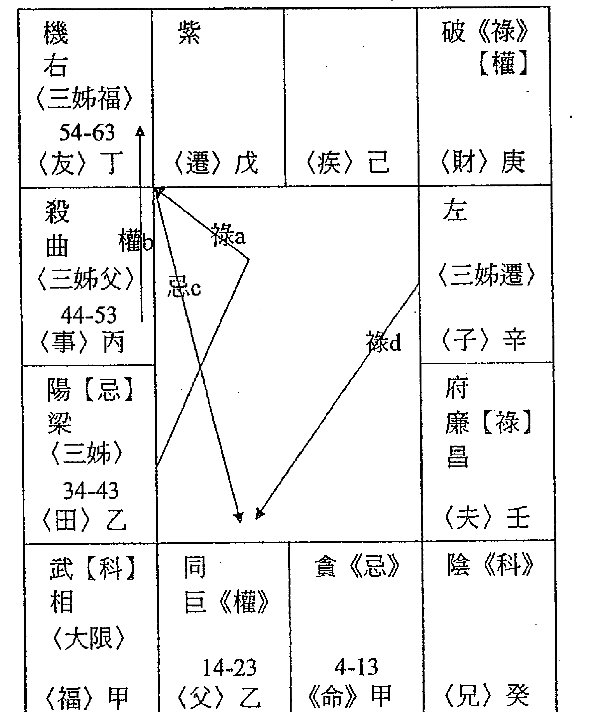

## 太平（下册）

### 生平化的十要理化精义

理入初念法门，以理生化为要，化理生为用，二者相因而成，合而为一，理入一经之道，而生化之理入二经之道也。

## 飞星紫微斗数

## 论命 (下册)

## 生活化的斗数四化精华

梁若瑜著

## 下册 目录

## 第十章 吃喝嫖赌毒等恶习

命例一、乾造己亥年4月申时生 …………………… 004
（一）家道不兴 …………………………………… 004
（二）长兄生二子吸毒 ……………………………… 007

命例二、乾造癸亥年3月寅时生 …………………… 009
（一）母嗜赌股票 ……………………………… 009

命例三、乾造戊申年6月辰时生 …………………… 012
（一）沉迷肉欲 …………………………………… 012
（二）长相抱歉及没知己 ………………………… 016

命例四、坤造癸卯年8月寅时生 …………………… 018
（一）家道不兴 ……………………………… 018
（二）父风花雪月与染毒 ………………………… 020
（三）父赏女人钱毫不手软的摆阔 ……………… 022

命例五、坤造丙辰年12月未时生 …………………… 024
（一）父吃喝嫖赌 ……………………………… 024
（二）本造少小家穷而曾经酒店执壶 ………… 026
（三）本造子宫瘤与术后不孕 …………………… 028

## 说命 生活化的斗数四化精华－下册

第十一章 读书、考试 ……………………………………………… 030

命例一、乾造癸亥年3月寅时生 …………………… 034
（一）本造的读书 ……………………………………………… 034
（二）长兄毫无进取心 ………………………………………… 038

命例二、坤造癸亥年11月子时生 …………………… 041
（一）三姊的读书考试 ………………………………………… 041
（二）四姊的读书考试 ………………………………………… 045
（三）本造的读书考试 ………………………………………… 048

命例三、乾造辛卯年8月巳时生 …………………… 050
（一）长子唸书 …………………………………………………… 050
（二）次子唸书 …………………………………………………… 052

命例四、坤造戊申年7月酉时生 …………………… 054
（一）家道兴隆格 ……………………………………………… 055

命例五、坤造乙巳年8月戌时生 …………………… 057
（一）本造家道不兴与夫浪荡败产 …………………… 057
（二）长子上进学业特优与日后益我旺宅 …… 060
（三）善缘长子 …………………………………………………… 063

第十二章 失眠、健忘……精神异常与自杀 ……… 066

命例一、乾造己酉年1月午时生 …………………… 069
（一）妻兄精神异常 …………………………………………… 069
（二）本造家道不兴 …………………………………………… 072

## 目录

命例二、坤造庚申年10月寅时生 ........................ 074
（一）家道中落与亡父 ............................ 074
（二）父自杀 ..................................... 077

命例三、坤造戊午年6月寅时生 ........................ 078
（一）三阿姨 ..................................... 078

命例四、坤造丁未年5月亥时生 ........................ 081
（一）看舅舅先看妈娘家的家道 ..................... 081
（二）二舅精神分裂与洗肾 ......................... 084

命例五、坤造己亥年12月亥时生 ....................... 088
（一）躁郁症 ..................................... 088
（二）夫体贴呵护 ................................. 091

第十三章 高、矮、胖、瘦与运动健身 ................... 093

命例一、乾造癸酉年5月丑时生 ....................... 097
（一）父体形 ..................................... 097
（二）父坐骨神经痛 ............................... 099
（三）母体形与子宫切除 ........................... 100

命例二、坤造辛亥年6月卯时生 ....................... 103
（一）父胖 ....................................... 103
（二）母罹忧郁症，身材却始终苗条 ................. 105

命例三、乾造己亥年4月申时生 ....................... 107
（一）夫妻两人的身材 ............................. 107

## 说命 生活化的斗数四化精华－下册

命例四、坤造戊午年11月申时生 …………………… 109
（一）父的身材 ……………………………………………… 109

命例五、乾造辛卯年3月申时生 …………………… 111
（一）婴儿期瘦骨如柴 …………………………………… 111
（二）为人养子 ……………………………………………… 113

## 第十四章 选择行业 ……………………………………………… 114

命例一、乾造甲午年9月午时生 …………………… 120
（一）本造为什么没老板命？ …………………… 120
（二）39岁何以离职他就？ ………………………… 122
（三）何来他的工作机会？ ………………………… 124
（四）前妻从事房屋仲介多年，两手仍空 …… 126

命例二、乾造甲子年12月子时生 …………………… 129
（一）命格与事业方向 ……………………………… 129
（二）为什么2013年退伍即失业？ ……………… 131
（三）命格其吉 ………………………………………… 133
（四）问姻缘 ……………………………………………… 135
（五）与原生家庭亲情淡薄 ……………………… 138

命例三、乾造庚子年3月辰时生 …………………… 141
（一）格局败笔，家道不兴 ……………………… 141
（二）命格将富 ………………………………………… 144

命例四、坤造丁未年6月亥时生 …………………… 147

## 目录

（一）论格局 ………… 147
（二）2013 年为何面临收摊或续营之困？ … 149
（三）离婚 ………… 150
（四）再婚 ………… 152

命例五、乾造壬午年3月未时生 ………… 154
（一）家道不兴 ………… 154
（二）祖父何由败产？ ………… 156
（三）姑妈迟未婚 ………… 158
（四）姑妈仍有善缘之婚 ………… 160

第十五章 论六亲的缘份与贤愚 ………… 164

命例一、乾造辛卯年8月巳时生 ………… 169
（一）上有一兄长难相容处 ………… 169
（二）陃造性格 ………… 174
（三）陃造的父缘 ………… 176
（四）长子浑噩 ………… 178
（五）家道不兴与折损的周边亲人 ………… 180

命例二、乾造乙未年2月巳时生 ………… 183
（一）长兄高官于警界 ………… 183
（二）家道其衰 ………… 187
（三）果报伤宅令家人多咎 ………… 189

命例三、乾造戊子年8月未时生 ………… 191

## 说命 生活化的斗数四化精华－下册

（一）家道其衰
（二）大弟英年早逝
（三）妻罹躁郁症难相容处而离异
（四）家道其兴
（五）二婚鹣鲽情深
（六）独子含和

### 命例四、乾造戊寅年8月寅时生
（一）三女的缘本薄
（二）何而得子？乃果报善缘其荫

### 命例五、坤造丁未年6月亥时生
（一）父缘极佳、母口德差而缘不佳
（二）本造现已四十余岁仍未婚

## 第十六章 性格与红尘世事

### 命例一、乾造戊寅年8月寅时生
（一）家道不兴与亡父
（二）不分青红皂白的掌控于妻

### 命例二、坤造己巳年5月亥时生
（一）无知、倍受争议
（二）滥情

### 命例三、坤造乙未年4月申时生
（一）父性格

（二）二弟啃老族、无婚 ………… 239

命例四、乾造戊申年3月未时生 ………… 242
（一）能言善道 ………… 242
（二）取财不义 ………… 244
（三）好美食 ………… 246

命例五、乾造乙丑年2月酉时生 ………… 247
（一）父亲的性格 ………… 247
（二）本造性格 ………… 249
（三）另者 ………… 250
（四）19岁车祸遭法院判赔数百万 ………… 251
（五）2013年父猝死于心脏病 ………… 253

命例六、乾造癸亥年7月午时生 ………… 255
（一）家道 ………… 255

## 第十七章 少小的健康 ………… 257

命例一、乾造辛卯年3月申时生 ………… 259
（一）少小健康不佳 ………… 259
（二）为人养子 ………… 260

命例二、乾造甲子年12月子时生 ………… 262
（一）少小的意外事件 ………… 262
（二）大难不死 ………… 264

命例三、乾造甲寅年12月已时生 ………… 266

## 说命 生活化的斗数四化精华－下册
（一）家道不兴
（二）少小意外夭亡

## 第十八章 官非与诈骗、诈赌、仙人跳

命例一、乾造己亥年4月申时生
（一）破产
（二）44 岁遭诈骗破大财

命例二、坤造戊辰年11月巳时生
（一）本造庶出
（二）叛逆、打架
（三）曾经工作于诈骗集团
（四）性开放

命例三、乾造丁酉年2月寅时生
（一）人格特质

命例四、乾造丁酉年10月午时生
（一）性格

命例五、坤造丁未年2月申时生
（一）夫设赌局坑人
（二）本造肥胖

## 第十九章 驿马

命例一、乾造癸亥年10月酉时生
（一）2013 年茫然于前程 ………… 300
（二）2013 年女友分手 ………… 302
（三）前程似锦 ………… 304

## 命例二、坤造戊戌年7月未时生 ………… 307
（一）因夫旅美 ………… 307
（二）生意兴隆 ………… 308

## 命例三、乾造辛卯年8月巳时生 ………… 311
（一）论格局 ………… 311
（二）驿马进出纪实 ………… 314

## 命例四、乾造己亥年4月申时生 ………… 317
（一）到高中毕业为止搬家多次家 ………… 318
（二）因婚姻而驿马他乡 ………… 321
（三）得岳父资助头期款而置产搬新家 ………… 323
（四）高中毕业即离乡尔后少与父母同处 ………… 325

## 命例五、乾造戊子年8月未时生 ………… 326
（一）发达异乡、家道兴隆 ………… 326

## 第二十章 台北捷运杀人事件 ………… 329

## 命例一、乾造癸酉年3月4日子时生 ………… 330
（一）未曾交过女友，其长相与性格 ………… 330

## 第廿一章 无题 ………… 334

## 说命 生活化的斗数四化精华－下册

命例一、乾造甲辰年8月未时生 ……… 334
（一）本造出身富家 ……… 335
（二）第二大限家道中落 ……… 337
（三）本造的桃花 ……… 339
（四）二春长相之美与缘份 ……… 341
（五）二春罹忧郁症 ……… 343
（六）二春前夫罹尿毒症 ……… 345
（七）二春前夫家世富裕 ……… 347

命例二、乾造丙戌年6月丑时生 ……… 349
（一）大妈肺结核亡与二哥为情自杀 ……… 352
（二）观其子女宫 ……… 354
（三）本造高收入，是安丽钻石领导人 ……… 356
（四）大姊富有 60 余罹胰脏癌 ……… 358
（五）父与弟都爱现、膨风 ……… 364
（六）三妹经济平平，夫为作者陌人 ……… 366

命例三、乾造丁未年6月丑时生 ……… 369
（一）家道不兴与父遭诈赌散家财 ……… 370
（二）本造吸毒与枪械入狱 ……… 372
（三）妻外遇 ……… 374
（四）妻存恶毒性格 ……… 376
（五）儿子侏儒症与几近失明 ……… 378
（六）问有否晚春 ……… 380

## 目录

命例四、乾造甲辰年9月巳时生 ........................ 382
（一）家道其碍 ............................................................ 382
（二）家道兴隆 ............................................................ 385
（三）悉说本造健康 ........................................................ 389

命例五、坤造丙午年7月申时生 ........................ 393
（一）夫拙家贫 ............................................................ 393
（二）女儿操劳家计与休学 ........................................ 395
（三）长女的感情与婚姻 ................................................ 396
（四）长女问婚姻美否？ ................................................ 398

第廿二章 野人献曝 .......................................... 400

## 第十章 吃喝嫖赌毒等恶习

染「重症恶习」者，其人格容易扭曲、少存廉耻心，思维必也乱章法。甚或行尸走肉、违法乱纪、败家荡产乃至死而后已，与罹恶疾沉疴何异？所以染「恶习」应具备下列命理条件：

- （1）「命宫」、「疾厄」、「福德」三性格宫其「坐」或「化出」（含第一忌及转忌）得贪狼或廉贞等「邪淫曜」化忌，且至少须串连呈「三忌」（或以上）之破者，才会产生恶习。汇忌愈多愈扭曲难戒。三性格宫的其一或二宫既化贪狼或廉贞汇呈多忌，复串连还入三性格宫的任何一宫，或呈多忌又串连于「田宅」收藏宫者，必然「恶习难戒」。嗜酒、色、赌、毒、偏癖嗜好等死而后已者皆若是。

- （2）凡论所有事仅得「单忌」决不生恶过，反过来说还可能是「择善固执」呢！因此，论恶习呈「双忌」者亦仅止于抽烟、喝小酒、打卫生麻将、偶闻脂粉味等小过之偏好。故而染「恶习」的大过者必然「业力较重」而得于「三忌」（或以上）之破，乃「恶习缠身」与「恶疾缠绵」何异？必然「多忌呈破」其害。

- （3）染重症恶习者其「命宫」、「疾厄」、「福德」三性格宫所化，容易以忌（含转忌）相冲激（互化）呈破，产生「情绪混乱」而后的「错乱沉沦」。故而恶习也容易串连于天机（智慧曜）或文昌（脑神经）、文曲（脑神经）以及巨门（是非曜）、太阴（暗经）等曜化忌呈破，举止邪秽、思维偏斜有如中邪。

- （4）必与「社会秩序」、「道德观」等相抵触，所以也容易串连于「迁移」或「父母」呈破；或者「性格宫」所化逢「恶习曜」呈多忌，复与「迁移」或「父母」所化串连冲激呈破而遭非惹议、难容于人群。多忌呈破者表象难看、浑噩破碎、醉生梦死的处于社会边缘。许多沉沦恶习者的最后下场是「男盗女娼」或「自作孽不可活」。

闲聊：何为「择善固执」？譬如「命宫」坐「生年忌」而执，得「迁移」社会「广大群众」飞来同星曜的「化禄」相拱则此执可以获得掌声与被认同，近乎择善固执矣。设易「迁移」为「交友」则逊色，乃「交友」仅为有缘（含善、恶缘）相聚的少数人耳，还防只是人际间的阿谀奉承。

## 第十章 吃喝嫖赌等恶习

重点：凡所有己身及至亲纠缠于「恶习败家」者，其命格多与「家道不兴」有所关联。以及家庭出现成员染重病、破相、大车祸、凶杀、自杀、强取豪夺、败产跑路、祝融毁屋、流离失所等灾难者，也大多是「家道不兴」的组合。劝君命盘入手，先观「家道兴衰」。这就是所谓：「掌握格局」而后万变不离其宗。

注：吸毒者除了串连贪狼忌或廉贞忌外，严重者也多串连于天机忌或文昌忌或文曲忌，产生幻听幻觉。

## 说命 生活化的斗数四化精华－下册

### 命例一、乾造（1959）己亥年4月申时生

本造昆仲居二，家道不兴除了父、弟早亡外，长兄生二子，皆曾吸毒堕落。毒品的泯灭人性可以拖垮家庭、践踏社会，因此吸毒不戒者大多下场难看。

#### （一）家道不兴

| 同 | 府 武《禄》 | 阳 阴【科】 右左 | 贪《权》【忌】 |
| :--- | :--- | :--- | :--- |
| 44-53 〈财〉己 | 34-43 〈子〉庚 | 24-33 〈夫〉辛 | 14-23 〈兄〉壬 |
| 破【禄】 | | | 机 巨 |
| 〈大限〉 | 忌4 | 忌1 | 4-13 |
| 54-63 〈疾〉戊 | | | 《命》癸 |
| | 忌出 | 忌3 | 紫 相 |
| 〈迁〉丁 | | | 〈父〉甲 |
| 廉 昌 | | 杀 曲《忌》 | 梁《科》 |
| 〈友〉丙 | 〈事〉丁 | 〈田〉丙 | 〈福〉乙 |

「迁移」果报宫（丁卯）化巨门（是非曜）忌入「命宫」（癸酉），转而化贪狼忌入「兄弟」。「福德」果## 第十章 吃喝嫖賭等惡習

報宮（乙亥）化太陰（暗曜）忌入「夫妻」（辛未），轉而化文昌忌入「交友」。令兄友線呈「雙忌」。逢「生年忌」須轉忌。「田宅」（丙子）既坐文曲「生年忌」，當轉而化廉貞忌入「交友」，彙前述令兄友線呈「三忌」，此即「家道不興」象，容易親疏朋離、經濟難盈。上式串連於「夫妻」而亡弟（昆仲居三、戲水滅頂），這也恐怕日後本造婚姻難共白髮；串連於「兄弟」則長兄業力重而生二子吸毒敗家。其「父母」父親（甲戌）化太陽忌入「夫妻」串連於家道不興，故於本造二十出頭父中風（太陽忌）歿。何以「家道不興」傷弟而遲遲未傷於妻？乃家道不興容易「丁才凋零」，丁者男丁。況且「夫妻」（辛未）化巨門祿入「命宮」（癸酉）為有緣，轉而化貪狼忌（挾祿）入「兄弟」閨房而畫眉有樂；追「疾厄」（戊辰）化來貪狼祿會呈「雙祿」，此即夫妻相處（疾厄）愉悅貌。（參下頁圖）

追祿須轉忌，轉「兄弟」（壬申）化武曲忌（挾雙祿）入「子女」逢武曲「生年祿」呈「三祿」，天倫有樂。逢「生年祿」須轉忌，轉「子女」（庚午）化天同忌（挾三祿）入「財帛」，夫妻對待優。再追「田宅」（丙子）化來天同祿於「財帛」會呈「四祿」，幸福於庭。現行大限54-63踏「疾厄」，則「本命田宅」仍串連吉應於「大限田宅」（夫妻），以及「本命夫妻」既化祿入「本命命宮」，轉其忌復與「大限命宮」（疾厄）交祿於「本命兄弟」照於「大限夫妻」（交友），故主此限妻緣仍好。

| 同 | 府 武《祿》 | 陽 陰【科】 右左 | 貪《權》【忌】 |
| :---: | :---: | :---: | :---: |
| ←忌5 (財) 己 | 34-43 (子) 庚 | ←忌4 (夫) 辛 | ↑ (兄) 壬 |
| 破【祿】 | (交叉線條：祿3，祿6，忌出) | (交叉線條：祿1) | 機巨 忌2 4-13 《命》癸 |
| (大限) 54-63 (疾) 戊 | | | 紫相 |
| (遷) 丁 | | | (父) 甲 |
| 廉昌 | | 殺曲《忌》 | 梁《科》 (2019) |
| (友) 丙 | (事) 丁 | (田) 丙 | (福) 乙 |

然以「家道不興」而言，大限 54-63 踏「疾厄」，則「本命夫妻」串連凶應於「大限夫妻」（交友一妻之疾），「本命田宅」串連凶應於「大限田宅」（夫妻），而「大限夫妻」（交友）為 2019「流年田宅」，斯年其妻恐將生恙，願天佑之。

#### (二) 長兄生二子吸毒 (家道不興其害)

| 同〈兄長子〉 44-53〈財〉己 | 府 武《祿》 34-43〈子〉庚 | 陽 陰【科】 右左 〈兄長子福〉〈夫〉辛 | 貪《權》【忌】 14-23〈兄〉壬 |
|------------------------------|------------------------------|------------------------------------------|---------------------------------|
| 破【祿】 〈兄次子〉 〈大限〉 54-63〈疾〉戊 | 忌a 忌3 忌1 | 忌e 忌d | 機 巨 忌b 4-13 《命》癸 |
|                              |                              |                                          | 紫 相 |
| 〈遷〉丁 廉 昌 〈友〉丙 | 〈事〉丁 | 殺 曲《忌》 〈田〉丙 | 梁《科》 〈兄次子疾〉 〈福〉乙 |

「兄長子命」性格宮（財帛）（己巳）化文曲（腦神經）忌入「田宅」（丙子）逢文曲「生年忌」呈「雙忌」，轉而化廉貞（毒品）忌（挾雙忌）入「交友」。「兄長子福」性格宮（夫妻）（辛未）化文昌（腦神經）忌亦入「交友」呈「三忌」，遙對於「兄弟」所坐貪狼（毒品）「命忌」令兄友線呈「四忌」，兄長子「吸毒亂性」矣。必生幻聽幻覺（昌曲化忌）。

# 說命 生活化的斗數四化精華一下冊

註：以其多忌入「交友」（丙寅）逢廉貞「自化忌出」而「亂性」，但可望業障過而毒也戒了。多忌而後逢「自化忌出」，非「一死百了」則「雨過天晴」。

「兄次子命」性格宮（疾厄）（戊辰）化天機（精神曜）忌入「命宮」（癸酉），轉而化貪狼（毒品）忌入「兄弟」；而本造「田宅」（丙子）坐文曲「生年忌」，當轉而化廉貞（毒品）忌（挾忌）入「交友」。

追「兄次子疾」性格宮（福德）（乙亥）化太陰忌入「夫妻」（辛未），轉而化文昌（腦神經）忌亦入「交友」，令兄友線彙呈「三忌」之破也吸毒。然以其彙忌較少而毒害應較淺，復以其「兄次子命」（疾厄）坐破軍「命祿」而好溝通，理應比較容易回頭是岸。

## 第十章 吃喝嫖賭等惡習

### 命例三、乾造（1983）癸亥年3月寅時生

本造父母皆公職退休，每月尚領 18%退職金，生活理應無虞。父厚道安分，其母卻「嗜賭股票」且賭性堅強，終敗盡家產、租屋度日，至今仍滿口的股票經。是可恨的可憐人。

#### （一）母嗜賭股票

| 廉【祿】 貪《忌》 《田》丁 陰《科》 《福》丙 府 《母福》 《父》乙 2-11 《命》甲 | 巨《權》 曲 左 《事》戊 紫〈母〉 破《祿》 【權】 〈兄〉乙 | 相 《友》己 機 22-31 〈夫〉甲 | 梁 同昌右 〈遷〉庚 武【科】 殺 〈疾〉辛 陽【忌】 〈財〉壬 〈大限〉 32-41 〈子〉癸 |
| :--- | :--- | :--- | :--- |

# 說命 生活化的斗數四化精華－下冊

「母命」性格宮（兄弟）（乙丑）及「母福」嗜好位（父母）（乙卯）雙化太陰（暗曜）忌入「福德」嗜好位、果報宮，遙對「財帛」所坐太陽「命忌」令財福線呈「三忌」，其母具「業障」且「偏執」所好。

> > 註：「福德」得「單忌」為執於所好、重享受，「雙忌」為偏執或亂花錢，「三忌」（或以上）則業障重而沉迷亂性、行拂亂為或損於健康。

轉「福德」（丙辰）化廉貞（賭曜）忌（挾三忌）入「田宅」財富宮又逢貪狼（賭曜）「生年忌」呈「四忌」，則因賭敗產。此式「福德」與「田宅」共破亦主「家道不興」，緣於母嗜賭敗家。

> > 註：「賭曜」彙多忌呈破敗復入「田宅」收藏宮，故而「久賭不厭」、「賭性堅強」。田宅既破，當然因賭蕩產。以其「父母」表象宮、「文書宮」串連迫入「田宅」，故而「名下無產」租屋度日。

逢「生年忌」須轉忌。轉「田宅」（丁巳）化巨門忌（挾四忌）入「事業」（戊午）（運氣位），即見化天機「忌出」到「夫妻」令夫事線呈「五忌」大破。以「本命田宅」既破凶應於12-21「大限田宅」（福德）；以其「田宅」終串連多忌而「忌出」於「事業」（運氣位）呈退產象，則12-21「大限事業」（田宅）即凶應於「本命事業」忌出消散，故而第二大限家道開始頹陷。

以其「本命母命」（兄弟）仍串連凶應於22-31「大限母命」（子女—田宅彙多忌沖照大限兄弟），此限其母仍於頹勢中流連忘返，是可恨的可憐人。

以「母命」、「母福」兩性格宮化太陰（暗曜）忌串連廉貞（邪淫曜）忌入「田宅」（丁巳）又逢貪狼（邪淫曜）「生年忌」呈「四忌」。逢「生年忌」須轉忌，轉而化巨門（是非曜）忌（挾四忌）入「事業」即見化天機（心機曜）「忌出」到「夫妻」。故而母其思其行值得琢磨（工於心計—天機忌、小人行邪—暗曜與邪淫曜）。

註：類此暗曜、是非曜、邪淫曜、心機曜串連多忌逢「忌出」容易「失仁少義」與「是非加身」，狗急跳牆時容易「鬼話連篇」而「借貸難償」（串連於父母宮借貸位）。故其母臭名在外、親疏朋離（田宅彙多忌串連於「忌出」—骨肉無情、門前冷落）。

- * 許多人的「命宮」或「福德」也會化出「暗曜」及「邪淫曜」的串連，但僅止於彙呈「二忌」，且未串連於「忌出」之宮者，千萬不得視其性格為小人（可能只是存於某些偏頗性向）。

### 命例三、乾造（1968）戊申年6月辰時生

本造的「長相」實在有點抱歉，但他性好漁色—「把馬子」的功力卻是很不抱歉。除了家裡頭的內婆外，走出家門也「外婆」不斷，甚至還能雙打照樣安全上壘。他不太挑食，交女友有點像「韓信點兵多多益善」。

他好此道數十年如一日。見獵心喜就像吸毒般的上了癮，過手女人不知凡幾。他對獵物花錢從不手軟，甜言蜜語也極盡溫柔體貼之能事，當下的女人都被他哄得像極了幸福的小公主。

他在電器方面擁有好手藝、開店營利收入高，卻是經常入不敷出的「月光族」。他沒有男性的知己朋友，因為他借錢後常與人金錢不清不楚，久之當然讓人對他敬而遠之。

#### （一）沉迷肉慾

「福德」（丁巳）嗜好位坐天機（心計曜）「生年忌」及「命祿」，「祿忌呈雙祿」則必有所好的執迷某事而多得其樂，化巨門（暗曜）忌（挾祿）入「夫妻」異性位，此即樂而不疲、工於心計的玩弄「地下情」（巨門忌）。迫「遷移」處世宮（辛酉）化來巨門祿（善巧之言）入「夫妻」呈「二祿」，則「舌粲蓮花」的哄騙異性很可能得心應手，機會也多象；追祿須轉忌，轉「夫妻」（乙丑）化太陰忌（挾二祿）入「財帛」（情緒表象宮）（癸亥）。再追「福德」（丁巳）嗜好位化來太陰（溫柔曜）祿會呈「三祿」，溫柔、體貼的喜樂盡形色矣。

| 機《忌》 【祿】 右《科》 22-31 <福>丁 | 紫【科】 昌 32-41 <田>戊 | （大限） <事>己 | 破曲 <友>庚 |
| --- | --- | --- | --- |
| 殺 12-21 <父>丙 | 忌1 祿4 | 祿2 | 左 <遷>辛 |
| 陽梁 2-11 <命>乙 | 祿a | 府廉 <疾>壬 | |
| 武相 <兄>甲 | 同巨 <夫>乙 | 貪《祿》 ←忌5→【忌】 | 陰《權》 <財>癸 |

註：「遷移」或「父母」兩處世宮坐或化巨門祿、天梁祿者多「善說」。
- 太陰主「母性」，具「築巢慾」，故曰「田宅主」。

## 命 生活化的斗數四化精華一下册

所以太陰化祿也主「溫柔」。

追祿須轉忌，轉「財帛」（癸亥）化貪狼忌（挾三祿）入「子女」（桃花宮）又逢貪狼（桃花曜）「生年祿」呈「四祿」，本造是個「好色之徒」。

註：「遷移」或「父母」祿入「夫妻」，處世應對多異性攀緣，串連「桃花曜」則風流。乃桃花曜即為「才華曜」，串連於「遷移」或「父母」兩處世宮容易散發費洛蒙。

「福德」（丁巳）嗜好位既坐天機「生年忌」，化巨門忌（挾忌）入「夫妻」異性位（乙丑），攻於心計矣；然轉而化太陰忌入「財帛」卻逢太陰「命忌」，又遙對「福德」所坐的天機「生年忌」令財福線呈「三忌」之破，則桃花終將緣滅。兩式合之，則扒碗內還看碗外：山外青山樓外樓，西湖歌舞幾時休？

以其「福德」坐天機忌而化巨門忌入「夫妻」到化太陰忌入「財帛」到化貪狼忌入「子女」，一路「以忌逢祿」的執著得樂，串連於「暗曜」及「邪淫曜」，則沉迷色慾、癖好成邪，與吸毒者的浸淫麻醉何異？這是另類的「惡習」。

另者，其「疾厄」肉體（壬戌）化天梁祿入「命宮」

## 第十章 吃喝嫖賭等惡習

情緒宮（乙卯）自得於樂，轉而化太陰忌（挾祿）入「財帛」；追「福德」情緒宮（丁巳）化來太陰祿會呈「雙祿」，喜形於外矣（福德祿出）。追祿須轉忌，轉「財帛」（乙亥）化貪狼忌（挾雙祿）入「子女」桃花宮又逢貪狼（桃花曜）「生年祿」呈「三祿」，此亦主「多情多慾」象。

- 註：「子女」（性）為「疾厄」（肉體）的「福德」（享受宮），坐或化逢「桃花曜」則「好色」（不逢桃花曜則言小輩事，不得強作此論，慎防口業）。
- 以「疾厄」之祿串連桃花曜復入「子女」宮呈多祿，肉慾濃矣！

#### （二）長相抱歉及沒知己

| | | | |
|---|---|---|---|
| 機《忌》【祿】 右《科》 22-31 〈福〉丁 | 紫【科】 昌 忌2 → 右《科》 32-41 〈田〉戊 | 〈大限〉 〈事〉己 | 破 曲 〈友〉庚 |
| 殺 12-21 〈父〉丙 | 忌1 ↗ | 忌a ↙ | 左 〈遷〉辛 |
| 陽 梁 2-11 〈命〉乙 | | | 府 廉 〈疾〉壬 |
| 武 相 〈兄〉甲 | 同 巨 忌b → | 貪《祿》 ← 忌3 | 陰《權》【忌】 〈財〉癸 |
| | 〈夫〉乙 | 〈子〉甲 | |

註：苟太陰（漂亮曜）忌會廉貞（桃花曜）忌或貪狼（桃花曜）忌串連於「父母」或「遷移」兩形於表宮呈「三忌」（或以上）者多「長相抱歉」或「尊容特異」。
本造「遷移」表象宮（辛酉）化文昌忌入「田宅」（戊午），轉而化天機忌入「福德」逢天機「生年忌」。

並遙對於「財帛」所坐的太陰（漂亮曜）「命忌」，令財福線呈「三忌」；逢「命忌」須轉忌，轉「財帛」（癸亥）化貪狼（桃花曜）忌（挾三忌）入「子女」，故而斯人長相抱歉。

註：此式亦主其具「敗家」象，乃「果報」（遷移、福德）共彙於「田宅」串連呈破。

前述「遷移」處世宮所化令財福線呈「三忌」，而「交友」（庚申）化天同忌入「夫妻」（乙丑），轉而化太陰（暗曜）忌亦入「財帛」，彙上述令財福線呈「四忌」之破。此「遷移」與「交友」串連共破，故而本造惹人嫌、沒知己。

註：凡「父母」或「遷移」兩處世宮與「交友」所化彙多忌串連呈破，逢太陰暗曜或巨門口舌曜化忌者，人際多「是非」或「小人」而「少知己」。

- • 上式「遷移」果報宮化忌入「田宅」，轉忌入「福德」逢「生年忌」呈「雙忌」。而「夫妻」化忌入「財帛」逢「命忌」亦呈「雙忌」。兩式彙之則財福線呈「四忌」之破，豈無「離婚」及「敗產」之危乎？恐將自作孽不可活，終須落得人財兩空！

### 命例四、坤造（1963）癸卯年8月寅時生

本造其父為「獨子」，出身富家。祖父亡而父得「鉅額遺產」，於焉風花雪月、打滾脂粉，賞女人錢毫不手軟的擺出闊佬姿態而得意忘形。繼而近墨者黑的染上吸食「海洛英」惡習，三十餘歲即蕩產亡身。人生渾噩破碎、如痴如狂，所幸上天慈悲的讓他早死早超生。類此案例必然「家道不興」所致。

#### （一）家道不興

「遷移」果報宮（乙丑）化太陰忌入「父母」、「福德」果報宮（辛酉）坐貪狼「生年忌」，當轉而化文昌忌（挾札實忌）入「父母」，「兄弟」（戊午）既坐文曲「命忌」，也當轉而化天機忌（挾札實忌）又入「父母」彙呈「三忌」。

此「遷移」、「福德」令「父母」呈破，為「果報傷父」，故而其父業障重而性格扭曲與浪蕩早亡。而「遷移」、「福德」令「兄弟」也串連呈破故而本造無兄弟（下有一妹）。設本造有兄弟，必也扭曲浪蕩或早夭早亡（果報傷兄弟）。

註：凡「福德」或「遷移」兩果報宮化忌入某六親宮呈破者，該親即業重而少緣。上式除了「果報傷父、兄弟」外，以其多忌入「父母」破「涵養宫」，故而本造其處世應對態度也必然有偏頗。尤以「福德」化忌「父母」呈多忌之破，應是脾氣快而少得人緣。

| 武【祿】破《祿》 | 陽曲【忌】 | 府 | 機陰《科》昌 |
| --- | --- | --- | --- |
| 〈夫〉丁 | 〈兄〉戊 | 《命》己 | 〈父〉庚 |
| 同 |  |  | 紫 貪《忌》【權】 26-35〈福〉辛 |
| 〈子〉丙 |  |  | 巨《權》〈大限〉 |
| 右〈父疾〉 |  |  | 36-45〈田〉壬 |
| 〈財〉乙 |  |  |  |
|  | 廉殺 | 梁【科】 | 相左 |
| 〈疾〉甲 | 〈遷〉乙 | 〈友〉甲 | 〈事〉癸 |

「父母」（庚申）得「三忌」，轉而化天同忌（挾三忌）入「子女」沖「田宅」財富宮而父敗家產。這是典型「家道不興」的「丁財凋零」格。果報既直接傷於父命，而「父疾」（財帛）（乙卯）化太陰（暗曜）忌再入「父母」呈「四忌」共破，宜其父「行拂亂為」、「促壽早亡」。

## 說命 生活化的斗數四化精華一下册

#### (二) 父風花雪月與染毒

| 武【祿】破《祿》 | 陽曲【忌】 | 府 | 機陰《科》 |
|---|---|---|---|
| <夫>丁 | | 忌3 → 昌 | 昌 |
| 同 | 忌4 | 《命》己 | 紫忌1貪《忌》【權】 |
| <子>丙 | 忌2 | | 26-35<福>辛 |
| 右<父疾> | 忌5 | | 巨《權》<大限> |
| <財>乙 | | | 36-45<田>壬 |
| <父遷>—祿→殺 | 廉殺 | 梁【科】 | 相左 |
| <疾>甲 | <遷>乙 | <友>甲 | <事>癸 |

「福德」果報宮（辛酉）坐貪狼「生年忌」，當轉而化文昌（腦神經曜）忌（挾紮實忌）入「父母」，此「果報傷父」等同「父命宮」亦得於貪狼（邪淫曜）忌之「執性」（其父染毒與色）。

追「父疾」性格宮（財帛）（乙卯）化來太陰（暗曜）忌也入「父母」，以及「兄弟」（戊午）坐文曲（腦神經曜）「命忌」，轉而化天機（智慧曜）忌（挾紮實忌）又入「父母」呈「三忌」大破。

「多忌無智」串連於邪淫曜、腦神經曜、智慧曜、暗曜呈破於「父母宮」，故而其父於毒、色之間醉生夢死。此式呈現其父「精神層面」有問題，故而放浪形骸。

「父命」（父母）（庚申）既呈「多忌」無智，化天同忌（挾邪淫）入「子女」桃花宮（丙辰）逢天同「自化祿出」，多忌逢祿何止「祿忌成雙忌」，簡直是麻木的「妄慾橫流」。

逢「自化祿出」當轉忌，轉「子女」（丙辰）化廉貞（邪淫曜）忌（挾多祿忌）入「遷移」，又逢「父遷」（疾厄）（甲寅）化來廉貞（邪淫曜）祿會，此即招手成春於脂粉堆中「醉生夢死」、「恣慾逞歡」！

註：凡六親彙多忌入「遷移」或「父母」，則此親必然無智或懦弱或無緣。

#### （三）父賞女人錢毫不手軟的擺闊

| 武【祿】 破《祿》 | 陽 曲【忌】 | 府 | 機 陰《科》 昌 |
| :--- | :--- | :--- | :--- |
| 〈夫〉丁 | 〈兄〉戊 | 6-15 《命》己 | 〈父〉庚 |
| 同 | | | 紫 貪《忌》 祿1【權】 〈父父〉 〈福〉辛 |
| 〈子〉丙 | | ⬇ 忌2 | 巨《權》 〈父福〉 |
| 右 | | | 36-45 〈田〉壬 |
| 〈財〉乙 | | | |
| | 廉 殺 | 梁【科】 | 相 左 |
| 〈疾〉甲 | 〈遷〉乙 | 〈友〉甲 | 〈事〉癸 |

註：愛出鋒頭、好面子、喜膨風者，多為「福德」嗜好位「化權」得「父母」或「遷移」形於表宮化祿來相拱。言談間容易「自我膨脹」、「愛現」而自得其樂。命格低者容易犯「好高騖遠」、「眼高手低」的壞毛病。

## 第十章 吃喝嫖賭等惡習

「父福」嗜好位（田宅）坐巨門（動口）「生年權」，說話好佔上風；追「父父」表達宮（福德）（辛酉）化來巨門祿會，則愛說大話、打腫臉皮充胖子。追祿須轉忌，轉「父福」（田宅）（壬戌）化武曲忌（挾祿權）入「夫妻」逢武曲（正財星）「命祿」呈「雙祿一權」。此即「愛現金錢」（武曲財星）而自大於風花雪月間的昏昧其樂。

閒聊：《心命歌》

- 心好命又好，富貴直到老。
- 命好心不好，福變為禍兆。
- 心好命不好，禍轉為福報。
- 心命俱不好，遭殃且貧夭。
- 心可挽乎命，最要存仁道。
- 命實造於心，禍福惟人召。
- 信命不修心，陰陽恐虛矯。
- 修心一聽命，天地自相保。

### 命例五、坤造（1977）丙辰年12月未時生

其父吃喝嫖賭樣樣通，故而少小家窮。本造高中畢業即執壺於歡場供給家計，後遇良人而洗盡鉛華開「民宿」，生意興隆。本造長「子宮瘤」術後不孕。

#### （一）父吃喝嫖賭

| 紫殺 | | | |
| :--- | :--- | :--- | :--- |
| 14-23 〈兄〉癸 | 4-13 《命》甲 | 〈父〉乙 | 〈福〉丙 |
| 機《權》 梁 24-33 〈夫〉壬 | | | 廉《忌》 【祿】 破【權】 〈父福〉 〈田〉丁 |
| 相左 昌《科》 〈大限〉 〈子〉辛 | 忌1 → | ↓ 忌3 |    〈事〉戊 |
| 陽【忌】 巨 ← 祿a | 武【科】 貪〈父遷〉 忌2 → | 同《祿》 陰 | 府 右 曲 |
| 44-53 〈財〉庚 | 〈疾〉辛 | → 庚 | 〈友〉己 |

「父福」嗜好位（田宅）（丁酉）坐廉貞（邪淫曜）

「命祿」與「生年忌」，執著（忌）邪淫事得樂（祿）；化巨門（暗曜）忌入「財帛」逢太陽「命忌」呈「雙忌」，容易產生昏昧的行為（雙忌以上呈惡習）。

註：凡「單忌」不足以壞大事，上式是轉忌而後呈「雙忌」則始生於惡。「雙忌」於「財帛」為「福德」的「忌出」，故而其父呈叛逆脫序。

逢「命忌」須轉忌，轉「財帛」（庚寅）化天同忌（挾雙忌）入「遷移」形於表宮，是上不了台面象（串連暗曜與邪淫曜）；追「父命」性格宮（父母）（乙未）化來太陰（暗曜）忌會呈「三忌」。以其暗曜、邪淫曜串連於「遷移」社會秩序宮，其父所為當然「倍受非議」。

註：此象主其父除自身吃喝嫖賭外，也說明了其父必也營謀於吃喝嫖賭的財路。乃「父福」果報宮（田宅）（丁酉）坐廉貞（偏財曜）祿，化巨門忌入「財帛」，追「父遷」（辛丑）果報宮（疾厄）化來巨門（動口）祿會呈「雙祿」，則財路順（遷移祿入財帛—財如春雨）矣。追祿須轉忌，轉「財帛」（庚寅）化天同忌（挾雙祿）入「遷移」果報宮又逢天同（服務業）「生年祿」呈「三祿」，則厚福化財。上述其「父福」（田宅）所化串連於邪淫曜與暗曜於「財帛」與「遷移」而受非議，則父之旺財也容易是「偏門事業」。凡「偏門事業」必得廉貞或貪狼兩偏財曜化祿、權，串連「福德三方」果報宮及「財宮」（田宅、兄弟、財帛）彙吉始得於順遂。乃廉貞、貪狼既是「偏財曜」，也是「邪淫曜」、「桃花曜」故也。

#### （二）本造小小家窮而曾經酒店執壺

| 紫殺 | 《少小田》 | |
| :---: | :---: | :---: |
| 14-23 〈兄〉癸 | 4-13 《命》甲 | 〈父〉乙 | 〈福〉丙 忌1 廉《忌》 【祿】 破【權】 〈父福〉 〈田〉丁 〈事〉戊 |
| 機《權》 梁 24-33 〈夫〉壬 | | 忌2 |
| 相左 —— 忌出→ 昌《科》 〈大限〉 〈子〉辛 | 忌4 ↓ | |
| 陽【忌】 巨 44-53 〈財〉庚 | 武【科】 貪 —— 忌3 → | 同《祿》 陰 〈遷〉庚 | 府 右 曲 〈友〉己 |

「福德」果報、性格宮（丙申）化廉貞（邪淫曜）忌入「田宅」逢廉貞「生年忌」呈「雙忌」，此即「家道不興」。這也是本造具顧家性格而當生苦楚心。

化忌須轉忌。轉「田宅」（丁酉）化巨門（暗曜）忌（挾雙忌）入「財帛」（庚寅）又逢太陽「命忌」呈「三忌」，是而家貧財困、家道不興。

逢「命忌」須轉忌，轉而化天同忌（挾三忌）入「遷移」形於表宮則呈窘；再追「父母」父親、少小田宅（乙未）又化來太陰忌彙呈「四忌」，由是其父浪蕩扭曲造成本造「出身寒微」。

註：上式「福德」性格宮化廉貞（邪淫曜）忌入「田宅」收藏宮，轉而化巨門（暗曜）忌入「財帛」呈「三忌」，終又串連入「遷移」呈破而聲名差。此即「城府深沉」、「愛財行邪」，所以下海撈取皮肉之財。

- 以共「田宅」坐廉貞「命祿」，轉而化巨門忌（挾祿）入「財帛」，追「疾厄」化來巨門祿呈「雙祿」，此即肉體化桃花財（廉貞祿）。
- 「出身寒微」必定是少小限父母經濟不佳，故而「田宅」必須與「父母」串連呈破而家貧。

#### (三) 本造子宮瘤與術後不孕

| 紫殺 |  |  |  |
| :--- | :--- | :--- | :--- |
| 14-23 (兄)癸 | 4-13 (命)甲 | (父)乙 | 忌1 (福)丙 |
| 機《權》 梁  24-33 (夫)壬 |  |  | 廉《忌》 【祿】 破【權】 (父福) (田)丁 |
| 相左 ——忌出→ 昌《科》 (大限) (子)辛 | 忌3 | 忌2 |  |
| 陽【忌】 巨  44-53 (財)庚 | 武【科】 貧 (疾)辛 | 同《祿》 陰 (遷)庚 | 府 右 曲 (友)己 |

「福德」果報宮（丙申）化廉貞（血光、毒素）忌入「田宅」（丁酉）逢廉貞「生年忌」呈「雙忌」，轉而化巨門（慢性病、瘤、癌）忌（挾雙忌）入「財帛」逢太陽「命忌」呈「三忌」，這是容易長瘤的格局。往前回朔則「田宅」坐廉貞「生年忌」等同得於「三忌」之力。

註：「良性瘤」與「惡性癌」的分別是：廉貞（毒素）加巨門（慢性病或藥緣或瘤）串連呈「三忌」（或以下）者良性瘤。呈「四忌」（或以上）者逢果報（遷移、福德、子女化祿、權）救應得宜者仍屬良性瘤，果報救應不足者則「罹癌」的可能性偏高。呈「五忌」（或以上）者，則佛曰不可說矣。

追「疾厄」（辛丑）化文昌（辛金、手術刀）忌入「子女」，串連於上述則子田線呈「四忌」之破，又逢「子女」（辛卯）化文昌「自化忌出」，則子宮瘤手術後不孕（疾厄串連子女呈破復見忌出消散則不孕）。

註：「婦科疾病」必須「疾厄」與「子女」串連呈破。廉貞、巨門、文昌等曜彙多忌，復串連於「疾厄」、「子女」，必然「婦科」長瘤開刀；其「福德」的化忌而後轉忌入「財帛」也是「忌出」消散，所以是「器官摘除」拿子宮或卵巢。凡「疾厄」串連「子女」又逢「忌出」呈消散象，則「容易小產」或「不孕」象（小孩與身體無緣）。

# 第十一章 讀書、考試

「父母宮」就是一個人的長相、模樣的宮位，所以稱之為「相貌宮」。「父母宮」也稱「涵養宮」，涵養來自於後天好的「家庭教養」與「學校教育」，所以「父母宮」就是「學習位」、「讀書宮」。凡正規的學校教育，以及興趣之屬的所有自我學習，都是「父母宮」所轄。好的學習（讀聖賢書）可以變化心性、氣質，改變行為、舉止，所以「父母宮」又稱「相品宮」與「氣質宮」。「父母宮」也屬「交友三方」人際位其一宮，所以「父母宮」也是一個人的「處世應對宮」、「表達宮」。

孩童成長過程中，最初始的學習對象就是「父母」或身邊「長輩」。故而凡所有知識、常識乃至於日後的讀書、考試以及整個學歷都以「父母宮」為「體」，以「交友」競爭位（考試就是競爭）、「遷移」際遇位（考運）、「事業」運氣位及「命宮」、「疾厄」、「福德」三情緒位為「用」。所有「用」之化不能離於「體」、「用」必須歸「體」；也就是說，「用」之化必須與「體」之化作串連，只有「體用合一」才能成就完整的吉凶事件。凡論所有事都應作如是觀。

> 註：所謂「用不能離體」者，譬如「交友」或「事業」或「命宮」或「疾厄」或「福德」等宮（用）飛化的祿、權再怎麼美，卻沒與「父母」讀書宮（體）之化串連，可能僅止於人際和諧或工作順遂、情緒愉悅耳，無關於「讀書」、「考試」的事。

「遷移」（大社會）是人生營謀得失的「際遇位」與「舞台」。「遷移」以「父母」為其共宗六位者，意指擁有的好的知識、常識及涵養於處世（事）應對，必利於汲營生計，正面的影響了個人的前途或成就。況且「父母」的共宗六位就是「財帛」，所以學歷好，至少薪資也會拿得較高。譬如「遷移」與「交友」兩宮作漂亮的串連，處世應對必然圓融和諧而利於營謀，苟復與「父母」作吉彙串連，則此人善讀書，走進社會也不會是無法擔當責任的「書呆子」。

> 註：以「父母」及讀書相關宮位所化「祿」、「權」串連數的多寡決定成績的好壞。大凡串連呈「五祿、權」（或以上）者，成績約可「名列前茅」。

凡「父母」化忌入「命宮」或「疾厄」或「福德」等性格宮，讀書容易有「喜惡科目」的「分別心」；呈「雙忌」則分別心更重；呈「三忌」（或以上）者，「不愛讀書」矣。凡「父母」與「福德」或「遷移」兩果報宮作吉化串連，則容易心有靈犀、事半功倍而「考運佳」；反之，作凶化串連，則事倍功半、抓不著重點，或臨考生病、恍神作答而「考運差」。

閒聊：吾一親戚，大二時臨時起意考轉學國立一流大學，無暇準備而翻翻重點的猜題閱讀，囫圇吞棗之下竟然每猜必中的高分錄取。乃其命造「遷移」與「交友」彙吉復串連於「父母」故也。

凡「生年祿、權」坐「父母」者「聰明」利讀書。「生年忌」坐「父母」較「拙」，讀書須認真、必須一分耕耘一分收穫。「命宮」化祿入「父母」，雖聰明而防讀書不求甚解。「命宮」化忌入「父母」者愛讀書，設又逢「生年祿」者可以終身學習。設「父母」坐或化出彙呈「雙忌」或以上者，容易讀「私立學校」或公立學校的「夜間部」、「在職進修」等「異路功名」而完成學業。

註：常見「父母」與讀書相關宮位所化呈破，讀書曾經低潮，但卻也見「父母」與讀書相關宮位所化祿、權交會甚美者。許多讀書的「敗部復活」者多出于此。這就是凡事蓋棺論定前須「祿忌同參」。因此，許多讀書並不是一路順遂，有些小時了了大未必佳，也有讀初、高中才開竅，而後一路竄升。甚至也有讀爛大學時突然變聰明，還是考上一流研究所。紅塵事變化多端，凡觀任何事，只有「祿忌同參」才能明白究裏。

閒聊：「父母宮」IQ飛化漂亮而「遷移宮」EQ所化呈破者，這就是大學教授也會被沒讀幾個書的騙子耍得團團轉！

- 陳摶（希夷先生）心相：
  心平氣和，可卜孫榮與子貴；
  才偏性執，不遭大禍必奇窮。
  好矜己善，弗再望乎功名；
  樂摘人非，最足傷乎性命。
  好與人爭，滋培淺而前程有限；
  必求自反，蓄積厚而事業能伸。
  責人重而責己輕，弗與同謀共事；
  功歸人而過歸己，儘堪救患扶持。
  與物難堪，不測亡身還害子；
  待人有地，無端得福更延年。

### 命例一、乾造（1983）癸亥年3月寅時生

前例述及其母嗜賭股票敗產。本造則力爭上游，先上「公職特考」而後也陸續通過「高考」及「土木技師特考」及格。其長兄則懶散平庸，毫無進取心。

#### （一）本造的讀書

| 廉【祿】 貪《忌》 《田》丁 陰《科》 《福》丙 府 《父》乙 2-11 《命》甲 | 巨《權》 曲 《事》戊 | 相 《友》己 | 梁 同 昌 右 《遷》庚 武【科】 殺 《疾》辛 陽【忌】 《財》壬 《大限》 32-41 《子》癸 |
| --- | --- | --- | --- |
| | | | |
| | | | |
| | | | |
| | 紫 破《祿》 【權】 12-21 《兄》乙 | 機 22-31 《夫》甲 | |
| 祿1 忌2 忌b 忌4 忌a | 祿3 祿5 | 祿9 祿7 忌6 | 忌8 |

觀其「父母」讀書宮（乙卯）化太陰忌入「福德」，遙對「財帛」坐太陽「命忌」令財福線兩頭呈「雙忌」；轉「福德」（丙辰）化廉貞忌（挾雙忌）入「田宅」又逢貪狼「生年忌」呈「三忌」，這不是傷及讀書緣嗎？想必他定有一段讀書不佳、不認真（忌入福德）的時日，為什麼能大力扭轉局面？其「事業」運氣位（戊午）化貪狼祿入「田宅」（丁巳）逢廉貞「命祿」呈「雙祿」，日後必然高收入；轉而化巨門忌（挾雙祿）還入「事業」，追「疾厄」情緒位（辛酉）化來巨門祿會呈「三祿」，工作動口生財的愉悅貌。

追祿須轉忌，轉「事業」（戊午）化天機忌（挾三祿）入「夫妻」照「事業」，工作如意；追「父母」學習宮（乙卯）化來天機祿會呈「四祿」，是而讀書順遂矣。追祿須轉忌，轉「夫妻」（甲子）化太陽忌（挾四祿）入「財帛」，再追「遷移」果報宮（庚申）化來太陽祿會呈「五祿」，故而日後學歷好、收入高。

註：「遷移」或「福德」兩果報宮與「父母」交祿彙吉者，考運甚好。也利「升遷」。

追祿須轉忌，轉「財帛」（壬戌）化武曲忌（挾五祿）入「疾厄」情緒宮，再追「交友」競爭位（己未）化來武曲祿會呈「六祿」，則勢如破竹、金榜題名矣。這就是會讀書也會做事的命格。

註：本造的讀書、考試，是以「事業」（用）為出發點串連於相關宮位之化彙吉，其間如未能串連於「父母」（體）化吉，則不能論為「讀書考試」的吉象，充其量只是說明他日後的工作與人氣之順遂耳。這就是所謂的「體用合一」。

綜觀之，以其「父母」忌入「福德」復轉忌入「田宅」呈「三忌」之破。第二大限12-21踏「兄弟宮」，以「大限福德」（父母）串連凶應於「本命福德」、「大限田宅」（福德）串連凶應「本命田宅」。故此限讀書當仍存不起色。到了讀高中17歲「流年命宮」踏「本命父母」，還是不起色，乃17歲「流年父母」（福德）仍凶應於「本命父母」故也。

此後即漸有起色，待19歲踏「本命田宅」起則成績一路上揚，乃「本命事業」串連吉應於「大限事業」（田宅），也串連吉應於19歲「流年事業」（疾厄）；而「本命疾厄」串連吉應於「大限疾厄」（遷移），也串連吉應於19歲「流年疾厄」（夫妻）故也。

註：觀其吉、凶之化組合的起點、落點宮位，順勢對應於大限、流年而成於象義。一人一命、組合各異，只能「因盤走勢」的「隨勢契應」而別無他法，更沒有不假思索的現成「套用公式」。故於不同的命盤看相同的事件，手法可能迥異，當然解析大限、流年「因盤的隨勢契應」也就大不相同。

第三大限 22-31 踏「夫妻宮」，則以「大限田宅」（父母）串連吉應於「本命田宅」、「大限交友」（田宅）串連吉應於「本命交友」、「大限疾厄」（交友）串連吉應於「本命疾厄」、「大限遷移」（事業）串連吉應於「本命遷移」，故而脫胎換骨成「鯉躍龍門」的讀書表現。

礙於命盤箭頭劃過多令人眼花而作罷，實則「交友」競爭位（己未）化貪狼權與「事業」（戊午）化貪狼祿交拱、「福德」果報宮（丙辰）化天機權與「父母」（乙卯）化天機祿交拱、「疾厄」情緒宮（辛酉）化太陽權與「遷移」（庚申）化太陽祿交拱等，都應予串連計入，則氣勢如虹矣。

#### （二）長兄毫無進取心

| 廉【祿】 貪《忌》 (田) 丁 | 巨《權》 曲 左 (事) 戊 | 相  (兄遷) (友) 己 | 梁 同 昌右 (兄疾) (遷) 庚 |
|---|---|---|---|
| 陰《科》 (福) 丙 | 祿6  | 祿4 忌c | 武【科】 殺 (疾) 辛 |
| 府 忌b (兄福) (父) 乙 | 忌a 祿1 忌3 | 祿2 | 陽【忌】 忌5 (財) 壬 |
| (兄父) 2-11 (命) 甲 | 紫 破《祿》 【權】 (兄) 乙 | 機 22-31 (夫) 甲 | (大限) 32-41 (子) 癸 |

註：凡「命宮」、「疾厄」與「福德」三性格宮不論坐「祿」或互化呈「多祿」者，容易「懶散不積極」，以「疾厄」肉體與「福德」享受位兩宮之化最顯。另者，「遷移」驛馬位與「疾厄」或「福德」所化多交祿者，愛冶遊、處處歡樂，也很容易樂不思蜀而「逍遙怠志」。類此都容易唸書不認真。

「兄福」(父母)(乙卯)、「兄命」(兄弟)(乙丑)同化天機祿入「夫妻」(甲子)，多情多愛象；轉而化太陽忌(挾雙祿)入「財帛」，容易膩於情愛心情常好、樂形於表(財帛為福德的表象宮)。

追「兄疾」(遷移)(庚申)化來太陽祿入「財帛」彙呈「三祿」則生而懶散。追祿須轉忌，轉「財帛」(壬戌)化武曲忌(挾三祿)入「疾厄」肉體，懶散有餘矣。再追「兄遷」驛馬位(交友)(己未)化武曲祿又入「疾厄」彙呈「四祿」，是而逍遙度日、樂不思蜀。據聞長兄感情早發與女友竟日妳儂我儂，沒有絲毫進取心。

再觀「兄福」(父母)(乙卯)、「兄命」(兄弟)(乙丑)同化太陰(暗曜)忌入「福德」享受位，追「兄父」讀書宮(甲寅)化太陽忌入「財帛」彙前述令財福線兩頭呈「三忌」，是絕對「亂章法」的執於享樂與無心讀書。

轉「福德」(丙辰)化廉貞(邪淫曜、法律曜)忌(挾三忌)入「田宅」又逢貪狼(邪淫曜)「生年忌」呈「四忌」，是性格凌亂、情緒波濤而當然讀書不佳。

兄遲早「行邪落魄」，還防糾纏「法律」問題。
- 廉貞（囚星）「法律曜」多忌串連於「田宅」或「疾厄」者，還防「牢獄之災」。然廉貞忌必須串連於「父母」《文書宮》共破，才會產生明顯的「官非」問題。廉貞彙多忌串連於「遷移」，也間或有「官非」困擾。

- 閒聊：做人，精明不敵氣度。
- 做事，速度不敵精度。
- 工作，能力不敵態度。
- 思想，敏銳不敵高度。
- 成事，才華不敵韌度。
- 氣質，外貌不敵風度。
- 心靜，才能明白自己。
- 心清，才能照見萬物。

### 命例一、坤造（1983）癸亥年11月子時生

本造的三姊、四姊都是「醫生」，當年在某國立高中都是第一名畢業，應屆考取醫學院。本造的讀書則不認真而遜色。

#### （一）三姊的讀書考試

| 機 右〈三姊福〉〈友〉丁 | 紫 〈三姊田〉〈遷〉戊 | 〈三姊事〉〈疾〉己 | 破《祿》【權】〈三姊友〉〈財〉庚 |
| :--- | :--- | :--- | --- |
| 殺 曲〈三姊父〉〈事〉丙 | 祿4 祿6 祿2 | 祿8 忌1 | 左〈三姊遷〉〈子〉辛 |
| 陽【忌】梁〈三姊〉〈田〉乙 | 忌7 |  | 府 廉【祿】昌〈夫〉壬 |
| 武【科】相〈大限〉〈福〉甲 | 同 巨《權》〈父〉乙 | 貪《忌》忌5 | 陰《科》〈兄〉癸 |
|  | —忌3—→ | ←忌5 | 《命》甲 |

三姊佔「田宅宮」。「三姊友」競爭位（財帛）（庚寅）化破軍祿入「三姊田」（戊戌）逢廉貞「命祿」呈「雙祿」，轉而化天機忌（挾雙祿）入「三姊父」（丙申）讀書宮；追「三姊福」（丁亥）化來天機祿會呈「三祿」，讀書順遂。追祿須轉忌，轉「三姊父」（丙申）化太陰忌（挾三祿）還入「三姊福」（丁亥），追「三姊遷」（戊戌）化來太陰祿會呈「四祿」，考運佳。追祿須轉忌，轉「三姊福」（丁亥）化天同忌（挾四祿）入「三姊父」（丙申）讀書宮，追「三姊事」（己丑）化來天同祿會呈「五祿」，則學業有成。追祿須轉忌，轉「三姊父」（丙申）化廉貞忌（挾五祿）入「三姊田」（戊戌），追「三姊疾」（己卯）化來廉貞祿會呈「六祿」，故而讀書考試一路通達，終於金榜題名成為醫生。

## （二）四姊的讀書考試

四姊之「父母」讀書宮（己卯）化天機祿入「事業」（戊寅）逢天機「命祿」呈「雙祿」，轉而化太陰忌（挾雙祿）入「福德」（丙子）；追「交友」（庚辰）化來太陰祿會呈「三祿」，讀書用心。追祿須轉忌，轉「福德」（丙子）化天同忌（挾三祿）入「父母」（乙亥）讀書宮，追「事業」（戊寅）化來天同祿會呈「四祿」，學業好。追祿須轉忌，轉「父母」（乙亥）化天機忌（挾四祿）入「事業」（戊寅），追「田宅」（丁丑）化來天機祿會呈「五祿」，考運佳。追祿須轉忌，轉「事業」（戊寅）化太陰忌（挾五祿）入「福德」（丙子），追「遷移」（庚申）化來太陰祿會呈「六祿」，故而讀書考試成績斐然，也成醫生。

## （三）本造的讀書考試

本造「父母」讀書宮（辛未）化文昌忌入「子女」（戊辰）逢文昌「命忌」呈「雙忌」，轉而化廉貞忌（挾雙忌）入「田宅」（丁卯）；追「福德」（丙寅）化來廉貞祿會呈「一祿」，然祿少忌多，讀書不用功。追祿須轉忌，轉「田宅」（丁卯）化巨門忌（挾一祿）入「財帛」（壬戌），追「父母」（辛未）化來巨門祿會呈「雙祿」，然仍不敵巨門忌力，故成績平平。追祿須轉忌，轉「財帛」（壬戌）化武曲忌（挾雙祿）入「疾厄」（丁未），追「事業」（戊辰）化來武曲祿會呈「三祿」，然讀書宮終究破象，所以讀書不認真，學歷自然不如兩姊。

# 說命 生活化的斗數四化精華－下冊

申）坐破軍「生年祿」與「命權」，化天同忌（挾祿權）入「父母」讀書宮，追「三姊父」讀書宮（事業）（丙辰）化來天同祿會呈「雙祿一權」，是讀書吉象。

註：以「三姊友」競爭位（用）出發，串連入「父母」（體）呈「體用合一」而利讀書。

追祿須轉忌，轉「父母」（乙丑）化太陰忌（挾雙祿一權）入「兄弟」，再追「三姊福」果報宮（交友）（丁巳）化來太陰祿會呈「三祿一權」，則「果報利讀書」。

追祿須轉忌，轉「兄弟」（癸亥）化貪狼忌（挾三祿一權）入「命宮」，再追「三姊田」收藏宮（遷移）（戊午）化來貪狼祿會呈「四祿一權」，是讀書緣安穩久遠（串連收藏宮彙吉）象。

追祿須轉忌，轉「命宮」（甲子）化太陽忌（挾四祿一權）入「田宅」收藏宮，再追「三姊友」競爭位（財帛）（庚申）化來太陽祿會呈「五祿一權」，氣勢厚實，宜其應屆考取醫學院，之後必也會繼續進修（吉化串連入田宅而學習緣長）。

另者，「三姊命」（田宅）（乙卯）化天機祿入「交友」競爭位（丁巳）逢「三姊父」讀書宮（事業）（丙辰）化來天機權呈祿權交拱，轉而化巨門忌（挾祿權）入「父母」讀書宮；追「三姊遷」果報宮（子女）（辛酉）化來巨門祿會呈「雙祿一權」，此亦利於讀書考試。前後兩式合之，三姊讀書計彙「七祿二權」之盛，當然讀書臻上。

以及「三姊父」讀書宮（事業）（丙辰）化天同祿與「三姊福」果報宮（交友）（丁巳）化天同權呈祿權交拱、「三姊福」果報宮（交友）（丁巳）化太陰祿與「三姊田」收藏宮（遷移）（戊午）化太陰權呈祿權交拱、「三姊田」收藏宮（遷移）（戊午）化貪狼祿與「三姊事」運氣位（疾厄）（己未）化貪狼權呈祿權交拱、「三姊友」競爭位（財帛）（庚申）化太陽祿與「三姊遷」果報宮（子女）（辛酉）化太陽權呈祿權拱等，終串連於「父母」讀書宮（用不離體），皆大益於讀書考試。

# 第十一章 讀書、考試

閒聊：《行善妙方》

-   1. 與人為善。
-   2. 敬愛存心。
-   3. 成人之美。
-   4. 勸人為善。
-   5. 救人危急。
-   6. 造橋鋪路。
-   7. 捨財作福。
-   8. 護持正法。
-   9. 尊師敬長。
-   10. 愛惜物命。

## （二）四姊的讀書考試

| 機 右 <四姊父> 54-63 <友>丁 | 紫 <四姊福> <遷>戊 | | 破《祿》 【權】 <四姊事> <財>庚 |
|---|---|---|---|
| 殺 曲 <四姊> 44-53 <事>丙 | 祿4 祿6 祿2 | 祿8 忌1 | 左 <子>辛 |
| 陽【忌】 梁 34-43 <田>乙 | 忌7 | | 府 廉【祿】 昌 <四姊遷> <夫>壬 |
| 武【科】 相 <大限> <福>甲 | 同 巨《權》 14-23 <父>乙 | 貪《忌》 忌3 《命》甲 | 陰《科》 忌5 <兄>癸 |

四姊佔「事業宮」。「四姊事」運氣位（財帛）（庚申）坐破軍「生年祿」與「命權」，化天同忌（挾祿權）入「父母」讀書宮，追「四姊命」（事業）（丙辰）化來天同祿會呈「雙祿一權」，利於讀書象。

追祿須轉忌，轉「父母」（乙丑）化太陰忌（挾雙祿一權）入「兄弟」，追「四姊父」讀書宮（交友）（丁巳）化來太陰祿會呈「三祿一權」，學業必然如意。

追祿須轉忌，轉「兄弟」（癸亥）化貪狼忌（挾三祿一權）入「命宮」，再追「四姊福」果報宮（遷移）（戊午）化來貪狼祿會呈「四祿一權」，讀書順遂矣。

追祿須轉忌，轉「命宮」（甲子）化太陽忌（挾四祿一權）入「田宅」收藏宮，再追「四姊事」運氣位（財帛）（庚申）化來太陽祿會呈「五祿一權」，氣勢厚實，理所當然上醫學院。

另者，「四姊遷」果報宮（夫妻）（壬戌）坐廉貞「命祿」，化武曲忌（挾祿）入「福德」果報宮，追「四姊田」收藏宮（疾厄）（己未）化來武曲祿會呈「雙祿」，乃「果報蔭家庭」的家道好象。（參右圖）

追祿須轉忌，轉「福德」（甲寅）化太陽忌（挾雙祿）入「田宅」收藏宮，再追「四姊事」運氣位（財帛）（庚申）化來太陽祿會呈「三祿」，日後家道厚實。

追祿須轉忌，轉「田宅」（乙卯）化太陰忌（挾三祿）入「兄弟」，追「四姊父」讀書宮（交友）（丁巳）化來太陰祿會呈「四祿」，這也大利於四姊的讀書。前後合之，四姊讀書計匯「九祿」之盛，當然讀書一流。

> 註：上式以「四姊遷」（用）出發，終與「四姊父」讀書宮（體）匯吉而利於讀書，這就是「體用合一」。

實則「四姊命」（事業）（丙辰）化天同祿入「父母」逢「四姊父」讀書宮（交友）（丁巳）化來天同權呈祿權交拱、「四姊父」讀書宮（交友）（丁巳）化太陰祿與「四姊田」收藏宮（遷移）（戊午）化來太陰權呈祿權交拱、「四姊福」果報宮（遷移）（戊午）化貪狼祿與「四姊田」收藏宮（疾厄）（己未）化來貪狼權呈祿權交拱、「四姊事」運氣位（財帛）（庚申）化太陽祿與「四姊友」競爭位（子女）（辛酉）化來太陽權呈祿權交拱等，終串連於「父母」讀書宮（用不離體），皆大益於讀書考試。

| 機 右 〈四姊父〉 54-63 〈友〉丁 | 紫 〈四姊福〉 〈遷〉戊 | | 破《祿》 【權】 〈四姊事〉 〈財〉庚 |
|---|---|---|---|
| 殺 曲 〈四姊〉 44-53 〈事〉丙 | | 祿2 祿4 | 左 〈子〉辛 |
| 陽【忌】 梁 34-43忌3 〈田〉乙 | 忌1 忌5 | | 府 廉【祿】 昌 〈四姊遷〉 〈夫〉壬 |
| 武【科】 相 〈大限〉 〈福〉甲 | 同 巨《權》 14-23 〈父〉乙 | 貪《忌》 《命》甲 | 陰《科〉 〈兄〉癸 |

## （三）本造的讀書考試

| 機右 | 紫 |  | 破《祿》【權】 |
| --- | --- | --- | --- |
| 54-63 <友>丁 | <遷>戊 | <疾>己 | <財>庚 |
| 殺曲 |  |  | 左 |
| 44-53 <事>丙 |  |  | <子>辛 |
| 陽【忌】梁 |  |  | 府廉【祿】昌 |
| 34-43 <田>乙 |  | <忌2> | <夫>壬 |
| 武【科】相 | 同巨《權》 | 貪《忌》 | 陰《科》 |
| <大限> | 14-23 | <忌4> |  |
| <福>甲 | <父>乙 | 《命》甲 | <兄>癸 |

三姊、四姊學醫是醫生，而本造也學醫是護士。差距何若此？「性格」之大不同耳。
「福德」情緒位（甲寅）化太陽忌入「田宅」（乙卯）逢太陽「命忌」呈「雙忌」；轉而化太陰忌（挾雙忌）入「兄弟」。迫「父母」讀書、涵養宮（乙丑）亦化太陰忌入「兄弟」（癸亥）呈「三忌」，轉而化貪狼忌（挾三忌）入「命宮」情緒位又逢貪狼「生年忌」呈「四忌」，是為「情緒影響讀書」。以其「情緒宮」與「涵養宮」所化造成大沖激，性格也必然易波動。

# 第十一章 讀書、考試

註：「福德」是個人的興趣嗜好宮，較諸於「命宮」與「疾厄」兩性格宮，「福德」的「喜惡」表現是「較為強烈」。「父母」則為涵養宮，苟「福德」與「父母」所化呈多忌串連共破者，生氣時容易「失態」，串連於天機忌則容易「歇斯底里」。

-   -   本造「命宮」坐「生年忌」則性格較「固執」，器小量不大；復與「福德」所化相沖激，必多「憂惱怨恨」，容易造成諸多不快樂。串連於「父母」或「遷移」則「失態形表」。

-   -   性格宮的質地各有不同，以「遷移」為例：

-   -   1.「命宮」化忌入「遷移」設逢「生年忌」呈「雙忌」，則憨直膽怯。
-   -   2.「疾厄」化忌入「遷移」逢「生年忌」呈「雙忌」，心浮氣躁。
-   -   3.「福德」化忌入「遷移」逢「生年忌」呈「雙忌」，翻臉像翻書。

### 命例三、乾造（1952）辛卯年8月巳時生

作者陋造。長子渾噩不讀書，少了文化與氣質。次子懶散，每睡過頭而曠課，讀書亦不佳。

#### （一）長子唸書

| 巨《祿》 昌《忌》 〈父〉癸 | 廉相 〈福〉甲 | 梁【祿】 〈田〉乙 | 殺 〈事〉丙 |
|--------------------------------|----------------|-------------------|--------------|
| 貪 忌2 2-11 《命》壬     |                |                   | 同 曲《科》 72-81 〈友〉丁 |
| 陰 右 〈子福〉 12-21 〈兄〉辛 | 忌1           | 忌出              | 武【忌】 〈大限〉 62-71 〈遷〉戊 |
| 府 紫【權】 22-31 〈夫〉庚 | 機 〈長子〉 32-41 〈子〉辛 | 破 42-51 〈財〉庚 | 陽《權》 左【科】 52-61 〈疾〉己 |

> 「子命」情緒宮（子女）（辛丑）、「子福」情緒宮（兄弟）（辛卯）同化文昌忌入「父母」讀書宮逢文昌「生年忌」呈「三忌」，心若盪漾的浮萍而礙於讀書。「父母」涵養宮得文昌呈「三忌」，氣質平庸，思慮膚淺、喜怒形色。

化忌須轉忌，轉「父母」（癸巳）化貪狼忌（挾三忌）入「命宮」（壬辰）情緒位，即見以武曲「忌出」到「遷移」令命遷線呈「四忌」大破。乃見書心煩（忌入命）、毫無耐性（忌出）。

# 第十一章 讀書、考試

註：凡「父母」讀書宮串連呈「三忌」入「命宮」、「福德」、「疾厄」三情緒宮，必然「厭惡讀書」。串連呈「四忌」（或以上）入情緒宮則真「讀輸」！我兒讀書彙呈「四忌」之破並串連入「命宮」情緒位而厭讀有餘（讀私立爛高職也遭勒令轉學），復見其「忌出」到「遷移」，沒知識也沒見識，乃「忌出」消散則渾噩少根筋，腦袋空、志向無。

-   •   為什麼「遷移」以「父母」為其「共宗六位」？乃「父母」是「學識宮」，有好的學能知識必然利於「立足社會」；而「父母」也是「涵養宮」、「長輩位」、「上司位」，果能做到「謙和」、「禮貌」與「尊師敬長」，當然也非常利於「立足社會」。

#### （二）次子唸書

| 巨《祿》昌《忌》 <父>癸 | 廉相 <次子遷> <福>甲 | 梁【祿】 <田>乙 | 殺 <事>丙 |
| :--- | :--- | :--- | :--- |
| 貪  2-11 <命>壬 | （对角线箭头连接，标注：自化祿，忌3，忌c，忌1） | （对角线箭头连接，标注：忌2） | 同曲《科》  72-81 <友>丁 |
| 陰右  12-21 <兄>辛 | 機 <次子父>祿a  32-41 <子>辛 | 破 <次子>  42-51 <財>庚 | 武【忌】 <大限>  62-71 <遷>戊 |
| 府紫【權】 <次子福> <夫>庚 | 破 <次子>祿b  42-51 <財>庚 | 陽《權》·左【科】   52-61 <疾>己 |

「次子福」（夫妻）（庚寅）與「次子命」（財帛）（庚子）同化太陽祿入「疾厄」呈「雙祿」則懶；追「次子遷」（福德）（甲午）坐廉貞「自化祿」，化太陽忌（挾祿）入「疾厄」彙前述成「三祿」逍遙。而「次子疾」（田宅）也坐天梁「命祿」，此其懶散所以不認真讀書。

「次子福」（夫妻）（庚寅）與「次子命」（財帛）（庚子）雙化天同忌入「交友」競爭位（丁酉），轉而化巨門忌（挾雙忌）入「父母」讀書宮逢文昌「生年忌」呈「三忌」，讀書遜色矣（多忌入父母的「忌出」則處事沒耐性、脾氣快）。

逢「生年忌」須轉忌，轉「父母」（癸巳）化貪狼忌（挾三忌）入「命宮」（壬辰），即見以武曲「忌出」到「遷移」，令命遷線呈「四忌」，不愛讀書矣（忌入命）。

# 第十一章 讀書、考試

註：論命應先解個人的「性格」，因為性格所表現的情緒必然影響處世態度與成就。

-   -   「遷移」化祿入「疾厄」或「福德」則逍遙。或者「遷移」與「疾厄」或「福德」雙方化祿交彙，更具逍遙其性。

### 命例四、坤造（1968）戊申年7月酉時生

| 廉貪《祿》【忌】 忌4 〈遷〉丁 | 巨【權】 忌6 〈疾〉戊 | 相 〈大限〉 42-51 〈財〉己 | 梁 同 32-41 〈子〉庚 |
|---|---|---|---|
| 陰《權》 【科】 右《科》 祿3 〈友〉丙 | 祿5  祿7 忌8 忌2 祿10  忌11 | 武殺 祿12 22-31 〈夫〉辛 | 陽 左 12-21 〈兄〉壬 |
| 府 〈事〉乙 | 紫 破【祿】 昌曲 祿9 | 機《忌》 〈父〉甲 | 2-11 〈命〉癸 |

這是醫師娘（醫生的老婆）的命，她本身是「藥劑師」。她的老公是在自家開診所的「內科醫生」，生意興隆。為甚麼嫁醫生？因為她是家道興隆、因夫而富的「旺夫益子」命格。

# 第十一章 讀書、考試

## （一）家道興隆格

「田宅」財富宮（甲寅）化破軍（偏財曜）權逢破軍「命祿」於「福德」果報宮（乙丑），家庭旺象；轉而化太陰忌（挾一祿一權）入「交友」，「庭前含和人氣旺」（店面住家）。追「遷移」處世位、果報宮（丁巳）化來太陰祿會呈「雙祿一權」，則廣攀緣而「人氣鼎盛」象，這是「人氣拱我」的「果報旺宅」。也容易住市區店面住宅。

# 說命　生活化的斗數四化精華－下册

註：「交友」為有緣（含善緣、惡緣）相遇的人際對象。「交友」最喜與「遷移」或「父母」交祿，苟復與「田宅」彙吉串連，可以「人氣鼎盛」的「十方來財」。其「遷移」畢竟坐有貪狼「命忌」，彙上式呈「樸實信賴」的人氣旺緣。

追祿須轉忌，轉「交友」（丙辰）化廉貞忌（挾雙祿一權）還入「遷移」，追「田宅」財富宮（甲寅）化來廉貞（偏財曜）祿會呈「三祿一權」，十方（遷移與交友彙吉）來財、「家道蒸蒸日上」（田宅彙祿、權串連於遷移）矣。

註：「田宅」彙吉入「遷移」，家道日上、「光彩形外」、「祖德流芳」。「田宅」彙吉入「父母」，居家「熱鬧多客」或「店家合一」，也會家族「含和聚會」，「門風佳」。

追祿須轉忌，轉「遷移」（丁巳）化巨門（說話）忌（挾三祿一權）入「疾厄」家運位（戊午），則「主客愉悅」。再追「夫妻」（辛酉）化來巨門祿會呈「四祿一權」，轉而化天機忌（挾四祿一權）入「父母」表達宮，此即其夫「和氣健談」人氣好，是「旺夫益宅」（果報宮與田宅、夫妻彙吉）格。

追「福德」果報宮（乙丑）與「事業」（乙卯）雙化天機祿入「父母」彙呈「六祿一權」，故而夫開診所、夫唱婦隨生意日盛、和氣（彙多祿入父母）生財、「家道興隆」。實則，「田宅」—夫之「交友」競爭位、「事業」—夫之「遷移」果報宮、「福德」—夫之「事業」運氣位等終彙多祿、權於「本命父母」讀書宮，其夫當然善讀書而當了醫生。

> 註：只要是「家道興隆」的命格，其六親誰化吉來串連共彙，該親則決非弱者，多有作為。乃果報上的「善緣蔭宅」故也。

追祿須轉忌，轉「父母」（甲子）化太陽忌（挾六祿一權）入「兄弟」而經濟優，追「子女」（庚申）化來太陽祿會呈「七祿一權」。是而果報除了「旺夫」也會「益子」，是為「夫子兩旺」格，遲早「光彩生門戶」。

### 命例六、坤造（1965）乙巳年8月戌時生

本造嫁為二婚人妻（外籍新娘），入門時前妻遺五歲幼子由她一手扶養長大，雖非己出卻「母子情深」。

其夫浪蕩好酒、賭，不事生計、敗盡祖產。子恤母勞，供給就讀於清華大學研究所，誓言早日賺錢購屋侍母安居，其母每憶子言感動得「淚涕濕裳」。誰言紅塵人情冷？濁世依舊有清流！

#### （一）本造家道不興與夫浪蕩敗產

「兄弟」經濟位（丙戌）坐太陰「生年忌」，是「自食其力」格；化廉貞忌（挾札實忌）入「命宮」（丁亥）是須「為生計辛苦」；轉而化巨門忌入「父母」形於表宮，此即「忌出」（忌入父母、遷移為忌出）少存餘，當須「節儉度日」。

# 說命 生活化的斗數四化精華－下冊

註：凡「田宅三方」坐忌者自食其力，「田宅」坐忌可以白手成家。

-   -   凡論所有事彙多忌入「父母」或「遷移」，則「困頓有餘」甚或「束手無策」。凡論所有事彙多忌入「命宮」、「疾厄」或「福德」三情緒宮則「有事煩人」、「坐立難安」、「糾纏拖磨」。

追「遷移」果報、表象宮（辛巳）化來文昌忌亦入「父母」（戊子），彙上式呈「雙忌」，這是經濟差時的「捉襟見肘」、「孤立無援」（遷移忌）象；追忌須轉忌，轉而化天機忌（挾雙忌）入「疾厄」情緒宮，令父疾線呈「三忌」之破則「困頓」（忌入疾厄）矣。

|  | 機《祿》【科】 | 紫《科》破 |  |
|---|---|---|---|
| 65-74〈遷〉辛 | 75-84〈疾〉壬 | 〈財〉癸 | 〈子〉甲 |
| 陽 |  |  | 府 忠6 |
| 55-64〈友〉庚 | 忌5 忌3 忌4 |  | 〈夫〉乙 |
| 武 殺 右 〈大限〉〈事〉己 |  |  | 陰《忌》【祿】 |
|  |  |  | 忠1 |
|  |  |  | 〈兄〉丙 |
| 同【權】梁《權》曲 | 相 | 巨【忌】昌 忌2 | 廉 貪 左 |
| 35-44〈田〉戊 | 25-34〈福〉己 | 15-24〈父〉戊 | 5-14《命》丁 |

# 第十一章 讀書、考試

註：「父母」或「遷移」兩形於表宮「化祿」入任何一宮，該宮即「水漲船高」、「倍增其吉」；兩形於表宮「化忌」入任何一宮，該宮即「窒礙呈蹇」、「孤立無援」。以「遷移」力勝，「父母」次之。乃「遷移」具果報之使。

再追「田宅」財富宮 (戊寅) 化天機忌也入「疾厄」，彙上式則父疾線呈「四忌」之破，「家徒四壁」(遷移、父母串連破田宅) 可擬。此「遷移」與「田宅」共破，即「果報傷宅」、「家道不興」。

追「夫妻」(乙酉) 化太陰忌再入「兄弟」，則起骨牌效應的傳導全局呈「五忌」大破，由是其夫「敗產累家」、面目可憎。

# 說命 生活化的斗數四化精華－下冊

註：本造「田宅」、「兄弟」兩庫位與「父母」、「遷移」兩形於表宮串連共破，其夫幾乎賣盡祖產近乎一無所有。所幸「田宅」坐天梁「生年權」與天同「命權」，仍餘一棟數十年紅磚老厝尚可遮風避雨。

-   •   以其「夫妻」(乙酉) 化太陰 (暗曜) 忌入「兄弟」庫位 (丙戌) 逢太陰「生年忌」呈「雙忌」，轉而化廉貞 (邪淫曜) 忌 (挾雙忌) 入「命宮」性格宮，故而其夫沉迷「不良嗜好」(忌入命則惡習難改) 日久而「蕩產敗家」。

#### （二）長子上進學業特優與日後益我旺宅

|  | 機《祿》【科】 | 紫《科》破 |  |
|---|---|---|---|
| 65-74  〈遷〉辛 | 75-84  〈疾〉壬 | 〈財〉癸 | 〈子〉甲 |
| 陽 | 祿a  權b | 自化祿  祿2 | 府 |
| 55-64  〈友〉庚 | 忌c | 忌4 | 〈子父〉 〈夫〉乙 |
| 武  殺 自化祿  右  〈大限〉 〈事〉己 | 祿5 | 忌1 | 陰《忌》【祿】 〈子福〉 〈兄〉丙 |
| 同【權】 梁《權》 曲  〈子遷〉 〈田〉戊 | 相  〈子友〉 25-34  〈福〉己 | 巨【忌】 昌  忌6  15-24  〈父〉戊 | 廉  貪  左  5-14  《命》丁 |

# 第十一章 讀書、考試

註：本造問前妻之子可諭為我之長子乎？余躊躇。反問：母子之情若何？答：情同已出，非常孝順。故以前妻其子作本造長子推諭！設某造無育而抱養一子，此子雖非已出而撫養成人，則此子非為我命盤之「子女宮」所轄乎？不通情理！故以前妻之子視為「長子」諭絕對無誤。

其一：

「兄弟」經濟位（丙戌）坐太陰「命祿」，化廉貞忌（挾祿）入「命宮」情緒位，追「子命」（子女）（甲申）化來廉貞（偏財曜）祿會呈「雙祿」，則子將益我經濟。

而「子命」（子女）（甲申）化破軍權入「財帛」（癸未）逢破軍（偏財曜）「自化祿出」呈「一祿一權」，轉而化貪狼忌也入「命宮」情緒位；追「田宅」財富宮（戊寅）化來貪狼（偏財曜）祿會呈「雙祿一權」，子將拱我財富而如意。

彙兩式呈「四祿一權」於「命宮」（丁亥）。追祿須轉忌，轉而化巨門忌（挾四祿一權）入「父母」讀書宮，是而大利於長子讀書與日後的賺錢收入（串連於財帛、田宅）。這也是日後天倫樂形於表的幸福貌。

> 註：上述是以本造立場的觀「天倫樂」之宮（用）彙吉串連於「子女」和「父母」（體）讀書宮，是而仍屬「用不離體」看長子的唸書。

其二：

以長子立場言，「子父」讀書宮（夫妻）（乙酉）化天機祿入「疾厄」情緒宮逢天機「生年祿」呈「雙祿」，追「子福」嗜好位（兄弟）（丙戌）化來天機權會呈「雙祿一權」，讀書力爭上游。

化祿須轉忌，轉「疾厄」（壬午）化武曲忌（挾雙祿一權）入「父母」讀書宮，是而大利長子讀書與日後的賺錢收入（串連於財帛、田宅）。這也是日後天倫樂形於表的幸福貌。

# 說命 生活化的斗數四化精華－下冊

祿一權）入「事業」（己卯）逢武曲「自化祿出」，及追「子友」競爭位（福德）（己丑）化來武曲祿會呈「四祿一權」，宜其讀書順遂。

其一與其二兩式共彙呈「八祿二權」，是而長子讀書成績裴然。

- 閒聊：遇事緩一緩，說話停一停，很多東西便會清晰。
- 莫與小人為仇，小人自有對頭。
- 不盲目驕傲，不刻意渺小。
- 發射自己的光，但千萬別弄熄別人的燈。

# ## (三) 善緣長子

| 65-74〈遷〉辛 | 機《綠》【科】 75-84〈疾〉壬 | 紫《科》破 〈財〉癸 | 〈子〉甲 |
|---------------|--------------------------------|------------------------|----------|
| 陽            | 自化祿                         | 府祿2                  | 〈夫〉乙 |
| 55-64〈友〉庚 | 忌6                            | 祿4忌5                 | 陰《忌》【祿】 忌1〈兄〉丙 |
| 武殺自化祿右 〈大限〉〈事〉己 | 祿7 | 巨【忌】昌 忌3 | 廉貪左 5-14《命》丁 |
| 同【權】梁《權》曲 〈田〉戊 | 相 25-34〈福〉己 | 15-24〈父〉戊 | |

「兄弟」（丙戌）坐太陰「命祿」，化廉貞忌（挾祿）入「命宮」（丁亥），追「子命」（子女）（甲申）化來廉貞祿會呈「雙祿」，是子福我得樂；轉而化巨門忌（挾雙祿）入「父母」形於表宮，母子含和相敬矣。追「遷移」果報宮（辛巳）化來巨門祿會呈「三祿」，此即果報上「善緣之子」（遷移與子女交祿）及「因子光彩」（子女祿入父母）。

> 註：凡六親化祿串連於「田宅三方」的任何一宮，皆具「天倫樂」義。上式「子女」與「兄弟」交祿串連，是母子親近與經濟福母。

追祿須轉忌，轉「父母」（戊子）化天機忌（挾三祿）入「疾厄」情緒宮逢天機「生年祿」呈「四祿」，母子相處歡愉。逢「生年祿」須轉忌，轉「疾厄」（壬午）化武曲忌（挾四祿）入「事業」（己卯）逢武曲「自化祿出」，及追「福德」果報宮（己丑）化來武曲祿會呈「六祿」，此其果真「善緣長子」（遷移、福德與子女彙吉）而「光彩溢表」（彙吉串連入父母）、「天倫得樂」（彙吉串連入疾厄）矣。

> 註：凡某六親與我「遷移」、「福德」兩果報宮交祿者，此親即是有緣人；設又串連於「疾厄」或「田宅」彙吉者，更是形影相隨的好因緣。

閒聊：人前為善是「陽德」，為善不欲人知是「陰德」。古云：「陽德主榮，陰德主壽。」故說：「陰德充盈，沖出五行（了脫生死病苦）。」。古諺：「相由心生。」善待他人，能生福光。故而善念、惡念有它的一定能量場，這個能量場是屬於你能主使生滅、榮辱的能量場。

# 第十一章 讀書、考試

- 所以，做人不要妄自菲薄或妄自尊大，也不要以惡小而為、善小而不為。以氣場來說，一思一念，傳導虛空；起心動念，即預召禍福！
- 人生最值得珍貴的，不是金錢，是時間。
人生最美的，不是風景，而是感情。

# 第十二章 失眠、健忘……精神異常與自殺

健康相關聯的宮位除了「疾厄」（肉體）、「兄弟」（身體氣數）外，「福德」、「遷移」、「子女」則與「果報」有關。果報而來的病有人稱它為「業障病」。

失眠、健忘、自閉、低能、老人癡呆、阿茲海默症、憂鬱、躁鬱、精神異常、自殺、漸凍人、過動兒、帕金森氏症、惱性麻痺等是「精神」或「神經」系統的疾病。

上述宮位坐或化逢「天機忌」（精神曜）、文昌忌（腦神經）或「文曲忌」（腦神經）者，易犯「精神」或「神經」系統的疾病。間或串連於「太陽忌」（頭、腦）、「巨門忌」（暗曜、陰邪）或「太陰忌」（暗曜、陰邪）、「貪狼忌」（肝主筋、主魂，腎主骨與精氣神）、「天同忌」（福星化忌禍較重、多忌則難癒）等。端視其彙「忌數的多寡」決定病情的輕重。

然而嚴重的憂鬱、躁鬱、精神異常甚或自殺者，多與「業力」悠關，故而「福德」、「遷移」、「子女」等果報宮，容易出現坐或化出「太陰忌」或「巨門忌」兩「暗曜」（業障、邪靈一姑妄言之）串連糾纏。

# # 第十二章 失眠、健忘……精神异常与自杀

「自殺」者也須具備「命宮」、「疾厄」、「福德」三性格宮坐或化出「太陰忌」或「巨門忌」兩「暗曜」串連交迫，產生「思想灰暗」、「意識扭曲」而導致自殺舉動。此化出含第一忌或轉忌。

許多「憂鬱、躁鬱」患者，都容易先伴隨「失眠」症狀，失眠者以「天機忌」或「文昌忌」、「文曲忌」為主。包括日夜顛倒的「夜貓子」也類此組合。

> > 閒聊：除非是工作上不得已的日夜顛倒，否則「夜貓子」除了傷身外，也容易或多或少與社會脫節而喪失了某些「好的機遇」。聰明人決不會做這種陰陽顛倒的無聊事。

「憂鬱」與「躁鬱」的區別在於：同是與健康相關聯的宮位所化彙多忌（三忌或以上）呈破，苟若此多忌串連於「父母」或「遷移」或「財帛」等表象宮造成「忌出」窘外，以及多忌化入某宮逢「自化忌出」，或本宮化忌到對宮的「忌出」，則鬱形於表為「躁鬱」矣。反之，不串連於「忌出」者，鬱窘於內為「憂鬱」。

> > 註：「躁鬱」的組合最不喜串連於「福德」（既是果報又是性格的宮位）所化呈多忌之破。以其「福德」之破串連於「忌出」逢天機忌，容易「歇斯底里」

# 說命 生活化的斗數四化精華－下冊

的爆發病情；設又會「權」則生「狠勁」，再逢貪狼忌或廉貞忌兩「邪淫曜」則近乎「殘暴」。台北捷運殺人事件即類此組合。

上述苟彙「四忌」以上串連於「忌出」（破相）的宮位而福報救應不足者，還防「精神異常」或「失智症」、「漸凍人」、「早衰症」、「腦性麻痺」、「癱瘓」、「帕金森氏症」等。

# # 第十二章 失眠、健忘……精神异常与自杀

# ## 命例一、乾造 (1969) 己酉年 1 月午时生

本造时运未济，从事业务工作。虽能言善道、交游广阔而收入非高。大学时交往一同学女友，因女方长兄「精神异常」，令本造其母害怕不良的遗传基因、祸遗子孙而强力阻婚，故而交往至今已逾二十年的爱情长跑仍不得正果，令人唏唏。

> 注：虽未婚而与女友交往二十余年，往来密切形同夫妻，此女友即以「夫妻宫」相论。

# ### （一）妻兄精神异常

借「子女宫」看「妻长兄」。「妻兄疾」（事业）（丙子）及「妻兄子」果报宫「疾厄」（丙寅）双化廉贞忌入「田宅」（乙亥）收藏宫，转而化太阴（暗曜）忌（挟双忌）入「福德」果报宫逢文曲（脑神经）「生年忌」呈「三忌」。追「妻兄命」（子女）（己巳）化文曲（脑神经曜）忌亦入「福德」（甲戌）呈「四忌」，则妻兄容易呈「久病宿疾」象（忌入田宅）。追忌须转忌，转而化太阳（头）「忌出」到「财帛」（福德的表象宫），则病态形于表矣（破相）。令财福线两头呈「五忌」。

| 〈妻兄〉34-43〈子〉己 | 機 24-33〈夫〉庚 | 紫【權】破〈妻兄福〉 14-23〈兄〉辛 | 4-13《命》壬 |
|-----|-----|-----|-----|
| 陽 昌 左【科】〈大限〉〈財〉戊 | | | 府 〈父〉癸 |
| 武《祿》【忌】殺 54-63〈疾〉丁 | | 忌4 忌出5 | 陰 曲《忌》 右 忠3 〈福〉甲 |
| 同 梁《科》【祿】〈遷〉丙 | 相 忌2 〈友〉丁 | 巨〈妻兄疾〉 忌1 〈事〉丙 | 廉 貪《權》 〈田〉乙 |

> 註：凡所有「忌出」皆不藏而「形諸於表」。論健康彙多忌逢「忌出」呈「四忌以上」如福之不足者易「促壽」，福厚則「破相延生」或「器官摘除」。本造妻兄精神異常當屬「破相」形於表。

再追「妻兄福」果報宮（兄弟）（辛未）化文昌（腦神經）忌入「財帛」彙前述呈「六忌」大破，轉而化天機（精神曜）忌（挾六忌）到「夫妻」，病而「消瘦」

## 第十二章 失眠、健忘……精神异常与自杀

（疾厄串连忌入夫妻）矣。
凡「生年忌」或「命忌」皆须转忌，本造「疾厄」（丁卯）坐武曲「命忌」，当转而化巨门（暗曜）忌入「事业」，令夫事线汇聚「七忌」大破，宜其妻兄「精神异常」长年进住精神病院。

> 註：或问本命「疾厄」坐的「命忌」与妻兄健康何干？勿疑！本来「生年忌」或「命忌」悉皆转忌，乃当然耳的能量（业力）延伸。

閒聊：结婚证书与婚姻注册是现代人的文明产物。古代没有户籍名堂，所以一对夫妻婚姻的成立，仅为喜宴之余，产生多数人（亲友）的自然认证而已。所以凡异性过从甚密多年，当然可以视同夫妻。除非另结新欢而结婚生子。

- 如另结新欢而婚，正式配偶当占「夫妻宫」而前同居多年的对象则为「子女宫」（桃花宫）所辖。这是我多年的实证经验，毋庸置疑！

# (二) 本造家道不興

| | 機 | 紫【權】 破 | |
| :--- | :--- | :--- | :--- |
| 34-43 〈子〉己 | 24-33 〈夫〉庚 | 14-23 〈兄〉辛 | 4-13 〈命〉壬 |
| 陽 昌 左【科】 〈大限〉 〈財〉戊 | 忌2  忌a | 忌1 | 府 忌C 〈父〉癸 |
| 武《祿》 【忌】 殺 54-63 〈疾〉丁 | 忌3 | | 陰 曲《忌》 右 〈福〉甲 |
| 同 梁《科》 【祿】  〈遷〉丙 | 相 忌b  〈友〉丁 | 巨   〈事〉丙 | 廉 貪《權》 忌4 〈田〉乙 |

從「福德」果報宮（甲戌）出發化太陽忌入「財帛」，串連於「福德」既坐的文曲「生年忌」令財福線呈「雙忌」；轉「財帛」（戊辰）化天機忌（挾雙忌）入「夫妻」。而「疾厄」家運位（丁卯）坐武曲「命忌」，當轉而化巨門（暗曜）忌入「事業」，令夫事線彙呈「三忌」之破。此即「果報破婚姻」。

往前回朔，則「福德」所坐的文曲「生年忌」等同

# 第十二章 失眠、健忘……精神異常與自殺

得於「三忌」之力。追「田宅」(乙亥)化太陰忌入「福德」，則「田宅」與「福德」相破呈「四忌」，是為「家道不興」。家道不興令財福線與夫事線成敗筆，故而：

- (1)祖父促壽早亡：其父孩提時祖父即亡。乃祖父佔「福德宮」，「家道不興」令財福線呈破，當然礙及祖父緣。
- (2) 19 歲喪父：「父母」爸爸(癸酉)化貪狼忌入「田宅」(乙亥)，轉而化太陰忌入「福德」串連於「家道不興」呈「五忌」之破而父也早亡。大限 14-23 踏「兄弟」。以「大限田宅」(福德)串連凶應於「本命田宅」，主此限「家道不佳」。以其「父母」化忌入「田宅」，轉忌入「福德」即見「忌出」到「財帛」為「父與家無緣」的薄福象。則「大限福德」(父母)串連凶應於「本命福德」；而「本命父母」則串連於 19 歲的「流年父母」(財帛)，故而該年亡父(忌出消散)。
- (3)本造 40 歲前即罹患「高血壓」(福德化太陽忌)：以「本命疾厄」串連凶應於34-43「大限疾厄」(事業)故也。
- (4)女友交往二十餘年仍「未婚」：「夫妻」(庚午)化天同忌入「遷移」(丙寅)為「姻緣忌出」而滯象，轉而化廉貞忌入「田宅」；追「父母」婚姻的家(癸酉)化貪狼忌亦入「田宅」串連於「家道不興」呈「六忌」大破。此即「家道不興」妨於「婚姻」。

# 命例三、坤造 (1980) 庚申年10月寅時生

本造上有一姊，下有一同父異母的妹妹，無兄弟。
於懵懂的孩童時其父外遇生「非婚生」的妹妹，父母因
此離異。其後父經商失敗而債台高築，最終以「自殺」
了斷，故而本造與姊是由祖母扶養長大。此即為標準的
「家道中落」格，父親手中家庭分崩、財產離析，徒留
漫天的債務是非。

# （一）家道中落與亡父

「田宅」（戊子）化天機忌入「福德」果報宮，遙
對「財帛」所坐太陰（暗曜）「命忌」令財福線呈「雙
忌」，果報礙家；轉「福德」（丁亥）化巨門（是非曜）
忌（挾雙忌）入「夫妻」（少小限）逢天同「生年忌」
呈「三忌」，此即「果報傷宅」的「丁財凋零」象，故
而年幼損親失怙而亡父。

> 註：此式也有可能是「祖德不彰」或「祖先牌位」（財帛坐太陰忌轉而化文昌忌）等問題，或者「住所纏陰邪」（太陰忌、巨門忌）生咎。

# 第十二章 失眠、健忘……精神异常与自殺

| 陰《科》【忌】〈父疾〉 44-53 〈財〉辛 | 貪曲 〈大限〉←忌5— 34-43 〈子〉壬 | 同《忌》巨 24-33 〈夫〉癸 | 武《權》相昌 14-23 〈兄〉甲 |
| :--- | :--- | :--- | :--- |
| 府廉 〈疾〉庚 | 忌6 忌3 忌4 | 忌2 | 陽《祿》梁 4-13 《命》乙 殺 |
| 〈遷〉己 | | | 〈父〉丙 |
| 破 〈友〉戊 | 右左 〈事〉己 | 紫【科】←忌1→ 〈父福〉〈田〉丙 | 機【祿】 〈福〉丁 |

「父母」父親（丙戌）化廉贞（血光、毒素）忌入「疾厄」家運位（庚辰），轉而化天同忌也入「夫妻」，彙前式呈「四忌」之破，則其父也陷於「家道不興」的業力中糾結，產生「败产」与「自殺」。

> 註：此式串連於「田宅」、「父母」（少小田宅）、「夫妻」（少小限），故而父敗產自殺產生「家境寒微」。既以「田宅」、「父母」、「疾厄」串連於

# 生活化的斗數四化精華－下冊

「夫妻」（少小限）呈破，故而國小年紀即因父母離異而隨祖母同住（身體無緣與父母共處同一屋簷下），由祖母扶養成長。類此命格容易離開原生家庭而寄人籬下，「養子（女）」命多出於此類格局組合。

逢「生年忌」須轉忌。「夫妻」（癸未）既坐天同「生年忌」，當轉而化貪狼忌（挾四忌）入「子女」，迨「遷移」果報宮（己卯）化來文曲忌亦入「子女」呈「五忌」大破，十足「家道中落」的「分崩離析」象。

> 註：凡「田宅」之破最忌串連於「遷移」或「父母」兩表象宮，家庭、財產窘態畢露。

- 上式「家道不興」也必然影響本造婚姻，故而遲遲未婚。以其串連「果報」彙「五忌」破「田宅」、「父母」與「夫妻」，還恐失婚或不婚。
- 以婚姻或感情的立場言，其「福德」、「夫妻」、「父母」、「子女」、「遷移」的串連逢巨門忌、貪狼忌彙成多忌，很容易有上不了台面的感情。故而遲未婚。
- 父母離異乃「兄弟」母（甲申）化太陽忌入「命宮」，轉而化太陰忌入「財帛」與家道不興串連彙凶於「父母」父親，故離異。

# 第十二章 失眠、健忘……精神異常與自殺

# （二）父自殺

其父自殺，只須把「家道中落」的串連組合宮位，轉成其父的健康相關宮位作思維與釋象即得。把「田宅」易為「父福」、「財帛」易為「父疾」，即見「父福」產生了天機忌的腦筋打結，而其「父疾」坐太陰（暗曜）「命忌」則生灰色思想，其「父母」父親化廉貞（血光、毒素）忌，由是其父的健康宮位彙呈多忌串連呈破，故而自殺殞身。

閑聊：誰識前世與今生？誰識果報與業力？懵懂生於世遭諸不幸，豈非不教而殺徒生恨？但擺在眼前的事實是陰陽消長、禍福相倚。所以斗數第十一宮名為「福德」，就是告訴世人：禍福無門，唯人自召。唯有後天行功立德才能彌補先天業障。

- 數一者為萬物之始。「命宮」為一數，是「先天果報」賦予的「一元復始」；而「福德」為十一數，是「後天善惡」所產生的一元復始。既以禍福相倚，所以「命運難拘大善、大惡之人」。故命家云：「禍福皆有數，陰騭最難評。」

# 命例三、坤造 (1978) 戊午年6月寅時生

本造其母佔長，排行底下的「三阿姨」性格多操心憂慮，婚後至今近二十年來睡眠品質極差，經常失眠量眩近乎「憂鬱症」。這些年來三姨丈市場小販生意差，家庭經濟壓力也越來越重，故而看遍中西醫仍苦於病情反覆。

# (一) 三阿姨

| 紫 殺 右《科》 5-14 《命》丁 | 曲〈三阿姨〉 | 昌〈三姨福〉 | |
| 機《忌》 梁〈三姨夫〉 15-24〈兄〉丙 | | 廉 破 左 | |
| 相〈三姨子〉 25-34〈夫〉乙 | | | 〈友〉壬 |
| 陽 巨【忌】〈大限〉〈子〉甲 | 武 貪《祿》〈三姨疾〉〈財〉乙 | 同【權】 陰《權》【祿】〈疾〉甲 | 府〈遷〉癸 |

# 第十二章 失眠、健忘……精神異常與自殺

三阿姨佔「父母宮」。本來論六親的借宮所化，其「落點宮位」皆應「回歸太極釋象」，但也有例外。比如本造：天機「生年忌」本來就坐在「三姨丈」（兄弟）的位置上，所以可以說成「三阿姨」（父母）（戊午）化天機（失眠）忌入「三姨丈」或入「兄弟」（經濟、身體運位）逢天機「生年忌」呈「雙忌」，意指三阿姨可能會為「婚姻」或「經濟」或「健康」問題所煩惱。逢「生年忌」須轉忌，轉「兄弟」（丙辰）化廉貞（血光）忌（挾雙忌）入「事業」運氣位，所以三阿姨除了經濟問題外，也曾因婦科疾病開了數次刀。

如果說三阿姨婦科的「健康」問題，那麼「三姨子」（夫妻）（乙卯）、「三姨疾」（財帛）（乙丑）雙化太陰（月事）忌入「疾厄」，而「三姨福」果報宮（田宅）（庚申）則化天同忌亦入「疾厄」（甲子）彙呈「三忌」，轉而化太陽（頭一暈眩）忌（挾三忌）入「女子」（甲寅）逢巨門（慢性病、瘤、癌）「命忌」呈「四忌」即見太陽「自化忌出」。故而三阿姨不但曾經困擾於「不孕症」看醫生，爾後也「剖腹生產」（廉貞忌）、婦科長瘤（廉貞忌、巨門忌）「拿掉子宮」（自化忌出一器官摘除）等婦科疾病開了數刀，以及多年困擾於「失眠」（天機忌）等。

# 說命 生活化的斗數四化精華－下冊

> 註：凡婦科問題須「子女」、「疾厄」串連呈破，多忌之破逢「忌出」則有不孕、流產等危機。如又串連於其他「健康宮位」（兄弟、福德、遷移）逢廉貞（血光、發炎、毒素）、太陰（月事）、巨門（瘤、癌、慢性病）、文昌（手術刀）等曜化多忌，小心輕則懷不正常胎或人工流產、慢性病、良性瘤等，重則罹「婦科癌」（四忌或以上）「拿掉子宮」（忌出）、「切除卵巢」（忌出）。
· 上式如易廉貞忌為太陽忌，也可能開刀手術（廉貞主血液，太陽主心臟統血液）。
· 健康宮位所化太陽忌加天機忌或文昌忌或文曲忌，容易產生暈眩、頭昏、頭痛等症狀。串連於「忌出」則可能產生昏迷、暈眩、恍惚、失憶、弱智、健忘等。

## 第十二章 失眠、健忘……精神异常与自杀

### 命例四、坤造 (1967) 丁未年 5 月亥时生

本造的二舅读大学时，可能来自于功课压力，得了「精神分裂症」休学。平常憨厚少语，发作时持菜刀欲伤家人。约莫十年间，家中经常鸡犬不宁。现在年事已高而罹「尿毒洗肾」。

#### (一) 看舅舅先看妈娘家的家道

巨《忌》【忌】右
〈大舅〉
〈夫〉乙 | 廉相
〈妈妈〉
〈兄〉丙 | 梁
2-11
《命》丁 | 杀左
12-21
〈父〉戊
--- | --- | --- | ---
贪 忌4
〈二舅〉
〈子〉甲 | (包含箭头：忌a、忌1、忌2、忌出) | (包含箭头：忌3) | 同《权》【权】
〈妈娘家〉
22-31
〈福〉己
阴《禄》【禄】曲
〈财〉癸 | | | 武
32-41
〈田〉庚
府紫
〈疾〉壬 | 机《科》【科】
〈迁〉癸 | 破
〈妈迁移〉
〈友〉壬 | 阳昌〈大限〉
42-51
〈事〉辛

> 註：凡論週邊「六親」，必先瞭解「此親家道」休咎作衡量。本造看舅舅，應先看「母親娘家」的「家道」。設母親娘家的家道佳，大致上強將手下少弱兵、少有嘔事；設母親娘家的家道差，則屋漏偏逢連夜雨，難免囉嗦。

「媽田」媽娘家（福德）（己酉）化文曲忌入「財帛」。追「媽遷」果報宮（交友）（壬子）化武曲忌入「田宅」（庚戌），轉而化天同忌入「福德」。則「媽田」與「媽遷」所化彙呈「雙忌」於財福線，產生了些許的「果報傷宅」。

凡「生年忌」或「命忌」皆須轉忌。「夫妻」（乙巳）坐巨門「生年忌」與「命忌」，當轉而化太陰忌（挾雙忌）亦入「財帛」。彙前述則媽「娘家家道」於財福線呈「四忌」大破，故而產生了「丁才凋零」象。

是以大舅佔「夫妻」坐於巨門「雙忌」呈「暗啞」，而二舅坐「子女」（甲辰）化太陽忌入「事業」，遙對於「夫妻」所坐的巨門「雙忌」與「家道不興」串連衝激而罹病，然二舅何得於「精神分裂症」？

> 閒聊：凡借宮觀「週邊親人」，其精確度必不如本命看本人，存在了些許折扣。中國人「重男輕女」，所以借宮觀週邊「女性親人」的「折扣」會比「男性親人」的折扣更大。我的經驗：觀週邊「至親男命」的準度「約八成」，看「至親女命」的準度「剩六成」。

+   另者，血緣親疏也有折扣。譬如看「父親」準確度可以「八成」，看「祖父、伯父、叔父」剩「七成」，看「堂兄弟」最多只能有「六成」的概括象義，看「表兄弟」則可能「五成」都不到。以「交友宮」來說，它可以顯象「至交知己」的狀況約「四至五成」而已，因為「交友宮」講的是這輩子的所有人際狀況，它不像週邊親人是「特定對象宮」。

+   斗數可以觀週邊六親，可見一個人會出生在什麼樣的家庭、父母如何、兄弟親疏、子女出息與否，在在都是定業難改！這就是因緣果報，何須貢高我慢或自怨自艾！

+   所以達官貴人絕非個個聰明，販卒走夫也非個個笨蛋！人間不是常見：秀才不遇愁無炊，魯夫高樓歌不眠？因緣果報耳。鄙之命學就是建立在因緣果報上！

#### （二）二舅精神分裂与洗肾

| 巨《忌》【忌】右《夫》乙 | 廉相〈二舅福〉〈兄〉丙 | 梁 2-11《命》丁 | 杀左 12-21〈父〉戊 |
| :--- | :--- | :--- | :--- |
| 贪忌4〈二舅〉 | 忌出↓ | | 同《权》【权】 |
| 〈子〉甲 | 忌3 | 忌2 | 22-31〈福〉己 |
| 阴《禄》【禄】曲〈财〉癸 | | | 武〈二舅迁〉忌1 32-41〈田〉庚 |
| 府紫〈疾〉壬 | 机《科》【科】〈迁〉癸 | 破〈友〉壬 | 阳昌〈大限〉42-51〈事〉辛 |

借「子女宫」看二舅。「二舅迁」果报宫（田宅）（庚戌）化天同忌入「福德」果报宫（己酉），转而化文曲（脑神经、泌尿系统）忌入「财帛」，令财福线两头呈「双忌」，其福见损。

注：天同为「福星」，在健康宫位上串连呈「多忌」，容易得危险的「重灾恶疾」。

「二舅命」（子女）（甲辰）化太阳（头）忌入「事业」（辛亥），即见以文昌（脑神经）「自化忌出」。遥对于「夫妻」所坐的巨门（暗曜）「生年忌」与「命忌」则夫事线两头呈「三忌」之破。（自化忌出不应视为扎实一忌）

凡「生年忌」或「命忌」皆应转忌，转「夫妻」（乙巳）化太阴（暗曜）忌（挟三忌力）入「财帛」，汇前述则呈「五忌」大破矣，无怪乎二舅年轻时得「精神分裂症」（文曲忌、文昌忌、太阳忌）。

「二舅福」果报宫（兄弟）（丙午）逢廉贞（毒素）「自化忌出」，加上前述其健康宫位串连文曲（泌尿系统）忌呈多忌之破，故而上了年纪得「尿毒洗肾」。

重点：单纯的本宫「自化忌出」是具无执与消散的力量。但是，「串连多忌」而后逢「自化忌出」者不得视「自化忌出」为扎实一忌，乃「自化忌出」为「消散」象。譬如论健康，单纯的「疾厄」坐「自化忌出」也是个性闲不住，但存在于比较无厘头、少方向感；设「疾厄」坐「生年忌」又逢「自化忌出」，则是失章法的「团团转」（穷忙、忙乱、做事了草）之象，但还是不能把它视为「双忌」。论之于精神疾病，「自化忌出」是当下是令人恍惚或精神耗散而不能自己（类似破相）的状况。于命理立场言，譬如论健康，它只要「大难不死」（四忌或以下）逢「自化忌出」者，则可能「雨过天晴」而愈。设累「五忌或以上」逢「自化忌出」者，则容易其言也善、驾鹤西归！

+   因为，「自化忌出」是一种消散的作用，能增减于祸事的力道。汇集「四忌或以下」时，它是「消散业力」而减于祸端；汇集「五忌或以上」时，它是「消散生机」而产生灭亡。因此，如何能将「自化忌出」论为扎实一忌？所以，「自化忌出」只能以「几何学」而不是「算术」的方式去理解它。

+   本造也因为有了「自化忌出」消散的作用，故而二舅的精神分裂症尔后仍旧康复过正常的日子。

> > 閒聊：有繆論言本宮「自化忌出」則此忌即飛入對宮回沖於本宮，令人啼笑皆非。本宮「自化忌出」是本宮的「自我消散」，與對宮決對是兩不相干，何來之沖力？

+   或问本宫「自化忌出」是否冲于对宫而造成伤害？答：本宫「自化忌出」恰似漏了气的皮球，则本宫已欲振乏力还有多少力气冲于对宫？。设「子女」坐「生年忌」又逢「自化忌出」，则冲「田宅」为有冲义而少冲力，伤害必然较小。

注：尿毒为廉贞（毒素）忌会文曲（泌尿系统一膀胱以上）忌，间或会贪狼（肾）忌或巨门（西药）忌至少呈「四忌」（或以上）之破方成不治之症。

+   膀胱或膀胱以下的毛病则与天同忌有关，乃天同壬水主流动的水。非为涓涓滴流的泌尿系统。

闲聊：「无龄感」是美国中老年人的生活持常态。是一种心理状态和生活态度，所以人生永远没有「太晚的开始」。

+   多说一句好话，多添一分和气。
- 多做一件好事，多加一分欢喜。
- 多存一颗好心，多得一分福气。

### 命例五、坤造 (1960) 己亥年12月亥时生

本造从年轻即罹病情不轻的「躁郁症」至今，结婚不敢生育（防不良遗传）。所幸其夫体贴呵护，感情甚笃。

#### (一) 躁郁症

|  | 贪《权》 | 同【禄】巨 | 武《禄》相 |
| :--- | :--- | :--- | :--- |
| 阴 | 36-45《田》己 | 45-55《事》庚 | 56-65《友》辛 | (迁)壬 |
| 府廉【忌】 | | 总4 → | 阳梁《科》 |
| 26-35《福》戊 | 总3 ↗ | 总6 ↗ 总7 ↗ | 53-62《疾》癸 |
| 左曲《忌》 | | 总出2 ↗ | 杀 |
| 16-25《父》丁 | 总1 ↗ | | (财)甲 |
| 破 | | 紫 | 机【权】右昌【科】 |
| 6-15《命》丙 | (兄)丁 | (夫)丙 | (子)乙 |

*注：表格内部有手绘箭头及“忌5”、“忌3”等标注。*

「福德」果报宫 (戊辰) 坐廉贞「命忌」必有所执，化天机 (精神曜) 忌 (挟扎实忌) 入「子女」果报宫 (乙亥）即见化太阴（暗曜）「忌出」到「田宅」，令子田线呈「双忌」。这就容易罹精神疾病（天机忌），也是「笼子」之象。

注：此式「福德」既坐忌复挟忌入「子女」，主其疼小孩之「执性」甚重，故而本造防不良遗传而不敢生育，缘于其执而后复见「子女」的「忌出」消散所致而产生不育念头。

+   设若本造育有小孩，也必将对小孩少智的「过份疼爱」而呈「宠溺」，缘于「子女」的「忌出」令子田线呈「双忌」而无智（忌出少智）。这也代表子嗣品质较差（双忌）。这也是「果报伤子嗣」。

+   此式也主本造可能性格「多疑」（天机忌又逢忌出）、「具城府的小心眼」（忌入田宅）与「灰色」（太阴暗曜化忌）的杂乱性格。所以衍生「躁郁症」。

闲聊：明末崇祯皇帝没脑袋的虐杀其镇北大将袁崇焕而导致亡国，其性格应类似上造多疑、小心眼的「错乱」组合。所以终自缢梅山作自我了断。

+   道听途说：崇祯皇帝于国乱之际也求神问卜，所得答案皆不尽如意。后闻江南有神人测字奇准，召入宫赐字测国运。帝曰：朋友的「友」。神人答：不妙！造反已出头。帝曰：我糊涂溜了嘴，本欲说有没有的「有」。神人答：那也不妙！大明江山缺一腿；何况有月无日为黯淡，国祚休矣。帝心不悦：如果即说酉时的「酉」，汝将何释？神人曰：帝本一国之「尊」，尊字去头去脚为「酉」，陛下安能稳坐泰山？后崇祯皇帝自缢于梅山，还果真缚头去头脚悬半空的殒身其悲也。

「生年忌」或「命忌」皆须转忌。「父母」形于表宫（丁卯）坐文曲（脑神经）「生年忌」，为不善表达或多唠叨象，转而化巨门（药星、慢性病）忌入「交友」；追「疾厄」（癸酉）化贪狼（肝肾不足）忌入「事业」（庚午），转而化天同忌亦入「交友」。令「交友」呈「双忌」冲于「兄弟」身体运位。

追「兄弟」身体运位（丁丑）也化巨门（药星）忌入「交友」（辛未）呈「三忌」回冲「兄弟」，必然健康生恙；转而化文昌（脑神经）忌（挟三忌）入「子女」果报宫。

汇前述「福德」之化令子田线呈「五忌」大破，故而罹「躁郁症」多年。以其健康宫位汇多忌串连入「田宅」收藏宫，所以本造躁郁症「久病不愈」。

#### (二) 夫体贴呵护

| 阴 | 贪《权》 | 同【禄】巨 | 武《禄》相 |
| --- | --- | --- | --- |
| 36-45 (田)己 | 45-55 (事)庚 | 56-65 (友)辛 | 禄1 (迁)壬 |
| 府 廉【忌】 | 禄3 |  | 阳 梁《科》 |
| 26-35 (福)戊 |  | 禄5 | 53-62 (疾)癸 |
| 左 曲《忌》 |  |  | 杀 |
| 16-25 (父)丁 |  |  | 〈财〉甲 |
| 破 |  | 紫 | 机【权】右 昌【科】 |
| 6-15 《命》丙 | 〈兄〉丁 | 〈夫〉丙 | 〈子〉乙 |

以本造立场言，「迁移」果报宫（壬申）化天梁（善荫曜）禄入「疾厄」（癸酉），是有福得乐、果报荫体象（也可能喜欢旅游）；转而化贪狼忌（挟禄）入「事业」气数位。追「福德」果报宫（戊辰）化来贪狼（感情曜）禄会呈「双禄」，其福不薄。追禄须转忌，转「事业」（庚午）化天同忌（挟双禄）入「交友」（夫之疾厄）逢天同「命禄」呈「三禄」，夫妻相处愉悦貌。再追「夫妻」（丙子）也化来天同禄入「交友」呈「四禄」，乃「厚福」得「善缘之夫」呵护体贴。

> 註：上式「遷移」透過「疾厄」與「福德」串連交祿在「事業」，復與「命宮」串連交祿在「交友」，逢天梁、貪狼、天同等「三壽曜」化吉。雖罹躁鬱症，卻是「壽比南山」格。

闲聊：「兄弟」是「现金的累积位」（存款—财帛的田宅）、「经济位」，也是「事业的共宗六位」，以及「身体的气数宫」（疾厄的事业）；故而「兄弟」受迫非破财即伤身，此即俗云：「破财可以消灾。」多见企业家年事已高却还是精力十足，乃「兄弟宫」其美故也。

+   许多命例以多忌破「财福线」，此亦说明财不破则损福，也是破财可以消灾。「疾厄」是肉体，本不主财。但「疾厄」化禄入「财帛」则取财轻松，乃「疾厄」化禄不须流汗故也；或者「疾厄」与「财帛」交禄，来财更是轻松。设「疾厄」与「兄弟」库位交禄者尤佳，「疾厄」与「田宅」财产宫交禄则更胜一筹。串连于「偏财曜」或「高格调曜」则妙不可言。此式女命逢之，设串连于「廉贞禄」或「贪狼禄」，命格差者防「落风尘」发「皮肉旺财」，或为「小三」取「桃花旺财」。

## 第十三章 高矮胖瘦与运动健身

身材的「高矮胖瘦」，完全取决于唯一宫「疾厄」—肉体的化象。

高：「疾厄」坐或化出「贪狼」（甲木大树）、「天梁」（荫星—引喻大树）、「太阳」（高挂天上）、「太阴」（高挂天上）、「廉贞」（火性炎上）等曜化「禄、权」为高大。禄、权数串连越多则身材越是高大。

矮：「疾厄」坐或化出「天机」（乙木小草娇小）、「武曲」（金性沉下）、「文昌」（金性沉下）以及「天同」、「太阴」、「巨门」、「文曲」（水性润下）等曜化「忌」为矮。忌数串连越多则越矮。以天机为最。

胖：不论何曜，「疾厄」坐「禄」者「丰腴」（非胖）少「久病」，坐「权」则「结实」少「小病」。设「疾厄」（体）的「化禄」或化禄而后的「转忌」入「迁移」（用）（形于表宫）、「父母」（用）（形于表宫）、「夫妻」（用）（疾厄的田宅—肉体收藏宫）、「事业」（用）（照夫妻）、「福德」（用）（享受宫）者易「发胖」。或者，「疾厄」（体）与「迁移」（用）（形于表宫）、「父母」（用）（形于表宫）、「福德」（用）（享受宫）所化交呈双禄也「易胖」；「疾厄」化「权」入上述之宫则「壮」、抵抗力较强而少病。

瘦：不论何曜，「疾厄」坐「一忌」者不胖（非瘦），「双忌」者「瘦」或「多劳」。设「疾厄」于化忌或转忌入任何一宫逢「生年忌」或「命忌」呈「双忌」者非瘦即多劳。设上述所化其忌串连入「迁移」、「父母」、「夫妻」、「事业」者更是容易瘦或多劳。呈「三忌」或以上者，则小心「生病而瘦」或「积劳而瘦」、「过劳呈病」。

> 註：「疾厄」化忌入「遷移」或「父母」兩形於表宮易瘦，呈「雙忌」者必然瘦，乃「忌出」消散故也。設「疾厄」化忌入某宮呈「雙忌」，復逢該宮「自化忌出」或該宮「忌出」到對宮，也會瘦。

重点：设「疾厄」（体）所化与「迁移」（用）或「父母」（用）两「表象宫」所化交「禄、权」者，会有更高、更胖、更壮的「增上」作用，汇多禄则过胖矣，以「天同」（美食）、「破军」（大海水）为最。反之，「疾厄」（体）所化与「迁移」（用）或「父母」（用）两「表象宫」所化交「忌」者，则有更矮、更瘦、更小的「减下」作用，汇多忌则更是身材缩水。以逢「天机」（小草）化忌及「水曜」、「金曜」化忌尤显，类「侏儒」者必见天机化忌。

以上所言不是绝对值，它可能随着「饮食」、「运动」、「人种」、「地域」等的不同而产生了增减。一般约「北方人」比「南方人」高大，「西方人」比「东方人」高大，「寒带人」比「热带人」高大。另者，前世代饮食差人们普遍较矮小，现世代的年轻人饮食好普遍较高大。论命时应自行作斟酌。

注：「疾厄」所化的高矮胖瘦须作「禄忌同参」而后衡量禄、忌数多寡始定夺身材。譬如某一命造其「疾厄」（壬申）化天梁禄（高曜）入「夫妻」（乙亥）逢天梁「自化权出」，转而化太阴忌（挟禄权）入「迁移」又逢太阴「命禄」（高曜）呈「双禄一权」，理应高大，实则不然。乃其「田宅」（戊辰）既坐文曲「生年忌」（水曜润下矮），化天机（乙木小草娇小）忌入「财帛」（癸酉）逢巨门「命忌」（水曜润下矮）呈「双忌」，转而化贪狼忌（挟矮小曜双忌）入「疾厄」。两式平均之，其身材中等而稍胖（禄入夫妻）。

爱运动：「疾厄」化「权」入「事业」或「疾厄」化「权」入「夫妻」照「事业」。以及「疾厄」化「权」逢「事业」化「禄」产生同星曜的「禄权交拱」于第三宫者多为「运动健将」。

注：「疾厄」坐「生年禄」或「命禄」或「自化禄出」，以及「疾厄」化禄入「命宫」或「福德」和「福德」化禄入「疾厄」等都会有点「懒」而少运动。「疾厄」化禄入「迁移」或「父母」者神闲气定而懒运动则易胖。

+   「迁移」或「父母」化禄入「疾厄」逢「生年权」或「命权」者，会有益健康而运动。或者「迁移」或「父母」化禄与「疾厄」化权呈「禄权交拱」于第三宫者，亦近似上义。乃形于表的健康有成之悦也。
+   尝见「疾厄」化禄转忌于某宫，逢「交友」化禄、「迁移」化权共入，形成同星曜的多「禄权交拱」，竟也经常运动得名次。乃「迁移」化权得「交友」化禄相拱，自然地位「水涨船高」。

### 命例一、乾造（1993）癸酉年5月丑时生

本造其父与母都是南部某大学的「体育老师」。其父身材约 175 公分，不算很高，但健壮有余。爱运动，学生时代常是参加大赛的体育健将。由于家境不裕而自立自强，半工半读毕业于师大体育系硕士。近年却罹「坐骨神经痛」。母身材「高瘦」，切除「子宫肌瘤」。

#### (一) 父体形

| 机曲 | 紫右 | | 破《禄》左 |
| :--- | :--- | :--- | :--- |
| 5-14 ← 忠a | | | |
| 《命》丁 | 〈父〉戊 | 〈福〉己 | 〈田〉庚 |
| 杀 | | | 昌 |
| 〈大限〉 | | | |
| 15-24 | | | |
| 〈兄〉丙 | | | 〈事〉辛 |
| 阳梁 | ← 禄1 → | | 府廉 |
| 〈父子〉 | | | 〈父事〉 |
| 〈夫〉乙 | ← 权2 | 忌c → | 〈友〉壬 |
| 武相 | 〈父疾〉 | 贪《忌》 | 阴《科》 |
| | 同【权】 | ← 忌d → | 【禄】 |
| | 巨《权》 | | |
| | 【忌】 | ← 忌b → | |
| 〈子〉甲 | 〈财〉乙 | 〈疾〉甲 | 〈迁〉癸 |

「父疾」（财帛）（乙丑）坐巨门「生年权」、「命忌」及天同「命权」，故而体型「精干结实」（双权）而「好动」（权、忌）；化天梁权逢「父事」（交友）（壬戌）化来天梁禄共汇于「夫妻」呈「禄权交拱」照「事业」，个头不算小（天梁化权），爱运动、爬山、跑步，数十年如一日。

> 註：「疾厄」坐權、忌或化出權、忌同入任何一宮，常多動或耗體力工作（權忌同宮）。
> 「疾厄」坐或化出造成「權忌同宮」者，具操勞費勁其義。乃「權忌相激」故也。

#### (二) 父坐骨神经痛 (参前图)

「父母」父亲 (戊午) 化天机 (酸疼) 忌入「命宫」是存在了些许业力，而「父疾」 (财帛) (乙丑) 坐巨门 (西药缘) 「命忌」，化太阴忌 (挟扎实忌) 入「迁移」令命迁线呈「双忌」，故而其父以半工半读完成硕士学业—是「辛苦过来」的人 (命忌)，这也是父「坐骨神经痛」的潜藏病灶。

> 註：「父母」坐忌或「父母」化忌入「本命命宮」，其「父親」大多是辛苦過來者。

「父子」果报宫 (夫妻) (乙卯) 化太阴忌也入「迁移」，汇前述令命迁线呈「三忌」。化忌须转忌，转「迁移」 (癸亥) 化贪狼 (肝、肾、腿) 忌 (挟三忌) 入「疾厄」又逢贪狼「生年忌」呈「四忌」，故而父罹「坐骨神经痛」。

> 註：「天機忌」會「貪狼忌」為坐骨神經痛，嚴重者多逢廉貞忌 (發炎)。然以借宮論父，是概括象義而不可多求。

+   凡论健康逢贪狼忌加武曲忌呈多忌者，小心骨质疏松。乃贪狼为肾主骨逢武曲忌其病自显。

#### （三）母體形與子宮切除

| 機巨 | 紫右 忌3 → ← | 〈父〉戊 | 〈福〉己 | 破《祿》左 〈田〉庚 |
| :--- | :--- | :--- | :--- | :--- |
| 殺 〈母〉 〈大限〉 15-24 〈兄〉丙 | 忌出 ↘ | | 昌 〈事〉辛 |
| 陽梁 〈母兄〉 〈夫〉乙 | ↙ 怖b → 怖1 ↘ | | 府廉 〈友〉壬 |
| 武相 〈子〉甲 | 〈母子〉 同【權】 巨《權》 【忌】→ 怖2 → | 貪《忌》 ← 怖4 ← 怖a 【祿】 | 陰《科》 〈遷〉癸 |

「母疾」（遷移）（癸亥）坐太陰「命祿」，故而其母身材「高挑」；化貪狼忌入「疾厄」逢貪狼「生年忌」呈「雙忌」。逢「生年忌」須轉忌，轉「疾厄」（甲子）化太陽忌（挾雙忌）入「夫妻」肉體收藏宮，故母身材「高而苗條」。

註：「母疾」雖得「雙忌」，卻也坐了太陰「命祿」，故而決非瘦骨嶙峋。凡貪狼、天梁、太陽、太陰等高曜化祿，是為「向上」而比較不是「橫向」的發展。餘曜化祿則容易橫向發展。

「母兄」身體氣數（夫妻）（乙卯）化太陰（皮膚、月事）忌入「遷移」，而「母子」婦科（財帛）（乙丑）坐巨門（瘤）「命忌」，也化太陰忌（挾札實忌）入「遷移」呈「雙忌」（忌入遷移為忌出）。

「母福」（父母）（戊午）則化天機忌入「命宮」，彙上式令命遷線呈「三忌」之破，是而其母長「子宮瘤」，每月事則經痛。忌入「遷移」為「忌出」消散，終「拿掉子宮沒了月事」（太陰忌出）。而「母命」（兄弟）（丙辰）則化廉貞（血光）忌入「交友」沖「兄弟」身體運，這也是「忌出」所以開刀摘除器官。

前述命遷線呈「三忌」。化忌須轉忌，轉「遷移」（癸亥）化貪狼（腎—婦科）忌（挾三忌）入「疾厄」逢貪狼「生年忌」呈「四忌」，宜其婦科長瘤手術。

> 註：大凡「婦科疾病」或「性功能障礙」，必須「疾厄」與「子女」兩宮串連呈破，而性功能障礙須會「貪狼」或「廉貞」兩桃花曜化忌。串連於「忌出」之宮則「器官摘除」或「冷感」、「不舉」等。

- 凡「疾厄」所化串連於健康宮位彙呈「四忌」（或以上）復串連於「忌出」者，輕則「器官摘除」，或「破相延生」（福報救應）重則「死亡」（福之不足者）。

- 此式「忌出」之式串連於「武曲」忌，防鼻病或門牙有損。串連於「天機」忌，防失憶、失智、健忘、痴呆、迷路、禿頭、數理能力差。串連於「文昌」忌，防肝斑、雀斑、老人斑形表。串連於「太陰」忌，防眼疾、視力差、皮膚病。串連於「太陽」忌，防眼疾、視力差。串連於「巨門」忌，防語言能力差。串連於「貪狼」忌，防腳疾不良於行。串連於「文曲」忌，防口吃。

## 第十三章 高矮胖瘦與運動健身

### 命例三、坤造（1971）辛亥年6月卯時生

本造四姊妹居三，無兄弟，定居美國。其父為榮總退休醫師，好美食，開業診所。父身材「胖」得有些離譜，「膝蓋」不堪長期負荷而換上了「人工關節」。其母則身材始終「苗條」，唯困擾於「憂鬱症」。

#### （一）父胖

| 右 | 機 | 紫【權】破〈父福〉昌《忌》曲《科》 | 〈大限〉〈父田〉 |
| :--- | :--- | :--- | :--- |
| 〈父〉癸 | 〈福〉甲 | 〈田〉乙 | 〈事〉丙 |
| 陽《權》 | 祁b | | 府左【科】 |
| 《命》壬 | 祿c | 祿2 | 〈友〉丁 |
| 武【忌】殺 | | | 陰 |
| 〈兄〉辛 | | | 〈遷〉戊 |
| 同梁【祿】 | 相 | 巨《祿》〈父疾〉 | 廉貪〈父遷〉 |
| 〈夫〉庚 | 〈子〉辛 | 〈財〉庚 | 〈疾〉己 |

其一：「父疾」（財帛）（庚子）坐巨門（零食曜）「生年祿」，化天同（美食曜）忌（挾祿）入「夫妻」肉體收藏宮，此其易胖象；追「父田」收藏宮（事業）（丙申）化來天同祿會呈「雙祿」，則「好食而胖」與「難減肥」（疾厄與田宅收藏宮交祿）。

其二：「父福」情緒宮（田宅）（乙未）化天機祿入「福德」（甲午），轉而化太陽忌（挾祿）入「命宮」情緒宮，是樂觀的人；追「父疾」（財帛）（庚子）化來太陽祿會呈「雙祿」，則「心寬體易胖」。

追祿須轉忌，轉「命宮」（壬辰）化武曲忌（挾雙祿）入「兄弟」身體運位，再追「父遷」表象宮（疾厄）（己亥）化來武曲祿會呈「三祿」，這也是易胖象。兩式合之呈「五祿」，其父當然有點「過胖」。

> 註：上式等同「父遷」與「父疾」交祿故而父胖。
- 胖者以「天同」化祿及「破軍」化祿為最。乃天同美食、破軍大海水故也。

#### （二）母罹憂鬱症，身材卻始終苗條

| 右 (母福)  12-21 (父) 癸 | 機  22-31 (福) 甲 | 紫【權】 破 昌《忌》 曲《科》  (田) 乙 | (大限)  42-51 (事) 丙 |
| :--- | :--- | :--- | :--- |
| 陽《權》  2-11 (命) 壬 | 箭头： - 共3 - 共6 - 共4 - 共2 | 箭头： - 共7 - 共5 | 府 左【科】 (母遷)  (友) 丁 |
| 武【忌】 殺 (母)   (兄) 辛 | | | 陰 (母疾)   (遷) 戊 |
| 同 梁【祿】   (夫) 庚 | 相   (子) 辛 | 巨《祿》   (財) 庚 | 廉 貪   (疾) 己 |

「母遷」果報、表象宮（交友）（丁酉）化巨門忌入「財帛」，「母疾」（遷移）（戊戌）化天機（精神曜）忌入「福德」果報宮，令財福線呈「雙忌」。此即較不易胖象。

化忌須轉忌，轉「福德」（甲午）化太陽（頭）忌（挾雙忌）入「命宮」，則母存業力、年輕閒不住與「較不發胖」（疾厄忌入命）。

「母福」果報宮（父母）（癸巳）化貪狼（肝、腎）忌入「疾厄」（己亥），轉而化文曲（腦神經）忌入「田宅」收藏宮逢文昌「生年忌」呈「雙忌」；追「母命」（兄弟）（辛卯）化文昌（腦神經）忌也入「田宅」呈「三忌」。逢「生年忌」須轉忌，轉「田宅」（乙未）化太陰（暗曜）忌（挾三忌）入「遷移」表象宮。

彙前式令命遷線呈「五忌」之破，故而母罹患了「憂鬱症」。以其疾厄彙多忌串連入「遷移」為「忌出」難胖外，這也可能演變成「躁鬱症」或「老人癡呆」、「失智症」。

閒聊：貪狼忌雖與憂鬱症沒有直接關聯。但貪狼主肝腎，「肝陽亢」（肝火旺）會讓人睡眠不能深沉（陽動陰靜），不利於憂鬱症；腎主精氣神，「腎虛」則神志恍惚，也大不利於憂鬱病情。故而中醫治精神問題病多下「肝腎藥」。

## 第十三章 高矮胖瘦與運動健身

### 命例三、乾造（1959）己亥年4月申時生

此人身高180餘公分，英挺有餘。

#### （一）夫妻兩人的身材

| | 同 | 府 武《祿》 | 陽 陰【科】 右左 | 貪《權》【忌》 |
|---|---|---|---|---|
| 44-53〈財〉己 | 破【祿】〈大限〉〈疾〉戊 | | | 14-23〈兄〉壬 機 巨 4-13《命》癸 紫 相 〈父〉甲 |
| 〈遷〉丁 | 廉 昌〈妻疾〉〈友〉丙 | 權3→ 祿1→ 權b 忌出 祿4 〈事〉丁 | 殺 曲《忌》〈田〉丙 | 梁《科》〈福〉乙 |
| 〈子〉庚 忌2← | 〈夫〉辛 | | | |

本造其「疾厄」（戊辰）化貪狼（甲木高）祿入「兄弟」（壬申）逢貪狼「生年權」，轉而化武曲忌（挾一祿一權）入「子女」逢武曲「生年祿」呈「雙祿一權」，當然身材容易高。

「疾厄」（戊辰）化太陰（月亮高）權、逢「遷移」形於表宮（丁卯）化來太陰祿共彙於「夫妻」呈「祿權交拱」，此亦主身材高。兩式合之，本造身材當然高。

其妻則屬「嬌小」體型。乃貪狼「命忌」坐於「兄弟」即為「妻疾」（交友）之「忌出」，疾厄「忌出」則「身材」容易「縮水」。

「妻疾」（交友）（丙寅）廉貞「自化忌出」，肯定此廉貞「自化忌出」即為「妻疾」所有。而「田宅」（丙子）坐文曲（水濁下一矮）「生年忌」，當轉而化廉貞忌（挾忌）入「妻疾」（交友）（丙寅）又逢廉貞「自化忌出」，則妻疾得「雙忌」（兄友線兩頭忌）復見雙「忌出」，身材當然縮水。

而「夫妻」（辛未）化文昌（金下沉）忌再入「妻疾」（交友）呈「三忌」，益發肯定其妻身材嬌小。

註：身材瘦小以「天機」化忌為最，「文昌」、「文曲」化忌次之。

## 第十三章 高矮胖瘦與運動健身

### 命例四、坤造（1978）戊午年11月申時生

其父從事裝潢工作而多動多流汗，年輕時擁有超標準的好身材。中年開始發福，肚子大到嚇人。

#### （一）父的身材

| 同【祿】 〈父〉丁 破 5-14 《命》丙 忌b 15-24 〈兄〉乙 廉【忌】 昌【科】 左 〈夫〉甲 | 府 武 〈福〉戊 忌2 〈大限〉 祿e 〈子〉乙 | 陽 陰《權》 〈田〉己 忌1 祿a 殺 曲 右《科》 〈父疾〉 〈財〉甲 | 貪《祿》 〈事〉庚 機《忌》 【權】 巨 〈友〉辛 紫 相 〈遷〉壬 梁 〈父遷〉 〈疾〉癸 |
| :--- | :--- | :--- | :--- |

「父疾」（財帛）（甲子）化太陽忌於「田宅」。而「夫妻」（甲子）坐廉貞「命忌」，當轉而化太陽忌也入「田宅」。合二式則「父疾」得「雙忌」於「田宅」，故而其父身材曾經不胖。

然「父遷」形於表宮（疾厄）（癸亥）化破軍祿入「命宮」（丙辰），轉而化廉貞忌（挾祿）入「夫妻」肉體的收藏宮逢廉貞「自化祿出」；追「父疾」（財帛）（甲子）化來廉貞祿（桃花曜）會呈「三祿」，意指其父年輕曾經「風流逍遙」外，中年也必然「發福變胖」。

乃「遷移」與「疾厄」交祿即「易胖」，卻又串連入「夫妻」則更是容易胖，故而现在已大腹便便。虽日食一餐，身材仍舊抱歉。

註：「疾厄」化廉貞或貪狼兩桃花祿入「父母」或「遷移」，或者「疾厄」與「父母」或「遷移」兩形於表宮位所化交桃花祿者，身材多曾經有過「健美」或「嫺娜多姿」。（含化祿而後的轉忌）

- 上式「父遷」化祿入「命宮」，轉忌入「夫妻」逢廉貞「自化祿出」呈「雙祿」，此式等同「父遷」化桃花祿入「夫妻」而多桃花攀緣。加上「父疾」也化桃花祿再入「夫妻」，其父多輿情慾矣。

## 第十三章 高矮胖瘦與運動健身

### 命例一、乾造（1951）辛卯年3月申時生

本造出生時健康欠佳，台語俗稱「著猴症」（瘦得像隻小猴子），吃啥吐啥、瘦骨如柴。送人當「養子」。

#### （一）嬰兒期瘦骨如柴

| | 陽《權》| |
| --- | --- | --- |
| | 破 左 〈少小限〉 〈夫〉甲 | |
| | 機【權】 16-25 〈兄〉乙 | |
| | 紫 府 右 6-15 《命》丙 | |
| | 武 忌3 | 陰 |
| | 〈財〉壬 | 〈父〉丁 |
| | 同【祿】 貪 忌a | |
| | 忌1 忌2 忌4 〈疾〉辛 〈福〉戊 | |
| | 殺 昌《忌》 【科】 梁 廉【忌】 相 曲《科》 巨《祿》 忌b 〈遷〉庚 〈友〉辛 〈事〉庚 〈田〉己 | |

「疾厄」（辛卯）化文昌忌入「遷移」形於表宮（庚寅）逢文昌「生年忌」呈「雙忌」，容易健康不佳而「瘦」（疾厄雙忌出而消瘦）；轉而化天同（消化系統）忌（挾雙忌）還入「疾厄」，當然瘦。追「兄弟」身體氣數位（乙未）化太陰忌入「父母」，合上述令父疾線呈「三忌」之破，是健康有問題而瘦。

「事業」（庚子）坐廉貞「命忌」沖照「夫妻」（少小限），轉而化天同忌亦入「疾厄」。彙前述令「疾厄」呈「四忌」之破，故而本造於嬰兒期瘦得像隻小猴子。終送人當「養子」。

註：上式以「疾厄」化忌沖照「本命命宮」，串連於「事業」所坐廉貞「命忌」沖照「少小限命宮」（夫妻），故而嬰兒期健康不佳，瘦得像猴子。

重點：論少小健康不得直接以「少小疾」（交友）飛化論述，必然出差錯。必須以「原命盤的健康宮位」飛化結果的忌落之宮，去對應於「少小的健康宮位」而作吉凶的判斷。因為「少小疾」（交友）的飛化講的是配偶的健康或者日後的人際狀況耳。

## 第十三章 高矮胖瘦與運動健身

#### (二) 為人養子

從小送人當「養子」（參上圖）：「父母」（少小田宅）（丁酉）化巨門忌入「田宅」（己亥），轉而化文曲忌入「事業」串連於著猴症的「疾厄」呈多忌之破，則「父母」、「田宅」與「疾厄」串連共破於「事業」沖「夫妻」（少小限），故而幼年即離開了原生家庭為人養子。

註：凡「六親」所化與我「田宅」、「疾厄」相破者，此親自是無緣共處。

閒聊：命學是道家的智慧之學，學命等同入於道門。苟若以命學斂財騙色，則知法犯法罪加一等。舉目當今命師，多壽者寥寥無幾，何若是？斂財騙色必折福損壽！學藝不精而誤人，也會造口業折福損壽，君子慎之！

## 第十四章 選擇行業

「選擇行業」在命理上是門大學問，必須活學活用的分析「格局」，而非僅止於看「命三方」之化而已。只有「善觀格局」才能搞懂「命格高低」，搞懂「命格高低」才能幫人選擇行業。你總不能教「達貴命格」去做「販夫走卒」的工作。

> 註：以「命宮」、「財帛」、「事業」三宮看行業，似乎理所當然，實則不盡全然而終多所疏漏，乃「命三方」不主格局故也。「命格偏高者」的人生道路必然較為寬廣，何能侷限於「命三方」論行業？

比如說「命三方」坐或化出「巨門忌」，當然本命造可能是動口的工作；當小學老師是動口，當大學教授也是動口，做業務工作還是動口。小學老師錢少，大學教授錢多，業務高手的錢更多，差別在那？「命格高低」之異耳！

請別說：「命三方」坐祿、權、科稱為「三奇嘉會」格」，是「格局高」的好命人。依我看，不過是好混飯、非必有大成就的命。「田宅三方」坐或化出多祿、權彙吉才是好命人；以及「遷移」或「父母」兩處世應對宮坐或化出多祿、權的彙吉，那才是有氣勢的「好命格」。

註：「命三方」所化當然容易影響工作的方向，但決非涵蓋人生一輩子真正成就的方向。譬如「遷移」坐祿者必然親和受歡迎，已然是「業務」或「公關工作」的好料子，何須執著於「事業宮」論行業？

- 我年輕論命時請教過許多長者，問當年他們是怎麼走進現在做的這個行業？很多人的答案總是若有所思卻支支唔唔、說不清楚。很多人一輩子試了不少工作，最後讓他安定下來的工作是睡了一輩子的覺也讓他夢不著、想不到的工作，請問你要怎麼幫人選擇行業？
- 以前三百六十行，現在是三萬六千行還不止，請問你要怎麼幫人選擇行業？以前加班是給「雙倍薪水」，現在加班是理所當然的「責任制」，請問你要怎麼幫人選行業？比如「遷移」化祿入「命三方」或「田宅三方」逢「偏財曜」，必然高所得。除「遷移」外，「福德」果報宮、「夫妻」福分財都可能主導你的財路。如何拘泥於「命三方」論行業？更如何能死腦筋的停留在「事業宮」上拼命打轉？保證會把你搞到糊裡糊塗。所以，只有「觀格局」而後「選行業」，那才是「中庸」、「客觀」的法門。

> 有客問：我可不可從事「房屋仲介業」或「投資房產」獲利？觀其格局而告以不可！

- (1)妳的「遷移」與「父母」兩處世宮坐「忌」，親和力不強、無法能言善道，這也是比較沒有所謂的「狗屎好運」（遷移坐祿可以歪打正著）。還是務實為上。

註：「父母」或「遷移」兩形於表宮坐「祿」則「圓融討好」而多如意；坐「忌」則「嚴肅拘謹」必多礙事。尤以「遷移」又為果報宮，坐忌則「福不厚」—沒多少便宜可撿。當然也可能守正不阿的不貪不取。

- (2)妳的命格上少了「偏財曜」的「祿、權」之化，論財就沒有了爆發力的旺財；而房地產是「偏財行業」，命格須要有旺財，否則業績有限、浪費青春。最好是「福德三方」與「田宅三方」化偏財曜的祿、權相交彙吉才能多得旺財。否則至少也要「命三方」與「田宅三方」化偏財曜的祿、權相交才能財路較順。
- (3)妳的「田宅」財富宮不佳，小心「投資虧錢」或「財不入庫」—大財進不來，難有好業績。

註：投資房產獲利者，至少「田宅」須坐或化出「偏財祿、權」。最好「田宅」所化能與我「福德三方」（果報之利）、「田宅三方」、「命三方」交「偏財祿、權」彙吉；交「正財祿、權」則遜色矣。

一般上班族的「業務工作」，可能不需要串連多的偏財曜彙吉，但也還是須要好的「親和力」與「應對能力」，故而「遷移」與「父母」兩表象宮決不能得「多忌窒礙」。業務人的命，設「遷移」與「父母」坐祿、權或化出之祿、權，苟能與「交友三方」彙吉則人氣旺，但還是必須串連於「田宅」、「兄弟」或「財帛」，才有實質的利益獲得。

所謂「偏財格」，不外：

1. (1)「福德三方」與「田宅三方」互化或交祿、權的偏財曜（廉貞、破軍、貪狼）或天梁（高格調曜）彙吉串連，為「果報旺庫」、容易「心想事成」的最佳格局。

註：論格局「田宅三方」以「田宅」為城池，「福德三方」以「遷移」為將帥。

2. (2)「命三方」與「田宅三方」互化或交祿、權的偏財曜、高格調曜彙吉串連，為「汲營旺庫」的次佳格局。

「命三方」為「非果報宮」，故而少掉了「事半功倍」的力道。

3. (3)「命三方」與「福德三方」互化或交祿、權的偏財曜祿、權彙吉串連，為「汲營偏發」而佳，但如未與「田宅三方」彙吉，僅收入好而「未必富有」。

「庫位」千萬破不得，「庫破」則「動盪」、「難守成」。所以「田宅三方」收藏宮一庫位不佳者，最好「上班拿薪」就好，安定才是福，創業容易虧錢收攤。所謂「田宅三方」不佳者，以三方之一或二宮或三宮彙得「雙忌」的坐或沖者，則辛苦、利薄或多賺多支出等獲利有限而「財庫難盈」；呈「三忌」（或以上）的坐或沖則防「入不敷出」、「虧損連連」、「被倒帳」甚或「收攤停擺」。

「田宅三方」最不喜與「遷移」或「福德」兩果報宮所化沖激或串連呈破，稱之「果報破庫」，非常不利於「冒風險」、「賭性」的投資，常「人算不如天算」、「汲營不善」甚或「天欲亡我」等。「田宅三方」也不喜與「遷移」或「父母」兩形於表宮所化沖激或串連呈破，稱之「庫破見窘」，常見「無力可回天」。

或問「田宅三方」雖然較差，但命屬多見偏財曜的「旺財格」，可否創業？曰：可，但必須選擇行業！譬如介紹買賣抽佣金而不花老本的「仲介業」、不須大本錢的專業技術幫人解決問題的「服務業」。不要大筆資金週轉就不會有虧錢風險，以及不容易被倒帳的「現金生意」等都可以考慮。

閒聊：命論多了有時候也會心煩。客問：我上班適合甚麼樣的工作？我心想：上班拿死薪，還要挑工作？告予：「錢多事少離家近，天天睡到自然醒」的工作就是好工作。

- 吾友年輕時勤快，總想身兼二職多掙點錢。可是每到兼職處工作沒幾個月，老闆便經營不善叫收攤，一而再的如是重演。問余何若此？告以：「不是垃圾不成堆，歹命人不進好命門。」
- 「石中隱玉」、「三奇嘉會」、「馬頭帶箭」……等，三合派講了一堆的格局名辭，看似頭頭是道、神秘深奧。因為「出生年」的不同，命盤十二宮就有五種不同的干支組合。就算是「命宮」的位置相同，所有「主要星曜」的分佈也相同，而十二宮的天干有五種不同的組合。這五種「命宮」位置相同、主星曜分佈也相同，十二宮天干卻大不同的狀況下，還能同命而論乎？沒有宮干的解盤真教我百思不解，玄之又玄。

# 說命 生活化的斗數四化精華一下冊

### 命例一、乾造（1954）甲午年9月午時生

本造年輕在國營事業上班，十餘年後民營化而優退，轉往大陸任職人造花廠總經理，依舊上班拿薪至今。其間曾數度兼職小型創業，也都不能如願。換句話說，他沒當老闆命。

本造婚姻已離異多年，前妻年輕即從事房仲業迄今近三十年。但以理財不佳而至今兩手仍空，這就是庫破不富的命格。

本造「田宅三方」守成宮的「兄弟」（庫位）（丁卯）化巨門忌入「田宅」（庫位）本是「安定」象，而「疾厄」（庫位）坐天機「命忌」也為「安定」象。故而年輕時上班國營事業十餘年，離職他就後也還是創業不成的上班一族。

#### （一）本造為什麼沒老闆命？

「遷移」果報宮（甲戌）化太陽忌入「交友」逢太陽「生年忌」呈「雙忌」沖「兄弟」庫位，即「果報傷庫」此其一敗筆。

「疾厄」庫位（乙亥）坐天機「命忌」，化太陰「忌出」到「父母」（己巳）令父疾線兩頭呈「雙忌」，轉而化文曲忌（挾雙忌）入「遷移」；追「兄弟」（庫位）（丁卯）化巨門忌入「田宅」庫位（辛未），轉而化文昌忌入「命宮」，彙前述令命遷線呈「三忌」之破，庫位之礙此其二敗筆。彙之但見「田宅三方」的三庫位皆破，當然沒有當老闆的命。

| 隴《權》13-22〈父〉己 | 貪【祿】23-32〈福〉庚 | 同 巨〈大限〉33-42〈田〉辛 | 武《科》相〈39歲〉43-52〈事〉壬 |
| :--- | :--- | :--- | :--- |
| 府 廉《祿》昌3-12〈命〉戊 | (箭頭標記：忌4) |  | 陽《忌》梁53-62〈友〉癸 |
| (箭頭標記：忌3) |  | 殺 曲忌a | (箭頭標記：忌2) |
| 〈兄〉丁 |  |  | 機【忌】(箭頭標記：忌1) |
| 破《權》右【科】〈夫〉丙 | 〈子〉丁 | 紫 左〈財〉丙 | 〈疾〉乙 |

註：「田宅三方」之其一或二宮或三宮坐「單忌」者「自食其力」，必然不是啃老族，女命多為職業婦女。凡「田宅三方」坐「雙忌」者「辛苦」或「利薄」；坐「三忌」（或以上）者「動盪不安」，甚或「失業」。

上式「庫位」的串連多忌入「遷移」及「父母」，論成就終究是場空。乃「忌出」為消散象。

閒聊：本造與作者是連襟，約莫三十餘年前相約赴一頗具盛名的紫微（三合）命師問前途，該師西裝革履大讚其「命三方」得祿、權、科三吉的坐或照，謂其「三奇嘉會格」而前途無量。實則至今本造兩手仍空，何若此？造化之奧非等閒可諭。

#### （二）39 歲何以離職他就？(參上圖)

上述「疾厄」事業的田宅—工作地方（乙亥）坐天機「命忌」，化太陰「忌出」到「父母」（己巳）令父疾線兩頭呈「雙忌」，轉而化文曲忌（挾雙忌）入「遷移」（忌入遷移也是忌出）。兩重的「忌出」即有「異動」其義，唯「雙忌」之力仍不足以成事。

「兄弟」事業的共宗六位（丁卯）化巨門忌入「田宅」庫位（辛未）（大限命宮）本主安定，轉而化文昌忌入「命宮」情緒位而生「煩心」。彙前述令命遷線呈「三忌」之破，故而「離職」他就（彙前式的忌出而生異動）。

大限33-42踏「田宅」。以「本命兄弟」化忌入「大限命宫」（田宅），转而化忌入「本命命宫」，故而此限当生工作倦烦（忌入大命、本命）；以39岁「流年疾厄」（兄弟）串连应对于「本命疾厄」、「流年兄弟」（田宅）串连应对于「本命兄弟」，故而斯年离职他就。

註：凡所有「工作彻底变动」乃至于「失业」没收入者，非「事业」多忌呈破所致，是「田宅三方」（守成宫）的冲激呈破故也。「事业」多忌可能工作忙碌或繁杂棘手等伤脑筋事，产生思变耳；离职他就未必失业。

*   以另一角度观察：「父母」处世宫（己巳）出发，化文曲忌入「迁移」（甲戌），转而化太阳忌入「交友」（癸酉）逢太阳「生年忌」呈「双忌」；逢「生年忌」当再转而化贪狼忌（挟双忌）入「福德」。象主本造的人际问题（交友坐生年忌，复与父母、迁移两处世宫串连共破），令周遭环境大变动而产生人事皆非象。实则本造39岁离乡他就，乃因夫妻陷低潮离婚而后产生离开伤心地的异动心。
*   以39岁「流年福德」（迁移）串连契应于「大限福德」（交友坐生年忌），继而串连契应于「本命福德」，故而39岁离乡而人事已非。

## 第十四章 选择行业

#### （三）何来他就的工作机会？

「迁移」广大因缘位（甲戌）化破军权、「交友」（癸酉）化破军禄同入「夫妻」（丙寅）逢破军「生年权」呈「一禄二权」照「事业」，此即「社会地位」水涨船高貌；转而化廉贞忌（挟一禄二权）入「命宫」情绪位，心生喜悦。

| 阴《权》 | 贪【禄】 | 同巨《大限》 | 武《科》相《39岁》 |
| :--- | :--- | :--- | :--- |
| 13-22《父》己 | 23-32《福》庚 | 33-42《田》辛 | 43-52《事》壬 |
| 府 廉《禄》 昌 | 忌6 |  | 阳《忌》梁 |
| ▲ 3-12《命》戊 |  |  | 53-62《友》癸 |
| 忌3 禄7 | 忌5 | 禄4 | 杀曲 |
| 《兄》丁 | 禄1 | 权2 | 《迁》甲 |
| 破《权》右【科】 |  | 紫左 | 机【忌】 |
| 《夫》丙 | 《子》丁 | 《财》丙 | 《疾》乙 |

注：「迁移」化权会「交友」化禄产生「禄权交拱」者，社会地位水涨船高。

追「迁移」果报宫（甲戌）化来廉贞禄入「命宫」情绪位（戊辰）又逢廉贞「生年禄」汇呈「三禄二权」，乃「天赐良机」而喜；转而化天机忌（挟三禄二权）入「疾厄」（乙亥）又逢天机「自化禄出」呈「四禄二权」，此即天降鸿福与「愉悦驿马」（迁移禄入疾厄）。

逢「自化禄出」须转忌，转「疾厄」（乙亥）化太阴忌（挟四禄二权）入「父母」形于表宫；追「兄弟」（事业的共宗六位）（丁卯）化来太阴禄会呈「五禄二权」，故而新工作得来全不费工夫的「就职远方」。

註：凡论所有事与「迁移」或「福德」两果报宫交禄，容易天降鸿福、心想事成、事半功倍。反之，与「迁移」或「福德」交忌呈破，则天不从人愿。

*   以其「兄弟」事业共宗六位化「太阴禄」汇其天降鸿福，故而他就于大陆「人造花厂」，任职「总经理」。
*   以「本命疾厄」串连吉应于「大限疾厄」（夫妻），复串连吉应于39岁「流年疾厄」（兄弟）故也。

#### （四）前妻從事房屋仲介多年，兩手仍空

| 阴《权》13-22〈父〉己 | 贪【禄】23-32〈福〉庚 | 同巨33-42〈田〉辛 | 武《科》相43-42〈事〉壬 |
| :--- | :--- | :--- | :--- |
| 府廉《禄》昌《命》戊〈兄〉丁 | （箭头指向右上角和右下角，标注“忌b”、“忌5”、“祿6”、“忌a”、“忌2”） | （箭头指向左下角和左上角，标注“祿1”、“祿3”、“忌4”） | 阳《忌》梁〈大限〉〈妻疾〉〈友〉癸 |
| 杀曲〈迁〉甲 |  |  |  |
| 破《权》右【科】〈夫〉丙 | 紫左〈财〉丙 | 机【忌】〈疾〉乙〈妻兄〉〈子〉丁 |

重点：婚姻未离前是共同财产，配偶的财富位就在我的「田宅宫」；离了婚，配偶的财富位是在「父母宫」（配偶的田宅），家道各自独立。

本造前妻的「格局」：「夫妻」（丙寅）化廉贞忌入「命宫」，而「妻田」财产宫（父母）（己巳）化文曲忌入「迁移」呈财库不蓄（忌出消散）；合之令命迁线呈「双忌」，必见不如意（忌入命）。化忌须转忌，转「迁移」（甲戌）化太阳忌（挟双忌）入「交友」逢太阳「生年忌」呈「三忌」冲于「兄弟」经济库位，是为不善理财、少存隔日粮。

然其妻库位不佳而其财却旺：「妻疾」（交友）（癸酉）化破军（偏财曜）禄入「夫妻」（丙寅）逢破军「生年权」，转而化廉贞忌（挟禄权）入「命宫」逢廉贞（偏财曜）「生年禄」呈「双禄一权」。追「妻财」（迁移）（甲戌）化来廉贞禄会呈「三禄一权」，其妻财旺矣。以其「疾厄」化旺财，适合不动产行业（但也防下海取风尘财—肉身会廉贞禄桃花财）。据闻多次不同建商老板对其示好而掷金邀夜遭拒，乃肉身化桃花财所使。所以，我的理解是命运非绝对定数—大可事在人为。

> 註：「疾厄」与「财帛」交禄，为不必流汗的轻松来财。串连于廉贞或贪狼两「桃花曜」，还防化成「风花雪月财」。

追禄须转忌，转「命宫」（戊辰）化天机忌（挟三禄一权）入「疾厄」（乙亥）逢天机「自化禄出」呈「四禄一权」。逢「自化禄出」须转忌，转而化太阴忌（挟四禄一权）入「父母」，追「妻兄」库位（子女）（丁丑）化来太阴（田宅主）禄会呈「五禄一权」，则妻之财亮丽矣。前妻财旺从事房产仲介多年，却以其库破而始终无存余。因此，「田宅」财富宫「不厚实」者，一切终呈「梦幻泡影」。

註：本造前妻爱漂亮，舍得花用于身上的行头，所费不赀。乃「妻福」嗜好位（命宫）（戊辰）既坐廉贞「生年禄」，化天机忌（挟禄）入「疾厄」（乙亥）逢天机「自化禄出」呈「双禄」，转而化太阴忌（挟双禄）入「父母」形于表宫，此其生性爱美。迨「妻父」表象宫（兄弟）（丁卯）化来太阴禄会呈「三禄」，故而多用心于「穿着打扮」。乃廉贞禄会太阴禄，是金碧华丽、色彩缤纷其艳（珠宝华服）；贪狼禄会太阴禄，为优雅高贵、精致艺术之美（艺品骨董）。
*   廉贞主奸邪，化气为「囚」亦主「法律」。之于感情属「肉欲桃花」（次桃花），之于才华属歌舞、巧艺、魔术、杂耍之类属。之于不良嗜好属烟毒麻酔。贪狼主「修炼」，化气「癸水」亦主「桃花」。故而之于感情较偏属重「精神层面」的桃花，之于才华属文学、艺术、骨董、字画、雕塑之美，之于不良嗜好属美酒赏色、风流花下。

### 命例一、乾造（1985）甲子年12月子時生

本造未婚，2013年虚30岁自军职退下，问「婚姻」及「事业」？自国中起即离家在外，逢年过节也几乎是回家吃顿饭就走人，亲情淡薄。

#### （一）命格与事业方向

| 巨【忌】忌6〈事〉己 | 廉《禄》相禄5〈友〉庚 | 梁〈迁〉辛 | 杀〈疾〉壬 |
| :--- | :--- | :--- | :--- |
| 贪曲忌2↓32-41〈田〉戊 | 禄4 |  | 同【权】〈财〉癸 |
| 阴【禄】左禄出→〈大限〉22-31〈福〉丁 | 禄1 |  | 武《科》昌〈子〉甲 |
| 府紫12-21〈父〉丙 | 机禄3←2-11《命》丁 | 破《权》〈兄〉丙 | 阳《忌》右〈夫〉乙 |

「命宫」（丁丑）化太阴禄入「福德」（丁卯）逢太阴「自化禄出」呈「双禄」，性格乐观满足不积极；转而化巨门忌（挟双禄）入「事业」，这是讲他日后工作上的可能状况。太阴是美的行业、旅游、出租业等工作，巨门是动口解说或业务性的工作。而「夫妻」（乙亥）化天机禄入「命宫」（丁丑），转而化巨门忌（挟禄）也入「事业」，是讲他未来老婆的事业，也或者将来本造可能是异性客户多、异性助力大。天机是设计、企划、会计、技术性等的行业，巨门也还是动口解说。

> 註：「夫妻」禄入「命宫」为得「异性福」，转而忌入「事业」，论工作则多找「异性」的客户或上司、下属而利多。也可能是婚后工作顺遂。

追「迁移」果报宫（辛未）化来巨门禄入「事业」，则将前二式汇集呈「四禄」，这说明他婚后可能夫妻有共同的工作，而且际遇不差（迁移果报化禄相拱）。追禄须转忌，转「事业」（己巳）化文曲忌（挟四禄）入「田宅」，这是婚后「果报荫宅」而「事业顺遂」（迁移透过事业而禄入田宅）的如意象。这也可能「驿马他乡」与「远方婚缘」或「闪电婚缘」。

> 註：「迁移」果报宫与「夫妻」交禄，容易有「远方姻缘」或「闪婚」。

#### （二）為什麼2013 年退伍即失業？

| 巨【忌】 | 廉《禄》相 | 梁 | 杀 |
| 忌3 (事)己 | (友)庚 | (迁)辛 | (疾)壬 |
| 贫曲 | 忌2 | 同【权】 |  |
| 32-41 (田)戊 |  | (财)癸 |  |
| 阴【禄】左 | 自化禄→ | 武《科》昌 |  |
| 大限 | 忌1 | (子)甲 |  |
| 府紫 | 机 | 破《权》 | 阳《忌》右 |
| 12-21 (父)丙 | 2-11 《命》丁 | (兄)丙 | (夫)乙 |

註：「事业」与「财帛」不怕多忌，仅辛苦耳。「失业」决非因为「事业」多忌呈破而造成不安定，是「田宅三方」收藏宫、安定位多忌逢破所致。

「本命命宫」(丁丑)与「大限命宫」(福德)(丁卯)两情绪宫，同化巨门忌入「事业」(2013 流年命宫)，故而无奈或倦怠于原本的工作，遥对「夫妻」所坐太阳「生年忌」令夫事线呈「三忌」而生碍。

化忌须转忌，转「事业」（己巳）化文曲忌（挟三忌）入「田宅」收藏宫呈破，故而产生异动。以「本命命宫」、「大限命宫」（福德）同时迫入2013年「流年命宫」（事业），转而破了「田宅」收藏宫，当然结束军职。

> 註：以「夫妻」坐「生年忌」即为「事业」呈「忌出」消散，复串连于「命宫」与「福德」两情绪宫所化冲激于「事业」，令夫事线呈「三忌」必然造成烦心或无奈，这就令人去职或想换跑道（事业忌出），但这与「失业」无关；再串连入「田宅」破了收藏宫，这才产生工作「彻底异动」（转换行业）。

何以「退伍」即「失业」？乃「迁移」际遇位、果报宫（辛未）化文昌忌入「子女」，汇于上式令「田宅」收藏位呈「四忌」之破，此「天不从人愿」而造成失业象。

> 註：凡所有事与「迁移」或「父母」化忌呈破，非「际遇差」、「人算不如天算」外，则为己身「少自信」或「条件不足」而裹足不前，或「抗压性差」而打退堂鼓等。

*   本造「福德」得「双禄」，复与「迁移」汇呈「三禄」，乃逍遥其性、得过且过，存于积极性之不足。

## 第十四章 選擇行業

#### （三）命格其吉

| 巨【忌】〈事〉己 | 廉《禄》相 禄10〈友〉庚 | 梁〈迁〉辛 | 杀〈疾〉壬 |
| :--- | :--- | :--- | :--- |
| 贪曲 权6 自化禄 32-41 〈田〉戊 | 忌3 忌5 | 禄1 | 同【权】 |
| 阴【禄】左 自化禄 〈大限〉 22-31 〈福〉丁 | 忌2 禄4 | 禄9 | 武《科》昌 |
| 府紫 12-21 〈父〉丙 | 机 禄8 2-11 《命》丁 | 破《权》 〈兄〉丙 | 阳《忌》右 〈夫〉乙 |

观其「格局」可以肯定是非拿死薪水过一辈子的「上班族」。乃「财帛」（癸酉）化破军（偏财曜）禄入「兄弟」库位（丙子）逢破军「生年权」，转而化廉贞忌（挟一禄一权）入「交友」逢廉贞（偏财曜）「生年禄」呈「双禄一权」，此其「经济活络」（现金入库又出库）象。

逢「生年禄」须转忌。转「交友」（庚午）化天同忌（挟双禄一权）还入「财帛」，追「兄弟」库位（丙子）化来天同禄会呈「三禄一权」，经济活络而「金钱流通大」（偏财曜）矣。

註：「田宅」化禄入「兄弟」或「兄弟」化禄入「财帛」或「田宅」化禄入「财帛」，皆为「经济活络」象。很适合从事日日见财的「现金生意」。

追禄须转忌，转「财帛」（癸酉）化贪狼忌（挟三禄一权）入「田宅」财富宫（戊辰）又逢贪狼（偏财曜）「自化禄出」呈「四禄一权」，此即「经济活络」而后置产吉象。

再追「事业」（己巳）化来贪狼权会呈「四禄二权」，于焉可以「创业」（事业权入田宅库位汇呈多禄、权）、收入丰厚（破军、贪狼、廉贞偏财曜）的发达之象。

逢「自化禄出」当须转忌，转「田宅」（戊辰）化天机忌（挟四禄二权）入「命宫」情绪位而得乐；再追「夫妻」（乙亥）化来天机会呈「五禄一权」，于焉「婚后可以创业」或「婚后顺遂」象。

追禄须转忌，转「命宫」（丁丑）化巨门忌（挟五禄二权）入「事业」，再追「迁移」果报宫（辛未）化来巨门禄会呈「六禄一权」，婚后「福运亨通」，歪打也正着的「天助事业」、「水到渠成」大吉象。

#### （四）問姻緣

| 巨【忌】忌g〈事〉己 | 廉《禄》相〈友〉庚 | 梁禄g—〈迁〉辛 | 杀〈疾〉壬 |
|---|---|---|---|
| 贪曲忌2 自化禄 32-41 〈田〉戊 | 忌a 忌c 忌f | 忌3 | 同【权】〈财〉癸 |
| 阴【禄】左 〈大限〉 22-31 〈福〉丁 | 忌d 忌1 | 禄b | 武《科》昌〈子〉甲 |
| 府紫 12-21 〈父〉丙 | 机 2-11←《命》丁 | 破《权》禄e〈兄〉丙 | 阳《忌》右〈夫〉乙 |

何以30岁仍未婚？乃「命宫」（丁丑）、「福德」果报宫（丁卯）双化巨门忌入「事业」，遥对「夫妻」坐太阳「生年忌」令夫事线呈「三忌」而姻缘见碍。

逢「命忌」须转忌，转「事业」（己巳）化文曲忌（挟三忌）入「田宅」；追「迁移」果报宫（辛未）化文昌忌入「子女」，令子田线呈「四忌」之破，是为「果报阻婚」象。况且「夫妻」既破复坐「生年忌」是「妻债」，早婚也必然不得于幸福。

註：「夫妻」坐太阳「生年忌」及「事业」坐巨门「命忌」，配偶年岁必「年长许多」。本造亲云：喜欢熟女。即便大十余岁也不介意。

*   「夫妻」（乙亥）化太阴（暗曜）忌入「福德」（丁卯），转而化巨门（是非曜）忌入「事业」逢巨门「命忌」呈「双忌」；逢「命忌」须转忌，转「事业」（己巳）化文曲忌（挟双忌）入「田宅」库位。追「迁移」（辛未）化文昌忌入「子女」令子田线呈「三忌」之破，此式容易遇异性小人（迁移与夫妻串连暗曜呈破）遭「诈财」（破田宅）。为「本命命宫」串连凶应于「大限命宫」（福德），复串连凶应于2013「流年命宫」，而「本命夫妻」也串连凶应于2013「流年夫妻」（福德），斯年容易因异性损财。
*   「父母」表象宫（丙寅）化廉贞（邪淫曜）忌入「交友」（庚午），转而化天同忌入「财帛」，与「夫妻」所化太阴忌、巨门忌两暗曜串连破于财福线，其结婚对象但防是「受争议」、「年岁过长」的「离婚妇」或「风月女」等。
*   本造「命宫」与「福德」皆化巨门（暗曜）忌入「事业」，性格上容易某方面的偏颇处世（巨门忌），偏好熟女可能即为其一象。

本造必有姻缘，乃「交友」妻之疾（庚午）既坐廉贞（桃花曜）「生年禄」，化天同忌（挟禄）入「财帛」（癸酉）婚姻的对待位，追「父母」配偶的家（丙寅）化来天同禄会呈「双禄」，转而化贪狼忌（挟双禄）入「田宅」（戊辰）逢贪狼（感情曜）「自化禄出」呈「三禄」，是而两户联成一家春象。

逢「自化禄出」须转忌，转「田宅」（戊辰）化天机忌（挟三禄）入「命宫」，追「夫妻」（乙亥）化来天机会呈「四禄」，是标准的「结婚成家」象。

追禄须转忌，转「命宫」（丁丑）化巨门忌（挟四禄）入「事业」，再追「迁移」果报宫（辛未）化来巨门禄会呈「五禄」，则天作之合（迁移与夫妻交禄）或邂逅婚缘；追禄须转忌，转「事业」（己巳）化文曲忌（挟五禄）还入「田宅」，成家缘足矣。

此式或为不期而遇的「邂逅之婚」或「远方姻缘」（透过夫妻令迁移与田宅交禄串连呈「驿马他乡」格与「婚后发达」象）。

#### （五）與原生家庭親情淡薄

| 巨門忌 | 廉貞祿 梁 殺 |
| :--- | :--- |
| 42-51  〈事〉己 | 52-61  〈友〉庚 | 〈遷〉辛 | 〈疾〉壬 |
| 貪曲  忌3  自化祿 | 同權  忌5 |
| 32-41  〈田〉戊 | 忌4 | 〈財〉癸 |
| 陰祿 左  〈大限〉  忌1 忌2 | 武科 昌  忌6  〈子〉甲 |
| 22-31  〈福〉丁 | 府紫  12-21  〈父〉丙 | 機  2-11  《命》丁 | 破權  〈兄〉丙 | 陽忌 右  〈夫〉乙 |

註：「田宅」與「疾厄」（或命宮、福德）串連呈破，輕則在家時間少，重則在家待不住。「田宅」與「福德」或「遷移」兩果報宮串連呈破，重者「家道不興」而分崩離析產生家庭緣薄。

「田宅」（戊辰）化天機忌入「命宮」性格宮（丁丑）本應承擔家庭責任，轉而化巨門忌入「事業」；「福德」性格宮、果報宮（丁卯）化巨門忌同入「事業」呈「雙忌」，則厭煩於家庭生活。

「疾厄」性格宮（壬申）化武曲忌、「遷移」果報宮（辛未）化文昌忌同入「子女」（甲戌）沖「田宅」，轉而化太陽忌（挾雙忌）入「夫妻」又逢太陽「生年忌」呈「三忌」。

兩式彙之令夫事線呈「五忌」大破，此即「田宅」與「福德」、「遷移」共破的「家道不興」呈各自為政、親而不親。以其「田宅」與「命宮」、「疾厄」串連呈破，在家待不住、親情薄矣。

> 註：本造「田宅」與「命宮」、「疾厄」、「福德」、「子女」、「遷移」串連呈「五忌」共破，當不具壽相。乃「疾厄」串連於「田宅」與「遷移」彙多忌呈破則妨壽故也。

- 上述夫事線呈「五忌」大破損健康，轉「夫妻」（乙亥）化太陰忌（挾五忌）入「福德」。以其「疾厄」破「田宅」呈「五忌」而妨壽，轉而破「福德」則業障重。乃「福德」為「疾厄」的共宗六位，「福德」彙多忌必多病妨壽。

- 大限52-61踏「交友」，則「疾厄」為「大限福德」串連凶應於「本命福德」；加上「本命福德」彙多忌沖照於「大限田宅」(財帛)而串連凶應於「本命田宅」，故而此限防「肉身多病」。

閒聊：本造親情淡薄是緣於「田宅」與「命宮」、「疾厄」、「福德」三性格宮串連呈破，是而幾乎沒有「家庭」與「親情」的感覺。

。論命時余詢其大姊的婚姻、感情。答以：不知情，因為我跟她很陌生。問：她不是你親大姊嗎？對以：每年吃年夜飯才見一次面，也沒啥交集，飯後即走人。姊弟如路人！

註：「田宅」與「疾厄」化忌相破（三忌或以上），是標準的在家時間少。復與「命宮」、「福德」等情緒宮所化共破，則因情緒問題而難久待在家。單純的「田宅」與「疾厄」相破，不見得是情緒問題。也可能因工作而在家時間少。

### 命例三、乾造（1960）庚子年3月辰時生

本造年輕一心想創業卻屢遭挫折，終拿教鞭度過了大半生的歲月。雖已年屆知天命而仍然是有夢最美與心存理想，一刻也不得閒的努力充實自己（本造精研「經絡按摩」與喜歡「紫微斗數」、「房產經紀人」），希望退休而後有能力利益眾生。以其中晚運仍佳：「莫道老來無用處，太公八十遇文王。」

註：一刻也不得閒，乃「福德」情緒宮（戊寅）化天機忌入「疾厄」逢天機「命忌」呈「雙忌」故也。天機為「轉動的軸承」，故而不得閒。這也是本造必須「辛苦過來」象。乃「田宅三方」坐「忌」者，為「自食其力」格。

#### （一）格局敗筆，家道不興

「福德」果報宮（戊寅）化天機忌入「疾厄」收藏宮（癸未）逢天機「命忌」呈「雙忌」，是半點不得閒的「多勞」象；轉而化貪狼忌（挾雙忌）入「夫妻」沖「事業」。這會讓他的身材瘦小（疾厄化雙忌入夫妻逢天機曜），也會有工作不如意的異動（疾厄收藏宮得雙忌轉而沖事業）時。

註：「疾厄」得「單忌」為「閒不住」，得「雙忌」為「忙碌」或「不得閒」，得「三忌」則小心「過勞」或「生病」。凡「田宅三方」收藏宮化多忌沖或多忌入「命三方」者皆不吉；防變動大、創業難成，宜拿薪安定過活。

| 陽祿 56-65 〈友〉辛 | 破左昌 66-75 〈遷〉壬 | 機忌 76-85 〈疾〉癸 | 紫府右科 曲 〈財〉甲 |
| 武權 〈大限〉 46-55 〈事〉庚 | 忌3 | 忌1 | 陰科 權 〈子〉乙 |
| 同忌 36-45 〈田〉己 |  | 忌2 | 貪祿 〈夫〉丙 |
| 殺 26-35 〈福〉戊 | 梁 16-25 〈父〉己 | 廉相 6-15 《命》戊 | 巨 〈兄〉丁 |

追「遷移」果報宮（壬午）化武曲忌入「事業」，彙前式令夫事線兩頭呈「三忌」之破，此即果報（福德、遷移）破事業的「天不從人願」象，乃「遷移」、「福德」與「疾厄」串連相破則多「事與願違」。追忌須轉忌，轉「事業」（庚辰）化天同忌（挾三忌力）入「田宅」收藏宮又逢天同「生年忌」呈「四忌」之破，此即「果報傷庫」、「家道不興」，故而年輕屢屢遭挫折而創業難成。終執起教鞭（高中）度日。

註：本造「果報傷宅」，少小時其父生意失利而敗產，生活清苦。本造半工半讀、自立更生。乃「田宅」坐「生年忌」、「疾厄」坐「命忌」、「兄弟」則「自化忌出」，此「田宅三方」得忌即為「自立格」。

大限26-35踏「福德」。大學畢業走進社會，則「本命福德」串連凶應於「大限福德」（事業）、「本命事業」串連凶應於「大限事業」（遷移）、「本命疾厄」串連凶應於「大限疾厄」（子女一受田宅彙四忌之沖）當不發達。

大限36-45踏「田宅」。則「本命田宅」仍串連凶應於「大限田宅」（遷移）、「本命疾厄」仍串連凶應於「大限疾厄」（夫妻）、「本命事業」仍串連凶應於「大限事業」（疾厄）而依舊不發。

現行大限46-55踏「事業」。則「本命田宅」串連凶應於「大限田宅」（疾厄）、「本命遷移」串連凶應於「大限遷移」（夫妻）、「本命福德」串連凶應於「大限福德」（遷移），其財仍有阻，故而續執教鞭。但本大限「否中有吉」的「業盡福伸」，於焉始順。敘於後。

#### （二）命格將富

| 陽祿 56-65 〈友〉辛 | 破 左 昌 66-75 〈遷〉壬 | 機忌 祿a 權b 76-85 〈疾〉癸 | 紫府 右科 曲 〈財〉甲 |
|---|---|---|---|
| 武權 〈大限〉 祿d 46-55 〈事〉庚 | 祿f 權2 | 祿4 忌3 | 陰科 權 〈子〉乙 |
| 同忌 忌e 36-45 〈田〉己 | 祿1 | 貪祿 〈夫〉丙 | 巨 |
| 殺 26-35 〈福〉戊 | 梁 〈50〉 16-25 〈父〉己 | 廉相 6-15 《命》戊 | 兄 丁 |

論財富其一：「命宮」（戊子）與「福德」果報宮（戊寅）共化貪狼（偏財曜）祿入「夫妻」呈「雙祿」照「事業」，追「田宅」財富宮（己卯）化來貪狼權拱呈「雙祿一權」，已然近於多金。化祿須轉忌。轉「夫妻」（丙戌）化廉貞忌（挾雙祿一權）還入「命宮」，再追「財帛」（甲申）化來廉貞（偏財曜）祿會呈「三祿一權」，遲早將旺財致富。

論財富其二：「疾厄」財產運（癸未）化破軍（偏財曜）祿入「遷移」（壬午）逢「財帛」（甲申）化來破軍權拱，此其悠游卻有亮麗的財運象；轉而化武曲忌（挾一祿一權）入「事業」運氣位，愉快得財。追「田宅」（己卯）化來武曲祿會呈「雙祿一權」，這也是發富象。追祿須轉忌。轉「事業」（庚辰）化天同忌（挾雙祿一權）遷入「田宅」，再追「夫妻」（丙戌）化來天同祿會呈「三祿一權」，故而配偶旺宅發財富。

註：上式「疾厄」（用）、「財帛」（用）、「事業」（用）等的吉化串連雖美，苟未與「田宅」（體）交祿權彙吉，也僅止於財路之順遂耳，未必發富發產。此即所謂的「體用合一」而成象。

現行大限46-55踏「事業」。以「本命田宅」串連吉應於「大限田宅」（疾厄），「本命遷移」串連吉應於「大限遷移」（夫妻），「本命福德」串連吉應於「大限福德」（遷移），故而約莫50歲左右家運轉吉，其妻從事房產仲介頗有斬獲。

註：50歲家運轉吉，乃「本命福德」串連吉應於「大限福德」（遷移），也串連吉應於50歲「流年福德」（田宅）；以及「本命田宅」串連吉應於「大限田宅」（疾厄），也串連吉應於「流年田宅」（事業）故也。

另者，「大限夫妻」（福德）、「大限財帛」（命宮）雙化貪狼（偏財曜）祿入「本命夫妻」，追「本命田宅」化來貪狼權相拱呈「二祿一權」，轉而化廉貞忌（挾二祿一權）入「大限財帛」（命宮），追「本命財帛」化來廉貞（偏財曜）祿彙吉呈「三祿一權」，轉而化天機忌（挾三祿一權）入「大限田宅」（疾厄）。則「本命田宅」串連吉應於「大限田宅」（疾厄），「本命財帛」串連吉應於「大限財帛」（命宮），轉而串連吉應於51歲「流年財帛」（夫妻），故而斯年起其妻仲介房產獲利更順遂。

待大限56-65踏「交友」，則僅餘「本命福德」仍串連凶應於「大限福德」（疾厄）。此時業力更少而福報尚在則仍得於順遂。以「本命田宅」串連吉應於「大限田宅」（財帛），「本命夫妻」串連吉應於「大限夫妻」（田宅），「本命福德」串連吉應於「大限福德」（疾厄），仍屬大有可為的「吉祥運限」。

閒聊：其妻為慈濟義工，茹素唸佛。每仲介獲利則半數捐出作為善款，毫不猶豫，令人敬重。我絕對相信—施比受更有福。

### 命例四、坤造（1967）丁未年6月亥時生

本造長相漂亮，離婚、再婚，熱衷於開創事業，經營服飾零售。可惜二婚夫賭股票敗產，故而至今仍「租屋度日」。2013 年店房東告予不續租，服飾面臨收攤或轉進續營之困境，問吉凶？

#### （一）論格局

| 陽祿 右科 | 破 | 機科 紫府 |
| --- | --- | --- |
| 〈子〉乙 | 〈夫〉丙 | 〈兄〉丁 | 5-14《命》戊 |
| 武 | 　 | 忠1 | 陰權 左 |
| 忌3 | 　 | 　 | 15-24〈父〉己 |
| 〈財〉甲 | 　 | 　 | 貪祿 |
| 同權 曲 | 　 | 　 | 25-34〈夫〉庚 |
| 〈疾〉癸 | 　 | 忌出 | 巨忌 昌 |
| 殺忌2 | 梁 | 廉相〈大限〉 | 35-44〈田〉辛 |
| 〈遷〉壬 | 〈友〉癸 | 〈事〉壬 |

「兄弟」庫位（丁未）坐天機「命忌」，是職業婦女的「自立格」；化巨門忌入「田宅」財富宮（辛亥）又逢巨門「生年忌」呈「雙忌」，是「辛苦」的職業婦女（庫位雙忌當老闆必然艱辛）。

「遷移」果報宮（壬寅）化武曲忌入「財帛」（甲辰）是金錢多耗或賺錢辛苦象，轉而化太陽忌入「子女」。彙前式令子田線呈「三忌」，是而「果報傷庫」而不富象（家道不興）。

註：「遷移」化忌入「財帛」，轉而入「子女」沖「田宅」，非收入短少則金錢多耗、利潤微薄的汲營辛苦象。串連於對宮「田宅」坐巨門（暗曜）忌則理財不精明象（自化忌出）。

「田宅」財富宮（辛亥）既彙「三忌」呈破於果報之應，復見文昌「自化忌出」而庫漏不蓄，財來財去一場空（沒當老闆的命）。

註：故而「田宅三方」見破者不宜創業。尤以「田宅」之破，終究一場空。「田宅」最忌與「遷移」或「父母」兩處世宮串連共破，乃無產之象，故而本造「租屋度日」至今。這也是「祖德不芳」、「家道不興」象。

#### （二）2013 年為何面臨收攤或續營之困？（參上圖）

上述「果報傷庫」呈「三忌」，等同其「兄弟」坐天機「命忌」亦得「三忌力」，此害轉成「大限疾厄」情緒宮、2013「流年福德」情緒宮，斯年豈能不生於困？此破復串連入「田宅」逢「自化忌出」，舉棋不定矣！9月「流月命宮」踏「兄弟」，為「本命命宮」忌入「流月命宮」得天機「命忌」，困惑正於頭頂盤旋。

> 註：凡所有「多忌」逢「忌出」皆令人困惑少方向、舉棋不定，甚或渾噩、無措。

•本造財雖旺而果報破庫（兄弟、田宅、遷移共破），故而汲營不富，以「結束營業」為上策。

#### （三）離婚

| 陽祿 右科 〈子〉乙 | 破 〈夫〉丙 | 機科 紫府 〈兄〉丁 | 紫府 5-14 《命》戊 |
| --- | --- | --- | --- |
| 武忌3 〈財〉甲 | 忌4 | 忌1 忌6 | 陰權 左 15-24 〈父〉己 |
| 同權 曲 〈疾〉癸 | 忌5 忌7 | 忌8 忌出 | 貪祿 25-34 〈福〉庚 |
| 殺忌2 〈遷〉壬 | 梁 〈友〉癸 | 廉相 〈大限〉 〈事〉壬 | 巨忌 昌 35-44 〈田〉辛 |

「夫妻」（丙午）化廉貞忌入「事業」（壬子）（夫妻忌出則少情），轉而化武曲忌入「財帛」婚姻對待位，串連於前述「家道不興」呈「四忌」之破，故而「果報傷宅」亦「傷及婚姻」。

「父母」婚姻的田宅（己酉）化文曲忌入「疾厄」，「福德」果報宮（庚戌）化天同忌亦入「疾厄」（癸卯），轉而化貪狼忌（挾雙忌）入「福德」，串連於「家道不興」呈「四忌」之破，故而「果報傷宅」亦「傷及婚姻」。

道不興」呈「六忌」大破，家庭、婚姻的緣分薄矣，上年紀還可能孤單的「獨對夕陽格」（果報破婚姻）。

註：「夫妻」忌入「父母」、「遷移」、「事業」都稱為婚姻「忌出」，「單忌」為配偶個性耿直厚道，呈「雙忌」則配偶少情趣、少交集，呈「三忌」則婚姻貌合神離。呈「四忌」則有離婚危機。

- 「果報破婚姻」彙呈「六忌」大破，則二婚仍可能「生離死別」。設「本命婚姻」的相關聯宮仍凶應於某「大限婚姻」的相關聯宮位，即主此限的二婚存於「生離死別」的危機。不須窮著墨於二婚佔「子女宮」。

- 本造二婚的「子女宮」，觀其健康狀況彙呈「六忌」大破，應是病疾或死亡而產生無緣分離與結束婚姻。學者自行推衍之。

#### （四）再婚

| 陽祿 右科〈子〉乙 | 破 〈夫〉丙 | 機科 〈兄〉丁 | 紫府 5-14《命》戊 |
| --- | --- | --- | --- |
| 武 〈財〉甲 | 祿d 權f | 忌c | 陰權 左 15-24〈父〉己 |
| 同權 曲 〈疾〉癸 | 權f 忌b | 忌出 | 貪權 權e 25-34〈福〉庚 |
| 殺 〈遷〉壬 | 梁 祿a 〈友〉癸 | 廉相 〈大限〉〈事〉壬 | 巨忌 昌 35-44〈田〉辛 |

何能再婚？「遷移」處世應對位（壬寅）化天梁祿入「交友」（癸丑）則善說親和而人氣好，轉而化貪狼忌（挾祿）入「福德」逢貪狼（桃花曜、才華曜）「命祿」呈「雙祿」，此其「長相好看」（遷移串連貪狼祿）與「和悅親善」。是塊做生意的好料子（可惜理財差）。

逢「命祿」須轉忌，轉「福德」（庚戌）化天同忌（挾雙祿）入「疾厄」逢天同「生年權」則人際相處歡愉；追「夫妻」（丙午）化來天同祿會呈「三祿一權」，則人氣旺而異性緣好。

異性緣好復得「父母」婚姻的家（己酉）化貪狼權入「福德」串連相拱，以及「子女」二婚位（乙巳）化天梁權入「交友」串連彙吉，彙成「三祿三權」故而離異後容易得二春。

又何以二婚股票敗產？前述「家道不興」令子田線呈多忌之破，而二婚位坐「子女」受果報之迫，豈得於優？前述其婚姻彙「六忌」大破，呈「果報破婚姻」的「獨對夕陽」格，二婚真能白首偕老？余予存疑。何況「大限夫妻」（福德）仍凶應於「本命夫妻」，莫怪孔子不收隔夜帖（拜師帖）。

### 命例五、乾造（2002）壬午年3月未時生

本造祖父浪蕩好酒色致負債累累。而其父愛財計較、對家庭毫無擔當。因此祖父債務全由大姑媽一肩承擔，致令大姑媽年近四十仍遲遲未成婚。大姑媽2012年問余前途與幸福？

#### （一）家道不興

| 巨 | 廉祿 相左科 | 梁科 〈少小限〉 | 殺右 |
| --- | --- | --- | --- |
| 〈財〉乙 | 〈子〉丙 | 〈夫〉丁 | 〈兄〉戊 |
| 貪權 | | | 同 |
| 〈疾〉甲 | | | 《命》己 |
| 陰昌 | | | 武忌 【祜】 |
| 忌2 | | | 忌1 |
| 〈遷〉癸 | | | 〈父〉庚 |
| 府紫權 | 機 | 破 | 陽曲【忌】 |
| 〈友〉壬 | 〈事〉癸 | 〈田〉壬 | 〈福〉辛 |

「田宅」（壬子）化武曲忌入「父母」逢武曲「生年忌」呈「雙忌」；追「遷移」果報宮（癸卯）則化貪狼忌入「疾厄」，令父疾線彙「三忌」呈礙，此即「家道不興」與父緣不佳象。

註：「田宅」化多忌入「遷移」或「父母」者，寒門冷落、無產租屋、門風不佳等。

- 「田宅」（父福德）化武曲（正財星）忌入「父母」逢武曲「生年忌」呈「雙忌」，此即其父性格「愛財計較」，所以不願承擔家庭責任，枉為人子。凡「命宮」或「福德」坐「壬干」化武曲忌者，偏多「愛財計較」，以「福德」尤甚。

化忌須轉忌，轉「疾厄」（甲辰）化太陽忌（挾三忌）入「福德」果報宮又逢文曲「命忌」呈「四忌」，這是嚴重的「家道不興」。此家道不興串連於「父母」，故而父愛財人格扭曲；串連於「福德」，故而祖父瞎搞遺債禍及姑媽。

註：凡「家道不興」的多忌組合串連於任何六親命宮，該親即「緣非善」。反之，「家道興隆」之多祿組合串連於任何六親命宮，該親即為「緣善」。

#### （二）祖父何由敗產？

| 巨 | 廉祿 相左科 | 梁科 《少小限》 | 殺右 |
| --- | --- | --- | --- |
| 〈財〉乙 | 〈子〉丙 | 〈夫〉丁 | 〈兄〉戊 |
| 貪權 | （箭头标注） | （空） | 同 |
| 〈疾〉甲 | （箭头标注） | （空） | 《命》己 |
| 陰昌 | （箭头标注） | （空） | 武忌 【祿】 |
| 〈遷〉癸 | （箭头标注） | （空） | 〈父〉庚 |
| 府紫權 | 機 | 破 | 陽曲【忌】 |
| 〈友〉壬 | 〈祖父福〉〈事〉癸 | 〈田〉壬 | 〈祖父〉〈福〉辛 |

乃「祖父命」性格宮（福德）（辛亥）化文昌忌入「遷移」處世宮（癸卯）則少智，轉而化貪狼（惡習、桃花曜）忌入「疾厄」性格宮。

追「祖父福」嗜好位（事業）（癸丑）化貪狼忌亦入「疾厄」呈「雙忌」，此即為身染「不良習性」的傻蛋（忌入遷移非智者）。遙對「父母」所坐武曲「生年忌」令父疾線呈「三忌」之破，惡習重矣。化忌須轉忌，## 第十四章 選擇行業

轉「疾厄」（甲辰）化太陽忌（挾三忌）入「福德」逢文曲「命忌」呈「四忌」大破。祖父業障重而敗產、幼稚無知。

註：惡習串連於「遷移」、「父母」處世宮呈破，則扭曲難上台面；容易是「低級」、「遭唾棄」的惡習。

然「祖父命」性格宮（福德）（辛亥）化巨門祿、「祖父福」嗜好位（事業）（癸丑）化巨門權同入「財帛」（乙巳），轉而化太陰（暗曜）忌（挾祿、權）入「遷移」，此即「愛現於財」的無智得樂象。綜合之，其祖父可能是低級「聲色場所」的散財童子。

閒聊：或問借「福德」論姑媽，豈不與祖父同宮而同命乎？非也！乃祖父其家道仍位於本命的「田宅」，而姑媽其「家道」則位於本命「交友」（姑媽的田宅）。家道不同而造化當然迥異。

#### (三) 姑媽遲未婚

| 巨〈姑媽遲〉 | 廉《祿》相左《科》 | 梁《科》〈少小限〉 | 殺右 |
|---|---|---|---|
| 〈財〉乙 | 〈子〉丙 | 〈夫〉丁 | 〈兄〉戊 |
| 貪【權】忌3 |  |  | 同〈姑媽夫〉忌7 |
| 忌4 〈疾〉甲 | 忌5 忌6 忌2 | 忌1 | 《命》己 |
| 陰昌 |  |  | 武《忌》【祿】 |
| 〈遷〉癸 |  |  | 〈父〉庚 |
| 府紫《權》〈姑媽田〉 | 機 〈姑媽福〉〈事〉癸 | 破 〈姑媽父〉〈田〉壬 | 陽曲【忌】〈姑媽〉〈福〉辛 |

註：論婚姻不離「夫妻」、「田宅」、「父母」為主，參看「福德」、「遷移」兩果報宮為輔。

姑媽為爸爸（父母）的唯一妹妹（上無姊）佔「福德宮」。「姑媽父」婚姻的家（田宅）（壬子）與「姑媽田」家庭（交友）（壬寅）同化武曲忌入「父母」逢武曲「生年忌」呈「三忌」，則姑媽的成家緣見礙。

「姑媽遲」果報宮（財帛）（乙巳）化太陰忌入「遷移」（癸卯），轉而化貪狼忌入「疾厄」；追「姑媽福」果報宮（事業）（癸丑）也化貪狼忌入「疾厄」。匯前述令父疾線呈「五忌」之破。由是果報破姑媽的結婚成家緣，故而遲未婚。

追忌須轉忌，轉「疾厄」（甲辰）化太陽忌（挾五忌）入「福德」果報宮，逢「姑媽夫」（命宮）（己酉）化來文曲忌會呈「六忌」，則姑媽婚緣薄甚矣。

此「姑媽父」、「姑媽田」與「姑媽遲」、「姑媽福」、「姑媽夫」共匯呈「六忌」呈破，是「果報」嚴重的「阻婚」象。

#### （四）姑媽仍有善緣之婚

| 巨《姑媽遷》權3 | 廉《祿》相左《科》 | 梁《科》〈少小限〉 | 殺右〈姑媽子〉 |
|----------------|------------------|------------------|---------------|
| 〈財〉乙       | 〈子〉丙         | 〈夫〉丁         | 〈兄〉戊      |
| 貪【權】忌7    | 祿5              | 祿10             | 祿c           |
| 陰昌忌9        | 祿8 祿1          | 祿2              | 武《忌》【祿】|
| 〈遷〉癸       | 權6              | 忌b              | 〈父〉庚      |
| 府紫《權》〈姑媽田〉〈友〉壬 | 機〈姑媽福〉〈事〉癸 | 破〈姑媽父〉〈田〉壬 | 陽曲【忌】〈姑媽〉〈福〉辛 |

註：婚緣既薄，除非得「果報宮」（福德、遷移）化祿、權「相拱救應」於婚姻相關聯宮位，且祿、權數勝忌數方可扭轉乾坤。

其一、「姑媽父」婚姻的家（田宅）（壬子）與「姑媽田」家庭（交友）（壬寅）同化天梁祿（高格調曜）入「夫妻」（丁未），而「姑媽遷」果報宮（財帛）（乙巳）則化來天梁權相拱呈「二祿一權」，轉而化巨門忌（挾二祿一權）入「財帛」婚姻對待位，是果報上「善緣之婚」與「結婚發產」的美象。

> 註：此式以「夫妻」、「田宅」財富宮、「遷移」果報宮所化串連「天梁」高格調曜呈「祿權交拱」入「財帛」，自是婚後發富象。此象亦主婚後做生意的「現金緣」旺相（田宅化祿串連入財帛）。

追「姑媽命」（福德）（辛亥）化巨門祿、「姑媽福」（事業）（癸丑）化巨門權同入「財帛」（乙巳）呈「三祿二權」，婚姻幸福貌；轉而化太陰忌（挾三祿二權）入「遷移」果報、表象宮，則婚姻與家庭幸福形於表矣。

再追「姑媽財」婚姻對待位（夫妻）（丁未）化來太陰祿會於「遷移」（癸卯）呈「四祿二權」，轉而化貪狼忌（挾四祿二權）入「疾厄」情緒宮逢貪狼「命權」，而「姑媽子」（兄弟）（戊申）化來貪狼祿會呈「五祿三權」，乃善緣婚姻與天倫得樂（子緣會婚緣）的幸福貌。

以「本命疾厄」串連吉應於「少小疾厄」（交友—姑媽田），「本命夫妻」串連吉應於「少小夫妻」（財帛—姑媽遷），並串連吉應於2013「流年夫妻」（遷移）；而「本命福德」（姑媽命）串連吉應於2013「流年福德」（夫妻—姑媽流命）。是而2013年姑媽應得於良緣矣。然以姪兒論姑媽，準度必有折扣，勿過奢求。

其二、「姑媽福」果報宮（事業）（癸丑）化破軍（偏財曜）祿入「田宅」（壬子），轉而化武曲忌（挾祿）入「父母」表象宮，追「姑媽夫」（命宮）（己酉）化來武曲祿會呈「雙祿」，則婚姻、家庭幸福形於表。

兩式合之彙呈「七祿三權」，婚後自是幸福、富有。是而姑媽問前途、婚姻，告以婚後一切都會「自然天成」。

閒聊：觀「父母」成就，切莫以父母的田宅—「事業」來論父母格局的高低。因為，父母與我是「同一家道」，我「田宅」美則父母自然興旺。除非父母離異，我隨母住而後與父形同陌路、井水河水不相犯，此時觀父親的成就可以參看「事業」矣。

- 「父母」發達者，多見於「父母」與「田宅」所化彙吉。或者「田宅」與「遷移」或「福德」所化產生「果報興家」吉化，並串連於「父母」彙吉，則「家道興隆」始於父母。
- 是以觀「父母」成就，僅止於觀我「家運」耳。 同理，家道興隆的組合串連於「夫妻」則婚後發達或異性助我；串連於「子女」則小輩出息、晚景吉祥；串連於「交友」則多得益友、貴人相扶。
- 這是多年來的經驗所得，勸君姑且信之，保證令君拊掌驚嘆。

閒聊：「交友」其用深奥矣。設「交友」與我「命宮」或「疾厄」或「福德」交祿，是人緣好、受歡迎、身邊好友常在而不寂寞，但未必皆是助我的益友。

- 設「交友」與我「遷移」或「父母」兩處世宮交祿彙吉，是廣攀善緣、人氣旺相。設又與我「田宅」串連交祿多逢偏財曜者，則必然十方來財發富矣。
- 故而大富者，除了「果報興家」的組合外，必見其「交友」與「遷移」或「父母」兩處世宮交祿彙吉成廣攀善緣、成就大業。

# 第十五章 論六親的緣分與賢愚

凡某「六親命宮」坐「生年祿」或「命祿」，或某六親命宮「化祿」入我「命宮」或「福德」或「疾厄」三性格宮或「田宅」家庭者，此親是有緣人。或者某六親命宮與我「命宮」或「福德」或「疾厄」或「田宅」作「化祿相交」者，此親自是有緣人。

譬如「命宮」與「交友」，兩宮「化祿相交」於「田宅三方」，則必有情同手足、友情綿長的朋友；設轉其忌（挾雙祿）入「遷移」或「父母」兩形於表宮，則友我「含和談吐」、「形影相隨」。又譬如「遷移」或「父母」兩處世宮與「交友」，兩方「化祿相交」串連入「田宅三方」者，則「人氣旺」、「益友多」、「遇貴人」，知己「天長地久」。

註：「遷移」為社會廣大的「群眾位」。「交友」則為有緣相處的「人際位」（含善、惡緣）。是以舉凡「參政勝選」或「演藝成名」者，皆以命格得「遷移」其美而善，並與「交友」串連多祿、權彙吉而名彰人氣盛。

反之，某「六親命宮」坐「生年忌」或「命忌」，或某六親命宮化忌入我「命宮」或「福德」或「疾厄」三性格宮或「田宅三方」者，則此親與我有「不解之緣」，必須為他（她）付出。設上式彙呈「雙忌」者，雖為「礙緣」仍是不解之緣；彙呈「三忌」（或以上）者，此親緣分不佳矣，生諸「乖違」或「忤逆」。

設某「六親命宮」與我「遷移」或「福德」兩果報宮「化祿相交」者，當然是有緣人，乃出於「果報善緣」故也。最佳者某「六親命宮」與我「遷移」或「福德」兩果報宮交祿，復串連入「田宅三方」，或串連於「命宮」或「福德」或「疾厄」等，則可以「金石情深」。

反之，某「六親命宮」化忌入「遷移」或「福德」兩果報宮逢「生年忌」或「命忌」呈「雙忌」（或以上），或者某六親命宮與我「遷移」或「福德」兩果報宮「化忌相交」串連呈破者，是與生俱來果報上的少緣相聚；或此親性格低劣、難相容處等的「非善之緣」。此式若呈多忌串連沖激於「田宅」或「疾厄」者，很容易「聚少離多」或「生離死別」或「不歡而散」。

凡某「六親命宮」化祿、權入我「遷移」或「父母」者，此親不愚。某「六親命宮」與我「遷移」或「父母」所化串連「交祿彙吉」，則此親必令我「顏面光彩」、「與有榮焉」。

註：譬如「遷移」或「父母」與「子女」所化串連多祿彙吉，可以桃李天下，弟子有賢人。或子嗣光彩。

- 凡某「六親命宮」與我「遷移」（果報宮）交祿者為善緣之親，當令我光彩。凡某「六親命宮」與我「父母」（非果報宮）交祿者也令我光彩，但未必真是善緣（可能中看不中用）。乃「遷移」與「父母」雖都是形於表宮，但「遷移」之祿屬「果報之善」而吉，「父母」之祿則少了「果報其善」。

閒聊：親見吾鄉一家生二子一女讀書皆名列前茅。兩老省吃儉用供給大把鈔票，小孩卻都留美不歸。兩老相扶持至晚年臥病竟孤獨無依，所幸得善心鄰人相照應。問君如何看待此事？可憐當年光彩生門戶？

反之，某「六親命宮」化忌入我「遷移」或「父母」呈「雙忌」者，此親較拙或渾噩；呈「三忌」（或以上）者，該親多「命運乖邐」或「性格扭曲」、「流離憂患」，容易與我「貌合神離」，甚或「災病破相」、「死別吞聲」等。「遷移」或「父母」與「交友」化忌呈破，必見處世其拙（不善攀緣），弄不好還可能「犯小人」（會太陰忌或巨門忌）。同理，某「六親命宮」與我「遷移」或「父母」化忌呈破，則雖具血緣卻是「親而不親」。

凡「交友」於化忌或轉忌間串連於「遷移」或「父母」兩處世宮逢暗曜一太陰忌或巨門忌與邪淫曜一廉貞忌或貪狼忌，此生易遇「惡毒小人」。譬如「遷移」或「福德」兩果報宮與「田宅」化祿彙吉呈「果報興家」，其過程串連於「父母」彙吉，則果報興家始於父母或週邊長輩，當然父母或週邊長輩也必多有緣人。

同理，設「果報興家」其過程串連於「夫妻」彙吉，則婚姻或異性帶來成就與財富，感情美滿；設「果報興家」其過程串連於「交友」彙吉，則遇益友（貴人）而帶來成就與財富，友情綿長。設「果報興家」其過程串連於「子女」彙吉，則他日小輩（或學生）出息蔭我，我也當不生鼠輩敗家子，即便曾為鼠輩也將浪子回頭。

註：凡觀任何事都應「祿忌同參」，譬如看「子女宮」所化其祿串連雖美，必有小輩之福；然「子女宮」所化其忌又串連多忌破甚，則小輩緣參差不齊矣，並非個個賢善。所以「子女宮」可以說「長子」，也可以概括成「小輩」之論。同理，「父母宮」坐祿則「長輩緣」好，非必僅止於與家中的父母有緣。

反之，「遷移」或「福德」兩果報之宮與「田宅」化忌交迫呈「果報傷宅」，其過程串連於任何六親，或某六親命宮化忌串連入此果報傷宅路徑，則此親必然因緣較差，或性格扭曲、生離死別、災病挫折等。

註：凡「家道不興」命格，容易家庭成員冷漠而「各自為政」，「少了向心力」，甚或家庭成員「不和睦」、「親情薄」。「兄弟鬩牆」多出於此。

譬如看二姊夫。二姊佔「福德」，二姊夫則佔我「命宮」。千萬別直觀於「命宮」看二姊夫，保證你會弄得糊裏糊塗。請先看二姊的田宅—「交友」與二姊的「福德」（事業）及二姊的「遷移」（財帛）所化為何，先定奪於二姊的「家道高低」。

設二姊「家道」所化為美，則保證二姊夫的品質一定不差；設二姊家道所化不美，保證二姊夫的品質一定不會太好，乃理之當然耳！此即所謂的「察家道觀六親」。是以，「家道興隆」的命格，六親大多平順；「家道不興」的格局，六親則較多乖違。

### 命例一、乾造（1951）辛卯年8月巳時生

作者陋造，心有戚戚焉。

#### (一) 上有一兄長難相容處

| 巨《祿》
昌《忌》
↑
忌2
〈父〉癸 | 廉
相
〈福〉甲 | 梁【祿】
〈田〉乙 | 殺
〈事〉丙 |
|---|---|---|---|
| 貪
忌1
↓
2-11
《命》壬 | | | 同
曲《科》
72-81
〈友〉丁 |
| 陰
右
12-21
〈兄〉辛 | | | 武【忌】
〈大限〉
62-71
〈遷〉戊 |
| 紫【權】
府
22-31
〈夫〉庚 | 機
32-41
〈子〉辛 | 破
42-51  
〈財〉庚 | 陽《權》
左【科】
52-61
〈疾〉己 |

「兄弟」（辛卯）化文昌忌入「父母」逢文昌「生年忌」呈「雙忌」，此即兄弟「忌出」於「父母」表象宮呈礙是與我少緣象，也容易與我「聚少離多」（沖疾厄）或「手足少情」、「話不投機」（忌出）。

> 註：凡某六親化忌入「父母」或「遷移」呈「雙忌」者，貌合神離或聚少離多；呈「三忌」（或以上）者，多「無情少緣」或「話不投機」、「各奔東西」；此親也容易「性格扭曲」或「渾噩庸碌」，重者甚或「生離死別」、「災病挫折」等。

此象亦主兄令父不悅，甚至父心生「恨」，乃「父命」既坐文昌「生年忌」本執著而易記恨，兄復化忌相煎呈不諧故也。昔時父、兄兩人住所相距約莫三公里，兄竟不省親。

化忌須轉忌，轉「父母」（癸巳）化貪狼忌（挾雙忌）入「命宮」（壬辰），即見以武曲「忌出」到「遷移」，令命遷線呈「三忌」。此即兄令父不悅盡形於表（忌出到遷移）。此象主兄亦「記恨」（兄命化忌入我命宮等同兄命宮亦得忌），故而父子「心結」重矣。

> 註：凡某六親之命宮化忌或轉忌入我「命宮」，則此親性格必執，等同此親命宮亦坐於忌。同理，某六親之命宮化忌或轉忌入我「夫妻」，則此親性格必執著於感情或婚姻。

上式亦主兄令我不悅（兄弟化忌入我命宮），以其所化兩度「忌出」呈「三忌」串連於「父母」及「遷移」兩形於表宮，手足無情可見一斑（六親所化逢忌出呈破則少情），多忌甚或可能產生「老死不相往來」的局面。以其「遷移」為形於表宮又是果報宮串連呈破，則兄弟緣非善矣。

> 註：上式最終令命遷線呈「三忌」，等同「父母」、「命宮」及「遷移」皆得「三忌」力之破，令人不樂（忌入命宮情緒位）。上式「兄弟」化忌入「父母」呈「雙忌」而後轉忌入我「命宮」，亦可視為兄之「命宮」得「雙忌」而執甚（兄非常記恨）。故而與父、我間生大隔閡。「父母」坐「生年忌」而父性本「固執」，轉而化忌（挾紮實忌）入我「命宮」則是父「非常固執」而令某些地方難於容處。

- 以我立場言，我「命宮」等同亦得於「文昌忌」與「貪狼忌」（紮實一忌）之性，我亦屬「執著」者。過往之於「感情」處理與「命理」研究（貪狼忌）執甚矣。這也說明我與「文昌忌」、「貪狼忌」有「不解之緣」，斗數讓我半生傷透腦筋仍舊丟不開、放不下，就是糾纏於這兩星曜的化忌。
- 上述組合，「兄弟」也是我身體運位，化忌入「父母」逢「生年忌」呈「雙忌」；追「福德」化太陽忌入「疾厄」令父疾線呈「三忌」；轉「父母」化忌（挾三忌）入「命宮」，即串連於「遷移」所坐武曲（肺、齒、骨、結石）「命忌」呈「四忌」。以「本命福德」串連凶應於12-21「大限福德」（父母坐生年忌），復串連凶應於18歲「流年福德」（遷移）而斷了上「門牙」（武曲忌入遷移或父母形於表宮輕則門牙不整重則壞門牙）。時至今日，我已是上牙床悉數敗光的「無齒之徒」。

以「本命兄弟」串連凶應於52-61「大限兄弟」（遷移），即以「本命命宮」串連凶應於56歲「流年命宮」（遷移），故而斯年開始「高血壓」（福德化太陽忌），搞不清楚的「暈眩」與「胸悶」（心臟病兆）。

以長兄福德出發，「兄福」（父母）（癸巳）坐文昌「生年忌」必有所執，化貪狼（邪淫曜）忌（挾紮實忌）入「命宮」（壬辰）則性格尤執，即以武曲（正財星）「忌出」到「遷移」。此言其脾氣差與「愛財無義」，是以兄弟無情多出於其家庭間爭權奪利（武曲忌）而失仁少義（忌出）。

註：設「福德」嗜好位於化忌或轉忌間逢廉貞忌或貪狼忌（邪淫曜）及巨門忌或太陰忌（暗曜）呈「三忌」（或以上）串連入「田宅三方」收藏宮則「城府深、多謀算」，如再串連於「忌出」或者與「遷移」或「父母」所化串連呈破，防性格潛隱「小人行邪」。此式如僅彙「雙忌」（或以下）又未串連於「忌出」或「形於表」宮，可能只是有色心而沒色膽，不致為惡，但或多或少隱藏著某些不為人知的個人癖性。

- 設上式「福德」嗜好位化「多忌」串連於「忌出」之宮（忌入父母、忌入遷移、自化忌出、本宮化忌到對宮）者，翻臉像翻書，逢「權」還防壞脾氣的「宣洩暴力」、「殘忍不慈」。此式串連於天機忌尤顯（容易工於心計或失智抓狂）。
- 然「福德」畢竟為「疾厄」的共宗六位，悠關「健康」與「壽元」；故而壞脾氣而殘暴者必然「傷福損身」，保證損人也不利己（壞脾氣者多不得福享天年或災病不加身）。

#### （二）陋造性格

註：「祿忌分論」是論事必要手法，好事歸好事談、壞事歸壞事看，最後才作綜合的吉凶衡量。許多人都幾乎有輕重不等的「雙重」甚或「多重」的「性格」，產生不同的行事風格。只有「祿忌分論」才能剝繭抽絲而明白得失。

重點：凡觀任何事，此事件所彙之「祿數」與「忌數」，是「不能相抵消」的。祿數與忌數，得失互見於不同的大限與流年。乃因彙祿與彙忌的「串連走勢」不同（串連的宮位不同），當然吉凶的時間契應也不盡相同。

「拙」者：「父母」（癸巳）坐文昌「生年忌」，化貪狼忌（挾紮實忌）入「命宮」（壬辰），即見以武曲「忌出」到「遷移」，令命遷線呈「雙忌」。此「父母」與「遷移」兩「處世宮」坐「忌」，稱之為「忌出」於「父母」與「忌出」於「遷移」而性直少心眼、處世不機伶與喜怒形於色，必然常吃虧。

況且串連呈「雙忌」於命遷線，則性格表現內方外也不圓，處世應對像極「豬八戒照鏡子—裏外不是人」，必然「不善汲營」、「後知後覺」而多吃虧。

註：以武曲（正財星）「命忌」（串連於生年忌等同雙忌力）坐「遷移」處世宮，故拙而不善營謀（沒有金錢概念）。

- 「生年忌」或「命忌」坐「交友」為「惜情重義」，只能惠及有緣接觸的少數人；「生年忌」或「命忌」坐「遷移」為「耿直」、「不藏私」，較能惠及廣大的社會群眾。

「善」者：「父母」為學習、表達宮（癸巳）坐巨門（動口）「生年祿」，能討點好處；化貪狼忌（挾祿）入「命宮」，追「遷移」根器宮（戊戌）化來貪狼（才華、命理）祿會呈「雙祿」，這是上天賜我還有可取之處，因此我得以半生為人『說命』。

註：「遷移」與「父母」交祿，是善緣父母、果報蔭父、親近長輩或親近有德者，以及我某方面的才華、天份較好（譬如文學、書法、音樂、烹飪、五術）。

- 上式「遷移」與「父母」交祿於「命宮」雖得樂，但「命宮」非為財鄉，故而此祿未必是財。凡所有「祿」必須串連於「財宮」（財帛、兄弟、田宅）才能化成財利。
- 斗數前賢：「祿入財鄉化財利。」某坊書言：「祿就是金錢！」此論犯武斷其繆矣。

# 說命 生活化的斗數四化精華－下冊

上式追祿須轉忌，轉「命宮」（壬辰）化武曲忌（挾雙祿）還入「遷移」，追「疾厄」（己亥）化武曲祿、「財帛」（庚子）化武曲權共入「遷移」彙呈「三祿一權」，則此「命宮」得祿可以化成財利矣。

#### (三) 陌造的父緣

- 善緣：「父母」坐巨門「生年祿」有父母或長輩福，化貪狼忌（挾祿）入「命宮」，是父母疼我。追「遷移」（果報宮）化來貪狼祿會呈「雙祿」，是為「善緣父母」。此式亦主「果報蔭父」，是而家父發跡後在地方上小有頭臉。
- 挫折：「父母」坐文昌「生年忌」為父親固執難溝通，化貪狼忌（挾扎實忌）入「命宮」則父性執甚（扎實忌一記恨），即見以武曲「忌出」到「遷移」果報宮，令命遷線呈「雙忌」。此式可言為父性固執我亦執（等同我命宮亦得忌），故而過往父子常有難解的心結。

註：「命宮」所化逢「忌出」者，常少思而「耳根輕」。「父命」（父母）化忌入「命宮」，轉忌入「遷移」呈「忌出」，故而家父個性固執又耳根輕，深信小道消息。實則我亦屬「忌出」耳根輕者。

# 第十五章 論六親的緣分與賢愚

- 何為「擇善固執」？乃貪狼忌坐「命宮」而執，得「遷移」社會大眾化來貪狼祿相拱而贏得眾人的掌聲，庶幾言為擇善固執。

閒聊：一天很短，短得來不及擁抱清晨就已經手握黃昏！一年很短，短得來不及細品初春的殷紅寶綠，就要打點素裹秋霜。一生很短，短得來不及享用美好年華，就已經身處遲暮。總是經過得太快，領悟得太晚；所以要學會珍惜，珍惜時光，珍惜親情，珍惜友情。因為，一旦擦身而過，也許永不邂逅！

# 說命 生活化的斗數四化精華－下冊

#### (四) 長子渾噩

| 巨《祿》昌《忌》 | 廉相 | 梁【祿】忌3 | 殺〈長子疾〉 |
| :--- | :--- | :--- | :--- |
| 〈父〉癸 貪忌1 2-11《命》壬 | 忌5 → | ← 忌3 | 〈事〉丙 同曲《科》72-81〈友〉丁 |
| 陰右〈長子福〉12-21〈兄〉辛 | 忌2 | | 武【忌】〈大限〉62-71〈遷〉戊 |
| 紫【權】府22-31〈夫〉庚 | 機〈長子〉32-41〈子〉辛 | 破42-51〈財〉庚 | 陽《權》左【科】52-61〈疾〉己 |

註：凡「命宮」、「疾厄」、「福德」三情緒宮之間所化串連多忌呈破者不定性，情緒容易波濤起伏，少了冷靜則難精明處世。類此多忌呈破如串連入「父母」、「遷移」造成「忌出」，或者此多忌呈破入串連某宮又逢本宮「自化忌出」或本宮「忌出」到對宮者，心浮氣躁、幼稚短思、耳根輕，處事衝動少思、少章法，必然影響人生的成就。

# 第十五章 論六親的緣分與賢愚

「子福」性格宮（兄弟）（辛卯）、「子命」性格宮（子女）（辛丑）雙化文昌忌入「父母」逢文昌「生年忌」呈「三忌」。「三忌」的「忌出」於「父母」形於表宮，呈渾噩、亂章法、幼稚、沒耐性的庸碌象。「父母」也是「讀書宮」、「相品宮」呈破而不愛念書、學習力差與少氣質，難有專長、處事半吊子。而「子疾」性格宮（事業）（丙申）化廉貞（惡習、法律曜）忌入「福德」嗜好位（甲午），轉而化太陽忌入「疾厄」。

兩式合之令父疾線呈「四忌」大破，是「子命」、「子福」與「子疾」三性格宮的串連共破，造成了長子的性格凌亂、少深思、沒方向的過日子，也曾經纏惡習（貪狼忌、廉貞忌）。上述「子福」、「子命」雙化文昌忌入「父母」（癸巳）逢「生年忌」呈「三忌」的亂象，轉而化貪狼（惡習曜）忌入「命宮」（壬辰），即見化武曲「忌出」到「遷移」。則執著、掙扎（忌入命），笨拙、矛盾、無奈、渾噩（忌入父母與遷移）度日。

註：其實「子女宮」也是我「家道不興」（參下圖）串連呈破的破敗宮，所以長子成了問題人物。所幸「子女」（辛丑）化巨門祿入「父母」（癸巳），轉而化貪狼忌（挾祿）入「命宮」逢「遷移」果報宮（戊戌）化來貪狼祿會呈「雙祿」，仍存於些許善緣，可以改邪歸正。

#### （五）家道不興與折損的週邊親人

| 巨《祿》 昌《忌》  忌2 〈父〉癸 | 廉 相  〈二妹〉 〈福〉甲 | 梁【祿】   〈田〉乙 | 殺   〈事〉丙 |
| :--- | :--- | :--- | :--- |
| 貪  〈大伯〉 2-11 《命》壬 | 禁1 ↓ 禁3 | | 同 曲《科》  72-81 〈友〉丁 |
| 陰 右  〈二伯〉 12-21 〈兄〉辛 | | | 武【忌】  〈大限〉  62-71 〈遷〉戊 |
| 紫【權】 府  〈三伯〉  〈夫〉庚 | 機  〈小叔〉  32-41 〈子〉辛 | 破    42-51 〈財〉庚 | 陽《權》 左【科】    52-61 〈疾〉己 |

「福德」果報宮（甲午）化太陽忌入「疾厄」，遙對於「父母」所坐文昌「生年忌」令父疾線呈「雙忌」。「父母」（癸巳）既坐「生年忌」，當轉而化貪狼忌（挾雙忌力）入「命宮」（壬辰），即見以武曲「忌出」到「遷移」果報宮，令命遷線呈「三忌」。

逢「命忌」須轉忌。轉「遷移」（壬辰）化天機忌（挾三忌）入「子女」沖「田宅」，此即「果報傷宅」、「家道不興」的不佳象，產生家庭、金錢（沖田宅）、小孩、工作與健康等問題。故而陋造「格局之失」者不離：「福德」、父疾線、命遷線、「子女」等宮位。

> 註：凡多忌破「疾厄」庫位者，常工作不安穩或者游牧式的更換工作地點，乃「疾厄」為「事業」的「田宅」—工作的場所。

陋造以父疾線之破，故而從事過市場販夫、機車修理、旅館管理、命理服務、包肉粽、炸雞排、賣冰水、賣衣服、牛肉麵等行業。不堪回首話當年。

- (1) 二妹佔「福德宮」三歲夭折。陋造上無大姊，以「二妹命」（福德）與「二妹疾」（子女）兩宮皆與「果報傷宅」的破敗宮重疊，必然得咎，是而家道不興傷了二妹。
- (2) 家父昆仲居四，二伯父（佔兄弟宮）的次子佔「疾厄」為家道破敗宮，因精神問題「上吊自殺」。三伯父（佔夫妻宮）的長子亦佔「疾厄」家道破敗宮，十餘歲「戲水滅頂」。五嬸亦佔「疾厄」家道破敗宮，六十餘歲厭世「上吊自殺」。乃陋造「果報傷宅」令父疾線呈破，故而上述諸人皆得咎。
- (3) 三伯父（佔夫妻宮）的次子佔「遷移」，十餘歲與其長兄（佔疾厄）同池「戲水滅頂」。乃其「命宮」（遷移）與「疾厄」（父母）兩皆坐入陋造「果報傷宅」呈破的破敗宮，其故而三伯父的次子亦早亡。
- (4) 三伯父（夫妻）的三子佔「交友」，十餘歲即無名「服毒亡身」。乃其「命宮」（交友）（丁酉）化巨門（灰色思想）忌入「父母」串連於「果報傷宅」的父疾線呈礙，其「疾厄」（命宮）串連於「果報傷宅」的命遷線也破，故而三伯父的三子亦早亡。
- (5) 家父昆仲居四，下有小叔父佔「子女」家道破敗宮，一生好賭、酒而少事生計，性格凌亂也敗盡家產；小叔父其次子佔「交友」，亦少小難養夭折。小叔父其次女亦佔「子女」家道破敗宮，低能兒（天機忌）不壽。

> 閒聊：夫子之道「忠恕」而已。陋見：斗數之道僅「果報」的休咎之應而已。或問：果報既如此，何須盡人事？曰：不盡人事，如何知天命？故而子曰：「不知命無以為君子。」苟若不信因果而暗室虧心，夫子再曰：「天作孽猶可違，自作孽不可活！」聖人智慧如海。

- 每個人都是大宇宙中非常非常渺小的其一小宇宙（恰似微不足道的恆河粒沙），活著就該心存感恩，縱令志得意滿也沒多少德能可以恃才傲物。但每個人身小宇宙都是無以倫比的精密，人身難得是上天給的恩典，理當善盡其用，何可作孽？

# 第十五章 論六親的緣分與賢愚

# 命例五、乾造（1955）乙未年2月巳時生

本造出身「巷中巷」的「無尾巷」底。長兄高官於警界。弟（佔夫妻宮）30出頭亡即於「口腔癌」。而其妻亦多次無名昏歇急診救命。本人在2010年也早期發現「口腔癌」就醫撿回一命。獨子罹「紅斑性狼瘡」。

#### （一）長兄高官於警界

| 陰《忌》昌【科】左〈大限〉55-64〈疾〉辛 | 貪 | 同【祿】巨忌2 35-44〈子〉癸 | 武相25-34〈夫〉甲 |
| :--- | :--- | :--- | :--- |
| 府 自化忌 廉【忌】 〈遷〉庚 | ←忌6← 祿7→ →祿5→ | | |
| | | | 陽 忌4 梁《權》 曲 右 〈兄〉乙 殺 5-14 《命》丙 機《祿》【權】 〈父〉丁 |
| 〈友〉己 破 〈事〉戊 | | | |
| | 祿3 → 祿1 | | |
| | 〈田〉己 | 〈福〉戊 | |

# 說命 生活化的斗數四化精華－下册

以本造「家道」的立場言：「福德」果報宮（戊子）化貪狼祿入「財帛」（壬午），轉而化武曲忌（挾祿）入「夫妻」而應得賢妻；追「田宅」（己丑）化來武曲祿會呈「雙祿」，婚後興家旺宅。

閒聊：本造青少年期好勇鬥狠，是不被看好的問題人物。娶妻生子後漸改前非，果然婚後興家旺宅。

追祿須轉忌。轉「夫妻」（甲申）化太陽忌（挾雙祿）入「兄弟」，再追「遷移」果報宮（庚辰）化來太陽祿會呈「三祿」，為「果報興家蔭於長兄」，長兄當有成就。追祿須轉忌。轉「兄弟」（乙酉）化太陰忌（挾三祿）入「疾厄」家運位，再追「父母」表象宮（丁亥）化來太陰祿會呈「四祿」，是因「家道蔭長兄」而榮顏。

閒聊：果報之使可以成就與衰，產生「命運半點不由人」。習於「斗數」而不識果報，猶如「井蛙觀天」！人之吉凶休咎不是來自於累世的因緣果報嗎？懇求讀者務必甚解！

# 第十五章 論六親的緣分與賢愚

（紫微斗数命盘图表，包含多行多列，有汉字、符号及箭头标注关系。主要列示如下：）

第一行：陰《忌》昌【科】左 〈大限〉〈疾〉辛 | 貪 （标注：忌3） | 同【祿】巨 〈子〉癸 | 武相 〈夫〉甲
第二行：府廉【忌】 〈兄疾〉〈遷〉庚 | （箭头标注：權1, 祿2, 祿4, 祿5, 祿7, 忌8, 祿9） | 陽梁《權》曲右 〈兄〉乙 （标注：忌6） | 殺 《命》丙
第三行：破 〈兄友〉〈事〉戊 | 〈兄事〉〈田〉己 | 紫《科》 〈福〉戊 | 機《祿》【權】 〈兄福〉〈父〉丁

以「長兄命格」的立場言：「兄遷」際遇位（交友）（己卯）化貪狼權、「兄友」人際位（事業）（戊寅）化貪狼祿同入「財帛」呈「祿權交拱」，此即長兄具「社會地位」象。

化祿須轉忌，轉「財帛」（壬午）化武曲忌（挾祿權）入「夫妻」照「事業」，再追「兄遷」（果報際遇位）（交友）（己卯）、「兄事」（田宅）（己丑）同化來武曲祿會呈「三祿一權」於「夫妻」照「事業」，此即果報蔭長兄而「升遷順利」象。

# 說命 生活化的斗數四化精華－下冊

追祿須轉忌，轉「夫妻」（甲申）化太陽忌（挾三祿一權）入「兄弟」（事業的共宗六位），則長兄容易獲致成就。追「兄疾」情緒位（遷移）（庚辰）化來太陽祿會呈「四祿一權」，長兄如意順遂。

> 註：凡「福德三方」（果報）化祿、權入「田宅三方」收藏宮，乃福得於藏而多「吉祥如意」。「疾厄」化祿與任何事彙吉，也是容易「心想事成」。

追祿須轉忌，轉「兄弟」（乙酉）化太陰忌（挾四祿一權）入「疾厄」情緒位，仍旧是如意象。追「兄福」果報宮（父母）（丁亥）化來太陰祿會呈「五祿一權」，故而長兄順利升遷居高位。

# 第十五章 論六親的緣分與賢愚

#### （二）家道其衰

| 列1 | 列2 | 列3 | 列4 |
| :--- | :--- | :--- | :--- |
| 阴《忌》 昌【科】 左〈大限〉 | 貪 | 同【祿】 巨 | 武 相 |
| 〈疾〉辛 | 〈財〉壬 | 〈子〉癸 | 〈夫〉甲 |
| 府 廉【忌】 〈遷〉庚 | 忌出 | 忌2 | 梁《權》 曲 右 〈兄〉乙 |
| 忌5 |  | 忌1 | 杀 |
| 〈友〉己 |  |  | 《命》丙 |
| 破 〈事〉戊 | 〈田〉己 | 紫《科》 ——忌3——> 〈福〉戊 | 機《祿》 【權】 〈父〉丁 |

閒聊：本造親云：宗親堂伯叔，每房皆有丁損。非聲啞則纏疾、促壽等，應似「家道其衰」！

「田宅」（己丑）化文曲忌入「兄弟」（乙酉），轉而化太陰忌（挾忌）入「疾厄」逢太陰「生年忌」呈「雙忌」，故而本造出身「陋巷」（忌入疾厄呈雙忌——生活機能不方便）。

# 說命：生活化的斗數四化精華－下冊

註：其「田宅」化忌入「兄弟」，而「交友」也化忌同入「兄弟」則住所人氣衰，轉而化忌（挾雙忌）入「疾厄」（辛巳）逢「生年忌」呈「三忌」，即見以文昌「自化忌出」。故而本造居舊社區內「巷中巷」的「無尾巷」（忌出）底。

「福德」果報宮（戊子）化天機忌入「父母」（丁亥），彙前述令父疾線呈「三忌」，轉而化巨門忌（挾三忌）入「子女」。而「遷移」果報宮（庚辰）既坐廉貞「命忌」，當轉而化天同忌亦入「子女」。彙上述令「子女」得「四忌」大破沖於「田宅」，是而「果報傷宅」重矣。

註：上式亦主其「壞脾氣」。從「福德」化天機忌入「父母」逢「命權」到忌入「子女」呈「一權三忌」，形成「歇斯底里」（天機忌）的衝動，故而年輕時「易怒鬥狠」。

其「果報傷宅」之失串連於「福德」、父疾線、「兄弟」、「遷移」、「子女」諸宮。

# 第十五章 論六親的緣分與賢愚

#### （三）果報傷宅令家人多咎

弟（佔夫妻宮）則30出頭即亡於「口腔癌」，乃「弟命」（夫妻）（甲申）化太陽忌、「弟疾」（交友）（己卯）化文曲忌同入「兄弟」，串連於上述「果報傷宅」而生晦，由是弟年輕罹口腔癌亡。而本造其妻（與弟同宮）曾多次無名昏厥送急診撿回一命亦同於此論。

註：弟、妻同佔「夫妻」，何以弟亡妻存？乃家道之果報多傷於丁（丁財凋零）。況且弟之家道看「父母」（弟田宅），妻之家道歸我「田宅」，造化自當不同。

- 以弟立場言，「弟福」果報宮（命宮）（丙戌）化廉貞忌入「遷移」及「弟遷」果報宮（事業）（戊寅）化天機忌入「父母」（丁亥），轉而化巨門忌入「子女」。此「廉貞忌」與「巨門忌」即為罹「癌」病灶。

獨子罹「紅斑性狼瘡」。乃「子女」直接坐入「果報傷宅」的破敗宮，而「子疾」（事業）（戊寅）化天機忌入「父母」也串連於「果報傷宅」的破敗宮，故而得咎生晦。

註：「命宮」（丙戌）化廉貞忌入「遷移」（庚辰），轉而化天同忌入「子女」。此廉貞（發炎、病毒）忌與天同（福星主免疫系統）忌即為罹「紅斑性狼瘡」的病灶。加上「子福」（兄弟）（乙酉）化太陰忌入「疾厄」，太陰主皮膚、月事、眼睛。

本造2010年發現口腔癌急就醫撿回一命。乃其「命宮」（丙戌）化廉貞（血光、毒素）忌入「遷移」（庚辰），轉而化天同忌入「子女」串連於「果報傷宅」；而其「疾厄」得多忌也是串連於「果報傷宅」，故而不能免於咎。其間串連廉貞會巨門（瘤、癌）及天同（福星主美食）等曜化忌而罹「口腔癌」。

> 註：或問長兄佔「兄弟宮」亦串連於「果報傷宅」的破敗宮，何能無咎？前述「家道蔭兄」而厚福則少晦。
其父坐「父母宮」，坐於家道不興的破敗宮，故而壽不及一甲子亦突然猝死。果報之使教人莫可奈何！

# 第十五章 論六親的緣分與賢愚

# 命例壹、乾造（1948）戊子年8月未時生

「田宅」坐貪狼「生年祿」及廉貞「命祿」，是家庭富有和樂象。本造昆仲居長，寬宏大量幫大弟大筆銀行貸款作保，大弟卻罹猛暴型肝炎而中年殞逝（本造50歲該年），致令本造房產也連帶遭查封。手足至情矣。

故而凡觀任何事都應作「祿忌同參」。其「田宅」雖坐「雙祿」而美，然「田宅」化其忌仍見「家道其礙」，依旧不得全美。

一婚妻因罹「躁鬱症」難共容處而離異，二婚則「鶼鰈情深」的同進同出。其獨子脾氣暴躁，父子本存代溝，2012年起子因離婚創傷而有徹悟，於焉昨非今是。從此父子經常促膝茶飲、含和吐于庭。始料未及的一家人又和樂融融矣。

#### (一) 家道其衰

註：凡所有命格都不可能全美，只爭瑕疵之輕重耳。本造「田宅」雖坐「雙祿」的家庭和樂象，然觀其業障亦頗重，家道吉處仍藏凶。

「田宅」（丁巳）化巨門忌入「事業」（戊午），轉而化天機忌入「夫妻」逢天機「生年忌」，令夫事線呈「三忌」之破，是而婚姻、家庭有瑕疵。

| 廉【祿】 貪《祿》 | 贪 | 相 | 梁 同 <大限> |
| :--- | :--- | :--- | :--- |
| 32-41 <田>丁 | 42-51 <事>戊 | 52-61 <友>己 | 62-71 <迁>庚 |
| 阴《权》 | <---忌a | | 武【科】 杀 <大福> |
| 22-31 <福>丙 | <---忌c | 忌2 | <疾>辛 |
| 府 右《科》 昌 (52) | <---忌a | | 阳【忌】 <流疾> <大田> |
| 12-21 <父>乙 | <---忌出5 | | <财>壬 |
| <大疾> | 破【权】 | 机《忌》 | 左 曲 |
| 2-11 <命>甲 | <兄>乙 | <夫>甲 | <子>癸 |

逢「生年忌」须转忌，转「夫妻」（甲子）化太阳忌（挟三忌）入「财帛」婚姻对待位又逢太阳「命忌」呈「四忌」，婚姻差矣。这也是「田宅」汇「四忌」于「财帛」冲「福德」果报宫的「家道不兴」象。也就是说「家道不兴」伤了他的婚姻与损了财富。

逢「命忌」须转忌，转「财帛」（壬戌）化武曲忌（挟四忌）入「疾厄」（辛酉），即见化文昌「忌出」到「父母」，令父疾线呈「五忌」之破。则「家道不兴」伤及财产、婚姻（一婚离异）、健康（52岁曾罹肝肿瘤大难不死），以及伤于父亲（父寿约莫一甲子）。

# 第十五章 論六親的緣分與賢愚

註：本造何以52歲罹肝腫瘤？乃「兄弟」（乙丑）身體運化太陰忌入「福德」果報宮，串連於「財帛」所坐太陽「命忌」彙於「家道不興」而傷身。

- 大限52-61踏「交友」，以其財福線大傷而令「本命福德」串連凶應於「大限福德」（疾厄），「本命疾厄」串連凶應於「大限疾厄」（命宮）復串連凶應於52歲則「流年疾厄」（財帛），故而斯年罹肝腫瘤。
- 何以得肝腫瘤？乃「子女」果報宮（癸亥）化貪狼（肝、膽、腎、腿）忌與「福德」（丙辰）化廉貞（毒素、發炎）忌共入「田宅」（丁巳），轉而化巨門（瘤、癌、藥星）忌入「事業」故也。

其「果報傷宅」之失串連於夫事線、財福線與父疾線諸宮，必然傷及某些六親。

#### (二) 大弟英年早逝 (猛暴性肝炎)

| 廉【祿】 貪《祿》 〈大兄〉──忌1→ 32-41 〈田〉丁 | 巨 〈大限〉 42-51 〈事〉戊 | 相 52-61 〈友〉己 | 梁 同 62-71 〈遷〉庚 |
| :--- | :--- | :--- | :--- |
| 陰《權》 〈流田〉 22-31 〈福〉丙 | 忌2 | | 武【科】 殺〈大田〉 忌4 〈疾〉辛 |
| 府 忌b 右《科》 昌〈弟福〉 12-21 〈父〉乙 | | | 陽【忌】 〈財〉壬 |
| 2-11 《命》甲 | 紫 破【權】 〈50歲〉 〈兄〉乙 | 機《忌》 〈夫〉甲 | 左 曲 〈子〉癸 |

大弟從事大型工程的營造業，經年熬夜喝酒的應酬交際，摧殘於健康而當然不壽。

「弟命」(兄弟) (乙丑) 及「弟福」果報宮 (父母) (乙卯) 雙化太陰忌入「福德」(丙辰) 果報宮則弟福有損，遙對於「財帛」所坐的太陽「命忌」令財福線呈「三忌」之破，轉而化廉貞 (發炎) 忌 (挾三忌) 入「田宅」與「果報傷宅」串連，是而大弟得其咎，英年早逝。

## 第十五章 论六亲的缘分与贤愚

少年早逝。大限42-51踏「事业」，以「本命兄弟」串连凶应于「大限兄弟」（田宅）；以「大限兄弟」为「本命田宅」，即以「本命田宅」串连凶应于50岁「流年田宅」（福德）而亡弟。

注：凡某「六亲」所化忌多忌串连破我「田宅」或「疾厄」者，则此亲缘薄而容易产生「生离死别」。

「弟命」及「弟福」破「本命福德」而弟果报差，转而破「田宅」财富位。则「果报伤宅」亦令大弟「财务破产」，故而巨额的银贷负债拖累于本造的房产因作保也遭到查封。

### （三）妻罹躁郁症难相容处而离异（参前图）

「果报伤宅」直接串连入「夫妻」呈破，妻缘当有大损。「夫妻」坐天机（精神曜）「生年忌」，故其前妻罹躁郁。况且「妻命」（甲子）化出太阳（头）忌、「妻疾」（交友）（己未）化出文曲（脑神经）忌、「妻子」果报宫（疾厄）（辛酉）化出文昌（脑神经）忌等为虐，皆属「躁郁」之症候群。

以其「果报伤宅」串连于「田宅」家、「夫妻」婚姻、「父母」婚姻的家，呈多忌之破当然离婚。

### （四）家道其兴

| 宫位/年龄 | 廉【禄】贪《禄》 | 巨 | 相 | 梁同(大限) |
|---|---|---|---|---|
|  | 32-41(田)丁 | 42-51(事)戊 | 52-61(友)己 | 62-71(迁)庚 |
|  | 阴《权》 | 禄2 | 禄9 | 武【科】杀 |
| 忌d | 22-31(福)丙 | 忌3 | | 禄7 |
|  | | | | (疾)辛 |
| 府右《科》昌 | 12-21(父)乙 | 忌b | 禄4 | 阳【忌】 |
|  | | | | 忌8 |
|  | | 紫破【权】 | 机《忌》 | 左曲 |
|  | 2-11(命)甲 | (兄)乙 | (夫)甲 | (二婚)(子)癸 |

「田宅」（丁巳）既坐廉贞（偏财曜）「命禄」及贪狼（偏财曜）「生年禄」，家庭美好富足象；化巨门忌（挟双禄）入「事业」运气位，追「疾厄」家运位（辛酉）化来巨门禄会呈「三禄」，此即含和于庭、家和万事兴象。追禄须转忌，转「事业」（戊午）化天机忌（挟三禄）入「夫妻」，追「父母」表达宫（乙卯）、「兄弟」经济位（乙丑）双化来天机禄会呈「五禄」，此即含和相敬、经济活络象。这也代表「家道兴隆」始于「父母」，其父创业「科学中药厂」颇有成就。

注：「田宅」化禄入「父母」，容易「开店营业」或「家庭多来客」或「家族多聚会」、「门风佳」等象；「田宅」与「父母」涵养富交禄，即「父母兴家」、「含和吐于庭」、「家庭教养好」的愉悦貌。

追禄须转忌，转「夫妻」（甲子）化太阳忌（挟五禄）入「财帛」，此即和谐幸福形于表（财帛为福德的表象宫）与经济丰足。追「迁移」果报宫（庚申）化来太阳禄会呈「六禄」，则为「家道兴隆」矣。

注：「财帛」为「福德」的表象宫，得「禄」则心情「乐形于表」。何以「福德」的表象宫称「财帛」？乃「福德」为享受位，既言享受则易表现于「多金」（财）「锦衣」（帛）的形外之荣。

追禄须转忌，转「财帛」（壬戌）化武曲忌（挟六禄）入「疾厄」家运位，追「交友」（己未）化来武曲禄会呈「七禄」，则人气相拱、发达异乡（迁移禄入疾厄为驿马）。

注：上式等同「迁移」与「交友」汇吉拱于「家道」，故而生意兴隆、十方来财、兴家旺宅。

### （五）二婚鸾鲽情深（参上图）

重点：凡所有婚姻大事，皆属「夫妻宫」所管辖。纵令一婚离、二婚好，也必须是本命「夫妻宫」的基本所化得于吉汇而后获美眷。换句话说，一婚既离则「夫妻宫」所化必有瑕疵；二婚能美则「夫妻宫」所化必也得其吉汇，命造本存于婚姻有福故也。

-   大凡初学者论及二婚吉凶，即直观于「子女宫」的飞化下断，保证多闪失。乃「子女宫」所示为二婚对象之「性格」与「特质」耳，与再婚的婚姻对待关系好坏未必有全面性的关联。
-   换句话说，论二婚吉凶，仍须以「夫妻宫」为「体」、以「子女宫」为「用」，「用不能离体」。意指如果「夫妻宫」差甚，离婚后即可能就没机会二婚，则直观于「子女宫」论二婚得失又具何义？

> 注：通常「夫妻」坐禄，或者「夫妻」化禄或转忌入「命宫」、「疾厄」、「福德」、「田宅」者，以及「夫妻」化禄或转忌入「子女」，或者「夫妻」与「子女」所化交禄者，较容易再婚。「夫妻」与「福德」或「迁移」两果报宫汇吉交禄也是容易再婚、得善缘。

本造二婚其吉，乃「本命田宅」（丁巳）化太阴禄入「福德」果报宫（丙辰）而享家庭福象；转而化廉贞忌（挟禄）还入「田宅」，追「本命夫妻」（甲子）化来廉贞禄会而得贤妻荫家。串连于上述「家道兴隆」，必得妻福而旺宅，这也是宅内有妻的和乐貌。故而一婚虽离，终得果报善缘的二婚好连理。

再参「子女」二婚位佐观再婚状况。「子女」二婚对象（癸亥）化破军（偏财曜）禄入「兄弟」（乙丑）库位逢破军「命权」，则二婚妻经济优；转而化太阴忌（挟禄权）入「福德」；追「二婚迁」果报宫（田宅）（丁巳）化来太阴禄会呈「双禄一权」，此其二婚妻「果报荫库」而经济佳象。

追禄须转忌，转「福德」（丙辰）化廉贞忌（挟双禄一权）入「田宅」又逢廉贞（偏财曜）「命禄」呈「三禄一权」，故而二婚妻本就富有，嫁妆一牛车进了本造家门。

注：上式所述其「子女」二婚位，化吉入「兄弟」与「福德」，除了说明二婚妻的经济优外，也是显示两人共处的愉悦貌；继而与本造「田宅」串连汇吉，当然幸福于庭矣（善缘二婚）。凡六亲化禄入「田宅三方」收藏宫者，是缘长份久的有缘人。

+   上式其「子女」二婚位所化，串连其「迁移」与「福德」、「田宅」逢太阴禄、廉贞禄等「金碧之美」，故而二婚妻喜收藏珠宝、钻戒等漂亮饰物。

### （六）独子含和

前述独子脾气暴躁，何能时来运转、判若两人的「含和于庭」？乃「子女」与二婚位占同宫，同与「家道兴隆」串连汇吉，故而当为果报的「善缘其子」。

> 注：何来独子脾气暴躁？「子福」（兄弟）（乙丑）化太阴忌入「福德」（丙辰），转而化廉贞忌入「田宅」，本为具城府象；追「子命」（子女）（癸亥）化贪狼忌亦入「田宅」（丁巳）呈「双忌」，转而化巨门忌（挟双忌）入「事业」（戊午），即见以天机「忌出」到「夫妻」逢天机「生年忌」，令夫事线呈「四忌」。则「子福」所化透过「子命」造成「四忌」之「忌出」形表，其子性烈矣！

### 命例四、乾造（1938）戊寅年8月寅时生

本造其三女儿占「父母宫」，现已四十出头。结婚多年生两个女儿皆已上高中、大学，2013年竟又迷糊得孕（避孕器失效）。问是男、是女？资质若何？

#### （一）三女的子缘本薄

| 机《忌》〈三女子〉〈夫〉丁 杀 | 紫曲【忌】忌1〈兄〉戊 | 6-15《命》己 | 破昌〈三女〉16-25〈父〉庚 |
|---|---|---|---|
| 〈子〉丙 | 箭头指向下方单元格 (忌2) | 箭头指向下方单元格 (忌3) | 26-35〈福〉辛 |
| 阳梁【科】右《科》〈财〉乙 | | | 府廉36-45〈田〉壬 |
| 武【禄】相〈大限〉〈疾〉甲 | 同巨66-75〈迁〉乙 | 贪《禄》【权】56-65〈友〉甲 | 阴《权》左46-55〈事〉癸 |

三女的「子女宫」占「夫妻宫」既坐天机「生年忌」，肯定天机「生年忌」即为三女之子女宫所有。逢「命忌」当转忌。「兄弟」（戊午）坐文曲「命忌」，当然转而化天机忌入「三女之子」（夫妻）（丁巳）逢天机「生年忌」呈「双忌」，是而三女之子缘见碍，理当得男机率较低。

> 注：观子嗣缘以「子女宫」坐或化为主，串连之禄、权数逢旺则儿子缘旺，串连忌数呈二忌者儿子缘当较少，呈三忌或以上者子嗣稀，纵令得子亦恐品质不佳。以「子女」与「福德」或「迁移」等果报宫所化之禄、忌对应吉凶尤显明。

从「三女之子」（夫妻）（丁巳）出发。既已得「双忌」，化巨门忌（挟双忌）入「迁移」果报宫；追「三女命」（父母）（庚申）化天同忌亦入「迁移」。两式汇之呈「三忌」而果报不佳（破迁移果报宫），几无子嗣的命。

> 注：大凡六亲所化汇多忌入「迁移」或「父母」者为「忌出」消散，则此亲必较缘薄。本造子缘薄而有子，是得于「果报之福」强相拱荫故也。

#### （二）何而得子？乃果报善缘其荫

| 机《忌》〈三女子〉〈夫〉丁 杀 | 紫曲【忌】忌1〈兄〉戊 | 6-15《命》己 | 破昌〈三女〉16-25〈父〉庚 |
|---|---|---|---|
| 〈子〉丙 | 忌5 | 禄1 | 26-35〈福〉辛 |
| 阳梁【科】右《科》〈财〉乙 | | 忌2 | 府廉36-45〈田〉壬 |
| 武【禄】相忌3〈大限〉〈三女迁〉〈疾〉甲 | 同巨66-75〈迁〉乙 | 贪《禄》【权】忌756-65〈友〉甲 | 阴《权》左46-55〈事〉癸 |

「三女迁」果报宫（疾厄）（甲寅）化廉贞（偏财曜）禄入「田宅」财富宫（壬戌），福荫家宅，转而化武曲忌（挟禄）迁入「疾厄」家运位逢武曲「命禄」呈「双禄」，具果报「旺家兴宅」象。

逢「命禄」须转忌，转「疾厄」（甲寅）化太阳忌（挟双禄）入「财帛」，追「三女命」（父母）（庚申）化来太阳禄会呈「三禄」，财富必有增上之时。

追禄须转忌，转「财帛」（乙卯）化太阴忌（挟三禄）入「事业」，追「三女子」（夫妻）（丁巳）化来太阴禄会呈「四禄」，此即果报上的「善缘之子」，此子他日必将「荫宅增富」。

追禄须转忌，转「事业」（癸亥）化贪狼忌（挟四禄）入「交友」逢贪狼（偏财曜）「生年禄」呈「五禄」之吉，故而2013年意外喜获麟儿。他日必也平地起高楼—「因子而富」。

注：上式吉象亦主此子麟降之后，家道日渐转好；日后也可能因子而富足。

何以2013年喜获麟儿？乃76-85「大限命宫」（疾厄）（三女的迁移果报宫）既踏武曲「命禄」令三女有福兆，与2013「流年命宫」踏三女之子（夫妻）所化交禄汇吉而喜。亦即「本命命宫」化禄入「大限命宫」，复与「流年命宫」串连汇吉而成三女得子的美好「果报拱荫」。

注：上述「三女子」（夫妻）共汇三忌于「迁移」呈「忌出」，等同「三女子」（夫妻）得三忌力之破；追「三女疾」（财帛）（乙卯）化太阴（月事）忌入「事业」串连于「三女之子」之化令夫事线呈「四忌」之破。

+   则三女之「子女」与「疾厄」共破串连「忌出」于「迁移」，故而怀孕初期始终来红不止近乎「流产」（忌出）现象而作了两、三个月的安胎治疗。当下问余可否平安？笑曰：子福尚未享，岂得生于恙！尽人事即得平安。

> > 闲聊：诺贝尔生理医学奖得奖人屠呦呦的获奖感言：
> 不要去追一匹马，用追马的时间种草，待到春暖花开时，就会有一群骏马任你挑。
> 不要刻意去巴结一个人，用暂时没朋友的时间去提升自己的能力，待到时机成熟时，就会来一批朋友与你同行。
> 用人情做出来的朋友只是暂时的，用人格吸引来的朋友才是长久的。所以，丰富自己比取悦他人更有力量。
> 种下梧桐，引得凤凰。花儿盛开，蝴蝶自来。
> 你若精彩，天自安排。

### 命例五·坤造（1967）丁未年6月亥时生

本造深得父亲疼爱，可惜父罹「口腔癌」早亡。母「口德差」，动辄出口成脏而母女缘不佳。本造现四十余岁仍「未婚」，乃果报相欺所致。

#### （一）父缘极佳、母口德差而缘不佳

| 武 破 右【科】〈子〉乙 | 阳 忌d〈夫〉丙 | 府〈母〉〈兄〉丁 | 机《科》→ 阴《禄》5-14《命》戊 |
|---|---|---|---|
| 同《权》〈财〉甲 | 忌b ←→ 禄c | | 忌1 |
| 紫 贪【禄】左15-24〈父〉己 | 曲〈疾〉癸 | 忌e ← 忌2 | |
| 自化忌 | 巨《忌》25-34〈福〉庚 | 禄a〈迁〉壬 | 廉 杀〈友〉癸 |
| 梁【科】〈大限〉45-54〈友〉壬 | 相 昌35-44〈田〉辛 | | |

父缘佳：「迁移」果报宫（壬寅）化天梁禄入「事业」运气位（壬子），转而化武曲忌（挟禄）入「子女」；追「父命」（父母）（己酉）化来武曲禄会呈「双禄」，善缘其父。追禄须转忌，转「子女」（乙巳）化太阴忌（挟双禄）入「命宫」又逢太阴「生年禄」呈「三禄」，父缘厚矣。果报善缘。

另者，「父命」（父母）（己酉）坐贪狼「命禄」，亦益于父缘；转而化文曲忌（挟禄）入「疾厄」情绪位，父女温馨于衷。

母口德差而缘不佳：「母命」（兄弟）（丁未）化巨门（口舌曜）忌入「福德」果报宫、情绪位（庚戌）逢巨门「生年忌」呈「双忌」，母情绪必多执着而不乐；转而化天同忌（挟双忌）「忌出」到「财帛」，令财福线呈「三忌」之破，则母必然「脾气差」（福德「忌出」翻脸像翻书）。以其母破于「福德」果报宫，故而母缘不佳。

> > 注：「忌出」于性格表现，会有直接了当的表现言行举止。「命宫」的「忌出」到「迁移」为耿直厚道少心机。「疾厄」的「忌出」到「父母」为躁直不耐静。「福德」的「忌出」到「财帛」为火气较大容易翻脸。本造其母令「福德」汇三忌的「忌出」会巨门（口舌曜）忌，其性烈而口不择言。

#### （二）本造现已四十余岁仍未婚

| 武破右【科】〈子〉乙 | 阳忌b〈夫〉丙 | 府〈兄〉丁 | 机《科》阴《禄》5-14《命》戊 |
|---|---|---|---|
| 同《权》〈财〉甲 | 忌2忌5忌3忌4忌6忌1 | 自化忌紫贪【禄】左15-24〈父〉己 | 巨《忌》 |
| 曲忌a〈疾〉癸 | 廉杀〈友〉癸 | 梁【科】〈大限〉45-54〈事〉壬 | 相昌35-44〈田〉辛 |
| 〈迁〉壬 | | | 自化忌25-34〈福〉庚 |

「果报」伤「家庭缘」：「田宅」（辛亥）本宫文昌「自化忌出」，家庭缘稍见损。而「迁移」果报宫（壬寅）化武曲忌入「子女」冲「田宅」，则家庭缘有果报上的小损。化忌须转忌，转「子女」（乙巳）化太阴忌入「命宫」（戊申）又见天机「自化忌出」，论及家庭两见「忌出」缘自见薄，家庭缘较差当然多少会影响「结婚成家」。

迟未婚：「福德」果报宫（庚戌）坐巨门「生年忌」，化天同忌入「财帛」（甲辰），令财福线呈「双忌」；转而化太阳忌（挟双忌）入「夫妻」，是而呈些许「果报伤婚姻」。

「父母」婚姻的家（己酉）化文曲忌入「疾厄」（癸卯），转而化贪狼忌还入「父母」令父疾线呈「双忌」。此式为结婚成家的「忌出」缘变薄象。追「夫妻」（丙午）化廉贞忌入「交友」（癸丑），转而化贪狼忌又入「父母」，汇上式令父疾线呈「三忌」之破，这也是影响了「结婚成家」缘。

本造以：(1)家庭缘有损。(2)果报伤婚姻。(3)「夫妻」破「父母」成家缘。三者虽非一气呵成的串连，但总忌数汇呈多忌而伤诸婚姻宫位，想当然耳影响到结婚成家的缘分。

## 第十六章 性格与红尘诸事

红尘杂沓、众生芸芸，奸愚巧拙、温躁俭奢、忧思悲恐，性格百端，难以尽言：

「迁移」坐「单忌」（生年忌或命忌）者「耿直严肃」、「一板一眼」、「不怒而威」，「不喜喧嚣」、「内敛好静」。女命「迁移」坐「忌」，多属传统妇女性格、「隐忍内敛」、「逆来顺受」，「三从四德」、「无才便是德」。

「迁移」坐「双忌」（生年忌及命忌）者非「笨拙处世」则「厚道有余」，多「忘性少根筋」、「抗压性差」，或「天真」或「幼稚」、「羞怯」、「胆小」。非「不善攀缘」则「内向孤僻」、少人情世故、「后知后觉」，甚或「足不出户」（宅男、宅女）、「啃老一族」。

「迁移」坐「单忌」（生年忌或命忌）复逢本宫「自化忌出」者，「颟顸」、「忘性」、「胆怯畏生」、「小时爱哭」、「少章法」、「少修边幅」、某方面「EQ不佳」，「难洞察先机」，难自力成就大局面。

「迁移」坐「双忌」（生年忌及命忌）复逢本宫「自化忌出」者，「孤僻拙虑」、「畏生怕难」抗压性差，甚或「浑噩胆怯」、「临急慌乱」、某方面「EQ差」、「脑袋空」、「没方向」，难上台面（小人物格局）。

「父母」坐「单忌」者「严肃」、「嘴不甜」、「不怒而威」、「喜怒形色」、「有话直说」、「孝顺」、「读书较勤快」。

「父母」坐「双忌」者防「不善表达」或「出言不逊」、「出口成脏」（巨门忌）、想法较「幼稚」、「不大爱读书」、「少礼仪」、「不圆融」、嘴不甜，孝也「愚孝」，也是难成就大局。

「父母」坐「单忌」（生年忌或命忌）复逢本宫「自化忌出」者，「快人快语」、「不重礼仪」、「小时爱哭」、「少修边幅」、某方面「IQ不佳」。

「父母」坐「双忌」（生年忌及命忌）复逢本宫「自化忌出」者，「拙言辞」、「幼稚」或「粗俗」、「浑噩」、某方面「IQ较差」。

> 注：凡「迁移」EQ或「父母」IQ见破者，多胆识不足、抗压性低、浑噩少志，不能独当大局，也容易造成「工作不安定」。最好习「一技之长」，庶几易于谋生。否则还防成「啃老族」或「无业游民」。凡「任何一宫」与「迁移」或「父母」两形于表宫所化相破呈「双忌」（或以上）者，该宫必然有憾，具「刑剋」其义。

| 机【禄】〈事〉丁 | 紫【科】破《禄》〈大限〉〈友〉戊 | 迁己 | 疾庚 |
|---|---|---|---|
| 阳曲〈田〉丙 | | | 府〈财〉辛 |
| 武杀左忌〈福〉乙 | | | 阴《科》【忌】昌〈子〉壬 |
| 同梁【权】〈父〉甲 | 相《命》乙 | 巨《权》〈兄〉甲 | 廉贪《忌》右〈夫〉癸 |

一例坤造癸巳年12月子时生，「命宫」坐乙丑。其「父母」形于表宫（甲寅）化太阳忌入「田宅」，而「命宫」（乙丑）与「福德」果报宫（乙卯）同化太阴忌入「子女」，令子田线呈「三忌」之破。化忌须转忌，转「田宅」（丙辰）化廉贞忌（挟三忌）入「夫妻」逢贪狼# 第十六章 性格與紅塵諸事

狼（賭曜）「生年忌」呈「四忌」大破，是而財產（夫賭股票敗產）、婚姻（離婚）、子女皆成憾，終為孤獨無依也無產的老人。雖育一子一女倆皆沒孝心，各自在外與人同居。本造五十六歲離婚後一家四口竟分居四地。至今租屋獨居，現年六十餘全無天倫樂。此即「父母」形於表宮與「福德」果報宮所化相破於子田線與「夫妻宮」故也。所幸其「遷移」果報宮坐破軍「生年祿」而有福，尚領18%的月退俸生活無虞。本造「命宮」與「福德」化忌同入「子女」呈「雙忌」，「雙忌為病」，故而當年對小孩有求必應而「過度寵溺」。今子女不孝乃咎由自取。

> 子曰：「不知命無以為君子。」

學命者可以知命、立命，敬畏因果、斟酌行止。

「父母」化權入「交友三方」或「遷移」者，說話喜歡佔上風、雞婆多問事。「父母」坐丁干化出巨門忌呈破者，「話多如貓毛」或「言不得體」、「鬧惹是非」。

「父母」坐「單祿」（生年祿或命祿）者「和顏悅色」、「禮貌討好」。「父母」坐「雙祿」（生年祿及命祿）者「聰明可人」、「含和談吐」、「嘴甜討好」受歡迎，但防「阿諛奉承」。

「父母」逢本宮「自化祿出」者，「嘴甜討好」、「隨緣附和」，但防「有口無心」。

「遷移」坐「單祿」（生年祿或命祿）者「陽光親和」、「遇難呈祥」、「多遇貴人」；「遷移」坐「雙祿」（生年祿及命祿）者「圓融外向」、「八面玲瓏」，「厚福樂天」、「心想事成」、「貴人多」，凡事都往好處想，但防「不豫則不立」、「不夠積極」。

「遷移」逢本宮「自化祿出」者，雖也陽光親和、「隨緣歡喜」、老少咸宜，但防「阿諛逢迎」、「有口少心」。

註：「福德三方」管轄人生的「福報」與「業障」。因此「福德」、「遷移」、「夫妻」三宮多坐「祿」者，性格較明朗陽光、人生容易混飯，也較多心想事成；「福德三方」多坐「權」者，能力較強、好勝心重，也具領導慾。

- 然「福德三方」多坐「忌」者則不免生窒礙。譬如「遷移」坐忌耿直嚴肅不討好；「福德」坐忌重享受恐玩物喪志；「夫妻」坐忌放不下嬌妻當不了好漢。
- 「田宅三方」以「福德三方」為其共宗六位。故而「福德三方」佳，又能串連彙吉於「田宅三方」者格局自高。以偏財曜及高格調曜最優。
- 「遷移」與「疾厄」交多祿者除了愛溜搭、旅遊而「驛馬」較重外，也容易「心想事成」、「遇難呈祥」、「病得良醫」，但防「逍遙忘志」、「樂不思蜀」而礙了積極與鬥志。

「遷移」與「福德」交多祿者，也是「有福」、「樂天」、「陽光」、「逍遙」、「愛熱鬧」、「天從人願」、「狗屎運好」等，容易凡事「樂觀少豫」（人不豫則不立）、不積極與少責任心。

「遷移」坐「生年權」或「命權」者，「果斷」、「冷靜」、「應變能力強」、「膽識大」、「不低頭」，格局差者呈「霸氣」、「自大」、「好面子」。

「遷移」坐「生年祿」或「命祿」會「生年權」或「命權」呈祿權交拱，則處事「機伶圓融」、「恩威並濟」，頗有大將之風。

「疾厄」坐「單忌」（生年忌或命忌）者「勤快」、「不耐靜」、「不胖」（非瘦）；「疾厄」坐「雙忌」（生年忌及命忌）者非「忙碌」則「不得閒」、「急性子」、做事「手腳俐落」，也容易「瘦」。
「疾厄」坐「單祿」（生年祿或命祿）者性格悠閒、身材豐腴（非胖）；「疾厄」坐「雙祿」（生年祿及命祿）者「懶散」、少積極、容易「胖」。

「疾厄」坐「單忌」（生年忌或命忌）復逢本宮「自化忌出」者，不耐靜、少耐性與「團團轉」；「疾厄」坐「雙忌」（生年忌及命忌）復逢本宮「自化忌出」者，「忙亂少章法」、做事「囫圇吞棗」、「性急不得閒」，容易「亂槍打鳥」。

註：一般人可能會先思而後行的出去一趟就順便辦完幾件事，而「疾厄」坐「雙忌」復逢本宮「自化忌出」者，以其少了「冷靜思考」（忌出）而可能團團轉的多跑了幾趟冤枉路。

「命宮」化忌入「疾厄」，轉忌入「遷移」或「父母」者自我意識濃、「不喜歡被束縛」，要我往東走我偏向西行。這種人小時候不怎麼聽話，長大後則適合當「背包客」、「獨行俠」。

「疾厄」化忌入「命宮」逢「生年忌」呈「雙忌」，忙起來很忙，「手腳也俐落」，但怕「年輕勞忙晚來病纏」（宿疾纏身—忌入命）。

註：「疾厄」所化串連呈多忌入「田宅」收藏宮者，也會「宿疾纏身」。

「福德」坐「單忌」（生年忌或命忌）者「重享受」、「執著所好」而「捨得花用」與「挑剔」。

「福德」坐「雙忌」（生年忌及命忌）者「多花冤枉錢」、情緒易起伏、「偏執好惡」不滿足。

「福德」坐「單忌」復逢本宮「自化忌出」者，亂花錢、情緒化，容易翻臉；「福德」坐「雙忌」復逢本宮「自化忌出」者，愛恨較激烈、脾氣快又大、「翻臉像翻書」。

「福德」坐「單祿」（生年祿或命祿）者「樂觀隨緣」、容易滿足，「福德」坐「雙祿」（生年祿及命祿）者「樂天知足」、隨緣得樂、「隨遇而安脾氣好」，但防少了積極與鬥志。

> 註：某坊書云：「福德」坐祿「愛享受」，不確。重享受者必然挑嘴、挑剔，所以是「福德坐忌」才重享受。

「福德」本宮「自化祿出」者，歡喜樂天、「隨緣滿足」；「福德」坐「單祿」（生年祿或命祿）復逢本宮「自化祿出」者，隨緣歡喜、樂形於表好脾氣，但防「樂不思蜀」、「少責任心」，「不積極」、「少重然諾」。

> 註：凡「性格宮」（命宮、福德、疾厄）化天機祿或天梁祿入「形於表宮」（遷移、父母、財帛）及「自化祿出」者，很好脾氣。

「福德」化權入「遷移」或「父母」兩形於表宮則「好勝」、「喜出鋒頭」、「愛面子」、「愛現」逢祿會則「表現慾」強；「福德」的「自化權出」亦近其義。

「命宮」坐「單祿」（生年祿）者，「通情達理」好溝通、「人緣好」（命宮為交友的疾厄情緒宮）；「命宮」的「自化祿出」者，也會歡喜形於表、人人好、好溝通、「隨緣得樂」，但防「少重然諾」、有口少心。

註：「命宮」的「自化祿出」與「命宮」化祿入「遷移」，都有「祿出」好人緣象。但「命宮」的「自化祿出」少重然諾，而「命宮」化祿入「遷移」則無此義。

「命宮」坐「單忌」（生年忌）者防「固執」、「執著」放不下而「多生憂惱」、「疑心暗鬼」、「自亂陣腳」，「記仇記恨」故而「人緣不佳」，逢「生年權」或「自化權出」則「剛復自用」、橫柴強入灶。

註：「命宮」為「交友」的「疾厄」（情緒宮）。「命宮」坐忌而固執難溝通，相處必令人不悅，故而人緣較差。

「命宮」坐「生年忌」，轉忌又入「田宅三方」收藏宮者，「顧家」多憂思（逢天機忌尤顯）、「具城府」、「多算計」而較難相處，「自私」當人緣較不佳。

註：人性是複雜的，所以凡論所有事皆須縱觀全局；本章論述只是單一宮位的性向說。

「命宮」化忌在本宮為「自化忌出」，也是耿直少思、城府淺、舉止大刺刺、「不記仇恨」、少耐性、大而化之；「命宮」坐「生年忌」復見「自化忌出」者，既執著而又城府淺，還防衝動、思維不縝密而「不平則嗚」，處事「情緒化」、「不冷靜」與「自亂陣腳」。

「命宮」或「福德」或「疾厄」坐或化巨門忌或太陰忌串連呈多忌者，逢挫折易生「灰暗想法」。少忌則「愛整潔」（太陰忌）或「多話」（巨門忌）。

「生年忌」坐「命宮」復串連於「遷移」或「父母」呈多忌而不見祿、權護蔭者，容易耳根輕而多「庸人自擾」，防多「憂思悲恐驚」。以會天機忌（智慧曜）或文昌忌或文曲忌（腦神經）尤顯。

「子女」坐「生年忌」為小孩固執、我須「為小孩勞煩」；「命宮」化忌入「子女」為我「用心小孩」，可以獎善罰惡。

「福德」化忌入「子女」是容易偏執的疼愛小孩；設「福德」化忌入「子女」逢「生年忌」或「命忌」呈「雙忌」者，容易是偏執沒原則的「寵溺」小孩，以會天機忌（智慧曜）、太陰忌及巨門忌（暗曜）尤顯。

「子女」為弱小之意的宮位，衍生為「慈悲宮」。「子女」坐天機（善曜）祿、忌者多愛弱小動物；「命宮」或「福德」或「疾厄」化天機祿、忌入「子女」者多眷養寵物或流浪貓狗。修行者的「無緣大慈、同體大悲」也多類此組合。

「交友」坐「生年忌」是我性格常為人著想，卻容易遇上「不如意」或「小心眼」或「用心機」的人際對象，防人事帶來吃虧。

「命宮」忌入「交友」為我「惜情重義」而自然少計較、多付出。但「單忌」無大過，須轉忌與追忌而後造成「多忌」才生於「禍端」。以逢天機（心機曜）忌、巨門（暗曜）忌、太陰（暗曜）忌、貪狼（邪淫曜）忌、廉貞（邪淫曜）忌者尤甚。

「命宮」忌入「交友」逢「生年忌」呈「雙忌」者，為交友不慎或我惜情過甚，常咎由自取的把別人的痛苦變成自己的麻煩。

「交友」逢本宮「自化忌出」者，防交友無義、人事令人灰心；久之，我也會對人事產生冷漠。

「交友」化忌或轉忌之間逢太陰忌或巨門忌（暗曜）與廉貞忌或貪狼忌（邪淫曜），串連於「父母」或「遷移」者，為我「交友不慎」或容易遇上「小人陷害」、「邪惡加身」。此式串連破「田宅」防遇小人破大財。

「命宮」或「疾厄」或「福德」化忌入「父母」涵養宮為些許喜怒形色，呈「雙忌」（或以上）防「口無遮攔」（巨門忌）、「怒怨形表」而修養差。

「疾厄」忌入「父母」或「遷移」為毛躁、不胖，逢「生年忌」或「命忌」呈「雙忌」（或以上）則容易做事「少章法」、沒耐性、團團轉與「修養較差」、「瘦」。

「福德」忌入「父母」或「遷移」為脾氣較快、容易翻臉，逢「生年忌」或「命忌」呈「雙忌」（或以上）則「叛逆」、「壞脾氣」，再逢「權」（生年權、命權、疾厄權、福德權）防性烈、「好勇鬥狠」。

「命宮」祿入「父母」或「遷移」為和藹、禮貌、圓融、陽光；「疾厄」祿入「父母」或「遷移」為「好相處」、「好脾氣」、「易胖」；「福德」祿入「父母」或「遷移」較為「外向」、好脾氣、「逍遙樂天」。

「父母」或「遷移」兩「處世應對宮」化忌入「交友」，為少攀緣、「不善（愛）交際」、朋友少；「父母」或「遷移」忌入「交友」逢「生年忌」或「命忌」呈「雙忌」（或以上）者，為「孤獨好靜」、宅男（女）、不喜交際、人脈差。

「父母」或「遷移」兩處世宮化忌入「夫妻」，為顢頇害臊而「少異性攀緣」，多忌呈破則木訥、呆頭兒。

「遷移」或「福德」兩「果報宮」化忌破「夫妻」呈多忌（四忌或以上）者，小心「果報破婚緣」，或「失婚」或「刑剋配偶」、常見「生離死別」。

「父母」或「遷移」兩處世宮坐或化廉貞忌或貪狼忌，或「命宮」、「疾厄」、「福德」三性格宮化廉貞忌或貪狼忌入「父母」或「遷移」者，較拙於「異性攀緣」。設轉其忌又與「夫妻」所化串連呈破，非形單影隻則感情必遇挫折。設上式又串連於巨門忌或太陰忌者，小心上不了台面的「畸型戀情」，或風花雪月、不倫戀、同性戀、近親戀等。

「遷移」與「父母」互化忌者，為某方面的處事較拙，容易「遲鈍應對」；串連呈多忌則「不喜攀緣」、宅男（女），「怯場」、「考運差」、不利於職場面試。防「孤陋寡聞」或「後知後覺」。

「遷移」或「父母」化忌入「財帛」為「少金錢概念」或「賺辛苦錢」、不善汲營，偶爾會「阮囊羞澀」。

「遷移」或「父母」化忌入「兄弟」為「少汲營概念」或「財源不順」，容易多失多耗。

「遷移」化忌入「田宅」為少家庭觀念或「家運滯驫」、「財源不順」與多失多耗，少得「社會資源」。呈「雙忌」（或以上）者「天不從人願」、「家道不興」。

「遷移」忌入「命宮」或「福德」或「疾厄」呈「雙忌」（或以上）者手氣差、外在壓力多或「事與願違」、「天不從人願」。

「遷移」或「父母」祿入「交友」為「親和善攀緣」、人氣好、人脈廣，逢「桃花曜」則「貌美」或「風趣」，但防桃花也多；「遷移」或「父母」祿入「夫妻」為「喜歡異性攀緣」，也防桃花多，逢桃花曜則呈「風流倜儻」、「露水姻緣」、「一夜情」。

「遷移」或「父母」祿入「子女」是小孩緣好，逢「桃花曜」也防「鹹濕味」，乃「子女」為桃花宮。「遷移」或「父母」祿入「疾厄」可以「隨緣得樂」、瀟灑逍遙象，逢桃花曜也防鹹濕味。

「遷移」祿入「父母」喜長輩交遊或「親近有德」，也容易有某方面的特殊「天分」或「才華」（遷移根器位）、「天資聰穎」、「考運好」。

「父母」讀書宮化忌入「命宮」或「疾厄」或「福德」為讀書科目的「喜惡分別心」較重，逢「生年忌」或「命忌」呈「雙忌」者的喜惡分別心更重，呈「三忌」者不愛念書矣。

「遷移」祿入「田宅」或「疾厄」容易驛馬他鄉，設「遷移」祿入「疾厄」彙多祿逢桃花曜則為驛馬桃花、「遍地桃花」、「一夜情」。「遷移」祿入「子女」或「父母」是較短暫的來去驛馬，逢桃花曜也防鹹濕味。

「遷移」坐「祿」者容易隨遇而安，可以久遊；設「遷移」坐「單忌」者則性格較內向而不喜「太長時間」的「外出」或「旅遊」；「遷移」坐或化呈「雙忌」（或以上）則外面的金窩銀窩還是不如自家的狗窩。

「財帛」坐「生年忌」或「命忌」非主愛財計較，是「利潤微薄」、「賺辛苦錢」或「固定薪資」的收入；「財帛」忌入「田宅三方」收藏宮才是「節儉愛財」，尤以忌入「疾厄」為甚。

註：「疾厄」是收藏宮，也是情緒宮。故而「財帛」忌入「疾厄」對金錢敏銳有餘；刀口上花錢、絲毫不浪費（未必吝嗇）。

閒聊：飛星紫微斗數之難，先難於「兩宮之化」的釋象，繼而難於「多宮位串連」的釋象。再者，一人一命，張張命盤的串連走勢各不相同。必須熟練於「多宮位串連」的邏輯與理氣，才能描述吉凶趨勢與分別高低運限。兩宮之化的釋象是基礎功夫，這就教人夠瞠目結舌，但都可以用邏輯方式作理解與記憶；至於多宮位串連的釋象，則半由勤惰半天份（根器）。依串連走勢應對大限、流年。

真正的「愛財算計」者，是「命宮」或「福德」坐或化出武曲（正財星）忌。以「福德」所化尤甚，滿腦子是錢。化武曲忌入「田宅三方」（收藏宮）者尤其計較（具城府）。以忌入「疾厄」為甚。

「命宮」或「疾厄」或「福德」三性格宮化感情曜「廉貞忌」或「貪狼忌」入「父母」或「遷移」者，多「羞澀」或「笨拙」或「膽小」於追求異性；呈「雙忌」（或以上）者則更笨拙、「不善感情表達」。容易產生單戀。

> 註：此象亦主古代所傳頌的女性「貞潔牌坊」。

設上式又串連於暗曜太陰忌或巨門忌，容易「遇人不淑」、「被玩弄受騙」、「風花雪月情」、「不倫戀」、「同性戀」、「近親戀」等。

「命宮」、「疾厄」、「福德」三性格宮互化呈多祿串連者「懶散」不積極，易滿足、「胸無大志」；以「福德」得多祿為最，「疾厄」次之。從前：早起的鳥兒有蟲吃。現代的年輕人：早起的蟲兒被鳥吃。

「遷移」為處世宮，化祿入「命宮」或「疾厄」或「福德」者多少性存安逸與心想事成；呈「雙祿」（或以上）者雖是有福，但小心「養尊處優」、飯來張口，不積極、「啃老族」。以「疾厄」或「福德」較顯。

「田宅」化單忌入「命宮」或「疾厄」或「福德」三情緒宮本是須要「承擔家庭責任」；呈「多忌」者，非「家庭多紛擾」或「住所環境差」則性格「在家待不住」。「田宅」所化串連多忌入「福德」果報宮，還防「家道不興」。

「田宅三方」坐「生年忌」或「命忌」者，有城府、稍具「私心」；「福德」忌入「田宅三方」收藏宮則「城府深」、心思較細膩（不串連暗曜、邪淫曜逢忌出者，未必行邪）。

註：「福德」化忌入「田宅三方」者心思細膩。比如一家人出遊，必然分乘兩班飛機，以免失事全家覆沒後，沒人能出面領取該得的保險理賠金。

設「福德」忌入「田宅三方」其一宮而後轉忌入「財帛」，復與「父母」或「遷移」所化串連呈破；或者「福德」忌入「財帛」，轉忌入「田宅三方」其一宮復與「父母」或「遷移」所化串連呈破逢邪淫曜廉貪忌或貪狼忌與暗曜太陰忌或巨門忌，但防「臨財不義」甚或「小人行邪」（三忌或以上）。

命盤的「命宮」或「田宅」兩裏宮皆「坐忌」者，性格多思與容易掛心家庭，很難「他鄉變故鄉」。乃命、遷、子、田為四正位，子、遷為外宮。

「疾厄」與「子女」串連共破呈「三忌」逢「廉貞」、「貪狼」兩桃花曜，復串連於「忌出」（忌入父母、忌入遷移、本宮自化忌出、本宮忌出到對宮）者，女命防婦科「冷感不孕」與「小心小產」，男子防「性功能差」。

縱令「遷移」所化再美，設「遷移」與「田宅」或「疾厄」所化串連呈多忌之破者，「驛馬」終不久長。或「轉進異地」或「來來去去」，還恐終「落葉歸根」。

任何一宮坐或化出「廉貞忌」，只要與「父母」（文書宮）串連呈「三忌」（或以上）之破者，就有可能衍生「法律問題」。呈「四忌」（或以上）之破者串連於「田宅」或「疾厄」者，羈押或入獄。此式設又逢健康宮位串連呈「五忌」（或以上）之破逢廉貞忌（血光）、太陽忌（頭、心臟）者，死刑定讞。

「父母」是「交友」的「財帛」，坐「生年忌」或「命忌」則容易有民間借貸或銀行貸款；設又與「財帛」或「兄弟」或「田宅」串連呈破，小心輕則被「倒帳」，重則「負債」、「脫產」（串連於田宅）。

### 命例一、乾造（1938）戊寅年8月寅時生

其父二二八事變中枉死，爾後親戚、宗族怕受牽連，避之唯恐不及。孤兒寡母茹苦含辛。本造愚孝，其母每怨及媳，即不分青紅皂白的掌摑於妻，莽夫性格。

#### (一) 家道不興與亡父

| 機《忌》 | 紫 曲【忌】 | | 破 昌 |
| :---: | :---: | :---: | :---: |
| ←忌2— | ←忌1— | 6-15 | ↑ 16-25 |
| <夫> 丁 | <兄> 戊 | 《命》 己 | <父> 庚 |
| 殺 | | | 忌4 |
| | 忌3 | 忌6 | 26-35 |
| <子> 丙 | | | <福> 辛 |
| 陽 梁【科】 右《科》 | | 忌5 | 府 廉 |
| <財> 乙 | | | 36-45 |
| | | | <田> 壬 |
| 武【祿】 相 | 同 巨 | 貪《祿》【權】 | 陰《權》 左 |
| <大限> | | | |
| <疾> 甲 | 66-75 <遷> 乙 | 56-65 <友> 甲 | 46-55 <事> 癸 |

家道不興：「命宮」（己未）化文曲忌入「兄弟」（戊午），轉而化天機忌入「夫妻」逢天機「生年忌」呈「雙忌」。逢「生年忌」須轉忌，轉「夫妻」（丁巳）化巨門（是非曜）忌（挾雙忌）入「遷移」果報宮、表象宮，產生形表之衰。

「福德」果報宮（辛酉）化文昌忌入「父母」、「田宅」（壬戌）化武曲忌入「疾厄」，令父疾線呈「雙忌」，此即些許家道不興傷及「家庭」與「父親」；轉「父母」（庚申）化天同忌（挾雙忌）亦入「遷移」。

合上二式則「田宅」彙果報宮呈「四忌」破於「遷移」形於表宮而產生「家道不興」的「丁才凋零」象。以其「父母」（父親）串連「家道不興」，故而「父緣消散」（忌入遷移—忌出）早亡。

註：通常「家道不興」多忌者，容易造成家庭（族）分崩離析；串連「忌出」於「遷移」、「父母」者，造成手足無情、各自為政、各奔東西。嚴重者老死不相往來。

# 論命 生活化的斗數四化精華－下冊

#### （二）不分青紅皂白的掌摑於妻

此即「性格」之劣也。上述從「命宮」性格宮出發，串連文曲（腦神經）、天機（腦筋打結—歇斯底里—串連忌出到遷移而失理智）、巨門（口舌）等曜化忌。

從「福德」性格宮出發，串連文昌（腦神經）化忌。兩式共彙「三忌」於「父母」、「遷移」，此即「脾氣劣」（福德彙多忌入表象宮為怒形於色）、「修養差」（父母—涵養宮）、歇斯底里的情緒使然。

> 註：此式如為現代年輕人，類其父母婚姻恐怕早就勞燕分飛。可見結婚、離婚都非絕對定數，半由事在人為。而其「夫妻」（丁巳）化巨門忌入「遷移」為內向、傳統性格的女性，所以始終默默的「隱忍」與「逆來順受」。

# 命例一、坤造（1989）己巳年5月亥時生

本造濫情，在家待不住。一而再與已婚男子往來，是個無知、倍受爭議、是非多，令父母頭疼的人。

#### （一）無知、倍受爭議

| 空 | 機右 | 紫破 | 左 |
|---|---|---|---|
| 〈夫〉己 | 〈兄〉庚 | 5-14《命》辛 | 15-24〈父〉壬 |
| 陽【權】 |   | 府〈大限〉 |   |
| 〈子〉戊 |   | 25-34〈福〉癸 |   |
| 武《祿》 殺 曲《忌》 【科】 〈財〉丁 |   | 陰 | 忌b |
| 同梁《科》 | 相 | 巨【祿】 忌4 | 廉貪《權》 昌【忌】 |
| 〈疾〉丙 | 〈遷〉丁 | 〈友〉丙 | 〈事〉乙 |

「父母」處世、涵養宮（壬申）化武曲忌入「財帛」（丁卯）逢文曲「生年忌」呈「雙忌」，是「情緒容易激動」的人（等同福德雙忌出）；轉而化巨門（口舌）忌（挾雙忌）入「交友」人際位，則出言不遜而人際多生是非。

> 註：上式處世應對修養差，情緒激動時容易「口不擇言」或者行為容易遭非惹議（巨門忌）。

「遷移」或「父母」兩處世宮與「交友」串連呈破逢太陰忌或巨門忌呈「三忌」（或以上）者，容易犯小人或口舌是非。

追「遷移」處世宮（丁丑）再化巨門（口舌曜）忌入「交友」，彙前式令「交友」呈「三忌」之破，則涵養差而處世應對的「人際是非」重矣。

> 註：「父母」與「遷移」，兩宮彙呈「三忌」呈破則必見其處世「愚昧」或「無知」；復以巨門忌串連於「交友」，則招非惹議。此式容易潑婦罵街惹人嫌。是讓人怯步、沒有知己的性格。

追忌須轉忌，轉「交友」（丙子）化廉貞（邪淫、法律曜）忌（挾三忌）入「事業」又逢文昌「命忌」呈「四忌」大破，是非漫天象！日後也容易與人「對簿公堂」。

> 註：既見「廉貞忌」，復串連「父母」（文書宮）呈破，豈無「法律問題」之憂？

# 第十六章 性格與紅塵諸事

#### （二）濫情（參上圖）

前述人際是非彙入「事業宮」呈「四忌」之破。追其「疾厄」性格宮（丙寅）化廉貞（桃花、法律曜）忌又入「事業」，而「福德」性格宮（癸酉）化貪狼（桃花曜）忌也入「事業」，則「事業」彙呈「六忌」大破，人際是非串連桃花曜，必然「濫情」多引非議。

> 註：凡「命宮」、「疾厄」、「福德」三性格宮令廉貞、貪狼兩桃花曜（邪淫曜）皆化忌，串連呈多忌之破者，當存「健康其礙」或「濫情迷失」。且串連於「遷移」、「父母」與「交友」逢巨門多忌，必然淫穢雜亂、窮惹是非。

追忌須轉忌，轉「事業」（乙亥）化太陰（暗曜）忌（挾六忌）入「田宅」收藏宮，則偷情、小三等行為恐將是非不斷（忌入收藏宮）。又見「田宅」（甲戌）化太陽「忌出」到「子女」，則送張迎李、朝周暮魏矣！

> 註：此式恐遲早惹官非，以其既得「是非曜」、「法律曜」呈破串連於「父母」文書宮與「事業」運氣位，繼而轉忌入「田宅」受縛，恐將有被「判刑入獄」之虞。

以其「命宮」、「疾厄」、「福德」與「田宅」串連共破，故而性格凌亂、情緒波濤，在父母家一刻也待不住（疾厄破田宅）。

> 註：以其「命宮」、「福德」、「疾厄」、「遷移」、「子女」串連共破逢巨門忌、廉貞忌呈多忌之破，他日還防「血光大意外」或「罹癌」、「遭強暴」等，此其不具壽相。以其父母皆端正，生女何若是？異哉果報！

閒聊：認自己不是，是閉地獄門；找別人好處，是開天堂路。

- 大言必自招尢，小心終是寡過。
- 貪心的人最容易遺失良心。
- 多欲多求多苦惱；生活愈簡單，日子愈快樂。
- 再大的功德也抵不過一個「驕」字，再深的罪業也抵不過一個「懺」字。
- 是非天天有，不聽自然無。

# 命例二、坤造（1955）乙未年4月申時生

本造其父年輕耽於逸樂，不事家計，無知的放浪生命。而其二弟也是渾噩昏夢，年屆不惑仍無業、無婚，可憐年復一年的「啃老族」。

#### （一）父性格

觀其忌：

| | 機《祿》【祿】 | 紫《科》【科】破右左 | |
|---|---|---|---|
| 〈財〉辛 | 〈子〉壬 | 〈夫〉癸 | 〈兄〉甲 |
| 陽 | | | 府 |
| | 忌出4 | | 2-11《命》乙 |
| 〈疾〉庚 | | | 陰《忌》【忌】 |
| 武 殺 | 忌3 | | 12-21〈父〉丙 |
| 〈遷〉己 | | 巨 ←忌2 曲 | 廉 貪 忌1 |
| 同昌 梁《權》【權】 | 相 | | |
| 〈友〉戊 | 42-51〈遷〉丁 | 32-41〈田〉戊 | 22-31〈福〉丁 |

「父命」(父母)坐太陰「生年忌」及「命忌」呈「雙忌」。大凡「六親命宮」得「雙忌」者，此親業力較重，人生非「格外辛苦」則容易「性格扭曲」，或者糾纏「健康問題」。

「父命」(父母)(丙戌)既坐「雙忌」，化廉貞(邪淫曜)忌(挾雙忌)入「福德」享受宮(丁亥)，是以其父執迷於賭與酒之樂而不事生計(故而本造身為長女高中畢業即下海執壺扶養弟妹)，轉而化巨門(暗曜)忌(挾雙忌)入「田宅」收藏宮，則其父荒淫日久。

追「遷移」果報宮(己卯)化文曲忌也入「田宅」(戊子)呈「三忌」，即見化天機「忌出」到「子女」，令子田線呈「四忌」。此即「家道不興」與「父緣非善」的鬥昏楣暗。

其父彙多忌復串連於「忌出」，會「邪淫曜」與「暗曜」則父性格扭曲渾噩(忌出)、離經叛道，不事家庭生計。

閒聊：何以有人扭曲渾噩而子嗣成材？何以有人兢業簡約而生兒不肖？紅塵百端，皆「果報之使」(講不明白、說不清楚的果報)。既明果報，君子當「謹慎律己」。

觀其祿：

| 〈父疾〉〈財〉辛 | 機《祿》【祿】〈父財〉〈子〉壬 | 紫《科》【科】破右左〈夫〉癸 | 〈兄〉甲 |
| --- | --- | --- | --- |
| 陽 | | | 府 |
| 〈疾〉庚 | 忌5 祿3 忌4 | | 2-11《命》乙 |
| 武殺 自化祿 | | | 陰《忌》【忌】 |
| 〈遷〉己 | | | 12-21〈父〉丙 |
| 同昌 梁《權》【權】 | 相 | 巨←忌2—廉 曲—祿1→貪 | 〈父福〉〈田〉戊 |
| 〈友〉戊 | 42-51〈事〉己 | | 22-31〈福〉丁 |

「父福」（田宅）（戊子）化貪狼（偏財曜）祿入「福德」（丁亥）果報宮，快樂貌（也可能小賭常贏）；轉而化巨門（暗曜）忌還入「田宅」收藏宮，這是長時間的沒家庭責任心（等同父福德祿入田宅）。追「父疾」情緒宮（財帛）（辛巳）化來巨門祿入「田宅」呈「雙祿」，逍遙忘志（懶散），卻是有福得樂象。

> 註：「命宮」或「福德」化祿入「田宅」為「少家庭責任心」，非長子格，卻是有「家庭福」或「財產福」的人。常見得「祖蔭」或「妻賢」或「子孝」等。

上述父有福而樂天，追祿須轉忌，轉「田宅」（丁亥）化天機忌（挾雙祿）入「子女」逢天機「生年祿」及「命祿」呈「四祿」，逍遙在外（子女為田宅之外）矣。逢「生年祿」及「命祿」須轉忌，轉「子女」（壬午）化武曲忌（挾四祿）入「遷移」（己卯）又逢武曲「自化祿出」呈「五祿」矣。是而其父終日流連在外（子女、遷移多祿）。半生以賭為業、吃喝玩樂而不事生產，毫無責任心。

> 註：上述其父以多忌而性格扭曲，復以多祿而逍遙無志，渾噩放蕩矣。

- 以本造立場言，「父母」表象宮坐暗曜「雙忌」，人生表象不光彩；轉而化邪淫曜入「福德」，故而下海執壺，人生暗沉昏穢。

# 第十六章 性格與紅塵諸事

#### （二）二弟啃老族、無婚

|  | 機《祿》【祿】 〈子〉壬 | 紫《科》【科】 破〈二弟〉右左 〈夫〉癸 | 〈兄〉甲 |
|---|---|---|---|
| 陽 | 忌b | 忌出5 忌2 | 府 〈二弟福〉 |
| 〈疾〉庚 | | | 2-11 《命》乙 |
| 武 殺 | | | 陰《忌》【忌】 |
| 〈遷〉己 | 祿c 忌4 | | 12-21 〈父〉丙 |
| 同昌 梁《權》【權】 〈友〉戊 | 相 〈二弟遷〉 42-51 〈事〉己 | 巨 曲 32-41 〈田〉戊 | 廉 貪 忌1 22-31 〈福〉丁 |

觀其忌：
本造「父母」表象宮（丙戌）既坐太陰「生年忌」及「命忌」，自當轉而化廉貞（邪淫曜）忌（挾雙忌）入「福德」果報宮，福有小損；追「二弟命」（夫妻）（癸未）化貪狼（邪淫曜）忌亦入「福德」彙呈「三忌」，則果報礙及二弟。或者也可說成二弟令我不光彩。
追忌須轉忌，轉「福德」（丁亥）化巨門（暗曜）忌（挾三忌）入「田宅」，再追「遷移」果報宮（己卯）化文曲忌也入「田宅」（戊子）呈「四忌」，即見化天機「忌出」到「子女」，令子田線呈「五忌」大破，此即「家道不興」的業力令二弟「性格扭曲」、渾噩懦弱「沒擔當」（多忌的忌出）而無婚、啃老。

- 註：「二弟命」所化彙呈「多忌」復串連於「忌出」，這會讓他「膽怯」、「懦弱」、「渾噩」、「幼稚」、「宅男」、「依賴」、「抗壓性差」而少擔當與啃老度日。女命逢此亦難為職業婦女。
- 以其「家道不興」彙呈「五忌」之破串連於「福德」，等同「福德」得「五忌」之力沖於「財帛」—「二弟夫妻」，故而二弟無婚。實則二弟渾噩、少擔當，當怯步於娶妻生子的養家活口。
- 凡「六親命宮」與我「遷移」或「父母」兩形於表宮所化共破，則此親與我少緣或令我不光彩。

觀其祿：
「二弟福」享受位（命宮）（乙酉）化天機祿入「子女」（壬午）逢天機「生年祿」呈「雙祿」，快樂貌；轉而化武曲忌（挾雙祿）入「遷移」形於表宮逢武曲「自化祿出」呈「三祿」，是為容易滿足而少積極象。追「二弟遷」果報宮（事業）（己丑）化來武曲祿會呈「四祿」，則厚福逍遙，胸無大志矣。

> 註：凡「遷移」果報宮與「命宮」、「疾厄」、「福德」三性格宮交多祿者，有福而容易「心想事成」、「不豫不立」與「逍遙懶散」。

- 「二弟遷」處世宮（事業）（己丑）化文曲忌入「田宅」（戊子），轉而化天機忌入「子女」令子田線呈「雙忌」。
- 「二弟父」處世宮（兄弟）（甲申）化太陽忌入「疾厄」，遙對於「父母宮」所坐太陰「生年忌」及「命忌」，令父疾線呈「三忌」。則二弟的「遷移」與「父母」兩「處世宮」皆大破，必然渾噩、沒目標、沒方向、抗壓性差，當然走不出去、了無志業。

### 命例四、乾造（1968）戊申年3月未時生

江湖術士。能言善道、取財不義。好享受，美食店幾乎成了他們家的餐廳。

#### （一）能言善道

| 同 | 府 武 左 | 陽【權】 陰《權》 | 貪《祿》 右《科》 ↑忌3 |
|---|---|---|---|
| 〈財〉丁 | 〈子〉戊 | 〈夫〉己 | 〈兄〉庚 |
| 破 | | | 機《忌》 巨 |
| 〈疾〉丙 | | | 3-12 《命》辛 |
| 昌【忌】 | | | 紫 相 |
| | | 權2→ | 13-22 〈父〉壬 |
| 〈遷〉乙 | | | |
| 廉 | | 殺 | 梁 祿1 曲【科】↓ |
| 〈友〉甲 | 〈大限〉 43-52 〈事〉乙 | 33-42 〈田〉甲 | 23-32 〈福〉癸 |

> 註：『能言善道』者，以『父母』、『遷移』兩形於表宮坐或化巨門（口）或天梁（膨風星）祿、權為上。

設「命宮」、「疾厄」、「福德」三性格宮坐或化巨門祿為健談而未必屬善說。而「命三方」坐或化巨門祿、權是容易從事動口的工作，但也未必善說。

本造「父母」表達宮（壬戌）化天梁（膨風星）祿入「福德」（癸亥），逢「遷移」（乙卯）化來天梁權會，轉而化貪狼忌（挾一祿一權）入「兄弟」庫位又逢貪狼（偏財、才華曜）「生年祿」呈「雙祿一權」，是而腦袋靈光、能言善道收入高。

> 註：凡「父母」與「遷移」以祿、權交吉者，多腦袋靈光或具某方面特殊才華技能。以其「天梁」膨風曜串連於「貪狼」才華曜化祿、權，所以口才一流。天梁也是「玄學」、貪狼則為「五術」，具五術因緣；以其心術不正，所以成為江湖術士。

#### （二）取財不義

| 同 | 府 武 左 | 陽【權】 陰《權》 | 貪《祿》 右《科》 忌1 |
|---|---|---|---|
| ←忌2 | | | |
|〈財〉丁 | 〈子〉戊 | 〈夫〉己 | 〈兄〉庚 |
| 破 | 忌5 | | 機《忌》 巨 |
| | 忌6 | | 3-12 《命》辛 |
|〈疾〉丙 | 忌4 | | 紫 相 |
| 昌【忌】 | | | 13-22 〈父〉壬 |
| 忌3 | | | |
|〈遷〉乙 | | | |
| 廉 | | 殺 | 梁 曲【科】 |
| | 〈大限〉 43-52 〈事〉乙 | 33-42 〈田〉甲 | 23-32 〈福〉癸 |
|〈友〉甲 | | | |

「福德」性格宮（癸亥）化貪狼（邪淫曜）忌入「兄弟」收藏宮（庚申）而「城府深」；轉而化天同忌入「財帛」，容易「愛財行邪」。

其「疾厄」性格宮（丙辰）化廉貞（邪淫曜）忌入「交友」（甲寅）人際位，彙前述令兄友線呈「雙忌」，容易邪思營謀；轉而化太陽忌（挾雙忌）入「夫妻」。
「財帛」（丁巳）化巨門（是非曜）忌入「命宮」性格宮（辛酉）逢天機「生年忌」呈「雙忌」，因財計算。遙對於「遷移」社會秩序宮所坐文昌「命忌」令命遷線呈「三忌」，則「因財是非」矣。

> > 註：上式僅「財帛」化巨門忌入「命宮」未必因財是非，從事教職的命格也多見巨門忌；巨門忌須串連於「父母」或「遷移」兩處世宮呈破，才能構成「是非」。

逢「命忌」須轉忌，轉「遷移」（乙卯）化太陰（暗曜）忌（挾三忌）入「夫妻」。彙上述令「夫妻宮」呈「五忌」大破。

以其串連於邪淫曜、是非曜、暗曜於「財帛」金錢、「遷移」社會秩序宮、「福德」性格宮、「疾厄」性格宮、「兄弟」收藏宮，故而老謀深算、毫不手軟的巧取（天機忌）不義財（會邪淫曜、暗曜串連於財帛）。

> > 註：凡所有不仁不義事，除了串連邪淫曜、是非曜、暗曜等產生「邪思」外，仍須串連破於「父母」道德宮或「遷移」社會秩序宮而遭唾棄，方足以構成「邪行」。

- 以其不義串連於「兄弟」收藏宮逢天機忌，故曰老謀深算。

#### （三）好美食

「福德」嗜好位（癸亥）化貪狼忌入「兄弟」（庚申）逢貪狼（嗜好曜）「生年祿」，轉而化天同忌（挾祿忌）入「財帛」逢「疾厄」性格宮（丙辰）化來天同（美食）祿會。故而本造是美食主義者。

> 註：天同（福星）化祿主「美食」，巨門（品萬物之星）化祿為「零食」。此二曜須串連於「命宮」或「疾厄」或「福德」等性格宮而產生好食。以串連於「疾厄」或「福德」尤顯。

「貪狼」、「廉貞」為桃花、感情、才華、酒色財氣、香菸、毒品等的「嗜好曜」。「單忌」為執、「雙忌」為癡，「多忌」則亂；凡事因執而專精，過執則迷亂。

凡「命宮」、「疾厄」或「福德」三性格宮坐或化貪狼、廉貞單忌則必有所執；設此三宮坐或化呈「多忌」亂象。苟不能節制慾望而恣意歡謔，就算不觸法刑，也將造業減福而遲早災病臨身。智者「惜福延壽」、愚人「邪淫自殘」。

### 命例五、乾造（1985）乙丑年2月酉時生

本造其父個性僵硬耿直，而本造亦憨直沉默、少根筋、脾氣差，父子相處常話不投機半句多，導致本造經年外宿而不願歸家省親。2013年其父心臟病猝死。

#### （一）父親的性格

| 同 | 府 | 陽 | 貪 |
| 左【科】 | 武 | 陰《忌》 | |
| 13-22 | 3-12 | ←忌2 | |
| 〈兄〉辛 | 《命》壬 | 〈父〉癸 →忌1 | 〈福〉甲 |
| 破 | 自化忌 | ↗忌3 | 機《祿》巨右〈父福〉〈田〉乙 |
| 〈大限〉 | | | 紫《科》【權】相 |
| 23-32 | | | |
| 〈夫〉庚 | | | |
| 〈子〉己 | 自化忌 | | |
| 廉 | 昌曲 | 殺 | 梁《權》【祿】 |
| 〈財〉戊 | 〈疾〉己 | 〈遷〉戊 | 〈友〉丁 |

「父命」情緒宮（父母）（癸未）既坐太陰「生年忌」，個性執著則不好溝通；化貪狼忌（挾執性忌）入「福德」情緒宮（甲申）而尤執多怨，轉而化太陽忌還入「父母」（涵養宮）會太陰「生年忌」呈「雙忌」，不悅形表（父母表象宮）矣。是以對小孩責備多於鼓勵。

> 註：凡「遷移」或「父母」得少忌者，不阿諛、不巧言、不奉承。不偽飾，喜怒形色。多忌則無智。

追「父福」情緒宮（田宅）（乙酉）又化太陰忌再入「父母」表象宮呈「三忌」，是而心煩形色、出言不遜矣。

> 註：「福德」化忌入「父母」、「遷移」、「財帛」都稱之為「忌出」脾氣快，容易「翻臉像翻書」。「福德」彙多忌入某宮逢「自化忌出」或直接「忌出」到對宮也是脾氣差、翻臉快。

上式其父令「福德」彙呈多忌，轉而「忌出」於「父母」表象宮則「脾氣快」，無怪乎父子反目。

# 第十六章 性格與紅塵諸事

#### （二）本造性格 (參上圖)

「命宮」情緒宮（壬午）逢武曲「自化忌出」，凡「忌出」者個性耿直不圓融、不做作、EQ較差，比較不懂得看人臉色。

> > 注：「自化忌出」主消散、少原則。「命宮」的「自化忌出」雖耿直不記仇恨，但偏於「短思」而「少根筋」、「喜怒形色」。「命宮」坐「生年忌」復逢「自化忌出」，還防「處事少章法」。

「父母」（癸未）涵養宮坐太陰「生年忌」，還是「喜怒形於色」的性子，必然不討好；「福德」情緒宮（甲申）化太陽忌再入「父母」涵養宮逢太陰「生年忌」呈「雙忌」，這也是翻臉像翻書。

父出言不遜，子翻臉像翻書，當然父子無緣。而本造其「疾厄」（己丑）坐文曲「自化忌出」，也是毛躁象，仍是不得於好人緣。

> > 注：「命宮」為「交友」的「疾厄」情緒宮、「疾厄」為「交友」的「福德」情緒宮，此二宮坐忌者當影響別人的情緒而傷了「處世人緣」。

- 「疾厄」坐忌，自我意識較重。

# 說命 生活化的斗數四化精華－下冊

#### (三) 另者

| 同 左【科】〈大限〉13-22〈兄〉辛 | 府 武 3-12《命》壬 | 陽 陰《忌》 ←──忌3──→ 〈19歲〉〈父〉癸 | 貪 |
| :--- | :--- | :--- | :--- |
| 破 23-32〈夫〉庚 | 自化忌 ↓ | 忌2↗ | 機《祿》 巨 右 〈田〉乙 |
| 〈子〉己 | 忌6↙ 忌5↘ 忌4↗ 忌1↗ 自化忌 ↗ | | 紫《科》【權】 相 〈事〉丙 |
| 廉 〈財〉戊 | 昌 曲 〈疾〉己 | 殺 〈遷〉戊 | 梁《權》【祿】 〈友〉丁 |

以「家道」立場言，「遷移」果報宮（戊子）化天機忌入「田宅」（乙酉），家運稍滯；轉而化太陰忌（挾忌）入「父母」；「福德」果報宮（甲申）化太陽忌亦入「父母」又逢太陰「生年忌」呈「三忌」，是為「家道不興」產生「父緣不佳」、「果報傷父」象。除了父子感情不諧外，2013 年其父也猝死於心臟病，享壽未及一甲子。

註：果報傷及任何六親，該親即見緣薄。本造以「遷移」、「福德」兩果報宮串連破「田宅」與「父母」，故而「家道不興」令其父不壽。

#### （四）19歲車禍遭法院判賠數百萬（家道不興百事衰）

（參上圖）
本造讀高中19歲時，以無照（未滿18歲）騎機車闖紅燈，致令另向車道汽車因閃避本造而撞死於安全島，遭法院判罰數百萬賠償金而糊裏糊塗的背負了一身債務。「事業」（運氣位）（丙戌）化廉貞（法律曜）忌入「財帛」（戊寅），轉而化天機（意外曜）忌入「田宅」，串連於前述「家道不興」呈「四忌」大破。而其「子女」（意外位）（己卯）化文曲忌入「疾厄」，串連「家道不興」與「父母」（文書宮）造成沖激，令父疾線呈「五忌」大破。

+   註：發生意外的必要宮位：(1)「遷移宮」與「子女宮」。
(2)如果傷身則參酌於「疾厄」、「兄弟」、「福德」。
• 糾纏法律問題的基本條件：(1)串連法律曜「廉貞忌」。(2)串連「父母」文書宮。(3)至少須彙「三忌」（或以上）之破。

# 說命 生活化的斗數四化精華－下冊

其「事業宮」為運氣位，化廉貞忌彙呈多忌串連破於「父母」文書宮，保證容易「惹官非」。

大限13-22踏「兄弟」。以「本命事業」串連凶應於「大限事業」（田宅），「本命田宅」串連凶應於「大限田宅」（福德）；而「本命福德」串連凶應於「大限福德」（父母），也串連凶應於19歲「流年福德」（田宅），「本命父母」也串連凶應於19歲「流年父母」（福德）而生晦。既串連於「田宅」、「父母」呈破，故而負債。

> 註：以另一方式想：「遷移」化忌入「田宅」家運滯，轉而化忌入「父母」；而「福德」也化忌入「父母」逢「生年忌」彙呈「三忌」，則家運滯窒令人愁容形表（父母）。

+   - 「父母」為「交友的財帛」，是借貸位。「田宅」與「父母」串連呈破者，容易負債。

#### （五）2013年父猝死於心臟病

| 同左【科】 (2013) 13-22 <兄>辛 | 府武 3-12 <命>壬 | 陽陰《忌》 ←忌2→ ←忌1→ <父>癸 | 貪 <福>甲 |
| :--- | :--- | :--- | :--- |
| 破 <大限>忌5 <父子> 23-32 <夫>庚 | 自化忌 ↓ | 機《禄》 巨 右 <父福> <田>乙 |  |
|  | 忌6 | 忌3 | 紫《科》 【權】 相 <事>丙 |
| <子>己 | 自化忌 ↑ |  | 梁《權》 【禄】 <友>丁 |
| 廉 <父疾> | 昌曲 | 殺 |  |
| <財>戊 | <疾>己 | <遷>戊 |  |

「父命」(父母)（癸未）化貪狼忌入「福德」果報宮（甲申），轉而化太陽（心臟）忌還入「父母」會太陰「生年忌」呈「雙忌」，父福有小損。

「父疾」（財帛）（戊寅）化天機忌入「田宅」（乙酉），轉而化太陰忌亦入「父母」，彙前式呈「三忌」是而父健康有礙。「父子」果報宮（夫妻）（庚辰）化天同忌入「兄弟」身體運（辛巳），轉而化文昌忌入「疾厄」。彙前式令父疾線呈「四忌」，是而父福不佳而傷身。其實說白了，是「家道不興」傷了本造的爸爸。

註：乃「家道不興」令父促壽。以其「父母」、「福德」、「田宅」、「遷移」串連共破，則果報上父緣有大損。

大限23-31踏「夫妻」。以「本命田宅」串連凶應於「大限田宅」（父母），主此限父與家庭緣變薄；以「本命福德」串連凶應於2013「流年福德」（父母）而斯年父猝死於心肌梗塞。

註：本造「田宅」與「福德」情緒宮相破於「父母」，故而在家與父不和，心煩而少歸。

### 命例六、乾造（1983）癸亥年7月午時生

本造父母非常愛「簽賭六合彩」，家庭大起大落。曾因豪賭一夜致富而購置店面，但也兩次敗產跑路。1997年是第二次蕩產，半夜舉家搬遷避債。

#### （一）家道

| 〈田〉丁 | 機 | 紫破《祿》【權】 | 〈遷〉庚 |
| :--- | :--- | :--- | :--- |
| 陽【忌】右昌 | 〈事〉戊 | 〈友〉己 | 府 |
| 〈福〉丙 | 忌3 | 忌1 | 〈疾〉辛 |
| 武【科】殺 | 忌4 | 忌5 | 陰《科》左曲 |
| 〈父〉乙 | 相〈1997〉 | 忌6 | 〈財〉壬 |
| 同梁 | 12-21〈兄〉乙 | 自化忌 | 廉【祿】貪《忌》 |
| 2-11《命》甲 | | 巨《權》〈大限〉 | 32-41〈子〉癸 |
| | | 22-31〈夫〉甲 | |

> 「遷移」果報宮（庚申）化天同忌入「命宮」（甲寅），轉而化太陽忌（挾忌）入「福德」情緒宮，是果報不佳的無奈或外在風評差。「田宅」（丁巳）化巨門（是非曜）忌入「夫妻」（甲子），轉而化太陽忌也入「福德」；彙前式令「福德」呈「雙忌」。追「父母」（乙卯）化太陰（暗曜）忌入「財帛」，彙上述令財福線呈「三忌」之破，則果報令父母敗產。「福德」（丙辰）既坐「命忌」，當轉而化廉貞（邪淫曜）忌（挾三忌）入「子女」（癸亥）又逢貪狼「生年忌」呈「四忌」沖於「田宅」，即見貪狼「自化忌出」而呈敗產窘象形於表。

此其「田宅」、「遷移」、「父母」串連呈破當然敗產，逢「暗曜」、「是非曜」、「邪淫曜」終串連於「自化忌出」，主其父母性格「小人行邪」，故而一再「倒人錢財」而跑路避債（自化忌出—失信於人）。

註：此象主「家道不興」（田宅串連福德、遷移果報宮）與父母「小人行邪」，終究害人害己。

大限22-31踏「夫妻」。以「大限田宅」（父母）串連凶應於「本命田宅」，「大限福德」（命宮）串連凶應於「本命福德」；以 1997「流年田宅」（福德）串連凶應於「本命田宅」，「流年父母」（命宮）串連凶應於「本命父母」，故而斯年父母敗產跑路。

## 第十七章 少小的健康

少小限：「命宫」无大限，立「夫妻宫」为「少小限」。何以立「夫妻宫」为「少小限」？乃「福德三方」皆主「果报之应」，而「夫妻宫」为专属管辖「少小果报」故也。

> 注：何以「命宫无大限」？乃「命宫」所处的位置即决定了命格的高低。许多大成就者是中年发迹，设「命宫」为第一大限，好命格的人不就含着奶嘴可以发号司令、吃香喝辣？

「少小限」（夫妻宫）是指出生当年为一岁（虚岁）开始计算，到第二大限前的年岁为止，全以「少小限」论孩提时的吉凶。譬如下造命例，第二大限是从十六岁开始上运，所以下造命例的「少小限」涵盖于一岁到十五岁之间的福报。

少小的健康：小孩的照顾，大家最关心的事—是否能够「顺利成长」。因此论「少小限」都偏重于看小孩是否「健康」？大凡「禄、权」坐或照于「少小限」（夫妻宮），童年都較「逢凶化吉」、健康好養；反之，「生年忌」或「命忌」坐或沖於「少小限」（夫妻宮），轉其忌又與本命健康宮位串連呈破，則少小健康會有囉嗦。

论少小的健康，决不得以「少小疾厄」（交友）、「少小兄弟」（子女）或者「少小福德」（命宮）、「少小遷移」（事業）、「少小子女」（疾厄）等宮位直接飛化論少小健康狀況，保證出差錯。因為這種論述結果說的可能是未來結婚的「配偶」健康狀況，根本與少小的健康沒多少關聯。

重點：論少小的健康，還是須從本命盤的健康宮位（疾厄、兄弟、福德、遷移、子女）下手。「本命盤」的「健康宮位」如果飛化有了問題的話，其不佳串連的宮位（忌落宮位）如果剛好又契應了「少小限」的「健康宮位」，這就會令孩提時期出現了健康問題。換句話說，本命盤的健康宮位所化串連多忌呈破，其間如果多忌串連呈「忌入」或「忌沖」於「夫妻」（少小命宮）或「交友」（少小疾厄）者，小時候健康就會出現問題。以「夫妻」或「事業」坐「生年忌」或「命忌」者尤顯，乃少小福滯也。通常這種命格上「少小健康」有問題的小孩，應於出生時即令「重拜父母」（乾爹、乾媽）或契神佛為義子（女），多沾點外在的福氣期以消災解厄（台灣早期的習俗，姑妄聽之）。

### 命例三、乾造（1951）辛卯年3月申時生

本造出生即健康欠佳，台語俗稱「著猴症」（瘦得像隻猴子），喝奶吐奶、骨瘦如柴。父母心憂如焚、看遍中西醫仍束手無策，後求教於命師。對以：「養子命」，生來與父母緣薄，送人當養子吧！

說也奇怪，養父母初到生父母家，抱起本造哭聲即止。回到養父母家，食慾大開，吃飽喝足後一覺到天亮，從此生肌長肉、健康快樂。

#### （一）少小健康不佳

「疾厄」（辛卯）化文昌忌入「遷移」果報、形於表宮（庚寅）逢文昌「生年忌」呈「雙忌」沖於「命宮」，這是「瘦」象（疾厄雙忌的忌出則不長肌肉），轉而化天同（消化系統）忌（挾雙忌）遷入「疾厄」。
追「兄弟」身體氣數位（乙未）化太陰忌入「父母」，令父疾線呈「三忌」之破，是健康有了問題而當然「瘦」。

> 註：「疾厄」化忌入「父母」或「遷移」為身體「忌出」則瘦。「疾厄」坐忌復「自化忌出」也是瘦。

「事業」（庚子）坐廉貞「命忌」沖「夫妻」（少小限）而少小福報差，轉而化天同忌亦入「疾厄」。彙前述則「疾厄」呈「四忌」大破。以本命健康之礙串連於「遷移」沖「本命命宮」，復串連於「事業」沖「少小限命宮」（夫妻），即見於少小的健康出現了大問題。

| | 陽《權》 | 破 左 | 機【權】 | 紫府右 |
| :--- | :--- | :--- | :--- | :--- |
| (子) 癸 | (少小限) (夫) 甲 | 16-25 (兄) 乙 | 6-15 《命》丙 |
| 武 | | 忌3 | 陰 |
| (財) 壬 | | (父) 丁 |
| 同【祿】 | | 貪 忌a |
| 忌1 忌2 | | (福) 戊 |
| (疾) 辛 | 忌4 | |
| 殺 昌《忌》【科】 | 梁 | 廉【忌】 相 ←忌b→ 曲《科】 | 巨《祿》 |
| (遷) 庚 | (友) 辛 | (事) 庚 | (田) 己 |

#### (二) 為人養子 (參上圖)

註：「養子命」必與「原生家庭」及「親生父母」無緣，故而命盤「父母」與「田宅」兩宮必見沖激，並串連於「夫妻」（少小限）呈破。也常見串連於「疾厄」共破，乃「田宅」與「疾厄」相迫，是「離家」的命。多見串連於巨門（門戶星）、文昌（文書星）、文曲（文書星）間或廉貞（法律星）等曜化忌。

前述「疾厄」化忌入「遷移」逢「生年忌」呈「雙忌」，轉而化忌（挾雙忌）還入「疾厄」。而「事業」坐廉貞「命忌」沖「夫妻」少小限，轉忌又入「疾厄」彙呈「三忌」。則「事業」所坐的廉貞「命忌」等同得於「三忌」之力。追「父母」（丁酉）化巨門（門戶星）忌入「田宅」（己亥），轉而化文曲（文書星）忌入「事業」串連於廉貞「命忌」呈「四忌」沖照「少小限」（夫妻）。此「父母」、「田宅」與「疾厄」、「遷移」諸宮共破，為因果上與父母無緣共處（破疾厄、田宅），沖照「夫妻」少小限由是襒褓時即送人當「養子」。

註：以其「父母」（丁酉）逢太陰「自化祿出」，轉而化巨門忌（挾祿）入「田宅」又逢巨門「生年祿」呈「雙祿」，故而雖為人「養子」而少小悠游，以其具父母福與家庭福故也。

### 命例二、乾造（1984）甲子年12月子時生

本造出生在半山腰農家。三歲時其父以拼裝車載本造至山田工作，停車於斜坡道。本造睡著於車上，可能是剎車系統失靈造成溜滑而下，致令本造生死一瞬間。所幸滑對方向而被駁坎卡住不再繼續下滑，幸運的保住了小命。

#### （一）少小的意外事件

註：「意外事故」以「遷移」與「子女」為必要宮位，再觀察是否串連於健康有關宮位——「疾厄」、「兄弟」、「福德」等宮而造成傷害。意外多會天機（恍神、機械故障）、巨門（暗曜）、太陰（暗曜）、廉貞（血光、法律）等曜化忌，嚴重者可能會天同（福星）、太陽（頭、昏沉）等曜化忌。

本造「疾厄」（壬申）化武曲忌、「遷移」（意外位）（辛未）化文昌忌同入「子女」（意外位）（甲戌），轉而化太陽忌（挾雙忌）入「夫妻」（少小限）又逢太陽「生年忌」呈「三忌」。遙對於「事業」所坐巨門（暗曜）「命忌」令夫事線呈「四忌」，追「福德」（丁卯）化巨門再入「事業」令夫事線呈「五忌」大破。

| 巨【忌】 | 廉《祿》相 | 梁 | 殺 |
| :--- | :--- | :--- | :--- |
| | 《少小疾》 | | |
| 〈事〉己 | 〈友〉庚 | 〈遷〉辛 | 〈疾〉壬 |
| 貪 曲 忌4 | 忌7 | 忌2 | 同【權】 忌1 |
| | | | 〈流年疾〉 |
| 32-41 | | | 〈財〉癸 |
| 〈田〉戊 | 忌6 | | 武《科》 |
| 陰【祿】 右 | | | 昌 |
| | | | ↓ |
| 22-31 自化祿 | 忌5 | | 〈子〉甲 |
| 〈福〉丁 | | | |
| 紫 府〈3歲〉 | 機 | 破《權》 | 陽《忌》 |
| | | | 左 忌3 |
| | | | 〈少小限〉↓ |
| 12-21 | 2-11 | | |
| 〈父〉丙 | 《命》丁 | 〈兄〉丙 | 〈夫〉乙 |

逢「生年忌」須轉忌，轉「夫妻」（乙亥）化太陰（暗曜）忌（挾五忌力）入「福德」果報宮。而「兄弟」身體運位（丙子）化廉貞忌入「交友」（庚午），轉而化天同忌（挾忌）入「財帛」。彙前述則財福線呈「六忌」大破。以「本命命宮」化忌串連沖激於「少小命宮」（夫妻），以「本命疾厄」串連凶應於「少小疾厄」（交友），復串連凶應於三歲「流年疾厄」（財帛），故而斯年生禍。然何以化難呈祥？

# 說命 生活化的斗數四化精華－下冊

#### （二）大難不死

| 巨【忌】 | 廉《祿》相 | 梁 | 殺 |
| :--- | :--- | :--- | :--- |
| 〈事〉己 | 〈少小疾〉〈友〉庚 | 〈遷〉辛 | 〈疾〉壬 |
| 貪曲 忌2 |  |  | 同【權】〈流年疾〉 |
| 32-41 自化祿 |  | 祿a | 〈財〉癸 |
| 〈田〉戊 |  |  | 武《科》昌 |
| 陰【祿】右 權1 |  | 祿c | 〈子〉甲 |
| 22-31 自化祿 |  |  |  |
| 〈福〉丁 |  |  |  |
| 紫府〈3歲〉 | 機 | 破《權》 | 陽《忌》左〈少小限〉 |
| 12-21 〈父〉丙 | 2-11 《命》丁 | 〈兄〉丙 | 〈夫〉乙 |

註：大難不死全賴「果報之福」庇蔭。「福德」、「遷移」、「子女」（福德的共宗六位）三宮為悠關健康的果報宮，此三宮所化的「祿」即為「果報之福」，串連於「健康宮位」彙吉多祿，則具解厄其功。或者果報宮化「權」與健康宮位化「祿」產生「祿權交拱」亦妙。以得貪狼、天同、天梁等「壽曜」尤吉。「壽曜」最能「解危制厄」、「化難呈祥」。

## 第十七章 少小的健康

「田宅」收藏宮（戊辰）化太陰權入「福德」果報宮（丁卯）逢太陰「命祿」及「自化祿出」呈「雙祿一權」，此福厚而實（得於田宅收藏）；轉而化巨門忌（挾雙祿一權）入「事業」運氣位。追「遷移」果報宮（辛未）化來巨門祿會呈「三祿一權」，此其厚福綿長象。

註：凡所有事與「田宅」彙吉串連，吉者愈吉、厚實綿長。凡所有事與「田宅」化忌串連相破，凶者愈凶而滯礙亦久。

「子女」果報宮（甲戌）化廉貞祿入「交友」（庚午）逢廉貞「生年祿」呈「雙祿」，轉而化天同忌（挾雙祿）入「財帛」逢天同「命權」；追「兄弟」身體運（丙子）化來天同（益壽星、福星）祿會呈「三祿一權」，此亦厚福象。追祿須轉忌，轉「財帛」（癸酉）化貪狼忌（挾三祿一權）入「田宅」（收藏宮）（戊辰）逢貪狼（壽星）「自化祿出」呈「四祿一權」，其福澤綿長矣，宜其遇難呈祥。兩式相加，其福共彙「七祿二權」，當然可以逢凶化吉。

註：其「少小限」（夫妻）（乙亥）化天機祿入「命宮」（丁丑），此即少小有福；轉而化巨門忌（挾祿）入「事業」，追「遷移」果報宮（辛未）化來巨門祿會呈「雙祿」，少小真有福。

### 命例三、乾造（1975）甲寅年12月巳時生

本造為獨子，卻在六歲時的一次坐車出遊因緊急剎車，頭撞車內的內裝設備，看似無礙而延誤就醫，竟腦內出血過量而喪命。

#### （一）家道不興

| 紫【權】 殺 昌 〈子〉己 | 〈少小限〉 〈夫〉庚 | 〈6歲〉 〈兄〉辛 | 《命》壬 |
| :--- | :--- | :--- | :--- |
| 機 梁【祿】 〈財〉戊 | 禁7 | 禁2 | 廉《祿》 破《權》 曲 〈父〉癸 |
| 相 左【科】 禁6 | 禁5 | 禁4 | |
| 〈疾〉丁 | | | 〈福〉甲 |
| 陽《忌》 巨 〈流年疾〉 禁3 〈遷〉丙 | 武《科》 【忌】 貪 禁3〈少小疾〉 〈友〉丁 | 同 陰 禁1 〈事〉丙 | 府 右 〈田〉乙 |

獨子夭亡，多屬「家道不興」所致。「田宅」（乙亥）化太陰忌入「事業」（丙子）運氣位，轉而化廉貞忌（挾忌）入「父母」形於表宮。而「交友」（丁丑）既坐武曲「命忌」，當轉而化巨門（暗曜）忌入「遷移」果報宮逢太陽「生年忌」呈「雙忌」；追「福德」（甲戌）化來太陽忌、「疾厄」家運位（丁卯）則化巨門（暗曜）忌同入「遷移」呈「四忌」大破，此果報其衰。「遷移」果報宮（丙寅）既坐太陽「生年忌」，當轉而化廉貞忌（挾四忌）入「父母」。彙前式「田宅」之化令「父母」呈「五忌」大破而產生了「家道不興」與「丁財凋零」象，造成本造身為獨子遭禍夭亡。

#### (二) 少小意外天亡

上述「家道不興」其化串連「疾厄」（丁卯）化巨門（意外曜）忌入「遷移」（意外位）與「福德」等宮的彙凶，即傷於本造健康；加上「子女」（意外位）（己巳）化文曲忌又入「父母」彙於「家道不興」產生「六忌」大破，其禍重矣。以其「本命疾厄」串連凶應於「少小疾厄」（交友坐命忌），也串連凶應於6歲「流年疾厄」（遷移）；也以「本命福德」串連凶應於「少小福德」（命宮），也串連凶應於6歲「流年福德」（父母），故而斯年得咎亡身。

## 第十八章 官非與詐騙、詐賭、仙人跳

官非：產生「官非」的因緣較為多元複雜。許多人緣於「處世應對」之失，產生人際是非而對簿公堂，故而官非常與「遷移」處世宮、「交友」人際位有關。甚至有些人在工作上的責任閃失也會產生官非，所以也常與「事業」有關。又比如說與人發生車禍的官非，當然除了「遷移」意外位外，也必然與「子女」意外位、人事位（交友的事業）產生關聯。

「財」與「情色」為人間兩大禍根，故而官非常與「財帛」、「田宅」、「交友」、「夫妻」、「子女」、「命宮」、「疾厄」、「福德」等宮都可能產生關聯。甚至也有人性格扭曲或貪婪妄慾而作奸犯科，所以也常與「福德」嗜好位、「命宮」性格宮、「疾厄」性格宮有所關聯。

綜合上述，命盤十二宮幾乎都會跟「官非」沾上邊，乃紅塵雜遝、無奇不有也。官非必見「文書資料」，所以也必然與「父母」（文書宮）有所關聯。

## 第十八章 官非與詐騙、詐賭、仙人跳

官非臨身必定影響情緒，所以官非其忌常與「命宮」或「疾厄」或「福德」三情緒宮有所串連而造成痛苦或煩心。「廉貞」法律星是官非必要的「主要星曜」，其餘「巨門」是非曜、「太陰」暗曜、「文昌」文書曜、「文曲」文書曜都可能出現串連。
「廉貞」法律曜會「四忌」（或以上）串連於「遷移」或「父母」者，則窘形於外而官非少勝算；如又串連於「田宅」或「疾厄」者，小心判刑定讞、牢獄拘身（收藏宮）。

重點：以「星曜」而言，官非必須串連於「廉貞忌」（法律星）；以「宮位」而言，官非必須串連於「父母」（文書宮）。否則廉貞忌可能是桃花、血光、發炎、病毒、惡習、邪淫等事，通常只有「廉貞忌」串連於「父母」文書宮，才有可能成為必須「上法院」的法律問題。
・至於汽機車違反交通規則等的小罰單，只要逢「廉貞忌」串連破於本命或大限、流年、流月等的動盤「財帛宮」，就有可能發生這種嘔事。

詐騙、詐賭、仙人跳：遭詐騙、詐賭、仙人跳等邪惡加身的受害者，先決條件必然是命上「犯小人」串連於「庫位」（忌入或忌沖）而「破大財」。故而「遷移」或「父母」兩處世宮與「交友」所化呈「三忌」（或以上）之破，產生了「人際是非」，並串連破於「田宅」或「兄弟」兩「庫位」造成沖激而破大財。須串連「廉貞」或「貪狼」兩「邪淫曜」與「巨門」或「太陰」兩「暗曜」，構足小人設陷其害。設上式僅串連於「財帛」（現金位）則為小破財，損失有限。

閒聊：
- 春風夏雨能使萬物生長；
- 秋霜冬雪可讓萬物成熟。
- 幸福從來沒有捷徑，也不可能完美無瑕；
- 只有真心，只有經營。
- 不辯就是智慧，不聞就是清淨；
- 知足就是放下，利人就是利己。

### 命例二、乾造 (1959) 己亥年4月申時生

本造愛賺錢，年輕諸多投資皆失利，待行「財帛」大限，負債累累，廣招互助會以債養債；其後狗急跳牆復遭「詐騙集團」詐財近千萬。終破產遭訟，2008-2010年間以詐欺罪進出法院多次，最後判以和解、分期攤還結案。

註：本造愛賺錢是「兄弟」庫位 (事業的共宗六位) 坐貪狼「生年權」與「命忌」。「權」者慾望企圖，「忌」者執著與努力。然以其「田宅」 (財富宮) 之破，終究徒勞無功而負債。

#### (一) 破產

註：凡「田宅」財富宮所化，不喜與「遷移」或「父母」兩形於表宮串連相破，容易經濟失控、局面露窘。或者「田宅」彙多忌入某宮，復逢該宮「自化忌出」或該宮「忌出」到對宮，亦同義。

「田宅」 (丙子) 坐文曲「生年忌」為庫窄的「自立格」，化廉貞 (法律曜、賭曜) 忌 (挾扎實忌) 入「交友」 (丙寅) 沖「兄弟」庫位，又逢廉貞「自化忌出」，這非常不利於守成 (等同田宅忌出)。

| 同〈大限〉44-53〈財〉己 | 府 武《祿》〈44歲〉34-43〈子〉庚 | 陽 陰【科】左右 24-33〈夫〉辛 | 貪《權》【忌】忠3 14-23〈兄〉壬 |
| :--- | :--- | :--- | :--- |
| 破【祿】 | 忌6 | 忌5 | 機 巨 |
| 〈疾〉戊 | 忌2 忌4 | | 4-13《命》癸 |
| | | | 紫 相 |
| 〈遷〉丁 | 自化忌 | | 〈父〉甲 |
| 廉 昌←〈2010〉 | 忌1 | 殺 曲《忌》〈2008〉 | 梁《科》 |
| 〈友〉丙 | 〈事〉丁 | 〈田〉丙 | 〈福〉乙 |

註：「田宅」或「兄弟」兩庫位化忌之落宮逢「自化忌出」消散，是理財少用心而多流失的「漏財」象。「田宅」忌入「父母」或「遷移」或「子女」都屬「忌出」，以及「田宅」的「自化忌出」等皆主家庭（族）「少向心力」、「漏財」、「門面」或「門風」較差。這也容易住「巷弄」或「鄉間」人氣較虛的地方。

「遷移」處世應對宮（丁卯）化巨門（口舌曜）忌入「命宮」（癸酉），容易招惹是非；轉而化貪狼（賭曜）忌（挾忌）入「兄弟」經濟位，是理財不精算或外在因素劫我庫。串連於前述「田宅」之化令兄友線呈「雙忌」。（本造年輕時沉迷股票）

此「遷移」與「交友」串連共破逢「巨門忌」為處世引是非，復串連於「田宅」、「兄弟」兩庫位，是「財務惹糾紛」。

> 註：本造「遷移」與「田宅」串連共破，復串連入「交友」逢「自化忌出」，除了「債務」外，身邊也「知己者稀」；以及少了「敦親睦鄰」。性格偏向孤獨、好靜，不愛應酬，有點宅。

「父母」（借貸位）（甲戌）化太陽忌入「夫妻」（辛未），轉而化文昌忌亦入「交友」，串連於前述財務是非呈「三忌」之破，形成經濟困頓而後週轉失靈，是非生矣。

> 註：實則其「福德」果報宮（乙亥）化太陰忌入「夫妻」（辛未），轉而化文昌忌亦入「交友」，串連於前述「田宅」之破，十足的「家道不興」象。雪上加霜於財務之惡。

大限 24-33 踏「夫妻」，以「本命兄友線」之破串連凶應於「大限兄友線」（本命田宅坐生年忌沖照大限兄弟）；「本命父母」串連凶應於「大限父母」（兄弟）。此限即種下債務的惡根，以致禍延於後的滾了大雪球。

大限 34-43 踏「子女」，「本命田宅」串連凶應於「大限田宅」（命宮），「本命遷移」串連凶應於「大限遷移」（本命田宅坐生年忌），故而仍舊捉襟見肘、窘形於外。

大限 44-53 踏「財帛」（己巳）化文曲忌再入「田宅」，串連於上述財務是非呈「四忌」大破，骨牌效應起（現金都已捉襟見肘）。

以「本命田宅」串連凶應於「大限田宅」（兄弟）；以「大限命宮」（財帛）化忌入於 2008「流年命宮」（田宅坐生年忌）而苦極，故而斯年宣布破產與糾纏官非，延至 2010「流年命宮」踏「本命交友」逢廉貞（法律曜）「自化忌出」，以「忌出」消散而解開官非之困。

重點：大限踏「財帛」化忌入「田宅」逢「生年忌」，轉而忌入「交友」的串連呈經濟、法律問題產生多忌亂象。

・往前推溯則「田宅」所坐的「生年忌」就等同得了「四忌之力」的大破，而「田宅」為「大限疾厄」，故而此限為「大限命宮」（情緒宮）化忌入「大限疾厄」，情緒崩潰、精神壓力大。

疾厄」（情緒宮）呈破而生於苦。

・ 觀「動盤」（大限及以下諸盤）的「命宮」、「疾厄」、「福德」三「情緒宮」所坐或化之「祿」（喜樂）、「忌」（憂苦），則此「動盤」的得失知之過半。

#### （二）44歲遭詐騙破大財

本造「遷移」與「交友」串連共破逢巨門（暗曜）忌、貪狼（邪淫曜）忌、廉貞（邪淫曜）忌串連於「田宅」與「兄弟」兩庫位，即已構成遭「小人設陷」破大財（傷庫）象。

大限44-53踏「財帛」，以「本命田宅」串連凶應於「大限田宅」（兄弟），也串連凶應於44歲「流年田宅」（命宮），故而得其咎。

### 命例二、坤造（1988）戊辰年11月巳時生

本造「庶出」，青少年期叛逆、打架，16歲國中休學後流連夜店、吃喝玩樂，放浪形骸乃至風花雪月。為了多弄點錢花用，進出夜店釣闊佬，今夜歡樂復明夜。

其間也從事過詐騙集團的電話釣魚幫兇，18歲祖父歿的守喪期大徹悟，繼續完成學業。

#### （一）本造庶出

註：「庶出」為非婚生子女，問題的最大癥結在「兄弟」—父母的婚姻位上。既出身在非常態的家庭，所以還須參看「父母」與「田宅」。這也是被「遷移」（社會）受非議的事情。

・ 庶出既是倍受爭議的事，故而上述宮位所化容易串連於「巨門」或「太陰」兩「暗曜」，以及「廉貞」或「貪狼」兩「邪淫曜」化忌呈破，間或串連於「文昌」或「文曲」兩「文書曜」化忌。至少須累「三忌」（或以上）之破才能事件成立。

「田宅」（丙辰）化廉貞（邪淫曜）忌入「兄弟」（父母的婚姻位）（甲子），轉而化太陽忌入「事業」；追「父母」（甲寅）也化太陽忌入「事業」呈「雙忌」。

| 陽昌 | 破 | 機《忌》【祿】 | 紫【科】府 |
| :--- | :--- | :--- | :--- |
| <事>丁 | <友>戊 | <遷>己 | <疾>庚 |
| 武 |   |   | 陰《權》【忌】曲 |
| <田>丙 |   |   | <財>辛 |
| 同 忌3 |   |   | 貪《祿》 |
| <福>乙 |   |   | <子>壬 |
| 殺左 | 梁 | 廉相右《科》 | 巨<大限> |
| <父>甲 | 4-13《命》乙 | <兄>甲 | 24-33<夫>癸 |

「遷移」社會秩序（己未）化文曲（文書星）忌入「財帛」（辛酉）逢太陰（暗曜）「命忌」呈「雙忌」，轉而化文昌（文書星）忌（挾雙忌）亦入「事業」。彙上述則「事業」（丁巳）呈「四忌」之破，即見「事業」（丁巳）以巨門（暗曜）「忌出」到「夫妻」，令夫事線呈「五忌」大礙。

> 註：凡所有「化忌落宮」逢該宮坐「生年忌」或「命忌」（非必同星曜），或該宮直接「忌出」到對宮，即自然形成「再度轉忌」。

以其「兄弟」（父母的婚姻位）串連於「田宅」、「父母」、「遷移」逢邪淫曜、暗曜、文書曜呈多忌之破，故母非正宮夫人而形成本造是標準的偏房「庶出」。

閒聊：在西班牙舉行的自行車大賽，車手伊斯梅爾·埃斯特萬在距離終點300米時突然爆胎，他只能扛起自行車跑向終點。他身後的競爭對手奧古斯汀·納瓦羅拒絕超越對手，慢慢的跟在埃斯特萬身後。後來埃斯特萬把獎牌送給納瓦羅遭拒，表示他不願意超越一個爆胎的對手，那是不道德的。人生有時候比的不一定是冠亞軍，而是胸襟！

#### (二) 叛逆、打架

| | | | |
|---|---|---|---|
| 陽 昌  <事>丁 | 破 | 機《忌》 【祿】 <16歲> <遷>己 | 紫【科】 府  <疾>庚 |
| 武  <田>丙 | \ | 忌1 忌3 忌5 忌2 忌4 | 陰《權》 【忌】 曲 <財>辛 |
| 同  <福>乙 | \ | \ | 貪《祿》  <子>壬 |
| 殺 左  <父>甲 | 梁 4-13 《命》乙 | 廉相 <大限> 右《科》 14-23 <兄>甲 | 巨 24-33 <夫>癸 |

註：叛逆、打架必出自於「脾氣差」與個性「好勇鬥狠」。以「福德」彙多忌的「忌出」（忌入父母、遷移、財帛）則「脾氣壞」，逢「權」則「激烈」。叛逆、打架必生是非，故而必然串連「巨門忌」是非曜。串連於「天機忌」則歇斯底里。

「遷移」處世宮（己未）既坐天機「生年忌」，當轉而化文曲忌（挾札實忌）入「財帛」逢太陰（暗曜）「命忌」及「生年權」呈「一權雙忌」，權忌爭戰，容易於不悅時產生「歇斯底里」（天機忌）的惡形惡狀（串連於遷移、財帛表象宮）。

註：「財帛」是「福德」的表象宮。「財帛」得「雙忌」等同「福德」的「雙忌出」而脾氣快。

「福德」（乙卯）再化太陰「忌出」到「財帛」，這還是脾氣快的現象。彙前式令「財帛」呈「一權三忌」，「權忌激爭」故而性格存在了戾氣而於茲叛逆、打架。

化忌須轉忌，轉「財帛」（辛酉）化文昌忌（挾一權三忌）入「事業」（丁巳），即見化巨門（是非曜）「忌出」到「夫妻」令夫事線呈「一權四忌」，多重的「忌出」少思則性烈而是非生矣。

閒聊：本造自述於十歲左右隨祖母送親戚出殯，回來後即神智失常欲跳樓自殺（耳邊有女聲催促），幸得祖母尾隨營救，後入廟收魂而癒。乃其「遷移」、「福德」兩果報宮（引喻無形世界）與「疾厄」串連呈破逢天機（精神曜）忌、太陰（陰邪）忌、巨門（陰邪）忌，故而容易撞邪。

何以16歲叛逆休學？「疾厄」情緒宮（庚申）化天同忌入「福德」，串連於前述叛逆組合呈「一權五忌」，於焉情緒波濤大起。

則「本命疾厄」串連凶應於14-23「大限疾厄」（遷移坐天機生年忌），「本命福德」情緒宮串連凶應於16歲「流年福德」（財帛），以及「本命命宮」情緒宮化忌與16歲「流年命宮」（遷移坐忌）的化忌相煎，故而斯年情緒洶湧、叛逆打架。

「父母」讀書宮（甲寅）化太陽忌入「事業」，串連於前述叛逆組合多忌呈破，故多惹是非而休學。以「本命父母」轉成「大限福德」，串連凶應於「本命福德」與「流年福德」（財帛）故而16歲休學游蕩、荒誕渾噩。

#### (三) 曾經工作於詐騙集團

| 陽昌 | 破 | 機《忌》【祿】 | 紫【科】府 |
| :--- | :--- | :--- | :--- |
| 〈事〉丁 | 〈友〉戊 | 〈遷〉己 | 〈疾〉庚 |
| 武 | 忌a 忌3 | 忌2 | 陰《權》【忌】曲 |
| 〈田〉丙 |  | 〈財〉辛 |  |
| 同 |  | 貪《祿》 |  |
| 〈福〉乙 |  | 〈子〉壬 |  |
| 殺左 | 梁 | 廉相右《科》 | 巨忌b |
| 〈父〉甲 | 4-13《命》乙 | 〈兄〉甲 | 24-33〈夫〉癸 |

前述其叛逆、打架彙「一權三忌」於「財帛」（福德忌出）逢太陰（暗曜）「命忌」，且串連於「遷移」社會秩序位呈破，故而行為脫序。逢「命忌」須轉忌，轉「財帛」（辛酉）化文昌忌（挾一權三忌）入「事業」，則「事業」得「一權三忌」。

再以「事業」（丁巳）出發，化巨門（是非曜）「忌出」到「夫妻」（癸亥），轉而化貪狼（邪淫曜）忌入「子女」（壬戌），即見化武曲（財星）「忌出」到「田宅」，這是容易「入偏門」的工作象。

兩式串連令夫官線呈「一權五忌」，則工作上容易「因財」（武曲忌）而「是非」（巨門忌、太陰忌）「行邪」（貪狼忌），上不了台面。

> 註：本造「命宮」、「疾厄」與「福德」三性格宮，不但串連於「父母」、「遷移」呈破的離經叛道，復串連於多重的「忌出」呈難以理喻的荒謬行為。乃多重的「忌出」必然渾噩無智。

> 閒聊：給人希望，給人信心，給人歡喜，這就是佈施。命師應具備的好德性。

#### (四) 性開放

| 陽昌 〈事〉丁 | 破 〈友〉戊 | 機《忌》 【祿】 〈遷〉己 | 紫【科】 府 〈疾〉庚 |
| :--- | :--- | :--- | :--- |
| 武 〈田〉丙 |  |  | 陰《權》 【忌】 曲 〈財〉辛 |
| 同  |  |  | 貪《祿》 〈子〉壬 |
| 〈福〉乙 |  |  |  |
| 殺左 〈父〉甲 | 梁 4-13 《命》乙 | 廉自化祿 相 右《科》 〈兄〉甲 | 巨 〈大限〉 24-33 〈夫〉癸 |
|  | 祿3 |  |  |
|  | 祿1 |  |  |

「交友」(戊午)化貪狼 (桃花、偏財曜) 祿入「子女」(桃花宮) (壬戌)逢貪狼「生年祿」呈「雙祿」，轉而化武曲忌 (挾雙祿) 入「田宅」收藏宮，是而斗室生春；追「遷移」廣大因緣位 (己未)化來武曲 (財星) 祿會呈「三祿」，則四面桃花四方財。

註：「交友」與「遷移」交祿而「人氣旺」，透過「子女」桃花宮串連貪狼桃花曜，則「滿園春色關不住」。

追祿須轉忌，轉「田宅」（丙辰）化廉貞忌（挾三祿）入「兄弟」庫位逢廉貞（桃花、偏財曜）「自化祿出」呈「四祿」，大益於經濟效益；再追「父母」形於表宮（甲寅）又化來廉貞祿會呈「五祿」，故長相美而多招蜂引蝶，芙蓉帳暖渡春宵。

> 註：其「遷移」與「父母」兩形於表宮俱招桃花緣與發桃花財，容易心想事成而多引春風與多得金錢。

追祿須轉忌，轉「兄弟」（甲子）化太陽忌（挾五祿）入「事業」運氣位。再追「疾厄」肉體（庚申）化來太陽祿會呈「六祿」。一樹桃花千朵紅矣。

追祿須轉忌，轉「事業」（丁巳）化巨門忌（挾六祿）入「夫妻」，招手成婚遍地春；再追「財帛」（辛酉）化來巨門祿會呈「七祿」，處處開花遍地財。此即「桃花致富格」，可以多遇金主。

> 註：凡「遷移」與「父母」兩形於表宮旺拱桃花曜化祿串連於「子女」與「疾厄」者，容易長相美而風流韻事多。真正的「桃花旺相」多出於此，表象宮招引桃花勝於「命宮」、「疾厄」與「福德」三性格宮坐或化桃花曜的祿、忌糾纏。古書：「廉貪坐亥，泛水桃花。」這個說法可能：冤枉啊！大人。

### 命例三、乾造（1957）丁酉年2月寅時生

本造親和圓融（遷移坐太陰生年祿及自化祿出）、能言善道，從事命理工作（疾厄坐貪狼命忌逢貪狼自化祿出）。動輒技巧性的教人改運斂財，收入極豐。他是個高竿的江湖術士。

#### （一）人格特質

| 同《權》左 <事>乙 | 府武曲 <友>丙 | 陽陰《祿》【科】 <遷>丁 | 貪【忌】昌 <大限>53-62 <疾>戊 |
| :--- | :--- | :--- | :--- |
| 破【祿】 <田>甲 | 自化祿 忌4 忌c 忌1 | 忌3 | 機《科》巨《忌》忌2【權】右 <財>己 |
| <福>癸 廉 | 禄a | 紫相 33-42 <子>庚 | 梁 |
| <父>壬 | 3-12 《命》癸 | 13-22 <兄>壬 | 23-32 <夫>辛 |

註：類此改運斂財的命格必然呈「招非惹議」組合。凡「遷移」或「父母」兩處世宮與「交友」所化串連呈破，逢巨門或太陰兩暗曜化忌者，容易處世是非多。

・ 改運斂財必然「愛財行邪」，以「命宮」或「福德」化忌入「田宅三方」收藏宮之其一宮而「城府深」，轉而化忌入「財帛」則「愛財算計」；或者「命宮」或「福德」化忌入「財帛」，轉而化忌入「田宅三方」其一宮亦同義。

・ 既為行邪，則上述組合必須串連於「遷移」或「父母」兩處世宮的多忌呈破，才會幹下令人唾棄的斂財行為。

・ 除了串連於「巨門」或「太陰」兩暗曜外，並會「廉貞」或「貪狼」兩邪淫曜彙多忌呈破，產生愛財行邪。以「福德」嗜好位之化其力尤勝於「命宮」。

觀其「祿」：其「遷移」處世宮（丁未）坐太陰「生年祿」及「自化祿出」呈「雙祿」，親和圓融；轉而化巨門（動口）忌（挾雙祿）入「財帛」，故而能言善道收入好。

「命宮」性格宮（癸丑）與「福德」果報宮（癸卯）同化破軍（偏財曜）祿入「田宅」財富宮（甲辰），「果報旺宅」；轉而化太陽忌（挾雙祿）入「遷移」處世、表象宮。此其外緣好、長袖善舞可以財富耀眼。

閒聊：上式「果報旺宅」轉而挾祿入「遷移」而光彩，除了財富亮麗外，生一子讀醫學院、一女留學美國，果然「家道興隆」（壞竹出好筍一台諺）。乃「子女宮」（庚戌）化太陽祿入「遷移」，串連於「家道興隆」故也。

觀其「忌」：「福德」（癸卯）化貪狼（邪淫曜）忌入「疾厄」收藏宮（戊申）逢貪狼「命忌」呈「雙忌」，是「城府深」象；轉而化天機忌（挾雙忌）入「財帛」逢巨門（暗曜、動口）「生年忌」呈「三忌」，愛財而「多謀算計」（忌入收藏宮串連天機忌）。

「遷移」社會秩序宮（丁未）化巨門（口舌曜）忌再入「財帛」呈「四忌」，則「行邪斂財」而招非惹議。

其「交友」（丙午）化廉貞（法律曜）忌入「父母」文書宮，與前述愛財行邪串連於父疾線呈破，此生必然產生糾紛與法律興訟，故而宗門蒙羞、親疏朋離。

閒聊：本造雖斂財收入豐，但也「嗜賭敗財」（命宮及福德化貪狼忌入疾厄），大把鈔票經常左手來右手去，但他還是自我感覺良好謂：隨緣生滅。鄙見：肉腐生蛆。

### 命例四、乾造 (1957) 丁酉年10月午時生

本造十餘歲即以糾紛殺人，被判刑坐過牢。

#### （一）性格

| 廉貪 | 巨《忌》 | 相 | 梁【權】同《權》 |
|------|----------|----|------------------|
| 6-15 《命》乙 | 忌2 〈父〉丙 | 〈福〉丁 | 〈田〉戊 |
| 陰《祿》【忌】昌〈大限〉16-25 〈兄〉甲 | 忌3 | 忌6 忌7 | 〈事〉己 |
| 府 忌3 〈夫〉癸 | 紫【科】破左右 | 機《科》【祿】 | 陽曲 〈友〉庚 |
| 〈子〉壬 | 〈財〉癸 | 〈疾〉壬 | 〈遷〉辛 |

「福德」（丁未）化巨門（是非曜）忌入「父母」（丙午）文書宮逢巨門「生年忌」呈「雙忌」，轉而化廉貞（法律曜、邪淫曜）忌（挾雙忌）入「命宮」，此即「脾氣快」（福德忌入父母—忌出翻臉快）、容易惹「是非」（巨門忌）、「官非」（廉貞忌）。這也是些許「心性不佳」或「性格扭曲」象。

追其「夫妻」（癸卯）或「財帛」（癸丑）皆化貪狼（邪淫曜）忌入「命宮」，彙前述呈「三（四）忌」大破，容易為「財」或「情」惹麻煩。

追忌須轉忌，轉「命宮」（乙巳）化太陰（暗曜）忌（挾三忌）入「兄弟」；再追「遷移」處世宮（辛亥）化來文昌忌亦入「兄弟」（甲辰）彙呈「四忌」，即見化太陽「忌出」到「交友」人際位，令兄友線呈「五忌」大破，則是非、官非亂成一堆。

註：凡「遷移」或「父母」與「交友」化多忌串連呈破，逢巨門、廉貞者易官非訴訟。本造復串連於太陰暗曜、貪狼邪淫曜，容易「小人行邪」惹麻煩。

何以判刑坐牢？乃「田宅」（戊申）化天機忌入「疾厄」，則串連於前述「父母」巨門「生年忌」，轉而化廉貞（法律曜）忌入「命宮」，是而官非串連於「田宅」與「疾厄」呈破，產生法律束縛於住所與身軀，故而遭判刑坐牢。

註：陋之論命經驗，常見類此命盤之女命，產生或多或少扭曲的思想與行為，有下海掏金與小三撈錢者，莫非命運不由人！

> 閒聊：秋風落葉亂為堆，掃盡還來千百回；
一笑置之閒處坐，任它著地自成灰。

- 有一巧婦忙三餐也忙於攤販生意，頗能得心應手而尚稱生活優渥，不知不覺中垂垂老矣而漸力不從心。某多年往來購物的比丘尼見狀謂：該放下了，別操勞成疾！於焉老婦決心收了生意攤而後安養天年，此後發覺兀坐廳堂而愈坐愈慌！不得已往訪比丘尼。比丘尼勸以靜坐放下，必有好處！於是老婦遵囑入坐靜心。不多時老婦驚呼靜坐其妙！比丘尼問：何妙？對以：二十年前東庄老王一包花生錢未付，十五年前西村小李賒帳百元也未付，靜坐後竟然歷歷在目！真不可思議。這也許是另類的「返璞歸真」。請問您的人生能有幾個東庄與西村？

### 命例五、坤造（1967）丁未年2月申时生

本造肥胖，其夫与人合设「流动赌场」坑人钱财，行之多年。

#### （一）夫设赌局坑人

命盘图表（包含多个宫位、星曜及四化标记）

「夫福」嗜好宫（命宫）（丁未）化巨门（暗曜）忌入「财帛」（癸卯）逢巨门「生年忌」呈「双忌」，转而化贪狼（邪淫曜）忌（挟双忌）入「疾厄」（收藏宫），是「贪财城府深」象。

追「夫命」（夫妻）（乙巳）化太阴（暗曜）忌入「迁移」社会秩序宫（癸丑），性格不光明；转而化贪狼（邪淫曜）忌亦入「疾厄」收藏宫，汇前式呈「三忌」。

以其「命宫」、「福德」与「财帛」、「疾厄」、「迁移」串连共破逢「暗曜」与「邪淫曜」，故而小人行邪设「赌局」坑人钱财。

註：上述组合必须串连于「父母」道德宫或「迁移」社会秩序宫，方致引人唾弃的邪行。

闲聊：凡所有邪行者，每见其「福德」或「命宫」化「暗曜」与「邪淫曜」的串连呈破象于「迁移」或「父母」而难堪，于焉性邪行恶终折于己福，何而害人害己乐不疲（莫非是阿修罗的转生者）？红尘人世恰似往「天堂」或「地狱」的精密过滤网。
- 某癌症患者恳切告余睁开眼睛看到天晓的感想：感谢上苍让我看到晨光，至少我还能可能能拥有今天！事若关己问汝将何所思？所以能好端端的活着就该「心存感恩」，生而为人多行点善德吧！

#### （二）本造肥胖

「疾厄」（壬寅）化天梁禄入「夫妻」肉体收藏宫（乙巳），是易胖的格局；转而化太阴忌（挟禄）入「迁移」表象宫又逢太阴「生年禄」及「命禄」呈「三禄」，当然肥胖。

逢「生年禄」及「命禄」须转忌，转「迁移」（癸丑）化贪狼忌（挟三禄）迁入「疾厄」，追「父母」表象宫（戊申）又化来贪狼禄会呈「四禄」，过胖矣。

> 註：「疾厄」禄入「夫妻」而胖，复与「迁移」和「父母」两形于表宫汇多禄串连，必然过胖。

- 上式组合亦属「泛水桃花」格局。乃「疾厄」所化串连于「迁移」、「父母」两处世宫会贪狼桃花曜呈多禄，复转而入「交友」，则人气旺甚而蚊蝇乱舞矣。

## 第十九章 驿马

论「驿马」以「迁移宫」为「体」以「田宅」、「疾厄」或「子女」、「父母」为「用」。「迁移」坐或化出的「禄」为「缘」为「福」为「喜乐」，「迁移」坐或化出的「忌」为「拙」为「空劳」为「滞碍」。

「迁移」坐「禄」则「聪慧圆融」，「阳光」、「亲和」、「受欢迎」，所以很适合「公关」、「业务性」的工作。而且「迁移」也是「果报宫」，坐「禄」则福厚而容易心想事成，出外当然「际遇好」、「机会多」，容易混生活，所以适合出外谋生。

然而「迁移」坐「禄」虽代表出外容易混生活。但不代表这辈子就一定会「离乡背井」、「定居异地」。乃论「驿马」以「迁移」为「体」，还必须与「用」（田宅、疾厄、子女、父母）串连汇吉，「体用合一」而后方足以驿马生动。

註：在斗数学理上，「命宫」只是单纯显示「性向」与「思维」的你，无关格局的高低（命三方不主格局）；而「迁移」是显示站在人生舞台上「处世应对」的你，好、坏际遇多出于此，直接攸关于人生的方向与荣辱。是一个人的「神形器宇」之宫。

「疾厄」与「命宫」和「福德」是一个人性格的宫位，有人直接称它为「身心灵」，良有以也。「身」者「疾厄」，「心」者「命宫」，「灵」者「福德」。乃「疾厄」为肉身，「命宫」主思维、意志，「福德」则管辖因缘果报与累世根器。

命造「迁移」坐或化出呈「双忌」（或以上）（逢生年忌或命忌）者，性格必然「耿直」或「拙璞」、「内向」、「憨厚」而当然「不善汲营」，到异乡开创事业必然辛苦。所以，比较适合在故乡当个安定的「上班族」，或做不被倒帐的「现金生意」，过「较单纯」的生活方式。

> > 闲聊：「迁移」坐或化忌呈破者，出外适应力较差，不易立足人生地不熟的异乡。就算只是去趟旅游，这种人玩没几天就可能会想家，保证金窝银窝还是不如自家的狗窝。

「迁移」化禄入「田宅」或「疾厄」，或者「迁移」与「田宅」或「疾厄」所化交禄汇吉，为「驿马多动」甚或「久（定）居他乡」。这也是「出外获福」、「发达异乡」或「果报兴家」（迁移与田宅汇吉）与「天从人愿」、「乐不思蜀」（迁移与疾厄汇吉）的如意象。此式即以「迁移」为「体」，「田宅」或「疾厄」为「用」。「体用合一」而衍生诸驿马。

论驿马以「迁移」禄入「田宅」或「迁移」与「田宅」交禄汇吉为最佳，因为它也是「果报荫宅」、「发达异乡」、「异乡有产」或「衣锦还乡」的吉象。

「迁移」禄入「疾厄」或「迁移」与「疾厄」交禄，是「爱溜搭」、「好治游」、「喜欢旅行」甚或「久留他乡」、「出外得乐」，但它还涵盖了「心想事成」与「果报荫身」的象义，许多事都能「化难呈祥」、「天从人愿」，出外就算没发财也会得许多的快乐。

这种命格平常就喜欢到处走走，是个离开家门就会海阔天空的「逍遥」性格。设此式汇呈多禄则「乐不思蜀」、「逍遥忘志」矣。但在汇吉串连间没有与「田宅」交吉，则只能赚到爽却未必能捞到财富。

设「迁移」与「田宅」或「疾厄」所化交禄串连而呈「驿马多动」，但其「迁移」于化忌或转忌间逢「生年忌」或「命忌」呈破；或者「迁移」其化与「田宅」或「疾厄」所化串连呈破而伤了驿马缘，则将产生来来去去或走走停停的「不定驿马」或「转进驿马」。其出外运也可能起起伏伏、不能尽如人意。

因此，「迁移」所化其禄再怎么美，而所化其忌却破败（三忌或以上），跑得再远终究还是「漂浮不定」，甚或「不如归去」。

设「迁移」化禄入「子女」或「父母」，则为多来来去去的「人事」、「外务」的驿马，这种人个性也会较外向、阳光，人际缘厚。适合东奔西跑的「业务」工作。设「迁移」坐或化天梁禄或巨门禄则善说，串连于「财宫」（财帛、兄弟、田宅），工作上容易有好业绩。

註：「田宅」的对宫为「子女」，「疾厄」的对宫为「父母」。「迁移」禄入「子女」或「父母」也会产生多动的「不定驿马」。

「迁移」禄入「交友三方」都属人际攀缘，所以适合业务工作。逢「桃花曜」则更阳光可人。桃花曜化禄串连于「迁移」或「父母」，拿捏得宜，对于工作上的亲和力、讨喜必有加分的作用。

设「迁移」化贪狼禄或廉贞禄串连于「疾厄」或「子女」，虽是驿马多动，但防桃花朵朵开、容易一夜情，也可能成为酒店、夜店的常客。

「命宫」、「迁移」、「子女」、「田宅」为『四正位』。以宫位象义而言，「命宫」与「田宅」属「内」，「迁移」与「子女」为「外」。

设「命宫」或「田宅」坐「生年忌」或「命忌」，则「驿马较难动」；纵令「迁移」得多禄，也只能是来来去去的驿马，或者在外多年毕竟还是「落叶归根」。

设「迁移」化忌入「田宅」或「疾厄」或「子女」或「父母」呈「双忌」（或以上）者，就算有机会出外，恐怕只是一场奔波劳碌的「无奈驿马」或「空劳驿马」，弄不好还怕会伤财（田宅）伤身（疾厄）呢！这也是「果报伤宅」、「天不从人愿」象。

### 命例一、乾造（1983）癸亥年10月酉时生

本造未婚，从事坊间音乐教学收入还不错。然2013年女友分手后忽然自觉日复一日、索然无味的枯燥于生计而茫然于未来，自问：就这样过一生？故而探命于余。告以：驿马将驰，前程似锦。

#### （一）2013年茫然于前程

| 廉【禄】贪《忌》 <2013> <田>丁 | 阴《科》 <福>丙 | 府 <父>乙 | 巨《权》 忌4→ <事>戊 | 紫破《禄》【权】 右左昌曲 <兄>乙 | 相 <友>己 | 机 <大限>22-31 <夫>甲 | 梁同 <迁>庚 武【科】 杀↑忌3 <疾>辛 阳【忌】 <财>壬 32-41 <子>癸 |
|---|---|---|---|---|---|---|---|

「事业」（戊午）化天机「忌出」到「夫妻」（甲子），转而化太阳忌入「财帛」逢太阳「命忌」呈「双忌」。逢「命忌」须转忌，转「财帛」（壬戌）化武曲忌（挟双忌）入「疾厄」情绪宫而不乐，此其工作之碍心。

> 註：「事业」以「忌出」示现，存更变之意；转而化忌入「财帛」呈「双忌」，是为「福德」的「双忌出」，也是不乐于现状而欲变动象。此式存于双重的「忌出」呈「双忌」，欲动而却又茫然没方向。乃多忌的「忌出」即为无奈的「空相」。

2013「流年命宫」踏于「本命田宅」（守成宫）（丁巳）坐贪狼「生年忌」，本属安定象；然而「流年命宫」坐忌必然有所感触，化巨门忌入「事业」，串连于前述工作其疑呈「三忌」之破，则「田宅」守成宫串连于「事业」而后见多忌的「忌出」消散，岂无思变又茫然象？

> 註：「事业」逢「忌出」而思变欲另谋他途，未必失业；串连于「田宅三方」（守成宫）之破（三忌或以上），就可能「失业」。上式也可以解读为「流年命宫」（田宅）迫入「流年疾厄」（夫妻），动盘的两情绪宫相破，岂能无感于事？以其串连于「事业」与「夫妻」，故而工作与感情两皆生碍。

#### （二）2013年女友分手

| 廉【禄】 贪《忌》 <2013> 忌3 <田>丁 | 巨《权》 忌4 <事>戊 | 相 <友>己 | 梁 同 <迁>庚 |
|---|---|---|---|
| 阴《科》 <福>丙 | | | 武【科】 杀 <疾>辛 |
| 府 忌2 <父>乙 | 忌4 | | 阳【忌】 <财>壬 |
| | 紫 破《禄》 【权】 右左昌曲 <兄>乙 | 机 <大限> 22-31 <夫>甲 | 32-41 <子>癸 |

注：男女朋友的「感情分手」与夫妻「离婚」，条件与看法雷同。结不成婚跟离婚意义相去不远。

「夫妻」（甲子）化太阳忌入「财帛」逢太阳「命忌」呈「双忌」；追「父母」结婚成家（乙卯）化太阴忌入「福德」情绪宫，汇前述令财福线呈「三忌」，因感情事而脸色会有点难看之象（等同福德忌出）。

转「福德」(丙辰)化廉贞(感情曜)忌(挟三忌力)入「田宅」又逢贪狼(感情曜)「生年忌」呈「四忌」，是感情波折、阻碍成家象(感情串连父母、田宅皆破)。

逢「生年忌」须转忌，转「田宅」(丁巳)化巨门忌(挟四忌)入「事业」(戊午)，即见化天机「忌出」到「夫妻」令夫事线呈「五忌」大破，当然感情有大碍而分手。

以「本命夫妻」串连凶应于「大限夫妻」(财帛)，「本命田宅」串连凶应于「大限田宅」(父母)；以2013「流年命宫」(田宅)串连凶应于「大限命宫」(夫妻)，故而斯年感情分手。

註：以另一角度想，2013「流年命宫」踏「田宅」逢感情曜贪狼忌，必有感触，复以「忌出」串连于「夫妻」呈破，而「夫妻」即为「流年疾厄」，为「流年命宫」化忌串连入「流年疾厄」呈破而产生了「情绪不乐」象，故而斯年情缘生变。

#### （三）前程似锦

| 廉【禄】 贪《忌》 | 巨《权》 | 相 | 梁同 <迁>庚 |
|---|---|---|---|
| <田>丁 | <事>戊 | <友>己 | 武【科】 杀 |
| 阴《科》 | 禄11 | 禄9 | 忌10 |
| <福>丙 | 禄5 | <疾>辛 | 阳【忌】 |
| 府 | 忌6 | <财>壬 |
| <父>乙 | 忌1 | 忌8 | <大限> |
| 2-11 《命》甲 | 紫 破《禄》 【权】 右左昌曲 <兄>乙 | 机 禄7 22-31 <夫>甲 | 32-41 <子>癸 |

注：表格内包含箭头连线（如：忌1、忌3、忌4、忌6、忌8、禄2、禄5、禄7、禄9、禄11、忌10）以表示宫位间四化飞星关系。

「兄弟」库位（乙丑）坐破军（偏财曜）「生年禄」与「命权」，具旺财与企图像，化太阴忌（挟禄权）入「福德」情绪、果报宫；追「田宅」财富位（丁巳）化来太阴禄会呈「双禄一权」，迟早发财得乐。

追禄须转忌，转「福德」（丙辰）化廉贞忌（挟双禄一权）迁入「田宅」财富位又逢廉贞（偏财曜）「命禄」呈「三禄一权」，其财旺矣。

註：「田宅」与「兄弟」两库透过「福德」果报宫交禄汇吉，此即「果报荫库」。逢双偏财曜的串连具「横发」象。

逢「命禄」须转忌，转「田宅」（丁巳）化巨门忌（挟三禄一权）入「事业」，追「疾厄」财产运（辛酉）化来巨门禄会呈「四禄一权」，事业将得于大顺遂。

追禄须转忌，转「事业」（戊午）化天机忌（挟四禄一权）入「夫妻」，再追「兄弟」事业共宗六位（乙丑）化来天机禄会呈「五禄一权」回照「事业」，得志象。

註：「命三方」坐禄、权固佳，不若「福德三方」坐禄、权照「命三方」来得「有福顺遂」。乃「福德三方」坐禄、权则得于「果报之福」而多「事半功倍」或「水到渠成」。

- 其「果报荫库」串连于「夫妻」汇吉，亦指「婚后顺遂」或「婚姻带来财富」或「异性贵人」旺。

追禄须转忌，转「夫妻」（甲子）化太阳忌（挟五禄一权）入「财帛」，财如春潮；再追「迁移」果报宫、大社会（庚申）化来太阳禄会呈「六禄一权」，可以如鱼得水。

追禄须转忌，转「财帛」（壬戌）化武曲忌（挟六禄一权）入「疾厄」情绪宫而得乐；再追「交友」（己未）化来武曲禄会呈「七禄一权」，「人气簇拥」而发达可期。

#### 註：综合以上所述呈：

- (1) 「福德」与「田宅」交禄串连汇吉—果报旺宅。
- (2) 「迁移」与「田宅」交禄串连汇吉—果报旺宅与驿马他乡、发达异地。
- (3) 「迁移」与「事业」交禄串连汇吉—工作如意、事半功倍。
- (4) 「迁移」与「疾厄」交禄串连汇吉—驿马他乡、天从人愿。
- (5) 「迁移」与「交友」交禄串连汇吉—人气鼎盛。

此「迁移」与「交友」透过「财帛」而交禄串连汇吉则广得人气与十方来财。本造以音乐为活，顾其远走异乡可以咸鱼大翻身。

现行大限32-41踏「子女」。以「大限田宅」（命宫）串连吉应于「本命田宅」，「大限疾厄」（事业）串连吉应于「本命疾厄」，「大限兄弟」（财帛）串连吉应于「本命兄弟」。必然发迹矣。

### 命例十九、坤造（1958）戊戌年7月未时生

夫留美硕士，一心想定居美国。本造婚后随夫旅美。

夫兴趣「厨艺」，故而夫妻胼手胝足开餐厅，生意甚好。

#### （一）因夫旅美

| 梁【权】杀 <事>丁 | 空白 | 廉<大限> 54-63<疾>庚 |
|---|---|---|
| 紫【科】相 右《科》 <田>丙 | 空白 | 44-53<财>辛 |
| 机《忌》【禄】 巨 昌 <福>乙 | 空白 | 破 左 34-43<子>壬 |
| 贪《禄》<父>甲 | 阳 ←忌4- 府 阴《权》 武 4-13《命》乙 14-23<兄>甲 | 同 曲 禄1 24-33<夫>癸 |
| 其他单元格（含箭头标注） <友>戊、<迁>己、禄3、禄5、自化忌、忌2 |  |  |

「夫命」（夫妻）（癸亥）化破军禄入「子女」（壬戌），夫心系于外（子女为厝之外），转而化武曲忌（挟禄）入「兄弟」库位，欲出外赚钱；追「迁移」驿马位（己未）化来武曲禄会呈「双禄」，因夫而「驿马缘起」。

闲聊：夫妻俩在台湾结婚之后，随夫提行囊到美国读硕士。

追禄须转忌，转「兄弟」（甲子）化太阳忌（挟双禄）入「命宫」，再追「疾厄」（庚申）化来太阳禄会呈「三禄」，驿马因夫而动矣（迁移与疾厄交禄）。

#### （二）生意兴隆

註：论工作与赚钱，千言万语还说「田宅三方」库位。乃「事业」与「财帛」仅为红尘混饭模样耳。「田宅三方」收藏宫才是工作、赚钱的「根」与「本」。上述本造透过「夫妻」，令「迁移」与「疾厄」交禄，宜其因夫而旅居美国。也串连「兄弟」，令其生意兴隆。

重点：实则「夫妻」亦为福分财，串连「迁移」化吉入「兄弟」库位，也是「果报拱库」的「生意兴隆」（串连破军偏财曜化禄）象。

「兄弟」库位（甲子）化廉贞（偏财曜）禄入「疾厄」家运位（庚申）经济愉悦貌，转而化天同忌（挟禄）入「夫妻」；追「田宅」财富宫（丙辰）化来天同（美食）禄会呈「双禄」照「事业」而收入丰。

| 梁【权】 | 殺 | | 廉<大限> |
| <事>丁 | <友>戊 | <迁>己 | 54-63<疾>庚 |
| 紫【科】相 右《科》 | 禄7 | 禄6 禄1 | 忌2 44-53<财>辛 |
| <田>丙 | | | 破左 |
| 机《忌》【禄】巨昌 | 禄3 | | 34-43<子>壬 |
| <福>乙 | 自化忌 | | |
| 贪《禄》忌5 ←忌4 | 阳阴《权》 | 府武 | 同曲 |
| <父>甲 | 《命》乙 | 14-23<兄>甲 | 24-33<夫>癸 |

追禄须转忌，转「夫妻」（癸亥）化贪狼忌（挟双禄）入「父母」形于表宫又逢贪狼（偏财、才华曜）「生年禄」呈「三禄」，生意佳而喜形于色矣。逢「生年禄」须转忌，转「父母」（甲寅）化太阳忌（挟三禄）入「命宫」情绪位，再追「疾厄」家运位（庚申）化来太阳禄会呈「四禄」，库旺财丰而乐矣。

# 說命 生活化的斗數四化精華—下冊

註：上式串連於天同（美食）與貪狼（才華、巧藝）兩曜化祿，故而極適合從事餐飲業。

「命宮」（乙丑）得「四祿」而樂，即見太陰「自化忌出」（挾四祿而出），則樂形於表；追「事業」（丁巳）化來太陰祿會呈「五祿」，生意興隆矣。

註：上式「兄弟」、「田宅」兩庫位所化串連於廉貪狼兩「偏財曜」彙呈多祿入「命宮」而得喜，是發富吉象，故而生意興隆。苟無此兩偏財曜的彙吉串連，其收穫則不足為奇。

- 上式既以「多祿」彙入「命宮」為喜，復見「自化忌出」則喜盡形於色。易以「多忌」彙入「命宮」則苦，復見「自化忌出」則苦形於色甚或發洩怨怒形於表。

### 命例三、乾造（1951）辛卯年8月巳時生

作者陋造，生平驛馬多動。出生台灣新竹，現定居高雄。數度進出故鄉。紛紛塵事轉眼過，生諸感慨。

#### （一）論格局

| 巨《祿》昌《忌》忌1〈父〉癸 | 廉相〈28〉〈福〉甲 | 梁【祿】〈17〉〈田〉乙 | 殺〈18〉〈事〉丙 |
| :--- | :--- | :--- | :--- |
| 貪2-11《命》壬 | 祿2忌3 | 祿6 | 同曲《科》72-81〈友〉丁 |
| 陰右12-21〈兄〉辛 | 忌5 | | 武【忌】〈20〉62-71祿4〈遷〉戊 |
| 紫【權】府〈24〉22-31〈夫〉庚 | 機32-41〈子〉辛 | 破42-51〈財〉庚 | 陽《權》左【科】〈33〉〈疾〉己 |

格局其善：逢「生年祿」須轉忌。「父母」表達宮、長輩位（癸巳）坐巨門「生年祿」，轉而化貪狼忌（挾祿）入「命宮」情緒位，追「遷移」果報宮（戊戌）化來貪狼祿會呈「雙祿」，為外在的因緣得樂或父緣、長輩緣、學習緣好之象。此即得果報其福。

註：「遷移」果報、根器位化貪狼（五術曜）祿與「父母」表達宮坐巨門（動口）「生年祿」彙吉於「命宮」，此其「命理因緣」與「動口得樂」（論命、教學）象。此亦主與父存於「果報善緣」。

追祿須轉忌，轉「命宮」（壬辰）化武曲忌（挾雙祿）還入「遷移」而喜形於色；追「疾厄」身體、家運位（己亥）化來武曲祿會呈「三祿」，此即「遷移」與「疾厄」交祿構成「驛馬外出」與「心想事成」象。

追祿須轉忌，轉「遷移」（戊戌）化天機忌（挾三祿）入「子女」；再追「田宅」（乙未）化來天機祿會呈「四祿」，此即「遷移」與「田宅」交祿故而「落腳他鄉」。這也是「果報陰庫（宅）」的順遂象。

註：「貪狼祿」與「天機祿」都屬「命理緣」，串連於「疾厄」彙吉則「興趣濃」；串連於「田宅」收藏宮則可以「因緣久遠」而利於鑽研學習。」「遷移」與「疾厄」交祿則「驛馬多動」、「天從人願」與健康上的「逢凶化吉」；「遷移」與「田宅」交祿，容易「他鄉作故鄉」、「果報興家」、「得助置產」、「得運發產」。

格局其拙：凡「生年忌」、「命忌」皆須轉忌。「父母」（癸巳）坐文昌「生年忌」，當轉而化貪狼忌（挾忌）入「命宮」情緒位，遙對「遷移」處世宮所坐武曲「命忌」令命遷線呈「雙忌」。

逢「命忌」須轉忌，轉「遷移」（戊戌）化天機忌（挾雙忌）入「子女」沖「田宅」，此又構成了「驛馬呈破」之拙象。綜合之，則驛馬也動也破，故而數度進出故鄉。以及「果報（遷移）破庫（沖田宅）」、「家道不興」。

> 註：論於「家道」，上式以「遷移」果報宮串連入「子女」而沖「田宅」故也；實則「福德」果報宮（甲午）化太陽忌入「疾厄」串連於「父母」坐的文昌「生年忌」，這也將助虐於「家道其衰」（終彙呈三忌沖田宅）。

- 上式從「父母」、「命宮」、「遷移」、「子女」的串連呈破，顯示陃人「教子無方」、「父子存代溝」、「拙於汲營」。乃凡事串連於「父母」與「遷移」兩處世宮呈破則現窘拙象。

#### （二）驛馬進出紀實（參上圖）

17 歲到外地求學：大限 12-21 踏「兄弟」。以「本命疾厄」串連對應於「大限疾厄」（遷移），「本命父母」串連應對于「大限父母」（命宮）而出外讀書；以「本命遷移」串連對應於 17 歲「流年遷移」（子女）而起驛馬動緣。

> 註：上式以「遷移」與「疾厄」交緣而得驛馬，則「本命疾厄」應對于「大限疾厄」（遷移），故以 17 歲「流年遷移」（子女）對應于「本命遷移」而呈驛馬之動。

18 歲轉學往他地：大限 12-21 踏「兄弟」。以「本命疾厄」串連對應於「大限疾厄」（遷移），「本命子女」串連對應於「流年子女」（父母坐生年祿一流年田宅呈祿出而住所異動）。

20 歲歸鄉：大限 12-21 踏「兄弟」。命盤上「父母」坐「生年祿」而具父母緣，透過「遷移」、「疾厄」與「田宅」交祿串連，象主因緣果報（遷移）上我與父母有同屋簷下（田宅）共處（疾厄）的天倫緣。

以「本命疾厄」串連對應於「大限疾厄」（遷移），復串連應對于 20 歲「流年疾厄」（父母，坐生年祿）而回鄉與父母共聚於堂。此式亦主「家道興隆」發達於父母，故而該年父母置產搬新家。

閒聊：回首當年諸事的當下無感（少不經事），而今白髮思年少始深覺造化其妙！往事歷歷。

24歲再度離鄉求學：大限22-31與24歲流年同踏「夫妻」。以「本命田宅」串連應對於「大限、24歲流年田宅」（父母坐生年祿）。

28歲驛馬到高雄（妻家住高雄）：大限22-31踏「夫妻」。以「本命田宅」串連應對於「大限田宅」（父母坐生年祿），以「本命疾厄」串連應對於28歲「流年疾厄」（子女）而動。

29歲奉父命回鄉接掌家業：大限22-31踏「夫妻」。上述與父母有同屋簷下（田宅）共處（疾厄）的天倫緣。則以「本命田宅」串連應對於「大限田宅」（父母坐生年祿），以「本命遷移」串連應對於29歲「流年遷移」（子女）而回鄉。

33歲又驛馬到高雄：大限32-41踏「子女」。以「本命遷移」串連應對於「大限遷移」（田宅），也串連應對於33歲「流年遷移」（父母坐生年祿）而動。

45 歲又奉父命回鄉接手家業：大限 42-51 踏「財帛」。上述與父母有同屋簷下（田宅）共處（疾厄）的天倫緣。則以「本命疾厄」串連應對於「大限疾厄」（田宅），以「本命遷移」串連應對於 45 歲「流年遷移」（父母坐生年祿）而回鄉。

54 歲又驛馬到高雄：大限 52-61 踏「疾厄」。以「本命遷移」串連應對於「大限遷移」（父母坐生年祿），以「本命子女」串連應對於「流年子女」（父母坐生年祿）而動。

- 註：「父母」坐「生年祿」等同「疾厄」的「祿出」而已然易動。串連於「遷移」交緣，驛馬多動矣。
- 「父母」坐「生年祿」，也等同與配偶家有緣，男命易與「妻娘家」多往來。
- 我驛馬緣重，在串連過程中令「遷移宮」得多祿，而夫妻化武曲權入「遷移」拱此驛馬緣，是以我驛馬定居於妻家故鄉。

## ## 命例四、乾造（1959）己亥年4月申時生

本造出身警察家庭，从小就随父亲的调动而四处迁徙，最后才落脚现在新北市的新庄区。婚后则定居高雄（妻家住高雄）。

註：「驛馬」與「搬家」不盡相同。只要換不同的房子住就是搬家，而在本縣市裏頭的短程搬家仍然不能說成驛馬。驛馬的定義：(1)經常性在外奔波、來來去去的「不定驛馬」。(2)他鄉作故鄉的「安定驛馬」。

- 搬家—凡「田宅」化「祿」或「忌」入「遷移」或「父母」或「子女」，都會搬家；以及「子女」坐「生年祿、忌」或「命宮祿、忌」，也都會造成搬家。
- 上述宮位「化祿」則歡喜搬家，「化忌」則無奈的搬家。而「田宅」逢「自化祿出」或「自化忌出」，也都可能造成住所異動。
- 上式如逢串連多祿或多忌，則搬家次數也多。或者「田宅」化祿入「遷移」或「父母」或「子女」逢同星曜的「生年忌」或「命忌」，則造成「祿忌呈雙祿」；與「田宅」化忌入「遷移」或「父母」或「子女」逢同星曜的「生年祿」或「命祿」，造成「祿忌呈雙忌」的加倍其事而搬家次數也會增多。
- 「田宅」與「疾厄」所化沖激呈破，除了在家時間少外，也可能造成住所多變動。

#### （一）到高中畢業為止搬家多次家

| 同 | 府武《祿》 | 陽陰【科】左右 | 貪《權》【忌】 |
| :--- | :--- | :--- | :--- |
| 44-53〈財〉己 | 《子》庚 | 24-33〈夫〉辛 | 14-23〈兄〉壬 |
| 破【祿】〈大限〉 | | | 機巨 |
| 54-63〈疾〉戊 | | | 4-13《命》癸 |
| | | | 紫相〈少小田〉 |
| 〈遷〉丁 | 自化忌 | | 〈父〉甲 |
| 廉昌〈2010〉 | | 殺曲《忌》〈2008〉 | 梁《科》〈二限田〉 |
| 〈友〉丙 | 〈事〉丁 | 〈田〉丙 | 〈福〉乙 |

其「田宅」坐文曲「生年忌」，單忌坐守「田宅」本主不動，但所化串連多忌呈破則照樣搬遷變動。

> 註：「田宅」坐「單忌」其義：(1)住所難異動。(2)個性守成、儉約、顧家，自食其力、抗壓性高，多擔家庭責任；女命易為職業婦女。(3)可以白手成家。(4)住所舊或小或家庭成員其礙。(5)第一次置產容易購「二手屋」。

少小限年歲因父親警察工作調動而多搬家：「父母」（少小田宅）（甲戌）化太陽忌入「夫妻」（少小限）（辛未），轉而化文昌忌入「交友」人際位；而追「田宅」（丙子）化廉貞忌也入「交友」，以及「命宮」（癸酉）化貪狼忌入「兄弟」，令兄友線呈「三忌」之破。化忌須轉忌，轉「兄弟」（壬申）化武曲忌（挾三忌）入「子女」沖「田宅」又逢武曲「生年祿」，則「祿忌呈多忌」矣。「父母」為「少小限田宅」串連對應於「本命田宅」，故而從小即常搬家。

註：「田宅」化忌入「交友」呈雙忌（串連兄友線）又逢「自化忌出」，這也是多搬家象。此式亦主任住鄉下獨戶或都市無尾巷或一個進出口的小社區（自化忌出）。上式「田宅」彙多忌串連入「子女」，正是標準的多搬遷象。

第二大限14-23踏「兄弟」，仍屬父母當家。「大限田宅」（福德）（乙亥）化太陰忌入「夫妻」串連於前述父母搬家而破於「本命田宅」，故而第二大限仍多搬家。

重點：凡論任何事都必須「體用合一」。譬如本造論之於「田宅」，第二大限「大限田宅」（福德）（乙亥）所化太陰忌入「夫妻」，與「本命父母」、「本命田宅」所化串連呈破，故主此限在父母手裹仍舊須搬遷。此即所謂的「體用合一」成象。設某「大限田宅」與「本命田宅」所化無法彙祿或彙忌的串連，則為「用不歸體」，那麼此大限就不一定有搬遷的事。

閒聊：舒暢為地，福慧為基。智慧為樑，方便為門。六度為梯，菩提為藏。申賀人身，祈度九殃。身心自在，智慧無量。

#### （二）因婚姻而驛馬他鄉

| 同 | 府武《祿》 | 陽陰【科】左右 | 貪《權》【忌】 |
| :--- | :--- | :--- | :--- |
| 44-53〈財〉己 | 〈子〉庚 | 24-33〈夫〉辛 | 14-23〈兄〉壬 |
| 破【祿】〈大限〉 | | | 機巨 |
| 54-63〈疾〉戊 | | | 4-13《命》癸 |
| 權7 | | | 紫相 |
| 〈遷〉丁 自化忌 | | | 〈父〉甲 |
| 廉昌 | | 殺曲《忌》 | 梁《科》 |
| 〈友〉丙 | 〈事〉丁 | 〈田〉丙 | 〈福〉乙 |

「夫妻」（辛未）化巨門祿入「命宮」情緒位（癸酉），轉而化貪狼忌（挾祿）入「兄弟」閨房，婚姻愉悅貌；追「疾厄」（戊辰）化來貪狼祿會呈「雙祿」，則鶼鰈情深、形影相隨。

> 註：此式亦主其「婚緣」來自於「近水樓台」。乃「夫妻」化祿串連入「田宅三方」者為緣起於生活環境中。本造「夫妻」化祿串連於「兄弟」與「疾厄」，故得「近水樓台」的婚緣。其妻為其妹的高中同學，求學期間寄住於本造家。

追祿須轉忌，轉「兄弟」（壬申）化武曲忌（挾雙祿）入「子女」（家之外）逢武曲「生年祿」呈「三祿」照「田宅」，是而因婚姻而離家。逢「生年祿」須轉忌，轉「子女」（庚午）化天同忌（挾三祿）入「財帛」（婚姻對待位）。

追「田宅」（丙子）化來天同祿與「遷移」（丁卯）化來天同權同入「財帛」彙呈「五祿一權」，是以「因妻得產」（岳父贈產）與因「婚姻」而「驛馬他鄉」。

> 註：上式以「夫妻」的緣起，串連於「疾厄」、「田宅」，再與「遷移」產生「祿權交拱」，由是構成了婚姻而來的「驛馬緣」。

#### （三）得岳父資助頭期款而置產搬新家

| 同〈2013〉 | 府武《祿》 | 陽陰【科】左右 | 貪《權》【忌】 |
| :--- | :--- | :--- | :--- |
| 44-53〈財〉己 | 〈子〉庚 | 24-33〈夫〉辛 | 14-23〈兄〉壬 |
| 破【祿】〈大限〉 | 54-63〈疾〉戊 | | 機巨 4-13《命》癸 |
| | 自化忌 | 紫相 | 〈父〉甲 |
| 廉昌 | | 殺曲《忌》 | 梁《科》 |
| 〈友〉丙 | 〈事〉丁 | 〈田〉丙 | 〈福〉乙 |

命造本具厚福。大限54-63踏「疾厄」財產運位（戊辰）坐破軍「命祿」而有大喜，轉而化天機忌（挾祿）還入「命宮」情緒位（癸酉）還是喜；追「福德」果報宮（乙亥）化來天機祿、「田宅」財產宮（丙子）化天機權同入「命宮」情緒宮（癸酉）呈「雙祿一權」而得樂，此即「果報蔭產」吉象。 追祿須轉忌，轉「命宮」（癸酉）化貪狼忌（挾雙祿一權）入「兄弟」收藏宮；追「疾厄」財產運（戊辰）化來貪狼祿會呈「三祿一權」，吉人天相自得贈產。

追祿須轉忌，轉「兄弟」（壬申）化武曲忌（挾三祿一權）入「子女」又逢武曲「生年祿」呈「四祿一權」。此「田宅」化吉串連入「子女」呈多祿，即「歡喜搬新家」象。

> 註：此「福德」與「疾厄」交祿拱於「田宅」，是標準不須流汗的「得助置產」。

- 「子女」坐「生年祿」或「命祿」，除「歡喜搬家」外亦主「庭前寬廣」。乃「子女」為「田宅」的外象宮。此次購屋的屋前為槌形道路的中庭廣場前。

大限54-63踏「疾厄」。以「本命福德」串連吉應於「大限福德」（子女坐生年祿），「本命疾厄」串連吉應於「大限疾厄」（福德）；「本命田宅」串連吉應於2013「流年田宅」（兄弟）故也。

#### （四）高中畢業即離鄉爾後少與父母同處

1. 「父母」(甲戌)化太陽忌入「夫妻」(辛未)，轉而化文昌忌入「交友」。
2. 「田宅」(丙子)坐文曲「生年忌」，化廉貪忌 (挾紮實忌) 亦入「交友」。
3. 「疾厄」(戊辰)化天機忌入「命宮」(癸酉)，轉而化貪狼忌入「兄弟」。

彙三式則「父母」、「田宅」與「疾厄」彙呈「三忌」共破於兄友線，故而高中畢業後離家即與父母分隔兩地迄今。

註：其「疾厄」與「田宅」相破，在家時間少；復串連於「父母」，自是與父母少聚。

閒聊：本造其「遷移」所化與「田宅」坐「生年忌」共破於兄友線呈多忌，此即「孤僻少知己」象。而「夫妻」(辛未) 又化文昌忌入「交友」，令兄友線破甚。故而：夫妻本是同林鳥，大限來時各自飛。測其晚年：「獨對夕陽向晚天。」吾父年事九十有餘，常喃喃自道：老來何趣？但見親友一一亡；身贏體弱，獨愛夕陽暖朽軀。問君眼見親友一一去，汝將何所思與何所憶？余每見父親黃昏移座窗前，感同身受：「紅塵如夢似幻，唯善可以永恆。」

### 命例五、乾造 (1948) 戊子年 8 月未時生

本造出生高雄，33 歲到台中開創事業，從此落地生根而「他鄉作故鄉」。

#### （一）發達異鄉、家道興隆

| 廉【祿】貪《祿》 | 巨 | 相 | 梁同〈大限〉 |
| :--- | :--- | :--- | :--- |
| 32-41〈田〉丁 | 忌1→ | | 62-71〈遷〉庚 |
| 陰《權》 | | 武【科】殺 | |
| 22-31〈福〉丙 | | 忌3 | 〈疾〉辛 |
| 府右《科》昌 | | 陽【忌】祿6 | |
| 12-21〈父〉乙 | | | 〈財〉壬 |
| | 紫破【權】 | 機《忌》 | 左曲 |
| 2-11〈命〉甲 | 〈兄〉乙 | 祿4→ | 〈夫〉甲 | 〈子〉癸 |

「田宅」（丁巳）坐貪狼（偏財曜）「生年祿」與廉貞（偏財曜）「命祿」，化巨門忌（挾雙祿）入「事業」運氣位；追「疾厄」財產運（辛酉）化來巨門祿會呈「三祿」，兩庫拱於事業逢偏財曜必然生意興隆。

註：「疾厄」與「田宅」交祿，住所寬廣舒適，居家樂活；也是「家運昌隆」（疾厄家運位）象。況且「田宅」既坐雙偏財祿，遲早將「家庭興旺」。

追祿須轉忌，轉「事業」（戊午）化天機忌（挾三祿）入「夫妻」（甲子），追「兄弟」庫位（乙丑）化來天機祿會呈「四祿」，雙庫彙吉其美矣；轉而化太陽忌（挾四祿）入「財帛」，則事業蒸蒸日上與金錢流通大。

註：此「事業」挾多祿而「忌出」到「夫妻」，是而本造三十餘歲時，工作上得遇而改弦易轍換行業。

追「遷移」果報宮（庚申）化來太陽祿入「財帛」（壬戌）彙呈「五祿」，則果報蔭事業、家庭；轉而化武曲忌（挾五祿）入「疾厄」，則驛馬成象、發達異鄉（遷移與疾厄、田宅彙吉）、如意順遂。追「交友」（己未）化來武曲祿呈「六祿」，生意興隆客滿座。

註：此「遷移」與「田宅」、「疾厄」串連交祿，宜其「驛馬他鄉」；此間串連於「事業」、「兄弟」、「財帛」彙吉，故而「發達異鄉」、「異鄉置產」。

大限32-41踏「本命田宅」。以「本命田宅」串連吉應於「大限田宅」（遷移），「本命疾厄」串連吉應於「大限疾厄」（夫妻）而驛動。33歲「流年命宮」則踏「本命遷移」，是而「大限命宮」與33歲「流年命宮」交媾了驛馬動緣。從此開拓出一片天。

- 以「遷移」與「田宅」串連交祿，宜其「驛馬他鄉」與「發達異鄉」
- 「遷移」與「疾厄」串連交祿，因此「驛馬他鄉」與「心想事成」
- 「遷移」與「事業」串連交祿，所以「事業順遂」
- 「遷移」與「兄弟」串連交祿，於是「財源廣進」
- 「遷移」與「夫妻」串連交祿，當得「善緣婚姻」
- 「遷移」與「財帛」串連交祿，自是「財如春雨」
- 「遷移」與「交友」串連交祿，必然「人氣鼎盛」
- 「交友」化祿苟未與「遷移」或「父母」兩處宮彙吉，則人際非廣緣其善。

## 第二十章 台北捷運殺人事件

恆見此一殺人事件，應是潛在「精神」與「性格」問題所衍生的大不幸事件，故而其行雖可恨、其情仍可憫，乃生而罹病是萬般無奈。然罹難者又何辜？驚聞此不幸事件，只能聲聲阿彌陀佛！

下述命盤是根據其陽曆出生年月日換算成陰曆，再以一天中的十二時辰作比對，從總總跡象中找到了「子時」命盤的組合是比較接近事理（命理）狀態，這也只能說是「純命理研究」而不得據以為真，僅供學理之研究耳。

> 閒聊：水的清澈，並不是它不含雜質，而是它懂得沉澱。
心的通透，不是因為沒有雜念，而是在於明白取捨。
人生二件寶：身體好、心情好。
人生有四苦：看不透、捨不得、輸不起、放不下。

# 解命 生活化的斗数四化精义一下册

### 命例一、乾造（1993）癸酉年3月4日子时生

#### （一）未曾交过女友，其长相与性格

| 巨《权》 左 （福）戊 | 相 （田）己 | 梁 同【禄】 右 （事）庚 | 阴 曲 5-14 《命》丙 |
|---|---|---|---|
| 廉【忌】 贪《忌》 （父）丁 | 忌1 忌出3 忌2 → | 忌4 | 武 杀 （友）辛 |
| 府 忌5 〈大限〉 15-24 〈兄〉乙 | 忌6 | 机《权》 | 阳 昌【科】 〈迁〉壬 |
| （夫）甲 | 紫 破《禄》 （子）乙 | （财）甲 | （疾）癸 |

凡「父母」或「迁移」两形于表宫得多忌者，自是「不讨好」、「外缘较差」。非长相不可人则性格不圆融、少情趣而不讨好。

本造「父母」形于表宫既坐贪狼（桃花曜、邪淫曜）「生年忌」及廉贞（桃花曜、邪淫曜）「命忌」，「表象宫」得「桃花曜」双化忌，自是少得于异性吸引力；追「疾厄」（癸亥）化贪狼（桃花曜、邪淫曜）忌再入「父母」呈「三忌」，非但「模样不讨好」，性格也必「喜怒形于色」，当然「异性魅力差」。

注：上式「疾厄」的「忌出」到「父母」表象宫呈「三忌」，身材当然「瘦」。其「疾厄」（癸亥）化破军禄入「子女」（乙丑）逢破军「生年禄」呈「双禄」，转而化太阴忌（挟双禄）入「命宫」，追「父母」表象宫（丁巳）化来太阴禄（高曜）会呈「三禄」，此其身材所以高挑。

追忌须转忌，转「父母」（丁巳）化巨门（暗曜）忌（挟三忌）入「福德」情绪宫（戊午），性格「易怒」（父母涵养宫多忌串连入福德而情绪纷乱）、「晦暗」（巨门忌），当然人缘不好。即见化天机（精神曜）忌入「财帛」，令财福线呈「四忌」大破。此非「精神失控」（福德化天机忌出到财帛）则「性格易怒」（福德忌出）象。当然交不到女友。

注：「父母」为涵养宫呈「三忌」，脾气较差，转而挟三忌入「福德」而情绪波动大。「父母」汇多忌，也当然影响其「读书」的心情。

## 第二十章 台北捷运杀人事件

多忌破财福线呈「忌出」而性烈，复逢「福德」坐巨门「生年权」、「财帛」坐天机「命权」，此「权忌激争」之下容易产生「歇斯底里」（天机忌）的「躁郁」与「错乱」。

以「父母」涵养宫得贪狼、廉贞二「邪淫曜」呈「三忌」，非惊钝则为性格扭曲；呜呼！生而命格如此，天作虐而不可违乎？转而化巨门（暗曜、阴邪）忌（挟三忌）入「福德」果报宫而情绪偏激，业障重矣！也或为中邪！

以「福德」果报宫（戊午）出发，化天机（精神曜）「忌出」到「财帛」则脾气快甚或精神失于常态（福德忌出），汇上式令财福线呈「四忌」大破（汇多忌的忌出呈破相或精神失常）。

化忌须转忌，转「财帛」（甲子）化太阳（头）忌（挟四忌）入「迁移」表象宫（忌出）；再追「兄弟」身体运（乙卯）化太阴（暗曜）忌、「子女」果报宫（乙丑）化太阴（暗曜）忌同入「命宫」，令命迁线呈「六忌」大破。岂无促寿之忧？

> 注：从「疾厄」出发，「忌出」到「父母」、「忌出」到「财帛」、「忌出」到「迁移」，与健康相关宫位共汇「六忌」呈三重的「忌出」消散，钢身铁体也将烟消雾散（忌出）。

以「本命福德」串连凶应于「大限福德」（父母），以「本命命宫」串连凶应于2014「流年命宫」（福德），是而运晦生乎不幸的错乱事件。

> 呜呼！「死别已吞声，生者长恻恻。」请问这是天作虐（犹可违）抑或是自作虐（不可活）？陋见：这就像场大车祸，是不幸的「共业」交汇。

闲聊：释迦牟尼佛：无论你遇见谁，那都是生命里该出现的人！

所以我相信，无论我走到哪里，那都是我该去的地方，经历一些我该经历的事，遇上一些我该遇到的人。

即便是恶缘，那也是来自累世的因缘。

# 第廿一章 无题

### 命例一、乾造（1964）甲辰年8月未时生

本造为「心理医师」，出身富家但好景不常而家道早落。2012 年遇一罹忧郁重症却两眼水汪汪、勾魂摄魄的美艳女病患而惊为天人，于是故意安排该美艳女挂第二天晚诊的最后一号，越夜越美的阖室细诊。于焉神魂颠倒、你侬我侬的衍生了灵欲交织的畸恋，致令女方离了婚而欲与本造共度想当然耳的美好人生！

该美艳女却又问命于余弟子：是否幸福到永远？类此问题真够令人踌躇与头大！该美艳女的前夫家世也极为富有，但罹「尿毒」而多年来不行周公之礼（前夫之弟也尿毒过世不久）。此一因素让她多年疑心夫有外遇，是否因此成为离婚导火线则不得而知。前夫也对此美艳女有过吃醋后的家暴，是否为离婚而生片面之辞亦未可知。

太阳底下到底能有多少新鲜事？红尘里头千百个蓦然回首，恐怕也只能看到如梦似幻的灯火阑珊处！

#### （一）本造出身富家

| 巨【权】 〈财〉己 | 廉《禄》 相 〈子〉庚 | 粱 <少小限> 〈夫〉辛 | 杀 〈兄〉壬 |
|---|---|---|---|
| 贪【忌】 自化禄 〈疾〉戊 | 忌4 忌6 忌2 忌7 | 禄3 禄5 权1 | 同 4-13 《命》癸 |
| 阴【科】 右 昌 〈迁〉丁 | | | 武《科》 <少小田> 14-23 〈父〉甲 |
| 紫 府 54-63 〈友〉丙 | 机 44-53 | 破《权》 【禄】 禄8 〈田〉丙 | 阳《忌》 左 曲 24-33 〈福〉乙 |

「父母」（甲戌）化破军（偏财曜）权入「田宅」财富宫（丙子）逢破军「命禄」与「生年权」呈「一禄二权」，转而化廉贞（偏财曜）忌（挟一禄二权）入「子女」逢廉贞「生年禄」；追「父母」（甲戌）又化来廉贞（偏财曜）禄会呈「三禄二权」，是以父母手中的家庭曾经旺甚。

## 说命 生活化的斗数四化精义一下册

注：「子女」为「田宅」的表象宫，「田宅」汇「多禄」于「子女」则家庭「荣于外」为吉象。这也代表「庭前宽广」或「屋貌巍峨」（田宅汇偏财曜而价值高）。

追禄须转忌，转「子女」（庚午）化天同忌（挟三禄二权）入「命宫」得乐，追「田宅」财富宫（丙子）化来天同（福星）禄会呈「四禄二权」。

注：「父母」为「少小田宅」串连吉应于「本命田宅」，由是得父母庇荫而少小出身「荣华富家」。

追禄须转忌，转「命宫」（癸酉）化贪狼忌（挟四禄二权）入「疾厄」（戊辰）逢贪狼（偏财曜）「自化禄出」呈「五禄二权」，身心皆乐。

逢「自化禄出」须转忌，转「疾厄」（戊辰）化天机忌（挟五禄二权）入「事业」，再追「福德」果报宫（乙亥）化来天机禄会呈「六禄二权」，少小即「家道兴隆」，果报荫父母而富。

注：「父母」与「田宅」交禄、权者，「父母兴家」。反之，「父母」与「田宅」汇多忌呈破者，「父母败产」。

#### （二）第二大限家道中落

| 巨【权】 〈财〉己 | 廉《禄》相 〈子〉庚 | 梁 〈夫〉辛 | 杀 〈兄〉壬 |
|---|---|---|---|
| 贪【忌】 自化禄 忌1 〈疾〉戊 | 忌2 | 忌6 | 同 4-13 《命》癸 忌3 |
| 阴【科】 右昌 〈迁〉丁 | 忌4 | 忌5 | 武《科》 <大限> 〈父〉甲 |
| 紫府 54-63 〈友〉丙 | 机 44-53 〈事〉丁 | 破《权》【禄】 〈田〉丙 | 阳《忌》 左曲 24-33 〈福〉乙 |

「迁移」果报宫（丁卯）化巨门忌入「财帛」（己巳），转而化文曲忌入「福德」果报宫逢太阳「生年忌」令财福线宫呈「三忌」之破；追「父母」（甲戌）化太阳忌亦入「福德」呈「四忌」大破，是而「果报伤父母」矣。

化忌须转忌，转「福德」（乙亥）化太阴忌（挟四忌）还入「迁移」形于表宫，是果报伤父母而窘形于外。

「田宅」财富宫（丙子）化廉贞「忌出」到「子女」（庚午）为退财象，转而化天同忌入「命宫」。汇于前述令命迁线呈「五忌」大破，于焉「果报伤宅」、「家道中落」而产生「父母败产」。

注：本造「田宅」虽坐破军禄、权而富，以廉贞「忌出」到「子女」为退财，则久蚀堤将决。以其「田宅」坐禄、权为吉，故而父母败产之余仍存一旧厝，尚有栖身之地。

第二大限 14-23 踏「父母」。则「本命父母」串连凶应于「大限父母」（福德），「本命福德」串连凶应于「大限福德」（田宅）；「大限福德」既为「本命田宅」，则「本命福德」为17岁「流年田宅」而家道开始落陷。以「本命田宅」为20岁「流年父母」串连凶应于「本命父母」，至此父母财产呈现「樯倾楫摧」矣。

# 第廿一章 无题

#### （三）本造的桃花

| 巨【权】 〈财〉己 | 廉《禄》 相 禄5 〈子〉庚 | 梁 〈夫〉辛 | 杀 〈兄〉壬 |
|---|---|---|---|
| 贪【忌】 自化禄 〈疾〉戊 | 忌1 忌4 忌2 | | 同 4-13 《命》癸 |
| 阴【科】 右昌 〈迁〉丁 | | | 武《科》 14-23 〈父〉甲 |
| 紫府 54-63 〈友〉丙 | 机 <大限> 44-53 〈事〉丁 | 破《权》 【禄】 禄3 〈田〉丙 | 阳《忌》 左曲 24-33 〈福〉乙 |

「命宫」性格宫（癸酉）化贪狼（感情曜）忌入「疾厄」性格宫（戊辰）逢贪狼「自化禄出」，是自我既执情（忌）又多情（自化禄出）象，必然发生「婚外情」（禄忌呈双禄）。

化忌须转忌，转「疾厄」（戊辰）化天机忌（挟禄）入「事业」（44-53大限命宫）。则「本命命宫」串连契应于2012「流年命宫」（疾厄），转而串连契应于「大限命宫」（事业）。

## 说命 生活化的斗数四化精义一下册

限命宫」（事业），故而2012年遇桃花开始颠倒神魂。 追「福德」果报宫（乙亥）化天机禄入「事业」（丁丑）汇前述呈「双禄」，转而化巨门忌（挟双禄）入「财帛」，再追「夫妻」（辛未）化来巨门禄会呈「三禄」，是而春风入室喜形色（财帛为福德的表象宫）。

此式串连于「福德」果报宫与「夫妻」交缘，故而其桃花是有点像「宿世畸缘」。

注：以其「夫妻」（辛未）化文昌忌入「迁移」（丁卯），转而化巨门忌入「财帛」（己巳），即见化文曲「忌出」到「福德」逢太阳「生年忌」，令财福线呈「三忌」。此即等同「夫妻」汇「三忌」于「迁移」，为貌合神离象。追「父母」婚姻的家（甲戌）化太阳忌再入「福德」呈「四忌」大破，糟糠妻恐将弃，于焉妻卷铺盖、扫地出门矣。正是：「新人笑旧人哭。」情欲使人沉沦堕落。

#### (四) 二春长相之美与缘分

| 巨【权】 〈财〉己 | 廉《禄》相〈二春〉 〈子〉庚 | 梁 〈夫〉辛 | 杀 〈兄〉壬 |
|---|---|---|---|
| 贪【忌】自化禄 → 〈疾〉戊 | | | 同 4-13 《命》癸 |
| 阴【科】右昌 〈迁〉丁 | | | 武《科》 〈父〉甲 |
| 紫府 54-63 〈友〉丙 | 机〈大限〉 44-53 〈事〉丁 | 破《权》【禄】〈二春迁〉 〈田〉丙 | 阳《忌》左曲 24-33 〈福〉乙 |

事至此已生米成熟饭，二春当借「子女宫」（夫妻的后一宫）为「体」。何来美艳？乃「二春迁」表象宫（田宅）（丙子）坐破军「命禄」，自是亲和可人；化廉贞忌（挟禄）入「子女」（桃花宫）又逢廉贞（桃花曜）「生年禄」呈「双禄」，桃花气质浓郁而诱人遐思（桃花宫会桃花星）。

逢「生年禄」须转忌，转「子女」（庚午）化天同

## 说命 生活化的斗数四化精义一下册

忌（挟双禄）入「命宫」而乐；追「二春迁」表象宫（田宅）（丙子）化来天同禄会呈「三禄」，长相美丽（桃花曜化禄）、亲和讨好矣。

追禄须转忌，转「命宫」（癸酉）化贪狼（桃花曜）忌（挟三禄）入「疾厄」肉体（戊辰）又逢贪狼「自化禄出」呈「四禄」，这是让全天下男人都会犯下同样错误的女人，令人意乱情迷惑于世。

> 注：上式以「二春迁」形于表之讨好，串连桃花曜于「子女」与「疾厄」汇多禄，显然「美色诱人」、「与人情欲」矣。

上式以本造立场言，为我厝内承欢、「二春甜蜜」之象。是否天长地久？「疾厄」逢「自化禄出」须转忌，转「疾厄」（戊辰）化天机忌（挟四禄）入「事业」，追「福德」果报宫（乙亥）化来天机禄会呈「五禄」，是果报上的有缘人。是佛曰不可说的「果报畸缘」。

> 注：「子女」（二春）既坐「廉贞」桃花禄，与「田宅」交禄于「命宫」为厝内承欢；转而汇禄入「疾厄」又逢「贪狼」桃花禄，则甜蜜如胶似漆、难分难解。转而复与「福德」果报宫、「夫妻」婚姻位串连汇多禄，则二春将被扶正（缘厚）。

#### (五)二春罹忧郁症

| 巨【权】 〈财〉己 | 廉《禄》相〈二春〉 〈子〉庚 | 梁 〈夫〉辛 | 杀〈二春福〉 〈兄〉壬 |
|---|---|---|---|
| 贪【忌】 —自化禄 忌4 〈疾〉戊 | 忌5 | 忌a 忌3 | 同 忌1 4-13 《命》癸 |
| 阴【科】 右 昌 〈二春子〉 〈迁〉丁 | 忌a 忌3 | 忌5 | 武《科》 忌2 〈父〉甲 |
| 紫 府 54-63 〈友〉丙 | 机 <大限> 〈二春疾〉 〈事〉丁 | 破《权》 【禄】 34-43 〈田〉丙 | 阳《忌》 左 曲 24-33 〈福〉乙 |

凡「生年忌」或「命忌」都须转忌。「疾厄」（戊辰）坐贪狼「命忌」，当转而化天机（精神曜）忌入「二春疾」（事业）。则二春具忧郁的倾向条件。

「二春福」（兄弟）（壬申）化武曲忌入「父母」（甲戌），遥对「疾厄」所坐贪狼「命忌」令父疾线呈「双忌」，转而化太阳（头）忌（挟双忌）入「福德」果报宫又逢太阳「生年忌」呈「三忌」。

「二春子」果报宫（迁移）（丁卯）与「二春疾」（事业）（丁丑）同化巨门（西药、灰色思想）忌入「财帛」（己巳），转而化文曲（脑神经）忌（挟双忌）入「福德」，汇前述令财福线呈「六忌」大破，故而二春罹重度「忧郁症」。

注：往前推朔，上式等同「二春疾」（事业）亦得于天机「六忌」的健康之碍，宜其罹重度忧郁症。事实上本造的健康宫位亦串连多忌呈破触及「迁移」宫，应非寿相。可能寿近一甲子，读者玩味之。

#### （六）二春前夫罹尿毒症

| 巨【权】 〈财〉己 | 廉《禄》相 〈子〉庚 | 梁 〈夫〉辛 | 杀 〈兄〉壬 |
|---|---|---|---|
| 贪【忌】 —自化禄→ 忌2 〈二春夫〉 〈疾〉戊 | | 同 4-13 《命》癸 | |
| 阴【科】 右 昌 〈二春夫兄〉 〈迁〉丁 | 忌3 | 忌4 | 武《科》 〈二春夫迁〉 忌1 〈父〉甲 |
| 紫 府 54-63 〈友〉丙 | 机 <大限> 〈二春夫子〉 〈事〉丁 | 破《权》 【禄】 34-43 〈田〉丙 | 阳《忌》 左曲 〈二春夫疾〉 〈福〉乙 |

「二春前夫」占「疾厄宫」。「二春夫疾」（福德）既坐太阳「生年忌」，肯定此太阳「生年忌」即为「二春夫疾」所有。追「二春夫迁」果报宫（父母）（甲戌）化太阳忌再入「二春夫疾」（福德）呈「双忌」。

「二春夫兄」身体运（迁移）（丁卯）、 「二春夫子」果报宫（事业）（丁丑）同化巨门忌入「财帛」（己巳），即见化文曲（泌尿系统）「忌出」到「二春夫疾」

## 说命 生活化的斗数四化精义一下册

（福德），令「二春夫疾」呈「五忌」大破，二春夫当然罹病。

注：观周边距离较疏的亲人，其飞化结果仅能得于概括象义。比如本例其二春夫罹「尿毒症」，有文曲忌（泌尿）而少了廉贞忌（毒素），本不应直断为尿毒症。

闲聊：50岁以前是人找病，50岁以后是病找人。疾病的痊愈是要通过自己身体的自愈力，医师只是从旁协助。真正的医生不在医院，是在你体内；真正的灵丹妙药不在药店，是在你体内。心要静，身要动。不忧郁、不生气。正常作息。经常忧、思、悲、恐、惊的情绪最容易致病。

#### （七）二春前夫家世富裕

| 巨【权】 〈财〉己 | 廉《禄》相 〈子〉庚 | 梁〈二春夫田〉 〈夫〉辛 | 杀 〈兄〉壬 |
|---|---|---|---|
| 贪【忌】 自化禄 〈疾〉戊 | | 忌4 | 同 4-13 《命》癸 |
| 阴【科】 右昌 〈迁〉丁 | | 禄3 忌2 忌7 忌9 | 武《科》 〈二春夫迁〉 14-23 〈父〉甲 |
| 紫府 54-63 〈友〉丙 | 机 44-53 〈事〉丁 | 〈二春夫财〉 破《权》 【禄】 禄8 〈田〉丙 | 阳《忌》 左曲 〈二春夫疾〉 〈福〉乙 |

「二春夫迁」果报宫（父母）（甲戌）化破军（偏财曜）权入「田宅」财富宫（丙子）逢破军「命禄」与「生年权」呈「一禄二权」，转而化廉贞（偏财曜）忌（挟一禄二权）入「子女」又逢廉贞「生年禄」；追「二春夫迁」果报宫（父母）（甲戌）再化来廉贞禄会呈「三禄二权」，则二春夫的「家道」甚好。

追禄须转忌，转「子女」（庚午）化天同忌（挟三

## 说命 生活化的斗数四化精义一下册

禄二权）入「命宫」，追「二春夫财」（田宅）（丙子）化来天同（福星）禄会呈「四禄二权」。由是二春夫「家道兴隆」而出身繁华。

追禄须转忌，转「命宫」（癸酉）化贪狼忌（挟四禄二权）入「疾厄」家运位（戊辰）逢贪狼（偏财曜）「自化禄出」呈「五禄二权」，身心乐矣。

逢「自化禄出」须转忌，转「疾厄」（戊辰）化天机忌（挟五禄二权）入「事业」，追「二春夫疾」家运位（乙亥）化来天机禄会呈「六禄二权」，二春夫果真「家道兴隆」。

追禄须转忌，转「事业」（丁丑）化巨门忌（挟六禄二权）入「财帛」，追「二春夫田」财产位（夫妻）（辛未）化来巨门禄会呈「七禄二权」，家道隆甚矣。故而二春夫「出身富家」。

闲聊：有人朱门酒肉犹不足，有人出身寒微愁无炊。祸福无门难尽言，智者惜福而澹泊欲望。惜福可以延寿。

# 第廿一章 无题

### 命例三、乾造（1946）丙戌年6月丑时生

其父第一次与某淑女订婚未过门该女即罹病亡身。再与第二女结婚生二子，第二女又罹「肺结核」殒命。复续弦于第三女，生两男五女。

注：虽订婚未过门即亡，没有夫妻实质的共同生活，不能论为婚姻。与第二女过名正言顺的婚姻生活且生了二子，当然为本造的「大妈」。

- 或问：「同居」是属「夫妻宫」所辖乎？有人婚前与人同居多年后分手，再与另一新人结婚，则多年的同居人应占「夫妻宫」吗？还是配偶占「夫妻宫」？
- 明媒正娶的一定是占「夫妻宫」，而当年的同居人则只能是占「子女宫」（桃花宫）的一场「桃花」耳。除非当年的同居人生了子女，才有资格占「夫妻宫」。不信您试试！
- 任何命造的「兄弟宫」都属「亲生母亲」，顺推则本造大妈应占「夫妻宫」。

父前妻生两子可能心态扭曲，与续弦后母家庭失和，也令父子反目成仇，于是此二子流浪寄宿于宗亲家族间，令人嘘唏；次子于二十余岁苦恋邻庄一女子不得圆满，竟服农药自杀亡身于田间农具小工寮内。

# 說命 生活化的斗數四化精華－下冊

註：本造昆仲的排序上「兄弟宮」應是「同父異母的大哥」，「夫妻宮」則為「同父異母的二哥」。

本造是續弦所生的長子，昆仲排序應為「三子」。顧家、勤奮，早期上班於「中鋼」，加班時數經常是全廠之冠，後兼「安麗」副業，業績斐然上了「鑽石領導人」，適逢中鋼民營化而優退下崗，收入豐厚而生活悠然自得。

本造生三女而後得一子，該子可能罹「癲癇症」而產生了性格扭曲，是個「能言善道」但「好高騖遠」的「啃老族」，始終糾纏於家道業障，已年屆不惑而仍然無婚、無業與啃老。晚近則喜怒有些失常的「出口成齷」。

本造下有一弟，昆仲排序應為「四子」，也佔命盤「子女宮」。同樣是能言善道、「好高騖遠」卻多了「愛現」、「喜出鋒頭」的壞毛病。早早離了婚，「坐骨神經痛」開過刀，「嗜賭賽鴿」弄成一無所有。

本造的大姊佔「父母宮」。夫為某大企業高薪高職的主管，擁四筆房產而富，唯夫「愛賭股票」。大姊六十餘罹胰臟癌亡，亡後年餘夫因股票令「所有財產付諸東流」。大姊其次子也佔命盤「子女宮」，生性厚道老實，卻遇人不淑離了婚，再婚依舊不太圓滿，曾經「鬱鬱自殺」而所幸獲救。

# 第廿一章 無題

註：大姊與爸爸都以「父母宮」為其「命宮」，但命運卻是各有造化，分別於「家道不同」耳。論「家道」，爸爸屬本造「田宅」所轄；大姊的「家道」則在「事業」—大姊的「田宅」。家道不同，造化自是不相同。而「本造之子」與「大弟」及「大姊次子」都佔「子女宮」，家道雖不同而「思想」或「行為」都有些近似之妙。造化不可思議！

本造的「三妹」（姊妹排行老三）佔「田宅宮」，經濟平平。其夫佔「父母宮」，即為「作者本人」。本造的「五妹」佔「交友宮」，其夫從事模具製造業外銷，擁資頗為雄厚，富裕有餘。紅塵如夢，曲直難盡言，因緣轉頭空。一人一命，各自造化；歲月如梭，喜怒哀樂之間熟了黃梁！

#### （一）大媽肺結核亡與二哥為情自殺

|          陰曲右          |             貪〈大媽福〉              |            同《祿》巨             |             武【科】相             |
| :----------------------: | :----------------------------------: | :-------------------------------: | :--------------------------------: |
|      〈兄〉癸      | 4-13《命》甲 | 14-23〈父〉乙 | 24-33〈福〉丙 |
| 府廉《忌》【祿】〈大媽〉〈夫〉壬 |                  忌2                  |                 忌3                 |              陽【忌】梁左昌              |
|      〈大媽兒〉      |                  忌4                  |                                     |        殺〈大媽遷〉        |
|      〈子〉辛      |                                      |                 忌6                 |       44-53〈事〉戊       |
|       破【權】       |          〈大媽子〉          |          紫《科》〈大限〉          |            機《權》〈大媽疾〉            |
|      〈財〉庚      |          〈疾〉辛          |          64-73〈遷〉庚          |          54-63〈友〉己          |

「大媽」與同父異母的「二哥」同佔「夫妻宮」，兩人都不壽。（以下稱謂以大媽代表）

「大媽命」（夫妻）（壬辰）坐廉貞（病毒、感情曜）「生年忌」，存於些許業障；化武曲（肺）忌（挾化忌）入「福德」果報宮（丙申），糾纏於業力，轉而化廉貞（毒素）忌（挾化忌）遷入「大媽命宮」呈「雙忌」。

#### （二）觀其子女宮

|  陰曲右  | 貪 | 同《祿》巨 | 武【科】相 |
| :---: | :---: | :---: | :---: |
| (兄)癸 | 4-13《命》甲 | 14-23(父)乙 | 24-33(福)丙 |
| 府廉《忌》【祿】 (夫)壬 | | | 陽【忌】梁左昌！ 34-43(田)丁 |
| (子)辛 | | | 殺 (子疾) 44-53(事)戊 |
| 破【權】(子兄) | | 紫《科》(大限)(子子) | 機《權》 54-63(友)己 |
| (財)庚 | (疾)辛 | (遷)庚 | (友)己 |

「子女」（辛卯）化文昌忌入「田宅」（丁酉）逢太陽「命忌」呈「雙忌」，轉而化巨門（口舌曜）忌（挾雙忌）入「父母」形於表宮。追本造「遷移」果報宮（庚子）化天同忌亦入「父母」呈「三忌」，則「果報」傷及佔「子女宮」諸人。

本造之「兒子」、「大弟」及「大姊次子」皆佔「子女宮」，是以皆得果報其損，只爭家道不同而業障顯象狀況之異耳。（以下稱謂以子女代表）

論性格及健康。「子女」化文昌（腦神經）忌入「田宅」（丁酉）逢太陽「命忌」呈「雙忌」，轉而化巨門（口舌曜、暗曜）忌（挾雙忌）入「父母」形於表宮，這會有些家庭、財產及涵養（父母）上的問題。故而晚近本造獨子「出口成齷」（巨門忌）。

追「子兄」身體運（財帛）（庚寅）及「子子」果報宮（遷移）（庚子）雙化天同忌入「父母」，彙前式令「父母」呈「四忌」之破，健康必然有些問題。追忌須轉忌，轉「父母」（乙未）化太陰（暗曜）忌（挾四忌）入「兄弟」身體運位。

「子疾」（事業）（戊戌）化天機（精神曜）忌入「交友」（己亥），轉而化文曲（腦神經）忌入「兄弟」身體運位。彙前式令「兄弟」呈「六忌」大破，產生令人憂心的健康問題。

註：所以本造獨子罹「癲癇症」（天機忌、文曲忌、文昌忌）「未婚」（破田宅），大弟「坐骨神經」痛（天機忌）也賭「賽鴿」破產、離婚（破田宅），大姊的次子「離婚」（破田宅）與「自殺」（天機忌、文曲忌、文昌忌、巨門忌、太陰忌）。

#### （三）本造高收入，是安麗鑽石領導人

|          陰曲右          |             貪             |            同《祿》巨             |             武【科】相             |
| :----------------------: | :-----------------------: | :-------------------------------: | :--------------------------------: |
|      〈兄〉癸      |             忌4 忌6→ 4-13《命》甲 | ← 14-23〈父〉乙 | ←祿3 24-33〈福〉丙 |
| 府 廉《忌》【祿】〈夫〉壬 | 忌8 祿5 祿7 忌2 |                祿9                |            陽【忌】梁 左昌 34-43〈田〉丁 |
|             祿1             |           祿1           |                                     |                殺                |
|      〈子〉辛      |           忌2           |                                     |         44-53〈事〉戌         |
|       破【權】〈子兄〉       |                           |          紫《科》〈大限〉          |              機《權》              |
|      〈財〉庚      |          〈疾〉辛          |          〈遷〉庚          |          54-63〈友〉己          |

「兄弟」庫位（癸巳）化破軍（偏財曜）祿入「財帛」（庚寅）逢破軍「命權」，轉而化天同忌（挾一祿一權）入「父母」又逢天同「生年祿」呈「雙祿一權」，乃經濟優形於表象。追「福德」果報宮（丙申）化來天同祿會呈「三祿一權」，臉上多了笑容。

追祿須轉忌，轉「父母」（乙未）化太陰忌（挾三祿一權）還入「兄弟」庫位，收入豐矣。再追「田宅」

# 第廿一章 無題

財富宮（丁酉）化來太陰祿會呈「四祿一權」，是發財產象。

追祿須轉忌，轉「兄弟」庫位（癸巳）化貪狼忌（挾四祿一權）入「命宮」，喜孜孜矣；再追「事業」（戊戌）化來貪狼（偏財曜）祿會呈「五祿一權」，於焉大展鴻圖。

追祿須轉忌，轉「命宮」（甲午）化太陽忌（挾五祿一權）入「田宅」財富宮，再追「遷移」果報宮（庚子）化來太陽祿會呈「六祿一權」，財富厚實、「果報興家」。

> > 註：「遷移」、「福德」兩果報宮拱「雙庫」逢破軍、貪狼「偏財曜」，宜其順心如意。論財不見「偏財曜」，只會是綿綿細雨難濕衣。

-   其「交友」（己亥）化武曲祿、「遷移」化武曲權同入「福德」（丙申）情緒宮，是具社會地位象。轉而化廉貞忌（挾祿權）入「夫妻」福分財又逢廉貞（偏財曜）「命祿」呈「雙祿一權」，此亦主旺財。

#### （四）大姊富有60餘罹胰臟癌，亡後年餘財產灰飛煙滅（姊夫嗜賭股票）

大姊富有：

|          阴曲右《姊夫》《兄》癸          |             贪忌3忌5 4-13《命》甲             |          同《禄》巨《大姊》14-23《父》乙          |             武【科】相 24-33《福》丙             |
| :--------------------------------------: | :--------------------------------------------: | :---------------------------------------------: | :--------------------------------------------: |
| 府 廉《忌》【禄】《夫》壬 |                  忌7 忌9 禄4 禄6 禄8                  |          陽【忌】梁 左昌《姊福》《田》丁          |          殺《姊田》44-53《事》戊          |
| 禄1 忌2 禄10《子》辛 |                                                |                                                 |                                                |
| 破【權】《姊疾》《財》庚 | 《姊遷》《疾》辛 | 紫《科》《大限》《遷》庚 | 機《權》54-63《友》己 |

「姊夫」（福分財）（兄弟）（癸巳）化破軍（偏財曜）祿入「財帛」（庚寅）逢破軍「命權」，轉而化天同忌（挾一祿一權）入「父母」又逢天同「生年祿」呈「雙祿一權」，收入優形於表。

# 第廿一章 無題

逢「生年祿」須轉忌，轉「父母」（乙未）化太陰忌（挾雙祿一權）遷入「兄弟」庫位，收入豐矣。再追「姊福」果報宮（田宅）（丁酉）化來太陰祿會呈「三祿一權」，厚福生財。

追祿須轉忌，轉「兄弟」庫位（癸巳）化貪狼忌（挾三祿一權）入「命宮」情緒位而稱心；再追「姊田」（事業）（戊戌）化來貪狼（偏財曜）祿會呈「四祿一權」，財富旺矣。

追祿須轉忌，轉「命宮」（甲午）化太陽忌（挾四祿一權）入「田宅」財富宮，再追「姊疾」財產運（財帛）（庚寅）化來太陽祿、「姊遷」果報宮（疾厄）（辛丑）化來太陽權會呈「五祿二權」，財富厚實。

追祿須轉忌，轉「田宅」財富宮（丁酉）化巨門忌（挾五祿一權）入「父母」表象宮而財富耀眼。再追「姊遷」果報宮（疾厄）（辛丑）化來巨門祿會呈「六祿二權」，宜其富有擁多產。

註：此即「果報宮」拱「田宅」逢「偏財曜」得多祿串連而富。

# 說命 生活化的斗數四化精華－下冊

# 大姊罹癌，2006年亡身：

|          陰曲右〈姊夫〉〈兄〉癸          |                貪 4-13 《命》甲                |          同《祿》巨 〈大姊〉 14-23 〈父〉乙          |             武【科】相 24-33 〈福〉丙             |
| :--------------------------------------: | :------------------------------------------: | :-----------------------------------------------: | :--------------------------------------------: |
| 府廉《忌》【祿】〈姊子〉〈夫〉壬 |          (箭头连接：忌5→忌4→忌3→忌1；忌2→忌1)          |                                                 |          陽【忌】梁左昌 〈田〉丁          |
|                                          |              (箭头连接：忌3→忌1)              |                                                 |             殺 〈2006年〉 44-53 〈事〉戊             |
|                〈子〉辛                |                                                |                                                 |                                                |
| 破【權】〈姊疾〉 〈財〉庚 | 〈姊遷〉 〈疾〉辛 | 紫《科》 〈遷〉庚 | 機《權》〈大限〉 54-63 〈友〉己 |

註：「癌症」須串連健康宮位逢「廉貞忌」（毒素）與「巨門忌」（瘤、癌）呈「四忌」（或以上）之破，手術加「文昌忌」（辛金）。呈「四忌」（或以下）則多為「良性瘤」。

（1）「姊遷」果報宮（疾厄）（辛丑）化文昌（手術刀）忌入「田宅」（丁酉）逢太陽「命忌」呈「雙忌」，轉而化巨門（瘤、癌）忌（挾雙忌）入「父母」表象宮。

# 第廿一章 無題

追「姊疾」（庚寅）化來天同（福星）忌亦入「父母」，彙呈「三忌」之礙。

(2)「姊子」果報宮（夫妻）（壬辰）化武曲忌入「福德」（丙申），轉而化廉貞（毒素）忌還入「夫妻」逢廉貞「生年忌」呈「雙忌」。

兩式合之彙呈「五忌」大礙，宜其罹癌亡身。本造大限54-63踏「交友」，以「大限姊疾」（父母）串連凶應於「本命姊疾」（財帛）；「本命姊疾」（財帛）為「大限田宅」串連凶應於「本命田宅」。

以其「本命姊疾」化忌串連於「本命田宅」呈破，轉而化忌入「本命父母」為「忌出」亡身，則姊疾「忌出」於2006「流年田宅」（疾厄）矣。

# 說命 生活化的斗數四化精華一下冊

# 大姊財產灰飛煙滅：

|                      阴曲右 <兄> 癸                      |                           贪 忌6 4-13 <命> 甲                           |                   同《禄》 巨 <大姊> 14-23 <父> 乙                    |                   武【科】 相 24-33 <福> 丙                    |
| :----------------------------------------------------------: | :------------------------------------------------------------------------------: | :-----------------------------------------------------------------------------: | :--------------------------------------------------------------------: |
| 府 廉《忌》 【禄】 <夫> 壬 |                           忌5 忌3                                            |                           忌4 忌出2                                          | 阳【忌】 梁 左昌 <姊福> <田> 丁 |
|                          <子> 辛                           |                                                                                  |                                                                                 | 杀 <姊田> 44-53 <事> 戊 |
| 破【权】 <姊疾> <财> 庚 | <姊迁> <疾> 辛 | 紫《科》 <大限> 忌1 <迁> 庚 | 机《权》 54-63 <友> 己 |

「姊田」（事業）（戊戌）化天機忌入「交友」（己亥），轉而化文曲忌入「兄弟」令兄友線呈「雙忌」，是「退產」象（田宅忌入交友復逢忌出消散當退產）。

「姊遷」果報宮（疾厄）（辛丑）化文昌忌入「田宅」（丁酉）逢太陽「生年忌」呈「雙忌」，為「果報傷產」象；轉而化巨門忌（挾雙忌）入「父母」表象宮，也是財產消失象（財產忌出於父母）。

追「姊疾」財產運（財帛）（庚寅）化天同忌入「父母」（乙未）彙呈「三忌」，轉而化太陰忌（挾三忌）入「兄弟」。合前述「姊田」之化共呈「五忌」大破，並串連於兩重的「忌出」消散，宜其家運衰而財產短時間內「煙消霧散」。

> 註：「田宅」所化，不喜彙多忌入「遷移」或「父母」呈「忌出」消散；也不喜彙多忌入某宮逢該宮自化忌出及彙多忌入某宮逢該宮直接「忌出」到對宮。
-   凡論所有事皆不喜逢彙多忌復「忌出」，非放浪失財則律己也天不從人願。
-   子曰：盡人事而後知天命。唯善可永恆。

#### （五）父與弟都愛現、膨風

| 陰曲右<〈弟福〉〈兄〉癸 | 貪權a忌c 4-13 《命》甲 | 同《祿》巨 14-23 〈父〉乙 | 武【科】相祿2 24-33 〈福〉丙 |
| :--- | :--- | :--- | :--- |
| 府廉《忌》【祿】〈夫〉壬 | | 祿b | 權1祿d 陽【忌】梁左昌〈父福〉〈田〉丁 |
| 〈弟〉 | | | 殺 |
| 〈子〉辛 | | | 44-53〈事〉戊 |
| 破【權】〈財〉庚 | 〈疾〉辛 | 紫《科》〈大限〉〈遷〉庚 | 機《權》54-63〈友〉己 |

註：「愛現」、「膨風」是「福德」嗜好位「化權」入「父母」或「遷移」兩形於表宮逢「生年祿」、「命祿」或逢「父母」、「遷移」化祿來會。則「好勝（權入表象宮）得樂」而「喜形於色」（祿入表象宮）。人人都有一張嘴，就怕肚子沒墨水。

父：「父福」嗜好位（田宅）（丁酉）化天同權入「父母」形於表宮逢「生年祿」，好佔上風（權入表象

# 第廿一章 無題

宮）而樂（生年祿坐表象宮）；追「父父」表達宮（福德）（丙申）化來天同祿再入「父母」呈「雙祿一權」，口沫橫飛好出鋒頭。

弟：「弟福」嗜好位（兄弟）（癸巳）化巨門權入「父母」形於表宮，好言語炫耀；追「弟命」（子女）（辛卯）化來巨門祿會而眉飛色舞（祿入父母表象宮）。

追祿須轉忌，轉「父母」（乙未）化太陰忌（挾祿權）入「兄弟」，再追「弟遷」形於表宮（田宅）（丁酉）化來太陰祿會呈「雙祿一權」，得意洋洋矣。其說話技巧比他老爸卻是高明太多。

註：巨門祿、權串連於「父母」與「遷移」表象宮，確實能言善道。

-   上式等同「弟命」與「弟遷」交祿於「父母」表達宮逢巨門化祿，故而善說、親和、愛現。
-   舌粲蓮花不若坐擁經綸。最怕金玉其外，敗絮其中。

# 說命 生活化的斗數四化精華—下冊

#### (六) 三妹經濟平平，夫為作者本人

|          阴 曲 右 <兄> 癸          |                           贪 忌4 4-13 《命》 甲                           |                   同《禄》 巨 14-23 <父> 乙                    |                   武【科】 相 24-33 <福> 丙                    |
| :----------------------------------------: | :-------------------------------------------------------------------------------: | :-------------------------------------------------------------------: | :-------------------------------------------------------------------: |
| 府 廉《忌》 【禄】 <夫> 壬 <三妹迁> |                                    忌5                                            |                                   忌2                                    | 阳【忌】 梁 左昌 <三妹> <田> 丁 |
|                                            |                                    忌1                                            |                                   忌3                                    |        杀 44-53 <事> 戌        |
| 破【权】 <财> 庚 |                                    | 紫《科》 <大限> <三妹田> <迁> 庚 | 机《权》 <三妹福> 54-63 <友> 己 |

家道之虧：「三妹遷」果報宮（子女）（辛卯）化文昌忌入「田宅」（丁酉）逢太陽「命忌」呈「雙忌」，轉而化巨門（口舌曜、暗曜）忌（挾雙忌）入「父母」形於表宮，門庭不靖、家道有損。

追「三妹田」（遷移）（庚子）化天同忌再入「父母」（乙未）彙呈「三忌」，則「家道不興」矣；轉而化太陰忌（挾三忌）入「兄弟」而曾經經濟差。再追「三

# 第廿一章 無題

妹福」果報宮（交友）（己亥）化文曲忌又入「兄弟」呈「四忌」大礙，故而家門多事，丁財凋零。

家道之善：「三妹田」（遷移）（庚子）化太陽祿、「三妹遷」果報宮（子女）（辛卯）化太陽權共入「田宅」（丁酉），轉而化巨門忌（挾一祿一權）入「父母」形於表宮，追「三妹遷」果報宮（子女）（辛卯）化來巨門祿會呈「雙祿一權」，家道有小福。

另者，「三妹田」（遷移）（庚子）化武曲權、「三妹福」果報宮（交友）（己亥）化武曲祿共入「福德」果報宮（丙申），轉而化廉貞忌（挾一祿一權）入「夫妻」逢廉貞（偏財曜）「命祿」呈「雙祿一權」。

兩式合之，家道彙得「四祿二權」，比上不足下有餘。

> 閒聊：「你騎馬來我騎騾，看看眼前我不如；回頭又見推車漢，比上不足下有餘。」這就是紅塵裏頭真實的寫照，人生何須無聊比較徒生自怨自艾？

「三妹夫」（父母）（乙未）坐天同（卜卦、堪輿）「生年祿」，化太陰忌（挾祿）入「兄弟」（癸巳），追「妹夫福」根器位（田宅）（丁酉）化來太陰祿會呈「雙祿」，轉而化貪狼（五術曜）忌（挾雙祿）入「命宮」，五術興趣濃。追「妹夫田」收藏宮（事業）（戊戌）化來貪狼祿會呈「三祿」於「命宮」，五術緣長而

# 說命 生活化的斗數四化精華一下冊

樂此不疲。追祿須轉忌，轉「命宮」（甲午）化太陽忌（挾三祿）入「田宅」收藏宮；再追「妹夫疾」性格宮（財帛）（庚子）化來太陽祿、「妹夫遷」果報宮（疾厄）（辛丑）化來太陽權會呈「四祿一權」，於焉成為「玩命之徒」。

|          陰曲右<—忌3（兄）癸          |             貪 → 4-13 《命》甲             |          同《祿》巨 （二妹夫）（父）乙          |             武【科】相 24-33（福）丙             |
| :----------------------------------: | :--------------------------------------: | :-----------------------------------------: | :--------------------------------------------: |
| 府 廉《忌》【祿】（夫）壬 |                                          |                                             |           陽【忌】梁 左昌 <妹夫福> <田>丁           |
|                                      |                                          |                                             |             殺 <妹夫田>             |
|              <子>辛              |                  祿6 祿8                  |                                             |             44-53（事）戊             |
|    破【權】 <妹夫疾>（財）庚    | <妹夫遷>（疾）辛 | 紫《科》 <大限>（遷）庚 | 機《權》 54-63（友）己 |

註；余觀巧藝之成就者，多為「根器位」（遷移、福德、子女）與「性格宮」（命宮、福德、疾厄）交「多祿彙吉」或「祿權交拱」而有成；設又與「田宅」彙吉則「浸淫日久」可專精。

# 第廿一章 無題

# 命例三、乾造（1967）丁未年6月丑時生

本造命格「家道不興百事衰」。其父年輕時遭詐賭而「散盡家財」。本造在少不經事的年紀裏也曾「吸毒」以及「槍枝案入獄」，娶妻生子之後痛改前非、正常上班，近七年多來調派往「越南分公司」任職，待遇不惡，薪水悉數匯入妻子帳戶。

註：本造「遷移」（壬子）武曲「自化忌出」，「父母」（丁未）化巨門忌入「子女」又逢巨門「生年忌」呈「雙忌」。兩「處世宮」皆呈礙，故而憨直少「防人之心」，處世不精明。

本造憨直少心眼，近年其妻變賣房產後復以領取撫養殘障子女的「清寒救助金」為由，設計他簽下「離婚協議書」（單親家庭沒收入戶補助多）。繼而以本造戶頭作大筆信貸後捲款而去，直奔情夫。

本造於焉糊裏糊塗的負債而後人財兩失，晴天霹靂的叫天不應、叫地不靈。戚戚塵世哀與怨，痛心疾首多少恨？誰言男兒有淚不輕彈？只是未到傷心處！

當年本造與妻結識未久即以珠胎暗結為由逼婚生下一女，後再孕得一子。此子卻不幸罹「侏儒症」，並且眼疾成殘近「失明」。余觀其「子女宮」有異，恐皆非# 說命 生活化的斗數四化精華一下冊

本造已出。嗚呼！其妻非「腦殘」即「心障」，人性已死盡滅絕、行屍走肉，可恨、可誅差可擬。莫非「家道不興百事哀、屋漏偏逢連夜雨。」這是真人真事，不是虛構的小說故事！

#### （一）家道不興與父遭詐賭散家財

| 梁右曲 12-21 〈兄〉乙 | 殺 2-11 《命》丙 | 父丁 | 廉【忌】 〈福〉戊 |
| :--- | :--- | :--- | :--- |
| 紫相 22-31 〈夫〉甲 | | | 左昌【科】 〈田〉己 |
| 機【權】 《科》 巨《忌》 〈子〉癸 | | | 破 〈事〉庚 |
| 貪 忌2 〈大限〉 42-51 〈財〉壬 | 陽 陰《祿》 〈疾〉癸 | 府 忌出 武 〈遷〉壬 | 同《權》【祿】 〈友〉辛 |

「福德」果報宮（戊申）化天機忌入「子女」（癸卯）逢巨門「生年忌」呈「雙忌」沖「田宅」，轉而化貪狼忌（挾雙忌）入「財帛」，遙對「福德」所坐廉貞「命忌」呈「三忌」之破，此即「家道其衰」（福德沖破田宅）矣！

註：家道不興破「子女」，串連於巨門（暗曜），廉貞（邪淫曜）、貪狼（邪淫曜）呈多忌之破。而「父母」道德宮（丁未）再化巨門（門戶星）忌又入「子女」，則這個家庭的「小孩」及「門風」（父母與田宅串連呈破）令人起疑竇。恐子女非為本造已出。

以其「家道不興」呈「三忌」入「子女」沖「田宅」，而「父母」爸爸（丁未）化巨門（小人曜）忌再入「子女」，串連於「家道不興」逢廉貞與貪狼兩賭曜化忌，故而其父腦袋裝「米田共」而因賭敗產！

#### （二）本造吸毒與槍械入獄

| 梁右曲 12-21 〈兄〉乙 | 殺 2-11 《命》丙 | 父丁 | 廉【忌】 〈福〉戊 |
| :--- | :--- | :--- | :--- |
| 紫相 22-31 〈夫〉甲 | 忌4 忌1 | | 左昌【科】 〈田〉己 |
| 機【權】 《科》 巨《忌》 〈子〉癸 | | | 破 〈事〉庚 |
| 貪 忌2 〈大限〉 42-51 〈財〉壬 | 陽 陰《祿》 忌3 〈疾〉癸 | 府 武 〈遷〉壬 | 同《權》【祿】 〈友〉辛 |

「福德」嗜好位（戊申）坐廉貞（惡習、法律曜）「命忌」必有所執，轉而化天機（智慧曜）忌入「子女」逢巨門（暗曜）「生年忌」呈「雙忌」，則廉貞「命忌」為「惡習」之執。

註：「單忌」無惡過，「惡習」必起於「命宮」或「疾厄」或「福德」坐或化廉貞忌或貪狼忌呈「雙忌」（或以上）者，累忌愈多習愈惡。

逢「生年忌」須轉忌，轉「子女」（癸卯）化貪狼（惡習曜）忌（挾雙忌）入「財帛」；追「疾厄」性格宮（癸丑）也化貪狼忌入「財帛」呈「三忌」，遙對於「福德」所坐廉貞（惡習曜）「命忌」，令財福線呈「四忌」矣，無怪乎曾經「無智吸毒」。

追「父母」（文書宮）（丁未）化巨門（是非曜）忌再入「子女」呈破，則「法律問題」（廉忌串連父母文書宮）生矣。法律問題也串連於「疾厄」肉體，當然受縛入獄。

閒聊：據聞其弟也吸毒，「家道不興」其害大矣，丁財凋零。

所謂丁凋零，兄弟與子嗣稀、染惡疾、災病、促壽、挫折、庸碌、啃老、性格扭曲等。

#### （三）妻外遇

| 列1 | 列2 | 列3 | 列4 |
| :--- | :--- | :--- | :--- |
| 梁 右 曲 12-21 〈兄〉乙 | 殺 〈妻福〉 2-11 《命》丙 | | 廉【忌】 〈福〉戊 |
| 紫 相 〈妻命〉 22-31 〈夫〉甲 | | | 左 昌【科】 〈田〉己 |
| 機【權】 《科》 巨《忌》 〈子〉癸 | | | 破 〈妻遷〉 〈事〉庚 |
| 貪 〈大限〉 42-51 〈財〉壬 | 陽 陰《祿》 忌c← 〈疾〉癸 | 府 武 〈遷〉壬 | 同《權》 【祿】 〈友〉辛 |

註：「命宮」、「疾厄」、「福德」三性格宮一坐甲、一坐丙化出「廉貞祿忌」與一坐戊、一坐癸化出「貪狼祿忌」者，則多情多慾「必然劈腿」（祿忌呈雙祿）。

「妻命」性格宮（甲辰）化廉貞祿、「妻福」性格宮（命宮）（丙午）化廉貞忌同入「福德」嗜好位（戊申），兩性格宮令桃花曜「祿忌成雙祿」必然向外「劈腿」；轉而化天機忌（挾祿忌）入「子女」桃花宮，其妻好魚水之歡。

「妻遷」（庚戌）化太陽祿、「妻命」（甲辰）化太陽忌同入「疾厄」（癸丑），性格忙著往外跑；轉而化貪狼（桃花曜）忌（挾祿忌）入「財帛」（福德的表象宮），向外桃花（不安於室）。

> 註：「遷移」或「父母」化來桃花祿入「疾厄」或「子女」或「福德」，可以「招手成春」、「一夜情」。
> 
> 「財帛」為「福德」（嗜好、享受）的表象宮，故以金錢、華服示現；「父母」（相貌、氣質）以「財帛」為其共宗六位，意指氣質與穿著相關聯。

#### （四）妻存惡毒性格

| 梁 右 曲〈妻父〉 12-21 〈兄〉乙 | 殺 〈妻福〉 2-11 《命》丙 | 空（父）丁 | 廉【忌】 （福）戊 |
| :--- | :--- | :--- | :--- |
| 紫 相 〈妻命〉 22-31 〈夫〉甲 | 忌a | 忌b | 左 昌【科】 （田）己 |
| 機【權】《科》 巨《忌》 （子）癸 | 忌4 ↓ | 忌2 ↗ | 破 （事）庚 |
| 貪 忌3 ↓ 〈大限〉 42-51 〈財〉壬 | 陽 陰《祿》 ← 忌5 | 府 武 （遷）壬 | 同《權》【祿】 （友）辛 |

（注：表格中包含多個“忌”及其流向箭頭，表示星曜間的化忌關係）

註：「命宮」或「福德」兩具精神層面的「性格宮」，於化忌及轉忌間串連於「暗曜」與「邪淫曜」，並與「父母」道德宮或「遷移」社會秩序宮串連呈破者，不免「邪思惡行」。設又串連「天機忌」者，則「工於心計」。

「妻福」性格宮（命宮）（丙午）化廉貞（邪淫曜）忌入「福德」性格宮（戊申），轉而化天機（心計曜）忌（挾忌）入「子女」逢天機「命權」及巨門（暗曜）「生年忌」呈「一權雙忌」。思維偏斜與攻於心計的強烈邪念（權忌同宮）。逢「生年忌」須轉忌，轉「子女」（癸卯）化貪狼（邪淫曜）忌（挾一權雙忌）入「財帛」形表宮。

再追「妻命」性格宮（甲辰）化太陽忌與「妻父」道德位（乙巳）化太陰（暗曜）忌同入「疾厄」收藏宮（癸丑）則具城府，轉而化貪狼（邪淫曜）忌（挾雙忌）又入「財帛」。兩式合之彙令「財帛」呈「一權四忌」矣，明人幹暗事。

註：「財帛」得「一權四忌」，等同是「福德」得「一權四忌」的「忌出」於「財帛」，故而產生扭曲、殘忍（福德權、忌出）的邪行（串連父母道德宮）。

#### （五）兒子侏儒症與幾近失明

| 梁右曲〈子福〉12-21〈兄〉乙 | 殺2-11《命》丙 | 〈父〉丁 | 廉【忌】〈福〉戊 |
| :--- | :--- | :--- | :--- |
| 紫相22-31〈夫〉甲 | | | 左昌【科】〈子遷〉↑〈田〉己 |
| 機【權】《科》巨《忌》〈子〉癸 | | | 破 忌4〈子疾〉〈事〉庚 |
| 貪〈大限〉42-51〈財〉壬 | 陽陰《祿》〈疾〉癸 | 府武〈遷〉壬 | 同《權》忌2【祿】〈友〉辛 |

註：看身材以「疾厄」為「體」；以「遷移」、「父母」兩形於表宮與「夫妻」、「事業」則為「用」。「侏儒症」必逢「天機忌」（乙木小草）與屬金、水之星曜化忌（金沉、水潤下則矮）串連，並與「遷移」或「父母」化忌呈破而形表之象縮水。

「生年忌」、「命忌」皆應轉忌。「福德」（戊申）坐廉貞「命忌」，當轉而化天機（乙木矮小）忌入「子女」逢巨門（水曜矮）「生年忌」呈「雙忌」。是而「子女」坐了天機忌與巨門忌。

註：上式話說到此還是無關於此子的身材，理由是此天機與巨門二忌並未串連於「子疾」，用尚未歸體。

「子疾」（事業）（庚戌）化天同（水曜矮）忌入「交友」、「子遷」表象宮（田宅）（己酉）化文曲（水曜矮）忌入「兄弟」，令兄友線呈「雙忌」沖激，此子身材不高。

註：「疾厄」與「遷移」或「父母」兩形於表宮所化串連呈破，當然「身材縮水」。

化忌須轉忌，轉「交友」（辛亥）化文昌（辛金矮）忌（挾雙忌）入「田宅」，彙於前述令子田線呈「四忌」大破。以其「子疾」所化串連於「天機」（乙木小草）與天同、文曲、巨門等「水曜」化忌而「瘦小」，又與「子遷」表象宮沖激，故罹患「侏儒症」。

前述「家道不興」串連入「子女」呈「三忌」傷子嗣而子多病，再觀上述「子遷」與「子疾」所化令子田線呈「五忌」大破。而「子福」果報宮（兄弟）（乙亥）是化太陰（眼）忌入「疾厄」，所以「眼疾近殘」。嗚呼！生而不幸，何其無辜？乃「家道不興」令人莫可奈何。

# 說命 生活化的斗數四化精華－下冊

#### （六）問有否晚春

| 梁 右曲 12-21 〈兄〉乙 | 殺 2-11 《命》丙 | （父）丁 | 廉【忌】 〈福〉戊 |
| :--- | :--- | :--- | :--- |
| 紫 相 22-31 〈夫〉甲 | 忌1 忌2 忌5 忌4 | | 左 昌【科】 〈田〉己 |
| 機【權】 《科》 巨《忌》 〈子〉癸 | 忌6 | | 破 〈事〉庚 |
| 貪 忌3 〈大限〉 42-51← 〈財〉壬 | 陽 陰《祿》 忌7 〈疾〉癸 | 府 武 〈遷〉壬 | 同《權》 【祿】 〈友〉辛 |

論二婚是以「夫妻」為「體」、「子女」為「用」。本造既已離異，婚姻相關宮位必然有破。先觀其婚姻敗筆的結構：

「父母」婚姻的家（丁未）化巨門（是非曜）忌、「福德」果報宮（戊申）化天機（精神曜）忌同入「子女」逢巨門「生年忌」呈「三忌」沖於「本命田宅」，家庭緣差矣。

逢「生年忌」須轉忌，轉「子女」（癸卯）化貪狼（邪淫曜）忌（挾三忌）入「財帛」，遙對「福德」所坐廉貞「命忌」令財福線呈「四忌」之礙，「果報傷宅」重矣。

「田宅」家庭（己酉）化文曲忌入「兄弟」（乙巳）為退財象，轉而化太陰忌入「疾厄」；追「夫妻」（甲辰）化太陽忌亦入「疾厄」（癸丑）呈「雙忌」，轉而化貪狼忌（挾雙忌）又入「財帛」。

兩式合之，財福線呈「六忌」大破，是為嚴重的「果報破婚姻」與「家庭」。此即因果上的無好姻緣，何談二春？況且「子女」二春位為果報破敗宮，縱令得二春，保證品質低劣、要償惡緣。

註：「子女」得多忌逢巨門（暗曜）及貪狼（邪淫曜）兩曜，可見二春質劣心術亦不正。

-   凡論「二春」，仍以「夫妻」為「體」而後再觀「子女」。本造既「果報破婚姻」彙呈「六忌」之破，大抵好緣難相聚、善緣不可得，遑論於二春？

### 命例四、乾造 (1964) 甲辰年9月巳時生

他的「身材」是些許瘦小，但「身價」卻似「巨人」，是世界級榜上的富豪。他的過往跟市井的許多人一樣，曾經辛苦為五斗米折腰。過往的「家道」似乎也有過不怎麼平順的「小民哀戚」。但現在的他是個巨人，令我五體投地的人。以其傳奇經歷可以說：「不經一番寒澈骨，怎得梅花撲鼻香？」這是透過網路資料得知出生年月日，再以一天十二個時辰斟酌而得的吉造，僅供學理研究耳，切勿據以為真。姑隱其名，試論其「格局」。

#### （一）家道其礙

「遷移」果報宮（乙亥）化太陰忌入「交友」（甲戌），轉而化太陽忌入「兄弟」經濟「庫位」逢太陽「生年忌」，令兄友線兩頭呈「三忌」之破，這曾有過一段餓不死（遷移坐祿有福）、少存隔日糧的日子。逢「生年忌」須轉忌，轉「兄弟」（戊辰）化天機忌（挾三忌）入「父母」表象宮，則窘形於表，乃至偶爾還須要週轉（父母為借貸位）度日子。

註：所幸其「遷移」果報宮坐廉貞（偏財曜）「生年祿」與貪狼（偏財曜）「命權」，為腦袋靈光、反應快，福報也好之象；倒楣的時候再怎麼山窮水盡，只要想想辦法自然就能柳暗花明。

因為「遷移」（乙亥）坐吉有福，化太陰忌（挾祿權）入「交友」（甲戌）則貴人好，追「財帛」現金位（丁丑）、「夫妻」福分財（丁卯）雙化太陰祿來會呈「三祿一權」，週轉可以順暢；轉而化太陽忌（挾三祿一權）入「兄弟」庫位，這就是倒楣的時候還是「關關難過關關過」的好格局。

| | | | |
| :--- | :--- | :--- | :--- |
| 昌 3-12 《命》己 陽《忌》 〈兄〉戊 武《科》【祿】 殺 〈夫〉丁 同 梁【科】 右 〈子〉丙 | 機 13-22 〈父〉庚 忌3 | 紫 破《權》 23-32 （福）辛 忌4 | 33-42 （田）壬 府 曲【忌】 〈大限〉 43-52 （事）癸 陰 忌1 〈友〉甲 廉《祿》 貪【權】 （遷）乙 |
| 相 〈財〉丁 | 巨 左 〈疾〉丙 | | |

「田宅」財富宮（壬申）化武曲忌入「夫妻」，遙對「事業」所坐文曲「命忌」令夫事線呈「雙忌」。化忌須轉忌，轉「夫妻」（丁卯）化巨門忌（挾雙忌）入「疾厄」情緒宮、家運位。

兩式合之，則「遷移」果報宮與「田宅」家庭、財富宮令父疾線呈「五忌」大破。是為「果報傷宅」，其間串連於「兄弟」、「夫妻」、「父母」與「疾厄」。除了影響己身「經濟」外，想必此數宮親人容易或多或少有些遺憾；而自身健康也必然不能免於其恙。

註：論之於親人，其「子女」（丙寅）化廉貞忌入「遷移」（乙亥），轉而化太陰忌入「交友」串連於「果報傷宅」，故而子嗣亦將生於憾。

#### （二）家道興隆

| 昌 3-12《命》己 | 機 13-22〈父〉庚 | 紫破《權》 23-32〈福〉辛 | 33-42〈田〉壬 | |
| :--- | :--- | :--- | :--- | :--- |
| 陽《忌》 〈兄〉戊 | 祿9 祐10 | 祿11 祐1 | 府 曲【忌】〈大限〉43-52〈事〉癸 | |
| 武《科》【祿】 殺〈夫〉丁 | 忌12 | 祿7 祐6 忌5 | 陰 祿4 〈友〉甲 | |
| 同 自化祿 梁【科】右〈子〉丙 | 相〈財〉丁 | 巨 左〈疾〉丙 | 廉《祿》 貪【權】〈遷〉乙 | |
| | | 祿13 權2 | | |

「田宅」財富宮（壬申）化天梁（高格調曜）祿、「遷移」果報宮（乙亥）化天梁權同入「子女」（丙寅），此即「果報拱庫」的財富札實象；轉而化廉貞忌（挾一祿一權）入「遷移」果報、形於表宮又逢廉貞（偏財曜）「生年祿」呈「雙祿一權」，時來運轉則財來如傾盆雨，亮麗形表。

追「交友」（甲戌）化來廉貞祿會呈「三祿一權」，則人氣簇擁相拱、財如豪雨矣；追祿須轉忌，轉「遷移」（乙亥）化太陰忌（挾三祿一權）還入「交友」（甲戌），皆大歡喜。

註：「交友」之化喜與「遷移」或「父母」兩處世宮彙吉則廣結善緣生諸利多，設又與「田宅」或「兄弟」兩庫為彙吉則十方來財、人氣致富。

再追「財帛」現金位（丁丑）、「夫妻」福分財（丁卯）雙化太陰祿來會呈「五祿一權」，轉而化太陽忌（挾五祿一權）入「兄弟」庫位，則十方來財、經濟大活絡。

追「父母」交友財（庚午）化來太陽祿會呈「六祿一權」，是財如大潮、現金活絡貌。追祿須轉忌，轉「兄弟」庫位（戊辰）化天機忌（挾六祿一權）還入「父母」交友財位，經濟流通大矣。

追「遷移」果報宮、廣大因緣位（乙亥）化來天機祿會呈「七祿一權」，錢潮洶湧恰似錢塘大浪。追祿須轉忌，轉「父母」（庚午）化天同忌（挾七祿一權）入「子女」（丙寅）逢天同「自化祿出」呈「八祿一權」，財富進出量大、形表光耀。再追「疾厄」財產運（丙子）化來天同祿會呈「九祿一權」，則心想事成、盡如人意。

現行大限 43-52 踏「事業」。以「本命田宅」串連吉應於「大限田宅」（疾厄），「本命疾厄」串連吉應於「大限疾厄」（兄弟），「本命兄弟」串連吉應於「大限兄弟」（田宅），是而本大限當然「鯉躍龍門」。

| 昌 3-12《命》己 | 機 13-22〈父〉庚 | 紫破《權》 23-32〈福〉辛 | 33-42〈田〉壬 |
| :--- | :--- | :--- | :--- |
| 陽《忌》 〈兄〉戊 | 祿a → | 祿2 ↓ | 陰 |
| 武《科》【祿】 殺〈夫〉丁 | | 忌1 ↓ | 〈友〉甲 |
| 同 梁【科】右〈子〉丙 | 相〈財〉丁 | 巨 左 ——忌3→ 〈疾〉丙 | 廉《祿》 貪【權】 〈遷〉乙 |

「兄弟」經濟位（戊辰）化貪狼（偏財曜）祿入「遷移」逢貪狼「命權」，串連於前述「家道興隆」則遊刃有餘、君臨天下。

「夫妻」福分財（丁卯）坐武曲「命祿」，轉而化巨門忌（挾祿）入「疾厄」財產運位，追「福德」果報宮（辛未）化來巨門祿會呈「雙祿」，動口生財；追祿須轉忌，轉「疾厄」（丙子）化廉貞忌（挾雙祿）入「遷移」逢廉貞（偏財曜）「生年祿」，串連於前述「家道興隆」而心有靈犀（遷移坐祿）、能言善道，財路亨通。

> 註：「遷移」得多祿，「神清氣爽、心有靈犀」。

-   上式也是「健談」、「善說」象。乃「命宮」與「福德」共彙巨門「雙祿」於「疾厄」為健談，轉而入「遷移」處世宮又逢廉貞（才華曜）「生年祿」彙吉呈「三祿」，口才一流。加上「交友」又化來廉貞祿入「遷移」相拱呈「四祿」，掌聲響起。

#### （三）恕說本造健康

| 昌 3-12 《命》己 | 機 13-22 〈父〉庚 | 紫 破《權》 23-32 〈福〉辛 | 33-42 〈田〉壬 |
| :--- | :--- | :--- | :--- |
| 陽《忌》 〈兄〉戊 | | | 府 曲【忌】〈大限〉 43-52 〈事〉癸 |
| 武《科》【祿】 殺〈夫〉丁 | | | 陰 忌1 |
| 同 梁【科】右〈子〉丙 | 相〈財〉丁 | 巨 左〈疾〉丙 | 廉《祿》 貪【權】〈遷〉乙 |

健康其礙：前述其「家道傷宅」礙及「健康」。細論之：「事業」（癸酉）既坐文曲（腦神經、泌尿系統）「命忌」，當轉而化貪狼（肝膽、腎）忌入「遷移」果報宮。「福德」果報宮（辛未）化文昌忌則入「命宮」，彙前述令命遷線呈「雙忌」。

追「疾厄」（丙子）與「子女」果報宮（丙寅）共化廉貞（血光、毒素、瘤癌）忌也入「遷移」果報宮，彙上述令命遷線呈「四忌」之破。

化忌須轉忌，轉「遷移」（乙亥）化太陰忌（挾四忌）入「交友」（甲戌）即見化太陽「忌出」到「兄弟」身體氣數宮又逢太陽「生年忌」，令兄友線呈「六忌」之破，健康其礙矣。

逢「生年忌」須轉忌，轉「兄弟」（戊辰）化天機忌（挾六忌）入「父母」表象宮，則病容形表。

註：「疾厄」化忌串連入「遷移」、「父母」兩表象宮彙呈多忌復逢「天機忌」（乙木小草），身材當然較「瘦小」。

現行大限43-52踏「事業」。以「本命疾厄」串連凶應於「大限疾厄」（兄弟），以「本命福德」串連凶應於「大限福德」（遷移），以「本命子女」串連凶應於「大限子女」（父母），故而本大限仍存於健康的晦運，須加強養生祛病。

身體有福：「夫妻」肉體收藏宮（丁卯）既坐武曲「命祿」，當轉而化巨門忌（挾祿）入「疾厄」；追「福德」果報宮（辛未）化來巨門祿會呈「雙祿」，此其「肉身得福」象。

追祿須轉忌。轉「疾厄」（丙子）化廉貞忌（挾雙祿）入「遷移」，串連於前述「家道興隆」之吉，則心有靈犀而自我寬慰，病痛減半。

## 第二十一章 无题

禄）入「迁移」果报宫逢廉贞「生年禄」呈「三禄」，果报荫体可以「化难呈祥」。

| 宫位 | 天干 | 星曜与年限 |
| :--- | :--- | :--- |
| 命宫 | 己 | 3-12 机《忌》 |
| 父母 | 庚 | 13-22 阳《忌》 |
| 福德 | 辛 | 23-32 禄2 |
| 田宅 | 壬 | 33-42 府曲【忌】 |
| 官禄 | 癸 | 43-52（大限） |
| 交友 | 甲 | |
| 迁移 | 乙 | |
| 疾厄 | 丙 | |
| 子女 | 丙 | |
| 夫妻 | 丁 | |
| 兄弟 | 戊 | |
| 财帛 | 丁 | |

注：「疾厄」串连于「福德」、「迁移」两果报宫彙吉呈「三禄」，此即「果报荫体」、「身体有福」。

「兄弟」身体运（戊辰）化贪狼（寿曜）禄也入「迁移」逢贪狼「命权」。以及「疾厄」（丙子）化天同（寿曜）禄入「子女」果报宫逢天同「自化禄出」呈「双禄」，转而化廉贞忌（挟双禄）也入「迁移」果报宫。
彙于上述诸式则「迁移」果报宫计得「六禄一权」之大吉。以得双「寿曜」的加持更能「逢凶化吉」矣。

注：论「钱」喜得「偏财曜」而强发财利；论「病」喜得「寿曜」而解危制厄有奇功。

逢「生年禄」须转忌。转「迁移」（乙亥）化太阴忌（挟六禄一权）入「交友」（甲戌），追「夫妻」肉体收藏宫（丁卯）化来太阴禄会呈「七禄一权」，转而化太阳忌（挟七禄一权）入「兄弟」身体运位，当然可以「化难呈祥」。

现行大限43-52踏「事业」。以「本命疾厄」串连吉应于「大限疾厄」（兄弟），以「本命福德」串连吉应于「大限福德」（迁移），健康问题可以「雨过天晴」。

## 第二十一章 无题

### （一）夫拙家贫

命例五、坤造（1966）丙午年7月申时生

本造生一女一男，由于夫拙家穷而令女儿读高中时休学、工作以贴补家用。女儿也曾身兼二职的努力赚钱，终于在半工半读、助学贷款之下完成了护专学业。

女儿对感情相当执着，有一青梅竹马的男友。但男友早早举家迁移居南美洲巴拉圭，也考上当地的医师执照。两地相思的结果，此女今2015年决定动身前往叙欢。余告以：可能缘不足。

夫拙：「夫妻」（戊戌）化天机忌入「迁移」处世宫，性厚道。而「夫父」处世宫（己亥）既坐廉贞「生年忌」，也是不圆融；化文曲忌（挟扎实忌）入「命宫」，两式彙之令命迁线呈「双忌」，其夫拙矣。

注：「兄弟」亦为经济位，既坐「生年忌」复挟忌入「命宫」，经济当不裕。复串连「夫妻」的忌入「迁移」令命迁线呈破，想当然耳夫拙收入低。

家贫：「田宅」财富宫（辛卯）化文昌忌、「父母」借贷位（辛丑）也化文昌忌入「福德」情绪宫逢天同「命忌」呈「三忌」，当然为经济所苦。

## 说命 生活化的斗数四化精华－下册

注：论「田宅」不喜与「父母」或「迁移」两形表之宫串连呈破必多窒碍。「福德」彙「三忌」复逢「自化忌出」，则亦露窘态。

| 宫位 | 天干 | 星曜与年限 |
| :--- | :--- | :--- |
| 交友 | 癸 | 机《权》 |
| 迁移 | 甲 | 紫破 55-64 |
| 疾厄 | 乙 | |
| 田宅 | 壬 | （大限）45-54 |
| 官禄 | 壬 | 阳【禄】右 |
| 子女 | 丁 | 府 35-44 |
| 田宅 | 辛 | 武《权》杀 忌1 |
| | | 阴【科】左 25-34 |
| 夫妻 | 戊 | |
| 福德 | 庚 | 同《禄》【忌】 梁←─忌2─ |
| 父母 | 辛 | 相 |
| 命宫 | 庚 | 巨曲 ←─忌a─ 廉《忌》贪 5-14 |
| 夫父 | | 昌《科》 |

### （二）女儿操劳家计与休学

| 宫位 | 天干 | 星曜与年限 |
| :--- | :--- | :--- |
| 长女迁移 | | 机《权》 |
| 交友 | 癸 | |
| 迁移 | 甲 | 紫破 55-64 |
| 疾厄 | 乙 | |
| 官禄 | 壬 | 阳【禄】右 |
| | | 府 |
| 长女夫 | | |
| | | 忌 35-44 |
| | | 子女 丁 |
| 长女事 | | 武《权》杀 |
| 田宅 | 辛 | 阴【科】左 |
| | | 忌1 25-34 |
| | | 夫妻 戊 |
| | | 同《禄》←【忌】 |
| | | 忌 |
| 长女父 | | ←〈女父〉 |
| | | 廉《忌》 |
| | | 梁 |
| | | 相 |
| | | 巨 |
| ←忌2─ | | 曲←忌a─ |
| 长女福 | | |
| 福德 | 庚 | 昌《科》 5-14 |
| | | 父母 辛 |
| | | 命宫 庚 长女 |
| | | 兄弟 己 |

借「兄弟宫」看女儿。「长女」（兄弟）（己亥）既坐廉贞「生年忌」，除了对「感情」较执着外，也会多操心；化文曲忌（挟扎实忌）入「命宫」，则执之甚矣，必然多操心、操劳。当然也会对感情「刻骨铭心」。

注：「长女」（兄弟）既坐廉贞「生年忌」而存少许业力，追「女迁」果报宫（交友）（癸巳）化来贪狼忌会呈「双忌」，则业力纠缠而必然辛苦或多天不从人愿。

「命宫」（长女父）为女儿的读书宫。「长女父」（命宫）（庚子）化天同忌入「福德」情绪宫、「长女福」情绪宫（父母）（辛丑）化文昌忌也入「福德」、「长女事」工作（田宅）（辛卯）化文昌忌还是入「福德」。论女儿的读书共彙「三忌」入「福德」情绪宫复逢「自化忌出」，非不爱念书则想读却碍于环境的无奈，所以终止了学业（忌出消散）。

### （三）长女的感情与婚姻（参上图）

「长女」（兄弟）既坐廉贞「生年忌」而感情执着；追「长女迁」果报宫（交友）（癸巳）化来贪狼忌会呈「双忌」，果报碍于感情将不顺遂，转而化文曲忌（挟双忌）入「命宫」呈苦。

追「长女夫」（子女）（丁酉）化来巨门忌又入「命宫」，彙前述呈「三忌」大碍，必然为情苦甚！

追忌须转忌，转「命宫」（庚子）化天同忌（挟三忌）入「福德」情绪宫仍是苦；追「长女福」情绪宫（父母）（辛丑）化文昌忌也入「福德」呈「四忌」，为情苦极矣。

本造大限45-54踏「财帛」。则「本命长女夫」（子女）串连凶应于「大限长女夫」（交友—本命长女迁），「本命长女福」（父母）串连凶应于「大限长女福」（子女—本命长女夫）；「本命长女迁」（交友）串连凶应于2015「流年长女迁」（命宫—流年交友），「本命福德」串连凶应于2015「流年福德」（子女—本命长女夫），故而斯年起可能感情波折生大苦。

> 閒聊：人生最大的错误，是用健康换取身外之物。 人生最大的浪费，是用生命解决自己制造的麻烦。 没有任何东西比得上健康，没了一切都呈梦幻泡影。 「命宫」以「疾厄」为其共宗六位，所以健康才是生命的根本。 珍惜自己的身体！

### （四）长女问婚姻美否？

| 宫位 | 天干 | 星曜与年限 |
| :--- | :--- | :--- |
| 长女迁移 | | 机《权》 |
| 交友 | 癸 | 禄1 |
| | | 迁移 甲 |
| 官禄 | 壬 | 武《权》杀 |
| | | 忌2 |
| 田宅 | 辛 | 禄7 |
| | | |
| 福德 | 庚 | 同《禄》【忌】 |
| | | 梁〈女田〉 |
| | | 昌《科》 |
| | | 父母 辛 |
| | | 紫破 55-64 |
| | | 疾厄 乙 |
| | | （大限）45-54 |
| | | 财帛 丙 |
| | | 府 |
| | | 长女夫 |
| | | 禄3 35-44 |
| | | 子女 丁 |
| | | 阴【科】左 25-34 |
| | | 夫妻 戊 |
| | | 巨曲 5-14 |
| | | 命宫 庚 长女 |
| | | 兄弟 己 |
| | | 廉《忌》贪 |

「长女迁」果报、驿马位（交友）（癸巳）化破军禄入「疾厄」（乙未），乃驿马或心想事成象，转而化太阴忌（挟禄）入「夫妻」，容易是驿马或邂逅的姻缘；追「长女夫」（子女）（丁酉）化来太阴禄会呈「双禄」，则远方姻缘矣。追禄须转忌，转「夫妻」（戊戌）化天机忌（挟双禄）入「迁移」表象宫；再追「长女财」婚姻对待位（疾厄）（乙未）化来天机禄会呈「三禄」，幸福形于表。
追禄须转忌，转「迁移」（甲午）化太阳忌（挟三禄）入「事业」运气位逢太阳「命禄」，再追「长女田」（福德）（庚寅）又化来太阳禄会呈「五禄」，至此姻缘成熟矣。

注：上式长女的「迁移」所化，彙吉串于「疾厄」而驿马生动；彙吉串于「夫妻」而得善缘之婚；彙吉串于「事业」而婚后顺遂、夫唱妇随；彙吉串于「田宅」而结婚成家、婚姻发产。

## 第二十一章 无题

## 第二十二章 野人献曝

我不是宗教家，也爱吃浓肥甘辛的美食。痛快的喝烈酒三十余年如一日，于焉心脏装了五根支架。2010 年忙于命理教学、为五斗米折腰的帮人解惑，又要为那个不争气的长子张罗香鸡排店的生意，蜡烛两头烧的结果—我忘了医院回诊而停药。

三个月后上帝终于给了我颜色看，教我肺积水而呼吸困难，于是我拼命呼吸仍然缺氧而生大慌乱（心血管问题）。我拿了汽车钥匙交给我邻居匆忙载我就诊，到急诊室时我快累垮于缺氧的紧张呼吸，自觉快要挂掉了。心念：也许今天就是我的最后定数日，于焉万念俱灰而放弃了自己—反正心脏病好死，算啦！念及于此忽然间一切转为正常、呼吸转为顺畅！这当然可能是我放下绷紧的神经而后呼吸自然趋于常态，抑或是上天慈悲于我（我真的不是坏人）而放了我一马？！

在医院折腾了近一星期，真高兴可以重见天日的走出医院，医生、护士虽然和蔼，但我打从心底只想赶快离开他们—不要说再见！提着大包小包的医疗用品离开医院，当我进了我家的公设电梯，电梯内有面镜子的影像让我震撼！因为，我引以为豪的两边长长的寿眉竟然掉得一根都不剩。自忖：我虽非善信男女，但我相信因果、自性悲悯，每遇苦楚求算者常感同身受的谆谆诱善、期免生悲。五十余即见寿毛渐多渐长。

浅悟：似乎举头三尺有神明！善恶出己心、祸福常相倚。斗数的化「忌」，忌者不就是「己心」么？「单忌仅为红尘当然耳的执着」，「多忌必然有过」，吉凶全出于己心之善恶（正反）念头耳。人生不如意事本来就十常八九，须要乐观积极、达观放下；「观念转个弯，生命可以无限宽—浮生本似黄粱梦，放下最能得安乐！」

下面命盘是作者陋造。我父亲其昆仲居四，三伯父占「夫妻宫」。「三伯福」性格宫（命宫）（壬辰）化武曲忌、「三伯父」性格宫（夫妻）（庚寅）化武曲权同入「迁移」，此即「福德」的「忌出」逢权而个性强悍。「三伯父」（夫妻）（庚寅）化天同忌入「交友」，转而化巨门（暗曜）忌入「父母」逢文昌「生年忌」呈「双忌」，意指我三伯父于人际间将惹是非。乃「父母」涵养宫与「交友」串连呈破逢巨门忌者，是多生是非象。逢「生年忌」须转忌，转「父母」（癸巳）化贪狼（邪淫曜）忌（挟双忌）入「命宫」。

| 宫位 | 天干 | 星曜与年限 |
| :--- | :--- | :--- |
| 父母 | 癸 | 巨《禄》昌《忌》 |
| 福德 | 甲 | 廉相 |
| 田宅 | 乙 | 梁【禄】 |
| 官禄 | 丙 | 杀 |
| 命宫 | 壬 | 贪 〈三伯福〉 2-11 |
| | | 阴 右 12-21 |
| | | 〈兄〉辛 |
| 夫妻 | 庚 | 府 紫【权】 〈三伯父〉 |
| 子女 | 辛 | 机 32-41 |
| 财帛 | 庚 | 破 42-51 |
| 疾厄 | 己 | 阳《权》左【科】 52-61 |
| 交友 | 丁 | 同 曲《科》 72-81 |
| 迁移 | 戊 | 武【忌】 〈大限〉 62-71 |

两式合之，则三伯父的「福德」与「命宫」两性格宫所化串连于命迁线呈「三忌一权」之破，其性必烈；复串连于巨门暗曜与贪狼邪淫曜，性烈也掺杂了小人行邪，故而是非打架、泯灭良知的设赌诈财。

三伯父年轻习武，好勇斗狠，纠纷中死于他的重手者二人。年轻艺高胆大行走江湖、设赌诈财、吃香喝辣，令人家破甚或上吊亡者有之，无智的挥霍青春，尚且得意洋洋、自认聪明。呜呼！举头三尺有神明，善恶终有报—只争迟与早！

尔后三伯父结婚成家生五子，长、次二子仅十余岁双亡溺于住家旁塩池，三子也十余岁莫名其妙的无由服毒自杀，五子未婚四十出头死于心肌梗塞，仅余四子无婚单身的浑噩度日，靠祖产店面及雅房出租而混饭过活，日复一日的浪费生命、泯灭生气、蒙蔽良能，恰似行尸走肉其悲矣。呜呼！生五子而绝后，谁能不存敬畏心？

以上所写不是怪力乱神的小说故事，是我亲眼所及、感同身受的真人真事。请君姑妄听我说—「相信因果」，果报是丝毫不爽的；相信果报对你决没半点坏处。

或问既然妻命与三伯父于命盘所占同宫，则性格与行为相仿乎？是的！我妻好强争胜、说话毫不留情。而命运相仿乎？非也！乃家道之不同耳，各自有造化。所谓家道者，三伯父的家道占「父母宫」，而我妻的家道在我的「田宅宫」。家道不一样，命运岂得于相同？

理论上，凡所有「质、能量场」都会自动趋于平衡状态。譬如水往低处流、火往高处窜，这也是量场理所当然的自然调整，包括自然界的天候变化也都不离这个道理。

爱因斯坦说的「物质不灭定律」，让我联想到所有的生命不会因为死亡而消失所有的量场。换句话说，死亡只是量场形势的转换而已。这跟佛法说的「不生不灭」、「不增不减」的道理是不谋而合。

因此，人类「善恶的因缘果报」，理应是串连于前世、今生的量场平衡示现而已，于焉产生了现世里头的「阴阳消长」而出现个人「命运」上的「吉凶休咎」。好命、歹命与好运、坏运，这一切都是前世今生唯人自召的吉凶祸福！

有人兢兢业业却英年早逝，有人浑浑噩噩竟长命百岁。书生家贫而纨裤子富。好人不遇而鸡犬升天。虎父生犬子、莽夫配贤妻，秀才寒食居陋巷、鲁夫高楼歌不眠，好人不长命、祸害一千年等等，为什么红尘会是如此突兀？乃佛曰不可说—不是不说，是累世的因果业力错综复杂，说也说不清楚！

陌潜心理的经验所得：善恶皆有报，「命盘」就是「果报的账单」！郭子仪的悲悯敬畏，才得以「五世其昌」；现代人的急功近利，当然「富不过三代」。所以易经讲：「满招损，谦受益。」

我常用因果解说命运。论命之余，客问：你一定是虔诚的宗教信徒。答：是！但没做到身体力行的功夫。

客谓：「儒释道」三教不过是帝王体制下的「愚民政策」。尊儒崇释扬道的教育，是历代帝王教百姓脑筋给打死结的忠君爱国、举头三尺有神明、畏因惧果的要人民心底给立正站好、乖乖听话，于是帝王就可以高枕无忧的为所欲为！是这样吗？那为什么会有没完没了的改朝换代？

陋见以为：万事万物都不离「阴阳消长」的道理，世代更替乃至生老病死都是阴阳消长的自然生灭。因为，世间真正不变的道理是分分秒秒都在变。「易经」是中国人的圣经，何名为易？就是告诉我们变化之间的处世大智慧。

阴阳消长之后，落叶变成了供给新枝的养分，于是树木长高了。陋以东施效颦把心得传后，就是想当个让树木长高的落叶。是荣是枯的人生终究像极树叶，谁能永不飘零？今人如果不能积德造福荫于后人，那就比枯枝落叶还不如。人类早就是地球上最大宗的垃圾，别再沉沦！

老子：「天地不仁，以万物为刍狗。」意指天地没有私心，它不因牡丹花名贵而让它常开不谢；也不会因野草卑微而停止其生长。它不会为盛夏的百花欢呼，也不会为秋风的落叶悲鸣。天地就像草编的狗一样，它没有任何偏见与亲疏、爱恨，对万物都是一视同仁。
上天是公平的，故而与生俱来的好命、坏命也是公平的。天行健，君子以自强不息。

达赖喇嘛台中说法，遇一罹癌苦急女信众跪地求见，慰以：「不要怕，每个人都会死。」死亡就是阴阳消长的宇宙定律，公侯将相也不能免。死亡却也是红尘里头最公平的事，因为死亡可以瓦解诸端腐朽，尤其是金钱与权力的去腐生新。

> 红尘杂遝：「不经霜欺雪侮，那来的春回大地？没有澈骨寒天，怎得梅花扑鼻芳香？」

宇宙浩瀚而生命有限；缘起缘又灭，来去也匆匆。人身难得，务必珍惜宝贵时光。但盼后学者知命、立命与「术德兼修」；「众善奉行」而后敬祈诸君「福寿康宁」！

## 飛星紫微斗數——專論四化

作者：梁若瑜

紫微斗數「飛星派」論命用及十八顆星，諸星單論無吉凶，吉星入命未必富貴，凶星入命亦未必潦倒；須以四化貫連後方能判定格局好壞。論命是整體鑒定，非片面妄斷，故有「斗數以四化為用神」之說。以祿、權、科、忌闡釋人生，書中命例皆有真人可考，冀享同好、共同切磋。

## 飛星紫微斗數
### 《十二宮六七二象》廣義的基礎論斷訣

作者：梁若瑜

飛星紫微斗數的「四化」論斷，有絕對的「理氣」軌跡，它不是江湖術士嘴裡的「神話故事」，從平面的十二宮六七二象基礎論斷訣，到「祿轉忌」與「忌轉忌」的交會串聯，以及「祿、權」和「祿、忌」等，追尋手法相拱輝映，并以觀得「忌」多寡之殘傷程度，決定了格局的高低，讓斗數命盤成了「立體」的整體釋象，此複雜卻精密的論斷手法，非一蹴可及，但它是如此的樸實而迷人，就像棋局中的高手對弈——風吹草動藏伏兵，柳暗花明村外村。

## 飛星紫微斗數
### 『道藏飛祕』的邏輯與功法

作者：梁若瑜

- 既習斗數，
- 等同入之於道門。
- 既入道門，
- 當明白今生造化緣於累世果報。
- 既知果報，
- 當積極立善進德。
- 俱足善果，
- 當下般若菩提，
- 善利人我，
- 身入道門好修行。

## 飛星紫微斗數
### 生命解碼《周師手法》

作者：梁若瑜

- 傳世絕學，
- 真訣精髓。
- 斗數為華夏千秋萬代子孫的所有，
- 不應藏私於己。
- 本書為歷代不外傳的真訣精髓，
- 作者揭露秘法只為薪傳，
- 深恐絕學湮滅。

飛星紫微斗數《說命》-生活化的斗數四化精華／梁若瑜著. ———版——
臺中市：瑞成, 2016.04 冊； 公分
ISBN 978-957-785-821-4(全套：精裝)
1. 紫微斗數
293.11 105005722

## 飛星紫微斗數
### 《說命》—生活化的斗數四化精華（下冊）

作者：梁若瑜
發行所：瑞成書局(D2)
出版部地址：台中市東區天乙街107號
電話：(04)2280-8033
電話：(04)2280-8035
台中總店：台中市雙十路1段4-33號
電話：(04)2212-0708
傳真：(04)2212-0709
高雄分店：高雄市左營區孟子路678號(華夏路口)
電話：(07)349-7799
傳真：(07)349-7700
設計：sophia
郵政劃撥：00200373
戶名：瑞成書局
定價：1000元(上下冊合售)
行政院新聞局出版事業登記證局版台業字第0519號
ISBN : 978957-785821-4
網 址 : www.theregentstore.com