# 中国风水学

曾涌哲◎著

风水是阳宅和阴宅选址布局的一门学问，是传统建筑理论的一部分。从严格的意义上来说，风水学并不是迷信，只是一种从西周至今，已流传数千年的传统文化和民俗，凝聚着中国哲学、科学和美学的智慧，自有其独特的理论体系和严密的逻辑关系，因此能历经数千年而不衰。

风水学的内容非常庞杂，派系也很多，但其核心内容都是阐述如何踏龙觅穴和阴阳宅选址布局的一些问题。其最终目的和本质，就是要选择一个能“藏风聚气”使天、地、人三才合一的风水宝地。本书紧扣这一要旨，用通俗易懂的文字，描述了中国大风水宝地的轮廓，以及各种环境和地形的风水宝地的全貌，并通过大量的图形和实例，系统地阐述了寻觅风水宝地所必须具备的一些基本知识，如山峦水势、玄空理气、罗盘使用和选择吉日良辰法等，不仅能满足普通读者选房择址等学习参考的需要，亦可为专业人士提供极大的便利。

曾涌哲◎著

華齡出版社

责任编辑：苏辉 毋卫莉

责任印制：李浩玉

## 图书在版编目（CIP）数据

中国风水学初探/曾涌哲著. —北京：华龄出版社，2010.6
ISBN 978—7—80178—754—5
Ⅰ. ①中… Ⅱ. ①曾… Ⅲ. ①风水—研究—中国 Ⅳ. ①B992.4
中国版本图书馆CIP数据核字（2010）第110926号

| 属性 | 值 |
| :--- | :--- |
| 书名 | 中国风水学初探 |
| 作者 | 曾涌哲 著 |
| 出版发行 | 华龄出版社 |
| 印刷 | 九洲财鑫印刷有限公司 |
| 版次 | 2010年8月第1版 2010年8月第1次印刷 |
| 开本 | 720×1020 1/16 |
| 印张 | 28.75 |
| 字数 | 471千字 |
| 印数 | 1～6000册 |
| 定价 | 58.00元 |
| 地址 | 北京市西城区鼓楼西大街41号 |
| 邮编 | 100009 |
| 电话 | (010) 84044445 |
| 传真 | 84039173 |

## 风水是什么？（代序）

风水是什么？此问题困惑了我几十年。我为什么对这一问题如此感兴趣，如此好奇呢？因为我是风水世家的后代，是祖先们预选的传人。

从1871年到1947年期间，我祖父曾家明就是其居住地——福德镇远近闻名的“曾阴阳”。他还将技艺先后传给了他五个儿子中的三个。他辞世后，由其第四、五子继续他的事业，直到他们生命的终止。

为了将“风水”这门技艺在曾氏家族中延续下去，从1949年下半年开始，四叔就收我为徒，每当有人请他用事时，总要喊我跟随其后。但由于我当时年仅15岁，又要上学读书，虽跟学一年有余，可并没学到什么深层次内容。

1950年初家乡解放后不久，我就参军了。可四叔仍在农作之余继续从事他的“风水”行业。1957年反右时，他可能说了些过头话，加之被定罪为“看风水，搞封建迷信”，被判刑10年，后死于狱中。（1981年7月9日，蓬安县人民法院给他平了反，并宣告无罪。）

我曾经给四叔当过徒弟，四叔因“风水”出了问题后，我很想作些深入研究，弄明白“风水”到底是什么？可在改革开放前的几十年中，大陆根本见不到这类书籍出售，所以，始终也没有弄清楚。

到了20世纪末期，每当在一些书摊上看到这类书籍时，我都会将它们买下阅读，尽管其中所论颇符合逻辑，但我还是半信半疑，因为这些书很多是盗版。直到21世纪后，我才有幸陆续读到了由“风水”名家和学者教授们编著的书籍和撰写的文章，也才渐渐地明白了其中的一些道理。我阅读的书籍主要有：

1.  《王派风水学》上、下册，业余哲学家、江苏建东乔雪老人王松寒编著，台北武陵出版社1996年6月出版。
2.  《罗盘逐层透解》，吴明修先生编著，内蒙古人民出版社2000年1月出版。
3.  《峦头风水大破译》，张建民先生编著，台北武陵出版社2000年12月出版。
4.  《慧缘风水学》，慧缘大师编著，百花洲文艺出版社2003年10月出版。
5.  《家居风水宝典》，邵伟华先生编著，陕西旅游出版社2004年9月出版。
6.  《风水的常识与应用》，杜大林先生编著，中国旅游出版社2005年1月出版。
7.  《风水与住宅》，余易先生编著，中国建材工业出版社2005年7月出版。
8.  《生存风水学》，加拿大中华风水学院校长、美国东方文化大学董事长陈怡魁博士讲述，国际易学科技联合网执行长、副教授张茗阳编著，学林出版社2005年8月出版。
9.  《中国国家地理》2006年第1期发表的一些教授、学者们的“风水观”。
10. 《生命的领地：风水与命运》，冯锦山编著，中山大学出版社2006年9月出版。
11. 《中国风水十讲》，中国科学院从事地理、地质学史研究工作的研究员杨文衡先生编著，华夏出版社2007年1月出版。
12. 《图解管氏地理指蒙》上、下册，许颐平主编，华龄出版社，2009年6月出版。

从阅读这些著作中，我初步认识到什么是风水。晋朝风水大师郭璞说：

> “葬者，乘生气也。气乘风而散，界水则止。古人聚之使不散，行之使有止，故谓之风水。”

从郭璞的这段论述中可知：“生气”是风水的核心，“风”和“水”都服务于“气”。

“生气”是什么？从近代科技中可知：“生气”是一种在天空和土壤中都确实存在的“电磁微波辐射”，是一种生物能，其中蕴藏着动植物生长所需的微量元素和能量。故需要“乘生气”的不仅是“葬者”，更需要“乘生气”的是具有生命力的动植物和人类。

因“气乘风而散，界水则止”，所以，风水先生的责任，就是为修房建墓的主人选择一处既有能挡“风”的山，使“气”不致被风吹散；又有能止“气”的水，使“气”凝聚起来不致走掉的佳地。此“藏风聚气”之佳地，就是一处“风水宝地”。

风水是阳宅和阴宅选址布局的一门学问，是传统建筑理论的一部分，是从我国周朝至今，已流传数千年的一种传统文化和民俗。

风水中有的内容是对事物因果关系的歪曲认识，也有一些迷信成分。但的确有不少是科学、经验的总结，凝聚着中国哲学、科学和美学智慧，有它自身的逻辑关系。它的终极目的，就是为宅主人寻觅一方“风水宝地”，从而造福于社会和民众。或许正是这个原因，“风水”能形成一种传统的文化和民俗，历经数千年而不衰。现代风水家们的任务，就是要在以往风水学说的基础上，“去粗取精，去伪存真”，“去其糟粕，取其精华”，使其更好地为社会、为民众服务。

本着这种认识和目的，我在阅读风水名家的著作并认真研究其中的一些精辟论述后，试将其中的记录和个人感受，整理编成了本书，取名为：《中国风水学初探》。顾名思义，就是将中国风水学中的精华内容荟萃其中，传播于社会，以期为社会发展和人类健康事业服务。本书分为四大部分，分别是：论山形水势和风水宝地；理气概论；罗盘常识和使用方法；吉日良辰选择法。

本书的重点是对“风水宝地”环境景观的论述和寻觅方法。我相信，通过对本书的阅读，你将掌握科学寻找“风水宝地”的方法。“风水宝地”主要是针对城镇建设和家庭住宅而言，许多人相信阴宅也需要这样。这就是一种民俗，是一种“事死如事生”和“慎终追远”的传统观念。实际上“死者荫佑生者”的说法是没有科学依据的。

本人才疏学浅，书中难免存在错谬，望读者不吝赐教！

编著者 曾涌哲

## 目录

- 卷一 论山形水势和风水宝地
  - 第一章 风水的起源发展及其属性
    - 第一节 风水的起源和发展
    - 第二节 风水学的核心——“生气”
    - 第三节 风水的性质
    - 种植和培育风水林对人类健康有益
  - 第二章 论山形水势和中国的大风水宝地
    - 第一节 论山形水势
    - 第二节 从中国地势图看中国的“大风水宝地”
    - 第三节 城镇中的“风水宝地”
    - 第四节 平洋地带的“风水宝地”
  - 第三章 九种不同环境和地形的风水宝地
    - 第一节 人类生存所需要的四大要素
    - 第二节 不同环境和地形的九种风水宝地
  - 第四章 “汭位”雷雨区和四大局风水法则
    - 第一节 “攻位于汭”的风水
    - 第二节 依雷雨区而居的风水法则
    - 第三节 四大局的风水法则
  - 第五章 寻觅风水宝地的方法
    - 第一节 审龙
    - 第二节 觅气观砂和察水
    - 第三节 点穴
    - 第四节 小结
- 卷二 理气概论
  - 第一章 理气风水的基础知识
    - 第一节 基本理论
    - 第二节 河图与洛书
    - 第三节 先后天八卦及其与河图洛书的配置
    - 第四节 干支与六十甲子
  - 第二章 三元九运与玄空飞星
    - 第一节 三元九运
    - 第二节 玄空飞星
  - 第三章 玄空飞星运用的方法
    - 第一节 罗盘简述
    - 第二节 玄空理气论要
  - 第四章 玄空飞星判断吉凶的方法
    - 第一节 九星吉凶的运用法
    - 第二节 理气与形峦结合判断法
    - 第三节 定局定向法
  - 第五章 天星和三合法简介
    - 第一节 天星法
    - 第二节 三合法
- 卷三 罗盘常识和使用方法
  - 第一章 基本知识
    - 第一节 用途起源和种类
    - 第二节 罗盘的组成部分和选购
    - 第三节 立极定向的方法
  - 第二章 三合盘各圈层含义与用法
    - 第一节 概述
    - 第二节 各圈层含义和用法
  - 第三章 三元盘各圈层含义及其运作法
    - 第一节 概说
    - 第二节 各圈层含义及其运用方法
- 附录 吉日良辰选择法
  - 第一章 紫白飞星推算法
    - 第一节 流年紫白推算法
    - 第二节 流月紫白推算法
    - 第三节 流日紫白推算法
    - 第四节 流时紫白飞星推算法
  - 第二章 以干支间的生克制化关系择日
    - 第一节 相关知识
    - 第二节 择日举例
  - 第三章 以年月日干支组成的格局择日
    - 第一节 吉格
    - 第二节 避煞（杀）
  - 第四章 利用《历书》择吉日
  - 第五章 嫁娶择日
  - 第六章 安葬择日

## 卷一 论山形水势和风水宝地

风水学，又称堪舆学、地理学、相宅相墓术等。风水学的起源，当与古人的自然崇拜有很大的关系。通俗地说，风水学就是研究人与自然环境和谐相处的艺术，是中国古代先民的一种朴素的人居文化。古代的中国人相信，风水可以影响人的命运，甚至过世先人的墓葬也可以影响后代子孙的命运。因此，从严格的意义上来说，风水学是一种法术迷信，很多内容都属于我们传统文化中的消极部分，是神秘文化的一种。本书称其为神秘文化，只是用来指出风水学与其他中国古代文化的区别，并无意探讨这种并不存在的神秘性，也无意探讨迷信的内容。本书对风水学的研究，抛弃了风水学所谓的神秘内容，仅仅是将其作为一种历史存在来研究它。我们只是用风水学之外的目光来探求这种历史文化现象，简单地寻求和阐明古代中国人如何认识环境与人们日常生活的互动关系。我们认为，只有从这种角度，对风水术的研究才是最有价值的。

### 本卷内容提要

1.  第一章 风水的起源发展及其属性
2.  第二章 论山形水势和中国的大风水宝地
3.  第三章 九种不同环境和地形的风水宝地
4.  第四章 “汭位”雷雨区和四大局风水法则
5.  第五章 寻觅风水宝地的方法

## 第一章 风水的起源发展及其属性

### 第一节 风水的起源和发展

#### 一、风水和风水学

什么是风水？晋朝郭璞在《葬经》中说：“葬者，乘生气也。气乘风而散，界水则止。古人聚之使不散，行之使有止，故谓之风水。”清代范宜宾在《葬书》中云：“无水则有风而气散，有水则气止而无风。故风水二字为地学之最，而其中以得水之地为上等，以藏风之地为次等。”他们说的均是“气”与“风”和“水”三者间的关系。其中，“气”是“风”和“水”的核心。

这种使“气”不被“风”吹散，而停蓄在“水”面的现象，就叫做“风水”。研究风水的性质和规律的论著，就是风水学。

“气”是风水的核心，它指的是没有一定形状、体积，时刻都在空中和地下流动着的，可以直接影响动植物发育生长和人的体魄，以及生命力的一种物质——“生气”，即物质的电磁微波辐射。

“水”是由两个氢原子和一个氧原子结合的最简单的化合物。

“风”则是因气压在地面分布不均而形成的空气流动。

可见“气”、“风”、“水”三者都是实实在在的客观物质存在。它们质量的优劣，直接关系到人类居住环境的好坏和人体的康泰。所以，研究风水，主要是关注它们与人居住环境的关系，进而达到人体健康和社会和谐的目的。

#### 二、风水的起源与发展

我国风水术源远流长，周朝的周公就开始用占卜的方式来解释村落选址和与风水相关的一些问题。

战国先秦时期的风水先生启用了《周易》的阴阳五行学说和当时发明的指南针勘察风水和指示方位。

汉代《堪舆金匮》和《宫宅地形》等风水著作的问世，使风水有了理论方面的初步归纳和经验总结。

晋代郭璞《葬经》问世后，一些学者加速了对风水的研究。

唐朝杨筠松等在民间进行风水勘察和教授学徒，使风水得到了初步推广。

宋朝陈抟、邵节康、朱熹、蔡元定等诸多学者对风水的阐释和认定，以及他们的风水著作相继出版后，出现了江西的形法（峦头）派和福建的理法（理气）派两大风水理论体系。

明、清时期，学者们对各类风水理论体系作了深入的探索和细心的收集整理，从而使风水理论达到了比较完善的程度。风水勘察活动从帝王的宫殿选址普及到了城乡民宅奠基的各个角落。

从民国至今，学者们对我国传统风水进行了重新研究和评估，一些外国学者也加入到了这一行列，使风水学说有了进一步的完善和发展。近年出版发行的一些风水书籍，对风水学中的一些问题，提出了规律性的解释，使其正在逐步向现代科学风水学方向发展。但由于风水学的基本原理和其作用，具有比较难懂和不速显的特点；加之社会中一些人的误解，甚至还笼而统之地将它视为“封建迷信”，所以，在一定程度上，影响和制约了该项学术的进一步深化。然而，源于中国并延续了数千年之久的风水术，实践已经证明，它的初衷是服务于人类健康和社会发展的一门有益学说，其中的科学成分已被广大人民群众接受和认知。因此，在不久的将来，经过对“迷信成分”的剔除以及对科学成分的继承、发扬，有可能发展成为一门现代科学风水学，从而更好地为人类服务。

### 第二节 风水学的核心——“生气”

风水学的核心问题，是“生气”。它是在土壤和天空中都确实存在的，是人类健康和社会发展都不可缺少的一种气体。

#### 一、什么是生气？

旅居加拿大的华裔，加拿大风水学院校长陈怡魁博士指出：生气是一种能使“草木茂盛，六畜兴旺，财丁昌隆”的优质的“生物能”。其中蕴藏着能使动植物生长所需要的能量。这种生物能来自两方面：

1.  **土壤中的生气**
    土壤中的生气，泛指土壤中所含的各类营养物质和有利于植物生长的微量元素，如氮、磷、钾、镁、钙以及品质优良的水源等。这些营养素被植物直接吸收后，再以“食物链”的方式进入人体，从而产生影响。
    绿色植物这一环环相扣的食物链，是原始的食物——糖类的制造者。只有根部营养充足且生长茂盛的绿色植物，供人类食用后，人们才能健康、聪慧。

2.  **天空中的生气**
    天空中的生气，除了包括阳光在内的可见光外，还有不可见的红外线光系，紫外线和宇宙天体射线中的一些长波，如对人体有益的“电磁长波”。
    近代科学证实，在某些频率范围之内的电磁长波，对人体有“疏通经络，活化气血”的功效。远红外线按摩椅、微波床、超长波放射器等医学仪器的应用，就是例证。
    土壤和天空中，两种生气的汇合，就会成为一种造福人类的“阴阳五行之气”（后详）。

据获得1978年诺贝尔奖金的两位美国射电天文学家彭亚齐斯和威尔逊发现，这种“气”，是一种频率为4080兆赫的超微粒子，是场，是电磁波，是来自太空的微波辐射，是一种看不见的光，它诞生在天地之始，有一定能量，所以，它是万物之母。他们认为，光中有气，气中有光，光气一体。气是看不见的光，光是看得见的气。光与气，本质上是同一事物，只是名称各异。所以，气与电磁波是不谋而合的。

#### 二、生气对人体的作用

地球是大宇宙中太阳系里面的一颗行星，生活在地球上的人体是个小宇宙。宇宙里各星体均有微波辐射，人体也有微波的接收和辐射，只是一一般人这种微波辐射很弱，经气功练习后则可加强。有人从气功师身上测到了 8 毫米波长的微波辐射信息。所以，人体与生俱来就有微波的接收和辐射。

据有关科学家测定，电磁微波辐射的频率在 4 千兆赫时对人体比较合适，而宇宙辐射的微波正巧在 4080 兆赫。这似乎是造物主专为疏通人的皮下筋肉之间的气之路——十二正经和奇经八脉所在层次，而设计的微波频率。

### 实验表明：

微波频率在 2～3 千兆赫时，其能量被皮肤的表面吸收；1～2 千兆赫时，被皮肤的上层吸收，1 千兆赫以下，被人体深部组织吸收；150 兆赫，则可直接穿过人体，而不被吸收。其规律是：微波频率越高，被人体吸收的能量越在皮肤的上表层；频率愈低，穿透力愈强。按照中医的经络学说，人体经络在皮下筋肉之间，这个部位最需要微波之气的疏通。而 4 千兆赫左右频率的微波最容易到达这层。所以，宇宙辐射的微波，其频率在 4080 兆赫正好合适。

## 三、气和场的关系及其对人体的影响

对于来自宇宙空间的微波和超微波粒子，风水学称为“天气”。20世纪末，一位日本学者用大、中、小三个不同口径的铁锅，在它的中心加装一个转换器，就能清晰地接收到卫星转播的图像。现在遍布城乡的铁锅形天线，用来接收卫星转播的电视图像，已是勿须争辩的事实。所以，地面上凡是如铁锅、喇叭状的部位，都能很好地接收来自宇宙的“天气”。如：由山石构成的盆地、凹地；植物向上翘的勺形叶片、花朵；人的耳朵、手掌、肚脐等，均能较好地接收宇宙微波辐射。为什么说“山环水抱必有气”呢？就是因为铁锅状的环形山能接收微波辐射；而水能吸收聚集微波。

气，在天称“天气”；在地称“地气”；在人体则是人的生命赖以存在的“体场”。

什么是“场”？物理学的场论认为，物质的存在有两种形态：一种是由基本粒子以及可能更小的基本单位构成的实体；另一种是实体之间的场态。所以，实体与场态都是物质存在的形态，是同一事物的两个方面，二者不可分割，在一定条件下可以转化。“聚成形，散则成气”。如科研中电磁振荡场变成电磁波，即“场动成波”就是“场转化为粒子”的例证。

气的本质是超微粒子及其场。人体之气，来自细胞、氨基酸（含有氨基（—NH₂）和羧基（COOH）的有机化合物（含碳原子的化合物），是组成蛋白质的基本单位。而蛋白质是天然的高分子有机化合物，由多种氨基酸组成。是构成生命体活质的最重要部分，是生命的基础）和脱氧核糖核酸（DNA）。人体之气具有可控性，受意识控制。人的精神状态影响人体气场的强弱。

1969年，美国新时代研究会成立了由医学、生物学、电子学三方面专家的人体能量研究小组。他们用光电倍增管和电视技术，在暗室中对人体进行测试，证明一般人都能通过意念活动使人体能场增强15%，少数人可增强一倍以上。放出的能量，多出自太阳穴、头顶和手。证明了人体能量的强弱受精神状态的影响。

科学研究表明，人体外存在雾状气的“透明外衣”有三层。1911年，英国医生华尔德·基尔纳，采用双花青染料涂刷玻璃屏片，发现人体外周围绕有一层光晕，色彩瑰丽，忽隐忽现。他通过隔色板和滤色器看到了人体的场有三层。靠近皮肤的是暗色层，厚1/4英寸；其外面又有淡淡的一层垂直于人体，厚1英寸；最外层是轮廓不清晰的弱光，厚6英寸左右。这种被称为“基尔纳气”的人体透明外衣，会因被测者的年龄、性别、智力、健康状况的不同而各异。倘若某人是一个病体，“气”就会出现斑点和不规则性。由此，基尔纳发明了一种以人体“气包层”的颜色、纹理、体积和外观特征为依据的诊断系统。

其后，俄国工程师基理安也作了很多试验。他发现人体在500伏以上的高压和50千赫的电场中，就能发出明亮的光晕。

古往今来有大量事实证明，气场是无所不在的，而且对动植物有很大影响。人体也有气场，它生存在宇宙场中，既吸收宇宙辐射的能量，也向空间放出能量。人的意念及其健康状况，能影响人体能量的强弱；同时外部环境能场的强弱也会影响人的健康状况及其思维活动。通过风水测量，可以选择对人有益的能场，避开有害的辐射场，从而造福于人类。

## 四、太极阴阳论和五行学说

太极阴阳论，是我们祖先对宇宙起源和万物内部结构的认识。《周易·系辞传》中说：“《易》有太极，是生两仪，两仪生四象，四象生八卦，八卦定吉凶，吉凶生大业。”道家学派的代表老子认为：宇宙万物，无论宏观，还是微观，“其大无外，其小无内，物物一太极”。到了宋代，出现了太极图、先天八卦、后天八卦图。这些都直观地表明，万物内部结构，不仅物物一太极，而且内部结构都是一阴一阳，阳中有一点真阴，阴中有一点真真。阴阳处在对立、统一、消长、转化和平衡等状态之中。

这种对万事万物内部结构的朴素辩证法认识，既符合现代物理学中基本粒子的波粒二象性原理，又与现代电子计算机的技术基础——二进制数学有异曲同工之妙。

五行学说，是我们祖先对世界万事万物之间相互辩证关系的一种哲学概括。孔子及其弟子在《周易·说卦传》中，对八卦的五行属性作了表述，“乾为天、为金”，“坤为地、为土”，“巽为木、为风”，“坎为水”，“离为火”等等。《尚书·洪范》中，已经有完整的五行概念。到春秋战国时期，五行概念已被广泛用于解释万事万物，后经千年延续而不衰。

古人将世界上万事万物按其性质归纳为：金、木、水、火、土五大类，即具有金属的一类，草木性质的一类，水的性质的一类，火的性质的一类，土的性质的一类。如《尚书·洪范》中说：“水曰润下，火曰炎上，木曰曲直，金曰从革，土爰稼穑。”它们之间有着生克制化的关系，即：金生水，水生木，木生火，火生土，土生金；金克木，木克土，土克水，水克火，火克金。这就是说，世界上万事万物的内部结构，是阴阳对立统一、互根、消长、转化和平衡状态的关系；而万事万物按其性质又可以分为金、木、水、火、土五大类，这五大类之间又存在着五种走向的关系，即：生我、克我、我生、我克、同类。它们间组成了一个天然的链条，谁也离不开谁。

这种认识类似于现代科学中的生物链条论，即各种生物都共同存在于一个既互相对立、斗争、竞争、克害，又相互依存、平衡的生物圈、生物链条之中。只是生物链条论只看到了生物界存在这种关系，而五行学说则认为，万事万物，包括无生物界，也存在着这种链条关系。

阴阳五行学说是极其精密的一切学科的总原则，风水学也必须遵循这一原则。

现将五行及其分类，分别列表于后：

## 五行次序

| 出处 | 一 | 二 | 三 | 四 | 五 |
| :--- | :---: | :---: | :---: | :---: | :---: |
| 《尚书·洪范》 | 水 | 火 | 木 | 金 | 土 |
| 《吕氏春秋·月令》《内经》 | 木 | 火 | 土 | 金 | 水 |
| 《管子·幼官》 | 土 | 木 | 水 | 金 | 火 |
| 《周髀算经》 | 木 | 金 | 水 | 火 | 土 |
| 《墨经》 | 水 | 土 | 火 | 金 | 木 |
| 《京氏易传》《内经》 | 土 | 金 | 水 | 木 | 火 |
| 《内经》 | 金 | 火 | 木 | 水 | 土 |
| 《抱朴子》 | 土 | 火 | 水 | 金 | 木 |
| 《太玄经》 | 水 | 土 | 金 | 木 | 火 |
| 《白虎通》 | 木 | 土 | 水 | 火 | 金 |
| 《史记·子荀卿列传》 | 金 | 木 | 水 | 火 | 土 |

五行次序指五行的排列次序。《尚书·洪范》：“一曰水，二曰火，三曰木，四曰金，五曰土”，为最早次序。《吕氏春秋·月令》、《内经》、《管子·幼官》等均列其不同次序，反映各自特定的意义。

## 五行分类

| 五行 | 四季 | 方位 | 五音 | 五味 | 五脏 | 五腑 | 五色 | 五谷 | 天干 | 五兽 |
| :---: | :---: | :---: | :---: | :---: | :---: | :---: | :---: | :---: | :---: | :---: |
| 木 | 春 | 东 | 角 | 酸 | 肝 | 胆 | 青 | 麦 | 甲乙 | 羊 |
| 火 | 夏 | 南 | 徵 | 苦 | 心 | 小肠 | 红 | 菽 | 丙丁 | 鸡 |
| 土 | 四季 | 中央 | 宫 | 甜 | 脾 | 胃 | 黄 | 稷 | 戊己 | 牛 |
| 金 | 秋 | 西 | 商 | 辛 | 肺 | 大肠 | 白 | 麻 | 庚辛 | 犬 |
| 水 | 冬 | 北 | 羽 | 咸 | 肾 | 膀胱 | 黑 | 黍 | 壬癸 | 猪 |

这些五行的分类，尤其以“方位”、“五音”的划分，影响风水甚深。因它对盛行于汉唐的“五音相宅术”，不仅提供了理论舞台，更让“五音相宅”一枝独秀，成为秦汉朝“相宅”的主流，并流行千年之久。

## 五、阴阳五行之气

> 《葬经》云：“夫阴阳之气，噫而为风，升而为云，降而为雨，行乎地中而为生气。生气行乎地中，发而生乎万物。”缪希雍《葬经翼》云：“气之积而体也。厥状有五：火言其锐也，水言其波也，木言其直也，金言其圆也，土言其方也。五体咸备，气之至盛者也。”

这两段引言清楚地说明了，我们前述的“生气”实际上就是一种“阴阳五行之气”。因为“气”是宇宙天体的电磁微波辐射，其波长1毫米至1米之间。而宇宙间的万事万物，其内部结构都具有阴阳两种属性，万事万物又都归属于金木水火土五行之类。所以，完整的生气，就是阴阳五行之气。

阴阳五行之气关系到人体的健康成长和社会的和谐发展：

- 天体金星和地球上金属类物质的电磁微波辐射，是“金气”。它是维持生命的形态之气。
- 天体木星和地球上木质物质的电磁微波辐射，是“木气”。是一种不断循环与扩张之气。
- 天体水星和地球上水性物质的电磁微波辐射，是“水气”。是融合贯通生命各部分的本源之气。
- 天体火星和地球上火类物质的电磁微波辐射，是“火气”。是生命活力与冲动力的根本之气。
- 天体土星和地球上土质物质的电磁微波辐射，是“土气”。是生命中创造与化生的中心与根源之气。

在空间流行的五行之气为阳性，在地下流行的五行之气是阴性。此阴阳二气在空间交合后，就形成了“阴阳五行之生气”。

## 六、人类的生命成长和社会发展离不开“阴阳五行之生气”

中医理论认为：人体的肺属金、肝属木、肾属水、心属火、脾属土。故人体内也会产生阴阳五行之气。天地间的阴阳五行之气与人体内的阴阳五行之气，相互间要产生同形相应，即产生交感与交融来影响人类的命运。所以，人体时刻需要阴阳五行之气的滋补。倘若人体缺少了阴阳五行之气中的某一种，就会失去阴阳平衡，成为水火不济的病体。因此，调节人体的阴阳五行之气，使其达到平衡状态，是中医治病的基本原理和根本方法。

家庭是由单个人组成的，而社会和经济发展，则是由各家庭的部分或全部的人通过社会对他们进行各种形式的组合后而为的。因此，要“以人为本”，人体健壮了，家庭才能幸福，社会和经济发展才能具备最根本的前提条件。

## 七、人体缺少某种生气会产生的病态

- 缺少金气：精神散乱、混杂；生理上易引起消化道疾病。
- 缺少木气：精神上困守成规，缺乏发展的动力；生理上易引起肝病及血液循环方面的疾病。
- 缺少水气：精神上燥乱，产生争斗；生理上易引起肾脏方面的疾病。
- 缺少火气：精神上缺乏活力，死气沉沉；生理上易引起心脏方面的疾病。
- 缺少土气：精神上不利子孙后代；生理上易引起胃肠方面的疾病。

## 八、什么样的地方才有比较充足和最佳的阴阳五行之气？

什么地方或什么样的环境，才有比较充足和质量上乘的“阴阳五行之气”呢？这就是风水先生在寻找“风水宝地”时，所要解决的问题了。所谓“风水宝地”，其实质就是“藏风纳气”之地。什么地点才能藏风纳气呢？就是“山环水抱”之地。这正是“山环水抱必有气”之说的道理所在。

通过对本书的学习，你将对“风水宝地”的环境，有一个比较深刻和全面的认识。

### 第三节 风水的性质

风水是阳宅和阴宅（其中包括城镇、乡村、坟茔和寺观等）选址布局的一门学问，是传统建筑理论的一部分，是我国从周朝至今已流传数千年的一种传统文化和民俗。风水中有不少内容，是对事物因果关系的歪曲认识，也有一些迷信成分。但更多的则是古代科学认识与实践经验的总结，凝聚着中国哲学、科学和美学的智慧，有其自身的逻辑关系。这就是风水的性质。

为了证实这一结论能够成立，下面引用部分中外学者和教授们的一些论述：

> 早在 1883 年，英国基督教传教士伊特尔，就在所著的《风水：古代中国神圣的景观科学》中写道：“在我看来，风水无论如何是自然科学的另一种名称。”

> 另一位英国的科学史权威李约瑟，在《中国的科学与文明》一书中说：“中国风水是准科学，是中国古代的景观建筑学。”

> 日本学者郭中端在《中国人街》一书中写道：“风水——中国古代环境规划的理论，它对于自然的地质、地貌、景观特征，风、雨、云的形态，四季气候的变化，以及水的环境等等，都作了深入的观察和研究。所以说，风水也是一种科学。”他还说：“尽管风水理论，带有浓厚的迷信色彩，但是在一定程度上，它还是建立在科学基础之上的，否则它不可能流传至今而不衰。从这点出发，我们至少可以从风水理论的一些合理性的东西中，发掘出某些适合于现代建筑设计和规划的理论。风水实际上是集地理学、生态学、景观学、规划学和建筑学于一体的一门综合学问。”

> 商宏宽先生在《易学与科学》（2003 年第一期 100 页）上写道：“将中国的风水活动，仅仅看作是对阴阳宅地的选择是太狭窄了，还应包括国防、城防建设、水利建设、园林建设、国土规划、找水、找矿、资源开发和军事设伏等。凡是顺应天时、巧借地利、促进人和的工程活动，都有风水活动作出的贡献。从环境科学方面看，中国风水重视天（文）、地（理）、气（象）、生（物）、人（类）的综合研究，对人类环境系统有总体分析和建树，成为中华自然国家的奇葩。”

《中国国家地理》2006 年第一期是一本“风水”专辑，其中刊登了一些教授学者们的风水观，现摘录几段于后：

> 单之蕃：“其实为了证明风水存在的合理性，完全不必向科学靠拢。这里所指的科学是指 16 世纪以来诞生在西方的自然科学，是以数学和实验为特征的探索、认识、改造自然的逻辑和知识体系。虽然其他文明和民族没有产生这种狭义的科学这东西，但他们都有一套与自然打交道、应对自然的知识和体系。如中国就有《齐民要术》、《开工天物》等等，像中医、风水也是这一体系的重要部分。其他民族莫不如此……在结束本文时，听到了日本人把风水申报为世界文化遗产的消息，就像韩国端午节一样。但在其源头的中国，我们还在争论风水是不是科学这种假问题，看来我们还真是出了问题。”

天津建筑学院教授梁雪：“在美国最初的一段时间，我总忍不住为同一发现感到惊讶：书店中竟有那么多的风水书。上网查阅美国国会图书馆的藏书，发现与风水相关的图书多达500余种，其中英文版的比中文版的还多……最近几年，美国每年出版的风水读物保持在20种以上，而且这个热情还越来越高涨。说明这个问题已经具有学术或社会上的意义了。”

《三联生活周刊》主笔蔡伟：“风水之所以现在有某种‘热’度，可能更多的原因是此前的‘冷’。从‘五四’运动以来，中国许多传统学术在国家遭受西方列强侵辱的时代背景下，连带着被冷落。很长一段时间，凡是和当时的西方科学技术相抵触的中国传统学术，往往受到轻视和否定，甚至被简单地扣上封建迷信的帽子而打入冷宫。只要看看中医这个在今天已经被正式认可的中国传统文化在当时被政府甚至知识精英否定的境遇，就不难想象风水术会受到怎样的鄙视。”

北京大学景观设计学研究院院长俞孔坚教授：“现在有些人谈风水色变，这本身就不是科学的态度，它不但不能揭示风水的本质，反而使之变得更加神秘。一方面，许多人打着科学的旗帜，动辄给谈风水的人扣上‘反科学’、‘伪科学’的大帽，这使许多专家学者不敢去谈风水，生怕被人戴上帽子，毁了自己的学术名誉，这是‘文化大革命’的遗毒。既然我们可以大谈上帝和基督，为什么对风水讳莫如深呢？另一方面，许多学者把一些本来就不是科学范畴的文化现象，抬举为现代科学，或认为‘现代科学解释不了’，或在风水中附会现代科学的内容，以说明我们的先民是如何高明，如何深不可测，以至于认为风水说比现代科学还要高深，这同样是荒诞的。在我看来，只要从人类的进化历程、文化的生态经验以及现代人的功利意义三方面入手，风水并不是解释不了的事。相信没有上帝的人可以是科学家；相信需要上帝的人也同样可以是科学家。”

“风水虽然长期被一些人视为封建迷信受到挞伐，但仍在中国农村和某些城市展示着它的顽强存在和蓬勃生机。在我国港台和东南地区，风水一直倍受推崇，起名、算命调风水等，都是风水先生的分内之事。甚至有些市民遇到感情问题，也喜欢找风水先生指点迷津”（《中国国家地理》2006年第一期27页）。

## 种植和培育风水林对人类健康有益

所谓风水林，就是在适当的区域内，种植和培育较多的树木或竹林，实行绿化。其种类可分为阳宅风水林、阴宅风水林和室内绿化。

##### 一、阳宅风水林

从对人类健康角度来说，风水林对人类最大的贡献，就在于它的空气中，含有丰富的阴离子。

阴离子又称负氧离子，它带有电荷，其作用是调节神经系统和促进血液循环，还可以改善心肌功能，增加心肌营养，促进人体的新陈代谢，提高人体的免疫能力。它是空气里的“维心素”和“长寿素”。

阴离子在空气中的含量，因地域和环境的不同，其差异是很大的。详情如下表：

### 不同地域空间负离子含量表

| 地域 | 城市房屋内 | 郊外旷野 | 森林中 |
| :--- | :--- | :--- | :--- |
| 含量 (个/cm³) | 40—50 | 100—2000 | 20000 |

风水林可以很有效地保护环境，大大地促进人体健康。此外，茂盛的植物能改善自然环境，也利于人和其他动植物健康地成长，从而使大自然生态得以平衡。

阳宅风水林：应东种桃柳，西种栀榆，南种梅枣，北种李杏。尤以槐树、枣树、柏树、榉树和青竹等较好。

要注意，葡萄与桂花不能混种，核桃与苹果也不能混种。

##### 二、阴宅风水林

山东曲阜孔林，是世界最大的、持续时间最长的阴宅风水林。它占地3000亩，四周筑墙环绕7公里，内有古树两万余株，柏、桧、柞、榆、槐、枫等各类树木，四时苍翠。茫茫林海，流丹滴翠，为这块墓地增色很多。

陕西黄帝陵，有古柏 61000 多株。其中的 “轩辕柏” 高 20 多米，胸围 10 余米，已生长了 5000 多年。

陕西勉县定军山的诸葛陵园。占地 4000 余亩，覆盖着一片茂密的风水林，树木达 10 万株。有许多稀奇古树，如柏树、桂树。

##### 三、室内绿化

城市绿化、景区绿化是风水林的延续。现在人们的绿化观念还转到了室内，以改善室内环境，促进人的健康长寿。

室内绿化时，每个家庭要根据各自的体质和爱好以及需要来选择合适的花卉苗木品种。一般来说，室内绿化要达到的目的是消除有害物质和净化空气，以增强人体健康。这方面的花卉品种主要有：

1. 能有效去除室内甲醛、氯、氨、苯等有毒化合物的花卉是：
长春藤、绿萝、元宝树、发财树、黑美人、非洲茉莉、黄金葛、孔雀竹芋、一帆风顺、散尾葵以及吊兰、黛粉叶、雏菊、万年青等。

2. 可以抗菌、增加负氧离子、净化室内空气的花卉是：
菊花、芦荟、虎尾兰、龟背竹、一叶兰、茉莉、仙人掌、文竹、常青藤、秋海棠、玫瑰、紫罗兰等。

这类香气浓郁的花卉，可以使人精神愉快、放松，有利于睡眠，还能吸收二氧化碳，放出氧气，使室内空气中的负离子数增多，从而有利于人的身体健康。

3. 室内绿化应注意的事项
  (1) 要趋利避害
  夹竹桃全株有毒，含有多种强心甙，中毒后会出现恶心、呕吐、腹泻；
  水仙花枝茎含有石蒜碱等成分，中毒后会呕吐、腹泻；
  一品红其白色汁液有毒，接触后能引起皮肤红肿；误食后，会呕吐、腹泻；
  万年青内含草酸和天门冬毒，误食后，会导致口腔、咽喉、食道、胃肠黏膜发生灼伤。
  (2) 室内摆放植物不宜过多，一般情况下，一个 10 平方米的房间内，放两盆 1.5 米高的植物就可以了。因为植物在夜间一般要放出二氧化碳，对人体不利，且影响睡眠。

## 第二章 论山形水势和中国的大风水宝地

前文已论及，风水的核心问题是“生气”，要求在选择宅址时，一定要尽力找个“藏风聚气”的穴点，该点既能凝聚生气，又能使凝聚起来的生气不致被风吹散。那么，什么样的地理环境才能达此要求呢？这就涉及到山形水势的问题了，因为只有“水”才能使生气凝聚；只有一定形状的“山”才能挡得住风，从而使凝聚起来的生气，不被风吹散了。而具备了这种地理环境的地域，就可以称之为“风水宝地”了。故本章以“论山形水势和中国的大风水宝地”为题阐述相关内容。

### 第一节 论山形水势

一、典型的“风水宝地”的景观格局

以一座建筑物为中心，其周围的山形水势应具有如下景观：

> 《地理大全》云：“地理以前山为朱雀，后山为玄武，左山为青龙，右山为白虎，姑借四宿之名，以别四方之山。”

朱雀、玄武、青龙、白虎是住家周围山形的代称，青龙、白虎有“警戒、守卫”之意。

1987年，在河南濮阳西水坡，发现距今五六千年前的一座古墓中有一壮年男性，身体呈南北向仰卧，在其身旁两侧各有被人以蚌壳堆砌成的“青龙”与“白虎”图样（如图2-1），分别在东西两侧摆设着，东边青龙身长1.78米，西边白虎身长1.39米。这是中国最早的青龙、白虎风水之形态。

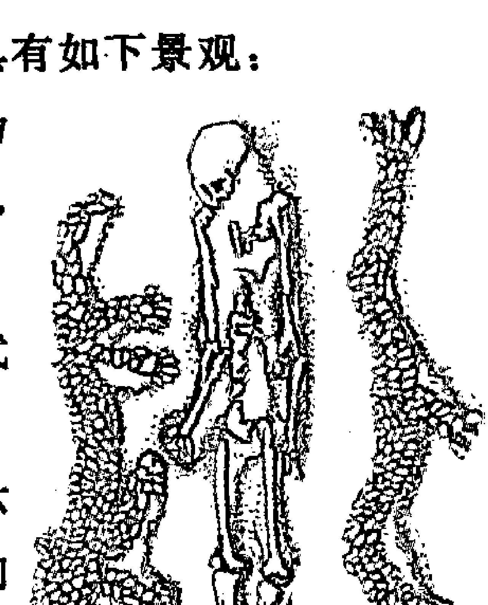

左青龙、右白虎、前朱雀、后玄武，称为“四方神兽”，是风水的大局。对它们的基本形态和作用的要求是：

- 后玄武。在建筑物的后面，有数重相叠的山峦由远而近，从高到低。其名称依次是：太祖山、少祖山、父母山、龙穴（生气凝聚点，建筑物的基址）。山峦重叠的玄武，是建筑物的靠山，是遮挡北风的屏障，又是防止盗贼的障碍物，使居住该地的人有安全感（如图2-2、2-3）。

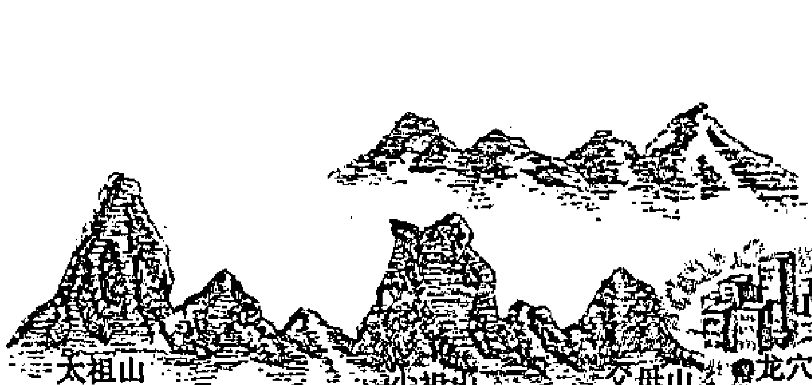

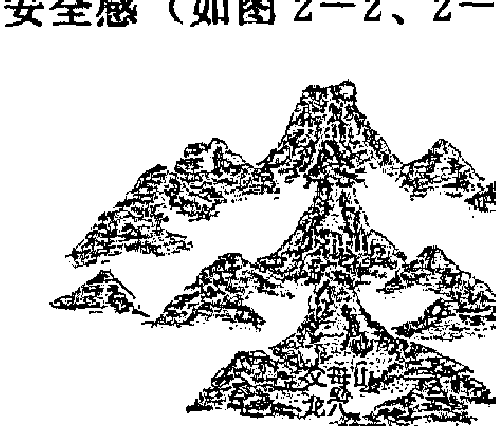

- 左青龙。在建筑物的左边，有比后面父母山稍低矮的山峰或冈阜，而且此山峰或冈阜应向右弯环，对建筑物有曲抱之情。这是左辅。

- 右白虎。在建筑物的右边，有比左边青龙稍低矮的山峰或冈阜，而且该山峰或冈阜应向左弯环，对建筑物有曲抱之情。这是右弼。

> 正如郭璞说：“龙虎要如肘臂，谓之环抱。”“青龙要高大，白虎不抬头”，要达到“龙强虎弱”之势的要求。青龙、白虎之山峰或冈阜近父母山的一端，要与父母山连成一体，而不能各自独立。在它们的后面，还应有一层或多层护山。

- 前朱雀。在建筑物的前面，有一片开阔地，此开阔地的前面还有一潭清澈秀丽的、回顾有情的月牙形池塘之水。此水是从护卫建筑物的众山峰里不断流来，而又缓慢回环地从池塘里流走的活动的水，切忌是一潭死水或臭水。

这片开阔地和池塘的地域，称为“明堂”。明堂在古代，开始是祭祀的地方，后来成为皇帝布政施教的场所。其主要功能是“明政教”、“明诸侯尊卑”，故称为明堂。它的形状是上圆，象征天；下方，象征地。

案山，在明堂前面的近距离内，有一秀丽低小，且横向朝着建筑物、弯环而有情的山峰或冈阜，其形有如玉几、横琴、笔架、龟蛇、金箱、玉印、书笥、席帽之状，这就是案山。它犹如在宅主的前面，摆放了一张美丽而舒适的书案，供其写作办公之用。

朝山，在案山前面的视距内，可见一座稍高于案山的山峰，此峰应端庄秀丽，形如朝向建筑物打拱朝拜，这叫朝山。该山后面还应有一层或数层护山。

河流，在朝山之外，或朝山与建筑物之间，或朝山与案山之间，有一条弯环曲折的金带式河流，其水质清澈，流速缓慢，天门开，地户闭。

上列各山峦及其护山，均应形态端庄，草木繁茂，流水潺潺，鸟语花香。“山管人丁，水管财”，所以，“山法”、“水法”均是风水的重要内容。

凡具有上述景观的区域，就可称得上典型的“风水宝地”的格局。

二、达到这种景观格局的特点

达到这种景观要求的格局，有下列特点：

- 围合封闭。群山环绕，自有洞天，形成远距人环的世外桃源。这与中国道家的回归自然，佛家的出世哲学，陶渊明式的乌托邦社会理想和其美学观点，以及士大夫的隐逸思想，都有密切的联系。

- 中轴对称。以父母山→宅基址→案山→朝山为纵轴；以青龙、白虎为两翼；以河流为横线，形成左右对称或非绝对对称的格局。这与儒家的中庸之道及理教观念有一定联系。

- 富于层次感。父母山后的少祖山、祖山；案山之外的朝山；青龙、白虎之外的护山。均构成重峦叠嶂的风景层次，富有空间深度感。这在景观上正符合中国传统绘画理论在山水画构图技法上所提出的“平远、深远、高远”等风景意景和鸟瞰透视的画面效果。

- 富于曲线和动美。笔架势起伏的山峦，金带式弯曲回环的河流，均富有柔媚、曲折、蜿蜒的动态之美。它打破了对称构图的严肃性，使风景画面更加流畅、生动、活泼。

总之，选择一处上述景观的“风水宝地”，不仅要注意与生活有密切关系的生态环境的质量问题，同时也要注意与艺术视觉有密切关系的景观的质量问题。中国风水学，实际上受到中国的儒、道、释诸家哲学以及中国传统思想的深刻影响，是综合了中国传统文化的产物。

### 第二节 从中国地势图看中国的“大风水宝地”

台湾资深风水学家王松寒先生，在其《王派风水学》一书中，从中国地势图上描述了“一个特佳的大风水全貌格局”。在他的描述中，该大风水宝地的穴场，在“从湖北武汉到湖南岳阳和沔阳之间古云梦二百平方公里的区域内”。该区域是中国各省市的心脏地带；是长江、汉水合流的三角地区；是所谓“大地多腰落，美女藏深宫”的一处大穴场。该穴场的景观格局完全符合前述的“典型风水宝地”格局的要求。试从下图中观看此一格局的宏大和美丽（如图2-4）。

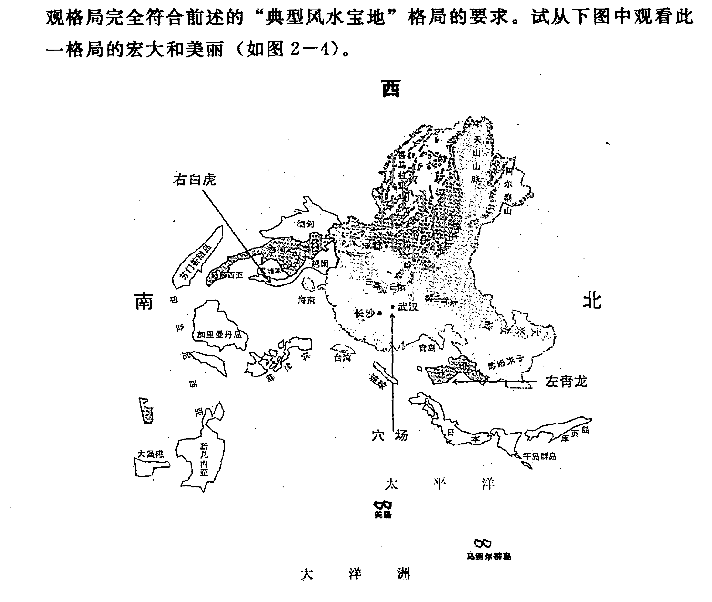

图2-4 中国地势图

1. 从西南角朝东北角仔细地观看，你会发现一张中国大地图，恰似一只大螃蟹躺卧在世界的东方。南从海南岛，东至青岛之间，是一条长约七千公里的海岸线，这好似一只螃蟹的斗盖前沿；左边朝鲜半岛、右边越南和老挝等国所在的中南半岛，是大螃蟹的两只巨钳。

2. 从风水角度看，那片弧形的区域，是穴前的一个大躺唇，左右两只巨钳，是内青龙、白虎；左边库页岛及日本九州，右边马来半岛、苏门答腊和加里曼丹岛等，是外青龙、白虎。

日本岛是它的近案，琉球及菲律宾群岛是它的第二重案山；关岛、马绍尔群岛是近朝，中南美洲是远朝。

日本列岛是左旗，波罗洲（加里曼丹岛）为右鼓；太平洋是水聚天心。

试看其气魄魁伟，气势磅礴，雄视阔步，傲居太平洋之上；左右护卫重重，有臣服万邦之天姿。21世纪必世无其匹。

3. 穴场所在地

从湖北武汉到湖南岳阳和沔阳之间古云梦二百平方公里的区域内，是“大地多腰落，美女藏深宫”的大穴场。该穴场是长江、汉水合流的三角地区；昆仑山为其祖山，辞楼下殿，分枝劈野。

左龙：阿尔泰山、肯特山、大小兴安岭蜿蜒于韩国及日本，为左边护龙。

中龙：从昆仑山奔腾东下，入川鄂的大巴山脉，于江陵间束气过峡，在古云梦大泽间气止形蓄，结成了莫大的堂局。此地实为紫微垣最佳宝地。

大别山、大娄山为其左右侍卫，雪峰山为其近朝，武夷山为其远应，峰峦耸拔、秀水聚绕。这就是中国的大“风水宝地”。

### 第三节 城镇中的“风水宝地”

现代城市里高楼林立，街道纵横交错，房屋密密麻麻，哪里去找重峦叠嶂环境中那样的风水宝地呢？其实城镇里也有相对的“风水宝地”。

青山绿水环境中的“风水宝地”，是典型的、上佳的、最理想的宅居之处，在我国辽阔、美丽、富饶的疆域里，各省或相当多的地、市、州、乡及其村落都有秀丽的山峦和河川，至于世界范围内就更不用说了。所以，如此理想的风水宝地是肯定存在的。如首都北京、江苏南京、陕西咸阳、四川成都等就是这样的“风水宝地”。这是第一。

其二，本书所指“宅居”，既包括阳宅，又内含阴宅。而阳宅中，既指单家独户修建的房屋，也指众多人口聚居的村落和城镇，还包括祠堂及寺庙。总之，凡有人类居住及活动的场所，无论其规模大小和功能如何，都需要注意有较好的风水环境景观。只有这样，才更有利于人类的身心健康和事业的兴旺发达。

其三，事物的好坏、优劣程度，总是相对的，不是绝对的。人的个体，一般总是在一定范围和场所内居住、生活、工作和发展的。所以，个人美好愿望的追求并实现，往往要受到一些客观条件的限制。也许离你不远处，就有一块上佳的“风水宝地”，但那块地皮的产权不是属于你的。要花钱买吧，要么业主不卖，或是自己没有经济支付能力；或者你的祖业和居所，本来就是在城镇。在这种情况下，你就只有参照理想“风水宝地”的格局，在自己的领地内，通过力所能及的变通来处理了。这就是说，对“风水宝地”的格局，要因地制宜，因人而异，不能死搬硬套。但话又说回来，倘若根据你的实际情况，经过种种努力，确能找到一块上佳的风水宝地，你又何乐而不为呢？

基于上述探讨，下面试探在城镇如何寻觅较理想的“风水宝地”。

一、首先看大环境的优劣

城镇是一个国家或地区的政治经济与文化活动的中心。我国从古至今对城镇地址的选择都十分慎重。因为它关系到未来事业是否发达兴旺和族人的前途与命运。例如，《诗经·大雅公刘》篇，记述了周文王的祖先——公刘，带领民众选址建庐舍，实行井田法的情况：

> >“笃（忠厚）公刘，逝（往）彼（那里）百泉（很多泉水），瞻彼溥（pǔ，广大）原，迺（nǎi，于是）陟（zhì，攀登）南冈（山脊），乃觏（gòu，见）于京（高丘）。京师（国都）之野（郊外），于时处处（居住地），于时庐旅（民众），于时言言，于时语语（欢声笑语）。”

其大意是：忠厚的公刘，攀山越岭查找修庐舍、安定子民的地址。见到山下一片广大的平原，此处百泉涌流，形成了弯曲流淌的小河；还望见南面较远处，有山丘形成的案山、朝山；东西两侧，又有蜿蜒起伏的耳山（今陕西省旬邑县西南面）。平原中靠近北山之处，前面水源丰富，地形开阔；北面高山可阻挡北风的侵袭，正是修建国都和安置民众的好地方。民众居此后，安居乐业，欢声笑语，呈现出一派生机勃发、吉祥和谐的景象。

1. 北京的风水格局

> 唐代风水师杨益说：“燕山最高，像天市，盖北平之正结。其龙发昆仑山之中脉，绵亘数千里……以入中国为燕云。复东行数百里起天寿山，乃落平洋（有水的平原），方广千余里。辽东辽西两枚，黄河前绕，鸭绿后缠，而阴山、恒山、太行山诸山与海中诸岛相应，近则滦河、潮河、桑干河，易水并无名小水，夹身数源，界限分明。以地理之法论之，其龙势之长，垣局之美，干龙大尽，山水大会，带黄河、天寿，鸭绿缠其后，碣石锁其门，最合风水法度。以形论胜，燕蓟内跨中原，外控朔漠，真天下都会。形胜甲天下，山带海，有金汤之固。”

> 宋代朱熹说：“冀都是天地中间，好个大风水。山脉从云中发来，云中正高脊处，自脊以西之水，则西流于龙门西河；自脊以东之水，则东流入海。前面黄河环绕，右畔华山耸立为虎。自华来至中原为嵩山，是为前案。遂过去为泰山，耸于左，是为龙。淮南诸山是第二重案，江南诸山及五岭又为第三、四重案，正谓此也。”

> 明代《太宗实录》云：“北京北枕居庸，西峙太行，东连山海，南倚中原，沃野千里，山川形胜，诚帝王万世之都。”

> 清代吴长云说：“北京青龙水为白河，出密云，南流自通州城。白虎水为玉河，出玉泉山，经大内，出都城，注通惠河与白河合。朱雀为卢沟水，出大同桑干，入宛平界。玄武水为湿余，高粱、黄花、镇川、榆河俱绕京师之北，而东与白河合。”

总之，巍巍太行山脉蜿蜒逶迤，由南向北奔腾而来。城北，浩浩燕山山脉罗列簇拥，拱卫着京师。两脉山脉交会、聚结，形成风水上的“龙脉”。森林覆盖山峦，山色苍茫，云气郁织。在这青山之中，来自黄土高原的桑干河与来自蒙古高原的洋河，汇合为永定河。永定河汹涌澎湃，穿行于深山老林之间，到京师三家店，陡然冲出山谷，在北京小平原的西面伸展流淌，造就了形同蛛网的河流和星罗棋布的湖泊。山川襟带之间，北京城温润丰饶，土肥人美，遂成天府。这是风水上要求“藏风聚气”利于生态环境的最佳风水格局。

中国古代都市规划的重要原则之一，就是明朗、对称，即各种建筑的阴阳协调与对称平衡。北京城内的建筑，其布局恰是如此：南有天坛为阳，北有地坛为阴；东有月坛为阴，西有日坛为阳；左有太庙，用于祭祀祖先为阴，右有社稷坛，用以祭祀土地、谷物神为阳。对称平衡的中心点，就是风水穴场。阴阳极是相互对立的一个事物的两极，他们相互依存缺一不可。阴阳调和在城市平面布局上反映出来的，就是对称、明朗。

2. 南京城的风水格局

南京，古称金陵，又名石头城。明代文人杨云说：“既渡江左，乃都金陵。金陵之都，王气所钟。石城虎距之险，钟山龙盘之雄。伟长江之天堑，逝百折而与流。炯后湖之环绕，湛宝镜之涵空。壮江南之佳丽，汇万国之朝宗。此其大略也。”

南京风水的石头城为白虎，以钟山为青龙。前有朱雀门，后有玄武门。南北对应，“阳来阴受，阴来阳受”，又有长江天堑环绕，所以形局较好。我国的西安、杭州、成都、苏州等大都市均系上佳的“风水宝地”。宅地，对地理环境的总体要求是：须具备封闭式的单元。《人子须知》说：“山水翕（xī，和顺）集，四势团近有情，而真穴必居包裹拥从之中，所谓“藏风聚气者也”。”

二、观察水情和气韵

风水学说认为：山随水走，水界山住；水随山转，山防水去。所以，选址时未看山，先看水。水是龙的血脉，两水之中必有山，故水会龙尽，水交龙止。“水飞走即生气散，水融注则生气聚”。水深处，民多富；水浅处，民多贫。水聚处，民多稠；水散处，民多离。流来的水要屈曲环抱，流走的水要盘垣顾盼，汇聚的水要清澈甘甜。我国很多名城都是以得水为上。如：北京、南京、广州、杭州、成都、重庆等。

- 城镇位于两条江河的交会处。如：扬州、武汉、桂林、合川、宜宾等。这是风水师最欣赏的。

- 城镇位于一岸或两岸。如：天津、上海、兰州、太原等。还有的城镇坐落在河曲的中间。如：阆中、柳州、壶关等。

- 城镇位于海滨，可辟为海港。如：泉州、宁波、青岛、大连、秦皇岛等。

除选水位外，还要择水质。水色碧，味甘，气香，是上佳的贵地；色白，味清，温暖，是中佳的好地；色淡，味辛辣，气味浓烈，是欠佳的下地；气味酸涩，发馊，是不能用的劣质地。五百多年前，在北京闹市中开凿出来的“王府井”，其水因清澈甘甜而闻名于世。

观测城镇四方的山川水势时，还要看是否能聚气。若能聚气，且气韵畅达，就是吉地，否则为凶地。因城镇人口集中，要求环境容量要大，所以，“气”也要大，“龙”要旺，“脉”要远，“穴”要阔。城内道路格局要奇偶相错。城镇的中心就是“正穴”，一般要建在较高的地势上，方吉。

三、细查城镇的总体布局和本家宅（或要准备购买的住宅）的环境景观

城镇住宅布局，一般以道路和邻里为主。可将街道比着“水”，依照街道的走向和特点选择自己的住宅。其具体方法和要求如前述察水之法。对自己住宅周围的其他建筑和街道，又可以将其看作与自己的住宅是“龙”、“砂”、“水”、“穴”等关系。一条街道为一条水；一层墙为一层砂；门前的街道、公园，可视为“明堂”；后面的高楼是靠山；对面的屋宇是案山；左右的房屋是青龙、白虎。此外，还要注意下列各点：

- 自己宅门前，不宜见到街口和道路与宅门相对；
- 宅后不宜有笔直的“山脊”顺势而下，直冲宅屋；
- 地气从高处来向低处去，应避低而就高；
- 生气从空缺处来，遇到障碍时折回，应乘进入处收回。

### 第四节 平洋地带的“风水宝地”

一、将平洋地带的地形、地物作为“四神兽”

> 古书《营造宅经》云：“住宅左边有河流，叫青龙；住宅右边有长道，叫白虎；住宅前面有池塘，叫朱雀；住宅后面有丘陵，叫玄武。有此四神者，是最尊贵之地。”

有水的平原称“平洋地带”。这段话所描述的就是这种地带的“风水宝地”。这是一处坐北朝南的建筑物，以它为中心，其中说的左边是东方，右边是西方，前面即南方，后面系北方。

在平洋地带，其地表面，高一寸为山，低一寸是水。在此，其将住宅左右的河流、道路，视为青龙、白虎；将前面的池塘、后面的丘陵，看作朱雀、玄武。所以，在平洋地带，找“风水宝地”，就不能照搬“山峦”地带的标准模式。但是“四神兽”的基本格局是不能少的。只是这些神兽是河流、道路、池塘、丘陵等等，而不是“山砂”罢了。

二、以水为龙，无水休寻地

> 古诗曰：“龙落平洋如展席，一片茫茫难捉摸。平洋只以水为龙，水缠便是龙身泊。”这就是说，在平洋地带找“风水宝地”，还有个“寻龙、察水、观砂、点穴、定向”的问题。如何找呢？

> “未看山时先看水，有山无水休寻地”。所以，寻龙、点穴要以水为山、为龙。《水龙经》云：“行到平原莫问纵（山脉），只看水绕是真龙。”因为水是山的血脉，“水飞走则生气散，水融注则生气聚”。所以，水与生态环境之地气、生气息息相关。寻龙到山环水聚，两水交汇之处，龙则止（水交龙则止）。“大江大河一二里而来，不见回头环顾，中间虽有屈曲，也决不结穴。直至环转回顾之处，方是龙脉止聚”。

水与龙的关系十分密切。因水是龙的血脉，所以，水大，来龙长；水小，来龙短。水来处是发龙，两水交汇水尽处，龙亦尽。众水停注之地为沼、为泽，为池、为湖，这是真龙的憩息之所。

水是构成风水景观的基础。水曲则财禄聚；水直则贫贱夭亡。前水不宜直射，后水不宜直流，全以屈曲为贵。

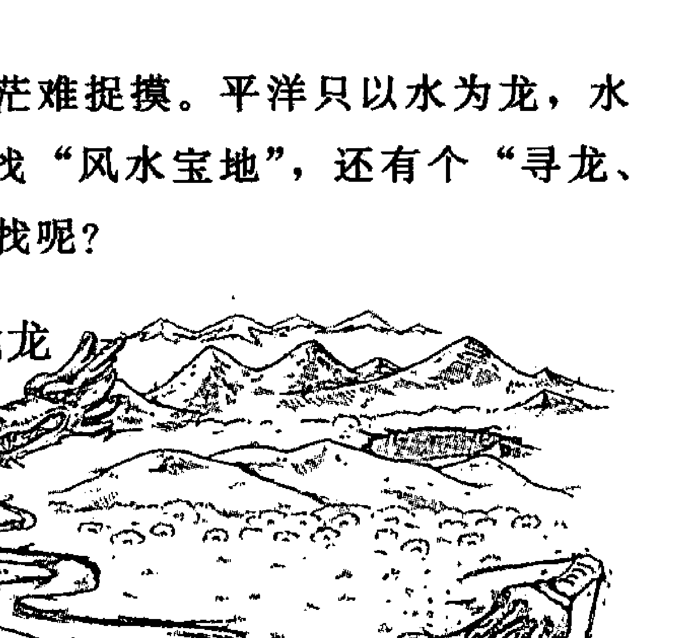

三、宅址要选在河流会合或弯曲成弓形的内侧处

河流会合或弯曲成弓形的内侧之处，水流三面环绕，成“金城环抱”之势，呈圆形。圆象金，金又生水，故称为“金城”或“水城”，是风水中水形的大吉之地。如一些民宅前的半圆形水池和一些河流会合或弯曲之地的住宅。

依现代水文地理学可知，河流在地形地质的限定和地球自转引起的偏向力，使河流形成了弯曲宛转的状态，于是便有了许多河曲之处。由于水力惯性的作用，河水不断冲击河曲的凹岸，使其不断淘蚀坍岸，而凸岸一侧，则水流缓慢，泥沙不断游击成陆地，既无洪涝之灾，又可扩展基础，发展住宅。同时水流屈曲的“冠带水”，还可以给人以良好的视觉感受。而反弓水则是相反的凶水。

水有大小、远近、深浅之别，不要贸然地见水就以为是吉地。要察其形势，察其性情，别其吉凶，作出取舍的标准。以住宅基址为中心，观其来水要屈曲；横向对流对住宅有环抱之势；流走的水要盘桓欲留；汇聚之水要清澈悠扬。切忌水来直冲、斜撇；水去反跳倾泻之势。

四、注意水源和水质

水源一般有三种：

- 井水。井址，应选设在地下水污染源的上游、取水方便之处。还要考虑水量和水质。井位地势应干燥，不易积水。周围20～30米内，没有渗水的厕所、粪坑、畜圈、垃圾堆场和工业废水等污染的水源。

- 泉水。泉水常见于山坡和山脚。水质优良和水量充沛的泉水，不仅是适宜饮用的水源，而且还有净化空气和美化环境的作用。书云：“有山泉融注于宅前者，凡味甘、色莹、气香，四时不涸不溢，夏凉冬暖者，为嘉泉。主富贵长寿。”

- 地面水。江河湖泊和蓄水池塘的水，是地面水。此类水的污染程度比井水和泉水要严重些，所以，取水点应尽量选在聚落河流的上游，排污点则应设在下游。如条件许可，应在岸边设置沙滤井，净化水质，以便取用。

对水质的要求是：清澈、透明、味甘、无色、无臭、无异味等。倘有条件，还应做化学生物试验，检查水的软硬程度、矿物质含量和细菌含量等。

总之，对水环境要注意水源、水势和水质三个方面。

五、注意水口的位置和形态

所谓水口，就是众水流来的入口之处和流走的关拦之处。流来之处称## 六、注意从水的形态中找结穴点

- 1. 干水。大江大河的主干水，是干水，犹如一颗大树的树身。干水大致有两种情况：一是屈曲环抱形成墙垣，围住地下生气，此被围的中间是可用的穴地。因为平洋中寻找龙穴，以水为龙，故必须在水城大缠大回之地做仔细的探求，直至环绕回顾之处，才是地中生气和龙脉止聚的结穴点。“气乘风则散，界水则止”，气界水而止，就是“龙”到了。“平洋只以水为龙，水缠便是龙身泊”。这就是说，只有水城大缠大回之处，才是“龙”泊之地，一些小的曲折回头，只是龙的束气结咽处，而形不成生气凝结的结穴点。干水若汪洋湍急，斜形而来，看去虽有屈曲，却又形不成环抱之势；如果再没有支水回环作内气，就结不成凝聚之穴了。由于这种水没有回环成墙垣聚得生气，所以，称为“干水散气”。

- 2. 支水。江河干流的分支称为支水，犹如树身的枝丫。只有交界回抱的支水，才能结穴。

几种交界的支水，如果能前后左右重重交锁，几分几合。这种现象叫做“束气结咽”，就是龙气成束的咽喉处了，龙脉也就到了头了。倘若再圆净端严，形势秀逸，左右又生龙虎，护卫周密。此地就是结穴点。

- 3. 曲水。水流屈曲，形成墙垣，此处往往有结穴点。其中有两种情形：一是单水缠绕，形成种种不同形式的墙垣。这是吉地结穴；二是曲水朝堂。有三曲或五曲支水，回收周匝，各个包裹朝护着穴地。这是生气凝聚的明堂，也是吉祥之地。

- 4. 顺水。河水顺势而来，到止处有所回抱的，也能凝聚生气成为结穴处。但直流不回抱的水是不能用的。

> 《堪舆漫兴》云：“顺水之龙穴要低，有砂交锁始堪为。面前若见滔滔去，纵是龙真罹祸危。”

## 中国风水学初探

## 第三章 九种不同环境和地形的风水宝地

加拿大中华风水学院校长陈怡魁博士，在他著述的《生存风水学》中描述了九种风水宝地，现摘要整理于后。‘风水’，简单地说，就是一门适应环境生存的学问。它并不是后代某大师的理论著述，而是人类祖先在艰苦恶劣的环境下，经过数百万年的亲自体验，所得到的一门生存法则。

### 第一节 人类生存所需要的四大要素

#### 一、得水

> 《葬书》：风水之法，得水为上。
《水龙经》：万里无山，英雄迭出，其贵在水。
杨筠松：未看山先看水，有山无水休寻地。

#### 二、依森林草原而居

依森林草原而居，有六大好处：

- 1. 可以降低干旱；
- 2. 能够调节气温；
- 3. 森林能制造生命之需的活氧（森林中产生的氧气不是常量，其浓淡和多寡均随气候的变化而变化，故称“活氧”），负离子和芬多精（芬多精是一种芳香性的碳水化合物，对人的呼吸系统有益，它能杀菌、防霉和驱虫，是植物的防御系统）；
- 4. 吸尘解毒；
- 5. 水土保持；
- 6. 抵御强风。

《玉镜》云：“四季青青福自来。”《阳宅十书》曰：“不居草木不生之地。”

#### 三、宅舍坐北朝南，防患北风

因中国位于季风盛行的东亚大陆，由于海陆之间的“温度差异”，造成夏天从太平洋吹来温暖宜人的南风与东南风，冬天则由俄罗斯西伯利亚吹来非常寒冷的北风与东北风。宅舍坐北朝南，则可预防冬天北方吹来强烈的冷风；夏天接纳和煦的南风以及常年所需的阳光。

日本各建筑家岩田次郎说：“若以东方建筑来说，房屋‘向南’，才是最理想的朝向，其次是朝向‘东’方或‘东南’方，这些规则可作为东方住宅在选定屋向时的一种参考。”

#### 四、定居地势较高之处，防患洪水

《雪心赋》云：“平中得一突为奇。”《葬经》云：“地有佳气，随土所生；山有吉气，因方而止。”《青鸟绪言》云：“对平原龙的寻找，应该平中取突，突中有旺气故也。”

综上可知，人类生存的四大要素为（如图3-1）：得水；接近森林；坐北朝南；地势高亢。

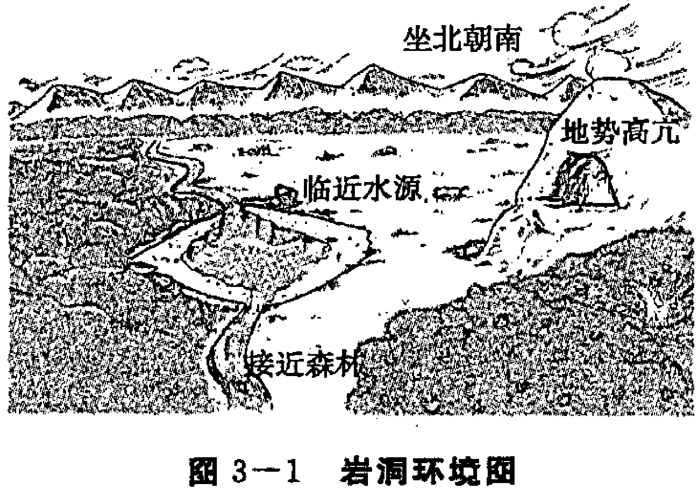

### 第二节 不同环境和地形的九种风水宝地

#### 一、就居冲积扇平原

1. 冲积扇平原
因山脉接近平原，其坡度又较缓，致使河流将泥沙冲刷至山脚下形成贵如黄金的扇形平地，称为“冲积扇平原”（如图3-2、3-3）。
冲积扇平原，应当是坐北朝南，附近有茂密的森林，前方是开阔的草地，才是最好的。

## 卷一 论山形水势和风水宝地

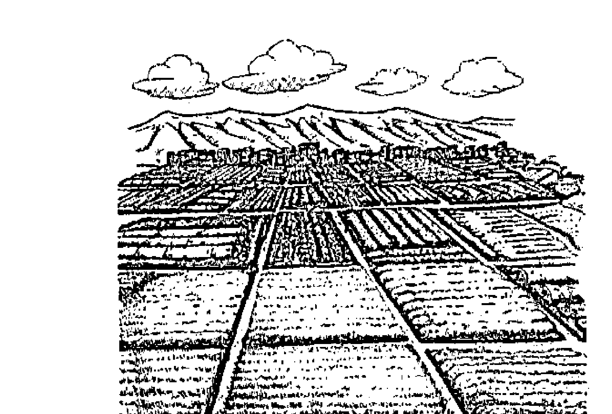

## 图3-2 冲积扇平原

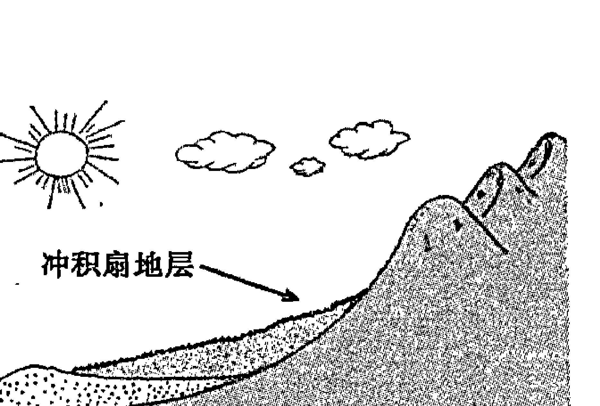

## 图3-3 冲积扇地层

如：垦丁史前遗址。此处是一处海拔为25米高的珊瑚礁台地。北有丘陵与大尖山为屏障；南面一公里处是临海的南湾。台地与南湾之间，则是石牛溪沿着丘陵而下，向下是冲刷而成的积扇河阶，此河阶足有两层之多。

2. 冲积扇的风水理论

山本静，水流则动；石本顽，树活则灵。山本静，势求动处；水本动，妙在静中。故阴山阳水。

风水学认为，山水交界的冲积扇，是“阴阳交合”理论的实际结晶。其中蕴藏着丰厚十足的生气。所以，成为自然的最佳风水宝地。

> 《青囊经》云：“乾之真阳，坤之真阴，皆无形而为土之形。此土之下为黄泉，皆坤地积阴之气；此土之上为清虚，皆乾天积阳之气。而土肤之际，平铺如掌（冲积扇），乃至阴至阳乾坤交媾之处，水火雷风山泽，凡天地之化机皆露于此。”

> 郭璞说：“山顿水曲，子孙千亿。”“顿”，山止处，连绵千里的山脉，高度渐降，开始进入平地的交界处；“曲”为河水环抱。即住在山河交界的冲积扇处，人丁兴旺，钱财丰隆。

冲积扇平原最精华的区域，不是山坡上由粗砾山石构成的扇柄上，而是在山脚下的泥沙沉积区域，即扇端的部分。

“藏风聚气”道尽了千古风水之要义。冲积扇平原之所以是最佳的风水宝地之一，就是因为它背山面水，能藏风聚气。

> 《葬书》曰：“乘风则散，界水即止。”《疑龙经》云：“穴里避风如避贼，莫令穴缺被风吹。”
《地理大全》中的择地四原则：一不下高冈绝岭，二不下龙虎齐眉，三不下前后冲劫，四不下八面风吹。

只有这样的地理条件，才能培育出优质食物供人类和动物食用，才能人畜兴旺，进而才能事业有成和社会进步。这样的风水，才是最佳风水。优质食物产生的基本条件是最佳的光合作用，即充足的阳光（尤其是红光）、二氧化碳、水、适量的热能以及徐徐吹来的和风的配合。

植物绿叶的孔隙，在光合作用下，要慢慢地吸收大气中的二氧化碳。但二氧化碳在大气中的比例只占 0.03%，倘若有强风吹袭，就会大大影响植物对二氧化碳的吸收。所以，只有徐徐和风的配合，植物绿叶的光合作用效率才会最高，产生的活氧量以及合成的糖类也越多，植物的品质就越佳，人类和家畜食用后体质也越健康。“只有草儿美，马儿才会壮”。由于冲积扇平原能“藏风聚气”，所以生气十足，能生长出优质的食物，故人能变强，马儿也能长壮。

#### 二、依盆地而居

宅居的周围有山丘或绿树以及河流包裹的地域，称为“盆地”。这种被山丘、绿树环抱的地方，不被强风所袭，故能“藏风聚气”（如图 3-4）。

> 《阳宅集大成》云：“青松郁郁竹苍苍，绿树阴浓把屋藏，朝树明堂无蔽塞，富贵尤能永远昌。”

> 《玉镜》：四边竹林甚宜栽，四季青青福自来。屋宅遮漫看不见，长春富贵好安排。

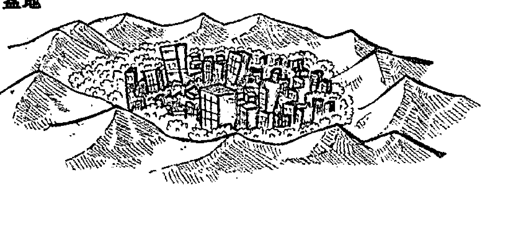

清朝一位风水学者姚廷峦先生讲了一个故事，他说：“乾隆年间乙丑岁，我从武林去半山旅游，离山约有几里处，有位姓潘的朋友，名叫丹宸，请我看他的房屋。此屋坐北朝南，外有三层山丘包裹，左右有河流，周围栽了很多槐树和柳树，使房屋深藏其中。于是我说：‘先生居处，虽非大富大贵之地，然而周围树木遮蔽，屋藏不露，层间合乎法度，家庭必然殷实富有，人丁也很旺盛。’潘先生说：‘我在此已居住三代，代代兴旺，受益很大。历来财源稳定，人丁安泰，只是学校不足，先生所言，句句与实情相合。’”

### 盆地的风水原理

盆地四周由高山峻岭组成，呈现出外隆内凹的样貌，如雷达和鸟巢一样，不受四方强风的侵袭，故可以“藏风聚气”（如图3－5、3－6）。

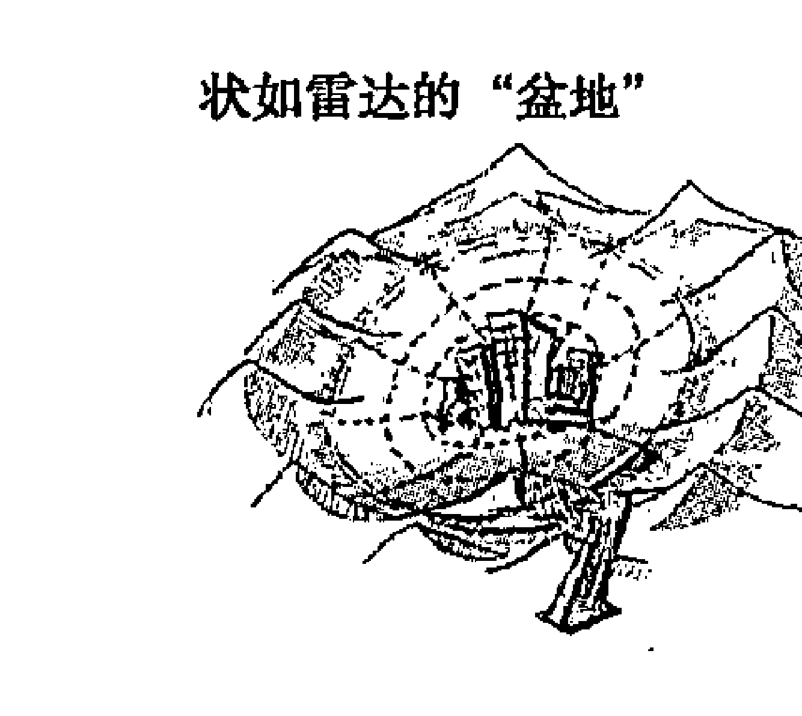

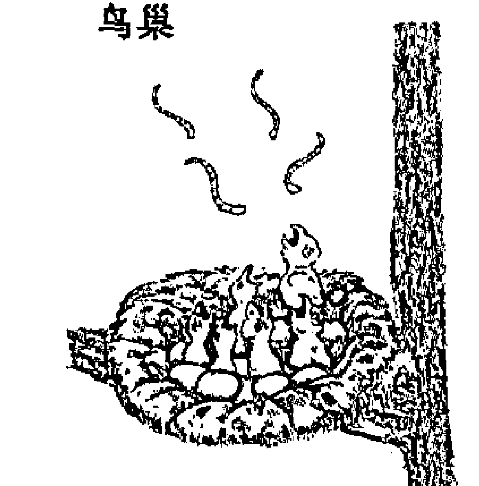

河流从四面八方环绕的高山上，流到内陆平地，在山脚下形成冲积扇。山水将山脉表面粗细不一的砂土运到盆地山脚，形成水草丰美，土地肥沃、水源充沛的“菁华区”。有水就有气，既能藏风，又可聚气。故人们历来称盆地为“聚宝盆”，是风水理论上重要的“风水宝地”之一。当今世界许多繁华的大城市都位于盆地内，如：伦敦、巴黎、台北、成都、南京（如图3－7）。

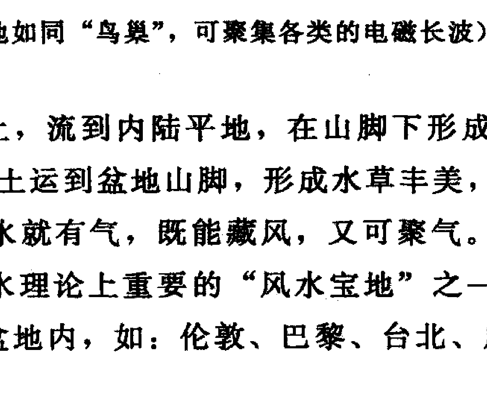

> 《地理大全》云：“外山环抱者，风无所入，而内气聚；外山亏疏者，风有入尔，则内气散。”

“环山抱水，围如罗城，生成必厚”。罗城，即森严罗密的城墙；“围如罗城”比喻房屋如森严罗密的城墙一样，层层包围着住宅的环境（如图3－8）。

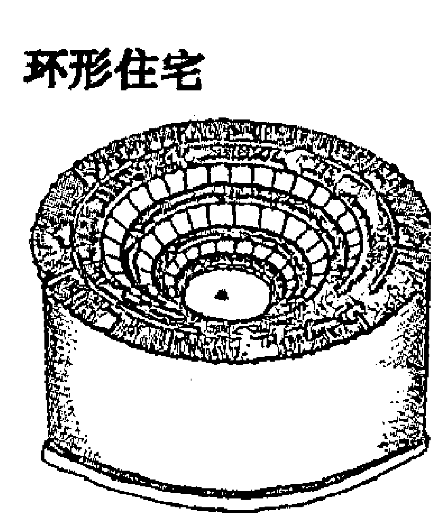

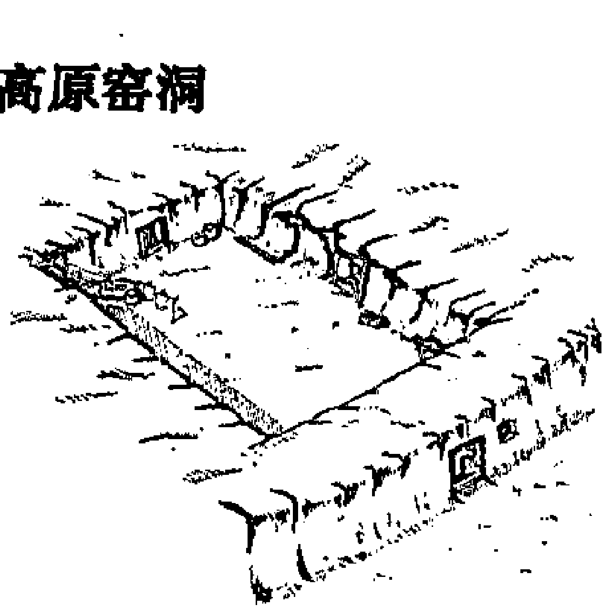

图 3-8 环形住宅和高原窑洞

#### 三、定居高处

在平原上将房屋建在较高的山冈或隆起的土丘上，即定居高处（如图 3-9）。

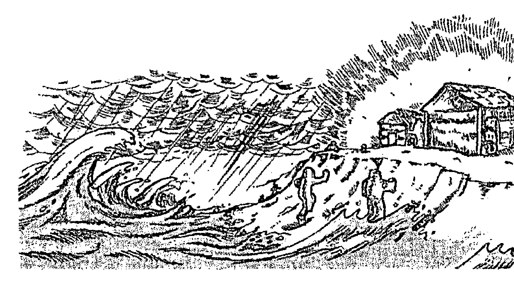

在古人的穴居时代，在平原的人们找寻住处时，为避免雨季的暴涨和大雨造成的洪水，他们在挖掘洞穴时，都尽量找在高处的山岗或隆起的土丘上。

### 定居高处的风水理论

《管氏地理指蒙》云：“土愈厚，其气愈厚。”《葬书》云：“地有吉气，土随之而起”，“夫气行乎地中，其行也，因地之势”（即平原隆起之地，如图 3-10）。

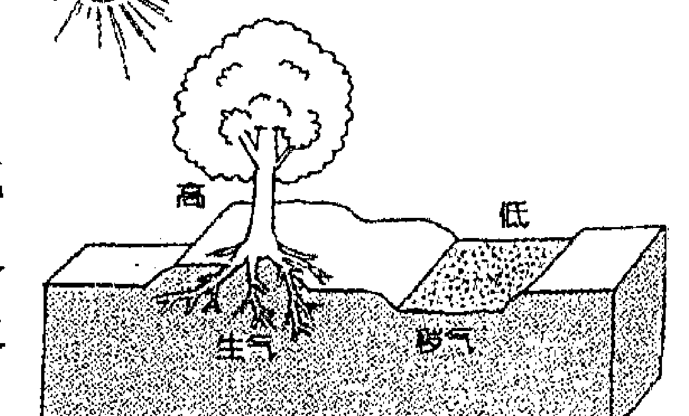

风水认为，平原高亢的地势，其内必含着丰富的生气，否则该地是不会隆起的。

这种丰富的生气之地，久住将人畜兴旺，欣欣向荣。《地理辨正疏》云：“风水之道，只在乘生气也。”故高亢的宅地，千古以来，一直被中国人视为极佳的风水宝地。

在我国，对后世的繁衍和发展，影响最大的，并非是居住在深山峡谷的居民，而是生活在广大平原上的民众。在平原上找风水宝地要做到“四防”：防水，防猛兽，防盗贼，防敌人。故要依高而居。

> 《葬书》云：“支（龙脉的分支）之所起（高凸处），气随而始。”《地理人子须知》云：“平支之龙，其穴酌以最高处为贵也。”《管氏地理指蒙》云：“平中得一突，为奇。”《淮南子·地形训》云：“高者为生，下者为死。”

这些论述表明：在平原中寻找龙穴，要找相对于平原的高亢的台地。这种高亢之地，不是单一的突出点，或高山的顶处，而是一处平均隆起的区域，上面可供人们盖屋筑室，建筑村落，如平原上的方山、地垒、高岗等等。但是这种高处，应该平缓地渐渐地升高，不是陡然而立的尖峰，也不是势若危岩的高岗。

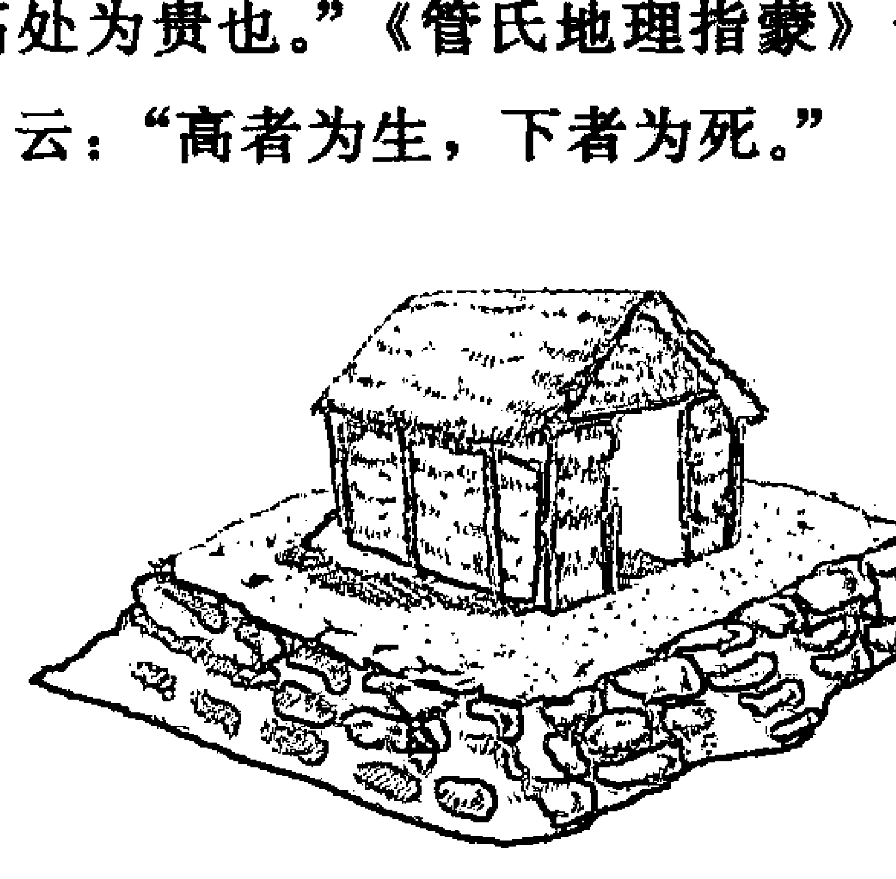

在古代，也有用加高地基筑室防水和修建城墙防水、御敌的情况（如图3-11、3-12）。

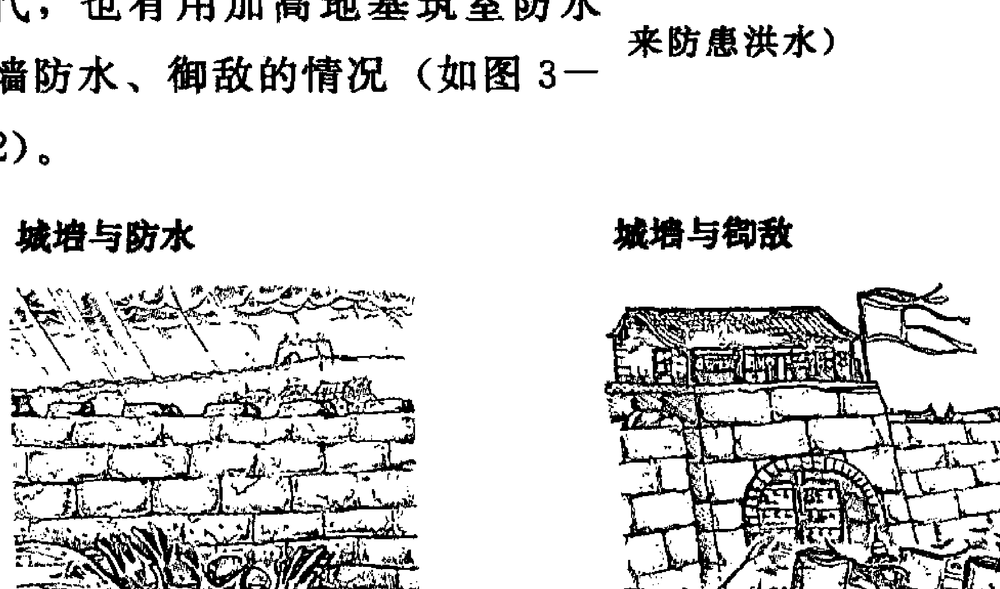

#### 四、依水源而居

水、阳光、空气，是维持动植物和人类生存与发展的三大要素。游牧时代的人们，择居址时，把“水源区”摆在了第一位，其他都次之。

河水、溪涧、湖泊、潭池等地，是游牧民的天字第一号风水宝地。故他们总是在这些地点搭设帐篷、放牧牛羊。

篷居时代的人们该如何生存呢？伏羲氏的“先天八卦”为他们指明了风水法则。只要按照八卦所象征的环境去找食物或处理相关事宜，就能成功，就能生存得很好。

##### 1. 八卦原理与风水

+ (1) 乾为天，为木果
+ (2) 兑为泽，为羊
+ (3) 离为火，为甲胄、戈兵
+ (4) 震为雷，苍艮竹，健蕃鲜
+ (5) 巽为木，为风。其于人也，为广颡

要捕捉天空中飞翔的小鸟，须在空中结网才行；要吃树上的果子，必须爬到树头，往高空中摘取才行。

要猎食青蛙、鳄鱼等爬虫类，必须到沼泽中去捉；要捉山羊，必须到沼泽边守候，待他们来喝水时，一举擒获。

把捕得的动物，置于火上烤熟才好吃；到陌生的地方放牧时，夜间要在帐篷旁点燃柴火，作为警戒防卫之用。

当畜牧所在地方的水草被吃尽时，快将羊、牛赶到下过雷雨的地方去，因为雷雨后，那里的水草又长起来了。

> 《易经》认为：万物出乎震，万物是在下雷雨后的自然环境中生长的；动万物者，莫疾乎雷（要使万物快速生成、繁荣，莫过于下雷雨）。所以，“雷雨”贵如黄金。

它告诫人们在选择居住环境时，要选微风徐徐、森林茂密的地方，在这里放牧的牛羊，才能健康生长。长期居住在微风徐徐树林边区的人们，将逐渐变得聪明（广颡：脑门宽广开阔的人，表示此人有智慧）。

现代科学证明：森林中有活氧。因为绿色森林受到日光照射后，树叶叶面的毛孔将捕捉空气中的二氧化碳，进行光合作用，进而产生氧气和葡萄糖。

巽为风，为木，为不果（树上长不出果实）。其于人也，为寡发（头发稀疏）。这是风的负面影响。

倘若某一些地区四方无屏障的高山遮挡，长年受强风袭击，又位于风头的迎面处。那么，该地区就会草木稀疏、不结果实；住在该地区的人们就会气血不畅，免疫力低下，头发当然就会稀疏。

巽为木，为鸡。告诉人们，要捕捉山鸡、野鸡，必须到森林中去猎击。

#### （6）坎为水，为盗。其于人也，加忧，为心病

坎卦告诫人们要靠近水源之地居住，而且要位于群山环绕、地势高亢的坚壁石洞，使野兽、洪水、敌人都难以侵犯。

> 《易经·彖传》曰：“坎，重险也。”对篷居民众，有警戒、小心之意。

#### （7）艮为山，为果蓏（蓏 luǒ，瓜类植物的果实），为狗、为鼠

要扎营在有山陵的挡风之地，而且该山陵在居住地的北面。《易经》曰：“艮，其背。”“背”，古汉文作“北”。所以，有使山陵处北方之意。

艮为山，为小石（指石器的来源）。人们要制造石器，其原料一定要到山陵中去寻找。

#### （8）坤为地，为牛，为釜

要制造铁锅，其原料要到地中去挖掘，才能取得。

居住时，要尽量朝向西南（坤）方，不要向着东北方。这样才能就阳蔽阴，而且还可以广获钱财。

可见，上述伏羲氏的先天八卦，完全是为了给当时的人群指点生存之道的法则。告诉人们如何适应恶劣的自然环境才能生存。只有这样理解，才能还八卦一个本来的真正面目。

##### 2. 坎卦的居住法则

《易经》曰：“坎为水（象征水源），劳卦也（四处寻找水源很劳苦，它是八卦中最辛劳的一卦），万物之所归也（水源区，是游牧民族四处迁移的最大目标和归宿）。润万者，莫乎水（水是万物的生命之源，人类与家畜，都要靠它才能生存）。”

所以，游牧民族要“逐水而居”，以水源为“万物之所归”。如此，才能使游牧民族人高马壮，族群兴旺。

##### 3. “得水为上”的理论

> 《葬书》云：“风水之法，得水为上。”

> 杨筠松说：“未看山先看水，有山无水休寻地。”

中国风水学认为：对于各种水源区，如湖泊、溪涧、河岸、江边等，只要该区域可辟为住地，都是适合人类居住的风水宝地。

> 古书云：“诸水之汇流、聚注，水之最吉也；不论江河、湖泊、溪涧，宅地见之俱吉。”

##### 4. 人类居住水源的标准

###### (1) 缓水与急水

对一般流动的溪河，要选择水质清澈、流速缓慢的河流边。《地理大全》认为，“屈曲环绕，聚注深缓”的水源为佳（如图3—13）。

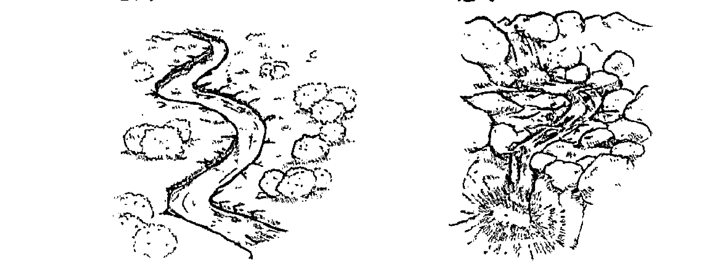

###### (2) 江左与江右

游牧民众在长期的放牧中发现，溪河右边的水草，通常比较秀美茂盛。在该区域内放牧的牛羊，形肥体硕不易生病，而在左岸则相反。所以，右岸为吉（如图3—14）。

> 古风水书云：“江水逆潮人爱惜，江右英雄由此出；江右秀气在潮水，潮来之时多富贵。”

##### 什么是右岸？

站在江河、溪涧的旁边，面朝河水流走的方向看去，这时右手边的位置就是右岸；左手边的位置则为左岸。

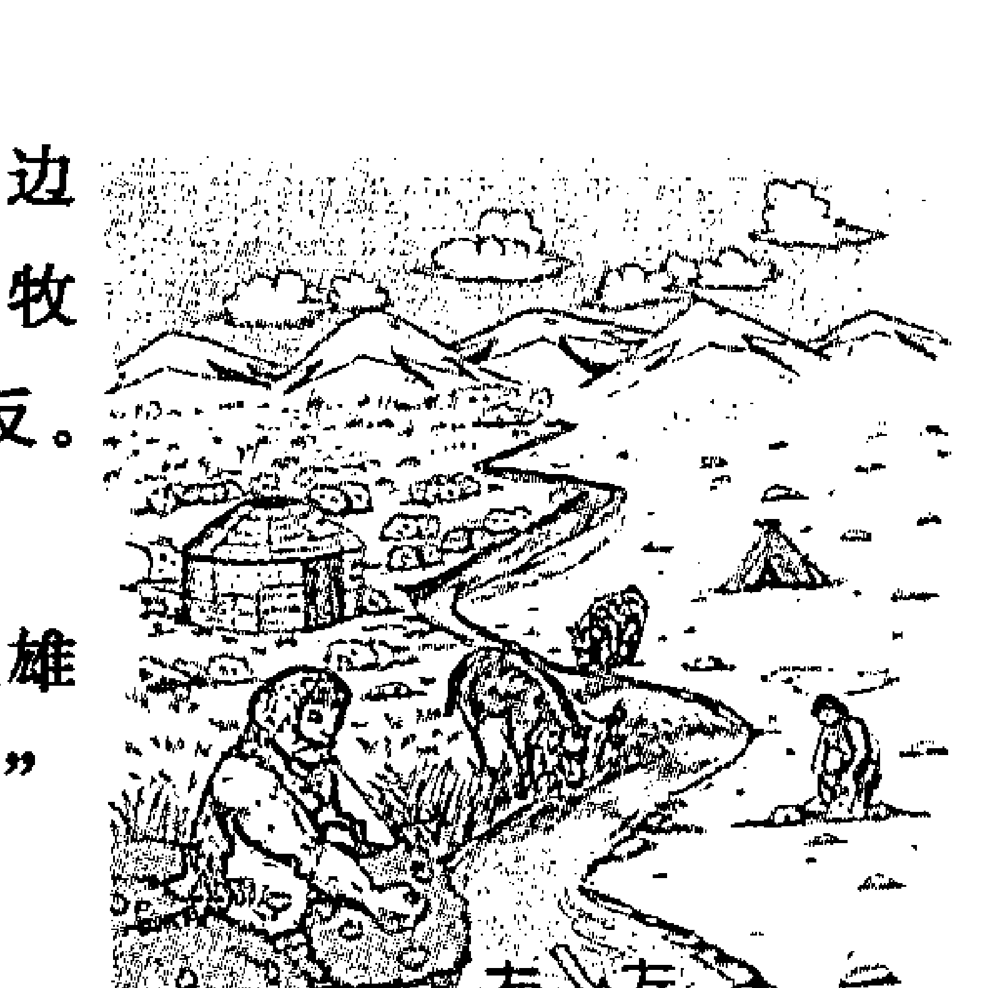

##### 江河右岸为什么是吉地呢？

现代科学证实：地球顺时针由东向西自转时，北半球内部因惯性作用，产生一种向右的偏移力，这股偏右的力量，使北半球所有河流右岸，遭受较大的水流挤压、堆积，致使右岸生气积聚，进而集结大量对生物有益的微量元素与矿物质，使得该区草木茂盛，人畜兴旺，最后形成一处适合于人类居住与生活的风水宝地。

相对地，江河的左边，因不受地球右偏力的作用，致使生气稀疏，土质营养素不足，故草木茂盛的程度，就比右岸差。

很多现代的大城市都在江河的右岸，如重庆、上海、南京等，一直是工业发达、人口稠密的精华区。

对于地无半亩的私人住宅而言，江左江右虽然也有影响，但需要通盘考虑地形、气候、坐向、交通、水流缓急、绿化等因素后，再决定选用何处。

##### （3）凸岸与凹岸

河流转弯时，位于流水内弯环抱的区域，称为“凸岸”；水流外弯反弓的地方，则为“凹岸”，两者正好相对。

一般说来，凸岸草木茂盛，生气丰富，很适合人类生存和繁衍（如图3-15）。

河流凹岸流水湍急，地质被严重侵蚀，不适合辟为居住区，只适宜作港湾、渡口（如图3-16）。

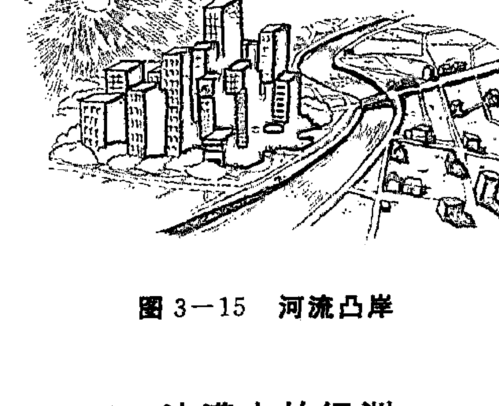

图3-15 河流凸岸

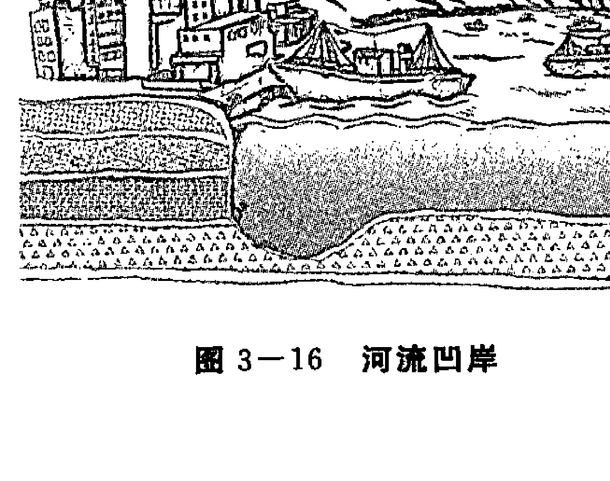

图3-16 河流凹岸

#### 五、沙漠中的绿洲

遍地沙漠、气候干燥、人烟稀少、到处尘土飞扬的地区中，确有一片水草丰美、沼泽密布之地，这就是“沙漠中的绿洲”。此绿洲也是地表上适合人类生存的风水宝地（如图3-17）。

沙漠中的绿洲，是新疆维吾尔族和蒙古族人的祖先发现的，如新疆塔克拉玛干沙漠边缘的和田、阿克苏、莎车等。绿洲绝对不能干涸、枯竭，必须要四季不竭，川流不息，才是可以利用的。

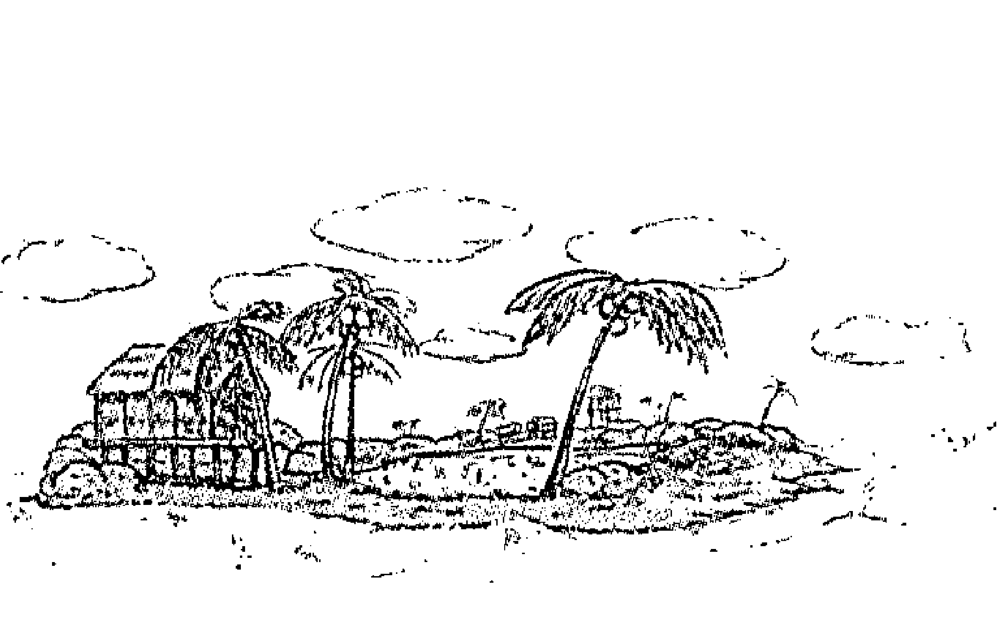

## 六、依河阶台地而居

高于河床的阶梯式台地，称为“河阶台地”（如图3-18、3-19）。

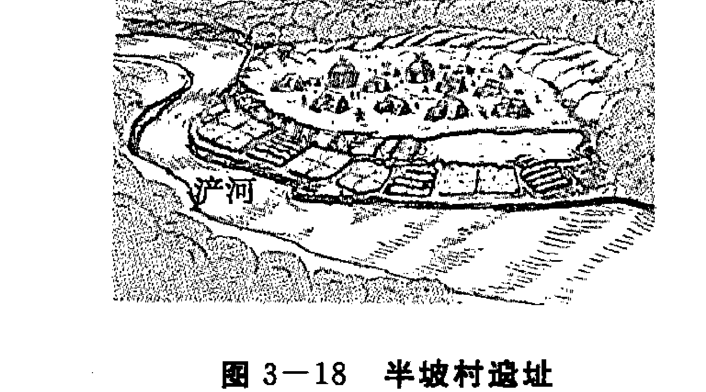

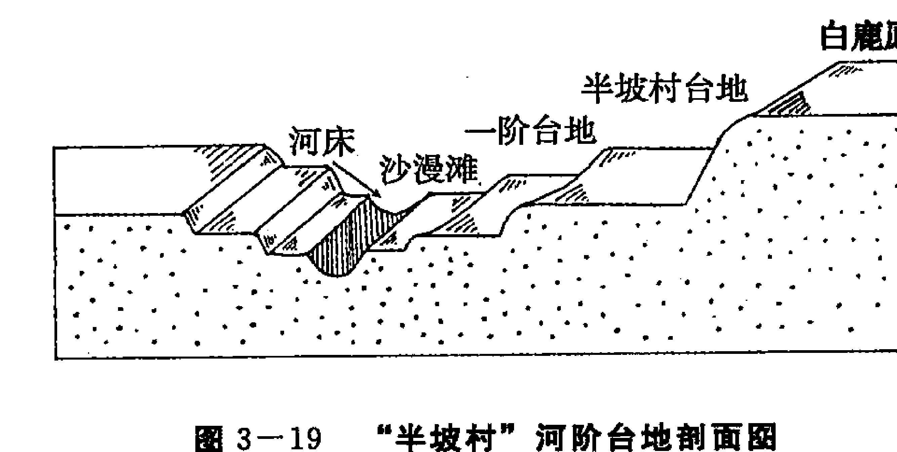

位于陕西省西安市浐河右岸的半坡村遗址，是一个标准的河阶台地。该台地有庞大的新石器时代聚落旧址，遗址分布广达五万平方米，据 C14（碳十四。人们可通过检测一件古物的碳十四含量，来估计它的大概年龄）检验，是距今 6000 多年前的仰韶文化遗址，其历史年代是神农时期。

此河阶台地背对关中平原上的白鹿原，面向浐河。附近草木兴茂，树林密布，河里的鱼虾与陆地上的小动物不可胜数，俨然是一处世外桃源。

历史学家在这里发现了高度文化的聚落遗址，建有数千座“半穴居”的茅草屋，屋顶或圆形或三角形。人们就居住这“半穴坑”的土坑内（如图 3-20）。

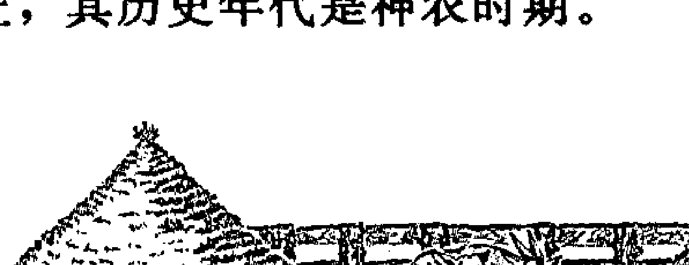

## 河阶台地的风水原理

河阶台地与冲积扇平原一样，都是泥沙累积、沃土不断“推陈置新”的自然现象，形成聚气丰富、万物兴盛的效果。

河阶台地可依次分为二阶、三阶……中间是较低的河床。这种地形上的差异，致使河水流速不一，通常中间流速快，两旁较高的河阶地流速较慢。在河床中央流速较快的流水，搬运泥沙的能力强；流速慢的两旁河阶地，因搬运能力弱，就造成泥沙淤积于该处，并逐步积累不断升高，从而形成了河阶台地。

河阶台地是一处土壤肥沃的“黄金宝地”，极适合农作物的耕作和人类居住。半坡村的居民，为防患北风，将房屋群建在浐河右岸的河阶上，使背傍后面地势较高大的白鹿原；为取得更多日照，每户房屋均面向南方，紧邻浐水；为防止雨季洪水侵袭，将房屋筑在二阶或三阶台地上（半坡村遗址离浐河水面足有 9 米高）。这就是适应环境居住的经验，是中国风水探讨的重心点。

## 依河阶台地而居的风水理论依据

> 《地理大全》云：“大干龙结穴之地，必居江河、海湖之旁；若小干小枝，龙多结于溪涧之间，故溪涧之水不可不察。其水，必须曲屈环绕，聚注深缓为佳……故滨海两边多结佳穴。”

风水诸公还说：“干支龙脉，必止息江溪河畔”，“止息处，即真龙结穴之地，该处将生气大聚。”

在河阶台地选择风水宝地，要特别注意相地。《阳宅十书》云：“不居草木不生之地。”《青鸟子葬经》云：“草木郁茂，吉气相随。”郭璞云：“郁郁青青，贵若干乘，富如万金。”《黄帝宅经》云：“地沃，苗茂盛；宅吉，人兴隆。”

## 房屋向阳的风水理论

> 《宅经》云：“甲（67.5°～82.5°），宅德安门（适合造门）……开拓、连结、壮观、吉；消净、灾殃自消。”“卯（82.5°～97.5°），大德，客宅（适合筑舍）。《经》曰：治大德，富贵资财成万亿。”“乙（97.5°～112.5°），金匮、天井（适合造天井）；宜置高楼大厦，常令清洁，勤修泥，犹增喜庆。”

在东方“甲卯乙”三个座度里，因为“紫气东来”，故可接收较多的阳光，建议人们将房屋的大门、客户、天井等重要设施，尽可能建于东方（阳方）。

> 《管氏地理指蒙》云：“择向之法，取日月照临之象。”向阳，是中国风水吉宅必备的要件之一。西洋住宅的要求也是如此。

> 《相宅经纂》曰：“阳光太胜者，又易败退。”所以，取用的阳光也不宜太强。

相地还要注意土壤的成分。

> 《阳宅十书》对风水宝地的定义是：“宅左有流水，谓之青龙；右有长道，谓之白虎；前有水池，谓之朱雀；后有丘陵，谓之玄武，为最贵地。”但这些只是就外貌而言，对于深藏土地内层的物质，对人体的身心健康是否有影响，则一概不知。

现代科技证明：土壤中所含“砷”过高，民众要得“氟”病；“钡”含量过高，而生“痛风”；“锌”含量过高，肝脾易肿大；“硒”不足，易得“肿瘤”。

人类居住环境中的土壤与水源里所含微量元素与放射性元素，会透过该地区植物的吸收，而间接进入人体，从而产生特有的“水土”疾病。故对住宅这层看不见的因素，要特别小心。

检测土壤好坏的方法是：

卷一 论山形水势和风水宝地

> 《地理大全》云：“夫子旺在子，夜半子时，先以它水净口，随四时吸四方气，再次入水，后尝入口，试之久矣，滋味能辨。初饮香，再饮甜者，必有大地；初饮甜，再饮淡者，大地恐他人用；合含似辣，主出武贵；开口似苦，岂有贤豪；吐出酸碱，定为神庙；而若醒气在牙，则为铜铁矿山。”“山皮之土，曾经日曝雨淋，其味不辨，只开井之土可辨之。若其味自然袭人，如有一股清香，人人五脏与人调和，如芝兰参岑扑鼻可爱者，‘贵穴’也。如若牛泓、猪涔，臭污难当，人皆厌恶者，贱矣，用之必凶。”

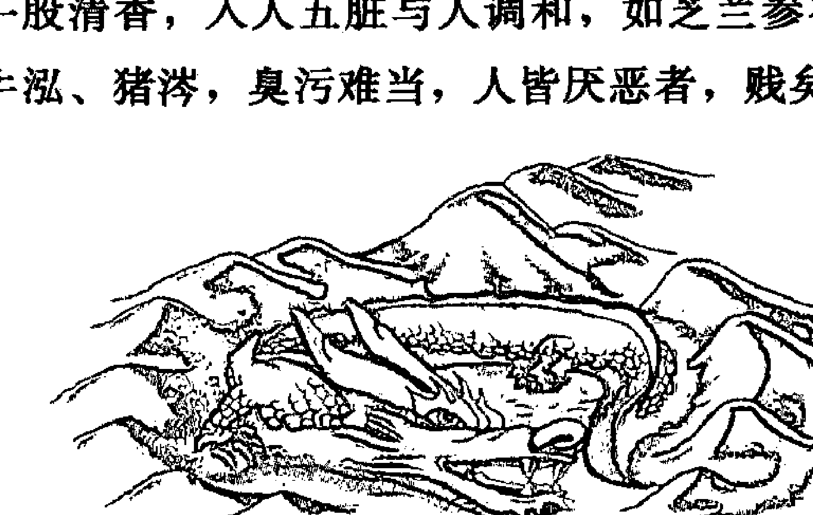

## 七、依湖沙丘而居

在四面环湖水的沙丘上建房筑屋而居，谓之“依湖沙丘而居”（如图3-22）。黄帝时期，发明在地面上建造房屋后，对一般百姓的住屋，一如从前，大多选在“背山面水”、“坐北朝南”，“接近水源”或“依高而居”等地，这些大原则没多大改变。但是，“建都”的选址就大不相同了。

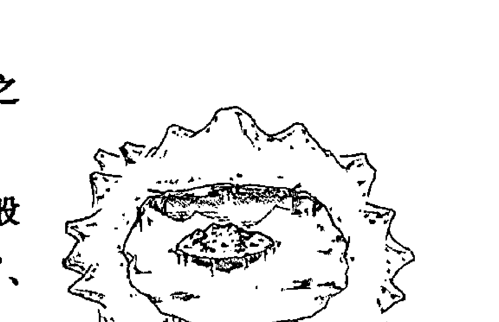

- 1. 环湖而居的风水
《尸子》云：“黄帝作‘合宫’。”《史记》形容这种合宫是：“水环宫垣，上有楼，从西南入。”《说文解字》称这合宫是：“四方有水，自邑成池。”黄帝将宫室建于环湖的“岛屿”或沙丘上，西南方作一木桥，以便人员和物资的出入。

第三章 九种不同环境和地形的风水宝地 43

这些地方的好处是：(1) 可防御敌人的侵犯；(2) 可预防地震灾害。

## 2. 风水理论

《水龙经》云：“湖荡数千顷，中间突起两三片，大者数百亩，小者五六百亩之格局。若能聚其生气，垣局周密，将可富贵绵远，出宰辅英雄，且富堪敌国。”

《地理大全》云：“临于深渊大泽，忽然水底，而结穴水中；其四畔皆水，后于水中突出山阜，再于山阜上结穴；而四周环绕周匝，皆汪洋巨浸，即是穴在水中，为‘水巧之穴’”。

## 3. “左青龙，右白虎”风水的含义

左青龙右白虎，前朱雀后玄武，并不代表四只兽，而是以四种动物来称呼住家前后左右的地理形势。

《白虎通义》云：“左青龙，右白虎，前朱雀，后玄武。”即在形容此环境。《地理大全》云：“地理以前山为朱雀，后山为玄武，左山为青龙，右山为白虎。故借四宿之名，以别四方之山。”

郭璞说：“龙虎要如肘臂，谓之环抱。”

简言之，风水学认为，住家左右两边有山峦、小丘、楼房或有河流、树林环绕，呈现环抱状就如同母亲伸出双手保护婴儿一般，就是“左青龙，右白虎”。

“青龙、白虎”在字面上，有警戒、守卫之意；在风水功用上，达“藏风聚气”之效。

“左龙右虎”的观念，来自黄帝时期的生存观。

《葬书》云：“夫噫，因风能散气，龙虎所以护穴也。”《地理大全》云：“龙虎以卫穴而得名。”《葬书翼》云：“左右二砂名之曰‘龙虎’者，以其护卫穴区，不使风吹，环抱有情，不逼不压，不折不窜，故云。”

龙虎图案，出在黄帝时期的中国。究其源，可能最初是“图腾文化”的一种，欲借古人“慎终追远”、“事死如事生”的民族性，希望祖先在天上也能得到龙虎二兽的保护。

封建皇帝的两旁，常摆设很多的大象、骆驼等动物的神兽道，以及文武百官的雕像。这些接近青龙白虎的原始含意，就是对皇帝的护卫。只是在后世风水的演变上，使“左青龙，右白虎”逐渐成了住家两旁山峦余脉的代名词，而变成实质的护卫地形。

## 八、二水交会的风水宝地

大禹治水时发现，二河交会处，土地肥沃，水源充沛，而且还甚少水患，是一处很适合人类生活的宝地。

> 《地理辩证疏》：“圣人作都，不言华嵩（高山）之脉络，而言瀍（chán，瀍河，水名，在河南）、涧（二水）之相交。”

二河交会处，尤其是大河与小河交会处，有调节水位、防止洪患之利。只要洪水行经二河交会处时，就可顺势将过多的河水移至另一水道作调节，这样就不容易有水患发生了。

如：吴淞口与黄浦江交会的上海市，淡水河与新店溪交会的台北市，洛水与伊水交会的洛阳市，浐河与灞河交会的西安市，岷江与金沙江交会的宜宾市。还有重庆、扬州、杭州、武汉等，不胜枚举。

## 二水交会的风水理论

> 《撼龙经》：“平地二旁寻水势，‘二水夹处’是真龙。”

> 《地理辩证疏》：“大水与小水相交之处，乃真龙之行，真穴之止也”，“要知吉地引龙止，‘二水相交’夹一龙。”

- 1. 择高而居
> 《吴越春秋》云：“‘尧’遭洪水泛滥，人民‘逐’高而居。”《淮南子》云：“‘禹’之时天下大水，禹令人民聚土积薪，择丘陵而处之。”《相宅经纂》云：“平地浩荡之中，则以‘独高者’为贵，以独高者为吉气所钟。”《青鸟绪言》云：“平中取‘突’，突中有旺气故也。”《雪心赋》云：“平中得一‘突’，为奇。”

择高而居的最大原因，是预防洪水。

- 2. 加高建地台基
> 《相宅经纂》云：“地基，必须后栋高于前栋。五、七寸乃吉，平不吉。”《玉镜》云：“坐局（地基）宜平，宜后高，人财并显称英雄。”《太阳经》云：“堂局须在高高处，莫道窝藏是正形。”清朝风水名师王思山说：“地基原用后头高……土增九寸最为良；七寸五寸盛家业，务要前后气相承，不可太高太低沉”。

## 九、环山面海的海滨住地

环山面海的海滨住地是风水宝地（如图3-23）。据考古学家发现的殷商遗址证明：远古时代，就有史前人类定居在海滨。以殷商时期的中国人，居于海滨最为明显。这是由于商业贸易活动从内陆大举延伸至海滨而形成的，以致沿海地区渐渐成为人口兴旺的居住宝地。

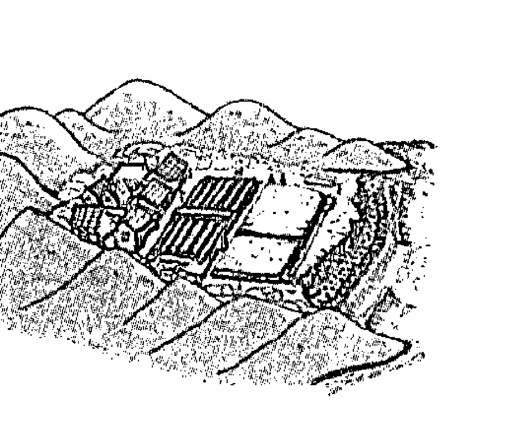

## 1. 海滨宝地的风水理论

后世风水家认为：发源于深山峻岭的龙脉，其主干龙脉，最后必止息于海滨。“势止气蓄”的结果，就会在该地区形成生气十足、适应万物生长的“大龙穴”。

《地理大全》云：“海之为水，渎之所聚也。水势既聚，则龙势大止。故凡大干龙，多止于海滨。而其融结处，或产王侯，或生富贵。”

有的风水家认为，除聚集生气外，主要还是海水逆潮所致，类似风水“五大水局”中的朝水局。古书云：“海水逆潮多富贵，潮来之处步青云。”

## 2. 海滨宝地的标准

###### (1) 环山面海之地
这种临海之处，三面环山一面向海，形成“环山面海”之势。如台湾的宜兰县，香港的大屿山，都属于此种地形。

###### (2) 辟作渔业港湾之地
海滨地区，若有良好的天然港湾与便捷通道，也会成为人口稠密的“渔业聚落”（如图3-24）。

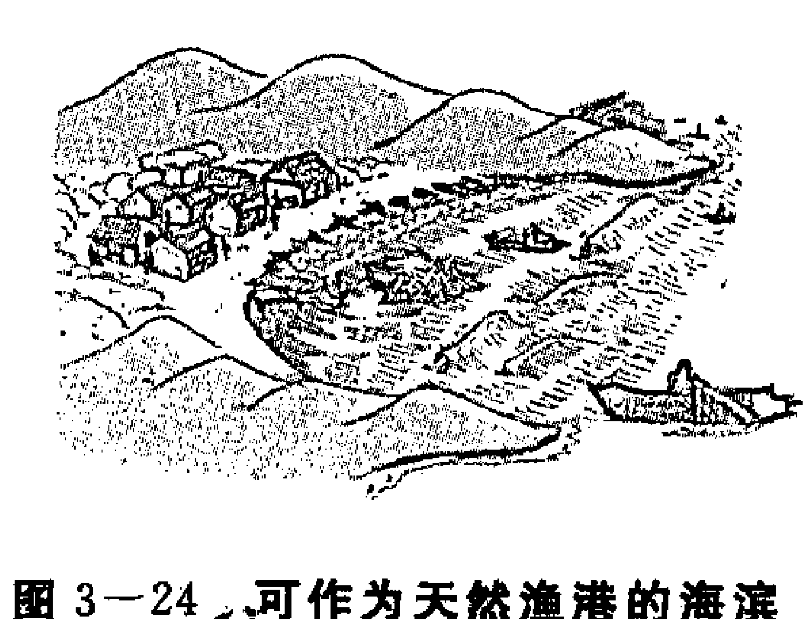

这种模式以谋生为取向，认为只要能成为天然良港的地方，就是最佳的风水宝地。如高雄、大连、泉州、青岛、连云港、广州等地，就是这样的风水宝地。

## 3. 海滨宝地的现代诠释

三面环山的海滨，其标准地形是：后面为青葱翠绿的山林，前方则面临大海，整体视野宽广环境优美。

孙中山的故居，位于广东省中山市翠亭村，后有青山，门前远眺珠江，是标准的“环山面海”宝地。

这种“背山面水”之地的好处是：

- （1）能藏风界气
三面环山有“藏气”之效，而开门面海可促藏于山脉中的生气，“遇水则止”。于是造成大量生气凝聚于海滨之处，从而形成“风水宝地”。另外，大海中的海水，也能收集生气。古书云：“浩荡汇海收气厚。”海水收集的生气，为物理光学上的微波，其频率为 4080 赫兹，波长 8mm。中国学者张惠民说：“微波聚集越多，愈利于万物生长。”海水是极性分子，能大量收集微波，所以，收气也厚。

> 浩荡汇海收气厚。
> 微波聚集越多，愈利于万物生长。

- （2）能释放大量的鲜活氧
三面环山的海滨，山丘上大多是葱绿叠翠的林木。它们白天受太阳照射时，要进行光合作用，即：叶绿素＋阳光＋CO₂（二氧化碳）＋H₂O（水）→O₂（氧）＋葡萄糖。在这一过程中，绿叶植物吸收二氧化碳，释放出大量的空气中的三宝：活氧、阴离子和芬多精。

```
叶绿素＋阳光＋CO₂（二氧化碳）＋H₂O（水）→O₂（氧）＋葡萄糖
```

活氧，是生命的要素。

阴离子，为空气中的维他命，具有镇定情绪，增进免疫系统功能的作用。尤其是氧分子与负电荷结合成“带氧阴离子”，更是空气中的精华。因此，白天在这种环境里，由于大量活氧负离子产生，山丘上的氧气浓度升高，借由扩散作用，浓度高处便往浓度低处移动。

芬多精，是植物中的抗生素，它有杀菌和安定中枢神经的作用。

由于三面环山，致使活氧受阻于三面环山的山丘而“回风返向”，加上山丘上的含氧量，其单位密度与质量俱高，而比重较轻，故无法轻易腾空飘散而去。能否往海面散去呢？也不能。因为它会遭到吹向海岸的海风赶回内陆。于是这种高能量的活氧负离子，大多数都集结在山环水抱的内陆环境里，使住在这里的人们普遍受到滋润。

在夜间，山林的绿色植物，由于没有受到阳光照射，不仅不可能进行光合作用，反而还会因呼吸作用，而释放出大量的二氧化碳。但是，夜间的大海岸边，因受浪潮的不断拍打，而击打出无数的浪花和气泡。这种气泡爆裂时，就会从水蒸气中释放出氧气。此大量的氧气往氧气浓度低的内陆移动，加上阵阵海风推波逐浪，于是新鲜的氧气就将二氧化碳排挤。所以，夜里也有源源不断的高空氧气供人们吸用（如图 3-25）。

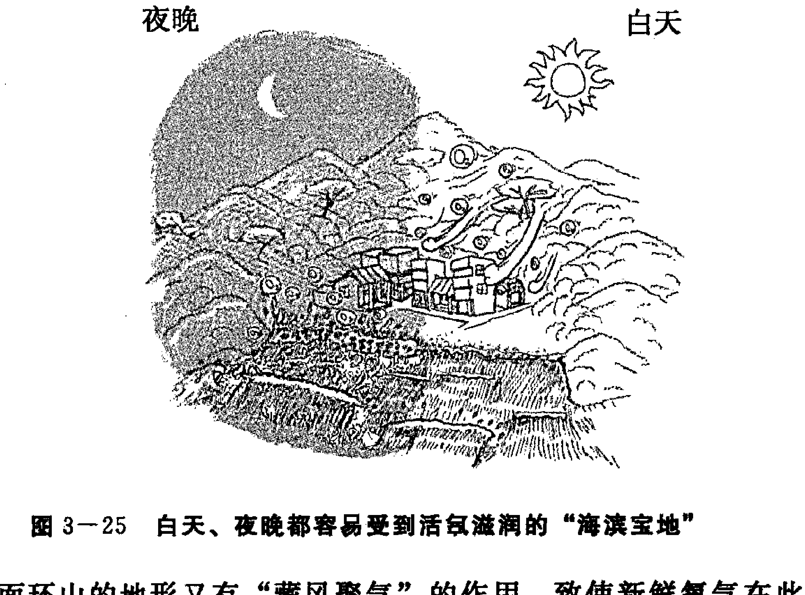

三面环山的地形又有“藏风聚气”的作用，致使新鲜氧气在此环境里始终不易消散。所以，这种地方，自古以来，就是各界人士非常喜爱的“风水宝地”。

## 第四章 “汭位” 雷雨区和四大局风水法则

### 第一节 “攻位于汭” 的风水

1. “汭位”和“攻位于汭”
流动的河水在转弯时，因自然力的作用，形成弯曲似蛇绕的地形。这时，在弯曲河道的内环区，就是凸岸，该凸岸就称为“汭位”（如图4-1）。

将房屋建造在河流环抱的凸岸处，就叫做“攻位于汭”。如我国古代的殷墟，就建在河南安阳河（洹水）南岸的“汭位”（如图4-2）。

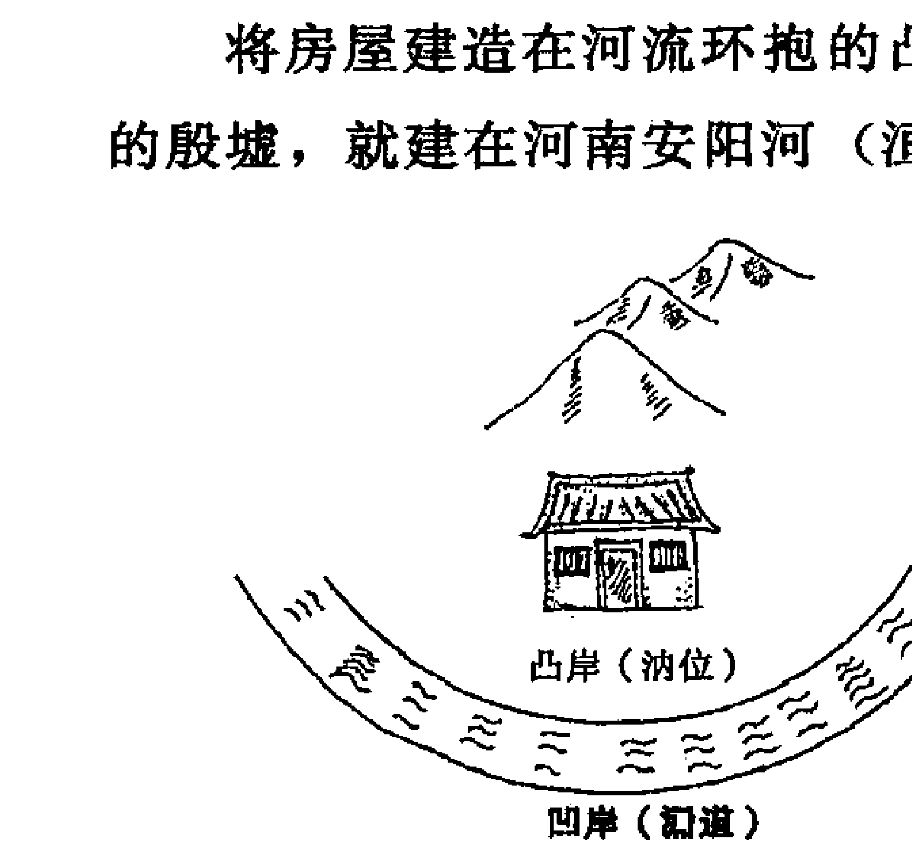

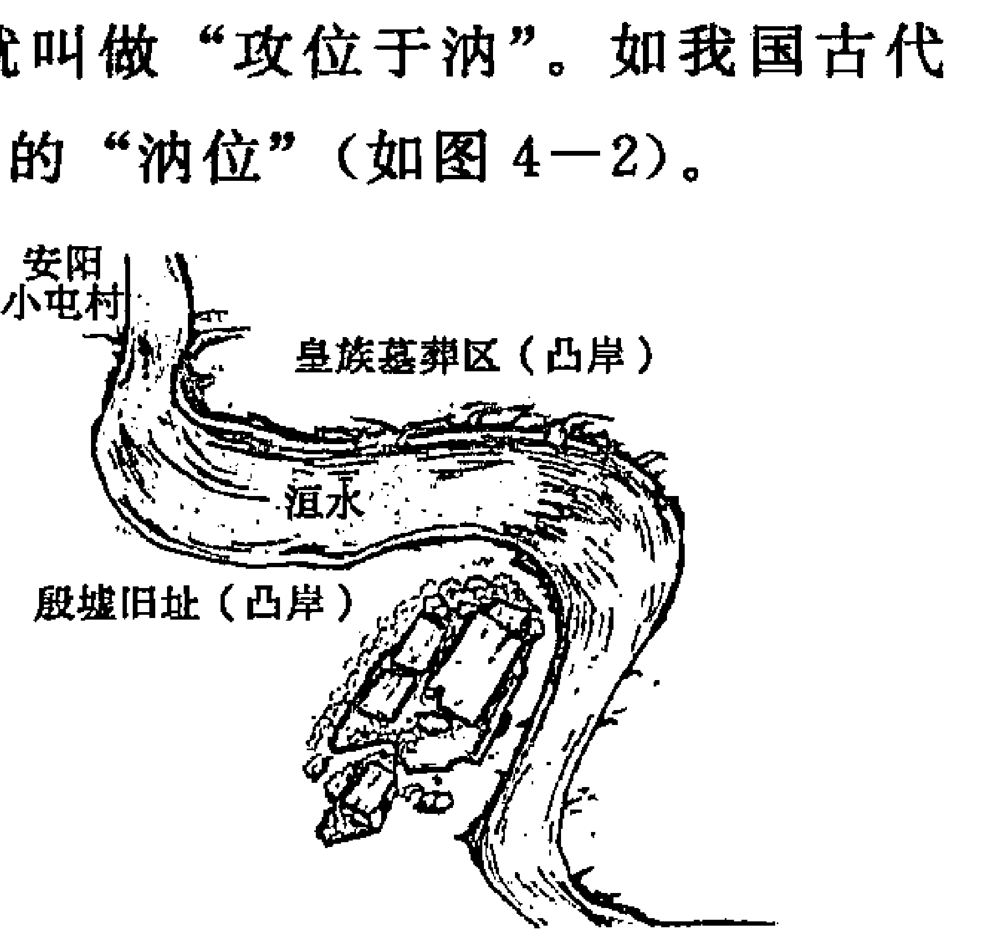

2. 汭位的风水理论
千里龙脉“遇水则止”，每在水流环抱处，就会“止息结穴”，聚集一股蓬蓬勃勃的生气。尤其流水呈“玉带环腰”状之处，气场更为朝气蓬勃。这是有名的风水法则。

> 《水龙经》云：“之元曲屈应门前，富贵两兼全。”
> 《雪心赋》云：“发福攸长，水缠玄武。”
> 《管氏地理指蒙》云：“抱如玉带围腰，攸扬而停憩。水之妙，无过此者。”

## 3. “汭位”原理与财富

当河水转弯时，由于水流的物理惯性和向心力，在内湾凸岸河水的流速会变慢，水位降低，造成水中搬运泥沙的能力大减，于是泥沙逐渐固积，以及凸岸土壤增加，可利用的土地越来越多。其凸岸沉积的泥沙和山河交界的“冲击扇平原”一样，富有大量植物生长所需要的微量元素：氮、磷、钾、镁、钙等，极适合农作物的耕种。

> 《水龙经》曰：“一水弯环抱，此地多财宝。”这就是形容河流凸岸处的欣欣向荣和农民积聚财富的景象。

相反，河流的凹岸处，因河床较深，能停泊巨大的轮船。故，是渡船口、码头、港口的理想地点。如纽约、伦敦、台湾高雄等港口，均是凹岸处。

## 4. 河水转弯处是风水宝地

中国风水学认为，江河转弯的地方，才有大量的生气凝聚。

> 《水龙经》云：“行到平洋莫问踪，但看水绕（河水转弯）是真龙。”
> 《相地指迷》云：“水有息道（河流凸岸）漏道（凹岸）之别，只于转弯求之；盖水必取其转弯，则其势或逆或曲，‘而地始成之’。”
> 《堪舆泄秘》曰：“凡到一乡之中，先看水局归属，水抱边（凸岸）可寻地；水反边（凹）不可下。”

## 5. 坐北朝南的定位

坐北朝南（正子午线）符合中国的气候特征。因大陆型的季风气候，冬天，严寒的北风从西伯利亚吹来；夏天，则能兴起凉爽的偏南季风。而坐北朝南，利用屋后的墙壁抵挡阴寒的北风；南方敞开的门窗，则迎来和煦的南风，使其冬暖夏凉，住得舒服。

### 第二节 依雷雨区而居的风水法则

下过雷雨的大地，欣欣向荣，到处充满生机，能使农作物生长茂盛，令居住于此的民众大丰收。是什么原因呢？这就是氮肥的玄机。

空气中有一种游离的气体，叫作氮气，约占大气成分的81%。它是一种既稳定又独立的气体，不易挥发，也不易与氧气或其他气体产生化学反应。所以，常被用来放在电灯泡里，减少钨丝在高温状态时的挥发。

天空中的氮气虽然比较稳定，具有难以挥发和发生化学反应的性质，所以对自然界万物也很少有实质上的助益。

但是，事物总是相对的，当天空中出现闪电打雷时，安定的氮气，就会成为“极活泼”的气体。

何以如此呢？

因为在雷电的高温中，它会和氧气产生燃烧现象，形成“二氧化氮（NO₂）”。通电的电压值越高，作用就越明显，二氧化氮产生的量也就越多。天空中每逢闪电打雷时，其放电火花如树枝状，伸展开来有数公里长，电位差（电压）上万伏特。如此大规模的通电现象，会很快地造成天空中大量的氮气与氧气燃烧，从而合成大量的“二氧化氮”。这时，如果天空中刚好浓云密布，并开始下起雨来，“二氧化氮”则快速地溶解在雨里，形成“硝酸（H₂NO₃）”，并随着雨水下降到大地上。“硝酸”渗进土壤里，会立刻变成“硝酸盐”。于是形成了利于农作物生长的、最好的天然肥料——氮肥。农业社会的人们，常将雷雨称为“雷公尿”，它可以使贫瘠的农田变成沃土。

据近代科学研究，天空中每打一秒钟的雷电，大气中就会降下两万吨氮肥。据统计，天空中每年要向全球降下4亿吨氮肥，滋润着这颗绿色的地球。

天空中的雷电产生的高电位放电现象，其中部分的“电位能”，会转成“机械能”，使得植物细胞的内壁，产生微弱振动的物理现象。这种作用，可以直接促进植物的发育生长，所以，有雷雨地区的植物，比其他地区的植物长得快且好。

夜间的雷雨最好，因为夜晚大气中的“二氧化碳”浓度最高，当雷雨下到农作物的叶面时，空气中的氮与二氧化碳，可以直接合成“有机氮肥”（尿素），作用在植物上，从而使农作物长得更加茂盛。

### 第三节 四大局的风水法则

#### 1. 什么是四大局？

> 《阳宅十书》云：“凡是左有流水，谓之青龙；右有长道，谓之白虎；前有汗池，谓之朱雀；后有丘陵，谓之玄武，为最贵地。”

这种“左有流水，右有长道，前有池塘，后有丘陵”的“龙虎朱玄”之局，就称为“四大局”（如图4-3）。

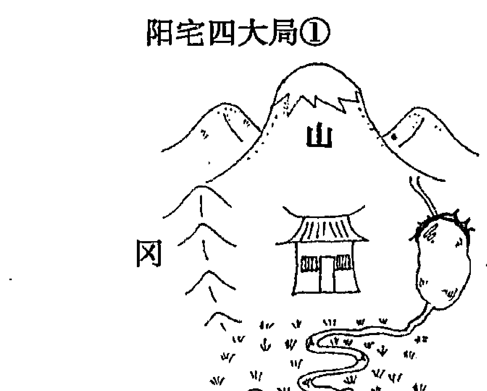

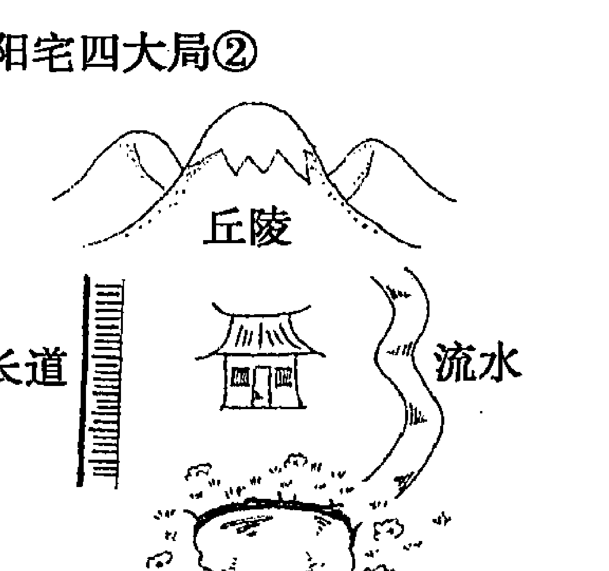

图 4-3 阳宅四大局

#### 2. 四大局的标准

四大局的标准是：左有流水、右有长道、前有池地、后有丘陵。

玄武垂头，朱雀翔舞，青龙蜿蜒，白虎驯俯（fǔ，同“俯”）。

青龙、白虎、朱雀、玄武“四兽论”，与“五行说”早在汉朝就结合成为精致的风水理论了（如图4-4）。如汉朝建造的建业城（现今南京），就是标准的四大局地形（如图4-5）。

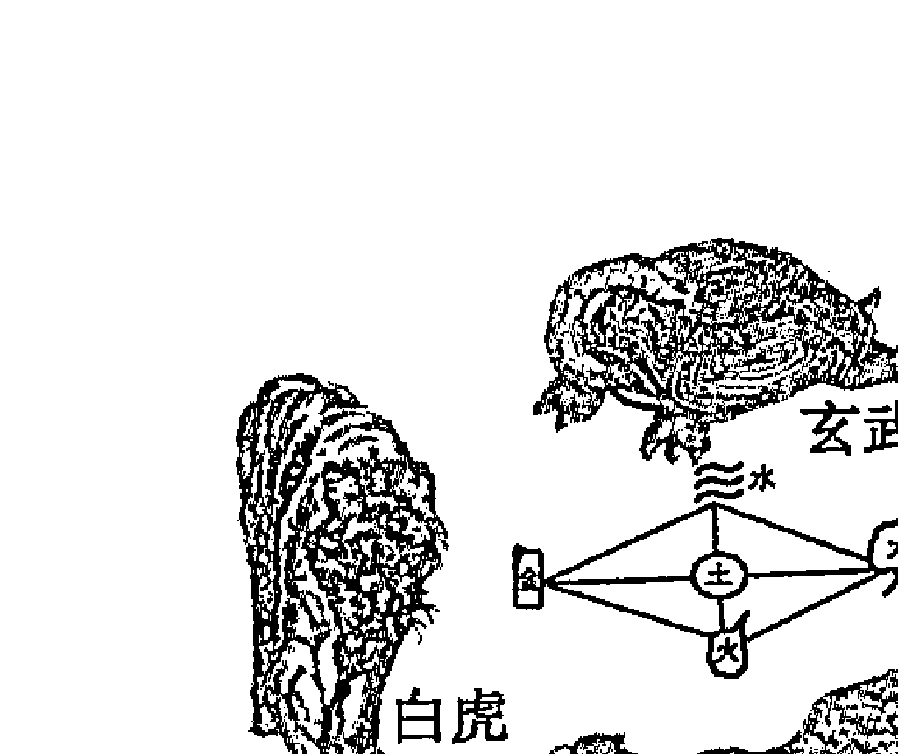

《葬书》云：“后山玄武的山脉，须叠嶂层层献奇于后。”前面作为案山、朝山的朱雀要“群峰矗矗呈秀其前”，但山势也不可过高（仰角在30度以内）。左龙右虎，要“龙虎抱卫，砂水翕（收敛）聚”。即左右两边通常为山陵余脉的延伸，且刚好围绕于宅前作出保卫状，好像人类左右二臂交叉环抱一样。“龙虎要如肘臂，谓之环抱。”

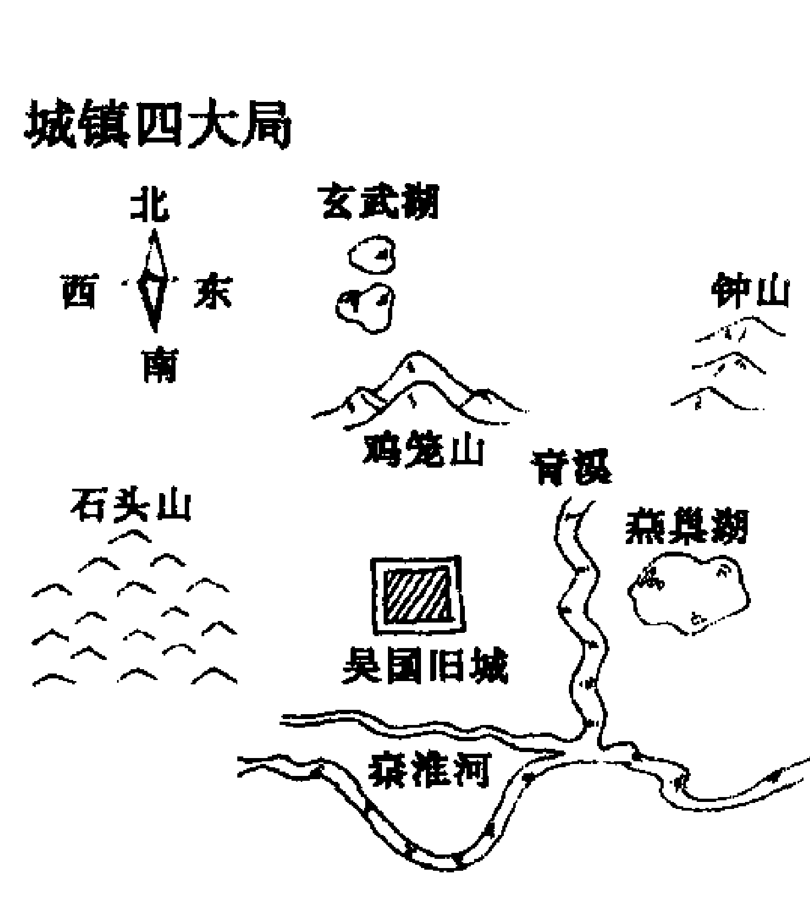

图4-5 南京是标准的四大局地形

阴宅中的“左青龙，右白虎”，狭义上皆为山丘余脉，称作“砂”，此与阳宅略有不同。右边白虎的余脉，需要低头一点，即白虎驯俯，不要比左边的青龙高大才可。即“青龙要高大壮丽，白虎要低头降伏”。

> 《雪心赋》曰：“虎砂低头，龙砂蟠绕。”

> 《葬书》云：“势止（白虎低头），形昂（青龙高起），前涧（朱雀地阔，有溪水绕过），后冈（玄武有高山作为屏障）。”

#### 3. 四大局的风水原理

自古以来，中国人建屋筑城的环境，大多设在“后有高山，前有平原、溪流的地势上，即北高南低”。其因素有二：

- (1) 御敌防盗

中国自黄帝以来，五千年的历史中，大部分具威胁的敌人，来自北方民族，如匈奴、契丹、女真等。

后将这种御敌观念，引用到住宅上，则形成住屋北方需要有屏障的准则，即房屋后头最好有座丘陵。

住家后面，如能有山冈、丘陵为天险，防止盗贼偷袭，使其无后顾之忧，而能集中力量守卫宅前。如此，的确能很安全地“保护环境”。

- (2) 防风

玄武高大，可以挡住北风。因大陆地壳与太平洋水温的差异，冬天北方必会刮起强大的寒风。此时若住屋的北方有高大的山脉，足以抵挡或减弱冷气团的威力，就能保持较温暖的生态环境。

#### 4. “东高西低”的秘密

##### (1) “左青龙，右白虎”的风水观

四大局风水的另一特色，左青龙（东）要高起，右白虎（西）要低伏。

> > 《宅经》：“青龙壮高，富贵英豪。”

> > 《阳宅统楷》曰：“白虎当头（高起），有灾殃之患。”

##### (2) “东高西低”的风水理论

汉代禁忌“西益宅”。说在住宅的西边兴建楼房是不吉祥的，兴建的楼房越高大，祸害越大。任何人都要尽量避免。

有人在左青龙的高处和右白虎的低处进行种植青椒和葫芦瓜的试验，其结果是：青龙方的产量是白虎方的五倍。

原因何在呢？完全是红光与红外线在起作用。

农作物要开花结果，必然需要充足的阳光照射而进行光合作用，让水与二氧化碳转化成碳水化合物（葡萄糖）。碳水化合物合成越多，所结果实就越大，营养就越好。这就是大丰收。

所谓充足阳光，并非烈日当空的大太阳。植物光合作用，最需要的是红光、红外线和少量的紫外线，而并非太阳光谱中的“红橙黄绿蓝靛（深蓝）紫”七色都要。红光若能足量供应，农作物的果实就会甜美肥硕。而红外线在太阳光的比例，是与太阳高度的仰度有关的。具体如下表：

| 太阳高度仰角 | 90°（正午） | 30°（西下） | 6.5°（将入地平线） |
|---------------|-------------|-------------|---------------------|
| 红外线        | 50%         | 53%         | 72%                 |

可见，只有当太阳快入地平线时，红外线的比例达72%，才是最高的。

倘若某一田园的西边（白虎方），耸立一座高大的山脉，仰度越过40度以上。这时因山脉阻挡，到下午约三点钟以后，该田园的农作物就照不到夕阳的红光和红外线了，就不能进行光合作用。于是植物产量低、品质差、收成少。如此，人民就贫困交加，盗贼四起。

在青龙高大的东方区域里，太阳西下时，红光可以涵盖该区域所有的农作物，植物可充分地进行光合作用。于是产量增加，年年丰收，丰衣足食，人强马壮。

白虎高起，只是对大区域的农作物起不好的作用，但对一般民宅没什么影响。

## 第五章 寻觅风水宝地的方法

前面各章阐述了风水的一些基本知识和不同环境、不同地形条件下的“风水宝地”的景观。本章则探讨寻觅风水宝地的一些方法，即怎样去审龙、觅气、观砂、察水和点穴。

峦头风水学，从古至今已流传数千年，由于内容庞杂，师传不一，对诸多问题的论述难以一致，但在一些根本问题上，还是大同小异的。鉴于本书的宗旨，是为大众传递一些风水方面的基本知识，达到使一般民众也能学会寻觅风水宝地的一般方法，所以，本章阐述的内容，是属于“大同”的范围之内，以此达抛砖引玉之目的。

### 第一节 审龙

#### 一、龙的基本概念

龙是中华民族的象征，古老文化的徽记，华夏子孙常以龙之传人的身份继承着这一古老文化的遗产而立于世界民族之林。

我国古代有许多关于龙的神话。如《山海经·海内东经》中说：雷神的头像人，身体是龙，鼓起龙腹而鸣，就成了雷的巨大响声；龙体的伸屈，就是闪电；雷鸣闪电之时往往下雨，龙又居于水中。水上升为云，龙又成为云神。雨由云生，龙又被奉为主雨之神。从而，雷电云雨构成了龙的系列神话。雨水是农业的命脉，而龙又管云行雨施，滋润万物，所以，龙就成了中国农业社会崇拜的对象。在经久不衰的崇拜中，龙从代表自然现象逐渐演化成了能上天入地、变幻莫测的神话形象。《说文解字》中称：龙“能幽能明，能细能巨，能短能长，春分而登天，秋分而潜渊”。《龙铭》云：龙“屈伸从时，变化无形”。

龙既然是农业社会所祈求的救星，于是就应验到社会最高统治者的身上，天子（皇帝）就成了神龙的化身。《史记·天官书》中说，黄帝是“黄龙体”。《高祖本纪》中云：汉高祖刘邦是人与龙交配而生的等等。天子作为古代宗法社会的最大宗王，身穿黄龙袍，下座金銮椅，就是想证明自己是天命神授的，并通过天命沟通天与人之间的联系，使官员百姓服服帖帖地听命于天子的摆布；一切社会活动，都要听命皇帝，才叫顺乎天时。从这个意义上说，龙是中国古代宗法社会文化的凝聚，是社会的寄托与期望所在，历史的积淀使“文化的龙”演变成“龙的文化”。

龙的神话源于原始宗教中自然崇拜的幻想，中经宗法社会的扩大或神化，形成各种有关的习俗迷信，并被运用到各个方面，如龙舟、龙床、龙灯、龙案、龙门、龙泉等等。《周易集解》引马融的话说：“物莫大于龙，故借龙以喻天下之阳气。”

风水术也不例外，它借龙的名称来代表山脉的走向、起伏、转折、变化。因为龙能大能小，能屈能伸，能隐能现，能飞能潜，山势就像龙一样变化多端，故以龙称呼。所以，风水先生在勘察山川形势时，称为“审龙脉”；在选择理想的宅址时，叫做“乘龙气”，从而便山川形势龙化。

按照风水家对中国龙脉的划分，我国有三大干龙：长江以南为南龙；长江、黄河之间为中龙；黄河、鸭绿江之间为北龙。三大干龙的起点均为昆仑山。所以，昆仑山为远祖山，从远祖山到入海处，按距远祖山的远近和山的大小，依次分为太祖山、少祖山、父母山、龙穴。越靠近起点越老，越靠近海边越嫩。山老了没有生气，嫩山才有生气。因此，寻找“风水宝地”，要到父母山或少祖山处去寻。每条干龙有许多分支、分节，起一峰过一峡为一节。《天宝照经》云：“节数多时富贵久，一代风光一节龙。”故节数多，发福悠久。

《灵诚精义》云：“龙备五行之全，故山之形体像龙。龙极变化之神，故山之变化像龙。龙之体纯乎阳，故山逢阳而化，遇阳而生。龙之性喜乎水，故山夹水为介，得水为住。龙之行御乎风，故山乘风则腾，藏风乃歇。龙必得巢栖，故山以有局有关乃聚，以无局无关为散。龙凡遇物则配，故山以有配有合而止，以无配无合而行。”

宇宙万物有五行属性，而龙集五行于一身。龙鳞为金，角与爪为火，身为木，摆动为水，腹为土；山也以五行纪五类形状。《难解二十四篇·占山总论》云：“以火纪尖山，以金纪圆山，以水纪由动而波之山，以木纪直而耸立之山，以土纪方而凹之山。”龙上曜天庭，下潜深渊，极尽变化之能事；山时起时伏，如龙蜿蜒而来，忽隐忽现，如龙幽明而变。龙喻阳气，而山的行走，逢活动开畅之处为阳；结穴遇平坦圆满之处则为阴。

龙栖于山谷，其穴必为深邃的岩洞；居于平洋，其巢则必为众水汇聚之地。而山的“风水宝地”，应该像龙的巢穴一样，四周山环如垣，水抱屈曲聚凑。能称为龙的山，必须有砂和水的配合，才可能是止气的真穴，否则，气就行而不止，无法为人所乘。

在平原、湖泊等无山的地区，要寻找“风水宝地”，必须把水流曲折纵横的形态，看作是龙的运行。《秘传水龙吟序》云：“山郡以山为龙，水郡以水为龙”，水与山并尊。

#### 二、怎样审龙

##### 1. 为什么要审龙？

龙与气相为一体，脉、势、形依龙而具现，砂、水、穴因龙而存在，没有龙就没有这一切。因龙在风水中的主尊地位，所以，审龙就足可代表相地的全部内容。审龙，就是审视山脉起伏形象的优劣、气势的强弱以及哪里是来龙，哪里为去脉，何处是正龙，哪里是支脉。因为，龙是气的载体，所以，审龙的目的，就是寻找有生气流动的山脉。倘若起伏的山脉，端庄秀丽，草木茵茵，又流水潺潺，鸟语花香，生气勃勃，给人以活动的感觉，这种山脉就一定有真气。风水师称为“龙真”。但要找到这种“龙真”，若站在局部之地，加上山林遮挡，就不能一目了然。所以，审龙还要遵循一定的方法。

##### 2. 审龙的方法

- 1. 顺趋法：从祖山开始，逐步往前详审。先登高远望，从一个比较大的范围内，寻找众山中最高最大的一座山，即祖山。然后登上祖山，四面眺望，看山脉从祖山起伏奔驰的状态，再循其走势逐步向前审视，分清主脉干龙（正龙）与支脉分龙（支龙）。最后从主脉正龙前行，看看前面的水是否被截止？如有水被截住，说明山到水到乃是龙真。
- 2. 逆步法：从结穴处开始，逆龙来的方向寻到祖山。该法是先观察砂水合抱之处，是否有理想的穴形。倘确系“山环水抱，气聚有情”之地，就应根据山势节节逆上，直到山的分支劈脉处，察看自己逆上的山脉是主脉干龙，还是支脉分龙，以确定所见之穴是否有旺盛的生气凝聚。

《山洋指迷》云：“寻地有二法，有自祖山寻起，随龙看到结穴处；有自结穴处，逆龙寻到祖山。然结穴既美，后龙必美，故从结穴处逆行到祖山者为捷径。”地师黄妙应说：“得穴步龙，得者十之八；步龙得穴，得者十之一。”二者都肯定得穴后再寻龙的逆步法是比较好的一种方法。

- 3. 横剿法：先横穿山坡，察看山脚抱屈与水势弯曲的方向。以山脉的走势为向，察看者面对的方向应与山脉的走势为同一方向。若山从左方伸出，再向左侧方弯过去，正龙就在左方；若山从右方伸出，再从右侧弯过去，正龙就在右方。然后审视周围众砂，如有两砂从左右方朝中间相抱，说明正龙在中间。

##### 3. 审龙须注意的事项

（1）龙的正脉于行走中闪落一旁而成为支脉的护卫砂。按常规，龙脉的行走是一节顶一节，主脉正龙与支脉分龙是宾主分明，左右整齐，这叫做“正”。但有时龙的正脉在行走中忽然闪落到旁边去，让支脉分龙继续前行，闪在一旁的正脉却成了支脉支龙的护卫砂，这种现象叫做“闪”。故，在审龙时，要仔细观察和分辨正脉与支脉的走向。

（2）要重视龙脉是否过峡。龙脉所过之峡的状况各有不同，其中以“工”字形的峡为最佳。工字上下各一横为迎送之砂，中间一竖“丨”为过峡之龙。龙脉过峡之后，由大收敛为小，由粗变化为细。峡两端“工”字的二横构成上方的送砂与下方的迎砂；水分左右，山转关阑，龙气有止而旺，包裹更为紧密，故有谓“山不断则不肥”之说。

峡有大中小之分：

大过峡为“关”。关，必须是大铺设、大跌断、大穿田渡水，让人一看到就有气势磅礴、壮观无比的感觉。

中过峡为“峡”。峡大约离祖山稍远，但生气仍旺，所以就独立分脉去另外铺设、跌断、穿田渡水，自立门户。

小过峡称为“束咽”（收束细窄，如人的咽喉）。束咽，是很平常的“个”字跌断，没有一条线过脉，最多只形成“蜂腰”、“鹤膝”的形状。前、后大，中腰小者是“蜂腰”；前、中腰大，后小者为“鹤膝”。凡龙脉束聚而成蜂腰、鹤膝之形，该处气旺，结穴就在附近。故，凡见此形，则龙将结作，可以在附近求穴场。

> 杨筠松云：“蜂腰鹤膝龙欲成。”

总之，倘能找到“专门过峡”，结束咽脉之后的“开面”（后面详述），四周又有情相对，那就很了不起了。

峡有两大功能：

- ①化整为零，去除芜杂的枝叶，分散或集中力量去达成结穴的目的。
- ②有如滤水器，将水中的杂质过滤掉，留下清水。

故，可以将过峡比喻为去芜存菁的能量转换器，应当对峡给予保护。

其形式有二：

- ①迎送。龙脉从甲山过峡冲到乙山时，甲山应从两旁伸出两条或多条小脉，即从“工”字上横伸出这种脉，这是“送脉”；而乙山转过身来，也从两旁伸出两条或多条小脉，即从“工”字下横伸出这种脉，这是“迎脉”。
- ②扛夹。龙脉从甲山过峡到乙山，要从峡的中间经过，此为“过脉”。此过脉的两边应有较大的山相呼应，这叫做“扛”；此过脉两旁还有水，水岸之外又另有两座山来保卫过峡的龙脉，这叫做“夹”。

在几公里之内，要完全见到迎送扛夹的状况并不多。即使有机会见到时，正穴点也可能不在附近。但是，若发现了“蜂腰”、“鹤膝”，龙就要成了，正穴点离你就不远了。

龙脉过峡还有好坏之分：

- ①好：从中间出脉，形势要飞扬活动，星体颖异，护送周密，分水明显利落。低过不受伤残，高过不会凶硬；长过不受风吹，短过脉不粗肿；阔过而不懒散，直过而不死硬；远过有包藏，穿田不受水冲割，渡水有石梁，在水底贯串。迎送均匀，扛夹照应。倘有池湖灵泉怪石之类的特异现象，就更在贵气，更好。
- ②坏：空缺凹风（风从凹处吹入，加速风化），懒散气直，偏旁过脉，水劫伤残（流水冲割，土石流失）。太长没有蜂腰、鹤膝，太阔没有起微脉（如草蛇、灰线），渡水没有石梁，过斜坡而没有蛛丝马迹（蜘蛛丝状的脉或马蹄状的隆起地块）；或两旁没有迎送、扛夹，或虽有但过脉低小微弱。倘有以上情况出现，就不可能结得好穴。

(3) 要区分垅龙与支龙。高峻的土丘是“垅龙”，低平的土阜为“支龙”。山地群山起伏连绵，容易藏风聚气，所以，垅龙多见于山地；平原湖泊纵横，容易得水凝气，故，支龙多在平原。倘若垅龙在运行中变成支龙而前去，或支龙承接垅龙而走来，这叫做“阴阳交变”，最容易乘得旺气，是一种好的地势。因为从阴阳二气对应的体系来看，山幽为阴，水明为阳；从龙脉本身来说，垅龙高峻而幽为阴，支龙低平而明为阳。阴阳交合，是风水理论体系的最高理想。《山水忠肝集摘要》云：“洋中得垅，贵而无敌；冈谷生支，异象亦尊。”“洋”指平原，“冈谷”指山地。垅龙走到平原这块阳地，支龙生自山地这一阴处，故有尊贵的吉象。

（4）细察龙脉的土质石纹。土是龙的皮肤，土要坚细泽润，就像可以裁切的玉脂。又须具备五色，才算是肥土，土肥气才厚。如果土很干，像聚拢的粟粒；或很湿，像割下的鲜肉，说明这是贫瘠的土质。土贫瘠，气就很薄，不能用。石是龙的骨节，观察石纹的向背，可以了解龙脉的来去顺逆。如石纹拐弯面向后，说明龙脉逆转；石纹弯转向里，说明有真气凝结。审龙就是为了找气。所以，要很注重龙脉的特别形状。如：高耸、绵远、润厚、俊秀、委曲活动、端壮合局等等。高峻的垅龙贵在平兀，低平的支龙贵在高突。因为形状的生动，外在地表现了生气的旺盛和活力。

（5）注意龙脉的贵格与贱格。龙脉行走千姿百态，形成了各种不同的格。低昂起伏、奔势恢弘、节节低者，为贵格；平条直线、瘦骨嶙峋、渐渐下低者，是贱格。

龙脉的贵格还有盖、台、屏、嶂四种。“盖”，就是花盖、宝盖，有山峰如盖，则脉不单寒。“台”，就是有几座山峰构成的、有利于藏风的形状，如三峰并列为“正三台”，三峰错列如“品”字，就称为“品字三台”；三峰前后直列，就不能成其为“三台”，只能称为“串珠”，串珠不能藏风，故没用。“屏”，就是“玉屏嶂”，是嶂的一种，其形是方的，属土，土为五行之尊，龙脉无土不成，所以，玉屏嶂是嶂中最尊贵的一种。“嶂”是山向左右两边伸出的支脉，其形状名称也不同：圆形的叫金兰嶂，直形的叫华盖嶂，波形的叫漫天嶂，方形的叫玉屏嶂，平面拓展的叫一字嶂，左右撇开的叫八字嶂等。主脉从嶂中穿出，嶂就起到拱卫龙脉的作用，所以正龙穿嶂是一种贵格。故有所谓“龙不穿嶂，官不人相”之说。龙脉的贵贱格，可以通过“气”这一媒介影响人的命运，因此必须审辨清楚为佳。

### 第二节 觅气观砂和察水

#### 一、寻觅风水宝地就是寻找生气的凝聚点

风水术把山川形势比喻为龙，其用意就是用龙的灵性来揭示山川的灵性。这种灵性就是蕴藏于天地山川之间的生气。《葬书》云：“夫阴阳之气，散而为风，升而为云，降而为雨，行乎地中而为生气。”这种生气就是龙上天入地、行云施雨的形象，所以又称为“龙气”。寻求“龙气”聚汇之地，是为了达至人与自然环境和谐相处，息息相通，保证人的身心健康、生活顺利、事业发展之目的。所以，“气”是风水的核心。

关于“气”的问题，前章已有详述，但说到“龙脉”时，又不得不说“气”。

气分阴阳，析而为五行。所以，生气就是阴阳五行之气。它产生于地，运行于天，气行则万物发生，气聚则山川融结。我国古代哲学以气为构成天地万物的本原。《淮南子·坠形训》云：“正土之气生黄砹（雄黄）、黄澒（黄汞）、黄金；偏土之气生青曾（碳酸铜）、青澒（青汞）；壮土之气生赤丹（朱砂）、赤金（铜）；弱土之气生白矾（坤花）、白金（银）；牝土之气生玄砥（黑色磨石）、玄金（铁）。”《管子·枢言》云：“有气则生，无气则死。”总之，风水术认为，阴阳五行之气的活动，是构成山川一切形态的动因。这是一种根深蒂固的传统观念。

自然环境与人之间为什么能相互感应和影响呢？死去的父母与活着的子孙间为什么也能感召和影响呢？就在于共同承受着天地之气的缘故。比如坟墓、山川的灵秀、造化的精英（所谓“灵秀、造化的精英”，可以理解为山川之生气与遗骨产生的微波辐射的一种混合气体，因子孙的形体来自父母，所以微波辐射的频率相同，就像收音机的某一波段能收到同一频率的信号一样），凝结融汇于真穴之中。如果将父母的遗骨葬于真穴之内，就能得其精英，受其灵秀，而子孙因其形体来自于父母的骸体，一气相应（所谓“一气相应”，就是微波频率相同，能相互感应），因此也能与之感应相通而造福于将来。这种天人合一、天人感应之说，就是以气为媒介的。董仲舒在《春秋繁露·如天之为》中说：“阴阳之气，在上天，亦在人，在人者为好恶喜怒，在天者为暖清寒暑。”是气沟通了天与人的联系，反映在风水术中，就是沟通了自然与人、死者与生者的联系，正如《葬书注》云：“是知人心通乎气，而气通乎天。”因此，人的富贵贫贱、寿夭贤愚受到自然环境的直接影响（如阳宅）或间接影响（如阴宅）。

山川形势即地理环境，之所以能影响人的吉凶祸福，就在于两者都有天地之气运行于内，这是峦头风水学的基本观点。气聚为无，物散为气，万物可无，而气永存于宇宙之内。自然界的变化如此，人作为自然界的一个组成部分也是如此。人气聚而生，气散而死。生者需迎纳凝聚于自然环境中的气，以求与自然环境相得而获吉；死者肉体虽死，而气独留（遗骸的微波辐射），因此也须迎乘运行于地中的气，将它传给与其一气相应的生者，以造福子孙后代。所以，峦头风水之法寻找“风水宝地”，就是寻求自然环境中气的凝聚点，能否找到此点，是衡量地之吉凶的基本标准。

正因如此，在峦头的操作中，气的重要性与龙的至尊性是相为表里的。龙是气运行的载体，审龙就是为了寻气，这是看风水的第一法门。《葬书》云：“气乘风则散，界水则止。古人聚之使不散，行之使有止，故谓之风水。风水之法，得水为上，藏风次之。”“夫土者气之体，有土斯有气；气者水之母，有气斯有水。”“形止气蓄，化生万物，为上地也。”

“地有吉气，土随而起；水有止气，水随而止。”土是气的载体。这里的“土”是指积土而成的山脉。山脉的起伏行走比平地更容易认出气的运行。然而气止和凝聚必须有水的拦截。因为土生金，金生水。水是由土中的金气所化生而流出土外的，这就是外气；外气的弥漫充实，可以拦住土中内气的运行，这就是“外气所以聚内气，过水所以止来龙”的缘故。从地理外部形态来说，理想的“风水宝地”应当是山水交合之处，因为只有这样才能止住山水奔去之形，形成气的凝聚点。若有水无山，则不易看气从何处来；有山无水，则难以审定气在何处止。惟有山有水，才能使气“来积止聚，冲阳和阴”，化生万物而为“贵若干乘，富如万金”的吉地。气既止而凝聚，还要不让风吹散了，所以需要四周有山作为屏风，犹如肘臂之环抱。倘若气的凝聚点，左空右缺，前旷后折，生气就会散于飘风，止而不聚。因此既要得水，又要藏风。

气之盛衰的外在表现，《葬经翼·望气篇》中曰：山之盛气，则“紫色如盖，苍烟若浮，云蒸霞霭，四时弥留，皮无崩蚀，色泽油油，草木繁茂，流泉甘冽，土香而腻，石润而明”；而山之衰气，则“云气不腾，色泽黯淡，崩摧破裂，石枯土燥，草木零落，山泉干涸”。

#### 二、觅气的三个环节

风水师可以依据地理形式的外在表现来把握“气”的状况，但须经过脉、势、形三个环节：

-   1. 脉。气得土方能运行，积土为山，高高隆起，它的走向就是“脉”。山脉蜿蜒起伏，像一条飞舞的巨龙，这就是所谓的“龙脉”，即龙气运行的路线。审脉就是通过找有形之脉，去认识把握那无形之气。因此，审脉就是寻气的方法。连绵的群山重嶂叠岭，前峰后冈，不时地显露出有规则地排列成一层一层的岩石，与山的走向构成水平的、垂直的或倾斜的方向，不同方向的岩石往往忽隐忽现地呈现出一种连续的趋势，这种可以追踪的趋势就是龙脉。岩石是龙的骨架，土层是龙的肉，草木是龙的皮毛，水是龙的血液，动静是龙的精神，这就是判断龙脉的主要依据。所以，相地要审脉以观生气的来去运行，而审脉尤其要察看岩石的排列趋势，以判断山脉的走向。

倘若岩石连续的趋势被狭谷河流所切断，或倾斜方向的岩石层逐步没入地中，形成“断脉”，但是被切断的岩层在对岸以同一方向继续延伸，或没入地下的岩石层经过一切断地带又明显地露出地面来，这就称为龙脉“过峡”。这种龙脉跌断忽然收住，表示“龙”奔走之形忽然停滞不前了，而“生气”也就在此凝聚了。这就是结穴点（没入地中的岩石层最好有水流横截或逆向兜抱）。

龙脉运行，有开始和停止之地。脉起至高耸特立，能镇住一方的大山，称为“祖山”。祖山越高大，其中蕴藏的生气就越厚越盛。祖山有许多分支向外延伸，其中一支最能体现祖山的走向之势，并为其周围众山所拱护的就是主脉，此主脉称为“干龙”或“正龙”。它是祖山之气运行的主要干道，干道越长，其中运行的气就越多，所以要特别看重它。

“天下山山随水走”，山为阴，水为阳，两者交合而行。或“两山之中必有水”，或“两水之中必有山”。龙脉有分有合，分因水而界隔，合也因水而汇聚。所以，龙脉之行，借水以导之，观水的流向，可以察辨山的走向；龙脉之止，借水以截之，有水的阻拦，可以审知气的凝聚。

> 《山水忠肝集摘要》中说：“凡观出脉要从‘个’字中分龙，落头皆不可无‘个’字。有‘个’字才有分水，有分水则脉自清。”所谓“个”字脉，就是中竖“丨”是由祖山抽出的“干龙（正龙）”，而“撇丿”、“捺丶”组合的“人”字形，则为侧龙，形成拱卫正龙的左砂青龙，右砂白虎。脉因水而分，有水则气凝聚无疑。这就是理想的“风水宝地”。

脉气关系密切，察脉可以审龙，审龙为了寻气。气为无形无质之龙，属阳；脉为有形有质之龙，属阴。阳清阴浊，因此气微而脉着，一微一着，相为表里，有所谓“气不自成，必依脉而立；脉不自为，必须因气而成”之说。气与脉是不可分割的，山龙内蕴之气只有通过外观之脉才能加以把握。故，脉就是气的外在表现。

-   2. 势。龙脉蜿蜒而来，逶迤而去，或奔驰千里，或横跨数县，或回环重复，或起伏跌断。龙脉这种蜿蜒曲折或顺或逆的走势、趋向，称为“势”。

观势，就是观龙脉从何处而来，向何处而去。把握了它来去的大势，其或顺或逆的趋向也就清楚了。观势与审脉是不同的。审脉主要看脉的起止分合，以便了解气的运行路线及方向，其凝聚与否以及量的多少；而观势则是在审脉的基础上确定立穴乘气的具体方法。穴的立向应当迎气来的方向，才可乘气，而不可相反。气随脉而行，所以，立穴方向应依脉行之势而定。龙脉顺水而下，一直前行，这叫“顺势”。顺势立穴时，穴的方向必须对着龙脉的来势，这叫“顺中取逆”，或立于下砂逆兜之处。总之，穴应当迎气的来向而立。

正龙行走，能将两旁大水一齐兜收，龙气较盛。分支龙顺行而下，气不盛，立穴难以乘气，故顺势立穴不是理想的乘气方式。倘若龙脉先是顺势而下，然后又翻身逆转，折回来的方向，这叫“逆势”，称为“回龙顾祖”。这种形势运行之气容易凝聚，又有原先的来山为之藏风，气聚不散，因此气比较旺盛。这种逆势立穴，穴位的方向必须依原来的来势而立，这叫“逆中取顺”，以迎受逆转之气，而且受之兴旺发达。

横势。如“个”字脉，龙脉先是顺行而下，忽然两个分支，即“撇丿”“捺乀”横向成环抱形展开，形成屏嶂。正龙，即“竖丨”从屏嶂中间伸出。这就叫“横势”。横势立穴，其方向也必须按照“顺中取逆”或“逆中取顺”的原则。究竟取顺或取逆，根据正龙（中竖）的顺逆之势而定。两旁分支（丿或乀）倘若有水逆向兜收住，使气能凝聚，其凝聚点也可立穴乘气，但不如正龙的来气那么旺盛。

观势，除了观察龙脉顺逆与横向的走势外，还要细审龙脉的贵贱和吉凶。如龙脉之行其势奔腾磅礴，似万马自天而下，为帝王之象；山峦重嶂叠岭，似巨浪汹涌浩荡，为公侯之象；其势山环水抱，似降龙水绕云从，为显贵之象；而其势屈曲条斜，似惊蛇黄鼠直撞，则主灭家亡国；其势突兀急骤，似兵刃尖利直硬，则主横祸冤死；顺泻直下，似流水去无止禁，则主人丁不顺。

势是气运行的外在表现。脉的行走构成势。脉中运行的气，是行走或是聚集，是顺或是逆，全都是根据龙脉来去的势而定。

> 《葬书》云：“夫气行乎地中，其行也，因在之势；其聚也，因势之止”。所以，势行则气行，势止则气止，势顺则气直，势逆则气回。观势，就可以把握无形无质的气的运行过程。所以，势就是气的运行过程的外在表现。

-   3. 形。龙脉的连续行动构成势；而它在一处之静，就呈现出“形”。《葬书》云：“千尺为势，百尺为形，势来形止，是为全气。”“千尺”，是指龙脉从远处而逶迤行走的来势；“百尺”，则是指靠近穴地势止而气聚成形。根据山的远势，知道气运行而来；依据穴的近形，知道气凝聚而止。据此，就可以寻找到全气之地。审龙觅气，需要察脉观势，但是最终目的是要找到气的凝聚点，即找到修建建筑的基址——“穴”点。“穴”点，犹如人体的穴位，是经络之脉、气血的凝聚点一样。所以，辨形是相地的最后也是最重要的一个环节。辨形，就是看具体的“形”，能否止“势”而成为“穴”。势，因气的运行而为动；形，因气的止聚而为静。静态之形，能否止动态之势，就是能否止气的表征。唯有止气，才能止势。但由于风水先生是通过有形的山川，去把握无形的生气，因此，辨形是使用逆向推理的方法，从它的止势与否，推知是否止气。这是作为峦头之法的“形”的特定含义。

## 形的各种面貌及其吉凶贵贱

形如御屏壁立，负阴抱阳，为帝王之地；形如山腰燕巢，青龙白虎两砂包裹，为公侯之地；形如侧垒委曲，前朝后应，为显贵之地。

形如算筹乱投，横七竖八，则主诸事错乱之凶；形如乱衣不整，剥落破碎，则应妖淫之凶。

形与势的吉象两者相合一致，才是全气之“风水宝地”。如果势的气象为吉，而形的面目却凶，这是“百福希一”，即勉强可用；如果势的气象为凶，而形的面目有吉象，那也是“祸不旋日”。

> 《葬书》云：“千尺为势，百尺为形，势来形止，是为全气。”

> 《难解二十四篇》说：“气者形之微，形者气之著。气隐而难知，形显而易见。”

所以，形与气是表里为一，关系非常密切。有形必有气的凝聚，只有通过察辨容易看得见的“形”，才能找到隐而难见的生气，进而才能找到“穴”场。形秀润特达端庄，其气必吉；形粗顽欹斜破碎，其气则凶。

总之，气无形无质，隐而难知，是吉是凶，只能凭借形的面目的美丑来判断。所以，形就是气凝聚状况的外在静态表现。

综上所述，脉、势、形都是气的外在表现，三者之间的联系构成了寻找生气的三个步骤：势是脉之行，形是势之止。由脉观势，由势辨形，由形定气，达到最终找到峦头之法的气的凝聚点这一目的。而气的凝聚点，就是“穴场”，就是修造阴阳宅所需要寻找的“风水宝地”。

气、脉、势、形，相为表里，形成了一个多层次的有机整体，反映了峦头风水术的地理观念。在这一体系中，对四者及其相互之间的内在联系的论述与人们在实践中的直观经验的认识，很多方面是一致的，这在一定程度上反映了古代贤人们的地理学的知识水平。风水术作为一种历史的产物，是在一定的文化条件下，利用相应的地理学知识而逐步形成的。所以它才得到人们不同程度的认同，流传数千年不衰。但是，在这种地理观念中，很多问题还无法用现代科学给予验证，从而给人们带来了一些神秘性，容易被认为是迷信。

#### 三、生气凝聚点的标志

在形势复杂，变化万千的大地上，生气究竟凝集在哪里？有无标志可寻？这是峦头风水所要解决的核心问题。但其答案是肯定的。这种标志，就是不同层次的龙、穴、砂、水。

如前所述，龙，就是蜿蜒舞动的山脉，标志着气的运行，这是气凝聚的前提；穴，是气的凝聚点，是寻觅气的最终目标；砂，是穴周围的山峦土丘，其作用是为穴藏风，标志着气聚而不散；水，是穴周围的湖泊河流，环抱兜收，使气止而不去。这些均是气凝聚的必要条件。“龙脉为本，砂水为用”，没有龙脉，就没有气的来源，即便是水聚砂回，那也只是“纵有虚花”。有了龙脉而无砂水之用，就不能使气止聚不去。只有三者俱备，才能是穴，才得以乘气。龙、穴、砂、水作为四个运用单位，在操作程序中列成前后三个层次：龙——砂、水——穴，这与理论模式中的寻气的三个环节是完全相应的。

下面按层次的先后具体说明：

##### (一) 观砂

-   1. 砂的概念。穴地周围的山峰、冈阜、土丘等地块，称为砂。除主龙身上的山脉与穴山之外，无论是外面靠过来的或本地生出来的山峰、冈阜、丘陵等地块，都叫做砂。如穴左的青龙，穴右的白虎，穴前的朱雀，穴后的玄武，以及穴前的案山和较远的朝山等等。

-   2. 砂的作用。（1）护龙。使其不受风吹水劫，又能界定穴场的范围；（2）卫穴、兜气。使生气聚而不散，有如人体的皮肤、毛发；（3）拦水。有拦水才有收水，自身才有生机。有如人体的热平衡系统；（4）证穴。借由砂的有情，来求证和评量龙穴的有无、真假、贵贱、贫富；（5）明穴。由砂的形象和纯粹度，来判断龙穴所感应吉凶的程度。

> 清代地理师赵九峰的《地理五诀》中云：“夫看砂之法，首辨其情，次审其形。情形具妙，吉地之征。何谓情？光华、秀丽、向我、迎我、待我、卫我，是有情；怒我、逼我，是无情。何谓形？如旗、鼓、剑、印、仓、库、屏、天马、文笔之类，为吉是也；掀裙、舞袖、擎拳、嫉主、提箩、探头之类，为凶是也。”

-   3. 辨别砂的好坏之标准。

（1）龙为主，砂为宾，砂对龙穴要恭敬护卫。龙前方较近的案砂要恭候相迎；前方较远的“朝”砂，能拱揖来拜，穴后方的“应”砂，要端庄敬送。左右“龙虎”要对龙脉紧紧夹送，且左边的青龙砂要高于右边的白虎砂，而不能相反，即“青龙要高大，白虎不抬头”。（2）砂多而不乱，少而不空，有美好的形体和茂盛的植被，最重要的是“开面”，要向龙穴有情，如母亲兜抱孩子一般［所谓“开面”，就是穴场的形状。风水师找结穴点，最重要的方法，就是寻找“个”字形的山峦。就是看一处山峦是否能形成一“丿”（撇），一“丶”（捺）和一“丨”（中竖）的形状，撇（丿）和捺（丶）如同人的两只手，中竖（丨）如同人的躯干（山的主龙脉）。当两只手（山峦主龙脉两边的支脉）向左右张开约120°时，就向内下呈出弯曲环抱的形式而停止不动了。此环抱形的范围内就是“开面”——穴场］。倘若砂不能护龙穴，多而杂乱，少而空露，没有好的形体和植被。最重要的是不“开面”，或虽有“开面”却情不向龙穴，如头也不回的陌路人一样。这是不好的砂，不能用。

-   4. 分辨砂的吉凶。

砂形弯且秀，又与水交合，为吉；破碎、尖射、凶顽之状的砂为凶。倘若案砂恭迎龙脉，似弓弯抱，这是“官”砂；穴后的应砂敬送龙脉，就像带子缠绕，名叫“鬼”砂；龙虎两砂夹送龙脉，又转身回进，此名“曜”砂；前方的朝砂远居水口，迎水相进，此所谓“禽”砂。此四种护龙之砂，皆为吉象。

倘穴前之护卫砂，隆隆隐起蝉翼砂和左绕右迎的牛角砂，表示穴中有真气凝聚。还有一种理想的“同”字砂。中间的小“口”表示穴，口上一横为盖，而外“门”就是护卫之砂，能藏风聚气，“口”下面的空间，就是可以安放棺椁了，是穴迎乘龙气的地方，这是一种大吉之象的护砂。

-   5. 注意山砂的向背形状

    -   （1）向。山砂以得水弯抱、秀丽、明亮、平缓、来势，得局（穴周围的山丘、冈阜，绕抱环护成一个势力范围，称“得局”）为向。山的“秀活平润”以及在地图上水流较长的一边是“向”。特别注意，山形的“个”字，“开面”的，才是真“向”。

    -   （2）背。失水（水不过堂或反弓斜撇而去）、顽枯、幽暗、颓陡，失局，为背。山的“顽蠢陡岸”以及在地图上水流较短或没水流的那边是“背”。

> 经云：“若是向时宽且平，若是背时多陡岸。”

龙穴周围的山水，就像花瓣、菜叶，都是由根干发出，虽然片片独立，但是都与花心、菜心（穴场）呼应，包向心部，护卫穴场。

> 古贤说：“不论大小山龙平地，都会有向背的分别。”

向我（穴场），就如君臣、父子、主客、昆仲（兄弟）间的关系，为有情；背我，犹如仇敌、路人、冤家，是无缘、无情。

-   6. 观砂的方法。如龙顺势而下，就要细察下面的砂能否迎上兜收；龙脉逆转而上，就观看上面的砂，能否立下兜收；龙脉横贯而来，就察看两边的砂，能否回转兜收。

在现场观察时，要仔细想想“个”字和“开面”。此外，还要特别注意“下砂”，即龙穴前面能拦水兜气的众砂。《地理探奇》曰：“有地无地，先看下臂；有山无山，先看下关；寻地有何难，先看下手山；未看后龙来不来，先看下砂回不回；未论作穴稳不稳，先看下砂紧不紧；一山横转不虚生，定为真龙作股肱；磐桓收尽源头水，宜于此处寻佳城；下砂收尽源头水，儿孙买尽世间田；唯有下砂救得人，子孙世代不教贫；下手无砂，枉说当年富贵话。”

##### （二）察水

-   1. 察水的重要意义

“气”是风水的核心问题，而水与气的关系十分密切。《山洋指迷》曰：“气者，水之母也；水者，气之子也。有气斯有水，有水斯有气；气无形而难见，水有迹而可求。水来则气来，水合则气止，水抱则气全，水汇则气蓄。水有聚散，而气之聚散因之；水有深浅，而气之厚薄因之。故水可以验气也。”所以，水与气互为表里，两味一体。水在外为表，气在内为里，内外同流，表里同行，如影随形，不可分割。气行则水随，水止则气蓄。气不可捉摸，但凭借水的行停之势，可以捕定。依据地表外之水的流向，便可把握地中之气运行的南北东西。

###### 2. 对水形的要求

察水要看三个方面，即水源、水城和水口。清代风水师叶九升说：“水源者，水之来处。水城（水流的道路所形成的范围和形状）者，水之形局。水口者，水之去处也。”

这三个方面的基本要求是：

-   （1）来水要屈曲绵长而之玄抱绕。切忌哗哗流淌或滚滚向前奔流直泻而来，更不能逼近冲割穴场。

-   （2）水法第一要看明堂，明堂若方园平正，有澄凝团聚之形，无歪斜倾斜之状，就有七八分好了。在峦头风水中，山与水是很重要的两大神器，山以运气，水以止气，山水交合，则气凝聚，大交大聚，小交就小聚。大交大聚之地就是“风水宝地”；而不交不聚之处，就无所谓“宝地”了。因此，察水就是要察看山与水的交合之处。察水既要看来水是三屈九弯，依山绕抱，以兜收山中运行之气；还要看水势是否呈相对静止状态。山欲动，才能龙翔运气；水欲静，才能有效止气。正所谓：“山朝不如水朝，水朝不如水绕，水绕不如水聚。”

> “水源者，水之来处。水城（水流的道路所形成的范围和形状）者，水之形局。水口者，水之去处也。”

水，大则与龙脉交会，小则与砂穴合局。水与砂穴合局，就称为“堂局”。看堂局，须先看罗城与水口。罗城是指穴场四周罗列的作为拱护的众砂，形成一道像城墙一样的屏障；水口是穴场周围河流溪水的总出入口之地。如果说罗城是一个比较密封的空间的话，那么水口就是这个空间的出入口。罗城能使气聚而不散，故贵在门户紧密，四周无破无缺；水口能使气止而不去，故，贵在众水汇聚水势弯环悠扬。由水口的大小，可判知堂局的大小。水众，从两面合抱罗城为正局；水寡，从一面单绕罗城堂局大、正局，气强而厚；反之，则气弱而薄。

这里所谓的堂局，就是指明堂的形局。这种形局重在砂水合抱，水静止气。其由外及里，直至穴前，依次分为大明堂、中明堂和小明堂。罗城与城外送龙的大水交合，或远水来朝抱罗城，水口两边有山把守，大转大折不见水去，这就是“大明堂”。罗城之内，龙虎二砂与去水交合，如锁一样紧紧锁住支水，收住龙气，同时又可防止水冲穴地，这是“中明堂”。穴前的微茫曲抱之水与蝉翼砂交护，虾须水与牛角砂交护，这叫“小明堂”。

明堂无论大小，都是根据水与砂穴交合而成的不同形局而分优劣的。明堂的水局分为五类，即逆水（朝水）局、横水局、聚水局、顺水局、无水局。最理想的是“聚水局”。现分述如下：

①聚水局。众水会合，四周萦回，有砂缠绕，不见去水；穴前面临深潭，大湖或大池，其水一年四季融聚不干，此为聚水局或住水局。此局要求下手紧关，有雄踞一方的气势，并且水势要深聚凝静清澈才好。古有所谓“穴临池沼最为宜，此穴须知世上稀。湖有千年不涸水，家有千年不散财”之说。

②逆水局。龙穴的立向朝着水流过来的方向，称逆水局或朝水局。该局需穴星高大，结穴在较高的地点，以防水扑面而来。而且在穴前方位，应有较低的山砂横向拦住来水，或是穴前案山横向拦截来水。总之，逆水局要事先衡量穴星承受来水的能力，要满足“穴星藏风”和不被来水将穴星冲垮的要求。

③顺水局。龙穴的立向，顺着来龙及来水的同一个方向，称为顺水局或去水局。此局要求来龙的路程较远，气势宏大、周密，水口交固。就是说，来水的下游一定要有山丘，拦住河流不让水笔直地流走。总之，水虽去，但下游有两砂交错，或有近案拦截，横锁紧固，不见其去；更需要“穴底藏聚”，即在与墓碑的同一高度见不到水直流而去，坟茔要深一点，才以吉论。但龙一定要真，这点绝不可忘记。

④横水局。来龙方向和去水方向，在穴地的侧面，称为横水局。立向方倘若有，有情的山砂护卫当然是好的。但下砂一定要有兜拦，才是更重要的。如果两者都有，那是最好的。

⑤无水局。穴地在平坡上，四周围都是山丘冈阜，明堂也见不到明显的水，称为无水局。穴在高山，有贫的，也有富的，还有巨富的。山旺人丁，有了综合素质高的人丁，就有可能致富。高山结穴，其理气应合于玄空飞星（挨星）的“六八”或“七八”（六、七属金、八属土，土生金）等也会发富，是因为龙神带有仓库山的缘故。

旱龙穴，通常有左右的山峰横栏，遮住了外明堂，穴不见水来照映；或穴在半山窝里，无水可见，一般人认为这是有山无水。但是山谷以藏风为贵，穴前以聚气为要。只要穴场能藏风聚气，乘得止气；穴前小明堂平坦，内堂藏聚，没有水也是可以发达的。但是穴场附近的山丘冈阜，应当绿树成荫。

> “凡穴结低藏，两砂收水紧固，是穴得局内真水。得水旺财，必然发福甚速。若结穴太高，内堂不聚，则多贵少富。”要记住这一秘诀。

###### （3）水在有情为真地

> “水鉴情意，弯曲沉凝方得利，不拘江涧及池塘，水在有情为真地。”

什么是水的情意？

明堂是穴前水聚的地方，如家庭的庭院。“水聚龙止，龙止气蓄”，所以，明堂是用来“止龙蓄气”的。《雪心赋》云：“人山寻水口，登穴看明堂，水不上堂休点穴。”杨救贫说：“立穴欲得明堂证，真气聚处看明堂。”

明堂的水势，应向穴星呈半圆形弯抱，与穴星相向、相恋，而不反背，就是情意绵绵。如：横流的“眠弓水”、“金城水”、“玉带环腰水”。流来明堂的水，要曲折朝怀；流走的水要之玄互关，回流返顾，或流注于穴前，或拱抱于穴后（这是将生气萌育于穴星的“胎息水”，平洋地更重要），或周围而护卫穴星。不拒江、湖、田、涧，总取有情为吉；反之则凶。

来水处是“天门”，去水处称“地户”。天门宜开，来水才大；地户宜闭，去水才小。因水来财来，水去财去。

明堂的平面形状应如掌心，而不能像簸米器具。古人云：“明堂如簸米，子孙穷到底；明堂如掌心，家富斗量金。”

明堂有大、中、小，即外、中、内三层之分。要特别注重内明堂，因为只有内明堂挨后的穴星才有虾须水、金鱼水、蟹眼水，才有生存的条件。金星桥的《心得要旨》中称：“穴星如婴儿，虾须、金鱼、蟹眼三种水，犹如乳汁，婴儿非乳汁不生，穴星非此水不成，若左右有砂护送此水，合穴于明堂内，而又有逆砂以收之，则得乳汁之食而生矣，故以此穴水为要紧。”

内明堂很小，只有几平方米；中明堂约 90 平方米为佳，太大易消散；外明堂可大至 1200～1400 平方米。

###### 3. 注意水形的吉凶

水的作用在于止气。故，能止气的水为吉；而不能止气的水为凶。吉水包括：来之水弯曲而不冲；去之水盘桓而不倾泻；横流之水绕抱而不反弓；汇聚之水悠扬而不峻急。下列之水为凶：直冲穴场之水；反弓反抱无情之水；如廉卷步步低退无砂包裹之水；如利刃直逼山脚的削割之水；如水槽林头倾注穴后之水。

总之，水远不欲其小，水近不欲其割，水大不欲其荡，水高不欲其跌。否则无法止气，无法使气凝聚，皆为凶象。

###### 4. 察水的方法

山与水有很密切的关系，山的作用是运气，水则是止气，山水交合，气才能凝聚。大交大聚，小交小聚，不交则不聚。故，察水就是要细察水与山交合的情形。若水与山并行顺势，山与水就不可能交合。只有水逆山或弯转而流，才能与山交合而止气。比较理想的好水是水流三弯九曲、依山环绕，这样才可以较好地兜收山中运行之气。

### 第三节 点穴

#### 一、穴和点穴

穴的本义是土室。风水中的穴，是指万物精华——生气的凝聚点，是地理位置的最佳点，是最适合人类居住或建造坟茔的“福地”。原则上这种福地必须有来龙，有砂卫，有水止聚，才能成为佳穴。

点穴，又称为定穴。这是勘察山形水势四大步骤中的最后一步，也是最重要最关键的一步，是审龙、观砂、察水的终极目的。经过前三个步骤的活动后，已确知“生气”有来、有止、有骤。最后这一步，就是要找到“生气”凝聚的确切地点，这就是“点穴”。

#### 二、结穴的形态

结穴的形态有四种：顺结、逆结、横结和闪结。

- 1. 顺结。穴星的立向与来龙行走的指向是一致的，叫做顺结，如穴星坐北朝南，而来龙也是从北到南。
- 2. 逆结。穴星的朝向转过身来朝着龙来的方向，叫作逆结，又称“回身顾祖”。如来龙的走向是从北到南，而穴星的朝向却是坐南向北。
- 3. 横结。来龙屈曲转折，龙身从侧面出脉，穴星的坐山与朝向与龙身侧面的出脉约呈九十度角，即穴星与龙脉整体的走向是横置的，称为横结。如龙脉由北而南屈曲转折而来，经过若干路程后龙身却转向东侧出脉，这时穴星则坐西向东，其坐山——立向的直线与由北而南来的龙脉的直线约呈九十度角。
- 4. 闪结。来龙是直线的，但穴星的坐山与立向的直线与来龙成斜面，称为“斜受闪结”，又称“旁结”。如来龙从北到南，而穴星则是坐东北向西南。

究竟该用什么形态的结穴，要以来龙为主，配合“得水”的大小，再去分别穴地的大小而定。

需要注意的是，逆龙结穴，通常在出现于龙尽的地方使用。“逆水来朝，不许内堂之泄气；翻身作穴，切须外从之回头。”使用逆结时要切记这句话。若小溪、水田等小逆水，则关系不大。倘大江、大河或海潮，则不能用逆结。因为水急笔直从当面正来，称“水破天心”，绝祠；来水稍逼近穴星，谓“射脚”，凶；水若流向穴星左右，谓“射协”，凶；水若流荡左右龙虎臂，谓“撞城”，破家荡产。直来直去之水，须得近案、近砂关拦方可。

> 许人文曾说：逆水局，要有小溪水抱身过堂方真，有无近案皆可。无案穴要高；有案穴可低。配合来水大小，仔细斟酌。

> 明朝风水大师李默斋说：“逆水之龙：凡水大而来远者，后龙宜大，点穴宜高，方能控制逆水，为我作福；若穴低水仰，不惟无福，实有奇祸。此格人多不知，切忌切忌！”

#### 三、穴星及其五行

来龙的煞气（有害之气）剥换脱尽后，重新凸起个山头，就如人抬头一样，而且有“开面”，有开面就有结穴点。结穴的那座山丘，即重新凸起的那个山头，就是“穴星”。蒋大鸿说的“龙不抬头非真龙”，“抬头”就是“穴星”。

> 金星桥说：“龙凡入首后（即龙头到达某处了），龙头前应‘起顶’（如同人的头盖骨凸起的意思），‘顶’是峦头之要紧处。若头顶不分，则不成峦头矣！‘峦’，动也，起也。起顶是阴体，要落脉，先要有隐隐分开之势，将硬气荡开于两边，呈‘个’字。而隐分的三叉下，必有一呼之微——如婴儿头顶上的囟门（这是阴化阳）；然后起‘化生脑’，如人的额，微微凸起，连接山顶（阳又化阴、阴阳变化，呼吸沉浮显现）。”

穴星的五行及其吉凶：

- 1. 圆形的山丘为金星。“金星只宜生小窟，无窟宜小凸；忽然凸窟不分明，硬面祸来并。”
- 2. 直形的山丘为木星。“木星行龙须搏换，重木不须论；直木开口便为奇，阴穴不须宜。”
- 3. 波浪形的山丘为水星。“水星不宜下水穴，下了人丁绝；好寻阳顶问根源，富贵子孙贤。”
- 4. 呈锯齿形的山丘为火星。“火星只宜安取土，无土安木乳；无土无木也堪扦，下后福连绵。”
- 5. 平正的山丘为土星。“土星不宜重见土，黄肿托尸苦；若生紫气值千金，富贵旺儿孙。”

此五星穴法的简要口诀，有兴趣者最好能背诵，以便应用。

#### 四、窝、钳、乳、突四穴形

穴的形状有窝、钳、乳、突四种。对此，说起来易，实地辨别和使用起来有一定难度。为解决这一难题，现将有关内容详述如下：

##### （一）关于阴阳化四象问题

- 1. 太极是阴阳的本体，即阴阳鱼互抱的太极图。该太极图成像于穴上，隐隐微微，似有似无。即细看有形，粗看无物。
- 2. 太极分成阴阳两仪，成像于穴上的情形是：圆晕肥起的，为阴穴；圆晕瘦陷的，为阳穴。倘若穴地的上半截肥起，下半截瘦陷；或下半截肥起，上半截瘦陷；或左边肥起，右边瘦陷；或右边肥起，左边瘦陷，均为阴阳二气交感。
- 3. 阴阳两仪生成四象，即太阴、太阳、少阴、少阳。这四象成象于穴地的情形是：
    - （1）凡穴地圆晕肥起高大，如大乳、大突形状的，为“太阴”。太阴为纯阴，又称“老阴”。老阴无化气，不能使用。在大乳、大突的穴形中，必须有微小的窝状土穴，称“少阳”。这样，太阴与少阳可以交配，就可以转化成生气，才可以结穴。
    - （2）凡穴地圆晕瘦陷深阔，如大窝、大钳形状的，为“太阳”，又称“老阳”。老阳为纯阳，无化气，不可使用。在大窝、大钳的穴形中，必须有微小的突状土块，这微小的突状土块，称为“少阴”。这样，太阳与少阴构成阴阳相抱，相交配，就可以转化成生气，就可以结穴。
    - （3）凡穴地圆晕肥起低小，穴形如微窝、微乳的形状，微窝是“少阳”，微乳为“少阴”。于是自有阴阳交媾，可以转化成生气，故此形之地可以结穴，生福。
    - （4）凡穴地圆晕瘦陷浅狭，穴形如微窝、微乳的形状，微窝是“少阳”，微乳是“少阴”。自有阴阳交媾，可转化成生气，故此形之地可以结穴，发祥。

###### ①太阴
小窝前宜扦顶，所谓“微微窝钳，承胎而葬也”。开口小，唇气短缩，毯不甚显，当扦于毯下。

###### ②太阳
起突（或周围是一块平田圆圈位置比四周微高），于平面脐结处扦之。

###### ③少阴
在檐下平处扦之，厚多取薄处唇气外。

###### ④少阳
铺，宜扦窝下之穴。

中间低、四周较高的地形，是窝穴和钳穴，此两穴是阳性。中间低四周高，可以藏风；而窝钳之中，再另起小形的突出或小乳形土块，则可以避水，使穴不受水冲。

中间高、四周较低的地形，是乳穴和突穴，此两种穴是阴性。中间高四周低，可以避水；而乳突之中，再另起小窝或小钳形土块，可以使穴聚气成形。

穴形千变万化，但离不开阴阳的大原则。点穴时，应由大看中，由中看小，由小看细。也可以反过来看。

窝穴．阳窝 钳穴．阳钳 乳穴．阴乳 突穴．阴突

##### （二）关于穴的和穴晕

寻龙、观砂、察水、点穴各有其标准，这就是：龙真、砂秀、水美、穴的。四个标准中前三个浅显易懂，而“穴的”意义何在呢？中国有句“有的放矢”的成语，是说放箭要对准靶子的中心点，同样，“穴的”也可以理解为，点穴时要找准的穴的中心点。

> 地师前辈沈六圃说：“穴场既得，乃求穴晕。穴晕乃于穴场中再加斟酌者也。穴场大略不离乎开口、开手、窝、钳、乳、突，穴晕则太极一圈。未有天地，先有太极；即有天地，天亦一太极，地亦一太极，所生万物又各一太极。故曰：‘万物一太极，其统宗者也。一物一太极，其独有者也。太极中复涵太极。’至于地理，一龙之始终，所占之疆域，所收之山水，合成一圈，此一太极也。域中所开之城郭，合成一圈，此又一太极也。城中有垣，又一太极也。垣中有宫，又一太极也。宫中有堂，又一太极也。堂中有座，又一太极也。穴晕乃指堂上之座，此为归根复命，至精至微之所。得此一圈，以作墓圹，纳棺藏骨，斯在其中，故名穴晕。日月在天，其傍有晕，晕无形而有影，穴晕亦然。”

沈六圃先生的这段话，说的是什么是“穴晕”。

“晕”就如太阳和月亮周围的一圈五颜六色的影子，“无形而有影”。“穴晕”就是大太极中的小太极，大太极中的最小太极，即“堂中之座”，指穴场最中心点的一圈。它是归根复命的至精至密之所，是可以扦定为建墓和纳棺藏骨的“穴点”。

“点穴”所要寻找的是“生气”凝聚的地点。倘若所找到的地点确有生气存在，那么在湿润的天气里和阳光的照耀下，此点就可能出现一圈五颜六色的“光晕”，这就是“穴晕”。

台湾张建民先生提议：“以后在讲述或写作时，将‘穴的’改为比较浅显易懂的‘穴晕’。”我认为是恰当的。

如何才能找到“穴晕”呢？沈六圃先生进一步说：“穴晕（太极晕）暂看则有，久看则无，细看又有。粗人看之无，细人看之有；迂腐人看之无，明哲人看之有。”“穴晕是在有无之间，一个影子。阴阳地理，以开坦为阳，以收敛为阴。如在阳中求阴，则略略高些一个圈子；如在阴中求阳，则是略略低些一个圈子。”“太极晕是窝、钳、乳、突，也不是窝、钳、乳、突。窝大，则窝中求晕；窝小，即窝即晕。突大，突中求晕；突小，即突即晕。钳、乳皆长，不问大小，必求其晕。窝是太阳，突是太阴，阴阳已老，故能即变。钳是少阳，乳是少阴，故须转变。”

凡真气融结，必有穴晕。晕的上弦有分水，弦中凸起半圆球状；下弦有合水，就像屋檐滴水。如果是平顺和缓的阳脉来，要避开下弦的合水，而用上弦的分水处，这叫做“避檐凑球”；倘若是高峻急促的阴脉来，则要避开上弦的分水，而用下弦的合水处，此称为“避球凑檐”。

弄清楚什么是“穴晕”之后，还要把握住“四真”、“三法”，才能更好点穴：四真，就是“真龙、真穴、真砂，真水”；三法，则是“高不斗煞，低不犯冷，内不离脉”。

- 1. 真龙。穴上一线之脉，如丝如带，若隐若现，滴落于穴内。
- 2. 真穴。葬口上下之间，有球有檐，如覆如仰，生气融结。
- 3. 真砂，是蝉翼砂、牛角砂。突、乳穴若无蝉翼砂，则气寒；窝、钳穴若无牛角砂在下，则气散（穴场乳突之旁，藏于龙虎之内，轻薄且贴身，微茫弯抱的山丘或冈阜，叫蝉翼砂；穴场窝靥（yè，酒窝）之下，藏于龙虎之内，弯抱圆净，交抱有情的山丘或冈阜，称牛角砂）。
- 4. 真水。穴上有虾须分水、蟹眼水，穴下有金鱼合水。穴上无虾须分水，则忧淋头；穴下无金鱼合水，则虑割脚（从穴星上分于穴两旁，近穴身的小水，合于小明堂内的，称为虾须水，形如椭圆形的梭子，上下小，中间稍大，穴在两分水的中间，只有乳、突二穴才有；穴星上唇兜起，水影从两腮流出，合于小明堂内，叫做金鱼水，只有窝、钳二穴才有；在平洋地带，没有明显的乳突钳窝穴形，所以也没有虾须、金鱼水，但穴的余气，必出圆唇，就像螃蟹脐部微凹像酒窝的小窝，雄的形状尖，雌的形状圆。脐旁有水滴流下，就像螃蟹的眼睛，或左或右，故名蟹眼水。要非常仔细才能见到）。

> 《胎腹经》云：“真龙既降，真水夹穴，天心涌突，必有真穴。”“立穴之法，必有真砂，真砂既应，穴正无差。砂关两路，水对三叉。”

- 5. 斗煞。破球，叫做斗煞。若脉强，穴晕就不能正对上弦圆球，而要偏左偏右或偏下，正对就是斗煞；脉缓，穴晕不能太靠近内部而被“吞”，太往内部扞穴，也是斗煞。
- 6. 犯冷。破檐，叫做犯冷。如来脉柔和，穴晕应吞缩，即不能太靠近穴晕下弦如屋檐的半圆；若脉来急促，则不宜靠得太过，否则就是犯冷。杨筠松曰：“宁伤其穴，莫伤其龙；伤穴冷退，伤龙至凶。”故，吞、吐要谨慎。
- 7. 闪不离脉。要乘金、相水、穴土、印木，才可以没有离脉（五行以圆为金，曲为水；直为木，平为土。有真穴，必有圆动处。窝钳的圆在顶；乳的圆在下；突的圆在中。如窝钳之中，更有乳突；乳突之上，复有窝靥）。

坐乘于圆晕动气之中，叫做乘金；如有圆动可乘，左右必有微茫曲抱之水交揖于穴前小明堂内，相定二水交合处而向之，叫做相水；微茫水外，必有微微两股真砂，直夹过穴前，迫使微茫水合于小明堂内，印证有此水，必有此砂，才称为气止水交。若无此砂，则水涣气散，非真穴。此称为印木；若能乘金、相水、印木，穴晕中必有一块肉地（肥厚润泽的土层），不坡不倾，可坐可卧，和平中正，恰如“天心”。穴晕的“轮影”到此收尽不见。后高前兜，左右弯抱，到此皆平皆止。这就是“穴土”。对该穴土开挖后，里面必有真土——或五色，或单色，或有特殊纹络。总之，要如“裁肪切玉”，光泽平滑，土质很好，不同于旁边的土质色泽，方才有生气。

古贤云：“龙无脉不成，脉现则成龙；穴无气不成，气现则穴成。”李默斋说：“细软活动者为脉，脉爱其情；露肉露唇者为气，气爱其肥。认脉可以观龙，认气可以点穴。”

“山似体、脉似筋，在皮肤之内。或隆隆有脊，或隐隐露形，此为静中之动。要得流动为真，软薄为佳，甜肥为旺。气之现亦不一，有穴后现者，有穴中现者。穴后现者破球，穴中现者凑球，穴下现者就气，左右现者挨生。上观其气之来，下观其气之受，旁观其界之圆。阳来取珠，阴来取窝。盖顶修伤脑，盖窝点破唇。善学者不以词害意，以意逆志，是为得。

#### 五、点穴的方法

- （一）穴要与龙的阴阳相配合。垅龙地厚阴多，定穴应在土比较薄的地点以就阳；支龙地薄阳多，定穴当从厚处取地以就阴。峻急的山为阴龙，定穴宜就凹处以就阳；平缓之山为阳龙，定穴宜在凸处以就阴。昂首仰天的山形为阳，定穴须在山巅之阴。垂头俯地之山形，为雌雄阴阳配合，雨天审其微七界合，晴天审其气色脉理。下雪天可以审其积雪的厚薄，积雪薄，说明下面有生气的凝聚，因气属阳，雪会被阳气融化；反之，如积雪厚，雪不融化，说明穴中无气，是死穴。
- （二）注意辨别穴的真假。其标准是看穴的动与静。案要静，龙虎要静，罗城要静，而穴要活动有精神。动为阳，静为阴，穴动与山静形成阴阳相交而乘气。穴动说明穴能受气。
- （三）要掌握重点。当到达一个陌生地方时，要在很多山头之中，找出一个比较特殊的山星。该山较众山或大或小，或高或低。不管是尖形、圆形或方扁形，只要与众山相比特别突出就行。倘四周的山都比较高大，就要找一个小巧可爱的小山，四周的山都小，就要找个高大威武的；四周是方形、扁形的山，就要找个圆形的山；四周是圆形的山，就要找个方形、扁形的山。总之，要找出一个较四周特别不一样、特别突出的山来。
- （四）找出“个”字撇捺的停落位置。认定一个特殊的山以后，再站到较远处，细细地看该特殊的山有没有“开面”？如果没有“个”的开面，仍不能使用。倘若有开面，应走到你刚才认定该山头有开面的地点，再往四周细细查看，“个”字中的撇“丿”、捺“╲”停在什么位置的，该位置就是穴场。
- （五）看穴场前面的水，是否止聚和环抱有情。再看前面的近案和案山前面，是否有朝山。如果有，就得仔细察看“只容侧卧”的小明堂以及蝉翼砂、牛角砂等形状。
- （六）察看左右龙虎砂手，是否卫我有情。倘若没有左方的青龙，只有右方的白虎，就需要水从穴星的左方流过来，而右方的白虎砂手，向左内方环抱，兜住从左方流过来的水；如果缺少右方的白虎砂，则需要水从穴星的右方流过来，左方较长的青龙砂手，向右内方环抱，兜住从右方流过来的水。
- （七）经过上列各项观察活动，倘若各种条件都具备了，还得从头到尾重复所有察看步骤，审视一遍或多遍，看是否有误。

结穴，要以穴星和小明堂为重。

#### 六、关于怪穴

通常认为，前有朝案，后有靠山，左右龙虎砂手弯抱有情，山环水聚，景观秀丽宜人之处是好穴。然而风水师认为：

龙脉落处为胎，就如人禀受父母之气而为胎一样；来气之处为息，就如胎儿在母腹中养息；到头处，形如冠盖为孕，就像胎儿已成形体有头有面了；结穴处为育，就如婴儿离母腹坠地成人一样。人貌各异，故结穴也千姿百态。但不出正、变、怪三类。

窝、钳、乳、突四种为正穴。呈圆形的是窝穴，呈直形的是钳穴，前部下垂的为乳穴，后头昂起的是突穴。窝穴、钳穴呈凸形，为阴穴；乳穴、突穴呈凹形，为阳穴。

正穴的复体是变穴。如：凹穴，既前无垂乳，又后无突球，形成侧脑，穴顶不正；凸穴，既下无圆晕，又上无直口，形成没骨，穴无顶，就是变穴之类。

怪穴，其形多种多样，但常分巧、拙两种。穴形完美，地势异常者，为巧穴。它们或结穴在高山之巅、低田之中、水中央或顽石里。而穴前生尖嘴，或穴后是空槽，或形如鹤爪，或貌似牛皮等丑陋的穴形，是拙穴。

凡地之成穴，都应当是气的凝聚点。故，无论是正穴、变穴、怪穴，都与吉凶无关。

然而穴有真假之分，所以点穴要注重辨其真假。其衡量的标准就是看穴的动与静。风水师主张山要静，穴要动，即所谓“三静一动”：对案要静，龙虎要静，罗城要静，穴要活动而有精神。就如婴儿的头盖骨，四周皆硬，唯头顶囟门处因骨顶未合，软而跳动。就从这唯独软的地方可以把握住生命的真气。

古贤对于怪穴有颇多论说。

蔡牧堂说：“欠缺不齐，天地之奇。”以此形容怪穴的可贵。

李默然曰：“真龙之凝结，穴形完美，有处于非常之地，谓之巧；有结诡丑之形，穴形急拙而丑异之态出于常，谓之拙，总名曰怪。”

《道法双谈·穴信》云：“常观古人，不论长短妍丑，不拘斜正显晦，并皆裁取，其神通变化，每每响应，其要在于勘得脉真。故辨疑者，不辨其穴，只辨其脉，穴之有无，全在出此脉外。故，奇怪隐拙之穴不可信，而脉为可信。论脉不只入首一节，凡身降势抽动处皆是。其象，如啄木之飞空，如生蛇之渡水，如梭中之抽丝；此皆自然行度，穴无此，则不能结。”

陶侃说：“脉要蜂腰鹤膝，穴任模糊不清。”大凡穴模糊，脉不模糊，故曰：“有怪穴，无怪脉。有是脉，无是形，虽怪而失真；有是形，无是脉，虽巧而亦假。”

《奇怪总诀》说：“大抵怪形并异穴，真龙头上方堪说。若是真龙真住时，何论端庄与奇拙。只看气脉在何山？参合朝迎与护缠。一任高山与平地，神仙真眼但标杆。”

### 第四节 小结

审龙、观砂、察水、点穴，这套峦头法的操作程序，既可用于为活着的人修房建屋选择宅基，又可用来为死去的亲人选择墓穴，但多用于墓地的选择中。因宅基选择的范围较窄，墓地在荒山偏岭也可以用，而且住宅建筑的形式要比墓穴复杂得多，所以，峦头之法多为墓葬之用；理气之说，才是主要用来指导修建阳宅的理论。本章所述及的内容全是峦体之法，故下文再就其重点加以简括而论。

#### 一、中国墓葬法的讲究是家庭成员中生者对死者表达感情的主要方式

古代的农业社会非常看重家族的血缘感情，家庭成员中的生者对死去亲人的棺椁的讲究，坟墓的建造，虽然掺杂着一些鬼魂迷信的成分，但更多的都是渗透着血缘感情以及由此升华的家庭伦理情感，如儿女对父母的孝敬心。坟墓是死者埋葬的空间，人们根据阳间的生活模式来为死者幻想阴间的生活，所以把墓称为“阴宅”，使埋葬的空间变成了死者起居的房屋，这种称呼就充满了一种人情味。

峦头法出于对情的重视，制定了一条相地的标准：凡山川地形对人有情则吉，无情则凶。什么叫有情、无情呢？答曰：向着穴地的山，是有情；背着穴地的山，就是无情。因此，相地必须观看地形的向背之情。山川地形相对如君臣，相待像宾主，相亲如骨肉，这是“向”，就是有情；倘若相视如仇敌，相抛为路人，相忘如冤逆，就是“背”，就是无情。向则如同手足为吉，背则如临大敌为凶。

山川向背的二元体系是：
- 得水为向，失水为背；
- 秀润为向，顽枯为背；
- 明亮为向，幽暗为背；
- 得局为向，失局为背。

相地的最终目的就是定穴，就是让死者永久安息在一个充满山情水意的山川世界之中。立穴在龙脉之上，前后左右为砂所拱卫和包裹，因此，砂对穴的向背形势最能体现出山川对死者的有情或无情。

有情的砂：秀薄平润，面向里朝穴；
无情的砂：顽厚陡枯，背对穴直射。

> 《葬书》云：“玄武垂头，朱雀翔舞，青龙蜿蜒，白虎驯俯。”

玄武垂头，就是穴后的砂低着头面向穴地；朱雀翔舞，就是穴前的砂迎面起舞；左青龙砂曲折绕抱，右白虎砂驯服低头，都是向穴而有情。反之，后砂不垂头，前砂朝外去，左砂距而不朝，右砂蹲而不顺，都是背而无情。砂四方环绕，使穴地遮蔽八方，故于穴有情；水左右抱迎，使穴地能乘龙气，也是于穴有情。山环水抱，情与之偕，这样穴本身就是山水相交，阴阳融凝，从而成为大地的情钟之处。所以，“认龙之气以势，认穴之气以情”。山川于穴有情，就可以造福子孙。

#### 二、形葬与气葬

墓葬分为形葬与气葬两种。凡是讲究穴形的，如穴形是圆形，要葬在窝处；穴星是方形，要葬在靠四角之处等，这就是形葬；而气葬，则主要是看穴位能否乘气，不斤斤计较于穴形如何。

气葬比较复杂，它既要通过审龙、观砂、察水、定穴的操作程序，又要符合各种山川地势所象征有情的地理条件，避免种种可能对墓穴无情不利的禁忌，故气葬又称为法葬。穴地有气，就是有情，符合各种山川地势所象征的地理条件就是合情。

#### 三、水的吉凶

1.  水屈曲而来，盘桓而去，绕抱而过，悠扬而聚，此为有情顾穴的吉水；反之，水直冲而来，倾泻而去，斜飞而过，湍急而聚，此为于穴无情，水虽得气而止，为凶水。
2.  海水潮高色白，江水浩荡曲迎，湖水汪洋宁静，穴场得之为吉；池塘水是地下水积而成，四季融注不干，深聚澄凝，穴场用之大吉；穴前的水晕称晕水，远看则有，近看则无。水晕在微荡之间若隐若现，说明穴下有水而润泽，穴不枯燥，可以不遭受蝼蚁侵棺之害；天心水是穴前明堂正中间处的积水，此水若清而不浊，静而无声，春夏不溢，秋冬不干，水聚天心，穴场得之，主大富大贵。这类水均表明龙气完整旺盛，得之可乘气。
3.  沮洳水，视之不见水迹，脚踏弄湿鞋子，挖坑立即见水，不久又干涸了，常使山地春夏浸湿，秋冬干燥，这是一种气散脉衰的象征。这样，墓穴的棺木则蚁侵，湿则水浸；还有一种泥浆水，与沮洳水基本相同，下雨则盈溢，天晴就干涸，但走过去又没胫浸渍，常有泥浆，这是地脉疏漏所致，水渗透到地下去了，正好与池塘水相反，它意味着龙气也往地下运行了，穴无气可乘；被污染了的腐臭之水，是没有水源而不流动的死水，它没有龙气的来去运行之路，根本谈不上止气。这类水表明龙气衰竭，虽有穴地也不可用。
4.  山泉水也有吉凶之分。如穴前融注的泉水四季不溢不涸，夏凉冬暖，味甘色莹而有香气。这是吉泉、喜泉。葬之子孙富贵长久；倘若出水喷射或滴沥渗漏的泉水，都是于穴无情的凶泉。矿泉，因地下有矿，随时都有被开采的可能，而开采就会伤及龙脉，虽有好穴，也不宜作为墓葬。

#### 四、山的吉凶

山是否能藏风，是辨别山的吉凶的标志之一。倘若仅有水能止气，而无山好藏风，气就会被风吹散而不能凝聚，穴中尸骨也会被风吹打而受损，这与墓葬作为家族血缘亲情表达方式是不相容的。故风水认为：

1.  穴前没有案砂，则凹风直射，明堂受损，堂气难收，有贫穷败绝之凶。
2.  穴后没有应砂，气就直奔背后，无依无靠，有夭寿无子之凶。
3.  左青龙砂软弱，穴左边就要透风，长房有伶仃孤寡之凶。
4.  右白虎空缺，则穴右边漏风，有小房夭折败绝之凶。
5.  两肩有风吹，胎息孕育有可能受伤；两足遭风打，或祭拜墓前处低陷，有破家荡产之凶。

山砂除了藏风作用以外，其本身作为龙脉的象征，还有个有气无气和气的旺衰的问题。一般来说，山砂只要乘脉而来，界水而交，都可以作为穴地而起到藏风的作用，但承脉界水的山，并不一定都有气可以乘。因为山中内蕴之气有它存在、运行的一定的地理条件，这种条件还可以从山砂的外貌表现出来，并依此判断气的有无及其旺衰情况。山形外貌具有下列五种特征的，为无气可乘，不可作为墓葬之山：

1.  草木不生的秃山，称童山。草木也是因为阴阳之气的交感冲合才得以生长，而荒山秃岭之象，说明它没有内蕴的阴阳之气，因而才没有生机，故不可葬。
2.  断山。气随龙脉而来，而山断了，气就无法通行，如人为的开路掘井，龙脉被切断，使气受损，故不能葬（断山与前文讲的“峡”是不一样的。“峡”的断山，是指龙脉没入地下去了，形断势没断，是一种“伏”的表现；而此种断山则是龙脉受到损伤）。
3.  石山。龙气存在于土中，土才是气的载体，土肥气厚，土瘠气薄。石山顽严嵯峨，土极稀少，龙气无法运行，故不可葬。
4.  过山。龙脉径直朝前走，气运不止、不聚，穴不能乘气，也不能葬。
5.  周围没有群山包裹护卫的独山。此地的龙气不仅得不到四面之砂的收束，反而被八方的来风吹散，气不能融结，不可葬。

上述五种山，均呈现出一副无情而凶险之象，从而为墓葬所禁忌。

#### 五、墓葬乘气之法

穴有阴阳之分，气有深浅之别，山势有高低缓急之异，故穴与山之间要恰当配合，才能更好乘气。

1.  窝穴、钳穴，为阳受之穴，气从棺底而生，宜浅葬以乘上升之气。
2.  乳穴、突穴，为阴受之穴，气从棺盖而入，宜深葬以乘下行之气（穴受气，是阴穴阳受，阳穴阴受）。

## 卷二 理气概论

理气，是风水中的两大派别之一，是相对于峦头派而言的。峦头讲的是山川形势和地理环境一类看得见、摸得着的形体；而理气则是古人用八卦来推测阴阳五行之理和气。它包括阴阳五行、河洛数理、三元九运和玄空飞星等，完全是一种理性的推测，是无形的。

其派别很多，主要有奇门遁甲派：以一定的方式，排成天盘、人盘、神盘，再以九星八门分布于九宫论吉凶；玄空飞星派：以三元九运、玄空飞星于九宫论吉凶；三合派：以二十四山向的五行生克制化，再以“长生十二运”配合来去水论吉凶；天星派：以二十四天星以及山向的净阴净阳、拨砂法和辅星水法论吉凶；八宅派：以坐山配游星论吉凶，其中以命宅相配为其要点，即东四命配东四宅，西四命配西四宅；……

本书论及的理气，只侧重“三元九运和玄空飞星”，对于“三合”、“天星”和“八宅”派的内容，只作简要介绍。

### 本卷内容提要

- 第一章 理气风水的基础知识
- 第二章 三元九运与玄空飞星
- 第三章 玄空飞星运用的方法
- 第四章 玄空飞星判断吉凶的方法
- 第五章 天星和三合法简介

## 第一章 理气风水的基础知识

### 第一节 基本理论

理气风水的基本理论分为：形势、生气和理气三方面。它们间的关系是：以形定气，以气推理。

#### 一、形的理论

形的理论多种，如阴阳，有机论自然观等。

##### （一）阴阳

阴阳的观念产生于原始社会，有了《连山》、《归藏》、《周易》等易经著作，才把阴阳抽象为“—”（阳爻）、“--”（阴爻）符号。通过一定的排列组合，构成了八卦和六十四卦，成为《易经》。它含有阴阳对立统一，五行生克，天人互补调谐三大理论精华。

风水学中，山以高峻为阴，平衍为阳；曲为阴，直为阳；覆为阴，仰为阳；尖为阴，窝为阳；静为阴，动为阳。阳代表生，阴代表死。所以，在风水阳宅选址中，局要阳，水口要阳，一切龙、穴、砂、水都要阳。

《老子》最先提出“负阴抱阳”的环境选择观念，说“万物负阴而抱阳，冲气以为和”，其意是：万物内蕴着阴又包容着阳，阴阳两气互相激荡而和。

所谓“负阴抱阳”，有两层意思：一是背负高山，面向江河。与《管子》讲的建都条件完全一致；二是背北向南，即坐北朝南，争取充足的阳光。“负阴抱阳”是风水学说的基本原则。

风水主张：阴龙必得阳水来含，阳龙必得阴水来交。阳龙左行而阴水右来，阴龙右行而阳水左来，到堂和襟。冲阳和阴，万物化生（《平砂玉尺经》）。山水虽二，但表示一阴一阳，须臾不可分离。山无水不变，水无山不合。一动一静，一阴一阳。山主人丁，水主财禄（《青囊经》）。
只有山水配合，环境才美，环境生态才好，人类居住起来才觉得舒适。

##### （二）有机论自然观

有机论自然观认为，天、地、人等自然界万物有着复杂的内在联系，每一个自然现象都是按照等级次序而与每一种别的现象联系着。在风水中有四种表现：

1.  天地间关系
    风水认为天地相通，天地是一个整体。如：天有五星，地有五行；天分星宿，地列山川；气行于地，形丽于天；天有象，地有形（《青囊经》）。

    天东有苍龙在九天，谓之苍天，其下为东岳（泰山）。
    北有玄武为玄天，其下为北岳（恒山）。
    南有朱雀为炎天，其下为南岳（衡山）。
    西有白虎为昊天，其下为西岳（华山）。
    中有北极为均天，其下为中岳（嵩山）。
    天上有天河天汉，地上有黄河长江。天上有四垣九野，地上有垣局以造王城，有分土以域九州（《灵城精义注》）。

    这里讲的天上各种星宿名称，都是人为的，人们用帝王、百官和宫室、土地、人物等名称来表示宫中星宿，将天宫星座分为中央、东、南、西、北五部分，称作五宫。

    中央是中宫，包括三垣：上垣太微垣、即星宿、张宿、翼宿和轸宿；中垣紫微垣，即北极周围，包括黄河流域一带地区（北纬约36°）；下垣天市垣，即房宿、心宿、尾宿、箕宿和斗宿。

    三垣中，每垣都有若干颗星作为框架，界限出这三个天区的范围，它们好像是围墙，故称垣。其中，紫微垣是天空的中心，传说是天帝居住的地方。因此，人间天子居住的宫殿也叫紫微宫、紫禁城。由此缘故，风水师在选择国都时，地上的三山形势，要符合三垣，必有上合天星垣局，下钟正龙王气，才可建立。如北京：后面燕山像天上的华盖；黄河前绕，像天上的御沟；而太行诸山在右；海中诸岛、辽东半岛、山东半岛在左护卫；中间中原大地；南面有秦岭、大别山为朝应，形成垣局，是非常理想的风水宝地。

2.  天人间的关系
    《周易》把人和社会看得很重要，与天地并称三才。宇宙自然界为一大天地，人为一小天地。大自然的天象变化与人体的气化活动，有直接的相互感应和共通的规律。

    人体各种疾病的发生，特别是与季节气候有关的流行病已有越来越群体化和频繁发生的象征，这是宇宙大地的阴阳失调，造成人体小天地的失调。

    天人间存在着内在联系，借天例人，推天道以明人事，这就是“天人一理”。做好事的人，天报以福；做坏事的人，天报以祸。这是“天人一理”的一种表现。

    风水师依据天人合一的天命观，提出“循天理诚为地理之根”，“家之将兴，必先世多潜德阴，善厚施而不食其报。这样，虽不择地而葬，也会子孙昌盛，这是天赐。”
    > （《葬书问对》）

    “天产佳地，必待有德者得之。若非其人，甚勿轻泄；若与人卜葬，必是积善之家方可下手。若遇造恶之人，切不可葬。”
    > （《天宝经序》）

    “天人一理”的第二个表现是“天人感应”说。是由西周时期的天命论发展起来的一种思想，在汉代占统治地位，其代表人物是董仲舒。主要观点是天人一体，相感相应。

    风水师将“天人感应”的理论引入风水学中，形成迷信色彩极浓的受荫说，即所谓“气感而应，鬼福及人”。
    > （《青鸟经》）

    死骨何以能荫生人呢？原来天地之间都是气，葬者接地气以纳天气，死骨得到天地之气以后，可以不朽，还可以转授生人，让生人得到以后便大吉大福
    > （《地理或问叙》）

    这就是所谓以气感气，其吉祥祸福，丝毫不差。

    受荫说得具体过程是：尸骨受阴阳之气，气蒸枯骨与热气骨相交感，受胎而妙合。久则气已灵，英灵荫子孙
    > （《披肝露胆》）。

    抱养的子孙也能受荫吗？答曰：能。因为人心与气通，心是气的主宰，情通则气通，义绝则阴也绝。故后母能荫前母子，前母也发后母儿
    > （《地理大全》）。

3.  人地关系
    人与地的关系十分密切，人本身就是从地上产生的。因此，人体中微量元素跟地壳里的微量元素基本一致。如果以缺乏某种微量元素，就会生病。人病了吃药，其作用也是补充人体缺乏的某些微量元素。

    人们择地而居，选择较好的地理环境，实际上是选择较好的生态环境。所以，择地而居的观点是有科学道理的。

4.  天、地、人三者关系

#### 二、生气的理论

古人已认识到人与天地同等重要，组成三才。《吕氏春秋·情欲》曰：“人与天地同。”
风水家认为天运有旋转而地气应之，地运有推移而天气从之。天气动于上而人为应之（《灵城精义》）。

风水学中气的理论主要是生气，生气的概念是由气发展而来的。气的概念形成很早，不是风水家的发明，而是古代哲学家的产品，他们用气来解释各种自然现象之所以发生的原因。如伯阳父用气解释地震成因，《管子·内业》用精气解释天地万物的成因等。
《左传》首次使用“生气”一词，庄周提出气与人生的关系，说：“人之生也，气之聚也，聚则为生，散则为死。”（《庄子·知北游》）《大戴礼记》则提出地球上的生死关系，说：“凡地形高者为生，下者为死。”
郭璞的《葬经》把上述各家的概念引进风水学中，云：“葬者，乘生气也。夫阴阳之气，噫而为风，升而为云，降而为雨，行乎地中而为生气。生气行乎地中，发而升乎万物。”他认为大地中沿着山脉的走向有生气流动，像人体的血液、经气似的流动，并且随着地形的高低而变化。遇到丘陵、山冈，则地中生气就高起，到了洼地内就下降，这是由《易经》“山泽通气”而来的。生气又称为五气，即五行之气。

生气的含义是阴阳冲合之气。具体到山川地形则表现为土厚水深，草木畅茂。山必开阳而后生气聚，水必弯屈而后生气留。山必有起伏、转折活动而后有生气，水必有停蓄之处而后有生机（《地理或问叙》）。《珠神真经》云：“生气者生生不息谓也。譬人之身，充体皆气，惟鼻之气呼吸不息而后能生人。盖鼻之气统诸气之会以施其出入，而地之气犹是矣。然地之气呼吸无以见，必以脉以星而见也。夫地脉以吸之，星以呼之，有脉而吸也，可知有脉而呼也，可知有呼吸而生生不息也。”这是以土地譬人之身，论生生之气。
风水师以地脉审生气，选择穴位。《青囊海角经·头陀衲子论》认为，凡地理先明其理气。山水者，阴阳之气。山水之静为阴，山水之动为阳，动静之道，山水而已。合而言之，总名曰气。析而言之，曰龙、曰穴、曰砂、曰水。有土斯有气，气因土而行，土因气而盛。土有气则润，土无气则枯。

与生气相对的是杀（煞）气，杀气土埋伏的地方有沙砾、虫蚁、蛇毒。因此，生气、杀气的说法体现了风水家对生态环境的看法。生态环境好的为生气，差的为杀气。各种地形体现生气的标志是：

- 龙，以开屏列幛为生；脉，以开睁展肩为生；
- 砂，以弯抱有情为生；水，以平弯聚者为生；
- 前朱雀，以翔舞为生；后玄武，以垂头为生；
- 左青龙，以蜿蜒为生；右白虎，以驯俯为生；
- 中央穴以隈藏为生。

总之，龙穴砂水要阴阳交错，方有生气。二气相交，一丝不漏，其气始生也（《地理知止》）。

山峦之秀气为生气；诸水汇合水积，便是真气所钟，故以水之积气为生气。

山石威而成体，有生气，故以石之威严、体态端庄为生气（《灵诚精义》）。

从地形上看，周围高中间低的地方则气蓄，万物生长茂盛，此就是生气荟萃之地。生气荟萃的地方，植物生长快，甚至竹拐杖插下去，也能生根长叶（历史上有过这种传说）。

#### 三、理的理论

风水中的理指理气。理指阴阳五行之理，气指阴阳五行之气，气有吉凶，用理推之。古人设卦用来推理、推气，这就叫理气。

理气的内容包括阴阳、五行、八卦、净阴净阳、穿山透地、坐度分金、旺相休囚死、运气岁时等说。

##### （一）阴阳

理气中的阴阳与形法中的阴阳是一个东西，但是理气中的阴阳在风水中占主要地位，而且比形法中的阴阳复杂、多变。

阴阳的原意是：云遮日为阴，日出为阳。后引申为暗和明、寒和暖、南和北、表和里等一切对待或相反的事项。以后又抽象化了，把阴阳看作推动宇宙万物生成变化的两种基本元素，支配一切事物。更进一步把它应用到占卜、星命、相法、风水、医药等领域。

风水家把阴阳与八卦相结合，先天八卦以两仪四象分阴阳，太阳、少阳为阳，太阴、少阴为阴。后天八卦以洛书方位的奇数、偶数分阴阳，一三七九为阳，二四六八为阴。罗盘上西北至正东为阳，东南至正西为阴。

##### （二）五行

原始五行是一种进步思想，水、火、木、金、土是五种能为人所利用的物质。

战国时代出现了邹衍的唯心主义的五德终始说，至《吕氏春秋》将五行说组织成系统的思想体系。又经过西汉董仲舒的改造，五行学说才最后完善，成为一种理想的世界模式。他把五行与四方、四季配合，土居中央兼四时，木居东为春，火居南为夏，金居西为秋，水居北为冬。五行随时随地而不同，故代表时间的干支和季节所含五行也不同，代表方位的东南西北的五行也不同。

五行与干支、方位、四季相配合的情形如下表：

| 五行 | 天干 | 地支 | 方位 | 季节 |
| :--- | :--- | :--- | :--- | :--- |
| 木 | 甲乙 | 寅卯辰 | 东 | 春 |
| 火 | 丙丁 | 巳午未 | 南 | 夏 |
| 金 | 庚辛 | 申酉戌 | 西 | 秋 |
| 水 | 壬癸 | 亥子丑 | 北 | 冬 |
| 土 | 戊己 | 辰戌丑未 | 中 | 四季 |

南方丙丁火，丙火是太阳，丁火是灯火。
中央戊己土，戊土是大地，己土是田园。
西方庚辛金，庚金是钺斧，辛金是首饰。
北方壬癸水，壬水是江河，癸水是雨露。
东方甲乙木，甲是森林大树，乙指小树花草。
其中，甲丙戊庚壬为阳，乙丁己辛癸是阴。

十二地支五行属性如下表：

| 方位 | 地支 | 五行 | 初生 | 极盛 | 渐衰 |
| :--- | :--- | :--- | :--- | :--- | :--- |
| 东 | 寅卯辰 | 木 | 寅 | 卯 | 辰 |
| 南 | 巳午未 | 火 | 巳 | 午 | 未 |
| 西 | 申酉戌 | 金 | 申 | 酉 | 戌 |
| 北 | 亥子丑 | 水 | 亥 | 子 | 丑 |
| 中 | 辰戌丑未 | 土 | 辰戌丑未有四库之说，辰为水库，<br>戌为火库，丑为金库，未为木库。 | | |

辰水生寅卯木，克巳午火；
- 戌火克申酉金，受亥子水克；
- 丑金生亥子水，克寅卯木；
- 未木生巳午火，受申酉金克。

##### (三) 五行休旺论

汉代人根据五行相生相克的原理，提出五行休旺论，即旺、相、休、囚、死。旺、相主吉，寿；休、囚、死主凶，死。

五行休旺论与四季结合，显示出每个季节都有一个五行处于旺、相、休、囚、死的状态。其具体含义是：

旺，处于旺盛状；相，处于次旺状；休，退休不管事；囚，衰落被禁锢；死，被克制而废，无用，无生气，死亡。

五行、四季和旺相的关系如下表：

| 五行 | 春 | 夏 | 秋 | 冬 | 四季 |
|------|----|----|----|----|------|
| 木 | 旺 | 休 | 死 | 相 | 囚 |
| 火 | 相 | 旺 | 囚 | 死 | 休 |
| 金 | 囚 | 死 | 旺 | 休 | 相 |
| 水 | 休 | 囚 | 相 | 旺 | 死 |
| 土 | 死 | 相 | 休 | 囚 | 旺 |

从表中可知：

当令的为旺，我生的为相，生我的为休，克我的为囚，我克的为死。如：春天木当令，为旺；木生火，火为相；水生木，水为休；金克木，金为囚；木克土，土为死。

如果给人推算阳宅、阴宅的吉凶，某人春天生，八字中以木为主，就是当令得时。如果八字中以金为主，则金克木；如果以土为主，则木克土，为处于休、死的大凶之兆。

### 第二节 河图与洛书

风水学离不开河图、洛书之说，三元玄空飞星更是处处以河洛之理，来探索山川形体与人类生活中所发生的各种事项之间的关系和影响。所以要特别注重河洛数理的原理和运用方法。

#### 一、河图

##### （一）来源

> 《礼记·礼运篇》云：“天不爱其道，地不爱其室，人不爱其情，故天降膏露，地出醴泉，河出马图。”

> 《易经·系辞上》曰：“河出图，洛出书，圣人则之。”

传说，古代伏羲氏，在黄河中发现了一种像龙的马，其背上有一个小圈一个小圈的、黑白色的旋毛，并形成一排一排的数目。白色的小圈旋毛一、三、五、七、九数和黑色的小圈旋毛二、四、六、八、十数，分别排列于北南东西及中央各方。于是古人把这些数字画成了图形，这就是河图（如图1-1）。

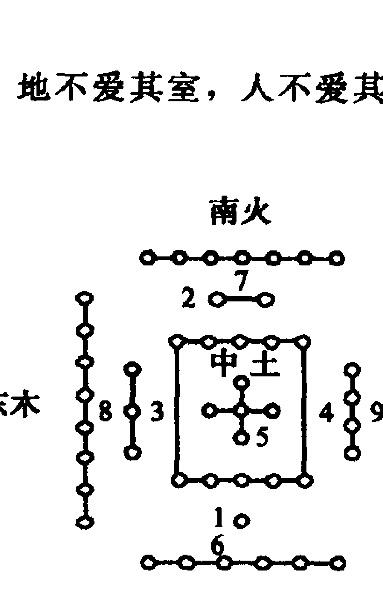

图 1-1 河图

##### （二）数字结构

河图的全数，称为天地之数，共为55，就是1～10的总数之和。其中1、3、5、7、9五个数为奇数，属阳，象征天，称为天数，天数之和为25；2、4、6、8、10五个数为偶数，属阴，象征地，称为地数，地数之和为30。这就是《易经·系辞上》说的：“凡天地之数，五十有五。”（天数25，地数30）

##### (三) 方位结构

一六共宗居于北；二七同道居于南；三八为朋居于东；四九为友居于西；五十相守居于中。

在数字结构中，一、二、三、四、五为生数，六、七、八、九、十为成数。

由图 1－1 可知：

+   (1) 6在北方，北方属水，而“1”为生数，“6”为成数。故称为“天一生水，地六成之”，“一六共宗”。
(2) 7在南方，南方属火，而“2”为生数，“7”为成数。故称为“地二生火，天七成之”，“二七同道”。
(3) 8在东方，东方属木，而“3”为生数，“8”为成数。故称为“天三生木，地八成之”，“三八为朋”。
(4) 9在西方，西方属金，而“4”为生数，“9”为成数。故称为“地四生金，天九成之”，“四九为友”。
(5) 10在中央，中央属土，而“5”为生数，“10”为成数。故称为“天五生土，地十成之”，“五十相守”。

##### (四) 河图显示天地阴阳之气的交流

将生数 1 和成数 6 配置在北方，表示阳气从这里发端。

将生数 2 和成数 7 配置在南方，表示阴气从这里发端。

东方是日出的方向，将生数 3 和成数 8 配置在东方，表示阳气逐渐增长起来。

西方是日落的地方，将生数 4 和成数 9 配置在西方，表示阴气逐渐增长起来。

中央是中心之地，将生数 5 和成数 10 配置在中央，表示居中之土。

河图本身的结构和从方位、数字的配置上，包括了金、木、水、火、土五行元素，这说明河图是在阴、阳五行的基础上产生的。

河图阴阳盈虚消长的情形，揭示了天道、地道运行的规律（如图 1－2）。

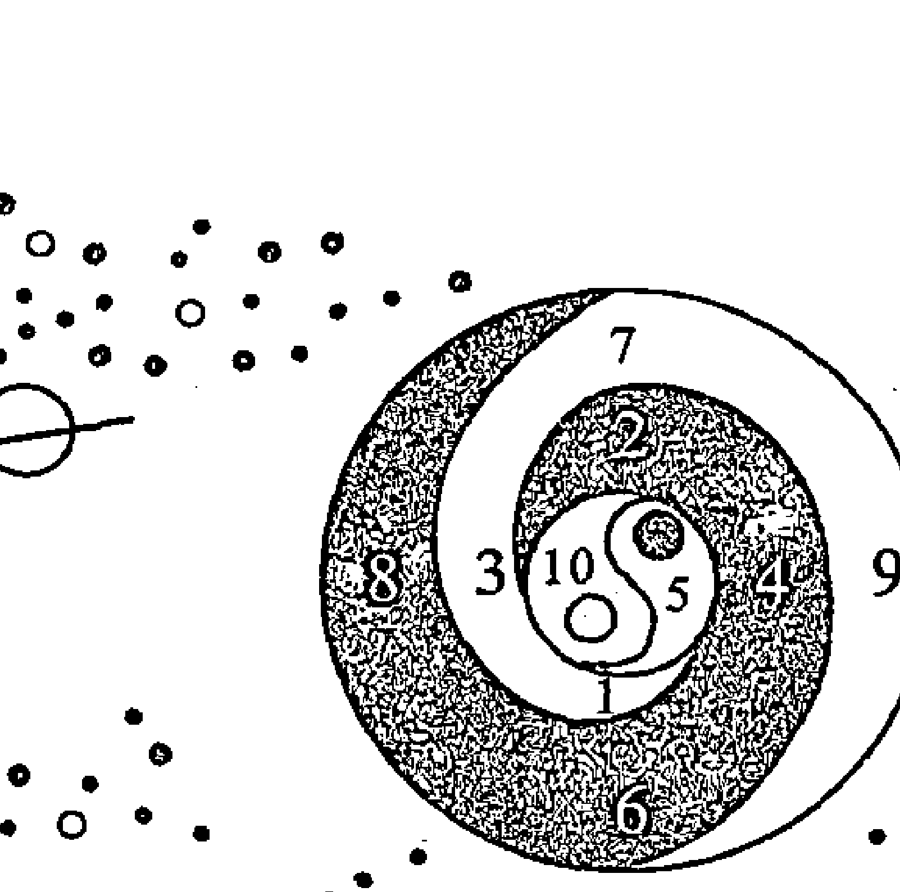

图1-2 天道、地道运行的规律

图中奇数 1、3、5、7、9 为阳，象征天；偶数 2、4、6、8、10 为阴，象征地。故，阳代表天之气，阴代表地之气。

+   1. 天道运行的规律：阳气由北方发生，向左旋转，经过东方，到达南方极盛，然后继续顺时针方向，向左旋转运行，到西方逐渐走向衰落。
2. 地道运行的规律：阴气由西南角发生，逆时针方向，向右旋转运行，到东南角逐渐增长；到东北角达到极盛，到西北角逐渐消失。

##### （五）河图左旋转五行相生

中央土生西方金；西方金生北方水；北方水生东方木；东方木生南方火，火又生土。如此，循环不已（如图1-3）。

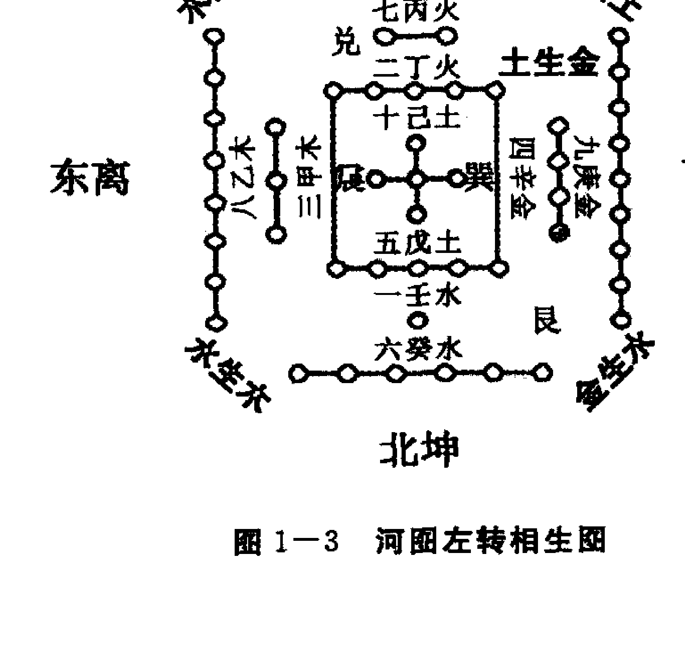

图1-3 河图左转相生图

#### 二、洛书

##### （一）来源

《易经·系辞上》曰：“河出图，洛出书，圣人则之。”意思是：黄河上出现龙图，洛水上出现龟书，圣人由此创作了八卦、九畴。（①五行；②敬用五事；③农用八政；④协用五纪；⑤建用星极；⑥乂（yì）用三德；⑦明用稽疑；⑧念用庶征；⑨向用五福、威用六极。）

传说大禹治水时，在洛水中发现三只灵龟，在他甲背的拆缝里，有一至九的数，圣人据此绘成图。这就是洛书（如图1—4）。

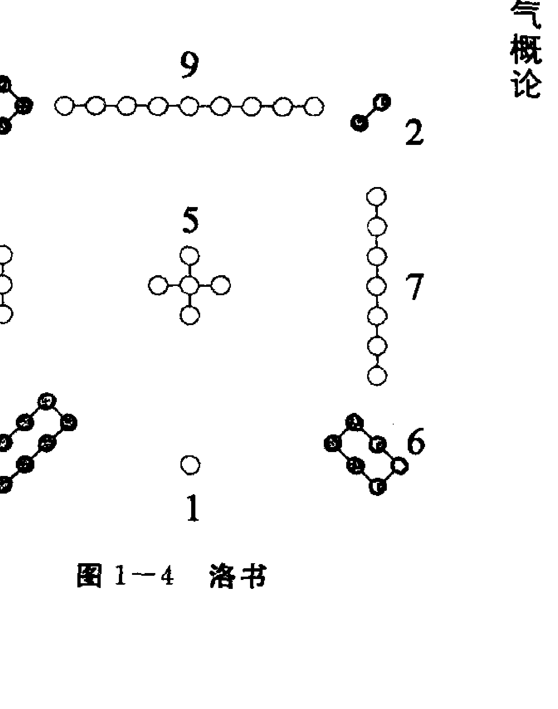

##### （二）洛书格局和九宫图

洛书的格局为：戴九履一，左三右七，二四为肩，六八为足，五居中央（如图1—5、1—6）。

以此格局，将洛书简化为九宫图：

| 4 | 9 | 2 |
| 3 | 5 | 7 |
| 8 | 1 | 6 |
*图1-5 九宫图*

| 巽四 | 离九 | 坤二 |
| 震三 | 中五 | 兑七 |
| 艮八 | 坎一 | 乾六 |
*图1-6 八卦九宫图*

图中为洛书的九个数，其总和为45。

+   1. 横线：(4+9+2) = (3+5+7) = (8+1+6) =15
2. 纵线：(4+3+8) = (9+5+1) = (2+7+6) =15
3. 斜线：(4+5+6) = (2+5+8) =15
4. 总和=15

上述就是所谓米字旗和方阵数列，纵横交错的三数之和均等于15。

（2）除去中央的5，中间的纵线，即9＋1＝10；横线，即3＋7＝10；斜线，即2＋8＝4＋6＝10。

+   - 10减1为9，9是1的成数；
- 10减2为8，8是2的成数；
- 10减3为7，7是3的成数；
- 10减4为6，6是4的成数。

##### （三）洛书具备了天、地、人三才之数

1、3、7、9四奇数表示阳气运行，定出了东、西、南、北四正的方位。四正参数的配置取象于天道，表示北为冬至，南为夏至，东为春分，西为秋分。

2、4、6、8四偶数表示阴气运行，定出了东北、东南、西北、西南四维的方位。四维参数的配置取象于地道，表示东北立春，东南立夏，西南立秋，西北立冬。

中央5取象于人道。

这样，洛书具备了天、地、人三才之数，正是八卦三画卦中各象征天、地、人三才之说。由此可知，八卦的三画卦，是以洛书为依据推演出来的。

### （四）洛书右旋转五行相克（如图1-7）

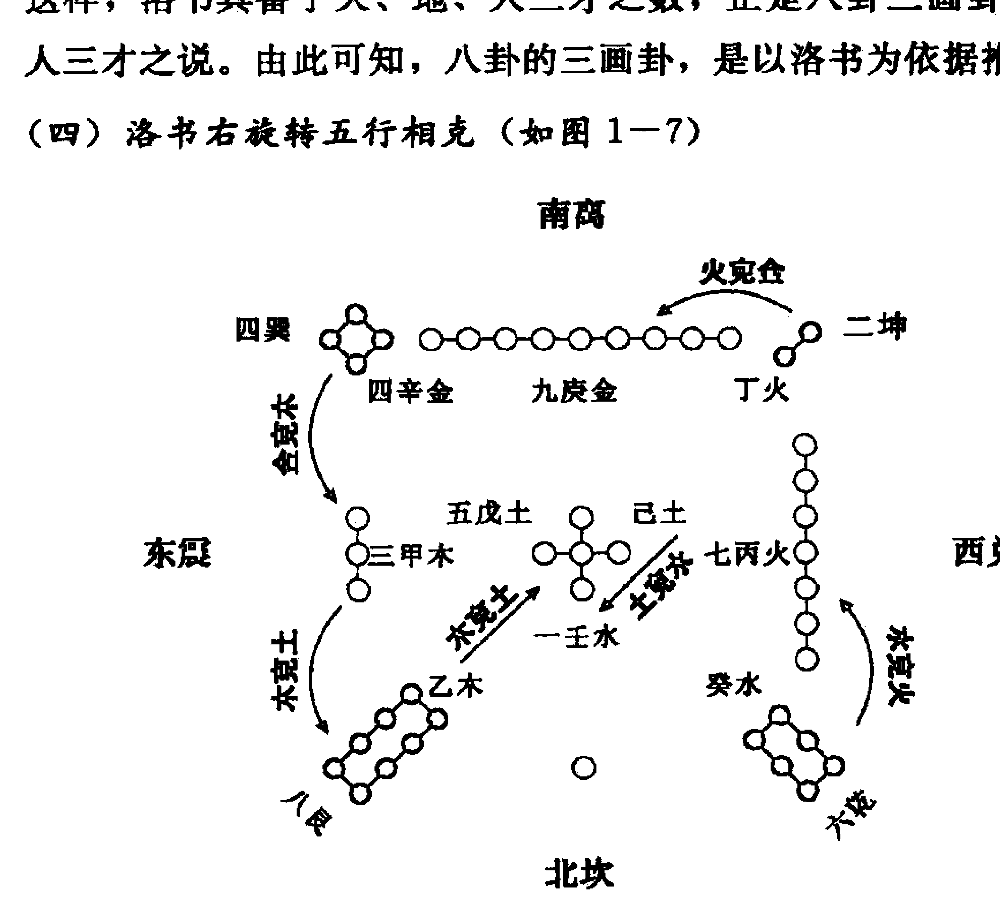

#### 三、河图洛书运用的简单方法

##### （一）河图

河图以一生一成、奇偶阴阳交错为基本原理；其数字以洛书形式分布九宫，即四正四隅和中央。

##### （二）洛书

+   1. 以洛书九宫关系位置以及一生一成之法，定山水的吉凶。
2. 以实际地形形成的生成数，定山水的吉凶。

### 第三节 先后天八卦及其与河图洛书的配置

#### 一、先天八卦与河图洛书

##### （一）先天八卦的生成

由太极生两仪，两仪生四象，四象生八卦（如图1-8）。

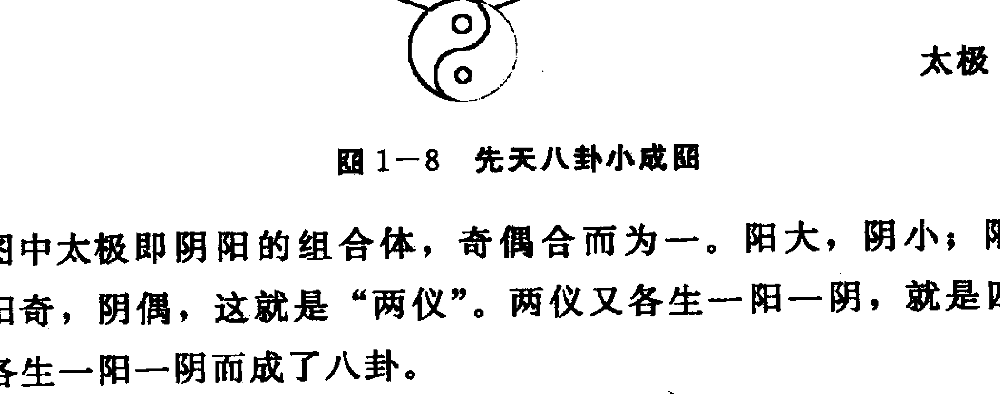

图中太极即阴阳的组合体，奇偶合而为一。阳大，阴小；阳先，阴后；阳奇，阴偶，这就是“两仪”。两仪又各生一阳一阴，就是四象。四象又各生一阳一阴而成了八卦。

### （二）先天八卦的方位图（如图1-9）

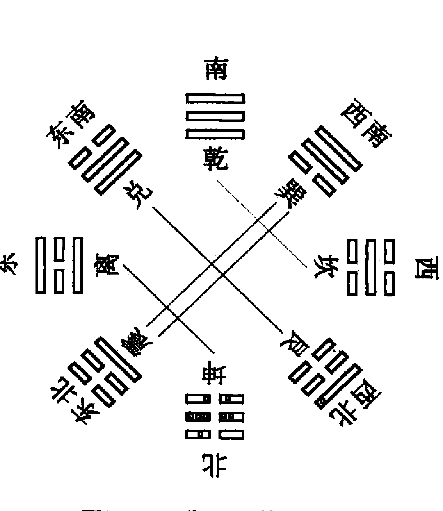

图1-9 先天八卦主生图

先天卦以震、巽为经，其他诸卦皆为纬。先天指天地之“生气”，生成万物。震、巽代表木，代表春天，万物开始生长。震、巽一气互通于东北和西南，纬于其间的其他诸卦皆主生。于是：

乾金生坎水；艮土生兑金；离火生坤土，这就是完成了先天卦的定位。

### （三）先天八卦配河图（如图1-10）

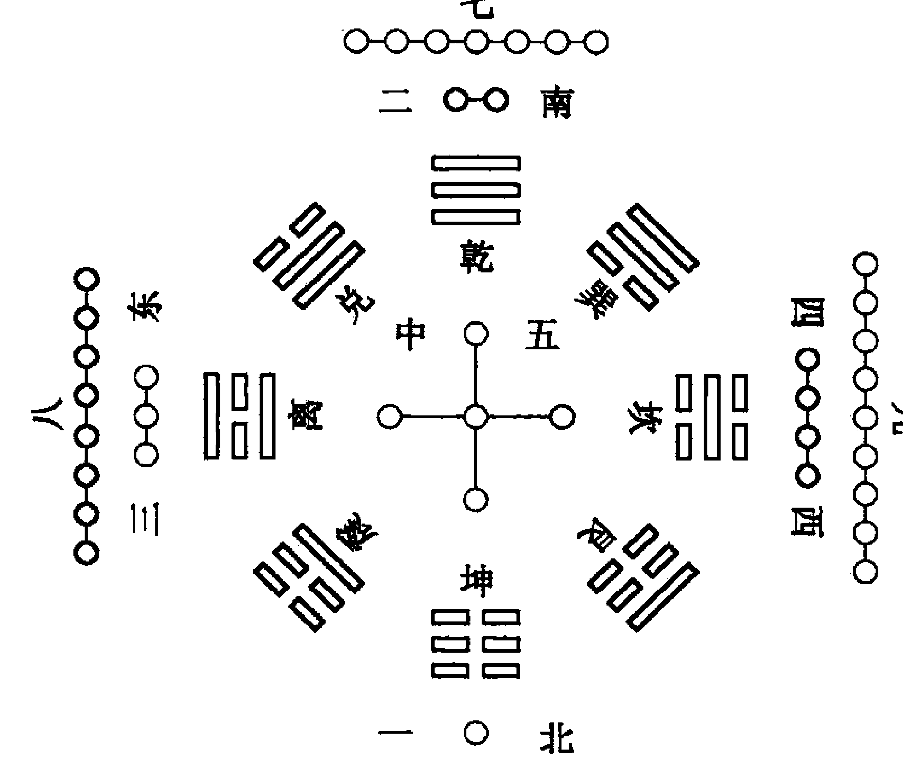

图1-10 先天八卦配河图

此图以中宫之数“五”为太极，以奇偶之总数为两仪。河图中生数一、二、三、四各加中五为六、七、八、九，此为四象之数：分北方一六之数为坤卦；分南方二七之数为乾卦；分东方三八之数为离卦；分西方四九之数为坎卦。这是乾坤离坎四正卦。艮卦数由一六北方分出，兑卦数由二七南方分出；震卦数由三八东方分出；巽卦由四九西方分出。
从河图上可知，图的左边，阳数三在内，阴数八在外，即先天的震离兑乾四卦，阳长而阴消；图的右边，阴数四在内，阳数九在外，即先天的巽坎艮坤四卦，阴长而阳消。此图说明了阴阳二气的交替变化。

### （四）先天八卦配洛书（如图1－11）

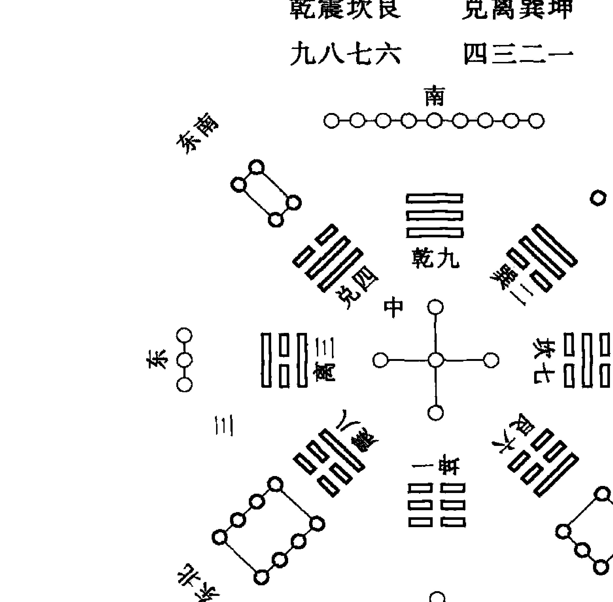

洛书数字排列，奇数位正居南、北、东、西，偶数位都在四个角落，这是尊阳的意思。乾为纯阳配九，九为阳之极。坤为纯阴配一。乾九与坤一相交得震，所以次乾为震，次九为八；再交于坤得坎，所以，次震为坎，次八为七；三交于坤得艮，所以次七为六。这就定了三男的位置（震长男，坎中男，艮少男）。
坤一交乾得巽，次坤为巽，次一为二；再交乾得离，次巽为离，次二为三；三交乾得兑，次离为兑，次三为四。又定了三女的位置（巽长女，离中女，兑少女）。
论位：是乾一、兑二、离三、震四、巽五、坎六、艮七、坤八。
论数：是乾九、震八、坎七、艮六、坤一、巽二、离三、兑四。
所以，先天卦生，自得其数。卦位数是表示先天八卦的顺序；而“论数”的数，则是先天八卦配洛书后，各卦在洛书中的卦数。

#### 二、后天八卦与河图洛书

### （一）后天八卦配河图（如图1-12）

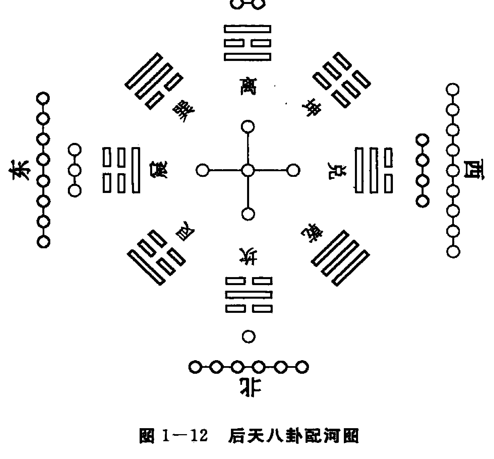

图1-12 后天八卦配河图

此图说明了五行生成分布的方位。在图中，一与六共宗合水，居于北，为后天的坎位；二与七同道合火，居于南，为后天的离位；三与八为朋合木，居于东，为后天的震巽位；四与九为友合金，居于西，为后天的兑乾位；五与十相守合土，居中，为后天的坤艮位。

后天八卦配河图，是周文王说卦，即圣人说卦。他说：帝出乎震，岁月开始了。震为木，为春天的开始，巽也是木，又代表季风，季风过后，夏天到来，就是离，离表示火。火生土，土又生金，坤表示土，兑代表金，说明秋天来了。西北方为天地的尊位，以乾卦表示，乾代表君王和父亲。坎卦代表冬天，万物已生成了。艮是止的意思，一年到头了。因为这是圣人在先天八卦后说的卦，所以称为后天八卦，是奉待天时的。
后天八卦的卦位，以离坎、震兑为经纬代表春夏秋冬四时，以震、巽、离、坤、兑、乾、坎、艮表示立春、春分、立夏、夏至、立秋、秋分、立冬、冬至八个季节。

### （二）后天八卦配洛书（如图1－13）

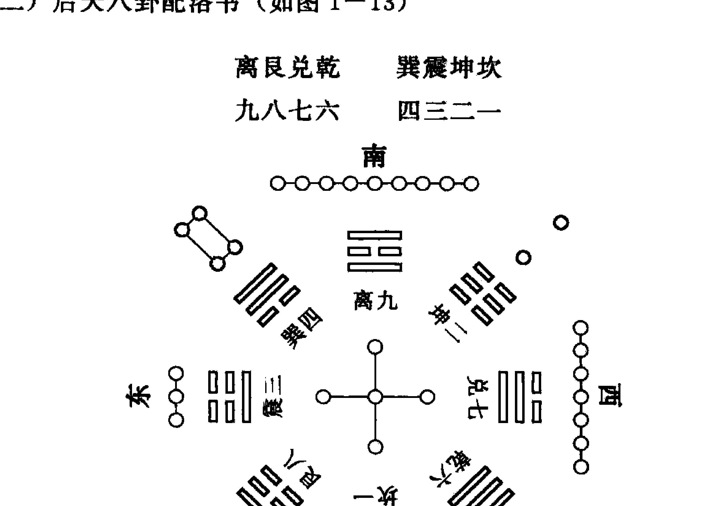

火性炎上，水性顺下，故九为离，坎为一。火生燥土，则八为艮。燥土生金，则七为兑，六为乾。水润湿土，故二为坤。湿土润木，故三为震，四为巽。此图合后天之位。

河图洛书是中国古代数学的源头，图中有数，数中有图，从而形成了《周易》所特有的数理哲学，这就是人们所称的易数。

### 第四节 干支与六十甲子

#### 一、干支和甲子纳音

##### （一）天干和地支

干支是天干地支的总称。《五行大义》说，干支是大挠创制的。大挠“采五行之情，占斗机所建，始作甲乙以明月，谓之干；作子丑以明月，谓之枝。有事于天则用日，有事于地则用辰。阴阳之别，故有干枝名也。”

干支是古人用以纪年、月、日、时的符号，取义于树木的干枝。顺次以天干配地支，如甲子、乙丑等，十天干与十二地支配合，六十年重复一次，俗称“甲子”，周而复始，循环使用。

+   - 十天干：甲、乙、丙、丁、戊、己、庚、辛、壬、癸。
- 十二地支：子、丑、寅、卯、辰、巳、午、未、申、酉、戌、亥。

干支的原始意义及排列顺序，是指生物的生、长、收、藏，用以代表万事万物产生、发展、壮大、消弱、死亡、更生的整个过程。今人认为，干支既是数量、矢量，也是具有周期性质的时间生物向量，是一个具有独立性质的集合系统，蕴含深刻的时空背景，体现古天文时空的相对性和一致性。

天干地支配阴阳、五行、时间、音律、八卦、河洛、脏腑等，体现了事物之间的有机联系和“天人相应”的整体衡动观。

古人对天干地支的具体解释如下表：

| 干支名称 | 史书对干支的解释 |
| :--- | :--- |
| | **《史记·律书》** | **《汉书·律历志》** | **《说文解字》** |
| 甲 | 万物剖符甲而出 | 出甲于甲 | 东方之孟阳气萌动 |
| 乙 | 万物生轧 | 奋轧于乙 | 象春草木曲而出，阴气尚强其出乙也 |
| 丙 | 阳道著明 | 明炳于丙 | 位南方，万物生 |
| 丁 | 万物丁壮 | 大盛于丁 | 夏时万物皆丁实 |
| 戊 | 万物茂盛 | 丰茂于戊 | 中宫也 |
| 己 | 万物有形可纪 | 理纪于己 | 中宫也 |
| 庚 | 阴气庚万物 | 敛更于庚 | 位西方，象秋时万物庚庚有实也 |
| 辛 | 万物之辛生 | 悉新于辛 | 秋时万物成而熟 |
| 壬 | 阳气任养万物于下 | 怀妊于壬 | 位北方也，阴极阳生，象人怀妊之形 |
| 癸 | 万物可揆度 | 陈揆于癸 | 冬季，象水从四面八方流入地中 |
| 子 | 言万物滋一下 | 孳萌于子 | 十一月阳气动，万物滋 |
| 丑 | 万物厄纽未敢出 | 纽芽于丑 | 纽也，十二月万物动用事 |
| 寅 | 万物始生，螾然也 | 引达于寅 | 正月阳气动，阴尚强也 |
| 卯 | 言万物茂也 | 冒茆于卯 | 冒也，二月万物冒地而出 |
| 辰 | 言万物之娠也 | 振美于辰 | 震也 |
| 巳 | 言阳气之已尽也 | 已盛于巳 | 四月阳气已出，阴气已藏，万物见 |
| 午 | 阴阳交故曰午 | 萼布于午 | 五月阴气牾逆，阳气冒地而出也 |
| 未 | 万物皆成有滋味 | 昩薆于未 | 味也，六月滋味也，象木重枝叶也 |
| 申 | 言阴用事，申贼万物 | 申坚于申 | 神也，七月阴气成体，自申束 |
| 酉 | 万物之老也 | 留熟于酉 | 就也，八月黍成，可为酎酒 |
| 戌 | 万物尽灭 | 毕入于戌 | 灭也，九月阳气微，万物毕成，阳入地也 |
| 亥 | 阳气藏于下 | 该阂于亥 | 荄也，十月微阳起，接盛阴 |

## 卷二 理气概论

## 第一章 理气风水的基础知识

##### （二）六十甲子和甲子纳音表

十天干与十二地支按顺序两两相配，从甲子到癸亥，共六十个组合，故称“六十甲子”，又每两组配一纳音五行，称为“甲子纳音”。

纳音，是把六十甲子按照六甲（甲子、甲戌、甲申、甲午、甲辰、甲寅）的次序，配合十二律、五音而成。纳音起源很早，先秦就有了。

> > 沈括在《梦溪笔谈》中说：“六十甲子纳音，盖六十律旋相为宫法也。一律含五音，十二律纳六十音也。凡气始于东方而右行，音起于西方而左行，阴阳相错而生变化。所谓气始于东方者，四时始于木，右行传于火，火传于土，土传于金，金传于水。所谓音始于西方者，五音始于金，左旋转于火，火传于木，木传于水，水传于土。纳音之法，同类娶妻，隔八生子，此律吕相生之法也。”

## 六十甲子及其纳音表

| 序号 | 干支列表 | 纳音列表 |
|------|----------|----------|
| 一 | 甲子 乙丑 丙寅 丁卯 戊辰 己巳 庚午 辛未 壬申 癸酉 | 海中金 炉中火 大林木 路旁土 剑锋金 |
| 二 | 甲戌 乙亥 丙子 丁丑 戊寅 己卯 庚辰 辛巳 壬午 癸未 | 山头火 涧下水 城头土 白蜡金 杨柳木 |
| 三 | 甲申 乙酉 丙戌 丁亥 戊子 己丑 庚寅 辛卯 壬辰 癸巳 | 泉中水 屋上土 霹雳火 松柏木 长流水 |
| 四 | 甲午 乙未 丙申 丁酉 戊戌 己亥 庚子 辛丑 壬寅 癸卯 | 沙中金 山下火 平地木 壁上土 金箔金 |
| 五 | 甲辰 乙巳 丙午 丁未 戊申 己酉 庚戌 辛亥 壬子 癸丑 | 佛灯火 天河水 大驿土 钗钏金 桑柘木 |
| 六 | 甲寅 乙卯 丙辰 丁巳 戊午 己未 庚申 辛酉 壬戌 癸亥 | 大溪水 沙中土 天上水 石榴木 大海水 |

#### 二、八卦纳甲和干支的阴阳属性

##### （一）纳甲

纳甲是汉京房、三国虞翻以纳甲说《易》，用八卦、十天干、五行、五方相配合。引入纳甲、纳音的目的，主要用于推算五姓的吉凶和阴宅、阳宅地点是否合时，是否生旺。如果推算的结果是衰死，那么这个地点暂时就不能用，要么换地点，要么改时间。

八卦纳甲，乾坤纳甲子的两头，即乾纳甲壬，坤纳乙癸。风水家认为，纳甲可以揭示天地生育的道理。

## 八卦纳甲表

| 八卦 | 纳干 | 纳支 | 八卦 | 纳干 | 纳支 |
|---|---|---|---|---|---|
| 乾 | 甲 | | 巽 | 辛 | |
| 坎 | 癸 | 申子辰 | 离 | 壬 | 寅午戌 |
| 艮 | 丙 | | 坤 | 乙 | |
| 震 | 庚 | 亥卯未 | 兑 | 丁 | 巳酉丑 |

##### (二) 干支阴阳属性及其五行

## 干支阴阳属性及其五行表

| 干支 | 区分 | 阳 | 阳 | 阳 | 阳 | 阳 | 阴 | 阴 | 阴 | 阴 | 阴 |
|---|---|---|---|---|---|---|---|---|---|---|---|
|  | 五行 | 木 | 火 | 土 | 金 | 水 | 木 | 火 | 土 | 金 | 水 |
| 天干 | | 甲 | 丙 | 戊 | 庚 | 壬 | 乙 | 丁 | 己 | 辛 | 癸 |
| 地支 | | 寅 | 午 | 辰 戌 | 申 | 子 | 卯 | 巳 | 丑 未 | 酉 | 亥 |## 第二章 三元九运与玄空飞星

### 第一节 三元九运

#### 一、什么是三元九运

“三元”，就是指上元、中元、下元，每一元为60年，三元就是三个60年，共计180年。

“九运”，即上、中、下三元的每一元中有三运，三元乘以3，就是九运。其中：
上元：含一、二、三运；
中元：含四、五、六运；
下元：含七、八、九运。

元运的计算方法，是以农历甲子纪年开始的。一个甲子是十年，六个甲子，即：甲子，甲戌，甲申，甲午，甲辰，甲寅，计六十年，就是一元。

现将三元九运的相关内容以及九运旺衰及其关系列成下表：

**三元九运及其相关内容简表**

| 元   | 运   | 纪年甲子     | 公元纪年     | 年数 | 后天八卦五行配紫白 | 各元起始甲子的年代 |
| :--- | :--- | :----------- | :----------- | :--- | :----------------- | :----------------- |
| 上元 | 一   | 甲子～癸未   | 1864～1883   | 二十 | 一白水运           | 清朝同治三年       |
| 上元 | 二   | 甲申～癸卯   | 1884～1903   | 二十 | 二黑土运           |                    |
| 上元 | 三   | 甲辰～癸亥   | 1904～1923   | 二十 | 三碧木运           |                    |
| 中元 | 四   | 甲子～癸未   | 1924～1943   | 二十 | 四绿木运           | 民国十三年         |
| 中元 | 五   | 甲申～癸卯   | 1944～1963   | 二十 | 五黄土运           |                    |
| 中元 | 六   | 甲辰～癸亥   | 1964～1983   | 二十 | 六白金运           |                    |
| 下元 | 七   | 甲子～癸未   | 1984～2003   | 二十 | 七赤金运           | 中华人民共和国35年 |
| 下元 | 八   | 甲申～癸卯   | 2004～2023   | 二十 | 八白土运           |                    |
| 下元 | 九   | 甲辰～癸亥   | 2024～2043   | 二十 | 九紫火运           |                    |

注：据传，上元一运甲子年，即1864年，是从黄帝时起算的第七十八个甲子年。

#### 二、三元九运的来历

前已说明：“上元一运甲子年”，是从1864年起算的。为什么要从这年起算呢？

据《尚书》记载：“璇玑玉衡，以齐七政。”“璇玑玉衡”，是古时测量天文的一种仪器；“七政”是指日、月和绕太阳运行的金、木、水、火、土五大行星。此句话的完整意思是，古人使用璇玑玉衡，测得日月五星在这一年中运行到了一条直线上，于是就将这年定为第一个甲子年，这就是上元甲子年。

为什么以二十年为一运？

因北斗七星的旋转，每二十年必有一变，所以，将二十年定为一运。又因为木星与土星二十年一相会（木星是太阳系中接近太阳的第五个行星，绕太阳公转周期11.86年，自转周期9小时50分。木星是九大行星中体积最大的一个，是地球的1,295倍，有14颗卫星；土星是太阳系中接近太阳的第六颗行星，绕太阳公转周期为29.5年，自转周期10小时2分。体积比木星略小，比地球约大750倍，是九大行星中的第二大行星。有一个光环和十个卫星），即两者运行中相距较近。这时对地球的影响很巨大，所以，地球运行之气，也要二十年随之一变。这就是说，每二十年为一运，是因应天体运行的规律而确定的。

三元九运以一百八十年为一个周期，为何如此呢？其理由有二：

- (1) 据古代天文仪器测定，日月五星，每一百八十年要重复地运行在一条直线上，故三元九运以180年为周期。
- (2) 中国农历中，每年的冬至是从子时起算的，而每年天文的岁首，也是从冬至子时起算的。所以，农历的历法，如节气、闰月和“朔望月”等的确定均以一百八十年又还原，所以三元九运以一百八十年为一个周期，也符合中国农历历法的规律。（“朔望月”是月亮连续两次运行到太阳和地球之间所经历的时间。一个朔望月等于29天12小时44分2.8秒。农历一个月的天数为29天或30天，就是根据朔望月制定的。农历的每月初一为“朔日”，在这一天月球运行到地球和太阳之间，跟太阳同时出没，地球上看不到月光，这种月相叫朔，这时的月亮叫新月。）

### 第二节 玄空飞星

#### 一、什么是玄空

所谓玄空，就是将洛书九宫中的“五”提出，使其成空，而根据“飞星”的规则，将九运中的某运数填入中空，使其运转，以定吉凶。
总之，玄空就是“提中五成空”。
为什么要“提中五成空”呢？
洛书九宫中的中五，就是太极。它向乾巽两方作顺时针或逆时针方向运转，其气就可流向四正四隅四面八方。这就是“太极生两仪，两仪生四象，四象生八卦”，此符合易理变化的法则。所以，先贤将中五拿走，使其“玄空”，然后在玄空中，填进九运中的某一数字，其气就随此数而周游八方。这样，既符合易理的法则，又适应九个运气运转和天地宇宙运转的规律，使三元九运顺应自然之理。

#### 二、什么是飞星排盘

玄空理气的内在线索是“三元九运”，而三元九运又是通过具体的“飞星排盘”这一外在形式来表现的。这就是说，用玄空理气于风水中，来判定二十四山的吉凶，是用三元九运的飞星排盘法来实现的。
要懂得三元九运的飞星排盘，必须熟记以下两个图式：
（一）洛书元旦盘式（如图 2－1）
洛书元旦盘式的口诀就是：

> 戴九履一，左三右七，二四为肩，六八为足，五居中央。

| 四 | 九 | 二 |
| :--- | :--- | :--- |
| 三 | 五 | 七 |
| 八 | 一 | 六 |

图 2-1 洛书元旦盘

（二）在洛书元旦盘里配上九星和三元九运（如图 2-2）

| 巽宫<br>四绿（木）<br>中元四运 | 离宫<br>九紫（火）<br>下元九运 | 坤宫<br>二黑（土）<br>上元二运 |
| :--- | :--- | :--- |
| 震宫<br>三碧（木）<br>上元三运 | 中宫<br>五黄（土）<br>中元五运 | 兑宫<br>七赤（金）<br>下元七运 |
| 艮宫<br>八白（土）<br>下元八运 | 坎宫<br>一白（水）<br>上元一运 | 乾宫<br>六白（金）<br>中元六运 |

图 2-2 洛书九宫配九星图

图中表示，三元九运天地之气分布于后天八卦各方位。即：

- 上元一运，位于北方坎卦位，气旺于北。
- 二运，位于西南方坤卦位，气旺于西南。
- 三运，位于东方震卦位，气旺于东。
- 中元四运，位于东南方巽卦位，气旺于东南。
- 五运，上十年归巽卦位，巽卦兼坤卦气（甲申～癸巳年）；下十年归乾卦位，乾卦气兼艮卦气（甲午～癸卯年）。
- 六运，位于西北方乾卦位，气旺于西北。
- 下元七运，位于西方兑卦位，气旺于西。
- 八运，位于东北方艮卦位，气旺于东北。
- 九运，位于南方离卦位，气旺于南方。

（三）玄空三元对二十四山阳山阴山的划分

三元九运之气，流转二十四山，又将二十四山分为“天元龙、地元龙、人元龙”三组来统管，其划分情况如下表和图2－3：

**三元龙二十四山阴山阳山划分表**

| 龙别 | 地元龙             | 天元龙             | 人元龙             |
| :--- | :----------------- | :----------------- | :----------------- |
| 阳山 | 甲丙庚壬四正方     | 乾坤艮巽四隅方     | 寅申巳亥四隅方     |
| 阴山 | 辰戌丑未四隅方     | 子午卯酉四正方     | 乙辛丁癸四正方     |
| 三卦 | 江东卦             | 父母卦             | 江西卦             |

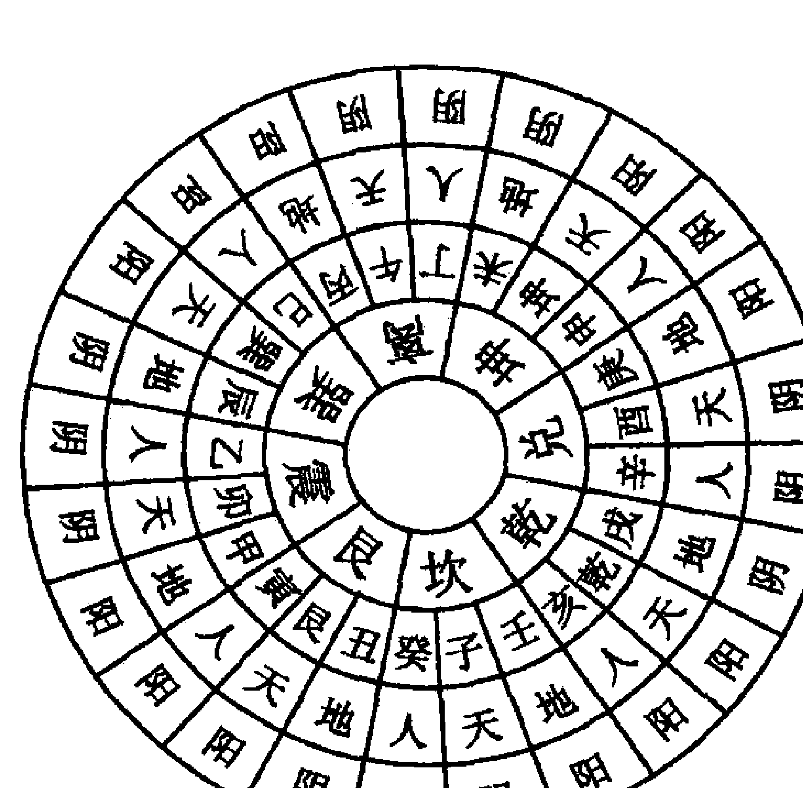

#### 三、飞星排盘的方法

玄空理气对二十四山吉凶状态的判断，就是通过对动态的三元九运的运星盘观察分析而得出结论的。所以，风水先生必须懂得飞星排盘的操作方法。现详述于后：

##### （一）运星的飞布方法

各运在九宫格内从中宫开始，沿洛书元旦盘的轨迹一律依数字从小到大的顺序飞布九星（如图2－4）。

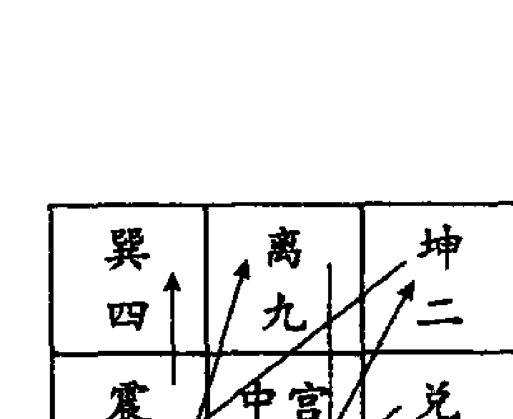

图2－4以五运为例，演示了“运星”飞布洛书九宫的方法步骤，现对其详细说明如下：

“运星”是指“三元九运”中一运至九运每运的运星，在飞星排布运盘时，均要将其放入中五宫，然后按“五→六→七→八→九→一→二→三→四”的顺序飞排。这实际上就是“洛书元旦盘”的数序。只要是起星，一定要从“中五”开始飞布。

前已阐明，“玄空”就是将洛书元旦盘的“中五”抽出，使其成空，然后再填入“一运至九运”中某运的“运星”，即：

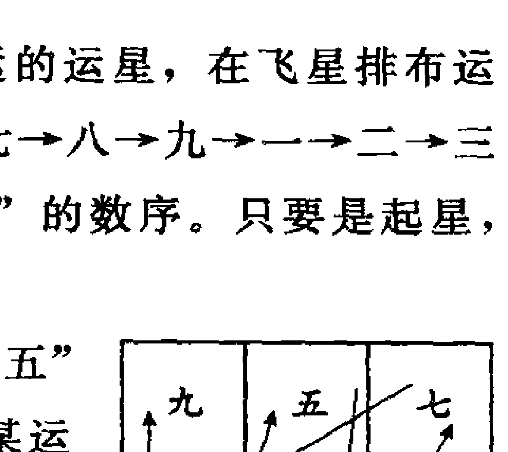

“一运”，就是将“一”填入“中五”的空位，然后按洛书元旦盘的数序顺飞。此顺序是从“中五”空位填入“一运”运星的“一”开始的，然后，一→二→三→四→五→六→七→八→九（如图2-5）。

“二运”，就是将“二”填入“中五”的空位，再按洛书元旦盘的数序顺飞。此顺序是从“中五”空位填入“二运”的运星“二”开始，然后，二→三→四→五→六→七→八→九→一（如图2-6）。

其余“三、四、五、六、七、八、九运”，飞布的方法步骤均如此。

##### （二）山星和向星飞布法

无论是建造阳宅或阴宅，都有个背靠什么地方，面朝哪个方向的问题，即“坐山”和“立向”。如“坐子向午”，或称“子山午向”。其意就是背靠“子”山，面朝“午”向。而“子山午向”是用罗盘测定出来的，罗盘上“子”在正北方，“午”在正南方。所以，“坐子向午”的宅基，就是坐北朝南。

什么是“山星”和“向星”呢？

在运盘九宫格的飞星图上，落在“坐山”宫位上的那个运星数，是“山星”；落在“向”上宫位上的那个运星数，就是“向星”。如八运“子山午向”（如图2-7）。

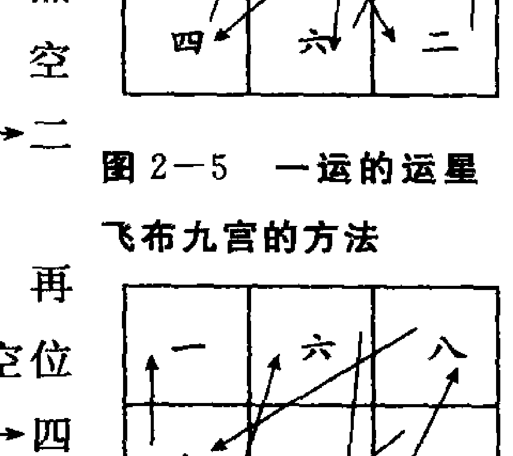

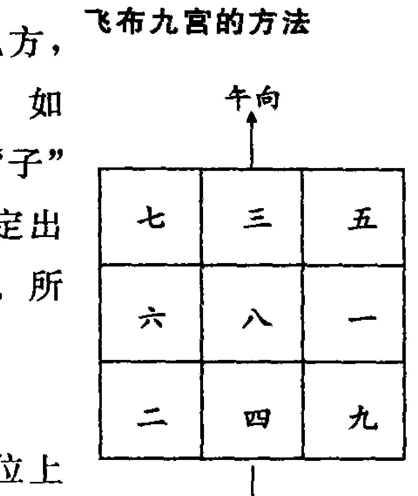

图2-7是八运“子山午向”的运盘飞星图，在此九宫飞星图上，运星“四”落在坐山“子”的宫位上，所以，“四”就是“山星”；而运星“三”落在“向”上“午”的宫位上，所以，“三”就是“向星”。故，八运“子山午向”的山星为“四”，向星为“三”。

山星和向星飞布的基本方法，与运星盘飞布方法是一样的，但是也有一些区别。其区别在于：
要依据“坐山”和“向”方飞星的三元龙的阳山或阴山，决定顺飞或逆飞的轨迹，逢阳以数字从大到小顺飞，逢阴以数字从小到大逆飞。所以，必须牢牢记住二十四山三元龙阴阳山的属性。为此，再重复将二十四山三元龙阴阳山的区分写在下面：

- 地元龙：甲庚丙壬为阳，辰戌丑未为阴。
- 天元龙：乾坤艮巽为阳，子午卯酉为阴。
- 人元龙：寅申巳亥为阳，乙辛丁癸为阴。

###### 1. 山星飞布法

将运盘中落在坐山宫位的“山星”数字，放在入中运星数的左上方，再依据该数字所在洛书九宫元旦盘后天八卦的卦宫位及其三元龙阴阳山的属性，逢阳顺飞，逢阴逆飞（如图2—8）。

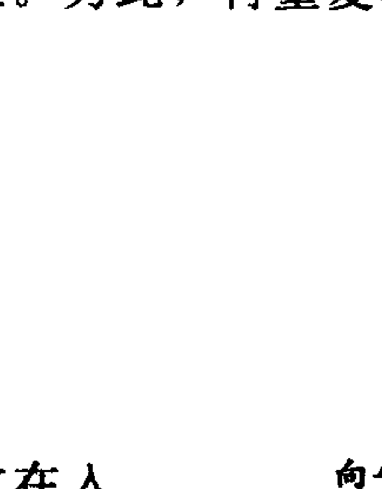

图2—8为八运子山午向。“山星”飞布九星的方法演示：

第一步，按前述“运盘飞布九星的方法”排出运盘九星的飞星图；

第二步，按“山星飞布法”，飞布山星。八运子山午向的运盘上运星“四”，落在坐山“子”坎宫位。向“山星”飞布的方法即，坐山的挨星为“4”，故将4入中，放在当令运星“八”的左上方。而“四”在洛书元旦盘上，为后天八卦的“巽宫”。“子”在坎宫为天元龙，巽宫三山为“辰巽巳”，其中“巽”山与“子”山的天元龙相对应，而“巽”为阳，所以，山星“4”入中后，沿洛书元旦盘，按数字从小到大，即4→5→6→7→8→9→1→2→3的顺序，顺飞九星。

###### 2. 向星飞布法

将运盘中落在“向”上宫位的“向星”数字，放在入中运星数的右上方，再依据该数字所在洛书九宫元旦盘后天八卦的卦宫位及其三元龙阴阳山的属性，逢阳顺飞，逢阴逆飞（如图2—9）。

图 2-9 为八运“子山午向”。“向星”飞布九星的方法演示：

- 第一步，按“运星”飞布法，排好“运盘”；
- 第二步，按“山星”飞布法，排好“山盘”；
- 第三步，排“向盘”：

八运“子山午向”运盘数字“三”落在“午向”洛书元旦盘后天八卦的“离宫”内，即向上的挨星为“三”，故将“3”入中，放在当令运星“八”的右上方，而离宫统管“丙午丁”三山，其中“午”是“天元龙”；

向方离宫位的运盘数字是“三”，而“三”是洛书九宫元旦盘的震宫，它统管“甲卯乙”三山，其中的“卯”山，与“午”向天元龙对应，而“卯”在三元龙中属阴。所以，将“3”入中后，按“3→2→1→9→8→7→6→5→4”的逆数序，沿洛书轨迹飞布九星。

##### 3. 八运“子山午向”的飞星排盘

此仅举一例说明玄空飞星图排演的方法（如图 2-10）。其余二十四山的山向和三元九运，飞星排盘的方法均如此。其中最重要的方法是：

- (1) 将当令的运星入中按洛书轨迹，顺飞九星，一运至九运均如此，排运盘一律顺飞；
- (2) 排山盘和向盘时，要依据二十四山三元龙的阴阳属性，决定顺飞或逆飞。逢阳顺飞，逢阴逆飞（按数字从小到大的顺序沿洛书九宫飞布为顺飞；反之则称逆飞）；
- (3) 山星，就是落在坐山宫内的运星；向星就是落在向方宫内的运星；
- (4) 以山星、向星所在洛书元旦盘后天八卦的卦宫位及其与坐山、立向的二十四山相应的三元龙阴阳属性，作为顺飞或逆飞的依据。

前面讲述的飞星排盘法，就是《沈氏玄空学》的下卦排演法。

二十四山，每一山的第一至第九运都能排演成飞星图；三元九运，则可排出二百一十六个飞星图。

飞星图又指“挨星图”，所谓“挨星”，就是指将三元九运的运星入中，然后按洛书轨迹，由中五起顺飞九星，这时落在“坐山”和“向上”的“运星”，就是“挨星”。再分别将坐山和向上挨得之星（称为“山星”和“向星”）入中，按逢阳顺飞，逢阴逆飞的方法，飞布九星（在洛书九宫中，每宫所落的“运星、山星、向星”均称为“挨星”）。
为查阅使用方便，本书将《沈氏玄空学》列出的三元九运挨星图和相关资料一一附于书后。

#### 四、替卦挨星排演法

##### （一）什么是替卦？

替，即代替的意思，当立某正向不能纳吉反呈凶象时，就须以正向为准向左或向右偏离六度以上立向，这叫做兼向。立兼向时，就必须使用替卦代替原卦入中飞星排盘，以达趋吉避凶之目的。但偏离的方向没达六度时，不能称为兼向。这里的六度，是指圆周360度中的六度。
玄空学以向首或动气口为重，使用兼向，就是接得吉气到向首或动气的缺口、路口或城门。

##### （二）替卦入中的规则

替卦（入中的起星）的规则是：

| 本该入中的原星 | 代替原星入中的星 |
| :------------- | :--------------- |
| 子癸和甲申     | 一白贪狼星       |
| 坤壬乙卯未     | 二黑巨门星       |
| 辰巽巳戌乾亥   | 六白武曲星       |
| 酉辛丑艮丙     | 七赤破军星       |
| 寅午与庚丁     | 九紫右弼星       |

例：三运子山午向，取直向，其下卦飞星图上，出现山上龙神下水，凶。为了纳吉，必须取子午兼壬丙的兼向。这时就必须用替卦起星排盘（如图2－11）。
图2－11 为三运“子山午向”兼壬丙五度飞星图。其替卦方法如下：

- （1）排运盘：三运子山午向，以三入中排运盘；
- （2）排山盘：运星“八”挨到坐山“子”。“八”为八白艮卦，包括“丑艮寅”三山。“子”为天元龙，丑艮寅三山中，与子对应的天元龙是“艮”，艮属阳，倘若是“下卦正向山盘飞星”，“八”是坐山“子”的挨星，以“8”入中，放在运星“三”的左上方，顺飞九星就是了，但这是“兼向”替卦挨星图，所以要按“替卦（入中的起星）的规则”飞布九星。依据规则，原星“酉辛丑艮丙”，代替的是“七赤破军星”，所以，原星“八白‘艮’”，要用“七赤破军星”代替，以“7”入中，顺飞九星。

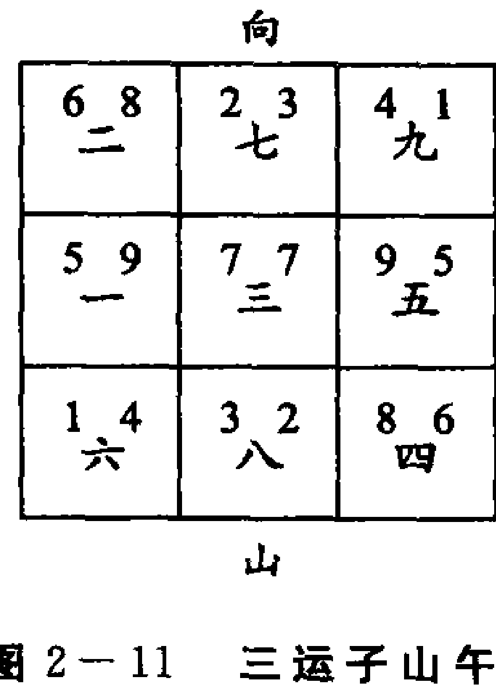

##### （三）向星排盘

三运的运星“七”，落在“午”向的离宫位，即向上挨星为“7”。“七”为兑卦，包括“庚酉辛”三山，“午”为天元龙，“庚酉辛”三山中与“午”对应的天元龙是“酉”，酉属阴。倘按“下卦正向”向星排盘，应以“7”入中逆飞就可以了。但“兼向”要用替卦，依据替卦（入中的起星）的规则，“酉辛丑艮丙”，代替的是“七赤破军星”。所以，以“7”入中，放在运星“三”的右上方，逆飞九星。

##### 说明：

（1）在替卦排演的规则中，使用的九星，是星曜的名称，从一白到九紫，他们的星曜名称是：
一白，贪狼；二黑，巨门；三碧，禄存；四绿，文曲；
五黄，廉贞；六白，武曲；七赤，破军；八白，左辅；
九紫，右弼。

（2）替卦挨星的顺序是：
①贪狼→②巨门→③禄存→④文曲→⑤廉贞→⑥武曲→⑦破军→⑧左辅→⑨右弼。

（3）二十四山使用替星和不用替星情况表

**中国风水学初探**

| 卦宫 | 九星名称 | 所辖三山 | 使用替星者山名 | 使用替星者替星 | 不用替仍用本宫九星山名 | 不用替仍用本宫星星名 |
| :--- | :------- | :------- | :------------- | :------------- | :----------------------- | :----------------------- |
| 坎   | 一白贪狼 | 壬子癸   | 壬             | 二黑巨门       | 子癸                     | 一白贪狼                 |
| 离   | 九紫右弼 | 丙午丁   | 丙             | 七赤破军       | 午丁                     | 九紫右弼                 |
| 震   | 三碧禄存 | 甲卯乙   | 卯乙           | 二黑巨门       |                          |                          |
|      |          |          | 甲             | 一白贪狼       |                          |                          |
| 兑   | 七赤破军 | 庚酉辛   | 庚             | 九紫右弼       | 酉辛                     | 七赤破军                 |
| 乾   | 六白武曲 | 戊乾亥   |                |                | 戊乾亥                   | 六白武曲                 |
| 巽   | 四绿文曲 | 辰巽巳   | 辰巽巳         | 六白武曲       |                          |                          |
| 坤   | 二黑巨门 | 未坤申   | 申             | 一白贪狼       | 未坤                     | 二黑巨门                 |
| 艮   | 八白左辅 | 丑艮寅   | 丑艮           | 七赤破军       |                          |                          |
|      |          |          | 寅             | 九紫右弼       |                          |                          |
| 合计 |          | 13       |                |                | 11                       |                          |

## 第三章 玄空飞星运用的方法

玄空飞星的排演法懂得后，还需学会使用于实际中的一些秘诀和规则，才能发挥其效用。现分述于后。

### 第一节 罗盘简述

#### 一、罗盘简述

看风水，必须学会使用罗盘，才能定出阴阳宅的坐山与立向。从第二章我们讲的玄空飞星法中可知，坐山与立向是作玄空飞星图的必备条件，否则便是无的放矢。

那么，该用什么样的罗盘呢？由于风水的派别较多，各有各的罗盘内容，不过最基本的只有两种：三元盘和三合盘。将此两盘的内容合并在一个盘面里就称为“综合盘”。关于罗盘的详尽内容和使用方法，请参阅本书的第三部分——罗盘常识和使用方法，在此不重述。

#### 二、下卦分金法

所谓下卦，就是不用兼向，而是按照当时当地的山水形势排演山向的挨星图，使其合运当旺；在分金线位时，不兼向，并不等于一定要放在坐山与立向字的正中央，而是要将分金线放在“山、向”字的中央左右三度间活动。这就叫做下卦（如图3-1）。

罗盘将360°圆周分成二十四山，每山15度，15度中又分成五小格，每格3度。图3-1中，由中线向左偏3度，到庚午线；由中线向右偏3度，到丙午线。在此6度范围之内，均属正向的范围。

在这6度范围之内，究竟该放在哪点呢？这要根据当地的砂水而定，待学了后面的相关内容后，自会明白。

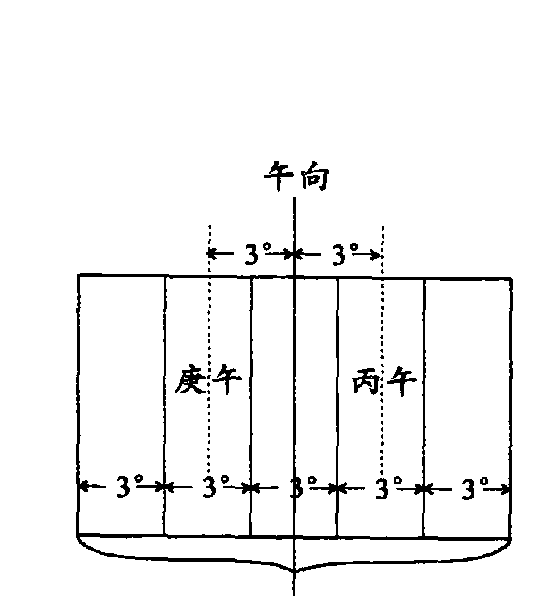

### 第二节 玄空理气论要

#### 一、到山到向和上山下水

在一至九运的飞星盘中，凡入中的运星称为“当令”运星。如“八运”，就是“八”入中再飞布九星，“八”就是当今运星。在排坐山盘时，当令运星飞到坐山，叫做“到山”；排向盘时，当令运星飞到向上，称为“到向”。凡是到山到向的挨星图，就是“旺山旺向”的吉祥之兆。

反之，在挨星图中，当令的山星飞到了向上；当令的向星又飞到了坐山，这就称为“上山下水”，这是不祥之兆，要损丁、失财。

不论阳宅或阴宅，立得旺山旺向，主财丁两旺。因为，山管人丁，水管财，旺山就是旺人丁，旺水即旺财。

但是坐山，要坐在高处，背靠高山或高物；向上必须要见水或见低洼之地。

无论阴宅或阳宅，均不能立上山下水之局，否则要损丁破财。

图3-2 是八运巳山亥向挨星图，“八”是当令的旺星。在坐山飞星盘上，

| 8 1 七 | 3 5 三 | 1 3 五 |
| :---: | :---: | :---: |
| 9 2 六 | 7 9 八 | 5 7 一 |
| 4 6 二 | 2 4 四 | 6 8 九 |

运星“8”，飞到了“巳”山，山星的位置；在向星飞星盘上，运星“8”，又飞了“亥”向，向星的位置。所以，无论阴宅或阳宅，在八运期间，立“巳山亥向”，都是当令运星“8”到山到向，即旺山旺向。既旺人丁又旺财。但是其堂局，必须是“巳山”背靠山或高大的建筑物；“亥向”方是低洼之地，最好能见到弯曲回环的水流。

又如八运戌山辰向（如图3—3），为上山下水局的飞星图例。

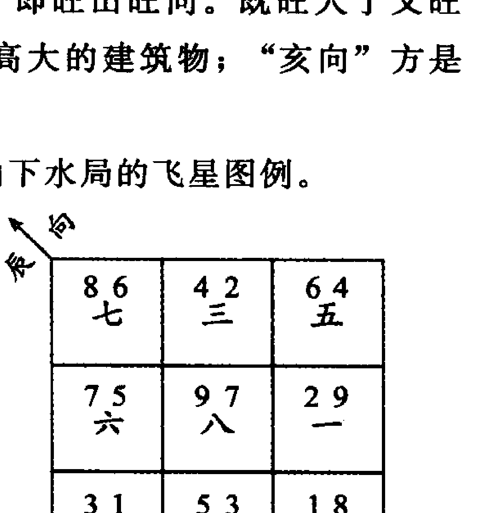

所谓上山下水，是指飞星盘中，坐盘旺星飞到了坐山的“向星”位；而向盘的旺星又飞到了向方的“坐山”位。前者叫“上山”；后者称“下水”。

因为，向上的当令旺星，要见低洼之地或见水不能见山，方能旺财。而八运戌山辰向的飞星图中，在坐山“戌”位的当令运星“8”，飞到了“向星”位，使“8”上了山。向星上山，主失财。

坐山的当令旺星，要见山不能见水，而八运戌山辰向的飞星图中，当令旺星“8”，飞到了“辰向”的坐星位，使“8”下水。坐星下水，主损丁。

由上可知，图3—3八运戌山辰向挨星图中，坐山的旺星8，飞到了向上的坐星位；而向上的旺星“8”，又飞到了坐山的向星位。犯了上山下水之错，主丁财两失。

在“上山下水”局中，如坐山后有水，或全局成“父母三般卦”，也是可用的。

#### 二、合十与父母三般卦

##### 1. 合十

在玄空挨星图中，每宫的天盘（运盘）数值与山向飞星数值之和为十，称为“合十”。

如图3—4，在八运未山丑向的挨星图中，九宫每宫的天盘（运星）数值与此宫的向星数值之和均等于“十”。

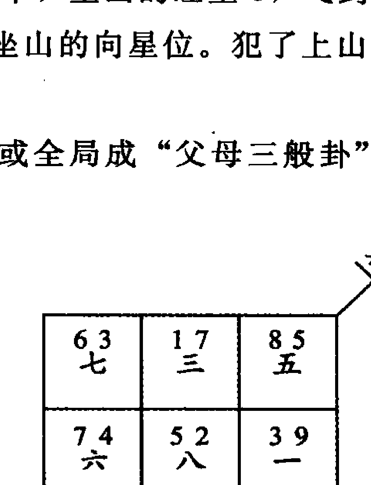

合十，能通中宫五的戊己之气，使万物生生不息。所以，合十的挨星图是吉祥之兆。

又如，七运癸山丁向的挨星图，每宫的天盘与山盘的飞星合十。所以，合十之说，是指玄空飞星图中，每宫的天盘（运盘）数值与该宫山星或向星的数值之和为十。

##### 2. 父母三般卦

在挨星图中，乾离震、兑坎巽三方，或九宫中的每宫均出现“一四七、二五八、三六九”的数字，就称为“父母三般卦”。父母三般卦的局面与合十局的吉祥程度相等。因为它能使三元九运之气相通，生生不已，从而能使上山下水，反吟伏吟之局均受卦气影响潜移默化而不为凶。如“艮山坤向，坤山艮向”的二、五、八运；“丑山未向，未山丑向”的四、六运；“寅山申向，申山寅向”的二、五、八运，均全局合成“父母三般卦”。

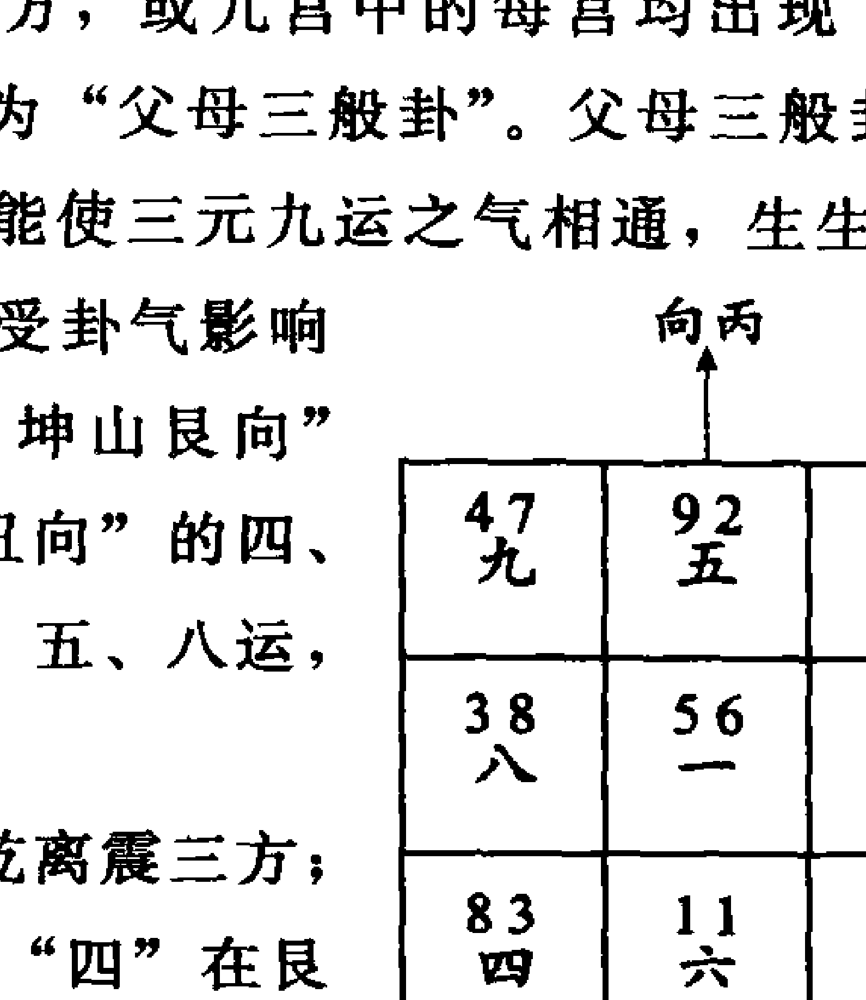

如一运运盘飞星图，二五八，在乾离震三方；三六九，在兑坎巽三方；“一”入中，“四”在艮宫，“七”在坤宫（如图3－5）。

图3－5 为一运壬山丙向挨星图，其运盘“一”入中顺飞九星则乾离震三方，挨得二五八；兑坎巽三方，挨得三六九；一在中宫，四落艮宫，七在坤位，形成一四七，父母三般卦。

图3－6 为八运艮山坤向挨星图，全局合成父母三般卦。图中，九宫的每一宫里，均由运星、山星和向星组成：一四七，二五八，三六九父母三般卦。可是当令运星“8”，本应在坐山艮宫的“坐星”位，却飞到了“向星”位；而向上令星“8”，本应飞到“向星”位，却飞到“坐星”位。它们的位置颠倒了，属于“上山下水”之局。但由于全盘系父母三般卦，故以吉论。

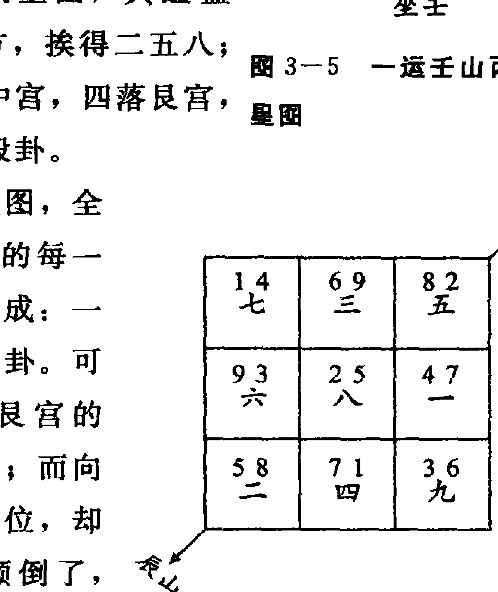

#### 三、起星用替以及父母子息相兼

当需要向线超过中线左右3度以外时，就是兼向了。应超出多少才恰当呢？

（一）凡天元龙四阳山兼人元龙四阳山，或人元龙四阳山兼天元龙四阳山，系纯阳山向，得兼至7度。

纯阳山向的天元、人元相兼，其挨星图一至九运共有八局：

- （1）坤山艮兼申山寅
- （2）寅山申兼艮山坤
- （3）艮山坤兼寅山申
- （4）申山寅兼坤山艮
- （5）巽山乾兼巳山亥
- （6）巳山亥兼巽山乾
- （7）乾山巽兼亥山巳
- （8）亥山巳兼乾山巽

（二）地元龙兼人元龙，或人元龙兼地元龙，均不得超过正向线5度，若兼线到6度，就以“出卦”论。出卦则凶，主进退维谷，夫妻失欢，兄弟不和，患神经病等。

此兼共十六局，它们是：

- （1）壬山丙兼亥巳
- （2）丙山壬兼巳亥
- （3）亥山巳兼壬丙
- （4）巳山亥兼丙壬
- （5）癸山丁兼丑未
- （6）丁山癸兼未丑
- （7）丑山未兼癸丁
- （8）未山丑兼丁癸
- （9）寅山申兼甲庚
- （10）申山寅兼庚甲
- （11）甲山庚兼寅申
- （12）庚山甲兼申寅
- （13）乙山辛兼辰戌
- （14）辛山乙兼戌辰
- （15）辰山戌兼乙辛
- （16）戌山辰兼辛乙

（三）凡天元龙兼地元龙，或地元龙兼天元龙，一至九运共十六局，此兼均不得超过正向线5度。若超过达到6度，就是“阴差阳错”。其凶象为：进退两难，权威不立，声名不振，是非蜂起，虚掷心力。此十六局为：

- （1）壬山丙兼午子
- （2）午山子兼丙壬
- （3）子山午兼壬丙
- （4）丙山壬兼午子
- （5）丑山未兼艮坤
- （6）艮山坤兼丑未
- （7）未山丑兼坤艮
- （8）坤山艮兼未丑
- （9）甲山庚兼卯酉
- （10）卯山酉兼甲庚
- （11）庚山甲兼酉卯
- （12）酉山卯兼庚甲
- （13）辰山戌兼巽乾
- （14）巽山乾兼辰戌
- （15）戌山辰兼乾巽
- （16）乾山巽兼戌辰

用替星重在向首，就是当令的运星要到向，否则就该到山。倘若有城门可用，旺星能飞到城门更吉。

##### （四）城门和城门诀

###### 1. 什么是城门？

向首两旁的两宫——五行生旺之方，有三叉水会聚，或有水的出入口照穴有情者，称为城门。若穴四面环山，独缺一口，也作城门方位。城门为穴内进气的关键。

###### 2. 城门为穴内进气的关键。

天元龙，人元龙之向，遇运星一三七九飞到向上邻宫；立地元龙向，遇运星二四六八飞到向上邻宫；而且此运星数正好属阴，则同一元的旺气就可以到城门。这就是城门诀。若此城门方有水，而又与向上的字，同为天元或人元或地元，则可发财发福。与旺山旺向有同样的力量。

例如：七运天元龙酉山卯向，巽艮两宫为城门。巽宫运盘六，六为乾宫的天元龙，“乾”为阳，6入中顺排，5到巽，“5”不是旺星，故不是城门。再看艮宫，该宫运盘为一，一为坎宫，此宫与酉山卯向天元龙对应的是“子”，属阴，1入中，逆排旺星7到艮宫，与该宫向星2，合“二七同道”的生成数。艮方有水，符合城门诀（如图3-7）。

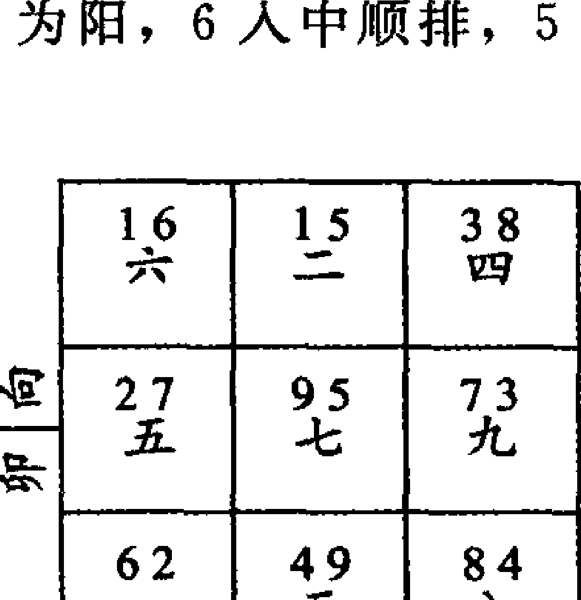

| 16 六 | 15 二 | 38 四 |
| :---: | :---: | :---: |
| 27 五 | 95 七 | 73 九 |
| 62 一 | 49 三 | 84 八 |

城门有正副之分，一般说来，正城门在向首的左边，副城门在右边。

凡符合城门诀，能合成“一六共宗，二七同道，三八为朋，四九为友”生成数的，为正城门；否则就是副城门。

现将三元九运可用的城门列成下表：

#### 三元九运可用的城门诀表

| 坐山 | 洛数 | 二十四山 | 洛数 | 二十四山 | 副城门 | 一运 | 二运 | 三运 | 四运 | 五运 | 六运 | 七运 | 八运 | 九运 |
| :---: | :---: | :---: | :---: | :---: | :---: | :---: | :---: | :---: | :---: | :---: | :---: | :---: | :---: | :---: |
| 丙 | 一 | 壬 | 六 | 子 | 戌 | 丑 | 戌丑 | 丑 | 戌丑 | 戊 | 戌丑 | 戊 | 戌 | 丑 |
| 午 | 二 | 癸 | 七 | 丑 | 亥 | 子 | 亥子 | 子 | 亥子 | 己 | 亥子 | 己 | 亥 | 子 |
| 丁 | 三 | 子 | 八 | 寅 | 子 | 丑 | 子丑 | 丑 | 子丑 | 庚 | 子丑 | 庚 | 子 | 丑 |
| 未 | 四 | 丑 | 九 | 卯 | 丑 | 寅 | 丑寅 | 寅 | 丑寅 | 辛 | 丑寅 | 辛 | 丑 | 寅 |
| 坤 | 五 | 寅 | 一 | 辰 | 寅 | 卯 | 寅卯 | 卯 | 寅卯 | 壬 | 寅卯 | 壬 | 寅 | 卯 |
| 申 | 六 | 卯 | 二 | 巳 | 卯 | 辰 | 卯辰 | 辰 | 卯辰 | 癸 | 卯辰 | 癸 | 卯 | 辰 |
| 庚 | 七 | 辰 | 三 | 午 | 辰 | 巳 | 辰巳 | 巳 | 辰巳 | 甲 | 辰巳 | 甲 | 辰 | 巳 |
| 酉 | 八 | 巳 | 四 | 未 | 巳 | 午 | 巳午 | 午 | 巳午 | 乙 | 巳午 | 乙 | 巳 | 午 |
| 辛 | 九 | 午 | 五 | 申 | 午 | 未 | 午未 | 未 | 午未 | 丙 | 午未 | 丙 | 午 | 未 |
| 戌 | 一 | 未 | 六 | 酉 | 未 | 申 | 未申 | 申 | 未申 | 丁 | 未申 | 丁 | 未 | 申 |
| 乾 | 二 | 申 | 七 | 戌 | 申 | 酉 | 申酉 | 酉 | 申酉 | 戊 | 申酉 | 戊 | 申 | 酉 |
| 亥 | 三 | 酉 | 八 | 亥 | 酉 | 戌 | 酉戌 | 戌 | 酉戌 | 己 | 酉戌 | 己 | 酉 | 戌 |
| 壬 | 四 | 戌 | 九 | 子 | 戌 | 亥 | 戌亥 | 亥 | 戌亥 | 庚 | 戌亥 | 庚 | 戌 | 亥 |
| 子 | 五 | 亥 | 一 | 丑 | 亥 | 子 | 亥子 | 子 | 亥子 | 辛 | 亥子 | 辛 | 亥 | 子 |
| 癸 | 六 | 子 | 二 | 寅 | 子 | 丑 | 子丑 | 丑 | 子丑 | 壬 | 子丑 | 壬 | 子 | 丑 |
| 丑 | 七 | 丑 | 三 | 卯 | 丑 | 寅 | 丑寅 | 寅 | 丑寅 | 癸 | 丑寅 | 癸 | 丑 | 寅 |
| 艮 | 八 | 寅 | 四 | 辰 | 寅 | 卯 | 寅卯 | 卯 | 寅卯 | 甲 | 寅卯 | 甲 | 寅 | 卯 |
| 寅 | 九 | 卯 | 五 | 巳 | 卯 | 辰 | 卯辰 | 辰 | 卯辰 | 乙 | 卯辰 | 乙 | 卯 | 辰 |
| 甲 | 一 | 辰 | 六 | 午 | 辰 | 巳 | 辰巳 | 巳 | 辰巳 | 丙 | 辰巳 | 丙 | 辰 | 巳 |
| 卯 | 二 | 巳 | 七 | 未 | 巳 | 午 | 巳午 | 午 | 巳午 | 丁 | 巳午 | 丁 | 巳 | 午 |
| 乙 | 三 | 午 | 八 | 申 | 午 | 未 | 午未 | 未 | 午未 | 戊 | 午未 | 戊 | 午 | 未 |
| 辰 | 四 | 未 | 九 | 酉 | 未 | 申 | 未申 | 申 | 未申 | 己 | 未申 | 己 | 未 | 申 |
| 巽 | 五 | 申 | 一 | 戌 | 申 | 酉 | 申酉 | 酉 | 申酉 | 庚 | 申酉 | 庚 | 申 | 酉 |
| 巳 | 六 | 酉 | 二 | 亥 | 酉 | 戌 | 酉戌 | 戌 | 酉戌 | 辛 | 酉戌 | 辛 | 酉 | 戌 |

（五）如水口飞到之星不是当令的旺星，而该星能与水口宫位的运星得生成合十之数，也以吉论（河图数理：天一生水，地六成之；地二生火，天七成之；天三生木，地八成之；地四生金，天九成之；天五生土，地十成之）。

（六）用替星，旺星虽到向，却向方无水。则前十年作正向论；后十年才作替星论。

（七）如果正兼二向没有替星可用，可将正向的飞星盘和兼向的飞星盘，合并在一个九宫格内，以观水路的吉凶。如八运“子山午向”兼“壬山丙向”，可将八运的子山午向挨星图和壬山丙向挨星图，两者合并在一起（如图3－8）。

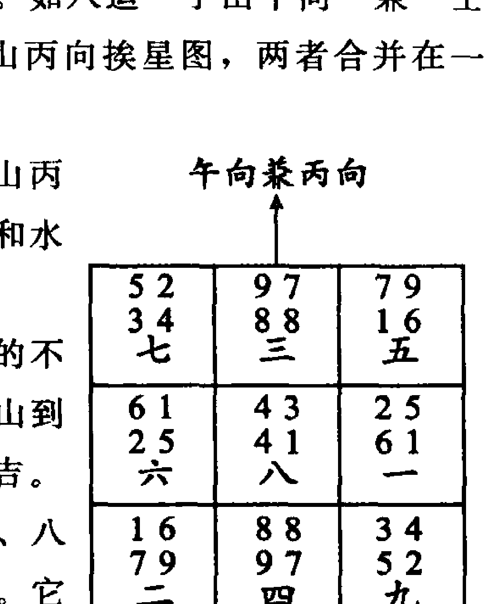

（八）若替卦与下卦的挨星图完全一样的不变，均作阴差阳错论，或出卦论，而不以到山到向论。因为没有变化就没有生息，此只凶无吉。如未山丑向的二、八运；丑山未向的五、八运；戌山辰向的三、七运；辰山戌向的五运。它们的下卦图与替卦图，其运星、山星和向星的数字完全是一样的。

（九）玄空飞星兼向替卦挨星图，能得旺山旺向的只有十六局。它们是：

- 1. 三运：
  - 子山午向兼壬山丙
  - 子山午向兼癸山丁
  - 午山子向兼丙山壬
  - 午山子向兼癸山丁
- 2. 四运：
  - 丁山癸兼午山子
  - 丁山癸兼未山丑
  - 癸山丁兼子山午
  - 癸山丁兼丑山未
- 3. 六运：
  - 丙山壬兼巳山亥
  - 丙山壬兼午山子
  - 壬山丙兼亥山巳
  - 壬山丙兼子山午
  - 丁山癸兼午山子
  - 丁山癸兼未山丑
  - 癸山丁兼子山午
  - 癸山丁兼丑山午

##### （十）关于父母子息相兼的规定

二十四山，分布于 360 度的圆周内，由后天八卦在罗盘中的方位，每卦管三山（如图 3-9）。

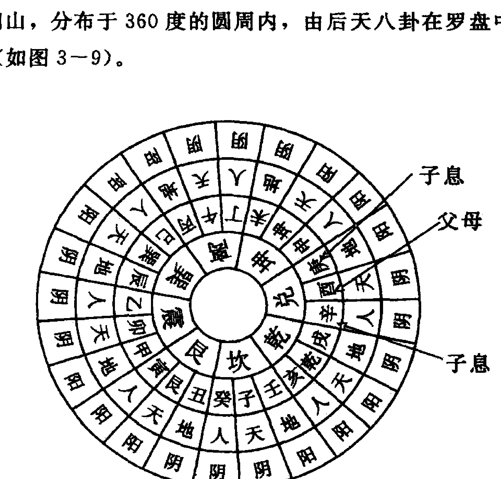

如图 3-9，后天八卦乾坎艮震巽离坤兑分布于四正四隅方，每卦管二十四山中的三山，每三山的中间一山为“父母”；其两旁的各一山为“子息”。如坎卦所管的“壬子癸”三山，“子”在中间为“父母”；“壬”和“癸”为“子息”，其余各卦可管的三山也然。

父母子息的相兼：子息不可兼父母，地元龙不可兼天元龙；天元龙与人元龙虽可兼，但也有父母之别。其具体方法是：

- （1）坎卦中的壬子癸，“子”为天元龙，属阴；“癸”为人元龙，也属阴，从子到癸，是顺时针方向行。“壬”为地元龙，属阳，从子到壬，是逆时针方向行。“兼”，父母只能兼顺子，而不能兼逆子。所以，父母“子”天元龙，只能兼顺子人元龙“癸”；不能兼逆子地元龙“壬”。
- （2）依据父母只能兼顺子，即天元龙可兼人元龙的规定，“子”可以兼癸；“午”可以兼丁；“卯”可以兼乙；“酉”可以兼辛；“乾”可以兼亥；“坤”可以兼申；“艮”可以兼寅；“巽”可以兼巳。而不可以相反，即，“癸”不可以去兼子；“丁”不可以兼午；“乙”不可以兼卯；“辛”不可以兼酉；“亥”不可以兼乾；“申”不可以兼坤；“寅”不可以兼艮；“巳”不可以兼巽。因为只能父母兼子息；子息不可以兼父母。
- （3）辰戌丑未地元龙，不可与人元龙混为相兼，即，“辰”不可与“乙”相兼，因“辰”属巽卦管；而“乙”属震卦管，兼则出卦。“戌”不能与辛相兼；“丑”不能与癸相兼；“未”不可与丁相兼，兼则出卦，出卦为凶。
- （4）辰戌丑未的山向，若在乾坤艮巽的方向有来去水，则可兼用。因乾坤艮巽为辰戌丑未的父母，又在同一卦内，阴阳相兼为夫妇相配。
- （5）乾坤艮巽为四隅方的天元龙，它们除自身为二十四山中的一卦之外，又各自统管着两旁的地元龙和人元龙，故它们可兼地元龙和人元龙；而子午卯酉为四正方的天元龙，它们不可兼甲庚丙壬，因父母不可兼逆子。

###### （6）关于出卦兼向的问题

地卦虽出，天卦不出，兼后为吉不凶。但所兼的卦，必须按“各运天元、人元、地元三般卦”，排演挨星图，而且兼后旺星一定要到向，否则不可兼（如图3-10）。

图3-10，为亥壬兼巳丙的替卦挨星图。其中：

| 32<br>一 | 76<br>六 | 54<br>八 |
| :---: | :---: | :---: |
| 43<br>九 | 21<br>二 | 98<br>四 |
| 87<br>五 | 65<br>七 | 19<br>三 |

图3-10 亥巳兼壬丙挨星图

- （1）“巳”属巽卦，为人元向；“丙”属离卦，系地元向。巳兼丙向，则离卦统管下的地元丙，到了巽卦所管的范围之中，故为出卦之向。
- （2）巳向挨星图，在二运时，运星“一”到向。“一”为坎宫，与“巳”向人元龙对应的是“癸”。癸为阴，所以，“1”入中逆飞，“2”到向，巳上得到旺气。但巳兼“丙”，又同在二运，玄空流行之气如何呢？要看“丙”向是否飞到旺星“2”，倘能飞到旺能“2”，丙方又有水，为丙方之水照穴有情，这种出卦就可以兼。若丙方没有十分有情之水照穴，还是作正向好。不要兼。

##### 注：各运天元、人元、地元三般卦的划分：

- 一四七运：一为天元，四为人元，七为地元；
- 二五八运：二为天元，五为人元，八为地元；
- 三六九运：三为天元，六为人元，九为地元。

- （3）在离卦管辖之下，属地元；在二运，地元为“八”，其运盘飞星应以“8”入中顺飞九星，向上挨星为“七”，七为兑卦，该卦所管的“庚## 四、七星打劫

##### （一）什么是七星打劫？

七星打劫，又称北斗七星打劫，就是指当今运星必须到向；离宫与中宫间，或坎宫与中宫间的飞星能合成“一六共宗，二七同道，三八为朋，四九为友”的生成数；乾、离、震三方的飞星，能合成“一四七、二五八、三六九”父母三般卦。能达到此三条要求者，就称为“七星打劫”。

七星打劫中的“七星”，是指“一四七、二五八、三六九”相邻两数间，逆数相隔七位数，如“一四七”，从一到四逆数，即一九八七六五四，相隔七位；从四到七逆数，即四三二一九八七，又是相隔七位数。“二五八、三六九”均如此逆数，则均隔七位。

七星打劫法，是父母三般卦的精髓。图3－11，为七运壬山丙向的挨星图，就是七星打劫之局。图中离宫向星“7”与中宫向星“2”，成“二七同道”的生成数；乾、离、震三宫形成“一四七”父母三般卦；当令旺星“7”双到向。完全符合“七星打劫”的三条要求。此局可上元劫得中元之气，中元劫得下元之气，下葬可发福悠久。

| 23 六 | 77 二 | 95 四 |
| 14 五 | 32 七 | 59 九 |
| 68 一 | 86 三 | 41 八 |

图3－11 七运壬山丙向挨星图

##### （二）七星打劫有真假之别

凡当令运星到向，乾、离、震三方的飞星能合成父母三般卦，离宫与中宫，或坎宫与中宫的飞星间，能合成“一六共宗，二七同道，三八为朋，四九为友”之局者，为真打劫。

若旺星到向，兑、坎、巽三方合成“父母三般卦者”，为假打劫。

##### （三）父母三般卦与三般卦的区别

1. 父母三般卦经过四位数起父母，如，一四七、二五八、三六九相邻，两数顺数均相隔四位数，即从一到四顺数为：一二三四；从四到七顺数为：四五六七，均隔四位数，其余的二五八，三六九，均是如此。
2. 三般卦是指每运的生旺之气，如一二三，二三四，三四五，四五六，五六七，六七八，七八九，八九一，九一二等。

### （四）七星真打劫，在三元九运中共有二十三局可用，具体列表于下：

#### 上元一运

地元辰山戌向

| 83 九 | 47 五 | 65 七 |
|-------|-------|-------|
| 74 八 | 92 一 | 29 三 |
| 38 四 | 56 六 | 11 二 |

地元庚山甲向

| 29 九 | 74 五 | 92 七 |
|-------|-------|-------|
| 11 八 | 38 一 | 56 三 |
| 65 四 | 83 六 | 47 二 |

天元子山午向

| 56 九 | 11 五 | 38 七 |
|-------|-------|-------|
| 47 八 | 65 一 | 83 三 |
| 92 四 | 29 六 | 74 二 |

人元癸山丁向

| 56 九 | 11 五 | 38 七 |
|-------|-------|-------|
| 47 八 | 65 一 | 83 三 |
| 92 四 | 29 六 | 74 二 |

#### 上元二运

地元壬山丙向

| 67 一 | 22 六 | 49 八 |
| 58 九 | 76 二 | 94 四 |
| 13 五 | 31 七 | 85 三 |

地元壬山丙向

| 31 一 | 85 六 | 13 八 |
| 22 九 | 49 二 | 67 四 |
| 76 五 | 94 七 | 58 三 |

天元酉山卯向

| 31 一 | 85 六 | 13 八 |
| 22 九 | 49 二 | 67 四 |
| 76 五 | 94 七 | 58 三 |

人元辛山乙向

#### 上元三运

天元子山午向

| 78 二 | 33 七 | 51 九 |
| 69 一 | 87 三 | 15 五 |
| 24 六 | 42 八 | 96 四 |

人元癸山丁向

| 78 二 | 33 七 | 51 九 |
| 69 一 | 87 三 | 15 五 |
| 24 六 | 42 八 | 96 四 |

## 中国风水学初探

#### 中元四运

地元辰山戌向

| 巽 |    | 禄 |
|---|---|---|
| 26 三 | 71 八 | 98 一 |
| 17 二 | 35 四 | 53 六 |
| 62 七 | 89 九 | 44 五 |
|    |    | 乾 |

地元壬山丙向

|    | 丙向 |    |
|---|---|---|
| 89 三 | 44 八 | 62 一 |
| 71 二 | 98 四 | 26 六 |
| 35 七 | 53 九 | 17 五 |
|    | 壬山 |    |

#### 中元六运

天元子山午向

|    | 午向 |    |
|---|---|---|
| 12 五 | 66 一 | 84 三 |
| 93 四 | 21 六 | 48 八 |
| 57 九 | 75 二 | 39 七 |
|    | 子山 |    |

天元巽山乾向

| 巽 |    | 乾 |
|---|---|---|
| 48 五 | 93 一 | 21 三 |
| 39 四 | 57 六 | 75 八 |
| 84 九 | 12 二 | 66 七 |
|    |    | 乾 |

人元巳山亥向

| 巳 |    | 亥 |
|---|---|---|
| 48 五 | 93 一 | 21 三 |
| 39 四 | 57 六 | 75 八 |
| 84 九 | 12 二 | 66 七 |
|    |    | 亥 |

人元癸山丁向

|    | 丁向 |    |
|---|---|---|
| 12 五 | 66 一 | 84 三 |
| 93 四 | 21 六 | 48 八 |
| 57 九 | 75 二 | 39 七 |
|    | 癸山 |    |

#### 下元七运

地元壬山丙向

| 23 六 | 77 二 | 95 四 |
| 14 五 | 32 七 | 59 九 |
| 68 一 | 86 三 | 41 八 |

#### 下元八运

天元子山午向

| 34 七 | 88 三 | 16 五 |
| 25 六 | 43 八 | 61 一 |
| 79 二 | 97 四 | 52 九 |

地元庚山甲向

| 97 七 | 52 三 | 79 五 |
| 88 六 | 16 八 | 34 一 |
| 43 二 | 61 四 | 25 九 |

人元癸山丁向

| 34 七 | 88 三 | 16 五 |
| 25 六 | 43 八 | 61 一 |
| 79 二 | 97 四 | 52 九 |

#### 下元九运

天元酉山卯向

| 18八 | 63四 | 81六 |
|------|------|------|
| 99七 | 27九 | 45二 |
| 54三 | 72五 | 36一 |

天元巽山乾向

| 72八 | 36四 | 54六 |
|------|------|------|
| 63七 | 81九 | 18二 |
| 27三 | 45五 | 99一 |

人元巳山亥向

| 72八 | 36四 | 54六 |
|------|------|------|
| 63七 | 81九 | 18二 |
| 27三 | 45五 | 99一 |

人元辛山乙向

| 18八 | 63四 | 81六 |
|------|------|------|
| 99七 | 27九 | 45二 |
| 54三 | 72五 | 36一 |

注：九运地元“壬山丙向”，也是“七星打劫”局，但它系“伏吟”（山星与洛书元旦盘字字相同），故不可用，所以该挨星图没有绘入本书；六运天元巽山乾向、人元巳山亥向的挨星图，其山星与元旦盘字字相同，也犯“伏吟”，不能用。

#### 五、三星五吉

##### （一）什么是三星五吉？

所谓三星是指：上元一二三；中元四五六；下元七八九。

五吉是指：上元一二三兼取八辅、九弼；中元四五六兼取一贪狼、二巨门；下元七八九兼取一贪狼、六武曲。

##### （二）三星五吉运用方法

运用三星五吉时，要与山向及运程配合活用。如七运，取六八为宜；九运，取一贪狼、八辅较妥。向上还应该有本元的三吉五吉水；山上有三吉五吉山。如果没有这些条件，用了也没效果。

#### 六、主运星和佐运星

##### （一）什么是主运星和佐运星？

所谓主运星，就是在上中下各元中，最重要的主事的一颗星；佐运星为辅佐主运星的一颗星。现将其列表如下：

| 三元 | 主运星 | 佐运星 | 注 |
|---|---|---|---|
| 上元 | 一白 | 八白 | 上元兼辅 |
| 中元 | 六白 | 一白 | 中元兼贫 |
| 下元 | 八白 | 一白 | 下元兼贫 |

##### （二）对主、佐运星相关事项的说明

1. 当令向星方，为聚水所宗，故宜旺水来朝，或有之玄曲折水而去；辅佐星的方位，也必须有一支纯正清澈的水汇聚到明堂，或该方位。
2. 要使向方来去之水，与山向同元，一卦纯清，即天、人、地元向，要用天、人、地元之水。如“子山午向”，“午向”属天元，须用“巽、坤”两方的来去水，因“巽、坤”也属天元，乾艮，子午卯酉方之水，都是天元水。用了，就达到了同元，一卦纯清的要求。因此，辅佐水，也必须位于同元的一方。否则就是驳杂不吉。
3. 主运佐运最好用三吉，其法如下表：

### 主运佐运三吉表

| 运程 | 主运旺星 | 辅佐运星 | 运程 | 主运旺星 | 辅佐运星 |
|---|---|---|---|---|---|
| 一运 | 贪狼一 | 巨门二，禄存三 | 六运 | 武曲六 | 破军七，进气 |
| 二运 | 巨门二 | 禄存三，文曲四 | 七运 | 破军七 | 辅八，弼九，文曲四 |
| 三运 | 禄存三 | 文曲四，进气 | 八运 | 辅星八 | 右弼九，文曲四 |
| 四运 | 文曲四 | 廉贞五，武曲六，相 | 九运 | 弼星九 | 贪狼一，进气 |
| 五运 | 廉贞五 | 武曲六，相 | | | |

#### 七、反吟伏吟

##### (一) 什么是反吟伏吟

凡是山星、向星飞星时，“5”入中宫，顺飞九星，则字字与洛书元旦盘相同，就称为“伏吟”；“5”入中宫逆飞九星，则字字与洛书元旦盘相对峙（相反），就叫做“反吟”。现举例说明如下：

1. 八运艮山坤向的飞星图

图 3—12，八运艮山坤向的挨星图中，每宫的右上角向星数字，均与该宫洛书元旦盘（又称地盘）数字相同，所以，八运艮山坤向犯了“伏吟”。

2. 八运坤山艮向的飞星图

图 3—13，八运坤山艮向的挨星图中，每宫左上角的山星数字，均与该宫洛书元旦盘的数字相同，所以，八运坤山艮向也犯了“伏吟”。

3. 四运巳山亥向的飞星图

| 46 三 | 81 八 | 68 一 |
| 57 二 | 35 四 | 13 六 |
| 92 七 | 79 九 | 24 五 |

| 4 | 9 | 2 |
| 3 | 5 | 7 |
| 8 | 1 | 6 |

图 3-14 四运巳山亥向挨星图

图 3-14，四运巳山亥向的挨星图中，向上飞星“5”入中，逆行飞布九星，结果各宫向上飞星的数字，均是洛书元旦盘对宫的数字。如乾宫向上是飞星为“4”，恰是对宫巽位的元旦盘数；而巽宫向上为“6”，又恰是其对宫乾位的元旦盘数。除中五外，其余各宫均如此。所以，四运巳山亥向犯了“反吟”。

反吟的另一种说法，就是各宫向上飞星数与本宫元旦盘数相冲。在图 3-14 中，乾宫向飞星为“4”，4 为巽宫与乾宫方向相对，巽 4 属木，乾 6 属金，金克木，两者方向相对又相克，所以相冲。其余各宫均如此。

##### （二）反吟不一定都作祸

图 3-15 为一运子山午向挨星图。图中全盘反吟，即向上飞星数与洛书元旦盘相冲，但当运令星“1”双到向，此为“一贵当权，诸凶咸服”；坤宫“8”飞到向上，此为八白辅星，虽反吟，但只要该方有明堂水口，照样可以发福悠久；兑宫向上飞星是“三碧”，但为将来稍远的生气，只要有小水也会吉利。

| 56 九 | 11 五 | 38 七 |
| 47 八 | 65 一 | 83 三 |
| 92 四 | 29 六 | 74 二 |

图 3-15 一运子山午向挨星图

山向飞星凡是“5”入中宫逆行，都会形成“反吟”的格局，其当运令星无一不到山向，此虽为“穿心煞”，但只要当令运星到山到向，也可不忌。

广义的“伏吟”，不仅表现在山向飞星与洛书元旦盘字字相同，还表现在与运盘（又称天盘）飞星字字相同和与兼向的八纯卦相同，如七运卯山西向挨星图（如图 3-16）。

图 3－16，为七运卯山西向飞星图。运盘飞星九到兑宫。以“九”入中逆行，“7”到兑宫向上，当令运星到向，该向上宜见到水。“8”飞到乾宫的向上，而该宫运星也是“八”，这就使向上飞星“8”，遇到了运盘飞星“八”，所以乾宫方为“伏吟”方。当此方得令时，如八运，反能致福；一旦失令，如到了九运，则必致灾祸。

| 6 六 | 1 五 | 8 四 |
|---|---|---|
| 7 五 | 5 七 | 3 九 |
| 2 一 | 9 三 | 4 八 |

图 3—16 七运卯山西向挨星图

反吟伏吟的祸害，较上山下水更为凶狠，犯此有可能招致家破人亡。

### （三）反吟伏吟共有十二山向，具体列表于下：

一运壬山丙向、丙山壬向。双一到山

| 7 九 | 2 五 | 9 七 |
|---|---|---|
| 8 八 | 6 一 | 4 三 |
| 3 四 | 1 六 | 5 二 |

| 4 九 | 9 五 | 2 七 |
|---|---|---|
| 3 八 | 5 一 | 7 三 |
| 8 四 | 1 六 | 6 二 |

九运壬山丙向、丙山壬向。双九到向

| 4 八 | 9 四 | 2 六 |
|---|---|---|
| 3 七 | 5 九 | 7 二 |
| 8 三 | 1 五 | 6 一 |

| 5 八 | 9 四 | 7 六 |
|---|---|---|
| 6 七 | 4 九 | 2 二 |
| 1 三 | 8 五 | 3 一 |

二运，艮山坤向、坤山艮向；寅山申向，申山寅向（2、8 到山到向）

| 47 一 | 93 六 | 25 八 |
| 36 九 | 58 二 | 71 四 |
| 82 五 | 14 七 | 69 三 |

| 74 一 | 39 六 | 52 八 |
| 63 九 | 85 二 | 17 四 |
| 28 五 | 41 七 | 96 三 |

| 47 一 | 93 六 | 25 八 |
| 36 九 | 58 二 | 71 四 |
| 82 五 | 14 七 | 69 三 |

| 74 一 | 39 六 | 52 八 |
| 63 九 | 85 二 | 17 四 |
| 28 五 | 41 七 | 96 三 |

八运，艮山坤向、坤山艮向；寅山申向，申山寅向（2、8 到山到向）

| 47 一 | 93 六 | 25 八 |
| 36 九 | 58 二 | 71 四 |
| 82 五 | 14 七 | 69 三 |

| 74 一 | 39 六 | 52 八 |
| 63 九 | 85 二 | 17 四 |
| 28 五 | 41 七 | 96 三 |

| 47 一 | 93 六 | 25 八 |
| 36 九 | 58 二 | 71 四 |
| 82 五 | 14 七 | 69 三 |

| 74 一 | 39 六 | 52 八 |
| 63 九 | 85 二 | 17 四 |
| 28 五 | 41 七 | 96 三 |

三运，甲山庚向、庚山甲向（3、7 到向到山）

| 94一 | 59七 | 72九 |
| 83一 | 15三 | 37五 |
| 48六 | 61八 | 26四 |

| 49三 | 95七 | 27九 |
| 38一 | 51三 | 73五 |
| 84六 | 16八 | 62四 |

七运，甲山庚向、庚山甲向（3、7 到山到向）

| 48六 | 94一 | 26四 |
| 37五 | 59七 | 72九 |
| 83一 | 15三 | 61八 |

| 84六 | 49三 | 62四 |
| 73五 | 95七 | 27九 |
| 38一 | 57三 | 16八 |

四运，巽山乾向，乾山巽向；巳山亥向，亥山巳向

| 44三 | 89八 | 62一 |
| 53二 | 35四 | 17六 |
| 98七 | 71九 | 26五 |

| 44三 | 98八 | 26一 |
| 35二 | 53四 | 71六 |
| 89七 | 17九 | 62五 |

| 44三 | 89八 | 62一 |
| 53二 | 35四 | 17六 |
| 98七 | 71九 | 26五 |

| 44三 | 98八 | 26一 |
| 35二 | 53四 | 71六 |
| 89七 | 17九 | 62五 |

巽山乾向，巳山亥向，双“4”到山；乾山巽向，亥山巳向，双“4”到向。

六运，巽山乾向，乾山巽向；巳山亥向，亥山巳向

表格（巽山乾向）

| 巽 | 离 | 坤 |
|---|---|---|
| 48 五 | 93 一 | 21 三 |
| 震 | 中 | 兑 |
| 39 四 | 57 六 | 75 八 |
| 艮 | 坎 | 乾 |
| 84 九 | 12 二 | 66 七 |

表格（乾山巽向）

| 乾 | 坎 | 艮 |
|---|---|---|
| 84 五 | 39 一 | 12 三 |
| 兑 | 中 | 震 |
| 93 四 | 75 六 | 57 八 |
| 坤 | 离 | 巽 |
| 48 九 | 21 二 | 66 七 |

表格（巳山亥向）

| 巳 | 丙 | 未 |
|---|---|---|
| 48 五 | 93 一 | 21 三 |
| 乙 | 中 | 辛 |
| 39 四 | 57 六 | 75 八 |
| 丑 | 壬 | 亥 |
| 84 九 | 12 二 | 66 七 |

表格（亥山巳向）

| 亥 | 壬 | 丑 |
|---|---|---|
| 84 五 | 39 一 | 12 三 |
| 辛 | 中 | 乙 |
| 93 四 | 75 六 | 57 八 |
| 未 | 丙 | 巳 |
| 48 九 | 21 二 | 66 七 |

六运，巽山乾向、巳山亥向，双“6”到向；乾山巽向，亥山巳向双“6”到山。

五运，艮山坤向、坤山艮向；寅山申向、申山寅向

表格（艮山坤向）

| 艮 | 寅 | 甲 |
|---|---|---|
| 71 四 | 36 九 | 58 二 |
| 丑 | 中 | 卯 |
| 69 三 | 82 五 | 14 七 |
| 癸 | 子 | 子 |
| 25 八 | 47 一 | 93 六 |

表格（坤山艮向）

| 坤 | 申 | 庚 |
|---|---|---|
| 17 四 | 63 九 | 85 二 |
| 未 | 中 | 酉 |
| 96 三 | 28 五 | 41 七 |
| 丁 | 午 | 午 |
| 52 八 | 74 一 | 39 六 |

##### （四）反吟伏吟制化的方法
- 1. 全局合成三般卦者，可化凶为吉，确保平安。如二八运，艮坤、坤艮；寅申，申寅，均全局合成三般卦。
- 2. 旺方有水，衰方见实，也可制化。反伏吟为害最凶的是向首方，只要旺方有水，衰方为实，就可不使犯凶。
  (1) 如遇山星犯伏吟，只要该方山形方圆有情，就以吉论；如果山形探头斜窜则凶。
  (2) 如遇向星犯伏吟，只要该方有圆静的水，或空气流通不闭塞，就以吉论；如果有直冲斜射的水，或不通空气，就以凶论。
- 3. 可用替卦变星，如果以此还不能改变凶局的话，就可以等待良辰吉时下葬。
- 4. 山向挨星，如果与其线位覆盖下罗盘上的先天八卦的卦数，即坤一，巽二，离三，兑四，艮六，坎七，震八，乾九，成伏吟局时，避开化解以及六十甲子纳音论生克的方法。

现举例说明如下：八运巳山亥向挨星图（如图 3－17）。

图 3－17，为巳山亥向挨星图，坐山宫内的山星为“8”；向星为“1”。将此二星组合成六十四卦之一的“水山蹇”卦（☵/☶）（向星“1”为上卦；山星“8”为下卦）。

为了说明问题的方便，在此先说明八纯卦，即“乾坤坎离，震巽艮兑”阴阳卦划分的方法。依据先天八卦配洛书的方位，乾坤坎离四正方位为阳；震巽艮兑四隅方位为阴。

图3－17 八运巳山亥向挨星图

水山蹇卦，由上坎下艮卦组合而成。坎为阳卦，艮为阴卦。即水山蹇，由阳卦坎及阴卦艮组合成的。

由一阴一阳合成六十四卦之一的卦上下卦数，要逆排为“上卦数左，下卦数在右”，即坐山巳方宫位的“81”，要排成“18”。这样排的目的，是为了与坐山方位线位覆盖下罗盘上的先天卦数对照。是否犯伏吟？

倘若坐山与立向宫位的山向飞星所配的卦数，与其方位覆盖线下，罗盘上先天卦数的上下卦数相同，就犯了伏吟。

“巳山”线位上的分金为“辛巳”，其先天卦数为“六艮”，“九乾”，两者组合成六十四卦之一的卦为“山天大畜”（䷙）。上艮为阴卦，下乾为阳卦。又是一阴一阳的组合，故应逆排“86”。

“86”与“18”比较，左右两边，数字不相同，即左边是“18”，右边是“86”，不犯伏吟。

我们再看向上宫位的山星和向星。

亥向方宫位的山向飞星是“68”。8艮为上卦，6乾为下卦，两纯卦上下重叠为“山天大畜”（䷙）。艮为阴，乾为阳，阴阳组合为逆排为“86”。

亥向分金为“丁亥”，其线位覆盖下之先天卦数为“四兑一坤”，即“泽地萃”（䷬）卦。兑为阴，坤为阳，又是一阴一阳组合，逆排为“72”。

“72”与“86”比较，同方向没有相同的数字，也不犯伏吟。

在此要说明两点：
- 1. 顺排或逆排的规定是：一上下卦均为阳卦，或阴卦时，应顺排，即上卦数在右，下卦数在左；上下卦由一阳卦和一阴卦组合时，应逆排，即上卦左，下卦在右。
- 2. 先天八卦的卦数和后天八卦数的应用问题：在罗盘上刻划的卦气数，如“八三四九，一六七二”为先天八卦配洛书的卦数，即一坤，二巽，三离，四兑，六艮，七坎，八震，九乾。
  当在飞星图的各宫位由山向两星组合成六十四卦之一卦时，一律用后天八卦配洛书的数字，即一坎，二坤，三震，四巽，六乾，七兑，八艮，九离。
  在罗盘上用先天八卦的卦数查出山向分金线上的六十四卦之一，与山星向星所配之卦作卦数的比较时，也要用后天八卦配洛书的卦数，而不用罗盘的先天八卦的卦气数。
  这些都是风水先师们的规定。

## 六十甲子纳音的用法
以坐山和立向线位分金，所覆盖下的干支的纳音五行，与坐山和立向宫位上的山向飞星数字在洛书上的方位五行论生克制化关系。

图3-17，巳山坐下分金覆盖下的干支为“辛巳”，纳音五行属金，坐山宫位山向飞星为“81”。

“1”在洛书中为北方坎位，属水；“辛巳”金生坎卦“水”；“8”在洛书中，为东北方的“艮”，属土；艮土生“辛巳”金。

亥向方的宫位，山向飞星为“68”，其线位分金为“丁亥”，纳音的五行属土。

“8”在洛书的东北方艮位，属土，与“丁亥”比和；
“6”在洛书的西北方乾位，属金，与“丁亥”土的关系为“土生金”。

## 5. 四运申山寅向
图3-18，为四运申山寅向飞星图。坐山方坤宫的山向飞星为“41”，其中向星“1”，在洛书的坎卦位，属水；“4”为山星，在洛书的“巽”卦位属木，坎属阳，巽属阴，系阴阳组合，应逆排，即“1”在左；“4”在右，形成“14”格局 [“41”配成六十四卦中的“水风井”（�井）卦]。

| 28三 | 63八 | 41一 |
| 39二 | 17四 | 86六 |
| 74七 | 52九 | 96五 |

图3-18 四运申山寅向挨星图

坐山分金在“丙申”线位上，其线覆盖下的是“火水未济”（䷿）卦。其中“9”是八纯卦中的“离”卦；“1”是坎卦。离与坎均属阳，故顺排为“19”。

“19”与“14”对照，左边均是“1”，故此坐山犯了伏吟。

## 分金线修改的方法
火水未济卦的上卦为“9”，其分金线为“丙申”火。这是应该立的线位。

六十四卦的每一卦，均由“初爻、二爻、三爻、四爻、五爻、上爻”组成。其中“一、二、三爻”为下卦（内卦）；四、五、六爻为上卦（外卦）。可见“火水未济卦”的上卦包括：四、五、六三爻。这三爻，已在“丙申”火之内。如果往右移位，就到了“甲申”水的线位了。为了保持“丙申”火的线位，应将坐山分金左移到“未济”卦（9）的四爻线位上。

这样，分金线既在“火水未济”的上卦（9）中，又没离开“丙申”火的线位上。

向首“艮”宫的山向飞星为“74”，“4”为巽卦，“7”是兑卦，4、7重叠为“风泽中孚”（䷼）卦。巽、兑均属阴，故顺排为“74”。

向首分金线位是“庚寅”，属木。其分金线下覆盖的是“水火既济”（䷾）卦，坎、离均属阳，故顺排为“91”。

“91”与“74”相对照不犯反伏吟。

## 6. 一运子山午向
图3-19，是一运子山午向的挨星图。子山坎宫山星“2”，向星“9”，9为离火，2是坤地，两卦重叠为“火地晋”（䷢）。离、坤均属阳卦，故它们的卦数应顺排为“29”。

| | 56 九 | 11 五 | 38 七 |
|---|---|---|---|
| 47 八 | 65 一 | 83 三 |
| 92 四 | 29 六 | 74 二 |

坐山分金线位是“丙子”水，其线位覆盖下的是六十四卦中的坤卦。坎宫山星“2”是坤；坐山分金线位下所覆盖的罗盘上也是坤。这就成了“山星”坤与坐山罗盘上的坤相见形成“伏吟”局（或者说“坐山”山向飞星组成的“火地晋”卦的内卦坤，与所坐之罗盘上的坤相见，形成伏吟局）。

避开的方法：因为“火地晋”的内卦是坤。“29”又是顺排的，所以在罗盘上水平排布的坤卦内三爻与晋卦的“2 坤”相见；而“9 离”与罗盘上坤卦的外三爻相见。因此，在坐山分金线位上只要向“壬”的方向右移在坤卦的外三爻上，就避开“伏吟”的局面了。

坐山分金线位是丙子水，山向飞星为“29”，2 坤属土，9 离为火，上下卦相生，其余各运山向均可这样比较使用。

## 7. 检查反伏吟的图例
图3-20，是三运子山午向兼壬山丙向的飞星图。其下方是检查该山向是否犯有反伏吟的图形。

坐山子壬其坎宫山向飞星为“32”，“2”为坤为地；“3”为震为雷。向星2为上卦，山星3是下卦，上下组合为“地雷复”（䷗）卦。坤为阳，震为阴，故逆排为“23”。这是后天八卦。

分金线位是“甲子金”，其坐山罗盘上的先天卦位是“山地剥”（䷖），艮8为阴，坤2为阳，故逆排为“82”相比，不犯伏吟。

向首分金为庚午土，罗盘线位是先天八卦的“泽天夬”（䷪）卦。乾阳兑阴逆排为“76”。

| | 午 丙 | |
|---|---|---|
| 68 二 | 23 七 | 41 九 |
| 59 一 | 77 三 | 95 五 |
| 14 六 | 32 八 | 86 四 |
| 子 壬 | | |

向首飞星为“23”，配卦为“雷地豫”（䷏）卦。3震为雷为阴；2坤为地为阳。阴阳相配逆排为“32”。

“76”与“32”比较也不犯伏吟。

#### 八、令星入囚以及地运的长短
##### （一）令星入中，称为“令星入囚”。
如八运巳山亥向，运星“九”到向，至九紫运时，“九”入中飞星排盘，这时八运巳山亥向的令星，就被囚住了（如图 3－21、3－22）。

阴阳二宅逢囚期为运气不佳。但也有囚得住和囚不住的区别。
- 1. 若在九紫方（因被囚的向上运星是“九”，故称“九紫方”）的阳宅有门路；阴宅有水，则囚不住（其他被囚之星，均仿此推论）。
- 2. 五黄运入中也囚不住。因五黄为中土，为至尊的皇极，所以囚不住。
- 3. 双星到向，坐山宫内的向星数入囚时，只要坐后方有水，也是囚不住的。

##### （二）地运的长短要依据向星入囚后所经历的运程和长短来决定。
- 1. 凡到山到向的勾搭小地，称为“小三元”，其运程的长短，在向方求出。如：
  辰山戌向，一运、三运、五运、七运，以及巽山乾、巳山亥向的二运、八运，虽均系旺山旺向，但各自的运程都只有二十年。其原因就是它们向上的运星，到下一运时，就都入囚了。
  乾山巽向，亥山巳向，戌山辰向的三运、五运、七运，其运程则可达一百六十年。其原因就在于它们的向上运星，要经过八个二十年后，才又入中飞布九星。如，亥山巳向的三运，要经过四、五、六、七、八、九、一、二运，八个运程后，到下一个“三运”时，“三”才入中作为运星飞布九星。其他运程的原因皆如此例。
  卯山酉向、乙山辛向的三运、五运、七运；甲山庚向的四运、六运，均旺山旺向，但运程也只四十年。如卯山酉向、乙山辛向的三运，到五运时，“3”就作为山星入中飞布九星。其余各运皆如此。
  坤山艮向、申山寅向的四运、六运；未山丑向的二运、五运、八运，均旺山旺向，运程为六十年。
  艮山坤向、寅山申向的四运、六运以及丑山未向的二运、五运、八运，其运程则为一百二十年。
  子山午向，癸山丁向的五运，皆旺，运程八十年。
  午山子向，丁山癸向的五运，运程为一百年。
  这些运程计算的方法，均是从本运的下一运起算，直到它的向上运星作为其运星入中飞布九星时截止。
  这些都是勾搭小地的小三元年运的大致情况。

- 2. 大三元的地运
  倘若中吉的地域，八国城门在向方的左右宫到齐，运程可达一百八十年。
  若系风水宝地，来脉绵长，其挨星图又得生成合十之数，其运程可达五百四十年，甚者可达一千零八十年。这就是大三元。

#### 九、零神正神的区分
### （一）所谓正神零神是指龙气而言。当谈元运之气时，本宫当运的旺气方为正神；对宫失运的衰气方为零神。如果论元运的水，则旺气的本宫为零水，衰气的对宫为正水。
  正神方与零神方，或零水方与正水方的洛书数，均合十。如七运，正神方（零水）在七兑宫，而零神（正水）在七兑的对宫三震。兑七加三震，刚好合十。

各运的正神（零水）零神（正水）方位见下表：

| 运别 | 一 | 二 | 三 | 四 | 五 | 六 | 七 | 八 | 九 |
|---|---|---|---|---|---|---|---|---|---|
| 旺气正神（零水方） | 一白 | 二黑 | 三碧 | 四绿 | 五黄中央 | 六白 | 七赤 | 八白 | 九紫 |
| 衰气零神（正水方） | 九紫 | 八白 | 七赤 | 六白 | 前十年二黑 后十年八白 | 四绿 | 三碧 | 二黑 | 一白 |

##### （二）正神排龙零神排水的方法
- 1. 所谓“山上排龙，向上排水”，就是指前已阐述的各运在飞星排盘中，山盘和向盘的排列，以及用正神、零神的概念判断吉凶的方法。
  山上排龙，要旺星到山，实际地形要高大秀丽的山峦，这叫做正神正位装。
- 2. 向上排龙，要旺星到向，实际地形要见低洼的水塘或弯曲的河流。当令的旺星挨到水里，就是正水，就称为“拨水入零堂”，即零神的衰方有水。
  这与当令的运星到山到向的要求是一致的。
  图3－19，为一运“子山午向”的挨星图。子山方（正神）的坎宫，运星“六”到山，称为山上排龙得六。六在洛书九宫中为“乾”卦，按先天八卦配洛书分阴阳，乾属阳。“子山”的“子”是天元龙，在乾宫“戌乾亥”三山中，天元龙是“乾”。所以在排山盘时，应该“6”入中顺排九星。这样，7到乾，8到兑，9到艮。7、8、9为上元的衰气，故此三方宜见低洼地和水；而不宜有高山实地。
  午向的离宫运星“五”飞到，称为向上排龙得五 [向方为零神（正水）]。五属阴，入中逆排飞布向星的九星，“1”到向，该方应有深远悠长而弯曲流动的水，则可成龙。东北艮宫的向星为“2”，西方兑宫向星为“3”。“2、3”与“1”均为上元，所以称为“同元一气”。
  如果向星所排“一、二、三”旺星方的实地是高山，见不到水，就称为“水里龙神上山”，不吉。
- 3. 综上所述，山上排龙，要由坐山宫位的运星入中，排到本元的旺星到山为正神，该方要有实地高山；水星排龙，要由向方宫位的运星入中，排到本元的旺星到向为零神。该方要低洼有水。

##### （三）正神零神的用法
为简明起见，现将正神零神的用法列成下表：

| 运别 | 正神 | 零神 | 使用方法 |
| :--- | :--- | :--- | :--- |
| 一 | 一白 | 九紫 | 九紫离一白较近，可以暂用 |
| 二 | 二黑 | 八白 | 八白为下元的辅星，也可补救借用 |
| 三 | 三碧 | 七赤 | 三属木，七属金，金克木，万不可用 |
| 四 | 四绿 | 六白 | “四五六”为三般卦，可补救借用 |
| 五 | 五黄 | 二黑、八白 | 五黄、二黑、八白，黄土重重，且相隔太远，用之无益 |
| 六 | 六白 | 四绿 | 四绿与六白，其凶较近，不可用 |
| 七 | 七赤 | 三碧 | 三碧系七赤的死气，万不可用 |
| 八 | 八白 | 二黑 | 二黑与八白，较之三碧与七赤，其凶稍减，但仍凶 |
| 九 | 九紫 | 一白 | 一白为九紫的生气，可用 |

##### （四）拨水入零堂
当每取高山实地为坐山方的正向时，其向首方为零神。若当令旺星挨到向首宫的向星位，且该方有低洼地和水，就称为“拨水入零堂”。

> “正神正位装，百步始成龙，水短即遭殃”。

山上排龙，旺星到山，但该方要有高山实地，可称之为“正神正位装”。

“百步始成龙”正位的来龙须长，龙气始望。就是说，坐山的高山实地，应该是百米以上远的山地，这才是“百步始成龙”。

平洋地立穴，若数十步就到了河流地，就称为水短，所以穴地要离开河流稍远些，大水尤需这样，小水没有关系。否则就要遭殃。

### （五）零十水的用法
- 1. 玄空法。令星到山到向为最吉，倘若再与向上的宫位数合十又遇零神者，称为零十水。如二运未山丑向；八运丑山未向。
  图3-23，为二运未山丑向挨星图。令星“2”到山向。山星“2”与坤宫运星“八”合十；向上山星“5”与艮宫运星“五”合十（全局各宫均合十）。
  图3-24，为八运丑山未向挨星图。令星“8”到山到向。坐山艮宫山星“8”，与运星“二”合十；向上坤宫山星“5”，与该宫运星“五”合十（全局各宫均合十）。
  此两例的坐山倘若实际地形为高山实地，则是正神正装位；而向方的地形低洼且有一汪好水，就是零十水，很快就可发福。“拨水入零堂，积粟万余仓”，就是形容这种堂局发富的情形（到山到向又遇零神的山向还有：三运，卯酉、乙辛；五运，前十年未丑，后十年丑未；七运，酉卯、辛乙）。

  图 3-23 二运未山丑向挨星图
  图 3-24 八运丑山未向挨星图

- 2. 零神与伏吟
  凡运盘（天盘）运星“五”所到之宫位，就是零神所居的“零堂”；但零神有阴阳的分别：阴为零神；阳为伏吟。如一运和七运的运盘（如图3-25、3-26）。

  图 3-25 一运天盘飞星图
  图 3-26 七运天盘飞星图

图3—25，为一运的运盘飞星图。运星“五”飞到离宫，该宫位有“丙午丁”三山，其中“午丁”为阴山。倘若这方有水，午丁线位就是零神。“丙”山为阳，它的线位就是伏吟。

图3—26，为七运的运盘飞星图。运星“五”飞到震宫，震统管“甲卯乙”三山，其中“卯乙”为阴山，该方有水的话，卯乙线位就是零神；“甲”为阳山，其线位为伏吟。

#### 十、五黄的运用
这里的“五黄”，所指的是一种不可触犯的“煞气”，而非三元九运中的“五运”的五黄。

对此，五黄在实际运用中，要注意如下问题：
- （一）凡在运盘上作山星和向星飞布九星“五黄”入中时，不是犯反吟就是伏吟。《天王经》说：“反吟伏吟祸难当。”
  五黄入中顺飞，则：六白到元旦盘的“6、8为足”的“6”，是后天八卦的“六白乾宫”；七赤到“左3右7”的“7”，是七赤兑宫……是余各宫飞到的数字与元旦盘的数均是一样的，这是伏吟。
  五黄入中逆飞，则：四绿到六白乾宫，而该“四绿”正是乾的对宫的四绿巽宫的数字；三碧飞到七赤兑宫，而“三碧”正是兑的对宫三碧震宫的数字，它们所飞到的宫位与其对宫正好相反，这是反吟。其余各宫的情形皆如此。
- （二）倘若运星五黄飞到坐山，而又遇流年紫白飞星的五黄也飞到该坐山的宫位，要预防损丁。
  图3—27，为下元七运卯山酉向的飞星图。“七运”的运盘飞星以“七”入中顺飞，“五”黄飞到震宫的“卯”山。
  在紫白流年的飞星规则中有“下元七赤兑位寻”的规定。所以，下元甲子年是“七”赤入中，乙丑年为“六”白入中……到了癸酉年，则应该“七”入中，顺飞八宫“五”黄也到震中（东方的卯山）。
  所以该年震宫的“甲卯乙”三坐山方，阳宅不能有人从此方的门出入，应将门封闭（如图3—28）。

| 61六 | 15二 | 83四 |
|---|---|---|
| 22五 | 59七 | 37九 |
| 26一 | 94三 | 48八 |

图3-27 七运卯山酉向运星“五”到震宫卯山

| 六 | 二 | 四 |
|---|---|---|
| 五 | 七 | 九 |
| 一 | 三 | 八 |

图3-28 癸酉年流年紫白飞星“五”黄飞到震方

- （三）对辞世的人下葬，其坐山不能在流年紫白飞星的年月日五黄方。坐山不能用五黄方，而坐山犯了，其向方当然也不能用。如流年紫白飞星，上元甲子年一白人中；乙丑年则九紫人中。图3-29，九紫人中“五”黄飞到子山，在乙丑年“子山午向”亡灵不可下葬。
  又如，2007年阳历5月什么山向不能下葬？
  解：2007年阴历丁亥年，为下元甲子。甲子年应以“七”赤人中，乙丑年为六白人中，丙寅年为五黄人中……丁亥年为二黑人中。该年阳历的5月16日之前为阴历三月，按相关规定，“寅申巳亥”年的三月，应“九紫”人中。这就是说，2007年农历的三月，即阳历5月16日之前（5月17日为阴历四月初一），“子山午向”不能下葬。阳宅在此时间内“子山午向”也不能动土。

| 八 | 四 | 六 |
|---|---|---|
| 七 | 九 | 二 |
| 三 | 五 | 一 |

图3-29 九紫入中“五黄”到子山

  那么，2007年农历三月二十一日“五黄”煞在何方呢？
  解：依据“谷雨后甲子日起四绿入中，顺行，乙丑日为五黄入中，丙寅日为六白入中……的规则”，三月二十一日为辛丑日，应五黄入中顺飞九星。这就是说，三月二十一日的“五黄”煞在中央戊己土，在东南西北的四面八方动土，均不犯五黄煞。

  时间上也有五黄所到何宫的问题。如2007年3月21日辰时（8～10时），五黄在什么宫位？
  解：依据冬至后夏至前“辰戌丑未日的子时以四绿入中，顺行”飞布九星的规则，三月二十日为“辛丑”日，故该日的子时应四绿入中，丑时五黄入中，寅时六白入中，卯时七赤入中，辰时八白入中，午时九紫入中。

# 中国风水学初探

人中。

故2007年3月21日辰时“五黄”在坎宫，在这段时间内，该宫内壬子癸三山和对宫“丙午丁”三山立向，均不可动土修造。犯之则诸事不利。

（四）在三元九运中，每运运盘的“五黄”位，应立正向而不立兼向。在立正向时，应取该宫的“阴”字为正向。如九运的运盘“九”入中，五黄在坎宫，该宫“壬子癸”三山，壬为阳；子癸为阴。在立向时，应取“子山午向”或“癸山丁向”。

二运时：“二黑”入中，“五黄”在艮宫，该宫“丑艮寅”三山中，“丑”为阴，“艮寅”为阳。故在立向时应取“丑山未向”。

每运运盘的“五黄”位，是该运的零神位。因为在此说的“立向”问题。坐山是正神方，向方就是零神。

运盘五黄所到宫位，立正向不立兼向的问题，在三元九运中，除五运外，共有二十四局。即：

| 运别 | 一 | 二 | 三 | 四 |
|---|---|---|---|---|
| 五黄到宫 | 丙午丁 | 丑艮寅 | 庚酉辛 | 戌乾亥 |
| 飞星图 | 九五七 一六八 二七九 三八一<br>八一三 九二四 一三五 二四六<br>四六二 五七三 六八四 七九五 | (对应飞星图) | (对应飞星图) | (对应飞星图) |
| 运别 | 六 | 七 | 八 | 九 |
| 五黄到宫 | 辰巽巳 | 甲卯乙 | 未坤申 | 壬子癸 |
| 飞星图 | 五一三 六二四 七三五 八四六<br>四六八 五七九 六八一 七九二<br>九二七 一三八 二四九 三五一 | (对应飞星图) | (对应飞星图) | (对应飞星图) |

#### 十一、山向飞星运用的要领

##### （一）山管人丁，水管财

坐山，山盘飞星，只论山不论水。吉星（三星五吉，如下元以七八九为三星，兼取贪狼一、武曲六为五吉星）要放在山星的特殊高起之处。

立向，向盘飞星，论水不论山。吉星要放在水的聚汇之处。

##### （二）坐山

山盘看山峦桥梁丘阜；立向，向盘看汪洋水口的来源。吉星飞到之处，遇到山青水秀者吉；凶星飞到之处，遇到怪石嶙峋的山峦或恶臭之水则凶。

### （三）立向盘与坐山盘间相互生克的关系：

- 1. 向方吉星飞到且有水，须坐山盘来生，则吉上加吉，来克虽吉，其程度也减轻；只要向方有水无山，其克也不重。
- 2. 山盘吉星有山，也宜向盘来生；若来克，有山兼有水，其克较重。
- 3. 山向盘论山水，要父母配父母；顺子配顺子；逆子配逆子。兼山向用兼山水；单山向用单山水。

如：

- （1）子山午向兼癸山丁向。子午为天元龙，癸丁为人元龙。在论山水时，也要以天元龙和人元龙的山水为用，而不能用地元龙。即：以巽巳，坤申，乾亥，艮寅，酉辛和卯乙的山水为纯清；以辰戌丑未和甲庚丙壬等地元龙山水为错杂。丙上水口为败财，丙上峰峦为劫杀。
- （2）壬山丙向。壬向为地元龙，应以辰戌丑未和甲庚等地元龙山水为纯清；以乾坤艮巽卯酉寅申和乙辛巳亥等天元龙、人元龙山水为错杂。丙向，若在“午”上见独水孤峰，则为败财劫杀，最凶。因为丙为地元龙，午则是天元龙为错杂的山水。
- （3）若立子山午向或癸山丁向单向，忌丙上水口。因子山午向为天元龙；癸山丁是人元龙；而丙则为地元龙。

相反的道理是一样的，立丙向则忌午上独水。

#### 十二、论向水

（一）定立是什么样的向，要审视来龙和峦头的堂局以及天地人三元龙之局，才予以确定。

（二）凡一九两运立向比较困难，更没有兼向。一白运午山子向，勉强可以使用；九紫运，只有正甲山庚向为上吉。因为九紫运是下元的末期，地元的底部，如果兼错了，就会杂乱衰败；而正庚向在罗盘上九紫与二黑相邻，方位相挨，九紫为火，二黑是土，火生土。倘若乾方向上有水，这是一白水，不但可以制火，而且又通上元之生气，所以立正庚向为吉。

（三）支向须干水，干向须支水：

子午卯酉的山向，必须要乾坤艮巽方的来去之水。即天元龙的山向，必须要天元龙的来去之水；

乙辛丁癸的山向，必须要寅申巳亥方的来去之水。即人元龙的山向，必须要人元龙方向的来去之水；

甲庚丙壬的山向，必须要辰戌丑未方的来去之水。即地元龙的山向，必须要地元龙方来去之水；

辰戌丑未的山向，必须要甲庚丙壬方的来去之水。即地元龙的山向，必须要地元龙方来去之水。

只有这样，才能达到纯清不杂的要求。

但是兼向又有所不同：

如乾坤艮巽天元龙山向兼寅申巳亥人元龙，而得不到子午卯酉天元龙的来去水，能得到乙辛丁癸人元龙的来去水，也可以用。

如子午卯酉天元龙山向兼乙辛丁癸人元龙，而得不到乾坤艮巽天元龙的来去水，能得到寅申巳亥人元龙的来去水，也可以用。

如辰戌丑未地元龙山向兼乾坤艮巽天元龙，而得不到甲庚丙壬地元龙方的来去水，能得到子午卯酉天元龙方的来去水，也是可以的。

（四）祸福的关键在衰与旺，吉与凶。因此必须细审：替卦与出卦之别，到山到向与上山下水之别，到山到向与反吟伏吟之别；通与塞、空与实、顺与逆之别。

（五）无论何山何运，只要山向飞星合令星；城门也合令星；高峰又合令星，就均可以“乾山乾向水流乾，乾峰出状元”论。如：

二运和八运的乾山巽向、巽山乾向，可用“乾山乾向水流乾，乾峰出状元”论。

四运和六运的艮山坤向、坤山艮向，可作“坤山坤向水流坤，富贵永元休”论。

三运和七运的卯山酉向、酉山卯向，可作“卯山卯向卯源水，骤富石崇比”论。

五运的午山子向、子山午向，可作“午山午向午来堂，大将值边疆”论。

所谓大富大贵，就是强调令星要到山到向，再加上城门当令星的可贵；必须要有真龙真穴的大地，以及理气运用的适当，才有此应。否则是不可能的。

##### （六）什么是乾山乾水乾峰？

乾山乾水乾峰，不是乾宫中一成不变的“乾”山，而是玄空飞星中，当令之星很活泼的“乾”。

如六运艮山坤向（如图3-30）。

图3-30，为六运艮山坤向挨星图。

- 1. 运盘飞星“九”到山，三到向。九是离宫，该宫与天元龙艮相应的天元龙是“午”为阴。故山星“9”入中宫逆飞，当运令星“6”到山；运星“三”到向，3为震宫与天元龙坤相应的天元龙是“卯”，也为阴。故向星“3”入中逆飞，“6”到向，“6”为乾，所以称为“乾山”、“乾向”。
- 2. 水口在离宫的“午”方，运星“一”到离宫，一为坎宫，其天元龙“子”为阴，故“1”入中逆飞，“6”又到“午”，即，6又是“乾水”。
- 3. 秀丽的山峰在西北的“乾山”，运星“七”飞到乾宫。七是兑宫，该宫位的“酉”山为天元龙，为阴。故“7”入中逆飞，“6”又到乾山方，6又为“乾峰”。
- 4. 因为八卦中以乾为首，六白乾又是官星，它的生旺标志着文才优秀和金榜提名。所以有“乾山乾向水流乾，乾峰出状元”之说。

定上中下三元之运，要着堂局砂水宜于何运？如七运虽可用旺山旺向，但八运的挨星图更有兼贪兼辅的砂水，用之则愈发悠久。

#### 十三、收山出煞

##### （一）什么是收山出煞？

收山出煞，就是指在三元九运中，使其当令的生旺之星，排到恰当的方位上，发挥它应有的积极作用；而使衰退死煞之星也在某应有的位置，叫它不能起到凶煞害的消极作用。

##### （二）如何做到收山出煞？

###### 1. 生旺死衰之星的定义

- 在三元九运中，当令之星为旺；
未来之星为生；
刚过之星为退；
已过之星为衰；
过久之星为煞为死。

如八运：八白为旺；九紫为生；七赤为退；六白为衰；二黑为死；三碧、四绿、五黄为煞；一白为辅佐星。

###### 2. 收山出煞的具体做法

当令旺星飞到坐山的山星位，同时又飞到向上的向星位。除此之外，坐山方必须有山或高大的建筑物；向方处于低洼且能见到水的地点。

还要注意：让山盘中的衰煞之星处于低处见到水；使向盘中的衰煞之星能见到山的高处。这样衰煞之气，就无法出凶了。

如八运巳山亥向挨星图（如图3-31）。图3-31，是八运巳山亥向的挨星图。“8、9”为生旺之星，“1”为辅佐星。令星“8”到山到向。

| 81 七 | 35 三 | 13 五 |
|-------|-------|-------|
| 92 六 | 79 八 | 57 一 |
| 46 二 | 24 四 | 68 九 |

山星8到山在东南方；9在东方，此两方需要有山或高大的建筑物。

衰退死煞之星为“2、3、4”，它们分别在北南、东北方的山星位，在这些方向不宜见山或高大建筑物，而是应处于低处，最宜见水，以使其不能出凶。

向星“8”到向在西北方。该方应处于低洼之地，宜见水。衰煞之向星“3”在西南方，退气星“7”在西方，在此两方，应见到高山，而不宜见水，以使其不能出凶。

如此，得令的山星、向星则可发挥旺丁旺财的作用；而带煞之星则不能出凶。这样就做好了收山出煞之事。

如果是双星会向的格局，一定要使向上有水，水外有山，或水外有高耸的建筑物。

倘若双星会坐的格局，一定要使坐山后面有山，山后有水或坐山的山后处于低洼空旷之处。

如此，才能在大的方面做好收山出煞。

总之，向盘挨星，生旺之星要挨到水里，衰死之星宜放高处；山盘挨星，生旺之星，要放在高处，衰死之星也宜放在水里和处于低处。

## 三元九运挨星生、旺、衰、杀表

| 星别 | 状态 | 一 | 二 | 三 | 四 | 五 | 六 | 七 | 八 | 九 |
| :--- | :--- | :--- | :--- | :--- | :--- | :--- | :--- | :--- | :--- | :--- |
| 当令星 | 旺气 | 一白 | 二黑 | 三碧 | 四绿 | 五黄 | 六白 | 七赤 | 八白 | 九紫 |
| 未来星 | 生气 | 二黑<br>三碧 | 三碧<br>四绿 | 四绿<br>五黄 | 五黄<br>六白 | 六白<br>七赤 | 七赤<br>八白 | 八白<br>九紫 | 九紫 | 一白<br>二黑 |
| 刚过星 | 退气 | 九紫 | 一白 | 二黑 | 三碧 | 四绿 | 五黄 | 六白 | 七赤 | 八白 |
| 已过星 | 衰气 | 九紫<br>八白 | 九紫 | 一白 | 二黑 | 三碧 | 四绿 | 五黄 | 六白 | 七赤 |
| 过久星 | 死气 | 六白 | 六白 | 六白 | 八白 | 二黑 | 九紫 | 二黑<br>三碧<br>四绿 | 二黑 | 三碧<br>六白 |
|  | 煞气 | 五黄<br>七赤 | 五黄<br>七赤 | 七赤<br>九紫 | 七赤<br>九紫 | 二黑<br>九紫 | 二黑<br>三碧 | 二黑<br>三碧<br>四绿 | 三碧<br>四绿<br>五黄 | 四绿<br>五黄 |
| 辅佐星 | 佐气 | 六白<br>八白 | 八白 | 八白 | 一白<br>八白 | 一白<br>八白 | 一白<br>八白 | 一白 | 一白 | 一白 |

注：三元九运中，五运的当令星，即旺气，有“前十年为‘四绿’，后十年为‘六白’”之说；未来星，即生气，有“前十年为‘二黑’，后十年为‘八白’”之说。前十年是指该运中的甲申——癸巳；后十年则是甲午——癸卯。

上表，对于收山出煞和对运盘飞星的分析，断诀有很大帮助，故应熟悉。

此外，玄空学所说的山和水，不限于真实的山水，有些类象之物，也以山水看待。如下表：

| 山的类象物 |  | 水的类象物 |  |
| :--- | :--- | :--- | :--- |
| 高 | 并排的房屋、高的房屋、高的路面 | 低 | 并排的房屋、矮的房屋、低的路面 |
| 实 | 有墙的地方、电杆 | 虚 | 墙的破处、水的出口 |
| 密 | 密实的树林 | 疏 | 疏稀的树林 |
| 凸 | 壁面凸出者、屋角、高起的地面 | 凹 | 壁面凹下者 |
| 直 | 街道、路直者 | 曲 | 街道、路弯者 |
| 狭 | 街道、巷道狭窄者 | 阔 | 街道、巷道宽阔者 |
| 静 | 山岳 | 动 | 河流、湖、埠、潭、池、塘、电梯 |

###### 3. 城门方如有旺气到，有助于收山出煞而发福

若城门方有拱穴，有情的山峰或照穴有情的水，而该方又是生旺之星飞到，则可以发福。

###### 4. 砂水的收山出煞

对于峦头砂水，只要八宫一卦纯清，不杂它卦，就能收得山，出得煞；倘有一、二宫杂出它卦，此一、二宫则收不得山，出不得煞。其具体规则如下表：

## 峦头砂水一卦纯清收山去煞表

| 山向龙别 | 一卦纯清的卦向方 | 不能杂于的卦向方 | 对砂水要求 |
| :--- | :--- | :--- | :--- |
| 作天元龙山向 | 应在天元龙的子午卯酉，乾坤艮巽八个字的方向 | 不能杂于地元龙的甲庚壬丙，辰戌丑未或人元龙的乙辛丁癸，寅申巳亥十六字上 | 山峰、砂顶必须端庄秀丽，三叉水的出品和入口方，应该照穴有力有情 |
| 作地元龙山向 | 应在地元龙的甲庚壬丙，辰戌丑未八个字的方向 | 不能杂于天元龙的子午卯酉，或人元龙的乙辛丁癸，寅申巳亥十二字上 |  |
| 作人元龙山向 | 应在人元龙的乙辛丁癸，寅申巳亥八个字的方向 | 不能杂于天元龙的子午卯酉，或地元龙的甲庚丙壬，辰戌丑未十二字上 |  |

## 第四章 玄空飞星判断吉凶的方法

### 第一节 九星吉凶的运用法

#### 一、九星吉凶的运用法

九星，指一白，二黑，三碧，四绿，五黄，六白，七赤，八白，九紫，即贪狼，巨门，禄存，文曲，廉贞，武曲，破军，左辅，右弼。它们的吉凶运用情况如下表：

## 九星吉凶运用表

| 名称 | 五行 | 特性 | 生旺的表现 | 克煞的凶相 |
|------|------|------|------------|------------|
| 一白贪狼星 | 水 | 秋进冬旺春洩夏死 | 少年科甲，名播四海多生聪明智慧男性 | 刑妻、瞎眼、夭亡、飘荡 |
| 二黑巨门星 | 土 | 妻夺夫权阴谋鄙吝 | 旺人丁，发田财 | 寡妇、难产、形耗、腹疾、恶疮 |
| 三碧禄存星 | 木 |  | 财禄丰盈，兴家创业成名，长房大兴 | 疯哮、足残、刑妻、脓血，是非官讼 |
| 四绿文曲星 | 木 |  | 文章名世，科甲联芳女美，联姻贵族 | 疯哮自缢，女淫，男子酒色破家，漂流灭绝 |
| 五黄廉贞星 | 土 |  | 位镇中央，威扬八方，宜静不宜动，动之终凶；宜生不宜克，克之则祸；叠戊己土大煞，灾害并至。<br>此星值方在平坦之地，如有门路，疾病难免；如临高峻处，门路长聚，定伤主人；遇瘟疫，可能有五人亡命，遇火星来取，万吉化尽，故其性猛烈。如五黄星飞到大石尖峰或古树神庙上，更可壮威。 |  |
| 六白武曲星 | 金 |  | 威权震世，巨富多丁 | 伶仃孤苦，刑妻伤子 |
| 七赤破军星 | 金 | 有小人盗贼之状 | 财丁也增 | 官非口舌，火灾，损丁，盗贼，横死。九紫可制，八白可和，唯五黄不宜加临 |
| 八白左辅星 | 土 | 慈祥，能化凶神 | 富贵功名，小房洪福 | 伤小口，瘟疫膨胀 |
| 九紫右弼星 | 火 | 性燥 | 立刻发福，催官之极品 | 勃然大祸，吐血，疯癫，目疾，产死，火灾，官灾 |

## 卷二 理气概论

#### 二、飞星同宫吉凶判断

九星，以一白、六白、八白三星，为三吉星；二黑、三碧为小凶；五黄、七赤为大凶；四绿、九紫有吉有凶，吉凶由生克而论。以飞星同宫相遇为判断的标准。

为便于使用，现将其列成以下简表：

## 九星同宫相遇可发生的吉凶表

| 同宫相遇的星 | 吉 | 凶 | 同宫相遇的星 | 吉 | 凶 |
|--------------|----------------------------------|--------------|--------------|----------------------------------|------------------------|
| 一、四 | 主科名，号青云得路，有文华砚池鼎元的好兆 |  | 一、六 | 合为水，主催官，遇旺水秀峰，官居极品 |  |
| 六、八 | 为武库，也主财帛和异途功名 |  | 九、八 | 为辅弼相辉，田园富盛，子孙繁衍 | 如九紫、七赤相加，有回禄之灾 |
| 二、五 |  | 家长有凶 | 八、三<br>八、四 |  | 损小口 |
| 一、二<br>一、五 |  | 伤及壮丁 | 四、六 |  | 乾金克四木，木属肝，有肝病 |
| 六、九 |  | 肺疾，衰则血症，盛必火灾 | 三、七 |  | 盗贼相侵，讼凶而病危 |
| 四、七 |  | 文章不显，呕血而早亡 | 二、四 |  | 咎当主母 |
| 二、三、五、四 |  | 博弈好饮，田园废尽 | 三、六 |  | 患在长男 |
| 四、九 |  | 四九合为金，与本体木火不协，无益而有损 | 二、七 |  | 二七合为火，乘杀气，遇凶山河，鸟焚巢穴 |
| 八、三、一、八 |  | 一逢八受克，而奇偶相配，咎较轻 | 三、七、四、六 |  | 三逢七，四逢六相克。而奇偶相敌咎较重 |

#### 三、坐山、立向的休咎要因地制宜，乘时利用

- （一）坐山、立向的吉或凶，要辨别生入克入，生出克出，以及受克受生的虚实情状。
- （二）除坐山、立向两宫外，另六宫必山水并见，并要看它们形态的美恶。倘若山水全无，或有山无水、有水无山，则生克吉凶也不足为凭。还必须熟悉易理于飞星的变化情况，以及参考先天八卦，后天八卦不变动的方位，才能正确判断。
- （三）看山水的吉凶状况：如山龙遇高峰大水；平原龙遇桥梁墩阜以及水口汪洋；罗星捍门等类，就要看该高峰大水或桥梁墩阜以及水口汪洋，对在罗盘上的何宫何卦爻，然后以该宫的运盘星入中，阳山顺飞，阴山逆飞，视挨上坐山、立向上是哪一星，再判断此山此水的吉凶。

#### 四、河洛数生旺克煞吉凶的判断

河洛数生克吉凶的判断如下表：

| 河洛数 | 生旺 | 克煞 | 河洛数 | 生旺 | 克煞 |
|--- | --- | --- | --- | --- | --- |
| 一六水 | 文秀，榜首，聪明才艺 | 淫佚，寡妇，溺水，飘荡 | 二七火 | 横财巨富，多女 | 吐血，堕胎，难产，横祸 |
| 三八木 | 文才，魁梧，多男 | 少亡，自缢，绝嗣 | 四九金 | 巨富，好义，多男 | 刀兵，孤伶，自缢 |
| 五十土 | 骤发，多子孙 | 瘟病，孤孀，丧亡 |  |  |  |

#### 五、挨星盘生克吉凶的运用

##### （一）生克分主客

- 1. 先至者为主，后来者为客；地盘与运盘间，地盘（元旦）盘为主，运盘为客；运盘与山盘间，运盘为主，山盘为客；山盘与向盘间，山盘飞星为主，向盘飞星为客；向上飞星，以向盘为主，山盘为客。
- 2. 克出与克入，生出与生入
主克客为克出，克客主为克入；主生客为生出，客生主为生入。
生入者旺；生出者休；克入者囚；比肩者和；生入者发福迟而久；克出者发福速而暂。
- 3. 坐山与立向的生入克出
向上宜克出旺财，忌克入和生出；向上的吉凶应验快。山上宜生入旺丁，忌克入不忌生出；山上吉凶的应验较迟。
为方便使用，现将上述内容列成下表：

## 挨星盘生克吉凶运用表

| 名称 | 先至者为主 | 后来者是客 | 主克客（克出旺） | 客克主（克入囚） | 主生客（生出休） | 客生主（生入旺） |
|--- |--- |--- |--- | --- | --- | --- |
| 元旦盘运盘 | 元旦盘 | 运盘 | 元旦盘克运盘 | 运盘克元旦盘 | 元旦盘生运盘 | 运盘生元旦盘 |
| 山星与向星（坐山飞星） | 山星 | 向星 | 山星克向星 | 向星克山星（忌） | 山星生向星（不忌） | 向星生山星（旺丁） |
| 向星与山星（向上飞星） | 向星 | 山星 | 向星克山星（旺财） | 山星克向星（忌） | 向星生山星（忌） | 山星生向星（旺财） |## （二）吉凶的区分

1. 以坐山和向方的运盘生元旦盘（地盘）最吉，其它六宫不必分辨主客，即不重视运盘与元旦盘的关系，专门取山向盘挨到之星与元旦盘间的生克关系看吉凶状况。

##### 2. 九星和时间吉凶的分别

- (1) 以坐山和立向最重要，吉星生我更加吉；凶星生我也没有大害。吉星克出者也是这样，吉我就用其吉，凶也不能显其凶。
- (2) 若生出及比和，要全在星的吉凶上看；我生及比和之星如果吉，则与他家的儿子同道为朋。我生及比和之星如果凶，他家虽时不为所伤，但凶根仍在，终必发。
- (3) 克我，即客克主之星是吉星，则终会有福，不会遭大凶。如克我者是凶星，则灾祸难免。所以，生出克人比和，应当辨别星的吉凶和时间的吉凶。

星的吉凶，以卦象及其五行为准；时间的吉凶，则以流年紫白飞星为准。

#### 六、财丁贵秀判断法——以太岁重加取验

##### （一）阴宅的断法

断阴宅，要以查明用事的元运以及山向飞星为主，以年月紫白飞星（客星）或太岁（用事年月的干支）加临为用。

如向上飞星的向星为“一白”，用事年为“甲子”，该“甲子”即为“游行太岁”，年支的“子”是北方坎卦下的“子山”，“坎为一白”，所以，太岁也是一白，年支在北方（如果是“丑”年，丑为艮卦所管，而艮为“八白”，所以丑年的太岁为八白；卯年太岁为三碧）。

然后用甲子年紫白飞星，顺飞至向上，倘若“一白”也落在坎宫，就称为“太岁加临”，因为“一白”又遇到“一白”，所以称为“太岁加临”。

如果向方有水，则次男申子辰命发财。因一白为坎，坎为“次男”，坎属水，而“申子辰”三合水局（所谓“申子辰”命，是指该次男的四柱中，其地支有连续的申子辰三字）。

再用月紫白飞星顺飞“一白”又到向，就叫做“重加太岁”。倘若向上得三碧者更好。“三碧”是震卦宫，管“甲卯乙”三山，而用事的当年太岁是“甲子”，“子”为“一白”；“甲”为三碧，“甲子”两星同临一宫，所以称为“重加太岁”。

“太岁”分为两种：一是人出生年的干支，叫做“当生太岁”，管其终身。如某人“甲戌”年出生，他的当生太岁就是“甲戌”；二是“游行太岁”，就一个人从出生到死亡所经过的每一年，也叫流年。

##### （二）新坟吉凶的断法

断新坟以峦头为重，就是要看龙穴砂水的真伪以及聚散的状态，旁考山向飞星是否当运，倘向方得水更吉，而遇吉星挨到有凶也能减低。

##### （三）对久葬旧坟的断法

对旧坟的断法，要峦头理气并用。既要视山向飞星的情状，又要看山峦形态的美恶，还要察太岁是否加临。然后用星分房，判断祸福得失属谁。

> 《天玉经》云：“但看太岁是何神，立地见分明。”可见太岁加临，对损益得失的判断，是其他标准不可比拟的。

##### （四）对财丁的断法

对财丁的断法，要在实地察看峦头山水的丑美，以及太岁加临和重加太岁的状况。

一般来说，财，以向上的水断或旁水（城门水）加太岁推其吉凶。详例如上述“阴宅的断法”。

丁，以坐山的峦头形势断，或水口加太岁定房次，再和年命断其吉凶。

##### （五）破财断丁的断法

破财断丁，不外乎山向飞星盘中的上山下水，或不当令的山星、向星飞到坐山向上；又逢太岁被冲（子午、卯酉相冲）和克泄（向上飞星数字与流年、月、日紫白飞星数字比较）相推断。山地和平洋地带均如此。

##### （六）太岁及飞太岁

太岁，有地盘太岁和年盘太岁的分别。

地盘太岁。用事为甲子年，太岁为“子”；用事为乙丑年，太岁为“丑”。子、丑是地盘太岁。

年盘太岁。子年用事属“一白”；丑年用事为“八白”。一白、八白就是年盘太岁。

年盘太岁，飞星时的宫位不定，故又称飞太岁。

飞太岁。用事为上元一运甲子年，年盘太岁为“一白”；因为是“一运”，所以应“一白”入中，太岁在中宫；中元四运，运星四绿入中，“一白”在坤，则太岁在坤宫；下元七运，七赤入中，“一白”在艮宫，太岁便居艮。

##### （七）向星本来不当旺，若逢流年旺星加临，反而要生祸灾

如，八运壬山丙向，旺星“8”双到坐山，向上的向星却是衰星“7”飞到。到甲午年流年紫白飞星，四绿入中，旺星“8”双到向，这不但无益，反而有祸。

##### （八）水里龙神上山局可就坐山后判断

如七运子午向飞星图（如图4－1）。

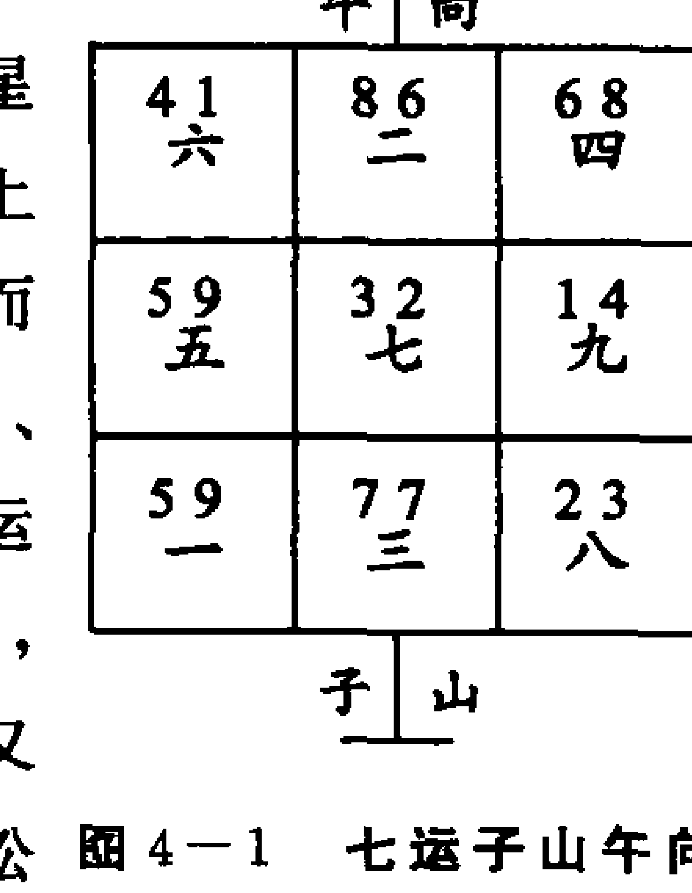

图4－1，为七运子山午向飞星图。向上旺星“7”飞到坐山坎宫的向星位，此称为水里龙神上山。此局若坎方填实有高山高物，则属不吉。然而飞星双“7”到坎宫，运盘运星“三”到坎。“三、七同宫，盗贼相遇，论凶而病危”，不吉。待八运时，“七赤”为刚过之星，退气，到癸卯年的二月，其流月紫白飞星又是“七赤”入中，客星“三”又飞到坎。这就是成了“三七叠临”，必遭劫盗官讼之祸。

或是到癸卯年，该年紫白飞星四绿入中，“九紫”到坎。九紫是离宫，统管“丙午丁”三山。而九紫到坎，“午”也到了坎宫，该坎宫统管“壬子癸”三山。图4－1的坐山为“子”，于是形成“子午相冲”（就是用了紫白相冲之年）。

##### （九）贵秀判断法

- 1. 山地之穴以坐山判断。倘阳脉入首，可旺财丁门族；如果穴后有突，或有形态端秀的墩阜（土堆、土山），可主发贵。
- 2. 平原穴要视穴位的前后左右水流曲折的形状，越是曲折越贵。倘若城门间，有特异挺秀的山峰，或三叉水口，城门交锁，以及水流屈曲之处，又逢太岁填成三合的堂局，也能发贵。但是家人谁能发贵呢？要以实地峦头所朝的方向而定。倘若峦头朝东方，该方为震卦所管的“甲卯乙”三山而与卯支能填成三合堂局的是“亥卯未”，合成木局。即，亥卯未年命的人能发贵。
- 3. 向上飞星的“四绿”方宜高。因向上飞星的四绿方，当生旺的时候，忌窒塞，须见到明水；若该方的水外有高峰，高屋，或塔、井、旗杆等，可以旺科名。或衰死之星来到时，在高处，也主动名之应。

##### （十）判断阴宅发迹的生肖

- 1. 要领。相墓，要首察龙穴的真伪；次看星运的衰旺。若果然很美，当令之星也到山到向，再进一步推断其发迹的生肖。
- 2. 从坐山上断生肖。如子山午向，就是肖鼠者发；若亥山巳向，则肖猪者发。不必用飞星盘推断。

若旺双星合于向首局，立子山午向，断肖马者发；立午山子向，则断肖鼠者发。余依向类推。

- 3. 从城门对宫的分金断生肖

如二运丑山未向飞星图（如图4－2）。

图4－2，为二运丑山未向飞星图。该地的坐山方，左右两山环抱；向方山峰高远，秀丽可爱，而且有一大湖。在向方左侧离宫的前方有圆如镜面的好水，近在穴旁。这是一清贵的好地。

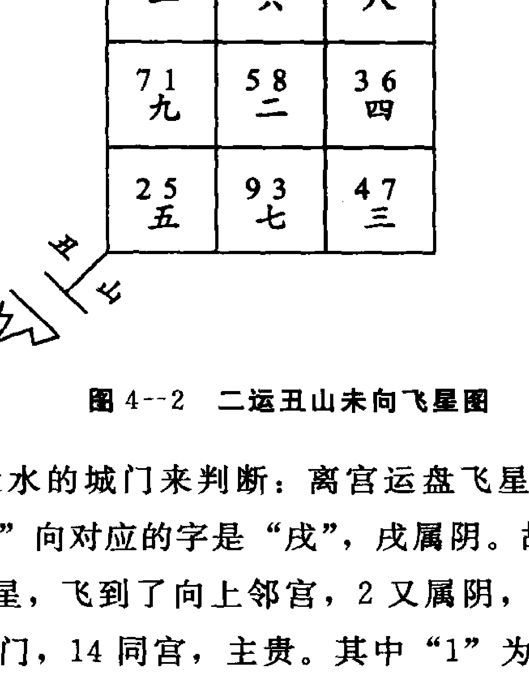

图4--2 二运丑山未向飞星图

此局以离方近水的城门来判断：离宫运盘飞星为“六”，六为乾宫，该宫与地元龙“未”向对应的字是“戌”，戌属阴。故六人中逆飞“2”到离宫。2为当令运星，飞到了向上邻宫，2又属阴，所以符合“城门诀”。离宫作为未向的城门，14同宫，主贵。其中“1”为山星，将此星作为判断的着眼点：

“1”即坎宫，该宫“子”的分金线上有庚子、丙子分金。故判断庚子、丙子年出生的人发贵。

倘若四山环绕中，有一单独的缺口出现，该缺口对准洛书元旦盘（地盘）上的某个数字，就可判断与该字所对应的某个人逢凶（如图 4-3）。若该缺口适合城门诀，反主大吉。

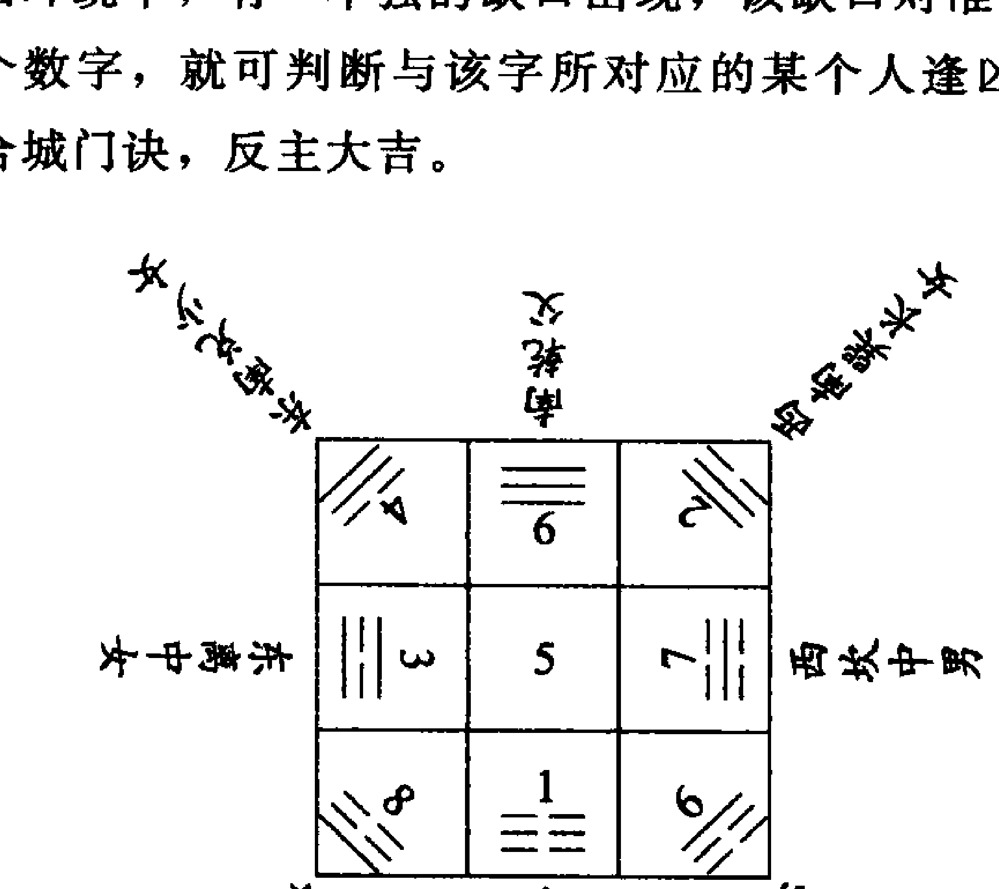

##### （十一）运星克来龙趋避的方法

运星克来龙称为“克”；来龙克运星，叫作“泄”。

立旺山旺向，本是大吉之举，但还是要细观靠近穴一节的龙脉，是否与当运的令星有克泄状况，逢克则绝；逢泄就要衰。

如九运午山子向飞星图（如图 4-4）。

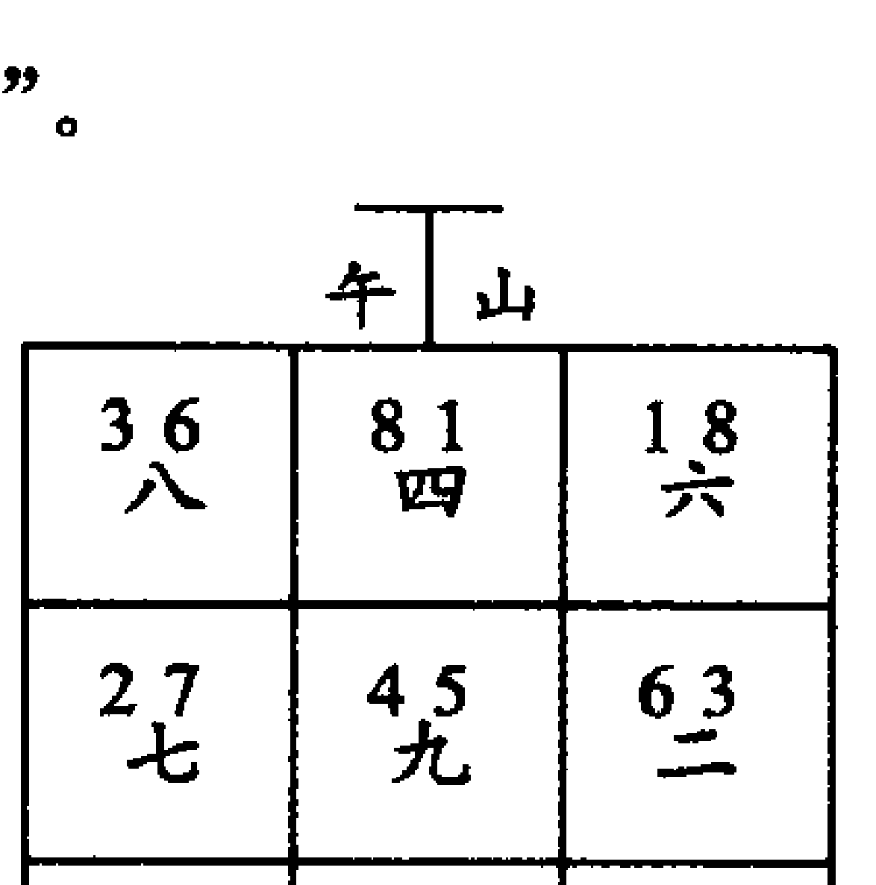

图 4-4，为九运午山子向的下卦飞星图。当运令星 “9” 双会向，算是吉。

但如果来龙从兑宫入首，而该宫的山星是“6”，6 为乾属金；而九运的“9”，为九紫离宫属火。于是九紫火克 6 乾金。这就是当令运星克来龙，称之为“克”，绝丁。

趋避法：将午山子向改用兼壬丙或丁癸，而用替卦（如图 4-5）。

图 4-5，为九运午山子兼丙山壬或丁山癸的替卦图。山星以“6”入中顺飞，则“8”到兑宫。“八”为艮土，它与九紫的关系是：九紫火生八白土龙。主丁气大旺。

若午山子向，近穴的一节龙脉从坤宫位入首，该一白水则克九紫运的火。这是龙克运，是泄气，人丁不旺。

趋避法是：仍然用替卦（如图 4-5），坤宫的山盘飞星是“3”，三是震宫，属木。这样，三碧木就生九紫火了。

#### 七、三元水法

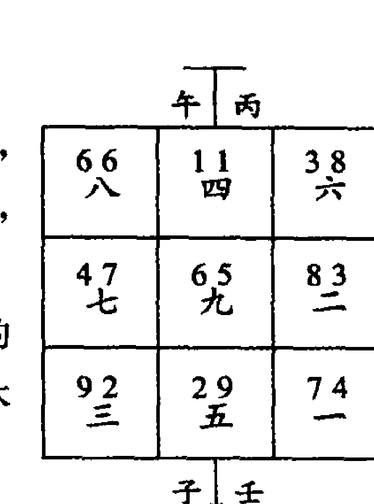

##### （一）四神合法

所谓四神，是指坐山一生一成，向上一生一成；又指阳以相阴，阴以含阳。例如：

- 1. 一运乾山巽向，即四正方的坎运龙当令。巽向来水，即收巽水流向乾方，其水挨在离宫的午位。巽为天元龙属阳，午为天元龙属阴；巽为四，离为九。此谓“阴以含阳”和“四九为友”的生成数，这是向方。
巽水挨午流向乾宫方，此水称为“乾的催官水”。坎龙当令，坎为龙运一，乾为六，又是“一六共宗”的生成数。
- 2. 六运子山午向，即四隅方的乾龙当令。午向来水，即收午水，其水挨于巽位流向子方。午为阴，巽为阳。午在离宫为九，巽宫为四。此谓“阳以相阴”和“四九为友”的生成数。
午水挨巽流向坎宫方，此水为坐山“坎的催官水”。坎为一，乾为龙运六，又合“一六共宗”的生成数。
以上两例，从巽到午，自乾到子；或从午到巽，从子到乾，都要经过二十四山中的四个山位，如从巽到午要经过“巽→巳→丙→午”四山，这叫做“四位而起父母”。

- 3. 坐山和向方，须均合生成之数，才可获全福。若向上合生成数，坐山不合生成数，其获福只一半。比如：
一白龙运，立乾山巽向，向方有巽水挨在午方，合“四九为友”的生成数；倘若坐山没有乾水催官，就合不成“生成之数”。其福减半，但是可以催财而不旺丁。
倘山上能合生成数，而向上不合，其理一样，只旺丁而不催财。

##### （二）合五、合十的意义

###### 1. 合五

五、十，系八卦的灵魂，收山出煞之秘和玄空大五行的精髓。其使用方法是：

以龙配向和来水配催官，此两家合五。以龙配向为主；来水配催官为宾。例如：

乾山巽向，一白坎龙当令，巽向为四，坎龙为一。龙合向为“五”；收午水流至乾方，此为催官水。午离宫九乾六，合十五，此为来水配催官。

龙向一、四合五为主；来水九配催官六合十五为宾。

###### 2. 合十

如一运，乾山巽向，巽向收午水流乾方催官。在罗盘的二十四山圈内，由坎卦下的“子”山顺时针方向数到巽向的巽，是十位；再由午水的“午”山顺时针方向数到乾，也得十位。这就是“五十同途”的妙理。

合十法：四正则顺进十位；四隅则逆退十位。这是五十用途，收山出煞的要旨。

立向收水的要领是不可有毫厘的差错，差之不吉。比如，子山午向兼壬丙，人口立向时，不能子午兼癸丁；而子午兼癸丁，人口立向时，也不能子午兼壬丙。

##### （三）零正催照水之说

- 1. 零水：水在当令元运星的旺方，主损丁，为凶水。
- 2. 正水：水居衰方为旺，故当元令星的对方，为正水，此是吉水。
- 3. 催水：此为催官水，贵水，得催水者，主贵，如下表：

| 运别 | 催官水 | 运别 | 催官水 |
| ---- | ---- | ---- | ---- |
| 一运 | 六白水 | 六运 | 一白水 |
| 二运 | 七赤水 | 七运 | 二黑水 |
| 三运 | 八白水 | 八运 | 三碧水 |
| 四运 | 九紫水 | 九运 | 四绿水 |

- 4. 照水：《玄龙经》曰：“正水之催神，谓之照神。”即正水的催官水，称为照水。

正水，即当令运星的对方（衰方），也是“零神”方的水，才称为照水。

“正水”。如八运已山亥向。已山为正神方，亥向为零神方（衰方），该方的水，称为正水。

八运即八白艮运，其催官水应该来自东方的震宫甲卯乙三山之一的水，才能合成“三八为朋”的生成数。于是亥向只要收“甲卯乙”三山之一来水，此水就是照水。

##### （四）玄空挨星法

以玄空挨星的旺山旺向为着眼点，以城门诀为水法运用；同时参考零正催照水之说。

### 第二节 理气与形峦结合判断法

根据前人经验，对玄空飞星吉凶的判断，要把理气与形峦堂局结合起来进行。离开形峦堂局，只讲玄空理气，尤如无的放矢；而离开玄空理气，单论形峦堂局，往往不验。所以，两者不可偏废。

此外，玄空风水的判断方法，还需将元运、挨星、下卦、替卦、差错、先后天八卦、三煞、城门、九星等基础知识，综合运用进行分析。

#### 一、判断步骤

面对坟墓、家宅或工厂、商店吉凶的判断，可分为三个步骤：

- （一）用罗盘测量出坐山、立向是二十四山中的什么山向，尤其要注意测定线位是下卦还是替卦。
- （二）询问清楚该坟或房屋，是哪年哪月建造的，并依此确定它的元运，进而排出飞星盘，并看其建筑时有没有犯着煞气。
- （三）察看阴宅或阳宅周围的山形水势并与飞星盘对照着，进行综合判断分析。

#### 二、判断分析的原则和要领

##### （一）主次分清

看新宅应以山峦形势为主，以玄空飞星为副。山峦形势就是要看来龙、星体、穴、砂、朝案、水、明堂等的状态。

飞星盘中，则以水的挨星为重，若水得运则吉，不得运则凶。若山的形态不美，但遇山的挨星为生旺之星，也能消灭其煞气。

##### （二）形式的美恶

生旺之星到向，且向上有低洼的水，主旺财源；若该方有高突的山，则主破财、伤丁，因犯了水里龙神上山之忌。数遇一、三、六、八伤男；二、四、七、九伤女〔后天八卦配洛书：一坎（中男）；二坤（母）；三震（长男）；四巽（长女）；六乾（父）；七兑（少女）；八艮（少男）；九离（中女）〕。

生旺之星挨到向上后，该方也有水，但若遇到高阜墙垣，也同样犯“水里龙神上山”，仍主破财。

生旺之星挨到坐山，该坐山方应有高突的山或高的建筑物，这就可以旺丁出贵。反之，若该方低洼有水，则犯了“山上龙神下水”之忌，主伤丁。

##### （三）看财丁贵

- 1. 看财，要看向上与旁边的水是否屈曲有情，加上太岁推其吉凶。还要从挨星盘看什么星挨到向上，以确定是哪房发财或破财。
- 2. 看丁，要看坐后之山与其四周的山，是否特别高大秀丽出众，还要看水口，加上太岁定房分，再看年命，推其吉凶。
- 3. 若遇上山下水，又逢太岁冲破克泄，则可断其伤丁破财。
- 4. 看贵秀，要根据山龙与平洋龙局的不同特点进行推断：
山龙局：平坦宽大的阳脉入首，挨星得旺山旺向，仅是财丁两旺，无贵。如果穴后有高突的山或墩阜，形态端庄，则可出贵人。
平洋龙局：平洋四周平坦空旷，没有高山墩阜，则须看前后左右的水流曲折之态势；水流愈折愈贵，因龙随水行，表示龙的力大，转折多，表示龙很活跃。若四周远处有特秀的山峰，或两水合流的三叉点，城门交锁，流水屈曲之处，逢太岁填合，即可发贵。

##### （四）看何房或何生肖之人发

- 1. 若遇龙真穴的之局，且得旺山旺向时，应根据九星中各星所含的公位（房分）而定。
各星所含公位是：
一白（坎），为中男，次房；
二黑（坤），为母，次房；
三碧（震），为长男，长房；
四绿（巽），为长女，长房；
五黄（中），次房；
六白（乾），为父，长房；
七赤（兑），为少女，尾房；
八白（艮），为少男，尾房；
九紫（离），为中女，次房。

###### 2. 推生肖

阴宅为旺山旺向局，以出脉入首的坐山某字断。如“子山午向”，断肖鼠者发。

双星会向（七星打劫）局，以向上的某字断，如七运“午山子向”，断肖鼠者发；而六运的“子山午向”，则为肖马者发。

##### （五）根据飞星判断

如六运子山午向飞星图（如图4-6），向上双星“66”到向，该如何判断谁发呢？
解：向上离宫中，运星一属坎卦管“壬子癸”三山；“6”属乾卦管辖的“戌乾亥”三山，将坎宫的天干“壬”和“癸”，配乾宫的地支“戌”和“亥”，就成了六运中的“壬戌、癸亥”。故壬戌、癸亥年出生的人发财。

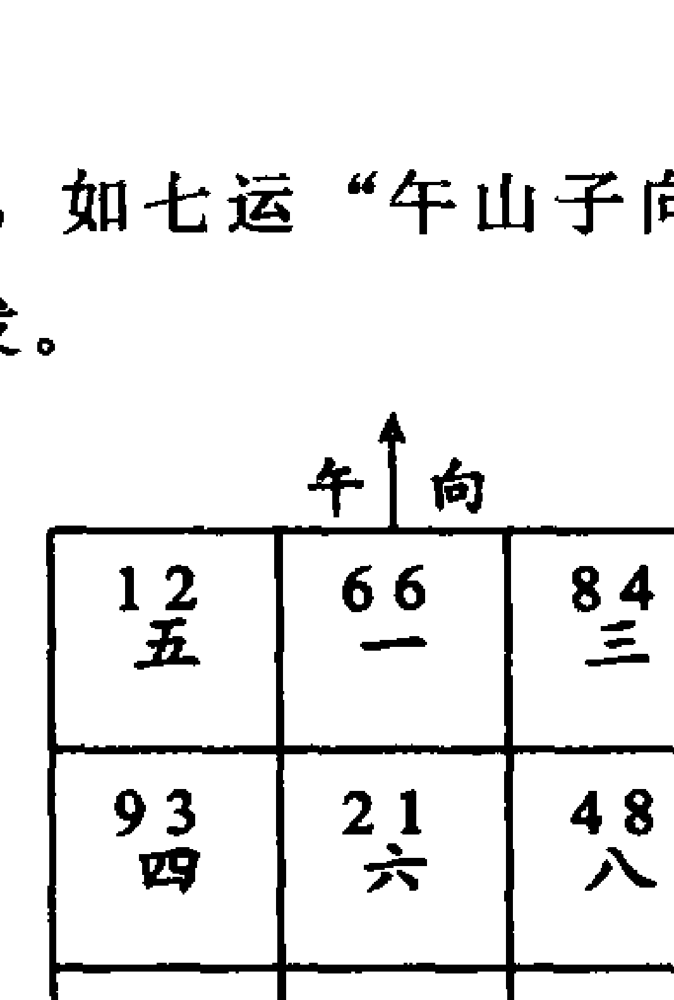

图4-6 六运子山午向飞星图

##### （六）对上山下水之局的判断

该种局形，气既衰又遇凶星（二、五、七、九）事来袭，定有灾祸。这种灾祸何时降临呢？要结合年神太岁所配的星名加临坐山而定。
所谓年神太岁，就是六十甲子纪年某年的干支名称。年神太岁配星如下表：

| 年神太岁 | 配星 | 年神太岁 | 配星 |
| :--- | :--- | :--- | :--- |
| 壬子癸 | 一白 | 未申 | 二黑 |
| 甲卯乙 | 三碧 | 辰巳 | 四绿 |
| | 戊己配星为五黄 | | |
| 戌亥 | 六白 | 庚酉辛 | 七赤 |
| 丑艮寅 | 八白 | 丙午丁 | 九紫 |

其具体排法如下表，在此要说明的是：年飞星地支配九星；月飞星以天干配九星。所谓年神加临，就是当年的飞星临坐山。

### 年神太岁配九星详情表

| 天干 | 月飞星配九星 | 地支 | 年飞星配九星 | 天干 | 月飞星配九星 | 地支 | 年飞星配九星 |
|------|----------------|------|----------------|------|----------------|------|----------------|
| 甲   | 三碧           | 子   | 一白           | 乙   | 三碧           | 丑   | 八白           |
| 丙   | 九紫           | 寅   | 八白           | 丁   | 九紫           | 卯   | 三碧           |
| 戊   | 五黄           | 辰   | 四绿           | 己   | 五黄           | 巳   | 四绿           |
| 庚   | 七赤           | 午   | 九紫           | 辛   | 七赤           | 未   | 二黑           |
| 壬   | 一白           | 申   | 二黑           | 癸   | 一白           | 酉   | 七赤           |
| 甲   | 三碧           | 戌   | 六白           | 乙   | 三碧           | 亥   | 六白           |
| 丙   | 九紫           | 子   | 一白           | 丁   | 九紫           | 丑   | 八白           |
| 戊   | 五黄           | 寅   | 八白           | 己   | 五黄           | 卯   | 三碧           |
| 庚   | 七赤           | 辰   | 四绿           | 辛   | 七赤           | 巳   | 四绿           |
| 壬   | 一白           | 午   | 九紫           | 癸   | 一白           | 未   | 二黑           |
| 甲   | 三碧           | 申   | 二黑           | 乙   | 三碧           | 酉   | 七赤           |
| 丙   | 九紫           | 戌   | 六白           | 丁   | 九紫           | 亥   | 六白           |
| 戊   | 五黄           | 子   | 一白           | 己   | 五黄           | 丑   | 八白           |
| 庚   | 七赤           | 寅   | 三碧           | 辛   | 七赤           | 卯   | 三碧           |
| 壬   | 一白           | 辰   | 四绿           | 癸   | 一白           | 巳   | 四绿           |
| 甲   | 三碧           | 午   | 九紫           | 乙   | 三碧           | 未   | 二黑           |
| 丙   | 九紫           | 申   | 二黑           | 丁   | 九紫           | 酉   | 七赤           |
| 戊   | 五黄           | 戌   | 六白           | 己   | 五黄           | 亥   | 六白           |
| 庚   | 七赤           | 子   | 一白           | 辛   | 七赤           | 丑   | 八白           |
| 壬   | 一白           | 寅   | 八白           | 癸   | 一白           | 卯   | 三碧           |
| 甲   | 三碧           | 辰   | 四绿           | 乙   | 三碧           | 巳   | 四绿           || 天干 | 月飞星配九星 | 地支 | 年飞星配九星 | 天干 | 月飞星配九星 | 地支 | 年飞星配九星 |
|------|--------------|------|--------------|------|--------------|------|--------------|
| 丙   | 九紫         | 午   | 九紫         | 丁   | 九紫         | 未   | 二黑         |
| 戊   | 五黄         | 申   | 二黑         | 己   | 五黄         | 酉   | 七赤         |
| 庚   | 七赤         | 戌   | 六白         | 辛   | 七赤         | 亥   | 六白         |
| 壬   | 一白         | 子   | 一白         | 癸   | 一白         | 丑   | 八白         |
| 甲   | 三碧         | 寅   | 八白         | 乙   | 三碧         | 卯   | 三碧         |
| 丙   | 九紫         | 辰   | 四绿         | 丁   | 九紫         | 巳   | 四绿         |
| 戊   | 五黄         | 午   | 九紫         | 己   | 五黄         | 未   | 二黑         |
| 庚   | 七赤         | 申   | 二黑         | 辛   | 七赤         | 酉   | 七赤         |
| 壬   | 一白         | 戌   | 六白         | 癸   | 一白         | 亥   | 六白         |

下面以八运巳山亥向为例，讲明如何判断年神加临以及加临后，何房发财：

图4-7，是八运巳山亥向挨星图。从图中可看出，该阴宅是旺山旺向。山管人丁，水管财，故看财应从向上看。

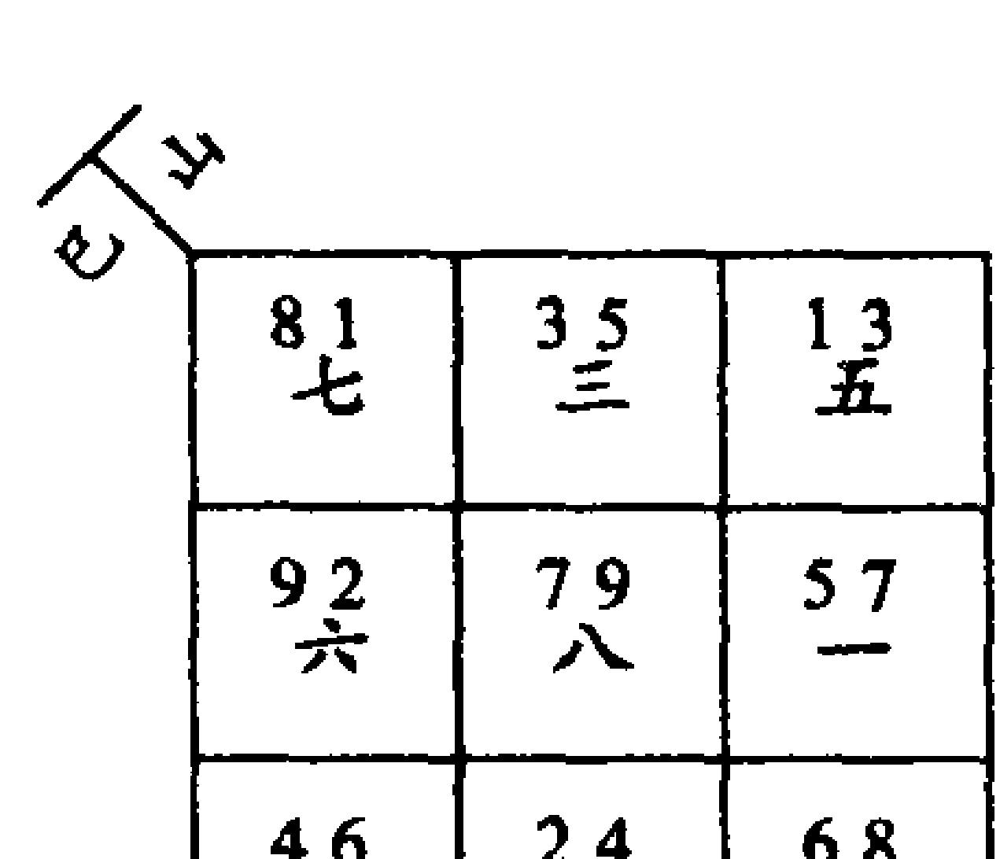

此阴宅坐山后有绿树成荫的秀丽小山，向方有一汪清澈的湖水和案山，朝山齐备，是为一方好地。既是旺山旺向，又基本符合较佳风水的堂局，就可判断为旺丁旺财。但在哪年，谁人发财呢？这就需要“年神加临”的相关知识了。

亥向方乾宫挨得的星是“6九8”。我们对此作一详析：

“6”，即六白，乾宫，该宫统管“戌、亥”，即戌、亥为地支，其年配星为“六白”；

“8”，即八白，艮宫，该宫统管“丑、寅”，即丑、寅为地支，其年配星为“八白”；

“9”，即九紫，离宫，该宫管“丙、午、丁”，其中丙、丁是天干，午是地支，它们的配星均为“九紫”。

将此宫6、8、9三星在各自宫内所含的共三组天干、地支组合起来，就构成了“丙寅、丙戌、丁亥、丁丑”四对干支。

倘在八运内，其年为丙、丁、戌、亥、丑、寅，即九紫、六白、八白的星飞临该亥向时，该年才能称为“年神加临”。

从“6九8”三宫所含的天干、地支中，组合成了“丙寅、丙戌、丁亥、辛亥”四对干支的年神名称，到底哪些年神能飞临亥向呢？还必须作进一步的探讨：

- 1. 要6白到亥向，必须“7”入中（逆飞）；
- 2. 要8白到亥向，必须“9”入中（逆飞）；
- 3. 要9紫到亥向，必须“8”入中（顺飞）。

这到向的6、8、9三星，其各宫所含干支为：

- 6：乾宫，戌、亥；
- 8：艮宫，丑、寅；
- 9：离宫，丙、午、丁。

八运中的二十年，其甲子纪年为：甲申——癸卯。在这二十对纪年的干支中，与此三宫所对应的干支是：

- 6：乾宫，戌、亥，为丙戌年（丁亥、戊戌、己亥年）；
- 8：艮宫，丑、寅，为己丑、壬寅年；
- 9：离宫，丙、午、丁，为丙戌、丙申年，丁亥、丁酉年。

在此十年的干支纪年中，只有“丙戌、丁亥”两年，为年神加临亥方（只有“丙戌、丁亥”，才与四对干支中的丙戌、丁亥相合，即2006年和2007年）。2007年几月呢？

在乾宫的山盘飞星为“6”，必须在某月的“飞星”，“6”到“乾宫”的亥向，才是“月”神也加临亥方，这就更美，更发财。

2007年为“丁亥”年，只有“7”赤入中，亥向才能得“6”。而亥年流月紫白飞星的五月，才是“7赤”入中，所以6月又可以与乾宫的运星“九”相配成“丙戌、丁亥”。因为六白含戌、亥，九紫为丙、丁，二者合成：丙戌、丁亥。

所以，应该丁亥年命、长房（亥为乾卦管，乾为长房）与亥卯未命人发财。

# 其他断法：

- 1. 若四山环绕唯独有一缺口正是当令运星飞到方，此称为“八国城门锁正气”，反主大吉。
- 2. 衰死之星到向为某字，逢流年紫白飞星又为某字到向，主伤丁；向不当旺，流年紫白飞星的旺星到向，则煞气会排斥旺气，两者相战，也主发祸。

# 三、三元玄空吉凶判断实例

# （一）丁财两旺墓穴

分金：艮山坤向兼丑未一分，三运初年用事。

# （1）山情：

冬季大池干涸时，见池底有鱼背状的砂梗，从乾宫位顺过山来，在大池的南边脉身微伏后再隆起，折向离方，行数十米处结穴，该墓正葬其穴位（如图4-8）。

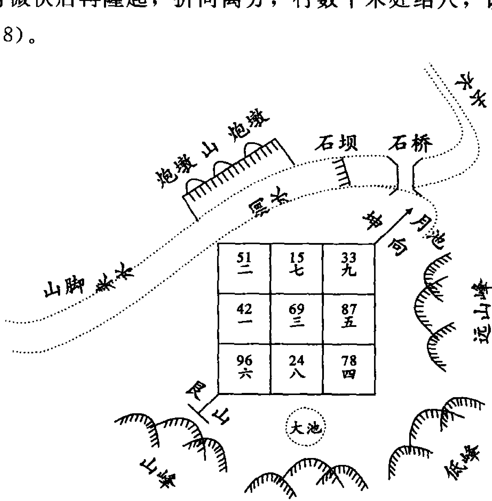

| 51 二 | 15 七 | 33 九 |
| 42 一 | 69 三 | 87 五 |
| 96 六 | 24 八 | 78 四 |

# （2）水情：

有涧水从艮宫蜿蜒而来，绕过震、巽、离宫至坤向首，在申位曲折而去。向首用人工开凿一月形池，未丁涧上有一石桥，桥下为石坝，涧水被石坝阻拦储于离宫，复注入月池。申方涧水转弯处，又筑一石坝，将涧水阻积于向首，坎方有一大池塘。

# （3）理气说明：

向上排龙，三碧令星双到向，得月池涧水二层水势，此为一吉。四绿为三运的生气，在坎宫的向星位，此有一动态的大池，在生旺方愈动愈吉，此为二吉。此两吉，在三运内，足以名利双收（旺气主财禄，生气主名誉）。

巽宫向星为一白水，生扶向首三木。交四运时，向首三碧变衰，坎宫向首四绿由生转旺，离宫向星五转为生气，在离宫前有一汪流动的涧水，故此也成旺方，可见发福悠久。

山上排龙，三碧令星在向首，四碧在震涧，五黄在巽间，一白在离涧，四吉全收，故其人丁大盛（平洋山上排龙和向上排龙的看法，与此相同）

##### （二）财盛丁衰之穴

- 1. 分金：三运卯山西兼乙山辛向三分（如图4-9）。

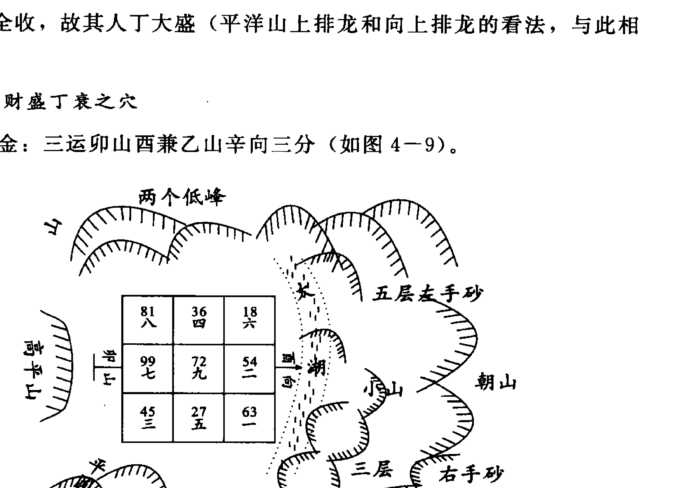

# （1）山情水情：

寅甲高峰落脉在半山立穴，以左右山峰为护砂，乾戌辛酉庚申方为太湖，湖外远山迤逦（申方最远），酉上湖中有小山一座作案，案外有山峰为朝，湖水浩渺，面积很大。

# （2）理气说明：

山上排龙，三碧令星到山，惟嫌会合非耦，且艮峰挨着兑七死气，巽山坤二为衰气，坎峰五黄坐星虽为旺气，但寡不敌众，故人丁不兴。

水里排龙，三碧令星到向得旺气，乾方四绿生气得飘动的湖水，又与山星八九辅弼二星聚会，合成先天卦数“三八为朋，四九为友”的生成之妙，坤湖八白吉星又与向首“三”星生成一气，巧妙正极，这就“三吉”。故在三碧运中，墓主的家人财运亨通。

# 2. 分金：二运甲山庚向（如图 4－10）。

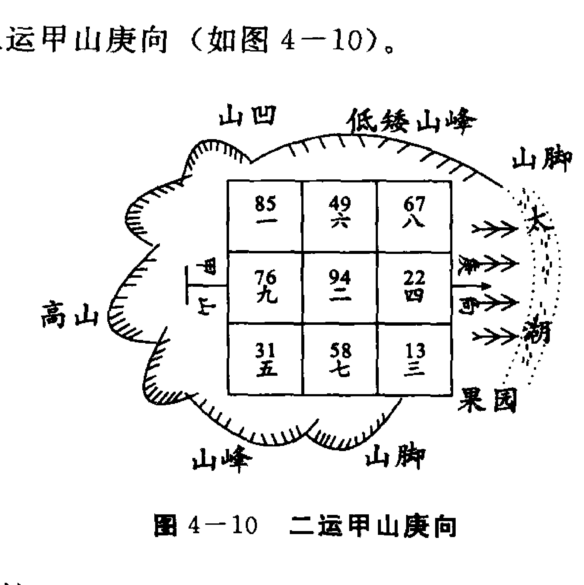

# （1）山情水情：

立穴在平地，甲卯方有高山，丙午方为低峰，伸出山脚止于申方为左护砂；寅方山峰到癸子壬亥方伸出山脚为右护砂。乾戌辛酉庚方是太湖，穴前有果树园，夏秋季节枝叶繁茂，湖水遮蔽，冬季落叶可见。

# （2）理气说明：

山上排龙破军7为死气到坐山，人丁不利，但艮山得生气三碧，故在三运期间也会添一男丁。

向上排龙二黑令星双到向，三碧生气到乾宫，因生旺二气在湖水的活动之方，故财运颇佳。在三运期间落，主后人大发。

三运未按原山向附葬一墓，因令星颠倒成上山下水之局，故数万家财毁于一旦。

##### （三）克丁之墓

# 1. 分金：一运酉山卯向挨星图（如图 4－11）。

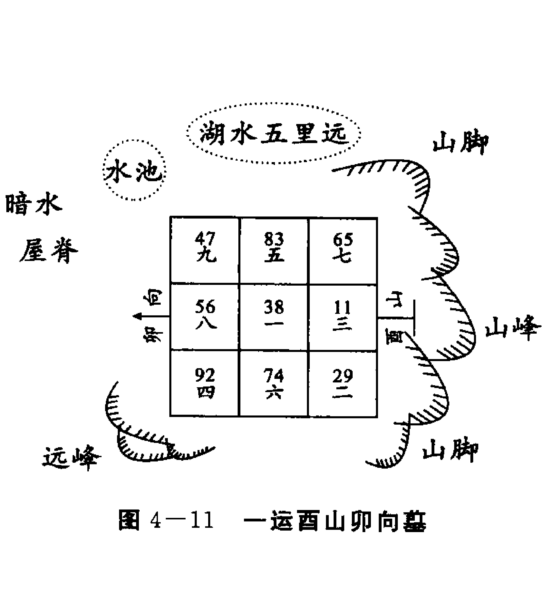

# (1) 山情：

大龙身人离，酉戌山峰挨着一白二黑，故墓主后人在二黑运中添丁。

# (2) 理气说明：

年星向星同克山星，要死人：该家长子上元甲申（光绪二十八年）出生，系八白土命人，在丙午方湖水活动处，向星三木克山星八白土（凡向星克山星，很凶险；山星克向星则无碍）。丙辰年（民国六年）三入中，七赤金到离宫，成金克木，木克土之局，该年长子不幸病故。经云：“重重克人立见死亡。”（若相克之方静而不动，则无防。）

> 经云：“重重克人立见死亡。”（若相克之方静而不动，则无防。）

巽宫为七四九二会合，遇暗水屋脊。经云：“阴人满地成群，红粉场中快活。”（七兑为少女，四巽为长女，九离为中女，坤为母，均系女人，男为阳，女为阴，故阴人成群）无心道人曰：“四七九二为阴神，若该四星重叠于水口三叉，或值门方向首，主男女贪淫。”该家长媳淫乱不节，可能与此有关。

> 经云：“阴人满地成群，红粉场中快活。”（七兑为少女，四巽为长女，九离为中女，坤为母，均系女人，男为阳，女为阴，故阴人成群）无心道人曰：“四七九二为阴神，若该四星重叠于水口三叉，或值门方向首，主男女贪淫。”

在离宫内，有向星三碧、四绿，面临动荡的湖水，在三运中，三当令，四为生气，生旺齐收，主财禄兴旺。但在巽宫有向星七九为死气，所以是明旺暗耗，有名无实之局。

# 2. 分金：田陇，三运艮山坤向（如图4-12）。

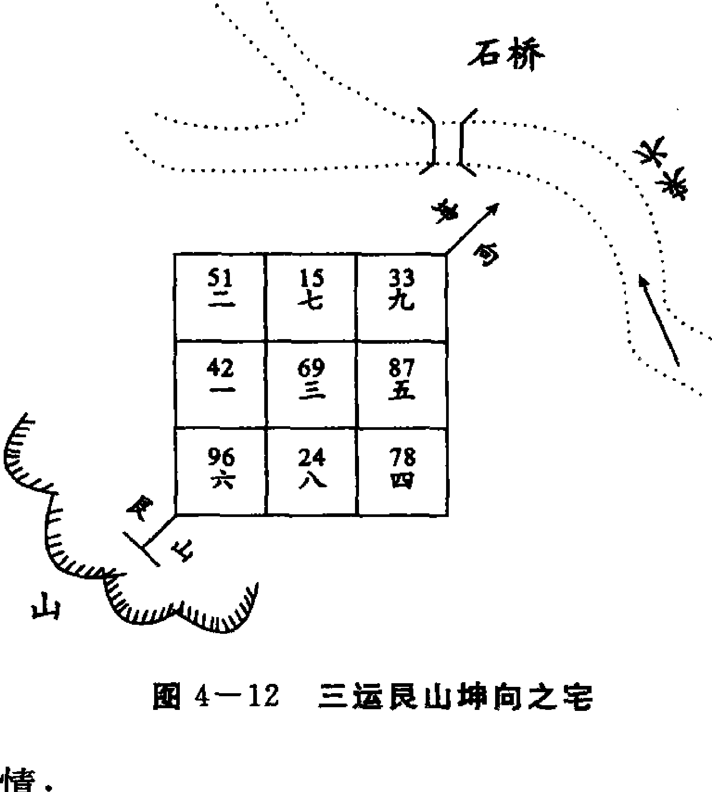

# （1）山情水情：

兑宫来水，横过坤离二宫，午丁方有一石桥，水在丙上三叉分滨，一支从离宫消去，另支从巽宫消去，墓地距水较远，登穴见坤离方水亮，扦后财丁兼优，只因令星三碧双到向首水里。田陇则与山龙不同，山向二星生旺的皆宜到水里，则丁财皆旺。

# （2）理气说明：

中宫山星受克死人。中宫向星九紫火，克山星6乾金，坟墩堆得比较高，坟墓的主人于上元丁丑年生，系六白金命。民国七年戊午年，紫白飞星一白水入中，水克火，火克金，重重克入，故该主人是年病故。

> 注：凡逢中宫向星克山星之墓，坟墩宜低，其祸可以减轻，或者幸免。

# 3. 分金：七运戌山辰向一墓（如图4-13）。

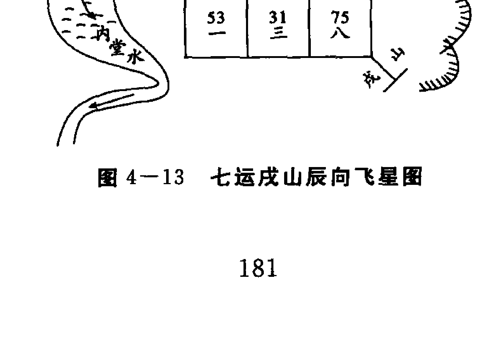

此地龙从离方屈曲而来，由乾方人首，内堂水从癸丑方来；外堂水从巽、震方水来，水势很大。由艮、坎方弯折流走。

对此，章仲山断曰：“此小财丁地，绵远不败，但子孙必有折足者发。”墓主人回曰：“然，自明迄今大发，清初以来，子孙代代出一跷子，俗呼为院子坟。”

沈竹耼注：此局旺星到山到向，故主丁财绵远不败。向上运星是“六”，若到六运人中为囚时，须得一百六十年后的六运，故言绵远也。

小财丁者，因峦山形局不大，子孙出院足尤发者，因艮方出水处，其形如跷足，故出院子坟。尤发者，水大也。向上飞星到艮是“3”，三为“震”，震为足，更加上形峦水也如跷足，故主足疾无疑也。

章仲山、沈竹耼二位先师对此局的分析，其特点有四：

- (1) 抓格局。七运戌山辰向为旺山旺向之格局，向上有水，坐后有山，故主财丁两旺；
- (2) 抓地运。向上运星六至六运时人中为囚，由七运到六运有160年之久，加上旺山旺向，故断其绵远不败；
- (3) 是小财丁地。因水大，故断子孙尤发；
- (4) 飞星意象与形峦结合。水出艮方，其水形如跷足，故出跷子，这是以形象取断。向星“3”到艮，三为震，震为足，加水形如跷脚，两者结合，断其足疾无疑。

# 4. 分金：某宅八运未山丑向（如图4-14）。

该宅的乾坎二方有放光的水从丑向的前面横穿而过。

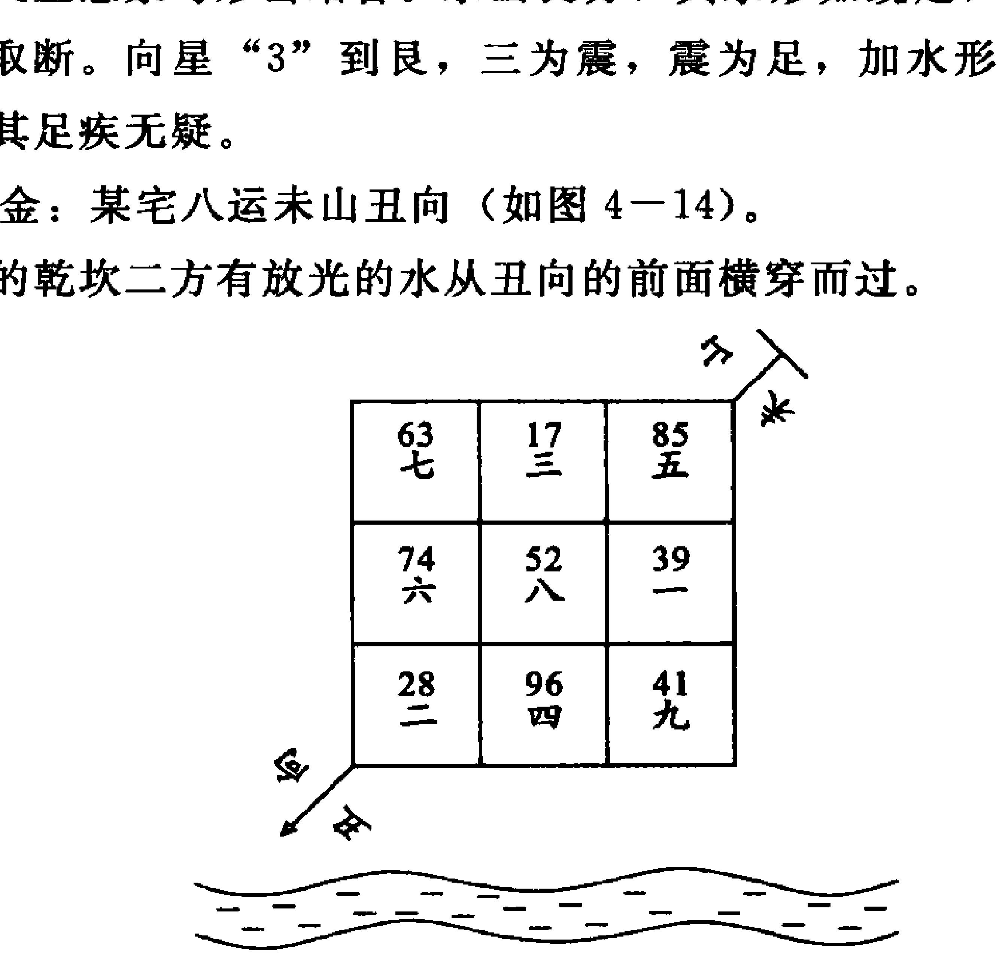

图4-14 八运未山丑向挨星图

从图 4－14 可知，该宅旺山旺向，故丁财颇佳。但乾坎两宫是来水的方向，而该两宫均为“九四六”（四六九）同宫，乾宫的飞星为“四九一”，可元旦盘为“6”，故仍为“四六九”同宫。“四”为巽，相关书上有“巽宫水路缠乾，主有悬梁之厄”的说法，故主屋内有一女人身穿红衣黑背心，坐而吊死。

因为乾方元旦盘（地盘）为“6”，6 乾属金，金重，不能悬起，所以“坐而吊死”。

又因“一九”同宫，“九”为离，其卦象为（☲）离中空；离为中女，为红色，故为女人穿红衣；一九落于坎宫，坎为黑色，其卦象为（☵）坎中满（黑色背心），坎中“满”，正好填补离中“虚”，所以，为女人穿红衣黑色背心。

若“六”在上（为天星），四在下（地盘），就主悬吊。

此例断法，全依卦象的变化配合，比较精细。

“巽宫水路缠乾”，路为索，乾为首，索系于首，故主有悬梁之厄；应在女子者，乾金克巽木，“巽”为长女，“四九”又为阴卦（以八卦类象而言，乾坎艮震为男；巽离坤兑为女。四为巽，九为离，男阳，女阴，所以，“四九”为阴卦）。又因有水路，所以此克较有力，否则也不应验。

此篇的断法，以乾坎两宫的卦象作解，惟妙惟肖，比较精到。

说“水路缠乾”，这是以形局作断，倘若阳宅的乾方有水路缠绕，也主此厄，但须太岁（太岁吉则吉，太岁凶也凶）或年月星辰加临，此祸就会应验。

该例断法有如下特点：

- 1. 抓住乾坎二宫的水路与飞星，依据卦象进行演绎。可见八卦象数，对于玄空理气吉凶的判断有很大帮助；
- 2. 八运未山丑向，是旺山旺向，主丁财两旺。但是美中不足之处的分析也比较详细。对悬吊之象的分析也很得卦理；
- 3. “巽宫水路缠乾，主有悬梁之厄”，这是引经据典。故学习相关经典的论述，对于玄空理气吉凶的正确判断，也是很重要的。

# 第四章 玄空飞星判断吉凶的方法

# 5. 分金：一运癸山丁向墓（如图 4－15）。

此局水同坤宫屈曲而来，会聚于巽方，流经震方，从艮方流走。

> 章仲山断曰：“此坟葬后，长房应发秀，次房丁秀大盛，财亦旺。盖得辅星成五吉也。”问之，主人曰：“前富百万，今仅半百矣！”

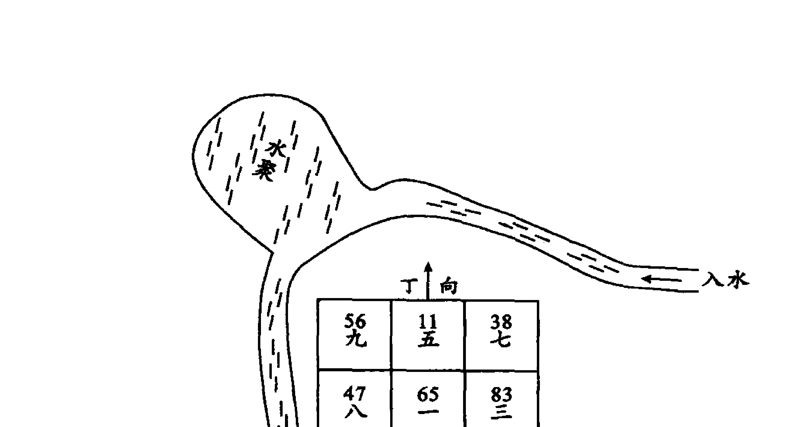

图4-15 一运癸山丁向飞星图

沈竹初注：此一六八俱到向上，又见水光，真合五星之妙。长房发秀而财不旺者，盖六为乾，六又为官星，故发秀。又因六为金，生向坎一之水，谓之生出，故财不旺；次房丁秀大盛财亦旺，就因双一到向，坎为中男，所以，次房更发。

则先谨按：该地坤方地盘（元旦盘）二，天盘（运盘）七，为“二七同道”。巽方地盘四，天盘九，“四九为友”。天地盘暗合生成，泽惠以远。双星临向上，三白水均到向上，又在巽方会聚，配合城门，财自然就旺。然而因乾金生坎水之故，所以，长房只发秀不发财。这是领悟公位而得之，不是单从八国水神断。有时也与向首的生克有关系，应当相互饶减。

图4-15中，巽宫向上飞星“6”；离宫“双1”到向；坤宫向星为“8”，故六白、一白、八白均到向上，得一六八三吉星。五星是指旺气、生气、进气再加上三吉。本飞星图的五星是：六白、双一白、八白和坤宫的山星三碧（二黑、三碧是一运的生气）。

此局判断的特点是：抓住九星所属的公位，特别扣住向首，以及向首两旁宫位（城门）飞星之间的生克关系进行分析判断。其中运用地盘与天盘间的暗合生成之数和城门诀作论断，很值得注意。

# 6. 分金：六运甲山庚向（如图4-16）。

有一台湾名师，对六运甲山庚向的飞星图作了如下的分析判断：

- (1) 坐山挨星“6 4 1”山的旺星“6”到山，山后如果有山，则旺丁。

此山倘若端庄秀丽，则更会出贵、秀、科甲之人。如果坐山后没山，反而有水的话，则会损丁。

- （2）向首挨星“2 8 6”，水的旺星“6”到向，该方若有水，则旺财。倘若此水弯秀环抱，或停蓄圆而放光，则出贵、秀、科甲之人。反之，有山、屋角、电杆、烟囱，则破财、官非、精神失常、车祸。

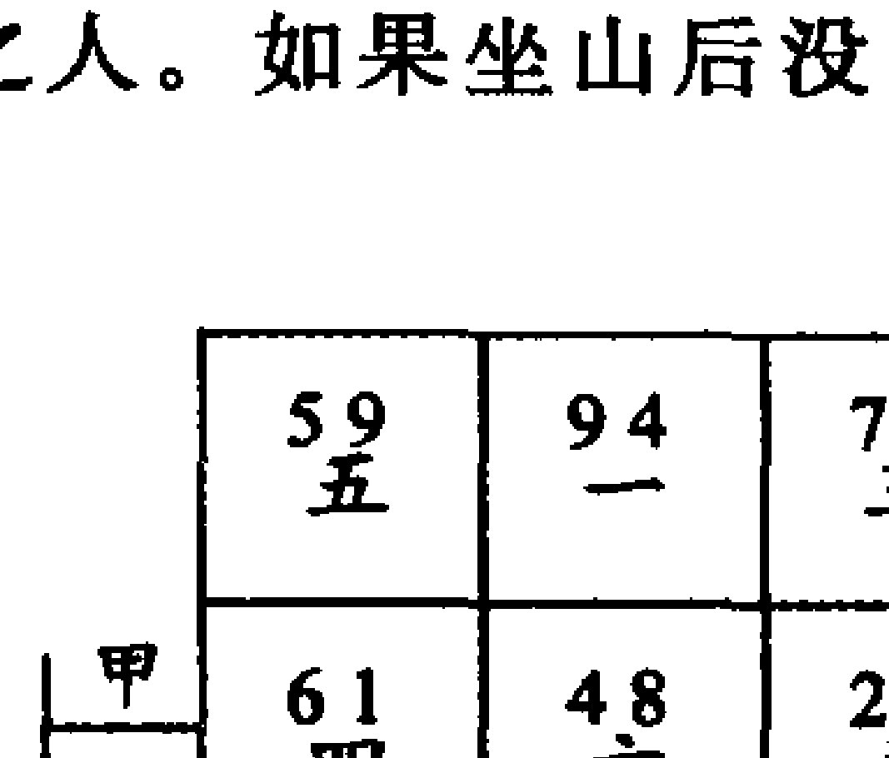

- （3）全盘的山星与运星合十，此为对待、通气，逢败不败，处处贵人。
- （4）龙若是从丙午丁（离卦）方来，为“煞气龙”；龙若从戌乾亥（乾卦）方来，因山星“3木”与“6”金运相克，故为“退气龙”，主人丁逐步冷退、败绝。
- （5）未坤申（坤卦）方，挨星“7 3 2”，山星7为生气，若有秀挺的山峰，主少房的人丁与少女形象秀美，人才出众。反之若有水，则损家长龙母，家里药当不断。
- （6）戌乾亥（乾卦）方，挨星“3 7 7”，向星7与运七相同，犯伏吟。此方宜空不宜实，宜有水或门路，发尾房与少女。反之主刀伤、车祸、手术。
- （7）丙午丁（离卦）方，挨星“9 1 4”；壬子癸（坎卦）方，挨星“8 2 3”，为文星联珠，若有文秀的笔架山峰相对，主科田不绝，考试得名，翰苑光辉。
- （8）若坎、艮、震三方有山，为一、六、八，三台如连珠，人丁世代，兴旺不绝。
- （9）入首龙，丑龙，未龙为生龙，且丑龙与甲龙合“一六共宗”（艮宫山星为1，震宫山星为6），地盘（元旦盘）艮为八，震为三，又合“三八为朋”，这是催官龙。甲龙为当旺龙；庚龙2，壬龙8为退气龙；但壬龙8，是中元的辅佐星，作吉星论。丙龙9为煞气龙，大凶。辰龙5，戌龙3为死龙。但辰5与六运，为同元一气，作吉星论。
- （10）此局地运至2003年（癸未）。但阴宅对面见水放光，阳宅的对面有门路，地运反而悠久，且在2004年（甲申）后的八运中出大贵人。

此局判断的特点：逐宫进行分析，将每宫飞星与其形势结合进行，比较详细，具有启发和参考作用。

### 第三节 定局定向法

审龙、察砂、观水、定穴之后，就需要定局立向。如何进行这一工作呢？

#### 一、用罗盘格定过峡入首龙的龙别，以确定穴心、坐山的格局

- (1) 过峡入首龙为地元龙，立极应为地元山向；过峡入首龙为天元龙，立极应为天元龙或人元龙；过峡入首为人元龙，立极应为人元龙或天元龙。
- (2) 在三元地理中，地元龙不可兼人元龙、天元龙；而天元龙与人元龙之间可以互兼。

例如：过峡入首处为卯龙（天元龙），可立巽山乾向，因为巽乾也属天元龙。如果当地堂局限制，无法立巽山乾向，可立巳山亥向，因巳亥属人元龙，可与天元龙互兼。“丙山壬向”，则不可立，因丙山壬向属地元龙，与来龙入首处的卯龙（天元龙）不可兼。否则就犯了龙元驳杂之差错。

当龙别确定后，就对照龙局看合什么元运，必须是当令之星到山到向才可以取用；否则形局再美，也不可贪。上山下水，反吟伏吟的格局切不可立，否则有灭绝之祸。

#### 二、依水定向，注意水法

立向定局要讲究水法，理气的水法有三合水法和三元玄空水法。三合水法采用天盘缝针消水，而立局定向均是使用地盘正针，天盘缝针二十四山的每山，与地盘正针二十四每山的方位错开了7.5度，于是两山之间就有了误差，所以，三元玄空风水，最好以三元玄空水法为主。

三元玄空水法，讲究一盘纯清，只用地盘正针，而不用天盘缝针。其收水（来水）的原则是以水口、三叉水口或动气口为城门，把城门作为气口，认为将水口、三叉水或动气口放在城门的位置，是最佳的选择。

三元玄空水法，还要注意使天元山向收天元方的来水；人元山向收人元方的来水；地元山向收地元方的来水，这样做才能达到同一元气的要求。比如，午山子向，可以收艮山、乾山方的来水；因为午山子向为天元山向，而艮水、乾水也是天元水，也就同元一气了。同元一气则发福悠久。

玄空水法，要使来水与去水配合山向，如果当今的运星到山且是来水处，那么，流走的水就应该到衰煞之星飞到的方位上去。如，八运为下元中运，为左辅星八白管局，八为当令的运星，应到山到向。来水口的方位宜九一生气星飞到处；去水口的方位应该是六白、二黑、三碧、四绿等衰煞星飞到处。

这种规则对每运都是一样的。

## 线位裁定要十分仔细

立局定向裁定线位时，要十分仔细，不可随意。
三元玄空的裁线也要避开空亡、差错，不能出卦。其空亡、差错有大小之分：

- 1. 大空亡，是指卦与卦之间的分界线，即界缝线；
- 2. 小空亡，是指二十四山的分界线；
- 3. 大差错，指本卦内之分界线；
- 4. 小差错，指二十四节气的分界线。

总之，凡是立线分针，罗盘面的纵线，均为凶线。如，六十四卦分界线，六十透地分界线，宿度分界线等，均为不可以立用之线，犯之则凶，务必谨慎。

玄空学的分针没有规定法则，只须随元运立法就可以。其最贵处，就是与元运、动气口成一卦纯清。

## 太岁加临用法举例

图4－17 为八运巳山亥向的一阴宅，于2007年5月7日，农历丁亥年三月二十一日下葬。求太岁加临和太岁重加临的时间在何年何月何人发财？

解：

- 1. 求太岁是何星？

如图4－17，亥向的向星为“8”；用事年为“丁亥”，故太岁为“亥”。
亥是乾宫管辖的“戌乾亥”三山之一，而“乾”在元旦盘的“6”位，所以，亥向的太岁为“六白”星。

- 2. 求何年太岁“六白”到亥向，就是何年太岁加临。

|  |  |  |
| :--- | :--- | :--- |
| 81 七 | 35 三 | 13 五 |
| 92 六 | 79 八 | 57 一 |
| 46 二 | 24 四 | 68 九 |

# 中国风水学初探

“六白”星何年到亥向呢？要用“流年紫白星推算法”算出。流年紫白星推算的口诀是：“上元甲子一白起，中元四绿推甲子，下元七赤兑位寻，逐年星逆中宫始。”上元是一、二、三运；中元为四、五、六运；下元为七、八、九运。意思是说，上元甲子年以一白入中，然后按六十甲子的顺序，即，甲子、乙丑、丙寅、丁卯……排列，再以九星的逆数，分别排在六十甲子之下，即，甲子年为一白，乙丑年九紫，丙寅年八白，丁卯年七赤……的逆星序。

依据流年紫白飞星“下元甲子兑位寻”的规则，八运甲子年应“七赤”入中，入中后，在洛书元旦盘后，按洛数顺飞九星（各运均如此）。七赤入中顺飞九星，必然是“八白”，飞临亥向的乾宫。而“巳山亥向”的年神太岁是“六白”，只有“六白”飞临乾宫，才是“太岁”加临。要“六白”飞临乾宫，必须是“五黄”入中。

依据八运甲子年七赤入中，乙丑年六白入中，丙寅年五黄入中，丁卯年四绿入中……的逆星序往下排，2008年为戊子年是一白入中，到2013癸巳年五黄才入中。五黄入中后，按洛书元旦盘数序，顺排九星“六白”，必飞临乾宫。

所以，八运巳山亥向的阴宅，2013年为太岁加临。

## 什么时间为八运巳山亥向的“重加临”？

要知重加临的时间，必须按“流月紫白飞星法”，求出2013年何月“六白”星飞临亥向。

求何月“六白”星到乾宫，只要找出何月是“五黄”星入中就可以了。因五黄入中后，按洛书元旦盘顺飞九星，“六白”必到乾宫。六白到乾宫的这一月，就是八运“巳山亥向”的太岁重加临的时间。按“流月紫白的推算”规则，“寅申巳亥”年七月为“五黄”入中。2013为“癸巳”年。所以，这年阴历七月为八运巳山亥向的重加临的月份。

> “山管人丁，水管财”。

太岁重加临到有水的向方，预示着财星降临。临在谁的头上呢？乾为男为长，故长男在2013年的七月有可能发财。

又乾属金，“巳酉丑”三合金局；故如果长男的八字中，有连续的巳酉丑三字在太岁加临和重加临的时间内，有望发财。

有关三元玄空的一些基本问题就简要地叙述到此为止，只要能将这些内容融会贯通，一般地来说，就可以满足实际中的运用了。以下第六章只对天星法与三合法作些知识性的简介。

# 第五章 天星和三合法简介

### 第一节 天星法

天星法又名九星派，是诸多理气门派中的一种，为不致与各流派均有“九星”之说相混淆，故王松寒先生称为天星法。

天星法的精华在于净阴净阳，其特有诀法为拨砂法与辅星水法。自宋以来，大多风水名家，均出自天星这一派的学说，如皋托长老、张九仪和赖太素等。

下面仅对拨砂法及辅星水法作以简述。

#### 一、拨砂法

古人视拨砂法为珍宝，不轻泄传，而对其中的某些问题也各说不一。本章介绍的拨砂法，以清朝张九仪先生的著述为准。

##### （一）拨砂用罗盘的人盘中针五行

拨砂法，是立向的一种方法，以砂为主。立向时，要先看砂的位置是何五行，然后再用一个有利的坐山，使砂成为食神（生砂）或比肩（旺砂）、妻财（奴砂）的富贵发达局；倘若配成了退气（泄砂）或煞气（煞砂），就成了伤丁败财的凶局。

罗盘上二十四山方位，以地盘正针用以定坐山（兼左兼右仍用人盘五行），用人盘中针定砂位，其五行之局，分述于后：

- 火局：子午卯酉，甲庚丙壬；
- 土局：乙辛丁癸；
- 木局：乾坤艮巽；
- 金局：辰戌丑未；
- 水局：寅申巳亥。

##### （二）地有五局，局有五砂

火、水、木、金、土为地的五局。

生砂（食神）、旺砂（比肩）、奴砂（妻财）、泄砂（退气）、煞砂（煞气），为五局中的五砂。

##### （三）五砂的形成及其吉凶状况

###### 1. 五砂形成的方法

- (1) 用七十二穿山，穿得远脉的来龙是何局中的干支。如来龙是“子午卯酉、甲庚丙壬”中的某干支，就是“火局”；如穿得来龙是“乙辛丁癸”中的某干支，则为土局；如穿得来龙是“乾坤艮巽”中的某干支，则是木局；如穿得来龙是“辰戌丑未”中的某干支，则是金局；如穿得来龙是“寅申巳亥”中的某干支，则为水局。
- (2) 开穴放棺，用六十龙透地法，透得“导龙气入棺木中的干支”是何，即穴后来龙入首的近脉（2.65 米的一段山脉）是何干支。
- (3) 用穿山法得来的远脉干支的五行是外来的；用透地法得穴后八尺峦头（2.65 米一段）干支的五行是内部的。
- (4) 外来的五行生内部的五行，称为生气砂（食神）；
外来的五行与内部的五行性质相同，称比肩（旺砂）；
内部的五行克外来的五行，称为奴砂（妻财）；
内部的五行生外来的五行，称为泄砂（退气）；
外来的五行克内部的五行，称为煞砂（煞气）。

###### 2. 五砂的吉凶状况（以火局为例）

- (1) 用穿山法得远山来龙为“丙寅”火，再用透地六十龙法，透得来龙入首入棺木中的干支为“辛未”土，外来火生内土，为生气“食神砂”，得吉，发科甲，作大官。
- (2) 开穴放棺，透得来龙入首的干支为“丁卯”火，为外火助内火，为比肩旺气砂，得吉，丁财两发，白衣做官。
- (3) 开穴放棺，透得来龙入首的干支为“癸亥”水，为内水克外火，为妻财奴砂，得吉，发财帛人丁，为官厚禄能享福。
- (4) 开穴放棺，透得穴后八尺峦头段，导龙气入棺的为“乾”木，为内木生外火，为泄气，不吉，退财败家，渐渐萧条。
- (5) 开穴放棺，透得穴后八尺峦头段，导龙气入棺的干支为“乙未”金，为外火克内金，为煞气，大凶，出盗贼，犯人命。

#### 二、辅星水法

##### (一) 赖太素的净阴净阳理论

乾坤坎离为净阳，巽兑艮震为净阴，其根据是先天八卦配洛书的位置，如右图：

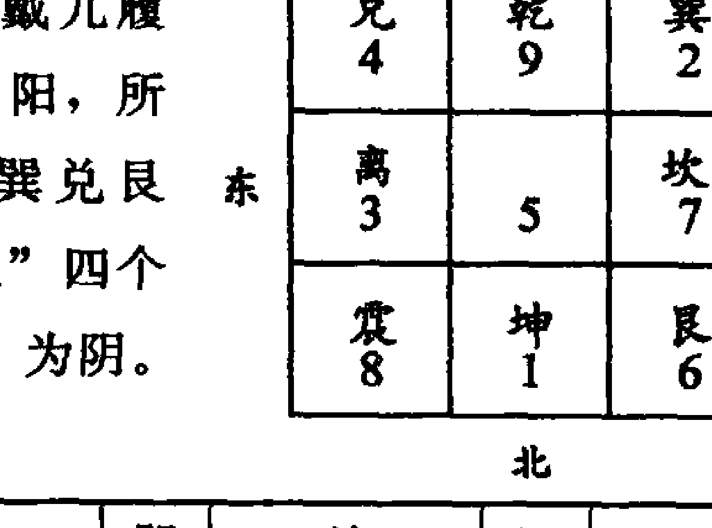

先天八卦在洛书中的位置是“乾南坤北，离东坎西”，此四正位的洛书数是“戴九履一，左三右七”四个单数，而单数为阳，所以“乾坤坎离”为阳；四隅位是“巽兑艮震”，洛书数是“二四为肩，六八为足”四个双数，而双数为阴，所以“巽兑艮震”为阴。

##### (二) 八卦纳甲五行

| 卦名 | 乾 | 坤 | 离 | 坎 | 巽 | 兑 | 艮 | 震 |
|---|---|---|---|---|---|---|---|---|
| 纳甲 | 甲 | 乙 | 壬寅戌 | 癸申辰 | 辛 | 丁巳丑 | 丙 | 庚亥未 |
| 五行 | 金 | 土 | 火 | 水 | 木 | 金 | 土 | 木 |

##### (三) 辅星水法

###### 1. 九星次序的排列

由向上起辅星，然后按辅星、武曲、破军、廉贞、贪狼、巨门、禄存、文曲的顺序排列，再将八纯卦的阳爻变阴爻，阴爻变阳爻。如下图中所列的甲向起辅法：

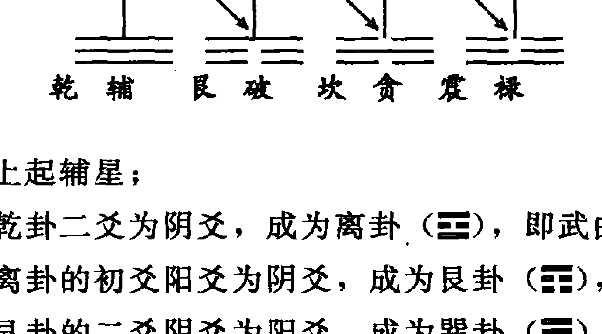

- 1. 第一步，乾上起辅星；
- 2. 第二步，变乾卦二爻为阴爻，成为离卦（☲），即武曲；
- 3. 第三步，变离卦的初爻阳爻为阴爻，成为艮卦（☶），即破军；
- 4. 第四步，变艮卦的二爻阴爻为阳爻，成为巽卦（☴），即廉贞；
- 5. 第五步，变巽卦的上爻阳爻为阴爻，成为坎卦（☵），即贪狼；
- 6. 第六步，变坎卦的二爻阳爻为阴爻，成为坤卦（䷁），即巨门；
- 7. 第七步，变坤卦的初爻阴爻为阳爻，成为震卦（䷲），即禄存；
- 8. 第八步，变震卦的二爻阴爻为阳爻，成为兑卦（䷹），即文曲。

###### 2. 说明

（1）八卦位置的排列形式是固定的，即总是上列横排为：离（䷝）、巽（䷸）、坤（䷁）、兑（䷹）；下列横排为：乾（䷀）、艮（䷳）、坎（䷜）、震（䷲）。

（2）八卦爻变的规律是：向上起辅星后，由辅星之卦的二爻开始由阳爻变为阴爻，或由阴爻变为阳爻；然后再分别将该变卦的初爻变、二爻变、上爻变、二爻变、初爻变、二爻变，即二、初，二、上，二、初二。

（3）对于阴阳宅的起辅星水法，一律由向上开始起辅星，而不问坐山。如上例的“甲”向起辅星，是“庚山甲向”，没有问坐山“庚”，而只管“甲向”。而甲向为什么要从“乾”卦起辅星呢，因为在八卦纳甲中，是“乾纳甲”，所以要在乾上起辅星。其他向上起辅星均如此。
如有一阴宅为“巳山亥向”，如何起辅星？
- 第一步，将八卦的位置按固定格式排列好（如下图）；
- 第二步，在各卦象下写明卦的名称；
- 第三步，因“亥”向的八卦纳甲属“震纳庚亥未”，故亥向应在震卦起辅星；
- 第四步，按上下排列八卦的格式，依“辅、武、破、廉、贪、巨、禄、文”的顺序，写在各卦名的右旁；
- 第五步，用箭头标注走势方向。

#### 三、合局与破局

辅星水法，以向上论来水和去水，这是净阴净阳之法。水从贪狼、巨门、武曲、辅弼方流到向方，再向禄存、文曲、破军、廉贞方向流走，为合局，吉；水从禄存、文曲、破军、廉贞方流到向方，再向贪狼、巨门、武曲、辅星方向流走，为破局，凶。

现将二十四山辅星水法的合局与破局列成下表：

### 辅星水法合局破局表

| 山向 | 乾 (甲) | 艮 (丙) | 坎 (癸甲子辰) | 震 (庚亥卯未) | 离 (寅壬午戌) | 巽 (辛) | 坤 (乙) | 兑 (丁巳酉丑) |
|------|---------|---------|---------------|---------------|---------------|---------|---------|---------------|
| 壬 丙 | 破 | 辅 | 禄 | 贪 | 廉 | 武 | 文 | 巨 |
| 子 午 | 武 | 廉 | 巨 | 文 | 辅 | 破 | 贪 | 禄 |
| 癸 丁 | 文 | 巨 | 廉 | 武 | 禄 | 贪 | 破 | 辅 |
| 丑 未 | 禄 | 贪 | 破 | 辅 | 文 | 巨 | 廉 | 武 |
| 艮 坤 | 巨 | 文 | 武 | 廉 | 贪 | 禄 | 辅 | 破 |
| 寅 申 | 贪 | 禄 | 辅 | 破 | 巨 | 文 | 武 | 廉 |
| 甲 庚 | 禄 | 贪 | 破 | 辅 | 文 | 巨 | 廉 | 武 |
| 卯 酉 | 文 | 巨 | 廉 | 武 | 禄 | 贪 | 破 | 辅 |
| 乙 辛 | 廉 | 武 | 文 | 巨 | 破 | 辅 | 禄 | 贪 |
| 辰 戌 | 武 | 廉 | 巨 | 文 | 辅 | 破 | 贪 | 禄 |
| 巽 乾 | 辅 | 破 | 贪 | 禄 | 武 | 廉 | 巨 | 文 |
| 巳 亥 | 禄 | 贪 | 破 | 辅 | 文 | 巨 | 廉 | 武 |
| 丙 壬 | 武 | 廉 | 巨 | 文 | 辅 | 破 | 贪 | 禄 |
| 午 子 | 贪 | 禄 | 辅 | 破 | 巨 | 文 | 武 | 廉 |
| 丁 癸 | 贪 | 禄 | 辅 | 破 | 巨 | 文 | 武 | 廉 |
| 未 丑 | 文 | 巨 | 廉 | 武 | 禄 | 贪 | 破 | 辅 |
| 坤 艮 | 破 | 辅 | 禄 | 贪 | 廉 | 武 | 文 | 巨 |
| 申 寅 | 武 | 廉 | 巨 | 文 | 辅 | 破 | 贪 | 禄 |
| 庚 甲 | 辅 | 破 | 贪 | 禄 | 武 | 廉 | 巨 | 文 |
| 酉 卯 | 禄 | 贪 | 破 | 辅 | 文 | 巨 | 廉 | 武 |
| 辛 乙 | 巨 | 文 | 武 | 廉 | 贪 | 禄 | 辅 | 破 |
| 戌 辰 | 贪 | 禄 | 辅 | 破 | 巨 | 文 | 武 | 廉 |
| 乾 巽 | 廉 | 武 | 文 | 巨 | 破 | 辅 | 禄 | 贪 |
| 亥 巳 | 文 | 巨 | 廉 | 武 | 禄 | 贪 | 破 | 辅 |

## 使用说明：

1. 合局。水从贪、巨、武、辅方向来，再从禄、文、破、廉方流走，为合局，吉。

贪、巨、武、辅为四吉星；禄、文、破、廉是四凶星。水应从吉星方流来向方，再从凶星方流走，此就是合局。如果水流向相反，就是破局，即凶局。

如“申山寅向”。水应从坤乙（贪狼）或乾甲（武曲）或坎（癸、申、子、辰、巨门）方，流向寅方，再从艮丙（廉贞）或震（庚亥卯未、文曲）或巽辛（破军）或兑丁巳酉丑（禄存）方流走，就是合局。与此相反，则是破局。

2. 破局。水从四凶星方流向四吉星方，就是破局。

### 第二节 三合法

所谓“三合法”，就是将二十四山，以地支“亥卯未三合木局”（含乾甲丁三山）、“巳酉丑三合金局”（含巽庚癸三山）、“申子辰三合水局”（含坤壬乙三山）、“寅午戌三合火局”（含艮丙辛三山），合成四大局来论吉凶的一种方法。这是理气风水中的一个重要门派。此外，还有五合、六合、刑、冲、破、害等。现分述如下：

#### 一、基本知识

##### （一）三合

| 三合局 | 含山 |
|---|---|
| 亥卯未三合木局 | 含乾甲丁 |
| 巳酉丑三合金局 | 含巽庚癸 |
| 申子辰三合水局 | 含坤壬乙 |
| 寅午戌三合火局 | 含艮丙辛 |

1. 用法

九九相生，循环不已，即隔八位相生法。

如亥山巳向。坐地支亥。从亥开始，逆时针方向，沿二十四山数到未得九，则喜未方来水。这是坐下生来水。

从未开始，逆时针方向，沿二十四山数到卯得九，则喜卯水去，以来水生去水。

从卯开始，逆时针方向，沿二十四山数到亥，则喜坐亥山，以去水反生坐下。

这是地支三合法。

天干坐乾，则喜水从丁方来，甲方去。

天干坐丁，则喜水从甲方来，乾方去。

这是天干三合法。不可混入地支亥卯未之内。

- 2. 择日：喜辅山执命。如火山或火命，喜木局相生，火局相助；忌水局相克，土局相泄。

###### 3. 前兼龙与后兼龙

> 《天玉经》云：“前兼之龙前兼向，联珠喜相放；后兼之龙复兼向，排定阴阳算。”

如，木局乾甲丁，天干为阳，为前兼龙，以乾兼亥，甲兼卯，丁兼未。亥卯未为阴，为后兼龙，以亥兼乾，以卯兼甲，未兼丁。

乾甲丁龙入首，宜乾甲丁立向及来水。这是合天干联珠法，排定阳中算。

若立亥卯未向，应收亥卯未方来水，是前兼龙立后兼向，是阳干入阴支的联珠法。

亥卯未龙入首，宜立亥卯未向及来水，这是合地支联珠法，排定阴中算。

若立乾甲丁向及来水，是后兼龙立前兼向，是阴支入阳干的联珠法。

水、火、金局，也是这样。

##### （二）五合

| 五合 | 合法 |
| :--- | :--- |
| 甲己合化土 | 甲一、乙二 |
| 乙庚合化金 | 丙三、丁四 |
| 丙辛合化水 | 戊五、己六 |
| 丁壬合化木 | 庚七、辛八 |
| 戊癸合化火 | 壬九、癸十 |

> 《易经》曰：“天一地二，天三地四，天五地六，天七地八，天九地十。”

天数五地数五，五数相得而各有合，一生一成，河图之义。

甲己合，即一六合，一六共宗；乙庚合，即二七合，二七同道；丙辛合，即三八合，三八为朋；丁壬合，即四九合，四九为友；戊癸合，即五十合，五十同途。

用法：造命年月日时均喜相合，如：

| 山或命 | 喜（合化）相生 | 喜（合化）相助 |
|---|---|---|
| 土山或土命 | 喜戊癸（合化火） | 甲己（合化土） |
| 水山或水命 | 喜乙庚（合化金） | 丙辛（合化水） |
| 火山或火命 | 喜丁壬（合化木） | 戊癸（合化火） |
| 金山或金命 | 喜甲己（合化土） | 乙庚（合化金） |
| 木山或木命 | 喜丙辛（合化水） | 丁壬（合化木） |

风水中使用法：

| 龙 | 水 | 立向 | 净阴净阳向 |
|---|---|---|---|
| 乙 | 遇庚水 | 即流往庚向方的水 | 或别的净阴向水亦可 |
| 丙 | 遇辛水 | 即流往辛向方的水 | 或别的净阴向水亦可 |
| 丁 | 遇壬水 | 即流往壬向方的水 | 或别的净阳向水亦可 |
| 庚 | 遇乙水 | 即流往乙向方的水 | 或别的净阳向水亦可 |
| 辛 | 遇丙水 | 即流往丙向方的水 | 或别的净阴向水亦可 |
| 壬 | 遇丁水 | 即流往丁向方的水 | 或别的净阳向水亦可 |

甲己、戊癸二局没有。

##### （三）六合

| 子丑合土 | 辰酉合金 |
|---|---|
| 寅亥合木 | 巳申合水 |
| 卯戌合火 | 午未合火、土 |

造命年月日时最喜相合。

风水中使用法：

龙 | 寅 | 卯 | 辰 | 巳 | 亥 | 戌 | 酉 | 申
---|---|---|---|---|---|---|---|---
水 | 亥 | 戌 | 酉 | 申 | 寅 | 卯 | 辰 | 巳
向 | 即向亥 | 即向戌 | 即向酉 | 即向申 | 即向寅 | 即向卯 | 即向辰 | 即向巳

三合派：以六合立向，可大发富贵。
子丑局、午未局难遇，如遇即以上法行之。

##### （四）桃花煞

- 1. 立向不准确，不合局，则子午卯酉水和巽辛水，均为桃花煞（看水法）。
- 2. 见子午水要立阳向，见卯酉水要立阴向，均不是桃花煞。如为帝旺水，不合局，即为咸池水，沐浴水。
- 3. 三合家说：
  - (1) 亥卯未鼠子当头忌（木生在亥，败在子，故忌）；
     巳酉丑跃马南方走（金生在巳，败在午，故忌）。
     此二局，皆净阴，子午阳水来，破局，为桃花煞；若卯酉合局，不忌。
  - (2) 申子辰鸡叫乱人伦（水生在申，败在酉，故忌）；
     寅午戌兔从茅东出（火生在寅，败在卯，故忌）。
     此二局，皆净阳，卯酉阴水来，破局，为桃花煞；若子午合局，不忌。

##### （五）羊刃煞

什么是羊刃？禄过刃生，在长生十二运中，临官位的地支为“干禄”，禄过刃生，故“禄”后一位地支就是“羊刃”，禄后一位地支，之所以是“禄”的羊刃，是因为他们间的五行关系，是一阳一阴的同类，是“劫财”。如，乙木卯，与甲木寅间，均属木，寅为阳木，卯是阴木，“卯”要劫夺“甲”的财，故卯为甲的“羊刃”。
羊刃宜避开，阴阳宅均不可犯。
羊刃见下表：

| 五行 | | | | | | | | | |
| :--- | :--- | :--- | :--- | :--- | :--- | :--- | :--- | :--- | :--- |
| | 甲木 | 丙火 | 戊土 | 庚金 | 壬水 | 乙木 | 丁火 | 己土 | 辛金 | 癸水 |
| 干禄 | 寅 | 巳 | 巳 | 申 | 亥 | 卯 | 午 | 午 | 酉 | 子 |
| 羊刃 | 卯 | 午 | 午 | 酉 | 子 | 寅 | 巳 | 巳 | 申 | 亥 |甲向卯水来，乙向寅水来，癸向亥水来……均犯刃，犯羊刃，有刀药亡身之病。

见羊刃而无祸，是因为合净阴净阳，如庚见酉，壬见子，均合净阴净阳。

注：三合派，以先天八卦配洛书的位置和八卦纳甲，决定二十四山的阴山和阳山。其中：

- 乾、甲、坤、乙、壬、寅、午、戊、癸、申、子、辰，为十二阳山；
- 巽、辛、艮、丙、丁、巳、酉、丑、庚、亥、卯、未，为十二阴山。

##### （六）三刑

见下表：

| 名称 | 性质 |
|---|---|
| 子刑卯、卯刑子 | 无礼刑，又乱伦刑，淫乱等违反人伦行为 |
| 寅刑巳、巳刑申、申刑寅 | 无恩刑，抢劫等各种恶性案件犯罪行为 |
| 丑刑戌、戌刑未、未刑丑 | 恃势刑，各种恶势力的明争暗斗 |
| 辰刑辰、午刑午、酉刑酉、亥刑亥 | 自刑，胡作非为的“自作孽者” |

## 风水中的运用：

| 向 | 子 | 寅 | 丑 | 卯 | 巳 | 戌 | 申 | 戌 | 巳 | 亥 |
|---|---|---|---|---|---|---|---|---|---|---|
| 刑水 | 卯水来 | 巳水来 | 戌水来 | 子水来 | 寅水来 | 丑水来 | 巳水来 | 未水来 | 申水来 | 戌水来 |

某他向的刑水：

子卯水来；寅巳水来，巳申水来；丑戌水来，戌未水来。

刑水向方多，犯之意外败祸。

自刑一说，风水不犯，造命者易犯。

##### （七）冲

子午相冲，丑未相冲，寅申相冲，辰戌相冲，巳亥相冲。

造命者，年月日时不可相冲，也不可与化命祭主相冲。若逢相冲处，可用三合、五合、六合法合之。

风水中不可犯冲。

##### （八）破

子破酉，午破卯，此四旺相破，是破阳；

辰破丑，戌破未，此四墓相破，是破阴；

寅破亥，申破巳，此四生相破，是破阳。

用法：造命，忌年月日时相破；风水中的水法，总以阴阳不杂，则不犯。

##### （九）害 (穿)

子未相害，丑午相害，寅巳相害，卯辰相害，申亥相害，酉戌相害。

造命，年月日时不可犯，水路也不可犯。犯之立主消耗。

向方和来水犯之，见下表：

| 立向 | 申 | 辰 | 亥 | 卯 | 寅 | 戌 | 巳 | 酉 |
|------|----|----|----|----|----|----|----|----|
| 水来方 | 亥 | 卯 | 申 | 辰 | 巳 | 酉 | 寅 | 戌 |

子未、丑午两局，尚少犯，因方向不易。
酉戌并朝，辰卯混来，此两局易犯。犯者暗暗消耗。

##### （十）生人克人法

生人克人法，是平洋地域水与向之间的生克法。

用法：以向为主，如亥癸甲辰四木向，喜巽辰巳辛壬子水生人。

如下表：

| 向 | 喜生人克人 | 忌生出 | 忌克出 |
|----|------------|--------|--------|
| 癸亥甲辰四木向 | 喜壬子寅申生人<br>乾坤卯午克人 | 忌丙丁巳酉生出 | 忌庚戌丑未克出 |
| 乾坤卯午四金向 | 喜庚戌丑未生人<br>丙丁巳酉克人 | 忌壬子寅生出 | 忌亥癸甲辰克出 |
| 庚戌丑未四土向 | 喜丙丁巳酉生人<br>癸亥甲辰克人 | 忌乾坤卯午生出 | 忌壬子寅申克出 |
| 丙丁巳酉四火向 | 喜癸亥甲辰生人<br>壬子寅申克人 | 忌庚戌丑未生出 | 忌乾坤卯午克出 |
| 壬子寅申四水向 | 喜乾坤卯午生人<br>庚戌丑未克人 | 忌癸亥甲辰生出 | 忌丙丁巳酉克出 |

此表以生入克入为进神，喜来；生出克出为退神，忌出。不拘净阴净阳之法，也不论生养病死等方。

也有以四向起长生者，如：乾坤卯午四金向，则以金生在巳，旺在酉，墓在丑断之。

其诀曰（以金局为例）：大墓起破军（丑水），绝胎是禄存（寅卯水），武曲临官旺（申酉水），逢衰是巨门（戌水），养生贪狼位（辰巳水），沐浴冠带文（午未水），廉贞兼病死（亥子水），七曜一齐分。

#### 二、四大水口

水阳、龙阴互相交媾形成甲癸、乙丙、辛壬、庚丁四大水口，其中甲丙庚壬属阳，乙辛丁癸属阴。

##### （一）水阳龙阴左转右转相通之理

阴生阳死，阳生阴死，阴阳生死，堪舆秘旨。背生背死，不生不死，其祸立至。出得生死，大罗仙子。

所谓“阴生阳死，阳生阴死”，是以“长生十二运”说的。在长生十二运中，“甲丙戊庚壬”为阳干，沿“长生、沐浴、冠带、临官、帝旺、衰、病、死、墓、绝、胎、养”十二运从上到下顺行；“乙丁己辛癸”五阴干，沿“长生十二运”从下往上逆行。阳干甲木，长生在亥，死在午；而阴干乙木，则长生在午，死在亥。这就是“阳生阴死，阴生阳死”的含义。其余，丙丁与丁火，戊土与己土，庚金与辛金，壬水与癸水一阳一阴之间的生死关系，均如此。图5-1以火局论龙。丁火生于酉，死于寅。丙火生于寅，死于酉。其余各局放此。

图中，白色圆圈部分，表示阳干气顺时针左旋；黑色的圆圈部分，表示阴干气右转。其歌诀云：阳从左边转，阴从右路通，若人懂得阴阳局，何愁大地不相逢。二十四山分两路，认取阴阳祖与宗。二十四山分五行，知得荣枯死与生。颠颠倒，二十四山有珠宝。顺逆行，二十四有火坑。知此法，不必寻纳甲，妙道玄，便是古神仙。

##### （二）四大水口阴阳交错基本状况

1. 火局立向消水法，乙丙交而趋戌（参看长生十二运）。
乙木，右旋阴龙，配左旋丙火阳向，戌位墓库消水。
乙木，长生在午，旺于寅，墓于戌；
丙火，长生在寅，旺于午，墓于戌。
乙丙交而聚戌。

2. 水局立向消水法，辛壬会而聚辰。
辛金，右旋阴龙，配左旋壬水阳向，辰位墓库消水。
辛金，长生在子，旺于申，墓于辰；
壬水，长生在辛，旺于子，墓于辰。
辛壬会而聚辰。

3. 金局立向消水法，斗牛纳丁庚之气。
丁火，右旋阴龙，配左旋庚金阳向，丑位墓库消水。
丁火，长生在酉，旺于巳，墓于丑；
庚金，长生在巳，旺于酉，墓于丑。
斗牛纳丁庚之气。

4. 木局立向消水法：金羊收癸甲之灵。
癸水，右旋阴龙，配左旋甲木阳向，未位墓库消水。
癸水，长生在卯，旺于亥，墓于未；
甲木，长生在亥，旺于卯，墓于未。
金羊收癸甲之灵。

##### （三）合玄窍收水立向法

金、木、水、火四大局立向消水法，每局有十一图，可立二十二向。在二十二向中，取立一向，合得玄窍收水法，方为合局。

1. 甲庚丙壬立向，沐浴方出水，变禄存。

2. 只要墓门迎生避煞，无不顺利。

3. 平洋立穴，须看水的源头从何处起，五星行动方为贵。山里星辰竖起看，平地星辰贴地眠，眠倒星辰看水势。两边水峡真龙脉，真龙住时有迎送，迎送缠绵无缺盖。平洋之地以水为脉，以水为护，以水为缠，以水为收。

## 附：长生十二运及其立向消水法

###### (1) 长生十二运

| 十二运 | 甲 (木) | 丙 (火) | 戊 (土) | 庚 (金) | 壬 (水) | 乙 (木) | 丁 (火) | 己 (土) | 辛 (金) | 癸 (水) |
|--------|---------|---------|---------|---------|---------|---------|---------|---------|---------|---------|
| 长生   | 亥      | 寅      | 寅      | 巳      | 申      | 午      | 酉      | 酉      | 子      | 卯      |
| 沐浴   | 子      | 卯      | 卯      | 午      | 酉      | 巳      | 申      | 申      | 亥      | 寅      |
| 冠带   | 丑      | 辰      | 辰      | 未      | 戌      | 辰      | 未      | 未      | 戌      | 丑      |
| 临官   | 寅      | 巳      | 巳      | 申      | 亥      | 卯      | 午      | 午      | 酉      | 子      |
| 帝旺   | 卯      | 午      | 午      | 酉      | 子      | 寅      | 巳      | 巳      | 申      | 亥      |
| 衰     | 辰      | 未      | 未      | 戌      | 丑      | 丑      | 辰      | 辰      | 未      | 戌      |
| 病     | 巳      | 申      | 申      | 亥      | 寅      | 子      | 卯      | 卯      | 午      | 酉      |
| 死     | 午      | 酉      | 酉      | 子      | 卯      | 亥      | 寅      | 寅      | 巳      | 申      |
| 墓     | 未      | 戌      | 戌      | 丑      | 辰      | 戌      | 丑      | 丑      | 辰      | 未      |
| 绝     | 申      | 亥      | 亥      | 寅      | 巳      | 酉      | 子      | 子      | 卯      | 午      |
| 胎     | 酉      | 子      | 子      | 卯      | 午      | 申      | 亥      | 亥      | 寅      | 巳      |
| 养     | 戌      | 丑      | 丑      | 辰      | 未      | 未      | 戌      | 戌      | 丑      | 辰      |

###### (2) 长生十二运立向及其出水位

左水倒右型
| 立向位 | 水出位 | 立向位 | 水出位 |
|--------|--------|--------|--------|
| 帝旺向 | 庚酉   | 墓库出水 | 癸丑   |
|        | 甲卯   |        | 丁未   |
|        | 壬子   |        | 乙辰   |
|        | 丙午   |        | 辛戌   |
| 长生向 | 巽巳   | 沐浴位出水 | 丙午   |
|        | 乾亥   |        | 壬子   |
|        | 坤申   |        | 庚酉   |
|        | 艮寅   |        | 甲卯   |

左水倒右型

| 立向位 | 水出位 | 立向位 | 水出位 |
| :--- | :--- | :--- | :--- |
| 墓库位 | 丁未<br>癸丑<br>乙辰<br>辛戌 | 衰向 | 辛戌<br>乙辰<br>癸丑<br>丁未 |
| | 绝位出水 | 坤申<br>艮寅<br>巽巳<br>乾亥 | | 胎位出水 | 甲卯<br>癸丑<br>丙午<br>壬子 |
| （化死位为旺）<br>自旺向 | 壬子<br>丙午<br>甲卯<br>庚酉 | 借墓库水位出水 | 癸丑<br>丁未<br>乙辰<br>辛戌 | | |

右水倒左型

| 立向位 | 水出位 | 立向位 | 水出位 |
| :--- | :--- | :--- | :--- |
| 长生向 | 巽巳<br>乾亥<br>坤申<br>艮寅 | 墓库位 | 癸丑<br>丁未<br>乙辰<br>辛戌 |
| | 帝旺立向 | 庚酉<br>甲卯<br>壬子<br>丙午 | 沐浴位出水 | 丙午<br>壬子<br>庚酉<br>甲卯 |
| 养向 | 乙辰<br>辛戌<br>丁未<br>癸酉 | 绝位 | 艮寅<br>坤申<br>巽巳<br>乾亥 |
| | 长生立向 | 巽巳<br>乾亥<br>坤申<br>艮寅 | 长生出水 | 巽巳<br>乾亥<br>坤申<br>艮寅 |
| （绝位逢生）<br>自旺向 | 艮寅<br>坤申<br>巽巳<br>乾亥 | 借墓库位 | 癸丑<br>丁未<br>乙辰<br>辛戌 |
| | 胎位立向 | 甲卯<br>庚酉<br>丙午<br>壬子 | 胎位出水 | 甲卯<br>庚酉<br>丙午<br>壬子 |

注：上列“左水倒右型”和“右水倒左型”两表中左边的为“正库、绝位消水或借库消水”，当水不归正库，也不出绝位时，才按表中的右半部分消水法消水。

###### （3）长生十二运与三合水法简表

| 长生二十运 | 帝旺（立向） | 衰 | 病 | 死 | 墓（出水位） | 绝 | 胎 | 养 | 长生 | 沐浴 | 冠带 | 临官 | 黄泉 |
| :--- | :--- | :--- | :--- | :--- | :--- | :--- | :--- | :--- | :--- | :--- | :--- | :--- | :--- |
| **阳干气顺行** | 以帝旺纵行下十二双山立向的黄泉煞位 ——> | | | | | | | | | | | | **黄泉** |
| 甲木气十二双山 | 甲卯 | 乙辰 | 巽巳 | 丙午 | 丁未 | 坤申 | 庚酉 | 辛戌 | 乾亥 | 壬子 | 癸丑 | 艮寅 | 艮寅 |
| 丙火气十二双山 | 丙午 | 丁未 | 坤申 | 庚酉 | 辛戌 | 乾亥 | 壬子 | 癸丑 | 艮寅 | 甲卯 | 乙辰 | 巽巳 | 巽巳 |
| 庚金气十二双山 | 庚酉 | 辛戌 | 乾亥 | 壬子 | 癸丑 | 艮寅 | 甲卯 | 乙辰 | 巽巳 | 丙午 | 丁未 | 坤申 | 坤申 |
| 壬水气十二双山 | 壬子 | 癸丑 | 艮寅 | 甲卯 | 乙辰 | 巽巳 | 丙午 | 丁未 | 坤申 | 庚酉 | 辛戌 | 乾亥 | 乾亥 |
| **阴干气逆行** | <—— | 黄泉 | 立向 | 在“阴干气逆行”栏内以“丑癸、辰乙、未丁、戌辛”立向“帝旺”纵行下四双山为黄泉。 | | | | | | | | | |
| 乙木气十二双山 | 寅艮 | 丑癸 | 子壬 | 亥乾 | 戌辛 | 酉庚 | 申坤 | 未丁 | 午丙 | 巳巽 | 辰乙 | 卯甲 | 卯甲 |
| 丁火气十二双山 | 巳巽 | 辰乙 | 卯甲 | 寅艮 | 丑癸 | 子壬 | 亥乾 | 戌辛 | 酉庚 | 申坤 | 未丁 | 午丙 | 午丙 |
| 辛金气十二双山 | 申坤 | 未丁 | 午丙 | 巳巽 | 辰乙 | 卯甲 | 寅艮 | 丑癸 | 子壬 | 亥乾 | 戌辛 | 酉庚 | 酉庚 |
| 癸水气十二双山 | 亥乾 | 戌辛 | 酉庚 | 申坤 | 未丁 | 午丙 | 巳巽 | 辰乙 | 卯甲 | 寅艮 | 丑癸 | 子壬 | 子壬 |
| **说明** | 三合风水，采用天盘缝针消水。忌水流出“黄泉”位，否则就是犯煞，主凶。凡立“帝旺”向，忌水流出“临官”位；凡立“衰”向，忌水流出“帝旺”位。流出临官或帝旺位，就是犯了“黄泉”煞。 | | | | | | | | | | | | |

注：消水时要注意避开八煞黄泉。

三合消水法除使用本节所列方法外，要避开黄泉煞，就是水不能从黄泉位流转。黄泉以立向方论，在“长生十二运与三合水法简表”中，已列出“立向”与黄泉位的关系，即，在立“帝旺”纵行下的八对双山为向时，“临官”纵行下的八对双山是“黄泉”位；在立“阴干逆行”栏内的四对双山，即丑癸、辰乙、申坤、亥乾为向时，则左边“帝旺”纵行的四对双山，即寅艮、巳巽、申坤、亥乾为“黄泉”位。

立向与黄泉位的关系，有如下口诀：

- 庚丁坤申是黄泉，乙丙须防巽巳先，
甲癸向上忧寅艮，辛壬向首怕亥乾，
巽向忌行丙午位，坤向庚酉切莫言，
艮逢甲卯起祸端，乾向壬子祸亦然。

- 解释：1. 立庚、丁向，忌水流出坤申位；立乙、丙向，忌水流出巽巳位。2. 立甲、癸向，忌水流出巽巳位；立辛、壬向，忌水流出亥乾位。3. 立巽向，忌水流出丙午位；立坤向，忌水流出庚酉位。4. 立艮向，忌水流出甲卯位；立乾向，忌水流出壬子位。

## 三合水法吉凶判断歌诀表

| 喜忌水 | 十二长生水名 | 与其相应名称 | 吉凶判断歌决 |
|--------|--------------|---------------|--------------|
| 喜水从该方流来，忌水由这些方位流走 | 养生水 | 贪狼星 生气 | 笼珠养生水到堂，贪狼星照显文章，长位儿孙多富贵，人丁昌炽性忠良。小曲大潮官职重，水小弯环福寿长。养生流破终须绝，少年寡妇出空房。 |
|  | 冠带水 | 左辅星 伏位 | 冠带水来人聪慧，也主风流好赌奢，七岁儿童能作诗，文章博士万人夸。水神流去三房苦，髫龄儿童死不差，更损深闺娇太女，此水停蓄乃为佳。 |
|  | 临官水 | 武曲 延年 | 临官方位水趋茔，禄马朝元吉气新，少年早入青云路，贤相筹谋助圣君。此方最忌山水去，成才之子早归阴，家中少妇常哭泣，财杀空虚彻骨贫。 |
|  | 帝旺水 | 右弼 天医 | 帝旺潮来聚面前，一堂旺气发庄田，官高爵重威名显，金银丰裕有剩钱。最怕休囚水敝散，石崇富贵不多年，此水流走根基薄，乏食贫寒怨上天。 |
| 此方喜来水 | 衰水 | 巨门 | 衰方管局巨门星，学堂水到发聪明，少年及第文章富，长寿星高金谷盈。出入威仪乘驷马，宴游歌舞玉壶倾，旺极总宜来水吉，也须弯曲更有情。 |
| 这些方位忌来水，喜去水 | 沐浴水 | 文曲星 | 六煞 | 沐浴水来犯桃花，女子淫乱不由他，投河自缢随人走，血病官灾破主家。子午方来田业尽，卯酉水来好赌奢，若还流去生神位，堕产淫声带销枷。 |
|  | 病死水 | 廉贞星 | 五鬼 | 病死二方水莫来，天门巽户不为乖，更有科各官爵重，水若斜飞起大灾。换妻毒药刀兵祸，软脚疯痰女堕胎，必主其家遭此害，痨瘵蒸损瘦形骸。 |
|  | 墓水 | 破军 | 绝命 | 墓库之方怕临水，破军流去反为祯，阵上扬名文武贵，池湖开满富春田。荡然直去家资薄，欠债终年不了人，水来充军午里外，三男二女绝凋零。 |
| 忌来水 | 绝胎水 | 禄存 | 祸害 | 绝胎水到不生儿，孕死休囚绝后嗣，纵使有生难抱养，父子乖张夫妇离。水大女人淫乱走，水小私情暗会期，此处只宜为水口，禄存流尽佩金鱼。 |

现以图5-2为例，说明三合水法吉凶判断的具体操作法。

图5-2，为一座子向午的住宅，河流由左巽巳临官位来，从辛戌墓位流走。

此为阳宅丙火气，水从生旺方流来，到衰死方的墓方流走，大吉。其吉利的具体内容，则参看“三合水法吉凶判断歌诀表”中的“临官水”和“墓水”。要注意“巽巳”来水和“辛戌”去水，均以罗盘的缝针为用。另外A处虽是地煞之巽位，但见来水，仍作辰方来水论，因为水法以缝针盘定吉凶。

## 附一：八宅理气常识

#### (一) 东四宅、西四宅和东四命、西四命

清朝时，福建出现了一种八宅派风水理论。该理论以后天八卦的方位为准，将坐震、巽、离、坎的房屋归为一类，称为“东四宅”；把坐乾、兑、坤、艮的房屋归为一类，叫作“西四宅”。

凡属东四宅的住房，其大门或主卧室门以及厨房门应开在东南、南、东北、北的方位上；而不能开在西、西南、西北和东的方位。

凡属西四宅的住房，其大门或主卧室门以及厨房门，应开在南、东北、西南、西北的方位上；而不能开在东、西、东南和北的方位上。

> 这种观点，有《八宅明镜》的诗为证：
> 乾坤艮兑四宅同，东西卦爻不可逢。
> 误将他象混一物，人口伤亡祸必重。
> 震巽坎离是一家，西四宅又莫犯他。
> 若还一气修成宅，子孙兴旺定荣华。

除房屋分成东西各四宅外，人命也可以分成东四命和西四命。属东四命的人，应居住东四宅；属西四命的人，应居住西四宅。只有这样，才能得“福元”，否则就是不受福。这叫作“宅命相配”。

> 《八宅明镜》认为：“宅之坐山为福德宫，人各有所宜，东西命居东四宅，西四命居西四宅，是为得福元。如果西四居东，东四居西，虽吉，不受福也。”

#### (二) 宅命相配

所谓宅命相配，是指人命五行与坐宅的方位五行相同类。同类则相配，吉；不同类就不相配，不吉。

现将东四宅、西四宅和命卦及其五行列表如下：

| 命卦 | 五行 | 方位 | 类别 |
|------|------|------|------|
| 震 | 木 | 东方（甲卯乙） | 东四卦 |
| 巽 | 木 | 东南（辰巽巳） |  |
| 坎 | 水 | 北方（壬子癸） |  |
| 离 | 火 | 南方（丙午丁） |  |
| 乾 | 金 | 西北方（戊乾亥） | 西四卦 |
| 兑 | 金 | 西方（庚酉辛） |  |
| 艮 | 土 | 东北（丑艮寅） |  |
| 坤 | 土 | 西南（未坤申） |  |

从上表可知，人的五行（以出生年计算）属木、水、火的，属东四命；人的五行属金或土的，属西四命。
东四命的人居东四宅；西四命的人居西四宅，就称作宅命相配了。

#### （三）求人的本命卦的方法

1.  什么是本命卦，为什么要求本命卦？
    所谓本命卦，就是以人的出生年计算属于八卦中的哪个卦。若属“震”卦的本命卦就是“震卦”，其余仿此。
    求本命卦的目的，就是使得“宅命”相配或婚姻相配。

2.  求本命卦的方法，可用下列公式：
    (1) 男性本命卦公式：
        ① $\frac{100 - \text{出生年份中的“十、个”位数}}{9}$ （余数系命卦数）
        如：1934年出生的男性，则：
        $\frac{100-34}{9} = \frac{66}{9} = 7.3$，余数“3”为震卦，故该男性的本命卦为“震”。
        ②用 11 减出生年数字的两次总和。其结果的差就是本命卦数。
        如：1934年出生的男命，则：
        $11 - (1+9+3+4) = 11 - 17$（“17”为第一次总和）
        $11 - (1+7) = 11 - 8$（“8”为第二次总和）
        $= 3$
        “3”为震卦，故该男性的本命卦为“震”。
        又如：求 2000 年出生的男性的本命卦。方法：去掉三个“0”，用 2 这个绝对数：

        11－2＝9，“9”为离卦，故该男性的本命卦为“离”。

    (2) 女性本命卦公式
        ① (出生年的十、个位数-4)/9 （余数为本命卦）
        如：1939年出生的女性，计算本命卦的方法是：
        (39-4)/9=35/9=3.8，余数“8”为艮卦。所以，该女性的本命卦为“艮”。
        ②以“4”加出生年数字的两次总和，如果第二次总和数大于“9”，则以总和数减9，其差就是命卦数。
        如：求1939年出生的女性的本命卦。其公式为：
        4＋（1＋9＋3＋9）＝4＋22（“22”为第一次总和）
        ＝4＋（2＋2）＝4＋4（这个“4”是第二次总和）
        ＝8
        这个“8”就是她的本命卦数，即“艮”卦。
        又如：求1986年出生的女性的本命卦，其公式为：
        4＋（1＋9＋8＋6）＝4＋24（第一次总和）
        ＝4＋（2＋4）＝4＋6（第二次总和）
        ＝10（10大于9，所以应减9）
        ＝10－9＝1
        “1”为坎卦，故该女性的本命卦为“坎”。
        又如：2000年出生的女性，其命卦该如何算呢？
        方法是：去掉所有的“0”，4加绝对值“2”就可以了。
        4＋2＝6
        “6”为乾卦。所以，该女性的本命卦为“乾”。
        再如：2035年出生的女性，其计算方法是：
        4＋（2＋3＋5）＝4＋10
        ＝14（“14”大于9，故减9）
        14－9＝5
        “5”男坤，女艮，所以该女性的本命卦是“艮”。

### 表1 出生年份及其命卦

| 出生年份 | 命卦 男 | 命卦 女 | 出生年份 | 命卦 男 | 命卦 女 | 出生年份 | 命卦 男 | 命卦 女 |
|----------|---------|---------|----------|---------|---------|----------|---------|---------|
| 1930     | 7 兑    | 8 艮    | 1966     | 7 兑    | 8 艮    | 2002     | 7 兑    | 8 艮    |
| 1931     | 6 乾    | 9 离    | 1967     | 6 乾    | 9 离    | 2003     | 6 乾    | 9 离    |
| 1932     | 5 坤    | 1 坎    | 1968     | 5 坤    | 1 坎    | 2004     | 5 坤    | 1 坎    |
| 1933     | 4 巽    | 2 坤    | 1969     | 4 巽    | 2 坤    | 2005     | 4 巽    | 2 坤    |
| 1934     | 3 震    | 3 震    | 1970     | 3 震    | 3 震    | 2006     | 3 震    | 3 震    |
| 1935     | 2 坤    | 4 巽    | 1971     | 2 坤    | 4 巽    | 2007     | 2 坤    | 4 巽    |
| 1936     | 1 坎    | 5 艮    | 1972     | 1 坎    | 5 艮    | 2008     | 1 坎    | 5 艮    |
| 1937     | 9 离    | 6 乾    | 1973     | 9 离    | 6 乾    | 2009     | 9 离    | 6 乾    |
| 1938     | 8 艮    | 7 兑    | 1974     | 8 艮    | 7 兑    | 2010     | 8 艮    | 7 兑    |
| 1939     | 7 兑    | 8 艮    | 1975     | 7 兑    | 8 艮    | 2011     | 7 兑    | 8 艮    |
| 1940     | 6 乾    | 9 离    | 1976     | 6 乾    | 9 离    | 2012     | 6 乾    | 9 离    |
| 1941     | 5 坤    | 1 坎    | 1977     | 5 坤    | 1 坎    | 2013     | 5 坤    | 1 坎    |
| 1942     | 4 巽    | 2 坤    | 1978     | 4 巽    | 2 坤    | 2014     | 4 巽    | 2 坤    |
| 1943     | 3 震    | 3 震    | 1979     | 3 震    | 3 震    | 2015     | 3 震    | 3 震    |
| 1944     | 2 坤    | 4 巽    | 1980     | 2 坤    | 4 巽    | 2016     | 2 坤    | 4 巽    |
| 1945     | 1 坎    | 5 艮    | 1981     | 1 坎    | 5 艮    | 2017     | 1 坎    | 5 艮    |
| 1946     | 9 离    | 6 乾    | 1982     | 9 离    | 6 乾    | 2018     | 9 离    | 6 乾    |
| 1947     | 8 艮    | 7 兑    | 1983     | 8 艮    | 7 兑    | 2019     | 8 艮    | 7 兑    |
| 1948     | 7 兑    | 8 艮    | 1984     | 7 兑    | 8 艮    | 2020     | 7 兑    | 8 艮    |
| 1949     | 6 乾    | 9 离    | 1985     | 6 乾    | 9 离    | 2021     | 6 乾    | 9 离    |
| 1950     | 5 坤    | 1 坎    | 1986     | 5 坤    | 1 坎    | 2022     | 5 坤    | 1 坎    |
| 1951     | 4 巽    | 2 坤    | 1987     | 4 巽    | 2 坤    | 2023     | 4 巽    | 2 坤    |
| 1952     | 3 震    | 3 震    | 1988     | 3 震    | 3 震    | 2024     | 3 震    | 3 震    |
| 1953     | 2 坤    | 4 巽    | 1989     | 2 坤    | 4 巽    | 2025     | 2 坤    | 4 巽    |
| 1954     | 1 坎    | 5 艮    | 1990     | 1 坎    | 5 艮    | 2026     | 1 坎    | 5 艮    |
| 1955     | 9 离    | 6 乾    | 1991     | 9 离    | 6 乾    | 2027     | 9 离    | 6 乾    |
| 1956     | 8 艮    | 7 兑    | 1992     | 8 艮    | 7 兑    | 2028     | 8 艮    | 7 兑    |
| 1957     | 7 兑    | 8 艮    | 1993     | 7 兑    | 8 艮    | 2029     | 7 兑    | 8 艮    |
| 1958     | 6 乾    | 9 离    | 1994     | 6 乾    | 9 离    | 2030     | 6 乾    | 9 离    |
| 1959     | 5 坤    | 1 坎    | 1995     | 5 坤    | 1 坎    | 2031     | 5 坤    | 1 坎    |
| 1960     | 4 巽    | 2 坤    | 1996     | 4 巽    | 2 坤    | 2032     | 4 巽    | 2 坤    |
| 1961     | 3 震    | 3 震    | 1997     | 3 震    | 3 震    | 2033     | 3 震    | 3 震    |
| 1962     | 2 坤    | 4 巽    | 1998     | 2 坤    | 4 巽    | 2034     | 2 坤    | 4 巽    |
| 1963     | 1 坎    | 5 艮    | 1999     | 1 坎    | 5 艮    | 2035     | 1 坎    | 5 艮    |
| 1964     | 9 离    | 6 乾    | 2000     | 9 离    | 6 乾    | 2036     | 9 离    | 6 乾    |
| 1965     | 8 艮    | 7 兑    | 2001     | 8 艮    | 7 兑    |          |         |         |

### 表2 命卦婚配吉凶数（仅供参考）

| 本人命卦 | 生气（木） | 延年（金） | 天医（土） | 伏位（木） | 祸害（土） | 六煞（水） | 五鬼（火） | 绝命（金） |
| :--- | :--- | :--- | :--- | :--- | :--- | :--- | :--- | :--- |
| **东四命** | | | | | | | | |
| 3震 | 9离 | 4巽 | 1坎 | 3震 | 2坤 | 8艮 | 6乾 | 7兑 |
| 4巽 | 1坎 | 3震 | 9离 | 4巽 | 6乾 | 7兑 | 2坤 | 8艮 |
| 9离 | 3震 | 1坎 | 4巽 | 9离 | 8艮 | 2坤 | 7兑 | 6乾 |
| 1坎 | 4巽 | 9离 | 3震 | 1坎 | 7兑 | 6乾 | 8艮 | 2坤 |
| **西四命** | | | | | | | | |
| 6乾 | 7兑 | 2坤 | 8艮 | 6乾 | 4巽 | 1坎 | 3震 | 9离 |
| 7兑 | 6乾 | 8艮 | 2坤 | 7兑 | 1坎 | 4巽 | 9离 | 3震 |
| 2坤 | 8艮 | 6乾 | 7兑 | 2坤 | 3震 | 9离 | 4巽 | 1坎 |
| 8艮 | 2坤 | 7兑 | 6乾 | 8艮 | 9离 | 3震 | 1坎 | 4巽 |

说明：
1.  “本人命卦”，即问事人自己出生年份的“命卦”，可从表1中查得。
2.  “配偶命卦”，即问事人依据本人出生年份的“命卦”选择配偶人命卦。如1986年出生的女性命卦为“1坎”，从表2中查知“佳偶”栏：“生气”为“4巽”命卦的人；“延年”的“9离”命卦的人；“天医”为“3震”命卦的人。可从表1中查知，与1986年出生的女性年龄相近的男性有：“4巽”为1987年出生的人；“9离”为1982年出生的人。
3.  与“佳偶”栏中具有“生气、延年、天医”命卦的人婚配为上等；主夫妻恩爱，白头到老，儿孙满堂。
4.  与“中配”栏中具有“伏位、祸害、六煞”命卦的人婚配，主夫妻平稳和顺，虽偶有争执，亦终能偕老。
5.  应尽量避免与“差对”栏中的“五鬼、绝命”人的命卦相配。倘已成婚，夫妻应互谅互让，同心协力也可白头到老。

#### (四) 二十四山定局方法与八宅八方吉凶

现将二十四山定局方法与八宅八方吉凶及其应用列成以下各表，供使用时参考。八宅八方吉凶和应用方法，仅供阳宅住房人家使用，其基本方法是：

1.  在一户住房的屋中心点，面对该户的进门下罗盘，测定该户套房所属的卦位（不问整幢房屋的坐山与朝向），如坐山为“坎”卦所属的壬子癸三山之一，该宅便是“坎宅”；若坐山为“震”卦所属的“甲卯乙”三山之一，该宅便是“震宅”，其余依此类推。
2.  测出该户套房的“卦”性后，便以本表的相关图形和八方吉凶的状况相对照，看清该宅各方的吉凶程度，再依此为据，安排各方位的功用。
3.  各方吉凶程度及其功用：
    生气、天医、延年、伏位为四吉星，其程度是：
    生气最吉，天医次吉，延年再吉，伏位吉。
    绝命、五鬼、六煞、祸害为四凶星，其程度是：
    绝命最凶，五鬼次凶，六煞再凶，祸害凶。
    功用：
    (1) 开门的方位，应在生气、天医或延年方；
    (2) 该房主人的卧室、书房、客厅也应在四吉方；
    (3) 厨房的位置：
    厨房应设置在藏风聚气的四凶方，以压制煞气，最好设在宅的南方，面向屋人，与屋向垂直或平行，尽量远离大门；切忌设在西方、北方或西北方，不能在房主人的隔壁。
    厨房内不能有卫生间，其门也不能与卫生间和大门相对，入口不能正冲灶口。灶位不可与门、路、冰箱、墙角以及他人之屋角相冲。
    抽油烟机应设置在厨房内的吉方，面对着厨房门的墙壁，左手方则为青龙吉方（前朱雀、后玄武、左青龙、右白虎）。
    (4) 厕所浴池和电梯，应置于室内的四凶方，西方是比较理想的位置，因为它是日落的方位，是废物排除处。其余方位均不宜做厕浴。厕所内应保持清洁、干爽和空气流通。
4.  后天八卦的方位：
    震：东方；兑：西方；离：南方；坎：北方。
    巽：东南方；坤：西南方；乾：西北方；艮：东北方。
5.  本表所列的“二十四山定局方法”，阳宅、阴宅均适用。但本表所列各项均仅供参考。

### 中国风水学初探

| 坐山 | 分金   | 宿度     | 吉凶       | 水法                     | 山峰                     | 其他（黄泉、曜、劫、杀、生、旺） |
|------|--------|----------|------------|--------------------------|--------------------------|----------------------------------|
| 壬   | 辛亥乙巳 | 坐室宿九度 | 富贵双全   | 左水倒右，走丁未；右水倒左，走丙乙辰。 | 丙峰主财丁；巳峰主大贵。 | 巽 辰 申 乾 申 子               |
| 子   | 丙子壬午 | 坐危宿三度或七度 | 少年科甲富贵双全 | 左水倒右，走丁未；右水倒左，走丙乙辰。 | 丙午庚三峰旺丁；巳峰、寅峰富贵大发；乙、丁峰科甲。 | 坤 辰 巳 申 申 子               |
| 癸   | 庚子丙午 | 坐女宿八度 | 子孙近贵永远吉祥 | 左水倒右，右水倒左，走巽坤丁吉。 | 巳峰、寅峰主大富贵；乙丁壬峰主科甲；丙午庚三峰旺丁。 | 坤 辰 巳 申 卯 亥               |

**坎宅八方吉凶**

壬子癸三山，均为坎宅。游星在坎宅八方的分布是：从坎卦开始左旋，依次是伏位、五鬼、天医、生气、延年、绝命、祸害、六煞。其中，生、天、延、伏为四吉星方；绝、五、六祸为四凶星方。

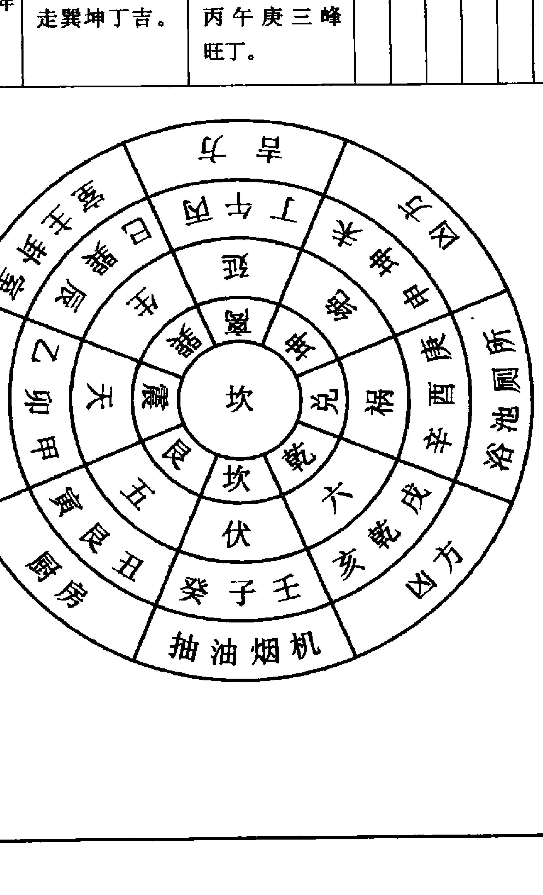

| 坐山 | 分金 | 宿度 | 吉凶 | 水法 | 山峰 | 黄泉 | 曜 | 劫 | 杀 | 生 | 旺 |
| :--- | :--- | :--- | :--- | :--- | :--- | :--- | :--- | :--- | :--- | :--- | :--- |
| 丑 | 丁丑<br>癸未 | 坐斗宿<br>二度 | 人丁兴旺<br>百事吉 | 左水倒右，<br>走庚；右水<br>倒左，走丙、<br>巽、甲、乙。 | 乙丁二峰旺<br>丁，癸辰二<br>峰主科甲。 | 申 | 寅 | 辰 | 庚 | 酉 | 子 |
| 艮 | 辛丑<br>丁未 | 坐斗宿<br>五度 | 子孙孝义<br>富贵双全 | 左水倒右，<br>右水倒左，<br>走丙坤辛。 | 申峰主贵。<br>丑峰主丁。 | 庚 | 寅 | 丁 | 庚 | 寅 | 午 |
| 寅 | 庚寅<br>丙申 | 坐箕宿<br>一度 | 富贵双全 | 左水倒右，<br>走丙丁吉；<br>右水倒左，<br>走辛吉。 | 卯峰旺官；<br>巽峰长寿；<br>申峰旺科甲；<br>辛辰子三峰<br>旺人丁。 | 坤 | 寅 | 未 | 午 | 亥 | 卯 |

丑艮寅三山，均为艮宅。游星在该宅八方的分布是：从艮伏位、六煞、绝命、祸害、生气、延年、天医、五鬼。其中，生、天、延、伏为四吉星方；绝、五、六、祸为四凶星方。

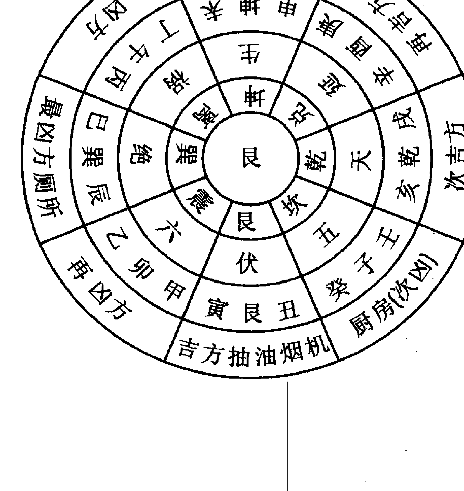

| 坐山 | 分金 | 宿度 | 吉凶 | 水法 | 山峰 | 其他（黄泉/曜/劫/杀/生/旺） |
|------|------|------|------|------|------|--------------------------|
| 甲 | 一百二十分金 庚寅 庚申 | 坐尾宿八度 | 子孙富贵 双全 | 左水倒右，走辛乾吉；右水倒左，走丙丁吉。 | 丙峰贵；乙峰富；庚峰主科甲；艮巽二峰主财丁。 | 坤/申/丙/午/亥/卯 |
| 卯 | 辛 卯 丁 酉 | 坐房宿一度 | 一举登科 为人长寿 | 左水倒右，右水倒左，走庚辛水吉。 | 丙子峰主科甲；卯巽申峰主旺丁。 | 乾/申/丁/戌/午/寅 |
| 乙 | 一百二十分金 丁卯 丁酉 | 坐氐宿三度 | 人丁发财 五代出官 | 左水倒右，右水倒左，走庚、辛、壬吉。 | 丁辛申峰主科甲；巳峰旺财；庚酉丙午四峰旺丁。 | 乾/申/申/戌/午/寅 |

震宅八方吉凶：甲卯乙三山，均为震宅。游星在该宅八方的分布是：从震卦开始左旋，依次是伏位、延年、生气、祸害、绝命、五鬼、天医、六煞。其中，生、天、延、伏为四吉星方；绝、五、六、祸为四凶星方。

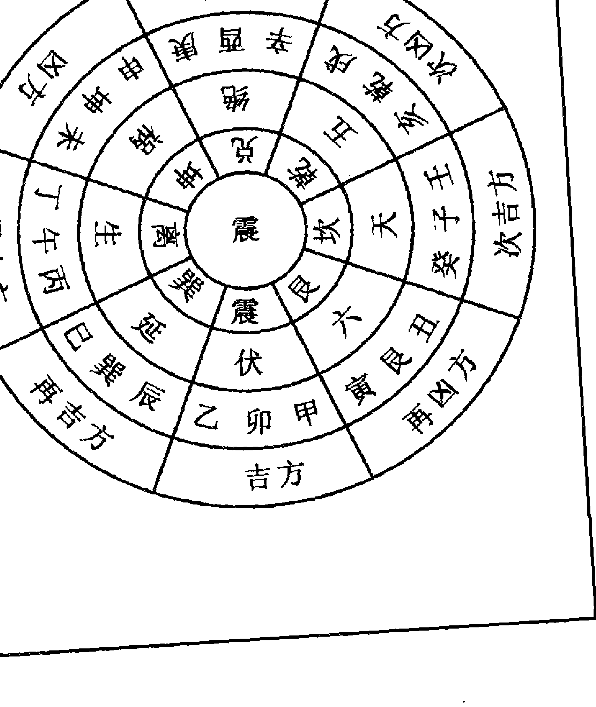

| 坐山 | 分金 | 宿度 | 吉凶 | 水法 | 山峰 | 黄泉 | 曜 | 劫 | 杀 | 生 | 旺 |
|------|------|------|------|------|------|------|----|----|----|----|----|
| 辰 | 庚辰丙戌 | 坐角宿十一度 | 人丁兴旺加官进爵 | 左水倒右，走壬癸丑艮；右水倒左，走庚辛丁未吉。 | 山峰：缺 | 乾 | 酉 | 未 | 卯 | 寅 | 午 |
| 巽 | 甲辰庚戌 | 坐角宿一度 | 人丁兴旺代代吉昌 | 左水倒右，右水倒左，庚丁合碓宫元成乾。 | 丑未峰科甲；癸乙丁旺丁；丁亥二峰旺财。 | 壬 | 酉 | 癸 | 亥 | 午 | 寅 |
| 巳 | 辛巳丁亥 | 坐翌宿十度 | 富贵三代人丁兴旺 | 左水倒右，右水倒左，走癸辛水吉祥。 | 辰未戌艮旺丁；申亥二峰科甲；壬子二峰旺丁。 | 乾 | 酉 | 酉 | 乾 | 酉 | 巳 |

辰巽巳三山，均为巽宅。游星在该宅八方分布的情况是：从巽卦起向左旋，分别是伏位、天医、五鬼、六煞、祸害、生气、绝命、延年。其中：生、天、延、伏为四吉星方；绝、五、六、祸为四凶星方。

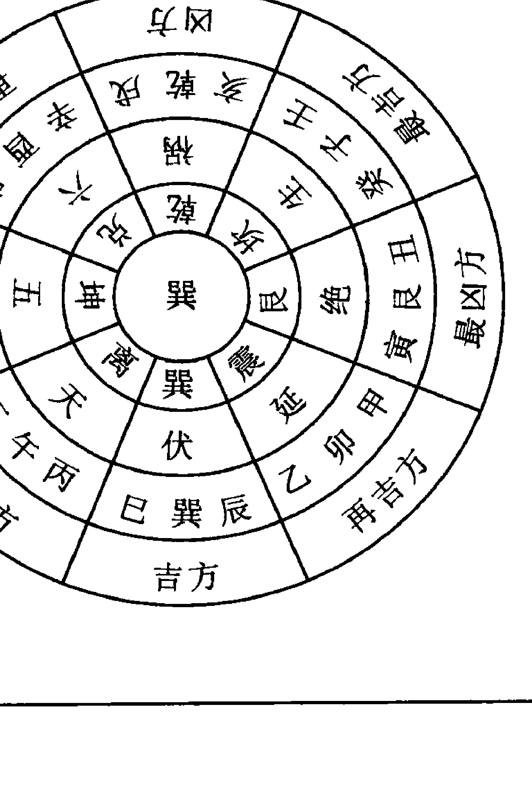

| 坐山 | 分金 | 宿度 | 吉凶 | 水法 | 山峰 | 黄泉 | 曜 | 劫 | 杀 | 生 | 旺 |
| :--- | :--- | :--- | :--- | :--- | :--- | :--- | :--- | :--- | :--- | :--- | :--- |
| 丙 | 乙巳辛亥 | 坐翼宿十度 | 人丁兴旺富贵荣华 | 左水倒右，走戊壬；右水倒左，走辛癸。 | 山峰：缺 | 乾 | 亥 | 辛申 | 艮 | 寅 | 午 |
| 午 | 丙午庚子 | 坐星宿四度 | 富贵大吉昌 | 左水倒右，走戊丑；右水倒左，走癸壬。 | 巳丑艮乾四峰旺丁；未戌丑峰旺财；壬子午科甲。 | 艮 | 亥 | 酉 | 壬 | 酉 | 巳 |
| 丁 | 辛未乙丑 | 坐柳宿四度 | 登科及第永远富贵 | 左水倒右，右水倒左，乾癸丑甲丁未吉。 | 壬甲卯峰旺丁；子寅巳峰旺财；癸峰不吉。 | 艮坤 | 亥 | 寅 | 壬 | 酉 | 巳 |

丙午丁三山，均为离宅。游星在该宅八方分布的情况是：从离卦起向左旋，分别是伏位、六煞、五鬼、绝命、延年、祸害、生气、天医。其中：生、天、延、伏为四吉星方；绝、五、六、祸为四凶星方。

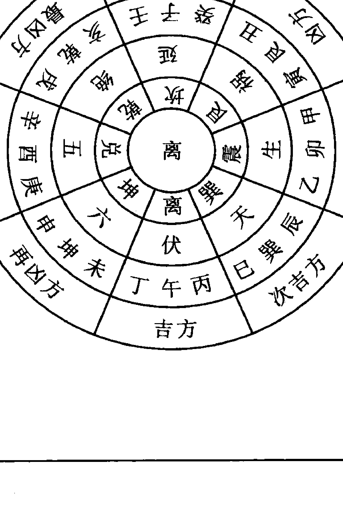

## 中国风水学初探

| 坐山 | 分金 | 宿度 | 吉凶 | 水法 | 山峰 | 黄泉 | 曜 | 劫 | 杀 | 生 | 旺 |
|------|------|------|------|------|------|------|----|----|----|----|----|
| 未 | 丁未 辛丑 | 坐井宿十度 | 富贵双全 | 左水倒右，右水倒左，走壬申水吉。 | 艮乾戌峰主科甲；辛癸二峰旺丁；乾峰不吉。 | 艮 | 卯 | 癸亥 | 辰 | 酉 | 巳 |
| 坤 | 一百二十分金 辛未 辛丑 | 坐井宿六度 | 财丁兴发 | 左水斜右，走乙辰；右水倒左，走壬癸丑。 | 巽艮二峰主科甲；巳亥二峰旺丁；癸峰主财。 | 甲癸 | 卯 | 乙 | 亥 | 酉 | 巳 |
| 申 | 丙申 庚寅 | 坐参宿六度 | 旺人丁 长寿 进士及第 | 左水倒右，右水倒左，走壬水吉。 | 丑辰二峰旺丁；甲庚二峰旺财。 | 艮 | 卯 | 癸 | 午 | 巳 | 酉 |

未坤申三山，均为坤宅。游星在该宅八方分布的情况是：从坤卦起，向左旋，分别是伏位、天医、延年、绝命、生气、祸害，六煞、五鬼。其中，生、天、延、伏，为四吉星方；绝、五、六、祸，为四凶星方。

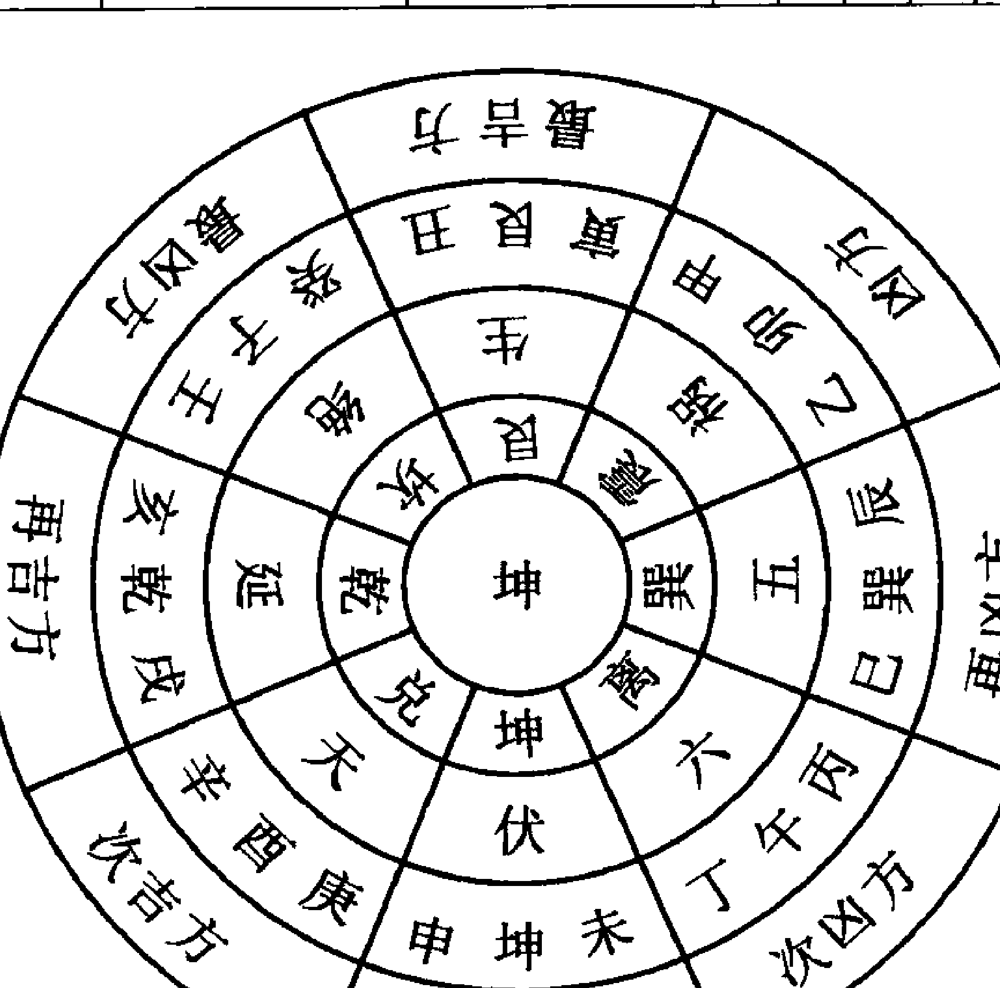

| 坐山 | 分金 | 宿度 | 吉凶 | 水法 | 山峰 | 黄泉 | 曜 | 劫 | 杀 | 生 | 旺 |
| :---: | :---: | :---: | :---: | :---: | :---: | :---: | :---: | :---: | :---: | :---: | :---: |
| 庚 | 庚申 甲寅 | 坐毕宿十度 | 富贵三代 财丁兴旺 | 左水倒右，右水倒左，走癸乙艮吉。 | 乾艮二峰旺丁；丁丑二峰旺财。 | 艮 | 巳 | 午 | 午 | 巳 | 酉 |
| 酉 | 丁酉 辛卯 | 坐昴宿三度 | 富贵双全 代代吉昌 | 左水倒右，右水倒左，走癸甲艮寅甲水来少年科甲及第。 | 卯艮二峰旺财丁；壬子丙午四峰主科甲；乾艮坤旺丁。 | 巽 | 巳 | 寅 | 午 | 子 | 申 |
| 辛 | 一百二十分金 丁酉 丁卯 | 坐胃宿六度 | 田产俱盛 永远大吉 | 左水倒右，右水倒左，走艮丙乙吉。 | 壬子甲卯丙午六峰旺丁；申亥寅三峰旺财；巳峰二房绝。 | 巽 | 巳 | 寅 | 午 | 子 | 申 |

庚酉辛三山，均为兑宅。游星在该宅八方分布的情况是：从兑山起向左旋，分别是伏位、生气、祸害、延年，绝命、六煞、五鬼、天医。其中，生、天、延、伏，为四吉星方；绝、五、六、祸为四凶星方。

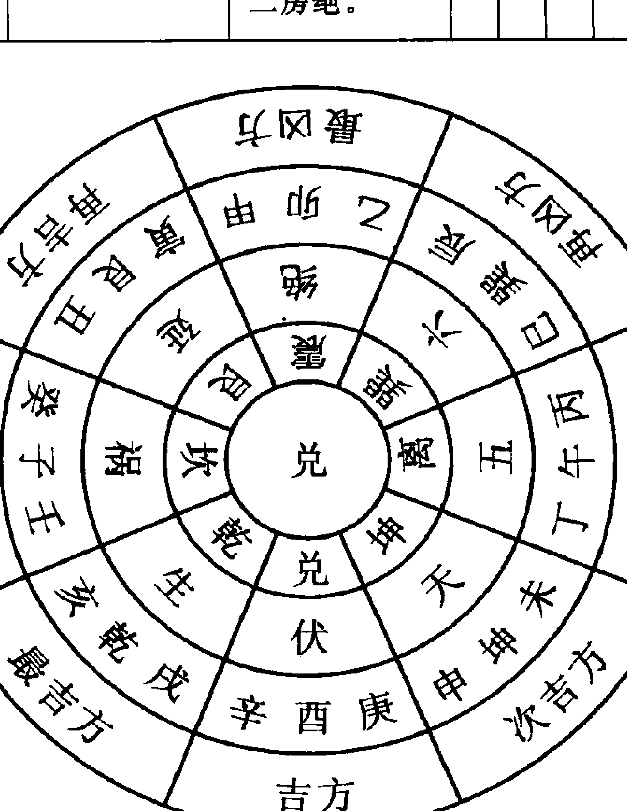

| 坐山 | 分金 | 宿度 | 吉凶 | 水法 | 山峰 | 黄泉 | 曜 | 劫 | 杀 | 生 | 旺 |
| :---: | :---: | :---: | :--- | :--- | :--- | :---: | :---: | :---: | :---: | :---: | :---: |
| 戌 | 丙戌庚辰 | 坐娄宿三度 | 百事顺心吉利 | 左水倒右，右水倒左，走甲丙丁吉。 | 艮峰旺丁财贵；坤峰旺财；庚乙旺丁；未峰科甲。 | 巽 | 午 | 丑 | 午 | 寅 | 午 |
| 乾 | 庚戌甲辰 | 坐奎宿十二度 | 人丁兴旺富贵大吉 | 左水倒右，右水倒左，走艮甲丁吉。 | 艮寅巳亥四峰旺丁；午申辰壬四峰旺财；辛、巽峰科甲。 | 乙丙 | 午 | 卯 | 午 | 子 | 酉 |
| 亥 | 丁亥辛巳 | 坐壁宿一、二度 | 人丁兴旺永远无疆 | 左水倒右，走丙丁；右水倒左，走乙。 | 巽峰富贵科甲；辛子乙癸四峰旺财；巽向水流丁甲吉。 | 巽 | 午 | 未 | 乾 | 卯 | 亥 |

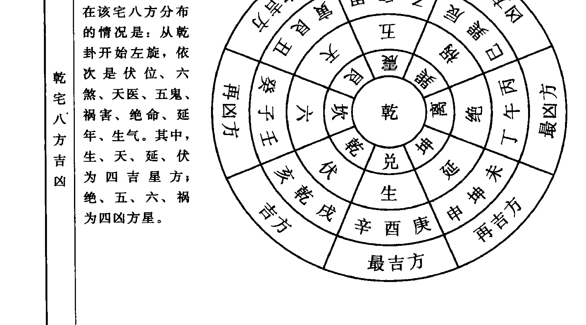

## 附二：三元九运二十四山下卦和替卦挨星图

### 一运

### 壬山丙向及其兼子午挨星图

| 下卦 |   |   |   | 替卦 |   |   |   |
|------|---|---|---|------|---|---|---|
|      | 74<br>九 | 29<br>五 | 92<br>七 |      | 74<br>九 | 29<br>五 | 92<br>七 |
|      | 83<br>八 | 65<br>一 | 47<br>三 |      | 83<br>八 | 65<br>一 | 47<br>三 |
|      | 38<br>四 | 11<br>六 | 56<br>二 |      | 38<br>四 | 11<br>六 | 56<br>二 |

### 子山午向及其兼壬丙挨星图

| 下卦 |   |   |   | 替卦 |   |   |   |
|------|---|---|---|------|---|---|---|
|      | 56<br>九 | 11<br>五 | 38<br>七 |      | 56<br>九 | 11<br>五 | 38<br>七 |
|      | 47<br>八 | 65<br>一 | 83<br>三 |      | 47<br>八 | 65<br>一 | 83<br>三 |
|      | 92<br>四 | 29<br>六 | 74<br>二 |      | 92<br>四 | 29<br>六 | 74<br>二 |

### 癸山丁向及其兼子午挨星图

| 下卦 |   |   |   | 替卦 |   |   |   |
|------|---|---|---|------|---|---|---|
|      | 56<br>九 | 11<br>五 | 38<br>七 |      | 56<br>九 | 11<br>五 | 38<br>七 |
|      | 47<br>八 | 65<br>一 | 83<br>三 |      | 47<br>八 | 65<br>一 | 83<br>三 |
|      | 92<br>四 | 29<br>六 | 74<br>二 |      | 92<br>四 | 29<br>六 | 74<br>二 |

### 丑山未向及其兼艮坤挨星图

| 下卦 |   |   |   | 替卦 |   |   |   |
|------|---|---|---|------|---|---|---|
|      | 56<br>九 | 92<br>五 | 74<br>七 |      | 78<br>九 | 24<br>五 | 96<br>七 |
|      | 65<br>八 | 47<br>一 | 29<br>三 |      | 87<br>八 | 69<br>一 | 42<br>三 |
|      | 11<br>四 | 83<br>六 | 38<br>二 |      | 33<br>四 | 15<br>六 | 51<br>二 |

### 艮山坤向及其兼丑未挨星图

| 下卦 |   |   |   | 替卦 |   |   |   |
|------|---|---|---|------|---|---|---|
|      | 38<br>九 | 83<br>五 | 11<br>七 |      | 58<br>九 | 13<br>五 | 31<br>七 |
|      | 29<br>八 | 47<br>一 | 65<br>三 |      | 49<br>八 | 67<br>一 | 85<br>三 |
|      | 74<br>四 | 92<br>六 | 56<br>二 |      | 94<br>四 | 22<br>六 | 76<br>二 |

### 寅山申向及其兼艮坤挨星图

| 下卦 |   |   |   | 替卦 |   |   |   |
|------|---|---|---|------|---|---|---|
|      | 38<br>九 | 83<br>五 | 11<br>七 |      | 58<br>九 | 13<br>五 | 31<br>七 |
|      | 29<br>八 | 47<br>一 | 65<br>三 |      | 49<br>八 | 67<br>一 | 85<br>三 |
|      | 74<br>四 | 92<br>六 | 56<br>二 |      | 94<br>四 | 22<br>六 | 76<br>二 |

### 甲山庚向及其兼卯酉挨星图

| 下卦 |   |   |   | 替卦 |   |   |   |
|------|---|---|---|------|---|---|---|
|      | 92<br>九 | 47<br>五 | 29<br>七 |      | 89<br>九 | 35<br>五 | 17<br>七 |
|      | 11<br>八 | 83<br>一 | 65<br>三 |      | 98<br>八 | 71<br>一 | 53<br>三 |
|      | 56<br>四 | 38<br>六 | 74<br>二 |      | 44<br>四 | 26<br>六 | 62<br>二 |

### 卯山酉向及其兼甲庚挨星图

| 下卦 |   |   |   | 替卦 |   |   |   |
|------|---|---|---|------|---|---|---|
|      | 74<br>九 | 38<br>五 | 56<br>七 |      | 63<br>九 | 27<br>五 | 45<br>七 |
|      | 65<br>八 | 83<br>一 | 11<br>三 |      | 54<br>八 | 72<br>一 | 99<br>三 |
|      | 29<br>四 | 47<br>六 | 92<br>二 |      | 18<br>四 | 36<br>六 | 81<br>二 |

## 三元九运二十四山下卦和替卦挨星图

### 一运

乙山辛向及其兼卯酉辰戌挨星图
| 下卦 | | | 替卦 | | |
| --- | --- | --- | --- | --- | --- |
| 74 九 | 38 五 | 56 七 | 83 九 | 47 五 | 65 七 |
| 65 八 | 83 一 | 11 三 | 74 八 | 92 一 | 29 三 |
| 29 四 | 47 六 | 92 二 | 38 四 | 56 六 | 11 二 |

辰山戌向及其兼巽乾乙辛挨星图
| 下卦 | | | 替卦 | | |
| --- | --- | --- | --- | --- | --- |
| 83 九 | 47 五 | 65 七 | 63 九 | 27 五 | 45 七 |
| 74 八 | 92 一 | 29 三 | 54 八 | 72 一 | 99 三 |
| 38 四 | 56 六 | 11 二 | 18 四 | 36 六 | 81 二 |

巽山乾向及其兼辰戌巳亥挨星图
| 下卦 | | | 替卦 | | |
| --- | --- | --- | --- | --- | --- |
| 11 九 | 56 五 | 38 七 | 11 九 | 56 五 | 38 七 |
| 29 八 | 92 一 | 74 三 | 29 八 | 92 一 | 74 三 |
| 65 四 | 47 六 | 83 二 | 65 四 | 47 六 | 83 二 |

巳山亥向及其兼巽乾丙壬挨星图
| 下卦 | | | 替卦 | | |
| --- | --- | --- | --- | --- | --- |
| 11 九 | 56 五 | 38 七 | 19 九 | 55 五 | 37 七 |
| 29 八 | 92 一 | 74 三 | 28 八 | 91 一 | 73 三 |
| 65 四 | 47 六 | 83 二 | 64 四 | 46 六 | 82 二 |

丙山壬向及其兼午子巳亥挨星图
| 下卦 | | | 替卦 | | |
| --- | --- | --- | --- | --- | --- |
| 47 九 | 92 五 | 29 七 | 47 九 | 92 五 | 29 七 |
| 38 八 | 56 一 | 74 三 | 38 八 | 56 一 | 74 三 |
| 83 四 | 11 六 | 65 二 | 83 四 | 11 六 | 65 二 |

午山子向及其兼丙壬丁癸挨星图
| 下卦 | | | 替卦 | | |
| --- | --- | --- | --- | --- | --- |
| 65 九 | 11 五 | 83 七 | 65 九 | 11 五 | 83 七 |
| 74 八 | 56 一 | 38 三 | 74 八 | 56 一 | 38 三 |
| 29 四 | 92 六 | 47 二 | 29 四 | 92 六 | 47 二 |

丁山癸向及其兼午子未丑挨星图
| 下卦 | | | 替卦 | | |
| --- | --- | --- | --- | --- | --- |
| 65 九 | 11 五 | 83 七 | 65 九 | 11 五 | 83 七 |
| 74 八 | 56 一 | 38 三 | 74 八 | 56 一 | 38 三 |
| 29 四 | 92 六 | 47 二 | 29 四 | 92 六 | 47 二 |

未山丑向及其兼坤艮丁癸挨星图
| 下卦 | | | 替卦 | | |
| --- | --- | --- | --- | --- | --- |
| 65 九 | 29 五 | 47 七 | 87 九 | 42 五 | 69 七 |
| 56 八 | 74 一 | 92 三 | 78 八 | 96 一 | 24 三 |
| 11 四 | 38 六 | 83 二 | 33 四 | 54 六 | 15 二 |## 三元九运二十四山下卦和替卦挨星图

## 一运

### 坤山艮向及其兼未丑申寅挨星图
| | 83 九 | 38 五 | 11 七 | | 85 九 | 31 五 | 13 七 |
|---|---|---|---|---|---|---|---|
| 下卦 | 92 八 | 74 一 | 56 三 | 替卦 | 94 八 | 76 一 | 58 三 |
| | 47 四 | 29 六 | 65 二 | | 49 四 | 22 六 | 67 二 |

### 申山寅向及其兼坤艮庚甲挨星图
| | 83 九 | 38 五 | 11 七 | | 85 九 | 31 五 | 13 七 |
|---|---|---|---|---|---|---|---|
| 下卦 | 92 八 | 74 一 | 56 三 | 替卦 | 94 八 | 76 一 | 58 三 |
| | 47 四 | 29 六 | 65 二 | | 49 四 | 22 六 | 67 二 |

### 庚山甲向及其兼酉卯申寅挨星图
| | 29 九 | 74 五 | 92 七 | | 98 九 | 53 五 | 71 七 |
|---|---|---|---|---|---|---|---|
| 下卦 | 11 八 | 38 一 | 56 三 | 替卦 | 89 八 | 17 一 | 35 三 |
| | 65 四 | 83 六 | 47 二 | | 44 四 | 62 六 | 26 二 |

### 酉山卯向及其兼庚甲辛乙挨星图
| | 47 九 | 83 五 | 65 七 | | 36 九 | 72 五 | 54 七 |
|---|---|---|---|---|---|---|---|
| 下卦 | 56 八 | 38 一 | 11 三 | 替卦 | 45 八 | 27 一 | 99 三 |
| | 92 四 | 24 六 | 29 二 | | 81 四 | 63 六 | 18 二 |

### 辛山乙向及其兼酉卯戊辰挨星图
| | 47 九 | 83 五 | 65 七 | | 38 九 | 74 五 | 56 七 |
|---|---|---|---|---|---|---|---|
| 下卦 | 56 八 | 38 一 | 11 三 | 替卦 | 47 八 | 29 一 | 92 三 |
| | 92 四 | 74 六 | 29 二 | | 83 四 | 65 六 | 11 二 |

### 戌山辰向及其兼乾巽辛乙挨星图
| | 38 九 | 74 五 | 56 七 | | 36 九 | 72 五 | 54 七 |
|---|---|---|---|---|---|---|---|
| 下卦 | 47 八 | 29 一 | 92 三 | 替卦 | 45 八 | 27 一 | 99 三 |
| | 83 四 | 65 六 | 11 二 | | 81 四 | 63 六 | 18 二 |

### 乾山巽向及其兼戊辰亥巳挨星图
| | 11 九 | 65 五 | 83 七 | | 11 九 | 65 五 | 83 七 |
|---|---|---|---|---|---|---|---|
| 下卦 | 92 八 | 29 一 | 47 三 | 替卦 | 92 八 | 29 一 | 47 三 |
| | 56 四 | 74 六 | 38 二 | | 56 四 | 74 六 | 38 二 |

### 亥山巳向及其兼乾巽壬丙挨星图
| | 11 九 | 65 五 | 83 七 | | 91 九 | 55 五 | 73 七 |
|---|---|---|---|---|---|---|---|
| 下卦 | 92 八 | 29 一 | 47 三 | 替卦 | 82 八 | 19 一 | 37 三 |
| | 56 四 | 74 六 | 38 二 | | 46 四 | 64 六 | 28 二 |

## 二运

### 壬山丙向及其兼子午亥巳挨星图
| | 67 一 六 | 22 二 八 | 49 三 八 | | 87 一 六 | 42 二 八 | 69 三 八 |
|---|---|---|---|---|---|---|---|
| 下卦 | 58 九 二 | 76 二 四 | 94 四 四 | 替卦 | 78 九 二 | 96 二 四 | 24 四 四 |
| | 13 五 七 | 31 七 三 | 85 三 三 | | 33 五 七 | 51 七 三 | 15 三 三 |

### 子山午向及其兼壬丙癸丁挨星图
| | 85 一 六 | 31 二 八 | 13 三 八 | | 85 一 六 | 31 二 八 | 13 三 八 |
|---|---|---|---|---|---|---|---|
| 下卦 | 94 九 二 | 76 二 四 | 58 四 四 | 替卦 | 94 九 二 | 76 二 四 | 58 四 四 |
| | 69 五 七 | 22 七 三 | 67 三 三 | | 69 五 七 | 22 七 三 | 67 三 三 |

### 癸山丁向及其兼子午丑未挨星图
| | 85 一 六 | 31 二 八 | 13 三 八 | | 85 一 六 | 31 二 八 | 13 三 八 |
|---|---|---|---|---|---|---|---|
| 下卦 | 94 九 二 | 76 二 四 | 58 四 四 | 替卦 | 94 九 二 | 76 二 四 | 58 四 四 |
| | 49 五 七 | 22 七 三 | 67 三 三 | | 49 五 七 | 22 七 三 | 67 三 三 |

### 丑山未向及其兼艮坤癸丁挨星图
| | 69 一 六 | 14 二 八 | 82 三 八 | | 68 一 六 | 13 二 八 | 81 三 八 |
|---|---|---|---|---|---|---|---|
| 下卦 | 71 九 二 | 58 二 四 | 36 四 四 | 替卦 | 79 九 二 | 57 二 四 | 35 四 四 |
| | 25 五 七 | 93 七 三 | 47 三 三 | | 24 五 七 | 92 七 三 | 46 三 三 |

### 艮山坤向及其兼丑未寅申挨星图
| | 47 一 六 | 93 二 八 | 25 三 八 | | 46 一 六 | 92 二 八 | 24 三 八 |
|---|---|---|---|---|---|---|---|
| 下卦 | 36 九 二 | 58 二 四 | 71 四 四 | 替卦 | 35 九 二 | 57 二 四 | 79 四 四 |
| | 82 五 七 | 14 七 三 | 69 三 三 | | 81 五 七 | 13 七 三 | 68 三 三 |

### 寅山申向及其兼艮坤甲庚挨星图
| | 47 一 六 | 93 二 八 | 25 三 八 | | 48 一 六 | 94 二 八 | 26 三 八 |
|---|---|---|---|---|---|---|---|
| 下卦 | 36 九 二 | 58 二 四 | 71 四 四 | 替卦 | 37 九 二 | 59 二 四 | 72 四 四 |
| | 82 五 七 | 14 七 三 | 69 三 三 | | 83 五 七 | 15 七 三 | 61 三 三 |

### 甲山庚向及其兼卯酉寅申挨星图
| | 85 一 六 | 49 二 八 | 67 三 八 | | 67 一 六 | 22 二 八 | 49 三 八 |
|---|---|---|---|---|---|---|---|
| 下卦 | 76 九 二 | 94 二 四 | 22 四 四 | 替卦 | 58 九 二 | 76 二 四 | 94 四 四 |
| | 31 五 七 | 58 七 三 | 13 三 三 | | 13 五 七 | 31 七 三 | 85 三 三 |

### 卯山酉向及其兼甲庚乙辛挨星图
| | 13 一 六 | 58 二 八 | 31 三 八 | | 15 一 六 | 51 二 八 | 33 三 八 |
|---|---|---|---|---|---|---|---|
| 下卦 | 22 九 二 | 94 二 四 | 76 四 四 | 替卦 | 24 九 二 | 96 二 四 | 78 四 四 |
| | 67 五 七 | 49 七 三 | 85 三 三 | | 69 五 七 | 42 七 三 | 87 三 三 |

### 乙山辛向及其兼卯酉辰戌挨星图
| | 13 一 六 | 58 二 八 | 31 三 八 | | 15 一 六 | 51 二 八 | 33 三 八 |
|---|---|---|---|---|---|---|---|
| 下卦 | 22 九 二 | 94 二 四 | 76 四 四 | 替卦 | 24 九 二 | 96 二 四 | 78 四 四 |
| | 67 五 七 | 49 七 三 | 85 三 三 | | 69 五 七 | 42 七 三 | 87 三 三 |

### 辰山戌向及其兼巽乾乙辛挨星图
| | 92 一 六 | 57 二 八 | 79 三 八 | | 19 一 六 | 65 二 八 | 87 三 八 |
|---|---|---|---|---|---|---|---|
| 下卦 | 81 九 二 | 13 二 四 | 35 四 四 | 替卦 | 98 九 二 | 21 二 四 | 43 四 四 |
| | 46 五 七 | 68 七 三 | 24 三 三 | | 54 五 七 | 76 七 三 | 32 三 三 |

### 巽山乾向及其兼辰戌巳亥挨星图
| | 24 一 六 | 68 二 八 | 46 三 八 | | 23 一 六 | 67 二 八 | 45 三 八 |
|---|---|---|---|---|---|---|---|
| 下卦 | 35 九 二 | 13 二 四 | 81 四 四 | 替卦 | 34 九 二 | 12 二 四 | 89 四 四 |
| | 79 五 七 | 57 七 三 | 92 三 三 | | 78 五 七 | 56 七 三 | 91 三 三 |

### 巳山亥向及其兼巽乾丙壬挨星图
| | 24 一 六 | 68 二 八 | 46 三 八 | | 23 一 六 | 67 二 八 | 45 三 八 |
|---|---|---|---|---|---|---|---|
| 下卦 | 35 九 二 | 13 二 四 | 81 四 四 | 替卦 | 34 九 二 | 12 二 四 | 89 四 四 |
| | 79 五 七 | 57 七 三 | 92 三 三 | | 78 五 七 | 56 七 三 | 91 三 三 |

### 丙山壬向及其兼午子巳亥挨星图
| | 76 一 六 | 22 二 八 | 94 三 八 | | 78 一 六 | 24 二 八 | 96 三 八 |
|---|---|---|---|---|---|---|---|
| 下卦 | 85 九 二 | 67 二 四 | 49 四 四 | 替卦 | 87 九 二 | 69 二 四 | 42 四 四 |
| | 31 五 七 | 13 七 三 | 58 三 三 | | 33 五 七 | 15 七 三 | 51 三 三 |

### 午山子向及其兼丙壬丁癸挨星图
| | 58 一 六 | 13 二 八 | 31 三 八 | | 58 一 六 | 13 二 八 | 31 三 八 |
|---|---|---|---|---|---|---|---|
| 下卦 | 49 九 二 | 67 二 四 | 85 四 四 | 替卦 | 49 九 二 | 67 二 四 | 85 四 四 |
| | 94 五 七 | 22 七 三 | 76 三 三 | | 94 五 七 | 22 七 三 | 76 三 三 |

### 丁山癸向及其兼午子未丑挨星图
| | 58 一 六 | 13 二 八 | 31 三 八 | | 58 一 六 | 13 二 八 | 31 三 八 |
|---|---|---|---|---|---|---|---|
| 下卦 | 49 九 二 | 67 二 四 | 85 四 四 | 替卦 | 49 九 二 | 67 二 四 | 85 四 四 |
| | 94 五 七 | 22 七 三 | 76 三 三 | | 94 五 七 | 22 七 三 | 76 三 三 |

### 未山丑向及其兼坤艮丁癸挨星图
| | 96 一 六 | 41 二 八 | 28 三 八 | | 86 一 六 | 31 二 八 | 18 三 八 |
|---|---|---|---|---|---|---|---|
| 下卦 | 17 九 二 | 85 二 四 | 63 四 四 | 替卦 | 97 九 二 | 75 二 四 | 53 四 四 |
| | 52 五 七 | 39 七 三 | 74 三 三 | | 42 五 七 | 29 七 三 | 64 三 三 |

### 坤山艮向及其兼丑未申寅挨星图
| | 74 一 六 | 39 二 八 | 52 三 八 | | 64 一 六 | 29 二 八 | 42 三 八 |
|---|---|---|---|---|---|---|---|
| 下卦 | 63 九 二 | 85 二 四 | 17 四 四 | 替卦 | 53 九 二 | 75 二 四 | 97 四 四 |
| | 28 五 七 | 41 七 三 | 96 三 三 | | 18 五 七 | 31 七 三 | 86 三 三 |

### 申山寅向及其兼坤艮庚甲挨星图
| | 74 一 六 | 39 二 八 | 52 三 八 | | 84 一 六 | 49 二 八 | 62 三 八 |
|---|---|---|---|---|---|---|---|
| 下卦 | 63 九 二 | 85 二 四 | 17 四 四 | 替卦 | 73 九 二 | 95 二 四 | 27 四 四 |
| | 28 五 七 | 41 七 三 | 96 三 三 | | 38 五 七 | 51 七 三 | 16 三 三 |

### 庚山甲向及其兼酉卯申寅挨星图
| | 58 一 六 | 94 二 八 | 76 三 八 | | 76 一 六 | 22 二 八 | 94 三 八 |
|---|---|---|---|---|---|---|---|
| 下卦 | 67 九 二 | 49 二 四 | 22 四 四 | 替卦 | 85 九 二 | 67 二 四 | 49 四 四 |
| | 13 五 七 | 85 七 三 | 31 三 三 | | 31 五 七 | 13 七 三 | 58 三 三 |

### 酉山卯向及其兼庚甲辛乙挨星图
| | 31 一 六 | 85 二 八 | 13 三 八 | | 51 一 六 | 15 二 八 | 33 三 八 |
|---|---|---|---|---|---|---|---|
| 下卦 | 22 九 二 | 49 二 四 | 67 四 四 | 替卦 | 42 九 二 | 69 二 四 | 87 四 四 |
| | 76 五 七 | 94 七 三 | 58 三 三 | | 96 五 七 | 24 七 三 | 78 三 三 |

### 辛山乙向及其兼酉卯戌辰挨星图
| | 31 一 六 | 85 二 八 | 13 三 八 | | 51 一 六 | 13 二 八 | 33 三 八 |
|---|---|---|---|---|---|---|---|
| 下卦 | 22 九 二 | 49 二 四 | 67 四 四 | 替卦 | 42 九 二 | 69 二 四 | 87 四 四 |
| | 76 五 七 | 94 七 三 | 58 三 三 | | 96 五 七 | 24 七 三 | 78 三 三 |

### 戌山辰向及其兼乾巽辛乙挨星图
| | 29 一 六 | 75 二 八 | 97 三 八 | | 91 一 六 | 56 二 八 | 78 三 八 |
|---|---|---|---|---|---|---|---|
| 下卦 | 18 九 二 | 31 二 四 | 53 四 四 | 替卦 | 89 九 二 | 12 二 四 | 34 四 四 |
| | 64 五 七 | 86 七 三 | 42 三 三 | | 45 五 七 | 67 七 三 | 23 三 三 |

### 乾山巽向及其兼戌辰亥巳挨星图
| | 42 一 六 | 86 二 八 | 64 三 八 | | 32 一 六 | 76 二 八 | 54 三 八 |
|---|---|---|---|---|---|---|---|
| 下卦 | 53 九 二 | 31 二 四 | 18 四 四 | 替卦 | 43 九 二 | 21 二 四 | 98 四 四 |
| | 97 五 七 | 75 七 三 | 29 三 三 | | 87 五 七 | 65 七 三 | 19 三 三 |

### 亥山巳向及其兼乾巽壬丙挨星图
| | 42 一 六 | 86 二 八 | 64 三 八 | | 32 一 六 | 76 二 八 | 54 三 八 |
|---|---|---|---|---|---|---|---|
| 下卦 | 53 九 二 | 31 二 四 | 18 四 四 | 替卦 | 43 九 二 | 21 二 四 | 98 四 四 |
| | 97 五 七 | 75 七 三 | 29 三 三 | | 87 五 七 | 65 七 三 | 17 三 三 |

## 三运

### 壬山丙向及其兼子午亥巳挨星图
| 下卦 | 替卦 |
|---|---|
| 96 二 一 | 42 七 三 |
| 15 一 六 | 87 三 八 |
| 51 六 九 | 33 八 二 |
| 24 九 五 | 88 二 一 |
| 69 五 四 | 97 一 六 |
| 78 四 三 | 43 六 九 |
| | 34 七 五 |
| | 79 三 四 |
| | 25 八 三 |
| | 16 九 五 |
| | 52 五 四 |
| | 61 四 三 |

### 子山午向及其兼壬丙癸丁挨星图
| 下卦 | 替卦 |
|---|---|
| 78 二 一 | 33 七 三 |
| 69 一 六 | 87 三 八 |
| 24 六 九 | 42 八 二 |
| 51 九 五 | 68 二 一 |
| 15 五 四 | 59 一 六 |
| 96 四 三 | 14 六 九 |
| | 23 七 五 |
| | 77 三 四 |
| | 32 八 三 |
| | 41 九 五 |
| | 95 五 四 |
| | 86 四 三 |

### 癸山丁向及其兼子午丑未挨星图
| 下卦 | 替卦 |
|---|---|
| 78 二 一 | 33 七 三 |
| 69 一 六 | 87 三 八 |
| 24 六 九 | 42 八 二 |
| 51 九 五 | 88 二 一 |
| 15 五 四 | 79 一 六 |
| 96 四 三 | 34 六 九 |
| | 43 七 五 |
| | 97 三 四 |
| | 52 八 三 |
| | 61 九 五 |
| | 25 五 四 |
| | 16 四 三 |

### 丑山未向及其兼艮坤癸丁挨星图
| 下卦 | 替卦 |
|---|---|
| 78 二 一 | 24 七 三 |
| 87 一 六 | 69 三 八 |
| 33 六 九 | 15 八 二 |
| 96 九 五 | 76 二 一 |
| 42 五 四 | 85 一 六 |
| 51 四 三 | 31 六 九 |
| | 22 七 五 |
| | 67 三 四 |
| | 13 八 三 |
| | 94 九 五 |
| | 49 五 四 |
| | 58 四 三 |

### 艮山坤向及其兼丑未寅申挨星图
| 下卦 | 替卦 |
|---|---|
| 51 二 一 | 15 七 三 |
| 42 一 六 | 69 三 八 |
| 96 六 九 | 24 八 二 |
| 15 九 五 | 33 二 一 |
| 69 五 四 | 87 一 六 |
| 78 四 三 | 78 六 九 |
| | 51 七 五 |
| | 42 三 四 |
| | 24 八 三 |
| | 33 九 五 |
| | 87 五 四 |
| | 78 四 三 |

### 寅山申向及其兼艮坤甲庚挨星图
| 下卦 | 替卦 |
|---|---|
| 51 二 一 | 15 七 三 |
| 42 一 六 | 69 三 八 |
| 96 六 九 | 24 八 二 |
| 15 九 五 | 33 二 一 |
| 69 五 四 | 87 一 六 |
| 78 四 三 | 78 六 九 |
| | 51 七 五 |
| | 42 三 四 |
| | 24 八 三 |
| | 33 九 五 |
| | 87 五 四 |
| | 78 四 三 |

### 甲山庚向及其兼卯酉寅申挨星图
| 下卦 | 替卦 |
|---|---|
| 94 二 一 | 59 七 三 |
| 83 一 六 | 15 三 八 |
| 48 六 九 | 61 八 二 |
| 72 九 五 | 14 二 一 |
| 37 五 四 | 93 一 六 |
| 26 四 三 | 58 六 九 |
| | 69 七 五 |
| | 25 三 四 |
| | 71 八 三 |
| | 82 九 五 |
| | 47 五 四 |
| | 36 四 三 |

### 卯山酉向及其兼甲庚乙辛挨星图
| 下卦 | 替卦 |
|---|---|
| 26 二 一 | 61 七 三 |
| 37 一 六 | 15 三 八 |
| 72 六 九 | 59 八 二 |
| 48 九 五 | 26 二 一 |
| 83 五 四 | 37 一 六 |
| 94 四 三 | 72 六 九 |
| | 61 七 五 |
| | 15 三 四 |
| | 59 八 三 |
| | 48 九 五 |
| | 83 五 四 |
| | 94 四 三 |

### 乙山辛向及其兼卯酉辰戌挨星图
| 下卦 | 替卦 |
|---|---|
| 26 二 七 | 26 二 七 |
| 37 一 九 | 37 一 九 |
| 72 六 八 | 72 六 八 |
| 61 七 二 | 61 七 二 |
| 15 三 四 | 15 三 四 |
| 59 八 六 | 59 八 六 |
| 48 九 五 | 48 九 五 |
| 83 五 一 | 83 五 一 |
| 94 四 三 | 94 四 三 |

### 辰山戌向及其兼巽乾乙辛挨星图
| 下卦 | 替卦 |
|---|---|
| 35 二 七 | 37 二 七 |
| 46 一 九 | 48 一 九 |
| 81 六 八 | 83 六 八 |
| 79 七 二 | 72 七 二 |
| 24 三 四 | 26 三 四 |
| 92 五 六 | 94 五 六 |
| 57 九 五 | 59 九 五 |
| 68 八 一 | 61 八 一 |
| 13 四 三 | 15 四 三 |

### 巽山乾向及其兼辰戌巳亥挨星图
| 下卦 | 替卦 |
|---|---|
| 13 二 七 | 15 二 七 |
| 92 一 九 | 94 一 九 |
| 57 六 八 | 59 六 八 |
| 68 七 二 | 61 七 二 |
| 24 三 四 | 26 三 四 |
| 46 五 六 | 48 五 六 |
| 79 九 五 | 72 九 五 |
| 81 八 一 | 83 八 一 |
| 35 四 三 | 37 四 三 |

### 巳山亥向及其兼巽乾丙壬挨星图
| 下卦 | 替卦 |
|---|---|
| 13 二 七 | 95 二 七 |
| 92 一 九 | 84 一 九 |
| 57 六 八 | 49 六 八 |
| 68 七 二 | 51 七 二 |
| 24 三 四 | 16 三 四 |
| 46 五 六 | 38 五 六 |
| 79 九 五 | 62 九 五 |
| 81 八 一 | 73 八 一 |
| 35 四 三 | 27 四 三 |

### 丙山壬向及其兼午子巳亥挨星图
| 下卦 | 替卦 |
|---|---|
| 69 二 七 | 88 二 七 |
| 51 一 九 | 79 一 九 |
| 15 六 八 | 34 六 八 |
| 24 七 二 | 43 七 二 |
| 78 三 四 | 97 三 四 |
| 96 五 六 | 25 五 六 |
| 42 九 五 | 61 九 五 |
| 33 八 一 | 52 八 一 |
| 87 四 三 | 16 四 三 |

### 午山子向及其兼丙壬丁癸挨星图
| 下卦 | 替卦 |
|---|---|
| 87 二 七 | 86 二 七 |
| 96 一 九 | 95 一 九 |
| 42 六 八 | 41 六 八 |
| 33 七 二 | 32 七 二 |
| 78 三 四 | 77 三 四 |
| 51 五 六 | 59 五 六 |
| 15 九 五 | 14 九 五 |
| 24 八 一 | 23 八 一 |
| 69 四 三 | 86 四 三 |

### 丁山癸向及其兼午子未丑挨星图
| 下卦 | 替卦 |
|---|---|
| 87 二 七 | 88 二 七 |
| 96 一 九 | 97 一 九 |
| 42 六 八 | 43 六 八 |
| 33 七 二 | 34 七 二 |
| 78 三 四 | 79 三 四 |
| 51 五 六 | 52 五 六 |
| 15 九 五 | 16 九 五 |
| 24 八 一 | 25 八 一 |
| 69 四 三 | 61 四 三 |

### 未山丑向及其兼坤艮丁癸挨星图
| 下卦 | 替卦 |
|---|---|
| 87 二 七 | 67 二 七 |
| 78 一 九 | 58 一 九 |
| 33 六 八 | 13 六 八 |
| 42 七 二 | 22 七 二 |
| 96 三 四 | 76 三 四 |
| 24 五 六 | 94 五 六 |
| 69 九 五 | 49 九 五 |
| 51 八 一 | 31 八 一 |
| 15 四 三 | 85 四 三 |

### 坤山艮向及其兼丑未申寅挨星图
| 下卦 | 替卦 |
|---|---|
| 74 二 七 | 64 二 七 |
| 39 一 九 | 29 一 九 |
| 52 六 八 | 42 六 八 |
| 63 七 二 | 53 七 二 |
| 85 三 四 | 75 三 四 |
| 17 五 六 | 97 五 六 |
| 28 九 五 | 18 九 五 |
| 41 八 一 | 31 八 一 |
| 96 四 三 | 86 四 三 |

### 申山寅向及其兼坤艮庚甲挨星图
| 下卦 | 替卦 |
|---|---|
| 74 二 七 | 84 二 七 |
| 39 一 九 | 49 一 九 |
| 52 六 八 | 62 六 八 |
| 63 七 二 | 73 七 二 |
| 85 三 四 | 95 三 四 |
| 17 五 六 | 27 五 六 |
| 28 九 五 | 38 九 五 |
| 41 八 一 | 51 八 一 |
| 96 四 三 | 16 四 三 |

### 庚山甲向及其兼酉卯申寅挨星图
| 下卦 | 替卦 |
|---|---|
| 58 二 七 | 76 二 七 |
| 94 一 九 | 22 一 九 |
| 76 六 八 | 94 六 八 |
| 67 七 二 | 85 七 二 |
| 49 三 四 | 67 三 四 |
| 22 五 六 | 49 五 六 |
| 13 九 五 | 31 九 五 |
| 85 八 一 | 13 八 一 |
| 31 四 三 | 58 四 三 |

### 酉山卯向及其兼庚甲辛乙挨星图
| 下卦 | 替卦 |
|---|---|
| 31 二 七 | 51 二 七 |
| 85 一 九 | 15 一 九 |
| 13 六 八 | 33 六 八 |
| 22 七 二 | 42 七 二 |
| 49 三 四 | 69 三 四 |
| 67 五 六 | 87 五 六 |
| 76 九 五 | 96 九 五 |
| 94 八 一 | 24 八 一 |
| 58 四 三 | 78 四 三 |

### 辛山乙向及其兼酉卯戌辰挨星图
| 下卦 | 替卦 |
|---|---|
| 31 二 七 | 51 二 七 |
| 85 一 九 | 13 一 九 |
| 13 六 八 | 33 六 八 |
| 22 七 二 | 42 七 二 |
| 49 三 四 | 69 三 四 |
| 67 五 六 | 87 五 六 |
| 76 九 五 | 96 九 五 |
| 94 八 一 | 24 八 一 |
| 58 四 三 | 78 四 三 |

### 戌山辰向及其兼乾巽辛乙挨星图
| 下卦 | 替卦 |
|---|---|
| 29 二 七 | 91 二 七 |
| 75 一 九 | 56 一 九 |
| 97 六 八 | 78 六 八 |
| 18 七 二 | 89 七 二 |
| 31 三 四 | 12 三 四 |
| 53 五 六 | 34 五 六 |
| 64 九 五 | 45 九 五 |
| 86 八 一 | 67 八 一 |
| 42 四 三 | 23 四 三 |

### 乾山巽向及其兼戌辰亥巳挨星图
| 下卦 | 替卦 |
|---|---|
| 42 二 七 | 32 二 七 |
| 86 一 九 | 76 一 九 |
| 64 六 八 | 54 六 八 |
| 53 七 二 | 43 七 二 |
| 31 三 四 | 21 三 四 |
| 18 五 六 | 98 五 六 |
| 97 九 五 | 87 九 五 |
| 75 八 一 | 65 八 一 |
| 29 四 三 | 19 四 三 |

### 亥山巳向及其兼乾巽壬丙挨星图
| 下卦 | 替卦 |
|---|---|
| 42 二 七 | 32 二 七 |
| 86 一 九 | 76 一 九 |
| 64 六 八 | 54 六 八 |
| 53 七 二 | 43 七 二 |
| 31 三 四 | 21 三 四 |
| 18 五 六 | 98 五 六 |
| 97 九 五 | 87 九 五 |
| 75 八 一 | 65 八 一 |
| 29 四 三 | 17 四 三 |## 三元九运二十四山下卦和替卦挨星图

## 三运

### 坤山艮向及其兼未丑申寅挨星图
| 下卦 | | | 替卦 | | |
|---|---|---|---|---|---|
| 15 二 | 51 七 | 33 九 | 15 二 | 51 七 | 33 九 |
| 24 一 | 96 三 | 78 五 | 24 一 | 96 三 | 78 五 |
| 69 六 | 42 八 | 87 四 | 69 六 | 42 八 | 87 四 |

### 申山寅向及其兼坤艮庚甲挨星图
| 下卦 | | | 替卦 | | |
|---|---|---|---|---|---|
| 15 二 | 51 七 | 33 九 | 15 二 | 51 七 | 33 九 |
| 24 一 | 96 三 | 78 五 | 24 一 | 96 三 | 78 五 |
| 69 六 | 42 八 | 87 四 | 69 六 | 42 八 | 87 四 |

### 庚山甲向及其兼酉卯申寅挨星图
| 下卦 | | | 替卦 | | |
|---|---|---|---|---|---|
| 49 二 | 95 七 | 27 九 | 41 二 | 96 七 | 28 九 |
| 38 一 | 51 三 | 73 五 | 39 一 | 52 三 | 74 五 |
| 84 六 | 16 八 | 62 四 | 85 六 | 17 八 | 63 四 |

### 酉山卯向及其兼庚甲辛乙挨星图
| 下卦 | | | 替卦 | | |
|---|---|---|---|---|---|
| 62 二 | 16 七 | 84 九 | 62 二 | 16 七 | 84 九 |
| 73 一 | 51 三 | 38 五 | 73 一 | 51 三 | 38 五 |
| 27 六 | 95 八 | 49 四 | 27 六 | 95 八 | 49 四 |

### 辛山乙向及其兼酉卯戌辰挨星图
| 下卦 | | | 替卦 | | |
|---|---|---|---|---|---|
| 62 二 | 16 七 | 84 九 | 62 二 | 16 七 | 84 九 |
| 73 一 | 51 三 | 38 五 | 73 一 | 51 三 | 38 五 |
| 27 六 | 95 八 | 49 四 | 27 六 | 95 八 | 49 四 |

### 戌山辰向及其兼乾巽辛乙挨星图
| 下卦 | | | 替卦 | | |
|---|---|---|---|---|---|
| 53 二 | 97 七 | 75 九 | 73 二 | 27 七 | 95 九 |
| 64 一 | 42 三 | 29 五 | 84 一 | 62 三 | 49 五 |
| 18 六 | 86 八 | 31 四 | 38 六 | 16 八 | 51 四 |

### 乾山巽向及其兼戌辰亥巳挨星图
| 下卦 | | | 替卦 | | |
|---|---|---|---|---|---|
| 31 二 | 86 七 | 18 九 | 51 二 | 16 七 | 38 九 |
| 29 一 | 42 三 | 64 五 | 49 一 | 62 三 | 84 五 |
| 75 六 | 97 八 | 53 四 | 95 六 | 27 八 | 73 四 |

### 亥山巳向及其兼乾巽壬丙挨星图
| 下卦 | | | 替卦 | | |
|---|---|---|---|---|---|
| 31 二 | 86 七 | 18 九 | 59 二 | 15 七 | 37 九 |
| 29 一 | 42 三 | 64 五 | 48 一 | 61 三 | 83 五 |
| 75 六 | 97 八 | 53 四 | 94 六 | 26 八 | 72 四 |

## 四运

### 壬山丙向及其兼子午亥巳挨星图
| 类型 | 列1 | 列2 | 列3 | 类型 | 列1 | 列2 | 列3 |
|------|-----|-----|-----|------|-----|-----|-----|
| 下卦 | 89 三 | 44 八 | 62 一 | 替卦 | 68 三 | 23 八 | 41 一 |
| 下卦 | 71 二 | 98 四 | 26 六 | 替卦 | 59 二 | 77 四 | 95 六 |
| 下卦 | 35 七 | 53 九 | 17 五 | 替卦 | 14 七 | 32 九 | 86 五 |

### 子山午向及其兼壬丙癸丁挨星图
| 类型 | 列1 | 列2 | 列3 | 类型 | 列1 | 列2 | 列3 |
|------|-----|-----|-----|------|-----|-----|-----|
| 下卦 | 17 三 | 53 八 | 35 一 | 替卦 | 16 三 | 52 八 | 34 一 |
| 下卦 | 26 二 | 98 四 | 71 六 | 替卦 | 25 二 | 97 四 | 79 六 |
| 下卦 | 62 七 | 44 九 | 89 五 | 替卦 | 61 七 | 43 九 | 88 五 |

### 癸山丁向及其兼子午丑未挨星图
| 类型 | 列1 | 列2 | 列3 | 类型 | 列1 | 列2 | 列3 |
|------|-----|-----|-----|------|-----|-----|-----|
| 下卦 | 17 三 | 53 八 | 35 一 | 替卦 | 18 三 | 54 八 | 36 一 |
| 下卦 | 26 二 | 98 四 | 71 六 | 替卦 | 27 二 | 99 四 | 72 六 |
| 下卦 | 62 七 | 44 九 | 89 五 | 替卦 | 63 七 | 45 九 | 81 五 |

### 丑山未向及其兼艮坤癸丁挨星图
| 类型 | 列1 | 列2 | 列3 | 类型 | 列1 | 列2 | 列3 |
|------|-----|-----|-----|------|-----|-----|-----|
| 下卦 | 69 三 | 25 八 | 47 一 | 替卦 | 81 三 | 46 八 | 68 一 |
| 下卦 | 58 二 | 71 四 | 93 六 | 替卦 | 79 二 | 92 四 | 24 六 |
| 下卦 | 14 七 | 36 九 | 82 五 | 替卦 | 35 七 | 57 九 | 13 五 |

### 艮山坤向及其兼丑未寅申挨星图
| 类型 | 列1 | 列2 | 列3 | 类型 | 列1 | 列2 | 列3 |
|------|-----|-----|-----|------|-----|-----|-----|
| 下卦 | 82 三 | 36 八 | 14 一 | 替卦 | 82 三 | 36 八 | 14 一 |
| 下卦 | 93 二 | 71 四 | 58 六 | 替卦 | 93 二 | 71 四 | 58 六 |
| 下卦 | 47 七 | 25 九 | 69 五 | 替卦 | 47 七 | 25 九 | 69 五 |

### 寅山申向及其兼艮坤甲庚挨星图
| 类型 | 列1 | 列2 | 列3 | 类型 | 列1 | 列2 | 列3 |
|------|-----|-----|-----|------|-----|-----|-----|
| 下卦 | 82 三 | 36 八 | 14 一 | 替卦 | 82 三 | 36 八 | 14 一 |
| 下卦 | 93 二 | 71 四 | 58 六 | 替卦 | 93 二 | 71 四 | 58 六 |
| 下卦 | 47 七 | 25 九 | 69 五 | 替卦 | 47 七 | 25 九 | 69 五 |

### 甲山庚向及其兼卯酉寅申挨星图
| 类型 | 列1 | 列2 | 列3 | 类型 | 列1 | 列2 | 列3 |
|------|-----|-----|-----|------|-----|-----|-----|
| 下卦 | 37 三 | 72 八 | 59 一 | 替卦 | 37 三 | 72 八 | 59 一 |
| 下卦 | 48 二 | 26 四 | 94 六 | 替卦 | 48 二 | 26 四 | 94 六 |
| 下卦 | 83 七 | 61 九 | 15 五 | 替卦 | 83 七 | 61 九 | 15 五 |

### 卯山酉向及其兼甲庚乙辛挨星图
| 类型 | 列1 | 列2 | 列3 | 类型 | 列1 | 列2 | 列3 |
|------|-----|-----|-----|------|-----|-----|-----|
| 下卦 | 15 三 | 61 八 | 83 一 | 替卦 | 15 三 | 61 八 | 83 一 |
| 下卦 | 94 二 | 26 四 | 48 六 | 替卦 | 94 二 | 26 四 | 48 六 |
| 下卦 | 59 七 | 72 九 | 37 五 | 替卦 | 59 七 | 72 九 | 37 五 |

### 乙山辛向及其兼卯酉辰戌挨星图
| 下卦 |   |   | 替卦 |   |   |
|------|---|---|------|---|---|
| 15三 | 61八 | 83一 | 95三 | 51八 | 73一 |
| 94二 | 26四 | 48六 | 84二 | 16四 | 38六 |
| 59七 | 72九 | 37五 | 49七 | 62九 | 27五 |

### 辰山戌向及其兼巽乾乙辛挨星图
| 下卦 |   |   | 替卦 |   |   |
|------|---|---|------|---|---|
| 26三 | 71八 | 98一 | 96三 | 51八 | 78一 |
| 17二 | 35四 | 53六 | 87二 | 15四 | 33六 |
| 62七 | 89九 | 44五 | 42七 | 69九 | 24五 |

### 巽山乾向及其兼辰戌巳亥挨星图
| 下卦 |   |   | 替卦 |   |   |
|------|---|---|------|---|---|
| 44三 | 89八 | 62一 | 34三 | 79八 | 52一 |
| 53二 | 35四 | 17六 | 43二 | 25四 | 97六 |
| 98七 | 71九 | 26五 | 88七 | 61九 | 16五 |

### 巳山亥向及其兼巽乾丙壬挨星图
| 下卦 |   |   | 替卦 |   |   |
|------|---|---|------|---|---|
| 44三 | 89八 | 62一 | 34三 | 79八 | 52一 |
| 53二 | 35四 | 17六 | 43二 | 25四 | 97六 |
| 98七 | 71九 | 26五 | 88七 | 61九 | 16五 |

### 丙山壬向及其兼午子巳亥挨星图
| 下卦 |   |   | 替卦 |   |   |
|------|---|---|------|---|---|
| 98三 | 44八 | 26一 | 86三 | 32八 | 14一 |
| 17二 | 89四 | 62六 | 95二 | 77四 | 59六 |
| 53七 | 35九 | 71五 | 41七 | 23九 | 68五 |

### 午山子向及其兼丙壬丁癸挨星图
| 下卦 |   |   | 替卦 |   |   |
|------|---|---|------|---|---|
| 71三 | 35八 | 53一 | 61三 | 25八 | 43一 |
| 62二 | 89四 | 17六 | 52二 | 79四 | 97六 |
| 26七 | 44九 | 98五 | 16七 | 34九 | 88五 |

### 丁山癸向及其兼午子未丑挨星图
| 下卦 |   |   | 替卦 |   |   |
|------|---|---|------|---|---|
| 71三 | 35八 | 53一 | 81三 | 45八 | 63一 |
| 62二 | 89四 | 17六 | 72二 | 99四 | 27六 |
| 26七 | 44九 | 98五 | 36七 | 24九 | 18五 |

### 未山丑向及其兼坤艮丁癸挨星图
| 下卦 |   |   | 替卦 |   |   |
|------|---|---|------|---|---|
| 96三 | 52八 | 74一 | 18三 | 64八 | 86一 |
| 85二 | 17四 | 39六 | 97二 | 29四 | 42六 |
| 41七 | 63九 | 28五 | 53七 | 75九 | 31五 |

### 坤山艮向及其兼未丑申寅挨星图
| 下卦 |   |   | 替卦 |   |   |
|------|---|---|------|---|---|
| 26 三 | 63 八 | 41 一 | 26 三 | 63 八 | 41 一 |
| 39 二 | 17 四 | 85 六 | 39 二 | 17 四 | 85 六 |
| 74 七 | 52 九 | 96 五 | 74 七 | 52 九 | 96 五 |

### 申山寅向及其兼坤艮庚甲挨星图
| 下卦 |   |   | 替卦 |   |   |
|------|---|---|------|---|---|
| 28 三 | 63 八 | 41 一 | 28 三 | 63 八 | 41 一 |
| 39 二 | 17 四 | 85 六 | 39 二 | 17 四 | 85 六 |
| 74 七 | 52 九 | 96 五 | 74 七 | 52 九 | 96 五 |

### 庚山甲向及其兼酉卯申寅挨星图
| 下卦 |   |   | 替卦 |   |   |
|------|---|---|------|---|---|
| 73 三 | 27 八 | 95 一 | 73 三 | 27 八 | 95 一 |
| 84 二 | 62 四 | 49 六 | 84 二 | 62 四 | 49 六 |
| 38 七 | 16 九 | 51 五 | 38 七 | 16 九 | 51 五 |

### 酉山卯向及其兼庚甲辛乙挨星图
| 下卦 |   |   | 替卦 |   |   |
|------|---|---|------|---|---|
| 51 三 | 16 八 | 38 一 | 51 三 | 16 八 | 38 一 |
| 49 二 | 62 四 | 84 六 | 49 二 | 62 四 | 84 六 |
| 95 七 | 27 九 | 73 五 | 95 七 | 27 九 | 73 五 |

### 辛山乙向及其兼酉卯戌辰挨星图
| 下卦 |   |   | 替卦 |   |   |
|------|---|---|------|---|---|
| 51 三 | 16 八 | 38 一 | 59 三 | 15 八 | 37 一 |
| 49 二 | 62 四 | 84 六 | 48 二 | 61 四 | 83 六 |
| 95 七 | 27 九 | 73 五 | 95 七 | 26 九 | 72 五 |

### 戌山辰向及其兼乾巽辛乙挨星图
| 下卦 |   |   | 替卦 |   |   |
|------|---|---|------|---|---|
| 62 三 | 17 八 | 89 一 | 69 三 | 15 八 | 87 一 |
| 71 二 | 53 四 | 35 六 | 78 二 | 51 四 | 33 六 |
| 26 七 | 98 九 | 44 五 | 24 七 | 96 九 | 42 五 |

### 乾山巽向及其兼戌辰亥巳挨星图
| 下卦 |   |   | 替卦 |   |   |
|------|---|---|------|---|---|
| 44 三 | 98 八 | 26 一 | 43 三 | 97 八 | 25 一 |
| 35 二 | 53 四 | 71 六 | 34 二 | 52 四 | 79 六 |
| 89 七 | 17 九 | 62 五 | 88 七 | 16 九 | 61 五 |

### 亥山巳向及其兼乾巽壬丙挨星图
| 下卦 |   |   | 替卦 |   |   |
|------|---|---|------|---|---|
| 44 三 | 98 八 | 26 一 | 43 三 | 97 八 | 25 一 |
| 35 二 | 53 四 | 71 六 | 34 二 | 52 四 | 79 六 |
| 89 七 | 17 九 | 62 五 | 88 七 | 16 九 | 61 五 |

## 五运

### 壬山丙向及其兼子午亥巳挨星图
| 下卦 |   |   | 替卦 |   |   |
|------|---|---|------|---|---|
| 98<br>四 | 54<br>九 | 76<br>二 | 16<br>四 | 62<br>九 | 84<br>二 |
| 87<br>三 | 19<br>五 | 32<br>七 | 95<br>三 | 27<br>五 | 49<br>七 |
| 43<br>八 | 65<br>一 | 21<br>六 | 51<br>八 | 73<br>一 | 38<br>六 |

### 子山午向及其兼壬丙癸丁挨星图
| 下卦 |   |   | 替卦 |   |   |
|------|---|---|------|---|---|
| 21<br>四 | 65<br>九 | 43<br>二 | 21<br>四 | 65<br>九 | 43<br>二 |
| 32<br>三 | 19<br>五 | 87<br>七 | 32<br>三 | 19<br>五 | 87<br>七 |
| 76<br>八 | 54<br>一 | 98<br>六 | 76<br>八 | 54<br>一 | 98<br>六 |

### 癸山丁向及其兼子午丑未挨星图
| 下卦 |   |   | 替卦 |   |   |
|------|---|---|------|---|---|
| 21<br>四 | 65<br>九 | 43<br>二 | 21<br>四 | 65<br>九 | 43<br>二 |
| 32<br>三 | 19<br>五 | 87<br>七 | 32<br>三 | 19<br>五 | 87<br>七 |
| 76<br>八 | 54<br>一 | 98<br>六 | 76<br>八 | 54<br>一 | 98<br>六 |

### 丑山未向及其兼艮坤癸丁挨星图
| 下卦 |   |   | 替卦 |   |   |
|------|---|---|------|---|---|
| 93<br>四 | 47<br>九 | 25<br>二 | 93<br>四 | 47<br>九 | 25<br>二 |
| 14<br>三 | 82<br>五 | 69<br>七 | 14<br>三 | 82<br>五 | 69<br>七 |
| 58<br>八 | 36<br>一 | 71<br>六 | 58<br>八 | 36<br>一 | 71<br>六 |

### 艮山坤向及其兼丑未寅申挨星图
| 下卦 |   |   | 替卦 |   |   |
|------|---|---|------|---|---|
| 71<br>四 | 36<br>九 | 58<br>二 | 61<br>四 | 26<br>九 | 48<br>二 |
| 69<br>三 | 82<br>五 | 14<br>七 | 59<br>三 | 72<br>五 | 94<br>七 |
| 25<br>八 | 47<br>一 | 93<br>六 | 15<br>八 | 37<br>一 | 83<br>六 |

### 寅山申向及其兼艮坤甲庚挨星图
| 下卦 |   |   | 替卦 |   |   |
|------|---|---|------|---|---|
| 71<br>四 | 36<br>九 | 58<br>二 | 89<br>四 | 45<br>九 | 67<br>二 |
| 69<br>三 | 82<br>五 | 14<br>七 | 78<br>三 | 91<br>五 | 23<br>七 |
| 25<br>八 | 47<br>一 | 93<br>六 | 34<br>八 | 56<br>一 | 12<br>六 |

### 甲山庚向及其兼卯酉寅申挨星图
| 下卦 |   |   | 替卦 |   |   |
|------|---|---|------|---|---|
| 26<br>四 | 72<br>九 | 94<br>二 | 98<br>四 | 54<br>九 | 76<br>二 |
| 15<br>三 | 37<br>五 | 59<br>七 | 87<br>三 | 19<br>五 | 32<br>七 |
| 61<br>八 | 83<br>一 | 48<br>六 | 43<br>八 | 65<br>一 | 21<br>六 |

### 卯山酉向及其兼甲庚乙辛挨星图
| 下卦 |   |   | 替卦 |   |   |
|------|---|---|------|---|---|
| 48<br>四 | 83<br>九 | 61<br>二 | 38<br>四 | 73<br>九 | 51<br>二 |
| 59<br>三 | 37<br>五 | 15<br>七 | 49<br>三 | 27<br>五 | 95<br>七 |
| 94<br>八 | 72<br>一 | 26<br>六 | 84<br>八 | 62<br>一 | 16<br>六 |## 三元九运二十四山下卦和替卦挨星图

### 五运

| 乙山辛向及其兼卯酉辰戌挨星图 | | | | | | | |
|---|---|---|---|---|---|---|---|
| 下卦 | 48<br>四 | 83<br>九 | 61<br>二 | 替卦 | 38<br>四 | 73<br>九 | 51<br>二 |
| | 59<br>三 | 37<br>五 | 15<br>七 | | 49<br>三 | 27<br>五 | 95<br>七 |
| | 94<br>八 | 72<br>一 | 26<br>六 | | 84<br>八 | 62<br>一 | 16<br>六 |

| 辰山戌向及其兼巽乾乙辛挨星图 | | | | | | | |
|---|---|---|---|---|---|---|---|
| 下卦 | 57<br>四 | 92<br>九 | 79<br>二 | 替卦 | 77<br>四 | 22<br>九 | 99<br>二 |
| | 68<br>三 | 46<br>五 | 24<br>七 | | 88<br>三 | 66<br>五 | 44<br>七 |
| | 13<br>八 | 81<br>一 | 35<br>六 | | 33<br>八 | 11<br>一 | 55<br>六 |

| 巽山乾向及其兼辰戌巳亥挨星图 | | | | | | | |
|---|---|---|---|---|---|---|---|
| 下卦 | 35<br>四 | 81<br>九 | 13<br>二 | 替卦 | 55<br>四 | 11<br>九 | 33<br>二 |
| | 24<br>三 | 46<br>五 | 68<br>七 | | 44<br>三 | 66<br>五 | 88<br>七 |
| | 79<br>八 | 92<br>一 | 57<br>六 | | 99<br>八 | 22<br>一 | 77<br>六 |

| 巳山亥向及其兼巽乾丙壬挨星图 | | | | | | | |
|---|---|---|---|---|---|---|---|
| 下卦 | 35<br>四 | 81<br>九 | 13<br>二 | 替卦 | 55<br>四 | 11<br>九 | 33<br>二 |
| | 24<br>三 | 46<br>五 | 68<br>七 | | 44<br>三 | 66<br>五 | 88<br>七 |
| | 79<br>八 | 92<br>一 | 57<br>六 | | 99<br>八 | 22<br>一 | 77<br>六 |

| 丙山壬向及其兼午子巳亥挨星图 | | | | | | | |
|---|---|---|---|---|---|---|---|
| 下卦 | 89<br>四 | 45<br>九 | 67<br>二 | 替卦 | 61<br>四 | 26<br>九 | 48<br>二 |
| | 78<br>三 | 91<br>五 | 23<br>七 | | 59<br>三 | 72<br>五 | 94<br>七 |
| | 34<br>八 | 56<br>一 | 12<br>六 | | 15<br>八 | 37<br>一 | 83<br>六 |

| 午山子向及其兼丙壬丁癸挨星图 | | | | | | | |
|---|---|---|---|---|---|---|---|
| 下卦 | 12<br>四 | 56<br>九 | 34<br>二 | 替卦 | 12<br>四 | 56<br>九 | 34<br>二 |
| | 23<br>三 | 91<br>五 | 78<br>七 | | 23<br>三 | 91<br>五 | 78<br>七 |
| | 67<br>八 | 45<br>一 | 89<br>六 | | 67<br>八 | 45<br>一 | 89<br>六 |

| 丁山癸向及其兼午子未丑挨星图 | | | | | | | |
|---|---|---|---|---|---|---|---|
| 下卦 | 12<br>四 | 56<br>九 | 34<br>二 | 替卦 | 12<br>四 | 56<br>九 | 34<br>二 |
| | 23<br>三 | 91<br>五 | 78<br>七 | | 23<br>三 | 91<br>五 | 78<br>七 |
| | 67<br>八 | 45<br>一 | 89<br>六 | | 67<br>八 | 45<br>一 | 89<br>六 |

| 未山丑向及其兼坤艮丁癸挨星图 | | | | | | | |
|---|---|---|---|---|---|---|---|
| 下卦 | 39<br>四 | 74<br>九 | 52<br>二 | 替卦 | 38<br>四 | 73<br>九 | 51<br>二 |
| | 41<br>三 | 28<br>五 | 96<br>七 | | 49<br>三 | 27<br>五 | 95<br>七 |
| | 85<br>八 | 63<br>一 | 17<br>六 | | 84<br>八 | 62<br>一 | 16<br>六 |

### 坤山艮向及其兼未丑申寅挨星图

下卦：
17 四 63 九 85 二
96 三 28 五 41 七
52 八 74 一 29 六

替卦：
16 四 62 九 84 二
95 三 27 五 49 七
51 八 73 一 38 六

### 申山寅向及其兼坤艮庚甲挨星图

下卦：
17 四 63 九 85 二
96 三 28 五 41 七
52 八 74 一 39 六

替卦：
98 四 54 九 76 二
87 三 19 五 32 七
43 八 65 一 21 六

### 庚山甲向及其兼酉卯申寅挨星图

下卦：
62 四 27 九 49 二
51 三 73 五 95 七
16 八 38 一 84 六

替卦：
89 四 45 九 67 二
78 三 91 五 23 七
34 八 56 一 12 六

### 酉山卯向及其兼庚甲辛乙挨星图

下卦：
84 四 38 九 16 二
95 三 73 五 51 七
49 八 27 一 62 六

替卦：
83 四 37 九 15 二
94 三 72 五 59 七
48 八 26 一 61 六

## 卷二 理气概论

### 辛山乙向及其兼酉卯戊辰挨星图

下卦：
84 四 38 九 16 二
95 三 73 五 51 七
49 八 27 一 62 六

替卦：
83 四 37 九 15 二
94 三 72 五 59 七
48 八 26 一 61 六

### 戌山辰向及其兼乾巽辛乙挨星图

下卦：
75 四 29 九 97 二
86 三 64 五 42 七
31 八 18 一 53 六

替卦：
77 四 22 九 99 二
88 三 66 五 44 七
33 八 11 一 55 六

### 乾山巽向及其兼戊辰亥巳挨星图

下卦：
53 四 18 九 31 二
42 三 64 五 86 七
97 八 29 一 75 六

替卦：
55 四 11 九 33 二
44 三 66 五 88 七
99 八 22 一 77 六

### 亥山巳向及其兼乾巽壬丙挨星图

下卦：
53 四 18 九 31 二
42 三 64 五 86 七
97 八 29 一 75 六

替卦：
55 四 11 九 33 二
44 三 66 五 88 七
99 八 22 一 77 六

### 第五章 天星和三合法简介

## 六运

### 壬山丙向及其兼子午挨星图

| 下卦 | | | 替卦 | | |
|---|---|---|---|---|---|
| 39<br>五 | 75<br>一 | 57<br>三 | 31<br>五 | 76<br>一 | 58<br>三 |
| 48<br>四 | 21<br>六 | 93<br>八 | 49<br>四 | 22<br>六 | 94<br>八 |
| 84<br>九 | 66<br>二 | 12<br>七 | 85<br>九 | 67<br>二 | 13<br>七 |

### 子山午向及其兼壬丙挨星图

| 下卦 | | | 替卦 | | |
|---|---|---|---|---|---|
| 12<br>五 | 66<br>一 | 84<br>三 | 12<br>五 | 66<br>一 | 84<br>三 |
| 93<br>四 | 21<br>六 | 48<br>八 | 93<br>四 | 21<br>六 | 48<br>八 |
| 57<br>九 | 75<br>二 | 39<br>七 | 57<br>九 | 75<br>二 | 39<br>七 |

### 癸山丁向及其兼子午挨星图

| 下卦 | | | 替卦 | | |
|---|---|---|---|---|---|
| 12<br>五 | 66<br>一 | 84<br>三 | 92<br>五 | 56<br>一 | 74<br>三 |
| 93<br>四 | 21<br>六 | 48<br>八 | 83<br>四 | 11<br>六 | 38<br>八 |
| 57<br>九 | 75<br>二 | 39<br>七 | 47<br>九 | 65<br>二 | 29<br>七 |

### 丑山未向及其兼艮坤挨星图

| 下卦 | | | 替卦 | | |
|---|---|---|---|---|---|
| 82<br>五 | 47<br>一 | 69<br>三 | 69<br>五 | 25<br>一 | 47<br>三 |
| 71<br>四 | 93<br>六 | 25<br>八 | 58<br>四 | 71<br>六 | 93<br>八 |
| 36<br>九 | 58<br>二 | 14<br>七 | 14<br>九 | 36<br>二 | 82<br>七 |

### 艮山坤向及其兼丑未挨星图

| 下卦 | | | 替卦 | | |
|---|---|---|---|---|---|
| 14<br>五 | 58<br>一 | 36<br>三 | 13<br>五 | 57<br>一 | 35<br>三 |
| 25<br>四 | 93<br>六 | 71<br>八 | 24<br>四 | 92<br>六 | 79<br>八 |
| 69<br>九 | 47<br>二 | 82<br>七 | 68<br>九 | 46<br>二 | 81<br>七 |

### 寅山申向及其兼艮坤挨星图

| 下卦 | | | 替卦 | | |
|---|---|---|---|---|---|
| 14<br>五 | 58<br>一 | 36<br>三 | 13<br>五 | 57<br>一 | 35<br>三 |
| 25<br>四 | 93<br>六 | 71<br>八 | 24<br>四 | 92<br>六 | 79<br>八 |
| 69<br>九 | 47<br>二 | 82<br>七 | 68<br>九 | 46<br>二 | 81<br>七 |

### 甲山庚向及其兼卯酉挨星图

| 下卦 | | | 替卦 | | |
|---|---|---|---|---|---|
| 59<br>五 | 94<br>一 | 72<br>三 | 78<br>五 | 23<br>一 | 91<br>三 |
| 61<br>四 | 48<br>六 | 26<br>八 | 89<br>四 | 67<br>六 | 45<br>八 |
| 15<br>九 | 83<br>二 | 37<br>七 | 34<br>九 | 12<br>二 | 56<br>七 |

### 卯山酉向及其兼甲庚挨星图

| 下卦 | | | 替卦 | | |
|---|---|---|---|---|---|
| 37<br>五 | 83<br>一 | 15<br>三 | 56<br>五 | 12<br>一 | 34<br>三 |
| 26<br>四 | 48<br>六 | 61<br>八 | 45<br>四 | 67<br>六 | 89<br>八 |
| 72<br>九 | 94<br>二 | 59<br>七 | 91<br>九 | 23<br>二 | 78<br>七 |

### 乙山辛向及其兼卯酉辰戌挨星图

下卦：
37 五 83 一 15 三
26 四 48 六 61 八
72 九 94 二 59 七

替卦：
58 五 14 一 36 三
47 四 69 六 82 八
93 九 25 二 71 七

### 辰山戌向及其兼巽乾乙辛挨星图

下卦：
66 五 12 一 84 三
75 四 57 六 39 八
21 九 93 二 48 七

替卦：
68 五 14 一 86 三
77 四 59 六 32 八
23 九 95 二 41 七

### 巽山乾向及其兼辰戌巳亥挨星图

下卦：
48 五 93 一 21 三
39 四 57 六 75 八
84 九 12 二 66 七

替卦：
48 五 93 一 21 三
39 四 57 六 75 八
84 九 12 二 66 七

### 巳山亥向及其兼巽乾丙壬挨星图

下卦：
48 五 93 一 21 三
39 四 57 六 75 八
84 九 12 二 66 七

替卦：
48 五 93 一 21 三
39 四 57 六 75 八
84 九 12 二 66 七

### 丙山壬向及其兼午子巳亥挨星图

下卦：
93 五 57 一 75 三
84 四 12 六 39 八
48 九 66 二 21 七

替卦：
13 五 67 一 85 三
94 四 22 六 49 八
58 九 76 二 31 七

### 午山子向及其兼丙壬丁癸挨星图

下卦：
21 五 66 一 48 三
39 四 12 六 84 八
75 九 57 二 93 七

替卦：
21 五 66 一 48 三
39 四 12 六 84 八
75 九 57 二 93 七

### 丁山癸向及其兼午子未丑挨星图

下卦：
21 五 66 一 48 三
39 四 12 六 84 八
75 九 57 二 93 七

替卦：
29 五 65 一 47 三
38 四 11 六 83 八
74 九 56 二 92 七

### 未山丑向及其兼坤艮丁癸挨星图

下卦：
28 五 74 一 96 三
17 四 39 六 52 八
63 九 85 二 41 七

替卦：
96 五 52 一 74 三
85 四 17 六 39 八
41 九 63 二 28 七

### 坤山艮向及其兼未丑申寅挨星图

| 下卦 | | | 替卦 | | |
|---|---|---|---|---|---|
| 41 五 | 85 一 | 63 三 | 31 五 | 75 一 | 53 三 |
| 52 四 | 39 六 | 17 八 | 42 四 | 29 六 | 97 八 |
| 96 九 | 74 二 | 28 七 | 86 九 | 64 二 | 18 七 |

### 申山寅向及其兼坤艮庚甲挨星图

| 下卦 | | | 替卦 | | |
|---|---|---|---|---|---|
| 41 五 | 85 一 | 63 三 | 31 五 | 75 一 | 53 三 |
| 52 四 | 39 六 | 17 八 | 42 四 | 29 六 | 97 八 |
| 96 九 | 74 二 | 28 七 | 86 九 | 64 二 | 18 七 |

### 庚山甲向及其兼酉卯申寅挨星图

| 下卦 | | | 替卦 | | |
|---|---|---|---|---|---|
| 95 五 | 49 一 | 27 三 | 87 五 | 32 一 | 19 三 |
| 16 四 | 84 六 | 62 八 | 98 四 | 76 六 | 54 八 |
| 51 九 | 38 二 | 73 七 | 43 九 | 21 二 | 65 七 |

### 酉山卯向及其兼庚甲辛乙挨星图

| 下卦 | | | 替卦 | | |
|---|---|---|---|---|---|
| 73 五 | 38 一 | 51 三 | 65 五 | 21 一 | 43 三 |
| 62 四 | 84 六 | 16 八 | 54 四 | 76 六 | 98 八 |
| 27 九 | 49 二 | 95 七 | 19 九 | 32 二 | 87 七 |

### 辛山乙向及其兼酉卯戊辰挨星图

| 下卦 | | | 替卦 | | |
|---|---|---|---|---|---|
| 73 五 | 38 一 | 51 三 | 85 五 | 41 一 | 63 三 |
| 62 四 | 84 六 | 16 八 | 74 四 | 96 六 | 28 八 |
| 27 九 | 49 二 | 95 七 | 39 九 | 52 二 | 17 七 |

### 戌山辰向及其兼乾巽辛乙挨星图

| 下卦 | | | 替卦 | | |
|---|---|---|---|---|---|
| 66 五 | 21 一 | 48 三 | 86 五 | 41 一 | 68 三 |
| 57 四 | 75 六 | 93 八 | 77 四 | 95 六 | 23 八 |
| 12 九 | 39 二 | 84 七 | 32 九 | 59 二 | 14 七 |

### 乾山巽向及其兼戊辰亥巳挨星图

| 下卦 | | | 替卦 | | |
|---|---|---|---|---|---|
| 84 五 | 39 一 | 12 三 | 84 五 | 39 一 | 12 三 |
| 93 四 | 75 六 | 57 八 | 93 四 | 75 六 | 57 八 |
| 48 九 | 21 二 | 66 七 | 48 九 | 21 二 | 66 七 |

### 亥山巳向及其兼乾巽壬丙挨星图

| 下卦 | | | 替卦 | | |
|---|---|---|---|---|---|
| 84 五 | 39 一 | 12 三 | 84 五 | 39 一 | 12 三 |
| 93 四 | 75 六 | 57 八 | 93 四 | 75 六 | 57 八 |
| 48 九 | 21 二 | 66 七 | 48 九 | 21 二 | 66 七 |## 三元九运二十四山下卦和替卦挨星图

### 七运

#### 壬山丙向及其兼子午亥巳挨星图
| 卦别 | 左 | 中 | 右 | 卦别 | 左 | 中 | 右 |
| :--- | :--- | :--- | :--- | :--- | :--- | :--- | :--- |
| 下卦 | 23 六 | 77 二 | 95 四 | 替卦 | 93 六 | 57 二 | 75 四 |
|  | 14 五 | 32 七 | 59 九 |  | 84 五 | 12 七 | 39 九 |
|  | 68 一 | 86 三 | 41 八 |  | 48 一 | 66 三 | 21 八 |

#### 子山午向及其兼壬丙癸丁挨星图
| 卦别 | 左 | 中 | 右 | 卦别 | 左 | 中 | 右 |
| :--- | :--- | :--- | :--- | :--- | :--- | :--- | :--- |
| 下卦 | 41 六 | 86 二 | 68 四 | 替卦 | 31 六 | 76 二 | 58 四 |
|  | 59 五 | 32 七 | 14 九 |  | 49 五 | 22 七 | 94 九 |
|  | 95 一 | 77 三 | 23 八 |  | 85 一 | 67 三 | 13 八 |

#### 癸山丁向及其兼子午丑未挨星图
| 卦别 | 左 | 中 | 右 | 卦别 | 左 | 中 | 右 |
| :--- | :--- | :--- | :--- | :--- | :--- | :--- | :--- |
| 下卦 | 41 六 | 86 二 | 68 四 | 替卦 | 39 六 | 75 二 | 57 四 |
|  | 59 五 | 32 七 | 14 九 |  | 48 五 | 21 七 | 93 九 |
|  | 95 一 | 77 三 | 23 八 |  | 84 一 | 66 三 | 12 八 |

#### 丑山未向及其兼艮坤癸丁挨星图
| 卦别 | 左 | 中 | 右 | 卦别 | 左 | 中 | 右 |
| :--- | :--- | :--- | :--- | :--- | :--- | :--- | :--- |
| 下卦 | 95 六 | 59 二 | 77 四 | 替卦 | 17 六 | 62 二 | 89 四 |
|  | 86 五 | 14 七 | 32 九 |  | 98 五 | 26 七 | 44 九 |
|  | 41 一 | 68 三 | 23 八 |  | 53 一 | 71 三 | 35 八 |

#### 艮山坤向及其兼丑未寅申挨星图
| 卦别 | 左 | 中 | 右 | 卦别 | 左 | 中 | 右 |
| :--- | :--- | :--- | :--- | :--- | :--- | :--- | :--- |
| 下卦 | 23 六 | 68 二 | 41 四 | 替卦 | 25 六 | 61 二 | 43 四 |
|  | 32 五 | 14 七 | 86 九 |  | 34 五 | 16 七 | 88 九 |
|  | 77 一 | 59 三 | 95 八 |  | 79 一 | 52 三 | 97 八 |

#### 寅山申向及其兼艮坤甲庚挨星图
| 卦别 | 左 | 中 | 右 | 卦别 | 左 | 中 | 右 |
| :--- | :--- | :--- | :--- | :--- | :--- | :--- | :--- |
| 下卦 | 23 六 | 68 二 | 41 四 | 替卦 | 25 六 | 61 二 | 43 四 |
|  | 32 五 | 14 七 | 86 九 |  | 34 五 | 16 七 | 88 九 |
|  | 77 一 | 59 三 | 95 八 |  | 79 一 | 52 三 | 97 八 |

#### 甲山庚向及其兼卯酉寅申挨星图
| 卦别 | 左 | 中 | 右 | 卦别 | 左 | 中 | 右 |
| :--- | :--- | :--- | :--- | :--- | :--- | :--- | :--- |
| 下卦 | 48 六 | 94 二 | 26 四 | 替卦 | 46 六 | 92 二 | 24 四 |
|  | 37 五 | 59 七 | 72 九 |  | 35 五 | 57 七 | 79 九 |
|  | 83 一 | 15 三 | 61 八 |  | 81 一 | 13 三 | 68 八 |

#### 卯山酉向及其兼甲庚乙辛挨星图
| 卦别 | 左 | 中 | 右 | 卦别 | 左 | 中 | 右 |
| :--- | :--- | :--- | :--- | :--- | :--- | :--- | :--- |
| 下卦 | 61 六 | 15 二 | 83 四 | 替卦 | 61 六 | 15 二 | 83 四 |
|  | 72 五 | 59 七 | 37 九 |  | 72 五 | 59 七 | 37 九 |
|  | 26 一 | 94 三 | 48 八 |  | 26 一 | 94 三 | 48 八 |

#### 乙山辛向及其兼卯酉辰戌挨星图
| 卦别 | 左 | 中 | 右 | 卦别 | 左 | 中 | 右 |
| :--- | :--- | :--- | :--- | :--- | :--- | :--- | :--- |
| 下卦 | 61 六 | 15 二 | 83 四 | 替卦 | 61 六 | 15 二 | 83 四 |
|  | 72 五 | 59 七 | 37 九 |  | 72 五 | 59 七 | 37 九 |
|  | 26 一 | 94 三 | 48 八 |  | 26 一 | 94 三 | 48 八 |

#### 辰山戌向及其兼巽乾乙辛挨星图
| 卦别 | 左 | 中 | 右 | 卦别 | 左 | 中 | 右 |
| :--- | :--- | :--- | :--- | :--- | :--- | :--- | :--- |
| 下卦 | 79 六 | 24 二 | 92 四 | 替卦 | 78 六 | 23 二 | 91 四 |
|  | 81 五 | 68 七 | 46 九 |  | 89 五 | 67 七 | 45 九 |
|  | 35 一 | 13 三 | 57 八 |  | 34 一 | 12 三 | 56 八 |

#### 巽山乾向及其兼辰戌巳亥挨星图
| 卦别 | 左 | 中 | 右 | 卦别 | 左 | 中 | 右 |
| :--- | :--- | :--- | :--- | :--- | :--- | :--- | :--- |
| 下卦 | 57 六 | 13 二 | 35 四 | 替卦 | 56 六 | 12 二 | 34 四 |
|  | 46 五 | 68 七 | 81 九 |  | 45 五 | 67 七 | 89 九 |
|  | 92 一 | 24 三 | 79 八 |  | 91 一 | 23 三 | 78 八 |

#### 巳山亥向及其兼巽乾丙壬挨星图
| 卦别 | 左 | 中 | 右 | 卦别 | 左 | 中 | 右 |
| :--- | :--- | :--- | :--- | :--- | :--- | :--- | :--- |
| 下卦 | 57 六 | 13 二 | 35 四 | 替卦 | 58 六 | 14 二 | 36 四 |
|  | 46 五 | 68 七 | 81 九 |  | 47 五 | 69 七 | 82 九 |
|  | 92 一 | 24 三 | 79 八 |  | 93 一 | 25 三 | 71 八 |

#### 丙山壬向及其兼午子巳亥挨星图
| 卦别 | 左 | 中 | 右 | 卦别 | 左 | 中 | 右 |
| :--- | :--- | :--- | :--- | :--- | :--- | :--- | :--- |
| 下卦 | 32 六 | 77 二 | 59 四 | 替卦 | 39 六 | 75 二 | 57 四 |
|  | 47 五 | 23 七 | 95 九 |  | 48 五 | 21 七 | 93 九 |
|  | 86 一 | 68 三 | 14 八 |  | 84 一 | 66 三 | 12 八 |

#### 午山子向及其兼丙壬丁癸挨星图
| 卦别 | 左 | 中 | 右 | 卦别 | 左 | 中 | 右 |
| :--- | :--- | :--- | :--- | :--- | :--- | :--- | :--- |
| 下卦 | 14 六 | 68 二 | 86 四 | 替卦 | 13 六 | 67 二 | 85 四 |
|  | 95 五 | 23 七 | 41 九 |  | 94 五 | 22 七 | 49 九 |
|  | 59 一 | 77 三 | 32 八 |  | 58 一 | 76 三 | 31 八 |

#### 丁山癸向及其兼午子未丑挨星图
| 卦别 | 左 | 中 | 右 | 卦别 | 左 | 中 | 右 |
| :--- | :--- | :--- | :--- | :--- | :--- | :--- | :--- |
| 下卦 | 14 六 | 68 二 | 86 四 | 替卦 | 93 六 | 57 二 | 75 四 |
|  | 95 五 | 23 七 | 41 九 |  | 84 五 | 12 七 | 39 九 |
|  | 59 一 | 77 三 | 32 八 |  | 48 一 | 66 三 | 21 八 |

#### 未山丑向及其兼坤艮丁癸挨星图
| 卦别 | 左 | 中 | 右 | 卦别 | 左 | 中 | 右 |
| :--- | :--- | :--- | :--- | :--- | :--- | :--- | :--- |
| 下卦 | 59 六 | 95 二 | 77 四 | 替卦 | 71 六 | 26 二 | 98 四 |
|  | 68 五 | 41 七 | 23 九 |  | 89 五 | 62 七 | 44 九 |
|  | 14 一 | 86 三 | 32 八 |  | 35 一 | 17 三 | 53 八 |

#### 坤山艮向及其兼未丑申寅挨星图
| 卦别 | 左 | 中 | 右 | 卦别 | 左 | 中 | 右 |
| :--- | :--- | :--- | :--- | :--- | :--- | :--- | :--- |
| 下卦 | 32 六 | 86 二 | 14 四 | 替卦 | 52 六 | 16 二 | 34 四 |
|  | 23 五 | 41 七 | 68 九 |  | 43 五 | 61 七 | 88 九 |
|  | 77 一 | 95 三 | 59 八 |  | 97 一 | 25 三 | 79 八 |

#### 申山寅向及其兼坤艮庚甲挨星图
| 卦别 | 左 | 中 | 右 | 卦别 | 左 | 中 | 右 |
| :--- | :--- | :--- | :--- | :--- | :--- | :--- | :--- |
| 下卦 | 32 六 | 86 二 | 14 四 | 替卦 | 52 六 | 16 二 | 34 四 |
|  | 23 五 | 41 七 | 68 九 |  | 43 五 | 61 七 | 88 九 |
|  | 77 一 | 95 三 | 59 八 |  | 97 一 | 25 三 | 79 八 |

#### 庚山甲向及其兼酉卯申寅挨星图
| 卦别 | 左 | 中 | 右 | 卦别 | 左 | 中 | 右 |
| :--- | :--- | :--- | :--- | :--- | :--- | :--- | :--- |
| 下卦 | 84 六 | 49 二 | 62 四 | 替卦 | 64 六 | 29 二 | 42 四 |
|  | 73 五 | 95 七 | 27 九 |  | 53 五 | 75 七 | 97 九 |
|  | 38 一 | 57 三 | 16 八 |  | 18 一 | 31 三 | 86 八 |

#### 酉山卯向及其兼庚甲辛乙挨星图
| 卦别 | 左 | 中 | 右 | 卦别 | 左 | 中 | 右 |
| :--- | :--- | :--- | :--- | :--- | :--- | :--- | :--- |
| 下卦 | 16 六 | 51 二 | 38 四 | 替卦 | 16 六 | 51 二 | 38 四 |
|  | 27 五 | 95 七 | 73 九 |  | 27 五 | 95 七 | 73 九 |
|  | 62 一 | 49 三 | 84 八 |  | 62 一 | 49 三 | 84 八 |

#### 辛山乙向及其兼酉卯戊辰挨星图
| 卦别 | 左 | 中 | 右 | 卦别 | 左 | 中 | 右 |
| :--- | :--- | :--- | :--- | :--- | :--- | :--- | :--- |
| 下卦 | 16 六 | 51 二 | 38 四 | 替卦 | 16 六 | 51 二 | 38 四 |
|  | 27 五 | 95 七 | 73 九 |  | 27 五 | 95 七 | 73 九 |
|  | 62 一 | 49 三 | 84 八 |  | 62 一 | 49 三 | 84 八 |

#### 戌山辰向及其兼乾巽辛乙挨星图
| 卦别 | 左 | 中 | 右 | 卦别 | 左 | 中 | 右 |
| :--- | :--- | :--- | :--- | :--- | :--- | :--- | :--- |
| 下卦 | 97 六 | 42 二 | 29 四 | 替卦 | 87 六 | 32 二 | 19 四 |
|  | 18 五 | 86 七 | 64 九 |  | 98 五 | 76 七 | 54 九 |
|  | 53 一 | 31 三 | 75 八 |  | 43 一 | 21 三 | 65 八 |

#### 乾山巽向及其兼戊辰亥巳挨星图
| 卦别 | 左 | 中 | 右 | 卦别 | 左 | 中 | 右 |
| :--- | :--- | :--- | :--- | :--- | :--- | :--- | :--- |
| 下卦 | 75 六 | 31 二 | 53 四 | 替卦 | 65 六 | 21 二 | 43 四 |
|  | 64 五 | 86 七 | 18 九 |  | 54 五 | 76 七 | 98 九 |
|  | 29 一 | 42 三 | 97 八 |  | 19 一 | 32 三 | 87 八 |

#### 亥山巳向及其兼乾巽壬丙挨星图
| 卦别 | 左 | 中 | 右 | 卦别 | 左 | 中 | 右 |
| :--- | :--- | :--- | :--- | :--- | :--- | :--- | :--- |
| 下卦 | 75 六 | 31 二 | 53 四 | 替卦 | 85 六 | 41 二 | 63 四 |
|  | 64 五 | 86 七 | 18 九 |  | 74 五 | 86 七 | 28 九 |
|  | 29 一 | 42 三 | 97 八 |  | 39 一 | 52 三 | 17 八 |

### 八运

#### 壬山丙向及其兼子午亥巳挨星图
| 下卦 | 替卦 |
| :--- | :--- |
| 52 七 97 三 79 五 | 79 七 25 三 97 五 |
| 61 六 43 八 25 一 | 88 六 61 八 43 一 |
| 16 二 88 四 34 九 | 34 二 16 四 52 九 |

#### 子山午向及其兼壬丙癸丁挨星图
| 下卦 | 替卦 |
| :--- | :--- |
| 34 七 88 三 16 五 | 53 七 17 三 35 五 |
| 25 六 43 八 61 一 | 44 六 62 八 89 一 |
| 79 二 97 四 52 九 | 98 二 26 四 71 九 |

#### 癸山丁向及其兼子午丑未挨星图
| 下卦 | 替卦 |
| :--- | :--- |
| 34 七 88 三 16 五 | 53 七 17 三 35 五 |
| 25 六 43 八 61 一 | 44 六 62 八 89 一 |
| 79 二 97 四 52 九 | 98 二 26 四 71 九 |

#### 丑山未向及其兼艮坤癸丁挨星图
| 下卦 | 替卦 |
| :--- | :--- |
| 36 七 71 三 58 五 | 36 七 71 三 58 五 |
| 47 六 25 八 93 一 | 47 六 25 八 93 一 |
| 82 二 69 四 14 九 | 82 二 69 四 14 九 |

#### 艮山坤向及其兼丑未寅申挨星图
| 下卦 | 替卦 |
| :--- | :--- |
| 14 七 69 三 82 五 | 14 七 69 三 82 五 |
| 93 六 25 八 47 一 | 93 六 25 八 47 一 |
| 58 二 71 四 36 九 | 58 二 71 四 36 九 |

#### 寅山申向及其兼艮坤甲庚挨星图
| 下卦 | 替卦 |
| :--- | :--- |
| 14 七 69 三 82 五 | 94 七 59 三 72 五 |
| 93 六 25 八 47 一 | 83 六 15 八 37 一 |
| 58 二 71 四 36 九 | 48 二 61 四 26 九 |

#### 甲山庚向及其兼卯酉寅申挨星图
| 下卦 | 替卦 |
| :--- | :--- |
| 79 七 25 三 97 五 | 71 七 26 三 98 五 |
| 88 六 61 八 43 一 | 89 六 62 八 44 一 |
| 34 二 16 四 52 九 | 35 二 17 四 53 九 |

#### 卯山酉向及其兼甲庚乙辛挨星图
| 下卦 | 替卦 |
| :--- | :--- |
| 52 七 16 三 34 五 | 52 七 16 三 34 五 |
| 43 六 61 八 88 一 | 43 六 61 八 88 一 |
| 97 二 25 四 79 九 | 97 二 25 四 79 九 |

#### 乙山辛向及其兼卯酉辰戌挨星图
| 卦别 | 左 | 中 | 右 | 卦别 | 左 | 中 | 右 |
| :--- | :--- | :--- | :--- | :--- | :--- | :--- | :--- |
| 下卦 | 52 七 | 16 三 | 34 五 | 替卦 | 52 七 | 16 三 | 34 五 |
|  | 43 六 | 61 八 | 88 一 |  | 43 六 | 61 八 | 88 一 |
|  | 97 二 | 25 四 | 79 九 |  | 97 二 | 25 四 | 79 九 |

#### 辰山戌向及其兼巽乾乙辛挨星图
| 卦别 | 左 | 中 | 右 | 卦别 | 左 | 中 | 右 |
| :--- | :--- | :--- | :--- | :--- | :--- | :--- | :--- |
| 下卦 | 68 七 | 24 三 | 46 五 | 替卦 | 86 七 | 42 三 | 64 五 |
|  | 57 六 | 79 八 | 92 一 |  | 75 六 | 97 八 | 29 一 |
|  | 13 二 | 35 四 | 81 九 |  | 31 二 | 53 四 | 18 九 |

#### 巽山乾向及其兼辰戌巳亥挨星图
| 卦别 | 左 | 中 | 右 | 卦别 | 左 | 中 | 右 |
| :--- | :--- | :--- | :--- | :--- | :--- | :--- | :--- |
| 下卦 | 81 七 | 35 三 | 13 五 | 替卦 | 81 七 | 35 三 | 13 五 |
|  | 92 六 | 79 八 | 57 一 |  | 92 六 | 79 八 | 57 一 |
|  | 46 二 | 24 四 | 68 九 |  | 46 二 | 24 四 | 68 九 |

#### 巳山亥向及其兼巽乾丙壬挨星图
| 卦别 | 左 | 中 | 右 | 卦别 | 左 | 中 | 右 |
| :--- | :--- | :--- | :--- | :--- | :--- | :--- | :--- |
| 下卦 | 81 七 | 35 三 | 13 五 | 替卦 | 81 七 | 35 三 | 13 五 |
|  | 92 六 | 79 八 | 57 一 |  | 92 六 | 79 八 | 57 一 |
|  | 46 二 | 24 四 | 68 九 |  | 46 二 | 24 四 | 68 九 |

#### 丙山壬向及其兼午子巳亥挨星图
| 卦别 | 左 | 中 | 右 | 卦别 | 左 | 中 | 右 |
| :--- | :--- | :--- | :--- | :--- | :--- | :--- | :--- |
| 下卦 | 25 七 | 79 三 | 97 五 | 替卦 | 97 七 | 52 三 | 79 五 |
|  | 16 六 | 34 八 | 52 一 |  | 88 六 | 16 八 | 34 一 |
|  | 61 二 | 88 四 | 43 九 |  | 43 二 | 61 四 | 25 九 |

#### 午山子向及其兼丙壬丁癸挨星图
| 卦别 | 左 | 中 | 右 | 卦别 | 左 | 中 | 右 |
| :--- | :--- | :--- | :--- | :--- | :--- | :--- | :--- |
| 下卦 | 43 七 | 88 三 | 61 五 | 替卦 | 35 七 | 71 三 | 53 五 |
|  | 52 六 | 34 八 | 16 一 |  | 44 六 | 26 八 | 98 一 |
|  | 97 二 | 79 四 | 25 九 |  | 89 二 | 62 四 | 17 九 |

#### 丁山癸向及其兼午子未丑挨星图
| 卦别 | 左 | 中 | 右 | 卦别 | 左 | 中 | 右 |
| :--- | :--- | :--- | :--- | :--- | :--- | :--- | :--- |
| 下卦 | 43 七 | 88 三 | 61 五 | 替卦 | 35 七 | 71 三 | 53 五 |
|  | 52 六 | 34 八 | 16 一 |  | 44 六 | 26 八 | 98 一 |
|  | 97 二 | 79 四 | 25 九 |  | 89 二 | 62 四 | 17 九 |

#### 未山丑向及其兼坤艮丁癸挨星图
| 卦别 | 左 | 中 | 右 | 卦别 | 左 | 中 | 右 |
| :--- | :--- | :--- | :--- | :--- | :--- | :--- | :--- |
| 下卦 | 63 七 | 17 三 | 85 五 | 替卦 | 63 七 | 17 三 | 85 五 |
|  | 74 六 | 52 八 | 39 一 |  | 74 六 | 52 八 | 39 一 |
|  | 28 二 | 96 四 | 41 九 |  | 28 二 | 96 四 | 41 九 |## 三元九运二十四山下卦和替卦挨星图

## 八运

### 坤山艮向及其兼未丑申寅挨星图

| 下卦 | 41<br>七 | 96<br>三 | 28<br>五 | 替卦 | 41<br>七 | 96<br>三 | 28<br>五 |
|------|----------|----------|----------|------|----------|----------|----------|
|      | 39<br>六 | 52<br>八 | 74<br>一 |      | 39<br>六 | 52<br>八 | 74<br>一 |
|      | 85<br>二 | 17<br>四 | 63<br>九 |      | 85<br>二 | 17<br>四 | 63<br>九 |

### 申山寅向及其兼坤艮庚甲挨星图

| 下卦 | 41<br>七 | 96<br>三 | 28<br>五 | 替卦 | 49<br>七 | 95<br>三 | 27<br>五 |
|------|----------|----------|----------|------|----------|----------|----------|
|      | 39<br>六 | 52<br>八 | 74<br>一 |      | 38<br>六 | 51<br>八 | 73<br>一 |
|      | 85<br>二 | 17<br>四 | 63<br>九 |      | 84<br>二 | 16<br>四 | 62<br>九 |

### 庚山甲向及其兼酉卯申寅挨星图

| 下卦 | 97<br>七 | 52<br>三 | 79<br>五 | 替卦 | 17<br>七 | 62<br>三 | 89<br>五 |
|------|----------|----------|----------|------|----------|----------|----------|
|      | 88<br>六 | 16<br>八 | 34<br>一 |      | 98<br>六 | 26<br>八 | 44<br>一 |
|      | 43<br>二 | 61<br>四 | 25<br>九 |      | 53<br>二 | 71<br>四 | 35<br>九 |

### 酉山卯向及其兼庚甲辛乙挨星图

| 下卦 | 25<br>七 | 61<br>三 | 43<br>五 | 替卦 | 25<br>七 | 61<br>三 | 43<br>五 |
|------|----------|----------|----------|------|----------|----------|----------|
|      | 34<br>六 | 16<br>八 | 88<br>一 |      | 34<br>六 | 16<br>八 | 88<br>一 |
|      | 79<br>二 | 52<br>四 | 97<br>九 |      | 79<br>二 | 52<br>四 | 97<br>九 |

### 辛山乙向及其兼酉卯戌辰挨星图

| 下卦 | 25<br>七 | 61<br>三 | 43<br>五 | 替卦 | 25<br>七 | 61<br>三 | 43<br>五 |
|------|----------|----------|----------|------|----------|----------|----------|
|      | 34<br>六 | 16<br>八 | 88<br>一 |      | 34<br>六 | 16<br>八 | 88<br>一 |
|      | 79<br>二 | 52<br>四 | 97<br>九 |      | 79<br>二 | 52<br>四 | 97<br>九 |

### 戌山辰向及其兼乾巽辛乙挨星图

| 下卦 | 86<br>七 | 42<br>三 | 64<br>五 | 替卦 | 68<br>七 | 24<br>三 | 46<br>五 |
|------|----------|----------|----------|------|----------|----------|----------|
|      | 75<br>六 | 97<br>八 | 29<br>一 |      | 57<br>六 | 79<br>八 | 92<br>一 |
|      | 31<br>二 | 53<br>四 | 18<br>九 |      | 13<br>二 | 35<br>四 | 81<br>九 |

### 乾山巽向及其兼戌辰亥巳挨星图

| 下卦 | 18<br>七 | 53<br>三 | 31<br>五 | 替卦 | 18<br>七 | 53<br>三 | 31<br>五 |
|------|----------|----------|----------|------|----------|----------|----------|
|      | 29<br>六 | 97<br>八 | 75<br>一 |      | 29<br>六 | 97<br>八 | 75<br>一 |
|      | 64<br>二 | 42<br>四 | 86<br>九 |      | 64<br>二 | 42<br>四 | 86<br>九 |

### 亥山巳向及其兼乾巽壬丙挨星图

| 下卦 | 18<br>七 | 53<br>三 | 31<br>五 | 替卦 | 18<br>七 | 53<br>三 | 31<br>五 |
|------|----------|----------|----------|------|----------|----------|----------|
|      | 29<br>六 | 97<br>八 | 75<br>一 |      | 29<br>六 | 97<br>八 | 75<br>一 |
|      | 64<br>二 | 42<br>四 | 86<br>九 |      | 64<br>二 | 42<br>四 | 86<br>九 |

## 九运

### 壬山丙向及其兼子午亥巳挨星图与子山午向及其兼壬丙癸丁挨星图

| 下卦 | 壬山丙向及其兼子午亥巳挨星图 | 替卦 | 子山午向及其兼壬丙癸丁挨星图 |
| :---: | :---: | :---: | :---: |
| 45 八 | 99 四 | 27 六 | 47 八 | 92 四 | 29 六 | 63 八 | 18 四 | 81 六 | 65 八 | 11 四 | 83 六 |
| 36 七 | 54 九 | 72 二 | 38 七 | 56 九 | 74 二 | 72 七 | 54 九 | 36 二 | 74 七 | 56 九 | 38 二 |
| 81 三 | 18 五 | 63 一 | 83 三 | 11 五 | 65 一 | 27 三 | 99 五 | 45 一 | 29 三 | 92 五 | 47 一 |

## 九运

### 癸山丁向及其兼子午丑未挨星图与丑山未向及其兼艮坤癸丁挨星图

| 下卦 | 癸山丁向及其兼子午丑未挨星图 | 替卦 | 丑山未向及其兼艮坤癸丁挨星图 |
| :---: | :---: | :---: | :---: |
| 63 八 | 18 四 | 81 六 | 65 八 | 11 四 | 83 六 | 27 八 | 72 四 | 99 六 | 97 八 | 52 四 | 79 六 |
| 72 七 | 54 九 | 36 二 | 74 七 | 56 九 | 38 二 | 18 七 | 36 九 | 54 二 | 88 七 | 16 九 | 34 二 |
| 27 三 | 99 五 | 45 一 | 29 三 | 92 五 | 47 一 | 63 三 | 81 五 | 45 一 | 43 三 | 61 五 | 25 一 |

## 九运

### 艮山坤向及其兼丑未寅申挨星图与寅山申向及其兼艮坤甲庚挨星图

| 下卦 | 艮山坤向及其兼丑未寅申挨星图 | 替卦 | 寅山申向及其兼艮坤甲庚挨星图 |
| :---: | :---: | :---: | :---: |
| 45 八 | 81 四 | 63 六 | 35 八 | 71 四 | 53 六 | 45 八 | 81 四 | 63 六 | 35 八 | 71 四 | 53 六 |
| 54 七 | 36 九 | 18 二 | 44 七 | 26 九 | 98 二 | 54 七 | 36 九 | 18 二 | 44 七 | 26 九 | 98 二 |
| 99 三 | 72 五 | 27 一 | 89 三 | 62 五 | 17 一 | 99 三 | 72 五 | 27 一 | 89 三 | 62 五 | 17 一 |

## 九运

### 甲山庚向及其兼卯酉寅申挨星图与卯山酉向及其兼甲庚乙辛挨星图

| 下卦 | 甲山庚向及其兼卯酉寅申挨星图 | 替卦 | 卯山酉向及其兼甲庚乙辛挨星图 |
| :---: | :---: | :---: | :---: |
| 63 八 | 27 四 | 45 六 | 83 八 | 47 四 | 65 六 | 81 八 | 36 四 | 18 六 | 81 八 | 36 四 | 18 六 |
| 54 七 | 72 九 | 99 二 | 74 七 | 92 九 | 29 二 | 99 七 | 72 九 | 54 二 | 99 七 | 72 九 | 54 二 |
| 18 三 | 36 五 | 81 一 | 38 三 | 56 五 | 11 一 | 45 三 | 27 五 | 63 一 | 45 三 | 27 五 | 63 一 |

## 九运

### 乙山辛向及其兼卯酉辰戌挨星图

| 下卦 | 替卦 |
|------|------|
| 81 八 | 89 八 |
| 36 四 | 35 四 |
| 18 六 | 17 六 |
| 99 七 | 98 七 |
| 72 九 | 71 九 |
| 54 二 | 53 二 |
| 45 三 | 44 三 |
| 27 五 | 26 五 |
| 63 一 | 62 一 |

### 辰山戌向及其兼巽乾乙辛挨星图

| 下卦 | 替卦 |
|------|------|
| 99 八 | 81 八 |
| 45 四 | 36 四 |
| 27 六 | 18 六 |
| 18 七 | 99 七 |
| 81 九 | 72 九 |
| 63 二 | 54 二 |
| 54 三 | 45 三 |
| 36 五 | 27 五 |
| 72 一 | 63 一 |

### 巽山乾向及其兼辰戌巳亥挨星图

| 下卦 | 替卦 |
|------|------|
| 72 八 | 62 八 |
| 36 四 | 26 四 |
| 54 六 | 44 六 |
| 63 七 | 53 七 |
| 81 九 | 71 九 |
| 18 二 | 98 二 |
| 27 三 | 17 三 |
| 45 五 | 35 五 |
| 99 一 | 89 一 |

### 巳山亥向及其兼巽乾丙壬挨星图

| 下卦 | 替卦 |
|------|------|
| 72 八 | 82 八 |
| 36 四 | 46 四 |
| 54 六 | 64 六 |
| 63 七 | 73 七 |
| 81 九 | 91 九 |
| 18 二 | 28 二 |
| 27 三 | 37 三 |
| 45 五 | 55 五 |
| 99 一 | 19 一 |

### 丙山壬向及其兼午子巳亥挨星图

| 下卦 | 替卦 |
|------|------|
| 54 八 | 74 八 |
| 99 四 | 29 四 |
| 72 六 | 92 六 |
| 63 七 | 83 七 |
| 45 九 | 65 九 |
| 27 二 | 47 二 |
| 18 三 | 38 三 |
| 81 五 | 11 五 |
| 36 一 | 56 一 |

### 午山子向及其兼丙壬丁癸挨星图

| 下卦 | 替卦 |
|------|------|
| 36 八 | 56 八 |
| 81 四 | 11 四 |
| 18 六 | 38 六 |
| 27 七 | 47 七 |
| 45 九 | 65 九 |
| 63 二 | 83 二 |
| 72 三 | 92 三 |
| 99 五 | 29 五 |
| 54 一 | 74 一 |

### 丁山癸向及其兼午子未丑挨星图

| 下卦 | 替卦 |
|------|------|
| 36 八 | 56 八 |
| 81 四 | 11 四 |
| 18 六 | 38 六 |
| 27 七 | 47 七 |
| 45 九 | 65 九 |
| 63 二 | 83 二 |
| 72 三 | 92 三 |
| 99 五 | 29 五 |
| 54 一 | 74 一 |

### 未山丑向及其兼坤艮丁癸挨星图

| 下卦 | 替卦 |
|------|------|
| 72 八 | 79 八 |
| 27 四 | 25 四 |
| 99 六 | 97 六 |
| 81 七 | 88 七 |
| 63 九 | 61 九 |
| 45 二 | 43 二 |
| 36 三 | 34 三 |
| 18 五 | 16 五 |
| 54 一 | 52 一 |

### 坤山艮向及其兼未丑申寅挨星图

| 下卦 | 54 八 | 18 四 | 36 六 | 替卦 | 53 八 | 17 四 | 35 六 |
| :---: | :---: | :---: | :---: | :---: | :---: | :---: | :---: |
|      | 45 七 | 63 九 | 81 二 |      | 44 七 | 62 九 | 89 二 |
|      | 99 三 | 27 五 | 72 一 |      | 98 三 | 26 五 | 71 一 |

### 申山寅向及其兼坤艮庚甲挨星图

| 下卦 | 54 八 | 18 四 | 36 六 | 替卦 | 53 八 | 17 四 | 35 六 |
| :---: | :---: | :---: | :---: | :---: | :---: | :---: | :---: |
|      | 45 七 | 63 九 | 81 二 |      | 44 七 | 62 九 | 89 二 |
|      | 99 三 | 27 五 | 72 一 |      | 98 三 | 26 五 | 71 一 |

### 庚山甲向及其兼酉卯申寅挨星图

| 下卦 | 36 八 | 72 四 | 54 六 | 替卦 | 38 八 | 74 四 | 56 六 |
| :---: | :---: | :---: | :---: | :---: | :---: | :---: | :---: |
|      | 45 七 | 27 九 | 99 二 |      | 47 七 | 29 九 | 92 二 |
|      | 81 三 | 63 五 | 18 一 |      | 83 三 | 65 五 | 11 一 |

### 酉山卯向及其兼庚甲辛乙挨星图

| 下卦 | 18 八 | 63 四 | 81 六 | 替卦 | 18 八 | 63 四 | 81 六 |
| :---: | :---: | :---: | :---: | :---: | :---: | :---: | :---: |
|      | 99 七 | 27 九 | 45 二 |      | 99 七 | 27 九 | 45 二 |
|      | 54 三 | 72 五 | 36 一 |      | 54 三 | 72 五 | 36 一 |

### 辛山乙向及其兼酉卯戌辰挨星图

| 下卦 | 18 八 | 63 四 | 81 六 | 替卦 | 98 八 | 53 四 | 71 六 |
| :---: | :---: | :---: | :---: | :---: | :---: | :---: | :---: |
|      | 99 七 | 27 九 | 45 二 |      | 89 七 | 17 九 | 35 二 |
|      | 54 三 | 72 五 | 36 一 |      | 44 三 | 62 五 | 26 一 |

### 戌山辰向及其兼乾巽辛乙挨星图

| 下卦 | 99 八 | 54 四 | 72 六 | 替卦 | 18 八 | 63 四 | 81 六 |
| :---: | :---: | :---: | :---: | :---: | :---: | :---: | :---: |
|      | 81 七 | 18 九 | 36 二 |      | 99 七 | 27 九 | 45 二 |
|      | 45 三 | 63 五 | 27 一 |      | 54 三 | 72 五 | 36 一 |

### 乾山巽向及其兼戌辰亥巳挨星图

| 下卦 | 27 八 | 63 四 | 45 六 | 替卦 | 26 八 | 62 四 | 44 六 |
| :---: | :---: | :---: | :---: | :---: | :---: | :---: | :---: |
|      | 36 七 | 18 九 | 81 二 |      | 35 七 | 17 九 | 89 二 |
|      | 72 三 | 54 五 | 99 一 |      | 71 三 | 53 五 | 98 一 |

### 亥山巳向及其兼乾巽壬丙挨星图

| 下卦 | 27 八 | 63 四 | 45 六 | 替卦 | 28 八 | 64 四 | 46 六 |
| :---: | :---: | :---: | :---: | :---: | :---: | :---: | :---: |
|      | 36 七 | 18 九 | 81 二 |      | 37 七 | 19 九 | 82 二 |
|      | 72 三 | 54 五 | 99 一 |      | 73 三 | 55 五 | 91 一 |

## 附三：三元九运二十四山吉凶表

## 一运

| 坐山 | 立向 | 衰旺 | 星运全局 | 七星打劫 | 父母三般卦 | 城门 | 反伏吟 | 入囚 | 运程（年） |
|---|---|---|---|---|---|---|---|---|---|
| 壬 | 丙 | 上山 |  |  |  |  | 伏吟 | 五运 | 80 |
| 子 | 午 | 下水 |  | 离宫 | 乾离震一四七 | 巽坤 |  | 五运 | 80 |
| 癸 | 丁 | 下水 |  | 离宫 | 离乾震一四七 | 己申 |  | 九运 | 160 |
| 丑 | 未 | 上山 |  |  |  |  |  | 七运 | 140 |
| 艮 | 坤 | 下水 |  |  |  | 酉午 |  | 七运 | 140 |
| 寅 | 申 | 下水 |  |  |  | 辛 |  | 七运 | 140 |
| 甲 | 庚 | 上山 |  |  |  | 戌 |  | 三运 | 40 |
| 卯 | 酉 | 下水 |  | 坎宫 | 兑巽坎一四七 | 坤 |  | 三运 | 40 |
| 乙 | 辛 | 下水 |  | 坎宫 | 兑巽坎一四七 | 申 |  | 五运 | 80 |
| 辰 | 戌 | 下水 |  | 离宫 | 乾震离一四七 | 壬 |  | 三运 | 40 |
| 巽 | 乾 | 上山 | 合十 |  |  | 酉 |  | 二运 | 20 |
| 巳 | 亥 | 上山 | 合十 |  |  | 辛 |  | 二运 | 20 |
| 丙 | 壬 | 下水 |  | 坎宫 | 坎兑巽一四七 | 戌丑 | 伏吟 | 二运 | 20 |
| 午 | 子 | 上山 |  |  |  |  |  | 六运 | 100 |
| 丁 | 癸 | 上山 |  |  |  |  |  | 六运 | 100 |
| 未 | 丑 | 下水 |  |  |  | 甲壬 |  | 四运 | 60 |
| 坤 | 艮 | 上山 |  |  |  |  |  | 四运 | 60 |
| 申 | 寅 | 上山 |  |  |  |  |  | 四运 | 60 |
| 庚 | 甲 | 下水 |  | 离宫 | 震离乾一四七 | 丑 |  | 六运 | 100 |
| 酉 | 卯 | 上山 |  |  |  | 巽 |  | 八运 | 140 |
| 辛 | 乙 | 上山 |  |  |  | 巳 |  | 八运 | 140 |
| 戌 | 辰 | 上山 |  |  |  | 甲 |  | 九运 | 160 |
| 乾 | 巽 | 下水 | 合十 | 坎宫 | 巽坎兑一四七 |  |  | 八运 | 160 |
| 亥 | 巳 | 下水 | 合十 | 坎宫 | 巽坎兑一四七 | 丁 |  | 八运 | 160 |## 三元九运二十四山吉凶表

### 二运

| 坐山 | 立向 | 衰旺 | 星运全局 | 七星打劫 | 父母三般卦 | 城门 | 反伏吟 | 入囚 | 运程（年） |
|---|---|---|---|---|---|---|---|---|---|
| 壬 | 丙 | 下水 | | 离宫 | 离乾震二五八 | 未 | | 一运 | 160 |
| 子 | 午 | 上山 | | | | 巽 | | 六运 | 180 |
| 癸 | 丁 | 上山 | | | | 巳 | | 六运 | 80 |
| 丑 | 未 | 到山到向 | 合十 | | | 庚丙 | | 八运 | 120 |
| 艮 | 坤 | 上山下水 | 合三般 | | | | 反伏吟 | 八运 | 120 |
| 寅 | 申 | 上山下水 | 合三般 | | | | 反伏吟 | 八运 | 120 |
| 甲 | 庚 | 下水 | | 坎宫 | 兑巽坎二五八 | 未 | | 六运 | 80 |
| 卯 | 酉 | 上山 | | | | 乾 | | 四运 | 40 |
| 乙 | 辛 | 上山 | | | | 亥 | | 四运 | 40 |
| 辰 | 戌 | 上山下水 | | | | 庚 | | 三运 | 20 |
| 巽 | 乾 | 到山到向 | | | | 子 | | 三运 | 20 |
| 巳 | 亥 | 到山到向 | | | | 癸 | | 三运 | 20 |
| 丙 | 壬 | 上山 | | | | 丑 | | 七运 | 100 |
| 午 | 子 | 下水 | | 坎宫 | 坎兑巽二五八 | 乾 | | 三运 | 20 |
| 丁 | 癸 | 上山 | | 坎宫 | 坎兑巽二五八 | 亥 | | 三运 | 20 |
| 未 | 丑 | 到山到向 | 合十 | | | | | 五运 | 60 |
| 坤 | 艮 | 上山 | 合三般 | | | 子卯 | 反伏吟 | 五运 | 60 |
| 申 | 寅 | 上山下水 | 合三般 | | | 乙癸 | 反伏吟 | 五运 | 60 |
| 庚 | 甲 | 上山 | | | | 丑 | | 九运 | 140 |
| 酉 | 卯 | 下水 | | 离宫 | 震离乾二五八 | 巽 | | 七运 | 100 |
| 辛 | 乙 | 下水 | | 离宫 | 震离乾二五八 | 巳 | | 七运 | 100 |
| 戌 | 辰 | 上山下水 | | | | 丙 | | 一运 | 160 |
| 乾 | 巽 | 到山到向 | | | | 卯 | | 一运 | 160 |
| 亥 | 巳 | 到山到向 | | | | 乙 | | 一运 | 160 |

### 三运

| 坐山 | 立向 | 衰旺 | 星运全局 | 七星打劫 | 父母三般卦 | 城门 | 反伏吟 | 入囚 | 运程（年） |
| :--- | :--- | :--- | :--- | :--- | :--- | :--- | :--- | :--- | :--- |
| 壬 | 丙 | 上山 | | | | 辰 | | 七运 | 80 |
| 子 | 午 | 下水 | | 离宫 | 离乾震三六九 | 坤 | | 二运 | 160 |
| 癸 | 丁 | 下水 | 合十 | 离宫 | 离乾震三六九 | 申 | | 三运 | 160 |
| 丑 | 未 | 下水 | | | | 壬 | | 六运 | 60 |
| 艮 | 坤 | 下水 | | | | 酉午 | | 九运 | 120 |
| 寅 | 申 | 下水 | | | | 辛丁 | | 九运 | 120 |
| 甲 | 庚 | 上山下水 | | | | 戌 | 反伏吟 | 五运 | 40 |
| 卯 | 酉 | 到山到向 | | | | 坤 | | 五运 | 40 |
| 乙 | 辛 | 到山到向 | | | | 申 | | 五运 | 40 |
| 辰 | 戌 | 到山到向 | | | | 壬 | | 四运 | 20 |
| 巽 | 乾 | 上山下水 | | | | 酉 | | 四运 | 20 |
| 巳 | 亥 | 上山下水 | | | | 辛 | | 四运 | 20 |
| 丙 | 壬 | 下水 | | 坎宫 | 坎兑巽三六九 | 戌丑 | | 四运 | 20 |
| 午 | 子 | 上山 | 合十 | | | | | 八运 | 100 |
| 丁 | 癸 | 上山 | 合十 | | | | | 八运 | 100 |
| 未 | 丑 | 下水 | | | | 壬 | | 六运 | 60 |
| 坤 | 艮 | 上山 | | | | 卯 | | 六运 | 60 |
| 申 | 寅 | 上山 | | | | 乙 | | 六运 | 60 |
| 庚 | 甲 | 上山下水 | | | | 丑辰 | 反伏吟 | 一运 | 140 |
| 酉 | 卯 | 到山到向 | | | | | | 一运 | 140 |
| 辛 | 乙 | 到山到向 | | | | | | 一运 | 140 |
| 戌 | 辰 | 到山到向 | | | | | | 二运 | 160 |
| 乾 | 巽 | 上山下水 | | | | 午卯 | | 四运 | 20 |
| 亥 | 巳 | 上山下水 | | | | 丁乙 | | 二运 | 160 |

### 四运

| 坐山 | 立向 | 衰旺 | 星运全局 | 七星打劫 | 父母三般卦 | 城门 | 反伏吟 | 入囚 | 运程（年） |
|------|------|------|----------|----------|------------|------|--------|------|----------|
| 壬 | 丙 | 下水 |  | 离宫 | 震离乾一四七 |  |  | 三运 | 160 |
| 子 | 午 | 上山 |  |  |  | 巽坤 |  | 八运 | 80 |
| 癸 | 丁 | 上山 |  |  |  | 巳申 |  | 八运 | 80 |
| 丑 | 未 | 上山下水 | 合三般 |  |  | 庚丙 |  | 一运 | 120 |
| 艮 | 坤 | 到山到向 |  |  |  |  |  | 一运 | 120 |
| 寅 | 申 | 到山到向 |  |  |  |  |  | 一运 | 120 |
| 甲 | 庚 | 到山到向 | 合十 |  |  |  |  | 八运 | 80 |
| 卯 | 酉 | 上山下水 |  |  |  | 坤 |  | 六运 | 40 |
| 乙 | 辛 | 上山下水 |  |  |  | 申 |  | 一运 | 120 |
| 辰 | 戌 | 下水 |  | 离宫 | 离乾震一四七 | 庚 |  | 六运 | 40 |
| 巽 | 乾 | 上山 |  |  |  | 子 | 反伏吟 | 五运 | 20 |
| 巳 | 亥 | 上山 |  |  |  | 癸 | 反伏吟 | 五运 | 20 |
| 丙 | 壬 | 上山 |  |  |  | 戌 |  | 九运 | 100 |
| 午 | 子 | 下水 |  | 坎宫 | 巽坎兑一四七 | 艮 |  | 五运 | 20 |
| 丁 | 癸 | 下水 |  | 坎宫 | 巽坎兑一四七 | 寅 |  | 五运 | 20 |
| 未 | 丑 | 上山下水 | 合三般 |  |  | 甲 |  | 七运 | 60 |
| 坤 | 艮 | 到山到向 |  |  |  | 子 |  | 七运 | 60 |
| 申 | 寅 | 到山到向 |  |  |  | 癸 |  | 七运 | 60 |
| 庚 | 甲 | 到山到向 | 合十 |  |  |  |  | 八运 | 80 |
| 酉 | 卯 | 上山下水 |  |  |  | 艮巽 |  | 二运 | 140 |
| 辛 | 乙 | 上山下水 |  |  |  | 寅巳 |  | 二运 | 140 |
| 戌 | 辰 | 上山 |  |  |  | 丙甲 |  | 三运 | 160 |
| 乾 | 巽 | 下水 |  | 坎宫 | 兑巽坎一四七 |  |  | 二运 | 140 |
| 亥 | 巳 | 下水 |  | 坎宫 | 兑巽坎一四七 |  | 反伏吟 | 二运 | 140 |

### 五运

| 坐山 | 立向 | 衰旺 | 星运全局 | 七星打劫 | 父母三般卦 | 城门 | 反伏吟 | 入囚 | 运程（年） |
| :--- | :--- | :--- | :--- | :--- | :--- | :--- | :--- | :--- | :--- |
| 壬 | 丙 | 下水 |  | 离宫 | 震离乾一四七 |  |  | 三运 | 140 |
| 子 | 午 | 到山到向 |  |  |  |  |  | 九运 | 80 |
| 癸 | 丁 | 到山到向 |  |  |  |  |  | 九运 | 80 |
| 丑 | 未 | 到山到向 |  |  |  |  |  | 二运 | 120 |
| 艮 | 坤 | 上山下水 | 合三般 |  |  | 酉午 | 反伏吟 | 二运 | 120 |
| 寅 | 申 | 上山下水 | 合三般 |  |  | 辛丁 | 反伏吟 | 二运 | 120 |
| 甲 | 庚 | 上山下水 |  |  |  | 未戌 |  | 七运 | 40 |
| 卯 | 酉 | 到山到向 |  |  |  |  |  | 七运 | 40 |
| 乙 | 辛 | 到山到向 |  |  |  |  |  | 七运 | 40 |
| 辰 | 戌 | 到山到向 |  |  |  |  |  | 六运 | 20 |
| 巽 | 乾 | 上山下水 |  |  |  | 子酉 |  | 六运 | 20 |
| 巳 | 亥 | 上山 |  |  |  | 癸 | 反伏吟 | 六运 | 20 |
| 丙 | 壬 | 上山下水 |  |  |  | 戌丑 |  | 一运 | 100 |
| 午 | 子 | 到山到向 |  |  |  |  |  | 一运 | 100 |
| 丁 | 癸 | 到山到向 |  |  |  |  |  | 一运 | 100 |
| 未 | 丑 | 到山到向 |  |  |  |  |  | 八运 | 60 |
| 坤 | 艮 | 上山下水 | 合三般 |  |  | 卯子 | 反伏吟 | 八运 | 60 |
| 申 | 寅 | 上山下水 | 合三般 |  |  |  |  | 九运 | 80 |
| 庚 | 甲 | 上山下水 |  |  |  | 丑辰 |  | 三运 | 140 |
| 酉 | 卯 | 到山到向 |  |  |  |  |  | 四运 | 160 |
| 辛 | 乙 | 到山到向 |  |  |  |  |  | 三运 | 140 |
| 戌 | 辰 | 到山到向 |  |  |  |  |  | 六运 | 20 |
| 乾 | 巽 | 上山下水 |  |  |  | 午卯 |  | 四运 | 160 |
| 亥 | 巳 | 上山下水 |  |  |  | 丁乙 |  | 四运 | 160 |

### 六运

| 坐山 | 立向 | 衰旺 | 星运全局 | 七星打劫 | 父母三般卦 | 城门 | 反伏吟 | 入囚 | 运程（年） |
|---|---|---|---|---|---|---|---|---|---|
| 壬 | 丙 | 上山 | | | | | | 一运 | 80 |
| 子 | 午 | 下水 | | 离宫 | 震离乾三六九 | 坤 | | 五运 | 160 |
| 癸 | 丁 | 下水 | | 离宫 | 震离乾三六九 | 申 | | 五运 | 160 |
| 丑 | 未 | 上山下水 | 合三般 | | | 庚 | | 三运 | 120 |
| 艮 | 坤 | 到山到向 | | | | 午 | | 三运 | 120 |
| 寅 | 申 | 到山到向 | | | | 丁 | | 三运 | 120 |
| 甲 | 庚 | 到山到向 | 合十 | | | | | 二运 | 100 |
| 卯 | 酉 | 上山下水 | | | | 坤乾 | | 八运 | 40 |
| 乙 | 辛 | 上山下水 | | | | 申亥 | | 八运 | 40 |
| 辰 | 戌 | 上山 | | | | 壬庚 | | 七运 | 20 |
| 巽 | 乾 | 下水 | | 离宫 | 离乾震三六九 | | 反伏吟 | 八运 | 40 |
| 巳 | 亥 | 上山 | | 离宫 | 离乾震三六九 | | 反伏吟 | 八运 | 40 |
| 丙 | 壬 | 下水 | | 坎宫 | 巽坎兑三六九 | | | 七运 | 20 |
| 午 | 子 | 上山 | | | | 乾艮 | | 二运 | 100 |
| 丁 | 癸 | 上山 | | | | 亥寅 | | 二运 | 100 |
| 未 | 丑 | 上山下水 | 合三般 | | | 庚壬 | | 九运 | 60 |
| 坤 | 艮 | 到山到向 | | | | | | 九运 | 60 |
| 申 | 寅 | 到山到向 | | | | | | 九运 | 60 |
| 庚 | 甲 | 到山到向 | 合十 | | | | | 四运 | 140 |
| 酉 | 卯 | 上山下水 | | | | 艮 | | 四运 | 140 |
| 辛 | 乙 | 上山下水 | | | | 寅 | | 四运 | 140 |
| 戌 | 辰 | 下水 | | 坎宫 | 兑巽坎三六九 | 甲 | | 四运 | 140 |
| 乾 | 巽 | 上山 | | | | 午 | 反伏吟 | 五运 | 160 |
| 亥 | 巳 | 上山 | | | | 丁 | 反伏吟 | 五运 | 160 |

### 七运

| 坐山 | 立向 | 衰旺 | 星运全局 | 七星打劫 | 父母三般卦 | 城门 | 反伏吟 | 入囚 | 运程（年） |
|---|---|---|---|---|---|---|---|---|---|
| 壬 | 丙 | 下水 | | 离宫 | 乾离震一四七 | 辰未 | 伏吟 | 六运 | 160 |
| 子 | 午 | 上山 | 合十 | | | | | 二运 | 80 |
| 癸 | 丁 | 上山 | 合十 | | | | | 二运 | 80 |
| 丑 | 未 | 下水 | | | | 丙 | | 四运 | 120 |
| 艮 | 坤 | 上山 | | | | 酉 | | 四运 | 120 |
| 寅 | 申 | 上山 | | | | 辛 | | 四运 | 120 |
| 甲 | 庚 | 上山下水 | | | | 未戌 | 反伏吟 | 九运 | 40 |
| 卯 | 酉 | 到山到向 | | | | | | 八运 | 20 |
| 乙 | 辛 | 到山到向 | | | | | | 九运 | 40 |
| 辰 | 戌 | 到山到向 | | | | | | 八运 | 20 |
| 巽 | 乾 | 上山下水 | | | | 子酉 | | 八运 | 20 |
| 巳 | 亥 | 上山下水 | | | | 癸亥 | | 八运 | 20 |
| 丙 | 壬 | 上山 | | | | 戌 | | 三运 | 100 |
| 午 | 子 | 下水 | 合十 | 坎宫 | 兑坎巽一四七 | 艮 | | 八运 | 20 |
| 丁 | 癸 | 下水 | 合十 | 坎宫 | 兑坎巽一四七 | 寅 | | 八运 | 20 |
| 未 | 丑 | 上山 | | | | | | 一运 | 60 |
| 坤 | 艮 | 下水 | | | | 卯子 | | 一运 | 60 |
| 申 | 寅 | 下水 | | | | 癸 | | 一运 | 60 |
| 庚 | 甲 | 上山下水 | | | | 辰 | 反伏吟 | 五运 | 140 |
| 酉 | 卯 | 到山到向 | | | | 艮 | | 五运 | 140 |
| 辛 | 乙 | 到山到向 | | | | 寅 | | 五运 | 140 |
| 戌 | 辰 | 到山到向 | | | | 丙 | | 六运 | 160 |
| 乾 | 巽 | 上山下水 | | | | 卯 | | 六运 | 160 |
| 亥 | 巳 | 上山下水 | | | | | | 一运 | 60 |

### 八运

| 坐山 | 立向 | 衰旺 | 星运全局 | 七星打劫 | 父母三般卦 | 城门 | 反伏吟 | 入囚 | 运程（年） |
| :---: | :---: | :---: | :---: | :---: | :---: | :---: | :---: | :---: | :---: |
| 壬 | 丙 | 上山 |  |  |  | 未 |  | 三运 | 80 |
| 子 | 午 | 下水 |  | 离宫 | 乾震离二五八 | 巽 |  | 七运 | 160 |
| 癸 | 丁 | 下水 |  | 离宫 | 乾震离二五八 | 巳 |  | 七运 | 160 |
| 丑 | 未 | 到山到向 | 合十 |  |  |  |  | 五运 | 120 |
| 艮 | 坤 | 上山下水 | 合三般 |  |  | 酉午 | 反伏吟 | 五运 | 120 |
| 寅 | 申 | 上山下水 | 合三般 |  |  | 辛丁 | 反伏吟 | 五运 | 120 |
| 甲 | 庚 | 上山 |  |  |  | 未 |  | 一运 | 40 |
| 卯 | 酉 | 下水 |  | 坎宫 | 兑巽坎二五八 | 乾 |  | 三运 | 80 |
| 乙 | 辛 | 下水 |  | 坎宫 | 兑巽坎二五八 | 亥 |  | 三运 | 80 |
| 辰 | 戌 | 上山下水 |  |  |  | 壬 |  | 九运 | 20 |
| 巽 | 乾 | 到山到向 |  |  |  | 酉 |  | 九运 | 20 |
| 巳 | 亥 | 到山到向 |  |  |  | 辛 |  | 九运 | 20 |
| 丙 | 壬 | 下水 |  | 坎宫 | 兑巽坎二五八 | 丑 |  | 九运 | 20 |
| 午 | 子 | 上山 |  |  |  | 乾 |  | 四运 | 100 |
| 丁 | 癸 | 上山 |  |  |  | 亥 |  | 四运 | 100 |
| 未 | 丑 | 到山到向 | 合十 |  |  | 甲壬 |  | 二运 | 60 |
| 坤 | 艮 | 上山下水 | 合三般 |  |  |  | 反伏吟 | 二运 | 60 |
| 申 | 寅 | 上山下水 | 合三般 |  |  |  | 反伏吟 | 二运 | 60 |
| 庚 | 甲 | 下水 |  | 离宫 | 乾震离二五八 | 丑 |  | 四运 | 100 |
| 酉 | 卯 | 上山 |  |  |  | 巽 |  | 六运 | 140 |
| 辛 | 乙 | 上山 |  |  |  | 巳 |  | 六运 | 140 |
| 戌 | 辰 | 上山下水 |  |  |  | 甲 |  | 七运 | 160 |
| 乾 | 巽 | 到山到向 |  |  |  | 午 |  | 七运 | 160 |
| 亥 | 巳 | 到山到向 |  |  |  | 丁 |  | 七运 | 160 |

卷二 理气概论

第五章 天星和三合法简介

# 三元九运二十四山吉凶表

## 九运

| 坐山 | 立向 | 衰旺 | 星运全局 | 七星打劫 | 父母三般卦 | 城门 | 反伏吟 | 入囚 | 运程 (年) |
| :--- | :--- | :--- | :--- | :--- | :--- | :--- | :--- | :--- | :--- |
| 壬 | 丙 | 下水 |  | 离宫 | 乾震离一四七 | 辰未 | 伏吟 | 六运 | 120 |
| 子 | 午 | 上山 |  |  |  |  |  | 四运 | 80 |
| 癸 | 丁 | 上山 |  |  |  |  |  | 四运 | 80 |
| 丑 | 未 | 下水 |  |  |  | 庚丙 |  | 六运 | 80 |
| 艮 | 坤 | 上山 |  |  |  |  |  | 六运 | 120 |
| 寅 | 申 | 上山 |  |  |  |  |  | 六运 | 120 |
| 甲 | 庚 | 下水 |  | 坎宫 | 兑巽坎三六九 | 未 |  | 四运 | 80 |
| 卯 | 酉 | 上山 |  |  |  | 乾 |  | 二运 | 40 |
| 乙 | 辛 | 上山 |  |  |  | 亥 |  | 二运 | 40 |
| 辰 | 戌 | 上山 |  |  |  | 庚 |  | 一运 | 20 |
| 巽 | 乾 | 下水 | 合十 | 离宫 | 震离乾三六九 | 子 |  | 二运 | 40 |
| 巳 | 亥 | 下水 | 合十 | 离宫 | 震离乾三六九 | 癸 |  | 二运 | 40 |
| 丙 | 壬 | 上山 |  |  |  |  | 伏吟 | 五运 | 100 |
| 午 | 子 | 下水 |  | 坎宫 | 兑巽坎三六九 | 乾艮 |  | 一运 | 20 |
| 丁 | 癸 | 下水 |  | 坎宫 | 兑巽坎三六九 | 亥寅 |  | 一运 | 20 |
| 未 | 丑 | 上山 |  |  |  |  |  | 三运 | 60 |
| 坤 | 艮 | 下水 |  |  |  | 卯子 |  | 三运 | 60 |
| 申 | 寅 | 下水 |  |  |  | 乙癸 |  | 三运 | 60 |
| 庚 | 甲 | 上山 |  |  |  | 辰 |  | 七运 | 140 |
| 酉 | 卯 | 下水 |  | 离宫 | 离乾震三六九 | 艮 |  | 五运 | 100 |
| 辛 | 乙 | 下水 |  | 离宫 | 离乾震三六九 | 寅 |  | 五运 | 100 |
| 戌 | 辰 | 下水 |  | 坎宫 | 兑坎巽三六九 | 丙 |  | 七运 | 140 |
| 乾 | 巽 |  | 合十 |  |  | 卯 |  | 八运 | 160 |
| 亥 | 巳 |  | 合十 |  |  | 乙 |  | 八运 | 160 |

# 附四：《玄空秘旨》简释

《玄空秘旨》叙述的是对阴阳宅吉凶判断的方法，据传是宋朝吴景峦先生所著。现依据原文和王松寒先生的释义，加上个人的一些理解作以简释供参考。

- 1. 不知来路，焉知入路，盘中八卦皆空。
来路是指阴阳宅坐山的来脉和水的三叉口；入路则是指立向方的明堂和门路。来路是根本，入路是要诀。先知根，后知诀。
对于阴阳宅吉凶的判断，首先是要审其坐山峦头的来龙去脉，和建造人的元运时间；其次再审立向方是否符合风水的要求；然后再结合飞星图作整体研判。
玄空元旦盘的元运一变，八卦的位置和飞星图的内容也变了，于是盘中皆空。

- 2. 未识内堂，焉识外堂，局里五行尽错。
内堂是指飞星图中生旺和衰败之气的方位分布状况；外堂则是指山峦砂水吉凶状况的分布。应先将运盘中的生旺气方加于向首，再将外面砂水的旺气方挨于坐山和向方。不应只按罗盘上的二十四山去消砂纳水，因为那些五行是错误的。

- 3. 左挨右挨，辨吉凶于毫芒之际。
在罗盘分金时，注意不能出卦，龙神不能夹杂。如地元龙，左边超出一度半，就兼到天元龙之气了；右边超出一度半，就会兼到另一卦而出卦了，故吉凶于毫芒之际。

- 4. 天一星斗，运用只在中央。
在飞星排盘时，将当令的运星放在中央。运盘飞九宫；山盘和向盘，按阳顺阴逆排布，就知各星所落宫位和方向了。

- 5. 千瓣莲花，根蒂生于点滴。
对山川之气吉凶的辨别，关键就看中宫属于何元运这点根蒂上。秀丽的山川能对着当令的方位就吉；反之则不吉。

- 6. 夫妇相逢于道路，却嫌阻隔不通情。
夫，指立向方；妇，指坐山方。倘飞星图是到山到向的吉方，则向方应有水；坐山后应有山。若不如此，就称为阻隔，就不吉利，就不通情。

- 7. 儿孙在门庭，犹忌凶顽非孝义。
山向都是吉方，也有砂水应之，但山砂不能情顽形劣，而应端拱朝揖。否则子孙虽盛，但难孝顺。

- 8. 卦爻杂乱，异性同居，吉凶相并，螟蛉为嗣。
坐山、立向界于吉凶的两卦之间，称为杂乱及异性同居。向上有吉水，坐山后却有凶峦，四周又无一吉砂朝拱。这样会有财无丁，只好收养个义子为后代。
> ［螟蛉是一种绿色小虫，常被一种寄生蜂——蜾蠃捕捉在窝里，寄生蜂将卵产在螟蛉的身体里，待卵孵化成小蜂后，就以螟蛉作食物。古人误认为蜾蠃不产子，喂养螟蛉为子，因此，用“螟蛉”比喻为义子］。

- 9. 山风值而泉石膏肓（八四同宫）。
八为艮，艮为山；四为巽，巽为风。在同宫的山星和向星是八和四，即“八四同宫”。巽属木，艮属土，木克土，倘又失运的话，则有山林之癖。

- 10. 午酉逢而江湖花酒（七九同宫）。
山星，向星七九同宫，主败风俗，荡花酒而成肺疾。因酉为七兑所管，兑为悦、妾、少女；午为九离所管，离为中女，为目、心，均为阴柔卦，有柔媚之象。

- 11. 星联奎壁，启八代之文章（九六同宫）。
二十八宿中的“星日马”，在离九宫之位，奎木狼、壁水貐，在乾六宫之位。倘“九六”为山星，向星同到一宫，则称为“星联奎壁”。星为文明，奎壁乃图书之宿，故有八代文章之应。九六同宫，九为离火，六为乾金，火克金，金会消熔。

- 12. 胃入牛斗，积千箱之玉帛（七八同宫）。
胃土雉在辛酉位，斗木獬、牛金牛在丑艮之位。八艮为天市垣，属土，七兑属金，故七、八作为山向飞星同在一宫，则土生金，有巨富之应。

- 13. 鸡交鼠，而倾泻必犯流徙（七一同宫）。
酉属鸡，子属鼠，酉七金，子一水，金生水。倘不当元，而山水又倾泻，则要流徙破败。因水寒金冷。轻则肾耳有病，若倾泻奔流，则兑为刑，坎为陷，有充军之象。

- 14. 雷出地而相冲，定遭桎梏（三二同宫）。
震为雷，坤为地。坤为刑，为小人；震为木，为正直。震木克坤土，故有桎梏之象。

- 15. 火克金兼化木，数惊回禄之灾（七九四同宫）。
在河图中，“七”在南方位，该位是后天八卦的离九位；而先天八卦的乾位在南方。故七为先天火数；九为后天火数。若不当元或上山下水之局，而流年、月紫白飞星的三四到该方位，因木生火，阳宅兴工动土，主有回禄之灾。
或“九七”同宫，遇流年一白水飞到，则火灾立见。因离九宫有丁火，一白坎宫有壬水，“丁壬合化木”，一九水火相激所致。

- 16. 水复生金，自主田庄之富（一六同宫）。
一属水，六乾属金，金生水。遇流年二坤、八艮土飞到，则土克水。但土生金，金又生水，反有田庄之富应。因乾为金主，坤为财为大业，坎为纳，所以有田庄之富。

- 17. 木见火而生聪明奇士（三四遇九）。
山上来龙是震巽木，水里来龙遇离火，即三四遇九，木生火，木火通明，故出秀士（三四九同宫，也有此应）。

- 18. 火见土，而出愚钝顽夫（二九同宫）。
坤为冥晦，为迷。虽遇九离火相生，而火炎土燥，故出顽钝。常见有九运立丙向的，而丁未坤方有高山，就会出蠢子。

- 19. 无家室之相依，奔走于道路。
有阳无阴，无所归宿，故主奔走劳碌。

- 20. 解姻缘之作合，寄食于南北人家。
有阴无阳，不能自立，故主寄食于人。

- 21. 男女多情，无媒妁而为私约。
多情如掀裙舞袖，抱有背之砂形，既不洁，复界于阴阳两卦之间，故有私约之应。

- 22. 阴阳相见，遇冤仇，而反无冤。
山水各得其位，当元合令，虽有相克，而反有相济之功。

- 23. 非正配，而一交有梦兰之兆。
九一、六四、三七、二八为正配，兼之固吉；六二、八四，六二虽非之正配，用得合宜的话，也会产佳儿（九一、六四等，以先天八卦配洛书）。

- 24. 得干神之双至，多摘桂之英。
干神，以四正卦而言，指震卦的甲乙二山和兑卦的庚辛二山；双至，是说坐山和立向均吉，总以不出卦为尊。既不出卦，则山非一山，水非一水，用又合宜，故多摘桂。摘桂者，指在秋天的考场中，将取得理想的成绩，即摘取桂冠。

- 25. 阴神满地成群，红粉场中空快乐。
二四六九为阴神，阴宅多见于向首砂水；阳宅重见于门方向首，皆主好色。

- 26. 火曜连珠相值，青云路上自逍遥。
火曜尖秀之峰连珠，即一六、二七、三八、四九、九一、一四等。遇文笔之砂，挨以官贵之星，故发贵。

- 27. 非类相从，家多淫乱。
非一九二六三四七八之正配（后天八卦的卦序），就为非类相从，杂乱也，故有淫乱之应。

- 28. 雌雄配合，世出贤良。
山上之阳，遇水里之阴，水里之阳，遇山之阴，是为配合，故有出贤良之应。

- 29. 栋南离，骤见厅堂再焕（三九遇四）。
三为震，九为离，四为巽。三九同宫，而遇流年巽至该宫，则为“三九遇四”。三九遇四，有厅堂再焕之象。因为巽为栋，震为喜笑，离为光明。

- 30. 车驱北阙，时闻丹诏频来（一六遇二）。
一为坎，乾为六，一六同宫，逢流年遇上二坤至该宫，有丹诏之应。因坤为车为国为书，乾为君，坎为岁。

- 31. 苟九生气入门，粮艰一宿。
阴宅水上排来，全无生旺，阳宅向首门路又逢衰败，故无隔宿之粮。

- 32. 会有旺星到穴，富积千钟。
会，指有两三处吉水。会于向首，如果屈曲朝来，主大富。

- 33. 相克而有相济之功，先天之乾坤大定，相生而有相凌之宫，后天之金水交并。
洛书坎离二卦水火相克，但此南北两位又是先天八卦的乾和坤，故有相济之功。
洛书坎兑二卦，金水相生，但此西北两位又是先天八卦的坎和坤，水土相克，故相生又有相凌之害。

- 34. 木伤土而金位重重，虽祸有救，火克金而水神叠叠，灾不能侵；土困水而木旺无防；金克木而火荧何忌。
此言生克制化得宜之妙：木克土而有金制；火克金而有水救；土克水而有木制；金克木而有火救。
玄空之法，不以生克为吉凶，而以得时失时为吉凶。得时者，生我吉，克我也吉；失时者，生我凶，克我尤凶。如：
艮土，交震、巽木，即八交三四，为木克土。但在七运时，八为生气，生金克木，故无碍。
破军七兑，武曲乾六属金，遇九弼火克，但兼贪狼一水反吉，因火克金有水救。
贪狼一水若兼巨门二土，则土克水，若遇震巽三四木来克土，则土也不能克水，达木制土克水之效。
文曲四木兼武曲乾六金和破军七兑金，则金克木，这时若遇九弼火星来，克金，则火救了木。

- 35. 吉神衰而忌神旺，乃入室而操戈，凶神旺而吉神衰，直开门而揖盗。
三七为忌神和凶神，忌神言山上排龙，凶神指水里排龙，旺为强旺，不是指生旺。
制神吉神，主当元生旺，是说生旺方的山水弱而小，三七方的山水强而大，故有操戈揖盗之应。因三为蚩尤星，为暴徒，七为破军星，为刀斧，所以有操戈盗贼之说。

- 36. 重重克入，立见消亡，位位生来，连添财喜。
克入指衰败之气，是说阴宅向首峰峦三叉水口，皆遇衰败，立见伤丁；阳宅向首门路，俱属衰败，先破财后伤丁。
生，生旺，阴阳二宅，向首门路水口等，叠见生气旺神，故主添丁发财。

- 37. 不克我而我克，多出鳏寡孤独之人；不生我而我生，乃生俊秀聪明之子。
克，指衰败，水上排来虽得一二吉神，山上排龙俱属克气，出鳏寡孤独，是指山地而言。
生，指生旺，水上排来得一二吉星，山上排龙不止一二吉星，故主生聪明之子。合上文参阅，可见人丁为重。我，是指向首。

- 38. 为父所克，男不招儿，被母所伤，女不成嗣。
此四语，指两卦夹杂而言，如乾六杂震三或巽四，就是为父所克（乾为父属金，震为长男、巽为长女均属木，金克木）；三四夹七，就是为母所伤。金克木，长子难招；土克坎水，仲子必亡；木克艮土，少男有灾。

- 39. 后人不肖，因生方之反背无情；贤嗣承宗，缘生位之端拱朝揖。
生旺方来龙，反背而去，或生旺水去反跳，皆后人不肖之应。
旺主当时，生主将来，故后嗣贤良，全赖生方之山，端拱朝揖，不可反背无情。

- 40. 我克彼而反遭其辱，因财帛以丧身；我生之而反被其灾，为难产以致死。
山形乖戾，势或逼近；适山上之星，克制水里之星，一失运，必有因财帛以丧身。
此也指山形破碎；适山上之星生水里之星，一失运，必有难产致死之应。

- 41. 腹多水而膨胀，足因金而蹒跚。
坤为腹，坎为水，土败不能制水，故主腹疾。震为足，遇六七（金）克之，故主足跛。

- 42. 巽路水宫，缠乾为悬梁之犯。
或水或路，乾巽相冲，乾为首，巽为索，如不当元，则有悬梁之厄。

- 43. 兑位明堂破，震水吐血之灾。
明堂就是聚水之处，兑以震为明堂。兑为口为血为肺；震为肝，山得三震，水得七兑，相逢于向首，兑被震水冲破，肺肝两伤，故有吐血之应。

- 44. 风行地而硬直难当，室有欺姑之妇。
坤为老母如姑，巽为长女如妇；坤或巽上有路或水硬直而来，如当令，则巽木克坤土，故家有欺姑之妇。如当元可减轻其祸。

- 45. 火烧天而张牙相斗，家生骂父之儿。
乾为天，离为火，六九相遇为火烧天；如该方山水有张牙相斗之相，失运时，必有骂父的儿子。

## 卷二 理气概论

- 46. 两局相关，必生双子。
两局相关，指两卦会局，如立向在阴阳交界，或两卦骑缝处，必一吉一凶，如两局皆吉，故生孪子。
或辛、戌二峰相连，在六七运中；乙、辰二峰相连，在三、四运中，也生双子。

- 47. 孤龙单结，定主独夫。
如乙辛丁癸之龙，在一个字上来脉，则懦弱，故主单传。

- 48. 坎宫高塞而耳聋，离位摧残而目瞎，兑缺陷而唇亡齿寒，艮伤残而筋骨臂折。
下元坎方高塞，应主耳聋。上元离位摧残或建厕，皆主损目堕胎。下元兑方缺陷，或水冲败，皆主缺唇、暗哑、口喉诸病。艮为脾为背，为手为足为鼻，下元艮位伤残，故有臂折筋枯之应。

- 49. 山地被风，还生风疾，雷风全伐，定被刀伤。
艮为山，坤为地，皆属土，若失元而被巽木所克，故有风疾之应。震为雷，巽为风，皆为木，若失元而被金克，定主刀斧之伤，或遭兵惨。

- 50. 家有少亡，只为冲残子息卦。庭无耋耄，多因裁破父母爻。
如乾卦，乾为父，戌亥为子息；乾坤为父母，则震巽为长，坎离为仲，艮兑为季，俱为子息。故子息位若遭冲伤破损，每主少亡。
若父母卦位破碎，则家无耋耄；或中元乾位损者，亦如此。

- 51. 漏道在坎宫，遗精溲水。破军居巽位，癫疾风狂。
上元坎方有漏道，则男主遗精，女主溲血。破军非兑卦，是说欹斜，破碎之山形，似金星，巽上逢之，故出颠狂。

- 52. 开口笔插离方，必落深山之外。离乡砂见艮位，定遭路亡之魂。
离主文明，峰宜尖秀，故曰文笔官星；倘破碎而开口，虽有文而不中。艮为山，为岩壁，为经路，倘此方有反背离乡砂，更遇失元，主流亡于外，或山脚驿站之旁。

## 第五章 天星和三合法简介

- 53. 金水多情，贪花恋酒。水金相反，背义忘恩。
坎为中男，兑为少女，主男女多情；坎为水为酒，兑为金为娼，水性淫荡，值失元之时，故有贪花恋酒之应。
上文七运用一白，此则一运用七赤，而为运之相反；失令，金主义，故背义忘恩。

- 54. 乾首ai离，uxi荣华；山老得乾，dian dian荣华。
山上六，水上九，得运当令，则有高寿，因丁为赦文，丁居南极老人星位，乾为贵客，故有此应。

- 55. 天市合丙丁，富堪敌国。
艮为天市，主财禄，又得火土相扶，故富堪敌国。即八九排在水上，又二来合十，故有此应。

- 56. 离壬会子癸，喜产多男。
离为喜，九一为正配，故为男。在峦头上讲，离水至壬，而止子癸进气，即支兼干出最豪雄，在上元，主男丁盛。

- 57. 四生有合人丁旺，四旺无冲田宅丰盈。
寅申巳亥四生方之山，挨着旺星，主旺人丁。子午卯酉四旺方之水，挨着生旺，主饶田宅。

- 58. 丑未换局，而出僧尼，震巽失宫，而生贼丐。
坤为寡，艮为阉寺，故出僧尼。震为守为草莽，动而不正有贼象；巽为近市利，卑而不正，有丐象。二语当兼形势看。

- 59. 南离北坎，位极中央。
坎离二卦，得乾坤之中气，合时者至贵。

- 60. 长庚启明，交战四国。
兑为长庚，震为启明，合时用之，主出武略之人。

- 61. 健而动，顺而动，动非佳兆。止而静，顺而静，静也不宜。
乾健坤顺，艮止巽入，不宜冲动，宜安静，此以动静审吉凶。

- 62. 富并陶朱，定是坚金遇土。
当令山向旺星双双到向首，如六运丙山壬向，双六到向首，称为坚金，地盘为二，则土生金，主富。

- 63. 贵比王谢，总缘乔木扶桑。
向星震三当旺，而遇山星八，成三八合成巨木，故主贵。

- 64. 辛比庚而要精神，甲附乙而甲也灵秀。
辛庚皆属兑，甲乙双属震，四句各有宜；辛略胜庚，甲不逊乙，是说立向时，宜用其当令者。

- 65. 癸为元龙，壬号紫气，昌盛各得有因。
癸壬各有宜用之时，非癸向为吉，壬为凶；亦有壬向为吉，癸为凶；故昌盛各有原由。

- 66. 丙临文曲，丁近伤官，人才因之耗乏。
丙杂巳，巳为文曲；丁杂未，以火生土为伤官，龙水有犯此者，人财有乏之应。龙杂主丁，水杂主财。

- 67. 见禄存，瘟癀必发；遇文曲，荡子无归；值廉贞，而顿起火灾；逢破军，多亏身体。禄存三，文曲四，廉贞五，破军七，非时向上遇之，其应如此。

- 68. 四墓非吉，阳土阴土之所裁。四生非凶，卦内卦外由我取。辰戌丑未四墓支向，俗称不吉，然有时大吉；寅申巳亥四生支向，俗称不凶，皆须以运为准。且四墓四生，最易出卦，有杂乙辛丁癸，甲庚丙壬而凶者，亦有兼之而反吉者，故须辨明卦内卦外，取而用之。

- 69. 若知祸福缘由，妙在天心橐籥。橐：（tuó，一种口袋），籥：（yuè，象笛的一种乐器）。橐，治器；籥，管籥，比喻洛书九数。橐者，外椟（藏）以受籥，籥者，内管以鼓橐。由此看来，橐籥两备，方能造福。故，妙在天心，即天心正运的一卦。以此卜阴阳二宅，可无憾也。

- 70. 乘气脱气，转祸福于指掌间。气者，生旺之气也，得运盘中生旺之气则福，不得其生旺之气则祸。变祸或变福，是很容易的。

# 附五：六十四卦吉凶表

在三元三合综合罗盘中，六十四卦每卦的吉爻用红点表示，凶爻用黄点表示。一三七九运的卦属阳，其每卦六爻的排序是反时针方向，即初爻在左，上爻在右；二四六八运的卦属阴，其每卦六爻的排序是顺时针方向，即初爻在右，上爻在左。
在真龙穴晕之地，仍以砂水之形局和旺山旺向为凭，不一定要放在红点上。所以，特将六十四卦的吉凶列成下表简述：

## 第五章 天星和三合法简介

## 中国风水学初探

| 卦名 | 吉凶状况 |
|------|----------|
| 天泽履 ☰☱ | 乾九金，兑四金。二金比和，钱财进益。米谷丰盈，子孙聪慧。妇女美丽，重妻宠妾。子多庶出，临事见机而行。 |
| 地天泰 ☷☰ | 坤一土，乾九金。土金相生，武曲得位。父母俱庆，福寿康宁。财旺子秀，君子加官进禄，小人添丁进财。但防酒色。 |
| 天地否 ☰☷ | 乾九金，坤一土。土金相生，阴阳正配。家庭间尊卑上下，仁义和顺。产业丰隆，人口兴旺，六畜茂盛，四、五年即发。逢巳酉丑年合金局，必主祥瑞。 |
| 地山谦 ☷☶ | 坤一土，艮六土。阴阳二土重叠，母见幼子喜欢之象。青龙入宅，积聚财宝，母慈子孝。 |
| 火雷噬嗑 ☳☲ | 离三火，震八木。青龙入宅，木火通明。招财进宝，大富大贵。定出文人秀士，科甲连登。但防口角。 |
| 泽山咸 ☱☶ | 兑四金，艮六土。土金相生，阴阳正配，夫妇各顺，富贵双全，人财两旺。大吉。 |
| 雷风恒 ☳☴ | 震八木，巽二木。东厨得位，二木成林。功名利，田产兴。长男长女，正配和顺。子贵孙贤，富贵双全，兄友弟恭，科甲连绵。此卦若失元，则主出人“昧事无常”，不明事理，行事善变，怕事。 |
| 风火家人 ☴☲ | 巽二木，离三火。巽木生离火，木火通明，妇女聪明，善待家。真如女中丈夫，仁慈好善。财帛盈，五谷丰，光显荣耀之象。但二女同室，木上火下，坏尽根本，无生育之道，定主绝嗣，抱养过继。此卦多出能干的女主人，若门路水位不当者，亦出车祸。 |
| 风雷益 ☴☳ | 巽二木，震八木。二木成林，茂盛之状，人财两发富贵又全，六年内应吉，亥卯未年，千祥云集，大吉。若出卦、失元，失财损丁。 |
| 泽天夬 ☱☰ | 兑四金，乾九金。星数合生成，二金比和，家道各悦，人财两旺，富贵双全，必出文人秀士。但失运，主老夫少妻。夬卦，五阳一阴，阴爻在上，主小人得势。 |
| 水风井 ☵☴ | 坎七水，巽二木。水木相生，贪狼得位，五子峥嵘。田产丰盛，科甲连登，男聪女秀，子孝孙贤。大吉。水风井的洛数为一四，发科名之喜，学历高。 |
| 雷火丰 ☳☲ | 震八木，离三火。青龙入宅，木火通明，东厨司令，妇能作家。田产进益，人才清秀，富贵双全。 |
| 风水涣 ☴☵ | 巽二木，坎七水。青龙入宅，子孙荣贵，资财发达，妻贤子孝，家道和顺，儿孙满堂。大吉。 |
| 水火既济 ☵☲ | 坎七水，离三火。阴阳正配，富贵双全，人丁大旺。年久中女寿短，又主心疼眼疾。若坐山不当元运，山水不佳，则夫妻离异，兄弟阋墙。 |
| 火水未济 ☲☵ | 离三火，坎七水。中男中女，夫妇正配。财帛丰，功名显，子孙满堂。但年久克妻，心疼眼疾。若得运当令，发财甚速。 |
| 山泽损 ☶☱ | 艮六土，兑四金。土金相生，阴阳正配，家财大发，功名荣显，妇女贤良。此少男配少女，大吉。 |
| 山天大畜 ☶☰ | 艮六土，乾九金。土金相生，家财大发，功名荣显，父慈子孝，子贵孙贤。但阳盛阴衰，妇女夭寿，久则乏嗣。 |
| 水雷屯 ䷂ | 坎七水，震八木。水木相生，富贵极品。家庭和顺，福禄荣昌。但纯阳不利于阴。年久妇女短寿，人丁不旺。 |
| 乾为天 ䷀ | 乾九金，乾九金。二金比和，田产兴发，家富殷实。但二公同室，纯阳无阴，伤妻克子，妻妾重娶。长房子孙不和，男人寿不久。所谓孤阳不生，失运之时，用了主无嗣。 |
| 坤为地 ䷁ | 坤一土，坤一土。二土比和，财帛丰盈，富贵有余。但多女少男，老母持家，一门寡妇之嗣。犯伏吟，初吉后凶。 |
| 地泽临 ䷒ | 坤一土，兑四金。巨门入宅，土金相生。财产进益，男女孝义。但母女同室，纯阴不生。妇人当家，伤夫克子。幼年大发，久则不利。 |
| 雷水解 ䷇ | 震八木，坎七水。水木相生，家庭和顺。财产并茂，初年富贵。但纯阳不化，年久不利。子孙稀少，损妇女。初年大富大贵。东厨司命得位得生，故吉。 |
| 火风鼎 ䷱ | 离三火，巽二木。木火相生，妇女持家，田产丰厚。但纯阴不长，子孙稀少。家多好善，姑婶相妒。生疯痨杂疾，头疼眼目昏红，年久不利。 |
| 震为雷 ䷲ | 震八木，震八木。二木并植，长男用事。财帛有功，有名利。但发长败少，妇女夭亡，小儿难养。出痴聋愚顽之子。初年大吉，久则纯阳乏嗣。 |
| 天山遁 ䷠ | 乾九金，艮六土。土金相生，田产丰茂，功名显达，父慈子孝。小房兴旺，男女好善。但阳盛阴衰，妇女夭寿，久则乏嗣。 |
| 坎为水 ䷜ | 坎七水，坎七水。二水比和，钱财丰厚。产业兴隆，初年顺利。但纯阳无阴，妇女寿短，久则丁稀。生水蛊肿胀。脱胎、带白、疝气，遗精等症。 |
| 山地剥 ䷖ | 艮六土，坤一土。阳土阴土，投老母之怀，子女有欢悦之象。家业兴隆，子女成行，礼佛好善。年久脾虚不食，腹疼黄病。次吉。 |
| 地水师 ䷆ | 坤一土，坎七水。土克水，中男黄肿身亡。老母疯狂病故。堕胎蛊胀，经滞肾虚，聋哑瘿瘤，男女凋零。小口难存，官讼口舌，伤人害畜。三五年层层应凶。 |
| 水地比 ䷇ | 坎七水，坤一土。土克水，主伤中男，疯狂聋哑黄肿水虫。咽噎喉塞，滞经涩便，虚痨等症。凶。 |
| 风天小畜 ䷈ | 巽二木，乾九金。金克木，主伤长妇人，人财两败。瘫痪残疾，筋骨疼痛。气壅、产亡。官讼盗贼，口眼歪斜。只生女，不生男。 |
| 火泽睽 ䷥ | 离三火，兑四金。烈火铄金，伤幼妇、少女，男人寿短。瘿痨、咳嗽，痰火血崩。田产退败，伤丁缺嗣。 |
| 水山蹇 ䷦ | 坎七水，艮六土。水土相克，中男病死。小儿痞伤，兄弟夫妇离异。产厄闭经。 |
| 风地观 ䷓ | 巽二木，坤一土。木克土，主伤老母，长妇难产。腹胀黄肿，疯狂噎食，失血等症。若乘元当运，发达甚速。 |
| 泽火革 ☱☲ | 兑四金，离三火。火克金，先伤幼妇，次伤男，贼盗官非子女艰。头疼眼红心不寐，痨咳吐血产也难。财产绝嗣遭人命，妇女作乱家不安。 |
| 天风姤 ☰☴ | 乾九金，巽二木。金克木，长妇产亡，家多疯症。投井、自缢、痰火，两肋滞气攻心。寅午戌年应祸。 |
| 火山贲 ☲☶ | 艮六土，离三火。火烈土燥，妇性刚暴，男人怯惧，先损少男，次伤中女。阴人弄权，子孙愚鲁。小儿生痞，目盲、耳聋、咽哑、疯癫，横祸不祥。 |
| 泽地萃 ☱☷ | 兑四金，坤一土。土金相生，母女同室，老母当家。溺爱小儿少女，财产日盛，子孙稀少。家多好善，又主宠婿，婆媳不和。 |
| 地风升 ☷☴ | 坤一土，巽二木。木克土，老母不利。犯纯阴男寿短，婆媳不和，孤寡绝嗣，宅内淫乱，无主。又生气蛊、噎食，黄肿腹胀之病。官灾火光，人命横祸。 |
| 泽水困 ☱☵ | 兑四金，坎七水。水泄金气，主伤少女、中男，人口衰败。阴人脱胎崩漏，男人水臌遗精，出口吃人。 |
| 山雷颐 ☶☳ | 艮六土，震八木。旺木克弱土，小口不利，多生疮疾，脾虚胃寒等症。主克妻伤子，堕胎。久则纯阳不长，乏嗣穷苦。 |
| 泽风大过 ☱☴ | 兑四金，巽二木。金克木，咳嗽、疯狂，腿疼、心疾、自缢、火盗、血光，纯阳乏嗣，损男伤妇。 |
| 雷地豫 ☳☷ | 震八木，坤一土。木克土，先伤老母，次伤长房。病多，噎食、气蛊，疯狂之症。子母不和，官灾口舌，伤人害畜，退败田产。 |
| 泽雷随 ☱☳ | 兑四金，震八木。金克木，先伤长子、长孙，次伤少女、长女。人财两绝，冤气郁结，咽喉肿胀，心疼腰疼，自缢投井，倾家败产。 |
| 山风蛊 ☶☴ | 艮六土，巽二木。木克土，阴胜于阳，伤夫克子。出惊风，瘫疾，并主寡妇持事，义子掌家。久则出三寡，绝三门，或三个无嗣。 |
| 山水蒙 ☶☵ | 艮六土，坎七水。土克水，主伤中男，小口不利。阴人短寿，子孙忤逆，人命官讼、火灾。 |
| 水天需 ☵☰ | 坎七水，乾九金。水星好淫，金星多滥。老公精竭而死。妇女寿短，崩漏脱胎。水蛊腹肿，梦遗邪淫，家庭不和。凶。 |
| 天水讼 ☰☵ | 乾九金，坎七水。纯阳不化，老公妇，寿短泄气，家财消散。中男不利，水蛊吐泻，女人气血崩漏，淫狂失经等症。又损伤六畜，小口难养。凶。 |
| 雷天大壮 ☳☰ | 震八木，乾九金。金克木，伤长子长孙及老公长妇。气膨心，咽喉阻塞，哽噎咳嗽，筋骨疼痛。自缢刃伤，人死凶死。火盗官灾，祸患连连。 |
| 火地晋 ☲☷ | 离三火，坤一土。火炎土燥，母女同居，纯阴无阳，男丁短寿，小儿难养。心疼经滞，疾瑰攻心，痨疫吐血，年久乏嗣。 |
| 地火明夷 ☷☲ | 坤一土，离三火。火炎土燥，纯阴无阳，缺子损丁，中女血病，眼病心疾，产痨经滞，老母疯狂，水蛊黄肿之灾。男女逃走。不吉。 |
| 离为火 ☲ | 离三火，离三火。以火济火，烈焰燎空，家道炽盛。但纯阴，男子夭亡，妇人持家。主痰疾、瘫痪、痨咳，眼红、心疼、头痛、血光，又主官讼，女多、男少。 |
| 火山旅 ☲☶ | 离三火，艮六土。火炎土燥，小口死亡，妇女性暴。壮男伤己，男人惧内。头昏、瘫痪、眼疾。又主阴人揽家，经脉不调，痴聋、咽哑等症。 |
| 巽为风 ☴ | 巽二木，巽二木。二木比和，出干妇持家，立业。但纯阴不长，男人寿短，久则缺丁。主疯狂瘫痪，气塞。得运时，出贤淑美貌妇女，贵夫人。失运则出浪荡女、妓女，败坏家声。 |
| 兑为金 ☱ | 兑四金，兑四金。二金比和，家道兴隆。但纯阴不生，子孙稀少，发小伤大，少妇专权，扰家不宁。或生疾瑰冲心、胃病。 |
| 天火同人 ☰☲ | 乾九金，离三火。火克金，主惧内，中房老翁痰火、中风、咳死。中房产亡，长房子孙气喘不宁。生虚痨瘫疾，心疼脓血等症。又主官讼、火盗，孤寡败绝。 |
| 火天大有 ☲☰ | 离三火，乾九金。火克金，先伤老翁，次损中女。虚劳咳嗽，吐血瘫痪。自缢、投河、火盗惧内、败财、乏嗣。女人九紫命，男人六白命，寅午戌年月，应凶。 |
| 艮为山 ☶ | 艮六土，艮六土。二土重叠，初年顺利。但纯阳多疾，小口难存，妇女寿短。年久主食疾膨闷、黄肿腹疼之病。得运出识时务之人；失运主众叛亲离，阻碍重重。 |
| 风山渐 ☴☶ | 巽二木，艮六土。木克土，小房不利，妇女持家。主疯狂、瘫痪痨疾，人财两败。不利。 |
| 雷泽归妹 ☳☱ | 震八木，兑四金。金克木，伤长子长孙，长妇长女，男女绝嗣。气成急瑰，结塞咽喉，腰疼，手足麻木，人财不利。 |
| 水泽节 ☵☱ | 坎七水，兑四金。水泄金气，主伤中男、中女、少男、少女。子孙败绝，脱胎崩漏，吐血之症。 |
| 风泽中孚 ☴☱ | 巽二木，兑四金。金克木，伤妇女，阴盛阳衰，男人寿短，长门消散。小儿生痞，筋骨疼痛。疯狂产痨，聋瞽残疾。缺丁不利。 |
| 雷山小过 ☳☶ | 震八木，艮六土。木克土，伤少男，兄弟不和。生痨疾，面黄、腹肿，气蛊、噎食等症。疯狂痰痨，不思饮食，伤人、损畜。 |
| 地雷复 ☷☳ | 坤一土，震八木。木克土，伤老母，小儿生痞。长子逆母凌弟，赌博贪玩，破家败产。肚腹膨胀，不思饮食，人死财散。凶。 |
| 天雷无妄 ☰☳ | 乾九金，震八木。金克木，父子不和，伤长子长孙及阴人。子女不存，筋骨疼痛。血光、咳嗽、凶死人命。火盗、官灾，损人损畜。邪气入宅。 |

## 卷二 理气概论

### 第五章 天星和三合法简介

## 附六：三元九运山向趋吉避凶表

| 运 | 到山到向山 | 到山到向向 | 到山到向山2 | 到山到向向2 | 合十山 | 合十山2 | 合零神山 | 合零神向 | 三般卦山 | 三般卦向 | 真打劫山 | 真打劫向 | 假打劫山 | 假打劫向 | 替卦十六局 | 反伏吟山 | 反伏吟向 | 上山山 | 上山向 | 下水山 | 下水向 |
|---|---|---|---|---|---|---|---|---|---|---|---|---|---|---|---|---|---|---|---|---|---|
| 一运 | | | | | 乾 | 巽 | 子 | 午 | | | 子 | 午 | 乾 | 巽 | | 壬 | 丙 | | | | |
| 一运 | | | | | 巽 | 乾 | 癸 | 丁 | | | 癸 | 丁 | 亥 | 巳 | | 丙 | 壬 | | | | |
| 一运 | | | | | 亥 | 巳 | | | | | 卯 | 酉 | 卯 | 酉 | | | | | | | |
| 一运 | | | | | 巳 | 亥 | | | | | 庚 | 甲 | 乙 | 辛 | | | | | | | |
| 二运 | 乾 | 巽 | 巽 | 乾 | 丑 | 未 | 未 | 丑 | 艮 | 坤 | 壬 | 丙 | 午 | 子 | | 艮 | 坤 | 坤 | 艮 | 艮 | 坤 |
| 二运 | 亥 | 巳 | 巳 | 亥 | 未 | 丑 | | | 坤 | 艮 | 酉 | 卯 | 丁 | 癸 | | 坤 | 艮 | 寅 | 申 | 申 | 寅 |
| 二运 | 丑 | 未 | 未 | 丑 | | | | | 申 | 寅 | 辛 | 乙 | 甲 | 庚 | | 寅 | 申 | 辰 | 戌 | 戌 | 辰 |
| 二运 | | | | | | | | | 寅 | 申 | | | | | | 申 | 寅 | | | | |
| 三运 | 卯 | 酉 | 酉 | 卯 | 午 | 子 | 卯 | 酉 | | | 子 | 午 | 丙 | 壬 | 子午兼 壬丙 癸丁 | 甲 | 庚 | 乾 | 巽 | 巽 | 乾 |
| 三运 | 乙 | 辛 | 辛 | 乙 | 子 | 午 | 乙 | 辛 | | | 癸 | 丁 | | | 午子兼 丙壬 丁癸 | 庚 | 甲 | 亥 | 巳 | 巳 | 亥 |
| 三运 | 辰 | 戌 | 戌 | 辰 | | | | | | | | | | | | | | 甲 | 庚 | 庚 | 甲 |
| 三运 | | | | | 癸 | 丁 | | | | | | | | | | | | | | | |
| 四运 | 艮 | 坤 | 坤 | 艮 | 甲 | 庚 | 辰 | 戌 | 丑 | 未 | 壬 | 丙 | 午 | 子 | 子午 癸丁兼 丑未 | 乾 | 巽 | 卯 | 酉 | 酉 | 卯 |
| 四运 | 寅 | 申 | 申 | 寅 | 庚 | 甲 | | | 未 | 丑 | 辰 | 戌 | 丁 | 癸 | 午子 丁癸兼 未丑 | 巽 | 乾 | 乙 | 辛 | 辛 | 乙 |
| 四运 | 甲 | 庚 | 庚 | 甲 | | | | | | | | | | | | | 亥 | 巳 | 丑 | 未 | 未 | 丑 |
| 四运 | | | | | | | | | | | | | | | | | 巳 | 亥 | | | | |
| 五运 | 子 | 午 | 午 | 子 | | (前十年) 艮 | 坤 | | | | | | | | | | 壬 | 丙 | 丙 | 壬 |
| 五运 | 癸 | 丁 | 丁 | 癸 | | 未 | 丑 | 坤 | 艮 | | | | | | | | 艮 | 坤 | 坤 | 艮 |
| 五运 | 丑 | 未 | 未 | 丑 | | 辰 | 戌 | 寅 | 申 | | | | | | | | 寅 | 申 | 申 | 寅 |
| 五运 | 卯 | 酉 | 酉 | 卯 | | (后十年) 申 | 寅 | | | | | | | | | | 甲 | 庚 | 庚 | 甲 |
| 五运 | 乙 | 辛 | 辛 | 乙 | | 戌 | 辰 | | | | | | | | | | 巽 | 乾 | 乾 | 巽 |
| 五运 | 辰 | 戌 | 戌 | 辰 | | 丑 | 未 | | | | | | | | | | 巳 | 亥 | 亥 | 巳 |

| 元运 | 吉局 | | | | | | | 凶局 | | |
| :--- | :--- | :--- | :--- | :--- | :--- | :--- | :--- | :--- | :--- | :--- |
| | 到山到向 | 合十 | 合零神 | 三般卦 | 真打劫 | 假打劫 | 替卦十六局 | 反伏吟 | 上山 | 下水 |
| | 山 向 山 向 | 山 山 | 山 向 | 山 向 | 山 向 | 山 向 | 山向三分 | 山 向 | 山 向 | 山 向 |
| 六运 | 艮 坤 坤 艮 | 甲 庚 | 戌 辰 | 丑 未 | 子 午 | 丙 壬 | 壬丙兼 亥巳/子午 | 乾 巽 | 卯 酉 | 酉 卯 |
| | 寅 申 申 寅 | 庚 甲 | | 未 丑 | 癸 丁 | 戌 辰 | 癸丁兼 子午/丑未 | 巽 乾 | 乙 辛 | 辛 乙 |
| | 甲 庚 庚 甲 | | | | | | 丙壬兼 巳亥/午子 | 亥 巳 | 丑 未 | 未 丑 |
| | | | | | | | 丁癸兼 午子/未丑 | 巳 亥 | | |
| 七运 | 卯 酉 酉 卯 | 子 午 | 酉 卯 | | 壬 丙 | 午 子 | | 甲 庚 | 乾 巽 | 巽 乾 |
| | 乙 辛 辛 乙 | 午 子 | 辛 乙 | | | 丁 癸 | | 庚 甲 | 亥 巳 | 巳 亥 |
| | 辰 戌 戌 辰 | 癸 丁 | | | | | | | 甲 庚 | 庚 甲 |
| | | 丁 癸 | | | | | | | | |
| 八运 | 乾 巽 巽 乾 | 丑 未 | 丑 未 | 艮 坤 | 子 午 | 卯 酉 | | 艮 坤 | 艮 坤 | 坤 艮 |
| | 亥 巳 巳 亥 | 未 丑 | | 坤 艮 | 癸 丁 | 乙 辛 | | 坤 艮 | 寅 申 | 申 寅 |
| | 丑 未 未 丑 | | | 寅 申 | 庚 甲 | 丙 壬 | | 寅 申 | 辰 戌 | 戌 辰 |
| | | | | 申 寅 | | | | 申 寅 | | |
| 九运 | | 乾 巽 | 午 子 | | 酉 卯 | 午 子 | | 壬 丙 | | |
| | | 巽 乾 | 丁 癸 | | 辛 乙 | 丁 癸 | | 丙 壬 | | |
| | | 亥 巳 | | | 巽 乾 | 戌 辰 | | | | |
| | | 巳 亥 | | | 亥 巳 | 甲 庚 | | | | |

说明：

- 凡龙真穴晕之地，依此表造葬，合吉局者，财丁两旺，值凶局者，灾祸难免。
- 合三般卦诸局，坐后山势宜平和，不宜险峻。初年丁财不旺，发后多三元不败。
- 除替卦十六局，须兼左兼右三分，或三分有奇，其余正山正向诸局，只能偏左或偏向一分上下为度，不可多兼。
- 有城门一吉诸局，须格定水口所在位置，恰是运盘阴星挨到，发福亦速。
- 有合零神妙用诸局，如向首水光照穴，其发福不减旺山旺向。
- 若仅犯下水诸局，须向首水外有山，也能发福。
- 若仅犯上水诸局，得坐后有水绕，或合城门一吉，也能发福。
- 上山下水诸局，若向首空旷，又见水光，必伤丁，倘坐山高迫，要退财。
- 反伏吟诸局，向首见水，凶祸立至，甚至家破人亡，较上山下水尤凶。纵砂水和平，空实合法，也不可冒险造葬，此是三元九运中最凶之局。

## 附七：八运二十四山挨星图解

2004年—2024年间正当八运，故只列八运二十四山图解。只要能熟知本运图解，其他各运均大同小异，一览便知。解图只是识内堂，还必须结合外堂，即实地山水峦头的形势结合运用才比较全面，但熟研图解，有助于更好地认识实地。

#### （一）壬山丙向

##### 1. 阴宅

(1) 向首：向星7是衰气，切忌见水，有山为生气得力，因为山星9为生气，主吉。

(2) 坐山：山星、向星均为当令运星8，若有三叉水口明堂以及来龙为高山，均主大发。

(3) 坤宫向星9为生气，按惯例取水法。震宫向星一白，为上元吉气，山星、运星均为6，系武曲会合，倘有城门水口，届时即发。艮宫取山与此同论。

(4) 巽宫、兑宫山向星均为“二五交加”，乾宫34，也是死气。有见形见气者，盗贼，膨胀相继而生。经云：“二五交加而损主。”故有此应。

(5) 家人的八字中，命宫有兑七者，因受向上离宫火克不利。流年添丁，子卯年最旺，未申年亦吉，酉戌亥辰巳年凶。

##### 2. 阳宅

宅外山水用法与阴宅同，内门、房门、灶门宜开坎宫，震宫最旺，其次是坤宫。在兑宫以孕妇易染病，乾巽两宫尤凶，宅主，宅母均不利。

择日法：
本山五行坎宫属水，取水局为旺，金为生扶，寅午戌年月为坐夹煞，申子辰年月为向煞，九紫入中宫为五黄，均为不通，唯巳酉丑，亥卯未年月大通。

#### （二）子山午向，癸山丁向

##### 1. 阴宅

- (1) 向首：向星、山星均为当令运星8，有山有水均吉，并能旺财。
- (2) 坐山：山星9为生气得令，可主旺丁。
- (3) 艮宫向星9紫为生气，能有小水为吉，如有房屋、桥梁、山峰者，衰气7当权，诸事不利。
- (4) 兑宫为吉星一白会合6武曲星，若有明堂、三叉水口、文峰者，会旺财发丁，并出秀。坤宫的吉凶与此同论，乾宫零神死气。
- (5) 巽、震二宫交会均非其所，有形有气，凶祸连生，伤丁破财，均所难免。
- (6) 家人：有属马、鸡、羊、猴生人吉，其余则凶。兼合命宫生旺者必发，流年添丁，以午年最旺；未、申、酉年也吉。

##### 2. 阳宅

宅外山水的用法与吉凶和阴宅相同。内门、房门、灶门开在离宫方最旺，其次是兑宫。艮宫本为生气亦吉，但不如离、兑宫佳。乾、巽、震宫最凶。

择日法：
本山五行属水，合局与壬山丙向同。子年为太岁，午年为七煞，寅午戌年月日为坐煞，申子辰年月日为向煞，五黄与壬丙同。

#### （三）丑山未向

##### 1. 阴宅

- (1) 到山到向，八白令星，分别飞到向上的向星位和坐山的山星位。坐山方有来龙山冈者，向首倘有三叉水口、城门者，则人丁大发，财源广进。反之，则零神死气当权，诸事欠宁。
- (2) 坎宫 96 火金相克，有小水为利。离宫本为补救之吉神，但会合非偶，也应取小水为吉。兑宫 9 火克兑金防火灾，乾宫向星 4 为文曲星，有水则不利，有山大吉，巽、震两宫金克木宜静。
- (3) 家人：流年添丁，以未申丑寅年为旺，子午年尚吉，其余均主不利。

##### 2. 阳宅

宅外山水的用法与阴宅相同，内门、房门、灶门宜开在坤宫为吉，离坎两宫也利。在兑乾两宫者，肝气、足疾、凶祸频生。

择日法：
本山五行属土，取土局为旺，火局为生扶，丑年为太岁，未年为七煞，寅午戌年、月为坐煞，申子辰年、月为向煞，二黑入中宫为五黄，均不通，唯巳酉丑、亥卯未年、月为大通。

#### （四）艮山坤向、寅山申向

##### 1. 阴宅

- (1) 上山下水。当令运星 8，飞到了坐山的向星位和向上的山星位，成了颠倒，故为“上山下水”。在坐方空旷，向方充实之地可立穴，倘向首有水，则疾病连绵、宅母不利。坐山有山峰者，孕妇寡居遭殃。
- (2) 离宫生气，当取小水为利，坎宫为上元兼取之一星，有三叉聚水为吉，有山龙者凶。
- (3) 巽宫文曲星会合。有秀峰者可出文士。兑乾两宫均为衰气，见形见气，残足伤丁，长房不利。
- (4) 家人：命宫有属金、木者，受克不利。流年添丁，以丑、寅、未、申、辰、巳年为利，其余均凶。

##### 2. 阳宅

宅外山水用法与阴宅同。内门、房门、灶门开在艮宫最吉。在离坎两宫次吉。震宫死气叠叠最不利。

### 择日法：

本山五行属土，合局与丑未同。立寅山申向者，本山五行属木。取木局为旺，水局为生扶，寅年为太岁，申年为七煞，巳酉丑年月为坐煞，亥卯未年、月为向煞，二星入中宫为五黄，均忌动作。

#### （五）甲山庚向

##### 1. 阴宅

- (1) 向首：山星4巽、3震均属木，故木气重重，为本运之死气，有形有气，凶祸频生，风疾偏枯不免。
- (2) 坐山：山星向星均为当令运星8到山，本宫若有来龙高山、三叉、明堂均主吉祥，欲望、丁财，须向此中求之。
- (3) 巽宫若有小水口，交甲辰、甲寅二十年大旺。坎宫4为文曲星，6为武曲星，文武交作，有山龙者可作补救，并出秀士。乾宫向星2，是八白运的零神。艮、离两宫均属衰气，耗财伤丁，避之为吉。
- (4) 家人：命宫有艮八者，可望田宅，二、五、三、四命最凶。流年添丁，以卯年最旺，子年次之，午酉戌亥年最凶。

| 79 七 | 25 三 | 97 五 |
|-------|-------|-------|
| 88 六 | 61 八 | 43 一 |
| 34 二 | 16 四 | 52 九 |

##### 2. 阳宅

宅外山水的用法与阴宅相同。内门、房门、灶门开在震宫者，丁财大发。巽宫向星9虽为八运的生气，但与山星7火金相克，避之为吉。兑、乾、离三宫，伤丁耗财。

### 择日法：

甲山庚的五行属木，故取木局为旺，水局为生扶，巳、酉、丑年、月为夹煞，亥、卯、未年、月为向煞，七赤入中宫为五黄，均忌动作。

## （六）卯山西向、乙山辛向

##### 1. 阴宅

- (1) 向首：向上山星、向星均为当令运星八白飞到，兼与运盘一白运星会合，吉星叠叠最为合宜，向首有三叉、明堂案山顾祖者，可丁财勃发。

| | | |
|---|---|---|
| 52 七 | 16 三 | 34 五 |
| 43 六 | 61 八 | 88 一 |
| 97 二 | 25 四 | 79 九 |

- (2) 坐山：坐山 4、3 二星为死气，有山有水均主不利，有桥洞探头者，贼丐风吉难免。
- (3) 乾宫因火金相克，故取静水为宜，离宫 3、6、9 及一白星连珠相逢，有秀水俊岭者，文士连生，须有文峰才应。中宫与此同论。艮、坎、坤、巽宫均属死气，动之则凶，须一片静土方免于祸。
- (4) 家人：流年添丁，以酉年最旺，戌、巳、午年也利，命宫有兑金者不利。

##### 2. 阳宅

宅外山水的用法与阴宅相同。内门、房门、灶门开在兑宫者最旺；乾、离二宫亦吉；震、巽、坤、坎宫者，孕妇、宅母，长房不利。

### 择日法：

本山五行属木，合局与甲山庚向同。卯年为太岁，酉年为七煞，巳、酉、丑年、月为坐煞，亥、卯、未年、月为向煞，七赤入中为五黄，忌之则吉。

#### （七）辰山戌向

##### 1. 阴宅

- (1) 向首：本山向八白令星飞到了坐山的向星位和向上的山星位，故为上山下水、坐空朝满、丁衰财薄之局。但本山向与其他上山下水之局不同，此山向向首有上元一白吉星，有山有水均主大吉，唯为时尚远悠久之法。

| | | |
|---|---|---|
| 68 七 | 24 三 | 46 五 |
| 57 六 | 79 八 | 92 一 |
| 13 二 | 35 四 | 81 九 |

- (2) 坐山：坐山应取空，当代可发，即使坐实也吉，尚不致凶。
- (3) 中宫：九紫中宫入穴，取兑、艮两宫的山龙以补不足，有三叉明堂者，人丁绝天，极为不利。
坎、离两宫，均为死气，应以静不动较好，否则孕妇受灾，或有悬梁之厄。
- (4) 家人：命宫有一、六、八者为旺。流年添丁，以戌亥、辰、巳年为旺，其余不利。

##### 2. 阳宅

宅外山水用法与阴宅同。内门、房门、灶门开在巽宫者，旺财。在乾宫者可出文士，发福悠久。
离、坎、艮、兑宫避之可免灾。

择日法：
本山五行属土，取土局为吉，火局生扶，辰年为太岁，戌年为七煞，巳、酉、丑年、月为坐煞，亥、卯、未年、月为向煞，六白入中宫为五黄，一切动之均忌。

#### （八）巽山乾向，巳山亥向

##### 1. 阴宅

- (1) 向首：本山向八白令星到山到向，向首有来水、三叉明堂者，财帛大发。
- (2) 坐山：坐山“81 七”吉星叠叠，有山龙、来水，丁财大发。交上甲子甲戌，即2004~2024年间必应，欲求悠久，唯巽卦最有用。

| 81 七 | 35 三 | 13 五 |
| 92 六 | 79 八 | 57 一 |
| 46 二 | 24 四 | 68 九 |

- (3) 坤宫忌水取山，兑宫凶星交作，避之为妥。离、震、坎宫均为衰死之气，有形有气，动土破财、伤丁。
- (4) 家人：命宫有兑七、坤二、巽四者，均对女丁不利。流年添丁，以戌、亥、辰、巳年为旺，其余流年均不利。

##### 2. 阳宅

宅外山水的用法与阴宅同。内门、房门、灶门开在乾、巽两宫者，瓜瓞绵绵，财积千万。坎、坤、艮、震、离宫，避之为吉，否则枉死横祸，女丁遭殃。

### 择日法：

本山五行属木，取木局为旺，水局为生扶；立巳山亥向者，本局五行属火，取火局为旺，木局为生扶，巳年为太岁，亥年为七煞，申子辰年、月为坐煞。寅、午、戌年、月为向煞，五黄与前相同。

#### （九）丙山壬向

##### 1. 阴宅

- (1) 向首：本山向八白令星双到向，若有聚水、三叉之玄之水及高山峻岭、案山者，丁财并发。
- (2) 坐山：坐山“79”火金相克，但“9”为生气，倘有小水亦吉。
- (3) 艮宫六白、一白两吉星会合，若兼有秀峰，交2004—2024年的二十年间大旺，并出文士；震宫有山有水与此同论。
- (4) 兑宫运星一白为零神，巽宫与兑宫一样“25”交加，重病损主，脾胃有疾。乾、坤二宫死气交并，不能动作。
- (5) 家人：流年添丁以子年为旺，丑寅卯年亦吉，午年次之。巽、坤、兑、乾四宫避之为吉。

| 卯 | 丑 | |
|---|---|---|
| 2 5 七 | 7 9 三 | 9 7 五 |
| 1 6 六 | 3 4 八 | 5 2 一 |
| 6 1 二 | 8 8 四 | 4 3 九 |
| 酉 | 壬 | |

##### 2. 阳宅

宅外山水用法与阴宅同。内门、房门、灶门在坎宫者，丁财大发，诸事大吉，艮宫可产文士，财亦大旺，震宫亦吉。巽、坤、兑、乾四宫避之大吉。

### 择日法：

本山五行属火，取火局为旺，木局为生扶，申子辰年、月为坐煞，寅、午、戌年月为向煞，遇一白入中宫为五黄，动作避之为妥。

#### （十）午山子向，丁山癸向

##### 1. 阴宅

- (1) 向首：九紫为生气，有小水为吉，有案山者，凶祸立至。
- (2) 坐山：八白令星双到山，有聚水、三叉、高山峻岭者，当元丁财大发，并出文士，忠厚可钦。
- (3) 坤宫有之玄之水或秀峰者，发福悠久，

| 上 | 少 | |
|---|---|---|
| 4 3 七 | 8 8 三 | 6 1 五 |
| 5 2 六 | 3 4 八 | 1 6 一 |
| 9 7 二 | 7 9 四 | 2 5 九 |
| 癸 | 土 | |

文士吉祥，兑宫会合相同，唯取山峰为合。乾、巽、震、艮诸宫，见形见气，则凶祸连绵，宅主、孕妇，外症、腹疾不止。
- (4) 家人：命宫有一、六、八者为吉，流年添丁，以午、未、申、酉年为旺，子年亦吉，戌、亥、卯、辰、巳年主凶。

##### 2. 阳宅

宅外山水用法与阴宅同。内门、房门、灶门开在离宫者，丁财勃发，在坤宫者，连生贵子，欲求富贵功名，舍此没由。乾、震、巽宫均凶。

### 择日法：

本山五行属火，合局与丙壬同。子年为太岁，亥年为七煞，申、子、辰年、月为坐煞，寅、午、戌年，月为向煞，五黄与丙壬同。唯巳、酉、丑、亥、卯未年大通。

#### （十一）未山丑向

##### 1. 阴宅

- (1) 向首：本山向八白令星到山到向，向首有聚水三叉，当元即发。
- (2) 坐山：八白旺星加临，如龙身端正，有高山峻岭者，可主发丁。反之则是凶星交作，立穴时注意之。
- (3) 兑宫向星9为生气，例取水口，坎宫尚可无论。乾宫文星同宫，倘有之玄之水，且为悠久之气，发福无量，如此卦稍衰，容易致败。震、巽两宫切忌见形见气，若见则阴人成群，足疾难免。
- (4) 家人：命宫有一白者必发，流年添丁，以丑、寅、未、申、戌、亥为旺，卯、辰、巳年为凶。

| 6 3 七 | 1 7 三 | 8 5 五 |
| :--- | :--- | :--- |
| 7 4 六 | 5 2 八 | 3 9 一 |
| 2 8 二 | 9 6 四 | 4 1 九 |

##### 2. 阳宅

宅外山水的用法与阴宅同。内门、房门、灶门开在艮宫者，丁财大发，欲求功名富贵，必取乾宫悠久之气，兑宫亦吉。震、巽、坎、坤诸宫避开为吉。

#### （十二）坤山艮向，申山寅向

##### 1. 阴宅

- (1) 本山向为上山下水之局，在坐空朝满之地方可立穴，上山下水局概可不避，如坐实朝空，则死气当权，凶祸频生。
- (2) 震宫有水为吉，交甲辰、甲寅二十年大旺。巽宫文星会合，有秀气者，文士连添，能有纯清一卦之水者，财源大发，舍此则不数年即败。兑、乾两宫见形见气，阴人成群，还主淫邪，或出肝病，长房不利。

| 4 1 七 | 9 6 三 | 2 8 五 |
| 3 9 六 | 5 2 八 | 7 4 一 |
| 8 5 二 | 1 7 四 | 6 3 九 |

- (3) 家人：有属龙、蛇生人，合宫又合生旺者，必发。流年添丁，以未、申年为旺，辰、巳年最吉，其余主凶。

##### 2. 阳宅

宅外山水用法与阴宅同。内门、房门、灶门开在坤宫为旺气，主发财禄，震宫生气也吉，在巽宫者，必生贵子，名利双全。乾、兑两宫忌之为好。

### 择日法：

本山五行属土，合局与未丑同。立申山寅向者，本山五行属金，取金局为旺，土局为生扶，申年为太岁，寅年为七煞，亥、卯、未年、月为坐煞，巳、酉、丑年、月为向煞，八白入中宫为五黄，造作应忌之。

#### （十三）庚山甲向

##### 1. 阴宅

- (1) 向首：本山向八白令星双到向，又合天盘六武曲星，主武科发迹，财富万仓，但必须有秀水山龙才应，否则平平。

| 9 7 七 | 5 2 三 | 7 9 五 |
| 8 8 六 | 1 6 八 | 3 4 一 |
| 4 3 二 | 6 1 四 | 2 5 九 |

- (2) 坐山：坐山均为死气，有形主凶，须一片静土为好，动则丁衰。
- (3) 坤宫生气，有三叉静水为吉。坎宫悠久之气，联珠相逢，贵比王谢，倘有明堂、城门更佳。离、艮、乾三宫有形有气，寡居难免，或生疾病。
- (4) 家人：属鼠、兔生人必发。添丁流年以卯、子年为旺，未、申年也吉，其余均凶。

##### 2. 阳宅

宅外山水的用法与阴宅相同。内门、房门、灶门开在震宫者，财源大发，诸事如意。在坎宫者，出秀士，多金，其余诸宫均不利。

### 择日法：

本山五行属金。取金局为旺，土局为生扶，亥、卯、未年、月为夹煞，巳、酉、丑年、月为向煞，三碧入中宫为五黄，避之为吉。

#### （十四）酉山卯向，辛山乙向

##### 1. 阴宅

- (1) 山向：本山向八白令星双到坐，加有天盘运星一白交合，有高山、秀峰、明堂、三叉者，丁财大旺，当元即发。
- (2) 艮宫生气，小水为吉，坎宫死气，动则有凶。
- (3) 离宫为最吉之气，用得其所，可出文武全才，立极与此同论，如金墩巍巍，建立亭榭者，大发。坤、震、巽三宫，均属衰气，避之则吉。
- (4) 家人：命宫有三白者必发。流年添丁，以戊、己、酉、午年为旺，未、申、子、卯、辰、巳年大凶。

##### 2. 阳宅

宅外山水用法与阴宅同。内门、房门、灶门开在兑宫者，可丁财两旺，在离宫则秀士连添，艮宫生气，也能召吉，只有在当令时用之，失运时可改。

### 择日法：

本山五行属金，取金局为旺，土局为生扶，酉年为太岁，卯年为七煞，亥、卯、未年、月为坐煞，巳、酉、丑年、月为向煞，五黄与庚甲相同。

#### （十五）戌山辰向

##### 1. 阴宅

- (1) 山向：本山向八白令星飞到坐向的向星位和向上的山星位，所以，是上山下水之局，在龙空的地方可以点穴，这就是龙空气不空。向首坐山，会合均为吉神，山水用神尚不可论，用得其所，丁财大旺。

| 25 七 | 61 三 | 43 五 |
| 34 六 | 16 八 | 88 一 |
| 79 二 | 52 四 | 97 九 |

| 86 七 | 42 三 | 64 五 |
| 75 六 | 97 八 | 29 一 |
| 31 二 | 53 四 | 18 九 |

- (2) 兑宫有小水者，交辰，甲寅二十年必发，艮宫为悠久之星，先时补救之，届时可大旺。
- (3) 离宫死气导，切忌有水，否则破坏，坎宫也宜静而无形，坤宫亦然。
- (4) 家人：有三白命宫者必发，流年添丁，以戌、亥、辰、巳年为旺，丑、寅亦利，子、卯、申年凶。

##### 2. 阳宅

宅外山水用法与阴宅同。内门、房门、灶门均开在乾宫者，财旺，并出秀士。艮、兑两宫也召吉，其余宫避之为吉。

### 择日法：

本山五行属土，取土局为旺。火局为生扶，戌年为太岁，辰年为七煞，亥、卯、未年为坐煞，巳、酉、丑年、月为向煞，四绿入中宫为五黄，动作避之。

#### （十六）乾山巽向，亥山巳向

##### 1. 阴宅

- (1) 向首：本山向八白运星到山到向，向首山星“1”为贪狼，若有清纯之水，高秀山峰者，要出豪杰，财源大发，立成富翁。

| 18 七 | 53 三 | 31 五 |
| 29 六 | 97 八 | 75 一 |
| 64 二 | 42 四 | 89 九 |

- (2) 坐山：坐山有来龙、高山、房屋、高阜等，均为人丁大旺且多出勇士。
- (3) 震宫小水为利，坤宫有水愈大愈旺，有山则忌之，坎宫4为零神死气，不能稍动，离、艮宫也如此。
- (4) 家人：命宫有一白水者天折，流年添丁，以戌、亥、辰、巳年最有利，未、申、卯年次之，其余均凶。

##### 2. 阳宅

宅外山水用法与阴宅同。内门、房门、灶门开在巽宫最旺，可发财且人口太平。坤、震二宫亦吉；坎、离、兑宫者，凶祸频生，避之为吉。

### 择日法：

本山五行属金，取金局为旺，土局为生扶。立亥山巳向者，本山五行属水，取水局为旺，金局为生扶，亥年为太岁，巳年为七煞，寅、午、戌年、月为坐煞。申子辰年、月为向煞，四绿入中宫为五黄，避之则吉。

## 结论：

八白运，艮卦位居东北，五行属土，星属左辅，数属八，辖甲申、甲午二十年，即2004～2024年，以九紫为生气，八九一、八七六为三般卦之用神，用于旺运可旺田宅，多忠良之臣。失运后，小口欠宁，或出僧尼。当其主宰时，国家升平，文风亦盛。

## 附八：玄空飞星吉凶判断要点

对玄空飞星吉凶的判断，是风水操作中最重要的一个环节，对此，古人总结了很多经验，现摘其要点于后。为便于阅读，尽量以表格形式表述之，倘能加以用心研读，对于实际的风水操作，会有很大帮助。

#### （一）八卦取象表

| 八卦 | 九星 | 于人 | 于德 | 于身 | 动物 | 静物 | 其性 |
| :--- | :--- | :--- | :--- | :--- | :--- | :--- | :--- |
| 坎<br>水星<br>属水 | 贪狼<br>一白 | 为中男、酒徒、盗、淫、加忧、多眚、孕、鬼。 | 为敬、劳悯、疑、险乱。 | 耳、肾、血。 | 豕、鼠、燕。 | 池塘、河海、泥涂、幽谷。 | 浮而荡。 |
| 坤<br>为地<br>属土 | 巨门<br>二黑 | 为老母、寡妇、女子、小人、吝啬。 | 为智、安宁。 | 腹、脾、肉。 | 牛、羊、猴。 | 冢墓、郊圩。 | 柔而静。 |
| 震<br>为雷<br>属木 | 禄存<br>三碧 | 为长男、秀士、官、好爵、里甲、言。 | 为决、躁。 | 肝、神经、脚。 | 龙、狐、兔。 | 栋梁、园、陵、型具。 | 劲而直。 |
| 巽<br>为风<br>属木 | 文曲<br>四绿 | 为长女、文人、婢妾，为富、为宙、为工，为近利市三倍。 | 为进退，为损。 | 股肱、寡发、白眼、气。 | 鸡、龙、蛇。 | 庙、藤萝、绳索。 | 和而缓。 |

# 中国风水学初探

| 八卦 | 九星 | 于人 | 于德 | 于身 | 动物 | 静物 | 其性 |
| :--- | :--- | :--- | :--- | :--- | :--- | :--- | :--- |
| 乾 天星 属金 | 武曲 六白 | 为老父、为盗贼、为军吏、为富。 | 大、道、德福祉 庆祥。 | 首、项、 肺、骨。 | 马、犬、 猪。 | 钟鼎、玉、石、 金。 | 刚而动。 |
| 兑 为泽 属金 | 破军 七赤 | 为少女、谗人、牙人、倡优、巫祝。 | | 口舌、涎、 毁折、跛 眇。 | 羊、虎、 豹、鸡、 鸟。 | 刀戟、斧锄。 | 决而利。 |
| 艮 为山 属土 | 左辅 八白 | 为少男，僮仆、樵竖、君子、损疾。 | | 手、指、 鼻。 | 狗、鼠、 虎、牛。 | 园林、岩壑、 门阙、宅庐、 丘。 | 安而止。 |
| 离 火星 属火 | 右弼 九紫 | 为中文、颖土，通人。 | 蓄、言， 敬。 | 目、心， 三焦。大 腹、不孕。 | 雉、鹿、 马。 | 炉灶、灯烛、 焚。 | 燥而烈。 |

#### （二）九宫九星诊断

| 宫位 | 星名 | 又名 | 五行 | 吉兆 | 克煞 |
| :---: | :---: | :---: | :---: | :--- | :--- |
| 坎 | 一白 | 贪狼 | 水 | 士人遇之必得其禄，庶人遇之进财添喜，是第一吉神，号文昌星。 | 庄子鼓盆之嗟，卜商丧明之痛有诸。 |
| 坤 | 二黑 | 巨门 | 土 | 发田财则青蚨阗阗（比喻有很多钱），旺人丁则螽斯蛰蛰（昆虫冬眠）。然为晦气病符，难免忧愁抑郁，暗闷淹延。 | 孕妇有坐草之虑，孀居矢柏舟之志，或涉妇人而兴讼，或因好而招非，大抵此方不宜修动。犯者阴人不利，其病必久。 |
| 震 | 三碧 | 禄存 | 木 | 值其生，兴家立业，当其旺，富贵功名。 | 官灾是非，残病刑妻。犯之者脓血之灾，触之者足疾大病。 |
| 巽 | 四绿 | 文曲 | 木 | 当其旺，登科甲第，君子加官，小人进产。 | 疯哮血缢之厄，淫佚流荡之失。 |
| 中宫 | 五黄 | 廉贞 | 土 | 位镇中央，威扬八表，色黄。宜静不宜动，动且终凶；宜补不宜克，克之则祸。叠戊己大煞，灾害并至，会太岁岁破，祸患频仍。故此星值方在。 | 平坦之地，门路短散，犹有疾病；临高峻之处，门路长聚，定主伤人。值其凶遭回禄之灾；遇瘟之厄，其性最烈。因此土为五行主中，有天子尊，司万物之命，不可轻犯。 |
| 乾 | 六白 | 武曲 | 金 | 性尚刚，其生旺也，威权震世，巨富多丁。 | 伶仃孤苦，刑妻伤子。 |
| 兑 | 七赤 | 破军 | 金 | 位居西方，有小人之状，为盗贼之精，其生旺也，财丁也增。 | 官非口舌。秋金主杀，九紫可制，夏月忌临，八白和之。 |
| 艮 | 八白 | 左辅 | 土 | 生旺则富贵功名。能化凶神，反归吉曜，故与一六皆归吉论，并称三白。 | 小口损伤，性本慈祥，能化凶神。 |
| 离 | 九紫 | 右弼 | 火 | 性燥，吉者遇之立刻发福。 | 凶者值之，勃然大祸，故术家以为赶煞催贵之神。但火性刚，不能容邪，宜吉不宜凶，故曰九紫并称。 |

#### （三）六亲吉凶判断

| 卦宫 | 九星 | 六亲 | 五行 | 喜 | 忌 |
| :--- | :--- | :--- | :--- | :--- | :--- |
| 乾 | 六白 | 父 | 金 | 其性喜土，赖八白之生，与坤相配，内助攸贤；得乎艮，中和喜庆。遇乎生，老翁得矍铄之容（老人活得很有精神）。 | 畏九紫火相克，当其时，宅主有纯禀之虑（当受克时，仓库的粮食可以被烧光，仅剩一座空仓）。 |
| 坤 | 二黑 | 母 | 土 | 喜火生，九紫到，享闺房之福。 | 畏木克，三四到，遭采薪之忧。 |
| 震 | 三碧 | 长男 | 木 | 木非水不生，一白到，则欣欣向荣。 | 木无金不克，六七来，则萧萧日瘁。 |
| 坎 | 一白 | 次男 | 水 | 遇六七，仲房发达。 | 逢二八，中子受殃。 |
| 艮 | 八白 | 少男 | 土 | 得九紫（二姐）之生，风行压制；逢主母（坤）之扶，二五可安。 | 畏三四相克（倘有九紫之生，也可压制三四）。 |
| 巽 | 四绿 | 长女 | 木 | 有赖一白之水来生，倘如此，则壶内鸿禧。 | 为乾父所克不和，于仲妹七赤乘克，则国中狼狈。 |
| 离 | 九紫 | 中女 | 火 | 三四木生之，当其炽，仲女福集闺房。 | 一白水克之，值其灭，仲妇灾生床席。 |
| 兑 | 七赤 | 少女 | 金 | 六白来临，为父至；二黑飞至，母来生我；生旺比和，一家均获吉祥。 | 一白到，泄我，未免生灾；九紫火到为煞地，安能无恙？死败墓绝，六亲各罹灾咎。 |

#### （四）河图生克吉凶断

| 方位 | 生成数 | 五行 | 生 | 克 | 生旺为 | 克煞为 |
| :--- | :--- | :--- | :--- | :--- | :--- | :--- |
| 北 | 一六 | 水 | 生震旺巽 | 克离煞午 | 文秀、榜首，才艺、聪明。 | 淫乱，寡妇，溺水，漂荡。 |
| 南 | 二七 | 火 | 生艮旺坤 | 克兑煞乾 | 横财巨富，多女。 | 吐血，堕胎难产，夭亡横祸。 |
| 东 | 三八 | 木 | 生离旺巽 | 克艮煞坤 | 文才、魁元，多男。 | 少亡，自缢，绝嗣。 |
| 西 | 四九 | 金 | 生坎 | 克震 | 巨富，好义，多男。 | 刀兵，孤伶，自缢。 |
| 中 | 五十 | 土 | | | 骤发，多子孙。 | 瘟皇，孤孀，丧亡。 |

五行间，喜金水，忌火土，因火土兴废靡常，不耐长久之故。

#### （五）洛书吉凶断

| 名称 | 六亲 | 五行 | 生旺 | 克煞 |
| :--- | :--- | :--- | :--- | :--- |
| 一白 | 中男 | 水 | 少年科甲，名播四海，多生聪明智慧男子。 | 刑妻，瞎眼，夭亡，飘荡。 |
| 二黑 | 老阴 | 土 | 发田财，旺人丁，不产文士，只应武贵，阴谋鄙吝。 | 寡妇相传，产难刑耗，腹疾恶疮。 |
| 三碧 | 长男 | 木 | 财禄丰盈，兴家创业，贡监成名，长房大旺。 | 疯魔哮喘，残疾，刑妻，是非官讼。 |
| 四绿 | 长女 | 木 | 文昌星，文章名世，科甲联芳，女子蓉貌端妍，联姻贵族。 | 疯哮血缢，妇女淫乱，男妇淫色破家，漂流灭绝。 |
| 五黄 | 戊己大煞 | 土 | 不论生克都凶，宜安静不宜动作。年神并临，即损人丁，轻则灾祸，重则连丧至五数止。季子错迷痴呆，孟仲官讼淫乱。 | |
| 六白 | 老阳 | 金 | 威权震世，武职多贵巨富多丁。 | 刑妻孤独，寡母守家。 |
| 七赤 | 少女 | 金 | 发财旺丁，武途仕官，小房发福。 | 盗贼离乡，投军横死，牢狱口舌，火灾损丁。 |
| 八白 | 少男 | 土 | 孝义忠良，富贵绵远，小房洪福。 | 小口损伤，瘟皇膨胀。 |
| 九紫 | 中女 | 火 | 文章科第，骤显，中房受荫，易废易兴。 | 吐血疯癫，目疾产死，回禄官灾 |

#### （六）吉凶生克判断

| 编号 | 飞星盘名称 | 主 | 客 | 客生主 (生入) | 主生客 (生出) | 主克客 (克出) | 客克主 (克入) |
| :--- | :--- | :--- | :--- | :--- | :--- | :--- | :--- |
| 1 | 元旦盘与运盘 | 元旦 | 运盘 | 运盘生元旦 | 元旦生运盘 | 元旦克运盘 | 运盘克元旦 |
| 2 | 运盘与山向 | 运盘 | 山向 | 山向生运盘 | 运盘生山向 | 运盘克山向 | 山向克运盘 |
| 3 | 坐上飞星 | 山星 | 向星 | 向星生山星 | 山星生向星 | 山星克向星 | 向星克山星 |
| 4 | 向上飞星 | 向星 | 山星 | 山星生向星 | 向星生山星 | 向星克山星 | 山星克向星 |
| 判断方法 | 1. 主客确定的原则是：先至者为主，后来者为客。
2. 吉凶判定的方法是：
（1）坐山宜向星生山星，这叫“生入”，生入者旺，发福迟而久。旺人丁。
山星生向星也可以，但向星不能克山星，即忌克入，不忌生出。
（2）向上宜向星克山星，这叫“克出”，克出者旺，发福速而暂。向上旺财。
向上忌山星克向星，又忌向星生山星；山星生向星，为“生入”，生入者旺。
（3）原则：生入者旺，克出者也旺，生出者休，克入者凶，比肩者和。
（4）辨其生克的出入，以山、向、运盘递生地盘（元旦）为佳。如果另六宫不须辨主客，就可以不重运盘，而专门取山向盘挨星辨主客和出入的吉凶状况；还要注意因时的吉凶辨别，尤其要紧的是坐山与立向吉凶的辨别。
（5）生入者，星的吉凶可不同，吉星生我固然吉，凶星生我也没什么害处。
（6）克出者，如果被克的是吉星，我能用其吉，倘若是凶星，不会受其凶。
（7）如果生出比和之星对方是吉，对方有子，则同道为朋；倘若为凶，不一定致伤，但养虎贻患。
（8）如果克入的克我之星是吉，即使被欺凌，也不会太过；倘若为凶，我则将屈服于小人、藏身于居心叵测之中。
所以，生出、克入，比和，应当辨别对方之星的吉凶，还须辨别时间的吉凶。 |

#### （七）坐山立向判断

| 区分/内容/分项 | 山盘飞星（坐山方） | 向盘飞星（立向方） |
| :--- | :--- | :--- |
| 吉星的安放 | 山管人丁。
山盘飞星论山不论水，吉星宜放在山的特别高起之处，即，山上龙神不下水。 | 水管财。
向盘飞星论水不论山，吉星宜放在水的聚会之处。即，水里龙神不下山。 |
| 查看山向实地山水 | 查看峰峦、桥梁、五阜的飞星，吉星飞到则吉；凶星飞到则凶。
山盘吉星有山，须向盘来生；倘若向盘来克，而有山又兼有水，则其克较重。 | 向盘看水的来源，水口所飞之星的吉凶：吉来则吉，凶来就凶。
向盘吉星飞到又向上有水，须山盘来生，则更加吉；倘若山盘来克，其克性也会减弱。 |
| 注意父母山与子息山之间的相配 | 山盘论山，向盘论水，要父母配父母，顺子配顺子，逆子配逆子；兼山向用兼山水，单山向用单山水。
如午子，丁山癸向，以巽巳、坤申、乾亥、艮寅、酉辛、卯乙山水为纯清。这是因为，“午”是父母山，“丁”是顺子山，其余“巽巳”、“坤申”等均是“父母”、“顺子”山。而以辰戌、丑未、甲庚山水为错杂；丙上水口为败财，丙上峰峦为劫杀。这是因为“辰戌”、“丑未”和“丙”等是“逆子”山，属地元龙，而“午”、“丁”是“天元”龙、“人元”龙。
倘若作壬山丙向，则以辰戌、丑未、甲庚山水为纯清。因为“壬丙”为逆子地元龙，而辰戌、丑未、甲庚等也是逆子地元龙。而以乾巽、艮坤、卯酉、寅申、乙辛；巳亥山水为错杂，因为这些山水，分属天元龙父母山和人元龙顺子山，而地元龙不可以与他们相兼。午上见独水孤峰，为败财劫杀，最凶。凡遇横过之水，因它没有收拾，立向迎来，主退财，大忌。 | |

#### （八）主事星和辅佐星的用法

| 上元兼辅 | 中元贪辅并兼 | 下元兼贪 |
| :--- | :--- | :--- |
| 主星 | 辅星 | 主星 | 辅星 | 主星 | 辅星 |
| 一白 | 八白 | 六白 | 一白、八白 | 八白 | 一白 |

上元兼辅，下元兼贪，中元因气象局促，故贪辅并兼。向盘当令之星，宜旺水来朝，之玄曲折之水而去，辅佐之星，也须有一支纯清的水汇聚到明堂。此称为：三元不败之局。

各运的旺相进气和杀气之星如下表：

## 三元九运令相星和进气杀气星名表

| 运别 | 令（旺）星 | 相星 | 进气星 | 杀气星 |
| :--- | :--- | :--- | :--- | :--- |
| 一 | 贪狼 | 巨门、禄存 | | 五、七 |
| 二 | 巨门 | 禄存 | | 五、七 |
| 三 | 禄存 | | 文曲 | 七、九 |
| 四 | 文曲 | 廉贞、武曲 | | 七、九 |
| 五 | 廉贞 | 武曲 | | 二、九 |
| 六 | 武曲 | | 破军 | 二、三 |
| 七 | 破军 | 辅弼 | | 二、三、四 |
| 八 | 左辅 | 右弼 | | 三、四、五 |
| 九 | 右弼 | | 贪狼 | 四、五 |

注：
凡旺相，皆为本运的吉星；杀气，则为本运的凶星，这就是所谓往者屈也，来者伸也。但是，一运中的九紫，三运中的二黑，五运中的三碧、四绿等，只是功成身退而已，不得谓之杀气。

#### （九）飞星同宫相遇吉凶判断表

| 同宫相遇之星 | 吉 | 凶 | 同宫相遇之星 | 吉 | 凶 |
| :--- | :--- | :--- | :--- | :--- | :--- |
| 一、六、八 | 为三白星 | | 五、七 | | 五黄、七赤大凶 |
| 二、三 | | 二黑三碧小凶 | 四、九 | 四绿、九紫有吉有凶 | |
| 一、四 | 主科名，号青云得路，有文笔砚池水，鼎元之兆。 | | 一、六 | 一六合为水，主催官。遇旺水秀峰，官居极品。 | |
| 六、八 | 六八为武库，亦主财帛，利武库及异路功名。 | | 八、九 | 八九为辅弼相辉，田园富盛，子孙繁衍。 | |
| 九、七 | | 有回禄之灾。 | 二、五 | | 家长有凶。 |
| 八、三、四 | | 八逢三四损小口。 | 一、二、五 | | 一加二五，伤及壮丁。 |
| 四、六 | | 四六逢为肝病，衰则血病，盛必火灾。 | 三、七 | | 三七逢盗贼相侵，凶而病犯。 |
| 四、七 | | 四七临而文章不显，呕血亡。 | 二、四 | | 二四逢，咎为主母。 |
| 三、六 | | 患在长男。 | 二妨三，五妨四 | | 博亦好饮，田园废尽。 |
| 四、九 | | 四九合为金，与本体木火不协，无益有损。 | 二、七 | | 二七合为火，乘杀气，遇凶山凶水，鸟焚巢。 |
| 八、三，一、八 | | 八逢三与一逢八，咎轻。 | 三、七，四、六 | | 受克而奇偶相敌，咎重。 |

注：
所谓吉凶，大抵由生克来，以飞星同宫相遇为准，而坐山与向方的吉凶更为真切，又应当辨别生人生出和克入克出方面的吉凶和受生受克的虚实。坐山和立向之外的六宫，必须山水并见，并观察其形势的美恶。倘山水都没有，或有山无水和有水无山，则论玄空生克和其吉凶，也不足为凭。

山龙遇到高峰、大水，平洋龙遇到桥梁、墩阜，以及水口汪洋，罗星杆门类等，要看这些山峰、桥梁等，对准的是在飞星图上的那宫或卦上的何爻，即以它们所落的宫位和运盘上入中的星，以阳顺阴逆之法，挨在坐山和向上的宫位具体是何物，再以它们间的生克关系论吉凶。这就是因地因时制宜而断。

#### （十）五行入八宫生克吉凶判断表

| 编号 | 五行 | 金 | 木 | 水 | 火 | 土 |
| :--- | :--- | :--- | :--- | :--- | :--- | :--- |
| 一 | 金 | 金人乾兑宫，武曲破军为星，乾兑为宫。此入宫为比肩，资财增盛，六畜繁衍，人口平安。武曲入乾兑，俱是阳；入阴宫，多生男。破军人乾兑多主凶事，财帛退散，六畜损伤，寡妇当家，子孙败亡。阴入阴，哭声吟吟。（六七、七六） | 金人震巽，金为星，震巽为宫。金在上，木在下，是星克宫，是根受克，伤七男。金人巽宫，伤长妇。金木凶死，生颠狂之疾，筋骨疼痛，腿腰生痈。金克震，多喘痨，男多凶死；金克巽，主咳嗽，妇人眼患。武曲破军，皆如此。（六三、六四、七三、七四） | 金入坎，金为星，坎为宫。金在上，水在下，是星生宫。金生水，主兴隆，人口平安福禄增，资财进盛六畜茂，儿孙繁衍。这是指武曲（乾金）入水宫而言，倘若是破军（兑金）入坎宫，则凶多吉少。（六一、七一） | 金入离，金为星，火为宫。金在上，火在下，是宫克星。根身受克，发凶尤甚，资财速退，家业空虚，子孙败绝。乾金入武曲俱伤阳，兑金与破军俱伤阴。主生病疾，咳嗽、喘闷，妇人产痨、血崩。因火能炼金，家不从容，人多疾病。（六九、七九） | 金入坤艮，金为星，土为宫。金在上，土在下，是宫生星。土能全家业兴，人财永兴隆，生男有四儿孙茂，后代兴旺百千春。土生金，入阴土，终心埋没，反无生意。（六二、六五、六八、七二、七五、七八） |
| 二 | 木 | 乾兑为金宫，贪狼木为星。木人于乾兑，木在上，金在下，宫克金，根身受克。木人乾宫伤阳，木人兑宫伤阴。贪狼虽吉，但不宜人乾兑宫，先吉后凶。三十年后，人财败退，男女主生痈滞，咽喉病痛，心胃膨闷。寡妇铮嵘，筋骨疼痛，腰脚之灾，黄肿之患。（三六、三七、四六、四七） | 震巽为宫，贪狼为星。木人木宫是贪狼。其家兴旺，广进田庄，子孙繁衍，家道茂盛，人口平安，百事顺利。（三三、三四、四三、四四） | 坎为宫，贪狼为星。贪狼人于坎宫，木在上，水在下，是宫生星。水木养根身茂盛，钱财大旺，六畜兴旺，田蚕倍收，粟米盈仓。贪狼一木是福星，逢坎必亨通；六畜资财生意广，儿孙茂盛益绳绳。（三一、四一） | 离为宫，木为星。木在上，火在下，是星生宫。田蚕兴旺，人口平安，资财茂盛，六畜盈栏。木虽生火，但又恐火旺，因为木上火下，则被烧尽木根而绝嗣。此又不可不知。（三九、四九） | 坤艮为宫，贪狼木为星。贪狼人于坤艮宫，木在上，土在下，是星克宫。其身受克，家财渐渐消退。土被木克，脾胃相伤，噎转病症，人多瘦弱，面黄；六畜不旺，田蚕不收，又主疥癫之疾。（三二、三五、三八、四二、四五、四八） |

## 卷二 理气概论

## 第五章 天星和三合法简介总之，天有九星，地有九宫，星宫相生，主富贵资财，人丁兴旺；星宫相克，主人口不利，资财不兴，主凶。

#### （十一）流年紫白飞星到九宫吉凶判断表

| 九星 | 乾 | 坎 | 艮 | 震 | 中 | 巽 | 离 | 坤 | 兑 |
| :--- | :--- | :--- | :--- | :--- | :--- | :--- | :--- | :--- | :--- |
| 一白 | 聪明才智，发小财。 | 读书聪明，利文职。 | 财运佳，尤利地产，可置业。 | 家人搬迁，或有远行，脾气暴躁。 | 一加二五，伤及壮丁。主伤病。 | 一四同宫，准发科名之显。 | 中爻得配，水火既济，喜庆、顺利。 | 女性当权，家人易生肠胃病。 | 家人好动，多异性缘。 |
| 二黑 | 当运旺财，失运胡思乱想。 | 家人易生肠胃病，女性掌握财政。 | 旺财，尤利地产。 | 官灾是非，足疾，肠胃病。 | 血光之灾，慢性病。 | 有是非，健康差，呼吸系统病。 | 家人愚钝，血光之灾。 | 回宫复位，身体多病。 | 提防火灾，血光之灾。 |
| 三碧 | 足以金而蹒跚。主伤足、争执。 | 脾气暴躁，家人会搬迁或远行。 | 三八逢而损小口，主不利儿童。 | 三碧为蚩尤星，官灾是非、争执。 | 因财致祸、脚伤。 | 运气反复，时好时坏。 | 家人头脑灵活、聪明。 | 官灾是非，肠胃病、足疾。 | 血光之灾，受人拖累。 |
| 四绿 | 不利女性，驿马位，家远行或搬迁。 | 一四回宫，读书聪明，利文职。 | 儿童多病，成绩退步，鼻敏感。 | 运气反复，情绪起伏。 | 风湿病、皮肤病。 | 四绿文昌星，主聪明。 | 读书聪明，利文职，有喜庆。 | 肠胃病，是非缠绕。 | 易被金属伤，易惹桃花劫。 |
| 五黄 | 头部疾病，远行受阻，身体多病。 | 伤病，防泌尿系统和妇科病。 | 肠胃病，运气不佳。 | 易伤足，因财招祸。 | 血光之灾，疮毒。 | 皮肤病，疮毒。 | 眼疾，血光之灾。 | 急性病，血光之灾。 | 是非官灾，易被金属所伤。 |
| 六白 | 驿马动，有远行。失运主官灾。 | 聪明才智，发小财。 | 发小财，利地产或五金行业。 | 足疾，多小人。 | 远行受阻，头部疾病。 | 不利女性，奔波劳碌。 | 子女间易争执，防呼吸系统病。 | 胡思乱想，当运则发财。 | 提防被金属所伤。 |
| 七赤 | 交通意外，官灾是非，防金属伤。 | 家人好动，桃花运。 | 财帛可得，但易破耗。 | 血光之灾，受人拖累破财。 | 是非官灾，防被金属所伤。 | 易惹桃花劫，防被金属所伤。 | 家中女性不和，小心火灾。 | 主痢疾，防火灾，血光之灾。 | 当运发财，失运血光之灾。 |
| 八白 | 发小财，利地产或五金。 | 财运佳，利地产，可置业。 | 当运发财，利地产。失运破财。 | 不利儿童，成绩退步。 | 肠胃病，运气受阻。 | 儿童多病，成绩退步，鼻敏感。 | 喜庆，有令人愉快的事发生。 | 利地产，旺财。 | 财帛可得，但易破耗。 |
| 九紫 | 子女间争执，防呼吸系统病。 | 水火既济，喜庆，顺利。 | 有愉快事发生，如喜事、横财。 | 家人头脑灵活，子女读书聪明。 | 目疾，血光之灾，皮肤病。 | 读书聪明，利文职，家有喜庆事。 | 当运财运顺，失运主血光之灾。 | 家人愚钝，子女成绩退步。 | 小心火灾，家中女性不和。 |

## # 卷三 罗盘常识和使用方法

古代中国人认为，大地和人受宇宙的控制，这种控制，通过“气”的互相影响来完成。或许，这种“气”，就是我们现在所熟知的“磁场”。尽管中国古代的风水学中没有提到“磁场”的概念，但巧合的是，罗盘上各圈层之间所讲究的方向、方位、间隔的配合，却暗含了“磁场”的规律。于是，堪舆师们依据自己的理论，把认为对堪舆学有影响的宇宙中各种的信息，如二十八宿、阴阳五行、六十四卦、天干地支等，全部放在罗盘上。在现场，堪舆师通过磁针的转动，寻找最适合特定人或特定事的方位或时间，以指引人们趋吉避凶。从现代科学的眼光来看，用罗盘来决定环境是否宜居，显然是一种非常不精密的经验主义，并没有充分的科学依据。本书对罗盘的讲解，只是让读者对罗盘的形成和发展以及内部结构，有一种科学的认知和简单的了解。

## # 本卷内容提要

-   第一章 基本知识
-   第二章 三合盘各圈层含义与用法
-   第三章 三元盘各圈层含义及其运作法

## 第一章 基本知识

### 第一节 用途起源和种类

#### 一、用途和起源

罗盘又名罗经，它是集天地阴阳之气，八卦五行之理，河图洛书之数以及天星卦象之形的一种风水师必备的重要工具。早期的罗盘，是航海家在大海中用作辨识方向的，后来，理气派的风水师们才借以用作阴阳宅的选址和方位吉凶判断的。

据传黄帝时代，我国就发明了“指南针”并将其安装在兵车上，用作行军作战时识别方向，但有史可考的用于测量方位的仪器，还是周代的“土圭”和汉代的“六壬盘”、“司南”。现分述如下：

1.  土圭

    《周礼》记载：“土圭之法，以致日景，以土地相宅，而建邦国都鄙。”

    “土圭”，是先用一根木棍垂直地插在地面上，再观察不同时段，太阳在不同方位，照射木棍时所得棍影的长度和方位，将这些资料刻划在一个木质圆盘上，尤其首先要刻上“日出”与“日落”时，木棍影子的长度和方位。此圆盘就是一个测日影定方位的标准，待用。当需要测定方位时，又用木棍在地上作半径画“圆规”，根据定出日影的长度和位置与“圆盘”相比较，判定目标的方位（如图1-1）。

2.  六壬盘

    “六壬盘”，是1997年7月在安徽阜阳出土的汉初汝阴侯夏侯墓中发现的。该盘分为上下两层交互重叠，上盘为天盘圆形，以枫树木制成；下盘为地盘方形，由硬质枣木做成。两盘上下重叠，象征“天圆地方”之意。盘内除刻有“二十八宿”外，还以方位分布“二十四山”，并在天盘上画有北斗七星图，除没有磁针外，很像现今的罗盘（如图1-2、1-3）。

3.  司南

    “司南”，是一种类似指南针的测向工具。它发明在战国时期，流行于汉代。司南的地盘中央挖有一个圆形的凹槽，在槽内安放了一个由天然磁铁做成的磁勺，磁勺的功能与现在的磁针类似。因地盘上已刻好二十八宿和二十四山，只要放上磁勺让其指南，再转动身体或地盘，让磁勺指向二十四山的“午”山，两者“天地定位”，就可依地盘所示，迅速看出各位（如图1-4）。

宋代人在“六壬盘”和“司南”的基础上，将二十四山和其他相关资料，平均排列并刻在一个金属圆盘上，就成了“罗盘”。其盘面“子”在正北方位；“午”在正南方位，形成“南北子午线”。其余天干地支和四维卦，代表另外二十二个方位（如图1-5）。

#### 二、罗盘的种类

罗盘的种类有：

1.  按制作的材料分，有铜盘和漆盘；
2.  按产地分，有徽盘（安徽新安）、闽盘（福建漳州）和香港、台湾；
3.  按天池内磁针安置的方式分，有旱罗盘、水罗盘；
4.  按不同派别的风水师使用的罗盘分，有三合盘（杨公盘）、三元盘（蒋盘或易盘）以及两者相兼的综合盘。

### 第二节 罗盘的组成部分和选购

#### 一、组成部分

罗盘的基本结构由六部分组成：

1.  外盘。外盘又称底盘，呈正方形，每边的直线用于与墙面或碑面平行，以测出阴宅或阳宅的“坐山”与“立向”和其他所需的线位。外盘通常由柚木、胶木板、电木或塑料等材料制成。其中柚木和电木的材质较好。
2.  内盘。内盘的表面多以钢片制成，盘面有很多圈层，在不同的圈层内，刻有各种资料，如二十四山、八卦、一百二十分金等。不同派别风水师，所用的圈层和资料不一样。
3.  天池。安放指南针的圆形小框，称为“天池”。其中磁针箭头的指向是南方，另一端则是北方。
4.  天心十道。拴在外盘四方正中间的红色塑料十字线，称为“天心十道”。其作用是指示盘面四面八方刻度盘上的线位，坐山立向和其他相关阴阳宅吉凶的资料。
5.  内盘钢片上刻划的层圈及其文字资料。这是罗盘的核心内容，是区分三合盘、三元盘或综合盘的依据。圈层数量越多，记录的资料越丰富、越复杂，但是作为其一派的风水师，并非对每层资料都使用。
6.  垂直线。在罗盘十字线的一个端点接上一根延长线，在线的另一端拴一重物，然后放下此延长线，就成为一垂直线。用以观察碑面或墙面的垂直度。

#### 二、选购罗盘的方法

1.  磁针南北指向要准确。
2.  天心十道线：当南北端的竖线覆盖在“南北子午线”上后，东西端这条横线，应覆盖在“卯酉”线位的中央。
3.  盘面字迹要清晰；内盘转动要灵活；外盘四边要笔直且成等边四边形；整体完整美观不变形。
4.  选择适合本派特点的罗盘，其边长尺寸在23厘米（6.9寸）或26厘米（8.8寸）左右较好。

### 第三节 立极定向的方法

立极是风水师的重要技巧之一。所谓立极，就是测定坐向的线位。立极分为阴宅和阳宅。

#### 一、阴宅

对阴宅坐向线位的测定，可分为内分金和外分金。

1.  内分金线位

    在棺木的头尾中心点间所作的一条直线，称为内分金线位。内分金线位，用于对准罗盘测定的“坐山”与“立向”的外分金线位。

2.  外分金线位

    一座阴宅，以它碑面所向的一方为“向”，相反的一方为“坐”。坐向间的一条直线，就是外分金线位。

    外分金线位表现在罗盘的“天心十道”与风水师面对的一条竖线上。该竖线覆盖在罗盘上的二十四山坐方的名称，就是“坐山”的名称；向方的名称，就是“立向”的名称。如坐方是“子”，向方是“午”，就是“坐子向午”，即“子山午向”（如图1-6）。

3.  外分金线位测定的方法

    风水师可面对碑面下罗盘，必须使用罗盘的一边与碑面平行并平稳地放在地面上（也可由主人家盛一平碗米用以放置罗盘，以求平稳），然后旋转内盘使磁针的箭头指“南”，另一端则自然指北。此时磁针应覆盖在天池底面的南北红线上。待磁针平稳后，“天心十道”竖线下覆盖的罗盘二十四山的名称就是“坐山”与“立向”的名称。如图1-6，“天心十道”竖线的坐山端是“子”，向方端是“午”，此阴宅则是“子山午向”或称“坐子向午”。

    但必须注意，一定要使内分金线位与“坐子向午”的外分金线位在一条直线上。

    测量线位时，也可用站姿进行，其方法是：

    - （1）双手把持外盘，以使转动内盘时比较稳定；
    - （2）双脚适度分开，务求重心平稳；
    - （3）将罗盘置于肚脐与胸部之间并接近肚脐，使罗盘保持水平状态，不要左高右低，前俯后仰；
    - （4）一般以背为坐，面对为向。但在测量房屋和有墓碑的阴宅时，为便于观察罗盘一边与屋基和碑面的平行度，也可面对房屋和碑面测定，这时面对的是坐方，背面是向方。

#### 二、阳宅

阳宅的立极分为屋向和门向两方面。

##### 1. 屋向

一座房屋的坐向，通常以该屋所在地的形局确定“坐山”和“立向”。

背山面水的屋，以向水方为向，背山方为坐；若房屋看不见山，但前方可见开阔的平地、游乐地、公园等明堂，则以明堂方为向，相反的一方为坐；若房屋前后左右均不见山水明堂，可以多窗户的一方或大门的朝向为向，相反的一方为坐等等。

确定房屋的坐向后，则可下罗盘测定线位，下罗盘时罗盘的一边必须与屋基的走向平行（如图1-7、1-8）。

##### 2. 门向

站在门位，面朝门外为向，背后为坐。在门位下罗盘，门向的线位就测度出来了。要注意罗盘的一边应与门框底线平行。

门向与屋向可能不一致，如屋向是坐北朝南，门向可能坐西朝东或其他方向。

##### 3. 衰旺吉凶的判断

以屋向和门向测度出来的线位互相混合，来论衰旺吉凶。

凡新修建的房屋，屋向与门向并重。先从屋向判断外六事的得失；倘不验，再从门向断之。若屋向既验，就不必再问门向；反之，验在门向，也可不问屋向了。

## 第二章 三合盘各圈层含义与用法

### 第一节 概述

三合盘，又称杨公盘，其显著特点是盘面刻有三圈层二十四山方位。最初层，称为“地盘正针”，用以“格龙定向”，即用于测定“坐山”和“立向”的。

因地球是个大磁场，磁力线在地表上，由北极（N）到南极（S）；在地球内部则由南极到北极。所以带有磁性的磁针，就会受到地球磁力线的感应而指向南北方。由于受到宇宙天体和星辰引力的相互作用，磁针的磁南极与磁北极所指的方向，通常不是地球的正南极与正北极，而是有一定的偏差。这种偏差还会随着时间的变化而改变位置。

磁南极与地理正南极，磁北极与地理正北极之间，显示出的位置差异，通过地球中心形成的夹角，叫做“磁偏角”。

唐代磁偏角，大约由北偏西7.5度，人们便在罗盘上加了一层二十四山方位圈。此层方位圈，其在北方坎卦下的“子”山、“癸”山间和南方离卦下的“午”山、“丁”山间的中竖线，与地盘正针的“南北子午线”成一条直线，称为“人盘中针”，又有人称“杨公中针”，大概是宋、明时期的人托杨筠松之名而设置的。该层二十四山用以消砂。

南宋时期磁偏角为北偏东7.5度，人们又在罗盘上增加了一层二十四山方位圈，称为“天盘缝针”，也有人称“赖公缝针”，也是后人托赖文俊之名而设置的。其特点是，每一山均对准地盘正针两山间的中间线。如“壬”对准地盘“壬”、“子”两山间的中间线；而“人盘中针”的“壬”则是对准地盘“壬”、“癸”两山间的中间线。前者偏东7.5度，后者偏西7.5度。天盘缝针，用以纳水。

### 第二节 各圈层含义和用法

罗盘圈层数，是随着时代的发展和各学派的需要而逐渐增多的，其资料也越来越丰富，越来越复杂。最多的达四十余层，常用的也只有十来层。故本书只介绍些常用的层面。

#### 第一层 天池

罗盘中央安设小磁针的圆形小框，称为“天池”，又叫“太极”。池内小磁针因与地球磁场相互作用，其箭头的一端总是指向南方，另端则为北方，所以称为“指南针”（天池底部画有一条红线，其中一端左右两旁各有一个红色圆点，这个方向所指的是正北方，即零度；而另一端指的就是一百八十度的正南方）。

磁针北南子午线，将罗盘分为两仪；两仪合卯酉分为四象；四象合四维分八卦；八卦定方位，每卦管三山，共二十四山。

#### 第二层 先天八卦

先天八卦，表示四正四维八个方位，每个方位相隔45度，其方位是：

- 乾南坤北，天地定位；离东坎西，水火不相射；
- 兑东南艮西北，山泽通气；震东北巽西南，风雷相搏。

八卦相错。上列方位相对的八卦，上、中、初爻阴阳相配，它们间永远不会出现相同的现象。不同者为“错”，故“八卦相错”。

先天八卦与后天八卦配合，作为“消亡”水之用，它们在罗盘上的位置以及“消亡水”之法，如图 2—1。

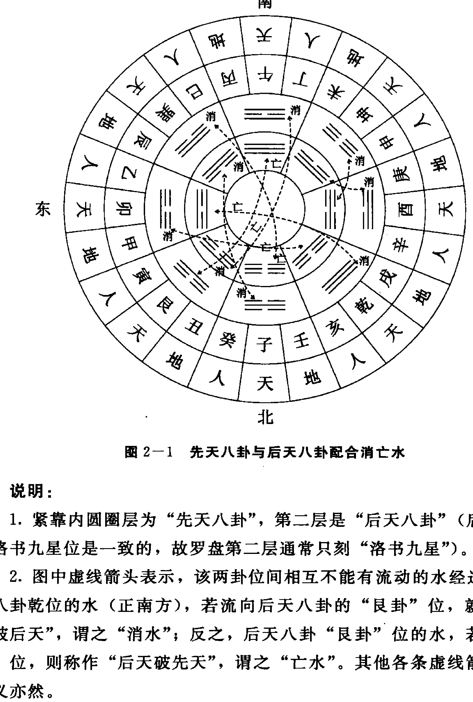

### 说明：

1.  紧靠内圆圈层为“先天八卦”，第二层是“后天八卦”（后天八卦位与洛书九星位是一致的，故罗盘第二层通常只刻“洛书九星”）。
2.  图中虚线箭头表示，该两卦位间相互不能有流动的水经过。如：先天八卦乾位的水（正南方），若流向后天八卦的“艮卦”位，就称作“先天破后天”，谓之“消水”；反之，后天八卦“艮卦”位的水，若流向“乾卦”位，则称作“后天破先天”，谓之“亡水”。其他各条虚线箭头表示的意义亦然。
3.  犯了“消亡水”会人财两败；倘去水方“衰”卦，则不以犯消亡水论，反而为吉。
4.  消亡水应重视向方。如“坐巽巳向乾亥”的一阴宅，应重视后天八卦乾位（西北方）来的水（向方来的水），是否向先天八卦离位（东方）流走。倘若有，就犯了“亡水”；如果东方是衰卦位，反而吉利。

#### 第三层 八宫黄泉盘

在有的罗盘后天八卦层中，刻有一些小字的地支名称，这就是“八煞黄泉”，又称“八曜杀”，犯之主犯刑戮（如图2—2）。

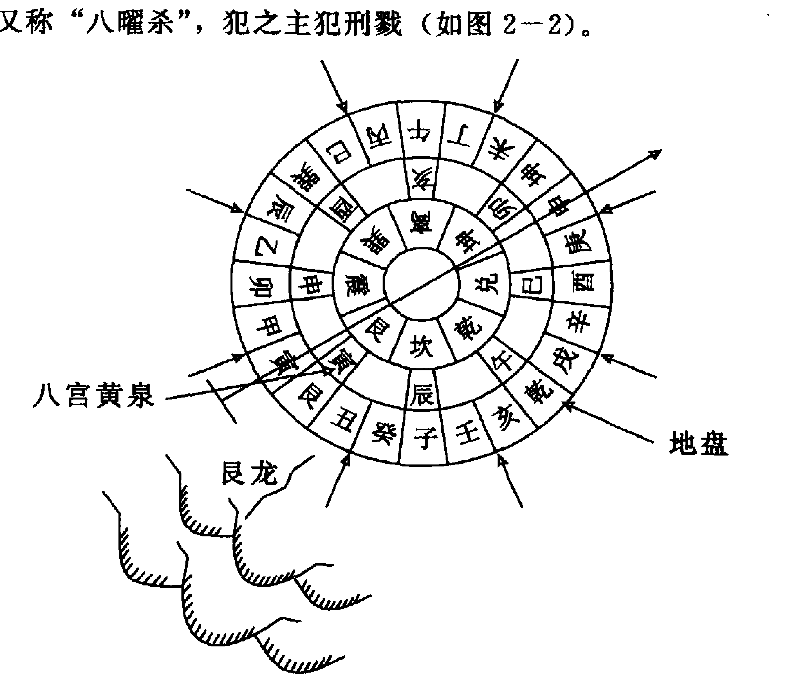

艮方为来龙，阴宅“坐寅向申”，因“艮”的黄泉煞是“寅”，所以，“寅山申向”不宜用，应修改线位。

八宫黄泉反映了后天八卦中各卦的官鬼爻的地支与本卦相克的关系。如，坎为水，辰戌为土，辰戌土克坎水，故“辰、戌”是坎卦的“官鬼”地支；乾为金，午为火，午火克乾金，故“午”是乾金的“官鬼”地支，其余各卦与煞位地支的关系均如此。

八宫黄泉的口诀是：“坎龙坤兔震山猴，巽鸡乾马兑蛇头，艮虎离猪为曜杀，犯之该墓齐罢休。”

八宫黄泉与后天八卦对应关系如下表：

| 后天八卦 | 乾 | 坎 | 艮 | 震 | 巽 | 离 | 坤 | 兑 |
| :--- | :--- | :--- | :--- | :--- | :--- | :--- | :--- | :--- |
| 八宫黄泉 | 午 | 辰 | 寅 | 申 | 酉 | 亥 | 卯 | 巳 |

### 八宫黄泉使用的方法：

1.  阴宅
    一般阴宅忌坐八煞黄泉方，亦忌八宫黄泉出现巉岩带杀的山峰。倘犯则主儿孙遭意外或患疑难杂症。

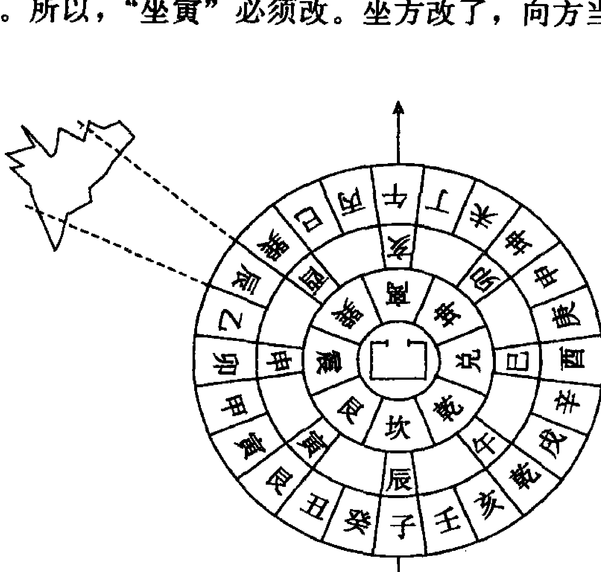

2.  阳宅

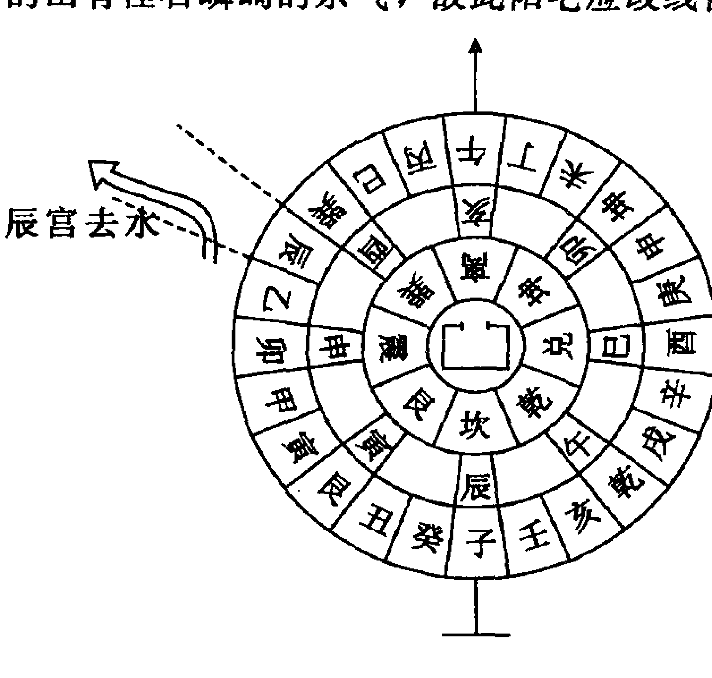

图 2－3：一“坐子向午”的阳宅，坐山“子”的八宫黄泉煞是“辰”，而辰方延长线上的山有怪石嶙峋的杀气，故此阳宅应改线位。

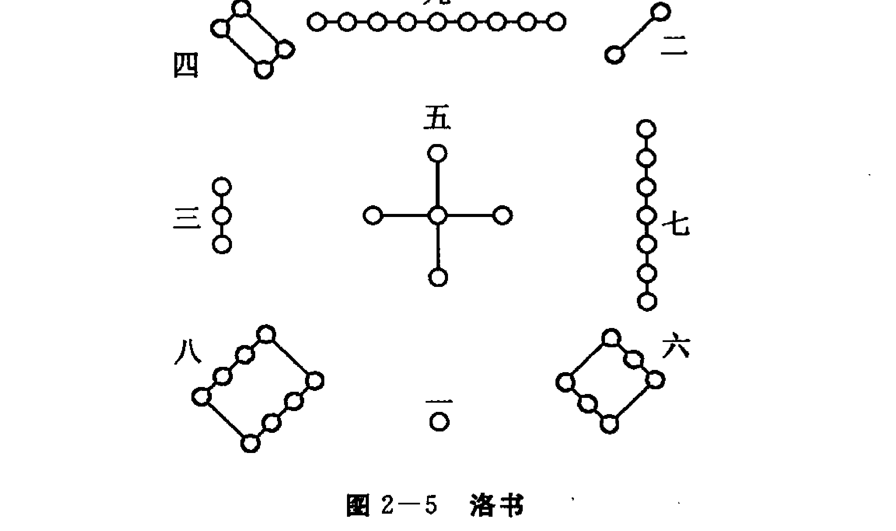

图 2－4：此阳宅“坐子向午”，坐山“子”的八宫黄泉煞是辰，而辰有水流去，故“坐子向午”的线位应改。

一般的八宫黄泉煞均如图 2－2、图 2－3 两例为主。但另派认为，在黄泉宫，也不应见到来水和去水（如图 2—4）。

动静阴阳排龙诀认为，来去水属于动气，在吉位则吉，在凶位则凶。

#### 第四层 洛书九星与后天八卦

洛书是一种以数字出现的图形。相传夏禹治水时，在洛河中发现三只乌龟，背上甲壳的坼缝显示有四十五数，即：戴九履一，左三右七，二四为肩，六八为足，五居中央。阳居四正，阴居四隅，形成九宫。此就是洛书（如图 2—5）。

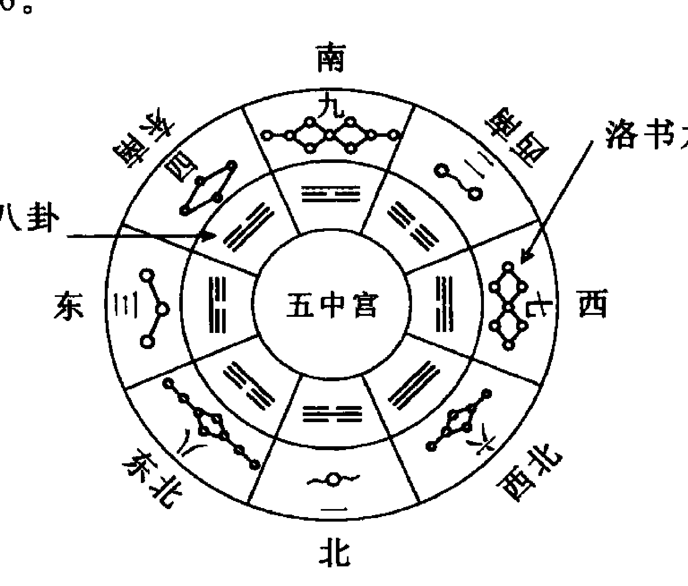

洛书在罗盘中，被称为“洛书九星”，其形状和方位以及与后天八卦的关系，如图 2—6。

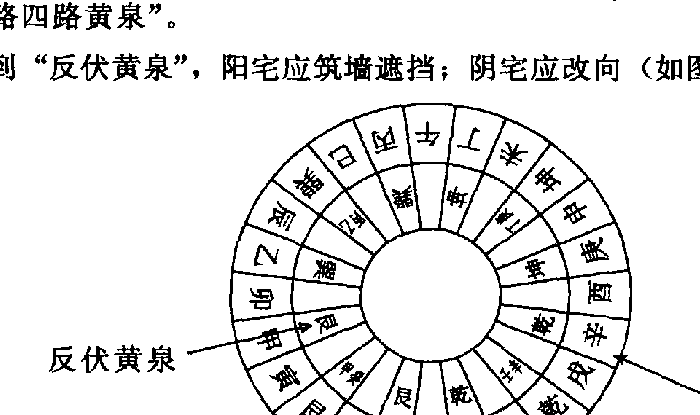

该图里层是后天八卦，外层是洛书九星。图中显示，洛书九星的序数和方位与后天八卦的序数和方位是一致的，即：一坎、二坤、三震、四巽、五中、六乾、七兑、八艮、九离。所以，罗盘中，一般没有刻划后天八卦的卦象，而洛书九星的方位，就是后天八卦的方位。

后天八卦统管下的二十四山，是地理堪舆的灵魂。而洛书九星的方位，就是后天八卦在罗盘上的方位。

#### 第五层 反伏黄泉

反伏黄泉，又名“八路黄泉”、“八煞黄泉”或“八路四路黄泉”。该黄泉是八天干：甲、乙、丙、丁、庚、辛、壬、癸的墓杀位。其要点是：八干的向后，忌四维水来；四维向，忌八干水来。去则吉，来则凶，犯之主损财伤丁。其口诀是：

庚丁坤山是黄泉，坤向庚丁也黄泉；
乙丙须防巽水先，巽向乙丙也黄泉；
甲癸向上忧见艮，艮向甲癸也黄泉；
辛壬水路怕乾当，乾向辛壬祸也然。

口诀中所说“黄泉”，名义上是向方，但杀气实际上是从坐山而出来的。由于此煞实际发作的地点位于向方的反方向，即坐山上，所以称作“反伏黄泉”。又由于“反伏黄泉”讨论的是四维与八干间的关系，所以又叫“八路四路黄泉”。

遇到“反伏黄泉”，阳宅应筑墙遮挡；阴宅应改向（如图2－7、2－8）。


图2－8：一“巽山乾向”之宅的“壬”方有水流去，因“乾”向的“反伏黄泉”是“辛、壬”，所以此水是“黄泉水”犯煞，应改向，或筑墙遮挡。

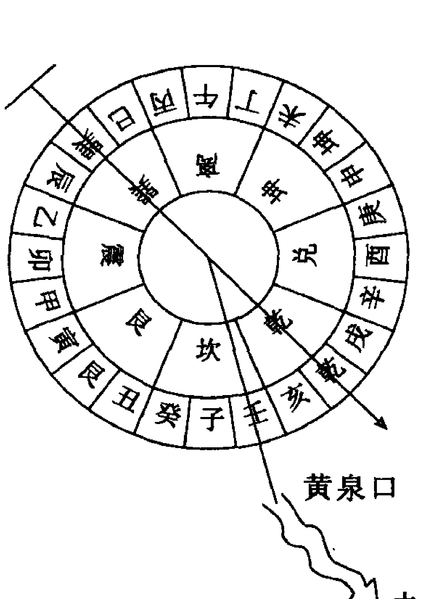

#### 第六层 坐山劫煞

坐山劫煞，以坐山论吉凶，与向首无关。该劫煞与二十四山对应的关系是：

- 巽未申山癸为煞，卯艮丁劫甲煞丙，
- 子癸二山巳为劫，乾劫为卯丙劫辛，
- 已午两山西为劫，乙壬二山劫是申，
- 辰寅二山未为劫，丁酉逢寅坤亥乙，
- 辛戌是丑庚为午，丑山劫煞就是辰。

### 解：

1.  巽、未、申三山，癸方为煞；卯、艮二山，丁方为煞，甲煞就是丙。
2.  子、癸二山，巳方为煞；乾煞是卯，丙煞是辛。
3.  巳、午两山，煞在西方；乙、壬二山，劫是申方。
4.  辰、寅二山，煞在未方；丁、酉二山，煞在寅；坤、亥二山，煞为乙方。
5.  辛、戌二山，丑为煞；丑山劫煞就是辰。

劫煞盘形式，如图2-9。

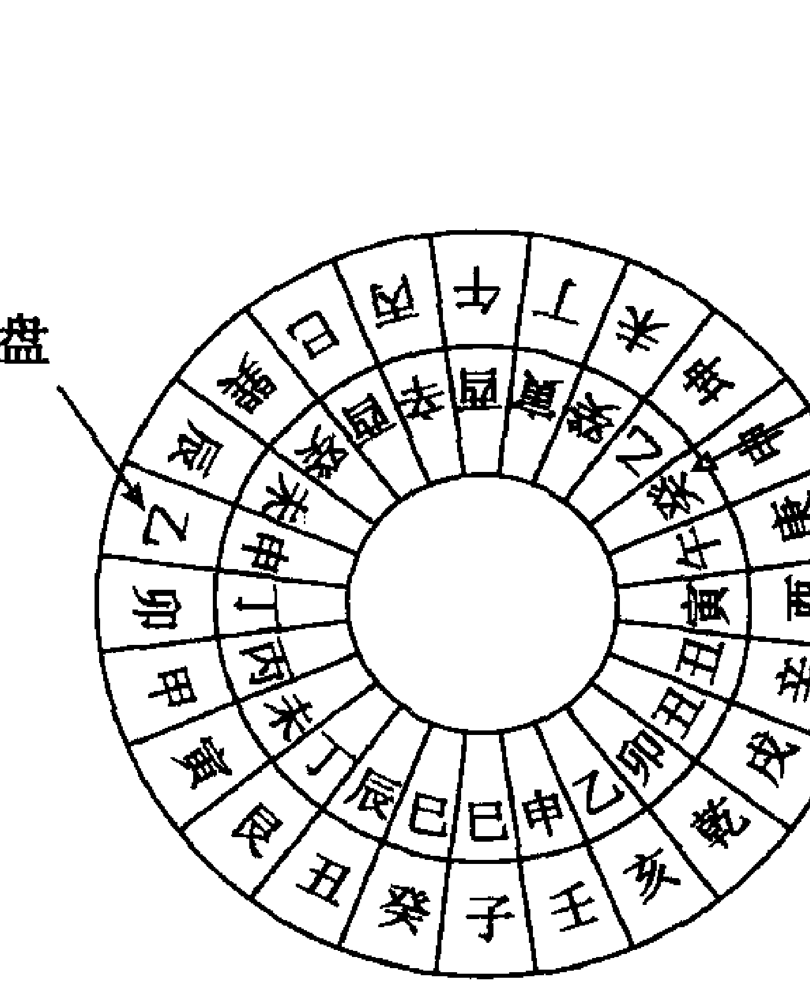

### 使用方法：

1.  在穴场中安放罗盘，确定宅的坐山；
2.  从罗盘的“八宫放射线”，观察坐山劫煞方的延长线上，有否恶石嶙峋的山峰。倘有，就犯了“劫煞”。主家人有血光之灾或易犯奇难杂症。若没有，则不以犯劫煞论。

例如：“坐巽巳向乾亥”的阳阴宅，有否犯劫煞？

解：依据“巽未申山劫在癸”和“巳午两山劫在酉”的歌诀，在穴场中心安放罗盘，从“八宫放射线”中观察“癸”方和“酉”方的延长线上所对的山峰，是否有恶石嶙峋、破碎欹斜等现象出现（如图2-10、2-11）。

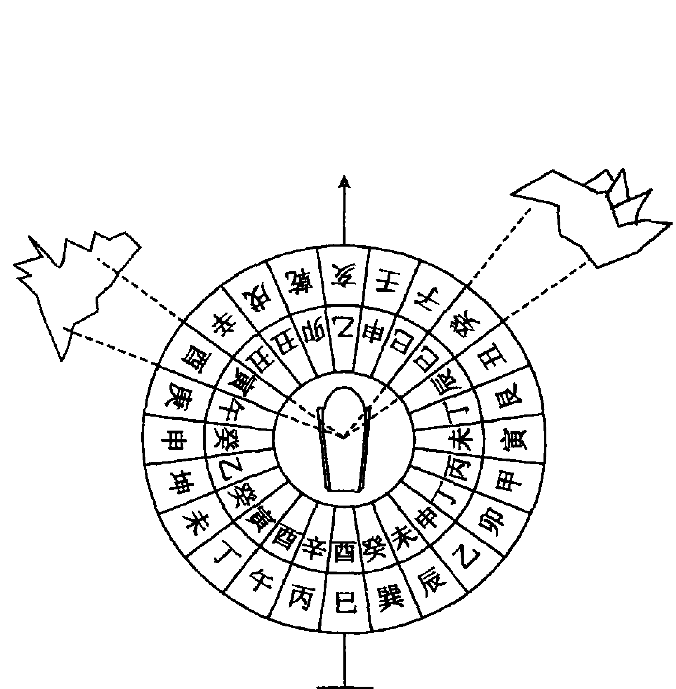

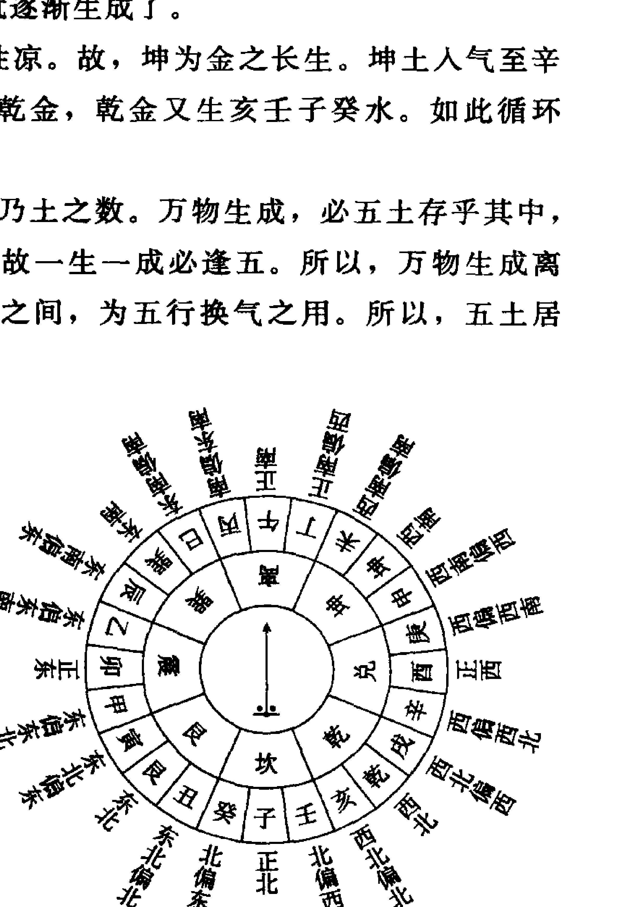

#### 第七层 地盘二十四山

离天池最近的一层二十四山，是地盘二十四山，又称内盘二十四山，或地盘正针二十四山。二十四山实际上就是指某一地点圆周内的二十四个方位。

此盘以后天八卦离南坎北，占据先天八卦乾南坤北之位，北“子”，南“午”这条直线与天池中南北指向的永久磁针正对重合，是地学中最重要的一盘（理气中各派罗盘都少不了这一层），其他盘式都是依此而设立的，所以又称为“地盘正针”。其用途是格龙、定向、乘气、人穴及阴阳方位的选择。

后天八卦是二十四山正针之本，一卦管三山。子午卯酉，为北南东西四正之位；寅申巳亥，为五行长生之所；辰戌丑未，是五气归元墓库之处。

二十四山正针用正体五行：壬子癸亥水，甲寅乙卯木，丙丁巳午火，庚申辛酉金，辰戌丑未土。

亥壬子癸水居北，故北方为水旺之地。旺水必以土来克，以止气，使水土发育万物。土是气之体，气是水之母。气旺土才美，气聚土才有形。因此，冬至之后气寒水冷，依丑艮二土烧之转气，使该气养木。所以，木长生在亥，即水生木。

寅甲卯乙木居东，发育司春。春末夏交辰土，以应地户之用。归中之德，孕育巽木，发放精气于表。木盛火源足，春暖火已进气。故火长生在寅，即木生火。

巽也属木，巽木生巳丙午丁之火。火象征光明、亮丽、文明。火烧之后显现土的象征，这是木质的延伸，即火生土。夏末，火交未坤土，所以火生土很明显。

有未坤之土，秋金申庚酉辛就逐渐生成了。

金，是土质的一种结晶体，性凉。故，坤为金之长生。坤土人气至辛为帝旺，到戌土转衰。戌土再生乾金，乾金又生亥壬子癸水。如此循环相生。

河洛数量中，“五”居中宫，乃土之数。万物生成，必五土存乎其中，“五”居中为太极，含一阴一阳，故一生一成必逢五。所以，万物生成离不开土。辰戌丑未界于春夏秋冬之间，为五行换气之用。所以，五土居中，司令万物，统领四面八方。

地盘正针上应天时二十四节气，下行地中二十四山方位。盘中指数如指在某节气，则生气临在其对应的一方。盘面阳卦用红字，其余用黑字，故，又称“红黑阴阳”。地盘正针二十四山方位的盘面，如图2-12。

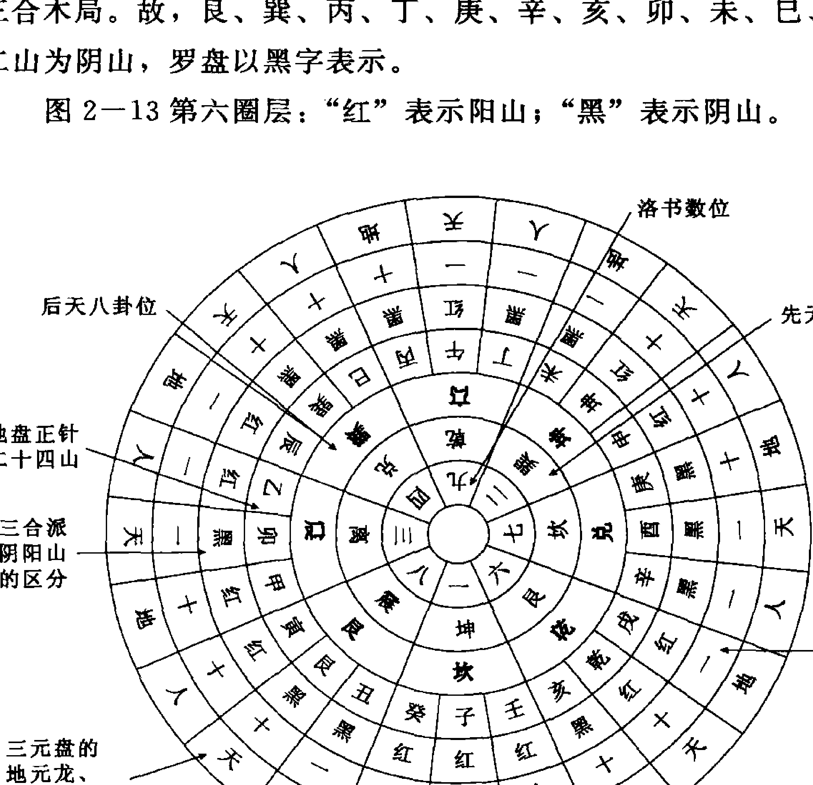

地盘正针二十四山位阴阳划分的标准，三合盘与三元盘是不同的，现对比说明如下：

三合盘强调来龙、坐山与纳水之位要“净阴净阳”，即来龙为阴，宜坐阴山，收阴水及出阴位；来龙为阳，宜坐阳山，收阳水及出阳位。

“净阴净阳”，即二十四山位阴阳的划分，是依先天八卦配洛书，以及三爻卦纳甲理论推演而来的。

洛书一、三、七、九奇数为阳。由先天八卦乾、坤、离、坎四卦所居，故，该四卦为阳卦。又因为：

乾纳甲；坤纳乙；离纳壬。“离”，是后天八卦的“午”位，地支“三合”中，“寅、午、戌”三合火局。

坎纳癸。“坎”，系后天八卦的“子”位，地支“三合”中，“申子辰”三合水局。故，乾、坤、甲、乙、壬、癸、寅、午、戌、申、子、辰等十二山为阳山，罗盘以红字表示。

洛书，二、四、六、八为偶数，为阴。由先天八卦震、巽、艮、兑四卦所居，故该四卦为阴卦。又因为：

艮纳丙；巽纳辛；兑纳丁。“兑”，是后天八卦的“酉”位，地支“三合”中，“巳酉丑”三合金局；

震纳庚。“震”，是后天八卦的“卯”位，地支“三合”中，“亥卯未”三合木局。故，艮、巽、丙、丁、庚、辛、亥、卯、未、巳、酉、丑等十二山为阴山，罗盘以黑字表示。


玄空派将二十四山分为地、天、人三元龙。

1.  每个宫位顺旋开始的第一卦山为“地元龙”、第二卦山为“天元龙”、第三卦山为“人元龙”；
2.  四正卦的地元龙属阳，四隅卦的地元龙属阴；
3.  四正卦的天元龙属阴，四隅卦的天元龙属阳；
4.  四正卦的人元龙属阴，四隅卦的人元龙属阳。

由此推出：

1.  地元龙，甲庚壬丙为阳；辰戌丑未为阴。
2.  天元龙，乾坤艮巽为阳；子午卯酉为阴。
3.  人元龙，寅申巳亥为阳；乙辛丁癸为阴。

八个卦宫，每卦管三山，其地、天、人和阴阳山分布的规律是：从坎宫开始顺旋。如下表：

### 每卦宫的三元龙和阴山阳山划分表

| 卦宫 | 乾 | 坎 | 艮 | 震 | 巽 | 离 | 坤 | 兑 |
| :--- | :--- | :--- | :--- | :--- | :--- | :--- | :--- | :--- |
| 二十四山 | 戌乾亥 | 壬子癸 | 丑艮寅 | 甲卯乙 | 辰巽巳 | 丙午丁 | 未坤申 | 庚酉辛 |
| 三元龙 | 地天人 | 地天人 | 地天人 | 地天人 | 地天人 | 地天人 | 地天人 | 地天人 |
| 阴阳山划分 | 阴阳阳 | 阳阴阴 | 阴阳阳 | 阳阴阴 | 阴阳阳 | 阳阴阴 | 阴阳阳 | 阳阴阴 |

如图2－13最外两圈层所示：“十”表示阳山；“一”为阴山。在实际应用中，各派均按照自己标准划分的阴阳山使用。

#### 第八层 穿山七十二龙

##### 一、什么是穿山七十二龙？

在地盘正针二十四山之下，每山再各设三个小格位，24×3＝72小格位，此七十二小格位称为“穿山”、“穿山虎”、“穿山七十二龙”或“地纪七十二龙”，其盘面用六十甲子加八干四维表示。它的主要用途是穿定阴阳宅的来龙，属于哪个干支的坐次。凡坐穴，要避开“太空亡”、“龟甲空亡”（也称作“大空亡”、“小空亡”和“阴差阳错”，又称“小差错”），如果天心十道的竖线覆盖在这些小格龙位上，主凶。

##### 二、如何区分太空亡、龟甲空亡和阴差阳错小格龙位？

1.  七十二龙分布于二十四山之下，每山分得三龙，如甲山之下，有“甲寅”、“空格”、“丁卯”三龙；乙山之下，有“乙卯”、“空格”、“戊辰”三龙；巽山之下，有“丙辰”、“空格”、“己巳”三龙等等。凡在四维：乾、艮、巽、坤和八干：甲、乙、丙、丁、庚、辛、壬、癸十二山之下，没有干支管辖的那一“小空格”，就称为“太空亡”；
2.  二十四山中十二地支山下，均有一个正对每个地支的小格龙位，如正对“子”山的小格龙位是“戊子”；正对“丑”山的小格龙位是“己丑”；正对“寅”山的小格龙位是“庚寅”，等等。这些直冲十二地支山中心的小格龙位的“干支”，如“戊子”、“己丑”、“庚寅”、“辛卯”等十二位，因气欠融和，如龟甲坚硬，故称为“龟甲空亡”。
3.  在前文已说明：八干四维山下有一个没干支管辖的“小空格”位，称为“太空亡”。而在太空亡左右各一小格中的干支，其地支一边属阳，另一边属阴，如“甲”山之下，空格右边小格中“甲寅”的“寅”属阳；而左边小格中“丁卯”的“卯”属阴；“巽”山下，空格右边小格中“丙辰”的“辰”属阳；左边小格中“己巳”的“巳”属阴。八干四维各山管辖下的三小格龙位中，小空格两边的地支阴阳属性均如此。所以，称八干四维之山下所管辖的三小格中，其空格两边各一小格共二十四小格中的干支为“阴差阳错”。

##### 三、孤阳、孤阴和旺相线的来源

##### 1. 八卦纳干

| 乾纳甲、壬； | 坤纳乙、癸； |
| 艮纳丙； | 震纳庚； |
| 巽纳辛； | 离纳己； |
| 兑纳丁； | 坎纳戊。 |

##### 2. 孤、虚和旺相线

七十二龙的孤、虚、旺相，均从八卦纳干和九六冲和而来（“九”表示阳爻；“六”代表阴爻）。

- （1）乾卦六爻皆阳，初爻与上爻（中间二、三、四、五爻不问，下同）均属阳，故乾称为“孤阳”。又因“乾纳甲、壬”，所以，甲、壬也为“孤阳”。
- （2）坤卦六爻皆阴，初爻与上爻均属阴，故坤为“孤阴”。又因“坤纳乙、癸”，所以，乙、癸也为“孤阴”。
- （3）艮、震二卦，初爻与上爻均是一阴一阳，搭配得当，称为“旺”。又因“震纳庚”、“艮纳丙”，所以，“庚”、“丙”也为“旺”。
- （4）巽、兑二卦，初爻与上爻均是一阴一阳，搭配得当，称为“相”。又因“巽纳辛”、“兑纳丁”，所以，“辛”、“丁”也为“相”。
- （5）离卦初爻与上爻皆阳；坎卦初爻与上爻皆阴。上下爻纯阳、纯阴不相配，坚硬而气不人，故为“龟甲空亡”。因“离纳己”、“坎纳戊”，所以，戊、己也是“龟甲空亡”。

##### 四、趋吉避凶

穿山七十二龙中，有旺、相、孤、虚、阴差阳错、太空亡和龟甲空亡之分，只有来龙在旺相线位，才是可用的吉祥位；其他为凶线位，当弃之不用。

现将“穿山七十二龙”的吉凶线位列于下，并参看穿山七十二龙分金盘（如图2－14）。

### 穿山七十二分金吉凶线位表

| 吉凶区分 | 内容 | 二十四山 | 七十二龙分金线位 | 在罗盘中的位置 |
| :--- | :--- | :--- | :--- | :--- |
| **龟甲空亡** | 戊子旬败气脉 | 戊子 | 戊子、己丑、庚寅、辛卯、壬辰、癸巳 | 正对着先天十二支山的中央 |
| | | 甲午 | 甲午、乙未、丙申、丁酉、戊戌、己亥 | |
| **阴差阳错** | 壬子旬退气脉 | 壬子 | 壬子、癸丑、甲寅、乙卯、丙辰、丁巳 | 在八干四维山下的空白小格的左右两边。 |
| | | 戊午 | 戊午、己未、庚申、辛酉、壬戌、癸亥 | |
| | 甲子旬冷气脉 | 甲子 | 甲子、乙丑、丙寅、丁卯、戊辰、己巳 | |
| | | 庚午 | 庚午、辛未、壬申、癸酉、甲戌、乙亥 | |
| **旺相线位** | 丙子旬旺气脉 | 丙子 | 丙子、丁丑、戊寅、己卯、庚辰、辛巳 | 在先天十二支山正中央的两边。 |
| | | 壬午 | 壬午、癸未、甲申、乙酉、丙戌、丁亥 | |
| | 庚子旬旺气脉 | 庚子 | 庚子、辛丑、壬寅、癸卯、甲辰、乙巳 | |
| | | 丙午 | 丙午、丁未、戊申、己酉、庚戌、辛亥 | |
| **太空亡** | | 甲 | 甲、丙、戊、庚、壬 | 在八干四维山下的空白小格。 |
| | | 乙 | 乙、丁、己、辛、癸 | |
| | | 乾 | 乾、艮、巽、坤 | |
| | | 此八干四维的山，正对着下的空白小格。 | | |

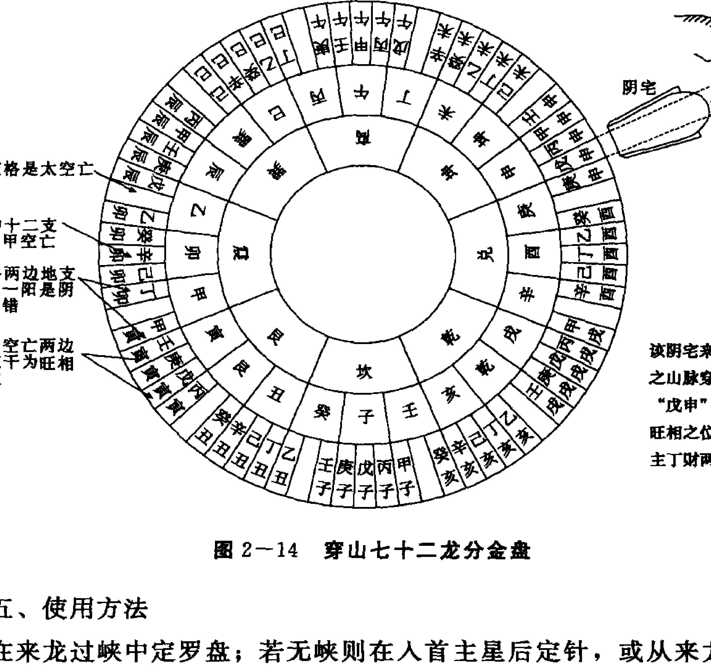

##### 五、使用方法

在来龙过峡中定罗盘；若无峡则在入首主星后定针，或从来龙起伏之束咽处分水脊上定盘针，测定来龙所属何干支。倘若来龙是“旺相”位，就吉利可用；若是“太空亡”、“龟甲空亡”或“阴差阳错”的线位，则不可用。这时应移动线位，使“旺相”位对准来龙即可。

#### 第九层 坐山九星

坐山九星，又叫“坐家九星”。它是由“地母纳甲卦”推排而成。九星是指：一贪狼，二巨门，三禄存，四文曲，五廉贞，六武曲，七破军，八左辅，九右弼。

此九星中，前七星指北斗七星，后两位指七星旁两颗用肉眼很难见得到的星。

风水理论认为，九星上扶地座，下映二十四山，制临八方，配在八卦。九星在天空移动，同它们统属的山互为感应。星有美恶，故，地亦有吉凶。

吉星和凶星的区分是：

-   1.  贪狼、巨门、武曲、辅弼为吉星。在吉星方位，宜见到秀丽的明山，则家人大吉大利。
-   2.  禄存、文曲、廉贞、破军为凶星。在这些方位，如果见到山石巉岩的山峰，主家人体弱多病或飞来横祸。

为方便使用查阅，现将二十四山九星翻卦坐山吉凶列成下表：

### 二十四山九星翻卦坐山吉凶列表

| 坐山 | 立向 | 八（伏位/辅弼） | 一（生气/贪狼） | 二（天医/巨门） | 三（祸害/禄存） | 四（六煞/文曲） | 五（五鬼/廉贞） | 六（延年/武曲） | 七（绝命/破军） |
| :--- | :--- | :--- | :--- | :--- | :--- | :--- | :--- | :--- | :--- |
| 坤乙 | 艮辛 | ☷° 坤乙 | ☶° 艮丙 | ☴° 巽辛 | ☰° 乾甲 | ☵° 壬寅午戌 | ☲° 庚亥卯未 | ☳° 丁巳酉丑 | ☱° 癸申子辰 |
| 乾甲 | 巽庚 | ☰° 乾甲 | ☱° 丁巳酉丑 | ☲° 庚亥卯未 | ☷° 坤乙 | ☶° 癸申子辰 | ☴° 巽辛 | ☵° 艮丙 | ☳° 壬寅午戌 |
| 癸申子辰 | 丁寅午戌 | ☱° 癸申子辰 | ☴° 巽辛 | ☵° 艮丙 | ☳° 壬寅午戌 | ☰° 乾甲 | ☱° 丁巳酉丑 | ☲° 庚亥卯未 | ☷° 坤乙 |
| 艮丙 | 坤壬 | ☵° 艮丙 | ☷° 坤乙 | ☱° 癸申子辰 | ☲° 丁巳酉丑 | ☳° 庚亥卯未 | ☰° 壬寅午戌 | ☴° 乾甲 | ☶° 巽辛 |

| 九星代表数 | 八 | 一 | 二 | 三 | 四 | 五 | 六 | 七 |
| :--- | :--- | :--- | :--- | :--- | :--- | :--- | :--- | :--- |
| 游星 | 伏位 | 生气 | 天医 | 祸害 | 六煞 | 五鬼 | 延年 | 绝命 |
| 坐山 | 辅弼 | 贪狼 | 巨门 | 禄存 | 文曲 | 廉贞 | 武曲 | 破军 |
| 立向 | | | | | | | | |
| 庚亥<br>卯未 | 甲巳<br>酉丑 | ☰<br>庚亥<br>卯未 | ☷<br>壬寅<br>午戌 | ☵<br>乾甲 | ☶<br>巽辛 | ☵<br>艮丙 | ☴<br>坤乙 | ☶<br>癸申<br>子辰 | ☰<br>丁巳<br>酉丑 |
| 巽辛 | 乾乙 | ☰<br>巽辛 | ☶<br>癸申<br>子辰 | ☴<br>坤乙 | ☰<br>庚亥<br>卯未 | ☵<br>丁巳<br>酉丑 | ☷<br>乾甲 | ☶<br>壬寅<br>午戌 | ☴<br>艮丙 |
| 壬寅<br>午戌 | 丙申<br>子辰 | ☰<br>壬寅<br>午戌 | ☰<br>庚亥<br>卯未 | ☵<br>丁巳<br>酉丑 | ☶<br>癸申<br>子辰 | ☴<br>坤乙 | ☵<br>艮丙 | ☶<br>巽辛 | ☷<br>乾甲 |
| 丁巳<br>酉丑 | 癸亥<br>卯未 | ☰<br>丁巳<br>酉丑 | ☷<br>乾甲 | ☶<br>壬寅<br>午戌 | ☴<br>艮丙 | ☵<br>巽辛 | ☶<br>癸申<br>子辰 | ☴<br>坤乙 | ☰<br>庚亥<br>卯未 |

说明：

有“巳山亥”或“丁山癸、酉山卯、丑山未”向的阴宅或阳宅（这些山向的宅，通通称为“兑宅”。因为“兑纳丁巳酉丑”），在它们的四吉星方（辅弼“兑卦及其纳甲一气——丁巳酉丑”、贪狼、巨门、武曲，即乾甲、壬寅午戌、坤乙），宜见秀丽的山峦；在它们的四凶星方（禄存、文曲、廉贞、破军，即艮丙、巽辛、癸申子辰、庚亥卯未）的延长线上，不宜见到山石巉岩的山峰，尤其是在廉贞星方，不宜见到怪石嶙峋的山峰。倘若见到，就犯了丁煞，主宅内之人有血光之厄。

-   注：1.  九星翻卦坐山吉凶表，以坐山论吉凶，而不问立向方。
-   2.  九星代表数，游星与九星间的对应关系始终不变。
-   3.  辅弼、贪狼、巨门、武曲为四吉星；禄存、文曲、廉贞、破军为四凶星。
-   4.  以坐山的卦象为辅弼星位，二十四山中其他方位的卦象及其应对的九星之位和吉凶状况，皆由辅星卦象的“爻变”而决定的。爻变的规律是：上爻变→中爻变→下爻变→中爻变→上爻变→中爻变→下爻变，如各卦中的小圆圈（“。”）所示。
-   5.  在实际运用中，只需查阅和对照本表的相关资料就可以了，没必要再去翻卦。

## 使用方法：

-   1.  如图2-15，一“坐坤向艮”的阳宅在“卯”山方廉贞位的延长线上，一山峰有巉岩破碎的山石，这就是“廉贞”煞，主家人体弱多病，飞来横祸。故此宅应改向。
-   2.  罗盘上的“坐山地母九星盘”，只是“坤宫”翻卦的盘式，各方方位九星的排列位，只适用于“坐坤向艮”和“坐乙向辛”的阴阳宅，其余七宫及其纳甲的翻卦九星排位罗盘面不可能显示，只能查阅资料或临时自行翻卦获得。
-   3.  要懂得坐山九星地母翻卦的用法，还必须知道“八卦纳甲”。所谓“八卦纳甲”，就是“乾坎艮震巽离坤兑”各卦所容纳的“甲子山位”。其详情如下：
    -   乾纳：甲（乾）
    -   坤纳：乙（坤）
    -   兑纳：丁、巳、酉、丑
    -   离纳：壬、寅、午、戌
    -   震纳：庚、亥、卯、未
    -   巽纳：辛（巽）
    -   坎纳：癸、申、子、辰
    -   艮纳：丙（艮）

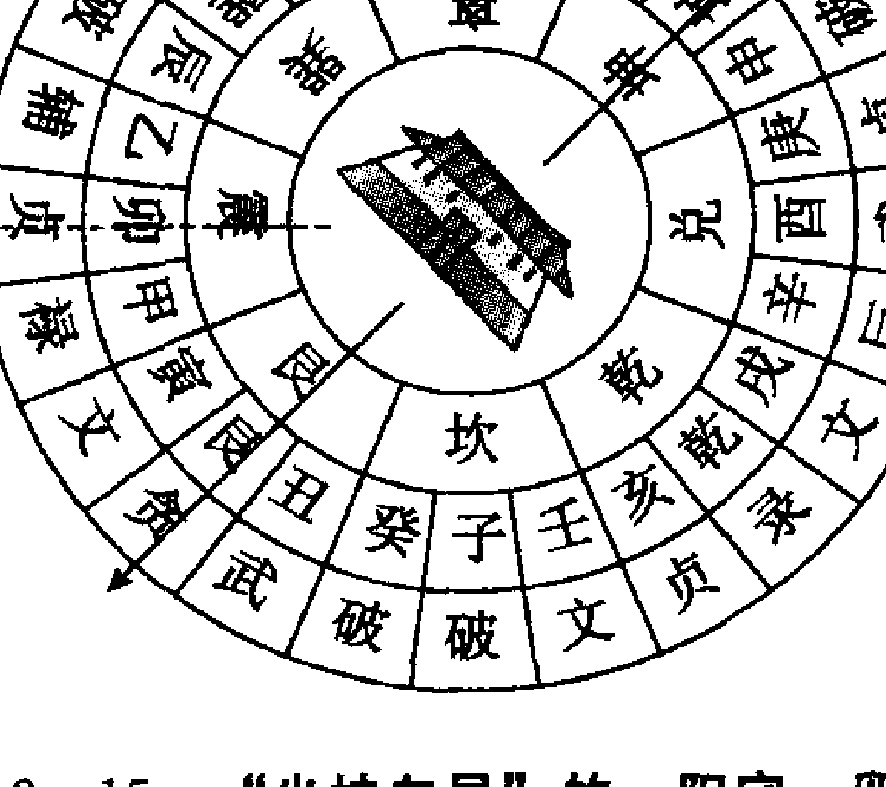

该阳宅“坐坤向艮”，卯山方廉贞延长线上的山峰出现巉岩乱石，应改“坐山”。

### 图2-15 “坐坤向艮”的一阳宅，卯方带煞

-   4.  为便于使用查阅，现将坐山地母翻卦九星各方吉凶列表于后：

## 坐山地母翻卦九星各方吉凶表

| 九星代表数 | 八 | 一 | 二 | 三 | 四 | 五 | 六 | 七 |
| :--- | :--- | :--- | :--- | :--- | :--- | :--- | :--- | :--- |
| 星序 | 辅弼 | 贪狼 | 巨门 | 禄存 | 文曲 | 廉贞 | 武曲 | 破军 |
| 交变卦 | 坐山本卦 | 八上爻变得一 | 一中爻变得二 | 二初爻变得三 | 三中爻变得四 | 四上爻变得五 | 五中爻变得六 | 六初爻变得七 |
| 坐山八卦 | 乾 | 兑 | 震 | 坤 | 坎 | 巽 | 艮 | 离 |
| | 乾、甲 | 丁、巳酉、丑 | 庚、亥卯、未 | 坤、乙 | 癸、申子辰 | 巽、辛 | 艮、丙 | 壬、寅午、戌 |

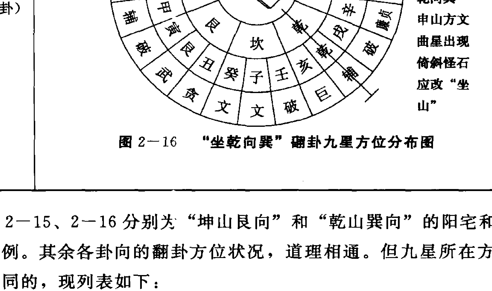

图2-15、2-16 分别为‘坤山艮向’和‘乾山巽向’的阳宅和阴宅的翻卦图例。其余各卦向的翻卦方位状况，道理相通。但九星所在方位，是各不相同的，现列表如下：

| 九星代表数 | 八 | 一 | 二 | 三 | 四 | 五 | 六 | 七 |
| :--- | :--- | :--- | :--- | :--- | :--- | :--- | :--- | :--- |
| 星序 | 辅弼 | 贪狼 | 巨门 | 禄存 | 文曲 | 廉贞 | 武曲 | 破军 |
| 坐山八卦<br>卦变爻变 | 坐山<br>本卦 | 八上爻<br>变得一 | 一中爻<br>变得二 | 二初爻<br>变得三 | 三中爻<br>变得四 | 四上爻<br>变得五 | 五中爻<br>变得六 | 六初爻<br>变得七 |
| 坎卦符号<br>坎 | 坎卦符号<br>癸、申<br>子、辰 | 巽卦符号<br>巽、辛 | 艮卦符号<br>艮、丙 | 离卦符号<br>壬、寅<br>午、戌 | 乾卦符号<br>甲、乾 | 兑卦符号<br>丁、巳<br>酉、丑 | 震卦符号<br>庚、亥<br>卯、未 | 坤卦符号<br>坤、乙 |
| 艮卦符号<br>艮 | 艮卦符号<br>艮、丙 | 坤卦符号<br>坤、乙 | 坎卦符号<br>癸、申<br>子、辰 | 兑卦符号<br>丁、巳<br>酉、丑 | 震卦符号<br>庚、亥<br>卯、未 | 离卦符号<br>壬、寅<br>午、戌 | 乾卦符号<br>乾、甲 | 巽卦符号<br>巽、辛 |
| 震卦符号<br>震 | 震卦符号<br>庚、亥<br>卯、未 | 离卦符号<br>壬、寅<br>午、戌 | 乾卦符号<br>乾、甲 | 巽卦符号<br>巽、辛 | 艮卦符号<br>艮、丙 | 坤卦符号<br>坤、乙 | 坎卦符号<br>癸、申<br>子、辰 | 兑卦符号<br>丁、巳<br>酉、丑 |
| 巽卦符号<br>巽 | 巽卦符号<br>巽、辛 | 坎卦符号<br>癸、申<br>子、辰 | 坤卦符号<br>坤、乙 | 震卦符号<br>庚、亥<br>卯、未 | 兑卦符号<br>丁、巳<br>酉、丑 | 乾卦符号<br>乾、甲 | 离卦符号<br>壬、寅<br>午、戌 | 艮卦符号<br>艮、丙 |
| 离卦符号<br>离 | 离卦符号<br>壬、寅<br>午、戌 | 震卦符号<br>庚、亥<br>卯、未 | 兑卦符号<br>丁、巳<br>酉、丑 | 坎卦符号<br>癸、申<br>子、辰 | 坤卦符号<br>坤、乙 | 艮卦符号<br>艮、丙 | 巽卦符号<br>巽、辛 | 乾卦符号<br>乾、甲 |
| 兑卦符号<br>兑 | 兑卦符号<br>丁、巳<br>酉、丑 | 乾卦符号<br>乾、甲 | 离卦符号<br>壬、寅<br>午、戌 | 艮卦符号<br>艮、丙 | 巽卦符号<br>巽、辛 | 坎卦符号<br>癸、申<br>子、辰 | 坤卦符号<br>坤、乙 | 震卦符号<br>庚、亥<br>卯、未 |

问题：“地母翻卦九星”，是以八卦论“坐山”的，但每卦统管三山，如“巽卦”管“辰巽巳”三山，如果有一阴宅为“巳山亥向”，该如何翻卦定九星的方位呢？

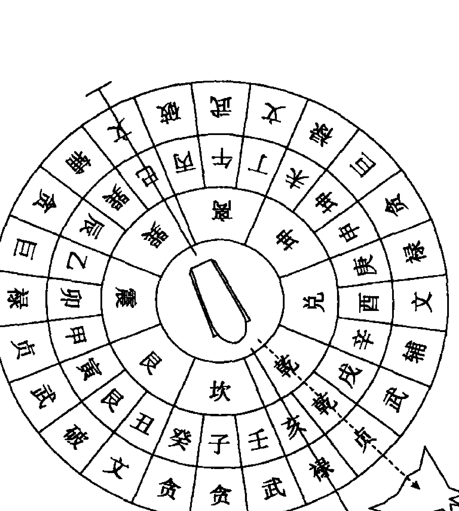

图2-17 阴宅“巳山亥向”，乾山延长线上的山岫，有破碎欹斜的山石为“廉贞”煞

解：因“翻卦”只有通过八卦的爻变才能致使卦变和相应的九星方位变化，而“巳山”由巽卦统管，所以，应由“巽”卦爻变引起卦变和相应的九星方位的变化（如图2-17）。其他各山翻卦的方法仿此。

#### 第十层 一百二十龙分金

三合盘的盘面是三层二十四山，即地盘正针二十四山，人盘中针二十四山和天盘缝针二十四山。在每个二十四山之下，各设五小格龙位，共一百二十小格龙位，这就是“一百二十龙分金”。但在较小尺寸的罗盘面上，只在“天盘缝针二十四”之下，才设有一百二十龙分金。

一百二十龙分金，在二十四山之下，每山有五个小格龙位，其中只有两小格才配有干支，另三小格龙位是空格。这就是“三合派”的“百二庚辛共丙丁”之说。就是说，在一百二十龙分金中，每山下只有天干为“庚、辛、丙、丁”的线位，才可以摘用，其他天干的线位是不能用的，所以成为“空格”。如地盘正针二十四山的“壬”山下五小格龙位，只有“丁亥”、“辛亥”，另三小格是没有干支的“空格”；“子”山下五小格龙位，只有“丙子”、“庚子”，另三小格是“空格”，其余各山下均是如此（人盘中针、天盘缝针二十四山各山下的五小格龙位的排列方式，与地盘正针二十四山下的排列是一样的）。

“丙丁庚辛”之外的干支为什么不能用呢？是因为：“甲壬”孤阳“乙癸”虚，龟甲空亡“戊己”推，“丙丁庚辛”虽旺相，“刑冲”两害莫胡为。

此口诀来源于“八卦纳甲”之法：乾纳甲壬，坤纳乙癸，坎纳戊，离纳己，震纳庚，巽纳辛，艮纳丙，兑纳丁。

乾卦三爻均属阳，“孤阳不生”。因乾纳甲壬，所以，“甲、壬”属孤阳，不能用。

坤卦三爻俱阴，“独阴不长”。坤纳乙癸，所以，“乙癸”为虚，不用。

坎卦上下两爻均属阴，坎纳戊；离卦上下两爻皆属阳，离纳己。均阴、皆阳，也属“孤阳不生”、“独阴不长”之列。所以，“戊己”为“龟甲空亡”，不用。

震卦上下两爻一阴一阳；巽卦上下两爻一阳一阴。

艮卦上下两爻一阳一阴；兑卦上下两爻一阴一阳。

“一阴一阳谓之道”，阴阳相配，配则有情。因震纳庚，巽纳辛，艮纳丙，兑纳丁。所以，庚、辛、丙、丁是可以摘用的旺相线位。

一百二十龙分金，要与穿山七十二龙和地盘正针配合使用才更准确。

其具体方法如下：

-   1.  用地盘正针分金，要采用旺相线位。
-   2.  采用的分金线的五行，要与阳宅主人命卦或阴宅仙命命卦的五行相生或比和。
-   3.  用地盘正针分金，倘不能在旺相线位上，可考虑改用“天盘缝针”二十四山下的一百二十龙分金。

例如：

（1）有一“坐子向午”的阳宅，在地盘正针的正子午线上，其分金“戊子”、“甲午”的“龟甲空亡”线上，不能用。应改为一百二十龙分金的“丙子”、“丙午”线位，或“穿山七十二龙”的“庚子”、“丙午”的旺相线位上。

（2）有一亡灵，己卯年出生，“己卯”的纳音五行是“城头土”，安葬在“坐巽巳向乾亥”的阴地。

坐山，地盘分金为“辛巳”，其纳音五行为“白蜡金”。“城头土”生“白蜡金”，泄仙命。

向方，地盘分金是“丁亥”，其纳音五行为“屋上土”。“屋上土”与

#### 第十一层 人盘中针二十四山

一、人盘中针二十四山，又称“中盘二十四山”、“人纪二十四位”。它与“地盘正针二十四山”相比，“中针二十四山”沿顺时针方向旋转半位，即7.5度，这样，中针的子午线对着正针的壬子、丙午之间，其用途是：消砂和辨别天星贵贱。

罗盘上的十二宫分野、二十四位天星与透地奇门等层，均由中针人盘统管。

二、中针二十四山主要是用来“消砂”（又称“拨砂”），其基本方法是：

-   1.  先用地盘正针格定“坐山”和“立向”；再以中针二十四山层，观察正针格定的“坐山”和“立向”。
-   2.  以中针“坐山五行”为主体，以“其立向方的延长线所对的山峰五行”为客体。
-   3.  以“主体”与“客体”五行间的生克制化关系论吉凶。
-   4.  认定吉凶的方法：
    -   （1）客体生主体，为食神砂，利科甲；
    -   （2）客体与主体相同称旺气砂，旺丁财；
    -   （3）主体克客体，为奴仆砂，旺财；
    -   （4）主体生客体为泄气砂，飘荡离乡；
    -   （5）客体克主体为煞气砂，祸绝。

例如，有一宅，用地盘正针格定为“戌山辰向”。“戌”为“坐山”（主体）属金；“辰”为立向方延长线所对准的山峰（客体）属金，主体与客体比和，吉。

注：“砂”是指穴地坐山与立向的延长线对准的山峰、丘陵等，而不是确指穴下的底砂。

“坐山”与“立向”首先用地盘正针格定的，而在“主体坐山”与“客体立向”方延长线对准的山峰论生克时，这个“主体”和“客体”的山峰，则使用“人盘中针二十四山”。如上例的“戌山辰向”，是先用正针格定的。当要看主体与客体的生克关系时，则应看人盘中针二十四山的“戌山辰向”。

### 三、用中针二十四山“消砂”时，二十四山所属五行确定的方法：

-   1.  砂虽在地，关实在天。

赖太素《消砂要诀》云：“砂虽在地，关实在天。”古人云：“为政以德，譬如北辰，居其所而众星拱之。”（周天的星有二十八舍，即二十八宿；列星之辰有十二个，分布于东、南、西、北方各三个：东方，析木、大火、寿星；南方，鹑尾、鹑火、鹑首；西方，实沈、大梁、降娄；北方，娵訾、元枵、星纪。此“辰”是日、月、星的统称，“北辰”，指北极星。当权者施政，若以仁德行之，关爱百姓，就如同北极星一样，众星拱之，老百姓就会拥护拱卫他。）

堪舆之法，穴场，就如北辰。北辰，即指九星、砂水和二十八宿。赖太素用二十八宿看砂水，所以，“砂虽在地，关实在天”。

-   2.  中针二十四山与二十八宿的关系及其五行。

图2-18，表示人盘中针二十四山每个山位之下，配有二十八宿的一星，其中“子午卯酉”四正之地日月同宫，故配有双星。各星宿的五行，就是该星名称当中的一字，即金、木、水、火、土。如，女“土”蝠，牛“金”牛，虚“日”鼠，危“月”燕。日、月同属“火”（日，阳火；月，阴火）；当中一字是“金”，该星宿就属金；是“木”的就属木；是“土”的属土。而中针二十四山的五行，就是该山之下所配星宿名称的五行。其歌诀如下：

```
乾坤艮巽是木乡；寅申巳亥水神当；
甲庚丙壬俱属火；子午卯酉火依相；
辰戌丑未金为首；乙辛丁癸土相伤。
```

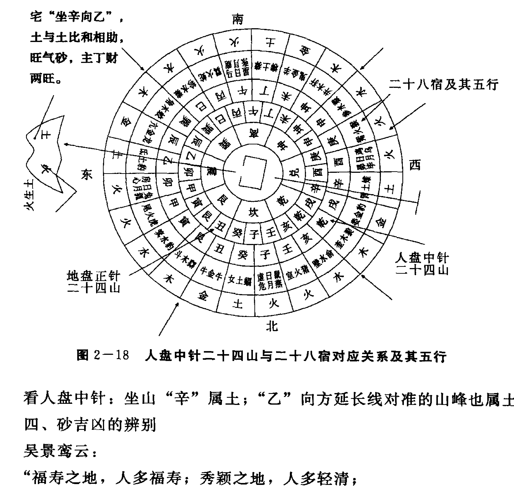

图2-18 人盘中针二十四山与二十八宿对应关系及其五行

看人盘中针：坐山“辛”属土；“乙”向方延长线对准的山峰也属土。

### 四、砂吉凶的辨别

> 吴景鸾云：
> “福寿之地，人多福寿；秀颖之地，人多轻清；
> 湿润之地，人多重浊；高原之地，人多狂躁；
> 散乱之地，人多游荡；尖恶之地，人多杀伤；
> 顽硬之地，人多执拗；平夷之地，人多忠信。”

> 杨筠松说：
> “山肥人饱，山瘦人饥；山清人美，山浊人媸；
> 山完人喜，山破人悲；山归人聚，山走人离；
> 山伸人高，山缩人低；山向人顺，山背人欺。”

> 司马头陀曰：
> “以端方而知其忠，以倾倒而知佞；柔乱知淫，卑劣知殷；粗猛知恶，
> 瘦薄知贫；粹美知慈，威武知断。观穷源大江而知出身之远近，视外城内局可知力量之宏隘。况出人脉有偏正，卓展有大小。

砂管人丁，人丁相平，其砂必正。砂不抬头，砂不力；水不弯环，水无情。外砂不及内砂力，外水不如内水亲。

### 五、四吉砂及其寻找的方法

#### 1. 什么是四吉？

所谓四吉，就是指金、水、日、月四禽星聚合的方向。这种方向应有吉砂吉水。找到后，可取用此方禽星持世，则可富贵吉祥！

#### 2. 寻找的方法：

-   欲知四吉会何处，虚二鬼四箕为六。
    毕在本宫氏在三，奎五翼六相继续。
    阳卦顺时针进位，阴卦逆时针退数。

解：(1) 二十八宿的每一宿，称为禽星。
(2) 虚日鼠相隔两位，鬼金羊相隔四位，箕水豹相隔六位，氐土豹相隔三位，奎木狼相隔五位，翼火蛇相隔六位，毕月乌所在的方向，就是四吉星会聚的方向。
(3) 以后天八卦配洛书九星的宫位区分卦的阴、阳，即四正卦震、兑、坎、离（三、七、一、九）为阳卦；四隅卦乾、坤、艮、巽（六、二、八、四）为阴卦。
(4) 禽星所在宫位属阳卦，就顺时针方向数位数；所在卦宫属阴卦，就逆时针方向数位数。如，艮卦管辖下的“寅”山“庚寅”龙，所配“禽星”为“箕水豹”，“艮”为隅卦，属阴；“箕六”。故应从“寅”开始逆时针方向数六位是“亥”，取中针二十四山下的“丁亥”。该“丁亥”龙的方向，就是四吉星会聚的方向。“亥”所配禽星为“壁水俞”，符合“金、水、日、月”的方向，是“四吉星”聚合方向的要求。“丁亥”龙方向，应该有吉砂、吉水。其他之法仿此。

#### 第十二层 透地六十龙

##### 一、什么是透地六十龙？

透地六十龙，又名“天纪”或“六十分金”，它与“穿山七十二龙”相互呼应。穿山是穿定来龙入首的干支，推断的是远脉；透地，是引导龙气入穴的干支，推断的是近脉。

六十龙分金，是将 360 度圆周，等分成六十个小格，分布在地盘正针之下，再将“六十甲子”分别排列在各小格中，其顺序是，从“壬子”两山下开始，顺时针方向排列（如图 2-19）：## 卷三 罗盘常识和使用方法

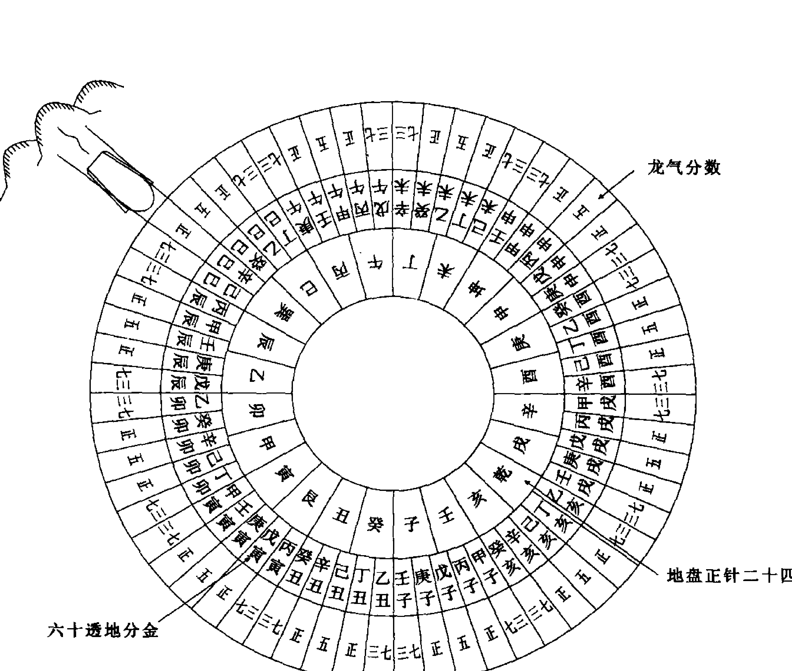

图 2-19 透地六十龙分金盘

甲子、丙子、戊子、庚子、壬子；
在“癸丑”两山下，顺时针方向排列；
乙丑、丁丑、己丑、辛丑、癸丑；
……

图 2-19，为透地六十龙分金盘。其中，甲子“七三”等中文数字表示该龙气的分数位置：“甲子”七三，表示甲子龙气在“壬山”占七分，“亥山”占三分；“丙子”正，表示丙子龙气正对着“壬山”；“戊子”五，表示“戊子”龙气在“壬山”、“子山”各占一半的位置上。其他仿此。

##### 二、摘用二十四山中的旺相气脉

### 1. 坟茔吉凶的原因

> 一个山头数十坟，少数富贵多数贫。
> 同山同向同朝水，更有同堆共坟茔。
> 一边光荣生富贵，一边泥水绝人丁。
> 其中缘由何所在？火坑金牛要分清。
> 穴坐火坑招泥水，坐得金牛起紫藤。

## 第二章 三合盘各圈层含义与用法

时师若能知此理，打破阴阳玄妙精。

### 2. 精微玄机

八尺峦头要认真，中间脊水两边分。
看它生气归何处？十字当中立正身。
更观两边无强弱，方可定针下罗经。
珠宝火坑安排定，富贵贫贱验如神。
二十四山颠颠倒，其中暗藏有珠宝。
坐山得到此一穴，荣华富贵从中讨。
二十四山顺逆行，其中生成有火坑。
倘或坐山落此穴，家业退败绝人丁。
有人识得其中妙，能救世间贫穷人。
穴立峦头寻正气，金牛坐穴起紫藤。

### 3. 透地六十龙的旺相气脉

透地六十龙的旺相气脉，有“丙子”和“庚子”两旬。凡是在透龙气入穴时，使用此两旬的分金“正”线位，即所谓“珠宝”线位，均可得到“诸事吉祥，富贵双全，人长寿物丰隆”的回应。为方便使用查问，现将其列成下表：

#### 透地六十龙旺相气脉表

| 丙子旬旺气脉 | 分数（正位） | 忌水流来的方向 | 应期（年） | 庚子旬旺气脉 | 分数（正位） | 忌水流来的方向 | 应期（年） |
| :--- | :--- | :--- | :--- | :--- | :--- | :--- | :--- |
| 丙子 | 壬 | 未、申 | 申、子、辰 | 庚子 | 子 | 巽 | 申、子、辰 |
| 丁丑 | 癸 | 未 | 申、子、辰 | 辛丑 | 丑 | 亥 | 巳、酉、丑 |
| 戊寅 | 艮 | 卯 | 申、子、辰 | 壬寅 | 寅 | 午 | 巳、酉、丑 |
| 己卯 | 甲 | 巽 | 申、子、辰 | 癸卯 | 卯 | 巳 | 巳、酉、丑 |
| 庚辰 | 乙 | 丁 | 亥、卯、未 | 甲辰 | 辰 | 子、癸 | 巳、酉、丑 |
| 辛巳 | 巽 | 午、丁 | 巳、酉、丑 | 乙巳 | 巳 | 癸 | 寅、午、戌 |
| 壬午 | 丙 | 甲 | 亥、卯、未 | 丙午 | 午 | 丑、艮 | 申、子、辰 |
| 癸未 | 丁 | 庚 | 亥、卯、未 | 丁未 | 未 | 庚 | 亥、卯、未 |
| 甲申 | 坤 | 午 | 申、子、辰 | 戊申 | 申 | 甲 | 申、子、辰 |
| 乙酉 | 庚 | 辰 | 申、子、辰 | 己酉 | 酉 | 卯 | 申、子、辰 |
| 丙戌 | 辛 | 卯 | 申、子、辰 | 庚戌 | 戌 | 午、丁 | 巳、酉、丑 |
| 丁亥 | 乾 | 巽 | 申、子、辰 | 辛亥 | 亥 | 丁 | 申、子、辰 |

## 三、舍弃二十四山中的“败退”气脉（以地盘正针为准）

以“穿山七十二龙”测得的人首来龙分金不可克“坐山分金”；坐山分金不可克“透地六十龙分金”；透地六十龙分金不可克“人首来龙分金”。克之为“败退”气脉。

“克”，宜顺克，上克下为吉；“生”，应逆生，下生上为吉。如二十四山中，“乾”金克“寅”木，为顺克；“戊”土生“辛”金，为逆生。

#### 二十四山中的“火坑”表

| 冷气脉（孤） | 危害 | 败气脉（煞） | 危害 | 退气脉（虚） | 危害 |
| :--- | :--- | :--- | :--- | :--- | :--- |
| 甲子 | 疾病官灾 | 戊子 | 阴差阳错 | 壬子 |  |
| 乙丑 |  | 己丑 | 疾病官灾 | 癸丑 |  |
| 丙寅 |  | 庚寅 | 损妻克子 | 甲寅 |  |
| 丁卯 |  | 辛卯 | 水火牵连 | 乙卯 |  |
| 戊辰 |  | 壬辰 | 损妻克子 | 丙辰 |  |
| 己巳 |  | 癸巳 | 损妻克子 | 丁巳 |  |
| 庚午 | 疾病官灾 | 甲午 | 阴差阳错 | 戊午 | 疾病官灾 |
| 辛未 |  | 乙未 |  | 己未 | 疾病官灾 |
| 壬申 |  | 丙申 | 损妻克子 | 庚申 |  |
| 癸酉 |  | 丁酉 | 水火牵连 | 辛酉 |  |
| 甲戌 |  | 戊戌 | 疾病官灾 | 壬戌 |  |
| 乙亥 |  | 己亥 | 疾病官灾 | 癸亥 |  |

##### 三、使用方法

1.  在来龙入首，穴后2.67米处的分水脊上定盘针，确定“穿山龙七十二龙”的来龙入首的干支。如“辛亥”龙从左方而来，为左耳乘气。
2.  判定来龙干支的“纳音五行”与“坐山”干支“纳音五行”的生克关系。
    如：“辛亥”纳音五行属金；“坐山”是“坐乾向巽”，而坐山“乾”在“透地六十龙”的“丁亥”分金线位，其纳音五行属土。“乾”坐山，生来龙入首干支的“辛亥”金，为“泄气”。主其家人少禄。
    倘若“透地六十龙”在“己亥”分金线位，己亥属木，而来龙“辛亥”属金，为“金克木”，其来龙克坐山是“火坑”。不能用。
3.  引导透地六十龙的吉气入穴，必须寻觅旺相线位，而避开“火坑”。“丙子”、“庚子”旬的二十四龙位，就是旺相的“珠宝”线位，用之全吉；“甲子”、“戊子”、“壬子”旬的线位，是孤虚、关煞和空亡，用之全凶。
4.  透地六十龙，是除去了穿山七十二龙中的“四维八干”十二龙位线。二十四山仍用地盘正针，六十甲子的排列也与穿山七十二龙的顺序是一致的。六十甲子外，标有“七三、五、五”等中文数字，它除表示一龙分数外，还代表线位的吉凶状况。如甲子“七三”，既表示甲子气在壬山占七分，亥山占三分，又表示“差错空亡”。戊子“五”，既表示它在壬山、子山各一半的位置上，又表示该线位是“火坑”。庚子“正”，既表示庚子龙气正对着“子山”，又表示“珠宝穴”之位。
5.  穿山论来龙，在龙的过峡束咽和脊上安放盘针测定；而透地不再论来龙，而是沿着来龙走向的延伸方向，在穴后八尺，即2.67米处的较高地势安放盘针，观察入穴的气脉是透地六十龙中的哪一个干支（气脉）。
    倘若该干支是属于“冷、败、退”气脉的，则弃之不用；这时应调整“坐向”到旺相脉的线位上。

#### 第十三层 天盘缝针二十四山

天盘缝针二十四山，即“外盘二十四山”，又称“天盘二十四山”、“天纪二十四位”，此盘的“子午”线，在“地盘正针”子癸、午丁的中缝线，故称为“缝针”。

缝针二十四山盘全盘依“地盘二十四山”的“壬”山为准，向左，即顺旋半卦山（7.5度，如图2—20）。

天盘缝针二十四山，是三合派用来“纳水”的。其具体方法如下：

1.  将二十四山分成十二对，称为“双山”；再为每一双山，配上“金、木、水、火、土”五行。
2.  以阴阳宅的“立向”方为准，由来水的不同方向，分为“阴、阳干两气”。即，水从向方的左边来，朝右方流走，用“甲、丙、庚、壬”阳干气；水从向方的右边来，朝左方流走，用“癸、乙、丁、辛”阴干气。
3.  将“长生十二运”配在十二双山下，要求“水”应由“生旺”方流来，朝“衰墓”方流走便吉；反之则凶。
    这里说的“水”，既指江河类真实的水；也指“道路”类虚拟的水。

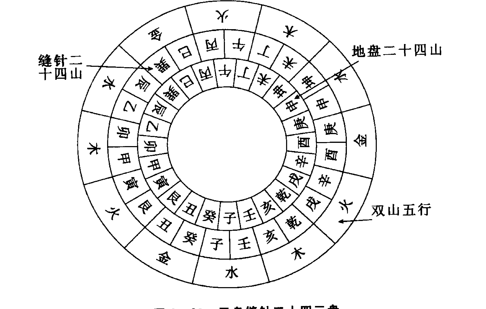

图 2-20 天盘缝针二十四山盘

为方便使用查阅，现将“长生十二运”，配在“阳干气、阴干气”的“十二双山”的情况，列成下表。

#### 长生十二运在阴、阳干气的十二双山下配置表

| 区分 | 阳干气顺旋 | | | | 阴干气逆旋 | | |
| :--- | :--- | :--- | :--- | :--- | :--- | :--- | :--- |
| 十二双山 十二运 | 甲木气 | 丙火气 | 庚金气 | 壬水气 | 癸水气 | 乙木气 | 丁火气 | 辛金气 |
| 长生 | 乾亥 | 艮寅 | 巽巳 | 坤申 | 卯甲 | 午丙 | 酉庚 | 子壬 |
| 沐浴 | 壬子 | 甲卯 | 丙午 | 庚酉 | 寅艮 | 巽巳 | 申坤 | 亥乾 |
| 冠带 | 癸丑 | 乙辰 | 丁未 | 辛戌 | 丑癸 | 辰乙 | 未丁 | 戌辛 |
| 临官 | 艮寅 | 巽巳 | 坤申 | 乾亥 | 子壬 | 卯甲 | 午丙 | 酉庚 |
| 帝旺 | 甲卯 | 丙午 | 庚酉 | 壬子 | 亥乾 | 寅艮 | 巽巳 | 申坤 |
| 衰 | 乙辰 | 丁未 | 辛戌 | 癸丑 | 戌辛 | 丑癸 | 辰乙 | 未丁 |
| 病 | 巽巳 | 坤申 | 乾亥 | 艮寅 | 酉庚 | 子壬 | 卯甲 | 午丙 |
| 死 | 丙午 | 庚酉 | 壬子 | 甲卯 | 申坤 | 亥乾 | 寅艮 | 巽巳 |
| 墓 | 丁未 | 辛戌 | 癸丑 | 乙辰 | 未丁 | 戌辛 | 丑癸 | 辰乙 |
| 绝 | 坤申 | 乾亥 | 艮寅 | 巽巳 | 午丙 | 酉庚 | 子壬 | 卯甲 |
| 胎 | 庚酉 | 壬子 | 甲卯 | 丙午 | 巽巳 | 申坤 | 亥乾 | 寅艮 |
| 养 | 辛戌 | 癸丑 | 乙辰 | 丁未 | 辰乙 | 未丁 | 戌辛 | 丑癸 |

### 4. 举例：

（1）由地盘正针测得一阴宅为“寅山申向”，有一河流从天盘缝针的“壬”山，长生十二运“临官”旺位流来，经向方到“丁”山位、长生十二运的“衰”方流走。符合“水应从旺位来、衰位走”合局，吉（如图2—21）。

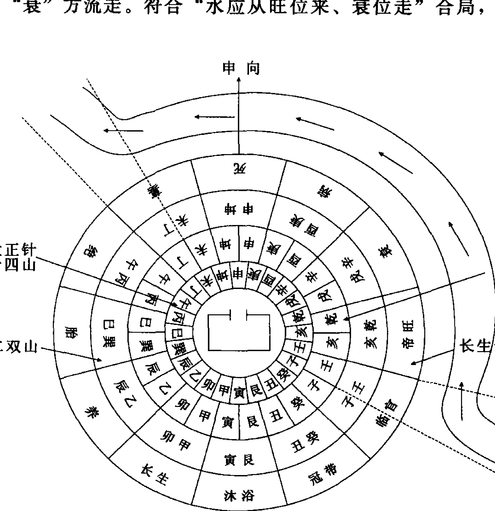

图 2—21：一阴宅“坐寅向申”（地盘正针），水从天盘缝针“壬”位流来，由缝针“丁”山位流走，为右水倒左，系“阴干气”。向方双山“申坤”属水。即，由“长生十二运”临官流来，从“墓”位流走。吉。

注：“寅山申向”，向方的双山为“坤申”属水，而水流的方向是“右水倒左”，系“阴干气”。阴干气里面的“水”，只有“癸水气”，而癸水气的“长生十二运”，“长生”在十二双山的“卯甲”下。“阴干气”对十二长生应“逆排”，所以，“沐浴”在“寅艮”双山之下；“冠带”在“丑癸”双山之下……

其他各“坐山”、“立向”对来去水判断的法则均如此；对“长生”十二运的排法参见“长生”十二运在阴、阳干气的十二双山下配置表。关于吉凶的具体内容，参见下列“长生十二运每运来去水吉凶断语表”。如上例可见“临官水”、“墓水”断语。

（2）有一阴宅“坐子向午”，水从缝针二十四山的“辰”位流来，到缝针的“辛”山位流走，符合从“旺”方流向“衰”方的要求。吉（如图2—22）。

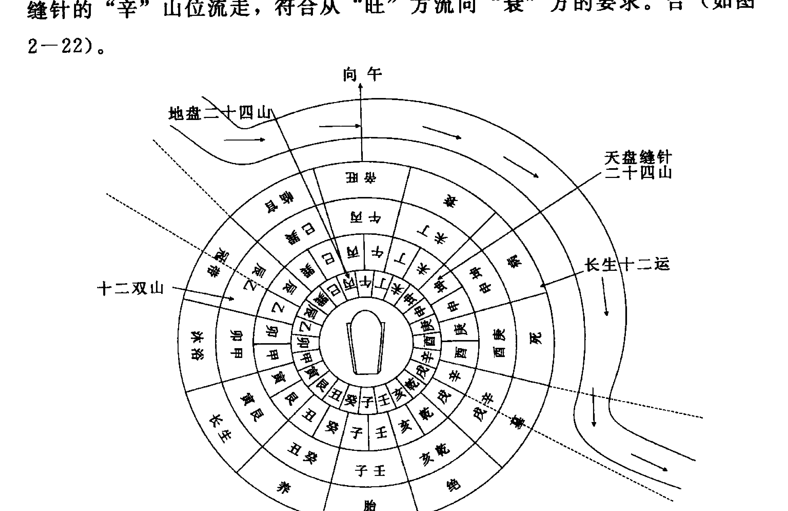

图 2-22

图 2—22：一坐子向午的阴宅，水从冠带旺方来，到墓方衰位流走，为“左水倒右”，系阳干气，“午”向，系双山“丙午”下，属火，“丙火气”、“长生”在艮寅双山之下，顺时针方向排列“十二运”。
水流由辰方经向方到辛方，为左水倒右，系阳干气，“午”向，系“丙午”双山，属火。所以“长生十二运”的排法，系“丙火气”，应从“艮寅”双山下开始，顺排：长生、沐浴、冠带、临官……
其他“山向”对“长生十二运”的排列方法仿此。
吉凶判断的具体内容参看下表：

#### 长生十二运每运来去水吉凶断语表

| 长生十二运 | 九星 | 吉凶断语 |
| :--- | :--- | :--- |
| 养生水 | 贪狼 | 龙珠养生水到堂，贪狼星照显文章。长位儿孙多富贵，人丁昌炽性忠良。小曲大潮官职重，水小弯曲福寿长。养生流破终须绝，少年寡妇出空房。 |
| 沐浴水 | 文曲 | 沐浴水来犯桃花，女子淫乱不由他。投河自缢随人走，血病官灾破主家。子午方来田业尽，卯酉流来好赌奢。若还流破长生位，堕产淫声带锁枷。 |
| 冠带水 | 文曲 | 冠带水来人聪慧，也主风流好赌奢。七岁儿童能作诗，文章博士万人夸。水神流去三房苦，髫发儿童死不差。更损深闺娇态女，此方停蓄乃为佳。 |
| 临官水 | 武曲 | 临官方位水趋茔，禄马朝元吉气新。少年早去青云路，贤相筹谋助圣君。最忌此方山水去，成才之子早归阴，家中少妇常哭泣，财杀空虚彻骨贫。 |
| 帝旺水 | 武曲 | 帝旺潮来聚面前，一堂旺气发庄田，官高爵重威名显，财帛丰盈有剩钱。最怕休囚来敝散，石崇富贵不多年。败方流去根基薄，乏时贫寒怨上天。 |
| 衰水 | 巨门 | 衰方管局巨门星，学堂水到发聪明。少年及第文章富，长寿星高金谷盈。出入威仪乘驷马，宴游歌舞玉女倾。旺极总宜来去吉，也须弯曲更留情。 |
| 病死水 | 廉贞 | 病死二方水莫来，天门巽户不为乖。更有科名官爵重，水若斜飞起大灾。换妻毒药刀兵祸，软脚疯痰女堕胎，必主其家遭此害，瘠痨蒸损瘦形骸。 |
| 墓水 | 破军 | 墓库之方怕临水，破军流去反为祯。阵上扬名文武贵，池湖开蓄富春田，荡然直去家资薄，欠债终年不了人。水来充军千里外，三男二女绝凋零。 |
| 绝胎水 | 禄存 | 绝胎水到不生儿，孕死休囚绝后嗣。纵然有生难抱养，父子乖张夫妇离。水大女人淫乱走，水小私情暗会期。此处只宜为水口，禄存流尽佩金鱼。 |

#### 第十四层 盈缩六十龙

盈缩六十龙与透地六十龙，均是将360度圆周分成六十小格，天干地支在各小格中排列的次序也是一样的。但透地六十龙的六十小格是等分的；而盈缩六十龙的六十小格，则有“盈”有“缩”，宽窄不等。这是为了更加逼近二十四天星的实际分布情形。因为“二十八宿”在天空中所占星度的宽狭不一致，故将“透地六十龙”或盈或缩，称为“天纪盈缩六十龙”，简称“盈缩六十龙”。

盈缩六十龙，六十甲子的“甲子”，是从地盘正针的亥山开始。这是乘天气之盘，而不是论方位的。

盈缩六十龙在罗盘中的排列形式，如图 2-23。

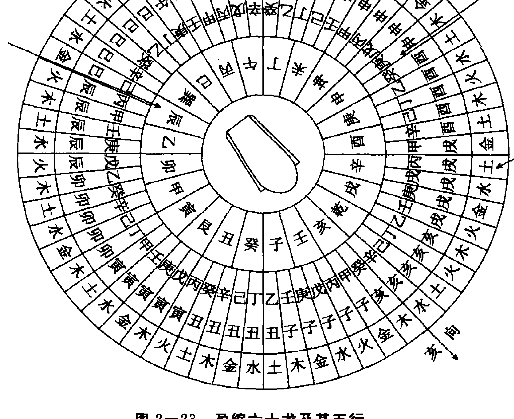

图 2-23：一阴宅“坐巽巳向乾亥”，坐山分金为“丁巳”，属金；仙命“己卯”年出生，也属金，坐山与仙命为“比和”关系。吉。

使用方法：盈缩六十龙没有多大实用价值，只有层数较多的罗盘才有这一层。如果要用，也不可用以“透地”。否则会与“透地六十龙”发生矛盾，不能催吉。

盈缩六十龙配仙命的用法还比较流行。它以阴、阳宅坐方的五行与仙命或宅主人年命五行的生克关系论吉凶。但须注意：阴、阳宅坐山以及仙命或年命的五行，一律以“盈缩六十龙”所配的五行为准。
举例：有一仙命己卯年出生，安葬在“坐巽巳向乾亥”的墓中，其坐山在盈缩六十龙的“辛巳”线位。其吉凶如何？
解：仙命己卯年出生，在盈缩六十龙中己卯属金；坐山丁巳也属金。坐山与仙命为“比和”关系，吉（如图2-23）。

#### 第十五层 平分六十龙

平分六十龙盘分金的排列与透地六十龙相近，所以，也称为“六十透地龙盘”或“平分六十透地龙盘”。其盘面形式如图2-24。

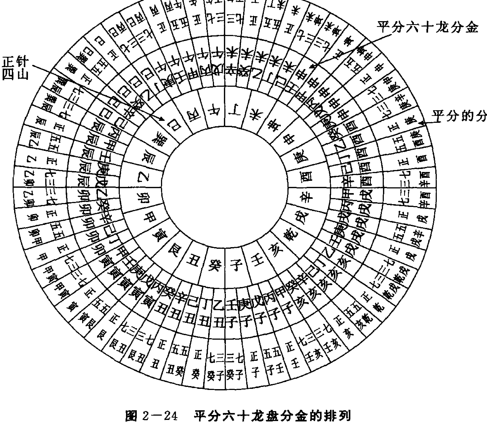

平分六十龙的作用，是以其分度推算阴阳二宅所摘取“坐山”线位的阴阳之气，是否能与来龙透至穴内的阴阳之气恰当地配合。若来龙为阳气，而摘取的“坐山”线位也是阳气，就是恰当的配合，称为“真落”，吉。
来龙入穴之气是阴气，所摘取的“坐山”线位也是阴气，仍然是恰当的配合，是“真落”；如果相反，就是“伪落”，凶。总之，坐山线要与来龙相配合，使其阴配阴，阳配阳，而不能阴阳之气相驳杂，即达到纯阴纯阳之目的。

## 使用方法：

以坐山线为主，立线时避开差错空亡，以阳山不可兼阴，阴山不可兼阳为准。二十四山阴阳的划分，以先天八卦配洛书为准（如图2—25）。

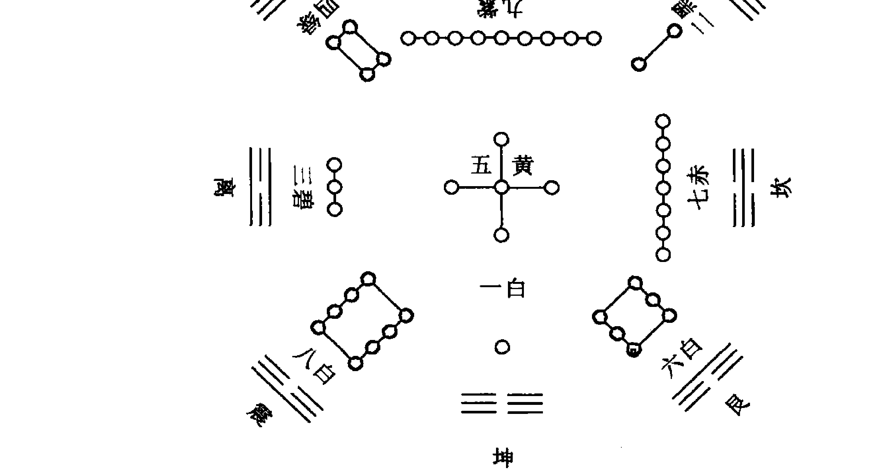

为准确识别和运用平分六十龙的阴阳之气，有必要再认识先天八卦的纳甲一气以及与洛书九星的关系。为方便使用，现将其列成下表：

#### 先天八卦的纳甲一气及其与洛书九星关系表

| 先天八卦 | 纳甲一气 | 洛书九星 | 方位 | 阴阳属性 | 包含的二十四山 |
| :--- | :--- | :--- | :--- | :--- | :--- |
| 乾 | 甲 | 九紫 | 南 | 阳 | 乾、甲 |
| 坤 | 乙 | 一白 | 北 | 阳 | 坤、乙 |
| 离 | 壬、寅、午、戌 | 三碧 | 东 | 阳 | 壬、寅、午、戌 |# 中国风水学初探

| 先天八卦 | 纳甲一气 | 九星 | 方位 | 阴阳属性 | 包含的二十四山 |
|---|---|---|---|---|---|
| 坎 | 癸、申、子、辰 | 七赤 | 西 | 阳 | 癸、申、子、辰 |
| 巽 | 辛 | 二黑 | 西南 | 阴 | 巽、辛 |
| 艮 | 丙 | 六白 | 西北 | 阴 | 艮、丙 |
| 兑 | 丁、巳、酉、丑 | 四绿 | 东南 | 阴 | 丁、巳、酉、丑 |
| 震 | 庚、亥、卯、未 | 八白 | 东北 | 阴 | 庚、亥、卯、未 |

此表告诉我们，乾、坤、离、坎，在洛书九星“九、一、三、七”的单数方位，单数为阳，所以，它们“纳甲一气”中所含的十二山——乾、甲、坤、乙、壬、寅、午、戊、癸、申、子、辰也属阳；巽、艮、兑、震，在“洛书九星”“二、六、四、八”的双数方位，双数为阴，所以，它们“纳甲一气”中所含的十二山——巽、辛、艮、丙、丁、巳、酉、丑、庚、亥、卯、未也属阴。

平分六十龙的分度有三种：

- 1. “正”，表示正度。在阳山下，表示正全阳气；在阴山下，表示正全阴气。
- 2. “三七”，表示三七分度。即，该柱有阳气十分之七，阴气十分之三；或该柱有阴气十分之七，阳气十分之三。
- 3. “五”，表示五五分度。即，该柱阴阳气各占十分之五。

此三种分度的具体运用方法：

- 1. 逢每干支柱正全阳气者，遇上坐山来龙为阳，属于恰当的配合；
- 2. 逢每干支柱正全阴气者，遇上坐山来龙为阴，属于恰当的配合；
- 3. 逢每干支柱的阳气有十分之七，阴气十分之三，该柱以阳气为真气，以阴气为伪气。当遇上阳龙的节数较多时，则吉利；遇上阴龙的节数较多时，为不吉利。
- 4. 逢每干支柱的阴气有十分之七，阳气十分之三，该柱以阴气为真气，阳气为伪气。当遇上阴龙的节数较多时，吉利；遇上阳龙节数较多时，不吉利。
- 5. 七分三分都是阳的干支柱，运作时与正阳气相同；每干支柱的七分三分都是阴，运作时与正阴气相同。
- 6. 二十四山中两山各占一半的为“五五分度”。五五分度有可取的也有不可取的，用法依具体情况而定。有不可取的，这就要依据来龙的阴阳属性达以适当配合目的的而定。

## 举例：

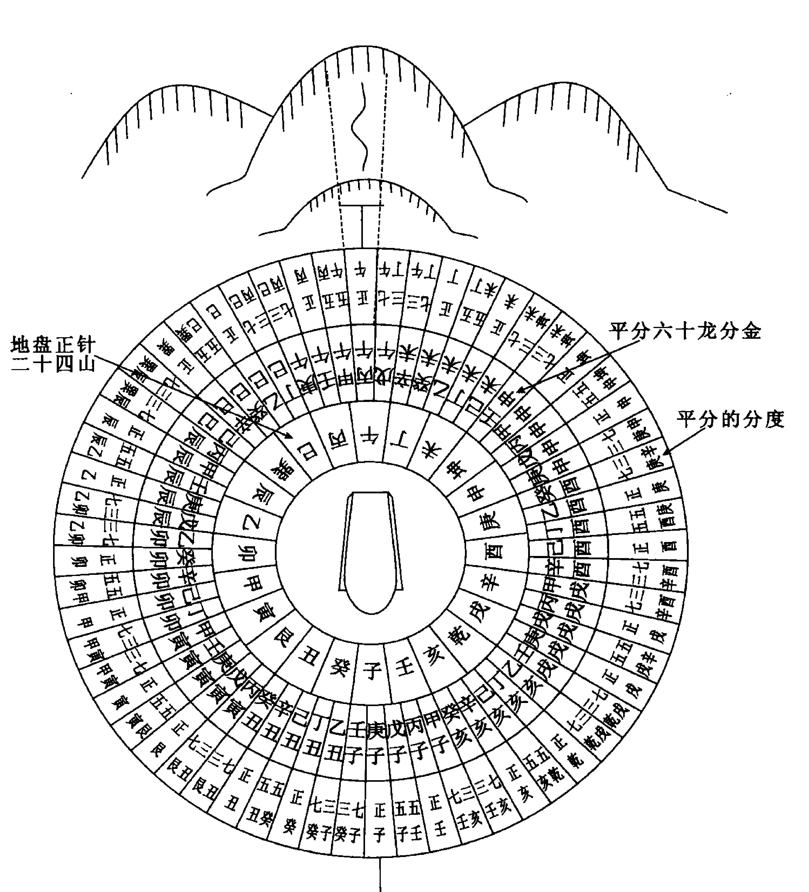

图2-26：阴宅来龙在丙午，得正午分度。正午为阳，来龙丙午也属阳，即“坐丙午”属阳，正午分度也属阳，纯阳。主丁财两旺。

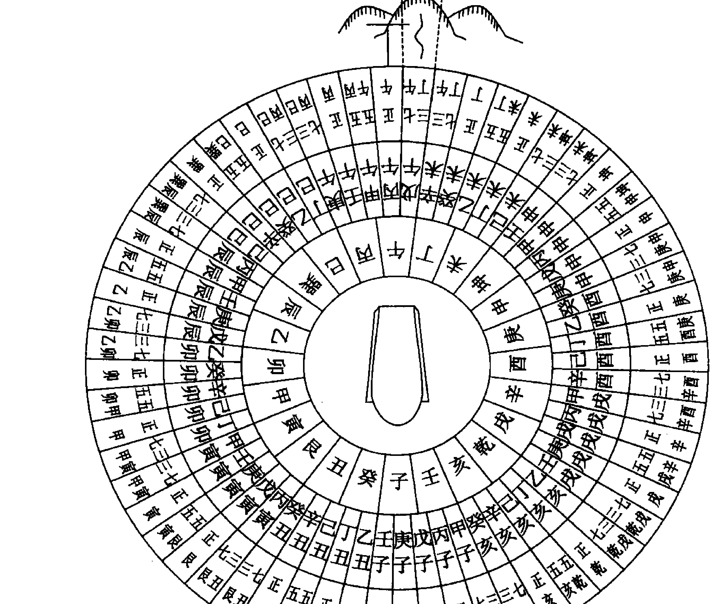

### 图2-27

图2-27：阴宅来龙在戊午，分度为七午三丁，以阳龙论。坐山“丙午”正分度，也属阳，合局，但不如图2-26吉利。
为使用查阅方便，现将平分六十龙阴阳分金度列成下表：

| 阴阳气分数 | 平分六十龙分金度 | 运作方法 |
| --- | --- | --- |
| 正阳气 | 丙子 正壬 庚子 正子 丁丑 正癸 壬寅 正寅 己卯 正甲 庚辰 正乙 甲辰 正辰 丙午 正午 甲申 正坤 戊申 正申 庚戌 正戌 丁亥 正乾 | 以来龙阳为“真落” |
| 正阴气 | 辛亥 正亥 辛丑 正丑 戊寅 正艮 癸卯 正卯 辛巳 正巽 乙巳 正巳 壬午 正丙 癸未 正丁 丁未 正未 乙酉 正庚 己酉 正酉 丙戌 正辛 | 以来龙阴为“真落” |
| 五五分度（两山各占一半） | 甲午 午丙 癸巳 已巽 壬辰 辰乙 辛卯 卯甲 庚寅 寅艮 己丑 丑癸 戊子 子壬 己亥 亥乾 戊戌 戌辛 丁酉 酉庚 丙申 申坤 乙未 未丁 | 据来龙阴阳研判 |
| 七阳三阴（阳7/10，阴3/10） | 甲子 七壬三亥 丙辰 七辰三巽 戊午 七午三丁 壬申 七坤三未 庚申 七申三庚 戊辰 七乙三卯 | 以阳气为真气 |
| 七阴三阳（阴7/10，阳3/10） | 癸亥 七亥三壬 乙卯 七卯三乙 己未 七未三坤 癸酉 七庚三申 辛未 七丁三午 己巳 七巽三辰 | 以阴气为真气 |
| 七分、三分都阳 | 壬戌 七戌三乾 乙亥 七乾三戌 壬子 七子三癸 乙丑 七癸三子 甲寅 七寅三甲 丁卯 七甲三寅 | 同正阳气 |
| 七分、三分都阴 | 辛酉 七酉三辛 甲戌 七辛三酉 癸丑 七丑三艮 丙寅 七艮三丑 丁巳 七巳三丙 庚午 七丙三巳 | 同正阴气 |

#### 第十六层 二十八宿天星分金

二十八星宿，一般的罗盘上都有刻录，它们的排列如下：

- 角木蛟 亢金龙 氐土貉 房日兔
- 心月狐 尾火虎 箕水豹 斗木獬
- 牛金牛 女土蝠 虚日鼠 危月燕
- 室火猪 壁水俞 奎木狼 娄金狗
- 胃土雉 昴日鸡 毕月乌 觜火猴
- 参水猿 井水犴 鬼金羊 柳土獐
- 星日马 张月鹿 翼火蛇 轸水蚓

## 使用方法：

用二十八宿测定阴阳宅的吉凶有两种方法：

- 1. 以星宿各度在罗盘上标示的“红色圆点”、空格以及“人”、“Y”、“、”等符号表示吉凶线位，即小格数。如“参九半”，表示“参水猿”星宿的幅度为“九小格又二分之一小格”；“娄十二太”，表示“娄金狗”星宿所占幅度为“十二小格又四分之三小格”；“胃十五少”，表示“胃土雉”星宿所占幅度为“十五小格又四分之一小格”等等。

每星宿的幅度小格中标注的“红色圆点”，表示可摘用的吉祥线位；“空白小格”表示不能摘用的凶线位；“人”为“关煞”、“Y”是“差错空亡”，“、”为“平”，均不宜摘用。

总之，使用时除摘取“红色圆点”线位外，其他一概不用就对了。

- 2. 依据星宿分度五行与星宿五行间的生克制化关系定吉凶。以分度（小格）五行为“主方”；以星宿五行为“客方”，其吉凶关系如下表：

### 主方与客方生克关系吉凶表

| 主方（小格）与客方（星宿）间的生克关系 | 气线名称 | 吉祥 | 凶灾 |
| :--- | :--- | :--- | :--- |
| 客方（星宿）生主方（小格） | 生气线 | 吉 | |
| 客方（星宿）与主方（小格）比和 | 旺气线 | 吉 | |
| 主方（小格）克客方（星宿） | 财气线 | 吉 | |
| 客方（星宿）与主方（小格）比和 | 煞气线 | | 凶 |
| 主方（小格）克客方（星宿） | 泄气线 | | 凶 |

## 附一

### 二十八宿（客方）五行属性表

| 东方青龙 | 星宿名称 | 分度数 | 星属 | 五行 |
| :--- | :--- | :--- | :--- | :--- |
| | 角木蛟 | 十二太 | 木星 | 木 |
| | 亢金龙 | 九太 | 金星 | 金 |
| | 氐土貉 | 十六少 | 土星 | 土 |
| | 房日兔 | 五太 | 日星 | 火 |
| | 心月狐 | 六 | 月星 | 火 |
| | 尾火虎 | 十八 | 火星 | 火 |
| | 箕水豹 | 九半 | 水星 | 水 |

| 北方玄武 | 星宿名称 | 分度数 | 星属 | 五行 |
| :--- | :--- | :--- | :--- | :--- |
| | 斗木獬 | 二十二太 | 木星 | 木 |
| | 牛金牛 | 七 | 金星 | 金 |
| | 女土蝠 | 十一 | 土星 | 土 |
| | 虚日鼠 | 九少 | 日星 | 火 |
| | 危月燕 | 十六 | 月星 | 火 |
| | 室火猪 | 十八少 | 火星 | 火 |
| | 壁水俞 | 九太 | 水星 | 水 |

| 西方白虎 | 星宿名称 | 分度数 | 星属 | 五行 |
| :--- | :--- | :--- | :--- | :--- |
| | 奎木狼 | 十八 | 月星 | 木 |
| | 娄金狗 | 十二太 | 金星 | 金 |
| | 胃土雉 | 十五少 | 土星 | 土 |
| | 昴日鸡 | 十一 | 日星 | 火 |
| | 毕月乌 | 十六半 | 月星 | 火 |
| | 觜火猴 | 少 | 火星 | 火 |
| | 参水猿 | 九半 | 水星 | 水 |

| 南方朱雀 | 星宿名称 | 分度数 | 星属 | 五行 |
| :--- | :--- | :--- | :--- | :--- |
| | 井水犴 | 三十少 | 水星 | 水 |
| | 鬼金羊 | 二少 | 金星 | 金 |
| | 柳土獐 | 十三半 | 土星 | 土 |
| | 星日马 | 六太 | 日星 | 火 |
| | 张月鹿 | 十七太 | 月星 | 火 |
| | 翼火蛇 | 二十少 | 火星 | 火 |
| | 轸水蚓 | 十八太 | 水星 | 水 |

## 附二

### 二十八星宿分度（小格）五行排列表（主方）

| 五行（第一度） | 二十八星宿 | 由逆时针第一度（小格）起依次排列五行 |
|----------------|-------------|----------------------------------------|
| 金 | 井、鬼、室、参、娄、亢、虚、氐、箕、斗 | 金木水火土 |
| 木 | 心、星、房 | 木水火土金 |
| 水 | 张、奎、胃、昴、牛、尾 | 水火土金木 |
| 火 | 角、壁、毕、柳 | 火土金木水 |
| 土 | 翼、轸、觜、危、女 | 土金木水火 |

## 举例：

有一“坐巽巳向乾亥”的阴宅。坐山“巽巳”，坐得星宿“轸水蚓”一度。“轸”五行属水；“轸水蚓一度”五行，按上表应该是“土”。于是主方（轸水蚓一度）五行“土”，克客方（星宿轸水蚓）五行“水”，为财气线，吉。

又如，“柳土獐”其分度为十三度半。从“二十八宿分度（小格）五行排列表”中的“角壁毕柳”一横行中可查知，柳星以“火”排在第一度，从第二度开始按“土金木水火土金木水火土金木”的逆序排列，直到把十三小格半排满为止。其它各宿，均按此表规定的五行顺序和方法排列。

注：二十八宿各分度（小格）的五行是“主方”；二十八宿的五行为“客方”。

另一派对星宿分度（小格）五行排列的方法是：

- 1. 将星宿的五行属性排在第一小格内，如“轸水蚓”属水，第一小格的五行就是“水”。
- 2. 从第二小格开始，依“金、木、水、火、土”的顺序反复排列，直至将该星宿所占360°的幅度（小格）排满。如“轸十八太”，即“轸”在360°中所占的幅度有“十八又四分之三小格”。因“轸”属水，所以，第一小格（逆时针）五行属“水”；第二至第六小格的五行，依次是“金、木、水、火、土”；第七至第十一小格的五行，又是“金、木、水、火、土”；第十二至第十六小格的五行，仍是“金、木、水、火、土”；第十七、十八和四分之三小格的五行，依次是“金、木、水”。

其实这派的方法，比较简单易行。

二十八星宿每年运行的轨迹都会移位，故有些罗盘有两层二十八星宿：一为现代盘式；一为古代盘式。

#### 第十七层 圆周360°分度盘

罗盘的最外圈层，通常都刻有圆周360°分度。其“0”度，对准“子”山；90°正对“卯”山；180°正对“午”山；270°正对“酉”山；360°又回到“子”山。

360°中，“子、午、卯、酉”的四正位，可用以检验“天心十道”红色塑料线位置的准确度，即该线位应准确地覆盖在“子、午、卯、酉”的线上，才是对的。

## 第三章 三元盘各圈层含义及其运作法

### 第一节 概说

#### 一、理气三元盘和三元九运

勘察风水的基本方法，可分成两大类：一类是依地形地貌及其生态环境定点取穴，即“峦头法”；另一类是运用理气操作术，即“理气法”。

“理，指阴阳五行之理；气，指阴阳五行之气。气有吉凶，用理推之。”古人设卦用来推理、推气，就叫作“理气”。

理气的内容包括阴阳、五行、八卦、净阴净阳、穿山透地、坐度分金、旺相休囚死、运气时岁等论说。这些理论构成了风水术的基础。

理气的派别很多，现代比较流行的是“三合派”和“三元派”。所以，市面出售的罗盘主要也是“三合盘”和“三元盘”，以及综合了两者内容的“综合盘”。

三合盘相关内容已在前章作了简述，本章专对三元盘作扼要介绍。

“三元”，是指“三元九运”中的三元，它以年数为时段，分成“上元、中元、下元”，每元60年。这属于“玄空理气”方面的内容，即“三元地理论”。

三元地理论，是清代地理学家沈竹初先生，经过对历代地理贤师之说的考究，再依据河洛数理及三元九运的规律，悟出整理的一套地理学说。

现将“三元九运”的具体内容列成下表：

### 三元九运表

| 归元 | 九星 | 九运 | 八卦 | 五行 | 方位 | 起止年份公元 | 起止年份六十甲子 |
|------|------|------|------|------|------|--------------|------------------|
| 上元(1864-1923) | 一白 | 一 | 坎 | 水 | 北 | 1864-1883 | 甲子至癸未 |
| | 二黑 | 二 | 坤 | 土 | 西南 | 1884-1903 | 甲申至癸卯 |
| | 三碧 | 三 | 震 | 木 | 东 | 1904-1923 | 甲辰至癸亥 |
| 中元(1924-1983) | 四绿 | 四 | 巽 | 木 | 东南 | 1924-1943 | 甲子至癸未 |
| | 五黄 | 五 | 中央 | 土 | 中 | 1944-1963 | 甲申至癸卯 |
| | 六白 | 六 | 乾 | 金 | 西南 | 1964-1983 | 甲辰至癸亥 |
| 下元(1984-2043) | 七赤 | 七 | 兑 | 金 | 西 | 1984-2003 | 甲子至癸未 |
| | 八白 | 八 | 艮 | 土 | 东北 | 2004-2023 | 甲申至癸卯 |
| | 九紫 | 九 | 离 | 火 | 南 | 2024-2043 | 甲辰至癸亥 |

注：据说，元运是从黄帝时期的第28个甲子年，开始起算的。

## 使用方法：

在各运所在的年限之内，为“当运”。如，2004—2023年这二十年间，为“八白”艮卦当“八运”。在此期间，修建阳宅、阴宅、门宜开向艮方，碑向也应在艮方。

- 例如：
    - 1. 艮宫为八运的旺位，在修建房屋时，其大门可对向艮卦方；
    - 2. 倘建一阴宅，立碑的朝向，可向着艮卦方，若艮方有来龙更佳；
    - 3. 若建一阳宅，大门朝艮方，对宫坤方又见高楼大厦，则回风返气，丁财两旺。

#### 二、三元二十四山阴阳盘

罗盘中八卦分辖的二十四山，每卦下辖的三山，按顺时针旋，依次为：地元龙，天元龙，人元龙。如，坎卦下的“壬子癸”，壬为地元龙，子为天元龙，癸为人元龙。三元龙有阴阳属性之别。

各卦下的三元龙及其阴阳属性，详见下列图示：

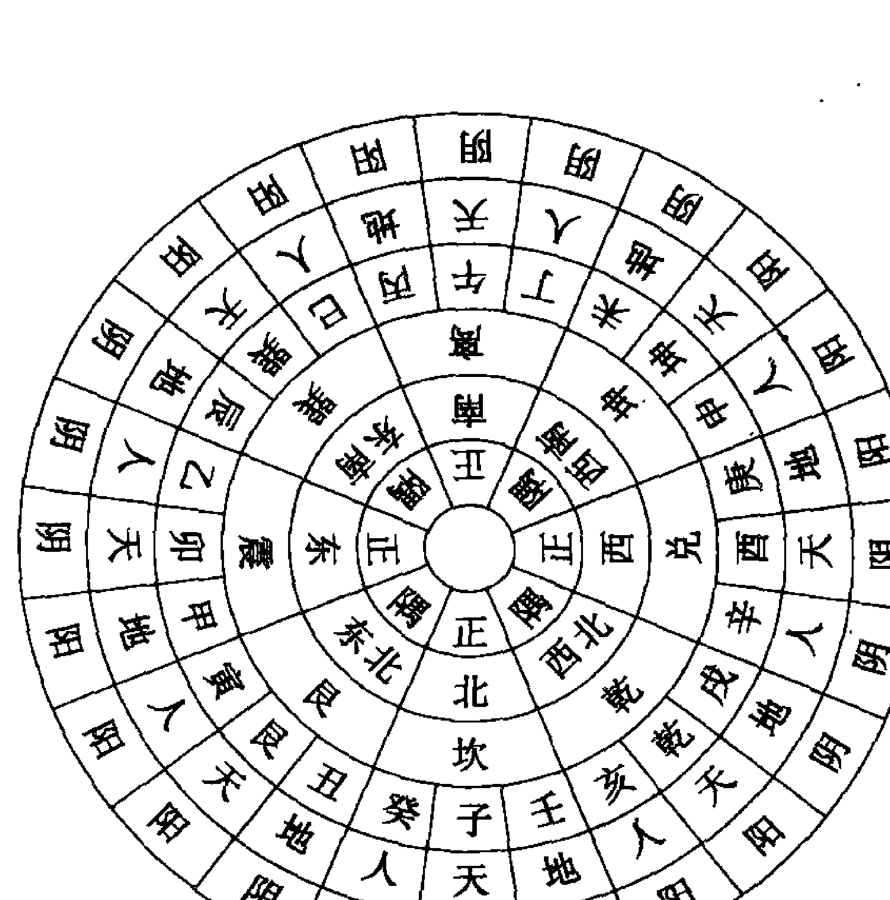

| 区分 | 四正卦 | | | | 四隅卦 | | | |
| :--- | :---: | :---: | :---: | :---: | :---: | :---: | :---: | :---: |
| | **东** | **南** | **西** | **北** | **东南** | **西南** | **东北** | **西北** |
| | **震** | **离** | **兑** | **坎** | **巽** | **坤** | **艮** | **乾** |
| **二十四山** | 甲 卯 乙 | 丙 午 丁 | 庚 酉 辛 | 壬 子 癸 | 辰 巽 巳 | 未 坤 申 | 丑 艮 寅 | 戌 乾 亥 |
| **三元龙** | 地元龙 天元龙 人元龙 | 地元龙 天元龙 人元龙 | 地元龙 天元龙 人元龙 | 地元龙 天元龙 人元龙 | 地元龙 天元龙 人元龙 | 地元龙 天元龙 人元龙 | 地元龙 天元龙 人元龙 | 地元龙 天元龙 人元龙 |
| **阴阳属性** | 阳 阴 阴 | 阳 阴 阴 | 阳 阴 阴 | 阳 阴 阴 | 阴 阳 阳 | 阴 阳 阳 | 阴 阳 阳 | 阴 阳 阳 |

#### 三、规律

由图3-1，可以找出如下三项规律：

- 1. 从坎卦下的“壬子癸”三山中的“壬”山开始，顺时针方向看，每卦山下三元龙的名称，依次是“地元龙，天元龙，人元龙”；而各卦山下三山的阴阳属性，则按“阳阴阴”、“阴阳阳”的形式重复排列，直至乾卦下的“亥”山为止。
- 2. 东南西北四正卦山的“子午卯酉”四山为阴；而它们右左两边的各一山，则是“一阳一阴”。如：“壬子癸”三山中，“子”山为阴，而右边的“壬”山为阳，左边的“癸”山为阴。其余三卦山皆如此。
- 3. 西北方、西南方、东北方、东南方四隅卦山的“乾坤艮巽”四山为阳；而它们右左两边的卦山，则是“一阴一阳”。如：“戌乾亥”三山中，“乾”为阳，右边的“戌”山为阴，左边的“亥”山为阳。其余三卦山，均是这样。

#### 四、阴阳元龙的应用

> 口诀：
> 甲庚丙壬，寅申巳亥，乾巽艮坤俱属阳，顺推五行详；
> 乙辛丁癸，子午卯酉，辰戌丑未皆为阴，逆推论五行。
> 阴阳顺逆不同途，须向此中求，
> 九星双起雌雄异，玄关真妙处。

属阳的十二山，是顺时针方向数；属阴的十二山，则是逆时针方向数。“阴阳顺逆不同途”是说，阳元龙的山向，不可兼阴元龙的山向。如：“坐壬向丙”，不可兼“坐子向午”。因为“壬丙”是阳元龙，而“子午”是阴元龙。但“坐壬向丙”，可以兼“坐亥向巳”，因为“亥巳”也属阳元龙。

所谓“兼”，是以本卦山为准，向左或右方位倾向约6度（360度中的6度），就是兼向了。这是吉凶意义上的兼。

“阴阳不同途”的真兼（达到6度），是“阴差阳错”之兼。其凶象是：夫妻不和，运气反复，家宅不宁。

但是，“坐壬向丙”兼子午，只要没达到6度就是假兼，不入“阴差阳错”之凶格中。

### 第二节 各圈层含义及其运用方法

因三元盘的多数圈层的内容与三合盘是一样的，所以，本节只扼要叙述不同内容的圈层。凡相同者，仅列出其名称。

#### 第一层 天池

#### 第二层 先天八卦

#### 第三层 洛书九星

#### 第四层 地盘正针

此四层内容与“三合盘”相同。

#### 第五层 二十四天星

二十四天星，就是二十四山之下，每山都配有很多“天星”，如“天铺”、“帝座”、“北道”等等。这些天星对于每一山来说，它们的性质是一样的，只是名称不同而已。作为罗盘使用的名称，只能取众名称中的一个。

中国古代人，将太阳系的恒星分为三垣、二十八宿，共三十一个天区，每区以一垣或一宿为主体，并包括其他多少不等的星宿[三垣，即太微垣（上垣）、紫微垣（中垣）和天市垣（下垣），其中紫微垣为天帝所居，故多为皇家建筑所效仿，如北京紫禁城]。所以，在二十四山之下，就各设有一个或多个天星。其名称如下表：

### 二十四山下的二十四天星表

| 二十四山 | 二十四天星 | 天星异名 | 吉凶 | 二十八宿 | 吉凶 |
| :---: | :---: | :--- | :---: | :---: | :---: |
| 壬 | 天辅 | 八武、天辅、阴权 | 吉 | 室火猪 | 吉 |
| 子 | 天垒 | 帝座、阳光、太阴 | 吉 | 虚日鼠、危月燕 | 凶 |
| 癸 | 天道 | 北道、阴光、瑶光、天汉、鸾驾、天道 | 平 | 女土蝠 | 凶 |
| 丑 | 天厨 | 天吊、牵牛 | 凶 | 牛金牛 | 凶 |
| 艮 | 天市 | 金阁、天枢、凤阁、阳姬 | 大吉 | 斗木獬 | 吉 |
| 寅 | 天培 | 金箱、功曹 | 吉 | 箕水豹 | 吉 |
| 甲 | 天苑 | 鬼劫、天绕、阴玑 | 凶 | 尾火虎 | 吉 |
| 卯 | 天命 | 将军、天理、阳衡、廉贞、阿香 | 平 | 房日兔、心月狐 | 平 |
| 乙 | 天官 | 天堂、骑官 | 平 | 氐土貉 | 凶 |
| 辰 | 天罡 | 亢金 | 凶 | 亢金龙 | 凶 |
| 巽 | 太乙 | 宝殿、太微、阳璇 | 大吉 | 角木蛟 | 吉 |
| 巳 | 天屏 | 金支、天堂、明堂、赤蛇、青砂 | 大吉 | 轸水蚓 | 吉 |

| 二十四山 | 二十四天星 | 天星异名 | 吉凶 | 二十八宿 | 吉凶 |
| :--- | :--- | :--- | :--- | :--- | :--- |
| 丙 | 太微 | 炎烈、天贵、阴枢、帝释 | 大吉 | 翼火蛇 | 凶 |
| 午 | 天马 | 帝辇、天广、阳权、炎精、太阳 | 大吉 | 星日马、张月鹿 | 平 |
| 丁 | 天柱 | 龙墀、南极、寿星、天极、阴阗 | 平 | 柳土獐 | 凶 |
| 未 | 天恒 | 天杀、太常、天常、天恒、元阴 | 大吉 | 鬼金羊 | 凶 |
| 坤 | 天钺 | 宝盖、阴玄、玄戈、老阴、玄峰 | 凶 | 井水犴 | 吉 |
| 申 | 天官 | 玉印、传送、阴玑 | 平 | 参水猿 | 吉 |
| 庚 | 天横 | 劫杀、阴衡 | 平 | 轸火猴 | 凶 |
| 酉 | 少微 | 华盖、金鸡、阴阖 | 凶 | 昴日鸡、毕月乌 | 平 |
| 辛 | 天乙 | 直符、阴璇、英才 | 大吉 | 胃土雉 | 吉 |
| 戌 | 天魁 | 地杀、鼓盆、娄金 | 吉 | 娄金狗 | 吉 |
| 乾 | 天厩 | 龙楼、阳玑、节钺、北极、亢阳 | 吉 | 奎木狼 | 凶 |
| 亥 | 天皇 | 玉叶、紫微、天门 | | 壁水俞 | 吉 |

二十四天星中有八颗称为“贵星”，他们是：

紫微垣“亥”，天市垣“艮”，太微垣“巽”，少微垣“兑”，合称为“天星四贵”。

天皇星“亥”，天屏星“巳”，为“帝都明堂”。

天市星垣“艮”，太微星垣“巽”，少微星垣“兑”，又称为“三吉”。此三吉，加上天贵星“丙”，天乙星“辛”，南极星“丁”，合称为“六秀”。

上列“亥、艮、巽、兑、巳、丙、丁、辛”为八颗贵星，其中三吉六秀，即：“艮、巽、兑、丙、丁、辛”是风水中的大吉星（如图 3－2）。

使用方法：

二十四天星的方位中，在八贵星，尤其是在三吉六秀大吉星方位的延长线上，若有砂峰高峻耸立且秀丽圆润厚实的山峰，可视为贵砂。阳宅逢人丁兴旺，大富大贵；阴宅逢之，主无水、蚁侵害（如图 3－3）。

举例：

## 卷三 罗盘常识和使用方法

## 第三章 三元盘各圈层含义及其运作法

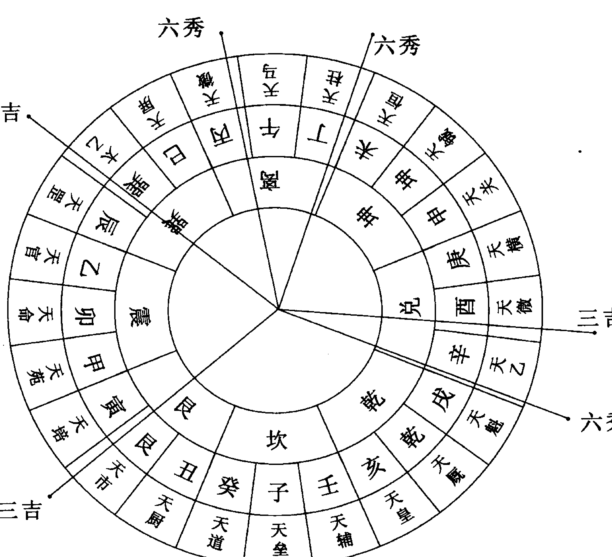

图3-2 二十四山中的三吉六秀吉星

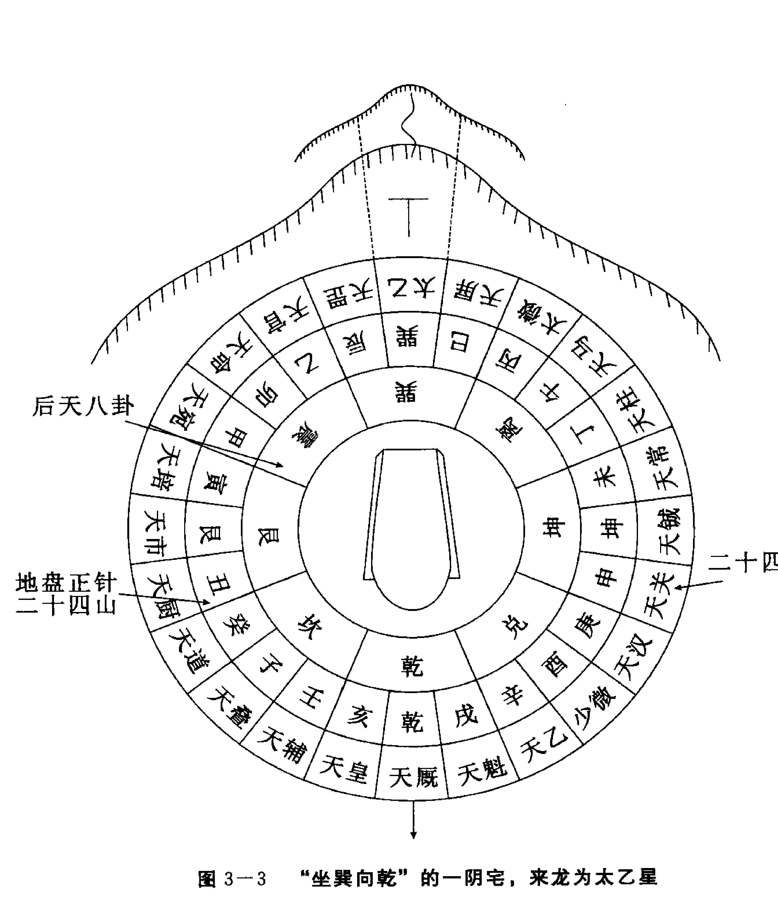

图3-3 ‘坐巽向乾’的一阴宅，来龙为太乙星

图 3-3：一阴宅“坐巽向乾”，来龙为“太乙星”，属三吉星之一，在巽方的延长线上有一端庄秀丽的山峰。无水、蚁侵，且发福久远。

#### 第六层 起星诀

起星诀，又称“挨星口诀”。它在罗盘上并不作分金用，而只是一个公式，方便推算换星所用。其口诀是：

- 子癸并甲申，贪狼一路行，
- 壬卯乙未坤，位位为巨门，
- 乾亥辰巽巳，连戌武曲名，
- 酉辛丑艮丙，天星说破军，
- 寅午庚丁上，右弼四星临。

图式如下：

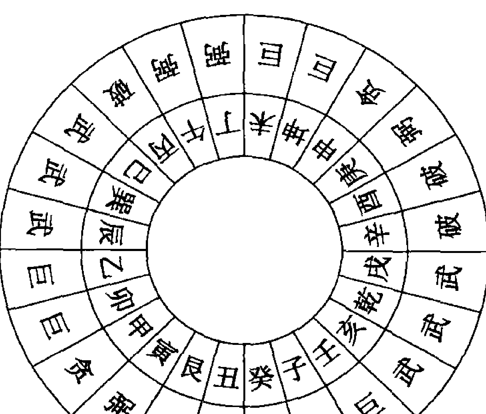

图 3-4 挨星盘

#### 第七层 先天卦气盘

先天卦气盘，又称玄空易卦盘。它以先天八卦的卦位为准，以洛书数列及其卦气五行为内容，并以此五行与阴阳宅的向首或坐山线位上相对应的“气数”五行的生克制化关系论吉凶的一种预测法。

先天八卦卦气盘层，分为“外圆图卦气盘层”和“内方图卦气盘层”。外圆图卦气盘层象征天运，用在向首论吉凶；内方图卦气盘层（罗盘上将其画作了圆图）象征地运，用在坐山论吉凶（如图 3-5、3-6、3-7）。

先天八卦以洛数为气数及其五行如下表：

## 先天八卦以洛数为气数及其五行表

| 先天八卦 | 洛书气数 | 方位 | 五行 |
| :--- | :--- | :--- | :--- |
| 坤 | 一 | 北 | 水（天一生水） |
| 巽 | 二 | 西南 | 火（地二生火） |
| 离 | 三 | 东 | 木（天三生木） |
| 兑 | 四 | 东南 | 金（地四生金） |
| 艮 | 六 | 西北 | 水（地六成水） |
| 坎 | 七 | 西 | 火（天七成火） |
| 震 | 八 | 东北 | 木（地八成木） |
| 乾 | 九 | 南 | 金（天九成金） |

先天卦气盘的盘式如下：

1. 内方外圆易卦图

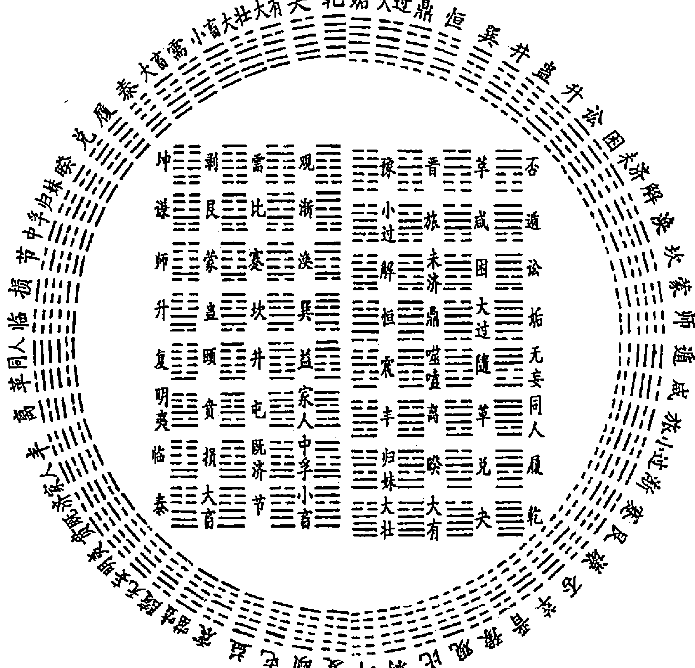

图3-5 内方外圆易卦图

2. 外盘圆图

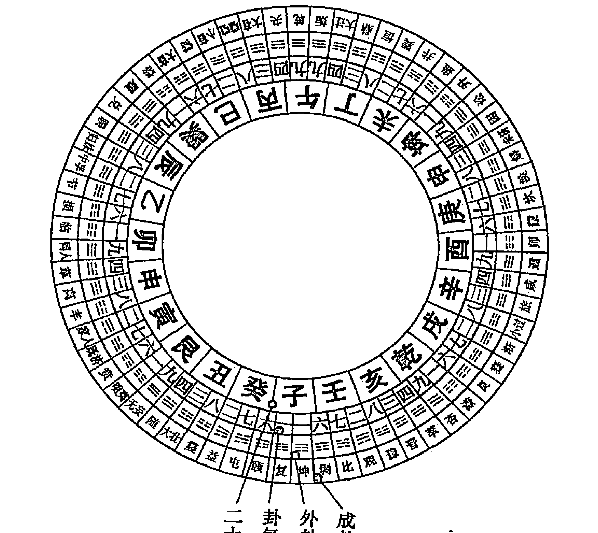

外盘圆图，又称外圆天运盘，此盘在二十九圈层罗盘的缝针二十四山往天池方向数的第三圈层。从正针的“壬”山开始，沿顺时针方向左旋，所标的“二七六一一六七二”等中文数字，就是卦气盘的卦气数。这些数字是“先天八卦配洛书”的卦序，如“先天八卦以洛书为气数及其五行表”。“六一一”就是先天八卦“艮、坤、坤”的卦气数；“二七”表示的是先天八卦“巽、坎”的卦气数等等。

紧挨卦气数的外层，是六十四卦各卦的上卦（外卦），如“六”的外层是“☶”，它是“䷖（山地剥）”的上卦；“一”的外层是“☷”，它是“䷁（坤）”的上卦等等。

由此看来“卦气数”实际上就是代表六十四卦的上卦；那么它们的下卦是什么呢？就是头一卦名称中间的那个“字”（乾卦例外）。如：

- “地雷复”后，连续八个卦的下卦是“雷☳（震为雷）”；
- “地火明夷”后，连续八个卦的下卦是“火☲（离为火）”；
- “地泽临”后，连续八个卦的下卦是“泽☱（兑为泽）”；
- “地天泰”后，连续八个卦的下卦是“天☰（乾为天）”；
- “乾为天”后，连续八个卦的下卦是“风☴（巽为风）”；
- “天水讼”后，连续八个卦的下卦是“水☵（坎为水）”；
- “天山遁”后，连续八个卦的下卦是“山☶（艮为山）”；
- “天地否”后，连续八个卦的下卦是“地☷（坤为地）”。

紧接上卦外层的五行“水水水水火火木”等，是相对应小格卦气数的五行属性，如，“水水水火火木”分别与卦气数“二七六一六七二”卦气数相对应，表示“六一一六”均属水；“七二”均属火，“八”属木……

3. 内盘方图化圆图

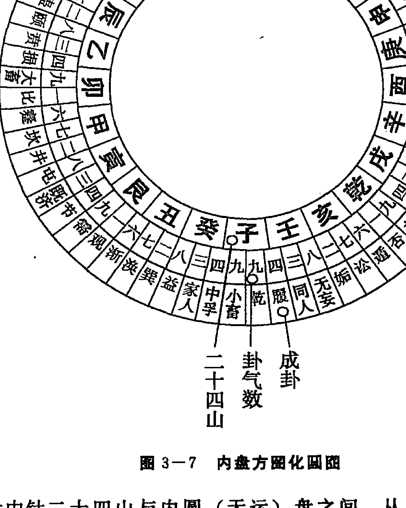

图3-7 内盘方图化圆图

在人盘中针二十四山与内圆（天运）盘之间，从中针的“子”山开始，顺时针方向左旋，刻有中文数字“四九九四三八二七六”等的一层，就是内盘方图已化成圆图的卦气盘。这些数字所表示的仍然是先天八卦的“卦气数”。它们所代表的卦象与外圆盘一样仍然是“先天八卦配洛书”，如，“四”代表先天八卦“兑”的卦气数；“九”代表先天八卦“乾”的卦气数；“三”代表先天八卦“离”的卦气数；“八”代表先天八卦“震”的卦气数；“二”代表先天八卦“巽”的卦气数；“七”代表先天八卦“坎”的卦气数；“六”代表先天八卦“艮”的卦气数等等。

要注意的是：

（1）方图卦气盘与圆图卦气盘相比，两者的卦气数，在四正四隅方，是完全相反的。

现以南北两方的卦气数为例列表如下：

## 沿顺时针方向，阅外圆图与内方图化圆图卦气盘南北比较表

| 图别 | 方位\n分项 | 北方 | | | | | | | 南方 | | | | | | |
| :--- | :--- | :---: | :---: | :---: | :---: | :---: | :---: | :---: | :---: | :---: | :---: | :---: | :---: | :---: | :---: | :---: | :---: | :---: |
| 外圆图 | 卦气数 | 二 | 七 | 六 | 一 | 一 | 六 | 七 | 二 | 八 | 三 | 四 | 九 | 九 | 四 | 三 | 八 |
| | 卦象 | 观 | 比 | 剥 | 坤 | 复 | 颐 | 屯 | 益 | 壮 | 大有 | 夬 | 乾 | 姤 | 大过 | 鼎 | 恒 |
| | 五行 | 火 | 火 | 水 | 水 | 水 | 水 | 火 | 火 | 木 | 木 | 金 | 金 | 金 | 金 | 木 | 木 |
| 内方化圆图 | 卦气数 | 八 | 三 | 四 | 九 | 九 | 四 | 八 | 三 | 二 | 七 | 六 | 一 | 一 | 六 | 七 | 二 |
| | 卦象 | 无妄 | 同人 | 履 | 乾 | 小畜 | 中孚 | 家人 | 益 | 升 | 师 | 谦 | 坤 | 豫 | 小过 | 解 | 恒 |
| | 五行 | 木 | 木 | 金 | 金 | 金 | 金 | 木 | 木 | 火 | 火 | 水 | 水 | 水 | 水 | 火 | 火 |

（2）六十四卦各卦象的五行属性与该卦所对应小格内卦气数的五行属性是一致的。如外圆图“风地观”的五行属火，是因为“观”对应的小格的卦气数“二”属火；“天雷无妄”属木，是因为“无妄”对应的小格的卦气数“八”属木。其余以此类推。

（3）紧靠卦气数层下方的各“三爻”卦，对外圆图而言，它是与六十四卦相对应卦象的上卦，如地盘正针“壬”山下，外圆图卦气数“二”是巽的卦气数，它下方的三爻卦是“☴（巽为风）”，而“☴”对应的卦象是“观（风地观）”，故“☴”是“䷓（风地观）”的上卦；但是对内方图化圆图而言，卦气数层下方的“三爻”卦，都是六十四卦相对应卦象的下卦。如地盘正针“壬”山下，内方图化圆图的卦气数“八（震的卦气数）”，它下方的三爻卦是“☳（震为雷）”，而“☳”所对应卦象是“无妄（天雷无妄）”，故“☳”是“䷘（天雷无妄）”的下卦，内方图化圆图各卦气数下的三爻卦，皆是如此。

那么，内方图化圆图三爻卦的上卦是什么呢？

- 从“子”山下的“风天小畜”（☴）卦开始，沿顺时针方向左旋，到“风地观”（☷）止，八个三爻卦的上卦是“巽为风”（☴）。
- 从“水天需”（☵）开始，到“水地比”（☷）止，八个三爻卦的上卦是“坎为水”（☵）。
- 从“山天大畜”（☶）开始，到“山地剥”（☷）止，八个三爻卦的上卦是“艮为山”（☶）。
- 从“地天泰”（☷）开始，到“坤为地”（☷）止，八个三爻卦的上卦是“坤为地”（☷）。
- 从“雷地豫”（☳）开始，到“雷天大壮”（☰）止，八个三爻卦的上卦是“震为雷”（☳）。
- 从“火地晋”（☲）开始，到“火天大有”（☰）止，八个三爻卦的上卦是“离为火”（☲）。
- 从“泽地萃”（☱）开始，到“泽天夬”（☰）止，八个三爻卦的上卦是“兑为泽”（☱）。
- 从“天地否”（☰）开始，到“乾为天”（☰）止，八个三爻卦的上卦是“乾为天”（☰）。

### 4. 使用方法

#### (1) 向方

向方的水口、砂峰，以生旺向线的五行为要，这时要用外圆图盘，它象征天运。其具体方法如下：

- 客气数五行生主气数五行，为生气，生财。
- 客气数五行同主气数五行，为旺气，旺财。
- 主气数五行克客气数五行，为财气，聚财。
- 客气数五行克主气数五行，为煞气，破财。
- 主气数五行生客气数五行，为泄气，退财。

举例：

图3-8：一阴宅“亥山巳向”，向上得小畜卦，卦气数“二”，五行属“火”。向方左边的三叉水口得“需”卦，卦气数“七”，五行属火，与向同属火，旺财。三叉水口左边的山峰得“睽”卦，卦气数为“三”，五行属木，生向上的“火”，生财。阴宅右边的山峰，得“大有”卦，卦气数为“三”，五行属木，生向上的“火”，生财。故此一阴宅仙命的子孙，可以大展鸿图，兴业发财。

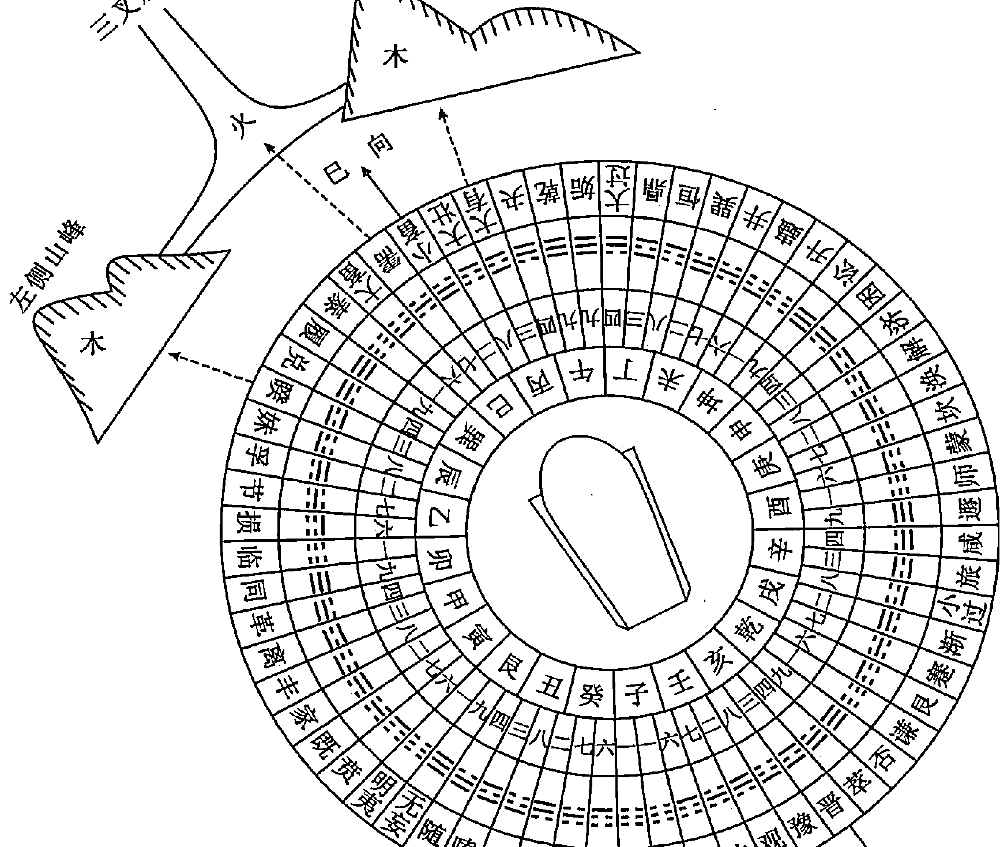

#### (2) 坐山

坐方后的山峰、来龙、束咽的卦气数五行，要求能生旺坐山的线位所覆盖卦气数的五行。这时要用内盘方图化圆图的卦气数及其卦象，它象征“地运”。其具体方法是：

以坐山后方的山峰、束咽、过峡的卦气五行为客方；以坐山线位覆盖的卦气五行为主方。

客卦气五行生主卦气五行，为生气，旺丁。
客卦气五行同主卦气五行，为旺气，添丁。
主卦气五行克客卦气五行，为财气，人丁兴旺。
客卦气五行克主卦气五行，为煞气，损丁。
主卦气五行生客卦气五行，为泄气，丁病。

举例：

图3－9：一坐亥山向巳的阴宅，坐得亥山“姤”卦，卦气数“二”，五行属火。坐山左边后方有山峰，对着“天雷无妄”卦，卦气数“八”，五行属木，与线位覆盖的姤卦的卦气数“二”的五行“火”相生，为“客卦气五行生主卦气五行”，生气，旺丁。坐山右边后有一山峰，在“讼”卦的延长线上，卦气数“七”，五行属火，与坐山姤卦的卦气数“二”五行同属火，即“客卦气五行同主卦气五行”，为旺气，添丁。故仙命的子孙人丁兴旺，身体健康。

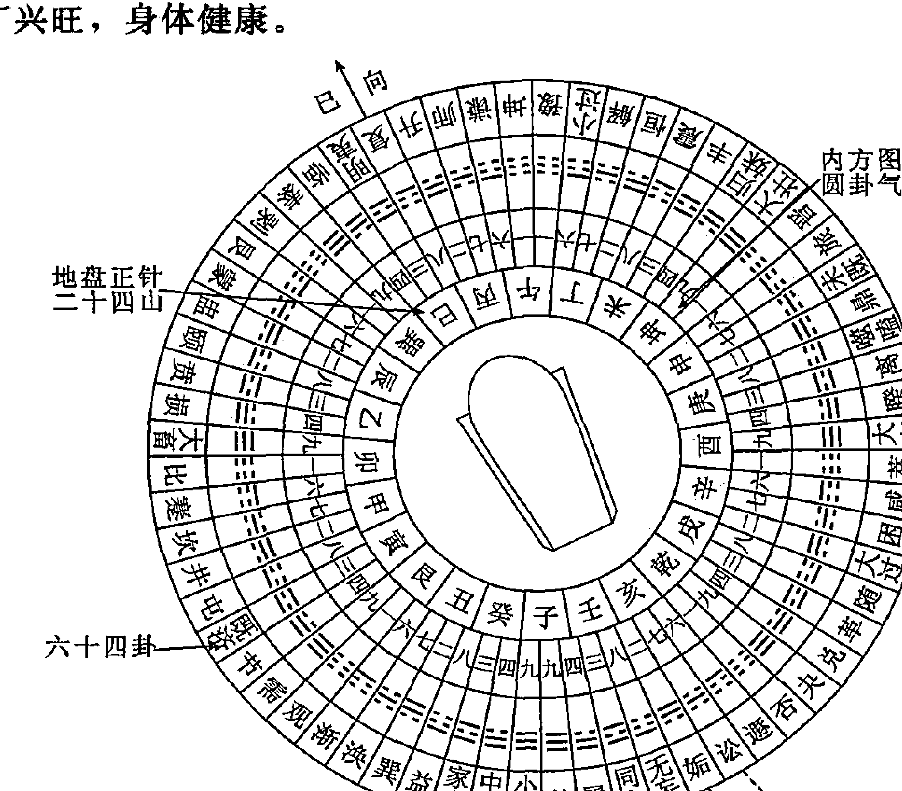

#### 第八层 卦运盘

卦运盘，又称易卦星运盘。本盘除二十四山外还有三层：

1. 九星，即，一贪狼、二巨门、三禄存、四文曲、五廉贞、六武曲、七破军、八左辅、九右弼。
2. 九星序数：一、二、三、四、六、七、八、九。
3. 父母天地人元分野。

其盘式如图3-10。

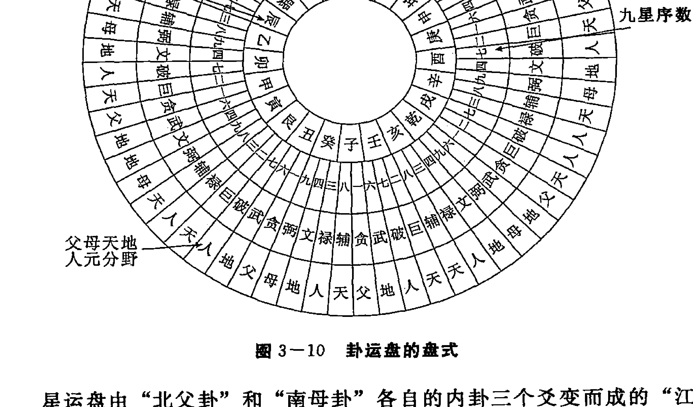

星运盘由“北父卦”和“南母卦”各自的内卦三个爻变而成的“江东卦”和“江西卦”组成。

北父卦：上卦与下卦相同的为“北父卦”。乾、坎、艮、震、巽、离、坤、兑八纯卦，为北父卦。其特点是：上下卦的卦象相同。罗盘中用“父”表示。

南母卦：上卦与下卦的卦象相反的为“南母卦”。否、咸、未济、恒、益、既济、损、泰八卦，为南母卦。其特点是：上下卦的卦象相反。罗盘中用“母”表示。

江东卦（如下表）：由北父卦下卦三个爻变而成的卦，为“江东卦”。北父卦，为贪狼卦，属父元，一运卦。
变初爻，为左辅卦，属天元，八运卦。
变二爻，为破军卦，属人元，七运卦。
变三爻，为武曲卦，属地元，六运卦。
江西卦（如下表）：由南母卦内卦三个爻变而成的卦，为“江西卦”。
南母卦，为右弼卦，属母元，九运卦。
变初爻，为巨门卦，属天元，二运卦。
变二爻，为禄存卦，属人元，三运卦。
变三爻，为文曲卦，属地元，四运卦。
注：“爻变”，就是阳爻（—）变为阴爻（- -）；或阴爻变为阳爻。
爻变，卦也变。

## 江东卦系表（卦序为先天八卦配洛数）

| 贪狼一（父） | 变初爻<br>左辅八（天元） | 变二爻<br>破军七（人元） | 变三爻<br>武曲六（地元） |
| :--- | :--- | :--- | :--- |
| 坤一 | 复 | 师 | 谦 |
| 巽二 | 小畜 | 渐 | 涣 |
| 离三 | 旅 | 大有 | 噬嗑 |
| 兑四 | 困 | 随 | 夬 |
| 艮六 | 贲 | 蛊 | 剥 |
| 坎七 | 节 | 比 | 井 |
| 震八 | 豫 | 归妹 | 丰 |
| 乾九 | 姤 | 同人 | 履 |

## 江西卦系表（卦序为先天八卦配洛数）

| 右弼九（母） | 变初爻 巨门二（天元） | 变二爻 禄存三（人元） | 变三爻 文曲四（地元） |
| :--- | :--- | :--- | :--- |
| 泰一 ☷ | 升 ☳ | 明夷 ☲ | 临 ☱ |
| 益二 ☳ | 观 ☴ | 中孚 ☲ | 家人 ☴ |
| 未济三 ☲ | 睽 ☱ | 晋 ☷ | 鼎 ☴ |
| 咸四 ☱ | 革 ☲ | 大过 ☴ | 萃 ☷ |
| 损六 ☶ | 蒙 ☵ | 颐 ☶ | 大畜 ☶ |
| 既济七 ☵ | 蹇 ☶ | 需 ☵ | 屯 ☵ |
| 恒八 ☳ | 大壮 ☱ | 小过 ☶ | 解 ☵ |
| 否九 ☰ | 无妄 ☳ | 讼 ☵ | 遁 ☰ |

### 使用方法：

1. 要以九星名称、星数和三元分野搭配成一卦纯清、三元不败和星运流转的格局，为吉。
2. 建造阴阳宅的时间，属于“三元九运”哪一运，就以该运取向。如2004—2023年间，当“八运”，这期间建造阴阳宅，就以“八运”的卦线取向。
3. 当运的方位，称为“旺位”。如“八运”期间，阴阳宅向方，立八运的卦线，就是旺位。
旺位，称为“正神方”；正神方的对宫方位，称为“零神方”。零神位为衰位，是失运之位（正神方洛数加零神方洛数，等于10）。
4. 正神方，即旺位不宜见水。倘旺位见到水，此水称为“零水”，不吉。
零神方，即衰位方宜见水。倘衰位见到水，此水称为“正水”，财运水。

在欲立某当运方向时，若该方有水，则可改立它的零神方为向（因当运旺方不宜见水）。如“八运”的零神方为“二运”，则可立二运的卦线为向。

### 举例：

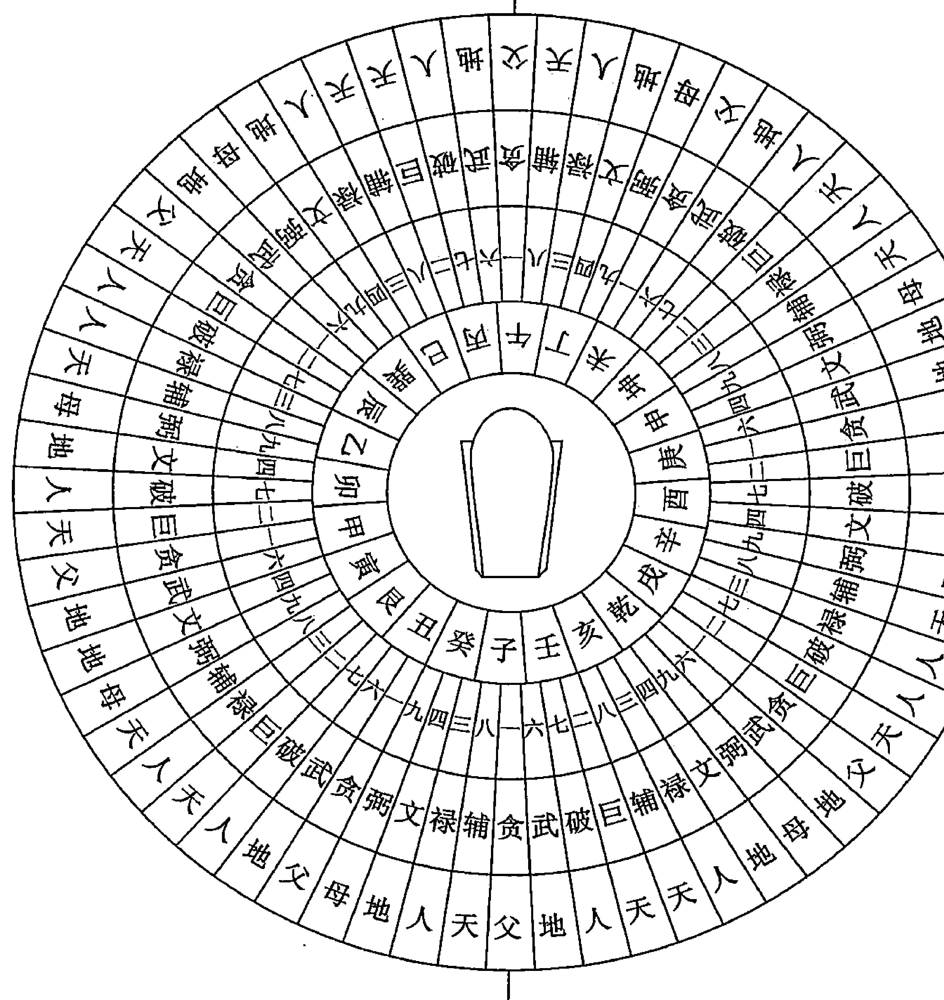

图3-11

图 3－11：一“子山午向”的阴宅，在一运中，以北父贪狼一运为向，是“正神”当卦运，必丁财两旺。

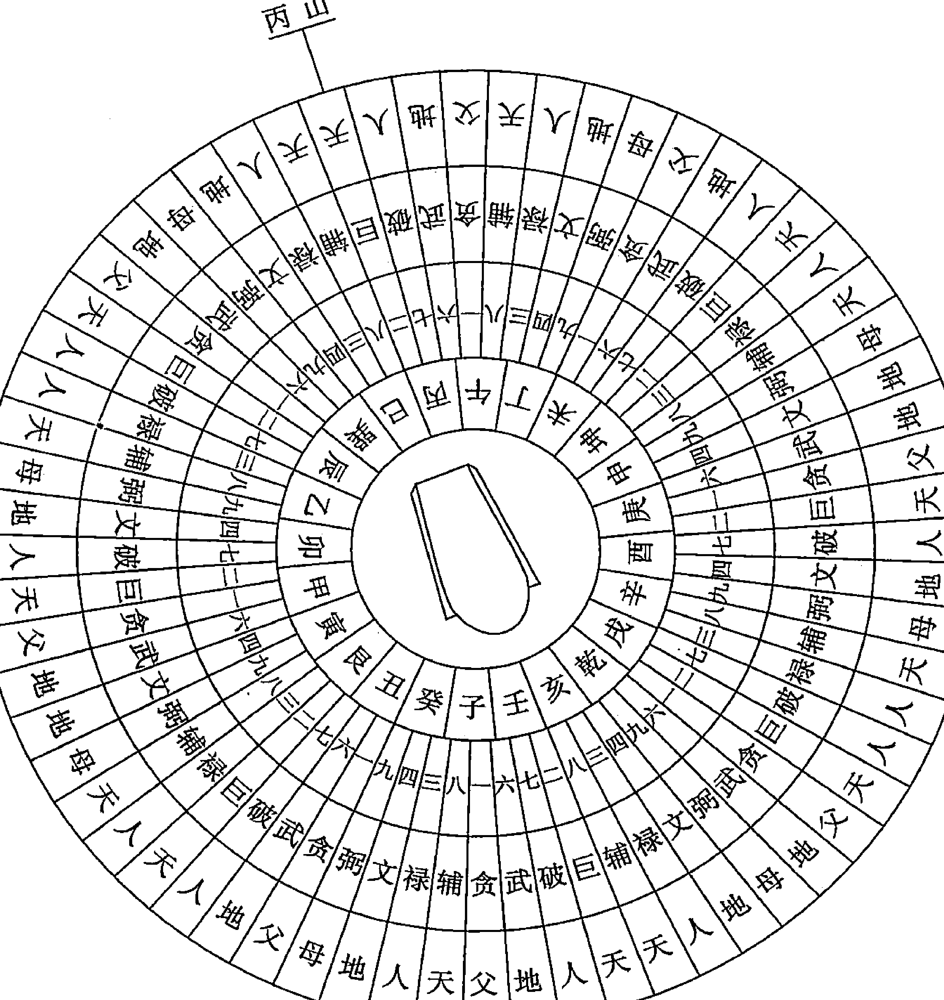

图 3－12：此阴宅当八运，它的“零神位”方有一湖水，故用天元巨门卦线为向，此向得正水，主八运丁财两旺。

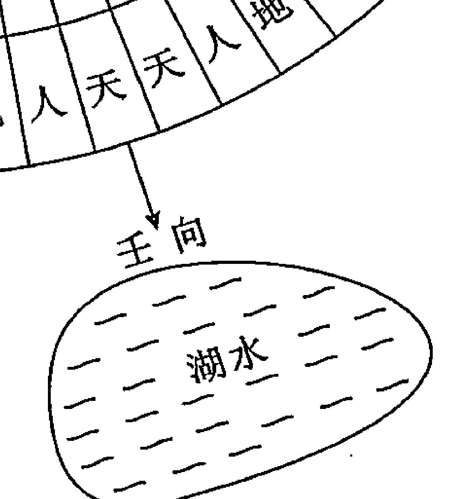

注：1. 必须了解三元九运。关于“三元九运”前已叙述，现再对卦运盘的应用作一些补充。三元，是上元、中元、下元；九运，是一至九的运。每元60年，占据一个花甲；三运，为三个花甲循环，为一百八十年，是风水的一个循环，俗称“正元”。三个正元，即三个花甲循环，计540年，为一个“大元”。从有历法开始推算至今，约有七十六个大元。
三元分运法有两派：平均分运法和先天卦分运法。平均分运法，以三元的一百八十年除以九，每运占二十年；先天卦分运法，以一百八十年配先天卦，阳爻占九年，阴爻占六年等运算。
现将两法分运法的结果列表如下：

## 三元九运两种不同的分运法表

| 分运类型 | 项目 | 一运 | 二运 | 三运 | 四运 | 五运 | 六运 | 七运 | 八运 | 九运 |
| :--- | :--- | :--- | :--- | :--- | :--- | :--- | :--- | :--- | :--- | :--- |
| 平均分运 | 所占年期 | 20 | 20 | 20 | 20 | 20 | 20 | 20 | 20 | 20 |
| 平均分运 | 公元年份 | 1864-1883 | 1884-1903 | 1904-1923 | 1924-1943 | 1944-1963 | 1964-1983 | 1984-2003 | 2004-2023 | 2024-2043 |
| 先天分运 | 所占年期 | 18 | 24 | 24 | 24 | | 21 | 21 | 21 | 27 |
| 先天分运 | 公元年份 | 1864-1881 | 1882-1905 | 1906-1929 | 1930-1953 | | 1954-1974 | 1975-1995 | 1996-2016 | 2017-2043 |

## 2. 一卦纯清、三元不败和星运流转的格局

### (1) 一卦纯清

所谓“一卦纯清”，是指六十四卦之龙向山水用法方面的具体要求。
其主要内容是：

在六十四卦的星运图中，依五黄为界，将一、二、三、四运分属上元；六、七、八、九运分属下元。依此，推演出“龙向山水”的法则。

法则一：

甲，凡属上元者，收一、二、三、四运卦的来龙；立一、二、三、四运卦的向；收九、八、七、六运卦的水口。

## 法则二：

一，凡属下元者，收六、七、八、九运卦的来龙；立六、七、八、九运卦的向；收四、三、二、一运卦的水口。

二，来龙或立向之卦的运，一定要与坐山或是水口之卦的运成以下的关系：

- 1. 一六共宗，二七同道，三八为朋，四九为友。
- 2. 一九合十，二八合十，三七合十，四六合十。
- 3. 一七阴阳，二六阴阳，三九阴阳，四八阴阳。

三，向上与来龙之河图五行，坐山与水口之河图五行，以克入或生出为宜，最好不要克出或生出。

- 1. 向上河图五行可以克或生来龙河图五行；但来龙之河图五行不可克或生向上之河图五行。
- 2. 水口之河图五行可以克或生坐山之河图五行；但坐山之河图五行不可克或生水口之河图五行。

## 举例：

图3—13：七运壬山丙向（巨门星内）。

来龙水山蹇卦，卦气数七）来龙与坐山“二七同道”；
坐山风地观卦，卦气数二）向上雷天大壮卦，卦气数八）向与水“三八为朋”。
水口火泽睽，卦气数三。

来龙“七”与水口“三”，“三七合十”；
坐山“二”与向上“八”，“二八合十”；
坐山“二”与水口“三”，“二三合五”。

## 又：

- 1. 来龙、坐山、向上与水口，同在二运巨门星之内。
- 2. 来龙水山蹇，卦气数“七”；向上雷天大壮卦，卦气数“八”，皆在“六七八九”一边。
- 3. 坐山风地观，卦气数“二”；水口、火泽睽、卦气数“三”，皆在“一二三四”一边。
- 4. 龙与山二七同道，合生成之数。
- 5. 向与水三八为朋，合生成之数。

所以，此例属于“一卦纯清”的格局。

现将“一卦纯清”的格局总括于下：

- ①龙与向之洛数（卦气数）均为四，比和为旺。
- ②山与水之洛数（卦气数）均为六，比和为旺。
- ③龙与山之星数（一贪狼、二巨门、三禄存、四文曲、六武曲、七破军、八左辅、九右弼）与洛数（卦气数），均合十。
- ④向与水之星数与洛数，均合十。

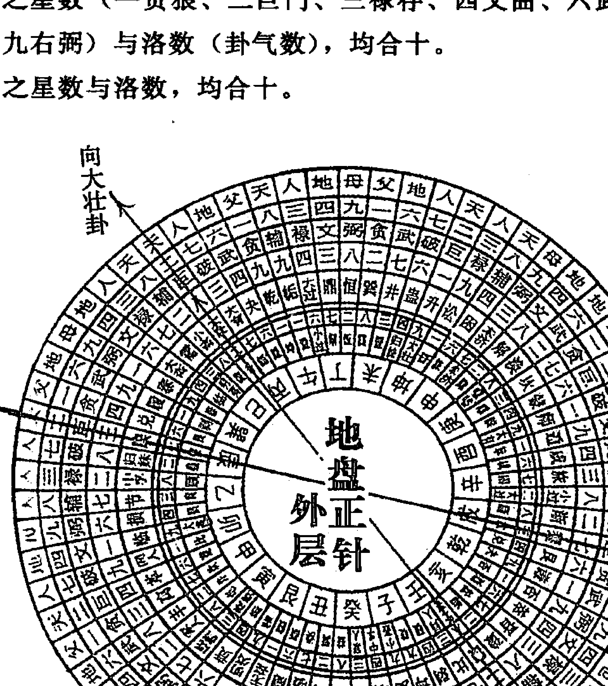

## （2）三元不败

所谓“三元不败”，是指由父母三般卦合成的“一四七、二五八、三六九”出现在玄空飞星盘的“乾、离、震”、“兑、坎、巽”，或一在中、四七在坤艮的对角线上；或在九宫中每宫均出现上列三个数中的一个的格局，称为“三元不败”。如八运艮山坤向，每宫都是向星、坐星与运星三个数合成“父母三般卦”。

## （3）星运流转

所谓“星运流转”，是指六十四卦卦爻用法的“抽爻换象”（详见第十层“三百八十四爻度及用法”）。

#### 第九层 辅星水法

辅星水法，是赖太素催官篇中之水法，其主要作用是判断来水与去水的吉凶状况，比较实用准确而灵验。该法有三种理论配合使用：先天八卦净阴净阳原理；先天八卦纳甲以及翻卦配九星的法则。

## 一、先天八卦净阴净阳原理

辅星水法是净阴净阳之法，用以净化来龙、坐山与消水纳水之位。即来龙为阴，宜坐阴山，收阴水及出阴位；来龙为阳，宜坐阳山，收阳水及出阳位。

地盘正针二十四山先天八卦净阴净阳的状况如下表：

## 先天八卦的净阴净阳表

| 项目 | 1 | 3 | 9 | 7 | 2 | 4 | 6 | 8 |
| --- | --- | --- | --- | --- | --- | --- | --- | --- |
| 洛数 | 1 | 3 | 9 | 7 | 2 | 4 | 6 | 8 |
| 方位 | 北 | 东 | 南 | 西 | 西南 | 东南 | 西北 | 东北 |
| 先天八卦 | 坤 | 离 | 乾 | 坎 | 巽 | 兑 | 艮 | 震 |

## 二、先天八卦纳甲和净阳、净阴二十四山表

| 八卦 | 纳甲 | 十二阳山 | 八卦 | 纳甲 | 十二阴山 |
| --- | --- | --- | --- | --- | --- |
| 1坤 | 乙 | 坤乙 | 2巽 | 辛 | 巽辛 |
| 3离 | 壬寅戌 | 壬寅午戌 | 4兑 | 丁 | 丁巳酉丑 |
| 9乾 | 甲 | 乾甲 | 8震 | 庚 | 庚亥卯未 |
| 7坎 | 癸申辰 | 癸申子辰 | 6艮 | 丙 | 艮丙 |

# 中国风水学初探

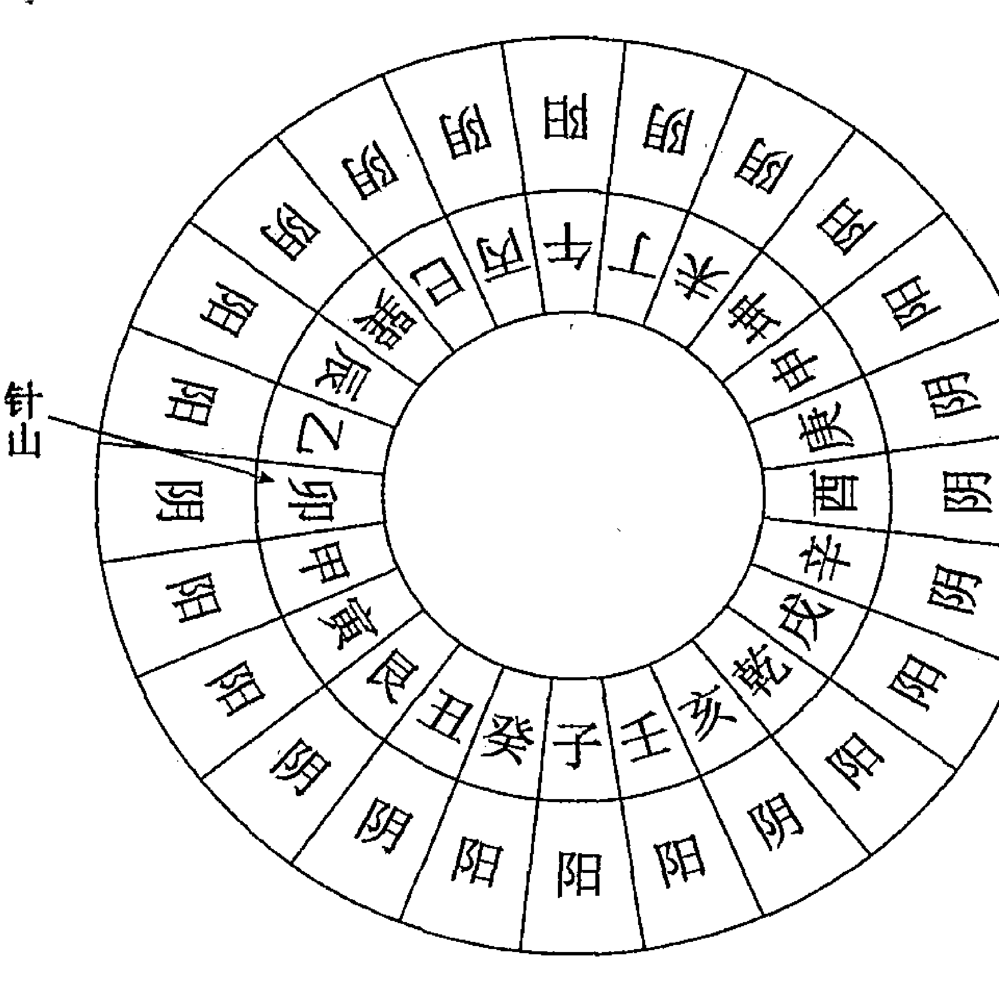

## 三、辅星水法翻卦配九星的方法

辅星翻卦，以九星配八卦。

九星排列的次序是：辅弼（伏位）、武曲（延年）、破军（绝命）、廉贞（五鬼）、贪狼（生气）、巨门（天医）、禄存（祸害）、文曲（六煞）。使用时，从立向的卦象开始起“辅星”和翻卦（九星旁括号中的“伏位”、“延年”等称为“游星”，其吉凶程度与它前面相邻的九星相同）。其卦是八卦的“三画”卦，所谓翻卦，就是“抽爻换象”，即将阳爻变为阴爻，或将阴爻变为阳爻。爻变，卦象也变。爻数变化的规律为：“中爻变、下爻变、中爻变、上爻变、中爻变、下爻变、中爻变，上爻变。”测定“坐山立向”用地盘正针，而论来水与去水的方位，则要用天盘缝针。

九星中，以“辅、武、贪、巨”为四吉星；以“破、廉、禄、文”为四凶星。

二十四山立向辅星水法翻卦的方法见下表：

## 辅星水法翻卦方法表

| 三爻卦翻变方法<br>游星次序<br>卦向 | 九星<br>辅弼 | 九星<br>武曲 | 九星<br>破军 | 九星<br>廉贞 | 九星<br>贪狼 | 九星<br>巨门 | 九星<br>禄存 | 九星<br>文曲 |
| :--- | :--- | :--- | :--- | :--- | :--- | :--- | :--- | :--- |
| | 伏位 | 延年 | 绝命 | 五鬼 | 生气 | 天医 | 祸害 | 六煞 |
| | 中爻变 | 下爻变 | 中爻变 | 上爻变 | 中爻变 | 下爻变 | 中爻变 | 上爻变 |
| 立乾甲向<br>（乾甲） | 乾<br>☰ | 离<br>☲ | 艮<br>☶ | 巽<br>☴ | 坎<br>☵ | 坤<br>☷ | 震<br>☳ | 兑<br>☱ |
| 立坤乙向<br>（坤乙） | 坤<br>☷ | 坎<br>☵ | 兑<br>☱ | 震<br>☳ | 离<br>☲ | 乾<br>☰ | 巽<br>☴ | 艮<br>☶ |
| 立庚亥卯未向<br>（庚亥卯未） | 震<br>☳ | 兑<br>☱ | 坎<br>☵ | 坤<br>☷ | 艮<br>☶ | 巽<br>☴ | 乾<br>☰ | 离<br>☲ |
| 立巽辛向<br>（巽辛） | 巽<br>☴ | 艮<br>☶ | 离<br>☲ | 乾<br>☰ | 兑<br>☱ | 震<br>☳ | 坤<br>☷ | 坎<br>☵ |
| 立癸申子辰向<br>（癸申子辰） | 坎<br>☵ | 坤<br>☷ | 震<br>☳ | 兑<br>☱ | 乾<br>☰ | 离<br>☲ | 艮<br>☶ | 巽<br>☴ |
| 立壬寅午戌向<br>（壬寅午戌） | 离<br>☲ | 乾<br>☰ | 巽<br>☴ | 艮<br>☶ | 坤<br>☷ | 坎<br>☵ | 兑<br>☱ | 震<br>☳ |
| 立艮丙向<br>（艮丙） | 艮<br>☶ | 巽<br>☴ | 乾<br>☰ | 离<br>☲ | 震<br>☳ | 兑<br>☱ | 坎<br>☵ | 坤<br>☷ |
| 立丁巳酉丑向<br>（丁巳酉丑） | 兑<br>☱ | 震<br>☳ | 坤<br>☷ | 坎<br>☵ | 巽<br>☴ | 艮<br>☶ | 离<br>☲ | 乾<br>☰ |

说明：
1. 立乾甲向（乾甲）表示某一阴宅或阳宅为“坐巽向乾”或“坐庚向甲”。因为水法以立向论吉凶，所以，应以括号里的“乾”卦向或“甲”卦向为“辅弼”（伏位）。其他各卦山所对应的九星（游星）依次是：

+ (1) ☲（离）武曲（延年）。
+ (2) ☶（艮）破军（绝命）。
+ (3) ☴（巽）廉贞（五鬼）。
+ (4) ☵（坎）贪狼（生气）。
+ (5) ☷（坤）巨门（天医）。
+ (6) ☳（震）禄存（祸害）。
+ (7) ☱（兑）文曲（六煞）。

辅星水法是以立向论来去的吉凶状况，依据“水应从吉星位流向凶星位的原则”，该“巽山乾向”或“庚山甲向”的水位，应从“武曲（延年）、贪狼（生气）、巨门（天医）”方的卦位流来；向“破军（绝命）、廉贞（五鬼）、禄存（祸害）、文曲（六煞）”方的卦位流走。其余各卦向，均同此理。

注：①测定建筑物的“坐山”与“立向”用地盘正针；②测定朝建筑物方向流来的水和经建筑附近流走的水的卦位线，用天盘缝针。

2. 某卦向的水从哪个卦位方流来，就以该卦位所对应的九星名为该卦位来水的名称。如，乾甲向的水，从“坤”方流来，因坤所对应的九星是“巨门”，所以就称“巨门”水；如从坎方流来，因坎卦所对应的九星名为“贪狼”，所以就称为“贪狼水”。其余仿此。

3. 使用方法：以立向方论来去水，水从贪狼、巨门、武曲、辅星方向流来，朝禄存、破军、文曲、廉贞方向流走为吉，此称为“合局”；反之则是破局（见下表1、2）。

### 表1 辅星水法合局表

| 名称 | 变卦和主应 | 立向卦位 | 水来卦位 | 立向卦位 | 水来卦位 |
| :--- | :--- | :--- | :--- | :--- | :--- |
| 巨门水 | 贪狼中爻变为巨门。主财运佳，健康长寿。 | 坤乙 | 乾甲 | 乾甲 | 坤乙 |
| | | 巽辛 | 震庚亥卯未 | 震庚亥卯未 | 巽辛 |
| | | 离壬寅午戌 | 坎癸申子辰 | 坎癸申子辰 | 离壬寅午戌 |
| | | 兑丁巳酉丑 | 艮丙 | 艮丙 | 兑丁巳酉丑 |
| 贪狼水 | 廉贞上爻变为贪狼。主旺人口，旺财。 | 坎癸申子辰 | 乾甲 | 乾甲 | 坎癸申子辰 |
| | | 坤乙 | 离壬寅午戌 | 离壬寅午戌 | 坤乙 |
| | | 艮丙 | 震庚亥卯未 | 震庚亥卯未 | 艮丙 |
| | | 巽辛 | 兑丁巳酉丑 | 兑丁巳酉丑 | 巽辛 |
| 武曲水 | 辅弼中爻变为武曲。主科甲，富贵延年，长寿。 | 离壬寅午戌 | 乾甲 | 乾甲 | 离壬寅午戌 |
| | | 坤乙 | 坎癸申子辰 | 坎癸申子辰 | 坤乙 |
| | | 兑丁巳酉丑 | 震庚亥卯未 | 震庚亥卯未 | 兑丁巳酉丑 |
| | | 巽辛 | 艮丙 | 艮丙 | 巽辛 |
| 辅弼水 | 辅弼为卦的本体。主高官厚禄，仁慈孝悌。 | 乾甲 | 乾甲 | 坤乙 | 坤乙 |
| | | 震庚亥卯未 | 震庚亥卯未 | 巽辛 | 巽辛 |
| | | 坎癸申子辰 | 坎癸申子辰 | 离壬寅午戌 | 离壬寅午戌 |
| | | 兑丁巳酉丑 | 兑丁巳酉丑 | 艮丙 | 艮丙 |

## 表2 辅星水法破局表

| 名称 | 变卦和主应 | 立向卦位 | 水来卦位 | 立向卦位 | 水来卦位 |
| :--- | :--- | :--- | :--- | :--- | :--- |
| 破军水 | 武曲下爻变为破军。主人丁稀少，破败。 | 艮丙 | 乾甲 | 乾甲 | 艮丙 |
| | | 兑丁巳酉丑 | 坤乙 | 坤乙 | 兑丁巳酉丑 |
| | | 坎癸申子辰 | 震庚亥卯未 | 震庚亥卯未 | 坎癸申子辰 |
| | | 离壬寅午戌 | 巽辛 | 巽辛 | 离壬寅午戌 |
| 廉贞水 | 破军中爻变为廉贞。主意外车劫，疾病。 | 巽辛 | 乾甲 | 乾甲 | 巽辛 |
| | | 震庚亥卯未 | 坤乙 | 坤乙 | 震庚亥卯未 |
| | | 兑丁巳酉丑 | 坎癸申子辰 | 坎癸申子辰 | 兑丁巳酉丑 |
| | | 艮丙 | 离壬寅午戌 | 离壬寅午戌 | 艮丙 |
| 禄存水 | 巨门下爻变为禄存。主愚蠢狂傲，难产。 | 震庚亥卯未 | 乾甲 | 乾甲 | 震庚亥卯未 |
| | | 巽辛 | 坤乙 | 坤乙 | 巽辛 |
| | | 艮丙 | 坎癸申子辰 | 坎癸申子辰 | 艮丙 |
| | | 兑丁巳酉丑 | 离壬寅午戌 | 离壬寅午戌 | 兑丁巳酉丑 |
| 文曲水 | 禄存中爻变为文曲。主好逸恶劳，贪酒色。 | 兑丁巳酉丑 | 乾甲 | 乾甲 | 兑丁巳酉丑 |
| | | 艮丙 | 坤乙 | 坤乙 | 艮丙 |
| | | 离壬寅午戌 | 震庚亥卯未 | 震庚亥卯未 | 离壬寅午戌 |
| | | 巽辛 | 坎癸申子辰 | 坎癸申子辰 | 巽辛 |

## 卷三 罗盘常识和使用方法

## 第三章 三元盘各圈层含义及其运作法

## 立向法则：

立向，一律用地盘正针，纳水消水用天盘缝针。最好立正向；立兼向，则应阳兼阳，阴兼阴，以达净阴净阳的目的。

立兼向，有可兼者，也有不可兼者。

- 可兼者：
  - 戊乾、壬子、子癸兼，丑艮、寅甲、乙辰先；
  - 巳丙、丁未、坤申合，庚酉原来是后天。
- 不可兼者：
  - 辛戌、乾亥、亥壬家，丑癸、艮寅怕虎牙。
  - 甲卯、卯乙休相见，辰巽、巽巳莫逢他。
  - 丙午、午丁双煞曜，未坤、申庚乱如麻。
  - 辛酉方上不宜动，此是夹煞定无差。

#### 第十层　太阳到山盘

此盘用于安葬亡灵和立碑择日。

太阳为万宿之主，诸吉之宗。其照临四方，善宿遇到增辉，恶曜逢到敛伏。故，太阳到山、到向、到方，大可修造安葬。然，太阳到向为上，到方次之，到山又次之。到向是照我，有“光辉，向荣”的意思；到山则拱我。到山唯帝王修造宫殿为宜，普通百姓用之反而不吉。故《疑龙经》曰：“请君专用太阳照，三合对宫福禄紧。”《千金歌》云：“三要日月人向来。”均说要取用到向、到方，未取到山。

凡用太阳，宜昼不宜夜。昼有光照，夜则无光。太阳到午宫为归垣。

太阴（月亮）乃星中后妃，有母仪之象，德柔体顺。佐太阳以宜化，继日而夜明。太阴到山到向，也能压服一切凶煞，普化吉祥。但使用中，应先选太阳，次选太阴。太阴入未宫为归垣。

对于“三合照”的使用，阴宅应以坐山为主，阳宅则以立向为要。

太阳到方行度的法则，《太阳行度过宫》云：“太阳行度不虚行，大寒六日到子宫，雨水六朝亥上逢。春分七八才行戌，谷雨十朝走酉宫。小满十一临申上，夏至十日去寻未，大暑十朝骑马走，处暑十日入蛇乡。秋分十日龙潭底，霜降十日卯中央。小雪十三寅上云，冬至九日丑宫藏。此是太阳行度数，十二宫中不停当。”

现将与太阳到山盘相关的其他内容，分列于后：

## 一、盘式（如图3-15）

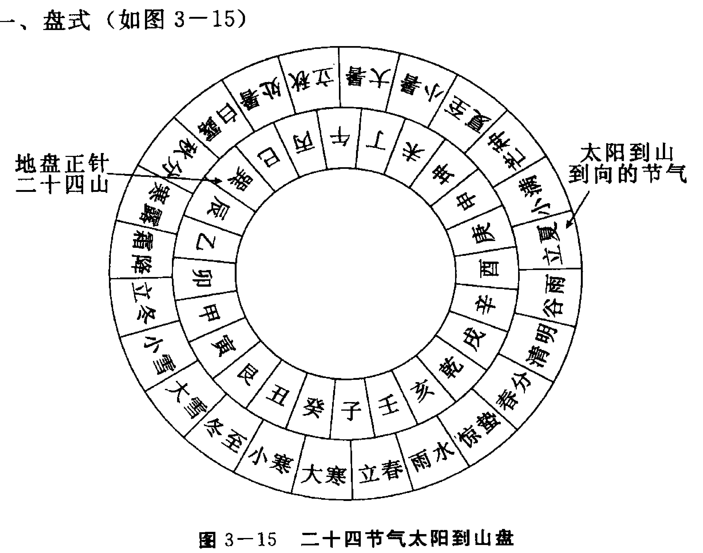

## 二、太阳到山到向及三合照到方时间表

| 二十四山 | 到山（太阳） | 到山（太阴） | 到向（太阳） | 到向（太阴） | 三合照（太阳） | 三合照（太阴） |
| :--- | :--- | :--- | :--- | :--- | :--- | :--- |
| 壬 | 立春 | 大雪 | 立秋 | 芒种 | 芒种坤。寒露乙。 | 立秋坤。清明乙。 |
| 子 | 大寒 | 冬至 | 大暑 | 夏至 | 小满申。秋分辰。 | 处暑申。谷雨辰。 |
| 癸 | 小寒 | 小寒 | 小暑 | 小暑 | 立夏庚。白露巽。 | 立夏巽。白露庚。 |
| 丑 | 冬至 | 大寒 | 夏至 | 大暑 | 谷雨酉。处暑巳。 | 小满巳。秋分酉。 |
| 艮 | 大雪 | 立春 | 芒种 | 立秋 | 清明辛。立秋丙。 | 芒种丙。寒露辛。 |
| 寅 | 小雪 | 雨水 | 小满 | 处暑 | 春分戌。大暑午。 | 夏至午。霜降戌。 |
| 甲 | 立冬 | 惊蛰 | 立夏 | 白露 | 惊蛰乾。小暑丁。 | 小暑丁。冬至乾。 |
| 卯 | 霜降 | 春分 | 谷雨 | 秋分 | 雨水亥。夏至未。 | 大暑未。小雪亥。 |
| 乙 | 寒露 | 清明 | 清明 | 寒露 | 立春壬。芒种坤。 | 大雪壬。立秋坤。 |
| 辰 | 秋分 | 谷雨 | 春分 | 霜降 | 大寒子。小满申。 | 冬至子。处暑申。 |
| 巽 | 白露 | 立夏 | 惊蛰 | 立冬 | 小寒癸。立夏庚。 | 小寒癸。白露庚。 |
| 巳 | 处暑 | 小满 | 雨水 | 小雪 | 冬至丑。谷雨酉。 | 大寒丑。秋分酉。 |
| 丙 | 立秋 | 芒种 | 立春 | 大雪 | 大雪艮。清明辛。 | 立春艮。寒露辛。 |
| 午 | 大暑 | 夏至 | 大寒 | 冬至 | 小雪寅。春分戌。 | 雨水寅。霜降戌。 |
| 丁 | 小暑 | 小暑 | 小寒 | 小寒 | 立冬甲。惊蛰乾。 | 惊蛰甲。立冬乾。 |
| 未 | 夏至 | 大暑 | 冬至 | 大寒 | 霜降卯。雨水亥。 | 春分卯。小雪亥。 |
| 坤 | 芒种 | 立秋 | 大雪 | 立春 | 寒露乙。立春壬。 | 清明乙。大雪壬。 |
| 申 | 小满 | 处暑 | 小雪 | 雨水 | 秋分辰。大寒子。 | 冬至子。谷雨辰。 |
| 庚 | 立夏 | 白露 | 立冬 | 惊蛰 | 白露巽。小寒癸。 | 小寒癸。立夏巽。 |
| 酉 | 谷雨 | 秋分 | 霜降 | 春分 | 处暑巳。冬至丑。 | 小满巳。大寒丑。 |
| 辛 | 清明 | 寒露 | 寒露 | 清明 | 立秋丙。大雪艮。 | 立春艮。芒种丙。 |
| 戌 | 春分 | 霜降 | 秋分 | 谷雨 | 大暑午。小雪寅。 | 夏至午。雨水寅。 |
| 乾 | 惊蛰 | 冬至 | 白露 | 立夏 | 小暑丁。立冬甲。 | 小暑丁。惊蛰甲。 |
| 亥 | 雨水 | 小雪 | 处暑 | 小满 | 夏至未。霜降卯。 | 大暑未。春分卯。 |

## 举例：

图3-16：有一坐子向午的阴宅，2005年下葬，“午向”太阳到向的时间是“大暑”区段内。故下葬或立碑的日期应选在亥年的7月23日至8月6日（农历六月十八至七月初二日）期间的“午”日或其他吉日。主丁财两旺，名成利就。

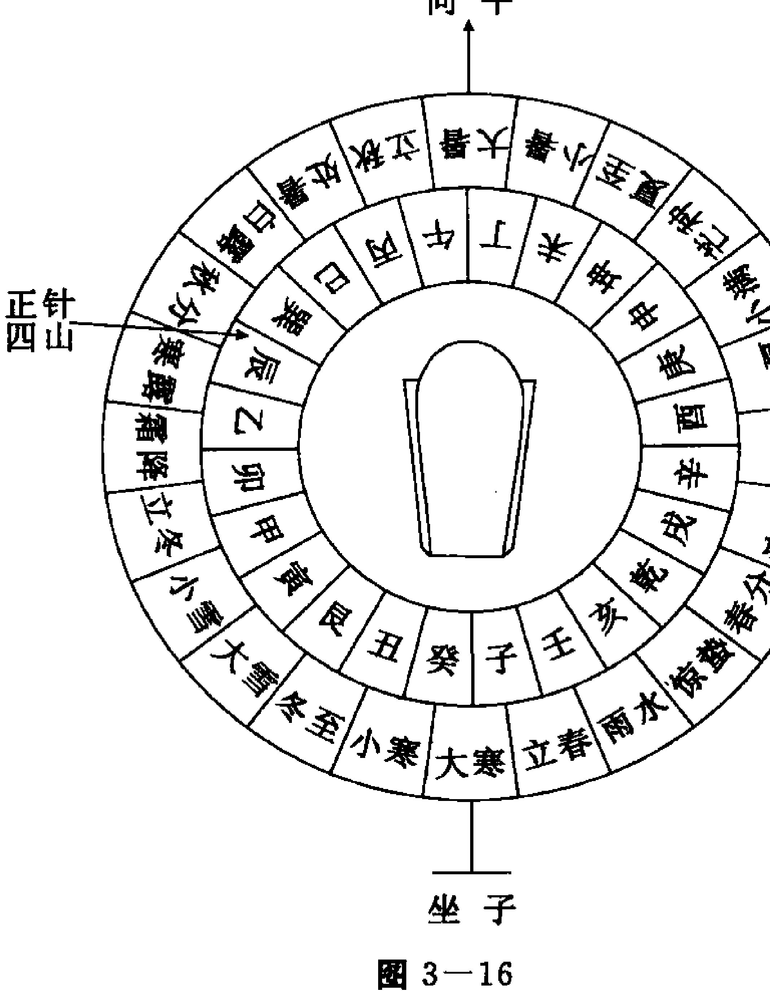## 第三层 三百八十四爻度及其用法

## 卷三 罗盘常识和使用方法

- 一、三百八十四爻，是以六十四卦每卦6个爻相乘（6×64=384）及其抽爻换象而来的。384爻度，就是将360度圆周等分为384个小格，比360度多出了24小格，所以比较密集和准确。

所谓“抽爻换象”，就是将某卦的六个爻的“阳爻”换成“阴爻”；“阴爻”换为“阳爻”。爻变，其卦象也随之而变。

- 二、经过爻变而成的卦，其内外（上下）两卦间的河图数，即“先天八卦配河图”数，须有阴阳交媾的情形，才可以用使用。

这种阴阳交媾的情形大致有下列几种：

### （一）内外（上下）卦的河图数构成

- 1. 一六共宗，二七同道，三八为朋，四九为友的生成之数。
- 2. 一九合十，二八合十，三七合十，四六合十的夫妻相配之数。
- 3. 二六阴阳，一七阴阳，三九阴阳，四八阴阳的阴阳互配之数。
- 4. 一四合五，二三合五，九六合十五，七八合十五的集大成、集小成之数。

（二）倘某卦经六爻变动后，上下卦之间没有上述四种情况，但若采用相邻的两个爻同时变动，其变动的卦有上述四种情形的一种，就可以取用这两个动爻的中间线。

六十四卦中，每卦都有六个爻，该六爻从下往上数，分别为初爻、二爻、三爻、四爻、五爻、上爻。其中，初爻、二爻、三爻为内卦，也称下卦；四爻、五爻、上爻为外卦，也称上卦。

### 三、卦爻的用法

#### （一）运盘六十四卦的抽爻换象概况

运盘六十四卦由北父卦内三爻变出的“江东卦系”和南母卦内三爻变出的“江西卦系”各32卦组成。

北父卦为贪狼卦，属父元，一运卦。该卦由乾、兑、离、震、巽、坎、艮、坤构成。

贪狼（一运）乾卦的初爻变，为左辅卦，属天元，八运卦。该八运卦由姤、困、旅、豫、小畜、节、贲、复构成。

乾卦的二爻变，为破军卦，属人元，七运卦。该七运卦由同人、随、大有、归妹、渐、比、蛊、师构成。

乾卦的三爻变，为武曲卦，属地元，六运卦。该六运卦由履、夬、噬噬、丰、涣、井、剥、谦构成。

## 第三章 三元盘各圈层含义及其运作法

南母卦为右弼卦，属母元，九运卦。该运卦由否、咸、未济、恒、益、既济、损、泰构成。

南母（九运）否卦的初爻变，为巨门卦，属天元，二运卦。该二运卦由无妄、革、睽、大壮、观、蹇、蒙、升构成。

否卦的二爻变，为禄存卦，属人元，三运卦。该三运卦由讼、大过、晋、小过、中孚、需、颐、明夷构成。

否卦的三爻变，为文曲卦，属地元，四运卦。该四运卦由遁、萃、鼎、解、家人、屯、大畜、临组成。

#### （二）江东、江西卦系各星运的抽爻换象概况

江东、江西卦系各星运的抽爻换星详情，可分为：一运贪狼星八局；二运巨门星八局；三运禄存星八局；四运文曲星八局；六运武曲星八局；七运破军星八局；八运左辅星八局；九运右弼星八局。

为节省篇幅，下面仅择其部分简要说明之。

#### 1. 一运贪狼星八局中“乾”卦的抽爻换象

| 卦名与爻变 | 乾 | 上爻变夬 | 五爻变大有 | 四爻变小畜 | 三爻变履 | 二爻变同人 | 初爻变 |
| :--- | :--- | :--- | :--- | :--- | :--- | :--- | :--- |
| 外 卦 | 9 ䷀ | 4 ䷪ ° | 3 ䷍ ° | 2 ䷈ ° | 9 ䷉ ° | 9 ䷌ ° | 9 ䷀ |
| 内 卦 | 9 ䷀ | 9 ䷀ | 9 ䷀ | 9 ䷀ | 4 ䷉ ° | 3 ䷌ ° | 2 ䷀ ° |
| 可取用卦爻 | | 四九为友 | | | 四九为友 | | |
| 备 注 | 1. 贪狼星八局中乾卦抽爻换星的结果是：只有乾卦的“三爻”、“五爻”分别变出的“履”、“夬”二卦，才符合“内卦4”，“外卦9”，“四九为友”生成数的要求；<br>2. 贪狼八局中的其余七局：震、坎、艮、兑、离、巽、坤纯卦，抽爻换象的结果，也只有“三爻”、“五爻”的变化才是“四九为友”生成数。 |

#### 2. 二运巨门星八局中“无妄”卦的抽爻换象

| 卦名与爻变 | 无妄 | 上爻变随 | 五爻变噬嗑 | 四爻变益 | 三爻变同人 | 二爻变履 | 初爻变否 |
| :--- | :--- | :--- | :--- | :--- | :--- | :--- | :--- |
| 外 卦 | 9☰ | 4☱。 | 3☲。 | 2☳ | 9☰ | 9☰ | 9☰ |
| 内 卦 | 8☳ | 8☳ | 8☳ | 8☳ | 3☲ | 4☱ | 1☷。 |
| 可取用卦爻 | | | 三八为朋 | 二八合十 | | 四九为友 | 一九合十 |
| 备 注 | 1. 二运巨门星八局中，“天雷无妄”卦抽爻换象的结果是：初爻“一九合十”；二爻“四九为友”；四爻“二八合十”；五爻“三八为朋”为合局，可取用。<br>2. 巨门星八局中其余七局：大壮、蹇、蒙、革、睽、观、升，抽爻换象的结果与“天雷无妄”卦完全一样。 |

说明：1. 内卦、外卦旁的数码“9、8，4、8，2、8”等表示，该三爻卦在“先天八卦配洛书”中的卦序。该序为：一坤、二巽、三离、四兑、六艮、七坎、八震、九乾。
2. 各六爻卦的从初爻到上爻右边的小圆圈，表示该爻是由某运星八局中的头一卦“阳爻变阴爻”或“阴爻变阳爻”，变化而来的。
3. “三八为朋”，“二八合十”，“四九为友”等生成数以及合十、合五、合十五等数，表示“先天八卦配河图”的合局数。

#### 3. 六运武曲星八局中“履”卦和“丰”卦的抽爻换象

| 卦名爻变内外卦 | 原卦<br>履 | 四爻、五爻同时变<br>损 | 二爻、初爻同时变<br>否 | 取用两动爻中间线 |
| :--- | :--- | :--- | :--- | :--- |
| 外卦 | 9 ☰ | 6 ☵ | 9 ☰ | 1. 损四、五爻间<br>2. 否初、二爻间 |
| 内卦 | 4 ☱ | 4 ☱ | 1 ☷ | |
| 卦名爻变内外卦 | 丰 | 既济 | 恒 | 取用两动爻中间线 |
| 外卦 | 8 ☷ | 7 ☶ | 8 ☷ | 1. 既济四、五爻间<br>2. 恒初二爻中间 |
| 内卦 | 3 ☲ | 3 ☲ | 2 ☴ | |

说明：1. 六运武曲星八局，此只以履卦、丰卦的抽爻换象为例；其余六卦抽爻换象的方法和结果与此完全一样。
2. 履卦四爻、五爻同时变，其结果是：损的外卦为“六”，内卦为“四”，“六四合十”；否卦初爻、二爻同时变，结果是：外卦为“九”，内卦为“一”，“一九合十”。故取用损卦四、五爻或否卦初、二爻两动爻的中间线。
3. 丰卦四、五爻同时变为“既济”；初二爻同时变为“恒”，其结果分别是“七三合十”，“八二合十”。取用原则同履卦。

#### （三）坐山与立向分金交度的取用

坐山与立向取用卦爻的条件是：

1. 坐山与立向取用的卦爻，其河图数与卦数，必须要有交媾的情形，才符合条件。如，坐山乾，立向坤（见下表）。

| 乾 | 姤<br>外卦9<br>内卦2<br>不用 | 同人<br>外卦9<br>内卦3<br>不用 | 履<br>外卦9<br>内卦4<br>四九为友 | 小畜<br>外卦2<br>内卦9<br>不用 | 大有<br>外卦3<br>内卦9<br>不用 | 夬<br>外卦4<br>内卦9<br>四九为友 |
| :--- | :--- | :--- | :--- | :--- | :--- | :--- |
| 爻变 | 初爻变 | 二爻变 | 三爻变 | 四爻变 | 五爻变 | 上爻变 |
| 说明 | 1. 卦左边的2、9，3、9等是先天八卦配洛书的卦数；“四九为友”的“四、九”，则是“先天八卦配河图”的河图数。<br>2. 只有三爻和上爻变的“四九为友”才符合取用条件。 | | | | | |

| 外卦 | | | | | | |
| :--- | :--- | :--- | :--- | :--- | :--- | :--- |
| 内卦 | | | | | | |
| 注：只有三爻和上爻可取用 | 坤 | 复<br>不用 | 师<br>不用 | 谦<br>取用<br>一六共宗 | 豫<br>不用 | 比<br>不用 | 剥<br>取用<br>一六共宗 |

2. 其余各星数各运的坐山与立向分金交度的取用之条件，如上述类推。

现将各星运的坐山与立向应取用的卦爻列成下表，以便使用查阅。

### 各星运坐山卦与立向卦取用卦爻表

| 星运各局 | 元运 | 坐山卦 | 立向卦 | 元运 | 坐山卦 | 立向卦 | 应取用卦爻 |
| :--- | :--- | :--- | :--- | :--- | :--- | :--- | :--- |
| 一贪狼星八局 | 1 | 乾山 | 坤向 | 5 | 兑山 | 艮向 | 各山向均取用三爻或上爻。 |
| | 2 | 震山 | 巽向 | 6 | 离山 | 坎向 | |
| | 3 | 坎山 | 离向 | 7 | 巽山 | 震向 | |
| | 4 | 艮山 | 兑向 | 8 | 坤山 | 乾向 | |
| | **元运** | **坐山卦** | **立向卦** | **元运** | **坐山卦** | **立向卦** | |
| 二巨门星八局 | 1 | 无妄山 | 升向 | 6 | 革山 | 豫向 | 各山向均取用初爻、二爻、四爻或五爻。 |
| | 2 | 大壮山 | 观向 | 7 | 睽山 | 蹇向 | |
| | 3 | 蹇山 | 睽向 | 8 | 观山 | 大壮向 | |
| | 4 | 蒙山 | 革向 | 9 | 升山 | 无妄向 | |
| 三禄存星八局 | 1 | 讼山 | 明夷向 | 6 | 大过山 | 颐向 | 各山向均取用初爻、二爻、四爻或五爻。 |
| | 2 | 小过山 | 中孚向 | 7 | 晋山 | 需向 | |
| | 3 | 需山 | 晋向 | 8 | 中孚山 | 小过向 | |
| | 4 | 颐山 | 大过向 | 9 | 明夷山 | 讼向 | |
| 四文曲星八局 | 1 | 遯山 | 临向 | 6 | 萃山 | 大畜向 | 各山向均取用三爻或上爻。 |
| | 2 | 解山 | 家人向 | 7 | 鼎山 | 屯向 | |
| | 3 | 屯山 | 鼎向 | 8 | 家人山 | 解向 | |
| | 4 | 大畜山 | 萃向 | 9 | 临山 | 遯向 | |
| 六武曲星八局 | 1 | 履山 | 谦向 | 6 | 夬山 | 剥向 | 各山向均取用初爻、二爻或四爻、五爻中间线。 |
| | 2 | 丰山 | 涣向 | 7 | 噬嗑山 | 井向 | |
| | 3 | 井山 | 噬嗑向 | 8 | 涣山 | 丰向 | |
| | 4 | 剥山 | 夬向 | 9 | 谦山 | 履向 | |
| 七破军星八局 | 1 | 同人山 | 师向 | 6 | 随山 | 蛊向 | 各山向均取用初爻或四爻。 |
| | 2 | 归妹山 | 渐向 | 7 | 大有山 | 比向 | |
| | 3 | 比山 | 大有向 | 8 | 渐山 | 归妹向 | |
| | 4 | 蛊山 | 随向 | 9 | 师山 | 同人向 | |
| 八左辅星八局 | 1 | 姤山 | 复向 | 6 | 困山 | 贲向 | 各山向均取用二爻或五爻。 |
| | 2 | 豫山 | 小畜向 | 7 | 旅山 | 节向 | |
| | 3 | 节山 | 旅向 | 8 | 小畜山 | 豫向 | |
| | 4 | 贲山 | 困向 | 9 | 复山 | 姤向 | |
| 九右弼星八局 | 1 | 否山 | 泰向 | 6 | 咸山 | 损向 | 各山向均取用三爻或上爻。 |
| | 2 | 恒山 | 益向 | 7 | 未济山 | 既济向 | |
| | 3 | 既济山 | 未济向 | 8 | 益山 | 恒向 | |
| | 4 | 损山 | 咸向 | 9 | 泰山 | 否向 | |

### 三、坐山与立向分金取用应忌讳的线位

- 1. 大空亡

若分金线正落于子、午、卯、酉、乾、坤、巽、艮八山的正线位，对六十四卦而言，是位于卦与卦的交界线，称为“大空亡”，不可用。

- 2. 小空亡

若分金线正落于亥壬、癸丑、寅丑、寅甲、乙辰、巳丙、丁未、庚申、辛戌二山之间，于六十四卦而言，是位于两卦交界的缝线，称为“小空亡”，不可用。

图 3-17 二十四山的大空亡

图 3-18 二十四山的小空亡

- 3. 阴阳游离线

若分金线正落于一六缝、四九缝、二七缝、三八缝等，称为“阴阳游离线”，是游离的无主宰意思，不可用。只须向左或向右略移半度，使其纳入正卦中，就可使用。

- ● 实线表“二七”与“三八”之间缝。
- ○ 虚线括号表“(一六)”与“(四九)”之间缝。

图3-19 二十四山的阴阳游离线

## 附录 吉日良辰选择法

选择吉日良辰是我国传统文化中不可或缺的组成部分。它作为一种文化观念，早已渗透到各民族的潜意识之中了。人们每当祭祀祈福、赴任应试、婚姻丧葬、修房动土、捕鱼狩猎等时，总要挑选个好日子后，才去做计划该做的事。

实际上，这些择吉法，没有多少科学成分，对其结果，只能当成是一种风俗、信仰和心灵上的安慰。但由于其在广大平民百姓中普遍存在，因此本书作为附录列出，以供参考。

### 本卷内容提要

- 第一章 紫白飞星推算法
- 第二章 以干支间的生克制化关系择日
- 第三章 以年月日干支组成的格局择日
- 第四章 利用《历书》择吉日
- 第五章 嫁娶择日
- 第六章 安葬择日

## 第一章 紫白飞星推算法

推算年、月、日、时紫白飞星的目的，是为找出五黄廉贞凶星和紫白吉星所在的宫位、方向和时间，为我所用。凡五黄所在之位，均不能动土、修造和开展其他重要活动，犯之则诸事不利。

寻找五黄之位的基本方法是：

- 一、求出年月日时入中的紫白星；
- 二、顺飞八宫布九星，“五”的所在位，就是“五黄”廉贞星的位置。

现按年、月、日、时推算紫白的方法分述如下：

### 第一节 流年紫白推算法

- 一、口诀：

上元甲子一白起，中元四绿推甲子。
下元七赤兑位寻，逐年星逆中宫始。

- 解：

  - 1. 上元指一、二、三运；中元指四、五、六运；下元指七、八、九运。
  - 2. “上元甲子一白起”，就是在上元甲子年以“一白”入中，顺飞九星；乙丑年以“九紫”入中，顺飞九星；丙寅年以“八白”入中，顺飞九星；丁卯年以“七赤”入中，顺飞九星……这叫做“逐年星逆中宫始”。
  - 3. “中元四绿推甲子”，就是中元甲子年以“四绿”入中，乙丑年以“三碧”入中，丙寅年以“二黑”入中……顺飞九星。
  - 4. “下元七赤兑位寻”，就是下元甲子年以“七赤”入中，乙丑年以“六白”入中，丙寅年以“五黄”入中……顺飞九星。

现将其方法列成下表：

| 元 | 运 | 甲子入中的起星 | 其余八星逆星序在乙丑、丙寅、丁卯、戊辰、己巳……各干支年里应入中的起星。 |
| :--- | :--- | :--- | :--- |
| 上元 | 一 | 一白 | 乙丑年九紫；丙寅年八白；丁卯年七赤；戊辰年六白；己巳年五黄；庚午年四绿；辛未年三碧；壬申年二黑；癸酉年一白。 |
| | 二 | | |
| | 三 | | |
| 中元 | 四 | 四绿 | 乙丑年三碧；丙寅年二黑；丁卯年一白；戊辰年九紫；己巳年八白；庚午年七赤；辛未年六白；壬申年五黄；癸酉年四绿。 |
| | 五 | | |
| | 六 | | |
| 下元 | 七 | 七赤 | 乙丑年六白；丙寅年五黄；丁卯年四绿；戊辰年三碧；己巳年二黑；庚午年一白；辛未年九紫；壬申年八白；癸酉年七赤。 |
| | 八 | | |
| | 九 | | |

举例：
2009年，岁次乙丑，求该年应何星入中？
解：2009年己丑年属下元，依据“下元七赤兑位寻”的规则，甲子年为“七赤”入中，从乙丑年开始，直挨排到己丑年为止，将九星逆排在各干支年的后面。
乙丑年六白入中；丙寅年五黄入中；丁卯年四绿入中；戊辰年三碧入中……己丑年“九紫”入中。
所以，“九紫”就是2009年岁次己丑年的“紫白”星。
求出流年紫白星后，从入中的星数起，沿洛书元旦盘顺飞其余八星。在飞星图上“五”所在的宫位和方向，就是该年“五黄”凶星所在的位置，此位该年不可动土、修造。如图1－1，2009年岁次己丑年，属下元八运，九紫入中，沿洛书元旦盘顺飞其余八星；“五”即五黄凶星飞临北方。故2009年中，在北方的方位，不能动土、修造，也不宜往北方出行求财。犯之诸事不利。

| 八 | 四 | 六 |
| :--- | :--- | :--- |
| 七 | 九 | 二 |
| 三 | 五 | 一 |

图1－1 下元2009年紫白飞星图“五黄”在北方

### 第二节 流月紫白推算法

流月紫白推算，就是要找出某月入中的星，然后沿洛书元旦盘顺飞其余八星，其中“五”飞到何宫何方，该宫位就是这月中“五”黄凶星所在的方位。此方位在这月中不能动土、修造。

- 其规则口诀如下：
旺月八白中宫得，墓是五黄生是黑，
逐月逆星次等行，一周之内可推测。
解：
1. 子午卯酉为旺年；辰戌丑未是墓年；寅申巳亥为生年。
2. “旺年八白中宫得”。即子午卯酉年，由正月八白入中；二月七赤入中；三月六白入中；四月五黄入中；五月四绿入中……然后沿洛书元旦盘顺飞其余八星，“五”所在宫位和方向，就是五黄凶星本月所在之方。
3. “墓是五黄生是黑”。即：
辰戌丑未墓年，由正月五黄入中，二月四绿入中；三月三碧入中……然后顺飞其余八星；
寅申巳亥生年，由正月二黑入中；二月一白入中；三月九紫入中……然后顺飞其余八星。

流月紫白飞星不分上中下三元。

现将流月紫白飞星列表于后：

| 月份 | 旺年<br>子午卯酉 | 墓年<br>辰戌丑未 | 生年<br>寅申巳亥 |
| :--- | :---: | :---: | :---: |
| 正 | 八白 | 五黄 | 二黑 |
| 二 | 七赤 | 四绿 | 一白 |
| 三 | 六白 | 三碧 | 九紫 |
| 四 | 五黄 | 二黑 | 八白 |
| 五 | 四绿 | 一白 | 七赤 |
| 六 | 三碧 | 九紫 | 六白 |## 第三节 流日紫白推算法

流日紫白推算法，就是要找出其一日，五黄凶星所在的方位，以趋吉避凶。其口诀是：

日家白法不难求，二十四气六宫周；冬至雨水及谷雨，阳顺一七四中游；夏至处暑霜降后，九三六星逆行求。

解：

- 1. 冬至后，甲子日一白入中。顺行：乙丑日二黑，丙寅日三碧，丁卯日四绿……
- 2. 雨水后，甲子日七赤入中。顺行：乙丑日八白，丙寅日九紫，丁卯日一白……
- 3. 谷雨后，甲子日四绿入中。顺行：乙丑日五黄，丙寅日六白，丁卯日七赤……
- 4. 夏至后，甲子日九紫入中。逆行：乙丑日八白，丙寅日七赤，丁卯日六白……
- 5. 处暑后，甲子日三碧入中。逆行：乙丑日二黑，丙寅日一白，丁卯日九紫……
- 6. 霜降后，甲子日六白入中。逆行：乙丑日五黄，丙寅日四绿，丁卯日三碧……

注：日紫白飞星，在二十四节气中，只论“气”，不论节；紫白飞星入中后，仍然顺飞八宫。

现将其规则列成下表：

| 冬至后的三气 | 甲子日入中的星，乙丑、丙寅日……顺行 | 夏至后的三气 | 甲子日入中的星，乙丑、丙寅日……逆行 |
| :--- | :--- | :--- | :--- |
| 冬至后 | 一白 | 夏至后 | 九紫 |
| 雨水后 | 七赤 | 处暑后 | 三碧 |
| 谷雨后 | 四绿 | 霜降后 | 六白 |

举例：

求 2009 年五月二十八日何星入中以及该日的五黄方？

解：五月二十八日属谷雨后，其甲子日应四绿入中，二十八日的干支是“丙申”，甲子日四绿起，顺行，乙丑日是五黄；丙寅日六白；丁卯日七赤……丙申日应是“九紫”入中，然后顺飞八宫（如图 1－3）。

图 1－3，为 2009 年五月二十八日紫白飞星图。依据规则，从四月二十五日的甲子日四绿入中，顺行，乙丑日五黄；丙寅日六白，一直推算到五月二十八日，干支丙申九紫入中，顺飞八宫，其“五”在坎宫，北方。故该日不能在北方动土，修造。犯之则诸事不利。

| 八 | 四 | 六 |
| :---: | :---: | :---: |
| 七 | 九 | 二 |
| 三 | 五 | 一 |

图1-3 2009年五月二十八日紫白飞星图

### 第四节 流时紫白飞星推算法

流时紫白飞星用以找出“五黄”凶时和吉时，以达趋吉避凶之目的。

其推算口诀如下：

> 子午卯酉起一九，辰戌丑未从四六，
> 寅申巳亥行七三，两至前后分顺逆，
> 一三七数为阳顺，三六九数是逆行。

解：

- 一、冬至后夏至前，顺行：
  子午卯酉日的子时，从一白起，丑时为二黑，寅时为三碧，卯时为四绿……
  辰戌丑未日的子时，从四绿起，丑时为五黄，寅时为六白，卯时为七赤……
  寅申巳亥日的子时，从七赤起，丑时为八白，寅时为九紫，卯时为一白……

- 二、夏至后冬至前，逆行：
  子午卯酉日的子时，从九紫起，丑时为八白，寅时为七赤，卯时为六白……
  辰戌丑未日的子时，从六白起，丑时为五黄，寅时为四绿，卯时为三碧……
  寅申巳亥日的子时，从三碧起，丑时为二黑，寅时为一白，卯时为九紫……

现将口诀规则列成下表：

| 至别 | | 九星 时辰 | 子 | 丑 | 寅 | 卯 | 辰 | 巳 | 午 | 未 | 申 | 酉 | 戌 | 亥 |
| :--- | :--- | :--- | :---: | :---: | :---: | :---: | :---: | :---: | :---: | :---: | :---: | :---: | :---: | :---: |
| 冬至后夏至前 | 顺行 | 子午卯酉 | 一 | 二 | 三 | 四 | 五 | 六 | 七 | 八 | 九 | 一 | 二 | 三 |
| | | 辰戌丑未 | 四 | 五 | 六 | 七 | 八 | 九 | 一 | 二 | 三 | 四 | 五 | 六 |
| | | 寅申巳亥 | 七 | 八 | 九 | 一 | 二 | 三 | 四 | 五 | 六 | 七 | 八 | 九 |
| 夏至后冬至前 | 逆行 | 子午卯酉 | 九 | 八 | 七 | 六 | 五 | 四 | 三 | 二 | 一 | 九 | 八 | 七 |
| | | 辰戌丑未 | 六 | 五 | 四 | 三 | 二 | 一 | 九 | 八 | 七 | 六 | 五 | 四 |
| | | 寅申巳亥 | 三 | 二 | 一 | 九 | 八 | 七 | 六 | 五 | 四 | 三 | 二 | 一 |

举例：

求 2009 年五月二十八日戌时是什么星？

解：2009 年阴历五月二十八日的干支是丙申，是一年十二气的冬至后夏至前。依据规则：冬至后夏至前“寅申巳亥”日的子时从“七赤”起，顺行。查对上表可知，该申日戌时的九星，是“八白”吉星为吉时，而这天的“五黄”凶星是未时，在这段时间内不宜动土和修造。

## 附录 吉日良辰选择法

## 第一章 紫白飞星推算法

## 第二章 以干支间的生克制化关系择日

### 第一节 相关知识

以干支五行间的生克制化关系择日，是最基本和最常用的一种方式。现将相关知识、简述于后：

- 一、干支是天干地支的总称。
  我国农历，从古至今都以干支作为纪年、月、日、时的符号，它取义于树木的干枝。顺次以天干配地支。如甲子、乙丑、丙寅、丁卯等。十天干与十二地支配合，六十年重复一次，俗称“甲子”，周而复始，循环往复。干支的原始意义，是指生物生、长、化、收、藏，用以代表万事万物产生、发展、壮大、消弱、死亡、更生的整个过程。现代人认为，干支既是数量、矢量，又是具有周期性质的时间生物向量，是一个具有独立性质的集合系统，蕴含着深刻的时空背景，体现了古天文学时空的相对性质和一致性。
- 二、十天干：甲、乙、丙、丁、戊、己、庚、辛、壬、癸，总称为十天干。
- 三、十二地支：子、丑、寅、卯、辰、巳、午、未、申、酉、戌、亥，总称为十二地支。
- 四、天干、地支配阴阳：
  阳干：甲、丙、戊、庚、壬，为奇数干；
  阴干：乙、丁、己、辛、癸，为偶数干；
  阳支：子、寅、辰、午、申、戌，为奇数支；
  阴支：丑、卯、巳、未、酉、亥，为偶数支。
- 五、三种古书对天干、地支作了具体的解释，现分别列成以下两表。
  1. 对天干的解释

| 天干 | 《史记·律书》 | 《汉书·律历志》 | 《说文解字》 |
| :--- | :--- | :--- | :--- |
| 甲 | 万物剖符甲地而出 | 出甲于甲 | 东方之孟阳气萌动 |
| 乙 | 万物生轧 | 奋轧于乙 | 象春草木而出，出其乙也 |
| 丙 | 阳道著明 | 明炳于丙 | 往南方，万物生 |
| 丁 | 万物丁壮 | 大盛于丁 | 夏时万物皆丁实 |
| 戊 | | 丰盛于戊 | 中宫也 |
| 己 | | 理纪于己 | 中宫也 |
| 庚 | 阴气庚万物 | 斂（吸气）更于庚 | 往西方，象万物庚之有实 |
| 辛 | 万物之辛生 | 悉新于辛 | 秋时万物成而熟 |
| 壬 | 阳气化养于下 | 怀任于壬（象人怀妊） | 往北方，阴极阳生 |
| 癸 | 万物可揆度 | 陈揆于癸 | 冬时如水从四方流入地中 |

### 2. 对地支的解释

| 地支 | 《史记·律书》 | 《汉书·律历志》 | 《说文解字》 |
| :--- | :--- | :--- | :--- |
| 子 | 言万物滋于下 | 孳萌于子 | 十一月阳气万物滋 |
| 丑 | 万物微纽未敢出 | 纽芽于丑 | 纽也，十二月万物动用事也 |
| 寅 | 万物始生演然也 | 引达于寅 | 正月阳气动，阴尚强也 |
| 卯 | 言万物茂也 | 冒茆于卯 | 冒也，二月万物冒地而出也 |
| 辰 | 言万物之帐也 | 振美于辰 | 震也 |
| 已 | 言万物之已尽 | 已盛于已 | 四月阳气出，阴气已茂，万物见 |
| 午 | 阴阳交故曰午 | 仵布于午 | 五月阴气牾逆阳，冒地而出也 |
| 未 | 万物皆成有滋味 | 昧暖于未 | 味也，六月滋味也，象木重枝叶也 |
| 申 | 言阴用事申则万物 | 申坚于申 | 神也，七月阴气成体，自申东 |
| 酉 | 万物之老也 | 留熟于酉 | 就也，八月黍成，可为酎酒 |
| 戌 | 万物尽灭 | 毕入于戌 | 天也，九月阳气微，万物华成，阳下入地 |
| 亥 | 阳气藏于下 | 该阂于亥 | 花也，十月微阳，起接盛阴 |

#### 六、五行

天有五星，地有五行。五星指东方的岁星，属木；南方的荧惑，属火；中央的填星，又名镇星，属土；西方的太白，属金；北方的辰星，属水。《汉书·律历志》云：“水合于辰星，火合于荧惑，金合于太白，木合于岁星，土合于镇星。”五星有五星之气，简称五气；五行（金木水火土）则是五气之流行与行用。

### 1. 五行生克乘侮

图2-1 五行生克图

- 五行相生：木生火，火生土，土生金，金生水，水生木。
- 五行相克：木克土，土克水，水克火，火克金，金克木。

五行相生相克：每一个五行都有被生的一面又有生它的一面，又有被克的一面和克它的一面。例如，木被水所生，而木又生火；木被金所克，而木又克土，从而抑制金的克势（因为土生金，木又克土，从而使“土生金”受制，所以木能抑制金的势力）。因此，它是一个五要素相互制约而自控平衡的系统。五行相生相克，像阴阳一样，构成了任何事物的对立统一。没有生，就没有事物的发生、发展和变化；没有克，就没有事物的制约、平衡与协调。因此，有生有克是正常的，理想的状态是生多于克，符合“生生之谓易”的原则。

五行相克，如克过头，叫做乘，反常。若受克力胜过克力，则反过来克对方，叫做反侮。如，本来水克火，现在火旺水少，火反过克水。这种逆克就是反侮，属不正常现象。

### 2. 五行旺相休囚死

一年分为五季，即春、夏、秋、冬，“四季”（指每个季度最后一个月的十八天，就是三、六、九、十二月的最后十八天，一共72天）。五行在一年五季里会发生周期性的强弱变化，分别呈现出旺、相、休、囚、死的五种状态。其规律是：当令的旺，我生的相，生我的休，克我的囚，我克的死。如下两表：

| 状态\五行 | 木 | 火 | 土 | 金 | 水 |
| :--- | :--- | :--- | :--- | :--- | :--- |
| 旺 | 春旺 | 夏旺 | 四季旺 | 秋旺 | 冬旺 |
| 相 | 冬相 | 春相 | 夏相 | 四季相 | 秋相 |
| 休 | 夏休 | 四季休 | 秋休 | 冬休 | 春休 |
| 囚 | 四季囚 | 秋囚 | 冬囚 | 春囚 | 夏囚 |
| 死 | 秋死 | 冬死 | 春死 | 夏死 | 四季死 |

| 状态\五行 | 春 | 夏 | 秋 | 冬 | 四季 |
| :--- | :--- | :--- | :--- | :--- | :--- |
| 旺 | 木旺<br>立春开始旺72日 | 火旺<br>立夏开始旺72日 | 金旺<br>立秋开始旺72日 | 水旺<br>立冬开始旺72日 | 土旺<br>三、六、九、十二月各最后18日旺，共计72日 |
| 相 | 火相 | 土相 | 水相 | 木相 | 金相 |
| 休 | 水休 | 木休 | 土休 | 金休 | 火休 |
| 囚 | 金囚 | 水囚 | 火囚 | 土囚 | 木囚 |
| 死 | 土死 | 金死 | 木死 | 火死 | 水死 |

#### 七、天干五行的生旺死绝生态运程

天干地支与五行相匹配：甲乙寅卯木，丙丁巳午火，戊己辰戌丑未土，庚辛申酉金，壬癸亥子水。在择日时要看用事当天的日干和当事人生辰八字的日干，再结合“长生十二运程”表和其他相关资料，决定吉凶年月日时。

现将天干五行生旺死绝生态运程，即长生十二运列成下表：

| 运程 | 长生十二运 | 天干五行 | 甲木 | 丙火 | 戊土 | 庚金 | 壬水 | 乙木 | 丁火 | 己土 | 辛金 | 癸水 | 注 |
| :--- | :--- | :--- | :---: | :---: | :---: | :---: | :---: | :---: | :---: | :---: | :---: | :---: | :--- |
| 红运 | 长生 | | 亥 | 寅 | 寅 | 巳 | 申 | 午 | 酉 | 酉 | 子 | 卯 | |
| 红运 | 沐浴 | | 子 | 卯 | 卯 | 午 | 酉 | 巳 | 申 | 申 | 亥 | 寅 | |
| 红运 | 冠带 | | 丑 | 辰 | 辰 | 未 | 戌 | 辰 | 未 | 未 | 戌 | 丑 | |
| 红运 | 临官 | | 寅 | 巳 | 巳 | 申 | 亥 | 卯 | 午 | 午 | 酉 | 子 | 干禄 |
| 红运 | 帝旺 | | 卯 | 午 | 午 | 酉 | 子 | 寅 | 巳 | 巳 | 申 | 亥 | 羊刃 |
| 败运 | 衰 | | 辰 | 未 | 未 | 戌 | 丑 | 丑 | 辰 | 辰 | 未 | 戌 | |
| 败运 | 病 | | 巳 | 申 | 申 | 亥 | 寅 | 子 | 卯 | 卯 | 午 | 酉 | |
| 败运 | 死 | | 午 | 酉 | 酉 | 子 | 卯 | 亥 | 寅 | 寅 | 巳 | 申 | |
| 败运 | 墓库 | | 未 | 戌 | 戌 | 丑 | 辰 | 戌 | 丑 | 丑 | 辰 | 未 | |
| 败运 | 绝 | | 申 | 亥 | 亥 | 寅 | 巳 | 酉 | 子 | 子 | 卯 | 午 | |
| 平运 | 胎 | | 酉 | 子 | 子 | 卯 | 午 | 申 | 亥 | 亥 | 寅 | 巳 | |
| 平运 | 养 | | 戌 | 丑 | 丑 | 辰 | 未 | 未 | 戌 | 戌 | 丑 | 辰 | |

#### 八、干支五行冲合刑害等

- 1. 地支六冲：
  子午相冲，丑未相冲，寅申相冲，辰戌相冲，巳亥相冲。
- 2. 地支六合：
  子丑合己土，寅亥合乙木，卯戌合丁火，辰酉合辛金，巳申合癸水，午未合戊土。
- 3. 地支三合：
  申子辰合化壬水，亥卯未合化甲木，寅午戌合化丙火，巳酉丑合化庚金。
- 4. 地支三会：
  寅卯辰会乙木，巳午未会丁火，申酉戌会辛金，亥子丑会癸水。
- 5. 地支相刑：

子刑卯，卯刑子，为无礼之刑（因无礼之事而犯法生灾）。
寅刑巳，巳刑申，为恃势之刑（因仗势欺人而犯法）。
丑刑戌，戌刑未，未刑丑，为无恩之刑（因恩将仇报犯法）。
辰刑辰，午刑午，酉刑酉，亥刑亥，为自刑（自作自受）。
“刑”就是刑罚。带刑，不是有犯法之事，就是有病伤之忧。

### 6. 地支六害：

- 子未相害
- 丑午相害
- 寅巳相害
- 卯辰相害
- 申亥相害
- 酉戌相害

“害”又叫穿，就是彼此相害之意。六害由六合与六冲而来，即冲掉合我的地支的那个地支，就是害我的地支。如寅与亥合木，而巳与亥相冲，故巳与寅相害。其他五组相害照此类推。

### 7. 地支六破：

- 子酉相破
- 寅亥相破
- 辰丑相破
- 午卯相破
- 申巳相破
- 戌未相破

此六破，许多人认为无礼，多为不用。如，寅亥合木，怎么又相破呢？

### 8. 天干五合：

- 甲己合化戊土（逢甲己年属土，土气当政）。
- 乙庚合化庚金（逢乙庚年属金，金气为政）。
- 丙辛合化壬水（逢丙辛年属水，水气当政）。
- 丁壬合化甲木（逢丁壬年属木，木气当政）。
- 戊癸合化丙火（逢戊癸年属火，火气当政）。

### 9. 天干相冲：

- 甲庚相冲
- 乙辛相冲
- 壬丙相冲
- 癸丁相冲

### 10. 天干相克：

- 庚辛克甲乙
- 甲乙克戊己
- 戊己克壬癸
- 壬癸克丙丁
- 丙丁克庚辛

### 11. 地支辰戌丑未四库：

- 辰为水库
- 戌为火库
- 丑为金库
- 未为木库

#### 九、地支纪时、月、年

纪时，以地支子、丑、寅、卯、辰、巳、午、未、申、酉、戌、亥，纪每天的十二时辰，其中每个时辰为钟表时的120分钟，即两小时。
纪月如下表：

| 月份 | 正 | 二 | 三 | 四 | 五 | 六 | 七 | 八 | 九 | 十 | 冬 | 腊 |
| :--- | :---: | :---: | :---: | :---: | :---: | :---: | :---: | :---: | :---: | :---: | :---: | :---: |
| 地支 | 寅 | 卯 | 辰 | 巳 | 午 | 未 | 申 | 酉 | 戌 | 亥 | 子 | 丑 |

纪年则有十二生肖，如下表：

| 地支 | 子 | 丑 | 寅 | 卯 | 辰 | 巳 | 午 | 未 | 申 | 酉 | 戌 | 亥 |
| :--- | :---: | :---: | :---: | :---: | :---: | :---: | :---: | :---: | :---: | :---: | :---: | :---: |
| 生肖 | 鼠 | 牛 | 虎 | 兔 | 龙 | 蛇 | 马 | 羊 | 猴 | 鸡 | 狗 | 猪 |

### 十、六十甲子（如下表）

| | 1 | 2 | 3 | 4 | 5 | 6 | 7 | 8 | 9 | 10 |
| :--- | :---: | :---: | :---: | :---: | :---: | :---: | :---: | :---: | :---: | :---: |
| 1 | 甲子 | 乙丑 | 丙寅 | 丁卯 | 戊辰 | 己巳 | 庚午 | 辛未 | 壬申 | 癸酉 |
| 2 | 甲戌 | 乙亥 | 丙子 | 丁丑 | 戊寅 | 己卯 | 庚辰 | 辛巳 | 壬午 | 癸未 |
| 3 | 甲申 | 乙酉 | 丙戌 | 丁亥 | 戊子 | 己丑 | 庚寅 | 辛卯 | 壬辰 | 癸巳 |
| 4 | 甲午 | 乙未 | 丙申 | 丁酉 | 戊戌 | 己亥 | 庚子 | 辛丑 | 壬寅 | 癸卯 |
| 5 | 甲辰 | 乙巳 | 丙午 | 丁未 | 戊申 | 己酉 | 庚戌 | 辛亥 | 壬子 | 癸丑 |
| 6 | 甲寅 | 乙卯 | 丙辰 | 丁巳 | 戊午 | 己未 | 庚申 | 辛酉 | 壬戌 | 癸亥 |

### 十一、地支纪时与钟表时的对应关系（如下表）

| 地支 | 子 | 丑 | 寅 | 卯 | 辰 | 巳 | 午 | 未 | 申 | 酉 | 戌 | 亥 |
| :--- | :---: | :---: | :---: | :---: | :---: | :---: | :---: | :---: | :---: | :---: | :---: | :---: |
| 时钟 | 23~1 | 1~3 | 3—5 | 5~7 | 7~9 | 9~11 | 11~13 | 13~15 | 15~17 | 17~19 | 19~21 | 21~23 |

#### 十二、干支纪年月日时

早在先秦时期就用干支纪日、纪时、纪月，到东汉时期又用干支纪年了。其具体方法是，用十天干与十二地支按奇对奇，偶对偶，依次组合成六十甲子（如前“六十甲子表”），作为年、月与日的干支名称。纪年以六十为一轮回，然后周而复始，作为月与时是以十二地支纪，故以十二为一轮回，然后周而复始。年日的干支可从每年的“历书”上直接查到，而对于月的天干和时的天干，则要依据下列的歌诀和列表查对：
1. 月天干的推算口诀：
甲己之年丙作首，乙庚之岁戊为头，
丙辛岁首寻庚起，丁壬壬位顺行流，戊癸何方发，甲寅之上好追求。
如：甲子年五月生的人，求该月的天干是什么？
解：依据“甲己之年丙作首”，可知该年正月的干支是“丙寅”，然后依次往下推：二月是丁卯，三月戊辰，四月是己巳，五月是庚午。其余以此类推。也可以直接从下表查得：

## 年上起月一览表

| 年 \ 月 | 正 | 二 | 三 | 四 | 五 | 六 | 七 | 八 | 九 | 十 | 十一 | 十二 |
|---|---|---|---|---|---|---|---|---|---|---|---|---|
| 甲己 | 丙寅 | 丁卯 | 戊辰 | 己巳 | 庚午 | 辛未 | 壬申 | 癸酉 | 甲戌 | 乙亥 | 丙子 | 丁丑 |
| 乙庚 | 戊寅 | 己卯 | 庚辰 | 辛巳 | 壬午 | 癸未 | 甲申 | 乙酉 | 丙戌 | 丁亥 | 戊子 | 己丑 |
| 丙辛 | 庚寅 | 辛卯 | 壬辰 | 癸巳 | 甲午 | 乙未 | 丙申 | 丁酉 | 戊戌 | 己亥 | 庚子 | 辛丑 |
| 丁壬 | 壬寅 | 癸卯 | 甲辰 | 乙巳 | 丙午 | 丁未 | 戊申 | 己酉 | 庚戌 | 辛亥 | 壬子 | 癸丑 |
| 戊癸 | 甲寅 | 乙卯 | 丙辰 | 丁巳 | 戊午 | 己未 | 庚申 | 辛酉 | 壬戌 | 癸亥 | 甲子 | 乙丑 |

### 2. 查找时天干的口诀：

时天干和月天干一样是不固定的，查找的方法是依据日天干结合时地支来推算，其口诀如下：

- 甲己还生甲，乙庚丙作初，
- 丙辛从戊起，丁壬庚子居，
- 戊癸何方发，壬子是真途。

如，用事（或出生日）是甲日或己日，子时起甲子；乙庚日的子时则起丙子……如果子时起甲子，丑时就是乙丑，寅时就是丙寅，其他照此类推。也可以直接从下表查得。

## 日上起时表（日的干支可从历书上查得）

| 日天干 \ 时支 | 子 | 丑 | 寅 | 卯 | 辰 | 巳 | 午 | 未 | 申 | 酉 | 戌 | 亥 |
|---|---|---|---|---|---|---|---|---|---|---|---|---|
| 甲己 | 甲子 | 乙丑 | 丙寅 | 丁卯 | 戊辰 | 己巳 | 庚午 | 辛未 | 壬申 | 癸酉 | 甲戌 | 乙亥 |
| 乙庚 | 丙子 | 丁丑 | 戊寅 | 己卯 | 庚辰 | 辛巳 | 壬午 | 癸未 | 甲申 | 乙酉 | 丙戌 | 丁亥 |
| 丙辛 | 戊子 | 己丑 | 庚寅 | 辛卯 | 壬辰 | 癸巳 | 甲午 | 乙未 | 丙申 | 丁酉 | 戊戌 | 己亥 |
| 丁壬 | 庚子 | 辛丑 | 壬寅 | 癸卯 | 甲辰 | 乙巳 | 丙午 | 丁未 | 戊申 | 己酉 | 庚戌 | 辛亥 |
| 戊癸 | 壬子 | 癸丑 | 甲寅 | 乙卯 | 丙辰 | 丁巳 | 戊午 | 己未 | 庚申 | 辛酉 | 壬戌 | 癸亥 |

#### 十三、干支、五行与八卦、脏腑等关系一览表

| 五行 | 木 | 火 | 土 | 金 | 水 |
|---|---|---|---|---|---|
| 八卦 | 震 | 巽 | 离 | 艮 | 坤 | 乾 | 兑 | 坎 |
| 天干 | 甲 | 乙 | 丙 | 丁 | 戊 | 己 | 庚 | 辛 | 壬 | 癸 |
| 地支 | 寅 | 卯 | 午 | 巳 | 辰戌 | 丑未 | 申 | 酉 | 子亥 | 亥 |
| 五脏 | 肝 | | 心 | | 脾 | | 肺 | | 肾 |
| 六腑 | 胆 | | 小肠 | | 胃 | | 大肠 | | 膀胱 |
| 五方 | 东 | | 南 | | 中 | | 西 | | 北 |
| 五季 | 春 | | 夏 | | 长夏或四季 | | 秋 | | 冬 |
| 六气 | 风 | | 热暑 | | 湿 | | 燥 | | 寒 |
| 五味 | 酸 | | 苦 | | 甘 | | 辛 | | 咸 |

#### 十四、六十甲子纳音五行

一般五行分两种，正五行和纳音五行。前面说的金、木、水、火、土，就是正五行，它分阴、阳，如庚辛五行属金，庚为阳金，辛为阴金。纳音五行，是把六十甲子和五音十二律组合起来，其中一律含五音，总数为六十，不分阴阳。

纳音五行用途很广，如一般的历书中，每日干支的五行就是纳音五行。现将其列表如下：

## 六十甲子纳音五行表

| 干支 | 五行 | 干支 | 五行 | 干支 | 五行 | 干支 | 五行 | 干支 | 五行 |
|---|---|---|---|---|---|---|---|---|---|
| 甲子 | 海中金 | 丙子 | 涧下水 | 戊子 | 霹雳火 | 庚子 | 壁上土 | 壬子 | 桑柘木 |
| 乙丑 | | 丁丑 | | 乙丑 | | 辛丑 | | 癸丑 | |
| 丙寅<br>丁卯 | 炉中火 | 戊寅<br>己卯 | 城墙土 | 庚寅<br>辛卯 | 松柏木 | 壬寅<br>癸卯 | 金泊金 | 甲寅<br>乙卯 | 大溪水 |
| 戊辰<br>己巳 | 大林木 | 庚辰<br>辛巳 | 白蜡金 | 壬辰<br>癸巳 | 长流水 | 甲辰<br>乙巳 | 佛灯火 | 丙辰<br>丁巳 | 沙中土 |
| 庚午<br>辛未 | 路旁土 | 壬午<br>癸未 | 杨柳木 | 甲午<br>乙未 | 沙中金 | 丙午<br>丁未 | 天河水 | 戊午<br>己未 | 天上火 |
| 壬申<br>癸酉 | 剑锋金 | 甲申<br>乙酉 | 泉中水 | 丙申<br>丁酉 | 山下火 | 戊申<br>己酉 | 大驿土 | 庚申<br>辛酉 | 石榴木 |
| 甲戌<br>乙亥 | 山头火 | 丙戌<br>丁亥 | 屋上土 | 戊戌<br>己亥 | 平地木 | 庚戌<br>辛亥 | 钗钏金 | 壬戌<br>癸亥 | 大海水 |

#### 十五、太阳平均时与钟表时的时差

我们日常生活中所用的钟表时通常都是以北京时间为准，而对每个地区来说，该时间与太阳平均时比较都有个时差问题，只有按一定公式，找出一个地区的时差数，再计算出本地区的太阳平均时，才是比较准确的时间（每天24小时昼夜交替变化是由地球绕太阳公转和自转形成的，而太阳光照射在某一区域是时刻变化而不固定的，所以，只能用太阳平均时）。

计算某地区的时差的公式是：

各地区经度（可在全国分省地图上找查）—时区经度（某地区经度—120°）×4分＝本地区时差

例如：四川省自贡市在全国分省地区的经度为104.8°，其时差为：

(104.8－120)×4＝－60.8，四舍五入＝61分

即，自贡的太阳平均时与北京时间相比慢61分钟。

所以，自贡地区的“子时”为：00：01——02：01

“丑时”为：02：01——04：01

其余类推。

说明：英国格林威治天文台，将世界划分为二十四个时区，每一时区的经度为15度。北京时间是以东经120度为标准的，所以公式中东经120度是个不变的常数。

现将全国一些重要城市的子时与北京时间对比的太阳平均时列成下表，以便快速使用。

## 全国一些重要城市的“子”时与北京时间对比的太阳平均时刻表

| 名称 | 经度 | 时差 | 太阳平均时 | 名称 | 经度 | 时差 | 太阳平均时 |
|------|------|------|------------|------|------|------|------------|
| 北京 | 117°00 | -15 | 23：15′—02：15′ | 石家庄 | 114°30 | -22 | 23：22′—02：22′ |
| 天津 | 117°10 | -11 | 23：11′—02：11′ | 洛阳 | 112°26 | -30 | 23：30′—02：30′ |
| 上海 | 121°36 | -16 | 23：16′—02：16′ | 呼和浩特 | 111°41 | -33 | 23：33′—02：33′ |
| 重庆 | 106°33 | -54 | 23：54′—02：54′ | 南昌 | 115°55 | -16 | 23：16′—02：16′ |
| 哈尔滨 | 126°38 | +27 | 22：33′—01：33′ | 长沙 | 113°00 | -28 | 23：28′—02：28′ |
| 吉林 | 130°57 | +26 | 22：34′—01：34′ | 武汉 | 114°17 | -23 | 23：23′—02：23′ |
| 沈阳 | 123°26 | +14 | 22：46′—01：46′ | 银川 | 106°16 | -55 | 23：55′—02：55′ |
| 杭州 | 120°10 | +1 | 22：59′—01：59′ | 西安 | 108°55 | -44 | 23：44′—02：44′ |
| 金华 | 113°00 | -28 | 23：28′—01：28′ | 兰州 | 103°47 | -65 | 01：05′—03：05′ |
| 济南 | 117°00 | +2 | 22：58′—01：58′ | 拉萨 | 91°08 | -115 | 01：55′—04：55′ |
| 南京 | 118°47 | -5 | 23：05′—02：05′ | 乌鲁木齐 | 87°37 | -130 | 02：10′—04：10′ |
| 福州 | 119°18 | -3 | 23：03′—02：03′ | 成都 | 104°04 | -64 | 00：06′—02：06′ |
| 合肥 | 117°18 | -11 | 23：11′—02：11′ | 自贡 | 104°8 | -61 | 00：01′—02：01′ |
| 西宁 | 101°45 | -75 | 01：15′—03：15′ | 广州 | 113°13 | -27 | 23：28′—02：28′ |
| 昆明 | 102°43 | -69 | 00：10′—02：10′ | 深圳 | 114°20 | -6 | 23：07′—02：07′ |
| 贵阳 | 106°42 | -53 | 23：54′—02：54′ | 海口 | 110°39 | -39 | 23：40′—02：40′ |
| 桂林 | 110°17 | -39 | 23：40′—02：40′ | 蓬安 | 106°5 | -54 | 00：54′—02：54′ |

注：阴历“子”时，北京时间是23：00—01：00，计2小时。

### 第二节 择日举例

#### 一、五不遇时

- 五不遇时龙不精，号为日月损光明。
时干来克日干上，甲日须知时忌庚。
乙日辛巳丙忌壬，丁日癸卯戊甲寅。
己畏乙丑庚忌丙，辛日丁酉壬戌申。癸日己未须当忌，时干克日有灾星。

分析：

此五不遇歌诀，其中心是说，在择日中，时干不能克日干，否则有灾星：

- 1. “甲日须知时忌庚”。甲属木，庚属金，金克木。所以在甲日，就不能用庚时。
- 2. “乙日辛巳丙忌壬”。乙属木，辛属金，金克木；丙属火，壬属水，水克火。所以，乙日不能用辛时；丙日不能用壬时。
- 3. “丁日癸卯戊甲寅”。丁属火，癸属水，水克火；戊属土，甲属木，木克土。所以，丁日不能用癸时，戊日不能用甲时。
- 4. “己畏乙丑庚忌丙”。己属土，乙属木，木克土；庚属金，丙属火，火克金。故，己日忌乙时，庚日忌丙时。
- 5. “辛日丁酉壬戌申”。辛属金，丁属火，火克金；壬属水，戊属土，土克水。故，辛日不能用丁时，壬日忌戊时。
- 6. “癸日己未须当忌”。癸属水，未属土，土克水。故，癸日不能用未时。

#### 二、迁新居择日

方法：

- 1. 结合命主的八字喜忌神，补官或补食神和印；
- 2. 所择日课，要与命主天干五合、地支三合或六合。忌天克地冲（单冲不忌）。
- 3. 如命主的财富藏库，可补冲神，冲开财库就可发（“财宫若藏库，冲开无不富”）

例如：命主的四柱为：辛亥年、己亥月、庚戌日、己卯时。

分析：

日干庚金，生于亥月，为旺；庚金生亥水，伤官旺。时支卯木，被日干庚金所克，为财星进气。

日干庚金有年干辛金劫财相扶，还有月干，时干己土，正印相生。但是，日干庚金受年支、月支亥水相泄，又坐于戌火库之中，其根微弱，故日主偏弱。

日干偏弱，其用神应该取生我的正印、偏印或帮扶我的比肩、劫财。

## 中国风水学初探

日干庚金，只有属土的干支能生金和属金的干支才能帮扶它。

所以，选择的日课，可以是：丁丑年、戊申月、乙酉日、庚辰时。

该日课的地支为：丑、申、酉、辰。其中：丑属土可以生庚金（正印）；日支酉，时支辰，“辰酉合金”；日干乙，时干庚，“乙庚合金”。这样，日课金很旺，能扶帮命主。

所以，这是该命主乔迁新居的一个好日子。

### 三、为七运，立“乙山辛向”的阴宅择日（如图2-2）

亡命的四柱为：乙亥年，戊子月，戊午日，甲寅时。

去世的时间是：壬申年，壬寅月，甲寅日，丙寅时，享年57岁。

儿子的四柱为：丙午年，辛丑月，癸酉日、己卯时。

儿媳的四柱为：丁未年，壬子月，戊申日、壬戌时。

选择安葬的日课为：壬申年，戊申月，壬申日，戊申时。

分析：

- 1. 安葬的日课为“四申”一气。
申属金，坐山乙属木，故申金克坐山。申阳、乙阴，阳克阴，为正官。
壬申年，壬申日。壬属水，坐山乙属木，水生木。壬属阳，乙属阴，阳生阴，为正印。
戊申月，戊申时。两戊土，又被坐山乙木所克。戊为阳，乙为阴，阴克阳，为正财。
- 2. 日课地支“四申”一气。日徽为正官，正印、正财。故该日课为旺相。
- 3. 七运“乙山辛向”为旺山旺向。日课又是旺相。故葬后，其子必发，发财的年份应是“丙子、丁丑”年。其理由是：
（1）其子出生在“癸酉”日，癸属水，而“丙、丁”属火，水克火，我克的为财；
（2）安葬为“壬申”日，“戊申”时。壬水与癸水相扶，而日支、时支的“申”金又生水；
（3）七运“乙山辛向”为旺山旺向，“山旺人丁，水旺财”。

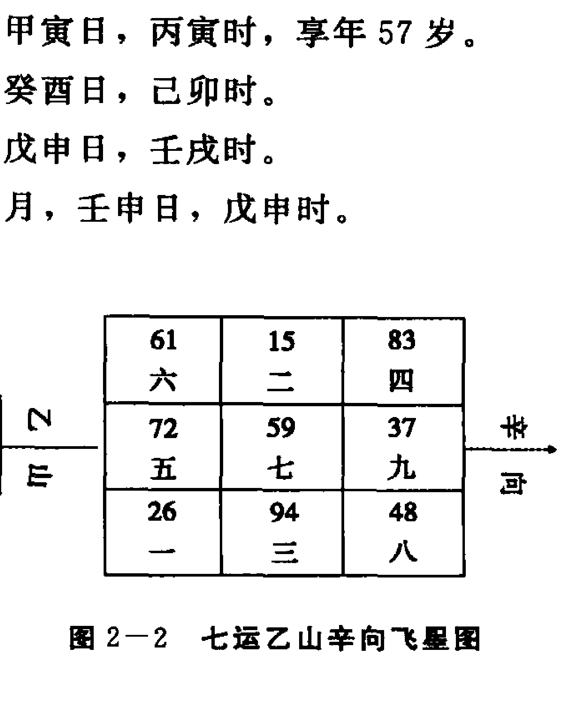

注：此亡命于寅月（正月）去世，申月（七月）才下葬，这叫做“寅葬卯发”。之所以如此，是因为七运乙山辛向的飞星图，为“旺山旺向”，而该穴位又呈太极晕的吉穴，“吉穴必须择吉日”，就一切均吉。

### 四、为店铺开张择日（旅游、进货、移居、业务洽谈均可用）

方法：

- 1. 弄清命主的生庚八字（四柱），找出它的用神、喜神和忌神。
- 2. 所择日课要与四柱纯清旺相；而不能与要求择日人的四柱天克地冲（单冲、单克不忌）；所择日课的天干宜五合地支宜三合、六合。
- 3. 避开凶神恶煞。
- 4. 查贵人方或贵人日，用时支填补。

例如：

某老板求店铺开张择日，命主的四柱为：辛亥年，己亥月，庚戌日，己卯时。

店房东的铺面为：坐西向东。

命主日干庚金与铺面的“坐西”即兑金。为兄弟相帮的劫财（兑卦函；庚酉辛）；“向东”东方震木，被日干庚金所克，而为我克的是财星；对命主很有利（甲寅木是庚金的用神）。

据此，选择开张的日课为：庚辰年，戊寅月，甲寅日。

“甲、戊、庚”，为天上三奇（天上三奇甲戊庚，地上三奇乙丙丁，人中三奇壬癸辛）。月支、日支两寅木，是命主日干庚金所克的财星；加年支辰土生庚金，形成了“两寅一辰”的拱财局，又有三奇贵人财星，所以，命主必定生意兴隆，财源广进。

> 注：以上两例，是将命主的四柱八字与所择行事的日课联系起来，分析他们五行间的生克制化关系。

查贵人方或贵人日的方法如下表：

| 命主出生的日干 | 甲 | 乙 | 丙 | 丁 | 戊 | 己 | 庚 | 辛 | 壬 | 癸 |
|---|---|---|---|---|---|---|---|---|---|---|
| 贵人方或贵人日地支 | 丑未 | 子申 | 亥酉 | 亥酉 | 丑未 | 子申 | 丑未 | 寅午 | 卯巳 | 卯巳 |

#### 五、二十四山择日表

## 以坐山干支五行生克制定化的风水择日表

| 廿四山 | | 五行 | 旺 | 生扶 | 太岁年 | | 有煞气的年月 | | | 坐山为五黄的人中星 | 大通之年 |
| :--- | :--- | :--- | :--- | :--- | :--- | :--- | :--- | :--- | :--- | :--- | :--- |
| 坐 | 向 | | | | | 七煞 | 坐煞 | 向煞 | | |
| 壬 | 丙 | 水 | 水 | 金 | 壬 | 丙 | 寅午戌 | 申子辰 | 九紫 | 已西丑，亥卯未 |
| 子 | 午 | 水 | 水 | 金 | 子 | 午 | 寅午戌 | 申子辰 | 九紫 | |
| 癸 | 丁 | 水 | 水 | 金 | 癸 | 丁 | 寅午戌 | 申子辰 | 九紫 | |
| 丑 | 未 | 土 | 土 | 火 | 丑 | 未 | 寅午戌 | 申子辰 | 二黑 | 已西丑，亥卯未 |
| 艮 | 坤 | 土 | 土 | 火 | | | | | | |
| 寅 | 申 | 木 | 木 | 水 | 寅 | 申 | 已西丑 | 亥卯未 | 二黑 | |
| 甲 | 庚 | 木 | 木 | 水 | 甲 | 庚 | 已西丑 | 亥卯未 | 七赤 | |
| 卯 | 酉 | 木 | 木 | 水 | 卯 | 酉 | 已西丑 | 亥卯未 | 七赤 | 申子辰，寅午戌 |
| 乙 | 辛 | 木 | 木 | 水 | 乙 | 辛 | 已西丑 | 亥卯未 | 七赤 | |
| 辰 | 戌 | 土 | 土 | 火 | 辰 | 戌 | 已西丑 | 亥卯未 | 六白 | |
| 巽 | 乾 | 木 | 木 | 水 | | | | | | |
| 已 | 亥 | 火 | 火 | 木 | 已 | 亥 | 申子辰 | 寅午戌 | 六白 | |
| 丙 | 壬 | 火 | 火 | 木 | 丙 | 壬 | 申子辰 | 寅午戌 | 一白 | |
| 午 | 子 | 火 | 火 | 木 | 午 | 子 | 申子辰 | 寅午戌 | 一白 | 已西丑，亥卯未 |
| 丁 | 癸 | 火 | 火 | 木 | 丁 | 癸 | 申子辰 | 寅午戌 | 一白 | |
| 未 | 丑 | 土 | 土 | 火 | 未 | 丑 | 申子辰 | 寅午戌 | 八白 | |
| 坤 | 艮 | 土 | 土 | 火 | | | | | | |
| 申 | 寅 | 金 | 金 | 土 | 申 | 寅 | 亥卯未 | 已西丑 | 八白 | |
| 庚 | 甲 | 金 | 金 | 土 | 庚 | 甲 | 亥卯未 | 已西丑 | 三碧 | 寅午戌，申子辰 |
| 酉 | 卯 | 金 | 金 | 土 | 酉 | 卯 | 亥卯未 | 已西丑 | 三碧 | 申子辰，寅午戌 |
| 辛 | 乙 | 金 | 金 | 土 | 辛 | 乙 | 亥卯未 | 已西丑 | 三碧 | 申子辰，寅午戌 |
| 戌 | 辰 | 土 | 土 | 火 | 戌 | 辰 | 亥卯未 | 已西丑 | 四绿 | |
| 乾 | 巽 | 金 | 金 | 土 | | | | | | |
| 亥 | 已 | 水 | 水 | 金 | 亥 | 已 | 寅午戌 | 申子辰 | 四绿 | |

说明：此为二十四山择日的简表，基本依据是以坐山的五行与其年月日干支的五行间的生克制化关系，决定吉凶，吉则可用，凶煞则要避开。

下面举例说明之：

-   1. 如“壬山丙向”。以坐山“壬”的五行“水”为准，以干支五行属水的日子为“旺”日；以干支属金的日时为生扶。因五行属水的日子，与壬水为“比和”关系；属金的日子，为“金生水”，是生扶的日子，在此两天中的任何一天，均可修造和动土。
-   2. 带有煞气的年月和五黄方位，忌修造动土。所谓煞气，就是与坐山和向上五行相克冲的那个五行。如“子山午向”的“七煞”，为“午”，午的方位在南，子在北；午的五行属火，子的五行属水，南北相对，子水克午火，故“子午相冲”。所以，“午”成为子山的“七煞”。子山的“坐煞”是“寅午戌”（三合火局）；午向的“向煞”是“申子辰”（三合水局），均构成相克的关系。
-   3. “坐山为五黄的人中星”一行，是指以该星入中顺行飞布九星，“五黄”凶星就要飞临坐山，这时该方位就不能动土修造。
-   4. “大通之年”一行，说明在这些地支年中，可以不忌。

## 第三章 以年月日干支组成的格局择日

以用事年月日的干支（这里称为“星”）可组成很多格局，它们中有吉星，也有凶星。吉祥的称为“神”；凶险的叫做“杀”，合称为“神杀”。择日就是为了“趋吉避凶”。现详述如下：

### 第一节 吉格

-   一、天德贵人星与天德合贵人星

此两星以月支为基点，在用事的日、时上，如果能对应某干支，则视此日、时为吉。其查法如下表。

### 天德与天德合贵人星查法一览表

| 月支 | 寅 | 卯 | 辰 | 巳 | 午 | 未 | 申 | 酉 | 戌 | 亥 | 子 | 丑 |
| :--- | :--- | :--- | :--- | :--- | :--- | :--- | :--- | :--- | :--- | :--- | :--- | :--- |
| 贵人星天干或地支 | 壬丁 | 己申 | 壬丁 | 丙辛 | 寅亥 | 甲巳 | 戊癸 | 寅亥 | 丙辛 | 乙庚 | 己申 | 乙庚 |

-   二、月德贵人星与月德合贵人星

### 月德与月德合贵人星查法一览表

| 月支 | 寅、午、戌 | 申、子、辰 | 亥、卯、未 | 巳、酉、丑 |
| :--- | :--- | :--- | :--- | :--- |
| 天干 | 丙、辛 | 壬、丁 | 甲、巳 | 庚、乙 |

-   三、天乙贵人星

逢天乙贵人星的格局，一生有贵人相助，且可逢凶化吉。其查法如下表：

### 天乙贵人星查法一览表

| 年干或日干 | 甲、戊、庚 | 乙、己 | 丙、丁 | 壬、癸 | 辛 |
| :--- | :--- | :--- | :--- | :--- | :--- |
| 天乙贵人星 | 丑、未 | 子、申 | 亥、酉 | 巳、卯 | 寅、午 |

#### 四、三奇贵人

天上三奇甲戊庚，地上三奇乙丙丁，人中三奇壬癸辛。
三奇应按用时的年、月、日或月、日、时的顺序挨次排列才是，如甲年、戊月、庚日或甲月、戊日、庚时；但是倒转排，按日、月、年或时、日、月顺序排也是三奇。如甲日、戊月、庚年或甲时、戊日、庚月。

#### 五、十干禄

在“长生天干五行十二运”的表中，“临官”一横格的地支是十天干的“干禄”；而临官下，“帝旺”一横格的地支则是十天干的“羊刃”，此叫做“禄过刃生”。依据此表，十干禄是：
甲禄在寅，乙禄在卯，丙禄在巳，丁禄在午，戊禄在巳，己禄在午，庚禄在申，辛禄在酉，壬禄在亥，癸禄在子。

“禄”就是薪金、酬劳、利润、资财。所以，日课中单有贵人是不够的，还须配合“禄神”，才算福禄双全。
催财的日课，尤其重“禄”，最好日禄到时，日禄到修造方。
禄神最喜生旺，如甲禄在寅，春天大旺；丙禄在巳，夏天最利。
禄神忌相克退气之月份，如庚禄在申，辛禄在酉，属金，在夏天火旺的月份，为火克金，不利。但若符合玄空卦数，也可补救。

### 第二节 避煞（杀）

#### 一、孤辰、孤宿

以年支为主，结合月、日、时查，其法如下：

| 年支 | 寅、卯、辰 | 巳、午、未 | 申、酉、戌 | 亥、子、丑 |
| :--- | :--- | :--- | :--- | :--- |
| 孤辰 | 巳 | 申 | 亥 | 寅 |
| 孤宿 | 丑 | 辰 | 未 | 戌 |

#### 二、亡神

| 日支 | 申、子、辰 | 寅、午、戌 | 巳、酉、丑 | 亥、卯、未 |
| :--- | :--- | :--- | :--- | :--- |
| 亡神 | 亥 | 巳 | 申 | 寅 |

## 三、劫杀（与亡神相冲的地支为劫杀）

| 日支 | 申、子、辰 | 寅、午、戌 | 巳、酉、丑 | 亥、卯、未 |
| :--- | :--- | :--- | :--- | :--- |
| 劫杀 | 巳 | 亥 | 寅 | 申 |

#### 四、天罗地网

火命日主见戌、亥为天罗；水命日主见辰、巳为地网。辰人见巳、巳人见辰为天罗；戌人见亥、亥人见戌为地网。

男人忌天罗，女人忌地网。

## 五、冲母腹日（大凶）

日支冲女命出生的年支，为冲母腹日。

如：一卯年出生的女命，酉日就是冲母腹日。因为卯酉相冲；寅年生的女命，申日，为冲母腹日。余类推。

#### 六、三杀日

灾杀、劫杀、墓库杀，为三杀。查三杀的方法是以出生人的年支为基础，结合月、日、时支来查。

三杀中，唯墓库杀为大凶，切勿用。查法见下表：

### 灾杀、劫杀、墓库杀查法一览表

| 人出生的年支 | 灾杀 | 劫杀 | 墓库杀 |
| :--- | :--- | :--- | :--- |
| 寅午戌年出生的人，忌用丑日、时 | 亥 | 子 | 丑 |
| 巳、酉、丑年出生的人，忌用辰日、时 | 寅 | 卯 | 辰 |
| 申、子、辰年出生的人，忌用未日、时 | 巳 | 午 | 未 |
| 亥、卯、未年出生的人，忌用戌日、时 | 申 | 酉 | 戌 |

#### 七、桃花（咸池）、驿马日

桃花主淫乱春心；驿马主奔波流浪。此两日用之不吉。其查法如下表：

### 桃花、驿马日速查表

| 日支 | 寅、午、戌 | 巳、酉、丑 | 申、子、辰 | 亥、卯、未 |
| :--- | :--- | :--- | :--- | :--- |
| 桃花 | 卯 | 午 | 酉 | 子 |
| 驿马 | 申 | 亥 | 寅 | 巳 |

-   1. 对桃花煞，可取日课四柱中的正官，明现天干或正印透天干，均可制之。四柱中的“长生”也可抵制。
-   2. “驿马有栏堪取用，孤寡全无用为奇”。

对驿马，可用四柱天干正官或正印明现制之；也可用栏时，挡住驿马的野性。

如：己卯年出生的女性，日支为“未”，其驿马日为“巳”。在十二地支的排序中：辰、巳、午。
“巳”后面的“辰”，为马鞭，不可用；“巳”前面的“午”，是马栏，可制驿马，可用。

如果无栏时，则用正官或正印之日。“巳”属火，为阴，阳水克阴火为正官；“子为阳，故用子水克巳火”。所以，子日可用。

#### 八、孤寡之日不可用

求法：

由女命出生年的地支起“三会局”。前一位是“孤”；后一位就是“寡”。

三会：寅卯辰，会东方木；巳午未，会南方火；申酉戌，会西方金；亥子丑，会北方水。

例如：卯年出生的女命，三会是“寅卯辰”。辰的前一位是“巳”；寅的后一位是“丑”。故，“巳”为孤；“丑”是寡。四柱中，孤寡两字均有者，为大凶。单字则不计。

寅卯辰年出生的女命，其孤寡地支如图 3－1：

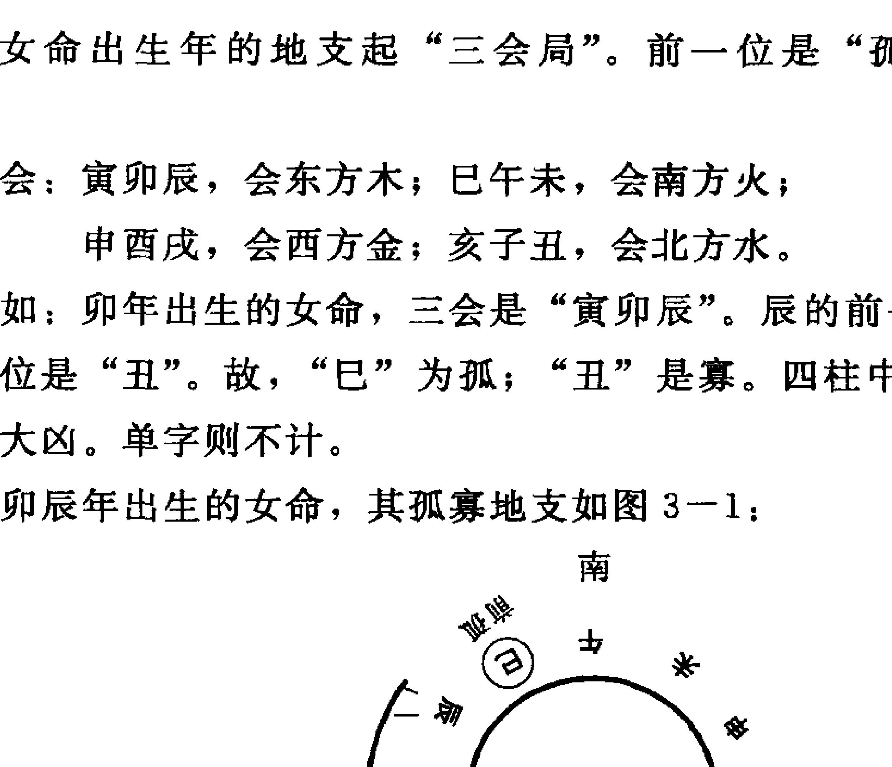

图 3－1 寅卯辰年生女命孤寡地支示意图

## 第四章 利用《历书》择吉日

五花八门的《历书》每到冬春二季，市场到处可见，所以利用历书择吉日，其资料来源和方法都很简便。现将其方法简介于后。

-   一、要了解流年、流月、流日、流时“紫白飞星”，“紫白”飞到的吉方和“二黑”、“五黄”飞到的凶方（参看本书中的“紫白飞星”法）。
-   二、要熟悉诸神杀的性质

择日的程序，一般是先选年，次选月，再选日、时。选年、月，主要是用在修房建屋、破土动工和出门下葬等重要事情上，一般的事情如搬迁、签约、开张、求财等只要选好吉日良辰就足够了。

岁破方，三杀方和五黄方，是大凶的年杀，全年都不利于在该方造葬，其余的阴符、年克等，只要选好月、日的吉星，就可以化解。

现将部分吉星恶杀详解如下：

### 1. 每月吉星

-   天德：主贵人相助，百事吉，如结婚、搬迁、祭祀、安床、立约、远行等，一般的行事都可以用。
-   月德：为贵人当值之日，百事吉，但忌言实是非，这是贵人变小人之象。
-   天德合：力量比天德小，宜营造动土、祈福、远行。
-   月德合：为贵人日，与月德同。
-   月恩：宜营造、婚姻、迁徙、祭祀、纳财。
-   月空：利修屋，上疏陈策。
-   天道：为天德所在之方，宜一般行事。
-   天赦：就是赦免，宜上诉。
-   喜神：利喜庆之事，如结婚、设宴等。
-   天贵：贵气的象征，宜上官，入宅、送礼以及一般行事。
-   天福：为官星，宜就职上任，不宜远行。
-   天官：为官星，宜就职、诉讼和调解。
-   天马：宜出行、上任、求财。
-   天喜：宜设宴、纳采。
-   天医：宜治病、炼药。
-   金匮、玉堂：宜做任何事，不避一切凶杀。

### 2. 值日凶星

-   天罡：忌搬迁，不宜开刀做手术；忌结婚，此为百事凶的日子，但是天德、月德可化解。
-   天瘟：病星，忌修造和治病开刀。
-   天吏：争执之星，忌诉讼，无论是原告或被告，均不利。
-   天狱：牢狱之意，忌诉讼。
-   天棒：忌犯官非、诉讼，落败机会很大。
-   天狗：忌祭祀，天月德吉星可解。
-   天地转：忌远行、运土，以及一切转动变化之事。
-   天贼：忌动土、入宅、关仓库，犯之易被盗。
-   月火：又名天火，最忌造作盖屋及作灶，犯之易生火灾。
-   月破：百事忌，如搬迁、购物、远行、结婚、安床等均须忌；只宜除旧迎新。
-   死符：忌修造、安床，否则健康容易出问题。
-   傍废：不宜种植，遇吉星则可解。
-   黄砂：忌远行和外出经商。
-   大耗：百事忌，尤忌开张、结婚、动土。
-   神隔：忌祈福、祭祀。
-   朱雀：忌入宅、安床、开张等，否则有血光之灾。
-   玄武：忌埋葬、开碑及一切与阴宅有关的事。
-   木马：最忌伐木的木匠开工之日。
-   披苏：忌结婚、入宅及落葬。
-   破败：除忌制作一切器具外，余事不忌。
-   天地轴：忌动土。
-   月转：忌远行、动土、新船下水和购买汽车。
-   地贼：忌动土、远行、造葬，犯之易失物、被盗。
-   地火：忌栽种五杀花果。
-   月厌：忌结婚、签合同等事。
-   月杀：忌造门、开张。否则易结束，家人易发生意外。
-   受死：百事忌，有死气沉沉之意。
-   阴错：忌结婚、入宅，有错误之意。
-   往亡：最忌远行、搬迁，有反复不稳定之意。
-   八座：忌诉讼。
-   血支：忌针灸、开刀等事，有不顺利之意。
-   重日：忌结婚、丧葬，有重复之意。
-   阴错：忌结婚、入宅，指有错误的抉择。
-   土禁：忌动土、种植和棺木下葬。
-   土瘟：忌动土、种植和下葬。主被土伤或遭瘟疫。
-   飞簶：忌收养六畜，不宜购买宠物、难养；亦忌装修。
-   枯焦：忌栽种和求财，植物易枯萎。
-   四废：百事忌日。
-   小红砂：一般行事均不利。
-   小耗：所忌之事与大耗同。
-   人隔：与人发生隔膜之意。忌结婚、求嗣、招聘与过继收养。
-   白虎：百事皆忌，尤忌落葬。
-   勾陈：忌动土、落葬。
-   刀砧：忌针灸、割六畜。
-   五鬼：阴日，不宜祭祀阴灵，亦忌远行。
-   殃败：有失败之意，忌开市、动土、结婚。
-   勾绞：百事忌日。
-   河魁：又名大祸，忌修造安门。
-   重表：有发生丧事之意，忌埋葬、造碑、结婚。
-   血忌：血光之灾，最忌开刀、针灸。
-   四大墓：忌落葬。
-   土府：最忌动土。
-   土忌：最忌动土、埋葬。
-   四离四绝：分离之意，忌结婚、远行。百事忌日。

### 3. 值日吉星

-   母仓：宜种植、纳财。
-   圣心：宜上表章、祈福。但七月的圣心为凶日。
-   绿库：宜开张、纳财、储蓄。
-   福星：宜求嗣、设寿宴、喜宴。
-   阴德：宜放生、捐钱。
-   解神：宜上诉，摆放化煞风水用品。因有解答不利问题之意。
-   续世：宜结婚、求嗣、聘佣人。
-   驿马：走动之象，宜远行、出门移民。
-   民日：宜栽种、迁徙。
-   旺日：百事吉祥之日。
-   三合：百事吉祥之日。尤利结婚、立约、交易、开张。
-   天富：宜造葬、作仓库。
-   天医：宜治病、炼药。
-   天财：财星。宜求财、造仓库、开市、交易。
-   月财：财得。宜开市、求财、交易、出行、迁移。
-   明星：宜上官、造葬。
-   五富：利开市、求财、交易、立约。富有之意。
-   福星：福气、宜宴会、喜事、求职。
-   吉庆：利喜宴、上表受封。
-   生气：宜修造，动土、出行、求医、种植、百事吉日。
-   益后：福神。宜造宅、嫁娶、立嗣。
-   官日：宜上官赴任。
-   六合：宜结婚、立约、交易、开市。
-   相日：生气之气，百事吉日。
-   阳德：宜交易、开市，一般行事都吉利。
-   四相：宜栽种、远行、养育生财。

### 三、了解十二建星的来历和吉凶状况

### 1. 什么是十二建星？

十二建星又称十二宫神，它们是建、除、满、平、定、执、破、危、成、收、开、闭。

### 2. 十二建星的来历

古人以步代尺测量住房，将步作为长度单位。十二建星，就是这种量房法的长度单位的名称。一步，等于4.5尺，等于149.85厘米（约150公分）。为便于记忆，下面将“步”的距离折成“米”。

-   1. 建：一步，149.85 厘米，约 1.5 米。
-   2. 除：二步，3 米。
-   3. 满：三步，4.5 米。
-   4. 平：四步，6 米。
-   5. 定：五步；7.5 米。
-   6. 执：六步，9 米。
-   7. 破：七步，10.5 米。
-   8. 危：八步，12 米。
-   9. 成：九步，13.5 米。
-   10. 收：十步，15 米。
-   11. 开：十一步，16.5 米。
-   12. 闭：十二步，18 米。

然后，十三步为建；十四步为除……如此循环往复地数下去。
后来，数术家将这些步数，即十二建星安上了许多别的名称，于是就有了吉凶状况。

### 3. 吉凶状况

为方便使用查阅，现将十二建星的相关资料列成下表：

| 十二建 | 星名 | 别名 | 天地分属 | 宜 | 忌 |
| :--- | :--- | :--- | :--- | :--- | :--- |
| 建 | 厚福星 | 元吉 | 有天有地家和顺 | 一般吉日可解安求财。 | 起工动土，新船下水。 |
| 除 | 太阳星 | 明堂 | 有地无天夫早亡 | 大吉日，可祭祀上表，出行交易，求医解除，移花接木，种植拆屋，除邪。 | 移徙。 |
| 满 | 进角星 | 天刑 | 双天双地寿命长 | 只宜祭祀、祈愿。 | 动土修造。 |
| 平 | 土曲星 | 卷舌 | 一天一地同到老 | 治病除危，泥墙修舍，进产祭祀，安机动土修作。 | 开沟打井，种植排场。 |
| 定 | 钱财 | 金柜 | 双天双地寿命长 | 饮宴、协议、祭祀，求嗣收养，冠带交易，问名纳彩。 | 医疗诉讼，出行，种植。 |
| 执 | 三才星 | 天德 | 一天一地同到老 | 祭祀祈福，建层，入宅移居，开张入库，出纳财帛，求嗣结婚。 |  |
| 破 | 天府星 | 冲煞 | 无天无地半路亡 | 万事不利，只可补墙拆屋，灭鼠破贼，除服伐木。 | 起工动土，移居种植，出行。 |
| 危 | 不将星 | 玉堂 | 一天一地同到老 | 黄道日，可祭祀祈福，纳表上章，问名纳彩，取猎安床，交易交卷。 | 行船，拆屋，伐木。 |
| 成 | 天喜星 | 三合 | 一天二地重重娶 | 祭祀入学，结婚纳彩，安床上表，人宅种植，出行交易，进产移居。 | 诉讼。 |
| 收 | 田保星 | 贼劫 | 二天一地主来郎 | 有利收获之事，也可祭祀、入学上表。 | 安葬、出行求财，开张。 |
| 开 | 青龙星 | 生气 | 有天有地家和顺 | 祭祀入学，捕捉取猎，收敛财帛，嫁娶种植，修仓生产，纳畜。 | 破土，安葬，修造，取鱼，远回。 |
| 闭 | 转官星 | 灾祸 | 一天二地重重娶 | 修筑堤防，闭门思过，运筹帷幄，收敛财帛。 | 出行，远回，营谋合伙。 |

### 4. 十二建星吉凶歌

-   建满平收黑，除危定执黄，
-   成开皆可用，闭破不相当。

十二建星，又有前述的十二“列星之辰”之说，它分布于东、南、西、北各方三辰。

### 四、熟知二十八宿吉凶状况

二十八宿的起源很早，它最初被用作观察日月五星运行的背景。其中的原因，是由于古代中国人认为恒星相互间的位置恒久不变，可以利用它们作标志，来说明日月五星运行所到的位置。

我国古代天文学家把天空中可见的星分成二十八组，叫二十八宿，东南西北四方各七宿。印度、波斯、阿拉伯人古代也有类似中国的二十八宿的说法。

中国古代为了认识星辰和观测天象，把天上的恒星几个一组，每组定一个名称，这样的恒星组合称为星官。各个星官所包含的星数多寡不等，少到一个，多到几十个，所占的天区范围也各不相同。在众多的星官中，有31个占有很重要的地位，这就是三垣二十八宿。在唐代，三垣二十八宿发展成为中国古代的星空划分体系，类似现代天文学中的星座。

三垣，指紫微垣、太微垣、天市垣。紫微垣包括北天极附近的天区，大体相当于拱极星区；太微垣包括室女、后发、狮子等星座的一部分；天市垣包括蛇夫、武仙、巨蛇、天鹰等星座的一部分。

二十八宿，又称为二十八星或二十八舍。最初是古人为比较日、月、金、木、水、火、土的运动而选择的二十八星官，作为观测时的标记。“宿”的意思和黄道十二宫的“宫”类似，表示日月五星所在的位置。到了唐代，二十八宿成为二十八个天区的主体，这些天区仍以二十八宿的名称为名称。和三垣的情况不同，作为天区，二十八宿主要是为了区划星官的归属。二十八宿从角宿开始，自西向东排列，与日、月运动的方向相同。二十八宿为：

-   东方七宿：角、亢、氐、房、心、尾、箕。
-   北方七宿：斗、牛、女、虚、危、室（营室）、壁（东壁）。
-   西方七宿：奎、娄、胃、昴、毕、觜、参。
-   南方七宿：井（东井）、鬼（舆鬼）、柳、星（七星）、张、翼、轸。

二十八宿也是古人推论时日吉凶的一个很重要理论依据。民间术士把二十八宿与二十八种禽兽相配，进一步发展了二十八宿的吉凶内涵。关于二十八宿与二十八种禽兽的配合及其吉凶，民间流行的《择吉通书》有很详细的记载，而且是以通俗歌谣的形式来表述的：

角宿，属木，为蛟：
角宿值日不非轻，祭祀婚姻事不成，
葬埋若还逢此日，三年之内有灾惊。
亢宿，属金，为龙：
亢宿之星事可求，婚姻祭祀有来头，
葬埋必出有官贵，开门放水出公候。
氐宿，属土，为貉：
氐宿之星吉庆多，招得横财贺有功，
葬埋若还逢此日，一年之内进钱财。
房宿，为日，为兔：## 中国风水学初探

房宿值日事难成，办事多般不吉利，安葬多有不吉利，起造三年有灾殃。

心宿，为月，为狐：心宿恶星元非横，起造男女事有伤，坟葬不可用此日，三年之内见瘟亡。

尾宿，属火，为虎：尾宿之日不可求，一切兴工有犯仇，若有婚姻用此日，三年之内有悲愁。

箕宿，属水，为豹：箕宿值日害男女，官非口舌入门来，一切修造不用利，婚姻孤独守空房。

斗宿，属水，为獬：斗宿值日不吉良，婚姻祭祀不吉昌，葬埋不可用此日，百般万事有灾殃。

牛宿，属金，为牛：牛宿值日利不多，一切修造事灾非，葬埋修造用此日，卖尽田庄不记丘。

女宿，属土，为蝠：女宿值日吉庆多，起造兴工事事昌，葬埋婚姻用此日，三年之内进田庄。

虚宿，为日，为鼠：虚宿值日吉庆多，祭祀婚姻大吉昌，埋藏若还逢此日，一年之内进钱财。

危宿，为月，为燕：危宿值日不多吉，灾祸必定注瘟亡，一切修营尽不利，灾多吉少事成灾。

室宿，属火，为猪：室宿值日大吉利，婚姻祭祀主恩荣，葬埋若还逢此日，三年必定进田庄。

壁宿，属水，为俞：壁宿之星好利宜，祭祀兴工吉庆多，修造安门逢此日，三朝七日进钱财。

奎宿，属木，为狼：奎宿值日好安营，一切候造大吉昌，葬埋婚姻用此日，朝朝日日进田庄。

娄宿，属金，为狗：娄宿之星吉庆多，婚姻祭祀主华荣，开门放水用此日，三年之内主官班。

胃宿，属土，为雉：胃宿值日有灾殃，凶多吉少不寻常，一切兴工多不利，朝朝日日有瘟伤。

昴宿，为日，为鸡：昴星修造事亨通，祭祀婚姻贺有功，葬埋若还逢此日，田园五谷大登丰。

毕宿，为月，为鸟：毕宿造作主兴隆，祭祀开门吉庆多，一切修造主大旺，钱财牛马满山川。

觜宿，属火，为猴：觜宿值日主吉良，葬埋修造主荣昌，若是婚姻用此日，三年之内降麒麟。

参宿，属水，为猿：参宿造作事兴隆，富贵荣华胜石崇，埋葬婚姻多吉庆，衣粮牛马满家中。

井宿，属水，为犴：井宿值日事无通，凶多吉少有瘟灾，一切所求皆不利，钱财耗散百灾非。

鬼宿，属金，为羊：鬼宿值日不非轻，一切所求事有惊，买卖求财都不利，家门灾祸散伶仃。

柳宿，属土，为獐：柳宿修造主钱财，宝贵双全人家来，埋葬婚姻用此日，多招福禄主荣昌。

星宿，为日，为马：星宿值日有悲哀，凶多吉少有横灾，一切兴工都不利，家门灾祸起重重。

张宿，为月，为鹿：张宿之星大吉星，祭祀婚姻日久长，葬埋兴工用此日，三年官禄地朝堂。

翼宿，属火，为蛇：翼宿值日主吉祥，年年进禄人门堂，一切兴工有利益，子孙富贵置田庄。

轸宿，属水，为蚓：轸宿凶星不敢当，人离财散有消亡，埋葬婚姻皆不利，朝朝日日有惊慌。

#### 五、要趋吉避凶

择日的目的就是为了趋吉避凶，前面所述及的各项内容也是趋吉避凶。为慎重起见，下面再提供几个吉凶日的表格以供参考。

### 1. 每月吉日干支表

### 每月吉日干支一览表

| 吉星名 | 正 | 二 | 三 | 四 | 五 | 六 | 七 | 八 | 九 | 十 | 冬 | 腊 |
|--------|----|----|----|----|----|----|----|----|----|----|----|----|
| 天德   | 丁 | 申 | 壬 | 辛 | 亥 | 甲 | 癸 | 寅 | 丙 | 乙 | 巳 | 庚 |
| 月德   | 丙 | 甲 | 壬 | 庚 | 丙 | 甲 | 壬 | 庚 | 丙 | 甲 | 壬 | 庚 |
| 月财   | 午 | 乙 | 巳 | 未 | 酉 | 亥 | 午 | 乙 | 巳 | 未 | 酉 | 亥 |
| 月思   | 丙 | 丁 | 庚 | 己 | 戊 | 辛 | 壬 | 癸 | 庚 | 乙 | 甲 | 辛 |
| 横财   | 卯 | 辰 | 巳 | 午 | 未 | 申 | 酉 | 戌 | 亥 | 子 | 丑 | 寅 |
| 天财   | 辰 | 巳 | 午 | 未 | 申 | 酉 | 戌 | 亥 | 子 | 丑 | 寅 | 卯 |
| 财帛   | 庚 | 戌 | 丙 | 甲 | 辰 | 未 | 庚 | 戌 | 丙 | 甲 | 辰 | 未 |
| 地财   | 子 | 寅 | 辰 | 午 | 申 | 戌 | 子 | 寅 | 辰 | 午 | 申 | 戌 |
| 足财   | 庚 | 辛 | 亥 | 壬 | 癸 | 寅 | 甲 | 乙 | 巳 | 丙 | 丁 | 申 |

### 2. 每年凶日干支表

### 每年干支凶日一览表

| 星名 | 子 | 丑 | 寅 | 卯 | 辰 | 巳 | 午 | 未 | 申 | 酉 | 戌 | 亥 |
|------|----|----|----|----|----|----|----|----|----|----|----|----|
| 劫杀 | 已 | 寅 | 亥 | 申 | 已 | 寅 | 亥 | 申 | 已 | 寅 | 亥 | 申 |
| 岁杀 | 未 | 辰 | 丑 | 戌 | 未 | 辰 | 丑 | 戌 | 未 | 辰 | 丑 | 戌 |
| 灾杀 | 午 | 卯 | 子 | 酉 | 午 | 卯 | 子 | 酉 | 午 | 卯 | 子 | 酉 |
| 大祸 | 丁 | 乙 | 癸 | 辛 | 丁 | 乙 | 癸 | 辛 | 丁 | 乙 | 癸 | 辛 |
| 岁破 | 午 | 未 | 申 | 酉 | 戌 | 亥 | 子 | 丑 | 寅 | 卯 | 辰 | 巳 |
| 天符 | 亥 | 申 | 已 | 寅 | 亥 | 申 | 已 | 寅 | 亥 | 申 | 已 | 寅 |
| 地符 | 辰 | 巳 | 午 | 未 | 申 | 酉 | 戌 | 亥 | 子 | 丑 | 寅 | 卯 |
| 灾退 | 卯 | 子 | 酉 | 午 | 卯 | 子 | 酉 | 午 | 卯 | 子 | 酉 | 午 |
| 大杀 | 子 | 酉 | 午 | 卯 | 子 | 酉 | 午 | 卯 | 子 | 酉 | 午 | 卯 |
| 白虎杀 | 申 | 酉 | 戌 | 亥 | 子 | 丑 | 寅 | 卯 | 辰 | 巳 | 午 | 未 |

#### 六、注意用事日的干支与用事人四柱中日干支间的生克制化关系

用《历书》择日，除了注意将上列各项综合分析判断（如某日十二建星虽吉，但二十八宿却是凶星，该日则不能用。应尽量做到各项均吉）外，还要注意当日干支五行与用事人日干支五行间的生克制化关系。《历书》的日干支五行是“纳音五行”，故在考察与用事人日柱干支五行间的关系时，也可以用日柱“纳音五行”。

通常情况下，应当是《历书》的日干支五行，生用事人日柱的五行，或用事人的日柱干支五行克《历书》的日干支五行；或两者间是“比和”的兄弟关系，而不能相反。

## 第五章 嫁娶择日

男婚女嫁，几乎是每个成年的健康人，都要经历的一件大喜事。选择一个佳期和吉日良辰操办这一喜事，是男女双方及其家人的共同心愿和要求。我国古代对此更是十分重视，在嫁娶日的选择上有一套方法，具体如下。

- 步骤：
- 首先，选定女命是最佳婚期；
- 然后，再为男命择吉日良辰。

#### 一、选择女命佳期的方法

- 1. 每年女命嫁娶的佳期有八个月。它们是：大利月、吉利月、翁姑月和父母月。其中，大利月和吉利月为最佳期。在使用翁姑月的时候，新娘进男方家门时，男方父母暂避，大吉；用父母月的时候，新娘走出女方家门时，女方父母勿送，也大吉。
- 2. 每年女命不可嫁娶的时期有四个月。它们是：妨夫月和妨妇月各两个月。此四个月为大凶，不可用。
- 3. 操作方法查找佳期。如下表：

| 女命出生支 | 大利月 | 吉利月 | 翁姑月 | 父母月 | 妨夫月 | 妨妇月 |
| :--- | :--- | :--- | :--- | :--- | :--- | :--- |
| 子、寅、辰、午、申、戌六个阳年支出生的女命左起顺排 | 卯（二）<br>酉（八） | 辰（三）<br>戌（九） | 巳（四）<br>亥（十） | 午（五）<br>子（冬） | 未（六）<br>丑（腊） | 申（七）<br>寅（正） |
| 丑、卯、巳、未、酉、亥六个阴年支出生的女命从右起逆排 | 寅（正）<br>申（七） | 丑（腊）<br>未（六） | 子（冬）<br>午（五） | 亥（十）<br>巳（四） | 戌（九）<br>辰（三） | 酉（八）<br>卯（二） |

说明：十二地支中，子、寅、辰、午、申、戌为阳；丑、卯、巳、未、酉、亥为阴。属于六阳年出生的女命，佳期月的地支是从左到右顺排的（括号内的中文数字为阴历月份）；属于六阴年出生的女命，佳期月的地支是从右到左逆排的（括号内的中文数字为阴历月份）。

例如：求壬寅年出生的女命，佳期是哪些月份？解：寅年属阳，查上表可知，大利月是卯月和酉月，即阴历的二月和八月；吉利月是辰月和戌月，即阴历的三月和九月。那么癸卯年出生的女命，其佳期是何月呢？解：卯年属阴，查上表可知，大利月是寅月、申月，即阴历的正月、七月；吉利月是丑月、未月，即阴历的十二月、六月。

注：择嫁娶佳期，也可用女性的月支。

#### 二、为男命选择吉日良辰

男命的嫁娶吉日为天帝日、天后日。其求法如下：每年有立春、雨水、惊蛰、春分等二十四节气。求天帝日以每月的“气”后的一个地支日为准，而不理会“节”。查法如下表：

### 每年十二个月各月天帝日求法表

| 月份 | 正 | 二 | 三 | 四 | 五 | 六 | 七 | 八 | 九 | 十 | 冬 | 腊 |
| :--- | :--- | :--- | :--- | :--- | :--- | :--- | :--- | :--- | :--- | :--- | :--- | :--- |
| 中气 | 雨水后 | 春分后 | 谷雨后 | 小满后 | 夏至后 | 大暑后 | 处暑后 | 秋分后 | 霜降后 | 小雪后 | 冬至后 | 大寒后 |
| 天帝日 | 寅 | 卯 | 辰 | 巳 | 午 | 未 | 申 | 酉 | 戌 | 亥 | 子 | 丑 |

### 每月天后日求法表

| 月支 | 寅午戌 | 巳酉丑 | 申子辰 | 亥卯未 |
| :--- | :--- | :--- | :--- | :--- |
| 天后日 | 丙 | 庚 | 壬 | 甲 |

### 六十甲子日吉时凶辰逐时查对表

（吉日更需吉时）

| 六十甲子日 | 吉时金贵 | 吉时天德 | 吉时玉堂 | 吉时司命 | 吉时青龙 | 吉时明堂 | 凶辰白虎 | 凶辰天牢 | 凶辰玄武 | 凶辰勾陈 | 凶辰天刑 | 凶辰朱雀 |
|---|---|---|---|---|---|---|---|---|---|---|---|---|
| 甲子 | 子 | 丑 | 卯 | 午 | 申 | 酉 | 寅 | 辰 | 巳 | 未 | 戌 | 亥 |
| 乙丑 | 寅 | 卯 | 巳 | 申 | 戌 | 亥 | 辰 | 午 | 未 | 酉 | 子 | 丑 |
| 丙寅 | 辰 | 巳 | 未 | 戌 | 子 | 丑 | 午 | 申 | 酉 | 亥 | 寅 | 卯 |
| 丁卯 | 午 | 未 | 酉 | 子 | 寅 | 卯 | 申 | 戌 | 亥 | 丑 | 辰 | 巳 |
| 戊辰 | 申 | 酉 | 巳 | 亥 | 辰 | 寅 | 戌 | 子 | 丑 | 卯 | 午 | 未 |
| 己巳 | 戌 | 亥 | 丑 | 辰 | 午 | 未 | 子 | 寅 | 卯 | 巳 | 申 | 酉 |
| 庚午 | 子 | 丑 | 卯 | 午 | 申 | 酉 | 寅 | 辰 | 巳 | 未 | 戌 | 亥 |
| 辛未 | 寅 | 卯 | 巳 | 申 | 戌 | 亥 | 辰 | 午 | 未 | 酉 | 子 | 丑 |
| 壬申 | 辰 | 巳 | 未 | 戌 | 子 | 丑 | 午 | 申 | 酉 | 亥 | 寅 | 卯 |
| 癸酉 | 午 | 未 | 酉 | 子 | 寅 | 卯 | 申 | 戌 | 亥 | 丑 | 辰 | 巳 |
| 甲戌 | 申 | 酉 | 亥 | 寅 | 辰 | 巳 | 戌 | 子 | 丑 | 卯 | 午 | 未 |
| 乙亥 | 戌 | 亥 | 丑 | 辰 | 午 | 未 | 子 | 寅 | 卯 | 巳 | 申 | 酉 |
| 丙子 | 子 | 丑 | 卯 | 午 | 申 | 酉 | 寅 | 辰 | 巳 | 未 | 戌 | 亥 |
| 丁丑 | 寅 | 卯 | 巳 | 申 | 戌 | 亥 | 辰 | 午 | 未 | 酉 | 子 | 丑 |
| 戊寅 | 辰 | 巳 | 未 | 戌 | 子 | 丑 | 午 | 申 | 酉 | 亥 | 寅 | 卯 |
| 己卯 | 午 | 未 | 酉 | 子 | 寅 | 卯 | 申 | 戌 | 亥 | 丑 | 辰 | 巳 |
| 庚辰 | 申 | 酉 | 亥 | 寅 | 辰 | 巳 | 戌 | 子 | 丑 | 卯 | 午 | 未 |
| 辛巳 | 戌 | 亥 | 丑 | 辰 | 午 | 未 | 子 | 寅 | 卯 | 巳 | 申 | 酉 |
| 壬午 | 子 | 丑 | 卯 | 午 | 申 | 酉 | 寅 | 辰 | 巳 | 未 | 戌 | 亥 |
| 癸未 | 寅 | 卯 | 巳 | 申 | 戌 | 亥 | 辰 | 午 | 未 | 酉 | 子 | 丑 |
| 甲申 | 辰 | 巳 | 未 | 戌 | 子 | 丑 | 午 | 申 | 酉 | 亥 | 寅 | 卯 |
| 乙酉 | 午 | 未 | 酉 | 子 | 寅 | 卯 | 申 | 戌 | 亥 | 丑 | 辰 | 巳 |
| 丙戌 | 申 | 酉 | 亥 | 寅 | 辰 | 巳 | 戌 | 子 | 丑 | 卯 | 午 | 未 |
| 丁亥 | 戌 | 亥 | 丑 | 辰 | 午 | 未 | 子 | 寅 | 卯 | 巳 | 申 | 酉 |
| 戊子 | 子 | 丑 | 卯 | 午 | 申 | 酉 | 寅 | 辰 | 巳 | 未 | 戌 | 亥 |
| 己丑 | 寅 | 卯 | 巳 | 申 | 戌 | 亥 | 辰 | 午 | 未 | 酉 | 子 | 丑 |
| 庚寅 | 辰 | 巳 | 未 | 戌 | 子 | 丑 | 午 | 申 | 酉 | 亥 | 寅 | 卯 |
| 辛卯 | 午 | 未 | 酉 | 子 | 寅 | 卯 | 申 | 戌 | 亥 | 丑 | 辰 | 巳 |
| 壬辰 | 申 | 酉 | 亥 | 寅 | 辰 | 巳 | 戌 | 子 | 丑 | 卯 | 午 | 未 |
| 癸巳 | 戌 | 亥 | 丑 | 辰 | 午 | 未 | 子 | 寅 | 卯 | 巳 | 申 | 酉 |
| 甲午 | 子 | 丑 | 卯 | 午 | 申 | 酉 | 寅 | 辰 | 巳 | 未 | 戌 | 亥 |
| 乙未 | 寅 | 卯 | 巳 | 申 | 戌 | 亥 | 辰 | 午 | 未 | 酉 | 子 | 丑 |
| 丙申 | 辰 | 巳 | 未 | 戌 | 子 | 丑 | 午 | 申 | 酉 | 亥 | 寅 | 卯 |
| 丁酉 | 午 | 未 | 酉 | 子 | 寅 | 卯 | 申 | 戌 | 亥 | 丑 | 辰 | 巳 |
| 戊戌 | 申 | 酉 | 亥 | 寅 | 辰 | 巳 | 戌 | 子 | 丑 | 卯 | 午 | 未 |
| 己亥 | 戌 | 亥 | 丑 | 辰 | 午 | 未 | 子 | 寅 | 卯 | 巳 | 申 | 酉 |
| 庚子 | 子 | 丑 | 卯 | 午 | 申 | 酉 | 寅 | 辰 | 巳 | 未 | 戌 | 亥 |
| 辛丑 | 寅 | 卯 | 巳 | 申 | 戌 | 亥 | 辰 | 午 | 未 | 酉 | 子 | 丑 |
| 壬寅 | 辰 | 巳 | 未 | 戌 | 子 | 丑 | 午 | 申 | 酉 | 亥 | 寅 | 卯 |
| 癸卯 | 午 | 未 | 酉 | 子 | 寅 | 卯 | 申 | 戌 | 亥 | 丑 | 辰 | 巳 |
| 甲辰 | 申 | 酉 | 亥 | 寅 | 辰 | 巳 | 戌 | 子 | 丑 | 卯 | 午 | 未 |
| 乙巳 | 戌 | 亥 | 丑 | 辰 | 午 | 未 | 子 | 寅 | 卯 | 巳 | 申 | 酉 |
| 丙午 | 子 | 丑 | 卯 | 午 | 申 | 酉 | 寅 | 辰 | 巳 | 未 | 戌 | 亥 |
| 丁未 | 寅 | 卯 | 巳 | 申 | 戌 | 亥 | 辰 | 午 | 未 | 酉 | 子 | 丑 |
| 戊申 | 辰 | 巳 | 未 | 戌 | 子 | 丑 | 午 | 申 | 酉 | 亥 | 寅 | 卯 |
| 己酉 | 午 | 未 | 酉 | 子 | 寅 | 卯 | 申 | 戌 | 亥 | 丑 | 辰 | 巳 |
| 庚戌 | 申 | 酉 | 亥 | 寅 | 辰 | 巳 | 戌 | 子 | 丑 | 卯 | 午 | 未 |
| 辛亥 | 戌 | 亥 | 丑 | 辰 | 午 | 未 | 子 | 寅 | 卯 | 巳 | 申 | 酉 |
| 壬子 | 子 | 丑 | 卯 | 午 | 申 | 酉 | 寅 | 辰 | 巳 | 未 | 戌 | 亥 |
| 癸丑 | 寅 | 卯 | 巳 | 申 | 戌 | 亥 | 辰 | 午 | 未 | 酉 | 子 | 丑 |
| 甲寅 | 辰 | 巳 | 未 | 戌 | 子 | 丑 | 午 | 申 | 酉 | 亥 | 寅 | 卯 |
| 乙卯 | 午 | 未 | 酉 | 子 | 寅 | 卯 | 申 | 戌 | 亥 | 丑 | 辰 | 巳 |
| 丙辰 | 申 | 酉 | 亥 | 寅 | 辰 | 巳 | 戌 | 子 | 丑 | 卯 | 午 | 未 |
| 丁巳 | 戌 | 亥 | 丑 | 辰 | 午 | 未 | 子 | 寅 | 卯 | 巳 | 申 | 酉 |
| 戊午 | 子 | 丑 | 卯 | 午 | 申 | 酉 | 寅 | 辰 | 巳 | 未 | 戌 | 亥 |
| 己未 | 寅 | 卯 | 巳 | 申 | 戌 | 亥 | 辰 | 午 | 未 | 酉 | 子 | 丑 |
| 庚申 | 辰 | 巳 | 未 | 戌 | 子 | 丑 | 午 | 申 | 酉 | 亥 | 寅 | 卯 |
| 辛酉 | 午 | 未 | 酉 | 子 | 寅 | 卯 | 申 | 戌 | 亥 | 丑 | 辰 | 巳 |
| 壬戌 | 申 | 酉 | 亥 | 寅 | 辰 | 巳 | 戌 | 子 | 丑 | 卯 | 午 | 未 |
| 癸亥 | 戌 | 亥 | 丑 | 辰 | 午 | 未 | 子 | 寅 | 卯 | 巳 | 申 | 酉 |

#### 三、嫁娶不宜使用的忌日

- 横天朱雀日：每月初一，为朱雀日。
- 四绝日：四立（立春、立夏、立秋、立冬）的前一日，为四绝日。
- 四离日## 二至：夏至、冬至；二分：春分、秋分的前一日，为四离日。

## 4. 受死、往亡、归忌、游祸四凶日

每月的“受死、往亡、归忌、游祸”四凶日，如下表：

## 受死、往亡、归忌、游祸速查表

| 月份 | 受死 | 往亡 | 归忌 | 游祸 |
| :--- | :--- | :--- | :--- | :--- |
| 正 | 戌 | 寅 | 丑 | 巳 |
| 二 | 辰 | 巳 | 寅 | 寅 |
| 三 | 亥 | 申 | 子 | 亥 |
| 四 | 巳 | 亥 | 丑 | 申 |
| 五 | 子 | 卯 | 寅 | 巳 |
| 六 | 午 | 午 | 子 | 寅 |
| 七 | 丑 | 酉 | 酉 | 亥 |
| 八 | 未 | 子 | 寅 | 申 |
| 九 | 寅 | 辰 | 子 | 巳 |
| 十 | 申 | 未 | 丑 | 寅 |
| 十一 | 卯 | 戌 | 寅 | 亥 |
| 十二 | 酉 | 未 | 子 | 申 |

## 5. 月厌、厌对日

月厌日又称煞翁日，男方无父可用；厌对日又叫煞姑日，男方无母可用。天德日可制化月厌；月德日可制化厌对。现将其列表如下：

## 月厌、厌对和天德、月德日速查表

| 分项 | 吉凶日 | 正 | 二 | 三 | 四 | 五 | 六 | 七 | 八 | 九 | 十 | 十一 | 十二 |
| :--- | :--- | :--- | :--- | :--- | :--- | :--- | :--- | :--- | :--- | :--- | :--- | :--- | :--- |
| 凶 | 月厌 | 戌 | 酉 | 申 | 未 | 午 | 巳 | 辰 | 卯 | 寅 | 丑 | 子 | 亥 |
| 凶 | 厌对 | 辰 | 卯 | 寅 | 丑 | 子 | 亥 | 戌 | 酉 | 申 | 未 | 午 | 巳 |
| 吉 | 天德 | 丁 | 坤 | 壬 | 辛 | 乾 | 甲 | 癸 | 艮 | 丙 | 乙 | 巽 | 庚 |
| 吉 | 月德 | 丙 | 甲 | 壬 | 庚 | 丙 | 甲 | 壬 | 庚 | 丙 | 甲 | 壬 | 庚 |

## 6. 二至、二分和四立（八节）日

每年的夏至、冬至为阴阳互争日；春分、秋分为厌对日；立春、立夏、立秋、立冬为四时相克之际。在此八节日，均忌嫁娶。

## 7. 两字全日反目日也不可用

- （1）女命出生年支为子或午，忌卯、酉二字全。
- （2）女命出生年支为丑或未，忌辰、戌二字全。
- （3）女命出生年支为寅或申，忌巳、亥二字全。
- （4）女命出生年支为卯或酉，忌子、午二字全。
- （5）女命出生年支为辰或戌，忌丑、未二字全。
- （6）女命出生年支为巳或亥，忌寅、申二字全。

## 说明：

所谓反目，就是相冲；忌二字全，就是在月、日、时支中，不能连续有此二字，如某女命出生在癸亥年，而嫁娶日不能是寅月、申日，或寅日、申时，因为寅申相冲。

用六合或贵人，均可制化反目。

## 8. 自缢、勾绞、人隔和无弓日

自缢、勾绞、人隔、无弓为四凶神，不能在同日见到两个。但只有单一凶神则不忌。

## 求解它们的方法如下：

- （1）求自缢法，以月为主。从十二地支和十二月掌宫图的亥宫（月将）起正月，逆数至用事的月份；然后从该月份起初一，再顺时针方向在十二地支和十二月掌宫图中，按初二、初三、初四……直到掌宫图的“巳”宫为止。落在该“巳”宫的日子，就是“自缢”日。

如，求2007年二月份的自缢日。

解（如图5－1）：

亥宫为一月，逆时针数到戌宫为二月。从戌宫起初一，顺时针方向数，亥宫初二，子宫初三……到“巳”宫为“初八”和“二十”。故，初八、二十这两天就是2007年二月（阴历）的自缢日。

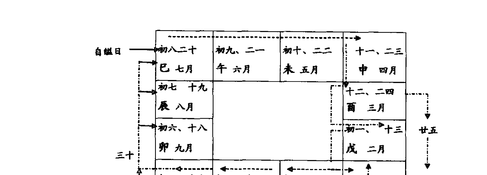

## 图 5-1 在八卦宫图上求 2007 年二月的“自缢日”

- （2）求勾绞日，以“建除满平定执破危成收开闭”十二宫为准。
甲，子、寅、辰、午、申、戌为阳，凡逢阳月，即冬、正、三、五、七、九月，遇“平”日，为“天罡钩绞”；遇“收”日，为“河魁钩绞”。
乙，丑、卯、巳、未、酉、亥为阴，凡逢阴月，即腊、二、四、六、八、十月，遇“平”日，为“河魁钩绞”；遇“收”日，为“天罡钩绞”。
总之，每月的“平”日和“收”日，为“钩绞”日。在此二日中，忌嫁娶。

## （3）人隔日

单月“酉、巳、丑”；双月“未、卯、亥”为人隔日，详见下表：

## 每月人隔凶日表

| 月份 | 正 | 二 | 三 | 四 | 五 | 六 | 七 | 八 | 九 | 十 | 十一 | 十二 |
| :--- | :--- | :--- | :--- | :--- | :--- | :--- | :--- | :--- | :--- | :--- | :--- | :--- |
| 人隔凶日 | 酉 | 未 | 巳 | 卯 | 丑 | 亥 | 酉 | 未 | 巳 | 卯 | 丑 | 亥 |

## （4）无弓日

求某月的无弓日的方法是：从某月的月支起初一，逆时针方向沿十二掌宫图逐宫分布每月阴历29日或30日。遇排布在“寅、午、戌”三宫位置的天日，就是“无弓”日。

如，求2009年五月（月建，庚午）的无弓日（如图 5-2）。
首先绘出十二地支和十二个月的掌宫图。从地支“午”月开始排布“初一”；再逆时针方向，逐宫“分写”初二、初三、初四……直至写完本月所有日期。

阴历的每一天。然后，观察“寅、午、戌”三宫，各宫落布的日期为：寅宫，初五、十七、二十九；午宫，初一、十三、二十五；戌宫，初九，二十一。

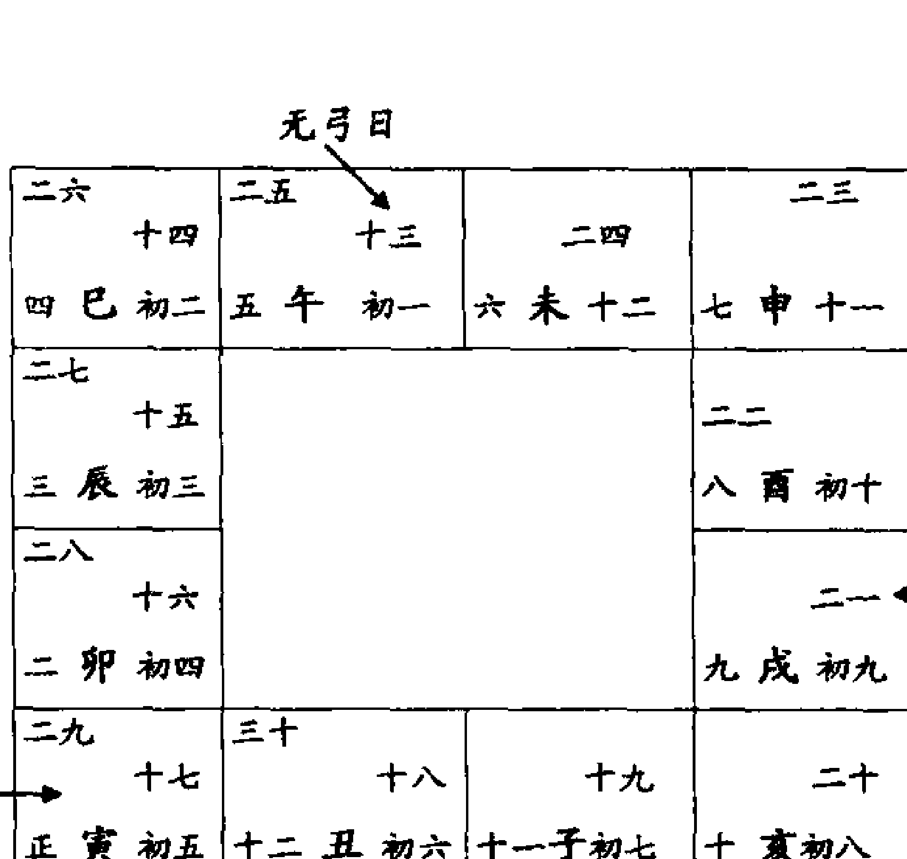

所以，2009年五月的无弓日，为：寅宫，初五、十七、二十九；午宫，初一、十三、二十五；戌宫，初九、二十一，共八日。

说明：人隔日为箭；无弓日是弓。如果此两日同时出现，则弓箭双全，有可能伤人命。

## 9. “亥”不行嫁和“箭刃悲”

亥日，是彭祖的忌日，所以，亥日不能行嫁。
“刃”是羊刃；“箭”是与羊刃相冲的地支。箭刃日也不能嫁娶。

求箭刃的方法是：

- （1）找出羊刃。在“长生十二运”的表中，“临官”一横格，是十天干的“禄过刃生”，所以，禄下面的一行“帝旺”一横格内的地支，就是“十干禄”的羊刃。现将其列表如下：

### 羊刃表

| 天干 | 阳天干 |  |  |  |  | 阴天干 |  |  |  |  |
| :--- | :--- | :--- | :--- | :--- | :--- | :--- | :--- | :--- | :--- | :--- |
|  | 甲 | 丙 | 戊 | 庚 | 壬 | 乙 | 丁 | 己 | 辛 | 癸 |
| 禄 | 寅 | 巳 | 巳 | 申 | 亥 | 卯 | 午 | 午 | 酉 | 子 |
| 刃 | 卯 | 午 | 午 | 酉 | 子 | 寅 | 巳 | 巳 | 申 | 亥 |

如，甲禄在寅，卯为羊刃。即“卯”是寅的羊刃。又如，一己卯年出生的女命，年干是“己”，午为“禄”，“巳”为羊刃，巳为午的羊刃。

- （2）查出“箭”是什么？

与羊刃相冲的地支，为箭。如女命己卯年出生，遇“亥”，就是犯了“箭刃”。因为，该女命的羊刃为“巳”，而“亥”与“巳”则“巳亥相冲”，所以，“亥”就是“巳”的箭。

## 10. 伏断和朱雀占坤宫日

此两日，均为凶日，忌嫁娶。

- （1）伏断日，以二十八宿为准，现将其列成下表：

### 伏断日速查表

| 二十八宿 | 虚 | 斗 | 室 | 女 | 箕 | 房 | 角 | 张 | 鬼 | 翌 | 胃 | 壁 |
| :--- | :--- | :--- | :--- | :--- | :--- | :--- | :--- | :--- | :--- | :--- | :--- | :--- |
| 逢支伏断日 | 子 | 丑 | 寅 | 卯 | 辰 | 巳 | 午 | 未 | 申 | 酉 | 戌 | 亥 |

- （2）朱雀占坤宫日

求法：在掌宫八卦图上，从震宫起“甲子”，顺时针方向，逐宫排写“乙丑”、“丙寅”、“丁卯”……一直到坤宫为“壬申”。故，称“壬申”为朱雀占坤宫。

朱雀占坤宫日，六十甲子日循环一次，它有六个固定的日子：壬申、辛巳、庚申、己亥、戊申、丁巳日。

## 11. 回头贡杀（河上翁杀）

回头贡杀的求法如下表：

| 出生人年命 | 回头贡杀 |
| :--- | :--- |
| 未年生人 | 申子辰 |
| 丑年生人 | 寅午戌 |
| 戌年生人 | 亥卯未 |
| 辰年生人 | 巳酉丑 |

举例：丑年出生的人，在日课中，不可择“寅、午、戌”三个字都有，否则就犯了“回头贡杀”。但如果只有“寅、午、戌”三字中的两个字，则不忌。

## 附录 吉日良辰选择法

## 第六章 安葬择日

#### 一、安葬择日的原则

- 1. 日课干支不能与辞世人及其子孙出生的日柱，有刑、冲、克、害的关系。
- 2. 不能犯太岁、三杀、重丧、重复等凶日。

#### 二、太阳到山到向

在一般的罗盘圈层中设有“太阳到山盘”，其作用仍是“择日”，它主要用于选择下葬或阴宅立碑的日期。如一“巳山亥向”的阴宅，可选择太阳到“巳”山或“三合照”的日期下葬或立碑。
太阳到山或到向，可化解一般的煞气，此外，还有太阴（月亮）到山或到向的问题。
太阴到山或到向，摧吉的力度不如太阳到山或到向，但若能配合其它吉神，仍不失为一个上等的吉课，它能化解一般煞气。

现将太阳和太阴到山或到向的时期列成下表，以便查阅。

## 太阳、太阴（月亮）到山到向一览表

| 节气分项<br>山向 | 太阳到山到向和太阳三合照到山的节气 |  |  | 太阴到山到向和太阴三合照到山的节气 |  |  |
| :--- | :--- | :--- | :--- | :--- | :--- | :--- |
|  | 到山 | 到向 | 太阳三合照 | 到山 | 到向 | 太阴三合照 |
| 壬 丙 | 立春 | 立秋 | 芒种到坤、寒露到乙 | 大雪 | 芒种 | 立秋到坤、清明到乙 |
| 子 午 | 大寒 | 大暑 | 小满到申、秋分到辰 | 冬至 | 夏至 | 处暑到申、谷雨到辰 |
| 癸 丁 | 小寒 | 小暑 | 立夏到庚、白露到巽 | 小寒 | 小暑 | 立夏到巽、白露到庚 |
| 丑 未 | 冬至 | 夏至 | 谷雨到酉、处暑到巳 | 大寒 | 大暑 | 小满到巳、秋分到酉 |
| 艮 坤 | 大雪 | 芒种 | 清明到辛、立秋到丙 | 立春 | 立秋 | 芒种到丙、寒露到辛 |
| 寅 申 | 小雪 | 小满 | 春分到戌、大暑到午 | 雨水 | 处暑 | 夏至到午、霜降到戌 |
| 甲 庚 | 立冬 | 立夏 | 惊蛰到乾、小暑到丁 | 惊蛰 | 白露 | 小暑到丁、立冬到乾 |
| 卯 酉 | 霜降 | 谷雨 | 雨水到亥、夏至到未 | 春分 | 秋分 | 大暑到未，小雪到亥 |
| 乙 辛 | 寒露 | 清明 | 立春到壬、芒种到坤 | 清明 | 寒露 | 大雪到壬、立秋到坤 |
| 辰 戌 | 秋分 | 春分 | 大寒到子、小满到申 | 谷雨 | 霜降 | 冬至到子，处暑到申 |
| 巽 乾 | 白露 | 惊蛰 | 小寒到癸、白露到庚 | 立夏 | 立冬 | 小寒到癸、白露到庚 |
| 巳 亥 | 处暑 | 雨水 | 冬至到丑、谷雨到酉 | 小满 | 小雪 | 大寒到丑、秋分到酉 |
| 丙 壬 | 立秋 | 立春 | 大雪到艮、清明到辛 | 芒种 | 大雪 | 立春到艮、寒露到辛 |
| 午 子 | 大暑 | 大寒 | 小雪到寅、春分到戌 | 夏至 | 冬至 | 雨水到寅、霜降到戌 |
| 丁 癸 | 小暑 | 小寒 | 冬至到甲、惊蛰到乾 | 小暑 | 小寒 | 惊蛰到甲、立冬到乾 |
| 未 丑 | 夏至 | 冬至 | 霜降到卯、雨水到亥 | 大暑 | 小寒 | 春分到卯、小雪到亥 |
| 坤 艮 | 芒种 | 大雪 | 寒露到乙、立春到壬 | 立秋 | 立春 | 清明到乙、大雪到壬 |
| 申 寅 | 小满 | 小雪 | 秋分到辰、大寒到子 | 处暑 | 雨水 | 冬至到子、谷雨到辰 |
| 庚 甲 | 立夏 | 立冬 | 白露到巽、小寒到癸 | 白露 | 惊蛰 | 小寒到癸、立夏到巽 |
| 酉 卯 | 谷雨 | 霜降 | 处暑到巳、冬至到丑 | 秋分 | 春分 | 小满到巳、大寒到丑 |
| 辛 乙 | 清明 | 寒露 | 立秋到丙，大雪到艮 | 寒露 | 清明 | 立春到艮、芒种到丙 |
| 戌 辰 | 春分 | 秋分 | 大暑到午、小雪到寅 | 霜降 | 谷雨 | 夏至到午、雨水到寅 |
| 乾 巽 | 惊蛰 | 白露 | 小暑到丁、立冬到甲 | 立冬 | 立夏 | 小暑到丁、惊蛰到甲 |
| 亥 巳 | 雨水 | 处暑 | 夏至到未、霜降到卯 | 小雪 | 小满 | 大暑到未、春分到卯 |

举例：有一亥山巳向的阴宅欲立碑，应选在2010年的什么日子里为好？

解：亥山巳向，太阳到亥山的时间为“雨水”，到“巳”向的日期是“处暑”。从2010年的《历书》上查得“雨水”的日期是正月初六日（阳历2月19日）2时35分；“处暑”为七月十四日（阳历8月23日）14时24分。所以，该阴宅立碑的日子，可选在正月初六或七月十四的相应时间内进行。

#### 三、安葬吉日和逐月安葬吉日

## 1. 上午大葬日

以下十二日为上午大葬日：甲申、丙申、庚申、壬申；丁酉、己酉、癸酉、辛酉；壬午、丙午、乙亥、壬寅。

## 2. 以下七日为小葬日，次吉：乙巳、庚午、庚寅、甲寅；甲辰、丙辰、壬辰。

## 3. 逐月安葬吉日

现将逐月安葬吉日列成下表，以便查阅。

### 逐月安葬吉日一览表

| 吉日<br>月份 | 安葬吉日 |  |  |  |  |  |  |  |  |  |
| :--- | :--- | :--- | :--- | :--- | :--- | :--- | :--- | :--- | :--- | :--- |
| 正月 | 癸酉 | 丁酉 | 巳酉 | 丙寅 | 壬寅 | 壬午 | 丙壬 | 乙酉 |  |  |
| 二 | 甲寅 | 丙寅 | 庚寅 | 壬寅 | 甲申 | 壬申 | 丙申 | 己未 |  |  |
| 三 | 甲申 | 壬申 | 丙申 | 庚申 | 癸酉 | 乙酉 | 丁酉 | 乙酉 | 壬午 | 丙午 |
| 四 | 癸酉 | 乙酉 | 丁酉 | 己酉 | 辛酉 | 壬午 |  |  |  |  |
| 五 | 壬申 | 甲申 | 丙申 | 庚申 | 甲寅 | 庚寅 | 壬寅 |  |  |  |
| 六 | 壬申 | 甲申 | 丙申 | 庚申 | 甲寅 | 庚寅 | 壬寅 | 癸酉 | 乙酉 | 辛酉 |
| 七 | 癸酉 | 乙酉 | 己酉 | 甲辰 | 壬辰 | 丙辰 | 丙子 | 壬子 | 壬寅 |  |
| 八 | 甲申 | 丙申 | 庚申 | 壬辰 | 丙辰 | 庚寅 | 壬寅 | 甲申 | 乙巳 | 丁巳 |
| 九 | 丙寅 | 庚寅 | 丙午 | 壬午 |  |  |  |  |  |  |
| 十 | 庚午 | 丙午 | 丙子 | 甲辰 | 丙辰 |  |  |  |  |  |
| 冬 | 甲申 | 壬申 | 丙申 | 庚申 | 甲寅 | 庚寅 | 壬寅 | 壬子 |  |  |
| 腊 | 甲申 | 丙申 | 壬申 | 庚申 | 甲寅 | 壬寅 | 乙酉 | 癸酉 |  |  |

- 注：
    1. 冬月、腊月分别忌子日、申日下葬；并忌开金井。
    2. 每月阴历十七，为“横天朱雀”日，忌埋葬（初九、二十五、初一，均为横天朱雀日，分别忌上梁、迁居和嫁娶）。

#### 四、二十四山吉日一览表

现将二十四山吉日列成下表，供参考。

## 二十四山吉日一览表

| 二十四山 | 上吉 | 一般 | 三杀 | 劫杀 | 曜杀 |
| :--- | :--- | :--- | :--- | :--- | :--- |
| 壬山 | 甲子，己巳，辛未，庚辰，癸巳，庚子，甲辰，丙辰。 | 乙亥，乙未，辛丑，乙巳，辛亥。 | 丙寅，庚午，甲戌，壬午，丙戌，庚寅，甲午，戊戌，壬寅，丙午，庚戌，甲寅，戊午，壬戌。 | 壬申。 | 己丑，己未。 |
| 子山 | 甲子，乙亥，庚辰，己亥。 | 甲辰，庚子。 | 同上 | 己巳，癸巳，乙巳。 | 庚辰，己丑，己未。 |
| 癸山 | 甲子，丁丑，庚辰。 | 己巳，戊子，癸巳，己巳。 | 同上 | 甲申。 | 戊辰，己丑，己未。 |
| 丑山 | 己巳，癸巳，辛亥 | | 同上 | 庚辰，壬辰，丙辰。 | 丙寅，乙卯。 |
| 艮山 | 丁卯，丁丑，戊寅，丁亥，庚子，辛丑，壬寅。 | 庚戌，癸丑，壬戌，癸亥。 | 壬午（冷退三方杀），乙巳（旬空三方杀），辛亥（旬空三方杀）。 | 甲寅，乙卯。 | 丙寅，乙巳。 |
| 寅山 | 甲子，丁卯，乙亥，戊寅，丁亥，己亥，甲辰，甲寅，癸亥。 | 辛未，庚辰，乙未，庚戌，戊午。 | 乙丑，己巳，癸酉，丁丑，辛巳，乙酉，己丑，癸巳，丁酉，辛丑，乙巳，己酉，癸丑，丁巳，辛酉。 | 庚寅，甲午，庚子，戊申。 | 丙寅，庚申，戊戌，庚申。 |
| 甲山 | 戊辰，丙子，壬午，癸未，丙戌，壬辰，辛亥，壬子，戊午。 | 丁亥，戊子，戊戌，壬戌，癸亥。 | 同上 | 丙寅，辛未，乙亥。 | 甲申，甲午，己亥，庚申。 |
| 卯山 | 丙戌，壬辰，丙申，壬子，壬申，丙子，壬午。 | 癸未，丁亥，辛亥。 | 同上 | 丁卯，己卯，丁未，庚申。 | 丙寅，甲申，甲午，己亥。 |
| 乙山 | 壬辰，甲午，乙未，乙卯，丁未。 | 壬申，丙申。 | 同上 | 丁卯，丙子，壬午。 | 甲申，戊子，庚申。 |
| 辰山 | 壬申，庚辰，壬辰，乙未，庚申。 | 甲辰。 | 同上 | 戊辰，庚午，庚寅。 | 壬午，戊子，乙卯。 |
| 巽山 | 丙寅，庚辰，癸巳，甲午，丙辰。 | 庚子，丁未，乙未。 | | 丁卯，乙酉，丁酉。 | 己酉，丁巳。 |
| 巳山 | 甲戌，己丑，戊戌，己未。 | 丙戌，丁巳，戊午。 | 甲子，戊辰，壬申，丙子，庚辰，甲申，戊子，壬辰，丙申，庚子，甲辰，戊申，壬子，丙辰，庚申。 | 癸酉，乙酉，丁酉，己酉。 | 壬子，辛酉，癸亥。 |

## 中国风水学初探

## 二十四山吉日一览表

| 二十四山 | 吉日-上吉 | 吉日-一般 | 凶日-三杀 | 凶日-劫杀 | 凶日-曜杀 |
|----------|------------|------------|------------|------------|------------|
| 丙山 | 丁卯，辛巳，庚寅，癸巳，壬寅，乙丁，戊午 | 乙丑，丙寅，辛未，戊寅 | 同上 | 乙亥（冲山三杀），癸亥 | 辛丑，辛亥，乙犯 |
| 午山 | 乙丑，己巳，戊寅，辛巳，己丑，庚寅，癸巳，乙巳 | 丙寅，辛未，癸未，丙戌 | 同上 | 乙亥，辛亥 | 己亥，辛丑，癸亥 |
| 丁山 | 甲午，壬寅，丁未，癸丑，丁丑，丁亥，丙寅，丙午，丙戌 | 癸巳，辛酉，甲寅 | 同上 | 乙巳，辛亥 | 己亥，癸亥 |
| 未山 | 丁卯，甲戌，丁亥，壬寅，丁未 | 丁酉，丙寅 | 同上 | 乙丑，乙亥，辛丑 | 乙酉，甲寅，乙卯 |
| 坤山 | 戊辰，癸酉，壬午，癸未，丁亥，戊子，壬辰，癸巳，壬子，癸丑 | 戊戌，癸卯，戊午，壬戌 |  | 甲子，己巳，己未 | 甲午，乙卯，辛酉 |
| 申山 | 壬申，壬午，戊子，壬辰，癸巳，戊戌，癸丑，戊午 |  | 丁卯，辛未，乙亥，己卯，癸未，丁亥，辛卯，乙未，己亥，癸卯，丁未，辛亥，乙卯，己未，癸亥 | 甲子，戊辰，甲申 | 甲午，丙寅，壬寅，甲辰，丁巳 |
| 庚山 | 壬申，庚辰，乙酉，丙申，乙巳，庚申 | 丁酉 | 同上 | 壬子，丙辰，辛酉 | 丙午，丁巳 |
| 酉山 | 壬申，壬辰，丁酉 | 甲戌，壬寅 | 同上 | 戊辰，戊午 | 丁巳，辛酉 |
| 辛山 | 癸酉，乙巳 | 辛巳，丙戌 | 同上 | 戊辰 | 丙午，丁巳 |
| 戌山 | 丙子，辛巳，庚寅，甲午，丙申，丙午，戊申，庚戌 | 甲戌，丙戌，乙巳，庚申 | 同上 | 己丑，癸丑 | 戊寅，壬午，甲寅 |
| 乾山 | 戊辰，戊寅，癸巳，甲寅 | 戊子 |  | 丙寅，己丑，辛卯 | 壬午，己亥，丙午 |
| 亥山 | 乙丑，丙子 | 乙未 | 丙寅，甲戌，戊寅，壬午，丙戌，庚寅，甲午，戊戌，壬寅，丙午，庚戌，甲寅，戊午，壬戌 | 乙卯 | 庚辰，己丑，己未 |

## 中国风水学初探