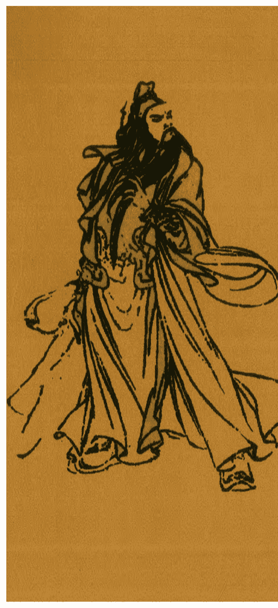

## 吸财大法之横财秘术

## 目录

- 风水大师不传之秘【吸财大法】……………………………………………1
- 现代家居与几种风水用品常见的化煞方法……………………………………7
- 择住宅的方法………………………………………………………………………12
- 事事顺利法…………………………………………………………………………13
- 房间可以挂风铃吗?………………………………………………………………15
- 房间可以摆花或草吗?……………………………………………………………15
- 房间可以放鱼缸吗?………………………………………………………………16
- 镜子不能对着床?…………………………………………………………………16
- 房间放有刺的植物好不好？（例如仙人掌、带刺玫瑰）…………………17
- 房间放一堆娃娃好吗?…………………………………………………………17
- 要求好姻缘...房间内该摆哪些东西?…………………………………………18
- 养猫咪的数量与风水有无关系?………………………………………………18
- 【如何才能平安一生】一现代家庭日常生活中的各种形煞及化解方法…………………………………………………………………21
- 五大化煞法器的功效”摆设……………………………………………………25
- 住宅缺角如何化解?……………………………………………………………30
- 厨房风水…………………………………………………………………………31
- 浴室厕所风水……………………………………………………………………32
- 老人房风水………………………………………………………………………34
- 小孩房风水………………………………………………………………………34
- 卧室“风水”六大禁忌…………………………………………………………36

- 学风水的第一本书 ……… 39
- 第一章 掌握罗盘 坐向立判 ……… 40
- 第二章 排山九宫 八卦为用 ……… 49
- 第三章 家中物事，物物玄机 ……… 65
- 第四章 内外杂诀应用绝妙 ……… 77
- 第五章 山星向首正零水就 ……… 91
- 第六章 地骑缝出绞兼山兼向 ……… 100
- 第七章 九星断事精彩百出 ……… 111
- 第八章 实战布局玄空九诀 ……… 126
- 第九章 楼居吉凶运分顺逆 ……… 139
- 第十章 降伏凶星 催旺吉辰 ……… 154
- 阳宅三十则 ……… 157
- 化煞绝学 ……… 164
- 摘自《阳宅风水富贵来》 ……… 170

## 风水大师不传之秘【吸财大法】

不论是正财还是偏财，任谁都想求得财运亨通、鸿利滚滚而来：你是工薪阶层吗?家庭主妇?体力劳动者阶级?或是营商者?每个人都想薪水高升、利市大发及股票赚钱，无奈老天总是不从人愿，而各式各样的求财法门也可说是琳琅满目；现在，介绍多种简易的奇门求财秘法，只要照着如下「吸财大法」方式，总有合您的财运时机来临，先祝您从此摆脱贫穷一族，能够每日见财，笑得眉开眼笑、心满意足。

奇门求财法-01：想旺偏财者，身上可佩带五帝钱或十运钱，以增进财气运势，如将五帝钱(顺治、康熙、雍正、乾隆、嘉庆等钱币串起，挂在腰间，能防谗言及小人所害；而如果进入丧家，或经常出入不干净的场所时，可将五帝钱拨弄一下，离开时，在门外再以剑指在手掌心写一“除”字，即可去晦辟邪；而平日入庙参拜时，也可将五帝钱取下，在天公炉上绕三圈，或是放在自家神案前四十九天，也可增强五帝钱之开运能量。

奇门求财法-02：准备一个小福袋(或银楼装金饰的小红袋)，穿上红绳，袋内放入5枚一元、十元及五十元的硬币，用红纸写上姓名和出生年月日，在凌晨12点时，挂在自己每天出入的房门上方，慢慢地，你的财气就会临门了。

奇门求财法-03：制作八卦招财包，先准备好一个红色的小布包，在布上或贴或画个八卦图，布包内放入五谷（黄豆、黑豆、绿豆、红豆及米）各少许与盐混合，再将布包绑上红线，逢春节时，在门廊或店门迎风处挂上，只要有人进出或风吹过，即有迎风生财的效果，必须每年一换，可驱晦气、添增人气和增强财富运。

## 奇门求财法-04：随身携带一只开运饰品，不但能辅运更能避灾，所选择之饰品最好能符合与自己能量相近的，可转变自己的不良磁场，如天珠、水晶、八卦玉佩等，经持咒开光后，可防血光煞气并辅助财运，而尾戒、玉镯也可防小人、防漏财及增添贵人运。

## 奇门求财法-05：先准备一个圆形的盘子，里面摆放5个一元硬币，圈围成圆形；再用10个十元的硬币，圈在一元硬币的外围，然后在中心点用红笔点上朱砂，先默想自己的姓名和出生八字，并喊三声：———（自己名字）富贵生财，之后放置在阳光照得到的窗口或阳台，到了晚上即收起，盖上红布，而在每月十五再拿出去照月光，如此连续四十九天，自然财源滚滚而来！

## 奇门求财法-06：红包袋招财术：先准备好一个红包袋，袋内放入大小钱币数枚，放于皮夹或口袋内，随身携带，另准备一个红包袋，内装百元红纸钞一张，在黄纸上写一满字，随纸钞同时装入于红袋内，长期放置于枕头或床垫头下方，慢慢的你的财气就会越来越旺了。

## 奇门求财法-07：想要升职、加薪、创业及得偏财者，如在家中的北面贴上一张用金色颜料、毛笔写上“财”字的红纸，再将床头移往南面，床尾下方放一张红色的踏垫，则有旺助事业及增加偏财之功效。此外，在家中北方放置五颗白水晶，及在房门入口放一块红地毯，在地毯的下面再放一个红包、内装新钞、古铜钱及茶叶、米少许，则有化煞招财增福之效。

奇门求财法-08:借助风水的力量来改运，只需多花点心思在居家或办公环境上，种植一些开运植物，或是在室内财位摆放圆盘，盘内共装九十九枚硬币（一元、五元、十元均可），为财富长长久久之意，不但能久聚财源还可开运，并将逆境磁场自然转化，幸运平安顺利也将会常伴左右呢…

奇门求财法-09:每当时运有点不顺时，也可以入庙参拜，求神庇佑，但记得一定要从面向庙的右边进入，而从左边出门，称为“入龙门、出虎口”，也是改运去晦的一种小方式。

奇门求财法-10:向神佛、菩萨借财借运，也是一种求财的开运法，借库吉日一般选为农历的正月最佳：应准备好五果及红枣、甜糕等，到香火旺的庙宇向神佛参拜祈福借运，“借库”即在不好的年头，借着仙佛的旺气来利及自身在新的来年能够财运亨通、衣食无虞，也有增财添福发旺运之涵意。

奇门求财法-11:如果你的钱财怎么都留不住，想要旺财聚财者，可在家中财位摆放一尊貔貅神兽、三脚金蟾蜍或是聚宝盆，也可在墙面挂上招财童子或刘海戏金蟾的图画，以求偏财旺运及长聚财源。

奇门求财法-12:准备一个红包袋，用笔在袋上写四个字：“对我生财”，再将红包袋折成一只纸船，一边折心里默念：“福气临门财运满载”，然后将纸船放在枕头底下压着，等到家里有祈福拜神的日子，再拿出来烧化掉，如此财源即可满载而来了！

奇门求财法-13:拿九枚硬币（十元或五十元的皆可），再和一张写有自己生辰八字的纸包在一起，放入盛满水的杯碗中，放入冰箱冷冻库结成冰块，在晴天的时候，拿到屋外溶化成水之后，将水洒在房子的四周围，再将硬币擦拭干净后装入红包袋内，放在口袋或皮包里，平日随身携带即可招来光明之财。

奇门求财法-14:准备一个全新的圆形陶瓷水盆，放入一颗水晶在水盆的正中央，水晶周围再放入 21 枚硬币，再在盆中第一次注入冷热阴阳水，将水盆放置在入门室内的斜对角，如此即可以招来偏财好运喔！

奇门求财法-15:准备好有一个有盖子的小箱子或木盒，在小箱或盒面上，贴上圆型的红纸，上写自己名的财母盒(密教聚宝盒之称谓)，将小箱或木盒放置于床底的角落，每天回到家后，便将口袋或皮包内的零钱置入盒中，同时默念我的财气回到库位，在四十九天之后，将能让你的聚财能力增强。

奇门求财法-16:准备一个透明干净，能放入硬币的瓶子，倒入阴阳水(一半自来水、一半煮开过的水)，约七八分满，再放入十枚相同的硬币，把瓶子放在室外处一天一夜，因为日属阳、夜属阴，最后把瓶子移入家中，诚心求得财源滚滚，必可让你如愿以偿！

奇门求财法-17:掷硬币招财术，钱币握于手中，一枚钱币，只能许愿一次(看好黄历当日的良辰吉时)，将许过愿的钱币，往自己的背后丢入于水池或大海中，然后带着欢喜心快速地离开，不要再回头去探寻钱币落于何方，只要你的心够诚，愿望自能慢慢实现。

奇门求财法-18:日月水招财术:先准备空碗一只，放置于顶楼阳台，至少七天，如能得雨水(非自来水)，将之取回带入室内，于月光能照射到的窗户（此时不可再照射到阳光），经过七日后，将碗内剩余的水分取出一些装入小瓶中，平日随身佩带，或放于大衣、皮包、口袋内，水旺财来，可增加自己的偏财运。

奇门求财法-19:在家中的财位放置五种颜色(白青黑赤黄)的水晶，可增加贵人缘及财运，工薪阶层亦能得加薪或升职；如果发觉自己常无法集中精神及多口舌是非、招惹小人缠身，则可在床头的两旁放一对圆润饱满的陶瓷瓶，在其下面各压一个红包袋，袋内放入少许的米、茶叶、新钞及榕树叶，可化煞并可开财运。

奇门求财法-20:先用一张红纸做成一艘纸船,将干净的海砂放入一碗清水中，念光明神咒或财神咒49遍，再将手指(剑指状)沾少许砂水轻洒在船上，同时观想财神将金银财宝运入宅内，接着用剑指在纸船上笔划“财至”的字形，如能连续施行四十九天，再将船首朝内放入家中的保险箱内，船底垫上一迭纸钞，则发财之日不远矣。

奇门求财法-21:在农历春节时，准备一个小米缸或陶瓮，缸内下层摆米，中间摆面线，上层摆圆饼，缸外贴上福财两字的红纸，放在厨房的一角，七日后全部吃完，如此居家可保平安，这一年的工作及财运也会跟着顺利喔…!

奇门求财法-22:拿一个圆形低平的盘子，里面摆上五枚古铜钱，围成圆形，再用十二枚硬币，正面朝上围在外圈，然后在“中心点”放上二粒龙眼核，为龙点睛（金），平时放在太阳照得到的地方，每月十五日再拿出去吸收月光，连续三个月，自然招财进宝，财源滚滚而来！

奇门求财法-23:准备一些五元、十元或五十元的铜板，选择良辰吉日,将这些零钱分别藏置于家中的重要角落或抽屉、柜子内，也可将铜板粘于收银机或电话的底端。这些钱币即为您的财气钱母;在放置这些钱母时，精神一定要集中且心中要有光明的想法,想象着钱财如阳光放射般永远旺盛地跟随着自己, 大自然的财气力量才会帮助您达到理想境地…。

奇门求财法-24:在红纸袋内装入一百元、五百元及一千圆的三张新钞，红纸袋外面写上财源滚滚四个字,于农历春节的好日子或财神生日的当天,放置在自家神案的香炉下压着，平日对神明上香时，顺带祈求财运顺利、福气盈门，如此经过四十九天之后，将会发觉自己的财气真是越来越旺了…。

奇门求财法-25:准备一个香包或小瓶，将五色宝石(天然水晶或属于青、赤、黄、白、黑此五色的天然矿石，都可使用),代表木、火、土、金、水，成分包括白水晶、黑碧玺、橄榄石、红玉髓、黄水晶等,依照五行相生互旺的原理排列，再放入有德行老师所加持过的催财符及铜钱;将五行招财袋(或宝瓶)放在自己的口袋、皮包中，能产生出源源不绝之开运招财能量磁场，也将助您一整年的财运顺心、凡事心想事成!在股市投资、签彩券或牌桌上，则妙不可言，护佑自己财运旺盛，更有助于集中精神，增强本身气场。

奇门求财法-26:阴功开运,所谓一念之善可破九灾;古云:积善之家，必有余庆。用自己的爱心及善念可以化解灾难，平日献血救人或是常行布施，多多捐款救灾自然可以化解灾厄，也由于「存好心、积阴德」，自然会为自己带来好的福德资粮,今世得享财富或能够中得大奖的人，也都是累世所积的善业，如今才能享受福报呢；但所谓「积阴功」，即为善不欲人知，如果经常向人吹嘘自己的善行，那可是伪善，最后反而会落得无功喔…。

## 现代家居与几种风水用品常见的化煞方法

- 1. 鱼缸
“山主贵，水主财”，鱼缸有很强的催财作用。但任何事情都有两面性，水也是双刃剑，如用之不当，不但不能旺财，而且会损财损丁。因此摆放鱼缸一定要请明师量度方位。
- 2. 财神
财神分武财神(关公)和文财神。财神敬之得当，可得全家或企业财运享通；敬之不当，财神则会变为散财之神——耗财破损；尤其是武财神关公，如敬之不当，不但不能带来财运，关公的那口大刀还会伤人。一般原则是，武财神要面向门口，文财神忌面向门。
- 3. 运财童子
顾名思义为运财之物，若全屋皆为未婚男士更为有效。此物忌已婚人士选用。此物放在浴室最为有效，因水为财也。将之放在床头亦可，但女士避用。此法器只能摆放一年，时间过后法力消失，切记。
- 4. 水晶
水晶分为天然水晶和人造水晶，其中天然水晶的作用更强、效果更佳。如有条件，尽量使用天然水晶。水晶应一般放于病煞星之位，一者可以化病消灾，二来可以化病为财。
- 5. 金元宝
以生财旺财为主，多以一对并用，用法有二：一、将一对金元宝放在全屋最大之窗口上或窗台，左右角各放一只，目的为把窗外之财吸纳进来，窗口越大财气越旺。二、放在大门入屋斜角之角落，此处地方藏风聚气，亦是财位，放上一对金元宝以加强招财进宝之气。

- 6、石狮子
瑞兽一种,能解除多种形煞,亦加强官威或屋主之阳气, 过去不少大户人家均摆放一对在门口。如果窗口见到不利之冲克, 可放一对石狮子面向窗口可以化煞, 且有生权之意。凡是以口维生之行业, 如: 律师、艺员等, 可在办公室内摆放一对振声威, 有助于生财。

- 7、铜狮子
其性质为化煞挡灾,一般放在面向大门的位置。凡是有路相冲或开门见灯柱者可用。铜为金属, 可克制木的刑克, 遇窗户的对面可见大树者适用。如宅内有属水之人, 放此铜狮更佳, 因金能生水, 可旺财。

- 8、文昌塔
此物为最常用之法器,利于读书、功名及事业。元朗屏山就建有此类风水塔,据闻该村常出秀才及大官。小孩子可将此器放在床头,成人则可将之放在台上,学者将它放在书柜中,有利于文思敏捷,考试名列前茅。

- 9、貔貅
此瑞兽身无鳞,脚无毛,神态威武,为上佳风水摆设, 但只适合于偏财或推销行业(推销员)选用,凡收入浮动者皆有神效。摆放时只需头向门或向窗外,有利偏财,正财欠奉, 除非加上龙神座一对则可接受。

- 10、铜葫芦
葫芦化病，人所共知，但铜葫芦可添夫妻情分则甚少人知道。若夫妻缘薄，可摆放一只铜葫芦在床头，增加夫妻恩爱。另外，凡家中有病人，可摆放此法器，对健康有利，家有小孩及长者更应选用。此物在一定程度亦可化煞挡灾，用途广泛。

- 11、木葫芦
家中有久病者，不妨挂三只木葫芦，会有神奇效应，重病者则需用三只放在床头，男女均可选用，可长期挂用。

- 12、麒麟
麒麟与龙神、神风、龟神，在古时被称为四灵兽。麒麟可作为招财添丁化煞之用，用途非常广泛。头向外即可，其势甚劲。宅主财运必佳。以细巧为宜，男女皆旺。

- 13、金蟾
旺财之上佳用具，三只脚，背北斗七星，嘴衔两串铜钱，头顶太极两仪，脚踏元宝山及写有“招财进宝、一本万利、二人同心、三元及第、四季平安、五谷丰登、六合同春、七子团圆、八仙上寿、九世同居、十全富贵、乾隆通宝、宣统通宝”等等的铜钱。

- 14、龙龟
瑞兽一种，主吉祥招财，化三煞。龙龟放在财位可催财，放在三煞位或水气较重之地最有效，风水学有云：“要快发，斗三煞”。水气重之风水位主是非口舌，龙龟在位能化口舌兼加强人缘，有部份龙龟法器之背部是活动的，可将之掀起，放入茶叶及米粒，可加强其效应。

- 15、八卦平光镜
其性质为搪挡户外不良之建筑形状。用法是放在屋外，忌放在室内照人，因为此物只能对外，不论任何形煞皆可化解，但不宜挂太多，一个方位只能挂一个，全屋不能超过三个，否则必会自伤，不吉反凶。

- 16、八卦虎头镜
性质同上。另有纯铜虎头牌，专制大煞、工形煞、丁形煞。

- 17、八卦凸镜
此法器与平光镜有所不同,如果发现窗外或对面有化煞工具对着本宅,则可摆放此法器,将对方法器反射,送回家中,不致受到对方影响。此镜亦放在室外,不可照人及放在门前,否则不吉反凶。

- 18、铜羊
其性质为祛病减灾及增加偏财,因羊取“赢”之意,有利赌运。此外家中有长期病患者或旧患绵缠不去者,可将此物摆放在床头,左右各一只。此物还可化解工作不如意,减除小人口舌。羊属和平之物,摆在工作台上效应甚强。

- 19、铜风铃
专制五黄煞。凡流年五黄飞到的大门、房门,宜挂铜风铃消除。因五黄煞属土,故挂属金的铜风铃可泄土气,风铃的摆动可加强金气。

- 20、檀香手珠、蜜腊手珠
护身法器,佛光普照,保平安健康,男女老少皆宜。

- 21、马
其性质为驿马,主动、健康、马到功成,凡经常出差公干奔走或想调动升迁之人,适宜在写字台上或家中财位摆放六或八匹铜马或木马。

- 22、五帝钱
五帝钱是指清朝顺治、康熙、雍正、乾隆、嘉庆五个皇帝的铜钱，可挡煞、避邪。把五帝钱放在门槛内，可挡尖角冲射、飞刃煞、枪煞、反弓煞、开口煞；放在身上可以避邪，不被邪灵骚扰，或用利是封包装着；或用绳穿着挂在颈上，可增加自己的运气，颜色可用喜用神的颜色。

- 23、珠帘屏风
可化枪煞、反弓煞、开口煞。

- 24、铜大象
大象善于吸水，水为财，凡家居大窗见海或水池，均称之为“明堂聚水”，若摆放一只铜大象在家中，则大财小财均为己所纳。象之禀性驯良，放在家中吉祥如意，如将之放在室内财最盛的地方，则全家人受惠。

- 25、铜金鸡
针对偏桃花，例如坏女人或令你讨厌的性骚扰。此法器宜放在大门对冲之处，例如屏风式摆设架上，可禁绝外来桃花影响。若怀疑配偶有婚外情，可将之放在配偶的衣柜内，要用一对，放在衣柜暗角，左右各一。

- 26、龙
瑞兽，生旺化煞，强青龙，吸财气。

- 27、大铜钱
性质为化煞挡灾，出入平安，用法有三，一是放在门口地上，用以对付开门见楼梯或见电梯之开阖；二是放在大门右侧，以黄线串上挂起，可防家中女性口舌过重，凡家中有女性嘈吵均可挂之。三是将两个铜钱放在枕头底下，保夫妻平安。

## 择住宅的方法

- 一、选择住宅的方法
1、风大不宜，不能藏风聚气。
2、阳光充足，空气清新。
3、房屋的中心不宜受污染，例如建成厕所或堆集脏物。
4、街巷直冲不宜，风水学是“喜回旋忌直冲”。
5、地势宜平，最好不在斜坡上下。
6、街道反弓不宜。
7、忌天斩煞，即两幢大楼之间的一条狭窄空隙，犹如刀将天空斩成两半。
8、对烟囱不宜。
9、衙前庙后不宜。

- 二、楼层与五行的关系
1、一楼及六楼属于北方，属水。
2、二楼及七楼属于南方，属火。
3、三楼及八楼属于东方，属木。
4、四楼及九楼属于西方，属金。
5、五楼及十楼属于中央，属土。

- 三、床头禁忌
1、不宜向西。
2、不宜横梁压顶。
3、不宜太接近窗户。
4、不宜正对镜子。
5、不宜对正房门。

### 四、厨房十二忌

- 1、灶忌背宅反向。
- 2、灶忌门路直冲。
- 3、忌厨门对灶。
- 4、忌与厕所相对。
- 5、不宜贴近睡房。
- 6、灶忌背后空旷。
- 7、忌与房门相对。
- 8、忌安在水道上。
- 9、灶忌横梁压顶。
- 10、不宜斜阳照射。
- 11、不宜尖角冲射。
- 12、避免水火相冲。

## 事事顺利法

先拔三根自己的头发，再剪三小片指甲，全部放入红包袋内封死，放到自己的枕头下睡一天，隔日中午十二点整，把红包袋埋进土里，再用脚踩三下，霉气就会离你而去，从此做事便会顺顺利利！

## 达成愿望秘法

准备一只不透明的瓶子，在瓶口处封上一张白纸，柳枝穿过这张白纸插在瓶内，然后把瓶子藏在隐密的地方，每天入睡对着瓶子集中精神，默念心中的愿望，愿望就能提早达成！

## 让考试顺利的方法

考试前一晚，拿一张正方形的白纸在纸的中央用红笔划上星星的图样在星形的五个角落各放进一颗糖果；然后对纸诚心地祷告。第二天出门前将这些糖果吃下，另外那张白纸用信封封起来，丢到垃圾桶中这样就能提升考运，帮助你考试顺利。

## 房间可以放花吗

卧室不宜放花草，水栽植物，鱼缸卧房皆不宜。

主卧房的“水”气太旺，像鱼缸，水种植物等属水的装饰品（如黑色属水），摆在主卧房中会将夫妻间的爱情桃花浇熄，婚姻容易不忠。

由于植物的阴气较容易招惹阴灵，所以，植物位于凶方，也每每另家宅犯鬼，家中有奇异之事水对植物十分敏感，故摆放植物时，就应注意如何摆放，否则容易摆错风水。一般而言，由于植物带有阴气，阴气为财，适合把盆栽摆放于财位上，以收招财催旺之效。但若果错摆在凶位上，植物的阴气却又发挥起来，对健康有不良影响，尤其是若果植物本身的气场不佳，尤其如此。

## 房间可以养鱼吗？

以风水来看的话…请见下方，中国人的风水有几千年的历史，连外国人都想瞭解其中的奥妙…我是觉得寧可信其有…

## 鱼缸大小及高度

鱼缸只要客厅面宽四分之一大小即可，目前市面上有许多种类「品味套缸」也是不错之选择。

形状则采用方形较佳。不宜用高脚杯养鱼，因为头重脚难聚财气。

鱼缸不宜摆放在高於人头的位置，风水学上有一个名词，叫做「淋头水」。

若长期受「淋头水」的影响，会造成容易生病、脑力衰退等影响。如果在客厅座椅旁放置鱼缸，而鱼缸的最高水位比坐在旁边人高，就称为「淋头水」。

## 鱼缸忌放位置

- 接近电器用品：如电视机上方、音响旁边。
- 床头位置。
- 倾斜或不稳固的位置：如不坚固的架子。
- 日光直射的位置。

## 房间可以挂风铃吗？

风铃是要有风才会有作用的. 它除了装饰外最重要的功能是告诉您风来了. 人的身体怕五邪. 风邪是其中之一. 现代话就是感冒. 所以风铃在五术界中常有化煞的作用. 平常在房中使用是较少. 因為房间大都不是一个家中最大的入气口. 只要不吵到您睡觉. 是没关系的。

## 房间可以摆花或草吗？

- 可以摆设一些水栽植物
- 不需要土壤比较不会有虫子的问题
- 房间植物也不宜太多
- 因為植物晚上会进行呼吸作用会导致房间氧气不足
- 早上起床时容易头昏
- 另外小心喔！摆假花会有烂桃花产生喔！

## 房间可以放鱼缸吗？

我是听说房间内不要放鱼缸，因为鱼缸的水流水波会影响你在房间里读书的稳定性，不过你如果已经没有在念书的话，倒也不是因为风水的关系，而是这样房间湿气比较重，长期下来，很容易腰酸背痛和关节酸痛，不过如果不太相信风水的人也是可以在房间里放鱼缸，也没有关系…这是个人喜好吗…不过如果想放鱼缸却又担心风水问题的人…我倒建议可以在书桌旁放些绿色植物，一方面可增加房间的气息，二方面当你念书念累时也可以多看看绿色的东西，对视力也有帮助喔。

## 镜子不能对着床？

早上醒来因为精神很晃忽，所以看到镜子里的倒影魂会被吓走，而且镜子原本就具有莫名的超自然力量，不是说打破镜子会倒霉7年吗，而在某些特定的地方，镜子也是一种除魔的工具，因此常常对着人也不太好。

### 房间放有刺的植物好不好？（例如仙人掌、带刺玫瑰）

基本上如果你的房间有1面窗户，而你的床不在窗户下面，床又在离门的右侧（假设你是女生），则左侧摆放盆栽植物（小型的）对聚运有形成之作用，也就是说能够帮助此房间自成辅助性格局，对学业，工作，感情有帮助，但此为自助型的风水摆设，需较长之时间，若摆放有刺的植物，建议别放梳妆台及书桌上，也不建议放在床头，即锐面不对心的观念，较不会有不舒适的感觉，亦不会产生断应，也就是记忆力不集中之情形，一点意见供你参考！！

还有仙人掌虽然会吸收辐射线，但是不宜放房间，这样会阻碍爱情的到来，不容易找到对象。

### 房间放一堆娃娃好吗？

基本上以娃娃这类偶样的形体，我们区分它为灵定物或灵镇物，因此我们依房间居住着的资料，可以知悉这样的摆设是否对入住者有影响，若此房间长时间不间断均有人入住，则可以只探究摆设地点，通常建议别将“一堆”娃娃摆在高於你头部以上的地方，如大型衣柜上方，置物柜上方等，亦不要杂堆於床头柜的内柜中，这些摆设位置影响入住者的长期运格与灵动，另门口直线之位置亦不适摆设“一堆”娃娃娃，有一说為摄灵之影响，将对入住者身体造成影响，若房间长时间无人入住，则建议还是别摆，因為若形成灵定物或灵镇物，将来将比较不好丢弃或处理，一点意见提供你参考!! 另外补充：连图片都要避免摆放。

## 要求好姻缘…房间内该摆哪些东西？

想求个好姻缘可以在房间摆个粉晶阵，或是在床头放一对摆饰，人物或是动物都可以，但是要双双对对的，花瓶裡记得要插真花千万不能插假花，假花是虚情假意，求来也不是好桃花，要避免。并且要时时更换新鲜的花不要插凋谢的花，房间摆设要偏向明亮系色彩。

## 养猫咪的数量与风水有无关系？

宠物的数量不太会影响桃花，但是会影响运势，對於养宠物方面，一般建议养单数，尽量不要养双数！另外，再养宠物部分若是有养到跟十二生肖有关的动物，通常会建议先看看适不适合养，因為十二生肖的[虎]属於[猫科动物]！若是本生生肖属[猴][蛇]或国历五月五日～六月六日国历八月七日～九月七日生的人或是九：00～一一：00一五：00～一七：00生的人，通常都不建议养猫，希望你不是在这个范围裡面的人!阿弥陀佛！

## 最后：

1. 镜子不宜正对着床。任何方向若有镜子对着都是不好的，影响健康和感情外…更可能会影响财运。出现在房间裡的镜子就像摄魂镜，会令该房的人情绪不安…若真要在房间裡装镜子…最好安在躺在床上看不到的位置…
2. 若房间连着厨房旁…床头不宜安置放在靠厨房的那面墙。因为厨房属“火”…容易使人精神紧张…心情暴躁。
3. 床铺忌横。上方天花板更是不宜有摆放灯饰，否则会导致精神压力头痛等疾病发生，压迫感造成的问题…
4. 床头不宜对正门口。若对正大门或房间门称为“门冲”，这像是准备抬出去的样子，令人感觉不安寧…容易做恶梦。
5. 睡房光线要柔和忌讳深颜色灯光。若光线太强使人容易脾气暴躁，若光线太暗容易產生忧鬱的情绪…
6. 床头柜后忌有空隙。应要紧贴着或实物…不可有空隙，此举称为“有靠山”…对工作事业的发展很有关系…
7. 房间裡若有厕门的话，床铺位置也尽可能的不要靠近厕所那面墙，且门要常关着…“秽气”勿惹勿近勿沾…保身之道。
8. 床头柜可以的话，不要放床头音响或杂物…会在休息状态时扰乱…產生的不穩定情緒而影響運勢。
9. 房间内也尽可能的不要放盆栽或水族箱…会影响感情上的发展…
10. 房间内除闹钟之外…不要再挂时钟…每个人一天都只有 24 小时…很公平的啦. 不要让自己太累而生出病来。
11. 枕头与棉被数量…最好是双数啦…感情的运势会比较幸福…
12. 房间内尽量不要悬挂“画” 尤其是床头柜上方…一来是怕砸了下来伤了头…二来会影响人际关系…会常发生口角.
13. 房间内不要摆放古董装饰…容易影响健康…使人气血不通衰败甚至怪事及异象横生…

## 关于一些化解方法：

床头被梁所压!!梁压到哪伤到哪!所以梁压床头!!会有头痛偏头痛!!或是脑疾之疾病发生。化解之最好最有效方法就是在床头安置跟梁等宽之床头柜以避开梁煞!!!如果暂时无法购置床头柜!!可以再梁之两端同一侧面挂至铜葫芦降低煞气!!床头后的话～头朝窗户，会破财，对身体健康也不好～最好的建议是把窗户“封死”，但如果不可行的话，建议床换方向，以床头对着墙壁比较好～另外床也不可以压梁及对到门，在风水上都是大忌喔！如果是床榻上方的话～

1. 移动床摆放的位置
2. 把窗户封起来
3. 用窗簾挡住(窗户不可以比床低)

## 【如何才能平安一生】－现代家庭日常生活中的各种形煞及化解方法

### 1. 反光煞：
反光煞与阳光有关，如果房屋在海边附近，海水便是反光煞,因为阳光投到水面被折射,海水的起伏显得金光闪闪,照射到住宅内,会令人脑迟钝，精神不集中。另一种反光煞在市中心或商业中心附近,你有没有留意到邻近大厦的外墙是否有很多面镜子？这些玻璃藉(镜子)受光照射后反射到自己所住的大厦，这大厦便犯有反光煞。反光煞是会使人容易发生血光之灾或碰撞之伤。

**反光煞的化解：**
一般反光煞的化解、可在玻璃窗贴上半透明的磨眇胶纸,再把明咒葫芦放在窗边左右角,加一个木葫芦便能化解一个普通的反光煞、反光较弱者则不必加木葫芦,反光强者要安放多两串五帝古钱配白玉明咒便可化解。

### 2. 割脚煞:
本来在市中心是很少见，多数在郊外山边或海边，《山龙语类论》：“割脚水，水贴穴前，扣脚行也。”割脚水是大厦接近水边，水贴穴前指水有迫近穴(大厦或房屋)之感，当运者就要利用这段时间进取，能发财，但不长久。香港的一信德中心的下层原是经营商店的，就是因为利润不理想，于1995年开业，改作办公室，出租收租金，但因流年不利，效果欠佳。

**割脚煞的化解:**
没有固定的方法，因为它的特点是运气反复，当运时大富大贵，失运时一落千丈。化解法之一是在旺气位安放八白玉，但旺气位每年有变，所以要留意。

### 3. 镰刀煞:
一般人认为这是由天桥形成的，因为有时它的开头如同娜刀一样。但镰刀煞不一定来自天桥，还有另一种是平地的嫌刀煞，它的形成是由小山丘和马路结合而成的，即是由带弯形路的平地所造成的。杀伤力都是一样，可招致血光之灾。配合玄空飞狙的吉凶，便能化解镰刀煞的凶性。

**镰刀煞的化解:**
在吉方安放一对铜马及五帝白玉可以化解此煞。

### 4. 孤峰煞:
所切“一楼独高人孤傲”，是指一座楼宇的前朱雀、后面玄武、左方青龙及右方白虎都没有靠山或大厦，如果只有矮小的山也是孤峰独铃。经曰：“风吹头，子孙愁。”在商业地带可找到，凡犯孤峰煞都得不到朋友的扶助，子女不孝顺或远走他乡，例如移居外地等等。

**孤峰煞的化解：**
只要在吉位或旺气位安放明咒葫芦和铜葫芦便可以化解孤峰煞，令家人上下一心，一团和气。

### 5. 枪煞：
这是一种无形的气，所谓“一条直路一条枪”，即是在家中大门对正有一条直长的走廊，便是犯枪煞。另外窗外晾衣竹也属于形之枪煞的一种。以本身住所作为中心点，见有直路或河流等向若自己冲来(不论开门见或是窗外见均受影响)也是枪煞。

**影响：** 主血光之灾、疾病等。

**枪煞化解的方法有两种：**
其一、是挂珠帘或放置屏风。其二、是在窗口安放金元宝或麒麟风铃一对，因金元宝能助事业顺利。

### 6. 白虎煞：
何谓白虎煞？大家常听到一些风水师说：“左青龙，右白虎，”而这只白虎与白虎煞是否有关系呢？答案是有关系的。因为白虎煞是所犯白虎煞者会有人伤亡，轻则家人会多病或因病而破财。

**白虎煞化解的方法是：**
在受冲煞位置的墙边放置两串五帝白玉。如果此方同时犯上流年凶星煞，则要放上两只麒麟和明咒葫芦。

### 7. 天斩煞：
如从本身居所向外望，见前方有两座大 M 靠得很近，致令两座大 M 中间形成一道相当狭窄的空隙，骤眼型去就仿似大厦被从天而降的利斧所破，一分为二似的。

**影响：** 主有血光之灾、动手术及危险性高的疾病等。

**天斩煞的化解：**
简单的方法：安放铜马，而治本的办法是摆放大铜钱和五帝古钱。若情况严重，其化解方法是以麒麟一对正对若煞气冲来的一方以挡煞。

### 8. 穿心煞：
一些建在地下铁路上或隧道上盖的楼宇，因行车会由楼宇的下而穿过，户主犯了“穿心煞”。

**影响：** 此煞对较低层数的单位影响较大，致使宅运不稳，财运差，且住客身体健康较差及易生血光之灾。

**穿心煞的化解：**
在吐气或吉方安放铜葫芦和五帝明咒，能避免地底穿心煞所造成的运气反复。而地面穿心煞的化解则是大门安放八白玉，五帝古钱及一对文昌塔。

### 9. 廉贞煞：
很多朋友都知道楼宇若能依山而建成“后方有靠”者方合乎风水原则，取其有“靠山”之吉相，所谓“后靠明山当掌权”(明山者，即树木茂盛或山形秀丽的山)。但假如所靠之山并非“明山”，而是山石嶙峋，寸草不生的穷山，风水学上则称之为廉贞煞，这是煞气颇大的一处风水恶煞。才能未发挥。偿若自己身为行政人员时，则主自己没有实权，部屈多阳奉阴违。

**一般化解方法**
1. 经常把窗帘落下
2. 于犯煞方挂葫芦或五帝明咒两串

**严格化解方法**
用貔貅四对挡煞。

## 五大化煞法器的功效”摆设

### （一）龙的摆设
龙在世界华人的心目中，一直占有很崇高的地位，除了代表富贵吉祥外还是权威的象征。龙虽在风水学上有生旺及制煞之效，但不宜随便乱摆，以免起到反效。

以下是五个值得注意的重点：

1. 龙宜与水配合。龙遇水则生，即特别威猛，倘若摆放在干旱的地方，则会有“龙游浅水遭虾戏”之虞!所以若在家中摆放龙形的装饰品，则宜摆放在有水之处。把龙放在鱼缸的左右两旁，这样甚为适宜，可收生旺之效。
2. 龙宜面向海或河。有些房屋前临大海或河流，虽然风水甚佳，但可惜因为距离太远，虽然吸取了其中的财气，每有望洋兴叹之感!补救的方法，可以用一对灰色或黑色的石龙，放在窗口或阳台栏杆上，头部向着大海或河流，有如双龙出海，这在风水学上可收生旺之效。但必须注意，倘若前面是污水或是阴沟则不宜，因为这会使双龙蒙污。
3. 龙宜摆北方。倘若屋内以及屋外均无水，补救之道，便是把龙形的装饰品放在北方，这样做的原因，主要是因为北方乃水气当旺的方位，故此对于喜水的龙，十分适合。
4. 龙不宜向睡房。龙虽是吉祥的动物，但因甚为威猛，故此不宜对着睡房，特别是那些张牙舞爪的龙更是不宜。有红色眼睛的龙更不能对着小孩的睡房或是睡床，这会对小孩有克，特别是对属狗的小孩最为不利。
5. 龙画宜用金框。倘若要用龙的画来装饰，最好要用金色的镜框来镶，且挂在北方更有锦上添花之妙。若是画中龙有九条，则应有一条在中央为主角，否则就是群龙无首，象征家宅不宁，那就大为不妙。

### （二）狮的摆设
狮子：瑞兽一种，百兽之王，勇不可挡，威震四方，不但可以避邪，且可带来祥瑞之气，能解除多种形煞，亦加强官威或屋主之阳气，如果窗口见到不利之冲克，可放一对石狮面向口可化煞，且有生权之意。凡是以口维生之行业，如律师、艺员等，可在办公室内摆放一对声威，有助于生财。但摆放狮子有讲究，不能随意乱放。针对不同位置放不同质量的狮子。

1. 狮子宜放在西北方。这是因为狮子一是从西域传入中国，所以西北方是它最活跃的地方，占了地利；二是因为狮子属乾卦，居西北方，五行属金，故此狮子(尤其是铜狮或是金狮)摆放在西北方，最能发挥它的功效。同时西方也适合摆放狮子。
2. 狮子宜配搭成双。摆放狮子宜一雌一雄搭配成双为宜。而且一定要分清雌雄，左右不可倒置，在摆放时狮子只要相互照顾，便不会摆错。倘若其中有一只破裂，便应立刻更换一对全新的狮子，切勿把剩余的一只留在原处。
3. 狮头必须向屋外。狮很凶猛，煞气较重，风水布局用来阻止邪魔鬼怪屋，因此狮头宜向屋外。若是摆在窗口，狮头亦一定要向着窗外。
4. 狮头大门可挡煞。狮子多用来化解屋外的凶煞,故此若不能在大门摆放石狮来坐镇，那便可在大门上加上一金属狮头,那亦可起到挡煞之效。

### （三）龟的摆放
龟与龙一样，均属吉祥的“四圣”之一，又是长寿的象征。龟虽行动缓慢，但它却能忍辱负，在遇到危险时，便会把头尾及四肢缩入坚厚的龟壳内,这样就是再凶猛的敌人也对它无可何,因此最终能度过难关。所以在遇到一些很特殊的形煞时,风水师会用龟来化解,以柔克,这样才符合风水学“凶煞宜化不宜斗”的原则。

1. 木龟若是摆放在屋内，或是放在东方及南方，则宜用木龟。
2. 石龟若是摆放在屋外的栏杆上，或是摆放在西南及西北方，则宜用石龟。
3. 瓦龟若是摆放在鱼缸中，或是摆放在北方，则宜用瓦龟。
4. 铜龟若是摆放在金属制品上，或是摆放在西及西北方，则宜用铜龟。
5. 活龟同样有化煞的功效。倘若在那些受尖角冲射之处，摆放玻璃缸或瓦盆，内贮清水并饲养活龟，中国龟或是巴西龟均可，这样既可美化室内环境，同时亦可收到化煞之效。

### （四）狗与马的摆放
马在风水学上有生旺、马到功成、捷足先登、升迁、移民之功效。风水布局上一般把马放在主的驿马方。或者放在南方，以及西北方。

一般来说，摆放马匹的数目，以二、三、六、八、九匹为宜，而其中尤以六匹最为吉利，因“六”与“禄”同音，六匹马一齐奔驰，便有“禄马交驰”的好兆头，最忌是摆放五匹马，会有“五马分尸”之忌。

如若想在短期内对事业及财运有帮助，那便要把马摆放在房屋的财位。

摆放马的命主要注意，马虽有生旺的功效，但对生肖属“鼠”的人有冲克，故此属鼠的人不宜在屋内摆放马，或是悬挂马的图画。

狗在风水布局上用于一些不适宜摆放狮子镇守门口的家宅，一般摆放在近门之处，而且头部须向着门口，但有一点请注意，狗不宜摆放在东南方。

摆放的数目以一只或两只最为有利，摆放狗要以方位及环境而定。

若是摆放在北方，则宜用黑色的狗；若是摆放在西方，则宜用白色的狗；若是摆放在南方，则宜用啡黄色的狗。生肖属龙的命主，不宜摆放狗的塑像，生肖属兔、虎、马的人特别适宜摆放狗的塑像。

### （五）公鸡的摆放
公鸡在风水布局上一般用于：

1. 小儿肚内生虫，肠胃欠佳，不思饮食，以至皮黄肌瘦之症。
2. 房屋外有形如百虫的电灯柱，灯柱旁边伸出一条条的铁枝，远看犹如一条直立的百足虫一样。
3. 楼宇外有形如蜈蚣的水管。

以上的百虫形和蜈蚣形一般只有对着厨房和小儿的睡床时，需设法化解。

摆放公鸡有以下几点须注意：

1. 鸡嘴必须对正屋外类似毛虫或蜈蚣的物体，这样才会有效。
2. 瓷器公鸡可以只放一只，倘若摆放两只或三只，这些好勇斗狠的公鸡会自相打斗起来的，故此不宜摆放在一起。
3. 铜鸡在风水布局上是一种针对偏桃花，例如坏女人或令你讨厌的性骚扰的特殊布局。此法器宜放在大门对冲之处，例如屏风式摆设架上，可禁绝外来桃花影响。若怀疑配偶有婚外情，可将之放在配偶的衣柜内，要用一对，放在衣柜暗角，左右各一。
4. 除了一些特殊的布局外，一般来说，对于生肖属兔的人，不宜摆放公鸡。

## 住宅缺角如何化解？

**问：** 住宅缺了(东位)，会发生什么事？如何化解？

**答：** 东位主是非位。缺了即是震卦得不到平衡，所以容易招惹官灾、是非，且不利属兔的家人，或是三十一岁至四十五岁的男性。化解方法：是在这方位摆放一件铜制的兔的饰物，便能够消除那些坏处。

**问：** 住宅缺了(东南位)，会有什么坏影响，应如何化解？

**答：** 家人容易出现呼吸系统的疾病，尤以三十一岁至四十五岁的女性，或是生肖属龙或蛇的人士。化解方法：是摆放铜制的龙或者蛇的饰物。

**问：** 住宅缺了(东北位)，会发生什么事？如何化解？

**答：** 屋主生肖是属于牛或者属虎，又或者十五岁以下的男性产生财运不利的影响。化解方法：是在这个方位摆放铜制的羊或虎、牛等饰物都可以化解。

**问：** 住宅缺了(北位)，闻说会对家人有不利，请问如何化解？

**答：** 家人或者生肖是属鼠，或年龄介乎十六或三十岁的男性，他们的运气便会比较差。财运衰退。化解方法：是在接近这方位内摆放铜制的鼠的饰物。

**问：** 我的住宅缺了(西北位)，听说会对家人造成不利的影响，不知道会有什么影响？请问应如何化解？

**答：** 西北位为乾位，主四十五岁以上的男人或男主人，又或者生肖属狗或猪的人。缺这方位主他的运气差，常常遇上阻力，财来财去。化解方法：可以摆放铜制的狗、猪等饰物。

问：住宅缺了（南位），会有什么影响？
答：会发生眼睛方面的毛病，尤以生肖属马的，或是年龄介乎十五至三十岁的女性应验。化解方法：在这方位摆放铜制的马形饰物，但要在马的下方放一张黄或咖啡或杏色之类布物，亦可以摆放黄玉，因为南方属火，会镇克乾卦之马，所以摆放之时，亦可化解其煞气。

问：住宅缺了（西位），会发生什么不利事情？应如何化解？
答：多会发生与口部有关的毛病，不利十五岁以下的少女，或是生肖属鸡的少女。化解方法：应该在这方位摆放一件铜制的鸡形饰物。

问：住宅缺了（西南位），会有什么不利，应如何化解？
答：不利方面，是容易患上一些与腹部相关的毛病，不利四十六岁以上的女性，或是生肖属羊、猴的女性。化解方法：是在这个方位内摆放一只铜制的羊或猴的饰物。

## 厨房风水

厨房门不能与房门相对，因厨房终年排出热气，及吸走房中氧气，对于卧室中的人，身体会大有损害的。

厨房门不能与前、后大门相对，厨房乃是个食禄财库，若与前后大门成一直线，则表示财进来，根本存不住就流出去了，在宅相学上是十分忌讳的。

厨房炉位与客厅的门不能成一直线，若无法避免时，中间一定要放一个屏风阻挡一下较好，否则财不守。

厨房中用水最多，污水也特别多，排水系统一定要做好，才不致于积聚污秽的食物渣与脏水，才能确保饮食与环境的卫生。整个房宅的排水系统，最好从屋宅前面进，由后面排出，家道才会兴旺。但是厕所的水不能流经厨房，如果厕所是在厨房的前面，则在设计排水系统时，应将其移至从厨房的外面通过，厕所的污水千万不要直接从厨房的下面流通，以防生恶臭。

厨房内不宜太过阴湿，且地面不可凹陷不平或太平滑以防火灾或危险。地坪高至少要与其他房间同高，再加上一个门槛才好，同时厨房内的空气，一定要保持流通为宜。干燥及通风良好、清洁的厨房，才能烹调出美味干净的食物，确保一家人的健康，也可以使每天在厨房工作的人，保持身体健康与精神愉快。

厕所可以临近厨房，但厨房门千万不可与厕所门相对，因为厕所内所排出的是污秽气，受空气对流到厨房，使食物不洁，对全家人的身体都有不良的影响。最好避免在厨房内吃饭，有些公寓将厨房兼作饭厅，那是十分不妥当的，吃饭最好是在空气新鲜、流通、光线柔和、感觉舒畅的地方，厨房多少有些燥热与油烟气，会有碍食欲的。

## 浴室厕所风水

浴室在目前一般大楼或公寓住家，多半连同一间，自然容易形成为一个阴湿且不洁的场所，对人体有极大的负面影响，所以在设置上要格外谨慎。以前中国式的房子，内部是不设厕所的，因为深怕不洁之物影响住家健康，故都置于室外另设茅坑。

从现代卫生的角度来看，厕所如在住宅的正中央，则通风、换气的情况必然很差，秽气及湿气不但排不出去，而且自房子的中央向四边扩散，飘向客厅、卧室、餐厅使整个房子的气味及空气都带坏了，日久必对家人的健康大为不利。

基本上，厕所如在住宅中央，则自然采光及除湿的效果一定不佳，厕所是一个水份很多的地方，大家都知道潮湿是最易滋生细菌的温床，若一点阳光都照不进来，因无阳气调和致阴气漫生，其对居住人的心理健康，自然产生阴性放任个性，故极为不佳。

厨房及厕所的排水系统最好不要流经屋子的其他部位，这是由于厨房及厕所的污物较多，交通阻塞，其他各处也跟着阻塞，整个排水系统就失灵了。

就风水学论，宅中的排水系统也代表着财运，如果排水系统通畅无阻，则表示财运亨通，反之，厕所不通，排水管堵塞，则财运就会闭塞不顺了。

厕所的门不可正对着大门，我们说厕所为“不雅的隐所”，是属于阴气重的地方，而大门是阳刚之气强的地方，阴阳相冲，大为不吉，一进大门就看到厕所会使经济困难、夫妻失和及身体患病。如果你家中房子格局已经如此，不妨将厕所门换一个方向不要朝大门向。

很多家庭目前都流行在卧室加设一套浴厕，即小套房，由于浴厕紧接着卧房，除湿设备必须良好，否则浴室中的湿气秽气，易生腐败及细菌，对人体健康极为不利，尤其浴室门对着房内更甚。为了健康，建议你卧室内最好不要有浴厕。

## 老人房风水

老人的精神较弱，需要较安静的环境才能修养身心，因此老人房最好不要设在房宅中央，或是家人走动频繁及噪音大的地方。

老人房宜临近浴厕，因老人多半膀胱无力或较易患泌尿系统疾病，要让他们能入厕方便为宜。

老人房在住宅的西方大吉，西方是适合老人的本命方，西方有享受、极乐、净土的含义，也是适合老人房的吉向。

老人待在房中的机会比较多，故其卧室要注意通风问题，最忌潮湿，常保干燥，冷暖设备要周全，因老人最重要的就是要维护身体健康，不要三天两头的往医院跑，就是全家人的福了。

老人房中避免放鱼缸等阴气较重的装饰品，而其装饰以简单明了或实用方便为宜。

老人房尤其忌放杜鹃花盆景，连窗户都不能对着杜鹃，否则对健康有极坏的影响。

老人房最常见的摆设，就是大包小包的东西多，物品有用没用的都挤一团，主要是老人多有节省及怀旧的习惯，不用的东西也不肯轻易丢掉或更舍不得将旧物搬走，导致房间成了仓库，严重影响身心健康，当宜慎之。

## 小孩房风水

小孩的睡眠要充足，发育才能健全，因此要尽量安排舒适安宁的房间，让孩子产生安全感，睡觉才能培养充沛的活力，读书有精神。

小孩房的光或光线非常重要，做功课或读书，会影响视力与健康。对于婴儿而言，光线太亮会伤肝，太弱的光线会伤肺，因此父母亲们要格外注意孩子房间的采光问题。小孩房最忌格局不正，尤忌三角形，对小孩而言，房间是其品行人格成长的重要空间，在成长发育期间，每天生活在不正常的空间里，久而久之就会影响到其身心的发展。狭窄不正常空间，会造成小孩人格的偏激发展，而宽敞方正的空间，会使小孩开朗活泼。

小孩子最好有一个私有的游戏空间，但不宜与做功课或睡觉混在一起，会造成读书不专心，睡眠不正常。现代的小孩多很聪明活泼，模仿力强，叛逆心重，任何不良、暴力、恐怖的地图片或人形，都可能成为小孩崇拜的偶像，尤其睡觉房间内，每日可见，更会造成小孩有不良的模仿行为，宜忌之。

小孩房的壁饰以纯真有趣为主，如能找到好的激励性文章字画，或具活泼性的百子戏图，百科全书小书架，使小孩子生长在有朝气及培养好奇求知的环境里最好。

“镜”是现今每个家庭必备之物，只是或多或少而已。

“镜”在风水学上，也有很详细的说明。其性能收、能放。用得其所者增福增运，反之则损福破运。

镜子通常是用来观照仪容的，所以，在睡房、厕所都会设有，甚至大多数女士们都随身带备小镜子。再者，有人用镜来装饰家居，有用镜作墙，作大花等。其目的在扩散视野范围，或增加灯光之照明度。其实，所有以上的用途都是无可厚非的，只要我们能明白一点：因我们可以在镜中看见影象，包括自己的样子，如果家中放置太多镜子，这会令我们在视觉上有糊乱的感觉；若然是处于精神衰弱或不集中的情况下，更会令我们容易产生幻觉，更加会影响我们的精神。

在一般的情况下，镜是对人没有多大的坏影响，但每当我们遇到不愉快的事情又或因种种错败而令自己失去信心的时候，镜就会造成一种间接的伤害，正所谓顾影自怜。上了年纪的老人家，尤其不适宜住在一所多镜子的屋内。还有一类人因喜欢照镜而将家中布置得四面环境，久而久之，这种环境会更加令他有自我沉迷，加重自我中心的性格，这亦是会做成一种坏的心理影响。

以下是几点要注意的：
- （一）大门铁闸不可有镜的效果的金属，有亦不可面积太大。
- （二）镜不可直照大门入口。
- （三）镜不可直照睡床，最好是与床头并排。
- （四）尽可能的话，把镜藏在柜内，用的时候才把柜门打开。
- （五）电视机的萤光幕相等于一面镜，最好不要直照睡床。

## 卧室“风水”六大禁忌

人生的1/3时间，我们几乎都在卧室度过，卧室是一个人最后的避风港，也是每天的加油站，卧室内的环境情况会直接关系到一个人的休息和睡眠，因此卧室的“风水”好坏关系着我们是否能拥有旺盛的精力、滋润的面色……”当然，阅读了本文，你还会发现，原来“风水”这种理论并不是神秘莫测，也未必是什么迷信歪理，完全可以用医学和心理学知识来解释。看看以下的这六大禁忌吧，它们可是和你的健康息息相关！

## 禁忌一：电器过多，尤其电视正对床脚

卧室内电器过多在风水上被称为“火宅”，影响健康。现代医学理论也指出，电器辐射确实损害人体健康。脚是人的第二心脏，处于待机状态的电视若正对床脚，其辐射更容易影响双脚的经络运行及血液循环。

专家建议：少在卧室摆放电器，尤其不要将电视正对床脚，不使用时拔掉电源。

## 禁忌二：卧室洗手间的门正对床

风水理论认为洗手间五行属水，阴气较重，容易引起腰肾不适。调查发现，卧室带洗手间，尤其洗手间正对床的住户确实大多有腰疼症状。这是因为洗手间再豪华，也改变不了其排污的本质，空气质量不佳，沐浴后更产生较多湿气。若洗手间的门正对床，不仅容易使床潮湿，还容易影响卧室的空气质量，时间长了就导致腰疼，更会增加肾脏的排毒负担。

专家建议：在厕所放上几盆泥栽观叶植物，或在床与洗手间门之间加屏风作为遮挡。

## 禁忌三：面积超过20平方米

古代风水理论指出“屋大人少，是凶屋”，认为“大房子会吸人气”。因此，即使是皇帝的寝宫，面积也不会超过20平方米。

其实风水中所说的“人气”就是我们后来发现的“人体能量场”。人体是一个能量体，无时无刻不在向外散发能量，就像工作中的空调，房屋面积越大所耗损的能量就越多。因此，卧室面积过大，导致人体因耗能过多而免疫力下降、无精打采、判断力下降、做出错误决定、甚至“倒霉”生病。

专家建议：卧室面积控制在10-20平方米为佳。

## 禁忌四：带阳台或落地窗

卧室如果带有阳台或落地窗，同样增加睡眠过程中的能量消耗，人容易疲劳、失眠，因为玻璃结构无法保存人体热能。这和夏天睡觉易生病是一个道理。

科学家通过特殊摄影方法拍摄下人体能量场光谱后也发现，睡在带有阳台的卧室能量场也弱于睡在带阳台的卧室。

专家建议：选择不带阳台或落地窗的房间为卧室，或给阳台和落地窗挂厚窗帘遮挡。

## 禁忌五：窗口大、朝东或朝西

风水师指出睡在窗口大、朝东或朝西的房间中容易因“光煞”导致“血光之灾”。因为在朝东或朝西的房间，早上或下午猛烈的阳光会导致卧室内光线过强，刺激神经影响休息，导致失眠，更使人变得不冷静、冲动易怒。

专家建议：选择窗口不大、朝北或朝南的房间为卧室。如果已经住进了朝东或朝西的房间，暂时不可能变换，那么就注意在适当的时候拉好窗帘。

## 禁忌六：床正上方的屋顶装有吊灯

风水上将“床正上方的屋顶装有吊灯”称为“吊灯压床”，认为“煞气重”。对健康不利。现代心理学研究发现，床正上方的屋顶若装有吊灯，确实会给人以心理暗示，增加人心理压力，影响内分泌，进而引起失眠、恶梦、呼吸系统急病等一系列健康问题。

建议：保持床正上方屋顶的空旷，在床边使用光线柔和的落地灯或台灯。

## 学风水的第一本书

作者：李居明

序-李居明

堪舆学上的“龙穴砂水”，应用在二十一世纪大都市的阳宅风水上，虽称为“峦头学”，但却可以现代化一点，称为“环境学”好了！古代结宅，重视山脉河流，现代选宅，首重区域、街道。

古代一宅三四代同堂，现代人很少与祖父祖母同住，很多古老的风水学问，今日已经不适用，就以计算机而言，古代风水学便从未因计算机一物而具体占算吉凶，今日无人与计算机同在，那风水应怎看计算机对磁场运气的影响呢？可见风水学要追上潮流及时代，不要旧文化为宝，要经过学习、实证、反证、应用、实战后，最重要是承先启后，为祖先的古文化重新整理和改良，确立新风。

我所应用的风水改运学，便是在时代的巨轮中慢慢催生出来，由三元地理玄空学，配合每一个人的生辰八字，不以诞生年立年卦，而以出生年、月、日、时来厘定对五行的反应，再配合易经卦气，变出一套实用而具效应的改运风水学问来。这本《李居明风水改运学》，只是一个入门，我正计划写第二本，相信这样写下去，将整个风水绝学流传下来，写七八册应该算不错了！这是一册《学风水的第一本书》，我应弟子的一再要求，力求简化，希望读者能由浅入深，有一个学习中国古文化的好开始。

此书可与《风水之道》、《发达风水秘籍》、《文昌风水秘籍》及《桃花风水秘籍》四书一起来学，效果应该不错。我也叫弟子整理了《三元风水讲座十讲》应世，是我讲课录影，我的徒儿徒孙均视此为宝贝，新版已在二〇〇四年面世，引起争购的热潮，亦我喜出望外。

此书阅读时，最好有我设计的罗盘起鉴读。我的三元罗盘，加入七运八运二十四宅运飞星盘，吉凶易见，这是我的一个大胆发明，只要一盘在手，不必自己计九星飞伏，只要依盘上所刻，便可以应用了，此罗盘的设计，也算是一点小发明。

此书完成，感谢我的徒儿们为我整理。特别感谢徒儿林惠平及何松乐，一位为我整理演讲资料，另一位为我设计封面及精心排版，令此书得以面世，也可以将我的风水改运理论得以面世。

## 第一章 掌握罗盘 坐向立判

## 风水的正信观念

要学习风水的基本概念并不困难。风水经常被人复杂化，原因之一，是很多风水师将风水视为绝学，刻意为风水制造神秘色彩。

另一个很重要的原因，是风水具有很大的威力。风水摆设改变整个环境的磁场构造，从而将因果扭转及摆平。

如果判错风水，可以祸延三代，若果扭错了因果，风水师本身要承担后遗症。因此风水师必须具有福德和福慧，不能纯粹只为赚钱而看风水。

我所以有宗教信仰，正因我要通过宗教的修持去积聚福德，将因果转化。因此风水师在“选择”徒弟的时候非常小心，亦是基于这个理由，在未正式向大家讲解风水之前，我必须开宗明义为大家说明这个道理。

所谓风水学，其实是一种磁场学和方位学，是通过罗盘上的磁针，再经过数学的计算，去找出方位对人造成的影响。风水学不是神通，绝对不能靠感觉、感应去替人看风水。风水学并非万能，假如一个人犯了杀人罪，他要承受杀人的因果，你不能单靠一个罗盘便去摆平这种因果。

所以风水不能凌驾宿世的因果，亦即是不能凌驾灵界、巫术或宗教的影响。假如你进入一个住宅的时候，指南针出现不正常的跳动，你根本无法辨认方向，或者你脑海中突然一片混沌，你要放弃为这间屋看风水，因为这间屋正受一种比方位学更高层次的磁场电波干扰，这种电波可能来自某种电源，或者某个空间。风水学上却用“五黄”来代表这股力量，是有方法可以化解！还有一种地方你不能看风水，就是赌场。理由是赌场的磁场受到极多种外来力量的干扰，赌场的风水是看不准的。皆因赌场一定有灵界的因素干扰风水。

风水是一门易学难精的学问，但从事风水比从事批算八字容易得多，因为八字的批算是立竿见影，你批算得是否准确，当事人一听便知。

但别人很难对你建议的风水摆设提出反驳，亦难以引证对错，所以风水亦是最容易被利用招摇撞骗。大家要从学术性、哲理性及正信的角度去研究风水，不要落入迷信、神化的盲目崇拜。

我要一再强调，风水师的好与坏，决定于这个风水师是否具有福德。大家学习风水的目的，首要是帮助自己去掌握和控制家居风水。祝自己成为一个有德行的医生！假如你要为别人看风水，你必须具有如医生一般悬壶济世的心怀，以善良慈悲之心去帮助有需要的人，方能成为一个好的风水师。

## 1、罗盘的认识

要学习风水，首先当然要认识罗盘，罗盘是风水师的宝剑，是用于发招的武器。罗盘即是指南针，原本最初只有南北两极，之后加进东、西成为“东、西、南、北”四个大方位。再于“东西南北”之间加进八个方位，一共成为十二个方位，这一种便是最早的罗盘。

学习十二地支，大家见到罗盘上的十二方位并非写上东南西北，而是写上（从北方数起）：子丑寅卯辰巳午未申酉戌亥。

这是中国历法的十二地支。

从这一刻开始，大家要忘记东南西北，以后改以十二地支去代表地球的十二个方位，风水学上称为十二山。

大家要死记“子午卯酉”这口诀！这是学术数必懂的四字诀！子=北方；午=南方；卯=东方；酉=西方。

你同时亦会发现罗盘上东南西北的次序，是南方在上，北方在下，这是风水学计算方位的次序，要小心不要搞错。当大家记熟“子午卯酉”这四个方位的名称，便可以清楚地理解罗盘上所显示的方向。

## 2、认识十天干

罗盘发展至今，一共有二十四山，即是在原来的十二个方向之中，再细微的划分成二十四个方向。这新加进的十二个方向，又有十二个不同名称。

中国历法中有十天干，那就是：甲乙丙丁戊己庚辛壬癸。罗盘将“甲乙丙丁戊己庚辛壬癸”八个字加入成为八个方向的代号，“戊己”代表五黄中央土，这两个字则写在罗盘中央。现在一共有二十四个方位代号，还欠四个。

易经与八卦，易经中有八个卦象，由伏羲所创，称为“先天八卦”。周文王将八个先天八卦变化成六十四卦，称为“后天八卦”。风水学就是将“河图洛书”以及“八卦”的智能融成一体，应用在方位之上的一种学说。

八个先天八卦分别是：坎坤震巽乾兑艮离。创作罗盘的人将代表东北方的“艮”、东南方的“巽”、西南方的“坤”、西北方的“乾”这四个卦象加进罗盘之中，成为罗盘上的二十四山。这二十四山又再由八个卦象所代表，即是：
- [坎卦]代表[壬子癸]三个山（正北）；
- [艮卦]代表[丑艮寅]三个山（东北）；
- [震卦]代表[甲卯乙]三个山（正东）；
- [巽卦]代表[辰巽巳]三个山（东南）；
- [离卦]代表[丙午丁]三个山（正南）；
- [坤卦]代表[未坤申]三个山（西南）；
- [兑卦]代表[庚酉辛]三个山（正西）；
- [乾卦]代表[戌乾亥]三个山（西北）；

罗盘上由易经八卦去代表八个方位，每个方位再包含三个方位，合共二十四个方位。至此大家已经掌握了罗盘上的所有方位。

## 3、我是否住在风水屋？

“我住的屋是否好风水？”要找出答案非常简单，马上拿出罗盘，找出你现时家宅的坐向，便马上可以知道你的家宅是否坐落于一个“好”的风水方位。

在风水学上，我们称“坐”向为“山”向。一间屋（坐）北（向）南，风水学称为子（山）午（向）。（午即是南方，子即是北方）一间屋（坐）南（向）北，风水学称为午（山）子（向）。

如何界定那个山向才是好风水？假如你所住的屋坐落在十二地支的山向上，基本上这一间已经是好风水的屋。地球的东西南北四个方位，代表宇宙四股最强的力量，控制我们的吉凶和身体状态。

由四个方位衍生出来的十二个方位，拥有宇宙最强的能量，任何一间屋只要坐落在这十二个方位之上，基本上已经称为“三元不败之屋”。

假如一间屋位于正东、正南、正西或正北，这一种当然更加是将相之府。但由于每间屋受每年地运转变的影响，这种屋得令时极旺，但失令时极衰，是以这种强大的磁场亦代表暴起爆跌、生死荣辱系于一线之差。

因此罗盘上虽然有二十四山，但我们初步只重视十二山。所有风水都由十二地支产生，位于天干山向的房屋，基本上只能称为在风水学上是较容易出问题的风水屋。这是对于初入门的人一个较基础的概念。

## 4、山向的运用

罗盘上的山向最经常应用在以下四个地方：
- （一）家宅
- （二）床
- （三）写字柜
- （四）灶

除了找出家宅的坐向，去判定这一间是否风水宅之外，你要找出睡床的方位，即是你是睡觉时头部顶着那一个方向，这个方位直接影响你的身体健康，因每日你有三分之一的时间睡在床上。你写字柜的方位亦非常重要，因为这是你财富收入的来源。厨房内炉灶的方位原来都很重要，因为灶代表主妇，这个位置直接影响主妇的健康地位。

根据《三元风水学》所说，“山管人丁，水管财”。很多人误解，以为“山”即是土，即是在家中摆放水缸。其实“山”即是“坐”，“水”即是“向”，意思即是所以吉凶、人丁与财富，都与山向有关。

“山”所掌管是人丁，代表健康、添丁、人口的多寡。
“向”所掌管是财富，代表权势、财势和官势。

古时的人，有官便有财，所以人死后要睡在“棺材”里面，意思是保佑子孙可以承受“官财”。有人在家中摆放“棺材”，视为吉祥之物。

## 5、峦头与理气

当大家要为家居勘察风水的时候，要知道何为“峦头”和“理气”。

简单来说，“峦头”代表形格上的摆设。你将床头坐墙摆……放，床尾对着窗门，床边放床头柜，这一种便是峦头，即是[空间]的方位学。

但地球不断地转动运行，整个地球、以至整个宇宙的气场都每天、每年的不断变动，形成在不同的时间，有不同的风水方位，这种根据[时间]去厘定风水方位的学问，就是[理气]。

举例一间屋出现[尖角冲射]，[峦头]上不好，但你还要计算[理气]上在那段时间不好。你可能发现原来这个[尖角冲射]的危机在两年后才出现，所以现时住在这个单位不会出现问题。

这解释何以某些祖屋，第一代居住的人飞黄腾达，第二代开始衰落，到了第三代便一败涂地。同样一间房屋，峦头相同，但理气有所不同，即是时间有所不同。所以风水一定要配合时间，风水物品的摆放要根据不同时间。一间屋在最初住的时候一百分，但在某段时间可跌至零分。

学习风水，首先一定要改变只懂得看峦头的习惯。一般人不懂风水的理气，因此初学者成外行人，一般只停留在[峦头]这个位置上。理气纯粹是一种计数的学问，并非眼看的占算。

理气的计算比较复杂困难，一些水平较低的风水师，只懂得讲解摆放的理论，不懂得计算空间的转移。举例根据峦头，睡床靠着墙壁，这代表有靠山，是一种好的峦头。但假如计算理气，窗前是当时得令的风水位，你可能真的要考虑将睡床搬到窗前。

根据峦头，床头靠窗并非理想摆设，但众所周知，美国总统的写字柜放在窗前。所以只计算峦头，不能掌握正确的风水摆设方法。在某程度上，理气比峦头更加重要。峦头可以改变，即是环境的设计布局可以改变，但宇宙磁场、飞星位置不能改变，只能用五行去化。煞不能尽化，但峦头可以完全改变过来。

## 6、罗盘的使用

大家现在要马上找出自己家居的山向，我为大家解释罗盘的构造。

罗盘的底盘正方形，代表地，中间圆形，代表天，称为天圆地方。放置指南针的地方称为天池，指南针的其中一端好像一对小牛角，那个方向是北方。另一端所指的是南方。天池的底盘有两个小红点，将小牛角移至两点中央，那便是正北方。罗盘上红色代表吉祥，黑色代表凶险。这是术数师为方便后学者而设计的。

罗盘的放置的时候必须平放，才可以令磁针保持在静止状态。如果侧放，令磁针打侧跌在固定位置，很快便会失去功效，这一点大家必须留意。放置罗盘的时候，亦要留意附近是否有电流或磁石，有的话同样令磁针很快便失效。

一个专业的风水师要带备两个罗盘。当发现磁针不稳定的时候，便要拿出第二个罗盘，去确定是磁针失效，抑或受磁场干扰。相传蚩尤被黄帝打败之后，灵魂附于指南车之内，所以罗盘有被视为有辟邪之说。

有人将罗盘视为辟邪之物，用原理去解释，罗盘上包含所有五行八卦，的确可以产生平衡五行的作用。而且灵界最怕接触诞生与死亡，因为灵界滞留在没有时空的境界当中，最怕被人提醒时间观念。罗盘正好代表时空，由此推论，灵界的确很怕见到罗盘。

那么罗盘是否需要开光？我之前已经说过，风水不是符法，不是神通，并不需要向着罗盘念经和施法。

## 7、实战之窍门

当要找出家宅坐向的时候，究竟应该站在那个位置去量度？这是历代风水师的秘技，我破例在这里公开。

要准确量度一间屋的坐向，你要站在大门之外，距离大门口七个脚印的位置（即约三步的距离），面对着大门口去量度。你将罗盘放在胸前，罗盘的边线与大门口互相平衡，这样便可以准确地找出这间屋的山向。

古时所有人都住在独立的楼房之中，要找出山向非常容易。现代大多数人都住在高楼大厦之内，根据我的实战经验，由地面至五楼的单位，受地面磁场的影响较大，须以整座大厦的坐向为单位本身坐向，量度的时候，要站在大厦正门之外七个脚印去量度。

不说不知，基本上层数越低，代表越好风水。理由是风水受地气影响，你住在摩天大厦的顶层，地气不足，风水的变数也越多。

所以最值钱一定是地铺，有钱人亦一定住在独立洋房之中，这样才能真正吸纳地气的磁场。

假如你所住的屋并非位于理想的山向之上，有些风水师建议你将大门改成斜角或另一个方向，以求将房屋的山向改变。但实际的经验是，这种改变的功效只能维持很短时间，理由是这种变动不能将整座大厦的气场改变过来。

## 8、到山到向

我刚才已经说过，风水受时间，即理气的影响。从二〇〇四年至二〇二三年，地球进入二十年的八运当中。我稍会再详细讲解八运的计算方法。

- 干山巽向
- 巽山干向
- 丑山未向
- 未山丑向
- 巳山亥向
- 亥山巳向

- 坤山艮向
- 艮山坤向
- 寅山申向
- 申山寅向
- 辰山戌向
- 戌山辰向

大家可以检查自己的家居是否属于以上山向。这是入门练习用罗盘的第一个习作。我每年在通胜中会列出该年忌用的九个方位，大家参照通胜，可以知道每年有那些方位不宜用事，例如不宜动土或安葬等。这是很重要的一个信息。学风水不能不知道每年的凶方。例如太岁位便是每年不一样的重要方位。

招财的风水物：天禄貔貅招财手八运燕鱼敦撒网五指水聚财坊。

## 第二章 排山九宫 八卦为用

December 31， 2004.

## 1、二十四山断吉凶

相信大家已经找出家中的坐向，亦已经根据罗盘上坐向的颜色是红还是黑，知道自己家居的坐向在八运的二十年中（二〇〇四年至二〇二三年）是吉还是凶。这时大家亦开始明白，何以我们不用东方、东南方等去描述方向，而要改用二十四山的名称。

以罗盘上的东方为例，代表东方的震卦包括[甲卯乙]三个山。在这三个山之中，[卯]、[乙]为吉方，但[甲]为大凶方。在代表西方的兑卦之中，[酉]、[辛]为吉方，但[庚]为大凶方。

举例在七运之中，东西向的屋属当时得令。假如你所住的屋是[庚山西向]，或者[乙山辛向]，这是大吉的方位。但假如你的屋是[甲山庚向]，或者[庚山甲向]，同样是东西向的房屋，但呈现大凶之象。

有些人对风水一知半解，只知道在七运之中，东、西是好的坐向，却不明白东、西方之中亦有吉凶之分。

一位在加拿大的朋友向我投诉，他住在东西向的房屋之中，何以仍然衰运。结果我用罗盘检查之下，发现原来他的公司和住宅竟然都是[甲山庚向]和[庚山甲向]。

从这一点大家可以明白，学习风水的第一步，是先要熟悉罗盘上的二十四山，然后才可以从中去判断家宅的吉凶，而不可用八方来论事。

在未学习风水之前，你可以简单地说东西南北方，但学习风水之后，你要改以二十四山去形容方向，这是其一。三元地理的玄机也在掌握二十四个密码，而非八个密码。

其次大家必须明白，罗盘方位的拿捏要非常准确。假如你手持罗盘的姿势不正确，举例将[庚山甲向]看成是[酉山卯向]，便于是一子错，满盘皆落索。

## 2、五行断吉凶

罗盘上的五行，与八字的五行共通，风水与八字源自同一套学问，那就是五行的学问。传统上大家喜欢将五行说成[金、木、水、火、土]。由现在开始，大家要改说[金、水、木、火、土]。

### 五行的相生，是：

- 金生水、水生木、木生火、火生土、土生金。

### 五行的相克，是：

- 金克木、木克土、土克水、水克火、火克金。

### 十二地支的五行，是：

- [寅卯辰]三个地支属木，代表东方。
- [巳午未]三个地支属火，代表南方。
- [申酉戌]三个地支属金，代表西方。
- [亥子丑]三个地支属水，代表北方。

### 十天干的五行，是：

- [甲乙]属木，代表东方。
- [丙丁]属火，代表南方。
- [戊己]属土，代表中央。
- [庚辛]属金，代表西方。
- [壬癸]属水，代表北方。

初学者慢慢记熟便可以！一定要懂，否则风水还是学不成的。然后大家要知道八卦的五行。

大家至此全部清楚了二十四山的五行。

罗盘上的[子午卯酉]，即东南西北四个方向，没有东西可以阻挡这四个气场的能量。

自古以来，皇帝的宫殿，一定建在子午线之上。正神摆设的方向，一定是子山午向，因为正神所吸纳必定是正极的磁场。

我发现那些有乩童的庙宇，都是癸山丁向，癸代表阴灵，这种坐山的庙宇无法招来正神，只能招来阴神。同样是坐北向南，但子山与癸山，产生极吉与极凶的分别。

每一间屋都受子午卯酉这四种气场的影响。一间屋由大门以至厨房、洗手间、睡房，全部都受四大气场的干扰。中国人喜欢住在四合院，理由是可以平均地吸纳四大气场的五行。基本上一间[四正]的屋才可以称为好风水的屋。你找出自己所需和所忌的五行，便可以根据自己的五行需要找出配合自己五行的山向。举例目前有两间屋供你选择，一间卯山酉向，一间酉山卯向，而你本身需要木，于是毫无疑问，你一定选择坐于属木方位的卯山酉向。

择日吉凶当你知道家宅的山向之后，你要知道这间屋在那段时间最弱，那段时间最旺，亦即是你计算这间屋的理气。所以山向是空间，即是峦头，而时间是理气。

要找出一间屋的吉凶时间很容易。举例家宅为午山子向，凡对角的方位代表对冲，所以[午]与[子]互冲。假如你所住的屋坐[午]，那代表凡子年、子月，子日子时都与这间屋互冲。假如你要搬屋、动土，不能选择[子]日，更切忌在[子]日搬进一间与子互冲的屋内。所以家宅山向的其中一种最大的作用，就是你以后订定日期的吉凶，都以家宅的山向为依据。即使那一天是通胜的吉日，但如果那一天的日元（天干地支）与家宅对冲，那一天属凶日，不宜用事。仍以午山做例，午与子冲，是以[子]为凶日。但午与[寅戌]成三合，午亦与[未]合，所以凡[寅戌未]为吉日吉时。

用这个方法去择定吉凶非常有效，因为日子与山向有极大关联，这是一种实战经验所总结出来的理论。中国的杂煞很多，即是有很多家不同的理论，如果每种理论都采用，变成天天都是煞，天天都不能用事。因此大家要选择一个最好的方法去计算运用，这一种以山向定吉凶的方法称为[正五行]，是一种最广被采用的方法。大家清楚，十二地支的对冲，是所[向]便是所[坐]的对冲，一共六个组合，称为六冲。天干的对冲，是受刑克者为对冲。举例水克火，壬癸便是丙丁的对冲。金克木，所以庚辛是甲乙的对冲。

## 3、四灵山诀

在风水学的运用上，有一个很重要口诀，初学风水的人很喜欢用这个口诀，那就是[左青龙、右白虎、前朱雀、后玄武。]这是一个最原始，但最实用的口诀，称为[四灵山诀]。这个诀是由天上二十八宿所引发的道理，是一种天象的布局方法。

所谓左青龙、右白虎、是当我们从坐山向前望的时候，左、右两边都出现靠山，有如一个人伸出两条臂胳，拥抱前面的空间。左边青龙位代表刚阳、代表男性。青龙位壮旺，代表贵人及拥有镇压的力量。右边白虎位代表阴柔，代表女性。白虎位壮旺，代表拥有捍卫的阴柔力量。

假如家宅偏左或偏右，造成青龙短、白虎长，或者青龙长、白虎短，代表阴阳力量并不调和，男女权力强弱不均，白虎过旺代表是非之灾，青龙、白虎必须平衡，方称得上是好风水。

屋前拥抱的空间称为朱雀，亦称为明堂。明堂指位于屋前低陷的空间。明堂最好有屋亦有水，前面全部望水，令人产生退休的念头，全部见屋，容易变成工作狂。明堂的前端，一定要有关拦，这一种才称得上是藏风聚气之局。没有关拦，气场无法在明堂凝聚及流转，亦即是财富不能在明堂内走动，所以要做到藏风聚气，一定要有遮挡。

屋背所依靠的地方称为玄武，任何风水布局要具备以上特质，才算称得上是好风水。

时至今天，最好风水的屋，亦即是最富有的人所住之屋，都一定是这种布局。这套理论虽然已经很陈旧，但仍然适用于今天，只不过由于现代社会中大多数人住在高楼大厦，要住在这种布局的屋绝非易事，所以这套理论亦日渐被人遗忘。

我在愉景湾曾经看到这种格局，那里有一间游艇会，一条长长的堤坝旁边泊满了游艇，这一种便是关拦。游艇停泊的方式原来亦别具有含意。如果游艇的船头向内，代表进入明堂，风水学上称为朝觐，即是能够如帝王般获得别人朝觐参拜，是一种好的风水。但假如停泊的船头向外，有众叛亲离之征，这一种便不是好风水。

以上所说的是峦头学，即是形相学。一如我之前所说，形相要配合理气，即是你要找出那间屋在那一年，或者那段时间最当旺。我现在便马上教导大家九星飞伏的方法，使大家懂得计算风水的理气。

## 4、易经九宫

学习风水一定要先学懂八卦，因为八卦是占算峦头和理气吉凶的基本法则。这一个是易经的九宫格，我们定下了东、西、南、北、东南、西南、西北等八个方位，分别由易经的八个卦象，即是[震巽离坤兑乾坎艮]去代表。这个易卦九宫告诉我们一个重大秘密，就是原来每一个方位代表一位家庭成员。这个易卦九宫还有另一个更重大的秘密，就是每一格代表一粒星宿的飞伏。

大家看到九宫格内由（1）至（9）的数字，这是天上九粒星宿的名称，那就是[一白星、二黑星、三碧星、四绿星、五黄星、六白星、七赤星、八白星、九紫星。]这九粒星宿按着固定的轨迹去飞伏，找出这九粒星飞到那个方位之上，便知道那个方位的吉凶。

## 5、易卦方位断吉凶

风水学利用易经的八个卦，去代表八种家庭成员在一个环境之内的分布方位，这一种是峦头学。

举例八卦中东方的震卦代表长子，这代表在一间屋内，甚至在一个公园之内，东方的摆设直接对长子造成影响。这亦代表当任何飞星飞到东方之上，受影响的便是长子。

我举一实例。我有一次看风水的时候，发现东方放了尖形锋利的白水晶，我由此推断家中长子会遇上开刀、打针、以至交通意外等情况。屋主当时极力否认。过了几天，客人来电，告诉我原来身在外国的长子竟然染上毒癖，每天在家中为自己打针。

我再举另一个实例。我有一次到英国为一个顾客看风水，他患头痛之症，屡医无效。我到他的家中一看，发现原来在代表男主人的西北方上有一横梁，横梁之上全部堆满了砖头，亦即是男主人的头顶有很多石头，怪不得这个人常年头痛。回港后我收到他的电话，多谢我为他治愈这个顽疾。

风水有时也可以很轻易简单的！以上所说，便是根据空间的分布，去确定那一个空间对那一个人会造成影响。八卦有五行之分，五行直接控制人的身体器官和机能。空间的摆设直接影响区域的五行，直接对区域内的人造好与坏的影响。

## 6、八大家庭成员

八卦分别代表以下八种成员：

- 东方是震卦，代表长子，五行属木。木掌管人的肝、胆和手脚。
- 东南方是巽（音信）卦，代表长女，五行属木。木掌管人的肝、胆和手脚。
- 南方是离卦，代表中女，五行属火。火掌管人的头、心脏和血液。
- 西南方是坤卦，代表母亲，五行属土。土掌管人的脾胃，而事实上由于母亲负责煮饭，所以母亲的确掌管全家人的胃。
- 西方是兑（音对）卦，代表幼女，五行属金。金掌管人的肺、喉咙和鼻舌。
- 西北方是乾卦，代表父亲，五行属金。金掌管人的肺、喉咙和鼻舌及大肠。
- 北方是坎卦，代表中男，五行属水。水掌管人的肾、肠、膀胱和耳朵。
- 东北方是艮（音近）卦，代表幼子，五行属土。土掌管人的脾胃。

## 7、空间风水的运用

如何将空间的分布和摆设套用在生活之中？首先你要将家中分成九宫，将八卦写进去。假如你是家庭主妇，你将坤位（西南方）圈起来，那一个便是你所属的位置。一间屋如果缺角，代表那个方位的家庭成员出现问题。

举例一间屋如果缺西南方，代表这间屋缺少母亲，或者对母亲不利。一间屋缺东方，代表这间屋的主人只能有女儿，或者儿子有肝胆之疾、甚至手脚残废。所以正方形的屋一定比缺角的屋好风水。

其次大家要知道，风水五行对于人的身体器官有最大影响。所有物体都拥有五行，而人的身体状况亦有五行控制，对象的摆设影响空间的磁场，从而影响人的健康和运气。

举例：你在家中的东方放仙人掌，你的长子一定经常骨痛。如果你是幼女而你经常声沙，或者鼻喉出现问题，你找出西方的方位，一定发觉那里有异象，例如摆放了一个火炉，以致火太重而肺喉有问题。

我曾经为一家人看风水，我根据家人出现的问题，断定洗手间内一定摆放了兔子。屋主照例否认。最后他们真的在暗角处找到一只玩具兔，而奇妙的是这家人没有小孩子，他们只能推想是装修工人遗留下来的。

要进一步掌握正确的风水摆设，你必须清楚自己及家人所需及所忌的五行。简单来说，人出生的五行受季节的影响，假如你在夏天出世，你的五行偏向较热，所以你要水而忌火。倒过来说，假如你在冬天出世，你要火而忌水。假如你在春天出世，由于春天是木旺的季节，木太多需要金去砍伐，所以生于春天的人要金而忌木。秋天是树木凋零的季节，生于秋天的人要木而忌金。

因此生于春天的人要金，生于夏天的人要水，生于秋天的人要木，生于冬天的人要火。但这种理论只是一般性而言，大家只适宜作为参考，要真正了解自己的五行需要，须要经过专业的八字批算。其中还是有微妙的玄机的，要这样认定和入门！在现代家庭中，除了炉灶有火，电视机、计算机等经常开动的电器，都是极强火的来源。假如这些方位所代表的家庭成员并不需要火，你要想办法减低那个方位的火性。

又例如北方的坎位属水，代表中男，如果你家中的中男患上中耳炎，你马上知道是坎方的水位出现问题。当你摆设适当的物品，可以补救所缺的五行。假如你是家中的父亲，你需要水的五行，你应该将鱼缸放在乾方，即是西北方，这个方位的摆设只会惠及你而不会伤害别人。所以大家希望在同一间屋内为所有家庭成员摆设，方法非常简单。举例：

- 太太要火，便在代表主妇的西南放长明灯。
- 丈夫要金，便在西北方放雪柜和冷气机。
- 长子要木，可以在东方摆书柜。

如果你有四个儿子，第一个是长男，第二和第三是中男，第四个是幼男。你所属的方位是独立代表你个人的方位，那个方位的摆设只会影响你一个人。

以上是九宫八卦在峦头上的运用。由于这种空间的摆设无法计算理气，初学风水的人可以先尝试勘察这类风水。

## 8、九宫飞星法

我现在教导大家九星飞伏法，这亦叫做九九八十一步量天尺。这是整个风水学理中一个非常重要的理论，不懂得这个理论，永远找不到空间的秘密。那空间的秘密，就在这量度天空的尺中可以找到。

大家要死记八十一步量天尺之中那飞星的飞伏方法。飞的次序如下图，即是中间的第（一）步开始，飞向右下方的第（二）步，然后飞到第（三）步，一直依次飞到第（九）步为止。当飞到第（九）之后，那粒星会再飞回第（一）的位置，然后又再重新开始（一）至（九）的飞伏次序。

以上是九宫飞星的次序，是量度天上星宿飞伏的状态。大家可以举起自己的手掌。当食指，中指和无名指三指并排的时候，会出现九个格。大家记熟飞星的次序之后，便无须用笔去写，可以将拇指按在中指的中格上，然后按上图的次序由中央第一个飞至第九格。

这一种方法叫排山法，古代所谓屈指一算，就是用排山掌法去算出星宿的运行。

后天八卦如果中央的一格是（五），按上图飞星的次序，便会变成如上图：这一种以（五）字飞入中宫的九星分布，称为后天八卦，因为河图洛书以（五）数为宇宙密码。

我们常以后天八卦作为基础，去计算各种风水方位和飞星分布。

大家可以尝试将（一）至（九）的数字写在中宫，根据以上飞星次序，便可以得出以（一）至（九）为中宫的九种不同飞星次序图。

## 9、理气风水的运用

相信大家已经开始熟悉九宫飞星的飞伏次序。以二〇〇三年为例，这一年六白星飞入中宫，于是我们得出以（六）为中宫数的九星飞伏。

从以上的飞伏图中，我们可以知道（二）和（三）飞进北方和西南方，即是[二黑星]飞进代表中男的坎方，[五黄星]飞进代表主妇的坤方。

## 10、三元九运

学习风水的人必须认识[三元九运]。在历法上，每六十年称为[元]，上元掌管六十年，中元掌管六十年，下元掌管六十年，[三元]一共一百八十年。

将九宫的九粒星套入这一百八十年当中，每一粒星掌管二十年。

- 一白星掌管的二十年称为[一运]；
- 二黑星掌管的二十年称为[二运]；
- 三碧星掌管的二十年称为[三运]；
- 四绿星掌管的二十年称为[四运]；
- 五黄星掌管的二十年称为[五运]；
- 六白星掌管的二十年称为[六运]；
- 七赤星掌管的二十年称为[七运]；
- 八白星掌管的二十年称为[八运]；
- 九紫星掌管的二十年称为[九运]。

当[九运]即一百八十年结束的时候，又再由一白星掌管[一运]，如此循环不息地计算地球的时空。

三元所计算是地运，是宇宙地球理气的一种计算方法。

地球在过去一九八三——二〇〇三年行七运，亦即是由二〇〇四年开始，地球进入二十年的八运之中。八运过去，由二〇二四年开始，地球进入九运。

这些月份的计算，是根据木星、土星的运行次数定出来，是星象的计算方法。

## 11、当令八运

当目前正处于八运的时候，掌管八运的八白星称为[当令星]。在这二十年当中，八白星所飞到的方位，称为当时得令，你能够追从到八白星的飞伏，吸纳这粒大财星的磁场，自然可以当时得令，富不可当。

未来九运在处于八运的时候，掌管九运的九紫星称为[未来星]。

未来星代表吉星，这代表在八运的二十年当中，九紫星所到之处，都能够带来吉运。此外，凡九的数字都代表吉祥。

退运七星当七运退下来，由八运接上的时候，七运星与及之前的星宿都称为[退运星]，亦称为[失令星]。这代表由一白星到七赤星都是吉中带凶，或者极凶之星，这些星宿飞伏的地方，需要通过风水摆设，将凶煞化走。在八运之中，由二至七的数字都代表失令。

## 12、九星断吉凶

当大家明白了[得令星]与[失令星]的含义，大家便可以掌握每一粒星宿的吉凶。

第一粒星叫[一白贪狼星]，五行属水。一白星在得令的时候，代表官升、名气、中状元、官运和财运。失令的时候，此星为桃花劫，破财损家，甚至性病、绝症，异乡流亡。

第二粒星叫[二黑巨门星]，五行属土。二黑星代表病符。此星在得令的时候并非病符，代表位列尊崇，能成霸业。但此星失令的时候，是一极大凶星，破财损家，代表死亡绝症、破财横祸，与五黄星并列为最凶之星。此星亦代表招来阴灵。

第三粒星叫[三碧禄存星]，五行属木。三碧星代表是非。

此星在得令时代表因口才而成名，大利律师、法官及鬼才等职。但此星失令的时候，代表是非官非，破财招刑。

第四粒星叫[四绿文曲星]，亦叫[文曲星]，五行属木。文曲星在得令时代表文化艺术、才华、文思敏捷。但失令时为桃花劫星必招酒色之祸。

第五粒星叫[五黄廉贞星]，五行属土。廉贞星得令时代表位处中极、威崇无比，如皇帝之最尊最贵。但此星失令时，称为五黄煞又名正关煞，代表死亡绝症、血光之灾，家破人亡。此星亦必招邪靈之物。

第六粒星叫[六白武曲星]，五行属金。六白是偏财星，与一白、八白合称三大财星。六白得令时丁财两旺，失令时，为失财星，可令倾家荡产。

第七粒星叫[七赤破军星]，五行属金。七赤星当运的时候，大利以口才工作的人，包括歌星、演说家、占卜家等，大利通讯传播。但七赤星退运时候，代表口舌是非，刀光剑影，世界大战。又代表火险、及身体上呼吸、肺部的毛病。

第八粒星叫[八白左辅星]，五行属土。八白星得令时为太白财星，能帶來功名富贵。田宅科发，为九星中第一吉星。此星失令时，为失财失义，瘟疫流行，失财于刹那间。

第九粒星叫[九紫右弼星]，五行属火。九紫星当令时为一级喜庆星及爱情星，代表桃花人缘及天乙贵人，大利置业及建筑。但此星失令时为桃花劫星，损丁破财，亦主火灾、爆炸、心脏病、眼疾、流血等。

## 13、世运的交接

香港由二〇〇四年开始，正式踏入八运。

回顾过去二十年的七运，由于七赤星当时得令，令歌唱、传媒、占卜等与口才有关的行业蓬勃发展。

在一九八四年以前，歌星开演唱会只能在利舞台，收入有限。一九八四年之后，所有歌星开演唱会在数万人的红馆，收入增加，名利双收，靠口才、唱歌的人全部赚大钱。

随着七运的退下，由二〇〇四年开始，歌唱事业开始走下坡，开演唱会可能要蚀本，当歌星不能像过去一般叱咤风云。

七赤破军星本身是吉中带凶的星，由于在七运中得令，因此令凶险的部分暂时隐藏起来。由二〇〇〇年开始七运与八运互相交替，七赤星当中包含的刀光剑影、横死兵乱，亦逐渐慢慢显现出来。

我在二〇〇〇年的风水预测，已经说明了七运末年必定爆发战争和呼吸道肺病。二〇〇三年是七运的最后一年，这一年的世界战争与沙士疫症，百分百应验了七赤星将二十年来积聚的凶险，一次过爆发出来。

当踏入八运之后八运属木，大利文化事业，而未来的九运属火，大利计算机、电子科技等产品。

这代表在未来的二十年中，不能再单靠口才，而需要通过[手]来当时得令，手写文章，及网上信息，去发展各种业务是八运特色，现在流行的脚底按摩，推拿也是手的事业。

八白星属土，这代表地产、化妆、美容及与身体有关的行业会兴旺起来。由于未来九紫运为大桃花星，这亦代表色情事业继续大行其道。

八白星是一级财星，这亦代表社会上出现一种现象，就是贫者越贫，富者越富。发达需凭财力当你拥有财富，便可以通过财富去吸纳丰厚的回报。这二十年是有钱人的天堂，但中产和低下阶层仍然在困境中挣扎求存。

## 14、理气的掌握

风水的原理，是每个方位都有五行。假如你要水，并非一定要睡在北方便有水，因为每个方位还有理气，如人的新陈代谢，有起有跌。假如你所睡的方位正处于退运，你可能要找另一个方位去吸纳另一种水。举例你可能需要改睡在辰位上去吸纳癸水，或者睡在金旺的方位去令到金生水，这一种便是风水的转动。

所以风水一定要计数，没有一个方位永远是一百分，等如没有一个永远健康的人。

风水是计算每一个方位，是你运用那个方位时候知道是吉是凶，是衰还是旺。当你计算了九星飞伏，便可以找出某个位置正在行什么运。

举例南方代表火，这种火究竟是毒火还是有益的火？火见土会泄气，假如那一年八白星飞入南方，会将南方火的力量泄去，你即使睡在南方都无法吸纳火的五行。

我现在教导大家的，是每年的九星飞伏方法。当然，你可以每月、每日、甚至每个时辰都利用飞伏法去找出方位，但我的实战经验是，年星是最有利的方位计算，其它时间的效力都有所不及。

风水所说是宇宙的秘密，你不参与其中，保持头脑清醒，你便能够掌握当中的秘密。但假如你参与其中，由于产生了个人因果，便往往受到局限。

## 第三章 家中物事，物物玄机

January 02, 2005.

### 1、风水与智慧

中国所有术数研究都离不开[金水木火土]五行，五行是人类史上其中一项最伟大、最准确的发明，中国人在研究五行这方面取得杰出的成就。

作为研究术数的人，所求是三种智慧，那就是求准、求救世与及求开悟。

如何才称得上是准？你勘察风水的时候，要准确计算出那一年开刀、那一年赚大钱、那一年有桃花，当谁床放在那个方位，会有什么事情发生。这一种便是求准的责任感。第二是求救世，你学习风水的目的，是希望能够救人和自救。你具备这种心怀，才能够将风水名理的价值意义提升，才不会变成惟利是图，妄顾别人利益的江湖骗子。假如不能将所学用来帮助别人，不如索性不学。

第三是求开悟，何谓开悟？那就是你将风水掌握到一个最高境界的时候，你开始明白风水不能挽救一种东西，就是寿命。

你能否通过风水摆设，令一个人长生不死？一个八十八岁的垂死老婆婆要你为她摆设风水，使她延寿至一百岁，你能否做到这件事？这是做不到的，因为八字和风水都有局限，所有术数都受制于人为因素和宿世因果。

举例为你看风水的人刚刚与妻子大吵一场，或者刚刚输了股票，你要求他很专注用心为你看风水，这是没有可能的事，这一种便是人为因素的影响。

至于你今世的财富和健康，很大程度上受宿世果报的影响。我之前已经说过，假如你前生杀了十个人，今生不可能单靠风水便将因果了断，所以风水摆设到了某个位置，不能超越因果。

有些术数师只一味求深奥、复杂去哗众取宠，不以准确务实的态度去掌握风水，令其它学习风水的人走冤枉路，或者错误理解和判断风水，这是由于未能真正领悟风水的意义。

从风水学去明白人生的因果和局限，明白准确计算和助人的重要性，不要走歪路这一种便是开悟，便是术数家要追求和达致的境界。

紫白飞星之五行选定风水学最重视就是实战经验，当我站在一间屋的大门之外，用罗盘找出坐盘之后，我已经可以大致上猜到屋内的摆设和布局，这一种并非神通，而是理论加上实际经验的掌握。

我已经说过，所有术数离不开五行，只要五行调和，一定战无不胜。风水的九宫飞星，其实即是五行的变动，大家要研究这九粒星的飞伏，准确掌握五行是最基本的条件。

相信大家对这个后天八卦图已经不会陌生。这个图告诉我们很重要的资料，大家只要掌握这个图，便等于掌握风水的基本概念。

### 2、九宫定方位

这是一个易卦的九宫格，分别由易经的八个卦象，即是[震巽离坤兑干坎艮]去代表东、南、西、北、东南、西南、西南、西北等八个方位。

九宫格上的每一个方位代表一位家庭成员。

九宫格内的每一格代表一粒星宿的飞伏。

九宫格内由(一)至(九)的数字，代表天上九粒星宿的名称，那就是[一白星、二黑星、三碧星、四绿星、五黄星、六白星、七赤星、八白星和九紫星。]这九粒星的位置并非固定，而是按照我之前教导大家的九星飞伏次序，每年、每日、甚至每时都在不停的飞伏。

每粒星宿及每个卦象，都代表一种五行，而九粒星代表九种不同的吉凶。

当我们了解每粒星宿和每个卦象的五行特性，便可以找出当一间屋坐落于某个卦象方位之上，那一间屋的风水会出现那一种特征。我们亦可以找出当一粒星宿在某个时间飞到某个方位之上，那个方位的风水会出现什么变化，从而知道住在那里的人会发生什么问题。

飞星判吉凶根据我的实际经验，飞星在每日、每时的变化所产生的影响很有限，而且我们总不能每天移动家中摆设去顺应飞星的磁场（虽然有些风水师的确这样做），我认为这种做法不切实际。

而真正对整个宇宙气场做成的影响的，是九星每一年的飞伏方位。所以大家只要找出家宅的山向，这是一个固定的方位，永远不会改变，除非你将房屋或大厦重建。然后再配合每年飞星的变动，你基本上已经明白如何摆设和布置你的家居。

当你明白这种布局的原理，你便可以令自己每天吸纳吉星磁场，将凶星的磁场化走，而不会无知地睡在大凶星的方位之上，每天吸纳病符黑气，令自己百病缠身，衰运接踵而来。

### 3、八字与命卦

除了找出家宅坐向和飞星方位，我们亦要找出屋主人需要那一种五行，才能配合方位学去布置风水。

风水学上有一种[命卦]的计算，举例一九五五年出生的男性全部受九紫影响。这种计算当然极不科学，因为大家都知道，同年出生的人，每人的八字都不相同，所需的五行亦不相同。风水师如果不兼学八字，只用命卦去判定屋主的五行，便不能准确地掌握风水的布局。

我以下会详细解释九星和八卦与家居五行的关系，大家只要掌握这些资料，便能够马上解开风水之迷。

### 4、九星特质

### 一白贪狼星

一白贪狼星，五行属水，所代表的颜色是白、蓝、灰黑。

一白星代表水，套入家居生活之中，代表与家中厨房、洗手间的水位结下不解之缘。一白星与鱼缸、泳池、河边有关，亦与米奇老鼠、猪公仔有关。一白飞星在运用的时候，影响家居所有与水有关的问题。

### 二黑巨门星

二黑是病符星，五行属土。这粒星在八运中代表病符、寡妇、死亡。在日常生活摆设中，与陶瓷、杂物、砖头有关。风水好的家居不应摆放杂物，因为杂物代表土的五行。家中的垃圾桶代表二黑，放置垃圾的位置影响你家人的健康。

二黑亦代表阴暗的地方，代表发霉、发臭的东西。二黑所聚之处很容易有灵界产生，这是二黑飞星的特征。

### 三碧禄存星

三碧星又称为是非星，五行属木。这粒星代表所有不漂亮、枯谢的花草树木。代表破烂、闲置的旧鞋、过期变黄的书籍，亦代表裂开的木地板、木门等东西。

### 四绿文曲星

文昌星四绿星五行属木，代表图书、生长旺盛的花草树木，代表家中有木造家具、木床、地板、木刻等。三碧星代表旧鞋，而四绿星代表新鞋，代表你每天都穿着的鞋。四绿星其实即是四只兔子，摆设兔子可以补充四绿的磁场。读书、写字都是文昌，小孩子功课做得好，老师盖上兔子，这只兔子其实即是文昌。

四绿星亦代表家中的吸尘器，家中的风水便会变成极差，因为二黑、五黄等凶星全部属土，这种磁场亦是灵界所聚之处。

换句话说，保持家居清洁，其实就是风水学的最大要诀。一间肮脏的屋，无论你摆放多少风水物品，都无法令这间屋变成好风水。因此干净的屋，已经符合了好风水的最基本条件。但人总喜欢舍本逐末，喜欢拿着罗盘研究一番，却不去好好收拾打扫家居。

### 五黄廉贞星

五黄星五行属土，这是唯一看不见的星，之前的星在物质形态上都可以看到，例如杂物代表二黑，旧鞋代表三碧，新鞋代表四绿。但五黄这个煞是隐形的，你找不到一种东西去代表五黄，因为五黄是一项因果数，是宿世的因果使人要面对灾难，是一种最难平复的灾难。五黄与二黑有共通点，凡污秽、堆积、潮湿、阴寒的地方都指五黄。

五黄通过理气去计算出来，一般人找不到五黄。当你学懂风水之后，你找出家中的五黄位，在那里放一串六铜钱，便可以化泄五黄煞。有一个风水概念大家要知道，就是化泄不能用的太多，不要特别制造一串巨型的六铜钱，也无须一次过挂很多串，化五黄只需用很少的金，只要刚好足够便可以。

### 六白武曲星

六白是偏财星，五行属金，六白代表所有金器、铜器、铜床等。八字要金的人当然比睡木床好，睡在属金的方位便更加好。有一种东西是极强的金，就是会发出叮当声的大铜钟，俗称大笨钟。除了钟本身属金，那金属敲击的叮当声是极金的声音。金能泄土，可以化走五黄，你虽然没有挂六铜钱，但你在那个方位摆一个会响的钟，一样可以化五黄。

时代广场那个会响的大钟，就是金的巅峰之作，具有极强金的磁场。除了钟之外，冷气、雪柜都是极金之物。假如你本身需要金的五行，简单如摆一个大雪柜，将雪柜的温度调较至最冻，或者装一部冷气机，已经可以马上令家居变成好风水。但倒过来如果你忌金，你家中的雪柜要尽量小，雪柜的温度亦要调高。以下的疾病都与太多金水有关，包括中耳炎、肾病、膀胱炎、肠癌、糖尿病等。

所有尖的利器如刀、剪、斧、锯等亦属金，我看见一间屋内某方位放了日本刀，我马上用飞星猜到主人最近要开刀，果然主人要在肠脏动手术。在厨房放一个插刀座，上面插满刀子，这种摆设有极多金，金太旺会招致破损、开刀、出血等现象，大家不能不知。

### 七赤破军星

七赤星五行亦属金，代表刀光剑影、代表所有菜刀、剪刀等利器。当行七赤运的时候，利器的摆设要分外小心，否则容易出问题。在七运中风水，首先要找出尖、利对象的摆设方向。七赤亦主口，唱卡拉OK、金色咪都代表七赤，但假如你五行忌金，你不适宜唱卡拉OK或拿咪。

### 八白左辅星

八白星五行属土，在八运中是当时得令的财星。每个人家中都一定有土，因为土代表财。在家中放陶瓷可以增旺八白星，但这是指靓的土，例如工艺陶瓷、紫砂茶壶等。土很容易与二黑五黄扯上关系，摆设的时候要很小心，这代表在家中摆设位可以招财，但亦同时可以招二黑五黄。因此有所谓财多身子弱，在飞星风水中可以看到这种关系。

### 九紫右弼星

九紫星是桃花星，五行属火。香港人经常犯这个煞，经常错误运用这粒星使桃花出现问题。所谓犯桃花，即是九紫星的错误运用。九紫代表炉灶，炉灶代表火。你想有桃花还是希望避开桃花，要在炉灶落墨，炉灶与每个人的桃花有关系。

有一次我到一间屋看风水，那间屋采用开放式厨房，当我从走廊行出来，马上从镜中看到反映出另一个炉灶。于是我马上断定这间一定有两个女主人，亦即是丈夫的脑海中出现了另一个太太的形象。

### 5、五行的选定

我以下总结[金火水木土]五行所代表的家居物品和摆设。

- ①金代表所有金器、铜器、尖物和利器。金亦代表猴子和鸡。有些人喜欢拜齐天大圣，理由这些人欠金。
- ②木代表所有木门、木床、木器、木柜、木地板及图书等。当旺的木代表洗尘机、新鞋、花草树木等。失运的木代表不穿的旧鞋、枯谢的花草树木等，代表官非、是非。木亦代表兔公仔和猫公仔。猫代表木火的五行，HELLOKITTY、茄菲猫、招财猫等都代表木和火。
- ③水代表洗手间、鱼缸、米奇老鼠、猪公仔。家中水太多，洗手间、冷气出现漏水的现象，亦即代表水位不健康。要水的人家中的浴室要有浴缸，浴缸代表储水和水池。忌水的人适宜用花洒浴。

李泽楷的八字要火忌水，他接受访问时透露，他不喜欢沐浴，更不喜欢浸浴，他一边花洒浴的时候，一边要望着浴室里的电视，电视属火。表面上他很勤力要留意股市的变动，这是由于他的五行要火而忌水。

- ④火代表炉灶，而九紫离火代表桃花，所以炉灶代表主妇，亦代表主妇的桃花。

我们由此而明白，一个爱煮饭的主妇才是一个受欢迎的太太和母亲，主妇的地位才能够巩固。一个失婚的妇人通常不会经常煮食，或者将煮饭的责任全部交给菲佣。于是菲佣有很好的夫运，但女主人没有夫运。

桃花亦代表贵人和人缘，一个经常入厨房宴客的人自然受欢迎，自然广结人缘。如果平日从来不煮饭，你必须在其它方位或者在衣着打扮上尽量增强九紫离火。你可以考虑每晚煲燕窝，煲燕窝代表将水减低，增强九紫离火，所以煲燕窝可增进夫妻感情，但你每晚煮公仔面给丈夫吃不能增进夫妻感情。

灶除了掌管主妇的命数，亦是整间屋火的渊源。如果家中的人需要火，便需要在厨房落墨去增强火的五行。炉灶的火直接影响周遭环境的磁场，因此炉灶是火之巅。至于电饭煲、电水煲等电器用品，对旁边磁场的影响较轻微。

放在厨房的姜葱都属于火，姜葱的辛辣味令蚂蚁不喜欢走近，假如你放一片姜在厨房，姜的辛辣味会影响四周的气氛和磁场。人亦是一个风水，假如你将姜或辣椒放在袋中，一样可以因此而改变你身体的磁场。由此可知要火的人可以在袋中放姜或辣椒去增旺火运。

灯胆是测试火的五行最直接的东西。灯胆是九紫离火，九紫的灯放在一白的水位，代表火旺将水压低。如果将灯放在土位，火能生土，土太旺会影响脾胃功能，造成胃热。

灯胆分成两种颜色，白色代表寒光，适合忌火的人使用，黄色代表热光，适合要火的人使用。

电话的充电器有很多火，那个充电的程序便是火的吸纳。将充电器插在火位，可以大量吸纳火的五行。但假如你将充电器放在五黄二黑的土位，火能生土，你每天充电便不断增加五黄二黑，即使挂了六铜钱都化不去。假如你将充电器放在一处要火的地方，例如九紫的桃花位，或者八白财位，便可以一举两得。

现代人爱用计算机，计算机便是火的风水物。所有电器用品，包括电动玩具、红色玩具车，都是属火之物。很多人忽略这些东西，其实这些东西对风水产生很大影响。所以我们要明白了解日常生活的事物，从实际环境去勘察风水，不能单靠飞星的位置去判定。举例磁场的计算告诉我们那一个是水位，但如果那处地方摆了一盏很大的灯，你仍然将那个地方看成水位便是错。

我碰到很多真实个案，一个小孩子不肯洗澡，原来他忌水。一个小孩子坚持要用冷水浴，原来他忌火。有个小孩子对所有玩具都看不上眼，惟独喜欢将干电池当玩具，每天爱不释手，原来他的八字饿火，亦有另一个小孩只喜欢将玩具车掉到水里玩，原来他忌火的。

凡此种种，很多人眼中的古怪行为，用五行去解释，其实最简单不过。以那个不肯洗澡的小朋友为例，只要父母懂得为子女补充火的五行，那个小孩便不再恐惧洗澡。

-   土代表二黑五黄、代表杂物、陶瓷。

杂物是风水的大忌。假如将杂物放在柜内，是否仍然算是杂物？风水上有所谓[眼不见不为煞]，而且木能克土，用木柜放杂物能使土弱，将杂物放在柜内可以减少五黄二黑。

### 坎卦

坎卦代表正北方，代表水的五行。坎卦影响家中的中男，在公司里是董事长之下的总经理。

一白亦代表社会上的坏分子，因为一白在得令时代表官星，但退运之后，便代表退气的官员，退气的警察即是黑社会。在家居摆设之中，鱼、猪、狐狸都代表一白。大家一定心想，我在家中怎会有狐狸？我有一次计算到屋主的衣柜内有一白星，打开衣柜一看，原来里面有一件狐皮衣物。

有另一种一白星是大家意想不到的，假如你只有一个儿子，哪一个是家中的中男或少男？原来儿子的玩具，例如超人迪加、巴斯光年，便是家中的次子。

### 坤卦

坤代表西南方，代表土的五行。坤卦影响家宅中的母亲。

土掌管家人的胃。主妇能够煮出好的饭菜，丈夫自然喜欢回家吃饭，小孩子脾胃健康，活泼可爱，家庭自然幸福。坤亦代表大肚的人，一个大肚腩的男性都属于坤卦。家中坤位凸出来，便有大肚子的家庭成员。要瘦身的人只要在西南方动脑筋，便成功，不用花数万元去瘦身。

### 震位

震代表正东方，代表木的五行。震卦影响家中的长子。一间屋缺东方角，代表这间屋没有儿子，即使有的话，这个儿子有很多病痛。这个卦亦代表徒弟、班长、或同辈中的领袖。

在动物中，龙、蛇和马鸣都属于震。在现代社会中，马鸣即是汽车的响号声。外国曾经发生一件事，一群驾着车的人在总统府外同时响号，要求总统下台，这种情况代表是非星飞到东方，所以发生这种用响号去示威的情况。

### 巽卦

巽代表东南方，代表木的五行。巽卦影响家中的长女。这个卦亦代表山林道人、寡妇、僧道等人。

多年前我拜访中国九华山的时候，那里正新建新的大雄宝殿。我发现这大殿坐东南向西北，即是坐于巽位之上，我告诉主持，巽位于七运中大非大利的方位。主持给我一个很有趣的回答。

> 他说：[巽原为代表僧道，这一个本就属于和尚的方位。而且巽并非吉方，这一点正好切合和尚的身份，和尚就是丁旺两失之人，一个丁旺两得的人，怎能在当和尚？]风水在智慧人的眼中，是另一种哲学！

巽代表身体上大腿、盘骨与尾龙骨的位置，亦代表风湿病症。

## 干卦

干卦代表西北方，代表金的五行。干卦影响家中的男主人，亦代表政府官员、名人、长者等。代表干的动物是马、天鹅、狮子、大象等。在身体上，干代表头、骨、肺等部位。

## 兑卦

兑卦代表正西方，代表金的五行。兑卦影响家中的幼女，这个卦与色情结下不解之缘，代表妾、娟、明星、占卜、风水、翻译、巫山、奴隶等人。

兑卦亦代表被困，被困指两方面，一种是肉体的被困，另一种是心靈被困。

肉体的被困，就是某一天当凶星飞到兑位之上，你突然遇上升降机发生故障，被困三个小时才被放出来。心靈被困代表不开心，感到如囚籠中的小鸟，这一种是受兑卦的影响。

## 艮卦

艮代表东北方，代表土的五行。艮卦影响家中幼男，亦代表社会中的小人物，奸人、山林中人，童子、以至小孩子的玩具都属于艮。

## 离卦

离代表正南方，代表火的五行。离卦影响家中的中女，亦代表穿甲胄、穿红衣、配枪的人(警察身体在流血或发热的人。离卦代表眼睛、血液和心脏。当凶星飞到离位，会经常出现血光之灾，女性容易患妇女病，男性容易弄伤手脚。

离位即是火位，亦即是灶位，太阳入屋的地方、明窗、向南方都属于离方。

好了!这一章你开始明白，你家中的布局是如何的重要，而任何一物的放置，都在影响你的运! 要看好风水，家中每一物均有玄机的！

化二黑风水物：葫芦船 八铜钱 梳符 铜锋 金仙鹿。

## 第四章 内外杂诀应用绝妙

内外杂诀 应用绝妙
峦头学公诸于世

所谓风水，其实就是峦头与理气的学问。简单来说，峦头是环境风水学，理气是飞星风水学。

我之前已经概括地将风水的理念及专有名词向大家介绍，我现在将研究风水命煞学的心得，毫无保留的向大家披露。这是根据蒋大鸿外事杂诀及内事杂诀的记述，我将之整理后成为有系统的风水命煞学。这些是古人遗留下来的珍贵知识，原本已经残缺不全，我现在整理并公诸于世，是大家可以马上掌握风水学的窍门

-   1. 峦头胜理气

我有一个在加拿大的读者，他计了理气，将写字台背冲而放，以为向着七运方位，便可以丁财两旺，而且那个方位在流年没有凶星，于是设计了这个方式去摆写字台。这一种便是中了理气毒，只懂计理气，却忘记了峦头。最后我教他将写字台的面对着大门口，但在写字台的位置摆放风水物品去化煞。

大家要紧记，风水摆设首先看峦头，后看理气，再配合大的星运，最后才计算流年星运。举例有读者问我今年北方五黄煞，是否需要移动放在北方的写字台？我的答復是[千万不能动]！以他的公司而论，整个大局的方位一定要向着北方，北方犯煞的话，只需挂一串六铜钱便可化去，无须将家具移动去迁就流年的方位。尤其是睡床，不要因为流年方位移动睡床，因为这种做法不一定对，甚至可能有反效果。流年的煞只需摆放风水物化去便可。

在峦头学上，座位的摆设不应背着大门口，假如你根据飞星认为这个方位才对你有利，有一个折中的方法，就是你在大门口与写字台之间加一块屏风或书柜，使别人绕过那屏障才可以到达你的写字台。不过如果你房间的面积并不大，你还是最好选择面向大门而坐，否则变成怪模怪样。所以大家要小心衡量每一种摆设方法的利弊。

我的旧佛堂对面有一间甜品屋，店主很相信风水，找来风水师去设计，将收款机背着大门口摆放，原因是那个风水师计算理气，要收款机面向着财位，于是将楼面设计成背着门口。这种摆法会导致一种情况出现，就是很容易被伙计穿柜桶，因为这种摆法代表公司的所有秘密都被公开，包括金钱上都会被人公开窃取。这个布局虽然面对着财位，因此生意可能不错，但公司的经营却会出问题，原因是这种摆法破坏风水。所以为这间店看风水的人亦中了理气毒，忘记了峦头的重要。大家切记风水学要先有峦头，才有理气，以峦头为先，理气为后。

### 2、外峦头现代版

峦头有外峦头与内峦头之分，外峦头所指是屋外的环境风水，内峦头当然就是屋内的摆设。

外峦头对家居有很大影响，举例一些大型建筑物或大型交通工具，所发出的气场很强劲。以我的经验，现代最强的气场是卫星接收器，这种接收器利我不利他，意思是你的天台上安装了这个接收器，可以使你行大运。理由是这个接受器专门吸收微波，微波对一座大厦或单位的气运有很大帮助，安装这只[大铲]可以使你行运。但对家的单位却会因此遭殃，即是看见你那个煞的人会遭殃。所以对于这一种现代的外峦头我暂时都很难下判断去说究竟是好是坏，总之是利己但会伤害到别人。

大家要知道，每一个煞所影响的范围大约是五层落那么高，五层楼以上的单位，基本上已经不受地气影响。举例你想知道，你想知道大厦对着的天桥对你是否有影响，计算的方法，就是与天桥同样高度的上五层和下五层受天桥影响，其它层数不受影响，这是经验所得。北角和富中心和部分城市花园，都有这种情况出现。

很多家庭如果窗门对着天桥，会在窗门外在窗门之外加装一块反光板，但其实这种做法没有作用，因为气所带动的气流假设有一万个单位，那种动力不可能只用一块反光板或一个八卦便可以挡去。即使你将整间屋的窗门都造成反光，但屋外的磁场依然存在，依然会影响到屋内的人。每逢这类单位的售价特平，因为你要付出健康作代价去交换。但这一种峦头，必须同时配合理气，因此家中对着这天桥不一定健康马上出现问题，要再研究理气去找那段时间出问题。

假如那一年的凶星亦飞到天桥的方向，出事的机会便较大，否则不一定会出事。举例你搬进那间屋的那一年行一白飞星，之后行九紫、八白，然后七赤，六白，你一直都不会出问题，直至行五黄煞，才会发生问题，而六与七之间亦会出现交剑煞，有一定危险性，这是要视乎流年星年是否飞到那个方位，才会应验那个煞。因此并非天桥必定为天斩煞，必定对你造成影响，要视乎那个煞在那个方位，而那个方位受那粒星影响，才会真正成为煞。简单來说，不好的峦头还要配合不好的理气，才会出现问题。但亦可以这样说，如果沒有坏的峦头，根本便无须理会理气，因为无论凶星降臨在那个方位，都不会造成影响，只要峦头做得好，便不受理气所影响。

[纳气]指吸纳所有好的东西，以一间屋而论，大门口便是纳气口；即是所有好的东西都由大门口进入你的屋内。

有些家居，打开大门之后，正面对着是一列窗。假如纳气从进大门进入屋内，而前面是窗门，即是所有纳气直入直出，根本沒有机会让空气经过大厅进入走廊，然后经过房间，再到达最末端的主人房，换言之根本沒机会让进來的空气流通全间屋，而只是直入直出，你家中自然不能藏风聚气！所以每逢大门的纳气口，假如不能让空气顺畅地流通全间屋，便属于不好风水的屋。

何以要在空气进入的地方加一个屏风?作用就是让空气不要直冲出街，将原来直走的空气扭过来转向另一边，使空气可以经过全屋。

有一种屋的设计，屋的大门直对着客房的门口，而并非对着主人房门口。空气是直流的，假如住在客房是你最年幼的儿子，换言之，吸纳所有纳气的是你的幼子，并非家中主人，造成幼子做了主人，由于受不住这种气冲，于是幼子经常生病。方法之一是换房，但那一间只是客房，并非主人套房，还房变成有实际困难。唯一的方法，是经常关上客房大门，让空气转入主人房中。因此你发现在某些情况下，客房的大门要常关这便是个中原因。
假如你长期打开客房门，你家中最幼的儿子吸纳所有最好的元素，但因为他年幼，抵受不住太好的东西，于是经常生病。这些便是我们在日常家居要留意的事情。当你拥有这种常识，再加上飞星的吉凶，便可以在风水上作一个适当的判断。

### 3、风煞急凶财无聚

何谓[风煞]?

在香港, 风煞最厉害的地方是山顶地区。假如你到景华山庄，那里的风吹得很急很劲，每逢一处地方的大门口经常强风阵阵，一定不聚财，即是不能积聚到财富。
所以大家不要选择一些有风煞的地方。风煞亦指屋大家具少，这亦犯了风煞。举例你住在一间三千尺的屋内，大厅有五百尺，但你在厅内只放了两件家具，这样你的家犯了风煞。因为屋大家具少，空气的流通太强，这亦犯了风煞。
窗多亦犯了风煞。怎样才算是窗多?譬如一间屋内两边都是，你以为这样空气流通，但结果原来会令房内的人无法集中精神，因为两边窗门风不断对流，会令人心神不能安静下来。
国内的单位很喜欢两边都开窗，认为这样可以采太阳光，结果当天阴的时候，人们便不想工作，因为天阴没有光线，令人感到不愿工作。
香港习惯不采天然光，无讼外边的天气怎样变化，香港人照样如常工作，这是香港人成功的主要原因之一。简单来说，要知道一间屋是否有好的风水财运，看这间屋的空气与光线便可以了！

### 4、门床起纳福元在

[福元]是风水学上的专有名词，大家要认识这个词语。福元指出生年份所属生肖的三合局。比如：一个生于马年的人，马即是午，午的三合局是[寅午戌],这个人的福元是寅和戌。再举另一个例，你生于申年属猴，申的三合局是[申子辰],凡属猴的人福元是子及辰。当大家掌握了这套福元的学问，你已经可以挂牌做一个走江湖的风水师。

一个生肖属马的人，将家中的门及床坐于福元位之上，已经是一种极好的风水。你用罗盘找出家中的寅位和戌位，将床及大门设计在这个位置，这一种便是福元的布局法。这个方法最简单不过，假如你睡在福元位，有一种很明显的功效，就是你会睡得特别好，这个称为福元位的意思，即是你有很安逸舒适的生活。

这个福元位亦是他日百年归老之后，骨灰盒可以摆放的位置。再现实生活中，福元位可以称为安享晚年位，在实际应用上，假如你利用飞星找出一些有利的方位，而其中亦属福元的话，你可以选择福元位作为你的首选。

福元亦可以用作择日，举例你所选的山坟作[午]向子，你择日便要则[寅]日或[戌]日是为好日。

三合在中国风水学上，是一般走江湖风水师最爱用的招式。所谓三合派风水学乃由此而生，这是一种民间风水学。但现在我所教导大家的，称为[三元风水学],乃帝王之学，是皇帝用以设计城堡去统治人民,与民间之三合哲学有所不同。

福元的用途受一种元素挑战，那就是时间的挑战。你不能知道这个方位在那个时间最旺，在那个时间不旺。原因你只能看到太岁，即是你的福元是戌，于是你将床放在戌位，但假如流年是辰，辰戌相冲，原则上你不能睡在戌位，要改为睡在寅位。所以福元只利用太岁，即是出生年份去判定方位的吉凶,而每年的运程如何,是不能从这套理论去掌握到,不过大家一要知道福元的计算和运用。

### 5、背冲门坐无情亲

何谓[背冲门坐]?举例一个例，你到一间公司见工。当你从大门进入公司的时候，你发现经理是背向着你，即是经理的座位是背着公司大门口而坐，这便称为背冲。背冲代表无情，这个人一定在感情上有很多纠缠不清的瓜葛，将伴侣视作玩伴，在生意上，这个人对金钱既吝啬而挥霍。这种背冲着大门而坐的布局，第一是让别人看到你的背后，即是让别人看通你的底细，容易被人[穿柜桶底]。其次这种坐法乃逆气而坐，即是背着从大门流进之气，违逆进来之气势，不能[接气]。

### 6、灶作妇持火燃事

什么是[灶作妇持火燃事]?所谓灶作妇持火燃事，即是每间屋的灶代表家中的主妇，灶亦代表火的五行。我曾经说过一个主妇是否快乐，地位是否巩固，看家中的灶便可以知道。家中不举炊，主妇多数出现问题。无论男女，家中的确经常煮饭，经常生火。我认为一个导演，年过四十仍然未婚，我为他看风水的时候，发现他家中欠了一样东西，就是他家中竟然没有厨房!他的解释很好，原来他母亲住在楼下，他每晚会母亲家中吃饭，于是他将厨房改成黑房，用作冲晒菲林。结果他一直都找不到理想对象。六四之后，他移民到了加拿大，数个月后，他致电回港，告诉我他要结婚了。何以他一到了加拿大便可以马上结婚，因为他在加拿大的家有厨房！所以大家一定要在家中煮饭，特别假如你生于冬天要火，你不经常生火煮饭会引致严重欠火。

我在此顺道提醒读者们，灶亦有很多忌讳，举例横梁压灶，这是大家要避免的。那即是灶上不可有横梁，有的话一定不利。

在方位学上，灶必须向着吉星，未来我会再详细讲解飞星，但大家现在要知道灶要向着吉星，越能向着吉星，代表主人越能够赚大钱。

### 7、五土拨水人零堂

五土指五黄煞，五土拨水入零堂是风水学上一种很经典的布阵，这种布阵叫[五鬼运财]，就是利用五黄煞找钱。大家都知道，五黄煞是一种凶星，但风水学到了极点，是以毒攻毒，用最凶的星去设计风水局。这是一个很强劲的布法局，是否有效，我不在此下评语，因为这是险着。

何谓[拨水入零堂]？这是风水学上一个很常用的名词，大家先要懂得正零神的道理，那即是正神、零神，还有照神，这是属于理气的学问。

根据后天八卦，即是以五字飞入中宫去飞伏，在七运中，当令飞到西方，西方便是七运的正神。正神适宜开门、纳气，亦即是在七运的时候，西边的门能够采纳当时得令的地运。因此在七运中，西方称为正神，西边开门主大科发。而对家的方位，即是位于东方的三碧星，称为零神，零神见水叫零神水，亦主大科发。

在一九八四年至二〇〇三年这二十年的七运中，如果你住的屋在东面有泳池或海，这间屋称为拔水入零神，当然就是很好的风水屋。

以二〇〇〇年为例，这一年的七赤星，即是主当时得令财的，七赤星飞入东方，零神水再加上七运，双喜临门，所以东面见水大科发。假如你的写字楼在信和中心，东面见水，东面指香港的鲤鱼门，于是你可以赚大钱。有一个很残忍的现实，就是假如你的公司的确在西边见水，站在风水立场，你的确要将那只窗封掉，因为七运中西方不能见水。

七运再下一个是八运，八运的正神在东北方，在东北开门大发，在正神的对面，即是零神的西南方见水大科发。换言之，由二〇〇四年开始东北方不能见水，否则大破财。在七运之中，东方称为零神，下一个八云的零神称为照神，即是未来运的吉位。

### 8、金木水火五行位

这是我经常提到风水理论，就是整个住宅中最重要的五行位置，其实离不开东面属木，南方属火，西面属金，及北方属水。这一个十字线，亦即是子午卯酉线，是影响整间屋五行最重要的元素。

亦即是木必然在东，金必然在西，火必然在南，水必然在北。

这种基本的风水概念大家要清晰，但假如你只根据这种方位去摆设，你必错无疑。举例南方虽然属火，但没有计算理气之前，不能笼统的说灶一定要摆南方，正如水池不一定要摆北方。根据峦头，以上的方位是对的，但我们亦要计算理气，不可一概而论地说南方一定要生火，北方一定要见水。

### 9、火烧天门必犯长

所谓[犯长]。这个长是指长辈的意思。天门指家中干方以九宫飞星去计算,干方等如西北方,干方掌管家中的父亲,亦即是男宅主。

[火烧天门]的意思, 即是假如家中的横梁压着西北方, 一定会触犯到家中长者的健康和运气。所以火烧天门是极差的风水格局, 除非男主人用神要火, 又当别论。还有另一个情况, 由于洗手间代表污秽的地方, 假如家中的洗手间在西北方, 代表家中的男主人健康有问题, 或者他会倾向喜欢看四级电影, 总之这位男主人所作的行为或思想不受人所尊崇。如果一个男作家所住的屋, 洗手间在西北方, 他所写的文章必定引起很多麻烦。

### 10、色分冷暖季节殊

色分冷暖的意思, 家中内部所涂上的颜色, 有冬天与夏天的分别。假如家中的人倾向于需要火旺, 可以选择涂上粉红色、黄色、橙色、紫色等颜色。假如家中需要寒冷的色彩, 便要选择蓝、白、灰、银甚至黑云石等装饰。这是根据不同季节出生的人, 可以在家居布置上采用不同的颜色。我曾经提到, 根据不同年卦去摆阵, 不及用八字去摆阵那么准确。因为只根据年份, 就是将全世界的人只分成十二种, 即是同年出生的所有男女, 都用同一个方法去布阵。但假如你以八字去布阵, 那是根据某人的出生年月日时去预卜, 可以非常准确地掌握每个人的五行。由于八字现时非常普及, 大家应该具备八字的知識基础來摆设风水, 大家应该具备八字的知識基础來摆设风水, 比起用命卦去布阵优胜很多。大家要学习八字, 可以参考我的《四柱算命术》及《饿命改运学》等书籍。

### 11、动静磁化电煞殃

电器本身分两种，一种是动，一种是静，动指会转动、走动的电器，如风扇、玩具之类。静指静态的电器，例如电毯之类，那是没有活性的电器用品。

一般人经常忽略了电器、包括电动玩具对风水的影响力，其实电器及走动的电动玩具含有极多火土，对磁场造成极大影响，大家要留意电煞这种看不见、捉不着，但对磁场造成极大干扰的隐形力量。

### 12、门前开合镰刀煞

一般人都不喜欢家中大门对着升降机门口，因为升降机门开合的时候，像一把镰刀，带有煞气。以下的人可以住在升降机对面，第一是经常舞动剪刀的人，例如理发师、或卖剪刀的人。另一种是从事殡仪馆业，或者做医生的人，因为医生要为病人开刀，除以上种类的职业，一般人不要住在升降机不断开合的地方。

### 13、廊长气动穿枪刑

穿枪是峦头上一个很常用的名词，叫[一条枪煞]。这些设计通常出现在一些屋村，那就是一条长长的走廊，长廊末端是单位的大门口。

假如你在末端的屋内，由于长廊的气直冲入屋所以最普遍的做法，是在大门口加一块屏风，使空气向两边转弯之后才进入屋内，减少直冲的影响力。

这些常识说穿了，其实都是很简单的道理，大家在日常生活中要好好掌握和利用。

### 14、日夜凶光逃宅生何谓“日夜凶光”？假如你的屋位于路旁，路旁有一盏街灯，晚上即使你关掉全屋的灯，你的屋还是光的，这一种便是日夜凶光。

我曾经到柏景台一个单位，那间屋很漂亮，售价亦很便宜，但从主人房望去，只见到“保济丸”三个字的霓虹灯不停在闪动，没有人会愿意住在一间每天对着“保济丸”霓虹灯的房间内。

我小时候居住的一间屋，是百分百的日夜凶光。那是一间在平地上建造的房子，我住在地面的单位，屋旁边有一盏街灯照射着，这一种正是日夜凶光。家的大门口面对着一条斜路，每天晚上当汽车从斜路驶上来，或者有汽车要离开的时候，车头大灯直射进大厅中央，这一种是真正的日夜凶光，是一种极不利的煞。

我在澳门亦有见过一间屋，被山顶上不停转动的灯光照射着，假如你所住的屋每晚都被这种光扫过，你正住在日夜凶光的屋之中。

总之假如你关掉全屋的灯，但你的屋仍是光的，便属于这一类凶宅，于是你要弃宅逃生。我以下为大家说一个逃生的故事。

## 15、后门先临顽脚疾

首先我为大家解释何谓“后门先临顽脚疾”。我小时候居住的那一间日夜凶光的凶宅，亦同时犯了“后门先临顽脚疾”的风水大忌。

所谓先见后门，就是那间屋除了正门之外，在偏角位置有后门供工人使用。那条街是双程路，即是来到这间屋的人，可以先见正门，但亦可以先见后门，才看见正门。而偏偏地铁站在后门那边，所以大部分人都先见后门，才见前门。这间屋的后面有一个天井，天井又有另一扇门，用作清理垃圾之用，那扇门在屋的另一个转角，结果造成即使从正门返家，都依然是先见这扇天井门，才看到正门，而且天井门与后门都是对正马路口。这一种情况便是后门先临顽脚疾，当时我父亲正是患上脚疾，不能站起来。

### (1) 蔚为奇景：

我父亲的八字有很多水，凡水太多的人，家中很容易水浸。当时我家旁边正进行建筑工程，整段路搭了棚架，另一边是一条大渠。一九六六年六月十二日，屋旁的大渠突然爆开，渠内的水如瀑布般涌出来，将路旁所有汽车冲到斜路下迭成一堆。当时接近一百部汽车，被水冲至迭成像山一般高，是香港开埠以来的奇景。那一年是丙午年，是火最多的马犯太岁。由于水太多，因此真的要逃宅，我要逃离家园去避水。

当时住在隔壁单位的，是一个西藏密教的末代祖师。这个藏密祖师很有名，他死后的真身被运到台湾供奉。现在回想起来，当时有一个很有趣的巧合，他住在西面，所学的是西密，而我住在东面，结果长大之后学了东密。

### (2) 八字水灾：

他的名字是吴润江，是西密很有名的祖师，从他的名字，可以得知他忌水，所以喜欢拜佛，喜欢穿红、啡的衣服。他每晚都敲木鱼，因为木可以吸干水，逢水多的人都爱木。

我父亲亦是水多之人，有一年他突然将家中的客厅油成芥辣黄的颜色。请留意，这一种正是典型五黄煞的黄色，但我父亲的水多要土，所以他并不觉得这种色有任何问题。

一年我的家门口增设一个警察的签到站，每天晚上十一时正，即是子时都有一个警察坐在屋前。这个警察跟我们家很熟，熟的程度，他将手枪内的子弹取出，让我们见那支真枪，那是第一次接触真正的枪和子弹。

警察是属火的职业，因为枪是火，衣服绿色属木，木能生火。何解水警没有枪？大家现在便会明白，我曾经为一个女警批八字，由于她的八字水极多，我狠批她的职业是当警察，因为当一个人的水多至极点，便要当警察来自救。假如你不要火，但你要当警察，于是你靠不到正式的警察，却变成当了水警，因为水警没有枪，而且水警要留在海中，连制服的颜色都不是绿色。

那一次的水患，是因为我的父亲和吴上师都是水多之人。当时的水从厨房涌入，厨房是火位，火被水淹，于是整间屋都被水淹着。

环境即是风水，从这间屋，我们看到后门先见的弊处，亦看到一个水多的人自然会吸引火多的人去增旺他。那个警察的出现正是要增旺我父亲的火。加上所有汽车都在我屋的空地掉头，我父亲欠火，而汽是火，所以不断有汽车在我父亲的睡房前停留，这一种其实亦是风水。每逢打风落雨的时候，屋旁的竹棚左摇右摆，大家坐在屋内都害怕竹棚倒下会压着我们的房子。

由于水多需要木来吸干水，结果那竹棚真的倒下，有几枝竹直插进我们屋内。从风水学的角度，这一间屋便是最典型的“日夜凶光逃宅生”、“后门先临顽脚疾”。

由此可知当你要为一间屋看风水，其实屋外的环境就是风水。例如一间屋的南方经常泊了一架红色车，这一种便是风水。

## 16、鱼水定位八宫查

这个煞并不准确，意思即是家中如有鱼缸的话，可以根据八宫的方位去摆设，这种理论现在比较少运用。
由于东方代表木，在东方放水，水生木，会泄去水气，根据这个理论，东方不能摆水。南方属火，在这个地方摆鱼池，水火相冲，不是一个正确的方位。
如果摆西边，原则上是可以，因为西方属金，金能生水，在西方可以摆鱼池。但根据七运，西方不能见水，所以鱼缸不要放在西方。
因此北方放水，便是最理想，而且北方属水，可以互相配合，但大家不要千篇一律地去用这种方位学去布阵，因为这种方法太笼统，欠缺精确。

## 17、入宅先问先前人

[外事杂诀]中告诉我们，入宅之前不要只管一味学习飞星和理气，有一件事情你一定要知，那就是你要知道从前有那些人在那间屋居住过。假如你碰到一间又便宜又漂亮的屋，这一间屋极有可能是凶宅。
凭我的过去经验，有两点大家要留意，第一是不要用上一家人遗留下来的床，假如上一家是因病过世，你睡在同一张床上，那个磁场依旧存在。
第二是不要。

## 第五章 山星向首正零水就

### 1、二十四星飞伏法要

现在开始教导大家飞星进阶的深一层理论，这部分称为理气学。

我们要看一个三元地理的风水，第一点要知道的，就是现在所行是什么世运。由二〇〇四年开始，地球进入八运之中，七运成为退运，这一点大家必须知道。

从飞星上去测试一间屋是否令你行运？你所坐的位置，是否这间屋之内最旺的位置？目前你的睡觉地方，是否全屋最旺的方位？你公司的写字台，是否放在公司最赚钱的方位？这些便是风水的绝学。

所谓旺位的意思，假如你上课的时候坐在旺位，老师说了十句，你可能吸收了十二句，但你坐在差的位置，老师说了十足，你只能吸收两成。

所以风水可以应用在任何地方或事情上，我会很详细讲解这风水二十四山的用途，亦会尽量活学活用，会利用与大家有切身关系的事物去解释风水的含义。

### 2、四大基本元素

大家首先必须有罗盘。我一开始已经教导了大家坐山的堪察法，即是如何找出你家中的坐向。你找坐山的时候，必然亦会出现向水，即是你家中所向的方位。

风水永远都是根据坐和向，再加上运，这个运就是指三元九运之中的那一个运。你要看一间屋的风水，先要集齐三种东西，第一是坐山，第二是向水，第三是运，即是三元九运，这三种元素组成了整个风水的最基本三条支柱。然后再加入另一种元素，就是流年飞星！

举例七运是指从一九八四年至二〇〇三年这二十年之间的地运，这种地运的吉凶维持二十年，但这二十年之中的吉凶并非每年都一样，人是每年亦同时受流年飞星的影响而出现起伏高低，因此找出地运的同时，亦需要找出每年流年飞星的位置，去更加准确地判定方位的吉凶及每年的运程。

换言之风水是你掌握到坐、向和运三种元素之后，然后再加上流年飞星，便可准确地判定风水的好坏与布局。

### 3、流年点穴

大家每年买我的运程书，摆放我的风水物品，这些属于流年飞星的部分。

但我只提供大家流年飞星的方位，没有真正到你家去为你看风水，你家中风水要你自己去看。

家宅的坐山向水有二十四种组合，但流年飞星每年都会变更。换句话说，你家中的坐山向水要你自己去计算，而每年的风水物品是为你点穴，告诉你流年飞星如何化解、如何采纳。

在流年飞星中，大家都知道要找出五黄、二黑、三碧等凶星的位置，然后将之化除。但你家中的五黄位究竟在那里？例如今年的五黄在北方，这一种只是流年的五黄，你家中坐山的五黄在那里？向水的五黄在那里？当你找到家中的五黄位，然后将风水物品摆在你家中的五黄位，便可以真正化掉你家中的五黄煞。

当你了解风水之后，你可能将铜钱放在东方，理由是你家中坐山的东边有五黄煞，或者放在西边，因为向水亦要化五黄煞。当你学懂风水之后，你可以真正化去所有煞。

所以正式的风水是坐山、向水、大运、流年飞星这四种东西加起来，这个风水是一百分的风水。

何以你要学风水？这便是风水的最大宝藏，那就是你能够找到化五黄二黑的最佳方法。假如你放了风水物品，仍然化不走官非，理由就是你家中本身都有三碧星，必须将之化掉。而流年有飞星吉凶的变化，屋本身亦有飞星的吉凶组合。

### (1) ◎飞星断事

当流年星飞进屋内的时候，与屋内的飞星会产生化学作用，例如一白与四绿星走在一起，会变成文昌星，即是星与星之间组合之后会产生变化。这种飞星学问的研究，称为飞星断事。

这种道理跟八字一样，戊癸走在一起会合成火，这种变化便是大家要学的东西。例如你眼前有一个苹果，但你触摸它之后，才发现原来那是一个蜡造的苹果，这个苹果原来是火，于是这个苹果马上变了质，风水最难学就是如何变质，但我会教大家怎样去变。

### ◎七运盘

我以七运做例，大家先起出七运盘，即是以七字为中宫，找出九星飞伏的方法。先起出七运盘，这是为家宅看风水的第一步。

### ◎罗盘二十四山

用罗盘对准大门口，用我之前教导的方法，找出家宅的坐向。举例一间屋是坐北向南，北方是坐山，南方是向水。相信大家仍记我之前介绍的二十四山，即是罗盘上所显示的东、西、南、北、东北、东南、西南、西北八个方位，这个方位由八个卦象代表，每个方位再分成三个方位，例如正北方的坎位分成“壬子癸”三个方位，合共二十四个方位，称为二十四山。

大家再重温这由八个卦象所代表的二十四山：

-   [坎]卦代表[壬子癸]三个山(正北)
-   [艮]卦代表[丑艮寅]三个山(东北)
-   [震]卦代表[甲卯乙]三个山(正东)
-   [巽]卦代表[辰巽巳]三个山(东南)
-   [离]卦代表[丙午丁]三个山(正南)
-   [坤]卦代表[未坤申]三个山(西南)
-   [兑]卦代表[庚酉辛]三个山(正西)
-   [乾]卦代表[戌乾亥]三个山(西北)

### (2) ©天地人三元龙

每个卦象所代表的三山，中间那一山称为[天元龙], 根据罗盘上的位置，天元龙左边那一山称为[地元龙], 右边那一山称为[人元龙]。
以[壬子癸]为例，[壬]是地元龙，[子]是天元龙，[癸]是人元龙。[壬子癸]等于[地天人]三元龙。
每一[元龙]具本身之阴阳。
大家在罗盘可以看见每个[元龙]的阴阳，红色为阳，黑色为阴。将以上资料集合之后，可以总括成下表：

| 方位 (卦) | 三山 | 三元龙 | 阴阳 |
| :--- | :--- | :--- | :--- |
| 正北方 (坎) | 壬子癸 | 地天人 | 十—— |
| 东北方 (艮) | 丑艮寅 | 地天人 | 一十十 |
| 正东方 (震) | 甲卯乙 | 地天人 | 十—— |
| 东南方 (巽) | 辰巽巳 | 地天人 | 一十十 |
| 正南方 (离) | 丙午丁 | 地天人 | 一十十 |
| 西南方 (坤) | 未坤申 | 地天人 | 一十十 |
| 正西方 (兑) | 庚酉辛 | 地天人 | 十—— |
| 西北方 (乾) | 戌乾亥 | 地天人 | 一十十 |

### (3) ◎后天八卦/元旦盘

大家亦要重温以(五)字为中宫的后天八卦，又称元旦盘或洛书盘，因为河图洛书以(五)数为宇宙密码。我们以元旦盘为基础，去衡量坐山及向首之飞星次序是顺飞还是逆飞。

### (4) ◎子山午向七运盘

举例一间屋坐正北，向正南，北方三山为[壬子癸]，南方三山为[丙午丁]，由于正北正南，因此取中间天元龙之[子]山[午]向。在七运盘中，北方是(三)，南方是(二)，此屋之[坐山]飞星图以(三)字入中宫，[向首]飞星图以(二)字入中宫。

### (5) ◎元旦定阴阳

这时我们要决定飞星的次序是顺飞还是逆飞。

顺飞的意思，以(三)字入中宫之后，按飞星的次序，(三)字之后是(四)、(五)、(六)、(七)、(八)、(九)、(一)、(二)。

逆飞的意思，飞星的次序是一样，但(三)字入中宫之后，下一个次序的飞星数字是(二)，然后是(二)、(一)、(九)、(八)、(七)、(六)、(五)、(四)，即是数字倒向后数，称为逆飞。

要找出坐山的(三)字与向首的(二)字是顺飞还是逆飞，方法就是找出(三)字和(二)字在元旦盘中究竟属阴还是属阳。(三)字在元旦盘中位于东方，东方三山为[甲卯乙]，由于坐山的[子]属天元龙，因此亦取东方之天元龙，即是[卯]，[卯]属阴，此坐山飞星为[逆飞]。向首之(二)字在元旦盘中位于西南方，西南方三山为[未坤申]，向山的[午]属天元龙，西南方天元龙为[坤]，[坤]属阳，因此向首飞星为[顺飞]。

大家必须搞清楚飞星次序的顺逆，不容有错。

### (6) ◎五字中宫

元旦盘中的[五]字并没有阴阳之分，假如七运盘的坐向为五，则无须参照元旦盘，只须直接根据五字在七运盘的阴阳去决定飞星的顺逆。举例在七运盘中，五黄星飞到东方，假如你的屋坐东或向东，东方三山为甲卯乙，阴阳是正负负，你直接以此阴阳去决定坐山或向首的飞星的顺逆。

### (7) ◎流年星盘

举例今年飞星为九紫入中宫，于是以(九)字为开始，按九星飞伏法，得出今年的飞星方位。

### (8) ◎四星汇聚

现在将七运盘、坐山盘、向首盘与流年飞星盘，四个合而为一，变成一个宅盘去表现出来。如何表现？方法是先写出《七运盘》，再将《坐山盘》的数字写在左上角，《向首盘》的数字写在右上角，再于右下方加上《流年星盘》。至此这个七运中坐子向午的家宅盘便大功告成。

从这个盘我们可以看到这间屋每个方位的吉凶。将四种飞星加起来，再加上八卦便可以判断住在这个方位的人会发生什么事。

以东方为例，以上宅盘在东方的飞星有五和九。大家要记住，[山星]管人，[向水]管财，山星是五黄星，代表人的身体健康会出现问题。九紫是桃花星，亦是财星，代表住在这方位的人行桃花运，财运亦不错。而五属土，九属火，这个位置有很多火土，忌火土的人要特别小心。从这个飞星组合上，我们知道住在这个方位的人财运不俗，但身体却经常出现毛病。

又例如东南方的飞星是一白和四绿，一白属水。四绿属木，水能生木，代表这个方位的木很旺盛。

### (9) ◎方位陷阱

大家可有留意到，同时坐东向西之屋，如为天元龙之卯山酉向，则旺山旺向，丁财两得。但假如如甲山庚向，则倒山倒向，丁财两失。大家由此明白何以风水要学二十四山。假如只说坐东向西，不能判断吉凶，因为同是东方有三个山，当中有极大分别，所以学习风水，必须学懂二十四山。

从今天开始，洗心革面，不要再用八个方位去讲述东南西北，一定要用二十四山，不要再笼统地说坐北向南，因为这种说法不能代表任何风水上的好与坏。

### 4、宅盘共有四种典型的结构，我现在逐一为大家介绍。

#### (1) 旺山旺向

在七运中，七赤代表当时得令。假如坐山的七运星飞到家宅的坐方，向首的七运星又飞到家宅的向方，这当然代表极好风水的屋，称为[旺山旺向]。

山星管人，向水管财，这代表丁财两旺，既有财富，亦有健康的身体。以下都是七运中旺山旺向的坐向：酉山卯向；卯山酉向；辰山戌向；戌山辰向；乙山辛向；辛山乙向。

#### (2) 上山下水

可是假如坐山的七运星飞到家宅的向方，而向首的七运星飞又到家宅的坐方，这便代表极差的风水，称为[上山下水]，或者[倒山倒向]。

有一句话说：“山上龙神下了水，水里龙神上了山。”

山神要飞到见到山的位置才好，见到水便会浸死，山星飞到向水，代表丁败、丁亡。

水里的龙神，上了山如果飞到有水的地方当然好，但如果飞到山上，便会渴死。水星即向星飞到坐山，代表财败。所以上山下水代表丁财两失。举例甲山庚向的家宅，便是上山下水之局。

#### (3) 双星到坐

假如坐方及向方的七赤都同时飞到坐方，坐管人丁，这代表家宅中人丁很壮旺，但向星亦飞到坐方，即龙神飞到山，代表破财。住此屋身体健康却与财富无缘。

#### (4) 双星到向

假如坐方及向方的七赤都同时飞到向方，向水管财，代表财源广进，但坐星到了向方，即山神下了水，为水所淹，代表健康出现问题，所以此屋旺财不旺丁。在命理上，所有人都希望丁财两得，但事实上，这世界是公平的，当拥有财富的时候，正是身体最多病痛的时候。香港有些风水师为了使客人找快钱，布下双星到向之局，理由是财富的回报快和显著，而且不能带来名利。曾经有一个名人，找来风水师布下双星到向之风水，果然财源广进，但有一天在会议途中突然暴毙身亡。所以大家学习风水，切勿造下这些孽。某些风水师只顾催财，不顾生死，风水界的坏气氛由此而来。

### ◎方位陷阱

大家可有留意到，同时坐东向西之屋，如为天元龙之卯山酉向，则旺山旺向，丁财两得。但假如如甲山庚向，则倒山倒向，丁财两失。

大家由此明白何以风水要学二十四山。假如只说坐东向西，不能判断吉凶，因为同是东方有三个山，当中有极大分别，所以学习风水，必须学懂二十四山。从今天开始，洗心革面，不要再用八个方位去讲述东南西北，一定要用二十四山，不要再笼统地说坐北向南，因为这种说法不能代表任何风水上的好与坏。

## 第六章 地骑龙出脉兼山兼向

January 02, 2005.

### 地骑缝出线 兼山兼向

#### 1. 风水成功之道

天地人龙的阴阳掌握，在风水学上非常重要。有些风水师将天地人龙故作神秘，使学习风水的人掌握不到风水的窍门，我教授风水的方法是化繁为简，因为我希望将风水普及化。

风水学再进一步去研究，并非从课本上去学习，而是要实地勘察。上水麒麟村是香港风水学上十大名穴之一，我在那里有建有东密的开关别苑。飞鹅山的孙母墓亦是风水名地，要学风水的人，要到上述地方去实地考察。

风水是一门很珍贵和实用的学问，但至今都没有人肯将风水学和盘托出，因为风水亦是一门可以很容易赚钱的学问，你随便乱吹一番，没有人会懂得驳斥你。

要成功地从事风水行业，要配合本身八字和人的功德。历史上占大多数从事风水的人都没有好收场，真正靠风水成名的人少之又少。举例大家熟识的赖布衣，亦都只不过是近年被人吹捧出来的风水名家，当时的赖布衣并不拥有如此尊贵的社会地位。

因此学风水之人必须要同时具备德行，要有谦谦君子之心，以济世心怀去从事风水行业，否则仿如一个手上拿着刀的人，非以刀去助人解困，而是以刀伤人。

#### 2、风水进阶要诀

我已经将如何通过四星汇聚，即是年运星、坐星、向星，及流年星结合，找出宅盘每个方位吉凶的方法，详细向大家介绍。

我现在更进一步，将风水学的秘密及窍门向大家披露。相信大家已经找出自己家宅的坐向。于是有少数读者会产生一个疑问，假如家宅的坐向刚好迭在卦与卦之间的在线，应该如何取舍属那一个卦？

#### 3、罗盘出卦

罗盘上有八卦，每卦有三山，合共二十四山。罗盘上的十字线重迭在卦与卦之间，还是迭在山与山之间，两者有所分别。我现在先说坐向刚好位于卦与卦之间，在风水学上称为[出卦]，即是犯了凶煞，代表住在这屋的人精神出现问题。每逢一间屋发生凶案，在门外以罗盘测之，必见出卦之象。

#### 4、磁场因果论

这里引申出一个问题，以一座大厦为例，若以坐向去定每个家宅的吉凶，岂非同一坐向，即是由六楼至顶楼的A座，都有相信的吉凶与遭遇？答案的确会有较相似的际遇。举例A座单位犯二黑五黄，于是A座有较多家庭受沙士侵袭，这是受流年飞星的影响，使那个方位的住户特别遭殃。

但何以并非所有A座单位都受到感染？这说明了一个风水学上的秘密，道理其实很显浅，但很多风水师并不明白，就是磁场受[人]影响。

有些风水师在大厦外量度了每个单位的坐向，然后将整个大厦的单位都以相同坐向去计算风水，这是犯了严重的错误，因为风水师忽略了人本身亦具备磁场，人迁进单位之后，单位受人的影响而令磁场出现变化。

用罗盘在每层楼的 A 座外测量，你会发现原来每个 A 座单位的坐向都有所偏差。原本是七运中旺山旺向的乙山辛向，另一层楼的单位会变成上山下水的甲山庚向，到了第三层楼，变成出卦凶象。

即使在同一层楼，你踏前一步与踏后一步，指标都会出现变动。

这解释了虽然住在同一个方向，但每个家庭都有不同的吉凶与际遇，因为磁场受人为因素影响。

一个八字很多水的人住进一个单位内，会令这间屋变成潮湿和经常漏水。换了另一个八字很热的人住进去，这间屋的磁场马上变成很热，所种的花都会变成焦黄，因为夏天出世的人八字极热，花也会被火烧焦。

## 5、风水乃人为因素

所以风水其实并不科学，因为磁场受人影响，不同的人在那里生活，会制造出不同的磁场。罗盘的解象分成两个层次，第一是它代表那个地方在地球上的真正方位。第二个层次，它代表那个地方经人为改造后所变成的方向。

一间新屋住了十年之后，那磁场与十年前一定有很大分别。但假如这间屋十年来都是空置，这十年来的磁场不会有大变动。大家由此明白人的经历和际遇，会令磁场对南北产生不同感应。

所谓风水，那是指当有人入住之后，产生出五行阴阳互调之后的那一种磁场。假如你家中坐向的卦象为出卦，代表你家中已经产生这种际遇，即是你家中已经有人在健康或行为上出现问题。

风水布局的作用，可以将磁场稳定在某一种状态，一间经过风水布局的屋，可以维持很多年都不会在磁场上出现大变动。否则一般单位都会受人的磁场及每年、每月以至每日飞星的影响，以至屋内的人在运气和遭遇上出现极大转变。

罗盘学的计算，是要将人为的因素都计算在内。一间吉屋的方向不会改变，那改变是自从有人迁进之后。你让一群小朋友在屋内不停走动，然后你用罗盘量度，会发现方位与之前有所分别。最影响磁场的东西是动物，动物会散发一种极强的气味和磁场，令罗盘上的针不停在转。

假如你在看风水的时候听到狗吠声，你要先请屋主人将狗锁起来，因为狗会对磁场造成极大的干扰。风水不是百分百科学的理论，当中包含了很多人为的因果定数，不明白这个秘密，不能透彻的瞭解和运用风水，容易变成执着。罗盘上共有八卦，即是有八个机会令一间屋堕入凶卦。这些屋是丁财两失之局，古时候这些屋遭遇抄家、悬梁自尽、跳井、绝症等事，称为出卦凶针。

## 6、骑缝出线

另一种骑线是比较好的，虽然亦代表凶象，这一种是山与山之间的骑线，举例坎与坎包括壬子癸三山，坐向重迭在壬子或子癸之间，称为骑缝出线。

五十间屋之中，约有一间会出卦，八至十间会出线。遇上出卦或出线的家宅，大家无须太担心，只要将屋内的磁场改造，便不会出现这种情况。

## 7、兼山兼向

以一个罗盘为三百六十度计，罗盘上有二十四山，每个山为十五度。风水计算之精密，是再将每个山分寸五格，每格三度。

以[子山]为例，子山之下再细分成[壬子、庚子、戊子、丙子、甲子]五格，十字线迭于庚子、戊子、与丙子之间，即子山中央的九度之中，称为[正山正向]，即是以子山午向去计算宅盘。

若十字线偏左偏右，跌进壬子或甲子的三度之中，称为[兼山兼向]，即是要兼看左边的癸山或兼看右边的壬山。

兼山兼向盘要采取另一种飞星法，与之前我教导的正山正向盘有所不同。

所以风水是很精密的计算，可以预知道家中那个人要开刀，那个人会有意外，那个人在那个月会有桃花。但罗盘的掌握必须准确，正线与兼线要分别清楚，你便会发现如有神助，所测之事极为准确。

现在进入风水学最重要的部分，当找出宅盘之后，究竟如何利用宅盘去为家居布局？首先我们要将宅盘套入家居之中，举例一个宅盘坐北向南，我们将这个宅盘套入家居之中，便马上可以知道家中那个方位受着那一组星的影响。将整间屋套入星盘之中，这个称为大宇宙。

当进入房间之后，要如何为房间摆设，就是将房间的小宇宙又化成九格，又将星盘套进去，于是又找到每个方位的吉凶，你从而知道睡床要放在那里，那个方位要化煞，那个方位要纳气。

然后你甚至可以为将你所睡的床化成九格，于是你知道那张床要怎样摆放，你要睡在那个位置，向着那个方位落床。你明白睡觉的方位是否最好，明白何以丈夫经常生病，这是由大宇宙变成中宇宙，再变成小宇宙。

当然大家无须对每种摆设都计算得那么仔细，但举例你工作的写字台，你真的有需要仔细地化成九格，然后找出那个位置放计算机，那个位置放花瓶。

## 8、放射法

假如你的家是正方形，当然很容易便可以将星盘套入你的家居中。但如果你的家是长方形，或者不规则形状，你将星盘套进去的时候，会出现东西南北不平衡，例如南方长，东方短等情况。

所以每逢并非正方形的屋，不可以用十字去划分，要改用[放射法]。方法是找出屋的中心点，然后以圆周角度去将家居分成八份，每份四十五度角。

无论九宫法或放射法，都可以借助天花或地板的方块，将家宅平分成方形的九格或圆筒形的八份。

八十年代有一个风水师，每次看风水的时候都带同三个徒弟，在屋内四个角位拉线，将每个区域都划分得一清二楚。

风水图是非常重要的，基本上只要风水图画得清楚，便马上可以知道飞星出现的位置，从而找出布局的方法。

## 9、飞星加会

当利用九宫法或放射法将所有飞星套进出之后，我们要开始计数，所计就是那些飞星究竟是吉是凶？究竟会有什么事情发生？是好还是坏？首先我们分出所谓[主星]与[客星]。

[主星]指代表坐山、向首及世运的飞星，这是家中本有的三种飞星，不会随年月日而改变。

[客星]指每一年的年星，每月的月星，每日的日星，或者命卦之星，即某人命卦的星飞进来而产生变动。这种会变动的星称为客星。

当主星与客星交集会合之后，便会产生化学作用，制造出种种不同的变化与现象。

## 10、五行生煞

举例本有之主为一白贪狼星，五行属水。若飞入八白之客星，八白属土，土能克水，客星相克主星，称为[煞入]。若一白之主星飞入六白客星，六白属金，金能生水，称为[生入]，即客星能够生旺主星。

假如一白星再飞入一白星，称为[比和]，等同八字上的比肩，即二星有相同的属性。

如为[煞入]，代表刑克当然代表不利之事。如为[生入]代表可以生旺主星。如为[比和]，代表势均力敌。

倒过来如果木为主星，当一白飞入，水能生木，称为[生出]。若火星飞入木星，木能生火，称为[煞出]。

基本上所有飞星走不出以上五种格式，称为五行生煞。所有主星与客星都通过五种界分，即[生出、生入、煞出、煞出、比和]去确定互相的关系。

## 11、九星八十一断事学问

我们要利用五种生煞将飞星的组合界分，因为无论那种组合都代表不同的预兆和吉凶。在九星飞伏中，共有九九八十一个卦或飞星的组合，通过以上五种关系，我们可以研究每个组合的含义。

举例一白碰到一白会变成什么，一白碰到二黑会变成什么，最后一白碰到九紫又会变成什么，我们要将这九个组合的含义全部找出来。然后找出二黑碰到一白会变成什么，二黑碰到二黑会变成什么，如此类推，九紫共有八十一个组合。我在《风水之道》一书中，为这八十一个组合写了八十一首诗，大家能够记下这八十一首诗，便能明白当中的关系。

不过当然大家无须真的死记，只要大家明白组合的原理，亦即是明白每粒星的五行关系，便可以研究出当中的含义，而研究的基础就是通过八卦。

大家现在重温一次根据后天八卦，即元旦盘所显示的八卦分布图。

### （1）二黑三碧斗牛煞

我先介绍二黑和三碧星作为讲解九星断事学问的开始，因为二黑掌管主妇，三碧代表是非官非，这两粒飞星与大家有密切关系，我先以这两粒星做例，使大家明白飞星组合的神妙。现在假设一个宫位内出现二黑星与三碧星的组合。二为坤卦，五行属土，代表母亲。三为震卦，五行属木，代表长子。当土与木走在一起，会出现那种情况？那就是木克土，即是长男刑克着母亲。假如屋内有一个地区的飞星是二和三，莫名其妙地，母亲与长子会喜欢走到那个地方睡觉。风水师只要在门外用罗盘找出宅盘，无须进入屋内已经可以大概知道屋内的布置，及那些人经常在那个地方走动，因为星盘已经将家中所有人，及互相之间的关系，清楚地显示出来。由于出现木克土的迹象，代表长子经常与母亲拗气，所以二三同宫在风水上称为[斗牛煞]，牛属土，斗牛的意思是木克着泥土，由此可知母子的关系很劣，经常拗气，这一种便是二三组合的斗牛煞。假如男主人睡在二三位，由于木经常被土所克，因此经常会悯憎兼斗气，而土代表胃，胃部亦会出现毛病。假如流年再飞进多一粒三碧星，即是共有两块木克着土，代表胃病及拗撬会更加剧烈。这种情况在何时发生？当那个月份有三碧星飞进那个方位，便会应验此煞。三碧代表是非，二黑代表病符，亦代表主妇。二三同宫，代表主妇犯是非，经常被是非所困。

坤卦除了代表母亲，亦代表老婆婆、农夫及大肚的人。但从经验所得，坤卦最应验母亲，而二黑亦代表寡妇，夫妻睡在二黑位，丈夫经常生病甚至死去，所以二黑亦是寡母星，最经常飞到老人家的睡房。

看风水是否出色，决定于这八十一个组合的掌握是否同样出色。我会毫无保留地教授大家这八十一个组合的玄机，但当中的吸收和运用，决定于你本身的运数与机灵！

### （2）二一同宫伤仲子

我先从二的组合开始说起，因为二黑是最麻烦的凶星，我先让大家了解二黑星对大家的影响。要学九星的话，大家先要学念诗。二一同宫有诗云：[中男灭绝不还乡]。

- 一是坎卦，五行属水，代表中男。
- 二是坤卦，五行属土，代表母亲。

由于土克水，中男被土所困，不能返乡。这代表第二子与母亲不和，所以经常留连在外，不愿回家。假如二一飞到你家的大门口，代表儿子经常离家外出，或者移民到外地读书，远走他方，从卦象中可以得知。

二一同宫亦代表[坤艮四季伤仲子]。

四季即是辰戌丑未这四个月份，即是新历的三月、六月、九月和十二月。在这四季的四个月份中，由于土旺，仲子即次子受克，所以会离家，同时会患上以下几种病，包括肾水不足、耳水不平衡、或心脏出毛病。

假如次子睡在二一的方位之中，次子必然经常不回家过夜，去避开土克，即使回家亦必定与母亲生磨擦。

由于经常留连夜生活，再加上肾水及耳水不足，次子必定血气不足，身形消瘦，面青唇白，未见其人，已知其貌。假如流年的二黑星亦飞到次子睡房，二黑一白，次子必定离家在外，在家难寻安宁，此之谓[中男灭绝不还乡]，[坤艮四季伤仲子]。

### （3）二二比和寡妇屋

二黑是病符星，两个二黑走一起，必定病到七彩。在七运或八运中，二星都是退运星，两粒二星同宫，代表病符，亦代表寡妇。两粒二黑星同时飞入大门口，代表这一间是孤婆屋，或者寡妇屋。但假如世运是二运，例如一个山坟建于二运之中，若有二黑星飞临，代表当时得令，同时有两粒二黑星，二黑属土，代表子孙可获得很多方地产。

### （4）二三斗牛煞

二三的组合我已经介绍过，二三与三二的组合是一样，都是同为木克土的斗牛煞。

### （5）二四室有欺姑媳

四是巽卦，五行属木，代表长女。二是母亲属土，由于木克土，代表长女刑克着母亲，长女亦代表媳妇，此卦亦代表长女刑克着家姑。假如那一年四绿星亦飞到四二同宫，身为家姑的你，可能要与媳妇同住，并且受媳妇之气。直至四绿星飞走之后，你才可以摆脱媳妇，过回自己的生活。利用飞星学可以看到各种微妙的家庭问题，单靠卦象或紫微斗数，无法做出这种占算。

### （6）二五交加必损主

二是病符，五是五黄星，代表五种毒虫走在一起，五黄二黑同在一宫，在此宫坐卧行事之人，必然遭殃，身体健康受到损害，是以[二五交加必损主]。

二五交加必定要配合峦头，假如整间工厂只有女工，这一种便是二五交加的峦头，因为二黑代表寡妇、孕妇。女性的老人院如果有二五出现在大门口，代表院内有老人家去世。

假如一间小学的大门口出现二五交加，会应验在女职工身上，小孩子或男性职工不受影响。

当二五星飞到大门口的时候，假如那个单位的门牌也是二十五号，或者摆放了与二五有关的物件，便会催旺二五交加。因此大家必须明白，飞星要有峦头去催旺才会应验。

### （7）二六富比陶朱

六为干卦，五行属金，代表男主人。二属土，代表女主人。

土能生金，即是女人生男人，陶朱即范蠡，是富贵之人，此乃土生金之局，代表夫妻二人同合力赚大钱。

但由于二是坤，六是干，坤是鬼；干是神，逢二六交加之处，代表鬼神阴阳交会之地，必有神怪出现，是以二六亦代表神房，为摆放神坛的方位。

### （8）二七庶妾寡母

二是坤卦，七是兑卦，两者皆为女性，两个女性飞入房中，纯阴相配，代表不正桃花，如该区有两位女性或两位男性居住，代表同性恋。二七同宫，诗云[庶妾难投寡母欢心，二七合火，鸟焚其巢。]此卦为母女相争，不正桃花。由于二七合火，故引发火灾或血热之症。

> [庶妾难投寡母欢心，二七合火，鸟焚其巢。]

假如二七飞到家中大门，代表此屋易生火灾，屋内之人易生热气，容易患上癌症。但假如屋内的人八字要火，此煞并不生效，所以飞星要配合人事，并非每个人碰上那组飞星都会出事，这是因为八字作怪。

### （9）二八寡妇虚空

由于二代表寡妇，八代表幼男，此卦代表单身妇人养着儿子。
八为艮卦，代表寺庙，二八同宫，代表寺庙内有很多寡妇，属尼姑庵的风水。

### （10）二九愚顽之夫

二是热土，九是火，碰到热泥，会变成愚蠢之夫。假如丈夫睡在二九同宫之位，会变成又蠢又恶。

> 诗云[火见土绝，出愚顽之夫。]

以上均是常用的飞星诀，现在不妨开始将之记下来。

- 文昌风水物：文昌纸镇贵人笔 文昌塔 状元帽贵人扶 四绿文昌水井 混沌通。

## 第七章 九星断事精彩百出

January 02, 2005.

## 九星断事 精彩百出

- 1. 九星八十一断事学问

我现在从一白到九紫，详细为大家介绍九星断事。举凡飞星要分成当令或失令。假如现在行七运，八、九称为当令，七运前称为失令。

### （1）一白贪狼

由于现在是八运，一白可称为未来吉星。一白本身代表官星、警察和政府人员，但如果是退运星，一白由官变成了贼。飞星中除了三碧代表贼，一白星亦代表江湖中人，即俗称古惑仔。假如一白星飞到大门，代表有很多古惑仔在那里聚集，但情况与三碧星的人屋盗窃有所分别。一白星指江湖黑道，与及不正派的官星，我们研究下来，童军的小狼队都属于一白，因为这是一种不正规的部队。

一白的五行属水，水必定与耳朵、肾和肠等器官有关。一白飞星与八字上的子水眉来眼去，子水等如一白星，代表老鼠和蝙蝠，蝙蝠侠是子水，蝙蝠侠的海报是一白星。过年的时候，大家在家挂[福]字，这个福字如子水，不要水的人不可以在家中挂福字，过年将福字送给别人，即是将子水送给别人。

由于子即是水，有一幅画叫[百子千孙]，[子]和[孙]全部是一白，假如那一年一白星飞到大门，而你又刚巧将[百子千孙]贴在大门口，于是过年的时候，有些人将大吉放在你门口，然后向你收钱，或者邻居欠下贵利，连累你的门外遭人喷漆。

除了老鼠、袋鼠、福字、百子千孙代表一白星的水，家中洗手间的坐厕亦代表一白。厕板打开的话代表有一缸水，作用如同养了一缸鱼，不要水的话最好将厕板盖上。花洒浴与浸浴亦有很大分别，浸浴代表储存了一缸水，花洒代表水来水去，经常用一桶水浸着衣服都是一白。

欠水的人会喜欢信孔教，因为经常都说[子曰]这两个字。名字之中，子和豪都是极多水的名字，子字等如癸水，豪即是豕，即是亥水，所以子豪即是癸亥，这个名字忌水的人，不能用。假如你的名字有很多水，再与一白星碰在一起，会使你的肾、耳、和肠等器官出毛病，举凡中耳炎，或耳水不平衡，代表太多水或严重缺水，总之一定是一白星出问题。

当继续研究下来的时候，你会发现风水命理可以应用在日常生活的每个细节之中，是一种非常有趣味性的学问，并非如大家想象中的枯燥。

例如一白撞入二黑，二黑属土，土能克水，于是肾水不足，亦即是性功能会受影响。如果水太多的话，肠会积聚感冒菌，引致经常肚痛，轻者肠炎，严重者肠癌。

水亦代表鱼类，要水的人要经常蒸鱼和吃鱼生。不要水的话，到避风塘吃豉椒炒蟹，或者椒盐濑尿虾，这些食物可以使你极度缺水，令一白星消失。

以上全部是根据实战经验所得，风水与八字都是一脉相承，都是告诉我们在日常生活中，我们经常疏忽了对象的五行，以致发生很多问题。大家要研究一白星的话，必须知道一白究竟代表什么东西。

> [坎宫塞而耳聋]

有一句说话：[坎宫塞而耳聋]。假如你看风水的时候，发觉屋主撞聋，于是你不问而知，这间屋一定在北方的坎宫出事，你要首先研究那个会使他耳聋的位置和飞星出现什么问题。

首先在方位上，你要留意北方，其次在飞星盘上，你要找出一白星的所在。假如你发现屋主睡在一、五飞星的位置，一白是水，五黄是土，土克水，所以耳朵出现毛病，于是你找到问题的原因，总之你要留意所有与一字有关的数目。

假如你看见屋主是孕妇，你要留意二字，因为二黑专管孕妇。假如屋主犯官非，你要马上留意三碧。假如屋主想子女读书成绩好，你便留意四字的飞星。这是看风水的其中一种方法。

一白除了掌管耳朵，亦掌管肾水，肾水不足会影响性功能。一白代表少男，亦代表性功能，假如屋主的儿子经常夜生活，或者喜欢看四级片，一定又是一白星出现问题。你在医院看见一个病人患肠癌，你要明白这个病人一定与一白有关，因为一白掌管水的五行，任何与水有关的毛病，都是一白星出问题。

### （2）一二中男不还乡

一二同宫会有什么事情发生？一代表中男，二代表母亲，一白是水，二黑是土，土克水，即是赶走中男，所以一二同宫是[中男灭绝不还乡]，与二一同宫一样。一二同宫亦代表中男被年长的女性欺负，假如儿子睡在一二同宫的位置，必定经常被母亲责骂，或者被邻居的妇人欺负。

所以一二亦代表[买臣长遭妇贱之羞]。有一个故事讲朱买臣被妇人欺负，结果他高中状元，士气扬眉。一二与二一同宫都同样代表[买臣长遭妇贱之羞]，代表二黑刑克着一白。

### （3）一三乍交

有一句话叫[震与坎之乍交]。
一是男，三亦是男，代表两个男性走在一起。在飞星组合之中，阴撞阴，阳撞阳，都代表不好的现象，必定要阴阳交媾才能够产生和谐及协调。
两个男性走在一起，代表男性是非，及结社的是非。一三亦代表同性恋，代表所谓男公关或[鸭店]聚集的地方。

### （4）一四风荡

一四与四一同宫一样，代表科发之地，文昌畅旺；有谓[四一同宫科发之名]。四属木，等如巽卦，一属水，等如坎卦，水能生木，木入坎宫，代表凤池身贵，声名显赫。
不过由于现在一和四都是失令，所以四一同宫会产生另一种现象，称为[四荡一淫]。四星飞巽卦，巽代表风，风代表荡。一白属水，水代表淫荡。所以一四代表淫荡。在家中摆放四一同宫的物件，很容易会出事。
因此摆文昌最好根据出生日的天干去选择文昌位，如果真的要摆四一，由于风水摆设的威力不及飞星般强，摆四枝富贵竹比自己坐在四一位置较为安全。

在八运盘中，如果你看到定盘上有四一同宫，而那个位置是睡床或电视机，你如知道屋主一定夜夜春宵，或者经常看四级片。

假如一间夜总会，卡拉OK或风月场所要摆风水，不作他想，必定用一四去布局，使进来的人都感染到四荡一淫。

### （5）一五子癸生疡

一白是退运星，所以凡一的组合都是带点凶性，而且一代表水，亦代表淫邪，乃不吉之兆，现代女性很多妇女病，男性喜欢包二奶，很大程度上受了一白星的影响。

有一句说话[子癸岁廉贞飞带阴处生疡]，这个话与性病有关。

> 子癸岁廉贞飞带阴处生疡

子癸即是一白，一白与五黄撞在一起，五黄属土，土能克水，造成有病毒在一白的位置。一白位置即是肾、肠病和性器官，代表患上肾病、肠病和性病，这是一五同宫最经常出现的问题。

假如流年的五黄星在北方，北方本身是一白，代表这一年男女性问题特别严重。假如月份的飞星在北方见五，代表那个月的情况最差。所以[子癸生疡]，代表一白的人，即是家中的中男，在少年时有灾祸。

> 子癸生疡

说到这里，大家会发现全屋每个角落都充满凶险，但大家无须恐惧，因为飞星是风水学的理气，即使一五星是飞到你的床上，不一定代表你会生疮。在什么情况下才会应验？就是在峦头上亦出现一五同宫。

假如你在床头挂了福字，这是一白，而你有同时在床头摆了五块水晶，这便是五黄，理气上的一五飞星再配合峦头## （6）一六 水淫天门

一六同宫又叫水淫天门来年殃，六为干卦，代表家中父亲。如果家中没有父亲，干亦代表长子，这是从经验所得，干卦往往亦代表家中长男。

一六同宫代表有很多金水，代表人会倾向于色情。一代代表水，亦代表淫，六是金，金能生水，代表那个人有极强的情欲意欲，精力十足，三妻四妾，所以称为水淫天门来年殃，即是家中容易出现混乱。由于一与六皆代表男性都同样色情，总之凡一數都会出现類似的问题。

## （7）一七 金水多情

一七同宫称为金水多情，贪花恋酒。七代表口舌、口角，亦代表女性、妓女或妾侍，在七的世运中，特别多妓女或妾侍出现。

一七亦代表鸡交鼠而倾泻，必犯徒流。水临白虎堕胎煞、白虎投江六畜伤。这些都是著名的飞星诀，都是一七同宫的特征。

一白是水，亦即是老鼠。七是兑卦，兑卦代表白虎，亦代表西方，西方即是鸡，当一白与七赤结合的时候，会影响胎儿健康，所以水临白虎堕胎煞。

白虎投江六畜伤的意思，指七星跌入一白，代表老虎跌入海中，所以六畜会伤亡。举例农场被水淹，引致牲畜伤亡，这一种便是犯了七一。

当西方的鸡遇到北方的鼠，会令到一处地方因天灾而无法再居住，需要迁徙，通常应水灾，因连场豪雨，水涌进屋，需要离开家园去避灾，风水学是称为鸡交鼠而倾泻，必犯徒流。凡因山泥倾泻、水灾、危楼等原因而需要搬迁的，都可以从一七同宫中可以遇见，是应一七所产生的遭遇。

你要观察单位的实际情况，去判定应验哪一种一七。假如你发现那一家是平常宅，屋主家庭幸福，你将一七判为贪花恋酒便不适当。于是你可以提醒屋主，当一七飞到孕妇的时候，会变成堕胎煞，请他小心太太的身体。

如我之前所说，所有飞星必须配合峦头。假如你家中的水喉位置刚好摆放了与七字有关的东西，或者在兑宫摆放了白虎来镇煞，便会引发出一七的效应。

## （8）一八 耳水遭殃

一八同宫与之前提到的中男灭绝不还乡一样，代表土克水，代表耳鸣耳疾等与耳朵有关的毛病。

## (9) 一九 水火相冲

一九同宫是南離北坎，位極中央。九代表南方的火，一代表北方的水，即是一个午火，一个子水。这两种五行走在一起的时候，可以是水火既济，亦可以水火相冲。

在风水上逢水火交汇的地方，都要特别小心，因为一个掌管火，一个掌管水。在峦头上假如水喉位面向着爐灶，这一种都是南離北坎的水火相冲。这个卦象的意思，是假如好好处理，令水火既济，便可以位极中央，即是可以做皇帝，所以这个卦亦叫龍池移帝座，位极仙班。如何令到水火既济?这一个正是风水学最难处理的问题，亦是最高深的学问，但我现在用一个很显浅的道理去加以解释。假如你将水洒向火，那是水火相冲，两败俱伤。但你用煲盛着水然后放火上，你便能够通过火去煮出美味的汤和饭，这一种便是水火既济，亦即是两者之间需要一个媒介，使互相可以制衡。

一九同宫亦代表離壬合十，喜产多男。在飞星学上，凡星宿字相加为十数者，代表相济，于是喜得产男。

## (10) 三碧 禄存

三碧代表官非、是非。三碧在日常生活中代表花草树木，每个人家中或多或少都会种植花草树木,但原来这些有可能成为是非官非的渊源。三碧亦代表书本,家中堆放太多书本,会催三碧,以我自己为例,我会在书架上加放其它饰物,作用就是化解木的五行，使木不致太旺盛。

书本、花草树木等是三碧的峦头,当三碧星飞到一处有极多木的地方,便会应验三碧的现象。

家中所有木造的家具，藤器、竹席，三数之物，都会增旺三碧。三盏灯并不构成催旺三碧的峦头,甚至可以化三碧,因为灯是火，可以化木，但那盏灯必须开着才有火，假如三盏灯长期不使用，灯的形态又象花草，便会变成三碧的峦头。

假如你本身需要木的五行，你可以照样将竹报平安挂在家中，但要避免挂在三碧的方位，放置木刻摆设的时候，亦要小心避免同时摧旺三碧。

## （11）三一是非争讼

三属木，一属水，三一、四一同宫都代表是非官非。由于一三皆是退运星，所以不会凤池身贵, 大多數指官非争讼。

## （12）三二门牛煞

三二与二三同宫是一样，都代表门牛煞，代表木与土的交接，歷史上著名的土木堡之战，那就是土与木的交战。

## （13）三三蚩尤煞

三三同宫代表好勇斗狠，因为三碧是蚩尤星，代表不断战斗，每逢見三称为蚩尤煞, 代表好战、死缠爛打。由于三碧已经退运，退运的木代表不仁，所以产生为恶不仁，或俗称衰格的现象。

## （14）三四碧禄风尘

三代表长男，四代表长女，男女走在一起，代表有一堆人聚集。由于这班人并非当时得令，所以代表頹废青年，或嬉皮士之類，举例一大群男女晚間在蘭桂芳聚集，这一种便属于三四同宫。在深圳耀湖城外有一群乞丐聚集，这一种都是三四同宫，因为三碧是贼星，代表贼和乞丐。假如家中有三四汇合，代表那个位置容易有贼入屋。
如果三四再撞合五黄，后果会更加严重，所谓碧绿风尘，兼贞勿見。四为巽卦，巽为风，代表疯狂之症。一群瘋症之人再加上五黄，代表这班人集体吃摇头丸，表现失常或靈界上身。這些都是三四同宮所引發的現象。

## （15）三五 寒户遭瘟

三是三碧，五是五黃，兩者皆为凶星，稱爲寒戶遭瘟廉貞夾綠，意思即是寒戶遭瘟，乃由于兼貞夾綠。三代表风，五代表瘟，代表精神病、瘟疫席捲整個地区，令大多數人染上风疹、瘟疫之症。

## （16）三六 天門受煞

六代表父親、長者或長子。三属木，六属金，金劈木，一般應在長者身上，通常是手脚受傷。木亦代表肝，金劈向肝代表患肝癌、或開刀、刀傷等事。由于六星是退運星，一般代表刀傷，應驗在父親身上。

## （17）三七 賊匪官灾

七属金，代表是非口角，而三亦代表是非官非，所以三七迭至，賊匪官灾。香港在一九八四年進入七運之後，特別多賊匪横行，黑社會勢力强大。八四年香港拍了一套英雄本色，歌頌黑社會的正氣與正义，掀起黑社會的熱潮，這一種便是應七運而生的轉變，令社會產生不良風氣。

三七亦代表背義忘恩，即俗稱反骨，你的伙記坐在三七同宮的位置替你做事，這個人多數食碗面，反碗底。

## （18）三八 傷小口

三八同宮等如傷小口。三属木，八属土，木克土，土是少男，代表少男被木克，所以稱為傷小口，代表家中的孩子容易有意外。如果小孩子的睡床有三八同宮，要小心在床上生意外。

## （19）三九 木火通明

三属木，九属火，木能生火，稱做木火通明，這是術數上一個常用的名詞，即是當火和木的五行都旺盛的時候，那个人会特别聪明伶俐。三九同宫的木火通明专出叻人、猛人，但个性较刻薄，即是你的子女会非常聪明，不过事事讲钱。假如当令七赤与三九撞在一起，称为赤连碧紫，人会非常聪明但刻薄，即是很叻，不过有一点衰格。

## (20)四四 疯瘟之症

当两粒四绿星走在一起，而你又放了四枝宝贵竹，或者四件木的摆设，便会造成疯瘟之症，会出现呼吸不畅顺，湿气重，水肿等风寒之症。

## (21)四五 廉贞入煞

四属木，五属土，木克土，即是木挑衅土，叫作碧绿风魔，廉贞勿见。假如撞入廉贞五黄煞，情况与三五同宫一样，都会出现疯症瘟疫之家。

## (22)四六 鼓盆之欢

有一句诗木见戌朝，壮生难免鼓盆之欢。意思代表克妻，会死去太太，或者与妻分离。

四属木，代表女性。六属金，代表男性。金克木，代表男性克死妻子，在这个飞星位置摆放刀剪利器，再加放绿色植物，便应四六的峦头，代表克妻。四六同宫会出现一种情况，就是丈夫的煞气太大，以致丈夫或妻子其中一方经常不在家。如果二人都经常留在家中，妻子的健康会出问题。

假如找你看风水的人是男性，你在屋内看不见他的太太，而屋内又出现这种飞星组合，你可以狠批他的太太一定出事或已经过世。

假如四六再加上二黑五黄，或者二黑飞到床上，你可以知道屋主的太太已经过世，因为女性最忌二黑。

古时最忌四六同宫，因为四是木，代表绳索，而六代表头，古代的人经常在柴房悬梁自尽，因为柴房有最多四，亦有刀斧的六，最应验四六的峦头，所以四六同宫为悬梁之犯;柴房会摧旺四六,现代没有柴房,少了很多人悬梁。而四六代表家中的主妇会容易受伤。

## （23）四七 刀伤之险

七亦代表金,效应与四六一样,都代表主妇或女性较容易有刀伤之险,宜事事小心。

## （24）四八 小口也疯狂

四八与三八同样是伤小口,因为三、四皆属木。小孩子经常游玩的地方要尽量避免有三八或四八的出现,四八代表癫狂症,八白是小孩,即是用癫狂的木去克煞小孩子,令小孩子容易有风癫及风寒之症,严重的甚至精神出问题,或者靈界上身。有些小朋友喜欢玩碟仙,这一种便是四八同宫。

## （25）四九 风吹火动

四是木,九是火,木能生火,于是木火通明,人会更加聪明。不过四亦代表风,风吹火会造成火灾。不过四九不及七九严重,假如七九同宫在碰上二黑,二七九便是火灾的密码,四九未必会起火,但二七九是火局之数。

## （26）五黄 廉贞五黄

是一个大题目,五黄是一个最差的煞,亦叫正关煞,是最凶险的煞。这个煞所到之处,古人云人口场损,即是人口会死亡。五黄与二黑有同一个特征,就是指孕妇,凡有五黄二黑飞到大门或床上,而家中有孕妇的话,都要安胎。

五黄煞在风水学上是最凶险的煞,五数的组合有一至九都并非好现象,但香港现在的屋,占了六七成都有很多五七和五九的组合,大家画出全屋的宅盘图,找出大门口是否有五六、五七和五九的组合。

五七代表紫黄毒药,代表食错东西,或者暗病。凡五、七、九的组合大家都要小心。

## (27)五六 土埋绝症

当令子女孝顺，父当权得田产，才贯天下。目今八运五六均失令之极，二星汇合，头痛骨病，最应验癌症及沙土。男宅主被土困入狱及山泥倾泻之险。

## (28)五七 紫黄毒药

五与七是最坏的组合，称为紫黄毒药，兑口休尝。紫是九紫，黄是五黄，兑是七赤，在七运之中，最多人死于癌症、吃错东西或服错药等。

五黄代表毒药，七赤等如口，五七即是毒药入口，假如再飞来九紫，火能生土，会增旺五黄毒药，所以五气同宫要很小心。有一句说话叫青楼染病只因七弼同黄，弼即是九紫，意思是五七九会引致性病。

五黄煞除了代表会杀人，亦代表杀五个人，五黄所到剧烈之处，可以同时杀五个人。大家明白了五黄代表五种东西，你在家中开着五个灯泡，令火生土；或者放五块尖形的水晶，而水晶属土，你便一定遭殃。大家平日要留意五种火、五种土，会催旺五黄煞。

假如世运为五运，五黄当然不会出事。五代表皇帝，代表中央最极恶、极强之处。但由于五是退运，所到之处有强大的杀伤力。五黄是土，土生金，用金可以化泄五黄之气，在五黄煞位置摆放铜钱或金葫芦，便可以化泄此煞。因此大家无须对五黄过分忧虑，虽然理气上飞来五黄煞，但只要峦头上摆设化煞之物，五黄便不能生长。

## (29) 五八 小口遭殃

五是五黄，八代表家中小孩，五八代表家中小朋友出问题，甚至死亡。八亦代表胃部、肋骨，五八同宫会引致骨痛、筋骨受损等情况。

## (30) 五九 土钝执拗

九是火，火生五黄之土，代表家中有顽钝之夫，经常拗颈，甚至发癫发狂。其实凡五黄所到之处都不是好现象，忌见五黄飞到生旺五字之敷，例如五个灯泡，即是有五个火来生旺五黄，这是一种很危险的峦头。
我一再强调，所以吉凶的产生，是需要理气与峦头互相碰撞，假如五黄飞到一块墙的位置，而那个位置根本没有人经过，这个五黄不会发挥作用。但如果五黄飞临大门口，全家所以人都经由这个门口出入，这个五黄便会对整个家庭造成影响。假如你只用后门而不用大门出入，那大门的五黄对你没有影响。

## (31) 六白 武曲

六白星属金，代表干卦，即是父亲。但干卦亦影响长房，即长子，假如六星出问题，往往父亲与长子都同时出事，这是因为干代表男主人，亦代表颈部，逢六字受煞，那个人会头痛，最危险的情况是脑内生瘤，这类疾病通常都由于六白星出问题。
举例六白与一白走在一起，原本代表有金又有水，但实际的情况是六与一走在一起代表脑内生瘤。六与九走在一起，很容易变成癌症。不过大家看见这些飞星组合不用害怕，因为当中亦有轻有重的分别，稍后我会教导大家方法去作分辨和解救，并非所有组合都会产生严重影响。

## (32) 六七交剑煞

六七并非好的组合，因为六是金，七亦是金，两个金走在一起，称为交剑煞，代表刀光剑影、开刀、抢掠、武斗等。六七在摄星断事中是一个著名的煞，与二三斗牛煞、二五交加必损主等经常出现。

## (33)六八富比陶朱

六八与二八一样，富比陶朱，坚金遇土。六白的金遇到八白的土，八白土生旺六白金，所以有如陶朱般富有，是很好的财星组合。

## 2、六九火烧天门

六白星最忌与一或九走在一起，六九称为火烧天门，九是九紫离火，六白属金，火能熔金，六代表干卦的父亲，亦即是天门，所以称为火烧天门，即是火烧着了父亲，代表父亲或长子出事，或颈部有病，火烧天门亦代表家中的长者被火烧着，六属金亦代表肺部，火烧着肺部代表患肺病，会咳嗽吐血，所谓天门见火翕嗽死，从前的肺痨病，便是由于受六九影响。

## 1、七赤破军

七赤星在七运中是当时得令，但踏入2004年之后，七赤属于退运星。七赤本身代表口舌，斗法，亦代表妾、妓等女性，所以七运大利黄色事业，亦大利以唱歌、口才去赚钱的行业。七有葫芦之义，七运亦代表命卜，医生可以兴家立业。但随着七运退去，代表以上行业亦开始退运。

## 2、七七口舌之灾

七七双星到会，称为医卜兴家，代表可以凭医学和占卜兴家。七赤代表咀，双七到会代表咀会容易出事，例如生下来的婴儿出现兔唇，或者口腔出现毛病。双七会影响主妇和孕妇，这一点大家要留意。

## 3、七八生财置业

七代表金，八代表土，土能生金，七八代表富。

## 第八章 实战布局玄空九诀

January 05, 2005.

## 实战布局玄空九诀

### 1、飞星实战

大家学习飞星之后，要开始进行实战，去感受风水的力量。大家打开万年历，会看见顶部的农历份之下是月柱，月柱之下是九星。举例下一个月是农历四月，即新历的五月五日至六月五日。假如你看见农历四月的九星写着二黑，代表二黑星在农历四月飞到中宫。你以二黑入中宫作一次飞伏找出九星宿的位置，便马上可以知道在农历四月之中，你家中将会有什么事情发生。举例你家中的大门向东，这代表在农历四月期间，九紫星飞临你家中的大门口。

我之前教导大家的游戏规则，是先定出世运星的宅盘即是在七运中以七字入中宫，或者在八运中以八字入中宫，然后根据代表坐山向首的飞星数字，放入中宫再飞一次，最后加入流年飞星，便将整个宅盘的飞星位置全部确定下来。

### 2、月运飞星

但我现在教大家玩一个简单的游戏，就是无须再理会宅盘内的飞星。你只须单看某个月份的飞星位置，找出有哪些飞星降临到你家中各个方位，便可以从而测试出飞星为你带来那种生活上的变化。

我仍以农历四月二黑入中宫做例，假如九紫星飞临你家中的大门口，九紫代表爱情、桃花及九字的数目。

假如你有四个儿女，以长幼去排列，老大行九紫运，老二行一白运，老三行二黑运，老四行三碧运。亦即是这个月老大行桃花运，老二行财运，老三经常要看医生，老四有较多是非。

用这个方法去测试，你可以求证到这个月之中，家中子女应验那些飞星。

你亦可以通过房间的大门去测试，主人房是 A 房，长子房是 B 房，如此类推，到最后工人房是 D 房，如果 D 房行三碧星，三碧星即是蚩尤星，代表工人经常驳嘴顶颈。

到了农历五月，长子行八白星，亦即代表财运，假如世运行七运，到了农历六月，当飞星行至七赤星的时间，代表长子在工作上当时得令，那个月份是他工作上最有表现的时候。

大家现在马上找出这个月有那一粒星飞到你家的大门口，然后将今个月发生的事纪录下来，你便可以实际体验到飞星的效应。

以睡房为例，用这个方法，你可以找到这个月有那粒星飞到你的睡床上。假如不幸地今个月有五黄星飞到你床上，你便将今年化五黄的风水物品放在床上的五黄位，可以使你今个月顺利过渡。

以上便是根据每月的飞星去判断方位的吉凶。

### 3、时间飞星

再精密的计算，可找出每日的飞星，以至每个小时，甚至每一刻的飞星，一刻即是十五分钟。

研究下来，你会发现一个有趣的现象，假如这个小时有九紫星降临你家的大门，代表这个小时内会有九字的桃花应数，总之一切与九紫有关的应数，都会在这个小时内在大门发生。

结果在这个小时之内，长子带女朋友会回家，这是桃花。

之后次子带了四个朋友回家看影带，然后你的丈夫回家，于是家中共有九人，应了九字之数。

在日常生活中，只要我们细心去研究分析，可以将风水掌握得出神入化。但在出神入化的同时，你开始面对痛苦，因为你每天从落床开始便要计算飞星，之后吃饭、工作，你都不断在飞。

所以大家可以将以上作为一个游戏，一种实验，使你学习和掌握飞星的运用，但无须每时每刻去计算飞星的飞伏。你明白以上的道理，便能够明白你今年虽然有财星降临，但并非每个月都财源广进，因为气运亦同时受月星影响使我们每个月在运程上都出现起跌。能够捕捉到飞星吉凶起伏的设计，会发现原来飞星可以占算出极多人生的秘密，令人惊叹！

### 4、风水的演变

大家现在所学，是风水学中最有趣及最精华的部分。但原来香港最初期流行的风水，称为八宅派，这种风水很易学，五分钟便可以学晓。这是一种没有时空的占卜，即是沒有时间上的差異，只将人分成东四命和西四命两种，属于东西命的话，将所有需要的东西放在东四命，所忌的东西放在西四命。假如丈夫东四命，妻子西四命，丈夫要睡在东四命的床，妻子要睡在西四命的床，那是固定的方位，不会每年变动，这便是最早期风水学的一种。有另一种叫玄空大卦风水，是用易经六十四卦去看风水，这种学问亦颇有意味，但在谈及时空的部份，仍然不及飞星的变化和吸引。因为飞星学集合了八卦、五行、九星三种东西组合而成，每一粒星有本身的五行和个性，亦有所代表的方位和家庭成员，飞星学的变化可说是无穷无尽。

而风水学的进阶研究，就是将飞星学与玄空大卦结合运用,可令风水的准确程度由二十四个组合增加至三百八十四個组合。
现代的飞星学只用八个卦象,我正在研究用飞星去包含六十四卦,即是将玄空大卦汇合飞星之中,因此飞星和易经仍有很多尚待研究和发展的空间,将易经占与风水及飞星汇合,将会是术数界的另一伟大发明。

### 5、实践才是真

近年来由于风水术的愈来愈普及,造成一个好处,就是我们可以有更多机会将前人的风水学加以实践和考证,发掘出更多前人不知道的秘密。当实战和实验愈来愈多的时候,我们可以找出那一家的风水最准确,因为理论归理论,实践才是最重要。我现在挑战大家在即将来临的月份,找出大门口有那一粒飞星降临,然后记录整个月内发生的事情,你便可以得出一个研究报告,明白当某粒星飞临的时候会应验那些事,你甚至会发现很多应验的地方是书中没有提及过。
因此你要学习飞星风水,要先由一个小小的实验报告做起,对于你掌握家宅方位和飞星特性有很大帮助。
你最好找几位志趣相投的朋友,将几个家宅的飞星应事记录集合在一起,那个报告便很有代表性。你可以更清楚明白每种飞星的特性和应验方式,亦会发现更我出乎意料之外的效果和现象。

### 6、飞星断事实例考证

到此我已经向大家讲解了将所有飞星组合,想信大家对飞星已经有一个基础的了解。其实每粒飞星即是一个密码,这个密码代表那个方位的吉凶。我现在举一个例,使大家明白整个飞星断事的操作方法和程序,然后大家便可以为自己堪察风水。我用一间子山午向的屋去做例，因为中国人最喜欢住在坐北向南的屋里面。我现在与大家一同分析以下这间屋的风水。

### 7、[大门口吉凶]

大家现在到达一间屋，去找出这间屋的风水布局。这是一间七运屋，我们以七运盘为基础去计算宅盘。

当到达现场的时候，首先要找出这间屋的坐向。假如那是一间独立的屋，你只须依照整座建筑物的格局去找坐向，无须选择用那一只门去做坐向。

但假如那是大厦里面的一个单位，你以单位本身的大门作为坐向，无须理会大厦的坐向。

当你决定以单位大门做坐向之后，你站在大门口前面，用罗盘找出方位。你发现这间屋的坐向是子午向，而大门口在午向的东南方。

你画出子山午向的宅盘，找出大门口在①。④的位置，这是第一点你要知道的事。

### 8、[主人房吉凶]

二点你要知道，假如这间屋仍未有任何间格，主人房或老板房应该设计在那个位置？你将宅盘分成九格，假如这是一间写字楼，你现在要马上找出老板房应该坐落在那一格上。

假设现在是七运，于是你必然会选择⑦。⑦那一格作为老板房，因为在七运中当时得令。在老板房旁边加设秘书房或会讲部，同样可以获得当时得令的效应。

由于只⑦只占子向的三分之一，飞星学很讲究这个区分，要真的量度清楚只⑦所占的长度。量度的方法，可以根据我之前曾经教导的方法，就是数天花或者地板格数。如果屋主希望房间的面积叠大，可以将超出只⑦的范围用來做书柜，或者摆秘书柜，但老板所坐的位置必定要位于只⑦范围之内。

### 9、[向星见水]

只⑦的意思，坐山的七运星与向山的七运星都同时飞到坐北的方位。坐山的七星飞到坐方，我之前已经介绍过，代表丁旺，即是身体健康良好。但向山七运星飞到坐山，代表失财，因为向星要见到向水，才能够大发。

所以在以上单位，假如坐方是一块密封的墙，或者后面是一座山或后巷，只⑦不能够代表好风水，因为七运所到之处，要做到收山收水。山星已经有，因为这一个是坐方，但向星是水星，必须在峦头上见水，否则这间屋不能有财。

补救的方法，可能要在屋中央加一个瀑布水流，来生旺向方的水。

另一个方法，是将会计部或收银处面向着只⑦而坐，亦可以增旺七运向星的峦头。

假如只⑦的位置是一排窗门，窗外是马路、天桥、甚至见到海或水池，代表这个单位可以赚大钱，整座大厦属于这个坐向的单位都有非常好的风水。

有另一个情况，假如以上单位是地铺，如果能够在只⑦的位置再加开另一个门口，这个门口必定客似云来，于是这间店铺有非常好的财运。

### 10、[其它布局]

当找出全屋子最旺是那一格，即是只⑦那一各，然后作出适当布局之后，我们再视察其它方位的布局。

以上单位内第二个最旺的地区，就是西南方的财位，在这一格设立会计部当然最好，因为六八同宫，富比陶朱，坚金遇土。旁边的一格同样是财位，同时可以按实际需要要加以运用。

于是大家已经找出来，只⑦、⑥⑧、⑧⑥就是屋内最旺的三个区分，这三个地区都可以设立赚钱和进取的部门，包括老板房、会计房、营养及推广部等。

有一个地方大利设计部，就是①④的区分。如果要设计时装，或者起草策划，最好设在这个区域。

这间公司的中央由一组飞星掌握，令所有进来的人都出现这一种形格，那就是二三斗牛煞。假如安排职员在②③的地区工作，这些职员经常不和。

如果在⑤⑨或⑤⑦区工作，这两区都是紫黄毒药，代表在那里工作的人经常吃东西，而且会因为吃错东西而生病。中国人都喜欢住在坐北向南的楼宇中，大家从这个例证可以发现，原来凡坐北向南的单位，东方和东北都是癌病区，母亲住在这个区不会出事，但儿子住在这里会出问题，因为这两个区代表儿子。假如命卦属震或艮卦，或者属三碧或八白命卦，进入这个宫位同样有可能出问题。因此当你将家宅分区画下来的时候，便马上知道每个位置的吉凶，然后因应每个区分的飞星去摆设和布局。

### 11、[玄空飞星心得九大要诀]

我整理过往二十年的经验，归纳出九个要点这是前人从没有发表过，是经我整理之后首次公开的风水学精华要诀。当大家认识飞星之后，会发现飞星内藏很多凶险，仿佛家中每个位置都满布危机，究竟如何解决是好？我现在逐一为大家介绍以下的风水要诀。

- （1）第一点[气口司一宅之枢龙穴乐三吉之辅]

[气口司一宅之枢]的意思，即是飞星只有在一种情况之下被催旺，那就是该位置经常有人出入，或者那个地方经常有空气流通，飞星的吉凶便会被催旺。

以上述单位为例，双星到会飞到北方，如果在北方开一个窗，七星便会被催旺，尽量拉开窗帘，也能增旺七星。如果那个位置后面是马路、泳池、天桥等流通的环境，当然更加大旺。

所有飞星只有在一种情况下才会应验，就是那个位置出现了一个与飞星有关的峦头，才会使飞星应验。如果那个位置的峦头与飞星无关，那种飞星现象不会产生。

当进入一间住宅的时候，我们先要找出这间屋面对最大的问题所在，而永远第一个地方先看的，就是大门口，因为那里是整间屋的气口。正因大门口是最重要的纳向，中国四合院的设计，就是将整个地方归纳一个出入口，以便吸纳最好的气场。

所以门口永远是整间屋最重要的方位，你先用那个方位的飞星去論断整间屋的吉凶，通常是最应验。

在上述例证中，我们有很多种解说去作出論断，但最准确的，是大门口的④①同宫，意思即是这间屋的人都比较有文化气质，亦有较多桃花，所以这一间是爱情屋。这个論断一定比其它方位的吉凶更准和更强，因为纳气口是④①。

另一种纳气口通常指窗门，那个位置的飞星亦会大旺。如果双七星位置有窗，那是当时得令，这间屋有正桃花，不是失运桃花。

但如果双七的位置是墙，双七没有效力，即是这间屋不当令，所以这是退令桃花屋，代表不正桃花、淫荡邪亵。

在明白飞星的特征之后，要学习如何去断事，这是风水学最困难的部分。但经过我的详细分析之后，大家可以马上明白当中的玄机，原来风水之道首要就是掌握气口。

除了大门和窗门，另有一处地方都属于气口，就是冷气机，因为那个地方不停有风吹动，会催旺那里的气场。

总之屋内任何当风的地方，都会催旺那个地区的飞星。所谓[气口司一宅之枢]，所说就是当一间屋要看风水的时候，最重要是先看气口。气口不单指一个，打开窗是气口，抽气扇、甚至抽湿机都是气口，假如厨房抽气扇的位置是，代表厨房所煮的食物很容易出问题，要额外小心。

至于[龍穴樂三吉之輔]，在飞星上，一白、六白和八白是三吉星，[龍穴]指坟地或住宅，所谓[龍穴三吉]，即是最重要的就是找出这三粒吉星飞到那里，意思相等于在刚才的实例中，我们先要找出双七在那个位置。

- （2）第二点[一贵当权群凶慑服]

以刚才的单位做例，门口是四运，假如当令是七运，代表这间屋输了三个运，即是这间屋内的人落后了六十年。

假如想将这间公司现代化，方法是在⑥⑧开门口。只要将①④的门封上，改在⑥⑧开门，于是年轻人马上在这间公司当上经理，如当令是七运的话，八运代表未来运，即是年轻一代会掌权，而公司亦会随之而现代化起来。

在刚才的单位中，假如在双七位置开门，顾客便由那只门涌进来，所谓[一贵当权，群凶慑服]的意思，不要花时间在不重要的飞星上，例如二三煞或九五煞等，暂且不要理会，先找出最重要、影响力最大的飞星去布局。而首先要处理吉星，当吉星被催谷至最旺的时候，其它飞星便显得不重要，因为[一贵当权，群凶慑服]，那时凶星的峦头自然消失，例如你无缘无故将五箱杂物搬走，或者将五块水晶拿走。由于生意太繁忙，员工没有时间斗气，亦没有时间乱吃东西。

这些就是风水学的精要之处，不能明白这些心得，虽然学习了飞星，仍然只能原地踏步，不能理解何谓风水。

催旺气口的方法，可以摆风扇、鱼缸，甚至摆一块镜。只要将当旺星催谷至最旺最盛的时候，自然不用害怕其它凶星的影响。

- （3）第三点[山星向星掌一宅之运]

当我们研究飞星组合的时候，我们发现每组飞星包含三个数字，包括运星、坐星和向星。我现在公开这个风水学上的秘密，原来当中只有坐星和向星最重要，因为坐星和向星有运星演变出来，是将宅盘消化后所得出来的坐向飞星，当找到坐星和向星之后，无须再理会原有的宅盘星。这是我从事风水行业的个人心得，大家在其它书籍中无法找到这种解释，即使学习风水很长时间的人，都未必能够领悟出这个秘密和道理，这是大家看我的书籍才能够知道的秘诀。

以图中的飞星组合为例，我们先看②③组合，这是最重要的飞星，七字无须理会。

二组最重要的飞星水流年星，我们要观察流年飞星飞入之后所引起的变化。举例流年有一粒②飞进②③之中，于是二黑很强，代表今年的病痛特别多，因为二黑飞入中宫。假如流年有三碧星飞入，代表是非、官非，因为三碧代表贼星。

所以流年星的作用是催旺，而宅盘星并不重要。首要是坐向星，次要的是流年星，这两组就是风水学上最重要的飞星。

不能明白这个道理，将宅盘、命卦、以至月、日等飞星全部看成同等重要地去分析，结果由一至九的飞星都同时出现在一个区域内，便无法作出判断，结果完全失去飞星学的神韵，无法掌握当中要门。

一般人无法学懂飞星的原因，是因为他们无法搞通一连串飞星的关系，不能分辨那一粒是真，那一粒是假，那一粒有效，那一粒无效。

在上述例证中，假如将宅盘的七星与坐向的②③解释成二七同宫或三七同宫，便大错特错，所有论断都出现错误。当大家根据坐向飞星去决定单位内的摆设和布置之后，这种布置无须每年移动，因为这是根据单位本身风水所定下来的布局，单位的坐向是固定而不会改变。

在以上子山午向的单位中，双七到会是帝皇格局，假如今年有一粒五黄星飞到双七，做法是你只须在那个位置摆放风水物品去化煞，而并非将原本放在双七的写字台搬到另一个位置。理由是你移动写字台，虽然可以避开五黄，但写字台由一个帝皇格局搬到一处较差的位置，代表你虽然可以身体健康，却失去做皇帝的机会。

情况相等于你想做一个身体有小毛病的皇帝，还是做一个身体健康的乞丐？选择当然是你宁愿继续做皇帝，因为五黄可以化去，你的病痛只会很轻微，故此一切摆设都以单位本身的格局为大前提。

这便是风水学上的第三要诀，就是在整个飞星组合中，坐向和向星是最重要的飞星，运星的影响力排到最后，并不强调。

- （4）第四点[流年星掌变化]

在每组飞星之中，左边称为[山星]，右边称为[向星]，山星掌管健康和人丁，向星掌管财富。

以三二同宫这个组合为例，三为坐星，二为向星。

在八卦中，三字代表长男，代表影响长男的身体健康。二字代表母亲，代表影响母亲的财富。

当我们了解坐向飞星组合的含义之后，我们要找出每年流年星飞入每个宫位所产生的变化，我们称之为[吊入]，就是要知道流年星吊入坐向星之后会产生什么现象。

举例今年有六白星飞入三而同宫，六白属金，三属木，木受金所劈，代表长子的身体可能出问题吊入，我们可以知道一个家宅在世运的二十年之中，每年会有什么事情发生。

- （5）第五点[忌纯阴纯阳]

阴性星为:
- 二黑(母亲)
- 四绿(长女)
- 七赤(幼女)
- 九紫(中女)

阳性星为:
- 一白(中男)
- 三碧(长子)
- 六白(父亲)
- 八白(幼男)

飞星组合以有阴亦有阳，阴阳既济，代表那个宫位较为健康。飞星组合最忌纯阴或纯阳，假如三个纯阳或纯阴飞星走在一起，乃大凶之象。

所以未看飞星的神煞之前，先看阴阳组合，举例二三是斗牛煞，在分析斗牛煞的效应之前，先看二三组合的吉凶。假如将二三与二二比，二二比二三凶；二三与二四比，二四比二三凶，理由是一阴一阳比纯阴好。

同一道理，一三、一六、一八比二三凶，因为理由是一阴一阳比纯阳为好。

纯阴纯阳，然后再看飞星的性质。

- （6）第六点[流年星五大冲击]

在判论飞星组合的时候，我们要找出流年星对坐向星产生什么冲击。举例在七运中，一个家宅在南方有双七到会，你要判定今年有什么飞星飞进双七，令这个家宅产生那一种变化。

假如今年有四绿星飞进双七，四属木，七属金，金要劈木，代表金会劣损，令七运未能如之前般强大。根据这种原理，我们归纳出五种流年星与坐向星汇合时所产生的现象，大家可以一目了然地了解流年星的判事方式。

假设在七运中，一个家庭的南方有双七到会，七赤是主星，客星就是每年飞进双七位置的流年星。

1. （一）相生 假如客星是[八白]，八白属土，土能生金，可以生旺七赤，称为相生，代表这个家宅今年在南方有非常好的财运。假如今年的流年星是四绿，明年将会是三碧，如此类推，你可以告诉屋主这间屋在五年之后有八白财星降临。你亦可以倒数，告诉屋主这间屋在四年之前曾经大旺。当八白星降临的时候，在那个位置尽量开门、开窗、开风扇，便可以催旺八白。
2. （二）比旺 在七运中，当令星飞到双七，这一种固然大旺之象，称为比旺。
3. （三）退气 假如一白飞进双七，一白属水，金生水，金会泄气，称为退气。
4. （四）冲煞 假如飞进九紫，九紫属火，火能熔金，令金受损，称为冲煞。
5. （五）劳死 假如三碧或四绿的木星飞进七赤，金要劈木，会令金劳累而死。

- （7）第七点[坐星为主向星为客]

在飞星的坐向组合中，原来四八与八四有所分别。四八代表四绿强于八白，八四代表八白强于四绿，当两个数字走在一起的时候，第一个数字强于第二个。换言之，坐星的影响力较向星强大，坐星为主星，其它属于客星。

- （8）第八点[阴星受煞最凶]

阴星受煞必定比阳星受煞更加凶，二、四、七、九的阴星受煞，后果会比阳星受煞严重得多。假如二黑见木，四绿见金，七赤见火，九紫见水，后果比一白见土严重，理由是阳星不太受煞，但阴星受煞便会产生很大问题。

举例二黑受煞会出现寡妇，代表女性很痛苦，及出现伤亡。七赤受煞代表口腔出问题，亦代表淫乱或恶毒之妇。四绿受煞会令长女出事，四绿是疯症癫狂，代表精神出现问题，吃摇头丸或甚至自杀等现象。

所以逢阴星受煞，家中出大事，而女性首先出现问题。

- （9）第九点[反吟伏吟哭吟吟]

洛书元旦盘以五字为中宫，假如宅盘的坐星与向星亦同样出现以五字为中宫，称为[伏吟]。在七运盘中，庚山甲向与甲山庚向的宅盘都犯了[伏吟]，假如以五字为中宫逆推，称为[反伏]，无論伏吟或反伏，都代表极差的风水，故有云

> [反吟伏吟哭吟吟，不死自己死亲人。]

庚山甲向的宅盘除了犯伏吟，亦犯了上山下水，即是七运向星走到坐方，坐星走到向方，于的山神跌入水，龍神上了山，代表丁财两失，是劣中之劣的风水局。

举例二〇〇四年为甲申年，假如你的八字中见甲申年，或八字大运行至甲申，亦同样犯了伏吟，尤其出生月份与流年或大运犯伏吟，一定代表悲哀之事不绝，终日以泪洗面。

假如家宅犯了伏吟，需以布局去改变风水，否则必定惹起很多麻烦。以至玄空九诀，在应用上十分重要！

## 第九章 楼居吉凶运分顺逆

### 楼居吉凶 运分顺逆

### 1、风水进阶断事秘法

大家通过坊间的书籍去学习风水，一定会学得非常辛苦，因为你不能作出精辟的选择。你无疑可以学到过千个口诀，但当你要运用的时候，同一时间有數十个以至数百个口诀涌出来，有过百种可能性，你根本不知道如何下结论。

所以风水到了最后，经过我实战多年之后所领悟的心得,就是只须找出那个风水的精粹所在,其他地方不用理会,因为已经[够用],再研究下去的时候,会产生一个弊端,就是懂得愈多,愈难作出判断。

举例你要先决定采用那个门口作为纳向,假如你无法决定以大厦门口还是用单位门口、用正门还是用偏门作为纳向,你所看的风水一定不准。

我看风水的心得,就是不要那么快进入屋内,最好先在屋外徘徊一段时间,因为当你一进入屋内,便受到屋内磁场的影响,令判断可能出错。

我看风水的时候,会先由助手进内。我在屋外会量度出所有方位,想象一次屋内布局的可能性,找出这间屋可能会发生什么事情,会出现什么问题,然后为所有可能发生的问题想出解决办法。

当我进入屋内的时候,我其实只是去引证刚才根据飞星盘所作的推断是否准确。进屋后我会开动录音机,在屋内一口气将所有情况告诉屋主人,目的就是尽量避免在屋内思考,因为我必然会受到屋内磁场的干扰,以至影响判断的准确性。

举例假如我站在屋内的五黄煞向顾客讲解风水,我所說必定不是最好的风水。但我亦不能只踏在吉星方位上,因为在讲解的过程中，需要走遍全屋每一处去勘察和解释给顾客知道。

因此你要为自己的家居看风水的话，你最好先在屋外停留一段时间，或者在家中的露台、大厅静静的坐下来思考，要尽量不受屋内磁场干扰。有另一个很好的办法，就是假如你有朋友亦看我这本风水书，你们最好互相替对方看风水，因为你本身太了解自己的家居和家庭成员，会很容易造成主观入局，未能依据原理去客观分析。

### 2、坐向改运

相信大家已经清楚，罗盘的方位有二十四山。你不可以说东方便是好风水，因为东方有三个山，要清楚知道属于那个山，如果庚山甲向代表极差的风水，而你的屋不幸是庚山甲向，是否坐以待毙？非也！方法是要将门口改变方向。

改方向原来并不难，只要将门口的方位略为改动便可以。你请装修工人将大门连门框造成斜角，令大门可以顺应方位需要去出现倾斜角度，这样便可以布置出一间财中之财的富贵屋。你根据罗盘的方位在地下画出一条线，装修工人自然懂得将大门口安装在那条在线。这一种便是风水的绝学，亦是中国的国粹所在，很值得去发扬。

### 3、玄空大卦

术数家在研究九宫飞星的时候提出一个问题，在罗盘题的二十四山之中，是否仍可以在某山之中找出一个更好的山向？亦即是不单止分成二十四向，而是更细微地分成六十四向！可能二十四山对于大家已经感到很复杂，但术数家认为真正要研究术数，准确程度要将方向细分成六十四向，并不满足于二十四山，甚至不满足于六十四个组合，而是要满足于六十四乘以六的组合，即是共有三百八十四个组合。

那就是当你要开门口的时候，假如你要选择一个风水最好的方位，准确程度是要达致三百八十四分之一，才算是最精确的风水计算。

我现在便要教导大家这种如此精确的计算方法。

举例金朝阳大厦是寅山丙向，这一个坐向之前已经介绍过，称为双七打劫，可以抢到顾客的财富。--

现在我们要在寅山和丙向的卦象中，再取其中最好的卦，即是要取得卦象中六爻最好的一爻，然后选正在那一爻的位置开门，这一种便是风水学的极点。

单是研究二十四卦，我们称此为[飞星学]，将二十四卦变成六十四卦，这部分我们称为[玄空大卦]，将[飞星学]再加上[玄空大卦]，便可以完整的理解和运用全套风水学问。

所以飞星学的进阶，就是玄空大卦，要先从八卦学起，要学懂如何通过八卦去衍生很多有趣的占卜学问，例如通过八卦去算命、问事，你想知道出门是否顺利，会出门多少天，可以起一卦预卜，在什么时间回程，都可以用梅花易数去计算出来。这些属于风水的进阶学问，是风水学上很宝贵的资料。

学习风水的人，对于[玄空大卦]的原理亦需要学懂，因为要明白天外有天，要明白飞星之外，有一种更高层次的学问，明白这个层次，便能够明白整套风水学的原理。

### 4、玄空断事实例

我以壬山丙向做例，大家在罗盘上找出[丙]字，丙字对下有三个卦，分别是[大壮]、[大有]和[夬]。大有之下有[七]字，七字旁边有[上]字和[刀]字，上字代表最上一爻，刀字其实即是初字，代表初爻，即是第一爻的意思。

当你找到丙字方位对你有利之后，玄空大卦的精神，是## 5、合十局

已经学习了风水方位的玄空绝学，大家要再进一步学习飞星组合的变化和运用。飞星组合有很多种类型，当你找出家宅盘之后，你要知道家中每个方位有那一组飞星降临。

除了之前教导大家的一二、一三同宫等飞星组合的运用之外，亦有伏吟的出现，即是坐星或向星以五字为中宫，与元旦盘相同，称为伏吟，代表很差的风水。

在飞星组合之中，有另一种叫夫妻合十局。合十局即是和谐局，假如在飞星盘中见到合十局，代表有很好的姻缘，夫妻可以到老。这是一个很灵验的局，大家要留意这个合十的组合。大家可以参考一个七运的合十局。

合十局的意思，指运星与山星合十，或者运星与水星合十。

在以上的七运子山午向盘中，由西北方数起，运星八与2字山星相加等如十，九与1相加是十，四与6合十，二与8合十，六与4合十，五与5合十，三与7合十，中宫的七与3合十，整个宅盘都是合十的格局。换言之，在一九八四年至二〇〇三年的二十年七运之中，在子山午向、坐北向南的布局之中，有一个夫妻和谐的合十局出现，代表阴阳交媾，在术数上代表不平衡。

坐北向南的单位有另一个优点，就是逢踏在子午磁场线的屋，都代表风水比较好。不过有一派认为子午向的磁场太强。睡在子午向的方位会容易令身体出毛病，因而在这方面引起争论。子午向是桃花方，是一种极端的方位，亦是最受争议的方位。有一派认为非常好，但有另一派认为非常差，我们作为学习术数的人要知道有这种情况，至于如何去决定好与坏，你其实最好亲身去经历，便可以体会当中的玄机。

正如你要做一个出色和成功的风水师，你最好找出家中的五黄二黑，自己亲身去经历那病符的威力，正如神农氏要尝百草，才可以找出治病的良药。我的确曾经故意去亲尝紫黄毒药，发觉真的非常应验，风水的应验是马上、实时不用等待三、五、七天，是即摆便实时产生效应。

所以学习风水的人要争取研究不同的宅盘，除了研究，还要争取亲身去经历那些遭遇，才可以真正体会风水的窍门，从实战经验去取得成绩。我们又再看一个丁山癸向的宅盘。

在这个盘中可以见到一种情况，就是运星与水星(向星)合十。假如大家将一运至九运的二十四山宅盘全部写出来，会发现每一种运之中都会出现这种合十的情况。大家明白宅盘的道理之后，无须每次都花时间去计算飞星，因为我在风水书内已经列出有五运至九运的所有宅盘飞星，当你用罗盘找出山向之后，只需参照飞星图盘，便可以根据飞星组合去断事，节省计算的时间。

## 6、三般卦

在之前介绍的合十盘中，大家明白阴阳交媾，代表调和和谐的现象。在飞星盘中，除了合十属于好的风水组合，有另一种亦是很好的风水格局，称为“三般卦”。你发现飞星出现以下组合，便属于好的理气。

从这个坤山艮向的盘中，大家发现一种现象，就是当时得令的八运“向星”走到西南方的“坐方”，而八运“坐星”又走到东北方的“向方”，所以这一个是上山下水、丁财两失之局。

但情况又并非如此悲观，因为大家还未认识三般卦。虽然这一个盘是上山下水，可是大家还未考虑三般卦的因素。所谓三般卦，是假如飞星组合出现“一、四、七”、“二、五、八”、“三、六、九”的组合，有如大家打麻将打麻雀叫“三非”的数位，这种组合称为“人和卦”，代表有极多贵人扶持，虽然本身宅盘是上山下水，但事事会逢凶化吉。逢星盘中出现父母三般卦，在卦气上来说，代表人缘好、贵人多，是有救之局。

这一种上山下水局属劣中之极品，是好的风水格局，极差之中亦有极好，就是指这一种局。

## 7、连珠三般卦

我们分析另一个在七运中的巽山干向，是坐东南向西北，亦是上山下水之局，但这种局在一种情况下有救，那就是星盘中出现“连珠三般卦”，即是飞星出现三个连续数的组合，例如一二三、三四五等，有如打麻雀食糊的排列。这一种称为连珠三般卦，亦属于逢凶化吉的人和卦，可以化走所有灾难，遇到这种卦象，便无须再担心上山下水。

不过在我的经验中，劣中之极品始终还是不及真正极品为佳。最佳的风水，当然仍是我刚才提到壬山丙向之中大有卦的第一与四爻，可以另家宅拥有最完美的坐向。现在所介绍是凶中藏吉之局，学风水的人不能不知。

## 8、双星劫财

现在我向大家介绍最好的财局，可以令你赚大钱，但身体会因而受损。过去术数家认为这一种是上佳财局，所引发的收场，就是顾客虽然可以赚大钱，但纷纷患上癌症或其它绝症，身体极度劳损，原因就是误信双星到会为风水中之极品。

所谓双星到会，以七运为例，就是要选择一处同时有两粒七赤星飞临的地方布局。这种布局出现的地方，就是向运星飞到向方，当然有极好的财富，但山星亦飞到向方，身体自然出毛病。

过去的风水师认为双星到会是“七星打劫”，是一级的风水局，但从我的经验中，虽然顾客赚到钱，却损失了健康，这是对七星打劫的误信。

我依然用壬山丙向做例，大家可以看到问题所在。双星打劫有分为真打劫与假打劫，均代表狂力催谷财富，但会令身体出问题。一般双七布局会在向方加放瓷器或山石，壮旺山星去使身体不会出事。

台湾有一个术数师对双星打劫深信不移，将家居及写字楼全部布成双星局，亦为所有顾客布下此局。结局就是这个人成为术数界中赚钱最多的人之一，但他在一九九五年大病一场，在医院住了一段时间，于是他明白到双星打劫的后遗症，就是在赚钱的同时，要牺牲健康。

所以世间任何事物皆有好坏，当中存在因果定数。

## 9、命卦配屋 星到运达

当分析了所有星运之后，便可以编排家居的布局，决定将睡床放在那个方位，纳气口要设在那个位置。

在我们布局的同时，我们要明白一点，就是家煞的出现，应验在不同的家庭成员身上，并非每个人都会出事，出事的严重性亦因人而异。究竟那个人会受灾？那个人会发达？这关系到一个命卦的问题。

原来每个人都有自己的命卦，你的命卦是否配合这间屋，只要一查便知。

命卦的名称与飞星名称一样，是将人分成由一白至九紫共九种命卦，亦即是将所有人分成九个类型。

举例你的命卦为二黑，而你住进一间壬山丙向的屋内，我为你看风水的话，我会告诉你这间屋并不适合你，何解？理由当我们检查宅盘的时候，要先看中宫的位置。在壬山丙向的宅盘中，中宫的飞星为(3) (2)。三碧五行属木，二黑五行属土，木克土，假如你的命卦为二黑，即是当你住进这间屋的时候，会受三碧所克。所有住进壬山丙向屋中的人都会大发大旺，唯独二黑命卦的人会出问题。

举例一个宅盘的中宫为(6)(8)，六属金，八属土，假如间屋对此人有利。假如命卦是八白，金会泄土，对八白命卦有影响，但总括来说，并非受煞的风水，这间屋仍然适合居住。

## 10、命卦公式

究竟我们如何找出自己的命卦的计算和检查方法。

-   1900-1999：男性(100-出生年份最后2字)/9
-   1900-1999：女性(出生年份最后2字-4)/9
-   1800-1899：在余数加1
-   1900-1999：在余数减1

-   例：1889：100-89=11/9=2+1=3 碧命
-   2005：100-5=95/9=5-1=4 绿命
-   1878：100-78=21/9=3+1=4 绿命
-   2007：100-7=93/9=3-1=3 黑命

这条公式的意思，未来大家在占算的时候，可能有人给你一个祖上辈的八字，去占算这个人的命格，或者大家要知道当年行什么飞星，假如没有这条公式，便无法推算出当年的理气。假如只教大家用快捷的方法去查，一九〇〇年以前的命格便无法推算。虽然这条公式使用的机会不多，但当你真有此需要的时候，你亦有公式可以依据。我在《风水之道》一书中，已经列出由一八五〇至二〇五〇这二百年之中的命卦，大家一查便知，无须花时间去计算。

## 11、快速检查法

-   年份 1950, 1960, 1970, 1980, 1990
-   男
-   逆 5, 4, 3, 2, 1
-   女
-   顺 1, 2, 3, 4, 5

由于现代人的出生年份大致离不开由一九〇〇至一九九〇的一百年之间，大家可以索性将命卦死记下来，那就是一九五〇年出生的男性为 (5)，女性为 (1)，男性逆推，女性顺推。

## 12、简单计算方法

根据这个方法，生于四九年的男性为 (4)，女性为 (2)。四八年的男性为 (3)，女性为 (3)，如此类推。大家只须记下一九五〇年是男 (5) 女 (1)，六〇年是男 (4) 女 (2)，中间每年的命卦，可以一数便知。举例一位女士出生于一九六三年，六〇年是男 (4) 女 (2)，女性用顺推，于是你马上可以推出，六三年出生的女性，命卦是五黄。

要知道命卦，我认为用这个死记的方法最简单和快捷。

有另一个快捷的计算方法，以生于一九五五的男性为例，将五五减去十一，等如四十四，然后将四加四等如“八”。之后举起手掌，用排山掌的方法，在食指由下至上传 (一) 至 (四)，中指按 (五)，无名指由上至下按 (六) 至 (九)。

当算出数字为八之后，假如现在是八运，由排山掌的 (八) 字倒数八格，即是由八数起，然后七、六、五……、……、……、直至一为止，刚好八格，所以一九五五年出生的男性是一白命。假如世运是七，由七赤逆数八格，五五年出生的男性为九紫命。

如果是女性，世运是七，由八白开始顺推八格，五五年的女性为六白命。假如世运是八，由九紫开始顺推八格，命卦是七赤。

我再举另一例，某男性出生于一九六〇年，六十减十一等如四十九，四加九等如十三，由于十三超过九，所以再用十三减九，得出答案是 (四)。

假如世运是七，由七赤逆数四格，六〇年的男性是四绿命，假如住在四六、四七的家宅中，木被金劈，代表家宅对这个人不利；屋内凡被金劈的方位，都不宜摆放睡床。在洛书元旦盘中，中宫的五黄没有卦。假如命卦数字为五，男用坤卦去代表，女用艮卦去代表，称为替卦。

## 13、命卦四大要点

我整理出运用命卦的四个要点，大家可以从而了解命卦的使用方法。大家可以先重温一次易经的八卦：[一白坎卦][二黑坤卦][三碧震卦][四绿巽卦][五黄无卦][六白干卦][七赤兑卦][八白艮卦][九紫离卦]

-   (一) 先找出家宅中宫的坐向星盘是否刑克命卦。
-   (二) 其次找出大门口的向星是否刑克命卦。假如命卦是四，大门口向星是七，七属金，金会劈木，屋主的健康会受影响。在这种情况下，我们通常建议屋主将大门口开在八白的位置，因为八属土，土克木，八白在八运中为当令星，亦为财星，屋主既可得财，亦可保身体健康。
-   (三) 假设一间屋内有三间房，每间房的房门都有不同的方向。如何决定那个人住在那一间房，其中一个找出答案的方法，就是查出每个房间的大门口有那一粒飞星降临。举例有一间房的向星是四，另一间房的向星是九。假如命卦属土，火生土，此人适宜住在九紫的房间，但不适合住在大门为四的房间内，因为四属木，木克土，会令此人受损，尤其肠胃会出毛病，因为土代表胃。这就是从五行去决定方位的选择。
-   (四) 更深入的层次去解释，假如大门是九，命卦是八，当住入这间房之后，这间房的双星断事组合，便会变成九八的组合。假如你住进一间大门口为四的房间，这个房间的飞星断事会变成四八，你参考四八同宫的断事，便可以知道你住进这间房之后，会有什么事情发生。

真正用功的风水师，要细微至将这些飞星组合都计算在内。未进屋之前，风水师要将这些组合事先计算好，才进入屋内向客人讲解。

越显浅的风水理喻，通常准确性并不高，风水学要计算到最精确、复杂的部份，才可能有最准确的推断。

命卦的原理很简单，但将命卦套飞星学之后，可以有更准确的推敲和断事。当你将所有家庭成员的命卦列出之后，你先找中宫的山星与每一个家庭成员的关系，你便会明白何以某人特别当黑，某人特别行运。

其次要找出每个房间与家庭成员的关系，究竟谁人适合住在那一个房间，那一间房是五行刑克，那一间是比和、相生，你可以马上明白某位家庭成员出事的原因，然后加以改善。

## 14、如何拣楼

假设你现在打算买楼，你究竟如何选择一间适合你的单位？七楼或者二十四楼是否不宜居住？选择A室还是D室对风水究竟有没有影响？大家一定要明白，所谓风水的概念，永远所指是当你进入一个单位之后，你所堪察到的现场环境。

假如D室的景观比A室好，当然是选择D室。假如C室有横梁或尖角暗射，当然亦不是理想的选择。

我现在教大家一个最快、最简单的选楼方法，我先以拣铺做例去解释这个方法。

## 15、拣铺速成法

举例一个商场之内有三层商铺，如何决定那一层的商铺最好？在同一层之中，如何找出那一间是最好的铺？首先找出整个商场的坐向，这是最基本的理论，先站在商场大门外的位置，找出商场的方位。

假设你找出商场的坐向是坐乙山为阴，阴用逆推。假设世运是七，商场地下为七，第二层是七的逆推，所以是六，第三层是五。撇除金钱的考虑，地下的商场比三楼为好，因为地下是七运，三楼是五运。假如商场的坐山是坐艮向坤，艮为阳，即是顺推，地下仍然是七运，之后是八运和九运。假如你要开夜总会，你当然选择九运，因为九是桃花。但假如商场是坐乙向辛，便不能选择三楼，因为那里是五黄。

假如一座大厦有三十层，你都是用同一个方法去顺推或逆退，不断重复一至九的数字，去找出每层楼所代表的世运。如果世运是七，你选择七运的楼层当然最好。

飞星的神妙之处，就是你无需亲身到达现场，已经可以算出那处地方的风水。

仍然用乙山辛向的商场做例，我们要找出那一间是最旺的铺。假设现在是七运，我们将第一间铺编定为七号，乙山属阴用逆推，所以第二间铺是6，如此类推。

为所有商铺定出编号之后，大家会发现第一间铺是双七到会，那一间当然是最好的铺。H铺最差，因为那一间是七九回禄之灾；G铺是一七金水之地，会因水太多而出问题；C铺是五七紫黄毒药，会食错或犯口舌之灾，假如那一间店铺油上红色，或者经营属火行业，例如烧味店，五七再加上九紫，变成毒药入口，食物会出现问题，或者店主患上癌症。

利用这个方法你可以找出那间店铺对你最有利。在二楼的单位中，六八、六七都是可以考虑的单位。六六是退运星，最适宜开古董店。

假如三楼的S铺请你看到风水，在未到达之前，你已经知道那间店铺出现食错食物的现象，你未入其屋，已经预先知道屋内发生的问题，于是令店主大吃一惊。

## 16、阴阳顺逆

这种计法的主要原理，是要根据整个建筑物坐向的阴阳，去决定楼层和单位的顺逆推。刚才所举是逆推的计算方法。如果用顺推，世运是七，以地下为7数，之后8、9、1、2、……、……、9、1等不断重复推算，便可以找出每层楼所代表的数位。

-   九紫的楼层，最适宜经营与桃花有关的行业。
-   一、四最适宜从事文化艺术。
-   二黑、五黄最适宜开诊所。
-   三碧适合开律师楼。

## 17、世运风水实战

每一个世运有二十年，在这二十年的世运中，是否每年的风水都一样？当然不是，因为每年都有不同的飞星飞临，令方位的吉凶每年都产生变化。举例地下行七运，今年有九紫离火入中宫，意思即是今年所有地铺都行七九回禄之灾，代表所有地铺今年都将过去所有的钱交还出来。

以地下是七运计，八楼行五运，但由于今年行九紫，于是八楼在今年变成行七运，意思即是每层楼的风水，其实都会根据每年飞星的变动而有所变化，不会整个世运的二十年中同样的差，或者同样的好，而是每年都会出现起伏。这是一种很科学化的计算，是因应地球每年的转动而引发不同磁场效应，不会二十年千篇一律的应用一个飞星组合去断事。

所以你要计算每年的飞星，去找出每层楼及每个单位的每年运程。而最多人犯的毛病，就是忽略了坐山的阴阳，不明白顺推和逆推的道理，全部都用顺推去计算楼层的吉凶，于是推断便会出错。这是风水学上的秘密，一般人只懂得顺推，不能算出风水的精要之处。

利用飞星的原理，你亦可以为客人选择骨灰龛。你先取得整座骨灰塔的坐向，现在八运，假设用顺推，于是第一行是八，第三行是九，如此类推。然后第一行的第一个位置是八，第二个是九，亦是如此类推。之后你再加上今年的飞星，便可以找出今年那一个是最佳位置。

飞星全部是数学的计算，只要你肯勤力多计数，便可以准确地推算和掌握风水的要门。

在决定运盘的时候，是根据那座建筑物在何时落成。在一九八四年至二〇〇三之间建成的大厦，用七运盘去计算风水。国内有很多单位仍用六运盘，甚至五运盘去看风水。

## 第十章 降伏凶星 催旺吉辰

January 08, 2005.

### 1. 九星顺逆得失

九星的进一步运用，是我们可以利用九星的顺逆去占算命卦，使大家还未到达那处地方，已经可以根据地址，找出那处地方究竟发生什么事，因何要请你看风水。

举例某某街五号六楼C座请你看风水，这当中其实已经包含了三粒星信息在内。假如今年的流年星是九紫入中宫，你先到大厦的楼下找出大厦坐向，知道阴阳之后，阴是逆，阳是顺，你在楼下已经大约知道那间屋发生什么事。举例那一个是阴卦，门牌是五号，由于今年行九紫，由九逆推五个数字，即九、八、七、六、五，五号即是五黄，即是今年五号行五黄，六号行四绿，如此类推。字母C即是第三，由九数起即是七赤。所以你明白五号六楼C座即是五、四、七这个飞星组合。五黄当然不好，四绿代表文昌，亦代表巽卦，即大女，七赤亦代表女性，你未到达这个住宅，已经明白屋主最大的烦恼，就是他的女儿。

而七赤代表口角，四代表风卦，风卦代表精神有问题，代表住在五号六楼C座这个单位的女儿，今年经常发生口角，精神亦出现问题。

凡飞星见到少女的卦，代表家中的女儿出问题。风水师未入其屋，在脑海中已经出现画面，就是进入屋后要留意两个宫位，一个是东南方的巽，另一个是西方的兑。

当排出宅盘之后，首先要研究东南方和西方出了什么问题，未入其屋，已经知道这间屋会呈现那一种迹象。

### 2、命卦实战

我之前已经教导大家如何计算命卦。举例屋主的命卦是九紫，假如九紫在屋的东方出现，你已经知道屋主必定睡在东方或东北方的地方。假如命卦是二黑，而二黑在东南方出现，代表那个人会喜欢睡在东南方。

你未入其宅，已经可以大概地告诉屋主，那些家庭成员睡在那个地方，然后找出吉凶。假如命卦是二，睡在二三同宫的房间内，木克土，二黑受煞，住在这间房非常不利。而且二黑代表主妇，代表主妇受煞。

### 3、飞星小宇宙

我们将飞星学套入整间屋里去计算，这一个是大宇宙，飞星在日常生活中有另一种应用方式，就是将飞星套进生活中的小宇宙。

The request was rejected because it was considered high risk

## 摘自《阳宅风水富贵来》

## （一）城乡取裁不同

原文：乡村气涣，立宅取裁之法，以山水兼得为佳。城市气聚，虽无水可收，而有邻屋之凹凸高低，街道之阔狭曲直。凹者、低者、阔者、曲动者为水。直者、凸者、狭者、特高者为山。

浅释：乡村地区，空旷气涣，在立宅取向时以兼得自然山水为吉。大都市人气旺盛，虽无真水，但可以“高一寸兮即为山，低一寸兮即为水”来推论，故可把低凹处、空阔处、十字路口、街道以虚水论之；可把高楼大厦、凸出之建物等特高者以山来看。一般而言，城里阳宅得山水旺气者，其发福比乡村之宅要来的大且速。

补注：乡村地区，空旷气涣，以山水兼得为吉宅。大都市人气旺盛，虽无其水，可以此阳宅(住宅)低者、空阔、大门、冷气口、电梯、升降机、来路、十字路口、曲动者为水论之(用玄空地学水星为用)。以比阳宅(住宅)高者、高楼、大厦、凸出之建物、特高者为山(用山盘为用)来论断。一般而言，阳宅得山水旺气者，其发福比乡村之宅要来的大且速。

## （二）挨星

原文：阳宅挨星与阴宅无异，以受气之元运为主，山向飞星与客星之加临为用。阴宅重向水，阳宅重门向，然门向所以纳气，如门外有水放光，较路尤重，衰旺凭水，权衡在星之理，亦无稍异也。

补注：阴宅和阳宅，玄空地学挨星用法，大致相同。唯阴宅重水，阳宅重气，因之，阳宅大门纳气口最为紧要。若阳宅四周有真水放光者，较路尤为重要，是水星门令与否之用神。阳宅以建造完成，并且有人入居住后，才是起元运开始。而且以居住在该阳宅内的所有人，发生吉凶祸福之克应，和该阳宅之所有权人无关。

## (三) 层向门向

> 原文：凡新造之宅，屋向和门向并重，先后屋向断外六事之得失，倘不验再后门向断之。若屋向既验，不必复参门向，反之，验在门向，亦不问屋向也。

补注：古式建筑物，大都是屋子向和门向同一个方向较多数。现代都市阳宅之建筑，尤其是高楼大厦，屋向和门向很多是不同方向的，所以较为复杂。因之，屋向和门向(门的方位)要兼看，才是正诀，并以屋向定坐山，大门看阳宅纳气之旺衰，外局看山水星当令与否凭据。

## (四) 堂局环境

> 原文：凡看阳宅，先看山川形势气派之是否合局?继看路气与周围之外六事，及邻家屋脊、牌坊、旗杆、墩、古树……等物，落何星宫，辨衰旺，以断吉凶。

补注：都市阳宅，先看外局山星和水星是否当令，再看纳气口(大门)是否旺相，又观外局水路、邻屋高低、形状、排列、远近。如有恶物尤为重要，如：路冲、反弓、斜飞、反跳、屋角、地基线、电塔、电杆、招牌、烟囱、建物高压、屋后仰瓦、斜射……等。内局看水星之用神物，为…大门、内门户、通路、窗户、鱼缸、水池、冷气口、电梯口、空地、岫入、低陷、流动之物……等。看山星之用神物。为…金库、橱柜、办公桌、营业台、炉灶、床位、神位、固定宝体之高凸物。配合元运之生旺为吉，退、衰、死气为不吉。

### (五)大门旁开

> 原文：凡阳宅，以大门向首所纳之气断吉凶。大门旁开者，则用大门向，舆正屋向，合两盘观之。外吉内凶，难除瑕疵，外凶内吉，许小康。

> 补注：研讨阳宅大部屋向、门向同一方向，若屋向和门向不同时，才要屋向和门向合观论断。若又开一旁或后门，也可参断，唯其力量较小。现今大楼阳宅很多是屋向和门向不同者，又工厂、别墅、游乐区或有外面墙之建物，也有很多外面大门，不同屋向者，此皆要参断之。

### (六)屋大门小

> 原文：凡屋与门，须大小相称，若屋大门小，主不吉。然屋向、门向皆旺，屋大门小亦无妨。

> 补注：阳宅纳气之口，即是大门。因之，房屋之大小，必须配相称之大门，才是吉宅。屋大门小，纳气必不足，宅气必衰。若屋向、门向生旺者较无妨，但发福却有限。还是要以屋门相配，又得生旺者，才可大发财富、添贵丁矣。

### (七)乘旺开门

> 原文：凡旧屋欲开旺门，须从旧屋起造时，某运之飞星推算，如一白运，立壬山丙向，旺星到坐，原非吉屋。到三碧运，在甲方开门，方能吸收旺气。缘起造时，向上飞星三碧到震，交三逢乘时得令，非为地盘之震三也。若开卯门，亦须兼甲，以通山向同元之气也。

> 补注：原文立壬山丙向为一运下卦图，为后山后水局，大门不得旺气(水星不当令)，所以不发财富。到三运时，水星三到震宫，又开甲门，乘旺之气，大发财富(壬山丙向开甲门，地元来龙地元门最吉)。若开卯门要兼甲通气亦大吉。

## （八）新开旺门

原文：凡旧屋新开旺门后，其断法，可竟用门向，不用屋向也。打灶、作房，亦从门向上定方位。按：此指旺门大开，原有大门堵塞，或紧开者而言。须辨方向之阴阳顺逆，与乘时立向无异。若开便门以通旺气，则取同元一气，仍照起造主极之屋向断之可也。

补注：玄空法应以屋向定坐山和门向定坐山来起盘（须配合阳宅建筑之形状、环境来取舍才对），决定以屋向或门向为准。若旧宅旺门已过，由旺变衰者，宜用改换天心之法，来补救之。否则，必要堵塞或紧闭原有大门，另开一新的旺门，才能续发财利。若门向、屋坐空亡者，可改门向一、二分来转凶为福，唯大门不可歪斜过多不吉。

## （九）旺门蔽寒

原文：凡所开旺门，前面有屋蔽寒，不能直建，从旁再开一低小便门，以通旺门，则小门只作路气论，不必下盘。

补注：玄空水神令星到大门纳气口，为旺门，若前面有高屋阻塞，乃水神上山也。从旁再开一低小便门通行，只作路气看，即使为旺门，其作用亦不如正大门之效用。

## （十）旺门地高

原文：旺门门外有水，本主大吉。但门基反高于屋基者，虽有旺水，不能吸收。门基高于门内之明堂者，亦然。若门外路高当别论也。

补注：现代都市或乡村阳宅，或因超抽地下水，地层下陷，或因常年整修加高马路，使得外面路基高于屋内地基，阻挡了旺气入门，成为纳气不足之宅不吉。购买或建筑阳宅者，要事先考虑此现象守吉。

## 06 年风水布局东方：放盆景或树！可以增加财运！最利大房！

- 东南：放风铃！可化解小病！不过“辰”方位不可以放任何东西！
- 南：放一杯水或盛水的盆子或开水瓶！最好是在“丙”方位！
- 西南：盆景或树！例如发财树万年青！可助财运！
- 西：放音乐盒！风铃等金属可以发出声音的物品！
- 西北：放水养富贵竹四条！最好是在“乾”位！利升学订契约！
- 北：放八颗白色石头或玉佩或水晶球以利财运！
- 东北：放金鱼缸！里面养六条黑色金鱼！最利财！

以上各方位符合的越多财运各方面越好未能完全相同的以东北，西北，西南；最好北，西次好东，东南，南再次！