# 居家风水大全

清代姚廷銮在《阴宅集成》中强调“穴场”之法，主求阳宅应择地形，背山面水称人心，山有来龙昂秀发，水须围抱作环形，明堂宽大斯为福，水口收藏积万金，关煞二方无障碍，光明正大照门庭。

团结出版社

主编/范道鑑

团结出版社

## 图书在版编目（CIP）数据

居家风水大全/范道鑑主编；彭灿编.—北京：团结出版社，2010.11（2014.2重印）
ISBN 978-7-80214-688-4/B·115
Ⅰ. ①居… Ⅱ. ①范… ②彭… Ⅲ. ①住宅-风水-基本知识 Ⅳ. ①B992.4
中国版本图书馆CIP数据核字（2010）第198794号

出版：团结出版社
（北京市东城区皇城根南街84号 邮编：100006）
电话：(010) 65228880 65244790 （出版社）
(010) 65238766 85113874 65133603（发行部）
(010) 65133603 （邮购）
网址：http://www.tjpress.com
E-mail：65244790@163.com （出版社）
fx65133603@163.com（发行部邮购）
经销：全国新华书店
印刷：三河市恒升印装有限公司

开本：710×1000毫米 1/16
印张：15
字数：245千字
印数：3000
版次：2011年1月 第1版
印次：2014年2月 第2次印刷

书号：978-7-80214-688-4
定价：29.90元

> （版权所属，盗版必究）

## 目录

# 第一章 风水中最佳地理方位与周围景观

- 坐实向虚的形势 …… (1)
- 大树与绿茵是天然的氧吧 …… (6)
- 庭园风水的优化安排 …… (11)
- 屋前有水似玉带 …… (19)
- 龙脉与靠山 …… (25)
- 龙砂与虎砂 …… (27)

# 第二章 道路格局的风水考究

- 道路曲折财聚 …… (29)
- 风水中的宅边道路位置决定吉凶 …… (32)
- 道路吉昂示例详解 …… (33)

# 第三章 尊贵旺宅的特征

- 风水学中房屋最佳外部形法布局 …… (37)
- 有“四神砂”和周围水道 …… (39)
- 风水中的中轴对称，阴阳调和 …… (42)

# 第四章 最优楼型楼层选择

- 最佳选楼方案概述 …… (45)
- 宅形方整而不显刻板 …… (49)
- 楼层外形风水 …… (56)
- 风水学中阳宅外形吉凶歌诀 …… (59)

# 第五章 风水上择地选宅的禁忌示例

- 忌尖角对房冲克损害 …… (66)
- 忌尖角冲射不祥之兆 …… (66)
- 忌住宅细长动线过长 …… (67)
- 忌楼梯居中占据空间 …… (68)
- 忌斜坡之上颇多凶险 …… (69)
- 忌街道反弓镰刀割腰 …… (69)
- 忌对天斩煞气流冲击 …… (69)
- 忌风急风大吹散旺气 …… (70)
- 忌风口不当招风惹祸 …… (70)

# 第六章 风水上旺宅的最佳结构安排

- 住房内部风水 …… (73)
- 室内布局风水 …… (73)
- 旺宅的平面结构 …… (77)
- 住宅大门的旺位 …… (80)
- 窗户的旺位 …… (87)
- 室内方位、布局与宅运房 …… (93)
- 房屋结构的禁忌 …… (99)

# 第七章 风水师眼中的旺宅卧室的最优设计

- 卧室大小 …… (106)
- 卧室开门 …… (106)
- 床位摆设 …… (108)
- 睡床方位风水 …… (112)
- 忌镜子吊脚煞气冲克 …… (116)
- 文昌位的确定 …… (117)
- 书房布置宜忌 …… (118)
- 书柜书桌摆放宜忌 …… (119)

# 第八章 风水师眼中的旺宅厨房的方位艺术与空间优化

- 保持厨房清洁明亮 …… (120)
- 厨灶设置忌讳 …… (121)
- 炉灶风水方位 …… (125)
- 风水中的八宅命派炉灶方位 …… (126)
- 风水学中的厨房方位不良的改造 …… (131)

# 第九章 风水师对旺宅浴厕规划原则

- 浴厕生态规划宜忌 …… (132)
- 厕所浴室风水 …… (136)
- 厕所方位不良的改造 …… (137)

### 第十章 风水师改造不良风水宅所的最佳方案

- 改造风水的五种方案 …… (139)
- 培龙补砂的妙用 …… (140)
- 风水中常用化煞工具与用法 …… (141)
- 风水中五大化煞法器的功效与摆放 …… (149)
- 风水中常见的形煞及化解方法 …… (155)
- 住宅风水不佳时怎样改造 …… (162)

# 第十一章 旺宅盆栽花卉与风水

- 室内绿化风水概说 …… (180)
- 花卉是很有灵性的 …… (184)
- 花卉合五行 …… (186)
- 花卉与人生 …… (187)
- 物与阴阳 …… (187)
- 花卉与居室 …… (188)
- 风水中花卉的三大功能 …… (189)
- 风水中花卉的风水疗效 …… (191)
- 风水花卉的摆放 …… (194)
- 风水花卉的象征意义 …… (196)
- 室内养花选择不当会造成室内污染 …… (206)

# 第十二章 风水中旺宅常用的吉祥饰品

- 招财吉祥物 …… (208)
- 招福吉祥物 …… (209)
- 升职吉祥物 …… (209)
- 求学吉祥物 …… (210)
- 富贵吉祥物 …… (210)
- 嫁娶吉祥物 …… (211)
- 财位与催财方法 …… (211)

# 第十三章 风水师眼中的财运与风水

- 天赋财运看“生日” …… (216)
- 从生日看财运 …… (217)
- 无谓的支出多半是因为“漏财宅” …… (217)
- “龙龟”改善日常金钱的流向 …… (219)
- 明亮的入口可聚集“财气” …… (219)
- 善用西南风水 …… (220)
- 横式印章可以守住钱财 …… (220)
- “凶运”有助“一夜致富”梦 …… (220)
- 风水中的九星凶位找寻法 …… (221)
- 九星方位盘 …… (221)
- 风水中“独角兽”可保赌运 …… (221)
- 救急的“招财猫” …… (222)
- 投资股票宜慎选种别 …… (223)
- 风水中保管奖券的添吉法 …… (223)
- 不洁积水，赶走财运 …… (224)
- 风水手链可带来财运与成功 …… (224)
- 折叠式皮夹留不住钱财 …… (224)
- 减少信用卡张数，防止浪费 …… (225)
- 皮夹中的“招财铜板” …… (225)
- 财产须委托幸运方位的金融机构管理 …… (226)
- 西方使用黄色，可防散财 …… (226)
- 钛晶有助财富愿望的实现 …… (226)
- 通风良好可避免“举债之气” …… (227)
- 风水中的“二十四方位”看财运之家 …… (227)
- 两个幸运数字所带来的双倍效果 …… (228)
- 有无“财运”看寝室 …… (228)

# 第一章 风水中最佳地理方位与周围景观

## 坐实向虚的形势

风水形势学说，就是风水理论中的“形”与“势”这两个最基本概念的实际运用，就本质来说，实际上就是运用建筑形体及其他环境景观构成要素，如地形地貌，山川植被以及光色等等，进行空间组合。使在体量、尺度、造型形式及质地肌理等方面大小高低、远近离合、主从虚实、阴阳动静等变化，都能适合人的生理和心理要求，在感受效果上，特别是视觉感受效果上，引起审美愉悦，并臻于艺术上的完善。而建筑外部空间设计理论，也不外是有关这些空间组合处理技巧规律的概括和抽象。事实上，中国风水形势学，就正具有这种理论思维的内涵与特征。

关于形和势的概念，早在先秦诸子著述中就见广泛应用，甚至还有专以“形”、“势”为题的论述，如《管子》中的《形势》、《形势解》诸篇，《孙子》中的《形篇》、《势篇》等等。其中，“形”有形式、形状、形象、表现等意义，“势”则指姿态、态势、趋势、威力等意义；而形与势相比较，形还具有个体、局部、细节、近切的涵义，势则具有群体、总体、宏观、远大的意义。

正是基于这种理论和实践经验，在建筑规划设计方面，也形成了如《周礼·地官》所载述的所谓“形体之法”。

曾以“数术穷天地，制作侔造化”饮誉于世的东汉大学者张衡在《冢赋》中：

> 宅兆之形，规矩之制，望之方以丽，践而行之广以巧。

明确表达了建筑外部空间设计注重远近行止不同而巧于变化的视觉感受效果。这与更早的西汉王褒《甘泉赋》“却而望之，郁乎似积云”等描绘建筑群外部空间意象的诗句，也正是异曲同工，反映了当时士人对建筑审美的共同取向。

三国时，曹魏大风水家何晏云：“远而望之，若朱霞而耀天文；迫而察之，若仰崇山而戴垂云”等等。他还借用“形”与“势”有关局部与整体的不同涵义，明确地指出了建筑艺术上处理局部形体细节各自独立而在结构上保持整体有机统一的意象。

在风水理论的发展过程中，对于建筑环境景观中空间构成方面诸如高下大小、远近距离合、主从虚实、整体局部、动静阴阳等等视觉感受效果及内在规律，遂逐步得到认识和把握；终于衍为一套系统而深刻、内涵丰富而科学，并具有哲理性的理论。

风水形势说的有关理论，主要围绕着“形”和“势”的基本概念而展开，规范了二者的不同涵义和不同的空间尺度界限，并说明了它们相反相成、对立统一和相互转化的辩证关系及相应处理技巧。传世较早的风水要籍如《管氏地理指蒙》、《郭璞古本葬经·内篇》等所载：

> “远为势，近为形；势言其大者，形言其小者。”
“势居乎粗，形在乎细。”
“势可远观，形可近察。”
“千尺为势，百尺为形。”
“势为形之大者，形为势之小者。”
“形即在势之内。”
“势即在形之中。”
“势如根本，形如蕊英；英华则实固，根远则干荣。”
“势与形顺者吉。”
“势来形止，前亲后倚者为吉。”
“形势相登，则为昌炽之佳城。”
“形全势就者，气之旺也。”

形，概指近观的、小的、个体性的、局部性的、细节性的空间构成及其视觉感受效果。

势，概指远观的、大的、群体性的、总体性的、轮廓性的空间构成及其视觉感受效果。

风水形势说在理论上的阐发，一如古代中国其他学术理论，内涵丰富深刻，而概括性极强，言简意赅；惟其言简，或用当代有关理论对照诠释，则其内涵的多方面意义与价值将更为彰明显著。

例如形势说的核心，除定性概括了“形”和“势”这两个基本概念外，还定量给出“千尺为势，百尺为形”的规定，作为外部空间构成的尺度权衡基准。这规定，由现代有关理论及相应成果来分析，则明晰可见它们实际上是古代哲匠们在深刻认识和把握了有关人的行为及知觉心理规律的基础上，极其准确凝炼地给出的“外部空间模数”，是十分科学的。

对于“形”其“百尺为形”的基本尺度规定，依中国古尺，从周尺到康熙量地量尺，折算为公制，约为23—35米；“近以认形”，“近相住形”，以之为近观时的视距标准，则正与当代建筑理论中以看清人的面目表情和细节动作为标准的近观视距限制基准若合契符。这二视距限值，也正是广泛应用在影剧院、多功能体育馆，以及街道、广场、建筑群的外部空间等设计实践中的一项重要的基准尺度或模数。众多的有关理论著述曾强调指出，这一空间尺度予人的心理感受，以富于“人情味”为最显著特征；以此为准，可创出尺度宜人得体的外部空间。

按照风水形势说，百尺为形的空间尺度规定，对单体性的空间构成，还具有体量尺度的制约意义，即如建筑单体或建筑局部空间划分，其面阔、进深与高度，一般也应以百尺为限。由当代理论可以知道，这也正是控制建筑体量不失之于“尺度超人的夸张”，而富于人情味的合宜尺度。而且，同近观视距一样，这一规定也具有内在的科学依据。

中国古代的千尺，合现代尺度230—350米左右。当代研究成果证明，这也正是一个外部空间设计中以人的活动为中心的科学尺度规定。其一，这是人作为步行者活动时，能保持愉快胜任的合宜步行距离。第二，这也是以人为观察目标的一个远观视距限制值，就是远以观人，虽然面目及动作细节无以辨认，却可以由人的轮廓、动态特征而加以识别的远观视距值。以这一限制值界定的空间，在远观的角度上说，仍然是一个具有“人情”味的空间。

此上，就当代理论分析，合于人的尺度即“百尺为形”的建筑或其他景观形体，在千尺之远观看时，视角为6度。这正是人眼最敏感的黄斑视域；同时也正是当代建筑外部空间设计中的一个重要极限视角。实际上，当视角小于6度时，空间的景观效果，尤其是空间综合效果，将明显消失，趋于空旷，并产生疏远感。

有鉴于此，为避免各单体性空间构成百尺之形在大范围的空间围合和远观时失之于空旷和疏远感，而仍能具有宜人的空间艺术效果，则在外部空间的总体布局上，把各单体性的百尺之形，控制其空间围合尺度及远观视距不逾于千尺，即350米，当是十分关键的。风水形势说有关“千尺为势、百尺为形”的限制规定与具体运用，在这方面恰恰表现出明显的针对性，殊非偶然，而且具有很高的理论价值与实践意义。

在远景逾出千尺限外时，风水形势说还别具匠心，注重“驻远势以环形”、“形乘势来”、“形以势得”的艺术处理，即在远景上，使一些个体性的百尺之形，或者因借山地形，或者倚靠大体量、大尺度的群体性空间组合作为底景，得到衬垫烘托，从而获得远观上宜人得体的空间艺术效果，不致于疏远空旷。这戛戛独造的匠心，显然是非常高明的。

风水形势说对外部空间设计深思熟虑、精湛高超的意匠，值得重视，还有其对远观、近观、以及介乎这两极之间中景景观时空动静感和相应艺术处理原则把握和阐发。而在这一方面，由当代有关理论来观照分析，则同样可以得到充分证明，其本质也是十分精湛科学的。

风水形势说的这一取向，从人的行为和知觉心理来分析，真是有道理。实际上，人在外部空间组群中作步行运动，当其近观时，景物细节，尤其是建筑艺术处理中造型、设色、纹理、质地等种种细节的丰富多采，往往使人瞻恋驻足；而俟其远观景物，人虽移步，远观视角的变化却常较微小，景观微差变化也往往难以明显觉察。因此，近观和远观的视觉感受，多具有时空上的相对静态特征。与此明显成为对比的是，中景景观主要是在远近行止的显著变动中，被人连续感知而获得“知觉群”的综合印象，它具有时空上的显著动态感，也在情理之中。

基于此，风水形势说在综合近景、中景和远景上的外部空间构成方面，提出了重要的处理原则：对千尺之势的大型空间组群，一方面，要从全局或整体上控制其具有特定性格或气魄；另一方面，要在此基础上，以百尺之形为率，把整个空间组群划分成既各相独立、互有差别而又联系的多个局部性空间；巧妙地组织其中各单体及局部细节的艺术处理。这样，空间组群便能一气呵成地显现出性格鲜明的有机统一的整体特色；而移行其间，在远、中、近的不同层次上，纷呈展现的形与势的时空转换，更能予人以一系列的不同感受并引起情感变化，形成富于戏剧性的生动有致而又连续不断的审美体验。

这一系列空间感的认知及其在外部空间设计中的广泛应用，就现代建筑理论而言，盖源自19世纪西方建筑界的视觉分析理论，本质上都是静止式的，即是在各不同视距的固定观赏点上为人所感知的。而风水形势说以百尺之形划分千尺之势的空间构成原则，虽然包含了这种静态空间感的认知与运用，但其更为注重或强调的，实际上是时空运动中一系列静态空间感及其转换变化的连续综合印象。这一取向，其实是更吻合于弥补西方的经典性视觉分析理论的缺陷而发展起来的当代外部空间设计理论，例如日本学者芦原义信提出的“十分之一理论”和“外部模数理论”等。

中国古代的尺度系统。其标准取自人体并主要以十进制而推衍形成，在古籍中原有很多记载。如《家语》谓：“布指知寸，布手知尺，舒肘知寻”；《风俗通》则有云：“步始于足，足率长十寸，十寸则尺，一跃三尺，法天，地，人，再跃则步”；“周制八寸为尺，十尺为丈，人长八尺故曰丈夫”；《论衡·气寿篇》也说：“人形一丈，正形也；名男子为丈夫，尊公妪为丈人”等等。

就建筑而言，古人也非常注重尺度合宜，以满足人的生理、心理及社会需要。由诸多史籍载述而分析，风水形势说“千尺为势，百尺为形”的尺度规定作为建筑外部空间设计的所谓“外部模数”，盖源自以人体为准的尺度系统，并以十进制为基础，由室内空间尺度外延形成，即由尺而丈（10尺），再而百尺（10×10尺）、千尺（10×10×10尺），当是十分明显的。而这与芦原义信“外部模数”的“十分之一理论”完全契符，也当是毫无疑义的。还应当在此指出的是，在具体的建筑设计实践方面，反映着外部模数“千尺为势、百尺为形”的空间构成原则，以百尺为形的坐标网格来推敲建筑群的空间布局，即外部空间设计，实际也是中国古代传承弥久和应用普遍的一种方法。

通过以上各方面的比较分析，完全可以确信的是，风水形势说实际是中国古代先哲们在他们丰富的创作实践和审美体验的基础上，洞察并驾驭了外部空间构成和人对其感知过程的一系列本质特征及内在规律，经过深刻的抽象思维而形成的外部空间设计理论。这一理论体系具有丰富的内涵，也具有严密的系统性和科学性，不仅具有很高的理论水平，也具有很强的实践价值，毫不逊色于现代外部空间设计理论。

风水形势说是和中国古代建筑创作实践紧密联系的，由此，遂得以产生许多光耀世界建筑文化之林的伟大作品，达到极高的艺术境界。观照和分析这些实际创作，将可以更充分认识风水形势说作为中国古代外部空间设计理论的影响和价值；包括设计技巧，尤其是设计思想和理论。在这方面，观照和分析紫禁城这一最典型的杰作，特别是其大规模组群的外部空间设计意象，当然具有重要意义。

## 大树与绿茵是天然的氧吧

注重绿化有益人体健康，风水思想也主张在居家宅地周围绿化，树木也是衡量风水好坏的标准之一。“土高水深，郁草茂林，贵若干层，富如万金。”草木繁茂则生气旺盛，扩荫地脉，有利于居住。俗语云：“树木弯弯，清闲享福。高树般齐，平步云梯。竹木回环，家足农禄。桃树向门，荫底后昆，门前有愧，荣贵生财。”

树木是挡风的绿色长城。“广陌局散。非有扩障不足以护生机；山谷风重，非有树障不足以卸寒风。”风吹气散，树挡气聚。此外，树木在光合作用下，吸收二氧化碳，释放出氧气，在净化环境空气方面扮演着重要角色。风水把环境周围的树木分为三类：抵挡煞气（西北风）的为挡风林，宅一般在西北方，或在山谷；房屋背后的为咙座林，衬托和屏护阳宅以高大茂盛为吉，房屋前面的为下垫林，以青翠整齐为吉。

绿化是中华文化的优良传统。曲阜孔氏家族世世代代种树。现已在孔宅周围载种了10万多株，方圆200多万平方米，这是中国人工创造的最大的风水林。风水林保护了当地生态，使儒家引以自豪。

隋炀帝时曾经开展过一次大型的栽树活动，唐代诗人白居易在《阳提柳》中赞云：大业年中炀天子，种柳成行伊流水。西自黄河东接水，绿影一千五百里。唐代柳宗元做广西柳州刺史时，带头植树，有诗云：柳州柳刺史，种柳柳江边。宋代苏东坡爱梅成癖，杭州西湖有一株900多年的来梅，相传是苏东坡亲手栽种。清代左宗堂担任陕甘总督时，新栽杨柳三千里，引得春风度玉关。这些为官一任，造福一方的先贤是值得景仰的。

有了树木，就有了生机，可引发生气，就能调节生态。树木可吸收过滤空气中有害物质，除低粉尘，清除噪音，涵蓄水份，柳杉、刺槐和白杨可以吸收空气中的二氧化硫；松柏林能分泌杀菌素，可杀死白喉、肺结核、痢疾等病菌。夏天，绿化地区气温比非绿化地区的气温低0.8度；森林中的气温比庭院低3—5度左右，比城市的林荫大路低1度左右。秋天以后则相反，绿化地区比非绿化地区暖和。由此可见，注重绿化对人体健康十分有益。

自然界是绿色的。只有绿色的自然界才是美好的。它哺育着人类，偎依着人类。即使在今天栉比鳞次的“混凝土森林”矗立的住宅区，人们也没有忘记绿化。想当初，原始地球除了海洋，到处都是光秃秃的岩石，正是地衣，这种藻类和真菌共生的复合原植体植物，第一个给地球母亲穿上了绿色的衣裳。它用自己分泌出来的有机酸去侵蚀岩石，促进岩石风化，并贡献出自己死亡的躯体，创造了地球上最早的土壤，为其它植物的生长创造了生机。有了植物这个“生产者”，才能通过光合作用把太阳能转化为生物能，从此才有食草动物这类第一级“消费者”，跟着才有食肉动物这类第二级“消费者”，最后才诞生了人这类最高级的“消费者”。可见，绿色植物是人类赖以生存的生态链和食物链的最基础的一环，人类须臾也不能离开它。人生大部分时间是在住宅内度过的，住宅区的绿化就尤显必要和重要了。

### （一）住宅区绿化的作用

绿化，作为住宅外部风水的重要组成部分，主要作用有美化环境，陶冶性情；调节气候，增加氧气；净化空气和水质，防治环境污染；富集微量元素，防治地方疾病；抑制噪音危害，等等。

美化环境，陶冶性情，甚至还可收到花香治病的奇效。住宅区可以说是“混凝土森林”，属于人工环境美，但由于其形态和颜色都比较单调和贫乏，始终比不上自然美。你看！绿色自然界以绿色为主调呈现出七彩缤纷万紫千红；你看！绿色自然界以高矮参差、曲直互补的格调呈现出千姿百态；你闻！飘飘花香令你感到沁人心肺。绿化植物就是这样通过色彩、体量、形态和气味等，作用于我们的感官，给人以一种自然环境美的享受，使人感到赏心悦目，生机盎然。此外，有些树木和花草还有“绿化治病”的奇效。例如，松树可放出臭氧把结核病菌杀死，柏树可放出对人体有益的挥发油。据测定，在松树、柏林和樟木林内，每立方公尺空气中的细菌数量分别为586，747，1218个；而在树林稀少热闹区，细菌数量竟高达49700 个。（引自羽佳等《科学看风水》）又例如，我国有十大名花：牡丹、梅花、海棠、山茶、杜鹃、芍药、兰花、荷花、菊花、水仙。其中菊花含菊花环酮、龙脑等挥发性芳香物质，有清火祛风、平肝明目等功效，常闻菊花香，可治头痛、头晕、感冒、视力模糊等疾病。调节气候，减少二氧化碳，增加氧气。植物可调节大气的温湿度。树冠把太阳辐射一部分反射到天空，一部分吸收来进行光合作用和蒸腾散热，一部分让它通过射到地面，从而调节大气的温度和湿度，在夏天能降低气温和提高相对湿度。因此，人们在烈日炎炎似火烧之时，躲在树荫下，感到凉快和舒适。

植物在光合作用过程中，吸收二氧化碳，放出氧气，因而能影响大气的组成，减少二氧化碳，增加氧气。据中国科学院植物研究所一九七八年之研究，每年被地球全部植物吸收的二氧化碳为93.6×106吨，一公顷阔叶林每年吸收一吨二氧化碳，放出0.5吨氧气。只要10平方米林地，就可吸收一人一昼夜呼出的二氧化碳。生长茂盛的草坪，在光合作用过程中，可吸收二氧化碳15克/平方公尺。按每人每小时呼出38克二氧化碳计算，只要25平方公尺的草坪就可把一人白天呼出的二氧化碳计算在内，每人有50平方公尺的草坪面积便可保持整个大气含量的平衡。（材料取自聂树人《医学地理学概论》）。

### 净化空气和水质，防治环境污染。

- (1) 吸毒。由于大气污染的结果，大气中常含有有毒气体，如二氧化硫、氟化氢、氯气、臭氧等等，而植物则有吸收毒气净化空气的作用。例如，据调查，二氧化硫污染区的树木含硫量高于清洁区，如垂柳分别为2.956%和9.936%，臭椿分别为1.246%和0.233%，刺槐分别为1.124%和0.033%，云杉分别为1.437%和0.044%；据统计，一公顷柳杉林每月能吸收二氧化碳60公斤。又如，每公顷阔叶树叶量以2.5吨（重量）估算，生长在离氨气污染源四百至五百公尺处的树木，如刺槐、银桦、蓝桉等，每年可吸收几十公斤的氨气。
- (2) 吸尘。植物是天然的吸尘器：有的叶子表面粗糙（如荚蓬），有的叶子表面有绒毛（如沙枣），有的叶子表面多皱纹（如大叶榆），有的树木分泌油脂（如松树），好像八仙过海，各显神通。地球上每年降尘量高达1-3.7×106吨，好在有植物的吸尘作用，不然的话我们的住宅将变成灰尘世界了。一般来说，阔叶树比针叶树吸尘能力强很多，如每公顷山毛榉吸尘量为68吨，比松树和云杉高很多，从树木叶片单位面积的滞尘量来看，则以榆树为最高，朴树其次、木槿第三、广玉兰第四，最低的是绣球。据广州测定数据，五爪金龙绿化区的空气含尘量比无绿化区低22%；大叶榕绿化区的空气含尘量比无绿化区低18.8%；在绿化的街道上，树下距地面1.5公尺高处的空气含尘量比无绿化地段低56.7%。（材料引自聂树平《医学地理学概论》）。

值得重视的是苔藓和草皮的特殊吸尘功能。苔藓表皮无角质层，本身就是一种很好的离子交换剂，能收集小于五微米的微粒，可净化烟尘中的锌、铅、铬等有害金属微尘。车皮的根茎与土壤紧密结合，形成坚固的吸附层，叶面积非常大（如据测定，生长茂盛的野牛草，叶面积为其占地面积的19倍），因而有很强的吸尘功能。草皮下仅有减尘作用，又不会滞留有害气体，还可以防止水土流失，保持土壤水分，增加空气温度。因此．草皮是林木代替不了的：住宅区除要求林荫夹道外，还要求绿草如茵。

- (3) 吸收放射性物质和电离辐射。一般来说，阔叶树对放射性散落物的净化能力和净化速度都要比针叶树高很多。例如，梁树可吸收15万拉德（md）（注：拉德：辐射剂量单位。1拉德等于1克物质吸收一百尔格的电离辐射能量。）
- (4) 吸收和降解污水中的有毒物质，而起到净化污水的作用。例如盐生灯心草、灯心草和水葱等，都能净化污水中的酚类化合物；黑藻、菹草、金鱼藻、凤眼莲（水葫芦）等，都能净化污水中的锌；地衣、菹草、金鱼藻、浮萍等，都能净化污水中的砷；紫云英、滨藜等，都能消化污水中的矽。

### 富集微量元素，防治地方病。

许多植物都有选择地富集某些化学元素（如硼、锂、锰、钼、锌、铜、矽等）的能力，这种植物称为浓集器，即地球化学指示植物。例如，高硼地区土壤含硼量北平均值高2~3倍，白艾蒿和伏地肤有很强的富集硼的能力，表现在白艾蒿含硼量增加十七倍，伏地肤含硼量增加卅四倍。可以利用它们作为绿化植物（最好能用科学方法不断提取其中硼）以减少土壤含硼量；与此同时，利用禾木科植物不富集硼的特性而多种禾木科植物，以切断土壤硼元素进入动物和人体的食物链；双管齐下防治地方硼肠炎。抑制噪音是危害凡是环境中不协调的声音、人们感到吵闹的声音或不需要的声音，统称为噪音。（参看吴沈春《环境与健康》）噪音是一种严重危害人类生态环境的公害。它妨碍人们休息和睡眠，干扰人们工作，使人们听力受到损害（工作环境噪音在八十分贝以下，才能保证所有的人不致耳聋，噪音达到九十分贝时，只能保护80%的人不会耳聋)，甚至引起神经系统、心脏血管系统、消化系统等方面的疾病。因此，一般居民住宅区的户外噪音容许标准为5~40分贝。抑制噪音危害的方法很多，可采取吸声、隔声、消声阻泥和隔振、隔声障板以及个人防护等方法，然而，绿化却是一项行之有效的清音方法。一般来说，阔叶树的吸音效果比针叶树好，几条狭林带的吸音效果比一条等宽的宽林带好，由乔木、灌木和草构成的多层次稀疏林带的吸音效果比等面积的单层次的稠密林带好。如果你站在一亩林地的中间，几乎听不到树林外边的汽车马达声。据测定，40公尺宽的林带可减低噪音10~15分贝；城市公园中成行树林可把噪音减低到29~34分贝而达到容许标准；高大建筑的街道两侧种植树木的人行道的噪音比不种树木的人行道减小5倍之多。

可见，在住宅区大量绿化，多种树木草皮，既可以美化环境、净化环境，又可以调节气候，净化环境，给住宅区带来好风水。

### （二）住宅区绿化的规则

实行乔木、灌木、花草多层次绿化，充分利用绿化空间，使呈现出一派绿草如茵、林荫夹道、万紫千红、鸟语花香的绿化美景，这不但美化环境，使人赏心悦目，而且在调节气候、净化环境和环境清静等方面收到更大效益，大大有助于人身的舒适健康。

大门前不可有大树。因为大门是阳宅三要（大门、主房和炉灶）之第一要，是整个旧式住宅的气口，如果被大树一挡，通风不良，阳气进不来，阴气又出不去，加上阳光被遮挡，使住宅又阴又湿，则为之凶。

一般不宜在住宅的南面、东南面或西南面种大树，而宜在住宅的北面、东北面和西北面种大树，如图2—1所示：

因为阳光和和风主要从住宅的东南、南和西南方来，如果有大树遮挡，则不利于日照采光和通风。树如果种在住宅的北边、东北边或西北边，则可挡住寒风。但要注意这些树木特别在北边的树木不可枝叶太盛而盖过屋顶，否则将影响通风和日照，令住宅阴湿不堪。可根据树木花草的习性、作用和特点在住宅周围绿化，种一些生命力比较强的象征健美长寿的树木花车。在住宅的前面（东南面或南面），宜种一些落叶乔木或一些生长不高的果树，如石榴、李子、樱花、梨、桃、梅、槐、枣等，冬天不遮阳，夏天又可蔽荫。“向阳石榴红似火，背阴李子酸透心”这条民谣说明石榴和李子都要栽在阳光充足的住宅南面，如果把它们栽到北面则适得其反，特别是李子，所以宅北忌种李。在住宅背面（西北面或北面），宜种腊梅、桂花、迎春等耐寒花木和樟树、枇杷、松柏等常绿树木，冬天可挡风，夏天又可乘凉。在乔木与灌木之间可种一些名贵的观赏花卉。东南面可种杜鹃、山茶、串串红、金银花等，西北面或北面可种喜阴的玉簪花等。古代风水书对住宅周围种树很有讲究，认为“东种桃柳，西种栀榆、南种梅枣，北种奈杏”才合适，“宅东有杏凶”，“宅后有榆百鬼不近”。（《相宅经纂》）为什么说“宅东有杏凶”呢？因为杏树耐寒但不耐涝，住宅的东面水分相对较足，杏树常因积水时间过长而落叶枯死。这从类比象征意义上来是不吉利的。住宅风水树最忌枯树、空心树、歪脖子树、露根树，等等。为什么又说“宅后有榆百鬼不近”呢？因为榆树速生，枝叶繁茂，种于宅后（北面）有利于防风御寒，更可贵的是榆树具有极强的吸毒吸尘功能，能净化空气，保障人的健康，所以有“百鬼不近”的说法。东晋大诗人陶渊明辞官归隐的住宅就反映这一特点：“方宅十余亩，草屋八九间。榆柳荫后檐，桃李罗堂前”。

## 庭园风水的优化安排

居住在楼、平房和农村的居民，都有一个庭园（或叫庭院），它既是室内空间环境的延伸，又是联系四周外部环境的纽带。家家户户都希望有一个理想的庭园可供休息、游乐和户外活动之用，甚至还可靠着经营庭园得到一笔经济收入。

### （一）以绿化为主体和核心

庭园绿化跟住宅区户外绿化一样，具有美化、净化、静化环境和调节气候的功效，但它小中见大，精巧细腻，更具有生活气息。具体有如下几个特点：

- 1. 同样用树绿化，户外以高大的乔木为主，常与林下草地结合，构成绿色整体；庭园则以灌木为主，树、花、草、甚至蔬菜相互交织，构成绿色庭园。用树装点庭园有五条规则：
    - (1) 与住宅和谐协调。即与住宅的格局、色调、形式、气氛相一致。
    - (2) 与花、草、山、水、石、鸟、鱼等相互匹配，相互映照，使之既有自然景观，又有生活气息。
    - (3) 有地方特色。例如：海南岛几乎遍地都是“椰林树下有人家，香蕉芭蕉满庭园”；广东庭园则多见桂花、木棉树（英雄树）等；北方庭园则多见青松翠柏、白杨垂柳。
    - (4) 有家庭特色。反映出居室主人的身份、职业、兴趣、爱好和生活风格。
    - (5) 树与树之间的种植层次、形态、色调、花期等要配搭良好，保持一年四季常青，生机盎然。不应有枯树、空心树、歪树存在。
- 2. 同样是花卉，庭园花卉可以根据各家各户的爱好进行选种而具有家庭特色，并可种一些名贵的花。这里简单介绍一下我国十大名花：
    - 牡丹，木本花。号称“化中之王”。是荣华富贵、吉祥幸福的象征。又名百两金、花王、木芍药、洛阳花、富贵花等。有五百多个品种，“洛阳牡丹甲天下”的洛阳市王成公园拥有三百多个品种。牡丹花大形美，重瓣吐芳，花色有红、黄、蓝、白、绿、紫、黛、粉、二乔复色等，与嫩绿深紫的叶子交互辉映，雍容华丽。牡丹属阳性花卉，性喜阳宜凉，不湿涝喜乾燥，不耐酷暑严寒，不可用酸性或咸性强的土壤栽培。一般在气温摄氏 10~200 环境中生长良好，气温高于 4℃ 时生长不良，最低气温不可低于-20℃。
    - 芍药。草本花。号称：“花相”、“名花第一娇”与牡丹是一对姐妹花，并称为：“花中二绝”。是爱情与友谊的象征。早在西周时代，就有男女青年以芍药为镇赠礼品的习俗，如《诗·郑风》所说“维士与女，伊其相谵，赠之芍药”。古人离别时，也常以芍药花作惜别之物。芍药属阳性花卉，性喜阳光，耐寒性强，怕潮渍水，适生于疏松肥沃、排水良好的砂质土壤。地栽芍药应分栽在向阳避风处，盆栽可用腐叶土 5 份、园土二份、河砂三份。芍药不有观赏价值，而且有经济价值。野生芍药为“赤芍”，栽培和加工后的为“白芍”，两者均含有安息香酸、葡萄糖、淀粉等成份，是防治腹疼腹泻，养血敛阴、柔肝止痛的良药。
    - 海棠，木本花。花丰叶茂，婀娜含娇，号称“华中神仙”。是喜悦的象征。海棠属阳性花卉，宜种植于向阳面。
    - 山茶花，木本花。又名茶花（因其叶似茶而得名）、玉茗花。花大色艳，花色有红、黄、白、粉红、淡紫及金色等，花型丰满。耐霜雪，叶四季长青，被誉为“战斗英雄”。茶花属半阴性花卉，其性喜半阳半阴、温暖湿润环境，喜酸性土壤，忌盐咸土质。一般从十月间至翌年春季四月陆续开花，尤其在二至四月间，花最繁盛。茶花怕炎热和忌酷寒，最适宜在18—24℃气温中生长。盆栽茶花，可用腐叶土五份、园土三份、河砂二份，并加入少量豆饼和骨粉。茶花对水肥十分讲究。在形成花蕾或花开阶段，决不可移栽，并要停止施肥。
    - 杜鹃花，木本花。又名满山红、映山红。它和报春花、龙胆花并称为世界三大名花。每当初春，莺唤鹃啼，杜鹃花开，千紫万红，绚丽多彩，是“锦绣河山，前程万里”的象征。杜鹃花属阳性花卉，性喜阳光充足、通风凉爽和湿润的环境，忌烈日曝晒。喜排水良好的肥沃微酸性土壤，忌含石灰质的咸土或粘质土壤，怕湿怕旱，忌浓肥，怕雪袭霜冻。盆栽可用腐叶土五份、园土三份、河砂三份，并加入少量豆质或骨质肥料。
    - 梅花，木本花。又名春梅。由于梅花寿命长（如五台山国清寺内的隋梅、杭州超山的末梅均令游人垂青），傲雪怒放，香自苦寒来，象征高尚情操和奋斗精神。梅花属阳性花卉，性喜温暖而稍湿润的气候，不惧寒冷，但最适宜在阳光充足、通风良好处生长，所以一般种在南面庭园为宜。盆栽梅花讲究古、雅、苍、疏、横、斜、倚、曲，以老干古枝、苍劲挺秀为佳，故有“老梅花，少牡丹”之说。
    - 兰花，草本花。朴实无华，叶色常青，叶质柔中有刚，花开幽雅清香。有花中君子一之称。属耐阴花卉，喜半阴半阳环境最好种在阴面，或间有阳光的地方。
    - 菊花，草本花。世界上菊花品种有二千多种。花色有红、黄、白、紫、绿、粉红、墨等色，植株花型有一株；化的“独头菊”、一株数花的“立菊”、一株数百朵花的“大立菊”。菊花属阳性花卉，性喜阳光充足、通风良好的环境。耐旱也耐寒，排积水。适宜于肥沃湿润排水良好的沙质壤土种植。
    - 水仙花，水生草本花，其叶碧绿青翠，滋润光洁；其花黄白相映，冰清玉洁，色艳香溢，号称“凌波仙子”，作为家庭幸福、吉祥的象征。水仙属阳性花卉，性喜阳光充足。分盆栽和水养两种。盆栽水仙，盆土可用沙质壤土五份、腐叶土三份、炉灰末二份，加入少量基肥即可。水养水仙则先将鳞茎洗净，浸入净水二十至三十小时，取出后除去附著的泥土和乾枯的根及鳞片，然后雕切，再放入清水中浸二四小时以除去粘液，再把水仙头放入无排气孔的浅盆或花钵中，四周放些卵石或雨花石，注入清水，先放在暗处，促其生根。生根后放置在阳光充足处，一般以保持温度摄氏十二至二十度为宜。每1—2天要更换一次清水。南方约需26-28天，北方约需约30-40天，你培植的水仙就可在你预期的节日（如春节）绽开溢香了。
    - 荷花，水生草本花。荷花出淤泥而不染，濯清涟而不妖，叶绿花红，美丽高洁，号称“翠盖佳人”，作为“纯洁”、“夫妻之情”的象征。
- 3. 同样是装点植物，庭园的比住宅区的要求更严格，管理更精细，以保证一年四季带来好运气。我们中国人素来是很讲究象征意义的，如果庭园四季长青、花开不绝，则为好兆头好运气。为了达到这个目的，必须掌握装点庭园的植物习性及其功用。大致可以分为如下六类：
    - （1）阳性花卉。性喜阳光，以栽于向阳面为宜。这一类有：牡丹、芍药、梅花、海棠、杜鹃花、菊花、白兰、黄兰、茉莉、酒金榕、大红花、一品红、木芙蓉、大丽花、紫玉兰、紫薇、洋铁树、五彩铁树、米仔兰、九里香、瑞香、硬骨凌霄、榆树、酸味、雀梅、翠菊、响菊、非洲菊、铺地锦、一串红、白花仔、金鱼草、火球、网球花、向日葵、爪叶菊、绣球、洋百合、飞燕草、虞美人、老来娇、凤仙花、红桑、玉簪、月季花、仙客来、指鸡冠花、凤尾球、百日红、丁香、石竹、朱顶兰、长春花、荷叶莲、金枝玉叶、各种多浆植物等等。
    - （2）半阴性花卉。可栽半阴半阳面，间或有强光直射，也可正常生长。这一类有：茶花、桂花、青叶铁树、斑叶海棠、雀床、金脉雀床、麻雀利、鸭拓草、一叶青、一叶青、蜘蛛花、大叶仙茅、文殊兰、夜合花、丹桂、鹰爪、含笑、红背桂、驳骨丹、佛肚竹、观音竹、白蝉、山瑞香、狗牙花、蟹（三）耐阴植物。怕强烈阳光直射，喜欢半阴半阳环境，最好栽植于阴面，及间或有阳光的地方。这一类有：兰花、吊兰、气生兰、棕竹、文竹、富贵竹、龟背竹、散尾葵、苏铁、鸡蓉花、万年青、花叶万年青、狮子尾、豆瓣绿、紫堇、巢蕨、波士顿蕨、水横枝、千年健、花叶芋、麻花叶芋、天鹅绒竹芋、紫背竹芋，等等。

（四）水生植物。最怕水质污染，适种于水池、喷泉、鱼池或花钵内。这一类有：荷花、水仙、睡莲、水浮莲、瓶盘莲、浮萍、水松、水杉、水葵、藻类，等等。

（五）攀缘植物。这是攀缘爬高的蔓生植物，对小庭院的立体绿化十分有利，可用来装点房屋墙壁和围墙。这一类有：爬墙虎、炮枝花、紫藤、香豌豆、金银花、夜香花、秋海棠、牵牛花、藤本月季、葫芦瓜、鸡蛋果、使君子、凌霄、刀豆、水瓜、百香果，等等。

（六）芳香植物。由于其花含有挥发性芳香油，所以能争妍吐芳，最好栽于屋宇前、亭台一侧、打开窗户，香气扑鼻，令人心旷神怡。木本香花有：茉莉花、白兰花、珠兰花、柚花、玫瑰花、栀子花、桂花、树兰花、代代花、梅花、腊梅花、夜来香、九里香等等。草本香花有荷花、兰花，等等。

### （二）运用山、水、石、鱼、鸟点缀，增加生活情趣

-   1. 有山则幽，可以用假山石造一些假山，高矮大小造型由人而定。假山石以太湖石为上品，具有皱、瘦、透、漏等特点。当然，用普通山石也未尝不可。

-   2. 水，有水则活。动水点缀主要有喷水池、涌泉和小瀑布三种。它既可以形成水花飞舞的美景，又可以增加负氧离子这种“空气维生素”。静水点缀则利用水池，要做到静相意动，静中有动，以碧水游鱼、苍翠欲滴的水生植物取悦于人。

-   3. 石，有石则质朴。既可以用石砌成假山，雕成石像，造成石桌石凳，也可以铺成石路，来一个“曲径通幽”，还可以水石结合，造成水从石中流的奇景。或者把南京雨花石放在水中，形同水中花卉奇葩。

-   4. 鱼，有鱼则充满生活气息，使人感到悠然自得。金鱼和热带鱼常作为观赏鱼。金鱼又有龙睛、鹤顶红、狮子头、虎头、红帽子、水泡眼、珍珠鳞、蝶尾龙睛等品种。热带鱼有神仙鱼、五彩神仙鱼、接吻鱼、蓝宝石鱼、红宝石鱼、玉麒麟鱼、斑马鱼、箭尾鱼等品种。

-   5. 鸟，有鸟则有鸟语花香，使人和颜悦耳，延年益寿。人们对观赏鸟的选择常以鸣声和羽色为主。以鸣声为特色的鸟有画眉、百灵、云雀、红点头、蓝点颏、鹊鸲等，有的激昂优雅，有的圆润婉转，有的清朗流畅。最能唱的百灵鸟有十三套音韵，几乎可以充当一个交响乐团。以飞舞为特色的鸟有百灵、云雀、绣眼鸟等，边唱边舞，姿态优美多变。以表演杂技为主的鸟有黄雀、金翅、朱顶雀、蜡嘴等。以争斗为主的鸟有棕头鸦雀、画眉、鹌鹑等。以羽毛夺魁的鸟则有红嘴蓝鹊、寿带鸟、蓝翡翠鸟等。

观赏鸟不只供人观赏，还可充当有毒气体的监视报警器。因此，民间进菜窖、地瓜窖常带鸟笼，以察视窖中是否有毒气。

### 现在介绍常见十一种观赏鸟如下：

-   （1）百灵鸟，能歌善舞，俗称观赏鸟之王。它能长时间的载歌载舞，并有十三套鸣声的韵律；麻雀噪林、家燕送春、喜报三元、红殿金榜乐、吹哨列队、山喜鹊叫、推小车声、母鸡报蛋、猫叫、鹰叫、画眉叫、蝈蝈叫、黄雀叫等。百灵鸟品种很多，东口百灵偏于善鸣，西口百灵偏于善舞。一般来说，雄性百灵都是能歌善舞的。百灵鸟多来自内蒙古草原，喜欢凉爽，不能放在闷热的地方，并要经常带着运动，最好早晚随人散步，人边走边用手轻轻摇荡鸟笼。

-   （2）鹦鹉，它有两个特点：一是羽毛鲜艳，体态活泼，二是能学人语（所谓“鹦鹉学舌”），惹人喜欢。常饲养的有绯胸鹦鹉、牡丹鹦鹉、虎皮鹦鹉、高冠鹦鹉等品种。鹦鹉比较容易饲养，但鉴于它喜欢啃咬，以金属笼和金属饲养架为宜。

-   （3）黄鹂，又叫黄莺。姿容美丽，鸣声流畅。黄鹂不容易笼养，因它是树栖鸟又习惯于穿梭，笼养时很难听到它那流水般的叫鸣声。

-   （4）歌鸲，善于鸣叫，是著名的观赏笼鸟。但比较难养。有红喉歌鸲、蓝喉歌鸲、蓝歌鸲等品种。红喉歌鸲鸣声悦耳，特别带有颤音，这是其它鸟类望尘莫及的；蓝歌鸲身体修长，秀丽活泼，令人可爱。

-   （5）八哥，展翅高飞时，人从下面看它，宛如八字，故此得名。八哥鸣声噪杂，没有韵律，但它鸣声多变，能学简单人语，因此也惹人喜欢。观赏八哥，既可以教它学人语，又可以放出笼外跟人活动。所教人语要简单，例如“你好”、“恭喜发财”、“八哥聪明”等。如，出笼时可教它说一声“您好”，回笼时可教它说一声“再见”。

-   （6）鹩哥，善于鸣叫，模仿声音的能力很强，连吹奏声也能学会，模仿人语发音清晰，特别是童音更是惟妙惟肖。鹩哥一旦学会了人语就很难改口，因此不要跟它说无聊的脏话。

-   （7）画眉，鸣声洪亮，音韵多变，常发出“如意如意”声音，令人悦耳动听。挑选画眉，要选鸣叫时身体不摆下晃、昂头而不下望、尾下勾而下摆动、羽毛贴身、嘴峰尖长色纯的雄性鸟，这是上品。画眉性喜好斗，在大鸣叫期（四至七月）不能把两只画眉放在一起相对鸣叫，否则会失音或气死身亡。

-   （8）芙蓉鸟，鸣唱时口张得很小，喉部鼓得很大，鸣声柔和甜润而富有颤音，鸣叫时间较长，由许多音节组成（一节为一啭），一唱有五、六啭，乃至十多啭，悦耳动听。芙蓉鸟饲养比较简单，鸟笼形式不拘，主要喂芙蓉粉，青菜不断，有时加点胡萝卜，繁殖和换羽时加点墨鱼骨。芙蓉鸟除欣赏其歌声外，还可教它放飞、接吻、要杂技。

-   （9）红嘴相思鸟，鸣声清脆，婉转动听，雌雄对吻，亲昵不分，别有一番情趣。

-   （10）金山珍珠，体型小巧玲珑，嘴脚红色，全身淡黄或全身皆白。鸣声单调，羽色美丽。

-   （11）鸽，从用途来看，可分观赏鸽、信鸽和食用鸽三类。这是实用价值特别高的一种笼养鸟。

注意：有养鸟癖而且长期将鸟笼置于室内的人，在进入老年后比较容易患肺癌。这是室内空气被笼鸟污染的缘故。因此，笼鸟以放在阳台或庭园为宜。天冷时不得不放人室内，也要注意通风换气。

### (三) 建造生态庭园，净化环境，改善生活

所谓生态庭园，就是按照生态系统平衡原则设计建造的。生态系统是由于无机环境（包括太阳能）、生产者（指植物）、消费者（指食草动物、食肉动物、人）、分解者（又叫还原者，指细菌等微生物）等四个基本部分组成的，以人为中心，彼此之间进行物质循环和能量流动，如图 2-2 所示：

生态庭院要遵守三条具体原则：一是要最大限度地提高太阳能转化为生物能的效率，将氮气转化为高蛋白，并提高能量在生态系统中流动的数量和质量；二是使物质在这个生态系统中得到最充分的循环和利用；三是要注意生态平衡，不仅不能产生污染，还要对外来污染有防治作用。

如果是农村，可以利用根茎和粪便等有机物入池发酵，产生沼气（甲烷），用其废料饲养蚯蚓，用蚯蚓和其它饲料喂养家禽，用家禽粪加其它饲料喂养家禽，用禽畜粪便加橘茎又入沼气池，用蚯蚓粪还田增加地力，促进作物生长。如此循环不已，就能建造一个无污染的庭园生产基地。例如，在一个7.8立方公尺沼气池的顶部，搭配一套猪栏，养八头猪，猪栏顶上又迭起一串鸡舍，饲养七十只鸡。上下三层，形成一条立体自动流程：鸡粪（含粗蛋白28%）下落猪吃，猪粪流下入沼气池，沼气池产沼气（日产四百八十公升）取暖做饭。在另间小房和一小块平地利用沼肥饲养上百万条蚯蚓（含粗蛋白22.5%）。供鸡饲料和出售用，蚯蚓粪肥田增加地力。

如果不养禽畜，也可以种一些果树蔬菜，享受自己的劳动成果。心里甜滋滋的。

浙江省永康县唐先镇金畈村建造了一幢生态庭园住宅。这幢住宅占地21.9平方公尺，三层混砖结构。地下建沼气池、过滤井、净水井，底层建猪舍，水泵房和工副业生产用房，二层建厨房、卧室、客厅和卫生间，三层为学习、娱乐和科研用房。屋顶取消隔热层，按防渗防漏要求施工后，培土二十厘米，建成菜园。屋顶墙体上方建槽树柑桔等水果。

### （四）庭园围墙不宜过高

庭院围墙一般以1.5公尺高为宜，墙面砌成漏板窗，以便通风透光，保持空气通畅。有的住家为了防小偷而把围墙筑得很高，这不仅影响空气的流通，使整个住宅没有生气，而且使主人不知不觉地有一种被困被囚的压抑感，从而影响健康，甚至进一步影响事业和财富。

## 屋前有水似玉带

一般地说，风水学上在山峦之中，水来之处谓之天门，若水来而看不见源流谓之天门开，天门开则财源茂盛。水去处谓之地户，不见水去谓之地户闭，户闭则财用不竭。这就是古人所说：“源宜朝抱有情，不宜直射关闭，去口宜关闭紧密，最怕直去无收。”

选择好这样的水势，接下来便要求找安宅之地，一般要寻找“油位”落基，所谓“油位”就是环抱的一面，通常水的水边不能落基。这很符合河水的力学原理。河的限曲一边，由于水的惯性冲力，时间越久得到的地越多，若在相反的方向，则久而久之宅基地都有可能被河水侵蚀。

### （一）众水所汇则气聚

发源于万山中的大江，弯弯曲曲流向此方，在北面汇合后入长江，入大湖。在风水名著《水龙经》中，这属于难得的“聚水格”。

### （二）山环挡风则气不散，有水为界则止

风水宝地的西北方有环形山挡住西北风，符合“山环水抱必有气”、“山环水抱必大发者”的风水定律。北方有九岭山、连云山、幕阜山等层层环抱，形与方向都恰到好处。“气遇水则止”，风水宝地北面为大江中游，还有著名的大山，也有著名的湖泊，把本区域气有效地止住，不使散去。

### （三）南为气口则生气源源不断

风水宝地较远的南方、西南方有纵行远山、近山等形成山川，成为来气之口，妙就妙在这个川上，若将山的走向改为横向，生气进不来，气场也就变坏了。

“大河大江收气厚，涓流点滴不关风，若得乱流如织锦，不分元运也……古都和近代大城市的选址也证实了古人的论断。翻开世界地图看便知，凡有大江大河的弯环处、入海口必有大都市，且往往作为首都或大商业中心。而不通风水学的人只是看到其交通之便利，这是不全面的。

### （四）挑选支流水，水流徐徐则气聚

这个问题关键在于外气流速是否与人体气血流速相符合。犹如天公书符之速度应符合天之骄子气血运行之快慢。

大江大河必然流速大。当然，有湾抱就是好气场，即所谓‘曲则有情’。但因流速较大，所以易散，或曰气冲。正如古人在《水龙经》中说，‘大江大河虽有湾抱，其气旷渺。’所以古人又说：‘须于其旁另有支水，作元辰绕抱成胎，则七气内生，并大小之气脉皆收揽无余。’意思是说在大河支流上可选好气场，其奥秘在于支流水量小，流速慢，比较接近人之气血流速。而不应在江河干流旁选宅址。

当然，这是指老百姓的住宅而言。如若建设一城镇，大江大河附近还是难能可贵之处。由于城墙、院墙等遮挡及门的方位优选，也可将旷渺气收拢而纳入，而致使气流之速最终接近体气血速了。

### （五）曲水收气

‘水抱’很重要，占了风水学的大半个内容。尤其到了没有山的平原，‘水抱’的道理不可不知。

《水龙经》说：‘龙落平洋如展席，一片茫茫难捉摸，平洋只以水为龙，水绕便是龙身泊，故凡寻龙，须看水来回绕处求之。’意思是说，风水学中称为龙的山，到平原不见了，则应以水为准，但好气场表现在弯弯曲曲的地方。

吉地不可无水。相度风水须观山形，亦须观水势；甚至‘未看山时先看水，有山无水休寻地’；讲究水的功用利害与其形势、质量之间的关系，诸多论说，概称‘水法’。所以注重‘水法’，首先因为水与生态环境即所谓‘地气’、‘生气’，息息相关。认为‘山之血脉乃为水’，山之骨肉皮毛即石土草木，‘气血调宁而荣卫敷畅，骨肉强壮而精神发越’。俗谓：‘山管人丁水管财’，盖以农为本，水为农业之命脉，喻水为血脉财气。凡耕渔、饮用、去恶、舟楫之利，以及调节水气候，莫不仰给于水。故风水理论认为：‘水飞走则生气散，水融注则内气聚’；‘水深处民多富，浅处民多贫；聚处民多稠，散处民多离’。至于‘水是移人形体情性如此’，即水质与人疾病夭寿关系，种种事象，不惟风水家言，见载史籍也甚多，不必赘引。

风水家相当重水，还在备水害的考虑。不惟水淹之虞，而由水流冲刷、侵蚀、淘切等而引起诸多灾害，也为风水家注重，通过合理选址兼以城防堤坝及人工河渠而避免之。最典型莫过河曲处的选址，风水理论认为：“大江大河一二十里而来不见回头环顾，中间虽有屈曲，决不结穴。直至环转回顾之处，方是龙脉止聚。”

水在风水中有重要的作用。它跟龙的关系密切。水是龙的血脉，水大，龙来长。水小，龙来短。水来处是发龙，两水相汇，水尽处龙亦尽。水又是构成风水景观的基础。水曲则财禄聚，水直则贫贱夭亡。前水不宜直射，后水水宜直流，全以屈曲为贵。平洋地区水又代表龙脉。行到平洋莫问龙，只看水绕是真龙。水与气有密切关系，水飞走则生气散，水融注则生气聚。众水停注之地，为沼为涉，为池为湖，乃真龙憩息之所。气为水母，水为气子，子母相随，环聚斯美。

水是自然界一种非常重要的物质，它对调节气候，净化环境具有重要作用，人类更是离不开它。但选址不当或使用不善，它也可促成无情的洪水吞噬庄稼和房屋，或者引起污染，破坏生态系统。所以建筑的选址中如何处理水的问题也就是至关重要的问题之一了。

风水学中，择水具有极其重要的意义。风水理论认为“吉地不可无水”，所以“寻龙择地须仔细，先须观水势”，“未看山，先看水，有山无水休寻地”，水受到了风水家的特别重视。他们认为水是山的血脉，凡寻龙至山环水聚，两水交汇之处，水交则龙止。由于水流弯曲缓急千变万化，风水家也将水比作龙，称为“水龙”，堪舆书《水龙经》就是专门讲水系形势与择地之关系，其中汇总了上百种关于阴宅和阳宅的吉凶水局，以供人参考。在无山脉可依的平原地区，风水家择地便是以水代山，“行到平原莫问纵（山脉），只看水绕是真龙。”《水龙经》便专门讨论了水龙寻脉的要旨和法则。

> 《水龙经》曰：“然水有大小，有远近，有浅深，不贸然见水便为吉。当审其形势，察其性情，别其吉凶，以作取舍之标准。”

风水家取舍水标准，主要是以水韵源流和形态为依据的，“水飞走则生气散，水融注则内气聚”，“水深处民多富，浅处民多贫，聚处民多稠，散处民多离。”认为来水要屈曲，横向水流要有环抱之势，流去之水要盘桓欲留，汇聚之水要清净悠扬者为吉；而水有宜冲斜撇，峻急激湍，反跳倾泻之势者为不吉。

风水理论中对水的认识除了考虑了灌溉、渔耕、饮用、舟楫，没险之利外，还很注重对水患的认识。古人早就认识到了水的刚柔两面性，水淹、冲刷、浸蚀等水害已使人们总结了许多合理选址和建筑防御水患等措施。较典型的例子是在河流的弯曲成弓形的内侧之处，其基地为水流三面环绕。这种形势称为“金城环抱”，按五行，金象圆，且金生水；水亦为险阻，环抱之水故有“金城”、“水城”之称。风水学中又称其为“冠带水”、“眠弓水”，是风水水形中的大吉形势，所以皇家如故宫中的金水河，颐和园万寿山前的冠带泊岸，到民宅前的半月形风水池和众多油位住宅均由此衍出。

这种水局之所以被古人认为是吉利的除了近水之利外，主要于其基地的安全，不断扩展和环顾有情。由现代水文地理学可知，河流夺形岩性的限定和地球自转引起的偏向力，形成了弯曲婉转的状态，弯曲之处便有了许多河曲之处，由于水力惯性的作用，河水不断冲击河曲的凹岸，使其不断淘蚀坍岸，而凸岸一侧则水流缓慢，泥沙不断淤积成陆，既无洪涝之灾又可扩大展基地，发展住宅。同时，冠带状的水流曲曲如活，给人以良好的视觉感受。而反弓水被认为会“退散田园守困穷”，十分不吉利。

古代风水学中关于水的认识，大多是符合科学道理，故可多为今日选址所借用。如可选择河流凸岸的台地上，且要高于常年洪水水位之上，避免在水流湍急，河床不稳定，死水沼泽之处建房等等。除此之外，对水源水质也要详加注意。就水源来说，不外有三种，其一是井水，井址的选择应考虑到水量、水质、防止污染等因素。尽可能设在地下水污染源的上游，方便取水处。要求井位地势干燥，不易积水，周围20—30米内无渗水厕所、粪坑、畜圈、垃圾堆场和工业废水等污染源。其二为泉水，常见于山坡和山脚下，水质良好和水量充沛的泉水不仅是适宜的水源，而且还有净化空气和美化环境的作用，所以住宅周围有山泉者，当为吉利住宅。风水书也说：“有山泉融注于宅前者，凡味甘色莹气香，四时不涸不溢，夏凉冬暖者为嘉泉，主富贵长寿。”其三为地面水，如江河湖泊和蓄存雨水等，此类水污染情况较井水和泉水严重，所以水的饮用取水点尽量选在聚落河流的上游，排污点设在下游。如有条件饮用的水最好在岸边设砂滤井，净化水质，提高清洁卫生程度。

就水质方面来说，以观察品尝的简单易行的方法来判断时，当掌握水应清澈、透明、无色、无臭、无异味、味甘等。有条件的应当作化学生物试验，检查水的软硬度、矿物含量和细菌含量等。看来，对水环境的考虑不外注意水势、水源、水质三方面而已。

风水中还有一个常见的因素谓水口。城市与村镇一样，一般都有水口，只因距城市较远，常被人忽视。例如泉州市就有三大水口，以三塔层层引入，形成了城市的极为丰富的外部空间形态。第一水口为溜江石塔，第二水口为石湖之塔，第三水口为姑嫂塔，又叫“关锁塔”，这三座塔构成了泉州市的门户。

城市水口的位置与环境要求与乡村大同小异，如泉州第一水口处的溜江石塔就与两侧的凌霄、宝盖二山成鼎足之势。而福建明溪县城东面的水口，右岸为象山，左岸为狮山，两山对峙，被行家称为狮象交牙，足见其为风水宝地。

水口在村落中有极重要的意义，它象征财源、前程等，往往引起村民的极大注意。

水口一般分为天门和地户，它要求天门开而地户闭，这样才能聚气，从而使财源滚滚、家丁兴旺。最典型的例子是安徽绩溪县冯村的天门地户之设，显得十分规整。

水口的位置以具体情况而定，一般多选在山脉的转折或两山夹峙清流左环右绕之处。我国河流多源自西北流向东南，故水口多在东或东南方，即所谓“巽位”吉方。水口距村落的距离一般在一里至六七十里之间，它根据地气的大小而定。

平原地区的水口常在去水中央立洲或土墩，并在其上建阁或庙同样能够达到保留风水的目的。如浙江乌青镇在分水墩上建阁，即所谓“今又于水墩之左建一杰阁则风水愈固，财源愈美。”像这样在分水墩上建阁者，江浙一带枚不胜举。

风水术中寻水，不但要求水要环，要澄，要源远流长，要从生旺方来，并且还要求水要朝对山脉的来龙。所谓“水口”，就是一方众水的总出之处，也就是聚会之处。原来山的贵贱，格局大小，都和水口有关，比如祖龙开展，形成罗城样的格局，而罗城余气，又各自延伸回环成关阑。这种术名为砂的关阑，不管是缠护周密，或起捍门，相对持峙，还是锦旗，或出禽曜，或如狮象蹲踞，都要：有止水回护前面而留得生气的，才能身价倍增。如果在群山之中，又必须有交互水口的，生气才有能力。如果寻找帝王落葬的山陵佳地，还必定要有北辰尊星坐镇水口，高昂耸异，远远看去能够惊慑住人的，方才能够称为“上格”。又有正局和偏局的不同。正局水口砂势两面合抱收回，偏局水口砂势一面单卷，一面借搂。然而不管正局也好，偏局也好，那水口的砂势，又要以“跌断或星体”的为贵。以上这些，都是就总水口而说的。正水口也叫大水口。

如果大格局里不只一龙，不只一穴的，则必定每龙每穴之身，又各自有着自己的小水口。古人有云：“大水之中寻小水。”就是指由大水口中派生出来的小水口。因为水口和砂势有着极为密切的关系，所以对于两者的巧妙结合，又有“专结”的说法。这种专结，就是说，不管小水口还是中洋，外洋，周围最好都要有一重重的砂势收结，这样水澄砂环，以水口作为咽喉的门户，墓地的风水自然就趋吉了。这用一句古话来说，就是：“关门若有千重锁，必有王侯居此间。”

然而，以上这些风水术中的问水方法，都是就总体要求而说的。其实在自然界中，水的形态千差万别，千姿百态，因此，有关干水、支水、顺水、曲水、缠水、界水、湖荡水等自然水法，以及所谓的“五星”分类和异形之法等等，也就引起风水家们的重视。自然水法的范围包罗很广，这里仅就干水、支水、曲水顺水等等，作一扼要的探讨。

## 干水：

所谓“干水”，就是大江大河的主干之水，就好比树木一样，粗大的树身是干，分散的树枝是支。自然界的干水，就风水的看法来说，大致有两种情况，一种是干水成垣，另一种是干水散气。前者可用，而后者不可用。

干水成垣。垣就是墙，风水家认为，迢递而来江河之水，也只有形成了环形的“墙”，才能围住地生气而为葬者所用。在平原中看取基地，水也是龙。如果水流泻而去，不见回头环绕之处，那末流过之处即使偶然有着一些屈曲的处所，也决不可能结成生气凝聚的吉穴。原来地中生气，直至环绕回顾之处，才是龙脉止聚的地方，这就是古葬书所说的“气乘风则散，界水则止”，“界水所以止来龙”了。如果水流迢递而来，十里二十里处还不见水流回环成墙，那就说明以往的屈曲之处，就是行龙之处。古诗有云：

> 龙落平洋如展席；一片茫茫难捉摸。
> 平洋只以水为龙；水缠便是龙身泊。

## 龙脉与靠山

风水中借龙的名称来代表山脉的走向、起伏、转折、变化。因为龙善变，变化，能大能小，能屈能伸，能隐能现，能飞能潜。山势就像龙一样变化多端，故以龙称呼。

风水家以中国的四条大河划分龙脉，叫做三大干龙。长江以南为南龙，长江黄河之间为中龙，黄河、鸭绿江之间为北龙。三大干龙的起点为昆仑山。每条干龙从起点到入海又按远近大小分远祖、老祖、少祖，越靠近起点越老，越靠近海边越嫩。山老了无生气，嫩山才有生气，因此寻地当在少祖山寻，不要到远祖、老祖山寻。每条干龙又有分节，起一峰过一峡即为一节。为什么要分节呢？因为节数的多少与吉福的长久有关。

> （《天宝照经》）中说：“节数多时富贵久，一代风光一节龙。”

平地也有龙脉，其标志固然不如山地龙脉那么明显，但仍有踪迹可寻。它的标志是看地形和水流。“高一寸为山，低一寸为水”。

> （《地学简明》）张子微云：“中原平地及湖乡，行龙入地至难详。寻得龙来无穴下，茫茫阔远何相当。此名天平只看水，水绕弯环是穴中。若还舍水去寻穴，望望皆平无定踪。龙若逢水穴方止，无水难断去不穷。”

对龙脉好坏的看法，是审定山脉的长远，辨别山脉的大小兴衰如何。

> 其审辨的方法是“以水源为定，故大干龙则以大江大河夹送，小干则以大溪大涧夹送，大枝龙则以小溪小涧夹送，小枝龙则惟田源沟洫夹送而已。观水源长短而枝干大小见矣。”

我认为：龙的贵贱基于龙祖山的远近，龙之有祖，犹水之有源，木之有根，源远则流长，根深则叶茂。山脉来得绵远者，发富亦绵远，山脉来得短促者，发福亦短促。

应该看到，风水龙脉大致反映了我国的山脉走向，是古代先哲对中华地理的朴素认识，是千百年经验的积累。

风水观念对待阳宅基址有一套复杂的相法。在山区，看山势龙脉。脉势大气大。脉气为本，砂水为用。气局两全，方为福地。在丘陵地带，选址欲其宽广平夷，四面拱卫，无空缺凹陷，既要地大宽阔，又要藏风得气。山地观脉，脉气重于水。

在平原，看起来似乎没有龙脉，风水先生却说土地高一寸即龙，大小田埂都是龙，还可以看水，

> 有诀云：“凡到平洋莫问踪，只看水绕是真龙。”

平地观水，水神旺于脉。

简而言之，是一个后有靠山、前有流水、形局完整的地理单元。

即风水学中所谓：“阳宅须教择地形，背山面水称人心，山有来龙昂秀发，水须围抱作环形，明堂宽大斯为福，水口收藏积万金，关煞二方无障碍，光明正大旺门庭。”

## 龙砂与虎砂

风水认为太祖山之上，于夏秋之交，雨霁之后，丑寅之时，必有上升之气，因而风水常以气的形态辨吉凶。一般来说，如果气发一山巅，直起冲上，下小上大如伞，就是真气。如果气横于山腰，则是云雾之气，而不是真气。以质而论，气清者主贵，气浊者主富。端正者出文，偏斜者出武。比较出众的风水先生还能够辨出气的色彩，以赤黄色为上，青白黑次之。望气似乎更多地同人的气功状态联系在一起。

在入山寻龙过程中，望气寻龙也是其中的一个组成内容。大抵山川之气，和太阳的出没有着很大的关系，由于中午时太阳高悬空中，“其气潜伏，无可觇验”，所以一定要在太阳还没升起，阳气始兴，或在太阳才一下山，阴气渐萌之时，方是验山川之气的最佳时刻。古书有云：“黄富而青贫，赤衰而白绝，唯五色之气氤氲，乃绵绵而后杰。寻龙至此，能事已毕。爱银海之明，欲灵犀之活。”同时，又有福喜之气，衰败之气的种种不同。“福喜之气，上黄下白，如牛之触人，如羊群之相迫，如人持斧以腾身，如将举首而向敌。或如堤坂（其气横亘）或如木植（其气森列）”关键是其气凝聚有力。又如“衰败之气，下连上擘，聚而复兴，澈而复赫，如卷石扬灰，如乱瓤坏帛，如惊蛇飞鸟，如偃鱼（气不踊跃）巨舡（形体横卧，没有振兴之象）”，问题在于其气零散不凝。

风水家将“天人感应”理论引进风水学说中，形成受荫说，即所谓“气感而应，鬼福及人”（《青乌经》）。环境何以能荫佑生活在其中的人呢？原来天地之间都是气，环境接地气以纳天气，天地之气，以转授生人，让生活在其中的人得到以后便大吉大福。这就是所谓以气感气，其吉凶祸福丝毫不差，有一种人，只以富贵利达为其心，损人而利己，这样就破坏了和谐的基础，是得不到大吉大福的风水宝地的。而心存公、义，也可以形成吉祥和顺之气，化不利的环境为吉利的环境。

风水实践证明，择基选址有几个步骤：觅龙、观砂、察水、点穴，把气从山上引下来，聚之于宅，即“山气茂盛，宜走近水，近水聚气，凝结为穴”。首先是觅龙，即寻找祖山。古人认为山是气之源，在《望气篇》中谈到山的形势与气的关系：“凡山紫色如盖，苍烟若浮，云蒸霭霭，四时弥留，皮无崩蚀，色泽油油，草木繁茂，流泉甘冽，土香而腻，石润而明，如是者，气方钟未休。”反之，“凡山形势崩伤，其气散绝谓之死”。可见环境和“气”的关系多么紧密。

“气”被引下龙脉后，又有左右龙虎砂山夹紧：“若非龙虎夹紧直走近水旁，则水动而气散。”这时仿佛气流到达目的地了，需龙虎夹紧，否则就会漏掉，这里说的左右龙虎砂山就是上面提到的“形”，即环境空间，它像一个容器一样，容纳了“隐而难知”的“气”。

砂山之前还有朝山：“开面向里，不拘远近，俱名有情，远朝（朝山）及前后左右之砂皆以真面相向，无破碎尖射凶顽为融结。”可见朝山、砂山这一“形”不得与“气”冲突，应该“以其护卫区穴，不使风吹，环抱有情，不逼不压，不折不窜”。

朝山再向两旁是罗城，罗城是祖山分障包罗于外，即龙之余气也。余气还以罗城护卫，以确保气不外溢。

因此前有朝山，后有大而高的祖山，左有青龙，右有白虎，仿佛一个大四合院，全院的惟一出口就是水口，水口为“一方众水所总出也”，真好像四合院的大门，既是进出村的关口，又可能是溢气的通道，是个关键的地方。四合院总作有影壁，以防漏气，村落也不例外：“祖山开障展作罗城，罗城余气去，作关阑重重，关锁缠护周密。”这里关阑，关锁都是指水口。

古人选形可谓滴水不漏，用形紧紧拢抱着气。虽说气形相辅相成，但是像这样全封闭的气形关系在西方并不多见，这正是中国传统文化的特色。

住宅内部也强调有一个核心，正堂中，一张条几居中，正墙是祖容，或将祖宗的牌位供在条几上；下方，还常供有“地脉龙神”牌位，象征着宅基的核心，即“穴”的所在。

所以说风水中意念的核心和场的点场多少有些殊途同归。

综上所述，中国人的心理空间即“气”在建筑上的运用可谓是先人之声，但是在论述“气”与“形”关系时，往往用阴阳八卦、占卜五行的方法，夹杂着生活经验、社会道德等多种因素。

## 居家风水大全

## 第二章

## 道路格局的风水考究

## 道路曲折财聚

在风水学中，道路对住宅风水影响极大，所以许多人士都非常重视这个问题。

风水学家对道路又称为虚水，道路的来往走向也像流水一样，对住宅产生着作用，甚至比真水的作用还要大得多。

现代阳宅，很多都不接近水，如江、海、湖、河等，故无真水。但大多接近马路，即是虚水，亦可由此感受到不少正反方面的影响。

古云“去水为死，来水为生”因为真水的力量很大，而虚水的力量亦不小。一路虚水则是“去路为败，来路为生”。

风水学上水管财禄，所以水乡的人多富，有钱的阔佬也喜欢找有水的地方居住。现在全国很多地方都在热衷于开发水景住宅，有江景、海景、湖景，有些水区本身并没有天然水道，也在开挖人工湖。这虽然从视觉上满足了人们求新求美的需求，但由于建筑商不懂风水，未能充分利用水资源，风水未达标甚至很差，造成不少人疾病连连，破财官非，甚至有的在短短几年内就倾家荡产。要知道水对风水而言是一个双刃剑，用的好，可以催财，造就一夜富翁，用的不好，即连连破财，飞来横祸。因此，水法是阳宅风水形法中很重要的一部分内容。笔者建议不懂风水水法的人不要轻易用水来催财。

阳宅水法首先要看水的形状。阳宅收水，喜水流屈曲，从远方而来，至宅前，左右环抱。最忌反弓飞射，或面临大江大流，水势一片浩荡，散漫难收，也忌瀑面泉以及水流湍急，并能发出流水之声等，水以明见影响力最大，若不明显的细水（暗拱水、阴沟水）等力量较小。

其次还要看水的流速、水深、水质。水的流速缓流为吉（近人体血液流速为佳），急流为次，清流为凶。水深以深水为吉，浅水为次。水质以清明、甘甜为吉，浊暗、苦涩为凶。

风水术中从理气上看，水的吉凶要从水的来去两个方向以及水的最阔处（可以是水的转弯合水处）向盘挨星的生、旺、衰、死来判断水对住宅的影响。

玄空风水中水的概念也是广义的，城市中的道路是“水”的一种。道路吉凶的看法与真水的看法基本一致。道路喜弯曲环抱（如图2—1），住宅原则不宜有直冲路（如图2—2）、反弓路（如图2—3）、向内的Y字型路（如图2—4）、八字路（如图2—5）、十字路（如图2—6）、跪膝路（如图2—7）等。

## 风水中的宅边道路位置决定吉凶

风水认为：一般反弓水（路）分两类，第一类是以整座大厦观之，适宜选择楼宇时取舍。第二类是以住宅单位观之，若拟选购楼宇者，见到反弓水“路”，应弃而不选；已居住者，应依下文化煞或改造方法化解，亦不失为一个办法。

近有腰带路，财运会越来越好，财库越积越丰厚。

近有反弓路，财运会越来越坏，财库越用越缺少。

或许有人问，大厦门外有反弓路，但自己住宅门外的走廊却是“腰带”，应该作何解释？

应作吉论，大厦主要影响可以看到反弓路的住客；容易破财，如果住宅前有腰带水环抱，则房主人最后可以得财，为先破后成格。

若相反，大厦门外有腰带路；而自己住宅门外有走廊，反弓则作不吉论。

屋外走廊的腰带路及反弓路有一半情形出现，名为半腰带或半反弓。其吉凶相较减半。

在风水上，道路乃为运气路径，因此从道路便可知房屋坐落的凶吉。

### 吉相道路

- 东与南有道路者：即是所谓的“东南角地”。由于日照充足，极具阳光之气。
- 东有道路者：日出东方，乃为成长、发展之方位，此种房屋易生意盎然。
- 转弯道路内侧者：宛如倍受呵护般，财运将特别发达。

### 凶相道路

- 转弯道路外侧者：犹如“背道而驰”，易麻烦不断。
- 位于路冲者：流气直冲居家人口，易招致交通等意外事故。
- 位于道路尽头者：流气呈现停止状态。由于处于无处可逃的地势，很难防范。
- 四面环道者：宛如“四面楚歌”，运气将停滞。
- 面对高速公路者：如镰刀斩过般极具杀气。位于线路旁边也不好。

## 道路吉凶示例详解

### （一）弓【风水观点】

- 定义：弓者，弯曲也。呈S型存在，在弯曲之内，谓顺弓，在弯曲之外，谓反弓。
- 应用：
  - A. 顺弓：屋前小路蜿蜒，宅在顺弓之内，风水家认为主平安富贵，愉快美满。
  - B. 反弓：
    - (A) 反弓在宅前直冲大门，风水家认为主破财、是非，更甚者则父子反目成仇。
    - (B) 房屋右边有直路，与宅前弯弓相交，风水家认为防破财、官司、自杀。

### （二）死路【风水观点】

- 定义：死者，尽也。死路与死巷意同，指路不尽通，宅在路尽头。
- 应用：房屋坐落在死巷尽头，主破财、是非、口舌、伤身，乃宅中不宁之兆也。

### （三）冲【风水观点】

- 定义：冲者，直射也。因射线直泻，正对者气太旺，犯煞。
- 种类：包括路冲、水冲、弓冲等。
- 风水家的应用：
  - A 屋内、屋外都有影响，但以屋外犯冲影响不利程度较大。
  - B 主有意外、自杀、他杀、谋杀、破财等。
  - C 对女性事业尤其不利，会出孤儿、寡妇，犯淫，官司等。
  - D 有财难聚，心神不宁。
  - E 警局、市府、寺庙、医院等公众出入频繁场所例外。

如有犯冲及弓煞时，即属于居住环境不吉，是故，学习阳宅学，培养“社区大环境改变，会影响我们居住安全”的意识是很重要的。

### （四）十字路【风水观点】

- 定义：两直路交接成十字，谓之。
- 风水家的应用：
  - A 住宅近处有十字路，交点在西南方，妇女性欲强，犯淫。
  - B 宅逢反弓，且宅右边又有十字路，主自杀、破财、官司等。

### （五）半拆路【风水观点】

- 定义：半拆，乃因开路、拓宽道路而住宅被拆除一半，谓之。
- 应用：
  - A 拆除东南、南、西南、西者，对女不利。
  - B 拆除东北、东、西北、北者，对男不利。

### （六）字型路【风水观点】

- 定义：道路成字型，如“七”、“人”、“囚”等。
- 应用：“人”字型道路入门来，家人易有囚牢之灾。

### （七）剪刀路【风水观点】

- 定义：剪刀指路的形状。
- 应用：凡路或水势，一分为二形成夹路或夹水谓之，人厝后宅主易发生意外，如不丧命则破产。

### （八）东北丧朋【方位学术】

- 定义：易经曰：“东北丧朋，西南得朋。”此处关键在宅之东北位。
- 应用：
  - A 宅形正方，但在东北方有路切角者，主散财、失败。
  - B 宅第在正转角问，又正巧在东北切角者，亦应防散财及失败。
  - C 住宅近处有十字路，交点在东北位，则无子嗣、损丁。

### （九）西南得朋【方位学术】

- 定义：易经曰：“东北丧朋，西南得朋。”此处关键在宅之西南位。
- 应用：
  - A 阳宅之西南方有池塘。
    - 西南：坤卦，得先天巽气，坤为母，巽为长女，全为阴象。
    - 象意：女人多疾病，男人有双妻缘。
  - B 阳宅之西北方有池塘。
    - 西北：乾卦，得先天艮气，乾为父，艮为少男，全为阳象。
    - 象意：男人多疾病，女人为淫荡相。

【作者见解】除了以上观念之外，应再了解“路”与气流有关，所鉴定的原则应把握符合美感要求的曲线美，和有情与无情的观念。

## 第三章

## 尊贵旺宅的特征

## 风水学中房屋最佳外部形法布局

阳宅风水形法分为“外局”（或称“外事”）和“内局”（或称“内事”）。外局，指住宅所处的外部环境形势；内局，指住宅内部情况。外局和内局，外局起决定性的作用。如果外局凶，就算是你的内局如何好，亦难以改变外局的凶险对你的影响。这是一个很简单的道理，一所房子如果建筑在浮沙上，就算是房子内部布置得怎样美仑美奂，最后也逃不过倒塌的命运。

怎样的外局是好的呢？就是“山环水抱，气聚有情”。要达到这个目标，它的外局形式要求如下：

- 以所选的建筑物或住宅为中心，在它的后面要有山，称做“靠山”。
- 在它的左右两边亦要有山，左边称做“青龙”，右边称做“白虎”。
- 在它的前面要有一个相当开阔的地方，最好是一块陆地之后，再有清澈秀美而有情的水。这个在前面的开阔地称做“明堂”。“明堂”之后，还应该有山，近的称做“案山”，远的称做“朝山”。
- 四面有山环绕，中间是陆地和河湖，那不是“山环水抱”了吗？
- 四面的山，就像一道屏障，挡住烈风，保护你的安居地。气由高山随风而下，聚集在陆地和界水之前，眷恋有情。如果能够选择到这样的地方来居住，非但可以福寿康宁，而且必然发贵发富。
- 如果能符合上述风水模式，使住宅能够后有靠山，左右有龙虎，前面有明堂、案山、朝山，左右水环绕，那就是最佳的风水宝地了。

明堂、案山和朝山，那就可以造福人类。但是在城市中，特别是一些大都会，有真山真水的地方毕竟是少数，这时候怎样选择一个上佳的风水宝地？其实基本原理与上面也是一致的，可以把建筑物看作“山”。玄空风水中“山”的概念是一个广义的概念，它既指真的山，也指比较高大的物体，据此，城市中的建筑物也是一种“山”。根据上述原理，城市中的标准风水模式也可以如下：以你的大厦为中心，后面的大厦就是靠山，左右两边的大厦就是青龙白虎，前面的公园就是明堂，前面隔着明堂较远处比较矮的大厦就是案山，再往前的建筑物就是朝山。

山环水抱，气聚有情是风水学的重要原则，它既是选择住宅楼宇的关键，也是选择小区的关键。

### （一）依山傍水

前有小河，后有山坡，为最理想的住家环境。后有山坡当靠山，可以藏风聚气，地形也是“前低后高”稳如泰山，前面明堂开阔，视野佳，小河弯弯，恰似“有情水”，“曲则有情”不疾不徐，九曲玉带环抱带来财富，诚为宜室置家的风水格局，但现今都市要找这种条件的房子非常困难。

还应指出的是，风水学上把水分成死、活两种水。

活水，指以适当速度流动的清水，有着丰富之生命能量。死水，指浑浊、污染、发臭的水，缺乏生命能量，易引导人堕落犯罪。

使用镜子，便可有效地利用活水，处理死水。例如，调整镜子角度，把是活水的河水流动情况引入室内，是引财气入室。反之，把镜子朝向死水，使邪气反射出去。

此外，还要注意水的形态。究竟楼宇所面对的水是平静不扬波的湖，还是波涛汹涌的大海。若水流平缓，便是好的风水；反之，若水势急促，则主财源不稳，大成大败。由此可知，面水的楼宇，如果所面对的海，每每波涛汹涌，风高浪急，欠缺祥和之气，这种海景，除了在风水学上会致财源不稳外，在人的心理中亦会造成影响。由于海浪急，这也意味着风速也急，试问每日身处在凛凛冽风之地，耳听海浪拍打岸边的声音，何来安宁可言？久了也会使人情绪不稳，精神紧张。因此，若要选择面海的楼宇，当以平静祥和的海景，才是好风水。

另外，面海的楼宇亦要注意切勿过于贴近大海，若楼宇过于贴近大海，便犯了割脚煞，会使宅运不长久，反反复复，财气难聚，因此，要特别注意。

### （二）前有公园

住宅面前为公园，明堂开阔，为最好的选择。在水泥森林的都市，能找到一个绿地，又是在你家的前面，的确要珍惜。明堂开阔，心胸亦开阔，气运通畅，能宏图大展，只要住家格局不差，都能随心所愿。倘若公园在南面更佳。但公园不宜荒芜，任由杂草丛生，则不吉反凶。或太靠近公园，早晨易受到影响，如练气功、拉胡琴、扭秧歌的声音干扰，也应予考虑。

### （三）左右有靠

居中之大楼，左右均有大楼为邻，即是左右有靠，左右代表贵人，较能得到朋友的支持、提拔，奋斗过程不会那么辛苦。左右略微前凸，如同椅子有扶手，自己犹如坐在一把太师椅上，所以中间一栋形象最佳，前面又开阔，如果后面也有靠山（建筑物），内部格局不差，则为都市中最好的住家风水。风水学上以自宅向外看，左边为青龙，右边为白虎，前面为朱雀，后面为玄武，倘若四方能互应，均考虑配合得好，即属尊贵的住家。

### （四）适中有度

适中，就是恰到好处，不偏不倚，不大不小，不高不低，尽可能优化，接近至善至美。

适中的风水原则早在先秦时就产生了。《论语》提到是中庸，就是无过不及。处事选择最佳方位，以便合乎正道。风水思想主张山脉、水流、朝向都要与穴地协调，房屋的大与小也要协调，房大人少不吉，房小门大不吉，房大门小不吉。

## 有“四神砂”和周围水道

当一人想在一块有人居住在地方建一座房子，在选址上就没有太多可供选择的余地。

由于我国处于地球上特定的地理位置，因此，阳宅的南向是最佳朝向。

当然，处于不同经纬度地区的阳宅座北向南偏东、座北向南偏西为最佳朝向。从考古发现的新石器时代半坡遗址看，几乎所有的房屋都是座北朝南，即风水师倡导的子午向。座北朝南的阳宅，在炎夏可以避开阳光的辐射，在寒冬可充分采光取暖、杀菌、使人体抵抗力增强，减少疾病的发生。民间俗语云：“大门朝南，子孙不寒，大门朝北，子孙受罪。”此话不无道理。如果朝山是崎岖丑陋的石山、倾斜的孤山（由于山崩引起）或窥峰（山脉背后半掩半露的山峰）……则不是人类居住的好地方。若山的轮廓优美清翠，没有崎岖不平、丑恶生厌的形貌，则为吉山。朝水也叫外水……来水应流向与龙（山脉）会合的方向使阴阳二气中和。而且要流速平缓，迂回曲折，切忌平直如线。因此，如果有人想建宅并打算留给子孙后代，他就会通过风水师相看某地风水来选择宅地。

每一座（处）阳宅与周围的环境是点与面的关系，点面和谐才能使人“得山川之灵气，受日月之光华”。大环境以百尺为形，千尺为势。形住于内，势住于外；形得就势，势得就形，形不欲行，势不欲止。小环境以水口、明堂至关重要。水口指某一地区水流进或水流出的地方，从水口至水出即是水口的范围。明堂本是古代天子理政、百官朝见的场所，风水术所引申为宅前之地明堂有内外大小之别，不可太宽，宽则旷荡不藏风；不可太窄，窄而局促不显贵；不欹侧，不卑湿，不生恶石，有诸山聚绕，众水朝拱，生气聚合为佳。

风水师称宅地为穴，相地为点穴。穴有高有低，有肥有瘦，有窄有宽。穴有贯顶者，有折臂者，有破面者，有坠足者，皆为病穴；《管氏地理指蒙》论穴云：“欲其高而不危，欲其低而不没，欲其显而不彰扬暴露，欲其静而不幽囚哑噎，欲其奇而不怪，欲其巧而不劣。”穴土不可太湿，不可太浮，不可太顽。宅基要有生气，《博山篇》云：“气不和山不植，不可扦，或有奇纹土隐中，法宜扦。气未止山直趋，不可扦，或腰结，或横龙，法宜扦。”气是生机，有生机之地最宜人们生存。

在《择里志》一书中说到风水是人们选择有利宅地时应连同经济条件、人的性格、自然风景一起加以考虑的这四项重要因素之一。

### （二）阳宅结构应当讲究美观和实用

早在先秦，阳宅规模就注重匀称，庭院、堂厢、寝室井然有序，后来修建的长安城、北京城以工整给人以庄严的感觉。民间住宅大人少不宜，有堂无室不宜，梁大柱小不宜，将卧室对灶屋、茅厕、客厅大门不宜。

风水学主张在阳宅周围植树；广陌局散，非有护障足以护生机；山谷风重，非有树障足以御寒气。草木繁盛则生气旺盛，护荫地脉，斯为富贵坦局。东植桃杨，南植梅枣，西栽槐榆，北栽杏李，大吉大利。壬子癸丑方种柘树。寅甲卯乙方种松柏树，丙午丁未方宜种杨柳树，申庚酉辛方宜种石榴树。俗语云：树木弯弯，清闲享福；桃株向门，荫庇后昆；高树般齐，早步云梯；竹木回环，家足衣禄，门前有槐，荣贵丰财。

此外，阳宅风水还有值得注意的零散原则，如宋人袁采《袁氏世范·治家》云：“屋之周围须令有路，可以往来。”“居宅不可无邻家，虑有火烛，无人救应，宅之四周如无溪流，当为池井，虑有火烛，无人救应。”

应怎样来考察某地的风水状况呢？首先，观察水口，依次野势、山形、土色、水利，最后为朝山朝水。

水道：如果水口亏散空阔，即使该地拥有大片农田和高大住宅，兴旺繁荣的家境也不能延续给下一代。住在那里的家族将散居各地，最终销声匿迹。因此，当寻找和观察宅地时，应找寻那些排水量不易被观察到的溪流以及群山环绕的田野。尽管在山区很容易发现这种水道，但在平原地区却不是那么容易。

野势：一般来说，人得阳气而生（出生、生存、多产）。因为天空是阳性光（头顶的天空沐浴在阳光里），故四周高山耸峙，只露出一线天空的地方不适宜人类居住。广阔的田野多么美丽，它是人类居住的好地方。日、月、星、光永远照耀着大地，风、雨、寒、暑，自然界各种天气现象温柔中和，这种地方会诞生很多伟大的人物。而且人们无病无灾。在选择居住地时，要尽力避免那些因四周高山阻隔而太阳晚升早落的地方。

如果晚上看不到北斗七星的灵光，则这种地方有一种阴气。一旦阴气占据优势，可能会导致“鬼怪”，在早晚出没于凶气或者导致主人容易生病。因此，住在狭窄的山谷里不如住在开阔的原野上好。广袤的田野周边的低山不应称其为山。它们亦称原野，因为这些地区并未隔绝天日，而且水路远远流过。在高山地区，若有一片开阔地，也是人类定居的好地方。

山形：一般最好的山形，据风水师所说，其祖宗山要高峻挺拔，主山要秀丽，雅洁、柔和……应尽力避开由于龙形蠢笨疲软而缺乏生气的来龙（山脉）。

土色：一般在农村的居住地、水旁和岸边的土质应结构坚实，纹理细腻。然后才会有清凉的水井。这一切成了人生中最理想的居住条件。如果土质是红色粘土，黑砂、砂砾土，则为“死土”，从这种土壤里流出来的水无一例外地会令人恶心。这种地方不适合人类居住。

水利：一般人无法生活在无处取水的地方。山里应有溪流，然后它才有产生出吉祥神妙的变化力量（生化之妙）。水流的进出口应与风水法则保持一致，这样的地方吉祥。

阳宅风水对设计民房，颐养身心有一定作用。《归潜志》卷十四记载金代刘祁自述其园居云：“所居盖其故宅之址，四面皆见山。若南山西岩，吾祖旧游。东为柏山，代北名刹。西则玉泉、龙山，山西胜处，故朝岚夕霭，千姿万状，其云烟吞吐，变化窗户间。门外流水数支，每晚夜微风。有声琅琅，使人神清不寐，刘子每居室，焚香一柱，置笔砚褚墨几上，书数卷，偃息啸歌，起望山光，寻味道腴，为终日乐，虽弊衣恶食不知也。”

总之，阳宅风水的形局，是从四神砂的山水形局演化而来的。也像人体的头、胸、手的合抱之势。

## 风水中的中轴对称，阴阳调和

传统的中国都城的内部结构以注重整体组合，建筑群间的巧妙连接为特征。居民住宅为城市的细胞，四合院为其最基本的结构。

《黄帝宅经》里说：“夫宅者乃阴阳之枢纽，人伦之轨模。”可见住宅的形制，屋内的结构、布局与天地自然、风俗人伦的关系都极大。什么是阴、阳呢？《老子》一书说：“万物负阴而抱阳。”《黄帝内经》说：“阴阳者，天地之道，万物之纲纪，变化之父母，生杀之本始，神明之府也。”阴阳是寓于万物之中不可缺少的两个部分，它们雌雄相依，正负互补，双方互为依存，不可缺少，事物的变化发展生灭都由此而定。而“矛盾”仅只是阴阳关系中的特例。

中国传统建宅追求的目标是阴、阳的调和与和谐。和谐带来吉祥，而打破这种和谐则会带来祸殃。它追求的是父子的和谐，夫妻的和谐，家庭与社会的和谐，邻里之间的和谐，并把这种和谐体现在住宅的结构和布局里。

在阴阳互补观认为，天地人结合成一个统一体。人们的社会风俗应融汇在自然环境里，把自然界看成是一个有机统一的整体，追求人与环境的和谐。在中国中纬度的地带，春夏秋冬四季分明，四合院就是这一观念的完美体现。经考古发掘中国最早的四合院是在先周时期，陕西岐山之下凤雏村的原京城之内。其建筑规模宏大、布局整齐，呈南北方向。中轴线明朗，前堂和后屋居中。结构有门道、前堂、过廊、影壁、东西厢房、产门房等。总体上前后、左右对称整齐。前堂大厅是主体建筑，宽17.6米，深6米。整个宫殿四合院建筑群统一、完整。

中国的单元四合院最简单的结构是北房三间为“正房”，也称“祖房”，一般是家长或长辈的居室。中间的堂屋也是家庭成员集中活动的地方。正房的两侧为家长和上一辈老人的住房。东西两侧各三间，为“厢房”，是子女的住房。南面一侧间数不等叫“下房”。各房环绕的中间空地为庭院。中为花圃园林并有小池（风水池）。庭院出入有廊，南面一侧设大门。

单元四合院的宅基规模不同，又有“两进”、“三进”甚至“四进”的庭院。但在总体上仍是四方形。有的在最后一进的庭院内，或在各进之间前后相接处，开辟为花园。有的在二进之处加筑“二门”。有的在正房与厢房之间增建走廊。更多的是在正房两端增建“耳房”或“厨房”其变化虽多，但总体上四合院的对称、均衡、和谐之格局未变。

中国传统文化的大小四合院民居，是世界上独一无二的（图3—1）。旧都风貌，王府、官署、佛寺，道观大都是以四合院的空间组合为基本格局。甚至少数民族犹太教的庙堂，只要在中国本土之上，也都继承了汉文化四合院的传统。

四合院的东南西北四方，古代称为“四象”，它与青龙（东）、白虎（西）、朱雀（南）、玄武（北）相配，又与春夏秋冬相依。即青龙（东方、春天）、白虎（西方、秋天），朱雀（南方、夏天）、玄武（北方、冬天）。四个方位加上它们的当中，就形成了东西南北中的五个方位。并与金、木、水、火、土相配，东方为木，南方为火，西方为金，北方为水，当中为土。在房屋，宫殿的建筑上都用此“五星座”配置。将主殿堂置放于当中，四方各有配殿，用长廊将此五方连接。这就是中国传统庭院的整体布局，在文化上也是中国阴阳五行思想的体现。

图3—2四合院庭院布局

# 第四章 最优楼型楼层选择

## 居家风水大全

## 最佳选楼方案概述

很多人均希望挑得一所风水好的房子来居住，但却不知应该如何选择？现在便把风水师选择好房屋的方法告诉读者，可以作为各位买楼时的参考。

### （一）风大不宜

各位在购楼时，应该先在房屋周围巡视一番，看看附近的环境是否有缺陷？
首先应该注意风势。倘若发觉房屋附近风大，十分急劲，那便不宜选购了，因为即使那房屋真的有旺气凝聚，也会被疾风吹散。
风水学是最重视“藏风聚气”，这表示风势强劲的地方肯定不会是旺地！
但要留意一点，风过大固然不妙，但倘若风势过缓，空气不大流通，那亦绝非所宜！
古人认为最理想的居住环境，是有柔和的轻风徐徐吹来，清风送爽，这才符合风水之道。

### （二）阳光充足

阳宅风水最讲究阳光空气，所以选择房屋居住，非但要空气清爽，而且还要阳光充足。若是阳光不足的房屋，便往往阴气过重，会导致家宅不宁，实在不宜居住。

### （三）中心受污不宜

这是指房屋的中心部位不宜用作厕所，否则这便有如人的心脏堆积废物，那便自然是凶多吉少了。倘若厕所并不是位于房屋中心，但却位于房屋后半部的中心，刚好与大门成一直线，那亦不宜选作居所；因这很可能导致破财损丁。

### （四）街巷直冲不宜

风水学是“喜回旋忌直冲”，因为直冲的来势急剧，倘若居所首当其冲，则为患甚大，不可不慎！

故此各位前往选楼时，不妨先在房屋周围看一番，看看房屋的前后左右是否有街巷直冲的情况出现。若房屋的大门正对直冲而来的马路，那条马路愈长便凶险愈大，车愈多则祸愈多，因此有人称之为“虎口屋”，表示难以在其中安居。

### （五）地势宜平

倘若房屋位于斜坡之上，那么在选购时便要特别小心视察周围环境，因为从风水角度来看，地势平坦的房屋较为平稳，而斜坡则颇多凶险！

房屋的大门对正一条甚为斜的山坡，那便不应选作居所，因为不单家财泄漏，而且还会家人离散，一去不回。

一般来说，斜坡上的房屋易漏财，而斜坡下的房屋则易损丁。房屋位于急冲而下的斜坡底，因煞气太急太劲，往往会导致人口伤亡。

### （六）对烟囱不宜

风水学古籍《阳宅撮要》有云：“烟囱对床主难产，”由此可知烟囱对健康有损，所以如睡房窗外多烟囱，这些房屋便不宜选作栖身的安居之所了。

撇开风水不谈，单从环境卫生来说，烟囱密集的地区均不宜居住，因为从烟囱喷出的煤烟火屑，可能损害健康了。

### （七）衙前庙后不宜

这是指官府衙门（特别是警署及军营）的前面，以及寺院道观的后面，这些地方均不宜居住。原因是衙门杀气重，倘若住在它的对面，便会首当其冲，承受不起可能会有人口伤亡；寺庙是阴气凝聚之处，住得太近则并不适宜。

风水师还从风水学实践中体会到，一座大厦的外在环境、山形道路吉者，这座大厦内的住客通常都以吉论之。

但是，在同一大厦、同一座楼内，不同的楼层，大家的贫富会有差距。人们或者会问：为何有这种情形出现？这便是理气中的问题，命相与层数之五行不合，更主要的是磁场信息对人体产生的影响不同而已。

首先看楼宇外在的环境，宜座后有靠、左右有楼宇、前宜空旷或有水池。另外，选择楼宇的哪一层，要配合自己的命，例如你的命适宜在一楼、十一楼等居住，则尽量买这些楼层数，你的命运不宜住八楼、十八楼等，便尽量不要选购这些层数。

一般的风水是以卦象为主，称为“命卦”。但这个方法却不是用卦，而是用太岁的五行来配楼宇层数的五行。

- 天干：甲乙丙丁戊己庚辛壬癸
- 地支：子丑寅卯辰巳午未申酉戌亥
- 甲子年、丙子年、戊子年、庚子年、壬子年，这些年份的生肖是属鼠，在五行方面是属（水）的。
- 乙丑年、丁丑年、己丑年、辛丑年、癸丑年，这些年份的生肖是属牛，在五行方面是属（土）的。
- 甲寅年、丙寅年、戊寅年、庚寅年、壬寅年，这些年份的生肖是属虎，在五行方面是属（木）的。
- 乙卯年、丁卯年、己卯年、辛卯年、癸卯年，这些年份的生肖是属兔，在五行方面是属（木）的。
- 甲辰年、丙辰年、戊辰年、庚辰年、壬辰年，这些年份的生肖是属龙，在五行方面是属（土）的。
- 乙巳年、丁巳年、己巳年、辛巳年、癸巳年，这些年份的生肖是属蛇，在五行方面是属（火）的。
- 甲午年、丙午年、戊午年、庚午年、壬午年，这些年份的生肖是属马，在五行方面是属（火）的。
- 乙未年、丁未年、己未年、辛未年、癸未年，这些年份的生肖是属羊，在五行方面是属（土）的。

## 居家风水大全

在五行方面是属（土）的。

甲申年、丙申年、戊申年、庚申年、壬申年，这些年份的生肖是属猴，在五行方面是属（金）的。

乙酉年、丁酉年、己酉年、辛酉年、癸酉年，这些年份的生肖是属鸡，在五行方面是属（金）的。

甲戌年、丙戌年、戊戌年、庚戌年、壬戌年，这些年份的生肖是属狗，在五行方面是属（土）的。

乙亥年、丁亥年、己亥年、辛亥年、癸亥年，这些年份的生肖是属猪，在五行方面是属（水）的。

一楼及六楼属于北方，属水。故楼房的第一层及第六层属水。而尾数是一层或六层，亦是属水。如十一楼、廿一楼、三十一楼等等。

二楼及七楼属于南方，属火。故楼宇的第二层及第七层属火。而尾数是二层或七层，亦是属火，如十二楼、二十二楼、三十二楼等等。

三楼及八楼属于东方，属木。故楼宇的第三层及第八层属木。而尾数是三层或八层，亦是属木，如十三楼、二十三楼、三十三楼等等。

四楼及九楼属于西方，属金。故楼宇的第四层及第九层属金。而尾数是四层或九层，亦是属金，如十四楼、二十四楼、三十四楼等等。

五楼及十楼属于中央，属土。故楼宇的第五层及第十层属土。而尾数是五层或十层，亦是属土，如十五楼、二十五楼、三十五楼等等。

风水学认为这些楼宇的五行，对居住人之命中五行，有相生作用，相助作用为吉。如果相反，有相克作用，则作用不吉论。

如果楼宇的层数五行生主命，助主命，吉论。克主命，作不吉论。而主命五行克层数五行，中等论。例如你是生肖猪，五行属水。居住在一楼及六楼，其水可助你主命水，吉论；居住在四楼及九楼其金生你主命水，吉论；居住在五楼及十楼，其土克你主命水，凶论；居住在三楼及八楼，其木泄你主命水，凶论；居住在二楼及七楼，其火被你主命水所克制，中等论。

楼层与五行的关系是：
1. 层属水
2. 层属火
3. 层属木
4. 层属金
5. 层属土
6. 层属水
7. 层属火
8. 层属木
9. 层属金
10. 层属土
11. 层属水
12. 层属火
13. 层属木
14. 层属金
15. 层属土
依次推论。

## 宅形方整而不显刻板

《黄帝·宅经》总论中说：“宅有五虚，令人贫耗；五实，令人富贵。宅大人少，一虚；宅门大内小，二虚；墙院不完，三虚；井灶不处，四虚；宅地多，屋小庭院广，五虚。宅小人多，一实；宅大门小，二实；墙院完全，三实；宅小六畜多，四实；宅水沟东南流，五实。”又云：“广宅内渐昌勿弃，宫堂不衰莫移。……其田虽良，薅锄乃芳；其宅虽善，修移乃昌……”在《修宅次第法》中如：“宅以形势为身体，以泉水为血脉，以土地为皮肉，以草木为毛发，以舍屋为衣服，以门户为冠带。若得如斯，是俨雅，乃为上吉。”《元元经》曰：“地善即苗茂，宅吉则人荣。”《黄帝·宅经》所提倡的这些是正确的。

在宅院的布局中，按照宅屋的方向定位，然后定门、定路、定井、定厨灶；但不管哪个方向，坐东向西宅屋，不宜居。在日常生活的实践中，谁也懂得坐东向西的房子最不好，冬冷夏热。缺点甚多。宅院的布局很讲究门，这也有它一定道理。

有论宅内形中，主张凡起屋，应是后高前低，最后是“青松郁郁竹漪漪”的四合院；对其他的内形有很多禁忌。

村镇建设做到节约用地、布局合理、经济适用、美观大方。即我们住宅建设技术政策所提倡的：坚固、适用、美观。风水与建筑物协调配合。

中国各体建筑，独具一种“命名”的传统习惯。即对一宫室，一楼一阁，一门一桥，都根据其方位、功用、寓意愿望给以“命名”。而这些命名，包含着深入浅出的哲理祝愿和诗情典故。

阳宅“形法”的基本观点，大抵是采用《阳宅十书》以及明代刊行的《鲁班营造正式》和清代刊行的《鲁班经》。前者是有关建筑选址规划布局的，为堪舆家所掌握；而后者多涉及建筑的设计与施工，为建筑匠师所熟悉运用。

人之居处，宜以大地山河为主，其来脉气势最大，关系人之祸福最为切要。若大形不善，总内形得法，终不全吉。故论宅外形为第一。

左有流水谓之青龙，右有长道谓之白虎，前有水池谓之朱雀，后有丘陵谓之玄武，为最贵地。东下西高，富贵英豪。前高后下，绝无门户。后高前下，多足牛马。

不居当冲口处，不居寺庙，不近祠社，窑冶，官衙，不居草木不生处，不居故军营战地，不居正当水流处，不居山脊冲处，不居大城门处，不居对狱门处，不居百川口处。

东有流水达江海吉，东有大路贫，北有大路凶，南有大路富贵，西有大路吉祥。

地形卯酉不足，居自如。子午不足，居之大凶。子丑不足，居之口舌。南北长东西狭，吉；东西长南北狭，初凶后吉。

居滋润光泽阳气者吉，干燥无润泽者凶。前低后高，世出英豪。前高后低，长幼昏迷。左下右昂，长子荣昌，阳宅则吉，阴宅强。右下左高，阴宅丰豪，阳宅非吉，主必奔逃。两新夹故，死须不住。两故夹新，光显宗亲。新故俱半，陈粟朽贯。

或水路桥梁四面交冲者，使子孙怯弱，主不吉利。

门前不许人家屋箭来射，主出子孙忤逆不孝。

门前探头山，四时防盗，若在屋，出军贼之人。

屋后不要绝兴尾地，主绝人丁。门前屋后方圆大吉。

门前见水声悲吟主退财。

门前忌有双池，谓之哭字，西头有池白虎开口，皆忌之。

门前屋后见流泪水主眼疾。

门前朝平圆山主吉。

门前屋后沟渠不可分八字，及前后出水，主绝嗣败财。

井不可当大门，主官讼。

凡造屋，切忌先筑墙围并外门，主难成。凡大门门扇及两畔墙需要大小一般，左大主换妻，右大主孤寡。大门十柱，小门六柱，皆要着地，则吉。门扇高于墙壁多主哭泣。门口水坑，家破伶仃。大树挡门，主招天瘟。墙头冲门，常被人论。交路夹门，人口不存。

众路相冲，家无财翁。门被水射，家散人哑。神社对门，常病时瘟。门下水出，财物不聚。粪屋对门，疟疠常存。水路冲门，忤逆子孙。门前直屋，家无余谷。门前垂杨，非是吉祥。东北开门，多招怪异。重重宅户，三门莫对，对则门户退。

这100多项特定的环境条件，主要讨论了住宅周围的地形地貌、山脉水流的形态和走向，道路的方向、形状、位置、宅基的形状，以及邻近建筑的性质、方位和树木的种类、形态及位置等等。这都是古人对宅居的认识。

在住宅与周围环境的关系上，风水总的来说是要求合乎情理，要求向度上的一致，忌背众，即忌与众人的屋向反。对于屋前空地，不能两边低而自己独高，只可人高而已略低，但又不能过低，否则都将犯忌。

另外在绿化方面，风水的要求也非常多。一般以如下方法为佳：东种桃柳（益马），西种栀榆，南种梅枣（益牛），北禁种杏。又有：中门有槐，富跚三世，宅后有榆，百鬼不近。宅东有杏凶，宅北有李、宅西有桃皆为淫邪，门庭前喜种双枣，四畔有竹木青翠则进财。

风水十分注重住宅及其与四周环境的关系，如地形、水流、水质、建筑、树木等，认为这些因素都能够影响住宅的兴衰。

通常在住宅的选址上，风水常用“辨土法”和“称土法”两种，以决定此处建宅是否吉祥。“辨土法”的基本内容是：在基址上挖地，周围阔一尺二寸（40厘米），深也是一尺二寸（40厘米），再将原土筛细，填坑里，到填满为止，不能把土按实。过一夜后察看，若地气旺则土拱起，若地气衰则土凹陷，拱起便吉，凹陷便凶。

“称土法”的基本内容是：在基地取土一块，削成长宽高皆为一寸的正方形，以秤称之。若重九两以上为吉地，五两、七两为中吉，三两、四两为凶地。另外一种方法是用斗量土，将土击碎，量平斗口，秤之，每斗以十斤为上等，八斤、九斤为中等，七八斤为下等。

### （一）一楼独高，八面受风

一楼独高，指有些大楼过高不宜居住，但办公例外。旷野之宅不宜选择，还有一片平房中间孤高的小楼都不宜选择。主八面受风，给人一种孤立的感觉，高处不胜寒嘛！

### （二）左护右抱，后靠前朝

左护右抱为左右有楼则选中间的楼，后靠前朝为前后两楼选前楼。因风水学中以左右为青龙白虎，后面为玄武靠山，前面为朱雀，左护右抱后靠前朝主要为了聚纳堂局之气。

> 经云：“大地无廉贞作祖，为官不列三公；小地无砂收水，发福不传于子孙。”给人感觉要层次分明，心胸开阔。这种楼盘为上好的选择。

### （三）路之尽头，有来无去

楼在马路尽头或死胡同里的住宅不宜选择，有来路没有去路不宜选择。最忌被路直冲，前后左右都不可以受路冲。因路冲为剑，对人宅全不利，避开为宜。

### （四）大局之气，来去要明

所谓大局之气指住宅小区来龙气势磅礴，堂局宽广。来去要明是指楼盘小区的出入口、来路、要明显，人流车辆进出要方便，出入要畅通。这样才符合吉地，有利于居住发展。楼盘小区前方中央有正门的，大门外在配有空场、绿地、水池、河流、公园的，为上吉论，主旺财。

乡村以水论来去，城市多以路论来去。来者：天门也，指水来和路来的方向或水口和路口，城市楼盘小区多以车辆人流行驶过来的方向为天门，要开阔、要明显，不可避塞。去者：地户也，指水去和路去的方向，也以水口和路口而定，要关拦周密。

### （五）楼层得气，家宅荣昌

古代建筑多为平房，因此在古代堪舆学中没有任何关于楼层惰性的论述。随着城市化进程的加快，摩天大楼越来越多。为了节省用地，许多中小城市也开始停止分立式住宅的审批。高层住宅的堪舆是摆在我们面前的新课题。

近些年来，许多堪舆理论研究者用参照古代关于房屋“进数”方面的理论或用先后天数来定位楼层五行属性，取得了一些成果。

现在比较流行的主要有几种方法：

-   一种是将八宅飞星法套用于楼层，从大楼的坐山卦起飞星，以大门所属九星定位第一层九星所属，再按五行相生原则依次确定各层九星所属。伏位、生气、绝命、延年、五鬼、六煞、天医、祸害。以年命纳音与楼层五行论吉凶，相生、比和为吉，相克为不吉。
-   一种是以河洛数来定位楼层五行属性。一六层属水，二七层属火，三八层属木，四九层属金，五十层属土。以年命纳音与楼层五行属性论吉凶好坏。

两种理论与方法都有一定的道理，在实际操作中各有应准，但准确率都不高。首先，对阳宅风水好坏的评价应在全面调查研究的基础上根据堪舆学理论进行综合分析后才能得出。楼层的层数五行属性对阳宅风水的总体影响并非决定性因素，与整座楼房的外部风水格局以及单元内部布局相比，仍是小巫见大巫的次要因素。

古人认为可以考虑从五行的基本情性入手来分析楼层的五行属性。无论城市阳宅或乡村阳宅皆以山水堂局为重，以内部布局为要。楼层得气无疑还是内接龙气，外接堂气罢了。在得三元九运挨得旺星，其家运必荣家道必昌。

### （六）门开吉方，财源广进

由于受城市道路、建筑的限制或影响，综合考虑符合河洛、玄空等其他风水流派的要求，居家、企业大门的位置与朝向可以不同，朝向或偏斜，或扭转方向皆可根据具体情况而定。因为，大门有位置与气口之分，位置就是八卦方位或二十四方位，三吉在何处，何处便可开大门。而大门位置确定以后，朝向则可根据居家或企业风水需要另定。如人之坐位，虽坐墙角可往外朝，而坐屋外可向内朝，然位置始终不变之理。许多居家或企业，因为受到许多制约不能更改大门位置时，改变大门朝向则就成了风水调整的另一种方式。

居家房屋大门不宜面对军公大门、仓库大门、庙门、城门，因两门相对皆主一门退气，街道直冲门者不利。三吉在何处，何处开门即可。大门须内外气同元，合室外水法，方可事业顺利财源广进。

### （七）玄关关拦，内气尽收

人打扮注意脸面，商场装饰注意门面，居室装饰也有“脸面”，那就是登堂入室第一步所在的位置，建筑术语叫做“玄关”。

玄关是一个缓冲过渡的地段。居室是家庭的“领地”，讲究一定的私密性，大门一开，有玄关阻隔，外人对室内就不能一览无余。就是自己人回家，也要有一块放雨伞、挂雨衣、换鞋、搁包的地方。平时，玄关也是接受邮件、简单会客的场所。

玄关的精神功能是反映主人文化气质的“脸面”，是给客人第一印象的关键所在。必须精心设计，方可谓之一“关”。玄关因地制宜，可大可小；因人制宜，可简可繁，但绝不能可有可无，应当根据它的要求，认真处理。

玄关一般与厅相连，由于功能不同，需调度装饰手段加以分割，或吊顶、墙面、地面的形状、色彩、材质不同；或用门套、挂落、隔断、屏风、橱柜相隔。在平面关系上，玄关与厅应当连而不直达、隔而不断。

玄关的“主看面”就是开门入室第一眼所看之处，要着意营造区别于他人的个性，或简朴、或豪华，但都要体现文化内涵，烘托艺术氛围。常用的隔断、屏风、字画、照片、摆设和家具等等，无论是造型样式、色彩用材都要有自己的创意，才可能显示气质和风格。

由于玄关处在内外相连的第一关，所以较易污染，特别是地面，应当选择防水、耐磨、容易清理或撤换的材料。此处的灯光也应有足够的照度，因为从室外阳光下进入室内，会觉得很暗。明亮的灯光，不仅方便自己，还会给人扬眉吐气、焕发和亲切友好的印象。设立玄关之后即可防风，亦可以防尘，从而保持了室内的温暖和洁净，同时也可以聚留内气。

### （八）格局方正，中心开花

在形格上，格局要方正。以四隅四正为本，所谓四隅四正，简单来说，是指四方形，其次是长方形。做人要方正，长相也要方正。同理房子也要方正。方正的房子使用率高，摆放家具也非常方便，并且容易满足通风采光的要求，居住期间也会思路明晰，感觉顺畅，心平气和，家庭和睦。同时我们也认为，人与屋是有感应的。正所谓“人因宅而立，宅因人而存，人宅相扶、感通天地，天人合一”。家相如人相，一定要方方正正的，大忌三尖八角。这种观点认为，如果人住的房子是方方正正的，久而久之为人处世也会公公正正，而长相也会有变化，时间长了而长相也变的方正，而对主人来说，则会变的端庄大方。

当然，这种说法有无道理也很难确定，这样的理解还不是绝对的。但是有一点可以肯定的是，不方正的房子给人一种局促、不安全的感觉，并且使用率不高，性价比则受影响，也就是说，您买的不值。虽然如此，现在市场上却仍有很多开发商为了创造利润，往往会开发出不少带转角的房子，并且美其名曰“金钻型”，给购楼者以迷惑。因此，我们建议您购房要注意它的格局，尽可能挑选方正的房子。

所谓中心开花就是房子的中央，在风水学上定为五黄或太极点，这一方位被认为是居家的枢纽，在某种程度上不应逼压，或被卫生间占用。应宽敞明亮方可聚气。

### （九）楼盘绿地，阴阳协调

当前我们的生活发展到买房子不仅仅是为了解决居住，还为了满足我们亲近大自然的需求时，山水、绿地就成了我们选择楼盘时左右视线的一个焦点。生活在蓝天白云下，居住在绿色环境中，是许多都市人的梦想。拥抱蓝天，拥抱绿地的梦想也就促成了当今楼市的新热点。而且，近绿地的楼盘尽管价格要高出远绿地楼盘许多，但是它们的销售情况仍然相当的好。

就风水理论而言要符合阴阳协调，也需要楼盘绿地均衡。应各占50%为佳。因为，楼盘静为阴，山水、绿地动为阳两者密不可分。偏差过大失去阴阳平衡，会直接影响到我们的生活、事业与健康。

### （十）注意开发商设“绿色陷阱”

**故意隐瞒规划**

目前，一些发展商把楼盘第二期的工程用地或市政工程未来的规划用地建成花园绿化而不向消费者说明，消费者以为这是永久绿地，成为吸引消费者购买楼盘的重要因素。如有些花园的案例，发展商为了售楼，花本钱把原来闲置的空地修建成美丽的草地花园和亭台楼阁，但这些闲置的空地是未来的楼房和规划路用地，所以，当消费者入住不久，这些价值不菲的草地花园就要被铲去。通常发展商在售楼广告中都会模糊或隐瞒这些“绿地”的用途，事后消费者追究起来发展商还振振有辞地说：“难道暂时在空地上种上植物也有错吗？”

**擅自改变绿地用途**

一些发展商会抓住消费者追求绿色的心理，把小区内很多空地打扮成美丽的花园，一旦发展商将楼盘推销完毕，就会把这些原本没有规划的绿地占用，建成停车场、商铺等，使消费者的绿色美梦变成泡影。

**借他人绿地欺骗消费者**

一些楼盘租赁他人临近的空地，建设公园或小区的公共活动场所，等到了租借合同到期，这些楼盘也推销得差不多了，这些绿地就会突然消失，因为这些“绿地”都是发展商临时租借来的，并不是发展商真正拥有的永久绿地。这一招，也使许多消费者上当受骗。

**偷换概念提高绿化率**

有些发展商在售楼广告上会吹嘘小区绿化率多高，等入住后消费者发现小区的绿化率不够高时，发展商就会大玩绿化率的概念，声称绿化率是指小区内所有的绿化面积与小区占地面积之比，而这些绿化面积包括了私人阳台，甚至所有屋顶上的绿化也算在其中。

**运用法律保护属于你的绿地**

对发展商的种种招数，消费者如何利用法律保护自己？建议：消费者在与发展商签购房合同时，最好将发展商散发的该楼盘的宣传单，作为合同的附件，并且要在购房合同上进行特别约定：发展商不能改变该附件上的绿地规划，不得占有宣传单上标明的绿地。如果占用，无论何时，消费者都有权无条件解除合同，并注明发展商为此要支付的违约金数额。这样，消费者就有了保护自己绿地的有效法律武器。消费者在购房时向发展商提出了这样的要求，发展商可能会告诉消费者这块绿地的实际情况，消费者再作出购房决定，也就避免了掉进“陷阱”里。如果消费者购房时少签了这一附件，如果出现了上述个案中的情况，通过法律途径处理起来就有些难度，官司可能会变得比较复杂。

## 楼层外形风水

住宅外形很重要，牵涉到美观、日照、通风、顺应地磁方向、家具摆设等各个方面，因此值得讲究。

### （一）住宅各种外形及其评估

住宅外形最普遍的是矩形或方形。由于受到地皮的限制，或者为了美观，或者为了某种特殊需要，也可造成圆形，扇形、多边形、Y字形、T字形、十字形、土字形、上字形、下字形等各种形状。如图4—1所示，其中风水师有以下观点以供参考。

-   1. 正方形：符合天圆地方观念，表征正义、权力、和顺，有利于顺应地磁，也有利于日照、通风和家具摆设。故此形为吉。
-   2. 矩形（长方形）：类似于正方形。因其进深（指开设窗户的外墙内表面至对面墙壁内表面的距离）较小，日照和通风实际效果比正方形更理想。因此这是最普遍乐于采用的外形。
-   3. 圆形：这是猪笼出水格，水象征财富，故此形为吉。闽南闽西有许多“圆楼”、“圆寨”。邮电部1986年发行一枚“福建民居”纪念邮票。其上是永定县古竹乡高头村的启明楼（天助楼），它建于清康熙年间，圆形，内外三层，外高内低，中央有个四方形大厅。这个圆楼共居住有近九十户人家。
-   4. 扇形：因不聚气，故此形为不吉（参看李普《风水术》）。
-   5. 八角形：象征八卦，可多方位采光和通风，故此形为吉。
-   6. 梯矩形：中性。
-   7. 梯形：中性。
-   8. 六角形：中性。
-   9. 五角形：中性。美国国防部大厦就是一个五角大楼，有五个角、五个面、五层楼、五个环形走廊，占地三十四公顷。周围被五条公路包围着。
-   10. 土字形：吉。象征大地。上面打上“O”号的突出部分为最佳区。
-   11. 工字形：中性。象征工作。中间打上“x”号的部分运气最差。
-   12. 字形：中性。多方位采光和通风，作为一个单元较为优越，若分开各家各户则为之逊色，因为采光不均匀，通风受阻隔，家具也难摆设。
-   13. 上字形：吉。象征上进、生长和激奋。以打上“0”号的部分为最佳区。
-   14. 下字形：中性偏下吉。打上“x”号的部分运气最差。
-   15. T字形：有吉有凶。凡方位合乎三合局的为吉，不合三合局的为凶。方位辨别参看第图4—2所示。
    -   (1) 亥卯未三合木局。这是木性吉宅。关键词是卯对应的“震”和亥相对应的“乾”。震为动，象征春意盎然，有活力又有能力；乾为刚，象征元亨利贞，光明正大，有理想，有毅力。民间传说有助于宅主人的运动神经发达，有利事业有成和家庭生活圆满。
    -   (2) 寅午戌三合火局。这是火性吉宅。关键词是午对应的“离”。离为丽，象征清醒、敏锐和富有才华。民间传说有助于宅主人的眼睛、心脏和神经系统的健康，有助于宅主人从事文学艺术和做学问，容易取得成就而驰名。
    -   (3) 巳酉丑三合金局。这是金性吉宅。关键词是酉对应的“兑”。兑为金，为说，为悦。象征讲信用，有财富。民间传说有功于宅主人的肺部和口腔健康，有助于宅主人从事金融、演讲、娱乐、工艺等工作，有助于宅主人建立圆融的人际关系和健全欢乐的家庭生活。
    -   (4) 申子辰三合水局。这是水性吉宅。关键词是子对应的“坎”。坎为水，象征泌尿系统、财富和智慧。民间传说有助于宅主人的泌尿系统健康，有助于宅主人的严密思考力，有助于宅主人建立圆融的人际关系和稳定伸展的生活。
    -   (5) 半T字形。凶。住宅中心点即『太极』不在住宅内，难以聚气，也使人产生一种失落感。
    -   (6) 手枪形。凶。住宅中心点即『太极』不在住宅内，难以聚气，也使人产生一种失落感。

人产生一种失落感。

(7) 十字形。中性。对特大的住宅来说是吉相。但往往会给人带来一种下意识的仿佛处于十字路口或十字架上的不良精神刺激。

### (二) 矩形住宅的凸凹及其吉凶

风水师认为矩形住宅是最受普遍欢迎的住宅。其中以南向或东南向为最佳。然而，由于受到土地、毗邻的限制，或为了设阳台，或者为了某种需要，矩形就不再是正正规规的矩形而是带有凹凸的矩形。

凸，含有吉意；凹，含有凶意。这可从三个方面来看。首先，从周易理论来看，凸象征凸出、伸张、积极，从而象征阳，凹象征凹陷、缺乏、消极，从而象征阴。其次，从日照采光来看，凸的部分能获得较多的阳光，凹的部分却因采光较少而容易形成阴暗角落。第三，从通风来看，凸的部分通风较好，凹的部分却容易造成煞气或死气。

综而观之，在住宅的八个方位上有适当的突凸均为吉，有凹缺或者凸出过多均为凶。如果同一个住宅中既有突又有缺，则可综合衡量其吉凶。住宅是很难十全十美的，总是会有这样那样的欠缺。如果你住得平安，就不必去管它。如果你住得不怎么平安，可用排除法探求其原因，如果在排除其它原因之后，还怀疑跟住宅的某方位的凹缺或过凸有关，则可采用如下两种方法处理：

- 1. 把此凹缺或过凸补平或修成适当的突出。
- 2. 加强自己的思想修养，以取得心理平衡，用心理平衡来调整生理平衡。

## 风水学中阳宅外形吉凶歌诀

宅形左短右边长，君子居之大吉祥。家内钱财丰盛富，只因次后少儿郎 (宅外形右长左短，钱财富而子孙少)。

右短左长不堪居，生财不旺人口虚。住宅必定子孙愚，先有田蚕后亦无 (宅外形右短左长，人财两虚)。

此是人间大吉居，丑寅空缺聚钱资。家豪富贵长保守，子弟荣华得逸居 (东北丑空缺主聚财)。

已辰不足却为良，居此家豪大吉昌。若是安庄终有利，子孙兴旺足牛羊 (东南辰巳地与围墙完整，此宅为大吉大昌)。

仰目之地出贤良，庶人居之富无量。子孙印绶封官职，光显门庭第一乡 (长方形宅地出贤人，吉)。

中央高大号圜丘，修宅安坟在上头。人口平安多富贵，服官食禄任优游 (在中央高大的圜丘上建宅，吉)。

坎兑两边道路横，定主先吉后凶生。人口资财初一胜，十年之后不支撑 (正北、正南即坎兑有道路，先吉后凶)。

住宅修在涯水头，主定其地不堪修。牛羊尽死人逃去，造宅修茔见祸由 (宅建在水源之上，凶)。

前狭后宽居之稳，富贵平安旺子孙。资财广有人口吉，金珠财宝满家门 (宅地前狭后宽，吉)。

前宽后狭似棺形，住宅四时不安宁。破尽资财人口死，悲啼呻吟有叹声 (宅地前宽后狭，凶)。

西南坤地有丘坟，此宅居之渐渐荣。若是安庄并造屋，儿孙辈辈主兴隆 (宅的西南丘冈高地，吉)。

住宅卯地有丘坟，后来居之定灭门。愚师不辨吉凶理，年久坟前缺子孙 (宅的东边有丘坟，凶)。

西高东下向北阳，正好修工兴盖庄。后代资财石崇富，满宅家眷六畜强 (东高、西低、北面向山的开阔地，大吉)。

住宅方圆四面平，地理观此好兴工。不论宫商角征羽，家豪富贵旺人丁 (四面皆平的地方，各种姓氏的人都可以居住，吉)。

此宅观灵取这强，却因辰巳有池塘。儿孙旺相宜资盛，兴小败长有官防 (东南有池塘，先吉后凶)。

住房正北有丘坟，明师安庄定有名。君子居之官出禄，庶人居之家道荣 (正北有丘坟，吉)。

前后有丘不喜欢，安庄修造数余年。此宅常招凶与吉，得时富贵失时嫌 (南北两边有丘坟，招凶、招吉说不定)。

住居乾地有丘陵，修宅安庄渐渐兴。女人入宫为妃后，儿孙以后作公卿 (西北方有丘冈，吉)。

前后高山两相宜，左右两边有沙池。家豪富贵多年代，寿命延年彭相齐 (南北有高山，东西有沙池，主人贵富、长寿)。

住宅左右水长渠，久后儿孙福禄齐。禾麦钱财常富贵，儿孙聪俊胜祖基 (宅的东西有水渠流过，主富贵子孙聪俊)。

左边水来射午宫，先初富贵后贫穷。明师断尽吉凶事，左边大富右边穷 (水从东南流来，直射南宫，初富后穷)。

住宅西边有水池，人若居之最不宜。牛羊不旺人不吉；先富后贫人少知 (宅西边有水池，凶)。

西北乾富有水池，安身甚是不相宜。不逢喜事多悲泣，初虽富时终残疾 (宅西北有水池，凶)。

后边有山可安庄，家财盛茂人最强。若居此地人丁旺，子孙万代有余粮 (宅的北面有山，吉)。

前有大山不足论，不可安庄立坟茔。试问明师凶与吉，若居此地定灭门 (南面有大山，凶)。

住宅后边有高冈，南下居之第一强。子孙兴旺田蚕胜，岁岁年年有余粮 (东北方有丘冈，大吉)。

东北丘坟在艮方，成家立计有何妨。修造安庄终迪吉，富贵荣华世世昌 (东北方有丘冈，大吉)。

左短右长却安然，后面夹稍前面宽。此地修造人口吉，子孙兴旺胜田蚕 (宅的西侧短，东侧长，人口吉，子孙旺)。

住宅东边有大山，又孤又寡又贫寒。频遭口舌多遭难，百事先成后来难 (宅的东边有山，凶)。

住地观之有何如，前山后山不堪居。家贫孤寡出贼子，六畜死尽祸有余 (宅的南、北两面有山，凶)。

住宅四角有林桑，祸起之时不可挡。若遇明师重改造，免教后辈受凄惶 (宅屋四角有林桑，凶)。

住宅前后有坟林；凡事未通不称心。家财破败终无吉，常有非灾后又侵 (宅的前后有坟林，凶)。

左边孤坟莫施工，此地安庄甚是凶。疾病缠身终不吉，家中常被鬼贼侵 (宅的左边有坟，凶)。

住宅右短左边长，假令左短有何妨。后边齐整方圆吉，庶人居之出贤良 (宅的东墙长，西墙短，北面齐整方圆，吉)。

中央正面四面高，修盖中宅福有余。牛羊六畜多兴旺，家道富贵出英豪 (宅的四周高，吉)。

四面交道主凶殃，祸起人家不可挡。若不损财灾祸死，投河自缢井中亡 (宅的四面皆有道路，大凶)。

住宅东北斜道行，宅西大道主亨通。虽然置下家财产，破财一时就灭倾 (大道在宅西，另有东北斜道，先吉后凶)。

宅东流水势无穷，宅西大道主亨通。因何富贵一齐至，右有白虎左青龙 (宅东流水，宅西大道，吉)。

朱元龙虎四神全，男人富贵女人贤。官禄不求而自至，后代儿孙福远年 (东南两面有水，北面有山，西面有道路，大吉)。

宅前有水后有丘，十人遇此九不忧。家财渐有积蓄起，牛羊满山福无休 (宅南有水，宅后有丘，吉)。

住宅安居正可求，西南水向东北流。虽然重妻别无事，三公九相近王侯 (宅地有水自西南流至东北，吉)。

宅前林木在两旁，乾有丘埠艮有冈。若居此地家豪富，后代儿孙贵显扬 (宅前的林木分为两旁，西北有丘埠，东北有山冈，大吉)。

前有丘陵后有冈，西边稳抱水朝阳。东行漫下过一里，此宅发居甚是强 (南有丘陵，北有冈，西边有水流向南，东边地势逐渐低下，超过一里，吉)。

西来有水向东流，东显长河九曲沟。后高绵远儿孙胜，禾谷田蚕岁岁收 (有水自西流向南，东边又有水九曲转环；北面地势高，大吉)。

后高有陵箭近池，西北瞻仰显高危。天赐富贵仓粮足，辈辈儿孙著紫衣 (宅北有高丘陵，南近池塘，往西北越高，吉宅)。

西有长波汇远冈，东有河水鹅鸭昌。若居此地多吉庆，代代儿孙福禄强 (宅的东西两侧有河水流过，吉)。

前边左右有丘陵，后面东道远平平。巽地开门家富贵，不宜兑路子孙冲 (宅南有丘陵分列两侧，北后有道路，在东南方巽地开门，对着正西兑方冲来，凶)。

住宅西南有水池，西北丘陵更相宜。艮地有冈多富贵，子孙天赐著罗衣 (宅西南有水池，东北有冈丘，吉)。

南来大路正冲门，速避直行过路人。急取大石宜改镇，免教后人哭声频 (南来的大路正冲门，需避开一直走来的行人，必须设镇石使路口改道，凶)。

东西有道直冲怀，定主风病疾伤灾。从来多用医不可，儿孙难免哭声来 (门前东西两侧有路直冲屋宅，此为凶宅)。

前有高埠后有冈，东来流水西道长。子孙世世居官位，紫袍金带拜君王 (宅前有高埠，后有山冈；东有流水，西有长道，大吉)。

乾坤艮坎土冈高，前平地势有相饶。立宅居之人口旺，儿孙出众又英豪 (住宅的北、西北、东北有高冈，西南有冈，南方平缓，吉)。

西北仰高数里强，东南巽地有重冈。坤艮若平家富贵，田蚕万倍足牛羊 (宅的西北有数里高冈，东南又有重冈，西南、东北地势平坦，吉)。

南北长河宽又平，东岭西冈三两层。左右宅前来相顾，儿孙定出武官人 (宅南向北的长河空阔平缓，东岭西冈两三层，儿孙之中出武官)。

右边白虎北联山，左有青龙绿水潺。若居此地出公相，不入文班入武班 (宅的北面有山，东有水清绿，西有道路，吉)。

林中不得去安居，田宅莫把作丘坟。田蚕岁岁多耗散，宅内惊忧鬼成精 (宅的四周是林地，凶)。

宅东南北有长河，坤乾丘墓近大坡。此地若居大富贵，更兼后代子孙多 (宅的东边有南北向长河，西南、西北接近大坡，吉)。

北有大道正冲怀，多招盗贼破钱财。男人有病常常害，贫穷不和闹有乖 (宅的北面有大道，宅凶)。

东西有道在门前，莫把行人断遮栏。宅内更有马车过，子孙富贵得安然 (宅的东西两侧道路伸展到门前，宅内更有车马通过，吉)。

两边低下后边高，妇人守寡受勤劳，多招接脚并义子，年深犹自出贫消 (宅的东西方有坟，北方有林，凶)。

乾地林木妇女淫，沟河重见死佳人。坤地水流妨老母，子孙后代受孤贫 (宅的西北有林，西南流水，凶)。

庚辛壬癸有坟林，可取千株郁郁林。正对宅舍六十步，儿孙换改旧家门 (宅的北边有林，西边有坟，吉)。

门前若有玉带水，高官必定容易起。出人代代读书声，荣显富贵耀门闾 (宅的南面有玉带水，吉)。

门前三塘及二塘，必啼孤子寡母娘。断出其家真祸福，小儿落水泪汪汪 (宅南门前有水塘，凶，小孩易落水身亡)。

面前凶沙若有此，左火砂来兄必死。右火冲身弟必亡，当面尖射中此是 (宅的南面门前有尖状、火状的道路，凶)。

竹木倒垂在水边，小猁落水不堪言。栏栅添置犹防可，更有瘟灾发酒癫 (宅的南面门前有竹木倒垂水边，凶，谨防小儿落水)。

独树生来无破相，必定换妻孤寡真。孤辰寡宿定分明，无儿无女妙通神 (宅的大门口南面正对处有大树，凶)。

怪树肿头又肿腰，奸邪淫乱小鬼妖。猫鼠猪鸡并作怪，疾病痨瘵不曾饶 (宅前有肿头、肿腰的怪树，表明此地水土不宜人和生物生长，凶)。

门前若见有尖砂，投军做贼夜行家。出人眼疾忤逆有，兄弟分居饿死爷 (宅前有尖砂，凶)。

面前若见生土堆，堕胎患眼也难开。寡妇少亡不出屋，盲聋喑哑又生灾 (宅门前有土堆，凶。说明环境清洁整齐，才会风水好)。

门前若见有小屋，官事临门来得速。便见何年凶祸生，岁煞加临灾更毒 (宅门前有小屋，有官司，凶)。

宅屋若在大树下，孤寡人丁断不差。招郎乞子家中有，瘟疫怪物定交加 (屋在大树下，凶)。

小石当门多磊落，其家说鬼时时着，小口惊赫不须言，气绝聋哑人难觉 (屋前小石磊磊，环境不整洁，凶)。

住宅人家品字样，读书作馆起家庄。人财大旺添田地，贵子声名达帝乡 (房屋布局呈品字样，吉)。

前有塘兮后有塘，儿孙代代少年亡，后塘急用泥填起，免得其后受祸殃 (宅的前后有塘，儿孙少年亡，凶)。

房屋门前有大堆，住此房内主堕胎。更兼眼疾年年月，火杀加临更惹灾 (宅前有大堆，凶。说明环境清洁、优美，风水才会好)。

住房门前两口塘，为人哭泣此明堂。更主人家常疾病，灾瘟动火事连连 (宅前两口塘，凶)。

房屋若有大路冲，定主家中无老公。残疾之人真是有，名为暗箭射人凶 (宅前大门有大路正对着，为冲，凶)。

离乡迢迢是曲路，儿孙出外皆发富。若然直去不回还，定出离乡不归屋 (宅前有曲曲弯弯的道路，主儿孙在外发富，吉)。

门前有路川字行，破财年年官事兴。若然直射见明堂，三箭三男死却身 (宅门前有三条川字路，正对大门，凶)。

当面若行元字路，其家财谷多无数。面前恰似蚯蚓行，定出痨瘵病多苦 (宅门前元字路吉，有蚯蚓路，凶)。

从上述百首歌可以看出，不论是宅外形法还是宅内形法，其吉凶标准的判定，多是综合了气象气候、地质地形、环境景观、生活条件、宗教制度、伦理观念、营建技术，以及艺术、心理和风俗习惯等因素而总结出来的经验之谈，熟练地掌握它，对选择好风水住宅建地有一定的指导作用。

# 第五章

## 风水上择地选宅的禁忌示例

## 忌尖角对房冲克损害

从风水学方面来着手布置菱形厅房时，一定要把握以下两个原则：一是尽量把尖角削平；二是布置成几个互相呼应的区域。

风水学最忌尖角，因为尖角锐利，具有颇大的杀伤力，因此对周围环境容易造成冲克损害，而屋内的尖角因距离甚近则杀伤力特大。

在布置菱形的厅房时，首先是要处理这些尖角。倘若能够处理好，那就可不必再为风水问题担心了。

举例来说，如果尖锐的墙角冲射房门，那便会对睡房中的人造成颇大伤害，破财尚是其次，而最严重的是丁口受损，或甚至会有人命伤亡。化解的方法之一，可用木柜或是其他家具把尖锐的墙角填平，这便可化解尖角冲射之险。

## 忌尖角冲射不祥之兆

中国传统的观念里，对于尖角特别敏感，风水学有“尖角冲射”不吉之说，认为这样会导致家口不安，病痛频繁，甚至家破人亡云云。

到底为何会有这种说法呢？

因为中国是崇尚“圆”与“方”的民族，所以大部分的建筑物以及用具，均是以圆形及方形为主。

圆形，因为它既象征团圆及圆满，而且由于浑圆无角，不会有尖角冲射之虞，所以备受欢迎。

方形受欢迎的原因，主要是因为它四平八稳的外形给人稳重可靠的感觉。方形虽然有角，但因为均是钝角而非锐角，因此不会构成严重的尖角冲射之害。

至于三角形，因为它的每边均有尖角（小于90度的尖角），而尖角的杀伤力远较钝角凌厉，可以说，角度愈尖锐则杀伤力就愈大。

我们不妨留意一看，中国传统的建筑物以及用具，极少是三角形的，这可证明以上所言并非荒诞无稽。

因此在选购楼房时，应该注意周围附近是否有尖角冲射，若有则要另作选择。

尖角冲射有很多种，而以冲射大门为最凶。

依照风水学说，尖角冲射大门是可能会引起许多不吉利的后果，例如病痛频繁，甚至家破人亡。

其实，这是过甚其词的说法，但倘若真的有所顾忌，可予以化解：

那便是用鱼缸化煞，方法是在对正尖角冲射之处，放一鱼缸，这会有转祸为祥的效果。摆放鱼缸的作用有二：

- 1. 鱼缸是用玻璃制造，而缸边的铝片或镜片，与挡煞的八卦镜一样，具有反射作用。
- 2. 尖角是利器，属金；用鱼缸来化解尖角冲射的原因，主要是金生水后，金的元气便大为亏损。换句话说，这是利用鱼缸的水来消除尖角的锐气。

用鱼缸来化解尖角冲射，既可心安理得，而且又美观悦目，不着痕迹，化煞于无形。

## 忌住宅细长动线过长

正屋横向而过于狭长的话，家中易有人生病，乃是凶相。尤其是现代正流行公寓住宅，因此特别提醒大家在选择住房时，要特别注意其隔间情形。

有许多公寓式建筑都拥挤地立在狭小的土地上，而且为了能容纳更多的户数，大都采取东西短、南北长的隔间方式。也就是说，每户人家只有一点小面积能受到日光直射。但是，公寓却很少配备全套冷暖气设备，也未曾为住户特别设立晒衣场。因此如果住进这样的公寓，不但要为取暖设备烦恼，而且要常为洗濯物的晾干而伤透脑筋。一个有这么多苦恼的房屋适合居住吗？此外，这样的公寓常在北边偏向东边的地方和西侧设置入口。而一般人又习惯把靠南的房间当作客厅。如此一来从入口到起居室就隔了段相当远的距离，而且餐厅及厨房变成位于房子中央，不管要去哪里都非通过这两个地方不可。

以建筑用语来说是动线变长了，即为了移动到某个场所所需步行的距离加长了。这样结构的住宅在使用上真是不方便。

居住在狭小的住地而又要使居住者心情愉快、和谐相处的条件是，最好设置一些“余地”。但是观之目前林立的公寓式建筑，特别是每户60平方米以下的公寓，似乎并未为使狭小的空间发挥最大功效而特别努力。

公寓的另一个特点是，整个家的隐密性虽然获得保留，能和邻近住家完全隔绝，但是家中每一个成员彼此之间的独立性似乎就未能受到重视——可能是为了节省经费，业者在房中很少设有隔间用墙壁。关于这一点，只有在家具安放上多下些功夫，同时利用窗帘来达到隔间的目的。

如果住宅有窄长形的房间，应该怎么办呢？

其实，这个问题并不难以解决，只要在房间中央地方，加些间隔或摆放家具，把房间“无形”地分成两个部分，便可解决问题。

## 忌楼梯居中占据空间

两层楼的住宅，把楼梯设置在家的正中央，是很不吉利的。这种宅相说法有三个理由：第一个理由，宅相的基本观点认为，家的正中央乃最重要的地方，应该设置为主人的房间，或是其他重要用途的房间。

第二个理由，把楼梯设在房子的正中央，等于把家从正中央切开，不仅损害家的一体感，也折损全家人的幸福。第三个理由，从玄关进来，直接有楼梯通往二楼，比较方便。由于玄关置于房子的正中央很不吉利，所以楼梯也跟着不吉利了。

## 忌斜坡之上颇多凶险

倘若房屋位于斜坡之上，那么在选购时便要特别小心视察周围环境。因为从风水学角度来看，地势平坦的房屋较为平稳可靠，而斜坡则颇多凶险。如果房屋的大门正对一条甚为倾斜的山坡，那便不应选作居所。传统上认为，不单家财泄漏，可能还会家人离散，一去不回。如果房屋位于急冲而下的山坡底，因煞气太急太劲，往往会导致人口伤亡。

## 忌街道反弓镰刀割腰

所谓街道“反弓”，是指房屋前面的街道弯曲，而弯角位置直冲大门，风水学称之为“镰刀割腰”。这样的房屋不宜选购，避之大吉。反方向的弓形道路，面对着房屋，就像一把弯刀，又像人向外伸出的双臂，既给人风刀相逼的压力，又决定了气会被发散掉，这样房屋不利于人们的健康，也不宜居住。相反，环抱形的道路，就像母亲的怀抱，给人以安全、温馨的感觉。这是因为环抱形的路有着聚气的功能。倘若门前街道反弓，《阳宅十书》认为家中往往发生人口伤亡及失火顽疾等事；而《八宅明镜》亦有云：“街反出如弓背者，凶！”

## 忌对天斩煞气流冲击

所谓“天斩煞”是指两幢高楼大厦之间的一条狭窄空隙；因为仿如用刀从半空斩成两半，因此称之为“天斩煞”。由于两幢高楼之间只距离一条窄缝，建在窄缝里的房屋，主人是难以躲避这样位置所形成的极强气流的冲击的。在气流上，夹道的风最硬，且风速也极快，远远超过人体的血流速度，所以这种带有凶煞之风使人的身体根本无法承受。
好的住宅应正对着平缓开阔的明堂，风是和煦的，又利于避风。

## 忌风急风大吹散旺气

在选购楼房时，应该先在房屋周围巡视一番，看看附近的环境是否有缺陷。首先应该注意风势，倘若发觉房屋附近风大，十分疾劲，那便不宜选购了。因为即使那套房屋真的有旺气凝聚，也会被疾风吹散无遗。

风水学最重视“藏风聚气”，这表示风势强劲的地方肯定不会是旺地。但要留意一点，风势过大固然不妙，但倘若风势过缓，空气不大流通，那亦绝非所宜。

最理想的居住环境，是有柔和的轻风徐徐吹来，清风吹爽，这才符合风水之道。

## 忌风口不当招风惹祸

择地首要的是选准“气口”。

所谓“气口”，就是人气之口，本来是指寺院或住宅前方群山的开口或低凹处，清新之气由此而来。因此，大门要正对着它，以采吉祥之气。后来，“气口”引申为住宅大门，即所谓“门通出入是为气口”。

现在随着住宅的密集化、公寓化、门窗多而大化，住宅的坐向和大门（气口）就没有古代住宅那么重要了，因此，可以把“气口”引申为门窗以及毗邻建筑物的开口处或低凹处，清新空气常由此来。

这个“气口”最好位于住宅的东、东南和南方位，以让和煦的微风轻拂进来，这正是古人所冀求的“紫气（按：指祥瑞之气）东来”。

现在南方许多人住的公寓是巽宅（坐东南向西北），公共大门在北（坎）位，本宅正门在东（震）位或西（兑）位。按照古代风水理论，大门和正门是气口，然而，现在实际上却只是出入通道而已。东南方的大面积的窗户却成了主要的气口。这种情况是很普遍的。风水最忌“死气”、“煞气”、“散气”、“泄气”。风口将造成“散气”和“泄气”。中国古代风水学认为“气乘风则散”、“招风惹祸”，因此要求“藏风聚气”。藏风就是避风。风口则正是“招风惹祸”之源。为什么呢？这是由于风速过大，气场变化太大，人难以适应，人体场与环境场之间难以建立平衡，人就会感到不舒服，甚至气损闹病。无风则将造成“死气”和“煞气”。人体本身和家庭生活每天都要排出大量的废气，若通风不良，室内外空气难以交换，废气将滞留在室内，造成自我污染。

综而观之，风水学遵循《周易》的中和之美原则，反对两个极端——风太大或无风，讲究藏风聚气以求得生气，即要求空气通畅，以保证空气有一定的清新度。

最理想的住宅环境是有柔和的风轻轻吹来，让人有清风送爽的感觉。

### （一）电磁辐射不容忽视

近年来，随着电子技术的广泛运用和信息化程度的提高，无线电通讯、广播电视发展迅速，城市电磁辐射污染日益严重，形势十分严峻。电磁辐射与放射污染已成为继水污染、空气污染、固体废物污染之后的又一重要污染。就一个小小的手机来说都要注意辐射，更不要提发射塔变电站这些设施了。

科学家曾对多名长期居住在高压线、无线电通讯附近的居民进行调查研究后，明确指出电磁波与癌症，尤其是脑瘤和儿童白血病有直接的联系。这些电磁辐射与放射污染，如果用风水的专用术语来解释，就可以称为“煞气”。风水学上这样认为，如果居家附近有此类设施，长年累月会使人引起严重失眠，由于失眠引发了一系列的身体不适，如心悸，胸闷、头晕、记忆力减退、思路不清、免疫力下降、精神不易集中等等，身体精力受损伤，造成工作事业不顺是必然。

我们相信，这种情况应该不是言过其实。精神不易集中，就会容易发生车祸、事故等，而引致“血光之灾”。另外，还有一个现实的问题需要注意的是，现在的大户住宅小区，因为居住户数多以几百户来计，所以一定要设置变电室，这些变电室往往设在一楼比较隐蔽的地方，容易为购房者不察，所以我们提醒您，买房时一定要小心这个隐患啊！

### （二）医院为邻，不宜太近

大家都知道与医院为邻，其好处就是就医方便。试想这点好处对于一个健康、免疫力强的人重要吗？大多人们更是把医院视看作恐慌之地，敬而远之，原因就是担心病毒随风传播。医院有好多病人居住，病菌必多；住院之人，运气不佳，如此多的滞气聚集在一起，势必对周边的气场造成重大影响。

我们发现，无论哪个城市，在医院周围都形成一个有趣的现象——医院效应：这里聚集了一些小商小贩，如水果、快餐、杂货等摊档，甚至还有卜算人生的“江湖术士”，更有一些社会“渣滓”偷偷摸摸，坑蒙拐骗，把黑手伸向病人，因而这些地方往往环境杂乱，实在不利于居住。所以在购房时尽量不要选购医院附近的房子。

据调查研究证明，世界华人很重视居所，若是经济能力许可，必定购买房屋物业，认为这样才能安居乐业，才可生根立命。否则便会有飘泊无依的失落感。

因此，华人不论身处何地，均以置业安居作为首要目标。既然用了这么多心血去买住宅，当然希望自己的物业非但可以住得舒适，而且亦希望住得财丁两旺。

# 第六章

## 风水上旺宅的最佳结构安排

## 住房内部风水

住房内部风水的基本要求是：敞亮、通风、整洁、美观、和谐、舒适，满足人的生理和心理需要，有利于人的身心健康。

住房内部风水主要包括室内布局风水，室内方位风水、室内装饰风水、室内绿化风水、卧室风水、书房风水、客厅风水、厨房风水、浴厕风水等九个方面。

## 室内布局风水

室内布局要协调、匀称、合理、适用，它主要包括区域规划、净高、面积、室深、门窗、走廊、楼梯等七个方面。

### （一）区域规划

住房内部环境和按私密性程度划分，可分成私密性空间（卧室、书房、浴厕）和非私密性空间（厨房为服务空间，餐厅、起居室、客厅为公共空间）两种；如按人的功能态划分，可分成休憩环境（卧室等）、学习工作环境、人际交往环境（起居室、客厅等）。休憩环境为“静”的环境，交际环境为“动”的环境，学习工作环境为半静半动环境，要求合理区划，互不干扰。合理区域规划至少有如下四条原则：

- 1. 住宅中心（“太极”）不得设浴厕、厨房，以防全宅都受到污染。
- 2. 把主房（卧室、书房等）安排在日照通风较好而且冬暖夏凉的南边或东南边，把客厅、餐厅、厨房、浴厕安排在北边或西北边。如果有楼上楼下的，则把主房安排在楼上，把起居室、客厅安排在楼下。
- 3. 考虑到厨房炉灶是宅内的主要空气污染来源，厨房门窗下应与卧室门窗相向而开。若彼此互不相干，则卧室所受污染程度最轻。
- 4. 如果住宅比较大，有许多房间可供选择，当然很好，你可选上最佳方位；如果是一家人共居斗室，也可小中求大，发挥人的主观能动性，采取围、隔、挡及活动式家具的组合变化来灵活多样地区划空间，做到一室多用。所谓“围”，就是利用帷幔、家具等，在一个居室的大空间中，围出另一个小空间来，或者用象征手法，在听、视觉方面按需要的空间位置予以遮挡（也可不遮挡），使人在感觉上别有洞天，实际还是和大空间融合的。所谓“隔”，就是用柜、台、屏风、绿化等手段，在大空间中划分出不同功能的活动区域；所谓“挡”，就是用家俱、折页门帘等，分隔出功能特点差异较大的活动区，但空间依然是流通的。

### （二）净高

居室净高，是指室内地板到天花板之间的垂直高度。净高要同时满足人的生理和心理需求，做到经济实用。首先从人的生理要求来看，在门窗关闭的室内，由于人的休息和活动自身可形成一个空气污染层（内含二氧化碳、氨、挥发性脂肪酸、水汽、微生物、粉尘以及家具油漆层放出的有机物质等，抽烟者还有烟气污染）。净高为3.5米时，空气污染层将接近人的呼吸带；净高2.8米时，空气污染层则与人的呼吸带重迭。当然如果在可以开窗的季节，经常打开门窗，由于通风的缘故，室内则不会形成空气污染层。其次从人的心理要求来看，净高六米，使人感到过于空旷而显得过高；净高2.5米以下，使人感到压抑和沉闷而显得过低；净高三米左右，则使人感到亲切、平易、适宜而显得净高适中。如图6—1A所示。

目前，我国大部分地区采用2.6—2.8米的净高。这样的净高在人体生理卫生上是容许的，在人的空间感觉上是良好的，在基建投资上也是划算的（室高降低十厘米将扩大建筑面积1—2平方米）。当然，炎热地区室高可适当提高，寒冷地区室高可适当降低。据调查，武汉市居民的反映是：室高低于2.8米时，有59.7%的居住者感觉过低；室高2.8米时，仍有31.1%的居住者感觉过低。哈尔滨市居民的反应是：室高2.4米时，有35.2%的居住者感觉良好；室高2.6米时，则有71.6%的居住者感觉良好。（材料引自黄宜鹤《居室环境与健康》）有关实验表明，在不同净高的居室中，二氧化碳浓度不同：净高2.4米的居室，在任何高度上，空气中的二氧化碳浓度都大于0.1%，不符合室内空气中二氧化碳浓度的卫生标准；净高2.8米的居室在任何高度上，空气中的二氧化碳浓度都小于0.1%，符合卫生标准。

### （三）面积

住宅面积大小要适宜。过大，则显得空荡、冷落、寂寞，也难打扫卫生；过小，则不利于空气交换，室内空气浑浊，也容易相互干扰，产生不良的拥挤效应。

为了保证居室内空气新鲜清洁，安放必要的家具，有足够的活动和休息空间，避免过于拥挤和减少疾病和传染机会，每人应占有一定的居室面积。在一座成套住宅中，居室面积约为整个住宅建筑面积的60～70%。居室的规模是由人的标准气积等因素决定的。如果按成人静态呼吸需要10立方米空气计算，一个人每天要从体内排出0.35～0.42立方米的二氧化碳。在劳动或运动时，呼吸量要加大，呼出的二氧化碳也相应增加。一个人在从事日常家务活动时，每小时呼出的二氧化碳约为18～20升（0.018～0.02立方米），这些二氧化碳弥散居室中。根据卫生标准，其浓度不得超过每小时进入室内空气量的0.1%（1升/立方米），加上大气本身二氧化碳含量约为0.04%（0.4升/立方米），则一个人的标准气积约为33立方米，扣除家具外，一般规定成人的标准气积为每小时三十立方米，儿童减半。根据人的标准气积的要求，人均居室容积约为20～25立方米（若都是成人则以25～30立方米为宜），如居室净高2.7米时，则人均居住面积应为7.4～9.3平方米（若都是成人则以9.3～11.1平方米为宜）。即是说，从卫生学和建筑学等因素考虑，人均面积以九平方米为宜，其中卧室占六平方米，日间活动室占三平方米。因此，“住宅建筑设计规定（一九八四年初稿）”规定：居室面积大室不宜小于十二平方米（特套住宅大室为十七平方米）、中室九平方米、小室六平方米。

### （四）室深

室深，系指开设窗户的外墙外表面至对面墙内表面间的距离。这跟通常所说的“进深”概念有点区别（“进深”系指开设窗户的外墙内表面至对面墙内表面间的距离）。室深对居室形状和美学景观均有影响，尤其对居室的采光和换气影响很大。

室深与室高、室宽之间都有一个合适的比例。

室深与室高的比例，在单侧开窗的情况下，以二比一为宜，即室深为室高的两倍，如室高为2.8米，室深则约为六米。室深过小，房间显得狭窄；室深过大，则窗的对面墙上光线不足，换气也困难。在双侧开窗的情况下，四比一为宜，即室深为室高的四倍。如室高为2.8米，室深则约为10～12米。

室深与室宽的比例，一般以二比三或三比四为宜。不宜大于二比一，免得家具难以摆设。

## 旺宅的平面结构

风水学中是将居屋当作整个人体来看待的。因为居屋之内部，其各个场所出现的各种状态，都可以反映出居住者身体各部分的健康情况及可能会出现的病征。这里所指的居屋，并不是指居住者所处的整幢大厦，居屋的形状如何，是决定着气在居屋内部之循环流动方向的，而气在居屋内部的循环流动方向，又会对居住者的身体有着极大的影响。

到底什么样的居屋形状，会对人的身体造成怎样的影响呢？我们可从下面的几个情况去认识。

首先，以风水学的原则，从正上方位置来看住宅的形状，呈长方形或正方形的，四边没有缺角，且又左右相互对称者，则为最理想的住宅形状。因为这样的住宅形状，可以使气的能量产生着平衡的循环流动，便能给居者的身心健康带来良好之影响。

其次，与上述情况相反者，若住宅不规则之形状者，便会给居住者带来不良的影响，因为住宅的整个空间就像一个容器，里面装满了能量。无论你把其内部装修得如何豪华，如何现代化也好，但若住宅呈不完整或不规则的形状者，则其内部之气便会停滞或流动无规律，出现阴阳不平衡等现象，这便当然会极大地影响着居住者的身心健康及日常生活。

还有，住宅内部的整个空间，其气之流动，从风水角度来看，最为理想的是：四面八方都呈现均衡，循环缓和的状态。如此情况下的气，便会形成一个能量的范畴，我们称这一现象为“气场”，在风水学上是一件很重要的事。

如果住宅内部是呈不规则的形状，便无法使气的能量均衡地循环流动，也就是说，很难出现一个理想的气场。尽管能够勉强形成气场，也是一个不规则的，变形的气场。这样，便需要利用风水学的原则来进行修正，使其能形成一个理想的气场。

### （一）住房的尺寸

住房往往以步代尺，作为长度单位。四尺五寸为一步（按：这是古代的工部木尺，与现代的市尺有别），九尺为二步。一步起为建，二步为除，三步为满，四步为平，五步为定，六步为执，七步为破，八步为危，九步为成，十步为收，十一步为开，十二步为闭，十三步为建，十四步为除。

这些步子又有吉凶。建为元吉，除为明堂，满为天刑，平为卷舌，定为金柜，执为天德，破为冲煞，危为玉堂，成为三合，收为贼劫，开为生气，闭为灾祸。其中，建满平收黑，除危定执黄，成开皆可用，闭破不相当。

这些步子是怎样运用呢？凡宅宽，须不犯满平收闭；宅长，须按除定执开，如果宅居的步数合除定执危开建，则吉祥。

对于住房结构的论述，主要偏重于民间住宅。

住宅基地要前高后低，不宜后高前低，基地前窄后宽，富而贵。基地前宽后窄，钱财少。基地呈三角形，人财两空。基地四角都欠缺，绝对不能住，住宅基地呈正方形，为吉。

### （二）宅与宅之间的关系

风水很讲究住宅与住宅之间的关系，有许多禁忌。

> 民间习俗说：“平行几家建房，必须在一条线上，俗叫一条脊，又叫一条龙，又必须同样高低。若有错前的，叫孤雁出头，屋主会丧偶。若错后叫错牙，小两口会不安。若高低不同的，叫高的压了低的气。左边的房子可以高于右边的房子。绝不允许右边的房子高于左边的房子。俗规是：左青龙右白虎，宁叫青龙高万丈，不让白虎抬了头。在同一院内，即使是自家盖房子也是一样。否则叫奴欺主。”

宅前不宜有人居的破屋。

### （三）房间的数目

在风水学上而言，房间数目对屋宅的风水有着不少影响。

根据风水学，单数的房间数目表示吉利，相反，双数则表示凶。但是，要注意一点的是，这里所指的房间数目，不一定是指我们一般所说卧室。因为，根据古书记载，只要是一个有门及四壁的空间，便可称之为“房”，因此，今时今日的厅、卫生间、厨房、卧室、工作房、工人房、杂物房，甚至是衣帽间等，都可视为一房间，归纳在全屋的房间数目内，大家不妨算一算，家中的房间数目是双数还是单数。

若果家中房间数目不幸是双数的话，解决方法很简单，只需动动脑筋，加多或减少一个房间便可，即便是在一角的衣帽间或杂物房都可以，只要是有门及四壁的便算是一个房间。

户主的命卦不同，八星的分布方位也不同，以下是八种命卦的八星分布情况：

- (1) 震卦——生气在南方，天医在北方，延年在东南方，伏位在东方，绝命在西方，五鬼在西北方，六煞在东北方，祸害在西南方。
- (2) 巽卦——生气在北方，天医在南方，延年在东方，伏位在东南方，绝命在东北方，五鬼在西南方，六煞在西方，祸害在西北方。
- (3) 离卦——生气在东方，天医在东南方，延年在北方，伏位在南方，绝命在西北方，五鬼在西方，六煞在西南方，祸害在东北方。
- (4) 坎卦——生气在东南方，天医在东方，延年在南方，伏位在北方，绝命在西南方，五鬼在东北方，六煞在西北方，祸害在西方。
- (5) 乾卦——生气在西方、天医在东北方，延年在西南方，伏位在西北方，绝命在南方，五鬼在东北方，六煞在北方，祸害在东南方。
- (6) 坤卦——生气在东北方，天医在西方，延年在西北方，伏位在西南方，绝命在北方，五鬼在东南方，六煞在南方，祸害在东方。
- (7) 兑卦——生气在西北方，天医在西南方，延年在东北方，伏位在西方，绝命在东方，五鬼在南方，六煞在东南方，祸害在北方。
- (8) 艮卦——生气在西南方，天医在西北方，延年在西方，伏位在东北方，绝命在东南方，五鬼在北方，六煞在东方，祸害在南方。

风水学最重大门、炉灶、睡床、浴厕等的方位，知道家宅内四吉星与四凶星的所在，也就较容易判别风水的好坏了。

### (四) 家宅的五个部分

风水学把家宅的位置分为五个重要的部分。这五个部分的宜忌及所主的吉凶都有不同，其划分是根据大门的所在而定的。

- (1) 前朱雀位——我们以家宅大门为屋的前方，这部分称为前朱雀位，它是人们进出房屋的地方，也是人们日常活动的地点，其气比较流动，有动象，一般不吉也不凶。
- (2) 后玄武位——与大门的位置刚好相对，与前朱雀位各为前后两极，这里多是家人休息的地方，宜静不宜动，否则家人不安宁。此位置有一个或两个财气位，至于是一个还是两个，视乎大门的位置而定。
- (3) 左青龙位——我们站在屋内的厅堂，面向大门，自己左方的墙壁为左青龙位，此位置主贵人，所以最宜气聚，聚气则可得贵人扶助。此位置亦是主男性的桃花位。
- (4) 右白虎位——我们站在屋内的厅堂，面向大门，自己右方的墙壁为右白虎位。白虎位主小人，此位置气聚，则身边小人当道。白虎位亦是主女性的桃花位。
- (5) 中勾陈位——此为房子的中央部分，不属前四者的中央空间，便属中勾陈位，此位置最不宜设置厨房、浴室、卫生间等，否则对家宅不利。

## 住宅大门的旺位

现代的楼房建筑，多依建筑师之心意而定，不像以前的建筑师，多少也有些风水根底。所以以前建筑的楼宇很多都将墙角修圆，以免其锐角对其他大厦造成不良的影响。

现代落成的大厦，有一种情形几乎是无可避免，便是每层楼，都有些住宅是门对着人家的门。

> 《八宅明镜》有云：“两门对面谓相骂门，主两家不和。”

而一般风水又称两门相对为“门冲煞”。
犯门冲煞一般有四类：

- ①屋门对着别人的屋门。
- ②房门对着厕所门。
- ③房门对厨房门。
- ④房门对房门。

> 在《阳宅大全》有云：“何知人家灾害临，房门对了厨房门。”

意指门冲煞是厨房门所致的，会令房内的人发生灾祸，如车祸，血光之灶。因为厨房为煮食之所，在风水学上为燥火盛旺之地。古云：“孤阳不生，独阴不长，”燥火属孤阳。

> 《八宅明镜》曰：“宅无吉凶，以门路为吉凶。”

其意义是衡量住宅的风水好坏，主要是受大门的影响最大。为何大门有如此的力量呢？《辩论三十篇》曰：“阳宅首重大门者，以大门为气口也！”

> 张宗道云：“大门者，气口也。气口如人之口，气之口正，便于顺纳堂气，利人物出入。”

## 一般的房屋开门，为四类：

- 一、开南门（朱雀门），二、开左门（青龙门），三、开右门（白虎门），四、开北门（玄武门）。

在风水学上，以门之前方为明堂，如果前方有平地、水池、停车场等等，以开中门至吉。而左方为青龙，一般风水师以青龙为吉位，故赞成开左方门。而右方属白虎，一般风水师以白虎为凶位，故反对在右方开门。

但这些理论，只是入门的初步，门开何方，应该配合“路的形势”为要。

> 《沈氏玄空学》云：“阳宅以纳气为本，所以门路即是水路也！”

其义亦是指出，路即是水。

现在进一步讲解，门宜开哪方？门忌开哪方？在《八宅明镜》曰：“安宅大门，宜迎来水之吉地以立门。”

## 开朱雀门：

前方有一水池或平地，即是有“明堂”。这样，门便适宜开在前方中间。

## 开青龙门：

前方有街或走廊，右方路长（来水），左方路短（去水），住房宜开左方门来收地气。此法称为“青龙门收气”。

（参开青龙门），三、气从左来右门收（参开白虎门）。

## 改变门位的方法：

只要在门内加置屏风，则令门的方位改变。

一家人出入都要经过大门，大门是一家最重要的出入口。中国自古以来就对门相当重视，这可以从汉语中得到印证。如门当户对、门面、顾客盈门等。风水学上房屋的出入门是重要气口之一，纳气、出煞全赖乎于此，是住宅第一重要的部位。再加上由于现代住宅与古代住宅有很大的不同，现代住宅大多为公寓式住宅，门口绝大多数不能改换位置。因此，大门的风水吉凶对整个住宅好坏影响很大，而且难以改变，在购房前必须仔细勘察，切不可掉以轻心。

大门乃住宅纳气之口，好比人的口部，因此宜整洁明亮，不宜堆积杂物，以免阻碍气运。早上出门、晚上回家，一个整洁清爽的门面，能带给家人一个好的心情，如果门口堆放了一堆杂物，甚至有不洁的空气污染，就会直接影响到您的心情。没有好的心情，一天的工作状态自然会受到影响。那么长此以往，事业必定难顺畅。在一些管理不严甚至是无管理的住宅小区，一些住户为了贪图多一点空间，往往把鞋子、杂物、垃圾放在门口。这样摆设无疑对生活、事业、家庭都非常不利，同时，还会影响到邻里的关系。

除了大门口要保持好清洁之外，大门还要避开以下几种情况：

### （一）尖角冲射大门

尖角冲射大门。通常是指被附近尖锐的墙角或屋檐冲射，图 6—1便是一个典型的例子。依照风水学上的传统说法，尖角冲射大门便会引起许多不吉利的后果，如生病破财。

尖角冲射大门，化解方法如下：

- （1）挂兽头牌。兽头牌很少见，这是一尺八寸宽乘一尺二寸高的木板，绘上一个张开口的兽头（如图 6—2所示）。办法很简单，只要把兽头牌对正冲的尖角，然后用钉把它钉在门楣之上，便可化解尖角的冲射煞气。
- （2）挂凹镜：凹镜因为构造特别，它能把照到的事物上下左右完全倒转过来，然后再反照回去，因此被认为是化解尖角冲射的最好工具。挂凹镜的方法，正如挂兽头牌一样，只须把凹镜挂在大门的顶上，对正尖角便可。
- （3）筑墙作屏障：在大门外或内筑墙壁（图 6—3），以墙作为屏障，遮挡冲射大门的尖角：

## 外墙作屏障

### （二）街道直冲大门

倘若门前有街道直线（图6—4），风水学认为这对房屋的影响甚大。

《阳宅十书》对此有如下的解释道：

- 此屋若有大路冲，定主家中无老公：残疾之人真是有，名为暗箭射人凶。

意思是说，门前若有街道直冲，这叫做“暗箭伤胸”，往往对家中年长的男性不利，而且家中会出残废的人。

《鲁班经》提出用“石敢当”来化解。

办法如下：把一块石敢当（图6—5），埋在大门前面的泥土中，用以阻挡直冲而来的煞气。

因为“泰山石敢当”差不多有五尺高，而且又要深埋在门前的泥土中，工程甚大，并非易办：因此“鲁班经”又提议用另一种较为简易的方法补救，便是悬挂“山海镇”来化解；

“山海镇”的模样如图6—5所示：

“山海镇”可依图样画在木板上，否则只写“山海镇”三字亦可。

### （三）斜坡冲射大门

有些房屋建在斜坡尽头，大门面对斜坡，形势险恶，如图6—6（a）；从风水学来说，街道是“水”，虽说是水为财，但滔滔不绝的“水”沿着斜坡直冲入房屋的大门，势必酿成灾祸。

化解的方法：如图6—6（b）所示，在大门外加建几级楼梯，用来缓和湍急的水势：当这些无形的水经过几级楼梯的阻拦后，来势已大为减弱，故此便不会造成灾害：

### （四）门前街道反弓

所谓“街道反弓”，是指门前的街道弯曲，而弯角位直冲大门（图6—7）。《阳宅十书》对此有如下的解释：

> 门前水路卷向前，家中淫乱不堪言；孤寡少亡伤败事，家中动火又疯缠。

> 《八宅明镜》亦云：“街反出如弓背者凶”。

化解的方法有三种：埋藏“泰山石敢当”在门前的泥土中；悬挂“山海镇”木板；悬挂凹镜。

### （五）两门相对

“二家不可面相对，必主一家退。开门不得两相冲，必有一家凶。”但是现代都市地狭人多，多层大厦的结构往往是两家的大门相对，因此引起对门的住宅感到不安，往往以牙还牙，挂起一些化煞物品来化解。于是在两者互不示弱的情况下。弄至邻里失和，互相仇视。其实，两门相对并不似一般人所想像这么严重，所以不必为此而太担心。

倘若既要消除两门相对的心理威胁，又要不令对门的邻居反感，最佳的解决办法，是在门楣之上悬挂“天官赐福”，如图 6—8 所示。如果能与对门商议，两家均悬挂“天官赐福”在大门上，互相影照得福，这便更为理想了！

### （六）大门不可正对电梯

大门正对电梯即大门口与电梯出人门正对。如果电梯正对住户门，必然形成视线的相互干扰，当电梯门和户门同时打开时，户内的情况一目了然，进出时总有一种被监视的感觉，不能安定，影响家居生活的私密性，那么自然影响到居家生活的质量，长此以往，自然会影响到人的健康与运势。同时，上上下下的电梯也形成一个不断切割的磁场，扰乱人的生活气场。

### （七）大门不可与窗、后门连成一直线

门和窗户是气场进出屋内的开口，根据“忌直冲，喜回旋”的原理，大门不可与窗、后门连成一直线，形成前后门相穿，使气场穿堂直出，不能聚集于屋内，财富无法结集。

## 窗户的旺位

窗，对中国人来说，并不仅仅止于“助户为明”的采光功能而已；若随随便便挖一个通气孔，也不叫做“窗”。

虽然中国建筑中的窗，常见的不外“槛窗”与“支摘窗”两类，但窗的造形却种类繁多，甚至有窗名之别，而极具匠心独运之意境。有如所谓“玻璃窗”、“珊瑚窗”、“云母窗”、“闪电窗”、“自在窗”、“竹影窗”、“风眼窗”、“南窗”与“仙窗”等等。

在中国凡学过星相占卜之类学问的读书人，大抵皆久闻邵雍（邵康节）其人大名，邵某的住处名曰：“安乐窝”，两旁开窗，但叫做“日月片”这类窗名，已将中国人对窗的特殊观念深寓其中。

透过窗，能让人以一种平常心去观看外界万物的变化。窗者总也，如人之灵魂眸子，最好能从窗口去启发灵性，从天道的运转去体会天人合一的道理。拿风水的观点来说，就是忌讳开窗而不见日、月、星三光，不能延长居住者的视野，不能从窗口舒展个人的性情。其次，如果讲究通风，则又不止于引气入室而已。古时候天子接见大臣的“明堂”，四周规定开有八个大窗，用以纳入“八卦之风”。那东方之窗，纳“明庶风”；东南之窗迎“清明风”；南方之窗，采“景风”来气；西南之窗，取“凉风”怡人；西方之窗，受“昌圭风”来袭；西北之窗，体“不周风”之冷冽；北方之窗，服“广模”之风；东北之窗，则承“融风”。由此看来，窗之通风象征意象，实超过功能的要求之上。

上述的观念流入民间，一般住户自然没有必要如帝王般开八窗以象八风，因此风水学上，遂有财、旺方开窗的设计出现。这种说法的理论根据，乃是“开门纳气”的延伸，财、旺方的窗位能助门户引进吉气，使得满屋皆是吉祥，本间窗位的安排，便是这种理论的发挥。

然而，在实证上却经常碰到一些对死的黑色玻璃。现代人结庐在人境，而到处车马喧腾，或因冷气开放的缘故，而将窗户经常封闭，如此设计本无可厚非，不过，如自风水的理论出发，这种窗子，其实是无法发挥窗户在风水上应有的功能的。

总之，中国人视窗可以合外内之道，可通天人之际，可以做时措之宜，也可以表现性情之正。窗之为用，又岂只是采光与通风而已！

## 窗位

| 房宅朝向 | 窗位 |
| :--- | :--- |
| 北方 | 置于房宅中心点的东南方、东北方、或东方、西南方。 |
| 东北 | 置于房宅中心点的东方、或北方。 |
| 东方 | 置于房宅中心点的南方、西北方、东南方、或西南方、北方。 |
| 东南方 | 置于房宅中心的点的北方、西方、西北方、或西南方、东方。 |
| 南方 | 置于房宅中心点的北方、西南方，或东南方。 |
| 西南方 | 置于房宅中心点的西北方、东北方、或西方。 |
| 西方 | 置于房宅中心的点的东方、西北方、或北方、东南方。 |
| 西北方 | 置于房宅中心点的西南方、东南方、或东方、南方。 |

### 格局 西南开天窗

评断 西南开天窗，会使屋内过于明亮，且夏季阳光直射，室温高升，炙热难耐，容易造成居住者身心方面的疲惫，且精神涣散，工作效率不佳。

### 格局 窗户设在北面

评断 这种格局的缺点是：冬季时寒冷的西北风可大量吹进房宅中，使屋内特别阴冷，令居住者感到相当的不舒服。如无法改变此种格局，非在北面设窗位不可，则不宜将窗户开得太大，且最好挂上暖色的窗帘，减轻心中的寒意。

### 格局 窗户朝东

评断 窗户设在住宅东面，可接收到晨光，且春夏两季有风吹拂，秋冬两季又可避免寒风侵袭，此种格局，可得采光和通风的双重功效。

### 格局 座东朝西的住宅于南面设窗

评断 南面设窗最为恰当，不仅采光通风好，且冬暖夏凉，对人体健康，助益最大。尤其适宜儿童成长或老年人休养。如能在北面开设小窗，则空气充分流通，可保持室内空气的新鲜。

# 室内方位、布局与宅运

## 房屋隔间

现代人所谓“间”的概念，实则与古制略有出入。一座四合院的建筑，各个以立柱四根，上施漂枋者，古人称之为“间”；古制的“间”可能包含数个现代所谓的“间”，其实际所指面积，一般来说，比较现行“间”的概念，大了许多。

现代人考据“间”的建筑概念之形成，发觉最早在商朝宫室成行柱纲的遗迹上，已经表现出了有“间”的概念。且自春秋时代以后，“间数”的选择，除了少数特例外，大都采用奇数的配置法，这种建筑习惯，虽然原因不明，但在传统的阳宅风水学里，却另有一套阴阳五行的观念，提供古人偏好奇数间的理论基础。

在阳宅学上，除了视1间为孤阳，孤阳不长，称之为“孤阳煞”外，其余的3、5、7、9间，大致是吉利的风水。

- 3间被看做是合乎天一地二，阴阳相合的道理，故主大吉。
- 5间因合天数五、地数五的圆满结果，因此也属于吉祥的配置法。
- 7间系由天三地四，奇偶变化，阴阳互助而来，而被取为大吉的宅相。
- 9间，因合先天乾一数，与先天坤八数，阴阳天地和合化生万物的大学问，所以也被拿来作为发福的间数之风水论断的依据。

然而，由于今古间制法式不同，古法间数的风水评断标准，不能强用在今天的社会里，而必须做一番细致的工作。我们承袭古“隔间”的理论精髓，和依以《河图》上的道理，在本单元，提出了新的风水隔间的方法，读者可以按图索骥，慢慢了解我们的做法。

最后所谓《河图》，相传是中国神话人物伏羲氏王天下时，忽然一只龙马为怪物，从河里跳了出来，在他背部近尾巴的地方，有一点白、六点黑的斑点；在他背部近头的地方，有七点白、二点黑的斑点；在他左背上，有三点白、八点黑的斑点；在他背部右方上，有九点白、四点黑的斑点；而在他背部的中央，则有五点白、十点黑的斑点，于是伏羲便找大挠氏来，据之以图，以画八卦。这则故事当然是后世文人的托古伪作，然而《河图》本身深寓中国人文的“宇宙观”，却是毋庸置疑的事实，历代知识分子，或有怀疑所谓龙马出河的故事者，但都不致于否定《河图》本身的价值，而确信《河图》必为高人（圣人）之作。明人江慎修盛赞《河图》说：

> “图书为天地之章，立卦生着，为圣神之制作，万理于是乎根本，方法于是乎权兴，断非人力私智之所能参。而世之纷纷撰掇，屑屑疑辩，皆可以熄。”

将《河图》归诸古圣神的杰作，自是中国读书人崇古的老毛病在发作。正确地说，《河图》断非出自一人一代的结果，必是长期智慧与经验累积的结晶，从狂热的数目学派里，搞出来的东西，自此深植人心。研究风水，《河图》是开宗明义第一章。《河图》的整个面貌，是这样子的：

- 一和六皆属水，位于北
- 二和七皆属火，位于南
- 三和八皆属木，位于东
- 四和九皆属金，位于西
- 五和十皆属土，位于中央

认识了《河图》的面貌，再循五行生克的道理，然后准备进入风水的殿堂里，相信就不是什么困难的事了。

# 隔间格局

| 格局 | 评断 |
| :--- | :--- |
| 座北朝南的房子，应该先选择一或六做为隔间数；次为四或九间；再其次为二或七间。 | 座北朝南的房子，在五行上称为“水宅”。根据“河图”上的五行道理，一、六合为水，水与“水宅”比和，因此理当该先选择一或六做为隔间数。四、九合为金、金生水，故其次应该选择四或九数。二、七合为火，火被“水宅”所克，故最后可选择二或七数。 |
| 座东北朝西南的房子，优先分隔为五或十间；其次为二或七间；再其次为一或六间。 | 座东北朝西南的房子，在五行上称为“土宅”。根据“河图”上的五行道理，五、十合为土，土与“土宅”比和。因此理应该先为五间或十间。二、七合为火，火生土，故其次选择二或七数。一、六合为水，水被“土宅”所克，故再其次应该选择一或六数。 |
| 座东朝西的房子，应该先选择三或八，做为隔间数；其次为一或六间；再其次为五或十间。 | 座东朝西的房子，在五行上和为“木宅”根据“河图”上的五行道理，三、八合为木，木与“木宅”比和，因此理当应先选择三或八做为隔间数。一、六合为水，水生木，故其次应隔成一或六数。五、十合为土，土被“木宅”所克，故再其次应隔成五或十数。 |
| 座东南朝西北的房子，应该先分隔为三或八间；再次为一或六间；再其次为五或十间。 | 座东南朝西北的房子，在五行上称为“木宅”。根据“河图”上的五行道理，三、八合为木，木与“木宅”比和，因此理想应先分隔为三或八间。一、六合为水，水生木，故其次应分隔为一或六间。五、十合为土，土被“木宅”所克，故最后选择分隔为五或十间。 |
| 座南朝北的房子，应该先选择隔成二或七间；其次为三或八；再其次为四或九间。 | |

评断 座南朝北的房子，在五行上称“火宅”。根据“河图”上的五行道理，二、七合为“火”，火与“火宅”比和，因此理当应先隔成二或七间。三、八合为木，木生火，故其次应隔为三或八间。四、九为金，金被“火宅”所克，所以最后宜选择四或六数。

格局 座西南朝东北的房子，应该先选择五或十做为隔间数；其次为二或七间；再其次为一或六间。

评断 座西南朝东北的房子，在五行上称为“土宅”。

根据 “河图” 上的五行道理，五、十合为土，土与“土宅”比和，因此理当应先选择五或十，做为隔间数。二、七合为火，火生土，故其次应选择二或七数。一、六合为水，水被“土宅”所克，所以最后选择一或六数。

格局 座西朝东的房子，应该先选择四或九做为隔间数；其次为五或十间；再其次为三或八间。

评断 座西朝东的房子，在五行上称为“金宅”。根据“河图”上的五行道理，四、九合为金，金与“金宅”比和，故理应先分为四或九间。五、十合为土，土生金，故其次应隔成五或十间。三、八合为木，木被“金宅”所克，所以最后选择隔成三或八间。

格局 座西北朝东南的房子，应该先选择四或九做为隔间数；其次为五或十间；再其次为三或八间。

评断 座西北朝东南的房子，在五行上称“金宅”。

根据 “河图”上的五行道理，四、九合为金，金与“金宅”比和，故理当应先分隔为四或九间。五、十合为土，土生金，故其次宜分隔为五或十间。三、八为木，木被“金宅”所克，所以最后选择三或八间。

## 房屋结构的禁忌

### (一) 忌客厅狭长难以设计

一向以来，中国人深受“天圆地方”观念的影响，所以日用物品多是以圆形或方形为主。举例来说，传统的建筑便是以方形为主，圆形为辅的。

中国传统的房屋，无论是外墙或是内部厅房，大多是方形的，四平八稳，透出堂堂正正、不偏不倚的气势，令人不禁肃然起敬。风水学重视的是这类方正无缺的房屋。

在风水学来说，屋形以方正为佳。方形在五行中属土形，长方形属木形。这两种形状地气平和，有着平稳渐进的灵动力。居住在方形的楼房里，有平和、宽容、敦厚、稳健的感觉；而住在长方形的楼房里，则略显单薄之感，仿佛主人的胸怀不宽，气量不大。因此，若是狭长形或不规则形则被视为不吉。

但现在都市里的大厦单位设计，大多没有考虑到这点，以致很多大厦住宅单位是狭长形或是不规则形。一般人因无可选择而购买下来，但心里却始终存有阴影，难以安心居住。

到底这些狭长形或是不规则形的厅房是否真的无可救药了呢？这是很多人均感关注的问题，现在便和各位谈谈补救之道。

首先谈谈狭长形的厅房。所谓狭长，是指长度超过宽度一倍以上。客厅长度是 30 尺，而宽度只有 12 尺，甚为狭长。这样的客厅不但在风水方面不符合理想，而且在室内设计方面亦难以处理。

### (二) 忌睡房狭长孤清冷落

刚才所提及的是狭长形的大厅，而狭长形的睡房亦可采用同样方法，把睡房一分为二。倘若躺在床上望着这样狭长的睡房，便会有孤清冷落的感觉，而那些神经敏感的人更会胡思乱想而产生许多幻觉的。

但若用矮柜把这狭长的睡房分隔为二，一边作为化妆间或书房之用，另一边则作为睡眠之用。若在矮柜上放置电视机，那么躺在床上亦可欣赏电视节目。

经过如此改动后，睡房中间的一大片不再空洞无物，心理上便感觉踏实得多。

有一点请你注意，有些人用镜子来作为睡房的间隔，其实这是不适宜的。倘若镜子向着化妆间或书房那边尚无大碍，但若是向着睡床那边便犯了风水学上的大忌，往往导致疾病发生。

## 第七章

## 风水师眼中的旺宅卧室的最优设计

卧室是一家人睡觉、休息的地方。人的一生约有三分之一的时间是在睡眠中度过的，睡眠不足会引起人体的各种不正常反应，严重地影响人的身心健康。所以卧室的设计应该充分重视，多下功夫，不仅要给人以美的享受，还要注意科学、合理布局，无污染施工，使居住者的身心能够得到彻底的放松与呵护。

## 卧室的最佳方位

现在从我们所受的教育来看，任何事物都可以科学的解析方法，将其剖开来一部分一部分的研究。比方说，即使是极需个人天才技巧的艺术，也可因美学之类的学问来细加剖离主客体之间的关系等问题，甚至还可以从其中抽出关于心理、生物机能的部分，做为探讨的对象。

可是对西方潮流尚未冲击的中国人来说，不仅艺术是艺术，即使科学也是艺术。那时候西方人讲“分析”，而我们祖先讲“直观”；人家用统计学，而我们用经验谈，总之，西方把任何东西，解析了看，而我们却是囫囵着看，整个着看。

这种思想最厉害的，表现在中国建筑上，便可以发现老祖宗把空间设计得可以适用各种机能，并具有高度的可转换性。一座四合院，今天是住宅用，明天也可变成学堂用，后天还可能是衙门之所在，如表现在风水上，则有灵活的随命卦不同或随年度天星不同的卧室配置法。

所谓随命卦不同，而做不同的卧室配置，即是依居住者出生年次的不同，而将其品分为东四命与西四命。这意思是说，一些某某年次出生者与另一些某某年次出生者，其地磁的影响是绝对不同的，应该设法找到一种平衡的对等关系，而将两者之间的卧室方位作一适当的配置。这种说法就是我们儿童房与老人房单元的立论根据。

其次，跟涨退潮受到月球的吸引力一样，人类亦可能受天星的拉引，而发生本质上的变化，一旦变化产生，必然是肇因于不平衡的结果，发生了不平衡的变化，就会使得行为或身体有了反应，有反应，自然就有好与不好的趋向了。

再其次，我们又提出了卧室门与大门的探讨，并使用《易经》上卦象的解释。要知道，《易经》尽管被批评为卜术用书，实则它乃是中国人万有观念的宝库，不只可以用来占卜，中国人还广泛地以说修身，论兵法，讲宇宙气运等等，风水上，更是到处借用了《易经》上的卦名与措辞。然而，我们并不鼓励使用《易经》的思想，去界说外在的事物与现象，否则将阻碍风水学的进展，其顶多只能借以了解风水思想的原貌。因此在本单元中关于大门与主卧室门的讨论，事实上皆须筑基于风水吉的大门前提上。而所谓不吉的风水大门，可不是我们可以随便一笔带过的话题，在本套书中所集合的大部分人力与物力，其花费在大门的研究上，成了最艰苦的负担，读者千万不可等闲视之。

最后在您开始阅读本单元之前，或许有兴趣知道所谓“东四命”与“西四命”的算法，并了解代表天星影响的《紫白洛书》，但如果读者无暇顾及或已是个行家，则可直接跳开以下的文字，而进入卧室的图文探讨中，因为在下面的叙述里，我们将教导初学者，如何以最简易的数学式子，在最简短的时间里，直接跳过万仞高墙，一窥风水学之殿堂。

### 东四命算法：

古法以背诵歌诀来求得，今以简易数学公式即可得出，其式如下：

- 第一式：将出生年各数相加，设为 x。
  - 例一：如 1961 年生，则 1+9+6+1=17，x：17。
- 第二式：如 x>9，则须减 9（或 9 之倍数），使 x 值小于 9。
  - 例二：如例之一 x=17，则 17-9=8，x<9。
- 第三式：①如为男性，则以 11-x，其值设为 P。
  - 例三：男性 1961 年生，则 x 最后之值为 8，以 11-x，则得 3，P=3。
  - ②如为女性，则以 4+x，其值设为 Q。
  - 例四：女性 1961 年生，则 x 最后之值为 8，以 4+x 则得 12，Q=12。
- 第四式：如 P 或 Q 大于 9，则减 9，于是 12-9，得新的 Q 值为 3。
- 第五式：P 或 Q 值得 6、8、4、2 者为西四命；是 1、3、9、7 者为东四命。
- 第六式：如 P 或 Q 值得 5，则 P=5 视同其值为 2，是乃西四命；Q=5 视同其值为 8，亦为西四命。

（在本公式中，任何步骤所得值，如超过 9，则均须减 9，使其值小于 9。）

关于《紫白洛书》其原始作者，定非一人一代之结晶，而其最早出现人间，则有各种传说，并众说纷纭，当中以汉孔安图所说的《洛书》出现经过最为著名。

话说大禹治水时，因顺水之性，用疏浚的办法，上天遂命神龟背负《洛书》从洛水里出来，当神龟出水时，五点黄色，现于龟壳的中央；六点白色，现于背右后方上；七点赤色，现于龟背正右方；八点白色现于背左后方；九点紫色，在背前近头处；一点白色，在背部近尾处；二点黑色，在背部近右肩上；三点碧色，现于龟背左方；四点绿色，则烙于背部近左肩上。这故事和《河图》出现的神话一样，都是后代读书人胡扯出来的产物，但此道中人，花费了很长时间和巨额财产拜访明师，等学成后，再回头看《河图》与《洛书》，这才发现怎么以前不好好去了解河图洛书呢？真是枉费了那辛苦赚来的大把金钱。

所幸这里我们将先介绍《洛书》的原貌，其次，再说明其在本书中的第一层运用，其他所谓三元水法、三元飞星等等，将在各相关的单元里再作发挥。

《洛书》的排法，古有口诀，运用起来非常方便。口诀上说：
“戴九履一，左三右七，二、四为肩，六、八为足。”
用图说明即是：

| 4 | 9 | 2 |
|---|---|---|
| 3 | 5 | 7 |
| 8 | 1 | 6 |

细心的读者不难发现，《洛书》上各数，不管从纵加、横加、斜加，其数均等于15，(据说把1到9，顺着次序划线联起来，就是世界上最早的电晶体线路图。)

在本书中运用《洛书》的方法，即以房宅朝向的对宫为取数的根据。其法如下：

- 第一式：看房宅朝向为何，再取对宫之数值入中宫。
  - 例一：座北朝南的房宅取1数。
  - 座东北朝西南的房宅取8数。
  - 座东朝西的房宅取3数。
  - 座东南朝西北的房宅取4数。
  - 座南朝北的房宅取9数。
  - 座西南朝东北的房宅取2数。
  - 座西朝东的房宅取7数。
  - 座西北朝东南的房宅取6数。
  - 以上所取之数，均设为x。
- 第二式：将所取之x入中宫，与《洛书》原中宫数5比较，大于5，则以 x-5，设其值为 P；小于 5 则以 5-x，设其值为 Q。
  - 例二：坐北朝南之房宅，取之数为 1，则 x=1，1<5，5-1=4，故 Q 为 4。
- 第三式：小于 5 者，各宫均减 x；大于 5 者，各宫均加 P 之值。各宫有大于 9 者，则减 9。
  - 例三：座西北朝东南的房宅取 6 数，则 x=6，>5，6-5=1，故 P=1。
  - 各宫均加 1，则得原《洛书》变为以下便是所谓的“山盘”。
  - 山盘：
    | 5 | 1 | 3 |
    |---|---|---|
    | 4 | 6 | 8 |
    | 9 | 2 | 7 |
- 有了“山盘”再飞“星盘”。星盘飞法与山盘同，但入中宫数，用下列式子计算：①公元年数相加÷9，求取除数 R。②11-R，得该公元年之入中宫数。
  - 例一：求公元 1984 年之入中宫数。
    - (a) 1+9+8+4=22，22÷9余4，R=4
    - (b) 11-4，得该西元年之入中宫数为7。
    - (c) 以7入中宫，依前述“山盘”之算法，得星盘为：
      | 6 | 2 | 4 |
      |---|---|---|
      | 5 | 7 | 9 |
      | 1 | 3 | 8 |
- 有了“山盘”与“星盘”，读者再将山盘与星盘在同一宫位之数字相比较，如得 1、4，或 4、1 则利考试，当然还有其他更复杂的判断方法，则全部论述于卧室单元中，读者只消自飞山盘与星盘，再比较我们的卧室论判，则所谓“天机”至此真相大白！

## 卧室大小

科学研究表明，人的体表存在着一层气场，它由人体本身产生的能量流不断流动形成。现在楼盘的户型设计流行大客厅、小卧室，这在养生学中是值得提倡的。

古人讲究“藏风聚气”，这几个字可谓道尽“天机”。科学研究表明，人的体表存在着一层气场，它由人体本身产生的能量流不断流动形成，这种能量流所交织而成的维护生命所必需的“气”，这种气相当于给人体穿了一层保护作用的盔甲。若是这种气散失形不成保护层，那么人体就会受到外界不良因素的侵袭而致病。这种“气”在人休息进入睡眠状态时最弱，也最易为外界不良因素所侵入。事实上，这正是古人所说的“宅小人多气旺”的现代解释。

我们看到，古代的皇帝，富拥天下，但皇帝的卧室也不过10平方米左右，皇帝卧室面积、床的大小并无特殊之处，但床紧靠着墙壁，做到“床要有靠山”。

## 卧室开门

房门不但是卧室出入通道，而且是引气入房的通道，所以它的吉凶祸福对一间卧室有很大的影响。现在谈几点房门忌讳：

### （一）镜子照门

镜子在风水学方面有许多忌讳，故此不宜随便摆放。镜子在风水学上的作用，主要是用来对直冲而来的凶煞，把煞气反照回去，以免被凶煞冲克而受损。

明白这点之后，便会明白镜子为何不应对正自己，以及对正房门了。

如图 7—1 所示，镜子正对房门，房门开启时，室内的一切均被映在镜子内，似乎有一种被窥视的感觉，对室内的人有一定的影响。

在这种情况下，应该把正对卧室的镜子拆下移走，或是用布遮掩起来。

### （二）神像对门

神像是应该面向大门外边的，任何寺庙都没有背站而立的神像。

由此可知神像是不应面向屋内，尤其是不可正对卧室门口（如图7—2所示），以免亵渎神灵；如果要放些威武的神像来镇邪止煞，那也只宜面向屋外，而不应面向房门的。为了求取心境平安，在家中摆放或供奉神像是无可厚非的，但神像不宜面对卧室门口，同时也不宜摆放在卧室中。

### （三）尖角冲门

风水学对尖角甚为敏感，认为尖角有如利刃，具有很大的伤害力，所以若有尖角冲门便视为相当严重的忌讳。一般人只留意屋外有无尖角冲射大门，但却很少留意到屋内原来亦有尖角冲射房门。

屋内的尖角冲射房门，通常是由尖锐的墙角形成的（如图7—3所示），这种情况通常会在新式设计的菱形住宅内出现。

图中所见，尖锐的墙角对正 B 房的房门，在风水学来说，这会给 B 房带来不幸，但对 A 房则无影响。

化解的方法之一，是用木杠或是其他家具把尖角填平（如图7—4所示）。这便可化险为夷。

### （四）大门直冲

在传统风水学的观念中，认为房门对正大门（如图7—5所示），这样被大门直冲，是会对房中的人有不利的影响的，会对房中人的健康以及财运有损。

化解方法可以在大门口放置一个屏风，如图7—6所示。

## 床位摆设

### （一）头不宜横梁压顶

风水学上有“横梁压顶”不吉利的说法，认为若有这样情况出现，会对人的健康产生不良的影响，应该尽量避免。因此在选择床位时，应注意床头之上是否有横梁压顶。若如图7—7所示，睡觉时，头部正对横梁之下，风水学认为有可能对该人的头部健康造成损害，例如头晕、头痛、失眠以及引起其他种种脑部疾病等。

化解的方法有避、遮、挡这三种，“避”是最理想的方法，是把床头移动以避开横梁（如图7—8所示），这便可以化解。床头空出的位置，可以用柜、书架或杂物架来填补，这样即可避免床头露空，而且又可节省空间，一举两得。

“遮”：倘若因为房间面积小，或因其他原因避不开，可采用天花板把槽梁遮掩起来，如图7—9所示。

“挡”：是一种与遮类似的方法，采用双层床，上层放棉被，而人则睡在下层（如图7—10所示），这样便由上格床的棉被替人承受横梁压顶之害了。

### （二）床头不宜对正房门

对风水学来说，床头正对房门是不吉的，这会导致一个人的健康及事业日走下坡，所以应该尽量避免（如图7—11所示）床头正对房门的情况。化解的方法是把睡床移开，避免床头与房门成一条线（如图7—12所示），以免除床头被外气直冲之害。

### （三）床头不宜太接近窗

从风水学来说，床头太近窗口（如图7—13所示）则不吉。

撇开风水不谈，单以环境卫生而论，床头亦不宜靠贴窗口的，倘若床头靠贴窗口，那么，在晴天时，从窗口透入的阳光会晒在床头；而在雨天时，风雨又会从窗缝渗入，影响睡眠。一旦遇到台风或行雷闪电，床头贴近窗口便增加危险，因为会有被窗玻璃跌落的碎片弄伤之虞。因此，为了睡眠安宁及家居安全，应该尽量避免床头贴近窗口。

### （四）床头不宜正对镜子

从风水学来说，镜子是用来挡煞的，作用是把直冲过来的煞气反射回去，所以镜子是不适宜对正自己的。

撇开风水不谈，床头正对镜子（如图7—14所示），晚上有可能会被自己在镜中的映像惊吓。有些人在房中摆了多个镜子，时常觉得鬼影憧憧，其实这只是镜子中影子晃动所引起的幻觉而已。

图7—14中 A 与 B 的位置均不宜安装镜子，因为是对正床头，触犯忌讳，往往会严重影响睡眠安宁，导致心悸失眠，精神涣散，甚至疾病缠身。

睡房中不宜摆放太多镜子，最理想是在衣柜边的门装镜（如图 7—15 所示），平时看不到镜子，但穿衣服及打扮时，打开柜门便有镜可用。女士们为为了化妆方便，往往需要在卧室中摆放带有镜子的梳妆台，只要小心不要让镜子正对床头便可。

## 睡床方位风水

睡床是用来休息睡眠的地方，所以应该摆在与自己身体信息相配合的方位，才能睡得舒适安宁，睡醒后则感到精神好、身体好。这便是风水学讲究“床命相配”的原因。

风水学认为“东四命”应睡“东四床”，而“西四命”则应睡“西四床”。这样把“床”与“命”相互配合，则诸事大吉。若是“东四命”而睡“西四床”，或是“西四命”而睡“东四床”，这样“床”与“命”不配，便会凶多吉少，灾病连绵。

五行属水、木、火的人，均是“东四命”，睡床以摆在东、东南、南及北方为宜，因为这均是本命的吉方。

睡床是休息睡觉的地方，故以摆在本命的“伏位”较宜，因为“伏位”有静伏不动的意思，现在把各命的“伏位”列出如下：

- “震木”命，睡床应该摆在东方的伏位。
- “巽木”命，睡床应该摆在东南的伏位。
- “离火”命，睡床应该摆在南方的伏位。
- “坎水”命，睡床应该摆在北方的伏位。

谈过“东四命”和“东四床”，现在谈谈“西四命”和“西四床”。

五行属土、属金的人，均是“西四命”，睡床就要以摆在东北、西北、西南及西方为佳，因为这均是本命的吉方。现在把“西四命”的各个“伏位”列出：“坤土”命，睡床应该摆在西南的伏位。

“艮土”命，睡床应该摆在东北的伏位。

“乾金”命，睡床应该摆在西北的伏位。

“兑金”命，睡床应该摆在西方的伏位。

但有些人则不同意睡床应该摆在“伏位”的说法，认为“伏位”只是第四吉星，可以说是第四个选择，所以并不太理想，应该是以“生气”为首选，“天医”及“延年”次之，再退而求其次，才会选择“伏位”。

这种说法也言之有理，所以现在便把八星按其吉位选择的次序列列表如下，以备参考：

| 类别 | 吉星/凶星 |
| :--- | :--- |
| 四吉星 | 第一吉星“生气”，第二吉星“天医”，第三吉星“延年”，第四吉星“伏位”。 |
| 四凶星 | 第一凶星“祸害”，第二凶星“六煞”，第三凶星“五鬼”，第四凶星“绝命”。 |

以上的说法，是根据“本命的吉凶方”来摆床，但另有一派的说法却是根据“睡床的旺衰生死图”来摆床的。

两派的说法大有出入，前一派重视睡床的方位，而后一派则重视“床向”，前一派的说法已经解说清楚，而后一派的说法在下面再详细分析。

说到睡床的放置，一般往往把“头向”、“面向”与“床向”混淆不清，以致凶吉颠倒，那便根本无从趋吉避凶了！

头向是指睡觉时头部所向的方位，要准确地量度头向，最妥当的办法，是用罗盘或指南针，在床头的正中来量度，那便万无一失了！但有一点要注意，倘若床头是用金属品制成，那就要把罗盘或指南针移开一些来量度，以免床头的金属品影响了磁针的准确性。

面向是指正好与头向成了一百八十度的相反方向，头向是东则面向是西，而头向是西则面向是东。

其实，面向即是脚向，因为人在仰卧时，面部与双脚必成一条直线，各位不能把头向与面向混为一谈。在风水学来说，并不讲究睡觉时的“面向”，因为人睡后，通常辗转反侧许多次，面部时而向上，时而向下，时而向着左侧，时而向着右侧，所以很难以睡觉的面向为准。总括来说睡房的布置应以“头向”为主，头向吉方则吉，头向凶方则凶。

## 睡床方位

“八宅派”对睡床的位置方位，有几种不同的说法，但主要以如下两种说法最为普遍，一是以本命吉方来摆床，一是以睡房的生旺衰死图来摆床。

### （一）本命吉方

首先来谈谈第一种说法，这种说法主张把睡床摆在本命的吉方，举例而言，“东四命”的睡床应该摆放在“东四方”，而“西四命”的睡床则应该摆在“西四方”。

因为这在前面的“床命相配”已有详细论述，故此不再重复。

现在谈谈第二种说法，这种说法主张根据睡房的生旺衰死图来摆床。

### （二）睡床吉方

方法是把一间房各个方位的气，分为生气、旺气、泄气、煞气及死气五种。在这五种气中，“生气”及“旺气”属吉，而“泄气”、“煞气”及“死气”则凶。

这派很注重床向，认为床最理想是“坐吉向凶”，最不理想的是“坐凶向凶”。

现在把睡床“坐吉向吉”以及“坐凶向吉”的应验列出如下，以供参考之用。

| 类别 | 组合与应验 |
| :--- | :--- |
| 坐吉向吉 | 坐生向生—名传中外。 坐生向旺—富贵双全。 坐旺向生—先富先贵。 坐旺向旺—财源广进。 |
| 坐凶向吉 | 坐煞向生—威震八方。 坐煞迎旺—方方进贡。 坐死向生—绝处逢生。 坐死向旺—先贫后发。 坐泄向生—先贱后贵。 坐泄向旺—先破后兴。 |

正如上面所述，睡床摆设有两派不同的说法，一派主张根据“本命的吉凶方”来摆床，而另一派则主张根据“睡房的生旺衰死图”摆床。我们只要把以上两种说法加以比较便会发现有些矛盾，那么到底谁是谁非呢？这就是所谓的各师各法。

风水学术认为，因为每个人的场态信息不同，因此床位的摆放也不相同，这里交给大家一个最好最捷径的方法就是，当睡床的主人感到在某位摆放床后睡觉很轻松，很舒服，睡觉质量很高，那么这个床位可能就是最好的。

可能有些读者会有疑问，为什么特别注重睡觉时的头向呢？其实理由很简单，因为人是用头脑去思考的，而睡眠主要是让大脑获得休息，所以睡觉时以头向至为重要，至于脚向则可以说是无关紧要。

## 床头向西的问题

很多人均曾听过“床头不宜向西”这种说法，而且深信不疑，但在上表却提及“床头向西”两种说法互有矛盾，到底谁是谁非呢？

因为许多人在布置新居均会遇到这类困扰，所以对此甚表关注，有见及此，特别在这里剖析其中原因。

“床头朝西”被一般人认为不吉利的原因，归纳起来，主要有如下三点：

1. 一是极乐世界相传是在西方，所以往往用“归西”来形容一个人的逝世；因为如此，世俗便认为头部向着西睡觉不吉利，甚至意味着疾病和死亡。
2. 二是日出于东而落于西，西方是日暮所在，故此认为不宜向着这暮气沉沉的方位睡觉，否则便会对身体和事业有损，走下坡路。
3. 三是夏日西斜的阳光最毒最猛，所以向西的睡房和睡床特别酷热，身处其中的人容易感染暑气而病倒，因此床头朝西是不太适宜的。

事实是否真是如此呢？这是见仁见智的问题，我认为以上三点原因有些牵强，尤其是第一二两点，可以说是“想当然”的附会而已。

至于第三点，我认为关键不是在乎床头是否向西，而是在乎头是否受到西方斜阳光照射而已，倘若不受斜阳影响，那么床头向西便无问题了。

事实上，有很多人头部向着西方睡觉，不但没有什么不吉，而且其中有些还真是大吉大利呢。

## 床头禁忌

睡床的风水问题牵涉很多方面，除了在以上提到的睡床方位吉凶、睡觉头向吉凶之外，并且还要顾及睡床周围的环境，看看有没有对睡床构成冲克。

布置睡床时，有很多忌讳需要小心避免，以下四点较为值得注意：

1. 床头不宜横梁压顶
2. 床头不宜对正房门
3. 床头不宜太接近窗户
4. 床头不宜对正镜子。

为了方便读者对这四点忌讳知所趋避，特加以说明，并且提供化解方法作为参考。

### 忌镜子吊脚煞气冲克

玻璃与镜子均是家庭常用的装饰材料，倘若运用得当，不但可以增加房屋的深度，在视觉上感到宽阔一些；而且亦可以增加房屋的照明度，感到光洁通爽一些。

但倘若运用不当，就会破坏屋内的格调和气氛，有碍观瞻，而且亦会对家宅风水有所影响。

有鉴于此，现在便谈谈这个问题，以供各位作为家庭装修布置的参考。

很多人常把玻璃与镜子混淆一起，分不清楚，其实两者有很大区别。

玻璃是透明的，不会反照。所以透过玻璃窗可以看到屋外的景物；而镜子则不透明，会有反照的作用，因此可以在镜子中看到自己。

玻璃与镜子既然各有特性，所以在风水学以及室内装修方面，自有不同的宜忌，不可混淆。

首先谈谈镜子，它在风水学方面有很多避忌故此不宜随便摆放。

镜子的摆放，首先要记着一个大前提，那便是镜子不宜对正自己，同时也不宜对正吉利方位。

为什么会有这种忌讳呢？要知道其中的因由，必须先明白镜子在风水学方面的作用。

用在风水学方面的镜子有很多种类，例如有凹镜、凸镜、八卦镜、白虎镜等等，这些镜子主要是用来“照煞”的。

所谓“照煞”，是指悬挂这类镜子，使它对正直冲而来的凶煞，把煞气反照回去，以免被煞气冲克而受损。

既然镜子在风水学方面主要是用来照煞，那自然是不适宜照正自己，或是照正吉利的方位了。

如果镜子照正床头，是不适宜的，因为那会导致睡眠不宁，甚至疾病缠身。

在风水学来说，镜子对正床头固是大忌，若是对正炉灶亦绝不适宜。所以在安装镜子之前，请先看看是否对着炉灶，以免导致人丁不安。

此外，镜子对着大门或房门也并不适宜。如果，在房屋的大门入口处有两块镜，A镜对正大门，主凶，故此可免则免。但B镜则是在大门旁边，并非对正大门。所以对风水无碍。

现在不少人喜欢采用镜片来美化家居，这类镜片有很多种类，有厚身的，亦有薄身的；有净色的，亦有画上图案的，这在风水学并无多大分别。但有一点需要注意，不论采用哪一种镜片来装饰，最好不要有“吊脚”的情况出现，这即是镜片下不到地则不宜。若以矮框来承托镜片，那便较为理想。

## 文昌位的确定

现在一般家长对子女的教育甚为关注。希望他们读书聪明伶俐，名列前茅，长大成人后可以出人头地。

因此之故，很多望子成龙的家长除了倍加督促之外，并且还关心到书房或是书桌的风水问题，希望这会对子女的读书有所帮助。

在风水学方面，认为若是书桌或是书房位于文昌方位，这便可助成学业，显发科名。究竟“文昌”是什么呢？原来文昌是一颗星，称为文昌星，相传专门掌管天下读书人功名利禄；此外，它又称为文曲星。但不管称为文昌或是文曲星，它始终是与读书考试有关的。

所谓“文昌方”，是指文昌星所飞临的方位；换句话说，文昌星飞临的那个方位，那处便是文昌方。依照风水学的说法，若是书桌或是书房位于文昌方，那便会对考试有所裨益。

文昌星位有助于读书学习，是大家共知的。在实际应用中很有应验。

事实上，每间房屋都有一个方位是文昌星位。如果能够在这个方位放书桌，温习功课，则此人学习成绩，必定很快进步。

但是，有一点应注意，利用文昌位，是一种助缘，如果自己不在书桌上温习，就算书桌放在文昌星位，也无作用。虽然文昌星能够令人比从前聪明，但智商太低之人，力量只能令其智商比较从前提高，却不会令其智商达到非常高之境界。

## 居家风水大全

书房在户型中的位置比较难以确定，因为在设计之初各类房位置就已经规划好了，在什么地方就在什么地方，比较难以改变，就像厨房和卫生间的位置一样难以挪动和改变。您如果房子多而人少的话，可以任意挑选一间称心如意的房子当作书房；如果人多，那只能考虑摆放书桌了。书房的位置除了原先设计好的格局之外，有许多方法可以加以考虑，但为了方便您选择起见，作者介绍一种比较容易操作的方法：以自己的出生年份定书房位置。例如：

| 出生年份尾数 | 书房方位 | 包含年份（示例） |
| :--- | :--- | :--- |
| 逢零年 | 西北方 | 1930、1940、1950、1960、1970、1980、1990、2000年等 |
| 逢一年 | 正北方 | 1931、1941、1951、1961、1971、1981、1991、2001年等 |
| 逢二年 | 东北方 | 1932、1942、1952、1962、1972、1982、1992、2002年等 |
| 逢三年 | 正东方 | 1933、1943、1953、1963、1973、1983、1993、2003年等 |
| 逢四年 | 东南方 | 1934、1944、1954、1964、1974、1984、1994、2004年等 |
| 逢五年 | 正南方 | 1935、1945、1955、1965、1975、1985、1995、2005年等 |
| 逢六年和八年 | 西南方 | 1936、1938、1946、1948、1956、1958、1966、1968、1976、1978、1986、1988、1996、1998、2006、2008年等 |
| 逢七年和九年 | 正西方 | 1937、1939、1947、1949、1957、1959、1967、1969、1977、1979、1987、1989、1997、1999、2007、2009年等 |

## 书房布置宜忌

1. 书房应该设在静区。如果条件允许的话，那么在选房的时候，应该尽量考虑到书房的因素。现在的户型设计讲究功能分区、动静分区，书房无疑应该设在静区，要尽量做到相对安静。而书桌要避免正对大门或窗户，以免受到冲射。
2. 书房要通风透气，采光良好但窗户要尽量避开西晒，因西斜阳光猛烈，令人烦躁而无法潜心学习。
3. 书房不要紧邻厕所，即使背靠厕所墙壁也不好，因这样会“污秽文昌”。
4. 书房切记不要搞得花花绿绿，颜色可以浅绿色为主，绿色对眼睛视力具有保护作用，有“养眼护眼”的作用。
5. 书房不宜太大，太大则显得空旷，不宜集中精力，难免会精神涣散，对事业的发展有极大的妨碍，所以一定要谨慎。
6. 书房宜设在文昌位。
7. 书房垃圾宜勤清除，避免污秽文昌。
8. 书房光线宜亮。
9. 书房电器类不可太多——主头痛、心神不专。
10. 书房墙面不可乱贴偶像——主精神错乱、噩梦、疑心病。

## 书柜书桌摆放宜忌

1. 书柜不可太高压床——主身体虚弱。
2. 书柜不可压迫书桌——主心神不定、劳心头昏。
3. 书桌不可压在梁下——主心神散乱。
4. 书桌不可正对房门。
5. 书桌不宜太近卧床。
6. 座位不可背对着房门。
7. 书桌宜保持整齐清洁，桌上乱心亦乱。
8. 书桌忌设在横梁之下。书桌不能设置在横梁之下，否则会使人有重物下压之感，影响学习思路。
9. 书桌背后忌对门。在开门方向上，书房应面对门或侧身对门（不能正对门，而是错开一些），要忌背对门而坐，否则长期下来，人把后背完全置于外界，会无意识中分散一部分精力去关注背后的情况，易造成工作效率低及精神不能完全集中。

# 第八章 风水师眼中的旺宅厨房的方位艺术与空间优化

风水学认为住宅的三要素是“门、主、灶”，厨房是三要素之一，吃好喝好才能工作赚钱，用现在的话说它是全家人身体与心灵的补给站。所以，厨房是关乎一个家庭和睦快乐、幸福健康、财源广进的重要场所。厨房的布局万万不可轻视。

## 保持厨房清洁明亮

一般来说，中国人非常注重饮食，中国饮食色香味闻名于世，但却不注重厨房的卫生，往往把很多不必要的杂物都堆放在厨房中，以致厨房变得狭窄、凌乱、阴湿等等。这样的环境最易滋生蚊虫鼠蚁，成为疾病酝酿的温床，对全家人的健康均有很大威胁。

除此之外，厨房的卫生环境若不理想，是会影响炒菜煮饭的情绪，人在肮脏闷热的环境中煮食，心情不好，煮出来的食物，色、香、味俱会大打折扣，而且亦会因此而连带影响全家人的食欲。

即使是一间风水甚佳的房屋，倘若厨房的卫生环境甚差，那么，运程亦会大受影响。

要保持厨房的清洁明亮，应注意以下几点：

1. 厨房宜铺设瓷砖：厨房油烟甚脏，尤其是中国人喜欢煎炒，厨房的油烟污渍相当厉害，所以四面的墙壁宜铺设光滑的瓷砖，主要是因为这样较易抹除油烟污渍。一般厨房墙壁铺设瓷砖往往只铺五六尺高而已，其实，应该铺至屋顶，这样“顶天立地”则较为理想，而且亦不会使厨房的顶部给油烟薰黑。
旧式的厨房，水泥地板常因使用时间久而出现很多缝隙，藏污积水，令厨房难以清理干净。最佳的方法，是铺上瓷砖，容易保持厨房地板清洁干爽。

2. 厨房宜用抽油烟机：由于在烹饪中会产生许多油烟，所以在炉灶之上应该安装抽油烟机，以便把油烟尽快抽出室外，保持厨房的清洁。
倘若因地方不够或经济问题而不能在炉灶上边安装抽油烟机，那么，最低限度亦要在窗口安装抽气扇把厨房内的油烟吸走。

3. 厨房宜用套装厨柜：中国传统式的厨房，往往堆积柴炭及很多其他杂物，甚为零乱，除非必要，一般人都不会在厨房内多作逗留。
厨房是家庭生活的一个重要部分，尤其是主妇在厨房工作的时间甚多，倘若内部环境杂乱不堪，便会影响烹饪的情绪。因此，有条件的家庭应安设套装厨柜：传统的厨柜大多是用铜丝或铁线织成，不但面积窄小，而且难以防止烟尘虫蚁，又容易生锈，所以既不实用，又不卫生。
现在流行的套装厨柜则可以免除以上的弊端，因为这些套装厨柜可供收藏的空间较大，主妇可把厨房所需的各种物品有条理地摆放在其中，厨房便容易保持清洁整齐。

4. 厨房宜照明良好：古代不讲究厨房的环境卫生，厨房大多阴暗潮湿，而现代化的厨房则要求通风明亮，所以厨房安装的灯具应照明良好。

## 厨灶设置忌讳

厨房最重要的功能是烹饪食物，炉灶是厨房中最重要的物品。灶的摆放应注意以下几点：

1. 炉灶忌门路直冲是不适宜被门路所带引进来的外气直冲，如图 8-1 所示，否则家中便多损耗。

2. 忌入厨门见炉灶。炉灶不宜暴露，而在厨房门外见炉灶（如图 8-2 所示）不宜。

3. 忌与厕所相对。炉灶是一家煮食的地方，故此应该讲究卫生，否则便会病从口入，损害健康。而厕所藏有很多污物及细菌，故此炉灶不宜临近厕所，尤其炉口不可与坐厕相对（如图 8-3所示）。

4. 忌与房门相对。炉灶是生火煮食的所在，甚为燥热，而且油烟很大，故此不宜与卧室房门正对，如图 8-4 所示，否则便会对房中的人不利，污染卧室的空气，使人产生疾病。

5. 不宜紧靠卧床。炉火炽热，而煎炒时所产生的油烟对人体亦不适宜，故此炉灶正向房门固然不吉，而炉灶贴近卧室，尤其是贴近卧室的床亦不适宜。

6. 炉灶忌背后空旷靠窗。炉灶宜背后靠墙，不宜空旷，倘若背后是透明的玻璃窗（如图 8-5所示）亦不吉，因为这正如古书所谓：“凡灶门，忌窗光射之，主凶。”

### 7. 忌安在沟渠上

炉灶属火，而沟渠乃是排水之物，水火不容，故此两者不宜太接近，倘若炉灶安放在沟渠上（如图8—6所示）则不吉。

### 8. 炉灶忌横梁压顶

风水学上有“横梁压顶”不吉利的说法，睡床或座椅上有横梁压顶固然不吉，而灶上有横梁压顶（如图8—7所示）则亦不适宜。

### 9. 避免水火相冲

炉灶属火，而洗碗盆则储水，故此两者不宜太接近，尤忌炉灶给夹在两“水”之间，例如给夹在洗碗盆和洗衣机之间（如图8—8所示）。

### 10. 不宜尖角冲射

风水学认为尖角锋利，容易造成损害，故此对于尖角冲射甚为忌惮。而炉灶是一家煮食烹饪的所在，倘若受到尖角冲射（如图8—9所示），便往往会对家人的健康有损。

### 11. 灶忌背宅反向

灶忌背宅反向：既灶口与房屋的坐向正好相反，例如房屋是坐南向北，而灶口则是坐北向南，则不吉。

### 12. 不宜斜阳照射

不宜斜阳照射：在风水学来说，厨房向西，特别是煮食的炉灶受西阳照射，不吉利，认为这会令家中各人的健康受损。

## 炉灶风水方位

1. 炉灶不宜安在南面的“午”方风水理论，认为“灶安午方，主火灾目疾”。
有人推论这是因为南方的火气相当旺，倘若炉灶安在南方，二“火”相遇，非常燥热，故此会有火灾或眼疾事件发生。
但有一点要注意，南方“丙”、“午”、“丁”这三个方位“每个方位是十五度”，但其中只在“午方设灶才是不吉，而在“丙”及“丁”设灶则吉，这又似乎与南方的火气无关，否则何以独是“午”方设灶不吉呢？

2. 炉灶不宜安放在北面的“子”方，有人解释这是因为北方水气相当旺，与炉火互不相容，故炉灶不宜安放在此。

3. 炉灶不宜安在东北的“艮”方，风水理论认为艮方是“鬼门”，因此炉灶不宜安放在那里，否则会对健康不利。

4. 炉灶不宜安在西南的“坤”方，风水理论认为坤方是“里鬼门”，故此炉灶不宜安放在那里，否则会对健康不利。

5. 炉灶不宜安放在西北方，风水理论认为西北方属乾，五行属金，代表一家之主，倘若炉灶安放在那里，炉火克金，便会对一家之主有损害。

总括来说，以上的方位吉凶，只是就一般而言，而不是按照“命卦”“五行”来推定，与“宅命相配”无关，故此只是提供出来给各位作为一种参考而已。

许多人对以上的五处说法深信不疑，但有风水先生却不十分同意。
风水师认为哪些地方适宜或是不适宜安放炉灶，并不是一成不变的，而是要看炉灶方位与“宅”及“命”的关系而定，换句话说，不同的住宅以及不同的人，安放炉灶的方位宜忌便会有所不同。
例如：八宅派主要是把住宅分为“东四宅”和“西四宅”，把人亦分为“东四命”及“西四命”。

“东四宅”及“东四命”的炉灶方位宜忌，与“西四宅”及“西四命”刚好相反，“东四宅命”所忌的方位，却正是“西四宅命”所宜；而“东四宅命”所宜的方位，却正是“西四宅命”的所忌。

由此可知一概指定某些方位不适宜安放炉灶，是相当笼统的，所以不必因自己的炉灶位置不在某个不宜方位之内而担忧。

“坐凶向吉”是安放炉灶的真言。

所谓“坐凶”是指炉灶要放在不吉利的方位，镇压着凶神，但却一定要“向吉”，即是说炉灶的火门一定要向着吉利的方位，借以吸纳吉气。

> > 《八宅明镜》对此作如下的解释：“火门者，锅底纳柴烧火之口，得向吉方，发福甚速，期月之间即验。”

所谓“火门”即是炉口；若是石油气炉或是水火炉，则正面的开关掣即火门，而火门面向吉方为宜。

## 风水中的八宅命派炉灶方位

现在按照“八宅派”的理论，把“东西宅命”最适合安放炉灶的方位一一列出，并略作说明，以供各位参考。

### 震命震宅

炉灶最宜坐西北向东南，因为这是坐“五鬼”而向“延年”。符合了炉灶“坐凶向吉”的要求。灶向“延年”方称为“延年灶”。“延年灶”主夫妻和睦，福寿康宁。其次，是坐西向东，即是坐“绝命”向“伏位”亦吉，主家庭和顺，人口平安。

### 巽命巽宅

炉灶最宜坐西向东，因为这是坐“六煞”而向“延年”，符合“坐凶向吉”的要求，属于“延年”吉灶。主福康宁，夫妻和睦，其次，是坐西北向东南，即是从“祸害”向“伏位”亦相当理想，主家庭和顺，人口平安。

### 坎命坎宅

炉灶最宜坐西北向东南，因为这是坐“六煞”向“生气”，符合“坐凶向吉”的要求，是属于“生气”吉灶，当然甚为理想，“生气灶”主大贵，青云直上，子孙荣显，其次，是坐西向东，这即是坐“祸害”向“天医”，是属于“天医”吉灶，主大吉，财源广进，健康长寿。

### 离命离宅

炉灶宜坐西向东，因为这是坐“五鬼”向“生气”，符合“坐凶向吉”的要求。灶向“生气”方，是属于“生气灶”。“生气灶”主大贵，青云直上，子孙荣显，其次则坐西北向东南，这即是坐“绝命”向“天医”，是属于“天医”吉灶。“天医灶”主大富，财源广进，健康长寿。

### 乾命乾宅

炉灶最宜坐东向西，因为这是坐“五鬼”而向“生气”，符合“坐凶向吉”的要求，是属于“生气”吉灶，主大贵，青云直上，子孙荣显。其次，是坐东南向西北，这即是坐“祸害”而向“伏位”，是属于“伏位”吉灶，主家庭和顺，人口平安。

### 兑命兑宅

炉灶最宜坐东南向西北，因为这是坐“六煞”而向“生气”，符合“坐凶向吉”的要求，属于“生气”吉灶，主大贵，青云直上，子孙荣显。其次是坐东向西，这即是坐“绝命”而向“伏位”，是属于吉灶，主家庭和顺，人口平安。

### 艮命艮宅

炉灶最宜坐东南向西北，因为坐“绝命”而向“天医”，符合“坐凶向吉”的要求，属于“天医”吉灶，主大富，财源广进，健康长寿。其次，是坐东向西，这即是坐“六煞”而向“延年”，是属于“延年”吉灶，主夫妻和睦，福寿康宁。

居家风水大全

### 坤命坤宅

炉灶最宜坐东向西，因为这是坐“祸害”而向“天医”，符合“坐凶向吉”的要求，是属于“天医”吉灶，主大富，财源广进，健康长寿。其次，是坐东南向西北，这即是坐“五鬼”而向“延年”，是属于“延年”吉灶，主夫妻和睦，福寿康宁。

> 为什么炉灶要坐凶向吉呢？《八宅明镜》有如下记载：“灶、安本命凶方则吉，压本命吉方则凶，屡试屡验。”

- 如压本命“生气”方，应主堕胎或无子，被人诽谤，不招财。人口逃亡，六畜破败。
如压“天医”方，应主久病，卧床体弱肌瘦，服药无效。
如压“延年”方，应主无财少寿，婚姻难成，夫妻不睦，人口病，田畜败。
如压“伏位”方，应主无财困苦，诸事不顺。
如压“绝命”方，应主长寿，添丁易养，发财进人口。
如压“六煞”方，应主无讼，有财，无火灾，益人口。
如压“祸害”方，应主无讼，无病，不退财。如压“五鬼”方，应主无盗，奴婢忠顺，发财，无祸，无病，田畜大旺。

总而言之，炉灶以“坐凶向吉”为宜，布置厨房时，应以此为原则。

## 厨房风水重点

根据实践的经验，厨房风水应该注意以下的五个重点：

- 1. 忌风：传统的风水学讲求“藏风聚气”，故此最忌风吹，而厨房的炉灶尤其忌风。
风水学认为炉灶正对门口，以及灶后有窗皆不吉，主要是因为担心炉灶被门外的风吹扰，撇开风水不谈，单从家居安全来说。炉灶实在是不宜正对门口或靠近窗口的。因为煤气炉和石油气炉给风吹熄，便会泄漏石油液化气，是很危险的。
如果是用柴炭来煮食，大风一吹，火屑四散，很容易因此引起火灾。
不论是为了风水吉凶也好，或是为了家居安全也好，应该尽可能避免把炉灶放在当风的地方。

- 2. 忌水：在风水学的观念里，认为炉灶炎热的“火”气，与湿凉的“水”不协调，正所谓“水火不相容”，这样会对煮食的炉灶有冲克，因而间接影响家人的饮食健康。

所以传统的风水学有“炉灶忌水”的说法，那么炉灶究竟应该如何避水呢？炉灶避水的方法大致有如下三点：

- (1) 避免炉灶向北：因为北方是“水”当旺的地方，而水能克火，故此对炉灶不利。
(2) 避免把炉灶安放在水道上。
(3) 避免把炉灶夹在两个“水性”物件中间，厨房中洗碗盆，冰箱及洗衣机等物件，均是属于“水性”的物件，故此炉灶不宜夹在这些物件之间。

## 米缸冰箱宜忌

中国人的食粮是以米为主，尤其是南方几乎是无米不成餐，故家家户户皆有米缸储米，而米缸便成为厨房中不可缺少的用具。
这样重要的用具到底应该安放在厨房的哪一处才适宜呢？
风水理论认为，“仓库”（米缸）为藏禾（米）之所，属土，故不论何向（坐向），“仓库”宜造在土方为大利，凡居宅皆有木方，是仓库受克位，不宜设立。
大意是说，米缸属“土”，故此应该安放在“土”当旺的方位，即是西南方及东北方。因为木能克土，故此属“土”的米缸便不宜安放在“木”气当旺的东方或南方。

冰箱是用来储藏食物的，在现代都市里很普遍，所以许多人均希望知道冰箱到底应该装在哪里较为适宜。
关于这个问题，有各种不同的说法，目前仍未有定论。原因是古人并无冰箱这样家庭用具，即使是性质相近的用具也没有，所以风水古籍中并未提及应该如何摆放冰箱，于是在处理问题上，有不同的说法和做法。
有些人认为冰箱应该压在凶方，因为冰箱冰冷而又沉重，把它摆在凶方来镇压凶星，应该最为理想。
但另外有些人则抱相反的意见，认为冰箱应该摆在吉方。

- 原因有如下两点：（一）冰箱是储藏一家包含所需的用具，倘若放在凶方，实在不太适宜。（二）冰箱一天廿四小时不停地运行，倘若放在凶方，便会惊动凶星，刺激它肆虐逞威，故此并不适宜，风水学上有所谓“凶方宜静不宜动”便是这个道理。

## 厨房灶君神位

古时，中国各地差不多家家户户均在厨房安奉灶君，朝夕上香，不能疏忽。而现在很多家庭仍然沿袭这种传统，在厨房中供奉灶君。

根据资料显示，中国人远在夏商周三代已开始祭灶，当时是在每年的夏天，由天子率领百官亲处祭拜灶神，甚为隆重；其后则平民百姓亦各自安奉灶神于自己家中，朝夕上香供奉。

风水学认为，灶君职权其实并不只是专掌管饮食之事的，他的主要职责是代天监察各家各户的善恶。然后在年终返回天庭向天帝报告，让天帝根据各家各户的善恶作出赏罚。

此外，灶君亦是每家的守护之神，不让外面的鬼怪妖邪人屋肆虐。灶君神位的对联上“上天言好事，下界保平安”寥寥十字已把灶君的职权清楚地刻画出来了。

到底灶君的神位应该放在厨房的哪一个角落呢？很多人曾经问过这个问题。

其实，答案很简单，灶君的神位是应该供奉在炉灶之上的，因为炉灶正是灶君的寄身之所。

但倘若炉灶之上没有空间来供奉灶君，那又应该如何处理呢？

风水师建议，应该把灶君供奉在厨房的南方，因为灶君五行属火，而古代的天子又在夏天祭灶，故此灶君当然是应该供奉在“火”旺的南方。

每年的农历十二月二十二及二十三两天，是灶君返天庭向天帝报告各家善恶的时间，于是在这两天家家户户均忙于祭灶，拜祭的物品中有酒，有糖。

有酒，是希望灶君饮醉后，便不会把自己家的过失一一向天帝禀明。有糖，是希望灶君吃过糖后，嘴巴会甜些，多说好话，而有些人家则用糯米汤圆祭灶，希望糯米胶黏着灶君的口舌，使他的口舌不清，难以向天帝禀明是非。

以上这些都是民间的古老传说，但年终祭灶的风俗现在仍普遍，由此可见这种传说依然深入人心。

## 风水学中的厨房方位不良的改造

迁入新盖的房子后，如果女主人骤然生病，或者因芝麻小事就动气，带有歇斯底里的倾向，或者陷入精神不正常状态，这不是因为肉体或精神疲劳所造成，这可能是把厨房设置于北方，或者鬼门方位的东北，西南方位（从新房子的中心看）之故。

尤其是厨房的炉子、洗理台的位置在这些方位的话，除非很开朗而喜欢运动的人，否则都会在精神及肉体方面受到伤害。

看看房子的隔间以及方位，如果发现厨房在鬼门的东北，或者西南的话，应该尽早移到安全的方位。因为，一旦女主人有病家庭就会笼罩上一片愁雾阴云。

在隔间时为了图方便，把厨房设置于北方位，以及鬼门方位的例子并不在少数。换句话说，把客厅或饭厅设置于明亮的东方，或者东南方位时，厨房很自然的就会被设置于东北或北的方位上。

只要把厨房移到安全的东方或者是东南方，女主人的身体很快地康复这种例子屡见不鲜。由此可见，女主人跟厨房的方位有着密切的关系。

欲改良厨房的凶相，可说一点困难也没有。

厨房若属凶相，问题都出在炉灶以及洗理台上，跟厨房的间隔没有什么关系，只要把炉灶与洗理台隔开大约六十公分左右的位置即可。

每当风水师鉴定住宅风水或检视设计图时，时常碰到北面或东北面的厨房凶相。尽管目前没有发生任何事情，还是检查一下自己家的厨房位置，尤其是炉灶与洗理台的位置比较妥当。从你的房子中心处检查看看，仔细的检查是否在正中线上，或者是在鬼门线上，以便安全。

## 第九章

### 风水师对旺宅浴厕规划原则

## 浴厕生态规划宜忌

卫生间又名浴厕，它本是个潮湿的地方，开发商为了提高得房率，许多卫生间没有直接开窗（俗称暗卫），即使有开窗，为了隐私，许多仅开一扇小窗，因此，造成了通风与采光的不足，容易滋生霉菌，影响人们的健康。一个家庭，卫生间如果潮湿污秽，那么一家人的心情都会不爽。而一个消费场所尤其是酒楼食肆，如卫生间不清洁，也难留住顾客，做好生意。因此卫生间的风水设计也必须引起大家的重视。

- 1. 卫生间不宜设在房子中央

房屋的中心正如人的心脏一样，至为重要，厕所开在那里（如图9—1所示）便显得不伦不类，非但有碍观瞻，而且有违风水之道。厕所开在房屋中央，供水排水均要穿过其他的房屋，一旦发生故障，维修亦倍加困难。幸亏这样拙劣的房屋设计少之又少，一般人均不必为此而担忧。

- 2. 卫生间不宜改作卧室

现代都市地狭人稠，寸土寸金，往往有些家庭为了节省空间，便把其中一间浴厕改作卧室，以多挤住些人口，但这样却违反了风水之道，亦不合环境卫生。

从风水学来说，浴厕是被视为不洁之地，是应该设在下风下水的位置，卧室邻近浴厕已是不大适宜，更何况是把浴厕改作卧室。
从环境卫生来说亦不适宜，虽然把自己那层楼的浴厕改作卧室，但楼上楼下却并不如此，如此一来，自己那层的卧室便被上下层的浴厕夹在中间（如图9—2所示），相当尴尬难堪。此外，楼上的浴厕若有污水渗漏，睡在其下的人便会首当其冲，根本不符合环境卫生之道。

因此应该尽量避免把浴厕改为卧室，但若改作储物室则没有多大问题。

### 3. 卫生间不宜与厨房相连

有些房子卫生间与厨房相连，甚至把卫生间的门开在厨房里，这极为不宜。按照风水学的要义理解，我们可以把厨房当作是火的能量区，把浴厕当作是水的能量区，谁也不希望水火并临，一来会造成磁场爆冲，二来会影响整间房子的能量状态。再者，从环境卫生的角度来看，厨房紧临厕所，卫生上也有问题。
在风水学来说，炉灶应是“坐凶向吉”为宜，这即是说，灶口是要向着吉利方位来吸纳旺气才对，因为这样才符合“向吉”之道。
如果灶口正向厕所的坐厕，那么它所吸纳的均是秽气，这到底会有什么后果呢？相信各位均可想象得到。
有些家庭为了节省空间，于是设计令厨房与厕所共用一门出入，这样便要先经厨房，然后才进入厕所，这当然很不理想。
如果厕所与厨房的位置互相掉转，首先经过厕所，然后才能进入厨房，那便更为不利。因此请谨记，尽可能不要厨厕同门。
炉灶时常烧火煮食，故此“火”气甚重，而洗碗盆及洗衣机皆是储水的器具。可说是“水”气旺盛。故此炉灶不宜夹在洗碗盆及洗衣机之间，否则便有水火相冲的现象发生，对炉灶风水有所影响。

### 4. 卫生间不宜无窗

卫生间一定要有窗，最好是阳光充足，空气流通，道理很简单，这样可以让浊气更容易排出，保持卫生间干燥和空气的新鲜。
由于空间规划的不合理，或者开发商为了追求利润的最大化，一些住宅的卫生间开不到窗，也就是我们说的“暗卫”。没有窗户，只有排气扇，而且排气扇也并不是经常开启。这对家人健康肯定是不利的，使用一些空气清新剂，只是改变了空气的味道，对空气的质量毫无改善。

最近几年在全国各地时有发生浴室煤气中毒事件，造成多少家庭悲剧，主要原因除了热水器的质量以及使用方法之外，就是因为厕所的通风不佳。

### 5. 卫生间门不宜正对大门

浴厕地点应该隐蔽，因为浴厕被认为是较为不洁及隐私的地方，所以不宜太瞩目。倘若厕所正对大门，两者成一直线（如图 9—3 所示），这样不但有碍观瞻，而且有违风水之道，风水学认为这样的布局会导致疾病。即使厕所并不是正对大门，但也不宜位于太醒目之处。

### 6. 卫生间门不宜正对床头

现在很多住宅卫生间门正对床头。风水学理论，认为厕所门正对卧室不吉。这种说法颇有科学根据，因为从环境卫生来说，厕所经常臭气弥漫，再加上喜欢逐臭的苍蝇及蚊虫活动其间，使厕所成为一处不卫生的地方。倘若卧室贴近厕所，试想想会有些什么后果呢？若卫生间门正对床头且无法改变，那就一定要注意搞好卫生。

### 7. 卫生间应空气流通

单是保持清洁还不够，卫生间应该经常保持空气流通，让外边清新的空气流入，吹散厕所内的污浊空气。所以卫生间的窗或气窗要时常打开，以便吸纳清新空气。厕所光线充足、清洁通爽的人家，一般都是全家大小平安，很少受病魔困扰。

## 厕所浴室风水

现代的房屋设计，绝大部分是把厕所与浴室相联一起，故此现在便把这两者合并一起谈谈。

传统的风水学理论，对厕所浴室的吉凶宜忌，除了指出要压在凶方之外，其他却很少提及，因而产生了不少附会的说法。

到底厕所浴室有哪些需要注意的地方呢？

### （一） 厕所不宜开在西南或东北方

许多风水书籍均提出这样的说法，认为厕所设在西南或东北方，主凶，但却说不出其所以然，所以令一般人均莫名其妙。

厕所浴室重在来水和去水，水气甚重，倘若开在西南或东北两个土气当旺的方位，会有“土克水”的毛病发生，因此不吉利，尤其是家人健康会受损。

### （二） 厕所不宜开在南方

因南方“火”气重，与“水气”重的厕所形成水火不相容，故此不吉利。

### （三） 厕所宜压在凶方，忌压在吉方

厕所浴室是用来大小便及清洁体污的地方，本质并不洁净，故此不宜开在吉方，否则便会令吉星蒙污，有损宅运。

相反来说，用厕所来压在凶方，以邪制邪，这样便不凶反吉。

怎样才知道安厕的吉凶呢？其实很简单，只要记着以下两条公式便可：

对“东四命”的人来说，“西四方”便是凶方，适宜安厕。“西四方”是指西南、西、西北及东北。对“西四命”的人来说，“东四方”便是凶方，适宜安厕。“东四方”是指东、东南、南及北方。

### （四） 浴厕地点宜隐蔽

因为浴厕被认为是较为不洁及隐私的地方，所以不宜太瞩目。

厕所门不宜对正大门，两者成一直线，这样非但碍观瞻，而且有违风水之道，风水学认为这样会导致疾病丛生，尤其是患恶性的肿瘤。

即使厕所并不是正对大门，但也不宜位于瞩目之处。

## 厕所方位不良的改造

以住宅风水来说，厕所引起凶象最叫人害怕。尤其是家宅中的北方，或者被称之为后鬼门的东北方若设置厕所的话，将招致不良结果。

拥有此种住宅风水，则男女主人可能罹患动脉硬化、肝硬化、胆结石、下痢、胃溃疡、便秘、食物中毒、气血不调等疾病；对老人的健康更有不良的影响。如果被顽固的腰痛、胃肠疾病所纠缠的话，不妨检查厕所的位置是否正确。

在住宅的风水上，为了使厕所不至于带来凶相，最好把它设置于西北、东南，或者东的方位（从房子的中心看）。同时，必须避免与男女主人生年相冲的方位（例如卯年生的人，必须避开东的方位）。可见，厕所的安置，确实是极为困难的一件事。

目前一般的住宅往往把厨房设置于太阳照射不到的北方，或东北的方位。换句话说，为了把厨房、客厅等设置于东南方位，或者西南方位，而把厕所设置于北侧。凡说“健康不佳，是否住宅风水不好”的人，约有一半以上厕所都设置于北方，或者东北的方位上。

如果厕所在北方或者东北的方位的话，必须把它移到别的方位去。一提起改良或是移开厕所，很多人都会说“没有空间，实在很难以办到”。事实上，厕所占的空间很小，只要有改良的心，移到别处，当不会有多大困难，做起来或许比想象中简单许多：只要避开北的中心十五度（子的范围）。东北方面，则只要避开北东十五度（丑的范围），以及东北中心十五度（艮的范围）即可。就算整个厕所都位在北或东北的方位上，只要便器的位置偏离这些十五度的方位就行。如果便器位在这个范围里面的话，则只要移动便器即可，不须改建厕所。

假如厕所的隔壁是壁橱或者储藏室的话，那就比较好了。充其量，只要把两者对调就可以了。

只要身体健康，能够辛勤地工作，不久就能够拥有一笔可观的资金，自然就可以再盖一栋风水甚好的住宅。因此，为了健康，仍以改良为先决条件。

这样总比男女主人或老人长期患病的好。由于建筑的条件不同，有时简单的工程根本无法移开厕所。此时，不妨照我前面说过的，更换一下便器的位置。

若是移动便器时，不妨在厕所内开一窗户，每天都放一小碟食盐在那儿，再放一小盆植物，借植物的绿色能源与食盐，来化解厕所的凶相。

除了北、东北方位之外，西南方位的厕所也属于凶相。如果要移动的话，只能从西方移动到西北方。

西方的厕所也不怎么好，不过，只要没有酉年生人，或婚期的女孩居住的话，就用不着担心。为求万全之计，可以把便器、便槽移到西北，也就是壬或癸的范围。不应该有南方位的厕所存在，万一有的话，最好移到东、东南、西北的方位上，因为，南方是采光的方位，厕所若占据这个方位，就可能会影响运气。

移动厕所的位置，绝对不能使它与神坛为邻，否则的话，将变成凶相。其实，容易被厕所的凶相波及者，乃是一家之男女主人以及老人。因此，除了北方以及东北方位之外，只要拿主人夫妇的十二地支来检查厕所的位置，然后加以改良就可以了。

如果小孩子直觉力比较强，个性比较好静（不怎么喜欢运动）的孩子，受到厕所凶意的影响就比较大。如果有这种孩子的话，那就应该考虑到他们的十二地支。因为这种孩子，比较容易受到住宅风水的影响。

## 第十三章

## 风水师改造不良风水宅所的最佳方案

## 改造风水的五种方案

完全符合要求的风水是不多的。有的地方有来龙，有护砂却没有界水；有的地方有来龙，有界水，却没有护砂，风水学认为是地理上的不足，有些可以通过人工进行改造、人工补救，有如下几个方面：

-   一、开渠引水：或筑塘蓄水。对于缺水的穴位，以此法补救，如南方一些丘陵地区的村居民，喜欢选择在田垅的尽头建房，而这里又往往没有水，于是便在宅前筑塘蓄水，这样便形成了一个符合风水模式的住宅环境；背靠来龙主脉，左右有护砂，前有明塘。来龙贯气，护砂藏风，明塘得水，这就成了大吉地，对于一个村庄，如果附近有河流，也有采取开渠引水的方法进行改造和利用。

如穴前有溪水经过，来水急湍宜筑坎坝缓急而留之，如来水“撞城反背”，可将河流改道，使成环护状；不过对大江大河，这种方法就行不通了。因此也应该按“了解自然，利用自然，改造自然，顺应自然”四大原则进行调整。

-   二、培龙补砂：来龙低平，砂山低缺，可以人工挑土垫高填补，并于其上植树以增加高度，以达到避风，调整温度湿度和降温的目的，如南方一些地区的居民，在房屋后面，人工培筑一个“衣领围子”，其上植树木或竹等，这从风水上说，正是为了藏风水聚气，补龙砂之不足。

-   三、修补住宅：如改变原住宅的大门朝向，改变门窗的大小尺寸，改变住宅内部的布局，以符合八宅术、五宅术坐向“风水理论”的要求；对于正对大道或大街的住宅，可采用建照壁的办法加以遮挡，照壁建在门外或门内。其用意一为挡风，二为避煞。

-   四、采用风水镇物：风水学上的镇物有许多种，如镇河的宝塔。河水急湍，常常泛滥成灾，建宝塔以镇之，桥亦有镇邪的功能，风水学认为，在水口建桥，可以起关护的作用，能使镇村留住财气。来龙形势急猛逆折，有不羁之象，宜建塔楼以镇之。“石敢当”也是一种镇宅之物，常是在正对大路，大街的方向上立石头，以挡煞镇宅。照妖镜镇宅是另一种方法，据古人认为，妖魔鬼怪忌照镜子，因为一照便会现原形，所以照妖镜有避妖驱邪的作用。另外还有一镇物为符，它是一种书写的文字或图画，如：“五岳镇宅符”用桃木为板，上有朱书五岳神符。《阳宅十书·论符镇》中说：“五岳镇宅符：凡人家宅不安，或凶神邪鬼作怪，此符镇之大吉。”

-   五、花草树木调整：许多人都知道利用仙人掌和仙人球挡煞，如住宅周围有物体尖角冲煞，就可以在窗外或门外在对着尖角的方向摆放仙人掌和仙人球进行阻挡而且效果很好。

众所周知，植物可吸二氧化碳，放出氧气，将其摆放在房内即可供氧，也可以它的枝叶来挡煞避邪，如果有冲煞之形对着门口，则应在刚进门的迎面处摆放相应植物，这样不但可以避挡煞气，还能起到招财进宝的作用。

此外还可使用挂风铃、挂宝葫芦、挂宝剑、摆放石狮子、麒麟、金鱼、金牛、金鸡等物进行避邪助运。

## 培龙补砂的妙用

古代建筑景观的实践中，除了务求建筑环境质量的完善之外，对于建筑周围的山川自然景观，更是力求完美协调，但是遇有地形条件不能十全十美时，常需人工培补以臻完美。这如同现在的修景、造景、添景等功能一样，是透过人为修补景观上的缺陷，使风景画面达到和谐，以期获得视觉及心理上的平衡。

风水中对于景观的剪裁，特别注重砂山的培补，筑堤修坝，建阁立塔以及植树护林。当所选取基址的龙、砂、穴、水、朝山、案山不能全佳之时，常需人工加以修、补、填、挖，以全其自然之势。在拓培龙背砂山或是远朝近案的同时，仍需保持山势的逶迤起伏，宛若天然，以其护卫穴区，不使风吹，环抱有情，不逼不压，不折不窜，并且得和后龙大帐，阻绝风沙，迎纳阳光，自成气候。对于山势左右不均，轻重不一，均建以文昌塔、文笔塔或是佛寺阁楼，以求其景观的均衡；而在龙砂、虎砂交会的水口处，也常建楼阁高塔，名为镇水口之用，实为填补景观之缺，以臻视觉完美（图10—1）。

风水中尤重水流之形，在风水里水喻为血脉而流通大地，凡渔耕、饮用、舟楫交通，无一不藉水之便利，因此“山管人丁，水管财”实言之无误。在方位艺术里，“水飞走则生气散，水融注则内气聚”，所以凡水冲刷、激射有声，实为风水大忌。于此风水对于水形的剪裁，即透过合理的选址，并加以筑堤修坝，甚至以人工河渠而避之，因此，从曲水玉带到民宅前的半月眉池，也由此应运而生。风水穴区的前景，最忌破碎、反弓、斜射、奔走飞窜的地形，所以陵寝、建筑周围常有栽植风水树墙之举，其作用为遮其不足，以全其视觉的完美（图A、B）。由风水讲求童山不葬，极力植树护林来看，如此有计划且规模性的植树造林，不但在景观空间上造成了层次感，并且也达到了植树蔽风、保持水土、净化空气的良好效果。

## 风水中常用化煞工具与用法

勘察风水如同诊病一样，既然看出了有病，就要开处方，就应采用适当的药物来治理，在风水学方面来说，这些药物就是各类风水化煞工具。

现将风水师常用法器的用法详述于下。

所谓煞气分有形和无形两种。有形的是肉眼能见到甚至能触摸到的，例如：屋角、破山、路冲等都是。无形的要算是理气上之煞星，最简单的是飞星派的九宫飞星，下列的星宿均为凶星：

+   1. 二黑为病符星，属土，主疾病、瘟疫。
    2. 三碧为蚩尤星，属木，主口舌纷争。
    3. 五黄为廉贞星，属土，主凶灾祸患。
    4. 七赤为破军星，属金，主刑伤贼动、官非、手术。

此等星宿的分布每年位置不同，亦有飞星运盘之星宿每二十年变更一次，因此应以专门的化煞方法对付之才能达到趋吉避凶的目的。

较为普遍的化煞方法有以下几种：

### (一) 安平水：

用一圆形阔口玻璃瓶，倒进大半瓶粗盐，再放清水至满，溶解后，用手轻放四枚清朝已开光之龙银在一边，龙纹向上；又放九枚已开光镀金乾隆钱在另一旁。这是以四九称天数相配成“金”的五行，用作化解二黑及五黄的灾害。另外也可配搭成一六先天“水”以化解七赤破军金星的侵扰。

### (二) 铜钱化煞

铜钱属金，可泄去二黑及五黄之土气，一定要用乾隆钱，但不需要真古钱，可用仿古乾隆钱，因古钱之铜质已见剥蚀，仿古钱使用新铜铸造，反而“金”质较高。

乾隆钱较为适合作风水工具，因为它无论“质、数、形”都合乎风水的要求。

组成五个亦是取五帝铜金之意，可用金线串古钱，切忌用红线，因红色属火，火会克金也。用五个五帝古铜钱，解二、五病符星（土）。

### (三) 大铜钱（出入平安）

性质为化煞挡灾，用法有三：一、放在门口地上，用以对付开门见楼梯或见电梯之开阖。二、放在大门右侧，以黄线或黄线串上挂起，可防家中女性口舌过重，凡是家有女性嘈吵均可挂之。三、将两个铜钱放在枕头底下，保夫妻关系良好。

### (四) 金元宝

以生财旺财为主，多以一对并用，用法有二：一、将一对金元宝放在全屋最大之窗口上或窗台，左右角各放一只，目的为把窗外之财吸纳进来，窗口越大财气越旺。二、放在大门入屋斜角之角落，此处地方藏风聚气。亦是财位，放上一对金元宝以加强招财进宝之气。

### (五) 文昌塔

此物为最常用之法器，利于读书、功名及事业。北京、杭州、西安、广东、香港、苏州、南京等地就建有此类风水塔，因此，上述各处常出大学者及大官。可将此器放在床头或书桌上、书柜中，有利于文思敏捷，考试名列前茅。

### （六）铜金鸡

针对偏桃花，例如：坏女人或令你讨厌的性骚扰。此法器宜放在大门对冲之处——例如屏风式摆设架上，可禁绝外来桃花影响。若怀疑配偶有婚外情者，可将之放在配偶之衣柜内，要用一对，放在衣柜暗角，左右各一。

### （七）石狮子

瑞兽一种，能解除多种形煞，亦加强官威或屋主之阳气，过去不少大户人家均摆放在门口。如果窗口见到不利之冲克，可放一对石狮子面向窗口可以化煞，且有生权之意。凡是以口维生之行业，如：律师、艺员等，可在办公室内摆放一对振声威，有助于生财。

### （八）水晶柱

其性质凝聚空间能量，将之集中于一点以加强思维，亦可作为文昌塔之一种来使用。用途甚为普遍，如：放在书房经常望得见的地方，可加强主人之读书缘；或将之放在办公室四角，则做事头脑灵活；若将之放在床头，可加强在睡眠前之读书兴趣；将之放在孩子们的房间，可增强小朋友读书的记忆力。

### （九）龙龟

瑞兽一种，主吉祥，故可用作化灾。龙龟的用法比较复杂，要恰当地放在三煞位或水气重之地方始有效。风水学有云：“要快发，斗三煞”，原理即在于此。水气重之风水位主是非口舌，龙龟在位能化口舌兼加强人缘。有部分龙龟法器之背部是活动的，可将之掀起，放人茶叶及米粒，可加强其效应。

### （十）麒麟风铃

常用法器之一种，专供地方浅窄，无法摆放其他法器之住户或店铺使用。

-   用法：一、凡门口正对街道者，将之悬挂在门顶左上角，可免街外煞气冲人。
-   二、大厦中本宅之窗户与对面住户之窗户相对，而对方之人口比本宅多者，将之悬挂在本宅之窗口，使本宅之家宅财帛不受对方影响。盖因人多财气重，人少财气轻。

### (十一) 铜狮子

其性质为化煞挡灾，一般将之放置在面向大门位置，凡是路相冲或开门见灯柱者合用，铜为金属，可克制木的刑克，遇窗户的对面可见大树者适用。在室内之祸害、绝命位置，可放置此铜狮子，以减轻破坏力。如宅内有属水之人，放此铜狮更佳，因金生水，可旺财。

### (十二) 铜羊

其性质为祛病减灾及增加偏财，因羊取“赢”音，有利于赌运。此外，家中有长期病患者或旧患绵缠不去者，可将此物摆放在床头，左右各一只，对健康必定有帮助。此物还可化解工作不如意，或减除小人口舌。因为羊属和平之物，将之摆放在工作台上，效应甚强。

### (十三) 铜大象

大象善于吸水驰名，水为财，凡家居大窗见海或水池，均称之为“明堂聚水”，若摆放一尊铜大象在家中，则大财小财均为己所纳。此象之禀性驯良，放在宅中吉祥如意。如将之放在室内财最盛的地方，则全家人受惠。

### (十四) 八卦罗盘钟

以八卦为钟面，包括阴阳、五行、八卦的吉祥，比市面上任何一种法器瑞兽都更具化煞作用。不识风水者，只要将此钟放在全屋之有利位置或面对大门处即可，实为化煞生权，招财纳福之好摆设。此钟更可催姻缘、旺桃花，有百利而无一害。

### (十五) 八卦平光镜

其性质为遮挡户外不良之建筑形状，如：墙角或尖形大厦等。用法是放在屋外，忌放在室内照人，因为此物只能对外，不论任何形煞皆可化解，但不宜挂得太多，一个方位只能挂一个，全屋不能超过三个，否则必会自伤，不吉反凶。

### （十六）八卦凸镜

此法器之性质与平光镜有所不同。如果窗外发现对面有化煞工具对着本宅，则可摆放此法器，其作用为将对方法器反射、送回他人家中，不致受到对方影响。此镜亦是摆放在室外，不能放在室内，不可照人及放在门前，否则反吉带凶。

### （十七）莲花杯

此法器要配置红枣三粒加清水方能生效。其用法是在全屋风水最差的地方放置此法器，用以吸纳衰气，待全杯之水变色之后便可抽离，然后在此处放置其他有利法器。其原因是有些地方积存太久之衰气，骤然放置瑞兽作用不大，必须先行将衰气吸掉，故用莲花杯将之吸纳为较佳之法。

### （十八）文昌塔

此物为最常用之法器，利于读书、功名及事业。北京、杭州、西安、广东、香港、苏州、南京等地就建有此类风水塔，因此，上述各处常出大学者及大官。可将此器放在床头或书桌上、书柜中，有利于文思敏捷，考试名列前茅。

### （十九）龙神座

一般来说，此法器用以摆放在流年不利之方位用以化煞。另外，此法器有利于压小人、化凶灾，适合行政人员或政界人物使用，利于增加权威。可将此法器放在写字台左上角，所谓“左青龙”是也。此物若是高职位人士配用，效果更大，因为龙为瑞兽之首，可加强权力之发挥。

### （二十）运财童子

顾名思义为运财之物，若全屋皆为男士而且均为未婚者更为有效。此物忌已婚人士选用。此物以放在浴室最为有利，因水为财也。将之摆放在床头亦可，但女士避用。此法器只能摆放一年，时间过后法力消失，切记。

### （二十一）桃花仙子

这是女士财喜之物，只宜女性摆设，且适宜于未婚女子，已婚者无功效，男士忌用。此物有利于财帛及功名，最好摆放于大门入口处，只可放置一年，一年后失效。若想续用，须改置一尊新的桃花仙子始能有效。

### （二十二）貔貅

此瑞兽身无鳞，脚无毛，神态威武，为上佳风水摆设，但只适合于偏财或推销行业（推销员）选用，凡收入浮动者皆有神效。摆放时只需头向门或向窗外，有利偏财，正财欠奉，除非加上龙神座一对则可接受。

### （二十三）铜葫芦

葫芦化病，人所共知，但铜葫芦可添夫妻情分则甚少人知道。若夫妻缘薄，可摆放一只铜葫芦在床头，增加夫妻恩爱。另外，凡家中有病人，可摆放此法器，对健康有利，家有小孩及长者更应选用。此物在一定程度亦可化煞挡灾，用途广泛。

### （二十四）木葫芦

若家中有久病者，不妨挂三只木葫芦，会有神奇效应，重病者则需用三只放在床头，男女均可选用。此法器亦悬挂在下列三个方位：天医、延年、生气，尤以天医之位为最佳，可使身体强壮，精神愉快。此物可长期挂用。

### （二十五）麒麟

麒麟与龙神、神风、龟神，在古时被称为四灵兽。麒麟可作为招财添丁化煞之用，用途非常广泛。头向外即可，其势甚劲。宅主财运必佳。选用时不需用太大的，以细巧为宜，男女皆旺。

### （二十六）铜马

其性质为驿马远方，主动，凡经常出差公干，或奔走两地之“太空人”，适宜选用一对铜马摆放在写字台或家中财位，取马到成功之意。而且马为健康之象，有利远方，此物忌放在浴室或灶头，因马为午，午属火，水火相克。

大忌。若将之放置面向大门或窗口，大吉。

### （二十七）八白玉

此物为非常吉祥之象，八白齐发，莹洁无瑕，可随身携带，又可放置家作摆设。若有邪灵上身或家居不洁，将八串八白玉挂在大门后，自会慢慢消除。八白玉含正气浩然之意，专化邪佞衰气。放一串在身上，夜归人士自会百事吉祥。亦为婴儿定惊不可缺少之物。

### （二十八）七赤铜钱

能解风水中极难化解之局。此物带有强烈刚强之气，男士极为合用。尤以粗眉大眼，或者女身男相者，此物利财、利权、大小通吃，又能化煞化灾。凡门前见煞，挂出两串已可避祸。七赤为兑金，亦为当运法器，平时摆设可招财进宝。

### （二十九）五帝白玉

五帝钱包括中国清代五位皇帝：顺治、雍正、乾隆、嘉庆、同治期间所用的铜钱，若再配以白玉在旁，不但加强五帝之威力，更可令全屋财运极旺。此法器利：化横梁、化小人、化官非、非常有效。不过使用时一定要开光，铜钱上要点上朱砂。否则劳而无功。

### （三十）五帝明咒

除可获得与五帝白玉相同之功效之外，另外还增加三种特别功能：一、六字大明咒乃辟邪卫魔之用，凡衰气在家中不散者，可将之挂在大门后即可化解。二、从事正当行业人士遇上麻烦，又不能诉诸法律时，可将之放置在工作地点，亦有作用。三、小儿惊吓、多病，可放在床头。

### （三十一）六字明咒佛

佛以祥和喜悦传颂于世，佛又善于化解世间烦恼。而六字大明咒则可降魔伏妖，两者合一实是一种贴身又护身的法器。此佛开光后，佛光普照，适合夜归人或身处三煞位工作之朋友随身携带，又或运滞已久，可以佩明咒佛护身，逢凶化吉。

### （三十二）明咒观音

观音一向是慈悲为怀，配以明咒威力，可减退临门灾害，此法器适合于欢场工作者或从事于人事复杂之机构的人士配用。此法器有催财，转运及保平安之作用，对女性更为适合。此法器之观音形态栩栩如生，并无风水护器之感，可以作为饰物贴身配戴。

### （三十三）明咒葫芦

葫芦代表药石，保健康，保平安。而绿玉则是玉器中归祥和又重人缘者，单是绿玉葫芦已可除百病，再配上六字大明咒而一串法器，其功用可想而知。凡家中有久病之人或者是老弱多病者最为合用。摆设时宜先行测定室内之天医位，将法器置放该处，对老人家健康尤为有利。

### （三十四）明咒白玉

六字大明咒为佛门大咒中最为有利之一句，将之刻在白玉之上，声威更加强大，若鬼怪上身，呼叫无常，又或丈夫包二奶或有第三者介入，此时可配带此法器。经常配带亦有利于财运及加强正气。若屋中有妖魔，可将此法器放在大门后，具有驱魔作用。不过，明咒白玉极难求之，为罕有法器之一。

## 风水中五大化煞法器的功效与摆放

### （一）龙的摆设

龙在世界华人的心目中，一直占有很崇高的地位，举例来说，所谓“四圣”的龙、凤、龟、麟．它便占了首位。

从历史角度来看，中国历代帝王均采用龙来作为他们至高无上的象征。龙除了代表权威之外，并且还是富贵吉祥的象征！所以中国人很喜欢在家中摆放一些龙形的装饰品，借此增加祥瑞之气。不过，龙虽然在风水学上有生旺及制煞之效，但不宜随便乱摆，以免受到相反效果。

以下是五个值得注意的重点：

①龙宜与水配合

龙遇水则生，即特别威猛；倘若摆放在干旱的地方，则会有“龙游浅水遭虾欺”之虞！所以若在家中摆放龙形的装饰品，则宜摆放在有水之处；把龙放在鱼缸的左右两旁，这样甚为适宜，可收生旺之效。

②龙宜面向海或河

有些房屋前临大海或河流，虽然风水甚佳，但可惜因为距离太远，虽然吸取了其中的财气，每有望洋兴叹之感！补救的方法，可以用一对灰色或黑色的石龙，放在窗口或阳台栏杆上，头部向着海洋或河流，有如双龙出海，这在风水学上可收生旺之效。但必须注意，倘若前面是污水或是阴沟则不宜，因为这会使双龙蒙污。

③龙宜摆在北方

倘若屋内以及屋外均无水，补救之道，便是把龙形的装饰品放在北方，这样做的原因，主要是因为北方乃“水气”当旺的方位，故此对于喜水的龙，十分适合。

④龙不宜向睡房

龙虽是吉祥的动物，但因甚为威猛，故此不宜对着睡房，特别是那些张牙舞爪的龙更是不宜。请注意，那些有红色眼睛的龙，绝对不适宜对着小孩的睡房或是睡床，因为这不但会令小孩在心理上受惊，而且在风水学上亦会有所克制，尤其对生肖属“狗”的小孩最为不利。

⑤龙画宜用金框

倘若要用龙的画来装饰，最理想是用金色的镜框来镶，若是挂在北方则更有锦上添花之妙。至于龙的数目多少才适宜呢？那并无什么限制，一般是以摆放一条，两条或九条为宜。但请记住，若是九条龙，则应有一条在中央作为主角，否则就成群龙无首的混乱局面，象征家宅不宁，那便大为不妙，故此可免则免。总的来说，龙要与水配合为宜。故此若不是放在屋内有水之处，便是要向着屋外的河流或大海；若以方位而言，龙宜摆在北方，因为北方乃“水”之气兴旺之处。但请紧记，圆瞪红眼的龙不宜对着小孩的房门或睡床，尤其对生肖属犬的最为不利！

### （二）狮的摆设

在中国传统的习俗里，每逢节日庆典常舞狮助兴，可见中国人对狮子的重视！这主要是认为狮子不但避邪，而且可以带来祥瑞之气。狮子被公认为百兽之王，勇不可挡，威震四方，故此自从唐代以来，中国人习惯在大门的两旁摆放石狮，用来镇宅避邪，使门外的邪魔妖怪不敢入屋，因此，在家中摆放狮子应是颇为有利的，但可惜现在一般是太滥用了，所以有时往往收到相反效果。

用作摆设的狮子，若以制作料来分类，有石狮、铜狮、陶狮、玉狮及木狮等等。若以颜色来分，有红狮、黑狮、白狮、绿狮及直狮、侧狮等等。所以一般人便觉眼花缭乱，不知如何选择了！

因为每种狮子各有不同的用场，很难在此逐一说清楚，但可以在此提示几个要点，可作为参考之用：

1.  **狮子宜放西北方**
    这样做的原因有二：一是因为狮子是从西域传入中国，所以西北方是它最熟悉，最活跃的方位，可以占得地利。二是因为狮子属乾卦，居西北方，五行属金，故此狮子（尤其是铜狮或金狮）摆放在西北方，便最能发挥它的功效！除了西北之外，把狮子摆放在西方也颇为适宜。但中国大部分的官府大宅都是座北朝南的，大部分门口都摆放有一对狮子。因此，狮子摆在宅院的南方大门旁，也能起到避邪助运、吉祥如意的效果。
2.  **狮子宜配搭成双**
    摆放狮子一定要一对，一雌一雄这样配搭成双为宜。
    请注意一定要分清雌雄，左右不可倒置，若是分别不清，只要记住在摆放时，一对狮子是互相照顾，那便不会弄错。
    倘若其中有一只破裂，便应立刻更换一对全新的狮子，切勿把剩余的一只留在原处。
3.  **狮头必须向屋外**
    狮子的头部要向屋外，切勿向着屋内。
    原因是狮头向外，才可以阻止屋外的邪魔鬼怪入屋；所以自古以来，住宅或是栈站衙门外边的石狮均是头部向外。
    若是狮头向着屋内，那便非但不能治邪；而且还很可能自己身受其害。所以狮头千万不可向着屋内，尤其是不可向着自己的房门。
    狮子倘若放在屋内，最宜对着大门，望向屋外；若是摆在窗口，狮头亦一定要向着窗外。
    石狮可以放在窗沿外边，但必须用水泥固定，以免跌落街中！若是放在窗内亦可，但仍须用胶粘紧，借以确保狮头向外。
4.  **狮头大门可挡煞**
    狮子多是用来化解屋外的凶煞，故此若是不能在大门摆放石狮来坐镇，那便可在大门上加一金色的狮头，那亦可起到挡煞之效。

总的来说，狮子虽被视为瑞兽，有镇宅治邪的作用，但必须配搭成双，放在西北方最为适宜，并要紧记狮头必须向外。

### （三）龟的摆放

所谓一物降一物，在风水化煞方面来说，一般多用威风凛凛的狮子来镇宅治邪，但有时因为环境不同而用龟来化煞的。

龟与龙一样，均是属于吉祥的“四圣”之一，而且又是长寿的象征，所以虽然世俗一直对龟多有嘲笑，但仍有很多人喜欢在家中摆放铜龟或石龟，在传说之中，龟会吸取天地山川之灵气，所以特别长寿！因此在老人家的睡房里头，摆放龟形装饰品甚为适宜，因为它象征健康长寿；但要注意龟头必须向着窗外。往往看到有些人把张开大口的狮子放在老人房内，其实这并不适宜。因为老人家很可能受不了狮子的杀气，因而弄巧成拙，倒不如有龟较为安全妥善。

可能有人怀疑，龟行动缓慢，并且没有什么威力，似乎是自身难保；因此若是用它化煞，到底是否有效呢？其实，龟虽然行动缓慢，似乎没有自卫能力，但它却懂得忍辱负重，在遇到危险时，便会把头尾及四肢缩入坚厚的龟壳内，这样就使得再凶猛的敌人也对它无可奈何，因此终能度过难关。

所以在遇到一些很特殊很凶险的形煞时，若用狮子坐镇来硬拼，倒不如用龟来化解，以柔制刚为宜，这样才符合风水学“凶煞宜化不宜斗”的原则，因此有些风水师便会教人用龟来化解煞之用。

龟类的装饰品有很多种，例如有木龟、石龟、瓦龟及铜龟等等，各有用场，应该根据摆放的方位来决定用哪一类。

①木龟

若是摆放在屋内，或是放在东方及南方，则宜用木龟。

②石龟

若是摆放在屋外的栏杆上，或是摆放在西南及东北方，则宜用石龟。

③瓦龟

若是摆放在鱼缸中，或是摆放在北方，则宜用瓦龟。

④铜龟

若是摆放在金属制品上，或是摆在西及西北方，则宜用铜龟。

说起来，有一现象相当普遍，很多人往往悬挂一只铁锅来化解尖角冲射，这真是颇碍眼！若要求取心安理得，但又不想这样碍眼，则可以在屋内悬挂龟壳只要对准冲射人来的尖角，便可收化解之效。

活龟同样可以有化煞的功效。倘若在那些受尖角冲射之处，摆放玻璃缸或瓦盆，内贮清水并饲养数双龟，中国龟或巴西龟均宜；这样既可美化室内环境，同时亦可收化煞之效。

但有一点请注意，凡是用以化煞的动物，若有伤亡，便要立即替补。

### （四）狗和马的摆放

在阳宅风水的各项摆设中，一般均是用狮子、龙、龟来化煞，但偶然亦会有人用马和狗。

究竟马和狗有些什么作用呢？以及有些什么宜忌呢？

首先谈谈马。马很少是用来化煞的，这主要是因为它既不像狮子和龙这样威猛，而又不像龟那样懂得躲避危险，故此缺乏化煞的功效。而马有生旺的作用，因此便有人把马的塑像摆放在旺位，希望收到捷足先登，马到成功之效。此外，近年很多人希望移民到国外，若是在驿马方位摆放马的塑像，那便会有一定的帮助。

马应该放在南方，以及西北方。摆放在南方的原因，是因为马在十二地支中属午，而“午宫”地在南方，故此在那里摆放马匹甚为适宜。西北方亦适宜摆放马的塑像，原因是中国的马匹大多产自西北的新疆和蒙古，而那里草原正是骏马驰骋纵横之所！故此马匹的塑像摆放在西北方，可说是适得其所哉。马的塑像适宜摆放在南及西北方，那就是一般情况而言；但若想在短期内对事业及财运有帮助，那便摆放在兴旺的财位了。

一般来说，摆放马匹的数目，以二、三、六、八、九匹较为适宜；而其中尤以六匹最为吉利，因为“六”与“禄”同音，故此六匹马一齐奔驰，便有“禄马交驰”的好兆头，最忌是摆放五匹马，因为会有“五马分尸”之忌。

在风水摆设上，马虽然有生旺的作用，可惜对生肖属“鼠”的人有所冲克；故此属鼠的人不宜在屋内摆放马的塑像，或是悬挂马的图画。

一般来说，镇守大门多是用狮子，而镇守侧门或后门则大多用狗。但是因为很多住宅均没有侧门的后门，所以也有人用狗来看守大门的。

简括地说，狗的塑像最宜摆放在近门之处，而且头部必须向着门口。但有一点必须注意，它不宜摆放在东南方。

上文提到，摆放马匹的数目以六匹最为吉利，那么狗的数目又该如何呢？风水师认为是以一只或是两只最为有利。

究竟摆放那一类的狗才合适呢？那要根据方位及环境而定。若是摆放在北方，则宜用黑色的狗；若是摆在西方，则宜用白色的狗；若是摆在南方，则宜用啡黄色的狗。

对于生肖属龙的人来说，摆放狗的塑像在家中并不适宜。因为辰戌相冲，故此可免则免，特别不宜摆放在自己的睡房中。反过来说，那些生肖属虎、属马、属兔的人，在家中摆放狗的塑像则特别适宜。

### （五）公鸡的摆放

有很多读者写信询问，小儿肠胃欠佳，不思饭食，以致皮黄肌瘦，令他们大为焦急，所以来信询问，风水学对此是否有化解方法呢？

其实儿童胃口欠佳，是有很多不同的原因，而其中之一，很可能是肚内生虫。肚内生虫，在医学方面来说，主要就是因为不注重卫生，吃了不干净的食物，这样便会病从口人，以致肚内生虫。对症下药，最好便是带儿童前往医院诊治，以及密切注意饮食卫生。

但倘若经过以上的步骤均未能收效的话，那便不妨考虑以下的化解方法。

摆放公鸡前应首先仔细察看屋外的周围环境，主要看看屋外是否有一些形如百虫的电灯柱，灯柱旁边伸出一条条铁枝，远看真犹如一条直立的百足一样。

此外，并要仔细观察对面的楼宇，看看它的上下水管是否有如蜈蚣一样的形态，就是在总管旁边，向左右伸出一条又一条的分支，因为这些水管大多是深色，所以看起来，便犹如一条毛虫伏在那里一样。

中国人认为“有诸内而形于外”，所以有这样的外形，便会有这样的影响；换句话说就有蜈蚣和毛虫所构成的祸害。

但即使看到屋外真的有这些类似蜈蚣，或是毛虫的物件，亦不必太紧张的，以免令自己陷于杯弓蛇影的情况；因为这些物件向着屋内的大部分地方均可安然无恙，但倘若向着厨房的炉灶，又或者是向着儿童的睡床，那便要设法化解；否则便容易导致肚内生虫或是肠胃不适的。

倘若厨房的炉灶向着屋外的水管，或是电灯柱，那便会导致家人因肠胃不适而致疾病缠身的。化解的方法，可在窗口摆放一只瓷器公鸡，鸡嘴对正这形煞即可。

倘若儿童的睡床对着屋外形如蜈蚣或毛虫的电灯柱或水管，那便会导致小孩肚内生虫，以致食欲不振，健康受损。倘若真有这种情况出现，则不妨在窗口摆放一只瓷公鸡，借以确保平安。

可能有人会提出疑问，何以对付这些毛虫和蜈蚣的物体，必须要用公鸡呢？原来公鸡专吃虫，特别是蜈蚣的克星，正如俗语所谓“一物降一物”。所以对付毛虫与蜈蚣，摆放公鸡才最有效！若是摆放狮子、老虎这类猛兽，大材小用，反而会全无功效。

摆放公鸡有三点须要注意：

(1) 鸡嘴必须对正屋外类似毛虫或蜈蚣的物体，这样才会有效。
(2) 瓷器公鸡可以只放一只，倘若摆放两只或三只，这些好勇斗狠的公鸡便会自相打斗起来，故此根本不宜摆放一起。
(3) 除了一些很特殊的例子之外，一般来说，对于生肖属兔的人，摆放公鸡并不适宜。

除此之外，并要注意点，有些人用公鸡来化煞，有些则用鹅来化煞，因鸡鹅的形状类似，很多人往往混淆不清，两者的化煞作用不同，故此不可疏忽。

鹅是蛇的克星，乡村人家往往养鹅来防蛇，故此若是房屋周围有些类似蛇形的物体蜿蜒伸展，那便应该在窗口摆放一只鹅，这可有化煞的功效，这种说法可谓玄之又玄，并无科学实证；但若求心安理得，不妨试其效用。

## 风水中常见的形煞及化解方法

论煞，必论屋外峦头形煞，现列举常见的形煞及其化解方法。

### (一) 反光煞

反光煞是与阳光有关，如果房屋在海边附近，海水便是反光煞，因为阳光投到水面被折射，海水的起伏显得金光闪闪，照射到住宅内，会令人脑迟钝，精神不集中。另一种反光煞是在市中心或商业中心附近，你有没有留意到邻近大厦的外墙是否有很多面镜子？这些玻璃幕墙（镜子）受光照射后反射到自己所住的大厦，这大厦便是犯了反光煞。反光煞是会使人容易发生血光之灾或碰撞之伤。

反光煞的化解：一般反光煞的化解，可在玻璃窗贴上半透明的磨砂胶纸，再把明咒葫芦两串放在窗边左右角，加一个木葫芦便能化解一个普通的反光煞。反光较弱者则不必加木葫芦，反光强者要安放多两串五帝古钱配白玉明咒便可化解。

### (二) 割脚煞

割脚煞本来在市中心是很少见，多数在郊外山边或海边，《山龙语类论》：“割脚水，水贴穴前，扣脚行也。”割脚水是大厦接近水边，水贴穴前指水有迫近穴（大厦或房屋）之感，当运者就要利用这段时间进取，能发财，但不长久。

割脚煞的化解没有固定的方法，因为它的特点是运气反复，当运时大富大贵，失运时一落千丈。化解法之一是在旺气位安放八白玉，但旺气位每年有变，所以要留意。

### (三) 镰刀煞

一般人认为这是由天桥形成的，因为有时它的形状如同镰刀一样。但镰刀煞不一定来自天桥，还有另一种是平地的镰刀煞，它的形成是由小山丘和马路结合而成的，即是由带弯形路的平地所造成的，杀伤力都是一样，可招致血光之灾。配合玄空飞星的吉凶，便能化解镰刀煞的凶性。

镰刀煞的化解：在吉方安放一对铜马及五帝白玉可以化解此煞。

### (四) 孤峰煞

所谓“一楼独高人孤傲”，是指一座楼宇的前朱雀、后面玄武、左方青龙及右方白虎都没有靠山或大厦，如果只有矮小的山也是孤峰独耸。经云：“风吹头，子孙愁。”在商业地带可找到，凡犯孤峰煞都得不到朋友的扶助，子女不孝顺或远走他方，例如移居外地等等。

孤峰煞的化解：只要在吉位或旺气位安放明咒葫芦和铜葫芦便可以化解孤峰煞，令家人上下一心，一团和气。

### （五）枪煞

这是一种无形的气，所谓“一条直路一条枪”，即是在家中大门对正有一条直长的走廊，便是犯枪煞。另外窗外晾衣竹也属于形之枪煞的一种。

以本身住所作为中心点，见有直路或河流等向着自己冲来（不论开门见或是窗外见均受影响）也是枪煞。

影响：主血光之灾、疾病等。

化解的方法有两种，其一是挂珠帘或放置屏风；其二是在窗口安放金元宝或麒麟风铃一对，因金元宝能助事业顺利。

### （六）白虎煞

何谓白虎煞？大家常听到一些风水师说：“左青龙，右白虎，”而这只白虎与白虎煞是否有关系呢？答案是有关系的。因为白虎煞是指右上方有动土，或是在一座大厦的右方有楼宇兴建或拆卸。凡居所犯白虎煞的，重者会有人伤亡，轻则家人会多病或因病而破财。

化解的方法是在受冲煞位置的墙边放置两串五帝白玉。如果此方同时犯上流年凶星煞，则要放上两只麒麟和明咒葫芦。

### （七）天斩煞

如从本身居所向外望，见前方有两座大厦靠得很近，致令两座大厦中间形成一道相当狭窄的空隙，骤眼望去就仿似大厦被从天而降的利斧所破，一分为二似的。

影响：主有血光之灾、动手术及危险性高的疾病等。

天斩煞的化解：简单的方法是安放铜马，而治本的办法是摆放大铜钱和五帝古钱。若情况严重，其化解方法是以麒麟一对正对着煞气冲来的一方以挡煞。

### （八）穿心煞

一些建在地下铁路上或隧道上盖的楼宇，因行车会由楼宇的下面穿过，户主犯了“穿心煞”。

影响：此煞对较低层数的单位影响较大，致使宅运不稳，财运差，且住客身体健康较差及易生血光之灾。

穿心煞的化解：在旺气或吉方安放铜葫芦和五帝明咒，能避免地底穿心煞所造成的运气反复。

而地面穿心煞的化解则是在大门安放八白玉，五帝古钱及一对文昌塔。

### （九）天桥煞

一条自高而下的天桥常有弯斜的去势，天桥为虚水，斜去而水走，是泄财象。天桥环抱为吉，反弓为凶，但是一条天桥横放在大厦的面前，你们知道是吉还是凶？

天桥也有环抱同反弓，哪一种是天桥煞？以上两种都不是天桥煞。天桥煞是在高的地方一直向下斜落没有弯段。犯上天桥煞的多数是财运差，因为有泄财之意，天桥煞同箭煞都是一样。

天桥煞的化解：是在见到天桥下斜的方位，靠较高的一端，摆放已开光的铜大象以收外泄之气。

### （十）炮台煞

炮台煞的形成是来自一座炮，它有真有假，在香港赤柱等地，可看到有四座假炮台，它们所向着的大厦便犯了此煞，会使住客脾气大或因财失义。

炮台煞的化解：此煞的杀力甚大，所需要的化煞用品也较多，计有：在窗口两边挂一对麒麟风铃，在中间放一运财童子或五帝古钱及五串明咒葫芦。

### （十一）开口煞

开口煞是指升降机的影响，当你打开自己住宅的大门时，见到升降机门的开阖，好像老虎开口想噬人般。如果你的住所有这只老虎来冲射，你便犯了开口煞，古人云：“冲起乐宫无价宝。”意思是当运就有喜庆之事。但失运就不利家人的健康及财运。

开口煞的化解：在门楣上挂上已开光明咒观音，另加一套五帝古钱。若藏在木门槛内，效果更佳。

### （十二）刀煞

刀从何来，煞是否有形呢？《雪心赋》曰：“物以类推，穴由形取。”即是住所附近刀状物体，比如香港中环的中银大厦好似一柄尖刀劈向港督府。一般来说以大厦的低座最容易犯刀煞，犯此煞者容易受伤或家人有血光之灾。刀煞的化解：在家中安放已开光的龙神座能化解刀煞带来血光之灾。

### （十三）冲煞

现今的楼宇每每建至数十层高，从风水的观点来论，居住的层数在五楼以下，比较容易犯上冲煞，因为居所多会遇着被灯柱或树木所挡。犯此煞者，家人容易染病。冲煞的化解：用已开光的文昌五帝古钱去化解。如果受煞方位恰逢流年凶星临，则要按此星特性，配合其他化煞用品：珠帘、屏风等使用。

### （十四）孤阳煞

孤阳不是孤单的男人，而是纯阳的现象。孤阳煞的产生，来自住所附近电力房或油站、锅炉房等。犯孤阳煞的后果是脾气暴躁，或因财失义，使家中吵吵闹闹。住所毗邻电力房，油站、锅炉房等才算是孤阳煞，单是见到不算犯煞。孤阳煞化解：将已开光木葫芦和八卦罗盘挂于受煞方的墙上，若宅主体弱多病，则于同一位置加放两串明咒葫芦。

### （十五）独阴煞

孤阳不长，独阴不生。大厦的前面有公厕或垃圾站便是犯了独阴煞。五楼以下的住客较容易犯此煞。垃圾站若贴自己的住所，凶煞性重，远者力量减轻。如果犯上独阴煞，要小心家人的身体健康及因病破财。独阴煞的化解：若是来自外界的独阴煞，在家中安放木葫芦和五帝古钱可以化解其凶气。若是室内的独阴煞，则于房内贴近厕所的墙上挂上四串明咒葫芦。

### （十六）声煞

吵耳声或震耳欲聋之声皆为声煞。邻近机场、铁道、地铁站或居所附近楼宇正在进行打桩工程等的建筑物等多犯声煞。

影响：声煞对人所造成的影响主要是在精神方面，会令人心绪不宁及烦躁不安，精神不能集中等，长时间下来，更会影响健康。

声煞的化解：声煞是一种不易化解的煞，若是在坤方（西南）出现，凶性尤强。可以在坤方安放铜葫芦或两串麒麟风铃，以吸收凶气及镇煞，但亦不能消除其煞之声音全部，最后再加上尽量关闭窗户，或选用较厚及隔声效能较佳的玻璃。情况严重时，可用上双层玻璃。

### （十七）天秤冲射煞

附近有建筑中之楼宇，在地盘之顶楼如有类似天秤之建筑机械（例如吊机），在门前中窗前见到，谓之天秤煞。此煞常与声煞同时出现，同样是来自兴建中的楼宇。如果你家中犯天秤煞，距离远者杀伤力较弱，距离近者家人容易受伤或眼部有问题。

此煞化解要及时，一发现，要立即在受冲煞的方位安放已开光的龙神座及五帝古钱配白玉化解。

### （十八）尖射煞

大致上同枪煞一样，其分别在于尖射煞尖角通常不只一个，且不是集中指向某一方。例如：尖石山、家中的假山、仙人球或仙人掌等。其分别是枪煞则是集中指向一个目标射入家中。如果你在家中向外望，视野内看到尖石山等，便是犯了尖射煞。

尖射煞的化解：在家中见煞方安放莲花杯和五帝古钱可以减轻该煞之凶性。

### （十九）反弓煞

在地面的反弓煞可以令到整座大厦的人容易受血光之灾或破财（因病人入院而要花费一大笔金钱）。出现在东西面的反弓煞，其杀伤力尤大，如果在一个村旁出现，整个村都会犯上血光之灾，以及金钱大量破耗或失意、失败等等。真水的反弓力量比地面的大，买楼时要小心观察四周环境，免招损失。

反弓煞的化解：利用已开光的运财童子化解此煞造成的血光之灾。遇有破财泄运之势时，可在反弓位安放明咒葫芦和五帝古钱，也可用麒麟一对放于犯煞方以挡煞。

### （二十）火形煞

即屋外有尖锐状的物体冲射过来。如：

- 大厦的墙角（成九十度角者）；
- 檐篷、亭角；
- 公园内一些呈尖锐的艺术雕塑或类似物体；
- 三支或以上的烟囱；
- 对向着的道路成分叉或三角、锐角者等。

影响：火形煞的影响迅速猛烈。身体方面，主易生急性疾病，如盲肠炎；身体容易受伤。宅运方面则主易生火灾。

化解的方法：可用铜貔貅挡煞，或在门下吊铜钱以加强力量，把煞气向四方扩散以作瓦解。

### （二十一）廉贞煞

很多朋友都知道楼宇若能依山而建成“后方有靠”者方合乎风水原则，取其有“靠山”之吉相，所谓“后靠明山当掌权”（明山者，即树木茂盛或山形秀丽的山）。但假如所靠之山并非“明山”，而是山石嶙峋，寸草不生的穷山，风水学上则称之为廉贞煞，这是煞气颇大的一处风水恶煞。

影响：“靠山”在风水学上所代表的人物为上司及长辈，“后靠恶山”的影响为上司或长辈为难自己，令自己的才能未发挥。倘若自己身为行政人员时，则主自己没有实权，部属多阳奉阴违。

一般化解方法：

- 经常把窗帘落下；
- 于犯煞方挂葫芦或五帝明咒两串。

严重化解方法：用貔貅四对挡煞。

### （二十二）刺面煞

门前或窗前见岩岩耸耸的小山坡者为犯“刺面煞”。

影响：住客易遭打劫或被窃，否则，住所内容人容易做出犯法的事。

刺面煞化解：在门前或窗前犯煞之方位挂上两串明咒葫芦或铜大象。

### (二十三) 蜈蚣煞

所谓“蜈蚣”即是安装于外墙上的水管和污水渠等，一条主干有多分支，恍似一条蜈蚣。倘推开窗户而望见这些物体便是犯蜈蚣煞。

影响：是非口舌、工作不顺利。

蜈蚣煞的化解：以铜鸡一对摆于犯煞方以作化解，取其形以制蜈蚣。

### (二十四) 镬形煞

即镬形卫星天线。由于其体积较蜈蚣煞庞大。故影响亦较大，其中尤以近距离见煞为甚。

影响：健康差，易疲倦，压力重，工作易生波折。镬形煞的化解：以石狮子一对面向着煞方以挡煞。

### (二十五) 顶心煞

门前或窗前被灯柱或路牌等直柱形物体（垂直）冲射过来。影响身体，不利健康，脾气暴躁，血光之灾等。顶心煞的化解：以五帝明咒两串制煞。

### (二十六) 味煞

味道（当指臭味而言）入鼻引起人反感者为味煞。例如：臭河、（接近沙田城门的河畔花园、富豪花园等）公厕、污水渠、垃圾站及焚化炉等所发出的臭味，令人欲呕，即为味煞。

影响：不利健康，工作不顺利等。

味煞的化解：经常将窗门关闭及使用空气清新剂。

## 住宅风水不佳时怎样改造

人们在建筑或购买住宅时，通常是处于运气最好的时期。然而，当家人搬进去之后，一向健康平安的家人，突然一个接一个的病倒，或陷入精神不安的状态，甚至在公司经营上，或者在爱情上，屡遭挫折、失败。这些现象，就可能是由住宅风水所引起。

居住于风水良好的住宅里，一家人其乐融融，欢笑之声不断。一旦进入风水不良的住宅，人际关系将变得不融洽，夫妻反目，家庭不和等等。由此可见，住宅风水是不能忽略的。

的确，在我们的人生过程中，住宅的风水地理的好坏，对我们影响很大。好的住宅风水，以及好的住宅地理环境，大都能够满足我们健康及经营方面的需求。如果有凶相的风水信息，就可能有凶险及灾祸发生。例如，在东北或西南方向设置正门的话，将使小偷容易进入。不仅如此，还很容易碰到桃色的事件，在从事交易方面，亦可能受到很大的损失。如有火类之物在背面的“子”向，以及其他在有水类侵犯的方位设置火气类之物的话，将很容易发生火灾。

也有的住宅风水影响婚姻运。以男子来说，如果房子的东面、东北面，或北面有很大的缺角；同时，又放置不洁之物的话，则婚姻难成。以女子来说，从屋子中心看过去，如果在西向四十五度内，有水井、净化槽、水池等，或与水有关的东西，那么，尽管她有沉鱼落雁之貌，还是嫁不出去。还有一种婚后放荡淫秽，而风流地过一辈子的住宅风水。

如有这样住宅风水，对人类生活则有立竿见影的影响。好的住宅风水，能使居住者理想实现，否则只能在不如意的情况下度过一生。

风水师们累积了多年的风水实践经验，又因学术研究之需要，收集了不少有关住宅风水，以及地理方面的实证。以前的所谓住宅风水，多数把重点放于建筑住宅方面，缺乏改造以及修正的见解，眼看多数人为住宅风水所惑，乃潜心研究凶相风水的改造法。

## 居家风水大全

### (一) 楼梯方位不好时怎样改造

有一些房子的楼梯，竟然是设置在房子的中心。楼梯被设置于房子的中心，很容易引起料想不到的突发事故，使得快谈妥的买卖告吹或事物的恶化等等。这些事故，往往发生在男女主人身上。想不到整个家庭却是全部都被波及。

像车祸、升学考试失败、生意告吹、交易赔钱、无法升迁等种种事故，就是其代表性的灾祸。

此处所谓的“中心”，并非指开始踏入楼梯的一楼那一带，而是指爬到二楼，或者三楼、四楼的平台之位置。也就是说，必须测定此地是否为一楼的中心。焦点也就在此地。

纵然是一步踏进楼梯之处，或者是楼梯的一半以下是为房子的中心，也不至于发生问题。最重要的是要测定爬上顶楼的位置。

如果那是房子的中心，那就不妙了！一旦住进这种房子，运气就会很快的变坏，甚至突发事故不断的发生。因此，必须尽快的改良。

后来将楼梯改为靠进门的右侧弯曲上楼，家庭的运气很快恢复到了最好的时候。

另外的一处方法，就是不动楼梯的空间，把楼梯口设置反侧。也就是说，把楼梯的朝向改变过来。这么一改之后平台的地点就不可能在“中心”了。

### （二）前门方位不好的改造

在所谓的住宅风水里，前门是最能左右一家主人运气的地方。

前门是否吉相，将大大的左右薪水阶级的升迁以及事业家的事业前途。由此可见，所谓的前门，并非只具有进出屋子的功能而已。这也并非表示，前门一定要把它弄得很大，或者把它装饰得富丽堂皇，不过，使它成为吉相，总是要下一番工夫的。

前门绝对不能在西南方位的鬼门方向（从屋子的中心看），一旦处于此位，就会变成凶相。一家人的想法就会缺乏周详的考虑，轻率地答应帮助别人自己无力办到的事情，或者在冲动之下，从事莫名其妙的勾当。结果，当然会导致工作失败，信用扫地，运气衰退。同时，很容易受欺骗，屡次上别人的当。这是因为位于西南方位的前门，很少有良好的人物进入，自然就会带来凶恶的相意。

那些向风水师诉苦，遭受诈欺和蒙骗而失败的人们，大都有着西南方位的前门。

以这种前门来说，应该移到吉相方位的东、东南或是南北。如果不能做到，只好改变前门的方向。

如果在西南方位的话，可以根据前门的方向，使门面朝向西或西北。这一点是很容易做到的。必须特别注意的是，勿使前门的出入口在西南方位的四隅线上面即可。

前门在东北方亦属于凶相。其改善方法与上述相同，如果是北方位的住宅，必须使门朝向东方、东南或者西北的方位。

如果是东北方位的前门，门面可朝向东、东南，或者是南的方位。位于北或东北的前门，其出人口绝对不能通过正中线以及鬼门线。

除此以外，在一家之主十二地支方位的前门也是凶相。就算在吉相的东方设置前门，如果这一家的主人为卯年生人，也会变成凶相。关于这一点必须特别注意。

辰年生人，以及巳年生人，以东南方位的前门为凶相。午年生人，则以南方位的前门为凶相。此时要改变前门的朝向，以减少凶意。

一般的原则是，前门的出入口，不能通过其方位中心的正中线、鬼门线、四隅线。关于这一点，无论是哪一个方位的前门都应该注意。

### （三）神坛摆设不好怎么办

关于神坛，自古以来就有种种不同的说法。例如，神坛的深度非有一尺二寸（表示十二个月）不可，宽度必须有三尺六寸五分（表示三百六十五天)，而且不能使用扁柏制成。最重要的一点乃是每天清晨起来，能够有一个地方拜拜神佛，以表示敬谢之意，神佛才能够保佑我们。所谓的尺寸大小，只会合辙押韵，根本就没有什么意义，大可不必在意。以下的六种情形，会使神坛变成凶相，必须注意。

- ① 神坛与浴室相隔邻。
- ② 楼上是客厅，且有很多人出入。
- ③ 在东北、西北的鬼门方位。
- ④ 神坛朝北、朝东北、朝西南。
- ⑤ 神坛使用陈旧的木材制成。
- ⑥ 神坛随便放置衣橱里或者不净的地方。

碰到①、②、③的场合，可以将神坛移到别处。因为神坛占地不大，移动起来并不困难。千万不可在讲求方位的情况下，把神坛安置在厨房或储藏室。与其这样做，不如把神坛放置于东北或西南方位，使它朝向南、东或者东南。

关于④的神坛朝向，如果是一般家庭的话，座北朝南或者东南最好。

如果属于⑤的情形，必须使用新木材重新制造。

至于⑥，则可以利用新木板铺在衣橱等的上面，再放置神佛。

### （四）窗户方位不好怎样改造

人们都说“鬼门方位不宜设置窗户”。不过，天窗、地窗、壁窗并不算在内。如果从天花板到地面有落地门窗，若位于东北或西南的鬼门线上，将易发生被偷窃的凶相。

在一大片民房当中，惟有一家时常被梁上君子光顾，那么这一家窗户大都设置在鬼门线上。

鬼门线上有开口部位的话，应该把它封堵起来。

如果是后门、厨房的门、最好又最安全的方法是，把它拆除，再砌一道墙，另开门窗为好。

东北方位的落地门窗比较少，但是，西南的鬼门方位却可以经常见到，在鬼门线上的落地门窗部分，应该把它改成墙壁，如果实在难办到的话，也应该把门上的玻璃固定。然后，在玻璃外侧种植矮木，如此就更为安全。

在鬼门线上的门窗，也可以用木板窗套遮盖起来，不过，看起来极不美观，室内也会变得黑暗，还是不怎么理想。如此，只有将玻璃窗固定的方法可行。

在住宅风水方面，有一种错误的观念，那就是认为开口部都是属于凶邪的位置。事实上并非如此。对于大的住宅来说，鬼门线上最好不要有开口部，但是以七十平方米以下的住宅来说，为了加强空气的流通和采光，根本就不必把鬼门线堵起来。

这种情形，不妨把开口部改成壁窗，如果感到不安全的话，可以改成高窗，以便使“气”的流旺盛。这里所谓的开口部只限于厨房口、前门、落地窗户等。

### （五）孩子的房间不好怎样改

从屋子中心看西北方位，这是一家之主的位置。在西北方位设置孩子房间的话，会使孩子早熟，不利学业。

本来，应该是成年人拥有的东西给了小孩子，当然就会变得不对劲儿了。西北的方位象征权威、厚重等。住在那个方位的孩子，固然有某些方面的才能，但是，他将变得太老成，而丧失小孩应有的纯真，喜欢跟别人讲道理，使得周围的大人蹙眉头。在这种情形之下，他的同龄朋友会一个个的离开，对他的将来没有半点益处。

如果能够按照理想更换的话，男孩子最好住于东方位的房间，女孩子最好住于南或东南方位的房间。如果连这个地步也做不到，那么，就叫孩子居住在属于他十二地支方位的房间吧！因为这也是吉相：龙年生的孩子住东方位的房间，子年生的孩子住北方位的房间。

如果空间有限，不能够开孩子房间的话，那只好用颜色来补救。孩子房间，不妨改成乳酪色、粉红色，或者骆驼色的暖色系统。灰色或蓝色有一种冷森的感觉，不适合孩子的房间。只要如此改变墙壁的颜色，房间的气氛就会改变过来。

对于二楼西北方位的孩子房间，经过了同样的改良以后，不妨在天花板吊一些灯饰以增加亮度。这样一来，效果会更好。

### （六）卧室方位不好怎么办

理想的卧室吉相，乃是家庭成员各自拥有适合自己方位的卧室。换句话说，主人夫妇应该居于西北方位（从屋子中心看）的房间，长男居于东方，长女居于东南，老人居于西南。至于其他的家族成员，居于那一个方位都不成问题。

由于隔间的关系，家庭没有适合自己方位房间的话，则可采取纳应十二地支的方位。例如：申年生人，居于申方位的西南；戌年生者，居于西北等等。

或许有人会说，卧室只是用来睡觉罢了，还讲究什么方位呢？事实上，这种想法就是错误的。我们把一天的三分之一的时间用在睡眠上，因此，卧室对我们吉凶的作用不可谓不大。

卧室是吉相的话，疲劳就能够充分地消除，很轻易地就能够恢复活力。至于凶相的卧室就不行了，不管睡了多久的时间，仍然不能消除疲劳，长久累积疲劳的结果，逐渐地会影响到健康。

一旦察觉到卧室是凶相时，必须尽可能以适应个人的方式，或者凭其十二地支来决定个人的卧室。

尤其是主人夫妇的卧房与老人卧房颠倒，或者孩子睡于西北房，主人夫妇睡于东房，情形将更为不妙，可以随时更换。

### （七）住宅上大下小怎样改

最近，出现很多楼上比楼下大的建筑。

那是因为空间太小，为了扩大面积，或者为了当成停车场，不得不如此做的缘故。同时，在设计上有时也会使楼上看起来比楼下大。不管哪一种原因，都属于凶相。

撇开风水不谈，若单从外表来看，上大下小，总会给人一种倾斜不平衡的感觉。以人的身体做比喻，就像是腰部以下没有力气，头重脚轻，看起来总是很不自然。

在住宅风水方面，上大下小的屋子相当于立体方面有缺陷，楼下凹进的部分会聚集污秽的空气，同时也容易住藏阴气。

如果生意一向很顺利，突然一蹶不振；本来有升迁的机会，却被其他的人夺走；或者无端被卷入丑闻事件等，而丧失了名誉及声望。如果再加上方位上凶意，很可能被卷入一场大灾难中。

公司方面一旦有这种形状的建筑物，往往会赔钱甚至倒闭。

如果你的屋子是上大下小的典型，那你得马上改良，以免碰到无妄之灾。

可在楼上端突出的部分往地上打基础桩。

最理想的方法，就是在那儿砌一道墙。但是如此做的话，光亮将大打折扣。不过，只要使用金属条做成格子的装饰，问题就可以迎刃而解，房子风水就能得到很好的改善。

### （八）住宅缺角怎样改

最理想的屋子形状，首推六比四的长方形住宅，尤其是以东西方呈长方形的最好。不过现在的房子，总是免不了某一边凸出，某一边凹人，这凹人的部分，也就是缺角部分，往往会造成凶相。

所谓的“缺角”，乃是建筑物的一边短缺三分之二以内，而呈凹人的部分。凹人的部分越大，运气越差。

如果经商的人突然赔钱或倒闭，上班遭受到降迁，失意，以及一连串的失败等等。一向很顺利的运势，突然逆转过来，以至陷入灾难中，这就是屋子缺角凶相现象明显的反应。

尤其是西北或东南的缺角对事业家庭都非常不利。屋子的缺角虽然会影响响个人的运气，但是不会因此而致命，是故在察觉到时，再着手“补缺角”也不晚。只要把“缺角”填补起来，衰退的运势就会逐渐的恢复。因此，还是早些修补比较安全。

屋子形成缺角，有以下种种原因。

- ①因讲求建筑物的外观而形成。
- ②因为正门往后缩，自然形成了缺角。
- ③因为建筑用地变形，同时形成缺角。

各有修补方法：

- ①的情形，可依缺角的方位，来决定修补的方法。
- ②的正门往后缩的话，可留下一方当成入口，另一方则堵起来，砌成一面真正的墙壁，如果需要光线的话，可用铁丝网围起来，不过，铁丝网下要打好基础。
- ③的情形，由于建筑用地受到限制，不能增建，只好尽量的减少缺角的面积，如增建成三角形，或把有基础的东西，建筑在有缺角的部分。

### 东北与西南的缺角

拆除墙壁增建使之成为方角。增建部分可当成房间或储藏室使用。

### 东方的缺角

最好是盖上屋顶，增建房间，不过，东的方位通常是用来采光，要做到这种地步实在很难。换句话说：东、东南、以及南的方位，通常被划分为饭厅，以及家人的房间，因此，绝对不能够黑暗。这时，可以增建一间日光室，或在离开建筑物一公尺外，再建筑另外一间房子。最重要的是：新建筑的东西必须和缺角一般大小，甚至比它还大一些才行。

### 东南的缺角

处理的方式与东方位的一样，如果预备另外建筑一栋补充的话，那就在离开母屋一公尺处建立新屋。如果预增建日光室的话，就利用东南凸出的吉相效果，建筑新屋时，最好比缺角大一些，并且使之向外凸出。

### 西方的缺角

最好增建为填补缺角的形式，再把它弄平。这是最好的方法。如果空间比较大的话，不妨在缺角的外侧，兴建仓库之类的建筑物。大小只能占母屋的二分之一以下。

### 西北的缺角此一方位，自古以来就被称为乾位、天位、父位等，兴建另外一栋房子，或使原来的房子凸出都能够显现出巨大的吉相效果。此方位最喜凸出，有缺角的话就不妙了！

如果建地有限，那就把缺角处增建成三角形，藉此减少缺角的分量。

如果空间大，最好将其修改为吉相的凸出状。一个方法是在有缺的外侧另外建立一栋房子。离开母屋一公尺以上的地方，兴建比母屋低，大小三分之二以内的别栋房子。这种增建，可视为凸出的吉相，即使有人住进去，也算是吉相。

如果不能离开母屋一公尺以上的话，那就紧贴着母屋增建。在这种情况下，亦可以建筑得大一些，藉此获得凸出的吉相效果。以上方法如果都无法做到，那就只好在缺角度的部分种植树木：这乃是万不得已的最后手段，而且，只能获得轻微的效果。最好还是采取增建补缺角的方式。

房子的缺角，意味着运势走下坡。在兴建屋子时，就应该考虑到这一点，以免日后有增建的麻烦。

### （九）住宅凸出怎样改

与“缺角”完全相反，就运势而言，“凸出”大都会带来正面的效果。所谓的“凸出”，乃是指建筑物一边长度的三分之一以内，向外侧凸出去的现象。

风水师认为理想的住屋形状为东西长，也就是六对四的长方形。如果东南和西北有合乎标准的凸出的话，就能够势如破竹的转好，因为那是吉相很强烈的住宅风水。

但是，如此种出现在东北与西南的鬼门方位上的话，将变成凶相。

房子的凸出，依不同的方位，凸出的大小有其标准。又根据不同的方位，吉相的程度也有不同，不过，对运势的提升及发展都有帮助。然而，东北与西南方位绝对无利可言。如果错以为凸出都有好处，而轻易的在这个方位使房子凸出来的话，不仅毫无效果可言，反而会使运势一天比一天的衰退。

鬼门方位的凸出一时可能会使运气好转，但是在不久之后，就会使运势转为衰退，实在叫人害怕。

住宅风水所谓的凸出，不仅指建筑的本身的凸出，就连离建筑物二三公尺以内的仓库放置东西的地方（限于有基础者），也算进去。

风水学中最好的办法是：（1）把凸出的部分拆除，（2）为了使凸出的现象消失，不妨再增建。如果是东北凸出，那就从东到东南的方位增加建筑物。若是西南方位凸出的话，可以从北到西北的方位加盖建筑物。采用这两种方法，就可以使之变为吉相。

不过，一旦增建以后，往往不能派上用场。

如果无力改建的话，那么，只好在鬼门凸出的外侧种植常绿树，不过，这种方法只能稍微减轻灾祸而已。

### （十）房顶不好怎样改

最近，各地都出现了不少所谓南美情调或西班牙情调的房子。这些房子都是以设计为优先，不管所谓的风水好坏。不仅是公共建筑物有这种倾向，就是私人住宅，亦不乏这种例子。正因为如此，乃出现了在风水上凶相百出的房子。

尤其是倾斜度很大的三角屋顶，以及一面坡的屋顶，更是常见。本来屋顶很少产生凶相。不过，那是指一般的屋顶而言。像那种变形的屋顶，很明显的，就是凶相。

这是因为它太过于极端之故。长久居住于这种屋顶之下的人，很容易罹患歇斯底里症，神经过敏以及忧郁症。有了这些疾病，往往无法跟其他人和睦相处。那些居住于“漂亮”屋顶之下的年轻夫妇，总是跟邻居发生纠纷，彼此相处得不甚愉快，甚至会出现神经兮兮的女主人，实在叫人感到意外。

诸如此种设计独特的房子，可将其当成别墅或者第二个家使用，不适合于久居。以下是常见的凶相变形屋顶，以及它们的改良法。

三角形的屋顶：

三角形而斜度大的屋顶，总是会使屋里屋外的气体变得异常。最好在半途切断屋顶，再建筑一个屋顶朝外倾斜。这样既美观又符合风水要求。

一面坡的屋顶：

一面坡的屋顶有一个缺点，那就是会使太多强烈的阳光进来。也就是说，外气的摄取会产生偏颇，身体的韵律将趋向于不正常。

把长的那一边屋顶，从地上提高三公尺，并在另一方建造屋顶。最低也要将近两公尺，不过，以三公尺最为理想。从上面地面伸出一面坡的屋顶太长的话，就需要支柱。分段平坦的屋顶：钢筋混凝土建造的房子，几乎都是这种屋顶。因为房顶平坦、热传导很迅速，因此，屋内会变得很热，或者很冷，这对健康方面的影响很大。

如果是木造的话，那就把基础升高，也就是说使地面升高。如果室内的壁纸是塑料的话，那就改为布或者天然木材，增加房间，假如是洋房的话，也可以把新建材拆掉，弄成木材的墙壁。地面再铺质地好的木材，感觉上就会完全不同了。

铺地面用的材料，除了用进口的麻栗树以外，亦可使用杉、榉、扁柏、松等的木材。

不仅是变形的屋顶，任何形式的屋顶一旦漏水也会变成凶相。在渗漏的阶段就得及早的修理。由此不难联想到把平坦的屋顶弄个游泳池什么的，必然也是不吉利的。

对于屋顶的颜色也应该注意，如果是别墅的话，就不会有很大的问题，不过，最好别用古怪不入流的颜色，那样不但风水会受到影响，同时也会受到周围人恶劣的批评。

### （十一）钢筋混凝土的住宅不好怎样改

根据日本的说法，钢筋混凝土住宅的耐用年数，通常以六十年计算，不过，在实际风水上的耐用年数，只有十二三年罢了。以能够放出人类居住所必要的“灵气”来说，耐用年数并不算长。

比起木造住宅来，钢筋混凝土房子的空气交换率只有三分之一而已。因此，不仅空气的循环不好，在构造方面也不能开很大窗户。最叫人受不了的一点，就是排水管会腐败。近年来，人们为了清除排水管，都习惯使用药剂。偏偏这种药剂会溶化排水管内层树脂，进而使周围的铁管也腐蚀殆尽。这就是导致漏水的主要原因。

本来，排水管里面的树脂，是用来避免铁管氧化的。但是，使用通水管的药剂，就会使这种树脂溶化。

最叫人感到头痛的是，内部的腐败通常都看不出来。于是在不知不觉中，不净的灵体就会附着腐败的场所。

使用钢筋混凝土建造房子，并不能够简单的改造。为了住起来平安、顺利，窗户最好经常打开，以利空气流通。

尤其是希望充满灵气的饭厅、客厅、卧室，不妨多利用植物的灵气。

据不同的场所，摆放的植物也不一样。

- **（正门）**
  在鞋柜上面，摆设一些羊齿类的观叶植物。

- **（饭厅、卧室）**
  按照室内的大小，摆放大叶植物。十个平方米大的房间可以摆两个，八个平方米大的房间可以摆一个。二十平方米的房间，可以摆上三大盆，一小盆。阳台亦可以设置花棚，摆放观赏用植物。

- **（走廊）**
  在这种地方，几乎都铺有地毯。如果非铺地毯不可的话，一定要铺在板材上面，或者只铺板材就行。通常混凝土上面是不宜铺地毯的。

总而言之，不管在什么地方，只要是钢筋混凝土建造的房子，必须特别注意换气。除了要经常打开窗户之外，还必须在二楼设置换气设备。厕所的抽风机要整天开着，以防凶相。

### （十二）庭院水池不好怎样改

人们一旦有了钱，几乎谁都想盖一栋豪华的住宅，再在院子里挖一个鱼池什么的。或许，这是一种显示富有之举吧！

然而很少有人知道，约有 80%居住于此种豪华住宅的家庭，都拥有不足为外人知道的问题。例如，老人或女主人长期的住医院，或时时看医生，或家里有视力不良的人，或者有精神薄弱的孩子，不然，就是家庭不和。居住于外表华丽的住宅的人，总是烦恼重重。如此各种现象，大都是来自水池的影响。

除了极少数的例外。家庭的水池最好填平。

今日的人不比往昔的人，极少能拥有广大的私人土地，造池泛舟。现在的私人房子所附设的水池，几乎都是密闭式的，也就是说不流通的。

此种池子的水会腐败，对人体的健康有不良影响。同时有很多不能超生的幽魂，大都偏爱湿度大、类似水池般的地方。一旦有这种幽魂集结于水池旁，随时都会引起灾害，这也就是造成凶相的最大原因。

只要以正确的方式，把池塘填平。即可免除凶相。

在填平池塘之前，必须先把水抽干，再把池底的泥巴，完全掏净。最好是连池底的混凝土也敲掉，如果是太麻烦的话，就把它留着也无妨，因为它不至于造成灾害。

池塘附带的注水管或者污水管之类，必须全部撤掉，土壤里不能留下任何的水管之类。经过如此的处理之后，再使用好的土壤填平。置放池畔的小石，留着也不会构成问题。

私人住宅所允许的池塘，必须离开房子十八公尺以上，在住宅的东南方位上，即使是具备了这样的条件，还是填平比较妥当。除了这种条件的池塘之外，随时都可能引来灾祸。

同样是池子，如果属于流动性，又是由不特定的多数人的集结的饭店、酒店、工厂、公司的话，那就不至于发生问题。有时，甚至会变成吉相呢！不过，这种池子必须使它成为环流式，周围最好种植一些树木。

### （十三）地基不好的住房怎样改

一提起宅相，很多人都认为：唯有房子本身的吉凶最重要，只要方位及隔间安全就行了。但是事情并没有那么单纯，例如：在盖房子以前，一些建筑地基就有某方面的问题，说明白一点，就是有鬼作祟。尤其该地基有过自杀者，或者曾经是战场的话，就难保平安了。

在这种有问题的土地上盖房子，不管盖出多么吉相的房子，仍然逃不掉土地所带有的不良信息和影响。

那些有不良信息的土地非常难以处理，只利用一些简单的方法，绝对改变不了土地的吉凶。

例如，夜晚做恶梦而惊醒，身边不断发生怪事，纷争四起，叫人的心灵难以安宁，不久，即演变成精神不振、精神衰弱，肉体方面也会蒙受到损害。

人们都喜欢说：“幽灵在作祟。”事实上，人死后机体中的多种化学元素溶化于土地中，在受到地磁微波作用下，就会对人体产生一种特殊的作用力，使人的精神和机体功能产生紊乱，这就是所谓的鬼魂的作用。

表面上看住宅风水没有什么问题，但是移入新住宅之后，坏事接连发生的话，那就得怀疑该土地是否有问题。

一旦获知土地有问题，最好迁移到地基良好的地方。但是，为了达到这个目的，财力与健康是不可缺少的，如果仍然居住于“有问题”的房子内；那么，为了家人的健康着想，必须举行“祓除不祥”的仪式。

如果是在盖房子以前，那就应该举行奠基仪式，如果是购买现成房屋的话，因为无法知道是否举行过奠基仪式，因此，最好也举行供奉仪式。

当然，家里必须设置神坛、佛坛，每天虔诚地敬茶烧香，感谢神的保佑，并且也别忘了供奉祖先。这样一来，肉眼所看不到的大自然灵气，将加诸你的身上，增强你及家人的魂魄之力，使居者的运气和身体得到加强，也可从心理上得到平衡。

无论是购买哪一片土地，都应熟悉当地的历史以及种种原由。时至今日。这种情报反而难以得手。这种情形，最好拜访当地的史学家，或者察看资料，彻底地调查土地的特殊条件。

如果连这一点都办不到的话，不妨作如下的自我判断。

凡是“阴气”作祟的土地，只要看到那一片土地，头部就会感到眩晕，叫人产生一种不舒服的感觉。或者你要到那儿以前会发生某事，使你无法顺利到达那儿。这是你自己的灵感预知到的这件事而在通知你，凡是碰到这种现象，不要勉强。

又如：凡是有“××庙”，或者“××坟”的地名，都有调查的必要。

在你想购买房子和地皮的附近一带，如果夫妇反目成仇的人家太多，公司倒闭、离婚、夭折的人太多，那就要特别小心。除此之外。像邻居不相往来，关系恶劣的也应注意。关于这点，只要多拜访几户人家就不难明白。

### （十四）三角形土地上住宅怎样改

三角形土地是住宅风水的一大禁忌。有人以为建地总是长方形（四角形），事实上，三角形土地上的住宅也相当多。

三角形土地，不管在那一方面都会带来最坏的结果。

三角形土地的特色，是会给居住者精神及脑部方面的打击以至不能做完善的思考，在女人堆里打滚就是最好的证明，生意方面也会蒙受到打击。但是，由于居住在三角形土地太久，就算立刻搬走，凶相仍然会暂时存在，不可能使运势很快转好。

如果居住的土地呈三角形的话，那就得赶快把它变成吉相的形状。只要土地相当的宽阔，处置起来一点也不困难。例如把三角形锐角部分，弄成围墙、树墙。或者种植一排树木隔断。在生活方面，不要使用这个锐角部分。

隔开的部分，可以当花坛，或者菜园，甚至可以种植一些较矮的树木；在生活方面，只要使用长方形的那一部分土地就行了。

经过如此改良之后，即可避免三角形土地所带来的灾害。如果没有余裕的空间，则可以把锐角的一边隔开，永久不去使用它。一旦居住于三角形土地，锐角部分必须时时保持绿意（种植乔木、灌木、花草），这是绝对必要的条件。

隔开的锐角部分，也不能当成车库或者仓库使用。必须把它当成“跟你无关的空地”，绝对不要使用它。

万一，土地小得实在可怜，隔开锐角部分不用，房间就不够使用的话，那最好另找房子搬走，空下来的土地可当仓库或者停车场使用。因为居住于三角形土地上，绝对没有安全可言。

### （十五）住宅三面受到道路包围怎么办

居住于三面被道路包围的建地，一家人将频频发生事故。三面被道路包围的建地，乃是名副其实的凶相。这里所说的道路，是指公共的道路，并非指私人小路。

虽然同是三面被道路包围。不过，根据方位的不同，所带来的凶意有强有弱。从凶意的影响大小次序来说，以 A 西、北、东三方位被包围的建地最凶，接下来是 B 北、西、南、C 南、东、北、D 南、东、西。

三方面被道路包围的建地，其凶的程度虽不及古战场或发生过自杀事件的土地，不过，家族会时常受到外伤或突发事故的危害，而且，凶相就会越来越激烈。

只要建地比较大，此种凶相是可以防止的。下面就针对房子被道路包围的状态，一一加以说明。

### 西、北、东被道路包围的情形：

只要把它弄成二方位道路包围的建地即可。换句话说，把它弄成棱角的建地。这样一来，可以防止从西方位入侵的气流。其方法为：可在西侧的道路边种植杉、赤松、刺柏等针叶树。并且设法使建地无法使用到西侧的道路。在针叶树下植灌木类植物，那就更安全了。

如果西侧有门的话，就把它堵起来，可以在东侧设置新门，不过必须以不是主人十二地支的方位为原则。

### 北、西、南被道路包围的情形：

为了利用西南的棱角地，在北侧的道路种植一排树木。最好种植常绿阔叶树。如果门在北侧的话，最好把它堵死，除非主人的生辰十二地支在南方位，否则不可在南方位造门。

### 南、东、北被道路包围的情况：

这种情形，可以把它从最恶劣的条件，变成条件最好的建地。也就是说，可以把它改变成东南棱角的地形。其方法是，在北侧的道路种植橡树等常绿阔叶树。

同样的，必须避开主人十二地支的方位，可根据职业，在东、南、东南的任何一个方位造门，都可成吉相。如果北侧有门的话，必须把它堵死。改在东方到南方位之间设置吉相的门。

### 南、东、西被道路包围的情形：

这种情形，亦可能形成最高吉相的东南棱角地，也就是说，在西侧道路种植黑松等针叶树。种一棵针叶树之后，再种一棵落叶树（红叶等）；不过，千万不可种植太大的树。

同时，也可以在准备堵住的道路一侧筑一道围墙。

如果是三面被道路包围的狭窄建地，因为没有防止的办法，只能尽早地搬走。

所幸，土地还余留下很多空间，于是，风水师建议她留下两面的道路，另一方的道路旁就建筑十栋房子出租。换句话说，把另外一条道路完全让给他人使用。

诸如这种凶相的土地，如果有地建筑多数人利用的大楼或公寓的话，那就比较安全。假如土地太狭小，无法预防的话，那就用建筑公寓或旅馆，借众多人气来防止恶现象的发生，这也是一种好方法。

### （十六）住宅空间不好怎样改

多少年以来，中国人深受“天圆地方”的观念影响，所以日用物品多是以圆形或方形为主。举例来说，传统的建筑便是以方形为主，圆形为辅的。

中国传统的房屋，无论是外墙或是内部厅房，大多是方形的。四平八稳，透出堂堂正正，不偏不倚的气势，令人不禁肃然起敬。风水学重视的是这类方正无缺的房屋。

在风水学来说，房屋以方正为佳。若是狭长形或不规则形，则被视为不吉。

但现在都市里的大厦单位设计是狭长形或是不规则形，一般人因无可选择而购买下来，但心里却始终存有阴影，难以安心居住。

到底这些狭长形或是不规则形的厅房是否真的无可救药呢？这是很多人均感关注的问题，现在便谈谈补救之道。

首先谈谈狭长形的厅房。所谓狭长，是指长度超过宽度一倍以上。

如长度十米，而宽度只有四米，就为狭长，这样非但有风水方面的不符理想，而且在室内设计方面也很难处理。在这种情况下，最好的解决办法，把客厅用矮柜、梳妆台等家具把它一分为二，把长条切割成为两个方形的空间，这不单符合风水之道，而且亦可改变观感，看起来不再有狭窄的感觉。

这样做，有以下几点需要注意：

- 分隔的部分应该尽可能靠近中线，因为这样分隔开来的两部分才会呈现方形，否则便会失去原来的意义。
- 应该尽量用较矮的家具来作间隔，例如是三尺以上的矮柜或梳妆台便更为理想，因为这样才可令分隔起来的两个空间声气相通。倘若用高柜或高的板墙来作间隔，这便大打折扣了。
- 用来作为间隔的家具要尽量避免对正门。如果这样，那便会对房中的人不利，特别是在健康方面。故此应该留意不可让这类矮柜对正小孩的房门。倘若真的避无可避，便只有在矮柜旁摆盆植物来作补救了。

刚才所提及的是狭长形的大厅，而狭长形的睡房亦可采用同样方法，把睡房一分为二。如果躺在床上望着这样狭长的睡房，便会有孤清冷落的感觉，那些神经敏感的人便会胡思乱想而产生很多的幻觉。

### （十七） 房间内镜子与玻璃摆放不好怎样改

玻璃与镜子均是家庭常用的装饰材料，倘若运用得宜，不但可以增加房屋的深度，在视觉上感到宽阔一些，而且亦可以增加房屋的照明度，感到光线更明亮一些。

但是，倘若运用不当，非但会破坏屋内的格调和气氛，有碍观瞻，而且亦会对家宅风水有所影响。

有鉴于此，现在便谈谈这个问题，以供各位作为家庭装饰布置的参考。

风水学里写到很多人常把玻璃与镜子混淆一起，分不清楚；其实两者有很大分别。玻璃是透明的，不会反照，所以透过玻璃窗可以看到屋外的景物；而镜子则不透明，会有反照的作用，因此可以在镜中看到自己。玻璃与镜子既然各有特性，所以在风水学以及室内装修方面自有不同的宜忌，不可混淆。

### 镜子：

在风水学方面有很多避忌，故此不宜随便摆放。镜子的摆放，首先要记着一个大前题，那便是镜子不宜对自己，同时也不宜对正吉利方位！

为什么会有这种忌讳呢？要知道其中的因由，必须先明白镜子在风水学方面的作用。

用在风水方面的镜子有很多种类，例如是凹镜、凸镜、八卦镜，白虎镜等等，这些镜子主要是用来“照煞”的。所谓“照煞”，是指悬挂这类镜子，使它对正直冲而来的凶煞，把煞气反照回去，以免被煞气冲克而受损。

既然镜子在风水方面主要是用来照煞的，那自然是不适宜照正自己了。如果镜子照正床头，绝不适宜。因为那会导致睡眠不宁，甚至疾病缠身。

在风水学来说，镜子对正床头固然是大忌，若是对正炉灶则更不适宜！所以在安装镜子之前，请先看看是否对正炉灶，以免导致人丁不安。

此外，镜子对正大门或房门也并不适宜。镜子对正大门，主凶，故此可免则免。现在有不少人喜欢采用镜子来美化家居，这类镜子有很多种类，有厚的亦有薄的，有净色的亦有画上图案的，这在风水学上并无多大分别。

但有一点需要注意，不论采用哪一种镜子来装饰，最好不要有吊脚的情况出现，这即是镜子下沿不到地则不宜。若以矮柜来承托镜片，那便较为理想。

### 玻璃：

因为玻璃透明透光，而且厚度有限，所以有不少人喜欢用它来作间隔之用。玻璃既然透明透光，所以用它来作间隔，一来可使视野无阻而令房屋显得宽阔，二来可使光线不受阻而令房屋显得明亮。此外，玻璃因为厚度有限，故此若与其他的间隔材料相比，可以节省多些空间，但玻璃虽然具有以上这么多种优点，可惜其本质较为脆弱，容易碎裂，所以对于有小孩的家庭并不适宜。

为了家居安全着想，我认为采用玻璃砖来替代较为适宜。原因是玻璃砖既有透明透光以及节省空间的优点，但却甚为坚固，没有碎裂之虞。

无论是玻璃或是玻璃砖，因为不会反照，所以不必像摆放镜子那样多的顾忌，所以即使对正大门或是自己的床头亦无大碍。

## 第一章 旺宅盆栽花卉与风水
## 室内绿化风水概说
### （一）室内绿化的特征和作用
室内绿化主要有装饰性、净化性和生机性等三个特征：
### 装饰性
- 1. 美化环境。在形态上，绿化植物千姿百态，可以补室内建筑几何形状单调贫乏的不足；在质感与肌理上，绿化植物粗细滑涩融为一体，可以补室内环境大多数表面细腻光滑的不足，绿化植物表面肌理造化于自然，生动活泼，又可以补室内环境表面肌理比较呆板的不足；在色彩上，绿化植物以绿色为主调呈现出绚丽多采的自然风韵，可以补室内环境色彩匀质化和人工痕迹的不足。总而言之，绿化植物可以做到以天工补人工之不足的作用。
- 2. 组织空间。主要有填补空间和限定空间的作用。所谓填补空间，就是把死角变成活角，成为室内空间的有机组成部分。所谓限定空间，就是通过绿化群或绿化带来划分空间、联系空间、控制空间或加强空间。
### （二）净化性
绿化植物有净化环境的作用，因为绿化植物有吸毒气、吸灰尘、吸噪音等功能，还有调节湿度的作用，在雨季有吸湿性，在干季又可放出水汽。例如，腊梅可吸收汞蒸汽，石榴花可吸收铅蒸汽，万寿菊可吸收氟化物，米兰可吸收二氧化硫，紫薇香和茉莉香可杀死白喉菌和痢疾菌，等等。（详见于第二章第六节）
### （三）生机性
绿化植物把自然之美引入室内，使人感到生机盎然。工作一天，回到家里，即使在家里工作也好，总是有轻松一下的要求，观赏花木，养植花木，在观赏中忘掉一天的疲劳，令人赏心悦目，怡神养性。可见，绿化植物可以使人的性情得到陶冶，心灵得到升华。
千姿百态、姹紫嫣红的花卉各具风韵，散发着耐人寻味的寓意：梅花象征刚强，桃花象征好运，菊花象征高洁，牡丹象征富贵，荷花象征纯洁，兰花象征高尚，玫瑰象征爱情，康乃馨象征温馨，茶花象征谦逊，茉莉象征和蔼，水仙象征自爱，郁金香象征博爱，紫罗兰象征诚实，月季花象征幸福……
此外，花香还有强身健体，防病治病的功效。例如，天竺花香有镇静作用可治失眠，迷迭香和薰衣草香可治哮喘，菊花香可治感冒，茉莉香可振奋人的精神消除人的疲劳，等等。
### （四）室内绿化的布局
布局形式多种多样，主要有如下四种：
- 1. 点状绿化
例如，在墙角摆上一盆花，把死角变成活角，给住宅带来了生气。
- 2. 线绿化
可以是直线，也可以是曲线，多用来划分室内空间。
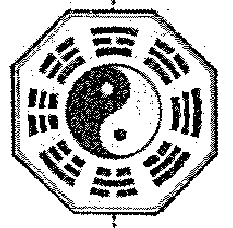
### 3. 面状绿化
可以是几何形面，也可以是自由形面。常用于内庭和大面积的室内空间。
### 4. 点、线、面综合绿化
要注意高矮、大小、聚散等各种关系。例如，矮的在前，高的在后，小的在前，大的在后，等等。
### （五）室内绿化的类型和方法
室内绿化主要有盆花、盆栽、插花和盆景四类。千万注意不要种植有毒的花，如黄花夹竹桃、夹竹桃、铃兰、洋金花、花叶万年青之类。现在分别谈一谈花草养植方法。
### 盆花
- 1. 要以阳台和庭园为后盾，因为盆花不宜长期摆在室内，而要不断翻新。
- 2. 要了解各种花卉（草）的开花季节和天数；以便及时调配轮换，保证室内鲜花常开。
常见花卉的开花季节如下：
春花：有梅花、碧桃、樱花、玉兰、丁香、金钟、紫藤、春杜鹃等木本植物，春兰、旱莲、郁金香、紫罗兰、爪叶菊、香豌豆等草本植物。
夏花：有广玉兰、杜鹃、紫薇、石榴、夹竹桃、含笑、茉莉、栀子、玫瑰、蔷薇等木本植物，石竹、荷兰菊、翠菊、睡莲、牡丹、芍药、晚香玉、百日红、牵牛、倒挂金钟等草本植物。
秋花：有金桂、芙蓉、扶桑、五色梅、夜来香等木本植物，剑兰、铃兰、菊花、昙花、一串红、君子兰、万寿菊等草本植物。
冬花：有天竹、山茶、象牙红、腊梅、迎春等木本植物，大岩桐、水仙、一品冠、爪叶菊、荷包花、兔子花、入腊红等草本植物。
“四季”花：能连续几个月开花，有月季、四季海棠等。
### 盆栽
- 1. 用透气的瓦盆栽种，用美观的瓷盆做套盆。一来美观，二来干净，三来更换花卉方便。
- 2. 高盆宜放高处，浅盆宜放低处。这是因为高盆以仰观欣赏为主，浅盆则以俯视欣赏为主的缘故。
- 3. 盆栽与盆花的区别主要有两点：一是盆栽一定要用土来栽种，盆花则不一定，如水仙花等水生花卉就不必用土栽种。二是盆栽不一定是花，也可以是树和草，如五针松、仙人掌、石莲、令箭荷花、玉树、文竹等观叶绿色植物，等等。
### 插花
- 1. 插花可用对比色，不必强求某个基调。这是因为鲜花的形体和质感之美完全可以弥补色彩上的某些不足。
- 2. 要注意保鲜，以延长花期。若一时买不到保鲜剂，可暂用三千分之一浓度的阿司匹林溶液代替。若是木本花枝，可将其下端压碎，以增大吸水面积，使花期延长，并可催开花苞；或将其下端用火烧焦，用酒精溶液浸一下，再用清水漂净，可延长花期7—10天。
### 盆景
盆景艺术是我国独创的传统艺术，被称为“无声的诗，立体的画”，可从中汲取活力，陶冶情操。
盆景主要有树木盆景、山石盆景、树桩盆景和综合盆景等种。
- 1. 花木盆景。这是盆栽花木的艺术加工，讲究造型，注重意境与情趣，因此要精心加工，在生长期用线吊绳绑，逐渐使其卷曲，并经修剪成型。盆景以常绿植物为多，如五针松、扁柏、黄杨、榆树、六月雪、枸杞等，也可以用梅、桔等开花结果植物，或文竹、天竹、凤尾竹等多杆植物，等等。
- 2. 山石盆景。山石盆景可分水石盆景（即山水盆景）和旱石盆景（即山水与植物共存）两种。
盆景所用石料有硬石和软石两种。硬石有斧劈石、灵壁石、树化石、大理石等，不易加工，要用水泥浆粘接，使呈刚毅逶峭之势，因无吸水性，以制作“水石盆景”为宜。软石有浮石、芦管石、海母石、上水石等，加工容易，且有吸水性，适宜栽草植树种竹，甚至长满绿苔，常作“旱石盆景”用。
- 3. 树桩盆景。树桩盆景以苍劲怪诞、盘曲老拙见长。树桩从山林中选掘而得，榆树根、枸杞、六月雪、梅桩等都可做树桩，置土中培育令发新芽，然后装盆。要用浅盆，以使树根盘旋外露，老树新枝，春意盎然。
- 4. 综合盆景。有花草树木又有山水，可谓山水名胜共纳一盆，美不胜收。
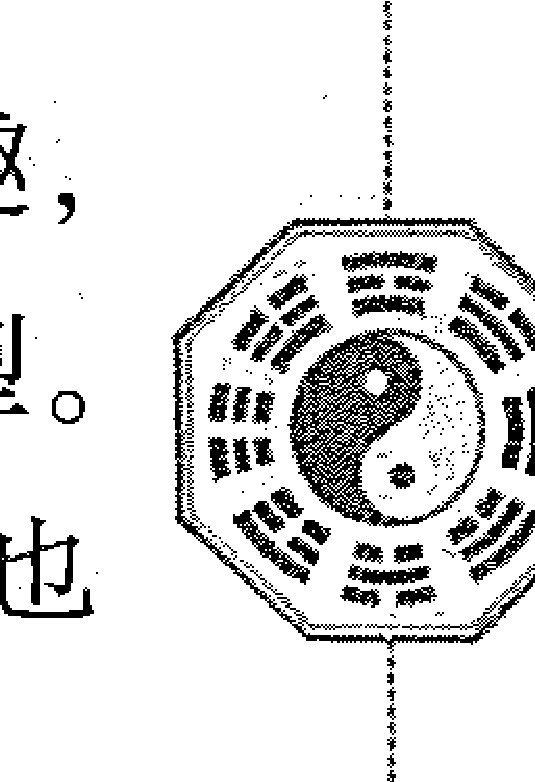
## 花卉是很有灵性的
我们在这里主要介绍的是花卉风水学。绿色花卉是人类赖以生存的生物链和食物链中最基础的一环，人类须臾也不能离开它。人的一生离不开绿色环境。高质量的绿色环境在人类的生存中显得相当重要，花卉构成的“生物场”对人类的精神、情绪、身体健康、长寿等有十分重要的作用。
### （一）花卉是很有灵性的
花卉是有灵性的。是有生命的，花卉之间存着一种场——生物场。经过科学测定证明，花卉是有血型的，花卉之间有着一定的亲缘关系（也就是花卉分类学上的科、属、种）。其远缘与近缘关系，在杂交、嫁接上是不同的。科学测定还证明，花卉有语言，有情绪，有喜怒哀乐。当折其枝条时，它马上释出愤怒的波；当奏乐和浇水时，它会发出和悦的波。在天台山和南华寺等寺庙常常可见一种叫“细叶紫薇”的花卉，当人们抚摸它时，它的枝叶会摆动不止，故称其——怕痒树。我国南方生长着一种叫“含羞草”的花卉，只要你一触动它，它就马上把叶子收拢，可见它的生物电流是十分强的。广东罗定有一种花卉叫“风流草”，在有风吹拂时，它的小叶子不停地翩翩起舞……
花卉有预见性，有预知力。它似乎比人类这个“万物之灵”更灵。它可预知地震、干旱、风雨，可以预报自然灾害，还能协助破案、预报凶吉。如抗日战争时期，中华民族面临一次大劫难，各地竹子自杀性地大量开花（白花开后即自行枯死），从而可见花卉不仅是有灵性的，而且有特异功能。又如20世纪80年代末，江淮发生洪水。当年春季，当地竹子也开花。当地民谣有“竹子开花，洪水到家”，竹子在春季开花的现象就预报了夏秋的水灾。美国的巴克斯特对25种不同的花卉进行试验后，提出花卉具有“超感官知觉”的功能，这曾给科学界带来爆炸性的启示。实验证明，花卉有记忆、有感应、有对环境作出反应的超能力。橡树在伐木工人到来时会自行爆炸，胡萝卜在田里生长时见到兔子会惊颤不已。状似棕榈的龙舌兰，在电流计上试验出它能反应试验人的心理感情，甚至可以追踪其主人每天的安危和喜怒。
作为风水之用的室内植物可分两大类，一是用作生旺的常绿植物，二是用作化煞的仙人掌类植物。
这两类植物必须分别清楚，因为它们的功用各有不同，所以摆放的方位亦会有差异；倘若混淆不清，那便很可能弄巧反成拙了！
下面谈谈其中的奥妙。
请务必紧记以下的一个主要原则：
在“旺位”放置大叶的常绿植物，在“衰位”放置仙人掌有刺类植物。
只要能够把握上述的要领，便不致吉凶混淆，至于那些不旺不衰的普通方位，一般来说，放置任何植物均没有多大影响。
在当旺的方位摆放一些厚叶或是大叶的常绿植物，这便可收“生旺”之效，增加家宅的财气。
举例来说，铁树、橡树、喜树蕉、黄金葛（又名万年青）这类常绿植物就甚为理想。
除了以上提及的四种植物外，其余如宽叶榕、散尾葵、虎尾兰、富贵竹等，也有“生旺”之效。
有个人对竹树情有独钟，这不单止是因为竹树青葱脱俗，而且还因为它是平安的象征，故世俗有“竹报平安”之语。
“阳宅大全”亦有这样的记载：
> “住宅四畔竹木青翠，财运好！”
综合而言，竹树的确是观赏及风水均甚适宜的植物，若在旺位挂上“竹画”亦可。
在“旺位”除了可挂竹画外，同时亦可挂牡丹画，牡丹素有富贵花之称，不单色泽艳丽，而且形状雍容华贵，故此一直被视为富贵的象征；所以在当旺的方位挂上这富贵花，可说是锦上添花！
谈过“旺位”如何利用植物生旺，接着便要谈谈“衰位”如何利用植物化煞。
一般来说，“衰位”适宜摆放有刺的植物，例如是“龙骨”、“玉麒麟”，以及各式各样的仙人掌，或是“玫瑰”及“棘杜鹃”均属此类。这些仙人掌类的有刺植物，倘若摆放在衰位或凶位，在风水学方面有“化煞”的作用。
花卉是有感情的：当主人家逢好运时，家中摆放的花草，亦会生机勃勃，开花不断；当主人家遭不幸时，就会花落凋零，生长不景气。经统计证明不和睦家庭中的君子兰不爱开花，家中喜庆将要来时，君子兰会提前开花“报喜”。
花卉是有气场的。修炼气功的人知道，常对树木采气时，一般不对幼树围采，当集体围树采气之后若被你采气的树太弱小时，它会出现叶子下垂，一副很疲乏的样子。
## 花卉合五行
花卉之间以及万物之间，都存在“场”，在场的作用下，各物体的微粒子能够互相影响，互相转移变化。“铜器不存金，存金金不纯”的谚语就是来自民间的经验总结。金存在铜器中时间久了，则金不纯，而铜器却含金了。同样，花卉化石，也非气温、气压所致，而是岩石气场所生。现代科学研究，逐渐揭开了这个谜。1988年前苏联科学家发现物体周围都有粒子场，人体有，建筑物有，花卉也有。花卉间场的强弱取决于生克制化状况，这完全可以用中国的五行理念来调整生克制化关系。用花卉的五行来布场，不仅要考虑其观赏性，而且更要注重其功能性，布置恰当，可调整环境，调整情怀，颐养身体。如临水的园林建筑，用于调节人体的肾部，可配置“黑色”（低明度）的花卉，如松柏、蒲桃、旱莲等；用于调节心脏和神经，可栽植五行中属火的红色系列的花卉，如火石榴、木棉、象牙红、枫、红桑、红铁、红背桂等；用于调节肺部，可放置五行中属土的黄色系列的花卉，如凌霄花、黄素馨、金桂、金菊、黄钟花、黄玫瑰等。花卉间的相生相克是普遍的，农林、园艺业的人士应对此并不陌生，如葡萄栽在松旁不结果，栽在榆树旁结酸果。
花卉与人，也存在生克关系。如孕妇宅旁怕柏树，因树气味促呕。民谚有“榕树不容人”，榕树气根的气场对人不利，不宜近宅。葡萄架下不宜睡卧，气场不利于人体。民谚有“东种桃柳，西种榆；南种梅枣，北杏梨”，又有“宅后有榆，百鬼迁移”，“白兰屋前种美花香气送”。“向阳石榴红似火，背阴李子酸掉颚”。东晋诗人陶渊明辞官隐居的住宅，题诗赞曰：“榆柳荫后檐，桃李罗台前”等等。无数的民谚和诗文，都是对花卉与环境的适宜与不适，以及生克关系经验总结的口碑文载，应加以研究借鉴。
## 花卉与人生
不同国家、不同民族以及生活习惯的不同，对花卉的认识和态度也不同。如欧洲人喜欢紫色花，而中国人喜欢红色，因为中国人认为红色是热情、大吉的象征。中国尊崇菊花，称其为谦谦君子；而英国人就讨厌菊花，认为它是报丧的花。中国人、印度人认为莲花出淤泥而不染，是“圣洁之花”，而与中国一衣带水的日本却认为它是下贱不洁之物。欧洲人通常用柏树布置庭园，而在中国，只有在陵园墓地才常见到它。同是鲜花，不同场合却有不同的用途，如母亲节送的是康乃馨，父亲节送的是石竹花；对情人送的是象征浪漫爱情的玫瑰花，对结婚新人送的是象征百年好合的百合花。若到医院探望病人绝不会送唐菖蒲（又名剑兰），因剑兰有挨割宰之意。店铺开张，忌送茉莉花，因茉莉花的谐音为“无利”，有亏本的寓意。广东电白等地风俗认为白花为生男，红花为生女的象征，如一个家庭喜欢生女孩子，你送白花，他们就不欢迎，你送红花，他们就很高兴！可见，花卉与人关系密切，它与天地、日月、人类共存于宇宙间，它与人同是灵界之生灵。
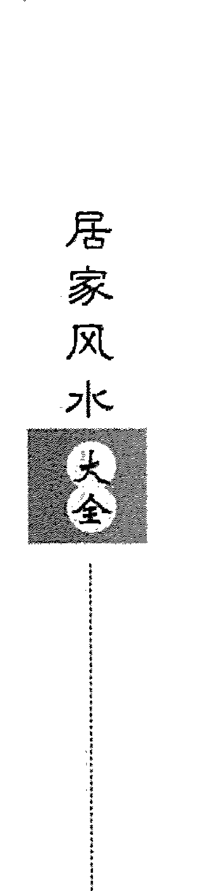
## 花卉与阴阳
天地万物分阴阳，花卉亦遵循着这个恒定法则；或生或灭，或无果或死亡，喜阳的花卉，如置于阴湿的环境，则体弱、无花、无果或死亡。白兰、玫瑰、茉莉、梅花、牡丹、芍药这类属喜阳的花卉，如果你把它们安置在阴湿的环境中，它就长不好或无花开。杜鹃、菊花也是喜阳花卉，这类花卉在阳光下，要有1800个勒克斯光照度才能正常开花，否则，即使你再勤恳给它淋水施肥，亦无济于事。大岩桐、茶花、桂花、夜合、含笑这类属中性的花卉，不需要1800个勒克斯光照度，也不用直射的阳光亦能开花。其中茶花、桂花要阳中带阴，夜合、含笑、大岩桐要阴中带阳。文竹、龟背竹、万年青、绿萝、蓬莱松、巴西铁等这类属阴生的花卉，只要100勒克斯或几十个勒克斯光照度就能正常生长，此类花卉较适合长期放置室内。
由此可见，花卉分阴阳，如反逆它，生物场受到破坏，将失去平衡、呈凶相。开花结果的花卉，喜欢与异性同栽，不宜同性片植或孤栽，因为孤阳不生，孤阴不长。如银杏树，雌雄同栽，方能结白果。苹果孤栽会减产，已为果农常识。君子兰，人称其为“君子”，在于不“乱伦”，不俗色取宠，十月结籽，如同人类的“十月怀胎”。一时侍养不周，断绝润水也不枯萎，其脱俗入雅，没有“小人气”，是高度进化的结果。其花系雌雄同体，在蕊萼上生长有雄蕊、雌蕊之萼，花粉可自行授受，亦可异株互相授受。而自授者，不结籽（自行脱落），只有异株雄蕊授粉，方可结籽，确保君子兰一代一代的壮美。所以，君子兰的进化主要是来自异花受粉的。粮食作物的玉米，阴阳成对互生籽粒，故皆为偶数行粒，或14行、或16行、或18行，绝无奇数行生长之例。可见，花卉的阴阳属性是广泛存在的。
## 花卉与居室
日常家居中，把花卉摆设在室内已成时尚风气。在工作之余，面对生机盎然的绿色花卉，确实感到调心怡情，赏心悦目。但因花卉有阴阳，有些花卉会释放有害物质，不宜放在居室里。如香港有好几本风水丛书及电视风水节目中都介绍，人们喜欢用万年青、黄金葛、喜树蕉作为“旺宅”材料。其实它们均是有毒的天南星科花卉，晚上进行“呼吸作用”时，会呼出二氧化碳污染居室，还会与人争氧气，可以说它们根本不“旺宅”。所以，这类花卉切莫引入室内。否则，事与愿违！还有夜来香，虽然可以赶蚊子，但它放出的异香气味，会使血压高和患心脏病的人感到不舒服。玉绣球，花虽硕大，但会引起过敏。有些书讲用龙骨、海棠来布宅有“煞邪”作用，但实际皮肤黏膜细胞会有过敏反应，可以说，此类花卉根本不“旺宅”，也不“煞邪”，反而会引邪招祸！仙人掌与一般花卉不同，它是逆呼吸，晚上吸碳气，放出氧气，有“旺宅”、“化煞”之效。吊兰有过滤空气、净化空气的作用，用在宇宙飞船中，还可调节密闭空间的空气质量。若一个20多平方米的居室放上2~3盆吊兰，比空气过滤器还要强得多，可见吊兰有旺宅、驱邪、化煞之效。
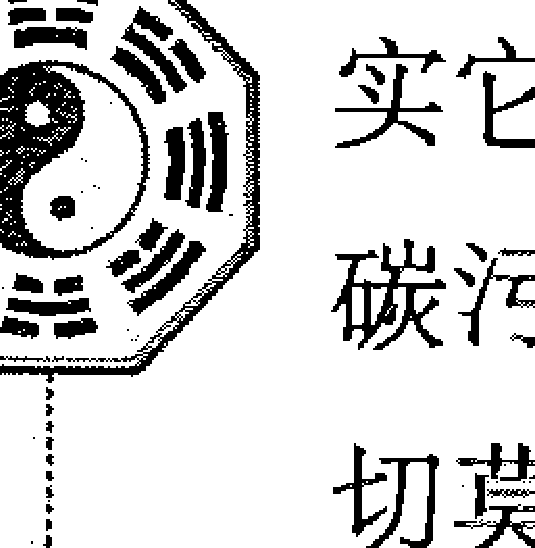
### （一）形态求吉
宅旁绿地上的树木形态，从风水形势派观点论之，关系着宅居的吉凶。树木可利人，亦可害人，应趋吉避煞，有所宜忌。
- ①树干忌立于门窗前。滋养人居环境的宇宙能量，以微波形态不断作用于房宅。门窗是主要纳气之口，微波试验证明，细小的一根针立于微波天线纳气（波）之口时，即出现驻波干扰。由此观之，传统的风水观念忌在门窗前立杆立树，不仅是经验统计学上的总结，也是科学上的正确认识。而用约定俗成的说法即“门”中“木”谓之“闲”字，是用汉字归纳的简易流传形式，加以提示，利于记忆。其他还有“口”中“木”为“困”字等，即在庭院中心忌立树木。“荫者阴也”，庭阴树立于庭院中心，呈阴压阳地，多避忌。庭是一个太极，庭心是太极的“天心”，是穴位，是崇阳的，不可长期阴压。
- ②行道树、绿篱走向忌冲向房宅。可能造成煞气冲向的信息引导，不利于居住。
- ③忌大树遮门窗。不利于通风采光，且树阴属阴。
- ④忌大树下建小屋。有“屋在大树下，灾病常到家”之说（《阳宅十书》）。常年处于阴阳之地，不利于采光、卫生，又易引雷火。
- ⑤其他意象不吉的形态树，忌在门、窗视野常见处。如痈肿怪树，朽枯空心树，藤缠“缢颈树”，歪头倾斜树等。这些形态的树具有形象上的符咒隐语，会引导不吉利的意象，不宜作宅旁绿化用。
### （二）花卉契合民俗文脉
在历史的长河中，中国人对绿化花卉积累了不少感官上的美丑善恶和习惯印象，而流传下来的习俗文脉，对城乡宅居的吉凶，场气的趋避选择。在规划布置中也是不可忽视的。
## 风水中花卉的三大功能
人受环境的影响很大，眼睛所视，耳中所听，口中所食，嗅觉所闻，心中所思，都是生活风水必须注意到的范畴。对人有益的吉祥花卉，必须符合外型美观、色彩鲜丽、气味清香宜人、芳名寓意吉利且生长旺盛，健康等条件。无论是盆景或插瓶的花材，若是在适当的水分、光线、肥料和通风环境下，寿命能维持得愈长就表示你的住家或办公室空间的“磁场”愈佳。“运气”是流动的，也是互动的。好的环境可以使人健康、精神、充满力量。多接近做人做事成功，运气好的人，也可以感染到那份好运势。也可以通过花卉来开运，提升自己的身心力量与清晰的思路。
进而获得顺利、幸福的满足感，让在你身边的亲朋好友，也能分享到你的好运。花卉主要能带来三种能量：
花卉的生理性与人恰好相反，花卉吸入二氧化碳吐出人们需要的氧气。同时还能分解空气中的毒素物质，对人体健康非常有益。生长旺盛的花卉，可带给人欢欣高昂的心情。花卉随着四季律动，从萌芽、含苞、花开、花谢，就像人生一样。可以让人的心灵得以和自然和谐共存，减缓妄想与固执的心念。
看见美好的花卉，总让人感觉宁静、放松、祥和，无形中消除了暴戾之气，避免人际关系的不和谐，也避免我们陷溺于生命或环境中的缺损坎坷之处。就积极性而言，更能激发我们向好的方向和做出一片作为上发展。
在工作、居家或商店中，光线较弱，不常走动或不使用的区域最好加上一盏明亮的灯，再摆上几盆旺盛的花盆来改善滞气，在转角锐利之处，墙面污损的地方、门窗正对路面或对看邻近的屋角都可如法炮制。有了这样的装点和布置，人的目光自然会集中于此，也比较喜欢到这里活动，而负责照顾盆栽的人必须经常换水和修剪花卉。使这些地方人气活络，便能阻击原本的污垢和恐怖感。
用吉祥花木来布置，是一种幽雅、诚恳的礼貌。以美丽的花卉来迎接辛苦工作的家人、朝思暮想的情人，或是难得来访的好友、生意上往来的客户，让大家都感受到你对他的礼遇和尊重，对方也会对你产生友善的心。在交往、洽商或消费的意愿上也会大为提升，也愿意提供宝贵的建议和资源帮助，做起事来更能左右逢源，无往不利。综而观之，绿化美化家居，对选用的材料是有严格的要求的，应分清良莠，分阴阳五行，辨明属性，定好方位，对号入座，使家宅生物场协调，获取好风水。

## 风水中花卉的风水疗效

### （一）花卉的风水疗效

植物与花卉不仅有食用和观赏的价值，亦象征着生命与心灵的成长和繁荣。它们可以降低你的压力，提供自然的环境，让你免受空气与噪音的污染。在风水领域里，花卉是最为吸引人且较为实用的治疗方式之一。我们发现将花卉放置在室内可以提升气的活力，提供一种无形的疗效。不论在任何地区，栩栩如生的花卉都会产生非常大的影响，它能影响气的能量与方向，它亦可帮助气回复平衡状态。

风水最原始的目的是加强人与自然界的联系，而花卉借由此产生的生生不息的自然之气，编造了一座重要的联系桥梁。它们可以防止气在阴暗的角落渐渐沉滞，也可以平缓刚流通过回廊且波动较大的气。

在特殊的情况下，花卉会产生与众不同的能量来与当时的环境状况相配合。例如：在会辐射电的电器设备附近，花卉会产生与静电相抵消的能量；在毒素飘浮的空气中，花卉具有净化的作用，可以产生新鲜的空气。因此，当花卉以特殊意义的方式放置时，它们会是气的重要来源。

### （二）有风水疗效的花卉

健康、茂盛的花卉是气的重要促成者，它们可以将生生不息的能量带进家里。花卉，尤其是在盛开时期，代表着幸运，因为它们鲜明的色彩若与正确的五行结合，可以促进八大欲求的达成。

当你在选购花卉时，要特别注意叶的形状。有些种类的花卉，特别是其叶子是尖状的，会产生毒素或煞气，即我们所称“不好的风水”。选择圆状、叶茎多汁的花卉比较好，它们带有吸引“好兆头”的潜在能量。

人造花卉所能产生的疗效较少，但若能将其长久保持干净、整洁，仍是可用的。然而，如果你无法保持植物、花卉的健康和足够的水分，而使其奄奄一息的话，即象征着死亡与不幸。所以，健康的气来自健康的植物与花卉。在风水领域里，花卉还有其他方面的功用，例如：它有助于刺激停滞在角落不动的气，使气活络起来；它可以软化那些因锐、尖、有角度的物品所产生的阳气。

另外，将花卉放置在缺乏足够能量的地区可使该方位活跃起来，房间也会显得更宽大。当书橱被帘幕覆盖，办公设备放置在角落时，花卉仍然有中和尖锐，分解毒素的效用，因为它们有此功用。所以，若要在室内摆些花卉以缓和尖锐、粗糙的家具，那么晚樱科花卉会是最理想的。晚樱科花卉不像垂枝类花卉会在风水中造成不利，因为它似灯笼的形状被认为代表着“好运”。

### （三）五行生克

很多的风水都有其象征意义？因为环境中的事物被认为会散发某种形式的能量，有些代表着“好”，有些则代表着“坏”。由花卉放射出的气被认为可以应用在特殊风水规范里，如八卦与五行。将其结合，则可以藉由五行相互间的影响“相生与相克”来平衡一地之能量。

辨别花卉阴与阳的特性，亦是一种平衡能量的方法，但最重要的，需深记脑海里的是“花卉是活的，是会改变的”。你可以藉由五行生克将阴阳做适当的平衡，举个例子：孔雀草、芦笋等丝带状的羊齿科花卉，可以借由锯齿叶上的阳气来软化，平衡阴气。而一整篮代表各种阳气的花卉，如八仙花、天竺葵、山梗菜，则可为晦暗不明的角落增添一抹色彩。

### （四）花卉应摆设的地方

善用花卉可以有效改变风水。将花卉摆设在房间或家里皆可活跃八卦里的八大人生欲求，将花卉放置在东方，代表着拥有家庭与健康，在五行中属木行；将花卉放置在东南方，代表着拥有财富与成功，在五行中属木行；将花卉放置在南方，代表着拥有声誉与学识，在五行中属火行；将花卉放置在北方，代表着拥有事业，在五行中属水行。

然而，因为木行会破坏中心，且与金行相克，所以应避免将花卉放在西南、东北以及中间位置。当然，也要避免放到金行的方位，如西方与西北方。

除了八卦与五行生克外，花卉也可以使用在室内各个房间内。最重要的是客厅与餐厅，因为两者皆是公用地区，都是用来社交活动的地方，所以更需要较高的能量。摆设花卉时应谨慎选择其摆设的位置，否则就不要使用。

尤其是在厨房，五行很容易互相冲突，而且会产生危害我们的能量。例如：木行易被电器用品与刀刃破坏，因为这些代表着金行，而木行与金行是彼此相冲的；但木行又会加速炉灶里的火势，因为木行会催生火行的产生。

花卉除了可以提升人生八大欲求，亦可增加氧气含量、提高湿度、增强空间的能量。花卉是最有风水疗效的方法之一，它有助于平衡、协调能量，让室内充满一股香气以及美化视觉效果。

有些风水大师强烈地劝告民众不应将花卉摆设于寝室。因为它们会将阳气带进这本应是休息的场所。

### （五）幸运的颜色

颜色在调和、平衡能量上占有一席之地，但也无须太过强调。一般有两种颜色被认为是一年中任何时候都是幸运的颜色——带有强烈阳气的红色与黄色。红色是最幸运的颜色，它的最佳摆置地是在南方，而黄色的最佳摆置地是在西南方与东北方。非洲产的紫罗兰与蓝色钟形草，这类植物与花卉的最佳摆置地是家里或花园的北方、东方以及东南方。蓝色与白色被认为是较阴冷的颜色，所以当你选择这些色彩的花卉时，别忘了找些色彩鲜明的花卉，如红色、橙色、黄色来搭配，以平衡能量。

### （六）应避免的花卉

- 带刺、棘或尖状叶子的花卉，如南美产的丝兰、墨西哥产的龙舌兰、或是其他任何多刺仙人掌。
- 人工培育的花卉，如盆景，因为这代表着在财运上的不利。
- 树叶下垂的花卉，如垂柳。

### （七）最具风水疗效的植物、花卉以及树木排名

- 翠绿色植物
- 冠冠花（子叶边缘波浪状）
- 发财树
- 牡丹
- 菊花
- 梅花
- 百合或球茎类花卉
- 木兰、玉兰类花卉
- 莲
- 竹
- 松树
- 桃树
- 柑橘树（柑橘类花卉）

## 风水花卉的摆放

风水对于绿化的理论是：“村乡之有树木，犹人之有衣服，稀薄则怯寒，过厚则苦热。此中道理，阴阳要中和”。住宅和庭院四周内外宜种些什么树？哪些又不宜栽种？风水学专著有许多关于这方面的论述：“东种桃柳（益马）、西种榆树、南种梅枣（益牛）、北种奈杏”，“凡树木朝宅吉，背宅凶”，“住宅四畔竹木表翠进财”，“中庭种树主分张，门庭种枣喜事祥；庭心种木多闲困，长植庭心主祸殃”，“中门有槐，福贵三世；宅后有榆，百鬼不近”，“宅东有杏凶，宅北有李，宅西有桃皆为淫邪”。

据研究结果证明：“花卉本身就有阴阳之分，因此，花卉间也存在相生相克、互相制约”，例如：1800 个勒克斯光照度才能正常开花的喜阳花卉，如白兰、玫瑰、茉莉、梅花、牡丹、芍药、杜鹃、菊花等，如果让其长期处在阴境下，就长不好或无花开，或无果结或死亡。

还有研究表明：“人与花卉也会相生相克”。如菟金葛、喜树蕉、晚上呼出二氧化碳，会与人在室内争氧气；夜来香放出的气味，使有高血压和心脏病的人，在室内感到不舒服。这些花卉都是与人相克的，当然也有对人有益的花卉。如吊兰有过滤空气的作用，与人相生，有旺宅化煞作用，室内可以多摆放。另外，仙人掌、龙青、玉麒麟等也有旺宅化煞作用。还有玫瑰、棘杜鹃等花卉，可以摆放在室内“衰位”和“凶位”，在风水上亦有化煞作用。花卉有调整风水的作用，这在很多风水古籍中均有记载，但所提及的树木花草，多为室外花卉。

这里我们主要介绍的是室内花卉与风水，涉及到两类花卉，一类是用做生财旺财的常绿花卉，一类是用做化煞的仙人掌类花卉。请务必紧记以下的一个主要原则：在旺位放大叶的常绿花卉，在衰位放置仙人掌等有刺类的花卉。旺位摆放一些厚叶或大叶的常绿花卉，可收到“生旺”之效，增加家宅的财气。常用花卉有：铁树、橡树、喜木蕉、黄金葛、宽叶榕、散尾葵、虎尾兰、富贵竹。

根据风水学的要求，室内花卉摆设要充分发挥人与花卉相生之要素，达到人与花卉的和谐。为了生财化煞，各功能房所摆放的花卉也各有不同，那么住宅内部各部位适合摆放什么品种的花卉呢？

### （一）客厅

客厅要讲究一些，可选用的品种有富贵竹、蓬莱松、仙人掌、罗汉松、七叶莲、棕竹、发财树、君子兰、球兰、兰花、仙客来、柑桔、巢蕨、龙血树等，这些花卉在风水学中乃“吉利之物”，蕴涵吉祥如意，聚财发福之意。

### （二）卧室

卧室一般要充满宁静、安详、温馨的气息，可选用仙人掌、仙人球、吊兰、玫瑰、郁金香、晚香王、百合、马蹄莲等。在香花下夫妇和美、儿童宁静、易入睡、适宜休息。

### （三）书房

书房要充满书香之气，花卉要放在主人的文昌位。可选用山竹花、文竹、富贵竹、常青藤等。这些花卉可活跃人的思维力，有利学习。在书桌上也可以放盆叶草、菖薄等，有宁神通窍，防止睡眠的作用。

### （四）饭厅

饭厅除健康之外，还要求整洁、统一。花卉可取黄玫瑰、黄康乃馨、黄素馨等，以橘黄色为主，增加食欲，促进身体健康。

### （五）阳台

应按阳光条件选配适宜的花草品种，如茉莉、菊花、荷兰、海棠、西番莲、文竹兰、石竹、秋海棠、太阳花、米兰、桂花、蟹兰等，各种花摆放时，要将阳性的靠近阳光，阴性的放在其后，要各得其所。

### （六）大门

大门若对楼梯，可将剑叶红、鱼尾葵、棕竹等摆放在相冲处化煞。又如阳台窗口对有煞气，可用仙人掌、玫瑰、玉麒麟化煞，也可盆栽葫芦化煞。

总之，室内绿化布局不当，选取花卉品种不对，都将会给居住者的事业带来不良影响。花卉可以治病，可以调心养性，可以旺宅旺人，也可以害人、杀人，所以我们在布置室内花卉的时候一定要多考量。

在风水学的应用中，花卉常用来趋吉化煞，因此不同的花卉被赋予了不同的含义。

## 风水花卉的象征意义

### （一）被视为吉祥物的花卉

橘：与“吉”谐音，盆栽柑橘便成为人们春节时家庭的摆设。

吉祥草：小巧、终年青翠、泥中水中均易生长，象征着“吉祥如意”也叫瑞草。

椿树：易生长且长寿，有的地方盛行摸椿树风俗。除夕晚上，小孩都要摸椿树，而且还要绕着转几圈祈求快快长高。有的地方在正月初一早上，小孩抱着椿树念“椿树椿树你为王，你长粗，我长高”。

槐树：被认为代表“绿”，古代朝廷种三槐九棘，公卿大夫坐于其下，面对三槐者为三公，后来世人便于庭院植槐。

灵芝：自古视为祥兆，吉祥图常见鹿口或鹤嘴衔灵芝，用作祝寿礼品。

梅花：其五片花瓣被认为是五个吉祥神，于是有了“梅开五福”的图。

桃树：传为五行之精；能制百鬼。故而过年以桃符悬门上，被认为有镇妖祛邪作用。

柳树：同桃树的作用一样，以柳条插于门户可驱邪。

草蒲、艾叶：端午节用草蒲、艾叶挂在门旁，或用艾叶做成“艾虎”带在身上，能起到驱毒辟邪的作用。

银杏树：因在夜间开花，人不得见，传为有阴灵，故而术家的符印要用银杏木刻制。

柏树：刚直不阿，被尊为百木之长，传能驱妖孽。坟墓旁多种植柏树。

茱萸：“常在异乡为异客，每逢佳节倍思亲。遥知兄弟登高处，遍插茱萸少一人，”王维在这首诗中为什么要“遍插茱萸”呢？原来风水学中认为茱萸是一种吉祥物，在重阳节登高时佩戴，认为可避灾祸。

无患子：倍受尊崇，这种落叶乔木，五六月间开白花，果实比枇杷稍大，生青熟黄，内有一核，坚硬如珠，俗名鬼见愁，佛教称为菩提子，用以串作念珠，有它“无患”。

葫芦：八仙之一的张果老为什么用“宝葫芦”装酒？原来在风水术中，葫芦被认为是能驱邪的花卉，古人常种植在房前屋后。现代物理测试证明“宝葫芦”形状的器皿能屏蔽各种波和辐射的干扰。张果老用“宝葫芦”装酒，除了能驱邪外，还因为“宝葫芦”能保存酒的味道不变。

### （二）被视为凶兆的花卉

桉树：这种可长到二十多层楼高的树中“巨人”，中青年人是不敢栽种的，据说树大人必亡。要植此树只得请老人，反正等到树大时，植树者寿数也差不多了。

### （三）风水树

在南方，有的村子附近保留着一小块青葱林木，多是樟、松、柏、楠等长青树。作为观光者，可千万别去碰它们，因为这就是风水树，也叫水口树。别看只是一小块青葱林木，它可关系着全村的风水命脉，当地人都不敢去动那里的一草一木，害怕破坏本村的风水。

### 1. 松

松是古今被咏赞的树木。

> 《花镜》云：“松为百木之长，……多节永年，皮粗如龙鳞，叶细如马鬃，遇霜雪而不凋，历千年而不殒。”

> 宋代王安石在《字说》说：“松为百木之长，犹公也。故字从公。”

有人拆字”松”为十八公，元代冯子摅写有《十八公赋》，明代洪璐著有《木公传》，现代革命家和军事家陶铸也写有《松树的风格》等等。史载秦始皇巡游泰山，风雨骤至，在大松下避雨，后来封此树为“五大夫”，后人称此树为“五大夫松”。《幼学故事琼林》云：“竹称君子，松号大夫”，语意由此来。松耐寒且耐旱，枯石缝中可生，冬夏常青，凌霜不凋，可傲霜雪。松能长寿不老，民俗祝寿词常有“福如东海长流水，寿比南山不老松”。在书画中常有“岁寒三友”（松、竹、梅），以示吉祥。在书画、器具、装饰中常有“松柏同春”、“松菊延年”、“仙壶集庆”（松枝、水仙、梅花、灵芝等集束瓶中）。松是被广泛视为吉祥的树种。

### 2. 柏

有贞德者，故字从白。白，西方正色也。“不同流合污，坚贞有节。地位高洁”。王安石在《字说》中云：“柏犹伯也，故字从白”。松为“公”，柏为“伯”，在“公侯伯子男”五爵中，伯列第三位，柏也比作“位列三公”。《风俗通》载：魑魅喜食死人肝脑，惧虎、柏。故阴宅、陵墓多植柏和立石虎。民间习俗也喜用柏木“避邪”。《本草纲目》说“元旦以之浸酒避邪”（柏性事凋而耐久，禀坚凝之质，乃多寿之木，是以可人服食，道家以之点汤常包饮，元旦以之浸酒避邪，皆取于此。麝食之而体香，毛女食之而体轻，亦其之正验矣。毛女，《抱朴子》载，成帝时，猎人在终南山见一裸女，全身毛，跳涧如飞，后合围捕获。问之，是秦之宫女，避乱逃人山中，饥无食，一老翁教食柏树叶实，遂不饥不寒，体轻如飞。至汉成帝时应已三百岁矣！）。《列仙传》也说“赤须子好食柏实，齿落更生”，“服柏子人长年”。《汉宫仪》云：“正旦饮柏叶酒上寿”。在民俗观念中，柏的谐音“百”是极数，极言其多其全，诸事以“百”盖其全部，如百事，百鸟、百川等。故吉祥图案常见有：柏与“如意”图物合为“百事如意”，柏与橘子合成“百事大吉”（橘与吉音近）。《西湖游览志》有云：“杭州习俗，元旦签柏枝、柿饼以大橘承之，谓百事大吉。取柏、柿、大橘与百事大吉同音故也。

### 3. 桂

桂多生于中国南方，其品种有丹桂、金桂、银桂、月桂、缅桂、柳叶桂等。其中，丹桂、金桂、银桂以花色红、黄、白而得名。桂多在八月（农历）开花。故又将八月称为“桂月”。桂花香气袭人，可作茶饮，可用药饵。习俗将桂视为祥瑞花卉。历采将科举高中称为“月中折桂”“折月桂”。旧称子孙仕途昌达，尊荣显贵为“兰桂齐芳”。五代时燕山的窦禹钧生五个儿子，相继成材，大臣冯道赠诗曰：“燕山窦十郎，教子有义方，灵椿一枝老，丹桂五枝芳”。《三字经》也录史实有“窦燕山，有义方，教五子，名俱扬”。

桂音谐“贵”，有荣华富贵之意。有的习俗，新妇戴桂花，香且“贵”。桂与莲籽合图，为“连生贵子”，桂与寿桃合图为“贵寿无极”等等。桂有吉祥寓意，源自谐音。

### 4. 椿

被视为长寿之木，属吉祥。《庄子·逍遥游》云：“上古有大椿者，以八千岁为春，八千岁为秋”，可见椿之寿考。《本草纲目》曰：“椿樗易长而多寿考。”人们常以“椿年”“椿令”祝长寿。唐代钱起的《柏崖老人》诗云：“帝力言何有，椿年喜渐长。”宋代柳永的《御街行》词云：“椿令无尽，萝图有庆，常作乾坤主。”自古寿联有“筵前倾菊酿，堂上祝椿令”“椿树干寻碧；蟠桃几度红”“大椿常不老，丛桂最宜秋”等。因椿树长寿，习惯常喻父亲。唐时牟融《送徐浩》诗云：“知君此去情偏切，堂上椿萱雪满头。”上文中的“灵椿一枝老，丹桂五枝芳”也是指椿喻父。椿喻父，萱指母，明代朱权《金钗记》有云：“不幸椿庭有丧，深赖萱堂训诲成人。”此外，有的地区（如山东鲁西南）除夕夜有儿童摸椿树和绕椿树转以求长高又长寿的民俗。

### 5. 槐

民间俗谚有：“门前一棵槐，不是招宝，就是进财”。视为吉祥树种。被认为是“灵星之精”，有公断诉讼之能，《春秋元命苞》云：“树槐听讼其下”。戏曲《天仙配》也有槐阴树下判定婚事，后又送子槐下的情节。《花镜》云：“人多庭前植之，一取其荫，一取三槐吉兆，期许子孙三公之意”。另外，槐亦可药用。《本草纲目》云：“槐初生嫩芽，可炸熟水淘过食，亦可作饮代茶。或采槐子种畦中，采苗食之亦良”。《抱朴子》云：“此物至补脑，早服之令人发不白而长生。《名医别录》云：“服之令脑满发不白而长生。”槐树益人，绿化常用，亦为风水布置所不可少。

### 6. 梧桐

梧桐是桐树的一种，桐有油桐、泡桐、紫花桐、白花桐、梧桐等。桐的用途很多，陈翥在《桐谱》中说：“桐之材，采伐不时而不蛀虫，渍湿所加而不腐败，风吹日晒而不折裂，雨溅污泥而不枯藓，干濡相兼而其质不变，楠虽寿而其永不敌，与夫上所贵者旧矣。”油桐可榨油，泡桐最遮阴，梧桐宜制琴。王充在其《论衡》中说：“神家皇帝削梧为琴。”《诗经·庸风定之方中》上说：“树之榛栗，椅桐梓，爱伐琴瑟。”《齐民要术》说：“梧桐山石间生者，为乐器则鸣。”《后汉书》载：“蔡邕泰山行，见焚桐，闻爆声曰：“此良木也，取而为琴。”梧桐被视为“灵树”，具有应验时事之能。《太平御览》引《王逸子》说：“扶桑、梧桐、松柏，皆受气淳矣，异于群类也。”《礼丰威仪》说：“其政平，梧桐为常生。”《瑞应图》说：“王者任用贤良，则梧桐生于东厢”，相反的“梧桐不生，则九州异主。”梧桐灵性还能知岁时，《花镜》上说：“此木能知岁时，清明后桐始华（古华、花同字——笔者注）桐木华，岁必大寒。立秋地，至期一叶先坠，故有‘梧桐一叶落，天下尽知秋’之句。司马光《梧桐》诗曰：“初闻一叶落，知是九秋来”。《花镜》载有：梧桐“每枝十二叶，一边六叶，从下数一叶为一月，有闰月则十三叶。视叶小处，即知闰何月也”。梧桐的灵性，传说能引来凤凰。《诗经·大雅·卷阿》云：“凤凰鸣矣，于彼高冈。梧桐生矣，于彼朝阳。”宋代邹博的《见闻录》说：“梧桐百鸟不敢栖，止避凤凰也。”中国龙、凤，在神话传说中，凤是神鸟，能引来凤凰的梧桐，自然是神异的植物。祥瑞的梧桐常在图案中与喜鹊合构，谐音“同喜”，也是寓意吉祥。

### 7. 竹

按现代花卉分类学，竹属禾本花卉。中国古人却对竹有特殊评论，加入人文观点。在晋戴凯的《竹谱》上说：竹“不柔不刚，非草非木”。历代对竹的诗词歌赋佳颂选出。竹与民生关系密切，竹材可用于建屋、制笔、造纸、家具、雕绘。《花镜》认为：“值霜雪而不凋，历四时而常茂，颇无妖治，雅俗共赏。”文人将竹视为贤人、君子。白居易在其《养竹记》中说：“竹似贤，何哉？竹本固，固以树德，君子见其本，则思善见不拔者。竹心空，空以体道，君子见其心，则思应用虚受者。竹节贞，贞以立志，君子见其节，则思砥砺名行，夷险一致者。夫如是，故号君子。”竹的高风亮节，令人愿与贤者居，故有“宁可食无肉，不可居无竹”之词。在中国竹文化中，把竹比作君子。国画中，常将松、竹、梅称为“岁寒三友”，而“五清图”是松、竹、梅、月、水，“五瑞图”是松、竹、萱、兰、寿石，常显于画家笔端。

竹种浩繁，类别上百。许多竹，都已寓有文化意蕴。如：斑竹（湘妃竹）。慈竹（亦称孝竹、子母竹）、罗汉竹、金银玉竹、天竹（天竺、南大竹）等等。如将天竹加南瓜、长春花合成图案，谐音取意可构成“天地长春”，“天长地久”的寓意。竹又谐音“祝”，有美好祝福的习俗意蕴。

### 8. 合欢

合欢属落叶乔木，羽状对偶复叶，夜间双双闭合，夜合晨舒，象征夫妻恩爱和谐，婚姻美满，故称“合婚”树。汉代开始，合欢二字深入中国婚姻文化中，有合欢殿、合欢被、合欢帽、合欢结、合欢宴、合欢杯。诗联有：“并蒂花开连理树，新醅酒进合欢杯。”合欢被文人视为释仇解忧之树。《花镜》上说：“合欢，一名蠲人忿，则赠以青裳，青裳一名合欢，能忘忿。”嵇康的《养生论》也尝谓：“合欢蠲忿，萱草忘忧。”因此多“种之庭阶”，适于宅旁庭院栽植。

### 9. 枣

枣为中国居民宅旁常见树种。木硬，可制器具，可为木刻雕版，古书曾称“枣本”。果可食用，可“补中益气，久服神仙”（《本草经》）。枣树生果极早，幼树可结果。北方民谣有：“桃三杏四梨五年，枣树当年即出钱”，言其结果之速。枣谐音“早”，民俗尝有枣与栗子（或荔枝）合组图案，谐音“早立子”。婚礼中，有将枣与桂圆合组礼品，谐音“早生贵子”，新婚“撒帐”用枣、栗子、花生等以图吉利。

### 10. 栗

栗子可食用，可入药，阳性。古时用栗木作神主（死人员牌），称宗庙神主为“栗主”。古人用以表示妇人之诚挚，《礼记·曲礼》上说：“妇人之挚，具榛脯，修枣栗。”《国语》也说：“夫妇挚不过枣栗，以告虔也。”《太平御览》上说：“东门之栗，有靖家室。”利于家庭和美。栗子与“立子”谐音，是求子的吉祥物。枣、栗子、花生、石榴等，常用在新婚桌上，帐中或新妇怀中，以求吉利。

### 11. 桃

桃原产在中国，具有中国的文化特色。在民俗、宗教、审美观念中，都有其重要文脉。桃花红、白、粉红、深红、烂漫芳菲，娇媚出众。中国人常以桃花喻美女娇容，与女人有关的事也都常带“桃”字。如桃花妆，桃花运，桃色新闻等等。此文化东传日本，日本的风月场（浴池）也标明有“桃之汤”，“松之汤”（女浴池，男浴池）。人们都爱桃，俗称桃有灵气。桃在三月如不开花，则预报火灾，因此三月也叫“桃月”。中国神话中说桃树是逐日的夸父的手杖化成的。《山海经》载：“夸父与日逐走，入日，渴欲得饮，饮于河渭，河渭不足，北饮大泽，未至，道渴而死，弃其杖，化为邓林（邓林即桃林）”。而《春秋运斗枢》又说：“玉衡星散为桃。”桃是神杖变的也好，是北斗星变的也好，总之都带有神异。《太平御览》引《典术》上说：“桃者，五木之精也，故厌伏邪气者也。桃之精生在鬼门，制百鬼，故今做桃人梗着门，以压邪气。”

桃制百鬼，鬼畏桃木。古人多用桃木制做避邪用品，如：桃印、桃符、桃剑、桃人等。自从五代后蜀开始在桃木板上书写春联以后，至今，春节时仍流传着春联习俗，只是改为红纸材料。端午节，门上插桃枝，亦是桃可避邪气的习俗观念。此外，桃果有“仙桃”、“寿桃”之美称，这主要源自神话西王母瑶池所植的蟠桃，三千年开花，三千年结果，吃了可增寿六百岁的传说。桃树花美、果鲜、在习俗上可趋吉避煞，又少病害且易植，故为庭院绿地宅居所常植。

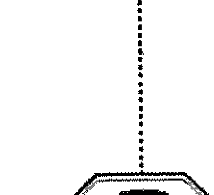

### 12. 石榴

石榴又名安石榴。史载石榴乃汉武帝时，张骞出使西域从安石带回，故称安石榴。但马王堆汉墓出土的医典中却记载早在西汉以前，中国就有石榴。古文咏石榴词赋甚多，如梁元帝《咏石榴》诗：“涂林应未发，春暮转相催。燃灯疑夜火，辖珠胜早梅。”潘岳的《安石榴赋》中：“遥而望之，焕若隋珠耀重渊；详而察之，灼若列宿出云间。千房同膜，千子如一，御饥疗渴，解醒止醉。”在习俗文化中，认为“石榴百子”，是“多子多福”的象征。实际上，石榴花果红似火，果又可解渴止醉，有美观和实用价值，因此广为民居庭院宅房栽植。

### 13. 桔

屈原曾以《橘颂》歌咏了桔的形质品格。橘性因地气而改变，《周礼·考工记》中说：“橘逾淮而化为枳，……此地气然也”。橘有灵性，传说可应验事物。《广五行记》说：“陈后主梦黄衣人围城，绕城橘树尽伐之。乃隋兵至，上下通服黄衣，未几为隋攻城这应。”又有人认为橘是北斗的天璇星变化来的，《春秋运斗枢》说：“璇星散为橘。”实际价值主要是果鲜美可食，皮核可入药，植之有经济效益。在民俗中，橘与吉谐音，以橘趋吉祈福，金橘可兆明。《中华全国风俗志》载有杭州一带“元旦日，签柏枝于柿饼，以大橘承之，谓之百事大吉”。

### 14. 梅

梅曾被中国视为国花（现已定为牡丹）。梅在冬春之交开花，“独天下而春”，有“报春花”之称。《花镜》称梅为“天下尤物”。梅美喻女人，有谓梅“琼肌玉骨，物外佳人，群芳领袖”竹喻夫，梅喻妻，婚联有“竹梅双喜”之词，男女少年亦被称为“青梅竹马”。梅的品格，傲霜雪，有“四德”之说。古云“梅具四德，初生为元，开花为亨，结子为利，成熟为贞。”梅花五瓣，象征五福——快乐、幸福、长寿、顺利、和平，又合中国的阴阳“五行”金木水火土。寿联常有“梅开五福，竹报三多”（竹叶三片），寓意吉祥。庭栽、盆景皆有观赏价值。梅还有“四贵”：贵稀不贵密，贵老不贵嫩，贵瘦不贵肥，贵含不贵开，故有“梅开二度”来形容美得恰当。稀、老、瘦、含为梅的美学“四贵”，此四贵常见于画家的笔端。

### 15. 莲花

莲为莲科水生宿根花卉，别名很多：荷花、水芙蓉、芙蓉、水华、水芸、水旦。藕可食用，可药用，莲子可清心、解暑、藕能补中益气。《本草纲目》说：“医家取为服食，百病可祛。”除实用价值外，莲花在中国有深邃的文化渊源。佛祖释迦牟尼的家乡盛产荷花，因此佛教常以莲花自喻。《本草纲目》载：“释氏用为引譬，妙理俱存。”唐代将佛教立为国教后，莲花备受人们敬爱。佛国也指莲花所居之处，也称“莲界”，佛经称“莲经”，佛座称“莲座”或“莲台”，佛寺称“莲宇”，僧舍称“莲房”，袈裟称“莲衣”等等。莲花图案也成为佛教的标志，佛教的建筑、装修、器物也都有莲花图案。在中国，莲花被崇为君子，《群芳谱》中说：“凡物先华而后实，独此华实齐生。百节疏通，万窍玲珑，亭亭物华，出淤泥而不染，花中之君子也。”后有周敦颐的《爱莲说》，影响深远。《本草纲目》说：“夫莲生卑污，而洁白自若；质柔而实坚，居下而有节。孔窍玲珑，纱纶内隐，生于嫩弱，而发为茎叶花实；又复生芽以续生生之脉。四时可食，令人心欢，可谓灵根矣！”莲有一蒂二花者，称并蒂莲，象征男女好合，夫妻恩爱。喜联常有“比翼鸟永栖常青树，并蒂花久开勤俭家”等等。莲谐音“廉”（洁），“连”（生），民俗有“一品清廉”，“连生贵子”等谐音取意。但有的国家、地区的民俗文化不同，如日本民俗对莲花并不认为“出淤泥而不染”那么贞洁，而视莲花为“下贱”之花。

### 16. 芙蓉

芙蓉，莲花类，分为水芙蓉、木芙蓉。木芙蓉又称木莲、地芙蓉、拒霜等；四川盛产、秋冬开花，霜降最盛。五代时蜀后主孟昶于宫苑城头，遍植木芙蓉，花开如锦，故后人称成都为锦城、蓉城。芙蓉耐寒遇霜花盛，故又名“拒霜”。王安石《拒霜花》诗云：“群芳落尽独自芳。”苏东坡在《和陈述古拒霜花》赞有“千林扫作一番黄，只有芙蓉独自芳”。芙蓉谐音“富荣”，在图案中常与牡丹合组为“荣华富贵”均具吉祥意蕴。

### 17. 牡丹

牡丹属毛茛科灌木，有“花王”、“富贵花”之称。我国已将其定为国花。牡丹是中国产的名花，在《神农本草》中即有记载，很古老。牡丹品种繁多，在《群芳谱》中载有一百八十多种。在明代薛凤翔的《亳州牡丹表》中载出二百六十九种之多，并将牡丹分为神品、名品、灵品、逸品、能品、具品六大品类。据传，唐玄宗观牡丹时曾问及咏赞牡丹之诗谁做得最好，有人凑推李正封的诗“天香夜染衣，国色朝酣酒”佳句，后世便有“国色天香”之称号。在《本草纲目》中谓有：“群花品中，牡丹第一，芍药第二，故世谓牡丹为花王。”至宋代，洛阳牡丹已被推为天下之冠，遂有“洛阳花”之称。牡丹花朵丰腴妍丽，周敦颐在《爱莲说》中有“牡丹，花之富贵者也”的名句，牡丹为“富贵花”的称誉，也更加流传。牡丹是国色天香的富贵之花，自古以来被人们当作富贵吉祥、繁荣兴旺的象征。

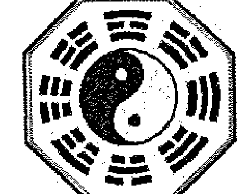

贵之花，历代名人雅士常以此命名为书斋、园圃。如宋代周必大的“天香堂”、明代周王的“国色园”等。牡丹有美色和美誉，寓意吉祥，因此在造园中，常用以与寿石组合为“长命富贵”，与长春花组合为“富贵长春”的景观。

### 18. 月季

月季属蔷薇科直立灌木。是由十五种蔷薇科花卉反复杂交而成的。我国有六百多种月季，花期特长，又名月月红。《群芳谱》说月季“逐月一开，四时不绝”。杨万里的《月季花》诗有：“只道花无十日红，此花无日不春风。”月季原产在中国，据传18世纪80年代，月季经印度传入欧洲，当时值英法战争，为使中国传入的名贵月季安全由英国传入法国，双方和谈，护送此花。因此，英国人至今奉月季为国花。我国的天津、常州等市立月季为市花。因月季四季常开而民俗视为祥瑞，有“四季平安”的意蕴。月季与天竹组合有“四季常春”意蕴。

### 19. 葫芦

葫芦为藤本花卉。藤蔓绵延，果实累累，籽粒繁多，中国人视作象征子孙繁盛的吉祥花卉。枝“蔓”与“万”谐音，寓意万代绵长，民俗传统认为葫芦吉祥而避邪气。端午节习俗，民间门上插桃枝、挂葫芦。现代气功测试证明，葫芦有隔绝气场功能，民语有“不知葫芦里卖的什么药”，意即难以穿透葫芦透视内中物品。从风水场气分析，乃葫芦的曲线外形含“S”形的太极阴阳分界线的神奇功能。因此常在风水化煞中应用。

### 20. 茱萸

茱萸，气味香烈，九月九日前后成熟，色赤红。民俗以此日摘茱萸。做茱萸囊，以此避邪《群芳谱》云：“九月九日，折茱萸戴首，可辟恶，除鬼魅”。《太平御览》引《杂五行志》说：宅旁种茱萸树可“增年益寿，除患病”。《花镜》也说“井侧河边，宜种此树，叶落其中，人饮是水，永无瘟疫”。汉代锦缎有“茱萸锦”，刺绣有“茱萸绣”。中国的重阳节九月九日民俗集会也称为“茱萸会”。

### 21. 菖蒲

菖蒲为多年生草本花卉，多为野生，但也适合在宅旁绿地中养植。《本草纲目》说菖蒲“乃蒲之昌盛者”。《吕氏春秋·任地》说“菖者，百草之先生者也”。民俗认为菖蒲其花主贵，其味使人延年益寿。中国古代认为菖蒲是天星的再生。《春秋运斗枢》云：“玉衡星散为菖蒲。”传说人见菖蒲花当贵，据《梁书》载：太祖皇后张氏“尝于室内忽见庭前菖蒲生花，光彩照灼，非世所有，后惊异之，谓侍者曰：‘汝见否？’皆云未见。后曰‘尝闻见菖蒲花当贵’，因取食之，生高祖”。有此神话传说和记载，菖蒲在民俗中广为喜用，视为避邪气的吉祥草木，菖蒲有医药价值。《本草经》云：“菖蒲主治风寒湿痹，咳逆上气，开心孔，补五脏，通九窍，明耳目，出声音。久服轻身，不忘不迷，延年。益心智，高志不老。”《道藏经·菖蒲经》云：“菖蒲者，水草之精英，神仙之灵药也。”其药以五德配五行、叶青、花赤、节白、心黄、根黑。能治一切诸风，手足顽痹……坚骨髓，长精神，润五藏，裨六腑，开胃口和血脉，益口齿，明耳目，泽皮肤，去寒热……”

## 室内养花选择不当会造成室内污染

很多人喜欢在室内养花，改善和美化室内环境，但如果选择不当，反而会造成室内污染。适宜室内养的花：四季常青的花禾或能吸收有毒气体的品种，如吊兰、文竹、万年青、仙人掌、龟背竹、常青藤等。不适宜室内养的花：丁香、夜来香在夜间能散发刺激嗅觉的微粒，对高血压和心脏病患者有不利影响；夹竹桃的花香能使人昏睡、智力降低；洋绣球散发的微粒会使人皮肤过敏发生瘙痒；郁金香的花朵有毒碱，过多接触易使人毛发脱落；松柏类花木散发出的油香，会影响人的食欲。不养“相克”花：玫瑰和木犀草在一起，木犀草就会凋谢，但木犀草在凋谢前会放出一种物质使玫瑰中毒死亡。虞美人、兰花、石竹花、紫罗兰、百合花等草花和别的花卉难以相处，造成植株死亡。

## 第一章

## 风水中旺宅常用的吉祥饰品

## （一）古钱平安吉祥物

古钱摆放在家中有招财的作用，而佩戴在身上则有利自己的运程及自身平安。一般常用的古钱是“五帝古钱”。“五帝”是指五个清朝最兴旺的皇帝年号“顺治”、“康熙”、“雍正”、“乾隆”、“嘉庆”。

## （二）葫芦

葫芦是可用作除病之用，只需挂在病者的睡床前或摆放在病者的睡侧。葫芦挂在大门外，则有保屋内人平安的作用。葫芦可采用天然葫芦瓜晒干成品或铜制葫芦。但要注意铜器并不一定适合每个人，要视乎你的五行。

## （三）花瓶

取其花瓶的“瓶”字与平安的“平”字同音。家中或公司均适合摆放。在家中摆放花瓶代表家人平安。在公司摆放花瓶，代表员工健康。但切记不可将花瓶摆放桃花位内，否则会变成招惹桃花的物品了。

## （四）竹树

取其“竹报平安”之意。所以在乡间，人们都很喜欢在门前种植竹树。

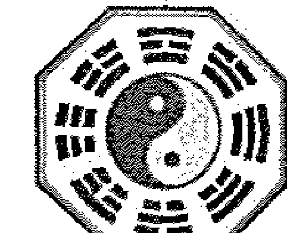

即使你不种植竹树，你仍然可以用文竹或富贵竹代替之。加上如果你用一个花瓶来摆放，就更加可以达到“竹报平安”的效果，因“瓶”与“平”同音。

## 招财吉祥物

### （一）九鱼图

九鱼图即图中画上九尾锦鲤或金鱼。鱼自古就被视作吉祥之物，皆因取其鱼与余同音。俗语说年年有余。九则有长长久久的含意。那为什么要用锦鲤或金鱼呢？

因鲤与利同音，寓意做生意得厚利。所以九鱼图多见于经商的人的办公室。金鱼则是因为金是值钱的物品及代表财富。

### （二）锦鲤、金鱼

如果你想令家中或办公室更有生气，你可以饲养锦鲤或金鱼，因为利和金都与人的财富有关。“九”则有“长长久久”的含意。所以养鱼最好养“九”尾，“十九”尾或“廿九”尾。

### （三）旺财蟾蜍

旺财蟾蜍与普通蟾蜍的分别是它只拥有三只脚而不是四只。传说它本是妖精，后来改邪归正，四处吐钱给人，所以，后来被人们当作旺财瑞兽。要注意的是摆放蟾蜍，头要向内，切记不可向外。门窗皆一样道理。否则所吐之钱皆吐出屋外，不但不能催旺财气，反而可能引致漏财。

### （四）貔貅

“貔貅”读作“皮休”，是一独角瑞兽。人们认为貔貅可旺财，因为相传貔貅食四方财，与蟾蜍最大的分别是：摆放貔貅时，必须将头向门外或窗外，原因是使其可以吸呐四方八面的财富。

## 招福吉祥物

### （一）百福图

百福图顾名思义是一幅图画写上一百个不同书法的福字。其实百字并不是一个数量词，有多的含义。

### （二）蝙蝠

蝙蝠又称为蝠鼠，因它酷似老鼠。蝙蝠在中国人眼中属于瑞兽，这是因为蝙蝠的“蝠”与“福”同音。故在很多祝贺的图案里都有蝙蝠。

### （三）喜鹊

古时每当有喜鹊临门，人们必视之为好兆头，所以不论图画、花瓶、瓷器、屏风、玉器都常以喜鹊为图案，因此在家中摆放有关图画都表示将有喜事临门，有招福之意。

## 升职吉祥物

### （一）如意

福禄寿三星的“禄”星便是手执如意。“禄”即俸禄也。古时多用来祝贺人家加官晋爵，升官发财，所以即使现代人用来祝贺朋友升职也是适合不过。如意则有“如愿以偿”及“事事如意”的意思，故此亦可用在其他祝贺的场合。

### （二）鹿

有近似“禄”的发音，所以被视作祝贺朋友升职的吉祥物。

## 求学吉祥物

### （一）文昌塔求学吉祥物

一般都会摆放在家中文昌位或书台上，这样可使子女读书专心，头脑敏捷。亦可放置在写字台附近，尤其有利文职人士，可增加工作效率，做事更加事半功倍及得到上司赏识。

### （二）毛笔

在风水上，文昌之卦相是高高尖尖的，而毛笔尖是尖尖的，笔杆长长的，故毛笔符合文昌之卦象。试试看，在写字台或书台附近吊一枝或四枝毛笔，你是否觉得自己比从前聪明得多。

## 富贵吉祥物

### （一）牡丹

自古以来，牡丹都被视为“富贵”的象征。每逢新年，中国人的家庭总是喜欢摆放几盆牡丹，取其“花开富贵”的意头。

### （二）山水画

山靠山也，亦可指贵人、人才、人丁。水为财也，多指财富、俸禄。所以山水画可以摆放在写字楼或家中。放在家中，有丁财两旺的意思。放在办公室，有利工作及人际关系。

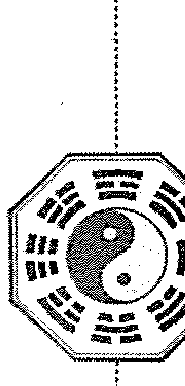

## 嫁娶吉祥物

### 莲藕

莲藕与“佳偶”音近。故有友人结婚，可用有莲藕的图画来祝贺他们，寓意“佳偶天成”之意。

## 财位与催财方法

财是人的养命之源，人们对钱财的追求是天经地义的。从命理学的角度探索一个人的财运与求财方法，始终是处在一种被动的处境，唯一的方法就等待好运的到来，在有利条件下才能谋事求财，但阳宅风水学却是改变了这种被动的状态，一般来说一个人走财运时人会发财，但发财必然有存在大小的差异，如果这个人住在一间旺财的房屋，自然会发更大更多的财富，如果这个人住在一间破财的住宅内，这个人的财运自然会受到命运的牵制，发财也会有限，绝不会达到他命局应该得到一定数量的钱财，反之，如果一个人的财运很差，不但赚不到钱，反而一直不断地破财，如果这人住在一间旺财的房屋，虽然不能使他忽然变富，但至少会减少一些不必要的损失。如果能尽量利用房屋中财位并且能在财位上运用一些妥当调整、增强财星的活力，相信不久的将来，这个人必然渐渐地步出困境，这就是阳宅潜移默化的效果，也就是解灾或调整运程最佳的方法。

现在我们已经知道阳宅风水财位重要性，也许有的人会问：什么是财位？财位有什么标志？我们要运用什么方法来确定房屋的最佳财运呢？这些问题，也就是在下面要论述的内容。

居家风水大全

### （一）确定住宅财位的方法

财位，简言之，就是屋宅宅气最旺的方位（卦位），也就是星气下降地气上升，集结相交之点。故屋宅不同，财位也因而不同。同时，因星宿运转有岁差，且飞星每年轮值变化，所以也不是固定在同一点上。（关于每年的飞星财位，具体可查每年出版的相关历书）纵是所谓的财位，由于凶煞叠临，也不见得当年为可用。虽然不是财位，也可能因星气生旺或贵人禄马等吉神来助，而成为可用之卦位，因此，才需每年量度一次。阳宅所谓的财位，有每年轮值变化的方位，名为“流财方”其力最大，故难寻。有屋宅固定的方位，理家名为“生旺方”，形家为“对角线方”，不论取用何位，催动之时须得岁令之助，否则虽吉方仍不受福。更防凶煞叠临，否则会引发后遗症！

所谓“财位”，风水学派有很多不同的说法，有些认为财位是在大门的斜角位。

### （二）确定个人财位的方法

个人财位，一般都在个人卧室内和个人办公室内确定某个地方，其确定个人财位的方法和确定住宅财位方法一样，当确定出卧室或个人办公室内某个方位是财位后，再分析个人命局，最后判断个人财位的真假。

### （三）财位布局与催财方法

也许有些读者看到这节标题，就会出现疑问，如果会布局财位与催财方法，为什么不为自己多催一些财，这样一来，也不必整天埋头伏案，辛苦写书，自然也减少很多的疲劳。实际上财位布局与催财方法，都没有脱离命局财运这个人的框圈里面。换言之，都是在这大框圈里面运行，因为很多的人都没有得到命中应得的财富，也就是平时人们常说的失去很多赚钱的机会。假设一个人他命中某年能发一百万元，如没有风水的帮助，他可能只能取得二三十万元，若有风水催财与日课的催动，他则可以求取到七八十万元，甚至九十、一百万元也有可能，但要超过这个一百万元，却是没有可能。因为风水毕竟不是魔术，只不是一个“数”运用风水催财，说明也是数与数组合，由于二者妥当组合产生了不同的结果。风水虽然能增强一些人财或改变化解了一些命局中凶灾，但不能使乞丐变巨富的神话得到实现。因此，希望读者们能正确对待财位布局与催财方法。

阳宅财位地方，若是在进出大门或房门，窗户以及设置冷气空调器或蒸气逆风电暖器都能起旺财的作用。

同时，我们也可以在财位安置一些有催财功能的用品。

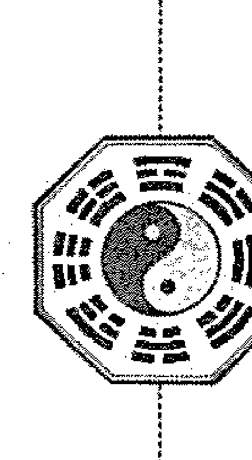## 1. 风水轮催财

风水轮是港台和广东近期颇为流行的催财用品，它的装置以铜盆为主，然后中央做一条铜柱引到顶部，当顶部的小兜盛满水后，便会流到下一层的小兜，依此类推，最后水便是流回在盆内，又开始作一个循环。

### 2. 雾化盆景催财

它是一个盆栽，四周有水转着，中央才是山水草树盆景。而利用一些先进的科学仪器将水激射而引起雾气弥漫于盆景的四面八方，如果你伸手触摸，那些雾气会感到冷冷的，凉凉的，当然还有潮湿的感觉。

### 3. 貔貅

貔貅的读音是皮休，很多人把“貔貅”误写成皮貅。貔貅催财很快，特别对一些从事外汇、股票、金融、赛马、期货等从事偏行的行业人，有起到催财的作用。“貔貅”形态有点像鹿，一般是短翼、双角、卷尾、鬃须常与前胸或背脊连在一起，突眼，长獠牙。现在常见到的貔貅多是独角、长尾巴。

一般制造貔貅像的物质有四类：

- 金属——以铜来制造，磨光后的色泽接近黄金。
- 木材——一些古老大屋会利用质坚的木材雕造貔貅，然后放在横梁上，用来挡煞。
- 瓷器——以泥土的质地制造。
- 玉器——以不同的玉种来制造。

以上四种，唯有用玉器和金属制造的貔貅催财力最强。但我们在摆设时，要注意，貔貅的头要向门外或窗外，因为相传它食四方财。

### 4. 三脚金蟾催财

这蟾蜍并非普通蟾蜍，它是拥有三只脚，与其他四条脚的蟾蜍不同，它是会吐钱，传说它本是妖精，后被仙人刘海收服，改邪归正，四处帮穷人，吐钱给人们，所以后来被人们当作旺财瑞兽。

摆放蟾蜍，要头向铺内、公司内或住宅内，不宜向铺门、公司门、屋门，否则所吐之钱皆吐出屋外，不能催旺财气。

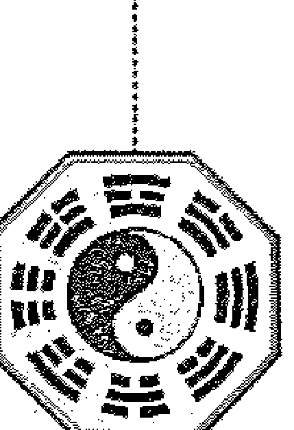

### 5. 其他

有关旺神风水用品很多，不能一一分析，只能把一些重要用品写出来，希望读者自己能摆设。如运财童子像，财神像、金龙、五帝古钱、水晶等。

### （四）植物招财

招财的植物亦有几番要诀：

- （1）植物不可以是攀爬类。
- （2）植物最好是常绿植物。
- （3）叶的形状最好是圆大，不要尖、细或长形。

植物的叶形，通常是采用圆大而绿色，是取其圆满丰大和常绿的意思。例如：万年青。至于外间有所谓富贵竹，只是取其名，而没有什么特别的意义。

家中催财比较容易见效，工作地方催财则比较困难和复杂，因为人多，人多就命格多，命格多就会很容易有相生相克的影响。若然真的要招财，只好放在向着大门的台角上。

以生肖属相来催财是没有效应的。以五行来计算会较为准确。但植物就是植物，没有分五行的植物，所以不管何种五行的人，只要不选择攀爬类便可以了。因为攀爬类植物有招是非疾病之害。

在现今的社会，已经很难再分别正财或偏财，只要用风水加强其财运，命中有正财就会应正财，命中有偏财就会应偏财。

经常枯萎的植物，大多数与方位有关。南方和西方是很难养植物的。唯一解决方法是不用植物催财，而改用灯光（南方），鱼缸（西方）。

### （五）财位宜忌示例

### 1. 财位宜坐

在风水学来说，财位是一家财气所聚的方位，故此应该尽量加以利用，例如把沙发长椅放在财位，当一家大小坐在那里休息谈天时，可以多些沾染那里的财气，便自然会家肥屋润。

此外，倘若把饭桌摆放在财位亦甚适宜，这会令一家大小均能蒙受其益。

### 2. 财位宜卧

人生约有三分之一的时间用在睡眠上，故此睡床方位的吉凶对运程有很大影响。倘若睡床摆放在财位，日夕在那里躺卧，日积月累，自会对财运大有裨益。

有些人误会，以为睡床是沉重的家具，可能会压损财位，故此不敢把睡床摆放在那里，其实这是浪费了财位。

### 3. 财位宜吉

财位是旺气凝聚的所在地，若在那里摆放一些寓意吉祥的物件，例如是福禄寿三星，或是文武财神的塑像，这会吉上加吉，有锦上添花的作用。

总括来说，生旺财位有五宜：

- (1) 宜亮——宜有阳光或灯光照射
- (2) 宜生——摆放生机茂盛的植物
- (3) 宜坐——摆放沙发长椅或饭桌
- (4) 宜卧——房间财位宜摆放睡床
- (5) 宜吉——摆放寓意吉祥的器物

### （六）财位四忌

- 1. 财位忌压：风水学认为，财位受压是绝对不适宜的，若将沉重的大衣柜、书柜或储物柜等等压在财位，便会损害这套居所的财运。
- 2. 财位忌水：财位不宜摆放鱼缸或用水培养的植物，因为风水上有“见财化水”一说。
- 3. 财位忌空：财位背后宜有坚固的墙，因为象征有靠山可倚，无后顾之忧，可藏风聚气。反之，若财位背后是阳台或玻璃窗，便会因为泄了财气而难以积聚财富。
- 4. 财位忌冲：风水学最忌尖角冲射，故财位附近不宜有尖角。

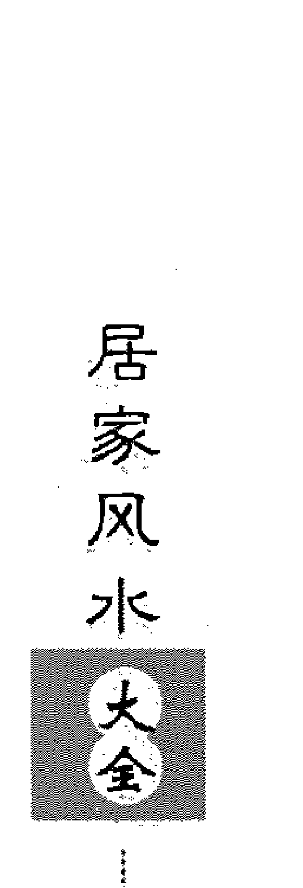

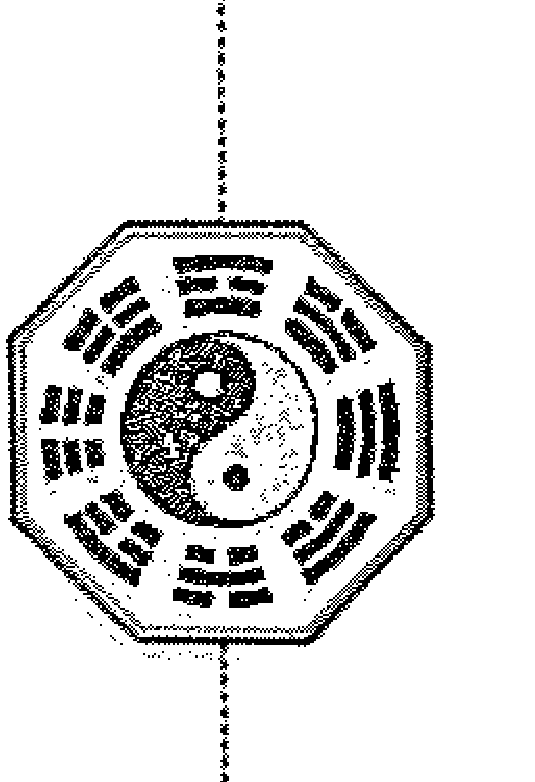

## 第十二章 风水师眼中的财运与风水

提升财运是风水的主要功能之一，从基本的储蓄到一夜致富的快速致胜法……，只要有关钱财的所有运势，靠风水准没错。

## 天赋财运看“生日”

许多人期待风水能提升财运，但同样采用财运风水，为何有人会成功，有的人却会失败呢？这可谓是宿命，也就是出生时便已注定好的事。每个人出生时，都各自带着属于自己的财富来到世间。例如有人天生注定必须一步一脚印的工作才能累积财富，如想要一夜致富就很难。因此，先了解自己天赋的财运，再选择适合自己的生财之道，才能对症下药。

得知财运的方法有好几种，最简单的方法是由生日算出，也就是使用“数秘术”，以掌握隐藏在一至十数字中所有的神秘力量。

有人财运好，也有人财运不佳，但即便不佳也毋须沮丧，只要找到问题点，努力改善即可。

## 从生日看财运

- 1. 1、11、21、31 号出生者金钱不虞匮乏，但要拥有大笔财富仍须相当努力。
- 2. 2、12、22 号出生者对钱不是非常谨慎就是毫不在意的两种极端类型。亦可能掉入借债度日的痛苦深渊，建议最好实行计划性储蓄。
- 3. 3、13、23 号出生者善于以钱滚钱，常有中奖或赢钱等意外之财，但却易因异性而破财。
- 4. 4、14、24 号出生者表面虽看不出来，其实金钱欲望极强。24 号出生者不乏富贵，但 4、14 号出生者财运不强，须靠不断地勤奋努力。
- 5. 5、15、25 号出生者有目标便可持续储蓄。但股票、赌博等投机性的投资，易招致失败，须注意。
- 6. 6、16、26 号出生者金钱不虞匮乏但也留不住钱。易因好交际或耳根子软而散财。须提防他人的甜言蜜语。
- 7. 7、17、27 号出生者很会抢钱也易奢侈。避免刷卡过多或不当之股票投资。财务管理最好采用务实作风。
- 8. 8、18、28 号出生者因贫困或债务刺激反而致富。越到晚年财运越是亨通。切忌太过膨胀欲望。
- 9. 9、19、29 号出生者有继承财产的运势，亦善于理财。惟须注意的是，避免因赌博而失财。人际关系易陷入孤立。
- 10. 10、20、30 号出生者有钱就花，没钱就算的潇洒类型。财运起伏明显。最好养成目标性的储蓄习惯。

## 无谓的支出多半是因为“漏财宅”

若觉得自己挺省的却存不住钱……检查一下居家环境吧。也许这些莫名其妙的花费就是源于“漏财宅”。“漏财宅”如文字所示，就是“会使财运外泄的房子”。这是因为招来财运的流气易由窗户溜走，无法停滞在屋内之故。从入口进来时，若对面有窗户，那么这家铁定是“漏财宅”，建议最好在门口入口处与窗户间加个屏风或门帘隔开。此外若在屏风前方摆上一对观赏用的植物，则可增加财气循环的活络度。而窗户旁若能加上较重的窗帘或百叶窗，则效果更佳。衣橱靠窗也是不好的。“衣橱”在风水上代表财，衣橱靠窗摆放，无疑意味着将钱往外抛，建议最好要换个位置。

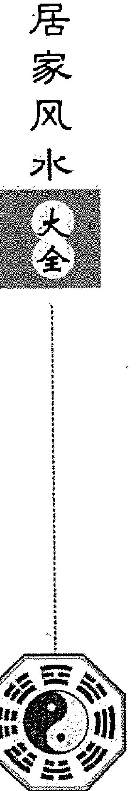

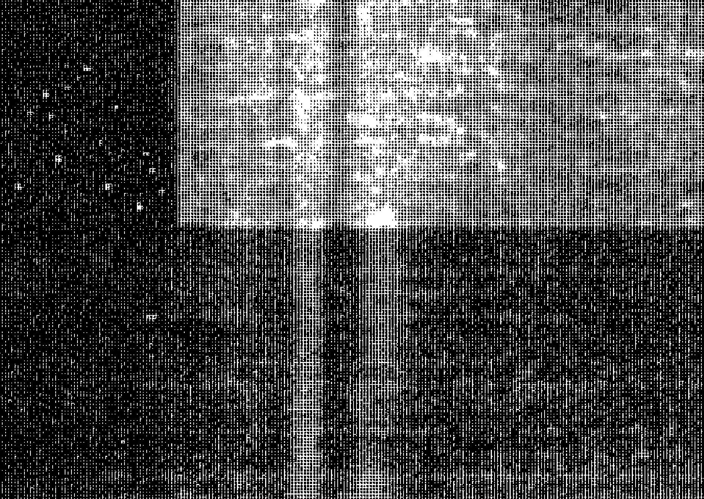

## “龙龟”改善日常金钱的流向

事出有因，若想累积大笔财富，平居家财位常就须注意金钱流向。

居家财位

| 入口方位 | 财位 |
|----------|------|
| 北 | 东、东南 |
| 东北 | 北 |
| 东 | 西南、北 |
| 东南 | 西南、东 |
| 南 | 东南 |
| 西南 | 西 |
| 西 | 北、东南 |
| 西北 | 东、南 |

此时最有帮助的便是“龙龟”。龙颜龟体的“龙龟”，在风水上以提高财运而闻名。它具有不断招来金宝的“财源广进”效果。龙龟不仅适合摆在家中，放在办公室或店面里，还可使工作顺利，金钱无往不利。将“龙龟”与“十宝”或“五帝钱”一并使用，更有增加钱势的加分效果。在家中最好放在居家的“财位”，公司或店面则以入口右侧较好。居家“财位”依入口方位而定。

## 明亮的入口可聚集“财气”

入口处并非只是进出的通道而已，同时也是“财气”流动的地方。试想一处光线明亮与潮湿阴暗的入口，你会从哪边进去呢？不必说当然是前者了。其实“财气”也是一样的。因此若想提升财运，首先必须保持入口的明亮度。但由于方位与格局的设计，有些入口先天上难有日照。此时只要加盏灯，增加亮度即可。挂上太阳的图画，可增添阳气，也有替代效果。

当然入口处的清洁工作自不在话下。再怎么明亮，若脏乱不堪也是没什么效果的。

## 善用西南风水

风水师认为女性、特别是家庭主妇不妨多利用“西南”风水。

或许有人想提升财运的应该是“西”或“东北”吧？但惟独优惠女性，尚多了一个“西南”的财运。这是因为“西南”别称“女鬼门”，是足以影响女性的重要方位，在易经上代表“母”。

若风水上拥有此方位的女性，将会是一位贤内助，也就是有帮夫运。换句话说，只要丈夫肯努力，财富必然累积。反之，若居家无此方位，不仅家庭运势不佳，女主人甚至会有浪费的倾向。

要加强西南方位，首先须随时保持清洁。装饰方面可选择以幸运颜色为主的花色或饰物来旺气。这样就能够有效地提升西南方位所带来的吉祥力量。

## 横式印章可以守住钱财

购物、赌博……等，有些人钱一进口袋，不久便花光光，成天过着寅吃卯粮的日子。建议这样的人不妨检查一下银行的印章吧！

一般来说，认证的印章以纵式居多，但若是银行印章最好避免。这是因为纵式印章有“钱财由上往下流”之意，较为忌讳。因此为了防止钱财流失，银行印章一定要采用横式。此外，横式意味着“稳定”，有安定财运与防止失衡的作用。

风水上印章可分为“实印”、“银行印章”、“认证印章”三种，建议最好依用途分开使用。此外，有瑕疵的印章会让财运不振，建议最好更新。

## “凶运”有助“一夜致富”梦

财运上有所谓的“正财”与“偏财”。“正财”是指一般工作所得的收入，“偏财”则为投机性的变动收入。风水上所谓的财运，一般指的是正财，但我要告诉各位一招一夜致富的偏财秘诀。

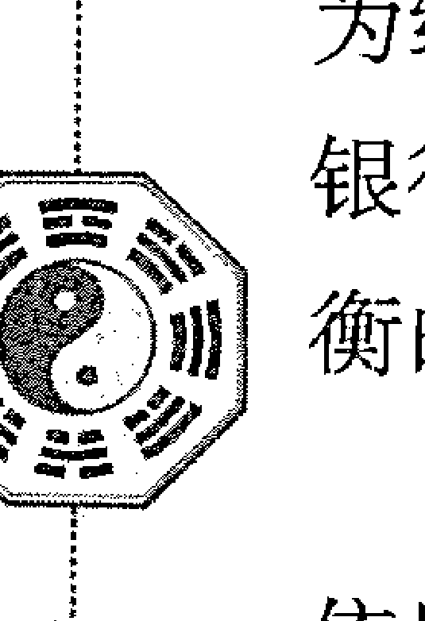

一般风水上无论是方位或颜色均采用吉利的一方，但“偏财”就得使用相反的一方，也就是“凶运”部分。其实“凶运”与“好运”只是一线之隔，但若想在赌博等方面当个赢家就得靠“凶运”了。

首先先查出赌博当天月历上的九星，并确认其“方位”。可参照下页，查出自己九星上的凶位。此外，尚可利用每日占卜等，选个凶日来一决胜负。

### 风水中的九星凶位找寻法

九星凶位有几个找法，这里仅针对五黄杀、暗剑杀、本命杀、的杀等四种作说明。

- 五黄杀：九星盘上五黄土星旋转之方位。
- 暗剑杀：与五黄杀相反的方位。
- 本命杀：自己诞生星座旋转的方位。
- 的杀：与本命杀相反的方位。

### 九星方位盘

例如若二黑土星出生者：假设在四绿木星当天下赌注，则五黄土星环绕的“西北”，其相反方向的“东南”，二黑土星旋转的“东”，及反向的“西”就是其凶位。

### 风水中“独角兽”可保赌运

“独角兽”是风水上极具招财力量的吉祥物。更令人兴奋的是它在“偏财”（赌博等具变动性的财富）上的效果极佳。

最佳的摆设场所为客厅，最好放在客厅中央偏东北的中央。东北在易经上称之为“艮”，代表山的方位。在此方向摆设“独角兽”，可聚集来自四面八方的财气。

“独角兽”通常雌雄成对，若使用一只，最好选择雌性。此外，若与风水物“元宝”一起使用，更能提升财运。若想提升的不是“偏财”，而是“正财”（踏实工作所得的财富），则可与“龙龟”一起摆设。

### 八白土星日

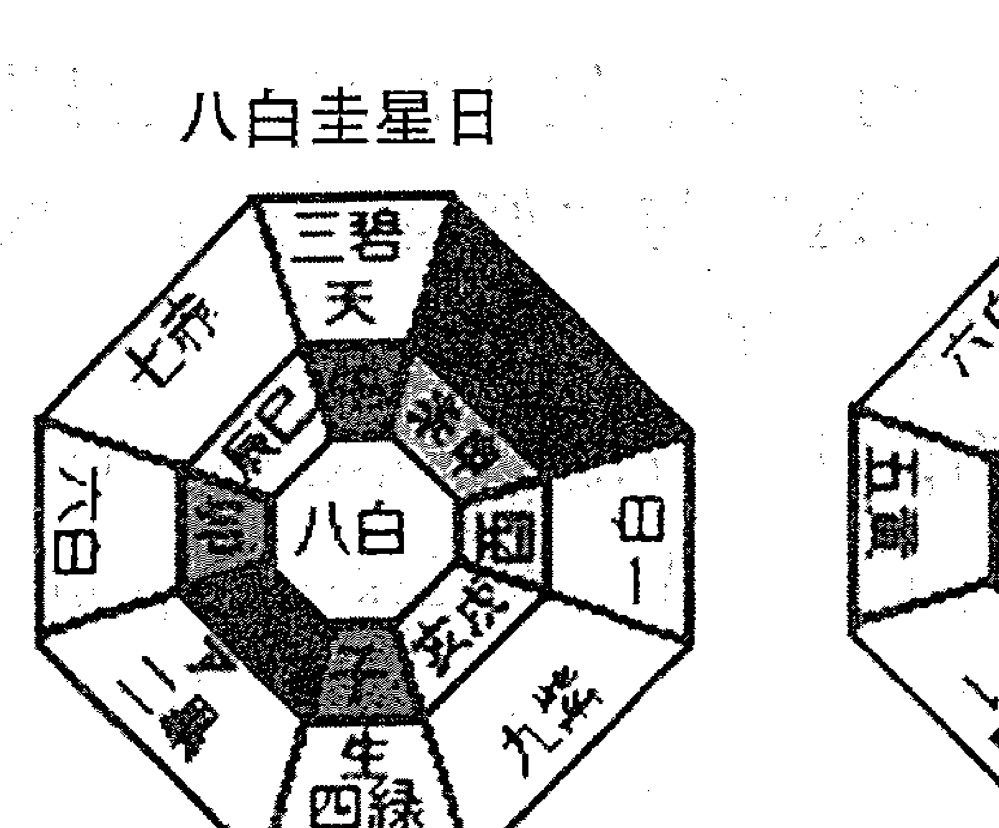

### 七红金星日

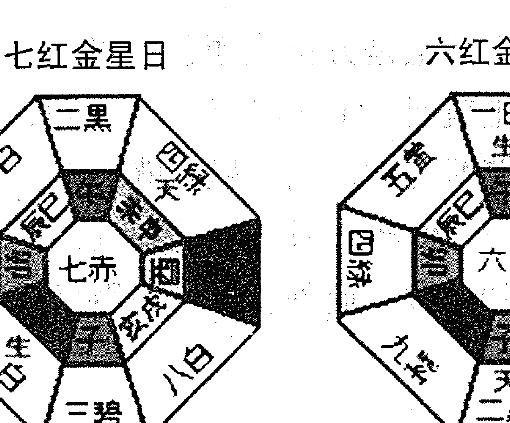

### 六白金星日

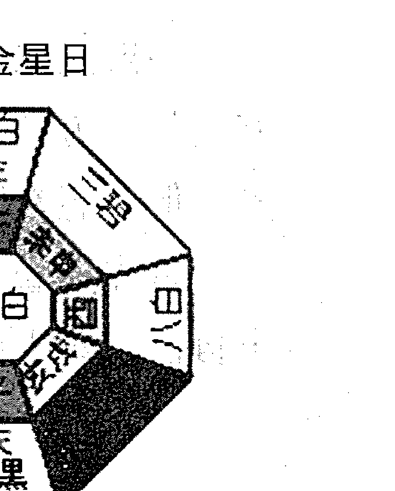

### 五黄土星日

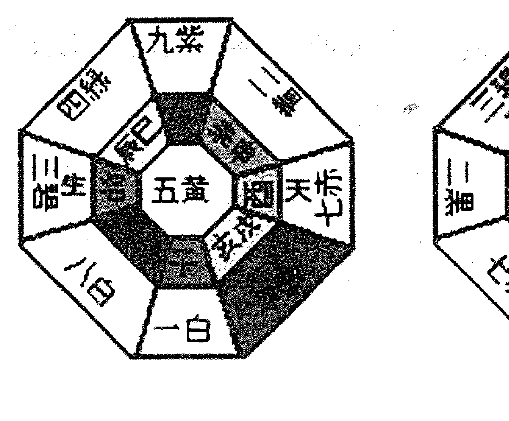

### 四绿木星日

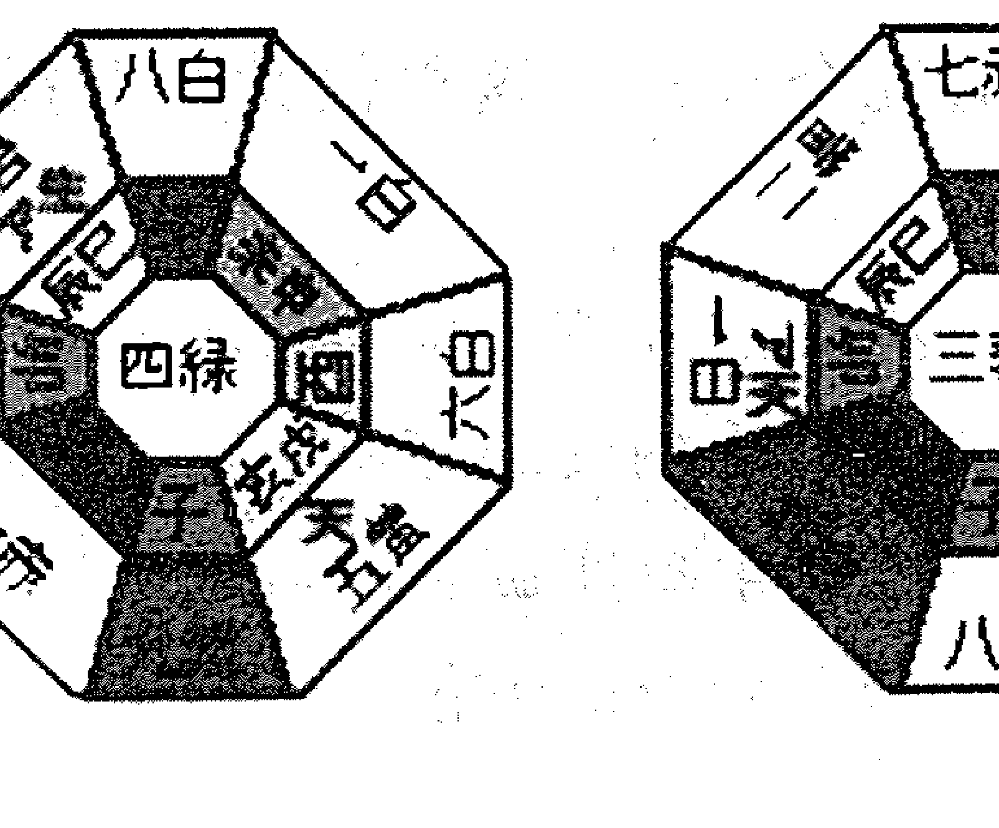

### 三碧木星日

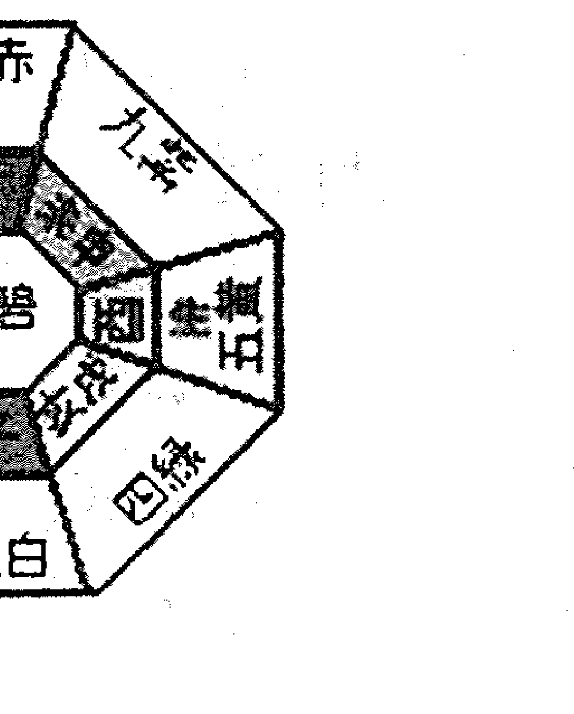

### 二黑土星日

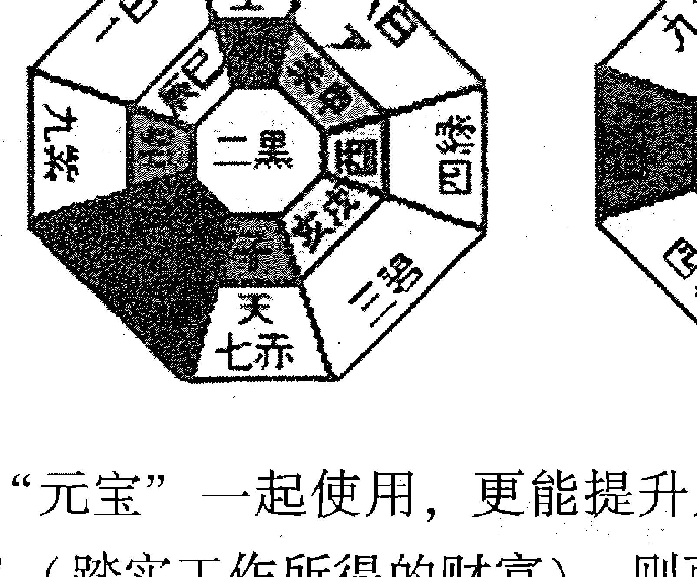

### 一白水星日

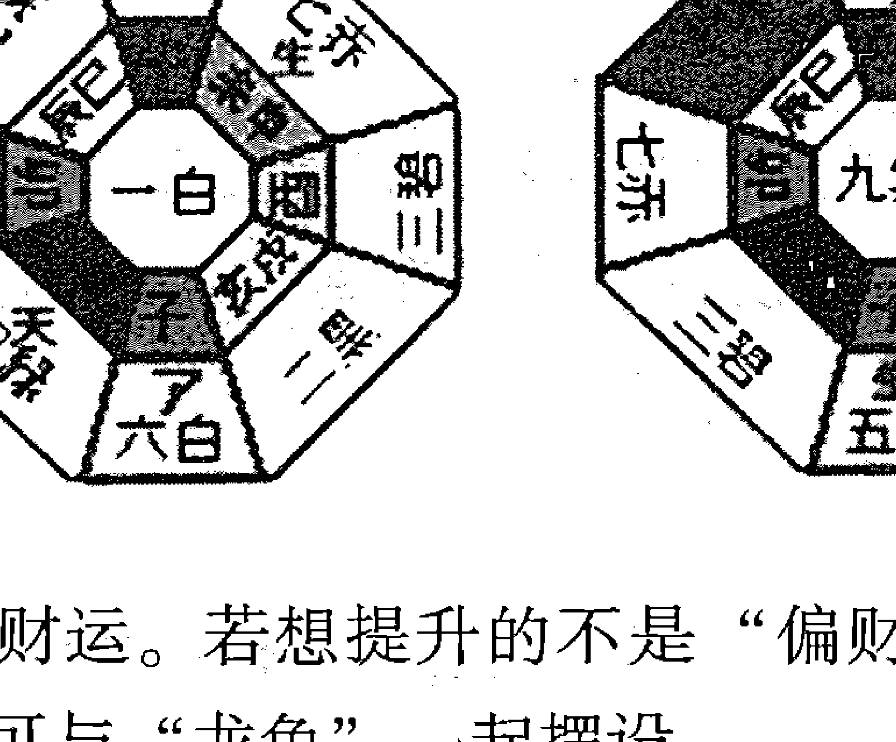

### 九紫火星日

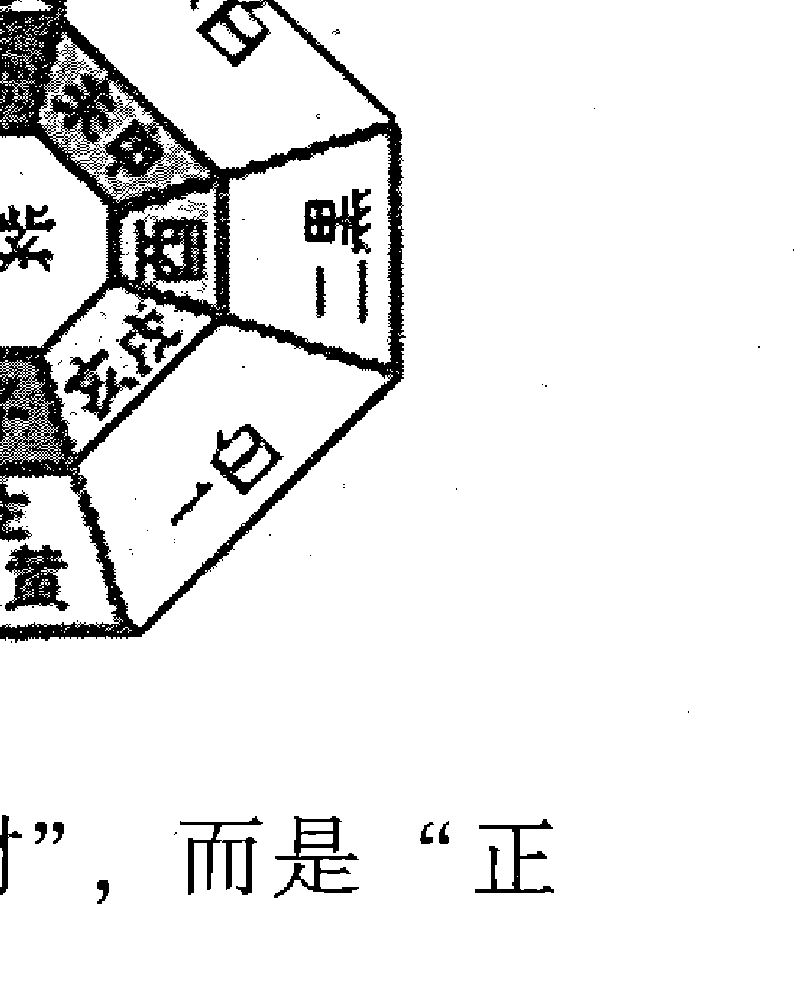

### 救急的“招财猫”

钱只要一入腰包，不知不觉间就容易花。特别是纸钞，只要一找开，消失的也特别快。

在此想介绍的是“招财猫扑满”。您不妨在一天结束时，将腰包里的零钱拿去喂喂“招财猫”。存不住钱的人，往往只重视大钱的流向，因为对小钱不在意，此时“招财猫扑满”便是一个好帮手了。招财猫扑满最好买成双，即是左手举起（招人气）与右手举起（招财运）两只招财猫，然后一、五、十硬币放在举左手者，50，100放在举右手者，如此分开存放，效果最佳。钱可聚少成多，万一有急用时，招财猫当然可能就是你的救命恩人了。

## 投资股票宜慎选种别

现在是一个将钱存在银行也没什么利息可言的时代，因此一定有人想干脆买个股票来理财吧！若以风水的角度该如何做，风水师的建议是慎选证券公司。

证券公司最好位于自己的吉利方位，股票交易以某个角度来说，其实就是自己与证券公司间“气”的交流。若证券公司位于自己的凶位，恐怕彼此间的交流只会诸多不顺。因此，位于吉方位最重要，不管是总店或分店均可。有关吉方位可请参照“吉凶方位盘”。

证券公司选定后，接下来便得慎选股票种类。其实股票行业类别与人一样有五行之分。行业类别只须选择适合自己的五行即可。

## 风水中保管奖券的添吉法

给买乐透等奖券却不曾中奖的你一个好消息！接下来要介绍的是可以提升中奖机率的风水！

一般来说，只要买十张奖券，应该有一张会中奖。以金额来说，顶多不过是一百到三百人民币。但尽管如此，许多人还是因“不曾中奖”而大感失望。然而别沮丧，这少量的投资可是深具意义！即使金额不多也未曾中奖，但它还是很好的奖券，因为它会散发“中奖”的光采！

下次购买奖券后，最好把该奖券与过去未中奖的奖券放在一起保管。光采有放射、感染周围的特性。利用此种光采原理，便可以提升中奖的机率了。此外，在保管之际，若将奖券等放在居家的财位方位，将有加分效果。

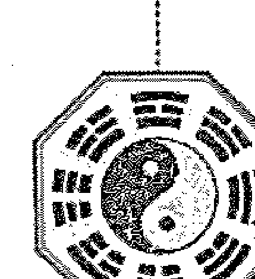

## 不洁积水，赶走财运

风水师认为财富流向与水流是息息相关的。

水是流动的，所以厨房或浴室的积水对财运将有负面影响，因此使用完毕后的水最好立即放掉。这是因为不流动的水，往往是脏乱的根源，容易产生秽气。

此外，尤须注意的是厕所马桶的清洁。厕所原本阴气就较强，因此清洁工作也显得特别重要。

花瓶或宠物的饮用水亦须注意。花与动物也是生命，最好给以新鲜用水。

水源卫生，可靠实际上的触摸或饮用察觉，所以只要稍有不洁，务必立即处理。

## 风水手链可带来财运与成功

天然石是开运的最佳利器。

在此将介绍风水学上两种对财运特别有效的天然石。首先是“红石”。它是具有磁场的一种石类，具有提升财运、赌运、事业运的效果。第二种则是“虎眼石”，除可提升财运外，尚可消除人际关系上的各种烦恼。

将天然石当作装饰品摆在家里也不错，但若带在身上效果更佳。其中“风水手镯”尚具装饰的效果，男女皆宜。除入浴外，不管是否外出，最好一直佩带。佩带时务必带在左手。因为左手是“气”之入口，而右手则是出口之处。

## 折叠式皮夹留不住钱财

要想风水成功就得有“设身处地”的心态。例如想提升财运，就要站在钱的角度来思考。

当然说到钱，最重要的就是皮夹了。对钱来说，风水师认为皮夹就好像它的窝，所以只要环境舒适，哪怕留不住钞票，就算钞票偶尔外出，还会因思乡而归巢呢！对钞票来说，怎样才算是舒适的窝呢？首先最好选纵长形的，避免使用对折的皮夹。因为这样才可以避免钞票折损。想想就如同人一般，若一直弯着腰，一定很痛吧！其实钞票也一样。所以若要财运亨通，只有善待钞票，让它平平稳稳地躺着，才是上上之策。此外，色泽方面最好选用本命卦上的幸运颜色。若红或白色不太适宜时，可以黑、咖啡、深绿等颜色替代。

## 减少信用卡张数，防止浪费

即使没有现金也可以购物，信用卡真是便利的产物，但也由于方便，很容易造成过度消费。尽管如此，只要有一卡，仍不免想要使用，因此最好的方法就是不要将信用卡放在皮夹内。最好连银行的金融卡都不要随身携带。

相对的倒是可以将现金储值卡或集点卡等放在皮夹内。因为信用卡或金融卡属于支付卡，而后者这些卡片则有储蓄的功能。所以想提升财运，当然以储蓄功能卡较佳。此外携带支付卡外出时，最好另外准备一个卡片专用夹，这样也可防止过度的使用。

## 皮夹中的“招财铜板”

财富总聚在不缺钱财的人那里……这就是财运的自然法则。

钱也是怕寂寞的，与其一个人孤零零的，还是和大伙儿在一起比较好。能充分发挥财富“以钱聚钱”性格的要属“招财铜币”了。“招财铜币”其实是中国古代的铜板，只要将其摆在皮夹或金库等处即可。

一般来说古钱多用来提升其他的风水饰物效力，但古钱本身即具极大提升财运的效果。因此受到古钱的吸引，其他的财富便会相继而来。

古钱尚有避邪的力量，可以防止因借贷、散财等的金钱麻烦。亦可穿根线作成吊饰。

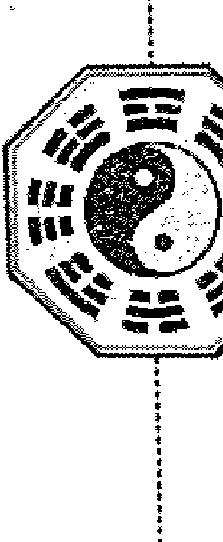

居家风水大全## 财产须委托幸运方位的金融机构管理

若要将财产委托金融机关管理，该机关的方位是很重要的。大部分的人一旦选定某家金融机构，多半倾向长期交往，因此风水师认为若该机构方位属凶，恐怕易引起诸多不顺。

首先请依“吉凶方位盘”确认自己的吉方位。吉方位共有四个，分别为生气、延年、天医、伏位。

薪资的汇款等与日常生活动向有关者主由“生气”掌管，定期存款等持续性财务则为“延年”……等，最好依各方位的性质分别管理。

财务的管理方法亦可根据“本命卦”来选择。举例而言，如本命卦属坎、坤，艮者适合“银行”，乾、兑、离者适合“邮局”，而震、巽者为“证券公司”。

## 西方使用黄色，可防散财

所谓“西方偏黄有财运”，但这是无法蓄财的。根据易经，西方属“兑”，象征“游玩”。在此方位摆置橘黄饰物，可防止因游玩而导致的散财。特别是有浪费倾向或喜欢冲动购物的人不妨试试此法。但若要蓄财呢？那“西北摆黄金”是最佳途径了。西北是代表“天”的神圣方位，易经上象征“主人”或“老板”。只要在此方位摆上象征钱财的黄金饰品，财运将急速上升。其中又以务实工作所得的“正财”最为有利。此外，存折事关财富的累积，保管时，最好放在丈夫的“延年”方位上，才可财运源源不断。

## 钛晶有助财富愿望的实现

“水晶”古人认为具有神秘的力量，其中又以“钛晶”对财运的提升与赌运效果最佳。无论是加薪，赌运亨通或偿还债务……，只要与金钱有关的愿望，交给钛晶准没错。方法也很简单，风水师认为只要将钛晶放入“桃花瓶”中，并诚挚地将其摆在自己的“财位”上即可。
若在“桃花瓶”下方再放上中国古钱，其施展的力量就更所向无敌了。

## 通风良好可避免“举债之气”

也许有人因收入减少或裁员等因素而造成债务增加。
债务为负面财产，因此只要有债务就不可能有积蓄。但要如何才能消除债务呢？之所以有债务的原因之一，可能是家中充满了“举债之气”。
为了消除“举债之气”，就先来个彻底的大扫除吧！打开所有的窗户让空气流通，并将浴缸、厕所、厨房等有水的地方刷洗干净。当然大门的进出口与寝室、客厅等也不可马虎。
债务缠身的人容易叹气，这也是坏事的主因之一。叹气易增加阴气，使家里气氛更加阴沉。扫除就如同人的深呼吸般，只要家里有新鲜空气流入，住在里面的人也会跟着快活，这不仅能提升工作的干劲，对还清债务也会变得更加积极。

## 风水中的“二十四方位”看财运之家

居家方位一般以“八方位”判断，但若考虑重建，不妨试试更精密的“二十四方位”法。特别是大笔的财运，许多时候不见得跟屋主有关，而是依据家风水而定。

下面介绍的大笔财富居家方位供您参考

- **苓山之家**
  人上之人，可带来财运，若能掌握机会，甚至可成亿万富翁。

- **俑山之家**
  易因生意成功而累积财富。女性则有麻省变凤凰的机会。

- **猖山之家**
  吉凶分明的方位。但若成功亦可能因此而名利双收。

- **酝山之家**
  易因土地或不动产累积财富。常有意想不到的好运相随。

此外，丑山、辰山、未山之家，虽不见得气派，但因务实努力而可能致富。

## 两个幸运数字所带来的双倍效果

日本的乐透与乐透奖券因可自由选择号码，最近在日本也特别受到欢迎。

从过去明牌的研究派，到随性购买的随意派，每个人选择数字的方法真是千奇百怪。在此将介绍如何利用风水来选择属于自己的明牌。

无论是方位或颜色，其原理均是有效地利用属于自己的幸运元素。因此购买乐透时，亦可善用自己的幸运数字。

风水师认为人的幸运数字有两个，将出生年月日不断地相加，最后得到的个位数字即为第一个幸运数字。女性将此数字加八，男性将此数字减十所得的数字，即为第二个幸运数字。只要以这两个数字出击，当可无往不利。

## 有无“财运”看寝室

风水师认为若想成为大富翁，那寝室的格局就很重要了。

人在一天二十四小时中，不断受到周边各种“气”的影响，尤其处于睡眠状态时更是毫无防备。清醒时就算处于不祥之地，也有防御能力，但睡觉时就毫无招架之力了。

睡眠原本就是为了消除一天的疲劳，并培养体力，以迎接明天。在好的环境中入眠，活力自然涌现，但反之就达不到睡眠的真正意义了。

下面开始将附图说明风水中提升财运的理想寝室格局，以供读者参考。寝室基本上最好位在本命卦的四吉方位“生气、天医、延年、伏位上。若因格局问题而有困难时，不妨退而求其次，将床位或枕头置于吉祥方位亦可。

## 本命卦“坎”者的寝室

寝室入口位于东南、东、南、北之任一方向最好，床位由东向东南摆设，枕头朝东南。枕头附近最好摆盆花或鱼缸等带水的饰物。

凶性较强之西南及东北最好放置衣橱、书柜等大型家具。

## 本命卦“离”者的寝室

寝室入口位于东、东南、北、南之任一方向最好，床位由南向东南摆设，枕头朝东南。床边最好摆盏台灯。
凶性较强之西北至西，最好放置衣橱、书柜等大型家具。

## 本命卦“震”者的寝室

寝室入口位于南、北、东南、东之任一方向最好，床位朝北，枕头朝南。

在东南方向摆置一盆的鲜花可提升财运。凶性较强之西至西北，最好放置衣橱、书柜等大型家具。

## 本命卦“巽”者的寝室

寝室入口位于北、南、东、东南之任一方向最好，床位由东南向南摆设，枕头朝东南。枕头附近最好摆一盆百花香等有香味的饰物。凶性较强之东北至西南，最好放置衣橱、书柜等大型家具。

## 本命卦“乾”者的寝室

寝室入口位于西、东北、西南、西北之任一方向最好，床位由西北向西摆设，枕头朝西南。若想提升财运可在西方放置时钟。

凶性较强之南及东，最好放置衣橱、书柜等大型家具。

## 本命卦“坤”者的寝室

寝室入口位于东北、西、西北、西南之任一方向最好，床位置于西方，枕头亦朝西。东南摆设观赏植物可招致财运。凶性较强之北及南，最好放置衣橱、书柜等大型家具。

## 本命卦“艮”者的寝室

寝室入口位于西南、西北、西、东北之任一方向最好，床位置于西方，枕头朝西南。东北方向摆设含金制品则可提升财运。凶性较强之东南及北，最好放置衣橱、书柜等大型家具。

## 本命卦“兑”者的寝室

寝室入口位于西北、西南、东北、西之任一方向最好，床位置于西方，枕头朝西北。床头附近最好放置矮柜等小型家具。

凶性较强之东及南，最好放置衣橱、书柜等大型家具。