# 改造你的居家布置
## 优化风水

详解18大类473种住宅风水煞气及其化解方法 | 千帧图片让你一目了然

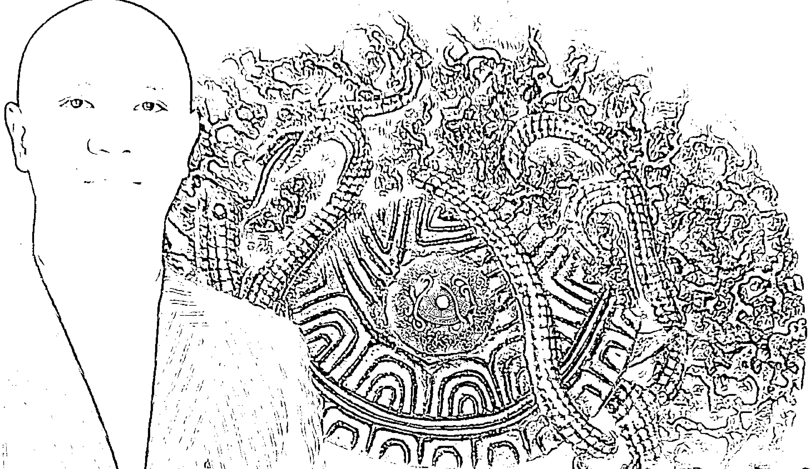

当代风水圣手 黄一真 主编

## 大师图解居家煞气风水
## 指点化煞方法,教你拔除厄运

| 本书化煞主要针对 | 室外煞气 | 大门煞气 | 卧房煞气 | 厨房煞气 |
| --- | --- | --- | --- | --- |
| | 明堂煞气 | 客厅煞气 | 书房煞气 | 卫浴煞气 |

湖南美术出版社

# 当代风水名家黄一真作品

最权威的煞气风水解读，最实用的化解与改运方法

煞气，是指在居家风水中一切对住宅不利的因素。现代人住宅周围潜伏着各种不详的煞气，这些煞气既有有形的，又有无形的。加之我们在房屋建造、布局、装修过程中的种种不当操作，让各种风水问题接踵而至。居住在有煞气的房屋当中，不利影响时有发生。所以，学会检测并化解这些风水煞气是每个人必须具备的常识。

全书采用实景拍摄与手绘图的形式来展示473种具有代表性的室内外风水煞气，这些煞气既包括房屋地基、外部环境、周边山水等室外煞，同时也包括客厅、卧房等室内煞。本书不仅将房屋的风水煞气知识一网打尽，让你对“问题建筑”有充分的认识，更依次为每个煞气提供简单实用的化解方法，使你的房屋气场稳定、藏风聚气，最终达到增旺家运的目的。

书中还介绍了数十种易买、易得的化煞风水物品，你不用投入大量资金，就能迅速运用这些吉祥物品摆平煞气、求得好运、稳定气场、增旺家运。

# 大师为你断明屋宅风水吉凶

指导你活用煞气化解方法，化煞解厄，趋吉避凶

打造吉祥家居，创造一辈子的好家运

建议上架: 社科·生活类

ISBN 978-7-5356-4719-1

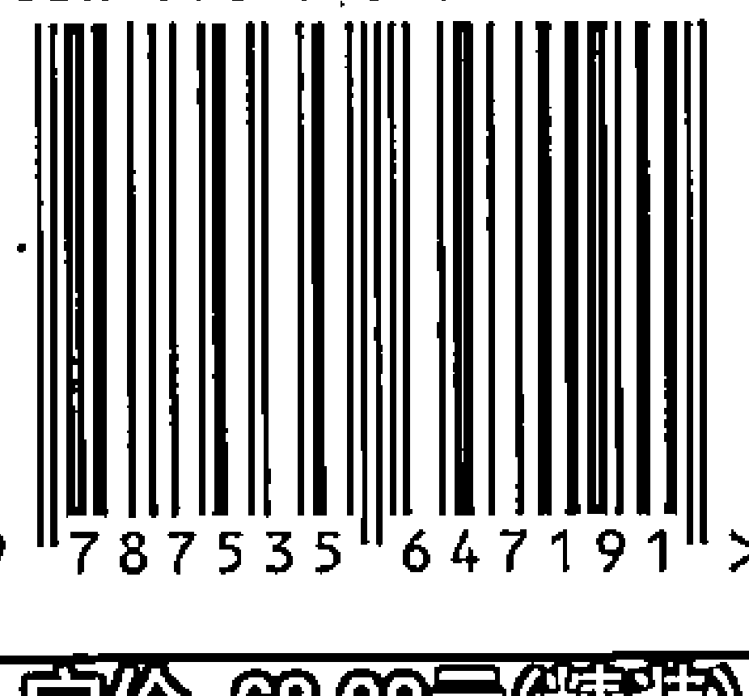

定价: 68.00元(精装)

# 改造你的居家布置

# 化解风水

当代风水名家 黄一真 主编

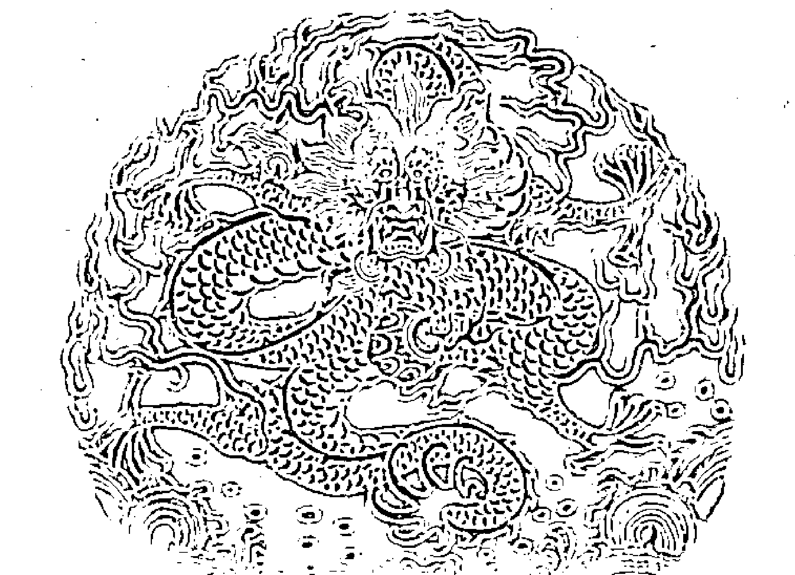

湖南美术出版社

# 图书在版编目（CIP）数据

改造你的居家布置/黄一真主编. — 长沙:湖南美术出版社,2011.12
ISBN 978-7-5356-4719-1
Ⅰ. ①改… Ⅱ. ①黄… Ⅲ. ①住宅一室内装饰设计
Ⅳ. ①TU24
中国版本图书馆CIP数据核字(2011)第171539号

# 改造你的居家布置

- 出版人：李小山
- 策划：金版文化
- 主编：黄一真
- 责任编辑：李松 黄佳
- 封面设计：景雪峰
- 出版发行：湖南美术出版社
  (长沙市东二环一段622号)
- 经销：湖南省新华书店
- 印刷：深圳市美达印刷有限公司
  (深圳市龙岗区平湖街道平龙东路347号2#厂房)
- 开本：711×1016 1/16
- 印张：27
- 版次：2011年12月第1版 2011年12月第1次印刷
- 书号：ISBN 978-7-5356-4719-1
- 定价：68.00元

【版权所有，请勿翻印、转载】
邮购联系：0755-83476130 邮编：518000
网址：http://www.ch-jinban.com/
电子邮箱：szjinban@163.com
如有倒装、破损、少页等印装质量问题，请与印刷厂联系调换。
联系电话：0755-82446007

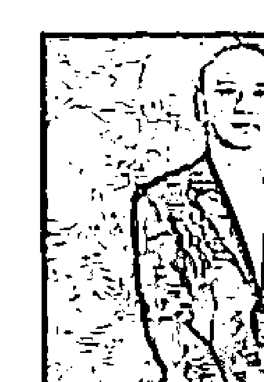

# 黄一真

当代著名风水学家，现代风水全程理论的创新者与实践者。是国内外三十多个大型机构及上市公司的专业顾问，主持了国内外逾百个著名房地产项目的风水规划、景观布局及数个城市的规划布局工作。

黄一真先生廿年精修，学贯中西，集传统堪舆学与中外建筑学之大成，继往开来，首创现代房地产项目的选址、规划、景观、户型的风水全局十大规律及三元时空法则，开拓了现代建筑的核心竞争空间。

黄一真先生的研究与实践足迹遍及世界五大洲，是参与高端项目最多，最具大局观、前瞻力、国际视野的名家，历年来对城市格局、财经趋势均作出过精确的研判，为国内外诸多上市机构提供了战略决策参考，成就斐然。

黄一真先生一贯秉持低调谦虚的严谨作风，身体力行的实证主义，倡导现代风水学的正本清源，抵制哗众取宠的媚俗行为，坚决拒绝当代风水学的庸俗化、神秘化与娱乐化。

黄一真先生以其于2000年出版的《现代住宅风水》为代表的系列住宅风水著作，立意高远、金声玉振，风行世界各地，其趋吉避凶、造福社会的真知灼见于社会的影响力彰明较著。

近期服务的国内著名高端房地产项目有金地·天悦湾、中海·紫御观邸、万科·棠樾、中海·香蜜湖1号、梅陇镇、金地·上塘道、雅戈尔中海·篁外、金地·香密山、百仕达·红树西岸等。

- 招商银行“金葵花”大讲坛演讲嘉宾。
- 香港凤凰卫视中文台《锵锵三人行》特邀嘉宾。
- 香港迎请佛指舍利瞻礼大会特邀贵宾。
- 2002年3月应邀赴加拿大交流讲学。
- 2004年7月应邀赴英国交流讲学。

# 黄一真先生主要著作

- 《现代住宅风水》
- 《现代办公风水》
- 《中国房地产风水大全》
- 《楼盘风水布局》
- 《最佳商业风水》
- 《色彩风水学》
- 《富贵家居的风水布局》
- 《办公风水要素》
- 《人居环境设计》
- 《健康家居》
- 《舒适空间设计》
- 《多元素设计》
- 《阳光空间设计》
- 《风水养鱼大全》
- 《现代风水宝典》
- 《风水吉祥物全集》
- 《住宅风水详解》
- 《财运风水第一书》
- 《楼盘开运风水》
- 《别墅风水大全》
- 《风水宜忌全书》
- 《小户型风水指南》
- 《居家庭院与植物风水》
- 《生活风水宝典》
- 《旺宅化煞风水》等。

# 序言

# 化煞：趋吉避凶的风水妙法

住宅，是心灵的港湾，是灵魂的寄托，也是事业的基础，更是财富的源头。富贵贫穷，健康疾病，都渗透在家庭生活的点点滴滴之中。如今，追求品质、渴望舒适、力臻完美的生活风尚已逐渐走入每个人的心灵，千辛万苦购买的房产，自然不能成为人生的绊脚石，而应该是成就事业的催化剂，积累财富的聚宝盆，造就健康的梦工厂，家庭和睦的港湾。

现代都市中，虽然万家灯火，房宅林立，但是有的家庭荣华富贵，财源广进；而有的却穷困潦倒，衣食维艰。归根究底，除了个人所具智慧及工作勤奋外，无不与住宅的风水吉凶有密切关系。宅运亨通、又积善德则贫可转富、贱能显贵，正是情理之中；而宅运凶险，则富可致贫、贵亦招灾，不出意料之外。非但住宅如此，公司、厂房等亦然。如何趋吉避凶，以利宅运，风水学的作用甚大。

煞者，是指在居家风水中一切对住宅不利的因素。大千世界，堪称光怪陆离，住宅建筑周围潜伏着一些不如意的煞气，不足为奇。风水学所说的煞，分形煞及气煞两种。形煞是有形的凶相，令住户犹如被利刃直指，觉得百般难以忍受，无法阻挡，心情极为压抑。气煞是指煞星飞临的方位，因为它无形无象，不似形煞那样可用肉眼观察得到，只能根据风水数理推算。煞并非是所谓怪力乱神的东西，其实就是恶型，与围棋里的恶型是同理的。随着人们生活品质的提高，大家无不希望居所双目企及是山清水秀、养眼舒适的一派美好景象。如果出现恶型，令人感觉压抑别扭，那就需要运用风水学上的办法加以弥补。

在现代生活中，风水学是选择居所的一个必然的课程，加强学习和了解，才能真正做到有备无患、未雨绸缪，是根本更是睿智之选。而其中最主要的体现便是旺宅化煞，是居家旺宅不可或缺的风水知识。它与我们的生活息息相关、密不可分，与我们的日常作息紧密相连，谨而慎之自然没错，知而解之才是正确之道，对生活对家庭都是一件吉利的事情。

化煞，把吉兆保留，把凶兆驱除！人类认识世界的目的是为了改造世界，只要对各种煞气善加规避，即可因势利导，举重若轻，趋吉避凶。本书全方位讲解了住宅各种煞气的特征及化煞的方法，非常详尽地为您解读日常生活中可能碰到的煞。上下五千年积累和沉淀下来的中华文明自古崇尚风水学，其根本就是为了因地制宜、灵活变通、扬长避短，以达到趋吉避凶的理想境界，这也是我编撰本书的目的。

2005年6月于英国伦敦

# 目录

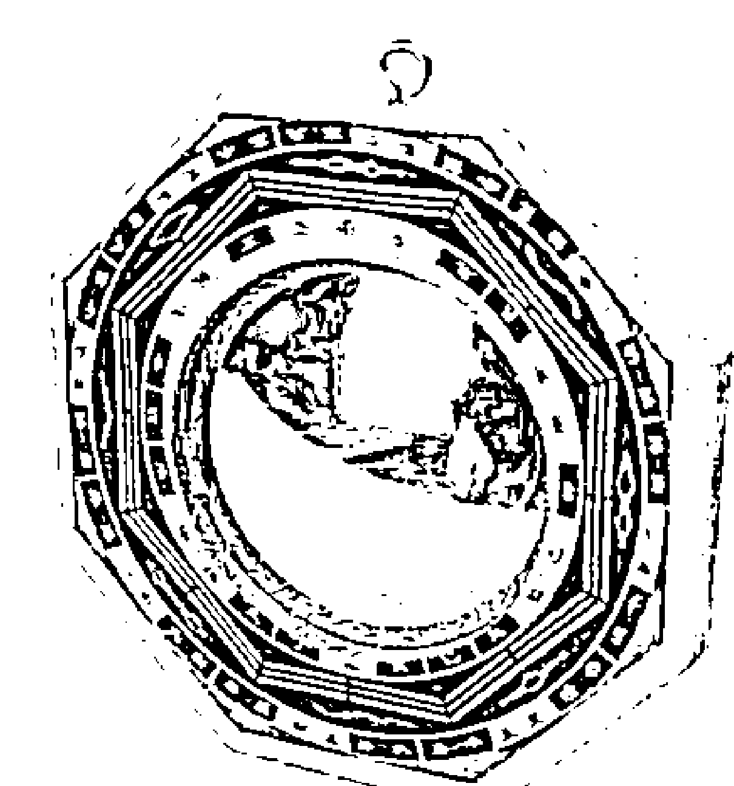

## 第一章 化煞的基础知识

## 第一节 煞气的含义

形象煞气
飞星理气上的煞星
峦头与理气结合而构成的凶煞

## 第二节 飞星与煞气

三元九运
星宿的吉凶
九星飞伏
九星煞气的构成原理与化解方法

## 第三节 二黑病符煞气

二黑土星的性质与山向二黑的弊端
化解二黑病符星的方法

## 第四节 勘察风水的三大凶点

太岁主灾祸连环
三煞招劫盗伤杀
五黄为流年关煞

## 第五节 五行煞气

大门遇金煞
大门遇木煞
大门遇水煞
大门遇火煞
大门遇土煞

## 第六节 峦头与理气构成的凶煞

八运乾山巽向住宅
七运坐未向丑住宅
劫盗官非煞
火灾煞

## 第七节 屋宅缺角和凸角的分析

屋宅的缺角和凸角
缺角和凸角的影响程度
如何分辨缺角和凸角
房屋缺角和凸角的化解方法
西北乾位缺角
西北乾位凸角
西方兑位缺角
西方兑位凸角
南方离位缺角
南方离位凸角
东方震位缺角
东方震位凸角
东南巽位缺角
东南巽位凸角
东北艮位缺角
东北艮位凸角
北方坎位缺角
北方坎位凸角
西南坤位缺角
西南坤位凸角

## 第八节 屋宅尖角的分析

尖角冲射屋宅破家运
“石敢当”化尖煞
装修设计化解尖角煞气

## 第九节 屋宅横梁的分析

横梁不能不防避
横梁的化解

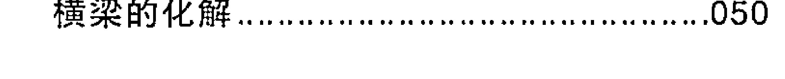

### 第一节 房屋外部水势与路势的煞气

- 煞001 天姚水
- 煞002 阴幽水
- 煞003 臭秽水
- 煞004 沮洳水
- 煞005 急流水
- 煞006 悲哭水
- 煞007 鸣珂水
- 煞008 瀑面水
- 煞009 淋背水
- 煞010 折箭水
- 煞011 湍杀水
- 煞012 照盆水
- 煞013 板仓水
- 煞014 鹅颈水
- 煞015 弓背水
- 煞016 横朝水
- 煞017 叉身水
- 煞018 斜飞水
- 煞019 背截水
- 煞020 火叉路
- 煞021 亡字水
- 煞022 分家水
- 煞023 牵鼻水
- 煞024 勾弋水
- 煞025 投环吊颈水
- 煞026 丁字冲
- 煞027 缠丝水
- 煞028 穿射割飞煞
- 煞029 左斜路冲
- 煞030 右斜路冲
- 煞031 斜路直冲
- 煞032 抬轿煞
- 煞033 淋头水煞
- 煞034 枪煞
- 煞035 白虎路煞
- 煞036 直路剑
- 煞037 水劫
- 煞038 剪刀煞
- 煞039 暗箭煞
- 煞040 反弓煞
- 煞041 夹身水

### 第二节 房屋地基的煞气

- 煞042 伪金形地基
- 煞043 伪木形地基
- 煞044 伪水形地基
- 煞045 伪火形地基
- 煞046 伪土形地基
- 煞047 地牢
- 煞048 火星拖尾
- 煞049 退田笔
- 煞050 刺龙笔
- 煞051 刺虎笔
- 煞052 地凸
- 煞053 地梁
- 煞054 地堑
- 煞055 下陷屋
- 煞056 地冲
- 煞057 地坑
- 煞058 背运地基
- 煞059 白虎衔尸地基
- 煞060 龙虎不拢地基
- 煞061 退龙地基
- 煞062 崎岖地
- 煞063 木形屋
- 煞064 水形屋
- 煞065 土形屋
- 煞066 火形屋
- 煞067 凶斩屋
- 煞068 泄气屋
- 煞069 朝西屋
- 煞070 压舱屋
- 煞071 过头屋
- 煞072 退财屋
- 煞073 倒栽屋
- 煞074 分水屋
- 煞075 拐杖屋
- 煞076 吼天屋
- 煞077 棺材屋
- 煞078 斜翅屋
- 煞079 飞天屋
- 煞080 墓碑屋
- 煞081 盖头屋

### 第三节 屋形不佳的煞气

- 煞082 单耳房
- 煞083 双耳房
- 煞084 围笼屋
- 煞085 “回”字屋
- 煞086 “亡”字屋
- 煞087 “川”字屋
- 煞088 曲尺屋
- 煞089 反曲尺屋
- 煞090 槌胸屋
- 煞091 插翅房
- 煞092 寒肩屋
- 煞093 “丁”字屋
- 煞094 拖尾屋
- 煞095 卜丁房
- 煞096 单翅房
- 煞097 双翅房
- 煞098 暗箭房
- 煞099 凤台房
- 煞100 投河房
- 煞101 枯骨房
- 煞102 铺翅房
- 煞103 露梁房
- 煞104 露肘房
- 煞105 瘫痪房
- 煞106 单侧房
- 煞107 凋零房
- 煞108 龟背庄头房
- 煞109 漏星房
- 煞110 单坠房
- 煞111 倚台房
- 煞112 偏身房
- 煞113 赤脚房
- 煞114 孤苦房
- 煞115 抬轿屋
- 煞116 单侧卫护## 第四节 房屋周围环境的煞气

- 煞117 左右双夹...........................111
- 煞118 靠山太过...........................111
- 煞119 中厢房...........................112
- 煞120 露脊房...........................112
- 煞121 推车屋...........................113
- 煞122 左右室缺...........................113
- 煞123 独立屋...........................114
- 煞124 孤峰独耸...........................114
- 煞125 火型屋...........................115
- 煞126 损丁屋...........................115
- 煞127 虎压龙...........................116
- 煞128 围困屋...........................117
- 煞129 壁刀煞...........................118
- 煞130 壁角煞...........................119
- 煞131 空缺煞屋...........................119
- 煞132 海沙屋...........................120
- 煞133 重湿气屋...........................120
- 煞134 顶楼...........................121
- 煞135 散气屋...........................121
- 煞136 通道屋...........................122
- 煞137 地空屋...........................122
- 煞138 斜飞水屋...........................123
- 煞139 浅屋...........................123
- 煞140 白虎回头屋...........................124
- 煞141 凸面煞屋...........................124
- 煞142 上切房...........................125
- 煞143 壁尖屋...........................125
- 煞144 “工”字屋...........................126
- 煞145 塞胸屋...........................126
- 煞146 漏水屋...........................127
- 煞147 鹅头射门屋...........................127
- 煞148 渐层煞屋...........................128
- 煞149 冲天煞屋...........................128
- 煞150 高阶煞屋...........................129
- 煞151 风刀煞...........................129
- 煞152 两新夹一故...........................130
- 煞153 射肋屋...........................130
- 煞154 自切煞屋...........................131
- 煞155 斜边缺角...........................131
- 煞156 露骨煞...........................132
- 煞157 包袱屋...........................133
- 煞158 大头屋...........................134
- 煞159 房欺人...........................135
- 煞160 炮台煞...........................136
- 煞161 官煞屋...........................136
- 煞162 火车煞...........................137
- 煞163 阶梯煞屋...........................137
- 煞164 清气屋...........................138
- 煞165 浊气屋...........................138
- 煞166 油气屋...........................139
- 煞167 公路煞...........................139
- 煞168 穿心煞...........................140
- 煞169 矮墙煞屋...........................140
- 煞170 高墙煞屋...........................141
- 煞171 尖墙煞屋...........................141
- 煞172 破墙煞屋...........................142
- 煞173 墙窗煞屋...........................142
- 煞174 破屋煞屋...........................143
- 煞175 正神水屋...........................143
- 煞176 风煞...........................144
- 煞177 水飞煞...........................144
- 煞178 白虎献花...........................145
- 煞179 恶砂煞...........................145
- 煞180 天桥煞...........................146
- 煞181 火型水煞屋...........................147
- 煞182 后方动土...........................147
- 煞183 反光煞...........................148
- 煞184 探头煞...........................149
- 煞185 宅运已退...........................149
- 煞186 门楼招咎...........................150
- 煞187 门楼欺主...........................150
- 煞188 门楼歪斜...........................151
- 煞189 令牌凶相...........................151
- 煞190 镲形煞...........................152
- 煞191 兄弟煞...........................152
- 煞192 艺术煞屋...........................153
- 煞193 味煞...........................153
- 煞194 是非煞...........................154
- 煞195 游魂屋...........................154
- 煞196 悬屋...........................155
- 煞197 催火煞...........................155
- 煞198 电磁煞...........................156
- 煞199 独阴煞...........................157
- 煞200 孤阳煞...........................158
- 煞201 声煞...........................159
- 煞202 玩气屋...........................160
- 煞203 泰山压顶...........................161
- 煞204 膏药煞...........................162
- 煞205 血盆照镜...........................163
- 煞206 披麻屋...........................164
- 煞207 廉贞煞...........................165
- 煞208 蜈蚣煞...........................166
- 煞209 天秤煞...........................167
- 煞210 火形煞...........................167
- 煞211 菜刀煞...........................168
- 煞212 箭煞...........................168
- 煞213 龙怕臭...........................169
- 煞214 白虎煞...........................170
- 煞215 割脚煞...........................171
- 煞216 烟囱冲...........................172
- 煞217 屋脊煞...........................173
- 煞218 蛇形煞...........................174
- 煞219 穿地煞...........................175
- 煞220 药煞...........................176

### 第五节 房屋明堂的煞气

- 煞221 明堂狭窄...........................177
- 煞222 明堂水射...........................177
- 煞223 明堂歪斜...........................178
- 煞224 明堂有高低...........................178
- 煞225 明堂水倒流...........................179
- 煞226 明堂水直射...........................179
- 煞227 见柱煞...........................180
- 煞228 无尾巷...........................180
- 煞229 杂物煞...........................181
- 煞230 明堂压迫...........................182
- 煞231 明堂凸土石...........................182
- 煞232 退财水...........................183
- 煞233 棺材煞...........................184
- 煞234 悬针煞...........................185
- 煞235 卷帘水煞...........................186
- 煞236 明堂盖小屋...........................187
- 煞237 明堂有洼池...........................187
- 煞238 明堂暗罩...........................188

### 第六节 房屋大门的煞气

- 煞239 宽大门...........................189
- 煞240 狭窄门...........................190
- 煞241 高大门...........................190
- 煞242 破脑煞...........................191
- 煞243 外推门...........................192
- 煞244 矮小门...........................192
- 煞245 门首歪斜...........................193
- 煞246 开门对镜...........................193
- 煞247 大门冲房...........................194
- 煞248 门对冲神像...........................194
- 煞249 沙发背门...........................195
- 煞250 三刀煞...........................195
- 煞251 斗鸡煞...........................196
- 煞252 病离劫害门...........................196
- 煞253 路冲巷煞...........................197
- 煞254 测泄屋...........................198
- 煞255 门后镜...........................198
- 煞256 无唇屋...........................199
- 煞257 穿堂风...........................200
- 煞258 五鬼门...........................201
- 煞259 破损门...........................202
- 煞260 门缝破...........................203
- 煞261 歪门框...........................204
- 煞262 拱门煞...........................205
- 煞263 朱雀煞...........................206
- 煞264 双口煞...........................207
- 煞265 蝴蝶门...........................208
- 煞266 天斩煞...........................209
- 煞267 漏财宅...........................210
- 煞268 虎怕闹...........................211
- 煞269 蝴蝶屋...........................212
- 煞270 开口煞...........................213
- 煞271 朱雀开口煞...........................213
- 煞272 垃圾煞...........................214
- 煞273 阴阳门...........................215
- 煞274 一支枪煞...........................216
- 煞275 大门冲厕...........................217

### 第七节 玄关中不良格局的煞气

- 煞276 玄关杂乱...........................218
- 煞277 玄关晦暗...........................218
- 煞278 天花挂镜...........................219
- 煞279 上重下轻...........................219
- 煞280 玄关不平...........................220
- 煞281 间隔不稳...........................220
- 煞282 鞋柜过高...........................221
- 煞283 鞋柜错置...........................221
- 煞284 饰物犯冲...........................222
- 煞285 地毯内置...........................222
- 煞286 玄关浊气...........................223
- 煞287 玄关阻气...........................223

### 第八节 客厅中不良格局的煞气

- 煞288 挑高客厅...........................224
- 煞289 狭窄客厅...........................224
- 煞290 黑暗客厅...........................225
- 煞291 梁压沙发...........................225
- 煞292 厅小房大...........................226
- 煞293 尖斜客厅...........................226
- 煞294 前餐后客...........................227
- 煞295 低矮客厅...........................227
- 煞296 指挥刀...........................228
- 煞297 鱼缸错放...........................228
- 煞298 梁压神位...........................229
- 煞299 煞冲神位...........................229
- 煞300 龙缩虎张...........................230
- 煞301 神位悬空...........................230
- 煞302 回风煞...........................231
- 煞303 主无靠...........................232
- 煞304 梁压柱...........................233
- 煞305 无财位...........................234
- 煞306 堂见厕...........................235
- 煞307 财位不定...........................236
- 煞308 照煞...........................236

### 第九节 卧室中不良格局的煞气

- 煞309 门中门...........................237
- 煞310 厕门冲房...........................238

### 第十节 书房中不良格局的煞气
- 煞367 桌上梁.........................................................270
- 煞368 门冲书桌.........................................................271
- 煞369 书桌面厕.........................................................271
- 煞370 分神房.........................................................272
- 煞371 桌后无靠.........................................................273
- 煞372 厕冲书桌.........................................................274
- 煞373 柱刀煞.........................................................275
- 煞374 桌下有灶.........................................................276
- 煞375 桌顶有厕.........................................................276
- 煞376 两桌夹一床.........................................................277
- 煞377 房套房.........................................................277
- 煞378 桌前狭窄.........................................................278
- 煞379 挂画不当..........................278
- 煞380 文昌受冲..........................279
- 煞381 书房嘈杂..........................279
- 煞382 颜色纷杂..........................280
- 煞383 五行不合..........................280
- 煞384 书桌对镜..........................281
- 煞385 有志难伸..........................281
- 煞386 阴阳失衡..........................282
- 煞387 冷气直吹..........................282
- 煞388 桌下悬空..........................283

### 第十一节 厨房中不良格局的煞气
- 煞389 灶对门..........................284
- 煞390 灶见堂..........................285
- 煞391 双灶煞..........................286
- 煞392 灶对窗..........................287
- 煞393 灶厕相冲..........................288
- 煞394 门冲炉灶..........................288
- 煞395 坐粪窟..........................289
- 煞396 灶下水沟..........................289
- 煞397 灶下悬空..........................290
- 煞398 横梁压灶..........................290
- 煞399 炉灶居中..........................291
- 煞400 水火激荡..........................291
- 煞401 水口冲灶..........................292
- 煞402 水火相冲..........................293
- 煞403 白虎开口..........................293
- 煞404 神后有灶..........................294
- 煞405 神下有灶..........................294
- 煞406 炉管多接..........................295
- 煞407 火烧天门..........................295
- 煞408 灶台无门..........................296
- 煞409 炉灶无靠山..........................296

### 第十二节 餐厅不良格局的煞气
- 煞410 天花镜..........................297
- 煞411 横梁压顶..........................298
- 煞412 灯饰不吉..........................299
- 煞413 桌对神台..........................299
- 煞414 餐桌过大..........................300
- 煞415 门路直冲..........................300
- 煞416 餐桌尖角..........................301
- 煞417 餐桌冲厕..........................301
- 煞418 散气窗..........................302
- 煞419 酒柜居中..........................303

### 第十三节 卫浴中不良格局的煞气
- 煞420 厕冲门..........................304
- 煞421 厕所居中..........................305
- 煞422 厕居神后..........................305
- 煞423 厨厕同门..........................306
- 煞424 卫浴对青龙..........................307
- 煞425 厕安门口..........................308
- 煞426 厕于神上..........................308
- 煞427 火中有水..........................309
- 煞428 厕于梯下..........................309
- 煞429 水电交错..........................310

### 第十四节 窗户不良格局的煞气
- 煞430 刺面煞..........................311
- 煞431 傍树攀藤..........................312
- 煞432 朱雀急鸣..........................312
- 煞433 通风不畅..........................313
- 煞434 窗户过多..........................313
- 煞435 高度不当..........................314
- 煞436 窗门不开...........................314
- 煞437 大小失衡...........................315
- 煞438 窗距过小...........................315
- 煞439 一屋两窗...........................316
- 煞440 蒙眼煞...........................317

### 第十五节 阳台不良格局的煞气
- 煞441 刀锯煞...........................318
- 煞442 厕居台...........................319

### 第十六节 楼梯不良格局的煞气
- 煞443 大门对梯...........................320
- 煞444 楼梯居中...........................321
- 煞445 溜财梯...........................321
- 煞446 楼梯逆气...........................322
- 煞447 楼梯直跑...........................322
- 煞448 天寿梯...........................322
- 煞449 钻头煞...........................323
- 煞450 背后背剑煞...........................324
- 煞451 楼梯泄气...........................324

### 第十七节 过道不良格局的煞气
- 煞452 封喉煞...........................325
- 煞453 长廊剑煞...........................326
- 煞454 过道拥挤...........................326
- 煞455 过道冲门...........................327
- 煞456 过道高阔...........................327

### 第十八节 庭院中植物的煞气
- 煞457 佝偻树...........................328
- 煞458 盘风树...........................328
- 煞459 出墙花...........................329
- 煞460 逆天树...........................329
- 煞461 前院大树...........................330
- 煞462 霉煞...........................330
- 煞463 倾家树...........................331
- 煞464 批萝煞...........................332
- 煞465 “困”字煞...........................333
- 煞466 暗堂煞...........................334
- 煞467 分家树...........................335
- 煞468 凄伶煞...........................336
- 煞469 招阴树煞...........................337
- 煞470 盗贼树...........................338
- 煞471 忤逆树...........................338
- 煞472 拱合树...........................339
- 煞473 邪风树...........................340

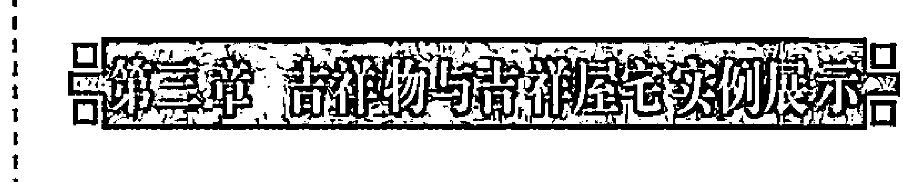

### 第一节 居家风水吉祥物
- 屏风...........................342
- 地毡...........................342
- 风铃...........................344
- 罗盘...........................344
- 八卦...........................345
- 五帝古钱...........................345
- 八卦凹镜...........................346
- 八卦凸镜...........................346
- 算盘...........................347
- 化煞时钟...........................347
- 吉祥猴...........................348
- 台式八卦镜...........................348
- 镇宅桃木剑...........................349
- 石敢当...........................349
- 兽头...........................350
- 狮子...........................350
- 铜质狮子牌...........................351
- 狮头吊坠...........................351

- 金鸡 352
- 鹰 352
- 天机四神兽 352
- 龙 353
- 虎 354
- 玄武 354
- 朱雀 354
- 龟 355
- 辟邪 355
- 八白玉 356
- 六帝尺 356
- 扇 357
- 铜葫芦 357
- 七赤铜钱 357
- 五帝葫芦钱 358
- 八宝吉祥 358
- 九星化煞钱 358
- 水晶七星阵 358
- 太岁玉璧 359
- 钟馗 359
- 武财神 359
- 门神 360
- 铜锣 360
- 山海镇平面镜 361
- 仙人掌、仙人球 361
- 枸骨 361
- 玉麒麟 362
- 麒麟 362
- 貔貅 362
- 象 363
- 锦鲤、金鱼 363
- 羊 364
- 狗 364
- 马 364
- 鼠 365
- 鱼缸 365
- 龙龟 366
- 三脚蟾蜍 366
- 梅花钱 366
- 鼎 367
- 金元宝 367
- 风车 367
- 文昌塔 368
- 文财神 368
- 心经 369
- 刘海仙人 369
- 龙盘 369
- 龙凤圆盘 370
- 和合二仙 370
- 五福圆盘 370
- 凤凰圆盘 371
- 天然葫芦 371
- 眼球玛瑙 372
- 白玉观音 372
- 水晶 372
- 平安瓶 373
- 橡皮树 373
- 风水花瓶 374
- 玉兔 374
- 棕竹 374
- 铁树 375
- 万年青 375
- 开运竹 375
- 发财树 376
- 桃木中国结 376
- 八卦平镜 376

### 第二节 吉祥屋宅实例展示

- 【例一】明堂宽广 377
- 【例二】明堂聚水 378
- 【例三】道路环抱 379
- 【例四】玉带环腰 380
- 【例五】荡胸水 380
- 【例六】环抱水 381
- 【例七】九曲回转水 382
- 【例八】襟带水 383
- 【例九】笔形屋 383
- 【例十】聚宝盆屋 384
- 【例十一】官帽屋 384
- 【例十二】土星格局 385
- 【例十三】天财屋 385
- 【例十四】水绕堂垣 386
- 【例十五】金形屋 386
- 【例十六】左右卫护 387
- 【例十七】金罩天罗 387
- 【例十八】天窗大开 388
- 【例十九】明灯常点 388
- 【例二十】净化明堂 389
- 【例二十一】旺财佛首 389
- 【例二十二】制煞留财 390
- 【例二十三】屏风纳气 391
- 【例二十四】仁智之局 392

## 第四章 居家风水自我检测

### 第一节 屋宅周围环境检测

- 屋宅所在地的山势检测 394
- 屋宅所在地的风势检测 395
- 屋宅的阳光及空气检测 395
- 屋宅周围的地形地势检测 395
- 屋宅周围的水景及道路检测 397
- 屋宅所在地的社区环境检测 400
- 屋宅所在地的土质检测 402

#### 屋宅外部公共设施检测

### 屋宅形格结构检测

### 第二节 居家内部风水检测

- 大门的风水检测 408
- 玄关的风水检测 410
- 客厅的风水检测 411
- 卧室的风水检测 414
- 厨房的风水检测 418
- 儿童房的风水检测 420
- 书房的风水检测 421
- 卫浴的风水检测 422
- 阳台的风水检测 424
- 窗户的风水检测 425
- 楼梯的风水检测 427
- 庭院的风水检测 428
- 植物的风水检测 429
- 过道的风水检测 430
- 餐厅的风水检测 431
- 车库的风水检测 432

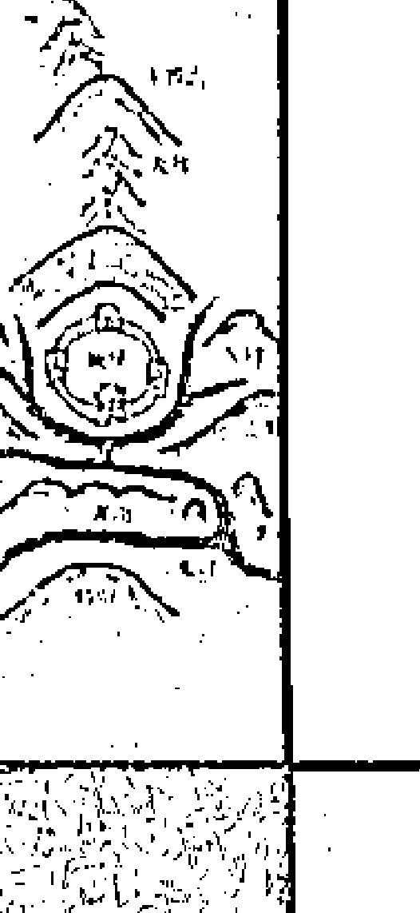

## 第一章

### 化煞的基础知识

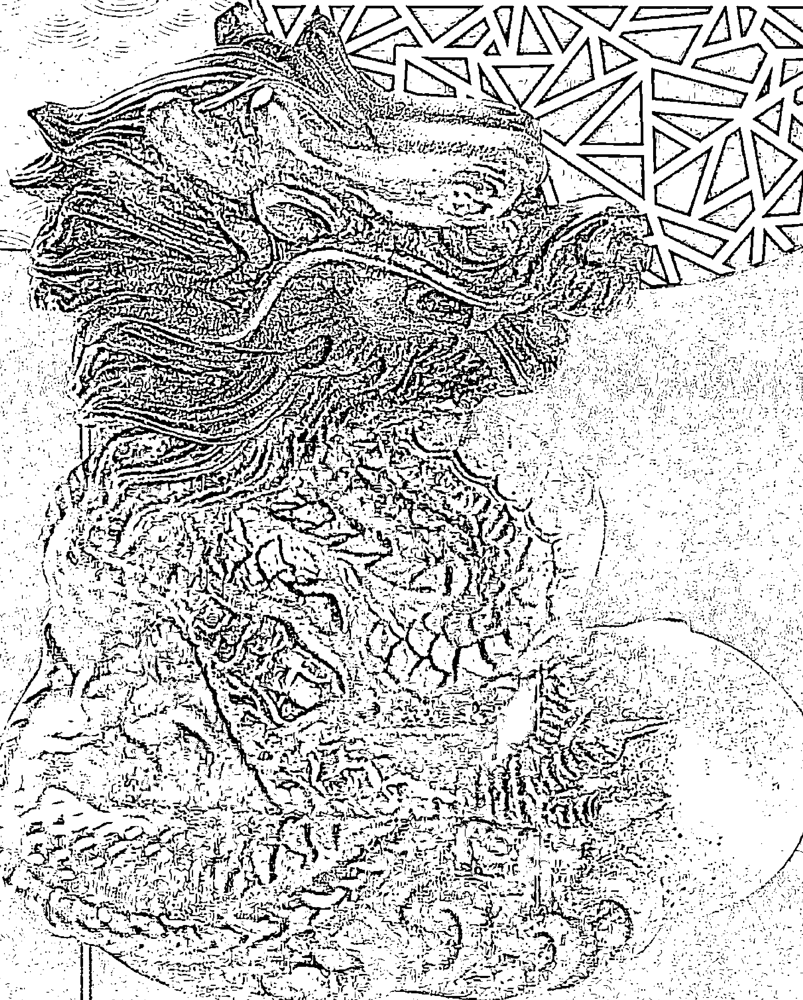

在居家风水中，煞气是指一切对住宅不利的因素。煞气有看得见的形煞，看不见的飞星煞，还有形煞和飞星煞的组合体。真正地认识煞气的内在性质和其对人的危害程度，解除这些对住宅不利的因素，是调理风水、化解煞气的重要内容。

## 第一节 煞气的含义

煞气是对地面凶恶气流的统称，一般来说是指对家居住宅构成不利影响的凶恶气流。依据煞气的含义和煞气构成的形式，可把煞气分为三种：形象煞气、无形象可见的飞星理气上的煞星、峦头与理气结合而构成的凶煞。

### 释 形象煞气

形煞，就是房屋外部峦头形状不佳，构成不利住宅的煞气。这种煞气是指站在住宅大门或视窗处，眼睛所见到的一些不吉利的峦头形状，正对着房屋的大门或窗户，那些不利住宅的峦头部分称为住宅外部煞气。

形象煞气是可以看见甚至能够触摸到的，如屋角、直路冲射、铁塔、电线杆、变压器、天桥等形状不佳物体形成的煞气。虽然这种单纯的外部煞气，不会直接对房屋主人产生太大的危害，但还是在一定程度上会影响住宅风水。为了减少外部峦头煞气对住宅风水的影响，要运用风水物品进行化解。

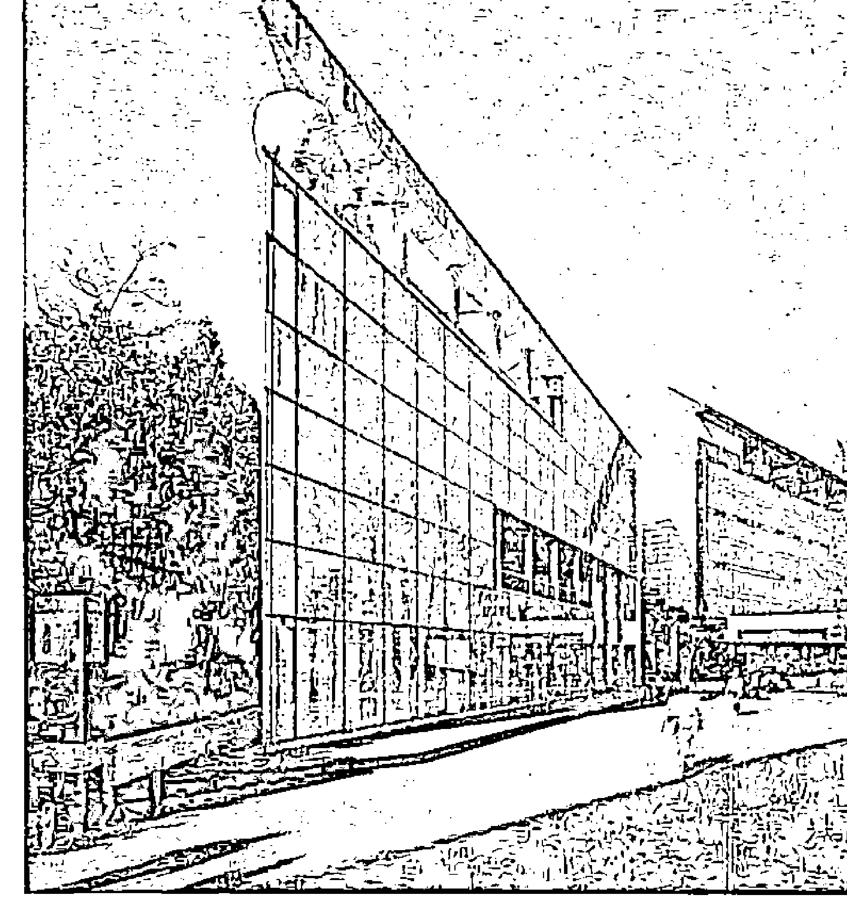

◎突出而锋利的建筑，给正对的住家极大的视觉冲击，是形煞中最常见的一种。

### 释 飞星理气上的煞星

飞星理气上的煞星，就是四种不利飞星：

- ①二黑为病符星，五行属土，主疾病、瘟疫。
- ②三碧为蚩尤星，五行属木，主口舌纷争。
- ③五黄为廉贞星，五行属土，主凶灾祸患。
- ④七赤为破军星，五行属金，主灾祸、病伤之灾、盗贼、官非和手术之灾。

以上这四个飞星煞气，一般都是在失令时体现出来的，其煞气力量的大小各有不同，都是因与其他飞星组合后发生了“生、克、制、化”的关系，而出现新的变化，这种变化会使原来的煞气增强或减弱。

### 峦头与理气结合而构成的凶煞

所谓峦头与理气结合而构成的凶煞，实际上就是指前面两种煞气组合后产生的一种特殊的凶煞。这种煞气的力量相当大，若出现在住宅大门或窗户的方位，则会严重地破坏房屋的风水，不仅影响宅主的运气，而且还会对宅主的身体健康构成威胁。

住宅外部峦头、房屋尖角或有直路冲射房屋的大门或窗户，就自然地构成了宅外凶煞。如果此大门或窗户所处的宫位上的飞星组合，恰好是理气上的煞气时，那么这种煞气的力量更大，煞气的灵验度非常高。风水学上流传着“峦头无理气不灵，理气无峦头不验”这样的俗语，就是说明峦头与理气同步所构成煞气的综合关系。

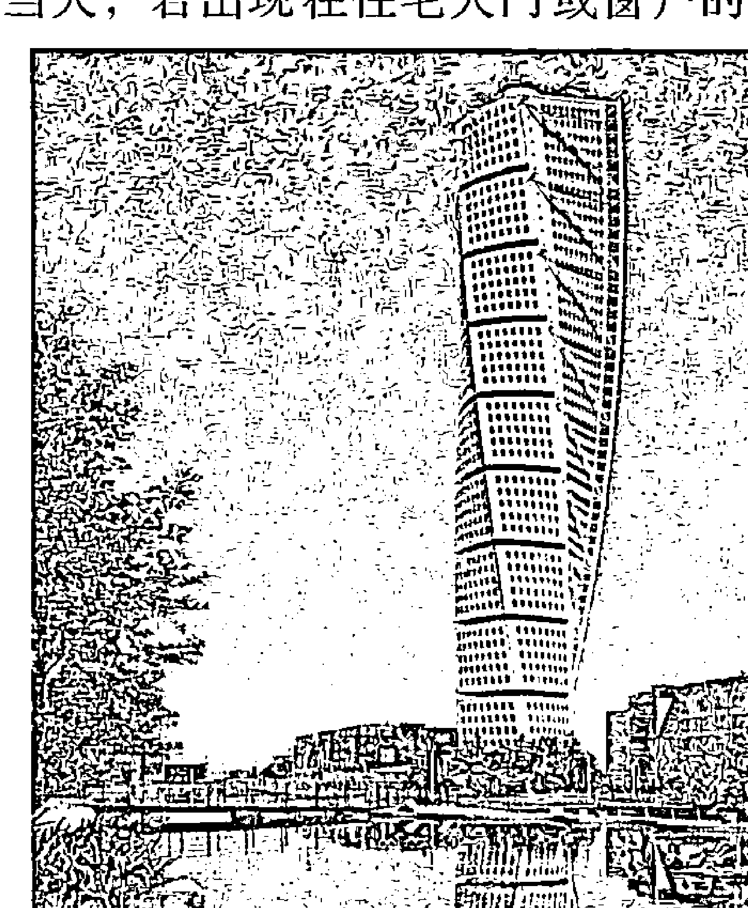

◎若住宅周围出现一楼独高的建筑，且刚好处在凶方时，住家需注意防范，以尽快找到化解方法为妙。

第一节 煞气的含义

## 第二节 飞星与煞气

要了解飞星的意义和煞气，必须学习掌握天文历法的基础知识，“三元九运”“星宿的吉凶”以及“九星飞伏”就是必须要掌握的知识。风水学中的九颗飞星，对应的九宫的方位，既影响了时空，也影响了不同坐向住宅的运势。

### 释 三元九运

在历法上，每60年称为“元”，上元掌管60年，中元掌管60年，下元掌管60年，“三元”一共180年。由黄帝开始至1984年共有78个甲子，也即78元，由1984年至2003年，为下元七运的20年；由2004年至2023年，为下元八运的20年；由2024年至2043年，便是下元九运的20年；直至2044年开始，又走回上元一运，如此循环不息地计算着地球的时空。
将九宫的9粒星套入这180年当中，每一粒星掌管20年。

- 一白星掌管的20年称为“一运”。
- 二黑星掌管的20年称为“二运”。
- 三碧星掌管的20年称为“三运”。
- 四绿星掌管的20年称为“四运”。
- 五黄星掌管的20年称为“五运”。
- 六白星掌管的20年称为“六运”。
- 七赤星掌管的20年称为“七运”。
- 八白星掌管的20年称为“八运”。
- 九紫星掌管的20年称为“九运”。

当“九运”即180年结束的时候，又再由一白星掌管“一运”，如此循环不息地计算地球的时空。三元所计算的是地球的理气，即是一种计算宇宙地球之内大的空间变换对风水产生影响的方法。地球在过去1984~2003年行七运，也即是由2004年开始，地球进入20年的八运之中。八运过去，由2024年开始，地球进入九运。

处于八运的时候，掌管九运的九紫星称为“未来星”。未来星代表吉星，这代表在八运的20年当中，九紫星所到之处，都能够带来吉运。此外，凡9的数字都代表吉祥。

当七运退下来，由八运接上的时候，七运星以及之前的星宿都称为“退运星”，也称为“失令星”。这代表由一白星到七赤星都是吉中带凶，或者极凶之星，这些星宿飞伏的地方，需要通过风水摆设将凶煞化走。在八运之中，由2～7的数字属于退运星，都代表失令；而1和9属于未来星，是吉星。

### 释星宿的吉凶

明白“得令星”与“失令星”的含义后，便可以掌握每一粒星宿的吉凶。飞星煞气，一般都是处在失令之时体现出来的。它们所造成的影响各有不同，都是因组合后与其他飞星产生了生克制化的关系，而产生了一种新的变化。这种变化会使其本身所带的不利之气增强或减弱。

第一粒星叫“一白贪狼星”，五行属水。一白星在得令的时候，代表升官、名气、中状元等官运和财运。失令的时候，此星为桃花劫，破财损家，甚至性病、绝症，异乡流亡。

第二粒星叫“二黑巨门星”，五行属土。二黑星代表病符。此星在得令的时候并非病符，代表位列尊崇，能成霸业。但此星失令的时候，是一级大凶星，破财损家，代表死亡绝症、破财横祸，与五黄星并列为最凶之星。此星也代表招来阴灵。

第三粒星叫“三碧禄存星”，五行属木。三碧星代表是非。此星在得令时代代表因口才而成名，大利律师、法官及鬼才等职。但此星失令的时候，代表是非官非，破财招刑。

第四粒星叫“四绿文曲星”，也叫“文昌星”，五行属木。文曲星在得令时代代表文化艺术、才华、文思敏捷。但失令时为桃花劫星，必招酒色之祸。

第五粒星叫“五黄廉贞星”，五行属土。廉贞星得令时代表位处中极，威崇无比，如皇帝之最尊最贵。但此星失令的时候，称为五黄煞，又名正关煞，代表死亡绝症、血光之灾、家破人亡。此星也必招邪灵之物。

第六粒星叫“六白武曲星”，五行属金。六白是偏财星，与一白、八白合称三大财星。六白得令时丁财两旺，失令时为失财星，可令倾家荡产。

第七粒星叫“七赤破军星”，五行属金。七赤星当运的时候，大利以口才工作的人，包括歌星、演说家、占卜家等，大利通讯传播。但七赤星退运的时候，代表口舌是非、刀光剑影、世界大战，又代表火险及身体上呼吸、肺部出毛病。

第八粒星叫“八白左辅星”，五行属土。八白星得令时为太白财星，能带来功名富贵，田宅科发，为九星中第一吉星。此星失令时，为失财失义、瘟疫流行，失财于刹那间。

第九粒星叫“九紫右弼星”，五行属火。九紫星当令时为一级喜庆星及爱情星，代表桃花人缘及天乙贵人，大利置业及建筑。但此星失令的时候为桃花劫星，损丁破财，也主火灾、爆炸、心脏病、眼疾、流血等。

### 释九星飞伏

九星飞伏法也叫“八十一步量天尺”，这是整个风水学理中一个非常重要的理论，通过这个理论可以得知空间转换的规律。记主飞星的飞伏方法，便可得知空间是如何转换的。

飞的次序如图，即是由中间的第一步开始，飞向右下方的第二步，然后飞到第三步，一直依次飞到第九步为止。当飞到第九步之后，那粒星会再飞回第一步的位置，然后又重新开始1至9的飞伏次序。这是九宫飞星的飞伏次序，是推算天上星宿飞伏的状态。

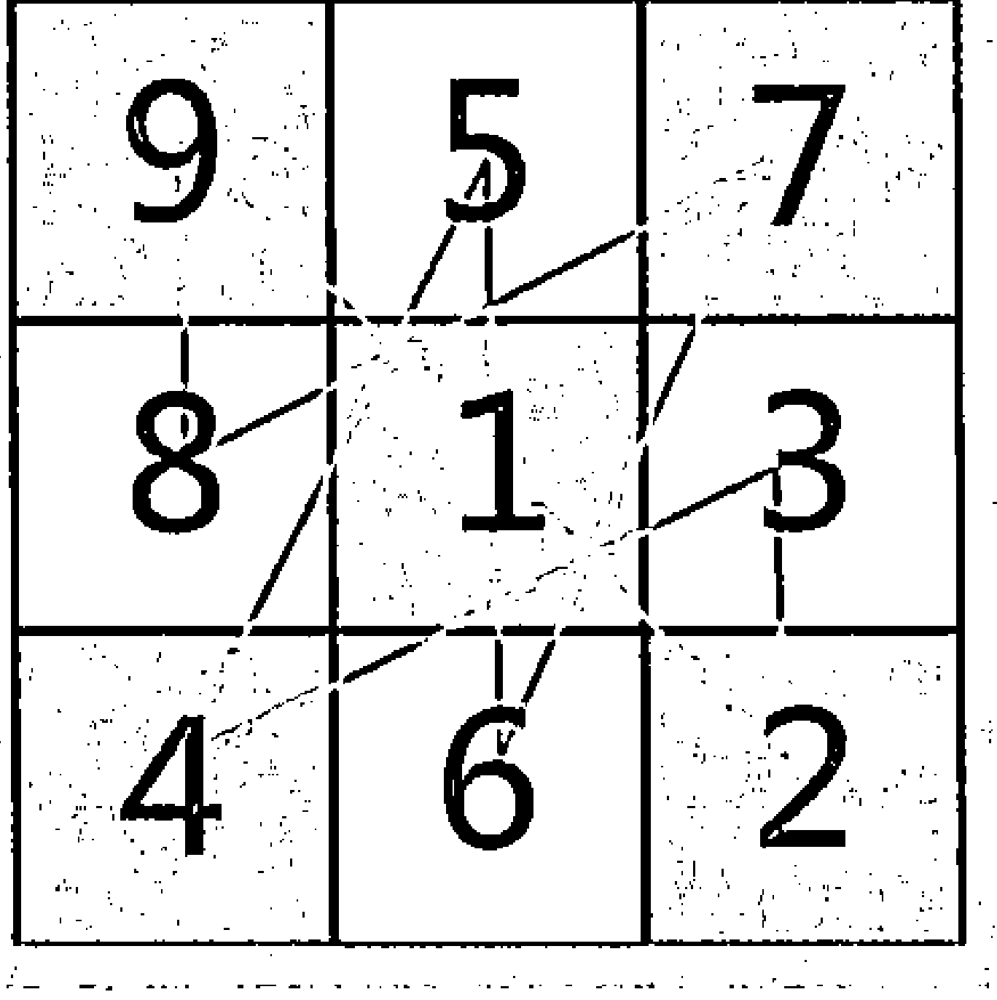

如果中央一格是5，按前文飞星的次序，便会变成下面的左图：

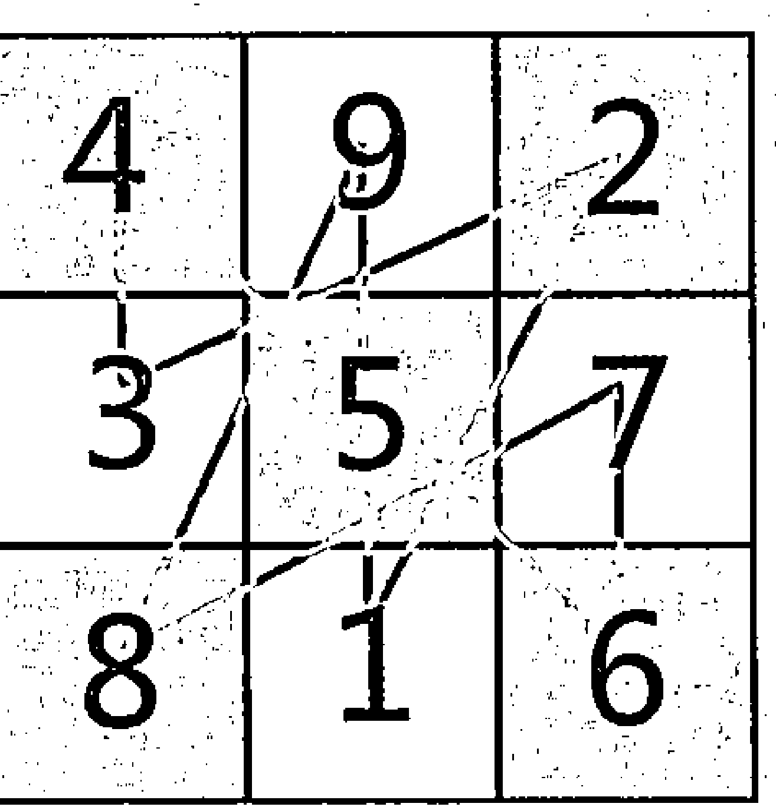

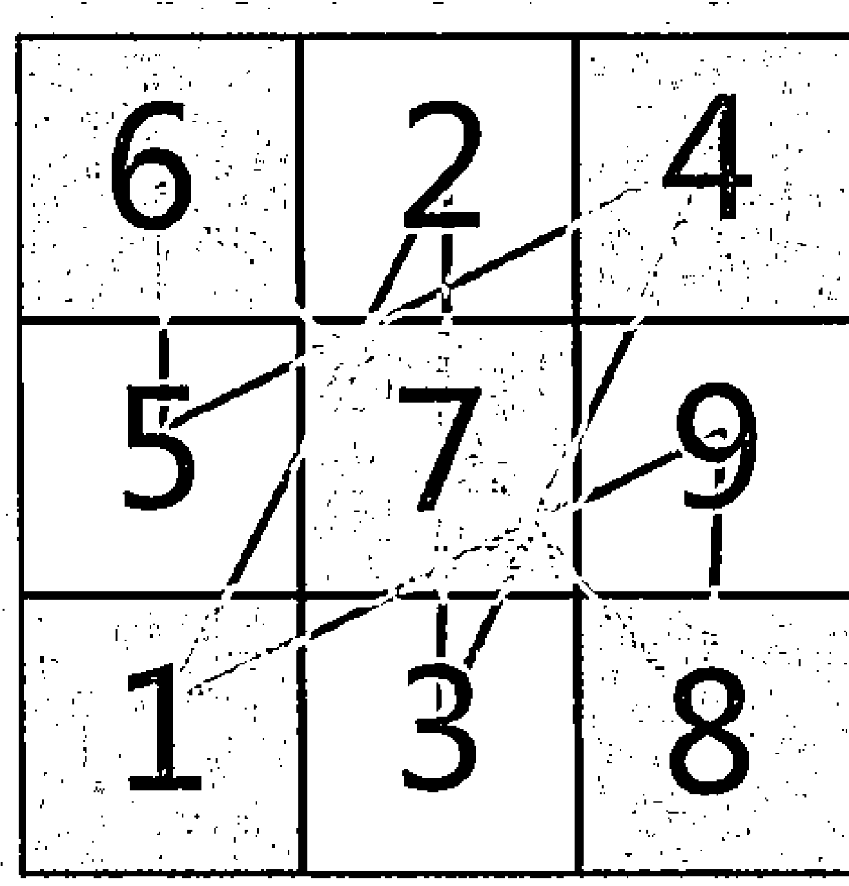

这种以5字飞入中宫的九星分布，称为后天八卦。以2011年为例，此年七赤星飞入中宫，于是我们得出以7为中宫数的九星飞伏，8和9分别飞进西北和西方，2飞进南方，5飞进东方。

一个九宫格分别由易经的八个卦象“震、巽、离、坤、兑、乾、坎、艮”去代表东、南、西、北、东南、西南、西北、东北八个方位。

九宫格上的每一个方位分别对应着一位家庭成员。九宫格内的每一格代表一粒星宿的飞伏。九宫格内由1至9的数字代表天上九粒星宿的名称，分别是一白星、二黑星、三碧星、四绿星、五黄星、六白星、七赤星、八白星、九紫星。

这九粒星的位置并非固定，按照九星飞伏次序，每年、每日甚至每时都在不停地飞伏。每粒星宿及每个卦象都代表一种五行，而九粒星代表九种不同的吉凶。当我们了解每粒星宿和每个卦象的五行特性，便可以找出当一间屋坐落于某个卦象方位之上，那一间屋的风水会出现哪一种特征。我们也可以根据九星飞伏的规律，找出当一粒星宿在某个时间飞到某个方位之上，那个方位的风水会出现什么变化，从而知道住在那个方位的人可能发生什么问题。

### 释九星煞气的构成原理与化解方法

人的身上带灾气，是由于原命局的五行能量不平衡造成的，如果进入不利命局的流年，就会引发灾难的发生。凶灾的化解，实际上就是针对原命局五行的生克制化关系产生的不利因素，寻找一种化解或调整的方法。

由于房屋坐向不合元运或方位飞星组合不妥，使住宅内部形成理气上的煞气，这种煞气实际上就是阳宅飞星盘中飞星五行生克关系而产生了一种不利人体健康，同时又能影响人的运气的煞气。要化解这种煞气，唯一的方法就是寻找一种能起到通关两种五行的生克关系，并且使两种五行化敌为友的化煞风水用品。

化解阳宅理气上的煞气，使用的风水物品多数是代表五行性质的物体，以及代表五行的颜色和数量。现将阳宅飞星盘中九个飞星的生克关系以及煞气构成原理、化解方法论述如下：

#### 一二组合

一代表一白坎水，二代表二黑坤土，是病符星。二者组合，二黑病符土星必然会克制一白水星，因一白坎代表中男，对应人体上的血液、脉络、肾脏及女性子宫，当一白水星受到二黑坤土病符星的严重克制时，家中的老二就会出现不顺，家人就会患血液、脉络、肾脏以及妇科疾病。

化解二黑土克制一白坎水的唯一有效方法，就是用五行属金的物体，摆放在一与二组合的宫位上。

#### 一五组合

一代表一白坎水，代表中男与家中的男人。五代表五黄土，五黄象徵毒药。一五组合，多数不利家中的男人，代表人体上血液与肾脏的一白坎水星受到五黄克制，家人容易患血液和肾脏疾病。如果居住在一五组合宫位上的人，命局忌神是土五行，那么必有大祸临头，轻则易患毒症，重则伤亡和牢狱之灾。

化解五黄土克制一白坎水，可以用五行属金的高能量物品，因为五黄土的力量很大，运用平常的方法化解是难以见效的。五帝古钱力量很大，完全可以化解五黄煞星的能量，因此，在一五组合的宫位悬挂一串用朱砂白酒开过光的五帝古钱，可以化解五黄克一白的不利因素。

#### 一八组合

一六八为三白吉星，即一为一白坎水，六为六白乾金，八为八白艮土，若某宫位有一六八组合，则为大吉之象，因为三星组合，形成八白土生六白金，六白金生一白水，连续相生为吉祥效应。

若一白坎水与八白艮土组合，就形成土克水，不利中男，家人易患肾病、血液病和妇科疾病，应用五行属金的物品通关化解。化解八白土克一白水，最有效的物品是圆形铜钟，即在一与八组合的宫位上，安置一个圆形大铜钟。也可以用六个圆形小铜铃，以麻线串连一体悬挂在一与八组合的宫位上，还可以在一与八组合的宫位上，摆放或埋六个水晶球。

#### 一九组合

一白坎水与九紫火组合，为水克火，火为目，代表心脏，家人易患心、目疾病。一白坎水克制九紫火，可运用四绿木通关化解，因为在河图数中，四九为金，称四九为友。运用四九组合，以金生一白饮水，九紫火自然就消失了。同时四为巽，依玄空学理的原则，一四同宫，四为文昌星，有利科名。

还可在一九组合的宫位，摆放四株富贵竹或四株树木的盆栽。

#### 二三组合

二黑坤土星，代表老母、女性，对应人体上的脾胃。三碧木星，代表长男、男性，对应人体上的肝胆。二三组合名为斗牛煞。三碧木星克制二黑土星，不利家中老母，家人易患脾胃疾病。

化解三碧木克二黑土，可以运用火来化泄木。在二三组合的宫位，摆放红地毯或用红灯去化解三碧木克制二黑土的煞气。不过用火太旺会生扶二黑土病符星，因此在化解时应注意把握分量，否则会引起反作用。若二黑病符星受生旺盛，就用圆形鱼缸养六条黑色或蓝色鱼，因为圆形是金，六数是代表六白乾金，目的是使二黑土生金，金生水，达到连环相生的良好效果。

#### 二四组合

二黑坤代表家中老母，代表老妇人，在人体上代表腹、皮肤、胃与消化系统。四是四绿木星，代表家中长女。二四均是阴数，二数组合，可喻二女同宫，称为寡妇数。

二四组合，二黑土受四绿木克制，对家中老母不利，家人易患胃病、皮肤病、腹部及消化系统疾病，宜用红色地毯去化泄四绿木，化解四绿木克二黑土的煞气。居住在二四组合宫位的人命局喜土最佳，若木是命局的忌神，宜用红色地毯去泄四绿木，生扶二黑土，这样就会化解宅主命局真正的煞气，因此在化解煞气时，必须要参考宫位主人的命局喜忌。

#### 二五组合

二黑为土，五黄为土，二五组合，土的力量很大。

二黑与五黄组合，是病符星与毒药星的会聚，煞气相当大。二五组合的宫位若有大门、房门、道路、走廊、厨灶、厕所等均属不利，宜用风铃化解，或用六枚乾隆钱用红线穿起，悬挂在二五组合的宫位上。

#### 三八组合

三碧木克八白艮土，应以火泄木为原则，宜用红色的地毯、窗帘、灯饰或红花化解。

#### 三六组合

三碧木受到六乾金克制，宜用水通关化解，或在三六组合宫位上摆放五行属水的黑色或蓝色物品。黑色与蓝色代表水，水能泄金生木。

#### 六七组合

六七同属金，由于金为肃杀之气，六七同宫时，肃杀之气过重，称为交剑煞。要化解六七同宫的肃杀之气，可用水化泄金，宜在此宫位上按摆鱼缸，养黑色鱼类。

#### 九五组合

九紫火生五黄土，火生土便使五黄土的煞气更旺。九紫为迅速现象，五黄是毒性，九五组合会促使不利的事情很快发生，可以用五帝铜钱和铜制的八卦化煞罗盘，运用金泄去五黄大煞的凶性。

#### 九六组合

九紫火克六白金，可以在二星组合的宫位，摆放黄色地毯或其他黄色的物品来化泄九紫火星。黄色五行属土，对九紫火和六白金的对抗能起到通关作用。

### 九宫飞星与对应吉祥物

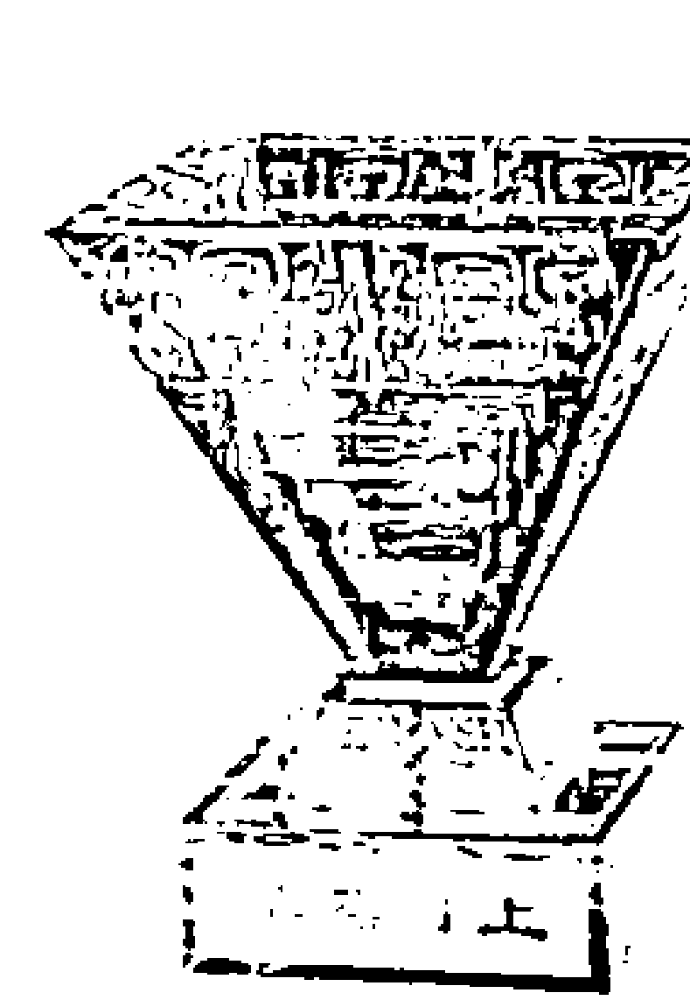

- ◎一白财星：聚财斗

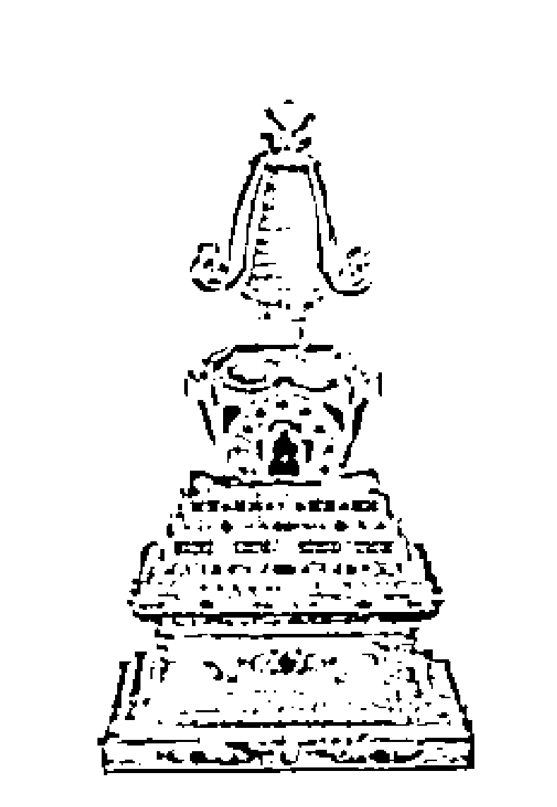

- ◎二黑病符：大宝藏塔

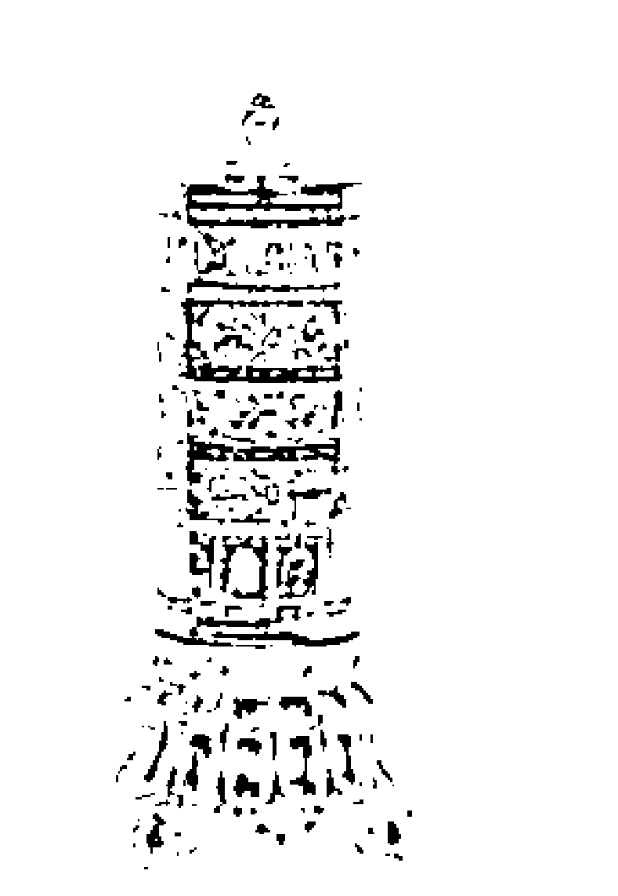

- ◎三碧是非：吉祥如意轮

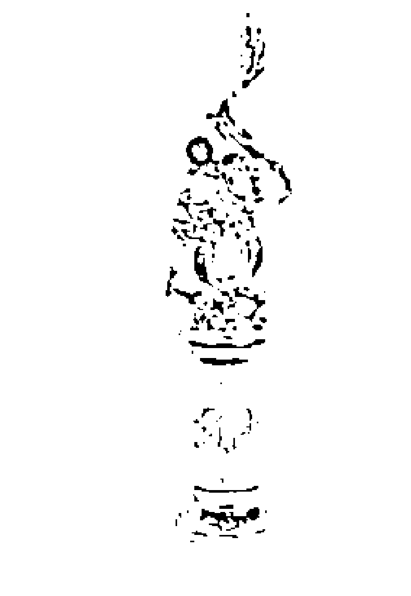

- ◎四绿文昌：龙凤文昌柱

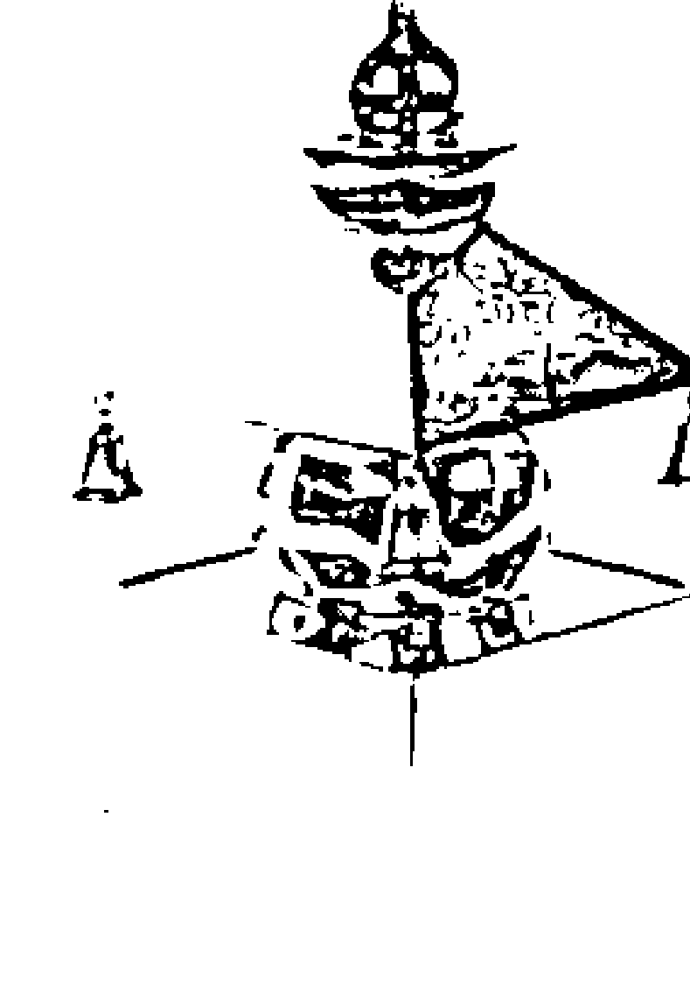

- ◎五黑瘟神：五轮塔

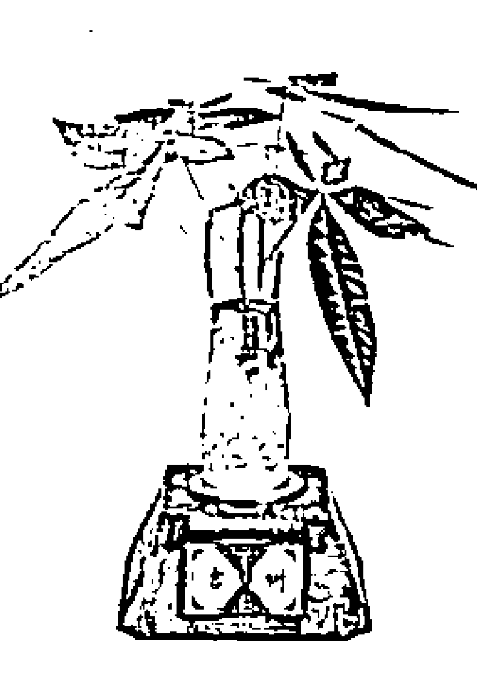

- ◎六白财星：吉祥树

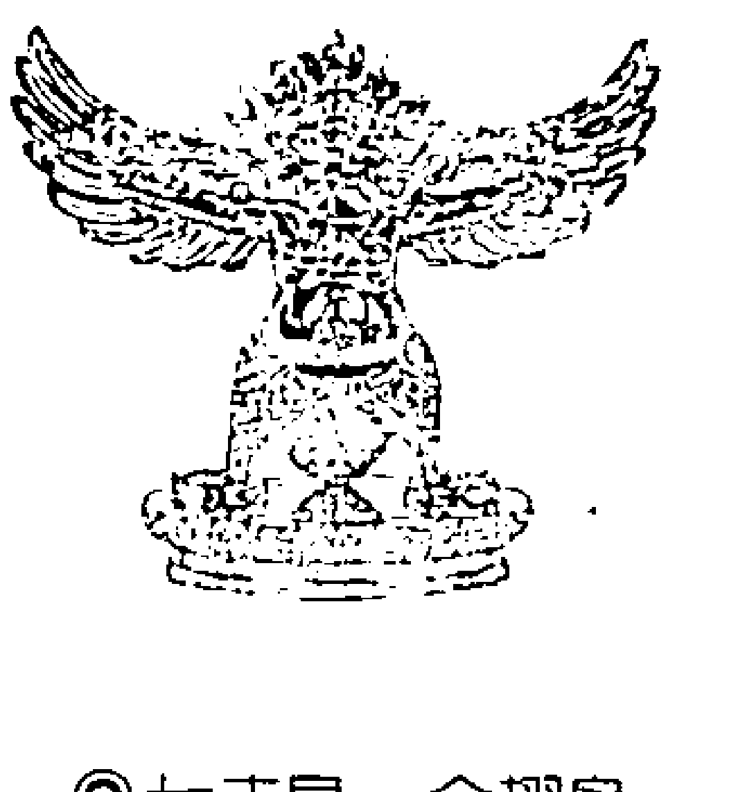

- ◎七赤星：金翅鸟

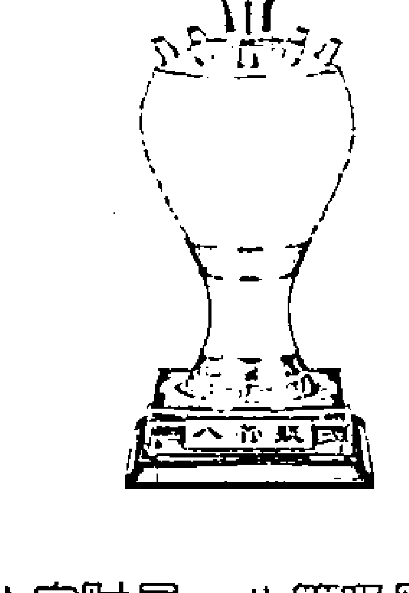

- ◎八白财星：八白吸财宝瓶

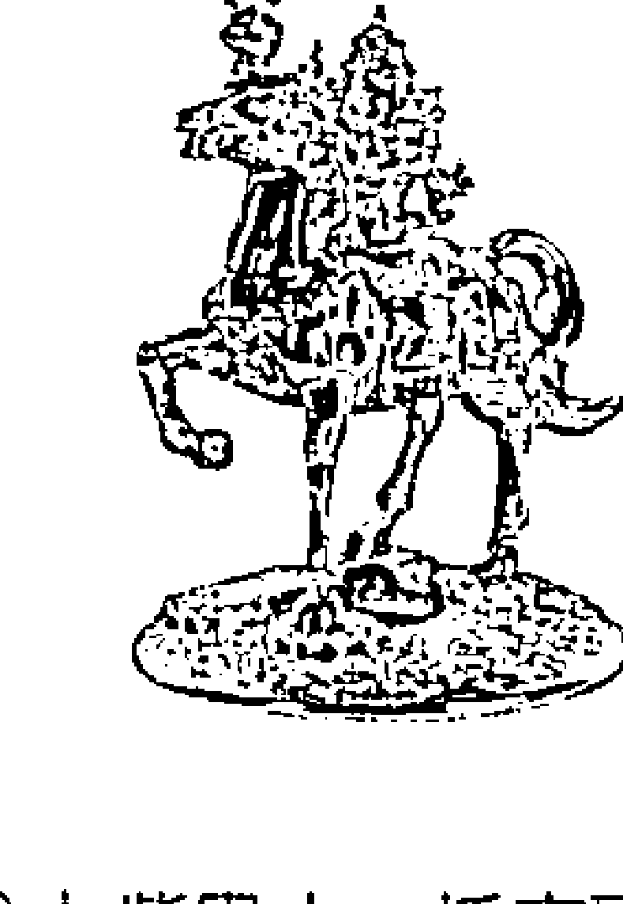

- ◎九紫贵人：托宝马

## 第三节 二黑病符煞气

在二运里，二黑坤土星是吉星，可以运用它来旺相招财。除二运外，二黑土星飞临的方位都可称为犯病符煞，犯病符煞气会损害家人的身体健康，容易引发各种疾病。

### 二黑土星的性质与山向二黑的弊端

二黑名巨门星，五行属土，颜色为黄、咖啡色、黄黑色。二黑又为病符星，一切最为凶险之事均临门生祸。犯二黑病符煞气时，死亡病痛、破产破财纷至沓来。二黑巨门星与五黄廉贞星并列排为最凶星。

犯病符煞的方位上，除了原宫位有其他飞星自行化解外，必须运用风水用品化解，将二黑病符煞气的力量化掉，才能确保家人平安。二黑飞临以下几个方位，必须及时化解：

- ①二黑土星飞临山盘方位，犯二黑病符煞，必须及时化解。房屋内部二黑土星飞临的山盘方位，不宜处于高位，不宜摆放电器等高大物品；房屋外部环境有二黑土星飞临的山盘方位，不宜有高山、高楼大厦等高大物象。若房屋内部或外部，有二黑星飞临的方位上出现高大物品与物象，就会扶助二黑病符煞星的力量，遇此情况应尽早化解为宜，否则会招致疾病或意外损伤。
- ②二黑土星飞临向盘方位，犯二黑病符煞，必须及时化解。在房屋内部，二黑土星飞临的向盘方位，不宜处于低处，更不宜见水；房屋外部环境有二黑土星飞临的方位，不宜低洼或见真水，特别不宜见污臭的凶水，否则会扶助二黑病符煞星的力量，应尽早化解为宜。
- ③年月日时二黑土星飞临的方位，犯二黑病符煞，必须及时化解。特别是年月二黑的煞气更为严重，对家人的身体影响更坏。千万不要在二黑病符煞星飞临方位上兴工动工，否则主人易患病灾。
- ④凡年月二黑病符星和山盘上的二黑病符星重叠时，必须及时化解。若不进行化解，家中之人易患病灾和意外凶灾。

### 化解二黑病符星的方法

二黑土病符星对人的身体危害很大，若发现房屋某方位上有二黑土星光临，就应该运用风水化煞物品化解。

- 1. 化解二黑病符煞星的最佳风水化煞用品是铜葫芦。铜葫芦是仿葫芦形状的铜制品。二黑病符星五行属土，铜葫芦的五行属金，因此铜葫芦具有化解二黑土煞的功效。同时，葫芦有两个大小不同的圆形肚身，圆形也属金，可化泄土，葫芦的身大嘴小，所收入葫芦肚的煞气易入难出，最后被化成脓水。
- 2. 化病符煞，除了使用铜葫芦外，还可以运用古铜钱，五帝古铜钱的化煞效果最佳。铜钱五行属金，自然可以化解二黑土煞气。若使用六帝古钱化煞，则在五帝古钱上加入道光皇帝，成为六帝古钱，六数代表六白金，铜钱又属金，铜钱圆形也属金，形、质、数三者都属金，具备化解二黑土煞的强大力量。运用五帝古钱或六帝古钱化解二黑土煞，用前必须经朱砂和酒开光，在铜钱上点洒含酒的朱砂。

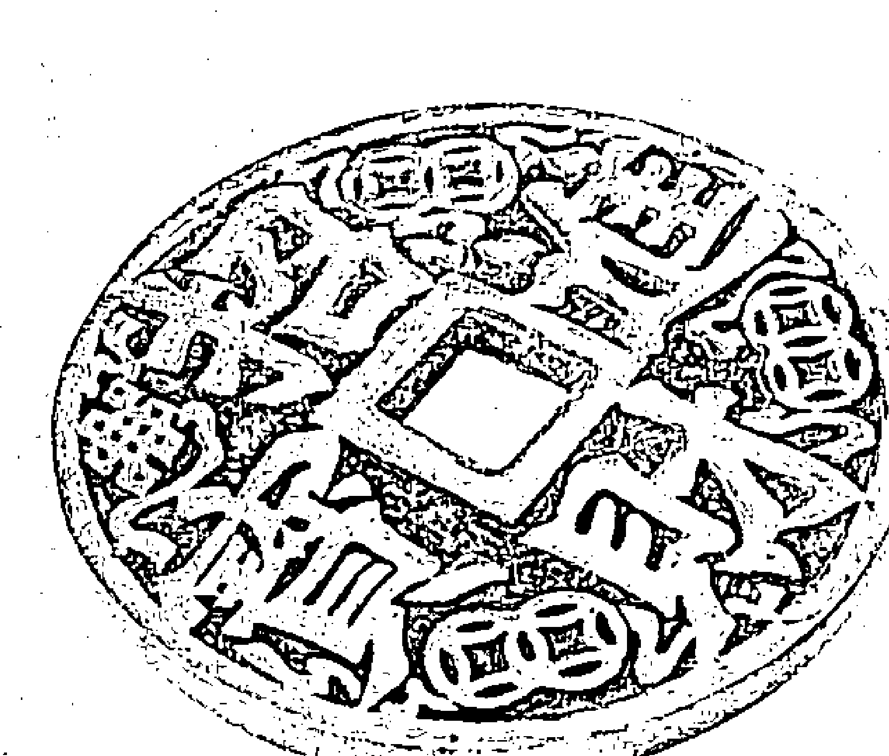

- ◎铜钱五行属金，铜钱圆形也属金，具有化解二黑土煞的强大力量。

## 第四节 勘察风水的三大凶点

装修时，找出房屋有没有犯该年太岁、三煞及五黄，是勘察风水之三大凶点。只要找出这三大凶点加以化泄，一宅之凶运便可消除。如果在这些较“凶”的气场上动土建屋、爆炸或有巨型机器滚动，均会催旺三大凶点肆虐。

### 释太岁主灾祸连环

太岁是天上的木星磁场所影响的磁力波，每12年游走一周，按十二地支可找出太岁位。例如2011年是辛卯年，卯年太岁就是二十四山的卯方，因此该年的东方“乙卯甲”犯太岁。如果一人的生肖属兔，也属太岁，凶中更凶。太岁位可坐不可向，宜静不宜动。2011年的太岁方在正东方，此方五黄星飞临。所以东方是2011年肖兔者最需要注意及化解的方位。

再如，1948年为戊子年，此年生人的年太岁为子，按十二地支排，子午对冲，若到午年，即为“年冲太岁”，因此此年生的人建屋向子坐午，又遇上马年（1990年及2002年），便是太岁入屋，冲犯太岁，灾祸连环，流年二黑病符在午方则更催旺太岁了，应验大病、入院、开刀。因此，鼠人不立鼠门，牛人不立牛门，可避12年一次的劫数。

化解太岁很简单，传统上可用八卦来化太岁，八卦内的阴阳二爻内藏天干地支，八卦可收地支，吸纳其凶，如子遇母。因此在中国传统的饰物中，八卦图案可化太岁。历代的瓷器、铜器制品中，极多以八卦为图，其理在此。

### 生肖太岁位

| 生肖 | 地支 | 太岁方位 | 生肖 | 地支 | 太岁方位 |
| :---: | :---: | :---: | :---: | :---: | :---: |
| 鼠 | 子 | 正北 | 马 | 午 | 正南 |
| 牛 | 丑 | 东北偏北 | 羊 | 未 | 西南偏南 |
| 虎 | 寅 | 东北偏东 | 猴 | 申 | 西南偏西 |
| 兔 | 卯 | 正东 | 鸡 | 酉 | 正西 |
| 龙 | 辰 | 东南偏东 | 狗 | 戌 | 西北偏西 |
| 蛇 | 巳 | 东南偏南 | 猪 | 亥 | 西北偏北 |

### 释三煞招劫盗伤杀

三煞是指“岁煞”、“劫煞”及“灾煞”。古历以寅午戌年在丑为“岁煞”、在亥为“劫煞”、在子为“灾煞”，因此三煞很多时合而称之，因为三煞合于一方，“丑亥子”刚好在北方。三煞方位有口诀：“申子辰年煞在南，寅午戌年煞在北，亥卯未年煞在西，巳酉丑年煞在东。”凡在寅午戌年，北方水位即为年三煞位；申子辰年，南方火位为年三煞位；亥卯未年，西方金位为年三煞位；巳酉丑年，东方木位为年三煞位。

犯三煞，主有劫盗伤杀之凶，如果造房动土的方位属于犯三煞的方位，就不可动土，犯之主凶，有可能应验灾病疾厄之事。例如2011年，三煞在西方，在此方种植植物可化三煞。

很多人用一对麒麟化三煞，头向外，尾向屋内，但嘴巴一定要用红朱砂点红，否则对家人不利。飞星派化三煞也考虑飞星五行，2011年西方见九紫，放赤毛麒麟生旺火局可以化三煞，也旺桃花贵人。

太岁之方“可坐不可向”，三煞之方“可向不可坐”。向三煞又名斗三煞，很多时候有招财的作用。

### 释五黄为流年关煞

五黄煞，风水的常用词。五黄星是风水九星中凶性最大的一颗星，五黄为流年关煞，凡五黄星飞临的方位不可兴工动土，否则会招来凶险、意外、破财等凶灾。

风水的九星在方位上各有自己的本来位置（又叫宫位），五黄土星平常寄生于坤艮二宫，只有当五黄星到中宫的时候，才算有了自己的本宫位置。五黄为煞星，又称戊己大煞，它只有在居中宫的位置时，才不发挥其本来的凶性，但一旦它飞入到其他宫时，它的凶险的本性就开始显露无遗。特别是当五黄星与二黑病符星同宫相遇时，更是凶上加凶，必将为此方带来更大的灾祸。由于五黄星所到之处残害一切生灵，凶残之极，故谓“五黄煞”。

#### （1）五黄煞在不同方位对人体的影响

五黄飞临的方位，宜静不宜动，因为五黄所到之处必有凶性，会对宅主家人的身体健康构成不利的影响。而且五黄飞临不同的方位，对人体影响的情况也是不同的。此种推断特别准确、灵验，请大家加倍留意。

- ①五黄在东方与东南方。东方与东南方分别属于八卦的震卦和巽卦，五行属木。五黄飞到这两个方位，都会引起肝病、胆病，要留意饮食卫生，防止肝炎的发生。四肢（手及脚）容易受伤，五黄在震位易伤手脚，五黄在巽位必会导致手脚抽筋及皮肤病发生。
- ②五黄到南方。在八卦上，南方属于离卦，离卦管人的目与心脏。若五黄星飞临南方，就会使宅主患眼部疾病和心脏病。另外还要小心防止血光之灾或防金属器刺伤。
- ③五黄到东北方及西南方。东北方与西南方分别属于八卦上的艮卦和坤卦，五行属土，土代表人的脾胃及消化系统，还代表人体上的皮肤。五黄飞到东北方和西南方，容易引起家人患脾胃疾病、腹病、肠炎及消化系统紊乱等疾病，要留意饮食问题，还要留意皮肤病的发生。
东北艮卦代表家中的少男，西南坤卦代表家中的老母，若五黄飞临坤艮两个卦位，就特别会对家中的老母、少男的身体健康构成不利的影响。
- ④五黄到西方与西北方。西方与西北方分别属于八卦上的兑卦和乾卦，五行均属金，金代表人体的肺部及呼吸系统。若五黄飞临兑卦或乾卦，就会引起家人的呼吸系统疾病、肺病，五黄土助金旺可克木，还要注意防止胆病。
西方兑卦代表家中的少女，西北方乾卦代表家中的老父，若五黄飞临西方或西北方，就会对家中的少女或老父的身体健康构成威胁，还会破坏原有的良好运气。
- ⑤五黄到北方。北方在八卦方位上属于坎卦，五行属水，水代表人体上的肾部、腰部及泌尿系统。若五黄飞临北方，就会引起家人肾脏及腰部的疾病，还要留意泌尿系统方面的毛病。
- ⑥五黄到中宫。中宫的五行属土，土代表人体上的脾胃、皮肤，中宫也代表宅主的心脏。若五黄飞临住宅的中宫，就会使家人患上脾、胃、心脏、肠及消化系统方面的疾病，还会使家人患皮肤病、疮瘤，还会有血光之灾。

### 五黄煞所到的时间与方位对应表

| 时间 | 方位 | 时间 | 方位 |
|------|------|------|------|
| 1998戊寅 | 东北 | 2011辛卯 | 东 |
| 1999己卯 | 南 | 2012壬辰 | 东南 |
| 2000庚辰 | 北 | 2013癸巳 | 中 |
| 2001辛巳 | 西南 | 2014甲午 | 西北 |
| 2002壬午 | 东 | 2015乙未 | 西 |
| 2003癸未 | 东南 | 2016丙申 | 东北 |
| 2004甲申 | 中 | 2017丁酉 | 南 |
| 2005乙酉 | 西北 | 2018戊戌 | 北 |
| 2006丙戌 | 西 | 2019己亥 | 西南 |
| 2007丁亥 | 东北 | 2020庚子 | 东 |
| 2008戊子 | 南 | 2021辛丑 | 东南 |
| 2009己丑 | 北 | 2022壬寅 | 中 |
| 2010庚寅 | 西南 | 2023癸卯 | 西北 |

#### （2）制化五黄煞星的方法

流年五黄煞根据流年飞星而定，每年换一个方位。流年五黄煞所飞向的方位，是该年中最不利的方位，要绝对避让或做化解煞气。避让就是做到不在五黄位动土，不在该位使用红、黄之类颜色的地毯。

佛堂道观以敲打铜锣铜磬为修行之仪轨，其实敲磬是化五黄煞的，因此佛堂也有风水物品。古代大官出巡，必先敲鼓鸣锣响道，也是化五黄，将土星的磁场瓦解。根据每年飞星，找出五黄位置，便可安放化泄物。下面介绍三种制化五黄的有效方法：

- ①用一个大铜铃与六个小铜铃串连在一起，系于五黄星飞临的方位，运用金来化泄五黄土的力量。也可以用清代5个最当旺的皇帝流通的古钱来化克，他们是顺治、康熙、雍正、乾隆、嘉庆。但古钱以曾合葬吸收过地气的为好，如用新的古钱，必须有极强的氧化能力，经氧化便换新的，这是因为铜氧化后，化煞能力便会减弱。因此不一定要古董铜钱，因为古老的铜钱不利氧化。一经氧化后，五黄气泄，因五黄带来的鬼魅便泄气了。把五帝古钱用线穿成一串，经朱砂白酒开光后，吊挂在五黄飞临的方位。

- ② 请一位佛教师傅到家中，在五黄煞星飞临的方位，敲钟磬，诵《金刚经》60分钟，以诵经的声音化泄五黄土星狠毒的煞气。如果宅主本人是佛教信徒，就自己在五黄星飞临的方位诵《金刚经》六遍，同样可以收到良好的化煞效果。

- ③ 运用一个铜制风水罗盘，安置在五黄星飞临的方位，罗盘要平放，指标必须压在南北磁力线上，针头一定要指向南方。如果用的罗盘是一位风水师使用多年的旧罗盘，那么化煞力量更大，效果会更好。一般来说，风水师不会轻易地将自己心爱的罗盘转让给他人。

- ④ 如五黄煞严重，在下午3～5时（申金时）、黄昏5～7时（酉时属金）敲锣的效果最好。如果可以的话，让家中最小的儿子敲打，更应验其“子唤母回”。敲锣的次数为6遍。

- ⑤ 在宅内置挂铜钟。铜钟内的时针转动，如为真铜所造可以搅动空间，化五黄之力极大。如有敲打铜钟之声，其效果更明显。

- ⑥ 戴金银首饰。任何铜器、金器均可化五黄。

- ⑦ 挂春钱。中国明清时代流行花钱，又名“压胜钱”，便是用铜造的一种吉祥物，可挂在床边，撒在墙角，放在门槛，挂在屋檐下，其目的在于以金或铜化当年五黄。

◎ 铜铃属金，遭遇五黄煞时，可以用金来化泄五黄土的力量。

## 第五节 五行煞气

煞气也有五行之分，住宅的大门前有五行煞气冲射时，可利用大门的颜色（包括门前脚踏垫的颜色）把来冲的煞气克制或化泄掉。

### 大门遇金煞

大门遇金煞，可用火色（即红色和紫色）克制，也可以用水色（即黑色和蓝色）化泄。

以煞气主体形状来论，圆形或半圆形的物体五行属金，若此形物体挡住大门，则门犯金煞，应当克制或化泄，可保平安。

以八卦方位来论，来自西方的煞气称为金煞。若住宅大门向西，门前有煞气冲射大门，那么可以说大门犯了金煞。有一点需要注意，虽然西方五行属金，但形成煞气的事物主体形状各有区别，有尖状的，有四方形的，有长条形的，有圆形或半圆形的，有波浪起伏形的等等，而且各种形状各具独特的五行属性。因此在化解金煞时，应认真研究、综合分析煞气的五行特性，采取有效可行的化煞措施，才能收到最佳的化解效果。

以实物的五行来论，门前有圆形金属物，给住宅带来的煞气更大，应采取化泄的方法进行化解。

### 大门遇木煞

大门遇木煞，可以用金色（即白色、银色或杏色）克制，也可以用火色（即红色和紫色）化泄。

以煞气主体形状论，长条形状物体的五行属木；以八卦方位来论，来自东方和东南方的煞气称为木煞；以事物本性来论，门前的树木带有很大的煞气。

### 大门遇水煞

大门遇水煞，可以用土色（即黄色、棕色或橙色）克制，也可以用木色（即青色和绿色）化泄。

以煞气的主体形状来论，波浪起伏形状的物体五行属水；以八卦方位来论，来自北方的煞气五行属水，称为水煞；以事物性质论，真水产生的煞气更大。

### 大门遇火煞

大门遇火煞，可以用水色（即黑色和蓝色）克制，也可以用土色（即黄色、棕色或橙色）化泄。

以煞气主体形状论，尖状物体的五行属火；以八卦方位来论，来自南方离卦方位的煞气，称火煞；以事物性质论，门前的火炉或火堆带来的煞气更大。

### 大门遇土煞

大门遇土煞，可以用木色（即青色和绿色）克制，也可以用金色（即白色、银色或杏色）化泄。

以形成煞气的物体形状论，四方形状的物体五行属土；以八卦方位来论，来自东北方和西南方位的煞气五行属土；以事物性质论，门前的方形土堆与巨石带来的煞气更大。

## 第六节 形煞与理气构成的凶煞

所谓峦头与理气结合而构成的凶煞，实际上就是指形煞和飞星理气组合后产生的一种特殊的凶煞。这种煞气的力量相当大，不仅影响宅主的运气，还会对宅主的身体健康构成威胁。下面以尖角冲射大门为例，说明峦头与理气二者同步组合的关系。

### 八运乾山巽向住宅

八运乾山巽向住宅，其下卦飞星盘如右下。

分析：此房屋的离宫午方设大窗户，屋外有别家的墙角恰好冲射房屋午方的窗户，构成了冲射煞。该房屋离宫午方的飞星组合是：山星五黄煞星，五行属土，主凶灾、祸患；向星三碧木，称为蚩尤星，主口舌纷争；离宫运星为三碧木星，与向星同类合力克杀山星五黄土星，五黄星飞临之方宜静不宜动，更不能受克杀，否则五黄凶气大发，宅主必会因病伤破财。在环境上，该房屋离宫午方窗户外面有屋角冲射，且飞星53组合不佳，理气和屋外尖射形煞同步，加强了此方位煞气的力度，居住在离宫午方的人会情绪不稳、易发脾气、没有礼仪，多出好斗之徒。

| 巽 | 午 | 坤 |
|---|---|---|
| 1 8 七 | 5 3 三 | 3 1 五 |
| 卯 | | 酉 |
| 2 9 六 | 9 7 八 | 7 5 一 |
| 6 4 二 | 4 2 四 | 8 6 九 |
| 艮 | 子 | 乾 |

◎八运乾山巽向住宅飞星盘

### 七运坐未向丑住宅

七运坐未向丑住宅，其下卦飞星盘如下页。

分析：该房屋大门设在东北艮宫的丑位，门外有别家房屋的墙角冲射，构成了冲射煞。艮宫大门方位的飞星组合是：山星三碧木为蚩尤星，主口舌纷争；向星五黄土星，主凶灾祸患；运星一白水星。运星一白水被五黄杀星克制。同时又处于东北艮宫土旺之地，有克无生，一白坎为中男，说明此房屋大门受到前面房屋墙角冲射，非常不利男人，若不化解调整，必然会因病伤破财。这就是理气与峦头尖射煞气同步时反映出来的危害效应。

### 劫盗官非煞

在玄空学中，以“六七”二数组合为交剑煞，也叫劫盗官非煞。

七运时，七赤金星为当旺之星，若七赤金星飞临的方位上出现六白乾金星时，便犯交剑煞，但这时的交剑煞危害不大。

除七运外，凡七赤金破军星飞临的方位，再出现六白乾金时，一律称为犯交剑煞。失运时，犯交剑煞，易遭盗贼、抢劫之忧和招致是非之事。

住宅大门方位犯交剑煞时，若不及时进行调整化解，将来易招盗贼、抢劫和官非之事，除此以外，还会导致家庭不和、夫妻或父子反目、兄弟争斗，并可能有血光之灾。

运用风水物品化解“六七”交剑煞气的方法有如下三种：

- 1. 可在“六七”二数组合的方位放置储水缸，缸内养一条或六条黑色的鱼。储水缸五行属水，“一六”二数先天五行为水，黑色五行为水。用水缸养黑色鱼，组成一股强大的水气场，可以化解六白乾金和七赤兑金所形成的交剑煞气，这种用水泄金的方法最佳。
- 2. 可在六白乾金与七赤金星飞临的方位上摆放“安忍水”，化解“六七”两金星组成的交剑煞气。所谓“安忍水”是指用瓷罐或玻璃瓶储清洁水，在水里加入一斤粗盐，再放入一枚银钱（硬币或铜钱均可），封闭瓶罐口。取一白水化七赤金，其效果与养鱼之法相同。在七赤金单独飞临的方位上，也可以用“安忍水”进行化解，因为房屋飞星盘上七赤金星飞临的方位，待年月飞星六白乾金星飞临之时也犯交剑煞，所以运用“安忍水”化解七赤金星是非常有必要的。
- ③可在“六七”二数组合的方位放储水缸，缸内放入五枚五帝铜钱和两只衔币蟾蜍，化解交剑煞。此法本是招财之法，但也可化解交剑煞气。

### 火灾煞

玄空飞星学中，二七为先天火数，九为后天火数。凡是房屋飞星盘有二七或七九两数组合的方位，千万不可设置厨房，否则犯了火灾的隐患。在二七或七九组合的方位，不能放置易燃物品，否则必会发生火灾。

二七与七九两星组合的方位上，不宜运用红色的装潢材料装饰，否则会增强火星的力量。

凡是二七与七九两星组合的方位，不宜有尖角冲射，若有尖角冲射，尖角五行属火，就是理气（飞星）与峦头（尖角）同步，必然会引发火灾。

制化火灾煞，必须用水来克制才能灭掉火气，此法与制化劫盗官非煞的方法相同。第一，在二七或七九组合的方位上放置盛干净水的储水缸或玻璃瓶，内养一条或六条黑色鱼；第二，玻璃瓶内储干净水，水里加入一斤粗盐，并放入一枚铜币或银币，封闭瓶口，放置在二七或七九组合的方位上，自然能化解火灾隐患。

## 第七节 屋宅缺角和凸角的分析

从风水学来讲，一间屋最好是正方形，四正之屋气运长，相对而言较为发达长久。中国的四合院，设计上便取四方形，这是最安全、安稳，最有福气的家居。

### 屋宅的缺角和凸角

现代城市中的建筑，往往由于土地有限，只能在有限的土地上建造尽可能大一点的房屋。为了顾及采光和通风的需要，通常会将住宅、办公楼等设计成多边形。因此，在城市里我们很难找到平面比较规整的房子，房子的形状不是某方位凹入就是凸出。这些房子某方位的凹入或凸出的情况，在阳宅风水学上称为缺角或凸角。

不规则形状的居室气流多变化、多变动。无论是房屋缺角还是凸角，都会使住宅中心的五行气场分布不均匀，某个地方缺角或突角就相应地影响着该方位对应的人或事物，必须着手化解、处理后才能长久居住。

房屋的凸角与缺角恰好相反，凸角是指某个位置凸出的情况。就运势而言，凸出比凹入好，因为凸出给该方位带来的是正面的效果。若凸出的面积不大的话，影响比较小，可以忽略；若凸出的面积比较大的话，就会影响整个平面的外观，还会对家庭成员的身体造成负面的影响，需要做出适当的改善。

### 缺角和凸角的影响程度

不同建造年份及坐向的住宅，屋内的永久吉凶方位亦会有所不同，每年的玄空飞星（例如一白桃花星、二黑病星、三碧是非星等）均会飞临不同的方位，在相互的影响下，每一个方位的吉凶变化实难一概而论。

举例来说，若住宅的正东方缺角，一般的影响是致使居住者的脚部及肝脏易生毛病，一家人居住尤其容易让长子受损；若正东为该宅的永久凶位，再加上代表着恶疾的五黄灾星又在某年飞临正东，那么该宅的正东位便会凝聚一股凶恶的病气。缺角反而可削弱其力量，所谓“两害相权取其轻”便是这个意思。

要准确地判断出每年各方位缺角或凸角的影响程度，必须要具备深厚的玄学知识，甚至要请风水师傅上门作定断。不过，一般而言，缺角或凸角的吉凶象征意义仍然是有基本根据的，读者可以凭着家中的缺角或凸角方向初步得知有关影响，并加以化解。

### 如何分辨缺角和凸角

缺角和凸角的影响并不相同，必须分清楚两者的分别。简单来说，要分辨究竟是缺角还是凸角，必须与整体的屋形来做比较，不论缺或凸，都是指“某块较小的面积”凹了进去或凸了出来。以屋形四周的长度来计算，凹或凸之处必是短于屋宅长度的一半，在整体比例上，凹了一小块便成为缺角，凸了一小块则为凸角。

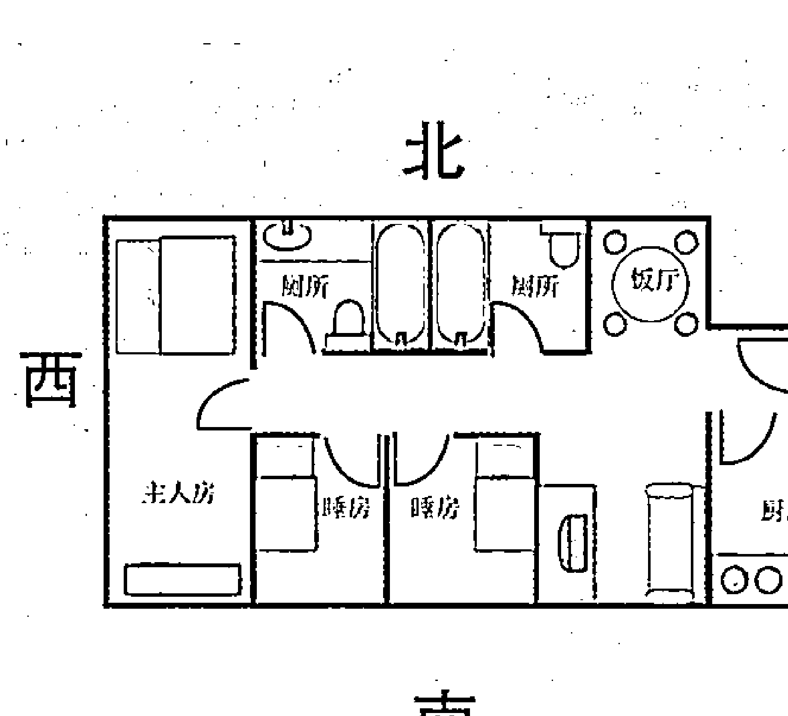

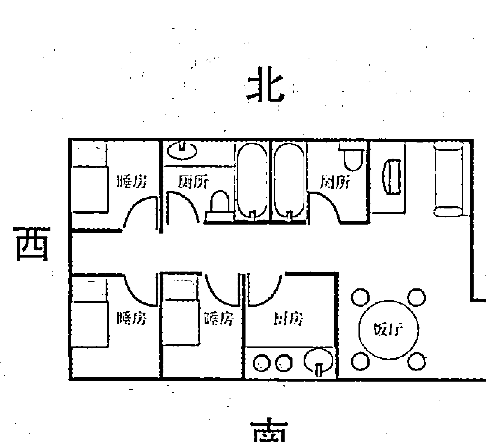

以此屋形为例，应判断为东北方缺角（以较小面积者作准），而不应判断为东南方出现凸角。

以此屋形为例，应判断为东南方凸角（以较小面积者作准），而不应判断为东北方出现缺角。

### 房屋缺角和凸角的化解方法

房屋缺角或凸角如何化解？要化解缺角或凸角，大可不必大动土木，最简便的方法便是用一些风水物件来补运，通过在相应方位上摆放所属五行之物，可略有增旺之功。此外还有一补救方法是：所欠为哪一角，便将代表哪一角的卦象写成书法，贴在墙上，可补此角之不足。比如所缺为艮卦，可以请书法家或自己写一“艮”字挂在东北角，可作为保存此角的方法之一。

如果住宅某个方位凸出面积较大，就在凸出的位置上摆放化泄该方位五行气的物件，所摆放的物件不要求大和多，以防过度泄气造成负面影响。同时要对凹入的地方进行处理、补救，用一补一泄来解决住宅平面不规整的问题。

### 西北乾位缺角

住宅西北乾位缺角，代表着家里男主人的身体健康状况极差，容易患上筋骨疾、肺疾。男主人没有权威，事业不顺，会导致夫妻不和等。西北乾位五行属金，若西北乾位缺角，就在乾位摆放材质五行属土或金的物件，物件的形状应以方形（土）、圆形（金）为上吉，物件的颜色应以黄色（土）和白色（金）为佳。选择物件时，首先考虑材质五行，然后考虑形状，最后考虑颜色的配合，如黄、白色圆形的石球、白色方砖、圆形鹅卵石、金色大圆铜钟、金属模型飞机和金属汽车模型等等。

摆放物件应视地方大小考虑用品的大小，用品数量可以用一个、七个、八个，三个数分别是乾、艮、坤的先天八卦数。最好摆放十二生肖铜制公鸡，也可以选择在西北乾位摆放龙形、马形的工艺品，或者摆放一个金钟。

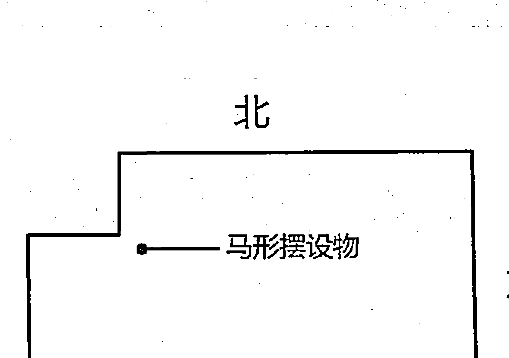

### 西北乾位凸角

西北乾位凸角的屋宅，容易使居住者撞伤、擦损或有头痛等毛病，父亲或男主人的地位虽会提升，但个性却容易变得孤僻，影响人际关系。

西北乾位凸角的最好化解方法是在西北方位放牛形摆设物。

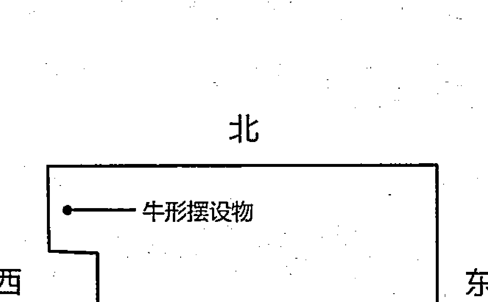

### 西方兑位缺角

西方兑位缺角，会影响家中幼女的身体健康，幼女尤指15岁以下的女性。西方兑位五行属金，居住在这种缺角的屋宅中，家人易患咽喉疾病、肺病、声音嘶哑等症。幼女尤其要特别提防遭受利器所伤。西方兑位五行属金，因此西方兑位有缺，可以在兑位摆放类似于乾位化解使用的物件。
最好的化解方法是在正西方位放羊形摆设物，或者铜鸡和金钟。

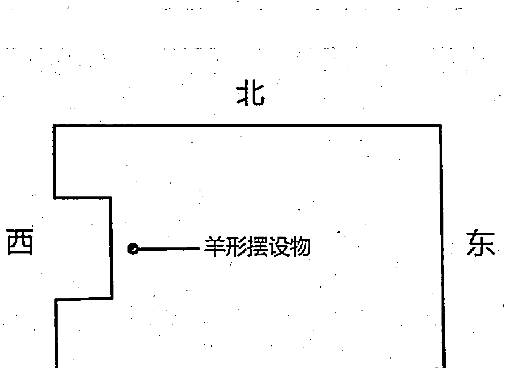

### 西方兑位凸角

西方兑位凸角的屋宅，容易造成居住者易有口舌及气管毛病，幼女容易变得任性骄纵，因爱出风头而麻烦多多。
最好的化解办法是在正西方位放狗形摆设物。

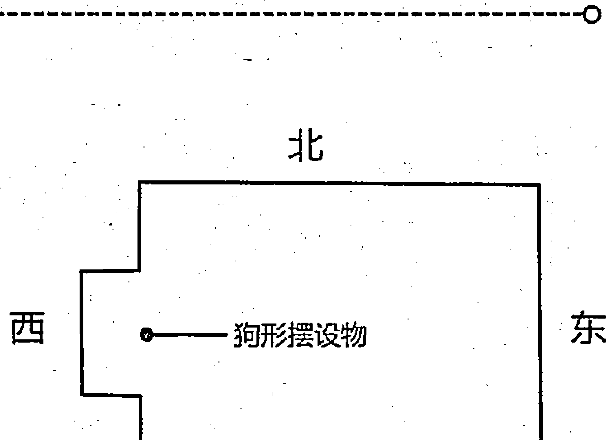

### 南方离位缺角

若南方离位缺角，就会严重影响家中次女的身体健康、财运和事业，特别容易影响到16～30岁的女性。居住在南方离位缺角的屋宅中，家人易患心脏病、目疾等症。南方离位五行属火，除了影响次女的健康外，也容易让居住者因思路不清导致作出失误判断。要化解南方离位缺角所形成的煞气，就在离位上安放材质五行属木或火的物件，物件的形状以长方形为吉，颜色以绿色、红色和紫色为佳，如绿化盆景、红色方形的中国结、大红喜字、挂竹木画、根雕、森林挂画、大红灯笼、大电视等等。最好在正南方位放凤凰形摆设物，或者摆放十二生肖的铜马、红色玩具汽车、紫水晶、台灯或坐地灯。

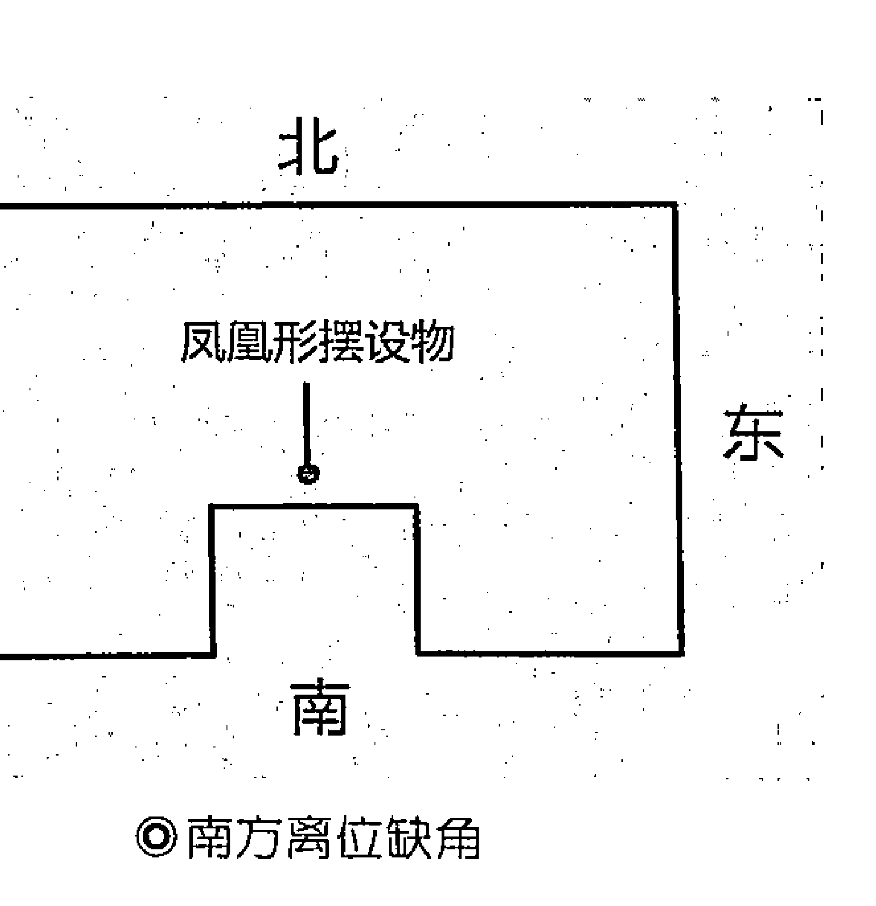

### 南方离位凸角

居住在南方离位凸角的屋宅中，需要居住者对流行性疾病加以提防，也要注意宅内容易因火气过猛而引发漏电、烫伤，甚或发生火灾意外。南方离位凸角有利于次女艺术才华的提升，但性格却可能变得愈来愈固执，较难与别人相处。南方离位凸角的最佳化解方法是在正南方位摆放猪形摆设物。

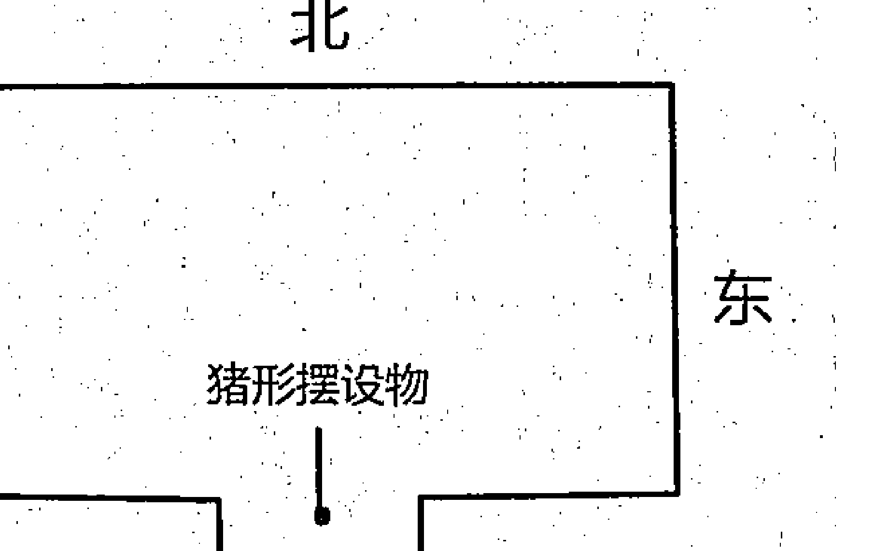

### 东方震位缺角

东方震位缺角，容易影响家里排行老大的儿子，特别是31 ~ 45岁的男性，使其变得胆气较弱，肝气不足，没有决断力，魄力不够，缺乏活力等等。若住宅的东方缺角，就在东方震位上摆放材质五行属水或木的物件，形状以波浪形和长条形为上吉，颜色以绿色和黑色为佳，如鱼缸、绿化植物盆栽、酒水柜、饮水机、挂竹木画、根雕、功夫茶具、水景盆栽等。最好摆放龙形摆设物或者铜兔。

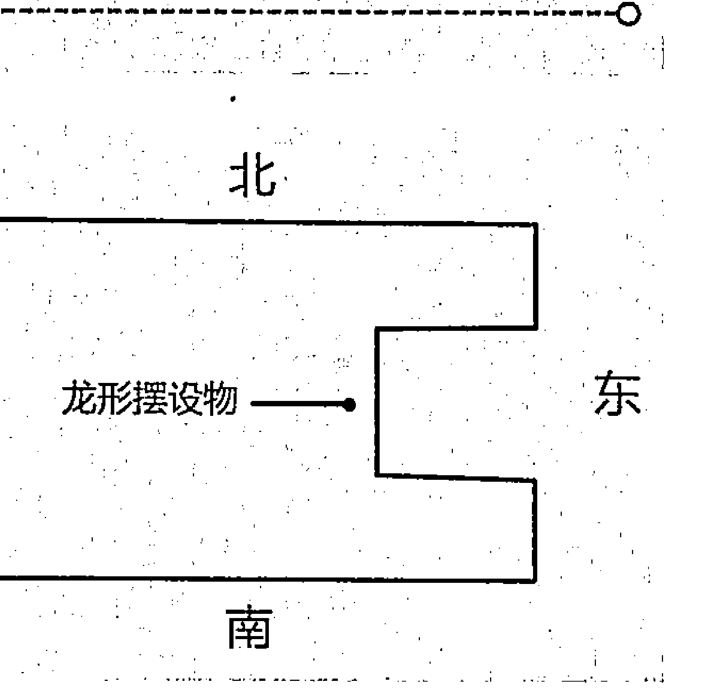

### 东方震位凸角

东方震位凸角，居住者的脚部及肝脏易生毛病。在东方震位凸角的屋宅中居住，尤其不利长男的运势，容易使其脾气变得暴躁，与别人发生冲突，精神也易于紧张。

化解东方震位凸角的最好方法是在正东方位放鸡形摆设物。

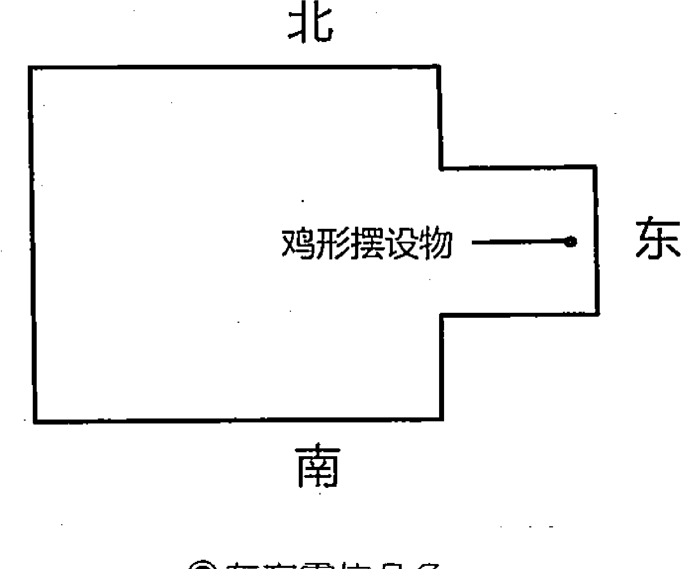

### 东南巽位缺角

东南巽位五行属木，在东南缺角的屋宅中居住，居住者易患肝病，家人常常血液循环不佳，臀部容易撞伤擦损，又易有坐骨神经痛等毛病。长女的健康尤其会特别差，而且做事较为冲动，少与别人商量。若家族成员有男有女，而搬进一间缺角的屋内，代表某一位家族成员会到外地读书，或移民，或经常外出，不喜欢留在家中。

如果宅主有两个儿子，没有女儿，缺少东南角，在儿子未成年时影响不大，当儿子谈恋爱甚至结婚的时候，东南角会变相代表家中的媳妇，会影响长子的太太。

同时，东南方是住宅的文昌位，若东南方缺角，则家中子女头脑反应迟钝，记忆力差，学习成绩也不太理想。

东南巽位缺角的化解方法很多，可以在东南方位放鸡形摆设物、铜兔，或者在东方种花草树木。

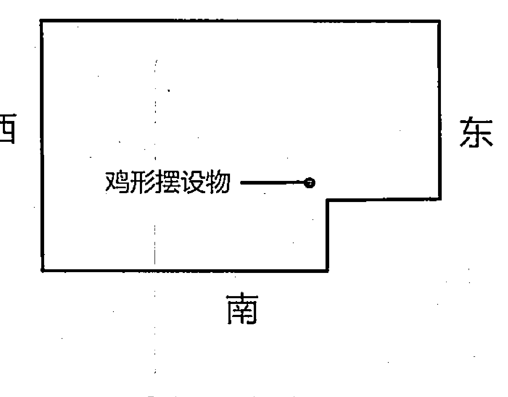### 释 东南巽位凸角

东南巽位的凸角容易影响居住者的血液循环，使其易患肠胃或风湿等毛病。东南巽位凸角尤其不利长女的运势，容易形成其优柔寡断的性格。

东南巽位凸角的最佳化解方法是在东南方位放龙形摆设物。

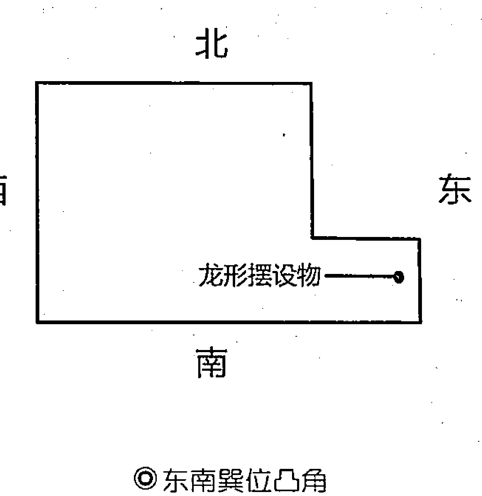

### 释 东北艮位缺角

东北方艮位缺角，对家中的少男相当不利，家人容易患上脾胃病、手指和鼻部也容易出现毛病。东北艮位五行属土，若住宅的东北艮位缺角，就在艮位安放材质五行属火或土的物件，物件形状以方形为吉，颜色以红色、黄色和紫色为佳，如方形的中国结、大红双喜字、大红灯笼、大型山水画（以山体为主）、大型假山盆景（不用水的）、大的石头摆件、紫水晶山。最好摆放一个陶瓷牧童骑牛，也可以在艮位安装红、黄电灯并常开，就动物摆设来说，适合摆放狗形摆设物。

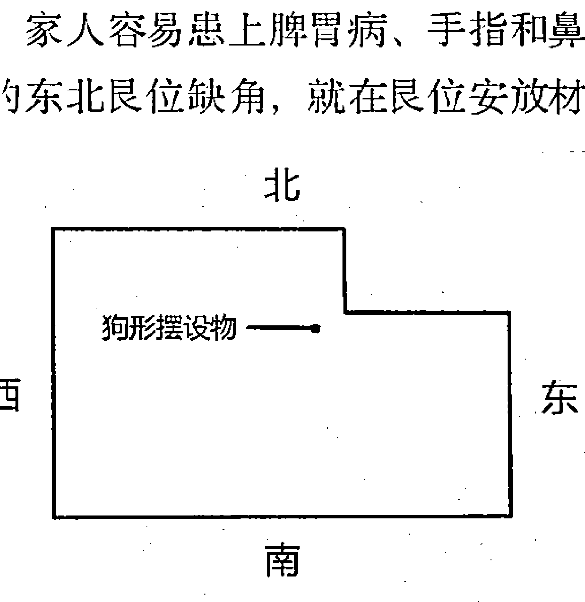

### 释 东北艮位凸角

从方位上讲，住宅凸出的位置最好不在东北方，因为东北方为易经中的艮卦，对应人物是家中的幼男，在人体上对应的是胃部、背部、鼻子、手指、关节等等，还代表阻塞、堵塞、肿瘤、肿块等，所以住宅东北方有明显凸出，会破坏家居住宅的风水，家里人容易患上肿瘤、囊肿、增生等病。幼男的健康除特别差外，性格也会较为好胜，不安本分。若东北艮位凸出面积较大，就在艮位上放置一些属金的物件，用以化泄艮土之气，如可以两枚硬币、两个铜钱、一个圆形铜钟、开口玻璃瓶（兑卦）、两根铁通、金属徽章等，以兑卦（兑的先天八卦数为二）与艮构成山泽通气，化解多余闭塞的土气，起到四两拨千斤的功效。最方便有效的方法是在东北方位放羊形摆设物。

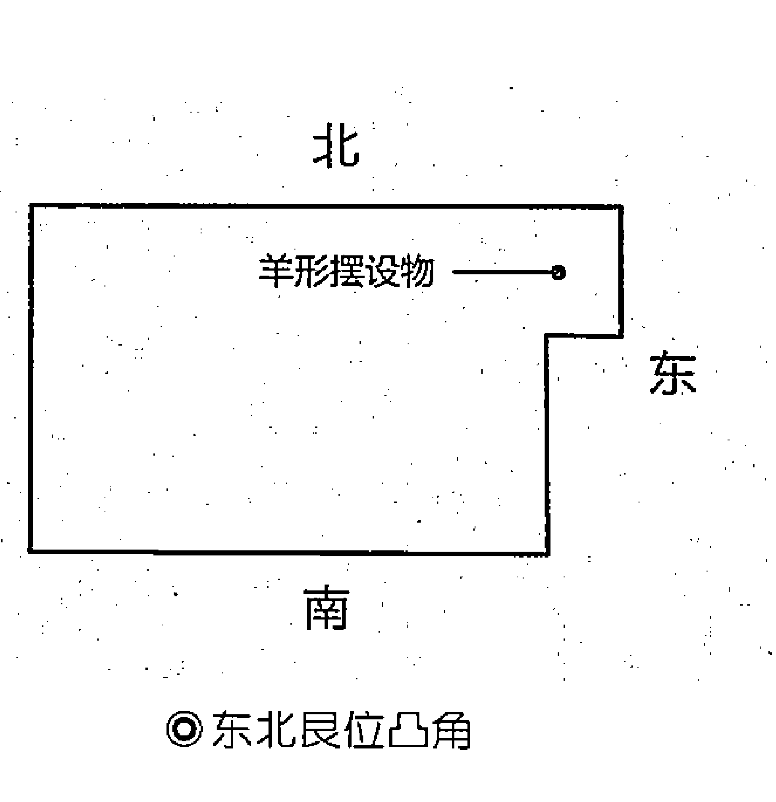

### 释 北方坎位缺角

北方坎位缺角，对家中的次子相当不利，家人容易患肾病、耳聋、膀胱等疾病。若住宅的北方坎位缺角，就在坎位安放材质五行属金或水的物件，物件的形状以波浪形为上吉，颜色以白色、黑色、蓝色为佳，如金属大圆钟、酒水柜、水柱灯、鱼缸、洗衣机、冰箱、海底世界、北极图画、金属的轮船模型等等。最好摆放一个铜老鼠，或者养一缸鱼，摆一幅钟馗招蝠、一个猪形摆设物。

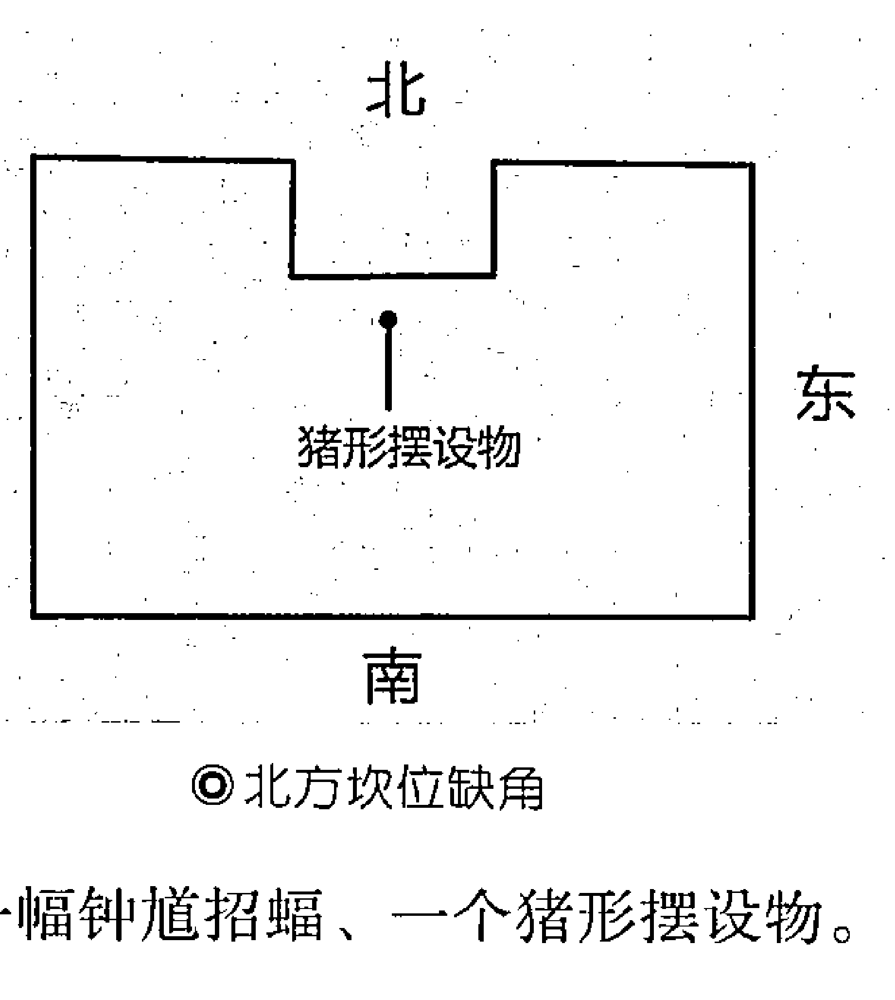

### 释 北方坎位凸角

凸角影响：居住者的泌尿系统易有毛病，家中次男的个性尤其外向多变，难以专心致志做事。化解方法：在正北方位放凤凰形摆设物。

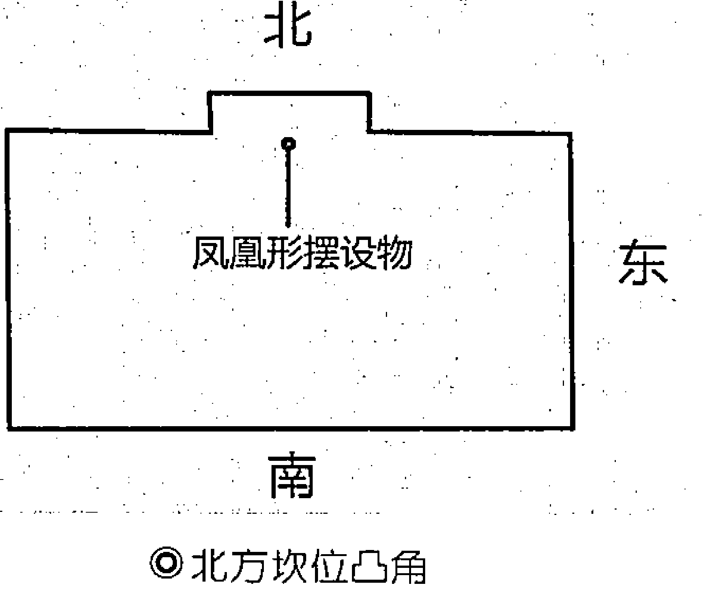

### 释西南坤位缺角

西南方坤位上缺角，对家中的母亲、年长的女性尤其是46岁以上的女性相当不利，家人容易患上脾胃病、腹部疾病等。

西南与东北方位五行同属土，因此西南坤位有缺，可以安放类似于东北方使用的物件，或者在西南方位放羊形、牛形摆设物，紫砂茶壶及陶瓷等。

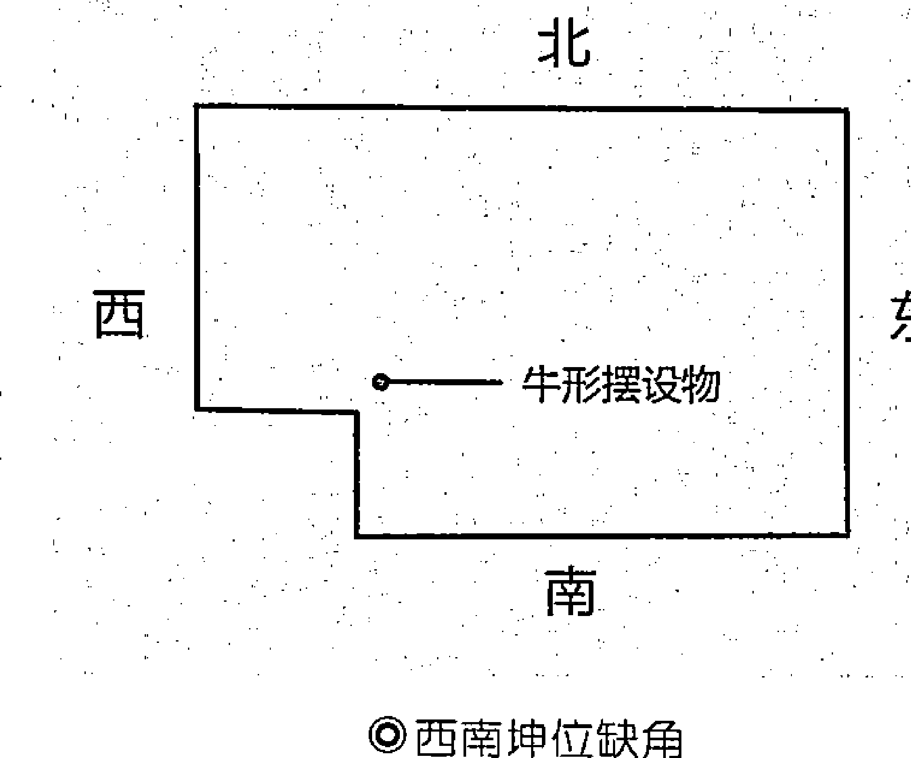

### 释西南坤位凸角

坤卦代表人的腹，坤位凸出面积大时，家中容易出肥肚子的人。若家中有人肚子凸出很大，好像女人怀孕一样，就首先察看住宅的西南方是否有凸出的情况。居住在西南坤位凸角的人，易患有皮肤及肠胃毛病。母亲或女主人的权力容易过大，令家中的男性没有地位。

最好的化解方法是在西南方位放马形摆设物。或者在坤位摆放金属饰物或其他金属物件，把坤卦旺盛多余的卦气消除。

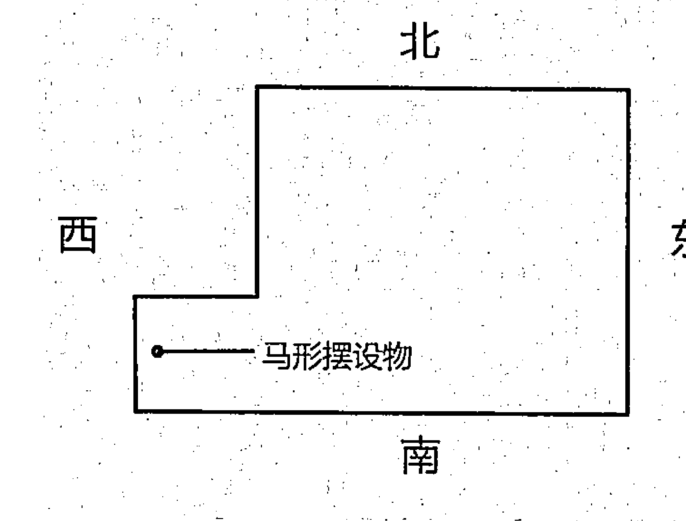

## 第八节 屋宅尖角的分析

屋宅外的尖角冲射和屋宅内的装修装饰都有可能给居住者带来煞气，造成不良影响。

### 释 尖角冲射屋宅破家运

从窗门望出去，最忌见到对面的大厦有一尖角射进屋内。尖角的最差之处是尖角正对房屋，尖角的双面都可以反射强烈的光线，形成磁场，对屋内有极大的影响。

有时候，楼上的空调漏水，水滴顺着尖角飞溅向你家中，风水上称为“穿射割飞”，也是凶煞。家中受此煞的人，容易离乡背井，不能获得祖荫的庇佑。

家中放置一些设计造型奇特的家具或摆设，也容易有尖角冲射的问题。

很多大楼的间距很窄，假如对户的衣裳竹叉或者天线等有一定锐性、能吸收磁场的东西正对着住宅，都为尖角冲射。

尖角冲射的危害与三个因素有关：一是尖角的锐度；二是尖角的方向；三是是否有流年凶星飞入。尖角冲射能否真正发挥其凶性，在于其尖角的方位。在流年有凶星飞入，尖角在东方出现，2011年的南方行二黑星，这尖角会导致屋内的人大病、开刀，甚至会有交通意外。但2012年南方行一白星，由于一白为吉星，代表尖角在这一年不会构成伤害。因此尖角冲射非必定为凶，如果流年有凶星飞临才会生旺其凶性，否则其凶性不会发挥。

### 释“石敢当”化尖煞

在风水研究上，有“石敢当”化尖煞之法。中国民间习俗认为中岳泰山的石神（又称石敢当）有不可思议的力量，可作镇山、压风、平浪、制煞、辟邪、驱鬼之用。风水学上所谓的峦头枕山，以泰山石化解一切尖角冲射，若睡床及写字台有冲射，必以“山”字形的石胆当放于适当位置，可化凶险，也为助运。

另一种科学说法是，在环境中有一些冲、射等不利物质形成乱流干扰我们，这些“流”的波长有吉凶，距离愈远、影响愈小。在景观格局中，每个凹凸点都是质点，每个质点形成磁场都能产生放射波，这类波能对人类造成比较大的影响。设置“石敢当”，就能够在很大程度上阻断、遮挡这些放射波，化煞挡灾。

### 释 装修设计化解尖角煞气

现代住宅中存在的尖角，不但观感不佳，而且对住宅风水影响也较大。家具中有尖锐边角的，可以用绸布、鲜花或者人造植物缓和其放射的消极能量。尖角的对面，不要放置沙发、椅子等，人经常在尖角的对面，容易受到冲射。

通过装修和摆设的方法化解尖角，主要有这几种方法：用柜子摆在尖角旁，把尖角象征性地填平，高柜或低柜均可；把高大浓密的常绿植物摆放在尖角位，这有助于消减尖角对客厅风水的影响；在客厅的尖角位摆放鱼缸，鱼缸的水可以消减尖角的压迫，令这角位的气大有回旋余地，不但符合风水之道，而且可美化家居景观；在尖角前挂一颗水晶，分散尖锐的能量。

## 第九节 屋宅横梁的分析

横梁压顶，会给人在视觉上和心理上都带来一定的压力。长期生活在横梁下，非常影响居住者的健康，因此，屋宅中的横梁带来的煞气应予以足够的重视，应用天花板或其他改动方式予以解除。

### 释 横梁不能不防避

横梁出现在以下三种情况中时，需引起居住者的特别注意：

- ①在厨房内见横梁，一般都认为是大煞，因为厨房影响宅母。如果用飞星根据流年飞伏，可按八卦算出横梁于何年何月影响宅母的健康，甚至什么疾病也可算出。因此厨房有横梁，必对宅母不利，对孕妇更是大凶。
- ②横梁除了在厨房会影响主妇，压住睡床上也是大忌。睡在横梁下面是大凶之象，如被天花板的横梁压住则为凶中之凶。有些人在床头上加一个吊柜，吊柜变相成为横梁压着床上的人，使人无法安宁。睡在横梁下面，会严重影响身体健康，如为凶星所到之处，还会引发交通意外甚至死亡，因此大家对横梁要提高警觉。
- ③还有另一种横梁，即装修时在屋的四角藏灯，造一个横梁式假天花围着大厅，里面藏灯照明。这种设计创造了横梁，但是很难察觉。其实，天花板越平越好，在装修屋宅时，尽量不要人为地设置横梁。

假如楼高超过5米，横梁的影响不大。比如古代的大宅高达四五米，即使有横梁，对家居风水也没什么影响。但一般住宅，楼高不会超过3米，如果出现横梁，会给居住者造成很大的影响。因此，横梁的吉凶还应该综合各方面的因素予以判定。

### 释 横梁的化解

对于比较高、比较宽敞的屋宅，可以通过吊顶装修来化解横梁。

从装饰方面来看，可以在横梁下摆放一个金钟，用“铜”来化解横梁的煞气。如果无法找到铜钟，可以在横梁两侧挂上风水葫芦或者中国结，压住横梁压顶的煞气。

也有使用镜子来化解横梁煞气的做法，但这需要与居住者的五行相配合。在卧室或玄关等位置摆放镜子，也要考虑到美观和镜子产生的煞气等因素。

## 第二章 房屋各类煞气及化解之道

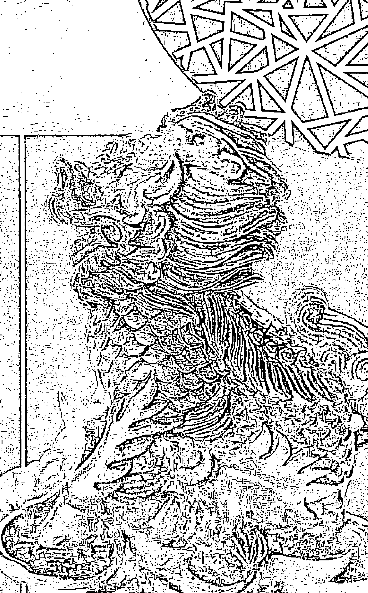

很多人都遇到过这样的情况，住在老房子的时候运势顺遂，但是换了新居之后就坏事不断，或者情况反之。这些坏运势其实都是现居住的房子周围或内在的煞气引起的。煞气对住宅的风水、个人的运势有很不好的影响，本章节将住宅内、外出的煞气做出细分，为您详解煞气的形成原因及化解之道。

### 第一节 房屋外部水势与路势的煞气

从风水的角度来看，每条路都像水，街道就像龙，所以马路也是水龙的一种。因此，传统风水学认为，路的作用和水是一样的。风水中的水既能聚气，也能把气给隔开。选择住宅时，先查看住宅处的水势和路势，是打造吉祥家居风水的第一步。

#### 天姚水

天姚水又称淫逸水或桃花水。这种水路看起来与九曲水很像，但两者还是有差别。天姚水在目光所及之处，有三个似弯非弯的蜿蜒。说得实际些，天姚水的马路不直，但因蜿蜒弧度不大或路面时宽时窄，开车经过时甚至连方向盘都不用转动，也不会撞到路肩。天姚水会出一些较虚荣、不正经或男女关系较乱的人物。

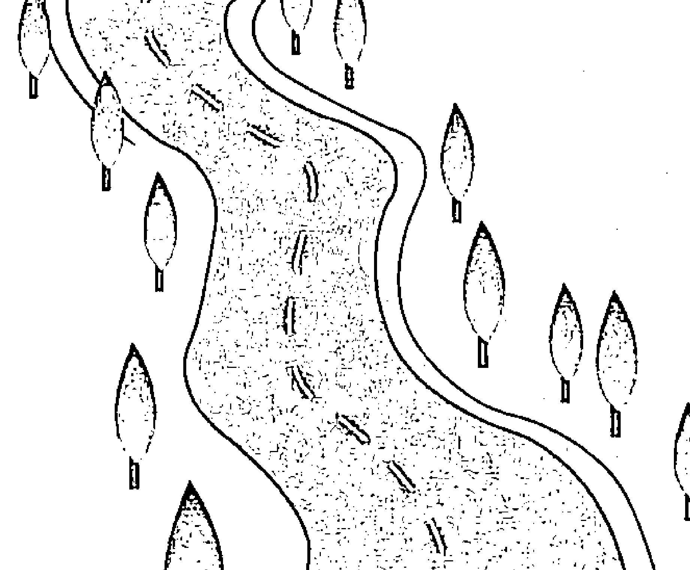

◎天姚水在目光所及之处，有三个似弯非弯的蜿蜒。

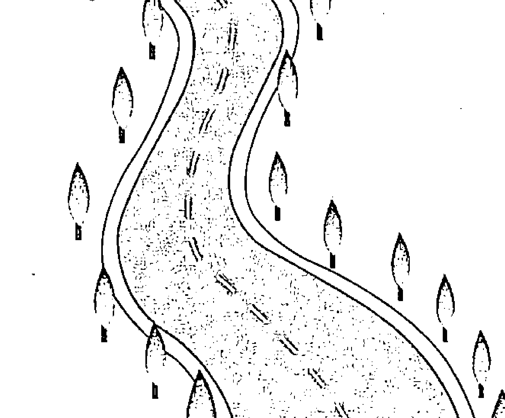

◎九曲水有三道大转弯。

> 如果可以，将天姚水的水路改为九曲水的格局。九曲水就是“九曲朝堂，封侯拜相”。所谓的“九曲朝堂”，就是指水流或马路在目光所及之处，有三道大转弯。就九曲水的格局来说，就算位于反弓位置也很好。只是弓带水这边赚钱比较存得住，反弓水那边同样也能赚到钱，却比较存不住。

#### 阴幽水

阴幽水就是不见天日的水，像井水与深渊就是很典型的阴幽水。阴幽水就算外表看起来再干净，也不能直接喝，因为水中的细菌未经过杀菌处理，一定要煮沸之后才能饮用。住在有阴幽水的地方也很不好，人的个性会变得阴沉狡诈，一生行事不光明，到处惹人非议。

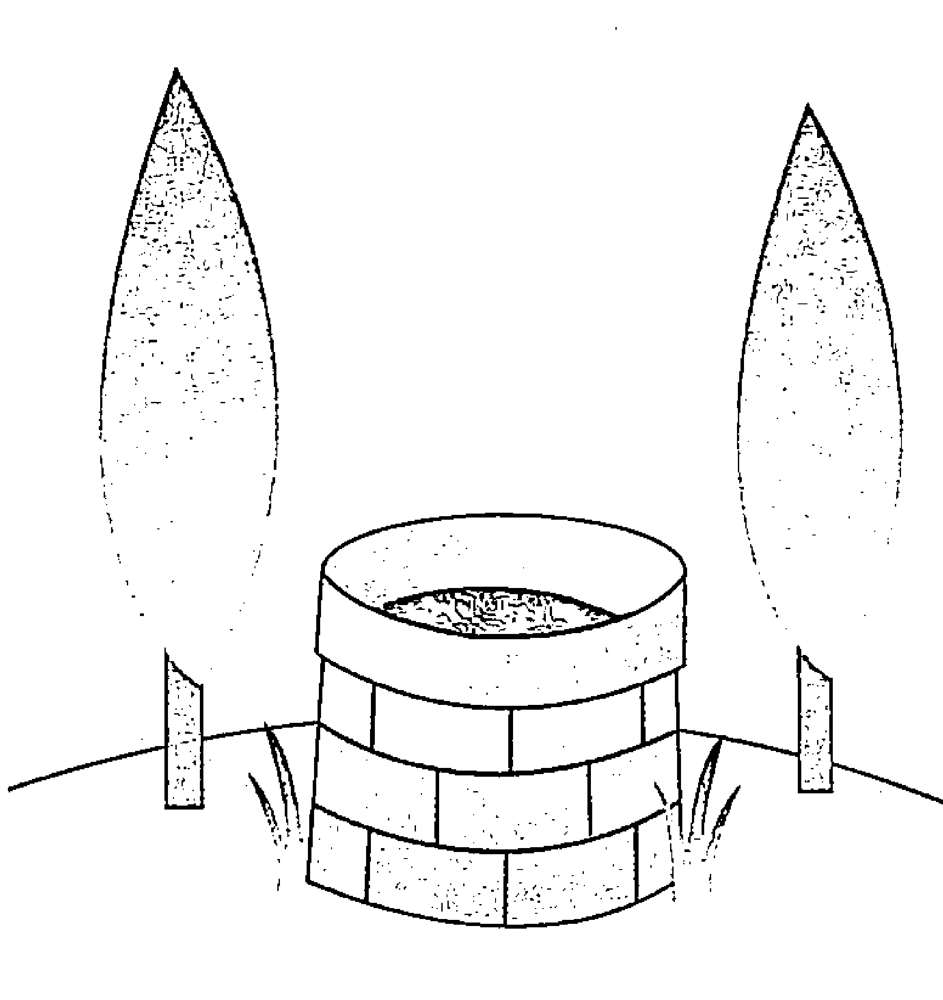

> 如果住宅外部有这样的水势，最好还是尽早搬离。实在不能搬迁的，可以通过改善住宅内部或者外观的方式，让室内小环境和室外大环境达到阴阳平衡。

#### 臭秽水

最典型的臭秽水，就是屋旁的臭水沟，尤其沟里若是有动物尸体，那就更糟糕了。所以，水沟要经常打扫，若是让水流变黑，变成死水发臭时，就会形成这种坏风水。如果住在臭秽水旁，会罹患癌症之类的重大疾病。

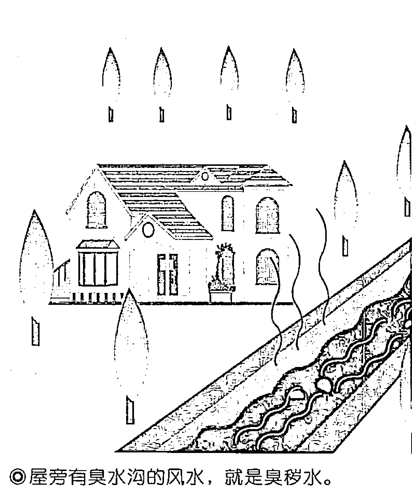

> 要经常打扫，保持水的流动，维护好水边环境的整洁有序。好的水才能带来好的气，将臭秽水改造成良好的水势，除了能增进健康运外，还可以带来财气。

### 004 沮洳水

凡是以前曾为水塘，但后来填平来盖房子的地方，湿气都比较重，甚至遇雨地面就会一片泥泞，这就是所谓的“沮洳水”。住在沮洳水上，会一生困顿，越来越难以生存。

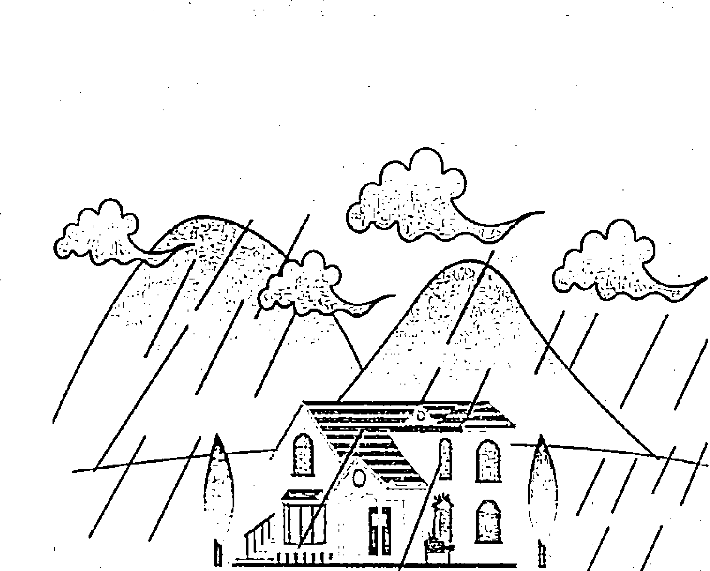

◎水塘填平之处，为沮洳水。

> 不管是从风水角度看，还是从健康方面考虑，都应尽早搬离。

### 005 急流水

急流水是指河流急转弯且形成锐角的角度，因为在这种地方常会发生凶难事故，所以也不宜人居。三峡大豹溪、新店溪上游的红河谷均属于急流水，这两个地方每逢夏季便常有人因戏水而惨遭灭顶。住在急流水之处，会走投无路。

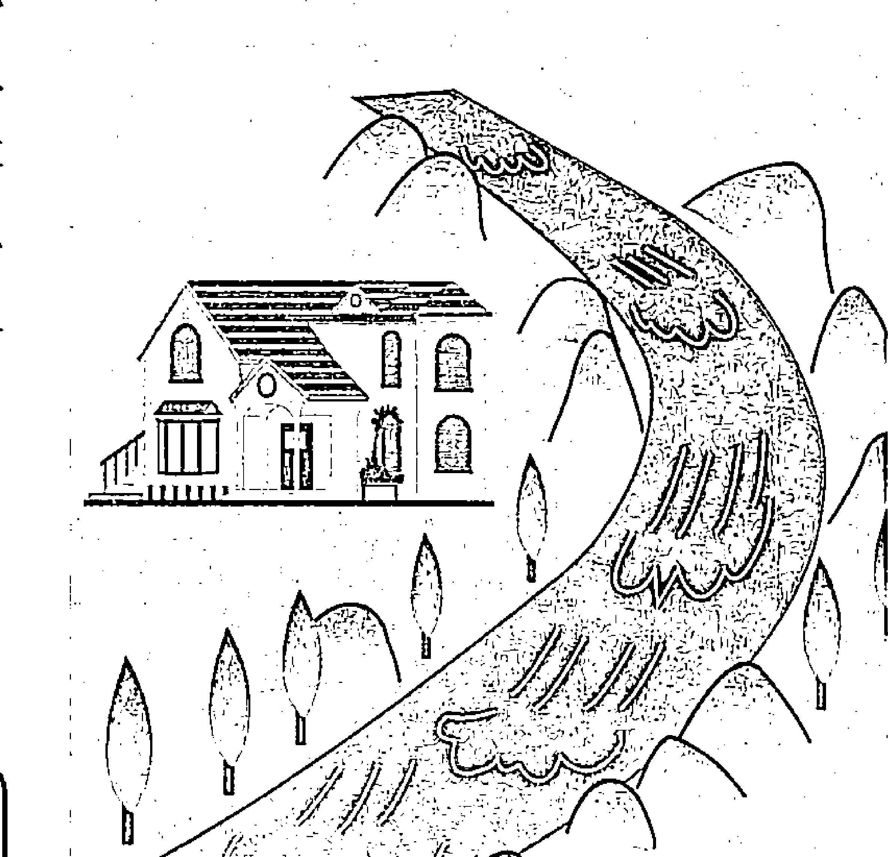

◎急流水是指河流急转弯且形成锐角的风水。

> 急流水处不适宜人居住，应另择地而居为佳。

#### 悲哭水

悲哭水和淋背水相反，水是从前面淋过来的，像集合式住宅前面若是有景观瀑布，不但会形成前述所说的瀑面水，也会变成悲哭水。悲哭水会让人守不住钱财，夫妻也会分离或鳏寡，是很不好的风水。

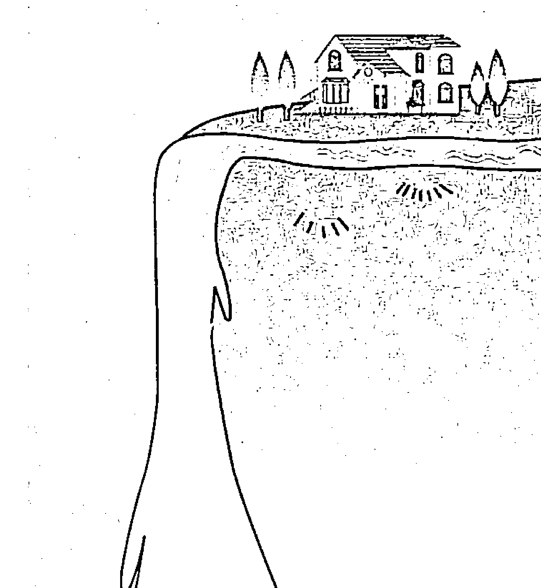

> **化解之道**
如果是人为建造的景观，最好加以改造或者干脆拆除；如果是自然的瀑布无法调整，最好搬离。

#### 鸣珂水

鸣珂水就是涓涓细流，像珍珠断线似的，一下有水一下子没水。水流滴滴答答、断断续续流的也是鸣珂水。鸣珂水多半是山里的溪涧，因而水流不稳定。住在这样的地方，会让人财散礼弱，一生多病。


> **化解之道**
将水改道或者修建池塘积蓄水流。

#### 瀑面水

瀑面水就是瀑布，这种风水也不好。因为屋前的水流很急，听起来像是有人无时无刻都在家门前哭泣。这会让住屋内的人存不住钱，贫病交加。倘若只在瀑布前面做生意还好，因其有助于吸引人气。

> 化解之道
一些集合式住宅造景时，很喜欢在中庭做个瀑布，这也是瀑面水，对楼层较低的住户影响较大。可采用玻璃窗台等装修方式，将煞气隔绝在屋外。


屋前的水流很急，从高处淋下的水势就是瀑面水。

#### 淋背水

淋背水，指的就是屋后有水从上面淋到住家的房子。无论是屋后有瀑布或有陡峭山壁，只要会有水泼到房子，就是淋背水。都市里也有淋背水。比如说住家屋后有栋大楼，那里有人家做了很高的阳台或遮雨棚伸到住家上方，雨水或浇花水会泼到屋顶，这也是淋背水。

> 化解之道
房屋应远离类似的水势。如果实在不能搬离，可以加盖遮雨棚等防护设施。


淋背水，指的就是屋后有水从上面淋到住家的房子。

### 010 折箭水

折箭水，是马路形状就像把被拗过的弓或如同被折过的筷子，这也代表手足会相残。

折箭水与鹅颈水的差别在于：鹅颈水的弯是个弧度，而折箭水则有个角度。两者都不吉利，不过鹅颈水比折箭水来得更为严重。


◎ 马路形状就像把被拗过的弓或如同被折过的筷子，便是折箭水。

> **化解之道**
在室外摆放八卦镜凸镜，将这种不良路势的煞气反射出去。

### 011 湍杀水

所谓的“湍”是指滩头，而“湍杀水”就是水中有很多大石头，处处有急流浅滩的地方，会出阴险凶恶之人。为何这种地方会出恶人呢？这是因为山形犬牙交错之故，在这里做事也会功败垂成、不能成功，所以怪石嶙峋之地、河流很湍急或多瀑布的地区，都不适合居住。


◎ “湍杀水”就是水中有很多大石头，处处有急流浅滩的地方。

> **化解之道**
尽早搬离。

#### 照盆水

照盆水就是指房子前后有个已经废弃了的水塘。最常出现照盆水的地方就是一些富豪人家。有些人花了大笔经费建新房，一开始喜欢做些造景，可是后来因为疏懒或是其他原因，水池没人管理打扫了，就变成一滩死水，甚至连家中的猫狗或老鼠也掉到里面淹死。

> 化解之道
如果房子附近出现照盆水，应予以清理，将屋宅明堂或靠背的水塘填平。


◎照盆水就是指房子前后有个已经废弃了的水塘，照应家中，没有生气。

#### 板仓水

板仓指的就是水田或梯田，这种田地只要一下雨就有水，天晴了就没水，板仓水的地理也是如此，水来了就有钱，水去了钱也没了。这等于看天吃饭，春夏旺秋冬衰，做一季得吃三季。

> 化解之道
不适宜长期居住在此类水势周围。建议搬离到安稳之处。


◎板仓指的就是水田或梯田，水的聚集全靠天气。

#### 鹅颈水

顾名思义，鹅颈水就是马路弯曲的形状，像是鹅头上面的小突起。鹅颈水的风水会让子孙不和，例如会相互拆台、争执不休。


◎ 马路弯曲的形状，像是鹅头上面的小突起，便为鹅颈水。

> 化解之道
可摆放八卦凸镜，使自己不至于受到不良煞气的影响。

#### 弓背水

如果屋后有条马路呈反弓形状的风水，但是马路前面有树木、土丘、盖了围墙的大庭院或房子帮你挡起来，就叫做“弓背水”。如果反弓水路离房子远，影响就少，但屋后若直接就是一条反弓马路，那么情况就会很严重，表示人丁与财产都会留不住，家中会出败家子，散尽祖产然后流落外乡。


◎ 屋后有条马路呈反弓形状的风水，就是弓背水。

> 化解之道
种树是破解弓背水的好方法，不过若是想这样做，要记得一点：树林的面积要越广越好。

### 016 横朝水

横朝水是指门前有横向的水流或有条直来直往的马路。这在郊区的外环道路很多。横朝水因为马路直，往来车辆开得很快，车速快，就代表水流急。水流急，也就意味着财来得急，去得也快。住在这种地方，会因为钱财来来去去，终日为营生奔波。

> 化解之道
在大门或前庭摆放种植一些阔叶的植物用以阻挡煞气。不过同时注意树木不要过高，以免遮挡了住户的视线。


### 017 叉身水

叉身水则是在屋后有条拱背的马路，可是在拱背之后又有一条直路叉过来，像是一把叉子从后面捅进房子。这种风水表示子孙会逃散，散尽家产，一生受制于人。住在叉身水的房子也有极强的不自由感，做什么事都被别人牵制，比如欠债难以还清、做工劳累等。

> 化解之道
房屋处在叉身水的格局中时，难以化解，最好转居他处。


### 018 斜飞水

“斜飞水”是屋子左右两边有马路，且马路是反弓出去，住在这种格局里的人有客死他乡的危险。因为斜飞水处在反弓的煞气之中，左右皆无靠，钱财也不能积攒起来，不利于财运，在外打拼的人也没有衣锦还乡的运气。


◎ “斜飞水”是屋子左右两边有马路，且马路是反弓出去的格局。

> 最好搬离斜飞水的格局。

### 019 背截水

背截水则是指这条直来直往的马路横过屋后。就像韩信背水一战的故事：“前有追兵，后无退路”。屋后有这种水路，意寓家人会逃之夭夭。背截水若无其他直向的水路把它截断，或是有树木、竹林、房子等将它挡住，就很糟糕，代表住在这里的人不但会人丁离散，自己也会欠人家一屁股债或被别人倒债。


◎ 背截水则是直来直往的马路横过屋后的风水。

> 利用植物、树木将这种路势的煞气挡住。

## 第二章 房屋各类煞气及化解之道

#### 火叉路

火叉路是两路结合或分叉之处。尤其当两条大马路合而为一时，这种火叉路更为可怕，最容易发生重大车祸。火叉路的特点就是：三个方向的来车都以为自己开的是直路，因此全都没减速，却没想到旁边还有叉路来会合，于是等飙到三叉路口时，就很容易跟过来的车子撞在一块。火叉路周围每天都有多个方向的车辆呼啸而过，气流浑浊混乱，对居住在附近的住家并不好。如果房屋正对窗户或大门正对三叉路口，煞气的严重程度更甚。经常目睹交通事故的住家，容易感到精神紧张，同时也易患呼吸方面的疾病。


◎火叉路是两路结合或分叉之处。

##### 化解之道

在路口装个反光标志，盖个种树的分隔岛，或是设个圆环、放个精神标志即可。


◎在容易发生事故的路口装设反光标志，有利于提醒往来的车辆。

## 021 亡字水

亡字水的路形像个“七”字，如果仔细看的话，也像是灭亡的“亡”字。基本上，亡字水直冲到屋前的马路会有点弯曲，这跟丁字冲不同，丁字冲直冲到房子门口的路是直路。

亡字水的格局让家庭容易破裂，这不等同于犯桃花，而是指家人会因各种理由而离开这个家，比如说家人也可能会早夭、寿命不长。


◎ 亡字水直冲到屋前的马路会有点弯曲，像是灭亡的“亡”字。

##### 化解之道

如果不能在此格局的道路上尽早做出标识，建议以搬离为佳。

## 022 分家水

分家水的水路就像“人”字形，也等于是歪了一边的丁字冲。分家水常在乡下的别墅或平房出现，这会让家人分散，无论是夫妻分离或子女离散都不好。


◎ 分家水的水路就像“人”字形，也等于是歪了一边的丁字冲。

##### 化解之道

将门前的道路扩宽，形成宽广的明堂。

### 第一节 房屋外部水势与路势的煞气

#### 牵鼻水

牵鼻水就是有条弯路绕过房子门前，弯路中央又有条路朝外直延伸，看起来就像牛串上了鼻环，又套上一条牛绳的样子。而朝外延伸的这条马路，不管有没有穿过环绕门前的弯路而抵家门口，全都是牵鼻水。牵鼻水的风水会出浮浪子弟，子女涉及不良嗜好，结交坏朋友，吃喝嫖赌样样来，最后败尽家产。要不然就是脑筋不够清楚，把积蓄花得一干二净。


◎ 牵鼻水就是有条弯路绕过房子门前，弯路中央又有条路朝外直延伸的路势。

化解之道：建议搬离牵鼻水的格局。

#### 勾弋水

勾弋水水路的方向跟分家水相反，路形像是被折断的筷子，也像钓鱼用的鱼钩。勾弋水的房子住久了，人会变穷、身体变差，长得干枯又瘦弱。 一般来说，人字形道路两旁的房子，最好都不要住。方正的马路多半会形成好风水，歪斜的马路则容易形成不良风水。


◎ 勾弋水水路的路形像是被折断的筷子，也像钓鱼用的鱼钩。

化解之道：建议住家远离这种不吉水势。

## 025 投环吊颈水

“投环吊颈水”指的就是道路形状仿佛打了个死结，也像人被勒死的样子。住在这种地方的人会比较容易想不开，易有极端事件发生。


◎ “投环吊颈水”指的就是道路形状仿佛打了个死结。

化解之道：现代社会中，遇到这种路势的几率较小。被道路围困的住宅，让住家的生活也十分不便。危险系数如此之高的房屋，还是尽早搬离。

## 026 丁字冲

屋前有横路与直路相交，就称为“丁字冲”。丁字冲的房子风水不好，尤其不适合当住宅；开店的则要视状况而定。丁字冲的房子路口容易发生车祸，如果在这里老看到那些血淋淋的画面，心情难免不好。再加上每到夜晚，来往车辆的灯光直射屋内，也让住户整夜不得安宁。

要破解丁字冲，最好的方式就是在房子正前方装设反光镜或八卦镜，以镜面反光来提醒来往车辆注意。另外，镜子也有聚焦效果，能够反射煞气。


◎ 屋前有横路与直路相交，形成“丁”字，便是“丁字冲”。

化解之道：在丁字冲的广场正中央做个天心池，不但可以化解路煞，还可将前面路冲的笔直马路转化为明堂。

#### 缠丝水

缠丝水就是指巷子里的巷弄，路面虽不宽但分布密如网。住在小巷里的人通常一生较贫困。由于缠丝水的路势带来财气不顺，住在巷里的人财运较弱，个性较卑微保守。住大马路旁的人气魄就较大，因为他每天看着人来人往，见识较多，眼界自然宽。


##### 化解之道

如果缠丝水能改造成为卷帘水，便是不错的风水格局。卷帘水就是许多条小马路与一条大马路垂直相交。卷帘水能消滴聚财，适合做小生意。在这种地区，往往会有一些很有名的小吃店、服装饰品店与美容店，成为名店聚集的地段。外头是很大的街道，车水马龙，但一跨入此区，气氛则变得宁静优雅，恍若世外桃源。对顾客来说，这里也是悠闲消费的好场所。

#### 穿射割飞煞

如果住宅正对着大马路，便会有一股气流直冲向住宅中。虽然那条马路到住宅前就拐弯了，但仍然形成了穿射，也就是说，那股气流并没有随着马路的转弯而转弯，而是直接冲向了住宅里。遇到这种煞，家中子女就会远离家乡，去远方谋生，而且得不到祖辈、父辈的庇护，要饱尝离乡背井之苦。


##### 化解之道

理同道路直冲和反弓煞，可以悬挂相应的风水物品进行克化，如屏风、罗盘等。

## 029 左斜路冲

这种房屋因为左前方有一条马路直冲过来，形成了“左斜路冲”的局面。

路冲从左边冲过来将会冲煞到家中的男性，使得家中的男性容易有开刀、车祸等意外之灾。如果在斜路冲的两旁皆有房屋的话，那么这个斜路冲的煞气将会更大，这种斜路冲并不会因为非直冲而没事。

##### 化解之道

解决的办法就是在房屋的前方对路冲的地方挂上八卦镜之类的化煞用品。


## 030 右斜路冲

这种房屋因为右前方有一条马路直冲过来，形成了“右斜路冲”的局面。

路冲从右边冲过来将会冲煞到家中的女性，使得家中的女性容易有开刀、车祸等意外之灾。如果在斜路冲的两旁皆有房屋的话，那么这个斜路冲的煞气将会更大，这种斜路冲并不会因为非直冲而没事。

##### 化解之道

解决的办法就是在房屋的前方对路冲的地方挂上八卦镜之类的化煞用品。


#### 斜路直冲

如果屋宅在低位，而屋宅外面的马路地势较高，形成压迫之势，就犯了斜路直冲的煞气。居住者要承受大路从高位直扑而来的巨大压力，其势大力沉，犹如滔滔洪水拾级而下，直冲入屋，无法阻挡。这样的格局往往使居住者身心疲惫，家运难升，有日渐衰败之相。

##### 化解之道

若想化解此煞气，就要使屋宅地基升高，这样才不会被压制。若无法改变格局，则在家中对着斜路的方位放置石敢当、山海镇等以克制煞气。


◎ 如果屋宅在低位，而屋宅外面的马路地势较高，形成压迫之势，就是斜路直冲。


◎ 屋宅地基比马路地势高为佳。

## 032 抬轿煞

住宅前后左右被四条直路或水路包围，形如轿夫抬花轿，即是“抬轿煞”。犯此煞者运气反复，财去财来，生活辛苦操劳。


化解之道

避开抬轿煞是首选。若没有办法避开，可在宅中放铜制大象一座和五帝古钱，也可放手持青龙刀的关公一尊，放于宅坐方，即可化解。还可以在房子周围种上绿色植物，但不要太密集，也能达到化煞的作用。


## 033 淋头水煞

很多乡下的房子在后院往往没有健全的设备、完善的设施，使后院的排水系统不佳。如果水流到前院，代表家中老人的身体病痛不断，淋到后方代表家中小孩会常有莫名的病痛产生，甚至有后继无人的悲剧发生。


化解之道

做好完善的排水设施，避免恶水流入家中。也可以借由密宗铜制的九宫八卦咒牌做过香祈福的布置，对煞气有绝对的克制效果。

## 第二章 房屋各类煞气及化解之道

## 034 枪煞

在各种水势和路势中，直来相冲的道路或者河流是最为不祥的。这是一种无形的气，所谓“一条直路一条枪”，家中大门正对着一条直而长的走廊，便是犯“枪煞”，吉凶会因为枪煞的数量而受到不同程度的影响。以本身住所为中心点，有直路或河流等向自家冲来也是枪煞。此外，窗外的晾衣竿亦属于枪煞的一种。

枪煞主健康，会给受到冲煞的住家带来心脏及血液方面的疾病，严重者可能遭遇手术及重大意外。


◎ 房屋大门正对笔直的路或者室内长廊，便为枪煞。

##### 化解之道

要化解这种冲煞的最佳办法是放置风水吉祥物，如八卦凸镜可对这种煞气进行反射；在大门处安放五帝古钱，化解直冲的煞气；或者摆放在大门或者窗口，以挡煞气。

## 035 白虎路煞

倘若有一条道路也呈“U”字形般围住一栋房子，这也叫做“缠头水”。缠头，就是将头包起来的意思。缠头水的河流或马路，弯曲的弧度必须要够大，便能财源广进且源源不断，聚财又不漏财。如果缠头水的“U”字弯得不是很平顺，而形成了锐角或尖角，就会变成“白虎路煞”。以道路来说，这会形成死亡道路，很多大车祸都发生在这种路段。这是因为到了此地突然要来个急转弯，方向盘一下子转不过来，车子就会冲到路旁。住在这种格局中，不利于住家的安全，也有破财之忧。


◎ 围绕房屋的路势呈锐角和尖角，便是“白虎路煞”。

##### 化解之道

如果住家碰上白虎路煞，最好在显眼处设置标识，并种植或摆放植物，以化解道路尖角带来的煞气。

## 036 直路剑

如果屋前有条马路直直地朝向大门口，就叫“直路剑”。犯直路剑的房子，可做商店但不能当住家，因为这种房子的气很强，在这里做生意虽然很好，但也会让人赚到钱伤了身体。住直路剑的房子，会官司缠身、体弱多病，交通方面也比较容易有冲突事件发生，生活上易与人起冲突或言语不合。


◎如果屋前有条马路直直地朝向大门口，就叫“直路剑”。

化解之道：直路剑的煞气怕三把刀，而且这三把刀在路冲的地方会越来越兴旺。第一把是菜刀，也就是开餐厅；第二把是剪刀，意即开服装店；最后一把就是剃刀，这当然就是开理发厅或美容院了。其实，不光是这三把刀，很多行业开在路冲的地方都很赚钱，只不过钱赚得多，对健康却不利。

## 037 水劫

通常和江河海川、沟渠比较近的房屋，家中的湿气往往比较重，患水灾的几率也比较大。如果住在地势原本就比较低，又与这些水源距离在三十公尺内，就容易犯水劫。因为比较潮湿，容易造成风湿性关节炎或筋骨酸痛，呼吸系统也不好。因为水流速度比较快，或风速大，也会造成屋主财运不聚，财运退败。


◎房屋本身地势低洼，又离水较近，容易犯水劫。

化解之道：若房屋地址不能改变，就把地基垫高。设法使水流变缓，保住财气。在水中加装七颗大石头可以化煞。在水煞方位加装金罗盘能提升运势。

#### 剪刀煞

居家位置若是处在两条马路的中间，而这两条马路形成的角度小于60度，就如同活在剪刀口一般危险，除了车潮混乱之外，气场更是杂陈混乱。这把剪刀会剪断子孙的命脉和运势，甚至会阻断店家的生意及客源。

##### 化解之道

可以在“剪刀口”放上一块10千克左右的石头，点一红点或写上“石敢当”。也可用密宗铜制的九宫八卦咒牌，至寺庙过香后置于刀口前方，也具有化煞的效果。


◎处在夹角小于60度的两条马路的中间，便是处在剪刀煞的煞气中。


◎择居要多考虑屋宅外的道路情况。

#### 暗箭煞

在“T”字形的道路交接处或是死巷的末端，就是路冲所在，这种风水形体，道路看来如一只长枪迎面射了过来，如果路面对准大门就叫做“枪煞”，如对准住宅后面或侧面则称为“暗箭煞”。这种煞气大多数都会令人精神不集中，住在这种房子的人常被小人陷害，所谓明枪易躲、暗箭难防！


##### 化解之道

可使用常用的山海镇化解，将之放在正对死巷的末端阻挡煞气侵入即可。也可以借由密宗铜制的九宫八卦咒牌做过香祈福的布置来化解煞气。虽然暗路箭不适合居住，但却适合做生意。


#### 反弓煞

现代都市常见到陆桥，但在外向弯曲地带，陆桥就形成一把锋利的镰刀，横劈匡宅。又如弯曲的道路或河川，外侧地带也形成一把镰刀的形状，其形状实际和玉带环腰一样，只是受冲的位置不同。玉带环腰在弧形或弧形水内侧，而镰刀煞则在其外围，亦即反弓处，形如镰刀，这种形煞就是“反弓煞”，也称“镰刀煞”。居家大楼如果正对“反弓煞”，道路就好像一把镰刀那样，割向家宅，住宅成员容易发生血光之灾，后代子孙亦容易有灾祸，店家不容易聚气，并且被迫经常破财，而尤以东西方向的“反弓煞”更为凶险。


可以在大楼前正冲煞之方位放置石敢当或山海镇，也可以借由密宗铜制的九宫八卦咒牌做过香祈福的布置，即可化煞。或者在门前摆放石狮子一对，能化煞镇宅。门上安装金罗盘能提升运势，改善磁场。


#### 夹身水

夹身水就是房子前后有笔直的马路通过，而且两条马路之中只有这么一栋房子。如果屋后或屋前还有其他房子，不是夹身水。

夹身水的房子在新开发的市镇特别多。比如说，有栋老房子前面有条旧马路，结果屋后又新修了一条大马路，这等于屋子前后都有路，就是夹身水。住夹身水房子的人会流离颠沛，而且家中人丁会留不住，像是母亲怀孕易流产，甚至连小孩子也会经常流鼻水或流血。

夹身水的房子因为前后都有马路，环境很吵，所以住在这种地方也会没有安全感。因为前后都没法停车，店家的生意也做不起来，所以夹身水不结市，无法形成有人气的商场。最好不要选夹身水格局的房子来当住家或做生意，因为这样做赚钱不易，就算赚到了也存不住。

这种格局没法破解，如果已经住到这种地方，最好赶快搬离。


夹身水就是房子前后有笔直的马路通过，而且两条马路之中只有这么一栋房子。

### 第二节 房屋地基的煞气

房屋的地基为建房的根本，地基不好的房子会散发出的负面能量。这些负面能量让住宅暗藏着隐患，应尽快在建筑装修上进行根本解决，或者利用风水之法加以化解。

#### 伪金形地基

“伪金形”也就是正方形。这种地基会让房子的四面墙壁等长，里面的人不容易辨识方位，住久了会老少昏迷。所以，牢房也多半盖成小小的正方形，只开个小口，为的就是要让犯人住久而脑袋昏乱，进而不会有犯罪的念头。金形虽然要宽广方正，但不可是正方形。

##### 化解之道

修正外部墙体。


◎伪金形地基即正方形的地基。

#### 伪木形地基

木形的地基呈长方形，但是“伪木形”则太过狭长了，连留下走道的空间都没有。伪木形的房子因为容易灌风而形成“一剑穿心”，住久了容易感冒、中风，不大会转运，同时也存不了钱，会一辈子贫穷。

##### 化解之道

如果不能搬家，那么只有将地基或宅形改为合适的方形，使室内布局尽量趋近于合理。


◎伪木形地基过于狭长。

## 044 伪水形地基

带点弯曲又狭长的地基就是“伪水形”。这种地方，无论住家或开店都不适合，做生意也会常换老板。

化解之首

如果有条件，可把此种地基改成方形地基。若无法在其基础上改动，建议另选他处盖房或买房、租房。


## 045 伪火形地基

都市里有很多建筑，地基都呈扇形或圆锥状，这是水火相克的格局。地基盖成水火相克的房子，如果是开店做生意，就会常常换老板，即使是运气好，顶多也只能发第一年。

这不光是建筑物的问题，而是从一开始的地基就出问题了。所以，若不改变地基的形状，就算拆掉房子重建，结果仍是一样。

化解之道

建议舍弃这种格局的地基，选择好风水的地基与房型。


## 第二章 房屋各类煞气及化解之道

## 046 伪土形地基

伪土形因为屋前面过宽过大，室内纵深太浅，外人一眼就可望穿室内。住在伪土形房子的人，身份地位低落，非但不能存钱，还会被后代子孙忤逆。

化解之道

补上缺角，改造成较为方正的格局。


前宽后浅的地基，是伪土形地基。

## 047 地牢

地牢是指中央低四方高的地基，这种地形最不好。地牢之地四面封死没有缺口，有如身陷囹圄。

化解之道

这种地基不可居住，只适合盖监狱。


中央低四方高的地基，称为地牢。

## 048 火星拖尾

地形前方阔而后方尖的，就是“火星拖尾”，主居者会出意外，引至伤亡。

化解之道

最好的化解方法是将地基改为正方形，问题自然迎刃而解。


火星拖尾的地基，也会造成屋形不佳，引起煞气。

#### 退田笔

大凡地形前方尖而后方阔的，就是“退田笔”，主居者的财运日渐衰退，且易遭遇皮肤疾病。

化解之道
最好的化解方法是将地基改为正方形。


#### 刺龙笔

地形左方尖而右方阔的，就是“刺龙笔”，主不利家中长子，其事业多阻力，也容易招惹疾厄。

化解之道
如果不能搬家，那么只有将地基或宅形改为正方形，修复可能出现的问题。


#### 刺虎笔

地形右方尖而左方阔的，可以称为“刺虎笔”，主不利家中幼子，容易招惹疾病和厄运，也会让家中居住者事业出现阻滞。

化解之道
最好的化解方法是将地基或宅形改为正方形。


#### 地凸

地凸是指左右低中央高的地基，地凸是在位于平原地区的独立山峰之上。自己若刻意把地基垫得特别高，也会形成地凸。以风水来说，地凸就是“骑龙背”。住在地凸之处会招人忌妒，因为做人失败，做事也就难以成功。现在很多房子也因为建筑设计不当，盖成了地凸，最常见的就是把一楼当成车库，另设一道阶梯往上走才能抵达客厅或起居室。住地凸的房子容易高傲、招人怨恨，因此赚钱不易而日渐变穷，左邻右舍也会渐渐没有往来。


◎左右低中央高的地基，便是地凸。

##### 化解之道
地基宜方正平整。如果不能加以修补改造，宜尽早搬离。

#### 地梁

地梁是指前后低中央高的地基，“地梁”就是在龙背（山棱线）上，此地因两面受风，一年四季的风都很强。因为风强，住这里很辛苦，人的个性也变得很强悍。住在地梁之处，容易招来毁谤与是非。建居地梁之上，地位尊显但会贫穷终生，自己也会变得高傲、孤芳自赏。从风水上来说，房子要盖高一点，但若盖得太高也不好，太高的地方就无法藏风聚气。要是住在离地面很高的大楼里，楼层越高代表地位越高，但是财运也越来越不好。


◎前后低中央高的地基，便是地梁。

##### 化解之道
地基和已经建好的房屋较难改造，应尽量避免住在此种地形的屋中。

## 054 地堑

地堑是指左右高中央低的地基，“地堑”跟“地坑”看起来一样，但是开口方向不同。地坑是前后高中央低，地堑则是左右高中央低。住在地堑会出癫狂恶疾。这是因为遭受风寒，容易患一些不好的疾病。

最容易碰上地堑格局的地方就是山谷地带。山谷地带的人家，被两山相夹，如果面对谷口，就是地堑。如果面山，就是地坑。无论地堑或地坑，都属于绝地，最好不要住，住了容易被人落井下石。


◎左右高中央低的地基，就叫做地堑。

##### 化解之道
建议搬离。

## 055 下陷屋

一栋房子的地基比一般的路面低，人如果从外面的路面来看这间房子就会发现这间房子矮了一截，这是形象上的问题，这间房子就叫做“下陷屋”。

下陷屋里面的住户运势会受到不好的影响，房子地基太高风吹气散，不好；地基太低也不行，就跟个子比别人矮的人一样，就业或工作机会多少会受影响。


◎房子的地基比一般的路面低，这间房子便是“下陷屋”。

##### 化解之道
择日选时，在地基的路里面安装金罗盘，能起到改变磁场、化解煞气的作用。在房子的四个角放水晶洞，能够提升磁场，达到改善的目的。

## 056 地冲

地冲是指中央高四方低的地基，地冲的风势很强，住久易中风，气管或呼吸道常有毛病，因而会有“痰疾”。住在这样的地方也容易惹人嫉妒，因为四面八方的人远远地都能看到你的房子，所以你会变成大家八卦的焦点。另外，住太高的地方因为没有靠山，不易藏风聚气，最好避免。


##### 化解之道
如果自己的房屋建在这样的地基上，应尽快搬离。或者把地基周围填高，与地面齐平。

◎中央高四方低的地基，便是地冲。

## 057 地坑

地坑是指前后高中央低的地基，凡是地名带有“坑”字的，多是这种地形。“地坑”因为两山较高，中间的河流就较湍急，而且因为日照不够，湿气很重，住在这种地方，容易生病。
住在光线不好的谷底，人也会变得保守畏缩，再加上两山之间的幅宽不够，视线不够远，也会造成人的心胸狭窄、思虑短浅。所以住在这种地方，人也会跟着困顿无助。


##### 化解之道
建议搬离。

◎前后高中央低的地基，便是地坑。

#### 背运地基

背运地基就是指房屋的地基前高后低。这种地势背后一般都没有山，这就造成背后没有依托，整个房子看起来就缺乏安全感，会使屋宅处于“背运”当中，这种地基上的房子会给人一种后仰的感觉，地基不正，居住其中则无形中会造成精神上的压力。

化解之道
若在此处修建房屋，就需要将地基修平。若不想增加建筑成本，还是尽快选择他处。若是买房，最好不要买建在这种地基上的房子。


◎地基左边高右边低，就是拱卫。

#### 白虎衔尸地基

白虎衔尸地基是指地基的虎砂高于龙砂，会形成“白虎耸峙，女人做主”的局面。你也可以发现，地基如呈左高右低，屋主赚钱轻松又如意；如果地基是右高左低，赚钱就会赚得很辛苦。地基右高左低的房子不是开铁工厂，就是女人当家的店。若是一群男性合伙在此做生意，彼此就会不合。

化解之道
最好不要居住在此类地基建造的房屋中；解决这类问题的关键在于屋主本人，如果个人的特性与屋宅相符合，则有利。


◎地基如呈左高右低，便为白虎衔尸地基。

第二节 房屋地基的煞气

#### 龙虎不拢地基

龙虎不拢地基是指地基在后面缺了一角，或者是地基越往屋后越小。进入这样的房子时，会感觉自己像是走入死路一般，眼前视野虽然很宽，但从屋外看屋内却也是一览无遗，会让人没有安全感。住在这样的房屋，家人都不喜欢待家里，兄弟姐妹的感情不和谐，父母则会无情无义且容易分离。

如果房屋和地基不能改造，建议搬离为佳。


◎龙虎不拢地基是指地基在后面缺了一角，或者是地基越往屋后越小。

#### 退龙地基

退龙地基是指如果马路高过房子，或屋前的庭院做得比屋基还高的地基形状。这样的格局会一年接一年地散财，不但对子孙不利，而且会一代不如一代。比如说，孩子会越来越不爱读书，越来越没志气，自己的前途也会越来越差，身体越来越虚。

将房屋垫高，或者将下陷的部分作为储藏室，不要居住在其中。


◎屋前的马路或者庭院比屋基还高，就是退龙地基。

#### 崎岖地

如果一块土地的形状歪七扭八，很不规则，就被称之为崎岖地。在这样的土地上建筑的屋宅容易犯煞气，宅运不稳。居住者容易判断失误而造成损失，运势也会下滑，容易招惹桃花。健康方面容易生疮或是长肿瘤。


◎ 地基不规则、不平整，就可以称为崎岖地。

##### 化解之道

在建造房屋的时候，就要考虑不要沿着地形盖房子，避免房子也跟着歪七扭八。把房子盖得方正，而空出来的地方可以当做花园。如果房子外墙形状已经没办法改变，就可以沿着围墙种一些树木，高度要超过围墙，也有改善的作用。

第三节 屋形不佳的煞气

透过一间屋宅的形格结构，以及外墙所呈现的特征，就可以正确解读该房子的风水素质。如果能避免或者改造这些有形的煞气，既能在住宅的外观上达到美观的效果、又有利于住家获得风水的助力。

## 063 木形屋

“木形屋”屋脊高耸、墙垣起伏、四檐拱照，在木火位上有小堂的木形屋，主离散破财。

贪狼属木，高耸的山就属于贪狼，所以“贪狼”的建筑也是盖得瘦瘦高高的。这种格局会出文人，却不旺财，也就是旺名不旺财。虽说能得到好名声、很有社会地位，但也会因此而恃才傲物。

木形屋也被称为“财无靠”，因为太高就没人可以当靠山，钱财来源就不足。办公室若设在这种高楼中，较不易升职。一般来说，作为住宅，木形屋也不甚适合。


◎木形屋的屋脊高耸、墙垣起伏、四檐拱照。

化解之道
一般住家最好不要修建这种形式的房屋。如果无法改造房屋的外部格局，可以在室内格局中进行克化。

#### 水形屋

“水形屋”就是建筑外墙的基地平面略成流线，有如行云流水般顺畅。住进这样的房子，旺财又能旺四方。不过水形虽然也包含了圆形与椭圆形，但千万别将大楼盖成筒状或像天坛一般的正圆柱状。一般人住在平面呈圆形的房子里会无法长寿，因为正圆的格局十分贵气，多用于祭祀天神。


◎ “水形屋”就是建筑外墙的基地平面略成流线的房子。

化解之道
一般建筑出现这种格局的情况较少，对周围的影响也较浅，住家可以摆放、挂置一些内外皆宜的吉祥物和挂画，以旺宅运。

#### 土形屋

“土形屋”面较宽，纵深稍浅，通常都是当店面做生意用的较多。如果住家盖成土形屋，能够累积财富，不动产会越来越多。但是，住土形屋并不会累积功名。前面提到的水形屋也会累积财富，不过累积的是动产的财富，土形屋则是增加不动产。


◎ 土形屋面较宽，纵深稍浅。

化解之道
可依据屋主的命格加以适当改造。

#### 火形屋

“火形屋”即所谓的“廉贞”，指的就是三角形、五角形或多边形的房屋。出现锐角的建筑都不好，住在这种房子里会遭受回禄之灾，意外与变故特别多，也有开刀、出车祸等血光之灾。且住在里面的人脾气特别差，跟人发生冲突的几率相对较多。

当周遭只有三面墙的空间，会让人精神紧张、产生压迫感，四肢仿佛伸展不开。如果住家对面有栋三角形的房子，每天看到也会跟着精神紧绷。所以房子最好都不要是火形屋。


**化解之道**
尖角和缺角可以按照房屋缺角的方法化解，摆放对应的吉祥物或者进行装修装饰皆可。

#### 凶斩屋

“凶斩屋”也就是水火不容的建筑。这种建筑的外墙虽然看似圆弧形，里面的隔间却出现三角形或斜边。在“凶斩屋”中，三角形和斜边给人视觉上的冲煞，常住这种房子的人会存不住钱，心神不宁，不能长久地安定，可说是人财两空的房子。


**化解之道**
可以参照屋宅缺角或尖角的方式进行化解，若住宅的三角形和斜边冲射过多，建议重整或搬离。

#### 泄气屋

盖在山坡上的房屋后面的地势较高，前面的地势较低，变成房屋一开门地势就往前倾，使得气势上就有整个泄出去的感觉，这就是一种“泄气煞”。我们都希望屋宅能够一直纳到旺气，却不希望屋宅的气一直外泄出去，而这样子的房屋就是泄气屋，当然家里的运势、钱财就会一直外泄。


化解之道：在宅前加建楼梯或平台，方便纳气。

#### 朝西屋

房屋因为坐东朝西的关系，每天下午都会面临到太阳西晒的洗礼。早上还好，毕竟太阳从后面升上来，可是中午过后，太阳就开始落在房屋的前方。因为西晒的房屋一直受到太阳光的照射，屋内的温度始终居高不下，过高的温度将会使人过于燥热，脾气不好、火气大，身体健康将会因此受影响，并进一步影响运势。


化解之道：开冷气降温。西晒的窗户用厚实的窗帘遮挡。

## 070 压舱屋

“压舱屋”是顶楼加盖，把原来应该是阳台之处也盖满；或是像有些大楼高处盖得较突出，而下方楼层却缩进去，形成头重脚轻的格局。这就像一艘船，上方甲板比下方吃水线的地方还要宽。压舱屋会造成子女不成材，一辈子倚靠父母支持。居住在这种房子中，家长会很辛苦。


**化解之道**
顶楼加盖时要留点余地，不要把原本应是阳台的空间也盖满。

## 071 过头屋

压舱屋是后阳台盖满而前阳台没盖满，如果把前阳台盖满但后阳台没盖满，就叫做“过头屋”。这两种结果都是一样，子女皆不成材，父母的负担很重。


**化解之道**
加盖时要留点余地，不要把原本应是阳台的空间盖满，应保持房屋的方正。如果已经加盖无法休整，最好也不要将柜子等重物放置在加盖的区间。

#### 退财屋

“进财屋”的房子，前面盖两层，后面盖三层、四层……越往后越高，也叫做“步步高升”。这样的屋子，顾名思义，主财运越来越好，官运也会越来越好。与进财屋相反，退财屋的建筑则是前高后低，依次下降，这就代表一年比一年存不住钱。

化解之道
设计之初就应该考虑周围的房屋，在合适的位置盖进财屋为佳，并将大门的朝向和周围的道路、房屋相配合。


#### 倒栽屋

“倒栽”就是头重脚轻，像是人倒栽葱似的，也就是说，大楼上层面积比下面宽。而正常的结构应是地基较宽，越高越窄才对，这样建筑结构才会稳。倒栽屋容易让人从事业的顶端跌到失败的底谷。

化解之道
对倒栽屋修整的唯一办法是将底端补齐，牢固下方地基。


## 074 分水屋

“分水”就是屋顶向两边斜侧，下雨时水会从房屋左右分流出出去。住这种房子会人丁离散，家庭较无向心力，子女长大后就分家，不喜欢住家里，最后只剩下年迈的双亲。分水屋的屋顶向两边斜侧而去，这就是“两分水”。下雨时，雨水两边流就把人丁给分散了，而且雨水滴落在房子两边，就像人的两眼正在垂泪的模样，也暗示着夫妻分离。

##### 化解之道
完善排水系统，最好能在下雨时让雨水有序地流下。


◎ 分水屋的屋顶向两边斜侧，下雨时水会从房屋左右分流出出去。

## 075 拐杖屋

很多设计师模仿西方建筑的形状，在透天厝前立面的两边加罗马柱，中间却不加阳台外推出来，看来就像人拄着一根拐杖站在那里。住拐杖屋，容易双足不良于行，如容易发生车祸，或因关节疼痛、中风、小儿麻痹等而拄拐杖或坐轮椅。

##### 化解之道
外加阳台和台阶，给大门以支撑。


◎ 门前的柱子仿若人拄着拐杖，便是拐杖屋。

## 076 吼天屋

“吼天屋”就像是人张着嘴巴抬头看天的样子。还有另一种吼天屋是屋顶前高后低，雨水往屋后流，这种就是“憨天屋”。房子的屋顶不能往前掀起，应该垂下才对。住在“憨天屋”的屋子里，家里会出智力略微有点低下的人。

化解之道：将屋顶修整，以斜向前倾或平直为佳，同时还应做好排水设施。


◎ 吼天屋的屋檐往前掀起，就像人张着嘴巴抬头看天的样子。

## 077 棺材屋

“棺材屋”是指房屋底部是呈长方形柱体状，而顶部呈弧形的柱体形状的建筑，这种建筑的形状看起来像棺材，此建筑多半是工厂或仓库。棺材屋不可以住人，因为住在这中房子里的人不会长寿。因此不要为了省钱或者怕麻烦而把仓库当住宅。房屋是跟人的健康、运势息息相关的地方。

化解之道：将屋顶拆掉，改建。或者在最前端和最后端分别竖一个板子，把棺材的样子遮蔽掉。


◎ “棺材屋”底部呈长方形柱体状，而顶部呈弧形，看起来很像棺材。

第二章 房屋各类煞气及化解之道

## 078 斜翅屋

南洋地区的很多建筑都是斜翅屋。泰国很多庙宇的屋顶，就像鸟要飞却飞不起来的样子，这就是“斜翅屋”。斜翅屋会使得人丁离散，甚至离乡背井。

化解之道：斜翅屋会显得房屋低矮，而且容易受潮，应以适合当地气候予以改建，加高房屋的高度或者修整屋顶等。


图注：斜翅屋的屋顶低矮，屋檐宽阔。

## 079 飞天屋

“飞天屋”就是屋顶翘起来，仿佛要飞起来一样。住在这种房子里的人也会像鸟儿一样，老想飞出去。若拿飞天屋来做办公室，会留不住员工。把飞天屋当做住家的话，人丁会离散，因为每个人的心都不在家里，一天到晚想往外跑。

化解之道：将屋顶改建为平直的形状。


图注：飞天屋的屋顶翘起，仿佛要飞起来一样。

#### 墓碑屋

“墓碑屋”就是把屋前立面做成如墓碑状的造型。住墓碑屋的房子不好，无法长寿，不是家里常办丧事，就是左邻右舍常办丧事。其实，房子做造型装饰虽好，但若要做变化，也不应该做出过于怪异的造型。房子正，里面住的人行为也才会端正；房子不正，里面住的人也会跟着心术不正。


化解之道
这种房子只要改掉前面墓碑状的造型就行了。

◎ “墓碑屋”的前立面造型很像墓碑状。

#### 盖头屋

“盖头屋”的屋顶不对称，屋顶前半部较长，后面较短。下雨时，雨水在前面屋顶流动的时间很长，这样容易造成屋顶漏水，外面下大雨，屋里也跟着滴滴答答。住盖头屋，会出蠢笨子女。


化解之道
盖头屋的缺陷在屋顶，就应该对应地将屋顶修整对称。

◎ 盖头屋的屋顶前半部较长，后面较短。

#### 单耳房

旧宅连堂，房后左山头又盖小屋，令人联想到只有一只耳朵的模样，因此命名为“单耳房”。单耳房主损小口，居住在单耳房，易发生自缢、生疮、破财、难产等事件，更主腰、脚生肿毒。除了宅子里面的人以外，连家畜及宠物都会产生健康方面的问题。


◎房后左山头又盖小屋，仿佛人的一只耳朵，就是单耳房。

> 化解之道
家中若有单耳房则改去，无则莫筑。

#### 双耳房

堂房后左右俱盖小屋，主屋两旁分别与两栋小屋相连，有如主屋是脸，两旁小屋是耳朵的形状，就是双耳房。住在这种住宅里，家里会纠纷不断，恐有流血的纷争。健康方面，容易患肿瘤。


◎双耳房的主屋两旁分别与两栋小屋相连。

> 化解之道
房屋加建时，最好有完整的设计规划。这种双耳房，宜拆除。

#### 围笼屋

大型集合住宅里，每户人家的大门口都对着中庭，这就叫做“围笼屋”。围笼屋这种房子的优点是守望相助，大家很团结；缺点就是保守、固执，不求上进。所以，这种房子不能长久居住，长住的话，就会一生老死牖下。这种社区的左邻右舍大家的感情很好，可是这种地方只适合养老，不适宜年轻人居住。


> 年轻人最好不要选择这样的房子，会让人懈怠。如果居住在这种房屋中，最好将室内改造为动感、活泼一些的格局，摆放动态的吉祥物。

#### “回”字屋

“回”字屋与围笼屋刚好相反，它的中间也有个天井，但是每一户的大门都朝向外面的街道。“回”字屋的优点是做生意会很流畅，缺点就是很容易紧张，因为经常需要冒险犯难。再者，因为房子四面都是马路，形同被包围一般，所以住这种房子也会四面楚歌，十面埋伏。


> 适合家族聚居，可分散“回字屋”所带来的负面影响。

#### “亡”字屋

“亡”字屋乍看之下很像斗斛屋，但是斗斛屋是对称的，左右厢房两两相对。“亡”字屋则是在平面形成一个“亡”字。虽有明堂，但是门的开口却跟明堂呈现反方向。住“亡”字屋常会发生自杀或意外死亡等恶性事件。


> 化解之道
建议搬离。

#### “川”字屋

三栋房屋并列，各栋互有牵连，成为“川”字形的住宅。住在这种宅形的住宅的女性容易流产堕胎、健康受损，无法遇到好姻缘，常感到情绪低落、孤单无依。


> 化解之道
每栋房屋应做好区隔，利用景观植物营造不同的功能区，去掉每栋楼过于相似之处。

#### 曲尺屋

曲尺屋就是形状好像曲尺般的住宅，从主屋来看，无论向右弯或向左弯，都会产生凶的作用，居住在里面的人，容易产生手脚痛或容易生病，对男女都不利，家族中有人会背井离乡，前往外地。


> 化解之道：修正为方正的房型。

◎曲尺屋的形状好像曲尺般。

#### 反曲尺屋

在主屋的后方有像曲尺之形般的另一栋房屋。住在这种形状房屋中的人除了金钱的损失和健康容易出现问题以外，人际关系方面也会因为反目、对立、不合而烦恼。另外，这种屋形很容易和位于主屋之前的曲尺屋混同，要特别注意。


> 化解之道：除了主屋需要化解房屋的反弓或者壁角的冲射，反曲尺屋最好也修正为方正的宜居房型。

◎在主屋的后方有像曲尺之形般的另一栋房屋，便是反曲尺屋。

## 090 槌胸屋

槌胸屋是指从主屋来看，右手边与其他呈钥匙形的住宅相通。家人会有口腔疼痛、消化不良的烦恼，也会出现忤逆双亲的不孝子，很难出现好的后代。

> 化解之道
建议搬离。


## 091 插翅房

旧屋堂前后，又接新椽的房屋，就是“插翅房”。插翅房主瘟疫、破财、官事、劫盗，健康方面易生瘰历、疯疮、肿蛊等疾。

> 化解之道
家中若有插翅房，则应拆除，无则莫造。


## 092 寒肩屋

尖形屋顶往左右两边倾斜的屋宅，名为“寒肩屋”，财气不聚。越尖者，其负面影响越大。

> 化解之道
将房屋重新上梁重建，或修整屋顶，改变尖形屋顶的格局。


## 093 “丁”字屋

“丁”字屋也就是房子的平面呈现“丁”字状，住“丁”字屋的人多爱哭，而且多孤寡，常出现不婚或是早年守寡的情况。

> 化解之道
将房屋的形状增建为四方平整的好屋形。


◎ “丁”字屋也就是房子的平面呈现“丁”字状。

## 094 拖尾屋

“拖尾屋”跟盖头屋相反，屋顶前短后长。房屋的前面代表父母，后面代表儿女，如果房屋的后半部比前半部长，就表示子女不肖，父母一生会被子女拖累。

> 化解之道
拖尾屋的缺陷在屋顶，应该对应地将屋顶修整对称。


◎ 拖尾屋的屋顶前短后长。

## 095 卜丁房

正堂房之前或之后，又盖小屋一座，就是“卜丁房”。卜丁房主大破财、难产及聋、癫疯，风火盗贼，大凶。

> 化解之道
宜拆除。


◎ 正堂房之前或之后，又盖一座小屋的，叫做卜丁房。

#### 单翅房

“单翅房”就是旧房堂在墙上下横椽，或逆顺建一小屋。主先伤子孙，后损血财，并头面生疮。

> 化解之道
无则莫建，有则拆除为佳。


◎旧房堂在墙上下横椽，或逆顺建一小屋的，就是单翅房。

#### 双翅房

“双翅房”就是堂房左右伏顶搭上椽的房屋。双翅房主离家出走、子孙赌博倾家，不利。

> 化解之道
修缮房屋顶部。


◎堂房左右伏顶搭上椽的房屋，就是双翅房。

#### 暗箭房

堂房一头厦椽于正宅前后直冲，或于小屋背后盖小房正冲，都叫做“暗箭房”。暗箭房主损家长，败财产、伤六畜、招盗贼，大凶。

> 化解之道
将暗箭小房拆除。重建时记得将房屋修正为方正的格局，不宜依靠加建。


◎房屋背后有小屋或屋宅正冲，就是暗箭房。

## 099 凤台房

“凤台房”是现住旧宅的中心忽然起造的楼房，四面吊窗。凤台房主家长瘫痪、官事破财、火灾疫疾、祸患重重，大凶。

> 化解之道：
将旧宅的其他部分也予以翻新，配合新宅，才能相得益彰。


◎ 凤台房是在旧宅的中心忽然起造的房子，且四面吊窗。

## 100 投河房

投河房只可远望，不可走近。远见人家屋角低陷或倚侧，此房便为“投河房”，居住者有投河之危。

> 化解之道：
投河房的屋形有着明显缺陷，视觉感官上就让人不舒服，最好尽快予以修整或拆除重造。


◎ 投河房的屋角低陷或倚侧。

## 101 枯骨房

“枯骨房”就是新屋二三连叠起，墙脚不稳固，被雨浸淋崩坏的房屋。主耗散家财、子孙天亡，不利。

> 化解之道：
存在严重设计和用料问题的房屋，最好弃之，不可心存侥幸。


◎ 枯骨房的墙脚不稳固，修建得零落参差。

#### 铺翅房

“铺翅房”是在房屋左右前后都新建了椽。主伤小口，子孙不旺。

> 想要化解铺翅房带来的煞气，应将多余的部分拆去。


◎铺翅房在旧房的基础上新建支撑物。

#### 露梁房

“露梁房”就是屋脊两头都露出房屋的屋宅。露梁房主刑耗多灾。

> 想要化解露梁房的煞气，应将多余的部分截去。


◎露梁房的屋脊两头都露出房屋。

#### 露肘房

“露肘房”是房屋的四角不齐就盖合了。露肘房在外形上就不甚美观，主害病缠讼。

> 要想化解不好的煞气，应将四角修饰整齐，以免大祸踵至。


◎露肘房的四角不齐。

#### 瘫痪房

“瘫痪房”就是拆一半留一半的旧屋。瘫痪房按照五行分，若为阳屋，男必灾；若为阴屋，女必灾。


> 将房屋拆干净，杂物予以清理，以免遗留不好的风水能量。

◎瘫痪房如同瘫痪的人一样，整体不能健康运行。

#### 单侧房

“单侧房”就是堂房左头的小屋。若左右两头俱有屋，便名“双侧房”。单侧房主口舌、灾祸、破财。


> 房屋加建之前，最好有一定的设计规划。零星杂乱的小屋，宜通体休整。

◎单侧房是堂房左头的小屋。

#### 凋零房

“凋零房”是多年不盖瓦的旧房子。凋零房主人口不安、血光灾疾。


> 凋零房宜速修补盖瓦，便可免除煞气。

◎凋零房的屋顶也显出凋零之气。

#### 龟背庄头房

旧堂四边低下，又新插一椽，其屋中心特别高的，就是“龟背庄头房”。龟背庄头房主生瘫痨、膈气、聋瞽、损财帛、伤人口、家不和。


> 最好拆除，如果想要增高房屋，最好重建上下一致、格局方正的房屋以化解煞气。

◎旧堂四边低下，屋中心特别高的就是“龟背庄头房”。

#### 漏星房

“漏星房”就是旧房屋四面添窗五七处，或者房屋的窗户损坏了二三处且不予修理。漏星房主财物虚耗，噩梦鬼祟、小儿生邪风疮肿。


> 房屋的窗和屋顶都应该定期检查，在需要修理的时候，配合风水原理，尽快予以修缮。这样在保持住家安全的同时，还能保持住宅的外观美感。

◎漏星房的四面窗户不合理。

## 110 单坠房

“单坠房”就是堂屋左头接小屋，且小屋为反向的房屋。单坠房主大小人口不安、破财、损畜、并多暗疾。


◎单坠房是堂屋左头接小屋，且小屋为反向的房屋。

> 化解之道
房屋加建之前，最好有一定的设计规划。造型反常、风水不佳的房屋，最好都能配合整体来改建。

## 111 倚台房

“倚台房”就是堂屋当过道伸入到房屋后处的房子，倚台房的特征是四面墙高，中心屋舍低下，四直冲堂。居住于此的人灾祸不断，身体也会经常感到不适（尤其呼吸道方面），财运不顺易遭盗贼，同时对家中妇女也多不利。


◎倚台房的四面墙高，中心屋舍低下。

> 化解之道
一部分倚台房是由于地基陷落，造成中心屋舍低下的，这种情况的房子最好搬离，否则长期居住在此会有各种毛病；还有一种情况原本不错的房子，在周围的围墙、房屋、高架桥建起后，相对变得低矮，这种情况下可以将房屋休整加建，使房子变得高昂明亮。

#### 偏身房

旧房二三间，或新旧相接不成宅体的房屋，就是“偏身房”。偏身房主损六畜、耗田产、生瘟疫、痨瘵，宅因寡孀多病，小口常患冶脾，亦主不利。


> 化解之道
房屋修整时，最好全体重建，不能重建的，最好也能粉饰一新，形成一致，才能带来崭新的运气。

◎新旧相接不成宅体的房屋，就是偏身房。

#### 赤脚房

旧房年久损坏失修，前后檐椽无遮盖，被雨水浸烂二三尺宽的就是“赤脚房”。赤脚房主逃走离乡、官事不明，财帛耗散、多病天亡，大凶。


> 化解之道
修缮屋椽，抬高房屋的地面，避免继续被水浸湿。墙面宜修补破洞，重新粉饰一新。赤脚房由于年久失修，多无法改善，建议搬离。

◎赤脚房年久损坏失修，常被雨水浸烂。

#### 孤苦房

“孤苦房”是在堂屋两头接盖小屋。孤苦房主家破人亡，大小不利、人命横祸。但是堂屋两头接盖的小屋子是和堂屋在同一时期修建的，不算孤苦房，对人的运势和健康也不构成影响。


> 化解之道
零星杂乱的小屋，宜配合整体来改建。

◎孤苦房是堂屋两头新近接盖的小屋。

#### 抬轿屋

“抬轿屋”的平面呈现双十状。所谓“抬轿”就是两个人或四个人搬运物品的工具，在主屋前方和后方，共有四栋房子的住宅。住在这种屋形的住宅里面，人不仅会有金钱上的损失、易患疾病、容易受伤，而且纠纷不断，在不安与颤栗中过日子，若逢节气流运一到也会遇到意外和破财。


> 化解之道
建议搬离。

◎“抬轿屋”的平面呈现双十状。

#### 单侧卫护

两栋房子并列，若以右侧的房子当主体来看，其左侧青龙方有卫护，代表家中的男性会比较强势，对家中男性的运势也会有帮助，但是因为右侧白虎方空缺，则家中的女性就会比较弱势，也会影响到其运势。

若以左侧的房子当主体来看，其右侧白虎方有卫护，则对家中的女性会有帮助，而且家中的女性会比较强势，相反的因为左侧青龙方空缺，则对家中的男性较为不利，会影响到其运势，且其在家中的地位也会比较弱势。


◎ 两栋并列的房子，各为另一栋房子的单侧卫护。

> ### 化解之道
单侧护卫的情况，就需要居住者以自身的情况来配合。在左侧房子靠近右侧的窗户，放置八卦、罗盘等化煞物品；或者在左侧房子的左侧的正确方位摆放镇宅吉祥物。


◎ 像图中所示屋宅，周围建筑物高度相差不大，且左右皆有依靠，又不会太压迫，是比较好的风水。

## 117 左右双夹

“左右双夹”指三栋的房子以中间的房子当主体来看，虽然左右青龙白虎方，都有房子可以来当卫护，但因为其高度都高出中间的房子许多，反而形成压煞，造成无形中的压力。在形象上而言，中间的房子本身一眼望过去就比别人矮了一截，相对的看起来就比较弱势，运势当然也好不起来，而且也是一种奴欺主的峦头形象。左右双夹也叫断头煞，它不但会造成宅运衰退，运势都被两边的房子吸收，而且居住在里面的人发展也会受阻，有志难申，运势低落，越来越固步自封。


◎ 左右卫护的高度都高出中间的房子许多，便形成左右双夹。

> ## 化解之道
加盖楼层，尽量与周围房子平齐。如果是店面，可在上面竖一块大的广告看牌，看起和两边的高度一样。或者在上面做一个空中花园，利用植物挡煞。在上面安装金罗盘，面朝上，也可以提升磁场运势。

## 118 靠山太过

有两间房子跟一栋十四层楼的大厦，若以前面的房子当主体来看，虽然后有靠山很好，但是如果靠山太高，形成了一种压煞，那就过了。这反而会因为长辈的过度关怀而消受不起，或者是长辈的过度要求而难以招架。

这种情况在城市里比较常见，有时因为改建的关系，屋后的老旧房子被整批买走，重新盖成高楼大厦，而形成上述的情况，实在也是无可奈何。


◎ 靠山太高，形成了一种压煞，就是靠山太过。

> ## 化解之道
顺应周围环境的变化，靠山太过的房子最好在屋中摆放能镇宅的吉祥物，如水晶七星阵、天机四神兽等。

#### 中厢房

“中厢房”就是前后皆有房，中间特作一厢的屋宅。中厢房主先富后贫，易带来人命官非，造成败家之局。


> 这种房屋多为比较老旧的房型，在乡间可能偶尔能够见到。要化解这种屋形煞气，最好是避免在这种格局中建房居住，改为公共设施（比如仓库）不啻为一种很好的方法。

#### 露脊房

旧堂年久脱损露脊、柱梁败坏，被雨淋冲刷者，就是“露脊房”。露脊房主破财少亡，出寡妇，生疮毒，不利。


> 在原先的基础上修修补补，也要将屋脊进行保养，重塑屋顶。如果房屋实在过于破旧，建议推倒重修。

## 121 推车屋

“推车屋”就是在大楼的背后又加盖一楼，整栋很像手推车的形状。“推车屋”又称“忤逆煞”，因为这种屋形也像子女把父母推出去的样子。现代都市有很多公寓，一楼都占满了后面的防火巷，多加个多盖一个房间，导致整栋建筑都变成“推车屋”。

> 化解之道
无此建筑者最好不要加盖；有则拆除，从安全角度考虑，也应保持防火巷畅通和视野的开阔。


## 122 左右室缺

“左右室缺”指以一栋房子当主体来看，左右皆无房子可以来当卫护。左边是青龙方代表男性，右边是白虎方代表女性，左右皆无卫护代表家中的男性跟女性都没有运势上的帮助。阳宅内部左右青龙白虎方没有直接面对外界，宅内的气场无法完整保存，将会因为温度不降或风势将宅内气场能量带走，相对来说，不利于家中成员。

> 化解之道
在缺失的一方摆放相对应的、能够旺气的吉祥物。

## 123 独立屋

在房子的左右龙虎方及后玄武方都没有紧邻的房子，这栋房子就称为“独立屋”。

独立屋的左右龙虎方空缺，没有卫护，家人缺少平辈贵人的帮助。独立屋后面玄武方亦是空缺，家人缺少长辈贵人的帮助，贵人少，助力就少。且独立屋周围没有房子，宅气外泄得很严重，很难让此屋变成旺宅，连成为平安宅都是一件不容易的事情。

##### 化解之道

加筑围墙，以保护宅气。

◎独立屋的左右龙虎方及后玄武方都没有紧邻的房子。

## 124 孤峰独耸

在一栋房子的左右龙虎方及后玄武方都没有紧邻的房子，再加上这间房子盖在比平地还要高的基地上，这间房子就称为“孤峰独耸”。“孤峰独耸”的左右龙虎方空缺，没有卫护，家人缺少平辈贵人的帮助，孤峰独耸的房屋后面玄武方亦是空缺，宅气外泄得很严重，而且严重的程度比独立屋更甚。

##### 化解之道

没有旺盛的人气和好的风水之气的房屋，并不适宜居住。对应的化解方法只有搬离。

◎孤峰独耸就是独立屋盖在高高的地基之上。

#### 火型屋

两栋房子，若以右侧的房子为主体，中间的大门刚好面对着前方房子的三角形的屋顶，所以形成了“火型屋”。如果主体的房子开门看到火型屋，那么火型煞将会进入该屋，使得家人运势不顺、容易争吵、身体健康不佳，容易得心脏、血液、眼睛方面的疾病。

##### 化解之道

在大门处悬挂八卦镜，将煞气反射或吸收化解掉。在室内则可以设置玄关或屏风，避免煞气直冲入内。

◎ 中间的大门刚好面对着前方房子的三角形的屋顶，便是犯了火型屋煞。

#### 损丁屋

左青龙右白虎，左边为阳右边为阴。如果家中房子左龙阳是短的，而右虎阴是长的，就是我们讲的损丁屋。住在屋子里的人会出现阴盛阳衰的情况，对男性的运势极为不利。而此地对女性有利，所以又容易招惹桃花。

##### 化解之道

把房子重新修葺，变成方正的形状就能解决这个问题。或者在短缺的地方种上绿色植物化煞。

◎ 房子左龙阳短，而右虎阴长，就是损丁屋。

#### 虎压龙

建筑物在风水五行上最讲求的是平衡，也就是建筑物左边和右边空间的设计一定要平衡对称，如果有一边空荡荡的，一边隔间却很多，这就会产生不平衡。但是，现代住宅空间较为狭窄，所以空间的规划总是将房间集中在同一个区域，而另一个区域为餐厅和客厅，因此现代住宅较难达成平衡。如果住宅空间刚好是左右不平衡，例如房间和厨房都聚集在客厅的右边，就会形成龙虚虎强的格局，也就是犯了“虎压龙”，致使家人不易得贵人帮助，家中男丁易有疾病缠身、妇女因此容易孤寡、夫妻不合离异等。

◎住宅空间刚好是左右不平衡，例如房间和厨房都聚集在客厅的右边，就会形成龙虚虎强的格局。

##### 化解之道

可以在龙边的墙上挂一面镜子或山水画，借以平衡左右边的空间感。

◎山水画也能改运。

#### 围困屋

有的大楼为了防盗，或者想围出一个小庭院，房子四周砌起高高的围墙，而这围墙和大楼之间的距离过近，就会让居住者有压迫感，这就形成了“围困屋”的格局。这种格局使内外空气交流不通畅，对人的身体不利，运势也会受影响，且居住者心胸易变狭窄，戒心增加，人际关系变差，难有大的发展。

◎ 围困屋的四周有高高的围墙，且围墙和大楼之间的距离过小。

##### 化解之道

应尽早将围墙拆除，若想防盗，也应将围墙向外扩建，不能给大楼住户压迫感。

◎ 屋外围墙与屋宅的距离不宜过近。

#### 壁刀煞

房屋外围许多建筑物由于位置的偏差，造成其外墙直接切入自己住宅的大门或窗子，风向因为该墙壁的影响直接灌入宅内，形成一种风化的现象，破坏居家内的气场。处于这壁刀煞中的居住者，久而久之会形成一些慢性疾病，而有入院开刀等隐患。

##### 化解之道

可以用密宗铜制的九宫八卦咒牌，先至庙里过香后，悬挂或钉在墙壁上，则其加持、保护的力量将会增强，即可破解此煞。

◎ 房屋外围的墙面像刀一样直切入内，就是壁刀煞。

◎ 在煞气直冲的方向放置屏风，配合吉祥物的使用，效果更好。

#### 壁角煞

壁角煞就是我们的房子被旁边房子的屋角或是墙角的斜线冲射。两栋完全没有整齐对称的房屋，一栋房子的墙壁造成别人的房屋的壁角煞，比壁刀煞严重，是两个风煞的合成力量。高度越高，距离越近，威力越大。这种煞气会使住在房子里面的人是非口角、官讼比较多。角度冲射会造成居住者某个部位健康状态不好，可能会开刀。也会使两代人沟通不良，家庭不和谐。

##### 化解之道

被冲射的屋宅部分，做成圆弧形造型，形成盾牌，抵挡煞气。在面对壁角的地方放貔貅一对，能阻挡煞气。或者使用开光的凸透镜，在镜面点上红点，使之转阴为阳，悬挂在煞气之处也有化解作用。

#### 空缺煞屋

在长方形房屋的右边（边长较长的一边）空地加盖房屋，但是加盖的时候并没有将房屋的平面盖齐，只盖后面一半的部分，就变成了房屋的右后方空缺，这一栋房屋就称为“空缺煞屋”。

如果房屋为离宅，则空缺的部分为乾卦位，居住在这个空缺煞屋中的父亲将会事业不振、容易受小人陷害、财运越来越差，身体健康也会每况愈下。

##### 化解之道

将平面补齐，或者摆放住宅缺角所对应的吉祥物。

## 132 海沙屋

房屋居住几年以后，发现房屋的水泥部分开始剥落，使得钢筋裸露，险象环生，这个房屋就是海沙屋。这是建商因为沙石不足，违法盗用海沙盖起来的房屋，等到住户发觉有异时，已经无法补救。

##### 化解之道

这属于房子本身质量存在严重的问题，应尽快搬离，以免发生更严重的意外。

## 133 重湿气屋

房屋主要的问题在于屋子湿气过重，可能是因为所处的位置很容易下雨。湿气过重容易导致家人呼吸系统不佳、咳嗽、感冒、流鼻水，日久身体易长异物。

##### 化解之道

改善的方法就是在家里加装除湿机，使湿气降至合理范围，当然若因为湿气过重使得墙面有水斑，那就得重新粉刷。

#### 顶楼

对于顶楼而言，因为太阳光在白天的时候一直照射，所以较其他楼层热上好几度，尤其是夏天，即使白天上班不在家里，但到了晚上家里仍是热烘烘的，如果只吹电风扇，一定很难入眠，这就是顶楼的缺点。

##### 化解之道

改善的方法就是在顶楼阳台架起屋顶或者是加盖屋瓦，否则那就要常常开冷气。若家里常过热，也会影响到运势及身体变差。

◎一直被太阳照射的顶楼，不适宜居住。

#### 散气屋

房屋前大后小，房屋的平面结构看起来仿若漏斗，气进入屋内也马上从屋前泻去，这种不能聚气的房屋就是散气屋，当然家运就会每况愈下、节节败退，想要有所作为都是不可能的事。

##### 化解之道

如果能变换大门的坐向，可以将房屋改成前小后大，这就是和散气屋相对应的“畚箕屋”。这是好的格局，好处就是可以不断地进气，进来的气就储存起来，也就是藏风蓄气，符合风水的原则，结果就会使得家里的人运势很好，财运不错，而且绵延流长。

◎房屋平面结构前大后小的，就是散气屋。

#### 通道屋

一栋公寓的社区，这一个社区的通道在公寓的后方，而大门则在公寓社区的前方，属于人车分道型社区。社区其中有一户是刚好在社区廊道的正上方，这一间公寓就叫做“通道屋”。

通道屋因为房屋的正下方有车辆或人来来去去，把宅气的气场一直带走，所以宅气一直都无法聚集，这是一种衰宅，家运当然不会旺，工作及事业都无法顺遂，家里头的钱财很难存得起来。

> 处在社区廊道的正上方的房屋，就是通道屋。

> 化解之道：将这间屋子用作仓库，或者在家中铺设地毯，以减轻下方的车辆通道对人的影响。

#### 地空屋

有的楼房为了解决停车难的问题，会在楼房的一层设置停车场。若住宅的正下方就是停车场，那么这一片屋宅就是地空屋。停车场隔几分钟就有车子出入，会造成下面永远就是“咣当”的开关门声，动的情形非常多。住起来会不稳定。如果是办公、做决策，会很烦躁，容易导致投资、决策、判断失误。影响文昌运，要考试、考证件的人，会名落孙山，影响成绩。地空屋还容易让住家运势不稳，财运衰退。其中对二楼影响最大。

> 住宅的正下方就是停车场，那么这一片屋宅就是地空屋。

> 化解之道：书桌、办公桌、主卧室不要在这个车道上面放置。房子的四个角落放水晶洞可以改善磁场。

#### 斜飞水屋

斜飞水屋同斜飞水的格局不同。斜飞水屋因为紧靠着大河川，所以受到河川的影响也就会特别大，但因为河川成直线从房屋的后方流向前方，使得大河川的水流变成“斜飞水”。一则水如果直冲就会无情，水必须要弯环拥抱才会有情；二则水自后向前流出为泄气，易有不好的克应；三则从左后方流向右前方的“左斜飞水屋”中的男性有烂桃花，而从左后方流向左前方“右斜飞水屋”中的女性容易因桃花色情而损财、破财。

##### 化解之道

加建圆弧形朝内环抱的围墙，将斜飞水的煞气阻挡在外；或者使用罗盘来化解向内冲的煞气。

#### 浅屋

房屋从正前方看来非常地雄伟，宽度很够。可惜的是房屋的深度不够、纵深不足，所以这种房屋就叫做“浅屋”。
浅屋的产生有可能是因为门前需要道路拓宽把房屋的前半段给切掉了，也有可能是原本的土地就只有这么大，属于畸零地，盖了房屋也只能盖成这种浅屋。浅屋因为深度不足，纳气不足，所以无法变成旺宅，家运自然难以兴旺。

##### 化解之道

浅屋的前面宽阔，却容易一眼看穿，最好将浅屋分隔为两间或数间单间，加建围墙或植物。

#### 白虎回头屋

两栋房屋面对面坐落着，左边这一间房屋的右边原本是空地，但因为室内空间不够用，所以把右边空地的后方加盖起来，变成有点类似“L”的房屋，这对右边这一间房屋而言却成了“白虎回头屋”。白虎最好不要回头，白虎回头就是一种煞，这种煞会让右边这一间房屋里面的人运势不顺、小人频频出现，身体健康也会出问题。

*◎ 右边空地的后方加盖形成类似“L”的房屋，便是白虎回头屋。*

##### 化解之道

类似问题可挂八卦镜之类的化煞用品来化解。

#### 凸面煞屋

两栋房屋面对面坐落着，左边这一间房屋的前面做出凸面造型，这种凸面造型对于左边这一栋房屋有好处，可以增加贵气。但是对于右边这一栋却是不利的，因为这种凸面就像是人的拳头一样，重重地打在右边的这一户人家，这种煞会让右边这一间房屋里面的人运势不顺。凸面煞屋也叫“擎拳煞”。

*◎ 房屋的前面做出凸面造型，容易对周围住家形成煞气。*

##### 化解之道

若是凸面面对窗户，可以在煞气的一面设置落地窗帘；若是凸面对大门，可以在大门处设置一对铜麒麟。

#### 上切房

一栋房子的顶楼有阳台，所以顶楼的房子就会比楼下的房子小，而顶楼的房子恰好装了落地窗，则顶楼房屋下面的卧房就会受到落地窗下切的煞气，我们称这间卧房为“上切房”。如果这里有人睡，床铺或座位应避免被落地窗切到，因为这里的落地窗同横梁一样，容易让人有灾疾。

##### 化解之道

避免睡在正对落地窗的位置，或在天花板的梁上或者墙上挂置八白玉和中国结都是不错的方法。

◎顶楼有阳台的落地窗切到下方的卧房，便是上切房。

#### 壁尖屋

这种房屋坐落于一排房屋的前方，但这一栋房屋并未与整排的房屋平行，而是成四十五度角。这就会使得前方的屋子右后方的壁尖冲射到整排房屋当中的左方第二间房屋，而形成一种壁尖煞，这间受到壁尖煞的房屋就是“壁尖屋”。

##### 化解之道

这种壁尖煞跟壁角煞类似，都容易让人有车祸、开刀等意外之灾，如果中间有大树遮挡就会没事，如果没有，那就要用八卦镜等化煞用品来化解才行。

◎不平行修建的房屋，壁尖冲射到其他房屋，就是壁尖屋。

#### “工”字屋

主屋分别被两侧的房屋所夹住，呈“工”字形。住在这种住宅中的人容易患脚疾，女性则容易难产、受伤或生病。

##### 化解之道

最好不要长久居住在这里，当仓库用比较好。“工”字屋一般为加建之后才形成的不吉屋形，要想居住在此，最好是将房屋前后的缺失的部分也一并建起，修整为方正的格局。如果没办法迁居，可以在地板上安置金罗盘来化煞。也可以铺设三十六枚古铜钱或者在屋子的四个角落放置水晶洞来提升磁场运势。

◎ 主屋分别被两侧的房屋所夹住，呈“工”字形，便是“工”字屋。

#### 塞胸屋

塞胸屋基本上属三合院建筑，但是主屋正面中庭另有一栋建筑物。这种设计就好像胸口被塞住一样，居住者的心情总是开朗不了，闷闷不乐，容易患眼疾、头痛等疾病。家中女性则容易遭遇堕胎、难产等事件。

##### 化解之道

将这种多余的房屋拆除，保持明堂的整洁明亮。

◎ 三合院建筑的中庭另有一栋建筑物，这便是塞胸屋。

## 146 漏水屋

家里如果有漏水，一定要尽快处理，不要让其扩大。俗话说“屋漏偏逢连夜雨”，房屋漏水就会让我们的运势变差，财运衰退，也表示容易患有皮肤病，容易过敏等。

##### 化解之道

遇到这种情况，一定要从屋外着手，进行大面积的防水整治。不仅要将漏水的地方修好，对其他地方也要加强检查。室内墙壁、家具若因进水而变坏，就应该尽早换掉、重新装潢，以免不好的运势继续留在家中。

◎ 屋顶和墙壁不停漏水、渗水的房屋便是漏水屋。

## 147 鹅头射门屋

就像鹅的头射到门一样，建筑物屋顶的头部朝向房屋的入口或玄关。暗示住在这间住宅的人可能发生头部、眼部的疾病，会有诉讼及法律上的纠纷，有盗窃、健康方面的损伤等。

##### 化解之道

房子的入口可以修整为简洁纳气的格局。

◎ 建筑物屋顶的头部朝向房屋的入口或玄关，便是鹅头射门屋。

#### 渐层煞屋

三间并排在一起的房屋深度不一样，这是因为基地本身并不是四方形的关系，右边长度长，左边长度短，所以盖起三栋房屋的墙壁就会变成渐层状。这样的房屋在都市里面较常见，被叫做“渐层煞屋”，也叫挫折煞。为了配合斜切的道路，房屋会以锯齿状栉比鳞次地排列开来，这种格局使得居住在里面的人行事容易遇到挫折，肩颈方面容易产生病痛、酸痛。

◎ 渐层煞屋是三间并排在一起的房屋深度不一样，形成渐层状。

##### 化解之道

可以在凹进去的地方种植绿色植物，用以挡煞。在凹的墙面安装金罗盘，也有改善的作用。

渐层煞屋只有最左边的房屋没事，右边这两栋房屋都受到左边房屋的壁切煞，所以都不吉。

#### 冲天煞屋

三栋并排在一起的房屋高度不一样，左右两侧的房屋为两层楼高度，中间的房屋为五层楼高度，中间这一栋房屋高出左右房屋很多，一般的人从屋宅外观来看，都会觉得中间这一栋房屋很突兀，这就称为“冲天煞屋”。

◎ 并排的三栋房屋，中间的一栋比两侧的高出许多，便称作冲天煞屋。

##### 化解之道

加建左右两侧的房屋，使之与中间楼同高。

并不是所有五层楼的房屋都是冲天煞屋，而是冲天煞屋的房屋高度比周围高很多才算是，这种房屋没有安全感，周围空荡荡的，二楼以上难聚气，运势不佳、财运也不聚。

#### 高阶煞屋

如果房子大门一打开，前面的名堂不宽阔，并且在门前有层数多于五层的阶梯，形势直泻而下，这种格局就是高阶煞屋。房屋垫高避开了淹水之患，但却增加了进气不易的问题。其实阳宅风水强调藏风蓄气，房屋垫高了就难以藏风，所以这样子的房屋是衰宅无疑，居住者财气容易外泄，守不住财。如果此处是店面，很多人都不愿意爬楼去买东西，所以容易造成业绩下滑。并且阶梯过高，使店面有高高在上的意思，容易造成里面的人自恃过高，服务态度不佳。

◎房屋门前的阶梯多、直泻而下，这种格局就是高阶煞屋。

##### 化解之道

可以在大门的门口前加一个一寸高的门槛，来改善泄气过重的情况。还可在大门内靠近大门的地方放貔貅。

#### 风刀煞

三栋房屋，有两栋房屋并排在右上方，有一间房屋独立在左下方，右上方的两间房屋并没有完全相连，中间尚留一条防火巷，这一条防火巷对于右上方的两间房屋没有不利的影响，但对于左下方这间房屋却有很严重的影响。这是一种“风刀煞”，效果跟前面的壁角煞一样，不同的是因为有两条壁角煞，所以产生的危害更严重。

◎防火巷的风煞加上两栋房屋的壁角煞，便是风刀煞。

##### 化解之道

如果有这种情况宜用相应的化煞用品化解为宜，如罗盘、屏风等。

## 第二章 房屋各类煞气及化解之道

### 152 两新夹一旧

在老旧的房子两侧盖起了又高又大的新房子就是“两新夹一旧”。这样的格局会造成中间的建筑物比较衰弱，气势上差很多。宅气衰弱，住在里面的人的意志比较消沉，在事物推行上也会比较不顺。在这样的房子里住久了，人会固步自封，在很多事情上会保守退缩。

-   ### 化解之道
最好在重建的时候，一排的旧房子一起建造，还能节约成本。要把中间的楼房修建得和两边的房子一样高才行。


### 153 射肋屋

主屋与另一栋房屋的位置既不平行也不垂直，而是呈斜边的住宅。所谓“射肋”就是指左手或者右手的肋下遭受攻击的形状。住在这栋房屋里面的人容易患手脚疾、风湿痛、神经痛。此外，也会有腰及大腿的损伤、骨折、肝脏及肺脏的毛病、咳血的烦恼。

-   ### 化解之道
在正对斜边的位置放置罗盘化解煞气，或者用八卦凹镜吸收斜边散发的煞气。


#### 白切煞屋

房屋的造型是左前方的地方有空缺，由于空缺的关系，使得房屋自己的墙壁会切到自己的房屋，而成为自切壁角煞，称为“白切煞屋”。

这种自切煞屋跟一般的壁角煞屋所受到的煞气一样强，而且很多人知道壁角煞不吉，但却容易忽略自切煞也一样不吉，结果所产生的血光、意外之灾等凶克应也就会特别严重。

化解之道就是要在切到的地方挂八卦镜等用品。


#### 斜边缺角

斜边缺角同房屋缺角一样，使房屋方正的外观缺失了一块，少了必要的宫位，也相应地影响了各个宫位所代表的人和运势。比如图中缺失了甲卯位，这两位属震宫，震代表长子，身体主足、肝、发、音。图中的戌位是斜边，戌乾亥属西北乾宫，乾代表男主人，身体主首、骨、肺。

可以尝试在突出部位填补、或者在斜边处摆放有相应作用的风水吉祥物。


##### 露骨煞

“露骨煞”是指由于房子或墙壁的钢筋显露在外，清晰可见，或是屋外电线横生，有电缆穿过而带来的煞气。这大多是由于房屋老旧或者设计、装潢不当造成的。中国自古以来的思想就是见屋如见人，如果屋宅犯了此种煞气，不仅给人的印象不好，还影响家运、健康，家庭成员的运势直泻而下，难以成事。


◎房子或墙壁的钢筋显露在外，或是屋外电线横生，就是犯了露骨煞。

##### 化解之道

赶快整修家宅！外观不需要豪华，但是钢筋、电线之类的一定要包裹隐藏好，不要露在外面。围绕在周围的电缆也需要清理一下，如果不能消除，也需要拿东西遮挡。


◎外观完整、洁净的大楼利于宅运。

#### 包袱屋

现在很多人为了贪图多一点空间，将屋宅改造，在一侧多加盖一个小房间，但却在无形之中破坏了整个屋形，使建筑外观看来就好像背了一个包袱一般沉重。这样的“包袱屋”会成为居住者的绊脚石，使之在与别人竞争时处于下风。整个家运不但不能提升，还容易出现许多莫名的家累以及负担。


◎ 在住宅的一侧加盖单间，使建筑外观看来就好像背了一个包袱一般，这个单间便是包袱屋。

> **化解之道**
除了拆除之外，也可以将屋顶的瓦片改成透明透光的钢化玻璃或压克力等，成为一个漂亮的“小温室”，把多出来的地方作为后院，但是不可作为厨房或餐厅使用，否则也容易带来不好的风水。


◎ 在屋宅旁空出一个小庭院比多建“包袱屋”好。

#### 大头屋

有的屋宅主人为了空间利用最大化，会在顶楼加盖铁皮屋或者再增盖一两层楼房。这样往往会破坏原有屋宅的风水。特别是加盖的部分比下层宽大，给人头重脚轻的感觉。以形局学来讲，是不佳的风水格局。居住者财运不佳，易破财。健康方面也存在隐患，容易头痛、心绪不宁。


在可行的情况下，将下层外扩与顶层同宽，或者将后补的顶层或铁皮屋去掉。

◎在顶楼加盖铁皮屋或者再增盖一两层楼房，比下层宽大，加盖的部分便是大头屋。


◎楼的外观上下宽度尽量要保持一致，最忌讳上宽下窄。

### 159 房欺人

住宅讲聚气，面积过大、人口少、气过散都不吉利。若买房子的时候过分贪大，特别是买两套相邻的房子，然后打通成一套，这是十分不吉利的，会造成“房欺人”的格局。这样的格局对家运不利，容易使居住者子嗣稀少，难以开枝散叶。


◎买房子的时候过分贪大，容易造成房欺人的格局。

-   ### 化解之道
根据家庭人口数来制定买房计划，务必使每间房都有用途。房子小，人口多，才有一种兴盛的景象。


◎屋宅不宜过空，特别是卧室。

### 第四节 房屋周围环境的煞气

世间的万事万物都是联系着的，房屋作为人类休息和活动的重要场所，也与周围的环境互相发生着作用，受到各种影响的同时，也在影响着周围。在勘察周围环境时，不好的煞气种类各异，应细心、仔细地进行多方位的观察。

### 160 炮台煞

炮台煞是屋宅的大门和窗户外的建筑形似炮台的造型，或者周围有真的炮台，并且炮口正对住家。这种形煞让人感到不安，容易使住家精神紧张、脾气大、胆小、财气损失快。


化解之道：用窗帘或窗纱遮挡。

### 161 官煞屋

官煞屋是指挨着各种司法机关的办公楼的房子。挨着法院的房子因为怨气、怒气进入住家内，久而久之，家人之间就会容易争吵、不合。除了法院以外，警察局、监狱等也一样。


化解之道：在正对这些司法机关的地方悬挂八卦凸镜反射煞气。注意不要摆在大门会经常照到自家人的位置。

#### 火车煞

房子的前面有铁道，铁道常有火车经过，这就是“火车煞”。由于火车经过时造成巨大的噪音跟震动，使得房子内的住户精神难以安宁，长期如此，必将影响其精神状态与运势。另外，火车经过的速度很快，经过时亦将带走许多能量，使得住户宅气降低，所以这是不吉的住宅。


◎房子的前面有铁道，常有火车经过的就是火车煞。

> 化解之道：尽量不要在火车经过的方位开窗，最好用隔音的窗户和密实的窗帘遮挡。

#### 阶梯煞屋

房屋的前面有一条马路，马路的前方有一个斜坡，斜坡上有阶梯，阶梯上又有一条马路，这种情况在山坡地上常见，这样的房屋称为“阶梯煞屋”。这个阶梯自上而下带动煞气直冲进屋宅，使屋宅避不开这个直冲的煞气，而且，屋宅前方的楼梯凹凸不平，亦可视为一种煞气，这种阶梯煞所产生的克应极强，对屋宅的财丁损伤极大。


◎阶梯和马路自上而下带动煞气直冲进屋宅，便是阶梯煞屋。

> 化解之道：类似情况必须挂上八卦镜等化煞用品才行。

#### 清气屋

房屋的前方有一栋教堂，教堂是天主教徒修持的地方，宗教修持中心都是纳集清气，而清气对于一般的家庭并不那么合适，尤其是贸易经商的公司行号、店面等更不宜。因为这种清气与生活化的气息不同，更适合远离人烟的地方。如果住宅成为清气屋，容易使家人之间情感较为淡薄。


> ◎房屋面对教堂，便是清气屋。

> 可以考虑在大门两边挂桃木剑，也可将其挂在正对大门的客厅墙壁上，或者挂在正对窗户的墙壁上，有安定宅气的作用。

#### 浊气屋

房屋的前方有一栋屠宰场，这种情况就是“浊气屋”。因为有太多的牲畜在屠宰场丧命，这种场所有太多的怨恨、愤怒、恐惧，这种负面能量积少成多，自然而然就会有很多的浊气聚集在这里，所以它的周围是浊气屋。另外，垃圾场、污水池周围也一样不好。这种浊气屋容易让人情绪低落，同时，其散发出的各种味道对人的呼吸系统也有不好的影响。


> ◎房屋的前方有一栋屠宰场的情况就是浊气屋。

> 最好是选择远离此类场所的住宅；或者在面对这些地方的那一面，不要经常开窗；多种植可以净化空气的植物，如万年青等。

### 166 油气屋

房屋的前面有一个加油站，这就是“油气屋”。居家距离加油站还是尽可能不要太近，一则油气过重，影响身体健康，易引起呼吸系统的毛病；再则多少也存在着危险。


◎邻近加油站的房屋，便是油气屋。

化解之道

如果无法避免加油站的影响，尽量不要打开面向加油站的窗户，可在家中设置能清新空气的家电（如空调），以保持住家空气的健康流动。

### 167 公路煞

房子前面有一条高速公路，由于高速公路的车速很快，将带走房屋的宅气，且高速路的高度比一般的马路要高，对房子的正面来说刚好拦腰斩断，风水学上就称这个为“公路煞”，它也是一种形煞。另外，高速路的车速快，不分日夜地呼啸而过会引起声煞，对住户也是一种长期干扰。


◎高速公路将房屋拦腰斩断，便是公路煞。

化解之道

在面对公路的一方尽量少开窗，以避免声音和灰尘扑面而来；摆放阔叶植物和化煞物品，在一定程度上可以化解公路煞。

#### 穿心煞

一些建在地下铁路上或隧道上的楼宇，因行车会由楼宇的下面穿过，户主便犯了“穿心煞”。此煞对较低层的单位影响较大，致使宅运不稳，财运较差。


在旺气或吉方安放铜葫芦和五帝明咒，能避免地底穿心煞所造成的运气反复。地面穿心煞的化解则是在大门安放八白玉、五帝古钱。

#### 矮墙煞屋

房屋的围墙过于低矮，一般的人稍微跨一下就过了，根本没有围墙的作用，而且这个围墙让外人站在围墙外就能够轻易地透过窗户把室内的动静看得一清二楚，这样的房屋就称为“矮墙煞屋”。这对于家里的财运比较不好，容易漏财。


改善的方法就是把围墙砌高，增加住宅的隐秘性。

#### 高墙煞屋

房屋的围墙过于高大，一般的人经过这个房屋周围根本看不到室内，就算是跳起来还是看不到，因为围墙太高了，甚至于围墙的高度接近于一楼屋顶，这样的房屋就称为“高墙煞屋”。这是围墙太过高大造成的大问题，这将使得家人对外界戒心过高、疑神疑鬼，运势封闭。

> 化解之道
改善的方法就是把围墙改低，适当保护住宅的同时，还能让房屋与外界相交。


◎房屋围墙过于高大的房屋，就是高墙煞屋。

#### 尖墙煞屋

房屋的围墙前面是尖形，可能因为屋主想要充分利用住房周围的畸零地，生硬地在土地上盖起围墙所致。尖形的围墙并不会给房屋的主人带来幸福，反而带来很多小人、口舌、是非、官司、纠纷等问题，得不偿失。

> 化解之道
改善的方法是将尖形的地方削掉，保持四方形的围墙就好了。


◎房屋的围墙前面是尖形的房屋，形成了尖墙煞。

#### 破墙煞屋

破墙煞屋就是房屋的围墙有一个大破损，长期失修而形成的。可能是受到外部撞击造成的，如果赶紧修补倒没关系，要是拖久了就容易使家宅有不好的事件发生。破损的围墙容易造成屋主的事业不稳，容易有突如其来的恶事缠身，甩都甩不掉，损财、漏财也是极有可能的。

> 最好的改善方法还是尽快将围墙修补好，且还要粉刷墙体，不要有修补的痕迹，保持墙体新旧一致。


#### 墙窗煞屋

房屋的左右侧围墙都有一个大窗户，就是墙窗煞屋。在古代，庙宇、忠烈祠或者是官府允许围墙上开窗户，这是因为这些场所各自的气场都十分强烈，有很强的镇定效果。而一般住家承担不起气的流散，并不适合在围墙上开窗户。若房屋形成“墙窗煞屋”，住宅中居住者的财运、事业、身体健康容易受到阻碍与困扰。

> 遇到这种情况得赶紧将窗户封闭起来，保持平整的墙壁就行了。


#### 破屋煞屋

如果有两间房屋，一前一后，前面的是一间很破旧的长期没有人住的小屋，后方的住宅本身没有问题，那么后方的房屋就称为“破屋煞屋”。虽然然后方的这栋住宅不是破屋，但是前面破旧不堪的旧屋也会产生一种煞气，这种煞气被纳入后面的房屋中，一样会给后面的好房屋带来财丁上的阻碍跟困扰。


可以在后方正对旧屋的位置挂八卦镜等化煞用品来化解。

◎ 房屋前方有一间很破旧的长期没有人住的小屋，这就是破屋煞屋。

#### 正神水屋

房屋的前面有一个水池，水池是活水。以三元九运玄空大卦的原理来看，如果这个房屋是坤宅，也就是坐西南向东北的房屋，前面有个水池，水池在房屋的东北方，也就是艮方，那么这个水池就是正神水。因为零正颠倒的缘故，这个正神水让屋宅运势反复，频繁遭遇意外。


只要把水池移到房屋的东方就行了，变成零神水，那么衰宅就会变成旺宅。

◎ 坐西南向东北的房屋，前面有个水池，这个水池就是正神水。

#### 风煞

“风煞”就是住宅附近的风吹得很急很劲，这种地方的大门口经常强风阵阵，一定不聚财，即不能积聚财富。所以不能选择有风煞的地方居住。

风煞也指屋大而家具少，例如住在一间300平方米的住宅内，大厅有50平方米，但厅内只放了两件家具，空气的流通太强，也是犯了风煞。

窗户多也犯了风煞。例如一个房间两边都是窗户，可能大家会认为这样空气流通比较好，但是会令房内的人无法集中精神，因为两边窗门对流风不断，使人心神不宁。


> 风水上讲究气的回旋，因此可以在犯风煞的住宅中，设置玄关和屏风；另外，让住宅中的每一个区域都得到有效利用，也可以化解这种风煞。

#### 水飞煞

水者财也，飞者流也，水飞煞为漏财之局。水飞煞的形成主要有两个因素，一个是门，一个是窗。门为气口之方，窗为阳光之方。水飞的煞气就是指水流方向带来的煞气，这里的水流可以指下雨时流动的水，也可以是路面高低、人行天桥等地形建筑上的水，它们都有从高处落下的特征。下雨时，人站在屋内，面向门外或窗外观察水流动的情况，如果从右方流向左方，为凶向。住家受到水飞煞时，家运也会受到影响，导致财运不佳、金钱损耗。


> 想要化解水飞煞，可以在门外或窗外种植绿色盆栽，最好是叶大肥厚的植物，以阻挡煞气。

#### 白虎献花

白虎献花是犯桃花劫的一种，凡阳宅的右方（白虎方）是大路，左方（青龙方）是一条小路，又刚好是道路的尽头或者是封闭的区间的情况，就是白虎献花。这种没有去路的回转圈，会使屋内的人们产生桃花煞的机会较高，也会引致婚外情、恋爱不顺、婚姻破裂等情况。所以选择住宅时，必须考虑与道路相配之后是否吉利。


◎ 阳宅的右方是大路，左方是一条小路，又刚好是道路的尽头或者是封闭的区间的情况，就是白虎献花。

> 化解之道
将原本向着路的正门位置改在另一方，不要把白虎献花之气带入屋中，这样才可以避开白虎献花的效应，维持一个美满幸福的家庭。

#### 恶砂煞

室外的景观，是购房者选择房子的重要观测点之一，也是地产商或卖楼一方决定楼价的条件之一。若是选择了向山的房子，便要留意室外有没有尖石或者其他怪石，这些都称作恶砂。如果正对恶砂，屋内的人脾气较为暴躁，还容易患上顽疾。


◎ 向山的房子室外有尖石或者其他怪石，这些都称作恶砂。

> 化解之道
解决的最好办法是不要选择这样的房屋；将窗户拉上窗帘也是不错的办法；风水中也可将植物摆放在恶砂煞的方位，作为阻挡恶砂煞的天然屏风。

### 第 180 号 天桥煞

一条自上而下的天桥常有弯斜的去势，天桥为虚水，斜去而水走，是泄财象。在风水上有“天桥环抱为吉，反弓为凶”之说。天桥从高的地方一直向下斜落就叫“天桥煞”。犯上天桥煞财运多会差，因为有泄财之意。天桥环抱为吉，反弓为凶。但不论它环抱还是反弓都不是天桥煞。

> 化解之道
在靠近天桥煞的窗户加窗帘，或挂铜葫芦及五帝古钱以吸气。


◎ 大门或者窗口面对向下斜落的天桥，就是天桥煞。


◎ 屋宅附近最好不要有天桥等建筑。

#### 火型水煞屋

房屋前面有个三角形大型水池，三角形属火，尖尖角角的东西都属于火型煞。火型煞容易让人事业不顺、犯小人、官司、意外、血光之灾、损财等凶克应。虽然是水池，但是三角形的水池，一样会造成这个房屋有上述凶灾。

> 化解的方法就是在门口上方挂八卦镜等化煞用品，如果可以的话，尽可能不要盖出这样的水池，那就没事了。

◎ 房屋前面有个三角形大型水池，就是火型水煞屋。

#### 后方动土

山管人丁，水管财禄，人丁便是后方的靠山，损丁如损后方山，故动后方山必损人口。靠山的好坏都会影响住宅内的人口祸福，如果靠山有动土或破坏的事情发生时，就如疾病入侵身体一样，是一种慢性疾病，不能忽视。因此，如果住宅的靠山方有动土等事件发生，应留意。

> 在动土的方位悬挂八卦，或者种植植物化煞。切忌摆放红色或者黄色的物品。

◎ 后方动土损人口，也是一种煞气。

#### 反光煞

现在的办公大楼外墙喜欢用隔热玻璃建造，经过太阳照射后折射反光，显得金光灿灿，十分刺眼。此折射光线要是进入居住的屋宅中，就犯了“反光煞”。此煞气会干扰屋宅风水磁场，对居住者健康、运势不利，甚至会出现血光之灾。现在的大楼建造得很高，光线折射范围广，因此在选择住宅时要多加注意，看周围是否有造成反光煞气的建筑物。反光煞是与阳光有关，如果房屋在海边，海水便是反光煞，因为阳光投到水面被折射，海水随波浪起伏而金光闪闪，照射到住宅内，会令人头昏眼花，精神无法集中。

◎屋外的强烈阳光折射进入屋中即为反光煞。

##### 化解之道

最有效、便捷的化解方法就是煞气所冲的地方挂五帝钱或大的古铜钱，能化煞旺宅。在光线折射进来的地方安装八卦凸透镜，可使煞气折回。在屋内安放铜马对化解煞气有效。若煞气过重，也可在煞气过重之地摆放一对麒麟，十分有效。如果光线十分强烈，也可以在玻璃窗上贴制半透明的磨砂胶纸，以作遮挡。

◎摆放麒麟对反光煞有效。

# 煞 184 探头煞

如果在阳宅的四周，能够清楚地看到其他建筑物有突出的物体或设施，如顶部阁楼高于周围建筑物，好像一个人在探头探脑地窥视张望。如果探头煞在自家的前面，叫前探头，注意你什么时候出去，什么时候进来；如果探头煞在你家后面，就好像注意着你一家的动静。

探头屋主出盗贼，容易丢东西，住宅容易招小偷，好像有人虎视眈眈。在职场和朋友方面容易犯小人。家里夫妻感情不和，被人觊觎，容易发生婚外情。

◎ 房屋有突出的物体或设施，在周围的房屋看来仿若人在探头探脑地窥视张望，这栋有突出异物的便是探头屋。

> 化解之道
需要把房子加盖得和探头建筑一样高。另外在窗户上装会反光的玻璃纸或玻璃帷幕，能把煞气反射回去。

# 煞 185 宅运已退

楼龄太大的楼宇或者房屋，除经过翻新或特别处理外，一般都会退气。宅运已退的房子，有很大一部分为“凶屋”，除了导致居住在其中的住家家运渐退外，还容易引起身体方面的疾病，同时精神上容易出现问题，遭遇灵异事件等。

◎ 楼龄太大的楼宇或者房屋，已经退气，便称为宅运已退。

> 化解之道
必须将房屋翻新，在房屋的中心处动土化煞。

# 186 门楼招咎

凡门楼太高，总是不好。太轩昂的门楼因为其威严端肃、气派不凡，也会有风水上的问题。如果不是达官贵人之家，门楼太过轩昂会引发口舌官非之事、家人离家出走、容易遭遇意外。这同一般人不宜在家中悬挂栩栩如生的老虎画像的道理类似，皆因其无法承受如此大的能量。

> 将门楼改低。

◎门楼太过轩昂会有门楼招咎之虞。

# 187 门楼欺主

房屋外墙的门楼应该与房屋互相呼应，即两者比例要和谐。如果屋围墙大则门楼要大，房屋围墙小则门楼要小。如果房屋围墙小，但门楼太过高耸，则犯了“奴仆欺主人”的风水大忌，代表家人早丧，或小产，儿童容易发生意外等。

> 应将门楼改得与房屋围墙谐调。

◎如果房屋围墙小，但门楼太过高耸，则犯了门楼欺主。

#### 门楼歪斜

建筑的门楼，必须四周整齐，不可以歪歪斜斜，否则家人容易招来口舌是非，还容易让工作不顺，事业阻滞。

> 在修建门楼的时候，就应该打好基础，保证门楼方正，同住宅相宜。若门楼已歪斜，则应修正。

建筑的门楼歪歪斜斜，容易影响人际关系。

#### 令牌凶相

门楼顶的牌匾，状如令牌的长方形，属于凶相。令牌为道教法器，用以驱遣神将神兵的木牌。除了道教外，古时候的一些高职位的官员和将军，都拥有用以调兵遣将的令牌，材质各样，形状多为长方形。如果门楼顶地牌匾形状酷似令牌，那么便需要住户注意了。这种凶相的牌匾，可能危及家人健康，对老人和小孩尤其不宜。

> 可以将门楼顶的牌匾拆下，换挂形状适宜的牌匾。

门楼顶的牌匾，状如令牌的长方形，便是令牌凶相。

#### 镬形煞

镬形卫星天线是住宅中常见的一种设备，常用来接受电磁波。但这种电磁波对人体，特别是头脑和精神方面，有不良影响。如果这种天线摆放在住宅的后方，还有“背镬”的含义，在心理上给居住者很大压力，总觉得会有什么大事发生一般。镬形煞主健康差、身体容易疲倦、压力重、工作易生波折。

> > **化解之道**
> 化解此煞，可以用一对狮子面对煞方，以挡煞气。

◎镬形卫星天线摆放在房屋周围，易引起镬形煞。

#### 兄弟煞

家中人口众多，会将相邻的两间屋都买下，打通了让家人住得舒服些，或者是方便彼此照应。如果住在里面的是已婚的兄弟，那么就犯了兄弟煞，会产生很多问题让人吃不消，比如说容易引发婆媳、妯娌之间的不合，多有口角是非等。而墙壁打通后，屋内的洞太多，居住者筋骨容易不好。

> > **化解之道**
> 最好将打通的墙壁再封上，形成独立的两个空间。或者屋内只住一家兄弟，其余搬离。

◎相邻的两间屋打通成一家，便是兄弟煞。

# 192 艺术煞屋

房屋的前面有一个超级艺术大师制作的大型艺术品，尖角冲向自家住宅，或者造型怪异、颜色为红色、黄色等醒目、扎眼的颜色。就风水的眼光来看，这件艺术杰作却是个大煞形，因为尖尖角角的东西都属于火型煞。

> 化解之道
化解的方法就是在门口上方挂八卦镜等化煞用品。

# 193 味煞

味道（这里是指臭味）入鼻引起人反感者为“味煞”。居住的房屋邻近垃圾站、焚化炉等地点，会受到这些场所发出的臭气影响，容易患哮喘、鼻敏感等呼吸系统的疾病。

> 化解之道
化解的方法是将正对这些场所的窗关闭，阻止气流入内；也可以在窗台种植大叶植物用以遮挡。

# 194 是非煞

有的阳宅出于安全考虑，会在房子外面加设高高的围墙，甚至会在围墙上加装尖锐的铁条或尖形的东西。这个围墙靠房子很近，就犯了是非墙。
是非煞易导致官讼口角、是非。这种情况下，若围墙紧逼房子，还会导致住在里面的人气量狭小、眼高于顶，朋友会越来越少。知心朋友也少。

◎ 围墙高、尖，且离房屋很近，就形成了是非煞。

> 在开始盖房的时候，要把握好房子与围墙之间的距离，至少有两公尺以上，这样才不会形成是非墙。若围墙已经建造好，可以把围墙高度降低，把尖锐的铁条改成圆形的，能改善情况。

# 195 游魂屋

如果购买的房屋是二楼，一楼若被当做游泳池或者花园来使用，那么二楼就像悬浮空中，没有依附一样，这种房屋就是游魂屋。住在屋内的人运势也就不稳定，文昌不稳，思绪不宁，判断失误，可能因此而破财、财运下滑。

◎ 游魂屋一楼较为空荡，二楼及以上的部分就像悬浮在空中。

> 若一楼是个人空间，建议将其封住，成为一个室内空间，就能化解此煞。若是公共空间，没办法改建，那么这个悬浮的空间最好不要作为主卧室或书房来使用。此外，可以在二楼的地板上放金罗盘或三十六枚古铜钱，也能达到化煞的作用。

# 196 悬屋

悬屋指房屋周围有草皮，前方有一条马路，马路的再前面为一悬崖。这样子的房屋在山区比较常见。悬屋主运势容易一夕生变，就算是目前运势很好，都容易在瞬间改变，不可不慎。而且如果转入坏运通常不会有什么预兆，说来就来。

> 化解之道
悬崖在房屋的左右旁侧或者后方也是一样，容易突然转坏运，此类房屋尽量不要挑选。如果无法搬离，最好在悬崖的地方设置结实的栏杆和高大的围墙，阻挡气流突然转变。

# 197 催火煞

有的房屋把屋顶或附属设施设计成尖尖的形状，这种外观在风水上称为催火煞，容易酿生火灾。五行颜色以红为火，形状则以尖形为火，若尖形建筑物外表再漆成红色，旁边又有相关的尖形设施或图案，威力更强。催火的现象更容易发生。此煞气容易引发火灾。居住在宅里的人容易有是非口角、官讼。

> 化解之道
尽快将外形修平整，房子以方正为佳。若为了美观而想做造型，可以做成圆弧形。平为土，圆为金，两者都可以泻火。

#### 电磁煞

城市中电磁煞是很常见的，如高压线、电表箱、变电器、发射电波的基地台等都是电磁煞。若住宅邻近高压电塔、发电厂等，即是犯了电磁煞，它不仅直接干扰了居所原有的磁场，更会影响人体本身自然和谐的心理及生理状况，使居住者的情绪起伏不定、精神不济。

◎离强烈电磁波较近的住宅容易犯电磁煞。

化解之道

买房子、租房子的时候，不要选择周围有变压器之类的房子。在磁波煞方向，建造铝墙隔离，最好上面挂三十六个铜钱，能有较好的化煞功效。还可以在阳台上摆放绿色植物挡煞，植物的高度要高过阳台。避开在此方装门或开窗，用铜葫芦挂于此方，或用鱼缸来化解。

◎最好避开将正对外界电磁的房间做卧室。

#### 独阴煞

如果居住的屋宅比较低矮，而且周围有医院、殡仪馆、墓地之类的场所，或者屋宅低于路面，封闭又阴湿，都犯了“独阴煞”。居住于此的人容易得忧郁症或者阴湿之病。人际关系也不佳，个性阴郁而难以接近。

◎居住的屋宅封闭又阴湿，就犯了“独阴煞”。

> 在吉位放一个开了光的铜葫芦。葫芦有两个圆形的身，圆形属金，因此具有卸土之气，对克制地势低矮而引起的阴煞有效。葫芦嘴窄身宽，所收煞气易入难出，是十分实用的化煞吉祥物。或者在窗外放置一对麒麟，另加长明灯一盏。

◎屋宅的地面应比地基高。

# 第四节 房屋周围环境的煞气。

#### 孤阳煞

风水学中很讲究阴阳调和，力求万物平衡。如果自己居住的大楼前方、后方、左方、右方的房子都是矮小又破旧的老房子，那么就该引起注意，这是犯了“孤阳煞”。周围没有其他的高楼，就形成了一楼独高的局面，大楼内住得越高的人也越容易缺乏安全感。孤阳煞对个人的财运有影响，容易出现漏财、破财的情况，生活质量会越来越差。此外，还会影响住户的人际关系，使人难得朋友扶持，后代子孙也难以在身边尽孝，因而日渐贫穷孤独。

> ◎孤阳煞同孤峰独耸类似，不过孤阳煞的房屋和周围的房屋高度对比之后形成煞气，更偏向被动。

> 化解之道
可请来密宗铜制的九宫八卦咒牌做过香祈福的布置，借此破解煞气。

◎将餐厅设置在厨房与客厅之间，并位于住宅中心，也能起到增进亲子关系的作用。

#### 声煞

震耳欲聋之声是为“声煞”。邻近机场、铁路、地铁站周围的房屋容易犯此煞，还有正在进行施工的建筑物附近的楼宇也多犯声煞。声煞对人所造成的影响主要在精神方面，会令人心绪不宁、烦躁不安、精神不能集中，长期如此，对健康大为不利。

◎震耳欲聋之声是为“声煞”。

> > **化解之道**
> 声煞是一种不易化解的煞，安放铜葫芦或两串麒麟风铃，以吸收凶气及镇煞，但亦不能将煞气全部消除，还应尽量关闭窗户或选用较厚及隔声效果较佳的玻璃。情况严重时，可用双层玻璃。

◎在有声煞的一面放置绿色植物，也能起到挡煞的作用。

# 202 玩气屋

屋宅对面有电玩城之类经营与年轻人休闲娱乐相关的店铺，则自己居住的屋宅就形成了“玩气屋”的格局。居住者可能会受其影响，沉迷于玩乐。若是正对小孩子的房间，尤其不利于其学业，致使其贪玩心重而不愿学习，成绩一蹶不振。

##### ★化解之道

将小孩子的房间转到别的房间，并在房间内添置一些增加文昌星运的吉祥物。

◎ 屋宅对面有电玩城之类的店铺，就形成了“玩气屋”的格局。

◎ 在书房内放置文房四宝有利于学习气氛的营造。

#### 泰山压顶

如果四周皆为高楼，唯独自家所居之楼房低矮，为“泰山压顶”风水之地。居住在这样的环境中，人势必遭受压制，运势难伸，心理上也会感到十分压抑。且四周高楼围困，自己犹如井底之蛙，渐渐会目光短浅，事业上难有进展。

> 化解之道
应尽早搬离此处。若屋宅是自己仅有的容身之所，则在屋内安放石敢当，以补救不利风水，化解煞气。

#### 膏药煞

许多居家环境或店面的装潢不慎，造成店面或墙壁的外围有许多广告或是海报等，形成类似贴满膏药的外观，这对屋宅风水十分不利，会给居住者带来筋骨酸痛等病痛问题，造成生活上更多的困扰。

◎房屋前面或围墙贴满杂物即为膏药煞。

##### 化解之道

> 化煞的方法非常简单，就是将这些阻碍美观的海报或杂物去除，就会达到窗明几净的效果，自然就不会有病痛产生。

◎窗明几净，适当晒下太阳，宅运才会好，健康运才会提升。

# 205 血盆照镜

许多紧邻河边、湖边、池边、田边的房子，门窗正对着湖泊，由于湖面、池面的反射，形成了房舍上下颠倒的影像，这就是所谓的“血盆照镜”。此种煞气会影响家运，会使居住者运势败坏，久而久之甚至有屋破人亡的可能。

◎门窗正对着湖泊，在水面形成了房舍上下颠倒的影像，这就是血盆照镜。

##### 化解之道

尽量避免在邻近河面、湖面的一方开门开窗，这样可以防止家运外泄，并阻隔了破财出口，对改善屋宅风水有一定作用。

◎不要在邻近河面、湖面的一方开门开窗。

### 第四节 房屋周围环境的煞气

# 206 披麻屋

如果屋宅外墙挂有巨大的招牌或者宣传牌，遮住了窗户，造成屋内密不通风、昏暗不明的格局，像一个人披麻戴孝一样，这就形成了“披麻屋”煞气，风水中视其为大凶。屋宅不仅仅是容身之处，若想住得舒服，有较好的风水，就不能没有阳光，不能阻隔空气流动的通畅。一旦居住者为蝇头小利所惑，为了广告补贴费用，在屋宅外架上了招牌或宣传帆布等，家中运势会慢慢被压制下去，永无出头之日。

◎屋宅外墙挂有巨大的招牌挡住了窗户，造成屋内密不通风、昏暗不明的格局，就形成了披麻屋。

> 不要贪小失大，应早日将阻挡风水的广告牌拆除。如果不行，那就将门窗稍加改动，要保证屋内透气、透光。

◎屋宅光线好，运势才能提升。

#### 廉贞煞

若能依山建成“后方有靠”的楼宇，方合乎风水原则，所谓“后靠明山当掌权”（明山者，即树木茂盛或山形秀丽的山）。但假如所靠之山并非“明山”，而是山石嶙峋、寸草不生的穷山，风水学上则称之为“廉贞煞”，这是煞气大的一种风水恶煞。若犯廉贞煞，则上司或长辈对自己为难，令自己的才能得不到发挥；对下则无实权，下属多阴奉阳违，有被欺压或怀才不遇之感。居住者的宅运、健康运都不佳。山越高、越近，就越严重，如果屋宅坐南朝北，对房屋内的男性比较不利，尤其在泌尿系统、生殖系统方面容易产生疾病。

◎住宅所靠之山山石嶙峋、寸草不生，风水学上则称之为“廉贞煞”。

> 化解之道
把窗帘放下，或于犯煞方挂葫芦或五帝明咒两串也能化解煞气。若此煞气过重，可用貔貅四对挡煞。如果可以，加强山地植被的保护，防止山体土石的进一步恶化。

◎窗前放置貔貅，能化解外在的煞气。

#### 蜈蚣煞

建筑物外墙上常见有排水管，一条主干加上分支，或是电线杆、电线枝节等，宛如一条蜈蚣攀爬在住宅的外墙边，这就是所谓的“蜈蚣煞”。居家厅门、厨房窗口、小孩房间窗口若对准这类物体，则家运不顺，居住者在屋内易惹是非口舌，在屋外则可能遭遇工作不顺的情况。幼儿容易患肠胃疾病或招血光之灾。

建筑物外墙的排水管或是电线枝节，宛如一条蜈蚣攀爬在住宅的外墙边，就是蜈蚣煞。

##### 化解之道

可想办法把蜈蚣样的排水管或电线包裹起来，避免煞气的形成。若想省事儿，也可在窗口放置化煞公鸡或公鸡图，以达到吓阻的作用，避免煞气侵袭。

放置铜公鸡是化解蜈蚣煞最便捷的方法。

# 209 天秤煞

如果附近有正在建筑的楼宇，在其顶楼如有类似天秤之建筑机械（例如吊车），并且在门前或窗前就能见到该机械，谓之“天秤煞”。此煞常与声煞同时出现。如果家中犯天秤煞，距离越远者杀伤力越弱，距离近者则不利家人健康。

门前、窗前见到类似天秤的建筑机械，就是天秤煞。

摆放龙神座对天秤煞有效。

##### 化解之道

此煞化解要及时，一旦发现，要立即在受冲煞的方位安放已开光的龙神座及五帝古钱配白玉化解。

# 210 火形煞

若屋外有尖锐状的物体冲射过来，如大厦的墙角、檐篷、亭角、公园内一些呈尖锐的艺术雕塑或类似物体，即犯了“火形煞”，此煞气影响迅速猛烈，对健康尤为不利。火形煞容易让人事业不顺、犯小人、惹官司、有血光之灾、损财等。

屋外有尖锐状的物体冲射过来，即犯了火形煞。

铜貔貅可放置在门口挡“火形煞”。

##### 化解之道

可用铜貔貅挡煞，或在门下吊铜钱以加强力量，把煞气向四方扩散，以将其瓦解。

#### 菜刀煞

住宅若位于闹区中，建筑外墙可见处处悬挂着商业招牌，这类招牌高达一二层楼，其形状酷似一把菜刀，如果住宅门窗正对着这类物体，就犯了“菜刀煞”。凡是居住地窗外有“菜刀煞”者，这把“菜刀”就会对家中成员的健康有所影响，不可不防。如果是商铺，遇到菜刀煞，也会有业绩下滑的事情发生。

##### 化解之道

可以将山海镇悬挂在煞处正对的窗前，使之移山倒海，避免灾害发生。在阳台上栽种绿色植物，化煞效果也不错。最好栽种圆叶形的植物，如福木等。绿色植物的高度要超过阳台，不能藏在里面。如果没有阳台，对着街的是窗户，可以在窗户外面悬挂绿色植物。择日安装金罗盘，能改善磁场。把阳台修改成圆弧形，像盾牌一样，也可以抵挡煞气，保卫自己。

#### 箭煞

如果屋宅前面有反弓路或者反弓桥，在附近还有一个高大的旗杆，形如箭在弓上，这支“剑”向屋宅方向树立，就犯了“箭煞”。此煞气对住宅风水极为不利，还使居住者容易产生伤灾或血光之灾。

##### 化解之道

将一个开了光的龟形吉祥物放在冲煞的方向，即可化解。乌龟是长寿的瑞兽，是吉祥的象征，除了化煞还能旺宅。

#### 龙怕臭

“龙怕臭”即房子的青龙方因垃圾发出的恶臭而引起的煞气。居家风水中判断方向是以房内往房外看为标准，所以“左青龙、右白虎”中的“青龙方”是在左手边。若房子左手边有异味之物，无论从居家环境或是风水学来看，都应尽快改善。

俗话说：“男左女右”，青龙方也是“左”，因此“龙怕臭”最主要会让家中的男主人运势败坏，而一家之主的运势不佳，也会导致经济状况不良。不妥善处理的话，家运会越来越差，家中成员也衰事连连，甚至还会影响到健康。

房子的青龙方因垃圾发出的恶臭而引起的煞气就叫做龙怕臭。

##### 化解之道

为了避免此煞气，建议从一开始不要将会引起臭味的东西，如垃圾桶等放在左边，以免养成习惯。此外，还可在窗台前种植桂花、夜来香等散发香味、清新空气的盆栽植物，对抵挡臭气、化解煞气有一定作用。

窗前种植植物，化煞又美化环境。

#### 白虎煞

“白虎煞”即风水师所说的“左青龙，右白虎”中的白虎，即指右方的房屋过于高大。宁可青龙高一丈，不可白虎高一尺，凡居所犯白虎煞者，主宅运不利。

右方的房屋过于高大即白虎煞。

##### 化解之道

在受冲煞位置的墙边放置两串五帝钱或白玉。如果此方同时犯流年凶星煞，则要放两只麒麟或铜葫芦。

左边的屋宅比自己的屋宅高比较好。

#### 割脚煞

风水上讲求山明水秀，通常来说，家住在清澈的海、河、江、湖、溪附近，都是不错的选择。但是如果过于靠近反而因为水压迫房子而容易造成“割脚煞”，这种割脚煞在市中心比较少见，多数是在郊外、溪边或海边。房屋前面有一条大河川，所以前方的马路也只好缩得比较狭小，这就是“割脚煞”。住在犯“割脚煞”的住宅中，运势容易起伏不定，大好大坏，尤其是大河川的宽度越宽、水流越急，这种大起大落的情况就会越严重。凡犯“割脚煞”之住宅，除了宅运不长久、财气难聚之外，家中老小还易有病痛。

##### 化解之道

可以将山海镇悬挂在阳台或窗口等处，或将镜子摆放在邻近水边之处，利用镜子的反射作用，可以将煞气转换。还可以透过密宗铜制的九宫八卦咒牌做过香祈福的布置，也可以克煞气。

#### 烟囱冲

若卧室的窗户对着很多烟囱，就犯了“烟囱冲”的煞气。风水学古籍《阳宅三要》有云：“烟囱对床，主难产”，可知烟囱对健康有损，特别是对女性生育方面有不良影响。撇开风水，单从环境卫生来说，从烟囱喷出的煤烟火屑，足以损害健康。所以，如果卧室窗外多烟囱，这些房屋便不宜选作栖身的安居之所了。

##### 化解之道

应尽早搬离此处，或不将与烟囱相对的房间作为卧室。可将窗户长闭，并配置窗帘或摆放植物以挡煤烟，保证室内空气清新。

#### 屋脊煞

家宅四周可见到庙宇飞檐冲射，或者是与较传统住宅的屋脊正对，不论是对着房子本身建筑或是窗户等，均可称为“屋脊煞”。此煞气会影响家人健康，尤其以内脏最为严重。若产生此形煞的屋脊大、正、长，距离又近，更会加重煞气的影响力。

##### 化解之道

化解之道有三：
1.  第一种，使用平常用的碗，在碗底贴上十元大小的红纸过香，倒放在煞气之处，以一年为限，一年以后须更换；
2.  第二种，将长方形的木板贴上红纸写上“对我生财”，钉在屋脊处破解形煞；
3.  第三种，使用山海镇，正对煞气即可。

#### 蛇形煞

如果居家环境的外围，有类似蛇的图形，或是房舍内因为电线或冷气的配管，没有加以包装修饰，仿佛虫蛇沿着墙壁爬行，就是犯了“蛇形煞”。此煞气对居住者健康不利，容易造成皮肤的疾病、血液的病痛等等。如果房子是在乡下，这样的图形容易引蛇入洞，不可不慎。

居家环境的外围，有类似蛇的图形或设施，就是蛇形煞。

##### 化解之道

室内可装潢天花板遮掩管线，室外则在蛇形的图案上贴上红纸，写上如“飞龙在天”等吉祥文字，即可转蛇为龙、转祸为福。当然这张红纸也要到庙里去过香，使它灵动力更强，如果可以直接去除这个蛇形的图案则更好。

天花是很好的修正格局的手段。

#### 穿地煞

在铁路平交道，交通会很拥挤，为了解决这个问题，往往在跟铁路平交道交叉的地方设地下通道，就会形成穿地煞。这种格局使此处好像一个音鼓，有车子经过这个地方时，汽车的声音会很大。若出入口还围有桥墩，栏杆等设施，影响的范围会更大。这种煞气，对两边的住家或商户都有影响，住在里面的人因为噪音过大，被吵得很厉害而休息不好，甚至会因此而脑神经衰弱，思绪不稳。

这个煞气还造成文昌位不稳，考运不佳，家中的小孩难以管教。

铁路平交道交叉的地方挖起地下道，就会形成穿地煞。

##### 化解之道

如果可以，最好把这个地方当工厂、仓库使用。工厂本身噪音也大，受到的影响不大。若只能在此安居或开商店，那么可以在阳台上或商铺门面前放绿色植物。植物的叶子也能起到阻挡杂音的效果，可以减低音波对磁场的干扰。

另外，可以做一个玻璃帷幕窗。反光的效果可以达到反煞的效果。为了降低噪音，要做好隔音设备。可以选择安装隔音效果好的气密窗。

#### 药煞

住宅附近若有水塔和水管连接，状似医院点滴的形煞，称为“药煞”。因为水塔的形状跟医院里的点滴罐子极相似，有形就有煞，因此会有这样的克应。家中窗户往外观望若可看到药煞，则容易使居住者小病不断，大病缠身！也容易使家人的头脑不清、注意力不易集中、判断错误。若是家中某成员房中窗户可见此煞气，那么第一时间受到影响的即为此人。

住宅附近有水塔和水管连接，状似医院点滴的形煞，称为“药煞”。

##### 化解之道

可以安置山海镇、八卦镜等化煞用品正对煞气化解；普通大小的瓷碗，倒盖底部贴上十元大小的红纸正对煞气也能化解。只要在房屋内向外看得到水塔者，均可使用此法化解。还可以在面对煞气的一方摆放葫芦，因为葫芦收妖，可以收煞气。

### 第五节 房屋明堂的煞气

风水中称住宅大门前方的范围为明堂，是地气聚合的处所。明堂的形状讲究完整屈曲，回环、高低分明，四面平稳，中间低窝，地面平净而四周高。好的明堂可以聚气生财，风水不佳的明堂却会给人带来厄运，因此，明堂前的煞气单独作为一节考察，实现好风水从住宅外部到住宅内部的过渡。

# 221 明堂狭窄

“明堂狭窄”是指房屋前面的空地狭小，如果明堂狭窄，宅内的主人从门窗看出去的视野就很小，长此以往，不但会影响人的心情，也会导致屋内的人渐渐变得心胸狭隘，不能容忍一些看不惯的人、事、物。明堂狭窄的房屋或者楼盘，主财运不聚。

房屋前面的空地狭小，就是明堂狭窄。

##### 化解之道

扩宽明堂，营造明堂广阔的格局。

# 222 明堂水射

明堂前面若有马路或河流折冲朝向房子，称为“水射”。有水射的明堂，第一个坏处是住户会罹患眼睛方面的疾病；其次是会官司不断或发生车祸。

明堂前面若有马路或河流折冲朝向房子，就是明堂水射。

##### 化解之道

修建圆弧形状的围墙，在正对水射的地方放置化解冲煞的化煞吉祥物，如罗盘等。

# 223 明堂歪斜

“明堂歪斜”是指明堂形状不方整，呈现多角形、平行四边形，甚至不规则的多边形。住在这样的住宅里面，一家的人心机较重、个性狡猾，家中也会出些不孝子，忤逆父母亲，造成家庭不和。

明堂的形状也会影响到围墙的风水。所以，当庭院地基不方正时，不妨舍弃畸零地，将它划归于墙外。这样才能使明堂的平面保持方正与平整。

明堂形状不方整，被称为明堂歪斜。

# 224 明堂有高低

“明堂有高低”是指如果明堂的瓷砖破了、地面被挖得高低不平，或是在庭院做假山……只要是明堂前方形成高起，就会导致“前高后低，一世被欺”。住在这种屋子里的人，一生运势起起伏伏，人生多坎坷，所以说“明堂有高低，前途多崎岖”。明堂低下是典型的破财现象，易造成家中财运不济、储蓄困难。

改善的办法是填补明堂的凹陷之处，并在容易低陷的位置摆放植物，减轻明堂低陷倾泻财气的弊端。

明堂前方高低不平，容易影响居住者的运势。

# 225 明堂水倒流

如果让明堂形成前高后低的形势，遇雨时水就会倒流到家里。“明堂水倒流”也属于“水射”，却比典型的水射要来得更严重。因为水射只是一条水朝着家里倒流，而“明堂水倒流”却是一整片的水，影响很大，会给子孙带来不好的影响。

##### 化解之道

将明堂前的地基垫高，保持平整宽阔，水不流入屋中。或者完善周围的排水系统，让水流从明堂前蜿蜒绕过，不经明堂。

# 226 明堂水直射

“明堂水直射”就是指房子地基垫得太高，雨天的雨水从屋前直接倾泻出去。传统认为水就是财，所以水若直接往外泼洒，就等于往外散财，家中再多金钱也留不住。

##### 化解之道

屋基与地基高度的落差最好不要太大。如果房屋需要垫得较高时，屋前则一定要做条水沟围绕房子，让水慢慢流出去。

# 227 见柱煞

俗话说：“出门见柱，点滴常住。”如果一开门就见到柱子，就像出门时看到针筒或点滴一般，尤其是有刻度的电线杆更像点滴。而需要常常见到点滴及针筒的人，通常就是病人，也就代表容易有血光之灾。有笔直的电线杆堵在门前，看着头昏脑胀，心烦意乱，判断错误。口角是非多，文昌下降。

一开门就见到柱子，便是见柱煞。见柱煞和悬针煞十分相似。

##### 化解之道

可在柱子上贴镜子，使煞气化为无形，以降低对人的影响，或者在门口的两侧摆放绿色植物挡煞。也可以密宗铜制的九宫八卦咒牌过香祈福后做布置，对煞气所造成的负面影响有克制的效果。在门口放一对貔貅，也能化煞镇宅。

# 228 无尾巷

很多住家的大门都在巷内，人群来来往往，而门前的通道以及广场，也是一个重要的明堂位置。如果门前的巷子，右方是一个没有通道的死巷，也就是我们俗称的“死胡同”，对于后代子孙的延续会造成很大的阻碍，严重的甚至会造成不孕或绝后，也会使后代子孙不好管教。

门前的巷子是右方没有通道的死巷，也有煞气。

##### 化解之道

可在巷尾悬挂或贴一面宽广的平面镜，由于镜子具有开拓空间的功效，而站在巷尾向镜面看去，好像又开了一个通道，视觉上以及生活上的阻碍自然而然化为无形。切记在镜面上贴一个铜板大的红点贴纸或用朱砂点上，可避免招阴。

# 229 杂物煞

现代住宅环境较乱，很多人屋宅大门外有很多杂物，例如大石、假山、瓦砾堆、大树、旗杆等，这些都会破坏屋宅的风水。大门是整个屋宅的纳气口，财气进屋，必然经过大门。若门外有杂物阻挡气流，财气就不能进入屋内，屋内的气场也容易混乱，致使居住者财运不佳，生活难有改善。

屋宅大门外有很多杂物，都是破坏好风水的煞气。

##### 化解之道

尽早将屋外的杂物清除。若无法清理干净，就需要在门后设置屏风以保住屋内财气。水主财，还能催财，门旁边摆水或者种水养植物及插花都有利于财运的提升。

门旁边摆水或者种水养植物有利于财运的提升。

### 第五节 房屋明堂的煞气

# 230 明堂压迫

两座面对面坐落的房子，由于靠得很近，使得前门的路显得比较窄小，小到只有巷子的大小。这种小巷子只能容一部汽车通过，多半都是单行道，如果是双行道，两部车就很难会车，容易造成交通堵塞，这样的格局就是“明堂压迫”。“明堂压迫”很难纳到旺气，这两座房屋都一样，谁都没有占到便宜，这样的房屋住户还好，当店面、商号就比较不利。

如果明堂不能扩宽，考虑搬到明堂宽广的地方居住。

# 231 明堂凸土石

“明堂凸土石”是指明堂不要有突出的石头。有人喜欢在庭院里摆些石头造景，美化环境的用意虽然好，但这些造景石可别摆错位置，万一放到房子正前方，就会使自家人经常遇到坎坷。庭院、客厅的地面，无论用泥土或地砖来铺设地面，一定都要保持平整，不要有凸起或凹陷。瓷砖铺面翘起来或有破损，也会影响家运。

去除那些嶙峋的土石，保持明堂前的宽阔明亮，才有利于财气聚集。

# 232 退财水

明堂泼水财难收，聚财犹如地行舟。明堂是屋前藏风聚气的地方，明堂要气聚才吉，才可聚财。若有水流或道路从明堂向外流走而引致气散不聚，则会退财。

水流或道路从明堂向外流走而引致气散不聚，被称为退财水。

##### 化解之道

解决这种风水问题的最好办法就是通过建筑改造的方式，将水流在堂前聚集，营造活动的水景。聚财的同时，还有美化环境的作用。

若明堂前方太过单调，可以选择种植常绿植物，建一个属于自己的小花园。

#### 棺材煞

房子的前方如果有一长型屋宅横跨或直冲门前，或者宅屋形状为盖棺型，就是俗称的“棺材煞”，门前或屋后有棺材煞，容易有意外横祸、血光之灾、损人丁以及家道日渐凋零等发生。


> ### 化解之道
> 可以使用平常用的碗，在碗底贴上十元大小的红纸后过香火，倒放在煞气之处，以一年为限，一年以后须更换。也可以利用密宗铜制九宫八卦咒牌做过香祈福的布置，对煞气有克制效果。


#### 悬针煞

观察房屋内外环境，若客厅正前方有高大笔直的树木、电线杆等，并且此物挡住了正门口，这就犯了悬针煞。一根笔直的物体对屋宅来说，就像在鼻梁前悬着一支笔，轻轻地摇晃，看久了眼前会出现叠影，使人分心，甚至精神恍惚。屋宅大门口出现杂物本来就是不好的风水，会阻挡外界流向家庭的气，使气流不畅，家庭内部的气场也因此而乱掉，所以对悬针煞要格外注意。风水学上认为此种煞气有引起血光之灾、导致官司不断的影响，家人也较他人容易出车祸，而且多是严重事故。从心理角度分析，门口有大树伫立，会给人无形的压力，使人容易紧张，容易因精神紧绷而出事。


◎客厅正前方有高大笔直的树木、电线杆等，挡住了正门口，这就是悬针煞。

> 化解之道
> 最快捷的方法就是把树砍掉。若因周围环境原因无法施行，那么最起码要在大门和玄关之间设置屏风，以减少煞气对家运和健康的影响。


◎在门后设置屏风缓冲煞气。

#### 卷帘水煞

明堂最讲究的是平整宽阔，预示着居住者一生命运平坦、顺遂，但若是明堂为下坡路，并且呈现一波一波像窗帘般的水样，就形成了“卷帘水煞”。水主财，此煞气代表居住者财运一路下滑、一泻千里，外出也容易有意外发生，须多加小心。


◎明堂为下坡路，并且呈现一波一波像窗帘般的水样，就是卷帘水煞。

> ### 化解之道
> 可准备一条约一人宽的五藏绳，并绑上24个古铜钱或是有孔可穿过的钱币，然后挂在大门外侧，利用钱币带来的气场来提升财运。


◎门外明堂平坦为较好的风水。

#### 明堂盖小屋

“明堂盖小屋”的风水又称为“埋儿煞”。无论是在屋前庭院加盖房子或盖个狗屋，全都不好。这会导致家中小狗或小孩都很难养，体弱多病甚至夭折。


◎屋前庭院加盖房子或盖个狗屋，对家中小孩和宠物不利。

> **化解之道**
> 狗屋最好盖在庭院侧边，别盖在院子中央。至于一般公寓二楼以上的住家，因为没有庭院只有阳台，最好将狗养在后阳台，别放在前阳台。

#### 明堂有洼池

“明堂有洼池”的意思就是：屋前积水成坑。住在这种有煞气的房屋，家里的小孩喜欢玩水，有可能被水所困扰，或者没有个性变得较蠢笨。明堂前的洼地，聚集的水都是不流动的水，也意味着家中人运势坎坷，多有不平。


◎明堂前的洼地，聚集的水都是不流动的水。

> **化解之道**
> 明堂的中间不能凿井，如果要做水池，也千万别让池水变成了死水，应保持水的流动。

#### 明堂暗罩

“明堂暗罩”是指明堂太暗，如树太茂盛，或是用棚子遮住了室内采光等，不但影响视力，也会影响这家人的前途与事业运、官运。比如，房屋前院有一个遮阳罩，遮阳罩的功能当然是遮太阳及防雨，这在都市里头很常见，尤其是前院可以当成家里头的停车位时，为了让爱车避免日晒，大部分的人都会将前院加遮阳罩。遮阳罩的装置要注意勿装得太低，尤其有的人想要兼有防盗的功能，便把遮阳罩跟围墙盖得密不通风，殊不知这样做反而形成了一种煞气，因为气不流通的缘故，容易影响家里的财丁。

光线不明亮，人的心胸就会狭隘，想法也会变得悲观、保守，所以阴暗的明堂也会造成潦倒的人生。


> > **化解之道**
> > 其实，明堂应尽量保持明亮，房屋四周不要有过多障碍物，尽量透光并让空气流通，住起来就会既舒服又吉祥。至于必须在明堂设罩的情况，可以将明堂前的罩稍稍抬高，这样既可以遮阳挡雨，还为住家扩宽前庭，增加住宅的活动区间。

### 第六节 房屋大门的煞气

大门是进入住宅的第一个关口，既能方便人们的进出，也能保证房间的隐秘。有人来访，要做的第一件事，便是敲门。风水能量的进入，也是靠这个主要的通道。在居家风水中，有煞气的大门不能扮演好“卫士”的角色，因此，利用风水原理和装修技巧对其进行改造，才能让这个“卫士”忠心耿耿地守护着住宅的好运气。

#### 宽大门

二层楼房屋的大门过于宽大，而过于宽大的门，看起来是很豪迈，但是却破坏了阳宅风水，因为这不符合阳宅的藏风蓄气原则。或许有人认为大门越大藏风的效果越佳，这是不对的观念，过宽的大门泄气也很严重，进气却未必较大，无谓的开销过多，反而会造成家里有经济上的问题而不自知。大门过于宽大，不仅钱财留不住，人丁也会离散、身体也会虚弱。此外，门开太阔，家中老人会倍感辛苦。


◎房屋的大门过于宽大，也不利于藏风纳气。

> 化解之道
> 最好将门改小，以免泄气太重。如果是双开门，在改造的过程中尽量改成单片门，这样才能藏风纳气，财运亨通。如果没办法改造门，最好在门后设置屏风，屏风的宽度要超过大门，这样也有改善的功效。在屋内的财位摆放貔貅，可以提升财运，改善生活。


◎大门宽窄要与房屋大小相对应。

#### 狭窄门

大门如果太过于狭小，小到跟房间门一样的话，那就显得过于狭隘，容易造成家里的人心胸狭隘、喜欢斤斤计较，这样当然不会有什么好朋友、贵人出现，纵使短时间内有，久而久之，别人也会受不了这种小气财神而敬而远之。所以大门的宽度不要过大，也不要过于窄小，保持中庸最好。

> 化解之道
> 大门的宽度应与屋宅整体的大小相符，不能屋大而门小。狭窄门的根本解决办法就是把门拓宽，达到理想的宽度。


#### 高大门

“高大门”是指大门开得特别高大，几乎快要跟二楼的地板一样高。

门的大小跟房屋的高度必须要成正比，通常大门的高度大约一楼地板到天花板的三分之二比较恰当，过高的大门未必就一定能纳到更多的气，而且高大的门容易让屋主气势高傲、不可一世、作风嚣张，往往因为这样而惹祸上身。

> 化解之道
> 建议将门改低。如果大门无法更改，就在门上安装金罗盘等提升磁场的吉祥物，对此格局有改善作用。


#### 破脑煞

如果居住的大楼外观呈现“门”字形等有凹陷的形状，而家中住宅的位置又恰好处于凹陷处，那么就犯了“破脑煞”。细菌、灰尘，甚至其他住户的怨气等，都可能随风吹入家中，家中大小成员都容易有晕头转向、精神恍惚的情况，严重者还会病痛不断、住院疗养等。


大楼外观呈现“门”字形等有凹陷的形状，便是“破脑煞”。

> ### 化解之道
> 可将粗盐或是糯米装进葫芦里，取其往供养观世音菩萨、地藏王或者华佗等保佑身体健康平安的神佛的庙宇中，将带去的葫芦装些主炉上的香灰后过香火，再悬挂在煞气处，即可保护家中成员健康。也可借由密宗铜制的九宫八卦咒牌做过香祈福的布置，即可化解煞气。


购房时尽量选择较为端正的楼形。

#### 外推门

一般来说二层房屋的大门在转动门把后，欲进入门内得向内推开，这样子的大门称为“内推门”。而有的大门却与此相反，是像外推开的。此种情况在日本建筑物里多见，而国内有些建筑物想与众不同，也采取了同样的设计，却不知这种格局在风水上十分不好。外推门就像是把家中的气、运势都随着大门的开合而推出去，这样宅运自然衰败，而居住在里面的人运势也会变差，收入减少以至入不敷出。


◎大门在转动门把后，需要外开才能进入，这种情况就叫做外推门。

##### 化解之道

若有此类情况务必改成内推门才能从根源上化解。

#### 矮小门

如果二层房屋的大门特别矮小，远远看起来差不多等于地板到天花板的一半左右，当然也许还要再高一些，但是绝对不到三分之二的高度，这个就是“矮小门”。
房屋的大门过于矮小看起来当然很不搭调，而且会给人小气的感觉，大门是负责开门纳气的，大门过于矮小，纳气当然不易。纳不到气，家里的运势自然好不起来，自然贵人不多。工作上得不到上司赏识，做生意也容易到处碰壁，所以这样的矮小门是讨不到好运的。


◎矮小门的比例失调，过于矮小，不利纳气。

##### 化解之道

最根本的解决办法就是将原先的大门加大到从地板到天花板的三分之二高度，门高了，人进出才不会拘束，运势自然就好。

#### 门首歪斜

有些对风水一知半解的人以为将门开成斜方，可以增财运，但风水中的这种方法是不得已的情况下寻求“避凶”所出的“下法”，也多用于商铺，并不适用于所有的住家。门口是纳气之处，如果开门的方向不对，会让引入的气流衰滞，财气无法聚集。


◎将门开成斜方，也有可能产生不好的影响。

> 最好的办法是将门开在端正的位置，同时保持大门的整洁有序。若想增加财运，可以在门口放水养植物催财。找到家中的财位，放置催财的吉祥物，也能提升财运。

#### 开门对镜

从大门进入房屋以后，进入视线的是一面大镜子。这面大镜子的功能是让家人准备外出时整理仪容用，让自己的最佳状态呈现在别人面前，但却忽略了镜子本身有反射的功能，这个开门对镜会把外气部分冲射回外面，而减损纳气，而且容易引发家人争吵，有损家庭和睦。


◎一开门就看到一面镜子，这便是开门对镜。

> 如果真要放镜子，就要放在侧面，而不要直接对着大门，这样就不会引起煞气。

#### 大门冲房

气流从房子大门进来以后，直接冲射到主卧房内，刚好成一直线，这就是“大门冲房”。大门一打开，从门外进来的气场很强，如果直接就冲进卧房，这对卧房来说并不是一件好事。直接冲进卧房的气会对住在这个卧房里面的人产生不好的效应，在运势上会有一些突然的状况发生，工作或者事业上会很不稳定，身体健康也会起起伏伏。


> ### ◎ 化解之道
> 遇到类似状况，可以将门改掉，在另一边开门，避开卧室。如果没办法修改门的方位，也要在两者中间加设屏风，能起到挡煞的作用。

#### 门对冲神像

道教和佛教的信徒，必然祭祀神明和祖先。家中神龛就是摆放神像及祖先牌位的地方。因此，神龛的设置在居家摆放中很重要。如果大门或室内有门的门框直冲到神像，就犯了煞气。这样会造成家中的人多遇到小人，宅运也会不稳。


> ### ◎ 化解之道
> 遇到这种问题，可以在门前安装门帘，以阻挡改善对冲的情况。门帘要长，不然会有风跑过去，会形成风煞。

#### 沙发背门

沙发背门，代表日久无情、家庭成员间关系冷漠。将沙发放在客厅的中心位，形成“回”字形，会让居住者有反复兜转、无所适从之感。再加上客厅的中心位代表肠胃、消化系统，若受大型家具所压，易生肠胃方面的疾病。


◎从大门进入房屋时首先看到的是客厅的沙发，就是沙发背门。

> 化解之道
> 沙发背门是对住家不利的风水布局，应将沙发靠墙生旺的位置摆放；或将进门的玄关处设置屏风，以作遮挡。

#### 三刀煞

“门前川路至，屋后三支香。”这句话中描述的便是“三刀煞”，如果门前通三条大道，或者屋后有三个高耸的建筑物或树木（状似三支香），这种不良的风水格局容易导致家中女主人不顾家，儿女不孝，屋主有病痛或血光之灾。当此煞以房屋向西北、西宜忌住家属木的人，否则煞气更为严重。


◎门前通三条大道，或者屋后有三个高耸的建筑物或树木（状似三支香），就是三刀煞。

> 化解之道
> 在屋宅前后对着煞气的地方分别放置植物盆栽，能起到挡煞的作用，若在此基础上安装金罗盘，效果更加。

#### 斗鸡煞

“门前进气如鸡口，右方白虎压青龙。朝惹口舌晚破财，如遇虎猴相对煞，事破财散见官非。”此煞俗称“斗鸡煞”，选屋切忌来路大门狭窄如鸡嘴的，加上房屋外部的右方比左方高耸宽大的，居住者容易招惹口舌是非。如果居住者生肖恰好为虎或者猴，还有可能遭遇事业破败、钱财耗散，更有官非之险。

> 化解之道
> 大门一定要方正，要符合整体布局，不可有怪异或令人不适的形状，所以修正大门，拓宽出入口，有改善作用。


◎ 来路大门狭窄如鸡嘴，房屋外部的右方比左方高耸宽大的情形，可以称为斗鸡煞。

#### 病离劫害门

许多住家经常任意更改隔间，门的尺寸也没有对应鲁班尺上的吉祥刻度，更有甚者刚好是鲁班尺上的病、离、劫、害等尺度，这可能带来生病不断、家人分离、莫名的劫难等灾祸。

> 化解之道
> 避免使用这几种不祥的尺寸，如果发现已经犯了此煞，最好改建。


◎ 大门和内门的尺寸若不符合生活需求和风水要求，都有可能产生煞气。

#### 路冲巷煞

若家中的大门正对马路，且马路的宽度大于或等于门宽，称之为“路冲”。如果这条马路的宽度小于住宅，称为“巷冲”。现今的马路车水马龙，有很多危险因素形成一股煞气直冲住宅。长期居住在这种环境当中，会给居住者造成心灵上强烈的不安定感，家运无法提升，甚至有衰败的迹象。尤其路的宽度比路冲屋的宽度窄，形成一种路箭，凶灾的强度将会更大。路冲屋的马路未必跟房屋成直角，有斜度的冲一样凶。


化解之道
如果条件允许，应尽快转换住宅大门的方向，避开煞气。若没办法改变大门坐向，那么在大门前挂九宫八卦咒牌，有消灾解厄的作用；摆设石敢当可以减低路冲巷煞对家人造成的伤害。或者是放一对石狮子镇守在门边，也有同样的改善效果。可以把对着路的这一面的阳台窗户做成圆弧形，像盾牌一样，挡住煞气。此外，在门前空间允许的情况下，种植5～7盆盆栽，或在大门后玄关处设置屏风，也可以起到缓冲的作用。同时，也可以开工厂，最好是实用剪刀、机械的工厂，能以煞制煞。


#### 侧泄屋

有的房子除了正门之外，还会开侧门，如果侧门开的很大，比大门还大，就形成侧泄屋的格局。这种格局导致居住在里面的人开销很大，赚一块花两块，入不敷出。还容易招小人暗算。


◎房子侧门比大门还大，就形成侧泄屋的格局。

> 化解之道：可以将侧门改小，不要比前门大就好了。或者是把前门改大，超过侧门。

#### 门后镜

有的人比较注重仪表，为了方便，会在门后装一面镜子。若门正对厨房，从门后的镜子能看到灶头，这是不理想的格局布置。灶头代表屋宅女主人，镜子的反映将灶头一增为二，丈夫会有外遇的象征，不利夫妻间的感情。


◎门后装挂的镜子正对厨房或其他空间时，也会产生不好的煞气。

> 化解之道：将镜子拆除。在空间允许的条件下，加设玄关，将镜子安放在适合的位置，便可以化解这种煞气；大门对着厨房也是不好的格局，尽量在门与厨房间设置屏风以阻挡煞气。

#### 无唇屋

屋宅大门的出入口，就像是人的嘴唇，而屋檐及走道，就像是人的上唇和下唇。若人无上、下唇，进食时会漏饭、漏汤，而屋宅没有屋檐及走道，运势也会外泄，并且漏财连连、存钱困难。

##### 化解之道

最根本的解决方法就是加上屋檐或是走道来化解煞气。如果因为空间问题无法加装，也可以在出入口处画上一条红线，对化解无唇煞气有一定的作用。


◎屋宅大门的出入口没有屋檐，就是无唇屋。


◎大门外最好有屋檐。

#### 穿堂风

一进入房屋大门，就可以直接看到另一面墙的窗户或是后门，就是“穿堂风”。房屋开门纳气进来以后，还没有被各房间吸收，就又从后门泄气，就好像一个人常常拉肚子一样，还没有消化吸收营养，就又拉肚子，久而久之当然会营养不良。阳宅也一样，穿堂风的房屋，因为不聚气的缘故，会造成事业不振、损财连连，夫妻意见不合、时常争吵。


◎一进入住宅，就可以直接看到另一面墙的窗户或是后门，就是穿堂风。

##### 化解之道

> 可在大门后至玄关处设置屏风，以起到缓冲、化解煞气的作用，对阻挡财气外泄也有很好的效果。或者利用家具摆设，阻挡在中间，破除穿堂风的格局。


◎在大门与客厅之间设置玄关，既能保护隐私，又能挡煞。

#### 五鬼门

若是家中的大门正对着东南方或西北方，即犯了所谓的“五鬼门”，是一种招阴的格局，容易阴盛阳衰，减少生男丁的几率，严重者会造成家中香火无人传递的结果。

◎若是家中的大门正对着东南方或西北方，即犯了所谓的五鬼门。

##### ★ 小贴士

门不宜开在北方，有“败北”之意，国外更称北门为鬼门，容招阴。

##### ★ 化解之道

卧室或大门尽量避免正对东南或西北方，可借由密宗铜制的九宫八卦咒牌做过香祈福的布置，即可化解此煞气。

◎大门的朝向很重要。

#### 破损门

## 第一章 房屋各类煞气及化解之道

家居风水中，大门是比较受重视的一部分，它掌握了整个屋宅的“气”，处于首脑的核心地位。大门一旦被破损，不仅外表不美观，而且防盗及防风等作用也随之减弱。家中的大门又象征着一个人的嘴，大门破损，居住者容易病从口入、祸从口出。这一情况代表此屋宅家运败亡，家中成员向心力不够，回家意愿不高，夫妻之间婚姻容易破裂。

◎具有防盗作用的大门破损后，不仅不安全，也影响住宅纳气。

##### 化解之道

> 最根本的化解之道就是将门修理好，如能更换一扇新的大门更佳。在大门口放置水晶洞可以提升整体运势。若想加强人际关系方面的运势，可随身佩戴水晶饰品。

◎水晶洞内部晶柱密集，彼此能量互相振动，化煞作用较单个水晶更强。

#### 门缝破

在家居风水学中，大门为屋宅之口，和居住之人的健康、情绪等情况密切相关，如果门缝有破洞缺口，代表着人的虚火旺盛，常会有口破、溃疡等疾病，家里人彼此间的口角也比较多，家庭和睦会是最大的问题。如果大门有门缝过大、门无法密合等情况，则家中易有兔唇之子孙。

◎门缝有破洞缺口，不利于大门纳气。

##### 化解之道

若有生育计划，家中大门门缝又有破缺情况，为了后代着想，就得赶快修理好。

◎大门门面不宜太多的装饰，以免影响使用寿命，增加破损几率。

## 第二章 房屋各类煞气及化解之道

#### 歪门柱

有的屋宅比较老旧，可能会出现大门的门框弯曲不直的情况。大门门框不直，则屋内风水也多不直，家中成员脾气怪异，子孙忤逆，多有打架斗殴的情况发生。门柱的弯曲也代表家里成员中会有弯腰驼背之人。若变形厉害的门框又久久不得修正，其气就会越聚越强，子孙的运气会一直坎坷不定，到最后甚至会家破人亡。

> > ◎大门的门框弯曲不直，影响子孙的运气。

### ## 化解之道

> > 一旦发现家中的门柱变形、弯折，就应该迅速修正，改直后家运就会变吉！

> > ◎要选择不宜弯曲材质的门。

#### 拱门煞

现在人们装修房子，很喜欢欧式风格的装潢设计，大门有时也会考虑拱门设计。这样的设计虽然从外观上看比较新颖，但是在风水中，此门状若墓碑，类似阴宅，很不吉利。不仅大门是拱门设计不好，只要家中出现类似半弧形的门框，皆属于“拱门煞”的范畴，会影响家中主运。因此建议居住者在装修屋宅时，不要为了追求外表的美观，而形成不吉利的风水格局。

◎房屋大门呈拱形，不利于普通住家。

◎门为方形较利于屋宅风水。

##### 化解之道

此煞气化解的根本方法就是把门改成方形，以扭转局势。若无法改变，可在门上悬挂长帘，或者在门后方两边各挂上一串五帝钱以化解煞气。

#### 朱雀煞

“朱雀煞”是指因两户屋宅相对而坐，大门正对而引起的煞气。《易经》曰：“二家不可门相对，必主一家退，开门不得两相冲，必有一家凶。”犯此煞气的两家家运会不佳，家庭容易失和，财运也会受到波及而衰退，甚至可能遭遇凶祸。

◎两户屋宅相对而坐，大门正对，形成朱雀煞。

##### 化解之道

想要破解此煞气，可在屋顶上放一颗水晶球。水晶有颠倒磁场的作用，可化解煞气，避免对冲。

◎两屋相对，大门最好不开在同一直线上。

#### 双口煞

有很多独门小院的屋宅会设置前门、后门，这本是好事儿，可以让人们进出活动更加方便。但是有的屋宅把大门和后门连在一起，或者设计在同一面墙中，那么就会形成“双口煞”。原本大门作为屋宅的重要纳气口，控制着气流的进出，一旦旁边再设置后门，则容易使屋内气场混乱，整个家运受到严重的破坏，居住者也容易发生口角争执，严重的可能会有家破人亡的不良影响。

> ### 化解之道
可以将后门移到他处，或是两门中间做一道墙来区隔。如果想图省事儿，也可以在中间摆放三盆高大的阔叶植物或屏风作为阻隔。

> ### 小贴士
在居家风水环境中，住宅大门是气口所在，接纳外界的气息，对住宅的生气、家人的健康和运气等有着深重的影响，可以说是整个住宅风水的“首脑”。对外，它又如同人的脸面，关系着一家人的社会声誉、地位。大门和内外气的流动关系密切，每个人进出大门都会受到大门风水的影响。为了提升运气，增强门户气势，很多人会在大门旁边摆设如狮子、麒麟、貔貅之类的风水吉祥物，美观又实用。

◎大门和后门连在一起，会形成“双口煞”。

◎门后放置阔叶植物能缓冲煞气。

#### 蝴蝶门

现在很多人在装修屋宅时会选择两片双开的大门，觉得比较大气。在风水学中，两片门等大，形同蝴蝶展翅，称之为“蝴蝶门”。蝴蝶门会招桃花和提升孤寡发生几率，对家运的提升和家庭和谐不利。特别是通过鲁班尺的测量，大门的高度及宽度为不好的尺寸时，家中成员更易生病或是遭遇莫名的灾难，进而造成孤寡的局面。

◎两片双开的大门，尺寸不符合屋宅时，容易形成蝴蝶门。

> > **化解之道**
>
> 最好从根源上制止，家中的大门尽量使用单门，并且最好注意对照鲁班尺上的吉祥尺寸。

◎屋宅只要不过大，尽量选择用单门。

#### 天斩煞

从屋宅的大门或窗户向外望去，若发现视线所及范围内有两座大厦靠得很近，中间出现一道相当狭窄的缝隙，就像是一把无形的刀，劈向屋宅所在的方向，就称为“天斩煞”。另外，屋前有两屋中间的防火巷冲射入屋内等相似的格局，也可形成此煞气。

天斩煞对居住者造成的不良影响极其深重，会增加遭遇血光之灾的几率，特别是车祸、疾病等，或使其容易惹官非，事业失败。财运也多不佳，家人的财帛易损耗，十分倒霉。住在这种房子里的人，不要随便投资，更不要为他人担保，也尽量不要借钱给别人。

##### 化解之道

此煞气最佳的化煞法是使用山海镇，或是在正对煞气之处放置石敢当，如果在石敢当上用红字写下“泰山”二字，则可加强效用。也可以借由密宗铜制的九宫八卦咒牌做过香祈福的布置，也对煞气有克制效果。在正对煞气之处放置铜马也可以化解此煞气。

◎屋外有两座大厦靠得很近，中间出现狭窄的缝隙，就像是一把无形的刀，劈向屋宅所在的方向，就称为“天斩煞”。

◎在正对煞气之处放置铜马也可以化解此煞气。

#### 漏财宅

如果屋宅大门口对面有窗户，那么这就是“漏财宅”。这种风水情形，可能会使居住者钱财莫名其妙地散失，严重的甚至还会使居住者的经济来源受阻，生活困顿。另外，衣橱在风水上代表财，靠窗摆放意味着将钱外抛，最好换个位置摆放。

◎屋宅大门口对面有窗户，这是“漏财宅”，不利财运。

##### 化解之道

最简便的方法就是在大门入口处与窗户间加个屏风或用门帘隔开。若在屏风前方摆上一对观赏用的植物，可使财气循环而不会直出。

◎在屏风前方摆上观赏用的植物，能使财气循环。

#### 虎怕闹

面对客厅的大门左边为青龙，右边是白虎，根据“男左女右”的说法，虎侧代表女士。很多人在屋宅虎侧摆放冷气机、音响、喇叭等，容易造成居住其中的女性气焰高涨，这与传统上讲求女生以静制动、以柔克刚的理念相悖。如此格局容易阴盛阳衰，家中和谐度有待加强。男性气势低弱，被女性压抑久了，就容易离婚。

◎面对客厅的大门左边放置属火的电器，被称为虎怕闹。

##### 化解之道

最好避免将吵闹的器具或设备放在右边，可把画摆放在左边，有增强家中男性运势的作用。

◎在左边挂画，有利男主人的运势。

### 第六节 房屋大门的煞气

#### 蝴蝶屋

从大门进屋后，入眼是走廊，屋宅如同被大门和走廊割开呈两间房，称为“蝴蝶屋”。这种屋宅被分切成两半，不利于藏风聚气，此屋之人容易出现分家、决裂、离婚等情况。

> **化解之道**
如果能通过装修来改变此格局最好，若不想改动，也可在玄关处设置推拉门或设置屏风，阻挡煞气入内。

#### 开口煞

由于电梯的影响，打开住宅的大门时，见到电梯门的开阖，好像老虎开口吃人一般，便犯了“开口煞”，此煞不利主健康。若电梯在白虎一方，为“白虎开口”，最凶。

> 化解之道：在门楣上挂上已开光的明咒观音，另加一套五帝古钱，亦可在玄关内加屏风。

◎ 大门正对电梯门，就是犯开口煞。

#### 朱雀开口煞

如果一栋大楼停车场的入口铁门为上下咬合式，铁门一开车辆为升降式上下，而铁门一开一合，又如虎口之开合，甚为恐怖，这称之为“朱雀开口煞”。若屋宅大门正对此门，则犯了朱雀开口煞，煞气最重。若宅门斜对此门，也犯煞气。这样的车库周围如果没有门与之相对，煞气较轻。

犯此煞者，健康运受到威胁，心脏、血液方面容易有疾病，易有血光之灾，外出易发生车祸。长期在噪音影响下，造成人思绪不稳定，容易焦躁不安，相处比较不和谐。住在这里的人，脾气容易浮躁，子女难有成就。如果公司或者工厂对着此门，则会对工作运势造成不良影响，员工不安，流动性大。

◎ 房屋大门正对或斜对咬合式的巨大铁门，易犯朱雀开口煞。

> 化解之道：可在屋宅门上挂八卦凸透镜或大型反光镜将煞气反射，或将大门斜开，避免煞气直冲。

#### 垃圾煞

住宅的大门就好比一个人的嘴巴，所以前门必须保持通畅、干净，最忌讳的就是把垃圾摆设在门口。门口摆放垃圾，家人进出闻到的都是垃圾的臭气，这会导致住宅的气场降低，家中人员也容易有病痛，且出外就面对垃圾，也代表家人出外容易受伤。

### ## 化解之道

要化解此煞气，最好的方法当然是不要在门口摆放垃圾。若不得已，最好在垃圾及门口中间设立一个隔板，以避免煞气直冲家中、败坏运势。

◎住宅门口摆放垃圾，容易惹家人病痛。

◎门口最好整洁、干净，没有垃圾。

#### 阴阳门

所谓的阴阳门是在封门或是封窗的时候只封了一边，造成阴阳门或阴阳窗等格局。如果家中有此格局，家人容易遇到怪事、睡眠品质不好、噩梦连连。此种格局容易使得人心惶惶，造成不安的情绪，因为白天情绪紧张不安，所以夜晚会做噩梦，难以一觉到天亮。

> > 化解之道
>
> 最根本的化解之道是将其中一个门拆掉或者用水泥将木板隔起来，不要让它有“门”的形式留下即可化解。

◎窗子封住了一边的情形也属于阴阳门的情况。

◎窗户大小要与客厅相适应，若想将过大的窗户改小，最好全部拆卸后重新设计装修，要避免犯阴阳门的煞气。

#### 一支枪煞

一些面积较大的住宅或旧楼，会设有外大门和内大门，这两道大门若置于同一直线上，就形成“一支枪煞”的格局，煞气会直透入屋内，扰乱住宅风水，影响家人的健康。

◎ 外大门和内大门置于同一直线上，就形成“一支枪煞。”

## 第一章 房屋各类煞气及化解之道

### ## 化解之道

在大门内设置屏风或高大的阔叶植物盆栽可以缓冲煞气，或者在大门上挂五帝钱、八卦镜等也能起到较好的化煞作用。

◎ 避免内外大门形成一支枪煞的格局。

#### 大门冲厕

一栋房子，从大门进来以后，直接对着厕所，大门与厕所刚好成一直线，这就是“大门冲厕”。

也许有人认为大门跟厕所成一直线并没有什么关系，反正入厕的时候厕所的门是关着的，而且这样子要进出时上厕所也比较方便。但就住宅风水而言，大门如同人的嘴巴，一进门便对上卫浴间门，卫浴间内部的湿气、秽气扑面而来，直冲嘴巴，给居住者的健康带来不利的影响，头部、颈部会经常酸痛。人际关系方面也处理不当，容易引发口角是非、犯小人，甚至会因此而破财。

> ◎从大门进来以后，直接对着厕所，大门与厕所刚好成一直线，这就是“大门冲厕”。

- 把门改到另一边，不对着厕所。
- 在门后设置玄关，让秽气不要直冲进来。
- 在走道放金罗盘，能化煞。
- 在卫浴间内放置海盐，有净化卫浴间内部气场的作用。
- 如果大门正对的是外部的厕所，可在门和厕所中间竖立广告看板把厕所挡住，看板只要高过厕所就可以。

### 第七节 玄关中不良格局的煞气

玄关是从大门进入客厅的缓冲区域，可以供进入住宅的人更衣换鞋和静气敛神。而玄关方式的不同，能够决定流进居室内能量的不同和风水的好坏。玄关中不良格局的化解，可以消减不宜人体的能量，使家宅兴旺，所有物品都显得生机勃勃。

### ## 玄关杂乱

站在门口看门内或玄关这一块区域，要有平静安详之气，切忌杂乱昏暗。门内的空间如果比较小，则不宜再设玄关。门前局促，主不及。如果玄关中堆放了过多杂物，则会让家中成员一进门便感到压抑、烦心事多，也不利于客厅纳气，影响财运和事业运。

◎门内的空间如果比较小，则易形成玄关杂乱。

> **化解之道**

最好的方式是将杂物清理干净或者专门设置一块区域来收纳，避免玄关杂乱。

### ## 玄关晦暗

玄关的空间是空气流通的关键，玄关的空间宽敞才有利于家中的气运。如果天花板太低，光线不足，形成玄关晦暗的格局，容易给人造成压迫感，这就象征着家人容易受到压制，难有出头的一天。

◎玄关天花板太低，光线不足，容易形成玄关晦暗的格局。

> **化解之道**

最好的解决玄关晦暗的方法，是设置安装数盏筒灯或射灯来照明。

#### 天花挂镜

为了增加玄关的亮度，有些人在天花板上安装镜子，这是风水的大忌，应该避免。因为在玄关上安装镜子会使人一抬头就看见自己的倒影，给人天旋地转的颠倒感，会损害人的神经。

> 在玄关处设置镜子时，也不要直冲大门，最好靠大门一侧摆放，既扩大了玄关的空间，也增加了玄关的亮度。

天花挂镜会损害人的神经。

#### 上重下轻

玄关顶上天花板的颜色不宜太深，如果天花板的颜色比地板深，这便形成上重下轻，天翻地覆的格局，象征这家人长幼失序，上下不睦。而天花板的颜色较地板的颜色浅，上轻下重，这才是良好的风水格局。

> 如果玄关天花和地板颜色不想重新打掉修改，可以架设一盏壁灯，直射天花，让其看起来明亮一些，并且在玄关处放置符合大门和屋宅五行颜色的深色地毯，减小上下色差。

玄关顶上天花板的颜色比地板深，便形成上重下轻。

#### 玄关不平

玄关的墙面和地板最好以平整为佳。玄关处的地面有台阶或高低起伏时，容易将人绊倒，还不利于宅运顺畅，如果地面的地板使用木制地板时，花纹直冲室内也容易形成不好的煞气，家里的财气和运气会像流水一样流走。将玄关设计成凹凸不平的石墙，也会给人带来尖角冲煞，不利于家人健康。

◎ 玄关的墙面和地面有起伏或者花纹杂乱时，就是玄关不平。

> 玄关的墙面与地板都最好以简洁平直为佳，地板木纹蜿蜒斜向室内时，也有利于视觉的延伸。墙面最好整洁清爽，颜色选择淡色系，与地面区分开来。

#### 间隔不稳

玄关处设置鞋柜或其他置物柜时，为了空间能得到更有效的利用，有些人会将柜子设计得很高。殊不知，这样的设计会让进门的人感到压迫，特别是高过人头的柜子，拿东西时很容易有物品掉落，也不利于安全。风水中的玄关间隔，讲究上实下虚，这样才能稳固气的流转。

◎ 玄关处设置鞋柜过高时，容易形成间隔不稳的状况。

> 上实下虚的玄关间隔，可以使用下方为柜子，上方为虚的形式，上面用磨砂玻璃或者珠帘，可以保持玄关的通透。这样既有利于光线的采纳，也有利于保持玄关阻挡煞气的作用。

总282 鞋柜过高

如要在大门外放置鞋柜，其高度只能占墙面的1/3。皆因墙壁之最上为“天”，中为“人”，下为“地”。鞋子带来灰尘及污秽，故只宜置于“地”之部位。否则，门口玄关部位污秽不堪，属不吉。

◎鞋柜过高让玄关不稳、污秽难散。

##### 化解之道

鞋柜最好为五层以下，代表为五行并存，多余五层的鞋柜让属“土”的鞋无法“脚踏实地”。若高鞋柜是固定的，无法移动更改，则柜内的鞋子只可置于低层，高层放置其他干净物品。

总283 鞋柜错置

鞋柜虽然实用，但却难登大雅之堂，因此最好不要摆放在玄关正中一进门就面对的位置，应把它向两旁移开一些，离开中心的焦点位置。倘若鞋子乱七八糟地堆放而又无门遮掩，也十分有碍观瞻。有些在玄关布置巧妙的鞋柜很典雅自然，一点也看不出它是鞋柜，这才符合归藏于密之道。

◎鞋柜错置于玄关正中，或者鞋柜内部摆设不当，都是鞋柜错置。

##### 化解之道

应将鞋柜移至玄关的一边。鞋柜内的层架大多倾斜，在摆放鞋子入内时，鞋头必须向上，这有步步高升的意味；若是鞋头向下，就意味着会走下坡路。正确的拖鞋放置还能催运。如果把偶数个拖鞋放置在木制的鞋架上，可以提升事业运；如果放置在编制的筐子里，可以提升人际关系运。

第七节 玄关中不良格局的煞气

第二章 房屋各类煞气及化解之道

饰物犯冲

玄关是给来访者的第一印象，少而精的饰品可以起到画龙点睛的作用。一只小花瓶，可给玄关增添几分灵气；一幅精美的挂画，能体现出主人的品位与修养。古人多摆放狮子、麒麟这些威猛而具有灵性的猛兽在门口镇守，作为住宅的守护神。现代住宅如果摆放狮子或麒麟在屋外，往往会受到诸多限制，退而求其次，则可摆入在玄关内面向大门之处，同样可收护宅之效。不少人喜欢在玄关摆放各种动物造型的工艺品，但应谨记不可与户主的生肖相冲，以免有入门犯冲之虞。

◎ 玄关的饰物摆放与居住者相冲时，不利家运。

##### 化解之道

在玄关放置装饰画、植物比较好。玄关若放置镜子、仙人掌等本身能产生煞气的物品时，除了用来以煞制煞外，最好尽快撤除。

地毯内置

在玄关处设地毯，便于居住者从外面进入居室时，清理一下鞋底的灰尘。所以，最好是将地毯放在玄关外，也就是大门口。如果将地毯放在屋内，则容易将灰尘和秽气带进室内，甚至会将外面不好的运气带到家中。

◎ 将地毯放在屋内，容易将灰尘和秽气带进室内。

##### 化解之道

玄关处放地毯，最好将地毯放置在门外，且应经常清洗。倘若选择在玄关铺地毯，其理亦同地板，宜选用四边颜色较深而中间颜色较浅的地毯。

玄关浊气

在风水学上，上街穿的鞋，沾染了金、木、水、火、土五行之气，通常比较杂乱，故只适宜放于经常出入的大门附近。如果把鞋子四处乱放，外面“不好的气”将会随鞋子进入屋内，直接影响屋中人的运程。所以，家居中的鞋柜不好的磁场便无法随便释放出来。对于大门面向走廊的居室，鞋柜更可兼作屏风用，阻挡由大门直冲而进的煞气。但虽然如此，风水重视气流，鞋柜必须设法减少异味，若玄关的鞋子收纳不佳，会形成玄关浊气。异味若向四周扩散，则根本无好风水可言。

◎玄关的鞋子收纳不佳，会形成玄关浊气。

##### 化解之道

为避免玄关浊气，鞋柜最好是封闭式的，在其中可以放置樟脑丸一类的去除异味的物品。至于不曾穿过上街的新鞋，或供室内专用的拖鞋，放在家中任何地方都没有问题。

玄关阻气

从房屋的大门进来以后，立刻见到一个玄关挡在前面，必须绕过玄关后才能进入屋宅，这是因为避免大门纳到凶气，所以摆设一个玄关在大门口，希望透过玄关把进入大门以后的凶气转为吉气。
这种想法当然很好，但是重点是玄关不能太接近大门，如果太接近大门反而会造成玄关阻气，使得大门进来的气有部分会反弹出去，这样也许凶气转变了，但是进来的气也相对的减弱许多，纵使已经没有了凶气，也还会是个衰宅。

◎玄关太接近大门反而会造成玄关阻气。

##### 化解之道

最根本的解决办法就是将玄关往里挪或者干脆打掉玄关。若门外空间足够，也可以将大门往外挪，拉开大门与玄关的距离。如果两者都不能实施，那么一定要让玄关明亮不阴暗，并放置水晶等能提升运势的吉祥物。

第八节 客厅中不良格局的煞气

客厅是住宅风水设计中最重要的地方，如果有不良的格局，会影响到整个家庭运势。因此，客厅中不良格局的煞气，也需要通过风水装修装饰予以化解和改善。

#### 挑高客厅

“挑高客厅”指一栋三层楼的别墅的客厅挑高，相当于两层楼的高度。客厅代表这一户人家对外的事业、财运，客厅的高度最好在2.6米到4米之间，过高容易耗财，久而久之，财散人疲倦，就算是再好的住宅格局也是财来财去，存不住财，徒劳无功。

◎ 客厅过于挑高，容易耗财。

##### 化解之道

最好能将大厅的高度降低。在天花上安装一些艺术灯饰，最好能使整个厅都布满。找到客厅的财位，放置三脚蟾蜍等催财吉祥物，可以提升财运。

#### 狭窄客厅

如果一栋二层楼别墅的客厅特别狭窄，这在风水上是相当不利的。狭窄客厅容易使人个性自私自利，本位主义过重，凡事只想到自己，不会替人着想，当然格局就不会大，小家子气，相对的事业上的成就也就会矮人一截。

◎ 客厅过于狭窄，在风水上相当不利。

##### 化解之道

尽量不要选择这样的格局。若是已购买的房屋，在不影响房屋结构的情况下，最好把与客厅相连的一处房间打通，把客厅变大。

290 黑暗客厅

从房子大门进来以后，可以明显地感觉到客厅的光线特别昏暗，或许是客厅的照明本来就不够亮，而屋主也一直不以为意，所以就长期让客厅处于昏暗的状态，这就是“黑暗客厅”。客厅是屋主对外的事业展现场所，客厅过于昏暗，那就代表家人事业黑暗不振、没有希望、没有光明。

◎客厅的光线特别昏暗，会影响家人的事业发展。

##### 化解之道

尽快将坏掉的灯泡换成新的，或者多加装灯饰，让客厅变得明亮起来。俗语说“明厅暗房”，客厅就是要光明，而房间稍微暗一些，这样才符合住宅风水原则。

291 梁压沙发

从房子大门进来以后，右手边就是客厅，而从客厅的沙发往上看，有一根横梁在主沙发正上方，这一根横梁会造成梁压煞。如果屋主本身很爱看电视，而且几乎都在客厅主沙发上看电视，那么屋主本身就会常常受到梁压煞的干扰而影响其事业、运势、财运、身体健康等方面。梁压煞的问题严重时，应尽量避开。

◎横梁在主沙发正上方，会造成梁压煞。

##### 化解之道

如果从地板到梁的高度够，则可装天花板来隐藏横梁，这样就可以化解煞气。如果没办法修整，那就把沙发挪到另外一边，避开横梁。

292 厅小房大

从房子大门进来以后，右手边就是客厅，而从客厅沿着走道走到底的左手边就是主卧房，把客厅跟卧房两间做比较，卧房的面积比客厅的面积明显要大些，这样子的格局就是“厅小房大”。厅小房大的格局不是什么大的煞气，只是通常来说，客厅要比卧房来得大，这样一来可以显示出屋主的气派，二来对事业也有帮助。反观这个房屋的客厅太小，就容易使屋主个性保守、冲劲不足，做事瞻前顾后，这就是厅小房大的坏处。

##### 化解之道

若家中的客厅过小，而卧室过大，可以考虑重新装潢，增加客厅面积。卧房小一点，也会让人懂得谦虚，能收能放，是一个好的格局。如果再加上客厅光线足、四四方方、光线好、高度适中，这样就可以广纳四方之财而运势顺遂。

293 尖斜客厅

从房子的大门进来以后，立刻可以见到客厅有缺角，因为这个缺角，而使得客厅里面的摆设很不容易摆，且视线上很不顺眼。这个缺角的产生可能是因为住家刚好在边间，因为边间会削掉一部分空间，但建筑商又不愿意将整个房屋规划为四方形，因为这样做会损失很多面积，所以住户就有可能买到这种“尖斜客厅”。尖斜客厅容易使得屋主是非、口舌多，容易有官司，且身体上也要注意眼睛的问题，这种客厅尽可能不要挑选，就算比较便宜也宁可不要。

##### 化解之道

若已经买了这样的房屋，在缺角的地方放置金罗盘，能有改善的作用。或者沿着客厅的边角，利用植物与装饰物的摆放，使客厅变得方正起来。

294 前餐后客

从房子大门进来以后，第一个到达的区域是屋宅的厨房、餐厅，然后才是客厅，往内走才是厕所、卧房，这是不对的格局。通常阳宅开门第一个到达的区域应该是客厅，因为客厅就是要能够招待客人坐下来的地方，进大门第一个见到的区域应是客厅，而不是厨房或餐厅。

◎ 房子大门进来以后，先见到的不是客厅，而是餐厅或其他区域，对屋主的健康和财运不利。

##### 化解之道

尽快将屋内的功能区重新规划装修。若不想一进门就看到客厅，可以在门后加设玄关，但不能直接设计成对着餐厅的格局，这对屋主的财运、健康不利。

295 低矮客厅

二层楼的别墅，一楼的客厅特别低矮，高度不到2.6米，一般人几乎伸手就可以碰到天花板，这样的客厅就视为“低矮客厅”。

客厅代表着这户人家对外的事业、财运，所以客厅过于低矮，就显得这间房屋小家子气，久而久之，屋主的个性也会比较狭隘、眼光短浅、斤斤计较，事业当然就没有什么大发展。而且过低的客厅也会让人有一种压迫感，胸口容易郁闷，有种喘不过气的感觉，是不佳的格局。

◎ 客厅特别低矮，也会给居住者带来负面的暗示。

##### 化解之道

改正的方法还是要把客厅拉高才行。如果实在不能改变格局，可在天花上多安装几盏灯，使客厅看起来明亮，减少压迫感。

296 指挥刀

从房子左边大门进来以后，第一个进入的区域就是客厅，而客厅里的桌子上摆放着一支大型的指挥刀。对于军人来说，指挥刀跟自己的职业很相称，但是指挥刀摆设在客厅里容易对小孩子不利，毕竟尖锐的东西就是一种煞，把煞形摆在客厅，对于家人来说会有不利的克应。

◎指挥刀摆设在客厅里容易对小孩子不利。

##### 化解之道

最好把指挥刀收起来，私下欣赏就好。此外，老虎、狮子等猛兽也不宜摆放在客厅，因为其威力较大，很容易克制屋内的气，破坏磁场。

297 鱼缸错放

从房子左边大门进来以后，第一个进入的区域就是客厅，而客厅里有一个大型的鱼缸。鱼缸里的活水，就是阳宅风水的法宝。鱼缸放对了，家里的风水容易变成旺宅，财运、事业都会顺心如意；鱼缸放错，家里的财运、事业就会乱糟糟的，状况频生，钱财留不住，莫名其妙地就会损财。

◎鱼缸错放会影响家人的财运。

##### 化解之道

一般来说，东方、西南方、北方、东南方是可以考虑放鱼缸的方位，当然这还得要配合房屋的坐向跟目前的元运，才能知道鱼缸最好的放置位置。若不知道该如何找到正确的位置，那么还不如把鱼缸撤掉，以免产生负面影响。

梁压神位

有些住宅的神明厅正上方有一根横梁，横梁压到神像，这就是“梁压神位”。

横梁压到神位跟压到睡床、书桌、炉灶等一样都是不好的，家人的头部很容易出现问题，头脑不清醒、头痛、头晕是常见的症状。

◎横梁压到神像，就是梁压神位。

##### 化解之道

遇此状况，只好牺牲一下空间，将神位往前移，梁下用坚固的木板钉起来就可以化解了。

煞冲神位

如果在房屋神明厅的正前方有一栋房屋，对面的壁角切到了自己的房屋，也就是神位本身被对面的壁角煞给切到，这就是“煞冲神位”。这会使屋内的人容易有是非口角，甚至在流年应对的时候有血光之灾。

除壁角煞外，神位外面也不要任何的形煞，如电杆、路冲、高压、反弓等，都会让家人容易有病灾。

◎神位被窗外或者门外的煞气冲射，容易让家人有病灾。

##### 化解之道

如果遇到有煞气冲向神位，可用八卦镜来化解。也可以在正对着壁角的窗子上面安装金罗盘，或者在天花板上放金罗盘，都可以起到化煞的作用。

龙缩虎张

神龛的地方是以神佛的位置为主轴，往外望去，左手边的是龙边，右手边是虎边。若左手边的宽度比右手边的要窄，就犯了“龙缩虎张”的煞气。这样会造成屋宅的女主人气势会比男主人大，女方负担的也多，可能会是女方养家，并且女性病痛也会多一些。

◎ 神龛左手边的宽度比右手边的要窄，就犯了龙缩虎张的煞气。

##### 化解之道

要解决这个问题，可以择日选时，将整个神龛往右边移一些。这些距离最好要符合文公尺上红字的距离，这样改善的效果才会更加好。

神位悬空

祖先的神位后必须有靠，且下方不能为空。神位下方为空时，一个是安全问题，一个是会令祖先或者神佛不安，不能稳定宅气。

◎ 神位下方为空时，不能稳定宅气。

##### 化解之道

要解决这个问题，最好用专门的神柜或者木制柜子作为神位的下方，以稳定神位，接地气。

回风煞

同一个室内格局，包括卧室、厕所或客厅，以一房一门为主，若是同一个空间开了两个门，将形成气回旋的情况，古书上称之为“回风煞”。此煞除了造成人丁不旺，还会使亲情淡泊。

◎同一个空间开了两个门，会形成气回旋。

##### 化解之道

欲化解此煞气，可以将二门择其一使用，将另一个封闭。

◎房间尽量开一扇门。

主无靠

家里客厅最长的三位沙发，俗称为“主位”。在五行风水中，主位背后没有靠着实墙就叫做“主无靠”。也就是主人的座位背后没有靠山。这样一来，在谈话时主人的气势就容易被客人压过。就科学的角度来看，主位若是靠走道、窗户等，讲话时也容易因为经过的人潮、窗外的事务而分心。

◎主位沙发背后没有靠着实墙，就叫做主无靠。

##### 化解之道

若要破除此格局，最简单的方法是将主位移至背后有实墙的位置，如果是可综观四面、耳听八方的位置更好，更容易让主人一眼就可以掌握情势、了解大局。

◎沙发最好背靠墙放。

梁压柱

梁代表长者，而柱则是支撑者，客厅中若梁过高、过粗、过大压着细细的柱子，代表家里长幼相处存在危机。在工作上则代表易发生主管长期压迫部署的情况，这样总有一天属下承受不住便会突然离职或倒戈，对于个人的事业运有百害而无一利。

◎客厅中的梁过高、过粗压着细细的柱子，就是梁压柱。

##### 化解之道

可以将天花板修平，且在柱子外用单面的镜子包装，以避免此煞气的产生。这样可使柱子不会承受过大的压力，梁本身所带的煞气也会被化解为无形。

◎合理的梁与柱，应是实用性与观赏性两者兼备。

305 无财位

从大门进入客厅时，通道或门正对着客厅，客厅呈完全开放的状态，这就是“无财位”。风水学最讲究的就是藏风纳气、风生水起，在这种情况下，气场的流动便容易因为人的走动而留不住。此种情况不好好处理的话，会危及家中财运，可能造成经济来源中断或家运败坏的严重后果。

##### 化解之道

最好是通过装修来修正格局，也可巧用屏风、高大的阔叶植物盆栽或装饰珠帘将客厅和大门、通道隔开，使客厅成为一个较独立的功能区，以留住气场，保住财运。

堂见厕

所谓“堂”就是以客厅为主的地方，包含大门之前的中明堂以及大门之后的客厅。如果进入客厅就能直接看见厕所的话，我们称之为“堂见厕”。大明堂在进入客厅的广场必须净空，这样才是最好的设计和装潢，也才能够藏风纳气。堂见厕代表秽气很深，财气被冲破，当然易误交损友而招致破财，或发生聚财困难的危机。

##### 化解之道

可以做一个“L”形的木板隔间，将厕所出口做一个九十度的修正，避免秽气直冲客厅，也较能增加厕所使用时的隐私性。

第八节 客厅中不良格局的煞气## 财位不定

从房子大门进来以后，从客厅的对角线看过去的角落，我们就可以称它为峦头上的财位。财位也是住宅的旺位，如果这个位置有窗、门，或是经常有人走动，会导致财位不定，气散且财不聚。财位并不是通道的动线，财位不定容易阻碍家人的运势，使财运不济、机会流失。同时，财位也应避免电风扇等剧烈“动象”的物体。


> ◎客厅的对角线的财位总是处在动荡之中，不利于家中财运。

化解之道：在财位上可以放置助长运势的吉祥之物，最好是放置具有生命力的宽叶绿色植物。水晶、聚宝盆、鱼缸等都是不错的选择，有催发财运的作用。

#### 照煞

镜子的摆放在风水学上很有讲究，因为它具有收煞和反射的作用。若镜子对着家中经常坐卧的沙发、餐椅、书桌等，容易使人精神紧张、坐立难安，扰乱思绪，对工作、学业都十分不利。


> ◎镜子对着家中经常坐卧的沙发、餐椅、书桌等，容易使人精神紧张。

化解之道：尽快挪走镜子，或以其他物件遮挡镜子。对于很注重仪表的人来说，随身带一面小小的化妆镜是不错的选择。

## 第二章 房屋各类煞气及化解之道

### 第九节 卧室中不良格局的煞气

没有人喜欢将生命中三分之一的时间耗费在一个让人无法放松的卧室里。卧室中不良格局的煞气，会使人不能得到很好的休息与能量的补充，因此，卧室也是家居风水中需要定期调节的空间。改善卧室中的气流、保持清新明亮的居家环境，才能让家庭充满爱与活力。

#### 门中门

“门中门”并不是门中套着门，而是指屋宅内有两房门相对，令人产生开房门又见门的怪异感。这种两门对冲的设计可能是为了更大限度地利用屋宅空间，但是在风水中是最不好的。门中门不仅让居住者出入房间时会产生莫名的压迫感，此种格局还容易造成气场的流动不良，影响居住在门对门的两方的情绪，容易产生严重的口角。所谓家和万事兴，若家中时常吵闹不堪，对家运的提升和居住者个人情绪、财运都会有不好的影响。


◎屋宅内有两房门相对，就是“门中门”。

##### 化解之道

如果不能改变屋宅内的格局，为了避免煞气给居住者带来负面影响，建议将其中一间改为储藏室、书房，或者是其余休闲的场所，这样就可以避免亲人之间争吵而影响感情。如果家中人口众多，两门相对的房间只能用于居住，那么在门口挂上较长、厚的门帘，可以减低气场的对冲。此外，在门中间摆上一个圆球状的水晶，也有化解气场冲突的作用。


◎水晶球是化煞旺宅的好工具。

#### 厕门冲房

卧房的门正对厕所，也就是厕所的门直接冲射到卧房里面，为“厕门冲房”。厕门冲房容易将厕所里面的秽气传到卧房里面，从而使得住在卧房里面的人健康不佳，最容易发生问题的部位是眼睛跟肾脏，因为厕所的水是污水，而肾脏五行也属水。另外像膀胱、泌尿系统也要注意。


遇此情况，最好将门改位置，让厕门冲不到房门就可以了。或者在卧室房门上加装门帘，以长度到膝盖为佳。也可以在门前摆放植物或者挂五帝钱，都能起到挡煞的作用。

#### 厨门冲房

卧房的门跟厨房的门相对，也就是厨房的门直接冲射到卧房里面。厨房有许多油烟气味，对人体有很大的害处，所以一般家庭主妇的呼吸系统容易受到油烟的影响而产生病症。相同地，卧房对着厨门冲房的煞气，也容易使住在里面的人感冒、头痛、抵抗力减弱，而且脾气暴躁、易怒，容易与人争吵、发生口舌。


最好能将门改开他处。如果没办法改变门的方向，可以在厨房和卧室门前分别安装长的门帘，挡住油烟和煞气。厨房内也要加装好的抽油烟设备。

## 312 房门冲床

一天二十四小时当中，我们待在卧房的时间最长，因此卧房对我们的影响也相对较深远。房子里卧房的房门冲到床，就是“房门冲床”。房门冲床是一种内峦头的形煞，这会让睡在第一间卧房的人运势不顺、小人多、财运不济、身体健康也走下坡，对疾病的抵抗力变弱，易头痛，生活方面也多波折。


##### 化解之道

最根本的改善方法就是移动床铺，让门冲不到。若没办法改变床位，可以在床旁边加设不透缝的屏风或布帘，高度超过门，可以阻挡煞气。可在煞气直冲的位置上设一个小柜作为遮挡，也能缓冲煞气。


#### 房对上梯

卧房的门对着往上的楼梯，即向上的楼梯冲到主卧房，这就是“房对上梯”。因为楼梯本身一级一级并不平整，这个形状在阳宅风水学上就是一种煞形，这会造成住在卧房内的人健康变差，运势不佳。至于身体哪一个部位会不好，那就要看卧房是向哪一个方位开门，如果卧房开离门，则心脏、血液、眼睛都要特别注意。


> > **化解之道**
>
> 改善的方法就是在门外面挂一面凸面镜，能将煞气反弹回去。在门后设置屏风，也能缓冲煞气。

#### 房对下梯

卧房的门对着往下的楼梯，这就是“房对下梯”。因为楼梯本身不断地泄掉卧房内的能量，使其能量不断地流失，所以卧房会变成一间衰房，不管屋主怎么努力都一样，事业、运势不断走下坡，钱财守不住，老是会有状况发生。


> > **化解之道**
>
> 遇到此类问题，卧房最好能够改门，不要正对着楼梯，实在无法改，只能做门槛以止泄。

#### 梁压床头

卧房内有一个大型的横梁刚好在床铺的正上方，而且是人躺在床上时头部的位置，这就是“梁压床头”，属于内峦头的形煞。这种形煞会造成常常睡得不好、头痛、头晕、感冒、发烧、注意力不集中、判断错误，身体健康越来越差，使得事业、财运跟着下滑。


◎ 卧房内有一个大型的横梁刚好在床铺的正上方，就是“梁压床头”。

> ## 化解之道
改善的方法就是把床移开不让横梁压到就行了，如果卧房空间够，可以将床头往下移，避开横梁的位置，而床头的地方再放置一个床头柜。

#### 梁压床腹

卧房内有一个大型的横梁刚好在床铺的正上方，而且是人躺在床上时腹部的位置，这就是“梁压床腹”，属于内峦头的形煞。这种形煞会造成常常睡得不好、肠胃炎、盲肠炎、肾脏炎、胰脏炎、妇科病、生殖系统出问题等，属于腹部方面的疾病随之而来，身体健康越来越差，使得事业、财运跟着下滑。


◎ 卧房内有一个大型的横梁刚好在床中间的位置，这就是“梁压床腹”。

> ## 化解之道
改善的方法就是把床移开不让横梁压到就行了，如果卧房高度足够，可以加装天花板来挡煞。

## 317 梁压床脚

卧房内有一个大型的横梁刚好在床铺的正上方，而且是人躺在床上时脚部的位置，这就是“梁压床脚”，属于内峦头的形煞。这种形煞会造成常常睡不好，脚部容易受伤，事业、财运也会受到影响。


> 化解之道
把床移开不让横梁压到，如果卧房高度足够，可以加装天花板把横梁遮起来挡煞。

## 318 床头窗下

卧房内床铺的床头摆在靠近窗户的地方，这就是“床头窗下”。因为床铺摆放的位置不正确，使得床头一直都有冷风吹进来，就算窗户不常开或窗户根本不开都一样，容易使睡在这里的人常常感冒、流鼻水、头痛、咳嗽、喉咙痛等，打针吃药效果都不太好。


> 化解之道
改善的方法就是将床铺摆放到别处，床头尽量不要放在窗户底下，这样症状就会改善。

## 319 床头悬空

睡床是人用作休息的地方，若床头悬空，则会让人缺乏安全感，有不适的体验。床头悬空时，就是没有背山和靠山，当我们熟睡或者做梦的时候，身体就会不知不觉地四周移动，头部也因此走出睡床范围而容易受伤。


解决的最好办法就是加装床板，并将床头靠墙而放。

## 320 床头靠梯

如果床头的那面墙另一边是楼梯，楼梯有人经常走动，就会影响人的睡眠质量。长此以往，睡眠品质不好，记忆力变差，做出错误的决定，运势跟着下降。


移动床头，使之不要靠近有楼梯的墙面。若没办法移动床，就加设床头柜，能起到一定改善作用。还可 在床头上放一个小的罗盘，以改变磁场。

### 321 冷气吹床

卧房内有一个大型的分离式冷气机，冷气机的气口刚好对着床铺，就会形成“冷气吹床”的煞气。睡觉的时候，冷气设备对着腹部的位置，就会引起腹部病痛。它们产生的磁波对人的脑波的影响很大，导致睡眠品质不高，甚至引起脑神经衰弱。对于运势、事业都有不利的影响。


◎卧房内冷气机的气口刚好对着床铺，就会形成“冷气吹床”的煞气。

> **化解之道**
在能够保证室内温度降低的情况下，尽量让冷气机远离床位，不要直接对着人的身体某部位吹。如果冷气设备固定在墙上，则可以将床位移开。

### 322 衣柜阻气

卧房内有一个大衣柜，可能是因为户主个性比较胆怯、保守、没有自信，才会把衣柜放在主卧房一进来的门口附近，而床铺就摆在衣柜后面，这样摆放当然比较有隐蔽性，别人不会直接看到自己，但是对于阳宅风水而言却阻止了主卧房的纳气，让床铺附近的区域没有气，这会使得屋主容易头痛、日子久了就容易疑神疑鬼，对谁都无法信任。


◎衣柜放在主卧房门口附近，床铺就摆在衣柜后面，这就是“衣柜阻气”。

> **化解之道**
将衣柜移到别处靠墙放，以便开门能够直接进气并看到对角线。

### 323 床头门边

卧房的床铺很接近卧房门的门边，因为门口有气流流动，容易将床头部位的能量带走，且当人睡在床上时，如果门口突然有人走过来也会让睡着的人惊醒，这就是“床头门边”。床头门边容易造成头晕、头痛及损财的克应。


> > 改善的方法就是将床铺移开，不要那么接近门边，当然，也不要把床铺放在门冲的位置。

### 324 灯饰压床

卧房的床铺上方有灯饰，就是“灯饰压床”。灯饰压床也是一种卧房内的峦头煞，灯饰压到床铺的哪里，睡在这间卧房的人就会痛哪里。譬如这间卧房的灯饰压到床铺的中间，那么睡此床的人腹部就容易有病痛；灯饰压到床头，则头部、胸部就容易有病痛。


> > 改善的方法就是将灯饰移动到床铺范围外，完全不要压到床铺就可以了。

#### 窗多气散

在卧房里，如果两侧对外的墙壁几乎全部都是窗户，气就容易涣散。阳宅的法则就是要藏风蓄气，而这么多的窗户刚好跟阳宅的原则相反，所以就会造成窗多气散，散气散财。


◎如果卧房对外的墙壁几乎全部都是窗户，气就容易涣散。

> 化解之道

改善的方法就是将一面墙壁的窗户用实墙补起来，只保留一面墙壁的窗户就行了。

#### 无窗气滞

卧房的四面墙壁都没有窗户，就像是一个密闭的空间一样，除了卧房门以外，完全没有对外的管道，这就是“无窗气滞”的格局。犹如停滞不动的死水，住在里面的人容易变脏、变臭，卧房也一样，但是完全没有窗户就会让卧房里面的空气变得凝滞、发臭，进而让人呼吸系统容易出毛病，身体内长多余的肉瘤。


◎无窗气滞卧房的四面墙壁都没有窗户。

> 化解之道

改善的方法就是把朝向外部的一面墙打穿，加设窗户。在窗户上放植物，可以净化空气，也能阻挡外煞入侵。

#### 铜床冷颤

卧房里摆放着一张铜床，铜床当然很坚固，但是因为冬天时铜床太冷，所以就会变成“铜床冷颤”。就算是铜床铺上垫被，还是太冷，这个冷的气会把人的能量带走，运势变得不好，财运不济，身体健康也会不好。


> 改善的方法就是把铜床换成一般的木床。

卧房里摆放着一张铜床，冬天时会变成“铜床冷颤”。

#### 地板传冷

卧房里摆放一张床垫，而没有床，住在这房内的人就直接在床垫上睡觉。这样睡，容易因为地板太冷导致冷气传到身上，久而久之，身体健康会变差，尤其容易造成不孕、得妇科病或生殖系统方面的疾病。也因此易使财运变差，不断地流失钱财。


“地板传冷”就是直接睡在卧房的床垫上。

> 不要图省事儿，赶快添置一张床吧。

### 煞329 无门卧房

卧房的房间里面只有三面墙壁，有一面是开放的空间，可能是因为这一间原本就不是规划成卧房，而是起居室或工作室，但因为家里人口越来越多，只好有人暂时住在这一个空间内，不过时日久了，可能自己也不以为意，这就是“无门卧房”。无门卧房会让人没有安全感，老是觉得有人在看他，久了就会变得疑神疑鬼，运势当然会受影响，身体健康也会变差。


+   - 应尽快把空的一面墙砌上，然后开一扇合适的房门。

### 煞330 双门背离

卧房里面有两个对外的门及一个进厕所的门，进厕所的门可忽略不算，所以这间卧房算是在同一面墙上开了双门，正符合双门背离的格局。这样的格局也许是原来开的门并不理想，所以又重新开了另外一个门，可是原先的门并未封起来，尽管并未使用，但是门框跟门板都还在，所以从外面看起来还是两个门，这会让住在卧房的夫妻貌合神离。


+   - 建议将另一个门完全补平。

## 331 床后有厕

卧房里床铺的床头后面刚好是厕所，这就是“床后有厕”的格局。厕所里有秽气，这是众所周知的，不管怎么打扫都会有，只是多少的问题。而床头如果紧靠着厕所会让头部容易生病，常常头晕、头痛、注意力不易集中、做噩梦、神经衰弱等，久而久之，事业、运势、财运、身体健康都会受到严重的影响。


◎卧房里床铺的床头后面刚好是厕所，这就是“床后有厕”的格局。

> ## 化解之道
改善的方法就是将床移开，不要让床头紧靠着厕所。

## 332 上下床铺

卧房里摆放一张上下铺的床铺，这在都市里空间狭小的公寓、套房是很常见的布置。但是这个上下床铺，却违反了阳宅风水原则，节省了空间，却造成床上的空间太过低矮，影响了睡觉时的安稳，容易造成头痛、呼吸系统出问题，学业也会因此受影响，所以尽可能不要用上下床铺。


◎卧房里的上下铺，会影响居住者的睡眠。

> ## 化解之道
可以把上下床换成较大的双人床，避免此煞气。若空间格局太小，也应该保证上铺离天花不要过近。

#### 床后有灶

卧房后面设置为厨房，而最大的问题就在于床头后面刚好是炉子，这就是“床后有灶”的格局。这会造成屋主头部容易出问题，头晕、头痛、易怒、口干舌燥、容易与人争吵，严重时会让人发狂，因为炉灶的火强烈，而且点火时，火气仍然会透过墙壁传达到床头部位，因此会使得人的头部出现非常大的问题。


◎床头紧邻厨房的炉子，这就是“床后有灶”的格局。

> 化解之道
改善的方法就是要将床铺移开，或是将炉子移开，两者取其一都可以，否则问题会很严重。

#### 厕冲床头

卧房内有一个专用的浴厕，而浴厕的门也刚好对着床铺的床头，这就是“厕冲床头”。如果床头靠厕所的墙，特别是若墙那边又正好是马桶，更加不吉利。这种情形下，睡在这张床上的主人会因墙那边的秽气、湿气而思绪不清，容易造成判断错误，或决策上有失误的现象。


◎卧房内浴厕的门也刚好对着床铺的床头，这就是“厕冲床头”。

> 化解之道
最佳方法就是将床移动，避开厕冲就行了，实在避不了就挂帘布或屏风遮挡。加床头柜，做一个隔开的情形，也能有所改善。在床头摆放金罗盘能改善磁场。在厕所里放绿色植物，例如黄金葛等，不仅能挡煞，还能净化空气。

## 335 厕冲床腹

卧房内有一个专用的浴厕，而浴厕的门刚好对着床铺的床腹部分，这就是“厕冲床腹”。厕所里头有秽气，尽管时常打扫，保持干净，可还是会有秽气，而这秽气冲到床腹，将会造成睡这张床的人腹部容易生病。


◎ 浴厕的门刚好对着床铺的床腹部分，这就是“厕冲床腹”。

> 改善的方法是移动床，避开厕冲就行了，实在避不了，就挂帘布或屏风遮挡。

## 336 厕冲床脚

卧房内有一个专用的浴厕，而浴厕的门刚好对着床铺的床脚，这就是“厕冲床脚”。厕所秽气冲到床脚，将会造成睡这张床的人脚部容易生病。


◎ 浴厕的门刚好对着床铺的床脚，这就是“厕冲床脚”。

> 改善的方法是移动床，避开厕冲就行了，实在避不了，就挂帘布或屏风遮挡。

#### 床侧有厕

卧房内有一个专用的浴厕，另外还有一间公共的浴厕在专用的浴厕后面，供家里其他成员及到访的客人使用，而床铺的左侧大部分刚好贴着这个公共的浴厕，少部分贴着专用的浴厕，这就是“床侧有厕”的格局。

这样的格局并不好，因为床铺紧贴着浴厕，浴厕内湿气重、秽气多，久而久之，床铺左侧会沾染一些湿气、秽气，而造成睡这张床的人腰酸背痛。

> ◎床铺侧部刚好贴着浴厕，就是“床侧有厕”的不利格局。

##### 化解之道
最好就是将床铺移开些，至少保持30厘米以上的距离。

#### 红色警报

卧房内的床垫、垫被、枕头、地板、衣柜等都是红色、粉红色、紫色等颜色。可能是出于屋主本身对于红色的特别偏爱，但这却会让卧房陷入“红色警报”。因为红色容易让人紧张、兴奋，太多的红色会让人一天到晚都处在不安、焦虑当中，久而久之，容易神经兮兮的，夫妻住在一起也更容易争吵。

> ◎卧房内出现过多的红色，会让卧房陷入“红色警报”。

##### 化解之道
改善的方法就是将卧房的颜色调得柔和些，若喜欢红色，可以选择一些装饰、床上用品为红色作为点缀。

#### 床头音响

现代人工作烦闷，很容易精神紧张，回到家里听听歌放松精神，确实也是一个很好的方法。只不过把音响放在床头上却不是正确的做法，因为音响的磁场会干扰人体的磁场，久而久之，会破坏人体的磁场，从而影响健康。尤其放在床头，更容易干扰到头部，使居住者失眠、头痛。

##### 化解之道
最好能将音响移到别处。除头部外，身体其他部位也一样要远离电器。

#### 镜冲房门

卧房化妆台摆放的位置，刚好在房门一进来就对着的位置，这就是“镜冲房门”的格局。

化妆台的镜子虽然没有照到床铺，但是却照到房门，这样仍然不好，容易让住在这间卧房的夫妻时常争吵，严重时还会闹离婚。

##### 化解之道
改善的方法就是将化妆台移到别处，如果实在没有地方可以移动，那就只好在化妆台的镜面装上帘子，平常将其拉上，要用时再拉开。

#### 地毯伤肺

卧房内铺了长毛地毯，可能是因为住在这间卧房的小孩还很小，父母亲怕小孩受伤，所以才会有如此贴心的布置，这真是“可怜天下父母心”。但是这样的布置却对孩子不好，因为地毯容易脏，不易清理，久了对于小孩子的气管、呼吸系统都会有影响。

> ◎ 卧房内铺了长毛地毯，清理不净会影响呼吸系统。

##### 化解之道
如果真的怕小孩子受伤，还是铺上木质地板比较适合。

#### 床后机器

卧房的外阳台上放了一台洗衣机，常常在晚上就寝以后把衣服放进去自动清洗，白天一早再把干净的衣服拿出来晾，这个是现代职业妇女兼家庭主妇洗衣服的模式。只不过问题就出在这，一台洗衣机刚好在卧房床头的正后面，洗衣机是一部机器，不断地转动且又有电磁场，将会严重影响人的头部健康及运势，如果是小孩子则会影响其学业。

> ◎ 卧房的床头紧邻洗衣机等电器，会影响人的头部健康。

##### 化解之道
家中若有类似情况，务必将洗衣机移于他处。

## 343 床头冷气

冷气机放在床头上，容易给人造成有重物悬挂头顶的压迫感。长期睡在这样的环境之中，会使人睡眠品质不佳，容易头昏头晕，头部也容易引发病变，长脑瘤。

> ◎冷气机放在床头上，容易给人造成有重物悬挂头顶的压迫感。

##### 化解之道
根本的解决之道就是将冷气机移开，不要放在头部上方。

## 344 床下悬空

卧房外面本来有一个阳台，却将阳台加建为房间，使室内空间加大。这样做会将一个本来平安的卧房变成“床下悬空”的格局。对睡在这间卧房的人来说，身体健康会受到影响，运势会越来越不好。家庭成员一心想往外跑，不愿意待在家里，甚至晚上睡觉还容易梦游。想法很多，但越做越不会成功，很多事情上都不顺利。

> ◎“床下悬空”的格局，就是卧房改建后，将床放在之前为空的位置。

##### 化解之道
将床移位到非悬空的地方，或者在床底下装金罗盘也有改善作用。

## 345 床上有厕

二层楼的房屋里，一楼卧房的床铺刚好正对二楼的浴厕，这就是“床上有厕”的格局。这种格局很容易让人忽略，状况就与床下有厕一样，人要是睡在浴厕下方，久了事业、财运、身体健康都会不好。

> ◎下层的卧房的床铺刚好在上层浴厕正下方，这就是“床上有厕”的格局。

##### 化解之道
改善的方法必须将一楼的卧房或二楼的浴厕调开，找一间储藏室或工作室对调，运势就会好转。

## 346 床下有灶

上层卧房的床铺刚好在下层厨房的煤气炉正上方，这就是“床下有灶”格局。这种格局很容易让人忽略，其实住宅风水是立体的，要上下通看才行。人要是睡在炉灶上方，久了会火气增大、脾气不好，容易生气、吵架，身体皮肤也会不好，尤其炉灶在头部正下方，更会让人头昏眼花、头痛不已。

> ◎上层卧房的床铺刚好在下层厨房的煤气炉正上方，这就是“床下有灶”的格局。

##### 化解之道
改善的方法必须将二楼的卧房调开，找一间储藏室或工作室对调，运势就会好转。

## 347 床上有灶

二层房屋里，一楼卧房的床铺刚好在二楼的厨房的炉子正下方，这就是“床上有灶”的格局。这种格局很容易让人忽略，状况与床下有灶一样。

> ◎下层卧房的床铺刚好在上层厨房的煤气炉正下方，这就是“床上有灶”的格局。

##### 化解之道
必须将一楼的卧房调开或将二楼的厨房调开，不要让卧房上有厨房，这样运势就会好转。

## 348 床下有厕

二层的房屋里，二楼卧房的床铺刚好在一楼的两间浴厕正上方，这就是“床下有厕”的格局。这种格局很容易让人忽略，因为我们一般人看阳宅风水大概都只看同一层平面是否有煞形、煞气，而忽略风水是立体的。人要是睡在浴厕上方，久了运势、财运、身体健康都会不好。

> ◎上层的卧房的床铺刚好在下层浴厕正上方，这就是“床下有厕”的格局。

##### 化解之道
改善的方法是将二楼的卧房调开，找一间储藏室对调，运势就会好转。

## 349 床上水池

房子在顶楼，顶楼再上去则是露天阳台。在现代都市丛林里，到处都是水泥大厦，工作又忙碌，有时候想要看一点绿草、水景都很难，所以就有人在顶楼阳台上铺上草皮，种些花花草草，做人工水池，工作繁忙之余可以在顶楼观赏美景、休闲一番。但是不幸的格局是这间卧房的上面正好是水池，犯了“床上水池”的禁忌，让人在事业上难以发展。

> 类似状况最好将水池移位，以免美了风景害了自己。

## 350 床近大窗

卧房外面有一个阳台，而在阳台与卧房之间则有落地窗。这一间卧房最大的问题在于床铺贴着落地窗，造成“床近大窗”的格局。由于床铺太接近落地窗，落地窗强烈的阳光，照射进来，容易让人心烦气躁、睡眠品质不佳，夫妻之间容易争吵。

> 改善的方法就是将床铺移离落地窗远些，并给落地窗加装窗帘，使阳光不能直接照射进来，不会照在床铺上，这样就可以避免夫妻间的争执、口角。

## 351 床侧衣柜

卧房里有一个衣柜刚好摆在床铺的左侧，这是一种不佳的摆设格局，属于卧房内峦头的壁角煞。

衣柜的正面就如同壁角一样直切床铺的右方床头的部位，造成睡在卧房的人头部、颈部、胸部容易疼痛、病变，进而影响其事业、财运。

> ◎ 卧房里的衣柜摆在床铺的左侧，正符合“床侧衣柜”的不良格局。

##### 化解之道
务必将衣柜移开或将床铺调整，以改善这种壁切的情况。

## 352 床下粪池

床下粪池指卧房地下是整栋大厦的化粪池，而且又刚好在床铺的正下方，这就是“床下粪池”的格局。

这种格局跟床下厕所类似，都是在床下有秽气的状况，都会使屋主事业、财运、身体健康变得很差，因为秽气会上窜的关系，而且床下粪池的威力更甚于床下厕所，因为秽气更强。

> ◎ “床下粪池”与“床下厕所”类似，都是在床下有秽气的状况。

##### 化解之道
类似的格局就必须将卧房移开，不可以将化粪池上的房间当做卧房。

## 353 床侧有镜

卧房内有一个化妆台，而化妆台的镜子刚好对着床铺的右侧，这样的摆置就是“床侧有镜”。镜子对着床铺好像很前卫，可以多多欣赏自己，但是这也是一种内峦头的形煞，因为镜子本身有照射的作用，会让屋主睡在床铺上不安稳、容易失眠、做噩梦、夫妻易争吵，长时间如此当然也会影响其健康跟运势。

> ◎ 卧房中的镜子刚好对着床铺，这样的摆置就是“床侧有镜”。

##### 化解之道
改善的方法就是移动化妆台或床铺，使得镜子不正对床铺，最好跟床铺平行就不会有事。

## 354 墙压床头

卧房内有一张床铺，有的床铺是没有床头板的，买的时候只有木头的底座，再加上弹簧床垫，这样就变成了一张床铺，但是如果把这样的床铺靠在墙壁上，就会让睡的人的头部直接紧靠着墙壁。因为墙壁的能量比人的能量低，睡觉时头部的能量会一直被墙壁带走，久而久之，会觉得头晕、头痛、注意力分散，对事业、工作做出错误的判断。

> ◎ 没有床头板的床铺，会让睡的人的头部直接紧靠着墙壁。

##### 化解之道
不管怎么样，还是得再加个床头板才行。

## 355 床前镜

在卧室的布置上，要注意不要将床正对镜子。人在刚睡醒时的精神较差，经过镜面的反射容易受到惊吓，进而会心神不宁，影响居住者的精神和健康。床又是夫妻亲昵的地方，床前镜会影响夫妻之间的和睦相处，增加争吵几率。

> ◎床正对镜子会影响居住者的精神和健康。

##### 化解之道
若镜子是在梳妆台上，可以将其做90度的改变，或是更改床位的方向，只要不让床正对镜子即可。若镜子镶嵌在墙上，可以用一块布将镜子遮起来，也有化煞功能。

> ◎镜子不要对床。

## 356 鱼缸嘈杂

卧房内有一个鱼缸，可能是屋主本身很喜欢养鱼，客厅不够大，养不了，所以索性将鱼缸养在卧房内。只是这样的布置，马达不停地转，嘈杂声不停，会让屋主脑神经衰弱、睡眠质量不佳，久而久之，就容易心烦气躁。而且鱼缸如果过大，水气重，也容易让人得风湿症。

> ◎卧室内鱼缸容易带来嘈杂之感。

##### 化解之道
尽可能不要将鱼缸放在卧房内，放在客厅就好了。

## 357 床上水塔

房子在整栋大厦的顶楼，在楼顶的阳台上有一个水塔，这个水塔就刚好在主卧房的床铺正上方，这就是“床上水塔”的格局。

这个格局对主卧房的床铺而言是有压迫感的，容易让屋主恍恍惚惚，做事漫不经心，因此影响其事业、财运。

> ◎水塔在主卧房的床铺正上方，这就是“床上水塔”的格局。

##### 化解之道
改善的方法就是将水塔或床移位，不要让二者上下相对。

#### 神前卧房

如果一栋房屋的神明厅不是在房屋的最前方，而是正对着一间卧房，这就是“神前卧房”。

神前卧房并不好，日常生活起居好像都在神明的监督当中，一点都不能马虎。其实我们大家都是凡人，都不能用超高的标准来衡量，而神前的卧房因此就容易受到惩罚一样，事业跟身体都不会顺遂。

> ◎神明厅正对着一间卧房，这就是“神前卧房”。

##### 化解之道
改善的方法就是将神明的方向转向外面，不要正对着卧房就行了。

#### 柱角冲射

房间的横梁容易被人注意，但房间的柱角却极易被人忽略。事实上，在家居布置中，柱角冲射也被视为一种冲煞，对住家的精神和生活都有许多慢性的影响，造成住家的心理紧张、容易有磕碰。

> ◎房间的柱角冲射也被视为一种冲煞。

##### 化解之道
柱角冲射最好是能避则避，实在无法避免，比较好的办法是利用装修和布置将柱和墙角填平封好，如设置一些衣柜和小型的储物架等，既起到良好的装饰作用，也能化解柱角冲射的煞气。

#### 枕边电器

睡觉的床是供人充分休息的地方，尽量不要放影响休息的东西。电脑、手机、电话，除湿机等有噪音、磁波，会影响脑波，从而影响休息。而且如果电器摆放太凌乱，会造成杂事比较多，思绪比较乱，睡眠的品质也会很差，对健康产生不好的影响。

> ◎床头和枕边的杂物会影响人的休息。

##### 化解之道
把手机、收音机等拿开，放在离床远一点的地方。床头的东西越少越好。可以用布或者板子，把床头柜遮住，既有美观的作用，也可以改善这个缺点。

#### 电扇压床

如果床上方天花板安装了电扇，则不管从风水的角度，或是住宅安全的角度来看，都是不恰当的设计。会造成一种压力，长此以往会造成睡在这个床上的人身体病痛多，如果是压在腹部，腹部会有病变。若设计不当，掉下来就会引发意外血光。

> ◎床上方天花板安装电扇，会给人造成压力。

##### 化解之道
将电风扇移位，或者是将床移位，这样才能避开煞气。

#### 房中房

如果进入一个房间后，里面又有一个小房间，属于房中房的格局。在居家环境中，有时为了方便照顾幼小的孩子，会在主卧室另设一个房间作为婴儿房，这便形成了“房中房”。此种格局煞气不重，但是容易招来烂桃花。卧室里加盖的更衣室若再上门框，则造成因桃花而败亡的格局，严重影响到居住者夫妻的生活，不可不慎。

> ◎ 进入一个房间后，里面又有一个小房间，属于“房中房”的格局。

##### 化解之道
只要将划分出来的新功能区的门框拆除，形成一个通道，而不是进出的门，就能去煞。而衣帽间则建议把门片拿掉，当做柜子使用。

> ◎ 可用衣柜等物隔出另外的功能区。

### 第九节 卧室中不良格局的煞气

#### 房中针

居家环境中或是店面的大厅、卧室中央伫立一根方形的柱子，就像一根针直接插入了房子内部，就是所谓的“房中针”煞气。它有造成居住者长期打针、注射不断等影响的可能，或许还会引起莫名的血光之灾跟刀伤。

> ◎ 卧室中央伫立一根方形的柱子，就是“房中针”煞气。

##### 化解之道
- 可以将整个柱子包成圆柱状，将四角所造成的刀口化为无形，其杀伤力自然减低；或是在柱子的四面贴上镜子；第三就是利用隔间的墙与柱子做连接，便能有效降低伤害。

> ◎ 房内的柱子最好为圆柱状。

#### 墓形床

床是家中休闲、补气养神的重要场所，人有三分之一的时间都在床上度过，因此床与人的气运也有一定关联。若购买的床具的床头形状如同坟墓一般，就会引来不好的风水。居住者可能会因此而噩梦连连，甚至恶疾缠身、病痛不断。这些都是家运败坏的征兆，不可不慎。

> ◎ 床头形状如同坟墓一般，就会引来不好的风水。

##### 化解之道
最好的办法就是更换床。如果不舍改床，可以将经庙宇过香祈福过的红纸贴在床头，有去阴转阳的作用。在红纸上写“鸿运当头”，借由红纸的“红”与“鸿”同音，再取床头的“头”，组成一句吉祥话，可以提升运势。

> ◎ 床头不需要过于花哨，端正、大方即可。

#### 床头窗

床头紧邻窗为不好的格局。旭日的强光直射、风雨吹打窗户的振动、雨水滴漏引起的不安感，都会影响居住者的睡眠。刚清醒时，窗子的镜面反射倒影，也容易造成惊吓，这些都是造成疾病的隐忧。

> ◎床头若是紧邻窗，并不是好的格局。

##### 化解之道
可以在入睡前先拉上防透光的窗帘，如果还有转换床位的空间，就选个良辰吉日改变床的方位。

> ◎不要让床头与窗相邻。

## 366 房门朝外

卧房的房门宜向房间内开，不宜向外开启。风水学认为门主进气，若门是向外开的话，不利于良性生气的顺畅进入，还会把屋内的祥和之气送出去，风水学上主失运、破财。

从室内设计的角度考虑，房门往外开，会减少客厅的使用面积和使用效率，还会阻碍客厅的人流动线。往外开时由于视角原因还有可能会碰到处于门口的人而造成危险。从使用的方便程度来看，房门向外开启，会造成心理上的不适，也不利于门锁的安装和门扇的固定。

◎房门向外开，不利于良性生气的顺畅进入。

> **化解之道**

解决这种问题的最好办法就是改变开门的方向，以朝里打开为佳。

### 第十节 书房中不良格局的煞气

俗话说“一命二运三风水，四积阴德五读书”，读书对人生的影响相当重要，现代家庭一般都会设计一个独立的房间作为书房，书房是个人学习、思考和运筹帷幄的场所，也是开启智慧、凝神静气的重要场所。所以，将书房设置在良好的位置上，化解书房中不良格局的煞气，对求学应考、著书立说或者其他事业都会有相当明显的辅助功效。

#### 桌上梁

一般的桌子都被视为文昌君的位置，所以一个好的办公桌或是书桌，对事业、学业运有一定的加分效果。但是有些人在摆放桌椅时，忽略了上方的摆设，出现了桌上梁的格局，这种情况容易让使用者产生莫名的压力，造成学习或办公的障碍，不利学运或事业运。

◎书桌上方有横梁，不利于家中成员的学业和事业。

> **化解之道**

在无法变更方位的情况下，可利用木来克属土的梁。方法就是在梁的左右两侧钉上木头，贴上写有“转忧为喜”的红纸。红纸若先去庙里过香，更为有效。在墙壁贴上树木的照片，以阴阳五行来破解煞气也是不错的方法。

◎书桌上方的天花以平实为好。

#### 门冲书桌

房子内设一间书房，而书房里面最重要的是书桌的摆设。如果书房的书桌的左侧刚好被门给冲到，这就是“门冲书桌”。书桌不止左侧不能门冲，就连右侧、前方、后方都不能门冲，因为冲者散也，若是有门冲书桌的情况，在此读书的人会坐不住，坐一会就想要离开，根本读不好书。

◎ 书房的书桌刚好被门给冲到，这就是“门冲书桌”。

> **化解之道**
把书桌移位，不要在门框直线进来的范围内就好了。若室内空间不够，没办法挪动书桌，可以在门前加装一个门帘，长度要超过书桌的高度才有效果。若门到书桌之间有足够的空间，也可以放置一个屏风或书柜。

#### 书桌面厕

卧房内有一个书桌，因为家里人口太多，没有多余的房间可以当书房，所以只好在卧房内摆张书桌权充书房来读书。这种格局本身就不好，若再加上书桌面对的是与浴厕共用的墙壁，更是会形成“书桌面厕”的煞气。
浴厕里头秽气甚多，会严重影响读书的专注力，让头脑无法清醒。

◎ 书桌面对浴厕或浴厕的墙壁，会形成“书桌面厕”的煞气。

> **化解之道**
最好把书桌移开，不要在靠近厕所的一面墙放。最好把靠近厕所的一面当做走道。

#### 分神房

有些人考虑到以后的藏书量，而将书房设置得很大。但他们并不知道在这样的书房里看书或者写作，实在是难以“聚气”，容易让书房中的人精神分散，将注意力转移在其他物体上。若房间主人本身处在管理者的位置，在过于空荡的书房里运筹帷幄，无法很快地理清思绪，对事业的发展有极大的妨碍。还有一些不规则的房间，也不适宜做书房，因为不规则的环境会使人产生不稳定的感觉，容易使人分散注意力，对事业、学业都有不良影响。

◎将书房设置得很大，难以“聚气”，容易让书房中的人精神分散。

> **化解之道**
> 若为了藏书，可将书桌与书柜之间设置屏风，将书房一分为二，人为缩小空间。可在书桌上摆放纸镇等增强事业运的吉祥物。

◎书房不宜大。

#### 桌后无靠

背后有靠，则读书考试、与人交往均能得贵人相助、宠爱，打工一族则更可得上级赏识提携。古代从事文书类工作的人员除了讲究靠山之外，为了避免终日案牍劳形而一无所获，还将座椅后背镶上天然呈群山状的大理石，以加强倚靠的效果，美其名曰“乐山”。所以书桌的座位后背应以不靠窗、不靠门等虚空为要。除了风水上的讲究之外，也缘于办公桌背后有人来去走动，则会让人坐不安稳，难以集中注意力。书桌摆在房间正中位时，是四方孤立无援格，前后左右均无依无靠，主学业、事业都孤独，很难得到发展。将书桌、座椅靠着玻璃幕墙摆放，也会形成了背后无靠的格局，会影响家人事业的发展，对孩子的学业也会产生不利的影响。

◎办公桌背后有人来去走动，则坐不安稳，难以集中注意力。

◎办公桌、书桌、睡床背后一定要有扎实的墙面。

> **化解之道**
书房内的摆设是将书桌往左靠墙，以避开右侧的门冲区域，人坐在书桌前，座椅的后方是墙壁，这样就是“桌后有靠”。若有空间限制，则可在椅子的背面安置五帝钱，以化解煞气，提高注意力。

## 372 厕冲书桌

一般人在学习时，由于精力集中，很容易感到疲惫，需要补充大量的正气来提升精神。好的气能帮助学习、事业事半功倍，得到更好的成绩。如果家中书房或办公室面对或侧对厕所，那么厕所里的秽气都会被坐在此位的人吸收，会受到不良的干扰，这不论对学习还是工作来说都是极大的隐忧。

◎ 浴厕门侧对或正对书桌，这就称为“厕冲书桌”。

> **化解之道**
简单便捷的方法就是在门与桌子的中间放三盆高大的阔叶植物盆栽，借以阻隔臭气直冲，对于环境的气场也有绿化和提升的作用。还可以在书桌和厕所之间加设屏风，挡住煞气和臭气。

◎ 书房最好不与卫浴相连接，保持空气流通。

#### 柱刀煞

书房中，如果存在柱子的棱角正对着书桌的情况，就会形成“柱刀煞”。此煞气直接切到桌椅，无论是社会人士还是学子，都会产生学习障碍，在工作或学习的过程中难以静心，影响能力的挥发，还会和同事或同学间有莫名的冲突。

> 可在书桌上摆上仙人掌以化煞。现代生活中电脑之类的设备十分普遍，摆放仙人掌既能化煞解难，又有防辐射的功能，还给书桌带来绿意，实用又美观。

#### 桌下有灶

两层的房屋里，在一楼的部分有两间卧房，二楼部分有一间书房，如果书房的位置刚好在一楼厨房炉子的正上方，这样的格局正是“桌下有灶”。

书桌在炉灶上，火气容易大，读书会读得心烦气躁，皮肤也会不好，读书效果差。

◎ 书房的位置刚好在下层厨房炉子的正上方，而这样的格局是“桌下有灶”。

##### 化解之道

改善的方法即是将书房移往他处，勿置于炉灶之上。

#### 桌顶有厕

卧房内有一张书桌，而这张书桌刚好在二楼浴厕的正下方，这就是“桌顶有厕”的格局。

这种格局会让楼上的秽气熏头，让头脑变得不聪明，所以读起书来效果很差，而且也容易让头脑产生问题。

◎ 书桌刚好在上层浴厕的正下方，这就是“桌顶有厕”的格局。

##### 化解之道

建议将书桌置于他处，或改建浴厕，以避开这种格局。另外，若是书桌在浴厕的上方也一样有碍读书，同样要避开。

## 376 两桌夹一床

现在都市的房价惊人，房租也水涨船高，所以人们在购房、租房上多考虑经济实惠的小户型。在内部空间使用上，就会利用充分，这就往往造成了床头两边都摆放有书桌的奇怪格局，造成了煞气。人们睡在这种格局的床上，会感受到来自床两边桌子的压力，久而久之，会感到胸闷，胸颈部可能酸痛，有病变。

◎床两边都摆放有书桌时，并不是良好的格局。

化解之道：将床边的柜子、书桌挪开，床头的压力没有了，健康状态自然会好起来。

## 377 房套房

书房不可以设置于主卧室内部，将书房设置于主卧室内，会造成看书和休息、睡眠错位，职能的区分不明显，将使书房不能很好地发挥作用。另外，如果有深夜看书工作的情况，也会影响别人的睡眠。

◎书房设置于主卧室内，就是“房套房”的格局。

化解之道：将书房或者工作区设置在比较安静且有利于学习的方位，不要同休息区间融合。如果实在没办法，那就在书桌和床之间加设不透光的屏风，形成两个单独的功能区，也有改善的效果。

## 378 桌前狭窄

从风水的角度来看，书桌前面应尽量有空间，面对的明堂要宽广。有人认为一般书房的位置本来就不太宽敞，如何能够有明堂？其实以门口为向，则外部就可成明堂，这样则前途宽敞，易于纳气入局，用者则头脑思路敏捷，宽阔无碍，能成大器。桌前明堂狭窄时，不利于思考，也容易造成人思维狭窄，总有事业无力之感。比如书桌紧贴着墙摆放，这样的格局容易造成人精神紧张，影响工作和学习的效率。

◎桌前明堂狭窄时，也容易造成人思维狭窄，不利思考。

> **化解之道**
最好的办法就是在摆放书桌的时候，留出空间。在书房的案头前方摆上富贵竹之类的水种植物，支数以单支如三、五、七支为佳。

## 379 挂画不当

悬挂在书房的字画不宜太多，一两幅较为适宜，摆放的字画应该与书房的氛围一致，比如雅致的字幅和文人画作。字态狂草的字幅、灰暗萧瑟或颜色鲜艳的画作，这些都会使人心情烦躁，产生或亢奋或消沉的结果，不利于人在书房学习、工作。一些波涛汹涌、湍流急射的海浪图画被认为是凶相，也不宜挂在住宅书房内。还有一些诸如猛虎、猛兽等仿真的挂画，也不适宜摆在书房内。还有一些吉祥画，有各自的意义，错误地放置挂画，也起不到较好的效果。

◎悬挂在书房的字画，也有诸多禁忌。

> **化解之道**
那些河流、湖海画，溪水曲折，弯曲有情，湖水平静，微波荡漾，则主事业顺利、钱财积聚，是非常合适的吉祥图画。

## 380 文昌受冲

书房最好选择住宅的文昌位。“文昌”是天上二十八星宿之一，又称文曲星，与人间关系密切，专司天下读书人的功名利禄。文昌位即是文昌星飞临入宅的方位。这个方位在每一套住宅里都存在，只要是书房或书桌设于文昌位，则对于读书考试、写作、筹划均会有所裨益。如果家中的文昌位刚好是厕所、厨房等水火旺盛之处，或者需要修生养息的卧室时，便是文昌受冲。文昌位受冲时，会影响到家中成员的事业运和学业运，不利于个人发展。

> **化解之道**
将书桌的位置放于书房的文昌位，可收效煞气。如果正好文昌位在先天格局中是厨厕位，则须在此处多放置水种植物。

## 381 书房嘈杂

一般来说，书房宜选择宁静之处，这样才能静心阅读和学习。但是有些人在划分功能区的时候，为了设计美观，可能会使书房临近客厅、厨房、餐厅、阳台等嘈杂的地方，这样就不好了。书房太嘈杂，最直接的影响就是文昌不稳，人的思绪不宁，难以学习和思考，成绩倒退。也可能会因决策错误而破财，不利财运。

> **化解之道**
最好重新划分功能区，选择一个较为宁静的房间作为书房。如果没办法换房间，那么就要加强书房内的隔音措施。

#### 颜色纷杂

在家居环境里，书房颜色的运用也会对工作和学习的效率产生很大的影响。原本可以利用颜色来化解学习和工作的疲劳，而有的人为了追求时尚和美观，并不在意不同颜色给人带去的心理暗示，使书房变得不利于学习和工作。

◎书房颜色纷杂，不利于集中注意力。

> ### 化解之道
好好地设计书房颜色，以不同的功用来选择颜色。在工作比较紧张的环境里，书房宜采用浅色调来缓和压力；而在工作比较平淡的环境里，书房宜采用强烈的色彩以振奋精神。

#### 五行不合

书房的颜色在选取的时候，要考虑到五行原则。书房色彩五行不合，会给身处其中的人视觉冲击，造成心神不宁，影响眼部、心脏等部位的健康。

◎书房的颜色应与屋主的五行相配。

> ### 化解之道
如果五行不合，就把书房的颜色重新按照五行原则来选取并刷漆。一般来说，书房宜多用灰棕色等中性色。书房各种颜色也不宜多，以恰到好处的点缀为原则。

## 384 书桌对镜

书桌忌正对镜子。因为书桌上一般都放有台灯，如果灯与镜子太接近，灯光的直射会带来烦躁感，令人情绪紧张、头昏目眩。同时，镜子里照射出的影像还会分散人的注意力，影响人的工作和学习。儿童的书桌尤其要避免正对着镜子。

> **化解之道**
将镜子移至其他不冲门和窗的位置，或者移至其他的房间。

## 385 有志难伸

书桌用品的摆放各有讲究，一定要有山高水低的格局。书桌两边的物品不能摆放得高于头部，因为人不能够伸展出头部，象征着书桌的主人有志难伸，事业不顺。

> **化解之道**
摆设的物品必须由高低进行配置，对于男性使用者来说，左手青龙位宜高、宜动，左手位可放茶杯和记事本或文件夹等；右手白虎位宜低、宜静。如果是女性使用者，则应加强右方白虎位，重要的物品可放置在右方。

### 煞386 阴阳失衡

书桌应该是属阳的，而放置书籍的书柜则是静的，属阴。古人讲求阴阳平衡，书柜与书桌应摆放在对应的阴阳方位，两者之间还要隔开一段距离。书房的阴阳性质还需要考虑到使用者的性质。如果书房阴阳失衡，使用者的工作、学习效率就会降低，运势、健康方面也会出现问题。

> **化解之道**
在布置书房时，就要考虑到阴阳平衡的原则。比如说性格比较安静的人，适合“热烈”偏阳的书房风格。书柜的位置要避开阳光直射，这样既保持了其阴性的属性，同时也有利于书籍的收藏和保存。

### 煞387 冷气直吹

空调让人凉爽，所以有凝聚思考、提高读书专心度的功能。空调五行属金，开启冷气后，可以制造很大的风水效应，形成风水磁场。所以在书房内摆放空调是比较有利于学习的。但是，若空调的位置摆放不对，将出风口朝坐在书桌前的人脸或头部吹，可能发生头痛或是面部中风等疾病。

> **化解之道**
要取得好的风水效果，空调的出风口应该朝上。空调比较适合摆放在书房的北方，文昌位的好运会被空调机运转时产生的能量带动，使人冷静思考，提高学习效率，尤其有利于那些正要参加考试的人。

#### 桌下悬空

卧房里面有一张书桌，但这张书桌却放在阳台加建或其他空旷的地方，所以书桌下方是悬空的，这就是“桌下悬空”的格局。这样的格局对于在书桌上读书的效果并不好，因为桌下悬空、地基不稳，就像是人在空中读书一样，没有安全感，心也会静不下来，自然书就会读不好。所以最好不要随意地将阳台扩建为室内。

◎书桌放在阳台加建的地方，这是“桌下悬空”的格局。

> **化解之道**
改善的方法就是必须将书桌移到里面，避开悬空的情况。或者在书桌的抽屉内放一个金罗盘，也能达到化煞、镇定、改善磁场的效果。

### 第十一节 厨房中不良格局的煞气

饮食是人类赖以生存的基础，享受美食更是人生一大乐事。期望家人长享口福之乐，不仅和食物本身的色、香、味及营养有关，更取决于烹调的地方。因此，厨房中的不良格局，也对应地会影响住家的身体健康，对负责家人饮食的女主人，负面影响更大。

#### 灶对门

在居家布置中，很忌讳一进门就看见厨房的灶台。厨房是家人烹饪食物的地方，是一家人财气聚集地，若一开门就将厨房暴露在众人眼前，犹如将自己的财富显露出来，有破财、失财的象征。传统的风水上讲究“藏风聚气”，大门对着厨房，灶火容易因为大门带来的风而熄灭，这样就更加留不住财气。因此，家中有“灶对门”的格局，就要多加注意，不然容易导致财务困难、外出运势亦不佳。

◎灶对门是一进门就看见厨房的灶台。

##### 化解之道

如果不能改变屋内功能区的格局，那么最起码要将炉灶移至大门处看不到的地方，也可在门前摆放屏风或是长度超过膝盖的布帘，借以遮掩风气，避免财气散去。也可以在厨房门口和大门口摆放一张浅蓝色或者灰色的地毡，一方面可以泻去从厨房带出的火气，而另一方面又可加强大门入宅的木气，使室内的五行之气趋于平衡。

◎门后设置玄关是比较好的风水格局。

#### 灶见堂

若家中的客厅与厨房相邻，并在客厅就能一窥厨房全貌，则犯了“灶见堂”的煞气。灶火不仅关系到财运，还和家运、健康运有很大关联，客厅的气场容易造成灶上的火不稳定，这就象征着家运波折不断，居住者不时受疾病侵扰，破财又受罪。


> 建议在厨房与客厅中间悬挂一块长布帘，长度需要过膝，借以隔绝不好的气场。放置屏风也有相同功效。


#### 双灶煞

所谓一山难容二虎，也就好比一厨难容二灶，一个厨房里若不只一个炉灶，就会产生风水上的“双灶煞”。家中有此煞也代表女性容易产生口角、纷争。


◎一个厨房若有两个或两个以上的炉灶，就会产生风水上的“双灶煞”。

> 化解之道

可将多余的炉灶移走，但是移动之前须看吉日，于良辰吉时在灶前点上一炷香，先告知神明居住者何人及移灶理由，祭拜五果供奉，燃烧6支寿金，15分钟后使用第二次的洗米水浇熄，就完成仪式，方可移灶。


◎现代家居生活多会用到电磁炉，也不可多设。

## 392 灶对窗

如果厨房内的灶火面对窗户，或者是墙面有洞，让风吹向炉火，无论是从安全隐患还是风水布局上来说都是不好的现象。一是容易因为火势难以控制而引发火灾；二是在风水学中，火即代表财，一个人如果连灶火的火势都无法控管，那么自身的财务管理自然也会混乱不堪，财运自然受阻。


◎ 房内的灶火面对窗户或是其他进气的位置，就是“灶对窗”。

##### 化解之道

> 遇到此种煞气，最根本的解决办法就是迁移炉灶的位置，将其摆放在比较适当的地方。如果是因为厨房格局的原因而无法迁移炉灶，为了保住财运，则建议住户将窗户部分封起来，只留一点空隙，这样也能起到一定的化煞作用。


◎ 炉灶紧挨着墙且周围没有窗户为佳，好的运势才不会溜走。

## 第二章 房屋各类煞气及化解之道

#### 灶厕相冲

住宅三要为门、房、灶，炉灶虽然排第三位，但因民以食为天，厨房负责全家人的食物来源，所以厨房内的炉灶仍是相当重要的。在“灶厕相冲”格局下，厕所内的秽气传给炉灶来烹煮给全家人享用，自然所煮出来的食物会受到影响，当然也会严重影响到全家人的身体健康、事业、财运、学业等。


> 如果没办法改变炉灶和厕所的位置，可以在两者中间摆放绿色植物挡煞，也有消除异味的功用。另外也可在中间摆放金罗盘，加强改善效果。

#### 门冲炉灶

厨房的门正对着炉灶，这就是“门冲炉灶”的格局。炉灶掌管着一家人的身体健康及财运，炉灶受到门冲的影响，对于家人的身体健康会有影响，尤其在肠胃方面容易有问题。财运方面也会有影响，时有破财现象，常有好不容易累积到一个定额后，即会发生不得已的破财事件，所以应避开门冲炉灶的情况。


> 将镜子挂在厨房外照向炉灶，此举可化解厨房门冲灶的问题，而最有效的方法，还是时常关闭厨房门。

#### 坐粪窟

炉灶是代表一家人财富与健康的地方，若炉灶建造在化粪池上面，会产生秽气和不好的磁场，就是常说的“坐粪窟”。

化粪池的能量会不断地供应给炉灶烹煮食物给家人吃，当然家人会不断地生病、吃药。对主妇的影响尤其重要。


> 化解之道

重设化粪池，而且不要在龙边（即左边），最好是虎边（右边）偏后面，或者在虎边的户外。也可移开炉灶，让其不要在化粪池上面。或者将金罗盘放在炉灶上面，能化煞改运。

#### 灶下水沟

炉灶主健康跟财运，炉灶底下有排水沟或排水管将会影响肠胃健康，并且会使家人的钱财留不住。


> 化解之道

把炉灶移开，不要使其建在水沟之上。若厨房格局不能改变，就在炉灶下方的地板上放置金罗盘，可以化解煞气。

## 397 灶下悬空

厨房本来有阳台，但屋主认为室内空间不够，所以将阳台搭建起来变成厨房的一部分，而在厨房内放一张餐桌，变成厨房兼餐厅，这样可以充分利用空间。但是这样的改建，却让炉灶底下变成悬空的，而成“灶下悬空”的格局。
这对家人的的身体健康有些影响，而对财运影响较大，容易破财，财来财去、无法存钱。


◎将厨房设置在阳台上，会形成“灶下悬空”的格局。

> 改善的方法即是将炉灶往内缩回去。

## 398 横梁压灶

厨房料理台上的炉灶上方有一根横梁，这就是“横梁压灶”。横梁不管是压床、压书桌都对人有很不利的影响。横梁压炉灶会对炉灶产生压迫感，破坏炉灶的磁场，对于家人的事业、财运都影响甚大，难有大的发展。


◎厨房料理台上的炉灶上方有一根横梁，这就是“横梁压灶”。

> 改善的方法就是将炉灶移往他处，或者往前移，避开横梁的压迫。

#### 炉灶居中

厨房的料理台在中央，且炉灶刚好在整个房屋的正中央，这就是“炉灶居中”格局。炉灶若居中，炉灶的油烟将会四窜，窜到家里的每一个房间内，且阳宅的中心即是能量旋转中心，就像台风眼一样。炉灶若居中，则全宅火气过旺，全家容易患心脏病、高血压、中风等疾病，事业、财运也都会一团糟。


◎ “炉灶居中”就是厨房的炉灶刚好在整个房屋的正中央。

> ## 化解之道
最好重新规划功能区位置，选取屋宅的一角做厨房，还要注意避开卧室、书房、厕所等房间。

#### 水火激荡

厨房设在北方时，容易出现水中有火而引起不好的事情发生。厨房属火，处在代表水的北方时，容易因此发生离婚、诉讼、失业和意外受伤的情况发生。对于该方位所对应的人，影响更大，破坏家庭气氛。


◎厨房的方位不当，也是一种煞气。

> ## 化解之道
要改善此种情况，最好是将厨房安排在家中的旺位，以旺宅运。

## 401 水口冲灶

厨房是经常需要用到水和火的地方，在风水学的观念里，炉灶炎热的“火”气与湿凉的“水”气不协调，若水槽和炉灶在一条直线上，形成水火不容的现象，冲克炉灶，就是“水口冲灶”。这种格局使居住者婚姻难得美满，夫妻间容易发生争吵，家事不宁，钱财难留。


> 化解之道
可在灶火和水池之间装一个料理台将两者隔开，这就避免了水火相冲。也可将炉灶摆放位置与水龙头成“L”形，可以避免水火的直接冲射，也符合风水五行。


## **402 水火相冲**

炉灶为火，冰箱为水，如果两者相对，就会形成水火相冲的情形，影响了主人的健康和财运。冰箱门一打开，冷气就会往炉火这边冲出来，对女主人身体健康不好，财运衰退。家人的身体也不好。


◎ 炉灶和冰箱两者相对，就会形成水火相冲的情形。

> 化解之道
把冰箱或炉灶移开，不要直接对冲。用屏风隔开，不要让冷气冲出来。注意屏风不要开口，以防冷气从空隙中冲出来。

## **403 白虎开口**

宅中厨房落在大门的右方（即白虎方）时，形成白虎开口，此煞会令宅中人口容易出现烦躁情绪和各种病痛。加上炉灶的火势，杀伤力很强，严重者会造成意外受伤。


> 化解之道
建议在向着厨房门口的墙壁挂一面镜子以化解煞气。

◎ 厨房落在大门的右方时，便是“白虎开口”。

## 404 神后有灶

一般住宅的神明厅后面是厨房，这样的摆设就是“神后有灶”的格局。

炉灶的火气太旺，熊熊的烈火一直燃烧神明的背部，这样容易让全家人脾气暴躁，动不动就想与人争吵，容易患气喘、腰酸腰痛、高血压、脑中风等疾病，而且事业上、工作上也不会顺利。


◎神明厅后面是厨房，形成“神后有灶”的格局。

> ## 化解之道

最好是能移开神位。要不然就把背后的房间空出来不做厨房。如果两者都不能动，就在神位的背后放金罗盘化煞。千万不能放植物，植物属木，厨房属火，会让火势更加厉害。

## 405 神下有灶

有些住宅在顶楼设置神明厅，作为宗教信仰中心及精神寄托的所在，但不巧的是，在神明厅的楼下正下方盖了厨房，而且炉灶的正上方就是神位，这样的摆置，就是“神下有灶”的格局。这种格局会导致全家人身体健康、事业、财运等各方面都很不好。


◎安放神明的位置下是厨房和炉位，就是“神下有灶”。

> ## 化解之道

如果不小心摆放成这种格局，一定要择日选时，把神位移开，破除煞气。如果没办法移动，可以在神明的下方地板上放金罗盘挡煞。

### 406 炉管多接

炉灶和天然气管、水管、电线是现代每个家庭都必有的，但其所产生的煞气经常被人们忽略。当家中的炉灶和水管等有过多的接驳时，会引起口角、吵骂，不利于家庭和睦。


◎家中的炉灶和水管等有过多的接驳时，便是‘炉管多接’。

> > 要解决这种情况所产生的问题，最好在装修设计之初就做好规划，以免后来改造的麻烦。适当减少水管接头、多用插座的使用数量也是不错的化解方法。

### 407 火烧天门

厨房位于西北方时，炉灶也在西北的位置，就是火烧天门。乾为天，代表着家中的男主人，若见火，暗示男主人工作压力较大，经常受压制。火烧天门同时还容易使家中火气较重，家人脾气暴躁，容易引起口角是非。


◎厨房位于西北方时，炉灶也在西北的位置，就是‘火烧天门’。

> > 建议将炉灶迁离原先的位置。

## 408 灶台无门

如果家中的瓦斯炉架设在一个小桌子上，这种炉灶下面空荡，好像是临时放的一样，像以前行军打仗一样，到哪里就把炉灶摆在哪里。这种灶台无门的格局，会造成屋宅容易流浪迁徙，安定不下来。对家人的财运和健康有负面影响，使人居无定所。炉灶的灶君又管财富与健康，会造成财运不稳，健康受损。


◎灶台没有固定的位置，常无定向，就是“灶台无门”。

> 化解之道
在炉灶下面放一个密封性的柜子，才不会空荡，高度最好要符合文公尺的高度。安置时要择日选时，才是好的开始。

## 409 炉灶无靠山

一般来说，炉灶是靠墙放置的。但是现在很多家庭在装修厨房时，选择了欧美流行的开放式厨房设计，以中央岛式的厨具将瓦斯炉镶嵌在上面。这样的设计虽然很美观，但是却引起了内煞“炉灶无靠山”。没有靠山的炉灶，会影响财运、健康，对主妇的影响最大。


◎炉灶不靠墙放置，会形成“炉灶无靠山”。

> 化解之道
在前方放一个遮挡的板子，就像是放了一个靠山在这边，能改善情况。

### 第十二节 餐厅不良格局的煞气

餐厅中的餐桌、酒柜、椅凳等物品，同厨房的炉灶、锅台、烤箱、水槽等用具一样，和风水中的金、木、水、火、土五行之气相对应，关系着一家人的健康、财运、官运。餐厅往往同厨房相连，位置以住宅的东、东南、南和北为吉方。当然，餐厅的各种不良格局应根据实际情况进行化解，才能创造良好的用餐环境。

#### 天花镜

在装饰餐厅天花时，很多人会在餐厅的天花板贴镜子，这是一种错误的装饰方法。因为镜子会反射，下面是食品的实品，上面是虚的物品，这样食物的气容易散掉，影响食物的营养保留。长久下来，居住者的营养不够，抵抗力下降，容易受疾病侵扰。


> ◎ 在餐厅的天花板贴镜子，照射到食物，使食物容易散气。

> 把天花板重新装饰，把镜子摘除，换上装饰灯等。


> ◎ 天花上装灯饰较为美观。

#### 横梁压顶

餐厅作为进食的地方，环境要舒服，不宜给人压迫感。如果餐厅上方有突出的横梁，则坐起来就不舒服，会影响就餐心情。长此以往，对身体健康极为不利，而且还会营造不和睦的家庭气氛。


◎餐厅上方有突出的横梁，也是“横梁压顶”。

##### 化解之道

尽量避免餐厅上方有横梁出现。如果没办法修改，那么可用红绳在梁上悬挂两支竹箫，竹箫呈45度相对，箫口朝下，这样即可化解煞气。另一个方法是装设仰角照明灯，让灯光直射屋梁。也可以在梁下悬挂葫芦，化煞旺宅。


◎餐厅上方的天花最好平整。

## 412 灯饰不吉

有些吊灯由几支蜡烛形的灯管组成，虽然设计新颖，颇有观赏价值，但若把它悬挂在餐桌之上，那便似是把长短不一的白蜡烛堆放在餐桌之上，这绝非吉兆。因为白蜡烛是丧事的象征，把它放在一家大小共同进食之处，寓意不佳，容易招惹不吉之事。


◎餐桌上的灯有颜色和形状方面的禁忌。

> 化解之道：必须尽量设法避免，换其他材质的灯；或者换成其他颜色的蜡烛，则无碍。

## 413 桌对神台

神台是供奉神祇及祖先之处，严格来说，不宜与凡人进食之处太接近，毕竟阴阳始终异路，仙凡有别。倘若神台所供奉的是观音、佛祖诸神，由于他们均是戒杀生而茹素吃斋，而一般人家吃饭却有大鱼大肉，正面相对便会显得格格不入。


◎餐桌与神台正对或靠近时，也是风水上的不宣之处。

> 化解之道：尽量把餐桌与神台保持一段距离，而最重要的是把餐桌移开，务求两者不形成一条直线。

#### 餐桌过大

有些人喜欢豪华气派，专门选购特大餐桌，这本无可厚非，但必须注意餐桌与餐厅的大小比例。如果餐厅面积并不宽敞，却摆放大形餐桌，形成厅小台大，非但出入不便，而且会阻碍餐厅的风水，造成气无法顺畅流通。


◎餐桌与餐厅的比例失调时，不利风水和生活。

##### 化解之道

有这种情况出现，最好的办法当然是更换面积较小的餐桌，务求餐厅与餐桌的大小比例适中，这不单出入方便，而且对餐厅风水亦大有改善。

#### 门路直冲

餐桌是一家大小聚首吃饭的场所，必须宁静安稳，才可闲适地享用一日三餐。如有门路直冲，则不但有损风水，更令家人食不知味。而如果餐厅多通道，则犹如置身在旋涡中，周身不畅。


◎“门路直冲”就是餐厅中有过多的通道或者门相对。

##### 化解之道

将餐桌移位或者设置屏风遮挡。

#### 餐桌尖角

餐厅中的餐桌最忌有尖角，尖角角度愈小便愈尖锐，杀伤力亦愈大。餐厅中的三角形餐桌会导致家人不和，家人的健康受损，而棱形餐桌则会导致钱财外泄等。


◎餐桌的尖角会在不知不觉中影响家人健康。

> 化解之道
始终选择圆形及方形的餐桌。中国的传统宇宙观是“天圆地方”，因此日常用具大多以圆形及方形为主，传统的餐桌便是典型的例子。传统的餐桌形如满月，象征一家老少团圆，亲密无间，而且聚拢人气，能够很好地烘托进食的气氛。至于那些波浪形水状的餐桌，虽与传统不符，但因并无尖角，因此尚可勉强选用。

#### 餐桌冲厕

厕所在风水上被视为“出秽”的不洁之处，故此愈隐蔽便愈好。如对正餐桌，用餐时经常看到厕所，容易让人联想或分心，不能专注于桌前的食物，往往导致家人健康不良。


◎餐桌冲厕不仅会分散注意力，还会受到秽气影响。

> 化解之道
如果餐桌与厕门直冲，最好便是尽快把餐桌移到别的位置。若是确实无法移开，便要采用在餐桌的正中摆放一个小水盘，用水浸养铁树头或开运竹，以此方法进行化解。

#### 散气窗

有的人在装修屋宅时，喜欢把餐厅设计得明亮又通风，因此将两面墙都开了窗户，这就形成了“散气窗”，这是不吉利的风水格局。因为，两窗相对，气会从一面墙的窗户进入，再从另一面墙上的窗户流出，无法聚气，不利于屋宅的气运。同时，两扇窗户相对的局面，还会让风直吹到用餐者，容易给用餐者带来健康上的不利影响。


◎餐厅中不宜出现“散气窗”。

> 最好的办法就是把其中一扇窗户封住，使气不散出去。若想保留，就应挂上厚重的窗帘，以阻挡家运外散。并在窗边挂上五帝钱，保住财运。


◎厚窗帘能缓冲煞气对人的影响。

## 419 酒柜居中

对不少家庭来说，酒柜也是餐厅一道不可或缺的风景线，它陈列的不同美酒，可令餐厅平添华丽色彩。因为酒柜大多会安排在餐厅内，所以布置时需要注意与餐厅风水相配，以免破坏住宅风水。在面积较大的餐厅，有些人家喜欢以吧台来代替酒柜，吧台与酒柜的本质一样，水气均重，所以两者在风水方面的讲究并无分别。餐厅一般离厨房较近，有些甚至就设在厨房里面，当吧台和酒柜居中时，容易同厨房中的炉灶相冲，水火不容，引起家人肠胃方面的疾病。


◎ 酒柜属水，放在餐桌正中时，也会形成煞气。

##### 化解之道

吧台和酒柜宜摆放在餐厅的死角，这样才符合风水之道，因吧台和酒柜属水，而水性灵活多变，不怕受压，所以摆放在楼梯底也无妨。至于酒柜和吧台的设计应与户主的命相相符，如果户主属东四命，则酒柜和吧台宜设置在餐厅正东、东南、正南及正北这东四方。户主属西四命的，则酒柜和吧台宜设置在餐厅的西南、正西、西北及东北这西四方。

### 第十二节 餐厅不良格局的煞气

### 第十三节 卫浴中不良格局的煞气

在古代，浴室和厕所被视为不洁和污秽之地，也为人所避谈。如今，大多数人在住宅装修时，已相当注重卫浴空间的摆设和布置，因为它不仅是住宅给水、排水集中地，也代表着屋主的健康。所以，判断一套住宅的优劣，卫浴间是极为重要的指标，其格局不佳所引发的煞气，也需要特别留意。

#### 厕冲门

马桶正对卫浴间门，当卫浴间门打开时，秽气随着空气的流动而被带出，会污染室内的其他空间。如果家中存在这种格局，会影响居住者的健康，特别是泌尿系统、消化系统及皮肤状况都会受到影响。


◎ 马桶正对卫浴间门，就是“厕冲门”。

##### 化解之道

最好是能改变马桶或是卫浴间门的方向，或是将马桶、卫浴门中的一个移位，使厕所和门避开。择日选时，在浴厕内部安装葫芦并开光加持，不仅化煞，还能保平安。


◎ 马桶不要与卫浴间的门相对。

### 421 厕所居中

如果家里厕所的位置在整个房子的正中央，就变成“厕所居中”的格局。

厕所居中是个非常糟糕的格局，厕所的秽气无法从气窗排掉，势必流窜全家宅内，所以全家都将遭殃。


◎ 马桶的位置在卫浴间的正中，或者卫浴间处在整个平面的正中位置，都是“厕所居中”。

化解之道：如果遇到这种格局，只好忍痛将浴厕改掉。若没办法改变厕所的格局，也可以在厕所的天花上放一个金罗盘，有改善的效果。然后在厕所里面放绿色植物，有挡煞的效果，对洁净空气也有一定的作用。

### 422 厕居神后

顶楼房屋的神明厅通常都在最前面，向前看着远方，但神明厅后方不能是厕所，这就成为“厕居神后”。

这是个很不好的格局，容易造成家人在心脏、肾脏及脑部方面的疾病，也容易腰酸背痛，在事业方面，小人很多，容易被倒债，犯官讼官符。


◎ “厕居神后”就是明厅后方是厕所。

化解之道：最好把神像移开，或者把背后的房间改成别的功能区。如果没办法从格局上做改善，可以在神像背后放置金罗盘挡煞。也可以在厕所内放置绿色植物挡煞，并用灯照射，产生光合作用，净化空气。

#### 厨厕同门

如果宅屋中卫浴间与厨房同出一个门，则会犯冲。在风水中，卫浴间五行属水，厨房属火，卫浴间与厨房共用一个门，产生水火相克的现象，会致使财运受到压制。另外，卫浴间的臭气、秽气也会飘散到厨房，当然会让运势、健康受到影响。


◎ 如果宅屋中卫浴间与厨房同出一个门，则犯了“厨厕同门”。

##### 化解之道

最好将卫浴间与厨房分别设立一个门，将两者隔开。或者将厨房移位，使之不处于同一空间之中。


◎ 浴室和厨房最好隔开。

#### 卫浴对青龙

若家中的卫浴间位于青龙方，则居住者一进门就遇臭，必然导致贵人不临，甚至还会引发口角是非。屋宅成员也多受疾病困扰，药物不断，连连破财。


◎ '卫浴对青龙' 就是家中的卫浴间位于青龙方。

##### 化解之道

可以将卫浴间移位或者不用，或者在卫浴间与大门之间放置水族箱，既化煞又美观。若想加强效果，可择日选时，在浴厕内安装葫芦并开光。


◎ 将卫浴清洁干净，避免秽气滞留，也可缓解卫浴对青龙的煞气。

#### 厕安门口

房屋的厕所在大门口一进来的右手边，使用上虽是很方便，但正是“厕安门口”的格局。

厕安门口是很不好的格局，大门开门纳气，就像人的嘴巴，而厕所则是排泄人体内的废物，就像肛门一样，所以厕所尽可能安在房屋的后面比较理想，厕所一定要通风良好，有对外的窗口将湿气、秽气排放出去，绝对不要将厕所安在门口附近，如此将满门愚痴。


◎ 房屋的厕所在大门口，正是“厕安门口”的格局。

##### 化解之道

尽快将门口的厕所移到他处，此处空出来可做储物室。

#### 厕于神上

一般的住宅在一楼设置神明厅，供奉先祖和神明，作为宗教信仰中心及精神寄托的所在。放置祖先排位和神像的地方，就是神龛。

家中放置神龛的时候，要特别注意看它的上方是不是浴厕，是不是形成了“厕于神上”的格局。浴厕很潮湿，又是产生秽气的地方，所以带有负面的磁场。神龛放在浴厕下方，也会受到不好的影响。因为这就相当于把自己的运势放在一个衰运下面，投资、做事都会很不顺利。全家人身体健康跟事业、财运等方面的发展都不会好。


◎ 家中神龛下方为浴厕时，就形成了“厕于神上”的不良格局。

##### 化解之道

最根本的方法就是将神龛移开。或者是将上方的厕所打掉不用。若两者都不能实现，那么可以在神龛的地下放金罗盘，以达到化煞的效果。

#### 火中有水

厕所设在南方时，容易出现水火激荡而引起不好的事情发生。因为厕所属水，处在代表火的南方时，容易因此发生离婚、诉讼、失业和意外受伤的情况。


◎ 厕所设在南方时，会引起“火中有水”的煞气。

化解之道：要改善此种情况，最好是将厕所安排在家中的其他方位，以化泄煞气。

#### 厕于梯下

一般的房子通常都会在一楼的楼梯下设置厕所，这样比较能够节省空间，但是通常这样做，厕所就没有办法开对外的窗户，这就称为“厕于梯下”。

厕于梯下的格局使得湿气及秽气排不出去，会一直累积在厕所内，这将会使家人的肾脏、脾脏的功能损坏，另外财运也会受到影响。


◎ 厕所在楼梯下，会影响家人健康和财运。

化解之道：最好将楼梯下的厕所改成储物柜，然后另外设置厕所。

#### 水电交错

家中的水管主身体的血管，电线主经脉。当家中的水管生锈、颜色刺眼、电线交错排布时，不仅在安全上难有保障，同时还会影响血管和泌尿系统，引发身体的各种毛病。


◎ 卫浴中的水管和电线交错排布，在风水上有不好的克应。

##### 化解之道

家中要避免此种情况的发生，最好在设计之初就予以考虑。如果实在不能修改，最好在平时的生活中，选用质量和材质有保证的插板和龙头，并定期检修，排除隐患。

第二章 房屋各类煞气及化解之道

### 第十四节 窗户不良格局的煞气

窗户是一套住宅的“风水之眼”，具有从室内眺望室外风景和采光、通风、唤起等作用，为住宅提供空气和阳光。因此，窗户的位置及其大小规格必须通盘考虑室内室外的多方风水影响。

### 430 刺面煞

窗前见耸立的小山坡即犯了“刺面煞”。犯此煞者，易遭贼盗或被打劫，或家人易做违法之事。

化解之道：在门前或窗前犯煞的方位挂上两串明咒葫芦或铜大象。


#### 傍树攀藤

窗旁边有爬藤植物，看起来很美观，当从风水上来讲，是不吉利的格局。古人相信篱笆和古树下阳气不旺，阴气过剩，易招淫邪之事，招惹盗贼光顾。因为篱笆和大树容易为盗贼提供进入室内的方便，容易有财产的损失和心理上的阴影。


◎ 窗旁边有爬藤植物，甚至爬进窗来，就是犯了“傍树攀藤”的煞气。

##### 化解之道

要解决这个问题的最好方法，就是对安全设施经常进行检查，大树和树篱定期修剪。或者将窗户换其他更好的方向开放。

#### 朱雀急鸣

窗户是噪音入口的地方，故窗户不宜直对着消防、救护站、学校、戏院或者其他人流多的地方。“朱雀急鸣”便是窗户消防车或救护车突然发出的声音，这种声音通过窗户进入屋内，也是一种声煞，容易扰乱人的心神，对家中的老人影响更甚。长期处在这种环境下，会造成神经衰弱、精神不振，难以专心工作。


##### 化解之道

补救的方法是加添适当的遮盖设备，或者装上隔音的玻璃。

◎ “朱雀急鸣”是窗户外消防车或救护车突然发出的声音，容易惊扰住家。

#### 通风不畅

窗户南与北或东与西相对窗户而开，大吉。房间窗户的通风必须有入口与出口，如果窗与出入口的位置大小方位不同，会发生暖气流，或者根本不近风。人们居住在通风不畅的地方，会很不舒适，健康方面会有隐患。如果家中气流不通，也会导致屋宅里的“气”停滞不顺，影响宅运和财运。


##### 化解之道

最根本的解决办法就是观察屋宅的方位，然后设计窗户的开向，便于通风。凉风从低处的开口部进来之后，往高处的开口部出去是最理想的。夏天南风多，所以南边的窗户要大，在背面设计小窗。风从南边进，从北边出，这是最好的流通。

#### 窗户过多

窗户太多会产生太强的气流，太强的气流对人体之气不利。避免在同一面墙上有三个或三个以上的窗户，这种设计可使气流缓慢。如果气流太强，会使住宅被切成两半，以致家庭失和。气流太强对居住者的健康亦有伤害，并损及财运。


##### 化解之道

若出现三个以上的窗户，就要打掉重做，或者只保留两扇窗户，其他的封起来。

#### 高度不当

在装潢房屋的时候，对窗户高低位置的选取思考不够，可能会过高或过低。窗户过高，内外视野完全封死，会使人心情恶劣；而窗户太低又会使人的隐私得不到较好保护，容易心神不宁。窗户相当于屋宅的眼睛，窗户过高，人的眼睛习惯往上看，容易造成眼高于顶的性格；窗户太低，使人经常往下看，容易变得鼠目寸光。


##### 化解之道

尽早重做窗户，要符合人体工程学，尽量让人觉得舒适。另外，窗子的高低大小也可以先用文公尺量一下。

#### 窗门不开

从风水上来讲，向外开的窗户最佳，它可加强居住者的事业机会，因为可使大量的新鲜空气和能量进入室内，而且开窗时可使室内浊气外流。反之，向内开的窗户，对气和事业都不好。当窗户打开时，最好没有任何阻碍物妨碍气的流通。如果住家的窗户只能向上推开一半，无法全开，会使居住者有志难伸、工作不顺。


##### 化解之道

最好的办法就是将窗户变成向外开的，若没办法改变，可以将窗台漆上明亮的颜色，悬挂百叶窗遮阳，床边可摆盆景或水晶灯来活化气场。

### 437 大小失衡

窗户应当有助于屋宅阴阳平衡。像中世纪的城堡那样的小窗户在风水中被认为是不吉利的。因为小的窗户易使屋子太阴暗，也就是风水上说的阴气太重。窗户过小的房子会给人寒伦小气的感觉，居住者也会变得气量狭小、退缩内向。但窗户的设计也并非越大越好，巨大的落地窗，有大量的阳光照射进来，屋子又太亮、太热，也就是风水上的阳气过剩，也不好。若窗户大小与屋宅大小的比例失衡，会导致宅运衰退，居住在里面的人心理容易产生疾病，事业难成。


◎ 窗户并非越大越好，巨大的落地窗有大量的阳光照射进来，又热又亮，阳气太盛，也是坏风水。

化解之道：若屋宅的窗户已经出现失衡的情况，最好拆除重做，改善情况。

### 438 窗距过小

有一些住宅会出现这种情况，自己家的窗户与隔壁人家的窗户是对着的，而且距离很近。如果两宅的窗户距离超过10米这个限定，在风水上讲可谓互不相干，如果距离没超过10米，便为接近。两窗太接近，两家人的运气都会略为反复，因为两宅的风水未必同样的好或者坏，两宅的运气会从窗户出来交流，故呈现运气反复的现象。不过，在风水上这只限定客厅的窗户相对，如果两家人客厅的窗户不是相对的，窗户距离不超过10米也不成问题。


◎ “窗距过小”就是不同住家的窗户相对，且距离很接近。这种情况在城市较多。

化解之道：如果自己家的窗户与别人家的窗户太接近时，只要在窗户上设以窗帘，风水问题便可以得到解决。

#### 一屋两窗

一屋两窗就是在房子的正面开了两个窗子，而两个窗子分隔在房子左右两边，并没有连接在一起，就像一对哭丧的眼睛。这种格局除了使家运败坏之外，还可能会引发居住者痛哭的事情发生。


◎ 一屋两窗就是在房子的正面开了两个窗子，仿若一个“哭”字。

##### 化解之道

最好的方法是从格局上破除煞气，可以将窗户中间阻隔的墙敲除，将两个窗子合并在一起，形成一个大的窗户，这样屋内的光线也会更好。如果不需要开那么大的窗户，也可以把其中的一个窗子封除，一样有效。


◎ 较大的窗户能使屋内光线更加充足。

#### 蒙眼煞

房舍的窗子就像人的眼睛，我们称它为“灵魂之窗”。一旦被户外的障碍物遮蔽，就犯了“蒙眼煞”，可能就会发生眼睛方面的疾病，包括近视、白内障、角膜发炎等等。大多时候，遮住窗户视野的是屋宅周围的绿化。绿化原本有克制煞气的作用，但如果过于浓密，易破坏室内的视觉效果，而间接影响眼睛的健康，应予以重视。


##### 化解之道

将树木枝叶修剪至不遮挡窗户光线即可化解煞气，若配合房屋做个造型，还能美化环境。


### 第十五节 阳台不良格局的煞气

天天吸收屋外的阳光、空气和风雨的阳台，也是家居纳气的一个重要关口。若要化解屋外的煞气，阳台也是其中的一条重要防线，可以同大门相提并论。从阳台往外望到的典型煞气，也可借由摆设装饰、栽种植物来化解屋外的煞气。

### 441 刀锯煞

住宅对面的阳台呈锯齿状或是家中房门正对着楼梯，形同刀锯，都是人称的“刀锯煞”。面对此煞气的住家或面对此煞气的房间，居住者易有血光之灾，尤其是外出意外发生的几率比较大。


##### 化解之道

建议最好将锯齿状的阳台或楼梯以包覆的方式处理，除了避免产生煞气之外，住宅看起来也较为清爽。


### 442 厕所居台

家中的前阳台，风水上称之为“中明堂”，后阳台称之为“小明堂”。明堂代表的是健康运，一旦有秽物、杂物的放置，都会导致健康不佳，容易造成长者病痛或者妇女不孕，或晚辈百病丛生等状况。当厕所设置在阳台时，这种危害更甚。


◎ 厕所设置在阳台上，便是“厕居台”。

##### 化解之道

可以将厕所的门封住，或改变门的方向，使门正对室内，让阳台净空。或是在阳台处种植盆栽树木，或者在厕所内外点燃精油、艾草，使不好的气味消除。


◎ 阳台种植花卉植物是较好的风水布局。

### 第十五节 阳台不良格局的煞气

### 第十六节 楼梯不良格局的煞气

楼梯不良格局的煞气，是室内风水中极易被忽略的部分。楼梯作为垂直方向与房间连接的设施，可以将围绕楼梯的空间与门厅、过道、天井空间等形成一体来加以处理，也可以进一步根据楼梯的形式和扶手（包括栏杆）将楼梯设计成符合风水且又有独特效果的楼梯空间。

### 443 大门对梯

如果家中大门打开正对着楼梯，特别是向下走的楼梯，则是相当危险的风水格局。门一开，家里的运势，特别是财运，就会像水往低处流一样流走了，这就是所谓的“牵鼻水”。这十分影响居住者的财运，使其赚钱不易。


化解之道：如果屋内还有空间的话，可以在原本的门前做一道墙，形成玄关，让大门与原来的楼梯成九十度的转弯。或者在门后放置屏风可缓冲煞气。在玄关放置水晶，也能颠倒气场，使原本下滑的财运上升。


小贴士：在很多的复式楼和别墅都有设置楼梯，是家人经常走动的地方。按照风水学的说法，楼梯关乎着一家之主的财运是否亨通，事业是否顺利。因此，楼梯的方位、形状、材质、坡度都需要进行仔细考量。

## 444 楼梯居中

楼中楼的房屋内有一个楼梯刚好在房屋的正中央，这就是“楼梯居中”的格局。

楼梯居中是个很不好的格局，就如同厕所及炉灶一样，都忌讳居中。因为住宅的中心点很重要，楼梯居中会让人心脏无力，身体健康不佳，运势不振，财运不济。


- ◎ “楼梯居中”的格局就是房屋内有楼梯处在房屋的正中央。
- 遇到这种情况，最好将楼梯移别处才行，移至大门背后的左边和右边都可。若无法移动，平面式房子，在楼梯下方放金罗盘即可化煞；透天式的房子，比如说有四楼，那需要在一楼和四楼各放一个金罗盘来改善磁场。

## 445 溜财梯

如果大门前有直泻而下的楼梯，阶数很多，且大门前面明堂很窄，玄关也很窄，整个屋宅的财气就是直泻而下，便犯了“溜财梯”的煞气。这会使整个屋宅的宅运不佳，住在里面的人财运退败。若阶梯过高，还会造成住在里面的人眼高手低，难成大事，并且容易引发意外血光。


- ◎ 窄小的楼梯加上狭窄的玄关和明堂，一起形成“溜财梯”的煞气。
- 在建造之初，就应该考虑到这种情况，应该把楼梯建造得平缓、宽阔一点，或者在中间扩建一个缓冲的平台，可减缓泄气。在大门两侧放置一对貔貅或者在整个平台上放置金罗盘，可以改善情况。

## 446 楼梯逆气

所有的生物都是由地向天，楼梯也是由下往上走，所以一切的布局都是在下而不在上。楼梯的气一定要顺气，不可拗气。顺时针之气谓之“顺气”，逆时针之气谓之“逆气”。如果楼梯有转折，先顺气后逆气，称之为“拗气”。如果家中楼梯有这样的情形，会有财运、事业不顺之事。


##### 化解之道
- 如果家中楼梯是逆气，可以选择要上楼梯的位置是吉祥位，才可以把好的气带到楼上，也会把好的气在家中聚集，不会被煞气所冲散。

## 447 楼梯直跑

直跑楼梯是占用空间较少的一种，也是最容易建造的一种，它没有中心的休息平台，所以如果有人摔倒就会很危险。对风水而言，一道平直窄小的楼梯也会导致气以很快的速度直冲下去，影响家中财运。


##### 化解之道
- 作为安全对策，除了将坡度做平缓之外，有条件的可在空间足够的情况下，将楼梯中间设计休息平台。家中楼梯有平台的住家，可以在休息平台放置植物，也有助于顺畅气流。

## 448 天寿梯

很多大楼的楼梯一般设计两段式，呈“L”形。但是有些房屋将楼层之间的楼梯设计成直线上升的局势。如果楼梯阶梯数过多，而又太过陡峭，就形成“天寿梯”的不良格局。这种格局会造成住在里面的人有意外血光，甚至会造成意外跌倒而死亡。楼梯太陡峭，泄气太重，容易漏财、泻财。


- ◎ 楼梯阶梯数过多，而又太过陡峭，便是“天寿梯”。

##### 化解之道
- 最根本的化解之道是把楼梯打掉重做。阶梯数不要多，楼梯不要陡，最好中间要有转折。在楼梯处加装光源和防滑条，可以防止意外跌掉受伤。在天花板上或者两段阶梯中间的地板中放置金罗盘，可以防止财源一直流失。

## 449 钻头煞

对于有透天厝和楼中楼的住户来说，楼梯是可以好好设计的地方。回旋梯要特别注意。回旋的转弯好像弯刀或者钻头，一层一层阶梯的好像镰刀的锯齿，十分危险，并且容易犯钻头煞。这种格局导致屋内的人容易筋骨酸痛、引发口角是非等。


- ◎ 回旋楼梯的锯齿状转弯显露在外时，容易形成“钻头煞”。

##### 化解之道
- 楼梯锯齿状的一面不要显露在外，所以就让木工将外面装饰包住。最好不要像钻头一样是圆弧形，尽量要修出平角来。这样就有改善的作用。

## 450 背后背剑煞

现代建筑往往前面盖得美轮美奂，背后却不加以重视，有些则是把楼梯设置在建筑的背后，基于逃生的观念，确实是一种安全措施。但是楼梯的形状在建筑的背后就像一个人的龙骨外露，更像一个人背上背着一把剑，是容易犯小人的格局，故选择房子的时候应尽量避免建筑后方有楼梯的设立。


- ◎背后背剑煞就是将楼梯设置在建筑的背后。
- 必须尽可能地将楼梯的形状包覆起来，不要让外表看起来像是一把利剑或锯尺即可化解此煞。

## 451 楼梯泄气

楼中楼的房屋大门开在左青龙方，为龙门。大门进来后，左手边有客厅、厨房、餐厅，再进去有两间卧房，而上楼的楼梯则在大门一进来面对的位置。也就是从楼中楼的二楼下楼到一楼时，就会直接看到大门，这样的格局就是“楼梯泄气”。
楼梯泄气则宅气不聚，为什么呢？因为楼梯一下来的气就已经从大门泄出去了，哪还能存积宅内呢？所以这样的格局无法累积财富，家运会越来越差。


- ◎屋内下楼梯时，正对屋内大门，容易形成“楼梯泄气”的不良格局。
- 要改善这种煞气的方法就是在楼梯下来的地方用屏风挡住，不要正对大门。

### 第十七节 过道不良格局的煞气

过道是连接各室的通道，同时也起到将各室的私生活划分开的作用。走廊能引导能量在室内的各个区间流转，因此，过道的不良格局也应引起居住者的足够重视。

## 452 封喉煞

家中大门到客厅之间这段距离不设玄关，单单为一个过道，风水师将之称为中明堂。有的人喜欢在此处摆设装饰品，还有人会在此堆放工具、脚踏车等，这从风水上来讲是不好的。从阳宅学来看，此处就好比人类的喉头一般，在这里摆放杂物就会像吃东西有阻碍，进食不舒畅，形成了所谓的“封喉煞”，代表其家庭成员出外的运势、官运等都会受到影响，特别是职位升迁方面会有阻碍。


- ◎在玄关位置的过道摆放杂物，容易形成“封喉煞”。

##### 化解之道
- 根本方法就是把此处的杂物清除，使走道干净，气流通畅。


- ◎过道最重要的是行走通畅。

## 453 长廊剑煞

屋宅中一条长廊由大门贯通至卧房，便形成了剑煞。即气流困于狭长的走廊内，受首尾大气的拉扯而形成急速的气流，故称为煞气。长廊剑煞会引起家人争吵，钱财在不经意的情况下流失，孕妇容易有小产的危险，小孩子像脱缰的野马，较难管教。当然，也不是所有的长廊都是长廊剑煞，因为煞气只存在房间的部分，即走廊的后部分，前廊的煞气并不大。从大门而进的气流，经过前廊后，进入大厅后豁然开朗，气流可从四周散去，故不能集中原来的急速激气流直向水房冲去。


- ◎屋宅中一条长廊由大门贯通至卧房，便形成了剑煞。
- 在走廊的中间位置装上一扇门，便可以化解长廊剑煞于无形。

## 454 过道拥挤

过道面积的大小，取决于住宅面积的大小，但同时也应照顾到舒适度的问题。一般来说，当过道宽度达到1.2米时，两个人能面对面走过，过道宽度达到1.5米时，便是舒适的过道了。俗话说‘路通财通’，就是要保持过道的畅通无阻，财运才会如意。拥挤杂乱的过道会令气停止流动，因此不宜过多地堆放杂物。


- ◎拥挤杂乱的过道会令气停止流动。
- 想要解决过道拥挤，就应该随时清理和打扫过道，保持洁净和光亮，让气有足够的空间流转到其他的房间，使其他房间得到气的‘滋养’。

## 455 过道冲门

过道的尽头是一间卫生间的话，财运和健康将直接从卫生间冲走。过道正对后门，气在室内不经流转就直接逸出。过道尽头正对卧室门，能量会让在其中休息的居住者出现睡眠和健康的问题。过道尽头是书房的话，在其中读书工作的人也会感觉到不适。


- ◎过道冲门时，会引起不好的煞气行经各个区域。

##### 化解之道
- 最好保证过道的尽头不是房门或窗，也尽量不要将过道设计得很长，增加住宅的使用面积。

## 456 过道高阔

在居家的住宅中，过道的层高宜低于或等于房间里的层高。过道的天花板的高度如果比房间天花板低，一进房间就会感到宽畅。相反，房间的天花比过道设计、装修得低时，房间就会显得沉重压抑。而且，过道过宽也会使得住宅其他的空间相应地减少，不利于空间得到有效利用。


- ◎过道过于高阔，会影响家中其余的功能区。

##### 化解之道
- 若过道太宽，可以在两边摆放一些装饰画或盆栽植物，能够美化环境。也可以摆放一些鞋帽柜，能合理利用空间。

### 第十八节 庭院中植物的煞气

现代很多人非常关心住宅庭院的美观而渐渐忽略庭院的风水设计。庭院作为住宅中的多功能区间，可以欣赏景致、休闲娱乐，还能种植蔬果树木。但在风水中，庭院是住宅中的最接近自然环境的部分，庭院中的植物也会有对人居环境散发出不良煞气的情况，因此，我们也应注意这点，及时予以化解。

## 457 佝偻树

树干弯曲如老人弯腰驼背的样子，这会让家庭成员也跟着弯腰驼背。如果家里的老人无端端地变成了驼背，可以观察一下，是否庭院中种植有“佝偻树”。


- 用支架固定住树木，让其能向上生长。若无效，可以试着移走此树。
- > 树干弯曲如老人弯腰驼背的样子，就是“佝偻树”。

## 458 蛊风树

蛊风，指的就是有个洞横穿过树干，只要风稍大，就会开始呼呼作响，仿佛有人在那边吹着气。有“蛊风树”的人家，家里容易发生灵异事件，或是有肠胃方面的疾病。


- 能移走或砍除为佳。
- > 树干有洞横穿，便是“蛊风树”。

## 459 出墙花

很多人都喜欢在庭院、阳台种植花草树木以达到美化环境的效果。这时要注意，如果植物开的是红色的花朵，就要经常修剪，避免红色的花往墙外或阳台外伸出去，犯了出墙花的煞。这种煞气容易导致住在屋内的男性风流，女性红杏出墙，感情纠纷不断。如果是藤蔓型植物，则还会导致小人多贵人少。


- ◎ 庭院内的红色花朵长出围墙或围栏，就是犯了“出墙花”的煞。

##### 化解之道
- 定期修枝剪叶，不要让其爬出墙外。不要栽种爬藤类植物，特别是不要种九重葛，会导致烂桃花几率高。

## 460 逆天树

这种树煞通常是因为屋子还没盖之前就有棵树了，结果盖屋时没移走或砍掉这棵树，直接将其围在房子里面。这从外面看起来很滑稽，树好像是直接从屋顶冒出来的样子。
“逆天树”很不好，会造成家道中落。如果是在屋顶的空中花园种树，树木后来长得过于高大也很不理想。


- ◎ “逆天树”是把树围在里面，直接盖房子的情况。

##### 化解之道
- 能移走或砍除为佳。或者调整围墙，将树隔离于房屋以外。

## 第二章 房屋各类煞气及化解之道

## 461 前院大树

这种房屋因为在院子里种了很多棵大树，加上树叶茂密显得阴气沉沉，客厅、卧房都被树叶给挡住光线，会显得阴气过重，容易造成家里的人有阴症发生。阴症就是一些奇奇怪怪的毛病，久医不愈，老是在吃药，也不见好转。还容易造成住家运势无常，常有莫名其妙的怪事发生。


##### 化解之道
- 如果有这种问题，建议将树木都砍掉，不然至少要修掉很多枝叶才行。

## 462 霉煞

霉煞是一种先兆，家中的任何位置都可能出现霉菌，客厅、厨房、卧室、浴室都不例外。在风水上，霉菌是由于清洁等问题才会产生，不加以清除会影响居住者的运势，家中成员可能遭遇破财、生病、伤亡的事件。庭院中若不注意排水，容易易有较重湿气，特别容易产生霉煞。住家应加以注意。


##### 化解之道
- 改善的方法，最好就是尽快将发霉的地方清扫干净，粉饰一新后做好除湿防菌的工作。

## 463 倾家树

若屋宅旁边的树枝叶茂密，并遮到了屋顶，看起来就像屋子被泰山压顶般，这就犯了“倾家树”煞。树枝或树叶盖住屋顶，就会造成室内光线不够，容易潮湿，对家人的健康有不好的影响，精神方面可能有异常倾向，风水上也多有家道中落的不良影响。家中坟墓也是一样，上方不可被树荫遮蔽，不然家运就会败坏，还会危及子孙。


- ◎ 树的枝叶茂密，遮到了屋顶，就是犯了“倾家树”煞。

##### 化解之道
- 最根本的办法就是修剪枝叶，使其不遮挡房屋，保证屋内光线明亮。


- ◎ 适当修剪树枝，即美观又化解煞气。

## 464 批萝煞

房屋的墙壁布满了藤蔓，可能是因为屋主希望藤蔓能帮忙挡住太阳光照射，使得房屋减热，所以故意用藤蔓攀上房屋墙面。但是这样做的结果，是房子外墙满布藤类植物，像被包裹住一样，就形成了“批萝煞”。房子若被爬藤植物盖住，则会因为植物要抓住墙壁而在墙面凿出斑驳裂缝，导致屋内渗水，破坏屋宅，屋内也会因湿气太重而感到阴凉。这些都会影响居住者的精神状况，有引发心肌梗死之类毛病的可能。从风水上看来，此煞气还会让住在里面的人官司缠身、精神散乱。


- ◎房子外墙被藤类植物包裹，就形成了“批萝煞”。

##### 化解之道
- 立刻将屋外的爬藤植物去除，若发现房屋有裂痕，应尽快修补，不宜拖延。


- ◎屋宅外墙最好一起翻新，不宜出现东一块西一块的情况。

## 465 “困”字煞

如果家里有庭院，则墙内最好不要独种一棵大树。因为树过大，且独立，而宅屋因庭院的缘故多呈现“口”字形，两者合一，看起来就像个“困”字，意味着居住者多会龙困浅滩，能力得不到发挥，难有成就。适合在庭院栽种的树木，都忌讳太大。


##### 化解之道
- 最根本的方法就是把树砍掉，改种有吉祥寓意的观赏性植物。如果庭院内由于设计原因，需要种植树木，则建议住户种杉、柏。在昔日的木造建筑里，杉、柏常被拿来作为栋梁，这里可取其“栋梁之才”的美好寓意。


## 466 暗堂煞

如果屋前庭院种树，枝叶茂密到将明堂挡住，导致从屋内看不到户外景色，只能看到一整片树荫，这就称为“暗堂煞”。明堂阴暗，会导致屋主视力不好、眼盲，前途黯淡。

##### 化解之道
- 修剪树枝，使明堂宽广，屋宅内光线充足。如果有财力，可将明堂大大休整一番，将树木去除，改种绿草和观赏花卉，这会大大改善屋宅风水。


- ◎屋前庭院种树，枝叶茂密到将明堂挡住，就是“暗堂煞”。


- ◎门前种植绿草比较好。

## 467 分家树

如果庭院内树的树干从靠根部之处就分岔成两根以上的枝干，这就是“分家树”，会形成“分家煞”。顾名思义，此煞气会导致家破人亡，夫妻离异、兄弟不和，是极为不好的风水格局。


- 屋宅内树的树干从靠根部之处就分岔成两根以上的枝干，这就是“分家树”。

##### 化解之道
- 应立即将此树移除，可补种柏树等有利屋宅风水的植物。屋内亦可悬挂葫芦保家人平安。


- 庭院内种观赏花卉也很不错。

## 468 凄伶煞

“凄伶煞”指的就是门口面对着一棵枯树。这显然是不好的象征，意指此处地气不佳，连树木都会死掉，因此住在附近的人在运势、健康方面也较为不顺，最后可能会很孤单贫穷、凄苦无助。值得注意的是，从你家看出去可以看到枯树，不管这棵树是你家或邻居家的，只要在你的视线范围之内，都会对你造成影响。


- “凄伶煞”指的就是门口面对着一棵枯树。

##### 化解之道
- 想破除凄伶煞，唯一的方法就是砍掉那棵树。


- 门前若想种植植物，选择低矮又有生命力的灌木较好。

## 469 招阴树煞

有的住宅有独立的小庭院，里面树木林立，杂草丛生，形成阴冷的景象。久而久之，这种终日不见阳光的阴凉环境，很容易变成邪灵的聚集地，这样的格局就是“招阴树煞”。家中遭遇此煞气，会给家运带去不利影响，家人的健康也会有影响。


##### 化解之道
- 可以将这些招阴的树砍除。或者用竹篱笆将其与屋宅隔离，用以缓冲煞气。将红线绑在树木上可以使阴转阳，另外，也可以借由密宗铜制的九宫八卦咒牌做过香祈福的设置，即可化解此煞气。


## 470 盗贼树

若屋宅附近有树，且所有的枝干都朝着屋宅的方向生长，这在风水上是不好的象征。此树形像外人入室盗窃一样，可能会发生引狼入室的情形，比如说不小心引来小偷、使外人有机可乘霸占家产。此外，此煞气对夫妻感情也有不利影响，容易出现外人来家中诱拐妻女的情况，婚外情几率也会提升。


- > 应尽快修剪树枝，使树形恢复笔直、挺拔的姿态。
- 盗贼树是指屋宅附近的树，所有的枝干都朝着屋宅的方向生长。

## 471 忤逆树

屋宅院内若有树，其枝干都朝着屋外的方向生长，这就是“忤逆树”，象征着屋宅内成员个性比较叛逆，喜欢在外漂泊，对待长辈不够孝顺。在沿海等风大的地区经常会看到“忤逆树”，仔细观察，会发现海口人的个性较为强硬叛逆，也不喜欢待在家里，大多会出外谋生。


- > 可将此树移除，改种万年青、橡皮树等促进家庭和睦的植物，并在屋内悬挂葫芦，使家运旺盛。
- 庭院内枝干都朝着屋外的方向生长的树，就是“忤逆树”。

#### 拱合树

“拱合树”就像夫妻树一般，两棵独立的树在上方的树荫彼此相连。拱合树很不好，有道是“宅木成拱，家无老翁”，当家里的树木交抱成拱门，家中的长辈会早死，只剩下年轻人，会让这户人家变成二门孤寡。

◎ “拱合树”是两棵独立的树在上方的树荫彼此相连。

##### 化解之道
修剪树木枝叶，破除此煞。另外在屋内放铜制葫芦香炉，可化煞挡灾，对居住者健康有益。

◎ 庭院树木最好独立生长。

#### 邪风树

一些花草树木的种子随着风力或鸟的传播被撒到阳台和墙壁缝隙的尘土里，借由这一丁点土壤就勃然生长。这些长在屋顶、阳台或屋子侧边外墙的植物，全都称为“邪风树”。虽然我们会感叹生命的顽强，但这种情况在风水上是不好的象征。有邪风树的人家，患脑血管疾病可能性较大，同时也容易精神错乱，甚至变成疯子。

##### 化解之道
一栋房屋的墙壁、屋顶会长些杂草或树木，是因为年久失修、无心管理，只要认真把屋宅修葺一番，把邪风树去除，就能保佑家宅平安，好运滚滚来。

## 第三章 吉祥物与吉祥屋宅实例展示

在改造居家布置、化解房屋内外的煞气时，除了要掌握好装修装饰、利用风水的方法，也要认识各种好风水屋宅能带来的吉祥气运。学会有针对性地使用风水吉祥物，认识好风水屋宅的外貌，才能真正学会改造技巧，打造属于自己的居家旺宅！

### 第一节 居家风水吉祥物

化解煞气是借用风水吉祥物来达到趋吉避凶的方法。风水吉祥物是各色各样的，功能也各有不同，其功用、外形、摆放方法如何？下面将一一为您讲解。

#### 屏风
屏风在屋宅和外部的隔断、内部空间的区分中作用很大，既可以美化环境、点缀情调，还可以趋吉避凶。珠帘和屏风的主要作用是化解门外形成的煞气，如枪煞、反弓煞、开口煞。

◎大门冲房门为门冲煞，可在前方悬挂珠帘，用作挡煞。

当大门被直路相冲、有反弓煞及开口煞，便要利用屏风及珠帘等风水用品。在门内悬挂一幅珠帘，但其作用不及屏风见效，因为珠帘可被空气直接流过，而屏风却能完全阻挡由门外直冲入内的煞气。珠帘不占室内面积，价格实惠，且十分方便，所以在小面积居室中使用的频率较高。屏风则价格较高，占用室内面积大，较为宽敞的屋宅、高档的商业场所使用较多。

需要注意的是，家居屏风不适宜选择金属质地的屏风，其本身磁场的不稳定性会干扰到人体的磁场。屏风的高度不宜过高，以不超过一般人站立时的高度为宜，太高的屏风重心容易不稳，给人无形的压迫感。玄关屏风的选择和布置，不但需要根据不同的风水气场计算，使之有引气、间隔之功，还要根据自己的房间格局以及自己的性格合理选择。

#### 地毯
在风水中，大门是住宅中最重要的部分之一。大门往往被认为是一幢房屋的气口，如同人的嘴巴一样，大门掌管着房屋的“气”，是房屋的口部。因此，大门吸纳的气及其方位的颜色、摆设物件都会对大门有一定影响。每天在外奔波劳碌回到家中，身上和鞋子上必然有许多尘埃，在门口放置一块地毡，既是进门的过渡，也能避免将秽物带入家中。大门外摆放地毡时，要留意颜色的相生相克，因为颜色也会影响吉凶。

以下列出八个大门方位的地毡颜色喜忌：

东方（震位）属木，喜水来相生及木来相助，土的作用不及水；忌金来相克、火来泻耗。地毡的颜色宜青、绿或者蓝、黑，不适宜金、白、红、紫、橙色，属土的黄色影响不大。

东南方（巽位）也属木，喜水来相生及木来相助，土的作用不及水；忌金来相克、火来泻耗。地毡的颜色宜青、绿或者蓝、黑，不适宜金、白、红、紫、橙色，属土的黄色影响不大。

南方（离位）属火，喜木来相生及火来相助，金的作用不及木；忌水来相克及土来泻耗。地毡的颜色宜青、绿或红、紫、橙，忌蓝、黑、黄色，金色和白色对南方的地毡影响不大。

西南（坤位）属土，喜火来相生及土来相助，水的影响一般；忌木来相克、金来泻耗。地毡的颜色宜红、紫、橙或者黄色，不适宜金、白、红、紫、橙色，属水的蓝、黑色影响不大。

西方（兑位）属金，喜土来相生及金来相助；忌火来相克及水来泻耗。地毡的颜色宜黄、金、白色，忌红、紫、橙、黑、蓝色，属木的青色和绿色对西方的地毡影响不大。

西北（乾位）属金，喜土来相生及金来相助；忌火来相克及水来泻耗。地毡的颜色宜黄、金、白色，忌红、紫、橙、黑、蓝色，属木的青色和绿色对西方的地毡影响不大。

北方（坎位）属水，喜金来相生及水来相助，火的影响力不大；忌土来相克及木来泻耗。地毡的颜色宜金、白、黑、蓝色，不适宜黄、青、绿色，属火的红、紫、橙色影响不大。

东北（艮位）属土，喜火来相生及土来相助，水的影响一般；忌木来相克、金来泻耗。地毡的颜色宜红、紫、橙或者黄色，不适宜金、白、红、紫、橙色，属水的蓝、黑色影响不大。

#### 铜风铃
流年五黄飞到大门、房门，年内宅主运多滞，宜挂铜风铃，则可将五黄之煞气消除。

其实，这并非铜风铃的问题，五黄煞星属土，铜风铃属金，以金泄土，土之煞气自弱。

在住宅迎风处挂风铃，微风吹动风铃可发出悦耳的声音，并震动空气，从而激活室内的气能，有助于宅运亨通。

#### 罗盘
当宅运处于非常恶劣的情形下，条件又不允许搬迁，可以利用罗盘更改宅运，转危为安。

罗盘对于一些不懂风水的人来说会有种神秘感。罗盘其实是一个用来探测方向的器具，即是指南针，对于海员来说是不可或缺的导航指引。罗盘与指南针的分别在于罗盘较为精细，一线之差，吉凶便会不同。

一般人购买罗盘后，可以选择下列的方法进行放置：藏入香炉内。这要购买体积较小的罗盘，然后将其摆放在香炉内，再加上香炉灰（一般用牙灰来做香炉灰）。摆在神像后方。神像后方俗称玄武方，竖直放，有磁针及符号的一方向着神像，罗盘底部靠着神楼或墙壁。要特别强调一点，这些方法不可用在祖先神位内，因为这神位属于天、地、人三才中的人才。南北线为天地线，只可用在天神或地神之神位中。

罗盘周围不要有磁铁等有磁性的物体，也不要将罗盘放在电视机、电脑等有磁场的电器旁，否则会破坏罗盘的精确度和准确性。

#### 八卦
在风水学里，太岁的影响多是属于坏的方面。在命理学的八字中，每当十三岁、二十五岁、三十七岁、四十九岁、六十一岁便是太岁关，俗称犯太岁，容易招惹官司、灾难、是非、小人，家人的健康甚至生命都会受到很大影响。化解太岁的方法很简单，在门外挂一块八卦或在大门嵌一个八卦，则可以达到化太岁煞的效果。

八卦的卦爻（一幅长的或两幅短的，便称卦爻），由阳爻（一幅长的）及阴爻（两幅短的）组成八卦，而每卦均收录不同的天干地支。故天干地支可归于八卦的一部分。

如果煞气是由天干或者地支而来，太岁便是由地支所排出来，便可以用八卦向之，八卦便可将煞气吸纳，化解煞气于无形。

另外，古人也用铜铸制的压煞钱来化解太岁，其形状如铜钱，圆形，而中央有一个四方形小孔，一面刻有十二生肖及十二地支，另一面则刻有八卦。将此物挂在门上，亦有化解太岁之功效。木制的、玉制的八卦，还有平面的、凹的、凸的八卦镜，或者八卦钟，都有化太岁的作用。

阴阳八卦吊坠可以用在室内、车内等地方进行装饰，有驱散邪气、化解煞气的功效，在气场低落的地方使用效果尤为明显。不过，带有阴阳八卦的饰物一般不可用于三岁以内的婴儿卧室、婴儿推车内，否则会给婴幼儿带来不好的煞气。

#### 五帝古钱
五帝古钱在风水用品的名称上又称五皇古钱，有旺宅运、挡煞气、增强人气的作用。

中国的古代，货币都是以铜钱为主，而五帝古钱，是以五个不同皇帝管辖的时代所铸制的铜钱加在一起。而这五个皇帝都是清朝的皇帝，分别为顺治皇帝、康熙皇帝、雍正皇帝、乾隆皇帝、嘉庆皇帝。这五个皇帝为清代最兴旺时期的皇帝，换

#### 八卦凹镜
八卦牌本身就能化解大门犯太岁、火形煞、天斩煞、穿心煞等冲煞，在八卦牌地中央镶上凹镜、凸镜或者平面镜，可使得八卦镜兼有八卦牌和不同类风水镜的双重功能，并可加强不同类风水镜的双重功能，化煞效果更佳。凸镜的作用是“分散”，凹镜的作用是“聚集”，当大门出现地气逸走或吉祥物远离住宅时，可利用凹镜收聚之。凹镜可收纳、改变不良形状的气场，如路煞、巷冲、“卷帘水”、“反弓水”。

◎八卦凹镜

#### 八卦凸镜
八卦凸镜是专门用来挡煞避煞的风水工具，可反射煞气。镜子的周围由二十四山向、先天八卦、河洛九星、二十四节气组成。如果在窗外发现对面有化煞工具对着本宅，则可摆放此法器，可以将对方的法器反射回去，使自己不至于受到不良煞气的影响。此镜应摆放在室外，可化解所有室外不良形状物体所产生的煞气，如直冲煞、枪煞、开口煞、廉贞煞等。摆放时，不要将八卦凸镜放在室内和大门前这些家人经常出入停留的地方。八卦镜是反射煞气的工具，如果经常照着家人，则会将煞气反射给家人，可能造成伤害。

◎八卦凸镜

#### 算盘
门前犯了煞气，可以利用算盘化解。算盘在风水上，有趋吉煞凶的力量。算盘子之所以可以用作风水用品，因为算盘子是圆形的，在风水学里，圆形的物体能够解煞气的力量。

算盘可以化解的煞有：木形煞——算盘属木，可以泄水煞；水形煞——属木的算盘与属木的煞同类，化煞的力量亦较大，屈曲之路、“之”字路等属水形煞；土形煞——算盘属木，可以克土，如门前有高山或特别高大的楼宇压着，属于土形煞，可以使用算盘化解；木形煞——长形之物件成煞，如枪杀、电灯柱、交通指示牌、树木。

在生气位及伏位摆放算盘有趋吉力量，因为算盘属木可助吉星之木气；在六煞方摆放算盘有化煞之功效，因为算盘会泄六煞水之水气，煞气被泄，自然不凶。

#### 化煞时钟
农业时代用的时钟，不用电池，仅靠发条让时钟产生动力，摆动时有“哒、哒、哒”的声音，半个小时敲一次铃，每整点又敲一次铃。这种摆钟可以放在家中，化解二黑、五黄之土地煞气。因为金的声音可以耗泻五黄土之煞。

如果宅居内门门相对，门窗构成一直线，可在相对的一直线上的某一墙悬挂钟表。其他的时钟最好能坐南向北，表示家宅平安。

家居中时钟最好呈方形，居家宜静不宜动，方形钟较稳重，象征着家人安于室。办公室却适宜挂圆形钟表，主生意如轮转，其门如市。若钟表是三角形、六角形或八角形，则象征屋内的人是非多、矛盾多，容易不和。钟表不需要太大，大的钟表容易令人心绪不宁、坐立不安，造成屋里人精神紧张，一定要避忌。

#### 吉祥猴
古人认为猴是一种吉祥物。因为“猴”与“侯”谐音，所以在许多图画中，猴有着“封侯”的意思。如一只猴子爬在枫树上挂印，取“封侯挂印”之意；一只猴子骑在马背上，取“马上封侯”之意；两只猴子坐在一棵松树上或一只猴子骑在另一只猴的背上，取“辈辈封侯”之意。所以，将猴摆在适当的位置，能带来吉祥和运气。

#### 台式八卦镜
台式八卦镜是化解房屋缺角的吉祥物之一，可以解决房屋缺东北角、西北角、吉祥位缺角等风水问题。同时，还可以化解外部环境的各种风水煞。但在摆放上，要注意不可置于高过主人的地方。台式八卦镜的高度超过主人身高，对缺角的化解便起不到预期的作用。还有一点要注意，镜子的摆放不可以悬空，下面必须有承托物做支撑，否则容易摔落。最好将台式八卦镜放在桌面或阳台的位置。

#### 镇宅桃木剑
桃木剑可以解决大门正对门、路、墙角等风水问题，还可以化解窗户正对杨崇、水塔、大厦、加油站、寺庙等不良建筑物的冲煞。家宅、店铺遇有邪门之事、离丧葬场所较近或者家中有病人长期不愈的情况，可以考虑在大门两边挂桃木剑辟邪，也可将其挂在正对大门的客厅墙壁上，或者挂在正对窗户的墙壁上。

◎镇宅桃木剑

在摆放时也要注意，桃木剑属于纯木制品，在五行生克中金克木，故不可与金属类物品齐放，更不可放置于金属类物品的正上方或正下方。另外，桃木剑不可放置于婴幼儿卧室，也不可摆放在床头。

#### 石敢当
泰山石敢当是民间化解煞气常用的媒介物，大门不能直冲路口，如违此情况，需要补救时，常常凿“石敢当”或“泰山石敢当”的条石，立于当冲的地方或砌于墙上让字向外，此石所向无敌，可镇百鬼，以补救不利的风水环境。旧时人们认为其作用有三：一是辟邪，二是镇鬼，三是去除不祥之气。“石敢当”演变至今，摆在室内也可镇宅化煞。

◎石敢当

如果房间出现缺角的现象，以朱砂书写的“泰山石敢当”镇宅、化煞的功效会更佳。安放时要注意，泰山石要用干净的清水清洗，让它自然晾干，并将其摆放在正对着缺角的地方，摆放应择日并开光加持，时间以早上9点以后为佳。

在进行室内布局时，有的人喜欢将泰山石放在一张大供桌上以示尊敬，但是石头下面若被架空，则不能接地气，这是必须避免的摆放方法。一般来说，“泰山石敢当”几个字要朝外，同时不宜正对着卧室和厨房门，以免带来不良的冲煞。

#### 兽头
兽头是卫浴间专用的吉祥物。兽头头顶有两角，怒目圆瞪，形象十分威猛，有驱邪、化煞、除污的功效。当卫浴间占据了屋宅的吉方位时，不利家运，这时候可以将兽头正对卫浴间的门暗盘，可化解卫浴间正对大门或卧室门的风水问题。在摆放时，兽头不能放在卧室、厨房、客厅、餐厅等位置，因为兽头属于猛兽，可以驱邪化煞，如果将其放在人们用餐、休息的地方，会给人带来不利因素。兽头的材质为桃木，因此其下方也不能有金属类物品。

#### 狮子
狮子是瑞兽的一种，它可以用来解除多种神煞，既可镇宅又可化煞，增强官威和权力，也可以增强宅主的阳气。过去，有不少大户人家会放一对石狮子在门口，现在由于高楼林立、巷道狭窄，生活空间狭窄，没有空间在大门摆放石狮，所以将狮子摆设放在室内，用来化煞生威。宅内摆放狮子应注意：宜放在西北方，宜配搭成双，狮头必须向屋外，狮头向门、狮头向内会带给屋内的人口角是非、意外血光等不良影响。石狮特别适用于以口才维生的行业，比如律师等。不过，如果在大门口摆放石狮，容易伤到对面的住家，所以应特别注意。

铜狮子与石狮子类似，也有化煞消灾的作用。石狮子摆放在大门外，铜狮子一般则摆放在面向大门的位置。铜狮子配对后更佳，铜制的镇宅双狮一定要左雌右雄摆放。凡是路相冲、壁刀、灯柱、电杆，均适合使用。铜属金，金属可以克制木，遇到窗户的对面见大树的情况，也十分适用。在室内祸害、绝命的位置放置铜狮，可以减轻煞气的破坏力。如果屋内居住属水的人，放置铜狮还可以因金生水而大旺财利。

#### 铜质狮子牌
狮子牌同狮子摆饰物一样，具有化煞挡灾、镇宅、抵御攻击的功效，当因某种原因无法摆放狮子时，可以用狮子牌代替。特别是对墙角（面对着墙角）和屋角（面对着对面房屋的根脚），以及电梯对面的尖角很有效，只需将狮子牌吊在气口便可起到安定气场的作用。在注意事项方面，因为与虎不同，狮子没有“伤人之害”给人带来的负面影响，所以，铜质狮子牌没有什么需要顾忌，可以轻松地在办公场所和家里使用。

#### 狮头吊坠
狮头吊坠在住宅、店铺和办公室都可以用。在室内进行风水改造后，将狮子吊坠挂在正门、东北方和西南方三个地方，可以防止邪气进入，保持良好的风水环境。不过，狮头吊坠由于挂在室外，容易沾染灰尘或者受到损害，一年更换一次才能保证室内的吉祥格局常变常新。

#### 金鸡
铜制或瓷制金鸡能化蜈蚣、毛虫之害，还能化解偏桃花。例如有令人讨厌的性骚扰，可以将金鸡放在大门对冲之处，可禁绝外来桃花的影响。或者将铜质金鸡放在衣柜和鞋柜的隐秘之处，在暗角处左右各放一只，对降低夫妻婚外情发生的几率有一定作用。不过要注意的是，鸡与兔、狗相克，属兔、属狗的人不宜摆放鸡类的摆饰。

#### 鹰
铜制展翅的鹰，有大展鸿图、事业兴旺发达之意，可摆放在办公桌上，其画可挂放在客厅、接待室。如住宅四周高楼林立，居住其间屈于他人之下，很难脱颖而出，这种困难可在露台上摆放一只展翅的鹰，会起到突出效果。鹰的雕塑摆在办公桌和家里的书桌上时，适宜摆放在左边的吉祥位置，放在右边容易引起冲煞。注意，生肖属鸡的人不宜摆放鹰。

#### 天机四神兽
四方之神指的是青龙、白虎、朱雀、玄武，源于古代二十八星宿的传说。天机四神兽是传统神话中最为悠久和灵验的四大守护神，能够镇宅、护家、安定运气，且对主人运气的反复、失眠、神经衰弱有奇特的效果，对婚姻、事业及财运都有一定的促进作用，在居室中摆放四神兽，可以解决高层楼房不接地气的问题，也可以化解房子的缺角和各种怪异形状带来的煞气。但必须注意，四神兽最忌单个摆放，一般是四个一套，要同时摆放在四个方位，如果只摆放白虎则会带来血光之灾，只摆放朱雀会带来口舌是非，只有四个全部摆放才能够相互平衡制约，起到化煞、招吉的作用。

#### 龙
龙是我国古代传说中的神异动物，龙文化在中国文化中占据着极其重要的地位。属龙之人把龙视为自己生命中最重要的吉祥物，拿着玉的龙会给人带来好运。

摆放龙能镇宅化煞。揭玉之龙象征着好运长伴、开运吉祥，如果想开运、改运，可在办公室、居家空间摆放揭玉之龙。以写字桌为主，然后分出五个方位：“左青龙、右白虎、前朱雀、后玄武、中勾陈。”这五个方位中青龙与白虎分别象征了阴和阳两种力量，并且以阳为吉，以阴为凶。青龙位即“贵人”位，代表朋友及同事之助力，属吉祥位。所以在写字台的左青龙方位放置一条铜制或玉制的龙状摆设物品，可以加强青龙的力量，使之产生“龙欺虎”的效果。因青龙左方有力，使用者便容易获得贵人的助力。反过来，如果白虎右边有力的话就会造成“虎欺龙”的效果，易招小人阻挠和是非。

不过，生肖为狗和兔的人与龙相克，不适合摆放龙类制品，否则会带来不良的运势。摆放各种龙的吉祥物，宜与水配合，龙宜面向海、江河、湖，宜摆放在北方，不宜转向卧室，龙的画宜用金色框装饰。

#### 吉虎

虎是百兽之王，勇猛威武，其中白虎是五灵兽之一，仁慈而不伤人。玉雕、木刻、铜铸的虎，放在煞位都可避邪挡煞。白虎的画，一般应挂在客厅，也可用虎头牌悬挂在走廊或门冲挡煞。

虎是喜好孤独的动物，其习惯独自行动的生活方式可能会对人际关系造成危害。但在家族群体里，虎又是情感深厚的动物，所以，一般来讲在家中的大门、客厅等公共场所放置此物，可以改善父母与子女的关系，但是在个人房间或者寝室应该避免摆放这样的凶兽。除了将虎摆在煞方，还可以在房间的西角或是大门正对中的左侧摆放，用以平衡龙的能量。


◎虎

#### 吉玄武

玄武是二十八宿中北方七宿的合称，道教有一位玄天上帝，便是“真武帝”。玄武一脚踏龟，一脚踏蛇，是玉雕或铜铸龟蛇为一体的吉祥物，代表玄天上帝，摆放玄武能趋吉避邪。风水有言：“左青龙，右白虎，前朱雀，后玄武。”玄武又称北方之神，宜设在后方或北方，不要摆在其他方位。玄武摆放在老板的桌子后面，可以防御攻击，使人安心工作，发展顺利。


◎玄武

#### 吉朱雀

凤凰是一种代表幸福的灵物，它的原型有很多种，如锦鸡、孔雀、鹰鹫、鹊、玄鸟（燕子）等。凤凰神话中的凤凰有鸡的脑袋、燕子的下巴、蛇的颈、鱼的尾。

凤有五个品种，是以颜色来区分：红是凤、青是鸾鸟、白是天鹅，另有黄和紫的凤凰，可称为朱雀或玄鸟。朱雀是四灵之一，出自星宿，是南方七宿的总称，南方七宿分别为井、鬼、柳、星、张、翼、轸。朱为赤色，南方属火，所以朱雀有从火里重生的特性，和西方的不死鸟一样，故又叫火凤凰。


#### 吉龟

龟是常见的瑞兽，饱吸天地山川之灵气，特别长寿，是长寿的象征，摆放在老人卧室可益寿。龟甲形似凸面镜，又有可以弹击、打散房屋中滋生的负面能量的弧线，龟的属性为水，能克火。如果在阳台或者窗户可以感受到两侧高层建筑煞气，或者面对的是火性的外煞，如大眼冲、加油站、红色楼宇等，就可以在对应的地方摆放一对铜质龟或者石制龟，用以化解煞气。

同时，龟有安定的作用，能平息混杂的气流和能量，是很好的镇宅之宝。如果要修整顶棚或天花板上滋生的不吉之气，或者是平衡高台斜面（复式）的房屋，可以摆放龟形饰品在天花板下，或者直接在地板上放置几只即可。

不过，属相为狗、兔、龙的人，不适宜在家中摆放龟类吉祥物。


#### 吉辟邪

辟邪相传为龙的儿子。龙生九子，其中麒麟、青龙、辟邪是最有出息的三个儿子，所到之处，百恶消散。辟邪被后人敬为四大吉兽之首。相传辟邪喜食金银财宝，而且只吃不拉，固有招财、聚财、辟邪、制小人是非的功效。辟邪适合摆放在客厅，可以保家宅平安、财源滚滚。摆放在收银台上，可以增加营业额。但最好不要摆放在卧室或者儿童房内，因为辟邪是向外招财的，对内则会造成财气散失，还会产生一定的煞气。


#### 吉八白玉

八白玉含正气浩然之意，是非常吉祥之物，八白齐发，洁白无瑕，可化解一切污秽之意，也是婴孩定惊不可缺少之物。

同时，八白玉还有助于增添财运、事业运和人际关系运。家道衰退或者时运不济时，将八白玉装饰在大门或者入口处，有利于运气转好；人际关系不好或者是身体状况不佳时，也可以将八白玉佩戴在身上。


#### 吉六帝尺

六帝尺是以六帝古钱为主、以鎏金尺为辅制成的化煞物。六帝古钱是清朝皇帝顺治、康熙、雍正、乾隆、嘉庆、道光在位时铸制的铜钱。六帝尺主要用来化解五黄星，五黄星是流年大凶煞，如飞到大门，则家运滞、事业倒退，轻则多病或工作不顺，重则犯血光之灾。在门框上装六帝尺，当五黄到大门时煞气被滤净，家人身体自然健康，工作自然顺利。

#### 吉扇

“扇”与“善”谐音，在家里悬挂扇子，寓意积善之家。道教在扇面上画符，悬挂在门前可以避邪化煞。现代人将富有吉祥寓意的画印在扇子上，摆在家中既有一定的风水作用，也可以美化家居环境。


#### 吉铜葫芦

医生悬壶济世，葫芦可化病，人所共知。但铜葫芦还有增添夫妻情分的作用，知道的人却很少。若夫妻缘薄，可在卧室的床头摆放铜葫芦，增加夫妻的感情。

家中有病人时，可以将铜葫芦摆放在家中特定旺运方位，对健康有利，在一定程度上还可化煞挡灾。


#### 吉七赤铜钱

七赤铜钱是七运当运的法器，是用七个古铜钱串起来的。此吉祥物能解风水中极难化解之局，因为它带有强烈的刚强之气，男士最为合用，尤宜粗眉大眼、女生男相者，用以利财增权。化煞消灾方面，门前遇冲时，可以挂出两串，以化解煞气。在平时也可用作当运法器，有招财进宝之效。


##### 五帝葫芦钱

五帝葫芦钱是用一葫芦系着五个乾隆古铜钱串成的吉祥物，有化煞挡灾的效果。使用方法是将五帝葫芦钱挂在煞方，或将其挂在流年太岁位或大门口，有极好的镇煞化灾效果。

##### 八宝吉祥

八宝吉祥是佛家的吉祥物，简称八吉祥。八宝吉祥为法螺、法轮、宝伞、白盖、莲花、宝瓶、双鱼、如意结。八宝吉祥主丰裕，如愿以偿，去除孽障，不堕六道，无忧无虑等。

##### 九星化煞钱

化煞钱为一只蝙蝠下有一个大圆钱，一面为卦，另一面为海书九星，最主要是化解太岁，只要在太岁方摆放一对化煞钱，便可以化解太岁。

##### 水晶七星阵

七星阵能凝聚能量，将磁场发挥至极限。七星阵是把六个水晶柱或水晶球按两个上下倒置而重叠的等边三角形来摆放，三角形的边长特定为七之倍数，中央再放一个较大的晶柱或晶球而形成，此即为七星阵。在中央的水晶凝聚其外围六支水晶的能量，将水晶的磁场效用发挥到最好。可以将水晶七星阵布在床上、房间或任何一块地方，改变人体磁场，强化生命、促进健康，还有镇宅、化煞、旺财的功效，可化解尖煞和飞星煞，带来平安好运。


#### 太岁玉璧

太岁与运气息息相关，属于凶煞，在八字方面，年龄为12岁、24岁、36岁、48岁、60岁、72岁、84岁，也就是虚岁为13岁、25岁、37岁、49岁、61岁、73岁、85岁的年份便是犯太岁。

在风水上的犯太岁，主要以门为主，大门犯了太岁则易招官灾是非，身体多病。住宅大门犯太岁，可以利用太岁玉璧来化解，太岁玉璧雕刻的十二生肖便代表十二太岁，在大门旁挂上，能化解太岁，使家人健康、运气顺畅。

#### 钟馗

传说唐朝唐明皇生病时做了一个梦，梦见一大鬼捉住一小鬼后，一口便吞下了小鬼。唐明皇问大鬼为什么捉妖，这个黑黑的钟馗告诉他说，因武举不中，死后决心消灭天下妖孽。唐明皇醒后令画家吴道子绘成图像，也就是我们现在见到的钟馗。旧习俗每当端午节或除夕均要挂钟馗之像，能驱妖鬼，有招福之功效。

钟馗像应悬挂向门及凶煞方向，不要摆放在卧室，也不可正对卧室门挂放。


#### 武财神

财神分为武财神和文财神两种，武财神为武圣关公及伏虎元帅赵公明，他们均有挡煞的作用，因而应对着门供奉。武财神有二，一是赵公明，又名赵玄坛，也称赵公元帅，是道教所奉的财神，其像黑面浓须，头戴铁冠，右手执铁鞭，左手托元宝，身跨黑虎，秦时得道于终南山，道教尊为“正一玄坛元帅”。相传他能伏虎降魔、除瘟消灾、主持公道、招财利市、求财如意，北方很多商户喜欢供奉武财神赵公元帅在店铺中，祈求福佑。其二是关公，又称关圣帝君，民间认为关公是武财神，是保护商贾之神，在客厅悬挂关公像能招财进宝，镇守门户，又不让外邪入侵。供奉武财神均应面向屋外，北方很多商户喜供奉赵公元帅于店铺中，而南方人则大多数是供奉武圣关帝，将其画像挂于家中客厅。

武财神像适宜对着大门安放，不要正对主卧室大门，南北武财神也不要同时安放。


#### 吉门神

传说唐太宗生病，闻门外有鬼妖呼号，以告武将秦叔宝与尉迟敬德戎装立于门外，夜里平安无事。唐太宗令画工画两人的形象图悬挂宫门左右，后世沿袭为门神镇邪。而后民间习俗将门神图像贴于大门，以驱妖镇煞。

#### 吉铜锣

当某些场地经常出现异常声响时，一般可用铜锣来净化气场。铜锣的响声可以传递到很远的地方，且锣声所到之处，周围的气场都可以得到净化。古代为官者鸣锣开道即为此意。有些住宅常年没有人居住，会有些不吉的气场，这种情况适宜用敲锣驱邪。

不过，在人气比较旺的地方居住，经常听到铜锣声会使得家庭成员多病，造成家中人丁稀少。楼下经常听到锣声则会形成声煞，所以铜锣不宜经常挂于家中，可将其收藏在隐秘之处。


#### 吉山海镇平面镜

镶在镜框中的山海镇平面镜，集齐了所有开运的要素，如招财进宝、福禄寿、镇宅、招贵人等，还有调整风水、平衡财运、营造人气、调和神佛、驱散邪气、镇家宅、平衡阴阳的功能。将它装饰在起居室、店铺、办公室等地还可以提升运气，增强人际关系。但要切记，山海镇属于吉祥之物，在使用时不可以正对洗手间或厨房，最好安放在大门处，正面向外，这样才能够带来好运。


#### 吉仙人掌、仙人球

仙人掌为多年生常绿植物，布满坚硬的针刺，喜高温、阳光，但也耐阴、旱，生命力很强。盆植仙人掌放在阳台或住宅凶煞方向，可化解外煞。

仙人球为多年生球状常青植物，布满坚硬的针刺，喜高温阳光，也耐阴、旱，生命力极强。可摆放在阳台或住宅凶煞方化解外煞，放在办公桌或书桌上，能防奸诈小人的算计。


#### 吉枸骨

枸骨为常绿小乔木，叶色苍绿，喜光耐寒，叶有坚硬的刺，对外煞有强劲的抵挡作用。

盆植小型枸骨可摆放在阳台、露台、凶煞方向。

## 第三章 吉祥物与吉祥屋宅实例展示

#### 玉麒麟

玉麒麟为多年生植物，茎呈不规则的掌状扇形，叶片呈倒卵形，先端浑圆，坚硬，其形似山石，横向伸展，喜高温、阳光，也耐阴、旱。

玉麒麟化煞稳重有力，也有镇宅作用，可摆放在阳台及凶煞位方向。

#### 麒麟

古人对于麒麟有很多说法，在具有风水性质的摆件中，麒麟与神龙、神凤、神龟一起被称为四灵兽。传麒麟见到坏人时，便会咬他，见到好人时，会帮助他，所以也称为仁慈之兽。麒麟有双角，偶蹄，身有麟甲，尾毛卷须，为吉祥之物。能够消灾解难，驱除邪魔，化解煞气。麒麟可作为招财添丁、化煞之用，摆设时头向外即可，其势甚劲，宅运必佳。


如果麒麟是由黄金或铜制造，可以制三煞及化解五黄煞。可以依据三煞的方向来摆放麒麟。生肖属猴、鼠、龙之年，三煞在南方；生肖属虎、马、狗之年，三煞在北方；生肖属猪、兔、羊之年，三煞在西方；生肖属蛇、鸡、牛之年，三煞在东方。

摆放麒麟时，要摆放一对，麒麟的头部要向门外，尾部则向屋内。麒麟摆放在门外或门内均可，力量均等。若果嫌一般的麒麟太大，不能放在门口两旁时，可考虑一种可以悬挂的麒麟，其多为铜质制造，将之悬挂在门的两旁，头部向门外，尾部向门内，这样的麒麟饰物比较节省地方。

#### 貔貅

貔貅多是独角，身无鳞，脚无毛，神态威武，相传其能食四方财，一般人认为它可旺财，如与古钱搭配使用，更有利于增强效力。貔貅有玉雕或铜铸的，人们喜爱在家中摆放以达到旺财的作用，摆放时其头必须向门外或窗外。貔貅较能旺偏财运，对于收入不稳定的推销行业，能助长其灵动的活力。宜将貔貅摆放在财位。

一般来讲，貔貅的放置以成双成对最好，单个也可以，但比较忌讳在同一个地方放置三只貔貅，这样不但起不到招财的作用，还会带来不好的运势。


#### 吉象

象是灵瑞动物，其体形巨大，力无穷，性温顺善良，并善于吸水，水为财，故象能招财。屋宅大窗可以见到水池、大海的房子为“水聚明堂”，若在家中摆放大象，则大财小财都可以纳入家中。象有玉雕、木雕、铜铸的，家中摆放象，有助宅运平稳、招财进宝。

象的质地不同，摆放的方向也不同。金属类的象不宜安放在正南方，木类的象可以放置在正北、正东、东南方，水木相生，十分有利于财运。


#### 吉锦鲤、金鱼

锦鲤的“鲤”与“利”谐音，金鱼的“金”是贵重之物，所以饲养锦鲤、金鱼是希望做生意得利赚钱。养鱼最好养3、6、9尾，3和6寓意“三三不尽”、“六六无穷”之意，而9为个位数之最大，也有“长长久久”的含意，如鱼缸大可养19或29尾。也可挂“九鱼图”或“十二鱼图”，寓意“长久有余”和“年年月月有余”。

#### 吉羊

“羊”与“阳”谐音，俗语说“三羊开泰”，“羊”与“祥”的音相近，因此羊也成为风水学中拥有美好含义的吉祥物之一。羊身上背铜钱，以示顺利和旺财。家中摆放羊能祛病减灾，家有长期患病或旧疾绵缠不去者可将此物放在床头左右各一只，对健康有所助益。此物还可以化解工作中的不如意，减除小人口舌，羊是和平之物，摆在写字台上效应更强。


不过，属鼠与属牛的人不适合摆放羊的摆件，因为鼠与羊相克，牛与羊是相冲的关系。与羊的最佳组合是猪和兔。

#### 吉狗

在门或入口的附近可以摆放铜质犬饰物，将其面朝外，犬类饰物特别适宜放在不能养狗的公寓或商业住宅的住家门口，有一定的镇宅开运功效。摆放时，要注意卧室不能有狗的装饰，因为“狗”具有变化的象征意义。


在十二生肖中，属鸡、龙、牛、羊四个生肖的人都不适合摆放狗类吉祥物。

#### 吉马

传统风水认为马有生旺的作用，最好将跃马或四脚着地的塑马摆放在旺位，能收到捷足先登、马到成功之效。如家中挂马的图画，以三、六、八、九匹的为宜，其中以六匹最为吉利，“六”与“禄”谐音，便有禄马奔驰的好兆头，最忌五匹马，因有“五马分尸”之忌。

马的摆饰品是搬迁时必不可缺的物品，寻找最佳迁移地址或者确定地址后，可以将马头向外放在住宅的主要出入口附近，可以安定内心的不稳定。

生肖属牛、属鼠的人不适合摆放马类的吉祥物。


#### 吉鼠

鼠为十二生肖之首，聪明异常，且是招财守财的专家，适合摆在书桌和办公桌上。

在十二生肖中，羊、兔、马与鼠相冲，因此生肖为羊、兔、马的人不适合摆放招财鼠，否则会有不良的冲克。


#### 吉鱼缸

鱼缸有催财的作用，水是双刃剑，如用不当，不能旺财，反而损财。鱼缸一般应放在家中的东方，建议放在客厅的旺气位置。鱼缸不应放在神像之下，也不应对着厨房、炉灶，还不能放得太高，还要注意定期清洁换水，发臭的鱼缸反而不利财运。


# **吉龙龟**

龙龟是一种瑞兽，其头部似龙，而身似龟，传说它是龙生九子之一，龙生九子均不成龙，成为龙的变种。

龙龟主吉祥招财，化三煞，可摆放在财位或三煞位，放在水气较重之处最有效果，传统风水认为“要快发，化三煞”。龙龟能化口舌是非增强人缘。龙龟似龙非龙，故属狗的人没有冲克之忌。


# **吉三脚蟾蜍**

传说三脚蟾蜍是刘海仙人收服的妖怪，改邪归正后，四处吐钱帮助他人，后来被人们当做旺财瑞兽，有守财进财的含义。铜铸三脚蟾蜍摆放时头应向门内，且不宜头向窗，否则把钱都吐出屋外，催散财气。


# **吉梅花钱**

梅花钱的最大特色就是用来升官及制化小人。使用的方法有两种：第一种是把梅花钱放在书房或办公室座椅、椅背上，可防小人背后中伤，有利于升官发财；第二种是放在屋宅中的书房或是办公室，最好是放在常开关的办公抽屉内，有利于刚升级的高级行政人员发展事业。

##### 吉鼎

传说鼎是黄帝打败蚩尤后以示庆祝和纪念所铸造，铸鼎过程中得虎豹、飞禽及四方鬼神的守护，所以它是非凡之鼎。鼎可作为改变命运的辅助品，摆放在客厅供桌上能增强权力和镇宅之功效。

将鼎摆放在办公室能够增强权力，令部下同心协力，共同发展。


##### 吉金元宝

金元宝以生财、旺财为主，多以一对并用，用法有三种，一种方法是将金元宝放在全屋最大的窗台上，左右各一只，把窗外之财气吸纳进来；第二种方法是将金元宝放在大门入屋斜角之处，此处藏风聚气是财位，摆上一对金元宝，以加强招财进宝之气；第三种是将其放在神桌香炉的龙虎边，作为家宅的镇家之宝。若家中没有神桌，可以放在生旺的方位，增加财运。


##### 吉风车

风车是增强运气的象征，风吹转动风车，激活室内气“气”的流通，寓意年年顺风顺水、财运亨通、身体安康。在住宅的迎风处，摆放一个风车，可祈求在新的一年中有好运气。

#### 文昌塔


文昌塔是最常用的吉祥物，有利于读书、功名事业，学者将其放在书柜中有利于文思敏捷；学生可将其放在家中书桌上，能激励上进，增强记忆力、理解力，有助考试名列前茅。

古代中国的道教寺院在建九层文昌塔前都要先选定好文昌方位，诸多的文人墨客都要在塔里学习研究、著书立撰。文昌方位是精神集中的地方，是专为做学问而设立的方位。在住宅中，自家大门的方位不同，文曲星的方位也就不同。如果实在难以将书房设在文昌方位，可以在自己的桌子上放一座风水文昌塔以提高注意力，开发想象力，提高工作效率。

文昌塔可增添学习氛围，提高学习和工作效率。一般摆放在办公室区域或书桌上，象征着步步高升。文昌塔的能量可以给做计划、创造等工作的人强力支持，所以建议想成为董事长、总经理、创业家，以及从事技术开发、文学、艺术等创造性工作的人，使用文昌塔；另外，接受种种考试的学生为了提高考试成绩，也可将其放在自己的书桌上，和水晶龙一起使用效果会更加明显。建议将文昌塔摆放在左边，书桌的左边属于喜庆吉祥位置。

#### 文财神

相传文财神有二，一是财帛星君，他的外形很富态，是一个白面长须的长者，身穿锦衣系玉带，左手捧着一只金元宝，右手拿着写着“招财进宝”的卷轴，相传他是天上的太白星，属金神，他在天上的职衔是“都天致富财帛星君”，专管天下的金银财帛，所以很多求财的人对他非常尊敬，有些甚至日夜点烛上香供奉，以表虔诚。如今过春节时人们张贴的财神年画，是文财神。其二是福禄寿三星，本来只有禄星才是财神，但因为三星通常是三位一体的，故一起被视为财神供奉。了，供奉三星，满堂吉祥喜庆，从视觉上和心理上都感到很舒畅。文财神应向着自己屋内摆放，不应向屋外，否则便会向外送财。此外，不能让文财神对着鱼缸、卫浴间等属水的地方，因为这样有可能导致见财化水的事情发生。

##### 心经

心经是指般若波罗密多心经，是佛教的一篇经文，也是保平安的瑞物，民间通常挂在住宅客厅中，公司则挂在董事长或总经理的办公室内。此物需要有专门的台架放置以便于竖立摆放，并尽量将心经放置在房屋的吉方或清净的场所，最好不要放在卧室处。

##### 刘海仙人

民间认为刘海仙人是助人旺财运之神，大多用玉制成，他的形象有的背一串钱，或提一串钱，在肩上或脚后有一只三脚蟾蜍跟着；有的手提扫帚，这是辟邪镇妖的法器。刘海仙人应供奉在住宅的吉位方向，有纳财旺运的效果。

##### 龙盘

龙是中国的象征，中国人十分敬崇龙。龙的威力无边，是富贵的原动力，龙盘挂于墙上可趋吉化煞，属狗的人不要把龙盘挂在卧室。

## 第三章 吉祥物与吉祥屋宅实例展示

##### 龙凤圆盘

龙凤呈祥，龙是威武的，凤是美丽的，龙凤圆盘是富贵美满、吉祥如意的象征，挂于墙上能增强夫妻感情，有利于家庭和谐。

##### 和合二仙

和合二仙的外形为一仙手持一支荷花，一仙手捧一只竹盒，“荷盒”谐音为“和合”，即为合作的意思，放在家中可以令夫妻感情生活更加和睦，生活更加甜美。

摆放时，应摆在夫妻卧室里。单身男女摆放此吉祥物易带来不好的运势，忌摆放。

##### 五福圆盘

蝙蝠的“蝠”与“福”谐音，所以蝙蝠便成为幸福好运的象征。两只蝙蝠并在一起代表“双重福气”，五只并在一起称为“五福临门”，分别代表“长寿”“富贵”“康宁”“好德”“善终”，挂于墙上有祈福临门之功效。

另外，蝙蝠在可以招福的同时，还有强力的化煞效果。天花板上有横梁突出时，为了化解房梁上的压迫，可以在房梁上吊一个或者两个蝙蝠吊坠饰物。在蝙蝠的摆放上应注意，蝙蝠的头一定要朝向自己家，取“福气往家里飞”的吉祥之意。

##### 凤凰圆盘

中国人认为凤凰是美丽吉祥的象征。民间有凤凰不落无宝之地的传说，是民间画不厌的吉祥物，将此圆盘挂于墙上寓意家庭和谐和吉祥如意。同时，凤凰还有招来商机的含义，适合希望在商业舞台上有所表现的人摆放。

##### 天然葫芦

葫芦是人们喜闻乐见的一种吉祥物，它形态优美，线条柔和灵动，且有增进身体健康、增强夫妻感情的作用。葫芦为藤本植物，藤蔓绵延，硕果累累，寓意后代绵延昌盛，子孙满堂。“葫芦”谐音“护禄”“福禄”，人们认为它可以祈求幸福，增添财富。用红绳串绑五个葫芦，称为“五福临门”。在书房、客厅、卧室均可摆放葫芦，象征祛病、强身、多子多福。

因为葫芦的瓶口小、瓶身大，易入难出，可以用来化病驱煞，适合医生、体弱易病者使用。葫芦的这种形状还寓意口嘴紧不搬弄口舌是非，肚大能容一切事物，为人大度，故有助于家庭和谐、子孙兴旺。

摆放时，一般的木葫芦适合放在东南、正东、正北、正南。而且这几个方位还要根据吉凶方位来安放，不管是书桌还是屋子的方位，最好将其放在左边的位置。

##### 吉 眼球玛瑙

玛瑙是由古代西藏传至世界各地的“神仙石”，具有增强持有力、防御力以及保护主人于各种危难中的作用。从古代开始，它就作为防御邪气和邪恶的神石。眼球玛瑙就像睁大了眼睛一样，可以看通饰物的本质，抵御周围的邪气和不利。当犯小人或感觉运气不顺时，不仅可以将眼球玛瑙佩戴在身上，作为护身符保护自己，还可以挂在车里或者某些地方，保护环境的安定。选择颜色时，宜与使用者八字的颜色相合。

##### 吉 白玉观音

玉文化中的观音是经过几千年以来劳动人民的提炼，以佛教中的观音大士与道教中的王母娘娘形象相融合，形成现在的女身形态。男子随身佩戴白玉观音，可以护佑孩子健康成长。另外，白玉观音还能除病消灾。
但白玉观音忌女士使用，“男戴观音女戴佛”便是取阴阳调和、两性平衡之意。

##### 吉 水晶

水晶可分为天然水晶和人造水晶，天然水晶的作用强，效果更佳。水晶有净化作用，可化解污秽之气，水晶可化病消灾，也可以化病为财。将水晶摆放在书房中常见的地方，可加强主人的读书缘；将其摆放在办公室的四角，则会使人头脑灵活；若将其放在床头，则可加强在睡眠前的阅读兴趣；将之放在儿童房，还可增强儿童的记忆力。 水晶球的表面光滑，加之其物理性质具有转动旋转的功能，配合适当的摆放地点，可以起到改变运程的作用。水晶吊坠可以在梁的两端和房间的中央都挂一个，从而在整个空间里制造出八卦的阵势，但摆放时要注意不能正对床头。

##### 平安瓶

平安瓶是厨房和次卧的专用吉祥物，可以解决厨房位于凶位、大门正对厨房以及卫生间的问题。如果出现事业动荡不安、是非纷扰、遇事受阻的情况，可用平安瓶化解。因为平安瓶为桃木所制，所以在安放时，下方不要有金属类物品，以免形成金克木的格局，失去平安瓶化煞旺宅的作用。摆放上，平安瓶的可对着厨房或者次卧室门，最好是将平安瓶放置于厨房，厨房属火，“木生火”可以起到吉祥平安的功效。

##### 橡皮树

橡皮树为常绿乔木，树皮光滑，叶大而肥厚，呈椭圆形，叶质光亮，清丽大方，喜温暖、湿润，繁殖力强。 橡皮树寓意财运兴旺、家境殷厚、吉祥如意，可摆放在客厅、玄关、阳台，大型橡皮树可放在院庭。

##### 风水花瓶

花瓶的“瓶”字与平安的“平”字谐音，花瓶摆放在家中寓意全家平安，在公司大门口左右各摆放一个寓意工作顺利、生意兴隆、职工平安健康。摆放时，最好摆放在客厅的吉位，有吉祥平安的寓意。

装饰有风水四神图案的花瓶，用来装饰房间就可以招来幸福。如果在商业场所放置此吉祥物，应该放在客人目所能及的地方；如果在家中作为装饰摆放，可以摆在家族成员聚集的休息场所。

花瓶台座中的磁石应对准北方，在花瓶中放置水晶鱼和古钱，也有很好的化煞效果。

##### 玉兔

兔为瑞兽，寿命很长，民间有谚：“蛇盘兔，必定富”。玉兔是由白玉手工雕刻制成，象征美丽、温顺、祥瑞。兔子温柔乖巧，玉兔更是美丽聪颖。

属相为兔的人，玉兔就是自己的吉祥物。如有玉兔在旁，则可事事顺意、遇难成祥。

一般可在办工作的青龙位（左上角）上摆放玉兔，或在身上佩戴玉兔的挂件。

##### 棕竹

棕竹常绿丛生，四季苍翠，喜温暖、湿润、半阴环境，能耐旱，畏严寒烈日。棕竹寓意住宅平安吉祥、事业节节高，可摆放在客厅、玄关和阳台。

##### 铁树

铁树为常绿木本植物，羽状复叶，叶片苍翠，树形奇特，喜光也耐阴，喜温暖湿润气候，不耐寒，但耐旱。铁树寓意坚强，是重要的生旺植物，能补住宅气血。小型铁树可放在客厅、玄关、阳台，大型铁树可放在别墅庭院或大门口左右。

##### 万年青

万年青为多年生常绿植物，喜半阴温暖环境，耐阴忌阳光暴晒，绿叶青翠，红果艳丽，十分典雅，是吉祥的象征，能纳气接福，对家居环境作用很大，可摆放在玄关或客厅。

##### 开运竹

开运竹又叫富贵竹，常青多年生植物，喜温暖、潮湿，不耐旱、寒，生命力强。开运竹寓意招财开运、节节高升、吉祥如意，可摆放在客厅、玄关、阳台。将富贵竹切成不等长的茎秆，然后将这些茎段按内长外短、逐层递减的方式排列，捆扎成三、五、七层宝塔状而成开运竹。上班族可以在文昌的位置用净水养殖开运竹，有助于步步高升；参加考试的人，在案桌前摆放开运竹也有很好的催运作用。不过，在摆放时应注意，已经枯萎或死掉的开运竹不要摆放，应及时扔掉，枝繁叶茂的植物生命力更旺盛，才能带来好的运气，阻挡煞气的侵袭。

##### 吉 发财树

发财树为常绿乔木，干茎粗壮，掌状复叶，叶片苍绿，在全光照或半阴处均能生长，喜温暖。发财树寓意家庭充满活力，朝气勃然，招财开运。
小型发财树可摆放在客厅、玄关、阳台，大型发财树可种植在庭院。

##### 吉 桃木中国结

桃木含有吉祥之意。逢年过节，都要取桃枝挂在门边，用来镇宅纳福。在中国传统的文化风俗中，桃木不仅辟邪，还是提升运气、化解不规则户型的专用吉祥物，可解决房子朝向不正、缺角等问题。中国结象征着团圆、亲密、温馨，将桃木中国结正对大门放置在客厅，还可以增加财气。

##### 吉 八卦平镜

此镜可遮挡户外不良建筑物的形状及煞气，将八卦平镜挂于门外或对向不良建筑物，任何形煞皆可化解，但不宜多挂，整个住宅不能超过三个，不然反而会伤及自身，不吉反凶。此镜只能向外，绝对不可以挂在室内照人。

### 第二节 吉祥屋宅实例展示

什么样的屋宅是吉祥旺财的好风水？什么样的房间让你住起来身心舒畅？认识房屋内外的煞气之后，也要见识一下能为家人带来吉祥之气的好风水屋宅，一眼就找到适合自己的宜居之所。

#### （例一）明堂宽广

大门正前方能看到的地方即为明堂。明堂宽广是指房屋正面的平坦之处，包括骑楼、道路、停车场、草地等视野广阔，前景无限。明堂宽广代表居住者的事业顺利，有机会大展鸿图。

-   ◎将水种植物和插花放在明堂前的大门旁，有催财的作用。
-   ◎门前有空旷的草地或活动场所是接气聚气的好环境，令住宅人气兴旺，运气增强。
-   ◎明堂前的装饰多样，水景宜保持清洁，花草应注意经常打理，这样才能引来好的气。
-   ◎整个中庭作为房屋的明堂，不仅宽广明亮，而且蓄气充足，是极优的格局。

#### 吉【例二】明堂聚水

在住宅的门前稍远处有喷水池、游泳池，或自然水池，形状方或正圆，称为“明堂聚水”。明堂前的水不宜过近或者过远，水过近则潮气容易侵袭房屋的根基，水过远则无法聚集福气。明堂聚水不仅有明堂宽广的好处，还能庇佑子孙，提升居住者的家庭运势。

-   ◎ 水在风水中代表“财”，明堂聚水就代表着财聚到家中。
-   ◎ 活水才能带来好运，庭院中的喷水池和鱼池应维持在流动的状态。
-   ◎ 明堂前的水，水面形状应规则，线条宜柔和。在平静的水面周围设置灯光，不仅衬托出植物的美丽形态，还能倒映双倍的财气。

#### （例三）道路环抱

道路环抱也叫内弓、金星环抱、外气内聚、内聚有情，是说房屋面临的道路呈弧线的弯曲状，将房屋圈住，好像抱着一般。这种优良的路势有藏风聚气、汇聚能量的效果。

#### 吉 【例四】 玉带环腰

玉带环腰与道路环抱有类似的地方，都是被马路环抱，像被拥抱着一样。不过玉带环腰所面临的道路比房屋的位置稍高，将房子圈住，常见于现代建筑。玉带环腰对高出的住户有利，对与道路水平的楼层而言，却是形煞。

-   ◎ 玉带环腰式的格局，有汇聚能量、凸显贵气的功用。
-   ◎ 玉带环腰的道路有时是高架，有时是比地面高出些许的道路。

#### 吉 【例五】 荡胸水

荡胸水是指住宅前有片宽广的水域，水面直映眼帘，仿佛从远方直扑胸前。最常见到的荡胸水就是在大湖泊、河流交会处或河海交会之地。风水理论中有“九龙会注荡胸湖，居京三品侍明主”的说法，寓意荡胸水的水域附近会出高官。

-   ◎ 聚集在房前的水域能让人感觉心胸宽广。
-   ◎ 荡胸水为湖泊和河流交汇形成的宽广水域，流动的水会给周围的建筑带来财气。

#### 【例六】环抱水

风水中有“钟灵毓秀，山环水抱”的说法，意指房屋周边的河流或者水塘，本身呈弯曲的状态，流动的水流将房屋环抱住，同道路环抱的原理相同，此格局藏风聚气，有聚财的效果，利于行商、投资。

-   ◎半圆形的水路就像一条弓带，环抱下的住宅财源不绝、富贵长久。
-   ◎环抱水在河流转弯的地方最聚气，因此能量也最强。
-   ◎环抱水的格局优良，但同时也要注意水位的高低和安全问题。
-   ◎旺盛的水气也代表着旺盛的财气。路与水的环抱都能增进气的改善。

#### 【例七】九曲回转水

九曲水在风水中的含义是“九曲朝堂，封侯拜相”，这种格局又称为“九曲回转水”。所谓的“九曲朝堂”，就是指水流或马路在目光所及之处，有三道大转弯。居住在九曲回转水的附近，有利于事业运和财运。就九曲水的格局来说，就算位于反弓位置也很好，只是弓带水这边赚钱比较存得住，反弓水那边同样也能赚到钱，却不容易存住。

-   ◎一条河流要有弯曲才会有生气，河川若完全是直流，就没有生气。
-   ◎人造水景也有相同的聚财功效，关键是保持水的活力。
-   ◎弓带水的位置是财气聚集且不容易散去的地方，适宜在此居住、做生意。但应注意不要将房屋建在离水过近的地方，以免遭湿气入侵。

#### 吉【例八】襟带水

襟带水是指两条河汇流处呈现“Y”字形，就像是一个人打领带的样子，襟带水无论是两山夹一水或两水夹一山，都会出俊秀的文人与有能力的武官，是个文武皆富贵的地理格局。

-   ◎山形不好时，水的流向和形态是最重要的，可以决定住宅前气的聚集。
-   ◎河流交汇处的“Y”字形，寓意文武双全、动静皆宜。

#### 吉【例九】笔形屋

笔形屋多出现在现代的建筑环境中，指的是距离自己较远的建筑，高大地竖立在东南方或者文昌星飞临的位置上，远方高大的建筑物不能隔得太近形成煞气，且不能被其他建筑遮挡。这种格局有利于与考试有关的行业，也对学生的学业有所助益。

-   ◎笔形屋在古代出现的几率很小，在远处竖立的大楼寓意着文笔和才思。
-   ◎在住宅的东南方或者是文昌星飞临的方位的笔形屋，可旺文昌。

#### 吉【例十】聚宝盆屋

前方后圆的建筑，又被称为“聚宝盆”。住了这种房子，屋主很会赚钱、存钱，也能留下很多钱财给子孙，财富会一代接一代地累积。一般的庙宇都会盖成“聚宝盆”，屋子前面看起来很方正，后面的墙则略成圆弧。

-   ◎前方后圆的“聚宝盆”，有聚财的效果。
-   ◎聚宝盆的建筑还适宜各种商业场所，有利于积累人气。

#### 吉【例十一】官帽屋

“官帽屋”两边低中央高，形如宋代的官帽。建筑物的前方稍微低一两层，后面则高起，这也是官帽屋，因为外形就像明代官帽的样子。住官帽屋，事业会稳定，前途能有发展，可享高位与重名。

-   ◎“官帽屋”两边低中央高，外形如宋代的官帽。
-   ◎官帽屋的外形十分威严，有助于居住者的仕途官运。

【例十二】土星格局

土星格局是房屋前方及周边的道路呈“门”字形，将房屋三边环绕。这种土星格局有利于积聚能量、旺财旺运，是发达、富贵之局。


【例十三】天财屋

“天财”指的是上天给予的财富。这也就是说，住这种房子会财源滚滚，一生不愁吃穿。至于“前圆后方”是指建筑外墙呈现圆筒状，里面的隔间则是方方正正的。天财屋不是建筑的部分外墙有半圆的小突起，而是建筑物的前方立面整个鼓出成为半圆形。天财屋适宜居住，谁来住都能兴旺。所以，房子盖成外圆内方的形状最为理想。


【例十四】水绕堂垣

房子四周做一条水沟来围绕，就叫做“水绕堂垣，子秀孙贤”。这会让儿孙较有分寸，因为气界水则止，水会把气聚在屋里，藏风聚气，所以这栋房子的风水会很好。这样的房子，住的人子孙会团结，家风牢固。


- ◎水绕堂垣的水会把气聚在屋里，使家风牢固。住在这样房子中，子孙会比较团结。


- ◎水绕堂垣的水应保持流动，并多注意清理，这样才能引来好的气。

【例十五】金形屋

“金形屋”指的就是建筑体很方正的房屋。这样的房屋因为地基属金形，因此平面方正，隔间很方便，室内动线顺畅，也不会浪费空间。住在里面的人循规蹈矩，因而人丁兴旺。也因为居住者处世合乎规矩，所以能赢得大家的夸赞。


- ◎金形屋的建筑体很方正，代表着房屋的设计者和居住者都十分循规蹈矩。


- ◎金形屋平面方正，隔间很方便，室内动线顺畅，也不会浪费空间。

【例十六】左右卫护

“左右卫护”是指三栋房子并排，如果以中间的房子当主体来看，左右各有一栋房子可以当卫护。

左边是青龙方代表男性，右边是白虎方代表女性，左右皆有卫护代表中间的房子对家中的男性跟女性都有运势上的帮助，适合一般住家采用。

这是因为住宅内部左右青龙白虎方并没有直接面对外界，宅内的气场得以保存，不会因为温度不降或风势将宅内气场能量带走，所以相对有利于家中的成员。

【例十七】金罩天罗

风水学上的“天罗”就是我们所说的天花板，如果天罗上有金光闪闪的装饰，家境容易趋于富裕。

除此之外，因为阳属明、阴属暗，借由宝石闪闪发亮的阳气，也可以提升整体家运。水晶灯微妙的折射作用能使宝石光芒相互辉映，使明堂也有光亮的前景，更是提升财运的好办法。


- ◎天花板是客厅的灵魂所在，能让明堂显现出光亮的前景。


- ◎水晶灯饰还能散发能量场，增强家运。


- ◎天花板金光闪闪的装饰，有助于提升财运。

【例十八】天窗大开

现代住宅使得人们常常忘记家中有天窗，打开天窗能使阳光普照屋内，令一些灰暗的阴气消失，潮湿的晦气被照耀之后也会消散不见，家人的健康、家中的运势也会因此而提升。


- ◎天窗可以换气通风，阳光通过天窗洒满客厅，可以祛除晦气。

- ◎打开天窗可以将厨房的废气置换出去，让人心情愉悦。

【例十九】明灯常点

如果住宅中的走道光线很暗，除了湿气重之外，更容易藏污纳垢，甚至引魔招邪，成为他们逃避日晒的避风港。为了避免此现象，除了要明灯常点之外，若是灯上还有经文和驱邪图，更可以发挥长明灯的功效。


- ◎明灯常点可以提高房间亮度，还可以除晦气。

- ◎走道和玄关的明灯还可以招来财气。不过也要注意，明灯不宜过亮。

#### 【例二十】净化明堂

在大门以内、客厅以外的空间为中明堂，许多人因为居家空间不足而将鞋柜放置到此处，但要记住鞋柜的高度不可高于手把，否则鞋柜的臭气将充满明堂，除了出入不便外，也会破坏家中运势。


- ◎鞋柜的高度宜低，不可高于手把，否则鞋柜的臭气将充满明堂。

- ◎明堂前设置储物空间，将杂物收纳整齐，也可有效净化明堂。

#### 【例二十一】旺财佛首

各种不同的佛像分别具有不同的意义，如果家中的天井比较灰暗，或是家中楼梯形成煞气造成破财的格局，就可以在天井的下方安置开运佛首，借由阳光直射、慈悲的佛像保佑逼出煞气，转祸为福。


- ◎被煞气侵扰时，可将佛首放置在家中，保家宅平安、财运亨通。

- ◎佛像除了能定宅消灾，还有一定的装饰美化效果。

【例二十二】制煞留财

风水阳宅中不管是大门或房门，只要开门后即正对楼梯的，都可称之为“牵鼻水”。这样的设计容易使居住者产生生理上的病痛，也是一种破财的格局。此时可以利用隔间来做修正，例如将出入口改为九十度的转换以改变气场，使财运不至于一泻千里，对健康也会有所改善。


【例二十三】屏风纳气

家居风水中最忌讳穿堂风，因为大门直接面对大窗或者是落地窗，无法在客厅内藏风纳气。风来风往会让居住在此的人容易生病，房屋无法聚气纳财。

遇到这种情况时，可以遮蔽其中一面窗或将其阻隔，或者改成可以保留气场的设计，也借此增加一个财位，提升家中整体的财运。


【例二十四】仁智之局

在家居风水中，每个书房都必须布下“仁智之局”。除了要注意确定文昌位外，仁智之局也有助于居住者的事业和学业发展。“仁智”即“仁者乐山，智者乐水”。书房的使用者必须后有靠山前有水，其中乐山是指书桌的座位应背后有靠，背后靠墙，既有安全感，又不易背后受扰，因为人耳能听八方，但眼只观六路，背后有靠，即谓有靠山，但凡能够成功出人头地的人士，除了自我的努力、智慧、机遇外，万万不可没有靠山。背后有靠，则读书考试、与人交往均能得贵人相助、宠爱，打工一族则更可得上级赏识提携。

第三章 吉祥物与吉祥屋宅实例展示


- ◎书桌的座位后背应以不靠窗、不靠门等虚空为要，除了风水上的讲究之外，也缘于办公桌背后有人来去走动，则坐不安稳，难以集中注意力。


- ◎在书房的案头前方可以摆上富贵竹之类的水种植物，支数以单支为佳，达到生机盎然、赏心悦目的效果，利于启迪智慧。


- ◎书桌前面空间开阔，面对的明堂宽广明朗，这些都有利于书桌的使用者开拓思维。


- ◎书房面积不够大时，可选面窗而坐，以窗外空间为明堂，还能够观赏外部景观以养眼。

第四章 居家风水自我检测


一座风水好的房子，它能散发出正面的能量，这些正面的能量有一种有建设性，有收益性的周边效应；反之，风水不好的房子散发出萧飒之气，在选择住宅或者对住宅进行改造时，要注意住宅周围的环境，将负面能量控制在一个可控范围内，才有利于获得较为舒适的家居生活。本章表格中的“∇”代表各个检测点的负面指数，“∇”越多，代表对居住者的负面影响越大，应予以重视，尽快修整。

### 第一节 屋宅周围环境检测

居家所处的环境，可以左右居住者的健康、能力、情绪、行动、财运、职业上的成败。本章主要介绍了住宅周围环境、住宅的屋形、居家内部布局的各个要点及这些要点对人的多方面的影响。

#### 测 屋宅所在地的山势检测

要找个好地方作住宅基地，首先就要观察山势。山势蜿蜒曲折或奔腾走窜，或横亘穿梭，或向背有情，或起或伏，或走或顿，或亲和或险峻，都是风水形峦所要观察的。

事实上，所谓“好地方”就是山势转到了平原，并在这个地方形成了节点，这个节点叫“穴”，相当于人的穴位。最好这个地形还有砂环抱，即左右之青龙砂、白虎砂，前方之朱雀砂构成前案，玄武后方有龙脉。此外，还要水来缠绕，好比人靠着坐，两边的扶手就是砂，周围的山把它围绕在一起，这个里面的形局风水上就叫做“罗城”。罗城越周密，越藏风，那么这个地方就越有生气。如果没有周围的山围合在一起，气就聚不起来，那么这个范围内形局就无法起到聚财的作用了，就没有生命力。山势过峡，行龙到头会出现一个小山包，这个小山包在风水学上叫做“穴星”，这里可能就会结有穴位，也就是人们所说的“龙穴”，


- ◎由山势转到平原所形成的节点，便是“穴”。


- ◎罗城越周密、越藏风，这个地方就越有生气。

常用此作为墓地，以期富贵。古往今来有很多关于大地龙穴的故事，就与这个小穴点有关，它是千里来龙延伸舒发到头的生气凝结点，亦可看作是生气舒发的“穴位”或“孔窍”。

#### 测屋宅所在地的风势检测

最理想的居住环境应有柔和的轻风徐徐吹来。倘若发觉房屋附近风大，十分急劲，即属不利，就算此房屋真有旺气凝聚，也会被疾风吹散。风水学最重视“藏风聚气”，风势强劲的地方肯定不会是旺地。

风过大固然不妙，但如果风势过缓，空气不流通，也不算是吉利之地。

另外，住宅如果建在风口附近，很容易得风疾偏瘫之类的疾病，风水学上称此种情况为“凹风冲射”。而不通风则会使植物生长不良，人体呼出的废气过多，空气不易得到净化，对健康极为不利。

#### 测屋宅的阳光及空气检测

阳宅风水最讲究阳光、空气，选择房屋不但要空气清爽，而且还要阳光充足。若是房屋阳光不足，往往阴气过重，不宜居住。

阳光对空气中的湿度、温度有一定的改善作用。住在过于阴冷潮湿的地方，时间久了，人就会生病。另外，阳光中的紫外线还有杀菌的功效，对于抑制细菌生长是有好处的。

由于我国所处地理位置的原因，大多数房屋坐北朝南，有利于采光和抵制来自西北方的寒流。但是，阳光过于强烈的房间会使人烦躁，又不利于休息，建议采用开小窗或用窗帘等来改善光照，以获得阴阳平衡。

#### 测屋宅周围的地形地势检测

地形地势是房子的根本所在，所以房子一旦建立在不良的地形地势上，就失去了平衡感以及安全感，就算有再优秀的室内设计布局，都敌不过地形地势的败坏，就好比在风雨中的一叶孤舟，遇到不断袭来的汹涌波涛，始终无法平稳地航行。

##### 不良的地势评分表

| 不良的地势 | 负面指数 | 影响 | 重点提示或建议 | 自我评分栏 |
|------------|----------|------|----------------|------------|
| 山谷下或是山溪由后往前流经的地势 | ▼▼▼▼ | 充满了河水冲刷及泥石流的危险，安全状况堪忧 | 越接近山谷或山溪者，其负面影响越大，宜尽早搬家为妙 |  |
| 三角形的基地，住宅也将会呈现三角形 | ▼▼▼▼ | 三角形代表火，也代表了急躁、情绪不稳定等，古称“败田笔”或“火星拖尾” | 在三角形尖端筑起的房屋，其负面杀伤力最大 |  |
| 宅后为悬崖或急降坡的地势 | ▼▼▼ | 宅后应该有靠，象征安全及舒适；反之，则代表了危险及突发的风险 | 面山背海的住宅，称坐空朝满，若合元运者，照样可以获得名利 |  |
| 前高后低的地势 | ▼▼ | 暗示运气逐渐走下坡 | 斜度越大，其负面影响越深 |  |
| 左右两边倾斜角度太大的地势 | ▼▼ | 代表失去平衡、不相称，不符合“四平八稳”的要求 | 倾斜角度在15度以内尚可接受，20度则有些勉强，超过25度则不可接受 |  |
| 住宅的一边是死巷 | ▼▼ | 代表了闭塞及被封锁，在防火方面也多了一层顾虑 | 死巷越长，其负面影响越大 |  |
| 住宅四周的道路窄小，不开阔 | ▼▼ | 道路窄小代表流量小，水为财，求财不易 | 若逢地形低陷的区域，效果更差 |  |
| 三角形的基地，但建筑物盖得方正 | ▼▼ | 只剩四成的负面影响 | 宜种植树木补平，让视觉上感觉基地较为方正 |  |
| 四周高而中间低陷的地势 | ▼▼ | 代表了闭塞不开阔，人际关系低落 | 高低落差越大者，其负面影响越深 |  |
| 宅前有高山 | ▼▼ | 有阻挡前途的意思 | 山越高越近，其负面影响越大 |  |
| 凹凸不平的地基 | ▼▼ | 像海浪的高低起伏，运气有如浪里行舟 | 落差越大者，其负面影响越大 |  |

##### 优良的地势评分表

| 优良的地势 | 影响 | 重点提示及建议 |
|---|---|---|
| 建地方正、四平八稳 | 代表稳健、平和、运势稳步发展 | 与周边环境越协调者越佳 |
| 前面稍低而后面稍高 | 自己居上位则占上风，故有“前低后高出英豪”的说法 | 其坡度宜缓不宜急，急则成卷帘水，凶 |
| 背山面水 | 后面有靠山，前面有水，必定是前低后高，而且“山管人丁水管财”，若合“元运”，必定人财两旺，故有“宅后有靠，前面有照”的说法 | 背山面水者，景观虽美，若无专业人士鉴定布局，亦可能虽为吉地也无法派上用场 |
| 左边或右边山势绵延，往内环抱 | 有如太师椅，左右两边有扶手，代表了有朋友及贵人助力，故有“左右有抱”的说法 | 左右两边山势均等者，龙环虎抱，是为吉地 |
| 住宅四周的道路四通八达 | 代表水路流畅，机会多，水也代表了财 | 车速不宜太快，同时注意道路不要斜飞、走窜或成“困”字形 |

#### 测 屋宅周围的水景及道路检测

买房最重要的大环境，除了“靠山”之外，“水势”也是促成好运势的基础，千万不可忽视。“山管人丁、水管财”，所以有“水为财”的说法。水乃流动之物，无常规无常形，秀丽的水代表了聪明伶俐，春水引人遐思，代表“桃花”。屋宅附近的湖泊、河流、瀑布、水沟、池塘及道路都能对屋宅形成一定的影响。


- ◎优良的水景应位置适宜、水质澄清，可保财富稳定。


- ◎风水中，有小路蜿蜒穿过花园，可以带来吉祥的上升能量，也能减缓相应的煞气。

在现代风水学里面，路也是水的一种，路的形势、路的走势都可对住宅风水带来不可忽视的影响。“水势”代表财运，能运用“水势”的人，就能掌握赚钱的契机，多半能在短期内聚集财富。一般来讲，“水势”有“真水”与“假水”之分，“真水”指的是真正的水流，例如河流、湖泊、海洋、池塘等，“假水”则是指马路、车道、走廊等，因人车来回走动，而产生的“气流”。

##### 不良的水景及道路评分表

| 不良的水景及道路 | 负面指数 | 影响 | 重点提示或建议 | 自我评分栏 |
| :--- | :--- | :--- | :--- | :--- |
| 湖泊、河流、池塘、水沟混浊，水质差，甚至因废物堆积而产生臭味者 | ▼▼▼ | 水本代表财，若经污染则代表散财 | 宜安装百叶窗遮挡，以眼不见为净，并多放鲜花除臭 | |
| 湖泊、池塘太过紧邻住宅，阳光照射时会使水光折射入宅者 | ▼▼ | 导致精神恍惚 | 有强光由水面折射入宅内天花板时，宜在窗户设置挡光窗帘遮挡为妙 | |
| 住宅基地呈三角形，左右两旁有路，或河流在住宅的一端合二为一者 | ▼▼ | 乃“剪刀水路”，不利 | 金店、汽车修理店等不忌，住宅则不佳 | |
| 住宅左右两边有水流或道路，由屋后向屋前，并同时往外流者 | ▼▼ | 乃“无情水”，不利团结 | 住宅左边有水流由屋后往屋前流，并且向左、向外流出者，即水流方向必须同一边，才符合此种败局 | |
| 犯路冲者 | ▼▼ | 冲者，动也，主不安 | 路冲之住宅，若为五金店、汽车修理店或烧腊店尚可，住家不宜 | |
| 河流、水沟最怕水位过低而露出石头 | ▼ | 乃“露白”之象，主财不聚。 | 宜安装百叶窗遮挡为妙 | |
| 河流、水沟最怕流动过急，或因冲击石头而产生过大的水声 | ▼ | 水声潺潺，多主不安 | 宜加强窗户的隔音设备 | |（接上页）

##### 不良的水景及道路评分表

| 不良的水景及道路 | 负面指数 | 影响 | 重点提示或建议 | 自我评分栏 |
| :--- | :--- | :--- | :--- | :--- |
| 瀑布水从住宅正前方急奔而来，或在住宅正后方急奔而下者 | ▼▼▼▼ | 前者名为“扑面水”，后者名为“淋头水”，皆为不利，绝不可取 | 路冲之住宅，若为五金店、汽车修理店或烧腊店尚可，住家不宜 | |
| 河流、溪水由住宅后方而来，并经住宅下方向前方直泻者 | ▼▼▼▼ | 乃“财”流失之格局，绝不可取 | 水流流动的速度越快者越差，早日搬家为妙 | |
| 住宅前面有弓形的河流或道路，而转弯处之外侧凸点正对住宅者 | ▼▼▼ | 此乃“反弓水”，“财”有被拐走的现象 | 河流或道路的弯角越尖锐者，其负面影响力越大 | |
| 住宅前面紧邻高速公路，而且人行道或缓冲区太窄太短者 | ▼▼ | 名为“割脚”，代表财气快速流失 | 平均车速超过90千米每小时者，才符合此败局 | |

##### 优良的水景及道路评分表

| 优良的水景及道路 | 影响 | 重点提示及建议 |
| :--- | :--- | :--- |
| 湖泊、河流、池塘、水沟的水质宜澄清、洁净 | 主聚财 | 必须配合“元运”，方为有效 |
| 湖泊、河流、池塘、水沟的水宜缓慢流动 | 主财富稳定 | 同上 |
| 湖泊、河流、池塘、水沟宜与住宅保持适当的距离，既可欣赏水景，又无泛滥之忧 | 代表财富有余 | 同上 |
| 住宅前面有弯形的河流或道路，而转弯内侧凹处包住住宅，有如护城河，名为“玉带环腰”，属吉相 | 代表绵延不断的财气环绕在四周 | 河流必须符合上述三点原则，而道路的车速不宜太快，以平均车速不超过60千米每小时为佳 |
| 建在山顶上的住宅，其道路或溪水的路径，若能左右两边来回循环多次方抵达平地者大吉 | 主聚财 | 每次来回必须经过住宅正前方（明堂） |

#### 测屋宅所在地的社区环境检测

现代都市地少人多，一些规划不良的社区环境脏乱不堪，如果遇到一些特殊的行业，例如殡仪馆、垃圾站，甚至缺乏环保观念的工厂，令人心理上产生一些不舒服的感觉。但是每个人的心理反应程度不一，有的人特别忌讳病气及死气，所以最怕房子邻近殡仪馆、墓地或者医院；有些人特别容易紧张，如果住家附近有医院、消防局，以及警察局，常常会听到警号的响声，对于原本就患有神经衰弱症的人，病情很容易恶化；又例如本来就有点洁癖的人，如果他居住的房子靠近垃圾场或者垃圾收集站，这一定会让他感到非常厌恶。所以，不良社区环境所产生的负面效应，应该以个人心理所产生的厌恶程度为准则。

凡事讲究天、地、人三才合一，如果在人的心理上产生不好的感受，而与负面的不良环境气场产生恶性循环的话，人在这种环境中住久了运气就会开始走下坡，所以必须就个人的心理状态以及习惯来避开一些不良的社区环境。


社区的环境代表了社区的整体环境，对居住在其中的个体也有很大的影响。

##### 不良的社区环境评分表

| 不良的社区环境 | 负面指数 | 影响 | 重点提示或建议 | 自我评分栏 |
|---|---|---|---|---|
| 紧邻庙宇，被庙角冲射 | ▼▼▼▼ | 香火、庙角的尖形又是火形，若被其冲射，负面影响大 | 不论阳庙或阴庙，逢庙角冲射者皆主大凶，若不得不邻近庙宇，宁近阳庙不近阴庙 | |
| 紧邻墓地、殡仪馆 | ▼▼▼ | 殡仪馆属阴且阴气很重，距离太近会导致阴气入侵 | 规划之墓地，甚或乱葬岗以及设备过于简陋的殡仪馆，其负面影响更大 | |
| 紧邻垃圾收集场 | ▼▼▼ | 污秽之地，除卫生方面有顾虑之外，也不雅观 | 垃圾收集场的管理越差，卫生条件越差，其负面影响越大 | |
| 紧邻屠宰场 | ▼▼▼ | 杀戮之地，充满杀气及怨气，当然会影响气场的和谐 | 不合法的地下屠宰场，其负面影响更大 | |
| 紧邻工厂，尤其是化工厂 | ▼▼ | 易产生环境污染、噪音及刺激嗅觉的气味，有损健康 | 工厂的环保条件越差者，其负面影响越大 | |
| 紧邻公车站、铁道 | ▼▼ | 气及噪音严重，有害健康，妨碍安宁 | 楼层越低者，其负面感应越大；楼层越高者，负面感应较小 | |
| 紧邻医院，医院大门与家门遥遥相对 | ▼▼ | “病气”相连，不佳，易感染疾病 | 与医院为邻，医院地势较低而自宅较高者较无碍，因为气往下沉，不易对上方造成污染；若在自宅门前或阳台视觉上看不见医院，其影响力亦较轻微 | |
| 社区环境脏乱不堪，或多废置住宅 | ▼▼ | 衰败之气及阴气充斥，贵人不临 | 若正对自家住宅者，其负面影响最大 | |
| 社区住宅及道路不协调，错综复杂 | ▼▼ | 人脑筋不清晰，易做出错误判断 | 越邻近自家住宅，其负面影响越大 | |
| 社区内满布不良行业 | ▼ | 象征计划易生枝节，难做明智选择 | 若逢弯背路或“Y”字路者更差 | |

##### 优良的社区环境评分表

| 优良的社区环境 | 影响 | 重点提示及建议 |
|---|---|---|
| 单纯的住宅区、商业区或商住复合区 | 代表了良好的生活步调、规范及效益 | 住宅四周环境必须平稳，不带任何负面的风水影响才好 |
| 社区环保佳，流动人口素质皆有一定水准 | 代表了稳健的社会关系及人际关系间的良性互动 | 同上 |

#### 测屋宅所在地的土质检测

自然界的一切花草树木都依靠土壤生存，土壤的优劣决定着各种生物的生长。土壤贫瘠，则草木枯黄，显出荒凉的景象；土壤肥沃，则草木茂盛，五谷丰登。人类也不例外，住在荒凉土地上的人，因气候干燥，经常情绪不稳、易动怒；住在肥沃土地上的人，因为生活相对丰富，也更加平和，懂得享受生活。所以，土地的好坏影响着每一个区域的气场，也影响着土地上房屋的建造，更影响着生活在这块土地上的人。


◎质地坚硬，具有自然光泽的土质最好。

##### 不良的土质评分表

| 不良的土质 | 负面指数 | 影响 | 重点提示或建议 | 自我评分栏 |
| :--- | :--- | :--- | :--- | :--- |
| 草木不生的土地 | ▼▼▼▼ | 无生气之地，不利居住 | 通常有重金属或矿物质等，不利植被的生长发育，大凶，宜迁 | |
| 石砾多而土壤少的土地 | ▼▼▼ | 缺少生气，石乃干燥之物，多则无益 | 燥气过旺，宜择吉地迁之或多种植植被 | |
| 土松弛，时常崩塌的土地 | ▼▼▼▼ | 易发生意外事故 | 属凶地，宜择吉地 | |
| 晴天也潮湿的土地 | ▼▼▼ | 阴湿过重的地基，易引起健康、财运上的损耗 | 保持宅内的通风 | |
| 时常灰尘满天的土地 | ▼▼▼ | 容易引发呼吸道疾病 | 不宜居住，宜迁之 | |
| 能够挖出蓝黑色土壤的土地，或是棕黑色看似烧过的土地，抑或是带白色而且干燥的土地 | ▼▼▼▼ | 不宜发展 | 属凶，不宜人居住 | |

##### 优良的土质评分表

| 优良的土质 | 影响 | 重点提示及建议 |
| :--- | :--- | :--- |
| 质地坚硬，具有自然光泽的土质 | “阳土”或吉祥土，吉，主宅运昌盛 | 为最佳的土质 |
| 土质虽不很坚硬，但是会自然润湿的土地 | 亦是吉土，同上 | 亦会繁荣 |
| 土质不松的土地 | 一般，宅运平稳 | 适合居住 |
| 虽然是砂地，但是有润湿性、草木繁茂的土地 | 有生命气息，吉相 | 适合居住 |
| 土黄色微湿而结实的土地 | 吉相，若带有红、黄、蓝、白、黑五色，称为“五色土”，主人丁兴旺 | 是最有生气的土地。倘若还稍带白色，则此种土地在住宅风水上称为“填”，填的土气旺盛，适合居住 |
| 土色黄黑而有光泽的地方 | 吉相，具有生命气息，主兴旺 | 为吉利之地，适合万物生长 |
| 紫色的土壤且土质光润之地 | 主兴隆、发达 | 吉祥土地 |

#### 屋宅外部公共设施检测

万事万物皆有内外主客之分，住宅内部的动线设计，还有我们所选择的家具等，都可以由我们来规划设计。而外在的客观环境，比如住宅的外在环境以及公共设施，如屋外有高架桥、高压电通过的巨型电塔等等，这些外在的公共设施很容易造成屋宅外部的冲煞，这些都是不能够改变的；还有一些在公共场所放置的物品，例如废弃的电器、杂物等，不仅容易引起脏、乱、差现象的发生，还容易引起各种煞气，给居住者带来不好的影响。如果外在的客观环境实在太差，那么放弃方为上策。在外在的公共设施中，以天桥、变压器和周围大楼的影响最为明显，应好好观测检查。


◎ 优良的公共设施，会给居住者带来积极的能量。

##### 不良的公共设施评分表

| 不良的公共设施 | 负面指数 | 影响 | 重点提示或建议 | 自我评分栏 |
|----------------|----------|-------|----------------|------------|
| 高架桥的转弯处刚好在住宅的正前方或正右方者 | ▼▼▼▼ | “镰刀煞”，安全上多顾虑 | 楼层高度与高架桥高度相同者最差；低于高架桥者，愈近愈差；高于高架桥者，愈高其负面影响愈小，超过3层以上者，其负面影响不大 | |
| 高架桥的转弯处刚好在住宅的正前方或正后方者 | ▼▼ | 噪音、废气污染多，有损精神 | 同上 | |
| 高架桥横过住宅正前方或正后方 | ▼▼▼ | 乃“悬针煞”，损健康兼败财 | 越近住宅中线或住宅大门中线者，其负面影响越大 | |
| 高架桥的巨型柱子正对住宅正前方或正后方者 | ▼▼▼ | “穿心煞”，不利 | 同上，但方位不同所主凶事不同 | |
| 住宅一楼大门、或公共大门出口处中线正对树木主干或路灯灯柱路，桥末端正对住宅的正前方或正后方者 | ▼▼▼ | 乃“箭枪冲射”的格局，不利 | 对大门者，杀伤力最大，若对房宅两侧面，为“射肋”，其凶亦很大 | |
| 高压电箱与住宅的高度相同，邻近卧房者 | ▼▼▼ | 尤其不利 | 更换卧房，远离高压电箱，以减轻其负面影响 | |
| 住宅一楼大门或公共大门出口处中线正对对面大楼的壁刀、招牌、尖形或形态怪异的物体 | ▼▼▼ | 乃“明堂犯煞”，不利风水 | 向上犯煞，祸最速，招牌越大、越尖锐者，其杀伤力也越大 | |
| 住宅一楼大门或公共大门出口处狭窄、脏乱或长期放置大量废弃物 | ▼▼▼ | 乃困局，绝无发展性及前景可言 | 最忌废弃的轮胎、电器或工业垃圾 | |
| 住宅一楼大门或公共大门出口处长期阴暗，阳光不能直接照射 | ▼▼▼ | 聚“阴气”，身体渐弱，运途难开 | 若空间狭窄或长期放置大量不必要物品者，其负面影响更大 | |
| 住宅一楼大门或公共大门出口处正对车库大门，尤其对方车库大门大过自家大门者 | ▼▼▼ | 乃“暗口煞”，在风水上亦属不利 | 若自家地势较高，自家车库门大过对方者，不忌 | |
| 住宅正前方、正后方、正左方或正右方有屋脊冲射者 | ▼▼▼ | “屋脊煞”，不利 | 屋脊在同一水平面的房间，其杀伤力最大 | |
| 住宅前后被两栋比住宅大许多的建筑物夹住者 | ▼▼▼ | 此乃困顿之象，不利发展，难有出头之日 | 宅前建筑物比宅后建筑物巨大者，前途被挡，其负面影响更大 | |
| 住宅左右两旁被两栋比住宅大许多的建筑物夹住者 | ▼▼▼ | 乃困顿之象，同上，受小人、兄弟朋友挤压 | 紧邻住宅右边的建筑物比左边建筑物大者，其负面影响更大 | |
| 住宅的正面与邻宅的背面过于接近，而且正对排油烟管者 | ▼▼ | 乃困顿之象，而且受烟管之冲煞，宅运差，居住之人多病 | 绝不可被排油烟管正对卧房或客房，若是如此，必须改选他房为卧房，或安装百叶窗使之透光但不见景，把负面效应降低为妙 | |
| 住宅一楼大门或公共大门出口处，面向两栋建物所形成的缝 | ▼▼ | 有缝必有风，乃“风煞”的一种，正冲大门，其祸很凶，能免则免 | 若逢住宅的“煞方”，或流年凶星至此，其负面影响就会产生应凶 | |
| 高架桥末端即上桥及下桥进出口处，紧邻大楼正门或一楼大门者 | ▼▼ | 明堂受损，贵人不临，噪音废气污染多 | 越接近住宅前方的中线者，其负面影响越大 | |
| 高压电通过的巨型电塔，邻近住宅四周 | ▼▼ | 电磁波易对健康造成损害，对孕妇影响更甚 | 越接近，其负面影响越大 | |

## 第四章 居家风水自我检测

### 第一节 屋宅周围环境检测

#### 测 屋宅形格结构检测

世间万事万物有因必有果，有诸于内必形之于外，所以透过一间屋宅的形格结构，以及外墙所呈现的特征，就可以正确解读该房子的风水素质。只有清楚地认识到屋宅的不良外貌，才能趋吉避凶，找到能助人运势的屋宅。


##### 不良的形格结构评分表

| 不良的形格结构 | 负面指数 | 影响 | 重点提示或建议 | 自我评分栏 |
| :--- | :--- | :--- | :--- | :--- |
| 前段较高而后段较矮的住宅 | ▼▼▼▼ | 虎头蛇尾，后继无力 | 高矮相差越大者，其负面影响越深 | |
| 宽度不够，窄长且外型单薄的住宅，两边无窝者更差 | ▼▼▼▼ | 单薄则“元气”不足，发展不稳定，易受他人掌控，财气也易流失 | 若宅前宅后遇大楼“壁刀”者更凶 | |
| 太宽且纵深浅的住宅 | ▼▼▼ | 难以聚气，即正面能量不易累积，谓之“气散”，则事难成 | 若大门与宅向平行，其负面影响更深 | |
| 三角形的住宅，外形状似斧头，在尖端处更差 | ▼▼ | 会使人精神紧张，焦躁，不宜作住宅 | 尖端处只适合当储藏室，卧房或办公室皆不宜 | |
| 反“U”字形的住宅，有如双手反绑在后 | ▼▼ | 孤军奋斗之格局 | 作为办公室或住宅皆不宜 | |
| 缺角比例过大的住宅 | ▼▼ | 缺角是很大的缺陷 | 缺角比例越大，其负面影响越大 | |
| 外型过于奇特怪异的住宅 | ▼▼▼▼ | 此相流于偏激，失去了中庸之道，绝非久留之地 | 此相的住宅，且犯五行相克者，其负面影响更大 | |
| 太高的住宅，且四面受风者 | ▼▼▼▼ | 突出则锋芒过露，孤立无援，容易曲高和寡，不宜做住宅 | 临海者或四周空旷更差 | |
| 太矮小的住宅 | ▼▼▼ | 受压抑，不受重视 | 面有高楼者，其负面影响更大 | |
| 尖型屋顶往左右两边倾斜的住宅 | ▼▼ | 为“寒肩屋”，财气不聚 | 越尖者，其负面影响越大 | |
| 住宅外墙攀满树根状植物者 | ▼▼ | 乃阴气入侵的现象，有诸多不利 | 其浓密程度与负面影响力成正比 | |
| 住宅外墙剥落、崩裂、污秽及钢筋外露者 | ▼▼ | 退败之象，不宜久住 | 损毁程度与负面影响成正比，若损毁的部位属该宅吉方的话，则破坏力更强 | |
| “U”字形的住宅左右两旁的连体建筑物往中央靠拢得太狭窄 | ▼▼ | 发展备受局限，无大格局气魄 | 身体状况不佳者慎选 | |

##### 优良的形格结构评分表

| 优良的形格结构 | 影响 | 重点提示及建议 |
|----------------|--------|----------------|
| 线条图案简洁、大方、四平八稳 | 代表平安、祥和之气 | 建材必须优良，方可增添其吉祥效应 |
| 外墙颜色与住宅的五行搭配得当 | 代表一股生生不息的良性循环力量，与住宅相配协调，可起到锦上添花的效用 | 颜色不宜多于两种，太多太杂反而生克无序，不吉 |
| 公共大门或住宅一楼大门门前有足够的空间采光，明亮开朗 | 代表前途远大，具有充分的发展空间与机会 | 必须没有任何负面的地形，方为合格 |

### 第二节 居家内部风水检测

居家风水中，屋宅内部各功能区的布置也就是内峦头的检测和外峦头一样重要，并且对居住者的影响更加具体。由外及内，各个击破，使化煞重点和居家吉利布置方案更加明了易懂。

#### 测 大门的风水检测

在居家风水环境中，住宅大门是气口所在，接纳着外界的气息，对住宅的生气、家人的健康和运气等有着深重的影响，可以说是整个住宅风水的“首脑”。大门和内气、外气的流动关系密切，每个人进出大门都会受到大门风水的影响。所以，大门本身的选择、坐向对整个屋宅都起到至关重要的作用，如果大门选择不当，则可能因为不合时宜而引起煞气。或者坐向不好，有飞星煞气直冲而来，这些都会给居住者带来不好的影响。门又是财气的进出口，门的风水不好，首当其冲就是财运受损。

站在屋宅的中心点往外看的左手边称为“龙边”，右手边称为“虎边”，一般多在“龙边”开门。事实上，在何方开门必须配合不同坐向的住宅，宜忌“元运”的时效，打造适合自身的大门设置，才能达到大门检测的目的。

大门检测要点为：
- 大门的坐向
- 大门的颜色
- 大门的尺寸等


◎独栋住宅的后门有利于空气的流通，形成住宅的另一个气口。


◎大门的尺寸与房子的大小应当成比例，要配合住宅的整体进行选择。


> ◎住宅的大门前有五行煞气冲射时，可利用大门的颜色（包括门前脚踏垫的颜色）把来冲的煞气克制或化泄掉。
> ◎大门遇木煞，可以用金色（即白色、银色或杏色）克制，也可以用火色（即红色和紫色）化泄。

##### 不良的大门区域特征评分表

| 不良的大门区域特征 | 负面指数 | 影响 | 重点提示或建议 | 自我评分栏 |
|-------------------|----------|------|----------------|------------|
| 大门正对墙壁的尖角或壁刀 | ▼▼▼ | 多损伤，小儿老人尤忌 | 宜尽量把尖角修圆，或在大门内玄关的适当位置摆放圆形花瓶化解 | |
| 大门与住宅大小不成比例 | ▼▼▼ | 屋大门小，或屋小门大都会显得极不相称，是一种不协调的现象，代表着行为偏差，内外不一致 | 应依据住宅面积的大小，做一个合乎比例的大门，方为上策 | |
| 在不同的方位同时拥有两扇大小相似的大门 | ▼▼▼ | 乃为“多头马车”的现象，象征六神无主、思绪混乱 | 应选择合乎“元运”的大门予以保留，封闭另一扇门 | |
| 玄关装置全身镜，并正对大门者 | ▼▼▼ | 不利聚财 | 全身镜应改装在大门旁与大门呈90度角的墙壁上 | |
| 只有前门没有后门者 | ▼▼▼ | 有前无后代表着有始无终，在安全上也多了一层顾虑 | 宜在宅后适当的位置开启较大的窗户，使之通气为佳 | |
| 自家大门与邻居大门距离太近，同时开门时会产生两门碰撞的情况 | ▼▼ | 两门相碰代表了争执，象征人际关系不良 | 宜改变大门位置，避免两门相碰的情况出现 | |

| 不良的大门区域特征 | 负面指数 | 影响 | 重点提示或建议 | 自我评分栏 |
| :--- | :--- | :--- | :--- | :--- |
| 长巷正对大门者 | ▼▼ | 乃“箭枪”冲射格局，多意外凶事发生，住宅不宜 | 宜改变大门方向，使长巷不能正冲大门，或用“泰山石敢当”立于路口化煞 | |
| 大门正对电梯门 | ▼▼ | 电梯门经常一开一闭，有如嘴巴的开合，象征犯小人，且不利健康 | 宜在大门中线挂上多切面水晶球化解为妙 | |
| 大门与后门成一直线者 | ▼▼ | 此乃典型的“穿堂风”格局，象征钱财快速流失，绝不可取 | 宜设计适当的玄关，阻挡气由前门直通后门为妙，玄关高度应有室内高度三分之二以上方可 | |
| 自家大门与邻居大门有1/2相对者 | ▼ | 门边的墙壁化成另一种“壁刀”互相冲射，亦主家宅不宁 | 宜选择吉日吉时，在大门中线挂上多切面水晶球化解为妙 | |
| 大门歪斜、崩裂、脏乱 | ▼ | 象征贵人不临，吉运受阻 | 必须更换端正的大门，并保持清洁 | |
| 大门玄关处所设置的鞋柜高于120厘米，或大门玄关附近有一堆鞋子长期散乱在地上 | ▼ | 乃脏乱的“失序状态”之一，主贵人不临 | 鞋柜高度应控制在100厘米以下为佳，使秽气不致构成污染，且玄关地上应保持整洁为妙 | |
| 大门正面与墙壁距离太近 | ▼ | 极具压迫感，局限了发展 | 宜加大、加深玄关部分，并作平衡处理 | |

#### 测玄关的风水检测

从屋宅结构上讲，玄关则特指居所的外门，是进出房屋的必经之地，也是引气入屋的必经之道，可说是住宅的咽喉地带。风水学上有“喜回旋、忌直冲”的说法，如果大门直接与客厅、阳台等相连相通，使得内外气流直接对冲，则容易形成煞气，不利于屋宅风水。而玄关作为大门进入客厅的缓冲区域，能起到缓冲煞气、改善风水的作用，因此它在家居风水布置中有着重要的地位。

玄关除了化煞之外，可利用合理的布局、吉祥物的摆设达到纳福旺财的作用。

玄关检测要点为：玄关的坐向、大小、光线、色彩、墙面设计等。


- 通常住宅在玄关安装镜子可作为进出时整理仪表之用，但镜子不能正对大门，那样会把从大门流入的旺气及财气反射出去。
- 玄关宜选用四边颜色较深而中间颜色较浅的地毯，既能提亮玄关的亮度，又能使玄关的地面看起来整洁干净。

### 第二节 居家内部风水检测


- 玄关摆放麒麟有很强的“镇宅”作用，可以稳定周围的气，使不好的运势平息。
- 玄关的屏风可采用磨砂玻璃等半透明材料作为大门和客厅的隔断。

#### 客厅的风水检测

客厅是家中迎宾待客之地，也是家人聚在一起聊天、休闲、放松的地方。相对于卧室、书房等功能区来讲，客厅还是增进人生八大欲求的最佳空间，是住宅中所有功能区域的衔接点，是不可或缺的组成部分。也正因为如此，摆放在客厅的物品、家具对整个宅屋格局的影响也显得举足轻重。

从风水学上来看，客厅的布局不仅是为了凸显居住者的品位和涵养，还应起到趋吉避凶、聚气生财的作用。而客厅中突出的横梁、窗外飞冲而来的煞气，都是屋宅风水的潜在威胁，也给居住者带去不好的运势。所以改善客厅布局，化煞为吉，刻不容缓！

客厅检测要点：客厅的方位、大小、天花、窗户、梁柱、墙壁尖角、家居选择等。


- 东南向客厅主色宜用黄色。


- 客厅的天花应尽量开阔清爽，尖角和复杂的设计容易给居住者带来视觉和心理上的压迫。


- 客厅是聚集旺气的地方，要求稳定。若客厅设在通道的动线内，容易使家人聚会或客人来访受到干扰，影响住宅主人的事业和人际关系。


- 镜子是家居风水中重要的物品，能改变和加速气能的流动，反射出加倍的能量。在客厅摆设镜子，只要方位恰当，便能为家居带来好运。

##### 不良的客厅设计评分表

| 不良的客厅设计 | 负面指数 | 影响 | 重点提示或建议 | 自我评分栏 |
| :--- | :--- | :--- | :--- | :--- |
| 客厅远离大门，先经过卧房、厨房，厕所，将客厅安排在住宅的最后方 | ▼▼▼▼ | 不符合使用原理，对外者为阳，对内者为阴，此乃内外相反、阴差阳错的“失序状态”，在风水上属不利之格局 | 在选择住宅时，便应注意室内的规划是否合理 | |
| 客厅面积狭小，甚至小于主卧房 | ▼▼▼ | 不符合使用原理，乃比重错乱，属于另一种“失序状态”，亦不利 | 同上 | |
| 采光不良的客厅 | ▼▼▼ | 客厅是待客之所，也是家人的主要活动空间，故必须采光优良，符合“明厅暗房”的要求 | 必须加强客厅的照明设备 | |
| 客厅的天花板太矮，甚至矮过玄关区天花板的高度 | ▼▼▼ | 具有压迫感，少贵人帮助，发展受到局限 | 宜拆除过于低矮的天花板 | |
| 客厅呈现不规则形状，锐角过多或横梁过多 | ▼▼▼ | 形成一个不体面、不开朗的客厅，象征贵人不临，缺乏发展性 | 尽量利用装潢及用天花板来消除上述的负面感觉 | |
| 客厅的沙发背对大门方向 | ▼▼▼ | 令人缺乏安全感 | 应调整沙发，使其面对大门方向为佳 | |
| 客厅四周可直接看见多个房门 | ▼▼▼ | 此乃内外不分的不良格局，风水上属不利 | 应调整房间门向，以人在客厅不能直接看见房间门为原则，少见一个门多一分吉利，也多一分安稳 | |

##### 优良的客厅设计评分表

| 优良的客厅设计 | 影响 | 重点提示及建议 |
| :--- | :--- | :--- |
| 客厅紧邻大门，且方正、宽大、高挑，为全宅面积最大的独立空间，通风佳，采光好，外面景观秀丽优雅 | 象征人际关系良好，社会地位日渐提升，事业运更是蒸蒸日上 | 使用的主要色系必须配合屋主的方位 |

### 第二节居家内部风水检测

## 第四章 居家风水自我检测

#### 测卧室的风水检测

卧室是人休息和睡眠的地方，是一个让我们疲惫的身心得到休憩的港湾，人生约三分之一的时光都要在卧室度过。在风水文化中，卧室风水是居家风水的第一大要素，其对居住者的影响不容忽视。

卧室风水的好坏主要关系着夫妻感情、家庭和睦、财运官运、身体健康等家庭幸福因素。卧室布局得法，则气能生动，夫妻生活和谐甜蜜，享乐又健康；布局失当，则犯煞犯忌，轻者精神不振，夫妻生活单调乏味，影响夫妻感情，重者说不定还会对后代造成不利影响。因此，居住者在布置卧室时，要充分利用风水原则，根据卧室自身的条件，化解煞气，进行最吉利的格局设计。

卧室检测要点：卧室坐落的位置、朝向、大小、通风、采光、色彩、家具装饰等。


- 马有生旺的作用，将跃马或四脚着地的塑马摆放在旺位，能收到捷足先登、马到成功之效。
- 形状方正平直的卧室，内部的气流通畅平顺。居住者在其中休息生活时，也能收到良好的运气。


- 床正上方的天花板不宜装有吊灯，装修设计以明快简洁为佳。
- 梳妆台是女性卧室中的必备家具，要注意梳妆台的镜子的摆放位置。

##### 不良的卧房设计评分表

| 不良的卧房设计 | 负面指数 | 影响 | 重点提示或建议 | 自我评分栏 |
| :--- | :--- | :--- | :--- | :--- |
| 一进房门就可以看见睡床，即房门与睡床在同一直线上 | ▼▼▼▼ | 完全失去隐密性，通常叫做“门冲床”，不吉 | 移动床铺，让门冲不至睡床，或利用屏风阻隔 | |
| 床设置在楼梯下 | ▼▼▼▼ | 具有压迫感，睡眠品质差，易做噩梦 | 必须尽快搬离，楼梯下只适合做储藏室 | |
| 床设置在上一层楼的马桶正下方 | ▼▼▼▼ | 被污秽之气压住，有碍运势，还会影响健康 | 必须尽快搬离 | |
| 床设置在楼上煤气炉正下方 | ▼▼▼▼ | 煤气炉属火，在风水学上灶必须压本命的凶方，灶压自己当然不利 | 是凶相，楼上燥火会通过地板传热波及下方房间气场，必须尽快搬离，改用他处 | |
| 床头床脚皆有窗，且两窗相对 | ▼▼▼▼ | 于健康不利 | 必须先封闭一窗，再调整床向 | |
| 床脚安装镜子 | ▼▼▼▼ | 主犯桃花及灾祸，使精神恍惚等，在风水上属不利 | 必须把镜子移开，放置在适当的地方或以布帘遮盖为妙 | |
| 床头空悬，无靠 | ▼▼▼▼ | 即是无靠山的意思，主犯小人，百事不顺 | 调整床向即可 | |
| 床上方安装吊扇 | ▼▼▼▼ | 容易导致神经衰弱，睡眠品质差 | 必须移走吊扇，换上贴天花式圆形灯具为佳 | |
| 床上方被梁压 | ▼▼▼▼ | 睡眠品质极差，主不利 | 必须避开梁压，调整床位即可 | |
| 床头隔壁被煤气炉紧贴 | ▼▼▼▼ | “火烧床头”，主烦躁不安，百事不顺 | 调整床位即可 | |
| 床头被隔壁马桶紧贴 | ▼▼▼▼ | 污秽之气污染床头，易导致头脑不清，百事不顺，健康欠佳 | 调整床位即可 | |
| 床头被隔壁浴室的洗手盆紧贴 | ▼▼▼▼ | “淋头水”的败局，易导致头脑不清，百事不顺，健康欠佳 | 调整床位即可 | |
| 床头隔壁被浴室的“莲蓬头”紧贴 | ▼▼▼▼ | “淋头水”的败局，易导致头脑不清，百事不顺，健康欠佳 | 应尽快搬离，改用他处，并重新安床 | |
| 床头被隔壁财位紧贴 | ▼▼▼▼ | 财位绝不可紧邻卧房，夫妻卧房尤其不适合 | 应尽快搬离，改用他处，并重新安床 | |
| 卧房内有三个或三个以上的门 | ▼▼▼▼ | 是散财的格局 | 把不必要的门封闭起来 | |
| 进大门就可看见卧房，即大门与卧房门位于同一直线 | ▼▼▼ | 隐密性欠缺，为“大门冲床”，比“房门冲床”更不好，不利健康等 | 改用较为隐蔽的房间作为卧房，或利用屏风阻隔 | |
| 卧房中另有一房，即透过A房再进入B房 | ▼▼▼ | 房中房代表了“失序状态”之一，易引起两房风穿透，在风水上属不利 | 应封闭两房相通之门而另开一门，使两房都拥有独立的门，或打通两个房间，使两房变成一房 | |
| 套房门与套房浴室门同时打开会互相碰撞 | ▼▼▼ | 象征家庭不和睦 | 把套房的浴室门改为拉门便可 | |
| 卧房门与厕所门相对 | ▼▼▼ | 有碍健康，使精神不振 | 厕所门应经常关闭，保持厕所的干燥与卫生，并在厕所门加上布帘较佳。若能改变门向，使两门不相对为上策 | |
| 卧房门与厨房门相对 | ▼▼▼ | 有碍健康，使精神不振 | 厨房门经常关闭，并加强抽油烟机的功效，在厨房门上加布帘较佳，若能改变门向，使两门不相对为上策 | |
| 床设置在阳台上 | ▼▼▼ | 床下空悬，不踏实，健康易走下坡路 | 必须尽快搬离，改用他处，阳台上只适宜放置衣柜或沙发之类的家具 | |
| 床头正对窗户或落地窗 | ▼▼▼ | 有云：“神仙也怕脑后风”，易患神经衰弱及偏头痛 | 调整床向即可 | |
| 床脚正对窗户或落地窗 | ▼▼▼ | 象征家庭多纷争 | 调整床向即可 | |
| 床上开天窗 | ▼▼▼ | 猛烈的阳光直照到床，阳火会带动肝火上升，脾气易暴躁 | 必须尽快搬离，改用他处 | |
| 床头安装镜子 | ▼▼▼ | 象征招桃花、犯小人，易神经衰弱，失常等 | 必须把镜子移开，放置在适当的地方或以红布遮盖为妙 | |
| 床四周安装镜子，直照睡床 | ▼▼▼ | 象征招桃花、犯小人 | 必须把镜子移开，放置在适当的地方或以红布遮盖为妙 | |
| 床头一半或少于一半部位为柱子 | ▼▼▼ | 犯墙角的“壁刀煞”，易患偏头痛 | 调整床向即可 | |
| 床头与卧房门同一方向 | ▼▼▼ | 此乃“反背无情”之局，象征感情不顺 | 调整床向即可 | |
| 床被卧房门横冲 | ▼▼▼ | 对睡眠品质及健康皆不利 | 调整床向即可 | |
| 床被套房厕所门横冲 | ▼▼▼ | 对睡眠品质及健康皆不利 | 套房厕所门宜改为隐藏式拉门，并经常保持厕所内的卫生及干燥 | |
| 床头隔着墙壁被煤气正对 | ▼▼▼ | 使人烦躁，百事不顺，但杀伤力较小 | 应尽快搬离，改用他处，并重新安床 | |
| 床头隔着墙壁被马桶正对 | ▼▼▼ | 感染污秽之气，易导致头脑不清 | 应尽快搬离，改用他处，并重新安床 | |
| 床头隔着墙壁被浴室的洗手盆正对 | ▼▼▼ | “淋头水”的败局，易导致头脑不清，百事不顺，健康欠佳，但杀伤力较小 | 应尽快搬离，改用他处，并重新安床 | |

#### 测厨房的风水检测

很多人认为厨房风水只会影响到每天下厨的家庭主妇，这是不对的。家庭是一个整体，厨房作为屋宅的组成部分，大家吃的食物都是从同一个灶台上烹制出来的，因而厨房风水对家庭成员都有或多或少的影响。

厨房代表着一家人的食禄、财帛及健康状况，并且把许多本不相容的器具集合在一起，所以其风水布局一定要仔细考量。比如说厨房中需要水来清洗食物、需要灶火烹饪，很容易出现水火相冲的局面，产生不利于家运、健康的煞气。出现此种情况，要及时化解，才能纳福招财，保家人平安。


- 厨房同其他空间一样，宜方正，尖形或三角形的厨房都不利家人健康。


- 如果厨房兼有餐厅功能，就应该创造一个整洁、优雅、能诱导食欲的环境。


- 浅淡而明亮的色彩，能使狭小的厨房显得宽敞。


- 厨房应尽量远离大门，开放式或者半开放式的厨房尤其应该注意。

厨房检测要点：厨房的位置、形状、大小、炉具的选择、灶台和炉具的吉位等。

##### 不良的厨房设计评分表

| 不良的厨房设计 | 负面指数 | 影响 | 重点提示或建议 | 自我评分栏 |
| :--- | :--- | :--- | :--- | :--- |
| 煤气炉不可设立在阳台之上 | ▼▼▼▼ | 炉灶乃煮食的工具，也代表了“财”，而守财之道为“财不露白”，故此不宜 | 应把煤气炉迁移至适当的地方 | |
| 煤气炉设置在住宅的中心 | ▼▼▼▼ | 煤气炉属火，而住宅的中心乃重要部分，绝不可被炉灶压住，因为“火烧中堂”不利家人健康，绝不可取 | 应迁移煤气炉至适当的位置为妙 | |
| 煤气炉背面逢巷，冲路冲者 | ▼▼▼▼ | 有损健康，同时也是败财的象征 | 必须把煤气炉迁到适合的位置 | |
| 厨房门与厕所门相对者 | ▼▼▼ | 欠卫生兼损健康，但其损害程度较轻 | 改变二者之一的方向 | |
| 煤气炉下方设有排水沟者 | ▼▼▼ | 有损健康，同时也是败财的象征 | 必须把煤气炉移开，并迁到适合的位置 | |
| 煤气炉正前方或正后方设有冰箱或洗衣机、洗手槽者 | ▼▼▼ | “水火相冲”的格局，两败俱伤，对健康与财运都有损 | 必须调整煤气炉与“水气”的位置，二者不可在同一直线上 | |
| 煤气炉上方有梁压者 | ▼▼ | 象征财运阻滞不前，同时影响家人健康 | 必须把煤气炉移开，并迁到适合的位置 | |
| 一进入大门便可看见煤气炉者 | ▼▼▼▼ | 炉灶乃煮食的工具，也代表了“财”，而守财之道为“财不露白”，故此不宜 | 应改变煤气炉或厨房大门的位置，务必使两者不在同一直线上 | |
| 煤气炉与马桶相对者(隔墙亦然) | ▼▼▼▼ | 卫生状况差，损健康，孤阴压着燥阳，凶相 | 改变二者之一的方向，或调整到其他房间 | |
| 煤气炉设置在上一层楼的马桶下方者 | ▼▼▼▼ | 卫生状况差，损健康 | 必须把煤气炉移开，并迁到合适的位置 | |

#### 儿童房的风水检测

每一位父母都希望子女拥有一个舒适的环境，有利于他们的健康成长，这就是儿童房力求尽善尽美的原因所在。儿童房最重要的功能是让孩子有一个自由安全的小天地，对他们来说，这里是沉睡时静静的港湾，是嬉笑玩耍的快乐天地，又是静心阅读和思考的世界。在设计房间时，在充分考虑到儿童房独特的功能之余，也应考虑布局设计是否符合风水原则，以免给家中的子女带来不好的影响。

儿童房检测要点：儿童房的方位、儿童床的选择与摆放、窗户、镜子等。


> 选择儿童房色彩时，还要切合孩子的性格。最好要选择让孩子感到平静、舒适的色彩。


> 儿童房的空间若不够大，空气不够流通，放置植物时则应更加小心。


> 儿童房里的家具应尽量选择没有尖角的，桌子、座椅以圆角为佳。


> 儿童房的地板最好保持平整，不宜有过多的阶梯或高低起伏的坡度。

#### 书房的风水检测

书房在屋宅总体格局中属于工作区域，但是和普通的办公室相比，更具有私密性，功能也更丰富。书房兼有工作和生活的双重性，让居住者在学习思考、运筹帷幄之余还能享有轻松的生活气氛，有助于劳逸结合。

由于现在住房条件的限制，有的家庭的书房只是起居空间或卧室的一个角落，以写字台及书架等家具简单构成，这也就决定了书房风水和起居室风水的相互影响，如果布置不当，则可能出现不利于学业、事业的煞气。

书房检测要点：书房的位置、方位、窗口、光线、书桌的摆放等。

- 书桌背后没有靠山时，容易使在此学习工作的人分心。
- 书房大门正对书桌，容易对在书桌前学习工作的人造成影响。
- 各个区间的交界处人来人往、气流混杂，不适宜做书房。
- 书房内的藤类植物容易使房间潮湿，使人的思路变得紊乱。

#### 卫浴的风水检测

现代住房由于面积的限制，通常把厕所和浴室设在一起以节省空间。两者功能不同，影响的运势也不同，因此在布置卫浴风水时，要考虑周全，以免犯煞。

厕所是排泄的地方。人体健康的一个标志是就是排泄正常，因此厕所风水对居住者的健康有一定影响。

浴室是居住者需要赤身裸体的地方，而水又有桃花之意，所以在风水学中，浴室象征着性生活，浴室采光不好，不通风，可能会影响性生活和谐，使夫妻之。

- 浴缸的形状以长方形或圆形为宜，三角形或其他不规则形状对使用者不利。
- 座便器正对卫浴间大门时，既不雅观也容易退财。
- 浴室宜干净清爽，地板清洁干燥，照明通风俱佳。
- 由于卫浴间湿气大、冷暖温差也大，应选择耐湿性的观赏绿色植物，如垂榕、黄金葛等。

整个卫浴间五行属水，水主财，若能在布置上趋吉避凶，对提升居住者的财气有益。

卫浴检测要点：卫浴的位置、盥洗台的摆放、马桶的摆放、通风与排水等。

##### 不良的卫浴设计评分表

| 不良的卫浴设计 | 负面指数 | 影响 | 重点提示或建议 | 自我评分栏 |
| :--- | :--- | :--- | :--- | :--- |
| 厕所位于住宅的中央 | ▼▼▼▼ | 宅中心乃住宅中最宝贵的地方，好比人的心脏，绝不可被厕所污染 | - 若拥有两间或两间以上厕所，宜变位于宅中心的厕所为储藏室，并保持清洁、干燥。- 若无法改变，应种植黄金葛等植物及放置食盐，转化秽气为妙 | |
| 马桶正对大门 | ▼▼▼▼ | “开门见厕”，凶相，易将阴气冲散到宅内，不利宅运及家人健康 | 必须改变厕所门向及马桶方向，使之不正对大门 | |
| 厕所门或浴室门正对大门 | ▼▼▼▼ | 不雅，缺乏隐密性 | 必须改变厕所或浴室门向，使之不正对大门 | |
| 厕所位于住宅的正后方 | ▼▼▼ | 座山(即为住宅的正后方位置)，常常为来龙方，乃住宅的重要部位，不宜被厕所污染 | - 若拥有两间或两间以上厕所，宜变位于座山的厕所为储藏室，并保持清洁、干燥。- 同时种植黄金葛等植物及放置食盐，转化秽气为妙 | |
| 厕所门正对餐厅 | ▼▼ | 不雅，不利卫生 | 必须改变厕所门向，使餐厅不正对厕所 | |
| 马桶正对厕所门 | ▼▼ | 不雅，缺乏隐密及不利卫生 | 必须改变马桶方向 | |
| 厕所紧临大门 | ▼▼ | 象征贵人不临，易犯小人，暗疾等 | - 若有两间厕所的话，宜将紧邻大门的厕所改为储藏室。- 若不能变更，则需加上门帘 | |

#### 阳台的风水检测

撇开别墅，单就普通屋宅而言，阳台是其最空旷辽阔的地方，与大自然比邻而居，吸收屋外阳光、雨露，是家居的纳气之处。若想化解屋外的煞气，阳台往往是第一道防线，其重要性可想而知。

阳台的作用和庭院有些相似。由于空间较为空旷，很多人都会选择在阳台栽种一些花草植物，不仅美观，也可化煞旺财，这也是阳台用于改善风水的利器。

阳台检测要点：阳台的朝向、大小、采光、布局、面对的环境等。

- 阳台是室内与室外的过渡区间，宜保持空旷通爽。
- 如果阳台空旷，放置家具时则应考虑到防风防雨。
- 在阳台种植适宜的植物，不仅可以生旺，而且还可以化解外部煞气。
- 阳台位于东面或者北面时，适宜露天种植花木及摆放盛水的器具。

#### 窗户的风水检测

窗户和门一样，具有吸纳阳光和空气的作用，是私人空间和外界沟通的重要渠道。从古至今，窗户经由千年变化，种类更加丰富，样式更加新颖，但是它的用意依然相同：为了更好地和自然对话。所以，有的人说，窗子就是屋宅的眼睛，开阔视野，交流内外，引大地之灵气与生机赋予屋宅和居住者。因而，在居家布置中，窗户占据重要的地位，对住宅的风水产生了强烈的影响。

- 双层套宅的二楼加上小木窗，可以增加采光点，也有利于通风换气。
- 透明玻璃制作的落地窗，让阳光进入，使住宅之气和外界进行充分交流。
- 宽敞明亮的大窗，通风采光良好，加上植物的点缀，吉祥又和睦。
- 飘窗弥补了住宅的形状和结构缺陷，是很好的窗户形体。若光线强烈，可以拉上窗帘。

现今屋宅住户多喜欢开又高又大的窗户，并且开很多扇，使屋内的气容易外泄，而外界对屋内的情况也一览无遗。屋宅外的房屋鳞次栉比，相互影响，形成的煞气很容易通过窗户直冲室内，给居住者以不好的影响。所以在风水检测中，窗户是一定要注意的地方。

窗户检测要点：窗户的种类、形状、方位、材质等。

##### 不良的窗户设计评分表

| 不良的窗户设计 | 负面指数 | 影响 | 重点提示或建议 | 自我评分栏 |
|---|---|---|---|---|
| 无窗的房间 | ▼▼▼▼ | 密闭的空间不通风、不采光，死气沉沉，毫无生机，只可作为贮藏间，绝不适合作卧房或书房 | - 若必须用作卧房或客房，须有足够的照明设备，以增强其亮度。- 另外还要有良好的空调设备调节空气。- 可以放置一些碧海蓝天之类的海报或大型照片，来舒缓密闭空间所带来的心理压力 | |
| 窗户与隔壁距离太近，伸手可及 | ▼▼▼ | 不易采光，缺乏私隐空间，贵人不临 | 必须用窗帘遮挡，切忌沙发背对或床头背对 | |
| 窗户设计得太小或太少 | ▼▼▼ | 乃闭塞之象，主困顿，难于开展 | 宜于适当位置加大窗户尺寸，或加开窗户为佳 | |
| 窗户设计得太大或太多 | ▼▼▼ | 乃泄漏之象，主耗损 | 宜选择优良部位的窗户加以保留，并把其他多余的窗户封闭，方为上策 | |
| 窗户造型过于花哨，或由太多不同形状或大小的花纹组成一组窗户 | ▼▼ | 让人眼花缭乱，失去平衡，少了一份稳定性 | 形状越多，“五行相克”的机会越大，应选定一种形状，且统一规格为妙 | |
| 窗外景观脏乱、不雅 | ▼▼ | 直接影响情绪 | - 必须以百叶窗遮挡，以“透光不见景”的原则来处理。- 若气味难闻或令人过于厌恶，则应考虑封闭该窗户 | |
| 两窗相对，且在同一直线上 | ▼▼ | 亦为“穿堂风”的一种，容易造成气的流失 | 应选择将具有不良景观的窗户加以封闭，或以窗帘遮挡 | |

#### 楼梯的风水检测

现代住宅多是高楼大厦，楼梯成为联系上下空间的重要媒介。在复式楼设计中，它不仅是承上启下的关键部位，还是家中不可忽视的一道风景。

居家风水中，最讲究“气”的流动，即“运气”和“财气”的流动。楼梯不但能让人行走，还能运“气”，加强“气”在屋内的流动，使“气”能一路往上。大门外向下走的楼梯能带走屋内的财气，需要设置屏风化煞。而屋内的楼梯则有较好的寓意，取自其蜿蜒向上的趋势，象征步步高升。若家中有人为官，则可注重对楼梯的设计。

楼梯检测要点：楼梯的位置、方位、形状、下部空间等。

##### 不良的楼梯设计评分表

| 不良的楼梯设计 | 负面指数 | 影响 | 重点提示或建议 | 自我评分栏 |
|---|---|---|---|---|
| 楼梯正对大门 | ▼▼▼▼ | 财气流失之象 | 必须改变楼梯正对大门的方向，并且利用玄关设计阻挡大门与楼梯直接相通 | |
| 楼梯设置在住宅中心 | ▼▼▼▼ | 象征混乱无序，在风水上属不利 | 必须拆除，改设楼梯于适当的地方 | |

#### 庭院的风水检测

现在很多条件富裕的人都喜欢独门小院式的房子，前后有小小的一片土地包围着，形成了属于自己的迷你庭院。从风水学角度来讲，屋宅这一建筑物为“阳”，庭院为“阴”，以建筑物为主，庭院为从，布局上也会讲究阴阳调和。庭院的建造，首先要考虑周围的环境，有时候宅屋外的地形为凶相，则可利用兴建庭院来改成吉祥布局。

庭院从使用目的上来看，主要是用于欣赏、满足园艺爱好、利用庭院来当果园和菜园。无论从哪一方面来讲，庭院都不可避免地和植物有了关联。植物在风水中有一定的作用，合理利用植物的风水特性来布置庭院，能形成好的风水格局。相对的，如果不懂风水，胡乱种植，反而会给屋宅带来煞气，要十分注意。

庭院检测要点：屋宅外街道、庭院内植物和水体、庭院及屋宅的布局等。

#### 植物的风水检测

无论是在屋内、阳台还是庭院，屋宅内总会有几抹植物的倩影出现。这些富有生命力的东西，不仅美化了环境，创造出一个清新的家居空间，还能通过光合作用，释放氧气，为居住者提供新鲜的空气。

从风水学角度来看，许多植物因其特殊的质地和功能更具灵性，能起到化煞旺财的作用，是屋宅的守护神。

植物检测要点：植物的种类、大小、摆放的位置等。

#### 过道的风水检测

过道是联系各功能区的纽带，是屋宅中使用频率最高的区域之一。在居家设计中，考虑到过道是搬运大件家具的必经之地，所以过道不宜太窄，上方天花也不宜过低。在风水学中，过道对家人的社会地位、信用、财气及整体运势都有一定的影响。俗话说，路通财通，屋内的“路”即为过道，保证过道的畅通无阻，个人财运才会如意。过道虽然很难变成为吉相，但也不要将其设计成凶相，引来煞气。特别是遇上家中过道把房子一分为二的情况，就应尽快改变格局，以免引起灾祸。

过道检测要点：过道的长度、宽度、光线、布局等。

#### 餐厅的风水检测

从风水的角度看，餐厅是补充体能的地方，与户主的气色、相貌关系密切。布局成功的餐厅能产生愉悦的气氛，用餐的人精神松弛，还有益于用餐者的交流与家庭成员的和睦相处。独立的就餐空间应安排在厨房与客厅之间，与厨房不宜相隔过远，与客厅不宜相隔过近，避免油烟乱窜，扰乱屋内气流。如果餐厅与客厅设在同一个房间，应当与客厅在空间上有所分隔。

餐厅检测要点：餐厅的位置、窗户、天花、横梁、是否有尖凸角、餐桌的选择与摆放等。

- 餐桌上的照明以吊灯为佳，灯具的造型力求简洁、线条分明、美观大方。
- 酒柜是水气重的家具，鱼缸的属性为水，餐厅中的酒柜不宜摆放在鱼缸旁边。
- 大门是纳气的地方，气流较强，所以餐桌不可正对大门。可利用屏风或珠帘挡住。
- 餐厅应该避免选择尖角等可能产生煞气的家具，同时，也应该避免在横梁下用餐。

#### 车库的风水检测

用来停车的车库，也是住宅的一部分，影响着住宅的整个风水状况。车库具有较强的诱发吉凶的风水特征，但是由于车库类似储藏室的性质，容易让人在居家布置中忽略对其装修、布置。从易理上来讲，汽车符合乾卦之象，静态时其五行为六白金。乾卦的“八宫煞”在午位，因午火克乾金，不吉，所以车库、停车场不宜设在正南方，车门也不宜在此位，车库宜设在西方、西南方、东北方、西北方。车库上方的房间最好也不要设置为卧室、儿童房等，因为汽车属火，在发动时产生的尾气和汽油蒸汽，对人的身体有害。车库的格局上，最好是长方体等规则的形状，不仅方便车子的进出，还有利于车库的气场流通。光线的布置和颜色设定上，车库也应该保持明亮整洁的状态。

- 车库应有良好的通风，以改善内部的空气循环。
- 车库最好设置在一层，既方便又能避免房屋受到湿气侵袭。
- 车库的装饰风格应与房屋保持一致，有良好的照明和通风。
- 车库的大门颜色虽不及大门重要，但亮丽柔和的大门色彩也能提升房子的整体感觉。